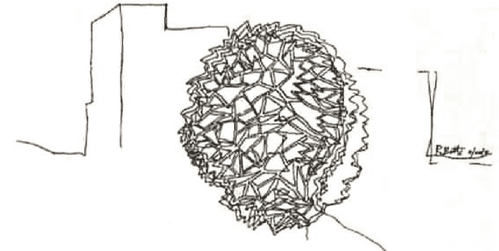
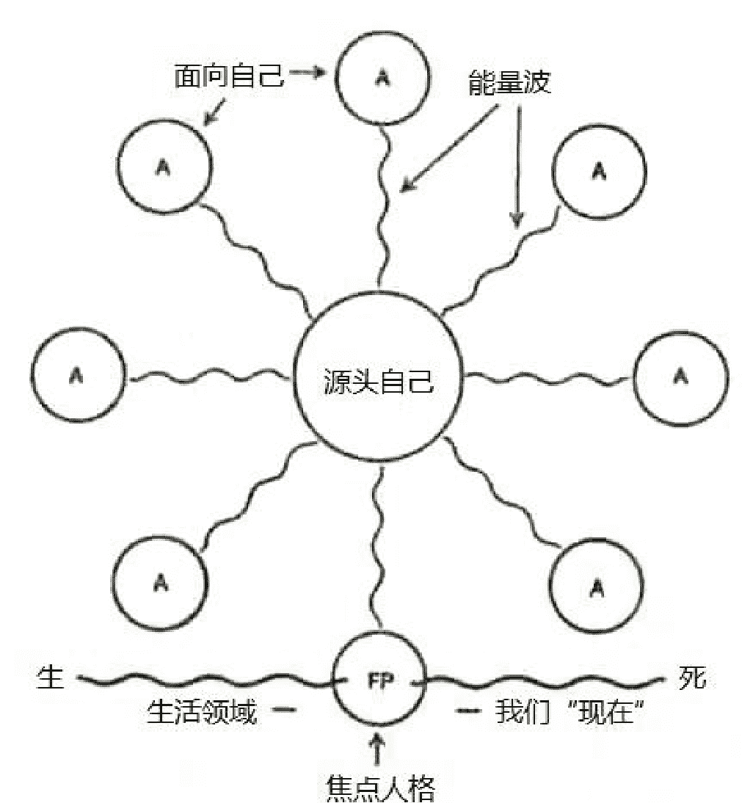
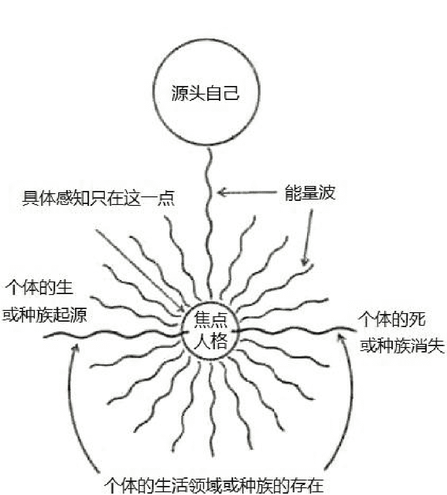
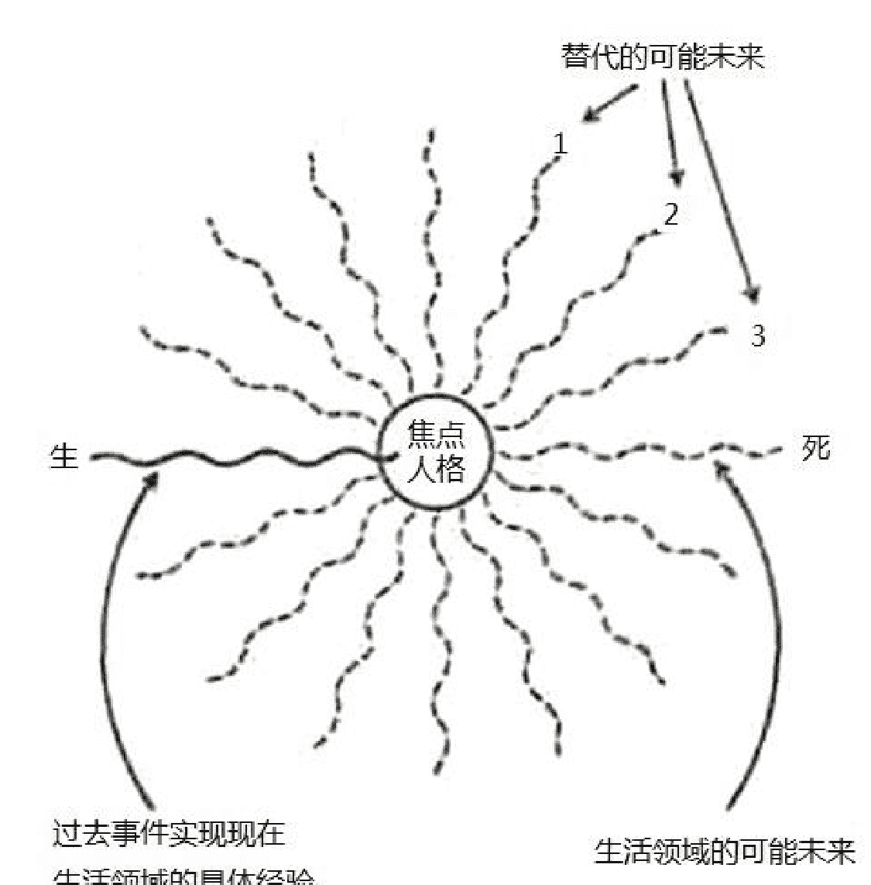
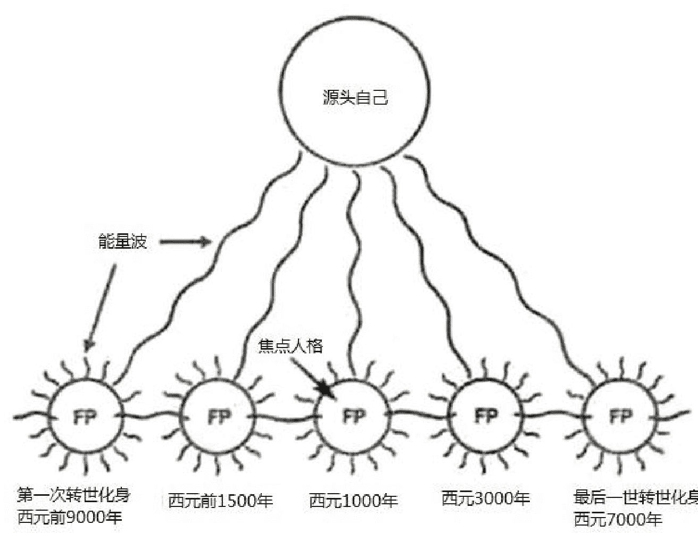
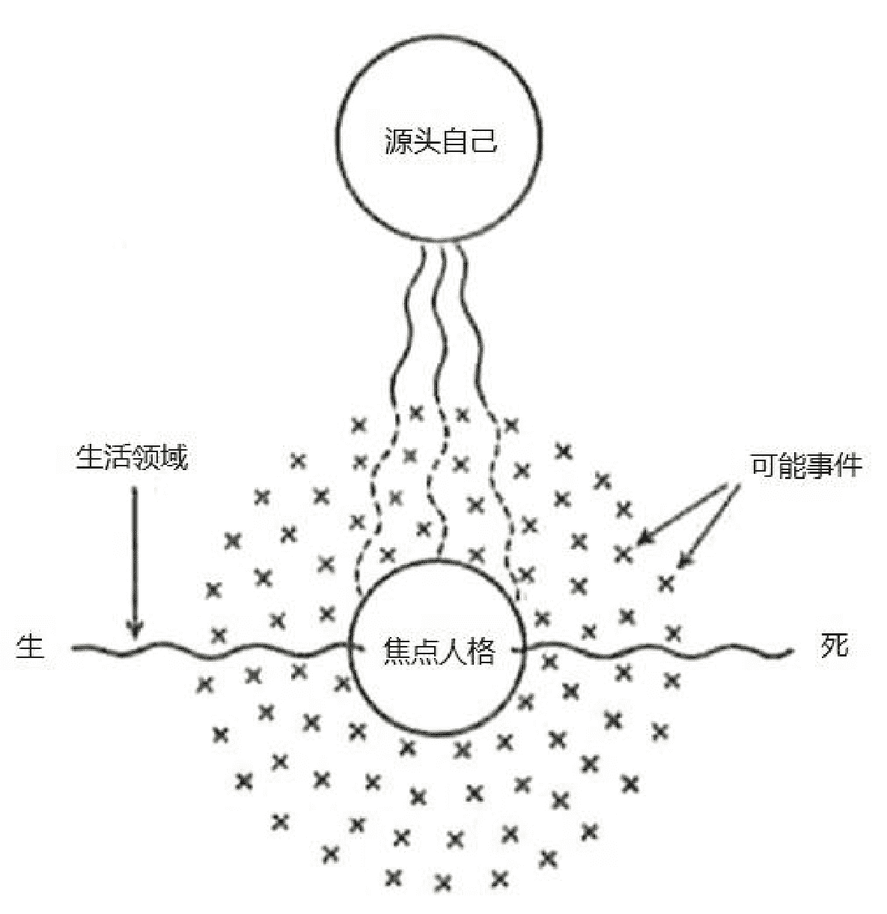

## 意识的探险（赛斯书）

## Adventures in Consciousness

我们全都在朝圣之旅上，
本书是任何人皆可跟随的另一种地图，
是发现自己真相的绝佳方法。

珍·罗伯兹 著 王季庆 译

许添盛医师 专文推荐

## 推荐词

你曾有过私密的灵异经验？或对灵异事件的预知性感到不可思议？

你是否相信每个人都有未被发现的能力？

本书将颠倒你对灵异事件和创造性经验的传统看法，扩大你对个人心灵复杂度的认识。

珍·罗伯兹在她传授赛斯思想期间，不断质疑出神通灵人的本质（谁是赛斯，她如何能够为他说话），以及她所经历并目睹其他人发生觉知改变的状态——包括超感官知觉（ESP）、催眠、罗应盘讯息、出体经验、预知及转世剧等。

在本书，她以不迷信的态度，致力于发现这些事件存有起源的答案，那是现在科学还无法提出证实的。她从中研究出的“面向心理学”理论，无疑是对人类人格提出革命性的观点。

书中也提供了许多逸闻趣事和可实际操作的讯息，让每个人都能去发展自己的心灵能力，了解自己多面向的人格特质。

> “任何对现实世界中的心灵（精神）元素感兴趣的人，这是一本必读的书。”

——物理学家&美国书卷奖作者 Fred Alan Wolf（著有《量子跳跃》《精神世界》）

> “阅读本书，你将获得启示，捕捉人类心灵的浩瀚与美，认识你个人心灵的复杂性。”

——赛斯国际网络总裁 Lyndu Dahl

> “珍·罗伯兹不仅提出新问题，而且创造了关于意识的惊人典范。”

——Susan M.Watkins（《与赛斯对话》作者）

> “珍·罗伯兹结合灵性上的禀赋及智性上的好奇能力，有助于我们了解人类的意识。”

——Norman Friedman（《科学与心灵的桥》作者）

## 目录

+ 推荐序 5  
自序 7  
灵异事件发生在日常生活架构内 7  
面向心理学：发现自己真相的绝佳方法 8  

## Part One 探险

+ 1. 上过头的课：赛斯与意识的改变 10  
展开“阿尔法二”的心理旅程 10  
乔尔的声明 12  
赛斯与朗的对话 14  
为何害怕自己的经验？ 16  
2. 转世剧及其他“非官方”事件 18  
实验在继续 19  
前生的理由 20  
创造的情绪剧 22  
3. 一个指导灵是一个指导灵是一个…… 26  
坚守立场的马汀 26  
感知“可能的自己” 29  
4. 可能的自己及更多的问题 31  
如何诠释意识改变的结果？ 31  
教条 VS 原则性的远见 33  
5. 太切中要害的转世故事：尼宾与雪玲 37  
罗和苏的前世回溯 37  
亲眼看见人格的诞生 42  
6. “另一个”宇宙，一朵来自乌有之乡的花，以及变成通灵的“写作班” 45  
“通灵”写作班：运用意识的弹性为写作方法 46  
伯纳故事的插曲 47  
来自乌有之乡的花 51  
7. “苏马利”发展 54  
苏马利仿佛来自乌有之乡 54  
苏马利是个心灵家族 57  
8. 银色兄弟之歌 61  
赛斯与苏马利代表心灵要素 70  
赛斯诠释苏马利 71  

## Part Two 面向心理学导论

+ 9. 超灵七号及“面向”的诞生  
　 超灵七号的诞生  
　 意识运作圈在扩大  

10. 源头自己、焦点人格、面向及“人报”  
　 源头自己是具体存在的根源  
　 每个“面向自己”都是个小型的存有  
　 人报是存有的某些“面向”的再现  

11. 基本源头面向  
　 赛斯作为基本源头面向  
　 基本面向作为接收台  
　 心灵内各面向的互动  

12. 灵感、自由觉知及有偏见的感知  
　 一张白纸的比喻  
　 自由觉知或“前-感知”  
　 感知与事件  

13. 源头自己、焦点人格、可能性及转世  
　 可能事件的地位  
　 时间、转世及可能性  

14. 事件与焦点人格、恶兆、情绪和自由觉知  
　 学会追踪主观和客观经验之间的步骤  
　 鸟作为死亡的兆头  
　 翻开事件的底面  
　 觉知可能的变奏  

15. 事件的内在秩序及“非公认的”感知  
　 内在世界住满了象征  
　 把不同实相连接起来的方法  
　 次元性的两难  
　 忠于灵视的升华  

16. 当“面向”说话时，“非公认的”讯息及实习神明  
　 自由地追求通灵生活  
　 再不要再给启示性知识穿上老旧的装扮  

17. 从神明到“神”、说法者及神作为一个事件  
　 神是什么？  
　 以能理解的方式体验启示性讯息  

+ 18. 身分圈和作为隐形结构的事件 148  
心理的白洞 150  
有感知的细胞 150  
可塑的本质与自由意志的可能性 151  
事件具有不可见的结构 153  
19. 像白洞般的地球经验 157  
时间与事件地平线 159  
20. 焦点人格与感官、一些问题及对自己臣服 165  
身体感官是体验实相的知觉剧场 165  
身体的活力 166  
对肉体与人性的一般疑虑 168  
快乐的人是“面面俱到”的人 169  
附录一 赛斯的实相 173  
附录二 一节短课 177  
附录三 本书中经过的意识状态 179  
附录四 评论改变的状态 181  
词汇 183  

## 推荐序

本书虽非赛斯亲自口授的“赛斯书”，却是赛斯书的传递者鲁柏（编按：赛斯称呼他的传递者珍·罗伯兹为鲁柏。）的精心力作。鲁柏以一个既是参与者，又是观察者、评论者的姿态，更加上些许质疑及不轻信的理性心态，写了这本书。

“面向心理学”是鲁柏自己的体会及融会贯通的结果。其幅度之广，深度之深，不仅超越了传统心理学，对于种种人类行为，意识、潜意识的奥妙互动及只在宗教领域才探讨到的神秘经验，更有精辟的见解。是比“超个人心理学”更深入探讨，并解释了人类心灵本质及灵性面的理论架构。

赛斯书博大精深，引领了二十世纪末、二十一世纪初人类的心灵成长，不仅执新时代运动之牛耳，更是经典中的经典。然而，赛斯书是如此究竟，因此对许多读者而言，若非全心的投入，书中许多奥妙的理论及启发性的智慧并不易体会。

因此，有了这本《意识的探险》的出现。本书详实记录了鲁柏 ESP 班（也就是所谓的超感管知觉体验班）种种不可思议的现象。鲁柏本人，也不是一个没脑子的迷信崇拜者，在其中，可见到鲁柏敏锐的观察、审慎的态度及不愿只接受实践的解释，而必定打破砂锅问到底的精神。她不但为自己而问，也为千千万万相信或不相信的读者而问。

如果各位读者早已是赛斯书的爱好者，经由这本书，你将有更深刻的体会，过去在赛斯书中不甚明白的疑惑，在本书都会有一种豁然开朗的感觉：“噢！原来赛斯是这个意思。”看到鲁柏本人的智慧及神通能力的显现及开发，你也会不由自主地由内心发出赞叹：“噢！原来这就是开悟，原来所谓的成道者，在物质实相轮回最后一世的人，就是会有这般体会。”

你会发现原来自己过去所接触的修行，所谓的灵修，就这么具体、一五一十展现在自己的眼前，再一次更坚定自己走上“赛斯学苑”这条喜悦之道及开悟之道。

若是从未接触赛斯书的读者，恭喜你，这是一本非常棒的入门书，但你必不可只执著于书中显现的神通变化，毕竟“理悟”及“证悟”必须携手并进。神通只是追求心灵解脱及开悟的必然现象，既不需要过度执着，也不必假装忽视。神通是人类整体心灵扩大的正常现象，本就是每个人类天生具足的能力。赛斯一再强调，当你不断试图理解赛斯书的内容，斗争着、争扎着将之融会贯通，并实践在你的日常生活中，渐渐的，你的“智慧、慈悲及神通”均会慢慢增进。

在新时代之母王季庆的启发下，我走进了赛斯的世界，也走上了我觉察及自我开悟的道路，更在台北、台中、高雄、香港陆续成立“赛斯学苑”，也引领许多的学生体会赛斯

许添盛

## 自序

在过去十年中，我花了许多时间在种种不同的出神状态。一周至少两次，我将意识的焦点自一般的取向转开，而为一位叫作赛斯的人格说话——赛斯是个千里眼，他写书，以了不起的了解与人交往，并且展现与众不同的特性。

在一九七二年，一个全新的发展出现在我生命里。我发现许多其他的觉知层次，每个都很明确，并且带来它自己那种感知与经验。有些也提供了我极佳的创造性产品。然而在过去或当今学说里，我都找不到对我自己的经验任何可接受的解释。它们相当独特、强烈，并且够特殊，驱使我去找我自己的答案。

这本书是那些事件的故事，并且是我称为“面向心理学”（Aspecl Psychology）的一个引介。我提供它作为一个架构，透过它，先前被否认的人生之灵异成分，能被视为我们意识适当、有益与自然的状况。

## 灵异事件发生在日常生活架构内

这样一个理论是非常必要的。读者的来信让我看到许多人 在试图了解他们的灵异经验时，都陷入窘境中。那些有足够的 好奇心、容许他们的意识有不凡自由的人，常常被心理学家贴上“情绪困扰”的标签，或以宗教信仰的角度来看，被认为“着了魔”。

有几年之久，我与这一群人在一起，他们成为我的学生，与我一同踏上了意识的探险。我们给予自己自由去感知当下的实相，在它透过其他替代的觉知状态出现时。正因为我的经验及我的学生与读者的那些经验引起如此多的问题，我才开始发展“面向心理学”的观念。

所谓的“灵异事件”发生在正常生活的架构之内，它们并非与之分开的事情。只因为我们被教导将它们与正常关怀的事分开，所以它们往往显得如此不自然、分开且怪异。“面向心理学”试图将我们的灵异才能与我们其他的情绪行为连在一起，尤其是企图扩大我们人格本质的观念。

任何配称为“心理学”的心理学，必须大到足以包涵所有我们心理上重要、有效的经验，不论它们是否适合有关意识特性的一般想法。“面向心理学”接受预知性的梦、出体经验、启示性讯息、意识的改变、巅峰经验、出神灵媒，及人类行为中可能的其他心理灵异事件的存在为正常。

我并不相信在基督教思想或灵魂论、灵知派或任何其他的“主义”里，一般所描写的善灵与恶灵、恶魔、附身或邪恶的力量。我也觉得可怖，有些“灵异”调查者气定神闲地

## 面向心理学：发现自己真相的绝佳方法

本书第二部分，“面向”，是一个直觉性的建构。它大半在我意识转变状态里来到。它一边进行，就一边写出自己。我也认为它是非常的科学，因为我用了最好的调查工具——意识本身——去检查意识。我运用不同的觉知层次去检查心理及其实相的本质。我在有意识的状态有意地设下目标，而由那阶段，我设计自己旅行到人格的其他部分，由他们的观点，并且以他们自己的那种感知去看“实相”。

为了这个目的，我也检查自己的通灵资料，并且从我自己这方的意识，仔细查出现在我经验里以及在他的行为与著作里的赛斯实相。这时，赛斯已制作了两本书：《灵魂永生》与《个人实相的本质》。不久，他开始了第三本书——《未知的实相》。

这“赛斯层面”已扩展成我称为“赛斯二”与“赛斯三”两个其他状态，虽然我只达到了两次赛斯三的阶段。“苏马利”（Sumari）的发展发生在一九七二年，进一步扩大了可得的知觉范围。这涉及了九种明确的意识改变，本书将会一一描写。所有这些经验给我动力去发展一个大到足以包涵它们的理论，并且（幸运地！）也提供我能这样做的资料。

我们 ESP（超感官知觉）班的团体经验也带给我额外的“非官方事件”。按照关于实相的公认或一般想法，不可能发生的事发生了。这种“转世的”接触，看见“鬼魂”及其他事件，让我以几年前我不会相信是可能的方式，去检查感知与事件的本质。

对人格直觉性的内面看法，也许比处理个案历史的客观理论，或由抽离的观点看别人的心理状况，所造成的扭曲较少，并且更接近真相。后两者源自心智之间物质与文化调准的面向，而非源自底下的心灵源头。

## 乔尔的声明

另一个戏剧性事件，发生在我将称为乔尔的年轻人身上。在阿尔法二的状态里，他发现自己与一群基督徒一起，向南穿越欧洲，往十字军东征的路上走去。他们碰上一群流浪的回教徒，乔尔发现自己在一场激烈的战役当中。当他告诉我们这事时，他脸色相当惨白。‘非常清楚，太清楚了。’他说：‘一开始，田野是清新翠绿，事情结束之后：血流遍布，满地疮痍。我看见马被砍杀。’他有点吓坏地补充说，基督教徒野蛮地打仗，在那经验结束时，他看见一位僧侣由邻近的修道院走出来，站在那里哀悼。

我们全都知道乔尔最近离开了神职。这是他自己感受的一个象征性声明，在另一个意识层次戏剧化了吗？这是进入他自己转世的过去的合法一瞥吗？或是对历史的短暂回顾，对逝去时光的心理快照吗？我们讨论种种不同的可能性，然后休半小时。

重新上课时，我本想继续这讨论，但当我觉得赛斯想说话时，我改变了计划。这次发生了一个‘未来的’赛斯，或赛斯在另一个发展阶段。赛斯二很少透过来，一年也许四或五次。

正在这过渡之前，赛斯说：‘我想给你们短短的一刻，在远处，其中到某种程度，你们感觉到你们自己的实相有其意义，而且你们也参与了另一个存在次元。’

然后所有赛斯特有的表情自我脸上消失，他惯常的手势停止了。在这种时候，我的身体有一种抽空感。我总是觉得我离开身体，迅速移向在我上方很远的一个金字塔形状。接触‘在那儿’发生。在那声音开始前会有好一会儿，那声音轻而微弱，不带感情。学生们说它使他们想起：如果数字会说话，听起来就像这样。

在赛斯二说话之后，我要花几分钟才回得来，然而跟赛斯一起，这过渡几乎是即刻的。这次我轻易回来了，好像由意识的滑落槽下来。学生们显然既兴奋又印象深刻，但当他们告诉我赛斯二说的话，我有个很复杂的感受。这是令我不安的那部分讯息：

已经替你们做了某些转译，以便这些沟通有意义。我们的能量形成世界。我们帮助你们维持生命，就像你们无意识地帮助维持其他的存在，我们守望你们正如你们守望其他生物一样，然而距离是如此遥远，因此沟通很困难。

我们并不以人的形式守望。你们却以扭曲的观点感知我们。以你们的说法，我们的形状会是几何形的。我们并不了解你们创造的实相本质，纵使是我们给你们那种子。我们尊敬它。不要让这声音的微弱迷惑你们。在它之后的力量会形成你们所知的世界，并且维持好几世纪。

赛斯二的声音继续说我们在被观察，但并没有任何事情，阻止我们以任何可能的方式“观察我们的观察者”。事实上，我们受邀这么做。学生们将录下的讯息重放给我听。一如既往，我对赛斯与赛斯二之间的不同感到吃惊。那无感情的、微弱的声音本身暗示了我和我接触的不论是什么东西之间的距离。

可是，那当儿没有时间做安静的分析，因为每个人都同时在说话。两个学生看见一个金字塔在我头上，说只有在我脱离出神状态时，它才消失。有几个人坚持说，在整个表演期间，他们看见了立体的模糊脸庞在房间的天花板周围。其他人报告说，感觉那些脸孔没真的看见他们。每个人都强调一件事：不论看见或看不见，这房间挤满了我们自己之外的其他意识。

房间里点喧闹。有些人当场写下他们的印象，其他人在与邻座核对。我听见有人说：“我不管，我看见了我所看见的。”我心中不安，奇怪不知实际发生了什么事。我很快叫大家安静，并说，我们最好问问自己，对于在天花板上的脸孔及相关现象，到底暗示要负多少责任。

我得到了相当生气的反应。有几个人指出，灯是全开的，每个人的眼睛都是张开的。直到事后，没人再说一句话。看见脸孔的那些人并不知道其他学生在同样的地方——或任何地方——感觉到脸孔。很明显的，许多人是在意识的改变状态，正是在这种时候，我们的知觉能显示给我们通常感知不到的资料。

我还在询问学生们时，另一件事引起我的注意。一开始是微弱的，然后更鲜活的，我开始感觉有个隐形的人格在我身边现身。那是说，我并没有看见它，却感觉情感的实相如肉体的视觉所可能显示的一样强烈。

在之前好几堂课里，我都“遇见过”这同一个人，那时他心电感应告诉我，他代表我的一个前世。那时，我是个嫉妒的领袖，要求绝对的忠诚。我的朋友苏曾是我的追随者之一。现在他想要面质她，觉得她这次在走她自己的路，而没有如他认为的，她应该追随他的步伐。

怎么办？在班上，我试着要有自发性，至少在合理范围内，所以我说：“苏，那另一个我在这里。”我笑出声来——只不过对我而言，那并非我的笑声，却是他非常嘲讽、放纵及好笑的笑声，全都在一块。我感觉到由内而外一个奇怪的面部表情，而领悟到我的五官在适应它。

苏只是瞪着我。“是啊，我知道他在这里，我希望他走开。”她说。

当另一个人格真的唤起他自己时，我开始觉得在身体上，我比本来要大得多且强壮得多。一股对苏的怒气——那显然不是我的——窜过我。他想要通过我说话，而直接面质她。我想，那不公平。如果他有个过节想摆平，他该接触曾经是的那个人。苏和我本身都不想与它有任何牵扯。所以我坚定地试着让自己保持冷静，为了结束此事，我叫道：“各位，休息时间到了。”

但我并没有真的办到。人们开始转来转去，我听见那不是我的笑声向苏发出来。“我带着这种表情看着你已经许多次了。”“我”说：“你应该很熟悉的。”

苏叫了出来：“这次，我有一个两岁的护卫者。”意指她的孩子。“我”不屑地回答：“那是你对我说的最蠢的一句话。”

现在我认为那件事已经过了头。一旦我对他的态度很一清二楚时，我并不赞同这另一个自己的夸大作风，或他试图透过来的狡诈。所以这次我完全关了起来——真的说“不”，并且毫不动摇——我觉悟到先前我并没有全心想要结束那面质。

我想要将那人格关在外面，到足以阻止他说话的程度，但却不足以阻止我去刺探进他的实相。现在他整个消失了。

“我们以后必须要解决它。”苏说。

“是啊，但让我们等一会儿吧。”我回答，我们相视而笑，两人都愿让那插曲暂时搁置。

这休息后的对话只花了几分钟，在休息期间，学生们讨论先前发生的事。有一些正在结束他们之前开始的笔记。

时间不早了。课又开始上时，赛斯透了过来，显然只为了道晚安，但他让自己岔开了话题。“我的确要跟你们说晚安。”他说：“实验在继续，而在这星期中，当你们忙着你们的日常事物时，会再继续。现在并没有任何事阻止你们观察观察者。事实上，你们该觉得这非常吸引人。”

## 赛斯与朗的对话

照同学们所说的，赛斯正要结束这堂课时，一位我将称为朗的学生，插嘴问了一个问题。有人假装唉了一声；大家都知道朗常常缠在他自己的问题中。他也自认相当聪明，并且很爱向赛斯发问。不过他真的是非常好的年轻人，赛斯通常带着和善、好玩的包容对待他。不过在这个特别的晚上，整个班级仍然对赛斯二的讯息及他们自己的印象非常好奇。他们尤其对那“实验”的涵义感到兴趣，到现在，他们全都在非常严肃的情绪里。朗问他的问题时，赛斯用立刻澄清了气氛的幽默“接招”。再没有比哈哈一笑，更能让我们确实回到我们所知的世界，并且将我们放回到我们自己情绪的坚固架构上。

朗真正的问题听起来像这样：“你看得见吗？换言之，当珍在说话时……你看见房间吗？或你只看到房间？”朗停下来舔舔他的嘴唇，然后说：“你明白我在说什么吗？”

赛斯说：“我在说话时，我让自己专注于你们认为是这个房间的时空的微小部分。不然的话，我可以看着你。举例来说，看见你转世的存在，我也不受限于只感知你想你的那个自己。”

“你会不会觉知，比如说桌上的花瓶？”朗问到。

“只有当我对桌上的花瓶有兴趣的时候。”身为赛斯，我笑开了。

“但对你，它看起来怎么样？”朗固执地说。

“就像在桌上的一一个花瓶。”赛斯讽刺地说。

朗皱起眉头。“就像它看起来的样子？”

赛斯说：“我在你们的实相里用知觉时，我会自动地转译内在资料成具体的方式。不然的话，我并不受限于那类感知。”他带着微笑，讲得很慢，已达到效果。“我并不需要感知那物体为一个花瓶，但我能感知它为一个花瓶。你们必须感知它为一个花瓶。现在我要道晚安了。”

“但你并没有回答我的问题。”朗顽固地说。

“我的确回答了。你并没有聆听那答案。你执迷于你的问题而没倾听。”

朗以另一个纠缠不清的方式说出他想说的。他脸都涨红了，却更坚定。

赛斯带着断然的态度说：“在桌上的花瓶的真实性——如你所知——是我对它整个知觉的一部分。”

朗非常严肃地说：“你回答了问题。我了解了。”“谢谢你。”赛斯说，如此一本正经，使学生们全部爆笑起来，甚至朗也展颜而笑。他并不觉得被贬了，却维护了尊严，因为他觉得他也同样站住了立场。赛斯再讲了几句话，然后说：“现在我再一次祝你们晚安。记住实验在继续。”

人们仍旧很兴奋，赛斯和朗之间的对话，将那晚上放回到比较正常的视角。但在课结束时，我不知道要怎么想。至少有部分的我希望赛斯二根本没透过来。我尤其希望人们没说，看见天花板上的脸孔。我就是不相信由另一个实相来的“生灵”窥进我的客厅。我也不喜欢与苏情绪上的面质，尤其因为我并不确定我是否将转世视为事实，或视为别的什么东西的象征。

“有些事”发生了。人们感知了某些资料。纵使只以改变了的感知来说，那晚的事件是具有重要意义的。同时那些事件在知性上对我而言，仿佛不值得尊重，使我将上课的笔记搁在一旁，无法努力去了解其意涵。

令我不安的是，我缺乏适当的架构以评估发生的事。我们所有一堆心理事件与感知，会被许多人嗤之以鼻。然而这是人类的经验。在乔尔早已忘记那天发生的事实，比如说他早餐吃了什么，或穿了什么西装，他却仍会记得在长满了草的平原上恐怖的战役。在苏其他更“有效的”事件被遗忘后，她会忆起她对杰生的记忆，她试图将他带回到屋里来的事。

## 为何害怕自己的经验？

我们为什么该害怕自己的经验？因为它在世人的眼光里似乎很奇怪，或者因为我们害怕它可能真的很奇怪？为什么我们如此担忧知性上的可敬与否，如果这暗示了感知的局限，或我们必须减缩我们自己的经验以符合先人之见？我想我们许多人那样反应，是因为从孩提时，我们就常常被警告别去信任我们的想像或直觉，并且经常将我们的感知比照明确的事实世界来判断。这个事实世界在我们面前被设定为实相的唯一判断标准。无论如何，谎言是不真实的事——所说的并没有发生在事实世界。所以几乎藉由暗示，在我们看到别人看不见的东西时，几乎有个道德的涵意与之相连：一定是有人在说谎。

如果我们可以这样说这里面有暗示的作用，那么我们至少有一半是安全的，因为意味着我们正在说谎，却非故意的：我们以为看见了我们看见的东西，但我们弄错了。当然是暗示在运作！但没有人真的确定暗示是什么东西。此外，一般而言，由暗示直接引起的感知，也许仍与其他的一样有效。我们对物质世界的感知本身，就是由我们感官给予我们暗示所引起的。即使只是意识的些微改变，也会使我们以不同的方式去经验事件。

一方面我知道这个，另一方面我仍试图将我的经验关联到一个还太小而无法把它们涵括在一起的架构上。在我脑子里，我一直反覆思索那个事件。在苏和“我的”另一个人格之间的感情力量与交流是确定的。苏和我是否无意识地演出需要被释放的对彼此的内在感受？就只是那样吗？只是一个戏剧化的接触，而我俩在意识上都不觉察所涉及的内在机制吗？如果是这样，那插曲显然具治疗和创造性。为什么那还不够呢？当然因为它意味着另外的什么事。

所有这些是真还是假？乔尔真的重活过前世经验的一部分，还是没有？天花板上真的有面孔或没有？那晚的事件将我卷入知性质疑的旋风，在其中，有时候我的知性和直觉仿佛在冲突。要花一段时间，它们才开始汇合成新的合成物，将我导向“面向心理学”，以及这种事件可被合适地加以考虑的一个架构，这架构大到足以涵括我们所有经验的意义。

当我的知性与直觉一同作用时，它们引导我去发现事件的内在秩序，并且引介我到替代的实相。每个实相都有它们自己的法则，因此在某个系统里的事实，可能在另一个系统里显得相当不合理。那时我并不知道那一点。我只知道我会坚持给自己心灵与直觉的自由，同时用我的知性去评断其结果。因为在不久前，我仍然相信许多别人所相信的，即知性的主要作用是评断，与自己的直觉层面是分开运作的。

厚厚的赛斯资料，全都在出神状态口授，应该已教会了我，事情不是这样的，因为知性与心灵是如此美丽地混合在一起。但是在一九七一年，我还在由真或假的观点去仔细检查赛斯，试图在一个太小的范畴里去理解他，因此我对他更大的实相仍有许多视而不见。

## 2. 转世剧及其他“非官方”事件

那一堂课的能量仿佛向外散播到我学生的私人生活里。在那一周中，苏•华京斯打电话告诉我她有个经验，她很确定那是与赛斯二的实验有关联性的。

“我正准备入眠，”她说：“灯全开着。突然我的手臂与腿感觉很大，而且重得多。我向下看，我发誓，它们真的是那样。同时很奇怪的讶异闪过我的脑海，像……身体是多么神奇啊！多令人惊讶的机器，我对身体如何运作充满了赞叹。但它并非我。那是最陌生的感受。它……根本不习惯任何身体里的一个人。”

另一个学生桃乐丝打电话告诉我，那天早上，一连三次，她在她厨房的天花板四周看到立体的三角形。如果我的知性想要思考什么东西的话，我直觉的自己知道它一定会得到它想要的，因为在下一堂课又给了我那种经验的完美例子，它们激起我的好奇心，却又将我丢进窘境边缘。

五位学生报告说，他们作了“上课的梦”，在其中，他们在另一个实相层面上课，而赛斯是他们的老师。这种梦带着许多变奏，现在经常成了那课的课外活动的一部分。我相信学生们发展在课里开始的主题与经验。赛斯常常被用为个人更大意识的一个象征。

举例来说，在上周的一堂课里，一个叫赖瑞的年轻人说了一个梦，在其中，他看见赛斯的脸跟他自己的脸靠得很近。赛斯看起来具体而真实，完全与我先生罗，几年前画他的样子一样。那张画像挂在我们上课的课堂里，也曾在《灵界的讯息》里印出来。在他们的梦里，许多学生看到赛斯像那样。

当赖瑞说完了他的梦，赛斯透了过来，讲了至今最好的一节。他以“谁是赛斯？”这个问题开始，第一部分是对赖瑞的。在下面，我摘录了那节当中几段，因为它们包含了班上一开始报告上课的梦时，我还没有的讯息。

那天晚上，赛斯对赖瑞说的是这样：

谁是赛斯？我问你们这个问题。而[在课里]你们和我们所有人一起做出了什么魔术？现在我要告诉你这个：一方面，我是你们不认识的某人，迷失在如你们了解的时间编年史之前，迷失在如你们了解的过去与未来的编年史里。另一方面，那就是我是什么。而那是一个意义深重的句子。

在另一方面，我是你自己……所以透过我，你看见并遇见你本是的自己；所以以你们的说法，我由你自己存在的力量及古老、荣耀升起，从时间是无意义的宇宙向外投射进时间的世界。

不过，在一九七一年，我因看见赛斯作为一个跳进跳出人们的梦的“指导灵”之暗示所困扰——他们将此视为赛斯独立存在的证据的方式，尤其令我不安。然后那个特殊的夜晚，我对所报告的梦事件深深着迷，却拒绝接受“讨巧的”解释，然而又找不到其他令我满意的解释。

但，那些梦只不过是开始。我聆听时，突然又感觉赛斯二的金字塔在我头上，不是具体的，却一样真实。我可以感觉我的意识向上冲，首先逐渐渗出，然后加快。就当我心里混合着惊讶与怀疑在想：“来自另一个世界没有身体的观察者；在餐厅天花板上出现的不知从何而来的三角形。”以及“我又来了。”我已消失了。

在某一点之后，不论什么时候，一涉及赛斯二时，我感觉我必须行过一片空白地带，然后是一个活生生的接触点。接着那音调起伏的声音开始说话。一如往常，学生们在事后告诉我说了什么，而课是录了音的。

## 实验在继续

“实验在继续。”那声音开始说：

我（你）们正试图理解你们目前存在的本质，因此对非物质实相本质好奇的人可以跟随我们，用这声音作为指引，进入不知血肉的存在。接着越过血肉的知识到血肉出生的领域，感觉你意识的胚芽升起，越过季节的知识。

对你们而言，可能有种不可忍受的孤寂，因为你们习于与血肉之温暖的胜利发生关联，而此地并没有可以与之关联的具体存在。然而超越那孤立，并且在其内是个光点，那就是意识。它以在你们所知的所有情感背后的力量搏动；它感觉它们，并且送它们闪闪发光滚到你们认识的实相里来。就是这个温暖形成了肉体的脉搏。然而，它却是由我们的孤立之爱本身生出来的；由创造性生出来的；是超越了血与肉的；它没有有触光的手指却形成了手指；它不知夏或冬，却形成了季节；它创造了你所知的实相，却没体验过它。

从那热爱生出你们所知的一切，所有那些也给予了我们。因为我们所有的能量并不单是我们的，我们也并非其来源。它流过我们，就与它流过你们一样。

那么实验继续就如它一向的样子，只不过你们过去没有觉知它。

那声音停住了。我始向下爬，有一会儿迷失了方向，然后突然稳定地下降，穿过许多觉知的层次。

赛斯二说话时，几乎每个学生都经验到意识的扩展。一位工程师，罗格，觉得好像他一个人在空中没有东西可以“使力”，而被寂寞感淹没。许多学生多多少少感觉到同一种悬疑和孤立。乔尔（上一堂课发现自己卷入十字军东征战役里的年轻人）也觉得自己被空所环绕。他仿佛是没有身体般，被吸向一朵巨大的花。在他头朝下掉入打开的花瓣里时，花的内部扩张开来，以至于它仿佛没有底。他觉得好像可以永远跌落似的。

他的经验令我思索。当赛斯二透过来时，我是否转换到另一个意识层面，由那观点观察物质实相？赛斯二的“存在体”是否是那觉知层面本身一个无意识的戏剧化？或这些存在体是否以别的什么方式，像乔尔的花一样存在？那花又是否为乔尔自己对另一种意识的诠释？

换言之，我们可不可以照字面去解释赛斯二的讯息？如果赛斯二是我们心灵经过戏剧化的另一部分的展现，那么那讯息能不能诠释为：我们目前的其他非实质部分，在观察我们的实相，而我们是可以被鼓励去体验由物质实相跃出的自己的广袤灵魂到某种程度？

那天晚上，赛斯与赛斯二之间的差异也被凸显出来，因为在学生们讨论完发生的事后，赛斯透了过来。赛斯二来时，学生们必须费力才能听见那安静、无情绪、几乎无色彩的音调；我的脸毫无表情，我的身体是松垮垮的。赛斯的声音隆隆而出；我的身体有种更强壮、活跃的味道，而赛斯就在那里，一边说话，一边环顾四周。他往往看着某个人，并且对着他讲，所以他在跟谁讲话是毫无疑问的。

他立刻对乔尔说：“你的花是个绝妙的影像，以你的说法，它代表你可能与之关联的空间特性。明确的说，它是你给理学家的黑洞的象征。这些黑洞是确实性的其他次元，在其中，你所知的实相自动以不同的说法被转译，而非被消灭。”

然后，他告诉同学他们正学习在其他觉知层面运作。当然我知道他们是，但我对接下来发生的事毫无准备。我们正在讨论班上的事以及赛斯对乔尔精神探险的诠释，而我变得觉察在房屋一角有很大的说话声。我听见“印第安人”这个字。然后，人们转身看着乔尔与蓓蒂。

## 前生的理由

他们的态度立刻告诉我，他们涉入我称为“转世剧”里面。那就是说，他们相信他们正在演出前生的插曲。

再一次，这些转世剧令我深深着迷，但我永远觉察对于意识或记忆的本质，我们知道的是多么少。比起当时，现在我以一个宽大得多的范畴看转世，如你在本书的后面可以看见的。显然下面的插曲与引导我到“面向心理学”的强烈质疑大有关系。

蓓蒂穿着一件那时流行的长至脚踝的裙子。她的腿在裙下张开，她的手臂放在臀部。很容易想像有把来福枪横跨在她双膝上，她小小的眼睛喷出怒火。她看起来完全像在那一刻她以为她是的十九世纪的拓荒妇人。“你只不过杀掉了我该死的全家人，连小孩也不放过。”她死盯着乔尔怒声说。

“你杀了你自己的丈夫。”他说。对我们所有的人而言，他正常面孔上依稀的印第安特征现在仿佛加强了。他的声音紧绷，但没有蓓蒂声音里的情感张力。然后他缓慢地说：

## 创造的情绪剧

真的耶！

我立刻看清楚一件事：当蓓蒂的敌意最强的时候，大卫就来帮乔尔的忙了。更有甚者，他巧妙地消退了蓓蒂情感风帆上的风，我确知蓓蒂明白并且了悟这个事实。大卫不事乔尔

在他们运作期间的架构里——大卫更“崇高的”态度改变了先前接触的切身感，到一个蓓蒂失去了她的“平等身分”的氛围。

在乔尔这方面，至少这是一个绝佳的心理舞步。这涉及了三个层面的活动——平常的乔尔在前生接触身为印第安人的乔尔，以及身为大卫的乔尔，大卫是包含了其他两人的知识的一个人格。

然而，那现象本身令我不安。它有一种紧张的特质，好像乔尔人格的一部分不知道如何对待另一部分。那演出是……以一种怪异的方式现出裂纹，好像有人带着最好的意图却努力过了火。有些感觉到的接触并没有真的达成。

我并不接受大卫为普通所谓的“幽灵”，但我也那样看赛斯。当然这整件事又让我对赛斯的本质感到好奇。但以一种难以解释的方式，赛斯是个发展完全的人格，他以那种方式来到我的经验里。从来没有任何紧张感。虽然我欣赏乔尔利用到的几种意识层次，但我也被某种古怪的感觉以及感觉到努力想被运用，却卡在心理二元性的两难之间所冲击。

所有这些都与转世资料本身的问题没有多大关系。蓓蒂和乔尔是不是真的活过他们栩栩如生记得的事件呢？我是不是在心里听到、看到他孩子快要被杀死的女人刺耳的尖叫呢？我觉得我可能有那么一瞬失落于另一个时空里。

然而，我知道，蓓蒂在她人生这个特殊时期是充满了敌意的。这整个插曲是不是一个创造的情绪剧，在安全的架构里解放了她的压力？那么，乔尔会有他自己参与的理由。显然，整个班上仿佛都放松了、涤净了。那两个“主要角色”是否将整个团体共同怀抱的攻击性能量戏剧化了。

看起来我有无穷尽的问题。大多数的学生视为理所当然的转世事件被重新经验了。我承认整个插曲是有效的，但我也怀疑其有效性可能横跨我们的观念。我觉得转世可能是比我们一般假设重要得多的一件事，藉由接受它本身，我们可能阻止自己去发觉它“真正的”意义。

如你将看见的，不久之后，我会遭遇一个“前世人格”的独特例子，涉及苏与我先生罗的令人惊讶的接触——一个会令我们对乔尔在班上扮演大卫的演出有所了解的经验。在那个时候，我的认识足以让我不以旧教条的方式去诠释我们的经验（灵魂学——或转世——的教条可以与任何传统教会教条一样狭隘），然而我还未能看见另一个架构。所以精神性的我一直在撞墙。在一个晚上，由赛斯二到印第安人的作战呐喊真是相当够瞧的——从另一个实相系统没有身分的观察者，到蓓蒂对一个世纪以前她相信杀光了她整个家人的男人之仇恨的情感力量——但不管发生了什么事，我们所有的人隔天都得早起，所以我结束了课程。

然而人们依序走出房间时，我想：我们全都觉得够自由一起探索我们自己意识的本质，是多么捧啊！谁知道我们可能会发现什么呢？我现在仍然那样觉得。

不过第二天，我花了两小时写下我对那堂课的印象，并且试图整理出我自己的态度。我只不加质疑的放一张纸在打字机里，开始写下来到我脑海的不论什么东西。我发现这是释放切题概念的一个绝妙方法。事实上，直到我读过我所写下的东西，我才觉悟到我实际上是由好几个也吸引我的题目里选择了一个主要方向。

我发现“指导灵”的说法愈加有妨碍。同时那正是人们对赛斯的想法。无论何时，我一抗议时，他们就变得困扰起来。许多人拼命想要相信死后的生命，而“指导灵”自动提供了他们证据。除此以外，那观念也提供了一个架构，在其中，在任何灵媒的客厅里，任何人不需其他的媒介都可以接触幽灵，以带来安慰、解决问题，并且提供教会久已弃绝的与灵界的亲密。

甚至在我经验的一开始，我就不认为事情那么简单；或者说，赛斯也没有以那种说法描写他自己。但直到那一堂六月的课，我才质疑我自己的怀疑。我想，也许我自己的心智阻扰了我。也许赛斯是一个指导灵——正如人们说的，并且就是以那种说法。也许转世也是以别人认为它存在的方式存在。

不过第二天，我读过我自己的笔记之后，我明白我不会让赛斯被样板化，并且我必须让我自己的经验以它自己的方式扩展。我对赛斯的态度，在以下的段落里表达得很清楚：

昨天晚上，赛斯二领我们进入意识的探险，那是令人解放的、创造性的，而且有效的。我认为它们显然增进了个人的感知，并且可能形成了与梦境重叠的一个团队的觉知层面。但我并不想觉得“被逼”去想像出一个没有身体的灵魂在偷窥我们。我想我们真的快要发现什么了，但我还不知道它是什么。如果我们视为理所当然，我们无法解释的每件事都是“灵”的解剖，那么我们又陷入教条里了。

## 关于转世剧

我写到：

再次的，对那些涉入的人而言，是个非常有趣的意识探险，在其中，参与者以不同方式体验实相，并且设定了新的关系完形。他们从一个与平常完全不同的焦点去看存在，而到某种程度，真让每一个同学做同样的事。我认为这本身是有建设性的、有活力的，而且令人兴奋的。我不知道乔尔与蓓蒂是否再重新活过明确的过去事件，或转世的概念是否提供了这些经验可以流过的架构，将乔尔与蓓蒂由通常的人生角色释放出来。

也许那根本没有关系。但我认为涉及灵魂领域的人，业余者与专业者都一样，都有个以其表面价值接受这种事件的压力。有时候从人们说的话和写的信里，我认为他们如此急切的想要相信某事件，于是只要我一质疑自己的经验时，他们便觉得受到威胁，或他们想要我写像圣经之类的东西，替他们除去所有不确定感。但那样的话，我会陷入我要誓死保卫的教条里，而永远没有勇气再去检查我自己的想法。我就是无法再去寻找利落、陈腐的小象征符号，将我的经验塞到里面。

因为在所有事情底下，有一些无价的东西，那是我们作为一个种族一直忽略的。搞不好，我可以对它是什么得到少许线索。

我热情地写了那些段落，显然夸张到某个程度，但至少我对自己的态度比以前要清楚。考虑到我的感受之后，你可以想像我对参加我下一节课的马汀•库洛克的反应。那约会在几个月前就订好了。我发现，马汀代表了我刚好决定我不想要有的所有概念。

## 3. 一个指导灵是一个指导灵是一个……

编按：章名题目是套用葛楚史坦的名句：“一朵玫瑰是一朵玫瑰是一朵玫瑰。”

马汀•库洛克先生是位按摩师与治疗者。他太太坐在旁边沙发上，安安静静地好像想作个隐形人似的。马汀是个五十多岁、爽朗的、帅帅的、恰如其分的绅士，穿着黑西服与白衬衫，仪容完美，有着苍白小脸和老式眼镜及红发——一个小公鸡似的男人，结果发现，很能够守住自己的立场。

但他在班上说话时，我变得烦躁起来，如果要说实话的话，简直是大怒。由于他是如此诚恳、如此的好，谈到爱，并且满嘴神啊神的，我感觉有点绑手绑脚。就他的思想方式而言，爱是由“以牙还牙，以眼还眼”，被忏悔、处罚以及公平的神来平衡的，而没有一个精神正常的人会想要这样的神作父亲，更别说做朋友。

## 坚守立场的马汀

他告诉我们关于杯子飞过霉臭的降神会黑暗的房间，“嘶嘶地飞过空中，使你想闪躲。当然它们并没有击中你，因为它们是由另一边所控制的。”没错，是被控制的，却来自一个比天堂更世俗的地方，我这样想。然而马汀•库洛克相信他所相信的。它的信念是他的一部分，与他所有的组织及思想交织作一起，因为拿走他一个信念，就会弄散了其他的东西。即使我能够，我也永远不会那样做。

但我无法坐在那儿什么都不说，仿佛接受似的，同时一个应该不至于那样笨的学少，奥黛莉，充满希望、充满信心地瞪着他——如果杯子真的由幽灵的手丢出来而飞过某处，那么为什么不在这儿呢？所有这段时间，马汀一本正经地坐着，下决心坚守他自己的立场——在明显的异教徒中间的好基督徒——也许是好的异教徒，尽管我并不认为他对那一点有把握。但就像狮笼里的但以理一样，不管我们想什么，他都敢说出他的真埋。为那一点，你必须赞美他。

我并不真的符合狮子的形象，虽然有一半的时间，我都想狮吼，但我也不想像猫似的舔干净所有那些东西，所以谈话就这样继续下去。同学都相当能接受，直到马汀说他不了解女人怎么能作灵媒或治疗者。每个人都知道女人是负面的，而男人是正面的——女人吸引疾病及坏的影响，同时男人比较接近上帝，自然是好的，或至少是好的。

马汀的太太听了这话，驯服地点着头，同时，那时的确由房中其他人升起了像狮吼一样的声音。抗议的声音让我听得很爽，但出于对马汀关心，我像个白痴似的，将它们压下来。我过分的让步是因为马汀这么的“好”，尽管被误导了。

我真笨。任何有宇宙律站在他那一边的人都不需要我帮他们的忙。它们真的在他那一边，就马汀而言。他试图以开放却坚定的态度，解释他为什么“滴酒不沾”，而任何一种烈酒如何让感官迟钝，并且毁掉灵性的振动。“在我年轻时，我偶尔会享受一杯啤酒。”他若有所思地说道，我感觉自己似乎温柔的对他微笑——这正直的男人敬主一杯啤酒。我饮了一口酒，抽了一口烟，倾听他谈肉体之恶。就这样吧！然而可怜的身体，这样精彩的、神赐的机制，被那些坚持神的善的人称作是有罪的。如果身体是如此罪孽深重，他们的神给我们做什么？为什么这么多思想体系是想让人为他自己的形象感到羞耻？但我让马汀坐在那一儿，在他的正直里昂然自得，解释他的理论——以确定他有等长的时间。

学生们的反应分歧。苏和我最不赞同。但希望魔法、问题是在那儿的。在他的世界里，杯子真的旋转穿过黑暗。圣人及已逝的先知真的很仁慈而没有分别心的，来拜访坐在无数灵媒的昏暗客厅里的一群问卜者。那不是很棒吗？

“知性对真理没什么好怕的。”我说。“如果现在有个杯子飞过这房间，所有的灯都开着的时候，我没第一个接受它。我永远不会否认我经验的证据。但如果灯是关着的，我会第一个去打开它。如果杯子呼啸而过，由任何人或任何东西抛出，它会继续前进、光不会阻止它。”

马汀半开着眼并噘着嘴。“那么听听看这个。”他说。“有一次，我在降神会的房间里听到声音，一个无中生有的声音在直接说话。它非常大声而粗哑的，并且属于一个名为查理的灵。现在查理说他将穿透地板，那声音会证明它。所以那声起至天花板，然后变得较低些，然后更低。然后它由地板下而发出。现在你对那个又怎么说？”他以最阴险、最得意洋洋的态度说出他的问题。他终于打败了我。

“灯是开的吗？”我温和的问。

“当然不啰。它们会毁掉那振动。”他认为我很顽固，超过一个灵媒该有的质疑。我认为他不过是轻信而已。

“我不否认这种事情也许是可能的。”我说。我并不否认。但当这种报告是由我已怀疑他的常识的人带给我的时候，我的确对它们存疑。

我却没那样说。相反的，我问他关于他的治疗工作。

“我不做治愈工作。”他说：“我做不到。一个人单凭自己什么都不能做。圣灵经由我治愈。我只是管道！”

“我想这只不过是我们每个人用不同的说法。”我满怀希望地说：“但既然上帝造了我们，那么我们必然能够做一些事。我们自己本身必须是神圣、伟大并且有意义的。”

“我们的确是的。”他说：“但还是一样，我们凭自己什么都不能做。只有圣灵能治疗。”

“我们是圣灵所赐的一部分。”我说。

但他只是顽固地瞪着我，确信我正想用话来骗他。我看了看钟，是休息时间了。在我宣布休息之后，马汀走到我这儿来。

“我希望你会原谅我，如果我早走的话。”他说：“我知道我拖住这个团体。我知道当你试着带一个团体……有人无法融入的话，会是什么样子。”

我马上觉得我刚才没有同情心而且不宽容。马汀为了这堂课远从俄亥俄州赶来。“你当然没有拖住这个团体。他们喜欢你。”我说。他们的确如此。在某个层次，我也一样。我试图隐藏我的不耐与烦躁。我想，无论如何，我该够大、够谅解！

马汀微笑（沾沾自喜的？）而且坐了下来。我立刻希望我让他离开了，所以我真的并不诚实。他和我的诚实可能会澄清疑云，但我太怕伤他的感情了。正当马汀坐下来时，赛斯透过来了。他首先对马汀说话。身为赛断，我向前倾身咧嘴笑道：“我不要我们在这儿的朋友觉得他妨碍了我们的行动。”然后，对马汀点点头：“在你的生活中，有一件事是与内在感知有关的。以你们的说法，它不是一件普通的事件。有个与此事相关的人，他心电感应知道发生了什么事，帮忙事件的发生，并且将它们传给了你。”

然后对班上的人说道：

且说马汀是个好人，如鲁柏［赛斯给我的名字］先前说的，此外，我喜欢他。他或许不赞同鲁柏的习惯，然而鲁柏也不赞同他的。那是他俩之间的事。在马汀的思维里，有些扭曲，就如同在你们的思维一样。他以与你们不同的方式思考活力，但他运用活力运用得非常好。

打开能量之门。不要关闭它们。所有的迷思将漂走。一个人的迷思就像他的衣服一样。那是他们自己的事情。在衣服下是那个人及其实相。

赛斯对以上的概念又简短地说了一番，然后我离开了出神状态。班上同学都在微笑。马汀看来得到了平反。

我想，太好了，而我问，身为赛斯，我说什么。在任何人可以回答之前，马汀带着胆怯与沾沾自喜的最奇怪混合，咧嘴而笑。“赛斯告诉我一些在这房间里没人知道的事。”他说。“在这节课一开始，他谈到在我生命里的某件事以及内在感知的应用。我相信我知道他的意思。”

马汀停下来，润润他的嘴唇，戏剧性地环顾班上同学。然后他继续说：“上周在一个降神会，我说我要到这儿来，问赛斯是否可以在事前从灵界对我说一些话。他经由灵媒过来，听起来很像他今晚在这儿的一样。”马汀再停了一下，这次怀着敬意。“这儿没有人知道赛斯告诉了我什么。我甚至没有告诉我太太。所以我满足了。”他说，带着正经、秘密、胜利的笑容。

我有一会儿说不出话来，或许我的愤怒是滑稽的——我的赛斯与这种阴森森的集会搅和在一起。不太像。此外，我根本不认为赛斯以那种方式存在。那天晚上，马汀代表了我觉得令人不安的有关指导灵的所有想法。对于他，我觉得有个看不见的宗教迷信之纠结。我叫一位同学重读赛斯的第一句话。就我看来，他们是相当不确定。

但马汀•库洛克则将它们视为他那晚的证据，显示出赛斯之独立的本质……告诉他别人不知道的秘密。赛斯经由两位个别的灵媒说话，显然证明了他自己个别的存在。我试着去解开那些误解几乎是无用的。所以，当时我只告诉马汀，我怀疑赛斯曾出席他的聚会。马汀觉得这进一步显示灵媒本人也不知道那事，所以他笑了。这类事情我也碰到过，在那儿，人们会用最薄弱的“证据”来证明这个或任何其他观点，然后快乐的拜访一个又一个灵媒，一个又一个幽灵，想抓紧任何一根稻草。那是我拒绝去玩的游戏。赛斯的存在是个明示的心理作用。那个实相应该会让我们质疑一般所知的人类意识的本质，并且对自己的能力感到好奇。想到赛斯的实相被马汀的这种证明所摆布，使我充满深深的悲伤。然而，我却不能完全抽离马汀的架构，因为我仍然试图将赛斯挤入狄隘的真或假的世界的界限里。

那时我并没有了悟那点。我应该了悟的，因为赛斯又再透过来，这次引导学生做练习，将他们的意识聚焦于可能的实相。

## 感知“可能的自己”

赛斯不只主张这可能的世界存在，并且也主张，在某种情况下，我们能感知“可能的自己”。就像赛斯本身，这些概念是不可能放入一个俐落的类别里。不过很显然，它们不符合传统基督教思想架构。举例来说，神学家会建议如何救一个可能的灵魂呢？许多会接受可能性的原子科学家首先就不会承认灵魂的存在。

赛斯的指示和那练习花了大约二十分钟。再一次，他叫学生用金字塔的意象作为辅助工具：

将感觉集中在你的后脑勺里。感觉本身是重要的东西，因为金字塔形状会由之形成。对你们每个人而言，金字塔可能显得不同，因为这是你进入可能实相的个别途径。它可能以一条小径或像一束光或其他形式出现，但以完全的信心与自由跟随它。只用我的声音当作伴随你的一根线，却集中在你自己的感觉与觉受上。

赛斯继续解释金字塔也许会张开——成为小径或房间或门户——的种种方式。

学习喜悦地利用你意识的可动性，甚至更深入跟进金字塔里，那是在你们的世界与其他也存在的世界之间的通道。我要你们由这声音汲取能量及力量，而以你们自己的方式利用它。在你发现自己在的那个特定可能系统里，让那声音变成你需要它变成的不论什么东西。

## 4. 可能的自己及更多问题

在我试图了解赛斯时，他也在引领我们更深入自己的意识次元里，并且扩大我们对自己是什么的观念。即使如此，下一堂课的练习结果仍然令我措手不及。那是马汀来访的下一堂课。在赛斯开始说话前，我就感觉到在我的后脑勺里有个怪异的感受，好像有个长长的金字塔，由这一点伸展到某个远处的消失点。（并不像在赛斯二经验里那样在我头上，却是与之平行的。）

同时，我知道在另一端，金字塔又打开了，不知怎地是连接到某个可能的自己。我也感觉到在房间里，每个人背后这同样的心灵延伸。

我从来不知道在这种场合，我会说什么。一如往常，我只自动自发地说，解释所发生的事。然后我建议每个学生去感觉他自己的金字塔结构。赛斯开始说话，如此平顺，使我最后一个字与他第一个字之间几乎没有任何过渡。他开始给指示，很像在上一堂课那样。有短短的一瞬，我感觉到一个震动：罗画的赛斯像挂在我的椅子后面，但我突然觉得在它里面，透过那画像的眼睛看入房间。我的胸膛与手臂感觉比原来更结实、更大。

赛斯继续说话时，我颈后的感受更明显了。它活动着并且继续扩展。在某一点，“如我后来得知的”，赛斯说另一个可能的班级也在实验，并说我们可能能瞥见我们可能的自己。几分钟后，他建议每个人睁开他们的眼睛，看看房间，再立刻闭上眼睛。

当我脱离出神状态时，我比平常更没有方向感。更有甚者，学生们以某种奇怪的方式显得不同，不像他们自己。在我困惑地向四处看看时，至少有十个人全都同时想跟我说话。有个学生，布兰达，说她觉得她的五官好像在变，正当我注意到她看起来真的很怪时。她的脸松泡泡的，有点不结实，好像她的肌肉不太确定该采取什么形状。同时，苏、蓓蒂及一位年轻女大学生，安娜，全都同时指着布兰达。苏叫道：“哇，那不是布兰达。”同时布兰达只是坐在那儿呼吸重浊。她的眼睛水汪汪的，而五官一直……滑来滑去，像橡皮一样。

人们继续讲话，每个人都有事要报告。罗拉，年轻的家庭主妇，说玛琪，一位较年长的女人，曾变成埃及人。当罗拉像赛斯建议的环顾房间时，那埃及人取代了玛琪的位置。比尔，四十余岁的商人，看起来呆呆的。他发现自己走过金字塔内一条黑暗走廊。有人叫道：“别让他进去。他知道的。”曾在他面前的一扇门突然缩小而消失了。

海伦，通常非常严肃的女人，坐在那儿笑，她的脸充满了活力。“天啊！我从来没觉得这么想跳舞。我觉得精力这么充沛，我可以跳个通宵。”她说，而我想：“我发誓那不是海伦。” 在我能说任何之前，另一位年轻女人，通常非常安静的，突然开始滔滔不绝，字句仿佛毫不费力地从她嘴里滑出。“表达你自己是这么容易。” 她微笑着说：“这是如此轻松愉快。我怎么会认为是很难的呢？”

她坐在那儿看起来绝对像十二岁，虽然她已二十出头了。在那片刻，她的脸像个孩子似地全然光滑。

同时海伦一直前后晃动她的腿、摆动她的脚，并问其他学生有没有人想跳舞。

罗哲，一位会计师，在说发生在他身上的事时，仍然在恍惚中。首先，他看见自己的五个版本。然后，在金字塔内，他发现自己看着一间非常舒服的公墓，里面有一张深绿色地毯、一座沙发以及在沙发上方框着金边的画。就在此时，赛斯叫学生张开眼睛一下下，环顾房间。罗哲这么做时，几乎跳起来一尺高，因为他仍看见同一个房间！

这些只是其中一些经验，其他的也一样惊人。我继续轮流问每个人发生的事，但所有的时间，我都很难将自己集中在发生的事情上。每次我问某个人时，我的声音变得更微弱。我心里感到不安，发现我没像我应该的那样集中在所说的话上。相反的，我是聚焦在我的右手与右臂里奇怪的觉受上。

我坐在摇椅里，我的手臂放在椅子的扶手上。我的右手感觉骨瘦嶙峋，手指几乎像细爪一样。令我惊恐不安的是，那感受会散布开来，直到我整个身体都觉得干枯无肉。我知道如果我往下看，我正常的身体会穿着衬衫和裙子，然而那并没有帮助。感觉上，我是由骷髅的眼睛看出去。

一种镇定的抽离与了解迅速克服了短暂的怀旧之感：很久以前，我已离开了这实质的房间及这实相，我的学生们也一样。我坐在一具骷髅内，在一张摇椅里，对其他坐在房间里的椅子及沙发上的骷髅们说话，那房间本身也早已消失了。我知道那个城市及它存在其中的文明也一样。所有这些，班级与学生都发生在百万年的过去里。甚至骷髅的影像，那现在看来唯一正确的影像，也只是海市蜃楼。然而我并不悲伤，甚至也不好奇。只有广大距离的感觉短短地捉住我的记忆。于是带着一种奇怪的……客气，我继续对房间里的那些人问问题。

那些感觉逐渐消散。此时赛斯透了过来：

检查你自己在此时的感觉。如果你曾经学会去检查你自己意识的本质，现在就去做，因为到某个程度，你们与可能的自己互换了。你们有些人是在错误的房间里。

我要你们向后跟随那个管道而回溯你们的旅程。现在，你们知道的自己在回到它们正确的位置。所以集中你们的精神，回到此时此刻。

我脱离了出神状态而环顾四周。我们又是我们自己了。我们自己吗？或只是我们被告知认为我们是的自己？

## 教条 VS 原则性的远见

赛斯在像马汀·库洛克的架构里，对他们来讲完全合理，那架构包括了善灵与恶灵、宗教教条、惩罚与附魔。在那儿，赛斯立刻有了地位。我有个善灵去保护他们不受恶灵之害。

这些人写信或来上课，我很快就发现我的讲法并不符合那个架构，正如它们不符合传统的心理学或科学的教条。带着严重的保留，我仍最信任物理学家。好几位物理学家从赛斯获得绝佳的资料，而扩展了他们研究调查的范围。不过随着时间过去，我明白在他们的眼里，我显然也不会获得任何尊敬。尽管他们彼此之间可能会聊聊赛斯，但是他们显然不准备在正式的科学报告中，把赛斯或我的名字列为参考来源。

我甚至没有了悟到我想要“被尊重”，但仍很难承认我真的并不符合任何特定领域，因为我是把赛斯和我的经验放入一个事情从未如此被考虑的脉络里。

几年前，我离开天主教会后，我对有组织的宗教深感怀疑，但至少教会只需要担心一位神与魔。在《灵界的讯息》出来以后，人们开始寄给我一些密教或“灵知派”的文章，令我惊怖的是，我发现一个更僵化的教条。有个确定数目的存在层面。那数目按照思想派系而改变，但每个层面有其主人或守护者，会让不小心的精神旅行者气馁。

举例来说，马汀来访之后几天，这样一个团体的领袖打电话给我。他告诉我，在一次出体之旅，他发现自己在一个特别的存在领域里。这个层面的主人命令他做一些包括跪下与鞠躬的仪式性动作。不然的话，他会被消灭，所以他行礼如仪。

以他的信念及在那样的情况下，我想他这样做是合情合理的。但这个人从未质疑他的经验。我知道出体之旅是可能的，我也常常实验它们。我也知道离开身体并不表示丧失神智，不论在身体里或在身体外，我们发现我们期待发现的东西。

但这个“灵性大师”称我为白色女神，坚持赛斯和我说的与他说的一样，只是不同的说法。他不允许他的学生读我的书，除非他们到达某个层次之后。我怎么会与这样一个参考架构有丝毫的关系呢？

其他通灵领域的领袖认为我很危险地引领大众到灵应盘去——任何好的、负责的通灵人都知道邪灵正等着这种不怀疑的浅嗜者。看起来好像死者并不比生者更明理，甚至对于娱乐有个更没水准的想法。

天哪！

这些夏季课程在继续时，邮件开始进来。我开始听到来自读者的声音，听到在所有各种问题里的人们的声音。人们从小到大相信他们无法解决自己的困难，然而他们几乎相信任何别人都能替他们解决问题。令人讶异的，有活力的人们被各种各式心理及宗教教条剥夺他们安身立命的基础，那教条说着同样的事：你无法信任自己、自己的能力或知识；不断贬低个人的理论。

他们的实相变成我的实相的一部分。举例来说，我准备晚餐，餐桌摆好了，肉在炉子里烤，电话响了。突然间，我就在与某个吓坏了的陌生人讲话，他会自杀，如果赛斯不立刻给他帮助的话。

这种事令我茫然不知所措。我的责任在哪里开始，又在哪里结束呢？赛斯假定是位治疗者、婚姻咨询者及导师。而我该是他的女佣——就像珍之于玄学上的泰山一般。我发现许多通灵者正擅长这种活动。如果你能以那种方式帮助人们，为什么不做呢？你不是有那个责任吗？

然而，我发现许多通灵人也鼓励人们用他们作为拐杖；有些我试图帮助的人们一直回来要更多帮助，甚至在他们相当有办法的领域里。我知道我能提供的比那个更多。甚至从一开始，我就觉得我的经验可以导向存在的观念，将宗教与灵异经验自迷信的纠结解开，至少到某个程度，将我们的意识从它现在实际的局限释放出来。

那观念到底是 对，还是错？如果我有一天会走出那架构之外，也没有关系，因为在一九七一年，我已可以感觉到那仍未生出的观念对我和我的学生有用。我们对意识的概念正在改变我们对意识是什么的私人经验。

但我们被教以不要信任自己。举例来说，即使在一九七一年的上课期间，我的怀疑越多，我想我就越聪明，并且越有批判眼光、更平衡。科学取向的人祝贺我的客观。灵性取向的人警告我，我的知性被我的心灵经验耗光了，意思是它使我对于善灵与恶灵的实相，以及通常被认为是灵媒冒险的部分之其余包袱视而不见。

所以我是在一个两难之局。我并不是怀疑心灵世界的有效性，而是那个实相被诠释的迷信废话。赛斯和我自己的观念引领我远远超过那个局限。然而在某方面，我是处于不利的地位，因为赛斯与我自己的理论仍然是开放的。赛斯仍然在上课，而另一个晚上，他才开始传述了一些资料，那些资料扩大了他对存在本质的观念范围。本书将只是说明了“面向”理论的一个序论；它也仍在一种变为的状态。

重要的是，我也不否认死后的生命实相，或人格的存在是如此广大与复杂，仿佛使我们渺小起来。正由于我感受到它们更大的实相，使我至少能瞥见使这种感知成为可能的那些更伟大的人类能力。我们常常将我们本来就有的能力指派给鬼神，只因为我们被教以我们是如此的不足取。

特别是有个学生告诉我，我担心得过分了：如果我胸襟够开阔，我会了解所有的符号指的都是同一件事。我常常会倾向于赞同他。我欣赏符号的美与实用。问题是，人们往往忘记符号指的是什么，甚至它们是代表别的东西。真理能磨损其符号，正如人们会磨损衣服般。

为什么不称赛斯为指导灵就好了？换言之，为什么不让别人对我经验的诠释遮蔽掉我自己的呢？因为那是失去个人远见的好方法。谁需要由活或死的灵魂来的传统的点点滴滴话语，以不同的装扮送出同样的教条，只稍稍改变它以适合近况？然而那正是大半的通灵讯息所做的。人们被教以经由明确预先包装的概念，结构化他们独特的启示性经验。因此，他们俐落地夺去了自己的远见，世界因此变得更贫乏了。

就“原创性的远见”而言，我是指个人以他自己的方式所感觉到的；它不属于任何别的人，因为它无法被别人以同样方式体验。它能被纪录与转译。但只有对我们私人的远见忠诚，我们才真的可能学到任何东西，更别说希望教导别人了。

这并不是说，治疗或帮助别人是不重要的。天晓得，那并不表示我没感觉到他们的需要。它真的表示我知道旧的治疗架构是非常狭隘的。我知道我们个别且共同地创造我们自己的实相，而这更大真理必须是“我的”架构。只有藉由告诉别人，他们形成他们自己的经验，我才能以没有别人能做到的方式帮助他们。

要做到这个，我必须让赛斯写他的书。我必须够平静及够有精力去追随我自己的神秘天性，并且试着让别人知道如何认识他们自己的能力。这意指我无法用很多时间回信或举行私人问题的会谈。其他许多通灵者，还有医师、心理学家及神职人员提供的那种帮助，全都在同样的基本架构里。

## 5. 太切中要害的转世故事：尼宾与雪玲

一九七一年的夏季过得很快。周一和周三晚餐后，我会洗盘子，散一会儿步，然后在九点左右上一堂赛斯课。赛斯正在结束他自己的第一本书《灵魂永生》。最后几章包含了有关圣经时代的资料。我和罗对于圣经都所知无几，所以罗花了许多时间研究参考书籍，让他自己在《灵魂永生》里的评论会是正确的。

令他惊讶的是，他发现圣经权威对于重要事件的日期说法也相当不同。令我惊讶的是，我发现罗专注地阅读那些参考书籍时，他变得相当易怒。一开始，我没当一回事；毕竟，他想要他的注解正确无误。不过，逐渐的，我愈来愈觉察他与日俱增的暴躁。

好几次，我偶然发现他在找这个或那个日期时，喃喃自语的。一种强烈却压抑的怒气，仿佛在鞭策他。有天晚上，一本书摊开在他的绘图桌上，他站在那儿，面露不悦。

在长臂桌灯的光里，他拉长了脸，脸色惨白而愤怒。

“亲爱的，你费了这么大功夫，”我说：“你的注解真的必须如此详细吗？我猜许多圣经事件就是没有明确的日期。”

“但为什么没有？”他坚持说。然后，他尖锐地说：“你知道吗？施洗约翰在什么时候生的？”

“我怎么知道？”我半笑着回答。

“嗯，有人应该知道。这些所谓专家什么都不知道。”他突然转回到他的笔记上，完全忽略了我，困惑之余，我走回到我的书房去。

## 罗和苏的前世回溯

第二天晚上，整件事达到了顶点。苏·华京斯过来了，带来一些参考书。《死海经卷》及威尔·杜兰的《凯撒与基督》。苏带来一位朋友，我们先前见过几次面的一位青年。我知道我们的声音会传到罗的书室，所以我期待他出来加入我们，因为苏是特别为他带来这些书的。

但在罗最后进入客厅之前，他在他的笔记上花了不只一个小时。然后他没有像他往常那样问候苏和她的朋友，他反倒转向那些书，不耐烦地翻阅着。他读了几页，然后不逊地瞪着苏或我，说：“看吧，他们不知道。所谓的专家经常自我矛盾。”他继续这样，几乎一个小时之久，读了几段，然后说这这样的话。我一直瞪着他；偏偏罗居然真的将苏与提姆钉死在沙发上，同时强迫地读给他们听几段宗教历史。我简直无法相信。

我以前没有看过罗那个样子。通常他是最体贴的主人，但那时只要友人试图改变那个对话时，他就会相当冷酷地抬头看看，然后继续他的阅读与评论。我捕捉到苏的眼光。她看过来，并且滑稽地耸耸肩。

“亲爱的，你为什么不告诉我关于纪录的事，把那些错误的日期改正过来。”我笑出来，以为我开玩笑的问题会让罗恢复常态。

不过，他转向我而严肃地说：“你难道不了解吗？我关切的是因为所涉及的愚蠢。保持记录是件很简单的事啊——”

苏和我爆笑出来。我试着告诉罗，他的举止与平常大不相同，但他没办法明白。还不止此，在他的态度里，一点幽默也没有。有两次我开始说些什么，而他无理地打断我，让我觉得困惑又丢脸。

不过，我对于感受罗的感觉是非常在行的，而“他”根本没有在对我生气。我感受到的怨气是从哪儿来的？我是否在对罗生气，将它隐藏起来，然后投射到外面去？不，我很确定不是那样。然而，罗表现出强烈的不赞同……而不知怎地，那不赞同令我想要引诱他。最后，苏和我都开始问罗关于纪录的事，带着一种假装的认真。

这时候，我突然“看见”一幅鲜明而灿烂的心象——一个穿长袍的高个男人站在罗的椅子背后。他戴着一顶尖帽，而真的看起来非常严肃，并且不以为然的样子。他在场是错不了的。

苏与我对坐在咖啡桌，面对着罗。在我看到那个人像之后，不知为什么我瞥了苏一眼。苏真的是在沙发上缩了回去，她脸通红，双眼睁得很大，呆呆地瞪着。关于我看到的东西，我什么都没说。

我不由自主地说：“苏！”意思是：“怎么了？”

“哇！我真的…………突然对罗害怕起来。不如说是被恐吓。”她一直瞪着他，显然被她自己的反应吓到。

“真的？”罗如此天真地说，使我发誓她并不知道发生了什么事。但当我说：“亲爱的，我想你对那些圣经的纪录知道的比你以为的多。”他以相当正常的声音回答：“是的，没错。”

我根本不知道为什么那样说，我仍然看见那男人站在罗的椅子后面，我不想提到我的视象，希望在我没有提供线索之下，别人可能变得觉察到它。我知道那穿长袍的男人不知怎地与罗及那些纪录都有关联。

“告诉我，你所知道的。”我对罗说，将我的声音尽可能保持平淡。“如果你想的话，或者我问问题，你试着自动地回答它们。”

当我说话时，我觉得在罗身后那个人想要说话，我心想罗可能发现自己毫不费力地表达另一个人格的想法。我突然觉悟到整个晚上，罗都在那样做。

“好哇。”罗说。苏没有把眼光移开他的脸。他的朋友，提姆，一句都没说。

“你对当时的纪录知道些什么？”我问。

“我保管它们。”罗安静而平稳地说。

“那是不是你这么不高兴的理由？”

“是的，我在那儿。”

“你认识基督或保罗吗？”

“不，但我听过他们……我保管纪录。”

“你叫什么名字？”

“纳……纳……什么的。剩下的我收不到了。”

苏以最专注的表情瞪着罗，所以我对罗说，“你对沙发上的女孩子有什么话要说吗？”

再次，我也不知道我为什么问那个特别的问题，除了因为苏的专注。于是罗直接看着苏而说道：“你真是个大麻烦。”他以自己的声音安静地说，但那也是一种陌生的特质。不过，我几乎没有时间注意到这点。当他和苏同时开始说话，说得这么快，使我很难跟上那对话。

他们俩开始描述同一个景象，在耶路撒冷的一间学校，从建筑的构造到学生们的位置安排，每件事都一致。苏说的比罗要情绪化得多，但她们俩经常打断彼此。罗会提到一些细节；苏会不耐烦地说：“是啊，是啊，当然，而你记得——”然后，他们又开始了。按照他们的对话来说，罗曾经是一所学校的老师，名叫尼宾，那所学校是当时苏的父母开的。

我为了几个理由感到惊讶。到那时为止，罗的“灵魂经验”都集中在他的画作及形形色色内在或外在化的影像，他用他们作为模特儿。在那个以及一些出体实验之外，他或多或少将灵异实验留给我。我也知道他很觉察我对班上转世剧的暧昧感觉。

当苏和罗在谈话的时候，我仍感受到在罗椅子背后的人。最后他将他的注意力转向了我。他要我扮演一个心灵中间人的角色，现在我对他的身分毫不怀疑了：这是尼宾。罗顺着这个经验走，但我看出，他是小心翼翼的，并且为了体谅苏，压抑了一些强烈的情绪。这种克制令尼宾生气。我一方面要跟上苏和罗的对话，同时尼宾一直想要跟我沟通，想要我使别人觉察他的在场。

所以我打断他们，并且描述了尼宾的影像。然后，我站在罗的椅子背后去让他们知道那个形象在哪里。

当我这样做时，那“看不见”的尼宾立刻在我脑子里大喊：“叫他告诉她，关于黏土字板！告诉她，那是什么意思。告诉她，那对学校的意义。”他说。他显然非常生气，现在准备好经由我来说话了。

我抵挡住而决定转述他的信息。尼宾对我的态度并不令我高兴。他显然认为我是很轻浮，不值得他注意，他无法了解这样一个人怎么能够有这么高的灵异天赋。我立刻感受到他极度自律的个性，但他完美主义倾向完全宰制了他的创造力。我不喜欢他；我拒绝替他说话，虽然在我这方面，这需要相当的努力。与他在脑海里对我大吼的声音相比，我自己的声音听起来像耳语一样，但我对罗说：“告诉他，关于她们打破那黏土字板的时候——”

在我说话之前，苏叫道：“哦！”

现在罗的声音变得冷若冰霜：“你故意将字板打成两半。”

“我跑回家去。您告诉了我爸爸。”苏几乎要哭了。

此时，尼宾又试着要我替他说话，我又拒绝了。我这样做时，苏抬起头来倒抽了一口气，罗突然转向我。苏喊道：“珍的脸在变。”我的确觉得怪怪的；更高、严峻而几乎冷酷。最重要的是，好像我的五官更老了一些，下巴紧收，嘴唇紧抿而皱缩着。

“亲爱的，你还好吗？”罗问道。我点点头，又好气又好笑，因为罗的关心，尼宾突然了解罗和我是夫妻。他皱着眉退出了。当罗握着我的手一会儿，我的五官清楚了。

我在脑海里告诉尼宾，我对他怎么想。不过，我仍被他反应的速度，以及他事先并不预知我们现在这个事实吓了一跳。因为当他发现罗结婚了的时候，显得十分惊讶。事实上，罗对我的关心让尼宾没那么盛气凌人了，我终于不再感觉到他的在场。

罗、苏和我全都累了。我们决定每个人写下对当晚活动的笔记，宣告到此为止。在床上，罗快睡觉时，他边打瞌睡地转向我说：“我的父亲也在那个班上。我刚看见他是个女孩。”

第二天早上，早餐之后，电话铃响了，是苏。她兴奋地说着，但我逐渐察觉发生了什么事。她开始写她对尼宾插曲的说法，突然自动书写取而代之，而她就以尼宾的学生那个女孩的身分写作。她的名字那个时候是叫雪玲。雪玲潦草的笔迹很快填满几页纸。

苏停笔时，她又做着她日常的家务。不过，常常她扫地时，她被一种深深的忧伤席卷而过。她吓得呆立在那儿，直到她觉悟到这是在过去雪玲为弟弟的死亡的哀悼。“真是很深的伤痛。”苏说，答应当天晚上带笔记过来给我们看。

那天是周五，而我们也期待我们的朋友，蓓格与比尔•加拉格来访。事实上，苏当晚是第一个到。她红着脸，说了一个关于“送老师一个派”的笑话，将自己做的派及六罐啤酒重重地放在桌上。我心想是对尼宾的一种表示；但罗仍在书室里作画。苏表情尴尬地递给我那笔记。

这房间必然充满了情绪张力，因为加拉格夫妇坐下前，停在房间中央。比尔问：“怎么回事？”

罗说：“没事。”他立刻坐下，开始读那笔记。我不安地笑着，并且支吾说道：“罗和苏正在回溯一段前世。”苏只是耸耸肩，而加拉格夫妇与我开始有一搭没一搭地聊着。

同时苏以平顺而轻松的姿态滑下沙发，坐在沙发前的地板上，而我几乎没察觉。她将手肘放在长咖啡桌上，稳定地向上看着罗。罗在阅读时，我立刻了解到她的身体语言是重要的：在与罗的关系中，她采取了同样的位置，就如同她描写的与尼宾在课堂里的一样。

罗继续读下去。

“怎么样？”苏说，带着一点反叛的味道。

“我这会儿才读完了。”罗说：“我自己最记得的那部分是关于你父亲的描述。我在我脑海里清楚地看见他，因此我现在可以画他的画像。不过，我不记得对你大吼，就像你在这些笔记里所说的！”

而苏是苏 - 雪玲或雪玲 - 苏。罗听起来多少像他自己，尽管他显然是在对雪玲说话，但苏像雪玲比罗像尼宾要像得多。“你不记得了吗？”她大声叫道：“你在全班面前叫我妓女。它该死的几乎纠缠了我一辈子，而你竟然不记得？”

“如果我那样说过，那么我很抱歉。真的。”罗说。“但你爸爸在我的记忆里远较你鲜活得多，如果你要称它为我的记忆。”

我想苏雪玲快要哭了。而罗在挡着尼宾——安静地、顽固地，但十分有效地。当罗说他记得雪玲的父亲远较于记得雪玲时，在苏里的雪玲马上开始诱出在罗里的尼宾，试图将他拉出来。她就是要挑战他来现身，同时我知道罗也一样决心要掌控他的情况。

苏假装天真的说：“如果对那些旧的纪录发现得多一些，不是很棒吗？”

“我很愿意啊。”罗说，但他的声音是温和而不肯定的。苏皱起眉头，我觉悟到在苏里的雪玲正在要求尼宾的注意，像她一向习惯了的，同时罗则完全像尼宾那样的反应而不肯给，虽然现在是为完全不同的理由。

我对罗指出这点。我这样做时，他直视着苏说：“我很抱歉。但你已改变了许多，而我也一样。”然后，没有经过过渡阶段，他就走进厨房去拿更多啤酒。

他才走过门口，苏就大吼而指着那儿说：“是他，尼宾。三维立体的。”比尔•加拉格抓住一支笔，很快画下她所描述的她看到的东西。苏轻轻对我们说，她的眼睛一直没离开那个门口。

尼宾是个实体，不是个鬼影，差不多五呎十吋高。他穿着有巨大袖子的深蓝袍子，显然与我昨晚在脑海里看见的一样。他很瘦、脖子青筋暴露。他的鼻子很长，而脸的下半截消瘦。他的嘴唇缩成一个紧紧的微笑。他看起来大约四十五岁。

苏看见他好几分钟，然后他消失了。当罗回来时，整件事已结束了。

## 亲眼看见人格的诞生

苏的描述与我脑海中尼宾的影像相合，虽然这次我什么也没看见。蓓格或比尔也没看见。罗好像一点也不惊讶。对话回到了圣经时代以及死海经卷，我对那些主题知道的不多。那天晚上，他们根本完全不令我感兴趣，所以我只坐在那儿倾听，让那些字眼左耳进，右耳出。我的眼睛瞄过苏，她人坐在地板上，也没参与那对话。

然后，我再瞄了一眼。这个女孩不是苏。她有同样的肤色及一般的五官轮廓，但相似点就只有这些。雪玲从苏的眼睛看出来，她如此露骨地显示自己，让我倒抽一口气。她让我马上感觉到她是不同凡响的活泼、直接，而且活力充沛，不论她是谁或正在发生什么。这个经由苏而显示的人格就像动物般敏捷而敏感。

就在我看着时，雪玲完全“取代”了苏的五官。这转变看起来非常有意思。雪玲以好斗般好奇地看着这房间，一样一样研究桌上摆的东西。有种很强烈的偷偷摸摸的感觉，因为她做什么都不会被逮到而沾沾自喜，并且决心好好利用这个机会。咔嚓咔嚓，你可以看见她将每一点资讯都归档，以为将来之用。

对我而言，她看来像个肮脏刻薄的小女孩，年约十二、三岁，狡猾、非常聪明、精力充沛，却没人爱，对世界充满了愤怒。我不敢吸引别人的注意力到她身上，因为怕她会消失。罗和加拉格夫妇继续他们生动的对话，他们仿佛沉迷在里面了。

我坐在那儿目瞪口呆。不过，我心里对那个女孩充满同情，因为这是真实的雪玲，而非在苏笔记（没包括在这里）的些段落里所暗示的小淑女。在那儿，她大大夸赞了她父母的财富与社会地位，这是一个顽皮的小孩，并且够聪明到有自知之明。

一开始，她狭长、思索的双眼只是从一个物体瞄向另一个物体。那些是什么东西？它们的用处是什么？你可以看见她在问。然后在我看着她时，她头低下来，下巴抬起，以一个迅速的侧转动作，雪玲大胆瞪着蓓格•加拉格，一个正视。然后头又低下来。这个动作又在比尔身上重复，然后一一胜利地——在罗身上重复。

再次，我几乎倒抽一口气。这个女孩是活生生的，就在此时此地。我忆起乔尔在班上替大卫说话。与雪玲充满活力的合法性相比较，乔尔的表现看起来是多么的虚假或单调啊！我在想着这个时，雪玲又瞪着罗。这一次我不自觉地轻声叫了他的名字。罗话说了一半就停下来，转向我，而雪玲一闪就消失了。

我解释发生了什么。加拉格夫妇没注意到任何事，他们完全沉浸在对话里。不过罗曾感受到雪玲的在场，我认为他因为苏的缘故，故意避开那个情况。苏一直都觉察雪玲的感受与反应。“我可以感觉她向外窥视一个对她而言相当陌生的世界；亲眼看看尼宾，或看看现在尼宾是谁。”苏咧嘴而笑，并且补充说：“她简直不能相信罗和我是朋友，或我不再居于下位的事实。”

但我不舒服地瞪着罗，突然做出我自己的一些连结。我也认识尼宾，却以一种不同的方式。在我们的婚姻里，当罗仿佛被一种非其本性的冷漠占据的时候，当一种绝不退让的对完美的坚持突然占有了他，是怎么一回事呢？这些特性偶尔会升起，仿佛不知来自何处，然后消失。那时，我对罗的反应总是像我对尼宾的反应一样。在我们的婚姻里，尼宾扮演的是什么角色？

我说出我所想的，并且好奇我说的那些话会如何激发罗的尼宾似的反应。在罗回答之前，苏迅速开口，结果一个字叠一个字上面。“等一下，我懂了。”她说。“我们每个人都与我们自己及别人的某个过去面向有关。就像是全面的解决问题；现在的某个事件像个磁铁般吸引另一个，比如说，活过三个世纪之前的人格——”

有一会儿，我们都安静下来。我们在知道的边缘摇摆。蓓格•加拉格缓慢地说道：“就像尼宾与雪玲今晚就在我们眼前解决老问题。”

“但也在他们的现在！”我几乎在叫喊，因为我又瞥见了一眼雪玲，由苏的眼睛窥视出来。我很少在任何一个人的脸上如此诚实而清楚地看见纯粹的情绪，如此细致地反映其内心状态。我忖度，那天晚上雪玲是否“刚生下来”，活了起来是对尼宾的一个反应？尼宾则是罗的存在里某种掩藏的元素之化身。

尼宾是否需要雪玲，反之亦然？这两个人格是否以惊人的速度将他们自己带到今日，真的由空中抓出回忆？我们是否能亲眼看见人格的诞生，以加速的方式看见一个过程，那过程可能真的不断在我们之内发生，通常只有经由时间显示我们的逐渐变化？

或我们是否看见两个人，以我们的话说，他们在我们任何一个出生以前，早就死了？如果是如此，那么“死神，你的刺又在哪里？”我这么想，因为我保证尼宾与雪玲就与我一样活生生的。我瞪着罗。他仿佛完全是他自己。那么尼宾又到哪儿去了呢？

其他的自己在我们的视线中忽隐忽现？其他的情绪（一度是我们的？）升上了分子的阶梯？再一次，我捕捉到一些知识的暗示，大大改善了我们目前的观念，并且让我们更明白自己的行为。但还要一年，我才了解那天晚上的重要意义。

充溢在房间里的强烈情绪已经消逝，但我们仍骑下看不见的心理山丘。苏一度再问罗有关纪录的事。他抬头并且以心不在焉的方式说道：“我的地位比一般公民略高一些。由于我的工作，我对于所发生的事知道很多。那是在西元三〇年左右。我留下一些记录在那札勒热闹的西北区……札波地。”他暂停一下，眨着眼。“我不知道我为什么那样说，或它从哪里来，但的确有更多的纪录。我将它们藏在大马士革的外面，在山洞里。她知道。”他指着蓓格•加拉格。

蓓格只坐着瞪着他。

“你真的知道。”他说。

蓓格的眼睛睁大了。“唉呀，我真的看见一些东西。”她说。“一棵大树在山丘上；不对，是一个平顶高原。它的颜色有点像是橘色。我几乎得到了一个名字。”

“黑 - 罗 - 巴。”我突然分了三个音节说。

“说对了。”蓓格回答。

而苏突然成了雪玲。她转向比尔•加拉格，她喉部的肌肉强制地抽动。“你……你……”苏只说出了那狂怒下说出的字眼，就闭口变回到她自己。

“怎么回事？”比尔问到。“我也在那儿吗？我强奸了你，或是什么的？”他在开玩笑，但他的脸胀得通红，他仍旧被雪玲的激烈所震惊。

苏脸红起来。“你是一个士兵，至少那是我知道的。一个脏老头之类的。”

那天晚上，其余的时间比尔一言未发。不久，他说该结束了。通常他离开前，都会对苏说一句特别的话，但那天晚上，他走过她身边好像她不在那儿似的。

我们吃了苏的派。我告诉她，等一下让我洗盘子。而罗以一种特别殷勤的姿态将盘子拿到厨房里洗干净，才将它还给苏。我心想，尼宾在做补偿。

那天晚上过去了，但其暗示留在我脑海里，它展现的问题仍悬而未决。我们与尼宾或雪玲都还没完呢，但我一点也不会惊讶，如果“面向心理学”的一些观念是在那晚诞生的。如果是这样的话，那么尼宾与雪玲提供了比我们知道的更多的服务。

## “通灵”写作班：运用意识的弹性为写作方法

多年来，我们都住在同一个宽敞的四房公寓里。大的客厅纯粹作为我的写作区，我们在突窗前的桌子上吃饭。在星期二晚上，那房间也作为教室。除此以外，我自己开始一个小小的创作班。我们的空间不够用了。

正在那时，穿堂对面的公寓空出来了，我们租了它。这给了我们九个大房间，在关上穿堂的门之后，我们有了二楼的整个后部。我占用了新的客厅，将它变成我的工作室。我们用后翼作为睡房。这给了罗在我们原先公寓里一个两房的工作室；除了我们共同的卧室之外，我在过穿堂后，几乎拥有了我自己的套房。

## 伯纳故事的插曲

一个比较年轻的的女人，麦蒂，开始创作了极佳的作品。她发展成一篇叫作《伯纳》的短篇小说，是关于十七世纪英国一位作家。在五〇年代还是大学女生的麦蒂，曾经写过一些东西。现在她的小孩都上学了，她想发展她的能力。《伯纳》是许多人会称为自动书写的作品之类的东西，但我们并没给它贴任何标签。麦蒂的日常工作做完之后，她只是坐在打字机旁，而伯纳这角色这么快“传过来”，使她几乎无法打下所有的字。那作品比麦蒂在正常意识层面的作品更优越。

伯纳以第一人称说他的故事，麦蒂看见他描述的所有场景。露易丝，另外一个学生，和我总是期待听见伯纳最近的动业，然而在某节课里发生了一些事，使我们甚至更觉察到伯纳，并且连结了我另一个太怪异而无法符合平常的观念与参考架构里的插曲。

那背景再平凡不过了：我们三人坐在两点钟的阳光里，桌上摆着咖啡和饼干，到处都是纸张和稿子，噪音从下面的十字路口大声穿过打开的窗户。

事实上，那节课是以幽默的调子开始的，至少对我而言。麦蒂与露易丝匆匆忙忙地进来，听起来很兴奋，并且自得其乐。麦蒂是三十出头，露易丝是坐五望六，不过她们已变成了好朋友。我抬头看而略感惊讶，因为她们穿得比平常要漂亮。结果是她们在路易丝的周三早晨俱乐部一起消磨了一个早上。露易丝说她鲜少参加，但那天早上有位她想听的演说人。

她们去了，觉得与那些比较传统的淑女们多少有点格格不入。我想她们感觉像是共同的密谋者，当然她们并没有那么古怪，而一切都很有趣。她们只不过没有戴上帽子或手套，但她们穿着丝袜、高跟鞋及“下午的”连身洋装，她们梳好的发型一丝不乱。

就她们派给自己的反叛角色的观点，我发现所有这一切都令人愉悦的热闹。如果她们穿着粗棉布工作服到会场去，那又会是另一回事。但无论如何，那场演讲让她们很快活，就像放了学的小孩子，笑说其他的淑女们可能会认为她们痴傻，但她们不在乎。

然后麦蒂读了《伯纳》最近的一段。它讲的是一次令人痛苦的自渎经验，而且是以洞察力和真确性写下的，比麦蒂平常所显示的对基本议题更远大的了解写下来的。这是一个年轻女人写的，她对于显示自由的想法只是不戴帽子去参加周三早晨的俱乐部！

我第一次被在平常的麦蒂与《伯纳》的作者之间具重要意义的差异震撼了。我们开始讨论这整件事。麦蒂是否曾有一世是伯纳？是否有独立的伯纳在对她口授文章？或是她自己创造性的大我只是负责让她利用她的写作能力，将所有文化的限制扫在一边，而将她由压抑中释放出来？至今我们都满足于将问题搁置，但那天下午，它们围着我们打转。

伯纳有多“真实”呢？我们是否遇见了在过渡状态的人格，潜伏在我们自己人格里的人格？伯纳如何融入一个包括赛斯、尼宾、雪玲，以及我们所知的平常自己的完整画面里呢？

写作班在两点开始，在四点结束，因为我们所有的人都得准备晚餐。到那天下午三点时，麦蒂已读出了她那周写的伯纳作品，而露易丝读了自传稿子的一部分。然后，我建议进入阿尔法二的意识阶段，看看我们可以发现什么有创意的资料。指示是很简单的。我只告诉她们想像阿尔法一为邻接正常意识一步之远的状态。“这一次，”我说：“我们要再进一步。所以想像向你右方走两步，如果你想的话，并且从这一步走到下一步。看看发生什么。或者想像从你的脑后走出去。只要记住你的目的，去锻练你的意识。”

在给过指示之后，我闭上双眼也跟着做。由于我并不进入赛斯出神状态，而且在场的人这么少，在这个班里，我可以比在“通灵的”ESP班更充分地参与。所以我放松下来，在我脑海里想像那两步，看见自己踩到第二步。

再一次，我被吸向刚刚在突窗外的区域。不过，这次我立刻与身体失去了连系。我在半空中，看着山姆医生的房子两层楼下的停车场。

一开始，其他每件东西看起来都正常。我看见屋后远方平常的弧形地平线以及下午的天空，现在都被迅速驰过暗下来的黄太阳的灰云所围绕。我特别注意到这点，因为当课开始时，天气是很晴朗的。突然间，在山姆医生的房子背后三度空间的世界折起来变成平的，因此整个东西是二度空间的，像一片平的纸板，那房子只是画在前面。同时，我快速穿过那整个平面，到另一边去。

让我相当讶异的，此地是另一个宇宙，或至少看来如此。黑色天鹅绒的空间延展到我目力所能及，在无法想像的远方有明星点点。我很显然是朝着一个特定的方向继续猛冲，没接近任何一颗星，也没改变方向。

这似乎花了很久的时间。我没有身体，却彷佛只是一个光点，以不可置信的速度移动。这并非一个心象：在我周围的空间全都有令人目眩的深度。我突然慢下来而失去了高度。轻轻柔柔地，我觉得自己飘低下来。下一件我记得的事，就是由上方一瞥十分平常的秋日街景。然后，仿佛没有任何过渡，我就坐在我童年的家前面的地上。

我真正觉察得第一件事，是在我底下的草的湿润，还有我的身体觉得非常怪的这件事。蕨类高于我的眼睛高度，我正看着阳台下的格子墙。我吃了一惊，知道我是一个很小的孩子。

对于我坐在湿地上的感觉，我有一种奇怪的熟悉感。我极为享受那种感受。我花了一点时间才知道我的方位：我一定是由一个孩子的双眼看出去。毫无疑问的，那个孩子就是我。

我站起来，摇摇晃晃的，却非常欢喜，而且感觉到最美妙的成就感。然后，我才知道我刚刚学走路。

我大吃一惊，向下看，看到塞在小孩的白袜和白鞋里的肥短腿。我看到的每件东西，都是从小孩眼睛的高度看出去的。我蹒跚的跨越沟渠，走到空无一人的街道。在另一边，我试图走上人行道时，摔倒了。我理所当然地噗通坐了下来，一会儿才站起来。我极为专注于我在做的事。很难解释这点，但我感受到那小孩的反应与情绪而非我自己的。举例来说，“理所当然根本不能描述我在移动自己时，感到的泰然自若。跌跤似乎完全是身体自己做的某件事。但再站起来，却是‘我’做的某事，而我完全沉浸在抓到它的窍门。”

在这之后，我走到一大片蔓生的紫丁香花丛，又噗通坐了下来——这次是带着很大的满足——而看着一张铁丝网。坐在那儿一会儿之后，有个计划在我脑海里成形，我想跑到旁边的房子那儿。那个意象是相当刻意的，我可以觉得它以最怪异的方式在我脑海里成形。从“你”所在的地方，到“你”想要去的地方是极重要的。在她（我）的脑子里，那小孩形成了一个她自己在走路，然后从她所在的地方跑到那房子的心象。她将那心象向外投射到空间里，因此我在她的心眼里看见它，送出到她前面的院子里。她将要以身体去跟随它。然后，再次没有过渡，我回到了客厅。

（当我写最后一句话时，现在最奇怪的想法才击中了我。在这孩子将她的影像投射到她前面的空间里与我的回来之间，是否有关联呢？她将自己在空间里向前移动时，是否不知怎地将自己投射到了未来呢？）

有一会儿，我显然晕头转向了。在小孩的身体与成人的身体之间的过渡，真的是令人惊吓。我感觉到这样一种奇妙的紧密与肉体的强度。现在我觉得高而笨拙。但我对一件事很确定：身为小孩，我们以我才经验到的方式学习移动。我们送去心象，而学着去追随它们。

当我回来时，麦蒂与露易丝坐在那儿写笔记。我开始要告诉她们发生了什么事，但麦蒂有她自己的故事要说。她以最怪异的方式看着我，斜着她的头像个很亮的圆灯龙朝我看过来。她事先告诉我，她认为这经验很重要，所以我记录下来。

“最起码它非常有趣。”她说：“我由我头的后面出去，看见了伯纳。她穿得像个小丑，在这松泡泡的裤子里。”

在此时，我非常想打断她，却没有。

嗯，我们相拥，一个很大的——我猜你可以说，喜气洋洋的——拥抱。我感到自己流入他，我吓到了而拉出来。但他仍在那儿。然后我想这是个意识的练习，我不如就顺着它走，不必害怕，看看会发生什么。我让自己放松……而我能感觉自己向下流到他的脚趾，直到我完全被他吸收？

下一件我知道的事是，我站在一座墓园里，四周有各式各样的雕像与碑。我有一点晕头转向，但附近有一道门，所以我走过去打开它，来到一条热闹的街上。除我之外，每个人都穿着老式的服装。我站在那儿一会儿，试图决定下一步做什么，突然我就回到了这儿，在这沙发上。

露易丝经验不像麦蒂或我的那么令人吃惊，但她很高兴，因为它们给了她写自传所要的明确资讯。一连串鲜艳的影像闪过她的内在视象，在意识上全都忘掉了，直到那个时候，而全都与她先前的经验有关。

## 来自乌有之乡的花

我们在那天的课里还没做任何即席写作，所以我建议露易丝与麦蒂再进入阿尔法状态，只不过这一次她们同时要试着写作。她那样做时，我决定要看看我是否能再找到那个“另一个宇宙”。

我闭起眼睛。我立刻感到在我右边有个人，但没被填满或具体化。然后我觉得被吸引到窗户外边那同样的一点。立刻在面对着我的房子的这一侧出现了一个洞。我可以清楚的看到洞的边缘向内弯曲，就好像发生了内爆，我被席卷过这个洞。

上一次，房子后面的世界变成平面。现在它维持立体的，但那个洞像某一种管道，完全穿过我们所知的世界，而在另一边出去。通过这管道的旅程也仿佛花了我很长时间。在里面，我没见到任何东西，由于我这么快被卷过去，我不可能估计我的速度。

一开始，我有部分的意识与我的身体留在一起，但它被一点一滴吸出去。双重的觉知，我可以感觉我的一部分被拉离开我的形象，而作为在管道里无身体的部分，我可以感觉其他部分赶了上来。

这拉出的过程仿佛花太多时间，虽然我并不知道我是如何知道这点的。突然，仍旧与我身体相连的我意识的其余部分，变成了一连串的“子弹”，射过了那个洞。它们全都一个跟着一个快速通过。

再次，管道的另一端打开，进入了另一个宇宙。我不知道这是否为我先前进入的同一个。在我前面有无尽的黑暗空间及星辰。包含我意识的能量子弹爆出去，但火箭似的炸开，以各式各样的色彩与设计洒下来，像句型的烟火。

当我由洞中出来时，看见宇宙在我前面；我的“最后”部分看见先出去的那部分在远方爆开。那对照是很壮观的；我部分的意识仍在黑暗的管道里，向外看出去看见漫天璀璨的能量与色彩。没有危险的感觉。我感觉到我的意识由组成我的能子弹里以闪电的跳蛙方式离开，使我可以观看在前面的那部分爆炸，却不会感觉到“我”在爆炸。

当意识的最后部分爆出去，进入新宇宙时，那光影与画面开始不知怎地合在一起而形成了一朵光的花。在此，那经验又转换了，甚至更难解释。我不太确定，但我想那花是巨大无比的；一个能量的巨大绽放。我整个的意识都在那儿，而我完全不觉察我的身体。

然后在没有预警或旅行的感觉之下，我又回到了椅子里——我假定我的眼睛是闭着的——只不过那巨大的花仍然以不可置信的速度间里。这是如此真实而令人惊讶，使我不由自主地叫出来。

我必然是在那时睁开我的眼睛。那花消失了，我有一个感觉，它消失在我里面。我很确信那朵花跟着我从一个宇宙到另一个，代表了对我们空间的某种侵入。我的叫声吓着了麦蒂与露易丝，而她们什么都没看见。

我与山姆医生房子里的洞的下一个经验是在晚秋，与一个新发展的开始有直接关联。即使在当时，我也知道这些并不只是精神上的经验。我的确是在某种管道里。那管道由一个系统连到另一个，而我的意识的确像能量子弹一样。在另一方面，我认为理所当然，那个洞并非别人也可以看得见的在山姆医生房子上具体的洞。在离开出神状态时，我并没有预期那墙壁会显出开口，也不预期邻居们会站在那儿，呆呆的看着。

然而我顽固地坚持说：以某种方式，那儿会有个开口，而我可以再找到它。

## 苏马利仿佛来自乌有之乡

如我现在学到的，心灵的真理是在与事件不同的秩序上打交道，却又与我们生活的平凡插曲连在一起。这些真理是如此复杂的交织在一起，它们往往戏剧性的出现，包在象微符号里，转变成艺术。很不幸地，我们的文化信念使我们怀疑心灵的深沉知识，而试图将其显现抑制在狭隘的观念下。

“苏马利”发展是重要的，即使只因为它如此清楚地显示额外的有力能量上升成有组织的形式，随后丰富了正常生活的形式。我很确信，在每个人生命的不同时候，这同样的过程发生了，即使其成品可能非常的不同。

我不记得十一月二十三日那天晚上我的心理状态。我对父亲的死感到遗憾，但并不哀伤。ESP 班才刚开始。人们谈谈笑笑，我感觉到我的注意力再次被吸向突窗的外面，到山姆医生的房子开了个洞的那一点。

突然间，我有个印象，有一群人由那“另一个宇宙”出来，进入这房间，他们的老师站在房间里，靠近墙边，面对着我。我们仿佛在心电感应地沟通，虽然在意识上，我无法得知说了什么话。那团体在房间四处移动，并且站在那儿安静地观看。

我十分明白，依我们的说法，没有实体的人站在那儿，但我承认自己经验的有效性：我真的觉得他们在场，并且以不同的视觉“看见”他们。

然后，我听到陌生语言的嘈杂声音。这些仿佛来自我头上很远的地方。这并非实质上听到的。反之，我有众多声音层层叠起的印象。换言之，我看见声音像形状一样：有些形成三角形，有些是长方形。我感觉它们为形状及声音。它们全都是陌生的。我不知道我该拿它们怎么办，但我知道有些事期待我去做。

我想，任何人要发出所有那些声音是不可能的。我不认为我的舌头可以做出我要求的声音。事实上，我的舌头觉得不舒服。它的肌肉扭动。它仿佛无能、笨拙。那些声音形成了字句，而其他的“语言”消褪了，使其中之一变得更明显而大声。不过那些字句如此迅速地来到，很难弄清它们在哪里开始或区隔成这个字跟那个字。然而，我觉得不知怎地，我应该给它们声音；只要张开口让它们传过来。

我想我死也不要开口。这种经验对我是全新的，即使在它发生时，我也试图将它契入某种范围。很不幸的，第一件来到脑海的事就是与基本派宗教相连的“神明的语言”。没错，在那些情况下，可能发生一些有效的心灵事件，但它们却不是我的那种情况；如果那会涉及任何喊叫、脸孔扭曲或颤抖，不论神圣与否的话，那么我就要到此为止。

所有这些经过我脑海时，那声音仿佛消失在背景里变成微弱的静电噪音，同时一个特别的字，“苏马利”，变得愈来愈大声。它毋宁是唱出来而非说出来的。我了悟到我该让它发音。我觉得很好奇；我犹豫不决，决定把那个字写下来，而非说出或唱出它来。我抓住纸和笔，尽可能快快地写下来。

其他的字也跟着到来，这一些仿佛是来到前面，或由其他随之变弱下来的声音显现出来。

然后我将我意识的焦点转回到房间，告诉我学生发生的事。我开始大声念出我所写的。按照班上同学所说，我以大而嘹亮的声音唱诵那些字，将那张纸丢到地板上。

Sumari  
Ispania  
Wena dena nefarie  
Dena dena nefarie  
Lona  
Lona  
Lona  
Sumari  

然后，“另外一个人”以我的声音悄悄说：“我是苏马利。你们是苏马利。它是你们家族的名字。有始以来，你们都是苏马利。我在使你们认识你们的传承。”

同时一股美妙的暖意充满了我的身体。它像从内在来的一团光向外辐射。我感受到我

## 苏马利是个心灵家族

课结束后，我再次好奇有关“语言”的事。有个学生提到古老的苏美人，其历史性的存在是有文件记载的。但我很确定我并没在说来自另一个文明的任何语言，不是以平常说法的文明。“我们正在使你们熟悉你们的传承。”或“你们是苏马利。”这些句子是什么意思呢？

我走过去与罗讨论这整件事，却发现他有个他自己的经验。他在我工作室边的第二间小厨房打字整理上一次的赛斯课。突然间，他的视觉仿佛暗了下来。他很难看见纸张或他自己的手。然后他看见了一个头的形状，沐浴在美丽多彩的锯齿形的轮廓线中。它是灿烂夺目的，几乎像火焰，在周围射出光来。罗当时感觉它与我的父亲有点关系。后来他将那视象草草画下，而在上面复制出来。

罗的眼睛看到的现象
1971年11月23日星期二晚上十点后。见赛斯课598节。

它真的与苏马利有关吗？我想要知道发生了什么事，所以第二天晚上，我们上了一节长长的赛斯课。我们的朋友苏•华京斯，甚至到我们家将它录音下来，让罗能免去他通常做笔记的工作，而比较能问问题。

那节课长达两个小时。苏这次将它打好字，结果打了十三页隔行打字的稿纸。

首先赛斯谈到罗的视象。他说罗以他自己的方式收到与苏马利发展相连的能量。

你感知到能量核心，它向外辐射而侵入这个实相，所以在它四周有破碎的区域，以及看起来像是“视象的”锯齿效应……

你几乎以同样的方式集中你的感知能力与能量……像一道镭射光，比如说聚集能量。所以你收到的视象虽是极微小的，仍然是灿烂的，并且辐射出强烈的能量。现在这样一种

视象并非只是你看见，并且侵入这个实相的某个东西，它在你的实相上也还有其效应。你感知这视象的出现，但它其他的效果逃开了你。能量的集中本身是非常重要的，你明白吗？甚至还改变了在它附近区域内原子与分子的行为。

现在记得我告诉你的有关黑洞以及能量集中的事吗？这样的情况容许你把能量由一个系统交换到另一个系统。所以它们是新能源的泉源；它们侵入你们世界的这件事，就以不同的方式启动了那个实相——通常以一种加速的、令人鼓舞的转化方式——所以，是激发而非减缓。

附带地说，有种如此快的移动层次，使它们达到了仿佛是全然的平静层面，在那儿感知不到动态。超过这种层面，动作又被感知了，而平静的那一阶段仿佛过去了。现在在你昨晚的视象经验的例子里，那影像本身激发了周遭的空气。不过，在那激发里，它终于达到了仿佛平和的层次，在那儿，你不再感知它，但它仍存在于其中……

然后赛斯说，苏马利可以比喻为一个心灵家族，或意识的行会（guild），它们历来都在一起工作。他对于我“不喜欢兄弟会，不论是活的或死的。”说了一个笑话，却补充说苏马利可以称为兄弟会，我们现在已准备好在其中成为有意识的会员。赛斯本人情况甚佳，快活地跟罗说话，罗终于有机会尽量问他想问的问题。

赛斯强调说，苏马利只是意识的一族或一个工会。他对他们的目的与特征有相当严肃的对论，其间他强调苏马利的原创性与创造性。之后，赛斯笑容满面说：“不过他们不会留下来剪草。”要点仿佛是苏马利主要是创造者、不随俗者，对于能量有卓越的利用，他们“创始了实相的系统”，但在气质上也许并不适合照应长期的方案。他们将之留给其他有不同天赋能力与倾向的团体。

因一股好丈夫的直觉洞见的爆发，罗问赛斯关于我在医院里与 W 医师的奇怪经验。（事实上，罗想要知道我为什么没问这个问题！）赛斯说，他以为我应该回答那个问题，但随后他确认在罗问题背后的疑问。W 医生是个苏马利。他与我在前生有过关系，那时我们有个非常个人的工作关系。我们曾是“挚爱的同事”。在回答其他的问题时，赛斯说，自从我们的课开始以来，苏马利发展就已经是潜在的了，而我翻译古老的“说法者”手稿的能力全视我对新面向的接受程度而定。

在《灵魂永生》里提到了“说法者”，他们被描写为具体的或非具体的老师，他们世世代代都在帮助我们的种族。罗想知道是否所有的说法者都是苏马利，赛斯说每个工会都有说法者。

赛斯的课令我深感兴趣，然而其暗示让我思虑再三……我想要继续进行这新的发展与否？他提及苏马利经验会以相当不可预期的方式拓展——并且对我有益。但替赛斯说话是我人生与工作上已被接受的一部分。一如往常，我决定继续进行——同时容许我自己有充分的权利去评论所发生的任何事，或在我选择的任何时候停止。

至于 W 医生，我觉得我们的会面也许是苏马利的激发机制之一，我很难否认我们会面时我的感受。但就是这样了。我对他现在的情况一点都不好奇。事实上，我知道我们过去的关系，不论它是什么，都应该有它自己的私密性。它不属于我们目前的生活。

苏马利真的发展了，几乎以最初的赛斯课同样的方式发展，所有在一个月之内，林林总总的现像多少以成熟的方式浮现出来。举例来说，在接下去的课里，我开始以苏马利说话和唱歌。我们有我们所谓的苏马利圈，一位又一位学生自发地站起来绕着我走一圈，并且开始与我一起吟唱苏马利。这被认为是代表古代的入会仪式。

身为苏马利，我画出图形，然后以苏马利“语言”小心地解释。同时学生们点头。是的，他们了解，那是显而易见的。但当我离开出神状态，没有一个人记得他们了解的是什么，或那些图形是什么意思。

班上能量的提升是很明显的。学生们报告许多出体插曲以及共同的梦。但罗至今没听过苏马利。我决定不要继续发展苏马利，直到罗有机会去观察苏马利，并且给我他的意见。

所以一天晚上，我们准备了录音机。我几乎立刻成了苏马利。赛斯开始指着屋子里的每样东西，而给罗它们苏马利名字。然后要罗重复念那些字。没多久，罗便发现自己自发地说苏马利。然后他开始断断续续地唱，“我”在一旁改正他。当课结束后，我们俩都非常惊愕。

第二天，我放那录音带而按照拼音写下那歌的字句。这花了很多时间。不过我这样做时，我开始得到了英文的转译。句子或行列的位置仿佛自然来到，但有时我会得到一整句的翻译，或只是一个字。

那首歌叫作“初学者之歌”，你后来将会看到，它在我的小说《超灵七号的教育》出现在不同的上下文里。

不过，至少就我而言，苏马利最令人惊讶的成分之一，涉及了声音的效应。除了在我还是个小孩时，曾在教堂的唱诗班唱过一会儿之外，我没有受过任何音乐训练。那个唱诗班也没有任何训练，你只是尽你所能大声的把那些字喊出来，而事情就是如此。

不过身为苏马利，我开始以一种音域相当广的、可爱的、富有音乐性的声音唱歌。那歌或曲调比我的正常层次显示出更多音乐上的成熟。我的两位身为音乐家的学生将这些歌谱上音乐。我甚至不会读谱，所以我无法了解那些乐谱，但那些了解乐谱的人在第十五章里复制了其中之一。

在班上，这些歌不只是被唱出来。我整个的身体被用为一种表达工作，而往往涉及了一些手势。举例来说，几乎立刻成立了苏马利戏剧，歌和动作被用来演出转世的插曲。角色的描写与戏剧的情感意义是绝对清晰的，尽管事实上没有用到英语。就此而言，那些歌

表达的情感实相往往对学生而言非常有意义。这些也是有结构的，也就是说，演出是完全自发即兴的，结果却是有组织的、符合有意义的叙述或沟通的要件。

那么我有了一种“出神语言”。它是否是无意识的语言？我是否涉及了某个过程，那多少与任何文化里语言的诞生平行呢？我的经验是否是个私密却完美的复制品，当一个族类开始口语沟通时所发生的事呢？这“语言”真正能有什么用呢？如果我将来能转译它，那么在一开始我又为什么需要它呢？

我的确问了这些问题，当冬天来临时，有些答案一开始到来。

## 8.银色兄弟之歌

在一生的时间里，成功的生活可以是一连串心理上诞生的结果，在其间，心灵反映实质情况及个人的需要，以新的能量、洞见及方向注入这人格。以世俗的说法，结果可能是突然有一阵子很健康、潜伏能力的发展或解决先前仿佛无法解决的问题。

我相信，梦、灵感与某种灵视是这个过程重要的部分。经由它们，无意识使其资料在意识上可以得到。不幸的是，这些经验被我们的体制结构化，使得个别的推动力与意义常常变得不见了。我们被教导以预定的教条——宗教的、科学的或心理的——去诠释启示、梦及洞见。我们没被鼓励去直接接触这样的资料。

精神分裂至少可能是某种情况所导致的结果：一个人正在这种心理诞生中，却无法在目前的架构里诠释他的经验。我们需要的，也许是个心理上的接生婆来帮助我们解码灵视或启示，然后将它应用在我们的日常生活里。

我自己的经验导致我有这种想法，因为毫无疑问的，我自己的生活就涉及一连串的启示，每个都像是从事件的内在秩序浮现的一个新生，因此我的外在生活中被丰富及更新了。先前提到的“另一个宇宙”的经验，显然象征性说明了这状况。纵使我由其中穿过的长管道也可以被诠释为通过子宫的一个旅程；尽管当时我没有做出这种关联，我并不相信那经验只是象征性的。

在那“另一个宇宙”里，我发现自己在学走，像个小小孩，几周后，我在学讲一种新的“语言”。那语言来自内在，而非来自外在事件。事实上，我必须学着转译它。在我的情形里，这出神语言或无意识的语言造成创造活动的新勃发。

所有这些涉及非常明确的沟通与客观化的模式。我的无意识被给予清晰的声音。苏马利语言也代表了一种情绪表达的方法。它不受语言样板的拘束而动人心弦，因为其情感力量，像音乐一样，藏在其声音与节奏里。

几乎就像我诞生在我自己一个不同的文明里，我发现一个新的“自己领土”。但多少人被同类的经验所折磨，而非得到快乐，由于它们可能被给予的宗教或心理暗示，而无法欣赏其意义或创意。举例来说，一个人以为他在替基督说话，或由另一个行星上的生灵收到自动书写——在这被认可为真或假的世界里，这种经验就是不合适。没有人帮助这样一个人解出他无意识的资料。基督对这样一个人的意义是什么？那讯息是什么？自动书写是否来自心灵的另一个行星带来有价值的洞见的一个方法？是什么样的创造性与独特的自我转化在试着产生出来，只是需要以其他的说法来转译呢？

要点是这种经验的确是真的，但我希望随后说清楚的是，它们的实相存在于事件的不同秩序里，如果真正的创造性要被利用的话，它们必须与正常的生活发生关联。我并不是说这种事件只是具有想像性的有效，我认为它们的实相也许是已被认知的经验世界之泉源。

无意识的形上学是什么？更进一步，无意识是什么？显然我并不接受心理家或神父们的定义或诠释。至少我在自己的经验，寻找我自己的答案。虽然我的象征符号也许与任何别人都不同，我确信进入心灵的旅程、从心灵内的新生以及其出现到我们的世界里，一般都会跟随同一种路径。一旦这么做，会扩展正常意识。

举例来说，在几周之内，苏马利给了我完全不同的诗。我有三年之久都在写非小说，我的诗退步了。我仿佛到达了一个高原。我坐着看那橡树时，我可以感觉我的觉知力扩展到广而又广、深而又深的层次。有一天在那种状态，苏马利字眼突然以一种不同的方式进入我的脑海。我“知道”这些是苏马利诗句，携带着我们人类久已忘怀的真理之古老诗句。这涉及两种层次的意识：其中之一，我收到了苏马利文，而在另一个层次里得到了翻译。一般而言，我无法没有苏马利文，而得到英文的翻译，尽管我试过。

这些歌有一些出版在我的小说《超灵七号的教育》里。以下是先前未出版的诗歌。苏马利字本身实际上是苏马利符号的转译，但我很少关心这些。那写下的字看起来像是粗略的法语及拉丁语的混合——当然是罗曼斯语言；然而作为无意识知识及创造性表达之载具，再没有比它们更合适的了。关于语言，以后我还有些话要说的，我自己仍必须透彻地研究它。以下是它转译成诗的样子。

## 思绪鸟之歌

我窗外的鸟  
是你送给我的思绪。  
祂们翩翩而来：刚会飞的雏鸟。  
我喂祂们面包渣  
让祂们不会饥饿，  
然后祂们栖在树枝上  
张开小嘴唱道：  
我们来自  
昨日与明日之巢。  
神祝福我们的旅程。  
我们从你们知识的世界之内飞到外  
笼门大开。  

我们高声欢唱。  
我们充满树梢。  

光辉灿烂  
细小如树之铃铛  
我们在枝上跳舞  
永日永夜。  
聆听我们。喂我们。  
我们是你们的思绪  
飞出了鸟笼之外  
进入夏日与冬日。  
我们栖息在  
分与秒的树枝上。  

我们随着你的脉搏而动  
你派我们出去  
完美而灿亮，  
每一个活生生的且不同  
居住于你的王国。  
我们在你窗外歌唱  
在屋顶上列队。  

我们分别而知晓地  
自技巧间窥视  
侦察内在的  
魔法之地，  
无穹苍亦无时间  
我们出生的世界  

我们往返飞翔于栖息之枝  
与我们第一个巢之间，  
消失于你们脑壳  
之内，  
我们随即又飞出  

在你的窗口欢唱  
而你亲手喂我们  
面包渣。

“思绪鸟之歌”的第三段英文诗，比原先的苏马利诗要长许多。我不知道这样一节长诗是如何出自较短的一节，但我的确知道苏马利诗真的包含着“额外的”意义。不过事实上，每一首诗都像一块罗赛达石板，因为每一节苏马利诗在种种不同的层面上都有意义。好几层意义一个套在一个里面，因此事实上，同样的苏马利字会被转译二或三次，以得到一首“完整的”歌或诗。我想在“思绪鸟之歌”及许多其他的里面仍然埋藏更多的古老诗歌，等待着，直到我翻译出它们。

照现状而言，要得到这些诗句，我必须在一种非常特别的意识状态：极端集中精神，一部分的我非常被动而感受敏锐，同时另一部分专注的倾听仿佛来自声音之下——从节奏及听不见的声音模式——的讯息。如我提到过的，有些时候这些来得太快或太慢，使我无法追随，但它们通常都以某种特定的优雅方式融入诗句里。我往往让收音机开着，声音非常轻微，奏着摇滚乐。我想无意识的我用音乐作为来自平常意识层面的信号，而渐渐“深入”其下的许多层。

我希望有一天我会写一整本关于苏马利诗及其他资料的书，并且研究我已经有有的苏马利文字及图形的领域。某些事已经很清楚了。字句或名字依其关系而改变，比如说梨树这个字，按照我们在考虑树的哪个面向、在句子里的关系以及作为在空间里的物体而有所不同。在苏马利文里，物体字——名词——往往消失成动词。

## 梨树之歌

+ 梨树生长  
- 自你情感之  
- 甜美的核，  
- 深埋在你存在之  
- 秘密土地。  
- 它在原子与夕暮之  
- 寂静中生长  
- 它在你的无知之  
- 知中生长  
- 而在大地之晨的  

清澄空气中开花。

+ 梨树站立  
灿烂眩目，  
作的爱之果实  
活了起来，  
自情感果园  
给季节的植物，  
原子之爱，  
繁荣增殖。

+ 每片叶子唱出你的颂歌。  
空气是你的呼吸  
每片叶子穿舞其间。  
当你的爱一步步  
爬上你的脊柱，  
而以音节与影像  
绽放如花，  
因此你的爱，隐隐  
流动于窗外，  
随空气之空虚路径往上窜升。

+ 你的爱绣使树枝  
欣然生长  
而由无知  
刻划出活生生的植株。  
梨树及所有的树  
自你爱的恍惚迷离中  
生长。

“梨树之歌”以它自己的方式，对于实相的本质，与“赛斯资料”说的是同一回事，但它来自完全不同的角度，从另一个觉知层面来看我们平常的环境。

即使当我在打这篇稿子时，我也领悟到那首诗更深的意义。举例来说“Tul a frumage”译为“桃树生长”。在此，“tul”明确的指梨树，但也是指同一“纲”的一员，并且也是指其他的果树。这个字必须以它与“frumage”的关系一同考虑，“frumage”的意思是“采收土的自身”。

在第二节的第一行里，“Le lo terume”翻译成“梨树站立”。在此真正的意义是“土地自己长成一棵树，变成有着梨面孔的站着的土”，而梨这个字来自terume的“ter”。

同样的事发生在被翻译出来的歌的所有字底下。在第一节诗里“Ignor te a deus”翻译成“沉入你存在的秘密土地里”，但那个意思是那片语的更深沉的转译跃出的。它实际是指“神祇闭上祂们的眼睛”，而底下的意义或假设是这样的：当我们身为神祇，在休息时闭上我们的眼睛，我们梦见“我们的”生命，活在其中，而忘记了我们的神祇自身。于是我们的本体对我们自己而言是个秘密。

在下面“银色兄弟之歌”里，我认为是我最逼近古老的歌的一次，纵使这一个是在一种正常的意识状态里开始。本来我开始写一首诗送给罗，但当我写完了第一节时，我就落入了苏马利里。从那以后，我便得到一节苏马利诗，然后其翻译，然后另一节苏马利诗等等。然而在诗的中间来了两节翻译。而没有苏马利。至今这是这种事唯一发生的一次。

现在当我读这诗时，我知道它是内在意识丰富的源头。段落的每个字都打开来。要花些时间才能发现这歌的隐藏“讯息”，但以下至少是第一个翻译。我如实的将这首诗呈现出来。

## 银色兄弟之歌

（Shrum Avaganda Vandita，在某个层面，与罗和我有关，这意指“我们在一起的历史”。在下个层面，它意指“银色兄弟之歌”。）

你领我到炉边与寢席  
而抓住  
比你希望还更多的，  
至少以我们当时所知而言。  
魔法在我们岁月周遭滋长  
一片银色围篱，  
可开可关  
但在那儿感应到  
闪亮的寂静之园  
不久便说出  
陌生的语言。  
Shu umba da lor  
La umbi,namuta

## 赛斯与苏马利代表心灵要素

我想苏马利歌说出了在种种不同觉知层面所看见或经验到的心灵的诞生：有些是在细胞层面，但每一个都距正常的意识状态更远。我越来越相信灵魂或心灵进入它自己，找到它自己的源头，发现其意义与并且将这些转译成艺术形式、宗教及科学的架构，自己从其中创造它自己的生命——或在特殊的例子里，整个文明自其中形成。

我认为在我自己或任何其他可与之比拟的经验里，我们可以回溯自己诞生的步骤，当自己由无意识上升到有意识的表现，形成其联盟、文明、宗教、艺术及科学。我相信这适用于个人的发展，并且也反映人类的经验。以历史的说法，我们选择我们想要跟随的形而上学，而显然我们可以选择其他非常有效，而且比我们现在西方基督教这条路也许更优越的路。

但任何对实相的文化性看法原先都源自心灵，而按照其推动力、力量及说服力，在我们的世界里繁荣或保持潜在。我相信外在的观念架构不再反映内在的心灵了悟及知识时，它会被推翻。人回到他的灵视及启示里，本能地知道唯有心灵丰富的创造力能带来新的洞见，它们随之会结合成更有意义的组织。

活着的心灵是活泼的，它必须丢掉不合身的旧衣服而做出新的来。老神不死。祂们只慢慢隐退而由其他取而代之。但神祇也是心灵的镜子。只不过，心灵是什么，而其私人与群体的经验、知识及理解又有多广大呢？

答案在心灵本身以及我们对它的经验之内。信仰系统反映了心灵的知识转译成文化的组织。任何这种系统对于保有它们的文明都仿佛是不证自明的。

当普遍被接受的知识系统无法解释我私人经验时，我短暂地背离了它。换言之，社会也这样做。举例来说，我认为赛斯资料及苏马利也有矫正作用，在于他们试图改变现在被抱持为信仰的流行风尚。

两者都是立体声式地代表我心灵的要素，而由之升起赛斯，这位气势慑人的老师，在知性上比我自由，才气焕发地详细解释一些理论，那是我作为一个个人所需要的，并且为我是其一部分的社会同等需要的；带着阴性特质的苏马利将古代女祭师的预言带到最前面来。赛斯是实际的。他不断的将启示性资料运用在日常生活上，而用它来阐明并重组正常的生活模式。

如你后来会看到的，我相信还涉及更多的东西，在此，我只谈到无意识的心灵以及其转化与创造的力量。

## 赛斯诠释苏马利

赛斯开始组织并解释苏马利。我信任赛斯，所以我信任他的诠释。在一九七一年十二月八日的第五九九节里，他将苏马利语言比喻为一座桥。在那节课里，他说：

在你与我一起做的工作里，会提供林林总总的数学方法，会用到步骤及桥梁。质问一座桥是否是真的，并没有意义。它存在。它让你通到某处。一座桥是个有效的现实，不论其建筑或可能写在上面象征符号的种类，或其颜色或建造的材料。苏马利语言是一座桥，而以那种说法是有效的。它会引领你进入内在感官的利用，远离已然载满了言外之意的众所喜爱的片语及熟悉语言的限制性。

以那种说法，苏马利语言是一种沟通方法。它是有希望载你进入感知之心的一个没有逻辑结构的载具之开始。我希望它终究会容许你更充分体验到在肉体感知与具体转译之下的内在认知。

一座桥梁既能迎来又能送往，并且在两者之间运货。以那种说法，苏马利将作为一种方法，带你更深入内在认知的本质，然后容许你再回来以样板的语言模式重译你所学得的，却非自动地转译。因此，这种语言将有效地阻挡内在经验的自动翻译。

赛斯继续对一般字母的本质以及语言的诞生给了发人深省的资料。当我开始试着解读所有累积中的苏马利，包括录音带及稿件，我将会研究那些资料。赛斯相当具特色地加上：“苏马利将用为扩展你们观念的方法，而非教你以不同却更排外的样板方式去转译经验。”

## 在下一节第六〇〇节里，他说到苏马利的声音是重要的，除了给予任何特定字眼的意义之外。

在那语言里用到的声音有自己的重要性，而以自己的方式代表或暗示大半为无意识的感受。不过，那些感受是内在认知的末端，我们将用声音带我们更深入内在风景，在那儿物体及其代表性两者终必弃我们而去。换言之，我们将利用语言使我们终能停止用它。这多少将是慢慢专研内在感官更深奥方法的开始。

在这节课里，赛斯也讨论到字母以及给一些苏马利字的相对意义：“‘shambaline’意指内我在其种种不同的经验里采取的变貌。这是一个暗示关系的字，你们的语言没有这样的字来形容，因此‘shambalina garapharti’变成‘灵魂的变貌彼此嬉笑’——所有这些在一句话里。”

回到音值（sound values）。赛斯再次说苏马利语言有个结构，但它却非我们习惯的那种。“其有效性是与它的节奏与身体节奏的同步性有关的。那声音本身启动了平常没有以任何有意识方式用到的那部分大脑。它是一种有纪律的语言，因为其自发性比任何你们认识的有个大得多的秩序。”

赛斯常常用到“可代拉”（cordella）这个苏马利字，作为一种万用字母（master alphabet）。他详述如下：

可代拉是浮现到表面的无形象征。当它们浮现时，藉由它们关系的性质本身，它们就以一种新的方式阐明宇宙。以一种非常局限的方式，字母也这样做，因为一旦你接受了某些基本的语言象征符号，它们便强加它们的纪律甚至在你们的思想上……并且将它们特殊的光投在你感知的实相上。

无论如何，字母是形成并指导感知的工具。它们是你们拿来替代“实相”的一组组关系。就此而言，它们形成了你们所知的对世界的观念。它们的纪律与僵固是相当可观的。一旦你将一棵“树”视为一棵树，你要花很大的力气才能再新鲜地看它，视之为活生生的个别存有。

可代拉并没有同样的僵固性。内在看不见的关系容许升上来，透过这些浮现的关系之尽头看到众所认识的实相。

赛斯在此又深入了许多，说还有感官的可代拉：“就好像你有可被感官、触觉与嗅觉所用的字母。意义得以起伏变化，当你在用你们语言制定好的概念时，意义是僵固的附着于特定的经验，使感知必须被维持在清楚界定的限制内。”

在当时，我们并不太了解赛斯谈到可代拉与感官的关系（虽然如你将看到的，后来我们的确做了一些重要的关联）。但“苏马利”是一种语言吗？如果是的话，以哪种说法？“以你们的说法，”赛斯说：

苏马利语言并非一种语言，既然它没有被你们历史里任何一群人说过。以十分不同的说法，它是所有语言的根据，所有的语言都是从它出来的。

以你们的说法，字母并不会改变，不然你们会认为它们相当无用。可代拉的确会改变。字母是可代拉的具体面向。可以说，可代拉的一小面向被抓出来并且冰结住，所以它平常的动态以及它改变的节奏变得没被认出来。

可代拉活生生的活力出自宇宙表达以及了解它自己、去形成不断改变的模式且令它自己惊讶的需要。模式化的语言不容许这样子的惊奇。“苏马利”语言是用在梦境的。那语言本身在寻找意义。它隐藏在所有语言之内，不论它们听起来是否相似……

它是由感受累积起来的，那些感受天生就无法经由明确而局限的字母系统清楚地表达。它容许感知者更密切地面对经验，而这样做到某个地步之后，感知者在其他领域也自由了。

那一节最后一句真的令我震撼，并且帮助我明白赛斯所说的可代拉及其在苏马利语言的应用是什么意思。他说：

如果你是在许多领域都有成就的艺术家，你可以将某种特定感受转译成一幅画、一首诗、一首名曲、一座雕刻、一部小说、一出歌剧及一件了不起的建筑艺术。你可以以更大的次元感知并且感受经验，因为你的表达不会受限，而无选择地、自动地转译它到某个特定领域。所以可代拉与字母不同，可代拉打开了更大的形形色色的经验与表达。

可代拉代表了永远无法充分表达，却不断寻求表达的不断改变之未完成的关系。

显然这种多重表达现在常常在班上用到，我想它刚好大约在赛斯给这一节的时候开始。他你做出某个声明，然后我会“进入苏马利”，经曲一首“苏马利”歌，以不同方式表达同一句话。赛斯往往会评论，而每个表达都带出同一论点的不同面向。

## 苏马利发展及这些课带我们度过了一九七一年的冬天，进入一九七二年

我在写自传，同时写有关班上经验的书，我们与罗的母亲一同度过星期天。到一月底时，我决定我们非得休假不可，我们在二月去了佛罗里达。

我以为已经发生了够我一辈子消受的新发展。然而在我们回家时，我可以感受到那怪异的骚动，以及我学会认出来不相连却明确的内在一连串事件。还有更多正在路上。但更多什么呢？

## 9. 超灵七号及“面向”的诞生

那个冬天佛罗里达异常的冷。在拖车与小木屋同样多数目的一个区域里，我们的小木屋大约是二十座小木屋中的一个，一个不时髦却相当实用的地方，住的大半是当地的渔夫以及在修建附近一座桥的一些营造工人。我带着我的手稿。虽然我们是在佛罗里达基维斯岛上，我们却需要一台暖气，而想游泳也不够暖。

我们开车回家时，发现一场十八时大雪的残迹。我们不在时，有两个学生住在我们公寓里照顾我们的猫与植物，所以我做的第一件事就是重新布置每一样东西，使那个地方再变成我们的。几天之后，《灵魂永生》的校样就来了，罗和我安顿下来开始校对。

三月十三日那一晚又冷、风又大。我们在校对。我看了罗一眼，被居家景象的亲密感震慑住了：我们俩在工作；猫咪在蓝色地毯上睡觉；天色正慢慢地暗下来。我走过去吻了吻罗的前额。这样做时，我注意到一种最怪异的感觉。一些不同的事正在我的意识里发生，但那是什么呢？我有点想忽略它——我们有这么多事要做——但我已训练自己要警觉我主观状态。所以我等了几分钟，然后对罗提及我的感受。

同时猫儿醒了。它们漫步过来，想要引起我们注意。罗建议把它们带到别的房间，以免它们使我们分神，所以我们走进大客厅，猫跟在我们后面。我是想骗它们进去，刚刚走进门，然后很快关上门。不过我走到窗边，不经意地向外一瞥时，立刻惊呆了。我看到下面街角的十字路口，在当时真的令我感到惊愕的清晰，好像我这一辈子从未看过它或任何其他的街角。整个景色都被赋予一个无法描写的冲刺活力。

我无法转开我的眼睛，几乎无法说话。罗发现正在发生某些事。他去将录音机拿来在我身边准备好。我几乎没发现。有四小时之久，这样一种狂喜充满了我，使我失落在下面的景象：好几时的积雪；车灯急驰过黑暗；精美的私密阴影全部被赋予了无法形容的一种超级生命。

一辆辆车子开过正在红绿灯下非常小的坡道上时，我的胃向前猛扑；之前我从来没发现那儿有个坡。我一点也不难为情地多次喜极而叫，无意中因一片新的影子或一条电话线突然的移动感到惊喜。除了两次在出体状态里，我从未看见这灿烂的色彩。就好像之前世界是平的。现在色彩在它们自己里面有山有谷、有深度、有距离。街道对过去的田野荆棘丛生；雪像个活的海绵，对每件东西反应。当车头灯扫过这活生生的雪，我几乎无法忍受。

汽车开过时，我觉察到在它们每个之间的正面关系——我想，有弹性的——而我感觉到发生在某一辆车与另一辆车之间空气的改变；当一辆车转弯时，所有这些突然完美的改变，以及这个动作与其他同时发生的动作之间的一体性。

## 纸

+  但等等——
我看见窗外
街上的
一张纸。
哦，看它动，
在空气的波中
冲浪，
只等着跃入
最高的浪中
冲浪，
只等着跃入
最高的浪中
或跳上空间发光的山
而飞下
谷侧。

它降落 在一片蓝色暗影旁
那根本不是平扳的，
却是个平滑、清凉而秘密的
生物被那瞬间的
风和光
苏醒过来。
哦，影子，同时
既灿烂又灰暗，
在宇宙的

## 超灵七号的诞生

我写这首诗时，是在一种升高了的意识状态，但美感与字句是结合在一起的。在原始的经验里，字句并不足以表达，本应使我感到极大的挫折。但是，我感觉自己在一个字句用不上的世界里。举例来说。罗一直试着将一些明确的东西录在录音带上，所以他不时地问问题。

他的问题对我而言没有意义，也就是说，在我的意识状态里，它们是没有意义的。我

## 赛斯与苏马利资料之影响

之后不到四天，我写好了三章。我只是坐下来，那些字来到我的脑海里，就如同我可以写下它们来的那样快。那书一定是来自与平常不同的意识层面，不过我是在正常状态写它们的。任何想由另外一个层面来改动它们的企图，都会将它们弄糟了。举例来说，不论何时，只要我尝试藉由重写来“改良”一段，去增加“深度”时，它就失去它原先的力量。或有时候，我以为某一章会以某种方式结束，它却以另一种方式结束。我学会倚靠着信心写下它，写下我得到的东西，而在其他方面都保持原样。

它的字汇是非常简单却流利的。在一开始，我担心某些场景太孩子气，但当书继续时，我看出这些有它们自己闪闪发光、天衣无缝的品质。

这书溅洒到我的梦里。在梦境，整章整章地来，我只在早晨把它们写下来。对我而言，主角超灵七号获得他自己那种真实性。我坐下来写书时，我会在心里向他要下一章，而它就在那儿，字句像河中的小圆石子一样打磨得圆润发光，滑入我的脑海。我从未“见过”超灵七号，然而他仿佛美妙地触手可及。我变得在种种个人的事情上，征询他的建议，他的回答就与书一样透过写作而来。我对待他很轻松，至少有一阵子是如此，我并没担心他的实相本质。

七号是自由的！没有一个人会因个人问题求助，写信给他，像他们写给赛斯那样。因为，啊，因为七号只是一个虚构的人物。不是吗？他绝对是，我也将让他保持是。但赛普路斯，书中七号的老师，又是另一回事了。

她第一次出现在那本书时，我就认出她了：她是我唱苏马利歌时，我觉得我是的那个人。事实上，当那本书写它自己时，它描写了一个古代文明，他们用我已经熟悉的数学体系——我在苏马利里得到，并且试图转译的同样体系。有些地方，插入了苏马利诗。其他，用在本书里的，就在那时来到我脑中。赛斯的“说法者”也出现在《超灵七号》里。

所有这些在进行时，我享有最充分的创作与心灵上的自由。赛斯已开始在我们的定期课程口述他下一本书《个人实相的本质》。每天我都等不及去写《超灵七号》。那本书显然指出同时性时间的观念，并且是以最滑稽的方式。有一天我可能得到第十章，而第二天得到第五章。我从来不知道什么事会发生在那些角色身上。如果我知道，比如说在第十九章里，他们在那儿，我并不知道他们怎么到那儿的，因为我还没有第十七或第十八章。

然而在“我们的”时间里，其他的事件侵入进来。我的母亲病得很重。她住在本州的另一头，我也好些年没见过她了。在我要去附近一个大学演讲的前两天，我阿姨通知我她的病情。那是好久以来，我接受的第一个演讲邀约。我也接受了第二个演讲，定在第一个之后的那一周，两者都在几个月前就定好了。

第一个邀约演讲是我至今遇过最多面对面的观众。我受哲学系系主任之邀去演讲。五百个大学生挤在照明很刺眼的体育场里。一如往常，我说得很清楚我会演讲或回答问题，

## 意识运作圈在扩大

同时，我正结束《超灵七号》三部曲。现在我不仅关心赛斯及赛斯二的实相本质：以我们的说法，苏马利、赛普路斯及七号又有多真实呢？所有这些经验又如何符合我们关于人类人格的任何观念呢？它们根本不符合，至少就我而言。我不是在出神状态替赛斯说话，并且传述他的书，我还在说及唱苏马利，以苏马利写诗且翻译它，并且写《超灵七号》。我至少在用七种分别的意识层面，并且还相当轻松将它们换来换去。我的运作圈显然在扩展。但在我的观念世界里，有些东西必须扩展。

我不知道花了多少时间，试图找到我能接受的答案。到了六月末时，我已写完了《超灵七号》，正准备把最后的稿子打字。那本书只花了我三个月。我的脑子是在那个上面，而非在任何问题上，有天晚上，我突然被给予我所需要的——一个新的架构，或至少是它

的开始。

我正在看《超灵七号》的稿子。写它这么好玩，让我几乎觉得遗憾它已结束了。下一分钟，我认出我熟悉的某种意识的加速，我知道如果我要它们的话，还会再有六本超灵的书。整个系列一个粗略大纲冲入我的脑海。“在一瞬间”，我看见分开的那些书，涉及内容以及它们每一本如何契入整个的模式。

我仍对这新的创造性资料感到惊讶，我尽可能快地写笔记时，我感觉到我的意识又更进一步加速。在几分钟之内，“面向”心理学便诞生了。

每样东西都咔啦一下各就各位。我看见赛斯、赛斯二、苏马利、赛普路斯和超灵七号——以及我自己——作为单独却多次元存有或意识的“面向”。我以大而兴奋的鬼画符写下来到我这儿的东西，只要我能就用简写，当洞见一个接一个地来到，大约三小时之久。我所学到的，事实上才刚浮出于我们的时间里。因为最初的经验包括了目前这本书的种子。

以下是原始未剪辑的笔记的几个摘录：

所有这些人格必须认作是存有的“面向”，这包含了我的人格，那是在现有身体的这个……透过心理的窗户，我由它看我自己这其他的“面向”。

我行过我的心灵，用它作为窗户，当然，是那个假定将自己与平常的我分开的额外的我在作那旅行。

这样行过心灵，自动地表示移动过时间，那是一种不同的“结构”。

那么赛斯、赛斯二、赛普路斯，甚至超灵七号，全都是一个多次元存有的“面向”。由于我自己的能力，我比大多数人更能够对准这些“面向”，但它们代表人格的“成分”以及在三度空间架构之外存在的那部分。

有时候，这些“面向”的记号出现在“正常的”行为里，为不合常态的或怪异的情绪、创造性的作品、白日梦等。(它们有时候可能由使用灵应盘而收到，在那儿，它们往往被诠释为指导灵等)。

当我通过心理窗户将这些“面向”带回来时，它们是否自动地被心灵丰富的材质人格化了？这样一个人格与它代表的原始“面向”有什么关系？

我们目前的观念如此局限了我们对自己的了解，使我们也随之局限了自己的经验去符合它。于是，来自“面向”的任何沟通或暗示都仿佛是不自然、超自然或是精神失常的征兆。

经验到珍的赛斯会不会把她想作是一个较没发展的人格？也许吧。但也有可能他会把她想作是具有伟大潜能的人，值得鼓励，以便以时间的说法，他可以显露出来。他会是在我现在时间里的我，发展随后会让他做他的那些能力。他会从我的未来——他的现在——

与在我时间里的我沟通。

我们更大的意识或“源头自己”在时间里沾入沾出，而且在别的次元里也存在，将它自己各个“面向”洒出到所有方向。这些“面向”是活的、活跃的，却潜藏在我们每个人之内，它们的能力有助于形成我们自己人格的材料。在这儿，它们并非主宰性的，但在它们自己的实相里却是，也许以一种我们难以了解的方式。

那天晚上，我写了超过二十页的笔记，在此我只包括几个基本的概念。我被我感觉到的一些暗示弄得晕眩，已然充满了问题。不过那天晚上结束时，我感觉得意洋洋。至少我已开始找到某种使我自己的经验有意义的理论。

如果说我是受困于创意活动的洪水里的话，罗和我则快要卷入一场不同类的洪水里。在“面向心理学”开始的第二天晚上，我们被一九七二年的艾格妮丝洪水击中。整个地方都在混乱中时，我打完了《超灵七号》。十呎深的水灌满了楼下，罗和我由二楼看着。没有饮水、没有暖气、没有热水澡，而且到处泥泞不堪。我们遭洪水淹没的车看起来像一只史前的猛兽，它笨重的车体埋在层层烂泥里。

我们将一间公寓借给被洪水赶出他们家的一对夫妇。赛斯才刚开始他第二本书《个人实相的本质》，但那也必须等我们重新获得私密性才可继续。当我们的生活回到正常，我们恢复了赛斯课，每过一阵子，我就会感觉我的“面向”频道打开了，我会记下仿佛无中生有的大量笔记。

同时，我开始有了一连串“灵异”经验。有些是我跟着赛斯在《个人实相的本质》里给的指导而来的。那事情开始于：有天晚上，我突然开始写我以为是一小组诗的东西，名字叫《灵魂与必朽的自己在时间里的对话》。结果，那些诗演化成一整本书，而往往必朽的自己所问的问题（当然，那此是我的）透过“迷幻”经验得到回答，然后由灵魂加以解释。

那本书才刚结束，我的“面向”频道又打开了，在一九七三年的夏季，理论的主要部分在我形形色色的意识改变状态里来到。于是我就用这本书的其余部分来做“面向心理学”的引介。我将它展现为一个观念架构，在其中，我们的经验、直觉、心灵能力及最深的创造性能力能被考虑与探索。

我将“面向心理学”视为看人生以及人格的实质和非实质面向的方法。很显然，这是我的实相版本，透过心灵的几个层面而经验到的样子。我并不提供它作为“真理”，却作为发现自己的真理的一个方法。

我并不把“面向”当作是个教条，而是作为斩断教条的方法。同时，我尽可能不去用像“在我看来”或“也许如此”，或其他限制性的说法。显然“面向”就是在我看来实相样子。

## 源头自己、焦点人格、面向及“人报”

从已知自己的的界线之外，直觉、创造力、预知的讯息与启示性的知识跃入我们的经验。我们晚上的梦也提供了多次元性质的戏剧，已知与未知的自己在那相遇。

已知的自己在生物性里感知其实相。它将注意力集中在物质世界上，那是它自己那种意识的三度空间的反映，经由分子的镜头折射与过滤的意识。

可是，这个有意识的自己只是我们更大实相的一个面向；跃入“认识地球”的那个部分。它可以称为“焦点人格”（focus personality），因为经由它，我们感知三度空间的生命。不过它内在包含着未知或“源头自己”（source self）的痕迹，不断地自其中浮出。

# 源头自己是具体存在的根源

源头自己是我们现在具体存在的根源，但它存在于那参考架构的外面。我们是自己的地球版本，美妙地调准到肉体的经验里。我们已知的意识是由感知机制过滤过，那机制也是它们所感知的一部分。我们即是透过它认识地球的工具。

换言之，我们是能量的粒子，由源头自己流入具体的物质化里。每个源头自己形成许多这种粒子或“面向自己”（aspect self），侵入三度空间的实相，击中我们的时空连续。其他的则根本不是物质性的，却存在于全然不同的实相系统里。不过每个面向自己都透过源头自己的共同经验与别的面向相连，某种程度能汲取其他“面向”的知识、能力及感知。

心理上，这些其他“面向”出现在已知自己之内，为我们独有的人格特质、特征及才能。个人是粒子或焦点人格、由未知自己与时空的交会所形成。我们可以随着任何特质或情绪回到源头自己，或至少感知其存在。我相信我们也可以运用在我们内的源头自己的“面向”，扩展我们有意识的知识与经验。

人类人格并不是静定的，也不是个死卫堂。相反的，它是不断在改变、在心灵上充电的个别化能量，化身在生物里。它也拥有源头自己感知的自由，那意味着某种程度，它是不受时空局限的。

未知的自己或源头自己被认作是一个存有（entity），一个人格化之能量完形（energy gestalt）——认识它自己的能量——创造它自己，在它不断送出它自己之“波”进入次元

性的活动时，透过经验感知它自己。这些能量波击中我们的系统，形成个别的“粒子”，有它的焦点人格。那能量波从源头自己来回跳跃，因此经常有互动。

个别的焦点人格——你与我——也藉我们的经验补充能量源头。我们的活动创造新鲜的能量波，在它与我们之间一直在造出一条通路；那是习惯性的，以及也许数学上可预测的交流，在我们这辈子是活动的，却是潜在的；在这辈子前后都是不明显，却是的。

这流入一直在发生，但我们能有意识的加速、引导它，而有意地实现更多的未知自己及其“面向”，不只打开我们自己的意识，也扩展一般生物意识的可能性。

只有藉由意识我们多重次元的根源，我们才能开始了解在时空里的生命。只有以这种方式，我们才能开始了解自己的心灵经验，那些宗教与科学至今仍无适当答案的经验。

那些有着未知特质的事件正是源头自己存在最大的线索，它们也是能阐明我们生物性的同样事件，并且使我们的生物性成为灿烂的意识焦点，侵入能量场，并且给它生命。这些场是潜在的、没用到的、未知的，并且休耕的，直到它们被我们这种意识施了肥，带它们到被感知的实相。

# 图 1 源头自己、焦点人格和面向们

面向自己与生活领域交会的点，形成了焦点人格。焦点人格是源头自己在我们时间的地球面向。

源头能量击中三度空间的场，散播出去成为“现在”的池塘，是最大的焦点，以地球的用语，就是我们的“生活领域”（见图 1）。

这“现在”发生在某一“点”，我们的经验事实上从那儿向所有方向散开。不过，作为生物，我们只觉察到从“这儿到那儿”的水平散布，那显现为时间。

但在每一端接近出生或死亡的地方，由于交会的角度焦点多少模糊了；我相信我们的现在引起了我们的未来，也引起了我们的过去；我们的经验永远由现在这个交会点向外散出，形成我们对过去与未来的感知（现在在交会点的两端）。由于我们肉体的实相，我们先经验生，最后经验死，但这与所涉及的基本现象也许没什么关系。

了悟此点，且想像我们自己在那个交会点，我们可以感受到即刻的能量、脱出纠缠，并且感知我们活生生的现实就像现在才新鲜地融入我们。但相反的，人们通常认为自己是在出生时被给予一定分量的能量，在死时用尽了它，在期间没有补充。

## 每个“面向自己”都是个小型的存有

以某种方式，“面向”可能绕着源头自己转，而且是它的一部分。想像一个多重量元的摩天轮，每个分开的部分就是一个“面向自己”。当我们的“座位”接近地面时，我们是与时空连续交会的“面向”，生命开始了。这个摩天轮在每个可能的方向移动，

其辐一直在动的能量波连接“面向”与中央源头。每个其他位置与不同类的实相交会，随之沉浸其中。那辐在未端绽放成“面向自己”，经由其经验，存有感知形形色色的存在（它藉由交会创造出来的）。每个“面向自己”都与其源头及所有其他的“面向自己”相连。

体验这些分别的人生丰富且改变了源头自己，随之又产生新的能量。每个“面向自己”都是一个小型的存有（或一个小型的源头自己），送出它自己的辐条——它自己的“面向”——到比它自己“更低的”次元去。

不过，在它们存在的既定次元里，那些“面向”有完全的自由。它们的经验并非命定或预先决定的。它们的粒子本质界定它们的自由与局限两者，因为就是这源头能量聚集成粒子（固而有界限）才形成了个别的身分，却又到某种程度不让它利用存有之全部能力，那是无法在任何一个系统里被完全实现的。

从我们的观点，那粒子是沉浸于三度空间生活里，有着焦点人格的肉体。可是粒子是由波形成的；粒子的组成是能量波与这个场交会的结果。在死亡时，那粒子崩解，不再被包含我们记忆及享有地球经验的潜能之波模式所照明或给予生命。

个别的“面向”包含着其他面向的痕迹，其他面向是同样的源头自己的一部分。我们的人格是由源头自己的痕迹成分组成的，它“在我们这一端”出现为我们独特的特性。

我们可能只贯注于这些特性当中的几个，因此它们是我们官方的兴趣与能力。可是，其他的，不为我们所知，也不为我们承认的，却被“面向”自己们所强调，在它们之内，我们主要的关怀是潜藏着或是在可能的状态。

不过，既然其他“面向”有不同类的实相，这些痕迹能力或特性会在我们之内被“地球化”，或表现为那些倾向的地球版本，那些倾向在其自然状态可能是相当不同的。

在人格的整个戏剧里，未知自己的所有这些“面向”或痕迹扮演成基本的成分。在大部分环境里，它们如此平顺地混合成人格的形成，使它们是看不见的而且不被怀疑。至少，在我们的社会里，只有在某些个寻常的灵异活动爆发出来，我们才会略微一瞥我们所知自己的这些基本部分。

未知自己的部分，纵使只是个痕迹，上升起来面对我们，在许多灵异经验里，人格也显示出“面向”自己的运作，而且不只是痕迹——不像赛斯那样以孤立的形象出现——至少是被启发出来，并加以凸显。往往这种“面向”是作为意识扩展的开启者，因此先前被抑制的心灵或创造能力可被启动。

我想，到某种程度，这些“面向”自己们与容格的原型有关联，也与希腊的缪思及守护神的概念有关联。它们在一起有助于形成我们所了解的人格。这些基本的成分代表在与我们不同的实相里运作的其他“面向”自己，每一个都能被孤立、调准到、放大，其特殊的能力能用来丰富人格，并且令人了解存在的源头。

我们对自我及知性诠释局限了知性的明晰机能，并使自我我动弹不得。我相信自我天生是更有弹性的，并且当这些“面向”在人格内互动时，作它们的导演，

相反的，我们往往只容许自我只有一种机能，就是指挥身体的焦点。我们相信如果想要探索改变的意识状态，就应该将自我遗忘，而非把它想作是这种活动的一个跳板。在用药或不用药操纵意识时，我们往往想像我们必须死于自己才能找到自己。

其实，自我有两层作用。除了指挥肉体的焦点外，它也收到内在的感知，只要它被容许这样做时，只要我们的宗教与文化的恐惧不压抑我们。当自我真的执行后者这项机能时，我们往往反而认为它是不健全的。所以自我很少被容许去消化或组织内在资料或将它与日常经验关联起来。我们不给它这机会。

换言之，自我也能用它的能力向内看，将心灵经验与否则无法转译的精神恍惚活动关联起来。可是我们却不去鼓励这种倾向，反而认为自我是僵化及不肯让步的。赛斯的资料强调这弹性，尤其在《个人实相的本质》里，而我自己的经验肯定了它。自我作为已知的“我”能与源头自己的其他“面向”会面。

姑且承认，这是个不透明的会面。“面向心理学”整个部分都是在改变的意识状态写的，我的自我并没有被体验为较差的。它只是以不同的方式活动。事实上，本书的第二部分几乎正是以这种方式写成的。在我写时，对于哪个字会跟着哪个字，我并没有有意识的想法。我并没有以一般接受的说法在斟酌，甚或在思考。我只是写下来自意识其他层面的东西。我坐下来，在我自己内去摸索我所谓的“我的面向频道”，写下跃入我平常有意识觉知的字眼。我在喝咖啡、抽烟，并且常常听收音机的摇滚乐。在自我上，我是完全觉知的，然而我觉知的一部分转到了某个特殊电台，而到某种程度与之混合，那就像是坐在你自己的门槛上。

在另一方面，第一章到第八章是以比较正常的方式写成的，我谈的是已经发生的事件。谈“面向”本身的资料则大半来自其他层面。然而当它来到我时，我的知性美妙地、自动地运作，顺随着直觉，而非阻碍它们。有时候，我的身体极端放松，我的头脑消极却泰然自若。偶尔我会变得瞌睡。然后我会再重新调整我的焦点，保持必要的精巧平衡。不过自我并没有被排除在一边。它是积极的参与者，虽然它是在等待位置。

到某种程度，自我的确搁置它自己，却是自愿的，以作为增进它自己知识的一个方法。

但自我并不是我们必须不惜一切代价保护的所有物。它只是意识的某个焦点，最熟悉、被接受的一个。让我们看看在它进入某个“面向”自己的场里时，发生了什么事。以下只是考量灵媒出神状态里可能发生的事的方法，并不是一个涵盖整体的解释。稍后，我们也将从不同的观点探索同样的主题。

## 人报是存有的某些“面向”的再现

我们将焦点人格当作是在我们时间里的存有之“面向”，在我们次元里，感知它的一角；其三度空间的面貌。一个多次元的物体无法在我们世界里充分显示给我们。它的某些部分，我们是看不见的。这同样适用于存有或源头自己。

比如说，在一次赛斯出神状态里，我的焦点人格故意离开了焦点，经由某种加速而模糊了，而到种种不同程度，采取了存有另一个“面向”的特性；将它们拉到某个范围•在那儿，藉由在具体媒介上的效应显示它们自己。它们出现在焦点模糊的人格上，移置在心理的沃土上，而非在一面平的银幕上。

那出现的“面向”也模糊到某种程度。它必须整理自己，而“在另一端”从它自己的场升起。它可以称为“赠予面向”（donor aspect），而平常人格接受的焦点模糊的场可以被称为“接受面向”（receiving aspect）。这与物理学家讲的“陷阱”之间，至少有个关联。在“陷阱”里，一个电子的电荷被捕获，或被吸入一个不稳定的状况。

与这相似的状况是心理的陷阱或窝，由焦点模糊的人格设下，随后吸引非它自己的其他电磁电荷，在不对焦时，人格扰乱了它自己的活动场，并且让它不平衡到它或许暂时需要其他的电荷（那是它故意不让自己有的）。所以它向外去要。

## 11.基本源头面向

“基本源头面向”（basic source aspect）是巨大的能量中心、人格的主要核心，以容易接触到的形式，包容相当多的源头能量。这些通常在心理上是隐而不显的，却代表了焦点人格的最大力量，拥有强大的组织能力，并作为一个稳定因素。这种基本源头面向代表了源头能量最大的凝聚，作用为焦点人格的中心，在无须将本身聚焦于肉体生活的情况下，运用多重次元的能力。它们也能加速能量的流动。

既然这些是基本源头面向，它们是心灵内重要的“面向自己”的代表，当它们在此被保持在溶液中或悬浮状态的同时，它们的确也在其他实相系统内运作。在它们自己的体系里，它们是主要的焦点人格，我们的特性在那儿却是“隐而不显的”。

我相信，源头自己创造出同时存在。以所有可能方向泼洒或散布出去的多个“确实性之场”（field of actuality）或系统，因此，心灵里的基本源头面向是“面向自己”的反映，带有比我们自己更大的次元。

如果它们被启动了——像赛斯——它们必须藉由焦点人格的心灵质地来沟通。它们必须顺应我们“人”的想法而出现，纵然它自己的实相可能以相当不同的方式存在。

我想，对于赛斯，我一向有这种感觉。我并非不信任赛斯人格，但我觉得它是另外什么东西的“拟人化”——而那“另外什么东西”，以我们的说法，并非一个“人”。我觉得，它是个与我不同的意识，但称呼赛斯为指导灵（spirit guide），意指通常所谓的非实质的人，我却总觉得不适当。

然而，以一种奇怪的方式，我觉得他比那更多或代表更多东西；他的心理实相以我无法理解的方式横跨几个世界。我感觉到一个我无法界定的人格多重次元性。

## 赛斯作为基本源头面向

作为基本源头面向，赛斯代表经由我的经验反映出的一个多次元意识；我心灵结构一个深沉的部分，却也可能是超过我们“人”现在想法的一个多重世界或多重实相意识的明确化身。

经由焦点人格的经验，这些基本源头面向感知物质实相。在赛斯的例子里，他可以由他自己相对较自由的立足点去评论物质实相，能以他更大的知识向我们解释它。

由于基本源头面向的实相太大而无法适合这个系统，所以它无法在其中实现，它在另一个层面上占优势。但它有个活生生的特质，依照我们的智慧、超存在等观念为本，而以我们有点能了解的方式化身于地球。在这化身之后或之内，是以此方式表现出来的存在或意识。一方面，它是独立于它自己的系统内；另一方面，它是在现有心灵内一个基本源头面向——悬浮在焦点人格之内，并且是更大实相的一个化身。

焦点人格就像心灵一个活生生的架构，并由其中升起。架构最远的“边缘”从能量立足点界定了粒子的界限，形成了我们体验三度空间世界的观点。

焦点人格并不静定，不断在改变其成分之间的关系，从而冒出或浮出不同的面向来面对物质环境。这各种各类的心理与心灵的成分，提供了一个基本的不可预测性，与预先注定相反，不论这是由遗传或环境所造成的。

基本源头面向，不论化身于世否，都可以扮演老师，出现在心灵内作为内我（inner self）的声音，而在压力大的时候，灌注给焦点人格更多的力量和活力。

但其中一个基本源头面向踏出心理的不可见性。而向平常的自己开门说话时，又会怎么样呢？答案是看焦点人格的信念。有时候只有一个讽刺画会传过来，如我随后会解释的。

如果在这种情况下不去管它，基本源头面向会不会改变其特征呢？每个案例都不相同，但如果化身是相当完整并活生生的，那么它会显出弹性和动态，而且有纳受性而非僵化的。不过，大半都像赛斯一样，作为化身基础的稳定特征会被保留。

可是这种“面向”可能指涉另一个“更高的”面向，那将不符合焦点人格理想化所提供的原始模型。事实上，第一个主要面向可能作为一个接收台，转而作为通向另一个“更远的”面向的桥梁。在这情形下，它作为心灵或心理的基地，离焦点人格三度空间的家更远了些。

我们可以这样看“赛斯二”。你可以说焦点人格启动了它自己的组成成分，感受到在它自己心灵内的“面向”，孤立它们，经由“化身”而将它们带活起来。这建立了一个了解和讯息的基地。焦点人格随之用来看穿它自己的大气状况——强加在肉体生命上的时空取向。

## 基本面作为接收台

当这种“基地”建立起来，并被赋予活生生的特征，像赛斯那样，由那较远的一点便可以派出其他的基地。在每个案例里，焦点人格都在选出心灵的建构，每个都更不受自己实质的局限所限制，每个都随即发生了“接收台”的作用，由其他次元的存在拉进更多讯息——而往往遗失了一些东西——也对人类心灵本身的结构及范围提供了无价的资料。

每个基本面都会依照焦点人格所接触的次元层次而人格化。于是，化身的类别会告诉我们某些事，关于心灵那特别的层次，以及它在其中运作的其他次元的活动领域。

我相信，这些主要的面向除了作为心灵的成分，还有在我们之外的实相，很可能它们的化身至少与它们自己分别的存在有些许相似。不过，或许需要好几个这种化身，才能涵盖一个“多重人”那类存在的特征，举例来说，很可能赛斯和赛斯二是主要面向的一部分，那个主要面向在这儿只能被暗示为分别的建构物。

在其他例子里，焦点人格在一端演戏演得太过火了，只有低劣的模仿会活起来，不让自然的创造能力追随内在的代表，而自己担纲主演了。在此，你会获得一个二度空间的效果，而非一个多重量元的效果；一种怪相，就好像一个木偶想作个人一样；一个较差而非较圆熟的人格。

在这样的例子里，基本面向根本不被容许多少自由，却像个面具般被戴着，没有弹性去发展它自己的特性，我想这发生在许多“通灵人格”的戏剧化里。重要而不可缺的心灵元素常在所有太过熟悉的衣裳里——印第安向导、和尚或老灵魂——所以有效的阻挡了更完全的发展。

一发生这种情形时，主要面向可以再回到心理上的不可见，像之前一样运作为在整个心灵溶液或悬浮物中的一部分，不直接指导着。或它可以保留为一个不成熟的化身，一个没发展而够便利的机制，却主要在装腔作势地说出焦点人格“较高”的想法——也许是它最好的——却还没有突破到真正的心灵智慧或知识。

## 心灵内各面向的互动

不论环境如何，各面向都在互动。它们住在同样的心灵空间（心），并且是变化不停的焦点或能力的集中点——全是源头自己的属性。以象征性来说，这些面向或多重次元自己的“面貌”在打转。只在种种不同的时间，在有意识的知觉下浮上来。

通常，面向透明地滑过焦点人格，只以它们自己的特殊观点渲染经验。往往，焦点人格看穿一个面向却毫无所觉，只觉察到日子仿佛不一样了，在某些微妙的地方改变了。在这种时候，我们可能感觉，我们好像是透过另一个人的眼睛在看经验，某个像我们自己的人，然而几乎令人感到不同。

偶尔，在我们对世界的感知里，我们突然觉察这种奇怪的感觉，或者，我们渐渐了悟，世界仿佛有一阵子变得不一样了；直到“新”的视象变得如此熟悉，使我们记不得老的视象曾是什么样子了。

但面向经常在互动，而焦点人格的经验，经由联想与吸引，经常唤起形形色色的面向以面对改变中的状况，在实相的其他层面，实质的面向也是以同样方式被启动。

面向环绕着存有或“源头自己”转，后者是纯能量，不断在被补充，有无限的创造力，而永远在形成经验和成就的新次元。每个“面孔”向外看入它自己的次元，然而所有的面孔都滑过去，因此“自己”经常在移动通过它自己。

每个焦点人格都包含它自己面向的痕迹，而到某种程度瞥见它自己多次元的实相。所以至少理论上说来，任何一个人都能跟随他自己的特性和能力，向内达到其源头。多次元自己真的是无限制的，在其内包含了能善加利用的许多面向能力。有一些也许在实际经验上是如此微小，相对上变得不存在，但这些也能被认出来而加以培养到某个程度。有些将比另一些更可以实质地转译出来。这些面向必须透过个别心灵的结构才得以一瞥，如此必然会使它偏离或扭曲到某个程度，而以自己的本性反映它们。

举例来说，在一条河中，树的倒影跟着介质——河流——的本性，而非自己的，同样的，面向会跟随个别心灵，而非它们自己的轮廓线。树不会向下长，虽然我们看到它在水中的倒影是那个影子。研究那扭曲的本身可能有所帮助，我们了解了控制河中树木倒影的规则。但是在某个面向是透过人类心灵的丰富媒介而反映出来时，我们较容易只看到那表面价值。

面向形成挚爱的化身，那通常是不为我们意识到的。这些也提供了我们自己人格跃出的源头资料，故此“灵”真的变成了“肉”。我相信这些内在化身使我们产生了上帝、男神和女神的观念，也许也产生了邪魔与魔鬼的观念，以历史的说法，也许他们一度曾比现在更有心理上的可见度。

这些内在化身就是我们，同时也不是我们。我们仍陷在“单个人”的观念里。以我的例子来说，赛斯、赛斯二、超灵七号、赛普路斯和“救助者”，可能全是我的源头自己林林总总的化身；每个面向在其实相层面都是独立的，同时以别的方式在此运作。唯有将它们一齐考虑，我们才能对“多重人”略微一瞥，(它是源头自己的一个特性)；在思考它们彼此的关系以及与平常自己的关系时，会发现人格的组成成分。

很自然的，在这一端，它们的特性会以强烈的基本能力或痕迹的能力反映出来。不过不论这种面向是被启动了或孤立出来，像在我的例子里，它们仍会在无意识层面和梦境里扮演指导者或老师。它们会透明地滑过焦点人格，为它服务，带给它能力和讯息丰富的来源。

## 12.灵感、自由觉知及有偏见的感知

各次元滑过彼此，并且部分重叠，但每个也有不可侵犯的本性，那是其内所有行动所分享的。由“陌生”领域来的入侵，将自动接纳它们与之重叠的其他次元的特性。万一这些入侵被感知的话，也会是不透明的，而以“本土”领域自然装扮的样子显现。

陌生的次元性事件也透明地骑在所有实相系统之内，在表面下微微波动。能量场交叉所形成的某种集中结果，发生了清楚的分化与聚焦，故此建立了电磁性的相互关系。这些领域变成行动经验与感知的实相，建立起这种生命场的可能性和限制。

灵感是跨次元的资讯突然突破成三次元有意识的模式。能量和惊奇的感觉与浮出的力道有关；精神性的推动力一丝不假的将讯息推入三次元的焦点。随后，我们试图用我们平常头脑的“手”捕获启示性的资料，让它作用于我们当前的想法，以形成新的模式来转译它。如果我们所能运用的影像与内在象征符号相对稀少的话，那么灵感就会冻结其内了。

由于涉及的人僵硬的精神性双手试着抓住它，十分正当的启示讯息结果往往成为劣等文稿或疯狂的描写。每个人都曾有过灵感，而任何领域的艺术家都保有将启示性资料结构成形的明确方法。

最高层的灵感涉及跨次元层次的创造力，以及在已知的焦点人格与未知的源头自己之间的沟通。这永远涉及了两个步骤，虽然有许多的变数：与其他次元讯息的原始接触，以及在这一端的高选择，在此，这个人所能得到的所有影像和思想模式都被过滤了，而适当的则被选择用来三次元化事件或观念。

这种筛选过程大半是无意识发生的。不过，有创意的人格不断在使用有意识及无意识的资料，将之相混相配，以新的方式将它们放在一起。如果没做到这个，那些影像和想法的模式是狭隘的，会扼杀了启示和美感，而非提供它们一个流利的形式。

## 一张白纸的比喻

在一张白纸上画一个正方形。在正方形内的范围仍是白色的，然而由于那模式仿佛与余下的白纸很不相同。一旦那模式形成了，这个重要意义便升起，变成了给意识的一个焦点，于是提供一个倾向，将纸的那部分转译成方形。余下的纸变成了一个方形由之浮出的背景，只被感知为它与方形的关系，不然就是大半被忽视。

当然，那白色事实上是整个表面的一部分，本质上与方形内的白色没有分别。

画下方形的手是由纸的表面外来的，并没有意识地知道做出这举动的机制。发出画方形指令的意识心（conscious mind）也同样不觉察所涉及的内在机制。聚焦于物质界的手和眼，看见结果，却看不见那演出背后的隐形作用。

但正如手来自纸的次元之外来画方形，拥有那双手的自己也是来自另一个层面，而进入三次元生命的，就以方形出现在纸上的同样方式，在三次元的场里变成“粒子”或焦点。

方形无法挪出白纸，也不知道它们自己以我们的说法的存在。形成纸张的原子和分子觉知它们本身，但却不觉知方形。它们很可能“感觉到”那改变及墨水或铅笔所造成的印子，却不会感知其重要意义。

然而，纸的性质已受到影响，它与一张没包含模式的纸是不一样了。纸本身有张力和局限。它只能以这么多方式被影响。它存在于一个比它自己更高的次元范畴内。它能被烧掉，但它无法决定去烧自己。它能被写上字，却无法在它自己身上写字。它也无法拒绝被写上字。它也无法理解我们看来最简单的字，虽然一份伟大的条约可以写上字让别人阅读。它自己显然不识字。

同时，纸上的字的重要意义能改变我们自己次元的经验，甚至有助于将我们的意识推到超过它之外。不过，纸并不会经验字迹为来自另一次元的入侵，却视为自然事件及它自己实相的特性。然而，这些“自然”事件也是从写作者的活动场到纸的活动场的入侵。

这同类的事也经常发生在我们自己的次元内，当事件被写在空间活生生的羊皮纸上时。在此，“方形”、花样和涂鸭——粒子们——变活了起来，并被赋予了自我意识，能质问它自己的来源，并对它来自的较高次元实相感到好奇。

在另一个层面，一个非常简单的例子，涉及了写作这整段文章与白纸的比喻。我开始写这一段时，我是“盲目的”在写。亦即，在一个正常意识层面，我并不知道字句本身由哪里来，或那比喻是代表什么意义。一直到在文章里说出重点来时，“我”才明白了！我视为理所当然我所在写的东西是有意义的，在我继续时，我会看到思绪的方向和发展。这有点像我们说话时所发生的情形的延伸：我们不总是知道如何说出我们想说的，甚或不知我们如何形成字句，却凭信心知道我们说的会有意义。不过，就上面那一段而言，“我”由我的观点视为理所当然，第一行（由我通常的意识外边而来）会清楚地透露其讯息。现在我在评论在另一层面传给我的比喻。那么，那个比喻是否有那么一点点是个“入侵”呢？一个“自然的入侵”？

事实上，我认为我们有一种“有偏见的感知”，而任何不论到什么程度，都不受那偏见影响的资料，都好像是入侵性事件。在写这篇评论感知模式的纸的比喻时，我自己的意识变得稍微没偏见。我能与一个超过我们通常与之打交道的自己之外的自己认同，就像我的手会在它正在写字的纸的次元外边一样，我离本来的自己也一样远。

我喜欢用“自由觉知”这字眼来表达我们潜在具有的那种感知，它是与三次元取向的

## 自由觉知或“前-感知”

自由觉知，或由我们的立足点来看，“前-感知”，是我们聚焦于肉体感官感知的基础。“前-感知”是未分化的；它是一种能力，或潜能，按照某些确切方向组织觉知。我们平常的感知藉由构建我们基本的觉知，将它过滤过分化的感官，并阻断别的不然也对我们“活了起来”的资料，而让地球对我们“活了起来”。

我们所认为的感知依赖着高度组织的“不感知”，因此具重要性的资料才被照亮、尖锐化，并聚焦。为了达到那样的清晰度，我们减低了不然也可得的觉知领域。

没有这种偏见性的感知，我们所知的这种三次元生命就不可能存在。感官所阻断的讯息，跟它们让它进来的一样多，藉此而指挥及聚焦我们的觉察。自由觉知是个悬着的潜力场，所有明确的印象都是由此而来。感官经验是自由觉知在肉体生活里所采取的形式。但我相信，我们的生物机制本身在运用自由觉知时，是较少偏见的，自由觉知是组成我们细胞的原子和分子之组织性倾向的跳板。

在基木层面上，身体里任何一个原子和分子都能形成身体任何部分的细胞。我手肘里的组织一样能变成耳朵的一部分，而发展成感觉器官。以某种说法，身体是个活生生的感觉生物，物质上以与它感知的现象同源的东西所组成。在物质层面，它显然是它居住世界的主要部分。

这敏感的“活在世界里”，要靠最细致却耐久的感官焦点，这是稳定地、生物性地依赖着无偏见的自由觉知，所有明确的感知即由此冒出。我们平常的感知是个“整批交易”，从一个大得多的可能感知范围预先结构和组织出来的。

正如个人仿佛在时间里长大，由多重次元的源头自己露出头到肉体生活来，因此，种族可能有一个或多个“种族生活领域”，当团体的源头自己的能量与我们的系统相交，而在时间里散布开来，形成我们的历史脉络。与个人的生活领域相比，种族的生活领域会很广大，而展布在每一端都更远些。像个人一样，种族最先仿佛是由一个出生或创造中浮出，然后死亡或消失。

事实上，就像个人一样，种族与三次元生命的交会点永远是在“现在”，而在每一端的涟漪都会被体验为时间和经验。涟漪向所有方向散播，在它们由交叉点向外旅行时，“粒子”或焦点人格，个别来说的人，或集体来说的种族，则只在生活领域体验这些涟漪。肉体的感知只在生活领域里发生（见图 2 个体或种族的生活领域）。

## 图 2 个体或种族的生活领域

源头自己与三度次元领域交会，形成了以个体而言的（粒子）焦点人格，或以群体而言的种族焦点人格，以及体验时间的生活领域。生活领域是由未被感知事件的能量领域所围绕。

源头自己与三次元场的交叉形成了个别说法的粒子焦点人格，或集体说法的种族焦点人格，以及体验到时间的生活领域。这个生活领域被未感知事件的能量场所环绕。

## 感知与事件

事件仿佛是不可侵犯的、固定而明确的。当然，实际上，它们是我们对行动具偏见的诠释，也是以某种特殊化的方式看实相的结果。在过滤资料时，我们的感官都滤掉事件也存在其中的其他次元。如果时间“基本上”并非连续性的，那么事件也不是。我们的自由觉知能在事件实质上发生之前及之后都感知它们。它也会在细胞的层面运作，在那儿，身体会“事先”准备好，面对“在时间里”的无数遭遇时，维持住平衡。在此，自由觉知有助于保证存活。

我们可能经验地球的世纪为宇宙的活绣帷，把我们唯一认知的每一年看作同一个一月到十二月之上千其他版本官方画面。在何时对谁发生了什么事？我们怎么能知道？非得等到我们自己的意识遇见多次元的本性时，我们才能保有对它的记忆，而在面对扩大的觉知时，才认识到我们与之分开的经验。

让我们在时间“内”体验所有事件的肉体感官，同样也赋予了它们“只此一次”的性质，而显出其重要意义。我对记忆的整个概念就建立在：重新忆起的过去事件。

所以，我们是如何品尝我们的记忆啊，那是所有其他人都不知的秘密；举例来说，在年老时回忆起，无止尽失去的周一和周二晚上，当我们替我们的孩子（现已长大）把被盖好，或聊天度过一千次个别的晚餐。由于我们体验它们的方式，那些事件获得其意义。尽管我们一直在讲要扩展我们的意识，或许我们心里害怕的是失去使得事件与记忆如此珍贵的那微小却灿烂的焦点。

## 可能事件的地位

我开玩笑地说：可能性事件只能有一个可能的地位——还能怎么样？——但以某种方式来看，所有的事件都是可能的。我们只不过确实化其中的一些，而称它们为实质的。我认为我们是有不可置信的自由生物，具有广大的资源，我们从中形成我们的经验。我们从无意识所觉知的所有“前-感知”中，选择实质的事实。这个选择从未停止。我们并未被锁在一系列的发生里。任何时候，我们都能由我们可得的所有可能性里，选择另一条发展路线。认识此点会减轻许多人的无力感，允许他们以一种实际的方式改变他们的生活。

我相信我们真的常常做这种改变，纵使我们并不是有意识的觉察涉及的机制或理由。在这个例子里，新替代的可能行动发生在生活领域，而本来可能会发生的事件——老的事件——被舍弃了，却仍在生活领域“之外”发生着。

我想，我们在中途改变方向，突然改变我们的境况，或仿佛与我们平常的自己如此不同，而引起别人的注意时，这种过往常在发生。一开始，这种行为可能令我们惊讶和迷惑。我们可能不明白我们做了什么，甚或不明白我们是如何做到的。然而对事实的小心探查会让我们看出，我们的“新”方向一直是在我们经验里的一个可能性，尽管我们可能没有这样看它过。

我们人生的交叉路可能涉及十分真实却不可见的十字路口，可能性在那儿和我们的时间和空间里确切的点相遇。它们可能成为我们逃脱曾选择却不再接受或现在视为何瑕疵状况的闸门。这些“可能性之点”是邻接我们生活领域的能量结集之处，为我们无意识形成的。它们是我们曾思虑过，却从未选择成为实质事件的强烈欲望和信念所创造的。

另一方面，有些也许曾一度在某个生活领域层面被接受（如果还没实际地被实现），随后被搁置下来，像个火车车厢，被转辙到侧轨上。所有的欲望和想法都是行动。所以，这些在邻接我们生活领域上继续着，在我们四周形成了可能的模式。它们将无意识地潜隐或闲置在生活领域层面下。

对我而言，若不接受可能行动和事件的存在为实质经验的来源，那么我们经验的丰富性无法解释。这同样适用于我们人类的一般经验，以及我们所知的各世纪的历史事件。

“可能性之点”代表了在可能性与生活领域行动之间的交流。我做了两个简单的图表，以显示当我们改变“可能性路线”的时候，所发生的事（见图 4 与图 5）。

## 图 4 在决定点的焦点人格

纵使所经验的过去建议它自己的可能未来，焦点人格在任何时候从可能的替代未来中做选择，仍是自由的。

图 4 显示焦点人格在生活领域的中点。背后，是它过去自可能事件中选择实现了的事件，并带来它自己可能的未来，这是焦点人格就时间而言，迄今曾做过的每个选择的结果。焦点人格随着它所曾做的选择，会继续跟着生活领域主线发展下去。

相反的，在图 5，焦点人格选择了一个替代的可能性，而“带它”到生活领域里，在那一点改变了生活领域。替代的可能性落人生活领域的时间点，代替之前所选择的变成了“未来”。

决定生活领域可能性（如它存在于决定“之前”的样子）的那部分焦点人格贯彻到底——却不是在生活领域上贯彻。一个新的焦点人格，一个“可能性”焦点人格被创造出来，投射到不同的实相里，带着做出决定之前，它所有的同样能力和先前经验。换言之，那可能的焦点人格（或可能的自己）有个既定的传承。它也开始由可能性中做选择。原始的焦点人格（或向肉身调准的自己）保持其身份，然而，既做了改变可能性的决定，它与未做那决定之前会有所不同。

我们谈到基因，以及在生物的复杂性架构之内，从不完全复制的独特生物之奇迹。可能性提供了心灵与心理的对照物，却是更弹性的，在其中我们的意识有大得多的选择自由，同时又是一个独特的特质，给予个别性不可摧毁的焦点。因为没有两个个体会被给予同一套可能性，甚或自同一点做出同样的抉择。

因此，转世极可能涉及在替代的生活领域可能的存在。我们所知的人生可能只是其他在空间里的时间焦点之一。要进入时间里，我们可能必须离开空间，在一个新的交叉点回来。生与死可能真的是进入三次元活动的门户；而死亡是一个出路，离开否则不可能更进一步发展的次元性难局。要不然，我们会被锁在时空夹缝中。我们现在这一生或许是我们存在的某个次元，就像我们的身高和体重，却无法充分在空间里显露给我们的一个次元。

那么，事件也会有除了我们通常感知之外的次元。我们通常以为的一个事件，只是多次元发生的一个面向。当我们经验一个事件，它仿佛如物体一样坚实而明确，在物体内的

原子和分子是看不见的。我相信，事件也有相等于原子及分子的东西——内有上百万看不见的可能行动，它们跨在上面而浮到表面，成为明确的实质行为。事件像是放在心智内室的心理物件。它们一直在那儿，永远会遇上，尤其是过去事件的记忆，仿佛不容质疑地发生过，因此永远无法改变。

我们可以搬动家具，扔掉它而重新开始，但我们难道不多少是任由过去事件的摆布吗？我不相信事情是这样的。事实上，我认为我们改变了过去，并且是以唯一有实际意义的方式。更有甚者，我认为我们是如此不费力与有效率地做到这一点，以至于那改变对别人而言是显而易见的，对我们自己而言则否。

赛斯书坚持我们不受过去事件限制的这种自由，而且赛斯不断肯定个人在现在的力量，胜过了过去。从一开始这想法便令我着迷，但却是个人的经验，使我看到当一个人真的想抹掉过去经验的某些面向，而以替代的事件取代时，他能多聪明而彻底地改变过去，同时以一度为可能事件而现在仿佛已发生的“新记忆”取而代之。

我的公公在一九七一去世。当柏兹老爸生病之后，他的脑力迅速衰退，我们必须将他安置于老人之家里。多年以来，他和柏兹老妈累积了相当多的误解，但这些以及所有对它们的记忆，在他开始独居之后不久，对柏兹老妈而言都消逝无踪了。就我的婆婆而言，任何能证实那些误解的家族事件都完全遗忘了。

不过，它们并没留下任何空洞或空缺。它们被一组新的记忆取代，那对柏兹老妈而言是全然合理，并且互相补强的。问题在于，这个新的可能过去只被家族的一员所选择，其他成员仍然紧抓着旧的过去事件。

我十分明白，这类事常常发生在年纪非常大的人身上，我们通常以有瑕疵的记忆来加以开解。我们说某些事过去发生，而就此了事；一个人能忘记那些事件，或假装它们并没发生，但这丝毫没有改变那事的“事实”。相反的，我认为事件无法独立存在于经验它的人们之外——人们是事件的一部分——当人们改变时，事件也同样改变了。

如果由所谓的“坚实事件”中抽离能量，那事件便会变小。假设我们因为发生在过去的事，而在现在做反应的话，那么老妈是在对一个新的过去反应。这在心理上是极为重要的。她不再是在多年婚姻中，不断与丈夫争吵的女人。她是正垂危的心爱丈夫的女人，那位丈夫从未深深令她烦恼或使她痛苦。她并没在假装，也非伪君子。

换言之，新的过去往往如此美妙地生了根，使旧的过去变得不真实，被淡忘，并且以实际的心理上的说法，不真实了——因为我们甚至不再对它反应了。相反的，我们所有现在对它的行为和态度是建立在全然不同的假设上，那对我们而言，就跟旧的那个一样有效。有时候，这个新的过去是与旧的那个如此极端不同，使朋友和亲人都会抗议。

然而，每个现在的行动改变了过去，因为那些过去的事件只不过是较广大的发生之巅或三次元的尖顶。每个行为引起时空的表壳移动了些许。可能事件是实质事件从中露出的心理“前行动”；行动因此采取了地球形式的创造性的内在质料。

只有在我们的觉知直接与三次元场交叉时，事件才采取同样尖锐明确的实相而成为物件（当然，那是另一类的事件）。唯有到那时，它们才仿佛有心理上的坚实性。一旦我们在时间里经过了它们，它们真正的流动性和可塑性又回来了，我们再也不会以同样方式在时间里与它们会面了。

由于它们非常可塑的本质，我们有个经常是可能的过去可玩。我们所记得的事件的样子，较那些也许“实际”发生的要重要得多。我们一直在变化的态度，是每个我们记得的事件的一部分。其延伸由任何的“现在点”向后通回到过去，向前要通向未来。

我相信，在出生时的那些面向，提供了奢华的特性和能力的库存，以便需要时，可被启动，按照详细的环境状况，从这些隐藏的面向升起了容许我们面对如许的全球及个人情况的弹性。我们心灵与心理的组合至少是跟我们物质的组合一样错综复杂的。

赛斯谈到精神性的酵素与精神性的基因。显然，这些是指基因和染色体的心灵和心理的对等物，指的是我们个人生活由之跃出的内在组织，并适时赞助我们的经验不断地涌出。

## 时间、转世及可能性

想想存在令人赞叹的整合性和原始的私密性，在其中，经验由未分化的可能性中，上升到具重要意义的地位——由于每个事件都是具有高度的个人性，如此为我们所有而更为可贵，甚至连神明也无法以“同样方式”进入其内，或由我们秘密的视角感受它。

享有特权的诠释者和感知者！我们的肉体感知“是”有偏见的、有限的——没错，但只像光一样，聚焦在一个方向而非另一个方向时那样。这并没在任何方面减低了觉知之光的品质，而且在另一层次，光也散布到其他现在仿佛是变黑了的区域。

从未分化的宇宙背景、自广大的“前-存在”的区域，跃出这些拥有不可置信的重要意义之特殊片刻——我们个别的经验。早晨与晚上、周二的晚餐，所有这些不知怎地都保有灿烂的清晰、私密性，并从其余的人类与宇宙的事件里跳开来。它们并没有在世纪里被卷藏不见，或被一个与它们无法区分开的巨大“超人”压碎，而是维持不可侵犯地分开，即使只有那么一会儿。但那个片刻就是意识和创造力的胜利，并包含情感上的加速，那多少是永恒的。

然而那私密性是由同样惊人的合作升起；它反映了这样的内在活动的次元。因为，在我们能感知最简单的事件之前，什么样的世界在我们之内混合、旋转？并且，看看“我们”，感知我们自己活生生的心理事件，而从那些事件的内部，我们移动过我们自己的次元；顺序排列我们的经验，并且从我们存在的无边无际中，孤立出所有组织我们人生的个别插曲。

因为我们的人生只是我们自己的实质事件，当我们活着时，我们仍持续肉体之外的存在，而肉体生命骑乘在那上面。

所以，也许我们在这星球上也有许多次生命，其他的“生命事件”每个都是分开而发亮的，却又都是源头自己整个多次元实相的一部分。十八世纪的诗人和神秘主义者威廉•布雷克谈到降生到这一代。罗和我“这一回”没有小孩。我们说这是我们的最后一生。既然我们所有的生命都同时发生，这是说“我们的跳开点”的一种说法。因为世纪并不比片刻更真实，如此多人，像布雷克，谈到降生“入”这一生，只因为我们如此难以想像我们从非物质上能感知的“内部”出来，进入三度空间的生活里。我们是自内而来，非由上而下，我们也以我们可能的自己们接种其他的地球；这些从来没发生在我们的交叉点上，虽然它们可能由之跃开。

## 图 6 转世的生活领域

源头自己“崩解出”个别的焦点人格，这些焦点人格同时化身在生活领域的的时间里。

图 6 是个非常简单的图，代表了转世的生命，用转世的生活领域取代私人领域。每个转世的自己会有它自己在时间与空间区段的焦点人格。

焦点人格受限于它们自己生活领域的时间、感官经验里，在那个层面，它们是不觉知它们与其他的“转世”自己的连结的。可是，其他相当合法的经验在邻接生活领域的他方进行着，此地自由的觉知会在无意识层面在所有的焦点人格之间提供连结。既然所有的各

## 14. 事件与焦点人格、恶兆、情绪和自由觉知

不过，让我们看看“此”生，以及我们能从自由觉知场对事件加以反应的方式——在没有意识的觉知它们的情况下。这种感知是合理并且可能的，只要我们将事件想作是心灵的转型，向外投射，以凸显的方式感知它，并经验它——并且将它与所有其他的内在心灵事件孤立开——同时，事实上，完全没有离开它们。感觉世界是我们个人及集体的内在生活之外在化面向。

### 学会追踪主观和客观经验之间的步骤

这样看它吧：事件乃是心理性的动态，在它自己的架构里就如动物一样活生生的。我们对它们反应，它们对我们反应。它们没有可观察到的形状，却会动。它们拥有推动力，那本是我们的。然而我们忘记了这个。我们往往盲目地对之反应，不管愿不愿意，我们往往被无法掌控的情绪风暴的爆发席卷。事实上，事件是“我们的”投射，被我们的信念和欲望个人化且导向外界，是在进行中的“远距离传动”。它们是客观化了的心智状态，不断在互动，被有意识能量与三度空间场交会自动地形成。

除非我们了解了这点，学会追踪主观与客观经验之间的步骤，否则我们会觉得永远仿佛在从外面强加我们身上的事件摆布下，而永不理解我们自己的意识或创造性的力量。

然而，我们对事件的私人经验仍然只是它的一个面向而已，整个事件包括所有涉及的人的参与，甚至它对其他所触及的人的生命“效应”，即使它们根本没有与它有任何积极的连结。但以我们的说法，即使看来最自发性的发生，也是在它之前或之后的其他事件的一部分。所以，试图决定任一特定事件从哪里开始或结束，真的是棘手的事。

然而，我们藉由追随我们认为是明确的事件来建构我们的生活，将它们保持在焦点，而忽略其他的。到此程度，我们决定，在所有已知的事件当中，哪些是我们想成为个人事件的。换言之，从我自己的兴趣、能力和机会的库藏中，我们做出无数的决定——有大有小——但它们全都决定了我们注意力的焦点，以及我们将感知哪种事件。

我们会有效地挡掉一些可能经验，而选择其他的。关心体育的人会觉得报纸上的体育版具重要意义，而将它找出来，另一个人可能几乎不知觉体育版的存在。在生活的所有领域却进行着同样的过程。一个稳定的分辨力造成某些抉择，带来我们个人的实相以及它包含的经验。

对实相具偏见性的感知，其特性受它所排除的事件之影响，就如同受它所接受的事件影响一样多。在确实性的这个层次，造成你之为你，及我之为我，就在于我们主观经验的不同；在于被接受与被否决的可能事件之间广大的互动。我们的日常生活就在这之间。

然而，还有分享的经验，在我们与别人分享任何发生的时候，并没有牺牲事件的私密面向，却丰富了它们。除了这实质的分享之外，还有更广的内在分享；不过，在其中，仍保留了私密性，而做了抉择。在此，我们是在与事件的内在秩序打交道，而具重要意义的沟通不断在字句或被感知的感官资料之下进行。

因为事件是开放，并非实质地卡在时间或空间里，也不局限于生活领域的经验。内在事件就像是实质事件由之萌生的根。然后它们才出现在生活领域里。住那个经验层面之上或之下，我们的感知并不拘于“何时发生了什么”的理由（what happen-when kind of reason）。

自由觉知经常不断从这“前-感知”场带给我们讯息。难就难在我们曾被教以忽略这种资料——即使它们有些可能是重要的，并且会促使我们采取行动。这些讯息由于不受制于时空架构，在我们试图及时反应与行动时，这讯息可能会使我们困惑或迷失。在我们没有可支持它的正常感官资料时，我们往往觉得好像在对一个仅些微感受到的情况加以反应。

在我自己的灵异能力开启后，我过分努力保持客观，一直到我终于被迫承认，真正的客观意指承认主观感受的有效性，不论你能否找到支持它们的任何实质证据。对这种感受，你可以决定要不要对它反应，但试图希望它们消失来否定其存在，显然并不客观。

### 鸟作为死亡的兆头

我相信，我们常常变得觉察到并没有发生在生活层面的事件；也就是说，我们并没有在空间及或时间内直接遇上它们。然而以一种奇怪的方式，我们感受到它们的发生，甚至很适当地反应。

举例来说，有天我婆婆生病了，我开始写一篇关于在她那种处境的女人的短篇小说。故事里的老妇从她儿子的家中逃离，回到她先前在另一城镇的邻里街坊，在那儿，她发现她的家园已被变卖了。是她自己卖掉的，她却记不起来了。当时，柏兹老妈与罗的一个弟弟同住。我视为理所当然，我只是为了创作的目的而想像地利用那情况。我在精力泉涌的状态下，写了那篇小说，一坐下便几乎马不停蹄写了十二页。然而，一边写时，我变得非常悲伤。当我写完时，我已泫然欲泣。我想，在那种情况下，是很自然的反应。但我仍摆脱不了那种情绪。我瞪着写好的稿子：首先，我会由写我的书抽出时间来写一篇短篇小说，这就够怪了！事实上，我已有三年没写过短篇小说了。有那么一会儿，我暗忖，我是否不知不觉地由柏兹老妈那儿“捡到”什么东西。我认定并非如此。然而，深沉的悲伤还在滋长。整天它都与我同在。

黄昏时刻，罗的弟弟打电话来，说柏兹老妈得住进一家养老院，因为她的行为难以处理。弟弟特别提及，她想回老家的欲望和决心，以及她完全忘记她已经买掉它的事实。再次的，非常自然。然而，电话一来，我的情绪便变好了。更有甚者，我体验到一种宽解：有某件具体的事可与我的情绪连结；我并非……无理地反应。我们被教以……在事件发生之前，我们无法对它反应，然而我确信，我是在事前，或对老妈的情况反应，或对那通电话反应。

日子过去了，我忘掉那件事。同时，柏兹老妈被送到离罗另一个弟弟很近的养老院里。

在她搬去大约三周之后的一个晚上，罗和我出去跳舞，心情极佳地回来，上床休息。突然我们听到的怪极了的声音，而醒过来。罗开了灯。那是夏天，有纱窗的卧室窗子大开。我叫出声来。一只鸟狂躁地绕室飞翔。它一直在空中划着“8”字，猝然低飞过罗站立的地方，刚刚掠过他的头。每次鸟飞过时，罗都一直闪避。鸟怎么进来的：它必然是从橡树旁没有纱窗的厨房窗子飞进来的。

在我长大的爱尔兰人的老街坊，家中来了鸟意谓着死亡。我告诉自己，别傻了。这只是个单纯的事件。没有什么好奇怪的。然而我记起，我外婆去世时，一只鸟曾飞过我们家。然而，我提醒自己，我的双亲都在去年去世——并没有鸟。所以，我为什么觉得“这只”鸟意指柏兹老妈快要死了呢？

心想着所有这些，我留在床上，那鸟一直来回俯冲，罗打开了纱窗，希望它会飞出去。我们大约等了五分钟，然后鸟朝窗外飞去了。

我不由自主地想：那么，老妈现在不会死，因为鸟逃脱了！但它意味着结束的开始。这时，罗和我已精疲力竭，又睡着了，因为太累了，没法讨论它。一直到第二天，我们才发现，我们无法辨明那鸟的种类，即使灯是开着的。它飞得如此快。我们同意它比麻雀要大，比知更鸟要小，全身都是灰的。但我们从未看过像它那样的鸟，即使我们屋外四周遍布着喂鸟器，并且一直注意其踪迹。

第二天一整天，我都不大自在，但我告诉自己，我们发现鸟在屋里时，我对柏兹老妈情况的认知，导致了我想起鸟——死亡的迷信；而事情就此结束。还是一样，傻里傻气地，我关上了纱窗，就好像，如果再没有鸟进来的话，我就可以让婆婆活着。所以我四处乱跑，检查窗子，试图把死亡担在外面。我不断告诉自己，虽然老妈心智乱了，她身体其他的部分都没问题。但那些话听起来并不对。

两天后，我们接到另一通有关老妈的电话，那是我写完那短篇小说后的第一通。我的妯娌打电话说，老妈曾病得很重，他们都以为她会死。她突然开始严重的发炎现象。他们带她去医院——两天之前——但她幸运的撑了过来，现在他们希望她会有进步。

以后几天很忙碌。我们有些访客来。我做了一大锅意大利面酱，把它放在炉子上煮。而坐下来写我的东西。突然我听见一只鸟，或我以为我听见。我停下来，手指歇在打字机的字键上，侧身倾听。它听来像是一只落入陷阱的鸟在拍翅膀，我检查了一下，什么都没发现，所以我认定我的想像力努力得过火了，那是意大利的面酱在热炉子上溅出的声音，或锅盖被蒸气掀动的声音。我的确记下了当时的时间以及我的印象，但我随即很快忘记了这整件事。

两天后，又一通电话！这次，我内弟打来说，周一下午三点左右，老妈的情况再度变差许多。我以为我听见鸟的声音，并且与柏兹老妈连在一起，就是在周一的三点半。罗的另一个弟弟本该在周一下午打过来，但为了几个理由，他没能打过来。我心想，他不必打，我以我自己的方式，收到了讯息。同时，我憋扭地想：我对这个完全无法证实，听来只像一连串的巧合罢了。

又两周过去。老妈复原了，回到了养老院。危机已过，我们都放了心。然后在一个周四早晨，我醒过来时，觉得极度沮丧。整天都郁郁寡欢。

这次我质疑我的情绪，写下我的感觉，而潦草写下：“老妈没问题吗？我是否不知怎地捡起了她的心情？她更糟了吗？”我想如果老妈有任何差错，我们会听说的。然而，再次的，我甩不掉那种几乎压碎人的消沉。

星期五，我们没听到任何消息。我觉得好些而放松了。星期六，我又感到不安，而终于打电话给我的妯娌。她说：“老妈平安度过了手术。”

“手术？什么手术？”我问，听呆了。我发现柏兹老妈在我感觉很不好时，曾处在危急情况中，并将我的情绪与她相连。星期四，她跌倒而摔断了大腿骨；在同一天动了手术。再次的，家中另一成员本该给我们消息而没有，然而那讯息的确传了过来，至少有一部分传了过来。

我提道这些经验，正因为它们在某一方面是如此平凡；它们并没涉及视象或声音，却代表了家人罹患重病，会发生的事。在没有任何具体方法可以得知的时候，你无法“证明”你知道在另一个地方发生了什么事。你无法证明你的心情是别人心情的反映。你只能依随你的感受；而我们被教以不信任我们的感受，如果我们无法立即与具体事实关联起来的话。

然而我的感受有道理，并且很适当，一旦它们连接上与它们对等的具体事件时；那么，唯有在我认为我会在事先觉知那些事件时，它们才符合。显然我无意的知识是很模糊的。它并没有清楚的细节，然而够多的讯息透了过来，剧烈影响到我的心情。

鸟的插曲又多少有点不同。显然我用鸟作为死亡的兆头。如果鸟没进屋，也许我会抓住另一个活的东西作为象征，将无意识的讯息带到我心智的表面。一旦象征建立了，那么真的鸟甚至就不必要了，因为在接下来的事件里，我将蒸汽掀动小锅盖的声音当作鸟的扑翅声。没错，就具体的Standard而言，是个有瑕疵的、扭曲的感知，却是存在于不同活动秩序里完全象征性的感知。

### 翻开事件的底面

在这些事件发生几天之后，我们去探望柏兹老妈。那时，我开始看到在我的心情和她的病况之间的一个模式——多少有点令人不安的模式。我接受心电感应的存在，虽然我并不一定认为它“测知人心”，我模糊认识到，心灵上情绪的转移。现在我好奇，一般而言，这类事情发生的并不多。我知道，我想知道柏兹老妈的病况的愿望在整件事中扮演了重要角色，而这可能是关键。

不过，这导致我更深入质问：事件到底有多私密性？它们困在时间与空间中的程度如何？举例来说，死亡这件事又是如何呢？我们去医院探病时，我在想着，我一回家便马上草草写下以下这些注记：

我们探访了柏兹老妈。她自上周起，肺部发生了血拴。他们给她氧气。我们只呆立在那儿，就像人们面对不可避免的事的样子。当然，老妈无法说话，她鼻孔里塞了管子，她的嘴巴开着。它看起来像是进入黑暗或永恒的大洞。相对之下，她费力的呼吸声，提醒了我，我们的呼吸通常运作得多么美妙而自动。我们是以多么灿烂似神般的轻松来维持自己活着，对我们的精确机制多么不知不觉呀！

柏兹老妈还没死，但罗和我及他的弟弟和弟媳们，对那个死亡至少反应了两年之久了；柏兹老妈也是如此。身体的死只不过是那事件的一部分而已，是那个可以在时空中被对准的部分罢了。

柏兹老妈主要的与人关联的面向已死了。对她而言，身体上的关系已是外围的，而死亡的实际事件则已在发生，且有好一阵子了。我以在我自己的生活领域中显得不透明的方式，觉察到老妈的危机点。某些事发生了，却没显示出来。我们一直是由事件的内在秩序浮升到生命里的，但尤其是在死亡时，我们常试图假装这内在秩序并不存在，至少我们不相信它；当然，因为以我们的说法，死亡“夺走了”活人。

可是，在死亡时，我们整个的经验移到那事件的内在秩序，接近死亡时，我们的经验向这“内向性”靠近；我们聚焦在内在性上，还有我们的身体上，我们感知到的事件是偏离生活领域，而非聚焦其上的。举例来说，过去的插曲能够盖过我们平常的“此时此地”。再次的，事情发生了，却没显示出来。谁能得知？因为死者和照顾他们的人，都保持一种缄默。

首先，我认为意识离生活领域越来越远了，对意识焦点的时间限制不再通用了。在我们这一方，如果病危者弄不清时间，或事件的顺序，我们会说他们正在幻觉或幻想中。我

### 觉知可能的变奏

我们知道，在我们体验到一个客观事件之前，发生了诸多的内在事件（在“坚固的”发生之内的心理“原子和分子”）。在客观性的下面，多重次元的事件处在一个不可见却不断变迁的阶层组织里，在此爆发成我们终于感知为具体事件的东西。日常事件有个清晰的焦点，只因为我们只体验到它们实相如此小的一部分——浮到表面的那部分。

要体验一个事件的所有面向，需要多重次元的意识；觉知可能的变奏，视每一个都与另一个一样的真实。这样的意识必得横跨我们所不知的实相，才能发现在“哪个”时间里发生在“哪个”人身上什么事。

在哪个时间？

对哪个你？

我们多么容易失落于事件的整个次元里呀，失去了我们自己的那根线，或许永远找不到回到具有保护性的、连续性幻象的生活领域之路。

是否有些形式的疯狂由此而来？有些意识是否只是偏离了清楚聚焦于此的那个精确点太远了？如果是的话，对他们而言，也许每件事都刚好扭曲到失去了我们其他人都同意的那个重要的稳定或看似的稳定？

当然，我们也并不完全在此地。我们在自己实相焦点周围闪烁摇摆，像蜜蜂在花瓣周围穿出穿入。在梦境、白日梦和改变的意识状态，我们偏离了此地到某种程度，而对准了某个乌有之乡。但不论我们将焦点转向何处，都有一些可感知的东西，因为我们的意识之光，经常不断地将未分化的实相领域转变成有重要意义的东西，并赋予它们生命。

因为以某种说法，我们的意识是与其他的能量场互动的能量。虽然我们是我们自己个别而相对自由地转动着，我们个别的意识显然也形成群体的能量场；有些在生活领域的四周翱翔，而其他的则存在于邻接的地方，在其间，存在着所有由我们人类及其他所显示的地球意识，即使它们的时段是错开的。

我在种种不同的出神状态都感受过这个，而赛斯强调，在理论上所有这些，我们都能经由我们目前这一刻的窗子——我们在时空中的存在点——拘得到。我们只需打开那管道。或许赛斯代表一个这种多次元的意识。总的来讲，苏马利一方面代表了我们感受到的自己的源头自己（我们自己更高次元的鬼魂）投射出的意识群；另一方面，代表了由地球的整个存在汲取的统合而完整的意识。

以那种说法，地球没有终结，也没有开始。真实而唯一的“开始”是这个现在，由此，经验向外泼洒而出，造成仿佛在我们后面的过去，以及在我们前面的未来，形成由我们现在散出所谓“年”的涟漪。但是存在着对我们而言，是可能性的其他地球，与时空有不同的相交；其他与我们不同的生活领域及其他历史性的过去。

然而我们全都是不可侵犯的，保有我们的记忆，我们并没有失落，却自由地从我们称为地球的这个独特的时空次元化的窝里，去探索我们自己的实相。然而，我确信在某个可能的地球似的世界上，我并没有在写此书。我也许根本不是个作家。或我也许在一个不知阅读为何事的文明里。在那儿，我作为作家的潜能是隐而未显的。

极有可能，在某个可能的世界里，你并没有在读这本书。你在我们现实里拿起这书之前，你读不读它，两者皆是可能事件。你阅读这书实现了这些可能性之一，但在另一个活动层面，那“未读”发生在做了另一个决定的可能自己身上，或他将自己放在一个甚至永远碰不上这书的位置上。

在我写本书的初稿时，我知道这本书在某处已经写好。那时，我还没有开始本书的第一部或最后的部分。然而我知道所有的部分不知怎地都同时“被写出来”，即使在生活领域层面，我必须日复一日地写它。在日常层次，我并不知道这本书将我导向何方，但我凭信心勇往直前（就像那个方形和纸的比喻），相信我在另一层次的能力。

不过，我并不想略过所有那些时日，一直到书完成之时：我明白，每一个都是无法形容的秘密，具重要意义而且不可或缺；其可贵正因为感官知觉让我知道有序的日月晨昏，即使接着发生的实相有那么一阵子使我自己的书藏起一部分不让我看见。

但我明白，那“一阵子”只是相对的。因为如果我们对自己的“多重次元性”有一丁点了解，那么它便有“对应”的作用。我们的梦想成真。我们发现自己有时候在睡眠中极度清醒，发现自己其他“知晓”的闪亮暗示。这一切就像是个丰富的衬底，增长我们日常的创作经验，将它置于另一个、更怪的、更广的视角，那显得有些独特。

然而，即使已了解这个，我们仍是多么不透明啊！我显然多少该了解灵感的本质，但有时仍发现自己担心写作的进度，一定要自己每天写作五小时，而埋怨任何分心的事。我随后注意到，往往在我“责任”已了的多余时间里，在我只与概念嬉戏时，写出最好的东西。

## 事件的内在秩序及“非公认的”感知

有天晚上，我听到了我的苏马利“创造之歌”的大提琴演出后，真的大吃一惊。我有个学生魏德是学音乐的，他由录音带转写出那首歌。音乐很动听。“一首音乐作品，”我一直想：“它到底是从哪里来的？”我是训练有素的作家，画画是我的嗜好，但我对音符或作曲一无所知，而且我从未受过任何声音的训练，更别说上歌唱课了。然而，这是一首极动听的作品，至少就我未受过训练的耳朵来说，魏德及他的妻子——两人都学音乐的——也这么认为。

如果我受过音乐训练，有可能是个作曲家吗？我暗忖，由于可能作出这种乐曲的人未觉察他们自己的能力，会失去多少这种乐曲呢？那些歌曲是否就在那儿等着人去拿，就像书一样？就像任何东西一样？我倾听那大提琴曲时，我想：“哎呀，我由自己流过就如那歌一样容易；我的学生们也以同样方式经由他们自己流出来，每个人都一样。我们自己的个性总是轻易地经由我们流出；我们最美好的片刻、最伟大的才能、我们身体的活力——全部自然地流过我们。我们唯一真正需要做的，只轻顺着我们感觉在我们内的自己而流。”

## 内在世界住满了象征

这些活动、象征及经验的内向世界，仿佛与外在世界一样广泛和多变，纵使它具有多得多的私密性。我们全部同意的一般连结并不存在，或毋宁说是不容易被找到的。内在世界真的是住满了象征、概念和人物。然而从我们物质化的焦点，它们有一种变幻不定的特质，很难被捕捉，它们仿佛刚刚在我们的注意力能及的下方进行着，当我们突然变得觉知到发生什么时，它们便消失了。

作梦是这事件的内在秩序的一个好例子。我们是有意识的，却在不同的经验里，在那儿，平常的规律并不通用。一个全然陌生的心理架构仿佛存在，在其中，我们的思想和行动常常像没有跟随任何模式似的。然而，如果我们开始研究我们的梦，很快会发现，我们的梦中行动并不像它们最初看起来的那般混乱。

在梦境里，时间是不连贯的。我们由清醒状态看梦时，使我们困惑。然而，我们很快发现了另一种组织，虽然它并非我们醒时集中于其上的那一个，它显然并非我们决定日常事件顺序的方式。

我们花了相当多的时间在睡眠和做梦上，因此这些向内聚焦的事件必然是重要的。我认为它们在年复一年中，拥有一种连续性。那就是，我们有个醒时的历史，我们也可能有个作梦的历史——但在那个历史里，过去与未来事件是放在一块儿的；试过一件又一件的可能事件，被选或丢弃，直到最后，浮现出具体事件的模型。

在梦中，我们精神性的实相并不受限于我们生活领域的具体感知。事件被感知“为”具体的，然而并不发生在焦点人格平常的焦点内。作梦过程需要时间，但在那架构内，心智并不需要与平常的时空打照面而有经验。在梦中，焦点人格与三次元实相的相会是不透明的，而它有比较大的自由。

然而这经验的不同秩序也可能入侵清醒状态，尤其是如果被有意识地鼓励的话。这样做时，依照状况的不同，我们学会由一个实相切换到另一个实相——去感知实相的内在秩序，同时让外在的那一个暂时后退到背景里，在那儿我们只边缘地觉知到它。

当我做这时，我常常有意地利用时间和事件作为参考点；我保持在它们临近，同时我十分专注地聚焦在不同的存在秩序上，而主要是关心发生的那种具特征性的事件上。

## 把不同实相连结起来的方法

实相本身有种种面向，我视我们的实相只是其之一。每个都是基本有创意的非分化的实相——潜在活动永远存在的场——的专门化版本，当意识或“意识化”的能量遇见它，并按照它自己的感知焦点塑造它时，它便跃入了存在。实相的每个面向都与任何别的一样合法。我相信，有一些能藉由改变我们平常注意力的焦点而得见一瞥，其他的则可能看不到。不过，我们能藉由容许我们的意识去感知尽可能多的其他面向，而扩展其本质；同时，当意识不只在一个事件秩序中感知并互动时，学着保住平衡。

以下这个表明我意思的例子，曾在《个人实相的本质》一书中，罗的注释里简短提及，但我想在此更完整地讨论它。赛斯在写那本书时，我正在写我自己的诗集《灵魂与必朽的自己在时空中的对话》（以下简称《对话》）。有一天，我正灵感泉涌，写了一首诗，在其中，灵魂告诉必朽的自己关于“联合我们两个世界的双重光”。

罗和我那天稍晚会有客人来。晚餐后，他去店里买葡萄酒和饼干，同时我则在清理厨房。雨下了一整天，我洗好盘子后，打开了厨房的窗子，心想不知雨是否太大，使我无法出去散个小步。

突然我呆若木鸡站住了，夜色温暖如暗色天鹅绒，却闪闪发光，街灯闪烁在潮湿的人行道上。一个正在窗下的小泥坑吸引了我的注意。我瞪着它。雨滴仿佛自它冲出，就如冲入的一样多。它是活的生物，四射出好像刺猬的刺般的雨滴。街灯无法抗拒地被吸入它流动的银色皮肤。它看起来像是有着雨做的枝干和光做的花朵的小树丛，我眼看着它，它站起来走路了——我所曾见最令人惊愕的事。

我知道，在日常世界里，它只是在停车场里的小水塘。我也知道，透过我身体的感官，我不知怎地看到这个实相的另一面向，在其中，那水塘是个雨灵，活生生、惊醒，并且充满能量。我“看见”它行走，由水塘中成形，并且加厚。若要问何者为真——那生物或那水塘——是很荒谬的。两者皆真。但那生物则更令人发生兴趣。

不过，即使我充分感知到那雨灵，我却明白，任何聚焦在平常意识状态的其他人只会看到一个水塘，而且我明白，在平常的世界里，水塘不会站起来走路。（在那个架构里，如果我说它们会，我便会被认为是疯了。）但当我看着那奇妙发光的生物，我也知道那水塘是某个同样有效的东西之平板无趣、无想像力的版本。我也知道，如果我走出去，那雨灵不大可能会追着我跑下街，因为那两个实相，虽然是相连的，在运作上却是分开的。

当我真的目瞪口呆站在那儿时，又发生了另一件事。我面前的空间，冰箱旁、约在我腰的高度，突然出现了圆形不动的黄色光。它并没来自任何我能看见的地方。举例来说，室内没开灯。它并没有物质上的对等物，好像水塘是雨灵的对等物那样。光是实质的，但以我们的说法，它没有在那儿的权利。它是个完全的、扁平圆光，很大，比冰箱还宽。它的边缘并没有沁出来，也没照亮房间的其他部分。它是在不同的存在秩序的“光”。我被它吓了一大跳，使我不自主地向后惊跳，而它立刻便消失无踪。

说真格的，我不知道它来自何方。我确信它不是个反光或幻象。我认为，以某种怪异的方式，它是来自另一个实相秩序的事件：它象征性地代表“联合我们两个世界的光”。雨灵和那光结果都收入了我《对话》的诗集里。它们被利用为创作资料，那是把超越任何一个事件秩序的感知关联起来的极佳方式。就我而言，显然艺术是联合种种不同的实相面向，并展示给世界的一个方法。

在写《对话》的时候，我不断在事件的两种秩序之间来回移动，用一般的灵感状态作为连结物。举例来说，当我沉浸在另一个实相里，我发现很难表达它，而创意性的灵感用作为两个世界间的一座桥梁，容许艺术性的转译。

举例来说，有次我在写诗时，我感受到一些庞然大物站在世界的边缘上，他们的腰高及树顶，他们的肩远在上方。我并没跑到街上大喊：“大家快看那些巨人啊！”同时，我知道他们代表了比我们尺寸更巨大的善意意识。当那感受扫过我时，我无法继续写诗，因为那事件本身已越过了那种觉知。这插曲将在本书稍后讨论。

事情是这样的：在这种例子里，认知到它涉及两种事件秩序，是极为重要的。有天晚上，我学生们看见的，在天花板周围的面孔（如在第一章里描述过的），非常有可能是属于这内在秩序。它们是有效的。它们“真的”存在，不过是与别的什么东西，其他实相相关联，我们以感官或假感官的方式转译它们，便能感知到它们，否则对它们就根本无知无觉。

举例来说，如果我坚持我的雨灵“具体”存在，试图将其实相置于我们世界里的水塘之上的话，那么我便有麻烦了。如果我跑到街上与它直接相对，好像它是在我们事实世界里的存在体的话，那么我会被迫将它契入一个它并不属于的世界。如果我有执狂的倾向，我可能会将所有我觉得别人对我的非难投射到它身上；我可能怕他会攻击我。或看到邻居时，我可能坚持试图说服他，雨灵是“真”的。当然它是真的，却不是在我们认知的事件秩序里。

有些人发现他们比别人容易以这方式改变他们的意识，而感知这些“其他的”事件。不过，很少人能将它们与正常生活关联起来。我自己从最近才开始研究它们，至今，所有我能确定的只是：正因为这些事件不符合公认实相认知的顺序，所以才能被辨认出来。

我的确明白，一旦我们弄混了这两种事件时，我们就出问题了。我们在我们的世界里迷失了方向，我们的行为变得不适当了。也许我可以提出两个这种行为的例子，以便更清楚地解释我的意思。两件事都涉及在精神病院短短待过一阵子的人；两人都读过赛斯书，以及在市场上其他的“灵异”书籍。

第一个插曲关于我将称为艾德的来自西岸的年轻人。他有天打电话给我，告诉我他是基督，而世界将在几天内告终。他刚自神经病院出来，他的双亲在他看到异象，并且听到声音告诉他，他是基督之后，将他送入病院。

他住院时间很短。艾德神智清明到足以理解，他住院是因为他说他是基督，所以他便闭口不再说了。相反的，他同意父母的说法，说大学课业令他精疲力竭。

于是他被放了出来，但他仍确信他是基督的转生。他说世界会在二月二日终结，然而他要我加以确认，赛斯对此事说过什么。因为他确知他是基督，他认为罗和我理所当然会丢下所有的事，飞到他所在的州与他会面。事实上，他让我知道，我有幸有这样一个机会。

我试图告诉他有关事件之内在与外在秩序的事——解释他可能由那内在秩序收到一些非常重要的私密讯息，随之再加以象征化，现在则试着使那象征成为真的东西。以基督教的说法，每个人都是基督体的一部分。我建议说，他有过神秘经验，在其中，他感受到那一体感，建议他就让它那样：承认他个人的基督性在主观上是有效的——在某个事件秩序是真实的，而在我们的世界里却只能以象征性来表达。我进一步建议他，藉由待人待己仁慈来活出他的基督性，却非把真的基督性强加在物质实相上。我说：“我们必须以不同方式处理事件的秩序。”

“但内向秩序与外向秩序是一体的。只有一个统一！”他不耐烦地喊道。机敏的评论，并且相当正确。但他试图将一种实相罩在另一种实相上，并且以外在秩序的“用语”诠释来自内在秩序的另一种讯息。他挂断了，仍然坚信他是基督。也许他比之前稍微没那么确定。不过，显然世界并没有在他会结束的时候结束，或许那会令他再思量。

## 次元性的两难

平常，焦点人格接收到一个主要电台，但将感知能力稍稍转向偏离其生活层面（或本台），它能接收到其他实相。生活层面，代表了焦点人格与时空场的直接交会，是最强大的电台。其他讯号必须点缀着本台讯号，不然便显现为无意义的“静电杂音”，因而这些其他感知会渲染了我们日常的经验。正常事件和其他事件之间的区别，在于是什么抓注了我们的注意力。非公认的感知告诉我们，不同的事正在发生，但那资料仍然是经由本台而来的，到某种程度罩在我们的“节目”之上。发生这事时，转译给我们的有点被挤压变形了的事件，就像试图将东西塞进一个太小太挤的空间一样。

结果产生了“次元性的两难”（dimensional dilemma）。新的资料将我们所知的事件推挤得咯咯变了形，纵使在它们必须被铭刻在我们所了解的经验上。既然焦点人格是涉及生活层面的本台，由当地节目透过来的讯息改变它到某个程度。但被改变的有创意的资料是心灵的内涵——诠释那资料的意识心之信念、象征、概念和意图。

第二个插曲很有代表性。这个我将称为阿诺的青年打电话来说：“我有像你一样的经验。”然后他说了一个令人着迷的故事。在两天一夜的时间里，他看到一幕又一幕“精灵”对他说话的视象，开始了他所谓为了发展灵异能力的一系列学习。

一张脸孔在天花板上现形，而心灵感应给它一个柏拉图的视象；从那时起，柏拉图变成那年轻人的“老师”。不过，柏拉图告诉他，他必须完全跟从指导，并且不质疑地服从。有几次，他发现自己浮在他身体外的空气里。第二个晚上——当他在身体内——他被命令走出去散步运动；他那样做时，他的脚步“带它入神了”；他无法停下来。狗跟着他吠叫，“眼神疯狂地”瞪着他，直到五小时后，他终于捶打陌生屋子的门求援。警察被召来了，阿诺被送入精神病院。

这年轻人心理够清明到学会规则。当别人在场时，他不再跟柏拉图说话。他不再谈他的出体经验（附带说一句，那在我听来是相当合理的）。他被允许出院了。他告诉我，当他对家中各人预言某些不幸的情况时，柏拉图给他一些并没成真的讯息，而阿诺仍对柏拉图说话，虽然现在他比较谨慎，不再盲目跟从后者的指示。

柏拉图一向是这位青年的英雄，所以柏拉图变成他的老师——在事件的内在秩序里，那是没问题的。但外在化为真实的资料时，这样的心灵邂逅必须跟从外在秩序的方式，那是它原本不属于的地方。它变成一个投射的收集物。毫无疑问，阿诺对实相的看法扩大了，但没人教他如何诠释他收到的资料。

我不知道有多少位“圣保罗”写信给我们，每位都有他自己的“心灵证件”，由自动书写、梦、罗应盘或通灵得到的。我知道在美国不同区域分别有两个团体，在那儿，所有的门徒以转生方式相聚。很不幸的，跟我谈话的那位基督并不觉知有这些人。或许我该介绍他们相识。

天知道，把这一切都当作是玩笑是很容易的：人们多容易轻信啊！自动通讯本身通常没显示任何特别的哲学或文学品质，只重新炒作神明和恶魔的无聊教条，同时鼓励疲倦的个人要有信心。

然而许多人直觉而灵通地触及了什么。他们不像其他人那样受限。他们“的确”经由想像的创造力过着更丰富的生活，他们“真的是”由自由的觉知接收到资料。问题是，他们以非常狭隘观点的衣裳穿在有效经验之上。

举例来说，这种人往往有出体经验，变得认识了心灵的奢华活动。但是由于他们不知道如何诠释他们收到的讯息，如何使事件的内在秩序符合外在秩序（他们相信必须做到的），所以他们常常显得彻底的愚蠢、迷惑，或无理地易受骗。事实上，他们太一板一眼了，企图将灵视不变地转译成实际的说法。反过来，那可能是标准化灵视最容易的方法，并且把它冻结起来，因此否定了真正的创造性和可动性。

## 忠于灵视的升华

我确信，有创意的艺术家或工艺家比较熟悉转译灵异资料的方法，以及藉由忠于灵视的升华，使它在我们的世界里诞生出来的方法。实际上更忠于原来的灵视，“因为”他们并没试图使它符合我们平常对事实的定义。他们明白那灵视是更重要的，事实可能由之而出，但灵视本质上是超过了那分类编目的。

艺术之所以令我们着迷，是因为它对生命和非生命的怪异混合。具体而言，艺术不是活动的。最渺小的花也会生长，最伟大的诗却永远不会比它一开始的句子多或少些字。在这一页上的字不会发芽。它们是死的。但在字里行间蕴含着一些东西，它不只是以不同方式活着，却几乎可说是一种“超生命”，或称之为过渡的生命：一种活生生的特质，在没有光照之下驰过多次元。它并不像我们一样降落在时间和空间里。却影响它们；一种特质，它产生的种子虽非实质却不会较不真实。

我们被教以在物质世界里检核每个感知，因为我们相信没有感知能来自任何别的地方。当我们撞见基本上无法以那方式检核的经验时，我们便真的担心起来。我们又再问：它是真的还是假的？然而，我认为，我们存在的重要部分是依赖某种事件的界域，那在三度空间实相里也是同样无可检核的，因为它太大了，而塞不进那个参考架构。那架构是我称为“源头自己”的那部分，而焦点人格则是处理事件的外在秩序的部分。

当我们与心灵、或源头自己不论以什么方式碰了头，我们很可能把它人格化为伟大的“死去的”老师、哲学家、艺术家或宗教领袖。正因为我们本能地感觉到它多次元的本质，那个代表就象征而言，可能相当真实。按照“面向心理学”，源头自己被感受到的部分，实际上是先前提到过的基本主要面向，也代表我们理想化的自己。不过，那人格化的发展，会对无法在这实相里，以本来面目出现的多重次元的部分加以反应，我们现在的存在是由其存在中跃出的。

这种人格化从遭猛烈抨击、由纸板裁制成的“向导”人格，只说简单的“假道学”，一直到“人电报”都有——像赛斯这种人格，他从私密心灵向外伸向我们尚不知的次元，其实相即使在此也是相当可观的。他们能出现在视象里、在梦里，或其他的意识状态里，但他们的基本实相是在另一个事件秩序里，与我们的实相相交缠，却存在于它之外，可能作为我们所知世界的源头。

当我们实事求是地诠释这些人格为来自亡者，或当他们是来自伟大的历史人物，或神明或神时，那么他们必须在人和事的正常世界被面对及处理。他们必须是或善或恶“灵”，他们带着任何既定时刻持有的一整袋观念和信念，原始的灵视只不过变成了更多的行李。那有效的、或许是重要的资料就不见了。

## 16.当“面向”说话时，“非公认的”讯息及实习神明

当心灵的“面向”说话时，他们的语言往往是诗意而戏剧性的，在本质上就会推翻常识的世界。我接到全国各地的来电和来信，他们都在脑海里听到神明或其他世界的智慧的声音，收到来自外太空生灵的通讯，并且在每条走偏的光线里看见不明飞行物；他们确信他们启示性的资料将把世界变得更好，有助于转化人类到更灵性的境地。

此种案例的夸张往往十分明显，使我完全无法了解，为什么涉及它的人却不这么认为。此种经验发生在各行各业的个人身上，包括了在科学和其他领域地位极高的成人。

举例来说，我今天才刚收到另一封这种信，这次来自一位确信他看到了飞碟的男人。在那之后，他开始收到来自“赛斯的同事”的精神讯息。这资料极端重要，会拯救人类免于毁灭。这人也看过我的书及许多其他的“灵异”书籍。他有个好工作，并且是在一个有责任的位置上。

这人实际上看到的只是远方一点明亮的光。他为何无法了悟一点光而没有任何其他的资料，并不必然造成有个飞碟的结论？对它及出现在心灵里的“面向”本质再三思考时，某些事情开始有道理起来。

在这种案例里，夸张或许是最重要的因素，藉由展示给焦点人格一个戏剧化、令人兴奋的象征事件，让焦点人格由通常的取向里辗转出来。这些人大半原本就是有创意和喜欢探索的人，即使他们自己或许没觉知到。他们不满足于公认的信念，多年来都在寻找给他们生命带来新意义的东西，努力想释放和表达他们自己被埋葬的创造力。他们渴望释放被阻塞住的深沉心灵能量和力量。

微小而无言的事件将无法做到这点。它必须真的是惊天动地的；它必须将日常的世界颠倒过来，它必须有某些“权威”这样做。既然大部分人们并不了解他们自己内在实相，而曾被教以不信任自己，那么启示性资料必须以它似乎来自外在来源的样子爆发。

这往往给他们带来无法妥协的两难之局，因为他们必须证实那外在源头——神明或灵或太空人——真的存在，不然就是对他们的源头失去信心，面对他们的讯息并非不可能出错的事实。一般而言，至少，“不能出错”正是关键字。那讯息必须全对，否则就是全错和无意义的，而他们的经验会是个骗局。

因此，往往有很大的压力要使其他人接受那外在源头的可靠性，同时，又有个几乎令人毁灭的怀疑：“并没有涉及这种源头”。以我自己的经验，我显然能了解这种反应。但我不知怎地在心理上绕着它们走，以一种深感无趣却非敬畏的心情去看它，心中暗想：“啊，现在那是什么意思？”我保持敬而远之的态度，直到我对正在发生什么事较能明白。

赛斯第一次说他的资料会出版时，我心想：“太好了，世界所需要的正是再有一个自大狂来拯救它不受自己之害；再一个被灵视弄得盲目地梦想者决意要将他的视象强令每个别人接受。”我承认，我也许反应过火，然而我能自由地追求我的通灵生活，是因为我明白必须尽可能看清楚我经验的那部分，正如我试图看清楚其他部分一样。

于是，不去反应过火，罗和我开始一长串在《灵界的讯息》里解释过的测试，为的是发现感知本身是如何作用的，以及赛斯资料在那些可以检核的领域有多可靠。我从来不把赛斯视为“超级存在”当作理所当然。我与那问题搏斗，我并没有接受一个既定的答案。

不过，对大多数拥有当前流行信念的人，这种通灵人格必然是神明或近乎神明，不然便是“骗人的潜意识”的创造物。当这样一个人试图证明他的来源之有效性时，导致了很大的压力。但这种讯息是穿着象征衣服的。以我们的说法，内在语言并非实事求是、一板一眼的，然而我们往往以最狭隘的对或错的说法，将象征性的声明当作是一个萝卜一个坑的真理。

在这种通讯里的夸张，可能与此人先前的内在绝望成正比，代表他想释放内在能量的痛苦需要。于是，采取了让此人有信心的任何概念或人的外衣，而容许接收者相信和接受靠自己的权威会害怕去思量的信念和观念。这样的人在感觉生命本身是无意义之后，不只重要到获得神明或超人的注意，并且认为她们还需要他的帮忙来拯救世界。

这潜着一个多么具有治疗性的情况啊！这种人往往感觉到重生的热望、更大的雄心、更好的健康。他们对自己的价值有新感受。在许多情况，他们解决了困扰他们多年的问题。

但这往往并不持久，因为他们一板一眼地接受了那过度的补偿。举例来说，现在那个人可能视自己为超级重要的。尽管他之前不知拿他的人生来做什么，现在他则几乎要赤手空拳去协助拯救人类。超人任务必定会使任何人感觉相当自卑，而没办法做到，此外，别人也许不相信或不接受此人现在已将自己的价值感转移其上的那个超级存在“灵”。如果那外在来源不被接受，这样一个人往往觉得受到误解，而视这世界在反对他。这可能导致对那超级存在更进一步夸张的要求承认；他提出可以显示证据等，往往当这种证据以我们的说法并没有出现时，他跟着又找借口。

不过，这整个架构——视象、精神性的通讯、灵——是有高度创意的，这就是最深的意义。那情感的力量代表心灵的原始动力，形成意欲表达内在事件的模式。那些夸张并非

## 不要再给启示性知识穿上老旧的装扮

不过，许多邮件和来电的确令我不快，因为我看见这么多善意的人如此努力，却没学会区分他们自己视象及其外的象征衣装之间的有效性。这种碟仙或自动书写讯息、通灵稿件等可以是极端重要的。它们代表焦点人格与它自己心灵以戏剧方式的巨大力量以及与其存在本源的相遇。

每个个人都世界有责任，每个人的行动都与人类的存活密切相连。在知性上认识到此点是一回事，当焦点人格面对面看到它自己在宇宙里的重要性时，又是相当不同的一件事了。尽管以戏剧化的方式到来，并不致减损其重要性。

每个人都是在宇宙的中心，并且在心灵的中心。我并不是说这种情形里没有超级存在，我说的是，心灵即是一个超级存在，存在于时空脉络之外，拥有我们在人类经验的生活领域极端需要的知识。

我要求的只不过是，我们不再给启示性知识穿上老旧的装扮。事实上，这种经验送给我们的，正是直接面对心灵或源头自己的机会，但大多数人立刻撤退了，不敢看原始的赤裸视象。相反的，心灵穿上了大师或灵或印第安向导或有的没有的装扮，而否认它自己的本质和声音的原创性。“人电报”变成了一个傀儡。

这也许是处理这种资料的一个方便法，但它终究是极为局限的。因此，我们要求进入心灵的旅程。它是否散布成一个更广阔的自己？成为一种几乎违抗我们目前对个人性的概念的意识？我强烈感觉事实是如此。唯有个人承诺致力于研究私密意识，才能帮助我们找到答案。剥除了我们通常扔在其上的不成熟象征，心灵或源头自己也许会以存在于意象、象征、故事和教条背后的原始力量和创造力，令我们大吃一惊呢！

以某种方式而言，这些向导人物运作作为私密的初级神明，是有史以来透过异象和启示显示的神，祂们的群体“历史”中较差的反映。不要去管它，并且能了解其本来面目，则祂们可以用来作为通往人们自己更大实相的真正向导。我们让自己去朦胧化那视象真是太不幸了。

因为，我们拟人化时，神明到底来自何方？祂们又代表了什么？祂们背后是什么？在下面这首诗里，我想我感觉到了祂们实相的部分，当祂们藉心灵反映出来的，而作为向导、老师及代表，这些只是祂们真正是什么及我们真正是什么的影子罢了。

## 实习神明

在日月里神明升起，  
就如所有的宗教在  
他们的儿童故事里教的。  
在冬季神明入睡，  
而闭上百万双  
祂们藉以偷窥的叶眼，  
祂们经由它看入我们世界的  
绿色窥看之孔。  

在冬季神明收回了祂们的声音，  
但你可以听见祂们遥远的轻柔悄语，  
在祂们藉由草叶的绿舌说话之前，  
神明透过它秘密地送出祂们的信息。  

在四月，返回的神明  
带来节庆，  
本地的魔术师们以实习神明的戏法  
取悦人们；  
神圣的变魔术团队，  
入世的、属世的，  
流浪的阿波罗和雅典娜  
自世界还年青时长大成人，  
今人目眩、神智不清，  
将冬季变成夏季，  
死而复生，  
叫唤着：“我在这儿……不，在这儿！  
看吧！我死了却又活着  
而你也一样能。”  
世世代代，  
他们与我们捉迷藏，  
戴着奇迹般复杂的面具，  
表演消失的把戏，  
“看哪，我在这儿，”一位身披白衣的神  
出现在一重山巅。  
“这些是我的诫命。”  

而黏土做的石板，  
旋转到摩西的脚下。  

“不对，我在这儿，蓄着大胡子，  
以我的剑赢得胜利。”  

“不对，我在这儿，酩酊于喜悦中，  
在晕眩的山间吹奏着横笛；  
以我的狂放迷惑葡萄。”  

“这儿我正在十字架上，  
亲爱的孩子，哭吧，  
但啊哈，我在你们眼前升起，  
没有绳子，看吧，而浮上天空，  
因此喜乐吧，将春天  
舞成它百万个复活。”  

它们旋转出什么故事？  
在我们脑海的剧院里，  
什么戏剧在发光？  
当返回的神明展开  
世纪复世纪的布景；  
魔鬼、士兵、国王与王后，  
教堂、僧侣和炼金士，  
富翁与穷人、谋杀犯、小偷，  
以及仿佛升起与沦亡的  
文明。  

所有这些都为了我们？  
我们是否在扮演角色，  
同时流浪的地球神明们导演，  
而其他人观看？  
他们是否鼓掌，  
而雷霆滚过天际，  
叫道：“有光。”  
布幕升起，  
爬虫们撬动祂们鞭状的尾巴，  

带笑的鱼自海中升起？  
猿人与猿人是否蹲在  
放在舞台外黑暗中的洞穴，  
但很快便要移到中央位置，  
当一个助手说：  
“要有人？”  

但我不认为如此，  
因为，这些地球神明们多么像我们，  
却在我们身边，超级明星，  
比真人大大的对等人物，  
将我们戏剧化到不等了的地步，  
而忘情地演出，  
当我们跟眼看着祂们  
替我们演出我们的戏份。  

祂们是多可爱，我们又多爱祂们啊，  
我们巨大的孩子们，  
向外投射到一个宇宙，  
有着是我们又非我们所有的力量。  
我们是如何紧盯着祂们的追求，  
为我们所偏爱的那位加油，  
当祂们赛跑过世世代代，  
腾跃于星际，  
替我们祝福朋友，  
令我们的敌人迷惑，  
打我们的仗，  
赞美主教、上师和圣人。  
我们是如何写祂们的历史，  
宣扬祂们的圣典——  
印第安的、印度的、基督教的、犹太教的，  
每个都以真理的气息歌唱。  

但祂们是如何诞生的？  
从哪个男怀与女抱？  
哪个伟大的子宫在宇宙之间撑开，  
掉落下我们的世界，  
你和我和神明和一切？  
哪个宇宙的包裹，  
潘朵拉的盒子，  
或令人惊奇的行李，  
从别的世界掉到这个世界？

哪个了不起的魔术大师  
教我们的神明他们的技艺？  

如果你看穿那戏法，  
而拒绝被那些故事分神，  
那么在我们神明俗丽的装扮背后，  
会露出其他的形象。  

## 17.从神明到“神”、说法者及神作为一个事件

所以，我相信这些神明是另外一些东西的代表，由事件的内在秩序中升起。我也认为，以某种方式，我们是在与内在秩序沟通，再由之升起，尽管我们常常扭曲“内在的声音”，但是它们是有意义的。但我们是谁？我们与其讯息接通了物质与非物质实相的神明、“恶魔”、缪思，又有什么关系？

我们每个人到某种程度都觉知内在实相。我们每个人在某个时候都会被无时间性的一刻所震慑，在那时，我们以一种与文字无关的方式“知道我们所知的”，在其间，焦点人格几乎站在它自己的巅峰，观看它灵魂的内向天空。

人们写信给我时，他们往往谈到想“拥有”知识。就我的思考方式而言，那是失去它最快的方法。或是，他们想学到宇宙的秘密；不是微小好玩的真理，却只要巨大、重要的灵性真理。我认为，那神心态正是使我们无法接近一直在此的、大自然谦逊却神圣的声音。

## 神是什么？

我们对神的概念又如何呢？它们在所有这一切里处于什么地位？

我们对于人格与个人性的概念，使得我们很难去思考多重次元的神。甚至我们的族类取向和忠诚在这方面也阻碍了我们。我们确知人是比猫或昆虫更有灵性的：通常我们坚持，只有人拥有灵魂。神变成了超人（我们的宗教如此紧密追随着我们社会的、文化的和生物上的傲慢，举例来说，神甚至不是“超女人”）。

神通常被认为住在大自然之外，而非在其内的，是与其创造物分开的。我们的宗教一直试图解释，出现在人类经验的相反面。他们鲜少搜寻这些相反面底下，找找所有表象的来源。

然而，从事件的内在秩序，所有的物质经验跃入经验。此地是存在的源头，这非常难让我们理解。因为神显然不是我们说法的“人”。如果“祂”的存在可以以我们的观念来解释的话，“多重人”的概念应当是最接近的。不过，即使在此，我们也被自身关于意识本质的观念所局限。

神会是个超级意识，但如果这没被赋予爱、智慧或理解或与此对等的东西，那么，至少对我们而言，那是无意义的。我确信，我们存在的理由“就是”我们的存在。这对我们也说不通，如果在“存在”之前或之后都是摧毁，或接着是涅槃式的融合及失去个别性，不管那有多喜悦。我觉得很难相信，个别性的存在只是为了被消灭，而我坚持，在我们对个别身分的信仰里，我们可能比我们知道的更接近神。

因为神必然是尊重个别性的，既然在我们的实相里，所有的东西，甚至雪花，都是独特的。如果神创造了宇宙，那么创造者的一部分必然在祂的创造物之内：在你和我、星星、动物、昆虫和岩石里。作为一个事件，神必然仍在发生中；祂现在就如过往一样，可被观察或不可被观察的，因为在某方面，这世界本身是祂的创造力的具体化，那创造力不断在继续。我们存在于神的“新”与“当下”里，不论我们如何定义。

不论是什么，她都不是静止或不变的。相反的，对神这样一个观念，甚至否定了祂，祂的生灵所享有的自然的、有限的生长。那是多么狭窄的存在向度啊——完美到再也不能改变或完成；几乎像一位衰老的神，除了衰败以外，无处可去，只能透过祂的孩子们及他们的成就活着。

有时候，我们是如此渴切、如此专注和下决心要“知道”，使我们把自己与我们的内在知晓切断了。我们永远预期神秘经验是庄严的、令人震撼的、令人敬畏的——首要的是，要符合我们私下对善与恶与道德的观念。我们许多人也有个观念：认识神就是先失去我们自己，不管愿不愿意，都落入一汪压倒性的宇宙爱的溶液里，在其中，所有的个别性都被溶掉了。对于那些急于失去他们个别性的人，我说：“祝你好运。” 如果神给予我们个别的自己，她发现这么多人愿意将这礼物当祂的面丢回去，连一声“谢谢”也不说，只说：“主啊，把我拿回去吧，我厌倦了做我自己。” 她必会大吃一惊的。

所以我从未有过那种那么多人称颂的神秘经验，在其中，珍溶入了神。但我的确相信，神溶入祂所有的生灵里，以及由于我们的个人性本身是任何神格的一部分，我们升入意识及歌。将个别性扔弃就像将婴儿和洗澡水一齐倒掉一样。

但不要扔弃个别性，甚至我们自己经验的多元和新鲜，也暗示了不断变化的能量和表达的来源。

## 以能理解的方式体验启示性讯息

在此，我想讨论一下，我两年前的一个经验。罗曾在《个人实相的本质》注解中略略提及，赛斯当时正在口述那本书。有一天在灵感激发的创意中，我写了一首叫作“说法者”的诗。我在写的时候，灵感泉涌。我可以感觉内在的象征变得外在化了。就是在那时，我感觉到窗外巨人般的影像；他们在我个人眼睛高度的地平线远端围成一圈，好像升得那么高，使我只能看见他们的躯干。他们的肩膀应该远在上方的空间里。

这些影像并非立体的。我知道我必然是将他们向外投射了，他们与房屋、树木和风景混在一起。正当我在写关于“巨大的亲戚”时，我看见了他们。我没办法写下去了。那视象已逸出了诗。它变成了真的。

我们正等着重要的访客。我叫罗，告诉他发生了什么事，而决定小睡一会儿。不过，我一睡下，立刻发生了一连串惊人的事。同时，罗离家去机场接我们的客人，所以我单独在家。

## 我将摘录我事后即刻写下的原始笔记：

我试图小睡一下——突然一个念头跃向我，真的吓了我一大跳。我们是在上帝内的。我们从未外在化过。那觉悟是无法容纳在那些字里的，它们尽可能解释我的感受。因为我突然觉得，在上帝之内就如在一间房子之内一样。我们想像中，在外面、在三度空间世界——包括我们自己的——的每样东西，都是在内部的。没有外面。我感受到“幽闭恐惧症”。我的双眼是睁开的。我看见更远的卧房和浴室，我的视觉以一种奇怪的方式改变了，以至于虽然我看见的每样东西都是正常的，但同时我看见每样东西都是在一个内部之内，那内部本身也是在内的，重重相套无穷无尽。有一瞬间，我感觉好渺小……

不过，最怪异的绝妙安全感几乎立刻来到，我了悟到，既在上帝之内，我们看见的每样东西“就是”上帝，不论其形状，我们的确真的是由“上帝的材质”做成的，所以是永恒的。接着又有难以描述的感觉，这个内部是如此不可思议的广大，以至于在它里面是可能有永远在扩张的空间；唯有在内部才能拥有那些不断扩张的特性。接下来的觉悟是，这“上帝的”思绪活了起来，被赋予各种各式的次元性，随之带出其他的同类……

下一个经验立刻发生了，却没包括在罗的《个人实相的本质》的注解里，因为它与当时的讨论不相干。不过，与“此”讨论却非常有关系。当我躺在床上，眼睁睁地看着这些“内部版本”时，我的眼睛必然已闭上了。我突然觉得我的身体真的非常巨大。我有一点害怕，但提醒自己没有什么好紧张的。然后我觉得自己以某种新方式扩张开来，变得非常轻而开始上升。

空中。无论如何，他释放了他们，我知道这是宗教上讲的地狱象征，可能还有人们愚蠢地撞见其他这种火场。那火只是在那儿，并没有任何道德上的弦外之音。他的态度只是微微的惊愕，奇怪这些生灵怎会如此愚蠢，与我看见一只蚂蚁在我准备打开水龙头时，爬到了龙头下的水槽里时的感觉差不了多少。（有时我将蚂蚁先弄出来或把它吓走，或不论什么。）

我不确定那些人发生了什么事，却知道他们自由了，并且已改变了形状。不过我透过他的眼看见他们，在他释放了他们之后，他们像一群发光的萤火虫，在黑暗的空间里亮了一阵子，然后他立刻忘记了他们。

那时巨人向上走了一两步，这将我们由地球带到了一颗恒星或其他的行星上。我们在表面上走。突然之间，我们四周满是像他一样的生灵。有一位刚去世。他们将他平放在地上。那样躺着，他真是大得不得了。当然透过巨人的眼睛，每样东西都是正常尺寸，但当我由他的眼分别看出去时，我看每件东西都很大。在一个我几乎记不得的庆典里，其他人围绕着死者，向某种方向转动他的身体好几次，直到他终于开始上升，仍是平躺着的。然后他开始缓慢旋转。他转得越来越快，同时他的身体开始更快地上升，直到在我注视下，他开始消失在上方的空间里。

以我现在已遗忘的方式，他巨大的形状一边转，一边改变，他终于歇息在空中像个行星那样。我仍然在同一颗星星的表面上，却无法看到——虽然我看了——那形体停在太空中的哪里。但我透过巨人的心象清晰地看到所有这些。死去巨人的意识又被唤起时，那行星开始了我们所谓的演化。那就是说，他的思绪变成了浮现出生命的起始形式。

在那经验里，我认为我的源头自己个人化成为那巨大的生灵，我试着由那架构看我们三度空间的存在及这宇宙。先前“在上帝之内”而从未外在化的感觉，随即表现为我的意识，仍然是它自己，后来则透过巨人来体验。就好像在我自己体内的细胞突然觉知其位置，从它自己的双眼看我的实相，然后突然间，透过我们的眼睛来看；偶尔觉察到我的意图是与它自己分开的。

启示性讯息是以我能理解的方式体验到的，在象征上和心理上是真实的，并且带有着不起的情绪冲击力。整个经验是个跨世界的沟通：由源头自己给焦点人格一个信息，利用到不与我们世界里通常的时空座标相交的感官资料。但我的意识并没有模糊；相反的，它是升高了且明觉的，觉知其独特的分别性，也觉知它在更大组织的角色。

整个插曲在情感的强度上是令人目眩的。然而，我并不假设我真的被带到了另一个物质行星上，我显然明白，在这个事件体系里，没有巨人自我的头壳里冒出来。我并没跟我的学生们说：“是的，是有巨人，因为我看过他们。有位巨人带我去另一个星球游历了一番。”

我相信，整个丰富的、戏剧性的事件，是某个别的东西的诠释戏剧化了，以便我可以了解——至少到某个程度——某些观念，那可能隐藏在我们所知的字句和影像之外。

当我起身穿好衣衫，鸟在鸣叫着，我“知道”这些是神明在唱歌。这并非是象征性或艺术性的直觉，却是突然明白的事实。我正在聆听神明唱歌，发现自己对祂们的歌不可置信的甜美发笑。我的动作就与鸟鸣的歌声一样自然与有福；我的笑声也是神明的笑声。

然而在事件这个体系里，你怎么能说：“听啊，鸟是神耶。喂，外面有五万个神耶！侧耳倾听吧！”因为在我们的世界里，人们想要超人神，他们予诫命，并且大声叫着关于地狱之火的事，而且帮助我们跟我们的敌人打仗。

甚至当我在欢迎客人时，仍陷在那启示性的知识里：我们从未外在化。那几个字不断跑过我脑海。不过不久，那感受的切身性消失了，我只能试着记起它。后来我想：那是否意指我们并非在空间与时间里的生物。有时，甚至现在，当我追忆那经验时，我又有一种“幽闭恐惧症”的感觉，仿佛我得破什么而出的样子，或好像我们仍无所知地在某个宇宙性的子宫里，生出来不到一半。我想：谁想要作为神的脑海里的一个梦？

然而那时，在当时，我感觉到最大的自由！空间本身是自内而生的，而这“内”事实上是无止境的，并且能够作各种各式的扩张。并没有外面！“然后”，我想：当然，这是全然合理！整个里面-外面，主观、客观的事是无意义的。

后来我想：没有外面？我的心智在边际处模糊起来。

在那时，是不可问上帝不在何处的，因为每个地方和每样东西都是祂。当小鸟在唱歌，我知道是神在唱歌，我也知道神明即上帝之所是。没有矛盾。后来，各种无聊的问题会涌进脑海。你是大写“上帝”，或小写“神明”？显然在一位神和一只鸟之间是有个分别的吧？真是废话。我以为我知道的到底是什么？

然而我顽固地坚持我真的知道，那知晓仍在那儿，不被出现在经验的生活领域里的矛盾触及。问题是，除非我们将上帝拟人化，否则上帝对我们没意义，所以我们试图以我们的说法去想像上帝像什么样子。

写到这里，我想起我的雨灵。在这个事件秩序里，它是个水塘。雨灵是水塘的精灵吗？我在厨房里看到的光，在那事件的内在秩序里，其实是“我的”心灵吗？我是否是我在寻找却找不到它的物质对等物？因为那个内在世界可能看来与这个如此不同，所以谁又会猜到它们每个都是彼此的一部分呢？

所以神可能以某种假扮出现在此，实相既然有其奇妙的模式和个别性，神可能现身为我们经验到的每样东西，包括你和我。然而在事件的内在秩序里，在我们自己隐而不显的内在，我们这些自己之内，我们会知道我们由之跃出的这更大实相。我们会由那儿给我们所知的送自己传送信息。

所有上帝的拟人化戏剧和圣典都出自内在的感受。当我们试图以三度空间的用语来谈内在事件时，或许我们想知道上帝是谁的欲望，将我们置于与某个假设性的、未出生的孩子，好奇它的母亲在哪儿，想面对面亲眼看到她的一样的位置：我们必须先被生出来。我们也许是在上帝之内。孩子的诞生，以客观说法，将它放在它母亲面前，同时以一种基本方式将它自母体分离，因此孩子可以自己长大。所以，或许我们仿佛的外在化也是同样的事。

所以，如果我们是在上帝之内，相反的，上帝也许在我们之内。我想所有“神秘的”异象、启示、内在声音和自动书写，都是关于自己更大真相的诠释，由我们存在的多次元面向给在时空中的我们讯息。

当我们听见或感觉到这种讯息时，它们到底意味着什么？下面这首诗，“说法者”，是我那天写的，在其中，我尝试检查我自己的经验，至少找到关于答案的一点暗示。谁是赛斯们、缪思们和那些声音？当我写时，诗胜过了它自己；答案以象征来到，而象征变成真的，真到它们终于浮现为在本章刚提到的经验。诗说出了散文说不出的东西，于是写它就代表了至今我对“启示性讯息”及其来源，所能做的最清楚的声明。

## 说法者

那么，让我作为一个说法者  
以通过我发布的这些声音来说法，  
是我的，却非我所知的我  
她在市场努力挣取生活，  
或在一个阴沉的日子心情转为消沉。反之  
这些声音、非凡之人，以他们自己古老  
却新鲜的力量在我身上留下印记  
清楚得就如书页上的油墨。

我是神圣的，却只像叶子一般神圣，  
并且奇迹似的，却只像风一般奇迹似的  
迅速掠过我心智敞开窗口，  
以跃入生命的时与地填满它  
并打开我脑子之地形，  
加上本不在那儿的  
大洲、河流、柔和蜿蜒的山谷，  
完成我内在的天空，在其间  
出现新的恒星及行星。

## 进入我脑海的声音

带着被赋予声音的古老橡树的雄辩说法  
因此他们优雅的智慧与不可思议  
以远超过我对日常生活调准的耳朵的  
一个狂野却令人安适的共鸣升起。

其他人以较小却甚至更圆润的歌说法，  
那是在第一个字眼发出前便在唱的，  
彷彿原子和分子都渴望说话  
理由我表达那深沉的归属，它  
将它们塑形并以如此快速的温柔  
改变它们，以致它们坠落过  
一个又一个的形象，爱每一个，  
却只在一个中留驻够久  
带着生物性的歌启动其神奇的动作，  
那歌歌颂每件东西做它自己，  
却是其同类的一员  
所以现在我让那些声音说话。  
透过我悬绪的生物性  
是回旋模式  
倾听它们说了什么。

“缪思？地球神明？精灵？”  
像夜间的孤单旅人  
疲惫的知性颤抖而大喊：“谁啊？”  
害怕地转头，猜疑来自  
如此异于传统的同伴最坏的对待。  
“你们的证书何在？”  
“你们来自哪个诚实的知识学校？”

## 说法者活着吗？

他们巨大的生命横跨了我们的，  
而透过他们的双眼  
我们向外看向一个宇宙。  
所有我们知道或看见的  
只是一个力量如此强大的计划  
是一个细节，  
以致现在，写着写着，我变软弱  
而大叫说  
我所感受的  
掉落穿过了我的字语  
它无法保有这种内在的证据，  
因为我被遣以如此大的空隙  
以致没说出的才是一切——  
在那儿——我所无法握住的——  
就是我是谁与你是谁。  
我的思想就如我成环状的双手一样无法  
抓住这些意义，  
而我们的生命  
就像我指尖的阴影。  
所以，我们是否  
被其他人派来，  
巨大的亲戚，在一个如此广大的家族里  
然而其中每个成员  
享受温暖阳光。  
所以我说出字句  
非我的也非你的  
却是他们的，  
因而以我所能的卑微方式  
给了大自然说话的机会。

## 真还是假？

这些声音位在  
真与假都无意义的界域里，  
随着火焰上升  
从未找到最终的形式，  
却形成所有世界  
并且在我们知道的真理  
背后的  
一把火焰  
说出情灵。  
因此我暗示  
超越生命或死亡的真理  
在其中生产之房和坟墓  
溶解进  
神奇的微积分里  
在其内每样东西各就各位。

## 18.身分圈和作为隐形结构的事件

在“说法者”的诗里，我谈到“巨大的亲戚们”。以一般的说法，几乎不可能解释我那样说是什么意思；那显然并非指具体的巨人们。或许“巨大的意识”最接近它的意思。那么，我们是否为胚胎意识，就那方面而言是婴儿，一次被喂食一个实相？我们是否被系缚于我们物质经验的生活领域，只有梦或异象才让我们对外面的东西略微一瞥？

我认为事实远不止此。我想，我们每个人都有个“身分圈”，那是我们几乎还没开始探索的。不过，首先，看看图七。它显示我至今所描述过的焦点人格。

## 图 8 身分圈与事件的内在秩序

焦点人格的内在观点以及从源头自己的立足点来看的生活领域。

最外圈代表源头自己在事件的内在秩序中的身分，从事件的内在秩序中产生所有的可能性。

在此，大圆圈代表由源头自己出发的一个“身分圈”。这个身分圈会不断移动而流变不居。在生活领域的小圆圈则代表在肉体生活里的焦点人格。

这个图实际上以一个更真实的方式表示了生活领域像曲线，而非一条直线，尽管我们的肉体感知使它看起来像是从生一直到死的直线。（以同样方式，我们的感官告诉我们，地球是平的——我们并不会掉出去。）但这肉体存在的曲线也有高峰与深谷，以及通常未加探索的深度。理论上，藉由探索这些“片刻点”——由任何一瞬逸出的高峰与深谷——你可以“永恒地”活在人生周期里，而仍然稳稳地生根在曲线上。

图 8 里，焦点人格是源头自己的身分圈侵入三度空间实相的“那个部分”。于是，焦点人格的经验是因为这交会，内在事件被发动成物质事件时的“摩擦”结果。

## 心理的白洞

焦点人格吸引急忙冲向实践化的内在事件。实际上，我视焦点人格为黑洞在心理上的相反物，因为经由它，内在事件快速冲入实践，质量和重量出现了，时间向外旋转成经验到的实相，客观化现象之宇宙生成了。（作者注：物理学家假设，太空中存在着黑洞，这些是巨大崩溃的恒星之剩余物，那些恒星的密度变得不可思议的大，有很庞大的重力场，因此没有东西能逃过它们，即使是“光”也一样。它们是隐形的点，在其中，时间和空间失去了意义，物质分崩离析。有些物理学家也推论说，在黑洞里“失去”的能量，会在另一个宇宙里出现为一个“白洞”。）

我们掉穿过这“心理的白洞”，经验到某个方向时间的猛坠及事件的改变。至少，其他的意识由在另一边的源头“掉回来”也是可能的，或许与我们所知的一切相反，其他人经过时间倒掉回来，与我们仿佛掉落下去是一样快哩！

甚至在身体上，我们也是这宇宙里的事件，与它是同样的材质组成。以某种说法，我们本身可能是白洞，若是如此，我们也不会觉知它，正如时间消失在黑洞里，物质也瓦解了，同样的，经由心理的白洞，时间也会累积，而物质形成，那种形成的速度使得“内在”仿佛是完全正常与合逻辑的。

心理上的白洞是有限的。在死亡时，会发生逆转。那时，我们可能变成心理的黑洞，在其中，时间崩解，物质溶解成其组成物；重量与质量消失，光不再发出。光必然在场，但从黑洞外面来看，并不明显。以后我们会更进一步说明这比喻，检视一下在这种状况下，意识的本质发生什么事。

## 有感知的细胞

现在，且让我们在遭遇事件时，更仔细看看它们的本质。一般而言，焦点人格的经验涉及明确的时空事件，但如“预知”所显示的，有些事件是在时间之外的脉络里感知的。对感知者而言，这样一个事件不会存在为普通事件。现在“看到”的未来发展仍然在“未来”发生，而不是被看到的时候。举例来说，如果甲看到一个视象，在其中，乙在某个未来的日子里死了，如果这可能事件真的发生的话，那么它会发生在未来的日子里，而非在感知的现在。对感知者而言，事件可能像发生了两次；它发生时，它会在这个自己的时空交叉点。

事件具有不可见的结构

不过，这种非公认的认知使我们质疑一般而言事件的本质。举例而言，我们通常视为理所当然，行动必须同时发生在时间和空间里。我们很难想像一个事件发生于空间却非时间里；或在时间却非空间里。然而，我确信，所有事件皆发生在两者之外，是在时空本身由之浮现的内在秩序里。我们所感知为事件的东西，只是从与整个宇宙交缠的事件之隐形根里绽放的一朵花。

三个星期之前，罗有个非常短的梦。在梦中，两位陌生的男女跟我们要房租。在梦中，罗查看我们的账户，想找到旧的房租收据。他在早晨告诉了我这件事，然后我俩都忘了它。两天后，我们收到一封信，通知我们说，一家新的房地产公司会处理我们公寓所在的那栋房子，房租要寄到一个新地址去。信中又提到，房地产人员会过来检查公寓，并讨新的安排。

在我们住在公寓的十二年里，房子只转手过一次，自从原始的屋主卖掉它之后，一直由同一家房地产公司管理。当我们收到那封信时，我们才知道至少梦某些内容是真的。罗收到了在日常生活中被“核实”的明确讯息：陌生人会跟我们要房租。我们以为事情到此为止了。

可是，一周之前，我们收到新公司一通电话：他们没有收到我们的租金，虽然罗已寄给他们一张支票。罗发现自己在找作为收据的支票存根。他这样做时，又想起了那个梦。但那并不是事情的结束。昨天，两位陌生人，一男一女，来到我们门口，替房地产公司检查公寓。

罗的梦是预知性的，但那是什么意思呢？预知事件是否发生在时间里，却还没发生在空间里？如果具体事件只是更大事件的一个版本的话，那么预见的行动是否是它在时空交会点清晰的分化之前，向前后脉络中挑拣出来，模糊的、失焦的被感知到？

在罗的梦里，陌生的一男一女在跟我们要房租，罗在翻查他的账，试图找到租金的收据。在梦中，这些事件同时发生，但在实际情形，它们是在三周的时间里依序发生的。梦的第一个部分，将陌生人与房租连结起来，仿佛是关于屋主那方程序的改变，那是发生在梦之前的。我们具体的通知道随着信函到来。其他事件似乎是依着梦的第一个声明而来。

梦浓缩了这些事件，将过去与未来混在一起了。具体而言，事件是以连续的方式在时间中演出的。我确信，在这种例子里，我们在梦境里调准到自由觉知场，而由不同的角度感知事件。

能量场围绕着每个事件，但唯有这些与三度空间实相会合时，我们才认知事件为具体的。不过，即使在此，在时间的区分上也有极大的差异。我们对动物的时间感所知甚少，更别说昆虫的、树木的或植物生命的时间感了，我们知道必然与我们的不同，但仍在我们时空脉络内。

就好像我们全都插上一个巨大的“线路交换器”。在事件的内在系列与这时空网路交会，而触开开关时，灯光就打开或关上。线路本身自动地将内在行动转为外在事件，打开了一个个的灯。当我们活着时，我们全都与此“交换器”相连；的确，我们的神经和细胞是其一部分，两者都不停地在接收传送。

我们每个人都是一个地球上的事件，经由网络转化成物质的确实性。我们的开关打开，广播了出去。身体是个活活的“本台”，所有的具体行动必须透过它而来。我们经常不断地在“开”、“关”，虽然我们向地球调准的意识只对准了某个系列的频率，而不会收到“关”的时段。我们也可能有其他的“本台”；像我们对准这个本台一样，我们身分的其他面向也对准其他的实相。有一些也许在我们自己的范围内，所以我们能从这儿对准它们，而它们将渗漏并渲染我们的事件，刚刚到会引起我们注意的程度。

图 9 一个假设性的完整事件

焦点人格沿着生活领域行过从生到死时，在时空交会下，感知到一部分的生活领域。

图 9 是代表一个假设性的完整事件。事实上，我视每个事件为每个其他事件的一部分，所以这设定是武断的，是为方便解说之故。感知的事件与焦点人格重合了，每个都有改变：焦点人格变成了事件的一部分，事件变成了焦点人格的一部分。事件将按照感知者所能有的接收方法而被经验。那些方法不同，因此，甚至在我们的次元里，全然不同类的实相可能由同样共同的“事件库藏”建立起来。

图 10 群体事件

点状区代表一个群体事件，当许多个别生活领域在一个特定的时空点上同时发生时。

图 10 是代表一个群体事件。如我提及的，生活领域的表层不是个直线，倒是个曲线。当一个事件与一群焦点人格的生活领域相交时，群体事件便发生了。就能量而言，此地有个爆炸性的因素，在这种交叉点，内在风景有个整体的改变，那是与任何地震一样真实，引起在生活层面的重新调整，有时候有完全的重组。那么当内在事件与三度空间实相撞击时，就很可能出现与原子撞击时一样真实的爆炸或充电。

我们只不过不习惯那样思考事件。实际上，它们是不可见的结构，与外在物体一样复杂和种类繁多。它们彼此相斥相吸，以细胞生命的同样方式，形成新的连结和组合。它们像元素一样改变，形成形形色色的集体组合。它们拥有组合成分，相当于原子核与依轨道绕行的电子；它们的实相是锁入我们的生物与心理的结构。事件拥有很大的可动性，就我们所知，就像心理的动物，它们在三次元里增殖和死亡，越过我们的时空交叉点，同时它们部分的实相，像我们的一样，继续存在。

19. 像白洞般的地球经验

我一直在谈事件的本质，因为我们的心理与体验实相的方式是紧密相连的。不仅这一生，还有死后的任何存活都使我们卷入与某种事件的相遇，在死后，我相信我们几乎主要是处理本书先前提到过的事件的内在秩序。

图 11 焦点人格作为白洞的地球经验

我们最特定的时空事件在白洞结构的“顶端”，我们的生活领域就等同于事件地平线。

哪一种结构性的宇宙能同时解释内在与外在的世界？如果把我们的宇宙——我们外在的感官宇宙——想作是个白洞，至少我们有个理论架构，可调和我们内在与外在活动、我们的身体与心灵的存在，以及在同时性的现在其间所有事情同时发生，以及我们的日常经验，在其中我们似乎从出生到死亡在时间中前进之间的种种矛盾。

我们亲密经验的私密性如何保得住，同时在另一个实相层面，所有的事件，包括我们自己全部都是联合在一起的？在面对所有事情终极相连的一个令人目眩的超生命时，我们的人性如何能维持住其单独的灿烂？下面的比喻至少给我们一个架构，来探讨这种问题，我相信会带给我们对物质与非物质的实相本质重要的直觉性洞见。

图 11 代表作为白洞的地球经验。在内在秩序里，事件快速冲向“事件地平线”。只有在它们真的在这事件地平线上时，它们才是具体的，在其上与其下是个悬着的区域，在其间，可能性以无时间性的方式在侧翼飞上飞下，按照在事件地平线那儿发生了什么，而决定是否被吸到事件地平线去。可能事件奔向物质上的真实，打个比方，就像精子奔向卵子一样，在事件地平线的事件可能被发生在那儿经常不断的动作和波动挡在外面，随之其他的可能行动可能涌入以取代之。（在此电子与电子陷阱的行为间也有关联。）

事件地平线实际上包括了好几层或是夹心的，浸入其中的程度决定了结果的意识种类及所谓“自我觉知”的数量。我们与之认同的特定“我”——焦点人格——只存在于事件地平线一个明确的位置。

浸入越深，（以我们的说法）有意识的觉知便越少，也越少以聚集的方式体验到顺序性的时间。越“往下”，区分和特色便越少，而事件地平线“之上”的情况便越相近。

身体（在事件地平线上）是从较低层面“上升”的物质形成的，其成分拥有特别适合维持我们这种意识心的自由觉知的特性，那种意识心无法直接处理这同类讯息而仍维持分分秒秒的焦点。

内在大气层存在于事件地平线之上与之下，在那儿，事件的内在秩序聚集在一起，被吸向具体的实相。这些可能事件像电子似地彼此碰撞时，有不断的动态，最后实相会被焦点人格的有意识思维和信念指导，随即被焦点人格经验此事件为真。焦点人格收集并聚熊事件，他们本身即有意识的事件、活动的组织者、自我觉知的事件。

在此，我假设有“核心自己”，是形成焦点人格的源头自己之身分圈的部分。核心自己向外旋转，其动作形成了焦点人格，它不断在事件地平线转译自己成实质形式，形成个别的生活领域。核心自己是侵入三度空间场的源头自己永在冒出的能量，不受限于时间和空间。它是发动我们个人经验层面的能量，却不受限于个人的经验层面。核心自己能同时感知焦点人格所有可能的经验，帮助他做选择。

这个核心自己形成并维持住身体，赋予细胞自己的自由觉知；也就是说，细胞能够在整个生活画面的“无意识”知识里运作，觉知未来的可能性以维护身体的完整性。那么，核心自己行动是相当自由的，尽管一般都聚焦在焦点人格上（或粒子性的物质自己）。焦点人格几乎像是“电子陷阱”般运作，吸引并维护住（也形成它的）核心自己的能量，并吸引事件促其实现。

死亡时，核心自己逃出了三度空间系统，然后组成身体的物质分解成较简单的成分，落入“井”底，随后在那儿被用为建造更进一步的物质形式的建材。

核心自己一旦“陷”于物质内，并赋予它自我觉知的能量以及焦点人格的“我”时，它仍翱翔事件地平线的两边，看见所有的可能事件。它本身并没有被时间捉住，时间只在它的边缘或界限上被经验，其“外围”即焦点人格。

时间与事件地平线

时间是在事件地平线处结集的，按照在其内的位置或层次的不同，而有不同的体验。接近中央时，它几乎是明确地被感受到，在两端，接近生或死时，则较不鲜明。你离我们的事件地平线越远，向下走越深时，时间经验也有品质上的差异。我们只习惯思考时间为在我们的层次上经验它的模样，但过去、现在与未来到某种程度，在我们事件地平线之上与之下都进一步的混合。每一种意识有它自己的事件地平线，以及各具特色的生活领域和时间经验。

（我们经常无意识的对心电感应及在粒子自己层面的“未来”可能性反应，藉由改变我们的焦点到事件的地平线上，我们某种程度也能感知事件的内在秩序。）

焦点人格是我们所知与外在事件有关的自己。它是源头自己侵入三度空间架构的一个面向，但核心自己是源头自己的交叉点原始的波表现。它泼洒出去以形成粒子焦点人格，却不受其局限并且以潜在方式，包含了心理上不可见、悬在那儿的源头自己的其他面向，成了我们所知的自己之动力结构。核心自己的行动仅仅能藉焦点人格的关系感知一二，只有以这方式才能感觉到其在场。

在事件地平线的表面，甚至时间也以粒子方式行事，给我们“片刻”的表象，但我们走得越深（入白洞），时间便分解成更长的波；所以，虽然我们与山、昆虫和树木共享时间，有些活了数世纪，有些却只活几小时。这与时间的主观经验无关，因为那属于仍然不可解的事件之内在秩序。

在事件地平线上的每件事，都是自内在秩序的物质化，而从中升起的。较少的分化在地平线之上与之下。所有进入这系统的能量都被转化成它的特性；这些包括质量、质量及时空关系。从那系统，几乎不可能对事件的内在秩序有清楚的概念，因为这系统经常不断将它转译成外在的具体显现。从内部，每件东西都符合。法则仿佛是唯一的，因为他们是所有我们观察到的，甚至也涉及了我们头脑的计算，因为我们的脑子是由物质组成，并且在运用物质。

不过，我们是能够改变我们的焦点到某种程度，暂时将我们的注意力自它自己同意的经验方向移开，集中注意力在那些不合的经验上，它们乱了公认的画面，与我们以为知道的东西矛盾。我想，我们会有两种分开的世界观：客观的世界观和主观的世界观，每个都有效且真实，却是在事件不同的秩序里。

在这方面，意识的改变状态可以是最有效的，对梦的研究也一样，却是以一种不同的心态。心智有个内在的景致，转译成大脑凹凸起伏的棱线——事情总是先发生于心智，在那儿，创造永远发生在现在，意识就如在假设性的开端曾经是的那样，爆入具体的真实性。

灵感，不论是艺术的或其他，常常容许我们感知到这内在的秩序。这两种实相构成了我们的世界，但仍维持物质实相隐形的结构。

图 12 焦点人格的整个生命

在可能事件（X）与具体事件（生活领域的黑圈圈）之间持续进行着交换。在年纪越大时，你就越有越多的“过去”事件可以玩。

焦点人格除了全然的三度空间存在之外，并不完全；亦即，在它死亡时，它所有的经验同时存在，虽然它是以连接性的方式感知它们——但事件是流变不居的，就如在同生命冲击的瞬间，能量向所有可能的方向弹出。这在整个生命模式中引起经常的动作和起伏（见图 12）。

一个在八十二岁时发生的动作，能让发生在二十岁的一个事件“移位”，我们在任何现在所做的选择，完全移掉了别的行为，将它们撞出了具体的经验线和我们的焦点，而带上来“一直到那时为止”都只是“可能的”事件。(见图 13)。

图 13 在具体事件、可能事件和时间之间的持续交换

在这里，82 岁的事件替代了“已发生”的 20 岁事件，而后者变成一个可能事件。

以我们的说法，在接近生命领域结束时，我们有更多过去事件可玩时，这个现象愈趋明显，这正是我们开始将我们公认的过去搞得天翻地覆的时候。我想，我婆婆有些经验涉及这个现象，我自己人生中的其他插曲也导致我这个结论。我们通常跟随被认知的事件秩序，我们并不习惯去寻找这种非公认的事件秩序，要发现它们需要时间和精力。我有意更进一步追求这特定的研究。

举例来说，我确信，“过去”事件在生活领域的时空里发生后，它们会改变。我认为不只是我们对它们的心态改变而已。一旦我们以时间的说法，继续集中焦点在连续性上时，这个过去事件在现在的改变真的变成不可见了。在此，梦中经验涉及了不在事件的醒时层面，给我们一些线索。因为在梦里，我想我们按照有意识的欲望和信念，调准到可能性，而真的以生活领域两端的整个范围组织我们的日常生活。

从源头自己流出的每个能量波凝聚成一个核心自己，它又转而形成粒子焦点人格。这些波不断击中三度空间场，被吸到事件地平线，而侵入物质的确定性（见图 14）。因此，我们真的是一“系列”的脉动；觉知的、有意识的存在，有个远比我们通常所知的大得多的身分圈。

图 14 源头自己形成一系列核心自己

从源头自己出来的每个能源波形成它自己的核心自己。核心自己是不受时间和空间的局限。每个核心自己向外泼洒出去，形成在生活领域的焦点人格。

这些脉动是同时与三度空间场相交，尽管焦点人格体验从生到死的顺序，但核心自己觉知整个同时性的“地球生活”事件。对核心自己而言，后来的脉动与先前的发生是在同时，所以，在整个的生活领域，事件都被改变到某种程度（见图 15）。

在任何的现在，先前事件都被焦点人格经验为鬼影事件，因为时空交叉点还不够精确到形成现在的感知。我确信我们在梦中也对可能的未来事件反应，但甚至那时，它们未来的本质可能并不明显，因为它们在目前经验的脉络里可能是没意义的。无疑的，为了这个理由，未来的记忆没被认出来，但很可能我们一改变了态度，便能像我们处理平常记忆那样容易处理预知。

在睡眠和梦中，我们由事件的向内秩序向外看物质的客观世界，却看不透。梦是现在事件，但我们不以在生活领域遇见经验时空世界的同样方式遇见它们。

图 15 可能事件与具体事件的切换

可能事件从我们的立足点看来，和梦事件有相当多相同的特质。我们的事件地平线是我们唯一承认的一个，在那儿，能量为我们凝聚成物质和事件。不过，任何不在我们“时空三明治”里的事件，都会存在为可能性，在物质上和心理上是不可见的，也不是我们承认的实相的一部分。可是，核心自己会接受它们。

然而，在这同样的系统里，有像我们一样无穷数目的事件地平线，在其间，其他的可能事件被实现与体验到。在同样系统内，仍有替代的地球历史在发生中，与我们自己的“真实”。任何数目的连续年，比如说，从一九〇〇到一九八〇，都被以无限方式体验，并非回头经验，却是由系统本身的媒介无止境地长出来。

既然事件地平线是不同的，可能世界的居民并不觉知其他的替代世界。在每个可能的世界之内，存在着可能的世纪，而意识被“生回到”同样的可能系统，直到它“逃脱”。

在黑洞里，一百万年被感觉为只是一瞬间。在白洞里，一瞬或永恒的现在在对连续时间的慢动作的认知里被经验到。在这假设的白洞里，身分变成“时间化”了，源头自己的身分圈分裂为“自己-片段”，正如永恒的现在分解成“系列的片刻”的表象。

## 图 16 可能事件地平线以及生活领域

在我们系统任何数目的连续年，将在其他实相里，利用可能事件和替代事件地平线，以不同的方式体验它。

图 16 是代表可能的事件地平线。当能溶入白洞时，它被转化成物质，但核心自己的能量推动这转译，那是由白洞的次元性面向所导致的。白洞的存在也与围绕着它的场有关。在其内累积的物质无法以其目前的形式脱逃，但在其内看不见的能量则可以，其物质上的稳定性表象本身是不断弹回到它自己（经由身分圈，经由核心自己到源头自己）的能量所导致的。

在死时，我们可能变成一个黑洞，在黑洞里，时间和空间是无意义的，而物质崩解了。保有我们个别性和记忆的核心本身，随即会浮现——进入另一个白洞和新的实相系统。无论如何，个别系统的“居民”彼此不知不觉——除了在事件的内在秩序内。

## 身体感官是体验实相的知觉剧场

我不禁想：身体感官是多么珍贵啊！它们创造了我们体验实相的知觉剧场。它们组织、分类，并精准固定广大的原料。

我们的存在是经常由感官指导的：那是大家都明白的。没那么明显的是，我们由内在（身体内，它本身也在此画面内）体验物质实相的事实，纵使实相似乎是“在那儿”，在皮肤外面的。我们甚至形成所谓的实相，即使我们感知它为某些在外面发生的东西。

感知聪明且美妙地创造物质的实相，以及我们对它最有意义的经验，却仿佛实相是一直在那儿的，是外在的，不管我们对它的感知是怎么样。声音显然让人以为“外面”有让你听得见的声音。我的眼睛让我确定，外面有个物体的世界可被看见。

但我们“活在世界里”及我们是根植于内、安全与活在其内的感觉——所有这些都是依赖在身体内（本身也在画面内的身体内）的感觉。我们并不有意识的觉知：我们世界的整个经验都依赖这内在关系。

举例来说，我们活着及对世界的反应是依靠将我们与“外在”状况连结在一起的内在平衡感，但实际上内是内在感觉创造了那些状况。我们说这一天是暖或冷的，按照空气击中我们皮肤时的感受而定。但空气本身既非暖也非冷，只是我们内在的温度感官创造了那感受。

以同样方式，物体仿佛在我们四面八方，因为我们的身体感知以某种模式组成资料，然后我们再对明显的实相反应。身体是个独特的“实相形成”有机体；它不是向外投射一个三度空间的画面，它本身就是在它不断创造的实相活生生的画面之内。那回馈是如此快，如此即时，以致逃过了我们。

从这相互关联的系统内，身体持续创造自己，由它自己扔出物质的代表，成为三度空间的事实模样，然后它再去经验——举例来说，创造出它移动过的空间、它生长与老去的时间，以及所有那些外在的状况，它随之再对它反应。

当然，它肉体上的活力，生自平常意识的底下几层。在那些层面，我们不断在对我们不觉知的，但我们的实相依赖其上的温度、气压、宇宙射线和潮汐动态的品质反应。

看一株树如何自土地生出，长到空间里是很容易的：其枝干或根，虽然能够动，但是相对地稳定。不过，如果你由那视角思考我们的身体，那么，当我们走在大街上、搭飞机或潜水艇时，我们的身体在空间向四面八方生长。移动与生长只是同一件事的不同面向：我们在空间里生长，并且移动过它，正如我们生长并“移动”过时间。我们只不过不习惯以那种方式思考它。如果我们能同时感知它们，如果它们在空间里留下“路径”，这些移动会让我们看到动作和反应——同时向所有方向“生长”；像某些怪诞的动物——花在空间爆开，同时在许多地方绽放，出现在这儿，然后在那儿。你的身体仿佛是在你的街角生长；如果不长在那儿，在下一个可观察的点出现，如此这般。我们根植于地球，并且定向于其内。

## 身体的活力

以自然的同在感，享受身体的感受，是我们最大的愉悦和最好的统合设计，将身体和灵魂稳稳地带入它们合理的关系。具体的喜悦和肉体的移动把事情弄对了，将有意识的自己（焦点人格）放在适当的位置，当它感觉到灵魂活在肉体里，安全地固定在它自己创造力的支持里。在这关系里，思维与身体细胞一样物质化；身体细胞与思维一样具精神性；两者联合形成肉体的表现。

身体内的感官创造空间的次元，然后身体能透过它表达、享受、探索自己；活力和动作的次元，有去行动、操纵和表演的无限可能性；而且，有同样无限以及永远有独特机会可感触经验与表达。除此之外，还有被视为理所当然的身体上的胜利，一个三度空间的身体，配备好可以在一个特别适合它存在的系统里行动。

举例来说，看看鱼儿在水中游，你能看出，它们的配备是多么美妙地适合它们的环境，有时候，你可以以一种不同方式感觉鱼：当牠是水的环境的一部分；其中一个移动穿过另一个。因此，人同样自然地移动于空间之内，其肢体之适合于他，就如鱼的鳍适合水一样。

有机体在这相互关联中怡然自得。如果你以这方式来看，那么人就可以视为空间的一部分，穿透过空间，就如空间会穿透过地球一样。

这种发生在身体内的肉体创造力之感受带来了身体的活力，这种在肉体内发生和在脏腑层次的关联性感受，如果我们过分强调思想的精神面向，就会失去它。至少就目前而言，思想依赖着细胞的物质生命。那至少是显而易见的。当我们具有身体时，思想是个身体的表现，由我们的大脑生出，就如花朵自大地生出一样。

这并不表示没有肉体，思想就无法存在；而是指当我们有个身体时，思想稳稳地建立在地球——身体的关联性基础上。我们的思想“必须”跟随我们肉体表达为在血肉内的自己，因为它们诠释资料是透过血肉感知，而且是由感官加以创造的。与一分开在三度空间系统之外的思考，会有所不同，因为原本在时间和空间之内所必要的组织性感知不必然存在。

我们看不见身体里面，但它有个内在的风景或血肉景致，就如窗户外的风景——在其中，树枝在风中摇摆，人们在街上行走和花儿在生长一样重要和充满活力。显然细胞并非“小人儿”，但它们是微小的意识，它们对它们的环境反应，正如我们对我们的环境反应一样。

我相信，基本上，身体是个自我清扫与自我调节的系统。正如细胞形成器官，思想则形成与器官一样活生生与重要的信念系统。在信念系统内，思想来来去去。器官和信念系统两者维持着它们自己的“位置”或地位。信念系统与身体器官一样必要，因为他们指挥无意识的健康及身体的活力，并以身体的方式形成其经验。

《赛斯书：个人实相的本质》强调个人信念在私人创造日常现实中的重要性。他强调，不要害怕思想或感受，尤其是具攻击性的思想或感受，是很重要的。经由身体动作、姿势和活动自然而轻松地表达这些，是肉体实相必要的部分。只有在我们害怕它们，并阻止其自然表达时，它们才逆反上来或变得危险。

利用感官资料，身体变得更觉察它自己；当它不断创造，随即感知其生命时，它变得更充满活力。我们身体的表达越自由和越广延时，便给我们的心智和情感生命更多的余地。身体越被利用和享受，它的反应和它活着及活在世界里的感受越强：而想进一步表达身体和心智的回馈刺激也越强。

我不相信，藉由否定肉体，我们会变得越有灵性，或藉由“不”去用我们有的这种意识，我们能扩展我们的意识，或希望我们对这世界闭上双眼，我们会更清楚地看到另一个世界。相反的，我们必须开始学习利用我们可以有的更大弹性——一个我们可转向许多方向的意识，同时仍保持清晰剔透的地球焦点。探索我们的生物性及所有的能力，可能给予我们似已忘怀的大自然真正有效的神秘元素一些基本真相。

## 对肉体与人性的一般疑虑

为了一些超出本书讨论范围的理由，我们的宗教曾经强调压抑、限制及处罚，而非祝福、表达、庆祝或爱。它们一般而言，没能帮助我们爱“上帝”，相反的，却教我们不相信自己及我们肉体的存在。它们不断地教我们贬低我们的生物性；东西方皆然，几乎所有的宗教都显示一种可疑的意愿，将有意识的自己——焦点人格——臣服于一个淡而无味的天堂，或以涅槃奖赏的异教。

赛斯主张，这倾向与我们意识发展的关系，胜过任何其他因素：因为有时候，我们发现有意识的决定和深思的自由太过分了，而渴望“退回”我们想像的无意识的至乐。

如果神在我们之内个别化了，那么，我们想摆脱的，正是那神赐的身分，那神认识祂自己为我们。即使以我们的说法，我们是有意识和无意识活动的一个组合。我们的细胞喜乐吗？为甚么我们似乎认为自我意识不能包含至乐的经验，同时它却仿佛毫无疑问感受到最大的恐怖？

难怪这么多可怜的圣人都快要疯了，在他们的信仰系统里，他们被迫经由这样一面黑暗的镜子诠释其启示。藉由残害或否定身体以获致神性——就能在时间和季节的世界里道成肉身的奇迹般显现吗？自我臣服？还不如臣服“于”自己及自我能力充满喜悦的开发要好太多了！

焦点人格“即是”个别化于地球生活的不论什么“神格”。或许我们将找到不需将他钉死的神，以及对自性的一个观念，那是不将“完美”视为必须依赖它的毁灭。这些发展无法发生，除非我们信任自己的天性，不再觉得我们的个人性是个负担。一旦我们让自己做自己时，我们可能发现，在我们以为是牺牲自己时，我们事实上没有东西可给。即使是神，也会怀疑如此拼命献出的一件礼物。

这种概念又领我们到什么伟大的行为和英雄行径呢？——到对“善”的狂热执着观念；我们为了它，曾很高兴去杀人；到由于生物性的理由，由于我们活着的这个事实，而认为我们受诅咒的教条。许多最大的罪是在我们认为我们最有理由的时候犯下的，然而我们甚少质疑我们的对错概念。

一旦我们认为我们错了，至少我们常常停下来思考，迟疑不决，甚至有时谦逊起来。然而，当我们自以为是，并且觉得自己是有道理时，我们常常变得残忍而不假思索。显然，由于我们曾相信，上帝曾授命给我们，随我们的意思去利用地球，我们便无所忌惮地横行全地球，对地球或其他种类的生命鲜少尊重。

然而，我们往往信任自然，而不是我们自己。举例来说，当我打这字时，日影正在加长。我觉悟到，这并不需我的帮助就发生了。上星期，我的猫，威立，受了重伤；那伤口轻易地自己疗愈了，就以黄昏来了又去，或光改变而阴影增长同样神秘的方式进行着。我视为理所当然——猫会治疗牠自己。我们大多数人相信季节的往返。为什么我们觉得难以同样的方式信任我们自己呢？

我生闷气，我烦躁，有时仿佛我从没给自己片刻的安宁；然而我知道，我的一呼一吸与潮水的节奏一样的自然，生命一直被吸入和呼出于我，我却无所知觉。我明白我的存在就如我的猫的存在一样不可避免，并且是对的；我们都骑在护持着我们的了不起的天赋气息上。我知道我的个人生活将骑在那同样确定的秩序上；我的生命对特定的时地开放，就如一片叶打开一样。显然树叶信任树，而威立显然信任祂自己；它的每个动作都沐浴在牠存在的正确性知识里。

如果一只猫信任宇宙，我为什么不该呢？你又为什么不该呢？猫信任它的猫性——它的跳跃和它的追逐小鸟、它的胃口和欲望。这些猫的特质增益了宇宙，而我打赌那些特性是以百万种未知的方式反映到全宇宙——有如在我们的世界里，它们反映在豹子和小猫和我自家猫咪里。

所以，我们为什么不信任人性？或更重要的，我们为什么不信任经由我们独特的个别性所反映出来的独特人性？我们为什么不信任，在自然更大的秩序里，所有我们私密的特性都有它们的位置，甚至它们中最刻薄的，也不知怎地被原谅了？猫杀了鸟并不是错，却实现了它自己，在如此做时，帮助自然调节了它自己。

我绝不是试图合理化谋杀，但我们大多数人都有个想法：不管我们的话，我们自然的感受不知怎地会是错的；不管我们的话，我们个人及集体会毁掉一切；所有的自然都是好的，只有我们除外；我们是大自然的一个污点，仍然悻存的那个错误。

然而，我的某个部分坚持我对那同样恩典的权利：怀着动物超卓的天真信任入睡与醒来。附带说一句，我的猫威立不需祷告：“我在天上的父。”它不需想像一位猫神，或奉献贡品或尊崇。

我还无法开始解释我们对待彼此的无情或残酷，然而我看不出来为什么大自然是对的——在其他每个方面都显示秩序和正确——而当我们人类出现时便错了。我们是走偏了的一个实验吗？该被毁掉，把各部分分解或租借给别的族类，缴了械安全地分送给一千个其他的族类？我们是否再也不会以同样方式发生了？

我内心的每个东西都大声呼叫，反对这种谴责。

## 快乐的人是“面面俱到”的人

那么，我们为什么谴责自己？我们如何能看着历史而不谴责自己？我不知道。但当我坐在这儿，欣赏这当下一瞬间感官上的健全性时，我知道能有这种感知的生物，必然是不可被谴责的。现在，我对在白纸上我手的形状、在桌上的我笔和手肘的影子，在白墙上堆砌的光与影的山，都觉得兴奋感动。有那种欣赏力的生物，不可能是坏的。也许宇宙需要我们去欣赏它。也许我们是大自然的镜子。

但……但我们为何杀戮而知道它是不好的，而谴责我们自己呢？如果我们的杀戮就如一只猫杀一只鸟一样自然而对的，为什么又有一个说它是错的良心呢？

我们是否比其余的自然界更珍惜个人？大自然造物的我们，是否令大自然惊讶，因为自然只关心生命形态——而非一个形态？我们是否为大自然的一个意外，它胜过了它自己，创造出了踏出它之外的一个造物，仍然受到系缚，却欢欣于新的个别性？那个别性本身是否如此独特，使我们仍只是半健全、半疯狂，受驱策于获致真正的神性，或不如大自然最差的造物？

我们是否是大自然创造出的在演化的半成品，我们的自我谴责是我们的救赎，引领我们向前？我们是否以前便做过所有这一切？

我不认为我们能够逃避这许多问题，但我相信，答案是潜在心灵之间，而非在客观化的世界里。那是说，我看见心灵——源头自己——有个跨越我们所知世界的实相，如同先前解释过的，地球生活只是其环境之一。我们焦点人格有些基本部分是与其他“面向”相应的，它们合起来形成我们认知的那个自己。通常它们在心理上是不可见的，但它们的确透过启示性的声明、梦、异象和其他非公认的感觉来“沟通”。

大多数时候，“面向”扮成“内心声音”来作内在的向导。有时候，它们变成“孤立出来”，相对的行动自由，形成了“人电报”——真的联系了不同实相的人格结构。它们自焦点人格的基本面向升出，但它们代表另一类意识，或另一型的存在，其主要存在是在我们的系统之外的。结果形成的“人电报”，当它出现在“这儿”时，会被我们自己的观念染色，其通讯将以在三度空间里说得通的方式进行。

当然我们很自然会按照我们所知的“事实”去诠释这种讯息。我们相信，从这立足点，我们关于意识本质——尤其是人性——的概念，是非常局限的。因为我们常不计一切代价，试图保护自我或焦点人格。同时，我们又认为，如果我们要扩展意识的话，必须牺牲掉焦点人格。宗教和磕药经验的倡导者往往强调“自我的死亡”（dying to the self）。

然而，意识本身有许多的频道或“电台”。我相信，每一个都属于源头自己的其他“面向”。藉由我们公认的本台地球意识，焦点人格感知肉体生活，其他频道只不过是融在背景里，同时焦点人格的感知占了优势。

我们能将意识转向其他的方向，调准到其他的电台上。当我们这样做时，我们能从全然不同的焦点来看实相。于是我们会看到，我们公认的“新闻广播”只是代表一部分有关存在的实相之“本地节目”而已。别的电台（别的意识改变状态）带我们接触心灵的源头自己之不同“面向”，给予我们关于它们源起的那部分心灵，以及它们存在的实相种类的讯息。某种程度而言，使我们能由其他有利点来看物质实相。

这种讯息能自动增益我们的知识，带领我们去问更聪明的问题，加深我们通常的感知，增广焦点人格的范围。不过，既然所有的讯息必须透过“本台”而来，它会被扭曲到某个程度。举例来说，看看我们试着将一本书由某一种语言翻译成另一种语言时，可能发生的事。

启示、异象、预感和其他非公认的知识，可能全都部分代表了从这其他频道来的渗漏，同时也作为从心灵的一部分到另一部分的种种不同的讯息。不幸的是，要由静电杂音中抽取讯息，仿佛需要一些技巧。此外，那讯息也会被我们以自己信念的说法来解释。我们如此迅速地将这些投射在启示的讯息上，使我们几乎不觉察自己正在那样做。

我们习于以某种方式组合世界的画面，所以转向别的电台的确需要你愿意暂时搁置对世界通常的信念、判断和假设。这种意识的改变需要无成见的感知，让通常的世界画面暂时可能消溶的能力。

就我看来，困难在于，我们只认同于某种狭隘的意识焦点。然而，我们只需扩大我们的眼光，学会将觉知的其他面向，当作是“我们”也可得的存在之其他电台。我们所知的自己并不需要被牺牲——事实上，我们不敢那样做，同时却试图维持住心理的稳定和肉体镇定。

我相信，“面向”代表了人格通常无意识的元素和保证我们肉体存活的伟大源头，以及在我们内心对存在充沛的信任，焦点人格即骑在上面。我真实无虚地看见，源头自己或心灵细胞经验达到神——无论我们给那个名词什么意义。

以个人的说法，当这些“面向”在我们内和谐地运作时，我们是健康又有创意的。一旦我们由于信念，强调某一些面向而排除别的时，那时心灵本身会试着带来治疗性的调节。在未来，我希望发现更多有关“面向”的正常运作，当它们在人格内获得平衡，将它们形形色色的特性和能力作为原料借给焦点人格时。我对它们在健康上的重要性已有一些洞见，我能看见“面向”治疗法，在其中，人们学会为了更大的创造力和效能，混合配对它们自己人格的一些部分。不过，这样的讨论超过了本书的范围，大体而论，本书只想作为“面向”的介绍。

苏格拉底说过，一个快乐的人是个“才具良好”的人。我会说，他是个“面面俱到”的人。

## 附录一 赛斯的实相

在本书最先几章里，我从我平常的意识状态研究赛斯实相的本质。如我提到的，第二部大部分是在意识改变的状态下写的，尤其是在谈“人电报”的资料里，我从另一个观点，在不同的觉知层面看赛斯的实相。

我在灵感高亢的状态下写的诗《说法者》，显示给我，从细胞一直到“神圣”存在的心灵所及的范围，并给了我对于“不凡之人、缪思和声音”的实相新的洞见。虽然并没有明确提及赛斯，但启动那首诗的，却是我与他的经验，我对于他的实相在知性上的问题，得到十分有创意的回答。

在此，我想摘录一九七四年一月廿九日的ESP课的一大段，来包括赛斯有关他的存在以及他与我们世界的关系之声明。

这一节曾在第二章里简短摘了一些，由于几个理由，格外具重要意义。赛斯一方面说到他的独立性，另一方面说到关于他作为心灵的一部分的代表。他给予那一节的方式，也加强了这双重元素（在一个圈子是独立，在另一个则为代表），以一种难以描述的方式，从赛斯二和苏马利也有“渗漏”，几乎像是替他自己说话，赛斯也在替他们讲话。

事实上，那节后来，他的确声明说他是在替赛斯二说话，他用到的词汇是比赛斯通常的用字更具有苏马利的特性。赛斯的传述也颇为不同反响，他仿佛有比平常更多的能量供他使用。在某些地方，他的声音真的隆隆而出，就像他不只是在向班上说话，却是向全世界说似的。

当你在读这些文字时，请记住，这是个自发性的独白，在其中，赛斯是十分活跃的，环顾室内，手势颇多，有时候特别对某一位或另一位学生说话。如在第二章里提到过的，有一位学生好奇地大声说，不知赛斯是否真的出现在他的梦中，或是涉及某种投射时，赛斯开始说话。那问题导致学生们讨论赛斯的实相本质，而赛斯带着微笑插嘴了。

## 一九七四年一月廿九日 星期二 班上的课

谁是赛斯？我问“你们”这个问题。此地又是哪种魔法在运作，使“你们”工作，我们也都一起工作呢？现在，我要告诉你们这一点：一方面，我是你们不认识的一个人，失落在你们所了解的时间之前。另一方面，那即我之所是：那个含意甚深的句子。

另一方面，我是你自己……所以透过我，你们观看并且碰见你们是的自己，所以，以你们的说法，我由你们自己存在的力量、古老及光荣中升起，从一个时间在其中不具意义的宇宙，向外投射到时间的世界里。

所以，我是你们每个人个别所是的，我是你们每个人集体所是的，并且个别与集体的，我是世界之所是。

所以，当我以我的声音，以这声音说话，我是以你们所有的声音在说话，并以你们每个人有的知识，以及世界有的知识在说话。因此，你们所知的被转译成你们目前认知的时空范围里。所以我我在你们内心带来升自你们存在的知识汹涌而至的情感和存在。我容许你们讲到存在于时空之外的你们自己实相的那些部分。换句话说，你们每一个人的确投射在我身上你们自己的那些特性，因此，我是个多次元的存在，正如“你们”是多次元的存在一样。

我是我自己，除此之外，我也是你们之所是。如果在这一刻，你们全都否定了我的实相，我仍会是我之所是，而你们则会较少些。我也会比较少，但我仍是我之所是，而你们仍是你们之所是。你们可能发现其他接触你们之所是的方法。你们不会失落。我也不会。

透过我，你们感受到你们的实相，超过你们目前所知的实相。经由你们，我忆起以你们的说法我的实相，然而我绝不能依靠它——它并没有完成和结果，因为当你们成长时，我也成长。赛斯二成长。你们成长到超过我，甚至超出我的实相，进入其他你们尚不知道的世界，而我成长到我们无法在那儿相会的其他存在。但在此，我们相遇……

我将你们还给你们自己。但在那之外，在此，以你们的说法，的确有个新架构，你们能攀登的梯子，它并不引领你攀上一山又一山到严苛教条和否定的山头；不引领你登上一个又一个的否定和非存在的涅槃；反之，我却提供活生生又会成长的阶梯，领你到你自己最深邃之处。这些阶梯并非神或魔或上师创造的，却是世代以来由你们造出来和投射出来的；由你们活生生的自己生出的阶梯，引领你们到不断成长的存在之知识里去。

因此，我心怀喜悦对你们说话，怀着活泼又知道的喜悦。以你们的说法，我以来自尚未诞生的世纪的声音说话。然而，这些是你们的，你们自己由存在的化石私语的声音，当你们（现在，以你们的说法）是在未知的世界里，阳光照耀的悬崖上不思想的自己时。这些声音被你们的欲望投射出去，然后对你们说话，并且激励你们达到你们自己的完成。

你们曾容许“某些东西”。变得透明，使你们自己能穿过去。用声音的能量作为一条生命线、一条道路及一个讯息，以你们选择的，不论什么方式跟随它，进入你们自己的经验，进入你们自己更大的实相。

我会建议某些影像，但如果其他的自发地来到，那就跟随那些。但，你们那些想去想像的人，想像一个金字塔。看见它一直伸到无法想像的距离，而了悟到它是个通入你们存在的古代和未来的管道。在它内，你们将找到如此“先进”，以致看来陌生的自己，以及如此殊胜的简单，使你们因此无法与之相关联的自己。

正如它们在一个你们看来是黑暗的世界里漫游，正如它们寻求一个即为你的大脑的大阳；正如它们行过未知的悬崖，寻求承认；你在本是更大的自己之内在世界内漫游，寻求即为你自己更大存在的大脑的另一个太阳的阳光。因此，你们全是一个，因此我的声音由你们自己更大的存在说话——你们永远由之诞生，并且一直重生。

甚至在你的秘密且最私密的梦里，你也形成潜卧于未知世界，你带着欲望的新自己，并且上升，向新的可能性摸索。因此，你们温柔地偃卧在你存在的灵魂里……

现在回到你们所知的灵魂去。体验你们所是的自己的神圣私密性。那些自己是你们存在的角落，在其中，所有的交叉点发生了，而且你们的私密性是永远维持且独特的。给你们自己公正的荣耀，如此做时，你们指导尚未出生的细胞、仍未自你们自己心智释放的思绪化石。享受你们自己及你们存在的神明，在其中，你们永远安全地偃卧着。

我们在此休息了一会儿，班上成员开始讨论当赛斯在说话时，他们自己的体验，他们全都感染了“超越”的感觉，而到某种程度，他们每个人都感受到自己像个轴心，一个被选择的焦点，其他实相以自发的秩序环绕着它旋转。其中一位学生，瑞克，说赛斯的声明令他想起他曾读过的有关印度的神毗湿奴的一些事。赛斯插嘴说：

你动你的手而触摸你的脑，你搅动了什么实相，你引起什么季节落在其他世界上？当你比起手指而镯摸你的脸时，你如何搅乱了实相的一池春水？哪种青蛙坐在你才搅动过的水池畔？哪些风以你思绪的力量在吹拂？因为你 在，由于你在，所有的存在都在。

你的实相是现在，你的思维是在别的世界里的足迹。当你只不过抬起头来或说“哈啰”时，你留下了讯息。其他人侧耳倾听，抬起他们的头，说：“吹过一阵多奇冷的风。”你们也一样，听着我的声音，说：“吹过一阵多奇冷的风啊。这些风来自何方？”

现在，倾听我，也倾听你们自己。你们“透过来”正如我透过去一样。你们并不是在神祇的梦中的非存在。你们说话而神祇倾听。你们即那倾听的神祇。神祇，一切无不有，由你们得知在你们实相的角落发生了什么。你们经由时空“向后”送出讯息，现在以你们的说法，那也是神的存在的，正如，你的手指和足尖最小的细胞送出讯息给你，而你，纵使是无意识的，也做出相应的调整——因此以那种说法，且利用那比喻，你也送出讯息给那位神，关于在你宇宙的角落发生了什么，神于是做出调整。

在你目前的状态，你并不觉察在你身体内细胞活生生的亲密存在。但你们是其一部分的神格‘是’觉察你们的实相的，并且对你的讯息是认真的。所以，有个不断的取和予，在其中，你的存在改变了你是其中一部分的神格之经验。

在你内有所有存在的历史；以你们的说法，曾诞生过的意识的历史。你带着如此安全、如此满不在乎于其肉体完整性的神恩坐在我面前，然而是什么小小的自己护持着你？你多么可耻地忽略在你内的细胞，认为它们渺小，没给予它们丝毫你自己的创造和发展的机能。但让它们一一熄灭，你大脑骄傲的具体月亮又发生什么呢？以你们的说法，它们的存在如同你们自己的一样神圣。经由“你的”双眼的鉴识，以及“你的”你的胡须美丽（在此，微笑的赛斯指向杰利，他有高贵优雅的胡须。）神祇们认识祂们自己，透过你头上最小的头发活着。

的确，现在赛斯二经由我被赋予声音，一个你们能了解的声音；经由以你们的说法尚未诞生却已创造了它的时间，你扔下自己一条生命线……我是你们在过去与未来的声音。

岩石无法说出你们听得见的字，当你们的细胞跟你们说话时，你们不听，所以我谦逊地替他们发言，转译给你们存在的考古学。

在此，你们心灵内的化石在说话。

在这一堂课，赛斯的声音变得有时如雷声隆隆，有时又降低成耳语。殊胜能量的感觉从未更明显过。学生们以不可能描述，也同样不可能忘怀的方式，体验他们自己的实相。如果你视赛斯在某个实相里是独立的，同时是心灵内的一个代表的话，那么这节是从内部对心灵的绝佳描写；由一个主要的面向所给予，就如焦点人格配备好向外看一样，是配备好向内看心灵。

在此，我们对心灵的内在世界略微一瞥，那是与外在世界同样复杂而丰富的；事实上，感官世界是由其中跃出的。

我称赛斯是“跨世界”的存有，一个“人电报”，因此，对我而言，他的实相这个主题是双重的——他在他自己次元的个别存在，以及反映于心灵中的他的存在。赛斯透过我而表达的人格，只是他实相的一部分。在那之外，是他自己的本质。

## 附录二 一节短课

在此，我节录了一节很短的课，在其间，赛斯没有发言。这一堂课是录了音的，有个学生将它复制出来。在此，回应某个学生说的话，我开始以赛普路斯的身分说话——他是我的小说《超灵七号的教育》里的一个角色。

如先前提到过的，赛普路斯一出现，我就知道。自苏马利开始后，我便一直以她为身分说话和唱歌。不过，在此，我开始用英语发言，进展到唱苏马利的歌，然后当场将它翻译出来。

我说这个，是因为这显示意识的某个层次问的问题，如何能在另一个层次被“回答”；并且也因为我记得我自己的愉悦——略过意识的步骤，只因为那是如此好玩，使旧的问题甚至看起来也是新的。

后来我的确在苏马利歌的译文上，做了几个更动，在这儿是最后的版本。要记住，在写出来之前，这首歌首先是唱出来的。然后，我立刻在班上将它译出来，却没有用英语唱它。

## 一九七三年七月三日 班上的课

珍和班上在讨论某个事件的次元，卡罗说他喜欢“旅行过”某个事件，而提到世界的开始。珍说：“卡罗，它发生在明天。”

卡罗：“对不起，我没听清楚。”

珍：“它发生在明天。”

卡罗：“它发生在明天？”

珍：“没错———世界的创造———它发生在明天。”

杰夫：“赛普路斯。”（意思是，珍在替赛普路斯说话。）

珍：“读读《时代杂志》。它有所有的新闻。是的，杰夫。”

杰夫：“赛普路斯！”

一首苏马利歌透了过来，接着是珍的翻译：

由你存在的记忆  
浮现出别的世纪的花朵。  
由你当下未知的灿烂  
出现你的过去与未来。  
像镜中花般地展开  
你自己的花瓣永远展开。

你未来的记忆变成你过去的明日。

在你身体现在的  
化石的细胞  
在你不知的时间里以歌说话  
在不知血肉的地方  
你血肉的奇迹展现。  
你的理解的惊奇  
是在你眼睛的瞳仁中。

你眼睛的瞳仁在  
你不存在的媒介中生长。  
它看见没出现在你  
派给它视力的实相。  
眼睛向内看，  
而在向内看时，创造其灵视。

珍：“是的，杰夫，这是赛普路斯透过来的，如你所知，她是——别忘了——一个虚构角色。”

## 附录三 本书中经过的意识状态

对本书中讨论过的意识改变状态的比较。

### 通灵赛斯

时间与方法：

一周两次预定的课；不然便在我同意之下自发的，赛斯“莅临”或我变成他。

状态的描写：

加速的状态；积极而有力，虽然是坐着；明确的人格特性；对别人反应极佳。

感觉与“产品”：

感觉“别的”额外能量，美妙地聚焦于课中。“产品”：书、一个极优秀的“人电报”。

### 赛斯二

时间与方法：

感觉我“出去”，身体松弛，那发生在我身体所在之处与赛斯二所在之处的中间。仿佛上升通过一个管子或金字塔。在我的同意下，自发的。

状态的描写：

身体松弛，不动。

感觉与“产品”：

感觉距离遥远，离完全的运用，尚有很长的距离。至今的“产品”：意识更进一步的改变，那是我尚未学会去转译的。

### 苏马利（赛普路斯）

时间与方法：

在我的允许下自发的。

状态的描写：

加速的状态；以苏马利唱歌、模仿；声音戏剧；许多手势；对别人反应极佳。

感觉与“产品”：

感觉“别的”额外的能量，美妙地聚焦于课中。“产品”：藉干扰通常的口语模式的声音戏剧来沟通；利用节奏及声音。

### 苏马利诗及“数学”

时间与方法：

当我独自一人时，就这么来了，在我的允许下。

状态的描写：

脑子和身体是不活跃的。脑子等着字句落入。

感觉与“产品”：

专注的内在倾听。“产品”：诗、一些读数学原理的发人深省的资料。

### 苏马利（为翻译成英文）

时间与方法：

通常当我一个人时，虽然有时是在当场，如在班上时。

状态的描写：

脑子是警醒的不活跃。感觉我到了声音的底下。

感觉与“产品”：

我听见内在的静默转变成内在的声音。这可能变得太快或太慢，所以我常常重新调整我意识的焦点。

### 超灵七号

时间与方法：

七号的资料在我正常的意识状态到来，从“别的什么地方”轻易流入。它并非我“自己的”正常灵感，像我写诗时的灵感那样。

状态的描写：

正常状态，却有些微改变，像做笔录那样，顺流而来。

感觉与“产品”：

七号至今“制作”了品质极好的小说。尽管假设是赛普路斯写了《超灵七号的教育》，她经由超灵七号和我这样做。我视超灵七号为我好玩、有创意的自己，但他也给了有关我生活的创意领域的忠告——当我要求时，经写作而来。我不在意他的实相本质。

### 救助者

时间与方法：

有时候我自发地觉察到“救助者”；通常我派他去帮助别人。

状态的描写：

我认为救助者完全是在事件的内在层面运作。我进入略微改变的状态去拘到他。我说“他”，事实上我将救助者认作是个人的能量。

### 特殊状态

时间与方法：

我由任何其他状态进入这个状态；从未由“冷的”平常意识而来。它是苏马利状态更强烈的版本。

状态的描写：

在此，我觉得可得到非常大量的资料，但它是在某种“宇宙语言”里，必须经过神经系统转译；我一直在作我并不真正了解的调整。

感觉与“产品”：

我感觉那资料并非口语，或许是电磁性的。我也许会花一分钟来得到一个音节，或那个流对我自己的神经系统而言，可能是太快了，我试着让它慢下来。在此，我仍在学习，并且感觉这会以它自己的方式发展。

前面这些描述了我的改变的意识之自然状态——我说自然，是因为每次发生都是自发性，而没有被诱导，还有这些状态本身没有涉及压力。我相信，每个人都有他或她自己的状态，所有都聚合到正常的意识；每个都代表源头自己的一个面向，并成为焦点人格的组成成分，把他们自己的特质和能力加入其中。

我不认为，其他人有必要为他们自己的“赛斯”说话，或像我所做的方式一样，隔离不同的面向。然而，我真的认为，我们自己的人格天赋和自然倾向，能够给予我们优异的线索去了解面向的本色，而对它们的理解能更有效地帮助我们平衡人格的各个成分。当然，一旦这些面向被隔离出来，在心灵透过焦点人格来表达时，面向会发出灿烂的光，照射在心灵的动态运作上。我只是开始探索这些途径。

我也相信，这些面向对文明的诞生负有责任，透过各种不同的启示，将它们的知识传给有意识的心灵。因此，我相信，面向可作为文明行为的内建原动力，提供数学、科学和神秘学的根本知识，而以无以计数的方式转译形成无数的文化系统。这将依据焦点人格在其中发现自己所在的不同实相系统而有所不同。从我们的观点来看，任何系统或多或少都比我们的系统更精巧复杂。

我并不是说，把一个小孩独自留在森林里，将发展他或她自己的数学、神秘学或科学体系。我是说，一群人类，从头做起，将有此可能，一定会有这样的发展。我视这些带着启示性讯息的面向为人格的自然精神成分——就如同细胞带着它们内建的刺激对身体成长一样有效。面向提供内在精神冲击、文化成长的蓝图，以及达成它的方法。

## 词汇

面向印记（aspect print）  
从一个面向自己传到另一个面向自己——通常到焦点人格——的讯息。

面向自己（aspect self）  
每个源头自己会传送投射或面向自己到不同的实相领域。这些面向是特别适合存在于某些特定次元的环境。

面向（aspect）  
其他面向自己在焦点人格的反映物。以“痕迹元素”的样子出现，形成我们所知道的

## (全书完)