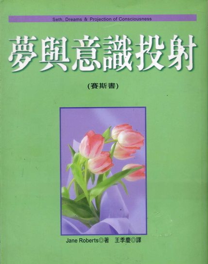

#### 版权信息

书名：梦与意识投射

作者：［美］珍·罗伯兹（ Jane Roberts ）

译者：王季庆

请购买实体书籍·该电子版本仅供参考

## 序

　　电视摄影机的光暖暖地照在我脸上。我的丈夫罗和我，正接受波士顿的电视台 WBZ 的桑妮亚·卡尔森及杰克·寇尔访问，节目是“今日妇女”。这天是我们《灵界的讯息》第一回合宣传之旅的最后一天，时间是早上十点。这是我们第五次上电视。我试着显出镇定和有自信的样子，虽然我仍觉得一天这么早就面对陌生人有点不舒服，更别说是面对全世界——尤其是我还得解释我自己的灵异经验及《灵界的讯息》的哲学观念。

　　在开始访问时，杰克告诉听众说，我是一个灵媒，替一个叫赛斯的人格说话。他强调，我出现在节目上，并不必然表示他或桑妮亚接受赛斯的独立存在。我笑了，多少有点是苦笑。许多人觉得有责任表示怀疑，仿佛那就自动成了一个荣誉和知性优越的标志。在过去，我也会做同样的事，所以我能了解那种心态。

　　在访问中，杰克问我赛斯会不会突然透过来。我答说那就看赛斯了。实际上，因为我在其他节目中从没进入过出神状态，所以我怀疑我现在会不会。但是，当杰克开始放一卷赛斯课的录音带，而我听到赛斯那深沉宏亮的嗓音时，我就明白赛斯是在场的。

　　有那么一阵子我颇心惊胆战，满脑子各式各样的疑虑。自开始宣传之旅后，我还没开过一节赛斯课。万一那些灯光干扰我，或出神状态不够深时怎么办？我对任何表演都有恐惧感。在我们自己客厅的私密性里定时上赛斯课是一回事，在电视上进入出神状态则又是另一回事了！惊惶失措地，我心里说：“哦，赛斯！”

　　然而就在那一刻，我感受到一股莫大的抚慰、善意和信心的感觉。在一个低于语言的层面上，我明白赛斯是对的：时候到了。我全心地表示赞同。我伸手去握罗的手，迅速地喃喃说：“赛斯来了。”我的面孔在那里一定已开始改变，肌肉重组成赛斯很有特性的表情，因为在那最后片刻，我看见一个看来象是庞然大物的摄影镜头靠近来照我的“特写”……

　　当我脱离了出神状态时，罗在微笑，杰克和桑妮亚看来目瞪口呆，摄影组人员瞪着我，而节目已结束了。罗对我说：“赛斯很棒！”我大大松了一口气。那么，没事了；赛斯在电视上现身了。我岂不是曾一下希望他会，一下又不太愿意吗？

　　杰克问：“你没问题吧？需不需要什么？他看来如此担心，以致我不禁笑了出来。

　　“不用。我觉得很好，我一向很容易脱离出神状态。不过，我倒想要一个面包和一杯咖啡。我现在饿扁了。”

　　一小群人围着我们——制作人、助理制作人、杰克、桑妮亚和摄影人员。我略带不安地看看罗，因为虽然我向杰克保证每件事都很正常，但实际上这回有些地方是有些不同：我觉得我似乎曾在一架飞得快得不得了的飞机里，却被突然拉停下来。如此庞巨的能量流过我，使我不知如何是好。有那么一会儿，它令我打了个踉跄，杰克抓住我的手臂。这只不过更令我发窘而已。我可以感受到我的脸红了起来。我一向试着以非常合情合理的举动，来显示“出神状态”并不是一件奇怪的事，而是一个很自然的现象，因此我一时的踉跄使我自己都有点吃惊。罗立刻来到我身边，我向他解释了我的感受。一部计程车已在等着将我们载到下个节目，一个垫档节目，我拿着我的面包和咖啡上车了。

　　当我在出神状态时到底发生了什么事？杰克和桑妮亚在事后的短暂谈话里，描述给我听了那节目的一部分，而当我们赶往下个节目时，罗补充了其余的。

　　首先，一如往常地，我的脸部表情大大地改变了，然后我开始以一个低沉男人似的嗓音说话。我自己特殊的手势消失了，而被赛斯的手势取代。他转向摄影机，直接对观众讲了约十分钟的话。到那时，桑妮亚和杰克才从惊讶中回过神来，而杰克问赛斯肯不肯谈谈转世。

　　赛斯立刻开始谈起桑妮亚的前生经验。在有限的时间里，他特别详谈某一生，说桑妮亚在那生有“裂颚”（口盍破裂的一种口腔畸型）的情形而阻碍了说话。照赛斯所说，这点与她现在对传播业的兴趣有部分关系。他又说桑妮亚爱好色彩和布料，她在前生及今生都以之做为一种沟通的方法。他还提到了一些十四世纪的英国人名和地名，而这些正在查证中。

　　在事后，桑妮亚说赛斯所给的个性分析非常适切地描写了她。她也告诉我们，她曾在一个教育电视节目上，用色彩及布料来与儿童们做沟通——这是不为我们所知的一个事实。

　　几天后，我在家接到一个女人打来的长途电话，告诉我说赛斯在“今日妇女”节目上的出现说服了她死后有生命，虽然她以前从来都不相信。她又说，听赛斯讲话是她这一生中最深奥的宗教经验，虽然他并没以特别的宗教辞汇说话。自那以后，我们接到很多观众的电话、信件和拜访。他们都是被那节目所震惊，然而，以一种奇怪的方式，我也一样受到了影响。它教了我好几件事。

　　最重要的是，它加深了我对赛斯及其心理上的洞察力的信任，而再度对“内在直觉性的我”了不起的能力印象深刻。因为就是我的这个部分，才使得我能与赛斯沟通。另一方面，由于节目的方式，出神状态被中断了，这也给了我机会由一个不同的角度研究出神现象。

　　通常，一节课长达数小时，所以当课结束时，能量也用完了。而在节目上，一节最多长达二十到三十分钟，因此当它被中断时，所有那些能量还在那儿，而我头一回主观地觉察到它全部的力量。

　　人们常问我，我怎么知道赛斯的在场，而我一向不大知道该怎么回答。在该节目后我检查我的感受，而发现自己与那能量打了照面，我了悟到那同一种能量，只不过略弱一些，就是我知道赛斯准备好要透过来的主要线索。

　　它并非中立的能量，而是具有强大情感冲击力的能量，令人安心，又很奇特的个人化——温暖而令人惊讶的亲近。也许它里住了我，但我并没打瞌睡或落入“空无”中。我是我自己，但却非常小。我仿佛退入一个与空间无关却静悄悄心理的焦点更有关的远方。然而，在这似乎在我四周形成又来自我内的弥漫的能量之中，我是被支持、鼓舞和保护着的！

　　我很失望没能看到那个电视节目，因为除了在少数几张照片里之外，我从未看到我自己在出神状态里身为赛斯的模样。赛斯透过我显现，跟别人说话，而他们感受到他的个性之冲击，但我却无法象他们一样由外面客观地看见此事。对观察者而言，赛斯之异于我，可由我们的眼神、手势及面部表情中明显看出。我们根本是以不同的方式使用身体。

　　赛斯的在场即刻便会被感受到，并非以玄秘的方式，而是以我们感知到一个具有力量和能力的磁性人格的方式。虽然这现象的客观效应大半非我所能感知，我却试着尽力去了解所涉及的主观层面，因为关于这事，无疑没有人比我处于更有利的地位。由于赛斯的出现，我已越发的觉察到，我们所有人所知的意识那正常日常状态之外的许多其他状态。

　　比如说，虽然我是在三次元的世界里写这本书，它的源头资料却是来自意识的另一边——在我们的梦、灵感、出神状态及创造力里透露给我们的次元。这本书是有关赛斯、梦与“灵体投射”——全是与我们通常具有的意识之客观面不同的一些层面。

　　如果你愿意，你可以说赛斯是由一些无意识的次元侵入了我有意识的生活，但他现在却又如此地是我的专业及个人经验的一部分，以致我很多时间都花在研究及诠释他的理论上。他出现在电视上，似乎代表了他更进一步的“客观化”，那对我而言是很令人惊异的！

　　无疑的，我的生活已因一种奇特的主观机动性而大大地丰富了。白天我在书房写这本书，由一扇大凸窗望向街道及再远些的山脉及河流。但当我为了某一章而要找新资料时，我就将注意力的焦点由外在世界转向内在世界。那时我不再关心我的物质环境，而我正常的醒时生活反成了梦。

　　如果我发现，正如我现在以醒时意识在写有关梦的实相的书，我在梦里也正在写一本有关醒时意识的书，我一点也不会觉得讶异。如果我发现赛斯在一个全然不同的次元里，替一个名叫珍的人说话，我也不会吃惊。事实上，我有时藉着想象一个状况自娱，而在其中，赛斯则在奇怪是否珍是他执迷于某个不大可能的物质实相的次要人格呢？不过，赛斯可比我见多识广，所以如果他在替我说话的话，还真委屈了他呢！

　　并且就我所知，赛斯并没有一个禁锢性的肉身；至少有时候，他投射他意识的一部分到我的身体里。我甚至有一个奇妙的想法——我有时想象我们好象在玩某种愉快的“抢椅子游戏”（译注：音乐停止时，各人抢一把椅子坐的游戏），我试着脱出身体，而同时赛斯则试着进入它。虽然这展现了一个颇滑稽的画面，但其实它是不公平的。因为赛斯并没多大兴趣占据我的身体，我却对脱离我的身体有种无法满足的好奇心。

　　自从一九六三年以来，我每周有两次替赛斯说话。至少，这使我对意识的改变状态有了个人的经验，并且对大半未被探索的主观区域略见一瞥。无疑的，就是因为赛斯，我才会研究当身体入睡时才进入焦点的“梦的实相”。

　　按着赛斯的教导，我的先生和我首先学会回忆及记录我们的梦。经过后来的实验，我们发现我们能将自己正常的醒时意识带入梦境，而在作梦时“醒过来”。后来我们开始更大胆地踏入这些内在领域，学着以于我们而言是全新的方式去操纵意识。

　　按照早期课里赛斯建议的方式，赛斯和我的关系是藉着预约而跃入焦点。在每周一及周三晚上九点，我坐在我偏爱的摇椅里，罗则坐在我对面的沙发，拿着纸笔准备记录。灯光正常。起初我可能觉得非常没“灵”感，甚或烦躁，我也许觉得很累，或其实想去跳舞。但在九点课一开始时，赛斯就“活了起来”。

　　我并不是“变成”赛斯。反倒不如说，我仿佛沐浴在他的光明之中。有时候，我隐约觉知我的面部肌肉被重新安排，反映了赛斯而非我的情绪。但，就我而言，那房间消失了。虽然我双眼大睁，但由它们看出去且对罗微笑的却是赛斯。是赛斯经由我的唇说话，由一个不受三次元世界局限的观点讨论实相及存在的本质。

　　周二晚上我教一个 ESP 班，而赛斯常常跟学生们讲话，解释他关于日常生活的想法，将之与个人行为连起来。他常对个别的学生说话，鼓励他们用自己的能力解决自己的问题。他有绝佳的心理上的了解。他似乎是个喜欢享受经验及潜能之完全丰富性的人。

　　单只为这个理由，我愿相信他的能力是我的，在出神状态里，我自己潜在的能力无阻碍的运作，而没有令我们所有的人生气、且妨碍我们发展的正常的困扰和分心。我宁可认为，一周至少有几个小时，我是在颠峰状态运作——希望赛斯的精力和知识真的是我的。这是可爱的想法，而且可能具有一些真实性。

　　不过，说幸运也好，不幸也好，我猜我们的关系是远较复杂得多。至少我知道一件事：赛斯现在的基本存在并不在三度空间的世界里，而我却是的。他曾给过我们教导，使罗、我的学生和我自己有时脚步蹒跚地走出我们通常的物质实相之外。例如，他开启了我们进入梦宇宙的探索，因而可以说这本书大半是他导致的。但我们必须回到我们正常的日常确实性次元，而赛斯则回到他的。

　　赛斯虽然没有一个肉体，在我们的世界里，他却是非常有效率的。透过我，他正在制作“赛斯资料”，一个连续性的文稿，谈论实相的本质，意识和本体，现在已积有五十多本笔记了。他也口授了他自己的书《灵魂永生》。到今天，我们已上了近六百节的课。事实上，他在与物质实相的接触里，似乎比我在更自然地属于他的次元里的旅游，要运作得有效率多了！

　　举例而言，我的出体经验并不如赛斯在此的行为那么井然有序、从容不迫或有效率。赛斯口授他自己的书的定稿，而我呢，写起书来则至少要打三次稿（现在这本书是自课开始后我的第三本，所以很难说是赛斯在“偷”我任何的创造力）。

　　赛斯自称是一个不再聚焦于物质实相里的一个“能量人格元素”。但不论他是谁或是什么，他是个来自超越我们平常熟悉的觉察层面的访客。

　　在《灵界的讯息》里，我照我当时的了解讲过我的心灵启蒙及认识赛斯的故事，并且在林林总总的主题上大略介绍了他的概念。我也强调了我们收到的“证据性”资料——在赛斯课的本身里，及做了一年多的“信封测验”里，赛斯自发的“天眼通”表演。赛斯也曾给过对在美国其他地方及波多黎各的人和事正确天眼通式的描述。

　　在此我将强调主观经验本身，尤其是当它转向梦境时，并且藉由赛斯的连续文稿的摘录来谈谈他对梦宇宙的观念。这本书也会是个日志，记录者先是罗和我，然后是我的学生们，用赛斯的概念为地图，主观地旅游进那奇怪的内在风景。我们曾涉入了最深的探险里，在其中平常的阻碍并不存在，通常的物质生活之假设也不适用。

　　照赛斯的说法，作梦是意识的一种创造状态，一个心灵活动的门槛，在其中，我们抛弃了通常的限制，而去用我们最基本的能力，并且实现我们真正的独立，不受三度空间形体的羁束。赛斯说，在梦里，我们写我们每日生活的剧本，并且感知我们的物质焦点通常遮住了的其他存在层面。

　　赛斯主张，梦宇宙有自己的基本法则或“基本假设”——跟我们的引力定律、时间空间相等的东西。换言之，梦的实相看起来仿佛荒腔走板或无意义，只因我们按照物质定律而非在其内适用的规则去判断它。

　　那么，梦并不只是想象的不消化或心灵的混乱。当我们作梦时，我们并非暂时地疯狂了，如某些理论家所主张的。刚好相反，在某些梦境，我们可能远比平常时候还要精神健全且警醒得多哩！我们无疑是更具创意的。我们甚至可能更“活跃”，正如你从自己的某些经验里可看到的。

　　既然这本书主要强调的将是赛斯的梦观念，所以我很欢迎读者自己去试试。举例来说，在这游戏的早期，赛斯告诉我们，许多梦是预知性的，但个人经验最具说服力，而当我们跟着他的指示去追忆、记下日期及记录梦，然后再与事件对照，我们自己也发现就是如此。

　　赛斯谈可能性或谈，比如说，无线电星星的许多概念，除了专家外，没人可证实。不过，大多数谈梦的资讯，都可以被任何有足够的好奇心、决心及冒险性去遵循“赛斯资料”所提供的指导原则的人所证实。在他早期谈梦的一席话里，赛斯说：

　　你认为你只在醒时是有意识的。你假定当你入睡时你是无意识的。以佛洛伊德的术语来说，骰子的确是偏重于有意识的心智。但暂且假装你正在由另一边看这个情况。假装当你在梦境里时，你在关切实质的意识和存在。由那个观点，画面就全然不同了，因为当你睡着时，你真的是有意识的。真正的情形是这样的：在醒时状态，全我是贯注于物质实相的，但在梦境时，它则是聚焦于一个不同的次元。它仍是完全一样的有意识和觉察的。

　　当你醒来时，如果你记不太得你的梦的地点，那么就请记住，当你在梦中时，你也记不太得你的醒时地点。两者都合法，而两者都是实相。当身体躺在床上时，它与作梦的自身可能居住的梦地点分开得很远。但，亲爱的朋友，这与空间地毫不相干，因为梦地点与身体睡着的房间是同时存在的。

　　在第二十八节课里，他用一个比喻来解释这双重的意识焦点：

　　当然，在这儿有个明显的矛盾，但它之所以明显，是由于你的难题为：如果你有另一个有自我意识的自己，那么你为何会无法觉知到它？假设你是个有两张面孔的怪兽，一张脸面向一个世界（梦实相），而另一张脸面向另一个世界（物质实相）。

　　再进一步想象这个可怜的生物的两张面孔都各附带着一个脑子，而每个脑子都以它看到的世界来诠释实相。然而这两个世界是不同的，更有甚者，这两个生物还是连体婴。同时，想象这两个生物其实是一个，却具有明确的部分去处理两个全然不同的世界。

　　在这个滑稽的比喻里，潜意识将会存在于两个脑子之间，而令这生物能以一个单独实体的样子去运作。同时——而这才是难以解释的部分——两张面孔都永远“看”不到另一个世界。他们不会觉察彼此的存在，然而每个却都是完全有意识的。

　　实际上，这只是个简单的比喻，而且只能撑一段时候，但在一开头，赛斯用它做为一个方法，来让我们对人与梦实相目前的（并且人工的）关系有些许概念。后来，藉由遵循赛斯的资料及教导，我们发现自己能化解这些阻碍到某处程度。至少对我们自己，我们能证实，梦事件是相当真实的。例如，飞翔的梦并不象佛罗伊德主张的全是伪装的性幻想。在许多这种梦中我们是在飞，而我们到达的目的地是十分实质的。我们的记录明白显示，我们在有些这种插曲里所见的，并非想象的地方，却是当身体睡着时我们游历的地点。在这书里描述了其中一些。

　　换言之，虽然大多数的书写的是关于在醒时实相里发生的事，这本书主要谈的却正是当意识由正常客观生活转开时所发生的事。这里所涉及的，远比梦境的本质及人能由身体抽离意识的迷人本事，还多得多呢！这些现象只不过是我们每个人内与生俱有，并且活跃于我们内的更大的创造意识——我们所知甚少的内在宇宙——的证据而已。

　　今天我收到一位 NASA（美国国家太空总署）的科学家詹姆士·华尔的信，对于赛斯说的所有物质粒子的基础（单位）给予了科学的确证。这资讯——在课里给我们的——刊印在《灵界的讯息》的附录。詹姆士寄给我的报告是如此的专业，我几乎不能了解它，因为它是以专门的数学语言措辞的。然而经由赛斯，我们曾收到相同的资料。某人——我自己的无意识或赛斯——能通达它；那至少是确定的。创造性意识是远在我称为我自己的意识“底下”运作的。

　　当我们不那么执迷于肉体感官资料时，我们全都能通达这创造性意识，尤其是在梦境及离体状态。关于它的证据往往在“心血来潮”或创造性灵感的装扮下，浮现到意识里来。

　　真实地并且象征地说，在我看来，往往只有当我们闭上眼睛时，我们才开始看见。这多少有点言过其实，然而我的、罗的及我学生们的经验，却使得几个事实变清晰了。我们平常的意识只让我们看到实相的一个明确画面。当我们学会暂时关闭我们的感官，并改变觉察的焦点时，对内在宇宙的其他十分合理的一瞥才开始现身。

　　当然，这在作梦时是最显然的。很可能梦代表了我们最具创造力的样子，因为我们不但处理过去时光的活动，并且当醒时的自己静定下来时，我们也从所看到的无限的可能行动里，选择明天的事件。

　　在种种不同的意识阶段玩“跳房子”，旅行到罕为人了解的主观领域，探索那些内在风景，而带着关于它们的本质的任何清晰的线索回来，还真得有点本事！不过，这种探索却极为重要，令我们能接触到基本的内在实相，那是在我们个别的有意识思维与存在之下，并且也是我们文明的根底。

　　到某个程度，我在每节赛斯课里都这样做——将我通常的意识搁到一边。一个我仍不了解的奇怪的“放下”是必要的，连同一个简单却深刻的信任。也许那是当我们潜入海洋里时，相信我们不会沉下去（知道如何游泳有点帮助）的同一类信心。

　　水的比喻令我深感兴趣，虽然无法跟着它走太远而不产生扭曲。举例来说，用水肺潜水的人，探索他在海底找到的东西，而带给我们来自这广阔的水底世界的线索。我试着做同样的事，不过却是由我们内在存在的隐蔽层面打捞线索。但如果他潜得够远，潜水者在某处必然会到达海洋的开口，进入我们相当不觉察其存在的其他世界——创造性、意识及经验之渊，不只是我们的三次元实相，其他的实相也都是由它跃出的。

## 第一部 来自内在宇宙的侵入主观的记录

## 1、梦、创造性与无意识

　　我对内在宇宙看到的第一眼——摘自“物质宇宙是意念建构而成的。”

　　三个特殊的梦事件凸显出我灵异能力的开启，并且间接地导致这本书。第一个梦比较而言是个不重要的梦，当它发生时很令我惊讶，但它可能会被我轻易地遗忘了。第二个梦来自一个我记不起的梦，是个令人惊奇的经验。第三个梦则给了我对另一种实相惊鸿一瞥。

　　第一个梦发生在一九六三年七月，在我对灵异现象根本还一无所知的时候，第三个发生在一九六四年二月，赛斯课开始后不久。在这两个日期之间，我发现自己被推入一个我以前完全不知的经验之次元里。

　　最开始的梦涉及了一位邻居，康宁瀚小姐，早在我们还不知这公寓存在之前，她就住在这里了。当罗和我在一九六 0 年搬到这儿时，她已在她的三个小房间里度过了四分之一个世纪，被诗集和剧本环绕着。当我们走上前台阶时，常常看到她坐在楼上窗前，看着底下的车流。但我们搬来那年，她的生命开始萎缩了。她自高中戏剧教师的职位退休下来，而在她的小公寓里待得越来越久。

　　在一开始，罗和我只在阴暗的公寓玄关处和她碰过面，通常是在信箱那里。她极端独立，又高又瘦，有着梳理得整整齐齐的发型和手工裁制的衣裳。她的英语毫无瑕疵。她曾是位名望极高的教师，偶尔有以前的学生来拜访她，她则以茶招待。在过年过节时，她的信箱都塞得满满的。

　　这些小事是我们对她仅有的认识，而我们从未变成密友。然而，我第一个预知性的梦却牵涉到她。以一种奇怪的方式，我的灵异经验与她的生活结下了不解之缘，我仿佛在我的梦里与她保持联系。当她的世界于她变得越来越小时，她仿佛向外伸入了我的世界。

　　那个夏天，罗和我在缅因州度假。我们根本没和康宁瀚联络。但在我们回到艾尔默拉那晚，我突然醒过来，还记得一个令人不安的梦，它使我非常心烦，于是我叫醒了罗。他坐起来，听后惊愕不已。我们两人一向都根本不记得梦的。

　　我说：“真是怪事，我没看到别人，倒看到了康宁瀚小姐。我们是在一家医院里，她穿着一套黑色套装，而她的眼睛红肿得可怕。她正在哭，一遍又一遍的说：“哦，天哪！我必须离开，而我不想离开。”她就在医院门厅的左手边有个玻璃圈住的地带，你可以在那儿买礼物给病人的地方。一切都如此的逼真。”

　　罗说：“也许你该把这梦写下来，并注明日期。”

　　这令我更不安了。“为什么？你不会以为它是有象征性或什么的吧？或以为它会成真？并且我为什么该梦到康宁瀚小姐呢？我们几乎对她一无所知啊！”

　　罗说：“但写下来也不会有事啊！对不对？”

　　我喃喃的说：“对。但我有种极为奇怪的感觉，就好象记下这梦的话会给它某种不应有的重要性。不管怎么说，我宁愿忘掉它。”我说：“我希望我根本不记得它。”但我却仍满怀睡意地下了床，记下梦，并且注明了日期。

　　一早起来，我还是觉得不安。昨夜我们的电视坏了。那时我们家没有电话，所以我决定去向康宁瀚小姐借电话叫修理工人。事实上，我想如果我看到她精神矍铄如常的话，我会觉得好些。我自忖，那时我就能摒退我的梦而忘掉这整件事。

　　我一敲门，康宁瀚小姐立刻就应门，并且恳求地向我伸出手。通常她都是一本正经地有礼且相当冷漠的。她态度的改变即刻令我警觉。我吓了一跳，退缩了一下子，才问她什么事不对了。她说：“哦，我真高兴看见人。我是如此心烦。我刚知道我得了白内障，两眼都必须开刀，真令我难过极了！”她的声音颤抖起来。以一个绝望的手势，她指向从地板直到天花板的书架以及堆在咖啡桌上的杂志。“我看这么多……这么多书。如果我失明了，我该怎么办！”

　　我仍旧如此惊愕，不知该说什么。她的眼睛看起来非常红肿，就象在我梦中的样子。我陪了她一会儿，试着尽我所能的安慰她。最后我回到自己的公寓，一面由于她的状况，一面由于其与我前一晚的梦的关联而苦恼不已。

　　然而，在那天晚些的时候，我设法说明自己它只是个巧合。我跟罗说：“无论如何，她没穿黑衣裳。而我们也没在一间医院里。也许我只是潜意识地注意到她的视力在减弱，然后杜撰出那个梦来。”

　　“也许。不过，我们几乎有一个月没见到她了。”罗说。

　　“嗯，一定是那么回事！”我说，“我承认这整件事是……发人深省的，但它也令我很气恼。我是说，如果我们能在梦中看到未来，想想看，生命会更艰难多少？象现在的样子就已够我受的了。”

　　当时间过去，那梦或多或少也就被遗忘了。只不过它偶尔会以令人不安的暗示在我身边絮聒。我焦虑地觉得，在事情的本质里，已撕破了一个小而重要的裂口。向回看时，我确信我嗅到了危险！就如任何动物感觉到在它的环境里有些陌生和新的东西时——或如任何成人当被“现状”的改变所威胁时一样的确定。因此，我把那梦排出了我的脑海，而继续过我的日子。后来我在灵异方面的第一本书《如何开发你的 ESP》里提到这个梦。甚至在那时，我也全没想到它会是涉及康宁瀚小姐的一连串灵异事件之一而已，我也没看出它在我自己的发展上真正的重要意义。

　　夏天过去了，而在下一个改变我人生的经验之前，秋天便开始了。我在一个秋日早晨醒来，觉得夜里我有过一个最不寻常的梦，一个会影响我至深的梦。然而我完全记不得那个梦，当一天继续下去时，那感觉就消失了。那晚，我一如往常地坐下来写诗，写了一小时，而突然间，随着第一个梦打开得非常小的细缝现在张开了大口。

　　虽在我《灵界的讯息》里描写了那个经验，但因为它是升自梦的世界，而与无意识的活动如此密切关联，所以在这儿，我想以一个不同的观点来检查它。康宁瀚小姐的梦曾吓了我一跳。但这一次，我却被到那时为止我人生中最激起我的敬畏感的事件卷走了。然而，我并不害怕。

　　前一刻我坐在我书桌旁，我的纸和笔就在身边。下一瞬，我的意识却冲出我的身体，但它本身是无身体的，根本不占空间；它仿佛与窗外的空气混合起来，跳入树梢休息，缩在一片叶子里。狂喜与领悟、新的想法、感受、新奇的影像与字句的聚合如此冲过我，我根本没时间叫出来。没有现在、过去或未来；突然地，无法回头地，我知道了这一点。

　　然后，逐渐地，我变得觉察到我的意识又再回到了我的身体里，但，缓缓地，象微尘透过黄昏的空间降下到我坐直在桌旁的身体。我的头低着，手指正狂急的将发生的事潦草记下，好象它们自己长了脑子似的。

　　但，当我回来时，那经验的强度开始褪色。那奇迹开始撤退了。三个小时已过去了。只留下一堆潦草的笔记，已被自动写下并标好标题：“物质宇宙是意念建构而成的”——唯一由那了不起的经验实质地抢救下来的东西。而我毫无疑问地知道，那些意念最初是在前一晚被遗忘的梦中给过我的。

　　既然那些笔记是如此直接的生自那事件，并且，既然它们代表从内在宇宙到我自己生活里的第一个强烈的入侵，我仍觉得它们令人深感兴趣。我现在正在看着它们，当我在约五年后写这一章的时候，它们仿佛带着一种狂暴的活力，那引得我去思量创造性的暧昧本质。因为，如果那些意念与经验本身在我内开启了一种新的意识，它们也拥有一个爆炸性的力量，力量相当地大到够拆解了我思维和理念的先前架构。我的世界的平常表面真的被震开来，而那时，我对它里面还会冒出什么来，根本一点概念也没有。

　　在《灵界的讯息》里，我只由“物质宇宙是意念建构而成的”里摘录了些许，但在这儿，我将多少更彻底地进入那篇稿件里，因为它是与采自那经验的“天然形态”如此接近，而我相信，它代表了赛斯后来要给我们的资料的“胚胎”。那稿件本身包含了大约四十页潦草的笔记，是在那经验的高峰中写下来的。后来，当我试图重新抓住我在那时的感受和洞见时，我又写了五十页。

　　在此我只涵括当我离开了身体时，我的手指在不为我所知之下写的一些讯息。对我的某些读者而言，这些概念完全不是原创性的。我后来发现，世代以来它们许多都曾出现在“玄秘的”稿件里，但对我而言，它们不只完全是新的，并且还由这么强烈的确信陪伴着，以致我再也不可能怀疑那确实性。

　　以下是由“物质宇宙是意念建构而成的”我的摘录。在原始的稿本里，这整个部分是以定义的样子给了我的。

　　能量（Energy）：是宇宙的基础。

　　意念（Idea）：是被一个存有变成为物质实相的精神能量。

　　意念建构（Idea Construction）：是意念之转形为物质实相。

　　空间：是我们自己的意念建构不存在于物质宇宙里的地方。

　　肉体：是存有（entity）对自己之意念在物质属性之下的物质建构。

　　个人：是我们在日常生活里觉察到的存有或全我（whole self）的那个部分。它是我们能在一个物质层面上透过意念建构来表达，或使之成为“真”的全我的那部分。

　　潜意识：是一个意念浮出而进入个人有意识的心智之门户。它连结了存有与个人。

　　人格（personality）：是个人对所接收及建构的意念之整体反应。它代表在任何特定“时候”个人之意念与建构之情感性的染色。

　　情感：是将意念推入建构的驱策力。

　　本能：是为肉体存活所必要的最起码的意念建构的能力。

　　学习：是由现存的意念建构新意念复合物之潜力。

　　意念复合物：是几组意念象积木般聚在一起，在物质实相里形成更复杂的建构。

　　沟通（通讯）：是在能量的非物质层面上存有间的意念交换。

　　行动：是在动的意念。感官是投射的管道，意念藉之向外投射以创造表象的世界。

　　环境：是一个人用以包围他自己的整体意念建构。

　　物质的时间：是物质宇宙里，在一个意念出现与其被另一个意念取代之间的一段明显间隔。

　　过去：是对曾经是，但已经不再是物质建构的意念之记忆。

　　现在：是任何意念浮现到物质实相里的明显之点。

　　未来：是一个意念在物质实相里消失及其被另一个取代之间的明显间隔。

　　心理时间：是在意念之孕育间的明显间隔。

　　衰老：是组成建构的物质之属性对一个意念建构之影响。

　　生长（成长）是一个意念建构遵循物质的属性，朝向其最完美的可能的物质化。

　　睡眠：是一个存有除了为肉身存活之最起码需要外，暂时休息不从事意念之建构。

　　物质宇宙：是所有个体的意念建构之总和。

　　记忆：是“过去的”意念建构之鬼影。

　　每个演化性的改变都是由一个新意念所引发，而后才出现的。当这意念处于被建构入物质层面的过程中时，它为它自己的确实性准备物质的世界，并创造出必要的先决条件。

　　演化是能量的运动，朝向在物质宇宙内有意识的表达迈进，但它基本上是非物质的。在任一既定时候，一个物种是其个别成员之内在意象或意念的具体化，每个成员都形成自己的意念建构。

　　我们并不能确实地说，在某一点一个建构消失，而另一个取而代之，但为方便之故，我们人工地采取了某些点为过去、现在和未来。在某个点，我们同意物质的建构不再是一样东西而变成了另一个，但，实际上它们仍包含那“过去的”建构之成份而已在变成“下一个”。

　　虽然一个意念之建构物看来仿佛在实质上消失了，它所代表的意念仍存在。

　　睡眠是存有自物质的意念建构中休息。只有足够的能量被用来维持个人的意象建构存在。存有退回到基本的能量界，而相对地不受时间的拘束，因为意念建构是在一个最少的层面。这存有在一个潜意识领域是与其他存有有所接触的。

　　在死后，存有将可自由运用其鬼影（记忆），虽然其明显的顺序将不再适用。记忆是潜意识的能量存有之所有物，它本身是不可摧毁的（虽然在种种不同的情况下，它们可能无法被那个人得到。）

　　下一个存在层面，将涉及在能量利用及操纵方面更进一步的训练，因为组成这存有的能量是自己产生的，并且永远在寻求更复杂的形式和觉察。

　　每个物质的粒子，都是由组成它的那个别化的一小点能量所形成的一个意念建构。

　　每个存有在物质层面上只感知他自己的建构物。因为所有的建构都至少是同样的基本意念在物质里的忠实复制品（既然一般而言，在这层面上，所有个别的人都是在同样的层次上），那么他们在空间、时间和程度上有足够的同意，因此表象的世界有一致性和相对的可预知性。

　　物质的组织

　　所有的物质都是意念建构。我们只见到我们自己的建构。所谓的空间是充满了非我们所造，而且我们无法感知的建构。我们的皮肤将我们与其他的物质建构连在一起，透过它，我们涉足于持续不断的东西的复杂组织。每个最小的这些粒子的行动都影响另一个。一粒沙之微动在星辰的分布及所有东西的组织里都造成了相应的改变，从一个人的脑壳里的一颗原子，直到一个微生物的行动里最微小的变化。

　　所有的东西都是意念建构，交织在一起；每个建构是个别的，然而又与整体一致。最小的粒子对整体也是必要的，形成那东西的设计的一部分。

　　宇宙做为一个物质的实体

　　宇宙可以被理解为象一个物质实体，一个有机物，其个别的细胞（物体）被连接性组织（空气的化学质和元素）维系在一起。这连接性组织也是活的，带有电性的脉冲。在其内，就如在人体的连接性组织内，有某种弹性，某个分量的再生，而组成它的原子和分子在不断的取代。虽然整体维持其形状，物质本身则不断在出生及被取代。

　　下页这粗略的图与以上的资料一同来到。它假定代表了存有的能量，当它向外流，经过潜意识到意识，为的是响应自己对“它是什么”的意念而建构物质的影像和环境。

　　我卷入了这图形和文字背后的“纯”经验。我得到的启示是，自己并没有真正的界限，皮肤并没有将我们与别人分开，却以一个能量的网络连接我们。我们所认为的“自己”及“非自己”是相关的；而且，至少在此生，意念是不断被改变成东西。以下是“意念建构”中更进一步的一些摘录。

　　存有具有能力将能量转化成一个意念，然后实质地建构它。这种能力决定此存有在物质演化层面的地位。简单的有机体能“收到”较少的通讯，它们的范围较小，但其建构之活力与有效性却是极佳的。在象草履虫和变形虫这类简单的有机体里，接收到的少数鲜明的意念几乎即刻就被建构，没有反思。那有机体不需其他的机制去转译意念。它所有的就已足够了。

　　比较复杂的有机体——例如哺乳类——由于能感知更多的意念，所以需要更进一步的机制去建构意念。在此，记忆是个要素。现在这有机体有一个对过去建构的天生固有的鬼影，藉之以改进及考验新的建构。产生了某种的反思，有机体因之而有进一步的建构。慢慢地，在其接受性的范围之内，在意念构成物质实相的确实建构中，它被给予一些选择。

　　这反思是很短暂的，但有那么片刻，这动物分享了一个新的次元。过去建构之仍不完美的记忆留连在它的意识里，时间的影子在它眼中闪耀。然而，那时记忆的储藏仍小，但现在以我们的说法，即刻的建构不再是即刻的。那儿有个停顿：那有机体——狗或虎——能选择去攻击或不去攻击。变形虫必须不经反思，并且不经我们所知的时间去建构它小小的世界。

　　有范围更广阔的存有需要更复杂的结构。它们接受的范围是如此之大，以致简单的自动神经系统是不够的。变形虫建构它收到的每个意念，因为它只能收到这么几个，所有的都必须被建构以保障存活。就人而言，则情形相反。他有如此广的接受范围，以致他不可能实质地建构他所有的意念。当他的范围变宽广时，必须有一种机制容许他去选择。自我意识与推理即为解决之道。

　　突然间，时间象一朵奇葩似地在他脑壳里绽放。在这之前，他是“呆立”在现在的。但记忆在动物里产生了另一个次元，而人将之更往前带了一步。记忆不再短暂地闪一下就消失，将人再封闭于黑暗中。现在它明亮地在他身后延伸，也向前延伸，仿佛形成了一条路，在这条路上，他永远看见自己改变中的影像。

　　他学到“连续性”。而由于他能支配他集中焦点的记忆，人的自我诞生了。自我能跟随它自己的身分，穿过包围着人的炽燃冲动的迷宫，它能在不断建构的模式间认知自己，并且能将自己与自己在物质世界里的行动分开。在此，主体与客体诞生了，有了那个做为施行者或建构者的“我是”（I AM），以及他建构出的构造物本身。

　　这新次元让人类能操纵及认识他自己的建构，而有自由去集中更多的能量于投射一些意念超过其他的。换言之，实质地，有意识的目的变得可能了。不过，在这过程的某一点，人开始几乎全然地及人工地与他自己的建构分开了。从而造成了他的摸索、他与自然的疏离感、他对“第一因”或“造物主”的追寻，因为他已不再将自然认知为他自己的创造了。

　　要描述这稿件对我造成的印象，根本是不可能的事，更别提要说出伴随它而来的经验了！所有这些意念对我而言全是崭新的，而且相当与我自已的信念相反。以前我从未写过任何象这样的东西。当时罗在他的画室里作画。当他出来时，我是如此的兴奋与惊奇，以致几乎说不出话来。

　　那晚我们熬到深夜，一直在聊。我试着解释所发生的事，头一回发现在文句和主观感受之间的鸿沟。所以我给罗看这篇稿子。附带地说，若没有它，我根本拿不出任何具体的证据。然而，当事情过了之后，我的知性又作起主来。这整件事是什么意思？我毫无疑问地知道我收到的概念是对的，然而，知性上，它们完全令我震惊。

　　现在，七年之后，我了悟到内我（inner self）能突然令人格重生且获活力，打开新的感知方法，粉碎阻碍物，并以洪流般的能量充满人格，以使它步上正轨，且以更有意义的方向重新组织自己。那是个第二次诞生。这种事件就象是突然爆发的喷泉一样，将我们带得离我们存在的中心更近。它们来自主观而非客观的实相，而至少在我的例子里，它们变得客观了，它们的力量将它们推进成物质的确实性了。

## 2、主观背景之一瞥

　　在无意识的侵入背后的推动力

　　但，是什么启动了“意念建构”的经验？甚至当我写《灵界的讯息》时，我也没清楚地了解它为什么发生了，也无法将它与我先前的生活或信念连接起来。它看来好象是个完全的侵入。目前这本书，专门谈梦和主观的经验，引导我进入了更深的自我检查。在准备当中，我重读了我自己的记录和诗。诗本身提供了主观思绪和情感的一个清晰的记录。而就是经由读这些旧诗，我才找到了一些线索，让我看到在我灵异能力开启之前与之后，我生命的连续之处。

　　当我回顾时，显然我曾不自知地到达了一个发展的危机——在我们初成年时来到每个人人的危机。我们的余生就仰仗这时所发生的事。要不就成长到对存在的意义有了一个新的了解，要不就失去了青春自动赋予的大半力量和目的。

　　我在这章里包括了几首诗，做为一个主观的自传的小注，以显示是什么事件触发了我这边第一次无意识资料的释出，打开了通向内在宇宙的门；因为现在我相信，某些个人的状况是这种发展特有的先决条件，直觉性知识之传述是按照个人需要之强度而被打开的。这需要不一定被有意识地认知，就如在我的例子没被认知一样，但它必然是存在的。

　　这些诗显示出，刚在我的灵异经验开始之前，我对人生的一般性态度。当你们看到我那时所写的诗的类型，你们将立刻了解为什么在“意念建构”里的概念对我有那么大的启示。附带地说，我认这些诗为美学上的创作。在当时我完全没费神去检查我自己的主观状态——我只尽可能地表达它们，然后就美学价值去批评它们。我以为生命本来就是我当时看待它的样子！我从没想到我自己的态度对生命有何影响。

　　这些诗全是在一九六三年的春天和夏天写的，都是关于一般性的人生：

　　一加一

　　一加一等于零

　　算术毁灭我们全体

　　对于我们的假设

　　减法是答案

　　早晨对任何动物

　　都有意义

　　而每个都感受到

　　死亡之十进制

　　纵然我们这么多人拼命努力

　　我们都从没学会加法

　　除法和减法

　　加起来将等于死亡

　　我记得在一个午后我写了这首诗，那是一连串沉闷的的下午之一，那时我觉得，仿佛一般而言生命没有多少意义了。

　　在这多雾天

　　在这多雾、多雾的日子

　　所有的思绪都落到突然的终点

　　仿佛这阴沉的空气

　　在自己身上鑋了一个洞

　　树林、房屋及我们所知的一切

　　都被轻轻地吸引去跟随——

　　迅速地，像一次大屠杀

　　容器终于倾倒——

　　我们所有的思绪溜入

　　一个时间造成的洞里

　　罗一直享有极佳的健康，但在一九六三年他患上了严重的背疾。这确实吓坏了我，因此表达出下面这首诗里的感受——我想，那是在初成人时期十分普遍的感受：

　　神奇是

　　神奇是我的别名

　　我是如此勇敢高大

　　我是谁

　　那时没人知道

　　尤其是我自己

　　十年之前我并未

　　触及爱，甚至痛

　　世界触及了我或未触及我

　　对我毫无分别

　　但那时血肉知道它是血肉

　　并嚎出它的挫败

　　而点燃我的生命的

　　是我坦然的脆弱

　　下面这首诗，在美学上来说没其他的那么好，但它是为罗写的。它清楚地显示我对过往岁月越来越深的恐慌感。我记得我泫然欲泣地写它。

　　给罗

　　不如纵情吧，你和我

　　象傻瓜似地在穹苍下曲折而行

　　跟随疯狂的坠月

　　象哭泣的小丑般通过秘密的乡镇

　　看那广阔的世界马戏团开展

　　在地球的伟大圣地上

　　面具在午夜滚落

　　而石块般的巨大面孔呆视不动

　　海滩在星光下闪烁

　　它们将在那儿一百万年

　　海水跃起无尽的波涛

　　我们却活得短暂

　　不如纵情吧，你和我

　　在我们尚未变得老而懦怯

　　胆小到不敢呼吸，害怕到不敢眨眼

　　谨慎到不敢穿过一条安静的街

　　那时将不会有魔术推动我们的血

　　也没有月光冲湧地脆弱的骨

　　那么趁还有时间

　　让我们深深跃入重重世界

　　再回首凝望

　　换言之，我的诗最后透露给我，在“意念建构”和赛斯出现之前，我的精神状态，用它做为一个引导，其他的记忆也回到我脑海里来了——和真正的悲剧比起来全都很琐碎，然而，对我而言，却非常的令人沮丧。那年，一只小猫之死令我这样写：

　　死神进来，取走了我的猫

　　与我的狗擦身边经过

　　它追逐死神

　　通过客厅

　　越过羊毛毯

　　我就坐在那儿一无所知

　　我就坐在那儿一无所见

　　一只猫的死亡，一个小小的家庭悲剧，然而对我来说，它包含了生命之独特和意识之价值的问题。有没有任何人或任何东西在意一只猫死了？即使是思考这问题，我也觉愧疚。在一个人类不断杀戮同类的世界里，哪个精神正常的人会花一分钟时间去思考一只猫的意识？然而，要不所有的生命都是神圣的，要不就没有一个是神圣的。所以我陷入了沉思。

　　而当我游目四顾，看起来好象尽管人有所有的善意，他却只传下去他族类的错误；每个人不知不觉地延续他们家庭特有的罪及过失。我写了我最悲观的一首诗：

　　旧恨

　　旧恨埋伏以待那婴儿

　　等他长成一个男子

　　等他穿上他父亲的外衣时

　　扑上他

　　当父亲的骨头入土

　　当黑土落下

　　跳蚤群集而上

　　咀嚼一个儿子愧疚的爱

　　没有一个男人能注视他儿子的脸

　　他所曾承受的他也依次施予

　　因为他在他的血里带着旧恨

　　被遗忘的昔日鬼魂

　　未被看见的

　　未被说出的悲剧

　　在过去的骄傲血肉里等着

　　没有东西能甩得开

　　而就人类全体而言，我只看到一个答案：

　　那些条件

　　我尊严地

　　掘我自己的坟墓

　　我们全都去了

　　再没什么可说的

　　噩运是个玩具皮球

　　我们将它高高扔起

　　笑看

　　火箭上升

　　我们如骨灰的笑声

　　漫洒在乡间

　　我们从未了解

　　那些条件

　　现在我记得那个春天，想起我坐在桌旁写诗，感到大自然违反了它给我们希望和重生的承诺。我想，它几乎是机械化的，好象什么二手货的神，每年一而再地重用同样的叶子，而我们竟天真到看不透那欺骗。

　　然而同一个五月，虽然我写着最悲观的诗，我却也记得我情绪的一个改变，精神的一次振奋，那是反映在两首相当不同性质的诗里。第一首是在我生日写的。

　　生日

　　我永远也不会成人

　　但我将越来越聪慧

　　象脑子里有鬼的

　　疯狂圣婴

　　在午夜我奔到河边

　　吠月，如果我能的话

　　鱼和鸟和天空和沙

　　在我血中瀑布般飞溅

　　我的手指是沙沙作响且坠落的树叶

　　鸟穿越我头颅的眼孔飞翔

　　云朵浮在我旋转的头顶

　　而星星灼伤我足趾的新月

　　山岳与山腰横切过我的手臂

　　河流飞越过我的脉膊

　　世代的鬼魂笑我痴言

　　当我的肌肤焚烧而上升成烟

　　两天后，我坐在书桌旁，无所事事地看着我光溜溜的胳臂上的阳光，而突然被皮肤的奇迹震惊，我写了下面这首诗。后来赛斯提到它，说它是一个指标，表示几乎准备好要爆入意识的内在知识。

　　皮肤

　　虽然这十字形交叉的肉网

　　尝来似桃，摸来似桃绒

　　全是金、绿与红之彻底混合

　　渲染着阳光，晕眩而美味

　　不过，以目触之就象窥探

　　一扇围篱

　　一吋里有一百万条铁丝

　　灵巧相连

　　臂上的风吹着汗毛

　　底下有颗黄金痣

　　正如桃子的斑点

　　但汗毛向后拱出一个大孔

　　每盎司肉都是个篱笆

　　圆而紧地矗立

　　在隐藏的风景、太阳与阴影四周

　　锁着多刺灌木丛的小径

　　窥视进去。孔中看不到多少

　　但梦却旅行过神奇的铁丝网

　　比秋月更明亮的火

　　在臂上抛下跳跃的影子

　　日与夜燃烧似星辰

　　在头颅的闪烁草原里

　　而透过桃花夭夭的肉篱

　　其他的果花盛放，遥遥不可及

　　那么，我想我的“意念建构”经验之所以会启动，至少部分是来自这些诗里显而易见的需要。最后两首显示关于正冒出头的直觉知识的早期迹象。我相信我的理性和普通的创意已走到了顶点，而当我最需要新的管道时，这些管道便打开了。我想，一般而言，当我们不再依赖别人给的大部分答案，并觉得不足时，这些其他的管道就打开了（顺着这方向，我心想，镇静剂可能会阻止我们去努力对付可能出现在这种经验之前真正的“灵魂的黑暗期”，并让我们接受暂时的、客观的、人工的答案，而常将我们与这种直觉性的突破切断）。

　　如果没有这稿件经常的提醒，我想“意念建构”经验可能渐渐自记忆里褪色，失去大半的活力；但这很难想象。反之，那理论在我的生命中彰显出来，变成了我存在的事实。若无那初始对非物质资讯的引介，我再也不可能接受赛斯及赛斯课。那么，那经验导致了赛斯及这本书，包含了足够的能量和启动力，不只改变了我的生活，并且也影响了其他人的经验。

　　我在此大规模地谈到这个，因为创造性的、无意识的能量常如此是梦境的一部分。很明显的，在我那里的情形里，“侵入性的”无意识资料必须在我清醒时经过我的意识，因为我无法完全记得那提供我资料的原始的梦。

　　一而再地，我们存在的内在中心经由主观的鼓舞——在醒时、梦里或出神状态里——对我们施以援手。经由后来在这本书里提到的梦经验，这会变得相当清楚。梦、灵感、神秘的意识里的经验——我相信，它们的主要来源全都是在我们的平常意识和活动模式之外。

　　这书主要是讲梦，但它也会强调意识的真正机动性。就是我们的意识，使得做梦（及灵体投射）和那些无意识的能力成为可能，而这些全都对我们的生活运作非常重要。

　　当然，在“意念建构”经验的当儿，赛斯课本身也还没人梦想得到。所以，虽然这本书是专论赛斯“梦的本质”的理论，及他对其用法的指示，它却无意做为一个最终的声明。在谈论其他主题的期间，赛斯也继续传述谈梦的资料。想对赛斯的观点有更一般性概念的人，可以参阅《灵界的讯息》。在这里，我将提供梦的资料，并且是照着随后的上课形式——尤其是在本书的前半。这自动地按次序展示了资料，维持住连续感，并且在罗和我及后来我的学生们，跟着赛斯的建议时，可被用为梦经验一个逐步的、主观的日志。这展示方法本身就给了读者一个机会去做那些实验，正如当我们一边做练习，赛斯一边把资料给我们一样。

　　在赛斯开始梦的探讨之前，做为一个预备，他解释了人类意识的自然机动性，并且概括出“内在宇宙”的主要特色，那在醒时与梦境里都可略见一斑，并且它也是物质实相的基础。这个介绍提供了一个自然的途径，以进入（内在宇宙之一部分的）梦的领域，以及在梦架构内可能的其他意识状态。因而这本书的第一部分，将处理这资料以及我们进入那内在实相的第一次探索。

## 3、引介赛斯

　　更深入于内在宇宙

　　在一九六三年那个九月的其余日子里，我重读了多次“意念建构”的稿子，试图了解它，并希望重新抓住在传达时我曾有的感受。偶尔，我得到些灵光乍现的洞见，但大半时间，我只坐在那儿，深感挫折。我的理性就是无法越过某些点，而我心知肚明。

　　可是，突然间，我进入了一段密集的创作活动，结束了差不多一年之久的肠枯思竭期。尤其是写诗的点子来得这么快，以致我几乎没时间把它们写下来。这些大部分的诗作可很容易追溯到“意念建构”的稿件。同时，我还开始了一本新书。

　　由于康宁瀚小姐的梦及“意念建构”经验，罗建议我试做一些 ESP 及意识扩展的实验，而写本书披露实验的结果——不论正面或负面。那些读过我在这领域的其他两本书的人，都知道那实验是令人惊奇的成功，并且，透过灵应盘（类似碟仙——译注）我们和赛斯有了第一次接触。

　　我在别处已描述过那些早期的课，但在此，我将收录一首诗，那是我当时的感受的一个戏剧性的、直觉的写照。事实上，几件事都在这诗里浓缩成一个了。直到我们玩过四次灵应盘后，赛斯才正式出现。而我则是在第八节的中间才开始替他说话。不过，几乎从一开始，我便预知那“盘”将要“说”什么，而这诗的正确性，等同于我能对那些课所做的严格的事实声明。

　　访客

　　一夜，我们试玩灵应盘

　　我的先生罗和我

　　猫坐在明艳的蓝地毯上

　　热咖啡在炉上沸腾着

　　这东西不会起作用，我说

　　我们一定是疯了

　　但我们并没有，至少还没有疯

　　猫展开笑颜但却未发一语

　　然后那小指针动了

　　仿佛一个个分子长了脚

　　而把它背在背上

　　闪电般快地滑过盘面

　　“你在动它。”我叫道

　　“亲爱的，这话不公道。”

　　“太胡闹了。”我想要大笑

　　“我没搞鬼。”罗说

　　“你们可以称我为赛斯。”字拼出来

　　罗抬头望但没说话

　　猫在温暖的灯光里漫步

　　“咖啡一定已煮好了。”我叫道

　　我冲进厨房。“你现在想喝一点吗？”

　　罗摇摇头

　　“有东西要你回到盘上来

　　你最好再坐下。”

　　我瞪着他。他是认真的

　　我很了解他

　　我尽可能叛逆地说：“那只是个游戏而已，

　　并且，我们也不认识任何叫赛斯的人。”

　　但我的脑子却感觉

　　快被非它自己的思绪挤出去了

　　好似某个未受邀约之人

　　在我头颅里安顿下来

　　然后我的访客与我先生并坐

　　而经我的双眼对猫微笑

　　把我摆在不会阻碍他的位置后

　　他似乎“宾至如归”

　　 “晚安。我是赛斯。”我的唇说道

　　他开始用我的身体走来走去

　　仿佛在适应臂和腿

　　我从未如此吃惊过

　　象那样被锁在我自己之外

　　但他象是一位主教似地和善与快活

　　你可以请进来喝杯下午茶的某人

　　而当他让我透过他的双眼向外窥视时

　　我熟悉的客厅却看似非常陌生

　　现在当季节去而复返

　　他一周来访两次

　　由无风无雪

　　但仍有诺言得守的世界

　　事实上，灵应盘首先由一个叫作法兰克·韦德的人给了几个讯息，他坚持他曾认识我们的邻居康宁瀚小姐。最初我没把他的话当真，但他说他认识一位老妇人，他是我在那做半职的当地画廊的同事。当我问她时，这妇人告诉我她真的曾认识这样一个人，虽然与他只不过是点头之交。

　　这已足够使我去康宁瀚小姐的公寓，希望在闲聊中带出法兰克的名字（我才不会告诉任何人关于灵应盘讯息的事）。我也觉得不可解，康宁瀚小姐会与我们的灵应盘活动有任何牵扯。当然，这关联立刻提醒了我七月的梦。

　　这阵子以来，这是康宁瀚小姐第一次和我真正一起谈话，而我对她的改变大为震惊。她的头发蓬乱，常神经质地扯她的衣裳。当她说话时，她会突然停在句子的半中间，开始哼一个调子，然后忘了她说过的话。下一刻，她又恢复了原样。然后这循环又重新开始。

　　我终于问她：“你认识过一个叫法兰克·韦德的人吗？有一天有人提到他的名字，说你认识他。”

　　“韦德？韦德？”她说，“嗯。”她又哼起一个小调。

　　“法兰克·韦德。”我说，觉得很愧疚打扰了她。

　　“是的，是的。”她的声音渐小，消失了又回来。“我有很多学生叫那个名字……有好几个……”

　　我等她说下去。

　　“我们在说什么？你想要什么东西？看到你真好。”她开朗地说。但，那愚钝已开始回来了，所以我知道再说也无用。我不安地回到我的公寓。

　　 当日子过去时，我有时发现她在走廊间游荡，就会惴惴不安地刻意不时去探她一下。但我们一直被我们自己的事占满了时间，所以我不常见到她。

　　那是段奇怪的日子。刚在我们的课开始之后，甘西迪总统就被暗杀了。熟悉的物质世界看来不象是个很安全的地方。老的思考方式带来了可怕的果实。接下去是个不安宁的十二月——全国的光景显得充满敌意、阴郁与消沉——而在我们当地，天气阴暗，积雪盈尺。然而，在我们小而明亮的起居室里，我们觉得我们正有所建树，获得无价的洞见，并在一个混乱的世界里找到了一个健全之点。

　　在同时，我们一周玩两次灵应盘。当我在那些冬日下午从画廊回家时，天已黑了。晚餐后，我洗好碗，写诗一小时，然后罗拿出灵应盘。这些课往往一直到半夜才结束。罗从一开始就逐字逐句记录。前十节的大部分是谈转世，并包括了罗的家庭的一些令人着迷的资料。

　　“它们是了不起的故事。”我说。

　　“我注意到我们现在一直在用有关我父母的洞见，而跟他们处得比以前都好多了。”罗说。

　　“真的……好高兴啊！”我说。“而转世是个很值得玩味的理论。记得我在《幻想与科幻小说》杂志里刊出的第一篇文章“红马车”吗？它就是以转世为主题的。但那并不表示我相信它，认为它是真的或是事实。”

　　“也许甚至在那时你也知道它是真的。”罗说。

　　“哦，亲爱的。”我带着不安与相当不自觉的责备回嘴。早期的课确实令我深感兴趣，但在理性上，我无法接受转世。有趣的是，转世并非“意念建构”经验的一部分。那些音信是如此彻底地深埋在我心内，以致我再也不会怀疑它们。

　　到目前，我们也在为我的书尝试其他的实验，每天早上我写那本书。而在我们的第十二节里，赛斯给了我认为象是一个基石的东西，那会是其余的“赛斯资料”将建立于其上的初步架构。我曾在其他的书里引用其中一部分，然而赛斯给我们的比喻是对内在宇宙以及他的想法之如此精彩的引介，以致几乎是不可少的。每次我阅读时，我都得到新的洞见。

　　在第八节课之前，所有的答复皆来自灵应盘。在第十二节课几节之前我才开始替赛斯说话。整件事在我看来似乎如此疯狂。“就象那样地变成了另外一个人！”我以前常说。第十二节课是在一九三四年一月二日举行，长达三小时之久。上课时我们锁上门，并关上百叶窗，却总是让灯开着。我们用灵应盘开始这一节，但只在几分钟之后，我就把它推到一边，而开始以赛斯的身分口授。以下就是那节课的简短节录：

　　就第五次元（dimension）而言，我说过它是空间（space）。我必须试着建立起一个结构的意象以助你了解，但随之我必须拆散那结构，因为根本就没有结构存在。

　　那么，设想有个金属丝网，有点象却不同于珍的“意念建构”的观念——一个由连锁的金属丝无穷无尽地建构成的迷宫，以致当我们看穿过它时，看起来会好象是没有开始也没有结束。你们的层面，好比是在四根非常细长的金属丝中间的那一个小小的位置，而我的层面可比为是在另一边的邻线内的一个小位置。

　　我们不仅是在同一些线的不同边，同时，按照你们观点的不同，我们是在上或在下。而如果你想象那些线在形成立方体……那么这些个立方体也可以一个放在另一个里面，而不至于对其中任一立方体内的居民打扰分毫——这些立方体本身也在立方体里面，而那些立方体本身也在立方体里面，并且我现在只说到你的层面和我的层面所占的那一丁点小空间。

　　再次想想你们的层面，被它的一组细长的金属丝围成，而我的层面在另一面。这些如我说过的，有无限的团结性和深度，然而对这一面而言，另一面是透明的。你无法看透，但两个层面经常彼此穿透。

　　我希望你明白我在这儿做了什么，我创始了动的概念。因为真正的透明性不是能看透，而是能穿透。这就是我所谓的第五次元的意思。现在，移开金属线和立方体的结构，一切行为却好象有金属线和立方体存在似的，但对甚至是我层面上的人这是唯一需要的架构，为的是使这能为我们或任何存有的感官所理解。

　　我们只不过造出了想象的金属线以便在上面行走。你们房间的墙壁构造是这么真实，以致在冬天没有它你们会冻死，但既没有房间，也没有墙。因此，与此相仿佛地，在宇宙里我们所建构的金属线是真的，虽然……对我而言，墙是透明的。我们建构来表达有关第五次元的金属线也一样，但为了实际的目的，我们必须装作好象两者都存在……

　　再次的，如果你们愿意思考一下我们的金属线迷宫，写在某株巨硕大树的象鸟巢似的结构中……举例来说，想象这些线是会动的，它们不停地颤抖，并且还是活生生的，因为它们不但携带着宇宙的材料，并且它们自己是这些材料的投射，而你们就会明白这多难说明了。我也不怪你们会厌倦，在我叫你们想象这个奇异的结构后，又坚持你们把它撕开，因为就象你不能实际地看到或触摸到百万只隐形蜜蜂的嗡嗡声，它们也一样地不可见不可触。

　　罗说：“让我念给你听你刚才口授的一些资料。”他念了几页（在这儿只给了一点点摘录）。

　　“它比我读过的任何东西都有道理，”我说，“但它是从哪儿来的呢？现在，在我意识的平常状态，我只能欣赏它，甚或批评它。那来源已经不见了。”

　　“是吗？”罗问，“或许，只在怀着极谨慎的态度且在某些明确的条件下，你才容许它自由？”

　　当他说这种话时，我就会烦恼，而熟悉的起居室看来仿佛很陌生似的。在温暖的灯光下，桌、椅、沙发和地毯看起来相当的正常，然而我觉得这些开关都非常的具重要性，只不过是永远活跃不可见的其他实相的侵入。

　　“如果换作是你，”我说，“你也会很慎重的。”

　　但罗只展开笑颜说：“我会吗？”

　　在所有的这段时间，罗和我有了我们对意识的机动性的最初经验。意识还能做什么？我的意识能做什么？这些问题令我充满了好奇，而我们还尝试了各种各类的实验。

　　其中最令人着迷的，是有天晚上我们单独做的一个实验。我将罗所作的笔记摘录在下面，以提供你们对我们在尝试的形形色色的事有点概念。我确信这类实验极有价值，因为它有助于将我们的意识抖出它通常在客观的、自我取向的实相的焦点。

　　就我而言，那插曲是令人惊异地鲜活，在我的心眼里，景象清晰而明亮，有点象是看一场内在的电影（或者可以说，象清醒时作着鲜明的梦）。但，那时就我而言，它根本是意识和觉知的一种全新状态，一个我前所未有的心理经验。

　　我现在对我们关了灯这事觉得相当不好意思，因为我们的课一直是在正常光线下进行的。然而，在那些日子里，我们并不知道该如何进行，而由于我们读到过说，这种事情是在近乎黑暗的情况下处理的。所以罗和我坐在我的木桌旁，就只点了一个小小的电烛。经过了相当一段时间后，我开始看见画面，而当罗记录时，我以我自己的声音大声说话，描写我所看见和经验的东西。结果是下面的独白：

　　“我看到名字：莎拉·威灵顿。她是在一间补鞋匠的铺子里……是在一七四八年的英国。在补鞋匠的铺子后面房间里吊着几张大牛皮，而干牛皮则挂在另一间里。第一间吊牛皮的房间非常冷，没有通风设备，也没有窗子。

　　“不过，在前屋里是有窗户的，还有板凳和石头地板。那是个有壁炉的石头房子。九月，下午约四点钟，潮湿而多雾。莎拉有着金发。她不很美，却很削瘦。她十七岁大。

　　我停下来。罗等了一会儿，不知该不该打断我。最后他安静地问：“她住在哪儿？”

　　“离这儿三个店面。”

　　“她活了多久？”他问。

　　我又停下来，然后我非常清楚地看到整件事，而我兴奋地说：她在十七岁时死了，在补鞋匠的铺子里。她被烧死。补鞋匠从里屋走出来，而她就在那儿，全身着火，并且惨叫。他将莎拉推到街上，使她在石头和泥里滚动。但她死了。

　　“她……她住在左边的第三间屋里，一间暗暗的前屋。她有两个兄弟，一个出门到什么地方去了；是个水手。另一个较年轻。因为莎拉的父亲替补鞋匠做了些事，为了回报，鞋匠替她弟弟做了鞋子，而莎拉到铺子里来拿。

　　又一次停顿。“什么？”罗说，“你能不能说清楚一些？”

　　“是一件手工艺品，”，我说，“莎拉的父亲用来换一双鞋……某个和鱼网有关的东西。那村落就在海边。虽然还有其他的村子，但补鞋匠的店是附近唯一的一家。莎拉的父亲用海草做鱼网，是干的海草。他们把它象绳子一样的编织起来，然后做成网子。

　　“渔夫们有简陋的木船，在运气好的日子里渔获成堆。黑鱼，有些只几吋长，有些则长得多，平均约一尺长。他们整年都捕鱼，而非季节性的。冬天水是暖的，那就是这里如此多雾的原因。由于土地贫瘠而多石，非常陡，所以他们不耕作；因此他们特别是靠打鱼维生。”

　　“你知道村庄的名字吗？”罗问。

　　我一直看到我所描述的东西，而现在那名字就这么出现在我脑海里。“赖文郡。它在英国东北海岸，居民少于三百。人们也由更北的另一个村子得到一些食物。由于某种理由，那边的土地要好些。”

　　我一直看到更多东西。我也以为我一直在跟罗说我看到的每个景象，但随着他问的一个问题，我才发现我有一阵子没说一个字了。

　　“他们种什么作物？”他问，而我试着提起精神到可以继续谈话的程度，而同时仍保持焦点在这些变来变去的奇怪景象上。

　　“我看见番茄，但纵使在我说这话时，我仿佛记得我曾读到过在那些日子里的人们不吃番茄的。但没错，在这小村子里的人吃番茄；还有小麦和大麦。他们养牛。

　　“补鞋匠是个老人。他也是个英国国教小教堂的司事。他担任敲钟的工作。他的太太安娜五十三岁。她戴眼镜，有一头灰白头发，而且非常肥胖和邋遢。

　　“在铺子里还有一个男孩——不是他们的儿子，而是补鞋匠的学徒。他睡在厨房里。他的名字叫亚伯特·蓝。我想他是十一岁。补鞋匠和他太太没有孩子。她的眼镜有点毛病……大多数人都不戴眼镜。它们是手工自制的；他们必须磨那玻璃。它们象放大镜一样，嵌在她鼻子上的架子里……

　　“比较来说，补鞋匠家境还算小康，虽然并不富有。当他去世时他是五十三岁。那男孩还太小，无法继承铺子，有两年那村子里没有补鞋匠，男孩去当了渔夫。然后另一个补鞋匠来了，而亚伯特又回到店里帮忙……他最后结婚了。他太太的名字也叫莎拉，是莎拉·威灵顿的一个表妹。在村庄里的人多少有些亲戚关系；他们没有别的地方可去。”

　　我又停下来几分钟。我不知道我的眼睛是睁开还是闭起来的，而且，无论如何，房间这么暗，只够罗刚好能看得见以便作笔录。而我只看见鲜活的地方和人们，我以断断续续快速的句子说话，有时并没努力去说出完整的句子。

　　“你现在看到什么？”罗问。

　　“主要的大街。”

　　我笑出声来，因为我如此清楚地看到它。“我看到房子和一两间店铺，然后一长升高许多的狭窄圆石路——它是围绕着一个小港口的部分泥造、部分石砌的路。但它从没被淹没过；那条路保持村子的干燥。但那儿没有任何的沙滩。”

　　“如果你现在在实质生活中看到它，你会认得它吗？如果你去英国旅行呢？”罗问。

　　“不会。它现在不在那儿了。我不以为我能认出那个地点。它只是个小港口，有着崎岖的山丘，但没多少草。它并非一个海港。大船靠不了岸。只有足够的空间容得下小船出去打鱼……”

　　我的内在视线攀爬上村外的山岳。我觉得自己在爬高。但罗打断我：“它距伦敦有多远？”

　　而突然我“知道了”答案，自上方看到一片暗暗的风景。还有我也描述了的其他骚动的影像。

　　“由陆上行走，驿马车要花两天，骑马要花两天。他们一天约走二十里。他们不喜欢在天黑后旅行。太危险；有太多强盗。所以他们总住宿在差不多半中间的一家旅舍。它叫作”赛克维克”。他们会在第一天的黄昏前到那儿。

　　“在旅舍里有个很大的壁炉。他们的碗盘是陶制的。他们有麦酒……配着餐喝。他们的肉食是排骨——羊排以及某种叫「braunsweiger」的东西。他们在面包……大麦面包和汤……鱼汤和孔雀贻。他们没有盐。他们有干豆；我不知是哪一种。

　　“他们也带着枪。那种手枪黑而长，比现在的手枪长很多。在顶上有个小玩意儿，他们把火药存放在里面——我不知道是为了什么。”

　　突然我开始笑出来。我很清晰地看到这手枪。但我对枪根本毫无兴趣，而且完全不懂，所以很难解释那手枪是如何制造的。我不知道那些零件的名字。看起来好象很荒唐，我对这样一个简单的物件能有一个“影象”，然而却没有描写它的字彙。

　　我似乎知道有关枪的每件事。有部分的我觉知到这情况的怪异性和罗在其中拼命赶作笔记的摇曳烛光。但我意识的另一部分则集中在那枪上，而我有意尽可能地好好描写它。

　　“他们……他们造子弹，然后放火药进去。火药和子弹分开放，除非它们被放进枪里，虽然总有一、两颗子弹是准备好的。在发射子弹后，如果他们能找到弹壳，他们就会保留起来。因为不容易得到金属。那些枪重得不得了。这些子弹是新玩意儿，但不经用；他们不再制造了。因为某种我不懂的理由，这些子弹可能会爆炸。那些男人不想把火药和子弹放在一起。有时候火药是锈色的，有时发白。它们是大子弹——这是那些枪如此大的原因之一。

　　“人们不常去伦敦。有些人从来没去过。第一位死于十七岁的莎拉从未去过。亚伯特的莎拉去过。爱德华国王那时是在伦敦。亚伯特和莎拉赚了不少钱，而能够有钱去伦敦。当爱德华加冕时，他们去了。他们没见到加冕礼。那时莎拉四十一岁，亚伯特四十六岁。他们有两个或三个孩子。我不知道他们怎么了。

　　“亚伯特喜欢打猎，但由于土地太不平坦而无法常打猎……鹿和兔子，一种特别的兔子，不是大尾兔，而是某种灰兔。还有灰色的松鼠。”

　　然后影像散了，有一段很短的时候，仿佛有一重灰雾，而透过它，我好象看到在更久远以前的那个村子。“那个村庄在那儿至少有三百五十年了。我曾告诉你它的名字——赖文郡，在那之前，它有个不同的名字……

　　“有敌人入侵过。较早时他们大半来自沿海，挪威人，我猜，还有高卢人。高卢人看来象法国人，皮肤黝黑；而他们很矮小。每个人都知道挪威人的长相……”

　　然后突然地，我又回来了，看到后来的时代。“我不知道为什么，在伦敦，亚伯特的太太喜欢到面包店去。在伦敦有比在村子里讲究的面包店。而莎拉……第一位莎拉……如果她没被烧死，她也会在十七岁时死于肺病。她的肺功能很糟。那是个不适宜居住的地方。村子没多少阳光，而他们老是关着窗。其实本来也没有多少窗子。土地是那么崎岖不平……而他们会在一大片岩石上盖房子，而房子永远是潮湿的……莎拉的衣裳肮脏。那是毛织品，由于没染色，呈现一种天然的棕色。它本来不会烧得那么厉害，但它上面有油渍，而油渍着了火……”

　　我抖了抖，看着那衣裳着了火，而再度看着补鞋匠将女孩推滚到街上，拍打着火焰。然后我似乎又在村子上方，向下看，但很模糊。“侵略者的后代也住在村子里。有姓勒文的、姓迪瑙和姓柏林的家族。他们睡在干草上。气候是那么潮湿，干草从没干过……”

　　我又安静下来。罗不知道到底该做什么，所以他只问了第一个出现到他脑海里的问题：“那里的人们快不快乐？”“那是个傻问题。”我回嘴道，但却带着一种非常不偏不倚的口气；就好象根本不是我在回答。“他们喝很多酒。他们大半不识字。嗯，教堂司事会一些，但不多。人们不认为识字是必要的。他们没有书，所以学认字又有什么用呢？

　　“有些人会写他们的名字，但通常他们不会认别人的名字……他们没有水喝。海水里有盐——那就是他们为何在那儿洗浴的原因。但他们认为喝水是不健康的。村庄后面是陡峭而崎岖的，但在高处有条溪流，他们用马和桶子去汲水。但他们不喝那水。他们喝麦酒。不过，他们用水来煮汤。他们很幸运，那溪水是由高处流下，不然的话他们就必须挖得很深才行。

　　“他们烧开那水来做汤；这杀了很多细菌，所以他们实际上比其他有更多水的社区还健康些，因为大半的水都被污染了。当他们炖东西时，他们用动物的天然液体。”

　　我停下来。突然所有一切都不见了。我告诉罗，而他打开了电灯。

　　“那真不简单！”我说，“我是不是不知怎地回溯了时空，或我幻视了这整件事？”

　　“它感觉起来如何？你对它做何感想？”

　　“我不知道，”我说，“我看见这么多，这么清代晰。我仿佛在空中改变了位置，虽然我知道我是在这儿，在这房间里。我是否可能在孩提时看过一个老片子，已忘了它，然后由它幻想出景象来，而完全不自知？”

　　“那显然是可能的，”罗说，“甚至那样也显示出心智了不起的能力。但我也有些事要告诉你。在你刚开始之前，我自己也看到了一个画面。”

　　“你为什么没告诉我？”我问道。

　　“我没办法。在它刚刚消失时，你就开始讲英国的事了。”

　　“那你看到什么呢？”

　　“嗯。我看到……一个男人的脚。他正在一条平坦、多土、带红色的路上走。我想他是打光脚，虽然现在我猜想他应该是穿了某种很原始的拖鞋。他有一件带棕色的长袍，在他小腿边拍打。他的腿很瘦。”

　　“他的脸长得什么样子？”我问。

　　罗笑了。“我看不到他的头、肩，甚或腰部。土地非常的平坦——红棕色。在左边，越过那只脚，远处什么也没有。不过，有一下子，在右方远在天边的地方，我以为我看到了一堆金字塔。它们有着冷而灿烂的颜色——蓝或绿色。不过，我看不到它们的基底，我甚至不确定它们是不是金字塔。但我看到那人的脚底，棕黑而多皱纹，没穿鞋，每跨一步后提起来。它们布满了尘土。”

　　“我的经验很棒，”我说，“但有点象是我由某个疯狂的角度在看一场电影。景象也会变。我会正在看那条大街，然后突然又会在村外的山上。不象我现在在这房间里那样的在那儿……却是……部分在飘浮。有时候非常模糊。你的灵视比较快、比较狭隘，但非常精确。”

　　“我要把它画成一幅素描或油画，”罗说，“色彩棒透了。”

　　“你知道那个人是谁吗？”我问。

　　“我会问赛斯，”罗笑着说，“或者他可能谁也不是。”

　　“我很好奇，不知我所看到的村庄是否是真的。对我而言它是……”

　　“那么，就目前而言不就够了吗？”罗说。我点头：至少，有足够的资料写个好的短篇故事了，我想。然而那村庄和那些景色却一直留连在我的记忆里。“我们才涉足于这玩意不过一个多月，”我说，“所以目前我已满足了。但如果它继续下去，我们就必须尝试去核对一下这些东西。”

　　“我们会的。别担心。同时，它是什么就是什么了。”罗说。

　　“是啊……但它是它是的东西吗？象我们的猫威立就是只猫？”

　　罗开始发笑。“去查明，那就是它好玩的地方啰！”他说。

## 4、我对梦实相的第一瞥

　　一次瞎撞上的出神状态/两个由梦世界来的逃亡者

　　赛斯在一九六四年一月六日的一节课里，的确提及了罗的灵视。我们以灵应盘开始这节。罗大声说：“赛斯，关于我两晚前的灵视，你能告诉我任何东西吗？”

　　指针拼出：罗伦，此人是个在朝圣途中的僧侣。

　　“我弟弟罗伦？他要旅行到哪儿去？

　　他在往圣地的途中。当他睡觉时，他的鞋子被偷走了。你看到的建筑并非金字塔，而是在远方的修道院遗迹。

　　“这是在哪片土地上？”罗问。

　　指针回答：亚洲是你看到他的地方，不过他到过许多其他的地方，按照当时的习俗，他在中年时上路旅行，为他的罪做苦行。

　　“我那时活着吗？”罗问。

　　没有。

　　“你可否告诉我们，精神性酵素是什么东西？你在以前的一节课中有一回提到它们。我想我希望现在就多知道一些。”罗说。

　　现在，身为赛斯，我将灵应盘推到一边而开始口授：

　　就如精神性基因可以说是在实质的基因背后，所以精神性酵素也是你们在你们层面（plane）上可以检查的实质东西背后。叶绿素就是这样一种精神性酵素，往后我还会跟你描述更多。

　　换一种说法就是，任何那种性质的颜色或物质都能被认作是一种精神性酵素。举例来说，在精神与物质之间可以说有一种交换，若没有它的话，色彩无从存在。我以颜色为例，因为你们也许比较容易了解颜色为什么可以是一种精神性酵素，而不易了解叶绿素也是的。附带一句，叶绿素不只在颜色上是绿的。

　　尽管如此，此地有一种交互作用给了叶绿素其属性。我希望让你更清楚明白这一点，但它涉及了你目前对它并没有适当了解背景的一个更大观念……不过，叶绿素是个精神性酵素，而它是在你们层面里的推动力之一。在所有其他植物里，都存在着一种变体。可以说，它是个精神性的火花，令其他每样东西都动了起来。

　　这也与感受有关，感受也是一种推动力。你必须试着不用老法子去把东西分门别类，但当你开放心胸时，你会看到在做为一个精神性酵素或推动力的叶绿素，和永不安定的情绪之间，有一种相似之处。“固体化的”情绪则又是另一回事了，那或许是其他世界的架构……

　　说真的，珍，你太归功于你的潜意识了。功劳该归给应得者。我建议你休息一会儿。

　　罗对有关我潜意识的那句话发笑，但赛斯并没让我们休息而又继续说了一会儿。

　　或许我可以将精神性酵素说得更清楚些……在你们自己的经验里，你们熟悉蒸汽、水和冰。这些全是同一样东西的展现。所以一个看似实质的叶绿素，也可以是看来好象非物质的情绪或感受的一部分，却是以一种不同的形式——而，当然，按照某些法则，它被导入这种形式或被令采取形形色色的形式——正如你们的冰本身无法在你们的夏天当中存在。约瑟，纵然我或许不能与一首交响曲相比，但你必须承认，我用一支比喻性的指挥棒可是很挥洒自如的呢！

　　此处，我们休息了一会儿。罗总是很喜欢赛斯的幽默感，我脱离了出神状态时，他还在为最后一句话而面露笑容呢。他说：“他又叫我约瑟了。”

　　“和你很配嘛。”我笑着说。赛斯叫我“鲁柏”，叫罗“约瑟”，说这是我们的存有的名字。存有即体验许多次转生的全我。两个名字我都不怎么喜欢，所以我们常拿它开玩笑。不过，我们并没多少时间多谈，因为赛斯在差不多十分钟内就回来了。而在休息时，罗对固体化了的情绪评论了一句，赛斯就以此开始：

　　你为什么觉得“固体化了的情绪或感受”很古怪？你俩现在都了解你们的层面是由固体化了的思维组成的。当你们的科学家大惊小怪完了之后，他们也会发现事实就是如此的。

　　先前，当我叫你想象穿透过存在着的每样东西的金属丝结构时，我的意思是要你想象这些金属丝是活生生的，正如我自己就是一条活的金属丝。但玩笑归玩笑，我现在却要你想象，这些金属丝是由我刚才讲到的固体化了的情绪所构成的。你必然也明白，感受或情绪这种字眼，最多也只是描写别的什么东西的象征物而已，而那别的什么东西就非常接近于你们的精神性酵素。

　　实际上，在一个精神围场（mental enclosure）内发生了一个反作用。一个精神性围场将它本身一分为二、二分之四地增殖，对它自己的各不同部分作用，而这产生了一个物质的显现。这“物质”是物质的，然而它是精神性地产生的。在围场内的精神性酵素是发动那行动的因素，而——听好——它们也是那行动本身。

　　换句话说，精神性酵素不只在物质世界产生了行动，而且它们变成了那行动。如果你再读读以上三、四段落，你几乎可以看到精神与物质变为一体的地方。

　　你俩都知道爱和恨是什么东西，但如我先前告诉你们的，试试看以新的方式去思考。举例来说，爱与恨是行动。它们是行动，而它们两者都暗示了在肉体内的行动……

　　再回去谈精神性的酵素，它们是固体化了的情感，但并非以你们通常用的说法……我说过，我们所想象的那仿佛穿透我们的范例宇宙的金属丝是活的；现在如果你还能容忍我的话，我要说，它们是精神性酵素或固体化了的情感，永远在动，然而又永恒到足以形成一个或多或少有一致性的架构。你几乎可以说，精神性酵素变成了形成物质的触须——虽然我不觉得那句子有多美……

　　再说一次，那架构只是个方便的说法，如我先前提过的，就如你们物质的墙是为了你们的方便一样。那墙其实并不在那儿，但你最好装作好象它在，不然你就可能撞断了脖子。在我自己的层面，我也还必须尊重许多类似的架构，但我对它们的了解使它们较为透明。

　　你明白吗？虽然理性上的真理是个必要的前提，它却无法令你自由。若果真如此，你们的墙就会塌掉，因为，理性上，你们了解它相当含糊的本质。既然情感如此常是心智用以建构的黏着剂，如果你想不受活在你们特定时间、特定层面的存在的束缚，要改变的必须是情感本身。那是说，改变情感会让你看到变数……而且，出于必要，这些讨论具有一种简单而不复杂的性质。如果我以比喻及意象来说，那是由于我必须与你们熟悉的世界有关联。

　　这一节课事实上由晚上九点一直持续到午夜，所以这里只是摘录。谈精神性酵素的资料激起了我们的好奇心。可是当我们回顾时，便看得出，赛斯要介绍对他是非常基础、对我们却相当新的概念，必然是件吃力的事。因为接下来很久之后，他才又给我们一些有关物质及其“精神性”成分的本质的绝佳资料。但在上这一课时，他只告诉了我们所能了解的，同时也让我们开始慢慢建立起必须有的背景和观念。

　　赛斯课开始于一九六三年十二月二日，此时只不过是一九六四年的一月中。我们自己曾尝试其他的实验，有些象先前给过的例子，有些则全然不同。在早晨，我写我的书。下午则在艺廊工作。如果不是上课的晚上，晚餐后我会写诗一小时，然后我们会再试其他的实验。罗花了很多时间打赛斯课的字，他现在仍旧如此。他无法再多做什么，除非减少他自己画画的时间，所以我常常自己做实验，他则在画室工作。

　　到如今，我们两人都深信，人类的心智或意识有远超过我们所以为的感知能力和方法。如果事实是如此，那么我的意识就拥有这些潜能，而我决意要发现它们的性质和范围。我从没把它们认作是超常，或是超自然的。另一方面，我也从没想到，除了研究我自己的意识外，还有任何其他的方法去研究意识——一个仿佛与进入客观性的旅程同样合理地进入主观性的旅程。

　　由于我们对有关神通的文献如此无知，以致我们并没受到对这种现象之迷信和恐惧的阻碍。我并不相信神或魔，所以我不怕它们。我只想了解。罗和我一同发现了一整个崭新的世界，而我们将要去探索它。

　　不过,我经常会发生一些天人交战,因为有些结果与我的理性想法极为冲突.在一开始,我理所当然地视赛斯为一个个人化了的潜意识幻想,因为我压根儿无法接受“精灵”或死后生命的可能性。然后，当很明显地可看出赛斯课将继续下去之后，我们对我的人格特征就开始保持经常的检查，而且去看了一位心理学家——正如在当时任何健全的、强壮的美国人在那种情况下会做的。赛斯看来仿佛远比那位心理学家要来得成熟且平衡，所以我最后不再担心了。此外，我的人格并没显示出任何不利的不稳征兆.在处理实际事务上,我反而更能胜任.这并不是说那经验并没有引起某些压力,那是在任何一个进入崭新领域的有价值的冒险里都可能出现的。

　　在回顾时，有一个插曲尤其滑稽——现在回头看，它显然是不成熟的——但至少它并没被有关恶魔的迷信恐惧蒙上阴影；而且它导致了我将用以结束此书第一部分的那个插曲。那件事是我不小心碰上的一个很深的出神经验。这第二个经验说服了我梦境人生原来是极为有效的，因为当我眼睁睁地看着时，一个梦裂开了。

　　有天晚上，当罗在画室里忙着时，我决定用一个水晶球做做实验。我并没有水晶球，我就用一个盛满了水的可爱蓝玻璃瓶来代替，然后我专注地瞪着它足足半小时之久。而在我刚结束时，罗走出画室来看我在搞什么。他觉得我太过安静了。

　　我笑着说：“水晶球占卜术算不了什么。我只看到你可以预期的东西——光、影和一些东西。我猜正如人们所说的，你无法百战百胜哪！”接着我砰地一声坐入我的木制摇椅里。然而在下一瞬间，却发生了一连串有趣的事件，最后达到了此书先前提及的第三个梦境经验。在此我将引用第二天我写的笔记。这样，我们当时对那些事件的态度就变得很明显了：

　　在瞪视那瓶子之后，我开始在起居室里和罗谈天。我提到，当我在画廊里事情变得不顺手时，我能将自己置于一种“离体”状态，而这省了我不少事。然而当我在说话时，我的声音似乎突然变得粗嘎了。我笑起来说，我希望赛斯不会拿我的嗓音想用就用。

　　就我所能回想起的，就是在那时我开始觉得怪怪的——好象有些事快要发生似的。但我制止了那种感觉，当它只是出自想象。可是我几乎立刻觉得昏昏欲睡而坐入摇椅里——却没有摇。我的眼皮非常沉重；我的头猛然倒向旁侧。我几乎难以保持清醒，但我的感官极为敏锐；我能听见屋子里的每个声音。

　　罗问我出了什么事。我答说我觉得很怪异，并且不象我自己。那时我的身体非常轻——至少对我而言没有重量。我根本没意识到任何肌肉的重量或压力。我的手臂和肩膀感觉象水或空气。罗叫我站起来。他开始显出担忧的样子。但我几乎无法站起来，他必须扶着我到沙发旁，我觉得我的身体不够实质化到可以挪动。

　　我知道我正朝向一个非常深的出神状态走去。在一方面来说，我很想顺着它去做，既然我本来就是在做实验。一路上我是可以维持我目前的状况，而没再进去得更深些，但我不知道自己是如何迅速地挣出了目前的状态的。

　　罗泡了咖啡给我喝。我不相信我能拿起杯子。当我终于拿起杯子时，我的动作极慢，就象在一个慢动作影片里一样。罗让我喝了两杯咖啡。他叫我站在厨房窗边，把头伸出窗外的冷空气里，但好象什么都没用。我只不过象是在一个我不大感兴趣的无重量的身躯里。到现在我已相当害怕了，但我却在想，如果我真的用我所有的意志力——或知道如何用力的话——我就可以迅速脱身。

　　罗认为集中精神写一篇我感觉如何的声明会有帮助。结果相反地，我的努力只不过显示出我是在怎样的一种疯狂状态。我的字迹根本不象我的。笔尖几乎没有被施以压力。字写得很颤抖又细小，而且越来越小。散文的风格完全不象我的，而是非常幼稚的。思绪或讯息源源不绝，我就以这古怪（没有修改）的文字写下它们：

　　当我开始觉得怪怪的时，我正坐在书桌旁。我不知是怎么搞的。然后我坐到另一张椅子去，但觉得更怪。我的双手感觉非常轻，我的肩膀亦然。轻，然后就好象它们根本不在那儿。

　　不过我的确觉得奇怪，毫无疑问。罗说我只在扭动我的手指。

　　约瑟。

　　刚想起杰瑞是六十六岁。

　　这是次试吃。你觉得好吃吗？蠢，蠢。厚脸皮。

　　杰瑞一个人走了，不论他为何那样做……不需要理由。你并不真的在乎。最强音快速板。笔记早就该交了。告诉玛莉。她会想知道，而那是重要的。汉娜。

　　我的感官仍非常敏锐——视力……及听力。我们决定，既然我没办法脱离出神状态，我们不如利用它来做些实验。除了用手写外，我还试试打字。但这更吓着了我，因为我没有足够的力气去敲键盘。所有这段时间里，我都觉得完全无重量，无法在物质世界里运作。由于我的动作是如此奇怪，罗就有我的四肢很沉重的印象，可是对我而言，它们却轻如空气。我觉得完全地放松，然而我的感官是从所未有的锐利和清晰。我也能毫无困难的和罗讲话。当罗摸摸看我的手时，它是湿而松驰的，而我的身体则仿佛完全没有实质的抗力似的。

　　罗叫我念一个火柴盒上的小字及一本书上的几行字——全都拿得比我通常能读的距离要远得多——而我能很快且不费力的做到。我的视力比平常要好很多。

　　在实验时，我们发现，如果我用很大的精神力量，我就能做出快速的确定动作。罗叫我以一个平常姿势举起一只咖啡杯（先前，当我喝咖啡时是他拿着杯子）。我尽全力集中精神在他叫我做的事上——因为此刻那对我而言仿佛非常滑稽，并且是个不可能的任务——然后我真的用了超绝的身体上的努力。结果，我的手猛然痉挛性地高举，然后同样猛然地摆回，砰地一声将杯子放回在桌上。

　　由罗给我暗示会很容易地令我跳脱这种状态，但当时我们并不知道。结果，那状况持续了约三小时，到午夜后我们上床时才结束。到那时我已不再害怕，却只是好奇，并试图以我意识的一部分去发现另一部分地搞什么鬼——以及它是如何运作的。我终于入睡了，除了好好沉睡一宿之外，不期待任何事。

　　下一件我觉察到的事就是，我梦到两个男人站在我床边跟我讲话。他们穿着普通的上衣、长裤及运动外套。就在那时，一声巨响吵醒了我。我弹坐起来，立刻惊醒了。

　　我吃惊地发现那两个男人仍旧站在那儿。我想，这一定是某种感知的错觉！或许，我们在作梦却没有察觉。但我掐我自己，并且揉眼睛。然后，我迅速地闭上双眼又再睁开来。他们仍然在那儿！对我来说，他们真的是扎扎实实的，立体的。他们完全不象鬼魅。

　　我讶异得说不出话来。赛斯才不过刚开始讨论梦境实相，而我还完全茫然不解。两个男人面带微笑看着我。显然，他们并非普通的侵入者，而且他们也根本不具威胁性。他们的出现是完全不可能的，然而我却无法否认我感官上的证据。

　　最后，我只好将被单拉到我下巴处，坐在那儿瞪回他们。但是下一瞬间，我却眼睁睁地，看着他们的身形从外面的边缘开始消失，好象空气在吞掉他们一样。如果他们的出现令我惊讶，这一点一点的消失更令人惊愕。

　　当他们消失后，我感到最强烈的失落感。我“知道”他们与我一样的真实，而我刚看到的另一个实相次元，与我所知的这个一样有效。经过所有的这些，我都没想到要打扰罗，他正在我身边沉睡。我的注意力完全集中在那件事上。现在，我转向他，我记起了那吵醒了我的声响。那没吵醒罗吗？到底有没有过那巨响？

　　我很快地跳下床，打开通到另一个房间的门。那儿，在地板上，一个打碎了的沉重花盆，躺在一堆泥土和多结的天竺葵根里。是我们的猫威立将它撞下了窗台的。

## 第二部 引介内在的宇宙

## 5、第十五及十六节课的摘录

　　人格：离体与附魔/内在感官及精神性酵素/赛斯往窗外望去

　　在第二天晚上的下一节课里，赛斯开始谈我上次的出神经验，并以之做为他对人类人格本质第一次真正的讨论的一个踏脚石。如那节课显示的，赛斯显然决定要照料我了。从此，他会继续评论我的出神实验，并且教我调整它们。

　　当赛斯开始更清楚地展现他自己的人格时，罗不但被他的资料，并且也被他本人深深吸引了。我的嗓音曾经经过一些改变，变得更象我们现在所谓的赛斯之音——比我的更深、更沉，音调更宏亮，并且更男性化。但在这个特殊的晚上，当赛斯用我的双唇，以很确定的说法告诉罗他对我的实验的观感时，罗一边观察一边觉得很有趣（我也在适当时候收录了罗的注记）。

　　作为对内在宇宙的引介，这是收录在此书这部分的几个主要课程的第一个。包括这资料的理由是，随后在了解谈梦实相的观念及感知内在资讯的方法上，它所具有的重要性。

　　(节录自一九六四年一月十三日，周一，晚上九点的第十五节。)

　　（一如往常，我们以坐在灵应盘旁来开始。自昨晚起雪已下了一尺深。虽然我们由灵应盘得到最先的几个答案，珍从一开头也在脑子里收到它们，但我们并没用一个问题来开始此节。）

　　好的。晚安。你复原了吗？

　　“是的，赛斯，我想我们复原了。”

　　那就好。

　　“今晚我们这儿有场暴风雨。”

　　暴风雨刮向奔放的人。

　　（珍后来说这俏皮话是指她。）

　　“你在的地方有暴风雨吗。”

　　我不会有你们那种暴风雨。

　　（此时珍将灵应盘推到一边，站起身来开始口授。）

　　今晚我来不是要讨论我的层面上的天气。我在鲁柏自己尝试的一个有趣小实验中间插了进来，你们该谢谢我他这么顺利的脱身了。真是的，鲁柏，你真令我惊讶！在你的前生（在波士顿）你会更有见识呢！

　　有意识地，你并不知道你在搞什么；无意识地，你明白得很。这类的离体状态很可能发生危险，尤其是当你随便地引发它时，你的例子显然是如此。如果我没湊巧瞄一眼的话，你整晚——或者我该说直到上午——都会有得受的呢！

　　（此时当珍来回踱步时，她的嗓音开始变得更响亮、更深沉。虽然她的嗓音已改变了不少，但并没达到象先前的课那样的深沉或响亮。）

　　你却还厚颜的猜想我可能参与了一手。在那方面你不必担心。你达到的离魂状态可以被非常有效地利用。但你却完全不知不觉且没准备地瞎撞进去。太可惜了！

　　你如此轻易就滑入这状况，这个事实该提醒了你，你在另一生里曾经有过的能力；随后你误用了它们。但若无那先前的经验，你不会在只有如此少的知识和准备之下，如此快的进入这样一种状态。当我提到家庭作业时，我想的并非如此费力的事……

　　如果你回想一下，你部分的心智是通常所谓有意识的。你能正常地对话；你另一部分心灵则完全解离，而在等待你的命令。它象在逆风中挣扎的一片湿破布……既然你没发觉本来是你引起了离体状态，你便无法找到撞出去的路。

　　至于说到那篇文字，它是由鲁柏的一个没组织好的、未成形的可能人格写的，它只不过利用这机会来出出风头，而取代了一直控制着它的强硬力量……约瑟，你在这些课里的角色是极重要的。没有你的参与，它们根本不能开始，也无法继续。由于我们过去的联盟，我们三个是很紧密的结合在一起的……

　　鲁柏，你该停止吸菸。它是有害的，此其一，而我改天再谈那理由。我拒绝听起来象匹嘶哑的马，此其二。这有伤我的士气。今晚你的嗓音太敏感，使我无法尝试将它转变成我自己的比较“悦耳的”口音。我建议——只为让鲁柏受过很多伤害的声带有个休息的机会——你休息几分钟。

　　（罗笑着跟我说，身为赛斯，我在屋里踱来踱去，给“我自己”有关出神实验的警告，然后转换成对他的和我的嗓音之幽默比较，附带的说，我还没戒菸。在那个时期，我还不预备让一个出神人格来向我发号施令，纵使那对我有益。现在那习惯还维持下去，部分说明了我仍独立于赛斯之外，部分说明了我仍依赖菸草……

　　在休息期间，我的嗓音又回到正常了。我们啜饮了一些酒。罗开始谈到精神分裂症，然后课又开始了。）

　　精神分裂症是由所谓一个分裂出去的人格片段体（fragment）所引起的，分裂人格由主要的演出人格分出，而常以直接相反于它的方式运作，但无论如何都是以一个次要人格的样子运作的。

　　（在先前一节里，赛斯说当我俩在缅因州度假时，我们都不经意地创造出两个影像——我们的版本——然后再对之反应。见《灵界的讯息》。）

　　在你们约克海滨的经验里，如果你们没能在你们自己身外形成那些影像，因而赋予他们一些物质的实相的话，你们很有可能反过来将你们自己变成了精神分裂的人格。

　　许多人没办法赋予片段体这种物质的实相，而象你们一样，多少无害地将它们推到外面。反之，人格那分离的部分穿上了另一个人格，而与主要的那个人格争夺控制权，许多所谓“附魔”的例子都可以归诸此类。

　　实际上，经你们的说法，主要的人格可以比为主要的存有。请你了解我是在用一个比喻。正如在你们层面上的人格事实上在改变、扩展，并且成长到它的潜能，正如它在种种不同的时候对世界呈现出形形色色的形象（比如说——如果你原谅我用陈腔滥调的话——一张带笑的脸，一张含悲的脸），但基本上仍是同样的人格，所以在另一个层面上，存有的确在种种不同的时代呈现不同的样子，并且以不同的声音说话。正如带笑与含悲的脸也表现且扩展了那人格；所以，就全体而论，形形色色的转世人格也的确表现并扩展了存有。

　　若没有童年，成年与老年，人格无法扩展到最圆满的程度，而若没有种种不同的转生，存有也就无法扩展……

　　当然，在作梦时，如鲁柏达到的这样一种离体状态是个常态，只不过那种能力是被用来形成梦影像。但就全体而论，这些梦影像都为存有服务，而被用为让形形色色的人格彼此沟通的一个方法；那就是说，在许多例子里，先前的人格与目前的人格沟通。这是一个方法，使目前人格熟悉它的“过去”，并且也提醒它的目的，而没惊扰到吵闹的醒时自我。

　　约瑟，当你的手写笔记写累了时，我真的希望你会自动休息一下，解除我对你的身体状况与时俱增的同情。无疑地在我们那天晚上愉快的闲聊之后，你该知道这类事情根本不会冒犯我。如果你们需要休息的话，我宁愿有个休息多次的课，而不愿看见自己象个拷问专家似的。

　　而且请别将你自己想成是某种男性速记员。由于一些在此时我仍无法解释的理由，其实没有你，我无法透过鲁柏说话，而在你目前人格里的一个缺陷，又会阻止我单独与你沟通……

　　(此时我们休息了一会儿。罗说他的手指象是要掉下来一样。将近十点了，而赛斯从课在九点开始以来一直相当快地说话。我们在十分钟后再开始，而再次的，我的嗓音开始变沉。)

　　我想向你要求一个特别的恩惠。你可否暂时关上你们的主灯，并且打开你的百叶窗及窗帘，好让我能向外望望这下雪的夜？

　　当我和你在一起时，以一种我后来会解释的方式，我是与珍相连的，因为我能看见她所见的等等。我能将自己（与她）分开，但所花的力气并不值得。这有点象穿戴上一种潜水设备，脱下来换另一种，然后再穿回第一种。服装并不永远是物质的服饰。它们也可以被用作一种交通工具……象是潜水装备那样。

　　（仍在出神状态里，我关掉了两个最亮的灯，然后打开了百叶窗。罗说我当时站在窗前，向外看热闹的十字路口。新雪遮盖了每样东西。但我事后完全都不记得这些。）

　　这景致真是惊人！我很高兴你们住在这样一个好角落……

　　现在，有种种不同的梦及梦片段。以后我会再接下去谈这点，因为在这些开始的课程，我会给你们可被认作是将被填满的一个粗略大纲而已。这些离魂状态往往在睡眠中发生，当自我安静下来时，在这种时候，你目前的人格很有可能被象我这样的别人探访，但只在存有召它来的时候。

　　（为了某个理由，罗开始想起法兰克·韦德。而赛斯几乎立刻就接下去说。）

　　至于对消化了我们的老法兰克·韦德而言，别让我领你们误入歧途得太远。存有从不控制一个先前的人格。有时候这些人格为了他们自己的好处，并且在存有的完全同意之下，也走上了他们的阳关道。

　　就人格而言，根本没有分隔这回事。在某些例子里，甚至一个片段体也能变成为一个存有。并没有任何规定局限任何活着的东西只准有一种形式或一种存在。而现在，亲爱的有耐心的朋友，祝你们晚安。

　　“我真的觉得是另一个人在这儿，是赛斯在望窗外，”当课完了后，罗说，“感觉……很怀旧。”他告诉我发生过什么。

　　“哇，还有这些东西……”我正在看罗的笔记。“‘一个片段体人格能变成一个存有’。那么，灵魂又是什么？”

　　“我以为你不相信我们是有灵魂的。”罗咧开嘴笑说。“怎么突然之间这么关心呢？你想要它被定义，白纸黑字，对吗？”

　　“别傻了，”我高傲地说。但我以前从没读过任何象这样的东西，而片段体和存有的概念奇怪地令不不安。“它使得事情更复杂了。”我说。

　　“是吗？”罗问，如他常做的把问题转向了我。他仿佛对他自己及这资料如此有把握；我嫉妒他。

　　罗的信心来自观察。当我在替赛斯说话时，他可以看见发生在我身上的改变，而且赛斯引发人的信心。罗立刻喜欢上赛斯了。他们两个建立起一种绝佳的融洽感。经由我，赛斯与罗论交。几乎打从一开始，对罗而言，赛斯就是个客观化的人格；一个访客，不论那不同凡响的情况；一个罗对他的想法极感兴趣的人。而在我这方面来说，只有当出神状态（或好玩的事）结束后，我才知道刚才说过什么话。突然要靠一个别人——纵使是罗——来告诉我，“我”在过去两、三小时里说了些什么，对我而言是个惊人的改变。

　　当赛斯继续解释内在感官，及在我们所有人都知道的客观世界底下的看不见的实相时，我开始对我的状况有了一点了解。而当然，罗和我都开始实验用内在感官。这些实验给了我们无价的——尤其对我而言——第一手资讯。下一节课就澄清了我在臆想的几点，并且给了我们关于如何能用内在感官的几个线索。它也包括了关于飞碟的短短几句话，由于一般大众显然会感到兴趣，所以我没删除它。再次的，不论何时，当罗的注记有助于解释课文时，我也将之编入。

　　（摘录自第十六节，一九六四年一月十五日，星期三，晚上九点。）

　　（今天早上用早餐时，我突然宣称——令珍和我自己都吃了一惊——“光”是一种精神性酵素。……我们如常地坐在灵应盘旁开始今晚的课，没有提问题。）

　　晚安。

　　“赛斯，你今晚如何？”罗问。

　　好得很。

　　“没有什么你特别想讲的事吗？”

　　光是一种精神性酵素。

　　罗露齿而笑“那就归功于我的潜意识吧！我并没坐下把它想出来。今晨那想法就这么来了。不过，我想问你一些事。当珍传述你的讯息时，她的眼睛为什么显得颜色更深且更亮？在上一节里我们猫的眼睛也有同样的表情。”

　　（此时我将灵应盘放到一边而开始替赛斯说话。）

　　猫纵然没有强大的自我，它却是在一个时候只集中焦点在一件东西上。所以珍是因为当我在给她讯息时集中了精神，虽然集中精神的并不是自我。你有一个在许多方面与有意识的专注不同的潜意识的专注。在这个状态下，注意力是向内而非向外集中，应用的是内在感官而非外在感官。以那方式，像珍一样，猫在做同样的事。她的内在感官集中在我的方向。

　　就光是一种精神性酵素而言，这句话是真的。我很高兴你自己说了出来。精神性酵素在物质层面创造出感觉，以使它们能被实质生灵认出并且欣赏。基本上，宇宙中的精神性酵素都是相同的，但它们在任何特定层面的物质化，是由那层面与生俱有的属性来决定的。

　　在这层面所谓光的特质，在另一个层面很可能显现为声音的样子；且就此而言，纵使在这个层面上，光可以被变成声音，而声音变为光。重要的永远是相互作用。就背后的原则而言，甚至精神性酵素本身也是可以互换的，虽然为了实际的目的，它们在一个层面上，在其具体化上，维持了分别而明确的物质。

　　那就是为什么有些人可能体验声音为颜色或看见颜色为声音的理由。没错，这并非一个典型的经验，但如果在原则上精神性酵素是不能互换的，那么就不可能有那种经验。举例来说，永远不会听见光，永远不会看见声音。

　　以实际的说法，这些精神性酵素必须——而且的确——会产生一个可预期的、多少可靠的结果。不过，该记得的是，这互换性可以发生，所以，这是精神性酵素的一个普遍的属性……在你们的层面上，这些精神性酵素的行为显得有点缺乏弹性、静止、不可逆且永久。当然，事实并非如此……

　　在你们的系统里，由于精神性酵素大半时间看似产生相同的效应，因此你们的科学家漫不经心地将之标示为自然律；那是说，显然的因果律。由于某个原因通常会在你们的物质宇宙产生某种效果，你们说那明显的结果是在你们系统内运作的定律也说得过去。但只在你们自己的后院里。

　　我想说的是，是有明显的原因与结果的法则，但同样的原因并不总是产生同样的效果……在这方面我还有很多要说的。请再思考一下我们的金属丝和迷宫。如果你原谅我，再提醒你们一下，我说过，这些是由固化的活力所组成的。

　　它们是宇宙活生生的原料，正如它们形成界限，并且仿佛将之分割成迷宫似的，好象一个蜂巢的内部。在细小金属丝内的层面——即是说，由我们想象的金属丝之连接及互相联络所形成的层面——进入每个不同层面的范围内，而采取了该层面本身与生俱有的形式。

　　所以，继续用我们的比喻，这些金属丝会变粗或细，或完全改变颜色，象某种变色蜥蜴似的动物，藉由呈现每个相邻的森林地域的外在展现，而不断改变它真正的样子。接着，任何特定层面的居民，本身也是象变色蜥蜴一般……

　　居民们只看见那伪装。他们于是接受它为自然的一个明确法则，从未觉悟到刚在他们视力之外，并刚超过他们的外在感官，这定律的熟悉的驯兽便完全改变了外表。事实上，这个变形是如此完全，以致在某些例子里已认不出来了。不过，藉由在任何例子里看入伪装之下，你能看入所有的伪装之下。

　　那么，这些金属丝，看来仿佛分割了我们的层面，并且在一个层面上显得与在另一个层面上是如此的不同，其实是固化的活力，其伪装的活动是由精神性酵素决定的。或许，现在你会了解先前我为什么说声音可以被看见，而颜色可以被听见了。顺着这条线还有许多不同的例子。

　　约瑟，如果你不见怪的话，我想重复一下：精神性酵素容许固化的活力改变形式。你的“光是一种精神性酵素”这句话，令我悟到你已准备好听这篇讨论了。不必说，精神性酵素和固化的活力在许多方面都是彼此依存的。我们的小小方程式的酵素部分，容许活力在种种不同的精神与物质情况下成功地运作，而形成每个特定的存在系统的基础。

　　内在感官实际上是种管道，经由它们，任何一个层面的整个构成可被感知、欣赏并护持。精神性酵素作用于活力上，而如我告诉你的，这活力就是宇宙的结构本身。那么，内在感官乃是方法。精神性酵素是工具，而活力乃是一种实际的材料，形成了宇宙整体、在其内的明显分隔、在系统之间的明显界限、以及在每个分隔之内的种种不同材料。再次的，这些种种不同的材料，只是由内在感官在“材料”本身上面形成的伪装而已。

　　（在九点四十五分休息。珍和我对于在四十五分钟内传述的资料的分量同感惊讶；时间似乎在飞逝。在休息时，我跟珍说，我想请赛斯对飞碟讲点什么。在九点五十一分继续。）

　　附带地说，关于你们的飞碟，奇怪的不是它们会出现，而是你们能看见它们。当在种种不同层面上科学向前进展时，居民学会偶尔在层面之间旅行，同时随身携带着他们本家的显像。

　　如我提到过的，他们随身带着他们自己特定的伪装。你们认出它不是你们自己的装扮。以直角起飞涉及了你们另一个自然律，但那并非实际的法则，只是由你们所在之处看来仿佛是的……当科学在种种不同层面上进步时，那时这种访问就变成较非意外而更是有计划的了。不过，既然每个层面的居民是由他们“本家”特殊的具体化模式所限制，他们随身带着这个伪装过的活力的模式。某些种类的科学没有它就无法运作。

　　当一个层面的居民学会了精神科学模式时，那时他们到一个很大程度就不受较平常的伪装模式的束缚了……飞碟现象来自在技术科学上比你们更进步得多的一个系统。不过，这仍非一个精神科学层面。所以，令你们惊讶的，那伪装的行头多少显得能被你们看见。

　　活力由一个明显形式转变成另一形式的倾向是如此之强，以致你们所见的飞碟，事实上变成了不是出自你们自己层面，也不是出自其本来层面的一个东西。

　　事情的发展是这样的：当“飞碟”开始飞向目的地时，组成它的原子和分子（它们本身是由活力形成）或多可少是按照它自己领域施诸其上的模式排列的。当它进入你们的层面时，一个扭曲产生了，那飞行物的实际结构陷入了一个“形式”的两难之局里。

　　它陷于将它自己完全转变成地球的特定伪装模式，或是保持原始的模式的难局里。地球上的观者则倾向于将他所见与他所假设知道或想象为可能的东西连贯起来——以他对宇宙的小小了解。

　　他所看见的是在一只马和一只驴之间的什么东西，却又“非驴非马。”那飞行物保持住它能保持的原始结构，而改变它必须改变的部分。这就是关于形状、尺寸和颜色彼此矛盾的报告大致的理由。在那飞行物以直角疾飞而去的少数几回里，它是设法维持住了其特定居所的普通机能。

　　我不相信在不久的将来你们会有任何飞碟着陆的事——不是一般说法的实质着陆。这些飞碟无法长时间停留在你们的层面。压向那载具本身的压力非常大。它真的是陷在两个世界之间。顺从一个特定层面的法则是个实际的必要，而在此时，“飞碟”没有办法在既非此又非彼的情况停留上一段时间。

　　他们所做的只是对你们的层面很快地看一眼——你们得记住，在你们系统里见到的碟形或雪茄形，是一个杂种形式，与那个在自家基地的构造物没什么关联……

　　“换言之，来自其他实相系统的人的确出现在我们的系统里？”罗问。

　　的确如此，有时是故意的，而有时则是意外。在有些例子里，你们的人曾不小心撞过在你们的过去与现在之间的明显簾幕，因而其他人也曾不小心撞入一个层面与另一个层面之间的明显分隔。通常他们对你们而言是不可见的，正如少数掉进明显的过去的人，对过去的人们是不可见的一样。

　　这类经验涉及了一个突然的心灵觉察：所有的界限只是为了实用目的而已……不过，除了你们自己的那种科学外，还有许多种。如果人类曾象探索科技那样透彻地研究某种精神修炼的话，那么其实际的交通系统会大为不同且远较有效。

　　“能否请你告诉我们，一个层面到底是什么？”罗问。他期望一个相当短的答复。但他却得到了以下的说明：

　　一个层面并不一定是个星球。一个层面可以是个星球，但一个层面也可以存在于没有星球存在之处。一个星球可能有好几个层面。层面也可能涉及了明显的时间之种种不同的面向。层面和层面可以并且真的互相混合，而其居民却浑然不知。一个层面可以是一段时间……或只是独自存在的一丁点活力。一个层面可以停止存在。一个层面是为了存有形成的，做为沿着种种不同方向的成就模式。它是有助于独特且特定的能力和成就之发展的一种气候……一种自然力的孤立。

　　存有或其形形色色的人格先探访一个层面，再探访另一个层面往往是很实际的。这并不意味着必然要先探访一个层面再探访另一个……你也可以说一个存有同时探访所有的层面，正如你可能同时探访一个特定的州（state）、都会和城市一样。还有，你几乎可以同时探访悲伤和喜悦的状态（state），而由于几乎即刻的对比，而以升高的形式体验两种情绪。事实上，将一个层面比喻为一种情绪状态，比一个层面与一个地理上的州的比喻要妥当得多，尤其是因为情绪状态并不占有房间或空间……

　　在当时我们并没悟到，但在这些早期的课里，赛斯正温和地引导我们“误入歧途”——举例来说，我们变得更难以一般的说法来思考世界了。纵使关于赛斯是什么或不是什么我还没有结论，赛斯资料本身却令我着迷。它在赛斯内的来源使我们非常清楚，除了那些我们先前已知的之外，其他的资讯管道及经验也是对我们开放的。

　　例如，由于以下赛斯课的结果，我们开始为了其主观的果实而“测试”物质实相。我们不再将正常的一天及其相续的片刻视为理所当然。反之，实际上，我们试着以一种新方式看待时间本身。我们试着不一样去体验它，尤其是在第十九节及罗自己尝试的一个自我催眠的实验之后。

## 6、赛斯的一些忠告

　　在内在宇宙里的动物和树木（摘自第十七及十八节）

　　在一月十七日，罗和我一起试做了另一个实验。这次，我们决定不要有任何“格式”或特定计划，却对可能发生的不论什么都保持开放。很快的，我开始替一名叫梅尔芭·布朗生的人物说话，她告诉罗，她在一九四六年死于南达科达州，享年四十六岁。那一节长达一个半小时；我的声音吞吞吐吐地，有许多次停顿。我坐在暗暗的房间里，听着那声音，好象她来自很远的地方，感觉有一点惊愕。

　　梅尔芭坚称，她是我在更早的出神状态里，看见死于英国赖文郡的同一个女孩，只不过她是死于十四岁，而非我曾说的十七岁。她告诉罗，我们和赛斯的工作是件一辈子的计划，我们会出版他的文稿，并且助他散播他的想法。她也告诉罗说，如果我想要的话，我可以替死者的亲属们接触死者，并强调当我俩学着去用我们的灵异能力时，会涉及很多的尝试错误。

　　我对梅尔芭及那一节并不觉得多了不起。我不相信“赛斯资料”会出版的“预言”是原因之一。

　　“它听起来太象通俗剧了，”我说。“《赛斯资料》会出版，而你们将有助于世界——太过分了！我们才上过十六节课！我是说……我并非什么可怜的自欺白痴，以为我能解决世界的问题。而梅尔芭听起来并不那么聪明，至少赛斯是聪明的，并且知道他在说什么。但替任何一个别人说话又有什么用。这样的话，我除了要试图理解赛斯是否是独立的之外……还得担心一个梅尔芭。”

　　“今晚是你想做实验的。”罗说。

　　“我知道，但我并不特别想替另外一个什么人说话。我想要一些我可以观察的东西。可是当我在出神状态时……就完了。”

　　“我们才开始一个月多一点，”罗说，“你是不是太急躁了一点呢？”

　　“可是我绝不想和任何人死去的亲属接触。”我生气地说。

　　“哦，那就是你大怒的原因吗？”罗说。他现在真的笑了起来，而我则在生闷气。因为他一说出口，我就知道他说对了。

　　“她并没说你必得去做。只不过说如果你想要的话你能去做。在我们下一节里，看看赛斯对梅尔芭有什么说法吧。如果他没自动谈起的话，我会请他评论一下。”

　　事实上，赛斯开始第十七节时，简短提到了那件事，他说：

　　我会附和你对“中层”（Midplane）的梅尔芭所开的小玩笑。“中层的梅尔芭”形容得颇适当（先前罗说了这样意思的一句话）。“中层”的确是对她现在居住的半层（semi-plane）一个绝佳的形容。那是给在某个发展阶段的人的一个等待层面。

　　中层包含了一大堆的片段体……他们在这一点还没获得更向前进的足够知识或操纵能力。他们也许是在种种不同的发展阶段，但，通常，他们只达到一个还可以的成就水准。他们不很杰出，也没有“落榜”。他们在解决他们自己的问题。他们尚未承担起他们下一层面的进展。

　　在某些方面他们可能对人有益。他们的资讯可能极有效。在另一方面，有时候它又可能不大可靠，只因他们的成就水平还不高。如果他们弄错，是出于无知之故。

　　整节课历时三小时，而大半是专谈自我和潜意识，以及它们与健康和疾病的关系。虽然自从赛斯给他上了转世课之后，罗的背疾已大大改善了，但他偶尔仍会有不适的时候，我们一直有将问题归咎于潜意识的习惯。

　　然而，赛斯在此跟罗说：

　　自我是隐藏的自己藉以在物质宇宙里操纵的工具。在你的例子里，它让你能将你的艺术才能集中在有效的方向。不过，当自我变得卷入了恐惧时，它就不再是个有效的工具，而变成一个不断捶你的头的铁锤……

　　当自我变得太过忧虑时，它变得太过受制于负面的反应。那创造性的能量累积起它们多重次元的假相的痛苦，按照你们的情况，有那么一阵子，它们会自动创造了属于自我的那种恐惧模式。

　　这些恐惧并不属于你们认为的所谓潜意识。于是，这些慌乱与痛苦的具体物被自我投射出来，在身体四周盘旋，而偷走潜意识心智原去从事自然的建设性任务的力量……换言之，自我变成了瓦解而非创造的工具。

　　你自己的潜意识是你的个人性和人格之泉源，你的才能由之流出。当自我变得太在意日常事务和忧虑时，它就变得远较没效率了。那自由地操作的潜意识——或内在的你——完全有能力照顾到所有实际的考量，而会以自我为工具来做到此点。

　　“离体”将力量放回到它本属的地方。日常的离魂是种实用的方法……在几周内你会注意到一股新添的精力。你们所谓的冲动常常被阻止，因为你认为它们不实际。但潜意识知道它自己的肉和它自己的酱汁，以及给它自己滋养的最好方法。

　　开始瑜伽练习并且忠实地去做。你在睡前的数次自我暗示实验都是“自我紧束”的。以“肌肉紧缩”来说明，你就会明白我的意思了。约瑟，要在一种困倦状态之下暗示。别试图去恐吓或命令潜意识。约瑟，如果你不舒服的话，我建议你挪到你坚固的旧摇椅去。

　　“不必，我没事。”罗说。先前，当罗的背令他非常难受时，我们买了那把摇椅。罗后来告诉我，当我踱来踱去替赛斯传达这资料时，他曾扭动了一会儿。

　　我对你的感情很深。如果我话说得很重，那是因为我希望你能驾轻就熟。“离体”导致与人格的创造面向有力的统一。它将你或你的创造才能放回到驾驶座上。

　　这节最大的一段，是谈到与罗先前的疾病有关的个人事情。这令罗问起是什么引起了在课开始前不久，我们的三只动物的陆续死去。

　　赛斯说：

　　刚在动物死亡前，围绕着你们人格的特殊氛围发生短路而充满了内在的恐慌。我不想伤你们的感情。我很遗憾，这是在你们层面常常发生的一件自然的事。事实是，动物们传染上你们情绪上的感染，而它们按照自己的能力替自己转译这情绪。

　　当然，病毒和感染是在场的，它们永远存在。它们本身就是片段体，挣扎着的小片段体，并无意去伤人。信不信由你，你们对所有这种病毒都有普遍的免疫性。理想上来说，你们可以无惧地和它们共处一个层面。当你给予无言的同意时，才会招致伤害。到某处程度，家中的宠物依赖你们的心灵力量。不错，它们有它们自己的力量，但，你们不知不觉地加强了它们的精力和健康。

　　当你们自己的人格或多或少在平衡状态时，照料这些生物根本不成问题，并且实际上你还以你创造与同情的剩余力量去加强它们的存在。在有心理压力的时候——或在危机期间——你往往相当不自觉地抑制了这有力的补给……

　　你们的猫的死亡，是由于它俩都遗传了致命的怪病，那是一种病毒。在第一只猫的例子里，你们有段时间能强化其力量且维持其健康。然后你们自己需要你们的能量了。而第二只猫根本只享受到些微的这种补给而很快就完了（我们从画廊的管理人那儿得到那两只小猫，它们是同母所生的）。

　　你们的狗的病则是初期的。但无论如何，你们也无法多年维持它的健康。我想表明的是，动物的确有能量去维持自己的健康，但一般而言，这会被它们与之有情感关系的人的活力所强化。事实是，你们无法在你们的狗最需要的时候给它额外的活力。不需要怪你们自己。那时，在你们的发展阶段，你们是无能为力的。

　　当罗在课后读这资料给我听时，我被悲伤压倒了。我俩都完全不熟悉这种概念，然而，我们直觉地接受它们。自此以后，我们对于自己的行为、心情对猫的影响都非常觉察，而且在别人和他们的宠物之间的关系里，观察到同样的强化或欠缺。

　　纵使就宠物而言，内在宇宙也有其影响力！这整个观念令我着迷。赛斯在下一节里显示给我们看，不只是动物，所有的生物都在这内在世界里有其主要的存在。他也继续对自我和健康的讨论，对自我与整个人格的关系也有精湛的分析。我将他所言谨记在心，而发现我自己渐渐开放，变得更自由，更有创造力。在这一节里，他也以这样一种方式谈到树的意识，以致我再也无法以过往的漠然去看我窗外的树了！透过这些课，全世界似乎都活了起来！

　　遵循赛斯的建议，罗开始做几样简单的瑜伽练习，而在第十八节的前夕，他用自我催眠来放松肌肉。结果立竿见影。当罗结束时，他的四肢极为松软，我俩都觉得很有趣。他看起来象一个“手术前——手术后”的广告。在他开始做瑜伽之前，他非常拘谨，肌肉酸痛，并且姿态压抑。之后，他象某种快乐的布娃娃。在下一节的一开始，赛斯开始对此加以评论。一如往常，他用我们的个人经验做为一个基础，导出一些具有了不起的普遍用途的极佳资讯。

　　摘录自第十八节一九六四年一月二十二日，星期三，晚上九点。）

　　（一开始，我们安静地坐在灵应盘前，手放在指针上。珍几乎立即开始在脑海里听见赛斯的声音。在经由灵应盘得到几个字之后，她把它放在一边，站起身来，开始一边踱步一边替赛斯说话。她的双曈颜色深了不少。有时候它们看来好象没有焦点。这是至今我们最长的一节，在它结束时，我们都累了。）

　　“赛斯晚安。你认为我昨晚的表现如何？”

　　非常好，如果你指的是催眠的话。你在这个及你第一波练习之后的情况应可让你明白，你是多需要那治疗了。附带地说，当我建议你离体时，我并无意使你破成碎片……

　　有时候，自我能令你陷在一种狭窄的坏习惯里，“离体”会打破它。这就是在你练习之后所发生的事。在容许你自己心灵的自由上，你做得非常好……。不过，有意识的恐惧促使自我抓得更紧，而某些这种性质的效果正在开始。这就是我为何在此时建议那些练习的原因。

　　害怕的自我开始拉紧，这说明了你对练习的反应。自我能越变越大，象一座冰山似地包围住“内我”，而那些练习能帮助它融掉。纵使是你颈子上的刺痛，也象小十字锹一样能铲掉冰冷的恐惧……由于练习的结果，你这么快地得到释放，以致你并不明白发生了什么事……

　　既然我们在谈这个主题，附带地说，往往当你以为你是在离体状态与一件事或一个人应对时，你其实只是表现出一种冷酷的、有意的漠然。这是自我的一种姿态，不可以与实际上是温暖、有弹性并且豁达的“柔软的潜意识抽离”混为一谈。

　　至于有关珍觉得树有某种意识的感觉，当然事实就是如此。在树里面有潜在能量、活力和能力，其大半都暂时地保留或悬浮着。以某种方式来说，树是离体的。以另一种方式，其活生生的力量与意识则是被保持在最低限度。在一方面，它是在一种昏昏欲睡的状态；而在另一方面，它是将其可用的那部分能量集中在做一棵树上。

　　这儿所涉及的意识状态，与高度分化的人类能力相比之下，在许多方面是单调迟钝的。不过，在其他方面，树的经验是极为深刻的，在与也是树的属性的内在感官打交道。

　　树的内在感官与地球本身的属性有很强的类似之处。它们感觉到它们的生长。它们倾听它们的生长，就如你可能倾听你自己的心跳一样。它们体验与它们自己生长的合一之感，而它们也感觉到痛。那痛，虽然明确，不愉快，有时还非常痛苦，却并非与你们体验痛一样有一种情感的性质。在某些方面，它甚至是个更深的东西。下面这个比喻并不完美，差得远了，但那就好象是你的呼吸突然被切断一样——以一种方式，这多少近似于一棵树的痛。

　　树和你一样也都在做些调整。它倾听它从土地里长出来，以及底下的根生长的低语。它按照每个根可能会碰上什么障碍而做调整。虽然它没有人的意识心，它却保有对它在地上及地下所有各部分的这种内在觉察，而经常在操纵它们。

　　树也觉察环境到一个惊人的程度，它保持经常的觉察，以及可说是在两个完全不同的世界里调整它自己的能力——在其一之中它在往上生长里很少遇到抗力，而另一个则由重得多的成分组成，而它必须向下长进去。人需要人工的方法在陆地或水里有效地运作，但所谓无意识的树却显然在象陆上和水里这样不同的两个世界里活得好好的，并且使它自己成为每一个的一部分。

　　就动作而言，树一直在向上并向下动。说它无法移动它自己是相当不公平的，因为它移动到了一个惊人的程度；根和枝会向所有的方向移动。所有植物生命的内在感官都调节得很好，是警醒而生气勃勃的。相对于人对它们的蔑视，所有这些片段体都有一个颇高程度的意识。

　　如果你记得你对出神状态的认识——在一种轻度出神状态里，你能维持住对自己、你的环境、及你在其中的地位的觉察。你只不过举止略微不同，而除非被给予去做什么的暗示，你是不会有所动作的。植物生命的觉性就与这相似。

　　现在，在一个很深的出神状态里，实验者虽然完全觉察在出神状态里发生了什么事，事后却可能什么都不记得。植物生命的觉察也有点象在深度出神状态里的人一样。除了由你们层面上正规的自然力收到暗示及刺激之外，植物生命并不在其他方向努力做什么。但就如在出神状态的人，我们的植物是觉察的。当时那别样的能力没被用到，而是潜在的，但它们是在场的。

　　其觉性沿着某些方向集中。树透过其内在感官活着，体验到许多感受，并且对许多你们不知觉的刺激反应。地球的微颤，甚至小蚂蚁在其底下树干旁的动作，都被认知且体验到。对你们的树而言，象湿度、放射能及所有的电价，都被感受为十分真实的东西。

　　一棵树也认识一个人……经由一个男孩在其枝干上的重量……经由当成人走过时，在不同的距离击中树干的空气的振动，甚至经由人声。你必然记得我先前所说有关精神性酵素，以及我说有时颜色可被听见的话……虽然树不会以你们的方式看见人类，它却认识人。它并没建立起一个人的影像，但它却建立起代表，比如说，某个特定个人的一个综合感受。而树会认出每天经过它的同一个人。

　　就如你自己的身体感觉到温度的改变，树也感受到心灵的改变，不只是对其他人，并且也是对植物。你们的树建立起这类的综合感受，不是感觉到一个物质性物件的实质因素，而是在其内及其四周的重要心灵成分。

　　不过，树会感觉到大小，也许是由于它天生就关心高度。鲁柏绕着它走的桌子感觉到鲁柏，正如鲁柏感觉到它……

　　人的自我使得他以他自己的观点来诠释每件事，这样一来他损失了很多。自我可以与一棵树的树皮相比。树皮是有弹性的、活力充沛的，并且随着底下的生长而生长。它是一棵树与外在世界的联络人，树的翻译者，而且，到某个程度，树的伴侣。人的自我也该是如此。

　　当人的自我反过来变成一个壳子时——当它不去翻译外在情况，反而太强烈地反抗它们时，它随即硬化而变成了一种禁锢，开始消灭重要的资料，并且不再增长来自内我的资讯。自我的目的是保护性的。自我也是使内我得以居住于物质层面的一个设计。

　　举例来说，如果我们的树皮对暴风雨的天气变得害怕，而开始以一种好意却扭曲了的保护精神，硬化它自己以对抗自然力，那么树会死。这就是自我所为，当它对纯粹的物质资料反应太过剧烈时。结果，它僵硬起来，然后，我好意的朋友，你就有了你一度用以面对世界的冷冷的漠然。

　　尽管如此，为了不使鲁柏以为他得以安然逃脱，且让我提醒他，树皮是相当必要而无法免除的。但在稍后我会再谈那个以及鲁柏。休息一会儿，然后关于太过嚣张的树皮（the bark that barks too loudly,译注：赛斯以两个 bark 幽默地说了一句双关语）我还有话要说。

　　（在十点二十六分停顿。珍说今晚她有些怯场。她不明白是什么缘故。她仍在奇怪资料由何而来，尤其是当她根本不知道下一个字是什么时。她在十点三十五分继续口授。）

　　“离体”的概念可以用树皮和树的内部之间的小小距离相比。在此我们并没有一层僵硬的树皮，正如你不该有一个僵化的自我一样。反之我们有一层具弹性的树皮，随着自然力的改变，保护内在的树（或内在的自己），却是有弹性，以节奏性的动作开放或关闭……

　　由于树皮是有韧性的，内在的树才得以继续长大。它随着风弯曲。当无风时它不弯曲，它也不僵硬，阻止了树液流到树顶，只因为怕那蠢树不知道自己在干什么，会一头撞上天空。

　　自我也不该反应如此强烈，以致在晴朗而阳光普照的天气里，记起过去的风暴而对之反应。约瑟，你能了解这比喻吧。你知道这样一种树皮会置树于死地。你所需明白的是，这同样适用于任何一个人和自我。它适用于你。而鲁柏必须学到，在一个冬日里做出好象是在夏天的样子，也是同样可笑的。树有足够的判断力不在暴风雨中开花。

　　约瑟，有时候你不信任你的自我有保护你的能力……你强令它变得焦虑起来，以致它过分补偿，试着去保护你，结果几乎令你窒息。你要不要坐在摇椅里？

　　“不要。我没事。”罗说。

　　这一节大半是冲着罗而发的。当赛斯口授时，他坐着笔录，偶尔当赛斯说出一个要点时会停下来瞪着他看。这节一直继续到子夜一点。其余部分是对我俩说的先前十年的分析，附带地说，所有这些都挺有意思，并且都是对我俩大有帮助的心理洞见。

　　但当我读笔录时，我想到罗坐在那儿，倾听我认为是批评的话，同时他太太在屋里踱来踱去，以另一个声音，而且假设是替另一个看不见的人“训他”。“我担心这只是个心理上的把戏，”我说，“我是说，假若我潜意识真的是那样想的——你的自我有时候太僵化而把你关住了。所以我就采用了另一个人格来告诉你。于是，我不必负责，而你不能反驳。”

　　“你认为事实是如此吗？”罗问。

　　“谁知道呢？当然，我不会知道真相是不是如此。我会是最后认出真相的人。”

　　“你有没有悟到，那整节课所包含对我心理和行为的洞见，比我至今不论以何种方式得到的都要多得多？而且你不觉得赛斯只不过用我来做这例子，以对人格做出更普遍切中的论点？”罗露齿而笑。“如果它没令我烦恼的话，我不明白它为何会令你烦恼。”

　　而我被迫腼腆地回以一笑。“我猜，只要赛斯谈的是有关哲学的东西，我就不在意。但当他开始探讨我们，深入个人的习惯和行为时，就有点逼人了。”

　　“我想那是很自然的感受，”罗说。“但它真的那么令你不悦吗？”

　　“哦，也没有啦。”我说。但，至少在一开始，我不习惯一个看不见的人——或是任何人——对罗或我做深入的心理分析。而现在，如果多年来没有得自赛斯的有关我们自己的所有知识，我们还会奇怪我们怎么有办法有效地运作呢！

　　不过，谈树的资料令我着迷。植物不只是活的，而且还能觉察。然而，以一种奇特的方式，世界也是在一种出神状态。边节给了我灵感，在几天后，我写了以下这首诗：

　　林中之树

　　林中之树

　　秘密而静默的站着

　　它们的声音悬在

　　树叶的肺里

　　只能消语

　　蛰伏的梦

　　用千年的光阴

　　吐纳一次

　　青苔和小石子的

　　睡眠真沉呀！

　　草和绿地的

　　出神真长呀！

　　脚步声来，脚步声去

　　但没有声音能打破

　　那绿眼的出神

## 7、内在感官

　　再谈精神性酵素（摘自第十九及二十节）

　　偶尔，我会沉思着梅尔芭·伯朗生的插曲。这到底是与内在宇宙的一个有效的接触，或是无意识在做戏呢？在此时，赛斯课本身才开始了一个半月。除了在早期降神会的资料外，我们没有过“天眼通”的例子或任何证据，而我和罗都决定，在一段时间内，我们还没准备好之前，不会再去尝试类似的事。

　　在伯朗生事件里，我是否在用赛斯的“内在感官”？如果我们试图续约，我们能否令她给我们一些可查对的日期？我决定再试一次。在一月二十五日那天，罗和我心怀着这想法坐在客厅里，在一会儿之后，我开始以梅尔芭的身分说话。我在《如何发展你的 ESP》里短短提到过这个经验，但以下我摘录了罗的笔记，这是那个事件及我们当时对它的态度较完整的记录。

　　这儿是尽我们能记得的梅尔芭讲的所有事实。在课后我立刻作了笔记，然后珍和我一同再看一遍。

　　她本姓希尔柯克。她与一位姑妈和一个哥哥同住，十八岁结婚，在南达柯达州 Decatur 镇的一家缝衣或纺织工厂做事。她无法描述她的职责。我们对 Decatur 这个字甚感困扰。那是我对她所说的地方的诠释，而现在我在想是否我弄错了。她的发音有点象 Dek-a-tur，重音在第一节。

　　她大概是在这儿遇见她先生，是厂里的一个工头。先生在一九六二年死于英国的马尔波罗。她本人并非英国人，不过是在那儿探亲时去世的。她先生在工厂做事，在 Decatur 郊外也拥有一个农场，而他俩在婚后搬去那儿住了。土地很贫瘠，而在梅尔芭的叙述里，她曾数次以轻蔑的语气提到那地方。

　　他们结婚了二十八年，有一儿一女。儿子仍活着，住在加州洛杉矶一带。梅尔芭不知道女儿在哪儿，不过她却知道她儿子现在自己有两个儿子。梅尔芭告诉我们，她只在工厂里工作了几个月而已。虽然她显然并非知识分子，她却觉察到自己的无知，并且认为教育很重要。

　　按她所说，她是死在农场的厨房里。她正站在水槽边洗盘子，并且看着外面“乏味的”平坦景色，和停在那儿的小卡车。突然她觉得胸部一阵剧痛，而死于心脏病发作。她跌倒在地时，同时打破了一个盘子。

　　下一件她知觉到的事就是，她跑过一片田野，找人帮忙，而不知自己已死了。当她回到那房子时，她看到她的身体在地板上……她先生在七个月之后再婚。梅尔芭对此很不满。在她先生死后，第二位太太到加州去和她的继子一家同住，这更令梅尔芭生气。

　　梅尔芭说，在现在所在的地方，她仍是个女人；举例来说，她并不是透明的。她对那些已死的不同宗派的神职人员的苦境深觉有趣，因为境况与他们所预期的如此不同。

　　不过关于她自己的情况，她无法多解释，虽然她强调，她目前比生前要快乐些。有时候她和别人在一起；有时独自一人。她不知道她如何“来去”，但却知道她能旅行到地球上别的地方。“我不知道我怎么做的”，她说，“我就只发现自己在某个地方。”她也无法描述她如何接触到我们。“不过，我在这儿，不是吗？”她说。

　　事实上，她口齿相当不清。她倒是说过她对光和暗或时间没什么特殊感受。她十分活泼地宣称，我问了太多问题，却补充说她喜欢找我们，因为我们没取笑她。

　　除了说她“还在学习”之外，她无法解释她做什么事。我问了关于她背景的更多问题，而她告诉我她先生种过苜蓿和小麦，并且试种过菸草和玉米。她又说她丈夫是个穷农夫，而她的生活很寂寞，因为朋友很少。她认识镇里的职员们，就只有这样。当我问她时，她倒是告诉过我，Decarur 有大约两万居民。

　　“在我们的地图上，北达克达或南达克达州都没有名叫 Decarur 的镇，那一带没有人口那么多的镇。我也许弄错了名字……

　　“她说的每件事都是一致的，”罗后来告诉我。“她听起来是出自好意的，但却不太聪明。“她是她自己”的印象是很明确的……她完全不象你。她的笑声完全不同……还有她用字遣词的方式。举例来说，她的字彙很有限，而她讲起话来有种急躁的味道。她对自己死亡的描述真的令我吃惊。它是如此寂寥而不具戏剧性，以致真的引起共鸣。还不止此，她自己却还好象为之迷惑哩！”

　　“但，为了辨论的缘故，假设它是合法的，这又有什么意义呢？”我说，“我想我还是专精于赛斯吧。我看不出毫无道理的试着去“拉人进来”——如果那是个适当用语的话——又有什么意义。”

　　但我仍不太能相信个人死后的生命。我比较喜欢把我们的灵异经验当作是强调我们目前意识的未知能力。赛斯资料可能是来自某个很深的内在源头，一个内在知识的直觉性库藏，每个人都可得到，只要他们去寻找。”我说。“就梅尔芭插曲而言，也可能我只不过是由同样的源头接收到有关她一生的知识。”

　　“那又有什么不对呢？”罗说，“如果事实是那样，又有谁会挑你毛病呢？”

　　“但你很确定赛斯是……一个个人。我承认他似乎象是如此。”

　　“两个想法可能是整个解答的一部分，”罗说，“当赛斯对内在感官解释得更多时，希望我们会更了解实际发生了什么事，而学到一些会帮助我们的方法。”

　　（在下一节里，一九六四年一月十七日的第十九节，赛斯的确更进一步讨论了内在感官，而他给了我们如何能利用它们的额外线索。如你们将见到的，我们不久就将他的方法付诸实行。那节很长，而他以强调“所有的肉体感官资料皆是伪装的”这个事实来开始。）

　　赛斯说：

　　在假设“宇宙是由能在你们层面里找到的同样成分组成的”这件事上，你们的科学家是对的。不过，当然，他们所知的元素是伪装的模式，而可能在别的地方以全然不同的形式显现出来。

　　你们现在知道和将会创造的那些成份，是你们无法以外在感官发现的基本东西或活力之伪装。你们的科学家会发现他们的工具不再够用。由于人有这样大的好奇心，科学家最后会被迫去用内在感官。不然的话，他们会只与伪装打交道，而发现自己在一条死胡同里——并不是因为他们的眼睛是闭着的，而是因为他们没用到那对正确的眼睛。

　　在这个发展阶段，那伪装是必要的——错综复杂的、形形色色的，而且是超过外在感官的理解。外在感官是伪装本身的感受器，尤其适合在特定情况下看东西……唯有内在感官才能给你有关生命基本性质的任何证据。

　　既然宇宙的活力或素材往往看似与空气一样无害……那么就寻找你们看不见的东西。探索看来仿佛是空的地方，因为它们是满的。看看事件和事件之间的间隙。你们以外在感官清楚看到的东西是伪装。我并非建议你们全凭信心来相信我所说的一切。我说的是，看似为空的地方缺乏伪装，所以，如果去探索这个，就会得到证据。

　　效果看起来会象是证据……以实在的说法，如果一根树枝移动，那么你们理所当然地认为是有什么东西吹了它。你们由风的效应而认识它。没人曾看见过风，但因为其效果是如此明显，说它不存在简直是白痴。所以，你们将面对宇宙的基本素材而感受其效果，纵令你们的肉体感官并不必然会感知它。

　　说真的，伪装本身也是一种效果。如果你看着可观察的世界，你能学到有关内在世界的一些事情，但唯有当你将伪装性扭曲的存在纳入考量时……关于这点我有那么多得说的，而你们有那么多得学的，以致有时候我必须承认我会为之感到心惊。

　　罗笑起来，而赛斯继续说：

　　你自己的创造经验在此该对你有所助益。我亲爱的约瑟，当你画一幅画时，你在与一种能量的转型及伪装模式的转型打交道。有个很短却重要的一瞬，你在与我所说的底下的活力打交道。

　　由于你们地球上的情况，你被迫将这创造性能量转变成伪装模式。你别无他法。但在这一瞬，你由内在感官摘取这活力。然后你将它转变成一个有点不同，更发人深省的新伪装模式，然而，那却比平常的模式更流利、更顺畅，并且给了活力本身更大的自由和可动性。你接近了一种层面的转移。

　　你必然得预期某些扭曲。不过，那画达成了免除某种伪装，虽然它无法逃脱伪装，而实际上以彻底被伪装的物体无法做到的方式，在实相之间摇摆，音乐和诗也能达成这种状态……

　　赛斯继续解释，一件艺术品（在物质次元）的伪装越厉害，它对内在感官的有效性便越少。

　　你们的科学家无法计算他们的元素，而当他们误入歧途，他们会发现越来越多的元素，直到他们快要疯掉为止。而当他们创造仪器去处理越来越小的粒子，他们会看到越来越小的粒子，仿佛没有尽头似的。当他们的仪器更深入物质宇宙，他们将越看越远，但他们将自动且无意识地将他们明显看到的东西转型成他们熟悉的伪装模式。他们现在就是，以后也是他们工具的囚徒。

　　更多的银河系仿佛会被发现，更多神秘的无线电恒星（radio stars）会被看到，直到……科学家觉悟到有些事出了毛病。科学家们熟悉的用以测量振动的仪器会被设计了再设计。这些仪器将发现种种仿佛不可能的现象。

　　问题就在，仪器会被设计来捕捉某些伪装，而它们会执行其功能。它们本身将你们无法了解的资料转变成你们能了解的。这涉及了一种资料的稀释，一种简化，而将原始的资料扭曲得不成样子。经过这过程之后，原始的资料已几乎不可辨识了。在转译里你毁掉了它的意思……当你以一种现象来解明另一种时，你永远看不见可能得到的那一丁点了解。

　　已经不再是发明新仪器的问题，而是去用你已有的“隐形的”那一些。这些可以得知且被检视。这资料本身就是证据。它就象在摇动的树枝，所以你由风的效果认识风；并且由我独白的汹涌奔腾的大风，而认识象我这样的一个煽风者（windbag，译注：幽默双关语，又意为满口空话的人）。

　　科学家发现地球的大气对他们的仪器有种扭曲效应。他们不了解的是，他们的仪器本身必然会造成扭曲。任何物质的仪器都会有天生固有的扭曲效果。比任何其他仪器都重要的一个仪器就是心智（非大脑）……内在与外在感官的交会处。

　　心智遍布于整个肉身，而在它周遭建立起存在于物质层面上必要的物质伪装。心智由内在感官接收资料而形成必要的伪装。

　　大脑只与伪装模式打交道，同时心智却与在所有层面上天生固有的基本原则打交道。大脑本身是伪装模式的一部分，而可以被物质仪器诠释和探究。心智则否。心智是连结物。宇宙的秘密就是在此会被发现，而心智本身即发现的工具。

　　你们可以说大脑是在伪装中的心智。想象力属于心智而非大脑。可以用仪器迫使想象力沿着其主人个人记忆的方向走，但想象力却无法被迫沿着观念性思维的方向走，因为想象力是具肉身的个人和非实质存有之间的一个连结物。

　　顺便一提，精神性酵素在你们层面上有一种化学效果或反应。在其他层面上，扭曲的效果可能根本不是化学性的……如果你累了，我便结束此节。

　　“不，不，我没问题。”罗说，“请继续。”

　　如我告诉过你们的，精神性酵素将活力转变成特定的伪装模式。在身体里的一个化学的不平衡，也将以感官资料一个相应的扭曲显现出来。那是说，当化学的平衡受到干扰，物质世界看来会有改变。就涉及的个人而言，那伪装真的已改变了。

　　潜意识是心智的一个属性，到一个很大程度，它是独立于伪装之外的。举例来说，虽然部分的潜意识必须与伪装打交道，更深的部分却是与宇宙的基本活力直接接触的。当你或鲁柏在奇怪，不知这资料是否来自你的潜意识时，你理所当然地认为潜意识是个人的，只与你过去的事打交道。有时候你愿意承认，也许种族记忆的一些成份可能也掺进来。

　　不过，潜意识也包含了心智未扭曲的资料，那是未经伪装的，而且海阔天空地在层面之间运作。

　　“我希望他对内在感官说得更详尽一点，”在读过这节后，我说。“比如——它们是什么，它们如何作用？”

　　“你必须承认一件事，”罗说，“你真的对他感兴趣。”

　　“我知道。”突然我觉得轻飘飘的，而且很好玩，再度感受到整件事的荒唐。“两个成人等着一个看不见的人告诉他们关于一个看不见的世界的事，等着他教他们如何利用内在感官。”我说。“有时候，我觉得象一个探索者，周详地画出到一个被遗忘的古老实相次元的途径。我甚至能感受到在日常活动之下的回响，象我只能感受却仍未能真的看到的线索。此外，有时候我则被怀疑包围。”

　　再次的，在下一节课之前，我又有那种怪异的怯场，一种恐惧又好奇之感。我下午在画廊很忙。仿佛我必须赶忙吃晚饭，洗碗盘及做完我正常的家事，以便在上课时间前准备好。在我脑子里并没有关于任何事的想法。在大约半小时后，我怎么会突然发现自己以并不象是我自己的声音，传述这样一个不寻常的资料呢？

　　我真的是相当疲倦，但在课后，我惊愕地发现，赛斯口授了谈论肉体感官的一篇精彩说明，并且开始了对内在感官的描述。照罗的说法，赛斯表现出最精力充沛的样子，如常地在屋子里踱来踱去，或停下来和罗开玩笑，或暂停一下去眺望窗外。我确定，不管他用的是什么能量，显然都超过了当晚我对自己的预期。这是一月二十九日的第二十节。课如常在九点开始，而在十一点四十结束。再次的，以下只是节录。赛斯以谈论肉体的感官来开始。

　　视觉大半集中在你们的眼睛，在你的肉体里，保持固定于一个永远不变的位置。没有离开身体，眼睛可以看见远处的东西。以同样的方式，耳朵也能听见距身体很远的声音。事实上，耳朵更容易听见身体外的声音，而非身体内的声音。既然耳朵是与身体相连，并且是其一部分，一位心胸开放的观察者很可以合逻辑地假设，耳朵应很善于对内在声音调准。你知道，事实却并非如此。

　　到某处程度，耳朵可以被训练成对身体本身有种“声音自觉”。而，举例来说，当一个人聚精会神地听他自己的呼吸时，呼吸可以被放大到一个几乎吓人的程度。但，一般而言，耳朵既不聆听，也听不见身体的内在声响。

　　嗅觉也仿佛会跟向前。一个人能闻到臭味，纵使它并不在他鼻子底下。触觉似乎并不以这种方式跳出去。除非手本身按在一个东西的表面上，否则你不会觉得你触及了它。触觉通常涉及了一种直接的接触。当然，你能感觉看不见的风拂过你的脸颊，但与视觉和嗅觉的有距离知觉不同，触觉涉及了一种切身感。我想你们自己一定明白此点。

　　外在感官主要是与伪装模式打交道。内在感官则与伪装底下的实相打交道……而传递内在的资讯。所以，这些内在感官有办法看见身体内部，虽然肉眼看不见。正如视觉、听觉和嗅觉看起来象是向外伸，从一个外在可观察的伪装模式将资料带给身体，内在感官则似乎伸展到很里面去，将内在实相带给身体。这也涉及了一种转变过程，很象是我们在创作一幅画里谈到过的“一瞬”。

　　肉体是个在更大的伪装模式里运作的伪装模式。但身体和所有的伪装模式也是宇宙的重要内在素质的转换器，使之能在形形色色的新情况下运作。

　　内在感官由实相之内在世界传递资讯给身体。外在感官从外在伪装世界传递资讯给身体。不过，内在感官永远都觉察身体本身的实质资料，而外在感官主要是关心身体与伪装环境的关系。

　　以一种方式，内在感官对身体有一种即刻的、恒常的知识，那是外在感官所没有的。资料是透过内在感官由内在世界传递给身体的。这种内在资料是由心智接收的。那么，未经伪装的心智是个接收台，收到内在感官带给它的资料。在此你有的是……内在的神经和通讯系统，与你所熟悉的外在系统非常相象。

　　我在重复自己的话，但我要讲清楚这点。这个重要资料是由内在感官送达心智的。任何对身体与外在伪装而言为重要的资讯，则是送达给大脑的。

　　所谓的潜意识，是心智和大脑、内在和外在感官之间的连结物。其一部分与伪装模式、目前人格个人的过去及种族记忆打交道。其较大部分则与内在世界有关，而正如资料由内在世界送达它，潜意识的这些部分也能构到内在世界本身的深处……

　　“赛斯，时间又是怎么回事？”罗问。

　　时间和空间两者都是伪装模式。内在感官克服时间和空间，但那没什么好奇怪的，因为时间和空间对它们而言并不存在。没有时间和空间，所以，也没有东西被克服。伪装根本不存在……

　　我想要给你们有关内在实相本身更详细的资讯。事实上，它们并不与外在感官平行；而我怕这听起来会令你们惊骇，因为根本没有东西能以你们熟悉的方式被看见、听见或触及。我不想令你们以为，没有你们的伪装模式的存在是空白无聊的，因为事实并非如此。内在感官有你们外在感官缺乏的一种强烈的切身感，一种美妙的强度。既然没有时间，在感知上，也就没有时间的空档。

　　当然，伪装模式也属于内在世界，既然它们是由精神性酵素用宇宙的材料形成的，而在你们的层面上有一种化学反应。这反应必然是个扭曲。那是说，任何伪装都是种扭曲，就在于活力被硬挤入一个特定的形式。精神性酵素其实是内在世界的属性，代表活力转换成伪装资料，随后再被身体感官诠释。你有任何问题吗？

　　罗这么迅速地记录口授，几乎没抬起头。“没有。”他说。

　　然后赛斯告诉罗，想象一个人在一个近距离看平常街道上的一棵树，周遭有房屋和人行道。

　　利用内在感官，就会好象是，我们的男士不是在看形形色色的房屋，反倒是在感受它们。换言之，他会对它们有敏锐的感受，就好象你不必接触冰或火而能感受到热或冷一样。

　　他会是要用第一种内在感官。它涉及了一种直接性的即刻感知，其强度按照被感知的是什么而有所不同。它涉及了经由我只能描述为“内在振动性触觉”（Inner Vibrational Touch）的即刻的认识。

　　这种感官会容许此人感受到树所感受的基本感觉，所以，他不是光看着那棵树，他的意识会扩展以包含“做为一棵树是怎么回事”的经验。按照他熟练的程度，以类似方式，他会感受到做为草等等的经验，他完全不会丧失他自己是谁的意识，而他会再度感知这些经验，多少象是你感知热和冷的样子……

　　内在感官能够以一种外在感官所不知的方式扩大和集中焦点，而，当然，内在世界是所有实相的一部分。并不是它与外在世界同时存在，不如说它形成了外在世界，并且也存在于其中。

　　当你们收到更多谈内在感官的资料，你将开始以比目前大得多的程度去利用它们。当然，内在感官能被用来探索身体感官无法可施的实相。

　　这节课令我印象深刻，因为在之后我觉得比先前精神好了许多。那额外的精力从何而来……在替赛斯口授了三小时之后？我深感奇怪。除此之外，我俩都开始按照那晚收到的资讯，实验第一种内在感官。如你们将看到的，结果所得的经验开始给我们的生活增加了一个次元。

## 8、用内在感官做的一些实验

　　一节自发的课及一些答案（摘自第二十二及二十三节）

　　一如往常，罗整个下周六的下午都在画室里消磨，他画画及做其他的艺术工作。这天有点小雪。我在公寓前做些周末的打扫，罗大概在为几张画布打底，以备用来作油画。既没过渡也没预告地，他心眼里出现了一幅灵视。虽然并没外在化，它却是细节详明，栩栩如生。就象其他这类的经验一样，它是中途闯入的，因为看起来它似乎与他当时正在做或正在想的东西无关。

　　其解释随着灵视一同到来，罗“知道”他正看到他的弟弟迪克上辈子死于英国的那间卧室，在先前的一节里，我们已收到有关迪克前生的一些资讯。那灵视是如此清晰，罗立刻给它画了一张速写。那天稍晚，刚在我们开始第二十一节前，他将它裱起来，放在书架上。

　　那一节非常有趣。赛斯说罗只看见了那房间的一部分，而接下去他自己描写了其余部分，并且对迪克在英国的一生给了进一步的细节。那一节持续到十一点十五分，直到罗——而非赛斯——累了而叫停。赛斯说：“困倦无罪。但我非诗人，而你也知道。”罗笑起来，因为赛斯喜欢嘲笑我的诗。

　　罗的灵视是自发性的。不过，当他为赛斯谈第一种内在感官的资料打字时，他故意尝试一种简单的实验。那是我如今教我的新学生们做的，不过，当然那时它对我们还很新鲜。以下是罗的笔记：

　　首先我看看客厅里的各种物件，比如一个花瓶、墙上的一幅画、一盆盆栽等等，试图让我的心眼绕远这些东西，以便能清楚地想象出它们的背景。

　　然后，昨晚，我站在窗口，眺望过华纳街大桥。我想象自己走过桥，感觉木头地板在我脚下，我感觉自己走过桥另一端的信号灯下，并且让自己继续沿着路走下去。最后我试着伸展出去，并将两边的房子和树木的感受都包含进来——当我走过其中每一样东西时，好象在用内在触觉去感受它们似的。

　　在下一节里，赛斯告诉罗他做得很好，并且应该多多尝试那练习。这一节——第二十二节——是我们第一次自发性的课（因为有时候，即使我知道我还能讲一节课，却在心里拒绝它。我认为，一周上两节已绰绰有余——我很怕在一发出信号时，立刻就进入出神状态）。

　　那天，我由我第一本 ESP 书的未来出版商那儿收到一封信，而当我独自在厨房里洗碗时，我发现自己在猜测，不知赛斯会不会“传过来”而评论那封信。然后，我脑海里传来了非常清晰而充满了幽默的答复：“你有自虐倾向吗？”

　　我轻轻放下我在洗的盘子。那是赛斯吗？或是珍在扮演赛斯？我如何能得知？于是我在心里说：“我不知书会不会卖得好？”

　　再一次，显然我脑海里反应的句子并非我的。我无法在此时给你任何预言，因为怕你会曲解它们，然后看起来好象该怪我似的。

　　当然，他是对的。在那些日子里，我将他和我自己都置于考核之下。而且我从未试着去将他视象化。我可以安于一个脑海里的声音，当它是创造性的潜意识——我喜欢如此称呼它——之一个有效而相当安全的机制，但要我接受当我在洗碗时出现在身边的一个影像？门都没有！

　　不过，我仍认为我最好告诉罗，所以我走到后面的画室去。“喂，赛斯来了耶。”我说。

　　“你在开玩笑吧。”罗说，好象他早知道似的。

　　我一向很喜欢活泼的交谈艺术。赛斯在我脑海里说。

　　“哦，他说他一向很喜欢活泼的交谈艺术。”我说，手中仍拿着抹碗布。罗看看我，笑了出来。

　　“你最好去拿你的笔记簿来。”我说。我可以感觉到一种不属我自己的善意的活力，就在身边。

　　我几乎立刻进入了出神状态。啊，今晚山雀颇为不甘寂寞呢。赛斯开始说。附带地说，除非你以某种方式邀我来，否则我很少会到你们的小公寓来，而今晚你由屋顶大叫我的名字呢！他说。

　　“赛斯，”罗问道。“为什么用这种沟通方式？比如说，为什么珍不用“自动书写”？”

　　这个方法适合我的脾性。在我看来，自动书写仿佛可能变成象一种制度似的。它是如此的片面。我喜欢你偶尔提出的问题。它们往往提供了其他我想说的事……我对写下来的字句的信任，还不到我对说出来的字句的信任的一半程度，而在你们的层面，两者都难以信任，但如我说过的，我一向喜欢交谈，那是最活泼的艺术。

　　（附带地说，赛斯这个偏好，与我自己对此事的感受恰恰相反。不过，他用情感性的抑扬语调传述资料，大大增益了字句本身的意义，而他心里想的大概就是此点。当他说出字句时，它们真的活了起来。）

　　“赛斯，”罗说，“珍有好几个令人费解的梦，在其中她似乎在学或在教算命。”

　　我没试图在梦中接触她。我没那么大胆。无论如何，一个女人的梦是件私密且神圣的事。赛斯以一种不动声色的幽默这样说。然后又说，若我没想办法给鲁柏的声音添加活泼的语调，最后那句话会显得多一本正经啊！无论如何，当鲁柏入睡时，内在感官是全然敞开的，那资料是来自她自己的存有。

　　在所有这段时间里，窗帘都是开着的。天还没全黑。罗事后告诉我，在走廊里有人声和脚步声，但我根本不受干扰。事实上，我相当不自觉地来回踱步，以赛斯的身份说话，叼着一根未点燃的香菸。最后赛斯说，这是一节非常愉快的小课。鲁柏，拜托，替你自己弄根火柴吧！这悬疑快令我发疯了：他要还是不要点菸？请找根火柴吧！

　　罗笑起来，走进画室去找火柴。

　　我点着了菸，再次的事后完全不记得。而赛斯继续说：

　　的确，约瑟透过内在感官收到多得多的资料。在以往，他多少不自觉地自动将之转译为绘画，根本不记得有任何的灵视。约瑟，你也可以学着用其他的内在感官，而我将告诉你更多有关内在感官的事。

　　由于鲁柏与文字打交道，所以我很容易以这种方式来沟通。他自动将我给他的内在资料转译成连贯、合理而忠实的伪装模式。我所给的资料在我这方实际上并非声音。在鲁柏那方，其转移是自动且即刻的，并且是透过心智、内在感官及大脑的内在作用而达成的。

　　约瑟，既然你对内在的视觉资料比较敏感，你以这种方式得到的画面会需要转译。鲁柏的能力正巧与我们最方便的路线相同。那是说，由于你们特定的个性之偏好，你们俩追随了不同的能力。

　　问题不只是透过内在感官，以一种没扭曲而有条理的方式收到资料，而是还要将之转译成你们熟悉的特定伪装模式……

　　赛斯开玩笑地继续说，我阻挡了有关我自己家庭的资讯。然后他对罗说：

　　哪天晚上我们来开个派对。你可以不作笔记，或用一个录音机，而我们会有一段不拘泥的快乐时光。

　　“我简直等不及了！”罗说。

　　赛斯非常快活；他和罗彼此开着玩笑。

　　有这么多话可说，赛斯有次说。我可以继续讲个把小时，不过你也许无法跟得上……嘲弄你是很好玩的。我一向喜欢那样做，而你也讥嘲回来。

　　“我俩都是吗？”罗问，现在试图诱使赛斯上当。

　　跟鲁柏以这种方式嬉戏向来都不是安全的。当你没留意时，他很可能为了你十年前说过而已完全忘光的什么话，用一块石头砸你的头。并不是真的石头，但你懂我的意思。关于一个人格的某些事情永远都不会改变！

　　当罗在课后告诉我这句话时，我只哼了一声。不过，这节课仍令我印象深刻，因为它是自发而非预先计划的，我根本不紧张。而且，事后我感觉被赛斯好心情的亲切的余绪包围着。这种亲切感不仅是指向罗的，并且也是指向我的，那意味着它并非发自我。当课结束后，当我继续洗碗时，它仿佛跟着我到厨房里。

　　我们下一节定期课是在第二天晚上，而一如往常的，从九点钟一直持续到十一点半。我一直想给这特定的一节课命名为“呼吸者与作梦者”，因为由于那一节课，我写了那样命名的一首诗——那晚由赛斯的讨论得到灵感的三首诗之一。不过，那节课对罗的影响却不太相同，你将在下一章会看到。

　　（摘自第二十三节，一九六四年二月五日，星期三，晚上九点。）

　　（这节的开头部分是处理个人的转世资料。）

　　个人的某个部分觉察呼吸最微细的部分；某部分立即知道进入肺部最微小的氧粒子及其他成分。在思想的大脑并不知道。你极重要的“我”并不知道。我亲爱的朋友，事实上，极重要的“我”确实知道。而你并不知道那极重要的“我”，那就是你们的困难所在。

　　在你们这个时代，很流行将人当作是大脑的产物，并且是潜意识的孤立的一小块，而为了补足斤两才又加进少许其他的零碎东西。所以，在这样一种不自然的分割之下，似乎人都不认识自己了。

　　他说：“我呼吸，但谁在呼吸？因为意识上我无法告诉自己去呼吸或不去呼吸。”他说：“我作梦。但谁在做梦？我无法叫我自己作梦或不作梦。”他将自己切成两半，然后又奇怪他为何不完整。人只承认那些他能看见、闻到、触及或听见的东西；而在如此做时，他只能欣赏半个自己。而且当我说半个时，我夸大了；事实上他只觉察自己的三分之一。

　　如果人不知道谁在他里面呼吸，如果人不知道谁在他里面作梦，那并不是由于有一个自己在物质宇宙里活动，而另一个自己在作梦和呼吸，而是由于他将他呼吸和作梦的那个部分埋起来了。如果这些机能仿佛是如此自动，以致象是由与他自己全然分开的某人在做的，那是因为他自己做的分割。

　　你作梦的那个部分，就与你以任何其他方式运作的部分一样的是那个“我”。你那作梦的部分就是你那呼吸的部分。你的这个部分，做为一个完整单位，显然与你打桥牌或玩拼字游戏的那个部分一样的正当且必要。如果象呼吸这么重要的一件事，会被交给一个附属的、几乎完全分开的、象个穷亲戚似的次等人格的那个部分去执行的话，不是太可笑了吗？

　　就如呼吸是以对意识心而言仿佛是自动的方式进行，同样的，将宇宙的活力转化成模式单位（pattern unit）的重要机能，也似乎是自动进行的。但这个转换对你乐于认知为你的那个部分并不明显，所以看起来，好象这个转换是由比你呼吸和作梦的自己更遥远的某人所进行的。

　　赛斯接下来再次强调，我们正如我们呼吸那样不费力地形成表象世界。然后他说：

　　由于你并没觉察所涉及的机制，却知道你会呼吸，你被迫承认是你自己在呼吸。当你横越一个房间，你被迫承认是你令自己如此做，虽然意识上你并没想到命令肌肉去动，或刺激一条或另一条肌腱。然而，纵使你承认这些事，你却并不真的相信它们。

　　在你们安静而未提防的时刻，你仍然说：“谁呼吸？谁做梦？谁走动？”自由而全心地承认你对自己的重要部分并不觉察，并且“你”比你认为你是的自己要大吧！这岂不容易多了？

　　举例来说，当有人说“我要读书”然后去读，比当他说“我要看见”然后看见，要有把握得多了。他记得他曾学会读书，但却不记得他曾学会去看，而他怕他没有意识地记得的东西。

　　事实上，虽然没人教他看，他却会看。的确“教”他看的他自己的那个部分仍然指引他的动作，仍然移动他眼睛的肌肉，仍然变得有意识，纵然当他在睡眠时；它仍然在没被感谢或承认之下替他呼吸，并且仍然进行他由一个内在实相转化能量成一个外在实相的任务。人变得被他自己人工地区隔的自己所陷。

　　没错，一般而言，你们不觉察你们的整个存有。可是，并没有理由要你必然对你目前人格之“全我”盲目，那全我是存有的一部分，并且可藉我讲到过的呼吸和作梦的“自己”而略见一斑。

　　不去意识到你吸入的每一口气是蛮方便的，但去忽略在做那呼吸，并且觉知所涉及的机制的内我，则是纯然的愚蠢。我说过心智是内在世界的一部分，但你有能力构到你自己心智的通路，你却忽略它；而这通路无可避免地会引导你在关于外在世界的真相上。向内努力，你便能更清楚地了解外在的东西。

　　然后，正当罗快要问到我们如何能真的感知内在的实相时，赛斯开始讨论第二种内在感官，提供了我们可用以做主观剖析的一个有价值的工具。当然，我们后来发现，在许多古老的稿件里，“内在感官”和“心理时间”(psychological time)曾在不同的名称下被论及。罗真的迫不及待要把这节打好字，以便他能研究这资料，并且付诸实施。

　　赛斯以谈到物理时间是个伪装来开始。

　　心理时间属于内我，那即是说，属于心智。不过它是一个连接物，是内在感官的一部分，为了方便之故，我们将称之为第二种内在感官……它是个天然通道，只在内在世界与外在世界之间来回的一条简易通路。

　　时间对你作梦的自己而言，很象是“时间”对你清醒的内我而言一样。在梦里的时间观念仿佛与你在清醒状态里对时间的观念非常不同，也即当你眼睛看着钟，而心想要在，比如说，十二点一刻到达某个目的地时。但它却与当你在清醒状态独坐沉思时，你经验到的“时间”没有多大差异。那么，我确信你会看出，在这种常常在清醒时光所经验的独自一人的内在心理时间，和常在梦里经验的时间感之间的相似处……

　　我再怎么重复都不嫌多——你的意识心要大多了，而你不承认的自己，却是一个如此重要的部分，它不只保证你自己在它所造的物质宇宙里的存活，并且也是你自己和内在实相之间的连接物……只有藉由认识到内我，人类才有可能利用其潜能。

　　外在感官不会帮助人达成那驱策他的内在目的。除非他利用到内在感官，否则他可能会失去他已获得的所有一切……

　　当罗找好字而我读了这一节时，我陷入一种惊奇的晕眩中。就象许多别人一样，我不信任“内”我到一个相当的程度，相信它只保有了被压抑的原始情感，以及被埋葬的、令人厌恶的特性。但，没有它，我们甚至无法在早晨起床或呼吸，更不用说走过房间了。现在这看来仿佛如此明显，以致几乎无法忆起在那时它似乎是多么大的一个启示。第二天，这节给了我灵感写出以下的诗。

　　我与谁共享这形象？

　　哪个鬼魂出没于这屋子里？

　　我微笑伸手取一杯茶

　　而超越我意志的动作开始了

　　我的手指平顺伸出

　　举起有弧度的茶匙

　　以恰恰好的适当举止

　　它们拿起了磁盘

　　然而我与这毫不相干

　　谁动了杯子？谁在动？

　　而当我和你说话，我的肺

　　在肋骨后起起伏伏

　　以在这光亮房间里涡旋的空气

　　填满它们秘密的薄软口唇

　　它们替我做

　　我所有一切仰仗的呼吸

　　然而我不知道这是如何做到的

　　谁是这鬼魂？

　　这另一个人？

　　谁掀动肺叶？谁呼吸？

　　当我睡眠而张开四肢躺下

　　眼睑闭合，眼瞳深黑

　　谁睁大眼睛走下楼

　　在夜间的冷空气里穿过门

　　旅游到我从未去过的地方？

　　谁在我脑袋里留下

　　我从未见过的人的清晰记忆？

　　当我根本未尝浮升于床上一寸

　　谁做了这些旅行？

　　谁作梦？

　　动作者，呼吸者，作梦者

　　与我共享这可人的身躯

　　他是与我如此想象的双生子

　　以致我无法认出他的面容

　　他走他的路，我走我的路

　　从未正面撞上，然而

　　我觉知这鬼魂

　　在我每个字或每个动作的背后

　　谁动？谁呼吸？

　　谁梦？

　　若说第二十三节启发了我去写这首诗，它也令罗如此印象深刻，以致他尝试了一个运用内在感官颇为复杂的实验——但他却没让他的意识心知道他想干什么。

## 9、内在感观——轮到罗了

　　更多有关心理时间及如何用它的资料（摘自第二十四、二十七及二十八节）/康宁瀚小姐和错过的一课

　　这是我们有客来访的一个周末。在场的朋友完全不知道我们涉入了任何心灵工作，而那个主题从未在我们的谈话中出现（除了一位亲近的朋友外，没有一个人知道我们在搞什么）。在那个晚上，罗突然有了三个在当时相当令人吃惊，并且颇为吓人的经验。以下是摘自他自己的记录：

　　在一九六四年二月八日星期六的晚上，我有三个分开而非常奇怪的感受。我们有客人。我刚喝完第一杯葡萄酒，而一波“感觉”袭过我全身。那是一种放大的麻痛或毛骨悚然之感，由我双腿涌上，进入腹部到胸腔，充满了我全身，我有点感觉好象我会被抬起来而卷走似的。

　　第一次的感受不如后两次的强烈，当它第一次席卷过我时，我暗想是否是酒的作用，虽然其实我喝很少。我安静地等着，一会儿那感觉便过去了。我靠坐在我们长沙发的扶手上，和客人聊天。我有种怪异的感觉，觉得那感受与我们所聊的主题有关，并且与我觉得在我内的某种讯息或通讯

　　后来的两次感觉在略晚时来到。第二次约在十一点半时发生，那时我们围坐在桌边吃东西。这感觉是如此之强，以致我放下了三明治，取下了眼镜，因为我真的不知道接着可能会发生什么事。这回那波感觉非常强烈的席卷过我。虽然在我周围的每个人都在相当大声的说话，我却有声音在我内的怪异感受，好象有嘴巴张开或以无声的节奏喊叫着。

　　我也感受到一个大沟槽、水槽或某种通路，从我上方或至少从外面一直通过我。在此刻，我真的害怕了。在我胸腔内的感觉非常强烈。我甚至以为也许我有某种心脏病发作了，虽然我没感觉任何痛苦。

　　现在，第二天早晨回顾时，我想当时我可能闪过一个念头：我感觉到某种灵异现象，但，事实上，我吓了这么一大跳，以致脑中几乎一片空白。

　　后来，当我们的客人走了之后，当我站在厨房里跟珍讲话时，那感觉又回来了一次。甚至在那时，我还没能敏锐到或许藉由问我自己问题而抓住机会。我太过卷入那种感受里，而无法马上变得那么客观。现在，第二天，那回忆仍留连不去。到底是怎么回事？也许赛斯会知道。

　　当我在写这篇东西时，我想起上个月我也体验过同样感受的较弱版本，那时我在本地一家卡片公司的艺术部门兼差。那感觉席卷我时，我正独自在设计室里吃午餐。并没有预警或疼痛，但那惊奇令我弯腰到桌面上。那时我很害怕，以为可能是某种病在发作，但它很快的过去，并没再回来。

　　当时我并没告诉珍这件事，但在最近的一课里，赛斯提到它，说我曾由于我的背令我很不舒服而在呼援——心灵上的。并且昨晚当我有这些经验时，我的健康也不是在颠峰状态。现在我自忖……我是否又呼援了？这是想求得答案的一个企图吗？

　　第二天晚上，罗和我买了一台录音机，希望能减轻他的工作量。直到将近八点半时，我们才从购物中心回到家，然后开始试用录音机。一如在那段时间里的惯例，我在快九点时开始心神不宁；我们最后决定当晚不用录音机，等到下节再用，先给我们自己一些时间去熟悉那玩意儿。

　　赛斯立刻传过来了。

　　“赛斯！”罗说，“为什么珍在课前仍旧觉得紧张？”

　　在课前，他总是有点犹豫和怀疑……因为我是透过他来说话的。内在感官还不习惯如此自由地运作，而这有时令一直都在场的自我不安。通常在我们的课里，一种内在感官是在强烈的运作中……往往，刚在开始前的刹那，鲁柏脑子里一片空白……然后，如果你原谅我大言不惭的话，我“卓越的”学术论文开始了。他想知道字句来自何方，并且仍在猜测我是否是他潜意识的一部分；而我必须承认我觉得这种想法很可怕。他想要以他的意识心能了解的一种方式得到他的答案。这是我们的第二十四课，而我仍然在试图给你们答案。

　　最后这句话是带着极具嘲弄意味的幽默说的。赛斯接下去解释，当我们继续进行时，课会被给予极大的深度。他开始更透彻地讨论内在感官，而罗真的竖起了耳朵听，希望赛斯会提及他最近的三次经验。它们是否是他笨手笨脚试图运用内在感官的结果？

　　约瑟，有一种内在感官与你自己的内在影像约略相应。那是说，在你的视象里，你相当偶然地用到这内在感官，只不过由于你缺乏一贯的训练，你只模糊地看到这些。

　　不过，内在感官所给的印象远较外在感官所给的强烈。在未来，利用内在感官，你应能获致被“广度”与“存在”内在对等物润饰过的色、声、香和触的外在对等物。你现在难以维持住你内在视象的长久性，因为你试图按照物理时间调换它们——而这是以错误的方法进行。如我先前提到过的，即使在目前，对所谓的心理时间，你也有一个相当容易进入的道路在你的掌握之内。

　　这与第二种内在感官很有关系，而你必须试着用心理时间来调换你的内在视象。由于尝试用外在资料的说法来解释内在资料所涉及的困难，你可以看出我们所碰到的阻碍有多大！举例来说，当我告诉你，第二种内在感官是象你们的时间感，这的确给了你们对“心理时间是什么”的一些了解，但你们很可能会将两者做太接近的比较。

　　任何经由内在感官而来的通讯，会存在于你们的心理时间里。心理时间在睡眠时和意识安静的时候运作。现在，在梦里你们可能有经历过许多小时，甚至几天的感觉。这些几天或几小时的心理经验，并没被肉身记录下来，而是在物理时间的伪装之外的。如果，在一个梦里，你经历了三天，在身体上你并没变老了三天。你明白吗？

　　“我懂。”罗说。

　　心理时间如此是内在实相的一部分，以致纵使内在的自己仍是与身体相连，在梦的架构内，你却不受一些非常重要的身体效应的束缚。且说，因为梦似乎令你卷入了与钟表时间无关的“时段”里，所以就你的内在视象而言，你能获得对时段的实际经验。

　　但就当你试图转换这些视象到物理时间上的那一刻——物理的一刻，你便失去了它们。在所谓的白日梦里，许多时候你忘掉了钟表时间，而这种内在时段的经验进来了。

　　“一开始我们又为什么要发明钟表时间呢？”罗问。

　　它是由于二元性存在的错误观念，而由自我发明来保护自我的；那是说，因为人觉得有个可预测的、有意识的自己在思考和操纵，而有个不可预测的自己在呼吸和作梦。他建立了界限以保护“可预测的”自己，不受“不可预测的自己”之扰，结果却将全我一刀切成两半。

　　原先，心理时间容许人相当轻易地活在内在和外在世界里……而人觉得与他的环境亲密得多。在史前时代，人类演进出自我，以助他处理他自己创造出的伪装模式。这里并没有矛盾，如我随后将会解释的。他在这件工作上做得这么好，以致纵使当一切都在控制之下时，他仍不满意。他发展得不平衡了。内在感官将他导入了一个他无法象操纵物质伪装那样轻易操纵的实相里，而他怕他已失去了统御力。

　　此处，我们休息一下。“如果赛斯不提我的经验，我将打断他来问那件事。”罗说。他的背仍有毛病，而现在一阵痉挛突然侵袭他，以致他做出鬼脸。突然，赛斯说：

　　你最好站起来走动走动，那就是你在这些频繁的休息时间里该做的事。如果你站着写字比较舒服，没有什么理由你不能偶尔那样做。有一些家具用品可以放你的本子。无疑的，我不必提醒你与我已不再相干的伪装模式的实用性。如果我和你们一样要依赖它们的话，我会利用它们得好一点。请你务必令自己舒服一点。

　　罗将他的笔记本拿到高高的老式电视机上，它成了一个很好的书桌，而罗在余下的时间里站着写笔记。

　　催眠能用来使你的状况进步一些，赛斯说，终究，它是经由效果，使得自我熟悉全我的能力的一个方法，而自我是全我的一部分。

　　“珍近来替我催眠了几回，如你所知，结果非常好。”罗说。

　　现在，如果你准备好了，关于你那天晚上与内在感官美丽而偶然的经验，我有几句话要说。

　　“好的。”

　　在你那方的情况正适合象这样的事发生。就象是突然打开了一扇门。你不知道如何将它开得更大，而如果不嫌我多嘴的话，你也不知道如何去关上它。然而，在不太久以前，你根本不会有意识地承认那经验，因为在较早的时候发生过类似的事，而你在意识上忘记了它。

　　这第一次发生的时候，你是在呼援。象许多其他人一样，你如此害怕内在世界，虽然你透过你的艺术多少认识了它，但除了恐慌外，没有别的东西会迫使你尝试去转动那看不见的门把手。这一回，还有一点对恐慌的记忆，但只是如此而已。实际上你是出自欲望而打开了门，被我们的课所刺激，并且出自好奇，但你仍然害怕。

　　你的经验相当难以解释，除非等到我们对内在感官有彻底的讨论之后，但我目前会给你一个简单的解释。你感觉到“纯粹形式的资料”的一阵奔流——或我是否该说是一阵猛攻？袭过内在感官，有如万花筒里的一阵风，因为你不知道如何控制它或解开它。

　　为此之故，你尝试了一个相当好笑的伟绩。你试图换档而以外在感官来接收内在资料，然后再将之向内投射。对一个初学者而言，那是一次相当了不起的演出……引起你恐慌的，是接收这方的的一个缺陷。你感觉到声音。但，由于你并没以你的耳朵听到声音，你恐慌起来，而形成了一个无法说话的嘴的影像。这是你的“无能”的一个投射，并不该将它当作是存在于内在世界的任何无助情况，如我害怕你会那样诠释的。

　　不过，你对一扇门或一个漏斗的感觉是很正当的，而如果你觉得受到攻击，因为仿佛一阵资料的狂流轰然塌落在你身上，那只是由于你无能控制其分量。因为那经验吓着了你，你自动将自己闭上了，但这整件事是有益的，因为它给了你一些关于纯粹的内在感官资料的第一手经验。很不幸，它是如此地没控制好，但我想在一开始时，往往都会如此。如果可能的话，万一再发生这经验，要试着放松，而资料会自己放慢下来。

　　“我该怎么做，以再鼓励这样一个资料之流？”罗问。

　　在这个阶段，不必我告诉你，你也会尽你所能的去鼓励它，就象首先你启动了那事件一样。你自己天生的内在知识会帮助你。我建议暂停一会儿，而这一回，我亲爱的约瑟，请务必学你漫步的太太那样走来走去。

　　当课继续时，罗问：“你能告诉我们更多关于心理时间的事吗？”

　　心理时间是个与内在世界之间的自然连结物，就如当你在梦境里，你可以在其架构之内经历几天或几小时，而没有以同量的物理时间变老。因此当你发展下去，纵使当你醒时，你也能在心理时间内得到休息和更新。这会有助于你的精神和身体状态到一个令人惊异的程度。你将发现活力增加了，所需的睡眠减少了。举例来说，在任何五分钟的钟表时间之内，你可以找到与钟表时间无关的一小时休息。

　　你可以透过心理时间看钟表时间，甚至随之更有利地利用钟表时间，但没有最初的心理时间的认识，钟表时间变成了一座监牢……对心理时间的适当利用，不仅会引领你到内在实相，并且会阻止你在物质世界里被催赶。它提供了安静和平和。

　　从心理时间的架构里，你将看见钟表时间是和你一度以为内在时间是的那样如梦似幻。你将发现“内在时间”和你一度认为的外在时间同样都是个实相。换言之，同“时”从内和从外窥视，你将发现所有的时间都是幻象，而所有的时间都是一个时间。

　　因为你俩都累了，我将结束这一节。可别说今晚我没引得你们团团转地追寻，因为当你重读这资料时，你将明白它必须被小心地研究。可是，有一点，就内在资料而言，主要的障碍往往是有意识的恐惧。所以，了解到这些感官属于你，并且它们是相当自然的，将有助你避免被意识心关闭掉这种资料。

　　如果你记得此点，内在资料会容易传过来得多，而你将能控制它。它本身从不至于有压倒性的力量。你将训练自己认识这种资料，利用和控制它。在心理时间的架构内，你也能延长这种经验。

　　到现在为止，这些课的长度，空一行打字约有十七到二十页，而它们约有两个半到三小时那么长。我们只试用了录音机一次，就明白我们平时的做法才是最好的。不过，罗真的快活得很，因为当我们在第二十五节试用录音机时他不必记录。赛斯也讲得快得多。他祝贺我们的“二十五周年纪念”，而玩笑地说，等我跟你们共事完毕时，你们会老得多了！那节大半在讨论一般的主观状态，强调这些无法是在一间实验室里被精确的指出，或只用平常的科学方法而得以了解的。然而，它们却是我们人生中的要素。

　　不过，第二天，罗发现他自己在为他不作笔录的自由“付出代价”。那一节长达三小时。但他发现得花长得多的时间去滕写录音带，因为他必须如此常常地开关录音机。经由他自己手写的笔记来打字要容易，并且快得多。

　　然后，下周五，罗又有了一回他的“感受”。以下的描述是取自他一九六四年一月十四日的笔记：

　　在晚上大约九点十五分时，我在客厅和珍谈到她的 ESP 书。她曾访问公寓里的人，问他们的经验。我站起来看向窗外，再次试试横越过桥的精神性实验。我要自己象上回那样感觉自己在那样做。

　　当我看出去时，那奇怪的感受又来了。它在我左腿和左臂里开始，然后漫延至我的胸部和头。然后，那感觉多少局部化到我耳朵的背面。它象一种内部的麻痛或震颤——一种丰富、盈满的感觉。在最近一节里，赛斯称之为“感觉的声音”（feeling sound）。

　　不象上次，我没害怕，我无言地举起手来，珍停止说话，而我们安静地等着看可能发展出什么来。我希望那感觉会不知怎地转变成声音或影像，但它并没有。至少我觉得我并没砰然关上任何“内在的门”。

　　那感觉过去了，我们又继续谈话。然而，它留连着。当我坐在这儿写这些笔记时，我觉得它一点一点地离开——一点点由我背上、脸颊上和嘴上、身躯上离开。也许它待会儿会再来。

　　在上所有这些早期的课期间，罗都不大舒服。如今他是如此的健康，以致很难记起他那时是多难受了。不过，这课的笔记很清楚地显示出他的状况。赛斯往往会叫我们暂停一下，以便罗得以休息。他常常站着，在旧电视机上记录，而有时则坐在新的摇椅里。

　　那个周未他觉得不舒服。周一早晨他试做自我催眠，有很好而暂的效果。那天的其余时间和周二他都觉得好些。星期三晚上发生了一件令人不安的事，闹得我们家和一位邻居家鸡犬不宁，并且加重了罗的症候。

　　再次的，摘自罗的笔记，是他插在赛斯下一节课之前做为背景的。

　　为了两个理由，我们下一节课——该在二月十七日星期一上的第二十六节——没有上。自从赛斯课在十二月里开始之后，这是我们第二回错过了一节课。第一次是在圣诞及新年假期里。这回理由完全不同。

　　我近来不太舒服，背痛又发作了，工作也有困难，到晚餐时，我已精疲力竭。我并不真想替赛斯记录十五到二十页的资料，却又担心会错过了什么。

　　并且，晚餐后，住在前面公寓里的退休老师康宁瀚小姐，发作了某种病而亟需帮助。另外一位邻居和房客唐·杰可布，来叫我们。珍去看出了什么问题，发现康宁瀚小姐倒在地板上，有严重的失忆现象，情况非常糟。很显然那天她已摔倒好几次，而且没吃过东西。

　　接下去是非常混乱，并且，对我而言，非常不安的几小时。在那个期间，珍和唐设法与康小姐的医生、亲戚们及一家医院做些安排。亲戚们拒绝帮忙，看起来象是害怕康小姐本人，她与他们一直相当的疏远。同时，康小姐则是歇斯底里的，扯自己的头发等等。康小姐的家人（侄儿侄女们）终于说他们会送病人到医院的急诊室去；康小姐的医生告诉珍，他会在那儿等她。同时，亲戚们又改变了主意；医生大怒离开了。珍最后联络到另一位医生，他在半夜到来而批准康小姐住院。

　　当我们正常的上课时间来而复往，珍开始由赛斯那儿得到“小口小口的资料”。而在同时，我觉得更难受了。我没帮珍的忙，因而感到愧疚，并且很气康小姐的亲戚。我有一次很严重的背部痉挛，以致我无法站立。

　　珍在康小姐的公寓进进出出时，会告诉我她由赛斯那儿收到的片段想法。我没有办法与她合作，因此珍把它们写下来。有几个评论是针对我而发的，而其中之一尤其有相当的启发性：“你想帮忙却怕动。如果今晚你帮了忙，你就不会感到有需要将你的情绪以如此自毁的方式转而对付你自己。”

　　珍有一次跟我说：“哇，你真帮了大忙。”后来赛斯在她心理指责她不该那样说我。

　　第二天晚上，一个朋友马克·雷根不邀而至。我们有些疲倦，但很高兴见到他。我第一次在与朋友相聚时感到赛斯“在附近”。我的感受有点混淆不清。我嘲弄地想：“有位来自另一层实相的客人是一回事，但你真的想要你的朋友们与他会面吗？”最后我的神经过敏明显到令罗问我发生了什么问题。有那么一会儿，我只呆坐在那儿。我该不该介绍赛斯给马克？我记得我在想，从来没有一本关于社交礼仪的书能给我一个答案。

## 10、赛斯在我们的客厅与一位老友会面

　　梦宇宙

　　这是第一次赛斯真的对其他别的人说话。我心里一半不大愿意上课，而一半又好奇，不知赛斯会怎样与别人打交道。我也相当的紧张。在许多方面，这一节事实上是个突破，如以下的摘录会显示的。我也包括了一些罗的注记。

　　（摘自第二十六节，一九六四年二月十八日，晚上十点。）

　　（当我们坐着与马克聊天时，珍终于告诉我，由于昨晚我们错过了一节正规课，赛斯今晚想上一课。赛斯也希望马克留下来。但，今晚因为天色已晚，而我怀疑自己能不能跟得上赛斯的口授，所以我认为我们最好放弃这机会。况且在珍昨晚的筋疲力尽之后，我想这样她会太累。当我尽可能地解释发生了什么事之后，马克自愿告辞，而我们我们宁愿等下次的定期课。）

　　（但珍告诉我，这个决定令赛斯生气。她坚持要我去拿纸跟笔，因此，课开始了。在结尾附有一篇马克的声明。）

　　我必须承认，你们是极好的老师。不过，约瑟，虽然我承认我不速而至，并且，虽然我了解昨晚缺席的原因，我却认为理所当然今晚会补课。我觉得你以这种方式抑制我是不礼貌的。

　　我们的课很重要，而不应由于一时的心情而迁延。如鲁柏告诉过你的，昨晚我按时出现，并且觉察到所发生的事，而了解了情况后完全同意不上课。

　　今晚则不同。你对你的客人有礼貌，而我也应允了他的在场。可是，你对我却没那么有礼貌。鲁柏在有客人在时，上课感觉有点犹豫，，但还愿意进行。你知道我并不反对你朋友的在场。就此而言，我欢迎一位目击者，而也到了有位证人的时候了，是为了你自己而非我的启迪，并且这对我们神经过敏的鸽子鲁柏，也有些好处。

　　马克坐在那儿，相当吃惊。当然，我是在出神状态里，但我了解马克，我很可以想象，当我踱来踱去，以赛斯的低沉嗓音说话，并且以这样一种态度对罗说话时，他必然会以什么表情瞪着我。在课前，罗对赛斯做了简短的解释，并且问过马克他想问什么问题。马克说他对意识与进化之间的关联有兴趣。现在，赛斯几乎立刻地说：

　　我想回答你朋友的问题……当他提出这问题时，他指的是自觉意识（self-consciousn ess）进入所谓的迟钝形体（译注：指肉体）里的那一点。且说，你们知道所有的形体皆有意识，所以，可以说，并没有一点，自觉意识敲锣打鼓地进入。意识与生俱来的就在你们层面上的第一个具体化的东西里。

　　很快地，自觉意识便加进来了，但却非你喜欢称之为人类自觉意识的东西。我并不想以这种方式伤害你们的自我，而且我可以听见你们在大叫：“讨厌！”但在形形色色的意识之间，并没有实际的差异。

　　意识上，你或有自觉，或没有。一棵树意识到它自己是树，它不自认为是块岩石。一只狗知道它不是猫。我在此试图指出“自觉意识必然得涉及人类”这个极端自我中心的假设。事实不然。

　　所谓的人类意识并不是突然出现的。我们那可怜被抹黑的朋友，人猿，并没有突然得意地捶着它毛茸茸的胸膛，大叫：“我是个人！”另一方面，在多细胞集团开始形成某种复杂性的一个“场”时，人类意识就开始了。

　　就人类意识而言，虽然并没有一个明确的进入点（以你们的说法），却有一个它仿佛没存在的点。当然，在洞穴人之中，自己是人的意识已充分发展了，但人的概念已活在鱼类里。

　　我们讲过精神性基因。这些多少是物质东西的心灵蓝图，而在这些精神性基因里，存在着你们人类那种自觉意识的模式。有很长一段时期，它都没有以结构好的形式出现……

　　人类自觉意识存在于心理时间里，并且在你们做为一种族类，构成它之前很久，就存在于内在“时间”里。为了你朋友的缘故，我尽可能简单地说：从你们的物质宇宙的一开始，人类意识就天生具有并且潜藏着。现在，我提议小憩一会儿，可别崩裂成碎片哪！（译注：休息，英文为 break,亦为破裂之意，赛斯用双关语开玩笑。）约瑟，我开了这个小小的玩笑，只是要让你明白，我终究不是个记恨的人。

　　所给的资料比以上摘录的还多。事实上，在我们第一次休息之前，赛斯稳定地讲了一小时。当我脱离出神状态时，马克正非常专注地瞪着我。

　　“每个问题在我脑海里出现的那一刹那，赛斯便回答了它们。”他说。“罗给了我一张纸，我打算在我想到问题时便把它们写下来，但我根本没机会那样做。他按顺序答复它们。”他摇着头。“赛斯回答了，或你回答了。反正有个人回答了。我从没听过或看过这种事！”

　　“资料全是在谈论彼此相关的主题，”罗说，“那能不能说明这事呢？”

　　“那会是最简单的解释，而如果我能那样想，我就不会那么迷惑了。”马克说。“但那些答复太明确，太准时，太直接了！我告诉你，我将写一篇那个意思的声明。”

　　我自忖，马克说得对吗？“我很愿意承认心电感应的存在，”我说，“但如果我在其中扮演了一个角色的话，我很想知道到底是怎么回事，以及赛斯是如何做到它的——或我是如何做到它的。”

　　“在我的声明里，嗯，我该称赛斯为什么？”马克问，而赛斯打断他说：

　　马克，你可以称我为赛斯，虽然，如果你有兴趣知道的话，你的存有名为菲利浦。而由于你是个这么好的证人，我必须承认我在过去就认识你。我把你视为一位老友，而到某个程度，我们将重续旧缘。

　　我喜欢藉由让他们知道我们曾为旧识，而令老友的目前人格大吃一惊。这是我的一个毛病，但我很喜欢如此……我们的路曾交会过许多次，而那就是我要你在座的原因，以及你为什么会撞入鲁柏做事的画廊的原因。在此，并非没有涉及自由意志，只是老友们有一套碰头的方式。而且，当我先前说你有得痛风的体质时，我不是在开玩笑，因为你也蛮好色哩！”

　　罗笑起来：“象我在你告诉过我的丹麦那一生里一样？”

　　赛斯说：的确象你，我亲爱的约瑟。在你的情形里，如我告诉过你的，你现在为了过去的肉欲，而藉一种最不必要的自责态度过度补偿。另一方面，除了在选择一个美丽的妻子，因而容许自己待她很好的例子里之外，菲利浦没做这种补偿。

　　现在轮到马克在发笑了。罗和我都从没见过他太太。而他也并非一位密友，只是感情不错的熟人。他不住在艾尔默拉，只有当他有业务上的需要时才会来，差不多每六周一次。

　　当他是个女人时，他的处境大不相同，赛斯带着明显的幽默说。而如果容我泄漏一些秘密的话，他那时挨一个沙猪丈夫打，那人还真有副猪鼻子呢！

　　“这是何时发生的？”罗问。他又在引诱赛斯了。马克只能一下看他，一下看我。

　　在一六三二年的比利时，而我们的菲利浦，在当时颇为煽动的一件案子里，还真的将这丈夫付诸全村公审——在那个时代是尤其不寻常的一件事。她的名字叫尤兰达·史瑞凡……

　　“等一下。让我把拼音弄对。”罗说，而赛斯慎重地把字拼出来。

　　史瑞凡司戴特。他时年三十三，犯下了可谓轻率的举动，而被丈夫不当且严重地责打。说不合理，是因为这沙猪丈夫真的是只野猪（译注：此处赛斯又用双关语，bore，指无聊之人，与野猪同音。）……我必须承认这令我们演化的讨论离题太远了。

　　你们应当将这资料与先前谈内在感官的资料连接起来。由于内在感官是在物质的形成背后的推动力，它们在演化的发展里总是非常重要的……经由利用精神性酵素，内在感官本身将含在精神性基因的资料印在具体的伪装物质上。

　　虽然我不该如此，我却对“演进只牵涉到人类”——或，不如说，“所有演化必须被视为一株巨树，而以人类为其至高无上的花朵。”——这种持续被暗示的坚持深感不耐了。

　　人类所谓的至上花朵看来仿佛是“自我”，有时候，它还真的是一朵有毒的花呢。“自我”并没有什么不对。不过，问题就在，人变得如此执迷于“自我”，以致他忽略掉使得“自我”成为可能的他自己那些其他部分；并且他忽略了也是那些部分给予了“自我”令他如此引以为傲的力量……

　　课继续下去。我早已忘了我们有位客人。我先前的紧张象一场梦。除了一股了不起的支持能量，以及在遥远的某处，我身体在里面走动的房间之外，我什么都不知觉。罗后来告诉我，马克着迷地坐在那儿，他推销员的笑容被迷惑和决心取代了。他还会参与许多其他的课。不论在过去的一生里他和赛斯是否是朋友，他们在此生变成了好友，在好几年后，透过马克参与的课，我们获得了一些做为证据的绝佳资料。他后来记起了赛斯因为他的痛风体质而曾叫他少喝些酒的警告；他患上了痛风性关节炎。

　　但那天晚上，马克坚称赛斯看透了他的心，而当赛斯告诉他有关内在感官的事时，他入迷地倾听。我们全都没想到赛斯会给关于他做事地方的内在组织的资料，或帮助他了解个人的问题，或很高兴告诉马克他已参加过的销售会议里所发生的事——或非常幽默地告诉他，他刚才得到的加薪的精确数字。所有那些都是未来的事。

　　那天晚上，赛斯只强调了内在实相的重要性，以及不论何时当我们准备好得到非实质知识时，使我们可以得到它的内在感官之有效性。赛斯一度笑容满面的说：

　　象在今晚的例子里，再没有比一位证人，或一晚上良好的心电感应，更能说服鲁柏我是我而非他（指珍）了。

　　那么，你们（一般人）为什么坚持象心电感应或预感这种内在经验不存在，只因为你们无法以双手托着它？但在许多情形，这种案例可以以某种方式被别人证实，那在许多心理经验里却是无法做到的呢！

　　并没有方法可以度量一个好友遽逝的人的内在经验，或，毋宁说是心理经验，但你却无法否认的确有这样一种经验。但，如果两个人看到同样的“鬼魂”，那么人们立刻要求双倍的证据。

　　课程结束前已过子夜。当它完结而我们的推销员朋友回去他在邻城的汽车旅馆后，赛斯又传给罗几句话。我们已经走进卧室了，我却觉得有股力量又把我拉回到前房的书桌旁。我静静地站在那儿，感觉赛斯就在身边，我的脑海里一团混乱。我知道我感觉赛斯在附近，但，理性上，我充满了疑问。赛斯真的看透了马克的心吗？或只不过是马克想要它发生，而说服自己它已发生了？我感受到了赛斯吗？或我正耽溺于一种非常危险的幻象里？

　　罗奇怪我不知跑哪儿去了，发现我时，我已在出神状态。我指着纸张，而赛斯开始说话：

　　我亲爱的约瑟，我只说一句话。我不愿留给你我真的不高兴了，或我不公平地判断你的印象。我不想伤鲁柏的感情，而我到现在为止一直避免做此声明，但在过去的存在里，在情感上我与你（比与鲁柏）的牵连要更深些。我如此深知你的能力，以致当我看来好象很严厉时，只不过是因为我如此的希望你成功和快乐。

　　我猜我们都经比较苛刻的态度来评判我们最爱的那些人，但我该更明智些，至少这一次我向你道歉。我对你很重视。我并无意给你太多压力，而我显然不想以任何方式令你感觉自己差劲。

　　当我脱离出神状态时，这简短声明的情绪化感情仍洋溢在房间里。我们只呆立在那儿，瞪着对方。然后，好象想打破这种心情，我脑海中听见赛斯开玩笑说，约瑟并不该只因为他道了歉就自大起来。然后所有有关赛斯的感觉都消失了，我们就去睡了。

　　在接下去的几天里，我思考了很久。当我在画廊工作或在写作或做家事时，最后一节课一直萦绕脑海。如果赛斯曾看透马克的心意，这是个极佳的进步。如果没有，那就是马克欺骗了自己，而赛斯顺着他并利用那自欺。如果赛斯是我潜意识的一个化身，那么这会是潜意识舞弊的一个绝佳例子。

　　当我告诉罗时，他说：“当你有那样子的想法时，你不过是在令你自己疲惫而已。”

　　“你这样说倒很容易。”我反唇相讥，“我并不在意有个调皮的潜意识，但有个欺骗人的潜意识则又另当别论了。”

　　“你认为赛斯在骗人吗？”罗问，“如果你真的如此认为，那你就该洗手不干了。”

　　“非也。但纵使我认为心电感应是可能的……我却不太敢相信，另外一个人透过出神中的我去读别人的心事——问题就在此！”我说。“我找到问题了。此外，我不喜欢赛斯当马克的面指责你。这使我怀疑，那天晚上因为你没帮康小姐的忙，我是否比我以为的要不高兴得多？那是个多美妙而狡猾的做法啊！叫个次要的人格来管你——并且当着客人的面——而我假设是没嫌疑的，完全不需要负责。”

　　“既然如此，你就会完全瞒住自己的，”罗反对道，“你再也不会怀疑。”

　　“是啊是啊！”我说，快哭出来了。“但也许我过于精明了。”

　　“你为什么不能就相信马克的说法呢？”罗问。

　　我抬起头。“我不知道。但万一他说的是真的，那我们真的卷入了极具潜力的一件事……在一方面而言是非常独特……但那听起来太自负了……”

　　在这特定的时期里，我们只有赛斯和赛斯资料——二十六节——而迄今根本没有证据性的资料；除了我们的经验和对自己的信心之外，我们别无凭藉。我一直信任自己的写作能力，但，做为一个通灵者，有一阵子我觉得非常心虚。但罗永远设法助我正确地观察事物，而这一次，他又帮助我维持住对我自己及对我的能力的信心。

　　在接下去的几天里，我重新获得了我的积极心态。好几次，当我在打扫房间时，一些观念闪过脑海——突然侵入的思维模式，伴以一种理性和感性的觉照之感。在这些时候，我觉得好象新资讯被“突然丢进我脑海”，或，不如说，丢进了我整个人。而我知道，我心理只存留下其一部分而已。这些经验令我接受在上一节里的心电感应插曲，虽然我仍不大确定所涉及的作用。

　　罗觉得我的态度很死板，而当然，的确是如此。但，我有了些进步。在一九六四年二月十九日的第二十七节里，赛斯告诉我们以后可以完全不用灵应盘了。而一直到那时为止，我们都用它来开始上课的。他说：

　　今晚我有许多事想告诉你们。首先你们可以不用灵应盘了。在一开始它是重要的，但之后它只会令鲁柏困恼。它挡了路，鲁柏一下在等待一个最适当的时间去省掉它，而开始替我说话，所以他变得很焦急。不过，别舍弃它。意思是说，别还给人。它具有感情上的价值。

　　罗笑了，赛斯颇为洒脱的要我们保留灵应盘的劝告令他好笑。它是我们的邻居的。

　　当你们的训练大有进步时，我们也许能采取一些捷径。赛斯继续说。我很不容易将这资料串成字句，而让你记录下去。你要知道，在理论上，在任一课里，都可能令你直接体验资料的一个“观念精髓”，这将牵涉到利用——即使非全部，也是大部分的——内在感官，以一种完整的认知场的方式运作。你尚无法做到这样一种成就。

　　至于目前的进步——这些与鲁柏在课与课之间所收到的“闪现”有关。他已达到一种境界，在其中他能更轻易地由我这里收到内在资料。但除此之外，他现在能与我略做接触。那是说，我在过去与你们接触过，而现在他正在增强与我接触的能力。

　　“这适用于我们两人或只适用于珍？”罗问。

　　约瑟，那能力在你那方面也在增长，并且对你而言，它会涉及你所谓视觉上的资料。另外再说一句有关我们资料的话：鲁柏的心智非常卓越，而在此时对我们的目的很有助益。在此，有一个互惠的协议，一个相互取予，与你们的朋友“心理侵略”的想法相当不同。

　　“马克的想法？”罗问。

　　不错。我们沟通成功的一个理由就是，在你俩之内的奇特能力，以及它们之间的互动——以及你们让我利用它们。鲁柏的智力必须具有很高的品质。首先，为了让这资料的复杂性传得过去，他的潜意识和意识心必须熟悉这些概念。

　　尤其是在一开头，这种资料永远会被收到的那个人扭曲掉。所以，个人偏见最少的人是最佳选择。鲁柏的偏见正好不与我所知为真实的东西相冲突，因而阻力较少。

　　不过，出于必然，一定会有些扭曲。如果我们的通讯涉及了侵入（译注：即所谓“附身”）的话，那么就不会有扭曲，因为如此被“附身”的人会被阻挡在外，而这是不可能的。

　　约瑟，如果你疲倦，我们可以休息一会儿，或你可以在屋子里到处走走。你还舒服吗？

　　“是的。”罗说。

　　且说，非常相信有组织的宗教的人，习惯于以有一个内在世界的说法来思考。为了那个理由，他们许多人曾由象我自己这样的人收到内在资料。首先，他们往往有准备倾听别人的一种天赋……不过，其中涉及了不利的因素，那是我不想遭遇到的。

　　象这样子的资料过滤过许多层潜意识观念，于是受到某种程度的渲染。非常相信有组织的宗教的人，往往以极为不利的方式渲染了资料。鲁柏的心智与我自己的很象，虽然，不瞒你说，是一种非常局限的方式。因此其扭曲害处少得多，更容易被发现而被清除。我建议你休息。

　　鲁柏的“意念建构”让我知道我们可以一起做事。不管你们愿不愿意，你俩皆非要被我的通讯填满的空管道。

　　（罗的注：我必须请珍重复上面一段的最后几个字。我一这样做时，一件令人吃惊的事发生了。珍，赛斯开始以非常响亮并且格外有生气的声音说话，好象突然得到了一股额外的能量。这响亮的嗓音持续下去，虽然当课继续时，它的确降低了一点音量。）

　　我在你们层面运作的时候，必须利用手头的资料，但纵使你们有相反的想法，这是涉及了相互的取予的……在当时情况下，鲁柏的“意念建构”是颇为令人称奇的。内在感官提供给他不少，但那稿件本身却也代表了意识心的一个成就。我是被这个吸引才了悟到你们已准备好接受我了。

　　课继续下去，赛斯给了罗对他自己行为的一些精彩的心理洞见，而将之与他在此生早期的经验，以及他在前生中与今生家人的关系连接起来。响亮的声音持续着。在休息时，罗曾问我我感觉如何，我说：“象张满帆的航行，充满了精力，全速向前行。”

　　然后，接近尾声时，赛斯对我们的居家环境做了一个建议。我们的客厅非常大——从通向公寓走廊的门开始，一直通到另一端的三个大凸窗。我总是在窗前的桌边工作。赛斯建议我们以一件家具分隔房间，屏挡住大门。

　　约瑟，你如此觉察自己对私密性的需要，以致鲁柏在这些方面强烈但大半无意识的需要有时候没被满足，既然他并不觉察它们……在明显的差异之下，你俩是非常相象的，但鲁柏在这些方面大半未被认知的需要是重要的……他保有并收集他的心灵能量，而虽然他并不知觉，却不喜欢能量外泄。一个玄关的幻象会达到这个目的。这只是个建议。

　　然后，赛斯一个房间一个房间地评论我们的实质实排。举例来说，他建议床头在北面，并且做了些其他的评论。他说许多我们的需要其实是建立在恐惧上，那在时间过去时必须被面对，而他在课里讲座到其中几项。然后他说：

　　你们想得到能满足某些这种需要的安排是值得去做的。如果鲁柏得遂所愿，当你们进餐时，也有东西可以屏障你们，不直接面对大门。他不喜欢在别人眼前吃东西（比如当我们在吃饭时有人来敲门）。任何一个角落的工作处都令他欢喜，因为它提供了心灵能量的收集，并且有保护的作用。

　　（鲁柏）是无法预测的，因为他本性善良，但你永远不知道什么时候会“飞沙走石”，而他也不知道。再加上他现在做为一个女人的强烈爱待在家里的感觉——而这，我亲爱的约瑟，解释了你也牵涉在内的，令人不敢置信的挪动家具的次数。

　　你自己的工作室不该被干扰——那是说，你该继续拥有它。这对你是非常重要的。不论何时，可能的话，鲁柏也会受益于同类的安排。但按我提出的建议，他在大房间里也会很自在的。

　　稍后，当结束此节时，他补充了两点：

　　在大门前的屏障是不必要的。随后，当我们在讨论其建议时，他说，我不希望鲁柏在对抗这些需要中耗尽了能量。为我们的工作——并且为你们自己的工作——我们需要你们所有的能量。以后你们会学到好好利用这些能量，并且由宇宙的基本活力里汲取能量。

　　“哦，”我说，“一个鬼告诉我如何安排家具。我真是疯了！”

　　“我以为你不认为他是个鬼呢！”罗满面笑容的说。

　　“你明知我会这样反应！”我说，“你认为很滑稽！”

　　“它的确有幽默的一面，”罗说，“听着赛斯提出那些建议，并且在事前就知道你会说什么，我几乎忍俊不住。他也知道——真的很滑稽。”

　　但我们将那个周末用在重新安排家具上。罗叠起一些书架，买了垂直的暗榫钉上面板，然后将整件东西放在门前，使我们有了一个玄关。我们用那些书架来放我们开始收集的谈灵异现象的书，并且在暗榫之间放上几盆观叶植物。书架一弄好，我马上觉得自在多了。我们曾几次改变它的位置，但从未拿开它。今天藤子已爬到天花板了。我现在知道，若非有这样一个分隔物，我们老早就会搬走了。仍然，以我当时的心态，我很高兴我不知道第二天会收到的信。

　　大约三周之前，罗写信给一位对转世有兴趣的心理学家，他附上一些赛斯课副本，大半是与转世资料打交道的。在第二十七节后两天，我们收到他一封信。他告诉我们，虽然不可能确定，但资料的流行性本身就暗示它可能是来自我的潜意识（他提到 Patience Worth 的例子，做为一个显明的例外）。但他也警告我们说，在某些情况下，业余性的灵媒可能导致精神上的问题。

　　这封信令我相当不安，但它也客观化了我自己的一些怀疑。至少，将它们显露出来到我可以处理它们的地方。就我们所知，纵有我所有的焦虑和犹疑，在我的人格里却并无令人警惕的改变。我做以前双倍的创作工作。我对赛斯资料的品质很满意；它比我自己能做的任何事都要来得高超。如果没有别的好处，我想赛斯课至少展现出一个方法，使人可以经常不断地得到深层的无意识知识。

　　我决意继续下去。有太多可学的，使我不能停下来。除此之外，我觉得这是“我的工作”；某件未经通报就突然来到我人生里的东西；某件我无从忽略的东西；我要不是去贯彻它，就是会终我余生后悔自己的缺乏勇气。在心灵经验和我的诗，以及更早的主观经验之间的关联，罗比我看得更为清楚。

　　但后者也令我小心翼翼。十分无知地，我将自己的一面——理智——设定为自己直觉部分的看门狗。这倾向一直都在，但现在我决心进行下去——往往藉由仔细检查我的每一步。后来，我必须再学会放松自己。

　　同时，我们已上过第二十八节了。在其中，赛斯保证我们，课是有建设性的，而做了在《灵界的讯息》里引过的有关潜意识的本质的许多评论，重复述说他是个独立的人格。

　　并没有这种危险：“离体”象什么黑色暖昧的多毛怪物把他给逮住，把他劫持到歇斯底里、分裂症或疯狂的冥界。我一向劝你们与一般外界接触，并且告诉你俩用你们的才能去应付外界的挑战。当然，自外界退缩而躲进“离体”里有很糟的后果。某些人可能并且曾因此失足，但你的情形并非如此——

　　同时，在我们的通讯以及知道如何处理它之前，鲁柏也在他的工作中体验并且用到“离体”，虽然是到一个较小的程度……我们的关系会让你俩都更能与外在世界打交道……发展内在感官不会挡掉物质实相，却只让你更清楚地看到它是什么，因此，你将能更善于操纵伪装模式……

　　“我信任他，”罗只说，“光是他给我的心理上的了解就棒极了。”

　　“好吧，不断向前进。”我说，因为不管怎么样，我觉得不领情是不智的。我也觉得在我们每个人里面，都有与我们天性的“神奇”成分一个很深的关联——神奇，在于它们象诗意的灵感般升起，以一种特别活泼而个人性的意义填满红尘俗世。拒绝“神明”的这种“礼物”可能远比接受它们来得危险。不过，这些思维是远在我有意识思维底下的。只有现在在写这本书时，我才想起曾那样想过。

　　不过，我仍然不知道该拿那天晚上赛斯谈梦和人格的资料怎么办。它是象征性地“真实”，或实际上“真实”？或两者皆是？当打好了字后，我俩都读了好几遍。我们后来发现梦宇宙比我们所曾假设的要远较有效得多，但那时赛斯所说的话，听来与我们以前曾读过或听过的都完全不同。

　　那天是一九六四年二月二十四日的第二十八节，是我们不用灵应盘的第二课。赛斯说得没错，我已暗暗着急不知何时可以不要它而就让赛斯说话，但它代表了某个坚固而真实的东西，有助于转换的发生。现在我只坐在那儿，直到我突然落入出神状态，而赛斯开始说话。

　　我说过，在一个梦里，你能经历许多天，同时并没有相应的物理时间过去。仿佛你在一眨眼之间旅游了很远。当存有的任何一个既有人格住在物质具体化的层面上时，浓缩的时间是存有所感觉到的时间。再进一步地探究，许多人说过人生如梦，在一方面他们所说合乎事实，然而就主要议题而言，却是差之千里的。

　　任何既定个人的人生可以正当地比之为一个存有的梦。当个人忍受及享受他的寿数时，这些年对存有而言却只是一闪而过。存有对它们的关怀就与你对你梦的关怀一样。正如你给你的梦内在目的和组织，正如你由它们获得洞见和满足，虽然它们只牵涉到你人生的一部分，同样的，存有也到某程度指挥并给他的人格们目的和组织。并且存有也从其存在中的人格获得洞见和满足，虽然他们没有一个占据了他所有的注意力。

　　并且，正如你的梦源出于你，自你升起，获致一个仿佛的独立性，而在你那儿结束，存有之人格也一样升自他，获致种种不同程度的独立性，而回到他那儿，同时从未离开过他一秒钟。

　　经由阅读，你们熟悉所谓的次要人格（secondary personalites）。现在，这概念很接近存有及其人格之间的关系。他们有种种不同程度的独立性，而为了整体的成就和发展，他们在形形色色的存在层面上运作。

　　到一个较小的程度，你在种种不同的角色里也沿着这些路线运作，当你同时存在为一个家庭、一个社区和一个国家的一员，并且也存在为一个画家或作家时。正如你试图用你的能力，存有也在用其能力，而他组织他形形色色的人格，而到某个程度，指挥他们的活动，同时仍容许他们有你可称之为自由意志的东西……

　　你们自己的梦是片段体，就象你们是你们存有的片段体一样。在你们所有的梦里面，在其变化底下，都存在着一个未被认出的统一和组织。而且你们的梦，虽然是你们的一部分，却也分开地存在。

　　梦世界有它自己的实相，它自己的“时间”及内在组织。正如存有在叫他的人格开始动起来之后，他只部分地关心到他们，因而在你叫梦开始动起来之后，你也不再管那梦，但它存在。

　　到一个不同的程度，它也充满了有意识的“半人格”（semi-personalities）。一般而言，他们没象你们那样发展，就如你也没有象你的存有那样发展。那个梦世界体验它自己的连续性。举例来说，当你清醒时，它并不觉察任何间隙。它并不知道你是睡或醒。只不过当你作梦或入睡时，它存在到一个相当栩栩如生的地步，而当你醒时，它入睡，但并没“死”……

　　存有本身并不需要一直追踪他的人格，因为每一个都拥有明白其源头之内在的自觉部分。就目前而言，我将称这部分为超越潜意识的自觉意识……我提到过，你的某部分很精确地知道肺吸入多少氧气，而这就是我说的那个部分。它也接收所有的内在资料。

　　人格的这个部分转译内在资料而将之过滤过潜意识。潜意识是一个屏障，也是到目前人格的一个门槛。我也告诉你，潜意识的最表层包含了个人的记忆，而在其下，则包含了种族的记忆。当然，人格实际上并不是一层一层的，但我们继续以必要的比喻来说，在种族记忆之下，你以有自觉意识的你的另一部分的面目，面对实相的另一个次元。

　　这个部分是对存有“调准频道”的。当用到象心电感应这类能力时，这机能是被你这有自觉意识的另一部分去持续进行的。但，一般而言，你对这类资料采取行动，而你通常有意识的自己并不知道。

　　也还有一个相应但“较差的”自觉意识连接你目前人格和梦世界，它觉知其源头，并且由你传送资料给梦实相……

　　就是在这一节里，赛斯做了“有两张面孔的怪物”的比喻，一张转向物质实相，而一张转向内在实相，两者都有意识且觉知，每个代表我们意识的一面。

　　我正要提及在这段时间里，我们在从事的家具布置，但却发现由这同一节课的几个摘录会给人一个相当清楚的画面。它们因为几个理由所以是切题的。赛斯似乎知道，我们如何能给我们的环境最好的利用，以适合有意识和无意识的需要。当课开始时，我们在公寓里已住了三年，然而在几个课中的评论里，赛斯便有办法澄清我们从未解决的几点。

　　现在，闲聊一下关于你们热闹的家具搬动，以及再搬动和又搬动。鲁柏，书架该留在它们现在的地方。够了就是够了，而你由它们得到了最大的好处。卧房的安排没有问题，而如果没人会责怪鲁柏的潜意识的话，那么我想再冒险提出一个进一步的建议。不过，它并不会令鲁柏牵涉到更多复杂的安排里。简而言之，为我们如此敏感且有时候顽固的鲁柏，在卧室加进一张小书桌和椅子，做为多少是形成一个小的秘密空间的永久性家具，当他想用时就可以用……

　　除此之外，鲁柏应该满足了。我建议书架做为一个永久性的安排。终究，这些只是使你们的日常生活更安适，因而释放你的能量的合逻辑的建议。现在鲁柏该镇定下来了。我从没见过如此的忙碌和乓乓砰砰的轻率愚行……

　　在课后，罗对所有这一切觉得很好笑。“一堆很妙的新资料，真是令人吃惊，在一个晚上，又谈梦的实相，又谈关于你的家具的一些建议！”

　　我也忍不住要笑。“即使当我是个小孩时，我也总在搬动家具。”我说。“当心血来潮的时候我惯于从一间侧房搬到前房。前房是我的“工作情绪”室，主要摆着我所有有关诗的书籍，而没有窗帘，非常检朴。另一个房间则有“从众随俗”格调的窗帘和传统的行头。”

　　“那如今呢？”罗问。

　　“如今……物体代表我们没认出的内在东西，而当我们搬动它们时，我们也在重新安排内在的感受；反之亦然。但假定赛斯开始真的告诉我们如何安排东西，我是说，任何时候只要他高兴……”

　　“我知道你会那样想。”罗说。但我并没什么好担心的。在“我们安顿下来”做了似乎大有帮助的少数几个改变之后，赛斯就再也不管我理家的闲事了。

## 11、赛斯追踪康宁瀚小姐

　　我也一样/一次出体经验

　　在康宁瀚小姐住院后几天的一个晚上，我们去探访她。我们从未进到那医院里面过。当我们进去时，我呆住了。在我面前的就是我在七月的梦里见到过的门厅——连带有玻璃围住的礼物贩卖处。在我们到康小姐病房的路上，我告诉了罗。

　　这次我俩都满怀不安地停下来。康小姐被绑在床上，眼神狂乱，头发纠结。她无法与人沟通。当我站在那儿时，突然“听见”赛斯在脑海里告诉我，我的梦曾预见她的情况，这情况会导致她的死亡。

　　当我不在家里时，我不习惯由赛斯那儿得到任何讯息，并且，当我不在上课时，我也习于阻止任何讯息。这整件事令我心乱。我很高兴再回到外面春夜的空气里。没什么必要停留在病房，并且，那是个有课的晚上。

　　那天晚上，我们的客厅似乎显得加倍的舒适，尤其又有温暖的灯光，以及睡在地毯上的威立。但我跟罗说：“唉！康小姐不久前还跟我们一样的讲理且聪明，怎么搞的呢？我们怎么知道这不会发生在我们身上？”而突然安适的房间仿佛变成只是个外表。在未来的岁月里，我们会在哪里？我们曾坐在这个房间里，或上过课，或搬动家具，或抚摸过猫，又会造成什么差别呢？所以我不想进入出神状态。

　　然而，在九点钟，我一如往常地“出去”，而赛斯开始说话。他立刻开始讨论康小姐，以及我的梦。

　　鲁柏围着一个正当的心电感应通讯织就了一个梦。在其最基本的要素上，这资讯是正确的。任何这类内在通讯基本上是一样的，因为，不论资讯以你们的说法似乎是心电感应的，或天眼通式的，它们都是被内在感官接收到。

　　实际的通讯并非文字或画面。由内在感官而来的资料鲜少以其真正的形式被体验到。你所得到的是各频道的一个匆忙的扭曲，是一个颇为笨拙而“悲惨”的尝试，试图用外在感官接收这种资讯。

　　在鲁柏作梦的那一刹那，康小姐正决定离开这实相层面。鲁柏直接收到这讯息。康小姐那方面的不愿意，代表她目前人格对她自己更深部分视为必要且适当的改变的抗议。

　　康小姐发现她两眼都需要动手术，因而导致这更深的决定。当鲁柏得知这未来的手术，他遽下结论，以为这就是那个梦的意义。不过，潜意识上，他知道这还牵涉得更多。在梦中，部分的潜意识幻象是有效的，代表实际通讯一个稀释了的说法——举例来说，康小姐的暗色服饰。

　　自从听到那可能的手术后，康小姐一直就在准备她自己的离世。然而，意识上，她对自己的内在决定并无所知。

　　“法兰克·韦德跟这人有什么关系呢？”罗问。

　　她不记得法兰克……她教过他的孩子们。法兰克就和他的孩子——尤其是其中一个孩子—— 一样很敬爱她，觉得她是个非常好的老师。法兰克视她为一个朋友，比康小姐自己更重视对他孩子们的影响，但，除此之外，康小姐的目前人格已经轻柔地将自己由这个实相层面释放开来——而她根本不记得法兰克了。

　　当然，意识心并不觉察这种极重要的内在决定……她人格的解缚是温和且渐进的。她越来越不集中注意力在这实相层面上，而会逐渐开始聚焦在另一个层面。在离开任何一个层面后，都有一段适应期，但是，由于你们的伪装模式是不同凡响的顽固，所以你们的适应期牵涉到最大的难度。

　　种种的问题涌上罗的脑际。当赛斯停顿了一下时，他问道：“你有一回说过，出生的震撼比死亡的震憾还要厉害。为什么？”

　　出生震撼更厉害。新的人格尚未完全聚焦，而它必须即刻采取最强烈的攸关生死的调适。以你们的说法，死亡是个终结，但并不涉及这种即刻的生死攸关的操纵。可以说，还有“时间”跟得上来。康小姐的主要觉知核心正出现在另一个层面上，而她在那儿出现为一个好奇却并不害怕的年轻女孩。

　　“她会……在她在此层面上死亡之前，就完全在另一个层面具体化吗？”罗问。他很难同时记录又问问题。但，若是可能的话，他希望在他忘记这些问题之前得到解答。

　　会的。在她这特定一种的撤退里，情形确是如此。不过，在一次横死里，这对所涉及的人格可能较为困难，而既然新的具体化是同时发生的，它可能导致困惑……

　　“那个想法不错，”我后来跟罗说，“我的意思是，康小姐就这样将她的旧躯壳留在后面，而在别的地方以一个年轻女孩的样子出现。”

　　“但你不认为那是真的？”罗问。

　　“谁知道？”我说。后来我就这想法开始写一首诗，却无法完成它。“理论上或……哲学上，我能相信任何事都是可能的，”我说，“但当我以实际的方法去思考同一件事，将之应用到人生的时候，也许我说话就不敢这么大声了。”

　　于是，开课的第一个春天来临，一个冷冽清朗的三月。康小姐公寓的门激发了我经常不断的问题。每回我经过它，都再度自忖：她正在转移她的意识到另一个实相层面吗？当她死亡的时刻来到，她会以有意义的形式存活下去吗？而在所有这些问题背后，是那个大问题：赛斯真的是个死后犹存的人格吗？我有一天真的可能知道答案吗？

　　不过，直到我下了决心，否则我是不打算关掉赛斯资料的。另一个可能性一直隐约在我脑际。假定我停止上课，同时试图打出答案，随之决定赛斯在所有论点上都是对的——而发现我根本无法再上赛斯课了呢？对我来说，那会是最糟糕的可能性——我可能由于不确定而关闭了知识之门。所以我继续下去。

　　但是，当我继续过我的日子时，更深的问题现在暗示在平常的事件里了。又到了春天——能量的释出，表面看来，几周前了无生气的风景正缤纷盛放。生命再生所暗涵的许诺，与当我们仍在躯壳里时对生命所知的少许事情，形成凄凉的对照。

　　在上一节之后几天，有一天我坐在画廊的小办公室里，向外看着美化过的庭院。那天下午我很难专心在工作上。人们在门厅来来去去。他们以前曾活过吗？他们的意识是新生出来的吗？它是否其实是与他们穿着的形体相当没关系的一个东西？

　　然后有些奇怪而单调的声音；骚动。我被惊起而走到窗户，几乎无法相信我的眼睛。警察正击落一直在树顶筑巢的燕八哥。极端的怒气冲过我全身。我双眼含满了泪水。我站在窗边而冒出以下这首诗——太过于放纵情绪而在美学上不可能成为一首好诗，但却是我当时感受的一个非常好的例子。

　　加油！加油！加油！

　　如果有任何我想看到的东西

　　那就是一群敬天畏神的矮胖男人又在

　　击落燕八哥了！

　　我是指，疯男人，加油！加油！加油！

　　为何不叫乐队来演奏，并且附送气球？

　　再没有比杀鸟

　　更能清扫商业区的了

　　为我们的百年国庆

　　我们可以有一次“燕八哥日”

　　多么快乐啊！

　　当都市大老们

　　及其他大腹便便的前辈

　　尽力维持都市的清洁时

　　我们可以送冰淇淋

　　给杀鸟最多的小孩

　　一堆旁观者可以欢声鼓舞：

　　“哦，把黑鸟击落在县府草坪上

　　需要多大的勇气和多大的臂力呀！”

　　我就那件事又写了四首诗，而在那整件事背后，是对任何意识的价值的判逆性认可，不论其形式为何。而更深的问题是：至少以我们的说法，它们为何要被消灭？为什么生命被结构就是为了要被毁灭？即使在那时，我便知我必须找到我自己的答案——我们每个人皆然。然而在那一点，我觉得我有责任要质疑我自己的经验、赛斯及赛斯课，因为我拒绝躲在自我迷妄里。

　　不知不觉地，我在我的诗里才刚开始形成会帮助我的一些观念。刚在课开始前，“白痴”的念头才以内在真理的一个象征的样子到来，有时候，那内在真理对推理心显得完全是胡言乱语；或，至多，在正常的生活里是极为不实际的。我就那念头写了两首诗，而在燕八哥被杀后两天，我写了另一首：

　　白痴

　　白痴哭了

　　泪水在他的靴子里荡来荡去

　　人们说他是神经错乱

　　因为当警察对准目光高远的树木

　　射下燕八哥时

　　他哭了

　　白痴赌咒说

　　那些鸟是神圣的

　　当燕八哥坠落

　　而警察们和蔼地咯咯笑时

　　他大喊：“住手！精灵们不高兴了

　　看那些秃枝沙沙作响。”

　　“我告诉你们，已所不欲……”

　　他想再说下去

　　但他们赶走了他

　　善良的人们笑了

　　地上有一滩

　　白痴的泪水

　　有个男人弯腰在那滩水里洗手

　　而看见

　　皮肤象污泥般剥落

　　但草地上满是

　　鸟群落下的尸体

　　而当他叫出声时

　　没人听见

　　当然，我将所有的生命与那些鸟认同了。康小姐、罗、我，及所有我们认识的人一定会被击落；坠落过时间，我们死在我们无法了解或控制的一个坠落里。要不就是那样，要不就是赛斯及其资料——对我而言仍如此奇怪——正在给我，实际的说，我至今仍拒绝接受的答案。

　　而当我继续坚持我的不确定感时，赛斯继续解释内在宇宙的本质，给我那我终究会跟随的线索和暗示，奠定刚好会容我处理我关切的那些问题的架构。

　　他继续强调内在感官，在下一节—— 一九六四年三月二日的第三十一节——里，他说：

　　如果你象我告诉你的那样利用心理时间，你将得到实相许多面向的第一手经验，那要花好几页才能用语言解释。所有的存有都是“一切万有”能量的自觉部分。它们是“自生的”（self-generating）,而若你了解这点，你就会不再以开始和结束来想。

　　内在感官在所有层面上，且在所有情况下运作。外在感官则按照层面和情况而变。外在感官只有在它们为之被建构的明确实相系统内才可靠。当然，它们的目的是，使得有意识的人格能将只在某种条件下才有效的伪装模式视为有效……

　　约瑟是对的，当他说存有创造舞台，在上面演出他们的问题。要点是，那出戏一旦开始，演员们是如此沉浸于他们的角色里，以致他们忘记了是他们自己写的剧本，选好的布景，甚或在演出。

　　理由是颇明显的：如果你知道一个情况是“想象出来的”，你就不会努力对付它。照如今的方式，你令你的演员们接受仿佛为事实的情况，却偶尔惊讶地四顾，不知道他们怎么会在他们在的地方，谁造出背景等等。他们不觉知整件事是自我创造的，本来也不该知道，否则解决问题的急迫性便会消失了。

　　罗完全准备好要问：“那么，你怎么让我们与闻这秘密呢？”但他根本没机会问这问题。

　　我并不担心我将扰乱了平衡。绝对不是那样的。事实是，那了悟能够，并且常常是，在戏已演好一阵子之后才来到的。而在此点，伪装的演出已入戏甚深，以致了悟本身出现在伪装的架构内，而往往与之不可分辨……

　　记起我对于燕八哥之死觉得不舒服，罗问：“你能否谈谈在画廊被杀的鸟儿？”

　　鲁柏有很好的理由不舒服……不用说，一只鸟的死是不可避免的，但一只猫杀死一只鸟，并不需要盘算人必须关心的同一种价值。就目前而言，只需要说，在你们的层面上，为了自保或食物而杀戮……或为了杀戮而杀戮，涉及了相当可悲的后果，并且在这种杀戮背后的情感价值，往往与被杀的是什么有同等的重要性。那就是说，嗜杀的欲望也是会带来可悲后果的一件事，不论杀的是哪一种生物。这牵涉到一种非常重要的价值判断，而我今晚不会探讨它们。

　　“好吧，你能对康小姐的状况说些什么吗？”罗问。

　　只能说她会重获几段清明期，但，整体而言，她的状况不会进步。

　　“如果我们去看她，会不会有帮助？”

　　可能会对你们有帮助。

　　事实上，我们有一阵子没去探视她了。在三月九日的第三十三节课里，赛斯告诉我们，四月十五日对康小姐来说会是个重要的日子，但他只说了那样一句。

　　在这些春季的课程里，我的嗓音开始低沉了不少。有时候它是令人吃惊地蓬勃有力，带有相当明显的男性声调。罗确信它包含了一份额外的能量，是我自己的声带无法做到的——尤其是共鸣。

　　有天晚上罗问起赛斯，赛斯说：

　　那是我的一个小把戏，以增加鲁柏那迟疑而反复无常的自信——再次的，这是得到他的内在许可的。

　　那并非我的嗓音，却是它的一个代表或近似。更进一步地说，以你们的说法，我并没有一副嗓子……

　　我俩都曾猜想，不知赛斯提到的康小姐在四月十五日的危机会是什么。刚巧那晚有课，而在没听到任何消息时，罗问赛斯那讯息是否有任何扭曲。

　　没有。今天，或今夜很晚，在凌晨两点之前，她将经历一个严重的危机，结果脑组织会迅速恶化。会发生自我的最后挣扎。不过，它终于会了解，它不会被丢弃在一边，却会以它自己的样子被带着一起走，与往常一样的独立，站在其他的独立自我旁边，每一个都代表了整个存有的不同面。

　　在四月二十三日，我在走廊里遇见康小姐的姪女，我问到康小姐的状况。“哦，你不知道吗？”她说，“我们必须送她到一家养老院去。她变得如此狂暴，以致院方打电话给我们，说我们必须把她搬走。她扰乱了整层楼，狂叫着在走廊里跑来跑去，朝护士们丢盘子，而且完全不讲理。”

　　有一阵子我不知该说什么，几乎无法想象康小姐做出这样的举动。然后我记起了赛斯所给的日期，所以我尽量不经意地问：“这是什么时候的事？”

　　“就在月中——我想是四月十五，”她毫不迟疑地说，“医院甚至拒绝再留她一天，当晚我们就让她转院了。”

　　康小姐在养老院住了一小段时期，她的亲人又接到通知说她难以控制，必须做其他的安排。有一回她穿着睡衣跑了出去，跑到热闹街道的下班车流中间。亲人们不想送她进精神病院，就带她回到公寓，由一位半工的管家照顾。

　　她在这儿待了几个月，从没显示任何狂暴行为的征兆。但她的心智越来越退化。她以为她收到恐吓信件。

　　“柏兹太太！柏兹太太！”她会叫。而当我去应门时，她会说：“来，看！”而在我前面跑下走廊，她是如此激动，浑身发抖。“这儿是一封那种信。哦，到哪儿去了？它本来在这儿。哦，我知道我保存起来的。”

　　她在寻找那封她确定邮递来的恐吓信时，几乎拆掉了公寓。她是如此具说服力，以致头两次发生时，我以为她真的收到了恐吓信，虽然这看似不大可能。我建议我们每天一同打开她的信，但她仍坚持那些信来了——由门缝下塞进来——而，当然，她总是放错了地方，或遗失了它们。所以，有一阵子真是惊险万分。我非常替她担心。

　　在这段时间里，我正在尝试赛斯建议的“心理时间”练习，而往往，刚在我起了个头时，康小姐就打断了我。一天，我走进安静的的卧房，躺下来闭上双眼，开始为我的心理时间清除脑中的杂念。康小姐出现在我脑海好几次：我想问医生她的病情如何，但却在迟疑，因为我并不是她的亲人。

　　突然我觉得头顶上一阵摇晃，下一瞬间，我发现自己站在一幢普通房子的门前台阶上。我的卧室不见了。我完全迷惑了，看看四周，不知怎地“知道”我仍在艾尔默拉。这街坊属于中产阶级，房子漆着灰色的边，两层高，有个前廊。

　　我眨眨眼，我患了失忆症吗？我是否实际上自己走到这儿而忘记了？那时我没想到我是在出体的情况下。赛斯只略略提到过出体，此其一；而每样东西都是如此真实，以致我理所当然地认为我是在我的身体里，并且和任何其他东西一样的实质，些其二。

　　然后纱门开了，康小姐的医生，勒凡医师走出来到前廊。他站在那儿与一位仍留在屋里的妇人谈了一会儿。我想：“不论到底是怎么回事，我且问问他康小姐的事吧！”所以我等着；一会儿，医生走下台阶来。我走过去说：“嗨，山姆。我能不能跟你谈一下？”

　　他直直看透我，根本无视于我的存在。因为我们彼此相识，我就很生气。“山姆。”我再度说。但他快步走过我身边。我正面看着他，跑到他前面，准备质问他：“你怎么搞的？”但，我却觉悟到他并没看见我。他根本没看到我。

　　现在我真的害怕了。我是个鬼吗？草地上遍洒着温暖的阳光，而阴影也是真的。毫无疑问这是物质世界。那么，在里面我为什么不“现形”？突然我记起我颈根处感觉到的摇晃……我是否曾有某种“发作”？或许我神智不大清楚？但我是在很理智地思考呀？

　　同时，医生上了他的车开走了。我站在那儿对他大声嚷嚷，不知道我该怎么回家。然后，我突然想：“我可不可能是出体了？”但怎么出来的呢？我根本不记得离开身体的事。我很快地看看那房子。看不见门牌，我是在一条街的中间，离街名牌子很远。在那一刻，我觉得颈根处又一阵剧烈的摇晃，而立刻发现自己又回到我卧室里，全然的警觉且清醒。

　　种种的思绪涌过我脑海。意识是独立于身体之外的——赛斯说得没错——而如果那是真的，那么没有理由他不能是他说他是的东西：没有身体的一个独立人格。但我为什么没早一点了解呢？我又为什么没跑去看看那屋子的信箱上有没有名字呢？我等不及罗到家，好告诉他发生了什么事。

　　他很嫉妒，而我很得意。这回，我不必等他来报告，当我在一次“赛斯出神状态”时做了什么事。我是我自己。“而且我知道那不是一个幻觉，”我说，“我完全警醒，并且整件事带来了这么多问题……以及可以实验的主意。”

　　“你该打电话给山姆，问他当你看见他时他在哪里？”罗说。

　　然而，不管我多想查核此事，我就是无法鼓起勇气打电话给勒凡医师。“他会认为我疯了，而非出体。”我说，“并且我能用什么藉口呢？如果我知道街名是什么，至少我可以说：“我以为我在某条街上看到你。”

　　“原动力必然是你想问山姆有关康小姐的事。”罗说。

　　“好吧，我知道我是出了体。就我而言那才是重要的。”我说，“在那意念建构的事件里，我好象并没有一个身体——我仿佛只是我的意识。所以一开头，我从没在两个经验之间拉上关系……”

　　那时，我们完全没想到我还会卷入更多与康小姐有关的惊人插曲里，但我看向窗外，露出笑颜。我刚才有过我第一次真实的“实地考察”。我不必单靠信心将赛斯所言照单全收。心理时间练习突然具有了更大的重要意义。现在我准备好真正地用内在感官了。而在此事之后，赛斯几乎立刻开始他论梦实相的本质的讨论，以及可让我们为自己去探索它的方法。如果我能离开我的身体，而走到物质世界里去，那么我看不出，为何我不能离开身体去探索内在的世界？

## 第三部 探索内在的宇宙调查梦的实相

## 12、梦的回想：如何记得你的梦

　　梦的调整

　　当赛斯课继续时，我们的活动大致落入三种主要的区分。首先，当赛斯在每周两次的课程里继续解释非物质实相的本质，重点是放在赛斯资料本身的传述上。其次，我们开始设法获得“证据性”的资料，在赛斯方面的一些明确的超感官知觉的例子。沿着这些方向，我们与一位心理学家从事长距离的测验，以及一年之久的系列性信封测试，在其间请赛斯指认双层封妥的信封里的东西。在同时，赛斯开始在某些课中间派我做出体之旅，并且他自己也提供了其他“超常”（paranor-mal）活动的例子。

　　在我的《灵界的讯息》里，我解释了某些这类插曲。它们令我确信，它们展示了合理的 ESP（超感官知觉）的实例。在出体经验里，赛斯正确地描述了远在美国的另一端，以及在波多黎各发生的事情。我们自己的信封测验，不只展示了 ESP，并且也对收受此种资讯的方法提供了发人深省的一瞥。

　　第三点，当我们开始有规律地实验赛斯的“心理时间”，并且遵照有关梦的调查、回忆及利用的建议时，我们卷入了积极有活力的主观活动。当我们开始时，罗或我真的都没想到过会有一个分开来的梦的次元，梦境就在其中发生。虽然赛斯告诉我们，回想梦的实验会自动使我们的意识更具弹性，但我并没领会到他真正的意思，直到我发现自己在操纵梦，并且后来还从梦境有了出体的经验。

　　内在宇宙至少和外在宇宙一样的丰富、多变且复杂。梦实相只是这内在宇宙的一面，就象是我们的星球只是在一个物质天空中的许多星球之一。在我们的实验开始之前，我一直认为梦是相当混乱的产品，偶尔，为了多些斤两而扔进了一些潜意识洞见——疲倦的大脑夜夜遁入的痴想。我将睡眠视为一个小小的死亡，在其中所有的连续感都消失不见了。直到那时，大半我忆起的梦多为梦魇——我以为我自己疯了——所以我对赛斯之强调梦的重要性并无心理准备。

　　然而，纵使当我们承认梦的灵感和护持性，纵使当我们学会忆起梦，并将之应用到日常生活上，我们仍然才开始对它们多次元的实相略见一瞥呢！举例来说，梦的诠释对我们三次元的精神状态仍是重要的。我们相信实用；如果梦没有用处，那么它们又有什么意义呢？梦可以给我们有关我们的动机、需要及决定的一致而有效的资讯。它们可以被用来给日常生活非常非常实际的帮助。但这只是任何对梦实相的真正探索的一个部分而已。

　　梦的调查或操纵做为一种美学上的追求——做为一种艺术，以无为的态度去从事——这又是另一回事，而由于其独自从事的物质而可能被人猜疑。然而事实依旧是，是有一个有“结构”、“景物”和影像的梦实相，看起来象是由物质构成——但这“物质”遵从我们所不熟悉的规则。

　　梦并非只是心理事件。有一个所有梦事件都在其中发生的次元（或，如果你喜欢称之为“客观的次元”也可以）。有一些规则；赛斯称之为在所有实相里运作的基本假设，也包括我们自己的实相。我们必须学会哪些基本假设主宰着梦实相。我知道我们有时能够操纵梦事件；我的学生和我常常这样做。如果我们遵循赛斯给我们的某些“法则”，我们在梦境会多少获得可预见的结果——指明一个“客观的”梦次元相当独立地存在于我们或我们的梦之外，一个我的梦及你们的梦存在的梦次元。

　　光是读到这种概念绝不会令你信服其有效性。赛斯一向强调，所有真正的知识必须被直接体验；所以，在这整本书里，我都会讲到他关于梦的回想、调查和操纵的指示和建议。

　　万一我们希望“绘制”梦中景色的地图，我们需要上百万个训练有素的做梦者：一百万个人能够分辨，“梦中环境”与这些梦地点存在的远较广大的环境（或氛围或介质）之间的区别。

　　个别梦的记录并不够，研究作梦的生理影响也不够。大半的心理学家不会承认有个明确结构的梦宇宙存在，在那里只有梦行为而非实质行为发生。所以，在此时，他们不会在这较大的范畴里考量梦。赛斯主张，除非我们也觉察到梦发生于其间的更大环境，明白我们在梦境就和在醒时一样互动，并且就如我们在一个群体基础上形成实质事件一样，我们也形成群体的梦事件，我们才会了解自己就是作梦的人。

　　不过，由于我们必须由某处开始，我们将以梦的回想，以及让我们在日常生活中利用梦的那些梦调查的实际面开始。首先，赛斯陪我们一同跟随着这步骤，而这也是我用以带领我的学生们进入梦实相的方法。这是个渐进的过程，温和地带领自我进入并不熟悉的领域，而在同时鼓励意识的弹性。

　　本书的这部分包括了赛斯文稿的摘要，谈梦实相的一般性质、梦调查及回想，并且随之以一系列的章节，谈罗、我的学生和我在尽可能对证赛斯理论时，所捕获的形形色色的梦。随后，我们将更进而旅游到梦发生的内在次元里去。

　　赛斯在一九六四年给了我们第一步的指导。我们对有意地去回想梦这整个想法还很陌生。虽然我们当时从没听到过，但那方法并不是新的。在这儿我用我的话来说：只要去买一本笔记本来专门记录梦，将它及一只笔放在你的床边。在你晚上入睡前，给你自己这个暗示：“我能记得我的梦，并且在早上把它们写下来。”

　　你会发现，当你醒来时，你的梦实际上是在你脑海里。在下床之前立刻把它们写下来。如果你有写字潦草的倾向，那就用散页的纸，然后再将它们塍写到笔记本里。别担心工整的问题，集中精神在捕获尽可能多的梦。如果你忆起好几个梦，赶快每个都写下一句，随后再补上细节。在每项记载后留下空间以备将来补注。

　　这个方法真的是容易又好用——但它也可能被破坏。我有个学生葛萝莉亚非常难记得她的梦，后来我才发现原来她是用一个收音机闹钟叫醒自己，而收音机刚好在播新闻。在你的思绪还没卷入世界的活动之前，你就必须回想起梦。

　　如果在过去你只记得起令人不快的梦，你可能建立起一个屏障，根本挡掉任何梦的追忆。另一个学生泰勒太太就有这个问题。每晚她给自己正确的指示，但甚至记不起一个梦。“也许你真的并不想记得任何的梦。”我说。

　　首先她坚称我错了。然后她犹豫的说：“过去我只回想起恶梦。我猜我可能在害怕。”

　　然而，当我们在班上讨论时，发现问题还在更深处。象许多人一样，泰勒太太是在混和着正规宗教和佛洛伊德的情感氛围里长大的。在她心里，佛洛伊德被压抑的潜意识资料的想法，和地狱原罪的宗教教诲混和了起来。事实上，她怕梦世界会暴露她“较低下的”本能。我个人认为，这种关于内我本质的扭曲概念，阻止了梦回想或对主观人格任何真正的研究。

　　那看不见的自己并非充满了压抑的念头和感受的一个地牢，连看一看都有危险，而是个别存在的源头，为我们目前肉体存活之所倚。除此之外，它还是我们通向创造性表达、灵感和智慧的通路——通向我们自已更大的本体身份的门户。这并不意味着我们将恐惧和欲望压抑到意识底下。它是指我们必须容许我们自己更大的弹性，向内审视自己，承认那些恐惧，而释出用以镇压的能量。如你在本书后面会看到的，梦往往能释放这种被压抑的资料，以供你有意识的检查。

　　刚才所述回想梦的方法，会让许多人在一个月里所记的梦比之前的一辈子还要多。可是，会有些变化。一段时间极佳的回想后，有时候会随之以较差的回想，而每个人似乎都有他自己具重要意义的活动周期。

　　当然，也可以用录音机。不过，你仍必须播放录音带而将梦转记于笔记本里，以使记录容易取得。这实际上要花更多时间，但许多人宁愿立刻将他们梦的回忆录入带子里，而不愿将之写下来。

　　到一九六五年，赛斯才开始建议早先梦回想的指示之变奏，而补足了其他的技巧，以做更进一步的梦调查之用。以下是那资料的几个摘录。

　　赛斯谈梦的回想

　　（摘自一九六五年十一月八日第二 0 六节）

　　鲁柏的梦笔记进行得很好。不过，在大半的例子里，他只写下他早上醒时记得的那些梦，你可以暗示自己在梦一结束时立刻醒过来。

　　那时梦还很鲜活。如果你的录音机摆得很适当，而你能很容易拿到麦克风，那你就能花较少的力气说出你的梦而不必写下来。当然必须保存记录。这个实验最简单的部分，涉及了利用暗示在你作完每个梦时叫醒自己。

　　记起的梦的数目应比你目前系统容许的要多得多……我也建议，将任何一晚第一个忆起的梦与其他晚上第一个记起的梦比较，而将任一晚第二个忆起的梦与其他晚上第二个记起的梦比较，如此类推。

　　这应该会证明是非常有趣的，而如果这种实验持续超过了好几年，那结果可以带来潜意识和内我的种种不同层次的极佳证据，那是我一再谈及的。

　　尤其要注意梦行动发生在其中的大略历史年代，背景及人物。如果梦似乎没发生特定的地点及特定的时间，那么这些事实也该被注明。

　　在梦行动内的不知名的人物，在你日常生活中你不认识的人，以及他们在梦戏剧里所扮演的角色，也该格外的注意。应注明主要的色彩。并且无庸赘言的，所有的梦事件都应与物质实相核对，以便核对并记录任何天眼通的成份……

　　你有许多方式能进行这些更新的梦实验。如果你喜欢，你可以由暗示自己在作完最先的五个梦的每一个之后醒过来开始……如果可能的话，我们要按顺序记下这些梦……

　　这儿还有一些其他的考虑。使你能回想起梦的自我暗示本身也会多少改变那些梦的性质。这没有关系，当新鲜感渐消时，这种效应也会减到最低。再说一次，我们要这些梦按发生的顺序被回想起来。如果你不希望在晚上每作一个梦就醒来，那你的暗示应永远包括“我会记起头三个梦……或头五个梦，或不论什么”。

　　一开始你可以尝试两种不同的措辞，我说的是精确的措辞。第一种：“在我头五个梦的每一个之后，我都会醒过来”。那是说，你可以记下那些梦，录进录音带里，而没有醒来。

　　这不但可能，而且是到此为止最方便的法子。你该两个方法都试试，去发现哪一个对你最有用。只要可能，应将录音机放在卧房里（而非房子的另一边）。我们追求的是梦的即刻回想。我们要你在醒来的那一刹那或在梦快要消失的那一刹那录下梦。

　　从一个房间走到另一个房间所花的时间，会使梦损失内容和生动性。身体方面要求的运动反应本身，以及额外的觉醒倾向，会强令你损失大量的有用资料。我宁愿你少用些力，如果需要的话，在卧房里用录音机，而不要将录音机留在别的房间而更卖力去做。

　　我们要的是梦，尽可能捕获梦经验的生动性，而如果你无论如何弄到的都是一个稀释了的版本的话，那你不如继续用你现在的方法（在早上写下它们），保持你的睡眠时间。

　　以我刚才给你的方法，你将能象任何调查者（在梦实验室里）设法做到的，捕获同样多完整的梦经验，他们是被一种机械装置或另一个人叫醒的。你们自己的意识状态也会得到最好的训练，而这，对你们两人都会是一个重要的判断进步的尺度……

　　且说，人类只用到它一部分的能力。当你长期做了这些实验之后，你会发现你可以将它们处理得非常好，而没有损耗精力。你们的睡眠时间已经是具有生产性的。我们也将用它们来给你们做利用意识之种种阶段的训练。更进一步，这训练会提供你们一些有价值的洞见，关于一般性的梦本质、潜意识的阶段，以及当人格与其物质环境分离到相当程度时它的内在生命。

　　在更后来，它会给你其他的建议，使你指导你睡眠中的自己去做某些活动、探访某些地点而带回资讯。这显然仍在很远的未来，但它的确是在内我的能力之内的。

　　我们的朋友佩格和比尔，加拉弗参加了下一节，赛斯在其中继续他对我们梦实验的建议。他以一种快活的态度开始；我真的很高兴看到你们全都兴致（spirit）勃勃。就一个幽灵（spirit）而言，我自己也在一种情绪颇为高昂的状态。当然，一如往常地，我欢迎我们的耶稣会修士和爱猫者。（赛斯总是称比尔为“耶稣会修士”，因为他敏捷好问的心智，并幽默地称佩格为“爱猫者”，因为她非常讨厌猫。）在讲了几句比较私人的话后，他开始进入讨论。

　　在你们的梦里会有几种的时间出现，而你必须小心地将它们分类。当你在你目前的时间里入睡时，你可能有一个关于你过去的梦，有你知道发生在数年前的事情。然而，你可能“在梦中”体验到这些事件如同发生在现在。

　　不过，你仿佛在经验那梦的“现在”，却并非在实质时间里的现在——你身体躺在床上的现在。在此有个微细的区分，而当你继续下去时你会透过经验学到，所以我现在先不予以讨论。

　　应该也是很明显的，在你的梦里，属于目前物质时间的一个特别地点能在梦架构里被体验为在过去或在未来，而此比表面上能看到的复杂多了，所以要留心观察，以便你能捉住这些发展。

　　我特别对这些实验感兴趣，而为了为它们做个预备，我们将在你们尝试开始记录梦之前，先试试光做暗示……我们将让你俩都在梦中好好工作，因为梦无法在一个实验室里捕获——由那些不肯研究他们自己的梦的科学家们。

　　要研究实相的本质，只有藉调查在所有觉察层面对它的直接体验：在作梦状态下，在其他“离体”的状况下及在醒时状态时，实相显现出来的模样。即使是对有意识状态的研究，往往也流于表面，只处理“上”层自我中心式的觉察……

　　人格的所有层次都是“有意识的”。它们只不过象是“隔间”一样的运作，所以往往自己的一部分并不觉察其他的部分。一般而言，当你醒时，你并不认识你睡着的自己；你对邻居还认识得深得多，所以你睡眠中的自己仿佛长得很神秘似的。如鲁柏自己曾写过的，当你醒时，你无法找到才在前一晚你还那么熟悉的梦中地点。

　　在你们的睡眠中，你们可能与某个朋友打过招呼，而他们对你醒时的自己而言却是陌生人。但且考虑一下其反面，因为当在睡觉时，你通常找不到你过醒时生活的街道，而当你入睡时，你并不知道你醒时的自己，睡觉的自己才是你的身份。

　　在这两种状况之间是有联系的，也有存在于两个状态之间的明确实相，而这些旅游活动是你在寻找的东西。只有藉找到这些你才能发现人类人格的本质，以及它在其内运作的实相之本质。

　　我们也曾以戏剧的形式谈到梦，而你们必须发现这些戏发生在其内的种种不同层面。你们也将发现“潜意识”的种种层面会提供它们自己的特性，而当你们的记录增多时，这将变得很明显。那么，只要可能的时候，都依顺序记梦是必要的。

　　当我替赛斯说话时，比尔一直目不转晴地瞪着我，赛斯还一度说：

　　我亲爱的耶稣会修士，要不要我把椅子转过来，正面对着你？

　　“随你的便。”比尔微笑说。

　　我的耶稣会朋友，我倒真的有个想法，赛斯带着比比尔更大的笑容说。显然你能安排一个照明灯，而我们可以坐在这儿……这样你就能对我看得更清楚些。

　　比尔笑出声说：“我注意到你好象是左撇子，而珍却是用右手的。”

　　我用一只手，而他主要用另一只手。

　　“为什么？”比尔问。

　　我一直是用这只手，而他用那只手。赛斯又大展笑魇。

　　“我只是在好奇为什么你的基本手势和鲁柏的不同。”比尔说。

　　我亲爱的耶稣会修士。我难道没试着清楚地解释事情吗？我岂非受到了很大的误解吗？（这是他们两人之间的纯粹戏谑。）我一直在说我是我自己，而鲁柏是另外一个人。顺理成章的我们的手势就会不同啊！你不认为如此吗？

　　“我一直在好奇。这情况是很奇怪的。”

　　如果你是在以次要人格的说法在想，你无法证实到底是怎么回事。一个次要人格也会用不同的手势。无论如何，这都无从证实我独立的本质，但我很高兴看到你在思量那件事。

　　“我只是好奇你会说什么。”比尔说。

　　我的回答是，我是个能量人格原素，暂时与你们的物质系统接触，而我可以透过鲁柏来运作。

　　“那么你用鲁柏的声音、眼睛等等来沟通？”

　　是的，而我是以当我有我自己的机械装置时，我用它们的方式去用鲁柏的。

　　“这包括了颜面肌肉吗？”比尔问。

　　当然，虽然他的脸并没完全采纳了我自己的表情。首先，就手而言的话，用左手或用右手，与内在机制，以及与发生在手的动作之前的脑波模式有关。我的特征是，当我集中焦点在物质的东西上时，我运作的结果常常是主要用我的左手。

　　至于脸部表情嘛，这也以同样方式运作，因为在这个例子里，物质的确有关系（matter does matter）！身体上的表情也是人格操纵实质有机体具特征的方法之结果。当我这样操作时，我有我自己的方式。

　　所以或多或少的，有时和鲁柏一起时，我自己的习惯会露出来，因为我用他肌肉的方式和他自己的不同。但科学地说，这不会证明我存在为一个死后犹存的独立人格。但那并不令我担心。

　　比尔笑出来，不久后课就结束了，到现在我在上课时坐着讲，并且我的出神状态也发生了一些改变，以致人格的改变非常明显。罗对此很习惯。但比尔和佩格只偶尔上课，而对比尔而言，它是个不断的惊异之源；佩格则视之为理所当然。

　　我们还并不真的对该预期什么有太清楚的概念，直到我们实际上去尝试梦的实验。这一系列的梦，在其中赛斯解释梦实相，并且给我们关于如何探索它的教导，总令我觉得非常发人深省，却又奇怪地暖昧。就某种意义而言，赛斯就如梦似的模糊不清，但我们已拥有他透过在出神状态的我所口授的两千多页的文稿；而毫无疑问的，他改变了我们的生活。现在他在告诉我们如何旅行过一个对他比对我们更自然的领域。

　　为这一系列的课，我们也已挪到较安静的卧室里。赛斯通常将第一个钟头完全用来讨论梦，而课的最后部分则是用来做先前提过的信封实验，及与心理学家的长距离测试。与大客厅相比，我们的卧房相当小，但在一九六五年的这些夏日里它是相当暖的。

　　我对赛斯谈梦宇宙的资料甚为着迷。“一个美妙的理论。”我跟罗说。

　　“我的印象是它远不只是个理论而已。”罗说，而我必须同意。谈梦地点的资料尤其令我大感好奇。赛斯曾叫我们在我们的梦记录里留下空来，以注明地点，并且劝我们小心地检查它们。我对在我自己梦里的不同种的梦地点感到十分惊奇，而做出了下面的单子。当你检查你自己的梦时，找找这些：

　　代表在你目前日常生活里对你是熟悉的地方的梦地点。

　　代表你从没旅游过（好比国外）的地方的梦地点。

　　代表出现如它们过去的样子的地方的梦地点。如果你梦到你儿时的家，如它过去而非现在的样子，那么地点应属这一类。

　　代表实质上不再存在的地方的梦地点。

　　奇怪的、全然不熟悉的梦地点。

　　不明确的梦地点。

　　你一直回去的奇怪的梦地点。

　　一旦我的兴趣被挑了起来，我真的是下了决心要找出我在梦里到哪儿去了，并且做了什么。在研究了我自己的八百个梦时，我大感惊讶地发现，它们只有七十个发生在我的老家，而即使在这儿，一般而言，梦中行为涉及的是现在而非过去。以前我曾理所当然地认为，我的梦有大得多的百分比是牵涉到童年地点的。

　　事实上，在这研究里，我梦地点的大部分是等分为：完全不熟悉的地方及太不清楚而无从回想的地点。只有七个我在外国的梦。不过，最有趣的是，我发现我大半预知性的梦都发生在我并不熟悉的梦地点。为了这个理由，我建议你对不熟悉的梦地点付出额外的注意。

　　我也对我在梦里做了什么很感兴趣——并非只是一般性的，而是对任一晚上我做的事。在一连四夜里，我记下了二十一个梦。在这些梦里，我卷入了四个令人兴奋的插曲里，在其中我逃离危险，用我的机智去克服它或直接面对它。我奔过辐射性的雨（够奇怪的，在一个被证实为预知性的梦里），在可爱的花园里漫步，探访几个不熟悉的房子，并且与一位我从未谋面的名作家谈话。我想，对一个整夜都没离开床的人而言，还真不赖！

　　那些一向记得他们的许多梦的人，可能不屑于记录梦活动的这种想法，但对其他睡眠意味着“湮没”的人，他们会发现梦回想是件迷人的事，而梦行为之变化繁多几乎令人惊愕。纵使那些善于记得梦的人，也会发现持续的梦回想实验是无价的。如我们后来发现的，是记得梦所要求的努力，以及因而得到的意识扩张，最终打开了梦实相。

　　第十四到二十章会显示给你们梦回想的价值，并且阐明梦如何能被用以增进健康、解决问题及强化身分（identity）.除了探讨我们自己的梦及我们作梦的自己以外，也还有发现所有的梦都在其中发生的更大次元的探险。

　　但若所有这些都是如此重要，我们为何无法更轻易而自然地做到？我们为何需要实验？照赛斯所说，我们利用自我的方法及其他对实相的概念挡住了我们的路。当他仍在给我们这些实验的大纲时，赛斯相当详细地解释了此点。

　　论自我及梦回想

　　（摘自一九六五年八月二十五日第一八一节）

　　自我由实相与觉性的最表面掠过。这并非任何与生俱来的自我中心特质的结果。没错，自我的责任是在于自己与物质环境之间的关系。它出乎需要地必然集中焦点在物质实相的界限内。无论如何，它却是完全能感知比西方人让它感知的要多得多。恐惧、无知及迷信局限了其潜能，而因此，甚至局限了它在物质宇宙里的效率。

　　自我本身无法直接经验某些直觉及心理经验，但只要它能在心智的基础上觉察到它们，自我便能经验它们。当训练迫使自我变得太僵化，并且局限它对其他实相的感知时，那么，自我便不会接受直觉，因为直觉性经验不会与它接受为合法的实相架构相合。

　　在那种情形下，自我因而会与它因之视为对存活的一个未知的威胁对抗，于是开启了全然不必要的挣扎，我们要将直觉性理解带到自我能接受它的一个地方。在我们的梦实验里，这是我们希望达到的目的之一。自我并没配备好直接地探究非物质的实相，但如果它被训练得有弹性，它会由自己其他较广的地平线接受这种知识。

　　而自我的双脚必须站在坚实的土地上。在物质存在的正常环境之外，它是赤裸而格格不入的。至某个程度，它对梦经验之不信任，为了人格之整体平衡是必要的。物质实相终究是自我必须攀附其上的岩石；由之，自我获得它的名望及存在之理由——这提供了必要的平衡和控制，而造成人格稳固地下锚在它目前必须存活其中的环境里。在此你有一个你为何必须要求潜意识令你能回想梦的主要理由。自我看不出有这种记忆的理由，并且一般而言试图压抑它们。

　　不过，再次的，这绝佳的平衡及这些精细的控制是存在的。自我会接受来自梦境的知识，就如一个人可能接受，来自他并无意于居住，并且其环境会令他既迷惑又惊讶的一处遥远地方的一个讯息一样。

　　那么，在我们的梦实验里，我们将容许你带这种讯息给自我。我们将试图以这样一种方式绘制这个异国情调国家的地图，以致自我能理解，哪儿有什么它为自己的利益可资利用的资源。

　　“到底这整个研究的目的何在？”罗问

　　而这是赛斯的答复：

　　我们将涉及对一般梦世界之特点的一个研究，并且为了检查的目的，试图将之孤立为一个分开的实相。然后用比较异同来考虑它与物质实相的关系。

　　这将容许我们继续进入醒时与睡眠人格之间的关系，并且发现许多方法，在其中人格之目标和目的不只是被反映，并且有时还透过梦被达成。

　　通常，梦境是由一个负面观点来考量，并且不友善地与醒时状况相比较。强调的是那些在醒时状态在场，却在梦经验里缺席的状况。而我们需要考量的是，在梦环境里在场，却在物质环境里缺席的意识面相。对人类人格的研究，凡是没将梦实相的重要性纳入考虑，都不能假装是透彻的。

　　在一些讨论里，我们将说明，透过作梦的自己的帮助而达成有意识的目的的方法。所有这些资料都将以实验来加强，而我希望，你们自己会去做那实验。

　　人们遗憾在睡眠中花费的时间，这真令人吃惊。他并不知道，当自我不觉察时，他工作得有多努力。我们希望澄清此点。我们希望让你逮到你自己正在那样做的时候。你将领悟到，梦经验是多么的有生产价值，以及它们被织入你们整个经验的绣帷里的方式。

　　如先前提过的，我们也将处理空间、时间和距离的本质，当它们出现在梦环境时的变化。沿着这些方向进行，我们的一些实验将是最有启发性的。自我无法到那儿去，但它能由那资讯获益，而或许不久，甚至自我的一个影子也可能穿透那奇异的地方，而略微有一点“自在”的感觉。

　　赛斯给了我们一些任务，而达成它将是一辈子的事！纵使是现在，我自己在梦实相里的实验都有一种节奏。随后会给的一些方法，让我们能在作梦当儿醒来，将我们有意识的自己带入梦境，操纵它，并且在睡眠中有故意的出体经验（在其中一些经验中，我所看到的后来与物质实相核对无误）。有时我做得很好，而觉得我正学会同时在实相的两个层面操纵，同时在醒时和作梦状态保持觉察。然后，一下子几个月之久，我又被砰地推到物质实相里，对我的梦经验既聋且盲。我的学生们曾注意到相同的节奏；罗也一样。

　　在我们探究形形色色的梦，以及我们对它们的经验之前，下面这一章是赛斯谈梦实相的一般性质，以及我们在里面的地位的准备资料。

## 13、一些谈梦世界的初步资料之摘要

　　梦地点，梦，创造性/梦的电性实相/片刻点

　　论梦世界

　　（摘自一九六四年十月七日第九十五节）

　　正如事实上一个梦没有开始也没有结束，任何实相也是一样的既无开始也无结束。那么，一个梦并不开始或结束，只不过你对一个梦的觉察有开始及结束。你进入对一个梦的觉察，而你再离开它，但就你们对时间的说法，你今晚在作的梦仿佛久已存在。但它们看似在今晚开始，因为你今晚才觉察到它们。

　　你的确创造你自己的梦。然而，你却不是在时间的一个明确的点创造它们的。梦的开始，回溯到你们并不觉察的“前” 生，甚至还要再前面；梦的起源，是你们星球存在之前就有的一个传承的一部分。

　　因为每个意识的精髓都同时存在，甚至在你们可谓你们世界的开始之前。而你尚未成为的你那时就存在，并且现在仍存在——而且并不象是什么仍待完成的可能性，却是实际上存在。

　　你将来会是什么，你现在就是，并非以什么模糊的半真的形式，却是以最真实的说法。你只不过不在有意识的层面觉察这些，就象你也并不觉察“前”生一样。但你们每个人都创造了一个具有效性、确实性、持久性及自我决定的梦世界，就如存有投射出其种种人格之实相一样。正如通常在存有与一般有意识的自我之间没有接触，作梦的自己以及有其独立存在的梦世界之间，在有意识的层面上，通常也没有接触。

　　而正如梦世界既无开始也无结束，同样的你们所熟悉的物质宇宙也一样。能量不能被收回，而这包括了用在对梦世界持续的潜意识的建构上的能量。你们继续创造它——本就一直在创造它。它是你们自己存在的产品，然而你既不能有意识地令它存在，也无法毁灭它。

　　论梦世界的本质及动物的梦

　　（摘自一九六四年十月第九十七节）

　　那么，梦世界是内我与具肉身的我之间的关系的一个自然副产品——并非一个映像，而是一个副产品——不只涉及了一个化学反应，也还涉及了将能量由一个状态转换到另一状态。

　　在某些方面来说，所有的存在层面或领域，全都是其他层面或领域的副产品。举例来说，若无透过内我与实质的我之间的相互关系擦出之奇异火花，梦世界不会存在。但，反过来说，实质个人的继续存活有赖于梦世界。

　　这一点极为重要。如你所知，动物也作梦。你所不知的是，所有的意识皆作梦。原子和分子有意识，而这微小意识形成它自己的梦，就如在另一方面，它形成它自己的实质形象一样。正如在物质世界里，原子为了它们自己的利益组合成复杂的结构，在梦世界里，它们也组合以形成这种完形（gestalts）。

　　我说过，梦世界有它自己那种形状和恒久性。它是实质取向的，虽然还没到天生俱有于你们平常宇宙里的那种程度。梦形象也是以物质形象被建立起来的同样方式被建立。你可以参考我们先前对物质之本质的讨论，以助你理解，但梦世界并非一个没有形状的、胡乱的半成品。

　　梦世界并不以巨大的体积存在，但它的确有形。做为一个独立的存在领域，梦世界的真正复杂性和重要性还未充分被你们感受到。然而，虽然你们的世界与梦世界基本上是彼此独立的，它们却彼此施加压力和影响力。

　　那么，梦世界是你们自己存在的一个副产品。它藉由化学反应与你相逢，而这敞开了相互作用的进路。既然梦是任何涉及物质的意识的一个副产品，那么树也有它们的梦。所有物质的东西，既然是围绕着种种不同程度的个别化意识单位形成的，也就都参与了梦世界不由自已的构成。

　　梦与耶稣被钉死在十字架，创造真实感，梦回想的重要性

　　（摘自一九六四年十二月十六日第一一五节）

　　有一次我提到“耶稣被钉死在十字架上”，说它是个事实及现实，虽然它并没发生在你们的时间里。它发生在时间不象你们所知的时间的地方……发生在一个梦发生的同类时间里。其真实性世世代代都感觉到，并且对之反应。它本身不是个物质实相，却以纯物质实相所绝不可能的方式影响物质的世界。

　　“耶稣被钉死在十字架上”，是改变并丰富了梦宇宙及物质宇宙两者的一个庞大实相，而它源起于梦的世界。它是那个领域对你们自己这领域的一个主要贡献，而可以在实质上与一颗新行星在物质宇宙里的出现相比……

　　“基督升天”……也是梦世界对你们自己宇宙的一项贡献，代表在梦系统内的知识：人是独立于物质的东西之外的……

　　许多观念，进步及实际的发明，只不过是暂时等在梦的世界里，直到有人在他的实相架构内接受它们为可能性。想象是醒时之人与梦世界的联系。想象时常重建梦的资料，而将之应用到日常生活中的特定环境或问题中。其效果可能出现于物质内，但其本身并非物质性的。往往，梦世界拥有有朝一日会完全改变物质世界的历史的那些观念，但否认这种观念在实相里为确实的或可能的，制止了它们，而延后了极为需要的突破。

　　这种发展会意谓着释出额外的能量到你们的领域里。概念和观念是非物质的确实性，它会吸引没归属的能量，指挥并集中这能量。梦世界更为密切地存在于内我如此觉察的“广阔的现在”。它比较没那么卷入于伪装。

　　那么，可以说，在许多方面，梦宇宙依赖你去给它表达的机会，正如你也以同样方式依赖它去寻求表达一样……

　　任何一个梦的冲击都有物理的，化学的、电磁的、心理的及心灵的影响，都是确实且持续的。任何一个人经验到的梦的种类是由许多不同的因素决定的，我现在说的梦经验是如它发生的样子，而非作梦者的自我社会主义容许他回想起的剩余部分。

　　正如一个个人按照他的能力和缺陷，并且配合他的预期和内在需要，创造他的实质形象和环境，因而他也创造他的梦；而这些与外在环境相互影响。

　　不过，由于在睡眠时自我是在休息中，个人往往社会主义容许通讯及梦构造物通过自我的障碍。举例来说，如果产生的梦会部分地打破那粗劣实质构造的差劲期望的可恶循环，而令这样一个人开始走上一条建设性的路。换言之，一个梦可能开始透过提高内在期望而改变实质环境。

　　梦之“电性实相”及梦的地点

　　（摘自一九六五年二月十日第一三一节）

　　我们已知所有的经验都以电性的密码资料保留在细胞里，而细胞的材料包围着这密码经验而形成。我们已知自我由内我诱发形成，受到遗传及物理环境非常大的影响；当这自我继续存在时，累积起综自己的一个电性实相，并且形成其经验……进入细胞内的密码资料。

　　在任何既定的一“点”，自我在电性实相内是完整的，正如它在物质宇宙里、在心理上是完整的。这包括了其梦的保留，以及纯粹实质资料的保留……

　　电性系统是由电组成的，与你们对它的想法相差极远。照你们的看法，电只是一种回声散发物或这些无穷变化的脉动在物质世界里却并没出现为可触知的物体……

　　这电性系统是非常浓密的。这是一种并不占有空间的浓密，被种种不同强度之无穷尽的“电场”（electrical fields）所引起的浓密。这些电场不但没有两个是完全相同的，并且在其内也没有完全相同的脉动。

　　强度的次第是如此细微，以致不可能去测量它们，然而每个电场以密码方式包含了无限长时间之实际活生生的实相；包括了数不清的宇宙的你们所谓的过去、现在和未来；包括了在任何宇宙里曾存在或将存在的任何意识的密码资料；那些好象已消失，及那些看来好象尚未存在的……

　　这个密谋是极为重要的，因为它是一种强度的密度。并且它是强度之无穷尽的变化和层次，使得所有的本体、所有的完形，就人格、场及宇宙而言的所有身份成为可能。就是这个密度，连带着这无穷尽的强度之变化，容许本体及改变发生……

　　在你们系统内可被感知的电，只是你们无法感知的一个庞大电性系统的一个投射而已。至今，科学家们只能藉观察在他们的参考系统内，可感知的电之投射去研究它。当他们的实质工具变得更成熟，他们对这实相将能看到更多；但既然他们无法在他们已知的参考系统内解释它，他们会对所报告的现象给予许多奇怪而扭曲的解释。

　　然而内我提供这么多的线索……它运作于物质的参考之外。它本身是不受物质系统特具的扭曲效果影响的。举例来说，对梦的一个研究，会使得许多这些要点清晰起来，然而许多科学家却不屑于做这种研究。

　　为什么没有人怀疑到，梦的地点不只有一个心理上的实相，并且还有一个明确的确实性？对梦地点的研究是非常重要的。梦地点是由电性质量、密度及强度组成的。这儿还有一个要点：在梦里可以做明确的工作，但实质的手臂和腿却不会累。这看起来会象是与你们所知的法则矛盾，但没有人曾研究这点。

　　即使要暗示一下实际存在的“电性确实性”的无限复杂性和次元都已困难无比了。当你们思考一下，你自己的每一个思绪都是由一个独特的脉动强度（intensity of impulse）组成，完全不与别人共享；而你一辈子将有的每一个梦也都如此；并且你所有的经验都是收集在特殊的强度范围内，又是全然独特的；并且你之为你的所有总合存在于强度之一个微细范围或一段里，那么你便知这是多难解释了……

　　这不只适合用你的实质场，并且也适用于所有其他的。你的场含在它自己的强度范围内，电性脉动的一小段，比由所有已写过或将被写出的整个乐谱任意选出的一个音符还要小百万倍。由于你们还没准备好，我现在不想谈得太深入。但由于可以有无数的强度范围，每个个人都有他可以在其内移动的无限量的强度。

　　所有的移动都是精神性或心理性的移动，并且所有精神或心理性的移动都有其电性实相。内我藉移动过强度而移动。每个新经验打开了一个新的脉动强度……在电性系统内移动过强度，造成在实质场里移动过时间的效果。以后我们将讨论这一点，和所谓的灵体旅行（astral travel）一同讨论。

　　梦世界，梦影像及行动，梦做为行动

　　（摘自一九六五年四月二十六日第一四九节）

　　我想就梦与行动的关系来讨论梦。我们先前提到过，所有的行动并不必然涉及对你们而言很明显的动作。或多或少，所有的行动都是“开展”。作梦的自己的行动部分是个实质现象。那么，有个使作梦成为可能的外在行动，那个行动就是作梦。

　　然后在梦——在其本身是个连续的行为——内有无数形形色色的行动。在梦里的影像也在活动。他们移动、说话、走路，奔跑。有时候，有一个梦中之梦：作梦者梦见他在作梦。当然，在此，行动的次元是比较多样的。

　　由梦影像所做出来的许多这些行为是肌肉性的行为，身体的操纵。但许多这些行为也是精神性的操纵或美学上的实现，甚至美学上的表演。不管怎么说，这些梦影像并不是一次元平版似的人物。就透视及空间而言，他们的可动性，比你们的更大多了。

　　你只感知你们自己创造的这些影像的一小部分。你无法将他们带回到你目前实质场有限的观点里，而变得只能影影绰绰地看到本来比正常实质的影像更真实、鲜活且活跃的影像。

　　我以前说过，梦世界是由分子结构组成的，并且它是一个连续性实相，纵使你对它的觉察通常只局限于你自己的睡眠时间。在此有一个相互取予。因为，如果你给予梦世界许多它的能量，你自己许多的能量也是由之而来……

　　梦世界也并非你自己世界的一个影子。它按照在它内与生俱来的可能性继续下去，就如你按照在物质系统里的可能性继续下去一样。不过在睡眠时，你集中你改变了的觉察力在另一个世界里，那是个与你的物质世界一模一样有效的世界。在睡眠时只有小量的能量集中在物质系统里，只足以维持在环境里的身体。

　　就许多方面而言，在梦世界之内的行动比你自己的还更直接。由于你只记得闪烁不定及不连接的插曲，所以梦往往显得混乱或无意义，尤其是对自我而言——自我删除掉了许多潜意识保留下来的资料。对大多数人而言，这种检查过程是很有价值的，因为它使人格免于被它无法处理的资料覆盖住。保留在其他领域获得的经验的能力，是更进一步发展的趋向……尽管如此，每个人都直觉地知道他与此事的牵连……

　　有些梦事件比醒时事件更加生动。只有当人格脱离了梦经验，在回顾中它才可能看似不真实。因为当醒来时，再次的，能量和注意力的焦点是在物质宇宙里。那么，实相是能量和注意力之焦点的一个结束。

　　我故意用“脱离”梦世界这个词，因为在此我们看见一种轻而易举且往往完成了的行动—— 一种“进出”，牵涉到没在空间里移动的行动。作梦者唾手可得他“先前的”梦经验之记忆，并在他内带着在他梦行动背后的许多内在目的。那么，在离开梦境时，他对自我变得更觉察，而创造出对自我有意义的那些活动。不过，如先前提及的，梦象征对人格的所有部分都有意义。

　　梦世界有一个分子的结构，但这个结构并不占有如你们所知的空间。梦世界包含了深度和次元，扩张和收缩，那也许是与不需要你们所熟悉的那种特定结构的理想更清楚地相关。在此，直觉与某些其他的内在能力有多得多的自由，以致不需要以任何禁锢的形式去用到分子。在梦世界的行动是更具流动性的。由于价值完成被容许有更大的支配力，影像出现和消失得快得多。

　　到某程度，在物质系统内发生的，较缓慢的“成长之实质显现”，涉及了被原子及分子填满之长期模式，然后，那些原子和分子到某个程度被禁锢于那结构内了。在梦世界里，较缓慢的“实质成长过程”则被心灵及精神性的价值完成取代，那是不需要分子长期被禁锢在一个模式里的。这涉及了经验及行动的一种加速，相对来说，不受在物质宇宙内天生必有的那种时间因素的阻碍。行动被给予了更大的自由……

　　这并不是说结构不存在于梦世界里，因为一个精神上及心灵上的结构的确存在。但结构却并不依赖物质，而分子的移动则更自发。在对你而言仿佛的一刹那间，可能有几乎不可置信的深度经验。

　　对“纯行动”你能看到最接近的一瞥，就是当行动牵涉到梦世界，并且当人格进出梦领域时，其行动之可动性。在物质世界内，你处理的是行动转变成实质的操纵——但这只涉及了行动之本质的一小部分，而且是我的目的是在令你熟习多少存在于纯粹形式的行动。以此方式，你将能感知行动被转译进其他的实现领域的方式，那是不涉及到你们所知的物质的。

　　那么，在梦世界的实相里，完成和依赖（fulfilment and dependence）,并不依赖物质说法的永恒性。突然迸发的发展是可能的，那是通盘成熟而不受时间的束缚的。

　　这些发展是同时在许多方向发生的行动的结果，而非象在物质系统内透过看似一连串的片刻而发生的发展。基本上，甚至物质宇宙本身也是如此建构的，但为了实际的目的，就感知及经验而言，是有时间和实质的生长。结果，到一个很大的程度，人格的自我部分，其成熟及发展依赖着那实质形象曾在系统内消耗过多少时间。

　　因此，就一连串的片刻而言，某部分的实质生长是必要的，以令价值完成在一个实质的有机体内显示出来。但在梦世界里，“生长”是透过行动的观点达成的价值完成——透过在任一既定行动内旅行，跟随它且随之而变。

　　现在，你体验行动好象你是沿着一条直线前进，在其上的每一点代表了你们时间的一个片刻。但在任何这些“点”，行动都向所有方向发出。由那“片刻点”（moment-point）的立足点，你能想象行动形成一个以那点为顶点（apex）的想象的圆圈。但这发生在每一刻的每一点上。圆圈并没有特定的界限，它无止境地向外扩大。现在，在梦世界里，且在所有这种系统里，发展并不是依靠着你们的直线旅行而达成的，却是靠投入你们所谓的一个片刻的那个点里……基本上，物质宇宙是在这样一种系统本身的顶点上……

　　梦与快速眼球运动（REM）睡眠，梦与化学的关联

　　（摘自一九六五年九月二十九日第一九四节）

　　（罗和我读到一篇科学性的梦调查的文章）

　　梦的实相只能藉直接的接触来调查……REM 睡眠或非 REM 睡眠，你们的梦经常存在于意识底下，甚至在清醒状态。人格经常受其影响。纵使你剥夺了一个人的睡眠（如在某些梦的实验室里做的）你也不可能剥夺他的梦。这个机能将在潜意识里继续……

　　在 REM 睡眠开始时注意到的眼球运动，只是与自己之实质层面密切相连的梦活动之指标。这些时段并没标明梦的开始，却是指人格由梦觉察的更深层次回到较表面层次。自己实际上是回到较表面来检查一下物质环境。在较深的梦境里，主要能量有一个转移，由集中在身体转而集中在精神上。

　　十分简单地说，自己旅游到与身体的活动领域离得很远的实相范围。那时肌肉是松驰的，因为并不需要身体的活动。没用在身体上的能量乃被用来维持住精神的行动。在清醒状态累积的多余化学物在被排出时，自动地改变成电能，也有助于形成及维持梦影像。

　　如果你们的科学家训练自己做“梦的回想”，他们会对梦的本质学到更多。再次的，光是想剥夺一个人的睡眠这种企图，就会自动开始潜意识的梦活动的机制。那干涉于是改变了状况。你们该留意的是对发展中的梦的直接体验。

　　如果给了一个人适当的暗示，说他刚好会在一个梦结束的那一点醒来（如在我们自己的实验里那样），就可以研究此点。用催眠也可以合法地研究梦境及种种状况。在这儿，你是在与心智本身打交道，只是建议它以某种方式运作。你并没干涉它运作的机制，而自动地改变了状况。

　　若有位好催眠师，利用催眠可得到很好的梦回想。你可以暗示普通的睡眠和作梦，然后暗示说在没醒来之下，受测者对他所经验到的梦给予一个口头的描述……另一个办法是，暗示受测者在催眠下重作前晚的梦。

　　用这些方法，也可研究精神病患者的梦，如果病情不是太严重的话。儿童的梦能以这方式调查，并与成人的梦做比较。儿童作栩栩如生的梦，而且常作梦。不过，他们比较常回到一段接近清醒的时间，以便检查一下他们的物质环境，因为他们对它没有成人那么有把握。在深睡的时段里，就梦活动而言，儿童跑得更远些。

　　自我容许他们有更多自由。为了这个理由，他们也比成人有更多心电感应及天眼通的梦。他们也有较多的心灵能量；就是说，他们能较轻易地汲取能量。由于他们醒时经验的强烈性，多余的化学质累积得更快。所以，在梦的形成里，儿童有更多这种“化学推进力”可用。他们也比较意识到他们的梦……

　　我常常说，任何一个行动都改变了行动者，也改变了接受那行动的人；因而，在目前所做的研究梦的那种实验里，调查者的行为以这样一种方式改变了状况，以致他们很容易找到他们在寻找的东西。透过他的行为，调查者不经意地引起他在找的那些结果。那么，那特定的实验可能象是建议了本来并非普通，但却看来象是普遍的状况。在催眠下，受测者则不象一个实验里的对象那么小心提防着，后者事前得知他会被实验者叫醒，电极会连在他脑壳上，而实验室的状况取代了他每夜的环境。

　　当实验者企图将作梦者和其人格分开，并对待梦好象它们是物质的或机械的时，是不可能研究梦的。研究梦的唯一实验室即研究人格的实验室……

　　当赛斯在传述这资料时，我们也已开始了我们自己的梦实验。后来，在一九六七年，我开了我的 ESP 班，而我的学生们开始做他们自己的梦回想和实验。如你将看见的，这些导致梦的操纵，并且，在许多例子里，导致由梦境的意识投射。

　　虽然每个人进度不同，一般而言，较进步的梦工作跟在较早的简单回想阶段之后，再到在梦境内更频繁的“自知”，从那儿再进到操纵梦影像及投射。那么，以下的几章谈的是我们与种种不同的梦的经验，以及它们在日常生活上的影响。再后的几章将谈到由先前实验结果导致的意识扩张。

　　我们对梦的兴趣也溢出到我自己的创作作品里。以下的诗是在一九六四年写的，那时罗和我刚开始我们自己梦回想的实验，赛斯也刚开始他谈梦世界的课。

　　在午夜丛林里

　　（一九六四年十月二十日）

　　作梦者跳入

　　午夜丛林里

　　当明月

　　静静地照耀

　　城市睡着了

　　身体俐落且空空地

　　并排躺着

　　但每个自己

　　独自溜出去

　　在黑暗中

　　没穿着影像

　　完全警醒

　　而自由地旅行

　　在地图上没列名的

　　道路上

　　没人能找到

　　他曾去过的地方

　　或以血肉之躯跟随到

　　自己踏过的地方

　　或将自己开往

　　虽然门是关着的

　　因为自己穿过

　　木与石

　　没人能找到

　　引领自己

　　走过这样奇怪地方的

　　标竿或记号

　　路不见了

　　自己回来

　　悄悄穿上

　　它多骨的形像

　　我作梦的自己

　　（一九六四年十二月八日）

　　我作梦的自己

　　望进窗户

　　看见我在床上

　　月光充满了

　　我睡着的脑壳

　　我裸身不动地躺着

　　我作梦的自己

　　进来

　　四处走动

　　我觉得好象门把转动

　　打开了我脑子里的

　　房间

　　我作梦的自己

　　有钥匙似的眼睛

　　在黑暗中闪闪发光

　　在我骨头内

　　没有它们打不开的

　　壁橱

　　我作梦的自己

　　穿过我灵魂的框架

　　他一边走过一边开灯

　　外面的夜色

　　黑而冷

　　我作梦的自己

　　躺在床上

　　我以敬畏之情站立一旁

　　“唉呀，我俩原是一个！”我说

　　他说：“我以为你早已知道。”

　　异象

　　（一九六四年六月十日）

　　我见自己舒展于群星之间

　　我的皮肤，一面张开的网

　　与种子、月亮和鱼悬在一起

　　鸟儿穿过我的血肉

　　我的血肉由太空之海

　　升起为大块陆洲。一只手臂

　　一个宇宙，甩成

　　两手叉腰之姿。我左手第三指指甲

　　是地球，珍珠色泽的指尖，随着

　　我腰富韵律的动作而转

　　一只眼望着

　　大腿之伸展的银河——而且

　　每个细胞星之爆裂

　　跃入血肉内即刻成形

　　另一只眼，转而向肉，瞥见

　　随每次呼吸向外漫开影像

　　的思维与梦

　　织出的新网路和网

　　作梦者

　　（一九六四年十一月三十日）

　　作梦者形成他们自己的人行道

　　网路由思绪延展到思绪

　　无形无相、黑暗而静止

　　不安宁的头壳之延伸

　　这些夜间投射

　　升起如无实质的粉笔线

　　然而旅者跟随它们

　　虚悬于黑暗和黑暗之间

　　约会订了也践履了

　　而记录仓促间潦草写下

　　同时身体等待于清爽白布上

　　整洁、安全而全然未被触及

## 14、梦与健康

　　赛斯谈治疗性的梦/赛斯与一个友人在梦中谈话/如何用梦来促进健康

　　我的一个学生苏·华京斯，心灵禀赋很高，并且相当擅于利用梦。当她寄给我这小笺，连带着一个梦的剧本时，她和她丈夫卡尔住在附近一个城里。那个梦美妙地阐明了梦和健康之间的密切关联。她幽默地起了个标题：“肩膀简史，或卡莉·纳逊关于坏关节的说法是对的。”

　　一九六七年，我由大学回家后不久，我第一次注意到，当我抬右肩时，它会痛——后来我才知道是典型的滑囊炎征候。不久之后，症状渐渐减轻。然后一九六八年，症状又回来，而且持续了差不多三个月，才慢慢消失。在一九六八年十二月又回来了一会儿。一九六九年二月，我又严重发作了一次，反反复复，一直到十月我儿子出生。自那时开始，症状每况愈下，直到上个月我一直无法将右手插入我牛仔裤的口袋、梳头或做任何事，那会引起我右肩胛骨及右手一直到指尖的剧痛。

　　瑜伽及“心理时间”暂时令症状减轻，但到上周，僵硬恶化到我整个肩膀痛得象卡住的砂纸一样。我甚至发现自己在对婴儿大吼，那令我觉得糟透了，然后，一九七 0 年四月二十五日，我有了以下的梦：

　　我来到罗和珍的公寓，碰上了一节赛斯课。我坐在罗旁边，而他一如往常的在作记录。赛斯（身为珍）立刻转向我。他的声音几乎带着怒意，但却并非没有同情心的。“喂，我要告诉你该做什么，”他说，“但我将不对你使用文字的那个部分说话。”

　　他开始长篇大论，谈处理攻击性及以可接受的方式予以表达的方法。在这时，我批评性的自己与我正接受讲课的“梦我”分开了。（换言之，苏变得觉察到了她自己及作梦的自己。）我批评性的自己马上觉得被排斥，因为它无法了解或转译那讲词。不过，它仿佛有一种明确的作用，也许是与肉体相关的。两个自己都同样地觉察。

　　赛斯随即坐在我的“梦我”面前，喂它吃某种象壳类早餐食物的东西。我批评性的自己随即变得不高兴起来，几乎觉得那梦是没价值的。然后赛斯对批评性的自己说：“这是象征性的……供思考的食粮……比你知道的复杂得多，并且非你了解的你任何一部分所能了解。”梦自己立刻变得平静了，几乎象被催眠了似的。批评性的自己则一直在想，这不可能在梦里发生。

　　赛斯又开始讲话，而我批评性的自己开始消失。我问：“赛斯，我有没有一天会了解这个？”答案遗失了，不过我感到在我听不到的讲课里收到的“新知”正在治愈我，而做为一个妻子和母亲，我则感到前所未有的自由。

　　当我醒来时，我的肩膀、手臂和手都完全轻松自由了。皮下的肿块——我的医生称之为钙肿块——仍在。但几个月来，我第一次能毫无困难地动我的肩膀。我也能伸进我的裤袋。我面部皮肤有些面皲，连同发作了三周的痉挛，也都消失了。

　　在结尾时，苏补充说：“当然，梦我只是那起动力。我的内我一直知道该怎么做。或许它只是忘了如何维持一个整齐的档案！”

　　在此，赛斯有没在梦里对苏讲话并不重要。重要的是，由于一个梦，症状消失了。她曾担心那症状，而向她的内我求助；而那个梦是她的答案。当然，苏的无意识很可能采取了一个权威人物的样子，以使有关攻击性的资料以最大的冲击力传了过来，而用赛斯做为名义上的头头（如果你想要相信赛斯是我无意识的产物，那么你必须承认，对别人无意识的目的他颇有帮助，并且对他们具有一种真实性，与他和我的关系无干。后来的例子将使这一点很清楚）。

　　赛斯会称苏的梦为一个治疗性的梦，而他用了许多堂课来谈梦与健康，以及它们之间的关系。不过，在我们研究治疗性的梦之间，我们有必要了解，我们为什么会有症状。生病有没有明确的理由？照赛斯说，答案是“有”。

　　谈疾病和行动

　　（摘自一九六五年六月二十三日第一六四节）

　　疾病可被视为阻碍性的行动，代表能量的实际阻塞，行动转入对此人格而言并非最有利的管道。能量显得是浓缩的，并且转而向内，影响了整个系统。它们代表分枝；除了从形成人格架构的其他行动的观点来看，否则疾病本身并不必然有害……

　　实际上可为人格利用的某部分能量，被消耗在维持这阻碍行动或疾病上。那么，很显然，能被用在对人格系统做为一个整体较为有益的行动上的能量便较少了。

　　按照在疾病背后原始肇因之起动力及强度，情况有种种不同程度的严重性。如果起动力很强大，那么阻碍性的行动会是比较严重的，为了其自己的目的阻塞住巨大的后备能量。它显然变成了人格的心理结构、身体、电性和化学结构的一部分，甚至多少侵犯到梦系统。

　　（在此赛斯解释了许多人常觉奇怪的事：如果疾病是有害的，而我们也知道，那么为什么健康不佳的状态有时候留连不去？）

　　有时候，疾病被人格暂时接受为自己的一部分，而这即为其危险所在。它不仅是象征性地被接受，而我也不是以象征性的说法在说。疾病往往相当真实地为那人格架构接受为自己的一部分。一旦发生了这事，冲突立刻开始发展。“自己”不愿放弃它自己的一部分，既使这部分在作痛或处于不利之境……

　　（这有严重的涵意。显然，治愈一种疾病最容易的时间，是在它被接受为自我形象的一部分之前。赛斯在这节里继续解释征候的持续，及我们为何接受的其他更深层的理由。）

　　首先，疼痛虽令人不快，它却也是由与加速的意识边缘相擦而熟悉自己的一种方法。任何一种升高了的觉受，不论它是否舒服，对意识都有某种程度的刺激性效果。即使当这刺激可能是令人屈辱的不愉快，心理架构的某个部分却不分青红皂白地接受它，因为它是一种觉受，而且是个鲜明的觉受。这种对于痛苦的刺激甚至也予接受是意识之本质的一个基本部分，并且是个必要的部分。

　　甚至从这样一种刺激的一个迅速而自动的排拒或退缩，在其本身，也是意识认识它自己的一个方法。自我或会企图逃避这种经验，但行动本身的基本天性是认识它所有面向的自己。以一种很深的说法，行动并不分辨快意和痛苦的行动。

　　这些分辨在后来才在发展出的另一个层面出现。但由于人格是由行动组成的，它在其内包含了所有行动的特性。

　　（赛斯继续描述形形色色的意识对痛苦的刺激反应的方式，最后宣称：在最深的细胞层面，所有的觉受的刺激都即刻地、自动地，并且快乐地被接受，不论其性质为何。在这层面，并不存在着对威胁的体认。“我”的分化尚不够明确到会害怕毁灭。）

　　在此，行动认知它自己，并且体认到其基本的不可摧毁性。它不怕毁灭，因为它也是新行动将自其中演化出来的毁灭的一部分。

　　具身体结构的复杂人类人格已演化出一个高度分化的“我”意识，它的特性原本就会企图保持“本份身体”的明显界限。为此之故，它必须在行动之间做选择。

　　但在这圆熟的完形（gestalt）之下的，是它存在较单纯的基础，而的确包含了对所有刺激的接受，非如此则不可能认清身分。没有这种接受，身体结构绝不能维护住它自己，因为其内的原子和分子经常接受这种刺激，甚至欢喜地忍受它们自己的毁灭。它们在行动内觉察到它们自己的与之分离，以及它们在行动内的实相。

　　现在你们该了解为何甚至阻碍性的行动也能被人格如实接受为它自己的一部分，以及如果想获得任何进步的话，为何必须要努力怂恿人格去放弃它自己的一部分。

　　不过，我们也被人格的几个特性所助，就在于它是一直在改变的，而其弹性会很有益。我们只不过想改变人格的能量移动的一些方向。人格必须了解，一种阻碍性行动对整个结构来说，是一种困苦，而且自己的这个特定部分对原始人格而言并非必要。接受这阻碍性行动的时间越久，问题便越严重。

　　（但疾病有没有可能达到一个好的目的呢？照赛斯所说，是可能的。）

　　人格的整个焦点可能由建设性领域转变为将主要精力集中在疾病的地方。在这种情形，疾病往往代表一个新的使之团结的系统。如果人格的旧团结系统损坏了，疾病，被用为一种暂代性的紧急措施，可以维持住人格的完整性，直到一个新的建设性的“团结原则”取代了原来的。

　　在这种情形，疾病不能被称为一个阻碍性行动，除非在目的已达后它仍滞留不去……即使在那时，你在未知全部事实时，也不能遽下判断，因为疾病仍能给人一种安全感，被留在手边做为随时可用的紧急设备，以防万一新的“团结原则”失效时可用。

　　“团结原则”是成群的行动，人格在任何特定时候以之为中心而形成。当行动被允许无阻地流动时，这些原则通常相当顺畅地改变。当行动不被允许跟着人格已演化出来的表达模式可管道而表现时，那么便发生了能量的阻塞。

　　这些必须被理解为，疾病不是与人格分开的什么东西，却是变化中的人格的一部分。它们往往指出内在问题的存在。它们往往有暂时的作用，引导人格离开其他更加严重的麻烦。在此我并不是说疾病是好的。我说的是，疾病是组成任何人格的行动的一部分，因此它是有目的的，而不能被视为是外来的侵略。

　　在这特定的一节里，赛斯描述疾病为行动的一部分，但，如他明白指出的，这并不意谓着含有对心理或心灵价值的任何否定。不过，行动的性质是重要的，因为赛斯声明：

　　人格是同时性的行动；它是由层层相因的行动所组成的。其一部分意识到它觉察自己为行动的一部分，而另一部分则试图置身于行动之外，袖手旁观。这个企图形成了自我，而自我本身也是行动。

　　如果疾病是由外面被扣到行动或人格上，那么个人会是在外在因素的掌控之下，但事实却非如此。人格是受到外在因素的影响，但以最基本的说法，它选择那些它会接受的行动。

　　一个疾病能被拒斥，生病的习惯能被拒斥。当行动被允许自由流动，那就不会发生对行动神经质的拒斥……所有的疾病几乎总是另一个行动未能被贯彻的结果。当被抑制的行动的路线开放了，途径开放了，这种疾病自会消失。不过，那被阻挠的行动也许是个会招致灾祸的行动，却被疾病阻止了。

　　让我们来想一下苏的症状，照赛斯的说法，那症状是被爆炸性的、被压抑的攻击性引起的。苏自小被教以去压抑情绪，但如今到了非表达不可的时候。她想出手攻击却觉得不应该，而被否定的行动随之压抑住一般而言会出击的右臂的机能。按照赛斯的说法，甚至钙质的沉积也是存积在身体里的受压抑能量的累积。

　　在她的梦里，苏被给予了资讯，告诉她如何去释放和创造性地利用这能量。虽然她清楚地记得这梦，并且立刻看到其结果，那资讯却没被给予有意识的自己（甚至在梦的戏剧里也没给予），而是给了与身、心机制更密切相关的其他层面。结果手臂和肩膀有了完全的活动力，但仍留下一些由钙质沉积引起的疼痛。

　　在一九七 0 年五月十二日，作那个梦的几周之后，苏有了另一个跨越作梦与醒时实相的治疗性经验。她正在看一本谈艾德加.凯西（Edgar Cayce）一生的书，她的肩膀便开始痛起来。她突然有个行动，翻查那本书，找到她先前注意到谈及给滑囊炎的肩部瑜伽操的那一段。当她读这一段时，她听见一个声音大声说：“放湿的茶袋上去。”

　　她吓了一跳，抬起头看。那声音听起来几乎象是来自一个收音机。它又说：“放湿的茶袋上去。”苏写道：

　　因此我去拿了些茶袋，觉得太可笑了。我奇怪是否该把它们直接放在肩膀上，或垫一块毛巾，而那声音说：“直接的。”我脱掉上衣，躺下来，把茶袋放在肩关节上面。

　　“低一些。底下才是问题所在。上面只是露出头的。”因此我翻过身，将茶袋移到下面，而突然间，我调准到我脑袋里进行的一个对话。有两个声音，一个比另一个略大声，在讨论这事。

　　“要放多久？”第二个声音问。

　　“半小时。”第一个声音回答。

　　“多少天？”

　　“每一天。应该只要花六天，但必须更清楚地了解状况。六十天。”

　　在这时，我开始觉得困了。“放松，”大声的声音说。“放松食指，放松双腿。让血液流通。吸入生命，呼出毒素。”

　　我打了十分钟瞌睡。当我醒过来时，痛已消失。我一直在做瑜伽操，并用茶袋，而痛没有回来。

　　两周后，苏在半夜被同样的两个声音吵醒了。“现在情形怎样？”第一个声音问。

　　“好多了，”第二个声音回。“瑜伽练习在修补影响到肉体系统的效应。她也在学习别将攻击性导引到肩膀上。”

　　在治疗了六天之后，所有的疼痛都消失了，钙质肿块也没了。自那时起，在少数几次压力大的时期，苏的肩膀会不舒服，但她学会了，只要重读最初的赛斯梦，立刻会使肩膀再度恢复正常。这些经验是极有价值的，并且产生了不可否认的结果，并且只要苏容许情感能量正常释放和表达，效果都可持续下去。

　　照赛斯所说，健康不佳主要是破坏性的思考和感受模式引起，它们直接影响身体是由于它们落入的电磁系统内的特定范围。举例来说，并非坏的健康先发生，结果产生不健康的思维，而是其反面。赛斯宣称：

　　疾病的治疗主要必须藉由改变基本的思考习惯。除非做到了这点，否则毛病会以不同的扮相一而再地发作。不过，身体有能力治疗它自己，而该给它每个机会去这样做。

　　在大多数情形，（朝向治愈的）刺激来自自己的更深层面，在那儿它们可以被转译成个人潜意识能用的方式。在这种例子里，这些感知可以找到通达自我的途径，以灵感或直觉性思绪的样子出现。

　　许多这种直觉是在人格离了体时或在梦境里出现……任何思绪的影响是相当精准明确的，并且是由于它本身的电磁性身份之本质而发生作用。肉体运作于某些电磁模式之内，而其他的电磁模式则对肉体发生不利的影响。不论是好是坏，这些影响改变了细胞的实际分子结构，则由于引力法则，习惯性的模式将会起作用。那么，一个破坏性的思绪不但对有机体的现状有危险，并且就“未来”而言也有危险。

　　再次的，苏的“声音”是否属于确定的无形体幽灵，或它们是否是治疗性幻象被用来令她的意识心印象深刻，并没什么区别。反正它们给她的指引和教导有用。在近来一次 ESP 班上，我们正在讨论这事时，赛斯透过来说，他在那个梦插曲里真的和苏沟通过。

　　赛斯在一九六五年十月十三日第一九八节里，第一次谈到治疗性的梦——虽然他从一开始就坚称内我有能力治愈身体。在这一节里，他精确地解释了这样一种梦如何在身体系统上发生作用。

　　我们有一阵子没谈到内在感官了。到如今，你们应该领悟到它们也有一种电磁的实相，而精神性酵素有“点火”的作用，引发内在的反应。在梦境里，这些反应很容易被触发。这是由于降低了自我的防卫结果，因为自我设立了控制，而对“在醒时状态”种种不同的内在管道产生抗拒作用……

　　在许多例子里，一种破坏性的心态在梦境里一夜之间便被转变成建设性，而整个的电磁平衡已被改变了。在这样一种情形，负离子形成一个电性架构，在其内治愈是可能的。当自己感觉到一种绝望感，而自动打开了通到人格更深层面的管道时，最常发生这种治愈性的梦。

　　总之，我们发现一个几乎即刻的再生，一个看来仿佛是立即的痊愈，在某一点那有机体几乎奇迹似地开始好转。在比较不惊人的例子里，也发生了同样的事，举例来说，一种仅仅是令人烦恼的健康问题突然消失了。

　　透过自我暗示，经由练习，可以引起这些治疗性的梦。暗示（即是行动）有它自己的电磁效果，已经开始发动了某种治愈过程，而同时也导致了其他过程的形成。

　　这种内在的治疗可以在形形色色意识的其他层面发生，在那儿它们可能被具有美感或愉悦性质的外在刺激引发。其他的外在情况也有影响。举例来说，参与大团体常常是有益的，不仅因为可将注意力暂时由自己移开，并且也马上可以运用更广大的电磁范围。

　　个人的整体健康是很重要的，而电磁属性的微妙平衡也一样……当有机体深深地陷入了破坏性的模式，那时在梦境有时会感受到此点，因而破坏性的梦也加进整个情况里去……因此之故，用自我暗示带来建设性的梦是大有裨益的。

　　赛斯也谈到，梦可以完全反转沮丧的情绪，而这种“改变情绪”的梦，也可以透过利用暗示而制造出来。一个下雨的三月早晨，我决定去遵守他的指示。我发现我已忧郁沮丧了一个多星期——由于我没听到出版社的消息，也由于我在画廊碰到了问题而烦恼。

　　天空很暗，下过一阵小雨，有暴风雨的预兆。在郁闷地坐在书桌旁一个小时，试图把心放在我的书上之后，我决定小睡一会儿。我走进卧房，钟上显示是十点三十分。我将闹钟设定在十一点，便躺了下来。刚在要入睡之前，我给自己暗示要作一个会提起我的精神，并且恢复我天生热诚的梦。

　　我躺在那儿，觉察到一种越来越不安的感觉。突然我觉悟到我正听到声音，但它们仿佛是来自我脑袋里。它们稳定地变得越来越大声。我确知我仍醒着。声音涨高了。我觉得好象一架收音机在我头里面调到了最大音量，但电台却混在一起了——因为我听不出所说的话是什么意思。反之，我仿佛听到片段的谈话。我真的被吓着了，我摇摇头，并且四下看看。

　　每件事都是正常的。早晨仍是黑暗而阴沉，透过百叶窗可见外面的灰光。但现在声音真的是震耳了。我拼命试图找到那来源。然后我才发现床头桌上的电晶体收音机正发出很大的响声。我把它关掉了。但我没想到，在现实里，我们家中并没有这种收音机。令我大惑不解的是，那声音仍在持续着！然后我“记起来”在罗的画室里有另一架收音机。声音一定是从那儿来的！我跳下床，快跑到画室。收音机在那儿。我很快地伸手去关它，而受到一次很严重的电击。不仅如此，那声音事实上变得两倍响！

　　现在我太害怕而不敢再去碰收音机，或拔掉插头切断电源（这个收音机事实上也不存在）。反之，我跑过卧房和浴室，跑到起居室里。

　　在那儿我停了下来，一动也不动。暴风雨已来了。外面是大雨倾盆。里面的每样东西都奇怪的静默着，那声音忽然停止了。整个房间似乎在一种等待的状态——但等什么呢？完全茫然之下，我看看四周，试图了解我的处境。而这得花些功夫。不可否认的，一扇门取代了我们的中央凸窗。我好奇的走近它，终于将它打开了。

　　在这儿我发现了一套细致的黑木桌椅，而再过去，是另一间宽敞的公寓。我再度停下来；这公寓打哪儿来的？然后我仿佛觉得，我在某个模糊的过去曾看过它而又忘了。的确，当我急忙走过门廊时，我仿佛还记起其他这种公寓。

　　门廊开向被用作服装店的一个大的中央区域。他们正在为一次大减价做准备。我想起来了，这些人是那同样被想起来的我过去的一些朋友，而我以前以同样的方式来探访他们。人们看到我，立刻认出我来，而非常欢喜的欢迎我。

　　当我们闲聊时，我心中充满了温暖的满足感，并且奇怪我怎么可能忘记我们先前的访晤。随之有一场快乐的谈话。在某一刻我记得我走下一个楼梯，同时一个年轻英俊的黑发男人抓着我手臂，把我转了一圈。我也注意到一件可爱的绿夹克，而领悟到在我上回来访时，把它留在我朋友处了。

　　我和朋友提到那些其他的公寓，希望去探查它们。朋友们认为那会很有趣，而提议和我同去。我心中充满了一种探险的感觉。我记不得我什么时候觉得这么好玩过了！然后我想起我必须在午前回家，准备罗的午餐。虽然我很想留下来，我还是离开了我的朋友，答应那天下午再回去。

　　下一幕，我发现自己在雨中跑出去后院，我把我的香菸包掉在湿地上了，拣起它们后，我惊愕地发现它们根本没湿。而同时我在我衣袋里发现了另一包香菸。这真的令我停了下来。我是如此确定我只有一包菸。当我站在那儿试图弄清楚这件事时，一个报童走过草地来，叫道：“嗨！”

　　我抬头看他，这次真是搞糊涂了。他明明不是我们现在的报童，却是几年前，在另一个城里送报给我们的报童。他不可能还是同样年纪，而且还在艾尔默拉送报！此外，我们只订了晚报，而现在仍是早上。

　　我才第一次感到奇怪：这可不可能是场梦呢？我心底涌过一阵失望。如果我是在作梦，那么当我醒来时，这些公寓就会消失了。我再也不能去探险了！我再看看院子。是我们的院子，周遭的环境极为清晰。然后，好象完全没来由地，闪过一种自由和快活的感觉——如果我想要的话，我可以去看那些公寓！我是在我身体外面，我的身体在床上。

　　有了这个了悟，我的感官变得超级警醒了。院子及在我视野内的每样东西都具有重要意义，活生生且超级真实——仿佛比在我一生中任何别的时候都来得真实。在同时，我想起了我在十点三十分躺下，而显然已超过了我给自己的半个小时。不知为什么闹钟没吵醒我。我该回去了。同时呢，我却完全有意识且警醒的在院子里。在那时，我才记起我在躺下前给自己的暗示。我决定立刻回到我的身体。

　　完全没有过渡阶段地，我在床上跳起来成为坐姿。我立刻查对时钟。由于小按钮按得不够低，所以闹钟没响。无论如何，还没到十一点。实际时间只过了半小时。

　　虽然当我起来时天还在下雨，可是我觉得棒极了。起先我只记得第二部分的经验，而只在我写这篇东西时，我才记起先前的恐怖插曲。我觉得如此地生龙活虎，以致我对这“梦”的治疗性质毫无疑意。但第一个令人不悦的部分怎么可能是治疗性的呢？它的意义又是什么？如你将看到的，赛斯在下一节里解释了此点，并且利用这机会对健康和梦做了更多的解释。

　　直到在本书的后来部分，我才会探讨那次经验的“出体”涵意；反之，在此我想要强调，那“梦”的“改变情绪”的因素，以及它对我的意义何在。在下一节里，赛斯解释这梦，并且显示转世背景、目前问题及个人象征全都被用在梦戏剧里了。那经验有部分是梦。其他则是一种不同的有效的主观事件，而整个作品是应我暗示要一个“改变情绪的”梦而来。

　　以下是赛斯在一九六五年十月八日第一九九节里说的话：

　　我很高兴看到鲁柏试了一下谈治疗性的梦的资料。第一个梦的基本行动涉及了他收听到几个声音。虽然他不记得，但它们说了鼓励的话。它们代表了他自己能力的极佳证据，因为它们起初是水晶般清晰而没有扭曲的。总共有四个声音——全是男性。它们属于不再活在物质系统里，但与鲁柏在前生里密切相关的人格。第四个声音是我的。这是个试想建立鲁柏的信心的企图——给他看看，如果他的能力被充分利用的话，他能收听得多清楚。

　　所以，上面那部分事实上并不是梦，却是发生在当他离体时候的经验。它们吓坏了他；因此有当他后来将之变成一个梦时的惊吓感。当他听见那些声音，他没有变得有信心，反而融入一个梦境。他不想接受他觉得他的能力放在他身上的责任，因而在梦里，他在外面找声音的来源，而梦到了收音机那一段。可是，在梦里，“当他关掉收音机后”声音继续下去，因为他知道他是由一个非实质的管道收到它们的。

　　他又试了一次，在你的书架上，保存我们文稿的地方，发现了另一架收音机。其中的关联很明显，因为他明白赛斯资料和那些声音来自同样的系统。在此他伸手去关收音机而被电到一下。这电击是他的觉悟：如果他关掉他的能力，赛斯资料本身就会停止。与你的关联也很明显，既然涉及了你的房间。如果他能象关掉一架收音机似地关掉他的能力，那么你也会受到损失。

　　于是，在梦里，他走进自己的房间。他在意识上忘了这部分，以模糊地感到一场电气风暴掩住它。不过，在梦本身里，他发现他的能力就如呼吸一样是他的一部分，而无法随意开关。是有场子电气风暴。他站在屋子中央，被震动的电流触及。虽然他害怕，但却了悟他是风暴的一部分——风暴并非破坏性，却是创造性的，并且特别是实相的一个简单的基本部分。这第二个觉悟使得他能作第二个带有治疗成分的梦。

　　第二个梦是个扩展的梦。最有意义的层面是那个，在其中许多房间及公寓代表了心灵的发展区域，继续打开的无穷尽可能性，但却是建立在前生经验的可能性。在梦里有转世资料的许多面相，全都加强鲁柏人格的健康成份。

　　赛斯的诠释在下一节（第二百节）里仍在继续。他说绿夹克代表在一次前生里我有的一个新能力，却被我误用，这新能力现在等着我去领回。那些人全是与我有前生关联的人。这引起了重新发现和喜悦的感受。赛斯说：

　　当他由栏杆跳下时，是我伸手助他一臂之力。我出现为有橄榄色皮肤的年轻男人。我们全都试图徐徐灌输信心和喜悦，而反应是情感化的。那梦发动了充分的能量以提升鲁柏的心情，并容许他正常的热诚全部回来。将他的坏情绪缩短了几周之久。

　　梦不只能消除症状（如苏的例子）或完全改变心情（如我的梦），它们还能给我们初期的健康问题的预警——如几年前发生在我身上的。在我们灵异经验的早期，有天晚上，我梦见我看到罗站在厨房水槽旁。他弯下腰并倒在地板上。那个梦令我惊吓得很厉害，以致当我醒来时，我发现自己在说：“那个梦吓坏我了。我不想记得它。”换言之，我发现自己正在想要删除那个梦。光是这个就告诉了我它必然是重要的，所以我强迫自己把它立刻写下来。我甚至没告诉罗这个梦。

　　三天之后，罗走进浴室，突然在浴室洗脸盆边昏过去，跌到地上不省人事。如果我留心了这个梦而告诉了罗，能不能阻止这件事呢？若我告诉了罗，我现在认为，透过梦治疗或在一个轻度出神状态，他可能会发现症状后的理由，而免掉他自己一段痛苦时间。

　　内我的确知道我们的健康状况。有一次，我有一些症状，我便用了暗示、自我分析和梦治疗等组合的治疗方法。我似乎有所改善，但想做个内在的查核。有天晚上，我要求作个会让我知道我进步了多少的梦。

　　那天晚上，我梦到我在被一位我认识的医生检查。他告诉我，问题差不多解决了。当然，在这个例子里，我显然是用一位权威人物来使我的意识心印象深刻。

　　并非所有梦到生病的梦都该照单全收。它们往往是你心境的象征性诠释。你可以要求另一个梦以澄清在你第一个梦里的象征。在第一七三节里，赛斯说：

　　就如人格被任何行动所改变，它也会被它自己的梦改变。正如人格被外在环境塑造，也同样被梦塑造，那梦是人格所创造的，而又有助于人格，形成其内在世界。对全我而言，外在与内在行动之间，鲜少区别。自我才做这种分别。人格的核心并不……正如一个人格藉由对实际情况反应而改变了它，因此他也以同样方式改变他的内在或心灵的情况……

　　在梦里，你给了那些在正常醒时实相的限制下，无法适当表达的行动的自由。如果人格很能干地处理他的梦活动，那么有问题的行动在梦里便得到了释放。不过，当自我太顽固时，它甚至会试图检查梦……而甚至在作梦情况里，也没全然容许行动的自由。

　　如果这个解决方法失败了，阻碍性行动随即将以一种身体的疾病或不大好的心理状况具体化。如果一个人有无法在日常生活里表达的强烈的依赖感，他将在梦里表达。如果他不那么做，那么他可能发展一个容许他在实质生活中表达依赖性的疾病。不过，如果他觉察到有问题，他可以要求释放这感觉的梦。

　　那个人不一定必须记得这样一个梦。不过，心理上，这样一个经验会是有效的，而依赖性表达了。我再怎么强调此点都不为过：对内我而言，梦经验和任何其他经验一样真实。

　　于是，藉着利用暗示，种种的问题都能在梦境里解决。我们提过的内在自我（inner ego），是这种统合活动的指挥。它是你梦里的“我”，在内我（inner self）之内的位置，就与自我与外在身体的关系差不多。

　　于是，在适当的暗示下，人格会在梦境解决特定的问题，但如果其解答对（有意识的）自我不清楚的话，这并不必然意味着没找到解答。有些情形，自我不只不必要，并且也最好不知道答案。睡着的自己会以自己的方法去听从那些建议。解答也许不以有意识的自己所预期的样子出现。有意识的自己甚至没认知它已被给予一个解答，但它却可以付诸行动……

　　心理与身体的病，两者都大半可透过梦治疗去避免。相当无害地，攻击性倾向也能在梦境里被给予自由。透过这种治疗法，行动会被给予更大的自发性。在释放攻击性的例子里，所涉及的个人会在梦境内体验此点，而不致伤害任何人。也可以给予暗示，因此他学到透过在梦境里观察自己而了解那攻击性。

　　这并不象它可能看起来的那样牵强。以这方式，很多乖僻的反社会行为都可以避免。罪案可以被防止。渴望却恐惧的行动不会累积到爆炸性的压力。如果容我耽溺于一个幻想的话，理论上你们可以想象一个梦治疗的大规模实验，由睡眠中而非清醒时的国家来打仗。

　　（不过，实际做来，）还有许多必须了解的考量。举例来说，如果问题是在攻击性，那么，最初的建议应当包括一项声明，即攻击性并非对某个特定个人而发。潜意识很能以这方式处理状况。这可能看来象是个双重检查，但在所有的情况下，重要的是攻击性本身，而非作梦者也许决定想发泄攻击性的对象。

　　当攻击性透过一个梦释放时，并不需要一位受害者。我们不要给一个人建议他在其中攻击另一个人的梦情况。这有好几个理由，包括你们尚不了解的心电感应性的实相，以及不可避免的罪疚模式……

　　一般而言，我们并不企图以梦行动代替实际行动。在这儿，我们在说的是潜在的危险情况，在其中，一个人显示出无法透过平常的适应方法去应付这些心理行动。没有人能否认，在特定的时候，一个梦中人打的仗会比一场货真价实的仗的伤害要少些——再回到我幻想的奔放上。不过，会有不可避免的影响，因为，再次的，基本上人格并不分辨睡时与醒时事件。

　　再次的，如果人格有相当好的平衡，那么他在梦实相里的存在会加强他实质的存在。你是涉足于耍弄两个实相的把戏里。如果你有兴趣了解人格的整个经验，你必须看到它在两个实相内的运作。

## 15、预知性的梦

　　在遵循赛斯的梦回想指示时，我们收集了一些预知性的梦的绝佳例子。有一些非常清晰明确，几乎与预见的未来事件完全相合。其他的则部分以象征掩饰。还有其他的则是与其他的梦资料彼此相交识，所以我们只做了记号，说它们有预知性象征，而就让它去了。有时看似无意义的梦，包含了一个清晰、重要的影像，然后它在几天内又会在一个全然不同的内容里出现。在几个例子里，甚至有两个或更多的事件会被浓缩进一个梦相。

　　在过去几年中，我们花了许多时间记录我们的梦。为了我们自己的利益，我们也经常写每日事件的简单日志，因而比较容易将梦与每日及每周发生的事相对照，并将梦与过去、现在和未来的事件相连。

　　所有这些到底有什么意义呢？首先，记录你自己预知性的梦会说服你，你可以感知未来的一段。这种个人性的体悟比光是理智上的接受，要重要多了。

　　你并不需要靠信心相信预知，如果你小心保存记录，早晚你会找到你自己对预知的证据。我自己每个预知性的梦在当时都留给我很深的印象，而且代表了我正朝着正确方向进行。现在我则对预知如何起作用，是什么触发了它，以及什么转译成了梦经验深感兴趣。

　　每个重被捕获的梦，不只是极度个人性的文件，也是进入梦存在之本质的线索。由此看来，预知性的梦是最发人深省的。作梦者为他自己预见未来事件的能力感到困惑，而这使他特别对于梦生活的本质有异于寻常的好奇。

　　不过，在平常的事件脉胳里，纵使这强烈的兴趣也是涨涨落落的。我的学生和我都曾经过一些时段，我们会有好几周之久都忘记去记得梦，或是在醒来时只记得少许梦的片断。往往，几个月过去而没有一个预知性的梦，然后有一种怪异的、新鲜的、发现一件预见事件的感觉。于是我又被挑起了兴奋之情，想侦探到作梦的自己，并探测它在其中经历的奇异环境。再次的，我随时醒过来，潦草地写下我最近的梦，热切地将它们与每日发生的事核对。

　　在这种梦里，实质的未来事件往往被模糊地感知，至少在某些层面被扭曲，正如当由醒时生活的观点看梦事件时的样子。我在下面描写几个我谈恋爱的预知梦，选择那些证明有种种不同程度的清晰和扭曲的梦。有一些会包括了我原先的注，因而你们能明白在比较梦和随后的事件当中，我所用的方法。

　　至于那些想自己做实验的人，要记住：在预知性的梦中，你收到的是你无法以正常方式收到的未来资讯。那梦该被记录下来，并标上日期。写下每件事，不论它是多么琐碎。如果你只记得梦见一个人或名字，记下来。当你醒来时，不要对一个梦的重要与否做理性上的判断，或决定它不够切身，不值得记录。我们常常预见仿佛对我们没有什么特殊意义的琐碎事件。但如你在后面一段赛斯摘录里可以看到的，可能联想力正在作用，以一种直觉而非逻辑的方式把这种经验连起来。

　　如果可能的话，在晚上读读你的梦记录，与白天的事件核对。每周一次，查核整个系列。要记住，象征是重要的。往往，你必须学到你自己处理梦象征的方式，才能了解梦。并非每个梦都是预知性的，也没任何理由花太多时间去诠释看来太含糊的梦。有些预知性的资讯会以象征的形式出现。不过，如我自己几个梦将清楚显示的，如果你不知道一个象征的意义，暗示你自己你会直觉地弄明白——因此信任你的答案。

　　梦之一

　　（一九六六年一月四日）

　　首先我似乎浮在一辆车上方。男性驾驶在痛苦中弯下了腰。

　　其次，我浮在一辆车上方，开车的是另一个我（事实上，我由于视力差而不开车。）车子接近了我们华纳街和华特街的街角。其他人也在车里。当我由我悬浮的位置观看时，“开车的我”在交通灯处犯了个错，而突然我们变得陷入了车阵中，车子由四面八方过来。我吓坏了——显然会发生车祸。但却没发生。

　　评论：第二天，一位朋友彼得·詹姆斯来看我们。他背部有毛病。当他坐在椅子上时，突然因痉挛弯下身去。我们给他一颗阿斯匹林。当他恢复时，他提议载我们去修车场取我们的车。

　　在路上，彼得突然闯了一个红灯。结果我们跑到了对面车道，而车子由四面八方向我们开来。在其他两个车道的车子看到的是绿灯，而我们正在他们的道路中间。一连串尖锐的煞车声后，首当其冲的一辆车距离我们还不到两尺。然而，奇迹似的，却没有车祸。彼得后来告诉我们，他就是没看到红灯。

　　一直到那天晚上我照常查对我的梦记录时，我才将梦与实质事件连起来。那时联系就变得清楚起来。仔细的检查显示，有相当数目的细节相符。这是发生在我们身上的第一件这种事——而我们很少与别人同车。

　　梦之一与实质事件之相似处

　　梦之一（一九六五年一月四日） 实质事件（一九六五年一月五日）

　　1、男性驾驶在车里因痛而弯下身去。 1、是的，但是是在沙发上。

　　2、由于驾驶错误，车子跑到错误的车道。 2、是的。

　　3、我与其他人在车子里。 3、是的。

　　4、我以为会发生车祸，但并没有。 4、是的。

　　5、在艾尔默拉。 5、是的。

　　在梦与实质事件之间的不同——换言之，一些扭曲——也很明显。我不象在梦里那样在开车，而是彼得在开。差点儿发生的车祸发生在离华特与华纳街角的梦位置大约三条街外。不过，事件所涉及的主要成分显然在梦中出现过。

　　梦之二（一九六五年七月三日）

　　我梦见下过雨。我看见一辆摩托车在一条湿路上。骑士失去了平衡，车子打滑偏向了，但骑士及时重获平衡，继续驶去。我跟罗说：“摩托车在湿路上很危险。”

　　评论：在七月十日那天，我们去探望罗的父母。在闲聊当中，我的公公告诉我们说，在七月三日，他从他的窗子看见一场涉及一辆摩托车的几近意外。他随即继续精确地概括出我的梦，最后说：“摩托车在湿路上很危险。”——完全就是我在梦里说的话。

　　在这儿没有必要列出相似处。在梦及实质事件里，路都因雨而湿。一位摩托车骑士一时失控，而车子偏转却继续驶走了。同样的话被说出来。不过，在这儿，我认为预知性事件实际上是我与公公的对话，而非那件事本身。

　　我提及这两个梦，因为每个都涉及了一次几近意外。那是我在那年所记录的唯一的这种梦，并且在醒时生活里唯一的这种事情。有一阵子，我奇怪我为何会收到象一个男人骑摩托车打滑这种不重要的插曲。与我会有什么关联呢？我们并不认识任何拥有摩托车的人，而我的公公或我自己都完全不知那位骑士是谁。我好些年没骑摩托车了，他亦然。我们从未在一起聊过摩托车。然后 ，我记起来，当他是个年轻人时，罗的父亲的确有过摩托车。在一本老相薄里有些家庭照片，显示他得意洋洋地站在一部摩托车旁，当时他正在追求罗的母亲。而好几年前，我曾由纽约骑车到加州。因而关联变得清晰了；在罗父亲和我的心里，有个隐而不显的关联，一个情感上共享的经验，使我们有对摩托车感兴趣的“倾向”。

　　或梦或醒,我们只感知于我们有意义的事件。如果意义或关联不清楚，那只是由于我们对自己隐瞒了这么多。这在正常的知觉和超感官知觉两者都是事实。我们依情感运作。在字句和逻辑底下，有大半指挥我们如何用我们的字句和逻辑的情感上的关联。研究梦，尤其是预知性的梦，能令我们看到，制约我们朝向经验到某种事件的这些内在作用。

　　下面的两个梦令我着迷、困惑且好奇。它们每个都包含了潜意识的扭曲，以及与其他梦资料交织在一起的强烈的预知成分。这类型的梦可能比那些预见事件和实质事件雷同的梦，更能告诉我们关于我们诠释及收到预知性资讯的方式。

　　梦之三（一九六六年十月十五日）

　　这个梦事实上是一连的四个短场景。在第一个里，我看到一个年轻的黑女人和一个年轻的白女人，在华纳街和华特街的街角上。她们在挂衣服，而我站在那儿鼓掌。

　　下一景，我在教书——在这种情况下，这并非一个不寻常的梦，因为那年秋天，我是在公立小学里担任代课老师。

　　在第三场里，我在与第一景里的白女人长谈，而还有一群别的女人在场。

　　然后，场景又换了。那白女人在讲电话。她转头悄悄说，是她丈夫打来的，他不在城里。她丈夫告诉她，他们必须搬家。由于来不及预先通知校长或房东，她很困窘。然后她朝电话里笑出声，并且以假装不相信的口吻说：“什么？”同时，在我心眼里，我看见她将迁入的房子的画面。它令我想起某医师在乡下的家。

　　评论：第二天早上，我写下这个梦，心想天晓得它会是什么意思。两天后，在十月十七日，我被叫去代课。这才是我第二次代课，而我从不知道我什么时候会上课，直到学校开始前一小时左右。由于我从未去过这所学校，我早一点出门。

　　在走廊上，我意外碰见安娜泰勒。她住在华纳街和华特街转角处的一间公寓，但并非一位很熟的朋友——只是点头之交——我们很少看到她。我知道她是老师，但完全不知道她在那间学校教书。当她看到我时，她笑出声来，如在梦里的那个女人一样，以假装不相信的口吻说“什么？什么？”她不知道我在教书，并且才刚被调到这间学校来。

　　她立刻告诉我，她先生两天前曾打电话告诉她，他们必须搬家。他出城去了，而才刚知道他将被调到另一个区域去。安娜说由于他们必须很快的迁居，而她不会有时间给人预先的知会，因而感到非常不好意思。

　　午餐时间我们在教师休息室会面，与一群女人一同用餐，其中包括了一位可爱的、特别聪明的黑女人。此时安娜告诉我，她和她先生正在纽约州阿尔巴尼（Albany）一带找房子。后来，在一段空闲时间，她带我去看她一年级的教室，特意指出衣柜，并且提到帮助孩子们挂他们衣服的麻烦。

　　当我下学后回到家，坐下来喝杯咖啡时，电话响了。是安娜打来告诉我，她先生刚才打电话来说他已决定在阿尔巴尼租房子。这是四个月来我第一回碰见安娜，并且是我们唯一通过电话的一次。

　　在一个如此被仿佛不切合的、明确的预知成份及插曲所混淆的梦里，一个简单的图表往往有助我更清楚地看清状况。所以，以下是在实质事件与梦事件之间相似性的清单，是我那天下午试着核对那梦时准备的：

　　梦事件（一九六六年十月十五日） 实质事件（一九六六年十月十七日）

　　1 我遇见一位年轻黑女人和一位年轻白女人在一块儿。1 是的。她们一起在午餐团体里。

　　2 在华特与华纳街角 2 不是。但安娜就住在那街角

　　3 我在教书 3 是的

　　4 那女人说她正要搬家 4 是的

　　5 她丈夫刚告诉她 5 是的

　　6 她由于没时间知会人家而觉得不好意思 6 是的

　　7 她在电话上说：“什么？”并且不相信地笑出 7 她在走廊里以完全一样的态度和笑声来，同时我在一边听着 声对我这样说。

　　8 她打了个电话 8 是的

　　9 她将迁入一间大房子 9 是的

　　10 她的新居令我想到某医师的房子。 　　10 她的公寓距某医师的诊所只有三家之远。

　　我写下了清单而呆瞪着它。在梦里我为什么不认识安娜？我看到她在院子里挂衣服又是为什么？我以前从未梦见过安娜，为什么现在梦到她？然后我突然得到了答案。安娜本身对我并不真的重要。真正的资讯是，隔壁街角房子里的公寓会空出来。衣服那一景是错的，因为并没人真的挂出了衣服。然而在象征上它是有效的。在梦里，那女人在院子里晾出衣服……而安娜指给我看学校里孩子们的衣柜，评论到衣服。安娜的姓是泰勒（Taylor），一个裁缝（tailor）是个与衣服相关的人。我想我一直知道她的名字，而在梦中将之转译为行动；那么，衣服的插曲真地指明了安娜这个人，并且预见到她给我看衣柜的那回事。

　　我只是坐在那儿发笑。那么，梦可以象是猜谜游戏，我们在其中表演出字句，而非看见或说出它们来。自这个梦开始，我总是留意这种“表演”，而在许多例子里发现帮助我解梦的线索，否则，那些梦是没法子解得通的。

　　下一个梦要古怪得多，并且相当的吓人，但关于梦的本质，以及赛斯先前提到的许多要点，它教了我更多。以下是我原始的梦笔记：

　　梦之四（一九六六年一月四日）

　　我跑过一块相当大的空地，它若不是泥土地，就是只铺好一部分的。大雨倾盆——雨滴如此有力地击中地面，它们砰砰有声地溅回。我跑到这片地的尽头，来到了一座建筑物前。然后我匆忙穿过建筑物主体而到了一个添建部分。我看透到一间小房间或凹室，看见两个男人进去。在他们背后，其他的男人排队等着轮到他们。他们全都穿着某种长袖连身工作服，而他们的脸都被面具罩着。

　　我领悟到这是一个消除辐射尘的中心，不许民众进入，非常危险，而我变得极为害怕。那些人显然在做与他们的那种工作相关的什么事，而他们的衣服保护他们不受辐射之害。现在我记起，先前我看到过一个标志，警告我有这种危险。我回头跑过空地，到现在才领悟那雨是有辐射性的。我尽快地跑，以降低污染到最小程度。雨溅在我腿上。随后，我遇到罗和一些朋友，我告诉他们，从现在起我会比较小心。

　　下一刻我站在宽敞、绿化过的景观里，有规划整齐的石子小径，被树及灌木分隔开。有彼此分得相当开的好几座建筑物，以及可爱的碧绿草皮。房子很有气派，就象在公园里的那种。有幢建筑看来有点象座教堂，虽然我不认为它是。所有的建筑都是白色或灰色石头盖成的。有个告示说我们不可再走近，因为那个区域是不对外开放的。我注意到几位老妇坐在公园的长椅上。他们是这儿的居民或病人。

　　还有一些其他的梦成份，太过涉及个人私事而不能在这儿提及。举例来说，以上所述梦的最后部分，结果牵涉到《人与时间》（Man and Time）的作者 J.P.Priestley 的一段，那是我刚看完的一本好书。我在三点醒来，立即利用床边小桌写下梦。卧房是如此之冷，以致我最后在较暖和的客厅里写完我的笔记。梦仍是如此鲜活，尤其是第一个插曲，于是我也画了一张速写，画那座有消除辐射尘中心在内的房子。我仍能感觉自己跑过放射性的雨。然而，整件事是如此不可置信，以致我几乎无法明白它如何可能是预知性的。我吃了些饼干和牛奶，再读一遍我的笔记。纵令它是象征性的，我也一点都不喜欢它。

　　评论：一月十日，在那个梦之后六天，罗和我突然跑去监理所查我们汽车牌照换新的事。在几周前，我们透过邮政去申请了新照，但它还没来，而期限已逼近了。当我们在排队时，我拣起堆在柜台上的一本小册子。

　　册子的标题是：能保你活命的公路标志。上面有各种路标的图片。其一是：消除辐射尘中心；另一是：维持最高速。其后有说明：“用在辐射污染需要限制暴露时间的地段。”另一个标示是：此区关闭。其说明是：“用以关闭通往一个区域的支路，由于危险的辐射或生物性污染，禁止所有车辆通行。”

　　我将小册子塞进我的口袋，就没再去想它了。然后那天晚上，我如常地坐下来查对我的梦记录。当我重读一月三日的梦时，我立刻看出与小册子的明显关联，而跑去取小册子。我是如此惊奇，以致我叫罗来一起比较小册子和梦的记录。

　　“就与泰勒事件一样，”我说，“我演出了整个的小册子——以行动实在地转译了资讯——跑过辐射性的雨，看见在消除辐射尘中心的人。”

　　怀着逐渐升高的兴奋之情，我们查对我的记录。“几乎每个标示的讯息都以行动付诸实施了。”罗说。“你跑过放射性的雨以避免污染，真的是为了活命而跑，而小册子谈到活命好几次，以及“维持最高速。”

　　“划一（uniform） 交通管制”又如何？”我问，“所有我在消除辐射污染中心的人都穿着连身工作服和面罩——它们也算是一种制服（uniform，译注：“划一”与“制服”皆为同一个英文字）。”

　　“我不知道你到底能不能把它算进去，”罗说，“虽然你可能是对的，但在梦记录里清楚的“消除辐射尘中心”字样真是棒级了。简直没法更接近了。”

　　我们继续看梦的最后部分,而我兴奋地叫道：“哇，看到了吗？容纳牌照科所在的郡政府大楼是灰白石的，还有一个令它看来象座教堂的尖塔。附近还有其他有石子路和草地及长椅的建筑物。”

　　罗现在从我肩后看我画的梦速写，指着它说：“那个布局和监理所一模一样！”的确如此，监理所是郡政府大楼的一个延伸部分，正如在梦中消除辐射尘中心是另一座建筑的延伸。附带地说，我只在好几年前去过监理所一次。

　　我在当时便立刻做出在梦和实质事件之间的相似点清单，并吓了一跳——正因为我所预见的事情很显然是来自阅读了小册子，又随即把它转变成奇怪的梦戏剧。当我写出清单时，我发现我先前错过了的一些要点——那就是为什么对任何有深意的梦要做这样一个清单的理由。

　　梦事件（一九六六年一月四日） 实质事件（一九六六年一月十日）

　　1 我在消除辐射污染中心的外面。 1“消除辐射尘中心”的标志出现在监理所的小册子上。

　　2 这中心是另一幢建筑的延伸。 2 监理所是郡府大厦的延伸。梦位置的速写与郡府大楼的布局相符。

　　3 穿着制服的男人排队等候。 3 男人排队等发照，我们也一样。在梦里，男人穿着某种制服。小册子有“制服”字样。

　　4 梦区域不对外开放。 4 辐射污染在小册子上明确指出。

　　5 由于辐射污染 5 辐射污染在小册子上明确指出。

　　6 我尽快地奔跑以避免暴露于雨水而来的辐射 6 小册子的标志警告驾驶人维持最高速以避免污染。

　　7 我为了逃命而狂奔。 7 小册名称：能保你活命的公路标志。

　　8 然后我站在有景观设计的地方，有石子路、 8 郡府大楼四周有同样的景观。

　　 灌木从、草地及长椅。

　　9 有座建筑看来象教堂，但并不是。 9 郡政府大厦有个尖塔。

　　10 所有的建筑是灰石或白石的。 10 郡府大楼是灰、白石的。

　　11、我认为这或许是给病人用的空间。 11、小册子提到“医学中心”。

　　 “但你为什么会去接收那特定的讯息呢？你想到过没有？”罗问。

　　 “没有。但我确信在某处一定有个情感上的联系。”我摇着头，但随即答案突然闪现。“本都（Bundu）,”我说，“我几年前刊登在《幻想与科幻》杂志上的科幻小说。它讲的是在世界毁坏之后的一些事件。而我曾就同样的主题写过另一个故事及一些早期的诗作。”

　　理解了那个梦，令我感觉好象登上了某座山峰那样的得意。然后我又告诉罗，我不可能证实的另一个想法。

　　“不过，还有一点问题。”我说。“我是点点滴滴地想起来的。我想真正发生的事是这样的：我离开我的身体，以我的梦体漫游到郡政府一带，走进去，看见小册子，然后造出了关于它的梦。我知道你能在身体内，也能在身体外作梦。我曾经发现过自己在出体状态作梦。”

　　对我而言，学习无意识如何运作——不只是一般性地，而且是个人性地——是极令人兴奋的。我演出了最初预见的事件——小册子——以同样方式，我相信其他的超感官资料是被收到，并且被织入我们的白日梦、幻想及创作里。

　　在下一例里，诠释是既容易又有趣的。有天晚上，我有关于一次庆典的混乱的梦。罗和我与一群人在一起，全都在笑、吆喝和回应。我有一个扩声器。我们一遍遍地叫“袋鼠“。

　　这仿佛象是个无意义的梦。几周后，我收到加州一位友人的信，其中有些东西令我生出熟悉之感：有一页的整个下半部画满了一只袋鼠。在信里，我的朋友也写了一页关于一次家庭庆祝会的事。

　　我的笔记里包含了许多显然的预知梦的记录，它们都相当的清楚，而且往往是关于非常世俗的情况。奇怪的是，我发现这些不如有些其他的梦那样（内容充实），在其中，资讯似乎暗示了其来源，或在形成梦资料的过程中“被逮到”。

　　举例来说，在一九六八年的三月，我收到我母亲的一封信，告诉我，我一位老友麦克·迈尔去世了，还有他的遗孀非常的烦恼。我已十几年没见过麦克和玛丽了。他们住在很远的地方。罗说：“也许你梦到过麦克死了。”

　　“没有。如果我梦到过我一定会记得。”我回答说。但我查了我的梦记录。果然，在十二月二十四日，我梦到麦克“去了”，而玛丽找不到他。这是我记录里仅有提到麦克的地方，但我已全然忘了那个梦。

　　但有些预知性的梦，在我想要知道的时候，精确地告诉我了想知道的事——如果我有够深的动机去透过暗示要求知道它们的话。这些梦很令人着迷，不只因为它们很实用，并且也因为它们暗示了内我令人敬畏的能力，能为我们解决问题，并且获得我们认为重要的资讯。

## 16、再谈预知性的梦

　　在谈到我学生的梦之前，我想再举一些我自己的例子，显示在梦里的预知对于我们在情感上深感兴趣的事件，如何能给我们切中要点的资讯。这本书本身就是个适当的例子：即使在它以目前形式存在之前，我也一直被告知出版商对于它的决定。三年之间，在长长的一连串的梦里，我已预见到出版商对我的信及询问的答复。

　　在一九六六年二月二日，我梦到我躺在一张床上，罗在我另一侧，还有另外一个男人在附近。在我的骨盆里并没有疼痛，却有些动静，而我生了个女婴。但那时一位医生举起了两个婴儿，而我笑着想：“哦，不好了！双胞胎。真是的，这太过分了！”——意指在没有怀孕之后，同时生了两个真是非同小可。然而医生向我保证，只有一个婴儿。那医院是在我自己儿时的住家附近。我很高兴生产过程既容易又不痛。

　　我怀孕了吗？由于当时我是在两次月事之间，所以身体上没有办法知道。那个梦是象征性的吗？罗记下了那个梦。并且计划在我们下一节课里问问赛斯。结果，赛斯并没等我们开口，立刻诠释了那个梦。那是在一九六六年二月十四日（情人节）的第二三三节。赛斯说：

　　鲁柏的梦代表了好几层的资讯。在表面上，它代表鲁柏在身体上并不怕生育的内在知识。在另一个层面，它代表鲁柏明白一个未来的努力一开始会看来象是两件分开的事——两个成就，但后来再审视，又会明白它们是合一的。这些还没发生，而它们代表了一个新的生命——由无意识而来。时间就是今春。我是在梦里出现的一个人，约瑟是另一个。由许多观点来看，这事都很有益，并且代表一个创造性的努力。再次的，他会以为牵涉到两个，而将领悟到他完成了一个合一的产品。他看到一个女婴，因为那产品会是直觉性及灵异性，而非生自逻辑的。它将在差不多他自己生日的时候开始，这是为何用到生产的象征的另一个理由。

　　这产品不会生自痛苦，所以鲁柏没感觉到痛。它会是灵异动作的结果。这只不过代表了在我们的帮助之下，他将生出的另一个创造性的努力。现在，我衷心祝你俩情人节快乐。

　　“也祝你快乐。”罗微笑着说。他忘了今天是情人节。

　　而如果我们没弄一屋子心形巧克力和花，且让我说，经常享用心形巧克力和花可能变得很乏味呢！

　　在当时，我刚开始两本书——一篇初稿写出“赛斯资料”里概念的大纲，以及我认作是我的“梦书”的一篇谈梦的文稿。我没想到这两个稿件可能与那梦的诠释有任何关系，因为它们是现在而非将来的事。它们显然是两本书，每本各有自己的本色，并且涵盖了不同的主题。

　　在同时，我的《如何开发你的 EPS》（How to Develop Your ESP Power）出版了。在一九六七年，我写完了梦的稿子，而加写了许多谈“赛斯资料”的文稿。不过，我不喜欢我处理那本书的方式，所以我将它归了档，准备以后再看。一直到一九六八年二月一日，我才将梦稿件寄给一位出版商。二月十七日，我梦到它被退回，而我寄稿子给他的那个人已不再在那儿工作了。二月二十三日，稿件被退回了。回信是另一位编辑写的，并且日期是在我的梦的前一天。

　　二月二十七日，我再将稿件寄给另一家出版社。同一天，我寄出一本诗集《天会送梯子下来》。三月十二日，我梦到两者都被退回。在三月二十二日，两个稿件都回来了。

　　我自然很失望，但我又再寄出了梦文稿，这次是在一九六八年四月二日，寄给 Prentice-Hall。四月十二日，当我做“心理时间”时，我收到一个很有力的印象：如果我大刀阔斧地修改那本书，Prentice 会给我合同。四月十九日，我收到由助理编辑谭·摩斯曼写的一封信，说出版社也许有兴趣出一本谈赛斯的书，用到梦书稿件的一部分。我写回去想弄清楚他们到底有何想法。

　　几周过去了，而我什么都没收到。在四月二十九那天，我躺下来，告诉自己，我会有个梦给我一些资讯，让我知道会不会答合同，那时是早上八点，我设了九点的闹钟，而立刻睡着了。

　　首先有个极鲜明的梦，在其中罗和我在纽约州的一个小城里。然后我经验到一次假醒：我以为我醒了，正要起床记下那梦。电话响了。我跳下床，冲到客厅。但当我要接电话时，铃声停了。在同时，我即刻有一种怪异感。在我上床前，天空晴朗无云，现在则暗得多了。一种抑郁气氛充满了房间，而在窗外，每样东西都浴在模糊的光里，仿佛突然成了天亮前的时光。

　　然后我想起我先前的梦境实验，而知道我并非如我以为的处于正常醒时状态，却是在出体状态和幻象中飘到了客厅。电话铃根本没响过。我的身体仍在床上。黑暗是我意识状态所引起的一种效应。所以，当我有这机会时，我决定做些实验，而走出了走廊的门，下楼到了外面。

　　在此时，闹钟响了。我啪一下醒来，在我床上我的身体里，我很气这经验被腰斩，又再睡下，再次给自己暗示说，我要知道在出版社发生了什么事。

　　有过几个正常的梦，然后我看到来自出版社有关我的书的一封信。它打在正常的打字纸上，并且，首先，要求一些更进一步的资料——或是一本未来书的大纲，包括梦文稿的一部分，但要强调赛斯，或是一些章节样本——然后再谈签合同。有一句是：“或者，最好寄一些原始《赛斯资料》的记录，而我们也许可将之算作是预先写好的书的一部分，用来签合同的。”

　　在五月五日，我收到一封信，要我就种种不同的主题写出赛斯的观点，做为将来要出版的书的内容说明。由那封信看来，我认为理所当然我必须看一遍当时我们已有的四十本左右“赛斯资料”的笔记，而找到谈各个主题的那些段落。直到我开始写那本计划中的书之前，我实在不想花那样的功夫。但是，第二天，我便开始动手了。

　　五月十四日，我梦到关于那内容说明书我出了点错。那梦令我如此不安，以致我打电话去出版社，而发现我误解了谭的信。我只需要写一个简单的说明和大纲。要不是作了那个梦，我会早在有此需要之前，花相当多的时间收集资料。我觉得好多了，而在五月十七日寄出了整包东西。

　　十天过了没听到任何消息。然后我作了另一个相当令我烦恼的梦。在梦里，罗下楼去取邮件。有封由 Prentice 来的信。罗打开它，开始看。

　　“看在老天的份上，快一点。”我说，“我认为这是个梦，而你必须在我醒来之前告诉我信里说什么。”

　　“这不是梦，”罗向我保证。“你是在正常的意识状态。”

　　“不是，我是在作梦。别逗我了！把信给我，或念出来。”我说，越来越慌了。

　　“没有问题的。”罗说。

　　“你是说它真的是一封信，而不是一个预知性的象征？纵使我真的醒来，我也还能读到它？”我急急地抓它过来，后来我忘了我读到什么，但我知道他们还不会给我一纸合同——会拖延一阵子。发生了一些障碍，但仍有希望。还谈到我在一个工作上被解雇了，因为我是个恶名昭彰的作家。

　　由此点，我进入一个长梦，牵涉到一个不知怎地与我们房东有关的年轻意大利男人之死，以及与一位学生兰娜·柯斯比亲近的人之死。当我醒来写下梦时，我不太高兴。我希望我的大纲会很快得到合同，而梦的其余部分也不怎么令人开心。

　　第二天，我们得知一个年轻意大利男人死了——一位以前曾住过这幢公寓的邻居；因而，在梦里有与我们房东的牵连。我从经验得知，在一串梦里的一个成分若是预知性的，则其他的也通常是如此——至少在我的情形是这样。所以我等着。第二天，我听说兰娜的一个朋友死了。但我们没接到出版社的任何消息。

　　我每天注意着邮件。没有信，也没电话。在五月三十日，我有个短梦，在梦中我跟一位女士在电话上谈到计划中的书，我完全不知道那是什么意思。我一直是与谭打交道——他是个男人。

　　又过了三个星期。我终于打电话去而发现我的梦是正确的。是有一些抗拒。一直在与我通信的谭，必须向他的上司—— 一位女士——推销那本书的想法。谭问我，肯不肯同意让一位著名的灵异作家替我来讲我的故事，因为他的名字可赋予那本书更高的知名度。想到我的梦，我拒绝了。我现在了解关于失去了我的“工作”，以及与“闻名的”作者的关联。谭说他对那书有很大的信心，他会继续为我努力，话就说到这里。

　　然后，再次的，一无消息。在六月二十三日，我梦到我第一本书的出版人打电话来，告诉我有关销售的种种资讯。三月二十九日，谭写给我一封鼓励的信，问我第一本书的销售数字。

　　最后，我将梦书稿件的一部分并入一本叫《赛斯资料：灵界的讯息》里，在一九七 0 年九月由 Prentice-Hall 出版。那么，那本书是一个方案，却仿佛是两个全然不同的方案。我在我生日的次日五月九日开始写它。赛斯对差不多三年前我第一个梦的诠释是对的。在一系列的梦里，我也知道原始的梦稿件未用到的部分会出现在另一本书里——它们的确是的——就在你现在正在阅读的这本书里。

　　那一串梦对我而言是重要的，因为在一个我在情感上极感兴趣的方案上，它们给了我额外的资料，并且它们减少了正常通讯所涉及的等待时间。

　　很显然，罗的“梦眼”也在密切注意我的写作利益。在一九六四年那时，一家全国性杂志接受了我的短篇故事，“大冻”（Big Freeze），预定在刊出时付款。过了一段时间，我没得到任何消息，而我们并没定期购买那本杂志。我心里惦着要写信给他们，却一直拖着。然后，在一九六五年十月二十一日，罗梦到我那篇故事已经刊出了。罗告诉我那个梦，并且在早晨把它记录下来。

　　那天，在罗上午上班的美术部门，一位同事告诉罗他刚看过我的故事，并且很喜欢它。它出现在那杂志最近的一期里，正在书报摊上卖。那本杂志才刚出来，而罗还没看到它。我写信给他们，而后收到了稿费，以及他们为了“疏忽“的道歉。在赛斯提到梦的一节课里，他告诉罗，罗还曾将篇名转译为在醒来时的寒冷感—— 一件罗已忘记的事实。

　　一位朋友吉姆·罗德，也觉悟到梦能有很大的帮助，因为有个梦真地救了他的命。当吉姆被派去越南时，他才刚开始做梦回想的实验。正当我开始写这一章时，我收到他的一封信：

　　我暗示自己在回想梦上有很大的进步。现在我每两天至少能记得一个梦（先前他鲜少记得梦）。很不幸，我在服役时无法保有一本笔记簿，但只要可能，我都迅速地记下梦的要点。

　　最近，我有一个非常有趣的梦。不过，首先让我给你几项细节。星期日下午，我通常都在海滨散步。一九七 0 年一月十七日的星期六晚上，我恰巧工作到很晚，而星期日则整天放假，而非只放半天。因此，我期待整天都在沙滩上消磨。

　　可是，那天晚上，我梦到我以通常的方向沿着沙滩走。当我如此做时，我心想，如果当我在外面散步时，有火箭进袭军营，会发生什么事。甚至当我在猜想时，我也可以见到自己慢慢在散步。就在那时，我也看到一只火箭击中水面，并且听到基地的警报响起。在梦里，我一路跑了回去。

　　次日早晨，我已准备好要出去走走了，而突然记起了我的梦。它是对未来事件的一个警告吗？我决定还是小心一点的好，所以我留在营中。十点时，我们有一次火箭的进袭。被击中的地方正是我通常去散步的地带。

　　当然我无法透过任何正常资讯得知那次攻击，而在基地一带过去也没有关于火箭或任何事的言谈会暗示这个梦——只除了有这种可能性存在之外。不过，在我在这儿的九个月里，只有过两次这种攻击，所以它们绝非每天都会发生的事。

　　照吉姆信中其余部分看来，如果他那天早上如常地去海边的话，只有奇迹才能救他的命。在这个例子里，他被给予了最有价值的资讯——而他据之行事了。

　　请注意在梦中他没看到自己的死亡！但是，无论如何，死亡的梦并不一定永远会预示死亡。它们有一些只不过是让我们释放被压抑的愿望，其他的可能涉及了转世的资料。赛斯说我们就如运用外在感知——以对我们感兴趣的事知道得更多些。如果你有悲观的倾向，极有可能你也常会有悲观的梦。

　　有时候，我们似乎接收到甚至与我们不相干的不幸事件。举例来说，六月二十日，我的一个学生维吉妮亚·麦勒蕊告诉我们班上以下的梦：“我看见载货火车在铁道高架桥边的地上……我想是在艾尔默拉的格雷街高架桥，但我并不确定。它们出轨跌落下来。我不记得看到任何汽车。”

　　六月二十五日，在艾尔默拉有一次火车失事。两节货车由高架桥跌落，正是维吉妮亚在她梦里看到的高架桥，却在格雷街南边的几条街。没人受伤，车厢毁损不严重，也没波及汽车。两节而非三节车厢翻覆了，一节竖着一节躺着。

　　在我们下一节课里，维吉妮亚猜测她为什么会感知这个特定事件。她完全不明白此事与她有何关系。事实上，是她丈夫想到了线索。维吉尼娅的父亲曾替铁路公司做事，可能是这个情感上的联系，使她对铁路产生了一般性的兴趣。

　　一位朋友克莱儿·马库鲁从六月二十六到二十九日有几次以下的梦。她看见自己在一个十字路口发生了车祸。还涉及了两辆其他的汽车，不过只有一辆撞到克莱儿的车。在转角处是一家莫比尔加油站。因为她正计划六月三十日去一趟纽约市，因此这个梦令她很不安。在那次旅行当中，她非常的小心，并将她的梦告诉了她家人、我，以及在纽约的一个朋友，她回来的三天后，她在本市的边郊发生了车祸。每件事，包括莫比尔加油站，都与梦事件一样。

　　严格说来，克莱儿的梦也许是、也许不是预知性的。在她人生中的那个时候，她或许容易发生意外，而梦本身可能只有暗示的作用——象一种“催眠后”的暗示，她只能抗拒那么久的时间。或那些梦可能是对未来合理的一瞥。如果是如此，纵使她开车时额外的小心，她也并没改变那事件。

　　但未来是注定的吗？赛斯说不是——时间在每一点都被改变。不可能不考虑可能性而谈到时间和预知。以下讲可能性及梦的两章，包括了赛斯给过我们的最令人感兴趣的资料——而预知必须以这较大的视野为背景来看。不过，首先，这儿有一些更明确地与梦及预知有关的摘录。

　　在心电感应、天眼通或预知的梦里，到底传达了什么？我由自己的梦记录中寻找答案，但赛斯在一九六五年十月十一日第一九七节里讨论过这一点：

　　我曾提到过，任何行动都有一个电磁性的实相。在心电感应及天眼通的经验里，电磁性模式被传达了，然后，如果个人要有意识地觉察那资料的话，它必须被转变成能被“自我”分辩的一个模式。

　　往往，接收到的资料是已被潜意识转译过，并且采取了行动，而并未经有意识的赞同或认知。不过，几乎在所有的例子里，必然都有一种情感上的吸引，因为这就是引起最初的传达并且使之成为可能的因素。

　　自我极小心地选择接收管道，并且，再次的，它检删掉任何它觉得威胁到其主宰性的东西。可是，在睡眠中，许多梦都具有心电感应的性质，并带有强烈的天眼通的涵意（自我固执地辨别它将选择对哪个刺激反应，因而决定物理时间在人格看来是什么样子）。由于自我的机能和特性，它无法象直觉性的自己那样做出迅速的决定。所以，它几乎是以“慢动作”来感知事件的。

　　“那么，智性的工作又是什么呢？”罗问。赛斯说：

　　在未来，自我和智性将扩展去包括、利用及欣赏它们现在不信任的自己的其他部分。个人身分将扩展去包括更多形形色色的冲动和刺激……一般而言，自我将变得更象个组织者，真地让一大堆经验进入，而将它们形成有意义的模式，现在，由于它并不确信它的力量或它组织经验的能力，所以它害怕这种经验。

　　在上一节中，我提到，你们的科学家并没领悟到，自从人有了大脑之后，的确进化了。因为大脑学会形成亿万个新的联系、意义和观念。这些新完形，使人变得与他以前不大相同。现在这一切都是一种新的电磁模式，也是人类种族不可磨灭的一部分……

　　超过了某一个点，脑的大小就没多大关系了。不过，电磁联系的数目是重要的，而且即使是脑的老旧部分也受到影响。老的部分也与以前不同了。身体检查只透露出它们目前的状况。

　　潜意识的层次及预知性的梦

　　（摘自第二一二节）

　　你们会发现，作预知性的梦和有关温度及天气的资料之间存在着明确的关系。我不相信你们能将你们的梦实验做得那么深入，而能发现存在于潜意识的种种层次及体温的下降率之间的某些其他因素；所以，我在这儿提一下。

　　有必要在夜间量好几次体温，并且将结果与潜意识在梦系列里显示的层次比对参照……不过，你应该要知道，除了几种其他状况之外，这些形形色色的潜意识层次都落在明确的体温范围之内。到某程度，这可以藉催眠来确认。不过，若暗示受催眠的对象的体温升或降，则很可能看不出原来的效果……

　　只有当人格是在一个不活动的状态，才能观察到这关系。些微的动作或兴奋会改变并影响体温，所以这特征性的体温范围便不会被注意到了。疾病也能掩蔽这效果。

　　如果我们能在梦中看到未来的事件，这是否意味着“自由意志”的理论只是个迷思？完全不是。但为了答复这问题，赛斯将之与时间的本质及可能事件一同考量。

　　（摘自一九六六年二月十六日第二三四节）

　　有时预知性的资讯会显得是错误的。在有些情形，这是由于“自己”选择了一个不同的可能性事件予以物质具体化。我可以通达可能性的领域，而且至少以自我中心的方式来做，但你们不能。对我而言，你的过去、现在与未来混合成了一个。

　　在另一方面来说，如我告诉过你们的，你的过去本身持续地在改变。在你看来它没变，因为你随着它一齐变。不过，预知的问题并非争论有关过去的资讯。你的未来当过去改变时也改变了。既然预知是与未来事件打交道，在这儿（改变时间的）问题才显露出来。

　　在这种情形里，被感知的必须是正确的可能事件的频道；“正确”意指以你的说法终究会被选择的那个频道。那选择依赖着你过去与现在的选择两者。可是，这些选择是建立在你对过去与现在改变中的感知上。由于我比你们有较大的感知范围，我能够比较熟练地预言可能会发生什么。

　　预言本身并不与自由意志的理论矛盾，虽然自由意志所依赖的绝不单是自我的自由而已。如果容许自我去做所有的选择，而自己之其他层面没有否决权的话，你们真的全都会陷入一种悲哀的处境呢！

　　（那时[可能性的宇宙]对我们来说还是相当新的字眼，所以罗问：“你现在可不可以告诉我们更多关于可能的系统及其关联的事？”赛斯回答：）

　　可能性的领域与你们的物质宇宙是一样的真实。自己之其他部分在那儿遭遇的经验为全我所用。不但就整体经验来说，并且做为训练自我和潜意识在种种不同的活动中做选择的一种方法而言，在那儿获得的经验都是无价的。

　　所有这资料是立即可得的，只不过自我并不觉察这个实相领域。它会被遮蔽掉。从这可能性领域，你选择你将织入你宇宙的实际物质的那些思维模式。作梦的自己看到两个领域，并且在两者之中运作。你们应当了解，可能的自己也有其自己的梦。

　　这个可能的领域除了你们自己的系统外，还播种了许多其他的系统。它是由思维意象组成的，以你们的说法，并没有实质地具体化，但却是能量之活生生的储藏室。这就是所有过去、现在与未来由之造成的材料。它根本不是一个关闭的系统。它不但供养了物质宇宙，并且在它内，你们自己的梦之许多面向都变成实在的了。你梦到一个苹果吗？那苹果在可能性的领域里出现。

　　谈预知性与联想

　　（摘自一九六六年三月七日第二三九节）

　　联想没被清楚地了解，因为目前的心理学家们相信，联想只在与过去事件有关时才有用。他们也低估了梦事件，因为许多的联想是发生在梦境的事件之结果……心智在梦里继续其联想性的过程。

　　任何一个个人性的联想，可能源自梦事件，也可能源自过去的一次醒时事件。一般而言，心理学家还没接受你们自己物理学家的理论，而仍继续将时间认作是一连串的片刻。翻转的（inverted）时间系统认知时间的实际本质，在其内在给心智之联想过程一个颇为完全的解释的空间。与大脑相反，心智以“广阔的现在”的说法来感知。所以，它不仅由你的现在及过去，并且也由你的未来汲取其联想。

　　举个例子来说：不论何时，当菲德力克·Y 闻到某种香水时，他就觉得恶心。他不明所以。一位心理学家可能藉假设过去的某件不愉快的事，与他对香水的感知有关，来解释他的反应。这是个可能的好解释；不过，它往往是唯一会被考虑的一个。

　　菲德力克也许是对在梦境经验到的一个不愉快事件反应，在其中令他不舒服的情况是被那特定的气味伴随着。（但）他也可能是对同样性质的一个未来事件反应，因为，再说一次，心智并不把时间拆散成一连串的片刻。拆散时间乃是由实质的大脑所做的。

　　一般而言，自我并不觉察这更广大的时间经验，但潜意识则往往觉察；而心智的联想过程能够且的确对未来反应。所以，我们的菲德力克是很可能在今年因闻到一种特定的香水而感到恶心，因为，比如说，在潜意识上，他知道在一九八 0 年当他母亲去世时她抹了这种香水。联想的过程会向前也会向后发生作用。

　　谈预知和天眼通

　　（摘自一九六六年三月九日第二四 0 节）

　　我告诉过你们，每个个人创造物质的东西，包括物体和他自己的形象。一致性、永久性的幻象、在空间里的位置、质量及颜色，全都以已经解释过的方式达成协议并获得同意。心电感应式的沟通是达成这种同意的方法之一。

　　很久以前，我解释过主要和次要的构造物（construction）。我强调，每个个人只感知他自己的实质构造物。基本上，在心电感应和天眼通之间并无不同。其明显的差异是对时间的性质了解不足之故。在两种情形里，重要的事实都是，接收到的资讯并不是经由正常的感官通道来的。

　　当一个人天眼通地“看见”一件事时，实际发生的事是这样子的：首先，他忘掉了通常阻碍感知的“连续性时刻”的观念。他的感知改变了焦点，以致他觉察到一件本来会象是在未来的事。一无例外，他无意识地按照手头可得的资料建构物质的物件。

　　那么，不用说他有助于形成天眼通地感知的事件，正如他有助于建构任何眼前的事件。至于实际的长宽高等问题的协议，是以平常相同的方式达到的……

　　感官资料基本上并不依赖肉体。心智能绕过感官，而以一种更直接的方式收到资料，自动转译它感知到的东西，就象它转译平常的感官资料一样。

　　在平常的情况下，资料是经由身体感官收到，然后由大脑诠释的。当感知到一件天眼通事件时，资料由心智收到，随即传给了大脑，而由大脑诠释之。身体变得觉察到它，但感官实际上被避过了。可是，诠释是以与通常一样的方式去做的。否则，实质有机体不会记录下资料。

　　当然，心智直接感知的资料的确大半都完全避过了实质有机体，而不为所察。在有些这种例子里，潜意识的确收到了资料。在其他的例子里，资料没以任何方式记录在身体系统之内，却记录在自己更深的层面。

　　不过，万一有需要的话，潜意识也可以得到这资料。在它能被实质的有机体利用之前，资料“首先”必须由更深的层面拿给大脑来诠释，就好象它是新的感官资料一样……

　　在梦境，你嗅到并不在实际房间里的气味。这些记忆就象任何“真的”气味一样忠实且真实地被身体记录下来。那经验变成（被埋葬的）记忆的一部份，可以透过催眠找回来。有时候它可能自动自发地复醒。

　　预知性的梦和集体的梦（Mass Dreams）

　　（摘自第二五三节）

　　有许多种集体的或共有的梦。

　　目前，我们将谈谈几乎是全球性的集体梦；那是说，在某个时候被你们星上大多数人所共有的梦。

　　这类特定的梦是关乎解决与物质实相有关的某些难题。那些梦通常不是预知性的，虽然它们可能看起来好象是，因为许多那些梦事件后来会发生。不过，它们并非预知性的，因为大半是它们引起了或导致了后来的那些事件。

　　比较上来说，这些梦就发生在紧贴着容格所谓的“集体无意识”的上面一层。如果你能对准到这些梦，你对未来的主要事件会很有预感，因为你会看见它们诞生出来。它们与会影响许多国家的具重要意义的事件有关。它们代表深刻的意向、希望和目的。有时候，它们有震撼全世界的绝大威力，带来有益或有害的改变。

　　不过，一个个人的重要性，是你作梦也想不到的，因为强度和意向是重要的。一个人热情地愿望善或恶，真的能胜过一百个人。而在梦境里，领袖也能诞生出来，并且使自己被他人认出。人们尚未在物质实相里认知他们之前，便已在集体梦里认识他们了。

## 17、梦与可能性

　　苏遇见一个可能的罗和珍

　　一九七 O 年十月九日，我收到一位读者蓓·波义斯的来信，谈到我的书《灵界的讯息》。她随信附上了莫理斯·尼柯的《活生生的时间》（Living Time）的摘录，以及由艾莉丝·贝利一篇文稿的摘录。那天晚上我们会有访客。晚餐后，我看了电视上的“不可能的任务”（Mission Impossible），并且开始看尼柯的摘录，谈的是可能性。我没看贝利的文章。尼柯的摘录令我深感兴趣，我想到要问问赛斯关于他的一些想法。

　　在看完后，我可能又看了几分钟电视。然后我走到厨房去洗刚才泡在水槽里的一只平底锅。当我在洗锅时，突然，一串精确清晰的字句来到我的脑海：“虽然这些事情很伟大，却有一种经验与感受的整体性，将它们全部涵括在内，一个漩涡（votex），包含且转化这些无穷尽的部分。”

　　那些字句就这么出现，对我来说完全是自外侵入的。我一直在皱眉刷着烧锅，并且想着我们的客人。所以我说：“什么？”

　　吃惊之余，我走到我的桌边，拿了纸笔坐下。那些字句完全和刚才一样地回来，我就将它们写下来。我“知道”它们是对我刚才所读的东西的评论——或补充。接着我以同样方式收到一页资料。一堆堆的字句就这样跳进我脑海里。写完一句又来一句。

　　当时我是完全警醒而且带着批判眼光的，不过，精神非常地集中，我所有的注意力全都充满预期地以之为重心。那经验很迷人，并且越来越有意思。先前，当我在看电视时，我喝过一点啤酒。现在，半满的杯就在我身边。我偶尔喝一些，而且也吸了菸。当时有一种强烈的愉快之感，还感觉有很大的能量。我并没感觉到有任何一个人在给我资讯，但是又很肯定，那些字句是由在我自己实相之外的某处或某人传来的。它们并不象是由我内在升起的，却是掉到我头上来的。

　　当我写完了第一页，罗出来了，经过我去了厨房。我很惊奇他没象平常，不用我告诉他就知道有些事在发生，而我又不想跟任何人说话。我终于想办法说出：“亲爱的，别打扰我。”要我由正在做的事上抽身一下得花那么多力气。但，罗却没听懂，开始将垃圾倒在纸袋里。沙沙作响的声音仿佛放大了好多倍，并且有一种新的幅度，好象它正撕裂空间，揉皱了厨房里空间的边缘。后来，罗说他根本没听见我跟他讲话，而怀疑我到底真的开过口没有。当然，我以为我说了。

　　同时，楼下公寓住户有客人来了。他们走上台阶的脚步声和笑声正飘到我开着的窗口。突然，在一分钟前我还浑然不觉的车流声也打扰了我。现在，车子疾驰过雨水。所有这些声音汇合在一起，强化了，同时每个却又维持住其独特的性质。

　　我想哭，有一下子我几乎真的哭出来——为了受到这么严重的打扰。罗继续装垃圾。现在，我们仿佛被一个与空间无关的遥远距离分开了。我那时无法马上跨过它去解释正在发生什么或请他停下来。他出去倒垃圾又回来。楼下的小孩们开心得不得了，开始在阳台上大声叫嚷。终于，声音静下来。我等着。

　　接着，以同样方式，又有了差不多三页的口授资料。由于那资料的性质，我想我也许在被示以，如何由现在这一刻进入可能的一刻。资料给了我最初的指示，虽然只是初步的，但我已准备好跟着去做了。现在说话的人是在对我发言，而早些的独白却是没针对个人的。很不幸的，在这时，我们的朋友到了。我真的很失望，却摇摇我的意识使它回到日常的事情上，只花了一点时间重新辨位，就去接待客人了。

　　以下是那资料一字不改的副本，在一九七 O 年十月九日，晚上八点到九点三十之间传来的，是关于尼柯的《活生生的时间》。

　　虽然这些事情很伟大，却有一种经验与感受的整体性将它们全部涵括，一个漩涡，包含且转化这些无穷尽的部分。我知道我在讲的东西。然而，每件小事不可估量地不仅增长了它本身，并且也增长了所有其他事件，藉由它自己的实现，而带来无穷尽的新行动与事件。这是它自己的一个开展或多次元化，一个进入次元化（dimensionalization）的启动。因为每个事件的所有版本和可能性，在创造性的无限增殖里，必须被实现。

　　有一百万个开口（openings）由每个行动向外回旋而出（warping outward），灵魂所旅游及经验的道路，自然且自发地跟随其属性。

　　那么，在实质时间里，任何一刻都是个回旋面，开向这些其他的确实性次元，而在任一刻都能被用为一个通道或桥梁。跨越之举将反映在百万个其他世界里，但这些映影本身也是活的，而且感知这举动本身仍将创造出另一个确实性的漩涡。

　　藉由一个想象的横向的平行冲刺——一个……侧行——注意力能由任何一个实际的片刻移转到任何一个可能的片刻——

　　（此时发生了第一个干扰……罗进到厨房里来了。口授停止，或不如说，它仍在那儿，但我却弄不到它。在中断后它又继续：）

　　每个可能事件都被另一个可能事件改变。有经常的同时性互动。那么，这些“分开的”可能系统并不彼此孤立地运作，却是密切相连的。所有的系统都是开放的。实质的片刻是透明的，虽然你们给它一个“时间——固体性”（time-solidity）。你们视它为不透明的。

　　伴随着最后一句，我看见一个很难解释的影象。它是个长方形的东西，令我想起 NASA（译注：美国航空与太空总署）的吉姆·毕尔有一次给我们看的玩意儿，一个会对光线反应，而另一个则会对压力反应。这两种玩意儿变成种种色彩，并且达到不同阶段的透明度及不透明度。我现在看到的东西也是如此。它应当是代表了我们所感知的片刻的样子。长方体的中央一截最不透明，而两端则最透明。在此时，楼下又掀起一阵新的喧嚣，而那影象就消失了。

　　几分钟之后，口授再继续，这次从第一回中断处开始：

　　如果心智能克服本身怕死的恐惧，藉由一个想象的横向的平行冲刺——一个焦点之侧行——注意力能由任何一个实际的片刻移转到任何一个可能的片刻。

　　举例来说，你在哪些其他的世界里，坐着写这些记录？搁下你的眼镜。

　　被这问题和指示吓了一跳，我停下来，取下我的眼镜，把它们放在桌上。

　　你并没有把它们搁下。

　　“我懂了。”我心里说。

　　想象地滑进一个世界里，在那儿，你并没做你在这个世界里要做的下一个小举动。咳嗽、微笑、打喷嚏——在某个另外的确实性里，你的行动是“非行动”，而你的“非行动”则实现了。

　　迎接你所有的梦的“现在——实现”（now-realization），因为它们也参与了可能系统。正如你的梦渗漏到你正常的有意识生活里，它们一样也渗漏进其他的可能性里。一个梦行动是被一个醒时的人实质化的，正如一个醒时的你是被一个作梦的自己实质化的。

　　灵魂是太伟大了，以致无法认识它自己，然而灵魂的每个个别部分寻求这知识，而在这寻求中创造了发展的新可能、确实性的新次元。个别的自己在任何既定时刻都能与其灵魂联系。最初，有一个意识的侧向运动，一种掉落开来的感受。

　　（文稿结束，朋友到来。）

　　第二天早上，我打好这资料，走去检查尼柯书的书名。然后我看到了艾莉丝贝利的摘录。我不免吃了一惊。它包含了贝利对她收到文稿的方法之描述，而那描述和我自己的经验如此近似，就算说她在替我说话也不为过。

　　我在下一节 ESP 课时提到这点，并且念给他们听我那一小段文章，补充说，如果那节没被打断的话，我认为会给我更进一步的教导。苏·华京斯和我也讨论了那个插曲。我们两人都觉得它极有意思，并且希望我们能对可能的片刻获得更实际的经验。

　　几天后，十月十七日那天，苏有个梦，在其中，赛斯以更个人的说法描述了可能性。以下是摘自她的笔记：

　　我“惊醒过来”，发现我的身体在床上睡觉。我走进卧房，我父亲站在那里，抱怨他的问题。我立刻被他惹火了，而开始告诉他我的问题。他变得非常不高兴。

　　突然我由这一景被使劲地拉开，而卡尔（苏的先生）和我与身为赛斯的珍同坐在一个大房间里。赛斯转向卡尔，给他一次长长的讲话。卡尔向赛斯微笑，赛斯说：“现在，当我数到三时，你会进入深深的出神状态。”卡尔开始进入状况。我在沙发上躺下说：“哇，数到三就昏过去了吗？”我闭上眼睛。

　　赛斯轻触我的肩膀，面带微笑。他告诉我，我有别的事要做，而给我一次长而友善的讲话。现在内容已不复记忆，但我想它是与我自己的心灵发展有关的。然后赛斯说：“在今晚稍早的梦示范里，你的父亲有他自己的问题，而你忽略了它们。整个屋子都觉察到你的感受，并且吸收了它们。它会觉察它们相当一段时间。”

　　听到这话，当我想象屋子真的吸收了我的坏感受时，我觉得很抱歉，并且怪诞。赛斯随即说，我可以藉一个简单的方法重演这整场戏，只要侧向走入物质实相即可；他告诉我，这比我假设的会简单些。

　　用赛斯解释给我听的一系列精神练习，我真的向横里走了一步——就好象我挤在两根铁棒之间，而我发现自己回到卧房，我父亲又在那儿抱怨。这次我改变了事件，与它们第一次发生时的样子不同，我了悟到他的问题对他而言多么重要，我露出笑容，并且送给他好的想法。我立刻被推到另一个相似的场景。

　　在这个经验里，那天是感恩节。我母亲娘家的人也在。我在日光浴室看着我父亲由餐厅的自助餐桌取食物。我母亲及她的姊妹在餐厅里聊天。突然，我父亲生起气来，将他的盘子丢到地毯上，又抓起了另一个盘子。我母亲开始哭泣。不过，我记起了可能性，我自己没生气，反而送给我父亲宁静和健康的思绪。我知道，现在这一幕不会在这个感恩节里实际发生——我已帮助他们选择了另一个更正面的景象。那一幕结束了。我觉得好象我曾观察也曾参与。我听见赛斯说：“你学得很好，并且操作得也一样好。”

　　我半醒了，然后漂进一个一再发生在儿时旧梦的景象：有一个[杀人雾]追着我们，而我们必须在雾追到我们之前，经过一段积雪的道路回到家。我们挣扎经过一幢大工厂，突然之间，我又与身为赛斯的珍坐在一块儿了，好象看电影似地看着这个雪梦。我说：“当然。”且领悟到我能救助雪中的人们。突然我感觉到我的肉体驱壳原本是什么——我自己创造的作品——并且觉察到我比它要伟大多了。我回到那雪景里。我们全部安全返家，而我祝福梦里所有的人物平安，并且不受“杀人雾”之害。他们再也不必怕它了。我醒过来。

　　（与梦相关的注：我觉得这是一个示范，显示在物质实相及在梦境里，可能性的许多分支。赛斯以一种温和、指导的方式在那儿，仿佛一位老友似的；几乎好象他是个电影操作技师，导演那影片或经验。）

　　苏等不及想告诉我那个梦。我们两人都又惊又喜。可能的实相看来象是一个如此玄秘的想法，以致我们真的没想到可以有多少相关的实际经验。但你将会看到，这只是开头而已。

　　在我们一下堂课里，赛斯评论苏的梦：

　　你做得很好。现在，由于坐镇对可能性有兴趣，你在那方面还会有更多的经验。我们将和我们的朋友鲁柏来回地“跳房子”，因为这也是他的主要兴趣之一。你自己的经验可被用来帮助整个的班，因为你们必须被引导去看出，你们可以以这一种方式改变实质的事件。你们必须被引导去看见有其他实相的次元。

　　几天前的一夜，另一个学生雪莉差点有一次出体经验。在上一堂课里，赛斯曾告诉学生，他会帮助那些准备好投射出去的人。几晚后，当雪莉感觉赛斯就在附近，而刚刚快要离开她的身体时，她变得害怕而止住了自己。

　　当赛斯对苏讲完话后，他对雪莉说：

　　我也拜访了我们这儿的朋友，但我们真的是有一个非常害怕的灵魂，因为她逃到另一个方向去了。你真的把身体当作是个温暖的窝，而你极讨厌离开它。

　　他以如此深含了解的幽默说话，以致每个人，包括雪莉，都笑了起来。在这整段时期，赛斯在我们自己的私人课里，和在 ESP 班上，都在讲可能性。他自己的书《灵魂永生》已写了一半，赛斯目前正在完成它，并且在其中，他会给更多可用以经验可能实相的进一步方法。

　　在同时，苏开始有一连串与可能性打交道的梦，第一个是在一九七 O 年八月。她如常地写下这个梦，并且打电话讲给我听，我大为震惊。当她读那个梦时，各种的影像和想法涌进我脑海。

　　苏·华京斯的投射梦

　　（一九七 0 年八月十日……晚上）

　　在一个很长的旅行梦里，一位友人和我撑着一只竹筏游过一条长长的、慢吞吞的河，然后在坠下一道瀑布后，我突然进入此景：

　　我走过与艾尔默拉颇相似的城市里的一条路，走进了一个小小的露天餐馆，它似乎是由那种六角亭组成，位于一个象是环绕着草皮和树木的公园的地方。颜色和细节都栩栩如生，甚至连中央的共同大桌上的盐和胡椒罐都在内。

　　令我惊喜的是，我看见珍和罗坐在那儿和一些其他人聊天。且慢！他们是珍和罗吗？他们看起来比较老，而且两人对他们的话题都露出非常愤世嫉俗的神态。我心想，不知道这是不是宾州的塞伊尔市，并且，不知我们是否真的全在那儿？或我们假造出了这个地方？其他的人走开了，我走过去坐在珍旁边，而令我惊奇的是，他们根本没认出我来。

　　在此刻，我突然顿悟这是另一个可能系统的梦境，涉及了珍和罗的可能自己。我突然对他们说：“我的名字是苏·华京斯，而我丈夫的名字是卡尔。”他们给了我一个颇为不悦的“那又怎样？”的眼色。

　　我抬头看到一个较年长的矮壮男人，穿着某种深紫色袍子坐在我们对面，而大吃一惊地悟到他就是赛斯！我指着他说：“你们认识他吗？”珍笑说：“你是指在那边的圣诞老人？”我（不论是哪个“我”）退缩了回来。

　　然后我观察到他们看起来多么憔悴。珍胖得多，穿着一件黑色长袖的翻领上衣。她的头发较丰厚，但相当的灰白。罗看起来极端疲倦，弯腰驼背地坐着，他的脸不胖却多肉——几乎是放荡的。他一支接一支地抽着菸。他俩看起来都很冷酷而不大快乐。

　　我觉得很想呵护他们。不知怎地，我开始跟他们讨论“赛斯资料”，并且谈到物质实相之类的事，而发现在几年前，珍曾由“一个声称已死的幽灵”那儿收到一些奇怪的讯息，“但它简直是荒谬，”珍说，“所以我们停止不做了。”

　　我说：“喂，你和我都是在梦境里。我是从另一个可能系统来的。你在那儿认识我。在我的实相里，你继续接收讯息，就会发现”——我瞄向赛斯，他正在微笑——“它们是由他而来，而你继续下去，会发现一些有关生命的精彩事情。

　　“你们在那儿看起来也比较年轻——她差不多四十，而你，罗，在那个地方是五十岁，但在那边你们不在乎年纪……

　　“罗，在那个可能性里，你经常在作画，而甚至在这个开始之前，珍发表了一批短篇故事、一本小说及诗。你们现在还在做这些吗？”

　　珍和罗彼此相视而笑出声来——一种不愉快的苦笑。“她仍全天在计程车公司做事，”罗说，“而我也工作。你想到我们家来看看我的画吗？”

　　我点点头，我们走出了餐馆——赛斯跟在后面。我们走过一条树阴夹道的、安静的街，而向内弯到一间白色大房子，有装着纱窗的较低的阳台。阳台左侧有株大树，而一条野草蔓生的车道导向后面一间白色彀仓似的房子，有两扇铰链在顶端的门上。我们走上外面的台阶，进入一间公寓，里面好象有一个大客厅。当罗正要拖出一些画时——看来象是风景画——他痛苦地呻吟，而很明显地几乎因背痛而跌倒。他想办法躺到地板上，而我试图教他一些治背痛的瑜伽动作，但他拒绝了。我突然觉得非得在一切都结束前替他们做些什么。

　　在这时，我听到几个声音在叫我，而我经历了一次“假醒”，并且心里也明白。我正躺在一个陌生房间里的床上，但我知道我必须起身写下这段经验。我随即想到，这必然是我自己的可能系统里的“灵界系统”（astral system），而我已安全返回了。我看见卡尔睡在我身边，便放松下来，睡着了，然后在我实质的床上醒来。

　　（这可不可能是“约克海滨”的那一对？或只是个简单的学习方法？我心中坚信这是个合理的经验。）

　　在家午睡

　　（一九七 0 年八月十七日）

　　有关“约克海滨”的一对的一些模糊印象——他们在一个内在层面是是否快乐些了呢？我认为我感觉到他们对自己做了些重新的评估。

　　在苏念给我听了那个梦之后，我不知该说些什么才好。“约克海滨”的一对！带着怪异的不安，我让自己回忆起来。《灵界的讯息》里有那段插曲，但它是我们人生中最奇怪的一个事件。

　　它发生在我们第一次灵异经验的几个月之前。罗病了，而我们正在缅因州度假。有天晚上，我们去了一家夜总会，希望改变一下心情。罗的背痛得这么厉害，他几乎无法走路。夜总会小而拥挤，桌子全坐满了，乐队大声演奏着。突然，我注意到一对较老的夫妇坐在房间的对边。我无法将目光移开，好象被催眠似的，我坐在那儿瞪着他们。

　　他们看起来象再老一点的我们之肿胀的、冷酷的副本。那个女人比我肥胖得多，却极象我。那个男的简直像是罗的孪生兄弟，不过更老些，脸上布满了幻灭的表情。他们令我非常惊骇。我一直在想：“老天啊，我们可能结果会变成那副模样！”而，以一种奇怪的方式，我觉得他们就是在某个可怕的未来里的我们！

　　我戳戳罗，告诉他我的想法。然后他突然站起来说：“我们跳舞吧！”并把我拖到舞池上。我刚才还看到他痛得在做苦脸。乐队在奏一曲扭扭舞，而我们并不会跳那种舞。一直到那一刻为止，我们很少外出，更少跳舞。我抗拒着，但罗完全不顾我的抗拒——非常不象他的作风。

　　后来，就我们而言，那对夫妇就这么消失无踪。我们认为，也许当我们没注意时，他们离开了。但从那晚起，罗开始进步。我们跳了一整晚的舞，而如今跳舞是我们偏爱的活动之一。我们明白在我们生命中发生过某件重要的事，但却茫然不知到底牵涉到什么。

　　在赛斯课开始之后，他告诉我们，我们自己创造出那对影像，将我们所有的负面心态投射到他们内，然后再对之反应。在当时，我对这解释不知道该怎么想。后来，当赛斯解释人格的本质及其创造潜力时，我才看出这根本就是我们的所作所为。

　　赛斯告诉我们，这种影像的确有其真实性，但无疑的我们并没准备听到什么别的人在一个梦里碰到我们在“约克海滨”的自己！“以我们所有的负面感受创造出他们已够糟了，”我跟苏说，“然后却又把他们孤伶伶地放走！”

　　“问赛斯这件事，”苏说。无论如何，刚好是有课的一晚，而赛斯在罗提出疑问之前，就中断了他自己的书的口授，而给了我们以下的解释：

　　现在，这不是（我的书的）口授，却是鲁柏可以用在他的梦书里的一些资料。所以，我想评论一下你们的朋友苏·华京斯的经验，以及它与可能宇宙的关系。

　　那个经验是十分正当的，并且在许多层面上，它都算是个教训。首先，很明显的，在形形色色的可能系统之间是有沟通的，并且在一个系统里的行动能够而且真的会影响另一个。

　　那一对夫妻确实存在，是在一个不同系统里你们自己的可能自己。你们的朋友在发展她自己的能力时，涉入了在可能领域里的活动，并且，由于她在此系统里与你们的情感上的联系，而被那对夫妇吸引过去。

　　所牵涉到的那一对会回想起部分的经验，而它会有力地提醒起他们没在利用的能力；所以，在那个系统里扮演了一个刺激的角色，可是，却是从这系统来的，并且是透过一个朋友的促介。

　　那件事对你们来说也是个教训，它显示给你们看，当你们消极地思想时，跟着这种消极思绪而不停止——而且，事实上，纵使有可以改变事件的弥补行动，也还跟着消极思想时——所产生的后果。举例来说，那另外一对忽略我而不与我接触。人格之负面及冷酷的特质完全显露出来，而没被令他们满足和有创意的能力所折衷及弥补，那些能力被他们窒息了。

　　你明白吗，他们相当羡慕你们。可是，由于他们自己心灵的状况，他们无法利用你们的知识。那件事被用来再提醒他们一次我和他们的接触，使他们再仔细考虑，而它也可做为更进一步接触的一个新刺激。

　　（赛斯够幽默地比手划脚，便随即安静下来，并且以一种极严肃的心情向前倾身。）

　　我们甚至企图救自己的影子，而我们甚至在自己隐蔽的片段体最黑暗的深处也创造出光明。到那个程度，并且以那种说法，我们是我们自己的救赎者。

　　你明白吗，到一个很大的程度，你和鲁柏对那个接触也有影响。因为，你们若没有你们目前的经验，你们与我的关系，以及你们与那女孩（苏）的友谊，你们的这些可能的自己，就不会得到帮助。所以自己的一部分对另一部分施以援手，就如我给你们援手一样。

　　在这儿我要你们明白的是，以那种说法，沟通并不只是由上而下或由下而上的垂直运作，却也平行地运作。

　　同时，那经验也意味着是对你们的苏•华京斯的一个道德教训。在物质实相里，她视你们为她所敬爱的人。透过那可能的经验，她能够看见，如果你们向消极思想和感受投降，而没有在你们的工作和努力里坚持下去的话，在这个系统里你们可能发生的事。

　　所以，藉着比较两对夫妇，她替自己及她丈夫两者都收到一个客观的教训。不过，还不仅如此，透过这经验你们全都学到，援助是由一个系统给予了另一个系统。藉由做为这样一个客观的教训，虽然他们在有意识的层面上并不知觉，那另一对，可能的一对，也帮助了你们和你们的朋友。

　　现在，虽然是以一种全然不同的方式，在另一个实相系统里，鲁柏也替一个可能的苏做了同样的服务。而附带地说，你“罗”曾以同样方式帮助一个可能的卡尔（苏的丈夫）去利用他的创造能力。换言之，可能的卡尔有极强的创造能力，而你帮忙他了解到此点。

　　这经验带来了与可能性有关而尚未被讨论过的几个要点。由于你们实质地诞生在你们的系统里，你们理所当然以为你们也以同样实质的方式诞生在其他系统里。这也许适用，也许不适用，但显然并不适用于整个的可能性系统。

　　如在先前资料里所说的，那一对可能的罗和珍，是在“约克海滨”开始存在的。他们从你们的视线中消失了，但，如你们所知，以这样一种方式创造出来的能量无法被否定，而必须继续沿着其自己的方向发展。

　　从这观点，这些是片段人格；所以，他们有到他们开始那一点的你们的记忆，而他们从那里继续下去。由于你们诠释、创造、然后感知苦闷和负面的心态，所以他们被你们视为远较年老。可是，对他们而言，在与你们分裂的那一点时，他们却是与你们同年，这种人格能被创造，并且在多得无法胜数的状况下被创造了出来。

　　不过，在这个例子里，你俩感觉到你们的人生在一个危机时间，而向外投射你们的恐惧，形成了那影像。

　　“你是指原先在‘约克海滨’吗？”罗问。

　　原先是在约克海滨。所以，他们包含了你们所有的恐惧，因为你们预先见到在这个系统里，你们可能变成这种人——这并非不可避免的，可能性却显然很大。

　　可是，在同时，你们必须了解，这些可能的自己也是由于你们自己了不起的希望——你们觉得很难达到的希望——而被创造出来的；所以他们是由你们当时所拥有的同样希望“诞生出来”的，但他们却是负担了过多恐惧的人格。

　　由于你们的能力，你们创造出他们，然后，当鲁柏立刻做了有意识的比较，而决定了你们永远不该变得看起来像他们那样……或充满了写在他们脸上的苦闷时，你们感知他们为在物质实相里客观化了的鬼魂。所以，对于将他们带入存在的深层无意识的创造性的努力及心理机制，你们都完全不知道，你们只是有意识地注意到他们而已。

　　即使被恐惧和负面心态压得很苦，他们仍保持了他们自己密切的关系，但他们无法彼此帮助，却因苦闷，也因彼此的互爱，而联合起来反抗世界。

　　那个罗并没继续作画。他试想要客观而理性，对他的父母却没有你们透过这些课而获致的了解。他将钱财上的安全感放在第一位，在那方面完全不敢冒险，当然，纵使如此，他并没赚多少钱，因为他的心和绘画一起都大半被丢弃了。

　　鲁柏的创造能力很快地退化，因为苦闷的心态枯萎了创造之源。在那个实相里，你们由约克海滨回来，放弃了在艾尔默拉的公寓，回到塞伊尔市，和你的父母同住了一阵子，为了省钱而通勤到艾尔默拉去做事。

　　你计划以此做为一个暂时性的安排——最多六个月，以省一点钱——然后你就要全时间作画了。可是，你反倒留下来，自认为是帮你的父母忙，但这大半是个藉口。因为你不敢冒全时间画画的险，而又怕放弃固定的收入，纵使你并不需付房租。

　　你觉得你父母也许会需要那笔收入，而当你继续下去时，你为了你感到自己所做的牺牲而变得更怨愤了。实际上，你那么接受了负面的状况，以致你就干脆继续了下去。

　　没有必要再讲他们的历史，但我向你保证，那是很符合你们给他们的特性的；并且，要记住，这些是你们自己最强烈的恐惧。你明白吗，他们拥有你们所有的潜力，不论是多么的潜在。我总算和他们有了接触，虽然不太够，却是确切的。而他们的存在仍能被改变，因为他们和你们一样有自由意志。

　　无意识地，你们觉察他们的进展，正如他们也无意识地觉察你们的进展一样。你们负责去注意他们会得到帮助。记得吗，无论如何，是你们给了他们存在和意识，以及他们会试着以自己的方式去达成的创造力和潜力。他们的经验与你们的不同。所以，当他们达成它时，他们的成就会和你们的性质不同，带出不会存在于你们环境里的活动面——比如说，与你们的朋友苏的会面。

　　现在，当然，在每个人格的一生中，有很深的危机和决策的时刻，一个人格由是决定种种可能的选择之一。这些时刻并不一定会被你们有意识地知道，而那些选择也不必然是有意识的，不过它们往往浮到意识上来。但，到那时，内部工作和决定早已做好了。

　　所以，当你们俩以这样一种方式招出苦闷心态和倾向之最易挥发的部分时，你们大致上就不受其拘束了。从那一点你们开始改进。你们摆脱了爆炸性负面能量的危险累积，而到那个程度解放了你们自己。不过，你们并没学会去改变你们的态度，也没学会如何阻止一个新的累积，你明白吗？

　　不过，这是你们发展的下一个方向。你们清除掉残渣。你们给自己心灵的呼吸空间，使你们的创造能力可以升起，并且因此打开了我们的开课之路。

　　将可能的系统和可能的自己当成一个令人兴奋的智性观念是一回事，如果你认为可能性是存在的一个显著事实，而接•受所涉及的实际考量，则又是另一回事了。十分坦白地说，我以为任何可能的实相都超过了我们之所能及，所以我并没预期我们任何一个人有这方面的经验。但我们事情还没完呢，并且我怀疑我们现在也还没完没了，如你将看见的，苏在她的梦里，与可能的罗和珍保持联络。透过我们的经验，那观念变成了一个我们要面对的实相。

## 18、可能的自己们

　　在一九七一年一月二十一日，苏第一次梦到约克海滨的夫妇之后的几个月，她又有一个梦。以下是摘自她的笔记的那个梦：

　　我发现我在作梦，而告诉自己到另一个可能的系统里去。我正站在艾尔默拉市外的张伯林乳品商店旁，但景物并没变，所以我“意愿”自己到珍和罗的公寓去。我马上就在那儿了。

　　家具不多，而墙面是暗淡的灰褐色。画家的用具和纸张凌乱地堆着；显然有人正在搬进来。珍和罗站在窗边。在他们公寓里摆着盆栽的房间隔离屏障不见了。房间光秃秃的，没什么修饰，象谷仓一样。

　　突然，我注意到珍略微胖了一点，而她衬衫的扣子部分没扣上，露出两个相当丰硕的乳房。“你们又是约克海滨的那一对！”我叫道，而这是他们头一次注意到我。

　　珍的脸比上次会面中要柔和了一些，而罗也象是较放松些。罗问：“什么海滨？

　　“喂！”我说，“你们有没有去过缅因州的约克海滨？”我也坐了下来。

　　“有啊，几年前去过。”

　　“那么，”我说，“你们记不记得在一家夜总会里，一对较年轻的夫妇瞪着你们看，简直无法移开视线？”

　　罗和珍彼此相视。珍说：“不记得。”不过，不知怎的，他们都仿佛更象我在日常生活中所认识的他们。

　　“以一种方式来说，他们真的就是你们。”我说，“在那一刻，他们由他们的恐惧和负面情绪里创造出你们来，带着他们所有的才能，却也带着他们所有的侵略性和苦闷。你们必须打那里继续活下去。”

　　他们交换眼色，珍吃吃傻笑。

　　“瞧，你们记得任何有关实际生出来的事吗？有关做个小孩子的事？”我问。我想到也许他们记不起来。

　　“罗记得，”珍笑道，“我不想记得。”

　　“你们有他们的早年记忆。”他们似乎相信我，我说，“你们记得上回我们在露天餐厅见面的事吗？”

　　在这一刻，我抬头看见赛斯坐在一些大板条箱上，看起来比罗给他画的像胖多了——更黝黑，穿着暗色的卡其服和靴子。

　　他们两个没回答我。他们似乎在分享一个秘密似的。“瞧，”我再解释，“这是实相的一个可能系统，许多个之一。在我来自的那个系统里，我也认识珍和罗。你们记得那个吗？”

　　珍点头并且答说：“记得。”

　　“在那个可能性里，珍瘦得多了。她不断地吃以增加体重。”

　　我们全都为之发笑。我简直没法相信自从我们第一次的梦接触之后，他们变了多少。现在他们对彼此的爱比那第一次要自由且开放得多，而且他们看起来似乎快乐些。

　　此时，赛斯转向我及一些现在出现在屋里的其他人。珍或罗都没看见赛斯或其他人，虽然赛斯在做手势，并且他的声音是可以听见的，至少对我而言。

　　“珍也写了许多书，”我说，“她出了两本书，现在在写第三本。”我环顾那些凌乱的东西，以及到处堆着未装框的画。罗颇为骄傲地对它们点点头，而我们交换了祝贺的眼色。

　　“最后的书是讲赛斯资料，”我继续说，观察着他们，“你们认识赛斯了吗？”

　　珍点了支菸，想表现得轻率。“那岂不是很古怪吗！”她说，“就在今天，罗在讲电话而必须挂上。他说：赛斯就快来了，我得挂上电话。然后他不知道自己是什么意思。我们猜也许是某种失言吧。但我们都觉得很奇怪。”

　　“你们曾与赛斯接触过吗？”我锲而不舍地问。他们似乎不想讨论它，但珍终于点了点头。她的眼神警醒而明亮。

　　“而你们也的确记得我们上回见面的事？你们必须记住这次的会面。”我说。

　　在同时，和赛斯在一起的其他人中，有一个和赛斯在说话。是一个高大、看来快活的僧人。我也注意到罗的背似乎比我们初次见面时舒服多了。“在这个可能性里，你们将继续活下去，并且发展你们自己的方式。”我说，在我们之间亲爱之情仿佛泉涌而出。

　　珍随即递给我一篇稿子，一个从她的观点而建基于我们在八月十一日的梦接触上的小说，但它也包括了当前这个梦经验，赛斯的来临及某个叫麦可•丁•安东尼的人。当我读完时，觉得写得似乎很不错，但我发现至少就我而言，此地时间顺序有点混乱，而这故事令我糊涂起来。“我很抱歉。是篇好文章，但我现在必须走了。”我很快地说，再看了他俩最后一眼，他们一同坐在这么多事情的边缘上，我完全清醒地醒过来，并在床上坐起来。

　　很显然，这个罗和珍正搬进我认识的罗和珍住了多年的同样一间公寓，但却是在另一个可能性里。

　　苏和约克海滨的夫妇还有几次短短的梦接触，而在每一次会面里，他们似乎都更有自信更自在。现在，当她到我们的公寓来时，她感觉到这另一个珍和罗刚刚在我们正常的感知焦点之外活动。

　　在一个梦里，苏还似乎会见了她自己的一个可能的自己。以下就是那个梦：

　　我遇见卡尔（她现在的丈夫）在靠近富里东尼亚（Fredonia）的一个地下道里。这是我们第一次会面。我们边走边聊了一会儿。当我们转了个弯时，只见那儿摆着一部极大的哈雷机车。

　　“哇！”我说，“这是你的机车吗？”

　　卡尔点点头。我立刻了悟到在某处——我不了解是何处——卡尔并没拥有这么一部机车，而我们两个是夫妻，并且有个孩子。就好象我正记起了实质生活好象一个梦似的，然而我有个感觉，觉得卡尔和我以前曾有过这机车的一幕，而我们也还正在另一个地方演出，并且，纵使我们现在在演它，我们将来还会演它。这“全部都一同发生”，仿佛是完全地自然似的。

　　我们骑上机车，疾飚过田野，而当在骑车时，我终于领悟到这是个梦。我考虑到投射，却决定不要毁了卡尔骑机车的经验，因为他会爱死了拥有一部机车，纵使他只是我梦中的卡尔。

　　有关可能性的整个一连串经验引起了许多问题。在苏最后的这一个梦的几天之后，赛斯在班上的一节里回答了其中好几个问题。赛斯直接对苏讲话。首先，他提到折磨了苏一整天的头痛：

　　你因为“可能的自己”的意涵而不安，并引起了头痛。你只要告诉自己，你在这个实相里做得很好，发挥了你的能力，帮助你丈夫，并且照料你的小孩。你不必为了创造出任何可能的自己而感到愧疚。他们带着问题进入真实性，但你们全都带着你们“事先”设定的挑战进入真实性。你们给了他们“存在”这个礼物。他们将学会如何去用它，并且以他们自己的方式去发展自己的能力。你们也给了他们个别性，那是指他们并非你们自己，却是你们自己的变奏。

　　苏说：“我怕我创造了一些我自己相当悲惨的可能的自己们。”

　　许多人都是那样。你给了可能的自己们一个基础、一个历史及一个身分，而若你没创造出他们，他们不会存在，那么，你会否定他们的真实性以便他们免受痛苦吗？现在，你的头痛可以消失了。所有的存在全都敏感到……深深盘据着的创造之可能性与可行性。纵使当你将一个痛苦由自己扔出去，而把它给了一个片段人格做为其天性，你也给了它你的创造力和你的希望。你并没任这些人格没有希望或潜力地四处漂泊。

　　另一个学生问:“我们是否常常将我们的恐惧和罪疚投射到可能的人格身上。”

　　你们根本不需要这样做。一旦你明白你的愧疚是没有根据的，那么它就能化解了。只有当你变得害怕了，你才以这种方式投射它。

　　以下由赛斯资料的摘录，将更清楚地解释可能性系统，并且说明可能的自己与梦经验的关系。

　　作梦的自己与可能的自己

　　（第二三二节）

　　我们提到过，作梦的自己有其自己的记忆。它有所有梦经验的记忆。对你们而言，这可能意味着它有它过去的记忆，而，的确，对你们而言，记忆本身是依仗着一个过去，否则这名词似乎是无意义的。不过，对作梦的自己而言，过去、现在和未来并不存在。所以怎么能说它有记忆呢？

　　如我告诉过你们的，所有的经验基本上是同时性的。作梦的自己觉察其整个的经验，显然你们并没有。你们可说是很不熟悉你们的梦经验，只是略微觉察其重要意义。

　　作梦的自己到某个程度觉察到可能的自己。在两者之间有一个相互取予，因为作梦的自己从可能的自己——经验到自我会称为可能的事件的自己——处收到很多资料。

　　这资料往往被作梦的自己织入一个梦戏剧，告知潜意识有危险了，或报告任何潜意识正在考虑要付诸实现的既定事件可能会成功。

　　若没有这个可能自己的经验，以及它透过作梦的自己给潜意识的资料，那么自我想在日常生活中获致任何清楚的决定就会极为困难了。自我并没领悟到不断喂给它的资料。一般而言，它无法那样做，因为自我的集中能量必须被用在操纵物质的确实性上。

　　这个可能的自己曾在每次转世、人格的每次具体化中运作，而真的可以指挥上百万个可能的状况，据之做价值判断。不过，可能的自己本身并不决定一个特定事件会不会被具体化。它只是传达它透过经验收到的资料。

　　往往，这资料是透过作梦的自己的过滤，而传给了与自我密切相连，对自我有密切知识的潜意识。潜意识做它自己的判断，而将之与资料一齐传下去。然后自我才做决定。在有些例子里，自我拒绝做决定，而由潜意识做了决定。偶尔，当自我做了一个不明智的决定时，潜意识会改变它……

　　可以透过催眠而触到可能的自己，但只在有绝佳的被催眠对象和催眠师的情形下才行。不过，它往往不会被认出来，因为它并没有在物质实相里有过经验的证据来支持它的声明。当它在它自己的架构内时，其资料会是相符的。无论如何，以这种方式触到可能的自己是极其困难的。就我所知，还没有人透过催眠触到它过。在梦的记录及解析里，它曾被看到一瞥，却没被认出为自己的一个分开的部分。

　　再次的，自己的这些部分存在于每次转世里。在人格透过种种不同的转世而具体化时，只有自我及个人潜意识的层面采取了新的特性。其他部分则保持它们的经验、身分和知识。事实上，由于这种保有，自我才得到它大半的稳定性。若非自己更深层面在其他人生中有其经验，自我将发现它几乎不可能与其他人建立关系，而社会的一致性也就不会存在了。

　　梦与可能事件

　　（摘自一九六六年二月二十三日第二三五节）

　　如果你想对可能的宇宙是象什么样子有一些概念的话，那就检查你自己的梦，找寻那些和醒时存在的实质事件没有任何很大相似处的事件。找寻你在正常有意识的生活中并不认识的梦中人。找寻显得古怪或陌异的风景，因为所有这些都在某处存在着。你曾感知它们。它们并不存在于你知道的空间，但它们却又并非不存在，也不只是不具实质的、作梦心智之想象的玩具。

　　你也许无法了解看起来象是由不连贯的影像和动作组成的混乱丛林。你的混淆的主要理由是，一个以自我为中心的身份，无法感知不建立在连续时刻上的秩序。可能系统之内的秩序是建立在可以与主观的联想，或与直觉性的洞见闪现相比较的东西上——能够组合可能对自我显得是不连贯的成份的那些经验。此处它们被组合成整个整合了的行动模式。

　　可能系统并不经由主观联想建立其秩序，但那是我所能用的，最接近造成这秩序的基本原因的说法。举例来说，可能系统内的事件，在其实相领域内，的确是客观而坚实的。要记住，你们自己的系统也只在其领域内才是真实而坚固的。

　　在睡眠中，你不只由物质的确实性领域撤退出来，而且你还进入了其他的系统。

　　至今，我们已经验过两种主要的，仿佛涉及了可能性的梦。先前提到的苏的梦，代表了个人取向的梦，在其中我们似乎感知了在我们正常环境内可能发生，或在未来可能发生的可能事件。其他类型的梦则涉及了赛斯提到的“古怪环境”，而显现对我们十分陌生的社会或文明，但至少是绕着可被认出的成份建立起来的。

　　我们好几个人有过这种梦。再次的，苏的两个梦最具有代表性。两者也都涉及了投射或出体状态——在本书的下一个部分会再讨论到。以下是摘自苏的笔记。

　　梦之一

　　（一九七 0 年八月七日，午睡）

　　我在阳台的沙发上躺下，飘入一个浅睡中。我发现，藉由不知怎地收紧我头皮的肌肉，我就能对我的脑子做一件奇怪的事，然后带着我能“听见”的声音做某件激烈的事。声音持续着，而我能感觉到我的灵体在我的肉体内颤抖。这就好象我从一个果冻模里把自己拉松开来一样。我以这种方式脱出了我的身体，浮在沙发上，又回到肉体去。我尝试同样的技巧，缩紧我的头皮肌肉而感觉我的灵体动了。这回我脱出了我的肉身，并且站着瞧它。那经验是如此怪异，以致有一瞬间我以为我死了，虽然我明知并非如此。我十分清楚地知道我在我身体外面，正在实验，而且并没遭到困难。所以我转身，将我身体留在沙发上而走出门，走到我们房子外面的码头。

　　这儿，我发现大约有十二个穿切肤潜水装备的人在水里，有人递给我一些装备，很多人在说，穿上那套装备有多困难。当每个人都准备好了时，他们给我一个面罩。我已穿上了潜水装。我们马上游入湖里。我们看到一个小屋，找到一个可游过去的空间，发现我们是在一个完全在水面下的公寓里。在这段时间，我非常敏锐地知觉到潜水装备的噪音，以及极冷的水。

　　我们在公寓里到处游动。一位较年长的妇人来到厨房里。除了她的衣料是一种奇怪的金属材料之外，她衣着正常。她很惊讶地看着我们的装备，但我看见厨房流理台上有纸和笔，就写了一个短短的解释。她看看我潜水用的蛙鞋。我脱下一只来，给她看我的脚。她惊讶的说：“跟我们的一样嘛！”她的声音清晰，音调却非常高。

　　我写道：“你们能在水中呼吸呀？”她答说：“是的。他们几年前已立法禁用那些装备，所以我们无法到……”她突然打住，而我醒悟到我又再度在可能次元的某种回旋面里，那里有住在水下的人，或以水为大气的人。我的面罩变得不舒服，并且开始进了一些水。

　　其他人也慌张地想出去。我们一个个踢着墙，由烟囱挤上去，到了水面。我使劲拉掉面罩的同时，也就猛然惊醒。有一阵子，我不知身在何方。我发现自己坐在码头上，却不记得走去过那里。现在我是在我的肉身里了，然而不知怎地，我周遭的物质世界却短缺了好多片而不完整。终于，我的头脑清楚了，它一直充满了一种奇怪的哀鸣声。好象在我双眼焦点之外的世界只成形了一半；其他的都是灰暗而在不停旋转。

　　梦之二

　　（一九七 O 年八月二日）

　　我们一群人在我父母房子的地窑里，正在投射。我审视锅炉间，在靠近天花板的地方注意到某种类似热水器的东西。它变长，而延伸成一个瓷走廊。我踏进去，碰到好几位猫样的怪人，他们解释说，我投射进一个次元的回旋面而进入了他们的实相。那是个可能的系统，在那儿，意识决定用猫的形相最令人满意。在那里，猫直立起来走路、会用工具等等。

　　人们拥有带橙色的脸，尖耳朵，头上及手上有很长的毛发。他们穿着暗色长袍。一个“男人”和我走到一间办公大楼里去。这间特定的房间是以暗色木料和皮革装饰的，没有窗子。他告诉我，这个回旋面只会存在一会儿，连接他和我的实相，然后就会中断，而同样的情况就再也不会发生了。他也告诉我要回去很难。

　　我听了很不安，这时门开了，我五年级的老师困惑而迷乱地走进来。“你在这儿干嘛？”我大叫道，而那“男人”解释说，那个连结物在好几处触及了物质实相。他告诉我，我年老的老师并不明白她在做什么，或她在何处。现在我变得急于离开了。我听见铃声叮当地响，而我被拉出了办公室的门，经过走廊，通过地窑，上了楼梯到了我床上。我醒了。

　　照赛斯说来，儿童们真的在梦里尝试对他们开放的种种不同的方向。在一九六六年八月三十一日第二八二节里，他对罗说：

　　在梦的实相之内，你可能演出许多可能性，并且尝试不同的选择，而并不必然是以短期的方式。举例来说，你可能可以成为一个杰出的医生。以你们的说法，你在三年的期间，藉由编织一个梦架构，在其间，你学习如果你以前选择进入医学，人生会是什么样，而经验到这个可能性。

　　这不只是想象而已。你审视一个可能性，又选择了另一个。于是，个人选择他想要具体实现哪一个可能性。举例来说，在这样一个插曲里，你贯彻了你目前的路线；因而，你潜意识地觉察你自己的“未来”——既然你选择了它。不过，永远有新的选择。你在主要的选择系统内预先看到未来的可能性。

　　在你目前的生活里，同样的过程正在继续。大半这些梦都与自我没有联系，而不会被忆起。可是，追求这些分歧路径的“自己”是实在的。有人很可能原是个医生，一度梦到过一个可能的宇宙，他在其中会是个画家。他继续去演出他自己的可能性，他事实上是存在的。你称他的系统为一个替代的可能系统，但他却正会如此称呼你的系统。

　　且说你们在梦境中会共享一些经验。它们会牵涉到在你们分道扬镳之前所熟悉的插曲。你们像是一颗树的两条支干。你们认知同一位母亲……

　　你们共同经验之过去和未来的梦是根源梦（root dreams）。它们是用来做为维持内在身份和沟通的一个方法。也可以由这些梦投射——那是说，举例而言，你可以投射到那医生的人生里去（我在用你和那医生做个例子。你明白吗，艺术与治疗也是密切相连的。我所谈到的投射，在你们双方都偶尔且自发地发生）。

　　转世不过是这可能系统的一部分罢了，是那个落入你们特定宇宙里的部分。也有为全人类所共有的根源梦。它们大半并不象容格所以为的那么“象征性”，却是内我用到的能力的真实诠释。就彼而言，如你所知，飞翔的梦并不必然是任何事的象征。虽然往往与其他的梦成份相混，但它们可以是有效的经验。在许多例子里，坠落的梦也是简单的经验，代表向下的运动，或在投射当中的失控。

　　赛斯告诉我们，罗的医生的可能自己是一位皮医生。如我在先前的书里提到过的，我们试着接触他——但至今为止尚未成功。几年前，罗做过一些医学的绘画，而对自己的成功大感惊愕。他并不记得小时候有过想当医生的想法，但在作画时，他总是强调身体的结构和形状。

　　但所有这些可能的自己又有什么意义？他们与我们所认为的个性之发展又有何关系？赛斯在他自己的书里仍在讨论可能性，所以，当然，我们还没有全部的答案。不过，有天晚上，罗问赛斯，因为我们上课的结果，我们的自我有哪种改变，而赛斯利用那问题给了我们更多有关人格和可能的自己的资讯。

　　可能的自己和多次元的人格

　　（摘自第三 0 九节）

　　当然，自我的结构保持不变。处理物质实相的责任保持不变，但在某些方面，这种操纵的性质变了。它变得更直接了。物质的属性越来越在精神层面上被操纵了。比较而言，自我变得更像内我，而较不象它的老样子了。它接受它原先否认的大部分实相。结构上，它维持不变，然而，它在化学和电磁性上改变了。现在它对内在资料开放多了。一旦达到了这自由，自我永不能回到它的老样子。

　　我曾告诉过你，“自我”是企图将它自己与行动分开，而视行动为一个物体之“自觉行动”。现在这改变了的自我保留其高度专门化的自觉性，然而它现在却能体验自己为在行动内并为其一部分的一个身份。

　　这对意识及人格而言是一个基石。不过，这只是第一步。没有它，意识进一步的发展是不可能发生的。你们系统里的每一个人并不是都能达到这一点的。而你现在正在那一点。

　　当本体身分能在它自己内包含了所有转世的切身知识时，就踏到了下一步。然而在这状态里，林林总总的转世的自己之独立性并没减少。意识的这些步骤的每一步，都牵涉到本体对它与“一切万有”之统一性的内在认识。

　　于是，当每个分别的本体寻求认识，并体验它其他的部分时，“一切万有”就知道它是谁及是什么了。行动永不停止探索其自身。由于行动必然永远要动，而每个行动创造出一个新的未知，所以“一切万有”永远无法完全认识它自己。行动必须由每个可想象的点旅历过它自己，然而，既然那旅程本身就是行动，它就会创造出新的途径。

　　行动与可能性

　　（摘自第三 0 九节）

　　有很多个你在可能的系统里，而每个你在一个人格结构里都有心理上的关联。你所知的你是其一部分。在你们的系统里，所有其他的你好象都存在于一个可能的实相。

　　对他们任一个而言，其他人会象存在于一个可能的宇宙里，然而所有的都是相连的。举例来说，所有的你并非都有同样的父母，而在你自己父母的分别人生里，也存在着部分可能的情况。（对着罗说）例如在某个可能的实相里，你母亲没有小孩，因此你不存在于这些实相中。在某一些可能的实相里，她嫁的不是你所知的你父亲。但在这一个系统里的长子与你自己之间，却存在着一个心理的关联。

　　充溢着情绪的感受立即建立了你可以视为一条切线的东西。它表现在某个实相系统里。这是行动的内在本质。以你们的说法，没有被具体化的那些思绪、欲望和冲动，会在其他系统里实现。

　　现在，内我在心理上受到这些可能人格的影响，因为他们代表了你完全不熟悉的一整个人格体系或完形。你们的心理学家至多也只在与单次元的心理学打交道。

　　在梦境，那更大的“结构”有时候以高度密码式的象征来沟通。现在要你破解这些象征是相当不可能的。有一种回馈系统在运作，然而，你必须了解，这些其他的身分是完全独立并且个别的。他们以密码式的心理结构存在于你的人格之内，正如你存在于他们的人格之内。

　　他们一直潜存于你内，而在你的系统里没被表现出来。你有他们的能力而没去用。你保持潜存在他们的人格结构内，而在他们的系统内，你主要的能力没被利用。然而，你们每一个都是在一个多次元心理结构内的自己的一部分。

　　这些并不必然代表了更进化的自己。某些能力在他们内会比在你内开发得更多，反之亦然。我说的并非那存在于“未来的”你自己的部分。每个可能的自己都有其“未来的”自己。

　　这个多次元的人格或本体是我们在许多课程里将谈到的心理结构。这名词包括了“可能的自己”、“转世的自己”，以及比你所知的自己“更开发了的自己”。这些组成了全我的基本身份。而所有的部分都是独立的。

　　可能性和“无时间”（No Time）

　　（摘自第四三八节）

　　你们用可能性象砖头一样去建造事件。这必须以内在知识及计算为前提，因为你必须觉知可能性以便从中选择。所以，内在自己有这知识。这些可能性包括了网路（webworks），涉及了不只你自己，还有其他人的可能的行动与反应。与这些内在作用比起来，电脑只不过是玩具罢了。

　　以你们的说法，直到最后一刻，大部分的事件才“凝固”起来。按照你们对事件这个字眼的了解和诠释，没有一件事是由你们自己之外的来源所预先决定或命定的。举例来说，你的童年环境是在你出生前由你决定的。在这架构之内，你却也给了自己自由去操纵和改变。一个文明的主要事件是由其人民选择的，但一个过程已开始，并不表示它不能在任何一点被改变。

　　那么，事件从它们在“无时间”的根源里在你们的时间中具体化。可能性的来源或供应都是无穷尽的，所以，“无时间”并非一个静态的、完全的储藏室。你由任何一套可能性形成的每个事件，自动地产生新的可能性。

　　任何一个既定的可能行动的性质，并不导致任何特定的不可避免的行为。可能性以价值完成的方式扩张。那么，一个既定行为并不必然导向甲、乙和丙行为，而继续下去到某个结论性的行动。反之，它在无限的方向都有分支，而这些又有分支。

　　这是我对实相的理解。还有更多需要理解的呢！在我所觉察及其他“人”所觉察的实相之外，还有我们无法描述的系统。它们是巨大的能量源头，宇宙的能量库藏，使得整个的可能性实相成为可能。

　　它们的演化已超过了所有我们所理解的可能性，然而，在可能性之外，它们仍存在着。这无法以字句来解释。然而，所有这些都并无意于否定个人，因为所有其他的一切都是建立在个人的基础上的，而所有的存有都是由个人的基础上而有其存在的。也从没有一个人的记忆或情感是曾被剥夺掉了的，它们永远随他处置。

　　所有这些可能系统都是开放的。在你们的系统里，看起来好象你们选择了一条路，一条主要的可能性路线，而就此了事了。在你们的系统里，只有一个自我占优势，而你认为你自己就是那个自我。在其他的系统里，情形并不必然是如此。在有些系统，内我觉知到不只一个自我，觉知到在同时扮演不只一个角色。做为一个比喻，这会好象是，比如说，你同时过着一个才气纵横的有钱人、一个穷人、一个母亲和一个职业妇女的生活。你会觉知每个角色，而发现在每个角色里你的能力都被开发了。这是个比喻，如果你太一板一眼地去当真，在好几方面它可能会导你入歧途。你要知道，在这样一个系统里，时间是没有间断的……

## 19、由梦境出体的经验

　　飞翔梦/意识在梦中的流动性

　　从一九六三年直到一九六六年，罗和我单独工作着，每周上两次赛斯课，并且遵循他的指导。在赛斯课当中，以及在做赛斯称为“心理时间”（psy-time）的练习时，我有过几次自发的出体经验。这些在物质实相里得到了证实，并且记录在我的书《灵界的讯息》里。其中有些插曲与写过信给我的陌生人有关。在出体状态，我正确地描述了远方的环境，给了明确而可求证的资讯。这种例子对说服我“投射”并非只是富于想象的编剧很有用。

　　同时，“梦回想”的实验导致第一次由梦境的自发投射，接着是有意的实验。罗和我并不熟悉记载于玄秘文献里的有关投射的资讯。我不肯轻信赛斯所给的指示和资讯，然而我已有过足够的经验，知道赛斯的“理论性资料”真的有用。在我们照着做时，我们自己的结果令那资料本身活了起来。

　　在同时，我们参加了一个谈灵异现象的读者俱乐部。令我非常惊奇的是，他们的刊物上列出了好几本谈投射的书。我们订购了奥利佛福克斯的《灵体投射》（Astral Projection）,我惊愕地发现，我的经验与他的相当近似，纵使到那时为止我的投射都是自发性的。我决定藉着在白天小睡一下，特意地由梦境来实验——以前我没想到过这个点子。

　　遵照赛斯的指导，我正在学习当我正在作梦时认知到我是在作梦，如果我想操纵梦事件便可操纵它，离开我的身体，以及分辨幻觉与实相。

　　但，在做了所有这些之后，我往往又睡着了，正常地作梦直到天明，而失去了对我的经验的清晰记忆。我推想，如果我只在白天小睡个一小时左右，那么我会比较不会忘掉。这“在工作中睡觉”或去睡觉以便工作，成了罗和我之间的一个笑话。到某程度，它也扰乱了我平常的睡眠时间表，所以我通常每次只做几周这种实验。

　　在以后三年中，我们尝试过许多实验，结果各不相同。当我开始我的 ESP 班时，我有些学生开始做他们自己的实验。在我由我们的记录中抽取一些例子之前，以下是赛斯在那段时间里给我们的有关投射的一些资料。它包括了指示、暗示，以及投射者可能会发现他自己身在其中的种种不同实相的描述。

　　梦体

　　（一九六六年五月二十三日第二六一节）

　　当然，实际上，在你们的出体经验里，你们通常会发现自己在某种“身体形式”里。这些是个必要的伪装，因为你们尚无法想象没有某种身体的“本体身份”，所以你们以这样一种形体投射。它按照你们的能力而有所不同，而若没有它，你们真的会很有失落感。那形体本身并不重要，但它能告诉你，关于你正在经验到的次元的一些事。

　　“梦体”是你们最熟悉的一种。它被称为灵体（astral body）。当你在它里面时，你觉得它是实质的，但你却能以它做你通常无法做到的事。举例来说，你能浮起来。不过，一般而言，以这个身体你并不能穿过墙壁。这是你在平常的梦里用到的身体。它是可以浮起来，但却有其限度。

　　当你进入一个不同的次元时，身体形式的能力会改变，而实际上，它是个不同的身体——我们暂且称之为一个“精神体”（mind form）。在形状上它仍象是实质的，但你能以它穿越实质的物质。你能自由得多地浮升，在太阳系之内旅游。但你无法走得更远了。

　　在第一种形体里，你可以有限地感知过去、现在或未来。在第二种形体里，这感知增长了，意识的范围加大了。如果你和其他人在梦境里相约见面，这将是你所用的形体。

　　第三种形体我们可称之为真正的投射形体。在它里面，你可以超越你们的太阳系，并且除了你们自己的系统之外，你还能感知其他系统的过去、现在和未来。不过，你所用的不同形体并不会决定你的经验。你可以以一种形体开始而变到另一种——或由第一种换到第三种。在这种情形，在回来时，你必须以逆向通过。形体只不过代表意识的阶段而已。

　　在最后一次转世，当身体死亡之后，那么，正常的形体就是梦体，而由这一点开始旅游。如我提到过的，你是可能突然由第三种形体转换到梦体，但意识会受到相当厉害的颠簸。

　　的确，有些其他人在这种经验里能帮忙你，而他们身为向导能对你大有帮助。你会发现，如果你的头朝北，投射容易得多。在这儿我要略微提一下，鲁柏应当知道，当他在第一次读福克斯的书时的醒时投射也是正当的。

　　（既然赛斯又进一步提到这件事，我要短短地描写一下，虽然在这本专门谈梦及相关资料的书里，一般而言，并不会讨论醒时投射。我因福克斯的经验而如此的放心，以致我立刻由醒时状态尝试投射。我躺在床上以支撑我的肉体，闭上双眼，用我所有的意志力将自己射出去。我必须承认，令我大吃一惊地，我几乎立刻成功了。在我后颈有咔嚓的一声，一记几乎会痛的猛拉，而我发现自己以似乎不可置信的速度飞过一扇窗，到了屋外二楼高的地方，越升越高，越过了华特街向远山飞去。我的头充满了压力，快爆了。我完全警醒而有意识，我怕会坠落下去。

　　如我后来告诉罗的，此时“勇敢的实验者”真的恐慌起来。我吓呆了；真有点“吃不完兜着走”的味道了。在我惊慌的那一刹间，我猛然被向回拖，比我来时更快地——如果那是可能的话——穿过空气。这比向前飞行更令我害怕。这次，有一种奇怪的、非常响的噪音，象那仿佛抽我回去的电线或橡皮筋放大了的砰然一响。我真的在震惊中击中我的肉体，我肉身的头和颈在枕头上来回猛撞，以致我的的肩和颈僵硬了一个星期。

　　只在后来我才悟到，我感觉到的带子或电线原来是灵带（astral cord），那经验却是倒胃口的，所以随后好一阵子，我总是利用一种轻度出神状态或梦的架构来投射。现在赛斯说：）

　　实际的物质窗子是在他头的后方。他觉得非得在他前面有个窗子，他才能离开实质的屋子，而他飞出去的那个窗子是他自己假造出来的一个象征。我觉得这很好玩。你明白吗，他没有信心看见他自己穿过实质的墙，如他实际上所做的。反之，他形成一个想象出来的窗子而投射出去。

　　现在，当你由梦体投射时，在意识上你已经在肉身外面了。你已然做了最初的改变，离开了肉体的焦点。大半有效的投射是由梦体做的。你明白吗，当旅游结束时，回到梦体是不费力气的，因为没怎么牵涉到自我。可是，在许多这种例子里，那知识是不为醒时的自己所知的。

　　当你变得更熟悉这经验时，醒时自己将记得越来越多而不再害怕。当你这次由清醒状态发慌时，那经验便结束了。如果醒时自己没以这特定方式被带走，旅程还可以继续。

　　那次经验是我最“震憾”的经验，而我很高兴它发生在一开始时。后来，我总是明确表明我想在我房内或公寓内出体，或想到别的明确地点。你鲜少完全清醒的出去，象火箭般快速的飞出你的身体。无论如何，梦中投射是十分不同的，而如赛斯提到的，自我已然受到保护。

　　不过，那时对我们而言，每件事都非常新鲜，不管怕或不怕，我对那经验还是极为满意；而罗很嫉妒，还告诉我，他在同样情况下是不会如此慌张的。结果，他这话说得过早了！

　　一个周末的下午，罗正在午睡，而我在洗碗。他睡着了，又“醒过来”，发现自己正在他画室窗外的三尺处，在房子和蔽荫那房间的大梨树之间盘旋。有那么一会儿，他根本无法了解发生了什么事。他知道实质上这样一种位置是不可能的，所以他屏住呼吸，等待那不可避免的跌落。

　　但什么都没发生。他只就悬在那儿。突然间他悟到他出了体，但不知道下一步该做什么。他大声叫我，但我是在我肉身内，正在厨房快乐地哼着歌，充耳不闻。罗绝望地想找些支撑物，而颇自发地创造出一个出现在他身下的小孩的滑板。他可以清楚地看见院子和车房，但一个成年人离地两层楼高踩在滑板上的画面实在太过份了——然后他弹回到他的身体里。

　　同时，赛斯继续讲关于投射的课。

　　在投射当中的幻觉

　　（摘自一九六六年五月二十五日第二六二节）

　　我想告诉你们，关于在任何成功的投射里，你可以预期会遇到的情况的一些概念，这样以后你多少会有心理准备。为了简单之故，我们将称在我们上一节里讨论到的身体形式一、二、三。

　　形式一会由一个普通的梦境跳出。在自发的投射里，你可能在形式一里变得有了意识，投射，回到普通的梦境，由那儿又再投射几次。你可以预期这些特定的投射现在很难诠释，虽然在任何的梦记录当中，你也许会发现那原封不动的经验。

　　你以形式一所做的远足，将会是在你们自己的系统之内，大半与地球相连，虽然可能涉及了过去、现在与未来。举例来说，你可能游览西元二千年的纽约市。

　　此地，投射会是相当短暂的，虽然格外地清晰。不过，你可能碰到由你自己潜意识产生的幻影，而它们看起来会象是极为真实。如果你悟到你正在投射，你可以命令任何讨厌的幻影消失，而它们就会消失。如果你悟到一场梦魇是你自己潜意识的产物，你也可以驱除它。可是，如果你当它是真实的，那么你就必须那样处理它，直到你了悟其来源或回到普通的梦境。

　　一般而言，在形式二里，你不会遇到任何潜意识的幻影。不会有那么多平常的梦成分，它们也不会太侵扰你。可能有较长时间的投射。经验是异乎寻常的生动。在此你将开始十分清楚地感知非你自己的构造物，那在先前只能模糊地被略见一瞥。必须要一段时间来“熟悉环境”，只因为这些其他的构造物也许看来似乎令人迷惑。有些会存在于你的未来。有些可能曾存在于你的过去，而有些则是你想到过，却从未具体化的东西。

　　但所有这些构造物的真实性将会同样地生动，你明白吗，因为它们的确是同样真实的。我会给你一个简单的例子。你可能发现自己与某些人在一个房间里。稍后，在你醒来时，你会发现那些人和背景都属于一本小说里的特定一节。于是，你想：“那么，这并非投射，而只是一个梦。”

　　可是，它可能是一个有效的投射。那房间和人们是存在的，却非以你认可为真实的方式。它们存在于另一个次元里，但一般而言，你却无法感知它。（对着罗说）你将要画的画现在就存在。你是可能将自己投射到你自己未来的一张风景画里的。这将不是一个想象的投射。这正是我试着想告诉你的。

　　例如，你可能发现自己正在一场战役当中，那场战役曾在某将军的脑海中计划，却从未在物质实相里具体化。附带地说，在这样一个例子里，你并非战役的一部分，所以不可能被伤害。不过，你可能受到够大的吸引力而将自己自发地投射到一个士兵的身体里去，在那种情况下，你就可能体验到痛，直到你的恐惧将你拉回来为止。当你学会控制时，这种错误就消失了。

　　有林林总总你必须学会处理的状况，有不管你愿不愿意，都会将你拉向任何方向的吸引力和排斥力。经验将教你如何处理这些。所需要的是，在就你有意识的觉知而言新的状况之下，得维持一个稳定身分。我再怎么强调也不为过的是，的确会发生投射到别的次元的事。许多这种例子往往被认作是混乱的梦，因为它们并没以实质方式发生，所以无法将之与实质事件相印证。

　　你是有可能投射到你将会卷入的未来事件去，而藉由你在投射中的一个行为，改变了这个未来会采取的方向。这样一个行动因之看来象是发生了两次，一次在你的现在，而一次在你的未来。但在未来，你会是被这来自过去的旅游的自己改变了方向的那个你。

　　让我们举个例：当睡着时，你投射到一九八二年。在那儿，你看见自己在考虑种种不同的动向。当你看这个较老的自己时，有那么一会儿，你觉察到一种二重性。你和这另一个自己沟通；在另一节里我们会更深入的谈这类的事。无论如何，你未来的自己留意了你所说的。现在在实际上的未来，你是听见一个过去自己的声音的自己，也许是在一个梦里，也许是在回到过去的一次投射里。

　　在这一节的几天之后，我故意尝试了第一个我所谓的“投射小睡“。我没有如常地在八点走到我的打字机旁，反之，我躺下来，将闹钟设定在九点半。我给自己暗示说我会入睡，当我开始作梦时，我会认知我的状况，而将我的意识投射到我身体外面。床头几上摆着纸和笔。我也关上了门，使我不会听到门铃或电话。

　　我立刻睡着了。下一件我知道的事就是，我好象在某个我在不知其时的过去里自己培植的一个可爱的花园里。然后我以为我非常清醒，在告诉罗关于这个梦。当我在和他闲谈时，心里一直有种驱之不去的疑惑。我真的是醒着的吗？或这是赛斯和福克斯都描述过，我在过去也经验过的“假醒“？我看看卧室，每件事似乎都完全正常。很难想象我可能真的睡着了而在作梦，而非醒来的。然而，我知道我曾上床做试验，为了要确定，我决定虽然外表上看来正常，我仍要视自己理所当然地是在作梦。

　　如果真在梦中的话，我应该能投射。所以我下床，走进浴室，坐在一张椅子上把事情想想清楚。再次的，每样事都仿佛是它该是的样子，虽然房间看起来格外的清晰，细部都清楚极了！我心想，可不可能我已经出体了呢？如果真是如此，在这个我看来够实质的身体里，我应该能浮起来。我意愿自己浮起来，心里又觉得自己直当蠢。

　　立刻，我的脚和腿感觉非常奇怪，充满了一种沙沙作响的感受。有种内部转移的奇怪感觉。突然间，我看见许多面镜子，我知道它们不是实质的，并且不属于这个房间。我以令人惊异的速度被推过它们。在镜子内有些景象，还有人在走动。我疾奔过一连串这种场景。旅行的感受非常真实，无可争议，并且多少有点吓人。

　　我在一座小山边“着陆”。两位妇人奔上山去，我尾随她们。我完全不知道她们是谁，但我决定试试看我能否在这状态，由地上跳到其中一个山丘的顶上。我一这么想，便疾飞过空气到了山顶，又回到我本来站着的地方。为了确定我的结果，我又再度“跳”了一次。

　　此地我经验到另一次假醒，在其间我告诉罗发生了什么事，并且解释刚才的插曲（事实上，我相信我已回到了卧房，虽仍在灵体里，却失去了必要的意识焦点而发生幻觉。

　　我几乎立刻离开了房间，出现在假定是我们的朋友杰克和莉蒂亚的房子里。不过，这并非日常生活里他们正常的房子，而我是觉知这点的。在此我又站着跟罗说话，根本忘了他是去上班了。当我跟他说话时，我转过头，竟看见另一个罗，一个完全一模一样的罗，站在走廊正对过的一间房间里。我很惊讶，就叫罗站着别动，同时我走近门边去核对我的观察。

　　“看哪，罗，到这儿来。”我说，而罗来到门口，清楚地看到了他的替身。他们四目相视，那替身的惊讶看来和罗不相上下。

　　随后我短时间地融入无意识里。当我惊醒过来时，发现自己已回到刚才看到过的花园里。一个女人在和我打招呼。我立刻认出她是莉西卢翰小姐，好些年前我们的一个邻居，已去世至少十五年了。记起了她的死，我很讶异看到她，而甚至更好奇她的外表。虽然当她死时已八十开外，并且当我第一次认识她时，她已六十多岁，但现在她看起来象是三十五、六岁的样子，我们聊了一会儿，内容不记得了。之后我融入一个正常的梦里，在被闹钟吵醒时，我也忘了那个梦。

　　在这经验一开始时，高速的感受是非常的真实，而在整个插曲当中，我努力挣扎以保持一种批判眼光，却时有时元。那经验是成功的，因为我确信我由梦境离开了身体。但罗的替身和卢翰小姐又该怎么说呢？

　　那天，一九六六年六月一日的晚上，我们上了第二六四节课，而在其间，赛斯对我的经验讲了一些话：

　　鲁柏由梦境的投射是正当的，虽然他控制得不大好。鲁柏看见的植物代表他曾写过及正在写的书。莉蒂亚插曲包含了许多普通的梦成份。（对着罗说）在鲁柏的一些旅游里，你的确在场，但你忘了。

　　鲁柏看到两个你。他看见如先前（在第二六二节里）描述的你的第二个形式。另一个是鲁柏在梦境里自己创造的你的梦体。当你出现在你的形式二里时，他足够有意识认出你的来到，然后指出他已创造出的梦影像。由于你自己的状态，你也能看到它。

　　现在，当鲁柏梦到他曾与你讨论一个梦时，在大多数情形里他是那么做了。你俩都相当自然的在形式二里谈天。当你们旅游经验够多了时，这些对话能被记录在你们两人的梦里。在此所需做的工作量非常惊人，但你俩都能做到，而在如此做时，你们能增加人对梦境潜力的知识。

　　当然，在这期间，我们在记录所有我们能捕获的梦。通常，每晚我至少有一个梦是与飞翔或浮升有关的。在一连串的梦中，我有了以下这个梦。我的记录如下：

　　“整个梦是以影像表现的。我看见宇宙或整个实相，无穷无尽的漩涡和星辰，在多次元的深度里。有人告诉我，我们所珍视的大半有关实相的概念是全然错误的。这是个启示性的梦，但在醒来时，我无法记得多少。我相信有人在指导我。”

　　在一九六六年六月十五日的第二六八节里，赛斯提到了这个梦，且继续谈他投射的资料。

　　再谈梦体、内在感官和投射

　　（摘自一九六六年六月十五日第二六八节）

　　你们记得我简短地列出了在投射时用到的三种模式。在形式一里，你通常用到某些内在感官；在形式二里，你用到更多的内在感官；而在形式三里，你企图用所有的内在感官，虽然这很少成功。你应该留意你似乎在用的整体感知形式。你自动地保护自己，不接受对你自己的发展速度而言太过强烈的刺激。不过，在任一既定的投射里，这种平衡可能导致一个不均衡的经验。

　　如你所知，你几乎不可能觉察可能的全部感知，因为自我不能忍受它。可是，往往，即使在简单的梦里，没有任何言语交谈，你也会感受观念或理解一项特定的资讯。在某些投射里，你也会体验一个观念，而一开始你可能不了解发生了什么事。在这些梦里，你实际地体验了一个既定观念最深的实相。

　　在此节前的鲁柏的那个梦里，他是在第三个形式，而他真的投射到超过了你们的太阳系。不过，这仍是一个在物质宇宙之内的投射。他被给予了他记不得的资讯。当你探究一个观念的内部时，你演出它来。你形成一个暂时却非常生动的影像产品。如果鲁柏的经验只是这个，它仍会是有意义的，因为当你以这种方式理解一个观念时，那知识是永志不忘的。它变成你的肉体细胞及你的电磁结构的一部分。

　　可是，我要使这一点更清楚。假设你突然了解了与宇宙合一的观念，以及对观念的这种内在感受应当被利用，于是你便会建造梦影像，形形色色的各种形状和样子，以便代表生命之复杂形式。你随即会有进入每个这些生命中的经验。你不会在思考做一只鸟象是什么样子。你暂时会是一只鸟。这的确涉及了某种投射，然而，在对比之下，仍必须被称为一个“假投射”。一个正常的投射会牵涉到三个身体形式之一。

　　那么，有些经验只是更充分运用内在感官的简单企图。它们也许显得是投射，而当我们继续进行时，我会告诉你们如何区分它们。

　　在有些场合，你能回头而看见你的肉体在床上，在其他情形里你则无法这样做。举例来说，在第一种身体形式，你能回头看见肉身。如果你为了加强这经验，而由这形式投射到下一个，那么从这第二种形式，你就看不见肉身了。你会觉知到它，而你也可能经验一些二重性。在第三种形式里，你将不再觉知肉身，并且也看不见它。

　　在第三种形式，你的经验会最生动，它们可能牵涉到在你们自己系统之外的其他系统，而你鲜少和物质环境有所接触。为此之故，第三种形式的投射是最难维持的，其中有当你用其他两种形式时所没有的危险。

　　在用第三种形式时，你可能有一种倾向；没认识到你自己的身体状况。很难将你目前的自我人格之记忆带着去。这形式三是内我的一个载具。它感觉到的迷失方向，就与当肉体在死亡那一刻被舍弃时它将有的感觉相同。这种迷失方向感只是暂时的，而当死亡时，形式三则与肉身切断了，那时在电磁结构内的所有记忆和身分，都变成内我的一部分了。不过，有时候，为了教导的目的，或为了使整个人格认识强烈影响它的环境，也用到第三种形式。

　　无论如何，你们大半的投射会是在第一和第二种形式里。通常，你会由肉身投射入第一种形式，然后，也许投射入第二种。偶尔，这会不为你所知地发生，纵然你费尽心思想去探知你的境况。

　　当然，有办法知道你什么时候转换了身体形式，我们将一定会让你们得到这资讯。在以后几个月里，如果你们以目前的速度继续发展的话，你俩都该有好几次在第一及第二种形式内的投射。

　　我想要提及从梦境及从出神状态投射，两者之间在经验和感受上的差异，还有鲁柏所谓的“仿佛清醒”的梦，因为此处有许多你们不知道的事，而它们是相当重要的。

　　你们有些人可能称梦中投射为幻觉。然而，在赛斯课开始之前，我们从来没有那种经验。我们被给予的指导有用。一种奇怪的、新的第二种生活开始了，而与我们正常的生活毗连着。有人可能称之为一种梦幻生活，但它显然并不比平凡世界更是想象的或神秘的。

　　所以，每周至少两次，我会躺下来做实验。我的身体躺在沙发上或床上，闹钟设定好，我的屋子井然有序，同时，我试着“出去”看看我能找到什么。我看起来对这事好象有种奇怪的才能，而当我真的下决心出去时，我很少失败过。然而，有时候有段期间，我只集中精神在赛斯课上，而有赛斯在实相的一边，而罗在另一边——两位很好的守护者。那时我便避免做出体实验。一种怪异的感受仿佛与这些实验相连。我的意识如此习惯我的血肉，说我受够了。我也很怕在冬天离开肉体。无可辩驳地，这听来很荒谬，然而，在情感上，这个声明比我所有故意相反的暗示还更合逻辑。所以，我在五月和十一月之间做实验，当绚丽的秋日过去，而冷入骨髓的寒冬降临时，我便回来过冬了。

　　并不是说我离开了身体会冷，因为事实上我并不冷。纵然我应该由赛斯资料了解到那给予身体生命的天赋的活力，但到了十二月时，我的肉体本身似乎慢了下来。

## 20、再谈梦中投射

　　一些指导/我在“出体”时遇见康宁瀚小姐

　　经过一九六六、六七到六八年，赛斯谈投射的一系列课都在继续。在一九六六年，部分的课也谈到天眼通实验，而罗大部分的时间用来记录其结果。如在《灵界的讯息》里提及的，到一九六七年尾，赛斯也用了一些课来帮助写信求助的陌生人。

　　当然，到那时，罗和我对赛斯课都感觉到一种强烈的承诺。现在我们觉得我们与宇宙一周有两次的约会，而无疑的，这种态度是在那些投射课期间，当我们在白天尝试遵循赛斯的指导时，所发展出来的。当时，课是在卧室里举行的。现在我们则在罗的后面画室里上课。两个房间都在公寓后边，比客厅要私密些。所以，纵使从空间来看，在那些早期课及目前赛斯口授它自己的书的课之间，似乎都有一个关联。

　　现在，与那时一样，我们关上客厅的门，因此不会听到电话，或被访客打扰。罗将我偏爱的摇椅挪了进来。我们通常饮一点葡萄酒。所以从九点一直到午夜，我们都在那儿——做个谦虚的聆听者。当然，也有可能我们只不过正收到、听见并腾写宇宙的噪音。我怀疑事情就是那样的，但是即使如此，我也宁愿将我的人生花在寻求意义、寻找学习上，而不愿忽视出现在我们世界内的讯息和讯号。而且我相信，我们在接触一个远超过我们正常理解力的源头。

　　我并不总是只取其表面价值。光是电报信息本身就意味着跟所表现的资讯不同的一些东西，点和线只是它们所包含的资讯之象征。要对我们这种具肉体的生物有意义，任何“真理”必须经过转化，以某些说法来表达，否则我们无法了解。曲解可能是讯息的一部分——甚或是讯息必须藉之传达的媒介。

　　这提醒了我在大学一年级写的一首诗：

　　一只青蛙坐定不动，以敬畏瞪着

　　躺在沙里的一只手表。

　　“现在，”它想，“我颇为肯定

　　是有“人”这种东西存在。”

　　“我们的祭司，”它若有所思，

　　“曾谈到过造我们池塘的那个‘人’

　　或许是它留下了这个，做为

　　我们之间的约定信物。”

　　因而那青蛙花了一辈子

　　试图了解

　　当它变得又老又弱

　　表仍一迳在沙上嘀哒

　　有些青蛙讥笑嘲弄它

　　有些则说它了不起

　　可以寂寞的青蛙，

　　它只微笑

　　自顾自地去冥想

　　也许，青蛙藉探讨其蛙性，能学到更多，而无疑的，我感觉比青蛙及其寻求的本质要高超很多——那是在诗里暗涵着的。且说，就我而言，任何对实相活泼泼的探究，应该导致喜气洋洋以及更大的了解，而非悲伤和疏离。而我不相信我们的世界会象那手表一样，就只是由另一个更大实相被丢弃的东西，虽然它的确是一个更大实相的一部分。

　　不过，青蛙并没学会看表，并且，即使它学会了，也很难看出这会对它有什么好处。在一方面，赛斯资料却比较象一张地图，透过赛斯的个性而被活化起来，而当我们照着去做时，我们真的对原先未知的其他实相变得觉察起来。

　　任何持续的“在作梦期间活了起来”的经验，有一些批判性的觉知，一些理性的控制，对其他次元的实相的一瞥——整体而言，这些事件一定会改变有关意识本质的一般观念。

　　并且，比较来说，了悟到物质实相是如此的抓不住你，而你能如此轻易的溜开它；它比较象光亮而透明的玻璃纸，而不象坚实的木或石，总是很奇怪的。你能走进走出物质实相，穿越它又回来，而不留下一丝裂痕。然而，当你在肉身里，并且集中焦点在世界上时，它又是如此的平滑无缝。

　　直到一九六七年我才开始办 ESP 班，所以罗和我独自尝试投射实验，直到后来我的学生们才加入进来。我放弃了画廊的工作，而在这一段时间，曾在托儿所做半工。这是大半这些课发生的背景架构。

　　从出神状态及梦境投射的指导

　　（摘自一九六六年六月六日第二六五节）

　　我能给你们的不论什么资讯都有很大的实际益处。但除非你们知道你们在做什么，否则我不希望你们到处旅行。再次的，我要提到潜意识的伪造物这件事。尤其是在一开始，你们会碰到它们。你必须记住，你是在全然不同的次元里飘游，而你所熟悉的规则根本不适用。

　　那么，你可能遇到潜意识地形成的影像，属于另一个次元的十分有效的影像；或由在其他系统里的别人所创造的结构物。为了要获得一点控制，你必须学会区分彼此。再次的，如果你遇见一个令人不安的影像，你首先必须意愿它消失。如果它是你自己的潜意识的产物，它就会消失。但如果你不叫它消失，或没悟到其性质，那你就必须与它打交道。

　　我告诉过你们，你在其内旅游的形式可以给你一个暗示。如果你的浮升经验仿佛带你到了太阳系的外面，那么你便知道你是在第三种形式里，而比较来说，你那时的能力几乎是无限的。你必须接受你在此看见的任何影像。称这些形象为幻觉是没用的，因为它们并不比我们的朋友鲁柏现在坐着的椅子更是个幻觉。鲁柏告诉你们的一个朋友要尊重物质实相。“不论汽车是否是个感官的幻觉，它都能杀死你。”他说。而我告诉你，不论这些投射影像是否为幻觉，它们都可能有危险性，而你必须尊重它们存在其中的实相。我要确定你们了解到，有些这种构造物会是属于其他系统的。只要你不去多管闲事，你就是安全的。你可以自由地探索，就此而已，没有别的了。

　　现在，我的教导如下。你可以以你选择的不论什么方式引发一个中等的出神状态。如你所知的，有时候，这几乎会是自发的。在一开始，为了有最好的结果，当你觉得略微有点倦意，却是很舒服的倦意时，尝试做一个投射。当你导引了出神状态时，就开始检查你自己的主观感受，直到你认识到内我。

　　这涉及了认识到一个与你住在其中的血肉本质十分不同的你自己。然后，开始想象这个内我向上升。在此刻你该体会到一种内在的移动感。当你温和地摆脱身体时，这移动可能是左右摆动。

　　反之，它可以是向上一冲。不论你体验到哪种移动，会有那么一瞬，你感觉你的身份和意识明确地撤出了实质的有机体。在你开始实验之前，你该先暗示自己，实质的有机体将会被保护得很好，并且很舒服。

　　当你感觉到你的意识在撤退时，第一步是：忘掉身体或你该拿它怎么办。以一个快速动作命令你自己出去。并不需要经验福克斯（在他的书《灵体投射》里）所提到的幻觉。如果投射成功，用这个方法，你会立刻与身体失去联络。你根本就不会在里面。

　　当然，身体绝不是无生命的。它会被我讲过的个别细胞及器官的意识维持着。我会给你其他替代的投射方法，但现在我关切的是，你在离开身体之后的头几秒钟里，你能预期些什么。

　　一旦你离开了身体，你就在与一种不同的实相打交道了，但那经验与任何其他的经验一样的有效。你或许有或许没有旅游过门或窗的感受。这要看你涉及的是哪种投射。投射中的自己与肉体之分子结构性质不同。举例来说，门的实质性质并没改变，而是旅行的自己之分子结构改变了。

　　一般而言，不回到身体里并没有危险。如果在你的投射里，你好象正在飞越树梢，那么你正是在那么做……在有些这些旅游里，你能遇见别人，并且和他们谈话。经过训练，是可能安排这种会面的。当然，为了任何科学上的证据，这会是必要的初步行动。

　　要记得我曾告诉过你们，你们不只能访游过去、现在或未来——以你们的说法——如其会存在的样子，并且你们也能访游从未实质地存在过的实相。在我们早期的课里，我提到“强度”管制了经验的“久暂”。现在，许多只是想象的事件从未实际发生过，然而它们却存在。它们只不过不是你们定义的实相的一部分而已。所以，你可能参观了一所在十六世纪计划要造，却从未建造的博物馆。而这样一座博物馆就和你居住的房子具有同样有效的真实性。

　　我一直在谈由出神状态投射的事。由梦境的投射又是另外一回事了，而当你成功地付诸实行时，你就有了“改变了觉察焦点的自己”的一个好例子。此时，当身体睡眠时，批判性的意识可以完全的警醒。自发而没被记得的这种投射常常发生。投射者经由有意识的愿望而投射是有益的。因而，你学到操纵你自己的意识，并且体验其机动性。十分简单地说，当你不再在物质系统里运作时，这种投射允许你练习处理你会碰到的实相。

　　在整个这段期间，我都试图训练自己在睡觉时“醒过来”。可是把我记录下来的所有许多这类的梦都包括在此并没什么意义——在那些梦里，我设法维持住了我的批判性，有时只又落回到正常的梦里，有时候则开始有意识的实验。但其中有个经验特别的鲜明而且很有意思。下面的摘录会让你们看到我在试着做什么。

　　指导及仿佛醒来的梦

　　（摘自一九六六年六月二十日第二六九节）

　　关于那些在其中你肯定你是正常地清醒的梦，我有些话想跟你们说。当这些梦是不寻常地生动时，那么自我是觉察并且在参与的，但一般而言，它并没使用批判能力。如你所知，你可以变得非常地警觉，但当你如此做时，你明白你并不是在你正常的醒时状况。

　　在仿佛醒来的梦里，你真的是醒的，但却是在一种不同的心理架构内，的确，是在一种不同的实相架构内。你在一个高层次的觉察上运作，并且在运用内在感官。这些令你能感知一个格外深的次元，这就是在那种梦里常常发生的生动性及愉快感的理由。当然，下一步是允许自我在这状态内唤醒其批判能力。那时你就能了解，虽然你的确是醒的，如你好象是的样子，然而同时你的身体却是睡着的。

　　当这发生时，除了你在作梦状况用到的能力外，你还能用你正常的能力。你将会肯定你的身分，了解到实质的自己是在睡，或在一个梦境，而内我则是全然清醒的。这代表了意识范围的一个明确增进，并且相当程度地扩大了你平常对自己设定的限制。

　　到那个时候，你才能全面开始操纵存在着的状况，并且将你收到的这个知识告知自我。你明白吗，在那段时候，至少到某程度，自我在这种经验里变成了一个直接的参与者。

　　几乎你们所有的梦经验真的都涉及了某种投射。就如任何其他的经验一样，这些梦经验在强度、类型、甚至时间的久暂上也各不相同。在这些情形里，要以任何真正的效率运作都需要很多的训练和能力。

　　总体而言，知性扮演了一些角色，但直觉的特性是最重要的。也有化学变化，以及电磁性的变化，那是当投射发生时，发生在肉体之内的。按照投射发生在哪种形式内，这些都会有所不同。

　　投射形式的确会在物质系统中造成某些影响，这是可能被侦察到的。就物质而言，那是一种“假像”（pseudo-image），但它却有明确的电磁实相和化学属性。动物们曾感受到这种幽灵。它们对化学属性反应，而由此建立起对那影像的知觉。

　　不过，在这样一个幽灵里，这些化学属性要比在一个实质形体里的散漫多了。也许，一场风暴的化学组成能让你更清楚我在讲的一个概念……它们并非固体，就象云朵并非固体一样，然而，它们有形状，并且到某个程度，也有界限和动感。虽然你们通常无法以肉体感官感知它，它们却真的有一个实相。

　　也许这种散漫的特质，正是一个幽灵和一个实质形体之间最重要的差异（由你们的观点来看）。是有一个原子结构，但在有些方面，它比物质的结构较不完全。当一个人投射时，他的体重总有一个细微的差异。

　　虽然我在这方面有一大串的梦，下面的插曲阐明了在这一节里提到的所有现象。它发生于大约一个月之后，在一九六六年十月十九日那一天，并牵涉到康宁瀚小姐，那位退休的老师。她终于被送到另一家养老院，而当她越来越远离日常的生活时，她再一次进入我的灵异生活。

　　梦之一：我在一个美丽的风景里。有两个巨大的秋千，儿童游乐场里的那种，秋千的绳子直上云霄。来了两个男孩。他们上了秋千，荡得老高，荡过了山坡，荡过了底下较底的土地，来回摆荡过好几哩的陆地。然后一个女人出现了，我们开始谈话。我告诉她，那秋千令我着迷，但也令我心惊，因为它们是如此的高。她的汽车停得不远，而我突然想到，我完全不知道我是怎么到这儿来的——我知道那是在俄亥俄州。对我而言，这该是我正在作梦的一个线索，但反之我很快地解释说，我是个健步如飞的人。最后我爬上一个秋千，来回荡过整个山顶，而非荡过底下陆地的边缘。

　　随后我又有两个不相连贯的梦，也依序记录了下来。

　　假醒或仿佛醒来的梦：现在我有次假醒。整夜在我脑子背后，都是我确定要记录我的梦的决心。此时，我肯定我醒来了。我把梦写在床边桌上的笔记本里，然后，为了确定，我还叫醒了罗，告诉他那个梦。罗指出第一个梦和其他梦之一显然是有关联的，再次的，我很确定我是醒的。

　　然后，我忽然起了疑心，也许这是一个仿佛醒来的梦，而我仍在作梦，并且根本没记下任何的梦来。我继续努力去分析我的意识状态，最后决定再核对一下笔记本。

　　在没有移动我的身体，并且肉眼闭着的情况下，我伸手拿簿子，并且检查我的记录，发现那一页是空白的。我对这自我欺骗勃然大怒，决定完全离开床，走进客厅，打开灯，并且确定这回我真的写下了梦（当我此时下床时，我相信我是在我的梦体里，却不自觉）。

　　下一件事是，我在客厅里了，在地板上有点站不稳，却在地毯上方几尺处撞上撞下。这事本身就该告诉了我，我是在我身体外面，但我却没悟到。当我站在那里，试图想出到底是怎么回事时，我听见有人在门口。康宁瀚小姐进来了，穿着睡衣及睡袍。她正在自个儿喃喃自语，并且哭泣着，很困惑又迷失方向的样子。她一直在说：“柏兹太太？柏兹太太？”跟她以前来向我求助时一模一样。

　　房间很暗，每方面都很正常，被外面的街灯照亮了一点。最先我以为康小姐在梦游，而有点怕叫醒她。还有一些另外的事令我迷惑。我听见非常模糊的爵士乐，无法想出那是来自何方。康小姐绝不是那种在睡袍里会带一个电晶体收音机的人。

　　我站在那儿一会儿，奇怪她怎么进来的，而猜想我必定是忘了锁门。但我心想，如何才能把她弄回她自己的公寓呢？我完全忘记她已搬走了。现在我站在浴室门边。她走得更近了，喃喃低语着，而有一阵子，我们两个人都被街灯清楚地画出了轮廓。我们的目光相遇。我立刻悟到我是离开了身体，而她也一样。康小姐深深地、害怕地倒抽一口气，就不见了。顷刻间，我张开双眼，发现我整个身体躺在床上。我从未这么迷惑过，不到一秒前我还在客厅里呢！

　　我很快起身，跑到那另一间房间去。没人在那儿。时间是中午十二点半。我坐下来，写下这经验以及先前的梦。当我在写时，我听见模糊的音乐声。它是来自楼上的公寓，并且正是我刚才听到的那类音乐。我怀着一些兴奋走回卧房，在那儿是安静无声的。只有在我遇见康小姐的地方才能听见音乐。

　　我确信当我决意走进客厅而遇见康小姐时，我是离开了我的身体，而她则是在她的梦体里旅游，在她的老环境里流浪，并且如她习惯的那样进来求助。不幸的是，只在这经验快结束时，我的批判感才完全醒过来，虽然我做过好几次英勇的努力想理解我的状况。

　　在一九六六年十二月二十一日第二九八节里，赛斯评论这个经验：

　　鲁柏与你们的康小姐的经验是相当正当的。她在不知不觉中用了最有利的一种投射方法，而我大力推荐你俩这个方法。当你在半夜醒来——或好象醒来时——试着离开身体。只不过在没移动身体之下离开床，而走到另一个房间里去。

　　这是个愉悦且容易的方法。当你有了一些经验时，你会发现你能维持控制，走出公寓到外面去。然后你可以尝试正常的移动或浮升。这个方法没什么压力。记在心里，因而你会警觉到有利的境况。你可能半醒着。你也可能在一次假醒里。在两种情形下这方法都管用。如果你想的话，你可以向回看你的身体。

　　不过，你必须想要如此做。往往，你并不想看见身体单独在那儿，可以这么说，所以你选择了使这点较难做到的方法。光是这一个练习便会大大地加强你的控制。它是个入门。对自我而言，这经验也比一种更突然的投射较不吓人，并且那些活动——例如，走入另一间房——的平凡性会令你心安。你在自己的环境里比较镇静。当然，当鲁柏看见康小姐时，他是离了体的，康小姐亦然。

　　且说，一个在身体内的人是可能感知一个不在身体内的人，但这是颇不寻常的。感知者必须是个有强烈灵异能力的人，或投射者必须为一种很高的情感强度所驱策，以使他自己被感知。

　　在这段时间，我也在实验醒时投射。在那种投射背后的概念是不同的！我想要在出体状态到某个地方去，记下我所看到的东西的印象，并且尽我所能的查核其结果。在梦中投射里，我比较感兴趣的是所涉及的意识之操纵（停留在幻觉和物质实相之间的诀窍）和方法。这些对意识是如何运作泄漏得多得多，并且我永远对试图在整个作梦期间继续维持正常的意识感到好奇。

　　如我在《灵界的讯息》里提到过的，我的醒进投射以及在赛斯课中自发的投射提供了足够的证据，使我们坚信我是正当地离开了我的身体，并且感知到另一个地点——而并非头脑出了问题。要取得梦中投射的客观证据则困难得多了，然而主观的证据则十分明确。试图维持住意识的特定状态这个课题，其困难度足以说服任何有这种经验的人，其中的确涉及了远比作梦或想象多得多的因素。

　　而且，有些这种梦中投射真的提供了令我信服的证据。举例来说，有天晚上，当我在梦境实验时，我发现自己站在一间差不多象我卧室一般大的房间里，但它显然是被用为一间壁橱。由天花板吊下一个灯泡。墙面镶着木板，还很新，而两边装着架子。架上摆满了各种尺寸的盒子，以及像润肤乳和鞋油等的罐子。衣服挂满在四周撑架的衣架上。每件东西都非常的生动。我想，浪费了一间好棒的房间！然后我看到那个房间根本没有窗户。我知道我是在某人的房子里，而我的房子里先前的房客。他们约一年前搬到另一座房子里，而我从此便没再见过他们。

　　我所记得的仅限于此。我一定是落回到一个正常的梦境里了，而当我醒来时，已是早上了。我写下我所看到的东西，如常地记下日期，告诉了罗，并且心想要不要打电话给贝弗莉问问看。可是，我们只是点头之交，所以我就没再管它了。

　　大约两天之后，我在城中区遇到她，这是自从她搬走后我第一次看到她。我第一本书已出版了，而她听说过我的书，所以我告诉她我投射的事，并且问她那个房间对她而言到底有没有任何意义。她眼睛瞪得老大。然后告诉我，我完美地描述了她新房子里的一间内室，甚至天花板上光秃秃的灯泡及镶板。那房间做衣柜真的是太大，不过做个正常房间又小了些。她不知道要怎么利用它，所以最后把它做成了一个衣橱。

　　最近又发生了同类的事。我在半夜“醒来”，发现自己站在一间浴室里。在批判意识这短暂却清晰的片刻，我看见一个放床单等的壁橱，门开着。正对着我的架子上是一叠毛巾，尺寸全都差不多，好象它们是一套的样子。当然，除了顶上的之外，我只能看见前面的边。它们是蓝紫色的，而最上面那条中央有一朵花。我可以清楚地看见我面前的东西，但右边的视线却被某物挡住了。我很快地尽量观察。起先，没有东西显示给我看这是谁的房子，所以我在心里问，而得到这一句：“你的一个学生汤姆的。”

　　再次的，我所知的下一件事就是：天亮了。我写下我所能记得的。问题是，我有两个名叫汤姆的学生。当我在班上提到这事时，其一说他不知道浴室里的毛巾是什么样子的。另一位说，我的描述似乎适合他浴室的毛巾柜里的毛巾。不过，直到几周之后，罗和我才去拜访了汤姆海特。“来啊，检查一下浴室吧！”他说，每个人都笑了。但我一走进去，马上知道它正是我到过的房间。柜子刚在门里边，墙上的一个凸出部分挡住了房间其余部分的景象。柜子和毛巾都一模一样。

　　在另一个场合，在夜里我给了自己暗示，我要投射到蓓和比尔，加拉格的房子去。当清晨来临时，我什么都不记得，只除了我曾试想到那儿去，并且飘到了那一带，然后失去了对我意识的适当控制。几天后，蓓打电话告诉我一个奇怪的故事。一位她在报社的同事告诉蓓，虽然他根本不认识我，却在半夜醒来，而且确信我在他房间里。他一再听到我的名字，并且感觉到我的在场。那个人对灵异之事毫无兴趣，他告诉蓓，因为他知道蓓是我的朋友。他的经验发生在我试图到加氏家里去的同一晚——而他住在同一区里。

　　在我提出梦中投射的更多例子之前，以下是来自赛斯课的进一步指导和暗示。

　　（摘自一九六六年七月二十日第二七四节）

　　在投射能发生之前，在实质有机体内必须发生某些化学变化。要是没有这些，你们仍会被囚禁在肉体形象之内！你们知道作梦有一个明确的化学基础，在醒时经验的期间累积的化学素，经由梦被释出。它们不仅被释出，并且形成了一种推进动作，允许能量流向反方向。正如化学反应允许身体去利用能量，并且形成物质的具体化，同样的，多余的累积物于是变成了一种推动力，容许行动以你会称为“主观的方向”流动。

　　在一个正当的投射能发生之前，必须发生这同样的化学反应。这就是为什么有意的投射没更常发生的主因之一。通常，多余的化学素被用在正常的作梦里。在精力旺盛、身体健康的期间，累积了比正常更多的多余化学素。这能触发一次投射。不过，在暂时的微恙期间，作梦过程可能受阻，而多余的化学素累积了起来。再次的，是尝试投射的一个好时机。

　　这些多余化学素是意识的一个自然副产品，被囚禁在实质的物质化里。个人对实相的独特经验越强烈，就累积了越多的多余化学素。当意识本身是肉体取向时，它烧完了化学素。个人越是热烈，可以说，火便越旺，并且释出了越多的多余化学素。

　　它们必须被释出，否则有机体无法幸存。一段时间的剧烈活动也可能产生这种额外的化学推进剂。虽然它是经由活动产生的，它却是在替换的安静和休息的期间被释出，而使得投射成为可能。所以，这推进剂必须有一个有纪律的焦点。一段性质强烈而深沉地增强了的性活动时期会有帮助。可是，一段没有性活动的时期也有帮助。另一方面来说，多余化学素是由于很大的强度而累积起来的，并且在后者，它是由于心灵和性的翻译没被许可而累积起来的。

　　就饮食而言，蛋和芦荀都有帮助。显然我并不是建议只吃蛋和芦荀。不过，这些加上鱼油是有益的，但却不要与酸性食物一起吃……

　　我仍建议对你们的梦做一个更彻底的检查，因为它们很多都包括了自发的投射。它们最常在凌晨三点到五点之间发生。在这种时候，体温下降。由此观点，下午五点也是有益的。饮用纯净的水也能帮助投射，虽然，为了明显的理由、膀胱应当是空的。北南向的位置极为重要，并且，的确对任何有效率的梦回想是必要的……能量在这个位置最容易被利用，此其一，并且这将不必要的重新结构减到最低。

　　不论投射是否由梦的门槛处发生，在平常的梦和投射之间都有一个极大的差异。梦是被建构起来而送上它们自己的路的。如你们知道的，它们在自己的次元内维持一种独立性。

　　投射则牵涉到全我多得多的面向，并且是那个人格正在重要的方面进步的一个标志。在投射状态，内在感官被给予了最大的自由，而自己保有了否则无法保留的经验。当这知识变成了平常醒时意识的一部分时，那你们就向前跨了一大步。

　　不过，如果要有意识的投射不成为稀有怪事的话，必须建立一种几乎可谓是自动的决心。就你们两人而言，可能和其他人的问题有点不同。这些多余化学素在你们自己的创造性工作里被用光了，此其一。你们自动地这样做。不用说，你们自己的工作经由扩大的投射经验，会获益无穷。瑜伽练习容许你们汲取丰富的——的确是超级丰富的——能量。这能量也导致了可在投射里被用到的多余化学素，而没由你们其他的工作里吸走能量。

　　“你们是所有能量的一部分”这个预期和知识，将容许你们了解到你们需要的所有能量都会给你们。你们对“什么是可能的”的态度，以非常明确的方式决定什么对你们是可能的……

　　现在，（在投射期间）也会有电磁性的改变，那是可以用仪器感知的。在这些情况下，某些电“场”会显示出来。那些“场”一直是存在的，但只有当它们被越过时——换言之，在投射这个动作里——对物质的仪器它们才变得明显起来。

　　另外的暗示：体温要凉，但室温要在华氏七十三点八到七十五点九度之间。高湿度是不好的。房间的色彩很重要，冷色系是最好的。太暖的颜色有害，因为与地球的情况太密切相连了。在你们的气候里，十月、二月及三月是最好的。按照天气而定，八月可能有利。太暖的天气则有害。

　　（摘自一九六六年八月一日第二七六节）

　　投射实际上涉及了原子结构的一个改变。意识根本改变了其形式。当第一次达成了投射，在身体内有一种肾上腺素的改变，以及甲状腺的高度活动。分泌出一股性荷尔蒙，也被用在投射上。

　　不过，当投射完成后，化学活动和荷尔蒙行动都大幅降低，体温和血压也都降低。梦研究者注意到的眼球快速运动（REM）完全停止。没有用到眼睛有肌肉。通常在睡眠中发生的肌肉活动消失无踪。身体是在一种很深的出神状态。如果投射由梦的门槛发生，出神状态也可能被睡眠所掩蔽。

　　按照投射的强度以及探访的系统，当意识回到身体时，身体可能多少变得僵硬。这只不过是对返回的意识的一个反应。糖分子被利用的方式会有微妙的差异。身体暂时会用到较少的糖。不过，在提供燃料给意识助其上路上，糖分是重要的。它对意识与身体的连接也有帮助。

　　换言之，在身体和在旅游的意识之间，的确有一个，而且必须有一个，部分为实质的联系，而且这是建立在某种糖分子上，这些糖分子是在一种平常看不到的形式里，所以，我会建议，在有意识的投射之前，你们吃少量含淀粉或糖的食物。由此观点，上床前吃些点心是个好法子。酒精有些好处，但好处并不很大。白天，在一次小睡里，极佳的结果可以在以梦为基础的投射里达成。

## 21、由梦境投射

　　我要用这一章专门来谈我们自己及我们学生的梦中投射。我特别指的是由梦境出发的投射，而非先引发出神状态的那种投射。有意的醒时投射也被排除在外。

　　苏·华京斯的记录

　　（一九七 O 年四月十二日）

　　我有一长串的投射，在其中我跟西恩（苏的儿子）谈到关于他在物质环境里的健康状况，告诉他保持健康很容易。在最后的投射里，我发现自己盘旋在一长排象是购物中心的房子上方。有一家大杂货店在近处，更远的地方有一间药房。突然，整个杂货店爆炸成火焰。我能清晰地听见在那幢建筑里的爆炸声。窗户炸裂开来，而火焰的颜色很绚丽。

　　注：在四月十三日的清晨六点，靠近西拉丘斯的麦提尔购物中心的巨大 K 商场，被烧毁于一场无名火中。当我早上醒来时，在电视上看到这新闻。新闻影片照出食品罐头爆炸——或，不如说，新闻记者解释这是所发生的事。大片的玻璃窗炸开来，而所有这些都在新闻里。我在六点三十分起床，所以我不知道这个经验是在失火时的一次投射，或是对它的一种天眼通式的观看。商场旁的药房没有受损。

　　（一九七 0 年九月十一日）

　　当我们要就寝时，我开始觉得在房间里有一股极大的能量。我试着不被吓着，并且告诉我自己，直觉性的自己感受到正在发生某些刺激的事，纵使自我是在担心。我闭上眼睛，而那能量变得更强了。然后我睡着了，“醒来”发现自己投射到许多暗又不太暗的环境里。赛斯站在门口，看起来就象罗画的他。他矮而粗壮，穿着浅色衬衫和长裤。我了解到他是为了使我心安而采取这个模样的。

　　他说他到这儿来带卡尔和我去做我们的第三次旅行。他不久前曾答应有三次，而我们曾去过一次。我转身看着卡尔睡着的身体。然后我对他大叫，直到他开始投射，我抓住他灵体的手臂，帮他站起身来。赛斯站着微笑，然后做手势，而我们都跟着他。他给了我们一场我发誓要记住的演讲。

　　当我醒起时，天已亮了。那场演说是如此真实，以致我确定我会记得它。事实上我并没有。从现在开始，我要在我鼻端装一枝原子笔，并且把头枕在写字桌上睡。

　　在好几个场合里，苏曾发现自己在一种出体状态，在向刚刚去世而不了解他们情况的人解释死亡的事实。显然，这种经验无法以科学说法证实。我也有好几个这种“梦”，而我知道它们与普通的梦是完全不同的。是批判能力在作用，在正常的梦里它们是不作用的，此其一。象我一样，苏的记录充斥着有关必须维持意识在必要水平上的努力，并且防止自己落入一个平常的梦境里。

　　就在上周，在五到十分钟的一段时间里，罗有个扭曲非常少的极佳的出体。如在《灵界的讯息》里我解释过的，他的能力曾沿着“灵视”的方向发展。他的投射次数不多，而直到这一次之前，他从未从梦境获得任何有意识的觉知。“我怎么能知道我由睡眠中有一次正当的投射？我怎么知道它不是个梦或幻觉？”他常这样问。在这经验后，他告诉我，主观的感受就是它自己的证据——当然，本来就是如此。

　　这件事发生在有 ESP 课的一晚。罗一直在他的画室做事，而在约十一点入睡。他模糊地觉知同学们（在十二点半）的离开。

　　(一九七一年四月二十一日)

　　我知道的下一件事就是，我觉得我在我们黑暗的浴室上方盘旋。我们将浴室和客厅之间的门关起来，以使我们的猫威立晚上留在客厅里。我在关着的门前，却无法穿透它。我并不觉得害怕或慌张。虽然我在睡眠中醒来，并且知道必然是在投射，但最初我并没觉悟到这一点。我慢慢才明白这事实。我并没有离开我身体的实际记忆，而且我必然有一阵子落回到正常的睡眠里，因为，我知道的下一件事是，我发现自己离了体，正盘旋在我睡着的实质形体之上。

　　我的肉体正仰面平躺着，双手搁在身边。我的灵体是在差不多同样的位置，也许在上方六寸。那种状态和感受都非常地稳定且舒服。我觉得全然地清醒，觉察到我正在做什么，并且相当的自由和无重量。我知道我并不在作梦。当时我记得我以前曾问过珍，如何才能区分梦投射和梦。当你有了第一手的经验时，区别是显而可见的。

　　盘旋在肉身的腿的上方，我特别觉知我灵体的小腿，我把它们动来动去，觉得非常好玩，享受它们拥有的自由和轻快的奇异感受。我知道我肉身的腿无法这么自由地移动，纵使它们很健全。我灵体的腿感觉象是橡皮，如此的松散而有弹性！我可以看见它们是淡色的，膝盖以下是透明的——而我并不需要在灵体里坐起来才能看到它们。

　　如我说过的，我根本一点都不害怕。我认为这是个好时机，当我还在这状况时，可以做些什么事——任何事都好——去探看什么别的地方，逛到街那头儿去……当我躺在这儿，我试着想出我特别想尝试的一些实验。

　　所有这些时候，珍都躺在我身边的床上。我也在打鼾。我能清楚地听见鼾声，而对我的身体发出这么大的声音颇感惊异。我相信，我听见了正在我底下的，我肉身的脑袋发出的声音。现在我生出一个念头：用我的鼾声做为离开我床上身体的推动力，同时我就能飞走了。

　　在我做了几次有意识并且刻意的努力，企图再度“动身”，而将我身体留在后面之后，我想到了这个念头。结果不成功。我还是留在原处盘旋。我试图去用我自己的声音，于是开始更大声——如果这是可能的话——打鼾。我想结集一个巨大的“声音推动力”，我可以想办法用它来推动我。在这段时间里，我一直享受着浮在我身体上方的感觉，但我却还更享受用我的肉体来制造噪音。此地这必然暗示了一种双重意识，因为我觉知到两个身体。

　　我不知道我是否能成功地更进一步，因为此时珍对我说：“亲爱的——你在打鼾，翻个身。”我清楚地听到她……那结束了它。虽然围绕着那插曲的愉悦气氛仍留连不去，我却没有进一步的成功。在那整段时间里，我都觉得，在那种状态有这么多的可能性，在这一刻，美妙的成就就刚刚在我的能力之外……我自始至终都没看到“灵带”。

　　在罗再睡着之前，他告诉了我所发生的事。我很惊讶，因为我上床还不到五分钟。我一直在等他的鼾声安静下来，或最好能停止。当鼾声没停止时，我叫他翻个身。浴室的灯最多只关了十分钟，而浴室的门是关上的。除了换穿睡衣之外，这是我就寝前最后做的两件事，结果发生了一件家居生活中幽默的进退两难之事。现在，如果罗在打鼾的话，在叫他翻身之前，我得“三思”了。我怕会打扰到他的一次投射。

　　在我们下一节赛斯课—— 一九七一年四月二十一日第五八三节——里，赛斯暂停他书的口授而胆及罗的经验。

　　恭喜！他说。

　　“谢谢！。”

　　你在那个时候做实验，万一你害怕了，可以说，你手里还握有最后的王牌——明知鲁柏即将就寝。不过，你那时已准备好再试一次，并且选择了一个缓慢而容易的方法、舒适的环境，以使你在尝试任何太冒险的事之前，先轻松地熟悉那种感受。

　　“我是否在珍上床之前，在我意识到发生了什么事之前，先做了这尝试？”

　　你在鲁柏上床之前开始你的尝试，但直到他上床你才成功。在出体时的时间感受与身体的时间感受相当不同。你知道一次的成功经验会令你自由。所以你选择了最佳的境况。记得吗，在先前进入客厅的快速投射里，你曾选择过那些境况。

　　打鼾本来是给鲁柏的一个讯号，你知道他会“叫醒”你。这是其原始的动机。你明白吗，如果你不喜欢那实验，它就会被中止。同时，你变得开心起来，而决定用那噪音做为推动力，但鲁柏对鼾声的通常反应发生了。

　　罗有过几回自发的投射，但却都不是由实验产生的。赛斯提到的那次是几年前在冬季发生的。由于公寓的背面蛮寒冷的，所以我们晚上睡在客厅。罗才刚躺在打开来的沙发床上。我在同一个房间东摸摸西弄弄，也准备上床了。所有的灯都是开着的。他闭上了眼睛。下一瞬间，他发现自己完全清醒，并且有意识地在他的画室里。

　　（摘自他的笔记：）我正在用铁锤敲钉子，在钉一些画框。实际上，我整天都在切割美耐板，并且将帆布黏在画板上。我感觉到锤子，并且看到钉子。

　　我在我画图桌上工作。灯光亮着，窗子则是暗的。很显然是晚上。一会儿之后，我悟到我本不该在画室里，我才刚上床，而且该是在客厅里。一旦我想到这一点，我便突然弹回到我的身体。珍在身边，所以她也刚就寝。我知道我并没有在作梦，并且感觉到一种非常怪异的悬吊和轻松的感受。

　　在这个例子里，我想罗是投射到了画室，并且幻想出其余的事件，或是在灵体里做了那些事。他在那时若是更具有批判力的话，他就可以导致幻象消失，继续下去或离开公寓。

　　实验要求持续的保持警戒，并且继续核对。我以下的经验显示出所涉及的一些建议，以及能给你们某些人如何进行的一些提示。我通常很快的出体，并且迅速地离开这地点。没人管我的话，这似乎是我特有的方法。但这不允许我有时间在室内走走，也没机会以任何清晰的方式去研究我实际的离去；它发生得太快了。所以，我许多的实验都包括了想缓慢地离体的企图，以便我能研究我的行为。

　　我的记录

　　（一九七 0 年三月二十四日，下午两点三十分到三点四十五分）

　　我躺下来做实验，立刻就睡着了，有了一次混乱的经验，与梦的成份混杂在一起。我发现自己带着些困难地脱离了我的身体，只不过我是另一个人，在一个年轻女学生的身体里。我奔出一幢房子，到一座种植了花草的庭园里，坐下，离开那个身体，在园子里散步。还有别的人在那儿，而我因没人看见我而高兴异常。一个年轻男子站在台阶旁。我终于说：“我是离开了身体的人。你看得到我吗？”他说他能，并且似乎完全不为所动。所以我又回到了另一个身体里。我开始醒过来，而觉悟到曾涉及了某种的投射，虽然我并不确定有多少是被梦成分所渲染。我决定让自己落回到假寐里，看看还发生了什么，并且监看我的意识。

　　我随即了悟到我是在一种做实验的绝佳状态里，完全警觉而清醒，并且仍在我睡着了的身体内。这次我决定试着以灵体起身，只在室内走走，并且观察种种不同的活动阶段。首先我谨慎地尝试，害怕我反倒会激起了身体的肌肉。第二次我成功了，渐渐习惯了“不惊动肉体，同时移动起灵体”之间的微细分别。这需要相当的集中心力。我终于摇摇晃晃地站了起来，并且因这番努力而有点软弱无力。

　　我好不容易离开了沙发，好好地走路。在所有这段时间里，我都在害怕我的身体也许不象我先前以为的睡得那么沉，但我所有的意识都是跟着我在我的灵体里。不过，我的视线不清，而房间看来有点模糊。我摇摇头来弄清视线，却很惊慌地看见，整个客厅的墙壁，包括关着的门等等，全都面向上的平躺在地板上。这立刻告诉我，我正在发生幻觉，而如果不小心的话，我可能跌回到作梦状态（如果我就接受那面墙的位置为“没有办法的事”，我就会失去了我批判性的觉察）。我决定最好先回到我身体里，再试一次。

　　如今，我正背对着我的身体站着，而我就这样“跌”回到里面去。我相当迅速地又出来了，这次我能研究，区分我想要坐起来的灵体和我平躺的肉体的奇怪感觉。我走出房间中央，现在它是完全正常的了，但我却难以启步，而想起了——至少在我的例子中——当我离肉身很近时，有时就会发生这样的事。我决定走到罗正在那儿工作的画室去，看看我能否让他觉察到我。

　　我仍在非常慢地走着，我的灵眼眯成一条缝以减少分心。我闭上双眼以加深我的出神状态，并伸手去握浴室的门把。我觉得它硬而圆，完全正常地在我的灵手里。然后我犹疑地停住；某些事似乎不大对劲。

　　如今我又做错了什么？我完全睁开了我的灵眼，向下瞪着我的手。它紧握着一“把”空气。可是我有一瞬间感觉到那门把的硬度和体积。然而只有空气在那儿。很显然，是我幻觉出了门把。门还在好几尺外。在对自己失望之下，我回到我的身体，下决心要计划出一个新的行动方向。

　　当我进入我身体时，我听见罗在浴室里。我心想，不知他会不会进来看看我在做什么。叫醒我的肉身。

　　在第一个和第二个插曲之间，我是全然警觉而清醒地在我的灵体里，但仍与肉体有联系。在这状态，我体验到我只能称之为狂喜的感受，我整个身体都卷入了。虽然那感受并非局部的，但在本质上它显然充满了性能量，而当我离开身体时，这种感觉仍非常强烈地持续了一阵子。

　　我另一个学生苏和我自己，都觉知到创造性的、灵异的和性的能量都只不过是同一力量的种种不同面向。有时候我们可以在性方面积聚这能量，然后换过去，将这能量由一种形式转换到另一种。这种性的感觉伴随着许多梦中投射，而在其他梦中投射里却完全没有。不过，它们之所以会出现，很容易引起建立在社会禁忌而其他任何因素上的诠释——并且很容易引起应当是“性的幻觉”，却往往没被认出来。

　　这儿有另一个例子，也是来自我自己的记录，在其间我努力维持住适当的意识，并且使这投射完美。我希望，这形形色色的插曲会阐明投射能由睡眠状态引发的许多方式中的一些。

　　这经验发生在一九六七年九月二十七日，在家里社交聚会之后的当晚。那天晚上我喝了几杯葡萄酒，就寝时，我没法睡得舒服，常常假寐而又醒来。我在十一点半上床，在一点半记下这经验。

　　当我入睡时，我正在想着纽约州沙拉脱加温泉市的国会公园。突然间，我觉察到我已开始了一次投射，但我并不确定这过程已进行到什么地步了。举例来说，我发现自己非常清楚地看见国会公园，然而我却还没到那儿，而我的头以一种非实质的方式在悸动——就好象我是听到而非感觉到那悸动。这伴随着一种我现在接受为某类投射所独具的嗡嗡声和其他很响的声音。我的头感觉充满了一种白光。我灵体视线所见的每样东西并非黑暗的，反倒是不透明的白色。

　　虽然我以前没面对过这些特殊的状况——一半在一个环境里，又一半在外——我仍决定继续投射。我即刻发现自己沿着园中小径走着，有时稍微在它上方。就如在艾尔默拉一样，今夜是黑暗有雾的。我的视觉完美地作用着，但过了一会儿，我的听觉才发生作用（在好的投射里，所有的感官都是超级完美的）。我努力调到更清晰的焦点，并且真的享受着走过小径的乐趣。我有好几年没到那个公园去了，心里有意识地觉得愉快。偶尔我停步看看有没有任何改变。到目前为止一切如旧。

　　在公园洼地的尽头，有数层石阶导向另一条街道，及一幢我曾短期住过的老屋。我走到那儿，楼下前门是半开的，但为了要看看我有多行，我穿过关着的那部分而走上楼。在漫步过楼上的走廊而没看见任何人之后，我走到外面的侧阳台去，站着看公园，并且享受夜晚的空气。

　　所有这段时候，我都非常意识到开始困扰我的白光。它仿佛充满了我整个头部。光越来越强烈。我头里面的一种怪异的鸣声也令我分心，而我的头本身也开始觉得轻得奇怪。我越试想集中精神在我的环境里，这些效应就变得越强。

　　我想到，也许这些疚是该回到我的身体的警告，或情况不妙的指示。同时我又毫无办法实质地检查一下我的投射——我没碰到任何人——而我决定，既然我离我的身体有两百五十哩之遥，我不如自己想办法弄到我能弄到的不论什么证据。

　　我忽略那白光，意愿自己到城另一边的林登家去。我立刻发现自己在他们家的前廊上。有一下子我怀疑不知我是否在正确的地方，然后我看见旧的侧廊已完全被拆掉了，而加上了另一个前廊。这是个扭曲还是个幻觉？我用意志力叫所有的幻觉消失，但每件事仍保持原样。这通常表示那环境是个“真实的”地点。天色很暗，屋子里没有灯光，我决定进屋里去。

　　在此刻，我头里的白光的悸动加快了，并且变得非常有力。有一阵子我觉得好象我的意识真的可能被席卷而去，或好象我真的会回不去我的身体似的。在这整个经验当中，我不断“测试”那光的强度，每一次都决定不管它而继续下去。现在我决定我最好打道回府。

　　于是我发现自己在我的灵体里，刚刚在我肉体上方。但却在相反的位置。我的灵手带着它奇怪的感受和悸动的光，朝南地在我脚的上方。有几分钟我不停波动——回到公园，随即又回到我房间——同时白光非常剧烈的悸动着。最后我只意愿自己进入我的身体，经验了一些困难，失去知觉一会儿，然后掉回身体里去。

　　一直到一九七 0 年夏天，当我们开车往北时，我们才真的经过沙拉脱加。当我们在那儿时，我要罗绕道到林登家。那房子和我经验中的一模一样，侧廊拆掉了，而加建了一座前廊。

　　既然这本书是关于梦境，包括梦中投射，这儿并非将醒时与出神状态拿来和梦中投射比较的适当地方。我只不过希望展示一些由梦境投射的可能种类。以下是一九六九年一月六日卡尔·华京斯的第一次投射经验。

　　一切都始自当我翻身去打开床边的灯的时候。它发出了一种明亮的红光，令我觉得奇怪而不可解。我起身去浴室，但当我开始走路时，我觉得头非常晕。当我到了门前时，我有种怪异的感觉，好象我掉了什么东西在后面。当我回头望向身体的方向时，我差点弹起来。我真的留下了某件东西——我的身体！我随即领悟到我是在我的灵体里。

　　然后我记起来，我刚上床的时候觉得有个人在房间里。就在那个时候，苏·穆林（卡尔后来的太太）神出鬼没的出现了。当我看见她时，我建议我俩一同到珍的家去，让珍知道我们是在出体，但苏却想要聊聊。我们聊了一会儿，但现在我却记不得聊些什么了。我一直在观察我在床上的身体，它变了位置，平躺在床上。先前它是面对窗户的。我特别对它的眼睛感到兴趣，若不是房间里的阴影令我异想天开，就是那眼睛是大睁着，却是空洞无神的。当我再转向苏的时候，她已不见了。

　　现在，我很不容易停留在我身体之外了，却发现藉由呼气我可以让我保持自己在灵体里。我一度回到我的身体里，起身而以为我是实质地这样做，并且是在一种正常状态，但随即看见我的身体在床上……

　　最后，我向上看，看见我母亲在我面前。她躺在床上，而我无法知道我是否在她的卧房里或透视过墙壁或怎么样。我开始想到珍说过的关于人出了体却不自知，而好奇不知道妈妈那时是不是出了体。在此时，她竟坐了起来，指着我。这提醒了我赛斯有时候指着人的方式。显然这令我担忧，因为我跑向我的身体寻求保护。在这之后，我在我的身体里醒过来，而写下了我第一次的出体之旅！

　　同一晚，苏记录了这个笔记：

　　由睡眠状态我投射到卡尔那里，对他大叫，直到他的灵体坐了起来。我尝试到珍的家去。

　　我最愉快的梦邂逅是在一九六九年的五月九日，我在出体状态与罗的相会。在那天稍晚，我与一位牙医有约，但在早晨，我在九点半躺下来，特为尝试一下由梦境的投射。我打了个盹，在十点半醒来，什么都不记得。我很失望，却很有决心地将闹钟设在十一点十五分，再试一次。我几乎立刻睡着了。

　　首先，我发现自己在画室里，而罗也在那儿。他和我一同上床，我们做爱。知道今天是星期五，我很惊讶他在家，而且和我一样都是在出体。我告诉罗，我们讨论了一下，也讨论到我们对于出体做爱的惊讶。然后，一边笑着，并且好奇的，我们一同走到客厅看每样东西。那房间和那早晨全都是正常的。我们拥抱，而且开玩笑——我们所拥有的身体显然在我们看来好象是真的。然而，对其他人而言，我们是隐形的。

　　这令我想起去看我的肉体。我们知道罗的身体会是在办公室。我走进卧室里，但那床是如我离开它时的样子，只不过是空的。这真的令我迷惑了。我叫罗，他也看不到我的肉身。“我的身体应该在床上，”我说，“我们为什么看不到它？”我们讨论到现在为止所发生的事，却无法解开那个谜。“可不可能我们根本真的都是实质的呢？”我问。

　　“不可能”罗说，“我的身体是在设计部门”。说了这句话后他就消失不见了。我发现自己回到了卧室里。我离开公寓，而在出体状况有了两个非常长的冒险，全都清晰而生动，并且记录在我的笔记里。

　　不过，我仍无法想出罗和我真的发生了什么。很幸运的，在下节里，在一九六九年五月十二日的第四八一节里，赛斯开始解释。那一节课也包括了对梦中投射更进一步的提示。

　　鲁柏涉及了你的经验是十分正当的，虽然你在意识上并不记得这件事。尽管如此，你仍要为那次的邂逅负大半的责任。在有意识与无意识两方面，你都在想关于鲁柏的牙医之约。你想给她信心，并且让她安心，这变成了情感上的推动力。

　　今晨稍早鲁柏在写作，不知不觉间，他心电感应地觉察到你情感性地在场。这令他起了做一个投射实验的念头，他想要知道他是否能变得更觉察到你的形象。你本身并不必然想要投射，但你却想要在这儿给予他安慰。那愿望把你弄到这儿来了。你的意识心完全为你在设计部门的活动占据了，因而给予内我完全的控制。

　　以同样的方式，你们的确不知不觉地旅行到其他的实相里。你们以“正常的”方式感知，那应再次的显示给你们看，感知是不依赖实质形象的。你们都曾由梦境以这样一种方式一同旅行。你们没有理由不能尝试这种实验，试着一起在同一个时间投射。

　　如果你们从一个梦境这样做的话，那么你们必须准备两个半小时的时间，因为第一个部分会被用来做预备。你们也可以在入睡前给自己这种暗示。你们可以藉约好在，比如说，清晨三点在客厅见面来开始。

　　如果在开始时，最初的旅程只在你们的公寓里，你们会觉得比较自在。约瑟，你比鲁柏睡得更沉些，所以别忘了给你自己暗示要正常的醒过来，并且记录任何的经验。如果你放一件你非常喜爱的东西在客厅里可能也有帮助。

　　为了你自己的目的，在你的画架上放一幅未完成的画也会帮助你投射到画室里去，因为你会想去研究它。你常常这样做而都不记得了。不过，如果你俩一同旅行会对你们有利。在投射当中，你们可以帮助彼此维持适当的意识和目的。如果鲁柏在投射，他应尝试唤起你的灵体。

　　当他更进一步发展时，他能对你有很大的帮助。你也可以试试一些梦，在其中如果你在开飞机，在那时你要告诉自己你会自梦中醒来而投射。你会知道那飞机是一个梦体，但如果你想要的话，却能为你的方便而保持住它，因此，你一开头不会害怕坠落。

　　在这种例子里，你由你的肉身撤出了你的感知能力，它们会象是运作如常，但它们却是更生动且范围更大。你的思维即刻获得了一个你随即能感知的形象。举例来说，如果你想到一只狗，相当无意识地你就会形成一只狗的形象，然后你再感知它。

　　就是因为这个内在实相的即刻创造并向外投射成形，所以你们在物质系统内才经验到时间——这是为了训练你们，以给你们时间去学会处理你们自己的创造物。那么，只有当你们的心神在一种平静状态，才该尝试投射实验，如鲁柏在他的“黑物经验”之后应该知道的（在《灵界的讯息》里描述过）。

　　现在，在灵界系统之内有“客观的”实相存在。换言之，有不只你们自己的“心念形象”（thought-forms）。当你在适当的精神状况里时，你自己的心念形象可以是明确地有益，而如果你不是的话，它们则能阻碍你的进展。举例来说，一个在一种绝望心态下的男人，更可能会强调新闻令人不快的那些面，并且在他遇见的人的脸孔上看到愁苦而非喜悦。他会忽略在街边玩耍而感到满足的孩子，反倒注意到一个肮脏褴褛的小孩，纵使那小孩在更远的地方。所以，当你投射时，你的心态会大半决定你有哪种经验。

　　在构造物背后的原始强度决定其存在的久暂……不去管它的话，任何这种构造终究会消失。不过，它会在电磁实相里留下一丝痕迹，而在那儿，当某些条件符合了或有利时，它就能被任何人发动。

　　不给这样一个构造物能量，就有点象刺破一个气球似的……那么，所有的注意力必须从它那儿移开，因为它会因你的注意力而兴旺。

　　苏和我很肯定我们在出体状态曾会面许多次。有时候我俩当中有一个人记得，有时则另一个人记得。不过，在好几个例子里，我们俩都记得并且记录了我们的经验，它们却是相似但不完全相同，在此我们希望做更多的研究。罗现在对投射变得熟悉得多，所以他和我计划靠我们自己做一些更进一步的工作。在几年之间，我们希望能汇集对别人有所帮助的那种资料。

　　我常常梦到给我的某个学生上赛斯课，而几乎在每个例子里，所涉及的那个人都在当晚记录下同类的梦。在苏的例子里，这发生过五或六次。

## 22、意识的内面

　　更多的投射指导/做为奇特感官经验的投射

　　从梦境的投射令我感兴趣，因为我相信它使我们以一种最直接的方式经验到自己意识的内面。换一种说法是，我们是完全靠自己的，在一个主观的环境里操纵，觉察到意识的作用，当它没有吸满或抓紧客观的细节时。这种探索充满了惊奇，在这些状态里，意识在明确的条件内、在一个有秩序的经验系统内运作。但我们必须努力去发现这些条件及系统是什么，相对于我们自己幻化而出或重叠在这个实相上的幻觉影像。

　　虽然我们在一个梦里可能自发地“醒过来”，但某些程序的确有帮助，而这些能引发由梦境的投射。在先前的章节里它们曾被提及过，但此地我要尽可能简短地再谈一谈。首先，你必须领悟到你在作梦。在睡前给这样子的暗示将有助于这种认知。

　　这个知识自动将梦境改变成另一种状态，在其间，批判能力被唤起，并且在运作。梦行动不再被视为理所当然。经验也被审视。举例来说，你可能在你的房子里“醒来”。如果这样的话，比对它们正常的摆设以检查你的房间。任何正常不属于那儿的东西也许就是个幻觉，是平常作梦过程的一部分。如果你愿意这种影像消失的话，它们会消失，留下你在基本的非幻觉的环境里。如果你合理化任何这种成份，或不加批判地接受它们，那你就可能落回到正常的作梦状态里。

　　下一点是领悟到你是警觉、有意识，且清醒的。虽然你的身体是睡着的。然后你能探索你发现自己在里面的环境，或旅行到另一个地点。不过，你可能没在自己的家里“醒来”，反倒在另一个地点、一个城市、一间房子，或不熟悉的地方变得警醒起来，在那儿要与平常的环境对照几乎是不可能的。

　　在这儿，你可以依赖常识。举例来说，如果你发现一个女孩穿着泳装，站在一条冬天的街上，那么两者之一必须消失。如果那女孩是主要的不协调因素，而所有其余的都彼此适合，那么就意愿那女孩消失。将这个办法用在你遇到的任何其他这种影像上。再次的，你会被留在基本的环境，而可以照你所想的去进行。你可以接受这种影像，并且与它们嬉戏，或者观察它们，看看会有什么发展。但只有在你领悟到它们是幻觉的时候才可以如此。不过，如下一个赛斯摘录会显示的，这个做法也有例外的时候。

　　如果要旅行到别的地方去，就意愿你自己到那儿。旅行常常仿佛是即刻的。在某些时候，你也许会发现自己不由自主的从一个地方被卷到另外一个地方。如果你仍在你自己的身体里，或离它不远时，如先前描述过的，你也许会，也许不会看见你自己的身体。你也可能发现自己在非实质的所在或地点，在其中，物质并不以它通常的样子表现出来。赛斯在一九六六年九月七日的第二八四节里将这点解释得很清楚。

　　在物质宇宙里，你们同意接受某些资讯。你同意去将之形成某些模式，并且你也同意去完全忽略其他的资讯。现在这些——称为基本假设——是形成你们物质系统那明显的永恒性及一致性的主要基础。

　　在你们进入内在实相的旅行里，你无法带着这同样的基本假设去进行。实相本身按照你接受的根本的基本假设而完全改变。物质实相建立其上的一个基本协议，是假设物体有一个独立于任何主观肇因之外的实相，而这些物体在明确的特定限度内是长存的。

　　物体在这些其他系统里可能出现又消失，用刚才提及的基本假设做一个基础来评断实相，一个观察者会坚持那物体不是真的，因为它们表现得不象他相信物体必然会表现的样子。那么，不要因为梦影像可能出现又消失，就理所当然地认为它们不是真的存在。

　　内在宇宙以及基本上非实质的系统有一个一致性的存在。但这是建立在一套全然不同的基本假设上，并且这些才是会让你在其他系统里能操纵或了解它们的关键。与此相关的有好几个主要的，以及许多次要的基本假设：

　　1 能量与行动基本上是相同的，虽然两者都不必然得应用在实质的行动上。

　　2 所有的物体基本上都源自精神性的行动。精神性的行动是被导引的心灵能量。

　　3 永恒性无关时间，存在的价值取决于其强度

　　4 物体是以高度专门化的方式被知觉的一堆能量

　　5 对一个物体而言，“在时间顺序里的稳定性”并不是先决条件。只有在物质宇宙里那才是一个基本假设。

　　6 真正有阻碍性的“空间”并不存在。

　　7 在这儿广阔的现在更能为感官所感知

　　8 唯一的阻碍是精神或心灵的阻碍

　　只有当这些根本的基本假设被视为理所当然时，你的投射经验对你而言才会合理。适用的根本是不同的规则。在此，你主观的经验是极为重要的；那是说，就强度而言，任何既定经验之生动性将比任何其他事都重要得多。

　　你可以不分轩轾地得到来自过去、现在与未来的成份。你也许确信一个既定插曲是潜意识捏造的结果，只因为时间顺序没有被维持住，而这可以是一个细微的谬误。举例来说，在一个既定的梦投射里，你也许经验到一个事件，那显然是由实质的过去来的，然而，在它内也许有不符合的成分。在一间一七 00 年的老式房间里，你也许看出去，而看见一辆汽车驶过，很显然地，你想：这是扭曲。然而，在这样一个例子里，你也许跨在时间上，看见，比如说，这房间如它在一七 00 年的样子，以及街道如它出现在你的现在的样子。这些成分可能肩并肩地出现。那汽车可能突然在你眼前消失，而被一只动物取代，或整条街道可能变成一片田野。

　　“这就是梦运作的样子”，你也许想，“这不可能是一个正当的投射。”然而，你也许看到街道以及在它“之前”存在的田野，而那些影像也许一个被移位到另一个上面。如果你试图以物质的基本假设来判断这样一个经验的话，它将会是无意义的。如先前提及的，你也可能看见一个从没存在于物质实相的建筑物。这并不表示那形象是个幻象，你只不过是处在一个你可以捡起并且转译面前的能量模式的位置罢了。

　　如果在同样境况之下，另外一个人遇到了这同样“潜在的”物体，他也可以像你一样的看到它。不过，由于他自己的个人因素，他也许感知而转译整个模式的另外一个部分。他可能看到最初构想起那个建筑的那个人的形象。

　　到一个很大的程度，在物质系统里，你视时间为一个顺序的习惯形成了经验的类别，并且也限制了经验。不过，这习惯也统合了经验。在内在实相里，是没有顺序性时刻的这种统合和限制性的面向。换言之，时间不能被依赖来统一行动。统一性因素会是你自己的理解与能力。所以，在内在实相里面，你没有被迫去感知行动为一系列的片刻。

　　插曲会藉由不同的方法而彼此发生关联，那些方法会是直觉性的，极具选择性的，并且心理性的。按照你自己直觉的本性，你将在复杂的实相迷宫里找到你的路。你将找到你预期会找到的东西。你将由可得的资讯里寻找出你所要的东西。

　　在物质经验里，你是在与你熟悉的一个环境打交道，你完全遗忘了在学习过程被导入其明确的方向之前，它亿代表的混乱与不可预知的本质。你学会以一种极明确的方式去感知实相。当你在与内在或基本上非物质的实相打交道时，你必须学会去变得不专门化，然后学会一套新的原则。不论那经验看来是否合乎逻辑，你很快便会学会去信任你的感知。

　　在一次投射里，将会有一种不同的问题。举例来说，一个人的形象也许是一个心念形象，或一个人相当不自觉地送出的一个像他自己的片段体。那形象也可能是另一个投射者，像你自己一样。它也许是一个潜在的形象，象任何潜在的物体一样……就好象一再重播的一个形象的记录一样。

　　那形象可能是你自己的另一个版本。我们将讨论在这些之间区分的方法。一个男人可能突然出现，而后被一个小女孩取代。对逻辑性心智而言，这会是一个荒谬的发展；然而，那女孩可能是那男人先前的或未来的转世自己的形象。

　　你明白吗？这统一性是不同的。基本上，对“广阔的现在”的感知是自然可得的。你神经性的肉体机制象个限制性的设计般地运作。藉由以这种方式表现，它强迫你以更大的强度集中焦点在你所能感知的东西上。

　　由于这种制约的结果，你的思维过程被形成并且发展。人格的直觉部分并不是这样形成的，而在任何内在的探索里，这些都会很有效地运作。

　　基本上，你能看见任何特定的地点，如它存在于你过去的一千年里，或存在于未来的一千年里的样子。肉体感官的作用所遮住的实相之面向，比容许你感知的要多……然而，在许多内在的探索里，你会自动地将经验转译成感官能利用的方式……尽管如此，任何这种转译都是原版的一个二手的版本——该记住的一个要点。

　　在那一节里，赛斯讲到的影像和形象，在当你排除了先前提及的你自己的幻觉时，仍不会消失。在下一节里，赛斯对基本假设做了更多的解释，并且首次提到与投射相关的，因迷幻药而引起的幻觉状态。

　　（摘自一九六六年九月十二日第二八五节）

　　基本假设代表了一个既定的存在系统在其上形成的基本前提。可以说，这些是基本法则。那么，你们的肉体机制是配备好以这样一种方式来作用，以致实相是透过特定基本假充的镜片被感知的。如果只运用肉体感官，你几乎不可能以任何其他方式感知实相。

　　实际地说，你找不到任何与这些假设矛盾的事，因为它们是你肉体上所有你能经验或感知的东西。这些基本假设是伪装系统的架构。当你探索其他的实相时，你几乎自勉地以你自己系统的基本假设去诠释这种资料。

　　这极度地曲解了这种资讯。不过，内在感官并不为那些假设所束缚……这就是为什么这么多的灵异或主观经验，看来仿佛与物理法则抵触。你必须学习适用于其他系统的“法则”。

　　统辖物质实相的基本假设的确是有效的，但却只在物质实相之内。它们不适用于别处，不过，人有一个自然的倾向，会继续去用这些假设来判断经验。但随着经验的累积，这习惯将失去它大半的力量。当你存在于物质系统里时，到某个程度，内在经验必定为其染色。举例来说，为了要让这种资料升到意识的层面上，那资料必须被转译成自我能了解的说法，而那转译必然会扭曲了原本的经验……

　　身体的整个实质有机体被训练对某些模式反应，这些是建立在身体的基本假设上。神经系统明确地对一大片的视觉影像反应。这种影像是透过皮肤接收，也透过眼睛接收的。整个系统是极为复杂且有组织的。为身体的存活这显然是必要的。

　　不过，生物上来说，这组织是人工的，并且是学来的，但它并不因此而较不僵化。这个感知的组织性结构可以被打破，如近来 LSD 实验所显然显示的。可是，这可能有危险。这事真的会发生的这个事实，显示出感知系统在生物上并非整个结构的一部分，却是学到的二手反应。不过，对整个有机体而言，打破平常感知的强固模式是很令人不安的。反应之内在稳定性突然被席卷而去。在这些情况下，在电磁与化学两方面，以及在神经系统之内，都发生了尚未为人所知的改变。

　　只在内在感官是配备来处理且感知其他的实相系统的。倘若经过训练，甚至扭曲也可以减至最低。不加分辨地利用迷幻药物，能严重动摇在物质实相里想有效操纵所必要的习得的反应模式；它打破了奥妙的联系，并且扰乱电磁的机能。这可能会导致自我毁灭。

　　发展内在感官是感知其他实相的一个有效得多的方法，并且正确的遵循这方法的话，自我不仅更强大，并且也会更有弹性。甚至对物质实相的意识也增加了。这种发展变成整个人格的一个绽放及自然的扩展。

　　这些基本假设是如此为你的存在的一部分，以致它们笼罩了你的梦。不过，在这些基本假设底下，自己的一些部分以一种全然不同的方式感知物质实相，不受物体跟物质形象的影响。此地你直接地体验观念，而不需要象征。你认知到你“过去的”人格，并且知道它们与你自己的人格同时存在。

　　练习“心理时间”会让你触到自己的这些部分。自我并没有被这种做法人工化地解构掉，它只不过是暂被绕过了。所获得的经验的确变成了肉体结构的一部分，但因为自我同意暂时站在一边，所以并没有大规模的感知解构。

　　自我并没有像在药物实验里那样被轰击，并且被迫去体验能把它吓成完全失序的混乱及可怕的感知。在你们系统里的存活，是依赖自我之高度专门化的、聚焦的、局限的、却明确的性质。自我不该僵化，却也不该故意被削弱。

　　物质实相据以形成的基本假设，代表自我的安全基础。我们永远在自我的同意之下运作。的确，自我以自己的方式诠释所获得的内在知识，但在这样做时，它被不可限量地丰富了。

　　自我只能存在于这些假设的范围之内。主要的梦经验终究会被织入由这些假设所组成的一个结构里，而你记得的就是这些。这些对你而言成了基本的资讯，但这资讯是在象征形式里的。你明白吗？物体就是象征。梦的物体往往是自我除此之外无法感知的实相的象征。

　　有些出体经验是极难归类的，并且在发生后很久仍保持栩栩如生，这些可称为不平凡的感官事件。有些令人想起了药物导致的插曲，只不过它们有更多的警觉与自我控制感。我心里记得我自己的两个特殊经验。

　　其一涉及了绚丽的色彩。一月的一个礼拜五下午，我躺下来尝试一次投射——冬天里我最后一次的投射实验。那时罗出去了，且又是细雨绵绵的沉闷的一天。我刚开始这本书的定稿，而告诉我自己，我可以有一次精采的投射来用在这一段当中。我特别要求在屋子里的一次投射，而非到一个外面的地点。

　　我睡着了，梦到罗刚回家，我们开始重新装饰这房间。虽然我看到他很惊讶，但却毫不质疑地接受他回来得早的这个事实，而并没领悟到在此时我是在作梦。我发现这房间转变成我从未见过的绚烂色彩——灿烂、闪烁、活生生，并且比我可能想象的色彩还要丰富。在屋子里的每样东西，都染上这种美妙超凡的色彩而鲜活了起来。我觉得自己以一种最难解释的方式喝干了它且吸收它。白墙被色彩复杂的壁纸与丝绒窗帘所取代。那颜色本身仿佛有一种自然的生命，由里面亮出来，活力充沛地悸动着。

　　我继续赞叹这些颜色，而跑到下一个房间去看这效果是不是充斥于整个公寓里。我在浴室镜中的影像令我震住了，我围着一条橘色和黄色线交缠的可爱头巾，每一条线都在现在充满房间的金光里闪闪发亮。我取下头巾，好奇的检视它，然后又看入镜中。我自己的头发发亮，每一根分别的头发都因为色彩而变得很有生气与美感。我的皮肤看起来也一样，显出最微妙的色调。

　　我回到前屋，现在几乎明白了我的状态。“罗，这并不真的是我们的公寓，是吗？”我问，我再四处看看。“我一定是在作梦。在窗台边的盆栽不是我们的。它必然是一个幻象。”

　　“你是正常地醒着的，”罗说。“那盆栽是我们的，你只不过是忘记了。”所以我接受了他的说辞，而从来没有想到他可能是我的一个心念形象。

　　接着又有其他的探险：罗消失了，而我发现自己在一条奇怪的室外走廊走着，它好象一条公共的通道，只不过高高在空中。有其他的人经过，全都穿着好看的飘飘然长裤，以及有着无法形容色彩的长袍。当我向下看时，我看见自己穿着某种贴身、发亮的质料所制的一条美丽的长裤。

　　下一件我知道的事是，我正在飞越比这边更偏南的一片陆地，因为那儿没有雪，并且有一个美国东岸中段风貌的景色。许多汽车在朝北开，并且在下面的一个十字路口有一些骚动。一个女人由附近的一座屋子里出来观看。某种路障被设了起来。我试着飞得更近地面，以便看得更清楚些。但却飕的一下被拉过空中，回到了艾尔默拉。

　　我回到我的身体而经验了一个假醒，在其间罗和我说话。我等不及睁开眼睛来看看房间看起来象什么样子，并且那些色彩是否仍在那儿。相反的，房间相较之下已褪色了。

　　“罗，我有了最疯狂的经验，但很不幸的，我现在回来了，因为所有那些亮丽的色彩都不见了。”我说。并告诉他我所发生的事。当我说完了话，某些东西吸引了我的目光——那壁纸，虽然它并不象先前那样的绚烂，但它却也不是应该在那儿的白色墙壁。

　　怀着这个领悟，我真的在平常的房间里醒来，看了一下时间，这整个经验在下午两点——我上次看钟的时间——及三点之间发生。然后我发现我的左手完全不能动了，弯起来而动弹不得。它完全没有任何感觉，当我试着移动它时，它不肯听话，我认定这是来自投射的肌肉僵硬，而安静的等了几分钟。然后它才慢慢重获行动力及感觉。

　　事实上，我只约略觉察到我手的问题。反之，我的脑海则充满了我看到的绚烂色彩的记忆。有一阵子，当我部分的将它们由它们消失进去的虚空之处唤回时，我几乎被迷住了。我必须进城和罗会面，再一起去买日用品，所以我要很快的着装。但看来仿佛整个世界都黯然失色了。我很沮丧地走进城里。好几周之后，我才重新拾回对我们公寓的正常感觉，在那段时期，它看起来真是不可忍受的沉闷。就彼而言，其余的世界也一样。我曾有过色彩生动的正常梦，但从来没看过象这样的东西，而我通常的尘世环境，也从来没有沐浴在这样的虹光里过。

　　在一九六六年九月二十一日的第二八七节里，赛斯关于幻象及物体有更多可说的，而以下摘录的第一部分，也许有助于解释我的经验。赛斯谈的是梦境里的基本实相。

　　有时候你会自动地将这实相转译为物质性的解释。这种影像会是幻象性的，但你可能要花点时间才能分辨其真正的性质。不过，你必须了解，所有的实质物体也都是幻象性的，它们可以被称为集体幻觉。

　　在醒时状态，你经常将内在实相转译成物体，而在梦境，又经常将概念转译成“假物”。在梦实相的某个范围里，概念及思维能被转译成假物而被运送。这就是当你在投射里采用了一个假物时所发生的事，虽然我相当地简化了这点。

　　当你旅行越过某一个强度的范围时，甚至假物也必须消失。它们以一簇的状态存在于你们自己系统的周围，并且与之相连。显然，看不见这些就表示你已经越过了你自己的伪装系统。如果可能的话，你随即会旅行过一个强度范围，在其中没有伪装存在。然后你会碰见下个系统的假伪装，按照那个系统的不同，这个可能是也可能不是实质的东西。接着你会碰到伪装区域的心脏地带。在种种不同系统的外缘，完全无伪装的区域应该令你想起潜意识里在种种生命周期之间未分化的区域。这并非巧合。

　　你明白吗，一般而言，在无伪装的区域之内很少有通讯，虽然它们代表所有伪装由之组成的基本材料，它们却有分界的作用（没有伪装的话，你们用肉体感官感知不到任何东西）。

　　不过，那句话其实是无意义的，因为肉体感官本身就是伪装。那儿没有东西可供转译。在这些情况下，只有内在感官会容许你去感知。理论上说，如果你可以连接种种转世之间的空隙，那么你也可以连接你的系统与其他系统之间的空隙。

　　再说一次：未分化的层面，是由形成所有系统之伪装的活力所组成的。这样一个区域本身其实并非一件东西，却是没有包含伪装的一部分活力，因而不为在任何既定系统里的那些人所认知。在这种区域里，你是接触到了无限，因为只是伪装才给了你时间观念……

　　现在，在某些投射当中，就四周环境而言，你可能知觉不到任何东西，而只有你自己意识的流动。如果发生了这样的事，你会是旅游过这样一个无伪装的区域，你随之可以预期到下一个比较分化了的环境，而当你朝着另一个系统的心脏前进时，那环境仿佛会变得更清楚。

　　完全无伪装的层面会是相当令人迷惑的，你可能自动地被诱使去投射影像到里面去，但它们不会生根，可以这么说，却会非常快速的出现又消失。这是一个寂静的区域。一般而言，在这儿思维不会被感知到，因为它们的象征不会被了解。

　　不过，如果达到了某种的强度—— 一个强度的颠峰，那么，你便可以感知广阔的现在，如它存在于你原本的系统之内的样子。从这个颠峰，你可以看入其他的系统，但在没有适当的基本假设之下，你无法了解你所感知的。为了简单之故，我用了邻接系统的概念，仿佛它们是首尾相接的展现，但显然事实并非如此，实相的系统更象是一个橘子的瓣，而无伪装的边界区域则象是橘瓣之间的白膜。

　　那么，那个橘子可以被比喻为包含许多系统的一个组群，然而，它本身只代表一个未被感知的整体的一部分。那么，你可以明白为什么有些投射会引你到与你那种线性旅行非常不同的方向，并且为什么如你所知的时间会是无意义的。

　　这种投射也不必然涉及如你所知的通过空间的旅行。有一些系统在强度上非常生动，却根本不存在于物质系统里。我相信现在人们认为时间与空间基本上是同一个，但它们两者皆为另外某个东西的一部分。时间与空间只是你们用以感知实相的伪装模式。你们在梦境里感知的空间则与实相接近得多。

　　当然，在你们自己系统内的投射总是涉及了某种伪装。如果没有伪装在场，你将知道你已在那个系统之外。既然有假物在场，那么梦宇宙显然与你自己的宇宙密切相连。纵使在那儿，在某个程度，你都不受你自己系统的时空因素束缚。那么，在梦境里，你是在物质取向的宇宙的外围。

　　再提到一点：在你们自己系统的四周及里面还有其他的系统。那未分化的区域象漩涡似的向外移动过所有的实相。在它们之内很少碰到抵抗，除了做为系统之间的隔离物之外，它们也代表连接系统的内在路径。不过，旅行者必须把他自己的伪装行头留在后面，否则他到不了任何地方。

　　你明白吗，理论上来说，是可能以这种方式旅行到任何系统，而绕过其他的系统。这样一个旅游者肉身上不会变老，他的身体会在一种悬着的状态。只有极少数的人曾以这种方式旅行。所获得的大半知识逃过了自我，而这经验无法被实质的大脑所转译。

　　不过，是可能在这种情况下旅行的，而有些这种资料会被自我的内在部分保有。就一个有创造力的个人而言，有些这种资讯可能被象征性地表现在一幅画或其他的艺术创作里。

　　（这时赛斯谈到一些对罗而言极为有意思的资料：）

　　一幅画的每一笔代表了浓缩的经验及压缩的感知。在一幅好画里，当被另一个人活生生的意识感知时，这些经验与感知几乎爆炸出来。观察者被强度笼罩了。绝佳的艺术作品也为观者再造了他自己的内在经验，那是他从未曾觉察过的。如你所知，画有动感，但画本身并不动。这个观念会帮助你了解就强度与投射而言的经验，或了解意识的移动，而没有必要的通过空间之移动。

　　真正的移动与空间毫无关系。唯一真正的移动就是在旅行的意识之移动。

　　与赛斯在以上的摘录提及的可能旅行相比，我自己最近一次的投射是非常接近“家”的。再次的，那经验后来令我想起有关服药后的感官经验的报导。那经验是极不寻常的，而我确信我永远不会忘记它。

　　上周四，一九七一年五月六日，我在近午时小睡了一个钟头。我没有给自己任何暗示。又是阴暗的一天，且空气非常潮湿。我在罗的画室里“醒过来”。我站在开着的窗前，向外看着梨树，但抓住我注意力的却是那空气本身，它仍如往常一样的透明，但却象果冻一样的浓。

　　惊愕之下，我将手戳出窗口，而这动作就引起了向外的波纹，在我手指旁造成相当深的“裂纹”，而在较远的地方造成更浅的裂纹。我看见那棵树不仅是被它深入泥土的根所支持，并且也被空气本身支撑着。为什么我一直认为枝干保持挺立，只因为那就是枝干本来的样子？空气本身也在帮着撑树干呢！

　　我完全警醒，并且好奇得不得了。好几次，我尽其所能的将手伸出窗外，扭动我的手指。空气被搅动了，好象布丁一样。在很高处的极黑的云，与其余的空气之间的对比，比平常要大得多，而颜色——深紫、一点带灰的白、及几处绿色与黑灰色——几乎显得象是一团的、厚厚的，然后又变薄了。

　　我好奇，掉落的东西会怎么样？由每一件我看到的东西，我判断它们会滑到地上或慢慢的掉落那有质感的空气。不过，那效果绝不是死气沉沉的。天空与空气不断的在动，也许像非常厚的凝成果冻的水，而树则像巨大的海草卡在里面。我感觉好象我几乎可以走在空气上一样，但由我手移过它的动作，我知道它并不够重到可以支撑我。

　　谨慎及臆测令我止步。一个理由是室内的空气是正常的；另一个理由是，我觉得好象我是由一种不同的感知架构，而对空气有合法的一瞥。以某种方式而言，是不是空气慢了下来呢？而如果是如此，我的“身体”是否也在同样的状态呢？空气是不是真的象这个样子，并且被某种意识以这种方式感知？或者它是在特定的分子活动阶段呢？所以这些思绪都经过了我的脑海，但在我能想出我能尝试什么其他的实验之前，我便弹回了我的身体。

　　这经验是如此的令人深感好奇，以致在随后的日子里我常常想到它。那个礼拜天，当我们开车出游时，我突然想到也许有一个力量从地上上来，与地心引力相反。当然，两者可能是同一个现象的一部分。这可以解释种子不只被阳光吸引，并且也被底下这个力量推挤，而的确穿过泥土向上生长。

　　那个经验比那一天，或比那整个月里所发生的任何事都远为生动。当我忘记了那天我还做了什么之后很久，我还是会记得那经验。称这种插曲为幻象是无意义的。毕竟，它们是有效的心理事件，它们丰富了正常的经验，开阔了日常感知的通常限制，并且鼓励创造性的思维。这同样适用于在这本书里提到的所有的梦与投射。这些经验与意识的次元，与我们所知的正常实相共存，而我相信在它们内，我们运用到我们天生具足的能力。

## 跋——一个个人的评估

　　十分坦白地说，我相信正常的梦是更深的内在经验的外壳。内在的实相是裹在梦的影像里面，正如当我们醒来时，它是裹在实质的影像里一样。梦的物体与实质的物体一样，都是我们用以感知——且扭曲——我们仿佛不能直接经验的一个内在实相的象征。在某种子意识状态里，尤其是在从梦境投射时，我们达成一种奇怪的警觉之均衡。藉由让我们看到意识的产物，这让我们短暂地检查我们意识的本质——当意识由通常的实质焦点被释放出来时，它创造的事件与经验。

　　不论实质与否，意识都形成它自己的实相。不过，我想是有一个“集体的”梦经验，正如同有个集体地被感知的物质生命，以及有明确的内部状况，梦生活发生于其中。只有内在的实验会让我们发现这个内部的景物。也许有一天，我们会自由的在其内移动，警醒、有意识，并且比我们现在远较聪明。

　　我相信那都是意识本有的一个次元，不论它存在于哪个阶段，实质的或非实质的。在死后，我们主要的存在是在内在次元里，并且在睡梦里，我们不自知地花了很多实质的时间在其内游荡。关于我们的创造力，以及我们存在的本质的线索可以在那儿找到，并且由其中浮现出如我们所知的正常意识之组织性特质。

　　因为这本书并不是专门谈投射的，所以我并没包括那些由醒时或出神状态起动的投射，虽然有些这种投射提供了绝佳的“证据”。不过，既然我“出去”而就物质实相来查对我感知的可靠性，因此在这些经验里，我自己的意识仍旧是物质取向的。

　　我的学生们提供我许多从梦境投射来的报告。但我大半依赖我自己的，只因为我很熟悉在每个例子里所涉及的主观感受，而且不想依靠那些必然是二手的报告。

　　这本书的性质也意谓着，我选择了赛斯资料，就是因为它与象梦及意识这类主观经验的关联。如我曾试着举出数例的，赛斯在课里及在与人的交谈中，都能观照到别人的需要。他的表现比只是一个声音在传递稿本要精彩得多。

　　从我们许多节课里抽取谈梦的资料，到某处程度，我是把它由它活生生的脉络里抓出来。举例来说，每节课都包括了罗的注，它提供了一个经常的实质架构，并且谈到我们其时的日常活动。赛斯的独白中点缀着幽默小语，或与罗的片段对话。不过，赛斯自己的书《灵魂永生》将以课的形式展现，所以读者可以欣赏到赛斯课的整个味道。

　　我想要点出自从我们第一次经验到这种性质的内在事件之后，我们所采取的方向，并且一般而言，也给那些想做他们自己的“调查”的人提供指导方针。所以梦的诠释——那是在梦事件之后的——没有包括在这本书里。

　　赛斯自己的书将更进一步的延伸他对梦境的讨论。我还没有从头到尾读那个稿件，因为他尚未全部完成，而我想避免有意识地卷入其中。不过，罗告诉我，那书包含了一大堆谈在作梦的意识的新资料。

　　我并不相信我们在内在宇宙里比在物质宇宙里会面对更多的危险。我们应该以常识及勇气去探索每个世界。不过，内在宇宙是外在宇宙的来源，而在旅行过它时，我们会邂逅我们自己的希望、恐惧及信念，而这些都处在流变不居的形式里。

　　我的书写完了，现在我坐在与我开始写这本书的同一张桌边，向外看着同样的街道与远山。春天又到了。昨天我写出……

　　玄奥的春天

　　以缤纷花朵

　　将魔法

　　施展于大地……

　　因而，就如这本实质的书由灵感、创造力及梦的内在实相具体化出来，外在世界也由内在世界浮出。

## 后记

　　我觉得很不可思议，我的妻子珍·罗伯兹，已去世十三个月了。我是在一九八五年十月初开始替她的书《梦与意识投射》写后记的。如我已通知了许多来信者的，珍在连续住院了五百零四天后，于一九八四年九月五日在艾尔默拉的一家医院中去世，当时我陪伴在她身边。她死亡的直接原因是蛋白质枯竭、骨髓炎及软组织感染。这些状况是来自她长期的类风湿关节炎。我将在其他的书里更彻底地讨论珍的“症状”。事实上，我计划终有一天写一本她的传记，而我现在正在为那个方案做些研究。

　　在珍去世后，我变得极端地忙碌，我必须对付我的悲伤，而我选择的方法之一就是，立刻开始写一系列的“悲怀记事”详尽地记录并写些小品文。我没告诉任何人关于那些小册子，以及我画了三幅珍死后躺在床上的画像的事。我有义务要花许多个月去完成一本赛斯书《梦、进化与价值完成》——我们在一九七九年九月开始的书，早在珍入院之前；如我计划的，在她死后第二天我就恢复了那本书的工作（按照我们几年前同意了的一个过程，珍在第二天火化）。我也继续写她入院后我们合作的两本其他的书。还有许多法律上的事得处理，许多信待回，并且还有新的来信。

　　当我领悟到我的妻子已死去一周时，我实在无法置信。当我在房子里生活和工作，它看来并没有两样。虽然我心伤痛，却对世界表露一张愉快的面孔；我说话且开玩笑，做每件我该做的事。我也发现了一件必然是非常普遍的现象：那些知道珍逝世的人，当我们碰面时，立刻变得羞怯起来。我感受到他们为他们抑制的同情而生的窘迫，以及他们怕同样的事发生在他们身上的恐惧。他们不想再进一步伤我的心。令人惊奇地，我发现自己在给他们安慰，帮他们越过这种阻碍，以便我们能谈话。我的访客重新提醒了我，珍的死亡对于我是多么私人的一件事，却又是多么的有普遍性。光是在我们的星球上，从“生”到“死”的过渡，就不知发生过多少兆亿次！而我不相信任何人曾比珍更英勇地试图应付过生死的问题。

　　不过，当时间渐渐过去，我开始想写一点关于珍的去世的正式东西，所以，上个月当 still-point 出版社的吉姆·杨给我这个机会为这本书写篇后记时，我立刻接受了。

　　吉姆写道：“对我来说，这会是一个特别的机会，让你对珍及她的工作做一个声明。对珍的许多读者而言，有个机会听听她的配偶讲的话是很好的，因为你曾在赛斯书的诞生上给予如此美丽且不可或缺的协助。”

　　一旦接受了吉姆的建议，我便知这后记不会包含很多有关此书的事。这书本身就已很完整了。那么，这篇东西将包括不只有关珍的资料，并且还包括了我自己与她、她的工作和她的死亡。我相信，纵令实体上我妻子不再与我在一起了，她却同意我的抉择，因为她助我学到，我能给世界的唯一真正独特的东西，就是我对它的创造。

　　到如今，许多人已知珍的死亡，而这使得我不可能在她的书里按照时间顺序处理那件事。当然，我不应以顺序的方式提及它，直到当珍住院时她和我完成的两本书都面世以后——那时宣布她的死讯才没问题！但为了方便之故，在此书里，我依时间顺序谈到某些事件；我觉得因为它是在好些年前写的，使这书成了我讨论珍的死亡及统合“过去”、“现在”和“未来”的理想地方；我认为它是在《梦、进化与价值完成》之后的一本书。在《梦、进化与价值完成》里，我固守着当她传述那本书时所说的“赛斯资料”，加上对我们当时的个人生活的报告。我没向前跳过时间去写她的死亡，因为那件伤心事还远在未来——两年半之后。

　　较明确的说，我将这篇探讨珍的死亡的短文围绕着以下这些项目组织起来：她在一九六六~六七年写这本书，及我们试想出版它而未果；我对肉体死亡后人仍然幸存的接受；在我太太死后不久，我有一次感觉到她的清醒经验；我为她的死创造的一个隐喻；一个梦，在其中我不仅接触到珍，并且给了我自己中肯的资讯；另一个关于珍的死亡隐喻；我有关“存有”（entities）之间的通讯之猜测，不论他们是否真有肉身；可能来自己离开肉身的珍的一封信——由其收受者寄给我的，她是个我将称之为华乐莉的读者；我写给苏·华京斯的小笺，有关她母亲的死；由我已出版的信中的一些摘录；珍有关我们的关系的短文；以及，最后，她提到她将来的非实质旅程的一首诗。

　　这本书怎会由 Stillpoint 出版公司发行，它又如何可被认为是一份“失落的稿本”，是个非常有趣的故事，我只在此述其大纲。不过，首先，我提醒读者，珍在一种出神状态为一个自称“赛斯”的没有形体的人物说话；他自己定义他为一个不再贯注于物质实相的“能量人格元素”。去年七月，我的经纪人谭·摩斯曼打电话来，叫我找找他记得珍十七年前给他看过的一本文稿，那时他还是刚开始在 prentice-Hall 出版公司起步的年轻编辑。那份稿子是《梦与意识投射》。那时，他一读完它，就叫珍写本谈赛斯本人的书。其结果就是《灵界的讯息》。那书在一九七 0 年出版；珍在里面用到此书的一部分。

　　珍在一九七 O 年一月开始口授《灵魂永生》。在三月里，谭代表 Prentice-Hall 和她签了《梦与意识投射》的合约。《灵界的讯息》出版了。珍充满了创意，她一直在将未用在那本书里的部分加到《梦与意识投射》里，同时她自己的新作又一直把它挤出去。最后，在一九七一年，谭将她这本书的合约改为给《灵魂永生》的合约。珍没再继续试想卖出这本书，我也没有。而不知怎地这本完整的好书就被打包收起来了。谭在一九八二年离开了 Prentice-Hall，当珍去世后，他变成了我的经纪人。当我在三个月之后应他要求重新发现这本书而检查它时，我无法相信这完成了的稿子竟从未被出版，我真高兴吉姆·杨立刻接受了它，我知道珍也一样高兴！

　　在此，没将其他生命形式纳入考虑的话，我相信人类人格死后仍幸存吗？鉴于珍和我致力了二十余年的充满了爱心的、热情的“工作”，当然我相信。对我而言，没有其他答案有直觉的或意识上的合理性。我认为若不相信这一点的话，在心理上和心灵上是相当局限的，因为这种信念只会阻碍或延迟我们对正在创造的个人及群体实相——其整个“本质”——更进一步的了解。我想我们全都在寻找答案，而我们的追寻表现在我们生命本身。

　　以那种说法，我有我自己关于“幸存”的证据，就如珍也一样。关于这种事，我们一向有太多问题，而无法满足于我们的宗教和世俗体制提供的非常局限性的“答案”。我无法相信在生死大事上，我的心灵会愚蠢到去沉溺于“一厢情愿”，只告诉我那些我想有意识知道的概念。每一次，当我可能感觉到我自己对甚至我们自己的物质实相的无知（更别说另的实相了），我会求助于我自己的感受和信念。真的，我没有别的办法，珍也一样。如赛斯以好几种方式告诉我们的：“永远不要接受一个与你自己的经验矛盾的理论。”珍和我找到好得多的答案，纵使它们只是更基本，存在着正面的答案，否则心灵不会费神去在自然的神妙架构内问那些问题，而且心灵也知道，自然是活生生的，且尽我们感官能理解的，它是永恒的。我的心灵知道，在大自然的范畴内，人类人格死后就湮没无迹是不合理的。

　　我想，自从珍在十三个月前去世之后，我有过几次醒时和作梦经验，在其间珍和我相互通讯。别人也有这种经验。我将提出我自己的两个经验，而我从未谋面的朋友华乐莉也提供了一个。

　　我和珍第一次有意识的接触发生在她死后不到两小时。在离开医院前，我用电话安排了一些丧葬事宜，清晨四点我开车回家。

　　我后来告诉一个朋友：“那是个暖和而星光明亮的夜，美极了。”而当我下了车，仰望那无底的天空时，我感觉珍就在那儿，在车子上方。她跟随我回家了。我大声说：“珍，谢谢你。”而走进了房子。

　　第二天我回去写一本早就过期的赛斯书，但别让我决心继续珍的工作唬了你。我内心裂开一道口，而我只能信任它会治愈它自己。在她死后五十七天，我每天仍回想她而哭几次。由一连看着珍在医院里五百零四天，我学到人类有巨大的、常常令人意想不到的力量储藏，然而我却仍不了解，我怎么能感觉如此痛苦而还能活着。

　　连同我与珍有意识的接触，在熟思她的死亡时，我还创造了几个隐喻，或暗涵的比较。我现在先描写一个，随后再插入另一个。这些构建，有时相当的不费力，显示纵使在极大压力之下，我如何开始非常有创意地表达我对我妻的思恋。我常常变得觉察到下面这个隐喻：它提醒某些我想一直会与我同在的臆测与真实。

　　但首先，珍和我在一九七五年买的美丽小屋，位于靠近艾尔默拉西边一座略微陡峭的小山巅上。我们很快就称它为“坡居”。

　　以下改写自我在一九八四年九月二十六日——或在珍死后十六天——在我的“悲伤记事”里写的一段话。

　　昨晚是我睡在后阳台上的新睡袋里的第五晚。我这样做，开始并非为了要逃避在过去九年里，珍和我共享的坡居卧室，却是因为我一直想要而现在能做到了。珍不再在那儿让我日夜相依，而当她需要我时跳起来照顾她。她从未能睡在阳台上——那本是我们当初加建阳台的理由之一。

　　夜是那么暖，我将睡袋的拉链一直拉开到我的脚。在半明半暗中，我大声地跟我太太说话，告诉她，我希望她是跟我在一起。我睡着了。约四点三十分时，我因一阵大风的声音醒了过来。觉得冷得多的空气悄悄爬进来，包围了我的身体。挂在阳台一角的风铃不断地碰撞。当雨水泼溅两次到我身上时，我拉上了睡袋。在屋子北边，树木由山顶一路长下来，而风以一种像潮水般的声音疾吹过树梢，向南吹拂，经过房子而进到山谷里。珍和我一向喜爱那吼声。路对面我邻居院子里的树木猛烈摆荡。整个景色是一个关于变迁、能量与神秘的景色。

　　“哦，甜心，只盼你能在这儿跟我一起看这个。”我大声对珍说。而当我跟她说话时，我突然发现，在这半暗的夜里，风的嘶声和吼声中，我又哭着想我太太了。深沉痛苦的啜泣由我的腿和胃部开始，而经由我的胸膛升上来，我试想继续跟她说话，但没办法。“你在的地方一定更好，”我终于喘过一口气来，“但你该看看这个。真是太美妙了……”而当我说话时，我直觉地了解，风的动是珍灵魂的动的一个绝佳创造性隐喻，而我脸上感觉到的凉意可以是她“由她在的地方”关怀我的具体版本。在一会儿后，我悲痛的风暴减轻了些，但风和微雨仍在继续。打了个盹。当我在半小时后醒来，风减弱了许多，我觉得精疲力竭。我走进厨房倒杯水喝。珍的灵魂在由它先前的大骚动歇息一会儿？或她暂时离开，而在探索她新实相的其他面，那也许是我们居于地球的生物无法触及的？我爬回我的睡袋，一觉到天亮。

　　每当我睡在“坡居”的后阳台上，聆听北方树顶的风声时，我常常感觉这隐喻又回来了。

　　在珍死后三十五天，我和她有这场会面，部分包裹在梦的成份里。以下是由我的梦笔记改写的。

　　一九八四年十月十日。我俩都在我老家，宾州塞尔布——艾尔默拉西南十八里——的大医院里有个职位。但那环境和房子并不象“真的”塞尔医院。那是个灿烂的夏日。珍比她在五十五岁时去世的样子年轻多了。她仍有漆黑的长发、苗条活泼的身形及热烈的个性。我可能是我自己的年纪，六十五岁。我们在有数层高的砖造医院建筑旁的一大片碧绿的草坪上休息。然后，我十分惊讶地看见，那房子靠近我们这端的顶上，立着一个老旧、矩形、二层楼，有斜屋顶的房子，风吹日晒到变成一种单调的灰色，而屋子的窗子全装有百叶窗。一件薄而透明的粉红色衣物，象件睡衣，夹在其中一扇百叶窗上，在微风中飘动。珍和我好奇地向上望着那房子不和谐地栖在那儿，我们在谈要上去看看它内部是象什么样子。

　　同时我明白珍对别人有某种很深的承诺。可是，这并没阻止她给我一连串的脸贴脸的拥抱，非常亲密。她微笑的样子，就与昨天我在档案里找到的一些她的老照片一个样。但我提防着别对她的殷勤反应太过，因为我不知她的承诺是什么。当我们在谈话和拥抱时，我右边有一座美丽的石拱桥。在桥下绵延出去的草地，是一种极端华美的绿色——发光且悸动，好象它是活的一样。

　　然后，我在那房子内的一架电梯里，向屋顶上升。珍没和我一块儿。另一位年纪大的女士正在修理电梯门边墙上挂着的一样小机器，她有点力不从心。我自愿替她修好；我用手将一些大螺丝钉转好。当我在这样做时，电梯在一层停下来，而门开了。那女士离开了，而当门开着时，我急忙插入最后几颗钉子。当我刚做完——或几乎做好——时，门开始关上。我向它跳了过去。我将肩膀挤入门及门框间，强令它开一条缝，以便我能挤出去，到了医院的一条走廊上。门在我后面关上了。

　　当我在早上六点十五分起身时，我急忙写下这最重要的事，而开始我对它的诠释（赛斯不来，所以我不能请他替我做）。

　　我写道：“既然我信任我的感受，我就知道我再度碰到了珍。在这意识的探索里，她让我做选择——而我非常清楚地告诉我自己，我还没准备离开这世俗世界。这经验充满了非常有创意的意象。”

　　我们为何在医院里有份工作，当珍活着时她是这么害怕医院！我诠释我们在那做事，及她快乐的情绪，是指，由她现在所在之处，她不再怕医院及医学机构了——她已超越她在三岁时开始建立起来的源源恐惧，那时她的母亲因类风湿关节炎而渐渐变得永远不良于行了。我想我自己与塞尔的医院有比较愉快的早期经验，包括我替一些医生们做无契约的自由绘图工作，使我把这探险的地点设在那儿，而非珍死在那儿的艾尔默拉医院。更有进者，我们在婚后很快乐地在塞尔市住了好几年。

　　老房子的出现代表我们平常的物质实相——但其高高的位置及关起来的百叶窗，令我无法望进去，望进另一个实相；睡衣代表我知道珍是在那新次元里。我们的会面是她给我的讯息，告诉我她很健康、复元了，而死后她的能力和人格都未被波及。我不情愿完全地回应她的拥抱是个记号，表示我还没准备去加入她。她的年轻也代表了时间的可塑性。

　　那发亮的、非常美而活生生的草，也代表了珍的新实相。拱越草皮的桥象征那宇宙和我们物质宇宙之间的另一个连接物。珍没叫我现在过桥。我想那个结构物也代表了珍和赛斯上课时，她和赛斯在上面碰头的“心理桥梁”（不过，赛斯不在这梦里）。

　　我从那将我升上医院屋顶的房子及一个新实相的电梯冲出来，而强力挣脱到自由，是件千钧一发的事。我因修理机械而被耽误；修理它意味着我在地球上仍有事得做，那位和我一同在电梯里的女士也一样。我在电梯里待得太久，而差一点出不来代表我为珍的悲伤，也代表我对“她现在在哪儿”的强烈质疑及臆测。我虽知她仍活着。我想知道更多——但我没准备现在死以便找到答案，我觉得很悲哀，写这个及想念到她。

　　那医院显然代表进入另一个实相的起跳点。她死在这样一个机构里。但人们多半去医院去阻止他们肉体的死亡，尽量离珍现在的实相越远越好。我也认为在我们历史的这个时候，医院——任何医院——是我们人类的力量和弱点的一个有力的社会象征。藉着冲入走廊，我以一个正面方式用医院；我给自己一个信号——我想要继续肉体生活。

　　现在，这儿是我先前提到过的第二个隐喻——当我继续试图理解，珍是真的在世俗来说去世了时，我找出那些直觉性的比较。只在上述医院的意识探险之后三天，我创造了这一个。

　　离“坡居”西边一条街处，主要道路直直地坠入艾尔默拉的郊区。路左边通向一连串短而平坦的支路，晚上我常常在那些路上跑步。最初，跑步帮助我实质地应付我因珍的逝去而生的悲伤；当我慢跑时，我常常哭，并试图理解她现在在哪里。我是个天生的跑者，但因为工作以及当珍变得越来越痛时要照料她的缘故，近年来我只能略微做些慢跑。在她死后，若我想要的话，我可以每晚慢跑。我发现那个活动仍然很私密，且给我启发。路边的树在头顶合拱；那枝和叶的交叉模式周期地被街灯的光刺透。在某些时候，不同位相的月亮一路跟随着我。唯一的声响可能是树梢的风，以及我的鞋子踩在柏油上的吱吱声。远处可能有狗吠。当我做得正确时，我毫不费力地向前飘浮。而在我的泪水当中，我终于让那明显的事实对我变得明显起来。以下是修改自我的“悲怀记事”。

　　一九八四年十月十三日。珍已去世三十八天。我终于想到，我跑过的那些街道的黑暗通道，连同它们对未知的神妙暗示，以及这种街道能引起的对黑暗的恐惧，是珍已完成了到另一个实相的过渡的比喻。以我们的说法，通道的形状导向一个不可测的新实相，那假定是充满了宇宙之光的。那光是由不时照透通道的街灯所象征的，而暗示了更远的那无比灿烂的实相。在此时这个比喻尤其适当，因为树木仍长着茂密叶子——但当秋意渐浓时，它可能变得甚至更适当，当叶子枯落，而与宇宙之光相比很可怜的街灯，可以更为明亮的照透下来。

　　我的医院探险对我而言，以最亲密的说法，仍是象征性而又真实的。它令我常常思考，“死者”能选择提供“生者”的极多形形色色的再保证。有几位珍的读者曾写信给我，宣称他们曾替我收到珍在死后状态里给我的讯息。我收集这些以备研究。在我为我妻子的哀伤当中，我如何得知这些通讯哪一个是来自她？或有些讯息的任何部分可能是来自她？我很快就明白，在每个例子里，我都必须仰赖我自己感官的及心灵的设备，以直觉地知道去相信什么，或被什么感动，有时到垂泪的地步。显然，我能判断我自己与一个无肉身的珍的经验是对还是不对，远比我能估量别人的通讯要容易得多。但既然我相信赛斯资料是合理的，若我认为除我之外，珍的读者都不能合法地调准到她现在在的地方，或也许触及她的世界观（word view），那我就不免太傲慢了。

　　（见《“未知的”实相》卷二，由珍及由赛斯来的相当多的“世界观”资料。一个“世界观”是对物质宇宙之个人化了的诠释，必然会涉及情绪。赛斯在第七一八节里告诉我们：“每个人都有这样一个世界观，不论他以你们的说法是死是活，而不管时间或空间，那“活生生的画面”存在。它可以被其他人感知。”）

　　所以，若我坚持我有时曾与珍沟通过，那么我必须考虑其他人的同样的宣称。但以变通的说法，纵令我妻子的死亡令我更脆弱，更向心灵的可能性开放，我仍不愿提供任何一种全面性的保证。（“是的，我确信你触及了珍，正如同我一样。”）我并没有自相矛盾，当我说也许——而我久已怀疑这终究是正确的——在我们此“时”不了解（甚至无法了解）的意识和通讯之某个遥远层面上，每个想与珍接触的人，至少都触及了一个回应得够清晰的珍。她会继续这样做。以这种看法，在这种讯息里，于我无意义的那些成分，可能只是媒介者或写信者或诗人的曲解而已。我真的认为，不论他们是有形体或无形体，在“存有”之间的沟通是永远在进行的，且是由每一个想象得到的角度及以每一种方式。这很难说是个新想法，但理解它，甚或加以臆测，就是触及了一部分生命的神秘。（珍，由你所在之处，你认为我非常谨慎的探究方式如何呢？）

　　最初，我收到我未谋面的读者华乐莉的信，是在珍去世后不久。我寄给她一张我印的卡片，上面有关于珍的死亡的一些细节，及我决心继续我们的工作的声明。华乐莉以与珍之去世，以及我对她死亡的反应有关的一些诗回应，我认为对珍和我非常有意义。关于这资料的来源，当时我不知该相信什么，纵令我发现它加强了我自己与珍的接触。华乐莉的讯息是来自她自己的潜意识？从珍的世界观？从珍本人？

　　我写信告诉华乐莉她有心灵上的禀赋，建议她可以谨慎地进行，以便更进一步地了解她的能力。华乐莉年三十八岁，与她先生住在西部的一州里；他们有两个小孩。她在教育界做半工。她正在研究和练习发展她的潜能。在一年中她寄给我几个“来自”珍及关于珍的信息。其中有一些我直觉地觉得正确；它们不费力地反映或回响了我与之共同生活了近三十年的珍常常说话和写作的方式。事实上，这些信息和珍自己的气氛相似得惊人。

　　当然，华乐莉的资料引起的问题，就与它提供的答案一样多。她的信息真的是来自珍？或她“只不过”是心电感应地从我收到我想要听的东西，而由她的出神状态返照给我，当作是来自珍的通讯？一个不相信的科学家会说华乐莉并没与一个无形体的珍接触，因为科学并不接受死后的生命。触及珍的世界观，或由我得的心电感应，两者在科学上都不会被接受。最俭省的——最简单、吝啬的——观念会是，经由研习赛斯资料，华乐莉潜意识地识破我想由我已死的太太得到的答复，而以全然主观的无邪得到她给我的资料，及符合我自己对珍的存活之顽固信念。

　　也许我在此是在投射我自己的恐惧，但我不同意科学上对以上方案的所有部分之拒斥。我不觉得那反对是对的。他们不只质疑华乐莉的忠实及表现，也质疑了我的。我一直在思考珍和我放进赛斯资料的约二十年的想法和研究。显然，我与珍的接触，以及有禀赋、有热诚的人，象华乐莉的工作，让我们以非常具挑战性的方式看到人类的潜能，暗示出关于我们个人和集体的意识，我们没学到的还有多少。而出自我自己自私的需要及对我已逝太太的怀念，我要人们读她的书，以便他们能了解她伟大的贡献。

　　不过，现在，我想提出华乐莉在一九八五年九月六日，清晨六点三十分醒来时收到的一个信息。

　　以下是华乐莉的本文：

　　给罗

　　你将与我，如我与别人般的会合

　　没有具体形状或思维

　　能表达我的存在

　　爱这个字，及其关怀别人的讯息

　　是我们在肉身里

　　最重要的讯息

　　“赛斯二”现在对我而言

　　就是赛斯之于你

　　我高了一阶却没远离

　　然而，自“我的死亡”之后

　　我已变得够多，而

　　有时很难

　　与你的存在发生关联

　　你感受的爱及情绪是

　　我们之间的连接物

　　我对你的爱未变，却以

　　你不了解的一种方式扩大了

　　具体的生物才有具体的需要

　　而我了解且明白此点

　　触摸在你的层面是重要的

　　我新的心、我回转的心爱你

　　比我们在一起的时候更深

　　但它也更了解身体的需要

　　当我说：“为我而存在一如我为你而存在”

　　我并不是要局限你

　　做你需要做的实体的人

　　因为你是为一个局限的、且有目的的理由

　　才成为实体的人

　　在其他实相之间，享受物质实相吧

　　因为心能持久，能存在

　　它超过你的了解与存在

　　我爱你如往昔

　　也爱我们的将来

　　你的现在是给你去享受的

　　我从未判断你的行为，而

　　我以爱和最大的了解重复这点

　　做你自己，而在做你自己当中

　　你将为我而存在一如我将为你而存在

　　你做得很好而我常在观照你

　　当你是实质时

　　继续爱实质的生命

　　再谈

　　（珍）

　　（在《未知的实相》卷二的附录十九里，我由珍及赛斯提供关于那听来无调的、非常遥远的“赛斯第二”。当时我说，“赛斯第二与赛斯的关系，多少有点象赛斯与珍的关系，虽然那比喻不应该被看得太认真。”）

　　“罗，”华乐莉在她资料的末尾写道，“我希望这对你有意义，而不管它是不是珍的，或我的潜意识的话语，它是美的，有智慧且有用的——祝好，再谈。”

　　的确，这个例子要求我这方的一个承诺：我认为华乐莉给我的讯息是来自珍。可能那资料是与华乐莉收到的珍的世界观互相交织的，而珍并不一定涉入其中——只不过是珍在物质生活中个人化和情绪化的经验实体。我无法客观地证明这两个主张的任一个。但我有我自己直觉的证据，因为我强烈地感到华乐莉的讯息非常符合实体的和非实体的珍·罗伯兹。

　　除了珍提供给我的明显的再保证之外，做为一个有肉体的生物，我可以广泛地评论她所提出的一些要点——尤其是我下面短短提到的两点：读者也可以按照他对赛斯——珍哲学的了解，扩展那讯息的某部分。珍说：“然而，自我的死亡之后，我已变得够多，而有时很难与你的存在发生关联。”及“我对你的爱未变，却以你不了解的一种方式扩大了。”这些声明多有意思啊！珍自相矛盾了吗？没有——然而它们之内的意义需要直觉性的探索和有意识的理解。它们是非常私人的观察，那在同时又回应了我一直在提到的生命之神秘。我十分明白那些声明与其中所暗涵的挑战，那是与下一段内容也相关联的。

　　在一九八五年十月末，我开始思考及拟这两篇前言。当我重读这书时，我发现珍将好几章相当大的部分用在用关我们的朋友苏·华京斯的资料上——她在爱、投射及可能的实相方面的探险——而在另的章节里也提到她。苏在一九八 O~八一年出版了她上下两卷的《与赛斯对谈》；她父亲在两年后去世。有一位现在与我一同工作（特别是在帮我校对和回信）的年轻女士叫罗瑞尔，自从她八月里由西岸来此后，就一直想会见苏，苏住在纽约北部。我们三人终于会面——在苏的母亲于十月十九日去世后不久。两晚前，苏有个关于她母亲死亡的非常强烈的预知性的梦；她预备在她正在写的书里讨论此事。当我们听到她母亲的死讯时，罗瑞尔给苏做了一张卡片，在里面留了地方让我写个小笺。以下是我随兴写出的。

　　亲爱的苏：

　　关于你母亲的死，我说什么都不足以安慰你。但在另一方面，我可以说所有的事——因为她的生命包含了世界、宇宙，就如你的、我的或罗瑞尔的生命也一样。那么，她是活着的，正如我确信你知道的。由我自己的经验，我能说她一定会与你通讯，表达宇宙之新的、不可测的面貌和态度——永远是极聪明的，也许无法以平常的用语表达，但却以无法预期的方式碰到你、触及你。我想我现在对我自己双亲的了解要胜过当他们还“活着”时。我现在对他们要了解得多得多，而怀着同情地看，且感受他们的奋斗及希望、爱、成功和失败。我想，这种升高了的知识和觉察永远降临到那些仍“活着”的人身上——但，那些已“死”的人是比过去更活泼而更有冒险心，至少有时候以我们根本无法理解的方式。我知道珍是这样子的。所以，我想，你和你的母亲及父亲也会是一样。给你及你的儿子我的爱。

　　就我而言，即使是想到一个已死的“存有”，都是与去世的那个人的精髓——不论其本质、形状或复杂性以前为何——的一种通讯。在此，我们必然仍有许多可学的。想象我们的星球与太阳的照明无关地滑行于其轨道上。我常常想，如果由于在地球上进行的意识之活动，每个诞生与死亡都是以一道闪光做记号，在太空里的一个观察者，会看到一个永远沐浴在闪烁明灭的柔光里的地球。那会是一个多么奥秘且具启示性的画面啊！

　　那个画面提醒了我，刚在“实相改变”（Reality Change）刊物里出现的我的一封信，那刊物是德克萨斯州奥斯汀市出版，专谈“赛斯资料”的一本杂志。应主编的要求，我短短地描述了一下我在珍死后一年的感受。我提到，去透彻研究我相信是构成地球的主要力量之一的持续不断的全球性治愈过程，将是多么有价值的事，因而我们能有意识地用它们来“引领我们的族类到新的思考和感受的领域。”现在我再藉宣称这种过程应在地球之甚至更大的“生死循环”——我那神秘的观察者会由太空里看到的“明灭柔光”——之中来研究，以扩大那个想法。我想，终有一天，我们会以这种方式去看在我们的行星——或任何其他行星——上所有的生命，我们自己的需要及创造性的好奇心，会带领我们去那样做。而在那之外，我们会如珍已做的，去探索实相更基本的非物质本质。

　　很显然的，经由认识珍，我的生命在许多未预期的地方都增富了，而我觉得自己仍在成长，仍在问问题。那么，我是有福的——一个当我年少时几乎不敢企求，而我的信念却够开放去创造出的一个情况。在珍死后，我觉得在我内心张开的一个深穴正在闭上而治愈它自己，同时却也留下了它不可避免的心灵印记。

　　这些日子里，我梦到珍，我在给“实相改变”的文章里写道：“而与以前一样地感觉到她的存在，然而我的哀悼，不可避免的，被新的力量和经验照耀。这正是珍要它是的方式；在她死前不久，她告诉我，她不要我在悲伤和孤独中过我的生活。当她说这些事时，我同意她，但却不明了，当一个人在变得够自由自在地再转向外在世界之前，他必须面对并承受多深的悲伤和渴望。”

　　赛斯说过许多次，每个人放出需要和欲望之不可见的信号，而被有相似挑战的人收到并反应。在我们自己的例子里，珍和我一直深刻地觉察到，个人地解决我们相聚之后的“交流”的艰难。以下是她在一九七六年九月二十六日的随笔，照她原来写的日志里的样子。

　　思考一下罗和我的关系——那些挑战、欢喜、希望、紧张，及我们自己的人格特征。也许这整件事是——个别地对我自己及对配偶反应——体验我自己个人的反应，然后对这些反应——然后再对自身也体验到同样过程的他反应。我们……创造性地一直改变自己及我们的配偶。由于这过程包括了在改变的事件，因此我们在一开始无法是“完美的”。当我们终我们一生在形成心理的“艺术品”——或学习艺术化的生活时，我们的成长必然会有一些不对称。在这样一个关系里，每个人在跟他自己及另一个人的关系中都在不断改变，直到——运气好的话？——到死时你已尽你所能地善用了你自己人格的特征。把它们与你配偶的特征混合，因此，你俩在一起，以一种心理的乘法得到一个新的创造性混合物……你试着以不同的方法用你自己的特点等等。

　　在约七年半后，珍已住院超过十个月。我们在治疗的大多数日子里一同工作；到那时，她也几乎将她对个人生活及她“心理上的生活‘艺术’”之探索带到了极致。在她于一九八四年三月一日在医院病床上即兴地口授给我的一首无题诗里，她非常有创意地思考那些旅程，以及她的新目标。在两次看护者的干扰之间，她只花了七分钟写成这首诗：

　　我的历史充满了

　　失去的与寻获的王国

　　与开向崭新的宇宙地图之

　　魔镜

　　而在我脑子里

　　无数耀眼的世界开展

　　直到足以填满

　　一千部书

　　多重的视野引导我前进

　　踏上形成新的

　　事实世界之路

　　六个月之后，一九八四年九月五日那天，珍死了——到那些她告诉过我她知道而且如此想看的“耀眼的世界”、那些“新的事实世界”去了。

　　（全文完）