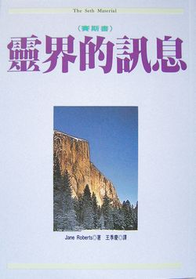

#### 版权信息

书名：灵界的讯息

作者：［美］珍·罗伯兹（ Jane Roberts ）

译者：王季庆

请购买实体书籍·该电子版本仅供参考

## 简介

一九六三年，美国女诗人珍·罗伯兹忽然收到「赛斯」所传来的「灵界的讯息」。赛斯说他是一个不具肉身的存在，已完成尘世生活的轮回，现在他是教师，以深入浅出，不带迷信色彩的语言，传给人类多次元世界的知识。

他们长达二十年的合作，传下了后来结集成数大册的通灵讯息，这即是如今风行欧美，成为新时代（New Age）运动中心思想的「赛斯资料」。

本书是「赛斯资料」的入门书，详述了罗伯兹与赛斯达成接触的经过，并以突破性的观念，说明了超感官能力的开发、轮回的意义与结构、多次元时空的实相、人类超越肉体的「本体」、神的观念等重要的心灵课题。

无论你是科学家、修行人，或是生命的探索者！经由此书，都将发现一片崭新的天地。

## 译序：朝闻道，夕死可矣

王季庆

世人可以大别为两类，其一是只关心现实人生的问题，对于所有「形而上」的问题，认为既不直接相关，也不可说不可解。另一类人则对「生命由何而来，又往何处去？生命的意义和目的何在？」等等的问题耿耿于怀，没找到答案前，无法获得心灵的平静。

不论是幸或不幸，我显然属于后者。于是我不断地从人生的各面——艺术的、心理的、哲学的、宗教的——去找问题的答案。在美居留的那段时期，我看遍了有关神祕学方面的书，最后才看一本叫作《赛斯资料》（Seth Material）的书（即这本《灵界的讯息》）。为什么排在最末？因为我根本不懂书名的意思。看完《赛斯资料》的那天，我跟我先生说：「『朝闻道，夕死可矣。』我现在明白那种感觉了！」

「赛斯」是女诗人珍·罗伯兹于一九六三年在自发的「顿悟」下写了一篇「物质实相是意念建构的」后不久，她在出神状态接上线的一位「精神导师」，他透过珍的口授传过来一些振聋发聩的观念。其中的过程、细节及资料内容，都详载于这本书及其后的赛斯书中。

那么，赛斯是谁？是个鬼魂、幽灵，或玄学上所谓的向导、导师？也有人曾怀疑他是珍潜意识的一部分。按照赛斯的说法，我们每个「人」基本上都先是个不朽的精神体，也可说是「幽灵」，只不过目前我们像穿上太空衣一样地穿上肉身，以便能存活在物质世界。目前的我们，可暂称为一个「自己」，却都是「全我」（whole self）、存有（entity）或本体（identity）的一个小部分。他说：「……直到全我能……同时知觉他自己的各部分之前，似为分离的各部分看他们自己是单独的、孤立的。在他们之间有沟通，但他们无法察觉它……这全我曾活过许多次，曾采用过许多个人格（自己），它是一种『以能量为体性（素质）的人格』，就像我也一样……人格和本体不必依赖物质的形体。」

所以，赛斯应可谓是一个曾经历过多次「人身」，但已脱离三界的一个「全我」，由于他对人类世界的了解与关怀，自愿担当起「教师」的任务。我认为，他所传过来的多卷资料，就是自古以来「口述传统」（Oral tradition）所传的真理，也就是先于各种宗教、哲学，而为各宗教源头的共同真理，只不过那最根源的真理在传述、记载的过程里，受了当时当地民情风俗、政治文化重重影响而越来越失真，并且渐失活力而成了僵化的教义、教条等等。他又说，每一代都会有像他一样的教师用合乎当时人之理解程度的话来重新给予这知识。不过，由于「传播工具」——灵媒本身的信念、信仰、偏见、恐惧等等，极难传过来没被扭曲的资料。

在这一点上，凡是仔细读过赛斯书的人都异口同声承认其纯粹及优异。资料内容之博大精深、言论之公允不倚，不能不令人赞叹！试想以珍身为诗人的背景，她的想象力和创造力固然丰富，但科学方面的知识实在不足，却能将心理、意识、细胞、疾病、物理、原子、量子，甚至更深奥的多次元实相加以解释、剖析，而其传授之速度及前后的一致性，都证明这资料根本不可能是由她信口胡诌出来的。因此，「赛斯现象」本身就足以证明我们并不是局限于肉身，只活在生死之间的生物。事实上，这一生只是我们多重次元的存在之冰山一角而已！

至今，各国的赛斯读者对他的喜爱和推崇都是无与伦比的，那是一种不带宗教或迷信色彩的「我找到了！」的狂喜。有人说赛斯书救了他的命，有人说是现代佛典，有人说是治身之圭臬、处世之龟鉴、乱世之圣经。读者且亲自尝味吧！

## 自序：你们以前活过，将来还会再活

珍·罗伯兹

时间是一九六八年二月二十九日，我正在讲一周两次的 ESP（超感官知觉）课。大的凸窗开着，放进暖得不寻常的晚间空气。在我们当作课室的客厅里，灯正常的亮着。突然我觉得我们有了位访客，我很容易的便进入了出神状况，没有先兆，一向如此。

这个班由大学女生组成，他们曾读过我的第一本书《实习神明手册》，知道赛斯其人，也上过我几次课，但却从未目击一次赛斯课。我的双眼闭了起来，过了一会儿当它们睁开时，双瞳幽深了许多。我开始替赛斯说话。他以一种快速而具特征性的手势把我的眼镜扔到地上，但现在我却以锐利而焦点清楚的眼光，细细审视每一个学生。我说话的嗓音深沉而相当大声，比较像男性而非女性的嗓音。

我们有了一次即兴的赛斯课（Seth session），把赛斯介绍给学生们，我现在为了同一目的，介绍赛斯给那些没听到过赛斯的读者，我从其中摘录如下：

「按照你们所受到的教导，你们是由物质所组成而无法逃避它，事情并不是这样的。物质将会分解，但你们却不会。虽然你们找不到我，要知道我是在这儿的。你们自己的父母仿佛由你们眼前失踪而永远消失为乌有，我可以向你们保证他们将继续生存，我可以向你们保证死亡是另一个开始，而当你们死了，你们并不噤口。因为，难道现在你们听到的这声音是沉默吗？难道你们在这屋中感觉到的存在是死亡吗？

「我在此是要告诉你们，你们的喜悦并不依赖青春，因为我一点也不年轻。我来此是要告诉你们，你们的喜悦并不依赖肉身，因为在你们来说我没有肉身。我拥有我一向所有的：我的本体（identity），它从来不会减少，它成长而且发展。

「你就是你，你还会是更多。不要害怕变，因为你本身就是变，当你们坐在我面前时你们就在变，所有的行动都是变，否则就会有一个不动的宇宙了，那时的确死亡就会是结束。我是什么亦即你们是什么：个人化了的意识。

「随季节而变，因为你们比季节更广大，你们形成季节，它们是你们内在心灵气候的反映。今晚我来此只有一个目的：使你们能感受到我的生命力，而感受到它时，就知道我是从一个超越了你们所熟悉的次元（dimension）中向你们说话。坟墓并不是结束，因为像我这么喧嚷的人从不会以死亡的唇来说话。

「我在这个房间里，虽然你们无法认出我在任何一件物体内。你们就和我一样的不具形体。你们有一个工具可用，一个可称为是你们自己所有的身体，如此而已。我得到鲁柏（Ruburt） ﹝赛斯给我的名字。此外，赛斯总把我说成男人﹞的许可借用他的身体，但我之为我并不依赖原子分子，你们之为你们也不依赖物质。你们以前曾活过，将来还会再活。当你们结束了具体的生存，你们仍将活着。

「我到这儿来，就好似我透过一个在时空中的洞出现。在时空中你们有可资旅行的道路。在梦中你们曾到过我在的地方。我要你们感觉你们自己的生命力，感觉它旅行过宇宙，乃知它不依赖你们的肉体形象。事实是你们把自己的能量投射出去以形成物质世界。因此，要改变你们的物质世界，先得改变你们自己。你们必须改变你们投射的东西。

「你过去永远存在，而你将来也永远存在，此乃存在和喜悦的意义。所谓的神就在你之内，因为你是所有存在的一部分。」

赛斯经我发言超过两小时之久。他说得这么快，以致学生做笔记都有困难。他的快乐和活力显而易见。他的个性并不是我的。赛斯一本正经的、讽刺性的幽默由我眼中闪耀出来，我脸部的肌肉重新安排它们自己成为不同的模样。我正常的女性手势被他的取代，赛斯在享受他的扮相：一个老年男人，精明、有生气，颇有人情味。当他讲到存在的喜悦，即使他深沉的嗓音隆隆，也透露出他的喜悦之情。后来学生之一的卡洛告诉我，虽然她明知字句是由我口中出来，她仍感到它们是由四面八方而来，由墙壁本身而来。

有一次休息时，卡洛念她作的笔录。突然，没经过过渡，我又是赛斯了。我倾身向前，开着玩笑：

「如果你想作我的速记员，你一定得做得更好一点。你写得潦草不堪。」

然后开始了一段往复问答，当卡洛念她的笔记时，赛斯予以订正，增加几点以澄清某句，同时与她彼此嘲弄着，学生们问问题，赛斯回答。

这是一堂非常简单的课。赛斯第一次对学生们说话，然而他触及了在赛斯资料中常出现的几个论题：人格是多次元的；个人基本上不受时空的限制；命运在我们自己手里；此生所没面对的问题来生得面对；我们不能为自己的不幸埋怨神、社会或我们的父母，因为在这肉体生命产生前，我们选择了我们将要投生其内的境况，以及最能助长我们发展的挑战；我们形成物质就如同呼吸一样的不费力、不自觉；以心电感应的方式，我们全知道那些「群体概念（mass ideas）」，我们由之形成对物质实相（physical reality）的整体观念。

到了一九六九年十二月，在五年间我丈夫罗（Rob）和我已举行了超过五百次的赛斯课。在这一方面我的第一本书：《实习神明手册》，简短的解释导致我对 ESP 发生兴趣的情况，以及导致我认识赛斯的实验。从那以后，赛斯曾在数不清的场合示范心电感应和千里眼的能力。透过赛斯课，他帮助了朋友、陌生人和学生，而且我丈夫和我也由听从他的指导而在学习发展我们自己的心灵潜能。

然而我却并不是个「天生通灵者」，有超常的经验作背景。罗或我对这种事都没有一点知识，即使在我最早的热心之后，若不经过严肃的自问和理智分析，我也不接受这些发展，我要尽可能的把我的经验保持在科学的基础上。

我等于是说：「是的，我的确在出神状态下替一个自称死后犹存的人物说话。是的，你能发展你自己的超感官能力。是的，赛斯的确坚持转世是事实。但……但……但。」我觉得赛斯资料所谈的概念很迷人，但我并不准备接受它们像我接受某些确定的事实——譬如说，我早餐所吃的咸肉——那样。现在我却明白它们是重要得多了。

对我而言，甚至承认赛斯是个死后犹存的人物这个可能性已经等于是理智上的自杀。在我第一本书中我从未说过我认为赛斯确然是他自己所说的那样「一个能量人格元素（an energy personality essence），已不再集中焦点于这物质实相的『人』。」反之，我一方面研究心理学家和超心理学家对这种人格的各种解释，一方面研究灵魂学者的说法。我从未找到比赛斯资料本身所给的更合逻辑、更前后一贯的解释。

我这么习惯于把自己认作是个物质的、为时空所限的生物，以致我几乎拒绝接受我自己的经验为证据。我一面涉入世上最直觉性的工作，一面试图变得越来越客观。我试着退回到一个我真的已永远离开了的世界——一个宇宙，在其中没有一样东西不是以物质的方式存在的。一个世界，在其中由任何其他实相或次元中来的讯息都是不可能的。然而，我们继续着每周两次的赛斯课。

当我坐在客厅里为赛斯说话时，我开始有「出体」（灵体投射 astral projection）的经验。赛斯描写我看到什么，同时我自己的意识在几里之外，看到另一个市镇或州的某个地点和发生的事。例如我们的档案包含了加州两兄弟的声明，断言赛斯正确的描述了他们的家和社区，当时我在三千里外纽约州的艾尔默拉替他说话。我总不能否认这些事实。

在我先前的书出版了之后，陌生人常来信寻求帮助或劝告，最后我同意为那些最急要的人举行几次赛斯课，虽然这责任使我害怕。所涉及的这些人并没在场参加，因为他们住在其他地区，然而他们说所得到的劝告对他们有所帮助；赛斯所给有关个人背景的资料也都正确。赛斯常把困难解释为过去转世（reincarnation）生活中未解决的压力，并且还针对现在一个人如何能运用他的能力去面对这些挑战而给予个别的忠告。

在此之前，我曾怀疑转世资料是我自己的潜意识炒出来的一盘可喜的幻想佳肴，事实上，当所有这些事开始时，我完全不能确定我们是否能战胜死亡一次，更别说一次又一次了。

罗和我绝非传统的虔信者，除了参加婚丧礼之外，我们好些年没去教堂了。我自幼为天主教徒，但年纪越大越难接受我祖先的上帝，嘲讽在对我耳语：他与他们一样的死了。在童年时给我支持力量的天堂，在我十来岁时似乎成了对有意义的存在的一种肤浅嘲弄。谁要闲坐着对一位父——神唱圣咏，即使他「真的」存在？哪类明智的神会要求这种经常不断的崇拜？真是个非常无安全感的、极为人性化的神。

另一个选择，地狱之火，也同样的不可信。然而我们祖先的传统上帝显然良心平安的与有福之人在天堂坐着，同时魔鬼在折磨其他不幸的死者。我决定，那样的神是出局了，我不会忍受他这样一个人作为我的朋友。如故事所述他对儿子也不算太好。但我想耶稣至少还可以尊敬，他曾在世，他知道做人是怎么回事。

于是，在我二十岁以前，我把那古老的上帝、那童贞女和诸圣相通通留在身后，天堂和地狱、天使和魔鬼都被摒弃了。我称之为「我」的这一堆化学物质和原子不会落入这种陷阱——至少是我能认出的陷阱。

罗的背景不同，他双亲的教派是一种交谊性的基督教，很可喜的缺乏教条。一般而言，上帝爱穿了浆洗衬衫的男孩、女孩，住在那些可接受的地区，鞋擦得亮，有个会赚钱的父亲——如果他们的母亲为家长会烤小甜点那就更好了。

我俩对这样一位上帝的明显不公平并不怀恨——我们对他没那么注意。我有我的诗；罗是个画家，有他的画。我们个人都对自然有一种强烈的联系感。于是，当我发现自己十分突然地替一个假定死后犹存的人说话，没有人比我自己更吃惊。我有时严责自己，心想即使我的爱尔兰祖母也会难以接受在客厅中出现鬼——而我过去还认为「她」迷信！

感谢我的大学教育和敏锐的头脑，以及相当重的天生反叛性，我以为我已逃过了成人的胡说——一个不死的灵魂似为其主要部分。花了一段时间我才发现，我反对灵魂犹存的概念与其他某些赞同者的偏见是一样的深。现在我觉悟，虽然我以头脑开通自詡，我的心理弹性却只延伸到能适合我自己的成见的一些概念。现在我知道，人类人格有比我们通常准备给它的深广得多的实相。「某人」已生产了超过五十本笔记的绝妙资料，即使在我最怀疑的时刻，我也必须接受这赛斯课和资料的真实性。这资料的范围、品质和理论几乎立即使我们「上了瘾」。

罗和我都深信赛斯资料来自超乎我自己的泉源，比我们碰到过的其他超常文章要较少被一般传统惯用的象征所扭曲。赛斯说这资料在其他的时间和地点曾由他和其他人给过。但多少世纪以来，为每个后继的一代，它会再以新的方式给出来。读者需自作判断，但就个人而言，我确认他的学说是正确而且重要的。

还有，如赛斯这种人物的谜——有人叫它「附魔」，一个「护灵」（如苏格拉底所为）——历来一直为人类所关切，这现象绝不新。经由叙述我自己的故事并展示这资料，我希望对这种经验的本质有所阐明，并且显示人类人格仍有尚待开发的才能，而除了我们平常所用的方法之外，还有别的方法可获取知识。

赛斯资料完全改变了我对「实相的本质」的概念，并加强了我的本体感（sense of identity）。我不再感觉像我以前所觉得的，即人是时间、疾病和衰败的奴隶，为他自己无法控制的先天破坏性倾向所左右。我从未像现在这样感到能掌握自己的命运，而不再被在我童年时期由潜意识所设的模式所控制。

我并非暗示我感到自己已全然由每种忧虑和恐惧中释放了出来。只是现在我知道我们的确有自由来改变自己及环境，我们以非常基本的方式形成了环境，再对它反应。我相信我们形成自己的实相——现在及死后。

此书的目的是为你介绍赛斯和赛斯资料。虽然赛斯只有一次以物质性的具体化出现，罗看得够清楚而画了一幅他的像，挂在我们客厅里。在不到五年之内，经过我，赛斯已制作了一个持续的文稿，长过五千页双间隔打字纸，我知道许多「活着的」人终其一生还没写过这么多。然而我自己的工作还继续着：自赛斯课开始后，我已写了两本非小说（这本不算）、两本诗集和一打短篇小说。赛斯显然没有为他的目的而「偷窃」我任何的创作精力。

此书的第一章将谈赛斯其人的出现，以及在我们试着了解发生了什么事时，他对我们生活的大冲击。仿佛是突如其来的，我发现我有了以前认为几乎不可能的经验。在我们一生里，我们从未像现在这样的陷于好奇与戒慎之间，如此的着迷又如此的困惑。

第一章也会包括一些早期赛斯课的摘录，因为在那时赛斯的观念和赛斯课本身对我们都是既新鲜又怪异的。但主要的重点在故事本身，从第一次的「灵应盘」（Ouija（类似碟仙——译注）实验一直到我第一次为赛斯说话而使罗和我自己都大吃一惊，以及当更多的发展发生时我们态度的改变，我也将赛斯千里眼能力的例子包括在内。

整本书将说及赛斯在各种论题上的概念。譬如说死后的生活、转世、健康、物质实相的性质、神的观念、梦、时间、本体和知觉。我确信由资料本身的这些摘录中和一些转世资料的例子中，大多数读者能对他们自己的人格和他们自己的处境有更深的洞察力。我希望赛斯对健康的学说能对所有的读者有益。讲人格的资料将帮助每个人发现他本身天赋的多次元实相（multidimensional reality）。

通灵术与 ESP 现象以及赛斯资料的可能来源，在哲学和心理学上的含义，连同有关赛斯自己独立的实相这几个问题都将被考虑到，我也会讲赛斯在发展心灵能力方面所给的忠告。

对心灵学读物和超常经验熟悉的人会比我对这些事件有更好的心理准备，但即使拿全世界来换我也不愿错过了它们。

## 绪论

雷蒙·范·欧弗

通灵术（mediumship）是个迷人而具煽动性的题目，因为它触及了有关人的心智、意识的本质、甚至最终的命运这些基本问题。灵媒一般的定义是：一个假设易感受超常力量，能传递由它而得的知识，或做出非由其助不可能做的事的人。大多数人想象中的灵媒是个奇装异服的女士，藏匿于黑暗的角落，等着从主顾那儿骗他们的血汗钱。虽然这种灵媒无疑仍然存在——我甚至还碰见过几个——我们却不能以偏盖全。

十九世纪末叶时，通灵术流行起来，而灵魂学（spiritualism）发展成它的宗教。那时「降神会」常是在半暗中、精心设计的小房间内举行的。这房间常常像个小剧院，其布景是个小教堂或是具有一些其他的宗教寓意。问事者通常因某种家庭中新近发生的悲剧而情绪过度亢奋，又进一步的被圣歌或风琴音乐带到歇斯底里状况。总而言之，那是一出制作成功的好戏。通灵者进入出神状态（trance），经由她的幽灵「监使」（control）的帮助，传递来自在「灵界」的已死亲人的消息。这些讯息多半是琐碎的、甚至愚蠢的，但丧失亲人的人感到安慰的回家了，因为他们所爱的人仍然在「某处」存在，并且过得很「快乐」。

有时，灵媒展示出某种似为超感官知觉的知识。超心理学（parapsychology），或对 ESP（超感官知觉）的监控的、科学的调查，即因灵媒的这种面貌而兴起。无疑的，通灵术和灵魂学曾经并且仍然格外的易涉及欺诈。在较微妙的知觉领域里，客观证据很难得到，而且几乎不可能把它放在有效控制的情况之下。在大多数这类调查中，接受某一个事实往往并非由于证据，却是由于信心。证据是很少的，信心却永远有很多。也许，著名的心灵研究者哈里．普莱斯（Harry Price）说得最好：「灵魂学上焉者为宗教，下焉者为欺诈。」

但自从对通灵术的出神状态开始调查以来，我们渐渐明白它是一种复杂的经验，是现在名为 「意识改变状态」（altered states of consciousness）这较广现象的一部分。在其他种类的出神状态，如昏迷、强直性昏厥（catalepsy）、晕厥和生机暂停中，疾病状态常占主要地位，这些全与无意识有关，而其他一些由某种药物或疾病对身体化学的影响而引起的某种情况也一样。这些情况比其他的意识改变，如正常睡眠、催眠或梦游等都要来得强烈。

在许多种意识改变的情况里，通灵术是最有价值的一类。因为就是在通灵术里，最方便对人类心智（mind）的主观领域加以研究。许多研究通灵术的人都曾写说，事实上那是一种扩展知觉的方法。英国物理学家雷诺·约翰生（Raynor Johnson）曾评论说，有许多种「意识自正常的清醒层面撒回的状况——我们可统称之为出神状态，有些可由催眠……；由药物如 mescaline，或由麻醉药品达成；另一些可由某种瑜伽训练达到……一个灵媒或敏感者可以自动的进入某种出神状态，其时意识撤回到自身的一个过渡层面，而在同时能与外界维持一条『通讯线路』。」因为这是一种「自」导的出神状态，并且比较没有病态情况，通灵术对这种经验能有较大的控制，就如在催眠的例子里一样。

珍·罗伯兹（Jane Roberts）与其他几位突出的灵媒，如爱琳·加莱特 Eileen Garrett）及奥斯勃恩·里奥纳德夫人（Mrs Osborne Leonard），共具一些独特的特性。许多灵媒对他们自己的通灵资料有近乎宗教似的轻信。的确，由于作灵媒的经验，他们常生出宗教上的皈依。但有些灵媒虽然为他们所接触的潜意识世界吸引，却抗拒立即相信并依赖一个通灵人格（Trance Personality）的通讯的诱惑。例如 Mrs. Garrett 奉献一生调查通灵术的意识、她自己的无意识世界及一般的超心理学现象。 Mrs. Leonard 也献身于深究她自己的通灵术问题，让她自己作为许多试验的对象。

伟大的灵媒就像伟大的音乐家或艺术家那么稀有，他们的特性包括对出神状态的易感性、和强有力人格的奇特混合：好奇，同时又客观，又很诚实的自我批判。当然，特别好的灵媒个性中的许多特征不是能轻易描述的，但对我来说，珍·罗伯兹很明显的是个极好的灵媒。

大胆的以自己的主观经验来实验——检查灵感、想象力或创造力的来源——一向是特殊人物的特征。Andre Breton，「超现实主义者之宣言」的作者，着迷于在艺术中结合真实与非真实这个概念，也许因为就像日本 Sumi 画家一样，他对两者之间的分界不大有把握。他做了一连串「自动书写」（automatic writing）的实验，以发现我们所谓的「真实」的奥秘面。Breton 辩解道，其结果是内在人的较纯粹的表达。这无意识世界和客观或有意识知觉的结合，与珍·罗伯兹所走的路相似。对一个没从事通灵术多久的年轻女性来说，她在走向开放的、自我批判的分析上已有长足的进境，而那种分析对真正了解她的通灵术和它更广的含意是必要的。她已深深地把自己付托给那些基本上是哲学问题的实际应用。不过，这种驱力一部分必须归功于赛斯（Seth），即由她的通灵术中发展出的通灵人格。

一个通灵人格通常称为「监使」，因为假定它操纵着在出神状态中的灵媒的肉身，它常具独特的、个人化的特性。早先，大家自然相信灵媒的「监使」是个幽灵或离开了肉身的「存有」（entity），占领了灵媒以为与活人交通的方法。但在 F.S.Edsall 的「心灵现象的世界」中，他指出通灵人物或「监使」的发展似乎有赖与灵媒的背景或环境有关的潜意识经验。关于「监使」人格是什么，以及它如何与人交通，这些问题是极其难解的，超心理学家和深层精神分析师数十年来都在研究它。（顺便说赛斯——依我看是以诚实和常识——讨论经过灵媒而得到的资料在过程中被扭曲的难题。因为假定他们与超常力量有密切关联，大家乃期待灵媒有百分之百的精确性，自然事实并非如此。但这种态度十分流行，在公众对 Cayce 或 Dixon 的态度中即可看出。）有些人相信人类具有超越感官的才能，并且十分可能影响及无意识，却似对意识完全没影响。Edsall 写道：「与灵媒的环境有关的经验对于形成这些不凡的第二人格也许有关系。在某些杰出的灵媒的例子里，他们的第二人格似乎那么怪诞的无所不知。」

曾有许多心理学的学说被提出来解释通灵人格的存在，譬如纽约分析家 Ira Progoff「力型」（dynatype）的学说。在与 Eileen Garrett 作了广泛的研究后，Progoff 结论道「不同的监使人格的存在对维持 Mrs. Garrett 的心灵平衡是不可或缺的。」Dr. Progoff 视通灵术的监使「非为幽灵式的存有，但为一戏剧化的象征形式，用以使人生较重要的原则在人类经验里明确的表示出来。」与此相似的，苏格拉底有他自己的「daimon」；Graves 有他的白色诗神；诺亚在醉乡里把自己视为他祖先的转世，先是亚当，然后是耶利米。于是这理论说，每个人现出他潜在的真我。通灵者如 Mrs. Garrett 曾猜想也许他们创造出他们的「他我」，只是以一种更可辨认的、更合理的形式出现——像这种 daimons 或「幽灵」监使。

然而，一位有名的、客观的心灵研究者 W. H. Salter 另有看法：如果通灵人格年复一年的继续通讯，「从不曾把精神的或情感的重点弄错，说的话从不与他的个性不合，那就很难以潜意识影响或灵媒方面的戏剧化来做成一个合理可信的解释了。」

最终的、明确的答案还有待来日，这种问题不该盖过了在通灵术的其他方面同样重要的问题。灵媒在出神状态传达的「内容」常常被忽略，无疑是因为大多数时候它们是有些愚蠢和不通的陈述。但同样的在那些稀有的例子中！像 Edgar Cayce 在出神状态下所说的——出现了我们必须考量的重要且具煽动性的概念。珍的「通灵」人格，赛斯，就值得这样的重视。

最佳的通灵资料显示良好的心理洞察力，由一个富同情心的坚强人格传达过来。赛斯资料传达了所有这些品质。不过，赛斯又加了一项大多数通灵资料中所没有的成分：思想和表达方式的清晰。大多数的通灵资料——自古至今的灵媒监使都一样——表现得不但句法混乱，思想也很紊乱。然而我相信赛斯有一种伟大的才能，能把复杂而常常很困难的主题介绍得简单明了。对受过训练的人、职业性的哲学家、学院派的超心理学家，他谈的有时会像是很熟的事，（例如他认为人的心智在睡眠中离开身体，这是一种古典的说法，可一直追溯到原始时代。）但对那些刚认识梦乡的迷人世界、ESP 和其他无意识的种种现象的人，赛斯将是一位目光澄澈的教师。

这些追求者、询问者一直就是赛斯说话的对象，他声明他通讯的目的是供给「使人比较能认识自己、重估现实和从而改变它的方法。」在内在感官那一章，赛斯对于如何去扩展一个人的知觉，如何发展冥想的技术和 ESP 提供了清楚有用的劝告。同样，赛斯和其他少数几人如 Edgar Cayce 的通灵传讯的独特性，在于大量的常识性忠告，以及对个人问题的悲悯关怀，大大的冲淡了哲学的玄学的思索。这些成分似乎是赛斯资料的主要特性之一，并且也是我个人觉得最吸引人的地方。

有趣的是，赛斯的人格和表现是如此的个人主义，经过一短时期的熟习后，一个人会有把它们当作是由一个受过训练的现代知识分子而来的倾向，而不会当它是来自 Isis 女神的面纱之后。这资料同时又包涵了惊人的范围广大的概念，这些概念常是令人感兴趣又有独创性的。我特别对赛斯处理「人格片段体的投射」的方式感兴趣，这一点非常强烈的属于条顿族的 doppleganger 和斯拉夫族的 Vardoger 的传统内。（这是一个很广被的现象，甚至如弗洛伊德也很短暂的在镜中看过他的 doppleganger。莫泊桑有一次看到他的「副本」走进房中，坐在他对面，口授曾特别困扰这位法国作家的一本书的那一部分。口授完了之后，它就站起来消失了。我只希望赛斯更清楚的描述与这事的「学说」相对的「技巧」。）自然，还有秘术传统的「思想形」（thought-form）的投射，如 Mrs.David-Neel 在创造她的西藏「tulpa」时所描写的。

的确，照赛斯所说「一个概念『就是』一个事件」，因此，逻辑上来说，任一概念——不论在哪种活动范围，不论已实际的具体化了没有——对我们的生命都有冲击力。「概念当作实相」（reality），是西方文明中的另一个古老观念，早已被柏拉图正式化，而一直被许多哲学家保留下来。但赛斯不仅只以抽象的术语讨论这观念，并且把它发展为逻辑的结论。所有的概念、思想和心神贯注的区域共同创生了动力充沛的、持续地息息相关的宇宙，其中「概念」和任何实质事件一样扮演重要而确定的角色。

赛斯对「耶稣被钉死在十字架上」的学说是一个理想的例子。依赛斯所说，此事源于「梦的宇宙」，在另一个实相中发生，而「以『概念』的形式显现在历史中」。赛斯不是说此事只是一个因人内在的共同需要而产生的梦，而是一个概念在另一时空领域中实现，而改变了我们的文明。自然，这是一个有趣的推想。但且花一分钟想想我们多么轻易地接受一句简单的哲学格言：「一念能改变世界」。有许多例子：「人不能只靠面包生存」，「爱邻如己」。在我们的日常生活中，我们的确试着把这些概念表之为实相，把它们由抽象世界中移到因果律的世俗世界。实际上，赛斯以他的建议扳转了局势，他建议实相可能在「另一个」方向也行得通：概念即实相，而一直对世俗世界有显着的影响。问题在加宽我们感知的基础和觉知，以使世俗意识能显出在这概念世界上，因此我们能察觉到概念世界对我们的文明及个人生命的冲击。赛斯说：「梦的宇宙拥有某一天会全盘改变物质世界的历史的那些概念，但拒绝接受这种概念之可能性耽搁了它们的出现。」康德——他的哲学多着重于心智把真实性「强加于」「感官资料」上——也许会同意赛斯所说「感官创造了物质世界」，而非仅只是知觉到它。

同时在赛斯的评论中有些一瞥即过的资料是如此的具煽动性，值得获致远比它现在所得的多得多的注意。例如，赛斯言及，某些象征性的人物存在着，他们采用了在无意识内某些可被指认的外貌以便更有效的与我们沟通，这个研究范围缺乏结实的事实，但有丰富的推测和经验报告。伟大的瑞士心理分析家卡尔·容格（Carl Jung）特别指出，无意识中存在着他所谓的原型人物，常常透过象征性的扮相，如神秘的、宗教性的或历史上的伟大人物来与我们的意识相沟通。（容格自己花了几年与 Philemon——一个在他自己无意识中的原型人物——通讯。）Masttr 与 Huston 在广泛的研究 LSD 的效果后，把因药引起的意识扩展分为四类，在第三个或象征的层面，他们报告前后一贯的历史人物或传奇人物的显现，以及丰富的神秘象征。

在哲学方面来说，赛斯资料是我所读过的这类东西中最好的之一。赛斯思想的比较研究一定会非常有趣。他的资料是够复杂的了，即使这本大书也包容不尽，自然，也不可能在这短短的绪论中予以摘要。在读此书时，我脑海中产生了许多问题，许多仍未得解，但我不认为这是件坏事。如果我们在精神上、情感上和心灵上被刺激到去问问题，细察我们标准化了的态度，努力超越我们成见的限制而进入不断开阔的思想领域，我们终究能有相当的成就。我相信，这是赛斯人格和他的讯息的最大价值所在。如他自己所指明的，他是个带讯者，以及一个激励思想者——这样的教师是太少了。

没人可能知道这探索将导向何处，但我们能确定一事：像赛斯资料这样的通灵讯息的记录有不可估量的价值，因为它供给了深入发掘人类主观心智的极稀有的机会，这不是一个随随便便或暂时性的好处，因为这是对一条河流源头的一瞥，而这河同时是既神秘、又刺激、对人类福祉又极为重要的。这儿是灵感之源，这儿直觉点亮了科学的心智，这儿诗人的梦绽放开来，就时间与精力来说，在这儿我们花上了我们生命的主要部分。

## 第一章 我们结识赛斯

引发赛斯课的情况如今仍然使我惊奇。我当时并非在打混，或是寻找人生目的什么的。我的第一本小说正出了普及本，我所有的精力都导向于成为一个好的小说家和诗人。我认为「非小说」属于新闻从业人员而非创作者的范畴。我以为我的生活和工作都已有计划，我的方向已定。然而，我却正在这儿写我的第三本非小说里。

不过，一九六三年对我们而言是很糟的一年。罗患了严重背疾，下班后几乎很少再有足够的精神去画画。我呢，则还没能决定下一本书的主题。我们的老狗米夏死了。也许这些情况使得我比平时更深刻地感觉到我们人类的脆弱，但无疑有许多人曾经历坏年头而并没导致心灵现象（psychic phenomenon）的出现。也许在不知不觉中我面临了一个危机，因而内在的需要唤醒了我的心灵能力。

的确，这类事情我想都没想过。就我所知，我这辈子从未有过一次心灵经验，我也不认识任何有此种经验的人。我过去的背景从未为一九六三年九月三日那天发生的可惊事件铺路。然而我敢确信就是这件事导致三日后的赛斯课及我和赛斯的初识。

那是个可爱的秋日黄昏。晚餐后，我跟平时一样地坐在客厅里我的旧桌子旁写诗。罗在隔三个房间的后边画室里作画。我拿出纸笔、香烟和这天的第九或第十杯咖啡，开始定下心来做事。我们的猫，威立，正在旧地毯上打着呼噜。

接着所发生的事就像一次没有服迷幻药的神游（trip），即使曾有个人暗暗地塞给我一剂 LSD，我也不会有比这更奇怪的经验。上一分钟还很正常，下一分钟新而急进的念头像场大雪崩涌进我的脑海，好像我的脑壳是某种收报台，转开到一个无法忍受的强度。不只是念头由这通道进入，而且还有强化了的、悸动的感受。随你爱怎么说，我的频率调准了，或我的开关被打开了，接上了一个难以置信的能源，我甚至没有时间大声叫罗。

就好似物理世界真的是其薄如纸，遮掩着无数次元的实相，而我被猛力掷穿过这层纸，纸发出巨大的撕裂声。我的身体坐在桌旁，我的手狂速地潦草写下闪过我脑际的字句和念头。然而，同时我却仿佛身在别处，穿过物体在旅行，我垂直坠穿一片叶子，一个完整的宇宙展现眼前，而后又出乎其外，被吸入新的眼界。

我觉得好像知识被注入我身体的细胞内，使我不能忘记它！一种深入肺腑的知识，一种生物性般的灵性。它并非知性知识，却是感觉而后知道，同时我记起本已忘了的昨晚作的一个梦，在其中我曾有类似的经历，我悟到两者是相关联的。

当我恢复知觉，我发现自己正在乱涂着显然是那一堆怪笔记的标题：物质宇宙即意念的建构。后来「赛斯资料」会发挥这些观念，但当时我并不知道。在一节早期的课中赛斯曾说这一次是他首次设法跟我联络。我只知道如果那天晚上我就开始替赛斯说起话来，我会吓得半死。

事实上，我并不知道发生了什么事，然而即使如此，我仍感觉到我的生命顿然改观。「天启」这个字眼出现在我脑海中，我试图摒除它，但那个字却是合适的。我只是害怕这个字眼所暗示的神秘性。在我自己的工作中我对灵感是熟悉的，但这与普通的灵感有天渊之别！

我所「收到的」概念也是同样的惊人，它们把我对实相的概念全部推翻。那天早晨以及到那天为止的每个早晨，我都确信一件事：你能信赖物质实相。有时你可能不喜欢它，但你却能信赖它。如果你愿意你可以改变自己对实相的观念，但这却改变不了实相。现在我再也不觉得是那样的了。

在那个经验当中，我明白是我们形成了物质实体，而非其反面。在无限次元的实相中我们的感官只让我们觉察到三次元的实相。只有不去问那些超越感官有限知识的问题，我们才能信靠我们的感官。

但还有更多，举例来说，我以前真的不知道每样东西都有其自己的意识，现在我突然感觉到在以前我认为是无生物里的奇妙活力。一个钉子钉在窗槛上，而我在极短的一瞬间曾体验到组成它的原子和分子的意识。

相反于我从前所有的概念和常识，我知道时间不是一连串的「片刻」，一个接着一个像晾衣夹紧夹在一根绳子上，而是所有的经验都在某种永恒的现在共存着。所有这些全都是飞快地潦草写下，我还保存着那手稿。时至今日它还使我充满了那种发现和启示的感觉。

这儿是一些摘录：

「我们是个人化了的一份能量，在肉体存在之内具体化，来学习由能量形成意念，进而使其实体化（这就是意念的建构）。我们将意念投射成物体，使得我们能与它打交道。但这物体即经过具体化了的思想。这意念的实体呈现，使我们得以分别『思想』与在思想的『我』。意念建构以具体的方式显示给这个『我』看它自己的产品，而教这个『我』了解到它是什么。换句话说，我们由考察自己的创造物中学习，经由把概念变成物质实相我们学到意念的力量和影响。由运用创造性的精力，我们学习负责……

「存有（entity）即基本的自己，是永生的、无形的（non-physical），它与其他的存有在一个能量的层面上彼此交通，并且它有一个几乎无尽的能量供应其支配，个人只是那全我（whole self）中我们设法用肉体来表达的那个部分……

「眼睛将内在心像（概念）投射并聚焦于具体世界上，就好像一个电影放映机将影像传真到银幕上。嘴创造了字眼，耳创造了声音，是因为，我们早已认定影像和声音本已存在，然后才由感官来诠释它们。事实上，感官是创造的途径，意念乃经它而投射成为实质的表现。

「基本的概念就是：感官的发展并非让我们知觉一个已存在的实质世界，而是去创造它……」

这些概念只是将要发生的种种之试金石。这手稿结果包括了约一百页，包含了对旧术语的新定义，例如：「潜意识是意念在个人意识里浮现的门户，它连结了存有与个人……肉身是存有根据物质的属性来构建出它意念中的自己……本能是为保命所需最起码的意念建构的能力……现在是任何意念显露成为物质的明显的一刻。」

我想这次经验与手稿是隐于每种创造行为后的那「创造性的潜意识过程」的一个延伸：正常的创造力突然「被打开了」，或被提升到一个几乎令人无法置信的地步。在那一夜所产生的能量足以改变我和我丈夫一生的方向。因此之故，我相信这种经验在心理上来说是极端重要的。我确信这事显露出我没想到自己拥有的「心灵」能力，而促使了「赛斯资料」的产生。

显然水到渠成，我已达到一种心灵能力准备好可以现身的境地。因为我早期的写作训练，这能力乃由文字而非幻象显出，并且是在一种不会太惊吓我的方式下出现。

我也相信心灵能力本身是创造力的一脉或一个延伸，天生为我们所固有，因此是正常而非不正常的。不过，以后你将看出，我认为这种能力属于我们人格中所较不为人熟知的那个部分的属性。因而我想，正常的创造力经过提升，便使我们转到了实相的其他次元。

在这插曲之后，甚至我平常的主观经验也开始改变，不久我开始能记起我的梦——突然地，没什么理由地。那就像发现了第二个生命。尚不止此，在接下去的两个月中，我有两次生动的预知梦，那是我所知的头一遭。

别的不说，至少我们的好奇心被引起来了。在一个报摊上我们注意到一本谈 ESP 的书，「千里眼式的梦」这些字眼由封面上跳到我们眼前，我们买下了它。在此时我也正在寻找一个新书点子，而罗作了一个建议，导致我们离以前一贯的生活方式越来越远了。

当我们坐着聊天时，刚买来的平装书正放在我们之间的咖啡桌上。我说：「我已有三个小说大纲，却没一个是我喜欢的。」

罗拿起那本书，玩笑似地说：「你何不写本谈超感官知觉（ESP）的自修书？」「你疯了，我对 ESP 一窍不通，那就是我为什么不写的理由。此外，那是属于非小说类的，我这辈子除了小说和诗没写过别的东西。」

罗说：「我知道，但当你有过那两个特别的梦之后，你必然对梦有兴趣。而且，你对上个月的那个经验又怎么说呢？此外，我们所见的书只谈到有名的灵媒，但一般的人又如何？倘若每个人都有这种能力呢？」我瞪着他，他变得十分严肃起来。「你不能以自己为天竺鼠，设计出一系列的实验来试试看吗？」

那样说的话，罗的念头有理，我可以对现在引起我兴趣的一个题目进行调查，并同时写一本书。

次日我即着手进行，在一周内我已发展了一组实验，以发现一个普通人到底能否发展 ESP 为宗旨，我把此书作了一个大纲寄给了我的出版商，但并没抱多大希望。

颇令我惊奇的是他很快地回了信，而且十分热心，他要的是三、四章样品。罗和我很高兴，但也颇为吃惊，我们一边浏览我为此书所定的章名：「一个自己做的降神会」「心电感应，事实或虚构？」「如何使用灵应盘」。

罗笑着说：「那么，就去做吧。」

我反击道：「你和你的建议！」。到现在我真的有些迟疑了。我们从未去找过灵媒，我们一辈子也没有过心电感应的经验，从来也没见过一个灵应盘。反过来说，我想我又有什么好损失的？

（直到很久以后，我才记起原来是罗的另一个建议使我开始写小说的。）

于是我们开始了，决定先来弄灵应盘，为的是它似乎是我们好些种实验中最不复杂的一种。我们的房东太太在阁楼上找到了一个盘，借给了我们。事实上头几次我们试着弄灵应盘时，我俩都有些窘，我的态度是，「也好，让我们先把这一项解决，以便去做我们感兴趣的事，像心电感应和千里眼。」无怪乎我们头两次的尝试都失败了。

我们试第三次时，在我们指端下的那小小指针终于动了，它拼出一些假设是来自某法兰克·韦德（非真名）的信息，他曾在艾尔默拉（Elmira）住过，于一九四○年代去世了。

这里有一些例子，罗问问题，指针拼出答案。

「你能告诉我们你哪年去世的吗？」

一九四二。

「你认识我们吗？」

不认识。

「你已婚吗？」

已婚。

「你的太太现在活着还是死了？」

死了。

「她叫什么名字？」

乌苏拉。

「她姓什么？」

阿特里。

「你的国籍是什么？﹞

英国。

「她的国籍是什么？」

意大利。

「你生于哪年？」

一八八五。

灵应盘发生了效果使我们惊奇。我觉得两个成人盯着在盘上疾走的指针真是胡闹，我们并没当真。当然，一个原因是我俩都不怎么相信死后的生命——起码不是有意识的、能与人沟通的生命。后来，我们确知是有这么一个姓啥名谁的人曾住在艾尔默拉，死于一九四○年代。这相当令我惊骇。但我们对是什么力量在移动指针比对它传来的信息有兴趣得多了。

几天后我们再试一次时，法兰克·韦德说他在某一生曾在土耳其当兵，并坚持在另一生他认识罗和我，在丹麦的一个名叫特里夫的城里。他给了日期和地点，虽然他很明白的指出特里夫城现已不存在。

然后，在一九六三年十二月八日，我们又坐下玩灵应盘，心中猜想不知会不会成功。那是个舒适的黄昏，室内很温暖，雪花飘过窗户。然后指针突然飞快地移动起来，以至我们几乎跟不上它。

罗问问题，然后我们停一下，同时他即写出指针所拼出的答案。法兰克·韦德在以前的几回曾给一或二字的简单反应，现在答案变长了，而它们的内容也好像变了，室内的气氛似乎也有些不同。

罗问：「你有什么讯息给我们吗？」

意识像一朵有许多花瓣的花，指针答道。

从开始的几次讯息中，法兰克·韦德曾坚持转世的可靠性。因此罗说：「你对你数次的转世认为如何？」

他们即是我，但我将是更多。双关语：全我是其所有的心的总合。

这是第一次指针拼出整句，我笑了。

罗问：「这一切是否都是珍的潜意识在说话？」

潜意识是一条走廊，你走进哪一个门（你经哪扇门旅游？）又有何不同？

我对罗说：「也许是你的潜意识？」但他已在问另一个问题：

「法兰克·韦德，将来我们可否再向你讯问任一特定问题？」

可以，我宁愿你们别叫我法兰克·韦德，那个人很没情趣。

罗和我互相耸了耸肩：这真是疯了，而指针越动越快。罗等了一会，再问：「那你喜欢我们怎么称呼你？」

指针拼出：对神来说，所有的名字都是他的名字。

现在韦德变得宗教性了！我转动着眼珠假装看向窗外。

罗说：「但我们跟你说话时仍需要某种称谓呀？」

随你们爱怎么称我，我叫我自己赛斯（Seth），它适合我的本我。赛斯比较清楚地最近似我现在所是的，或试图成为的全我。或多或少，约瑟（Joseph）是你的全我，是过去和将来的你的各种不同人格的总合形象。

这些全这么迅速地拼出来，我们几乎无法保持把手放在指针上，我禁不住更倾身向前，我颈后发麻，发生了什么事？

罗问：「你能否告诉我们多些？如果你叫我约瑟，你叫珍什么？」

鲁柏（Ruburt）。

我们再度对看，我作了个鬼脸。罗说：「请你稍加说明好吗？」

指针答：说明什么？

「哦，那名字对我们而言有些怪，我想珍也不喜欢它。」

怪的配怪的。

停顿了一下，我们不知问什么或怎么进行，最后罗说：「你可否告诉我，为何今年年初我有那么多背部的问题？」

第一节脊椎骨无法将生命力输入有机体。恐惧压到了神经而引起压抑。精神的伸展允许肉身的有机体伸展，解除压力。

这些只是第一次赛斯课的一点点摘录。（然而，几周后，罗的背又出了问题，去看了一位「（整形治疗师？）按摩脊椎疗病者」，他告诉罗他的第一节脊椎骨错了位。）这次赛斯课一直进行到午夜以后，后来我们仍不眠地谈论此事。

我说：「也许他是我俩潜意识的一部分，以一种我们不了解的方式。」

罗说：「也许，」然后带笑又说：「也许他事实上是一个死后犹存者。」

我颇觉恶心，说：「哦！亲爱的。再说，他又有什么目的？如果有鬼魂，他们一定有比跑来跑去移动灵应盘更好的事可做。」

罗说：「鲁柏，你说什么？」我几乎要打他的头。

不错，赛斯有一个目的：即在过去五年来像时钟一样准的每周两次传给我们资料。但当时我们并不知此事，虽然这已是我们第四次用灵应盘，事实上是我们第一次的赛斯课。

下面两次都差不多，只除了一项令人困惑的因素：我开始预知灵应盘的回答。这给了我无穷的困扰，我变得很不安宁。在下次——我们与赛斯的第四次——在我脑中我越来越快地听见那些字，而且不只是句子而是整段的，在它们还未被拼出之前。

下次的赛斯课开始时一如往常。下午我在一间画廊做事。当我洗完了晚餐的盘子，罗也画完了那天的画后，我们把灵应盘拿出来。

当我们准备好之后，罗问：「为什么珍对于我们与你的接触态度冷漠？我看得出她不太热心。」

她在担心，因为在我的信息还未拼出前，她已收到。那也会让你留神的。

「但这有什么好担心的？」罗问，以一种我当时认为非常棒的假装的天真。

那是比较令人不安的。

罗逼问：「为什么？」

灵应盘是中立的，在脑中的信息则否。

同时，我们告诉了一位朋友——比尔·麦唐纳——我们在做什么。比尔也就告诉我们几年前当他是艺术系学生时见到过一个鬼魂。以前他从未谈过这种事，现在罗问比尔看到了什么。

他自己的「存有」的一个片段体（fragment），一个过去的人格在视觉层面重获了暂时的独立。有时会出这样子的差错。

「那影像意识到比尔的存在吗？」

我几乎没听见罗问这个问题，在整个这段时间，我一直在字未拼出前就在我脑中听见它们。我觉得有把它们说出来的冲动。现在冲动变得更强了，我更着力地抵抗它，然而我却极为好奇，究竟可能会发生什么呢？我不知道——而这使我更加好奇。

指针开始拼出对罗的问题的答案。

以某种潜意识的方式，一个人格的所有片段体都存在于一个存有之内，各有其独自的意识……

指针停了，我觉得好像我正站在一个高跳板上发抖，而所有各色人等都在我背后不耐地等着，我试着叫自己跳下去，事实上是那些字在推着我——它们好像在我脑海里疾驰。如果我不把它们说出来的话，我感觉它们似会以某种疯狂的方式阻积起来，一堆堆的名词和动词在我脑袋里，直到它们把别的东西全挡住了。并不真的知道如何做或为了什么，我张开了口让它们出来。我第一回替赛斯说话，接续着盘上一瞬前拼出的句子。

「当比尔看到那影像，觉察到它的存在时，那片段体自己似乎在作一个梦。存有以一种你会称之为潜意识的方式来运用其片段体。即没有给以有意识的指导。存有给片段体一个独立的生命，然后多少有些忘了那片段体。当一时的失控出现，他俩便面对面了。存有不可能控制片段体人格就像意识不能控制身体的心跳。」

突然字句停了，我瞪着罗。

他问：「你听得见你自己吗？」

我点点头，觉得很困惑：「模糊的，好像我脑袋里进行着某一电台来的广播节目。」我闭口，把我的手放回到指针上，心想我已「说」——或不管是什么——够了，至少对一个晚上来说是够了。

罗问：「赛斯，你肯证实珍收到以上的讯息吗？」

是的，这应使她觉得好过些。

我放松了一点；指针又接替了传讯工作。但罗又问了一个问题。

「那么是否可能走在街上而碰到你自己的一个片段体？」

指针开始回答。

当然。我要设法找一个好比喻来把这一点弄得更清楚些。比如说，即使思想也是片段体，虽然是在另一个不同的层面……

再一次的，当那小指针慢慢地、有条不紊地拼出字句时，字句又同时快速地通过我脑中，我记得一种极端不耐的感觉，然后我大声的完成那讯息：「它们必须被译成物质实相。另一种片段体，叫做人格片段体，则独立运作，虽然是在存有的赞助（监控？）之下。」

再次的字句就这么打住。这回我下决心不再让同样的事发生，直到我有时间把这事仔细地考虑考虑再说。我如此告诉罗。但我们同意与灵应盘核对一下。罗问：「赛斯，珍的回答对吗？」

指针回答：对。不必等占板拼出回答，使她精神大振。

我跟罗说：「我很高兴有人这样想。」但现在事情很安全地又回到占板上去了。我的好奇心又起，我叫罗问只我们中之一人能否使指针动，指针建议我们试试。罗把他的手放在指针上，问了个问题，但它几乎不动。

然后我俩都把手放上去，罗问：「赛斯，你认为如何？」

不太好。你那方的任何接触可能会包括了内在视觉上的资料。珍可能可以直接收到我。两种情况下，接触都不是随时可能的。你们对这一点会比我觉得更窘。

罗说：「哼。」我们笑了起来而终于结束了这节。

然而我不知道如果罗当时了解了赛斯所说「内在视觉上的资料」的意思，他会怎么想，而现在我写这稿时，才刚刚想起当他第一次的几个内在幻影以格外生动的样子出现时，他是相当惊奇的，稍后我会描述这些。自然那天晚上我们主要关心的是我说话的经验。如果我知道这事在下一节中将会如何的扩展，恐怕我已成了神经病。

事实上，下个月有那么惊人的经验在等着我们，使我们几乎中止了这件事。然而同时我们又感到轻松愉快。如果这世界或这实相有比我们所怀疑的更多的什么，我们自然要想找出来。我们仍在继续找，因为即使是现在，在赛斯课里仍有新的成分出现。赛斯资料在继续，而我们仍有无数的问题要问。

那么，赛斯是在十二月八号那天毛遂自荐的。在十五号那天我第一次替他说话。不久，在完全脱离了灵应盘的限制之后，他的人格开始以更大的自由表达他自己。观察这过程非常有意思。为此之故我将写一些早期赛斯课的情形，以便你能变得熟悉赛斯资料，如他给那些资料时的样子，并且看到他显露出他自己的个性。

## 第二章 约克海滨的影像——「片段体」人格

在下次赛斯课前我很紧张，我在艺廊过了难熬的一天，而罗也很累。不过罗相当快的醒过来，因为我得替赛斯讲两个多钟头的话，这一课为了另一个原因也很惊人——除了我说话的方式外，资料的本身也颇令人惊讶。

像以前一样，我几乎立刻在我脑中听见那些字句，但我坚持以灵应盘的方式开始。在我俩都还没说一个字以前，那指针就开始动起来。

好，晚安。

罗打了个呵欠，指针拼出：我希望不是因为我这个伴儿。

罗笑了，说：「赛斯，植物和树是片段体吗？」

指针开始在占板上飞跑。从某种意义来说，所有的东西都可以叫作片段体……但字句在我脑袋里堆积起来，在首先几句拼出来后，我有了沉潜入「未知」及放松的感觉，然后我又开始替赛斯说话了：「但有不同种类的片段体。人格片段体与其他的不同，在于他能使其他片段体由他而产生……」

罗说就好像我在读一篇隐形的稿子，我的眼睛大睁着，在那个时候我断然拒绝把它们闭上，我也不肯坐下。不管发生了什么，我一定要站着，以便如果我害怕起来，我可以抢先夺门而出。

现在想想，这实在是很滑稽的态度。事实上，在替赛斯说话时，我不断地在室内踱步，却几乎不知道自己在这样做。罗尽快的笔录。他不会速记，因此他以普通书法记下一切，然后第二天再把它们打字。然而他不久就发展出他自己的符号与缩写系统。

「在任何一生里的个人可称为他全部存有的一个片段体，具有原始存有的所有属性，虽然是潜藏不用的。你朋友看到的那影像是他自己的一个人格片段体，它包含了你朋友所有的才能，是否是潜在的我不知道。这种人格片段体与你的朋友来源不同。你的朋友本身则是他自己的存有的一个片段体。我们称这类片段体为一个分裂人格片段体，或一个人格影像片段体，通常它不能在你们物质界的所有层面中运作。

「一个人可能将一个人格片段体影像完全送入另一个存在层面里去，甚至连他们自己都没意识到。它在那另一层面可能获得有价值的资讯，然后再回来。有时候这个人并没有吸收这份知识的能力，甚或不认识他自己回来的人格影像。你朋友看到的就是这种，但它与你朋友如此缺乏联系，而且它是在如此漫不经心的态度下被送上旅途，以至于它的资讯可能已直接传送给你朋友代表的那个存有了……」

后来罗告诉我他有形形色色的问题，但他不想插嘴，而他的手作笔录也已很累了。所有这些时候我一直不断地在房里踱来踱去，两眼半开，毫不犹疑地传送这个独白。

「事情的趋势是，有意识的个人其注意力会越来越集中，于是能审视这些分裂人格片段体或影像，而不至使现在的自我遭受到注意力分散的负荷。那么，是由你们所谓的潜意识来执行这责任的；做得不顶好，因为潜意识本就不是要清楚地集中焦点。在你们的层面里意识将会扩展。意识的范围将会扩大到如此地步，以至在连续转世中的所有人格片段体、分裂人格片段体和个人片段体全都可以不费力的被保持在清楚的焦点内。进化是向着这种目标前进的，虽然自然是以它一贯的『驴步』速度前进。」

从九点开始，我稳定的继续给这些资料，直到九点五十，罗的手发生了「作家的抽筋」。这儿我只给了摘录。我俩都很惊讶我讲了这么久，说了这么复杂的字句而没有一点改正或迟疑。然后，十分钟后当我们在休息时，罗说他将问问我们有没见过这种「人格片段体」影像。立刻，我脑中又开始有字句，而我开始口授了。在说话时我对这些字的意义丝毫不知，因此一直要到我们下次休息时，我才知道赛斯说了些什么。过后，下面这一段令我俩觉得非常不安。

「在约克海滨的跳舞场所里的那男人和女人……是你们自己的片段体，被扔出来的你们自己负面、侵略性感觉的具体化……在当时你们累积起来的破坏性能量形成了这影像。虽然你们并未有意识地认出他们，无意识地你们对他们知之甚深。无意识地你们看到了你们的破坏性倾向的影像。这些影像本身又唤醒你们去与之格斗。」

罗即刻明白了赛斯所说的那一件事，我真不懂他怎么能坐在那儿镇定地作笔记。

一九六三年尾，在赛斯课开始前几个月，我们去迈阿密的约克海滨度假，希望换个环境会改进罗的健康。医生不知道他的背是什么毛病，乃建议他住院作肌肉牵引术。我们反倒认定罗对压力的反应至少对他的背疾要负一部分责任，因此以度假取代之。

在上面提到的那个晚上，我们到夜总会去寻找一些假日气氛。罗经常在疼痛中，虽然他不抱怨，却无法隐瞒那突发的痉挛疼痛。后来我注意到一对老年人坐在房间的另一边，我委实被他们与罗和我怪诞的相像吓了一跳。难道我们看起来是那个样子——疏远、悲苦——只是较年轻吗？我无法把眼光从他们身上挪开。我终于把他们指给罗看了。

罗对他们看了一眼，又因另一次的背部痉挛而呻吟，然后发生了一些我们一直无法解释的事。全然出乎我意料的，罗站起来抓住我的手臂，坚持要同我跳舞。在一分钟以前，他还几乎连走都不能走。

我只呆瞪着他。结婚八年来我们从未共舞，乐队在奏扭扭舞曲，当时我们对那是完全不熟的。更有甚者，罗不肯接受拒绝。我怕自己出洋相，但罗却把我拖入舞池。我们一直跳了整晚，而从此以后他的健康情形大为改善。他的人生观自那一刻起似乎开朗多了。

现在赛斯说：「回想起来，你们可以说那效应具有治疗性，但如果你们潜意识地接受了那影像，那就是你俩个人方面和创造力方面开始严重退化的记号。再者，这影像也显示出你们的破坏性能量的危险累积。这影像是你们自己的影像表示你们的破坏性能量转向内了，纵使它们具体化成了实体形式。

「你们的跳舞代表离开那影像所表示的意义的第一步。在这种情况下，强烈的行动是最好的事……可能会发生一个微妙的转变：你和珍很可能会把你们人格的一大部分转移进你们自己创造的片段体里去……而从他们眼中由房间对过看你们自己。在这情形你们目前的主宰人格就不再会是主宰了。」

在休息时，罗告诉我赛斯所说关于那影像的事。那时我俩都还没听过「思想形」（thought-form），整件事听来难以置信。不过，我想到，心理学家谈到投射与转移，借之我们把我们的恐惧向外投射到别的人或物身上，然后再对它发生反应。

「也许赛斯意指一种象征性的创造？」我说。但字句不久又开始来了，渐渐可知赛斯明显地坚持一个货真价实的具体化。

罗问：「谁先离开房间，珍和我或那对影像？」

我再次替赛斯说话：「那投射出来的片段体消失了。他们站起来，横过房间，消失在人群中。他们没有力量离开他们诞生的地方，除非你们给他们力量。要记住他们真的存在……同样地你们的胜利加强了你们现在的自我健康的一面。」

夜已渐深，但赛斯并无力竭的迹象。在子夜以前，罗和我再休息了一次，并决定结束此节（附带说明，是赛斯建议我们每半小时休息五到十分钟。）罗和我不知该对这节作何解释。这是我第一次讲得这么长，此其一。我们不知如何评估所说的话，此其二。

赛斯对约克海滨事件的解释，在直觉上我们觉得合理。那晚诚然发生了一些重要的事，但我们是真的把我们隐藏的恐惧具体化成实体的影像了吗？人们常这样做吗？如果是，其暗示令人惊愕。或者，这解释在心理上和象征上是合理的，但实际上却是一派胡言？

我们该不该继续？我比罗觉得勉强些，因为直接牵涉到我，但我想，多好的机会啊！我们决定起码再来几次看看会有何发展。罗有些有关片段体人格的问题想问：当赛斯说我们以前可能会变成那个影像是什么意思？罗把问题写下来以免遗忘。两天之后的晚上我们又在灵应盘前坐下。当然，在这个时候，我们还不得而知每一节是否会是最后一次，不论我们有心想继续与否。我们仅仅知道，赛斯可能也像法兰克·韦德一样地消失。罗准备好了他的问题，以便在我们还有这个机会时得到一些答案。

但在这次赛斯课中，我替他说话比以前还要久些。赛斯给了我们前两生的详细报告。并开始谈到罗的家庭的轮回史。这资料包含了一些极佳的心理洞察力；我们发现利用这资料我们与亲戚相处得好多了。但我完全不喜欢这种对轮回的坚持。「心理的洞察力是很棒，」在休息时我对罗说。

「但有关轮回的部分可能是幻想。很可爱，却是幻想。」

罗问：「你今晚不必决定是怎么回事，对不对？急什么呢？看看他还有什么要说的。此外，今晚我对我家庭的了解胜过我一辈子的了解，那已值回票价了。」

然后，又开始时，罗问了一些自赛斯谈及约克海滨的影像后便一直萦绕在我们心中的问题。

「如果珍和我潜意识地接受了那影像，我们还能不能回家？别人还认识我们吗？那影像比我们老些。」

立刻，字句滚过我脑中，滚出我的口，我下台而赛斯登场了：「那影像代表了多年来具负面倾向的经验之极致。如果你们接受了他们，当你们转变为那影像时就成为其复制品。不过，你们所拥有的创造力和建设性会柔化那面孔。你们的朋友会认识你们，但也会注意到那改变。他们会有很好的理由说你们看起来不同了。」

「我俩哪一个还有其他类似的经验吗？」罗问。

赛斯说：「当你差不多十一岁时，有天下午在一个小公园里，你以为你是独自一个人。那天是九月十七日，学校放假，下午快五点时，另一个男孩子出现了，你没看见他走过来，你想他一定是由绕过音乐台的路来的。他手里拿着小球。你们彼此对望着就要说话了，这时一只麻雀飞上了附近的树枝。

「你转头去看麻雀。当你回过头来，那男孩已走了。你奇怪了一阵子，后来就把这事忘了。事实上，你的弟弟罗伦当时由对街你父亲的店里向外看，却没看见什么。」

罗问：「那男孩是不是真的呢？」

「他是你自己的一个人格片段体。你在盼望着一个玩伴，因为你弟弟跟你爸爸一起那么久而感到嫉妒。不知不觉地，你把一个人格片段体具体化而成为一个游伴。那时你丝毫不知发生了什么事，你不能给予那影像任何长久性。

「偶尔，一个人会被这样的一个影像制品吓一跳。通常这种影像在此人成年时就已消失。然而，在儿时，这种例子是很多的。常常当一个小孩哭着说看到了鬼怪时，他所看到的正是这样一个影像产物或纤维性投射物，因潜意识活生生的渴望而形成。」

我后来说：「我喜欢他把这些都与潜意识的动机连起来的方式。」

罗笑道：「你是否情愿他没有那样做？」

「但是转世——以及小孩子造成片段体人格或什么的来作玩伴？」我皱起眉头，「然而，真像鬼故事一样迷人哩。想想看，如果是真的话，那意味着什么！」

「想想有些我们认识的人，莫名其妙地忽然变得跟他们原来的样子完全不一样了，」罗说：「如果赛斯是对的，他们真的是变成他们心目中自己的破坏性形象。」

我不安地打了个冷颤，「但不总是破坏性的吧？能不能是另一面的呢？」

罗问：「担心了吗？」他在逗我。

「一点都不。」我高傲地说。但我心中仍能看到那一对的面孔，还有那么多未解的疑问。有些在其后的赛斯课中得到了解答。而这在三年后的一课中的解释特别有意思：

「至于说到约克海滨的影像，这里侵略性和破坏性的能量无意中被投射出去，被给予一个假象，和暂时的物质上的确实性。情感上的电荷供给这些造物其模式和原动力，按照要达到的物质实相的程度，发动者的身体让渡或调动它自己化学结构的一部分，用到了蛋白质，而且消耗了很多的糖类。

「身体的蛋白质和化学质能被用来形成各种影像，以同样的方式，它们也可用来形成溃疡、甲状腺肿或﹝在体内﹞造成其他的变化。此时某种特定的情感被否认、被分离。这个人不愿接受其为自己的一部分。不像你们在约克海滨的影像中所作的把它们投射出去，他们把这些不要的情感导向身体的某一特定部位，或在其他情况下，允许它们在身体的实质系统中流浪，可说是流浪的肇祸者。」

在赛斯给我们这个资料时，我们已有了了解它的背景，在他对健康的讨论中，赛斯总是坚持说疾病常常是被分离的、被抑制的情感所造成的结果。心灵试想摆脱它们，而把它们投射到身体的某一特定部位。在溃疡的情形下，这走入歧途的能量真正参与了制造溃疡的工作。如果自己的大部分真的被抑制了，一个第二人格可能形成，以那些原始自我中不被信赖而被否认的特质为中心，并且常与原始自我相反。在其他例子里，被抑制的情感能向外投射到别人身上。或像在约克海滨影像的例子，充沛的能量被压抑后能真的造成假的肉体影像，而对此人显示出他的恐惧经过实质具体化的影像。

然而，那时这些对我们而言全是新鲜的。就我所知赛斯自己就是个第二人格，而在那一刻我们可能会终止赛斯课。虽然我们觉得赛斯课很吸引人，但我们确实不相信赛斯是个死后犹存的人，我们想，他最可能是我自己潜意识的非常活跃的一部分。到现在我们已读了足够的书，不会再去担心第二人格的说法。不过，在赛斯资料中没有过分诉诸感情的证据：没有压抑的恨、偏见或欲望。赛斯对我俩都没有任何要求。

同时，圣诞假期到了，有两周我们没有赛斯课。我俩都在猜测当——或如果——我们再试的时候会怎么样。但下一节将我们认为什么是可能的想法扰乱得如此厉害，将传统的理论触犯得如此深，令我们几乎整个放弃。显然我们并没有——然而我们的反应影响了以后数年我们的活动，对我允许自己的心灵能力运作的方向有绝大的影响。

## 第三章 赛斯光临降神会——一副「新」的手指

为我的书所列的实验单上，下个实验是降神会（Séance）。我们对降神会是怎么回事只有最模糊的概念，因从未参加过。然而我们确是想到了参与的人应比两个多，因此我们决定请比尔·麦唐纳来加入，既然他是唯一知道我们的实验的人。比尔于一九六四年一月二日晚上偶尔过访，我凭一时冲动乃建议我们三人来试它一试。

结果是如此可惊，与其意译罗的笔记，我不如把它完全照录。至少比起我来，他是个更客观的观察者。他的笔记的写法也表露出他的心态，他谨慎的、批判性的态度。比尔看过并且同意他的记录。

「一开始我们坐在客厅的小桌旁，我们用一方深色布盖住桌子，厨房开向客厅，因此我们关上这两个房间的百叶窗，并拉上窗帘。

「我们不知如何着手开降神会，就插上一枝红色的圣诞电烛。我们的墙是白色的，因此我们的眼睛一旦适应后就能看得相当清楚。

「我叫珍把她的婚戒放在桌上。我们三人围着它互握着手，安静地坐在微弱的光线下，瞪着那戒指，我发现不细心的观察者也不会太难看见他想看的东西。

「戒指的边缘生出了一个光点，但我移动手臂时发现我能使光明灭，原来是电烛的红色反光。因此我把蜡烛放在窗帘后，使光扩散。当我们再盯着戒指时没有发生什么。我开始随意地大声问问题，但我并没有向赛斯说话。

「然后珍突然以坚定清楚的声音宣布：『看那手。』那是个命令，我乃知道赛斯与我们同在了。珍觉得她的手变冷了。透过珍的声音，赛斯详细地，有声有色地描述每一个效果——他说因此我们对所发生的事不会有疑问。

「开始他叫我们看着珍的拇指，指端开始发光，看起来好像肉的里面满是冷冷的白光。并没有灿烂的效果，只是肉变了色，因为指头是在阴影中，颜色的改变是错不了的。

「光散布到整个拇指，一直到它基部连接手掌的肉丘上。『看那肉丘』赛斯相当满意地说，『看到颜色改变，掌中的阴影不见了吗？如果你们要一个表演，你们会得到一个表演；虽然很傻……现在看腕部，看到它变粗而转白了吗？』

「珍的手腕真的变粗了，她坐着，左手腕压在桌面上。她穿了一件黑毛衣，衣袖推上去一半，那冷冷的白光扩散过变粗了的手腕，到她的前臂，一直到毛衣。

「然后那手开始改变它一贯的比例，变得像爪子一样，我有种可怖的感觉，觉得它像动物前爪。珍的指头平常是细长优雅的，现在缩成好像是粗短的附属肢体。那光充满了手掌，消除了平常看得到的阴影，所以不像是手指只是弯折了进来。

「慢慢地那手又重回到它正常的形状。珍的掌心仍然向上。现在赛斯真的显神通了，手指开始明显地拉长了、变白了。然后一副新的手指开始从珍自己的手指上长出来，珍的确很容易把她自己的手指屈成这样，但我们三人现在看到第二副手指升起来，又长又白。更有甚者，这第二副手指的指甲在上面。如果是珍自己的手指，指甲应该在下面而看不见。

「赛斯说：『拿第一次的尝试来说，我做得很漂亮。你们认为如何？好好地看一看。』我们审视了一会儿眼前的效果。对我而言，长出来的这副手指弯屈得这样丑怪，看来像蜡一样，几乎是湿的，好像是刚刚由模子里倒出来。珍看来并不害怕。然后另一副手指渐渐地消失了。

「『现在手又变了。』赛斯说。『它变成一个粗短肥胖的手。法兰克·韦德有那样的手，恰像那样，法兰克·韦德是个肥仔。』他志得意满地说，虽则赛斯曾说法兰克是他自己存有的一个人格片段体。

「那手有一刻确实变成粗短而肥，然后它又呈现爪状。『现在，』赛斯对我说，『非常小心地伸手触摸那手，我要你碰到它，以便你能感觉它是什么样的。』小心翼翼地我用指尖触摸珍的手掌，爪状的手摸起来很冷，又湿又黏，皮肤有种我在珍的手上不曾感觉过的不平滑的感觉。

「赛斯现在以这冷冷的内部光充满了珍的手腕和手掌到了更可惊的程度。在手和腕连接处的肉隆起如蛋。白光爬上珍的臂一直到毛衣，并下散到手指去，一直到手掌和手臂上完全没有一丝阴影。然后为了结束这部分的表演赛斯要珍把她的双手并排放在桌上，以使我们能清清楚楚地看到两者的区别，渐渐地那手回复正常，赛斯叫我们休息一会。

「休息后，赛斯要我们把通往浴室的门关上，门向着客厅的一面挂着一面长镜，赛斯叫我们对着它看。因镜子长而窄，我们必须向桌的三边靠拢一些，才看得到我们的影子。珍坐在当中，她讲话时嘴唇离我耳朵很近，我能听到并感觉她每一口气，每一次咽口水。她的声音降低了许多；我真的感觉到她确实在替别人说话（而非替一个好比说自称为赛斯的潜意识人格说话）。

「『现在你们三个在镜中清楚地看到了你们的反映，正像是应该的那样。看好，因为我将改变珍的影像而以别的来取代了。』赛斯说。珍的影像真的开始改变。她的头降低了一些，同时，头颅的形状改变了，头发变短而更贴近头颅。镜中影的肩膀向前耸，变窄了。然后镜中影的头歪了，向下看，而同时珍自己坐在那儿，头是挺直的，两眼正视着镜子。

「珍后来说这比别的都让她吃惊。我先看看旁边的她，再看镜中，两者的不同是无可置疑的。我也看到一个阴影充满了镜中影像。同时我感觉那脸孔是悬在身体前面的。镜中的头似乎变小了些，它似乎是悬在镜中影和我们三人之间，我察觉它四周有微光。

「同时很明显的，镜中影比珍自己坐得要低几寸。那神秘的头不时地会向下垂，然后离开身体而悬在前方。」罗的笔录到此结束。

在降神会时我一点也不紧张或害怕，虽然在快完时，看到镜中影和我自己的不同，我是吓了一跳。我想我有一刻怕我真的看起来像那样。再说，那是个很正常的反应——通常当你看镜子时，它给你一个忠实的复制品，没有一个女人喜欢看到一个模样古怪的幽灵从镜中回瞪着你。

当赛斯接管时，他的信心把我心中所有的疑虑都驱散了，不过我的眼睛一直是睁着的，我能检查我两手的区别，好比说，而看到另一副手指，以及那一直延伸到我卷起的毛衣袖缘的白光。当赛斯说话时，我好像是啪答一声关起来了，然后同时又感受到一股极强的能量冲过我身子。除了末了的镜中影外，没有别的使我不安。

但当降神会一过，我立刻感觉惊骇不已，不但不因赛斯参与了此事而受到鼓励，反而困恼。我们全知道我们看到了什么，罗甚至有一刻还触摸了那只手，而赛斯给了我们许多机会去查核每一件效应。我们无法接受我们感官的证据，而又不能真的否认如此明显的证据。虽然我们为了那本书而尝试这实验，我们认为降神会是有些古怪，有些不可尊敬。我们没要赛斯涉入，并且特意不请他来。

光只为这件事是这样成功，就激起了我理智上的怀疑。我们往复辩论是否是「暗示」引起的，但我们知道这不能解释其半，不能解释罗在我手上感觉到的凹凸不平的特性，或那第二副手指，虽然我们决定暗示也许可以说明怪异的镜中影。

事实上，在我们一生，这是第一次经验到我们无法解释的事情，而且怀疑我们感官的明显证据——对任何人而言这都是不舒服的境况。这事给我们的影响如此之大，以致我有三年不愿再试那种降神会（然而，你会看到，赛斯在第六十八节里以幽灵的形式出现）。从那时起，我们总是把灯开着以便很容易地检核任何可能发生的效应。

后来的工作使我相信心灵现象并不只因我们要它出现就出现，也不只是由于暗示的结果。其他后来的效应在明亮的环境下发生，例如在我的几次 ESP 课上，赛斯的幽灵也在明亮光线下出现。从那以后我也曾经历过一些情形，当一群非常易感受暗示、并不吹毛求疵的人聚集在黑屋中，期待着各种幽灵出现时——什么都没有发生。

我想罗和我因措手不及而愤怒，我们被迫面对我们还没准备好面对的一些问题。每件事都发生得这么快，从我们开始玩灵应盘后还不到一个月。我们对什么是可能的概念被搞得天翻地覆。我们决定再举行一节赛斯课来看看他对此事有什么讲法，而我们也再次考虑要不要停止实验，管它出不出书。然而我们很难怪罪赛斯，既然是我们开始有办降神会的念头。我必须为我的书写下降神会的结果，而我真不知该如何着手。

第二天晚上我们举行了我们以为也许是最后的一节。在这次之后，我们知道我们已把自己付托给赛斯课了，而对我们来说，这一节真正标出了赛斯资料的开始，及初步资料的结束。

赛斯首次真正地「传过来」像是确切的另一个人，笑着，开着玩笑。罗简直不能相信他是在对我说话。但更有甚者，赛斯对实相本质的长篇大论迷住了我们，我们完全不知道它实在是一个非常简化了的解释，很明显的是配合我们自己当时的了解程度。尽管如此，它还是留给了我们极深刻的印象。

我替赛斯说了将近三小时的话，在房中踱来踱去，开开玩笑，有时停一下让罗赶上来，我讲这一长段独白时，手势、面部表情、用字和语调变化都完全不同于我自己的。我稳定地说着，毫不迟疑，不时以快活的评论打断严肃的哲学性资料，很像一场小型演讲会中的教授那样。这一节课把我们的理智和直觉的好奇心激发到如此地步，以致所有不想继续的念头都不翼而飞了。

「设想有个金属丝网，一个由连锁的金属丝无穷无尽地建构成的迷宫，以致当我们看穿过它时，看起来会好像是没有开始也没有结束。你们的层面（plane）可以比之为在四根非常细长的金属丝中的那一个小小的位置。我的层面可比为是在另一边的邻线内的一方小位置，我们不仅是在同一些线的不同边，同时按照你们观点的不同，我们是在上或在下。如果你想象那些线在形成立方体——这是给你听的，罗，因为你对形象的喜爱——那么这些个立方体也可以一个放在另一个里面，而不至于对其中任一立方体内的居民打扰分毫。这些立方体本身也在立方体里面，而我现在只说到你的层面和我的层面所占的那一丁点小空间。

「再次想想你们的层面，被它的一组细长的金属丝围成，而我的层面在另一面。这些如我说过的，有无限的团结性和深度，然而对这一面而言，另一面是透明的。你无法看透，但两个层面经常地彼此穿透。我希望你明白我在这儿作了什么，我创始了动的概念。因为真正的透明性不是能看透，而是能穿透。

「这就是我所谓第五度空间（次元）的意思。现在，移开金属线和立方体的结构，一切行为却好像有金属线和立方体存在似的，但这只是对甚至是我的层面才需要的架构……我们建构意象符合我们恰巧拥有的感官，我们只是造出了想象的金属线以便在上面走。

「你们房间的墙壁构造是这么真实，以致在冬天没有它你们会冻死，但既没有房间，也没有墙。因此，与此相仿佛地，我们所建构的金属线是真的，虽然并没有线。你们的墙对我来说是透明的，虽然，亲爱的约瑟和鲁柏，我不一定会在宴会中为你们表演穿墙术。

「无论如何，那些墙是透明的。金属线也同样是透明的，但为了实际的目的，我们必须装作好像两者都存在……如果你们愿意再想想我们的金属线迷宫，我请你们想象它们占满了一切存在的东西，而你们的层面和我的层面像两个小小的鸟巢，窝在某株巨硕大树的像鸟巢似的结构中…

「想象这些线是会动的，它们不停地颤抖，并且还是活生生的，因为它们不但携带着宇宙的材料，并且它们自己是这些材料的投射，而你们就会明白这有多难说明了。我也不怪你们会累，在我叫你们想象这个奇异的结构后，又坚持你们把它撕开，因为就像你不能实际地看到或触摸到百万只隐形蜜蜂的嗡嗡声，它们也一样地不可见不可触。」

就在此节中，赛斯建议我们以后每周上两节课，说定期举行比间歇性的活动要好得多。他继续道：「所有在我层面上的人都迟早要讲授这种课。但师生之间必须有心灵的结合，这意谓着我们必须等待，直到你们层面上的人进步到某一程度才能开始授课。那时我们就给与我们有心灵契合的人上课。

「用以连接我们的即你们所谓的情感或感觉，它是在任一层面任一情况下最能代表生命力的连接物。你们的世界和我的世界所有的料子全是由它织出来的。」

当他说完了以上的资料，赛斯仍旧留着，好像强调这是个无拘束的社交时间。他请我们发问，常常打手势，在罗面前停下来，透过我睁开的眼睛（但不像珍的眼睛）直视着他。

他说：「自己试做你们想做的实验并没有什么不对，也许能获得很多，你们喜欢的话可以称它家庭作业，或许我甚至会给你一颗『金星奖』，虽然如果我对你们认识不错的话，你们也许会坚持老师给学生传统上是学生送老师的苹果……」

然后，他以强烈的幽默口吻谈到我们仍用来开始和结束一节课的灵应盘：「用它是以一种熟悉的方式来重建连系，这是形式问题。我呢，在某程度内也总是偏爱仪式。这占盘给我们一个缓冲时间，是个说日安或晚安或举帽致敬的方法。我同时也认为小小的仪式会在心中加强资料的印象，给它一个有利的开始，就像精致的食具是精美馔食的开始……在一课结束时你们短暂地摸摸占板是非常有礼的。你们很幸运我没要求你们穿大礼服。」

罗给逗笑了，当他念这段给我听时我也笑了，我们给那段谈第五度空间的独白迷住了——附带说了一句，那一段比这儿的摘录要长多了。赛斯的个性给罗这么深的印象，至少他相信赛斯是一个完全独立的人格了。自然，他知我至深，深知我的每一心境，对我和赛斯人格之异同他是最好的裁判。

在罗描述这一节后，我又看过记录，我的态度是纯然的惊愕。罗和我是非常不拘礼的、我们的朋友也是如此。例如男人不戴帽，不穿西装，而穿牛仔裤、衬衫或毛衣。我觉得赛斯很可爱，不管他是谁或是什么。我们所认识的人除他之外还有谁这么「老派」，还会说什么举帽致敬，或说食物是「美馔」之类的话？无论如何？至少他听起来不吓人，而第五度空间的独白实在令人兴奋。

不过，我已开始研究我自己的心理行为，而也越来越常思索有关赛斯的独立实相的问题。既然我以某种方式「变成了」赛斯，我从来不可能像罗或我班上的学生那样看到我成了赛斯的样子。但我确知他给人一个明确的印象。他是谁或是什么？我经常地问罗。我看起来如何？他怎么知道这是另一个人在说话？赛斯到底有些什么地方使他确信赛斯不是我自己潜意识的一部分？

我才不在每一角落寻找赛斯的踪迹，相反地，我以我天性中所有的毅力来保护我的精神完整性。然后我自觉愚蠢，因为赛斯绝没有试图「侵入」我的正常工作天。更糟的是，我感到他觉得有趣却能了解，而我觉得我的努力如果基本上是不必要的，对我心灵的平静却仍很重要。

但是我仍从来不觉察新的发展，直到它们应运而生之后，而且使我自己也很惊讶。如果我们以为在以上一节中赛斯以他自己的样子「透过来」了，在下一节中我们还有好多可学的呢，这回赛斯自己的更有力的声音突然出现了。

与法兰克·韦德上的第一节是在一九六三年的十二月二日。在一月八日的第十四节，我已准备好以他深沉的男声替赛斯说话。在一个多月的时间里，我们进展了不少。无疑的，那三十多天充满了我们所曾经验过的最强的心理活动、刺激和臆测。一直要到至少三年之后，我的书出版了，我们才算是刚开始了解到底发生了什么事。

## 第四章 「赛斯之音」

在所有这段时间里，我下午是在当地的艺廊做事，上午则花在写我的 ESP 书上，把我们实验的结果写下来。除了我们的朋友比尔外，我们还没告诉任何人我们在做什么。事实上，很少有朋友知道我们在搞什么，直到那书出来以后。现在我奇怪我们为何这样保密，但在那时似乎最好是把这个世界和它所有的问题挡在外面，我们自己就有够多的问题要伤脑筋的。

现在赛斯人格由灵应盘被释出后，他更能自由地表达自己，尤其是在令人惊奇的第十四节之后。我想罗永远不会忘了那一次。那时我们对赛斯课本身仍觉惊愕，在我们开始前我会很紧张，不知赛斯会不会过来。在那些日子里我总害怕，万一我进入了出神状态，张开了我的嘴，而什么也没有！或者更糟地，叽哩呱啦地说些人不懂的话。此外，我甚至不知我怎么知道赛斯已准备好了。我们在晚上九点开始。八点五十五分，我再次感觉到我好像将要由一个高高的跳板上跳进深池中——而并不确知我到底会不会游泳。

那一节开始如常，对即将发生的声音的改变并没有任何暗示。此地我要提及，到现在我们已看了一些谈超感官知觉的书，但还没有碰上任何用声音通讯的事。我们读到 Patience Worth 一案，一位克伦夫人由灵应盘和自动书写写出了小说和诗。但我们对一个人替另一个人讲话的想法全然陌生，我俩都不曾想到我的声音可能会有任何的改变。

在这第十四节，我一口气替赛斯说了五十分钟的话，这是到那时为止最长的、没有中断的一次。一开始赛斯劝我们有一个更平衡的社交生活。多出去一点，多与人交往一点，以便平衡心灵经验的强烈内在活动。然后他开始第一次讲到「内在感官」（Inner Senses），这对我们是个全新的题目，将来会更加详细说明。

「在你们层面的每件东西，都是独立存在于你们层面之外的某些东西的具体化。因此，在你们的感官之内还有其他内向知觉的感官。你平常的感官知觉外在的世界，在已知的感官之内的感官则知觉并创造一个内在世界……你一旦生存于某一层面就必须对准它的频率，同时挡掉许多其他的知觉。那是一种心灵的对准焦点，沿着某些路线集中知觉，当对环境来说你的能力长进后，你才能向四周看看，应用内在能力，而扩展你的活动范围，这是很自然的事。在某层面上得以生存要靠你集中注意力于其中，当透过注意力你多少能幸存后，你才能知觉其他的实相。」

事实上这个资料继续了几页之多，罗一如往常尽快地写以追上赛斯的话。

在进行到第二个小时后，我的嗓音听起来越来越粗哑，这是在赛斯课中第一次我的声音有疲乏的征候。在内在感官的导论之后，赛斯说：「约瑟，今晚我并没想要让你这么辛苦工作，如果你的手与鲁柏的嘴工作得一样快，你一定累坏了，要不要休息一会儿，或结束？我是为你的方便着想，至少当我不在为你的教育着想时。」他笑着加了一句。

罗要求休息一下，但他接着力劝我在我的声音出毛病前停止。我知道他关心我，但我又对赛斯已讲的资料极感兴趣。此外，作为赛斯，今晚我极为活跃，不时地说些诙谐的穿插以打破一页又一页的严肃独白，使人比以往更强烈地感到有另一个独立人格在场，因此我决定继续。到现在已过了十点三十。当我们在谈天时，罗自言自语说他不了解时间的意义；当我们继续时，赛斯开始讨论这个问题。

「在没有障碍的情形下，时间是无意义的。换句话说，如果没有必要对其他行为有所反应，时间即无意义。基本上，不客气的说，这句话是个极佳妙的描写。可悲的是，恐怕你们还不能了解此点，这全都需要花时间！当我在试着消解你们的无知时，我无法抗拒开了这个玩笑。我是好意的，因为你们简直不能想象，要想对必须花时间来了解事情的你们来解释时间的意义有多困难。

「研究时间也会教给你们第五度空间的本质。我希望你们了解，由固化的活力（solidified vitality）所组成的假想金属丝是流动性的，虽则它们是固化了的。因为固体是个错觉。」

此时，作为赛斯，我为了强调而搥着桌子，而突然开始以较大的嗓音说话，同时嘶哑消失了。一字一字地那声音变得更低沉、更正式、更大声。当罗低着头作笔录时，他知觉到发生了某一种声音上的变质，他尽快地写以便偶尔偷空抬头看看发生了什么事。现在我几乎就站在他跟前，那不像珍的眼睛瞪着他，好像是要确定他明白赛斯说的话。

「我也说过这种活力的感觉——我较喜欢活力这名词——是在动的，它本身也是宇宙活生生的物质的一部分。现在当这些金属线仿佛由一层面通到另一层面时，它们实际上变成了每个层面的界限，而变得必须遵从那个层面内的法则。因此之故，在你们这特定的三度空间系统之内，它们也变得受时间的限制了。」

在说到最后一段时，那声音变得越来越大，好像它试想充满一个相当大的大厅一样。自然，当我写这一章时，我正在读这一节的笔录。而我刚刚发现罗在这一段和下一段间潦草写下的注，它们很清楚地显出他的反应：

「看着珍并且熟知她自然的女性嗓音，我必须想两遍才悟到这新的声音是由她口中发出的，这么大声却一点不费力。我不知我对哪件事更觉惊奇：真的似乎完全不为这声音所困扰呢？或是这声音具有这么明确的深沉而男性的音调？」

然而罗并没有多少时间去写额外的笔记，因为赛斯继续这一节没有间断。「显然已固化的活力之移动引起时间的幻觉。在这情形所涉及的反作用是在活力本身核心内的反作用，很像是我们以前说过的一个关闭的精神性的围场……作用和反作用是时间的触发者。在某些其他的层面，动作是同时的，而时间是不存在的。对我来说，你们的时间可以被操纵；它是我能藉以进入你们的知觉的几种交通工具之一……

「现在，作为表示我的善意的一个例子，我将结束此节。如果不是顾及你们体力的限度我会继续下去。今晚我可以很顺利地通过来，而当这种情形发生时我喜欢加以利用。毕竟，你能怪我吗？……无论如何，我要说晚安了。你们该知道我也乐意享受一段社交性的闲谈，不然我不会留你们这么久。我很遗憾我必须使约瑟这么劳累﹝作笔录﹞。晚安，好朋友。」

我的声音立刻恢复正常，嘶哑早已消失了。现在我们几乎不可能结束此节，我们太着迷了。虽然赛斯说了再见，我能「感觉」他仍在场，连带着股非常强烈的活力和善意的感觉。罗告诉我关于那低沉的男性声音和它那可惊的音量，而在我四周我感到这高能量和极深的幽默感，好像一个隐形的赛斯仍旧坐在那儿，面带笑容，准备开始友善的闲聊。

当我们决定要继续时，立刻，由我口中又爆出那低沉的声音，而身为赛斯，我开始绕室而行，有时停下来直接对罗说话或看向窗外，我真的感到有另一个人在我身体内安居下来，渐渐习惯把它挪来挪去，并且对这些成就感到莫大的满足。

「我喜欢与你们聊聊，所谓正常的聊天。朋友们不是永远在谈高深、重要的事……先前我们太过于关心别的事而没有空作什么感情的交流。如果鲁柏的声音在这过渡阶段听起来颇为阴郁的话，我自己呢却是在一种非常淘气的，可以说很活泼的心情，你们尽管问问题吧。」

身为赛斯，我停下来，带笑直视着罗的眼睛，罗对这重新又开始的深沉声音再次感到惊愕，而他花了一刻才想起要问什么。此外他还在笑赛斯与我极为不同的快活态度，幽默的手势和音调的变化。

「嗯，在你们的层面有没有像我们这儿的友谊？」

「自然我们有友谊。对我们这儿的人，你们的层面成为这样一个有吸引力的行事场所的原因是，我们有些人仍然『旧情绵绵』，而试着与我们的老友们联络，虽然常常以很笨拙的方式。就像你们写信给你们在异国的朋友，而不忘记他们。我们也一样不会遗忘。」

罗又问了几个其他的问题。他们两个，罗和赛斯，对谈了三刻钟。关于那声音，赛斯说：「鲁柏的声音是一个实验。如果我的个性能够透过来更多，我们的课就更加的直接。我可以快活地，或你可说无忧无虑地再谈几个小时，但我不会那样。我不是什么老顽固，偶尔老法兰克·韦德会透过来只因他是最近的独立的具体化，习于招揽事情到他身上，我还没有完全消化他，但你可以确信我有意那样做。」

此时罗又开始笑了。赛斯曾很快活却无恶意地谈到法兰克·韦德。他说话的语调和满面笑容柔化了实际说出的话。罗对赛斯的态度有所评论，赛斯说：「恐怕我还没学会谦虚。换句话说，你认识我在我认识法兰克之前，那时我的虚荣心可大得吓人呢！你自己也相当虚荣，而作为一个女人，在虚荣心方面你确是大大地压过你现在的太太。」

自然他说的是以前他所提到的一些转世资料。我们终于知道赛斯、罗和我是一个古老的存有的一部分，这在第十四、十五章中会讨论到。赛斯后来也说到过，这过去的关系对我们的通讯有部分的责任。

当罗和赛斯继续交谈时，罗习惯了那嗓音，而感觉非常愉快，他心目中不再怀疑，赛斯就是赛斯，是个完全不同的、独立的人。

罗由那声音、手势和态度得到的印象是个精力充沛，有教养的「老派」绅士，大约六十来岁，非常地聪明，但知道他自己的缺点——一个具有高度幽默感，却是老式幽默感的人。身为赛斯，我摸了一下秋海棠（我喜爱的植物），说道：「我喜欢珍的植物，绿色东西是你们存在的试金石。你注意到我先前用「层面」（plane）这个字而非「星球」（planet）。因为你们并没拥有全部的星球……

「我怕珍发出男音时，听起来没什么韵味。我并没有天使般的声音，但我也不至于听起来像个中性的太监。今晚我却只能让她发出像太监的声音……鲁柏，如果你想抽烟就拿一枝吧。她已经拿着火柴走来走去有十分钟之久了。」

我一点也不记得这些，但照罗告诉我，我当即点了根烟，并啜饮着一杯酒。「如果我能同你喝一杯酒，我会很乐意的。如果你想不记录谈几分钟也可以。我必然会与鲁柏活得一样久，并且会久很多。如果某些晚上当我们谈话时，你太太的面容改变了，我建议你在结束之后才对她说。」

赛斯一直继续到过了午夜。关于我容貌改变的话自然也在笔录中，但却被遗忘了，一直到一年后发生了些事，使这话颇为强烈地回到我们的记忆中。此节完后，我自己的声音仍很清爽明快，以前的嘶哑已无迹可寻。我连累也不觉得累。

再次地，当我们读笔录时，很为这资料着迷。特别是因为赛斯告诉我们他将更完整地解释这些「内在感官」，并教我们如何利用。他很重承诺，因为不久你们将看到，他的确给了我们教导，而在遵循他的教导时，我们获得了各种新的经验。我们并不知道这资料是配合着我们自己了解力的水平，与后来的详细说明比起来是相当简单的。

我们也没了解赛斯声音的出现完成了我们藉以获取赛斯资料的心灵结构，并且藉着赛斯之声他得以表现自己的个性。从这次后，每次都有嗓音的改变，但有一大段时间深沉的鼓样的声音是特例而非常规的。有些时候，在那声音的后面真的可以感到巨大的力量，而我自己的嗓音从不疲哑。很久之后，赛斯告诉我们这心灵能量可以像这样被转译为声音，或被用为其他的目的，例如，当赛斯给千里眼的资料时，那声音很少大声，反之，能量被用来收集资料。（在本书后来你会看到，能量也能用作进入其他次元的跳板。）

当那声音是深沉并且隆隆而出时，我自觉很渺小，被非常的能量包围着。我们学到，那声音是对有多少能量可以利用的一个指示。除了有助于赛斯表达他的个性之外，它还有许多作用。

然而，回顾以往，确实好像是赛斯之声的初现完成了赛斯课的结构。甚至这资料的基本原则也以非常简化的方式说了出来：那是在其上建立基础的基石。

说到心灵的爆炸！我们第一次灵应盘的赛斯课开始在一九六三年十二月二日，在次年一月末，我们已有二十节课和两百三十页左右的打好字的资料。当然我们知道这声音的改变是重要的，但我们没想到，在那声音之后的力量才是更重要的课题。我们看出这些课有某种规律，但却没注意其重要性。实际上，这赛斯课的结构提供了连续性和稳定性，但同时也有足够的弹性来滋养当时我们还完全不知情的潜在发展。在此结构之内我作为灵媒的训练得以安全地进行。

在这一点，我们有好几条路可走。我们可以不跟任何人讲发生了什么；我们可以与一个灵魂学的团体接触；或我们可以通知超心理学者。我们明确地决定不告诉我们任何的朋友或亲戚，至少目前不说。因为那时候我对一般宗教的看法，灵魂学的团体无论如何是「免谈」的了。但我们所读到的 ESP 书上全都劝告有这种经验的人去接触合格的心理学家或超心理学家。

由于赛斯的教导，我们俩自己都开始有一些千里眼的经验。我们想我们该写信给某个对这种事知道得比我们多的人。此外，还有一个紧要的问题：赛斯是不是我潜意识的一部分？心理学家能告诉我吗？因此我们决定接触一个对 ESP 和心理学都懂的超心理学家。

我猜如果要从头来过，我还是会做同样的事，但我没有把握一定如此。

下面几章将谈到我们试想「科学性的负起责任」，以及在「试探」赛斯的 ESP 能力上所做的努力。我们并没真的有任何全盘的决定，但我想我渴望证明所有这些在理性上或学术上站得住。当然，它是站得住的——但我还得受不少教训。

## 第五章 心理学家的一封信使我心神不宁——赛斯的再度保证

二月初旬，罗写信给维吉尼亚大学，神经学与心理学系的伊安·史蒂文生博士。史博士对转世也有兴趣，我们刚看过他的书，罗又附上了几次赛斯课的副本，包括有关我们前生的一些资料。照它说来，很久以前我们曾活过几世，包括三个世纪以前在丹麦的一次，那时罗和我是父子，而赛斯是我们的朋友。我们上一生是在十九世纪的波士顿。

我不喜欢那些转世资料，只因我尚不想接受那观念——它看起来太玄了一点。我并没有真正鼓励罗对这资料问得更详细。但这是资料的一部分——至少我无法否认此点。

史博士写给我们一封信，今天在同样情况下我可能会写同样的信给另外一个人。他认为资料的流利可能正说明了那是来自潜意识。但他强调在此一阶段还不可能确定。他又告诉我们业余性的灵媒在某些情况下可能造成精神病的征候。

我对罗说：「哦，棒极了，我是否表现得比平常更疯些？」罗严肃地保证我的行为并没有任何改变，事实上他一直在注意观察有没有这种征象，而我也在留意。不过史博士好意的警告的确使我有些惊心，虽然在我们买的一些心灵学的书中也读到过同样的警告。

在某方面来说，史博士的信来得不是时候。我们不可能把赛斯课的事完全保密。我们的一些朋友终归会在某星期一或星期三晚上过访，而像菲尔一样在门外听到那奇怪的声音，那是发生在我们刚要写信给史博士之前。结果菲尔开始参加赛斯课。我现在用的是赛斯所给的，他的存有的名字，因为他的家庭不谅解他对心灵现象的兴趣——这是我们一再遇到的情况。菲尔住在外州，但每六周左右会到艾尔默拉来出差。

就在我们收到史博士回信的前几天，我们有一节未曾预定的赛斯课，菲尔也在场，我们给他纸、笔写下他可能有的问题。但菲尔根本没机会写下任何东西。照他说，当每个问题在他脑海中形成时，赛斯就顺序回答了这些问题。菲尔写下这声明，并签字为证。

这是赛斯课中第一次显示心灵感应或千里眼的现象，菲尔感到震惊，我也一样。

我相信菲尔的话，但我又想巧合可能可以解释这事。不管怎么样，我的心情振奋起来。然后，几天后史博士的信来了，我的心又坠入谷底。罗说：「看看赛斯对这信有什么话说没有。」我同意。但当我紧张起来时，很难放松到能举行赛斯课。结果我漏掉了下一节预定的课。但在下个星期一来临时，我已重获平衡。

赛斯可有得说呢！「一个非常快乐与激愤的晚安。」他开始。「激愤是因为你们的好心理学家几乎将我好不容易在给菲尔那课中才替鲁柏建立的信心破坏了。我试着建立鲁柏的信心，而某位陌生人把它毁掉，他的立意良好，但我想我现在必须感到我有责任——我的确真是有——谈到精神和情绪的稳定，以及我们在此可能牵涉到会危及这种稳定的地方。

「对鲁柏而言是没有危险的，我是个敏感但有纪律而明智——也许略为暴躁——的绅士，此其一。由我而来的通讯绝不会在任何方面导致不稳定。我也许可以大言不惭地说我比你或鲁柏或那好心理学家都要稳定些。

「我对你，以及任何我们的沟通所造成的结果有强烈的责任感。不说别的，我以前给你俩的个人性劝告应有助于你们的精神和情绪的平衡，其结果是与外界的一个更强固的关系……我的确依赖鲁柏同意与他自己分离（dissociate）的意愿，无疑地在上课期间他有时对周遭的事无所知觉，这现象是经过他同意的，而他在任何时候都能恢复他对物理环境的有意识的注意。

「并没有这种危险：『离魂』（dissociation）像什么黑色暧昧的多毛怪物把他给逮住，把他劫持到歇斯底里、分裂症或疯狂的冥界。我一向劝你们与一般外界接触，并且告诉你俩用你们的才能去应付外界的挑战。自外界退缩而以『离魂』作为隐蔽之所可能是危险的，许多人曾因此失足。鲁柏的情形并不是如此。

「鲁柏的自我极端坚强，此其一。他的直觉是个门户，可藉以松弛一个否则即为固执而专制的自我。」听到这里，罗抬头看我一眼，笑了。「然而，他直觉的品质并不轻浮，而他的人格是整合得很好的。」赛斯继续描述「离魂」，说在赛斯课中我总多少会觉得我四周的事。他说：「的确，分离的状态是必须的。但因为你开了一道门，这并不指你不能关上它，也不指你不能让两道门同时开着，这是我所要指出的。你能够让两道门同时开着，你能够同时倾听两个频道。同时，在你学着把注意力调整到第二个频道时，你必须把第一个频道转小声一些，这就是你们所谓『离魂』的过程。」

当赛斯停下来时，罗问：「对于史博士认为这可能是珍的潜意识的那个想法你有何讲法？」 赛斯说：「我们以前谈到过这点，无疑以后还会不断地谈到；而如果我能成功地说服你，相信我身为一个独立人格的事实，我就真是做得非常好了。很显然我的通讯是通过鲁柏的潜意识而来，但就如鱼游于水中但鱼不是水，我也不是鲁柏的潜意识。

「我给你们的心电感应的小小证明是有目的的，我想要给你们看，心电感应确实存在，而我想要给鲁柏看，这儿所牵涉的超过了他所知的他自己的潜意识……现在鲁柏把我装配起来或让我装配我自己，以使你们能认出我来，但不管怎样，我是以独立的方式存在的。」

后来他对以上声明的详细解释给我们一个相当清楚的概念，即有哪些内在过程的进行使得赛斯和我能作接触，这涉及一个「心理桥樑」的建造，在本书后面一些会加以解释。到此为止我已为赛斯说了约四十分钟的话，他建议休息一会儿，说：「在现在与解除你们疑问的二十五年之间，我愿谈谈某些我在好几节中已试着去解决的问题。但休息一下吧，猫咪们。」

我本来一直很羡慕在赛斯课中罗的观点，他可以听到、看到我作为赛斯的样子，而我不能。现在在休息时我又问他这个。我讨厌必须靠另一个人来告诉我所发生的事，但我学到一样事：我不能同时又是珍又是赛斯。为了让赛斯通过，我必须停止这种精神上的模稜两可——至少暂时如此。

在休息后赛斯说：「再说一次，我不是鲁柏的潜意识，虽然我通过它说话。它是我能到你们这儿来所经由的大气，就像空气是小鸟藉以飞行的大气……我自己的某种重组是必须的，这一部分是由我来做，一部分是由你和鲁柏共同的潜意识努力，目前这可以令你满意了吧？」

罗说：「当然啦，赛斯。」

「请你坦白，因为我不喜欢此事悬在我们头上。」赛斯说。然后他继续给我们一些资料，关于「存有」，以及组成他们的各种不同「人格」，罗对「存有」与「人格」之间的不同特别感到好奇。

一个人的一生，或不如说，任何现在一个人的生活可以合理地比之为一个『存有』的梦。当这个个人享受他所有的岁月时，这对存有来说只是一瞬。存有对这些年月的关怀有些像是你对你梦境的关怀。正如从你给予你的梦的内在目的和组织而获得洞见与满足，虽然他们只牵涉到你生活的一部分；同样地，存有在某种程度上给了他那些人格指导，给予他们目的和组织。

「存有给了人格无限的机会和变化……你自己的梦是个片段体，就像扩大些来说你是你存有的片段体。」赛斯又说每个人格的一个内在部分觉知它与它的存有的关系——这部分替人呼吸，并且控制那些我们认为是「不随意的」身体上的过程。

这节一直到十一点半才完，赛斯关于我有能力处理「离魂」的声明和他负责的态度，使罗重获保证。我也是的，但我不断地想史博士信中的话，我说：「当然，赛斯说一切都没问题，我们还能期望他怎么说呢？」

有一阵子，我想我花了一半的时间试图对赛斯做心理分析，另一半时间试图分析我自己。谨慎是一回事，但有时我做得过火了。即使如此，赛斯说当我不过分时，我强烈的自我对我们的工作是可贵的，因为它使我的整个人格保持平稳，并让我有心理上的力量来处理并发展我的才能。

发生了一件有趣的小事，正说明了在那早先的几个月里我的态度。我们有一个可爱的大公寓，可惜只有一个小小的像壁橱大小的厨房。当我们搬入我们现在这公寓时，厨房里放了个炉子和一个小冰箱，根本放不下我们所有的食物。我们弄了个大些的冰箱来放那些不是每天需要用的食物。这第二个冰箱放在我们那间很大的浴室里，那是个很棒的、老式的、贴瓷砖的房间，可能有厨房的五倍大。我知道这地方搁冰箱太滑稽，但过了一阵子也就习惯了。

早春时分罗染上了几次齿龈脓肿，一晚他问赛斯要怎么样才能治好，赛斯立即开始一个很好笑的讨论，说冰箱放在浴室中是不卫生的。他作了几个虽厚道却很明确的声明，意思是我们应该没那么糊涂。他建议把冰箱迁入厨房，而把我们所有的冷冻食品放在里面，如果这样，他保证罗的齿龈脓肿会消失。

「没有一个幽灵或不管是什么能告诉我如何理家。」我说，「这是我所读到过的可疑征兆之一。幽灵开始施展影响力，试图控制灵媒的正常人格，记得史博士所说的吗？此外，厨房里也放不下大冰箱。」

罗说：「随你爱怎么做，我得了齿龈脓肿，但那又有什么了不得，我能忍受它。」

「那么……」

罗说：「此外，赛斯并没命令你做任何事，我问他一个问题，而他回答了。」

当我感情用事地反应，而罗给我一个理性的回答时，它总使我落于守势，因此我同意了。

第二天我们搬动了大冰箱，为了挽回我的面子或是什么，我把小冰箱放在浴室，改为一个放浴巾的柜子。大冰箱现在仍在厨房里，小的我早已扔掉了。哦，对了——罗的脓肿两天内便消失，且从未再犯。

换言之，我以前习于像只鹰样地看紧了赛斯，尤其是在第一年内。但他的立身行事总是很明智的，带着高贵与幽默。一旦我开始以他的行动和对我们的影响来判断他，他便赢得了我的信任。他曾给我们绝佳的、心理学上正确的劝告，但他从没试图给我们命令。

有时我们听他的劝而获益。其他时候我们为了自己的理由而没听他的话。例如，一九六四年我们在找房子，赛斯建议我们买某一幢房子，我们很喜欢它，但它的情况很差。我们想赛斯很可能是对的——如果买了那房子，我们也许会更快乐——但我们就是不愿碰运气。

约一年半以前，赛斯建议我辞去在艺廊的工作而开设心灵班。他甚至告诉我在三个月之内我将有多少个学生。我听了他的劝，虽然我并不以为在这一带会有多少反应。赛斯对了：我很喜欢这个课，从其中学到很多，结果是在我以为不可能的方面扩展了我的能力。

在赛斯课的最先六个月，我们的猫威立开始有非常不友善的行为，好几次在课前它开始发嘶嘶声并疯了似地吐口水。有一晚它真把我们吓坏了。我们正准备开始，威立睡在卧房的壁橱里，突然间它跑出壁橱，毛发直竖，急冲过客厅而躲在窗帘后面。有一次当我正在替赛斯说话时，它轻咬我的足踝，而当它吊在我裤脚管上时，我在出神状态中把它拖过了半个房间。罗不得不把它关在书房里。

最后，罗问赛斯是否晓得毛病出在那里。答案是威立非常敏锐的感官在一节开始前已感觉到赛斯的在场。他告诉我们当威立开始对情况较习惯时，它的行为会改变。一个多月后，威立恢复了常态。现在它对赛斯课不加注意，甚至有时当我在出神状态下还跳进我怀里。

在这期间罗的背疾又犯了，虽然比以前轻很多。赛斯花了好几节长课来分析罗的情况，并解释病征的理由。背疾无药而愈，我们认为这都是由于罗在这些课中所得到的知识。早先为了罗的背，我们买了一个「甘乃迪摇椅」，他习于坐在摇椅中作笔录，有一阵子那是他唯一觉得舒服的椅子。当他恢复后就不再需要它了，而我变得习惯用它。很久之后，当我终于同意在赛斯上课时坐下，它成为我喜爱的「赛斯」椅。

我们很快地知道了赛斯认为身体的病征是内在「不适」（disease）的外在具体化。他强调暗示的重要性和自怜的危险。他的确曾告诉我们，当我们之中一个人病了，另一人不应给予过分的安慰以至更加强了生病的意念。在后面的赛斯课里他会给有关保持健康的一些绝佳资料，这些会包括在第十三章内。

我对早期的赛斯课花了很多时间和字数来叙述，使读者熟悉赛斯给我们的部分资料。其中有些我们现在看来是如此初级，已很难唤回我们当时所感到的惊奇。引领我们前进的是持续的发现感和理智上的好奇心，它终于解除了我的疑惑。

在其后的日月里有这么多的发展，在此很难全部包括。我们将有我们第一次的「出体」（out-of-body）或「灵体投射」的经验。我们在赛斯所谓的「心理时间」（Psychological Time）里的实验有助我们发展自己的心灵能力。赛斯资料的品质和范围不断在成长，而我们将会与超心理学界的其他人作些接触。不久之后我们会发现赛斯的确是千里眼，而我自己作为灵媒的训练才刚开始。

## 第六章 赛斯会见一位心理学家

说我的编辑对我的 ESP 书的头八章感到惊奇是个很温和的讲法。以前他与我有来往，认识我够深，足以使他对我的书感到个人的兴趣。他写来热切的信，但他也担心这本书的现状。我的经验证明我一直是个灵媒而不自知，他说，这一点可以使那本书的前题失效，读者不会相信那些实验对任何人都有某些效力，不管他们的心灵背景如何。

「但这些实验的确放出了我的能力。」我对罗抗议。「那证实了我的主张，对不对？我以前从没有过心灵经验——」

罗说：「别告诉我，告诉发行人。我死也不明白为什么赛斯的出现没使那本书变得比本来更好得多。」

结果，困扰发行人的就是赛斯在书中的角色。编辑告诉我，如果我把赛斯的重要性弄低，而专注于其他一些已证实成功的实验，那么那书会有很好的机会。其他的实验包括每日的预言和梦的追想；我们对梦的追想所做的工作已然显示给我们预知性的梦之确实性。

罗和我都在练习预言；我们每天花几分钟把脑中客观的思想去掉，而写下进入脑海的任何东西，试着预言当天的事。诀窍是在释放「直觉性的自己」，不去用理性分析。结果使我们惊讶，并使我们相信多数人对于未来都知道得远比他们以为的多。除了别的以外，我们发现我们常会预见一件事的不同部分。

我确信我们大多数人对某些事件事先有反应，后来我还会对此多谈一些。既然在所有这些实验中赛斯都协助我们，而且对如何感知这种资料给予实际的建议和解释，我无法只为了使这 ESP 书出版而减低他的重要性。对我们来说，是赛斯和赛斯资料使得所有这些成为可能的。

最后，虽然编辑站在我这边，他的发行人却拒绝了那书。对失掉了这买卖我真是很失望。因而，我寻思要不要把赛斯的某些概念当作是我自己的来出版，而将其来源隐藏。然而，这好像不大诚实，我决定不那么做。此外，我感觉赛斯课的这个事实其本身在心理学上就已够迷人的了。这事引起了许多问题，而又在资料本身里得到了回答。因此我把我的八章送到别的地方，几乎有一年不再进行那书，而把我的工作时间全部投注于短篇小说，那些都在各个不同的全国性杂志上发表了。

同时我们决定就此范围再写些别的东西。我们想，美国心灵学会的卡里斯·欧西斯（Kalis Osis）博士应会碰到与我们相似的个案。因此在一九六四年三月我们给他一封信，他不久就回信要几个赛斯课的例子，并且建议赛斯以千里眼方式，描述他在纽约的办公室。我不知我期望于欧博士什么，但我的确并不准备试看赛斯能做什么或不能做什么。赛斯自愿进行这实验，但我不肯，我不知自己是更怕赛斯能做到或不能做到。

我含泪向罗说：「现在等于是背水一战，如果它不是一派胡言，那就让咱们看你或赛斯穿墙而行吧！」

「但赛斯说他愿意做。」罗说，颇为理性的。

但甚至对罗，我也无法说出我的恐惧。万一赛斯做不到？那岂不指其他的一切也都是某种潜意识的欺骗？不管赛斯是谁，当他知道我吓得半死，为什么他还同意？

「你怕把这玩意儿拿去考验。」罗说，「但在这个阶段是没有问题的，我情愿你没有催逼此事。」

「我可以出错，那没关系，」我说，试着解释。「但假使赛斯也出错呢？万一他照所要求的做而失败了呢？」

罗面带微笑说：「难道他应该是全能的吗？」

「不，当然不。」我说，「但如果他是的话确是极大的帮助。」还是一样，我掉入了另一个谷底，我仍不确知我信不信人死后仍有生命。如果我们没生命，那么我由谁那儿获得这些音讯？我的潜意识？虽则有时我用那种解释作为一个方便的代罪者，我也并不真的相信它。我的潜意识由我的短篇小说和诗中已经得到了足够的表达——并不需要「过继」其他的人格特性（personality characteristics）。第二个人格？也许吧，但赛斯不符合我们所读到的任一历史个案——我也不符合。

在我仍迟疑未决时，罗寄给欧博士更多的资料。欧博士写道，他对资料本身无兴趣，因为那不是他所专长的实验心理学范围。他叫我们别再寄资料，除非有关于 ESP 示范的报告，虽则他表示有兴趣「考验」赛斯的超感觉力，又再次建议我们试试千里眼实验，那信使我倒胃口，因此我愤怒着：如果他对我认为极佳的资料不表兴趣，那么他可以另请高明去看穿他的墙壁。

记住，那是在一九六四年的三月，赛斯课在前一年的十二月才开始，我们在赛斯课中少有 ESP 的例子，除了那些一会儿令我好奇，一会儿又吓着我的实质效果之外。

我显然只是还没准备好把赛斯或我自己置于任何「考验」之下，我怕赛斯对千里眼的声称可能是——他的或我的——潜意识的唬人，我不知自己有没有足够的勇气揭穿他。万一不是唬人呢？我也没准备好面对那个！我只是尚未能心平气和地接受我的经验。我想到以一种非常严谨的、不妥协的方式「考验」赛斯，让他不是对就是错。在 ESP 调查中，「命中」和「失误」的概念尚不为我所知。我对通灵所牵涉的内在机制（mechanism）少有所知，极可能那时我的态度有效地阻挡了任何持续性的表现。

我对欧博士的寻找征兆或神奇很生气（那时我对他的信的诠释）。然而我知道当我有足够的勇气找赛斯或我自己的麻烦时，我也会做同样的要求。

同时，我的出神状态有了变化。第一年我经常在房中踱来踱去。当我为赛斯说话时，我的眼睛是张开的，瞳仁扩散，比平时要黑很多。但在一九六四年十二月的第一一六节，我第一次坐下，闭上了眼。罗很聪明地什么也没说直到结束之后。赛斯告诉我们这是一个实验的过程，除非我给予完全同意，否则不会继续。

现在看来似乎很可笑，要在第一一六节课之后，我才闭上眼睛，或停止踱步。在我的出神状态发生了这第一个变化时，我已经有过第一次的出体的经验，而遵从赛斯的指导，在我每日的练习时间我正有千里眼的经验。但我觉得我能控制这些，而赛斯控制赛斯课，这对我来说是不同的。我同意这个新的出神程序，但在它变成惯例而非例外之前还有好一段时间。然而，这次的出神状态是比较深的，资料也开始热烈地探讨更复杂的主题。同时赛斯也在此时开始在他说话之前拿掉我的眼镜。

（在出神状态中我行为的下一个变化要到一九六六年一月才出现。在我闭着眼举行赛斯课后一年，我突然又开始张开眼睛，虽然出神状态甚至比以前更深。肌肉的模样和脸部的表情都有十分显着的变化——整个个性的改变。眼中的表情不仅是不像珍，它更绝对是属于赛斯的。实际上，赛斯是很安适地托庇于我的身体内。这也就是我们目前的程序。显然这予赛斯某种表达的自由，例如他常常直视着罗、或任何他说话的对象。）

然而在一九六四年，当我们写信给欧博士时，出神状态还没有这么深，我才刚开始习于在赛斯课中坐下来。在一九六五年间，赛斯资料不断地由每周两节而越积越多。那年年初，菲德利克·费尔跟我签约出 ESP 的书，我必须在期限前赶好。

ESP 试验的想法仍使我害怕，但我感到它们是不可免的、必须的。

一九六五年春，在我们写信给欧博士的一年之后，罗写信给殷博士（非其真名），他与纽约州北部的一所州立大学有关。殷博士早年曾是美国最出名的心理学家之一，过去曾调查过许多灵媒，我想如果赛斯是个「第二人格」，他会知道的。我们再一次地在信中附了几次赛斯课记录。殷博士回信表示有兴趣，并邀我们参加一九六五年七月的「全美催眠术讨论会」。

到现在我们已试验过应用催眠术于「年岁倒溯」（age-regression）和「转世」上，我作催眠师而罗作试验者。然而我们从未用催眠术以进入赛斯课的出神状态。当赛斯课开始时，我们从未有过催眠的经验。殷博士会不会要我们被催眠呢？我一点也不知道我会不会同意。现在，在读过关于著名的灵媒爱琳·盖瑞夫人所经过的催眠试验后，我知道我绝不能忍受。（自我催眠又不相同——我现在用它来给我自己一般的健康建议。）

我们很高兴将见到殷博士，但为了要付这趟旅费，包括讨论会会费，我们得花掉我们度假用的钱。此外，罗现在上午在此地一家贺卡公司的艺术部门工作，下午画画，因此我们需要用我们的假期来作此次旅行。

这是我们所作的最疯狂也最恼人的度假。我们参加的第一个演讲，主讲人作了两次催眠示范。除了我们自己和几个学生外，讨论会参加者有心理学家、医师和牙医。主讲人是个心理学家，他因催眠方面的工作而出名。他降低了声音说听众既然多半在职业上运用催眠术，他们该知道被催眠是何等滋味，因此他开始了。

罗坐在我一侧，殷博士在另一侧。我决意不要被催眠，但我低下眼睛以免太引人注意。当大多数的听众显然已乖乖地被催眠了——坐在那儿，不禁使我想起把双翼俐落地折好的鸽子——我小心地抬起眼来，看殷博士在干什么，他正回头望。罗面带笑容看着我们两个。

殷博士很有意思。后来，我们坐在奥斯维各的霍华·强生饭店跟这好好博士谈话，忽然我感到赛斯在附近。我们从未在家以外的地方举行赛斯课。我神经质地试着跟罗使眼色，我踢了他一脚，希望没错踢到博士。最后，我抓住了罗的注意力，他会了意，喜剧性地耸耸肩。

我说：「呃，我不知该怎么说，但如果你想会会赛斯，你可以，他就在这儿。」

我无意在霍华·强生饭店里举行赛斯课，殷博士也不想，他带我们到他的办公室，关上门。

我们举行了一次赛斯课。第一回我能这么快地进、出于出神状态，赛斯和我都能参加正常的对话。

赛斯问候了殷博士之后，说：「我从事的是教育，我特别感兴趣的是使这些（看似非正常的）人类的才能被了解、被调查。因为它们并不是非自然的，而是天生的稟赋——我确实明白将遭遇的困难。

「我常常这样说——我不是两眼迷濛的幽灵，在半夜显现出来。我只是个不再受你们的物理法则约束的聪明人！」赛斯继续谈到殷博士在我们早先聊天时所建议的 ESP 试验。「有时鲁柏自己的固执态度给我一些困难，但我们必须把这考虑进去。因此我们会考虑……我将严肃地尽力去做在我们的情况之下我能做的。我一定跟你们合作。不用说，这些无法在一朝一夕之间发生，但我们将开始。在一次平常的赛斯课中我将讨论我们能做什么。有很多事我们能做，也有很多不能做。但既然我们了解我们的潜力，也了解限制，那么我们能尽量利用我们所有的。」

我猜我们也许创下了某种记录。我首先发言，然后殷博士，然后赛斯，然后罗——像一盏走马灯。赛斯直呼殷博士之名，他俩听起来像是老搭挡似的。我颇有点吃惊，不管怎么说，殷博士到底是位著名的老绅士，罗尽他可能地作记录，发疯似地振笔疾书。

赛斯说；「一定要容许『自发性』（spontaneity），那才能获致你们关心的那类证据。如果我们过度关心结果，那么自发性就消失了。自我进来，我们就失败了。」

殷博士说：「完全正确，我们一定要谨慎从事，不赶忙……这里我就不懂了，赛斯，自发性是重要，但——」

赛斯说：「那是我们的门户，如果任何证据能过来，它就是由那门户进来——」

殷博士说：「是的，但我们人类的限制……在此我们的方法对我们很重要，如果我们想让别人听我们的话。」

赛斯说：「在定期的赛斯课中我们将考虑及此，我们将在限制之内工作，看我们能做什么。如果你和其他人了解这些限制存在只因你接受它，那就大有益处了。」

「是的。」

「人类不是天生受限制的，如我常说的，醒的时候和任何其他状况一样都是一种出神状态。此时（在赛斯课中）我们只是把注意力的焦点转移到其他的频道。把所有知觉的形式都看作出神状态。意识是自己注视的方向……

「你和我有许多共同的兴趣。基本上，人格必须永远被当作『行为模式』来看，当你尝试去干预不同的层面时，你改变了它们。当你打破一个蛋来发现它里面是什么时，你毁了那个蛋。有别的方法去做，我们不需要一个槌子去打破蛋壳……我是个蛋头（书呆子——译注），但并不需要用一个槌子来打开我的秘密。」此地，赛斯咧嘴笑了。

殷博士说：「对这我们需要些洞见。我是人，我需要学习，我们需要证据。」

「你的态度也许能让你得到一些证据，但那些脑筋闭塞的人不会得到任何令他们满意的证据。」

殷博士说：「我们所有的某些﹝证据﹞是很难否定的，但我们必须对这些事做一个有系统的调查。」

「这是我们不想造成一个降神会气氛的理由……也是我为何多半避免表现……」

「我又无法理解了。我需要时间来考虑我们能做什么，你们的意思怎么样？」

赛斯说：「当我朝这个方向建立鲁柏的接受能力的时候，可能会花些时间，但我预计没有什么困难。」

殷博士对赛斯很尊重，极为尊重——我承认当时我觉得这有些可疑。我自己都不确知赛斯是谁，或是什么。不止一次有个念头闪过我脑际：博士的态度只不过是要获得我的信任——心理学家假装相信他病人的幻想的存在，跟他病人一样地深信不疑。

在我们还没告辞之前，殷博士非正式地告诉我们赛斯有「大智」，显然不像是个「第二人格」，他告诉我，我显得是在极佳的情感和心理的健康中，使我甚感欣慰。

不幸，我们在讨论会中也跟另一位心理学家谈了话，一个与我年纪相仿的人。在一个非正式聚会中我们相识，当他发现我们与医药界毫无关系时，他问我们在讨论会中的兴趣何在。我们乃告诉了他。一事导致另一事，接着我们讨论了赛斯。后来，在我们房中罗给他看了我的一些笔录。

跟我们谈了不到一小时之后，这心理学家向我保证我是个精神分裂患者，利用赛斯课来控制罗。有一回，他从抽屉中抓出那些笔记，像某个盛怒的神一样地向我逼近，在我面前挥舞着笔记，

「你认为必须记下所有这些记录是吗？」他诘问道。

「我们需要它，罗把它记下来。」我吃吃然地说。

「啊哈！」他喊道——他真的是在喊。「那是主要的征候之一！」

「但罗是记录者。」

没用，凡当我试想为自己说几句话时，他就胜利地喊叫：「看吧！看吧！你感到为自己辩护的需要，对不对？」

这是在我们头一回与第二回见殷博士之间。同时，我们开车在这被遗弃的大学城兜风，有次停下来在一个很热的小酒吧喝一杯。我从未这样充满自疑过，这心理学家把我自己内在的恐惧非常夸张地嚷了出来。

罗说：「他只跟我们谈了三十分钟左右，亲爱的。」

「但假若他是对的呢？我不会知道——那就是可怕之处。我们俩都不会知道，或愿意承认！」

「但任何一个情感如此受损的人会在正常的日常生活中显出征候的。」

我喊道：「但那些赛斯课，我以为有如此贡献的课……那些我这么确信能让我们深入实相本质的洞见，假若反之，这整件事只是精神失常的病象？」

我们驶过庄严的大学建筑，多么整齐、有秩序！我想，如果生命也那么井然有序多好！当我们抵达殷博士的办公室时，罗仍在试着安慰我。我真是那种多嘴、作威作福、不择手段地去控制她丈夫的女人吗？我看向罗，他站在那儿，安静而笃定，「冷静」与我的「热烈」成对比——这是我心目中的男人本色。我往往是多话的，现在我闭上嘴，让罗去说——或试着让他说。

殷博士告诉我们，那心理学家的行为正是那种如此令超心理学家烦扰的表演。但更进一步，他再次告诉我，他在我这方找不到这种倾向。「那人在心理学的应用方面没有经验，」他说。「他只在课本上念到这种那种的案例。」然后他告诉我们虽则这经验很不幸，但也许我们最好在这场游戏的早期就遭遇到这事。学院派心理学家对灵媒的事易于持怀疑的看法，他说，我将必须把这种评论当作耳边风。我应当嘲笑那年轻的心理学家。我应当说：「啊，一丘之貉嘛。」之类的话。

但这事使我烦恼，要好一段时间后我才再完全信赖自己和自己的反应。同时我也感到我不能再踌躇不定，我必须找出赛斯能做什么或不能做什么。

殷博士解释超心理学家对 ESP 测验的态度，建议赛斯试以千里眼来感知博士集中注意力的物体。在每一课中，我们将做这个。周一和周三的晚上十点，殷博士会集中注意力于他所住的镇中他书房里的一物，在同时赛斯将讲出他的印象。每周我们将把资料寄给殷博士。这次我同意了，赛斯亦然。

然后当我们回到家，罗有了另一个主意，假设我们按同一方式自己试试看呢？因此同时我们开始做我们的信封测验，要求赛斯讲出对双层加封信封里的东西的印象。

我想要知道赛斯可否做到他说他能做的，殷博士要证明千里眼存在的科学证据。我们希望我们能供给这些证据。我们给自己立了个好目标！一九六五年八月到一九六六年十月间的几个月包含了足以令我晕眩的胜利和失望。在下章中我将谈到那刺激——又令人困惑——的一年。

## 第七章 「出体」事件——我跳进一辆计程车而我的身体却留在家里

一九六五年八月，我们开始殷氏测验和我们自己的信封测验。十月里我的第一本书出版了。艾尔默拉星报的记者蓓·加拉格来访问我。过去我有点知道她，但现在她和她丈夫比尔与罗和我成了好朋友。比尔是星报的助理广告主任。他和蓓不久即将去波多黎各度假，我们决定设定一个实验。

我们将完全不用通常的方式通讯。反之，我们将问赛斯他能否在加拉格夫妇度假时，「对准」他们的频率。在他们旅行期间，我们将以这实验来代替我们的信封测验。我们知道蓓和比尔将去圣璜，但我们所知仅此而已。此外，罗或我都没有去过波多黎各。

我们正在赛斯课的中途，赛斯在讲他对加氏旅行的印象。当我坐在我所喜欢的摇椅上替赛斯讲话时，突然发现我自己在一辆计程车的后座，下一剎那计程车向右猛然一转，我被拋到座位的角落里去了。有一下子我真的吓坏了。我不习惯前一刻坐在舒适的客厅中，而下一刻却在一部开得很快的计程车的后座！

我有的时间只够从后面看到司机的脖子——它是粗又短的。我没看到他的脸。当这些正在发生时，我与客厅中我的身体失去了所有的连系。我主观的感觉是一个被汽车令人作呕的急转弄得失去平衡的人。然而当这在发生时，我的肉体在摇椅中坐得直直地，毫没停顿地以赛斯身份说话：

「乘计程车。我们的爱猫者（赛斯给蓓的别名，蓓讨厌猫）笑了，似乎太贵的三元车资。是个老的而非年轻的计程车司机，有个粗短的脖子。在转了一次弯后目的地主要是在右边。」

当蓓和比尔回来后，我们发现这些印象十分合理。他们曾付了三元车资由机场乘计程车到旅馆，蓓对此甚为不悦，因为两年以前同样的车程只要两元不到。他们的车向右转了个急转弯，蓓和比尔记得非常鲜明，不只是因为转得太急，也因为那正发生在司机闯过一个红灯之后。弯转得那么急，使他们相当的不高兴。但那司机并不是「老而非年轻的」，蓓说有趣的是从背后他看来的确很老，因为他的脖子有种奇怪的粗糙、斑驳的样子，而且是又粗又短的。

当这整件事核对无误时，我真是高兴，我看到的正是如果我身在计程车中所应看到的。蓓和比尔完全不觉得我的在场。

这事有几个令人玩味的暗示。我确然是那个「出体」（out-of-body）的人，然而赛斯描述我看到的东西，他的声音和性格控制着我的肉体系统。然而同时我的意识却在另一个地方——相当远的距离之外。我不必告诉赛斯发生了什么——他立刻描述了出来。

然而，他没有提及当我被甩到车子角落里时的感觉。这是不是由于他没感觉到我的感觉？或因为我自己一定会记住？再想一想这使人困惑的事：就算是我的意识在空中由艾尔默拉旅行到圣璜，时间又是怎么回事？赛斯课是在一九六五年十月二十五日星期一举行。但那件事发生在加拉格身上是在一周以前，十月十七日。然而我经历那个经验生动得就像是在那一刻在波多黎各发生的一样。（赛斯对那同一次旅行也给了其他的正确印象。）

下一件事没有直接牵涉到赛斯，除了我是按照他的指示在应用内在感官。我决定试看靠我自己能得到关于加氏之旅的什么印象。于是那同一星期的一天早上我躺下来，闭上眼，给我自己建议我会找到蓓和比尔。

突然，没有过渡时间，我发现自己正由空中下降到一个狭长的阳台上，四周有低矮的栏杆。我知道我的身体是在床上，但与它完全失掉了联络。不管我身体在何处，我是完全在另一个地方。环顾四周，我看到我是站在一个造得很奇怪的两层楼的汽车旅馆的阳台上。

这房子以与平常不同的方式由地上支起，栏杆那一边可看到一小塘水，过去又有更大的一片水，我想是海洋，这是波多黎各吗？我不知道。

房门开向阳台，阳台与旅馆等长。我在猜想加氏夫妇是否住在此地，立刻我知道是的，而最中央的那扇门就是通向他们的房间。然而看不到蓓和比尔。在上午十一点开始实验前，我把闹钟调到十一点三十，现在它响了。我的意识这么快速地回到我的身体，以至我肉体的头都发晕了。我在惊慌中坐起来——我不能有更多发现吗？我不能看到一个记号，或对那地点得到一个更确切的概念吗？

我不知道会不会成功，但我把闹钟重新调到三十分钟之后，然后我重又躺下，告诉我自己我会回到同一地点。随着有短暂而明确的旅行感觉，山丘和天空掠过面前，然后我发现自己在同一汽车旅馆的上空飞着。

我在太高的地方看不清细节，因此我以意志叫我自己往下移近一些，没有任何困难，我改变了位置，下来了，虽然仍未到地面。有个男人就在我正下方，稍微前面一点点，他穿了一套西装，戴帽，拿着一只小手提箱。当我看着时，他穿过一片黑柏油路面到了人行道，进入旅馆对面的一座大房子里。我记得我觉得他在一个我看来是度假的胜地穿着整齐的套装有点奇怪。好像才几分钟，但闹钟又响了，我立即弹回到我的身体里。

我这才兴奋啦！我立即画了一张旅馆和四周地区的图样，我等不及加氏夫妇回来，以便我核对这事以及赛斯的印象。我要蓓画一张他们旅馆和附近地区的图。蓓的图和我的相符！我对旅馆的描述是正确的，包括那通向他们房间中央的门。汽车旅馆是在波多黎各的圣汤玛斯岛上，在我实验当天和下一天蓓和比尔在那里。

还不止此，我所看到的男人也是比尔两天早上都注意到的，特别是因为他穿套装。那人是当地人——比尔注意到他的另一理由。我只从背后看他所以不知道这一点，他进去的房子是邮局。

我很着迷，有这么多可学的。在赛斯课中的计程车事件，赛斯描述了我看到的每样事。这次，我得等到我回到我的身体里来，才能写下发生的事，并画下图。

就我而言，我已有足够的证据使我信服两次的事都是合理的。他们使我开始我自己的「出体」实验。我仍然在试着找因此种现象而引起的许多问题的答案。稍后，赛斯给了我们指导。事实上，在我写此书时，罗和我正由赛斯的引介开始一个共同的一连串投射实验。这些第一次的例子大大增进了我对赛斯和自己的信心。

这种事比殷氏测验有趣不知多少，我们同时也仍在做那个。比较之下甚至我们自己的信封测验也枯燥无味。我们把加氏资料的副本寄给了殷博士，我对整个的事真是感到兴奋，非常渴切地等他的评论。我认为他当然不会认为我们有任何科学的证据，但我们确有几乎相同的草图，而那些印象是对的。我对罗说：「他也许不会认为这些够科学，但他必须承认至少千里眼现象是发生了。」

在一九六五年八月到一九六六年九月之间，我们做了七十五个殷氏测验，和八十三个信封测验。像大半对灵魂学工作没有背景的人一样，我预期事情会纯粹、简单。如果赛斯是如他自己所说，那么他应该能够看透时空和封起来的信封，就像我能看房间里的物件一样容易。我没有了悟到有多少要靠我出神状态的深度，以及我愿意给他多少自由——我必须学习不「阻挡」要透过的资料。我也没了悟到对正常的知觉我们所知尚浅，更别说超感觉力了。我也不知没有人期待一个灵媒百分之百的准确。印象必须透过我而来，如一句老话说的：谁能无过？

然而赛斯设法用这测验来展示他自己的千里眼能力、加深我的教育，并指导我们有关的过程。在测验中他变化我出神状态的深度，以使我能感觉到不同阶段的意识，也教我看如何让他用我自己个人的联想来取得某些资料。他用这些测验来展示超感觉力，但更重要的，他给我经常的练习机会去改变我主观的焦点，一边做一边解释整个事情。

通常除了罗和我之外，没有外人参加这些课——很难说是很科学的状况。但在信封测验上，我们没想使科学家或心理学家信服任何事。我们是试看对赛斯课能期望什么，和不能期望什么。我们要一些我们自己能立即核对的事。我想要知道我们到底做得如何！

有时罗在课前才准备信封，有时早就准备好了。他用各式各样的东西来作测验品，有些我在最近或以前曾看过，有些我从未看过。例如，他可能用一封昨天来的信，而我已看过的；或几年前的一张帐单；或一件他挑选的我没看过的东西；或一位朋友准备的信封——在那种情形连罗也不知其内容。罗在街上拣到一张纸、叶子、啤酒杯垫、一束头发、相片、素描、帐单——都曾用过。有时罗特别选些物品因为我对它们有强烈的情感，其他时候他故意用无干的物品，我们想要看赛斯是否对某一种目标猜得特别准。

这些物品在一个封好的信封里，夹在两层不透光的上等纸版间，然后整个东西又放在另一个信封里封好。我从不知什么时候我们将有这样一个测验，在课前我从未看过信封，在课间罗会给我一个信封，我总是在出神状态中，通常眼睛是闭着的。（无论如何，测验物是包在两片纸板和两个信封内的，相当的不透明。）有时当我说出印象时我把信封覆在前额，课后我们核对结果。（下章将有些个别的例子。）

好个拉锯战！当赛斯在测验上做得好时，我会好几天觉得身轻如羽，而当任何事没有核对得令我满意，我便感到自己好像有四百五十磅重，而且每小时增加一磅。我以为任何不是十全十美的表演都给赛斯的独立性罩上了阴影。

总结起来，我们自己的测验证明是无价的，不只是我的训练之一部分，而且也是增进我自信的一个方法。同时也为其他在后来的赛斯课中发生的「出体」经验作个准备。这测验和赛斯的评论也给了我对内在知觉的本质的洞见，那是任何别的方法所无法达成的。

在赛斯改变出神状态的深度时，我变得觉知到两条意识的线，他的和我自己的，并且至少有一些了解我自己的个人联想什么时候是个助力，又什么时候成了阻力。在非常深的出神状态中，内在的过程即使对灵媒也是隐晦的。对大多数灵媒而言，那「机制」是那么自动，以致根本学不到这种工作中所涉及的内在的心理行为。赛斯坚持说我们的情况在这方面会对我们有利。

在资料中他常常将他的印象跟溜进去的我的印象加以区分，把我的印象与其所源自的个人联想连结起来，并且告诉我们它是否合理。我很少「失去知觉」以致感觉自己在睡觉一样。通常我知道在进行什么，虽然我可能几乎立刻忘记所发生的事。有些时候，赛斯和我可以轮流发言，因此我可以在瞬间进出于出神状态。有时我好像与赛斯合而为一，完全感受到他的感觉和反应，而非我自己的。在此时珍自己远在背景里打着瞌睡，只有些微的意识。另一些时候——虽然较少——我在前景，而赛斯告诉我该说什么。

我们自己的测验给了我一个标准，据此标准来度量我和赛斯的表现，提供了一个即刻的准确度查核，并教我尖锐化我的主观焦点，由一般性的进入独特性的。所有这些对我的接收「赛斯资料」本身都是个重要的训练。赛斯常说到在任何此类的沟通中必然发生的扭曲，他极关心要资料尽可能的不被扭曲所污染。在后来的课中他曾透澈地讨论这一点。

因为有这章所提及的两次「出体」事件，我带着极大的希望开始度过一九六五年的秋天，我等着听殷博士对它们说些什么。我确信他必得承认它们很令人振奋，即使它们与他自己跟我们的实验无关。我们已开始他的一连串的测验，每周寄给他结果。到现在为止，我们还没收到他的信，我也期待知道我们的测验结果如何。我想，即使它们的结果只有「出体」资料的一半那么好，我们仍然算是有个精彩的开始。

同时，我离开了艺廊的工作而专事写作。我也开始与全国最受欢迎、稿费最高的一家杂志打交道，编辑一再地拒绝我的故事，每次都向我保证下一次他一定会采用。我靠邮政活着，等着这编辑的接纳，或是由殷博士来的一篇报告。

我发现，在一年里，试着对一个自称为「顽固的心理学家」证实心电感应和千里眼的存在，卖文给全国最好的杂志，并在赛斯课中进行我们自己的测验，是相当够受的了。

## 第八章 一年的考验——赛斯「看透」信封并给罗一些艺术指导

接下去的十一个月，赛斯课主要是处理这种那种的测验资料。在晚上九点，赛斯照常会开始给我们日感兴趣的理论资料。在十点，他说出殷博士要的印象。之后，罗给我一个信封，如果当晚有这种测验的话。如果我们确有一个我们自己的测验，那么在课后我们会留下来试着评估其结果，到那时通常已过了午夜，我们都累极了。

虽然因两次的「出体」事件使我的信心增高了，我仍感觉每一次测验我都是让赛斯和我自己身受考验。我从不知我们是否会有一个信封测验。我常常害怕举行赛斯课，因为我怕我们有个信封测验而其结果不合（附带地说，这种情形从未发生，虽然他给的印象不总是如我们所想要的那么明确）。其实我不在乎信封里是「什么」——我只要知道赛斯是否能告诉我们，而且我要他百发百中。我的态度必然会有影响。现在我奇怪赛斯在那段时日竟然能忍受我，但大多数时候他确实做得很不错。

此地有个例子是罗想测验千里眼而非心电感应。像许多其他的测验一样，这测验有令人惊奇的结果。罗的笔记清楚地显示他在选择测验物件时的过程。

在我画室里有一堆旧报纸，大半是纽约时报，有日报也有星期特刊。在课前一会儿我从架上拿走几张本地报纸，然后倒退到那堆旧报前，我拉出一张，不看，而撕下一页的一部分，我在身后把它折起来。直到我确知它能放得进平常的双层上好纸板中，并放进双层信封里。

我还是不看我选中的作为测验的报纸，我把它封在信封中，然后眼睛闭着，拣起被撕剩的那一张，模索着走到一个由地板直到天花板的书架，把它放在我看不到的高高的书架上。

这个过程使我对被测物只知一件事：它是来自不知日期的纽约时报上的某一版。实验完后，珍打开含有被测物的信封，然后我回到画室，从藏起来的那一堆找出撕下一角的那一页，结果是一九六六年十一月四日星期日纽约时报第一部分的第十一～十二页。

赛斯说了三十九个印象，几乎所有的都能直接适用，这儿有几个跟被测物有关的，为了方便之故把它集在一起。

「纸制品，背景粗糙，不平滑。」（此物是一张报纸，粗糙的新闻印刷，也不是有层蜡的杂志用纸。）

「灰色景物。」（在纸片的两面有部分图画，全是灰色的。）

「慷慨地付予。」（在纸上有「慷慨的减价」。）

「与电话或打电话有关。」（在纸片的一面我们找到「不可邮购或打电话购买」，另一面有「邮购及电话叫货已额满。」加上一长串的电话交换号码。）

「什么和什么雷同……两个或一样的两个。」（纸上有「双生」字样，讲到拍卖的毛毯尺寸，然而，我有很强烈的主观印象，这是指信封中的东西是同类物的一部分。）

上述印象是关于被测物本身，现在这儿有些印象是关于撕剩下来的报纸上的。赛斯顺序说：「出售的一种方法……某种土话……州选举。」（这儿我是想讲「州长选举」这个字，但罗照常记录下我在出神状态时所发的音。）

当我们查看测验结果时，有一会儿这些资料让我们摸不着头脑。然后罗看看那整张的报纸。

立刻我们俩都会意了，我说：「哇！出售的一种方法——那一定是拍卖！但讲得多绝。」

罗说：「看这儿。」一手举起那纸片，另一手拿起整张报纸。

「『选举日拍卖』，或『价值』以黑色头条新闻出现在那一页的两面。『州长选举』适用，因为十一月九日有纽约州州长选举。我也要说『选举日拍卖』显然也是土话。」

被测纸片的两面都包含了一部分有关选举日的广告。然而「选举日」这字眼并没有在纸片上出现——只在全张报纸上，而这报纸是放在罗画室的书架高层上。

「但为什么赛斯不就说『拍卖』好了？」我愤怒地问道。

罗笑道：「听着，我们必须顺着资料透过的方式，而试着从中学习，你做得很好。」

现在我想这是有时候收到超感觉力的方式的极佳例子。拍卖是出售的一种方法，然而字面上最终的联系不像我们喜欢的那般简明。然而，不只牵连了简明这概念：这种答案也还「就是不一样」——出乎意料之外的不一样。它们使得我们把老东西或观念以新的、同样合理的方式来想。在本章稍后我会再多谈一些这种事。

在这测验中还颇有些其他的惊奇。赛斯不只收到这极佳的对证资料，而且对撕剩下来那整张的报纸给了更多的印象，除了所有的拍卖外，在大的一张中有四篇文章，信封没有包含这些，然而赛斯给了有关其中三篇的印象。

「一件未知结局的任务……一九四三年……伊利亚，也许一个 F 和 R……作为一种纪念而重演某事……与某些绿色物质有关，像一片草原……一个小孩……Januarious」

所有这些都是关于一篇讲一九四三年成立于葡萄牙的阿德亚·诺伐的多明尼加修院的文章。我们相信伊利亚是想说出「阿德亚」的尝试。给的资料是正确的。文章接着谈到一位年轻的神父，弗南地神父（F 与 R——神父的简称是 Fr.），他到这个国家来的任务是筹款以使该修道院现代化。也说到他在组织一个朝圣团以纪念法蒂玛显圣的五十周年，法蒂玛离修院只有十里。文章说除了别的以外，修院还包括了它自己的农场、葡萄园和蔬果园。我们想「绿色，像一片草原」的印象是指这些。「Januarious」似乎没有什么关联，然而对我个人而言非常重要。它有很强烈的宗教性含意：我很喜欢的一位小学老师是位修女：Januarious 修女。这文章谈到三个在法蒂玛看到幽灵的小孩，赛斯提及一个小孩。

其他的印象是关于另一篇文章，大标题是「葡萄牙的犯人减少」，特别谈到需要使那非常低水准的，「大而陈旧不堪的监狱」现代化。并对葡萄牙的犯罪率作了一些评论。又说葡萄牙在欧洲有最低的平均个人收入。赛斯在此的印象是很明显的。「与巨形有关，比如说一座巨大的建筑物……一次骚动……一个决心和一个不利之处……一个够好的表现。」

除了这些与文章有关的以外。赛斯对撕剩下来的那页报纸也给了其他的印象。「上方有一日期……钮扣……一些人形和与头颅形状有一点点关系的……颜色，蓝、紫和绿……和其他图形。」

自然报纸的日期是在报纸的顶端。在拍卖衣服的照片上清清楚楚地有许多钮扣。这同样的模特儿即赛斯所说的人形，由报上的照片你可看到那些女人的脸给人一种「头颅」的印象，她们的头发拉到后面去了。赛斯所提及的颜色列在床单的广告内，我相信紫色是指「紫雾」。

然而，这测验立刻引起了几个问题。赛斯怎么会收到整张报纸的资料，当在信封中只有报纸的一小片的时候，是否牵涉到我的投射到画室的书架去？赛斯并不是先给关于信封物件的印象，然后干干脆脆地进而说到整页报纸。他在两者之间跳来跳去，好像他同时在看它们，为什么他的资料不止限于信封内的物件？

在稍后的一节中我们问赛斯这些，而得到一些非常有意思的答覆：「一物的一部分是永远与其母体相连的。」他说，「因此，对我而言，由那撕掉的部分，整页都在眼前，而由整个的一部分，可以读到整个。如果鲁柏一方面有足够的自由，一方面又有足够的训练，则他替我说话时，可以由撕下的一小角告诉你纽约时报的整份。

「这并不涉及投射。有其他的与鲁柏的个性有关的问题。涉及情感的资料事实上有比较强大的活力，比较容易知觉，这一般说来是对的。然而，除此之外，鲁柏不喜细节（赛斯笑了），他总是以细节来作为一个线索，看它导向何方。

「他不会满足于只说出一片纸上的细节，这在他的精神生活上是个相当自动的倾向。在我们课程的其他方面，我们希望给它于我们有利的利用……然而在测验中，既然不能否认它，我们试着用到这个特性。除了我自己的能力外，我必须透过鲁柏的能力来做事。因此此地我们利用这倾向来放大图片，引来更多的细节，而给你们一个相当不赖的资料……并且是以一种对鲁柏而言相当自然的方式。」

一般而言，关于测验，赛斯说：「我在教他，我顺着他自然的兴趣与倾向，他对测验的敌意并非对这主意本身，不如说是对为了细节之故必须专注于细节这事。只有当你们有那种样子的测验，他才变得有敌意。在超感觉力中——在所谓正常的知觉里也一样——一个人天然的倾向主宰了由可用之资料库中他将找寻那类资料。

「每个人都会对许多种的知识领域不感兴趣。他﹝甚至﹞不会用正常的感知去获得它。我给鲁柏很大的范围去集中注意力，我帮助他把他用在感知上的能量转变到别的地方，把它转向内。

我使他能得到所要的资料。然后，他按照他基本的特性去利用这些资料。」

这测验正好描写了受到压力的千里眼情形。一个更早的测验在另一个观点极具启发性，使我们相信原始的超感觉力是一般性的，像对一大片地区的全览。在某处必有一变窄狭的过程以给它更特定的焦点。

这个测验真的是很绝，因为赛斯靠自己就做得很漂亮，然后他把球传给我，而我几乎直挺挺地摔倒在地。信封物件是罗的一张帐单，日期是一九六六年七月十五日，此节是在八月一日。当罗在锯木厂拿到帐单时，我是跟他在一起的。

罗买了两张四尺乘八尺的美耐板和一个滚筒盘。当给我们服务的那个售货员知道罗是要用美耐板来作画时，他变得多话起来。他告诉我们在二次大战他当兵时，一位欧洲画家曾给他画了一张像。他有些幽默地描述那画家如何把他的脸画得很对称而且无瑕疵。而事实上他的脸是相当的不对称，因为有一只眼坏了。这售货员还戴着眼镜。

这儿是赛斯印象中的一些：「四个方形，或四尺见方。」（我们认为这很棒，罗把美耐板割成一半，以便能放进我们车里。这给了他四块板，每一块是四尺见方。）

「把物件水平拿着时，左下角写了字或印有字，很小的字。」（这两件都合，除了很小字的印刷是在左侧而非左角。）

「一九六六，等待着一九六七。」（在帐单上写了年份一九六六和日期，在其下「明年付帐」。）

「与一照片或相似的东西有关。」（我们相信这是相当正确地指画像。）

「一个椭圆形或眼睛形，即这样的眼睛在一长方形或三角形内，明白吧。」（按照罗的笔记，我指着自己的一只闭着的眼。如前所述，那售货员特别说到他的坏眼睛同他的画像和眼镜。）

「与交通和水有关。」（一种独特的方式指十里的车程到「井」镇。镇名在帐单上。同时在帐单背后恰有「一整『车』」的字样。）

「一个字，由 m 开始，再一个 M。这次是姓的第一个字母。」（罗买了 Masonite，是它的牌子，但售货员在帐单上写了「压板」。大写「M」出现在帐单的标题上：Glenn M. Schuyler。）

「一个长方形物件，上面有些深颜色，也许是深蓝。」（帐单为长方形，背面是深黑色。）

赛斯全部共给了二十四个印象。每一件都合得上，虽然有些没有另一些那么明确的关联。例如，赛斯说：「与黑色有关，死的象征；与比武有关，也是象征性。好比说是交叉的剑。」我们相信这是指第二次大战，当那招呼我们的售货员有了一张当兵的画像。另一个例子是：「数字……也许是○一九一三」帐单确有数字在上面，是开始为○的一串字（这似乎不平常），但不是赛斯给的顺序。有一串以○九开始（不是○一九），最后两字一与三的确单独的在帐单的前面出现。

直到这里为止，这些印象都与我无干的透过来，我是在很深的出神状态。然后赛斯说：「感觉什么东西悬在上方，有威胁性或突出，在此物的上半部，深色。」当我替赛斯讲这些字句时，好像有个裂口张开了——一种对于资料诠释的怀疑。我知道赛斯要我自己把这裂缝缩小，这是我的训练的一部分。

我有很重的什么东西悬在我上方的感觉，这是否该翻译为物体，好比说一个重屋顶在我头上，或是一种情绪性的感受「悬在我心上」？我不知道——在那一刻我无法想透，正确的特定连系还没接上。赛斯又丢给我一个：「某样亮而小的东西，在这悬吊的或威胁性的部分之下。」此地再次在让我自力解决时，我不能弄到所要的那特定资料。

然而赛斯是试想领我到「盖屋顶」这个字，这是帐单上半部的标题。看那没完结的印象是多正确却又含糊不清——「感觉什么东西悬在上方，有威胁性或突出，在此物之上半部，深色。」

我第二个理应完成的印象（「小而亮的东西，在这悬吊或威胁性的部分之下」）是要引我到「滚筒盘」这字。在帐单上也出现在「盖屋顶」的字眼下，滚筒盘是小的、亮的、发光的。罗那天买的那个是发亮的铝色。

此地赛斯的印象十分照实地给出，好像帐单上的字有了生命而被描写为物件，而非「描写」物件的字。后来当赛斯留余地让我说出印象时我做得好多了。但这种训练很有价值。虽则我没做得很好，我们学到了某些知觉的本质，那就是赛斯的目的。这测验使我们怀疑所有的印象，不管是超感觉力的与否，最初都是非文字的，也非视觉的，而更像是纯粹的感觉，后来才翻译为感官的用语。

我们把各式各样的东西放在信封里，在纽约时报的测验中，罗自己也不知道受测物上有什么。无论如何，他并不一定知道受测物是什么，有时他连将有一个测验也不知道呢！例如，偶尔朋友们不约而来，带来他们自己的测验信封，而只在课中间把它交给我，我在事前根本不知会不会有测验。有时罗会立即用这样的信封；有时他会把它留起来以后再用。

罗知不知道信封中装的是什么似乎并没什么区别。有天晚上诺拉·史蒂芬斯（非其真名）不约而至。她是个朋友的朋友，以前曾参加过两次课。在这段时间，我们鼓励人带信封来参加，虽然事实上很少人这样做。（在此时之前或之后我们较喜维持我们课的私人性。）

我们知道诺拉是医院里掌管购买药品器材部门的一位秘书，但她与病人和病历或医疗过程无干。我不知道她带了个信封，当赛斯课开始后她塞给罗一个信封。

赛斯说：「与一个家庭的记录有关，例如，一本书中的一页……同时与一骚动的或不愉快的事件有关……一连有四个数字，大写字母 M，与另一城市有关。」

课后，我们打开信封，它包含了一个病人的病历，诺拉在另一间办公室的字纸篓里拾到的一叠中的一张。在下角有四个数字在一起，另外在病人名字玛格丽（M）旁有其他数字。她的家乡也以 M 字开头；她是从外市来的。住院显然是不愉快的，常常是骚动的。赛斯也给了其他有关该妇人的背景的印象，但我们没有去核对。

然而有时甚至对好的结果我也感到气馁。有一个测验最初使我欢喜无限，那是在一九六六年三月二日举行的第二三七节的第三十七个测验，目的物是一周前当我们在读一些手相学的书时，罗作的自己的手印，赛斯的印象是简明得一针见血，一连数天我在家中只要想到它就会笑逐颜开。

当我正在洗碗时，忽然想起一个缺陷。罗在客厅，我慢慢走进去，说：「我打赌殷博士会把手印测验的结果丢弃，因为前一周我们正在研究手相学。」

罗承认：「他可能会。但事实是，自那以后，我们已收到够用的信了。我们也研究过字迹分析，我可能用其一为例。我也可以用一些比你还老的东西——如我曾做过的。我可能用任何东西。不管我们用什么，赛斯仍需描写一特定的物件。那些印象并非一般性的，它们只与那特定的手印有关。」

我同意。但在那之后，罗常常同时准备好几个测验信封，把它们混一混，然后在课前才选一个。

殷氏测验又如何了？首先，我一直在等着听殷博士对我的两次「出体」事件有什么看法。他根本从没提起它。这真是令我痛感失望。结果已核对过了，不管它们能否被认为是科学化，如果这些不能使他相信确有一些事在发生的话，我不明白什么才能使他信服！

我们自己的信封测验的笼统结果鼓励我们期待赛斯在例行的殷氏资料上也做得相当不错。我们怀着热望精力充沛地开始做这些测验。

整整一年，一周两次，赛斯说出他对殷博士的活动的印象。这些包括明确的参考资料，如名字、姓名字首、日期和地点。有些资料可以很容易地查对，然而殷博士当时在离我们相当距离的他的住所，集中他的注意力在某一特定的物体上，他要赛斯集中全力于叫出这东西的名字。很显然情感的因素较重要，带有情感性质的活动比对中性物体的印象要容易「透过来」。赛斯也给过与物体有关的资料，但他更倾向于给殷博士日常生活的明确资料。

那一年我们最有兴趣的话题是什么时候殷博士才会来信？一连数月我们什么也没收到。我们想，也许他要直到实验结束才给我们报告。如果是这样，他为何不就这样告诉我们？当到最后我再受不了这种悬疑时，我会写信：我们到底有没有猜中什么？殷博士老是向我们保证他仍有兴趣，叫我们继续下去，说他还没有够强的证据来「说服那些顽固的心理学家。」如此而已。他从不提供资料中那许多的名字、日期、来访者或信件是全错了吗？部分对？我们从来不知道。他从未告诉过我们。

知道殷博士会集中注意于每次赛斯课使我感受到压力。也许是由于我自己的态度，但现在我感到我真的每周一和周三晚上必须有赛斯课，风雨无阻。即使当我们是独处时——那是经常的事——我感到赛斯课不再有私密性——有隐形的殷博士作我们的听众。在殷氏测验之前我们很少漏掉一节，但现在我觉得所谓的大反叛就是漏掉一节，出去喝杯啤酒，让那心理学家去死，盯着他的旧花瓶或墨水瓶或那晚他选的不论什么东西。

在开始我并没这种感觉，但我对他的不告诉我们测验结果真是气极了；所有那些时间像是都白白浪费了。有一晚，我真的因没有他的消息生气，而与罗去了附近一家酒吧——只不过最后一秒仍匆匆赶回家以免漏掉一次！

我对我们做得如何没有一点概念，最后，我不再介意殷博士集中注意力于什么上，测验只变得是消耗时间，削减了我们可能收到的理论性资料。再一次我写信给好好博士，建议如果那些资料是错的，他不必在乎伤我感情，如果是这样，我们就是在浪费他的和我们自己的时间。他又再来信说他仍有兴趣，建议我们继续。但他不说我们是做得好、还不错或很糟。对赛斯给的许多明确的细节他也不谈结果。

他对心电感应和千里眼的存在在统计学上的证据非常着迷，希望我们能供给资料。一开始我对我能在这样一种努力中占一份感到兴奋。但当我们继续阅读每一样能到手的资料时，兴奋转为迷惑。就我们所知，杜克大学的莱恩博士已一而再科学化地证实了心电感应和千里眼的存在。并由其他人，如灵媒克罗采，表演过，他与荷兰乌柴特大学的威仑·邓海夫教授合作。哈劳·席尔曼与其他灵媒的工作显然至少增加了间接证据。殷博士是否把所有这些结果和数不清的其他在全世界的超心理学实验室中得到的证据全弃之不顾？

他显然是如此。我们自己的结果也出现了问题。殷博士承认他不知如何以统计学的方法予以评估。一次命中必须有这么多已知的机会率为比较才能算数。对赛斯任一特定的声明，简直不可能算出机会率。

例如，赛斯告诉殷博士在年尾他会搬到一个中西部的大学。我不知道殷博士事前对此事有没有征兆，但他确在赛斯说他会搬走的时候走了，而且是去一所中西部的大学。我们从来不知道就像这类的正确印象到底有多少。如果数目够多，加起来该会有某种意义。同样地对特定的名字、日期等等的命中率够高的话也是一样的，不管用不用统计学。

在我们的朋友加拉格氏一九六五年的休假前，我们刚开始 ESP 测验，现在他们正要作另一次的旅行，我们决定尝试与前次相同的实验。

这次蓓和比尔去了拿骚，再次的，罗和我都没去过那儿。再次的，我们不交换卡片、信件或任何一种的通讯。但使我们高兴的是赛斯显然知道加氏在哪儿，在某晚（一九六六年十月十七日）的一串印象中，他正确地描写了他们的旅馆。

「一座房子有一长而窄的部分，屋顶用柱子支撑着。屋顶也是长而窄的。地板是石砌或水泥，沙色，他们门外有阳台，还有一大桶沙。阳台下有岩石，再过去就是海洋或海湾。就在下面前方的岸那儿，有一个挖出来的圆形缺口，那儿因岩石而形成一湍流。就在这特殊的一处，在这缺口旁，没有沙滩，虽然在其左右都有相当广大的沙滩。」

每一点都是正确的，加氏回来时我们跟他们对证资料。但更有甚者，赛斯正确地描述了他们去的一家夜总会，并说在那儿曾有个「讨厌的人」。比尔和蓓全心同意，他们曾被一个大嗓门的英国观光客所扰。显然别人也是一样。那英国佬坚持要与乐队一同吹口哨。赛斯又说在夜总会前有十八丛灌木。但比尔必须承认虽然有灌木丛在前，他却没想到去数它。

赛斯似乎感应到那些对蓓和比尔而言特别有情感上的意义的事。例如，连同其他的印象，他包括了：「对一次谋杀的纪念……一座雕像……」事情是加氏曾经过一座雕像，是哈瑞·欧克斯爵士的纪念雕像，他在一九四三年一件很轰动、耸人听闻的案子里被谋杀了。蓓对此事非常好奇，她甚至问一个计程车司机对这谋杀案知道多少。

然后，很奇怪地，赛斯对蓓和比尔去玩的一个地方给了一个特别明确的描述，但有一个曲解，很明显是用字问题。「有台阶通上去的一个喷泉；一个被花环绕的圆形物，离它非常近，街左边有一排排很拥挤的、旧的二层楼房。」每样都正确，除了那儿有一个水塔而非喷泉。

全部算起来，当蓓和比尔在拿骚时的三次赛斯课中，共有四十四个正确的印象。事实上还更多，因为许多印象包含了几点，但在这种实验中牵涉了这么多事！记忆是可能会错的，因此我们总是试着要每个牵涉到的人立即写出他的报告，以便查核起来更容易又可靠。

无论如何，我老是以加氏去波多黎各的旅行当作「测验年」的开始，而以他们的拿骚之旅作终结，就我们来说，赛斯已证明了他自己。在一年的工作后我们写信给殷博士，结束了测验，并声明理由。信封测验又做了几次后，也告结束。

事实上我对花了这么多时间来作测验并不觉遗憾，但当我们结束时我很高兴。个性上我不适于把自己每周两次放在炮火下，以我当时的态度我等于是在那样做。在情感上我不喜欢那些测验；在理智上我认为它们必要。赛斯似乎全不在意，但我强迫自己同意，因为我想我应该如此。在我们的赛斯课中，事实上最好的 ESP 例子的发生仍是自发性地或是对某人的需要之反应，而不是当我们试想证实什么事时。没从殷博士那儿取得某种「合格证书」，我知道我感到失望。但另一方面，我们并没有要求证书；我们为了没有得到结果报告气坏了。

现在我们可以集中精神在「赛斯资料」上了。由测验的结构中解放出来，赛斯课已准备好有所作为了。我们将会遭到许多惊奇的事。如果我对赛斯和我自己的能力有更多信心，我可以省掉很多麻烦。事实上，即使当我们在作 ESP 测验时，其他的事已在发生，而且不只是在赛斯课里。

在赛斯课开始后不久，罗开始看到幻象或影像。有些是主观性的，但其他的是客观性的——三度空间的，或几乎是三度空间的。有些是人，罗开始用他们作他画画的模特儿。现在我们客厅摆满了我们不「认得」的人的画像。赛斯曾说其中有些是描写我们前生的样子。其中之一是赛斯选择显现给罗看的模样。（从那以后，一个学生和一位朋友都看到过赛斯，就像他在这画中的样子。）

罗的视象记忆力很强，一旦他看见这样一个形象，就留在他记忆中，呼之即出。相反地，我的视象记忆力极差，眼力也差（我没有深度感）。罗是职业艺术家，具有极佳的绘画技巧。然而在课中，赛斯在艺术的技巧和哲学上给了罗绝佳的劝告和资料，这使我们觉得非常滑稽，因为我也以画画为嗜好，却固执地缺乏透视感，罗曾试着教我透视，但毫无效果。我从没研究过艺术，我的画技巧上很幼稚，用色粗犷。然而赛斯告诉罗如何调和某些色彩，罗把这资料贮藏入他的宝库中。赛斯说他自己也没有艺术才能，但他向已进入他自己实相领域的艺术家们讨教。

在某节赛斯给了一些窍门，罗立刻用上了。那张画是我们所偏爱的之一，属于罗的「人们群像」——我们未曾见过的人的画像。在那次课后几天画这幅画的灵感突然来了，罗便用上了赛斯教他的那些技法。

以下是那一节的一些摘录，赛斯说：「在一幅画像中作以前我说过的那种练习：（即）想象那个人是所有生命的中心，因此当画像完成后，它自动地暗示了整个宇宙，而那人为其一部分。没有一件东西是孤立的，这是老艺术大师们深知的秘密。

「在最微末的细节里，他们设法暗示细节为其一部分的整个心灵宇宙——的实相。透过它宇宙的能量表现了出来。用你的才能——你的才能相当高——到这方面，这是你起码该做的……

「现在，油彩暗示土地，让那媒介代表任一物体之「永久性」的具体外观，代表在图画中任一人形的实质连续性。让透明的油彩代表永远逃逸出形象的能量之不断更新。

「你给我画的像吸引人的一个地方是它自动地暗示了一个看不见的听众，我好像在跟他们说话。不是正式的听众，却是代表全人类的看不见的听众。看不见的人是在那儿。那形像设法暗示了人的宇宙和孕育他们的世界，然而这些却都没出现。

「现在，这资料是来自一位艺术家，他总是用浓黄色为最初的皮肤色调，略为带一些非常淡的紫色，然后他再加上一层透明的赭色，和一种柔淡的绿色，在这上面他轻轻地画上最上层的面容颜色，轻得好像一阵风都会把它吹走。」

课后，罗告诉我他十分确定我潜意识中不会有这种知识——我的脑筋不是「那样动的」。罗在画像中从没试过这一种加强皮肤色调的方法。在几天后他得到的画像点子中他用了这技巧。后来赛斯在这上面又增加了些资料。我们仍在累积对艺术、艺术哲学和绘画技法的资料。

关于那给他这些资料的画家，赛斯曾丢下一些暗示。迄今按照他所说的，那画家是个十四世纪的丹麦或挪威人，以画家庭生活和静物出名。赛斯说在将来的课中会给他的名字，连同其他关于艺术的资料。然而，赛斯的确说了罗用颜色堆砌技巧所绘的像就是那位画家的像。他又说罗会再画那画家和他的生活环境，可能还包括那画家的画室。

在过去，罗的画像画的是与我们个人现在或往世有关系的人们——就我们所知是如此。有些仍需找出其身份。然而，近来画像的范围扩展了，最近罗画了一个年轻人，他不知他是谁。后来我的一个学生乔治指出是一个叫 Bega 的人的画像。Bega 与乔治经由自动书写来沟通。赛斯证实了此点，说 Bega 是在另一层面的实相里他自己的学生。

虽然赛斯课照常进行，我们却发现我们有其他的经验，就像罗的幻象也多少是由赛斯资料发展出来的。好像是要强调我们新的自由感，并且加增我的信心和训练，赛斯将在一节中送我到加州去，同时他和罗在纽约艾尔默拉我们的客厅里聊天。这比试着说出信封中的东西要好玩多了！这次完全陌生的人牵涉在实验里，真正满足了我对证据的几似无尽的寻求。

## 第九章 一位心理学家与赛斯谈存在——又一次「出体」

有天当我们仍大半沉浸在测验中时，我看到联合报上的一篇文章实在令我惊奇。尤金·伯纳博士，那时在北卡罗莱那州州立大学的心理学家，公开声明他赞成灵体投射（astral projection）。他说他曾把意识投射出身体，没有牵涉到幻觉，文中并谈到他在超心理学范围内的学术研究的细节。

想到一位心理学家肯做他自己的投射实验实在使我兴奋。我写信给他，我们通信了一阵子，然后在一九六六年十一月，金和他的太太来访，我们如水乳交融，他从未令我感觉我必须证实什么。实际上他是相当的诡计多端，因为他想要证明赛斯课的可靠性以满足他自己。

有天晚上我们有节迷人的赛斯课，持续了几个钟头，一直到它完了我才明白他想干什么——那才是个好心理学家！金曾以我猜你可称之为「专业性的哲学术语」去讯问赛斯，常常提到神秘的东方理论，我对那是一窍不通的。金有从英国李兹大学得到的实验心理学博士学位，在剑桥教过书。他对东方哲学和宗教也知之甚深，然而赛斯不仅接受他的挑战，并且还风度优雅带着幽默感的以我仍不了解的某种方法，以金自己的用语和术语在金自己的游戏中打败了他。

这一课长达十四页打字纸，如此的一气呵成，很难摘录，必须包括相当多的背景资料。此地是其后半部的一部分。先前，赛斯和金曾讨论过实相，金评论说存在是「一种可爱的大大玩笑。」赛斯回答道：「不是玩笑，它是使得『整体』（the Whole）知道他自己的方法。」

现在，赛斯说：「这『玩笑』是非常中肯的，如果你澈悟你的物质世界是个幻觉，你就不会经验到感官资料。」

「我不能经验一个我为自己创造的幻觉吗？」

「你能经验那幻觉，但当你把幻觉当作幻觉来体验，就不会再体验到它，你跑到自己前头去了。」

「但无处可去啊。」金说。

「你并不知道它，你思考它。你不会在你现在在的地方。」

「还有可在的地方吗？」

「没有，也有。」赛斯说。

「能在任何不是幻觉的别的地方吗？」

「我对你说：有的。」

「我怎知其差别呢？除了我自己心中的创造，还有别的方法来区分真实与幻觉吗？」

「现在你并不知道。当达到了那一点，如果你喜欢，你将能经验任何的『真实……幻觉』如你所愿。但那经验这些『真实……幻觉』的自己将知道它自己为真实。它无处可去，因为它是唯一的真实，而会创造它自己的环境。」

「但那是对此时此地的我的一个讨论。」

「以你的说法。」赛斯说。

「也是你的。」

「以你的说法。」赛斯重复。

「也是你的。」

「那么仔细地看看最后一个声明。」

「我们绕了整整一圈，我与我所创造的实相为一体，无处可去。」金说。

「你一定仍能体验这些个幻觉的任何一个，明白它们是虚幻的，完全明白它们的性质，而仍知道基本的实相是你自己。无处可去因为你就是那地方——和所有的地方——以那种术语来说。但那『玩笑』是中肯的。今晚我说的最要紧的事就是那玩笑是中肯的。你必得有足够的自由去探索在你自己系统内的每一件生物的性质和经验，明知它就是你自己，然后再离开你的系统。这些一定要是直接的经验。」

「但我不能离开这系统，因为我同时在所有的系统内。」

「我是就你的肉体来说的……但甚至在那种情形下，你仍在与其他的系统交往。」

「我没有选择。」

「我以连续性的说法只是为了解释。当你完全沉浸于某一系统中好似没有别的系统存在时，首先必须有一段时间，然后它过去了。通常「价值完成」（Value fulfillment）就是这样完成的。这并不表示你不是同时在与其他的系统交往。这幻觉必须被彻底探索。」

「它却没有深度。」金插嘴道。

「我们创造那深度。」

「对了，在如此做时，就已做完了探索，没有东西可供探索了。」

「探索是必须的。有些游戏是必要而且永远中肯的。」

「目的是否在此游戏……而非创造或探索？」

「那样说来，你自己就是那游戏。」

「怎么说都是。」

「你在创造你自己的限度。」赛斯说。

「真的有多于一个的观点吗？」

「有的。你不承认变化多端的存在。」

「我愿意承认那同一物的多样幻象形式……即你和我。全是一个……」

「不能自我出卖。」赛斯说。

「对的，也不能出卖别人。」

「但自我出卖的概念能导致曲解。」

「但这些曲解是湿婆（Shiva）玩的游戏的一部分。」

「我情愿叫它是爱的努力。」

金说：「当然，想想那湿婆站在压扁了的婴儿身上的古典雕像——一个对悲剧幻象的爱的参与。即使是在自我欺妄的幻觉中。」

「你试着为你自己删减许多台阶。」

「但没有台阶这回事，有吗？」

「对你来说有台阶。」

「它们不是幻觉吗？」

「它们确实是幻觉。」赛斯说。

「如果它们是我在自己的道路上创造的人工阻碍物，我一定能把它们挪开。」

「理论上确是如此。实际上你应当小心站稳脚步。」

「是的，那即悉达多（Siddhartha）（释迦牟尼佛为净饭太子时之名！译注）的评论。」

「这些是我们让它们安息的柔弱孩子。虽然他们是（字不明）……我们也必须哀悼他们——即使他们是牛粪我们也必须为他们感伤。」赛斯答。

「我们必须爱他们因为他们即我们自己。」

「你不能做得更少，你也不能做得更多。」赛斯说。

「那样做就是睁开一只眼，看到只有一小步可跨。」

「你在耍把戏。」赛斯警告道。

「当然啦，你也是的。我们说湿婆是在做游戏，谁又是湿婆，除了你自己？」

「你的确是在跟你自己玩游戏，但那是无关的，可能是无关的。你最好虔敬地玩。」

「对什么虔敬？」

「对自己虔敬。」

「好吧，我们并非在说风马牛不相及的话。」

「有一种圣神的不敬，和一种轻浮的不敬。你在玩游戏。它们两者为一。但你最好确定你彻底了解这个。」

伯纳先生很好心地写了封信给这本书的发行人，给予他对此课（第三百零三节）的意见。（尚不止此，他让我用他的真名，而不躲在假名后面。）在信中他说：在赛斯课中「我选择的话题很显然的对赛斯来说尚有兴趣，我则有相当的兴趣。而我有绝对的理由相信那些主题在当时对珍来说有大半是陌生的领域……我选择在一种很成熟的层面来追究这些主题，至少我觉得那会使珍极不可能愚弄我：用她自己的知识和精神架构来取代赛斯的，即使她只是潜意识地在做……。

「我能给你关于那晚的最好的总结性描述是：对我而言，是与一个人格或智灵或不管叫它作什么的很愉快的对话，他的机智、智慧和知识的库藏远超过我自己的……无论如何，用一个西方科学传统下的心理学家所能懂的语句来说，我不相信珍·罗伯兹和赛斯是同一个人，或同一人格，或同一人格的不同面。」

除了赛斯课外，罗、我和伯纳夫妇谈「出体」也谈得兴味淋漓。

在他们来访后不久，我的书：《如何发展你的 ESP 能力》，终于在书店里摆出来了。我开始收到一些信件，虽然并非蜂拥而至，这些早期的信件之一引起了在一次赛斯课中我下一次的「出体」。

在一九六七年五月三日，蓓和比尔·加拉格在我们定期的周一晚的赛斯课时不约而至。当我们闲坐着聊天时，我告诉他们我刚接到的一封信使我觉得好玩——同时又有些愤怒。

我说：「是封挂号信，我得签名才拿得到，你们作何感想？是由加州某地的弟兄俩寄来的，他们想要知道赛斯能告诉他们关于他们自己什么事。」

蓓问：「你要不要回信呢？」

「我将写一短柬，对他们的感兴趣致谢之类。随便赛斯要做什么，我怀疑他会做任何事。」 但是，就像当我们想猜测赛斯的作法时常会遇到的，我真的是猜错了。不久就开始我们的第三三九课，我几乎立刻离开了我的身体，虽然我并没怎么感觉到我在这样做。我只是发现自己在半空中飞，向下看到某一个区域，显然是南加州的某处。在我们的客厅里，赛斯正在描写我看到什么东西。但我只是远远地知觉到他的声音。对我来说听起来远比一个非常差的长途电话还要不清楚得多。

我不知如何告诉罗我已出了体，因为赛斯仍如平常一般地继续。我知道我的身体在赛斯说话时会是活生生的，我有一次自己笑了，想着：「我必须给他拍个电报。」同时我浮在空中，浮得相当高，向下看赛斯所描写的地方。我能四处移动，改变我的位置以看得更清楚。但我与坐在客厅里的身体毫无连系。赛斯在说：「现在这兄弟俩有一个小院，长着柠檬。一座粉红色的洋灰房子，后边有两间卧室，不是个新房子。他们在厨房里玩灵应盘。他们房子靠近街的右转角，但不在转角处。他们离水不远，有一片长草，有些木柱和铁丝网。」

此时，因为这明确的资料，罗开始奇怪是否牵涉了「出体」。他问：「你现在是否在当地？」

「到某个程度。有沙丘之类的东西。等下，我改变了位置，现在，我正面对着这房子，因为我改变了位置方向也有些改变。在我右边现在有个像车房似的构造物，在它后面有其他的构造物导向水，再过去，有沙丘和沙滩，潮水涨了。」

现在，我正在改变我在空中的位置，就我所能了解的，是我在当地，而非赛斯。

「是什么时候了？」罗问。（在艾尔默拉已过九点）

「黄昏时分。有相当细的木柱，不是圆的，顶端是长方形，明白吗？差不多到臀部的高度。」赛斯向罗作手势，表示木柱的形状和大小。同时，我浮在它们上面。我感到困惑因为我不明白它们是用来干什么的，我也对它们长方形的顶端感到不解。

「然后左方是像个海湾，陆地是像这样，你明白，不是直的，这儿陆地弯起来又突出去。」此地赛斯又大作手势来表明海岸的形状。他又说这家有一个很强的外国关联，虽然他们的姓不特别像是外国姓。又谈到一些这家的历史和成员。罗把这课复印一份给那兄弟俩。他们寄回一卷录音带，评估那资料。后来他们签了一篇声明，存在我们的档案里。赛斯对他们房子的资料在每一个特点上都是对的，包括该区和那儿海岸的形状的资料。

弟兄俩住在 Childa Vista，我从没去过的一个地点。他们住在一座粉红色洋灰房子里，后面有两间卧室，再过去两家就是街角。这房子离圣地牙哥湾有半里，附近有许多沙丘和木柱，沿着沙丘散布，全与描写的一模一样。

这家是由澳洲来的，还希望再回去。有些此地没提及的印象也对了。其他的错了，例如：赛斯说他们的母亲已死，事实上，她还健在，虽然这家在感情上已与她隔绝，而她也不常住在家里。

再次的，这经验使人想到关于在「出体」事件中赛斯和我的关系的各种问题，他假定是留在我身体里而我出去了，但我确信这只是个简化的说法。透过赛斯课也透过我们自己的努力，我们仍在这种问题上累积资料。

当像这样的事情核查正确，我总是欣然而笑。对某事的性质我从来不接受别人的看法，虽然有时候我接受了多过我该接受的。我总是要自己去发现。没有一个人对他自己的经验比我更苛刻——同时仍保留了足够的自由去实验。因此在这事以后，我开始放松。我又「出体」了，而且又核对无误了。赛斯怎么帮我做这个的？当我的意识在美国的另一端他怎么记录下我的知觉？理智上我是无法形容地被引起了兴趣。有件事我知道：他诡计多端——在我尚不知他的计划前把我派「出去」，那样我做得更好，因为我不觉得我在被考验，而我没有时间去操心结果。（他还是个好心理学家！）

这个经验和我新的信心显然促成了其他后来的发展。其他的陌生人来信，有些急迫地需要某种帮助。虽然赛斯坚持帮助是由内在来的，他的确给予少数人极佳的忠告，连同对他们环境的正确的千里眼印象——也许不是为别的而是让我知道我们找对了人。

我们周一和周三的课赛斯用来发展理论性的资料，虽然偶尔会有一个客人不约而来，仍然是私人性质的。在 ESP 课上，赛斯有时的确为我的学生上课。在课堂上他讲赛斯资料的实际应用。

事实上唯一经常参加我们私人课的只有菲利普，赛斯曾给他有关他生意往来的资料。除了别的以外，还正确无误地预言某些股票的波动情形。菲利普保存有赛斯「猜中率」的记录。有一些预言的时间伸展到几年之久，凡菲利普所能核对的，赛斯在很多项目上都对了，然而赛斯并没有形成在课中给予忠告的惯例：他坚持由他们自己的决定。

我们真的从不知道课中将发生什么事。有天晚上赛斯真使我们吃了一惊，那晚菲利普出现了，如常一样未先通知，他告诉我们他刚加了薪。他喜剧性地耸耸肩，没说加薪的数目，当赛斯课开始，赛斯满面笑容地很快说出了多少钱。菲利普问赛斯对他在本地一间酒吧里听到的一个声音有所知否。

「是个男人的声音，对吗？」赛斯问。

「对的。」菲尔说。

「你没认出来？那我不告诉你，真的不告诉你。」

「是你的声音吗？发生得那么快，我都没时间想。」菲尔说，现出笑容。作为赛斯，我幽默地颔首。

在我们第一次休息时，菲尔解释：一个月前当他在本地一家酒吧里与一位年轻女人说话时，他听见一个很清楚很响的男音强调地说：「不！不！」它好像是由菲尔的脑中发出的。从来没有这样的事发生在他身上过，他吓了那么一大跳，赶快喃喃地向那女人找藉口告辞而离开了酒吧。

赛斯承认就是他向菲尔说话。在我们休息之后他说，「那个女人贪心到令每个与她接触的人都要遭殃。」他又说那女人「会利用你作为她和另一个男人之间的挡箭牌，并且夸张你最微小的兴趣作为和那人讨价还价的要点。结果会闹得很尷尬。因为你听了我的话，那可能的将来改变了。」然后他给了相当多的背景资料，说那女人有个小孩，并且与另一个男人有牵连。「与她有牵连的男人做的是有关机械方面的工作。」他又说她曾是天主教徒，她的问题与一个法律文件有关。

之后，赛斯接着又告诉菲尔她的住处，虽然他没给明确的地址。「她住在一条死胡同中央的第三或第四幢房子，在城的东北区，但在你遇到她的地方的西边。」

所有这些对菲尔来说都非常有意思，他并不知道那女人住在哪儿，除了她的名字和大概年龄之外什么都不知道。既然第二天他会在这城里，菲尔回到那酒吧开始探询，他由酒保处得到那女人的地址，开车去那儿，他发现赛斯并非信口胡诌。她住在一条死胡同倒数过来第三幢房子，在城的东北区，酒吧的西边。她是天主教徒，有个小孩，有个当汽车销售员而非机械工的男友。

自此以后菲尔再也没回到那酒吧！

罗和我不知该对这事怎么想。它显然好像对赛斯的独立性有所证明。除非菲尔幻觉到那声音，而赛斯利用此点而声言是他自己的声音。如果是这样（我怀疑），那么赛斯显然有菲尔所没有的关于那女人的资料。

按赛斯所说，很明显的，我们能改变将来。如他告诉菲尔的：「从来没有一件事是预先命定的。每一刻你都在改变，而每一个行动改变了另一个行动。我能从另一角度来看事情，但仍然只能看到可能性。在那个晚上我看到一个不太好的可能性，你和我改变了它。」

在另一个事件中，一个朋友声言他看到赛斯，而且是在很奇特的情况下。有天晚上当我躺在床上时，我有一个自发的「出体」经验。我似乎是在一个拥挤的房间里很着急地对比尔，麦唐纳（我们的画家朋友）说话，我不太温和地推着他的肩膀，立刻我回到了我的身体，我在床上还不到十分钟呢。我马上起身，写下刚发生的事，并且告诉了罗。

整整一周后比尔打电话给我们，听来很神经质的样子，他告诉我发生了些非常怪的事，因为他仍感到心烦，他想最好跟我讨论一下。我立刻想起了我自己的经验，就叫比尔等一下，等罗拿我的笔记来，以便当他说话时我可以核对。比尔告诉我，刚好一周以前他突然被惊醒，赛斯站在他床边，真正是立体的，看来就与罗画他的画像一样。他推了推比尔的肩膀就不见了。第二天比尔告诉了他母亲，并为我们写下一篇报告。

这事使他母亲不安，她作了一些玩笑似的评论，大概的意思是她希望赛斯和我留在家里。只不过我不认为她是在开玩笑。比尔的不安使他没早些来电话，而我也不想打去催逼他。

首先，我以为在「出体」时我曾在一个拥挤的房间里，但比尔显然是单独在他房中。另一件事，他看见赛斯抽着一支烟；我是吸烟的。比尔是否幻象出赛斯的立体形象？如果如此，他在我正感觉我与他在一起时发生这幻象，而他感觉赛斯推他的肩膀，同时在我的经验里我推了他。

有好几个人告诉过我赛斯藉着自动书写与他们沟通，但赛斯否定了任何这种接触，说他的通讯只限于与我一起的工作，以保持赛斯资料的完整性。然而，照他所说，他曾偶尔「顺道拜访」朋友。

有天我碰到白太太，一个因病休学的以前的学生。她告诉我她在当地一家报纸上看到关于现在这本书的一篇文章，包括了一些赛斯资料的摘录和一张罗画的赛斯像的复制品。当她在看这篇文章时，正有厉害的头痛，突然她以为她感觉到赛斯在场，一个内在的声音，大概是赛斯的，告诉她她曾感到自怜，她必须立刻停止为她的健康担忧，起来，出去散个步。如果这样，她马上会有进步。

她吓了相当大的一跳，照他的话做了，头痛立刻消失。到第二天她已觉得比六个月来都舒服多了。她再开始散步，感觉到恢复了活力。当她告诉我这件事时，我只点头微笑。坦白地说，我不知除此之外还能怎么做。

我们问赛斯这件事。他说，这一次白太太是用他作为她内我（inner self）或超意识的一个象征，来传递助力和治愈性的影响以及忠告。这经验帮助那女人去用她自己的能力。赛斯在帮助她这个念头使她启动了她自己的治愈力。赛斯告诉我不必担心。显然他很高兴以这种方式给他人鼓舞，而作为他们自己创造性能量的焦点。

他绝对拒绝让人利用他作拐杖——对我也一样——而坚持说赛斯资料本身给了人一个方法来比较更了解他们自己，重新估量他们的实相，并且改变它。虽然我们有时候举行赛斯课以帮助某个人，虽然他们有超感觉力的事件，赛斯课仍保持以赛斯资料为主要目标。我们觉得赛斯课的真正重要性就在于此。

我们对赛斯资料要比 ESP 表演有兴趣得多，我们一向如此。我们认为它给了对 ESP 或任何感知的如何运作的最好解释，对我们这更重要得多。我们也接受赛斯对实相的本质和人类在实相中之位置的声明为有意义、具重要性的解释，他有关多次元人格的理论不仅在理智上具有煽动性，并且在情感上具有挑战性。它们给予每个个人扩展他自己的身份和目的感的机会。

在赛斯课里的 ESP 示范总是有目的的：帮助我增强信心；或训练我的能力；对资料中的某一点举例说明；或给某一需要帮助的人一些资料。我很容易忘记我早先的感觉：赛斯应该证实他自己；我也很容易忘记我也坚持我的「奇迹」，有好几回甚至否定我自己感官的证据，只因我误信那样子我才比较科学。我愿说我总是非常尊重赛斯资料，而且承认它所包含的某些观念的范围和胆识。

因为当课开始时我们没读过多少心灵文学，每件事对我们而言都很新鲜，一直到很久以后我们才发现，赛斯的某些观念在几千年前的秘教文稿中就已出现过。可是，当我们自己的知识增加时，我们发现在一些紧要的地方，赛斯的概念与许多灵魂学和形上学的文章中所普遍接受的观念相违。

其一，赛斯不同意有一位历史性的基督存在，虽然他承认基督精神的合理性——如你后来在本书中将看到的。虽然他认「转世」（reincarnation）为一事实，他却把转世放在一个完全不同的时间范畴中，把这理论与「同时性」（simultaneous）时间的概念协调。也许更重要的是，他把转世描写为只是我们全盘发展中的一小部分。其他同样重要的「存在」发生在其他非物质的次元中。

所有这些都与「人格乃由行动所组合」的概念相织在一起。赛斯对「本体」（identity）所寄的三个创造性「难局」（dilemma）的描写，是刺激人的思想并有始创性的，他对「神」的概念是这些理论的一个自然而令人着迷的延伸。

至少就我们所知，「时间颠倒论」（the inverted time theory）和「可能性系统」（system of probabilities）是赛斯资料所完全创始的。我相信赛斯对「痛苦的本质」的概念也是与当前的形上思想十分歧异的。他把受苦看作只是意识的一种属性及活力的一种显示，只有仍旧害怕死亡，以为死亡是个终结的本体中那一部分，才以为受苦是危险的。

但从现在起我将让赛斯为他自己说话，我选了与每个主题有关的摘录。在某些情形，赛斯做示范表演来说明他的论点，例如，在健康那一章里，我包括进去为某人所作赛斯课的摘录。在谈转世的资料上我也用了同样的过程。为了解释他对「物质实相的本质」之理论，我用了一节摘录，在其中他真的表现出他并非信口胡诌——如果在客厅里的幽灵能通过为一合格的近似（approximation）的话。

我喜欢以一九六七年三月第三二九节的记录来结束此章。那课是给一位老师朋友的高中学生们。虽然赛斯在此是对十几岁的孩子们说话，其信息对我们每个人都是有意义的。

「你依照你的信心和期待创造你的实相，因此你理应小心地检查它们。如果你不喜欢你的世界，那就检查你自己的期望吧。每一个思想或多或少地都被你构成为实质。

「你的世界是按照你自己的思想所形成的忠实复制品……某些心电感应的情况存在，我们称之为根本假设，每个个人潜意识里都知道它们。利用这些，你们形成一个足够一致的物理环境，因此大家对物体和它们的位置和尺寸都有普遍性的同意。在某方面来说这全是幻觉，然而它却是你们的实相，你们必须在其中运作。你们父母所居的世界最先存在于思想中，它一度存在于梦中，而他们由其中孕育了他们的宇宙，他们由此造成了他们的世界。

「如果你贱卖自己，你将说：『我是个物质的有机物，我被时空罩住，我被环境左右。』如果你不贱卖自己，你将说：『我是一个独立的人，我形成我的物质环境，我改变并造成我的世界，我不囿于时空，我是这一切的一份子，在我内没有一处创造力不存在。』」

## 第十章 物质实相的本质

你以为这物质宇宙是怎么回事？你可能并未有意地去思考这个问题，但我们每个人都有个意见，不论知不知道，我们是用这意见作为日常行为的指南。谈到物质宇宙，我指的是我们所接触到的任何东西——星辰、椅子、事件、石头、花草——我们全部的物质经验。你对这些东西的信念引起了你大部分的行为，你感觉到安全或恐慌，快乐或忧愁，安心或不安心，全凭你私自对实相的看法。

有些人认为我们困于物质实相（physical reality）中，好像捕蝇纸上的苍蝇，或是陷入流沙中的人，因而我们每一个举动只使我们的处境更险恶而加速我们的灭绝。另一些人则视宇宙为一种戏台，我们一出生便被扔上了台，到死就永久离开了。隐在这些人心中有个共同点：他们视每一个新的一天天生地带着威胁性。甚至喜悦也被怀疑，因为它也必然会因身体的最终死亡而终止。

我以前也是那样感觉，当我爱上罗时，我的快乐更增强了我隐约的悲剧感，好像死亡以把生命弄得加倍可贵来嘲弄我似的。我视每一天都把我带到离我几乎不能想象的全盘灭绝更近了一些，而我越发憎恨那灭绝。

自然许多人觉得死是一个新的开始，但我们大部分人仍以为我们是物质的身体和环境所形成、所束缚。许多相信死后有生命的人认为目前的事件是不分青红皂白地胡乱发生在我们身上的。更有人相信好事或坏事是发放给我们的报酬或惩罚。但大多数人却认定我们对那些事是无法左右的，只能被它玩弄于股掌之间。

我首先就要谈这个题目——物质的本质，因为它是欲对赛斯学说有所了解的起步。赛斯说，便像呼吸是不自觉的一般，我们也不自觉地形成了物质宇宙。我们不应把它想成一个有一天我们将逃出去的监狱，或是一个我们无法脱逃的行刑室。反而是，我们形成物质以便在三次元的实相中活动，以发展我们的能力并帮助他人。物质就像可塑体，我们可随心所欲地利用并塑造，而非一块混凝土，把我们的意识禁锢其中。不自觉地，我们投射我们的意念出去而造成了物质的实相。我们的身体是我们认为我们是如何的具体化。因此，我们全是创造者，而这个世界是我们的共同创造物。

这是我尽所能予以简化的赛斯概念，我们并不是被事件所摆布的，我们形成事件然后再对它起反应。就个人化的观点说：你并不是被你儿时的环境或背景所左右的，除非你相信你是。你只是与你父母合作去形成它。

仅此简单的声明便把罗和我自各种各样的成见里解脱了出来，那些成见曾抑制了我们的日常生活。

赛斯说我们非但现在形成我们自己的实相，而且在身体死亡后仍继续如此。因此了解思想和实相的关联实具极端的重要性。

赛斯很精确地解释了我们如何将思想转化为物质实相，就我们所知，这是赛斯资料独创性的解释。不说别的，光是这个假定——我们确实创造了物质——已引起了罗和我曾屡屡思考的各种问题。赛斯是说我们像形成事件一样地创造出桌椅吗？当我们患病时，我们是否创造了自己的病？如果根本上我们创造了实相，那么我们能否使它变得更好些？

赛斯回答了这些以及更多我们根本没想到的问题。当他开始时我想这整个题目是非常迷人的，但我没预期他会就在我们的客厅作了一个示范表演，那是发生在第六十八节（一九六四年七月六日），赛斯正在对比尔．麦唐纳描述期望和感知——我们所见所闻——的密切关联，事情便发生了。那是一个我们全都无法忘怀的课。不过，在我还没告诉你那件事的高潮时，以下先引述在那事发生以前他所说的几点：

「我说就像你在玻璃窗上用气息形成一个图样一样，你用宇宙内在的活力创造了物质的东西，我这样说并不指你是宇宙的创造者，我是说你是你所认知的物质世界的创造者。

「化学本身并不能引起意识或生命，你们的科学家必须面对这个事实，即意识先存在然后演化出它自己的形象……所有体内的细胞有其个别的意识，在器官中所有的细胞间有一个有意识的合作，在器官间亦如是……

「分子和原子，甚至更小的粒子有一个浓缩的意识，它们形成细胞而造成一个个别的细胞意识。这个组合所成的意识比孤立的原子或分子意识能有更多的经验和成就。这不断地演绎下去……以形成身体的机制。甚至最低级的粒子仍保有它的个别性，而它的能力﹝经由这合作﹞增加了百万倍。

「物质是一种媒介，借之以操作和改变『心灵能量』，使它成为一个可作为建材的形势……物质只凝合到有一种可令我们感官感觉到的外表或相对的永久性的程度。

「物质在继续被创造出来，但没有任何一个物质其自身是继续的。例如，没有一样物质性的物体是随着年纪变坏的。反而是，心灵能量不断被创造成物体，而它看起来多少维持了一个固定的外表。

「没有一样东西『存在得够久』——为一不可分割、坚固或全然相同之物——来随时间改变。其背后的能量变弱了，那物质的模式因而变模糊了。过了一阵子，每一样东西以你们的标准看来就变得较不完美。经过多次你所不能察觉的这种再创造，然后你就会注意到其不同处，而假定它有了改变。那看似造成这物体的实际物质早已消失了许多回，而那个模式又被新的物质完全重新填满……。

「在三度空间内，物质可以使意识发挥效力，当个人化了的能量接近你们这一个独特的场所，它尽其所能的发挥能力到极致。当能量接近时，它创造物质，最先几乎是一种可塑的情形，但这创造一直继续，像一束光线或无数连续的光束，最先因离得远而弱，后来较强，而后又离远了又弱下去。

「物质自身呢，可是并不连续的，举例来说，并不比黄颜色更会成长或变老。」

第六十八节是在一个很暖的夜晚举行的。所有的窗子都开着，我们正喝着冰咖啡，当赛斯课开始时，我的玻璃杯放在木桌上。在那时我替赛斯说话时仍旧来回踱步，我的眼睛张开，瞳孔黑而放大了。一如平常，赛斯用我们的「存有」的名字叫我们，我是鲁柏，罗是约瑟，比尔是马克。（如我前曾提及，这些名字指示我们各自那个完全的人格，我们只是那人格的一部分。）

课开始后不久，我拿起还在桌上的玻璃杯，伸过去给罗和比尔看，同时赛斯的声音开始变得更低更大，男性的音调开始渗入，然后赛斯开始用那玻璃杯为讨论的中心。

「你们每个人看到的杯子都不是另一人看到的杯子。你们三个人每个人以你们自己个人的角度，创造你们自己的杯子，因此你们有三个真实不同的杯子在这儿，但每一个都独立地存在于一个完全不同的空间连续（space continuum）里。」

此处赛斯的声音真的是隆隆而出。比尔坐在房间当中的摇椅，他把椅子移近些以便看得更清楚。罗仍如常逐字逐句的记录，尽可能抬头来看。

「现在，马克，你无法看到约瑟的杯子，他也看不见你的。」赛斯说，「这可以用数学来证明，而科学家已在针对此问题研究，虽然他们不明了其后的原理。现在有一个无限小的点，马克和鲁柏的透视在那一点重合。再者，理论上来说，如果你能看到那一点，你就可以确实地看到另外的两个玻璃杯。

「物体除非存在于一个明确的透视角度和空间连续里否则无法存在。但每一个人创造了他自己的空间连续……我想将这一点与在某一特定物体上你们所见似不相同连在一起来讲。每个人事实上创造了一个完全不同的物体，然后他自己的官能可以感知到它。既然今晚我们有一个如此高贵与受欢迎的客人，让我们在一个关于物质的小小讨论中以他为白老鼠来观察。」赛斯微笑道。

在此时，没人特别注意他最后一句话。罗太忙着记录，除了确知他正确地记下每一字句以外，很难真正注意说了什么。就我自己所能记得的呢，我根本不知道自己在跟他们说话。

在此我要将罗在课后立即补记的话引用于下：

珍一边在相当快地踱步，一边不停地说话。她的声音有力而低沉，比平时要低得多，然而她却没有费力的样子。

我用的书桌在我们浴室入口的右侧，从那儿我可以很容易地看到坐在甘迺迪摇椅中的比尔，摇椅面对着浴室入口……珍继续讲话的同时，我看到比尔不断地瞪着打开的浴室门口，但我并没特别予以注意。我只认定赛斯说拿比尔作实验品意指将他作为讨论的中心。

同时赛斯课仍继续进行。

「你，约瑟，你看到马克坐在椅中，「赛斯继续说，「他坐在他自己的空间连续与个人透视点所构成的他自己的椅子中。

「你和鲁柏看到马克，但你们都看不到马克的马克，当他坐在椅中，他正在不断用他自己的心灵能量创造他自己的物质形象。并且用独特的原子和分子去造他的身体。那么到目前为止，我们有一个他自己创造的马克，在今晚过去以前你将会惊奇我们会遇到多少个马克。

「我建议你们休息一下。记住我所说的，马克，你比你自己知道的要多，我希望你们特别注意这一节，因为这次的资料极有价值。」

当休息一开始，马克立即宣布他曾在浴室门口看到一个影像，整个时间他都在瞪着的就是那影像。他要了张纸立刻开始画一个素描。他是个画家和老师。

当赛斯课开始时珍觉得精神不好，现在她说觉得很好。她说赛斯很快地把她「击昏过去」。我们的猫威立现在变得活跃起来，它开始在整个房里走来走去，一边叫着。它好像受了惊一样，四面张望着，虽然周围并没有昆虫，也没有不平常的怪声使它不安。

当比尔告诉我们他曾看到一个影像时，珍和我当然立刻向门口看，但我们什么也看不见。比尔说，休息一开始影像便消失了。现在珍又以同样大而非常低沉的声音口授。比尔继续作他的素描，他不满意已画的，要重新试过。

课又接着进行。

「一会儿我就会谈谈那个幽灵，首先我要你们注意鲁柏的声调变得比较低了。然后如果你们许可，我要继续下去。

「当马克创造他自己的物质形象时，你们看不见它。在此时，室内有三个全然不同的马克。」

珍，身为赛斯，此时指着坐在椅中画第二幅素描的比尔。然后她又指着我，同时比尔仍在注视开着的门口。和以前一样，由我坐的地方我什么也看不见。那个打开的门挡住了我全部的视线，我不想冒险换地方，因为我必须不停地笔录，以保持一个完整的记录。

「这儿有马克自己创造的、真实的物质构造的马克。另一个是你，约瑟，创造的马克，另外还有两个物质的马克，一个是鲁柏，一个是猫创造的。如果另一个人进到房间来，就会再有另一个物质的马克。

「那么在这个房间里就有四个实体的鲁柏，四个实体的约瑟，四个实体的猫，的确这儿有四个房间。」

由公寓后端我的画室中传来威立的叫声，它仍在到乱处走。

「暂时离题一下，你的朋友马克对另一层面来的而显现于这个物质范畴的构造很敏感，因此成了极佳的证人。他注意力的持续时间很短，我确曾在那门口站了一会儿。虽然我要说……。」

此处珍在马克身旁停了一下，拾起了马克所作的第一幅他所见幽灵的素描。

「……我比这儿画的傢伙看起来要快乐得多。颧骨边的某种阴影你没画出来。如果你现在注意看，也许我可以使它清楚一点。」

珍把素描还给比尔，他继续注视着门口。

「这是我在课中第一次试着显现，我很高兴有人看到了我，而我一直在从我占优势的地位观察你们。在门口的幽灵形象确实是我，虽然在马克眼中看来必然有些歪曲不实，他是透过『内在感官』看到我，而他试着把所得的资料转换为肉眼可见的东西。」

现在珍站在比尔身后，由他肩后看他作素描。

「唇边有一丝沾沾自喜的微笑，很好，我很喜欢这样子。我自己创造了这构造。为了要在你们的层面显现出来，不管你们看得到看不到，任何的构造都必须由原子或分子组成。

「动作和速度与日常的构造不同，在这一刻我一边经由鲁柏说话，一边站在这构造里看他说话。有那么一天我也许可能由我自己的构造说话。」

珍由比尔手中拿了第二张素描，一边踱步一边说话一边查看素描。当她偶尔把素描向我这方向挥动时我瞄到了一点。比尔一直在注视着门口。

「在某些方面来说，我由你们的观点看来并不漂亮，然而你得承认我也并不太丑。我让你们休息一会儿。我也想谢谢马克，当我说他将参加表演时，我真的是那个意思。」

赛斯——珍对比尔一笑结束了他的独白。现在我问马克他到底看到了什么。他说黑黑的门。变为雾白，然后他便看到赛斯的幽灵突出地显现在这较浅的背景上。比尔说，那形象只是一个剪影，没有明确的细节。但在这一段独白时间里他把那张脸看得很清楚，颇像是照相底片的效果。比尔又说幽灵的脸差不多离地有六尺高。

罗的手写酸了，我们休息了一会儿。我有点迷惑。比尔发誓他看到幽灵几乎有一小时之久。它不像普通的身体那样实在，但也绝非透明的，赛斯对它曾下了很多评语。然而我什么也没见到。罗因为不能离开他的椅子而什么也没看到。灯一直全开着，但我就是不能接受幽灵这个概念。

「比尔，我打赌你什么都没看见，」我说，「你只想要我们同意看到了东西，然后你就会笑开了，告诉我们是你编出来的。」

「你可讲的好话。」比尔气愤地说，我说了之后马上后悔了。

「你的想象？」我软弱地问。

「我跟各位一样有很好的想象力，但我可不是每天碰到这档子事——」

罗说：「亲爱的，为什么你不就信了比尔的话呢？」

「哦，好吧。」突然我觉得自己很傻，我舞到门口，笑说：「好吧，比尔，现在你到底在哪个地方看到门中之人？」我扮着丑角，在门口移动。「这儿？这儿？」

突然我看见比尔和罗的表情变了，他们本来站在房间当中，对着我笑。现在罗脸色转白，比尔的嘴角挂下来。「怎么了？」我说。

「别动。」罗安静地说。

我感到一阵刺痛，但我什么都没看到。由他俩的反应我知道一定出了什么怪事，因此我听话地站住不动，也停住笑。

我再引罗的笔记。

比尔和我同时注意到珍活泼的面貌在改变，在她跟我们说话时，她的下巴在黑色长发衬托下变得更方正些，她的鼻子变大了，她的嘴一边在说话一边有了更厚更宽的唇。她的颈子变粗了。比尔和我都没看到她的眼睛或前额有什么变化。

如我们所要求，珍在原地不动。我们所看见的无可置疑。它流连了约一、两分钟。屋中灯火通明。珍面貌的改变似发生在离她真正的脸前一寸左右的平面上。这一副新的面貌就像悬在什么透明的幕上一样。在我看着它们时我可以看透或感觉在它们背后我所知珍的真正面容。

之后，罗叫我向前移几寸，我照做了，那现象减轻而后消失了。

我们重又开始赛斯课，心中充满了各种问题。比尔告诉我们他仍感觉到第一个幽灵，有时感觉得很强。他已画了两张素描，仍在作修正。因此次由九点开始一直持续到午夜以后，我不欲引全文。整个过程中低沉的男声一直持续，越来越有赛斯味。

当课开始，我身为赛斯拿起比尔的第二张素描说：「比尔试图把他内在感官所感到的资料正确地复制出来，以此之故，这是我的复制品。

「它代表当我的这些能力在与物质层面密切接触时所呈现的形象。这并不表示在所有的层面上我看来都一样。这是我的第一张画像，我蛮喜欢它。

「如果你们猜想暗示在这种示范中可能有的作用，我也不会惊奇……无论如何，一般而言，如果没有你们所谓的暗示，没有任何物体能造出来，也没有任何行动能发生。没有内在的认可和意愿，任何行为或物体都不会发生。在每一件行动和每一个构造之后都必有暗示。

「暗示不是别的，正是让一件行为发生在内在的意愿和同意，而这同意正是一个跳板，引发潜意识的机制，而容许你能将内在资料造成物质实相。

「说我在门口的显现是由暗示而来，并不比说这房间和里面的东西全由暗示而来更对或更错……你将会了解把宇宙当作只有一个物质宇宙来想是错误的，你们现在正存在于四个不同的宇宙里……」

赛斯解释说幽灵的模样却是被比尔自己的概念歪曲了的。譬如，额头高是因为比尔以为那是智慧的表征，比尔将可用的资料照他自己的想法翻译出来，不管赛斯自己长相如何，这是比尔所看到的赛斯。

赛斯接着以一种有趣的态度对比尔下周的假期给了一些「预测资料」，他描述了他将遇见的人和事，后来比尔回来后完全印证了。

此时罗和我正在考虑买前面曾提及的房子，就在那天我们再去看了它一趟，很惊奇地发现后门未关。现在赛斯告诉我们，是我们自己利用心灵能量开了那门，而这正是以心役物的一个例子。

我不知该怎么想。当他结束了讨论，赛斯开始与罗和比尔说笑话。他意兴风发，罗笑得那么厉害几乎无法笔录。

这一节简直令我吃惊，我们有这么多问题，不知从何问起。到底我们如何由精神能量形成事件？形成物体？我们对我们所见的东西如何同意？

这儿是后来的一些摘记，解释我们如何把意念投射为事件和物体。我在此最好提一下，赛斯说心电感应经常在发生，供给了内在的沟通来支持所有的感官资料。

录自一九六六年十一月二十一日的第三○二节

「客观世界是为内在活动的成果。你真的能由内在来操纵客观世界，因为这才是真正操纵的方法和定义……

「思想和意象形成为物质实相，而变为具体的事实。它们是以化学方式推动的。思想即能量，当孕育的那一刻它便开始实质地制造出它自己。

「精神性的酵素与松果腺有关。据你所了解，身体的化学素是物质性的，但它们是思想——力量推动者，包含了所有的密码式资料，都是将任何思想或意象转译为物质现实（physical actuality）所必需的，它们使身体按照内在的意象复制出物体，它们可以说是引发转化的点火器。

「化学素以一种看不见但明确的『拟物质的』（pseudo-physical）构造，由皮肤和毛孔系统中放出。一个思想或意象的强度大致决定它具体化的快慢。在你四周的物体无一非你所创造，你自己的形貌也无一非你自己所造。

「最初的思想或意象存在于精神性的围场（mental enclosure）内﹝如前所解释过的﹞，它还没物质化。然后它由精神性的酵素激发成物质具体化。

「这是一个通常的过程。但并非所有的思想和意象都完全具体化了，强度也许太弱。化学反应引发了某种电流，有些是在皮肤层内，然后由皮肤内辐射到外间世界，包含了高度密码化的指示和资料。

「因此，物质环境也与你的身体一样，都是你的一部分。你对它的控制相当有效，因为像你创造你的指尖一样，你也创造了外界环境……物体即由从你身体向外辐射出来的同样的拟物质造成，只有较高强度的质量不一样。当质量积得够密了，你便认出它为物体。物体质量弱时你便不觉其存在。

「体内的每一条神经和纤维都有它看不到的内在目的，它们使得内我与物质实相相连贯，允许内我创造物质实相。从某一观点来说，身体和物体由全我的内核心向各方飞散。」

这资料给我们时我们正在做殷氏测验。后来我们不弄那个之后，赛斯较有时间回答我们的问题。罗要知道身体的哪一个其他部分在创造物质上有一份责任。以下是我们所得答案的一部分。

「神经冲动沿着看不见的路径由身体向外走，就如它们以同样方式在体内走一样。这路径负载着心电感应的思想、冲动和欲望，由自己向外旅行，改变了看似客观的事件。」

我想下面这一段相当重要：

「以非常真实的方式，事件或物体事实上是一个焦点，在这些焦点处强烈的心灵冲动转变为肉眼可见的东西：突破成为物体。当这些高强度的冲动彼此相遇或相合，便形成了物体。隐在这种形成物体的『爆发』之后的实相与物体是不相关的。一个相同或几乎相同的模式在『任何时候』可能一而再、再而三的重现，如果发动它的适当合作存在的话。」

世代以来，许多人认识到心与物是相关的。但赛斯资料明确地指出精神转为物质的方法和方式。举例说，在最小单位的物质中存在何种力量？变为物质的突破如何发生？为了要公平对待这些问题，我将它们放在附录中解决。

这些又全是为了什么呢？赛斯说：「在你们的实相系统中，你们学习精神能量是什么，及如何利用它。你经由不断地转化思想和情感成为物体来学习。藉由看到外界环境你应该对你的内在发展有一个更清楚的了解。看起来好像是一种感知（perception）、一件与你毫不相关的客观的实在事件，却是你内在情感、能量和精神环境的具体化。」

但就如你将会明白的，我们不但在此生及死后都造成我们的物质实相，并且至少在几生中都如此，以学习将能量和意念转成经验。我们不但现在造成我们的环境，并且我们预先选择我们的父母和际遇。也许在读了下面两章之后你会明白，我为什么终于接受了本来死硬反对的转世（reincarnation）概念。

## 第十一章 转世

你曾活过吗？你还会再活吗？据赛斯说我们全都曾投胎转世过。当我们尘缘已了，活完了我们一连串的尘世生活，我们还将继续存在于其他的实相系统中。在每一生里，我们经验我们所预先选择的情况，所有的环境和挑战都是特为我们的需要而裁制的，我们因以发展我们自己的能力。

想一想：我们有的人生下来聪明绝顶，有的人则疯疯癲癲；有的人躯体灵敏漂亮；有的人缺少重要的器官或肢体。我们中有人生得如此高贵，生活的世界超乎大多数人的想象之外。另外的人却陷于同样令人无法理解的贫困黑暗中，衰老而死。为什么？只有「转世」之说能把这些似乎迥然不同的际遇织入一个合理的架构中。据赛斯说，这些情况并不是胡乱加诸我们身上，而是我们自己所选择的。

人为何会选择多病或贫穷的一生？那些早夭的孩子或阵亡的战士又怎么说呢？当赛斯开始讲转世时，这些个问题涌入我们心中。如我所说，当赛斯课开始时我连死后有生命也不相信，更别谈还能再活好几次了。我想，如果我们曾活过，而如果我们记不得，那又有什么用呢？我跟罗说：「并且，赛斯说我们生活在『广阔的现在』（Spacious Present），实际上并无过去、现在或将来，那我们怎么能在以前活过呢？」

在为某些人举行的课中，当赛斯在处理特别的案例时，不期然地出现了部分答案。我不公开为人举行赛斯课（我也不收钱或接受捐款），因此转世资料是我给我的学生、朋友或某些为特别悲惨的难题求助的人。就那件事而论，除非与目前个案有关联，赛斯也不提转世资料。

为何那么多小孩早夭，尤其是天资聪颖，父母疼爱的孩子？我不信有一个简单或笼统的解释，但我们有两个关于这种孩子的例子，我可以给你在这某个特例中的解释。

第一件是关于一对我暂名之为吉姆和安·林登的夫妇。安完全是个陌生人，一天早上她打电话给我。她直接拨号打来所以听不出是长途电话，我以为她是由城里打来的，尤其是她提及在艾尔默拉有亲戚。她告诉我她的儿子彼德几个月前死了，才三岁。她跟她丈夫悲痛欲绝。他们有个朋友，纽约的超心理学家雷·范·欧弗建议她打电话给我。

我说：「我只见过雷一次，他一定告诉过你我不公开给灵断（reading），我只集中精神在我们个人的工作和赛斯课上。」

她说：「他是说过，但他想你也许能破一次例，他说像这种情形，你们有时会破个例。」她歇了歇气。

我思索了好一会儿。「好吧，今晚有一节定期的课。如果你想来参加——」

她急忙说：「我们会来，我丈夫白天在纽约，但他傍晚会回家。」

「哦，也许他会太累。」

她坚持一个淋浴和快餐会使他焕然一新。我们说好他俩在八点到我家来。

我告诉了罗，他虽说随我的意思，却并不起劲。「记得上次你尝试与某人死去的亲属联络所发生的事吗？」他说，「不管怎么样，让赛斯来处理此事吧。」

我点头，对罗所提之事我记得太清楚了，当我在与安通电话时我心里就隐隐地想这事。

罗问：「你不是想再发生那样的事吧？」

我说：「才不呢！」那件事的细节又涌入脑海。那是几个月前一个明朗的、阳光普照的周末下午。我正穿了牛仔裤在打扫房间，一个学生来电话，她有个特别棘手的问题，她想请我与她已逝的婆婆联系。这学生只上过几次课，她的婆婆住在佛罗里达州，也死在那儿，我对她的家庭完全不熟悉。

我叫她过来。罗从画室出来替我笔记。在过程中我以为「我」是那死去的妇人，重新经历她与她丈夫的一次争吵。身为那妇人，我那么厉害地一再以拳搥桌，罗生怕我会打伤了手。那是场暴烈的争吵，这另一个人完全接管了我，罗真的担心我身体的安全。我虽能肌骨无恙地「脱身」——显然她本身有比我高大强壮得多的身体——但自此以后罗和我都很小心。

然而当我回想时不禁笑了。照罗所说，当我第一次搥桌子时，一罐清洁剂真的跳了起来，旁边那些清洁用品都飞了出去。阳光正充分地洒进窗子，实在不像什么玄秘的环境。我的学生信服必是她的婆婆透过我来说话，因为我用的是她的手势和用语——包括一些她善用的相当刺激性的字眼。

罗看着我说：「你当时却不觉得滑稽，是不是？」

我得承认我并不。不过那天我给的名字和日子大部分都正确，特别有一点连我学生也不知道的，后来由一位亲戚证实了。

我说：「赛斯只是没在旁边，如果他在，也许他会给我资料，我就不必经历所有那些了。」

「或许你只是想试试靠自己吧？」罗说。

我笑了，有点罪恶感。我对那次事件也颇惊奇，是否我决定要试试靠自己能得到什么死后犹存的证据？

如果那是我自己潜意识的「扮演某个角色」，那么我的表演还真不赖。如果是我与学生的心电感应，也真是感应得不坏，因为我的学生还需与别人对证某些部分。但我不喜欢那次，我也不希望那种事再发生。我对让谁进我的家是相当挑剔的。像那种人，不管是死是活，我都不表欢迎。

我说：「但是我不想反应得太过火。林登夫妇只想知道他们小儿子的事。此外，我要让赛斯处理此事，本来今晚就有课嘛！」

然而我知道罗是对的，在我这方面我必须有一些「自我保护」。除了那「婆婆事件」之外，我还「接收到」一些使人心烦的事，牵涉到活着的人的情绪状态。不论如何，当我能由赛斯得到那么棒的资料时，似乎我主要的责任应当在那个方向。当吉姆和安那晚来时，这些感想都藏在我心里。而还有一个惊奇在等着我。六点左右，安来电话说她在纽约州的宾罕顿市，离此车程不止一小时。她不知艾尔默拉离布鲁克林这么远。

「布鲁克林？」我差点丢下了电话，「我以为你说你先生白天在纽约上班，而你们住在此地。」

「哦，不是的。」安说，「但吉姆今天下午早回。我们以为只需几小时便可开到艾尔默拉。」

「噢！」我说，罗放下了晚报。「你是说你开了这么远只为参加一次赛斯课？纽约市满是极佳的灵媒呀！」

「但有人极力推荐你。我们会迟到，所以我才打电话。我真不好意思要求，但可否请你等我们到了才开始？」

我在一种恍惚状态下说「好吧」就挂上了电话。罗怕我因为他们开这么远来回就只为上一次课而感到压力，我要跟安解释我不能给她任何保证会得到什么结果。在夜晚的前段我故意坐下看电视不去想这事。然后，约八点时，菲尔（菲利普？）更不请而来，说他今晚刚好在城里，想参加一次。

吉姆和安约十点才到。罗和我立刻喜欢上他们。他们不到三十岁，聪明而不拘礼，跟我们一样随便，一边啜着葡萄酒，他们一边告诉我们他们儿子的事。吉姆道：「他特别聪明，贴心极了，并不是因为他是我们儿子我才这样说。从一开始他就远超过一般小孩，反应快，这么快以致于几乎把我们给吓着了。然后，一夜之间，他死于再生障碍性贫血症。甚至没人知道那是怎么引起的。」

在这种情形下你能说什么？我想帮忙，我感受到他们迫切的需要，但我也了解要证实死后之生命几近于不可能。假定我真的或想象中接触到那个男孩，又有何帮助？以此事代替了令他们面对别离的事实，是不是反会使事情更糟？我自己的疑虑也升起：如果牵涉到潜意识的角色扮演……

罗一定看透了我的想法，「亲爱的，放松些，」他说。我告诉林登夫妇我的态度，安微笑了：「雷（雷蒙？）说你是他所知最客观的灵媒。」

「我怕是太客观了一些，有时它阻止了我充分运用我的能力。」

那是我记得自己所说的最后一句话。下一刻赛斯深沉宽阔的声音经我而流出：「那孩子为了他自己的理由只短短地与你们在一起。他是要启迪你们，而他做到了。你们在前生认识他，他曾是他现在父亲的叔父。」

「他不欲久留在物质实相中，他只是来做给你们看什么是可能的，并带领你俩对内在实相有一个了解。他选择了他的病，并不是胡乱降到他身上的，他没有制造足够的血液，因为他不愿活过他所分配到的时间。

「他要给你们一个推动力，而他明白他死了比他活着的效力大得多。他很怕活到长成为一个青年，因为他不想遇见一位年轻女子，被她吸引，而又继续一次物质的生命。

「他对你们是一个『光』，而光并没有熄灭，这光会引领你们进入一个你们非如此不会得到的知识。因为否则你们不会如此积极地追求它。他非常明白这道理，他要你们开始这朝圣的历程。但朝圣之路是在你们内心。」

现在赛斯透过我张开的眼睛注视他们。我的手势是他的。他说话时直视着吉姆。安与罗两个都在笔记。菲尔只是坐着听。

「他曾在亚特兰提斯（Atlantis）和埃及参与科学方面的努力。但现在他不想继续那些追求，他已超越了那些。你（吉姆）在过去两世中曾和他以同样的关系一同生活过。身为僧侣你们对宇宙的内在作用都很感兴趣。」

赛斯接着说吉姆在某方面遗忘了他所学的，走入歧途。「他﹝彼得﹞不能强迫你记得，但他可以暗示和推你一把。在这次存在中他做到了这一点。

「现在不是你四处乱跑在每株树顶找寻真理的时候。真理在你之内。你的儿子不再是三岁小孩，他是个比你还老的存有。他曾试着给你指路……他并非一个未成大器前就被夺走的孩子，而是一个当他自己的转世结束时离开了你的人。他不会回来，却继续走向另一个实相，在那儿他能更善用他的才能。」

按赛斯说，彼得自己的转世事实上在这回还没诞生前已经完成，他回来而早夭，因此吉姆和安会被迫去追问他们现在在问的问题。

此刻赛斯泛起开朗的笑容说：「现在，我生和死了许多次，而你们仍能感受到我的活力。我告诉你们，那孩子的活力也同样旺盛的存在。再逗留下去对他几乎可说是受罪。有一次你曾帮助他『救他的灵魂』﹝在过去的一生中﹞，他现在是报恩。有一度他曾想利用他的才能去取得权力，利用僧侣职位谋求私利。你那时阻止了他。」

赛斯接着分析吉姆现在的性格与前生有关的地方，并且给他有关将来的一些劝告。吉姆早先告诉我们他曾作过（电台）放唱片的播音员。现在赛斯说：「没人能告诉你该选哪条路。在你内心，你有答案。小心那些有问必答的人。我在讲关于可能性的话，因为将来是可塑的。」

他建议吉姆不要加入影艺界，因为在他的情形这会使他对自己身份（identity）的本质发生混淆。赛斯劝他留在传播界，说如果他留在本行，还会得到另一个广播工作，然后会导入另一类工作。

赛斯又给每人他们前生的资料，接着说：「我给你们我相信是最重要的资料，不论你们能否证实……你的内在自己消化了我所说的，这比你们不能证实的十页有关人名和日期的记录更重要，因为这些生活都是好久以前的了。」

他又说彼得的病的象征性，说到吉姆过去和安的关系，并且说吉姆有他未利用的数学才能。「它们是你两度作僧侣的结果，那时你深深地参与了关于星辰转移的计算。」

他如此作结：「在你们的情形下，求别人帮助是很自然的。我希望我的法子有助于你们。不过，人家告诉你一件事与你自己了解一件事是有区别的。了解是由内而来的，当你了解时，不必别人来告诉你。你能有那样的了解，我乐意助你找到它，但没人能替你找到它。」

在一次休息时我们坐着慢慢吃饼干，啜葡萄酒。突然有些印象进入我脑海。其中许多当下立即得以证实。举例说，我告诉安她的哥哥有好几个名字而且戴假发，这些和许多其他的话都对了。同时，我不断地收到有关男孩的症状的印象。

当这种事发生时，我只放松自己而说出来到我脑海中的任何话。「曾有一件关于脚趾甲和鞋子太小的事。」我说。「鞋子给右脚拇指压力，影响到右腿上的一根动脉，在这种情形下总会有损害机能的擦伤，虽然也许只是小擦伤。」

还有更多，多半就地印证。虽然它们与转世无关，这些印象都很可以证明给他们看，我能收到非肉体感官所能接收到的知识。虽然这些事是琐碎的，但在情感上都是林登夫妇觉得重要的。

这些印象也包括了一些声明，关于致彼得于死地的病之起源。它的原因不明，不必在此讨论我的解释。但我所给的特殊症状非常准确地描写了彼得的情形。林登夫妇并没跟我们谈过这些——也许这话题令他们太痛苦。既然这资料正确，没有理由假定对病因的印象会错，虽然是未知之数。同理，没理由假定转世的资料就会较不正确，虽然因时间久远我们无法查证。（有些转世资料比较近代，如果有关的人有时间并且有意要去查证也是可行的。至今我们只遇到很少数僧侣，并且没有别人曾住在亚特兰提斯。）

赛斯将此节的最后部分全给了菲尔，直到过了一点多，我们才结束。吉姆和安被说服他们儿子的生和死有其意义，他们自己的生命也有意义和目的，而即使这看似为悲剧的事也是为了更大的好处而发生的。

当这整件事过去后，我感到内心很谦卑，吉姆和安几乎完全改变了，而在课前我曾如此怀疑以致犹豫不决。「事实是，当我有意识地以这样狭窄的方式思想时，我直觉的内我升起而显示给我，除了自我外还有许多别的牵涉在内。实际上我想这些能力流过我们就像风吹过树枝一样自然。」不久安写信告诉我，她和吉姆不再感到像以前那么深的悲痛。

我越来越看出转世如何使本来无意义的悲剧变得有意义。并且给本似混乱和不公平的情况一个内在的组织，我真高兴能帮助安和吉姆。那次课和其他类似的也助我了解了我原先不能接受的观念之价值。对赛斯也一样：我真是惊奇他助人的能力、对心理的了解和他汲取并运用于课中的一切才能。

另一个相似的个案，涉及一个孩子的死亡和一位参加过几次我的课程的女人。她十五岁的养子几个月前淹死了。赛斯在有一课中说那男孩曾有几生是海员，仍然比较喜欢死在水中。这孩子在另一生中曾与他养母有关系，而也是回来帮助她得到必要的内在发展。他早夭使得他的死会令她发生疑问，并找寻答案。她从一个灵媒跑到另一个灵媒，试想联络到那孩子。以很确切的措辞，赛斯告诉她不要再这样下去，却应努力寻求内在的发展。

据赛斯说，我们选择我们的病，以及我们出生和死亡的境况。这适用于每一次的病，不管是因意外而断腿或是胃溃疡。这并不指像我们平时所作的有意识的选择。我们并不坐下来说：「好吧，我想我今天下午三点在兰德药房前要弄断一条腿。」我们内在某一部分受到扰乱，而选择了一种疾病或意外作为表达内在情况的方法。这在谈到健康的一章会说到，连同赛斯对如何保持健康和活力的指示。

但严重的病又如何？转世又与此何干？首先，赛斯不用「惩罚」这个字。我们并不是为了前生的「犯罪」而今生「受罚」。我们也不选择疾患本身为一种固有的生活境况，纵使我们可能用它为一个较大计划的一部分，作为教我们自己某些重要真理或发展某些才能的方法。

以下是这过程如何实现的个别例子。同样，牵涉到一通电话。这次由一个名字叫做强的人从美国的其他地区打来，正当两年前我出版了第一本书之后。强和他太太（姑名莎莉）都是二十来岁，莎莉患了多重硬化症后（multiple sclerosis），只有约一年可活。强想问赛斯能不能给她任何帮助。

再次的我非常想帮忙，再次的我充满了怀疑。假如——只是假如——赛斯给莎莉建议了医疗法或药品却使她恶化？我是珍·罗伯兹，非 Edgar Cayce（美国以治病著名的先知——译注），当我自己都常充满怀疑的时候，怎么可能有陌生人对赛斯和我的能力如此相信？

「我相信赛斯一定能帮忙。」强说。「一读你的书我就知道了。即使不能治愈莎莉，也许他能解释一下，以使她的病能说得通。为什么是莎莉？她一生从未伤害过任何人。」

我真的觉得被围困，最主要是因为我极想帮忙。然后我再次设法记住内在的我比作为珍的我要坚强多了。赛斯比我俩都知道得多，所以我同意了。

在两年中我们给了强和莎莉好几次赛斯课。然而在那第一次，赛斯给了一些能帮助任何患者的极佳劝告。当他谈到对本案很重要的转世背景之前，他强调在病房中暗示和心电感应的重要性。因为这适用于一般情形，我将那一段部分摘录于下：

「每个有关的人的心态应该改变成更有帮助的一种。这个女人收到那些——不相信她能复原的人之消极想法——而对它发生反应。

「这病无法由肉体上转好，肉体上的进步将是来自精神上的改变。环绕她的人一定要避免无望的态度和负面的暗示，不论是心想的或说出来的……这一点本身便会使她能进步些许。

「作丈夫的每日应做三次以下的练习：他应想象宇宙的能量和活力以健康充满他妻子的形体。这不该是个如意算盘式的想法，却是去了解她的身体是由这能量所组成的一个确切的努力，以这方法他能帮助她利用这能量而获益。如果可能，在练习时他应触摸她，他应晨、昏、晚各做一次。

「不要制造空洞的错误保证，但要诚实而有恒地提醒你自己：你妻子的肉体是由宇宙能形成并充满了能。有个阻碍使她无法有效利用这能量，以我教你的练习和你自己的态度你能部分的弥补它，这会使疾病停止进展，而给她一段喘息的时间。如果完全遵行我的指示，短期内应有进步。

「如果没有遵行所给有关令她精神状况好转的指示的话，那么任何其他的医学劝告或药品都没有用……」

赛斯又说他会订一个计划来设法改变莎莉自己的期望，并且提议请可靠的催眠师治疗，他能注入正面的暗示来唤起她求生的意志。

他建议用花生油按摩莎莉的四肢，并且在她饮食中加入铁质。他强调在另一个房间里她会快乐些。他说：「我相信你们有一间小小的有阳光的房间，那房间对她有利，把她移到那边。」他偶尔提到莎莉现在生活中的一些插曲，强在下一封信中加以证实了一些，而更有一事直到赛斯提及后他才得知。例如，赛斯说莎莉曾与一个女孩同在「五分到一角杂货店」做事，那个女孩如来访将有益处。强不知莎莉作过店员，但她的母亲记得此事。

要注意直到赛斯给了上面所说的劝告后他才谈及别的事——那些劝告是给作丈夫的和照料病人的人，而非给病人自己。在第一节结束时，赛斯说：「前生的关联在发生作用，现在你们不必知道这些，重要的是照我所描述的步骤去做。」

在两节之间，强来信说情形有些进步，他正遵行赛斯的指示，他又告诉我们他是有一个像赛斯所提及的房间，他已将莎莉搬进去了。

给强的第二节全部专谈转世的影响，是个转世情况能影响健康情形的绝佳范例。此节并且包含了一些一般性的劝告，答覆一些关于前生与现在健康的特定问题。

赛斯开始先说「业」（Karma）并不牵涉到惩罚：「『业』代表发展的机会，它使个人得以由经验而扩大了解，补足无知的空隙，做应该做的事。自由意志总是包涵在内的。」

莎莉的前生故事很有趣，要注意这不是刚刚过去的那个前生，而是更早的一生，那些问题被「搁置」到此生。

「这女人曾是个意大利男人，住在山村里。他太太去世了，遗下一个非常神经质的残废女儿，他照料了女儿许多年。作为一个男人莎莉名为尼可罗·范加得（罗的音译），女儿名叫莎琳娜。他僧恨女儿，虽然照料她却不太和善。

「他想再娶，但为了女儿之故没人肯嫁他。当女儿有办法时，就公然反抗他。她是个美貌的女子，残废却非畸形。在她三十多岁时，她比那些在田里工作的女人们看来年轻得多。他们有个小农场，还有巡回工作的帮手。邻村一个没子女的鰥夫来做工，爱上了她，就把她带回到他的村里去，虽然她不良于行。

「为父的﹝莎莉在前生﹞彻头彻尾地感到痛苦，女儿离开他太晚，他太老了，没人会要他，而现在他连讲话的人也没有了。他更恨他的女儿，咒骂她在他照料她之后却在他年老时弃他而去。」

赛斯继续说在她的下一辈子，莎莉转世为一个成功的、有艺术才能的女人，也是在意大利，她有两个儿子。

「此次这个人生在只有五十里远的地方，为一个富有地主之妻。她常驶过仍站在农场里的前生所住的小屋子。这个镇于二次大战时被炸得很惨。」

可是，在那一生以后，这个莎莉决定拾起还没有完结的发展问题。

「这一生此人是被照应而非照应人——在身体上倚赖人。在前生里此人不愿也不能试着去了解残废女儿的处境。那时他一刻也不能忍受去默想个人的内在实相。

「这次莎莉扮演那个角色，并且完全沉浸进去了。强即他女儿随之而去的那个男人，现在莎莉爱他，并且学着去看他个性中的优点。

「透过角色的转换，莎莉现在获得对过去失败的洞见。并且她也有助她现在的丈夫变得更喜欢冥想，而对他本不会问的问题寻找答案。她在增强他的发展，同时也在解决她自己个性上严重的缺陷。」

他接下去说最初的那个意大利镇大概是叫 Ventura，在意大利的东南部。一九三○年代之后在那地区曾有一次悲惨的火车撞毁案。

「虽然像莎莉的病的这种情形是由那个人所选择的，他却必须自个儿去解决。完全康复、患病或早死在这存有（或全我）方面并没有注定。一般的情况是顺应着深刻的内在牵涉而设定的。

「某个问题是存有为他的某一个人格所设的挑战，但后果如何是由所牵涉的人格决定的。这是这个人格最后的一个重要的绊脚石……就其病的本身而论，一个人并不选择一种病症作为一辈子的情况。在此例中为了使人能看清他过去的作为，他觉得他必须发展成一种完全倚赖别人的情形。」

赛斯说即使在这种显然悲剧性的情况下，这个人格并没被遗弃，内我——与比较易接近的潜意识有别——知道这情况而由经常的内在沟通找到发泄。在那儿他能回忆和重新体验以前的成功。梦境变为极端生动活泼的时光，因为这种经验对此人保证了他更大的本质。他知道他是比他在某一段时间内所选择作为的他要大。

但莎莉是在如此可怕的情形中，快要瞎了，不能说话也不能随意地动。强写道为什么她不能选损害比较少一些的病呢？为什么她不三生多病，而非得在这一生被这致命的病所击倒？

赛斯答：「这是此存有的特性，没耐心却大胆，因为这情形代表了这样大的挑战。所有的弱点都被加强，以致于身体状况如此严重。此存有较喜这样而不喜一连串轻些的困难。对此，强的潜意识加以默许，以学习忍耐和自制——可以说是一次吞完他所有的药。」

赛斯强调在紧接着的前生，莎莉不去想这些问题，享受了极佳的环境，并满足了她的创造才能。

「这种情形允许此人将所需经验压缩到一次的生活情境中，深深地投入，立刻面对本来可分别在几次人生中面对的问题，只有一个勇敢无畏的人会如此尝试。」

现在，两年多以后，莎莉仍活着，但情形很坏。赛斯说她已解决了她给自己所设的挑战。但在过程中把她的身体损害到如此的地步，她乃决定要予以舍弃。在我写此文时她正在昏迷状态。

「她是否真的在另一个地方是清醒的？或只在作梦？死后会发生什么？」在最近一课中赛斯回答了这些问题。有许多答案对一般的死亡也适用，因此我将一些摘录放在下一章里，同时也更透澈地谈赛斯对转世的概念。

## 第十二章 再谈转世——死后与两世之间

就在上周强又来了电话，莎莉在医院里，在一次严重发作之后，其间她的心脏曾停止跳动了一个短时间。强甚感矛盾：到底是祈求她的康复还是由她的以死而获得解脱？他问我们可否为此举行一课。

赛斯经常告诉我们，当我们过完了这一辈子，我们事实上急于离去。当身体已耗尽，我们真的想摆脱它。求生的本能被照应得很好，因为内我知道它能超越死亡而生活。我仍不愿在电话上这样告诉强，在理论上听起来很好，但自然我知道他要莎莉活着，我知道他盼望一个奇迹——至少部分的复原，一次缓刑。

我应允为他举行一课，后来我很高兴我这样作了。那一课不只对强有帮助，而且包含了一些极佳的资料，关于一个人在假定无知觉、昏迷状况的实情，以及在我们将死前和死后的经验。

再次的，举行赛斯课时莎莉在很深的昏迷状态，她已超过一年不能言语了。赛斯给了一页左右他说由这女子某部分的意识中得来的印象，名字、姓名的起首字母、事件等等——不连贯的记忆、思想和概念。

「她全部的实相是广大多了，而她正在从事于把这些回忆整理归位，好像当你把家具放进一座新房子里一样。你们所谓的时间对她已无多少意义，你们可以比较这两种对时间的不同经验如下：

「在你们的次元中，记忆里的事件就好比是家具，按照一定的规则顺序全被安排在一个房间里。此地呢，家具可以让你随心所欲地安排。你可以由它做成不同的组合，把它用为不同的目的。因此莎莉正在重排她心中的家具。正如你可能探访一个新家，而在你还未正式迁入前，先搬一部分你的所有物去。她同样也在视察这个新的环境，她正在把她自己迁入新地点的过程中。

「曾有向导来帮忙她，当她全搬进去时，她将如此『宾至如归』而几乎不会察觉。在她的情形，她曾形成她童年时、她得病前的日子的回忆画面，而后进入其中。她正在学：那些似乎在过去的事可以被重新创造。

「这并不表示她以为她是个孩子。她只在享受重新经验事件的自由。在她的情况，这是一种精神治疗，以使她失去与疾病的认同，不再携带疾病同往。

「不久后，训练期便开始。现在该轮到她去帮助别人，给别人力量了。因此，她已开始了一个新生活﹝当然，赛斯在此不是指另一次的俗世生活﹞，虽然现在她的经验或多或少仍被向导督导着。

「她看见自己被圣经中传统的角色给予宗教意味的支持，这些人会用她认为合理的字眼把实相的本质解释给她听。再说一次，她已解决了她预设的难题，并且引发了她丈夫的同情和了解，这些品质对他自己的发展有很大的帮助。

「我曾以非常温和的施洗约翰的模样显现给她，与她说话。这不是诡计，而是一种她能接受的帮助她的方法。设法帮忙的人以这些令人安慰的形象出现是很平常的事。」

（后来我们认为，这最后一句话，对那些报告看到宗教性人物的幻象的个案，有极具煽动性的暗示。我们希望将来赛斯对此点有更透澈的讨论。）

在我们休息时，罗提及几个他想强会问的或当强读记录时心中可能会想到的问题。其中之一是莎莉拥有一种什么样的身体？

赛斯说：「当然，这新的身体根本不是新的，却只是一个你可谓非肉体的身体，即那个你们在作灵体投射时所用的，它给予你们所知的肉体活力和力量。

「现在你们的肉体是嵌在它内的，当你离开肉体时，这另一个身体对你而言很真实，并且看起来好像一样的实质，虽然它有多得多的自由……与那患病的肉体比较，莎莉对这身体很欢喜，她正想切断与她肉体的所有的认同，不管这肉体在你们来说是死的或活的。

「强必须告诉她，她可以自由离去，告诉她，他欣然地给她自由，因此甚至在她死后，她也不会觉得必须留在他身旁。她知道他们会重聚——并且体认他对此事没有她那么清楚。」

在此节后不久，一位退休了的牧师和夫人来访，我暂名为楼牧师。他发行一种全国性的通讯，讨论基督教义中的心灵成分。我们已通信了几年，但没会过面。我告诉他强的事，他对赛斯所说莎莉在昏迷状态中的经验至感兴趣。

楼牧师和夫人在我授课的一晚来访，自然我邀请他们参加。我试着使这课尽量的不正式，每个人皆直称其名，每个人穿他自觉最舒适最自然的衣着。穿西装的男人和嬉皮打扮的人混在一起，而对喜欢酒的人，我们总备有葡萄酒。我承认我想知道楼牧师会怎么想，并希望他没期待一个祈祷会式的集会。以我们自己的方式我们也用祷词，但以一种高度创造性、非结构性、非传统性的姿态。例如，有时我念首诗，一边放摇滚乐——我认为这就是祈祷。

我并不知赛斯那晚会不会出现。一开始我开玩笑地介绍牧师为摇滚乐的鼓手，以使他和全班人都轻松自在。有人评论道牧师在场使每个人都安静下来，因为没有人说多少话。

突然，赛斯透过来了，说：「我还以为你们很安分是因为我在这儿！我必须学作一个被尊敬的鼓手，我将与你们的拍子配合。」随即他对几位同学说话，然后邀楼牧师问任何他想到的问题。

「当我们离开肉体后往哪里去？」牧师问道。其他的人四周坐着，啜着酒静听。

赛斯说：「你到你想去的地方？现在，当你日常的、清醒的、有意识的心智被引入梦乡时，你在别的次元中旅行，因而你在另一次元已经有经验了。你正在准备自己的路，当你死了，你便走上你所准备的路。因人而异有好几种不同的训练阶段。

「你必得先了解实相的本质，才能在其中操纵自如。在物质实相中你正在学你的思想有其实相，以及你创造你所知的实相。当你离开这个次元，你就专注于你已学得的知识。如果你仍然未能领悟是你创造自己的实相，那你就回来，再一次的学习操纵，一而再地当你面对你客观化了的内在实相，你便看到了内在实相的结果。你教自己一直到你学会为止。然后，你开始学怎样明智地处理自己的意识。然后你能造成于人有益的影像，用以领导和指导他们。然后你不断地扩展你了解的范围。」

牧师问：「是什么决定了转世之间的时间长短？」

「你。如果你很累，那你就休息。如果你聪明，你便花些时间来消化你的知识并计划你的来生，就像一个作者计划他下一部书一样。如果你对红尘有太多牵挂；或你太没耐心；或你还没学够，那么你可能回来得太快。这总是由个人决定的，没有命定这回事。因而答案在你自己内。就像现在答案就在你内一样。」

楼牧师问了些别的问题，与此题目无关。他和赛斯似乎相处甚得。后来，在休息时，我收到关于楼夫人前生的某些印象，当大家在谈论时，我「看见」她在十四世纪法国的骑术学校附近；然后我看见在希腊她和楼牧师是双生子，他是个演说家，她是个水手，还有其他的细节。但有趣的是后来楼夫人告诉我她对马真的很狂热；而希腊与法国是她唯一真正感兴趣的国家。

除了与一个人此生的全盘发展有直接关联外，赛斯极少给转世的资料。譬如说，他拒绝给那些他认为不会应用前生蕴涵的教训的人前生历史。够奇怪的，他的确曾在上课时给了三个显然原本不信转世的大学女生这种资料。她们刚开始上课，虽则她们对超感觉很好奇，对转世的学说却不能忍受——那是指在此课以前。

这些女孩全是聪慧、警觉，并且小心提防的。她们不会信服迷信的胡诌。同时她们对赛斯的概念：能用其他方法不经由药品而使意识安全扩展，极感兴趣。其中之一，莉蒂亚，是三个中最倡言反对转世的。

「不管你相信或不相信你会转世，你就是会转世。」赛斯微笑着开始，「如果你的理论合乎实际就容易多了，但如果它们不符，你也不能改变转世的本质于丝毫。」他接着给莉蒂亚一个相当详细的前生描述。在一八三二年的缅因州班哥地区，她是个男人。这是莉蒂亚的第一次赛斯课。当赛斯讲出名字、日期和那前生某些特别的事件时，她一直在椅中惴惴不安地扭来扭去。

当他说完后，她说：「我不知该说什么，但我要告诉你，怪的是我在缅因的班哥度过我的童年，当我们搬到纽约州来我不肯认纽约作我的家。我老是觉得我属于缅因，而赛斯说……」她中断了，念她的笔记，然后她兴奋地说：「赛斯说在那前生中我家的法国亲戚中有个叫米兰达·夏布的嫁到波士顿的弗兰克林·培根家族。再次的，这真太妙了，真的是，因为我此生的家族是与波士顿的罗哲·培根有关系。」

但我们没时间再多讨论，因为赛斯现在开始对琴说话，她是这一群中最赋心灵能力的。

「在米索不达米亚未得该名前，她住在那儿，此处我们发现才能显露，被忽略，并在一连串的生命中被误用。这是许多心灵上有天赋，但对他们的个性和才能控制不善的人之典型『历程』。

「她在中国和埃及以不同的宗教性角色生活过，但没有必要的责任感；不幸利用了多年来供应给统治阶级的钱财，为此之故，这些才能没有结果实。只有在目前这生终于有一些了解和责任感了。在过去，心灵能力被用在错误的目的上，因此，它们没有完全发展，而这个人停滞不进。」

「以前曾有两次死于火。」随着这声明，赛斯描述了在一五二四年琴作为爱尔兰人的详细生活，接着他给了以下我们发现最有趣的资料。我将它一成不变的转述于下，虽然因为赛斯突如其来的提起，一开头有点混乱。

「离夏特勒二十五米的一个小镇——夏特勒或夏特里是最接近的音。那时他姓 Manupelt 或 Man Aupault A. Curia。此处我们第一次与一位历史性人物有关联，与神秘主义者圣女贞德的父亲是很远的表现。那名字大致如我所说，在某些记录上……在一个老教堂内，家族、镇名和教堂为同一个名字。」

当赛斯说完了，琴有一阵子默然，然后她脸红了，告诉我们她一直很怕火，而她在中学的绰号是「圣女贞德」或「女巫」。

但赛斯还没完呢，他给了另一个学生康妮的转世资料。特别提及她在丹麦的一次，她是个死于白喉的小男孩。这下真绝了，康妮的话令每个人惊奇，特别是其他的大学女生。她说自她是个小孩起，她就怕染上白喉，她从不明白是为什么。

「且说，这年头谁还担心白喉？」她说。

莉蒂亚回答：「比如说如果你害怕癌症，我还能了解。」

康妮说：「我就是这个意思。我以前就是弄不懂，我家的人从没有死于白喉的。」

因此赛斯随着转世历史给了每个女孩对她们个人非常重要的某一点资料，却是除了她们自己外，没人知道的事。而这资料与某些不可解释的，以前令他们困惑的个人态度美妙地连结起来。突然间她们对转世深感兴趣，并且她们的头脑照例像板机一样快，她们现在要想立即知道每样事。

琴说：「赛斯早先说过所有的时间是同时存在的，那么他怎么会谈到转世或一连串的人生，一个在一个前面呢？这两件事好像不能并行。」

赛斯几乎立即透过来回答她的问题：「你们对时间的概念是错的，你们所经验的时间是由你们自己的肉体感官所引起的幻觉。它们强迫你以某种条件去知觉行动，但那却并非行动的本质。肉体感官只能一次知觉一点实相。因此对你而言，似乎这一刻存在，而后永远消失了，下一刻来了，又像上一刻一样消失了。

「但在宇宙间，每一样东西都在『一个时间」同时存在着。第一句讲出的话乃在宇宙间缭绕，而以你们的措辞来说，最后一句话也已经说了，因为并没有「开始」这回事。只是你们的知觉才是有限的。

「没有过去、现在和未来，只有对生活在三次元实相之内的人显得是如此。既然我已不在里面，我能知觉你们所知觉不到的。你们有一个部分也不被物质实相所局囿，你们的那一部分明白只有一个『永恒的现在』（Eternal Now）。知道此事的你们的那个部分就是『全我』。

「例如，当我告诉你，你活在一八三六年，我这样说因为你现在能理解。你在同一时间活过你所有的转世，但就三次元的实相而论，你觉得这很难了解。

「假装说你作了几个梦，而你知道你在作梦。在每一个梦里，世上一百年过去了，但对你，作梦的人，并没有时间过去，因为你与时间存在的那次元无干。你在梦里——或每一生中——好像度过的时间，只是一个幻象，对『内我』而言并没有时间过去，因为根本没有时间这回事。」

事实上，赛斯曾用几个类比方法来解释转世经验。在我们自己的赛斯课的第三千六百页，我找到这个：「各个不同的『转世的我」，可以肤浅的比喻为填字游戏的一部分，因为他们全都是整个的一部分，然而它们却可以分开地存在。」

在第二五六节中他说：「因为你执着于过去、现在、未来的概念，你被迫以一个接一个的串连想法去想转世。的确，我们是因你们对时间顺序的观念而谈到前世。你们有的实际上是像三面夏娃中所描述的发展。你们有数个主宰性的自我，全是一个内在本体的一部分，在不同的一生中主宰着。但这些分别的存在却存在于同时。只是所牵涉到的自我才会区分时间。西元前一四五年，西元后一四五年，你过去的一千年和你未来的一千年——全都存在于现在。」

事实上，赛斯有三、四节将人格「分裂」的个案与我们「转世的我」相比。他最后说：「有趣的是，﹝在三面夏娃中﹞人格真地换来换去，而可以说全是同时存在，虽然在某一刻只有一个主要人格。同样的，所谓前生的人格现在也存在于你内，但却不是主宰。」

尽我们所知，这「转世」和「同时时间」的调和学说是赛斯首创，其他的转世学说大半把时间顺序视为当然。但因与果又如何呢？当赛斯介绍这个概念时，这是罗和我第一个想到的问题。在他后来对时间的真实本质的解释中，赛斯对因果的态度会变得很明白。但当罗第一次问这问题时，赛斯答：

「既然事实上所有的事件是同时发生的，那么说一件过去的事引发现在的事，实在没什么意思。过去的经验并不引致现在的经验。你正在形成过去、现在与未来——同时进行。这很难解释，既然由你看来事件是顺序发生的。

「当我们说前生的某一特性影响或引起现今的行为模式。这种声明——我也作过几次——是为使某些要点清楚而极为简化了的。

「『全我』知道它所有的自我的所有的经验，既然一个『本体』形成了他们，他们之间一定有相似之处和共同的特性。我给你们有关转世的资料是正确的，尤其是为了实用目的，但它是实际发生的事情的一个简化说法。」

因此赛斯虽常常将现世的问题解释为前世困难的结果，他对那些能了解的人却说得更清楚。这些前世今生实在是同时存在的，就好像三个人格能同时存在于一个身体内。但并非所有的问题都是这种「前生」影响的结果。有个个案，一个朋友现在的劣习就是在这生起的头，虽然她男友的则是前生的遗习。

桃瑞丝有许多问题，其中之一是，她不断地为那些不管在何种情形下都不愿结婚的男人神魂颠倒。在这些关系中她是采取攻势的人。每一次那个男的都是不与女人约会，对父母特别依恋，或者为了某种理由跟女人没有正常关系的男人。桃瑞丝聪明到足以看清此点，但每次她都确信这个新的男人有某些不同，使他更合格——或至少更可能接受她的追求。同时呢，她是极端的寂寞，因为她拒绝与「普通的」男人约会，既然他们与新偶像相比之下如此失色。

最后，在某次这种插曲终止之后，她要求赛斯给她一课。她与我俩很熟，因此我对她课前的行为很觉惊讶。她是如此紧张，使我发现难以进入出神状态。她呆坐在那儿，绷着脸，脸色苍白，看来十分害怕。

赛斯温和地开始说：「你对我的感觉与你内根深蒂固的其他态度有关。你自婴儿时候便很怕你父亲，现在你当我是个年老却聪明，极端有威势的男人，像你小时对你父亲的看法一样。这态度使你与你所接触的男人的关系蒙上了阴影。

「你以儿时所得的印象看男人。你觉得你父亲有上帝一般的品质，而试图把它们投射在你遇见的男人身上。因此他们使你失望，不过这也满足了你的需要。因为虽然你看男人像神一样，同时你也当他是施惩罚的人，不讲理而残酷，因此你怕受他压制或主宰。因为你前生是男人，你更憎恨这种压制。

「因此之故，你一而再地选择带有女性特质的男人，希望这些比较温和的品质会保护你，不受那些你加以夸张的，你所怕的男性特质之害。」

罗后来说，桃瑞丝红着脸坐在那儿，有些窘。我们的录音机开着。赛斯接着说了些罗和我所不知的，桃瑞丝早年生活的例子，全课记录占了九页不空行的打字纸。在其中赛斯分析桃瑞丝的态度和特性，拿以前只有她知道的事例来说明，并以极佳的忠告结束。

他告诉桃瑞丝她把这形象投射到每一个她所遇到的男人身上，然后对这形象而非那个人反应。他给她一些心智练习从而帮她化解这种错误的形象。此时桃瑞丝开始哭了一点点。赛斯微笑着说：「好了，好了，不要吸鼻子。我不是你的父亲在给你上代数课。我尽力来帮你忙，却换来眼泪。我通常对人不会引起这种效果。」

桃瑞丝努力笑了笑以回答。

「你可以问问题。」罗说。

「好吧。那么为什么法兰克（不是真名）不约会，也不与女人有正常的关系呢？他是个男子汉呀！」她说。然后，几乎是带着反叛，她加上：「他并不是没有丈夫气。」在这个情形，主要问题是由「前生」的困难。

「他曾是个女人，他现在的父母是他的兄弟，他们在美国革命时期住在约略现住的地方。他的兄弟涉嫌为间谍，你的法兰克，身为他们的妹妹，透露出他们的藏身之处——在一间老旅店下的地窖。她出去买补给品时被捉住了，招出了地点，而无法警告她的兄弟。她觉得她舍弃、出卖了他们。」

赛斯接下去说，在此生，法兰克选择投生为已成夫妻的那两兄弟的儿子。「现在他把不愿离开家的愿望合理化。那两兄弟从来没有怪罪于他。他们知道那女孩子被恐吓而招供，并无意出卖他们。这里面并没涉及责罚。他选择了今生要给他们服务，并且帮助其他人。他的善于守秘密﹝他非常口紧﹞也是前生经验的结果，他觉得他一度曾说得太多，泄露太多，现在对他觉得重要的事他很会守秘密。」

赛斯强调法兰克为了他自己的理由不要婚姻关系，而最后说桃瑞丝选择了法兰克就为这个理由——说她从未看到他的真面目，而只是她投射于他的那个形象。他附带地给了法兰克有次前生中的名字，叫艾克曼。过了很久桃瑞丝才知他现在的家族有一支是姓艾克曼的。

他更给了许多心理学上的劝告。整节课对桃瑞丝极有助益——顺便一提，她已不再怕赛斯了！但如果说所有今生的问题全是前生困难之结果就是太过简化了。我们并没有被我们的问题「缠住」，不管它们是来自今生与否。我们不必拖着它们走。它们能解决，而虽然转世的影响必然在运作，但它们并非在一个真空状态里运作。下一章讲到健康，会包含一些赛斯的如何保持精神、心灵和身体的活力与保持见地的方法。

我想有些人较能善用前生的经验，而别的人则在每一生中把他们自己绝缘得相当好，使他们尽量不受此种影响。例如，有些人的生活似乎很不合理，除非你知道他们的「前生」。我们五十、六十或七十余年的一生好像一本完备的小说，情节都经过仔细的构思和施行。

然而，对转世影响的了解无疑对人格的本质照射了无价之光，帮助我们对现在的自己有一些正确的看法。下面摘录自对一次转世的描述，可以让我们看出，在我们称为「自己」的这绣帷上，所牵涉到的连续性和相关性。

一位我暂名之为麦特的编辑由纽约来访，我们曾通过信但从未相见，他看过我的手稿而知道赛斯之事。我们立刻一见如故，但这次主要是业务性的会面。然后，我觉得麦特想要我多少「证实我的能力」，而我不愿意感觉受到压力。

我发现，有些人对灵媒和通灵者有最奇怪的想法。当我第一次发现此点时，我曾尽我所能地证明我和常人无异。人们对此非常失望，而我因此感觉到很受抑制。现在，这些都消失得差不多了。我和任何其他人一样正常，或不正常。

事实上是有点滑稽：麦特尽力表示我不需证实任何事！因此有一阵子我们的谈话颇为活泼而疯狂。

赛斯曾先给了我们一些有关麦特、他的出版公司和同仁的资料。第二天晚上当我们彼此相处已很愉快时，赛斯出现，给了很精采的一课。

附带一提，麦特自此和我们成了好友。但在那时他对我们而言仍是个陌生人。赛斯课中显示的心理上的洞见真是惊人——我不相信最有成就的心理学家能像赛斯一样地，正确指出这年轻人的个性、能力和缺点。

在此节的大半时间里，我的眼睛是张开的——那是说我的肉眼，因为在这种时候它们的确是另一个不同人格的镜子。「有一个需要填满的空洞感觉。」赛斯开始，「害怕『本体』会逃走，跑出去。我的杯子满溢了，而我已一滴不剩——明白吗？在另一方面这个人一向是很从容而活力充沛地转向外。

「如此，我们发现这个人有两生奉献于滋养别人。但在这两次中，这个人内心都充满了恐惧，对他所帮助的人有某种憎恨。如果他在外面帮助别人，那么谁又来看管本铺呢？他害怕他的存货会不见了。

「在另外两生中，取而代之的，是内在能力的发展，不管别人的事，把窗子关起来，把门闩起来。他不向外看，也没人敢看进来。他会在他灵魂的窗口作可怕的鬼脸把人吓走。然而在这些情形下，内在能力果真成长了。他『增加了存货』。

「现在，他开始合成这些内在与外在的情形。他明白，『内我』不需要严密的防护。他的『本体』不会逃离他，像一只脱了鍊的狗一样……现在，你看我的确是个友善的傢伙，像一只栓着长鍊的老狗！」

罗和麦特都对此发出爆笑。赛斯随即说到一些资料，将这年轻人现在的兴趣和前生的活动连接起来。他提及了好几个前生，但强调其中的一次特别重要。「你是一个修道团体的一员。这个团体收集并分类各种不同的种子。这团体的正事是写稿件，但我们的朋友和其他一些人却在私下找寻种子，反对当时的学说，不相信检查自然可以解答有关自然的问题。

「他们调查概念、民间传说，以及官方所持有的对植物和种子繁殖的知识，而在他们修道院后偷偷地经营违禁的花园。他们试想发现植物生命中遗传的秘密。

「这是在波尔多（Bordeaux）附近。这修会与圣若翰有关。有一个盾形徽号，不是与修会有关便是与我们朋友的家族有关：前面是四钳的叉子，在把子上有一蛇形。背景是一座城堡或修道院。

「一四○○年代僧侣们被逐出了修会。修会中的这位僧侣似乎名为 Aerofranz Marie﹝罗的音译﹞。」

「那我是怎么死的？」麦特问。

「三名村人在修道院的土地上打猎，你大声呼叫，告诉他们：他们过了界。你绊倒在岩石上，摔昏过去，村民跑走了。晚上你苏醒过来，游荡过修道院较远那边的田地，到了一处水边。你跪下祈祷，失去了平衡。你抓着了头上的一根树枝，但它断了，你就淹死了。」

在此时，当赛斯说话时，我好像向下看到他所描写的景象。我由高处和后方看那修士，当他漫步离开了修道院，经过了田野。赛斯接着说，僧侣的实验对后来另一位僧侣在同一领域的成就有所贡献。

他又给了些我确信对许多别人也极为有用的忠告：「不要将你的才智当作一面发亮的锦旗在你的窗口招摇炫耀。你在用它好像它是属于你的一件俗丽玩物。你给它上发条好像是一样好玩具，但你很留意你让它跑的方向。你的才智是很高的，但你允许自己着迷于它灿烂的品质，而没有澈底利用它作为工具。」

我只是将私人的「灵断」摘录，选择出与转世有关的片段。通常，「灵断」包含了远超过这些——保健建议和性格分析及其他的劝告。迄今，每一个这种私人课对当事人都极具重要性。

例如，麦特非常惊讶于赛斯性格分析之精确。更甚者，他告诉我们当他在讲电话或无聊时信手涂鸦，画的就像是赛斯所言及的山。另一有趣的地方：几年前他曾写过两个剧本——其中之一描写一个僧侣住在离波尔多很近的海岸。另一个也是以十三世纪的法国为背景。当然，这些事是我们所不知道的。

然而，我们知道这编辑对植物很有兴趣。赛斯将此嗜好与他前生对种子的实验工作拉上了关系。

我试着由赛斯课的摘录，来显示应用于个别情形的转世概念。但有几个重要问题我们尚未考虑，举例来说：我们到底活多少世？有没有限度？简单得很，为了发展我们的才能，和准备我们自己进入实相的其他次元中，我们觉得需要活几世，我们就活多少世。这在讨论人格的本质那一章再详加讨论。

然而，在这发展的架构之内，有一个最起码的要求。赛斯说；「照例，每一个『存有』必须活过三种不同角色——父、母和子。两次人生就可以达成这三个角色。但在有些情形，这个人还没有长成人。不过，最重要的要点是潜能最完全的利用。」

赛斯又告诉我们，有些人格在物质环境中不能发展得很好，但却在别的实相中成就自己。换言之，「最后的」转世并非结束，还有其他的存在次元，在其中我们在维护生命和意识上有更重要的使命。这些次元以及我们在其中的使命会与「神」的概念、可能性及时间一同解释。但赛斯对转世的讨论之中心是以下第二三二节的摘录，它将转世放入历史性和个人性的视角。

「人格经由几次不同的转世而具体化时，只有自我和个人的潜意识层面采纳了新的特性。『我』的其他层面则还保有它们前生的经验、身份和知识。

「事实上，自我大半因这潜意识的保存而得到它的﹝相对的﹞安定性。如果不是在更深层面的『我』在其他次人生中所得的过去经验，自我将几乎无法与别人建立关系，社会的结合力将不存在。

「在某程度内，学习是由生化性的遗传因子传递下去，但这是前生所成就和保存的内在知识的物质具体化。人类不是……在诞生的一瞬迸发而存在，然后再辛苦地第一次尝试取得经验。如果这是实情，那你们会仍留在石器时代。

「有一些能量的波形，有一些转世模式的波形，因为在你们这一行星上已有多次的『石器时代』，在那里新的『本体』真的是开始他们『第一次』肉体存在的经验，而当他们进步时改变了地球的面貌……

「他们以他们自己的方式而非以你们的方式改变了它，但这要等很久以后再讨论。然而基本上这些全在一眨眼的功夫发生，全都有其目的和意义，建基于成就和责任。『我』的每一个部分，虽在相当程度内是独立的，却依然对『我』的每一个其他部分负责；而每一个『全我』﹝存有﹞对其他『全我』也要负责。虽然在活动和决定上它大致是独立的。

「因为就像『我』的许多层面组成了『全我』﹝存有﹞，同样的许多『存有』形成一个『完形』（gestalt），对它你们知道得很少，而我还没准备告诉你们。」（这最后一句在很久之后将导致整堆的专门谈「神」的概念的赛斯课。）

我们仍有谈转世的课，而当问题发生时，我们便提出来。当然这增加了我们在这题目上的资料。但在课的全部结构上，转世只占了较次要的部分，只是我们实相的一面而已。

不论你了解或接受你的转世背景与否，今生过一个健全、平衡的生活是非常重要的。我们形成自己日复一日的实相。我们形成我们的前生，我们形成此生。通过解决现在的问题，我们可使「过去」和「未来」的自己活得轻松得多。

## 第十三章 健康

你如何能保持健康？你如何能摆脱任何你也许会有的病？你的心境与你的健康究竟有什么关联？赛斯在这题目上的概念，对罗和我以及其他接触它的人都极有价值。在我们的生活中，我们曾把他的观念付诸实行，有些时候我俩都奇怪在我们没了解思想、情绪和健康的密切关系以前，我们是怎么处理日常生活的。

几周前我们听说以前的一个邻居刚去世了。琼妮曾住在我们这栋公寓中约一年左右，有一度就住在我们正对门。她瘦削、红发、脾气暴烈。我想她是我所知最机智的人之一，她也是个了不起的模仿者。但她常把她的机智当利剑来用，那是一种残酷的幽默，即使当她用来对付自己时也是一样，而她常那样做。

她三十出头，有个好工作，但她看不起所有其他的职员。她在搬来这儿之前已离了婚，而虽然她总是说要再婚，对男人却极不信任，我想她根本就是恨他们。对女人她也看不起，不过有时候她可以是很热心的。她喜欢上罗和我，她和我常坐在我现在写书的这张桌前聊天。

她总是以一个对某人的令人绝倒的讽刺故事开头。她对人的弱点有种奇特的感受力，并加以戏谑。即使如此，当她没病时她颇有活力，并具有深深的天生精明。我们玩一种游戏：我喜欢她，但我不愿有一小时之久被包围在消极思想和悲观的枪林弹雨之中，不管它们是以多么机智的方式表现出来——而她也明白此点。最糟的是她实在是有趣，不被她逗笑真是难如登天，即使在当我知道我不该笑的时候。她也知道这个，因此她会试，看她能撒野到什么地步我才会制止她，而开始一个「迷你演讲」，指出她的困难多半是由于她对别人的态度而来。

而她的问题是她的病——各式各样厉害的病。我想连她都不可能数得清在任一年中她所得过的病。有些还很严重，而她开过几次刀。她会染上每一种「时麾」的传染病，和许多并不流行的病。她到处求医，而总是有相当明确的、常是很可怕的征候，她的饮食大受限制，而她的病也开始变得越来越严重。

在情绪上，她由夸张的高潮掉到夸张的低潮。她的年龄令她心烦，她认定「到四十岁一辈子就完了」——对她而言确实如此，还不足好几年呢。但听到她的死我们仍旧感到震惊，虽然我们知道她真的是令她自己生病，我们却并没想到她会「病得要死」。

记得我以前曾说过，我们形成物质实相好似内在概念之复制品。这是「赛斯资料」的一个主要前题。琼妮讨厌每一个人，很少例外。更有甚者，她确信没人喜欢她，而她也不可爱。她觉得被人迫害，确信只要她一转过背去，人们就在谈论她，或说她的闲话，因为她自己就是如此。日常生活对她而言包含着各种的威胁，而她使自己的神经常处于紧张状态。她的身体抵抗力减低了。她疲于这经常不断的战局，却从未明白多半的战争只是单方面而莫须有的。她将她对实相的概念投射出去，而它们真的把她带向毁灭。

然而，她受过警告。在她死前两年，她要求参加过一次赛斯课。赛斯相当严肃，不像平时那样快活。当时我认为他对琼妮颇为严厉，现在才明白他是想使她铭记，她必须改变她的态度和反应。他将他对健康的概念尽量清楚而直接地说出来，谈到它们的实际应用。我几乎可以看见，赛斯课开始前，琼妮盘腿坐在那儿的模样。如果她能听他的劝，我相信到今天她还能健康地活着。我也相信，那些了解并听从赛斯对健康的概念的读者，会发现他们的健康大有进步。

「你必须注意你用想象力画出的图画，」他说，「因为你给了你的想象力太大的主权。如果你读了我们早先的资料，你就会明白，在任一时刻，你的环境和生活状况正是你自己内在期望的直接结果。在你自己心中你形成这些实相的物质具体化。

「如果你想象可悲的境况、疾患或绝望的寂寞，这些将会自动地具体化，因为这些思维本身，产生了使这些事成为实相的那种情况。如果你想要健康良好，那么你一定要把它想象得非常真切，就像你在恐惧中想象相反的情形一样。

「你创造出你自己的困难。这对每个人而言都是真的。内在的心态被投射于外，获得了物质的实相——而这与心态的本质无关……这法则适用于每一个人。一旦你察觉了你自己的处境，你便能利用它以对你有利，而改变你的情况。

「你逃离不了你自己的态度，因为它们将形成你所见到的东西的性质。你真的是只看见你所想看见的东西；而你看见你自己的思想、情绪和态度具体化成为实体。如果要有所改变，一定得是精神或心灵上的改变。这将由你的环境反映出来，对任何人否定、不信任、害怕或贬损的态度都会反过来害自己。」

琼妮坐着，神经质地用脚轻轻打着拍子，没说俏皮话。当时，她正与一个饮酒过量的男人有往来。她说：「他的饮酒惹我生气。『他』是我的问题，是他使我觉得紧张。」

罗笑了，她听起来这么做作，这样坚决地想委罪于人。

「你必须了解另一件事，」赛斯说：「心电感应经常在作用，如果你不断地预期某人怎么样做，那么你就是经常地发给他心电感应的暗示让他那样做，每个人都对暗示反应。按照当时存在的特定情形，这个人或多或少地依照他所收到的大量暗示去做。

「这些大量的暗示，不仅包含那些别人口头上或心电感应上传给他的，也包含那些在他醒时或梦中，自己给自己的暗示。如果一个人在意志消沉的状态，那是因为他已作了他自己和别人的消极暗示的猎物。现在，如果你看到他，心想他看来很可怜，」赛斯锐利地看着琼妮：「或他是个无可救药的醉鬼，那么这些暗示会被他的下意识拣起，虽然你一个字也没说。而他在本已软弱的情形下，会接受这些暗示并依之而行。

「在另一方面来看，如果在同样境况下，你制止自己，而对自己温和地说：『他现在会开始觉得好些』，或『他的饮酒只是暂时的，真的仍有希望。』那你就给了他帮助。因为至少这些暗示代表了一些小小的心电感应的武器，可用之击退消沉。

「很明显的，你有办法塑造你自己的情况，保护你自己免受你自己的与别人的消极暗示。你必须学会抹去消极的思想或画面，而以它的反面取代之。

「当你想：『我头疼。』如果你不以一个积极的暗示取代它，那你就自动地暗示身体去建立那些会使这疾病继续下去的情况。我给你一个比 Excedrin——你知道，短暂的头痛——还要好的广告。我要告诉你怎么样根本不头痛。」这是整节中唯一幽默的地方。在特为某一个人举行的赛斯课中，他通常特意讲些快活的评语，使那个人自在些。

我们有个短短的休息，琼妮仍继续抱怨她朋友的喝酒习惯，它们又如何加重了她原本的神经质。她确信如果她不必为这事争论的话，她的健康必会恢复。她相当暴烈地着手把她的问题全怪在她朋友身上。当赛斯再开始时，他甚至比以前更严肃了。

「现在，你谈的并不是根本的问题。」他说，「你在飞舞着纸龙，好让我们去戳破它，但它并不是真的龙。你必须学着倾听『内我』之声。没有什么好怕的。你允许自我变成了一个伪我，而你听它的话，因为你不要听在它内那被蒙住的低沉声音。

「你在审查别人，而非你自己。你在别人身上看到的是你以为你是什么的投射和具体化，不过却不见得是真正的你。例如，如果你看别人似乎喜欢欺骗，那是因为你欺骗你自己，然后将之向外投射到别人身上。

「现在，这些都是例子。如果一个人在物质世界中只看到邪恶和孤寂，那是因为他已被邪恶和孤寂所困扰，把它们投射于外，而闭上他的眼不看别的。如果你想知道你认为自己如何，那就问你自己认为别人如何，你便会找到答案。

「另一例。一个非常勤劳的人认为大多数的人都很懒，一无是处。绝没有一个人会想到说他懒，或一无是处，然而这也许正是他潜意识中对自己的看法，他经常地鞭策自己不要变成那样。这些原是如此，他却不知道他对自己的基本观念，也不知他将他所怕的弱点投射出去到别人身上。

「真正的自知对健康或活力是不可或缺的。对自己真实的体认只是指，你必须先发现你潜意识里对自己怎么想。如果是个好的形象，就以之为基础加建；如果是坏的，则认明它只是你对自己的看法，而非一种绝对的状况。」

连同她别的许多困难，琼妮还经常为严重的头痛所扰。在结束前，赛斯给予她的劝告，可适用于任何人。

「你应当常常告诉你自己：『我只对建设性的暗示反应。』这给你对自己和别人的消极念头一些保护。一个消极的想法如果没被擦掉，几乎一定会形成消极的结果：按照这思想的强度，产生一时的孤寂、头痛等。

「现在，如果你发现自己头痛，立即说：『那是过去的事，现在在这新的一刻，这新的现在，我已经开始觉得好些了。』然后立刻转移你的注意力，专注于某些愉快的事，或换件事做。

「这样，你就不再暗示你的身体再出现头痛的情况。这练习可以重复进行。」

压抑消极思想，如恐惧、愤怒或憎恨，是没用的。赛斯在其他节中说得很清楚，这些消极思想应该被认明、面对，然后被取代。

我曾习于压抑，尤其是当我知道消极想法有破坏性之后。最初我过火了。我会捉到自己正在对某人或某种情形产生憎恨的想法，我几乎反弹回去，「噢，真是个可怕的念头啊！」我会对自己说。

「如果我对某人发出攻击性的思想，他可能受害。」我对罗说，「如果我埋掉它，它会伤害我，而以某种身体上的征候出现。所以，下次请你问赛斯他建议怎么样？」在这节赛斯解释了压抑和正确应付方法的不同。

「鲁柏应该记住，当他感觉憎恨时要认出它，然后领悟憎恨是可以摒退的。可是，必须有最初的认识，然后叫他想象将憎恨连根拔去，而以一种积极的感觉取代之，但他必须想象连根拔除的过程。

「这是压抑和积极行动之间的区分。在压抑下，憎恨被推到底下而被忽略。用我们的法子，它被认出了，因它的不受欢迎，而在想象中予以连根拔除，并以和平思想及建设性能量来取代。」（赛斯经常警惕我不可因害怕攻击性而予以压抑。罗说当赛斯透过我说话而这样找我麻烦是很滑稽的——对他而言！然而赛斯的建议总是极佳的。）

过后他说出很正确的一点，「如果想要健康的欲望反而导致你强调那些必须克服的征候，你还不如避免任何有关健康或疾病的想法，而集中精力于别的方法，例如工作。这样的强调会引致对妨碍我们的阻碍集中注意，这会加强了负面的情况。」

赛斯总是说生命是丰富、充满活力而坚强的。我们每个人都有我们自己对抗消极的防御力，我们应当信任自己的免疫力。只有当他们自己的心境消极时，人们才对消极的暗示反应，那时我们便切断了我们自己所需的建设性能量。

再者，赛斯并不是建议我们压抑情绪，最重要的原则是自发性（Spontaneity），如果我们真的有自发性，赛斯说，我们就不需特别去做积极的暗示，因为我们的健康会保持正常。

我的一个学生——一个商人——当赛斯谈到自发时总是很忧虑。他将之与缺少纪律相提并论。赛斯以亲切的幽默叫这人「教务长」，因为他是我最好的学生之一，别人很感兴趣地倾听他的心灵探险。但他同时也是个非常重视群体的人，而「自发」这字眼对他而言，可说像是招惹公牛的红巾。我得承认我们中有很多人觉得我们内在的情绪太热烈，难以控制。

我们有一晚在上课时谈到这个，赛斯突然来临。「情绪像雨云或蓝天样地流过你，你应对它们开放和反应。」赛斯说，「你不是你的情绪，它们流过你，你感觉它们，然后它们就消失了。当你试图隐忍不发时，你的情绪就累积如山。我曾告诉我们的教务长，『自发』知道它自己的纪律。你的神经系统知道如何反应。当你允许它时，它就自发地反应。只在你试想否认你的情绪时它们才变得危险。」

那晚我们有一个新学生，而有人说起赛斯可以是相当严格的。现在他玩笑地说：「今晚我遭到非常的诽谤，因此我来给我们的新朋友看看我是个快活的傢伙。至少那是我最初的意向，现在却已改变了。因为我必须再一次告诉你们，『内我』自动自发的行为会自然地显示出你们尚不了解的纪律。」

现在赛斯透过我的眼睛向四周瞪视。有人把我的眼镜捡起来放在咖啡桌上（如我以前提及的，当赛斯来到，他总是把我的眼镜拿下来，常常颇豪放地把它扔在地毯上），灯总是开着的。他面对着大家，加强语调地说：「你不是你的身体，你不是你的情绪。你有情绪，你有思想，好比早餐你有鸡蛋一样，但你不是鸡蛋，你也不是你的情绪。你不受你的思想和情绪所控制，就好像你不受咸肉和鸡蛋所控制一样。在你肉体的组成中你用咸肉和鸡蛋，在你精神的组合中你用你的思想和情绪。你一定不会和一片咸肉认同吧？那么也不要与你的思想和情绪认同。当你造起障碍和门，你便将情绪关在你内……好比你在冰箱中存积成吨的咸肉，而后奇怪为什么没地方放别的东西了。」

他跟「教务长」说：「为什么你这么难明白自由是什么？」

「自由之总意义几乎像是不负责任嘛！」

「那的确只是你的解释，」赛斯说，「那是因为你定下了要求。现在让我问你，如果一朵花在清晨转脸向天说：『我要求出太阳。而现在我需要雨水，因此我要求下雨。我要求蜜蜂来采我的花粉。因此我要求阳光照射多少小时……而蜜蜂甲、乙、丙、丁、戊来采蜜，因为我不接受任何其他的蜜蜂。我要求纪律发生作用，而泥土也要受我指挥。但我不允许泥土有任何自发性，我不允许太阳有任何自发性，我不同意太阳知道它在做什么。我要求所有的事遵照我对纪律的想法。』那你认为这朵花还能活得下去吗？

「我问你，谁会听它的？因为在太阳奇迹似的自发中，有你完全不能领会的纪律，和超越我们所有知识的一种知识。蜜蜂在花间自发地飞绕，其纪律超越了你所知的任何纪律，其法则遵循它们自己的知识，其快乐是不受控制的。你要明白，因为真正的纪律只存在于自发之中，自发知道它自己的规则。」

赛斯又再瞪着「教务长」，但现在他对其他的人说：「在你们神经系统的自发运作之中，你们发现了什么？我们看到这儿长在教务长肩上的头，以及他那要求纪律的智慧。但所有这一切都依赖『内我』的自动运作，以及鲜为人知的神经系统。如果没有那自发的纪律，就不会有长在他肩上的『自我』在那里要求纪律……现在我证明了我有多快活，你们可以休息一下了。」

每个人都笑了。在我们休息之后，赛斯重新开始，回答一些其他的问题，但他以给「教务长」一笑来结束他最后的讨论。「现在，每一年，季节去而复始，正如它在你们这行星上多少世纪来那样。季节以庄严的自发性降临，它饱满的创造力爆裂在世界上，但它们也以高度仪式化与纪律化的姿态来临，因为春天不会在十二月来临。在季节的变换中，我们看到有一种真正奇异的自发与纪律的合一，而你们并不怕季节的来临。

「你们每一个人以你们的方式都有所贡献。因为你们可以将地球和所有你们所知的——树木、季节、天空，在某一程度当作是你们自己的贡献……自发和纪律组合使地球享受成果。」

所有的自然界都是自动自发地运作。如果我们不把错误的概念投射到我们的身体上，我们的身体自然会健康。

但，当然并非一切都如此单纯。在对我课上的学生们直接说话时，赛斯试着把事情尽量用他们能了解的方式解释清楚。在我们自己的赛斯课上，他在这些主题上说得深刻得多。以下是一堂私人课的摘录，他解释疼痛和意识的生理和心灵上的成分，又说疾病本身有时是一种有目的的活动。

当你读到这里时，回想一下你曾有过的种种不同的病，看看这说法如何适用。此地赛斯不只是讨论疾病与表面人格的关系，并及于它与我们最深的生物性架构的关系。赛斯以前曾谈过莎莉（强的太太）不与她的「病体」认同的必要，现在他更详尽的说明：

「所有的疾病都被病人暂时接受为自己的一部分，这即为其危险所在。它不仅是象征性地被接受，而我也不是象征性地说。一种阻碍性的行动好比说一种疾病，相当真实地为那人格架构所接受，一旦这事发生，冲突便开始发展了。『自己』不愿放弃它自己的一部分，即便这部分在作痛或于己不利。在这后面有很多理由。

「其一，疼痛虽令人不快，它却是由加速的意识边缘相擦而熟悉自己的一种方法。任何一种升高了的感觉，不论它是舒服与否，对意识都有某种程度的刺激性效果。即使当这刺激可能是令人屈辱的不愉快，心理架构的某个部分却不分皂白地接受它，因为它是一种感觉，而且是个鲜明的感觉。」

现在赛斯谈到一个在他的学说中非常重要的一点：「对于痛苦的刺激也予以接受是意识之本质的基本部分。行动并不分辨快意、痛苦或快乐的刺激。这些分辨要很久之后才会出现，并且是在另一个层面﹝此地赛斯是把人格当作是由能量或行动所组成﹞。

「行动以肯定的态度接受所有的刺激。可以说，只有当它在具高度分化的意识中被区划出来时，这种精细划分才出现。我并不是说在具较少自我意识的有机体内，不快的刺激不会被感觉出是不快的，而引起对抗的反应。我是说即使在它们自动的反应中，它们仍会欢喜。因为任何刺激与反应代表着感觉，而感觉是意识认知自己的一种方法。

「具身体结构的复杂的人类人格已经演化出——随同一些其他的结构——一个高度分化的『我』意识﹝换句话说即『自我』﹞，它的特性即在它试图保持『本体身份』的明显界限，为此之故，它在行动之间作选择。但在这老成的完形（gestalt）之下是它存在之较单纯基础，而的确包含了对所有刺激的接受，无此刺激则不可能认清『身份』。

「没了基础，即使是痛苦的刺激的接受，这结构绝不能维护它自己，因为其内的原子和分子经常接受这种刺激，甚至欢喜地忍受它们自己的毁灭。在所有行动内它们觉察到它们的『身份』，而因不具复杂的『我』结构，它们没有理由害怕毁灭。它们觉察它们自己为行动的一部分。

「所有这些都是基本知识，如果你想要了解为什么人格不顾『自我』对痛的抗拒，而会接受像疾病这样一种阻碍性的行动的话。」

赛斯接着说疾病可以是一种「健康的」反应，虽然它永远牵涉到人格的问题：「人格必须了解，疾病对整个结构来说是一种困苦……对原始人格并非必要。

「人格的整个焦点可能会由建设性的范畴转移，而将主要能量集中于阻碍性的行为如疾病上。在这种情形，疾病事实上代表着一个新的、使之团结的系统。现在，如果人格的旧团结系统损坏了，疾病可被用为一种暂代性的紧急措施，来维持人格的完整性，直到一个新的、建设性的『团结原则』代替了原来的。

「『团结原则』是成群的行动，人格在任何特定时候以之为中心而形成。当行动被允许无阻地流动时，这些原则通常相当顺畅地改变﹝试看这与赛斯在『自发性』的价值和压抑的问题上对学生之劝告的关联﹞。于是这些阻碍﹝疾病﹞有时可保护整个心理系统的完整，而指出内在心灵问题的存在。疾病是组成人格的行动之一部分，因此它是有目的的，不能被认为是外来的侵略……

「疾病不能被称为是一种阻碍行动，除非在目的已达后它仍滞留不去。即使在那时，你在未知全部事实时也不能遽下判断……因为疾病仍能给人格一种安全感，被留在手边作为随时可用的紧急设备，万一新的『团结系统』失效的话。

「换言之，在我们未透澈明白组成一个人格的所有行动之前，我们不能判定一件行动是阻碍性的。这点至为重要。忽视此点就冒了得更严重的病的危险。

「当行动被允许自由流动，那么神经质的拒斥便不会发生，是这神经质的拒斥引起不必要的疾病。

「所有的疾病几乎总是另一个行动未能被贯澈的结果。当达到原来行动的路线被开放了，途径开放了，疾病自会消失。不过，那被阻挠的行动也许是个会招致灾祸的行动，却被疾病阻止了。人格自有它自己的逻辑。」

赛斯一而再地告诉我们，肉体的征候是来自「内我」的讯息，指出我们犯了某一项心理的错误。在有一节中他将身体比喻为「永未真正完成的雕像，『内我』在其试验作品上尝试各种的技巧，结果并不总是最佳的。但雕刻家是与他的产品无关的，他知道还会有别的产品。」

他还有一些迷人的评论，说及各种征候与牵涉的内在问题的关系。「别忘了你是『内我』的一部分，它并不是利用你，你是它那经验到物质实相的一部分。现在，不危急的肉体上的病（如不是失去一个肢体或器官）却可以被拿来观察，通常代表一个正在被解决的问题，一个『公开亮相』的问题。

「这种疾病是一个发现过程的最后产品。内在问题真的是被拿了出来，以使它们能被面对、被承认、被克服，用征候为量度进步的指针。这里包含了『尝试错误法』，但内在过程颇为迅速地反映在身体状况上。」

如赛斯在其他节中指明的，在此种情形下，征候本身即为治疗过程的一部分，因而，我们该做的是改变我们的精神态度，反省自己，以找寻征候所代表的内在问题，以征候之减退为我们进步的度量。

当征候本身是在内部的时候，如胃溃疡的例子，这表示这人格还不愿面对问题，而象征性的，很合适的，征候不能为肉眼所见。因此，征候能被观察的程度，是人格对其问题的态度的一个线索。

「有许多问题从未被具体化，它们保持为心灵上的盲点，没有培育也没有生产的区域。在那区域内没有问题，因为不允许有经验……那么便有一个心理的、心灵的或情绪上的盲点以及完全的封锁。如此拒绝去经验，远比有一个特定的问题损害要更为深远，因为在那区域这人格没有能力表现自己。」

罗的父亲有动脉硬化的情形，正住在老人院里。他不认得我们。当我们去看他时，我们周围全是多少在同样情况的老人。有鉴于此，我们对老年的问题很关心。

照赛斯的说法，每个衰老的个案都不相同，但一般来说，人格将意识的主要部分转移到下一次生存的地方，在那儿他通常是完全清醒的，并能作用。人格的精神焦点渐惭地离开这个人生，而开始完全在另一个层面作用。肉体的疾病——动脉硬化——是被此人渐次地拒绝接受新的肉体刺激所引起，由此而避免肉体经验（或是故意的或是出自错误）。非常怕死的人可能会走这条路，因为当肉体的死亡发生时，意识已与它的新环境相熟了，而器官之死亡相对地变得无意义。不管怎样，个人内在的决定引起肉体的征候，而并非其反面。

甚至在死后你还能继续某些征候。举例来说，住在我们这栋公寓里的 c 小姐，最后死于动脉硬化。有一夜我发现我离开了自己的身体，而在一栋奇怪的房子里——奇怪是因为它虽是极老式的房子，看起来却是全新的。当我抵达时，c 小姐刚走出门。她很不安。突然我「知道」这房子是她所创造的一个幻境，她儿时的家的复制品。我知道她还没悟到她已死了。

同时我了解我的工作是将事实解释给她听。我追上她，温柔地领她回到屋中，说：「c 小姐，你不必再担心死的事，它已发生了。你的心智现在能够完全清楚，没问题了。」她看来似乎了解，而当我跟她说完话，另外一个人便来代替我。

我曾读到过这种例子，但我得承认，我以为它们是极富想象力的报告，直到我发现自己在引导 c 小姐。她这么怕死，竟没察觉事情已全过去了。既然她的肉体已死，她是在她的灵体内；然而她却手足失措，而头脑也仍不清楚，好像她还有动脉硬化症似的。

依照赛斯的说法，在我们转世的存在中，我们应当了悟我们投射我们的思想和情绪于外，而形成实相。例如，当你了解，坏的健康状况是扭曲的概念被投射到身体上了，那么你就可努力澄清内在问题。这种了解能治愈甚至与前生有关的疾病。既然赛斯说这些存在是同时的，那么这些「平行的自己」现在就存在于我们内。透过治疗，我们可以接触到它们。

记得我们那个不断爱上她所不能拥有的男人的朋友吗？她终于变得越来越阴郁，而几次试图自杀。有一晚她不在时，我们为她举行了一次赛斯课，赛斯的劝告有重要的一般性含意。

「你没能乐天知命，」他说：「你要求它如何如何，并按照你有意识地决定的途径而行。你拒绝快乐地接受生命，它在你内有它自己的理由和原因。

「你必得找到一个爱你的男人这个想法，是对在你心的更深处拒绝接受天命的一种掩饰……你是在说：『除非按照我的条件生存，否则我宁愿不生存。』没人有此权利拿自己来与自己天生的活力如此对抗。

「一旦你全心地乐天知命，然后你可能真的会得到你所追求的，但却不是在你坚持要它作为一个生存下去的条件时……当你放弃你的条件时，你自己的目的会使生命每日喜乐。你忘了你所真正拥有的——健康与活力。你忘了你的智慧和直觉，你忘了你所拥有的幸福。

「你不能误用它们，试着强迫它们合乎你所设的生存条件。你必须活在信心中，相信你的目的已成就、将会成就、正在成就中。你必须活在相信你有这样一个目的和意义的信心中，不然你不会在这儿。

「你自己人格的那份独特性应当加以珍惜。你现在人格的特殊目的，只能在现在的环境中，以一种全盘说来最好的法子去达到。这些挑战可以在另一次生命和另一个时间中面对，这是真的。但现在这些你能予以帮助的特殊的人，以及现在你能做的特殊善事，永远不会再以完全同样的方式做到……

「那些没有你们百分之一的福气，或三分之一的理由期待另一天的到来的男人和女人们，曾快乐地享受黄昏和清晨，并以幸福和喜悦倾听他们内心的悸动。他们成全了自己，也带给别人快乐。他们按生命自己的条件接受生命，而在如此的接受中，他们满被恩宠……那是来自给生命——你所有的一切。」

但，精确地说，什么才是健康？在最近一节中，我们的「教务长」问赛斯。

「你应向往健康，因为它是你存在的自然状态。你应信任你自己的存在的天生智慧。健康是它的自然状态。宇宙的能量经由你的肉体形象表现它自己。你，一个个人，一个个人化的意识，是它的一部分。如果你不健康，你就不能完全表达自己，也不能达成你作为这个『身份』的目的。因为心感觉到身的感触，而身感觉到心的感触。」

「教务长」皱起眉头。「你的意思是说如果我身体好，我的精神状况也就良好？」

「如果你身体很坏，并不指你是个坏人。让我们把话说清楚。它表示在某一个特殊范围内你有阻碍，使你不能建设性地运用能量……理论上说，如果你以正确的方式运用能量，你会有极佳的健康，富足无忧。不过，各种的缺陷能以很多方式显示出来。

「我不要你们有一种态度，以为健康或地位自动地表明精神上的富足……你们有人在某些地方做得好，而在别的地方有阻碍。理想的是用你所有的能力，而在如此做时你会自动帮助别人，并且帮助你为其一份子的种族。」

赛斯建议，自我催眠和轻度出神状态可以作为发掘引起困难的内在问题的方法。他又建议我们直接要求「内我」将答案提到我们能知觉的地步。如果没发现内在问题，我们只会以一组征候来代替另一组。在种种不同的赛斯课中，包含了在这方面和另一方面所应当采用的特定步骤。梦在发现问题和提供答案上是非常重要的。事实上，下一章我即将开始谈，赛斯建议如何用梦作为治疗法。那些指示很简单，任何人都可以用。

## 第十四章 梦——假魔——治疗性作梦

有天晚上，我作了一个像是非常真实的吓人的梦。我发现自己在我们的卧室，离开了身体，突然，我发现某人或某物在我正上方。下一秒钟我被压到床脚下，被放开飘到空中，又被推下来到卧室地板的黑暗角落里。在我上方，有一个我只能说是大而黑的东西，像一个肿胀、模糊的人形，但却更大而且非常坚实。

听起来可笑，但我知道这玩意儿是「出来捉我」的。我知道我离开了身体，而我满怀惊恐。虽然我读到过，有人在「投射中」曾被恶魔之类的东西袭击，但我根本不信邪。那么它到底是什么？我没时间去奇怪，因为它咬了我的手好几次。它是惊人地暴戾，而不断努力将我拉得离我的身体更远，把我拖进壁橱。

在惊惶中我听到罗在打鼾。无论如何，我并不在我的肉体中，他可能不会知道有任何不对劲。赛斯在哪儿呢？那些在你陷入这种危境中理应易驰援的「向导」又在何处？当我在想法把这玩意儿打走时，所有这些念头疾闪过我脑际。我非常留意这东西的重量，它的重量着实惊人，而它的企图如果不是立时致我于死地，便是尽可能地伤害我。

「别慌。」我告诉自己，拼命试着保持外表的镇定。但那玩意儿压下来又要再咬我。这时我想：「去他的不要慌张。」我开始叫得头都快要掉了。我知道那不是我肉体的头，但我希望我的喊叫能把那玩意儿吓走，或引来救援。

那玩意儿退缩了一下，很像一头受惊的巨兽。我从它下面溜出来，像火箭般快地射回我的身体，它还跟在后面追我。换句话说，我作了一个迅速而懦弱的撒退。我这么快地冲回我的身体，我的身体的头都被撞晕了，但那没关系。我从没这么喜欢我的身体过。

有一刻我怕睁开我的肉眼。「天呀，如果它还在这儿，我就完了。」我想。但它遁去了，至少它是在另一个存在层面里。我想到叫醒罗告诉他此事，但决定不去打断他的睡眠。

一旦我平安无恙，就颇以自己的懦弱为耻。但我还没平静到愿意立即重回梦乡，所以我起身，喝了杯牛奶，想着我应该如何如何，譬如，神气地说：「给我滚吧！魔鬼！」之类的话。我想最起码我应该还击。

第二天晚上，我们照常有星期三晚上的赛斯课。在我告诉你们赛斯对这事所说的话以前，我应先回溯一下。在此事之前，我情绪低沉了好几天，沉思（虽然我明知不该）那些有时仿佛包围着我们的消极态度。更糟的是，在我自己身上，我看到了不少憎恨、恐惧和愤怒。

现在赛斯说：「我们的朋友﹝指我﹞昨晚试图选择一个不同的战场。他决定把所有的消极感觉当作敌人，而在另一个实相里赋予它们形体，以便与它们斗争。这不是一个星光层面（astral plane），而是一个较低的层面。

「在这『黑物』后面的能量来自隐藏着的恐惧，但任何人都可以造成这种东西，因为任何人都有恐惧。鲁柏试想孤立它们，给它们形体，而把它们一网打尽。那玩意儿实际上是一颇为笨拙的较低次元的野兽，一只被激怒的另一次元的呆狗。它以象征性的咬啮攻击鲁柏。一个像这样完全由恐惧创造出来的『东西』，会对它的创造者感到害怕，尤其是愤恨，它只能用攻击来保护它所拥有的不论多少的真实性，因为它知道鲁柏创造了它只是为了要杀掉它，如果可能的话。

「因此它真的有真实性。鲁柏跳回到安全和正常的意识，那东西随即消散了﹝对鲁柏而言﹞，因为当鲁柏『逃回家』时，他自然地由它那儿抽回了﹝他的注意力的﹞能量……鲁柏试想将所有他认为消极的原素分离出去，而一次把它们击溃，几乎像是如此做他便能由宇宙间除去邪恶似的。

「他试着毁灭那『邪恶之兽』，而被反咬。现在，邪恶并不是以这种形式存在的。即使是疾病或恐惧，也不一定是敌人，它也可能是对『了解』的助力，达到一个更远大目标的方法……」

赛斯继续说：「鲁柏假想由他投射出去的邪恶，其实并不存在，但因为他相信它存在，由他的恐惧中，他造成它的具体化。它是他近来的沮丧的化身。广义的说，并没有邪恶，只有你自己的缺乏知觉力（perception），但我知道你们很难接受此点。

「但在鲁柏『出体』时，这个事实是他的护身符——只要他记得它。『愿平安与你同在』这句话能带领他度过在其他层面的实相中的任何难关——因为就像他形成那形体，其他人也形成形体，而他可能会遇上它们。祝它们平安能给它们一些安慰，因为它们真的有某种的实相。害怕它们的话，就是把你自己放在它们实相的领域里，那时你就得以它们的条件与之斗争，那是不必要的。」

以一种挖苦性的恭维，赛斯叫罗告诉我，我的能力在进步——它是个做得很好的「思想形」（thought-form）。现在，我绝不建议我的任何一位读者尝试这种鲁莽的冒险。但我想也许有些人在不知不觉中已经做过了，而醒来时只记得一个特别可怕的梦魇。

这件事却是在作梦状态中的一次「出体」经验。它可以指出一点：梦境实相与醒时实相一样真实。梦确实会影响日常生活，它们能改变我们的健康，或加深沮丧的心境。不过，我们有法子有目的地利用梦，来改进我们的生活。虽则我承认上个例子不是个好例子。

历来，人都知道梦能给我们各种行为的线索。心理分析家利用梦来发掘潜意识的动机。但极少人知道如何创造性地利用梦：改进健康、获取灵感、恢复活力、解决问题并且丰富家庭关系。

赛斯提供了一些启发性的建议，有关如何能利用梦来做直接的治疗，他有些观念在「自助计划」及心理治疗中可能大有助益。

他开始道：「人格是由能量完形（energy gestalts）组合而成。就如人格被任何经验改变一样，它也被它的梦改变。就如一个人到某个程度被他的物理环境塑造，他也被他自己所创造的梦塑造……『自己』是无限的，当你的知觉力失效，对你来说似乎界限就出现了。举例来说，当你不再觉察梦时，好像梦就没有了。但并非如此。

「在某一个层面，人格试图以梦境之建造来解决问题……而常常给予人在醒时生活的限制下所不能适当表达的行动和自由。如果这个企图失败了，那么这个问题或行动（如我们先前曾见过的）便可能具体化成为疾病。

「例如，试想有这么一个情况，在其间，这个人格需要表达依赖性，但却觉得这样表现不适当。如果他能形成一个梦，在其中扮演一个依赖角色，那这个问题就能在梦境里获得解决。在很多情形这就是真正发生的事。那人可能从未忆起这样一个梦，但这经验仍是有效的，而依赖性已获得了表达。

「人们在梦的解释上下了不少功夫，但却不怎么会控制梦中活动的方向。在适当的建议下，这可以是一种非常好的治疗法。消极的梦有加强人格的消极面之倾向，而形成不幸的纠葛之恶性循环。梦中行动能被转向，以成就建设性的期望，这种期望本身就能引起好的反应。

「透过梦境治疗，可以避免许多疾病。颇为无伤大雅的『侵略性倾向』能在梦中被赋予自由。可以给予建议，叫所涉及的人在梦中体验侵略性。建议他，当他作梦时，观察自己﹝观梦像观剧一样﹞，以学习了解侵略性。如果容许我沉醉在一个幻想中的话，理论上在梦治疗时，你能想象一个巨型的实验，在其中战争是由梦中国度而非醒时国度来打的。」

当我第一次读这节时，我想这是一个摆脱压抑的好方法——把它们梦走。如果你真的对某人极为恼怒而不敢报复，那你在睡前可以给你自己建议，在梦中你要真地摆平此事。但这并非易事。」

赛斯很坚定地说：「还有其他必须了解的考虑事项……例如，当问题是在侵略性时，最初的梦的建议应当包括一项声明，即侵略性并不是对某一个人而发的。在所有的情况下，问题是在那无实体的原素﹝如这儿的侵略性﹞，而非作梦者也许想报复的那个人。

「我们不要一个人建议自己梦到伤害别人，这有好几个理由，包括你们尚不了解的心电感应性的实相，以及不可避免的罪恶感模式。我们并不是谈以梦中行动代替实际行动，而是在讨论需要治疗的特定问题。」

赛斯一再地说，梦里的或幻想的经验与任何醒时事件一样的真实。如果你有一段沮丧时光，你很可能同时有沮丧的梦，但赛斯建议以下的练习作为梦的治疗术：在睡前，建议你自己，你将有个愉快的或快活的梦，它会完全恢复你的愉快心情和元气。除非这沮丧有很深的理由，否则当你醒时它就会被打破，或是减轻很多。

我常利用这个方法，效果极佳。有时我记得那些梦，有时则否。但我醒来时总是神清气爽，而且这效果很持久。在这种例子中，我记得的梦都很有鼓舞性，不但强到足够克服一段忧郁时光，并且能使我恢复极好的心情。

虽然这些都有实际的利益，但罗和我对赛斯关于「梦之实相」的解释却更感到新奇。我既有许多在梦中「出体」的经验，乃对发现我自己所处环境的实相颇为关心。在赛斯课开始之后不久，他即开始讨论「梦的实相」的本质，到现在还在继续。我简直是被他的有些声明吓倒了，直到我由赛斯那儿学会了「监督」我自己的梦，并唤醒了我的批判天赋。

且看现在我已接受为基本的、这早期第九十二节的段落：「每个梦都以心灵能量开始，个人不将之转化为物质，却把它转变成一个实相，具有同样的机能性和真实性。他以可惊的辨识力将概念形成一个梦中物体或事件，因此梦中物体本身获得了存在，并且存在于许多次元里……

「虽然作梦者为了他自己的目的而创造他的梦，只选择那些对他有意义的象征，他把它们向外射成为一种『价值完成』或『心灵扩张』。当梦被演出时，心灵扩张便发生了。当作梦者结束了梦之事件，便发生一种收缩，但能量不能被拿回去。」

赛斯将梦创造之人格（如我的「黑物」）称为「双重杂交」（dual-hybrid）建构。在我的个案里，他所说的「扩张」发生在我以自己的心灵能量造成它时。「收缩」发生在我由它那儿收回我注意力的主要能量时。但我不能取回我给了它而造成它的存在的那能量。那玩意儿继续存在，但不在我的次元里；它被释放了，自由了。

在谈梦时，赛斯还说：「投射到任何一种心灵或物质建构里的能量，无法收回，却必须遵守这一刻它所塑成的『形』的法则。因此，当作梦者向后收缩他的多重实相的物体，结束了他所构建的梦时，他只对自己结束了那个梦，那梦的实相仍继续存在。」

按赛斯的解释，能量可以被转移，却不能被消灭。

赛斯回答过许多罗心中（也许也在你心中）的问题：为什么普通的日常生活对我们而言比任何梦中的存在要真实得多？如果这样一个宇宙是真有的，为什么它没对我们的日常生活干扰得更多？至少我们全都对实质上发生的事或多或少地同意，但梦却是非常个人性的。梦之宇宙怎么可能有任何的延续性？在这样一个宇宙中，任何人怎么可能与另一个人对所发生的事同意？

赛斯说：「首先，物质宇宙本身就是不同的个人象征的一个聚合体。任何一个象征对两个人绝不代表完全相同的意义。即如所谓基本的性质，如颜色和所放的位置也不可靠。你仅只集中注意力于相似性上。心电感应可被称为是一种胶水，它将物质宇宙胶着于不稳定的地位，以使你们能对物体的存在与其性质获致同意……

「因此当你想到梦之世界时，你有同类的宇宙，只不过是在你不能以感官感觉的一个地方建造的。但它比你所知的世界更有延续性，在其中有令人可惊的相似性……

「其一……那些现在存在于物质层面的人，因为某种周期，以前曾活在差不多相同的历史年代。他们拥有一种内在的亲密，或多或少属于某特定时期的一种内聚力。那时他们住在同类的实相中。那么他们的梦之经验并不像你可能假设的那样不同。在梦之系统中，某些象征被构建成实相，与在物理系统中，概念构建成物体相类似。

「使物质系统团结一致的心灵上的协议，同样地使梦之系统团结一致。如果一个人真能把焦点对着物质宇宙间，那些没被认知的、在其中没有达成协议的元素，如果他能将焦点对准相异点而非相似点，那他就会奇怪，人们哪里能甚至对一件实质物获致同意。

「他会奇怪是什么集体性的疯狂，允许人们由事实上无限的混乱中，选择出仅只一撮的相似点，而以之造就了宇宙。你也一样，看到似乎是混乱的梦之实相，奇怪我怎能说它包含了内聚力、确实性，与相当的永久性。」

我想，梦所以有时显得这么混乱和无意义的一个理由是，我们只记得它们晦暗的片段，而忘了其统一的因素。另一个理由是，梦自有它必须加以解析的直觉上和联想上的「逻辑」。在其中，我们所知的「时间」并没有多少意义。按照赛斯所说，有些梦是够简单的，只涉及还没解决的目前的问题或事情。不过，即使是在这种梦里，梦中事件仍可能代表前生的事件。

每一个梦「体」，实在是有二或三层的，是对其他更深资料的象征。举例来说，一个含有转世资料的梦，可能会帮助我们面对今日的问题。因为它提醒了我们尚未用到的、人格中天赋的其他才能。我有两个特别生动的转世的梦。一个是在赛斯课开始之后不久，那梦真的吓着了我，因为我怕它是预知性的。我梦到我是个老妇，在某个非常贫穷的医院病房中。我知道自己正死于癌症，却一点都不怕。我的邻床病人也快死了，我告诉他不要忧伤，我会在那儿帮助他，然后我死了，但其间意识似乎没有中断。我帮那老人离开他的躯体，并一直告诉他一切都没问题。

在下一节赛斯课中我们查询此梦。赛斯告诉我那是有关上个世纪我以灵媒身份死于波士顿的事。他以前曾给我们关于那生的一些资料。现在他告诉我，我不会再死于癌症。（他的一次失策，因为他早就告诉我要戒烟，而我没照做。他从未设法吓我放弃这习惯，只说吸烟对我整个的健康或发展并无好处。）

另一个梦更是生动，并且真的令人愉快。我不知我有过这么快活的时候——无疑在醒时没有过。照赛斯的建议，在睡前我告诉自己，我会作个给我更多关于前生资料的梦。在这时我真的并不相信转世，但我跟罗说：「好吧，反正我又不会有什么损失，我来试试看。」然后我给自己几次这样的建议便睡着了。

在梦中，罗和我都是二十几三十不到的男子，并且是合伙人。我知道「后来」我们在此生会成为罗和珍，虽然在外型上并无相似之处。例如，罗是黑发黑肤的，虽然他现在的肤色和发色都很淡。我们穿着土耳其式、在足踝处扎紧的长而飘然的裤子。我不记得我们的名字。

梦开始时，我们进入一间大厅，有一群穿同式衣裳的男人坐在地板上，垫着色彩鲜艳的垫子，大致围成一个圆圈，圈的中央空着。在更早的一世中，我认识所有这些人，我曾是他们的领袖，但我很早就死了。这些人已年老，而我又重生了。现在我回来实践「我将回来」的诺言，我很明白以我现在的样子，他们不会认识我。

我说明了我的事情，同时他们有礼地倾听着。他们的发言人告诉我，他们死去的领袖曾答应他们，当他回来时会做一件特定的事来证明他的身份。他叫我以我的行为来表明我即那人，已准备好来接替他的合法地位。罗和我都笑了，早已预期这项考验。

除了几个矮桌外，大厅中央是空的。「将来的罗」请他们把这些搬走，以便我表演。他们照做了。他们靠近了些，蹲在垫子上。我的合伙人站在我身后，我踏出仪式性的、轻快而富弹性的步子，然后就离开了我的肉体，它扑通一下跌到地板上。我的合伙人小心地把它移到旁边。

然后，在我的灵体中我飞过大厅，它有一个很高的拱顶。我嬉笑着耍出一个我认为很棒的恶作剧，我轮流低飞过他们每个人的头上，吹掉他们的包头巾。我的合伙人递给我一条羽毛——显然他能看清我，而我能操纵实体的东西。摇着那羽毛，我来来回回地飞了几趟，因此，那些人看到羽毛便知我在他们头顶上的方位。

我的合伙人一直在大声笑着，我也很得意。我终于回到我的身体，站起来迎接他们认出我的叫声。其余的我几乎不记得了。我知道他们带妇女们来见我们，但我们笑着打发她们走，喜欢先与我们的老同志话旧。我们的肤色都很黑。

在很早的赛斯课中，他说他曾生在土耳其过，但我们并不知道我们也是。不过，关于我们的前世生活，还有许多待补的空白，因为只要我一日拒绝接受转世的观念，我便一日不要罗问有关转世的资料。同时，当赛斯说到这种资料时，我是那么烦躁，恐怕使得他认为最好暂时中止一会儿。当赛斯就某一个题目长篇大论地发挥时，我们不愿请他讲别的事情而打断了资料的连续性。此外，我们已知赛斯最终总会尽量答覆我们的问题。

就我目前所知，那土耳其的一世是我所仅有的一次多采多姿的前生。按赛斯所说，波士顿的一世平凡得可以。作为一个灵媒，我并没激起大浪花。我作灵媒以便帮助他人，也助我付房租。不过，我是相当地不自律而轻浮——这些人格的缺陷此生我正试着去改正。我相信这梦是要提醒我，我曾一度高居权位，现在不该害怕负责任，或害怕我的才能。赛斯坚持许多人的梦给了他们前世的资料，但他们常常不记得，因为他们通常没领悟到梦的重要性。

但那个地点——土耳其大厅又怎么说？它有多少真实性？当我们在睡着时似乎去游历的地方有多真实？这是赛斯所说：「你以为当你清醒时才有意识。你假定当你睡时没有意识。骰子的确是在醒时心智方面加灌了重量。但在这一刻且假装你是从另一面来看这情形。

「假装你是在梦乡，关心醒时的意识和存在的问题。从那一个观点，这画面就完全不同了。因为你在睡着时的确是有意识的。

「那么，在梦中你游历之地就与现在实在的地点于你是一样的真实。让我们别再说有意识或无意识的我，只有『一个』我，而他将注意力的焦点集中于各个不同的次元内。

「如果当你醒时你很少记得梦中的地点，当你在梦中，你对『实质』的地点也少有记忆。当肉体躺在床上，它距作梦的自己所居的地方有很远的距离。但这距离与空间毫无关系，因为梦里的地点可以就同时存在于身体睡眠的那个房间里。

「梦里的地点并不是与好比说床、柜或椅子重叠起来的。它们以醒时你们看着是床或柜或椅的同样原子及分子所组成。记住物体是你们的知觉力的结果；你们由能量造成模式，随之再认知它们为物体而加以利用。但物体是无用的，除非你集中焦点在那个物体为了它而特别形成的次元中。

「在某些梦里，你们用这同样的原子和分子来形成你将在其中运作的那个环境。在作梦时，你找不到这床或柜或椅；而当你醒来，你却又找不到那在一刻前还存在的梦中地点。」

这并不表示，我们不会有时离开身体，而以梦体或灵体遨游到其他物质的地点。照赛斯的说法，不论我们记得与否，我们都常常这样做。例如，我有些学生不但在梦中也在醒时，都经常有「出体」的经验，而有好几次我们似乎在我的起居室里会过面。

早在我自己有这种经验，或读到这种事以前，赛斯就告诉过我们这是可能的。但他对醒时与梦中实相的相互关系的概念非常迷人。

「有一次我提及耶稣被钉在十字架上，说它是个事实，是个实相，虽然它并没在你们的﹝物质的﹞时间发生。它发生在梦发生的同类时间里，而它的实相世世代代都感觉得到。它并非物质的实相，但它对物质世界的影响却非一纯然物质的事件所能引起。

「『钉在十字架上』就是这种实相之一，它丰富了梦的宇宙和物质的宇宙两者，而它源自梦的宇宙。它是那个系统对你们自己系统的一个主要贡献。可以物质性地比喻为在物质宇宙出现的一颗新行星。」

此处，赛斯并不是说钉在十字架上「只是一个梦」。他是说虽然它在历史上并没有发生，它在另一个实相里却真的发生了，并且出现在历史中，作为一个概念而非一件实际的事件——一个改变了文明的概念。（自然，照赛斯的说法，一个概念就是一个事件，不论具体化了没有。）

赛斯接着说：「『耶稣升天』并没在你们所知的时间中发生，它也是梦之宇宙对你们物质系统的一个贡献，代表『人是独立于物质之外的』这个知识……

「有许多的观念和实际的发明，仅只是暂搁在梦之系统中等待着，直到某些人接受它们为实相的物质架构内的可能性……想像是醒时之人与梦之系统间的联系。想象时常重建梦的资料，而将之应用到日常生活中的特定环境或问题中。

「因而，梦之宇宙拥有有朝一日将完全改变物质世界的历史的那些观念，但否认这种观念之可能性延缓了它们的出现。」

有些赛斯课精确地告诉我们，我们如何形成梦。在醒时意识中，那些化学元素被累积起来，而后在「造梦」时释放出来。另一些则讲到梦之实相的电磁成分。但每一次他都坚持我们所谓的「梦里乾坤」之「客观性」。

首先，赛斯给我们指示如何记起梦。接着，他告诉我们，当我们正在作梦时，如何唤醒我们的批判能力，如何以梦作为一个起跳板，而将我们的意识投射到身体之外。我总是很高兴去试赛斯建议的任何实验，现在仍然如此。其所导致的个人经验，给我有关赛斯的许多观念之正确而主观的证据；此外，我也喜欢自己单独做事。

举例言之，让我们看看这个由梦境投射的事。一天早晨，早餐后，我躺下来试作梦境投射。这仅指有时我能认知我正在作梦，将我正常的「醒时意识」带入梦中，然后用它来将我的意识投射到别处。那天早晨当我达到那一点时，我感觉自己离开了我的身体，同时又知它是安全而舒适地躺在床上，门也锁上了。

我在空中如此快速地旅行，一切看来都模糊了，然后我发现自己在一个陌生城市的街道上，我决心找出我在哪里，因此我绕着街廓走，找路牌。那是个有旅馆和大商店的地带，我看到两个街名。最后我决定进入某间旅馆的门厅。这儿我发现了一家书店，就走到书架边去看看。那儿有珍·罗伯兹谈 ESP 的三本书，而在当时（一九六七）我只写了一本。

我吓了一跳，再到处看看，一切似乎都很正常，不论我在哪儿，它是一个物质的地方。有什么东西使我向上看，一个年轻人带着高兴的、像猫抓到了金丝雀的笑容看着我。他是店员之一。现在我看到店员多半十分年轻，他们都在看我。

我不知该做什么或说什么。「瞧，我实在是在『出体』的情形，这是灵体投射。」他们绝不会相信，但那三本印了我名字的书，和店员了然的笑容又作何解释？

「呃，我以前没见过这些书。」我说。

「我想你不会，在你住的地方，你还没写它们呢。」年轻人说，随即笑了起来，但是带着一种友善而开朗的态度，就像其他的人一样。他们现在都围了过来。

「我在哪儿？」我问。

他告诉了我，说：「但忘了它吧，我是说反正你不会记得的。」

「哦，我会，我会记得，我训练过自己。」

「你还没那么行呢！」他们之一说。而我真的生气了。不管我是灵体出游与否，这些人真是好好地取笑了我一顿。

「瞧，」我说：「我是在我的灵体内，我的身体在家里床上。」

「我们知道。」那年轻人说。

那些书又吸引了我的视线。他说：「去吧，记住书名。我很抱歉，但那对你是没用的，你不会记得。」现在他们笑得比较有同情心的样子。

「我已记住了两个街名。」我说：「你确知我将写这些书吗？」

「在这儿，你已经写了。」

不管别人怎么说，我已下决心尽可能记住任何明确的东西——名字、路牌或公路的号数。最后当我告诉那店员不管怎样我将独自探险时，他提议带我观光一番。他非常友善。我们聊天，而他指出市内的名胜，同时却警告我说我不会记得它们。

然后，没有任何警告的，我感到自己被拉开了。有一种可怕的呼呼声，而我又回到了我的身体。我真的觉得被摆了一道。通常很难回到同样的地点，但我那样生气，我的意志力驱使自己回去，我在同一街角「降落」，却再找不到那年轻人了。我开始去找那家旅馆，我发誓我绕着同一个街廓走了三次，认出了别的房子，却找不到那家旅馆。最后我回到了我的身体。

自然我们向赛斯查询这次的经验。他正在给我们一般的资料，关于当我们由梦境投射出去时能预期会碰到什么情况。

他说：「在梦之实相中有形相存在。但首先形相是潜存于心灵能量内。这潜在的形相在未具体化之前早已存在。五年内你将住的房子以你们的条件来说尚未存在，它可能还没盖起来。因此实质上你不会看到它。然而这样一个房子仍然有其形相，而确实存在于『广阔的现在』之中。

「现在，在梦之实相的某些层面，这样的形相可以被看到。在梦之实相内，你可能与许多其他的、你通常不必管的现象接触。就你心中所想的投射实验而言，这些资料变得非常实际了。你明白，我想给你一些你能预期什么的概念。

「当你在物质实相之内操作时，你有一套相当简单的法则可用。在梦之实相内有较大的自由。『自我』不在场。亲爱的朋友，醒时的意识并不是自我，自我只是醒时意识中掌管物质操纵的那一部分。

「醒时意识能够被带入梦境，自我则否，因为它会胆怯而引起立即的失败。在你的实验中，你会遇到各种不同的情形，你会很难区分它们，直到你学会控制之后。有些你能操纵，有些你不能，有些梦的地点是你自己造出来的，另一些于你而言则很陌生。它们会是属于其他次元的实相，但你可能误闯进去。

「一个作梦者相当可能去拜访在你们说来是过去、现在或未来的其他行星系。这种拜访通常是片断的、自发的。它们最好保持如此。当它们发生时，好好利用它。可是目前还不要企图去试，因为仍牵涉了许多困难。」

整段的赛斯课都在谈从梦境投射意识时所用的方法，和可能遇到的情况。赛斯说在某些投射实验中，他亲自帮过我，但我不曾觉察他的帮助。我从没梦见过赛斯，我觉得这很奇怪。在半夜我常被弄醒，完全警醒地突然意识到我正在被授以一种赛斯课。我可以听见赛斯的话，像信号般经过我的脑子，就好像我转到了一个我不该收听的电台广播。因为当我开始倾听时，我脑中啪嗒一声，电台关上了。有两回我听到足够的话，知道说的是什么，以及那赛斯课是对谁而发的。

后来所涉及的人告诉我，同一个晚上他们梦到赛斯透过我对他们说话。我并没跟他们提起，是他们自动告诉我的。

照赛斯的说法，我们真的有共同的梦或大众的梦。在我们日常生活中，这些实际上充当了一种稳定的力量。我们的梦有私密性吗？显然不像我们以为的那么私密。在第二五四节里赛斯如此说：「在某些大众的、共同的梦中，人类共同地处理政治与社会结构中的问题。在梦之实相中，他所获得的解答，并不一定总与那些在物质世界中他所接受的解答一样。

「不过，梦中之解答被保留为理想，举例来说，没有大众的梦，你们的联合国不会存在……在你们发展的现阶段，必须有选择性。如果你觉察到确实在侵袭你的心电感应式通讯的不断弹雨，那现在你要保有一种身份感就极为困难了。因此，共同的梦也常常是妥隐于知觉之下……当身份感经由经验而强化，它自然地扩展自己，以增加更多的实相，而它能在其中操作。

「当你梦见别人，他们会知道。当他们梦见你，你也知道。可是，在此时，在意识上知道此事并没有什么好处。」

在此节中赛斯也提及约翰·甘迺迪，并作了些评论，把种族问题与梦连接起来。「如你所知，许多人预先梦到杰克·甘迺迪之死。在某一个层面上，他自己也获知此事。这并不表示那死亡必须发生。它是一个鲜活的可能性。它也是对几个问题的许多解决办法之一。虽则它不是最适当的解决办法，却是人们在物质实相中那一特定时刻所能想象出的最接近的一个……」

赛斯继续说一个梦的情感强度很少被完全忆起。然后，他简短地提及，群众的梦是带来历史性变化的一个途径。

那些关心现今种族情况的人们「单独地并集体地梦到要改变它。在他们的梦中，他们演出各种不同的可导致转向的方法。这些梦确实有助于导致后来所发生的变化，那些梦本身的能量和方向就会帮助改变情况。」

照赛斯对梦的解释，我可以写上好几本书专谈梦的书。按照「赛斯资料」的说法，我们心灵的发展和成长学习的过程和经验，都与我们的梦中生活有关。在其中我们探访存在的其他层面，甚至获得必要的技术。在这种时候，有明确的电磁性和化学性的连系来统合我们意识的种种阶段，他并对此详加解释。

透过梦我们改变了物质实相，而我们具体的日常经验改变了我们的梦中经验。其中有经常的相互作用。当我们作梦时，我们的意识只不过是被导入了一种不同的实相，与醒时生活一样生动鲜明的实相。我们可能会忘记我们的梦，但它们却永远是我们的一部分，纵使我们也许不会知觉它们的全部实相。

照赛斯的说法，我们还在许多其他的实相系统中运作，醒来的自我完全不知道这些。不仅有由物质或反物质所组成的宇宙系，而且在两者之间还有无数不同的实相。显然也有「可能的实相」，在其中我们循着在物质生活中我们可能走却没有走的途径。

赛斯说：「『内我』直接感受到梦的经验。如我告诉过你们的，梦有一种电性的实在性，在其内它们不仅独立存在，与作梦者无涉，并且它们有你们可以称之为『实在』（tangible）的形相，虽然不是你们所熟习的物质形相。」

赛斯多次告诉我们，所有的经验都是以「电性」的密码存于我们的细胞内，但并不依附于它们。这也适用于梦的经验。他继续说：「一个人的思想和梦比他所知的要更『无远弗届』。它们存在于更多的次元中，它们影响到他所不知的世界。在实效上，他们与建筑物一样的实在。它们在许多系统中以许多面目出现，一旦被创造后便不能被撤销……

「梦的电性实相之密码被解读出来，因此它的效力不但被脑经验到，并且还及于肉体的最末端。在意识上早已被遗忘的梦中经验，仍永远以电码式资料的方式存在于身体器官内……它们存在于细胞内﹝连同个人所有的经验﹞……细胞在它四周形成。这些电码的信号形成了全部经验的副本，而后其模式独立存在于物质实相之外。」

换言之，我们的梦，连同我们的人格，获得了某种它们自己的永恒性。赛斯说得很清楚：「每个人自出生以来，以他累积的、个人的、连续的电性信号，包括他的梦、思想、欲望和经验来形成他自己的副本。然后当肉体死亡时，他的人格就离开他的物质形体而存在。」

## 第十五章 可能的自己与可能的实相系统

一九六九年六月，当赛斯告诉我们，罗可能被他的一个「可能的自己」（probable selves）拜访时，我们真吓了一跳。在那时我们并不知道「可能的自己」是什么，虽然赛斯过去曾用过一两次这个名词。可能的自己是什么呢？照赛斯所说，我们每个人在别的实相系统中都有对等者存在。不是一模一样的自己或双生子，但却是其他的我，是我们「存有」（entity）的一部分，他们以与我们这儿不同的方法发展才能。

这些「可能的人格」比我们「转世的自己」跟我们的关系要更远一点。比较像带着些家族相似点的远亲。按我们至今所得的资料来看，他们有些人具有与我们不同的知觉方法（methods of perception）。

举例言之，在我们的系统，罗是个艺术家。几年前他做了些医学方面的艺术工作，他很惊讶他对它以及对医学程序与术语的熟练，当他开始做时这些于他都还很陌生。罗的每一幅素描与绘画都替他为之工作的医生赢得奖金。在这第四八七节中，赛斯告诉罗，在另一个实相系统中，罗有一个可能的自己，他是个医生，以绘画为嗜好。这就是为什么罗那么容易地喜欢上了医学图画！

（对那医生而言，罗自然是一个可能的自己。）

赛斯那晚告诉了我们不少有关这个「人」的事，并描述他尝试用以接触这个实相的方法。赛斯说：「在你们所谓的一个空间架构中，事实上存在着无数种物质。当然，用肉体的感官，你永不能知觉这些其他的系统。然而，对运用『内在感官』的高级训练可以导致这种探究。你的朋友﹝可能的自己﹞是较高级的——就这点而言他的系统是较高级的。

「就像思维可以被送过空间，因此个人的意识也能被送过实相系统﹝别的次元﹞。就像一粒种子能飞过空中，因此个人的意识也可以游过这些系统。但它必得受到保护。某些药物可以保护它﹝所有这些都是罗的『可能的自己』由他的可能系统投射出来时所用的方法﹞。

「现在，这些药物就像按时发散药效的胶囊一样，在某些期间减低刺激，而后当抵达目的地时则注入兴奋剂。这过程是非常复杂的。药物注射入肉体内，影响到脑。意识则投射而游于体外。肉体的脑被保护不受冲击，因为在这种情形下，意识以如此快的速度旅行，以致它与肉体的平常的联系将被切断。

「然后给脑做某种注射，事实上是帮助在脑外的意识，并且作为滋养。不过，这只是现行的一种方法而已。这药许可高度强化了的意识在管制期间以颠峰状态运作，而所有心智能力都加速了。不过在这些周期之间，是无意识的时期，这具有保护作用。

「在无意识的时期，注入肉体的大脑的药给大脑里与『意识的射出』有关的那些部分更多的滋养。因此，虽则你可能的自己是在所谓伸手可及的地方，他有时是在这些『失去知觉——滋养』的时期内。

「以你们的时间来说，高度意识活动的时期历时约三天，接着，按情况的不同，有一天到四天的休止。这牵涉到意识能量由一个老家系统转移到一个陌生的系统。由一个系统到另一个系统必须有某些或多或少的自动改变，牵涉到脑波的应用——在不同的体系中，所谓正常的模式也有所不同。

「举例来说，除了你们的科学家所发现的脑波之外，还有其他的脑波模式。当必要时，药物有助于改变这些模式。如果在进入或离开一个系统时这些脑的模式没变，至少理论上来说，意识可能会被陷在某一个系统内：加速或减速，你明白，但只是精神上的。」

课结束之后，当罗告诉我赛斯所说的话，有好几分钟我们只坐在那儿瞪着彼此。「你可能有一个可能的自己。」最后我笑着说。

「它真的并非一个新概念。」罗说，「科学家曾创出一个『可能的宇宙』的理论。」

「但由你所告诉我的看来，赛斯说的是无限个可能的自己，」我说。「而且创立可能的自己的理论是一回事，去想他们中之一也许将与你接触又是另一回事。」

罗说：「我准备好了。」的确，他在以后的几周内，按赛斯建议做「心理时间」的练习，并试着直觉地警觉任何不寻常的事。同时我们又上了一节课，罗有好些问题要问赛斯。照赛斯所告诉我们的，这可能的自己是皮医生，在他的实相系统中，他比在我们系统中的罗要老些。虽然他全神贯注于他的绘画，这个兴趣仍比他的医学工作次要些。

「他正在研究以绘画作治疗，」赛斯说。「不仅用艺术作治疗法来辅导病人，并且研究某些画本身即有治愈效果这个概念。」赛斯继续说。「某些画能捕捉并引导观者的治愈能力……画家的意向铭刻于他所用的媒介与他的画中。」

罗问：「皮医生知道我存在吗？」

「他知道你假设性的存在，」赛斯说。「他相信他有个可能的自己，而他正致力于拜访这可能的宇宙。可是，他并不知道你会期待这样的一次拜访，或你可能计划与他见面……他曾与两个人研究这些药物。

「当他离开时，他将能在他自己的系统中操作，你的心境和接受性将会传给他，而作为他能认出的一个招呼站。你人格中与之交感的一面将用以在你们之间打开清楚的通道。当然，你明白这通路不是物质性的，然而到某个程度却牵涉到分子的结构。」

「但我会看到他的人吗？」罗问。「假如我们有了某种接触，我会知觉到他吗？」

「你会看到他——以全然具体化的样子或是以一个异常鲜明的内在影像。但更甚于此者，你们之间应有一种心电感应式的内在沟通。你了解吗，他也是以视觉为重的，也许他能给你看，他自己的实相系统中的一些影像。他也许能在投射状态中带你到那儿，而从那一点你应能观察你自己的系统，而在一系列的闪现画面中非常清楚地看到你和鲁柏的生活。」

「但他按我们的时间何时才会来呢？」罗很快地问，因为快到结束的时候了。

「我相信在七小时之内他就会到你们的系统内，不论你能否感觉到他。药物或许会有将他的影像染色的效果。所以不要惊讶于淡淡的黄或紫色。为了一些我们今晚无法讨论的理由，这实验已进行了数周之久，一直到你们的秋季时才会再试。这与细胞结构的传导性有关。并与在这个时期里你们特定的大气状况有关。」

这节课在一九六九年六月九日举行。赛斯再次告诉罗，「心理时间」的练习可以使接触容易些﹝这些在谈到心灵能力（psychic ability）的发展那章将有所解释﹞。罗在那周做了好几次这些练习，却没有与皮医生达成任何接触。六月十六日赛斯使我们惊讶地说，有两次几乎达成了接触。

「所发生的是，在深于意识层面的非常短暂的人格特征的融合。」赛斯说。「你俩都不知如何处理它，你们怕你们自己的身份弄模糊了，而且对他们内在的某些相似处相当害怕。可是，就是这些相似点才使即使是那样﹝小﹞的接触成为可能。」

罗问：「这发生在什么时候？」

「在当你的思绪突然改变方向时。我相信你有一个人体内部的精神性影像，或与内脏有关的一个思维。这发生在当你在更深的层面知觉皮医生的出现时。」

罗确曾作人体的画像，因此这些资料对他来说是有道理的。不过他却不记得任何有关人体内部的强烈内在影像。但他说他曾想到过身体的内部——这是我所不知的。赛斯继续说，更完满的接触仍为可能，「虽然皮医生的焦点不太准，并且他出现的强度也变化不定。」

赛斯还又说了些有关皮医生在他的实验中所用的药物，显然它们保证意识不会太快地回到肉体的脑子。他又说有些方法「以使在旅行的意识大致的行为和情形能在另一端控制住。假若有任何严重的危险时，意识能被拉回去。但这非常危险。」

倘若任何人有疑惑的话，按赛斯的说法，这可能的实相系统与我们自己的一样「真实」。对它的居民来说，它是由物质组成，而它只是物质与反物质间无数的系统或宇宙中的一个。皮医生的系统里的人民已假设有其他的可能宇宙存在。皮医生是最早的探险者之一，主要是由于他优越的医学背景。

这种在可能系统之间的旅行，是经由将意识投射于体外而达成，如摘录中所解释的。但这似乎牵涉了医学、物理学和其他学科的密切鎔接。在过去的其他声明中，赛斯告诉过我们，任何在我们自己系统内的远程太空旅行也需涉及精神的而非肉体的旅行。

如果，如赛斯所坚持的，我们有「可能的自己」，并且如果，除此之外，我们在这行星上有种种不同的存在，那么，一个单一的灵魂的观念又该怎么说呢？

此地我要包括三节课的摘录，在其间赛斯解释一个实质事件与一个可能事件之不同，以及我们与可能的实相系统之间的关系。（记住罗和皮医生都是「个别的人」，赛斯解释这关系说他俩有像远房表亲一样的亲属关系。）他以一个我认为是对「全我」或「全部本体」与此生或其他存在之关系的极佳解释开头。

### 录自第二三一节：自己与可能的实相

「行动就是行动，不论你能否知觉它；可能的事件就是可能的事件，不论你能否知觉它们。思想也是事件，希望和欲望亦然。人类系统对这些的反应与它对实质事件的反应一样的完全。在梦中，常常在半意识状态下经验到可能的事件之一部分。这近乎为一种「渗漏」（bleed-through），我故意用这个名词，因为你们的录音机可以用来作比喻。

「想象我是由某些录音母带所组成，你们的录音机有四个频道，我们将给我们的录音机无数个频道，每一个代表全我的一部分，每一个存在于不同的次元中，然而全是全我﹝或母带﹞之一部分。你看如果说你录音带上单频道甲比单频道乙有更多或更少的确实性是很可笑的。单频道甲可以比作你现在的自我。

「让我们现在想象这些『自己』增多起来，因为你有丙自己，丁自己、戊、己等等。现在在你的录音机上，你有一个立体音响的设备，这使你能和谐地混合与组合各不同频道的元素——在同时。我在这儿慢慢地讲，以使你听得更清楚，因为我不常以立体音响纯粹的清晰传过来。

「你的立体音响设备可以比作我们所称的内我。每一个自己按照他知道的本质以他自己的态度去经验时间。当立体音响的频道被打开，那时，所有的自己便知道他们的统一性。他们各自不同的实相混合为全我的全盘知觉。

「直到全我能如此同时知觉他自己的各部分之前，似为分离的各部分视他们自己为单独、孤立的。在他们之间有沟通，但他们不能察觉它。对每一个频道而言，母带是共通因素。现在内在自我是那导演，但全我（或灵魂）必须知道他自己，只内在自我知道是怎么回事是不够的，内在自我终必要使同时的各个『自己』都理解。

「全我的每一个部分必须知道其他的部分。我们当然不是讨论像录音机那么简单的一样东西，因为我们的录音带﹝自己们﹞是经常在变的……」

### 可能事件与实质事件之不同

「例如，拿甲事件来说，这可能事件将被自己的各个不同部分以他们自己的方式来体验。当它被你的自我所经验时，它就是一个实质的事件。当它被自己的其他部分知觉，自我并不知觉。

「事实上事件是完全一样的，而对它的经验则有所不同。因此全我知觉可能性并受其影响，全我把这些全看作是行动，不论自己是否选择接受任一事件为实质性事件。时间的先后顺序也会有变化。过去、现在和未来只对你的自我才是实相。

「现在，如你所知，内在自我存在于『广阔的现在』。『广阔的现在』是全我存在于其中的基本时间。但自己的各个不同部分，在他们自己的时间系统内，有他们自己的经验。

「很显然的，当时间——经验不同时，其心理的架构也必相异。例如，你们自己就可以看出，光是存在于意识与潜意识之间的种种心理变化……

「自我藉着向后看入『过去』，在其中找到它自己的一些什么，以保持它自己的稳定性。尽管可能性的那一部分『自己』并没有『过去』的经验来给它们身份感或延续感。如自我所认为的『永久性』对自己的这些部分而言是个陌生的观念，并且非常的可厌，归结就变成僵化。

「在此，『弹性』是关键性字眼，自己在被允许去探究每一个可能性时，即自动地随之改变。经验是可塑的。基本的身份感是由你可比之为你所知的潜意识所维系的。换句话说，是心理结构中的这一部分负有维系身份的重任，而自我的经验才真是如梦一般。」

### 录自第二三二节

「可能性系统与实质系统一样的真切，而不论你知道与否，你存在于其中，你只是不集中焦点于其中。偶尔，当你在梦境时，也许你会变得知觉到它﹝或你的可能自己之一﹞。我告诉过你们梦中影像有确切的实相，可能的事件也一样，只是你看它们像是不具实体。

「例如，你可能梦见手中拿着个苹果，醒来却发现它不见了，这并不表示它不存在，但醒时你却不知觉它。同样，你并不『有意识地』知觉可能事件的确实性。可是，你全我的一部分却相当介入这种可能的事件。你梦中的『我』可以适当地比喻为经验到可能事件的『自己』。﹝那个『我』会把他自己视为完全有意识的，而视醒时的『我』为可能的自己。﹞

「让我们这样想：一个人发现他可以在三个行动中选一个，他选了一个而经验到它。另外两个行动也被内在自我经验到了，却不是在物质实相中……然后内在自我再检查其后果以助其做其他的决定。不过，可能的行动是确切地被经验了。这种经验组成了『可能的自己』的生活，就像梦中行动组成了梦中自己的经验……在全我的所有层面间，潜意识经常的交换情报。」

### 录自第二二七节

「你能集中焦点于其上的一个整体经验，实在是由许多个小的整体经验所组合成的，但实相的全部整体却比这还大许多。自己的一部分能够而且确实在以﹝与自我﹞完全不同的样子去经验事件，而这一部分走的方向不同。因为当你『有意识的自己』感觉某事件时，这自己的其他部分可谓分枝出去而进入自我本可经验的所有其他的可能事件。

「自我因其限制必须选择一个事件。但自己的其他部分能够而且确实钻入其他你可称之为甲 1，甲 2，甲 3 的事件。在自我单单经验甲事件所需的同样长短的时间内，它能追求并经验所有这些其余的事件。

「这并不像它看来那么牵强。你也许觉得握手是一项简单的行动，你并不知觉组成这看似不重要的行动的上万个小动作，但它们确实存在。你没费时一一知觉这些动作，你以它们完成了的形式去知觉它们。可是自己的这部分有意识地经验这些可能事件，其快速与你潜意识地知觉组成握手的上万小动作一样的快速。」

### 录自第二二七节：人格与可能性

「自己的这些部分只是在不同次元的实相中运作，有不同的活动领域。在这个别的例子中，将全我的各个不同部分比之为一个家庭之各不同成员：男人也许在城里工作，女人也许在他们乡间的家中做活，三个孩子每个也许上不同的学校，他们全是同一家庭的成员，并由同一间房屋出来工作。没有什么基本的理由让任何一个孩子不能在他父亲的办公室中待上几天，但他将无法了解那儿的事情和活动。

「我试着使这比喻更清楚一些。这孩子在肉体上能适应在办公大楼里，你明白。实质上说，并没有什么围栏把他摒挡于外，同时却容许他父亲进去。那男人也可以到学校去，但那种安排不会有什么意义。

一个家庭之内，对它成员的经验有一个大体的认知，但这些都是二手的，除了那些全家作为一个单位所共享的事。自己的任一部分对其他部分的经验也有一种概括的直觉知识。

「不过，有些事却会被自己的所有层面都感觉到——虽然是以他们自己的方式——而被当作一个单位经验到。很少有这种事件，但它们却是非常的生动，而它们——就像一个家庭的共同经验一样——能加强整个心理结构的身份感。

「再说一次：可能事件与由它们中被选而为实质经验的那一事件同样的真实。再拿我们的甲事件来说，它只是无数个可能事件之一……不过，为了它的目的，有意识的自我选择了甲事件。但直到自我经验到这事件之前，它只是所有可能事件之一，并没有任何不同。在你们的实相中，只在当它被肉体的我经验之后，它才变为事实……

「这些其他的可能事件在其他次元中变成一样的『真实』。附带说一句，有一些有趣的插曲，当一个严重的心理震撼或深重的无用之感引起了『短路』，以致自己的一部分开始经验到它的其他可能实相中之一。我特别想到某些健忘症的案情，其受害人结果突然在一个不同的市镇以另一个名字与职业出现，而不记得他的过去。在有些情形里，这样一个人是在经验一个可能事件，但你明白，他必须在他自己的时间系统中经验它。」

自然，在可能的宇宙和事件上，赛斯给了我们比这更多的资料。他也讨论到与预知及时间有关联的可能性。我们仍未能与皮医生作有意识的接触。在我写这些时，我们正在接近赛斯所说，有可能再度达成接触的秋季。

此种接触的念头非常的吸引人，我们无法不奇怪它会有什么样的效果，不仅是对罗和皮医生，并且是对他们分别的实相系统而言。只因赛斯保证在某种条件下接触是可能的，才促使我们加以考虑；不利于这种接触的机率似乎这么高。我们俩都觉得我们需要多得多的资料和努力。今后我们期待在这方面有更多的经验。

如你们所能共见，此章中的许多摘录也使我们对人格的性质看得更清楚。因为人格是多重次元的，我们不能只在一个标题下讨论它。在解释它时，赛斯用一个几乎是多重次元的方法。就此而论，不只是他说的话，在课中所发生的事也很重要。不久我将描述一个最近发生的非常重要的发展。可能它远比字句更能展示出人格的多次元面貌。

你是谁或是什么？面对所有这些「存有」和「可能的自己」的概念，你是否感觉迷惘？就你所了解的，你的角色何在？下一章，专谈赛斯对人格的概念，你将明白你所知的那个你的本体是水远长存的。

## 第十六章 多次元的人格

不太久以前，一位年轻的心理学教授打电话给我，请我去本地学院他的班上演讲。那是个约有十五个学生的小团体，所以我建议他们不如到我的公寓来算了。此人的态度一进门便很明显了。就他个人来说，他是不会去碰一个灵媒的，即使是用一根十尺长的杆子。但既然他们存在，而且他还知道其中的一个，他感到有责任将他的学生「曝光」于此种现象。无疑的，他对自己的开明十分赞赏。

我讲了两个半钟头，谈人类人格的潜能以及认识、发展和利用它们的必要；尽我之力解释心电感应、千里眼和预知是什么；以及做什么实验可以显示它们的运作。最后我建议学生们做一项练习，如在我自己的班上有时候用的。每天我在门后钉上一幅「目标」（target）素描。这些女孩将试着「得到」对它的印象，并重新画出来。到了指定的时间我便将我的画寄给教授，他可以自己判断猜中了多少。

我自认为小心翼翼地解释「暗示」是非常重要的，而请教授在测验期间要有客观的态度。但是，我后来由他的一个学生处得知，他的态度绝非客观也不科学。他让学生由他的谈话和一般行为中得知，他认为这种测验不配予以严肃的考虑。怪的是，结果却一点都不差，但他的态度这么差，以致于只有五个女孩子参与这项实验。我建议他也试试看，但他不肯；而他的态度使够多的学生为之气馁，因此后来他可以说参与的人数很低，使得测验结果不可能予以评估。他将所有猜中的全当作是巧合而不予考虑。

这位教授聪明、风度好又热心。如果我们在不同的情况下认识，我也许会喜欢他。但他不愿重新考虑或评价他对人格本质的成见。他失去了一个开扩他的看法的机会，以及，或许能找到令他信服人类人格远比他假定的要更无限制的证据的机会。

这次的事和一些类似的事，使我对与所谓客观的学者交往存有戒心。但并非所有的心理学家都如此心胸狭窄，或智性僵化。去年我有个学生在本地大学的夜间部选课，由于教授的鼓励，她常在班上讨论赛斯和我们的 ESP 班。我的学生想要按赛斯所解释的人格的本质写一篇报告，她问赛斯肯不肯为这个目的特别讲一课，她要录音下来去放给大学班上听。

赛斯同意了，并用 ESP 班的一整节课谈此事。他对他自己的实相也说了些有趣的事。某方面来说，这并不是那种赛斯在私人课中所给的深奥讨论，但对那些从不知赛斯资料的人来说，它包含了他对人格的学说之极佳简明描写。为此之故。我要用其摘录来开始这一章。

那天有差不多十个我的正规学生。赛斯摆出他最好的样子：微笑着，常以一些轻松的说笑或评论打断严肃的资料。大半时间他直接对要求这一节的那个学生讲话，或是对那些没在场的，她心理学班上的六十多个同学说话。整节课差不多有六张不隔行打字纸的长度。

赛斯开场道：「本体（identity）与人格不同，人格代表本体之可以在三度空间的存在中实现的那些方面……以你们的话来说，人格可能被环境所塑造，但本体利用这些经验，却不会搅得乱七八糟。

「『自己』实在是没有限度的，在某个角度你能说自己向外伸展而包围住环境。现今通行的有关人格本质的学说，并没将心电感应或千里眼的存在以及转世的事实考虑进去。实际上，你们所有的是一个单次元（一度空间）的心理学。可是，本体是在许多次元中运作的……」

然后赛斯对录音对象的大学生说话。后来我们都认为在某一方面来说，这节非常滑稽——一个我们看不见的人格，对一个缺席的心理系班级谈人格的本质问题——可是赛斯显然知道他在做什么，因为他用他自己不正统的沟通方法做为一个恰切的例证。

「在这儿﹝在此节本身﹞你们有一个对人格本质的煽动性示范。」他说。「因为我的人格并不是鲁柏的，而他的也不是我的。例如，我并不是个从属人格。我并不试图驾御鲁柏的生活，的确，我也不期望他会答应。我并不代表鲁柏自己的任何被压抑的部分。如你们在场的人所知，他自己很难说是那种肯受压抑的类型！

「我曾帮助过他，使他自己的人格运作得更有效。他能更完满地利用他的才能。但那可不能说是一种心理上的罪行。事实是，亲爱的心理学班和教授，你们全都比你们所知的为多。你们每个人都生存在其他的实相和其他的次元中。你称为『自己』的你，只不过是全部本体的一个小部分而已。

「现在，在梦中你的确与你其他的部分接触。这种沟通经常在进行。但你的自我如此贯注于物质实相以及在其中求生存上，以至你无法听到你内在的声音。你必须了解『你是什么』是不能在镜中看到的，你在镜中所见，只是你真正实相的一个朦胧反映。

「在镜中你见不到你的自我，见不到你的潜意识，在镜中你见不到内我。这些名词只是表现你内那些看不见也摸不着的部分。但在你所知的自己内有基本的本体——全部的内我。这全我曾活过许多次，它曾采用过许多人格，它是一种『以能量为体性的人格』（energy essence personality），就像我也一样。唯一的不同是我没在物质环境里具体化。你并不是在死时突然获得一个『幽灵』（Spirit）的，你现在就是。」

然后，赛斯微笑着更深入地讨论他自己的——和我的——存在问题。他开始说，他总是要我留意保持独处和活动之间的良好平衡。然后他对心理学班的教授说：

「如果你想要的话，你可以称我为潜意识的产物。我并不特别喜欢这样的一个命名，因为它并不是真确的。但如果你真叫我是鲁柏自己的人格之潜意识延伸，那么你必须同意，潜意识是有心电感应和千里眼的。显然，我曾显示心电感应和千里眼的能力。因此，让我提醒你，鲁柏自己也有这种能力……然而，除非你愿意分派给潜意识这些能力——你大部分的同事不愿——否则我不能被认为是源自这种潜意识。

「如果你真愿意放弃这一点，那么我还有其他的辩辞。我的记忆并不是一个年轻女人的记忆，我的心智不是一个年轻女人的心智。我曾熟习许多职业，而鲁柏对它们却没有记忆。我并非鲁柏的一个父亲形象，我也不是潜藏在女人心智后面的男人形象。我们的朋友鲁柏也没有同性恋倾向，我仅只是一个『以能量为体性的人格』，不再具体化为物质形象。

「人格和本体不必依赖物质的形体，只是因为你想他们需要，所以你觉得这类的表演这么奇异……你采用一个身体就像一个太空旅客穿了一套太空衣，而且是为了差不多同样的理由。」

赛斯早已知道，心理学班对赛斯的实相与对人格的本质同样的感兴趣。赛斯笑着说：「另外一点，这些赛斯课是定好时间的，因此是在某种控制的条件下运作。鲁柏自己的人格绝不受它们威胁，而他的自我是被小心的保护着的。它并没被丢在一边，反而被教以新的能力……我并不是由催眠而被人为的『诞生出来』。在此对人格特征并没有人为的干预。没有神经过敏。鲁柏允许我在高度控制的情况下用他的神经系统。我并没有被授予一个随时可以接管的全面性许可，我也不想要这样的安排，我还有别的事要做。」

就我所知，赛斯提及催眠是因为某些灵媒所经历的「训练」与催眠有关，在其中催眠被用来开始并且稳定「出神状态」，偶尔用以召来「监使」（control）人格的通讯。这在我的案例中并没有发生，整个事情是自发的。虽然经过过去几年的研究，我现在知道如何运用自我催眠，但我从没为了赛斯课而用它。

赛斯以略述觉察内我的各种方法作结。这资料将在后来的章节中提到。我的学生在她下次的大学课中放了录音带，因为它需要的时间比预定的长，这心理学教授和有些学生后来就到她家里去听全部录音带并加以讨论。

自然，赛斯的性格通过录音带比在纸上要更鲜明些，因为他的音调变化和涵意很明显。而且我们还录了几段对话，因此我正常的声音可以与赛斯的比较，即使最像讲课的私人课也总是被赛斯的表情生动化了，而这在他对一个团体说话时更为明显。

就算我们死后尚存，我们的哪一部分尚存呢？当赛斯给我们更多有关转世和内我的资料时，我们自然觉得奇怪。有一个「全我」也许是很棒，但如果我珍·罗伯兹自身在死后被它吞没了，那对我而言并不算什么尚存。这就像是说当一只小鱼被大鱼吃了后仍生存，因为它变成了大鱼的一部分。

但按赛斯所说，个人性（individuality）从不会失落，它永远存在。复杂难懂的一点是，自己并没有界限，除了那由于它的无知而接受的界限之外。我们个人的意识成长，而由它的经验中它形成不同的「人格」或他自己的片段体。这些片段体——珍·罗伯兹是其中之一——在行动与决定方面完全独立，然而内在心灵的各组成成分经常地与他们为其一部分的全我相沟通。这些「片段体」自己也成长、发展，可以形成他们自己的存有或「人格完形」或（如果你喜欢）完整的灵魂。

赛斯说即使在这个生命中，我们每个人也有各种不同的自我，我们仅只接受「一个自我」的概念，作为一种速记式的象征。在此生中任何时刻的自我只是我们「浮现出表面」的那部分，内我用来解决各种不同问题的一组特征而已。即使我们所谓的自我也经常在变。例如，现在的珍·罗伯兹与十年前的珍·罗伯兹不同，虽则「我」并没意识到本体的任何特别改变。

我自己的经验说服我，我是比正常所谓的「我」自己要多。例如在获得千里眼的资料时，我的某一部分知道珍·罗伯兹通常不知之事。我的这一部分将这知识输送给珍的自我。我相信这不止发生在超感觉力的情况，并同时与艺术性的灵感有关：我们调整频率到我们本体中更博识的那个部分。

当然，这些能力对你没什么意义，若你不学着去用它们，并自己去经验它们的话。在早期赛斯课中，他描写他所谓的「内在感官」（Inner Senses）——内在的知觉方法。它能扩展正常的意识而让我们对我们自己的多次元存在有所知觉，一直到相当时间之后我们才完全了解了这是什么意思，以及我们能怎么利用它们。我们仍在学习如何更有效地用它们。

如前所说，赛斯在课中对我们说的也由在课中所发生的事为其后盾。当他谈到潜在的才能时，我们发现自己正在发现自己的潜能。那么，大致来说，我们个人的经验确实印证了赛斯的学说。举例来说，一九六五年三月八日的第一三八节是个恰切的例证。

那晚赛斯刚开始讲到人格即行动。他所提出的概念对他整个的「本体学说」（theories of identities） 是很基本的，而因他又说到意识的一些特征，所以它们也是后来讲到的「神」的观念之基本资料。

在那时，我们在卧室中举行赛斯课。卧房很小，有个小窗望向大院子。时当夏季；还几乎无人知道这些赛斯课，而赛斯饱满的声音升起到外面夜晚的空气中，恐怕会引起一些我们还没准备好回答的问题。罗坐着拿纸笔逐字逐句记录，就像赛斯课一开始他就那样做的。他常觉得相当热，因为我们将窗子关了以使赛斯课尽量保持私密性，尤其是由于邻居们常常坐在院子里（当我在出神状态时我从不觉得热，虽则不然的话我对热是很敏感的）。

看了这些摘录你便能看出赛斯对将发生的事的确有所暗示。由字里行间你们中有的人甚至可能猜到有什么在等着我们。

「本体可以说是意识到它自己的『行动』（action）。为了我们讨论的目的，『行动』与『本体』这些名词必须分开，但基本上这些分隔都不存在。一个本体也是存在的一个次元，行动内之行动，在行动本身之上再开展出行动——经由这行动与它自身的互相交织，经由这个『再行动』（reaction），一个本体便形成了。

「行动的能量，行动在它自身之内及之上的作用形成了本体。但，虽然本体是由行动形成，行动与本体并不能被分开，那么，本体即行动对它自己的影响。没有本体，行动便无意义，因为那就没有行动可以执行的东西了。由于其本质，由于它本身与它本身的作用，行动必须创造本体。这适用于最简单到最复杂的情况。

「再说一次，行动并不是对某物作用的外力，反之，行动是内在宇宙的内在活力——它是在内在活力想完全具体化的欲望及冲力，和它的无法完全这样做之间的一个两难之局（dilemma）。

「这第一个难局终于导致了行动，而由行动在它自身上的作用，我们看到了本体的形成，而这两者是不可分的。因此行动是所有结构的一部分。行动，由其本身并因其本质而形成了本体，而也就因其本质会像是毁掉了本体。因为行动必然会涉及改变，而任何改变似乎都威胁到本体。

「不过，本体依赖稳定性是个错误的观念。本体，因为它的特性，将会不断地寻求稳定，然而稳定却是不可能的。这是我们第二个两难之局。

「就是这在『本体』的经常试图保持其稳定性，与『行动』天生求变的冲力之间的进退两难，结果造成了那不平衡，而有那极精致的创造性副产品——对自己的意识。因为意识与存在并不是由微妙的平衡却是由缺乏平衡而使之成为可能。它是如此丰富地富创造性，如果平衡一旦能维持住，就不会有实相。

「我们有一连串创造性的紧张，本体必须寻求稳定，而行动则必须求变化，然而本体无变化则无法存在，因为它是行动的后果并为其一部分。本体从不是恒常不变的，因你自己从这一刻到下一刻，在意识上及无意识上已不是同样的了。每个行动是一个结束，如我们先前讨论的。然而没有这结束，本体会停止存在，因为意识若无行动就不再为意识。

「因此，意识本身并不是一件『东西』，它是行动的一个次元，一个几乎是奇迹似的情况，由我名之为一连串创造性的两难之局（creative dilemmas）而使之成为可能。

「可以相当容易地看出第二点是如何由第一点演化而来。我曾说第二点造成——且不断的造成——对自己的意识。这并不是『自我』（ego）意识，对自己的意识（consciousness of self）仍是直接与行动连接的意识。『自我』意识是由第三个两难之局而来。它发生在当对自己的意识试图将它自己与行动分开时。既然这显然是不可能的，既然没有行动则没有意识或本体能存在，我们便有了第三个两难之局。

「再说一次：对自己的意识包括了对在行动内的（并为其一部分的）自己的意识。在另一方面，『自我』意识牵涉到一种情况，即对自己的意识企图将自己与行动分离——是意识方面的一个企图，想知觉行动有如一物件……而把行动知觉成是为自我所创始，并将之视作是自我存在的一个结果，而非原因。

「这三个难局代表了实相的三个区域，在其中内在的活力能体验它自己。而在这儿我们也有了为什么内在活力永远不能完成完全的具体化之理由。活力之企图将自己具体化所涉及的那项行动，就已加大了活力本身的内在次元。

「行动﹝内在的活力﹞永远不能完成自己。不论它是如何具体化，它立时增加了更具体化的可能性。同时内在活力是自己发动的，只需要它极微小的部分就能播种一个宇宙。

「与我们早先的声明符合，即行动必然会改变接受行动之事物﹝基本上是它自己﹞，那么接着就是，我们的课所涉及的行动改变了课的本质。我曾说意识是『自己』集中焦点的方向，而行动暗示着无限的可能焦点。」

当赛斯在说你刚读过的这一段时，我有一连串新的经验。当然，我无法告诉罗，直到休息的时候。而的确，它们几乎无法描述，最接近的只能说，当这资料用言语说给罗时，也由另一途径给了我。我似乎是在「行动」里面漂过各种不同的次元。

我感觉到赛斯所说的，好似字句已被转译成主观的经验。我倒像是被卷走而变成了另外的什么东西，而非被否定我的存在。我的自我并未失落，但却变成赛斯所说的那些观念之一部分，我在它们内向外看。

将近结束时，罗问赛斯可否解释发生了什么事。赛斯说：「鲁柏正经验到﹝行动完形﹞（action gestalts），正像所有其他的意识，他即行动；但今晚他是稍稍经验到了行动，而没有自我通常想分离它自己﹝和行动﹞的企图。

「我在我们最后的讨论中提及，这个资料会是将来赛斯课的基础，另一个次元真的被加入了课中。在我们继续时，我希望指导鲁柏沿着更直接的知觉的方向走。我告诉过你们可以期待这种发展。这些是自然的开展，并且会按照它们自己的性质和时间继续下去。我期待这最近的发展还将包括另一个发展。」

这类的事开始经常在课中发生。我猜后来我们视它为理所当然，没有悟到第一回它给了我们怎样的印象。我的经验通常与赛斯所给的资料并行，按照赛斯的说法，这涉及内在感官的应用。而我的经验意在指明，这种能力不但在我内存在，并且是每个人格的潜在能力。

赛斯说肉体和它的感官是专为允许我们住在物质实相而有的设备，要知觉其他的实相，我们必须用内在感官——属于内我的知觉方法，不论我们有没有肉身它都在作用。赛斯称我们所知的宇宙为「伪装」（camouflage）系统，因为物质只是活力——行动——在其中所持的形式。其他的实相也是伪装系统，在它们内，意识也有按它们特异的特性而设的特殊化装备。但「内在感官」让我们看到伪装之下的东西。

这些「内在感官」属于全我，而我们是全我的一部分。每一全我帮助并激励它所有的人格。以我们通常所想的人格开始，「在运作中的自我之后，有一层个人的潜意识资料。在这之下是将人类看作一体的种族资料。在这之下，没被扭曲而你只要要求就可拥有的，是内我与生俱来的知识，关于整个实相，其法则、原理和组成。

「在此，你可找到与生俱来的知识：关于你所知的伪装宇宙的创造，所涉及的力学，以及许多我所给你的资料。你会发现存在于心理实相的气候中的内我，帮助创造不同的存在层面，构建外在感官来投射和知觉这些层面，并构建在各种不同的系统中发生转世的方法。在此你会找到你自己的答案，有关内我如何为其自己的目的转化能量，改变其形式，并采纳其他的实相。」

说了这么一大堆！赛斯是说我们每个人都能够构得到内我，「内在感官」助我们知觉三次元以外的实相，而我们能通过决心和训练达到这知识。我们由自己开始，游历过我们自己主观的经验，由自我向内工作。肉体感官助我们知觉我们所知的外在实相，而「内在感官」助我们知觉内在的实相。

在某个范围，罗和我都曾经验大部分的「内在感官」到某个程度。且让我们谈谈相当简单的一个——「心理时间」（Psychological Time）。赛斯说：「由它的架构之内，你将可看出物质的时间是如梦一般，就像你一度以为内在时间是那样的样子。你将发现你的全我同时向内并向外窥视，而发现所有的时间只是一个时间，而所有的区分都是幻想。」

当我们作「心——时」（Psy-Time）——如罗和我称它的——我们的经验似乎发生在通常的时间架构之外。就像是换了档，因此知觉力在一个不同的境况中发生。例如，「心——时」是当我投射时旅行于其中的「时间」。在第九章里提到，当我去加州的时候，在半小时之内我越过了六千里，显然在正常时间中这是不可能的。

更深一步地了解这题目需要更多关于时间的真正本质的资料。因为照赛斯说内我并不在我们所知的时间之内运作，而是透过某些几乎完全忽视我们所知时间的知觉力。

那么，问题便来了：我们怎能忽略时间？我们，或时间，具有什么使得我们能将其一与另一分离的因素？你们有些人可能对这种问题不感兴趣，但如果这问题没有得到回答，其他的人会感到被骗了。赛斯并不忽略这种问题，而我将摘录他对这问题的思考作为此章的终结。此地赛斯部分地解释了时间的本质，并显示为什么基本上我们是不受其约束的。

### 录自第二二四节：人格与时间

「过去像是一串电磁联系，存在于物质的脑与非物质的心智中。这种联系是可以改变的……「未来也是包含在心智与脑中的一连串电磁联系，而这是你可以合理地给予现在的唯一实相。

「换句话说，过去与现在，其真实度是一样的。有时候过去可能变得比现在更『真实』，在这种情形时，你在所谓的现在中对过去的行动反应。你认为当然现在的行为能改变将来，但现在的行为也能改变过去。

「对知觉者来说，过去并不比现在更客观或独立。这组成过去的电磁联系大半是由各个知觉者所造成，而知觉者永远是个参与者。

「因此，这些联系可以改变，而且这种改变绝非不平常的，它们在潜意识的基础上自发地发生。过去很少是你记得的那样，因为就在事情发生的那一剎那，你已经在重新安排它了。当个人的态度与联想改变时，过去也经常地被再创造，这是实际地再创造，而不是象征性的。小孩的确仍在大人内，但他已不再是以前的那个小孩了。因为即使是在大人内的小孩也经常在变。

「事实上，当这种改变不自动发生时，困难就来了。严重的精神官能症常常就是因为一个人没有改变他的过去而发生。再说一次，对『过去』能赋予的唯一实相，是以电磁性存在于物质的脑与非物质的心智中之象征、联想和意象。

「我现在是以你们的用语说话，你们应该了解这一点，因为我将情况相当地予以简化了。态度的改变，新的联想，或任何无数其他行为之一，即将自动造成新的电磁联系而切断了别的。

「每一个行动改变了另一个行动——我们回到我们的基础。因此之故，你现在的每一个行动都影响你所谓过去的那些行动。一粒石子所激起的涟漪散向所有的方向，我自己此时正处于相当危险的无路可退的状态。记起你所知时间的本质，你就会了悟，在过去、现在与未来之间的明显界线，只是由你肉体所能知觉的行动数量所引起的幻觉而已。

「因此，一个人可能在过去对尚未发生的事件反应；可能被你自己的将来影响；也可能在过去对将来的一个事件反应，而这事件在你们说来可能永不会发生。

「我确信你们记得在约克海滨所见的那一对？﹝这事在第二章述及﹞」

罗抬头看，说：「不错。」

「现在这对男女代表一种『时间——投射」（time-projection），因为事实上你们可能变成他们那样儿。这在那时以一种可能性存在。你们知觉可能的将来的那一部分，而对它反应，而你们变成他们那形象的可能转变并没有发生。因为过去、现在与将来同时存在，你没有理由不能对一个事件反应，不论它是否恰好发生在你通常观察与参与的小小实相界。

「在潜意识的层面，你对许多以你的自我的知觉来说尚未发生的事反应。这种反应被小心地滤除，不允许进入意识。自我觉得这种例子很恼人，当被迫承认它们的确实性时，将会诉诸最牵强的藉口来解释它们。

「的确，内我能知觉在肉体死后发生的事。它从未被『自我时间』所禁锢，它的知觉力只是被自我所抑制而已。内我能知觉在死后将对它自己发生的事件，以及它所未涉及的那些事件。

「然而，在所有这些例子里都有不确定性，因为可能的事件能与实质上将发生的事件看来一样清楚。没有一件事是预先注定的，任意一件事不止在它发生以前、当时、甚且以后也可能改变。再说一次，我并不是象征性地说，我了解我将为自己招致强烈的批评，而光是在这一个晚上显然无法答覆那些批评。

「例如，有些限制必须加以清楚的说明。但在这些限制内，你将发现事件能被改变，并且是经常地被改变，而不管它们最初发生的那明显的一刻。

「当然，这些都适用，除非一个人被完全地提出于物理时间系统之外。一个被谋杀的人不会完好无伤地回到物质生命中﹝虽则他可以以「鬼魂」方式出现，相信他自己仍活着﹞。

「结论为：一个人很少是在过去事件的掌握之中的，因为他经常在改变它。他也很少在将来的掌握中，因为他不但能在它发生之前，且在它发生之后也还能改变它。

「再说一次：过去与将来一样的真实，不多也不少。因为过去只以电磁流的模式存在于心智和脑中，而这些都经常在变……一个人将来的行动不依赖实在的、完结了的过去，因为这样子的过去根本不存在。」

我们即将发现这些概念并不只是理论。在下一章我会告诉你，我生命中最奇怪的一次经验——在其中我被冲出了时空的世界。然后，同样突然地被丢回到它里面。

## 第十七章 一个「未来的」赛斯——赛斯课的起源

到现在我已对赛斯习惯了。起先那么奇怪的赛斯课已成了我们生活中熟悉的一部分。我曾有——现在仍有——许多东西不了解，因此我希望多发展我的能力来学习更多东西，但我以为赛斯课多少会保持一样。现在回头看早先的资料，我可以看清楚我应该早就知道我错了。

一九六八年四月的一晚，我们安顿下来举行我们例行的周一晚间的课。我坐在摇椅里，不知道新的事情即将发生。罗如常坐在沙发上记录。按罗说，赛斯的声音那晚是不寻常地强而有力。我睁开的双眼颜色非常深，赛斯似乎在注意地看他。

赛斯开始第四○六节，告诉罗在以后几年这些资料将采取的方向。「我已给了你们一个概括的大纲，但我们有时间填满它。」他笑着说：「就那件事而论，大纲本身也还不完全……我们要论及在你们的伪装系统及其他系统中的实相之本质，并且研究其有关的全盘特征，不管它是在哪一个系统里具体化。」

「这资料有些将自动解答了你们所关心的许多问题——你们的科学家曾处理的问题。我们将讨论存在于所有的实相系统之间的相互关系，包括某些涵括它们全体在内的接触点（point of contact）。这些不同的点能以数学方法推断，而在你们未来的某一时候被用作接触点，在某些情形里将可取代太空旅行。」

这资料长达数页，赛斯讨论我们的课将来的内容。之后我们休息了一会儿。甚至在这一刻，我们也都没觉察到这次与普通的赛斯课会有什么不同。可是，就在我们重新开始时，我突然感到一股巨浪般的能量流过我，因此在它内「我」好像几乎失落了，被卷走了。

当然我无法告诉罗我正经历到什么，但他开始怀疑有事发生了。赛斯的语气变得非常强而有力，他密切地注意罗，此其一；他开始加强每一个字，此其二。

「如果你保持这些频道开放而自由，你将得到在可能范围之内最未被扭曲的资料，」他说，「鲁柏所能达到的范围是非常广的，而我生存于其间的实相层面远超过在物质系统内之人通常能达到的……你和鲁柏必须注意，不要让他因为读了被扭曲的资料而曲解了他的经验。这﹝种资料﹞有它的目的，它以人们能懂的用语来解释实相，有些好处，因为那些背景和幻想都是人们所熟习的。不过，我们这儿不需要那种资料。」他继而建议我别看那些「专谈传统的宗教主题，以那些有限的术语来解释实相」的书。

此刻，当赛斯的讲话变得更有力时，罗开始觉得了赛斯声中新而怪的能量，我睁开的眼非常黑。罗开始抬眼看我，当他在笔录中能抽出一秒时。

赛斯说：「在未来我们将努力给你俩一些对观念的直接体验。这些个实验将与以声音表达的观念并行，并密切追随之。它们将给你们对『当任何观念必须以物质的方式来沟通时，所发生的不幸却必然的意义之损失』隐约的一瞥，这将是一种不同的深入研究，一个颇为独特且具创意的发展，它将尽量不用那通常几乎自动被加诸这种经验上的固定形式的象征，你懂吗？」

罗说：「懂，」但他几乎是自动地答；演说加快了，而他难以赶得上记录。后来我们将一再地读以上这一段，当——你马上会看到——我发现自己几乎「没顶」。

赛斯的声音继续增强。「我是我说我是的赛斯（I am the Seth that I say that I am），但我也是更多。属于我一部分的赛斯人格是我最能清楚地与你们沟通的那个部分。你懂吗？」

罗点点头，「我懂。」他又说。

「我的赛斯部分曾与你俩关系密切。因此在那方面来说，我也是。这与『人格能量原素』的定义密切相关。当然所有的人格都由它内萌芽。」

声音变得甚至更有力了。罗想到请赛斯慢下来，但他不确知到底发生了什么事，而想最好不要去干扰。

「在鲁柏的人格内有一个奇特的角落，也偏转进入（deflected into）于你自己的人格内，这让他能相当无阻地达到由你们系统内最难达到的资料通道。在这节课中，在这一刻，接触格外地好，同时对远超过平时所经验的能量也有路可通。鲁柏以前觉察到此点，却害怕打开这些通道，直到他觉得自己已准备妥善了。」

「在多次元中存在着一种几乎可比喻为心理上与心灵上的『回旋面（warp）』。在鲁柏人格的那一个角落是一个尖峰，在那儿沟通和接触得以发生。」

然后，赛斯令罗很惊奇地叫他结束此课。罗应按照近来所示下的过程来结束我的出神状态。（不久以前，我开始进入与以前比较起来特别深的出神状态。赛斯曾建议罗叫我的名字三次。）赛斯说：「今晚你有点越过了我平时让你知道的我的人格。即使我继续说话，还是结束出神状态吧。」

罗叫了我好几次，却得不到反应。然后他触及我的肩，我相当猛地跳了起来，这中断了出神状态。我也不知发生了什么。那强力的能量一直流过我，如果我站起来，我觉得会被这力量推进而飞穿过墙壁。我觉得我的头好大，好似我的耳朵在几尺之外。这最后一种感觉并不是新的，在有些『心理时间』的经验中我有过。但试想容纳那能量又是另一回事。

我摇摇头。「哇！如果我曾有过任何疑惑……不管发生的是什么，它不是由我而来的，不是出自我自己的人格。」后来在我自己的笔记里我写下，「……巨大的能量仿佛流过我，谢谢天，这的确必然是由我之外而来的，而在我这一端，能量自动被译为字句。我感觉这是——几乎——与最初的赛斯课同样重要的一个发展。『接触感』不可否认地在那儿，我的感觉是我真的是与某个完全包涵一切的实相接触了。」

下周三晚上当赛斯课的时间越来越近时，我有些犹豫。我们九点正开始，但罗立刻就知道这将不是节「正常的」课。其一，声音不同，要像我自己的声音多了，然而却非我的。赛斯的低沉声调、神态与特有的用字方法都没有了。

声音比平时要柔得多，罗必须注意倾听才能听到所有的字。「上节中的发展在第一节里就已潜在，但它可能发生也可能不发生。如果它没发生，那么许多重要的未来发展就会被挡掉了。﹝赛斯的﹞声音最大最强的那些点即常代表一个门户，发展可以经由它而发生。可是，为了各种理由，那个方法却没被利用。你明白，能量必须由声音中导出，因能量已经贮积于声音里了。」

声音变得更轻，几乎是轻快的。「内在宇宙的法则﹝赛斯已经给我们过了﹞并不是在某些书上的法则。那些是想以字句来解释内在实相的本质的尝试。我必须把观念解开理顺，以便加以解释。在这过程必然损失了许多。

「为了实现这资料，可能的话，我将随时帮助你俩达成主观的体验，那会填满了字句的空缺。这将随情况而变，但在最近的发展后，现在比较可能多了。

「我所给你的每一个内在宇宙的法则，事实上只是以单次元用语所作小而不充分的声明，然而它却比大多数的要深多了，它是对在任何存在之下的基本事实所能作的最近似的说法，并且是我们必须在其中工作的环境下所能作的最好声明。正如文字很少能暗示声与色的实相给没经验过它的人，因此文字也只能给我们对实相的本质一些洞察力而已。我希望经由加入各种主观体验，有时可能使你感受到观念。

「『内在感官』将让你知觉内在存在的实相到某个程度。在这新发展中鲁柏比从前更有效地利用了这些『内在感官』，达成联系的方法有些改变，这给鲁柏一种不习惯的感觉。」

此地我只给了摘录，但在说这些话的时候那声音变得更轻快而中性，最后它稳定下来：高、清晰、遥远，不带感情。

「赛斯人格是个中间人，且是个适当的中间人。已经给你们的关于『人格完形的本质』的情报应使这发展看似合适。赛斯即我，然则我比赛斯更多。可是，赛斯是独立的，如我一般的继续发展，我们一同生存于『广阔的现在』（Spacious Present）。

「他能比我更清楚地介绍某些资料给你们。」罗这次抬头锐利地看，如果赛斯没在说话，谁在说话？

「虽然我是﹝上节中﹞资料的来源，你们所知的赛斯有时是个不作声的伙伴，帮助鲁柏作适当的翻译，而他个人却退居一旁。早先的那些课赛斯从我这儿翻译资料，以便鲁柏能收到它。

「你们可以放心。你们所知的赛斯将永远是这些课中的一个要素，他是我们之间的联系。他曾是我的一部分，我派他来会你们，他是自愿参与的。」

此处我们有次休息，而我很轻易地脱离了出神状态。这也给我一个机会告诉罗，课刚要开始前发生的事。我有个感觉：一个圆锥形降下来刚好停在我的头顶上方。我并不认为有个真的实质的圆锥形在那儿。但对形状的感觉却很明确。宽的一头与我的头差不多一样大，窄小的一端向上，像个金字塔。

自此以后，我常觉得这种圆锥形效果，总是在这一种课中。此时课又重新开始，当那新声音讲话时，我立刻又感到那巨大的能量。「你一直与我有接触，但你只能『看见』我的一部分。记住，所有的名字都是武断的，我们只为方便才用它。基本上说，赛斯或我的名并不重要，『个人性』才是重要的，并以你想都想不到的方式继续下去。

「在最重要的方面，而且在唯一的基本的方面，我即赛斯。我分与他我的某些特征，以与你接触。再说一次，这赛斯人格是合理、独立的，是我的本体之一部分，赛斯与我一样在学习。

「仅作为一个比喻，你可以称我为一个未来的赛斯，一个在『更高』发展阶段的赛斯。不过，这不能照字义解释，因为我们两个都是完全独立而同时存在的。

「这些个别联系的造成是有其理由的。有些事件联合我们，并在我们各个不同人格的发展中作为一个转折点。以某种奇怪的方式，我现在是什么与你现在是什么是相连的。

「有些『接触点』与你所知的时间无干，它们对所有的人格都很重要。因为在个人自己之内，强烈的潜在心灵能力，有时生出了新能量的源头。在这些点，整个新的『自己单元』（self-unit）的聚合物诞生了。他们的源头发动了，如上面那句话所说。然后他们分散，走他们各自的路。但其共同的来源与最初心灵的诞生力量仍保留着。」

（在此处我有星辰诞生的视觉性的内在影像——我想，是一个将资料变成可认知的视觉术语的尝试。）

「这些﹝人格﹞可以以完全不同的方式及在不同的次元中发展，但在他们之间仍存在着很强的交感吸引力。有一个接触点，在那儿由这些不同次元中来的知识可以交流，而为了尚无法告诉你的太多理由，鲁柏是处于使这种交流发生的适当协调地位。

「这种交流，虽然在你们的时间内发生，依然对在其他次元你所谓你自己人格的未来发展负责，那些人格你能依次接触到。我回过头来看你，好比我由其中跳出的自己，但我比当你结束了我所经历过的次元和时间后的总和还要多。

「因为我已全然跳离了你，而对你们来说将是个外星人（alien）。你竟然能接触到我就是个最了不起的发展。但如果你没能接触我，我将不是今天的我。」

此处声音非常遥远，高而清晰，这么不像赛斯平常的声音，使得罗仍颇为吃惊。「可是，我比你所接触的我这一部分还要多，因为只有我的一部分经验那实相。因此，这个资料不被扭曲是非常重要的，因为大半的交流发生在与此非常不同的层面——﹝那些层面﹞与你们自己的系统连接得如此密切，即使最『不扭曲的』资料也被扭曲得非常厉害，因为沟通者自己并不了解是他们创造了实相然后再加以描述。

「我已尽我所能给你一个了解，作为未来的课的基础。你过去所知的赛斯还是你现在所知的赛斯，因为不论是我自己说话或透过他说话，他仍是中间人，我们之间的联系者。更有进者，他仍会以你们所知的他的样子出现，有他自己独特的必要的感情成分。

「我的人格结构非常不同——对我是很过瘾的对你却很陌生……我不要你觉得我拿走了一个朋友，我也是个朋友。在许多方面我是那同一个朋友。我其他的部分关注于别处，因为我知觉在其他次元中我自己的存在，把他们保持在我注意范围之内，并指挥我的许多的自己。」

当课结束后，罗和我秉烛聊天。我说：「真是疯狂。当我们有一节平常的赛斯课时，我有点感觉赛斯的『接管』，虽然我不喜欢这名词。然而，跟这个人时，我却走出了自己，我的身子被空空地留下来，而我到了另外的地方，似乎在某乌有之乡与他接触。不管那是什么地方，我不知道自己是怎么到那儿的或怎么回来的。」

罗点点头，在某方面来说，我们两人都有近乎悲伤的感觉。我想我们是怕我们经常的赛斯课已成过去，而新的接替其位。罗说：「此外，我们怎么称呼这个新人格？」我们知道基本上名字并无意义，但我们觉得我们需要一个名字，一个标签。这个新人格与赛斯到底有什么不同？他能做什么赛斯不能做的事？我说：「我希望它是更男性或更女性，一个中性人格似乎是那么的奇怪。」

在我们的下节课——一九六八年六月八日的第四一九节——我们有些问题得到了答覆。在快开始之前，我又开始感到金字塔的效果。我有点窘地笑了，我移到我觉得是降下金字塔的正下方。然后课开始了。一位朋友派特·诺来里在场。

「我已告诉过你我们是谁。我们是赛斯，凡我们说法时我们都被认作是赛斯。这存有在你们的时间出现之前就已开始。他与许多其他的存有都曾为早期能量形成为物质形式出过力。我们并不是单独的做这工作，因为在你们的多少世纪以来，其他像我们的存有也出现而说法过。

「我们的存有由众多有自己身份的自己所组成，他们有许多曾做过这种工作。他们的信息基本上永远一样，虽然他们沟通的时间和情况可能不同，因而渲染上不同色彩。

「在人知道音节以前，我们教人说话。我们采用看似恰当的任何人格特征，因为在我们自己的实相内我们有一群完整的内我，而我们全都是赛斯，我们试图将实相翻译成你们能理解的术语。我们改变我们的面容与样子，但我们永远是那一个。我们中有许多没有以肉身诞生过，像我是其中之一。在某一方面来说，我们播种自己于无数的宇宙中。

「实质上你们会发现我的质量比一粒棕色硬果还小。因为我的能量是如此的密集，它存在于加强的质量中……也许像一个无限的细胞同时存在于无数的次元中，由它自己的实相向外伸向所有其他的实相。

「然而在这样一个小质量中，这些强度包涵有电磁性的记忆和经验，一个蜷在一个里面，我可以游历过这些——就像我能游历过我所知的、为我一部分的『其他的自己』。然而它们又是如此美丽地非注定的，因为你并不是以完成的人格存在我的记忆中，而是在我的记忆内成长。

「你在我记忆中生长，就像树在空间长大。我的记忆随你的改变而变。我对你的记忆包括你的可能自己。所有这些同等者（coordinates）同时存在于一点，而不占有空间……

「我告诉过你，鲁柏的人格在空间里像是一个回旋面（warp），在某些同等者中它存在于特别的点，可作为进入的途径。通常人格是由存在于许多实相的成分所组成，而它是其顶峰。一个窗子无法看透它自己，但你们能透过一个窗子看。因此鲁柏的人格……在那方面来说是透明的。」

下一节显示给我们看这个新发展能有多么不同，至少有几分钟它也使我几乎吓呆了。不过更重要的是，它打开了我们的眼睛，使我们看到了经验的新的可能性，并示范了一个能在课的架构内发生的现象。

那晚我们的朋友菲尔——我早先讲过的推销商——不约而至。我们如常地在九点开始。赛斯跟菲尔谈了些业务的事，并回答了一些他的问题。可是，在我们休息时，我感觉到到现在已熟悉了的金字塔效果。当我们再开始，那另一个人格开始说话了。

由赛斯的低沉嗓音和活泼手势的转变对菲尔来说非常可惊，他以前没听过这另一人说话。现在我的身体几乎像木偶，脸上也没有表情。在声音开始说话以前，我感到我的意识经由那隐形的金字塔被拉上去，就像通上烟囱的一阵风。不过，并没有会发生任何其他的事的预兆。

那声音道：「你们像玩游戏的儿童，你们以为每个人都玩这游戏。肉体的生命并不是定规。在你们的地球形成之前，本体和意识早已存在。你们看见肉身，而假定任何一个人格一定是以实体的方式出现。意识是在物质后面的力量，除了这物质的实相外，它还形成了许多其他的实相。只因为你们现在的观点如此狭窄，所以你们看物质的实相似是存在的定规和方式。

「你们现在的意识的来源与能量从来都不是物质的。而我在的地方，许多人格甚至不知有一个物质系统存在呢！物质系统是一个幻象；但你们必须接受它，而从它的观点试着去了解那超越它而存在的实相。既然这幻象存在，它就是真的。你们的﹝实相﹞只不过不是我追求过的一个而已，我参与这些课的目的之一，是使叫鲁柏的那个熟习内在旅行。他必须离开物质系统，而在如此做时建立起有利的习惯和途径。」

对最后这句话，没人特别去注意，直到那晚迟些的时候。声音又继续了一个短时间。我「回来」遭遇到一些困难。我觉得在上方很远的黑暗里悬着，但我也知觉到赛斯就在近旁。过了几分钟，突然赛斯大声又清楚的传过来了。两者之间的对比如此显着，甚至罗也吓了一跳。赛斯开始开玩笑。「现在那个『老大哥』已完事了，我把我们的鲁柏带回给你们。」

一旦赛斯通过了，我很容易就由出神状态出来。我们坐着聊了一会儿，然后又开始，让我进入了一个此生最奇妙的经历。这相当难描写，因此我先引「另一个」声音所说的：

「你们不知道你们自己的本体和实相的内在部分，因为你们无法把它们客观化，而因此不能知觉它们。在这些物质的制作上你们用了那么多力量，以致你们已无力知觉除了你们自己之外的任何实相。再次的，像玩积木的孩子，你们注意力的焦点是在物质的积木上。

『你们不去知觉其他你可能知觉的形状和形式。即使在对你们解释其他的实相时，我必须用『形状』或『形式』等字眼，不然你们不会了解我。你们由我们得到了你们的数学；真正数学的一个影子，因为此处你们又坚信关闭的实相（hemming-in realities）。你们所谓的进步就是建造更大的积木。但我们无人会想忿怒地将你们的积木构造踢开，或告诉你们将孩子的玩具放开，虽然有一天你们会那样做。

「后来，总有一天，你们全将由上方看进物质系统，好像巨人们一样由小窗中窥视那时在你们位置的其他人而微笑。但你不会想留下来，或爬过那小的包围体……我们保护这种系统。我们的基本而古老的知识和能量自动伸出去滋养所有生长的系统——」

此时我尖叫起来且开始猛烈地颤抖。罗以为我沉重的摇椅即将翻倒。罗和菲尔跳了起来，在此过程中菲尔将他的一杯啤酒撞到地上，罗揉我的手想使我由出神状态出来。

这次我由我自己那晚后来的笔记中摘录：

当那人将物质实相比之为儿童的积木时，他说了将来我们回来窥视物质实相，像巨人们瞇着眼俯视孩予们在地板上玩积木（当这声音说话时，我的眼睛当然是闭起来的，我不记得他说了什么，但我查了罗逐字逐句的记录）。在这儿某处，突然我看见一个巨人的脸看进我们的客厅，他的脸填满了整个窗子。

下一刻我自己的身体，房间和其中的每样东西开始长大到庞然的尺寸，我的身体变得巨硕，我能感到我里面的器官在长大。同时所有的家具——一切东西——越变越大，仿佛这房间大得可以容下全城了。然而每件东西按比例扩大，保留其平常的形状。

我并不是觉得这好像在发生，对我而言它是真的在发生。我只是恐慌起来而开始大叫。罗花了几分钟才使我醒过来，但到那时我已自觉羞耻，觉得自己像个真正的懦夫。

罗替我担心不知我是否应继续此节，但到此时我真为自己的小题大作难为情，而且我知道这经验很重要。我重回到出神状态，但很快地我又将突然中止。

这是罗笔记中的一些摘录，在还没重新开始前：

我希望此节到此为止，但显然珍仍要继续或至少愿意继续，虽有那令人不安的经验。我试想说服她不要，但她的眼睛一直要闭起来……

「我在上去会那另一个傢伙的路上了，」她说：「我刚经过赛斯，他跟我开玩笑，关于什么重大的经验。」

「你为何不就下来？」我问。

「我不知道怎么回来。」她说。

十点五十五分。珍以现在熟习的高而遥远、非常正式的声音重新开始。

「物质实相的积木对你而言显得非常真实，当你居住在它们的观点中时。你的鲁柏经验到系统的『移居』（transmigration）。那并非有意要令他不愉快。这是他主观的诠释。最先他涉入一个显微镜般的探险。意识并不占有空间——你必须了解这个。然后他又再进入你们自己的物质积木的系统之中。对比之下，那系统于是显得巨大而令人恐怖。

「当我们达成接触，他的意识和人格以密集的方式作一次旅行——以你们的说法，像是空中的一点微尘——意识被缩小成它的精华。由他的经历我们让他掉回到物质系统中，那时儿童的积木对比之下变成巨大……这是一个观念性的体验。」

在以上的独白中，我主观的经验仍持续着。再次的，我并不知觉那声音在说什么，只在后来我才了悟我的经验与这一段的意义平行。这儿是我的笔记的一些摘录：

我开始感受到我们物质宇宙的精微本质，比较而言……这真难以言语形容。随之有一阵孤单的感觉——我想是我自己的。在这人格开始说话前，我总知觉到在我上方的金字塔形。通常我「经由它升上去」。然而这一次，在远在我上方的窗的一端我看见那个同样的巨大的头，向下看我和房间像是由显微镜看一样。如果房间和里面的每样东西将要像早先它扩大那样逼真地缩小——它真的是，我可以感觉到——我还没准备好接受这经验。

我试想找到我的声音，告诉罗我要结束此节，但另一个人格正在用它。我一直在用「我」字，但「我」是如此地成为那行为的一部分，以致我难以把自己与它分开。现在，不想干了，我再试用我自己的声音。

这次我「找到了我自己」，把我的精神集中起来，而在那人格歇一下时，找到了我的声带。差不多就在此时我看见那巨脸由金字塔形向下看我。在先前的那次，我不由自主地尖叫起来，在第二次，我发现有法子「找到」我自己的声音，而结束这经验。与赛斯一起从没有这种问题。没有另一个人格来的压力要我继续那经历……但我必须学当我要时怎样结束它。

我不相信这另一人格了解那经验对我而言是很难过的，或就那件事而论，这种名词对它有任何意义。就它来说资料应该以某种用语给我们，如此而已。我根本不知道它是否知觉我的反应。

可是整件事是非常吓人的，如果一个心理学家想说这整件事只是幻觉，那他必得承认这幻觉可不是无目的的，而是清楚地指向一点，并为了一个目的。在这扩展事件里我自己与行动之合一最初很吓人。全盘而论我猜我反应得不错，而在第二次事件中，当我觉得这一晚已受够了便结束了它。第二回我不再是不管愿不愿意地被扔来扔去，在我预期到将要来的经验时就打断了出神状态，因此我的确由第一次学到了教训。

那节课已是一年多以前了。我们通常的赛斯课仍在继续，而这另外的人格只偶尔会发言。我们称它为「赛斯第二」。这些课常常使我涉入某种主观的经验，虽然现在我正在学当这发生时怎样控制自己。例如，有次在休息时，罗好奇说不知无肉体的状态是怎么样的。当重新开始时，我觉得自己似乎悬在空中，完全有知觉和警觉——但没有身体，就我所知我没有形体，但我保有全部「动的自由」——有点像是有意识的空气。这次我没吓着，我明白我们正给罗的问题一个答案。在这经验中，那无感情的、轻快的、遥远的声音解说非肉体的存在是怎么样的。

两个人格的不同在最近一次 ESP 课中特别显着。在那次赛斯表现出他最快活的样子，对每个学生表示个别的兴趣，就像通常在这种时候那样，我的脸部表情极活泼。赛斯特征性的手势很引人注意。在跟每个学生个别说了一会儿话后，赛斯带着一丝幽默说：「我希望，我来到这儿像个『可爱的』人格，具有令你们感到可亲的特征。

「现在，这些特征是我的，而我是我所说的我。但你们所知的赛斯只是我的实相的一小部分，那曾为肉身的部分，能了解你们的问题。

「但超越这个自己还有另一个自己，又还有另一个自己，我对它们完全觉知。对那个自己，物质实相像是空中的一缕烟……那个自己不需要你们所知的认为是我的特征。」

声音曾是活力充沛而洪亮，隆隆震耳。然后有一个休止。而后第一次那另一个人格传过来了。赛斯所有的手势和特殊的习癖全消失了。立刻那高远中性的声音开始说话。它几乎是音乐性的，没有变化像单音一样。「而那个自己告诉你们，在人类实相和经验之外还有一个实相，它是不能用人类的用语来说明的……

「虽然这种经验也许在你看来显得很冷酷，它是一种清晰似水晶般的存在，在其中经验不需时间……在其中，内我把由不同的存在和转世收到的所有的人类知识凝聚起来……因为所有这些都已存在于密码中无法抹杀。你们现在也存在于这实相中……

「要知现在在你们物质的原子之内，所有意识的起源仍在歌唱，而所有你藉以认识自己的人类特征仍旧存在……

「因此我是超越你们所知的赛斯的赛斯。在我内，那赛斯的知识与活力仍在回响。以你们的说法，我是一个未来的赛斯，但这名词对我并没有意义。

「我们给你们精神性的心像，依赖这心像你们学会形成你们所知的世界。我们给你们模式，你们肉身的自己是按照这模式而形成的。我们给你们错综复杂的、受祝福的那些模式，由它们你们形成每样你们所知的实质物件的实相。

「你们脑中最微小的细胞是由我们给你们的意识模式所造成的。整个的网状组织是由我们创始的。我们教你们形成你们所知的实相。」

## 第十八章 神的观念——创世——三位基督

简而言之，这是说明赛斯对神的观念的简明片断：

「以你们的说法他并不是人，虽然他经过人的阶段；此处佛教的说法（myth）最接近真相。但他不是一个个人，却是一个能量完形。

「如果你记得我所说的关于宇宙扩张的方式，它与空间毫无关系，那么你也许可以模糊地知觉一个心灵金字塔的存在，它是由互相关联的、永远在扩展的意识所构成。它同时而瞬间地创造宇宙和个人，赋予他们——藉着赠予个人性的见地——经久力、心灵上的理解力、智力与永恒的确实性。

「这个绝对的、永在扩展的、瞬时的心灵完形——要是你们喜欢可以称之为『神』——对它的存在如此有安全感，它能经常把自己分解又再重建。

「它的能量是如此的不可置信，它的确造成了所有的宇宙；而因为它的能量是在所有的宇宙、系统和场（field）之内、之后，它真的是知觉到每一只落下的麻雀。因为它即每一只落下的麻雀。」

如前所说，赛斯资料并不忽略关于意识和实相的「开始」这类较深的问题，我真的认为这段特定资料就足以与我们这时代最好的形上学的作品相抗衡。为此之故，我将以第四二六、四二七及四二八节的摘录来继续这一章。在此赛斯开始给时、空与可能的实相一个更完整的解释，那可以领我们一步步地到一个对「神」的讨论。

「你们的时空观念是由你们的神经结构来决定的。

「这伪装是被内我这么富有技巧地创造及施行，以致你出于需要必得集中注意力于已被创造的物质实相。能使人产生幻觉的药物改变了神经的作用，因而可以给你们对其他实相浮光略影的一瞥。

「当然，这些实相存在，不管你知觉它们与否。事实上，『时间』存在于当脉搏跃过神经末梢时，那么，你必会经验到时间的流逝，因为这不是同时发生的过程。当在每一个知觉到的经验间必有一段时间的流逝时，过去、现在、未来显得非常可信与合逻辑。

「以你们的话来说，在许多其他的人格结构中，并没有这种时间流失，每件事都是同时知觉，反应也几乎是瞬间的。成长和挑战并不是靠在时间内的成就或发展，而是以强度而论。这样一个人格不只能反应与欣赏比如说你们现在的甲事件，也能体验与了解甲事件的所有分枝和可能性。

「显然的，这种人格需要远超过你们所配备的神经系统。你自己的神经系统是物质性的，但它是以你『现在』的内在能力为基础。它是一个内在心灵架构的具体化。许多其他的人格结构不需要这样一个具体化的知觉架构，但一个内在的心灵组织却永远在场。

「你们所了解的时间——过去、现在与未来被许多这些人格体验为完全是现在。不过，对另一些人格结构而言，你们的过去、现在和未来将被体验为完全是过去。

「那么想象过去、现在和未来在你们的情形是『经验』的一个单线描写；可是，这根线无限制的延长。那么，由别的次元来的别的人格结构，理论上可以由无限的观点来观察它。可是，还不止于此。这单线﹝代表物质经验﹞只是你似乎沿之旅行的表面的线。它是你知觉到的线的全部，因此当你拟想别的次元时，你被迫以从线上方老远的地方向下望它的观察者的角度来想。

「事实上，随着上面那个意象，仅只作为比喻，在你自己的线之上方与下方有无数根线，全是一个不可想象的奇迹般的网之一部分。然而，每根线不会是单次元的却是多次元的。设想如果你知道如何做，应有方法由一根线像跳蛙游戏般地跳到另一根线。你不会被迫以单线方式跟随任一固定的线。

「现在，有些人格已发展到能够这样做了。可以说，每跳一次就形成一条新线。继续用我们这比喻，想象你自己是『自己——甲』。我们让你由物质实相的『甲线』开始，虽然你已经过了许多别的线才到了你现在的地方。

「不走捷径或即使是普通的进程，任何一个『自己——甲』会沿着细细的『甲线』向着无限旅行。不过，在某一点，『甲线』将转入『乙线』，同样的，『乙线』将转入『丙线』，以此类推。在某个无法想象的点，所有的线都会被通过。现在，在『甲线』，现在的『自己——甲』不会知觉到在别的线上的『未来的』自己。只能藉由遇到这些别的自己之一，他才能开始知觉到他正旅行过的这奇异结构的性质。

「可是，有一个自己，他已经旅行过这些路径，其他的自己只是他的一部分。这个自己，在梦中与离魂（dissociated）的情况下，与其他各个『正上升的』自己沟通。当这自己成长于价值完成中，他能变得知觉到在其他线上的这些旅人。他们对他而言会像是『未来的自己』。

「所有这些听起来很复杂，但只因我们必须用文字来沟通。我希望直觉上你能了解它。在『同时』，最终的自己又在形成活动的新线，你明白吗。他留在『后面』的架构可以被别人利用。

「很简单，目的在以存在对抗非存在。我告诉你们我所知的，而还有许多我不知的。我知道必须彼此互助，而延伸和扩展是对『存在』的帮助。

「现在——这听来将像是用语的矛盾——是有『非存在』。那是一个情境，并非空无一物，而是一个情境，在其中已知并可预期『可能性』，但却受阻而不能表现。

「朦胧地，透过你们会称之为历史的，（指所有灵魂意识的「历史」——译注）几乎不复记忆时，曾有过这样一种情境。那是个极痛苦的情境。当其时，创造与存在的力量已知，但产生它们的方法却未知。

「这是『一切万有』（All That Is）必须学的教训，而无法教给他的。创造力最初是汲自这极大的痛苦，而我们仍旧可以看到这痛苦的反映。」

赛斯很少用「神」这个字，通常只在与习于以神学术语来思考的学生说话时才用。一般而言，他用「一切万有」或「原始能量完形」（Primary Energy Gestalts）。

「这种讨论有一些一定会遭到扭曲，因为我必须以你们能了解的时间观念来解释。因此为了你们的好处，我将谈谈当这些事发生时的无法描述的远古。

「『一切万有』仍保有对那情境的记忆，以之作为朝向更新的创造力之一个恒常的原动力——以你们的话来说。每一个自己，作为『一切万有』的一部分，因此也记得那情境。为了这理由，每一个细微的意识天生就有求生、求变、求发展和创造的原动力。『一切万有』作为一个原始意识完形欲求更进一步的存在是不够的，他的每一个部分也要有这样的决心。

「但那极大的痛苦本身也被用为一种方法，而那痛苦本身作为一种原动力，其强度足以使『一切万有』在『他自己』内创始了存在的方法。

「如果——而这是不可能的——『一切万有』的每一部分，除了最微小的最后一个『单位』之外全都被毁了，『一切万有』仍会继续。因为在最小的部分内有全体的与生俱来的知识。『一切万有』因此而保护了他自己，以及他所曾、正在及将要创造的一切。

「当我说到『一切万有』，你必须了解我在它内的地位。『一切万有』不知有别人，这并不表示没有更多可知的。他不知是否还有其他像他的心灵完形存在。如果它们存在他也不知道。他在不断地找寻。他知道在他自己的第一个两难之局——当他不能表达他自己——之前，有另外什么存在着。

「那么可以想象，他演化——用你们的话来说——了这么久，而已忘了他的起源，他曾由另一个原（Primary）发展而来——同样，以你们的说法——那『原』已早走了他的阳关道。因此有些问题我无法回答，因为在我们生存的系统内找不到答案。我们的确知道在我们『一切万有』的系统内，创造一直在继续，而发展永不停歇。我们能推论，在我们仍不知觉的另一层面也是这样的。

「这极痛苦地找寻表达之路的第一阶段，可以代表我们所知的『一切万有』的分娩阵痛。那么，假装你在你自己内拥有全世界最棒的雕刻和绘画的知识。它们像实在的一样在你内悸动。但你没有具体的工具，没有如何造成它们的知识，没有石头，没有水彩或任何这种东西的来源，你想产生它们的渴望令你心中作痛。作为一个艺术家﹝这当然是对罗讲的﹞，对他所感到的痛苦和原动力，这也许在一个无限小的尺度上可以给你一点概念。

「欲望、希望和期望统治所有的行动，并且是所有实相的基础。因此在『一切万有』之内，创造的希望、欲望和期望存在于所有其他的事实之先。这些欲望和期望的强度和活力而后变得如你们所谓的不可忍受，因此『一切万有』被迫去找产生它们的方法。

「换句话说，『一切万有』存在于一个『存在的情境』（State of being），但却没有办法找到表达他存在的方法，这是我所说的极痛苦之境。然而如果没有这一『段』收缩性的渴望，『一切万有』不知能否集结足够的能量以创造那在他内、存在于可能的悬疑中的实相。

「想创造的痛苦和欲望代表对他自己的实相的证实。换言之，这种感觉已足够对他自己证实他的确存在。

「用你们的话来说，最初，所有可能的实相以如星云般混沌的梦的样子存在于『一切万有』的意识里。后来，这些个『梦』的不明确的本质越来越确切与生动。这些梦变得可以分清彼此，直到它们吸引了『一切万有』的有意识的注意。带着好奇和渴望，『一切万有』对他自己的梦付出更多的注意。

「他然后故意给它们越来越多的细节，渴望有更多变化，而开始对这尚未自他分离的产生了爱。当人格们仍只是在他的梦中时，他给它们意识和想象力。它们也渴望成为真实。

「那么，以你们的说法，潜在的个体们在开始前或任何你们所知道的开始前就已有了意识。他们吵着想被释放进入真实，『一切万有』以无可名状的同情，在他自己之内寻求方法。

「在他巨硕的想象中，他明白在那架构中无法发生意识的广大无垠的孳生。如果这些可能性要被给予生命，真实性（actuality）是必要的。那么，『一切万有』看到无穷尽的可能的、有意识的个体，而预见所有可能的发展。但它们困锁在他内，直到他找到方法。

「这用你们的话说，是最初的宇宙的进退两难之局。他一直与之搏斗，直到『一切万有』完全卷入而被这广大无边的难题所包裹。

「如果他没解决它，『一切万有』将面临疯狂。那真的就会有一个没有道理的实相，和一个动荡不安的宇宙了。

「压力来自两处：一是来自已有意识但仍只是可能的各个自己，他们发现自己在『神』的梦中活着；另一是来自神，他渴望释放他们。

「另一方面，你可以说压力只存在于神那方面，因为创造物是存在于他的梦中，但如此巨大的力量居住在这样的原始金字塔完形（Primary pyramid gestalt）中，以致于他们的梦也被赋予了活力与实相。

「于是，这就是任何原始金字塔完形的两难之境：他创造实相；他同时也认知在每一意识内存在的巨大的潜能。然后，方法想出了，他必须把创造和可能性由他的梦中放出来。

「这样做将给他们真实性。然而，这也表示他将『失去』他自己意识的一部分。因为他们是被束缚于他所含于其中的那一部分的。『一切万有』必须放行。当他认为这些个体是他的创造物的时候，他保留他们为他的一部分，而拒绝给他们真实性。

「让他们走就是『失落』他自己内部那创造他们的部分。他已经几乎赶不上开始由每一个个别意识冒出的无数的可能性。怀着爱和渴望，他放走了他自己的那一部分，他们自由了。心灵能量在创造的一瞬间爆炸。

「因而，『一切万有』在那创造的努力中『失落』了他自己的一部分。『一切万有』爱他所造物直至其中最卑微的。因为他认知每一个意识的可贵和独特，他们每一个都是他花了如此高的代价由这样的一个情境中挣脱出来的。每个意识的每个发展都是他的胜利和快乐，因为这是对抗第一种情境的又一次胜利，而他沉醉在他每个子孙最微小的创造行动中，并为之欣喜。

「由他自己和从那情境，他给予无限的可能性其生命。从他的极大痛苦，他找到藉表达而闯入自由的方法。在如此做时他给了个别化的意识以存在。因此他很有理由喜气洋洋。然而所有的个体记得他们的来源，而现在梦着『一切万有』，就像『一切万有』一度梦着他们一样。而他们渴望着那无量无边的源头……渴望藉他们自己的创造放他自由并给他真实性。

「推动力仍然是『一切万有』的，但个人性并非幻想。现在以同样的方法，并为了同样的理由，你给在你自己梦中的人格片段体自由。你为了同样的理由创造，而在你们每一个内都有对那第一个极大痛苦——创造并释放所有可能的意识进入真实性的冲动——的回忆。

「我被派来帮助你们，历来其他人也曾被派来，因为当你们发展时你们也形成新次元，而你们也将帮助别人。

「在你们与『一切万有』之间的这些联系永不能割断。他的知觉是如此纤细与专注，他的注意力的确是以一个原创者的爱导向每个意识。

「这一节需要反覆阅读，因为含有一开始不甚明显的暗示。」

换言之，按赛斯的说法，实相的全部架构包括远超过转世与在我们所知的物质系统内的发展。因篇幅限制，我们有关其他实相的本质的许多节，以及讲「宇宙论」（cosmology）的课无法包括在此书中。最主要的要点之一，我想，是「神」本身并不是静态的。有一大堆赛斯资料讨论意识的潜能和成分，当它显示在分子、人类与金字塔能量完形中时。所有这些都密切地连接于一个宇宙性的活动之网内。但如赛斯所说：「即使这全面的金字塔完形都不是静态的。大多你们『神』的观念都讲到一个静态的神，这真是一个你们主要的神学上的难题。这『完形』的知觉和经验经常在变在长，没有静态的『神』。当你说：『这是神。』那时『神』已经是另外的什么了。我为了简单起见而用『神』这个名词。

「『一切万有』的所有部分都经常在变，包起来又打开。『一切万有』寻求认识他自己，经常创造他自己的新面目。因为这寻求他自己就是一种创造活动。并为所有行动的核心。

「『存有』（entity）即是行动，永远在转移、改变。他们的界限一点也不专横。有些人格可以是不止一个存有的一部分。像鱼一样，他们可以在其他的溪流中游泳。在他们内有他们所有关系的知识。

「任何一个人格都可以变成一个独立的存有，这牵涉到一种高度发展的利用能量和其强度的知识。就像原子有活动力，心理上的结构也有。

「意识寻求认识它自己，因而认识你。你，作为一意识，寻求认识自己，而变得知觉你自己为『一切万有』之一个显明的个别部分。你不但由这总能量中汲取而且是自动这样做，因为你的存在是靠着他的。

「并没有基督教式个人化的『神之个人』（God-individual），」赛斯说，「但你的确能通达『一切万有』的一部分，一个与你高度调适的部分……；『一切万有』有一部分导向并集中焦点于每个个人内，居于每个意识内。因此，每个意识都被珍爱，并受到个别的保护。整体意识的这一部分在你内个人化。

「基于人对他自己心理的渺小认识，神的位格常被想作是个单次元的观念。再说一次，你们所喜欢认为是『神』的，是一个能量完形或金字塔意识。例如，他知觉到他自己是你，约瑟。他知觉到他自己为最小的种子……『一切万有』的这一部分知觉他自己为你，集中焦点在你的存在之内，当必要时可以向他呼援。

「这一部分同时也知觉他自己为比你更多。认识他自己为你并为比你更多的这个部分就是个人的『神』，你明白。再说一次，这完形，这个『一切万有』的一部分留心你的利益，你可以私下向之求助。

「祈祷包含了它自己的回答，如果没有白发苍苍的仁慈天父在听着，那么反之有造成现有一切的那最初并永远在扩展的能量，每个人都是他的一部分。

「在你们听起来，这心灵完形可能不具人格，但既然他的能量形成你这个人，这怎么可能呢？

「如果你们喜欢叫这超级心灵完形为『神』，那么你们不得企图将之具体化。因为他是你们的细胞之核，比你们的呼吸于你还要亲密。」

在另一节，赛斯这样解释：「你们是共同创造者。你们称为『神』的是所有意识之总和。但全体却比他的部分之和要多。『神』比所有人格之和要多，但所有的人格即为他。

「创造不断在继续。在你内有一个力量，知道如何使你由胚胎长成为人。这力量是所有意识内与生俱来的知识之一部分，它是在你内的『神』之一部分。

「你对生命和你的世界的责任的确是你的，它并不是由一些外在机构逼到你身上的。你形成你自己的梦，你形成你自己的物质实相。这世界即你，它是造成它的那些内我的物质具体化。」但如「神」不能被具体化，基督又如何？赛斯说他并不是以一个历史人物的身份存在的。「当人类在水深火热中时，会叫来像基督这样的人。人类会找寻原是由它本身产生它所需的人物，来给予它力量……

「在历史上有三个人，他们的生命变得混在一起，而他们组合起来的历史被认为是基督的一生……他们每一位在心灵方面都有极高的稟赋，认知他的角色，并且甘愿接受它。这三人是同一个存有（entity）的一部分，在同一个时代获得了肉体生命。可是，他们却不是同日诞生的。这存有为何没以一个人的身份回来是有理由的。其一，一个存有的全部意识对一个物质的媒介来说是太过强了。其二，这存有想要一个非如此不能得到的更多样性的环境。

「这存有一度生为施洗约翰，而后他又以另两种身份降生。其中之一包含多数基督故事所论及的那个人格……以后我再告诉你关于另一位。在这一个存有的三部分之间经常有沟通，虽然他们生死异时。人类由它自己的心灵库存中，从可资应用的、已个人化的意识的联合库存中征召这些人格。」

在马丁路德·金被刺后，我班上的学生相当难过，像全国、可能全世界各地的许多人一样，我们开始讨论暴力的意义。在我们谈话的中途，赛斯传过来了。

「你们被给以自由意志。在你们内有蓝图，你们知道作为一个个人、人民、民族，人类应该成就什么。你们可以选择忽略那蓝图。现在：用你们的自由意志，你们已将物质实相弄得与本来的意向相当的不同了，你们让自我变得过分发展，并且过分突出。在许多方面来说，你们是在梦中，是你们把梦弄得太成真了。你们是该解决问题及应付挑战，但你们应永远知道你们自己的内在实相以及你们非肉身的存在。你们己大半与这失去联系了。你们对物质实相如此专注，它变成你们所知的唯一实相了。

「当你杀死一个人，你相信你永远杀死了他。因此，谋杀是一种罪，而必须要加以处理——因为你创造了它。死亡并不是以这种方式存在的。

「在肉身存在的黎明，在历史开始前的黎明，人们知道死亡只不过是换一种形式而已。没有『神』创造谋杀之罪。没有『神』创造悲伤或痛苦……再者，因为你相信你能谋杀一个人而永远结束他的意识，那么谋杀便存在于你们的实相之内，而必须加以处理……金博士的刺客相信他已永远毁掉了一个活的意识……但很幸运的，你们的错误与过失都不是真实的，不会影响实相，因为金博士仍旧活着。」

我的班很小，但学生年龄由十六一直到六十。一晚我们正在讨论学生暴动，卡尔和苏都刚二十出头，他们一向坚守非暴力与和平的概念。可是，年纪大些的学生开始含恨地抱怨学生的骚动，直到苏有些冒火地说：「好吧！我也是反对暴力的，但有时暴力是合理的——」

她几乎还没说出这些话赛斯就打断了她，每个人都惊跳了起来。在讨论的高潮中赛斯和 ESP 一概都被忘掉了。现在赛斯的声音真的隆隆震耳。「暴力永远是情无可原的。恨永远是情无可原的。谋杀永远是情无可原的。那些不论为何缘故耽溺于暴力的人们，他们自己已变了，而他们的纯洁目的已被沾污。

「我告诉过你们，如果你们不喜欢你们世界的情况，你们必须改变的是你们本身，个别地和集体地。这是改变能生效的唯一方法。」此处赛斯瞪着卡尔说：「如果你这一代或任何一代要实现一个改变，这是可以做到的唯一方法。我现在所告诉你们的，世代以来就说过了，全看你们﹝对苏和卡尔点头﹞要不要听。

「诅咒一朵花和诅咒一个人都是错。不尊重任何人或耻笑任何人都是错。你们必须尊重你们自己，在你们自己内看到永恒活力的精神。如果你们不这样做，那么凡你们所接触的都被你们所毁。你们也必须彼此尊重，因为在他内有永恒活力的火花。

「当你诅咒别人，你就诅咒了自己，那诅咒回到你身上。当你是粗暴的，这暴力回来……我跟你们说，因为你们有机会﹝来改善世界情况﹞，你们有时间，不要再陷入那正会把你们导向你们所害怕的世界的老路。

「当每一个青年拒绝参战，你们就将有和平。只要你们为利益和贪婪而战就不会有和平。只要一个人为了和平之故而做出暴力行为，你们就将有战争。不幸的是，很难想象所有国家的所有青年会同时拒绝参战。因此你们必须解决暴力所带来的暴力。在下一百年之内那个时间可能会来。记住，你别以暴力保卫任一意念。

「一个有仇恨的人，他的恨没有不向外反映而具体化的。一个有爱心的人，他的爱没有不向外反映而具体化的。」

## 第十九章 内在感官——何谓内在感官以及怎么用它

在我最近的一节课中，赛斯说：「如果你们肯暂时将你们视为当然的自己搁在一边，你们便可以体验到你们自己多次元的实相。这并非无意义的好听的话。并不是因为我想吹嘘一些理论才对你们反覆申说，我要的是你们把这些概念付诸实行。」

有个学生问：「你究竟要我们做些什么？」

「第一，你们必须试着了解实相的本质。在『赛斯资料』中我已开始解释了一点点。五百多节课仅只代表了一个大纲，但作为开始是够了。这些概念本身就会令你们绞尽脑汁。我已告诉过你们除了肉体感官外，还有『内在感官』。这些感官使你们能知觉存在于物质世界之外的实相。你必须学着认知、发展和利用这些『内在感官』。在资料中给了你们方法。但必须等你们了解这资料之后才能利用它。

「且容我大言不惭的说，这资料本身制作得很聪明，因此当你拼命的想了解它时，你已经开始用你视为当然的能力之外的能力了。

「首先，你必须停止与你的自我全盘认同，而了悟你比你的自我知觉得更多。你必须要求自己胜过你所曾要求的。这资料不是为那些愿意用系上缎带、漂漂亮亮包装好的真理欺骗他们自己的人。那些真理被分解分包，以便你们能消化。那种资料适合某种需要，但我们的资料要求你心智与直觉的扩展。」

有个学生带了个朋友——玛琍。当赛斯说完了，她皱着额头对我说：「但如果我们暂时将自我放在一边，我们不是失去意识了吗？」

我没机会回答，赛斯替我答了——他的方式。他说：「你是一个本体，假装你拿着个电筒，而这电筒即意识。你可以把这光转向许多方向，但反之你有沿某一途径照射它的习惯，而忘了那儿还有其他的途径。

「你唯一要做的只是把电筒的光转向其他的方向。当你改变了方向，你过去曾集中照射的途径会暂时显得黑暗，但你能看到其他的实相和形象，而且并没有什么东西阻止你将电筒的光再射向原来的位置。」

赛斯用了几种比喻来解释此点。他在另一节中说：「你不止有一个有意识的心智。我们要你改变你知觉的频道……如果你把平常用的有意识的心智当作一扇门，于是你站在这心智的门槛向外看入物质的实相，但还有其他的门……你有其他的有意识的自己……

「那么，你并不会变成无意识。你并不需要感到当你将平常有意识的心智挡在外时，就只有黑暗存在。确实，当你关闭一扇有意识的心智——门（mind-door）的时候——在你开启另一扇门之前，会有一剎那迷失方向感（disorientation）。

「同时你也的确需要学习知觉其他实相的方法，只因你已不习惯操纵你自己这些其他的有意识的部分。但这些部分与你普通所熟悉的意识同样重要——甚至同样有智力——同样确切且同样真实。」

赛斯坚持只有一种方法可学到意识是什么：藉由研究并探究我们自己的知觉，藉由改变我们注意力的焦点，而以尽可能多的方式用我们自己的意识。他说：「当你内省自己时所涉及的努力，便已延伸了你意识的限制，扩展它，并且允许自我性的自己用它通常不知它拥有的那些能力。」

「内在感官」的重要并不在它释出我们的「千里眼」或「心电感应」的能力，却是因为它让我们知道我们自己不受物质的拘束，让我们认识我们独特、个人性的多次元本体。如果我们正确地利用「内在感官」，它也能显示给我们看肉体存在的奇迹和我们在其中的位置。我们能过更聪明、更富足、更快乐的肉身生活，因为我们开始了解我们为何在此，不论是以个人或以民族论。

例如，「内在感官」帮助我们用心电感应的能力。这并不是说我们总能「透视人心」，而是指在家庭、事业或社交的接触中，我们会直觉地感到别人正在跟我们说什么：我们会知道隐于字句之后的意义。因我们知道自己的感觉是什么，我们也更能以言语沟通我们内在的感觉。我们不会惧怕它们或觉得有掩饰的必要。

有时候，我们能「透视人心」——虽然这是个流行用语，不大合适。但要正确地用「内在感官」，必须要很平顺地用它们，常常把它们混合在一起。例如，我们常弄不清到底我们是收到「千里眼」还是「心电感应」的资料。不过这并没关系，我们在用「内在感官」时增加了我们知觉的整个幅度。

当我在写这个时，我一边收到有关我的环境的各种资料，但我几乎不自觉自己在这么做。我确实没有有意地分开视觉和听觉的资料，除非我停下来去想它，虽然我知道我经由不同的感官收到这些消息。所有的身体感官同时运作，来给我们的实相之画面。我们经常由意识不察的深处同样地运用「内在感官」。为了要加以解释，我们必须分别描写它们，虽然它们的效果是一齐感觉到的。

赛斯早从一九六四年二月后，就开始列出「内在感官」的名称与其解释，我们仍在学习如何加以运用。我照他所列的次序，由他的描述中摘录一、二。

### 内在振动性触觉（Inner Vibrational Touch）

「把『内在感官』设想为通向内在实相的途径。第一种感官涉及一种具直接性的知觉——即刻的认识，经由我只能名之为『内在振动性触觉』的感官。想象一个人站在一条有房屋、树木及草皮的典型街道上。这感官能让他感受在他四周每一裸树的基本感觉。他的意识会扩展到包容了『作为一棵树是怎么回事』的经验——任何一棵或所有的树。在他注意力的范围内，他感觉到任何他选择的事物——人们、昆虫、草叶——的经验。他并不会失去他自己是谁的意识，但能知觉这些感觉就有点像你现在感觉冷热那样。」

这感觉相当像「心领神会」（empathy），但生动得多。（赛斯说我们现在不能经验到这些内在感官的全部强度，因为我们的神经系统无法应付这么强烈的刺激。）很难将这种经验归类，但我想在下例中我是在用「内在振动性触觉」。

有天晚上比尔和蓓来访时，一位邻居也来串门子。波丽是个颇情绪化的年轻女人，她问我能否「接收到」关于她的任何印象？我说我累了而予以婉拒。事实上我感到她是处于不舒服的「亢奋状态」（highly charged），而我不想卷入其中。显然我的好奇心战胜了。我转换到我的「内在感官」以找出到底出了什么毛病——但我并不自觉在如此做。（在用「内在感官」时，就像任何其他事一样，我们必须学会「慎思明辨」。）

我几乎立刻看到她在一九五○年还是少女时的模样。她躺在医院病床上，正在阵痛。在我的客厅里我都能感觉到那阵痛。这经验格外地生动，痛也很真实。我看到一位较年老的女人和一个青年在病房里，我能够描写出他们。波丽证实他们为她的前夫和前夫之母，但否认她有孩子，虽然她说有个女友在同一年生了个私生女。

一开始那阵痛吓着了我，因而我只是不加思索地说出在发生的事，我并没要使波丽受窘。后来我自觉很傻，对自己很生气，猜想阵痛这事只是某种潜意识的戏剧化。两年后波丽搬到另一个城去了，在她走前，她告诉我那插曲果有其事，那孩子是她自己的。我对病房的描写也与她的病房符合。自然她不想任何人知道孩子的事，她已被送交领养（反正不关我的事）。她来看我们的那晚，因为多年来她第一次接到孩子父亲的信，她一直在默思孩子诞生的事。也许这就是为什么我「接收到」这件事，在这件个案里我用了内在振动性触觉来察觉她的感觉。

但一般而言，这第一种「内在感官」可能极具价值，导致经验的扩展、更深的了解和同情。练习去用它，你能感觉任何生物的活泼泼的情绪成分，对它的活力感到欢喜。它不会减损个人性，也不暗示心灵的侵略。我们不要作心灵的窥视者，但应只用这些能力去帮助别人，或像用我们的肌肉和骨骼一样快乐地用它。意图是很重要的，但我不信你能在任何基本方面误用这些官能；如果你没准备好，尚不能好好地利用它们，你自己的人格会注意根本不让你有意地用它。

### 心理时间（Psychological Time）

「『心理时间』是一个天然通道，意在给由内在世界到外在世界并再回头的一条简易通路，虽然你不是这样用它。『心理时间』本来使人能相当安逸地生活在内在与外在世界中……在你运用它有所进境时，当你意识清醒时你也能在它的架构内休息。它使你的正常时间更持久了。从它的架构你可以看出物质时间与你以前所以为的内在时间一样如梦似幻。你会发现你的全我在同一刻向内又向外窥视，你就明白所有的分界都是幻觉。」

事实上，练习应用「心理时间」会导致别的「内在感官」的发展。在「心——时」——姑名之——你只是将你注意力的焦点转向内。你独自安静地坐着或躺着，闭上双眼，假装在你内有一个与物质世界一样生动真实的世界。关闭你的肉体感官。如果你想要的话，你可以想象肉体感官有一个刻度盘，你把它们一一关上，然后想象「内在感官」有另一套刻度盘，想象你把它们打开。这是一种开始的方法。

不然，你也可以就只安静地躺着，集中注意力在一面黑幕上，直到形象或光出现其上。在你摒除了外界分散你注意力的事物后，可能脑海中马上会浮现你的忧虑和日常琐事，不要专注于那些事。如果这些念头真的占据了最受注意的地位，那你还没准备好，不能向前进行。首先你必须摆脱日常琐事和忧虑。

既然我们一心不能二用，你可以再次将注意力集中于黑幕上，或集中于任何一个想象的影像——这会消除掉讨厌的忧虑。或者你可以假想这些忧虑有其面目，然后「目送」这些影像消失。

在某一刻你会感到很警觉很清醒，但非常轻飘飘。在你脑海中你可能看到明亮的光，或听到声音，其中有些可能是心电感应或千里眼的讯息；有些则只是潜意识的画面。当你继续练习，你会学会分辨它们。

当你继续练习下去，你渐渐会感觉到与我们所知的时间分开了。你可能有各种的主观经验，从第六感的插曲到得到灵感和指引的简单片段。例如，在「心——时」中，有时我有出体的旅行。这种感官导致复苏、放松、平静的感觉，它可以为不同的目的用在许多地方。我的学生现在大半擅于应用这种感官，并用它作为其他经验的前导。

### 知觉过去、现在与未来（Perception of Pass, Present, and Future）

「如果你记得我们那个假想的男人，你便记得我说他站在一条街上，用第一种『内在感官』，他感觉到所有在他范围内的每个生物的单一本质。用这第三种感官则会扩展这经验。如果他选择如此做，他会同时也感觉到在他范围内每个生物过去和未来的本质。」

记住，按照赛斯的说法，全我经常在用这些「内在感官」。既然过去、现在和未来并没有基本的实相，这感官允许我们透视明显的时间屏障。我们看到了事情的真相。任何预感都需要运用这种感官。当我们在作「心——时」的时候，常常自发地用这感官。

### 观念的感官（The Conceptual Sense）

「第四种『内在感官』牵涉到对一个观念的直接认识，远超过仅只是理智上的认识。它涉及了对一个观念的完全体验。观念有我们所谓电性的与化学性的成分﹝就像思想一样﹞，意识的分子和离子变成了观念﹝的分子和离子﹞，然后我们可以直接体验它们。除非你能变成某个生物，你才能真正地了解、欣赏它。

「你用『心理时间』﹝作为起点﹞是达到近似一个概念的最好办法。坐在安静的房间里，当一个概念来了，不要以理智去玩味它，却以直觉接纳它。不要害怕陌生的身体上的感觉。如此练习，你将发现你能在某个限度内『变成』那个概念。你会在它里面，向外看——而非向内看。

「像我现在所说的概念超越了你们的时空概念。如果你们用第三种『内在感官』﹝知觉过去、现在与未来﹞用得熟练了，当认识差不多成了自发性的时候，那么你即能较自由地利用这观念感官。任何一个真实的观念，其起源都在你们这伪装的系统之外，并且在它的范围之外继续发展。除非你以这种方式应用『内在感官』，不论某概念是多么的简单，你只能得到这观念的隐隐一瞥。」

我相信在第十七章所述的插曲中，当房间里的每样东西似乎都长大到可怕的尺寸时，我就是用这种感官体验到无法用文字来适当形容的一个观念。

### 认识可知的本质（Cognition of Knowledgeable Essence）

「记住，这些个『内在感官』是整体地运作，彼此合作无间，而在某限度内可说它们之间的界限是我武断订定的。这第五种感官与第四种﹝观念感官﹞不同，不涉及观念的认识。另一方面，它与过去、现在、未来无关，而涉及把自己变成另一种东西的切身变化，这些与第四种感官是相似的。「这很难解释。你试图以你的肉体感官去了解一个朋友。用这第五种『内在感官』，会让你能进入你的朋友内。在你们的系统中它无法全然表现。它并不暗示一个存有能控制另一个，它包含了对于活的『组织』（tissue）的本质直接瞬间的认识。我小心地用『组织』这字，请你们不要以为这字一定是说肉体。

「所有的存有或多或少围困于它们自己之内，然而又同时与其他的存有联系着。用这种感官你穿透过围困存有的被囊（Capsule）。这种『内在感官』像其他多种一样，经常地被内我所用，但经此所获得的资料极少筛滤过而达到潜意识或自我。可是如果没有用这种感官，再也没有一个人能了解别人。」这感官是更强的一种内在振动触觉。

### 对基本实相的天生知识（Innate Knowledge of Basic Reality）

「这是一种极为基本的感官，关乎存有对宇宙基本活力的天生的有用知识，没有这知识就无法操纵活力，例如，如果没有天生的平衡感，你就不能直立。

「如无这第六种感官，或内我没有经常在用它的话，你们就无法构建物质的伪装宇宙。你可以把此感官与本能相比，虽然它关系到的是对全部宇宙的天生知识。与某特定范围的实相有关的特定资料给予了一个活的有机体，使它能在那特定的范围内活动。内我拥有全部的知识，但一个有机体只用一部分的知识。一只蜘蛛在织网时是用最纯粹的此种感官。蜘蛛没有智力或自我，它的活动是纯粹自发地应用『内在感官』，几无阻碍或伪装。但在蜘蛛内就如在人内，有与生俱来的对整个宇宙的全盘理解。」

赛斯总是坚持，我们对实相的问题之答案是在我们内的。当我们将注意力由物质资料转移而向内注视时，它们便将自己透露给我们。此时第六种「内在感官」就发生作用了。它也显示自己在灵感里以及自发的「了然于心」的插曲中。我确知当我体验「宇宙意识」时，这感官突然的发生了作用，而对我那「概念建构」的稿子也负了部分责任。这感官引起大多数启示性的经验。

问题是我们必须设法把这些资料翻译成我们能了解的术语，用语言或图象来加以解释——而扭曲是必然会产生的。有些这种经验是无法具体表达的，然而当时人对其可靠性确信无疑。

### 组织囊的膨胀或收缩（Expansion or Contraction of the Tissue Capsule）

「这感官有两种作用。它可以是自己的一种扩张或放大，自己的界限和有意识的理解的扩大。它也可以是把自己收得更紧而成为极小的囊，以使自己能进入其他的实相系统。组织囊包围着每一个意识，事实上是一个能场（energy field）的界限，使得内我的能量不致渗出。

「在任一种系统中，意识若无这囊的包围就不能存在。这囊也被称为灵体（astral bodies）。第七种『内在感官』能容许这组织囊得以膨胀或收缩。」

罗和我有过用这种感官的经验，我的几个学生也有过经验。在「心——时」时，这造成了一种奇怪的「象皮病」的感觉：我觉得我在膨胀，然而却越来越轻。这感觉在「出体」之前也可能发生。在几个与另一个人格——赛斯第二——的课中，我有过相反的感觉。

### 由伪装中脱出（Disentanglement from Camouflage）

「由伪装中完全的脱出在你们的系统中极少见。虽然是可能做到的，尤其是在『心理时间』内。当『心——时』应用到其极限，伪装便被减少到一个可惊的地步。内我在由某一伪装中解脱之后，它不是平稳地采取另一伪装，就是完完全全免除了伪装。这是由你可谓改变频率或振动来达成的。活力由一种形式转变到另一形式。某些方面，在你清醒时的世界，『内在感官』被保护不为你察觉。你的梦境反给你对基本的内在实相一个更接近的经验。」

对这一个「内在感官」我们少有为我们觉察的体验，只有在先前提及的一个小插曲中，当我觉得没有驱体，没有形体，像有意识的空气一样时，是我最接近于应用这种感官的一次。

### 能量人格的扩散（Diffusion by the Energy Personality）

「一个能量人格想变成你们系统的一部分时，就用这种感官。这能量人格首先把他自己扩散成许多部分。既然欲进入你们的层面或系统作为其一员别无他法，必须以最简单的样子，然后再聚集——自然，精子在这一点说是一个入口。然后此人格的能量必须再聚合起来。」

赛斯此地所说的是，内我用这感官来引至它人格中之一诞生入肉身生活中。它在灵媒的某些活动中，如阴间人格希望与阳间沟通，可能也占了一个角色。当出体涉及非物质实相的经验时，这感官可能也要用上。

学着利用「内在感官」有什么意义呢？在为大学的心理班所录的一节中，赛斯谈到某些好处。他说：「你不会被主观吞蚀，你会学到实相是什么……人们所不了解的是，自我研究引发了你们所不熟习的意识状态，这些能用为研究的工具。

「在我所说的这种深刻探究中，人格试着走入它自己内，穿透它所采用为特征的面纱而找到它自己内在的本体……自己的内核所具有的心电感应和千里眼的能力，对家庭关系和你们的文明有很大的影响，现在你们并没有加以有效利用。这些正是目前最需要的能力。如果对世界性的沟通能抱任何希望的话，你们每个人必须了解作为个别的、主观的生物，你们的潜能在哪里。

「书本不能教你们这些，即使你经常做心理分析，而发现你在哪方面有神经质，你仍然是很浅薄的。你仍在探测你人格的最上层，你仍得不到意识状态改变的益处，而这改变是在当你用如我所告诉你的方式向内看入你自己时，所会发生的。

「有一种意识的情况比你从来所知的清醒还要清醒——在其中你同时觉察你清醒时和作梦时的自己。在身体睡眠时你能变得全然清醒，你能扩展你目前清醒的限制。」

赛斯所暗指的是，「心理时间」的练习真的能延伸正常的意识。各种前此被抑制的灵感、预感和有用的超感觉资料现在都进入了知觉的范围。当你规律地练习「心——时」，你变得警觉到由「内在感官」而来的资料。你对资料反应而学会处理比以前多许多的刺激。

这种直觉的警觉延续于日常生活和睡眠状态。由赛斯给的指导，我学会了如前所说在作梦时变得完全清醒。在这种状况你认知你的梦是个「梦」，而能或多或少地随意控制它。你的身体被留下安稳地睡着，而自己的意识投射出去。这些都牵涉到努力——至少在我而言。你必须由经验中学习如何维持正确的意识层次，总有跌回到普通的作梦状态的可能性。

这些意识层次对我所达到过（极少次）的其他状态而言只是一个起步。在这状态你的理智、直觉和整个人在一个真正是超常的层次运作。你的感官几乎是不可置信的敏感，这状态能在你正常清醒时发生，或在睡梦中的「清醒」状况发生，或在出神状态发生。但你觉得好像你一辈子都活在梦中，现在才如梦初醒。这一瞬间你知觉到你多次元的实相。一旦你有过这种经验，你绝不会忘记。

这些成就全由练习「心——时」开始。它们由每天你将你注意力的焦点从物质实相转开一下开始。每个人对「内在感官」有不同的体验，因为任何知觉都是非常个别性的。然而没有先用「心——时」的话，很难用别的「内在感官」。事实上我有些学生在做「心——时」时，自发地「打开」了他们其他的「内在感官」。有些用「心——时」来接收关于他们前生的资料。在这种情形，他们用许多「内在感官」一起来找出他们所要的资料。

一起用的话，「内在感官」会给每个人一个实相的画面，即它独立存在于实质之外的样子，一个他自己独有的内在本体的图象。它们会自动地增强注意力，释放出能使日常生活增加意义、活力和目的的能力。

## 第二十章 个人的评估——赛斯是谁或是什么

生而为人，我们活在生死之间。我们与动物共有这特点，这是我们存在的一个条件。但据我们所知，动物并不预期它们自己的死亡，或奇怪它们出生前的身份，它们活在现在这片刻。

我们知觉到过去、现在和未来——一连串的「片刻」似乎是一个串在一个后面。如果，这一串只是我们所不知觉的更大的现在、更广阔的「片刻」的一部分，又当如何呢？

当然，不管我们知不知道，我们会存在于这另一个时间次元中，就如我们的猫存在于我们的下午四点钟，虽然它连钟是什么也不了解。在某一方面来说，猫比我还要对，因为钟表报时是人为的发明，与猫无干。假设，如赛斯所说，过去、现在和未来也是人为的发明，是摆在所有的行为都同时发生其间的一个「广阔片刻」上面的分界。

物理上来说，我们在某一刻只能处理那么多的资料，因为在那方面我们依赖我们神经的结构。自我们出生后所接受的每一个感觉仍完整地存于潜意识中，我们把这种细节推向「后方」以便处理现在的事。我们将注意力集中于某一组事件——「现在」的事件——然后让它们坠入潜意识中，它们变得像是越隔越远。如果我们能注意这些过去的事而仍能同时集中注意力于现在的事，那我们对「现在」的感觉将会无限增大。

未来又是怎么回事？也许它包含了已经存在于这「广阔的现在」的事件，我们为了方便起见已决定暂时「尚」不予争论的事件。照赛斯所说，事件无论如何并非具体的，而是可塑的，而且起始总是发自精神的。我们把其中有些造成为物质的实相，在那种情形下，我们遵循着以前所提及的过程。另一些事件，在这个次元中我们根本不去处理，它们甚至根本不进入我们所谓的过去、现在或未来的这一架构中。

生理上我们是否无法知觉这些事件？或者，我们是否有心理上的盲点作为防御机构，以保护我们不至被实相的真实情况压倒？不错，我们的神经系统只允许我们知觉这么多；但除了这限制之外，我猜是有些心理因素使我们摒挡了本来可以知觉的资料。

如果我们能移走这些盲点，而且扩大我们注意力的焦点，我想我们可以知觉这些其他的事件。而心电感应、预知和千里眼，全是获取资料的正常、实际的手段。换言之，我想超感觉力是正常的，我们否认它，因为它与我们对实相的概念冲突。

我能听见很快的、情绪化的抗议：「不成，如果我们具有所有那些能力，我们将知道我们什么时候会死！」但假设我们看过死亡那一点，惊奇地发现我们仍有意识！不只知道我们「过去的」自己，并且知道我们以前不曾知觉的我们的其他部分？假设赛斯事实上是正确的：我们只居住在肉体中，在它内存在却不靠它而存在？

我们与我们的身体认同，正如心理学家告诉我们我们必须如此。但这种认同是基于「如果无身体则无我」的概念，它同时假设我们所有的知识皆自我们的感官获得。显然，按照这概念，如果我们在我们身体之外，就不能知觉任何事。事实上，根本就没有可以脱出身体的「我」，因为我们的意识将是身体机制的结果。这是许多科学家和心理学家的正统看法。

有组织的宗教声称他们持有相反的概念，即人死后，其本体与物质无干。可是，它却常以怀疑的眼光看可能显示人「现在」就想利用这种「独立性」的任何的调查。它一面宣扬灵魂的不死，一面却可疑地对所有死人与活人似有沟通的案例不感兴趣。

但我真的相信，对任何一个开通到去考查超心理学，或大胆到去做他自己对意识本质的实验的人，事实都很明白。对任何一个曾经验到一个有确实根据的预知性的梦、千里眼的情形或心电感应的沟通的人，事实都昭然若揭。

我自己——和别人——经验的事实是这样的。到某个程度，我们是无羁于我们的肉身。在我们的意识与肉体分开的情形下，我们能看、能感觉、能学习。我们能知觉未来的一部分。我们对非由肉体感官得来的资料确有其他的路径可达。如果科学愿意，它可以花一百年来接受这些概念，但同时这些却仍是事实，并没有涉及幻觉，除非现在我在幻觉我写这些字、喝我的咖啡，并且，因我们有的人情愿限制自己的能力来保护狭隘的观念，而感到真心的愤慨。如果那些观念与我们亲身的体验不同，为什么我们一定要对它确信不疑？

自从我第一本有关 ESP 的书出版后，许多人曾写信告诉我，他们自己的心电感应、千里眼、预知或出体的例子。有些人甚至告诉我他们连对最亲近的亲人也保密的经验。他们知道这种事不该发生，因而恐惧超感觉事件会使人对他们的精神或情感的稳定性产生怀疑。

在某方面来说我也一样糟：我对我自己及我的经验步步存疑，现在仍如此。但至少我不让陈腐的观念来决定，在我亲身经验中，哪一部分我能接受为真，哪一部分我必须拒斥。但如果我没被这些概念所影响，我可能会更自由的接受我最初的心灵经验，并且更热诚地考查它。相反的，尤其是在开头，我对每一个新的发展感到同等的恐惧和欣喜。

这些经验教了我这个：我们现在真的是多次元的人格——你，我和每个人。我想意识就与原子、分子一样地聚集在一起，有一丛丛的意识就好像有一丛丛的物质一样，而不论我们知道与否，我们是这些「丛」的一部分。我们对自己的心理知道不多，对意识的本质知道更少。要知道更多，我们必得愿意去个别地检查我们自己的意识。如此做我相信我们会发现更多的个别性、独特性和身份感。当我们固守着这自我性的、物质倾向的知觉之限制时，我们也许将自己关闭于我们最深的问题的答案之外，那知识能助我们聪明地过物质生活。

我自己的工作就是这样的一个调查。我把我的心灵经验、赛斯课以及我与赛斯的全部关系当作一个学习的探险——仍在持续不断。我想「赛斯资料」包括了我们迫切需要的有关洞察力和实相本质的资料。这些理论扩展了个别性的意义，向我们挑战，要我们接受一个更大的自己，那是宗教和科学家在种种不同的时候都教我们予以否认的。

最重要的是，我确知赛斯是我获得启示性知识的管道，这知识是启示给自己的直觉部分，而不是靠推理能力发现的。我相信这种启示性的资料我们每个人或多或少都能得到。我们种族的希望和成就源自其中。我想启示性知识首先以直觉、梦、预感或如我这样的经验得来，然后理解力再对所得的资料加以利用。两者都是很重要的。

至于赛斯是什么或是谁，他所说的「以能量为体性的人格」似乎是任何人所能得到的最接近的答案。我不相信他是我潜意识——如心理学家所谓的潜意识——的一部分，也不是次级人格。我真的认为我们有一个超意识，远在正常的自己之「上」，就如潜意识是在它之「下」，虽然赛斯坚称「自己」并没有真正的层次——这些名词只是用来简化事情。我把 ESP 能力归于这超意识，我想它能通达平时人格的自我部分所不能得到的、有关实相本质的资料。可能赛斯是正常的我之超意识延伸（Superconscious extension）的心理上之人格化。

如果是这样的话，他有多独立呢？这问题可不好回答，他必然不会在我所知的我的人格结构中出现。例如，在我自己人格的心理测验中，我不相信会发现他的存在。可是，在赛斯课中，当超意识的本体取我而代之时，这固有的关系会立时进入焦点。

同时，赛斯的性别也是个问题，至少对我而言。大多数人格的直觉部分似都带着女性而非男性。如果赛斯只是较高级的直觉的我，我会期待他是女性，或女作家常常创造出的假男性型的男角，通常男人立刻识破以这种方式造出的角色为过于浪漫。虽则赛斯不是「极显着的」的男性，但是他的言行表现是男人中的男人而非女人眼中的男人。男人喜欢他。虽则他是个教师，基本上他也不是样版的「精神向导」。简而言之，他只是他自己，那可能是他自己独立存在的标记。

他对人的影响是立竿见影的，显然他有相当强的「临在感」（presence）。他对别人反应，而且比我更能与各行各业的人建立关系。虽然，如摘录显示，他明白指出，我们据以认出是他的那些特征，只是他人格的一部分，是他判定最有利于引起我们的注意力，和传送资料的那一部分。

有一回罗问赛斯，他是否永远都能应邀来讲课。赛斯的回答明白显示我们有不止是简单的一对一的关系。我信赖我们所得的回答，相信它们是关于一个非常复杂的心理联系的诚实陈述。

### 录自一九六九年一月二十日的第四五八节

「至于说到我是否方便来讲课，你们能在我们所设的条件下，在我的帮助下，呼叫你们所认识的我的人格要素。有点像是一种有生命的四度空间的信件或电讯，在其中——如果你不介意我借用这术语——『媒介即信息』。

「在某方面，鲁柏变成了有生命的电报。当你发出电讯或电报时，你只送出文字，我则送出我自己的一部分。并不一定总要涉及我全部的素质。换言之，我不必完全集中焦点在你们的范围，但我集中焦点到足以处理我们的约会。不过，我说到过的『心理桥樑』对我们很有用。这不但存在于我自己，也存在于鲁柏那一方。

「因此，我的实相的某一部分，在约定的时间内可为你们所用，而桥樑总是在那儿的。鲁柏可用它在别的场合请我来，我可用它来拜访你们。这并不一定是说，这样的呼叫在我们任一方总会得到正面的答覆，或一定能有所接触。

「就好像是桥有两部分，像可合之吊桥，而这两部分必须碰头﹝先前赛斯解释过这『心理桥樑』是由我们两方构成﹞。当你在非约定时间想与我接触，我不一定能有空。不过，我会得知你自己情绪上的需要，如果这需要很强烈，我当然回应，就像你不会不顾朋友的需要。可是我不是自动的一定会在，你也不是。」

我们俩都知道有些课似乎比其他的更「切身」，现在当赛斯继续说时，我明白其原因了。

「不过，我自动地是我带给你的信息之一部分。有时我比其他时候更完全地『在这儿』。其中道理通常与非一般所能控制的环境：电磁情况、心理状况有关，这些可以认作是我必须历经的大气情况。

「如我告诉过你的，在我和鲁柏两方面都牵涉了某程度的投射问题。你﹝罗﹞的关注也是很重要的，不论在某节中你有没有出席……就好比说当你看教育电视吧，你看见那位老师，他在说话。他在那一刻却不一定在说话，因为你也许在看录影片。但不论他那一刻是否在说话，这位老师是存在的。他所教的也是正确的。因此且把鲁柏当作我的电视银幕……我现在是否在鲁柏内说话，或是我昨晚在他梦中录了影，而今晚所播是一个影片，两者并无区别。

「再说一次，在『广阔的现在』，媒介即信息。」赛斯笑着说，「当节目的时间到了，我就在你们面前，不管在你们所谓我的现在我在哪里……我可以在鲁柏不知觉时，预先准备好我的影片，这并不表示这样一节赛斯课比较不正确。」

赛斯继续说我答应这样一个安排，而当我睡熟或在做别的事情时，我们大半的工作仍在继续。「这并不意谓着我用鲁柏为傀儡，把录音带塞在他口中，而你总是在听录音带，也不指在赛斯课中情感上我不总是与你们同在。这只表示在这种多次元的沟通中，所涉及的常比你所设想的还要多。

「老师在录音带内，人格被浓缩了。你的问题源自你觉得如果我在此地，我在同时便不能在别的地方。或是，如此我在此地，我的能量就必须集中于此。在我的本体中有你们所不熟悉的面……虽然在『以后』你们可能会熟悉。」

「在这架电视中，还没有用到所有的频道，你知道。」赛斯幽默地说，「在某一时刻，你只知道你所能知道的我的全部。比较来说，我不可能使你弄清楚我的全部实相，因为你的了解力尚不能包容它。来，休息一会，我们不要让真空管过热而烧毁……」

我显然曾避免称赛斯为一个幽灵，一方面我不喜欢那个名词，另一方面，我认为那是避重就轻的说法。在接纳一个解答时，我们对可能隐藏于其下的其他解答闭上了心扉。我并不是说赛斯只是一个心理上的结构，让我接收启示性的知识，也不否认他有独立性存在。我真的认为在赛斯课里，在他的和我的人格之间，一定有某一种揉合。而这「心理桥樑」本身是在这一种沟通中必须有的合理结构，赛斯在他那一方，我在我这方。此地我同意赛斯。我不认为这只是一件相当简单的事：灵媒只是昏迷过去而像个电话交换机。我真的认为赛斯是另一个存有的一部分，他与所谓一个死后「幸存」的朋友相当不同。

我并不觉得这些概念有什么矛盾。赛斯仍可以是一个古老存有的一部分，而赛斯第二以我们的话来说是更进化的一部分。如果肉体生命会进化，为什么意识本身不会？我不觉得难以接受我们可能是这种存有或意识丛的独立片段体。姑且承认这些，那么在我们之间某种沟通是可能的。我们全是由同样的「精神性材料」形成的，不管那材料是什么。然而，对我们而言，这种经验会像是超乎正常的。

赛斯第二说，我人格的某些部分，像是开向这些其他的实相和意识的透明窗户。果真如此的话，一定有许多这种「窗户」。赛斯第二可能已演进到几乎超乎我们理解之外了，光只这「距离」就会使沟通困难，一连串的译者也许是必要的——赛斯也许是其中之一。

我自己也有许多问题，例如：当赛斯不经过我说话时，他是多有意识？如果他是我进入其他实相的窗子，我是不是他的进入物质世界的窗子？我的想法是赛斯是全然有意识的，但他属于——且生存于——其他的存在次元中。但这只导致另一个问题：非物质的生活到底是什么样子？

赛斯曾答应写他自己的书，在赛斯课中口授，在书中他将回答某些问题：「在我的书里，我可谓将把人格由内剖析给你们看……在某种程度它将与我自己的经验有关，但我希望它给你们一个由不被三度空间局限的这么一个人所见的、实相本质的画面。

「那本书将涉及对灵媒的研究，不是由灵媒的角度，而是由他所代言的那人的角度，它将包含对我所看到的你们的实相系统之检讨……

「我将清楚地说明我现在存在处的本质和情况，并解释关于死后生活的陈述常是矛盾的某些理由——这些陈述由不同的灵媒所接到，其中对死后生活的真相有相当不同的描述。

「这样一本书同时也会包括我进入你们系统的方法，以及因而产生的某种心理桥樑人格。再说一次：在赛斯课中的我并不是我完全的本体。在我的通讯中，一定要有某种心理结构在场来给我用。不过，有时候，比较上来说，我的本体相当清楚地传过来，我可以独立的存在作为我自己，不需鲁柏的帮助。

「这样一本书与鲁柏自己的写作完全无干，他仍照他自己的速度写他自己的书……这书要用我的名字，但我会将它献给你们两人。」他大展笑靨地说。

「多谢了。」罗无表情地说。

自然我并不声称这些资料代表纯粹、未扭曲的知识。在第四六三节中这关于扭曲的问题出现了，也许是第五十次。当我为此书签了合同后，我们的朋友蓓·加拉格正要为当地报纸写篇关于赛斯的故事，而她参加了一课以获得资料。赛斯在对蓓开了几个玩笑后（「有天我要访问你」），开始谈到扭曲的问题。

「姑且不论灵媒是否在与大西洋一样深的出神状态中，他总不会是个纯粹的管道。自我将完全被越过，但自己的其他层面，尤其是神经结构，将总在继续运作。它们将被经过它们的知觉所改变。」

他继续说用语言沟通是例外，比我们更进化或比我们进化得慢些的存有都不用口传。为了要使三次元的我们明白，资料必须「挤」过去——这本身也会引起扭曲。

「我对你们所说的字句传达了资料，但字句本身不是资料，只是资料的传带者。

「资料极少能像澄澈的水流一样，而灵媒能像水龙头似的被开关。它必须由灵媒的人格的各层面滤过。当神经系统翻译资料时，它同时也对资料发生反应，这样说来没有一件事是中立的。资料收到了并被译为神经系统能处理和解释的机制（mechanisms），像任一种知觉，资料即变成神经结构的一部分，一定是这样的。

「任何知觉即刻改变了收受者的电磁和神经系统，在你们说来，知觉即：神经系统的变更。收受机制本身改变，并为它们所知觉的东西所改变。我现在说的是任何知觉的物理天性。

「以你们的肉体结构，如果想象不改变知觉者的内在情况而能收受任何知觉，在逻辑上是矛盾的。我试想把话尽量说清楚——资料自动地与人格的整个肉体结构相混合，交融交织在一起。

「任何知觉都是行动，而它改变了它施之行动的对象，而当它如此做时，它自己也被改变了。最轻微的知觉改变了你体内的每一个原子，而这又顺序地散播其涟漪。因此如你所知，最小的行动在每一处都被感受到。」

赛斯继续举例说明，在正常知觉和超感觉中所发生的各种不同的扭曲：「鲁柏或任何一个人在心绪低落时，可能曲解资料，过分强调悲观的成分。耽溺于自我惩罚的需要的人会持续不断地以这种方式曲解任何知觉。」

当赛斯继续解释知觉的本质时，越来越明显是肉体知觉本身把实相造成为某种形式。即使是超感觉也必须被转译为肉体的用语，如果我们想有意识地知觉到它的话。「赛斯资料」显示在我们所知的正常实相之下有什么。但把它用语言翻译出来这件事本身，就必然会扭曲了它的意义。

除此之外，还有其他的变数。赛斯并不是安定的；他不只是当我们是录音机似地有条不紊地传递资料，他还回答问题，因此，有时，问他的问题必然会使他改变他讨论某一特定题目的特定方式。

既然他是对人有反应的，他必会受到他和我们的关系的影响（虽然也许不至于到我们受他影响的程度）。无疑的，我的人格在调整自己以适应赛斯经验时成长了不少。我必须学习应付比以前多得多的刺激，而在我学着发展我的潜能时，保持一个整体的安定性。这必然涉及了紧张和压力，也同样有报偿：但所有这些全可以以幽默感和常识来解决。当我感到需要休息时，我就中断一阵子，赛斯总是很有风度地尊重我的意思。

以赛斯所告诉我们的人的潜能，我必须承认，我们有时会奇怪，为什么人类在道德和精神方面没有更长足的发展。

有次在我们通常的星期三的课之前，罗和我对世界的一般情势感到相当的烦扰。我们坐着聊天，罗大声说，奇怪我们为何做我们所做的。「在这后面能有什么真的理由或目的呢？」他说，「就算我们的某些部分知道我们在干什么，我们仍像是不顾一切地想毁掉这星球，如果不是用战争，就是由污染。」

我说：「我也不知道。」觉得跟他一样难过。

那是在一九六八年十一月六日，从那晚以后，我们有一连串的课谈到在我们心中最迫切的问题。就在那天晚上，我们的第四四六节，那另一个人格「赛斯第二」，以他那冷淡遥远而清晰的声音透过来了。

除了其他的事之外，赛斯第二说：「人类是一个阶段，种种不同形式的意识游经其间……在你们被允许进入更广阔、更开放的实相系统之前，你们必须先学如何处理能量，并由物质的具体化而看清思想和情绪的具体后果。就如一个小孩用烂泥做泥饼，你们用思想和情绪来形成你们的文明，然后看到你们所创造的是什么。

「当你在转世之余离开了物质的系统，你已学到了教训——而你真正地不再是人类的一员，因为你选择了离开它。无论如何，也只有你有意识的自己居住在人间，你本体的其他部分同时居住在其他的训练系统内，在更进步的系统，思想和情绪自动地、即刻地翻译成行动，成为在那系统之内相似于物质的东西。因此，这些教训一定要教给你们，而你们一定要学得很好。

「你们应明白了解你们对于『创造』所负的责任。在某种程度来说，你是在一间隔音又隔离的房中，恨在那『房』中创造了毁灭，直到你们学到这教训，毁灭会一个接着一个……

「以其他系统的观点，那种毁灭并不存在——但你相信它存在，而痛苦地感受到垂死者的苦痛。一个栩栩如生的梦魇也使你深感痛苦，但很快便过去了。并不是你必须被教会不去毁灭，因为毁灭事实上不存在。重要的是你必须被教会、被训练去负责任地创造。你们的系统是对正在萌芽的意识的一个训练系统……

「这训练能使你在一些互相关联的系统中得以生存。如果在你们系统中的悲伤和痛苦没有让你感受到是真实的，那你就不会学到教训。在你们系统内的教师，是那些在他们最后一次转世的人，以及其他已离开这系统，而又被指派来帮助仍在其中的人们的人……

「你们正在将情感能量转变为行动和形式，然后你们再在你们自己所创造的系统内操纵运作，而由其结果知道你们成功和失败的地方。这系统中包括了一些『第一次』进入这系统的人格片段体，同样有些是在他们稍后的转世生涯中。

「人类在同时作着同样的梦，你们有你们的群体世界。整个的架构就像是一出教育剧，你们在其中既是制作者又是演员，戏中有戏，戏中又有戏，重重迭迭，没完没了。梦者在作梦，而梦中的梦者也在作梦。但这些梦并不是无意义的，其中的行动是很重要的。全我既是观者又同时扮演角色。」

赛斯课仍在继续，一周两次。赛斯谈话的题目和范围一直在加宽和继续成长。如果到此为止我们所有的是个「大纲」，那也是个非常出色的大纲。

如「赛斯第二」所说：「并不是说你们存在于一个较次等的实相里，而是你们还没学会认识你们所处实相的范围。」我希望本书和「赛斯资料」使读者得以一瞥他自己多次元性的存在。

## 附录

在以上章节中，我曾从许多课中摘录，以表明赛斯对某一主题的看法。这附录是为了那些想看到个别一课的全貌，及想对资料的授予方式有个较清晰的概念的读者们。

因此之故，我特为选出虽短而完整的三节，以及最近的、接连的几节之一部分，这附录显出，赛斯在以过去一节为基础而加以阐明，搀入新的讨论和资料时，他将一个主题织入另一主题的方式；也指出他用罗和我日常的经验作为他自己资料的发射台的方法。

附录包括了几个此书本部没有谈到的题目。在某一节，赛斯讨论容格（Jung）的无意识（unconsciousness）观念。在另一节，他举出关于「原始行星系统」的一些新资料。在答覆一位朋友的问题时，他开始解释胎儿受孕。这些讨论显示在赛斯资料继续展开时目前所采的方向。

在我写此书时，关于刚刚隐于物质范围之下的电磁单位（electromagnetic unit）的课才开始，科学家长久以来就在奇怪物质到底「消失成了」什么？赛斯的电磁单位可能就是那答案。

除了标点之外，附录中的赛斯资料没有经过修改。罗的注也包括了进去。

### 第四五二节 一九六八年 十二月二日 晚上九点十七分 星期一

晚安。

（「赛斯晚安。」）

现在：孩子们建造纸牌房子，又把它推倒。你并不担忧孩子的发展，因为你了解他会改进的。

那房子已没了，在他眼中，已不可收拾了。他感到极端悲悽，直到他终于将手的动作与纸牌房子的毁灭连接起来。你可能对他的悲悽付之一笑。

那么，人类建造文明。他已超越了孩子的游戏。玩具是真的，但基本上这比喻仍可用。我并不原谅所发生的暴行，事实是它们永不可原谅。但我们必须了解暴行是什么：人类由他自己的错误中学习。他也由他的成功中学习，而也有时他停手不动，这是深思熟虑的片刻，创造的时期。（停顿。）本体在许多人生中扮演许多角色。

透过有些周期——如你喜欢可称之为循环——这些本体再进入你们的系统来生活、学习。在某程度来说有人教他们——如果你喜欢，可称之为实习教师（好笑地）。

（今天报上有一九六八年八月，芝加哥民主党总统大选会议时发生的暴乱故事，说到警察与各种示威团体间的许多街突；一个调查委员会判定警察行为有罪。珍和我曾在晚餐时讨论这份报告。）

可是，人的种族远比实质的种族要深广。你看到他只是在发展的一个阶级。当一个人离开了你们的系统，是到另一个系统去，他已学会了 ABC，但仅此而已。也有例外——那些选择回来教别人的本体。他们与轮回循环尚未完成的人可说是不在同一个联盟中的，他们可能会回来，甚至忍受暴行，就像一个人可能会在野蛮人的丛林中设立一间学校。

但即使如此，在你们系统内也有进步，核子武器落在中古欧洲的居民手中，几乎会立刻被使用，以扫光除了信基督教地区外所有的地方，而他们不会感到一丝良心的谴责。基督之国也可能已与世上其他的一切同遭毁灭。当时的当权者是如此偏狭、恶毒、自以为是，他们不会考虑到这个可能性。

在那个时代，一个正常的讲理的人，也不会想到与人分享他的财富，也根本不去考虑较穷阶级的情形。人不但不布施，其实用性甚至从未被考虑过。（那时）对「神」的古老观念把这种事照应得好好的。穷人显然有罪，而贫穷是他们的惩罚。想法帮助那些为神所诅咒的人，被看作是一种「亵渎」。在运动中动物受到折磨，男人对生物的同情心被认作是种弱点，必须要摘除。除了在非常特选的圈子内，女人很少被认为是人。

如果你们知道所有的事实，你们便更能看出，多少世纪以来的进步。有一面是我以前没提及的：在人没有相当的证据证明他已获某种控制之前，人不被允许去玩更危险的玩具。这并不表示他没有可能毁灭他所知的世界，只是这种毁灭并非不可避免。如果你确信一个孩子将射击他自己或他的邻居，你不会给他一把上了膛的枪。

现在：武器和毁灭是你明白看到的，其反面就不这么明显。然而，重要的却是反面：学到了自律，终于唤醒了自制、同情，而最后学到最终的教训：对创造与爱的正向欲望超过了毁灭与恨。当这也学到了，轮回的循环就终止了。

这些教训为什么必须以这种方式来学得，是有原因的。最初，只有创造，毁灭只是形式的改变。疾风骤雨不知道什么是毁灭。这同样的能量禁闭在人类形体中又是另一回事。那么必须学会不同种类的创造性、能量的焦点之特殊化、感情的出现——基本的能量开始意识到它自己，知觉到他「先前」不知其存在的问题；亿万分子暂时与活生生的意识结合起来，充满了原始的能量，而学习去爱，并形成高度敏感的心灵模式（Psychic patterns）；电荷，现在不造成云，而形成情感；在一个思维的非常明确与实在老练的机制之后，存在着尚未分明的人格无邪的浑沌。在你们系统内尚无人诞生时，所有这些都已发生！以时间来说，这些都已过去。

心灵战争的兴起就不足为奇了。但超过你们系统之外，尚有不可言宣的精妙境界，以及比以前所曾有的更神妙的进一步发展。由那巨大的浑沌形成的存有，经历这一切，仍保有它的本体，以及对它的「过去」的知识，并且其创造力在继续增长。

这是我给你们的资料中最主要的一些，因为你们曾奇怪（在此系统内的意识的）目的何在，而通常只能看到时空的一小点。

今晚，你俩所谈的暴行，在每一个参与者的灵魂上造成一道裂罅，由其间他瞥见在他本体后的令人晕眩的起源。在当时及其后，他们感到重新跌回到那「无心智的」（mindless）裂罅的恐惧。就如一场风暴有时令许多人着迷，这种暴乱也会，但一场极具毁灭性的风暴少有附从者。每个参与者感觉得到及身的混乱。（强调地）虽然令他着迷，也令他恐惧，因为他必定会认知，这暴乱会把他和他的敌人都扫入疯狂或死亡中。

许多参与者从不知他们能接近这样的能量，因此，能予这能量创造性的利用的念头从未进入他们脑中。他们大多感到渺小、孤单、无助。且说，这能量本身是令人兴奋的。许多参与者有生第一次直觉地了解到，这种能量也是创造的泉源。他们中有许多人会试着用不同的方法再去经验这能量，以便放出他们不知他们拥有的创造力。当然能量是中立的，只是当时他们利用它的方法引起了毁灭性因素。

可是，所释出的能量已然改变了你们国家的景观，而且会继续如此。能量的这种巨量释出将开始和平地统一整个地球，但在你们这一生还不会发生。在大难没发生前这不会发生，但当它真的发生时，就代表在这行星的历史中，第一次所有的人和平而平等地相处。

有过各种和平的时期，但却无平等，在此行星的过去，有数不清的其他文明毁灭了它们自己。而在这之前，当另一行星在地球差不多的位置时亦然。不过，也有持久的文明，比它们的行星还长命，先到了别的地方。

现在你们可以休息，我们待会儿再继续。

（十点九分。珍停了一会儿，我以为她已脱离出神状态，叫她名字时，她又再继续下去。）

有一度有九个行星，像珠宝一样绕着太阳。他们彼此间均匀分布，与太阳的距离也是均匀的。这是第一个知道人类的系统。它们曾在宇宙里你们这个角落，但对你们来说，它们会看似已漂流到那么远，以致你们的仪器永远也找不到它们。

它们爆炸了，又被重创了许多次——消失了又回来。他们会像是在闪烁一样。对你们而言，它们已永远消失了。对它们而言，它们是继续存在的。就像在你们系统内，虽然组成一张椅子的原子和分子来来去去的，但它们给你的椅子一个实相，同样这行星系仍保持着它的本体。你们的天文学家在你们宇宙的边缘处可能会知觉它的鬼影。但那只是一个你们不能知觉的实相的反映。现在休息吧。

（十点十九分。珍很容易地脱离了出神状态，过一会儿就睁开了眼。不过她说她曾在非常深的出神状态中，并曾有关于行星和太阳的一幅幻象。）

（我迅速地心算一下。我们现在所知在我们太阳系中的行星，共有九个，与赛斯所给的数目一样。自然，赛斯的资料引起了许多问题，但今晚不会得到答覆。）

（刚刚在休息完之前，珍说：「我刚从赛斯那儿得到整整一大块的观念。」在十点三十一分继续。）

现在：存在用到形体。当一行星系被分裂后，许多情形下，那被它吸引并以它为家的存有，只不过改变了它们的形体，重组它们的力量——如果它们认为值得——把事情重新整顿好。于是它们进入可利用的形体，或造出可以活命（Survive）的形体。这在你们自己的系统内已经做过好几次了。不过，这并不是经常在做的，因为以手边的材料，常常无法造成一个在其中意识能够完全表达自己的够复杂的形体。

以你们的话来说，此时可能记忆会损失了一些——使得「起源」的知识混淆不清的新增的问题。当这种情形真地发生时，总是有力量的划分，有些存有转成了形体，而另一些没有进入这过程。这些存有在旁观，保存了它们完整的记忆和知识，并且当作指挥者，以它们的记忆为蓝本造出新的模型。再说一次，这曾在你们自己的系统内发生过。

以你们的话来说：许多存有是不需要形体的。但今晚我们不去讲它们。我所说的原始系统至少要简略的予以理论化，但其概念不至于被认真考虑到足以引起任何严重的争论。

这系统的能量非常巨大，比你们所知的任何能量都大得多。由它的脉动而经常拋出的残渣产生了其他的系统。（长久的停顿。）我们在与鲁柏的辞汇奋斗。（停顿。）它动作的速度比你们所知的都要大得多。虽然它是周期性地加速又减速。

（珍又停下来，她的步调很慢，用了许多手势，在空中画图，时而皱眉。）

它拥有有意识的生物，但不是你们所知的生物。能量、存有（长久停顿。）继续把巨大的 roytans 转化……

（或许是 roetans——我的音译。我不能确定赛斯或珍用的字。再问了一次而没得到回答后，我没再继续追问。）

我们在对鲁柏的字汇想办法。

（「你是指 roentgens 吗？﹞这儿我指 X 光的国际单位。）

它们源自它们自己，巨大的能量单位对系统的形式（form of the system）以爆炸性的方式自动地反应。它们的能量引起该系统的行为。

在意识和物质之间有一个直接而即刻的反应，一个电磁力的爆发，其强度足够播下一个宇宙的种子。你们的宇宙只不过是许多宇宙之一，而你们只知觉其一小部分。现在如果你们没有问题，我便结束此节。

（「待会儿我会有问题。」）

今晚的资料已达到了一个自然的终止点。但我们也达到了一些以前所未讨论过的题目。今晚这节可作为后来资料的准备。我衷心的祝福你俩。晚安。

（「赛斯晚安。」）

（十点五十二分，珍很快地离闭出神状态，虽然是很深的出神状态。她说在结束时她感到一股很强的能量流。）

### 第四五三节 一九六八年 十二月四日 晚上九点零六分 星期三

（苏·穆林在场目击。）

晚安。

（「赛斯晚安。」）

谢谢你们邀请我到你们的宴会。

（「OK」）

现在：当你们以时间来说时，上次我们谈到的行星系统是在你们宇宙内的第一个。非常难向你们解释你们所见的宇宙，比较上来说，你们看见的星辰和行星是一度空间的。你们只能知觉它们在你们自己的实相系统内很明显的那个部分。

在（早先的）系统的诞生中，重氢分子扮了重要角色。意识先创造了虚空，或行星系统所能存在的空间。同时也赋予那虚空所有发展的可能性，有些在你们的时代已实现，有的将会实现。换言之，这虚空可以喻之为一个心智（mind），而谁又能预言在其中会诞生什么样的意象或思绪？如我所告诉你们的，有无数个这种系统，然而在它们所有之内，有本体和方向。

这浩瀚的虚空，这无际的心智，来自一个比它更大的。（赛斯微笑。）在这宇宙系统中已变成实相的「可能性」（possibilities），每个又都孕生了其他的系统和实相，就像一株树生出一千粒种子。你们自己经由你们自身的精神活动，创造了你们未察觉的实相，而你们不止生出有血肉的孩子。

你们并不了解你们自己的思想落入的次元，因为它们继续它们自己的存在，别人仰视它们，把它们视为星星。我告诉你们，你们自己的思想和精神活动在其他系统的居民看起来就像是你们自己系统内的星星和行星；而那些居民并不能感知隐于他们自己穹苍中的星星里面和后面的是什么。虽然他们探索他们自己的宇宙，他们不会游荡到你们的实相里来。他们只会知觉你们自身的精神活动——思想和梦——在他们自己的系统内所采的形状和形体。

这最后的资料是我们以前没给过你们的，以免它们的寓意促使你们自觉渺小。但你们并不只是接受者，也是给予者。就如你们自己的宇宙是由你们现在还不了解的存有所形成的，你们自己意识所拋弃的东西，也形成了几乎不知觉你们存在的那些个存有的实相。

在这丰盈之中，没有一样是无意义或浪费掉的。其间有不可否认的相互关系、相互交织的实相和联系。例如，我告诉过你，梦的实相包含了比你知道的要多，而梦的宇宙继续下去，不论你知觉它与否。那些居民——依序——也作他们自己的梦，而形成电磁的实相。在这一大堆意识中，你们可说不在顶上也不在最底下。你们不在中央也不在边缘。

反之，内我与每一个实相密切地联系着，虽然你们不知觉；并且内我可以透过任何存在的网，追溯它自己的联系，而仍保持它的身份。

记住，当我们讲到你们系统的开端，我们只以你们对时间的概念来讲。那么显然所有的都同时存在。按你们的想法，（在不同的系统里）有的生命只有一瞬，而其他的活了好几世纪。可是，意识的知觉力是无限的。例如，我告诉过你树木有它们自己的意识。树木的意识不像你们的那么明确地集中贯注，然而实际上，树木对它存在之前与之后五十年都有意识。

它的身份感自动地超越过它自己形式的改变。它没有自我来切短了「我」的身份。不具自我的生物能很轻易地追随它们自己的身份，超越任何形式的改变。内我知觉到这身份的完整性，但自我则如此牢固地集中其焦点于物质的实相，而无法享有这种奢侈。

因此，任何意识都天生地知觉到它基本的身份。内我知道在肉眼能见的物质的星星和行星之后是什么，但这种了悟会使自我被惊慌地扫到一边去了。

先前所说的系统，太阳和最初的九个行星，在你们来说早已过去，而形成了其他的宇宙系统。可是，整个的宇宙结构是一个原始思想的具体化，因为这思想，这基本的实相，一定要在它表现出来以前即已存在。因此，在那第一个系统之中就有智慧。现在，你们可以休息一下，等下再继续，我衷心问候我们的朋友（苏）。

（九点三十六分。珍很快地脱离了出神状态，但说是个很深的出神状态。赛斯比平常强得多的传过来，说话快而大声。九点四十四分恢复。）

现在，再说一次，每个思想形成它自己的电磁的实相，并且是由永远不会消散、只会转变的能量组成。一个人主观的实相，听其自然在宇宙间，会放射出足够播种另一个实相的能量。这句话没有被扭曲。

这周末你们将有几节额外的课。我不想使鲁柏过劳，也不想让你们三个星期都被绑在打字机上。因此，这会是很短的一节，以补充上节的资料。我仍很划算。（幽默地）好吧，给你们我衷心的祝福，我要逗留一会儿享受一下你们的谈话。

（「赛斯晚安。」）

（九点四十八分。珍花了一些时间脱离出神状态。「工作也许完结了，但我还没回来呢，我很不喜欢这样一半在出神状态一半清醒。就像我在一个圆锥体中。我能听见外面的声音，但我仍必须出来。」她说。）

（到九点五十五分我们以为她已出来，但这却是个过高的估计。赛斯，或出神状态，仍流连不去。珍两眼上翻，显出要回到出神状态的很确定的倾向。我不断地跟她谈话，递茶给她等等，使她保持清醒。）

（使她仍在出神状态的一个情况引起了我的注意，当她坐在摇椅上，不经意地说：「赛斯仍在此，他在我右边。」而她伸出右臂。赛斯似乎占据着一个约五尺高的空间，一「块」空间，刚好在珍手臂能及的边缘，我能踩进那空间而不干扰他。当我们三个人在聊天时，赛斯流连不去。）

### 第五○三节 一九六九年 九月二十四日 晚上九点三十二分 星期三

（此地删去了差不多两页的私人资料）

（再继续，珍的 ESP 班上的一员，苏·穆林，现在是苏·华京斯（译注：美俗婚后从夫姓），昨夜留下了三个问题请赛斯有空时回答。第一个问题是：当我把我的意识投射到体外时，我的灵体是否因为我目前肉体上正在怀孕而怀孕？灵体是否携带着胎儿的灵体？或是胎儿的灵体留在体内与肉体的胎儿在一块儿？）

（现在我问赛斯：「你能稍稍谈谈苏的第一个问题吗？关于胎儿的灵体。」珍不久前曾看过苏的问题，但她不知道今晚我会问这些个问题。）

胎儿的确有它自己的灵体。现在，这灵体属于这个人——在此生将成为的人格，而不是在「前一个」转世中的灵体。这里面有许多复杂的问题，我将试着加以简化。

胎儿与很大的能量相连，因为在物质生活中，从没有别的时候，有这么多的能量被这样有目的的利用，这样仔细的引导。就是因为负荷着这真正是宇宙性比例的能量，容许了形成物质的最初突破。那人格忙碌地转换真正是无限的资料。在怀孕的第三个月，这工作已完成大半。一旦当新的资料形成了胎儿和肉体结构的时候，前生的自己即开始放手不管，它短暂地进入了（生育的）过程，但它并不变成那个新人。

它帮忙造成新人，然后它必须退出，新的自己单位必须自由自在，不被本可放在它身上的要求所牵羁。新的个人有一个深深埋藏的对前生的记忆，但前生自己的个人意识必不可放在这新的本体之上。这新的人格，在它的小灵体内，确实拜会过整个本体的其他部分。它甚至被教导，但它还是它自己。

（「举例来说，当苏出体时它也去吗？」）

它可去可不去，它不一定得去，当苏的灵体在一个地方，它可以完全投射到另外一个地方。在此时，两者之间有非常强的联系。在较深的层面，他们知觉到他们的位置。母亲知道孩子在哪儿，虽然她没有意识到这点。母亲甚至会跟着魂游的孩子，把它带回家。

许多自然流产是因新人格在构建新形体时遇到困难，它投射出去寻求忠告，而被告以不要回来。

### 第五○四节 一九六九年 九月二十九日 晚上九点十七分 星期一（摘录）

对我们上回的讨论，我想再补充一下。胎儿看见物质环境。在那时的细胞结构对光会反应，从而把母体内细胞结构的潜能激发了，很实在地说，他透过她的身体、由她身体的帮助而看到东西。

这些并不是清楚的形象，但他已开始建立形状和形体的概念。不消说，眼皮也是设备成这样。换言之，眼皮闭着他也能看穿。他对光影、形状有知觉，虽然他必须学会，把在可及的实相界里你们接受为物体的和你们不接受为物体的分开。

他看到的比你们多，或比他的母亲多。因为他尚未了解你们只接受某种模式，而排斥其他的。当他出生时，他已学会了接受他父母对实相的想法。大致来说他开始训练自己只贯注在你们所谓的物质的实相上，虽然他仍片面地知觉到其他你不接受的区域。只有在他贯注于某一特定的实相时，他的愿望才被了解，他的需要才得到满足，于是他很快地学会把其他的丢弃。

胎儿同时也听得见，在母胎中也发生上述同样的事。他听见物质环境中的声音，也听见你不接受的可及的实相范围内的声音。当婴儿出生时，他听见这些声音，但同样的它们不回应他的肉体需要。当他啼哭时，它们也不带奶来。逐渐地他把它们丢弃了。

有一段时间，他真正地同时知觉许多层面的实相，表面上看来像是不能认清环境的部分原因，仅是他早期被这么多资料弄迷糊的结果。按照个人不同的情况，胎儿可能仍收到他过去所知的人的信息。这更增混乱，他得大半忽略这些信息，同时学习集中注意于物质的实相，这是性命攸关的事。

例如他对温度和气候的改变颇有所知，与动物和其他人有心电感应的沟通，在另一层面上他与植物及其他这类意识也有一种沟通。植物对流产有很剧烈的反应。不过，胎儿对家中一个动物的死亡也有反应，并且早在他长到六个月大以前，他对家庭中无意识的心灵关系就已熟知。

家中的植物对于成长中的胎儿也非常有知觉；植物也会得知家中有人生病的事，通常在肉体征候还未出现之前。它们对细胞结构内的意识就有那么敏感。植物也会知道胎儿是男是女。

（删去两页私人资料。）

（今晚早些时我曾对珍提及，我对赛斯数年前的声明，所有的超感觉都有电磁基础，一直很感兴趣。我对此很好奇，因为我们曾看到书上说，没有一样研究曾查出有任何此类的电磁关系。现在我问赛斯此事。）

我情愿把这事与我们对胎儿的资料结合在一起。

（「好。」）

那样我们可以同时讨论两者。

（「好吧。」）

现在：可以说，有目前超越过你们的（科学）仪器的电磁结构，它们是知觉的基本媒介。在你们来说它们有非常短暂的「生命」。它们大小不同。例如，几个单位可以组合，许多单位也可以组合。尽量简单地说，它们不是在空间中移动，而是它们利用空间来移动。这其间有所不同。

以某种方式说，涉及了热的性质（thermal qualities），同时也涉及相吸相斥的定律。单位在穿过空气时把空气充电，而吸引了其他的单位。这些单位并不是静定的，像细胞在体内是静定的那样。即使细胞也只看来是静定的。这些单位没有「家」，它们因应情感的强度而增加。

它们是情感能量采取的一种形式。它们遵守自己的相吸相斥的法则。你明白即如一个磁铁会以它的纤维吸引，因而这些单位吸引它们的同类而形成模式，而以可知觉的形式出现。

现在：胎儿应用这些单位。任何意识包括植物也是如此。细胞对光反应，不只是因为这是事情的法则，而是因为想知觉光的情感上的欲望在那儿。

那欲望以这些电磁单位的形式出现在这另外的层面，这些电磁单位就引起了光感。这些单位是自由奔驰的，它们可以用在正常的知觉中或你们所谓的超感觉中。我在稍后的课中会讨论它们的基本本质。我喜欢把这与胎儿连起来讲，因为胎儿与知觉机制有密切的关系。

（「下次谈也好。」）

并非你们不能设计能知觉这些单位的仪器，你们的科学家只是问错了问题，而没有想到这种自由奔驰的结构。

### 第五○五节 一九六九年 十月十三日 晚上九点三十四分 星期一（摘录）

晚安。

（「赛斯晚安。」）

现在：我们先前所讲的这些单位基本上是从意识升起的生机。我现在是说在每一个物质质点内的意识，不论其大小——分子意识、细胞意识以及你们通常所较熟习的较大的意识之完形。因为鲁柏有限的科学字汇，这有点难解释。同时在这个讨论里，我要发表给你们的一些理论对你们而言将是很陌生的。

这些散发物（emanation）像呼吸一样自然地升起——也可有其他的比喻——在于在其中有进有出，以及在单位内的转换，举例来说，就像吸入肺部的空气和吐出时的空气已不是一回事了。只当作一个比喻，你可以把这些单位比之为意识的不可见的呼吸。这比喻不能支持太久，但最开头它是够表达这概念的了。自然，呼吸也是一种脉动，而这些单位以脉动的方式运作。例如，它们被植物、动物、岩石等等的细胞散放出来。如果你们肉眼能见到它们，它们是有颜色的。

在你们来说，它们是电磁性的，遵循它们自己的正、负极模式，也遵循某种磁性定律。在这例子里，确实是物以类聚。散发物事实上是情感调子（emotional tones），实际上，音调的种类变化是无限的。

这些单位刚刚在物质的范围之下，没有两个是完全相同的。不过，其中有结构。这些结构已超过了你们的科学家所以为的电磁特质的范围。意识事实上生出了这些散发物，它们是任何知觉的根本，不管是平常所谓的感官知觉或超感知觉。

我们才开始这个讨论，后来你们会看到我现在是为你们将之简化。但除非我们这样开始，否则你们不会了解它的。我真的有意解释这些单位的结构。现在给我几分钟。

这些散发物也能以声音的方式出现。远在你们的科学家发现它们的基本意义之前，你们便能把它们转译为声音。它们尚未被发现的一个理由，就是因为它们在所有的结构内被如此聪明地掩饰起来。因为它们刚在物质范围之外，有其结构却是非物质的结构；又因为它们有脉动的天性，它们能扩张或收缩。例如，它们能完全包裹一个小小的细胞，或退隐到其核心内。换言之，它们结合了一个单位和一个场（field）的特质。

还有一个理由为什么它们对西方科学家而言一直是个秘密。情感的强度不但控制了它们的活动和大小，并也控制了它们电磁性的相对强度。例如，按照那特定意识在任一「点」的情感音调的强度，它们会吸引其他的单位。

于是这些单位显然在不停地变化。如果我们一定要以尺寸来说，那么当它们在扩张和收缩时，它们的大小经常在改变。你明白，理论上来说它们的张缩率是没有限制的。它们也具吸收性，它们确实有热特质。这是你们的科学家至今所仅得的暗示。

它们的特性导致它们经常地互换。它们会一块块地吸在一起，（珍作手势；她说话十分加强语气而有活力。）真的封闭了起来，只是又再次的散开了。它们形成——它们的天性隐于——通常所谓的空气。它们藉空气来移动。换言之，空气可说是由这些单位的活动而造成的。

以后我会试着解释清楚，但空气是这些单位存在的结果。空气是由这些单位在它们的位置的相互关系和相对距离，以及由你可名为它们的运动的相对速度所形成。当这些单位在运动时，就产生了空气。例如，在说到气候时，它们的电磁效果对科学家表现得最清楚。

这些单位——让我们拿它们与岩石的关系来讨论。岩石由原子和分子组成，每个有它们自己的意识，这形成一个岩石的完形意识。各种的原子和分子都无分彼此地放出此种单位，但它们有一部分仍是受整个的岩石意识的指挥。这些单位被岩石放出，通知岩石它的环境变化的性质。例如，当夜幕下垂时太阳的角度、温度的变化等。而且即使是在岩石来说，当大略可称为岩石的情感调子起了变化时，它们也随之变化。当这些单位变化时，它们改变了周围的空气，空气就是它们自己的活动的结果。

它们由岩石中经常的放出又回去，运动得那么快，好像是同时发生的。这些单位与其他的譬如说树叶或他物中放出的单位相遇，有某种程度的合并。经常有混合、相吸与相斥发生。

你们可以暂停，等下再继续。

（十点十分。珍说话一直相当的加强语气、有生气。她的出神状态颇佳。）

（课的其余部分专谈赛斯对我的一个梦的解析——罗勃·柏兹）

### 第五○六节 一九六九年 十月二十七日 晚上九点四十分 星期一

（九点过了不久，珍和我坐着等看赛斯会不会来。我告诉珍她不必上课，但她十分愿意上课，如果赛斯决定要的话。她今天花了很多时间写她的书，只剩下两章需要重写的。）

（不过珍最近在她的 ESP 班上有很棒的两节长课。赛斯和赛斯第二都出场了，还包括了新的资料。）

晚安。

（「赛斯晚安。」）

现在：鲁柏不必担心他错过了几次定期赛斯课。他一直在练习运用他的自发性，而很矛盾的，我们的定期课是倚仗自发性的。你们明白吗？

（「明白。」）

现在：我所谈到的单位没有任何特定的、规律的、预定的「生命」。它们似乎不遵循很多科学定律。既然它们是刚刚在物质范围之下的直觉力量，物质在它们之上形成，它们不会遵循物质的定律，虽则有时它们会模仿物质定律。

几乎无法侦查出一个个别的单位。因为，在它的活动之舞中，它经常的变成其他这种单位的一部分，扩张、收缩、脉动、改变强度与力量，并且改变磁极。这最后一点极其重要。

（停顿。许多停顿之一。）

很难以鲁柏的有限字汇来解释，但那就会好像你们的北极和南极的位置经常在变，同时却彼此保持一定的相对距离一样，由于它们磁极的变化而扰乱了行星的安定性（停顿。）——除了因为在这些单位的两极处有较大的力量（手势，想在空中画图），所以在每一次变换之后，一个新的安定性几乎立即就达成了。这些都还清楚吗？

（「清楚。」）

两极的变换很有韵律地随着情感强度（或情感能量如果你喜欢）的变化而发生。那「最初」使任一单位开始运动并形成它的「起动情感能量」，于是就使得这些单位变成高度充电的电磁场，具有那刚说过的改变磁极的特性。磁极的改变也是由于其他可以相连或分开的相似单位的相吸相斥的影响。在这所有的经常发生的改变磁极和改变强度之下有一个韵律。但这韵律是与情感能量本身的性质有关，而与物质的定律无关。

如果不了解这韵律，这些单位的活动看起来会是随便的、混乱的，好像是没有什么可以把这些单位团结在一起。的确，它们好似以极大的速度飞开。其「核心」——姑且用一细胞的比喻——如果这些单位是细胞，﹝其实不然﹞那么就好像核心经常在变位，向各方飞散，把细胞的其余部分拖曳而行。你们懂这比喻吗？

（「懂。」）

这些单位显然地存在于所有细胞的实相之内。现在，起始点（initiation point）是这单位的基本部分，就如细胞核是细胞的重要部分，起始点是创始的、独特的、个别的、特定的形成任一单位的情感能量。它变成了进入物质的门户。

它就是起始的三边围场（three-sided enclosure），所有的物质必得由其中萌生，起始点造成了它的三个边。（手势；停顿。）当情感能量诞生时具有爆炸性。那顷刻之间形成的三边效果引起一个像是磨擦的效果。但这效果引致（更多的手势）这三边改变位置。因此你们结果有一个三角形的效果，关闭着的，起始点在它里面。你了解这不是一个实质的形体。

（「是的。」）

从此以后，能量点就不断地改变这单位的形体，但我刚才所说的过程一定要先发生。例如，这单位可能变成圆形。现在这些情感能量的强度形成了这些单位，结果是把所有可用的空间全转变为它们。这些单位之间的某种强度、某种两极位置与单位的大量结集把能量压缩成固态（形成物质），在单位内的情感能量显然是其鼓动因素。那么你便明白为何情感能量的确能粉碎一实物。你们可以休息。

（十点十分。珍相当快地脱离出神状态，虽然是个很深的出神状态。有时候她的传述相当快。她说她能感到赛斯在驱策她，力求她尽可能清楚而没有扭曲地传达资料。）

（在她给这些资料时，她也有一些意象，虽然在休息时她没法记得它们。她说她通常会忘记任何意象，甚至不记得她有没有意象，除非在一结束或休息时我就特地问她。她说有时当她念某特定的一节时，意象又回到脑海，那时她就会认出来。）

（珍特别要提出有关单位的磁极改变之事：「这不只是南、北极的变换，而是譬如说，圆圈边缘上﹝用为比喻﹞任何相对的两点的东与西也对调了。」）

（在十点二十六分又开始。）

现在：那最初的情感能量的强度，控制这单位的活动、力量、安定性和相对尺寸；也控制它的脉动率，它对其他单位的吸力和斥力，以及它与其他单位组合的能力。

这些单位的行为以下面的方式改变。当一单位正与另一个相合并时，它把它的成分以一特定的方式排列。当它与别的单位分开时，它就把它的成分以不同的方式排列。每次，单位内的两极都改变了。此单位会改变它自己内的磁极，来配合吸引它的单位的磁极设计；而在与之分裂时，它会改变它的磁极以拒斥那磁极设计。

例如，就拿五千个这种组合在一起的单位来说吧。当然，它们是隐形的。但如果你能看到它们，每一个个别的单位都把它的磁极顺着同一方式排列。它看起来像一个单位——就说它是圆形的——因而它看来像个小球，其磁极排列就像你们的地球一样。

如果这个大单位又再被另一更大的单位吸引，而它的磁极在你们来说是东西向的，那么那第一个单位便改变它自己的磁性，所有在他内的单位都如此做。能量点（energy point）在这些磁极的中点，不管磁极的位置如何，而它（能量点）形成磁极。因此，它们绕着能量点旋转。基本上能量是不可摧毁的。

可是，它的强度能变化到可惊的程度。因此比较上说，它可能变得太弱，或跌回去，不够强到能形成物质的基础，但也许投射到另一系统去，在那儿为了要「具体化」不需要那么大的强度。

这些单位也可能在强度的力量上大获增强，而在你们的系统内形成比较永久性的结构，因为在其后的可惊能量。你们的 Stockbridge——

（赛斯停下来；珍皱着眉好似在模索着找字眼。）

（「Oakridge？」）

不是（手势）。神庙的残余……

（「哦！baalbek？」）

这些是为研究有关星座的地方。观象台。

（「是吗？﹞我想我可能知道赛斯——珍要找的字，但我没时间边写边想。）

这些单位充溢着强烈的情感能量，形成一直能保持它们力量的物质模式。现在这些单位在出现在你们系统内的同时，在其外也可以有一个实相，推进这情感能量单位通过全部的物质世界。如我所说，这些单位是不可摧毁的。不过，它们却能失去或获得力量，掉回到物质以下的强度，或通过物质，在如此做时它们看来像物质，而投射过你们的系统。

我们将另行讨论它们活动的那个部分。不过，在这种情形下，它们显然在一个转折点，在一种变化的状态。你们可以暂停或结束，随你们的便。

（「我想最好结束吧。」）

我一直想给你们这些资料。

（「它非常有意思。」）

这只是个开头。如果你不需要，我会不用比喻。祝晚安。

（「赛斯晚安。」）

（十点四十五分。我们谈了一阵之后，我推论赛斯——珍刚才是试着找「Stonehenge」这个字，指在英国，古代柱依族的围成一圆圈的巨石。珍乃说这正是赛斯试想叫她说的字。她不知道为何在出神状态中没说出这个字来，因为她知道这字和它代表的意义。）

### 第五○九节 一九六九年 十一月二十四日 晚上九点十分 星期一

（今天，珍在看 C.G.容格的「实验心理学」，美国初版本，一九六八年由容格的后代出版。我们没有请赛斯评论。）

晚安。

（「赛斯晚安。」）

现在：在你们的心理学家列出意识的属性或特性时，都低估了一个要点。我将把这资料与我们对电磁能量单位的讨论连在一起，既然有一个密切的关联。

让我们从容格说起。他假设意识必须绕着一个自我结构来组织。而他所谓的无意识不是以自我为中心组织的，因此他认为它没有意识——没有对自己的意识。他在说正常的自我不能直接知道无意识资料时，作了一个正确的主张。不过，他没有了解，其他的心理学家也没了解我所常常告诉你们的——有一个内我；而容格所谓的无意识资料其实是这内我组织起来的。

再说一次：当你在一个非平常清醒状态时，当你舍弃了这日常的自己时，不管怎样你是有意识且警醒的。你只是对清醒的自我挡掉了这记忆。因此，当给予意识其属性时，创造性多被忽略。反之，创造性主要被指派给无意识。我要说的是无意识是有意识的。那么，创造性是意识最重要的属性之一。我们将分辨正常的自我意识和由那个自我看来是无意识的意识。

现在：内在自我（inner ego）是容格所谓的无意识经验的组织者。内在自我是我们所谓内我的别称。就像外在自我在物理环境中操纵，因而内在自我或自己组织与操纵内在实相。内在自我创造了物质的实相，而后外在自我再去处理它。

内我所做的所有具丰富创造性的工作并不是无意识的，它是有目的的，有高度辨识力的，由内在有意识的自我做出来，外在自我只是它的一个影子——你明白，而非其反面。容格的「自己的黑暗面」是自我，而非无意识。容格的「无意识」之复杂、变化无穷、不可置信的丰富的绣帷实难以被称为无意识。它是内在意识的产物。这内在意识比日常自我有多得多的身份感和目的。只因日常自我的无知，以及有限的焦距，使它视所谓无意识的活动为混乱无章。

的确，有意识的自我是由「无意识」里升起的。但无意识，既为自我的创造者，必然比它的后代有意识得多。自我根本不够有意识，无法包容那属于内在有意识的自己的广博知识。它就是由那内在有意识的自己迸发出来的。

就是这内我，由它庞大的知识和它无限的意识范围，造成了物质世界，并且供给刺激，使外在自我经常保持清醒。是内我，此地称内在自我，在组织、创始、放射出并控制我们所说的 EE（electromagnetic energy 电磁能量）单位，把能量转换为物体、物质。

这内我的能量被它用来由它自己造出——从内在经验——一个物质的副本。外在自我然后能在其中扮演它的角色。外在自我然后演出一个内在自我所写的剧本。这并不是说外在自我是个傀儡，而是说外在自我远不及内在自我有意识。它的知觉也较少。虽然它努力假装很安定，却远不及内在自我安定。它由内在自我中跳出来，因此它不是更有知觉而是较少知觉。

外在自我是被过分保护的，只给它那些它能对付的感觉、情感和资料。这资料是以非常专门的方式向它提出的，通常是身体感官所能感受到的资料。

内在自己或自我不只是有意识，并且意识到它自己，一方面是与他人相异的个人，同时也是所有其他意识的一部分。以你们的话来说，它是一直知觉这分离与合一两者的。外在自我则没有一直知觉到任何事。它常常忘记它自己。当它为强烈的情感所激荡时，它常像是失落了自己；于是，有统一感而无分离感。当它奋力维护它的个别性时，它不再知觉到统一。

内在自我永远知觉到两方面，而它是以它的主要面——创造性为中心而组织的。它经常在转译、组合它的「完形」使成实相——或是由我所说的电磁单位进入物质实相，或是进入其他同样确实的实相中。

现在你们可以休息，等下再继续。

（在休息时。我大声说不知容格自他肉体死亡后有没改变他的想法。）

（十点五分继续。）

现在：EE（电磁能量）单位是基本经验被内我指导时所取的形式，这些然后形成实物、物质，换言之，物质是当基本经验侵入三度空间时所采的形状。物质是你们的梦的形状。你们的梦、思想和情感真的被这内我有目的地转换成物质。

那么这个别的内我经由经常的、带有伟大创造强度的巨大的努力，与所有其他的内我合作，来形成并维持你们所知的物质实相，因此物质实相是极有意识的内我之分支或副产品。

房子看来像是由岩石、石头或钢铁所造成的，在肉体感官看来它们是相当具永久性。它们事实上是由内我的共同努力来组织与维护的在振荡不停、不断运动、高度充电的 EE 单位（在任何原子粒的「下面」的完形）。它们（房子）是凝固的情感，凝固的主观状态，给予了实质的具体化。

那么，很明显的，意识的力量没被了解。每个人在投射这些 EE 单位进入物质的现实中都有一份。因此，物质可以合理的被形容为自己的延伸；就如肉体是内我的投射一样。

显然的，肉体以内我为中心而成长，树木从地里生出，然而建筑物并不像花一样自己萌芽；因此内我有不同的创造方法，以不同的方式利用 EE 单位，在我们继续讨论时你们都会明白。

内我在决定以物质实相为一个表现它自己的次元时，首先，它形成并维护其他的一切所必须仰赖的物质基础——我们可称之为自然的地球属性。内我有一个巨大无垠的库藏，可以从其中汲取知识和经验。可以有各式各样的选择，而物质的变化多端就是这「多样性」的深源之反映。

在自然的结构被形成并被维护后，其他次等的物理属性——次等建构——就投射上去。不过，最深、最基本和最不变的主题经验被翻译成为那些大自然的元素：维持物质生命的广阔景观。在下一节中我们将继续这讨论。

容格在他死前不久扩大了他的某些观念。（向前倾，幽默地强调。）自那时以后他又改了许多观念。现在你可以休息或结束此节。随你高兴。

（「我们要休息。」）

（十点三十分。珍说他以为这一段也许花了十分钟，而实际上用掉了二十五分。十点四十三分再开始。）

我们马上要结束此节。不过，在将来，我现在告诉你们的将要比较普遍为大众所知，这样说就够了。在某程度上人会变得更熟悉他们自己的内在身份，及他们自己意识的其他形式。

有史以来，某些人曾认知这事实，即某些梦和睡眠状态有自觉意识（self-consciousness）及目的，并且即使在清醒时，也曾维持着这内我的连续感。这些人已不再可能完全与自我意识（ego consciousness）认同，他们太显然地知道他们自己是比自我意识要多。当获得了这种知识时，自我能够接受它，因为它惊奇地发现，它并不是较没有意识，而是有更多意识，而它的限制也化为乌有了。

现在：我非常强调，所谓「无意识这玩意儿，如给予自由，会由正常人格的以自我性组织的自己汲走能量」是不对的。刚好相反，自我是相当直接地被再装满。只因恐惧「无意识」是混乱的，才促使心理学家如此声明。在心理学从业者的天性中，也有某些东西：在许多情形，他们有种着迷，使他们倾向于害怕「无意识」，与「无意识」对他们的吸引力成正比。

自我经常接受潜意识和无意识的滋养，以维持它的安定性、它的似是的安定性，和它的健康。过多的滋养不会害死它，这点你懂吗？

（「我懂。」）

只有当为了某些理由这种滋养被切断到某一程度时，自我才受到饿死的威胁。我们将对自我与「无意识」的关系有更多的说明。一个健康的人的内我轻易地把所有的经验投射为 EE 单位，而它们又被翻译成为事实。因此，物质是为一种「回馈」。现在我们要结束此节，除非你们有问题。

（「我想没有。这节非常有意思。」）

我衷心的祝福。祝你们有一个美好的晚上。

（「你喜欢你的照片吗？﹞这是指在此节的前晚第五○八节时，一位摄影师所拍的照片。」）

我的确喜欢，也喜欢那拍照的年轻人。

（十点五十六分。）

（完）