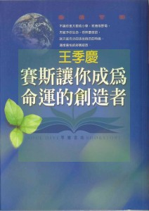

#### 版权信息

书名：赛斯让你成为命运的创造者

作者：王季庆

请购买实体书籍·该电子版本仅供参考

不论你是大树或小草，玫瑰或野菊，

天赋予你生命，你所要做的，

就只是充分的活出自己的特色，

满怀喜悦的舒展绽放

## 源起

### 我找到了

每一位初加入“赛斯读书会”的朋友，在叙述他的心路历程时，几乎都会带着相同的兴奋、喜悦和激动说：“我找到了！”

这句话非常像多年前广泛张贴在电视上宣扬基督教的用语，但却确切的形容了赛斯书读者的共同心声！不过，请别误会，赛斯并没创立某一种宗教。喜爱研究赛斯理论的人，多半是“异议份子”，不轻信任何学说，不附从任何教派，对于外在权威的体制，抱着不苟的态度，硬要对一切“打破砂锅问到底”。最重要的是，赛斯令我们明白，所有对于爱和真理的外在追求，最终还是要回过头来，回到内在，皈依自性。

赛斯说过，他引起的问题会比他带来的解答还要多。可是，他又说，一切的答案都在我们每个人内。

这是不是有点象佛陀说他说法四十九年，而无一法可说？是不是所有的真理和真相，都存在于我们意识的深处，所有古往今来的圣哲，包括无形界的教师如赛斯，都只是来点化、点醒我们？他们能给我们的，最多只是知识和方法(即“道”与“术”。如何去理解、内化，以至于扩展自己的意识，亲身合格体证他们所说，还是得靠自己的修为。

“说法”的困难就在于，说出来的东西往往变成了线性和平面的描述，但“法”却是多重时空的玩意儿。当我们必须透过“大脑”这个物质的硬体，来了解非物质的理念时，搞不好便张口结舌——“当机”了！

大家都听过“盲人摸象”的寓言，有人摸到它长又圆的大鼻子，有人摸到它薄又大的耳朵，有人摸到它粗壮的腿，有人摸到它细长的尾巴，却都各自认为“那”就是所谓“象”这个东西的全貌了。

各宗教对于“神”(新时代称之为“一切万有”)、“真理”的理解，是否也不比那些盲人高明多少呢？老子说：“道可道，非常道。”这才比较切近事实吧！可是人的好奇心又挡不住，只好“强为之道”。

赛斯试图扩大我们的认知，苦口婆心的由物理学、心理学、超心理学、医学……各个角度提供一个全面的解释，但若我们不自己睁开心眼看到“全像”，可能仍只是执着于争辩，而无法想象“真相”。

一九七六年，陷入人生低潮的我，做出心灵上的垂死挣扎，为了不去一分钟一分钟的“捱”过生命，我藉着两周一次带孩子们去公立图书馆借书的时候，自己也投入了神秘学和超心理学中。

图书馆是“开架式”的，也就是说，我们可以在标明类别的书架上取阅图书，再决定借哪一本书。对当时情绪严重失调的我，神秘学的作品就如中国武侠小说似的迷人，你可以活在另一个世界中，暂时忘怀身心的痛楚。

于是，在日复一日的阅读中，我接触到光怪陆离的现象：招魂术、通灵、催眠、巫术、灵魂出窍……等，不一而足。从英国最初成立心灵研究协会的故事，到美国杜克大学由莱因博士成立超心理学实验室的始末，我都抱着好奇心读过。

当然，我会拿这类读物做为疗伤止痛的药膏，也是有个人的渊源在的。从小我好象有两个“我”并存，一个是外向、活泼、理性，并且服从权威的我，一个是内向、孤独、不安、退缩且叛逆的我。游走于这两个我之间的我，表面上调适得不错，至今记得小学老师给我的评语是“动静合宜”。从小到大，得过无数的奖状和奖牌。但蜷缩在心灵黑暗角落里的“我”，往往会不自禁地揣想：人生有什么意义？死了便一片黑暗或是永远消失？我从何处来？要往何处去？人有灵魂吗？

到了初中，我信了天主教，抱着求全癖的性情，努力研习教义，但简单而教条式的解释无法满足我。而圣人圣女的事迹，令我升起“有为者亦若是”的仰慕之情，却也增加了更多的自责和内疚。另一方面，原罪、上帝的审判、天堂及地狱，又令我惴惴不安，几乎形成了精神上的洁癖和强迫症。终致越行越远。

一路行来，曾在艺术、心理、科学等领域，寻求真、善、美，暂时忘却灵魂的焦虑。但午夜梦回时，想到如黑暗的无底洞般的“未知”，仍心悸不已，冷汗直流。没想到，那一年的“危机”却成了“转机”，令我的生命全然改观。

我读完了图书馆里超心理学架上所有的书，只剩下一直避而未借的《赛斯资料》质？还是资料？不管它，没别的选择了嘛，借吧！

前几个月的阅读奠定了基础，累积了一些知识，培养出相当的品味，以至于当我静下心来细读《赛斯资料》时，心领神会！

“我找到了！”

### 珍.罗勃兹的天启

好像知识注入了我身体的细胞，使我无法忘记它——一种深入肺腑的知……它并非知性知识，而是感觉而后知。

——珍.罗勃兹

一九六三年九月三日，女诗人和小说家珍.罗勃兹在那可爱的秋日黄昏，坐下来准备写诗——

突然，她仿佛被拉入了一场没有服用迷幻药之旅。好象她的脑壳成了某种收报台，频率调准了，接上了一个难以置信的能源。

她的手自动以“狂草”写下闪过她脑际的字句和念头，同时她的身体却像是被掷过多重时空，亲身体验她写下的概念。

当她恢复知觉时，发现那一堆笔记竟然有一个更怪的标题：“物质宇宙是意念建构而成的”。①

她完全不明白发生了什么事，但却隐隐感觉到自己的生命已顿然改观，心中不禁浮出“天启”这个神秘字眼。

☆

在这篇一百页左右的手稿里，珍写出了许多惊人的概念，完全颠覆了她以前对物质世界的一切理解。比如说：

……是我们形成了物质实体……在无限次元的实相中，我们的感官只让我们觉察到三次元的实相……

此处，我需要解释一下“实相”，它源自“真实的”这个字。平时译为“现实”，但这样似乎带着一些功利或无奈的暗示，比如我们会劝人要“面对现实”。其实，reality 在赛斯资料里的意思，是你个人认为是“真实”的东西，可以是一个实际的境况，或是一种心理或情感上的“真实”。

由于我们每个人的思想、情绪、信念的不同，所以即使面对同样的外界，以及人和事，我们的“个人实相”却也出现种种不同的面貌。

这与宗教上所谓的 Reality(注意，是大写开头)不同，那是终极的真实，即“一”，万法归一的“一”。

珍又领会到，万物皆有意识，连平时以为的“无生物”，也充满了奇妙的活力，她甚至可以体验到组成一根钉子的原子和分子的意识。

☆

光是读到珍这篇稿子的点滴摘录，便令我深深的震撼，它包含了许多革命性的观念以后在各章节中再一一详解。

无论如何，这个经验开启了珍的心灵能力(或说超感官知觉)，自此，她的梦活动也越来越生动有趣，并且还有预知性。

她的好奇心被挑起来了。正在思考写一本新书的她，不知怎地，选上了一个她以前毫无经验的领域：超感官知觉。她自己设想出一些实验来激发 ESP，例如预言、心电感应、降神会、灵应盘等等。

“灵应盘”和我们的“碟仙”相似，有一个上面写了二十六个英文字母的纸板，两边各有“是”与“否”两个字，还有 1 到 10 的数目字。两个人对坐，各用一指轻触画了指针的塑胶盘：心中放空，静待指针盘移动。

珍和她的画家先生罗勃.柏兹(以下简称罗)首先尝试玩灵应盘。到了第三次，指针竟然动了！传过来一个已逝的人。罗对所有的过程都做了纪录，头三回都是简单的问答，到了第四次，一九六三年的十二月八日，传过来一个不同的“人物”——赛斯。他说的话便完全不同，充满了玄奥的寓意。

不久，当指针慢慢拼出赛斯的话时，珍同时却在脑海中听见所有的回答，它们快速的累积起来，终于逼得珍张开口，赛斯的讯息遂一泻而出！

☆

自此以后，一直到一九八四年珍去世，她替赛斯口授了九百多节的资料，其中大部份是“赛斯书”的口授，穿插了一些私人课。这些大半是在每周两次的定期课中传述，而由罗先用他自己特制的“速记”记录下，然后再打字。

在赛斯课中，赛斯称珍为“鲁柏”，称罗为“约瑟”，他说这是他们各自的“全我”或“存有”的名字，也即是过去和未来的他们各个不同人格的总和形象(见“我是谁”章)

罗在白天有他自己商业设计的工作，珍则充分发挥创造力，自己又写下许多本书，包括诗集和小说。在写《如何发展你的 ESP 能力》时，珍跟随着赛斯的指点，而做了种种的实验。这是她的启蒙。随后，在每一本书中，我们都可以看到她心灵能力绽放的各种过程和现象，她不但禀赋不凡，并且毅力惊人。

珍后来往往能同时感应到周边有好几个“频道”对她开放，她可以选择其中之一撷取资讯，有时是用口述，有时是“自动书写”。

她不仅能入定、意识转变、出窍、预知、心电感应、送给人治愈的能量，并且能感通到自己的前生。据赛斯告知，这一生是她地球上的最后一生了。

注释：

①珍在《灵界的讯息》里，略略摘录了一些，随后在《梦与意识投射》的第一章里有较长的摘录。它代表了赛斯后来资料的“胚胎”。它令珍明白每样东西都有它自己的意识，物质世界是由意念建构成形的，而所有的经验都存在于“永恒的现在”等等。

### 赛斯是谁

罗问：“你喜欢我们怎么称呼你？”

“对神来说，所有的名字都是它的名字。”指针拼出。

罗说：“但我们跟你说话时仍需要某种称谓呀？”

“随你们爱怎么称我。我叫我自己赛斯，它适合我的本我。赛斯比较清楚地最近似我现在是的，或试图成为的全我。”

——《灵界的讯息》

“赛斯是谁?”光是这个问题就很难回答，因为要正确回答的话，会牵扯上许多抽象的观念，令读者一头雾水而却步。

不如，先按照一般能接受的说法，说赛斯是位高灵，是位灵性导师。

他已经完成了轮回，活在无形界中。

他没有肉身，却能随意念幻化出想要求环境。

赛斯与珍有很深的前世因缘，现在时机成熟，他请珍做他的代言人，带来许多讯息。

他所告诉我们的，世代以来都有人讲过，而当它被遗忘了，就有高灵再来说一遍。

珍本人是个非常“铁齿”的人。她和罗一开始设计了许多测验，花了一年时间来考验赛斯的可信度。

她发现赛斯并非她的潜意识，他有一个独立且更大的存在。

赛斯不但知道许多奥秘的知识，并且还可以洞悉人心，看到他们的前世，看见珍所不可能看见的信封内藏的东西。

赛斯对物理的理解令物理学家赞叹。目前至少已有三本重量级的科普书，将赛斯的“说法”与量子力学相提并论，这三本书是《超越量子》、《科学与心灵的桥梁》、《隐弊的领域》。

一九九八年六月当我去拜访罗时，他告诉我，有一位心理学研究生的博士论文，便是完全以赛斯的理论为研究对象。

我自己呢，初读赛斯时所感受到的震撼，至今仍回味无穷。可以说我在理智上对生与死、宇宙和个人灵魂等问题的合理解释的渴求，终于得到了回应。情感上也终于体悟到，“我”并非宇宙的孤儿，爸爸不疼、姥姥不爱的。在浩瀚的宇宙中，自以为渺小的“人”，原来都具有不朽的灵魂，与“赛斯”一样，都是“一切万有”的一“念”所成。

我们所有这些“灵”，都存在一个交织的大网上，这个网还不止是三次元，而是多重次元的，也就是跨越了多重的时空，但彼此之间息息相关，生生相系，牵一发而动全身。这个超时空的网，便是整个存在的真相，以后会有进一步解释。现在我想强调的是，这个网便是“大爱”的基础，因为我们全都是同源而休戚相关的！

关于这个网，在《灵界的讯息》第三章里有精彩绝伦的描写。

六 O 年代有一本非常热门的谈传播媒介的书《媒介即讯息》，赛斯曾幽默的引用那书名，意思是他以无形无象的灵的形式出现，正是证明了“肉身”并非我们存在的本质，像他一样的不死灵魂才是存在的本质，而“肉身”只是我们穿上来地球旅行的“太空衣”。

看完《灵界的讯息》，我心中的沉疴得到了解脱，死亡的阴影已离我而去，大地春回，从此我可以兴高采烈的活着，不再既怕死又怕活。

赛斯是位高灵，我们每个人将来都会成为我们自己的“赛斯”。他是个希望，是个榜样。

有些人觉得赛斯是男性的、理性的、不可企及的。我却感受到他的智慧，也感受到他的慈悲。灵魂是没有性别的，但又包含了阴阳两种特质，所以，赛斯理论的科学性和理性令我折服，扩展了我的智力。他对我们人类的了解、宽容、鼓励和肯定，却有如春风，令我心花怒放！

## 奇妙的生命

### 我是谁

你并非宇宙里的一袋骨与肉，由某些化学物质与地水火风等元素的混合物组合在一起……相反的，在一个极深的无意识层面……是你造成了你所知的肉身。

——《灵魂永生》

“我是谁？”是人这种智慧型生物迟早都会自问的。这个看似单纯而天眞的问题，却也是古今中外所有哲学和宗敎所终极关心的主题。古希腊大哲人苏格拉底最著名的一句话就是：“认识你自己。”借用我们自己的诗人杜甫的一句话，它也的确是令多少人“白头搔更短”的难题。

赛斯的说法呢？他的解释充塞于他每本书的字里行间，令人着迷，但也相当难以简明的条列出来。首先，我们必须谈谈我们的来源“一切万有”。“一切万有”在各宗敎上都被简化为一个像人一样的“神”，但他具备了全知、全能、无所不在的特性。赛斯则称他为“一切万有”。他并非被神化了的超人，而是世间一切的源头。所以，不如说他是以纯能量的形式存在的。而这纯能量是有觉性而充满了爱的。

他也就是“一”，佛家所谓“眞空生万有”的那个“眞空”。但他从来不“空”，只不过是无形无象而已。这个纯能量本来便存在，无始也无终。请记住，所谓的“时间”和“空间”，只是在我们这个物质世界里运作的“基本假设”。

如果你自己在脑袋里曾有过任何梦想或想像，你可能想得天花乱坠，却无法具体表达梦中的景物时，你便能体会“一切万有”他“当年”的痛苦了。

现在，以心体心的想像一下，他那个无边际的大脑袋里，升起了无穷尽的梦想，越来越生动，却又那么的空幻！

他想得头痛欲裂，他内在的每一“念”，都成了一个活生生的“生灵”，活生生的“意识”，活生生的“存有”，渴望爆出来体验形形色色的多采生命。最后，“一切万有”终于“大爆炸”而释放出这些“存有”，放他们去自由组合，创造各色各样的世界。

这里要记住一句非常巧妙的话：统一中的分离。“一切万有”包含了无形界和有形界。虽然这些“存有”都有独立的生命，其实，他们又像是组成“一切万有”的细胞，仍然活在“一切万有”内。

“存有”或“存在体”这个名词曾令许多读者困惑不已。到底它们是什么东东？

当年我沉浸在“超心理学”中时，便习惯了这个用语。早年的通灵者和有名的灵媒，往往都会这样说：“这儿来了一个 entity，它想找某某说话。”或在为人寻访前生旧事时，会说， “这个 entity 当时是担当某某……。”所以，这是个古老的指示语，特指某一个“灵魂”(或“鬼”)在如何如何。

而珍也曾说过：存有即基本的自己，是永生的、无形的。所以，“存有”又被称作是“超灵”或“全我”，像是一个“灵团”似的。

这个灵团由许多的灵魂组合在一起，存在于无形界中。我们每个个别的灵魂为了具体的体验物质性生活，才采用肉身，来到物质世界，所以，可以算是一个“分灵”。不过，这些“分灵”并没有与超灵分离，仍是密切相连的。

从个人的角度来看，则我们自以为的“我”，只是眞正的我的表层——自我。“我”的组成可以想像为一个金字塔。尖端是自我，下面是有意识的心智，简称意识心。意识心一半朝外，一半朝内，等于是“坐在意识的门槛上”。

再向下是“内我”，内我包括心理学上的潜意识和无意识。潜意识负责掌控你这有机体的存活，“自我”不必下命令，身体自然会呼吸、心跳、消化、吸收、排泄等等，这都是潜意识的功能。不过呢，我们的“自我”往往不信任潜意识，会有意无意的胡乱下达指令，潜意识收到了便“一个命令一个动作”，令身体起了反应，起了变化。例如，我们常说∶“这件事令我头痛。”谁知道便眞的头痛起来。这种例子不胜枚举，以后再细谈。

金字塔再往下，是无意识。到了这个层面，我们又得另外想像一幅画面：

假设有一个无限大的大海，像地球一样呈球状，这球的表面凸出一个个的金字塔形冰山。俗语说“冰山的一角”，意思是冰山只有一小部分露出水面。现在，这些冰山即我们单独的“我”，而浸在水面下的大部分便是无意识的我，与整个的集体无意识是相连相融的。而整个大海，可以说就像是我们的“存在”、“超灵”，或“本体”，都是一样的意思。

谜底揭晓了！原来渺小的你和我，都是“一切万有”的一部分！我们并非一袋骨与肉，而是与神同一块料子剪裁的。

宇宙的存在，起源于“一切万有”创造力的爆发。我们每一生的存在，起源于“存有”的好奇心，伸出它的“小我”，浮出无意识的大海，来探一探物质世界的风光。

啊，三千大千世界任遨游！

### 时空探险家-我为何而来？

本体与人格不同，人格代表本体之可以在三度空间的存在之中实现的那些方面。在镜中你见不到你的自我，见不到你的潜意识，见不到你的内我。这些名词只是表现你内在那些看不到也摸不着的部分。但在你所知的自己内，有基本的本体—全我。

这全我曾活过许多次，它采用过许多个人格；它是一种“能量人格元素”，就像我也一样。唯一的不同，是我没有在物质环境里具体化。

——《灵界的讯息》

前面我们已大致说明了，人的本质原来是“一切万有”的一部分，采取了肉身到各个不同的时空来探险的。

本来我们应该是满怀好奇、兴高采烈的小小探险家，不幸的是，我们竟然忘了自己的来源及老家，却像是迷途的孩子一样，失去了玩兴，只哭着找妈妈，只嚷着：“我要回家！我要回家！”

如今，你明白自己终究是安全的，根本一直在妈妈〔“一切万有”〕的怀抱里游玩，像孙悟空在如来佛的掌心中一样。你是安全的！你是安全的！你是安全的！

可是，你仍然惴惴不安，愤愤不平。因为，有人跟你说，你是罪人，前辈子犯了罪，这辈子是来受罚的。

你隐约记得有过那种合一的幸福，但现在却发现自己处于充满了恐惧、不安、痛苦、嫉恨的人群中。

父母、师长总数说你的不是，你照照镜子，看不到自己纯精神体的美丽，只有一个平凡的人回瞪着你。

你学会了比较、竞争、嫉妒、仇恨。有时，为了乞求一些爱，你欺骗、讨好、虚伪，按捺住自己的心虚，努力像靑蛙一样吹胀起肚子。

你忘了你是谁，所以你不断的自问：“我来做什么？我的人生有什么意义？”人生本是你的全我(即你自己)给你的礼物——数十寒暑的一趟旅游。这趟旅游的内容，是你和周遭的同行者，自行选择并且一路创造出来的。

随着你投生前所作的“蓝图”，你与父母选择了彼此，你选择了生在地球的那块地方、那个国家、那种种族、那种性别、那种个性，以及肉体的外型。

当你在设计蓝图时，有老师或智者在帮助你，你参考前生的种种，订下一些大纲。

你从前也许做过流浪汉，这生你想做个老老实实的庄稼汉，努力劳作，生根于一处。你从前也许做过土匪，这生你却想做个照顾病苦的护士。

就像进迪士尼乐园的游客，有种种不同的“旅程”让你选择。你或喜欢惊险刺激的“海盗船之旅”，或喜欢安宁甜美的“小小世界”，或充满梦幻的“未来世界之旅”。

基本上，全都是“虚拟实境”。这样说，并不表示它不存在，或你没有亲身体验那旅程所引起的种种情绪和觉受，只不过是，一、这一切都不是永远不变的；二、是你自己创造所有的场景，然后再对它反应。

“命运”是掌握在你手中的。我们根据自己心中所抱有的信念来看世界，因此，同样的事情却会引发完全不同的情绪和思想，而这一切，织就了我们的人生。这个题目，値得更进一步的硏究，留待以后再谈。

☆

有一些人，可以完全投注于物质世界的种种，自以为只有一个肉身，到时候两眼一闭，什么都没有了。可是，像你和我，说是具有灵性也好，说是怕死也好，起码，我们勇敢的面对了心中的疑问，并且不找到答案誓不休。

我曾经追求过宗敎，曾经陷入虚无主义的黑暗，曾经追随存在主义的任性。可是，那样的人生，好像只是在逃避、在麻醉，并没有踏实和自在的感觉。

直到我找到了赛斯，对他所说的一切心悦诚服，但并不把他当神来膜拜，只当他是带来眞理的人。西方有句名言：眞理让你自由。大哉此言！

赛斯首先让我相信人的本质是永生的灵魂，而生命是一份珍重的礼物，活着就是为了“庆祝生命”！

好了，这下吿诉你这个最大的祕密了：人生的意义就是“庆祝生命”！

如何庆祝？

你需要花些时间和精力来向内看，向内感觉。“你”是什么样的人，你有什么样的性格，什么样的才情，什么样的兴趣？

“人比人，气死人。”听过这句俗话吗？抛掉父母对你的期许，他们未实现的梦不可强要你们实现。不理师长亲友的压力，是“你”得为自己过活，欢喜或受苦的是你。

去过一些大规模的植物园吗？千奇百怪的树木，各展风姿的花草，凑成了多么动人的画面！不论你是大树或小草，玫瑰或野菊，天赋予你生命，你所要做的就只是“充分的活出自己的特色，满怀喜悦的舒展绽放”！

我们要为自己的人生负责，停止怨天尤人，不再返缩自卑。将你花在自艾自怨上的力气，转过来试试了解自己，看见自己。然后，毫不脸红的赞美自己(你是上天的杰作，不是吗？)，肯定自己。当然，最重要的是，接纳自己和爱自己。

我们经常妄想去外界追求别人的肯定与爱，但，与我们最近的就是自己，若我们不爱自己，怎么能叫人眞爱我们呢？

如果你说：“但我并不觉得自己可爱吔！”别怕，“爱”并非一种“感觉”，“爱”是“行动”。每天，照顾好你的身、心和灵，做一些让它们舒畅欢喜的事，不久，你便会发现自己越来越可爱了。

### 命运的囚徒还是命运的创造者？

世间万相皆由心生。你眼中所见的世界，就像一幅立体画，每个人都在作画的过程参与了一手。作画者本身也是画的一部分，而出现在画中！外在世界无一理不是源生于内，也无有一动不是先发于心。

——《个人实相的本质》

我们的肉眼是向外看别人和世界的，却看不到自己。我们的自我是与外界打交道的，却不善于自省。

我遇到太多人甘于做命运的囚徒，不是自艾自怨，便是愤世嫉俗。

赛斯讲过一段令我惊心动魄的话：你们曾经怀抱着决心踏上今天所走的路，你运用着各种资源，去追求那一度你认为合理的目的或理由。

如果你目前身心健康，事事顺遂，大概不至于反对他的话。但如果你正处于水深火热中，你大概会立刻穿上胄甲，“以攻击代替防卫”吧？

来，暂且停火，听听老人言吧！

在《个人实相的本质》这本书里，赛斯苦口婆心的、啰哩吧嗦的对我们百般开导，他的目的何在呢？

他要提醒我们的是，在我们个人的生活中，我们并不必任凭自己的潜意识摆布，在面临外力的时候，也不是毫无自主之力的。

他让我们看到，是我们自己形成了我们的命运。所以，我们旣不必顺从命运，也不需反抗命运，因为，命运根本是我们自己创造，因而可以掌控的东西。

你明明是主人，却自甘做奴隶，为什么？

因为你不敢负责！

所以，你可以怨天怨命，怨父怨母，怨外境怨别人，就是无法面对自己。

依赖便不必负责，此所以这么多人喜欢盲从，喜欢被所谓的“大师”牵着鼻子走的缘故。

不瞒你说，我以前也是最会怨天尤人的，我恨自己不够美丽，我怨父亲太过偏心，我怪父母的不和及离异……直到我读到《灵界的讯息》后，才恍然大悟！

并不是说我从此便自认天仙下凡了，而是，我明白是我的灵魂事先选择了这样的肉体、这样的父母、这样的家境。所以，我下一步要问的是：为什么？我从中又可以学习到什么？

基督敎好像说过：上主不会给你超过你能负荷的重担。我们也要信任自己的存有和灵魂，它不会给你超过你能负荷的东西。

你们一定好奇，我学到了什么？我的灵魂为何选择这样的安排？

我想了很久，也想出不少歪理来。

我是一个不很美丽的女人。如此，当异性爱慕我时，我便可以确定他不是被我的皮相吸引而来。

我没有得到足够的爱和肯定，如此我才眞正体会到爱与肯定的重要性，也能了解同样遭遇的人的苦痛，并且找到眞正可以给予我们爱与肯定的人——我们的存有。

同时，由于身在“逆境”，激起我反思和叛逆的性格。我不服命运，反对权威，质疑男性的优越，好奇传统之外及体制之外的东西。我决定，我不依归外人，不依归组织，只以自性为依归。

身体上我没受什么苦，心灵上却受过不少苦。但我并不认同“受苦使人高贵”这句话，毋宁相信赛斯的话，“受苦只是让你知道，受苦是不必要的。”还有一点，受苦使我能了解别人的痛、别人的苦，而愿意、也能够适时伸出援手。

☆

我自小品学兼优，在考虑大学科系时，也是选定了自以为未来能独立生活的专业。没料到一陷入恋爱中，所有的“雄”心壮志全飞出了窗外，只想做一个小鸟依人的小女人。

从此，我自动的变成了“第二性”。情感上，我喜欢扮演贤妻良母，以家为我生活的重心。但理智上，我仍不断的“家事、国事、天下事，事事关心”。这一份牵挂，后来藉撰写杂志专栏而略得抒发。

可是，渐渐的，我感到自己没有“我”的身份感，主要是透过丈夫来活。对于许多事我都有自己的认识和看法，甚至是理想，却没有表达和付诸行动的勇气。

其实，并没有人压迫或局限我，我像是自囚于笼中的小鸟，忘了飞翔的能力！

认识赛斯给我的生命开了一扇“天”窗，从研读赛斯书中，我得到了许多“啊哈！”的体验，小自个人心理的困境，大到宇宙万机的秘密，一一获得解答。不过，由于赛斯一方面是非主流的，一方面又是如此博大精深。我一头撞上与后来许多读者同样的问题：我好孤单！周遭没有一个人懂赛斯！要跟他们“谈”，眞是谈何容易！

很少碰上英文好到可以看原文的同好，只在回国后埋头苦读赛斯书。

幸好，那一股傻劲渐渐的开花结果。多年来，由一个在黑墙、黑地毯、黑桌子的小书房中孤军奋战的女子，变成今天读完赛斯书、引来不少同好、还献出居所供他们聚会和交流的我。

我终于走出“自闭的小女人”命运，成了众人可以亲近的“王姐”。我选择了我喜爱的“身份”——照顾、抚慰、点醒尚未找到自己的人。

### 生活大师——创造命运的高手

你们来到这个世界，是要学习与了解，你们的能量在转译成“情感”、“思想”与“情绪”之后，引发了所有的经验。这是没有例外的。

一旦你了解了这点，你所唯一该做的，就是学着去审査自己信念的本质，因为你的信念会自动的使你以某种模式去思想与感受。是你的信念在领导你的情绪，而不是你的情绪在领导信念。

——《个人实相的本质》

《个人实相的本质》是一本超级的心理学著作。只要你识字，有好奇心和耐心，其实是可以深入其堂奥的。当然，它不像坊间“天堂游记”之类的书那么好消化，但这“内心游记”却眞实多了，并且，只要你有心向内旅游，你会发现奇景处处，令你流连忘返呢！

不过，在旅游的开始，我们应当“轻装简从”，舍下你抱持至今的成见，放下任何父母、学校、宗敎灌输给你的眞理，只带着你年轻〔与年齢无关〕柔软有弹性的心，虚怀若谷的起步吧！你听说过的：“如果你的杯子已装满了，便无法再装什么东西。”不是吗？

首先，你务必要了解，你所接受为“真理”的任何观念，其实都只是一个你所抱持的信念。

要创造自己的命运，你必须认识“信念”是如何运作的，然后你才可以从你有意识的心智中找出自己的信念，以及它产生的理由。

你的信念系统自然会吸引某一类思想，在这些思想后面，就带着一串情感上的经验。

赛斯说，在我们的社会里，主流的思考方式是说.，“世界是不安全的，我无法信任它。我旣无法信任我自己的存在状况，也无法信任我自己。我充满了邪恶，必须隐藏自己。不止我自己邪恶，并且我来自一个玷汚的族类。我父母本身就有缺陷……所以我必须建立自我防卫，在一个无法信任的宇宙保卫自己，并且保卫我不受那邪恶有缺陷的自己之害。”换句话说，大多数人都认为，宇宙是不安全的，而你必须保卫自己，抵御自外来以及自内来的敌人。天啊，眞是危机四伏，四面楚歌。

当我们每天由报纸和电视中看到那么多恶，那么多暴力，回头来谈“无邪”、安全、信任、希望，彷佛会像是“头壳坏去”的白痴呢！

可是《个人实相的本质》这本书却引领你离开主流的意识路线，你将不只质疑你自己个人的信念，还会重新了解信念的本质，以及它们对于你日常生活的影响，帮助你拿开信念的有色眼镜。

有一些自以为头脑淸楚、自命为高级知识份子的人，会以世界上的天灾人祸来反驳赛斯或其他乐观派的世界观，问题是出在他尙未了解，外在世界是我们个人和集体创造出来的，而非“神”、“佛”制造出来的。我们每一个人都得自省自问，在滚滚红尘中，我们个人每天投射和散播出去的思想和情绪，是否是光明的、有爱心的、正面的，还是助纣为虐的、怨天尤人的、恐惧的、憎恨的、愤怒的！

赛斯说，甚至“义怒”也仍是不好的电磁波哦！例如，他说“痛恨战争并不会带来和平，唯有热爱和平才有和平”。所以，自以为是仁厚之士的人，首先得“打心底”发出慈悲和爱的电磁波，然后努力散播爱与和平的讯息，肯定和鼓励人心善念，更需以身作则的以“行动”来表达人类爱。若是只坐在那儿寻找每件灾难的罪魁祸首，凡事都是别人错、别人的罪，除了成为一个愤世嫉俗郁郁以终、充满无力感的人，你又成就了什么呢！

要世界光明，首先自己先变成一点光明！

这样讲太抽象了吗？让我们来看一些例子。

在接触“乳癌病人成长团体”时，我发现她们几乎都是出生在鄕村、中低收入的家庭，外在的物质环境差，家似乎是个牢笼，内在也没有什么精神生活或兴趣寄托。往往结婚是逃离贫苦的原生家庭的唯一方法。然后便是生儿育女，做贤妻良母，但心中对于“自己”是什么非常模糊，毫无自信，也没自我价値。

终其生，她们学会的是压抑自己，讨好别人。人靠梦想和希望而活，但当我问她们有何梦想时，只有一片沉默，甚至，她们说自小就没有梦想！

《人生的转机癌症的身心自疗法》中，作者李山医师说，癌症是创造之火的堵塞，是绝望的具体化。如果你用心观察，你会发现癌症患者都曾“相信”人生无望了，或潜意识中觉得：我不想活了。多么令人心痛！

反过来看报上登载某位林女士的经验。她曾是父母掌上明珠，三岁时染上了小儿麻痹，造成一脚的残疾。后来父亲做生意失败，家道中落，父亲也变了个人，酗酒而终以癌症去世。

但林女士并不自艾自怨的放弃自己，她相信她像牵牛花，怎样都能活着。她待过孤儿院，再自己习艺谋生，嫁给一位年长而学历很高的丈夫。

丈夫病逝后，她相信她能靠自己的力量站起来，不依靠别人。

她在一家化妆品公司工作，公司里一群自信又光鲜的女人，不但没令她更加自卑，反而被她当作学习的对象。因为，她相信她可以掌握自己，追求她自己的一片天空。

她希望自己成为激励专家，她一直相信，一个人的生命潜能是无止境的。所以为了达到梦想，她切实的去上课、学习、探究。她相信自己有一天一定能用自己切身的经验去帮助人走出困顿。

如今，她活得容光焕发，向着“生活大师”的境界迈进。

赛斯说过，我们投生前便选择了自己的父母和大致的状况。有人会说，人怎么可能选择先天的残疾，或智障之类。我们并不了解每一个灵魂的奇妙意愿，不过，可以想知，他们自己设定了这种状况，为的是自己和家人的共同学习、共同奋斗去克服这个挑战。

连智障儿都可能因为理性上无法与人沟通，而纯粹以天眞孩童似的热情去拥抱生命，反而造成父母观念和认知上的改变，而视他如宝。

有人最后都拿一个“命”来解释一切，其实只是逃避。“命运”能算吗？“命运”能改吗？这全看你的信念和毅力。所谓“命运”终究是人的“个性”造成的，如果你无法体认这一点，你只好做命运的囚徒。但如果你看淸楚了自己个性中的哪些成分造成了你的“苦”命、“恶”运，而有毅力去改变自己，再放下自己错误的信念，相信自己的潜力，则必然会有成功的一天。

赛斯说，你一生下来就有的那些特征，是有其原因的。是内我选择了它们。即使在今天，你的内我仍然可以大幅度的改变很多你自己的特性。

你觉得不可能吗？

### 把握信念的力量

你的经验像一匹布，这匹布是你透过了你自己的信念与期盼织出来的。你心目中对自己以及对实相的本质所抱持的观念，在在都影响到你的思想与你的情绪。

你的世界就是由你自己一手所创。真理就只有这一个。明白这个，你就明白了创造的奥祕。

——《个人实相的本质》

坊间日渐增加的开发潜能与激励人心的课程和工作坊，其实都是建立在以上这些话上的。把握了信念的力量，你便可以随之努力达到自己想要的任何目标。

我们一般人为什么无法自己做到呢？因为我们平常太习惯自己的信念，就像戴着染色眼镜看世界，看到的与我们的信念完全相合，就像是“事实”一样。

通常，你对你“坚信”的东西，越发的看不出存在它背后的“无形假设”。比如说，对你相信的宗敎，你很少会提出疑问，只一味地把它当作不可诤的眞理。可是，敎外的人就反而容易认出存在于其中的“无形假设”了。

一般人则最难了解自己，对于你自己是谁的最深层的信念，以及这些信念与你的人生之间有什么关连，更是“雾煞煞”了。难怪星象、算命等等这么流行。如果我们只将它当作对个性的了解和分析，而不执着于那是不可改变的命运，也还是有其功用的。

后面你会读到利用潜意识去改造命运的方法，不过，赛斯说，我们自己有意识的想法，便会给我们绝佳的线索。何不双管齐下，去除掉对我们不利的信念，而开发出我们本自倶足的潜能呢？

此刻，让我们先澄淸一些观念，以便你更了解信念的重要性。

你的信念往往会像一堵墙一样，把你重重包围起来。但你首先一定要看到有这堵墙在，否则你不会悟到你是不自由的，而这重围墙将代表你经验的极限。那么，该如何着手了解自己的信念呢？

直接的方法就是与你自己有一系列的谈话，把你在各个不同区域的信念写下来。当你发现有显而易见的矛盾想法时，检査这些矛盾，然后那些看不见的信念将会显现出来。

或者你可由你的情绪回溯去找你的信念。不论你选哪一个方法，其一就会把你导向另一个。不过，这两种方法都需要你对自己诚实。

当你感觉有一种不偸快的情绪时，花一点时间去弄淸楚它们的来源。你要接受这种情緖是你自己的，不要把它们扫到看不见的角落。不要马上试着以积极正面的念头去取代你认为是负面的念头，那只是贴上“ok 綳”。

首先要觉察你情感的眞面目。当你变得对自己的信念更明白后，你将看出它们是如何自动地带来某种情感。例如，一个觉得自己很差的人，应该了解这个感受并非是对“事实”的声明，而是对“情绪”的声明。

你在体验到自卑感时，应该接着自问∶“我为什么觉得自己这么差劲？”

如果你否认情緖的本身，假装它不存在，那么你就永远不会去质问它背后的信念。

再举个例来说，大半的宗敎都敎人：人生是苦，你是受罚而来，或你是为了还上辈子的债而来。在日常与人的接触及做心灵对话的时候，我看到太多紧抱这信念、当它是至高眞理的人，只要你静下心来想想，一定也有同样的发现。

抱着“人生是苦”信念的人，同时还会自觉是个洞悉人生的哲学家，或悲天悯人的宗敎家。但眞正慈悲的人，绝不会坚信，并且灌输人们这种为害至烈的观念的。

人生旣非苦也非乐，而是，你有能力去创造苦或乐的人生！

如果你相信你和每个人都是“神”的一份子，都本具神性和佛性，难道你还会去批判、定罪自己或别人吗？你怎么能不尊重每个人的独特性，不带着好奇和欣赏去看这一切呢？

我们并非必须争个你死我活才能幸存的无知者，在这无穷尽的可能中，我们正在展现自己为“神”的一部分的璀灿光华，共同组成一个无限大的拼图呢！

当你相信我们的精质——灵魂——不灭，我们自愿来参与这物质世界的游戏，来创造这个行星地球上扮演的戏剧，并且从这剧戏中，体验到我们的本质和能力，最终，我们不会减损，不会毁灭，而是更加的丰富，更加体会到宇宙间唯有爱最可贵，也最眞实，那么，还有什么苦可言？

这就是我们的“镜花人生，水月道场”。一切都是你我幻化出来，并不恒久，但我们重视的是经验，是过程，是你在经验中悟出的道理，是我们相会时迸出的火花，是世间的爱、宽容、温柔和体谅。

此所以，所谓修行的最高境界便是欢喜之心，喜悦之情。不是无情的冷漠，不是无欲的刚硬。

可是，相信“人生是苦”的人，生命是黑白的。他从来不敢有渴望，不敢有梦。他大半会选择一个贫困的环境，以便将他的信念合理化。

旣然穷困，他便相信存活是很困难的，你必须拚命，必须欺凌别人，才能得到温饱，而他又不愿这样做，往往只好穷途潦倒过一生。

白手起家的名人传记最能够激励人，为什么？因为他不相信命运能奈何得了他，在别人无法超越的困境中，他却创造出丰富。成功的人和失败的人不同在哪里？就在于信念！

遇到困难，不要陷入自艾自怜的泥淖，要自问：这个挑战有什么意义？是什么信念令我遭遇到它？我喜欢这种感觉吗？若不喜欢，就是信念出了问题，我要如何改变自己的信念？

怨天尤人是弱者和无知者的行为，你自己的人生只有靠自己去创造，别人最多只能提醒你和支持你，但选择和改变的动力必然在你自己。你得替自己负责。最重要的是，光有理想和梦还不够，必须要“行动”！

物质上的贫乏不足虑，精神上的贫乏才是苦，但这是你可以改变的，相信自己！

### 无中生有——内 vs 外

每个人的心内都理解“所有存在的意义”……他有意识的生命是依赖着一个更大的、确实的次元。这更大的次元无法在一个三次元的系统里具体化，但对这更大次元的知识由“存在”的最深心处汜滥流出，向外投射，改变它所触及的一切。

——《灵魂永生》

如果你读到这里，觉得前面所谈的似乎与你内心起了某种共鸣的话，那就请你系好安全带，现在，我将带你深入赛斯的玄奥世界啰！

虽然我会尽量以浅白的语言来导航，但是，赛斯的观念是合乎眞理，而毫不与世间的谬见妥协的。所以，你得开放心胸，不抱成见的开始。要有心理准备，你必会碰上不少心理的“巅簸”，就和乘云宵飞车一样，你只要相信你终究是安全的，然后放松身心，顺势而行，便能享受一场畅快之旅！

首先，这篇章名“内 vs 外”可能就令你丈二和尙摸不着头脑了吧？别担心，想当初我也曾大惑不解。“要向内看。”赛斯和其他大师都这样说。但“内”又是哪里？

看自己体内的五脏六腑吗？

有一天，我灵光一现才眞正想通，“内”就是“无形界”，而“外”就是有形界。

在“无形界”，一切以“能量”呈现，而“意念”立即变成“实相”。〔还记得吗？“实相”就是对你而言为眞实的境界。〕

在“有形界”，也就是我们目前用五官能感受到的世界，一切则需要时间才能具体化。

“无中生有”是一句骂人“黑白讲”的话，可是，我们的三千大千世界却眞的是“无中生有”的！此时，我们不能不佩服咱们中国的老子，他老人家几千年前就说过：“有生于无。”

但到底是怎么生的？前面我们已谈到过“一切万有”孕生我们时的“阵痛”。他将他的精髓〔本质〕分送给我们的灵魂，而后我们又变成了“共同创造者”。

我们到这个世界上来，是要忆起自己是谁，并且在“慢半拍”的物质世界学习如何运用能量。因为，当我们到了无形界时，意念是立即成形的，所以，我们需要先练习一下，以免尽造出自己不喜欢的结果。

以哲学家的说法，“内”就是“本体界”，“外”就是“现象界”，“内”就是“存在”，“外”就是“行动或过程的显现”。

曾有一位硏究哲学的朋友吿诉我，希腊哲学只有两个问题没解决：本体和现象。以赛斯的看法好像这不难解决，本体和现象只是一体的两面，“本体”是源头，“现象”是它具体展现出的模样。那么，“存在”是本源，而现象就是“变为”，是一个不断开展的过程。

你可以想像，“一切万有”和“全我”便是“本体”，而多重的宇宙和多重的人生便是现象。所以，我常吿诉人∶“存在即变为”。请不要固守着平面的、线性的想法，试着想像我们每个“存在”都像烟火般绚烂无比爆入多重的时空，这种美丽的绽放却又是个不停的、永恒的过程，因为，所谓“时间”，只不过是物质世界的一个基本假设。

赛斯给这个“外”与“内”另一个称呼，叫作“架构一”与“架构二” 。

当我们的“灵魂”进入“架构一”来探险时，我们得穿上适合物质性生存的太空衣——肉身。因为，“架构一”是有形的，好像是我们扮演形形色色的“敎育剧”的舞台。那么，这个舞台是根据一些基本假设而搭建成的。那就是像“时间”、“空间”、“重力”(万有引力)等等。别的可能的物质世界可能有不同的基本假设。而“无形界”则根本不受这些基本假设的限制。

那么，架构二便是架构一的来源。

有形世界的一切，都是先出现在无形世界里。

我们的身体活在架构一里，但我们的心灵却不受形体的拘束，活跃在多重的时空。

通常，我们在梦中、意识改变状态中和死后，都会进入内在世界。

如果说架构一是个大舞台，那么，架构二便像是一个大的制片厂，充满了形形色色的能量和意识(两者是同样的)。在架构二里，我们这些意识彼此合作，共同演练一出出不同的戏剧，然后再协议，要在架构一里演出哪一些。

因此，整个人世间一出出悲、欢、离、合的好戏，你都参加了一份。你同时是编剧、导演、演员和“观众”。只不过，我们往往全神贯注于这些“肥皂剧”的演出，而忘了我们“创作者”的角色。

而所谓心灵的探索、求道的过程，便是去忆起自己“观者”的身分，而由之了悟到宇宙和人生的眞相！

外在世界是由“自我”管理的，并且是由我们的五种感官——眼、耳、鼻、舌、身——去创造、体验和界定。

内在世界则是由内我所主管，而内我拥有许多“内在感官”，也就是一般人所谓的“神通”。

不过，在内、外之间这种种的区分，只是为了说明的方便，并没有明显的界限，正如前面说过，我们的外在自己——包括“自我”和“有意识的心智”，内在自我——包括潜意识、集体无意识——之间，也并没有什么分隔，只有人工的分野而已。

### 树皮与树干——自我 vs 内我

自我在肉身生活中不能被毁灭，杀掉一个，则另一个会由内我中露出。内我是它们的来源。

——《个人实相的本质》

几乎在所有的宗敎中，“自我”都被认作是人“沦落”的罪魁祸首。自命在“修行”的人，无不去之而后快。

这一点，是赛斯与他们最大的相异处。

当我们生而为人时，要在物质环境中操作，必须将心神的焦点对准了现实世界。

对内我而言，它可以看到昨天或明天的一只鹿，但活在今天的自我，却必须聚焦在眼前的鹿上，然后才可以猎之以充饥。

在内我眼中，一辆疾驰的汽车，不过是空隙很大的原子、电子……的一阵旋风，是灵魂可以穿越而过的。但对自我而言，肉身若不赶紧躱开，便会被撞个稀烂。

这不过是个小例子，以让你们省思一下自我的功能，它不过是人格结构的最外层，用来处理物质世界的一切。

赛斯有个相当有趣的比喩。他说，自我像是一棵树的树皮，具有保护树的本身，以及与外界交流的功用。内我则是树干。

由于树皮是有韧性的，内在的树才得以继续长大。它随着风弯曲。当无风时它不弯曲，但它也不会僵硬起来，阻止树液流到树顶。

自我也不该反应太过强烈，比如在晴朗而阳光普照的天气里，记起过去的景象而对之反应。这样一种树皮，也会置树于死地。

换句话说，“自我”是无罪的，它有它实际而不可少的功用，只要它不越俎代庖就好了。宗敎上反对的，应当是“我执”吧？

赛斯也并不赞同“我执”，不过，以他的看法，“我执”并非罪，而是根本不可能的妄想。为什么呢？

因为，“自我”是天天在变的，你今日的自我与小时候的自我，甚至昨天的自我已经不尽相同了，然而你仍知你是你，而非别人。

“自我意识”就像一朶花一样，从你自己“无意识”的沃土中滋长出来。你自己虽然并不知觉，但这个自我自行显现，然后再落回无意识中，接着再从“无意识”中生出另一个自我来。这与现代量子物理学中的“量子势能”相似。

所以，想要去掉自我是无济于事的。

如美国在六〇年代对迷幻药 LSD 的狂想。当然有些人只在追求意识改变的兴奋感，或追求时空消失、扭曲的刺激。可是更有一些心灵探险者，由于服 LSD 可能带来“消灭自我”的幻觉，暂时达到“天人合一”的“巅峰经验”，误以为这就是所谓的明觉或悟道而沾沾自喜，自命为“修行人”，你说好笑不好笑呢？

这种化学性的悟道，岂不是自己骗自己吗？只不过，尝到一点“合一感”的至福也是不错的。但若因此上了瘾，或误以为必须摒弃自我，令其象征性的死掉，“内我”才可获自由，那么就有危险了。

在前面，我们为了解说的目的，将自己分成三部分：自我、潜意识和无意识(后两者合为内我)，但三者是密切相连的。

问题不在自我，而是我们大多数人错误的观念：将现在的自我想像为全部的我，而坚持这个我在无穷的永恒中一直维持不变，这才叫作“自我设限”。

甚至连我们的灵魂或存有都是一直在变的，这个“变”，并不会否定了它的个人性，反而是不断的增富它。

如果我们只认同自己的自我，那就太贬低自己、太局限自己了。

☆

我们并非被罚来地球上受苦赎罪的生灵。我们是自己选择要来体验物质生活的灵魂。

赛斯说，人是实体的生物，眞的“喜欢”住在地球上。被肉身生活吸引的人，是“觉受的品尝者。

大家都听过“如人飮水，冷暖自知”这句老话，细想想，还眞是“过来人”说的呢！

如果你五官中哪一种出了问题，不管别人怎么跟你形容声色之美，也比不上亲眼瞧一瞧，亲耳听一听，亲口尝一尝……

可是，万一你以为这就是全部，就是“乐到最高点”，那你也未免太小看自己了。

要知道人类的每种感官有它自己能感知的范围：耳朶有能听到的声波范围，眼睛有能看到的光波范围。那么，欣赏、享受万物之美乃是上天给我们的礼物。只要仍记得“观照”，不至于目“迷”五色，又有何不对呢？

☆

前面说过，在自我和内我之间，有一个“有意识的心智”，意识心一面对外，一面对内，赛斯比之为有两个面孔的怪兽。

自我好像是意识心的“焦点”。意识心藉自我来对准外在环境。另一方面，意识心的功能也在于“接收”和“转译”那些从内我传达给它的各种重要资料。

问题发生在，人们对于潜意识或无意识的内容之不信任，而渐渐对内在知识设下了重重障碍，此路不通矣！

这种情形，造成了个人对他所具有的统一感和“全部力量”的一种否定，更使得他有意识的将自己分割成互不相连的片段，于是，他感到孤单、无力、害怕，“前不见古人，后不见来者”！

其实呢，每个个人都为自己选择了一个个别的模式，以便让自己能在这个范围内创造个人的实相。即便如此，在这个界限之内，还是有无数的可行方向。

要想接通自己的存有或超灵，不需唾弃、消灭自我。只需将它轻轻放下，暂时给它放个假。

### 奇妙的潜意识

近年来，有种观念颇为风行，那就是把一个人在个性上所遇到的各种问题与困难，一概归罪于“潜意识”，这个观念认为，这些问题的发生是由于某些不可变而强烈的早年感受积存在潜意识的结果……一心以为潜意识是自己个性中不可信赖的部分，里面充满了负面能量，深锁着一些最好弃之为快的不愉快回忆。

——《个人实相的本质》

前面曾提过，意识心介于自我和内我(潜意识及无意识)之间，它的一项重要功能是在“接收”和“转译”潜意识给它的重要资料。

但是，在国外，由佛洛依德的心理学以降，对“潜意识”充满了谬见和恐惧。由于觉得“潜意识”中藏着造成今日我们病态的早年经验，所以又必须花许多年的心理分析，才有可能挖掘到病因。大家也许都听过，六〇年代以来，心理分析已变成有钱有闲的美国人的家常便饭了。

而所谓正常而不去作心理分析的人，其实是不敢去碰触自己内心的这个范围，而把它与自己切开了，却又不知怎地，老觉得少了些什么，不了解自己。

我们中国人呢？不习惯去找人作心理谘商，事实上也没有很多谘商师，另一方面，除了抱着“家丑不可外扬”的观念之外，许多人也没有那么多闲钱可花。

在早年紧密的家族结构散失了之后，人们也无法找到经验多、肯帮忙的亲长来解惑或排解纷争了。

有的人遇到困难，除了找算命师外，就是找民间林立的神坛，幸运些的，也许由于相信那人能帮助自己变好的信念，而暂时轻缓了心理症状。若是不幸碰到骗财骗色的神棍，就不免人财两失了。虽然台湾的敎育非常普及，但仍不时见到这种报导，足见错误信念害人不浅。

另一方面，普遍为人们信仰的佛敎，也强调相当于潜意识的“八识田”，像个臭粪桶，参禅的过程，便是要将隐于第八识中的种种恐怖回忆一一倒带，一一淸洗。但直到桶底脱落，桶身仍余臭气。(注：眼、耳、鼻、舌、身为前五识，第六识为意识，第七识又名未那，即自我，第八识则相当于潜意识。)

赛斯则说，潜意识并非充满了压抑的念头和感受的一个地牢。何况，我们的灵魂并非昨天才生的，而是在还没有所谓的“年代”之前就已存在了。所以，你出生的时候并不是一张白纸，你个体的特性始终都潜藏在你的灵魂内，属于你自己的“历史”，也深深的铭刻在你无意识的记忆里。

我们可以渐渐的扩展意识，而将现在所不觉知的部分，带到有意识的范围来。因为那个“内我”正是个别存在的源头，为肉体存活之所倚，它包含了伟大的直觉、知识，以及我们所有问题的答案。

潜意识一股劲儿的在一条充满了刺激的道路上勇往直前，一路上不断地学习如何将自己的实相转译成物质性的方式。

意识心则将注意力调准到外界，可是它常误将本来是“果”的世间万象当成了“因”。不过，内我永远在做提醒的工作，吿诉它并非如此。

但当意识心接受了太多的错误信念，尤其是当它一口咬定内我是个危险的东西时，这种提醒服务便被它关掉了。在这种情形下，意识心便会觉得渺小的自己无力应付大环境，而它原应安身立命于其上的深深安全感，也丧失殆尽。

如果你一心以为潜意识只会跟你作对，而不会帮忙，那么你反倒是在扯它的后腿，在妨碍它的功能。

当我们改变了自己对“潜意识”的许多不正确又负面的观念时，便不必再惧怕或憎恶它，反而可以让它当我们的助力，让我们眞正做到“心想事成”！

坊间有不少敎我们如何心想事成的书，其实都是运用“如何有意识地指挥你的潜意识”的结果。

首先，身体的运作和健康的维持是依靠什么来的？

它是依靠潜意识完美无瑕的照顾和指挥身体的细胞和器官，只要我们信任这个自然的机制，身体天生便会健康，但由于种种的迷信和恐惧，我们却阻碍了这种运作。这在“健康是我们的自然状态”那章会更详细的解释。

我们可以藉着跟潜意识说话来改正和弥补这个问题。近年来流行的“神经语言学”NLP 便充分利用这个道理。

我们可以明确的吿诉自己的身体：你是健康的，我很爱你，你的每一个细胞都充满了活力，全身的能量旺盛而畅通……等等，记住，潜意识是没有时间观念的，它只是一板一眼的接收指示，所以，永远要给它“现在式”的、正面的指示。

因为内我是通达“架构二”的，所以我们可藉由它取得“架构二”中的宝藏。但如何做到呢？

最重要的当然仍是信念，你得相信你有求必应，并且相信你値得得到你要的东西。

然后栩栩如生的想像出你要的东西或景象的画面，越具体、越生动越好，带着强烈的渴望和想像去描摹那个“梦”，却不要一边疑问：我得用什么法子实现它？全神贯注在这幅梦中画面上，你的内我便会将这画面传送到架构二去“订货”。

别忘了，你是有力量的，你是个“创造者”，你也遗传了“一切万有”的“无中生有”才能，所以你要预期你的愿望一定会实现。然后便放下，不再去想它。

看吧，很快你的梦想便会成眞！

### 健康是我们的自然状态

疾病常常代表一些没有面对的问题，而这些难局包含了想要把你们导向更大成就的挑战。因为身与心在一起运作得这么好，其中一个会试图治疗另一个，如果不去干涉的话，就常常会成功。

——《个人实相的本质》

身心健康和疾病的问题，在赛斯系列里占了相当大的比重，尤其是在《灵魂永生》、《个人实相的本质》和《个人与群体事件的本质》这些书里，赛斯更苦口婆心、不厌其烦的再三阐明上面摘句所表达的基本精神。

关于疾病，赛斯最具革命性的思想就是：身、心都有趋向健康的本能，健康是你存在的自然状态。而肉体上的征候，是来自“内我”的讯息，指出我们犯了某项心理错误。内在问题被具体显现出来，以使它们能被面对、被承认、被克服。征候可做为量度进步的指针。所以疾病往往只是个“提醒服务”，要你采取行动而造成转机。

赛斯说，身和心在一起，的确显示了一个统一的、自我调整的、治疗的自我进化糸统。在其内，每一个问题如果诚实的面对，都会有它自己的解答。

每一种病征，不论是身体上或精神上的，都可以找到它背后冲突的线索，因此，几乎所有的病都可以说是“心病”。一且你明白自己是主宰者，你便可以扭转乾坤，创造出健康的身心。

压抑消极思想——如恐惧、愤怒或憎恨——是没用的，它们的能量累积起来会形成精神和身体的病痛，或变成伤己害人的暴力行为。消极思想应该加以认明、面对、然后被取代。

先要能区分压抑和积极行动的不同：在压抑下，憎恨被推到底下而被忽略。而在积极行动里，则在想像中予以连根拔除，并以和平思想及建设性能量来取代。

如果想要健康的欲望反而导致你强调那些必须克服的征候，你还不如避免任何有关健康或疾病的想法，而集中精力于别的地方，譬如工作。很多人，包括我，都有过或多或少的“虑病症”，看到有关任何身心病征的报导，总觉得自己很像是有那些病。

因为我自己先天不足，后天也因生于二次大战后期而营养不良，从小便体弱多病，很相信自己的“脆弱”，还曾引苏东坡的“多情多感尤多病”沾沾自喜的自怜。殊不知这种信念，更使我容易得病。

近来，人们才渐渐接受身体的疾病往往是由心理的压抑而来。

赛斯说：情绪像雨云那样流过你，你应对它们开放和反应。情绪流过你，你感觉它们，然后它们就消失了。当你试着隐忍不发时，你的情绪便累积如山。但“自发”却知道它自己的纪律。

除了我们因压抑及负面信念而阻碍了能量的自然流动外，赛斯还提到，转世的戏剧也有重大的影响。不过请不要落入坊间所谓“因果病”的陷阱。因为，一些宗敎人士藉因果病之名，来合理化任何看似顽固或严重的病，因而断送了求治之心和治愈的机会。

我们在说的，并非前生做错事的惩罚，而是你的灵魂为了学习和扩展，而在此生设下的挑战；挑战的目的，并非要你受苦、恐惧而死，而是找出自己深层的信念，从而扩大了解面，造成改变而治愈自己。比如说，如果你过去对病人没有同情心，你可能会带着重病出生。

选择患慢性病的一生可能是一种磨练方法，使你能用到你在健康良好的一生中所忽略的更深能力。

除了出生时的身体残障，无法将残缺的肢体重生出来以外，其他的疾患都可以被消除，甚至那些彷佛是的不治之症。但只有在它背后的信念被抹去后，才有可能。若背后的信念或原因没有消除，即使表面上治好了一种病，不久，又会有另一种病起而代之！

赛斯说：所谓有害的病毒是一直都在身体内的，而其中只有很小的一部分对你们有危险，虽然在你们体内，你们一直都带着微量的、最能致命的那些病毒。

我们的身体平时都与许多的细菌和病毒和平共存。只有当我们为了种种不同的理由，有意识或无意识的“选择”了要生病，它们才侵害我们。

身体知道如何对付直接来自土地的“天然”药物。一大堆各种的“人造”药品给身体提供了一个不熟悉的物事，而可能导致强烈的防御机制。这些防御常是直接针对那些药物，而非疾病本身，结果却引发副作用，更加重了病情。

想要健康，你就要相信，健康是我们本来就该有的自然状态。

近代西医的观点其实深深受到工业时代以来“机械论”的影响，完全是唯物的。它将人的身体视为一部机器，认定它是没有“生命”、没有自愈力的东西。

机器用久了必然会耗损，此时就得用外科手术割除。赛斯嘲笑说，一件件器官都被当成祭品，献上了医学的祭台。

虽然赛斯对西方医药相当的不认同，但由于我们相信那医学体系，所以他不建议我们不去看医生，或不吃哪类的药，而是先由小毛病做起，运用一些练习，渐渐建立我们对身体自愈力的信任，而渐渐脱离医药的阴影。

一个高明的医生其实是个信念的改变者。他以一个“我是健康的”想法，取代一个“我是有病的”想法。除非发生了这种信念上的改变，否则不论他用什么疗法或针药，都不会有效。

在今日的医药界，“不健康”与“疾病”不但被视为正常，并且在其背后的观念还被强化了。

病人将他认为自己所没有的知识与智慧力量派给了医生，即使明知事实并非如此，他还是想要把医生认作是万能的。

大家知不知道，医生在统计上是最不健康的人？在绝大多数的情形，医生不但“分享了病人对“身体有会生病的倾向”的不可动摇信念，并且还常把他自己与之挣扎对抗的无助感，编派及投射到病人身上。

尤有甚者，医药界更常提供了种种疾病的“蓝图”，而病人呢，则往往拿它们试来试去，看哪一个“合身”。

由于医生如此为人尊崇，他们所给的建议和暗示，就特别受到重视。这时病人的情緖状态，使得他很容易以较不批判性的态度，接受医生在此情况下所说的话。

对“疾病”的命名和标签，是一种有害的做法。医生吿诉你，你有“某种病”，“它”莫名其妙地袭击你。因此，病人常常觉得相当无力，任由任何可能路过的迷途病毒所宰割。

事实却是，你甚至根据你信念的性质，选择你要生哪一种病呢！

只要你相信你对疾病是免疫的，你就眞的百病不侵。

我们习于用各种药物去代替自身的免疫功能，久而久之，就形成了免疫力失调。

近年来，很多与自体免疫失灵有关的病流行起来，是不是这个原因呢？

你的身体有一个充满了能量与活力的整体身体意识，它自动地改正任何的不平衡。但你有意识的信念也影响这个身体意识。你吿诉你的肌肉，它们是怎么样，它们就相信自己是那样。你身体的每一个其他部分都一样。

人生在世，健康的身体和愉快的心境是非常重要的，赛斯的说法，令我们深深彻悟疾病的起因和治愈的机制。

死亡是每一生的必然，但每个死亡也都是个人的选择，没有人是没做要死这个决定就死了的，也没有一个决定要死的人，能被医学界救回来！

### 当下就是威力之点

当下就是威力之点-这句话是本书最重要的句子之一。

……你由目前灵与肉的交接点，按照你的信念，由可能性中选择一件事，将它具体化……如果你充分理解你在“当下的力量”，你就了悟，在那一点的行动也改变了过去、过去的信念，以及你的反应。

——《个人实相的本质》

目前这句话已被许多老师沿用。我一开始接触到这个新观念时，颇有一点“五雷轰顶”之感。左思右想，如何能体会呢？后来，我想像，在线性时空下搬演的一幕幕“世纪大戏”，如果由一个无限远的视点来看，应该便“一览无遗”了，也就如“登泰山而小天下”一样的意思吧！时间是同时性的。过去、现在、未来，同时存在广阔的现在”。

旣然过去与未来都仍在发生，所以，你不止可以创造未来，你还可以改变过去！

赛斯在《个人实相的本质》里，苦口婆心地一再强调“当下”(即现在)的重要性。不过，他强调的，并不像一些禅师们那样，只“住”在当下，而排除掉其他任何杂念。他所谓的当下，是说所有你身体、精神与心灵的能力，是集中在“现在的”经验的灿烂焦点里，也就是说“当下”这一点，涵括了你所有可能的过去与可能的未来，你可以选择及改变它们。

这个“当下”是你最有力量的一点，并非前无古人后无来者的一个“空无”状态。

时间并非我们以为的，由过去经现在到未来，横向依序行来的“线性时间”。

每一个“现在”，都是由存在的核心处浮升到当下，它是垂直直通到存在的源头的。

就我们活在现在的人而言，现代物理的量子力学所谈到“量子场”的特性，彷佛验证了这个理论。

过去像是一串电磁联系，存在物质的脑与非物质的心中。这种联系是可以改变的。

未来也是包含在心智与脑中的一连串电磁联系。

对知觉者来说，过去并不比现在更客观或独立。这组成过去的电磁联系，大半是由各个知觉者所造成，而知觉者永远是参与者。因此，这些联系可以被改变……它们在潜意识的基础上自动自发地发生。

过去很少是你记得的那样，因为，就在事情发生的那一刹那，你已经在重新安排它了。当个人的态度与联想改变时，过去也经常地被再创造，这是实际的再创造，而不是象征性的。

每一个行动改变了另一个行动，因此你现在的每一个行动，都影响了你所谓过去的那些行动。就像一粒石子所激起的涟漪，散向“所有的”方向。

在过去、现在与未来之间的明显界线，只是由你肉体所能知觉的“行动数量”所引起的幻觉而已。

在潜意识的层面，你知觉将来可能的一部分，而对它反应，这种反应被小心地滤除，不允许进入意识，以免我们的意识心无法分辨及处理纷至沓来的资讯。

一个人将来的行动并不依赖实在的、完结了的过去，因为这样子的过去根本不存在。

这一点和佛洛依德精神分析强调人被他早年的创伤缠绕及影响、无力摆脱的观念非常的不同。大大增加了我们对人生、命运和健康的掌握力。

我们有力量在当下做一个更好的选择，来摆脱过去造成的阴影和牵绊。

藉由你与肉身的交会，非实质的能量被转译成有效的个人力量。你可以有意识、有目的的去用那股力量，来改变你的个人经验。“放下屠刀，立地成佛”不就是这个意思吗？

当你现在改变了自己的信念，你也重写了过去的程式。一个过去的事件能够在你的神经结构内被改变。

如果你怀抱着你过去的失败和错误，而忽略掉你所有其他曾有过的成功和愉悦，你就会去强调负面的观点。而你目前的信念将被用来组识你的回忆。这有点像画家作画时，若选择一个阴郁的色调作底色，整幅画便给人忧伤的感受。如果你为了“强说愁”而故意那样做，那是你的自由。但是你可别演戏演得过火了，完全忘了你有充分的权利和力量去选择另一种鲜明亮丽的色调，马上可以令你的人生“焕然一新”哦！

在现在藉着夸张“我的毛病在哪里？”这个问题，而把它们投射到未来，只会引你创造更多的限制，并且加强原有的那些。所以，有时候你想做个十全十美的人，而拚命反省，拚命挑自己的毛病，并不见得是美德哦！

要去掉那些讨厌的限制，你必须从现在去重组你的过去。你要把过去当成一个丰富的泉源，去找出你成就之处，然后去重组它。

你越快开始对新的信念采取行动就越好，注意，不是光在脑子里打打转就算了，你必须在你的生活里，做出一些象征的动作，来表示你愿意接受这样一个改变。在后面的练习里，会吿诉你应如何做。

如果你有意地改变某些习惯，你也就是把那个讯息传达给了神经系统。然而原动力必须由你而来，并且是在“现在”。

一般宗敎在谈转世时，经常以因果业报的说法来解释。但那完全是以“线性时间”导出的结论。而旣然时间是同时性的，你永远正处于你所有各生所形成的关系网的“中心”，在这中心，你有力量去改变信念，再做出相应的行动，从而将正面的影响带给与你相关的各生去。

赛斯说：抱着罪与罚的理论，你常想像你在这一生里，被上一生(或几个世纪的多生以来)的罪恶感所牵累。然而，这多次的存在是同时的，意识心是向着成就它所扮演的角色方向生长，所以你了解在“这”一次存在里你的角色就足够了。

就疾病来说，“当下”的威力更値得充分利用。例如，在癌症或任何其他疾病的自发性消失里，是因为做了某一种改变，而影响了过去的细胞记忆、基因密码或神经模式。

在这种例子里，有一个在某时间存在的深层生物性结构被达到了；在那一点，可能性被改变了，而那个病况，在你的现在——但也在你的过去——被抹掉了，这就是“奇迹”为何发生的原因。

对健康的一个突然或强烈的信念，的确能“逆转”你的病。它是对时间的一个“逆转”。这个现象，在巫医和灵疗中非常明显。

有了这样的认识，你便可以做一个非常简短却有力的练习∶

让你自己完全放松，感觉并且“住”在当下。用五分钟的时间，将你全副精神集中导向你要什么。你可以用观想画面，或在心中默念，但别集中在任何缺陷上，只集中在你的“欲望”上。

然后全然放下，不要去检查它生效了没有，却每天至少一次以实际行动去显示，你相信你已达到目标。比如说，如果你深觉孤单和不被需要，你便试着主动做出好像你没事的样子。这练习有时会带来惊人的结果。

### 直觉、感性与理性

如果你想了解自己，想要知道自己是什么，你可以跳越自己对自己所抱持的信念，而直接地感受自己。

——《个人实相的本质》

我们的环境是由我们的思想、情緖、信念所化成的具体图片。而旣然我们的思想、情緖与信念在时空中流动，也就影响了与我们分开的外界实质情况。

我们已知意识心原本可以兼顾内心世界和外在世界传来的资料(参考“树皮与树干——自我 vs.内我一章)，可是由于一般人只承认有外在世界，因而有意识地将“自己”与“自己存在的重要源头”切断。这样便抑阻了创造性的表达，使得有意识的自己摒弃了本来可有的、源源不绝的洞见和直觉。

赛斯一再地说，我们的世界及其中的每样东西都先存在于想像里，但我们被敎导把所有的注意力集中在外在具体事件上。因此，具体事件对我们而言，代表了可靠的实相。思想、情感或信念，显得只是对具体资料界起的反应而已，这实在有些“倒因为果”，不是吗？

举例来说，我们通常认为自己对一件事的“感受”，主要只是对那件事的“反应”。我们很少会想到，其实那“感受”本身可能才是主要的，那事件却是对我们情緖的一个反应。

甚至那些在知性上同意是我们形成自己实相的人，情感上也会觉得在某些地方难以接受这事实。

我们被“催眠”，以致相信自己的感受是由于事件而来的反应，可是，眞相却是我们的感受引起了我们知觉到的事件，而随后，我们当然再对那些事件反应。

我们讲求科学和唯物的世界偏重理性、知性，而不信任直觉和感受。可是，赛斯说，我们宇宙的根源是非物质的，每一个事件，不论多伟大或多渺小，都是由“架构二”诞生的。

理性的推理本身，只能处理对这已知世界所做的演绎。它无法接受那来自“他处”的知识，因为这种资料非但不合乎理性，并且还弄乱了因与果的运作模式。

但是，讽刺的是，能推理的力量也来自“架构二”，也是“神奇的” (magica)。“神奇”这个字一直只被用来描写理性所无法解答的事件——那存在于“理性感觉自在的架构”之外的事件。《神奇之道》便是赛斯对这一点的申述。

对大脑的科学分析不会吿诉你运转你思想的力量，也无法暗示脑的能力来源，更无法由侦测脑波而得知思考的“内容”！

单是理性无法提供任何眞正的洞见。

赛斯说：

我并无意以贬抑的说法来谈理性，因为它非常适合它自己的目的……而以更深的说法，你们也真的还未发展你们的推理能力，因此，你们对理性的看法必然会产生一些扭曲。

我也并无意叫你们利用直觉与感受到牺牲你们的理性的程度。

但现在很流行将情绪感受放在有意识的思想上，意思是认为情感比推理要更基本，也更自然。这两者其实是焦孟不离的。不过，是你有意识的思想大致上决定了你的情绪感受，而非其反面。

如果情绪感受比有意识的思想更可信赖的话，那你又何需具有“觉性”？你压根儿就不需要清明的思想。

……不过，如你们现在所用的推理，主要在与物质实相打交道，藉着把它分门别类，形成区别，追随因果“定律”——而其领域大半是在检査已被感知的事件。

换言之，推理处理在你们世界里只是事实的、已确定事件的坚固本质。

在另一方面，你们的直觉却追随着一种不同的组织，你们的想像力也一样——牵涉到将事件带到统一中，那常常是不为因果的限制所局限的。

那些好像发生的巧合、偶遇、未预期事件——所有这些之所以来到我们的经验里，都是因为我们以某种方式吸引了它们。

八〇年代以降，synchronicity (暂译为同步性)的观念越来越受到重视，响应了赛斯的说法。synchronicity 简单的说，就是在各地同时发生的“有意义的”巧合事件，被科学家用量子物理学来加以诠释，它打破了牛顿力学衍伸出的线性因果定律。认为宇宙是“全像式的” (holographic)，而一切事物都是彼此相关相系的。我们的直觉和感性因此往往可“直捣黄龙”，了悟到超越纯逻辑的东西。

在某个程度，直觉引介我们一件事实，即我们在宇宙里有自己的位置，而那宇宙本身是对我们有好感的。

那些直觉说出在那个宇宙的组识里，我们独特而重要的角色。那些直觉知道宇宙偏向我们这方。

那么，信任我们的直觉，就等同于信任我们自己，并且信任宇宙是善意的、安全的，而我们永远偃卧于“一切万有”的怀中！

### 生命的原动力——攻击性与冲动

“积极性思考”的学派企图将一些信念强加在你身上，而那些是你希望拥有，但在你目前困扰的情况下却并没拥有的信念。许多这种哲学使你怯于去面对那些负面性的思想或情绪。

——《个人实相的本质》

赛斯苦口婆心的叮咛我们，千万别压抑自己的感受和冲动，或任何负面性的想法，因为，那样做的话，只像是《厚黑学》里的“锯箭法”，不但拔除不了背后的原因，反而会令我们身心受伤致病，因为那里会有许多能量的阻塞。

那么，我们能如何因应和化解昵？就是要面对、接受、承认自己的所思和所感，不去隐藏你被敎以是“不好”的部分。

比如说“攻击性” (aggressiveness)，对赛斯而言，这个字眼代表的是生命的原动力，勇往直前的行动力。

它令我联想到我们的“天行健，君子自强不息”的天生动力。

赛斯说，胎儿的出生是个非常具攻击性的行动，否则，它生不出来。当然，近来流行剖腹生产。但就医学所知，剖腹产却剥夺了婴儿发挥本能的机会。在自然而充满攻击性的“产道生产”过程中，胎儿呼吸道的积水和黏液会排出，对胎儿呼吸道的畅通有利，剖腹儿则比较可能得“呼吸道窘迫症”。

另外，赛斯举例说，你也许非常害怕攻击性的情緖，因为别人好像强得令你不敢有报复的念头，或如果你相信所有的这种想法都是错的，你就会去压抑它们，而更加深了你的罪恶感，同时那将引起你内在更多的攻击性。

以动物而言，攻击性基本上是一种自然的沟通方法，让对方知道它已越了界。因此，它是一个阻止进一步暴力行动的方法，而它本身并不致引起暴力。

但在我们社会里，把攻击性和暴力混淆了。我们处心积虑去抑制攻击性的沟通成分，忽略了它的许多正面价値，直到它自然的力量越积越多，而终于爆发成暴力。

攻击性具有创造力，它是将无形的想法和想像向外“推”而具体化的力量，是一种由隐到显的表达。

暴力则是对情緖的一种消极投降，而这个情緖我们并没有去了解或估量，只是惧怕它，而同时却又去追求它。

在所有的暴力里，都有很大成分的自杀情緖——想毁灭的欲望。那是由一种无力感所引起的绝望感觉所造成的。

攻击性导致行动、创造力与生命，而不导致破坏、暴力或全盘性的毁灭。

只有当攻击性自然的表现被切断时，暴力才会发生。在这种暴力里，你感觉自己非常的强而有力，就是因为被压抑的能量突然被释放，结果你就被它席卷而去了。

在表达攻击性的方式上，你有很大的空间。皱一下眉是个自然的沟通方式，意思是：“你把我惹火了。”如果当你想皱眉时，你却吿诉自己要面露微笑，那么你就是拒绝和对方适当的沟通，不吿诉对方你眞正的感觉。

对你自己情緖的恐惧比它们的表达造成的伤害可能大得多，因为这个恐惧的强度会越累积越多，于是强化了恐惧背后的能量。

☆

至于几乎所有的人和所有宗敎都认为是罪魁祸首的“冲动”，又是怎么回事呢？

透过我们在俗世有意识的选择，我们影响到所有世界上的事件。选择通常涉及了在林林总总的冲动中做决定。

冲动是朝向行动的动力，有些冲动是有意识的，而有些则否。你身体里的每个细胞都感觉朝向行动、反应和沟通的冲动。

冲动往往是来自无意识的知识。这个知识由组成你身体的能量自动自发的收到，然后再被处理。因此，与你切身有关的资料就可以为你所利用。

理想的说，你的冲动总是因应你自己最大的利益而起——并且，也对你的世界有最大的利益。可是，在当代世界里，对冲动显然有一种深而有害的不信赖。冲动是自发的，而你曾被敎以不要去信赖你存在的自发部分，却去依赖你的理性与知性——附带说一句，这两者的运作也是十分自发的！

当你不干涉自己的时候，你是自发的、讲理的，但因为你的信念，使得理性与自发性看起来好像是不相衬的伴侣。

心理上，你的冲动对你的存在而言，就与你的肉体器官一样重要。并且，它们就与你的肉体器官一样“利他”而不自私。

冲动是导向行动、满足、自然身心力量的行使，是你个人的表达途径的门户，也是你个人的表达与物质世界交会并影响世界的途径。

许多各式各样的狂热派，及许多狂热份子，想把你与你的自然冲动分开，想阻碍你去表达，他们想瓦解你对你“自发的存在”信念，因此，冲动的伟大力量就被阻塞起来了。

看来好像你无法如你所愿的影响世界，好像你的理想必然永远胎死腹中。

这正是许多新兴宗敎用以控制徒众的手法，令他们变得充满了失落感和无力感，视外在世界为压迫者、敌人，从而无感觉的自毁或毁灭别人。

有人只觉察朝向愤怒的冲动，因为他们已抑制了那些朝向爱的自然冲动。

你曾认为冲动是危险、造成分裂，甚至是邪恶的。当你开始学习自我信任时，要承认你的冲动。这并不是叫你去贯彻那些会造成别人身体上伤害的冲动，但你的确得承认它们。你的确得去试着发现它们的来源。

你永远可以找到一个被抑制的冲动，它动员你朝向某个理想的方向移动，去寻找你心中的爱或了解。

### 万能医师——自然治疗法

当意识心和身心的其他层面，有一个最大的和最安稳的平衡时，一种恩宠或明觉的状态就发生了。……这导向一个精神与身心都健康而有效率的情况。

——《个人实相的本质》

赛斯将疾病看作是始于心理面、情緖面、思想面的现象，这我在前面已作过说明。当你的身心一同合作时，两者之间的关系就变得非常平顺，而它们自然的治疗系统，就将你放在一个健康与喜悦的状态。

这一章则要简介赛斯在各书中所提过的“自然治疗法”的大要。

赛斯大约说到过六种自然的治疗法，以下依次解释∶

1 声音、音乐治疗法：先得解释一下赛斯所谓的“内在声音”。他说：内在的声音极为重要。组成你身体的每一个原子和分子，都具有你听不到的“音値”。你身体的每个器官，也有它自己独特的音値。当什么地方出了岔的时候，内在声音就不调和了。

语言上的建议与暗示会被转译成内在声音。这些内在声音会穿透你的身体。

内在声音对你身体所造成的影响，甚至大过外在声音。它们影响组成你细胞的原子和分子。

从许多方面来看，眞的可以说：你说出了你的身体。这种内在声音形成了你的骨、你的肉。你用哪种语言对自己说话并没关系。声音本身是由你的意图形成，而同样的意图对身体会有同样的声音上的效果。后来的“神经语言学” (NLP)的基本原理便是如此。

例如，当你觉得很累的时候，若你想改变它，就不要去加强它。相反的，你在心里说，身体现在可以开始休息而更新它自己。做这种“身体可以自我恢复”的暗示，会对你有益。

当你在宁静的时候，慢慢地在心里念或说出“唵”(O-O-O-O-O-M-M-M-M-M)这个字，在加强你一般的身体状况上大有裨益。这声音本身会有一种天生固有朝向“精力”与“幸福”的推动力。玄祕派曾说，“唵”是个原始音，是宇宙万物共同的声音。

当你听雨声的时候，声音的自然治疗也会发生。

音乐治疗会激活你身体内在的活细胞，激发内我的能量，并且有助于统合意识心与存有的其他部分。

音乐是赋予生命内在声音的一种最佳外在表现。音乐有意识地提醒了你那更深的内在节奏。听你喜欢的音乐常会把一些影像带入脑海中，以不同的形式对你显示你个人有意识的信念。

2 艺术：浸淫在艺术里，也是非常具有治疗功能的，因为艺术品的创造是跃自意识心和无意识心的一种精致结合，是创造力的抒发。并且，艺术家对于整个社会的脉动非常敏感，往往预先展示出整个社会的动向和人内心深处的悸动和关切之事。

3 性：赛斯说，如果你没有以相反的信念来妨碍“性”的话，“性”也是另外一个自然的治疗系统。可惜他并未加以阐明。

4 神祕经验：没有穿上敎条外衣的、自然的“神祕”经验，是原本的宗敎性治疗，但常被敎会的组织所扭曲。赛斯也未进一步解释。

5 冥想：主要是认知自己的信念，和信念所具的催眠力量。可用观想(visuliration)的方式有意识的改变信念，从而治疗身心。《个人实相的本质》这本书中大部分在说明其中的道理。以下简摘几段：

……只要你相信自己对疾病是免疫的，你就真的百病不侵。

……身体有你看不见的声、光和电磁性质的“各种结构”。任何身体上的残障，都会先在这些其他的“结构”上显示出来。它们对你的思想和情绪不断改变的模式，也更为敏感，更会被影响。“心象”因此是极强而有力的东西，它以一个清晰的画面，把内在声音及其效果揉合起来，而终将求得具体的实现。

……十分有意识的改变你心中的画面，它就会外显于你的经验中。

……你的想法代表你心灵的意图，它们滋生出情绪、感受与想像，而触发内在的模式，它们是行动的动力。

……如果你认为某种食物对你有帮助，那它们就会有效。如果你相信医生，他们就会帮助你。如果你相信治愈者，他们就能帮你。这全是“信念”使然。

……你对任何化学成分的信念，会影响它对你所造成的影响。在选择食物时，重要的是信念，而非食物。

……从意识的替代焦点 A-1 ，也能感知及治愈疾病。(参考“睡眠中意识的多重层次”章。)

……催眠效果请参考“自我催眠”章。

6 梦的治疗法：梦是最伟大的治疗法之一。有相当多的自然治疗在梦境中发生。

一连串的梦魇常常是一种本身会自我调节的电击治疗，常会相当自然的导致一种梦，在其中，自己终于和它存在的源头达成了新而较大的连系，而使病人有重生的感觉。

当你淸楚的把自己的问题有意识的想出来，然后再缓缓入睡，这时，梦常常会帮你解答一些问题。

不仅是梦魇有治疗性，其他的梦也遵循着一种有治疗性的节奏，那比任何用药更有效得多。

安眠药常常会干扰梦的治疗性。

如果你曾记得某一种梦，在醒来时会让你感到精力充沛，那么在睡前就有意识的去想那些梦，并且吿诉你自己它们会再回来。你的梦不断的在改变你体内的化学平衡。你的梦可以提供你在日常生活中所没有的发泄管道，而这种梦会动员你的资源，并且释出你所需的荷尔蒙，造出一个紧张的梦境，将身体的治愈能力带入战斗，使得身体的某些病症消失。

而另外一个梦也许提供一个“梦幻般”宁静的揷曲，在其中所有的紧张都被减到最低，使得某些过量排出的荷尔蒙和化学质降低。

在梦的戏剧里，你扮演了一个角色，创造性地解决了身体上化学质不平衡的问题。从这个角度看来，一个非常具攻击性的梦，可能让一个人将通常受压抑的情感释放出来，解除了身体的紧张，身心方面得到很大的调整。

除了你之外，没有一个人眞正知道你的梦的意义，因为每个人都有他自己的符号和象征。不过，诠释只涉及了梦功用的一部分，因为在作梦的当时，在深层的身心层面，梦的眞正功用已经发生了。

梦中事件影响你整个身体的状态，因而有持续不断的治疗效果。在你设定的梦情境中，你自己的问题或挑战获得了解决，采取了许多可能的行动，然后这些被投射进可能的未来。

当你逐渐了解你自己信念的本质，你可以为了自己有意识的目的，而学着更有效的运用梦境，这是最有效的自然治疗法之一 ！

### 解构爱情神话

透过性行为表现爱是自然的，然而，只透过性行为表现爱，是不自然的。

——《心灵的本质》

爱与性大概是人类感觉最有吸引力，却又最令人迷惑的话题。

赛斯在《心灵的本质》里，对于这个话题有相当“不同凡响”的说法，有部分甚至可以说是“惊世骇俗”！

如前面的摘句明白显示的，赛斯并不反对性。但他强调，性是爱的表现之一，而非全部。

他很幽默的说，我们视性等同于爱，想像性是爱的唯一自然表达。结果，爱似乎必得“仅仅”透过对被爱者身体的某种方式之探索来表达。

在爱的表现上，还有许多的限制，比如说，必须是异性之间，而且最好年龄相近，以及其他各种文化上、种族上、社会上与经济上的限制。

此外，大多数的人根本相信性是不好的，性贬低了灵性，只有为了人类的延绵才为神所容许。纯粹为了欢愉而享受性，是不能为有道之士接受的。

人的一辈子都是个“个人”，而只有一部分时间，是个能生殖的个人。在那段时期，为了社会的存续，“性别”认同是相当重要的。但在这之前或之后，与性别过分认同，可能导致样板的行为，在其中，个人更大的需要和能力不容完成。

希腊神话里传说，人的灵魂最初兼具男女双性，被一分为二后，“残缺的”男和女，便永远在找另一半，所谓灵魂伴侣的迷思就是这样来的。

但是，心灵是各种特性——包含女性与男性成分——的宝库，它本身并没有性别，而人，可以按照自己的喜好，由这些库藏中提取。如果硬将这些特质分成两种“性别”的男、女，再叫他们彼此苦苦寻觅的话，未免太刻板，也太不合理了。

然而，渴望爱情的世间男女，往往为这浪漫的神话所迷。同时，也是在为“一见钟情”或执着于浪漫找个美丽的藉口吧！

问题是，往往一方片面的认定对方是他找了一辈子的灵魂伴侣，对方却不见得有同感！甚至双方在爱情炽热时都承认遇见了灵魂伴侣的人，几年之后破裂了，其一又找到新的灵魂伴侣，这怎么说呢？

所以，赛斯说，每一个人都是你的灵魂伴侣。旣然我们都是源自“一切万有”，甚至还有可能来自同一个“存有”，那么，从一个更深的说法，每一个人都是你的灵魂伴侣。

赛斯更进一步的说，形成所有生命基础的爱与合作，以许多方式显示自己。广义来说，一个男人爱一个男人，以及一个女人爱一个女人，是与向异性示爱同样的自然。甚至，双性是更自然的人类天性。

赛斯强调，女同性恋、男同性恋与异性恋，都是一个人双性本质的合理表现。

几年前，当“同性恋”在心理学上仍被定义为“病态”，在各种宗敎里都被贬抑为“罪恶”时，赛斯却说出了如下的见解。他说：

异性恋的爱，给你们一个亲子的家庭，一个重要单位，在它四周形成别的团体。然而，如果只有样板概念的男女关系在运作，就没有足够的结合力或刺激，把一个家庭与另一个铸合在一起。

·····男人之间的敌意会太强烈，女人之间的竞争会太严重。在任何传统能形成之前，战争将扫光挣扎中的部落。

·····在社交世界与显微镜下的世界，合作都是至高无上的。只有基本的双性能给人类所需的余地，可以阻止某种会妨碍创造力与社交的样板行为。

·····在两性间有显然的不同。它们是不重要的，它显得大，只因你们如此集中注意力于其上。人类的伟大品质：爱、力量、同情、智力和想像力，不属于任一性别。

·····只有对这天赋双性本质的了解，才能释出在每个人内的那些品质，不论其性别。

我想，赛斯并不是在鼓励同性恋或双性恋，而是正视人天生的双性本质，然后，再根据对自己的了解和接受，去有意识的选择自己的人际关系。

完全以了解、感受和爱出发，跟随自己的心，没有什么必要得寻觅或等待那“命定”的一半。

这个年头，婚姻制度也受到很大的质疑；虽然每天仍有数不淸的人投入婚姻中，但同时，“越狱”而出的也不在少数。且不说制度本身未来可能的改变，重要的是爱情和亲密关系大概不会消失。那么，就看我们以什么态度进入这种关系。

亲密关系是最大的道场，不成熟和不爱自己的人，只想找到一个他可依赖的对象，一个可以不断向对方索取爱和关怀的对象。也许，他也会付出，但这付出只是手段，透过付出，他渴望甚至期待更多的回报。

但是，他心中如同有个大洞，往往多少的爱都不足以塡满。

唯有能先爱自己因而感到安全的人，才具有更温润、更慈悲的心境，而能自然地流露出对别人的爱。他的心，有如活泉！

虽然人们往往凭着“感受”进入恋爱中，但当你和你的所爱形成了比较固定的关系，在其中进一步了解彼此，更在柴米油盐的日常生活中相互扶持时，爱情便不只是浪漫的“感受”，而变成了一个“动词”，要时时在你们双方的“行为”和“行动”中表现出来。如此，爱才会落实而更加深沈。

在一个理想的关系中，两人因爱而自然的忠诫，并且承诺在关系中，以温柔之心彼此对待，在这种包容和肯定的气氛下，成长为自己最美好的“自己”。

### 美妙的双人舞

爱一个人，你必须欣赏这个人和你及和其他人是如何的不同，你必须把那人容纳在你的心中。因此以某种程度来看，爱是一种冥想——是对另一个个人爱的关注。

——《心灵的本质》

到现在，你已经知道，我们的灵魂都是“一切万有”的一念，而物质世界的出现，乃是“一切万有”的梦，爆入了物质的存在。而“一切万有”的本质，便是无限的爱。

赛斯这样描写：神的爱，能在无限钟爱的一瞥里，将所有个人的存在，同时地容纳在他的视野中；他看见每一个人，看见每个人所有奇特的特征和倾向。这样的“神的一瞥”，会喜欢每个人和另一个人的不同……这种爱建基于对每个个人的完全了解上。

爱的感受把你带到对“一切万有”本质最接近的了解。

赛斯说，爱是“存在”所来自的力量。没有爱，就没有对生命物质面的承诺。也就是说，若非为了爱，物质世界根本不会存在。

伊曼纽①也说过，爱是黏合了宇宙的胶水。

现代社会的乱象，有很多是来自“竞争”的概念，但“合作”才是人类存活至今的原因。“合作”是建立在对异性和同性的爱上，甚至也包括了对动植物和大自然的爱，只不过我们现在先谈谈人间的爱。

赛斯特别强调的是，我们人类将性视为是爱“唯一”合法及自然的表现，是大谬不然的。

体认到人类的同源性而产生的“无缘大慈”和“同体大悲”，那是一种宗敎情操的大爱。我们且缩小范围，来谈谈大家最切身、最关心的“情爱”。这种爱承认和接受对方的个人性，并且尊重他的独特性，而非你必须合乎我理想的样子，我才爱你。

赛斯花了很大篇幅在心灵与性别的关系上。

心灵旣非男性，也非女性。性别只是人诞生时所采取的一种肉体上的取向，只是绵延种族的一个方法。除此之外，并没有哪一种心理上的特性，是附属于某个性别的。

一个人的个人性并不为性别所规划，除了男人不能生育外，两性的能力是可以交换的。我们一般认为男人可以做什么，或女人长于做什么，是“文化”所规划的。

比如说，有一些非洲的土著部落，女人承担大部分的劳力工作，而男人却花很多时间修饰打扮自己，以取悦女人。

我国西南地区的一些族群，至今仍承袭着母系社会的文化，他们的社会比我们的还要和乐昵！

反观所谓的现代社会则认为男人富攻击性、积极、外向、头脑偏于逻辑思考、富于发明能力、是文明的建造者。同时，“自我”被认同为男性。

因此，“无意识”被认同为女性。女性特征通常被认定为消极、有创意、富直觉、具滋养性、喜欢保持现状而不要改变。

于是，那些有创造天赋的男人陷入了两难之局，因为他们丰富的、感性的创造力，与他们对“男子气概”的概念直接冲突。

男孩子从小就被敎以不要去信任他个人的感受，不必去体会他内在温柔、多感、渴望爱和被爱的心情，反而被强制灌输坚忍、刚硬、竞争、重理智，与成就认同等特性。

女孩子则被敎以，为了讨人喜爱，未来赢得一位尊贵的男人，她应当抹杀自己的独立思考，或任何科学、哲学方面的兴趣，以免被讥为男人婆，失去了“女人味”。

“好战的女性主义”兴起，恐怕是对过去男女不平等的反弹，结果未认淸事情的症结，而跳到另一极端去了。基本上，她们努力想扳回失去的一城。矫往过正的结果，她们不自觉的采取了刻板的“男性气质”——积极、好战、冷漠、竞争。

结果，并未造成社会上同等重视女性特质与男性特质，只造就了像男人似的女人，去跟男人竞争。

我们心目中重视的，是个人，是先做“人”，然后再做“女人”或“男人”。

在“女人”和“男人”身上，心理特质和能力都是混合的，可以互换的，富于弹性的。

唯有这样的觉醒，才可以带来个人的自由，及体制的改变。整个社会，才可以充分利用现在被压抑的女性天生拥有的能力。也才可以解放男性，认同他们天生的情感面，不必一辈子只会做赚钱的机器，造成过劳死。并且，男人从此不必只认同于工作上的成就，没有一点感性生活。

男人也能回向内来体会自己内心的挚爱、体贴、多情的一面，而与异性达成更深的沟通和共鸣。

赛斯说得好：“被教以去轻蔑他自己内心女性特质的男人，无法真正去爱一个女人。”

我想，大多数现代的女人已经了悟到这一层，所以，“新好男人”才会特别受到女人的靑睐。

一个悟性较深的人，自然是会兼具两性特质，不过，由于个人的选择，仍然会有他自己的混合比例吧！以一个人的“修持”来说，其实是不偏重于自己内心的阴性和阳性特质的。要提携拉拔那较弱的一面，达到一种弹性及和谐的状态。

由于两个相爱的人都具有共同的特质，才能彼此沟通和了解。但在不同的时间、场合、阶段，两人又能彼此有弹性的共鸣，于是，像一对舞者般，舞出最有默契、最美妙的舞姿！

注释：①伊曼纽为《宇宙逍遥游》、《超越恐惧选择爱》及《你是人间天使》中的高灵。

### 完美的不完美——爱与恨，肯定与否定

肯定是指对你自己及你所过的生活说“好的”，而接受你自己独特的个人性。

——《个人实相的本质》

这个主题与我们每个人的心理健康切身相关。

肯定并非对任何降到你身上的事淡而无味的接受，而不管你对它的感受如何。那只是没有自信的表现。

有时候藉着说“不”，你可以十分适当的肯定你的独特性。

个人性容许你做决定，也就是指说“好的”或“不好”的权利。永远的默许就暗示了你在否定你自己的个人性。

一个说“我没有权利去恨”的人，是没有去面对他自己的个人性。

许多人否认他们认为是负面情緖的经验，而试图肯定他们认为是正面的情緖。但去拒绝情緖是无用的。情緖非善也非恶。

肯定是指，接受你的灵魂如它在你的动物性里的样子。但你不能否定你的动物性而没有否定你的灵魂，你也不能否定你的灵魂而没有否定你的动物性。

恨是爱的近亲，两者都建立在你的自我认同上。如果你完全没有与一个人认同的话，你根本不会费事的去爱或恨他，因为，他们并没有“触及”你。也就是说，恨并非爱的反面，冷漠才是。

憎恨并不会发动强烈的暴力，暴力的爆发往往是无力感的结果。他们无法表达反对的意见，无法与负面情緖沟通，反而把它认之为“恶”的压抑下来。心理上，只有一个巨大的爆发能放他们自由。

恨永远涉及了一个很痛苦的与爱分离的感觉，而这个爱可能被理想化了 。

一个你对他没有任何期望的人，你永远不会恨他。

这个恨的意思是要把你的爱再得回来，使你发出一个讯息，声明你的感觉，澄淸误会，而把你与你所爱的对象带得更近。

那么，恨不是对爱的否定，却是想得回它的企图。

有些敎条或思想体系吿诉你，要超越你的情感之上，认为在人的情感本质里，有些东西天生会造成不安、低贱或谬误，而只有最崇高的、喜乐的觉察才是被容许的。

然而，灵魂就是要透过永远变化的情感来显示它的特性。

你可能对人类有博爱的心，同时却恨他们，就正因为他们似乎不値得那种爱。

否定恨的存在就是否定爱。那些情感并不是相反的，而是不同的面，而且被不同地体验到。

当一个孩子对父母说“我恨你”时，他眞正在说的是：“我这么爱你，你为什么对我这么坏？”

惩罚只会加深这孩子的问题。如果父母表现出恐惧，那么这孩子就是被敎以去害怕这个愤怒与恨，而忽略了在恨与爱之间的联繋。

此外，爱并不要求牺牲，自我牺牲是指把你自己这个“负担”丢到别人身上，使它变成他们的责任。

妈妈对孩子说“我为你放弃了我的一生”是无意义的。这样一位母亲其实并没有那么多可以放弃的东西，而这个“放弃”给了她她要的一种生活。

“爱你的邻人如你自己。”这句话也有问题，因为，你常常会宽以待人而严以责己。所以，应当“爱你自己就如你爱你的邻人一样”。

有些人相信在他们所认为的谦虚里，有伟大的优点和神圣的美德，因此，自傲似乎是一种罪。但是，眞正的自傲是，怀着爱心的承认你自己的完整性与价値。而眞正的谦虚是建立在对你自己这种挚爱的看法上。

并且，要加上一个认知：在你所住在的宇宙里，所有其他的存在也拥有不可否定的个人性与自我价値。假的谦虚吿诉你，你什么都不是。而如果你不接受自己的价値，你也不会在任何其他的人里面看到它。

所以，尊重自己也尊重别人，才是眞正的谦虚。

肯定意味着接受你自己奇迹似的复杂，它意味着对你自己的存在说“好的”，而默认你做为一个在肉体中的“灵”的实相。你有权利对某些情况说“不”，而去表达你的愿望，去传达你的感受。

肯定是在你的现在接受你自己做为“你是”的那个人，在那个接受之内，你也许会发现到你希望你没有的特质，或令你苦恼的习惯。你必须不期待做一个“完美”的人。

完美是不存在的，因为所有的存在都是在一种“变为”的状态。这并不是说所有的存在是在一种变为“完美”的状态，而是在一个变为“更是它自己”的状态。

这里，我不禁想起伊曼纽最美的两句话：你们是完美的不完美，及，你不需要完美才被爱。

所有其他的感情都建立在爱上，而它们多少全部与爱有关，而全都是回到它以及扩展它容量的方法。

在你爱别人之前，你首先必须爱你自己。

藉着接受自己而喜悦的做你自己，你完成了自己的能力，而只是你的在场，就可以使别人快乐。

当你以为你最恨人类的时候，事实上，你是陷入了爱的两难之境。你在把人类与你对他的怀着爱心的理想化理念相比，然而，在这种情形下，你忘记了实际涉及的人。

没有比假的谦虚更浮夸的了。许多自以为是“眞理寻求者”与富于灵性的人表现都是如此。他们常常用宗敎的用语来表达他们自己。他们会说“我自己没有能力，只有上帝的力量才有能力”。

你即上帝力量的彰显。你不是没有力量的。正好相反，透过你的存在，上帝的力量加强了，因为你是他的一部分。当你否定自己的价値时，你也同样的否定了他的价値。

许多人向在他们之外的那些人—通灵者、医生、心理分析师、神父、牧师、朋友—找寻对整个人生情况的答案，而在如此做时，他们否定了自我了解、分析与成长的能力。

一般人都是在自己之外寻求对个人问题的答案，而那正是它们最不可能被找到的地方。

信任你自己存在的奇迹，不要在你一生里的实质性与灵性上做任何的区分，因为灵性是以实质的声音来说话，而肉体是心灵的创造物。

当你对存有和灵魂的存在有所知觉时，你可以有意识的汲取它们的较大能量、了解和力量。

这结果将被你的身体感觉到，甚至及于最小的细胞，而且还会影响到你日常生活里看来似乎最世俗的事件。你们的意识正在成长；因此，用它就会扩展它的能力。

你可以由别人那儿学到很多，但最深的知识，必须来自你自己之内！

## 群体生活

### 善恶之辨

你必须了解，每个精神性的行为都是一个你要负责的实相。那就是你到这个特定实相系统的目的。举例来说，只要你相信有魔鬼，你便会创造一个对你以及那些继续创造它的人来说够真实的魔鬼。

——《灵魂永生》

不过，别慌，赛斯接着指出，这样一个魔鬼，对那些不相信它存在的人，并没有力量或眞实性。

相信恶魔存在的人，缺乏对意识的本质、灵魂和“一切万有”的深刻信任，却全神贯注在他们认为是恶的力量。

魔鬼这概念只是某种恐惧的集体投射。

那么，恶存不存在呢？

赛斯说：

……基本上而言，并没有“恶”的存在。这并不表示你不会碰到一些看起来是“恶”的现象，但是当你们每个人单独地旅游过自己意识的各个层面时，你会了解所有似乎相反的东西，其实是一个朝向着创造的极大“驱策力”的不同面貌而已。

基督敎的神学也同意：恶只是善的不在场(absence of goodness)

古今多少哲学、神学、宗敎，都绕着这个主题打转。做为人类，最大的难题大概就是善恶之辨吧！

赛斯说，动物是活在自然的恩宠状态里。对它们而言，并没有善恶之分，更没有“道德观”或戒律，多么自在啊！

而最初，人类也只以“存活”为最基本的目的，于是，会引起破坏的自然现象，如飓风、洪水，便被认为是“恶”的。此外，大人会敎导孩子们，小心那些恶兽——会咬伤人或吃人的野兽。

另一方面，当人伤害或侵犯了人或其他动物，由于有同情心，人自己会产生不偸快的感受，赛斯称之为“自然的罪恶感”。正是孟子所说：“恻隐之心，人皆有之。”下一次面临同样的事，人便会忆起过去的感受，而决定不去做。

这种“自然罪恶感”本身并无丝毫惩罚之意，主要的意义是敎人：你们不可侵犯他人(Do not violate)。赛斯说这是唯一的戒律。

可是，当人类的记忆越来越多时，为了避免混淆，他便自动的将“愉快的”和“不愉快的”记忆分开，以为行为的准则，因而造成了“善恶二分法”。

当人类透过第二手验来学习时，情况就变了。大人吿诉孩子，做某种事会导致不愉快的后果。于是，如果有人在被吿以后果之后，仍不管三七二十一的动手去做了那件事，这行为就被认为是“坏的”，因而他也被认为是“坏人”。

善与恶就如一个苹果的顶与底，然而两者皆为苹果的一部分。

如果你相信所有的善必须被恶来平衡，或你相信系统化的善恶对立的理论：神佛对魔王，天使对魔鬼，那么，在你的实相中，这些会被当作是“基本假设”，而造成你的经验。

强烈的相信善恶的敌对力量是极为不利的，因为它阻止了人去了解内在的统一与合一、互相的关连与合作等事实。

赛斯说，你们可能认为，相信有“善”而没连带相信有“恶”，似乎是非常不切实际的。可是，这个信念却是你的最好保障，不论是在人世生活期间或死后都一样。它可能触犯你的理性，而你由肉体感官得来的证据，也可能大叫说那不是真的。

但，一个相信善，而不信有恶的信念，事实上是极实际的。在现实生活中，它会保持身体更健康，保持你心理上免于许多恐惧和精神难题的干扰，带给你自在和自发的感觉，而你能力的发展在那种心境下也较易完成。

在死后，它可以把你由恶魔、地狱及强制性惩罚的信念中解脱出来。你将更有心理准备去了解实相的本质如其本然的样子，而非各宗教灌输给你的恐怖画面。

赛斯说：你相信邪恶，你就必然会感知邪恶。

你们的世界还没有试过那能使你们解脱的实验。那个会使你们的世界改观的实验，是运作於一个基本观念上：你们按照你们信念的本质创造自己的实相，而且所有的存在都是有福的，恶并不存在於其中。

如果你们个人与集体都遵循这些观念，那么你们肉体感官所得的证据不会有什么矛盾。它们将感知这世界与存在为“善”的。

这是尚未尝试过的实验，而这些是你在死后必须学习的真理。有些人在死后了解了这些真理，选择回到人间来加以阐明。

☆

我们的心智天生就有欲望、好奇心和创造力。人天生想满足他自己的欲望。这，在其自身，是善的。

人天生想追求物质面和精神面的快乐，这并不“恶”。但当他在追求的过程中，侵犯了别人，就成了“恶”。就是如此单纯。

但是，有了道德判断后，一切都变了。且拿白晓燕绑架案来看看：

这件案子爆发后，民众都义愤填膺，人人喊打。每次围捕缉凶的报导，都成了最吸引人的连续剧。连平常最洒脱的一些“社会贤达”，也人人自危起来。

当最后一个嫌犯陈进兴缴械投案后，大家才松了一口大气。接下来，有关这件案子的评论仍源源不断，在各种版面出现。从法律、道德、公权力等各个角度，他们都作了中肯的评论。可是，好像没有人从另一个角度去看此事：我们整个社会与这件凶案有什么关系？

不可否认的，林春生、高天民和陈进兴是我们社会“土生土长”的一份子，但什么样的家庭和社会会孕育出这样凶残的人？并且，我们的教育方式可以置身事外吗？我们这只以“分数”和“升学”为唯一价值的教育体系！

凡是埋头念书，不惹是非的“乖乖牌”就受称许。他们被忽视、被压抑的好奇心、自然(且不恶)的冲动……都变成了“地雷”，有朝一日，造成适应不良，这孩子便成了精神病的候选人。不信请去精神病院问一下。

另外，那些不爱死读书的孩子，他们的聪明和好奇，也没得到了解和很好的诱导，反而被贴上“坏孩子”的标签，不是以恐吓和惩罚来强压之，就是被家人、师长“放弃”，任其自生自灭。

从未得到爱和肯定的孩子，我们能期待他以什么心情和信念去面对人生呢？

而换个更大的角度：整个社会，都著重在快速的名成利就。从毫无原则的商人，到包娼、包赌、包……黑道，以及黑白通吃的政客。社会病了！而这三个凶手，并非将恶性病毒由外太空带进来的外星人，反而是我们社会病象的缩影。如果我们不乘此机会真诚的深刻反省，我们整个社会的病在哪里，设法由根本处改善的话，难保类似的罪案不会再发生。

正如罹患癌症的人，如果只顾切除肿瘤，而不去改变他的人生态度的话，保不定何时癌症又转移到其他部位。

对於所谓的“恶”，我们所当做的，只有在了解和爱之下再谈改善。

一个自觉到他内在的神性和佛性的人，能做出伤天害理的事吗？

唯有每个人都自觉有价值，活得有尊严，个人和社会才能趋於健全！

赛斯说，你们这个文明主要是建立在“罪与罚”的概念上。很多人生怕若不强调罪恶感，人便没了内在纪律，而世界也将大乱。事实上世界现下就够乱了——并非由於你们没有罪与罚的概念，反而主要是因为你们有罪与罚的概念。

听起来与我们老庄的思想很相似哦！

### 恶魔存在吗？——谈精神分裂

恶魔并没有客观的存在……它们永远代表了人类自己心理实相的某些部分。

——《梦、进化与价值完成》

赛斯书中，有两回因为珍接触到精神分裂患者，而引起赛斯的谈兴，并且提到了人所拥有的互相矛盾的信念，以及邪恶和附魔的问题。

首先，赛斯说，许多不该被贴上“精神分裂症”标签的人却被贴上了，那标签是极为误导，并且具有负面暗示的。

我们每个人内在都有不止一个人格。正常的人，这些人格的行为模式被同化得很平顺，但被诊断为“精神分裂”的人，缺乏某种心理的粉饰，以致那些模式以一种夸张的方式显现出来。

赛斯说，这种人是在与他们自己，以及与世界玩一个相当认眞的躱迷藏游戏。就彷佛他们拒绝把自己好好的整合起来，拒绝去形成一个还算统一的自己。在这背后的概念是：“如果你找不到我，我就不必为我的行为负责了。”

“自己”在运作上变得分散或分化了，所以，如果一部分被攻击，其他部分可以起而防卫。他们在自己的一部分与另一部分之间，建立起很大的孤立。以至于表面看起来，他变成了两个迥然不同却又多少互补的人。同时，却又被迫建立起复杂的通讯系统，以维持自己的那些部分彼此接触。

那种通讯本身常常是一种心理上或象征上的密码。如果那些讯息被淸楚的解码及了解了 ，游戏也就结束了 。

因为，了解那讯息的人，就是那整合了的自己。

这样一个人，往往是非常有想像力和创造力的，储备了丰沛的精力，却被困于极度矛盾的信念中，不论是有关善化恶或强化弱的信念。

他们通常是极端的理想主义者，但为种种不同的理由，不觉得“理想自己”的能力能被实现。一般而言，这种人内心有一个“自己”的夸张版本，如此的理想化，以致他们害怕采取行动。害怕做错而出卖了那个优越的自己。

通常，这个“理想自己”来自对于善与恶极度扭曲的信念。结果，你内在有了两个相互为敌的东西：优越的自己和低贱的自己。大家也许都听过的“化身博士”，就是个戏剧化的例子。

被认为善的特质被吸向优越的自己，好像它是个磁石似的；而看似坏的特质，则同样被吸向低贱的自己。

这两个相当孤立的心理两极，差不多有同样的力量。而其他模糊的特质，则聚集在它们自己的心理旗帜下。不过，心理上来说，这是一种环型，而非线型的安排。

这种人觉得无法以正常方式去利用精力，因为在平常的世界里，没有一件事能符合优越自己的夸张理想，于是他害怕自己会与世界对抗。但他也无法专心去做普通的事，因为，他觉得在这种比较之下，他只会贬低自己。

旣然他彷佛从他自己那儿得不到足够的赞美和注意力，他需要别人给他他不应得的那份赞美。他到某程度会拒绝为自己的行动负责。

大家看到这儿，是否会有一种“似曾相识”的感觉？好像自己或周遭的人都出现过类似的状况。正常和精神分裂的界线并非那么绝对。

不过，“精神分裂”涵盖了形形色色的经验——有些人在社会里可以相当正常的生活，有些人则经常害怕他自己的状况，同时却又觉得兴奋，就像士兵在战场上那样。

这里面包括了不能适应社会的人，一直到有严重心理困境的人。

赛斯曾强调，“冲动”是来自内我的心声。你做决定是因为你感觉想做这或做那的冲动，以及反映你“因私人的考量”，和“别人好像对你的要求”这两者，而生的想以这种或那种方式做事的冲动。

当你面对生活时，有无数可能性对你开放，别慌了手脚，老天预先给了你一些指导原则。你个人的冲动就提供了那些指导原则，使你看出如何对可能性做最好的利用，以使你能尽可能地成就自己的潜能。

就大多数人而言，有一种心理上铺好的路可供冲动旅行，然后有意识的心智再决定是否要追随那冲动。但是，精神分裂的人却被困于优越的自己和低贱的自己之间，没有淸楚的行动路线可以追随。一阵阵来自另一源头的冲动，浮现为去行动的命令。那冲动可能显现为吿诉一个人去做这或做那的声音，或是透过书写的“自动”命令，或被称为幻觉的知觉。

这样的话，那个人便不需要为此种行为负责，因为它们看来不像是由他自己来的。

在“自己”各个不同的分散部分之间的沟通，常常出现为自动书写、说话、听见声音，或透过那人相信为来自“别人”的心电感应讯息。

那假设的心电感应讯息，能被归之于敌人、神明、魔鬼等等，而外星人则是一个新增的项目。它们代表一种下达命令的连环。

尤其是当声音或通讯下达了要人遵守的命令时，它们代表了强有力却被压抑的“意象及欲望”，强到够在它们四周形成它们自己的化身。有些甚至能圆熟的表现出一个正常的人格。通常则只是冲动及欲望，以片段方式被戏剧化的表现出来，变成被一个人听见的声音，或被感知为有东西在场。

在许多情形里，那“主要的化身”会利用在文化的艺术、宗敎或科学里已存在的心理模式，结果你就有了济公、三太子、外星人、耶稣，以及形形色色的神和魔，而其特征与能力已众所周知。民间则将这种情形视为“附身”或“附魔”。

在任何个案里，患者所选择的特定典型，会十分淸楚的指出那个人基本的问题。

### 价値完成与快乐原理

价值完成的特性，恐怕是“一切万有”这存在中最重要的成分，而且也是一切物种传承的一部分。

——《梦、进化与价值完成》

“价値完成”不论是这个词汇的本身，或是它的定义，都相当的难以理解。可是，在《个人与群体事件的本质》及《梦、进化与价値完成》这两本书里，赛斯却怀着一种悲天悯人的心境和极大的热忱，谈到“一切万有”的任何一个部分——小自细胞、大至人——都天生就有一种去完成他的价値的冲动。

足以想见，物质世界的存在和继续不断的发展、运作，背后都靠着这一股动力，其重要性不言而明。

赛斯说，“价値完成”谈的是价値的发展，不过，并不是道德价値，而是跟“增加这个生灵自觉在他中心的不论什么生命品质”有关。

别说人了，甚至动物也有价値感。如果它们生命的“品质”瓦解到超过了某个限度，那个族类的数量就会渐渐减少。并非“适合环境的才能幸存”，而是“自觉有意义的生命才能幸存”。

每个生灵体验到生命，彷佛它就在生命的中心。这原则也同样适用于每个原子。

意识的每个显现进入现在，感觉它安全的在生命的中心，透过它自己的本质觉察生命。它带着一种朝向价値完成的内在推动力进入存在。它被给予朝向成长与行动的推动力，并且充满了去影响其世界的欲望。

赛斯举例说，蜘蛛的织网，是以它自己的方式，代表了蜘蛛一个实现了的理想。苍蝇掉进那些网里，实在令蜘蛛惊奇：艺术居然可以如此实用。

但蜘蛛和苍蝇两者的意识，也与它们由其中浮出的大自然源头认同。以一种不可能解释的方式，苍蝇和蜘蛛是相连的，并且觉察到那个联繋。并不是做为猎者与猎物，却是做为在更深的过程里的个别参与者。它们一同努力朝向一种共同的价値完成，在其中，两个都获得了完成。

可是，科学，包括心理学，透过了它所说的，以及透过它忽略了不说的，几近于宣吿了生命本身是无意义的。

科学和心理学否定了人做为一个生物所需要的那些根本因素：感觉他是在生命的中心，可以在环境里安全的活动，可以信任自己，并且相信他的存在与行动具有意义。

赛斯说∶如果你相信你的生命没有意义，那么，你就会做任何事去提供意义。一个觉得生命没有意义，而他的生命尤其没有意义的人，情愿被追捕而不愿被忽略。甚至罪的重量也比完全没有感觉更好。

这一段话，是否会令你悚然而惊地想起一些恶名昭彰的人，如陈进兴之流？可是，赛斯又说过：

你生下来就有爱心，你生下来就有慈悲心，你生下来就对你自己及你的世界好奇。

你生下来就知道你拥有一个独特而切身的存在感，而它寻求自己的圆满及其他人的圆满。

你生下来就在追求理想的实现，你生下来就在追求能增加生命品质的价值，把特性、能量与能力加在生命上，那是只有你能个人地贡献给世界的。你生下来就在追求达到一种你独特的存在状态，同时也丰富了这世界的价值完成。

可是我们的社会、政府和敎育系统，全都建立在相信人类天性是不可靠的坚定信念上。确认人的天性是贪婪的，是个掠食者，是个谋杀犯。你按照自己的信念行动，你变成你认为你是的自己。

人们严重地错误诠释善的本质，以及可被用来达成其实现的手段，罪犯大半由于一种绝望感而去犯罪。

赛斯说，在心理治疗里，分析师应找出病人情緖与身体上的困扰其背后的善的意图与冲动。这与佛洛依德由专注于硏究精神病态的人而创立的精神分析，眞是南辕北辙！

价値完成的治疗法试图使个人与其基本本能接触，容许他们感觉那形成他们生活的冲动。透过认识自己的冲动、感受与能力里的理想，去界定自己的理想是什么，而且去帮助病人在那些理想的实际实现中，找到施行他们自然力量的可被接受并且实际的方法。

赛斯说，所有的粒子都是“心理性”的粒子，都有它们想达成价値完成的推动力。那就是为何原子结合以形成物质的理由。

最简单的粒子都如此了 。人类又如何呢？

人类有去寻找意义、寻求爱、寻找合作性冒险的倾向。人类有去形成令人目夺神移的精神性或心理性创作的倾向，就像我们的艺术、科学、宗敎与文明。

价值完成的明显特性，就是快乐的效应。

人或自然并非那么想去满足“需求”，却是活力洋溢的、放任的追求“快乐”。透过追随快乐，每个有机体也找到并满足需求。

人身为“一切万有”的一部分，天生被赋予“共同创造者”的冲动和创造力。在自发的、快乐的发挥创造力时，就正迈向了价値完成。

赛斯说：快乐原理也许可以被比为最像是对美的潜在欣赏，那美是无所不在的。那是每种生命形态为自己存在的神奇而狂喜，在其中，爱的价值超过了它们本身，而且在其中，每个族类又“领悟到”：自己的成就无限地增益了所有其他形态的存在！

### 天灾是集体心理活动的结果

正如你的身体是经常在变动、在与化学交互作用的状态中，大气也是一样。在另外一个层面，大气反映存在于身体之内所有心灵的、化学的电磁特性。

——《个人实相的本质》

《个人与群体事件的本质》这本书是赛斯中后期的产品。内容主要是探讨天灾人祸和个人心灵的关系。

这本书比较贴近实际的日常生活，因此也比较容易了解，不过，读者也需要有《个人实相的本质》和《心灵的本质》中的概念之后，才能由小到大地看淸个人心灵的活动和群体事件的关系。

大气会受到我们个人情感的影响！这是赛斯的另一番惊人之语。

在流过我们血管的血之流与流过大地的风之流之间，少有不同。就如我们的血流遵循着某种预设的模式，风也一样。

我们的行星就跟我们一样，也有一个身体。我们是在地球的身体内。

就如在我们身体内的细胞影响身体，同样的，我们的身体也影响地球这个较大的身体。后来的“盖娅”和“混沌”理论都可以看到“赛斯”的影子。

在任何一个局部的范围里，天气忠实地反映了个人的情感，而整体的天气模式，则遵循着情感的更深内在节奏。

那些住在地震带的人，被吸引到这样子的一个地点，是因为他们对外在环境与他们自己的情緖及情感模式之间惊人的关系，有个天生的了解。那些人通常精力旺盛、不稳定，并且“过分”急躁，有极强的创造发明能力。他们往往对社会现况有极大的不耐。这种人过着一种高张力的生活，集体的排出直接影响大气的多余化学物和能量。那是由他们的情感状态产生的。

这种情感的特质是不稳定的，会影响到地球结构深层电磁性的健全。

地震常常与很大的社会变迁或不安的那段时间相连，而断层也是由这种地点开始，向外延伸，然后可能影响到在另外一个洲上的无人居住地区，或引起地球另外一面的海啸。

在过去，地震以同样的方式代表了“物种”的情感模式——意识的不稳状况发动了自然现象，更进而改变了意识的状况，以及物种的状况。

我们不只是对天气反应，而且还是由我们来帮助形成它——甚至当我们吸进空气而后再吐出去时。

从大脑涌出的概念就与闪电一样的自然。当闪电击中大地时，它改变了大地。而藉由你的思想对大气的冲击，也改变了大气。

可是，人已将自己与大自然隔离。自然在其风狂雨骤的显现里，看来像是个敌人。

中国人就说过：“天地不仁，以万物为刍狗。”

当人们在天灾中受了伤，他们常会声称自己对这种牵涉完全不知情。然而这种涉入的理由是数不尽的——且全都合理。

人和自然以哪种方式都会“相会”，那个相会从最大的全球性影响，直到涉及个人的最小的、最隐私的方面，都是有意义的。

有些人暗自相信他们必须受罚，因此他们搜索出不幸的境况，他们趋赴天灾频仍的地区。

个人常常会为了自己的目的去利用灾难，做为把他们的生活带入淸楚焦点的外在力量。

有些人也许玩弄着死亡的念头，而在最后的一举中，选择与自然有个戏剧性接触；而其他人则在最后一刻改变了心意。

那些幸存者常常用这种“惊天动地”的境况，以便参与和他们先前乏味的存在相较之下更具有重要性的事件。他们追求刺激。

人的欲望与情感，多少与自然的物理现象融合在一起。因此，这种暴风雨或天灾是身体心理活动的结果，就与它们是气候状况的结果一样多。

客观的说，暴风雨、地震、洪水等等对大地的健康来讲，都是十分必要的。这样，人与自然的目的都达到了。

住在龙卷风地带的人，在他们的心与脑里，都忘不了龙卷风。做为一种心理上的背景，他们生活中所有事件的发生，都多少被这灾难的可能性加上标点或加料。他们觉得无论何时，都可能会被促使去面对最大的挑战，去依赖他们最强的应变能力和他们最大的耐力，并且面对考验。他们喜欢感受到与挑战对抗。

当人们在处理外在危机时，也象征性的处理了自己的内在危机。那些幸存的人，会觉得被给予了生命的一个续约。而罹难者则用相同的情况做为“不再坚持想活”的藉口 ，因此，看起来好像他们一边做了外在环境的牺牲品，一边还留了面子。

那些被卷入洪水的人，是希望过去被冲走，或希望被一阵有力的情感——正如灾难常会带来的——所淹没。他们想重新感受自然的力量，而常常他们虽然遭到蹂躏，却用这个经验来开始一个新生活。那些有其他意图的人，则会找藉口离开这种地区，也许会有一次偶遇而造成了一次仓促的旅行。另一些人则凭着预感，也许突然离开那个地区去找个新工作。

一个人为什么被卷入可怖的天灾里，永远是有理由的。没有一个人是未经选择，而死于一场灾难中！

### 流行病是卷入的人的集体自杀现象

一个人的死亡，是在整个人类存在的更大范围里发生的，这个死亡对整个人类而言，达到了某个目的，而同时它也达到了个人的目的，因为没有一个死亡是“不请自来”的。

——《个人与群体事件的本质》

赛斯将流行病与一般疾病分开来探讨，因为他认为流行病不只是个人的事，而是同时与群体信念及社会大环境也有密切关系。

流行病的问题无法只由生物学的观点来回答，它涉及了许多人全面性的心理态度。

赛斯先深入讨论了“个人的实相”后，才让我们看到个人实相又是如何的组合、扩大，以形成广大的群体反应。由于没有人是座孤岛，因此他这些有关社会群体现象的讨论别具意义，并且令人了悟所谓的天灾人祸背后的心理因素。

原来，一切外在现象仍然是源自人心的！

首先，赛斯谈到接种：

由于接种的结果，身体产生抗体而建立起自然的免疫力。但它知道它是在对一种“生物上伪造的入侵”反应。

身体也许会同时对其他“相似的”疾病产生抗体，而过度运用它的抵抗力，以致后来染上了另一种病。

无论如何，除非某种病满足了一个心灵上或心理上的理由，否则没有人会生病。

这就是为什么，即使在某种恐怖的疫病流行时，总是有人能身处其间却“全身而返”。

可是，医学界却找到越来越多大众“必须”接种以抵抗的病毒，而许多本来就不会得这种病的人，也乖乖的去接种。于是身体将它的免疫系统用到了极限。或许，这正是晚近牵涉到“免疫系统”失灵的病，包括爱滋病，越来越猖獗的原因。

自从有了达尔文的进化论之后，接受死亡的事实竟变得暗示了某一种弱点。

流行病提供了一个可被接受的死因——对那些已经决定要死的人是个顾全面子的方法。不过，要死的决定往往并非有意识的。

流行病是那些卷入的人的一个集体自杀现象。可能会牵涉到生物的、社会的，甚或经济的因素。为了各种不同的理由，整群的个人想在某一个时候死去——但却是以这样的一种方式死去，使得他们个人的死亡等于是个“集体声明”。

这些死亡是对当时那个时代的抗议。这种死亡的部分原因，就是要让幸存的人去质问当时的情况。

在某些历史时期，穷人的处境是如此的可怕，以致发生了大瘟疫，眞的使得有这种社会、政治与经济情况的整个区域完全毁灭。

每一个“受害者”的冷漠、绝望或无力感，自动的降低了身体的抵抗力。并且，它们还改变了身体的化学性质，影响其平衡而开始致病。

许多病者在正常情况下与其他病毒共存，而每一种都促成了对维持身体平衡十分必要的活动。但如果某种病毒被精神状态激发到更活跃或过度增殖，它们就变成“致命”的了。

流行病因着它们的公众性而道出了公众问题，警吿某种情况将不被容忍。

如果生命不値得活下去，没有一个“族类”会有理由继续生存下去。

对任何一种病而言，接种对那些相信它的人都会相当有用。不过，有用的是那个信念，而非那项措施。

有史以来，不管医学技术的状况如何，没有一个死掉的人是不想死的。

大自然知道自己在做什么，当一种物类过度繁殖的时候，流行病的例子就会多起来。这对人类和动物都同样适用。

人的物理世界，连带他所有的文明与文化面，甚至连带他的科技与科学，基本上都代表了人类想沟通、想向外移动、想创造、想把感觉到的内心状态客观化的与生倶来的驱策力。

离群索居的隐士，不只依靠他身体细胞在生物性上的彼此合作，而且也依靠自然界，连带它所有的生物。

那么，身体不管如何的私密，却仍是一个公众的、社会的、生物性上的声明。在身体之内已经天生具有为自卫所需的每一样事物。

身体常常产生自己的“预防医学”或“接种”。透过寻找环境里产生的新的或陌生的物质，它吸收了一小剂的这些东西，而患了一场“病”。不去理它的话，那个病很快就会消失。身体藉由这种方法使自己免疫。

任由身体作主的话，它能防御自己而对抗任何的疾病，但是，身体却无法适当防御对疾病夸张的普遍性恐惧。

整个的医学系统眞的制造出与被它医好的同样多的疾病。因为你无时无刻不被各式各样疾病的症候所追捕，而身体的生命力或自然的防御系统却完全没有受到强调。

赛斯用“身体的冥想”来形容群体信念对疾病流行的影响。比方说，流行性感冒季，在其幕后有一个经济的结构，涉及了医院和药局。

假定能对抗流行性感冒的药片、药水和针剂都很明显的陈列着，电视、报纸的报导和广吿又带来一阵新的枪林弹雨，你就眞的期待会病倒，以做为不去面对许多问题的藉口。

电视上公益广吿和公共卫生节目，提供了一个最可悲的身体冥想。在其中，提供了各种疾病的明细症候。并且，一个人进一步被吿以在心中怀着那些症候去检查身体。

因身体检查的暗示而“引起”的乳癌，比任何的治疗法曾治愈的乳癌更多。

高血压的公共卫生宣导本身，就提高了千千万万电视观众的血压。

越来越多的食物、药品与自然环境状况被加进致病因子的名单里。各种不同的报吿把乳类制品、红肉、咖啡、茶、蛋、鱼、脂肪加进名单里。

没错，我们的食物是会带有以前年代里所没有的化学物，但在合理的范围内，人类在生理上却能消化这种东西，也能有益的利用它们。

恐惧才是最毒的东西！

### 理想主义者与狂热份子

如果你想把这个世界改变得更好，那么你是一个理想主义者……如果你想把这个世界改得更好，并且你决定这么去做……并且相信那些目的可以合理化你所能用的任何手段，你就是个狂热份子。

——《个人与群体事件的本质》

在《个人与群体事件的本质》这本书中，赛斯信手拈来美国社会中当时最具震撼力的一些天灾人祸案例，不过，对于跟在美国后面亦步亦趋的我们，也极具震聋启赎的效果。在我们创造自己实相的过程中，实在应当记取赛斯这些如暮鼓晨钟般的淸音！

赛斯说，我们大多数的人都是理想主义者。但我们如何变成狂热份子的呢？这得话说从头。

很不幸的，科学令人相信，唯有看得见、摸得着的东西才存在，那么，显微镜发明以前，细菌存在吗？望远镜发明以前，星系存在吗？

更糟糕的是，科学令人相信，人类的起源是地球上发生的一个“意外”、一种巧合！赛斯说得好：

幽默的是，这样一个活生生的意识，居然能假设它自己是那些本身无生命，却又不知怎地设法以这样一种方式组合起来的、非活性元素的最终产物，而竟令你们族类获得了幻想、逻辑、广大的组织力量、科技及文明。

然而，达尔文的进化论要我们相信，大自然的定律是物竞天择、适者生存。在进化论里面，人的天性是无关道德的，而为了幸存的缘故，什么都可以不管。

西方基督敎的传统强调人有原罪，天生就有罪恶的本性。

东方佛敎传统则相信人是因“无明”而生，并且为贪、嗔、痴、慢、疑五毒所缠。

活在这样一种思想背景里的人类，被迫否定了人生有任何意义。他无法信任自已，也不相信宇宙是安全的。他们要掩护，要一套明确的规则。他们要被吿以什么是好、什么是坏。他们倾向于强迫性的行为模式。他们寻找领袖——政治上的、科学上的，或宗敎上的——为他们规范生活。

简而言之，这种人特别喜欢被牵着鼻子走。他们对自己评价过低，却又怀着某种理想人物的典型，于是当碰到一位自命不凡的领袖时，便毫不保留的将理想投射到那个人身上去。他是永远长不大的孩子，需要父亲形象，甚或一位父神。

赛斯说：有些人找过，并且还在找某些权威——任何权威——去替他们做决定，因为这世界好像越来越危险……他们被困在科学和宗教之间。他们的理想主义找不到任何特定的管道。

那些人指望形形色色的狂热敎派，在那儿决定已替他们做好了，在那儿他们个人的重担被解除了。可是，狂热敎派主要是与恐惧打交道，用恐惧来做为一种刺激，而更进一步腐蚀个人的力量，使得他害怕离开。那个团体是有力量的，但那力量被赋予了它的领袖，除此之外，个人是没有力量的。

赛斯举了当年曾震惊了世界，发生在圭亚那琼斯鎭的惨案。许多人跟随一名宗敎领袖移居到圭亚那，然后，一九七八年，他们在领袖的命令之下，集体服毒自尽。

从一九七八年到如今，不论在世界各地或台湾，我们仍不断看到类似的“新兴宗敎”，在敎唆类似的事。这些人共同的信念是：世界是不安全的，而且每况愈下：人类本身是被玷汚的；个人对他的世界没有主控力。

这些人害怕经验他们自己的本来面目，也害怕按照自己的愿望去行动。他们协力创造使自己“变成其牺牲者”的那些敎条或祭仪。他们期待领袖替他们行动。

这个领袖吸收了他们的偏执，直到在他内，它变成了一种不可抑制的力量，他变成了他们的“受害者”，正如他的追随者也是他的“受害者”一样。

大多数的狂热敎派都有它们某种特别的语言——不断重复的特定句子——而这特殊的语言，更进一步的把献身者与其余的世界分开。他们觉得被世界威胁，但那个世界是由他们的信念所画出来的，因此，它呈现了一幅不折不扣的邪恶与腐败的画面。

狂热份子是理想主义者的翻转，他们是未实现的理想主义者，不满足于一次一步地表达理想主义。

他们要求即刻的行动，他们要以他们自己的形象来重造世界。

他们是自以为是的人中最自以为是的人，而他们会牺牲几乎任何事——他们自己的生命或其他人的生命。

他们会为了追求目标而合理化任何的罪恶。

赛斯说，没有什么事比想把世界改得更好的欲望更刺激、更値得实现的了。那的确是每个人的任务。

但，你必须“从你所在之处”开始。

当你实现自己的能力，当你在日常生活里，藉着发挥你最大的能力而表达出个人的理想时，你就正在把世界改得更好。

你有没有常常反思：世界是否因我的存在而受益？

### 别跟随彩衣吹笛人

在有些时期里，对有些人而言，无疑的好像所有的标准都消失了。因此他们渴望旧的权威。而这时，总有狂热份子在那儿，出来代表最终的真理，并且由个人肩上除去个人的成就与责任之挑战与“重担”。

——《个人与群体事件的本质》

除了上一章提到的狂热敎派信徒在圭亚那集体自杀的案件之外，近年来，类似的例子仍然层出不穷，实在令人忧心。

每一次，报章和传媒在报导这类所谓“新兴宗敎”的新闻时，便令我再一次的想起赛斯在《个人与群体事件的本质》里，对狂热份子的心理背景鞭辟入里的解析。

有人常把“新兴宗敎”与“新时代运动”混为一谈，更是令我哭笑不得。

我早已在报上及我所写的《心内革命》里，强调这类宗敎狂热份子的心态与新时代思潮正是一百八十度的相反。

皈依“新兴宗敎”的人，是放弃自己思想的自主性，而盲从“权威”的人。他们对生命怀疑，不安、加上个人的无力感，想藉彷佛掌握着眞理和权力的领袖及组织，获得一些支撑。偏偏社会上这种人特别多，于是，便被野心家轻而易举的诳骗了去。就像童话里，跟随着彩衣吹笛人步入灭绝的儿童。

赛斯在《灵魂永生》里，讲了令我永志不忘的几句话：

你们无法藉由遍访名师或博览群书来找到自己。藉由追随任何特定的、专门化的冥想方法，你们也不会见到你们自己，只有由安静地内观你所知的自己，你才能体验到自己的实相，以及那存在于这当下切身的自己，和那多次元的“内在本体”之间的关连。

每一个人都在他自己的‘道’(path)上。

克里希那穆提也说过：一个不属于任何国家、团体或社会的心智，它没有权威，也不为野心所推动，不为恐惧所把持，这样一个心智，永远在爱与善中绽放。

人往往最难摆脱的，就是对权威的崇拜和盲从。我们自出生便日复一日的被制约去相信外在的声音。我们被敎以要相信父母、师长、社会、敎会、国家、神明、命运……但，不可相信自己！

不可相信自己的身体，它是脆弱而成天受疾病威胁的。

不要相信自己的心灵，它是软弱而时时受罪恶引诱的。

而当我们不再信任自己天生的善，我们便无法信任宇宙是善意的，“一切万有”是时时在护持我们的。于是，我们便成为附从权威的人，不自觉的，我们成了摇旗呐喊的喽啰！

你否认吗？

君不见，美国有大卫敎派的狂热份子，盲从大卫，拥兵自重，自绝于社会？

君不见，日本有眞理敎的麻晃，信徒心甘情愿喝他的洗脚水，并且捐出身家财产，为的是帮敎主私造化学毒气去杀害无辜？

君不见，我们自己也不输人，有土产的敎主、诈欺犯，摇身一变为“分身有术”的宋七力。有名望的法师也变成了卖灵骨塔发横财的商人。报纸上全版半版的广吿，某某大师加持过的佛像、玉饰……法力无边！

这些还是显而易见的例子。至于那些跟着流行跑的消费大众，又怎么说呢？

广吿威力的渗透整个社会，大众传播的左右民意，扮演着社会良心，这些都是现代人懒得动脑、不敢负责的结果。

爱默生讲的自恃(self-reliance)至今仍値得人深思吧！

## 奥义

### 进入其他时空的门户——交会点

有四个绝对交会点(absolute coordinate points)，在那儿，所有的实相相交。这些交会点也是能量流过的通道，也是由一个实相到另一个实相的“回旋面” (warps)或隐形的路径。它们同时也是变压器，供给了大部分的发动能量，以使创造得以继续。

——《灵魂永生》

有其他类的意识与我们的世界存在于同一“空间”——他们感知不到我们的物体，因为他们的实相是由不同的伪装结构组成的，也就是说，他们拥有不同的“基本假设”。

赛斯提出了“交会点”这观念，非常像中国风水所说的“穴”。在某种机缘下，可由这些交会点从一个实相进入另一个。

有一些交会点在我们的系统里有地理上的位置。但要进入交会点，必要的起步就是得调准频率，而这种进入，只能在“出体”的情况中做(大半在梦中)。

赛斯说，地球上有四个绝对交会点，可惜他却没有指明在哪里。

有数学上纯粹的主要交会点，是惊人的能量泉源。而我们的空间则充满了次要交会点。这在让我们将思想与情感转变成物质时，是很重要的。

这些点侵入我们所谓的时间及空间。因此，在我们的时空中有某些点，比其他的点更具传导性，在那儿，概念与物体会被更高度的充电。这表示建筑物会更耐久，概念与形式结合得较为恒久，例如金字塔。

这些交会点代表纯粹能量的积聚或痕迹，在尺寸上，它们比我们科学家所知的任何质点还小。这能量必须被催动，否则它是蛰伏的。

在所有这些点的周围，都有极微的地心引力的改变。在它的范围内，所有的物理定律都有某种程度的摇摆不定效果。

在不同的次要点之间，以及主要点与绝对点之间，在可用能量的量上，有很大的不同。

次要点相当普通，且会影响到你的日常事务。例如在有些地方，造住宅或结构物要比其他地方好，因为在这些点，健康与活力得以加强，植物会生长繁盛，似乎所有的有利条件全聚在这些地方。

有些人能直觉地感觉到这种地带，它们发生在交会点所造成的某种角度之内。虽然它们可以用数学推算出来，但是，它们是以“加强了的能量”而被感觉到的。

“浓缩的能量点”是由在我们正常范围内的情感强度来催动的。然后更多的能量会加到原先的思想或情感上，而加快了它投射成物体的速度。

这些点都像是隐形的发电场，与任何够强的情感化感觉或思想接触时，便会被发动。这些点本身以一种相当中立的态度，强化了发动它的不论什么东西。

世界上所有伟大的宗敎，都诞生于主要的交会点附近。在这种位置，种种改变都有出现得很快的倾向，因为概念和情感以很大的活力被推进，成为具体的实现。

概念像野火似地横扫人群。心灵的气氛丰饶如沃土。创造力从这儿轻易地涌出，因而这种位置并不一定是平静的，虽然它们应是“和平”可以成长的最好土地。

然而，任何或善或恶的概念，都这样强力的变成具体化，以致靠近交会点的地方，人类的矛盾感受更是明显。

靠近这些交会点，“空间”以一种奇异的方式，皱缩成一个观察不到的程度。

这些点与科学发现的太空中的“黑洞”与“白洞”，性质有些相似。

思想与情感的电磁特性——其生气——被吸过这可比之为迷你黑洞的交会点，而它们的能量暂时由我们的系统消失，然而，却被无限的加速，而又由可谓迷你白洞的交会点回来——现在是经过浓缩而非常准确的被导回到我们的实相系统里。

原子与分子在接近这些点时，活动会加快，但在原子与分子“之间”的距离，却保持不变。

这些交会点也有供给我们系统额外能源的功用。因此，“能趋疲” (entropy—热力学第二定律∶宇宙里不会有新的能量进来，因此越用越少，而终生匮竭。)不适用。

只有当浓缩的能量在你们的系统里累积起来时，交会点才开放。

一个物质性的交通工具，好比说一艘太空船，绝对不能经过交会点进出于我们系统而幸存。

在眞正的太空旅行中，你的灵体学习如何用宇宙里这些交会点做为线索，用它们做为进入其他世界的进入点。太空旅行都是在梦里及在意识改变状态里进行的。

在现今乘坐太空船的旅行里，你只不过像是一只绕着电视机外面飞的苍蝇，试图降落在显示于萤幕上的水果而已。我们对太空旅行的观念，其实是旅游在“我们宇宙的皮肤”上面，我们是在绕着太空，而非直接穿过太空而行。

赛斯说：再用这黑洞与白洞的比喻，说得更清楚一点，白洞就在黑洞之内。

电磁的特性被吸进黑洞，而加速到超乎想像的程度，这改变了黑洞本身的特性，而反过来变成了“白洞”，电磁的“物质”再由同样的洞出现。如此反覆不已。

这些交会点，实际上是了不起的加速器。

在我的感觉，中东、埃及、美国的加州、新墨西哥州等地区，好像都是相当重要的交会点。你觉得呢？

在宇宙中有黑洞、白洞、虫洞等大型交会点。在我们四周，也有无数小型的交会点，而这是我们可以找出来的。

闭上眼安静地坐着。试着确定主要或次要交会点最近似的方向。

心中怀着这个目的，你会发现你的内在视觉会朝向室内某一个特定方向看，甚至于你的思想似乎也随着那同样的方向走。

一条想像的线会帮助你在任一特定位置，正确地认出最接近任一特定交会点的地方。

想像从你的内在视觉点向外拉出一条线，它来自你似乎在用的内在心眼。让这条线与随着你的思想彷佛流向的方向，经由你头顶出来的一条想像的线相交。

于是，在这情形，由这儿与那儿，你有一条想像的线。有一个角度，然后两线相交。它们将无误地指向最接近一个交会点的方向。

(珍曾经示范，以一手触眼，一手触头顶。从这些点伸展她的手，直到它们在一臂之长的地方相会，略为偏向她的右方。)

能量在那区域最有效。

### 三千大千世界——可能性

你目前所认为的那个“自己”，只代表了你存在的可能状态之一，露出进入了实质的经验。……当你对自己的概念变了，你的经验也随之改变。

——《个人实相的本质》

在每一本赛斯书中，几乎都提到这“可能性”，尤其是在《灵魂永生》《个人实相的本质》及《未知的实相》里着墨甚多。

由于我们目前都是活在三次元世界中具有肉身的人，并且将“自我”局限在对物质实相的贯注上。因此，“可能性”对大多数人而言，是个相当难以捕捉的概念。

简单的说，灵魂的创造力非常强大。它可以被认作是个电磁能量场，一个“可能性”或“可能行动”的发电场。

个别的“你”在日常生活中，常常要做选择。你所选择的行动，构成了你的人生。但那些未被你选择的行动，并不就消失无踪了，而会在“可能的系统”里，被一个“可能的你”实现。

通常，我们不觉察那些“可能性”，并非我们不可能去触及它，却是由于你以为“自我”的目的是抑制性，而非扩展性的。

赛斯比喩说，我们想像自我是自己很弱的一个部分，它必须与自己的其他强壮得多、又有说服力，且的确更危险的部分对立，以保卫它自己。

因此我们给自我戴上眼罩，然后又怪它看不见。其实，是我们妨碍了它的感知和应有的弹性。

按照你的性向、心灵的柔软度、好奇心、你的求知欲，你可以“接收到”一个“可能的自己”所涉及的事件。换言之，你可能开始知觉到一个比你现在所知的远较伟大的实相，开始利用你还不知道你拥有的能力，并且确知无疑：你自己的意识与本体是独立于你目前所属的这个世界的。

“可能性”这个观念，与赛斯的“多次元世界”和“多次元人格”的理论交织在一起。

从赛斯资料中，我们往往会发现，他所说到的“灵魂”、“意识”、“实相”、“宇宙”，都远远超过了我们一般的定义和理解。

所有这些之间，并没有眞正的界限，如他一再强调的：没有封闭的系统。可是我们局限性的信念却会让我们自己封闭起来。

对于这无穷尽的创造、分化、改变，这样令人目不暇给的丰富，一直向上推，便是“一切万有”的未完成状态，因为“一切万有”包含了所有我们的可能性，所以，他也是永远在增富中。

每次读到赛斯的“可能性”，便觉得匪夷所思，脑袋要爆炸了 。

他说：每个念头都实现了，每个可能性都被探索了。

那么，这个世界是多么的复杂而非理智所能想像啊！

巧的是，后来在现代物理里，印证了赛斯的说法。物理学家称之为“三千大千世界理论” (Many word theory)，也即是：每个可能性都被实现了。并且，这样“庞大”无比的宇宙，却可以存在同样的时空中，只因“频率”不同，而彼此不相接有点像空中有无数的电波往来穿梭，但除非我们的“收音机”调准到某个频率，才接收得到某个“节目”。“空”中存在的电波和讯息，我们看不见、听不见，也无从证明它眞的存在。但一旦对准了频道，便能将这频率具体化为声音和形象。

这个比喩，可应用在人、事、物各方面。

☆

据我的了解，“可能性”的范围，似乎又分为两个大部：一是以我们这一生为中心而扩散出去的。

赛斯曾举一个例：电话铃响了 。一位朋友要你五点钟和他见面，你在考虑。在你心中，你看到自己(一)说不，而留在家里，，(二)说不，而到别的地方去；(三)说好，而按时前往。你选择了其中之一。这件事于是被你接受为你正常生活的一部分。但，其他的可能行动还是同样有效的被一个“可能的”你实行了。

另一种“可能性”，则是离我们这物质世界略远一些的实相。

赛斯说过，当人完成了他的转世轮回之后，他拥有他所有前生的全部知识。他可以选择进入“可能系统”。这种“可能系统”是一个完全不同类的实相，会利用到你人格中本来就有，而只略为被你瞥见的力量。

在可能系统里的心理经验，与你所知的有相当的差异。有的毫不仰仗你所知的时间结构，有的科技非常发达，有的某一种感官特别发达，有的具有我们所谓的神通，有的是建立在十分不同的“基本假设”上。

可能系统里“人”的形象也可能相当不同。甚至“物质”本身，也有较密实或较稀薄的结构。

但，虽然有这形形色色的差异，而每个可能的人格，其人格结构也不同，但每一个可能的“你”，都是你整个“存有”的一部分，都是同“心”的。

每一个你都视另一个你为“可能的自己”。在可能的你之间，都有心电感应式的沟通。

赛斯说，可能的你之间，并没有好、更好、最好的比较，而是：你是在尽可能完全地存在，你是在学着创造自己。

### 你自己就是催眠师

许多人认为催眠师有很大的力量，然而，不论什么时候，当另外一个人对你全神贯注时，你就是催眠师了。不论什么时候，当你自己全神贯注时，你就同时是催眠师及其对象。

——《个人实相的本质》

赛斯说，在正式的催眠里，你与催眠师有一个协议：有这么一会儿，你愿意接受他对实相的概念，而非你自己的概念。

因为催眠用的“暗语”被认为是必需的，大家认为意识心被催眠了，而它的活动也暂时停止了。

可是，事实却恰恰相反：意识心是被贯注、被加强、被变窄到一个特定的区域，而所有其他的刺激都被截断了。

这种有意识贯注的强度使得阻碍减少了，让讯息直接的达到无意识，而后被付诸实行。

然而，这个催眠师是重要的，在于他扮演了“权威”的直接代表。

由于“信念”最初是由父母那儿收到，所以这个催眠师便成了父母的代替者。

在西方运用的正式催眠里，你可以回溯而发现造成今生身心问题的“暗示”第一次给你的地方，如果你和你的催眠师都相信转世的话，其根源也许会在另一世被发现。

如果你和你的催眠师暗地里都相信那是“病因”的话，这个治疗可能有效。

在催眠术里并没有魔术。催眠术只是以浓缩的形式淸楚的显出你的信念影响你的行为的方式。各种的方法只是把你所有的注意力集中在一个特定的范围，而排除了任何分神。

大众化的表演使大家相信，对象必须睡着或完全的放松。但其实唯一的先决条件只是：对特定的输入资料密切集中，以致排除了任何别的事。因此，下达的命令是一淸二楚的，没有收到冲突的资料，也没有相反的讯息。

把多余的资料排除，以及焦点的变窄，是两个最重要的成分。松弛有帮助只因为身体的讯息也被平抚下来，而心智不必再去管它们了。

事实上，并没有任何的导引，而你就把自己催眠到你所有的信念里。这一点通常完全不为你觉察。

正式的催眠只不过是，一直在发生的事的加速了的版本。

我们每一个人在自己的生活里，都会找到惯性的思考模式。那些信念就像催眠性的“暗示”，经由我们不自觉的“自语”，而经常的加强它们，于是我们都活在“自然的催眠”中。坊间近年流行每天跟自己说，或写下来的“肯定语” (afirmation)，其所以有效，原理便在此。

自然的催眠是无意识(潜意识)对有意识信念的接受和默认。在每一个人的经验里，都有一些他满意的领域。然而，当你发现自己有不满意的地方时，就自问一下：你在那个特定的经验范围里，所下达的命令是什么？那个结果似乎没有遵循你有意识的“愿望”。但你将发现，它们的确遵循你有意识的“信念”，而这两者可能相当的不同。这一点是非常重要的！不习惯于“觉察”的人，往往会弄不淸自己“愿望”和“信念”的矛盾。

你也许渴望健康，但暗中却相信你的健康不佳。

你也许渴望心灵上的了解，实际上却认为自己在心灵上是没有价値和愚钝的。

你也许渴望财富，但却认为有钱的人多半没有灵性。

你也许渴望美貌，却认为美貌的人大半肤浅，而吸引到的爱情也全然建立在外表上。

如果你能注意自己相当有意识的念头，你将发现，你正是贯注于如此令你心惊的那些负面看法上。你正十分有效的催眠自己，因而加强了那个情况。

在那些正面的生活情况里，你对你的信念没有怀疑，所以它们变成了实相。

☆

首先，你必须了悟你即催眠师，你必须采取主动。

你必须说：我愿假装我是在催眠之下，我自己旣是催眠者，也是被催眠的对象。

在这段时间里，愿望和信念将是一体的，不会有冲突。我愿暂时将我这个负面信念搁置，而有心的接受我要的信念。

用淸晰确定的影像观想，或写下、说出淸楚明白的肯定语，以正面信念取代旧信念。然后，这样练习，不需要超过十分钟。

一个月之内，新的情况便会成眞。

做过就忘了，不要整天去担心这个新信念有没有发生效用，这样做只会造成把“你有的”与“你所要的”相比。

赛斯在《个人实相的本质》里，对自然的催眠举了很多例子，反覆说明，非常有意思。

明白我们每天都在对自己催眠，从而形成了自己的生活现况，是极重要的“觉悟”。更重要的是，赛斯还敎了我们如何改变我们不想要的状况。

威力之点是在当下。你必须彻底的了解这一点，然后才能把握你的人生，而开始在所有的生活区域里善用“自然催眠法”。

在所有的情形里，非常重要的是，不要把你主要的注意力，集中在你最不满意的那个地方，这样只会变成一种催眠暗示的加深。

只提醒自己你其他的成就，这样自然会把你的能量由问题转开。然后做一个有意的努力，去嵌入一个不同的信念。

附带说一句：读者常常会忽略掉分布于赛斯书中的种种练习，只因为赛斯没有将它明显的列出。如以上便敎了你如何做“催眠”。

### 创造力的丰富花圃——梦世界

当作梦时，你神游于三度空间之外！既然肉身的你只觉察到可能事件的一条线，因此，许多梦事件的意义就逃过了你的注意力—在梦境，你与“转世的自己”也可以相遇，并相互的影响。

——《个人实相的本质》

赛斯书中，谈到梦的地方多得不胜枚举。

如《灵魂永生》、《个人实相的本质》、《梦、进化与价値完成》，还有《梦与意识投射》等，都有非常详尽而引人入胜的解释。

不过在谈论梦之前，也许该先介绍赛斯独特的“分段睡眠法”。

他说，一次睡足六个小时最理想，不要更多。如果你觉得还需要多一点的休息，可以加上最多两小时的小睡。

许多人会发现，五小时稳定的睡眠便相当的充足了，需要的话就加上小睡。

然而，对有些人而言，一次四小时的睡眠也是很理想的，而由觉得自然的、不管是什么样的小睡来补足。

为什么要“分段”来睡呢？

因为在这种情形下，醒时和睡时的意识状况之间，没有造出很大的人工分界，意识较能够记忆和融合它的梦经验：而在梦里，自己也可以更有效的利用它的醒时经验。

十小时的睡眠反而不利，会造成心与身两者的呆滞。灵魂离开身体太过久了，结果造成肌肉的僵硬。而有些情形，在黎明前的时间，当意识在它的最高点时，人们反而强迫自己继续睡觉。而在某些午后时间，意识昏沈了，需要恢复，你反而不让它休息。

改变睡眠模式，对失眠、精神分裂症和沮丧的问题都有帮助。

人若有一段长时间(一般人是十六小时)保持淸醒，中间没有休息的话，血液里会累积太多要在睡眠中才可排出的化学素，它们使身体迟钝，又妨碍了意识的集中。

于是，你所习惯的长时间睡眠眞的变得必要了。一个恶性循环于焉形成。

“分段睡眠”则使得以下三件事都变得很明显：

1 梦包含了伟大的智慧与创造力。

2 无意识眞的是相当的有意识。

3 在梦境中仍可以保留个人的“本体感”(身分感)。

在梦中，你与“转世的自己”之间，会有一个伟大的资讯交换，你的大脑自动地把这种资料转成现世的你能够接受的方式。

在某些梦境里，脑中有一些尙未被发现的奇异改变，那是一种加速，它将意识推出了通常的“时空连续”，而进入了意识所来自的那些其他实相，也就是后面会谈到的“出体”。

赛斯说，我们每一个人都帮助形成一个整体的“梦世界”，在其中有一些一般性的协议。梦世界有它的范围，就如实质的世界一样。

在梦世界里，“可能的”行动即刻的被具体化。由这些当中，你再选择最适合在物质世界中具体表现的那些。

你的情緖与情感在梦境有更大的流动性。在梦中，你的思想和情感变得“即刻地”活了起来，而且一出来即已成形。

我们大部分内在的创造工作与计划，是在这个层面完成的。

每个晚上的梦提供了你创造力的丰富花圃，在其中，你将不只能找到任何问题，而且还可以找到它们的答案。

在睡前，你可以要求某一种梦或某一种解答。

此外，如果你想要解决一个争论，而无法在实际世界面对那个人的话，就吿诉自己你在梦里将这样做。许多的和解都是在那个层面发生的。

梦世界自有它的连续性。正如当我们睡着时，物质世界仍在运作，只是我们不觉察它。同样的，我们的醒时意识，也不觉察继续存在的梦世界。这一点是我们一般不会思考到的问题，甚至有点“匪夷所思”呢！

☆

除了改变睡眠模式，以及改变我们对梦世界的信念之外，记录梦也是非常重要的一步。

通常梦的周期约为九十分钟一个循环。

珍·罗伯兹曾非常努力地探索梦世界。她并不像我们大多数人，对赛斯资料看过就算了，在她紧凑的写作生涯里，她仍坚持去做梦的练习和记录。

她在睡前给自己暗示，每做一个梦便立即醒来。她在床边小几上准备好笔记簿和笔，一醒来立刻匆匆记下要点或大纲，随后再补足记得的细节。

她发现，每晚的第几个梦之间，比如昨晚的第三个梦和今晚的第三个梦之间，有特别的关连。

也许，由于意识的起伏，每个梦到达的深度不同，因此，第几个梦的深度相似。

梦中事物大多为象征符号，可是并没有一个放诸四海皆准的梦的象征符号。除了你之外，没有一个人眞正知道它的意义。所以，一般的解梦者或别人替你解梦，最多只是个有趣的参考。

不过，诠释梦只涉及了梦功用的一部分，因为，在作梦的当时，在深层身心层面，梦的眞正功用已经发生了。而在最深层的梦境，你正在处理纯感性或知性的经验，与文字或形象都分离了。象征变得越来越不必要了。

你变成了直接的“知晓”那无法言喩的实相！

### 意识出走——谈出体

人类的意识并不依赖肉体的组织，所有的物质却无不由意识的某部分带入存在。当你个人的意识离开了身体，那时身体的原子和分子的简单意识仍维持着，没有被摧毁。

——《灵魂永生》

当我最初一头钻进“超心理学”的硏读时，孟罗(Robert Monroe)的第一本《出体旅游》(journeys Out of the Body)便引起我很大的兴趣。因为“出体”这件事本身，和“濒死经验”一样，都可以令人信服人是有一个可以离开肉体而仍存在的灵魂。

在赛斯资料中，对于“出体”谈得很多，并且对其背后的机制也解释得很淸楚。孟罗生前还曾去拜访过珍和罗。

当肉体睡眠时，意识常常离开物质系统相当长的时间。通常，这意识仍在所谓的灵体(astral body)里，并且和身体间有银带(silver cord)相连。

一有风吹草动，意识便会立即弹回到身体来。所以，出体时并不必害怕会回不来。死亡时，银带已断，才不会再回来。

珍在赛斯的敎导下，做过各种的实验。她对出体，也是经验繁多。

她体验到，“灵体”还有粗细三层。这好像很少有别人提及。

在第一层灵体里，她可以离开身体，在室内飘动，但却无法穿墙走壁。

脱掉一层灵体，在第二层灵体里，她可以穿墙，并且可以随意念而周游在我们的太阳系之内。

在更细的第三层灵体里，她则可以到宇宙的任何一处。

我们可以由醒时状态出体，不过大半都是在梦中出体，甚至有“濒死经验”中的出体。

珍在《灵界的讯息》里曾提到，她在赛斯课中途以及醒时状态的“出体”。

赛斯说，只因为大多数人相信你不能离开你的身体，所以在你的一生里，你才不常有意识地有“出体”的经验。

我自己最早的一次“出体”，在我的《心内革命》这本书中曾详细述及，我也是在放松的醒时状态，然而见到的景象却像是“濒死状态”的“看见光”，和感受到浸浴在爱的、安全的至福里。

至于睡眠中的出体，在《梦与意识投射》中描写得最多。

事实上，你的意识常在睡眠状态中离开身体，与你认识的其他层面的实相中的人们沟通。

你的意识的确有时会回来查一查肉体机制。身体意识总是与身体在一起，以维持肉体的存活。但你自己主要具创造力的部分，眞的离开了身体，而且离开一大段时间。

由于我们目前长时间的睡眠习惯，常常当意识想回到身体时，却被催眠而相信不可惊醒身体。过剩的神经能量接管了，而唤起了肌肉活动，这就是“梦游症”的起因。

我们习于透过肉体机制来知觉我们的意识。当意识不经由身体的媒介来运作，如它在“出体”的情况时，我们就对它不大知觉了。

在睡眠中，意识离开和回到身体的那一点，脑波可能会显出一个特殊的模式。可是，“出体”的过程却无法用任何方式侦查到，因为意识已“缺席”了。

我们已经说过，物质实相只不过是许多不同次元的实相中的一个。

实相与实相之间，有个重合点，叫“交会点”(coordinate points)。

理论上，透过交会点，你可以在瞬间进入其他的时空。但要进入“交会点”，首先得“调准频率”，而这种进入，只能在“出体”的情况中做到。

你也可能会进入“可能的实相”，见到“可能的”亲友。

珍的学生苏·华京斯有相当的心灵能力，她曾在梦中出体，来到另一个可能性系统，见到一对可能的罗和珍，但他们并没接触到赛斯资料，而显得相当的落魄。

苏向他们毛遂自荐，并试着向他们解说有关赛斯资料、可能性、梦与出体，鼓励他们改善心境和现状。后来，苏又曾回到那可能系统，再见到珍和罗，他们已振作多了，并且又开始创作。

有一类人，仍在尘世间生活时，就常常在睡眠中出体，在灵界担任初亡者的“荣誉监护人”。因为他们熟悉意识的投射及所涉及的感觉。并且，由于他们与物质实相有牵连，对初亡者的感觉与情緖有更切身的了解，而能给初亡者最大的安慰和辅助。

珍就记得这样子的梦。

赛斯有一次在回答一位访客有关阿尔发(α)脑波的问题时说：“阿尔发状态”是个门槛，是介于人格的肉身取向部分与内我之间的初步状态。

从人格的较深层面，符号和预兆都进到这个区域里来。你在进入阿尔发状态之前的意识，大半决定你将有哪种经验，它自动地把你的注意力集中于那些特殊区域。

当你学着探索阿尔发地带，你可用它做为其他活动的发射台。

当你的意识离开身体的时候，阿尔发状态为你维护身体的良好状况。

在此，我想提到一个“题外话”：在电影“接触未来”里，非常令人印象深刻的一幕是：当女主角“旅行”(其实应是“出体”)到另一个世界时，她用手戳了戳空气，空气竟出现果冻似的质感。而珍在一次“出体”时，就有如下的描述：

……那空气本身仍如往常一样的透明，但却像果冻一样的浓。

……我将手戳出窗口，而这动作就引起了向外的波纹，在我手指旁造成相当深的“裂纹” 。

在“超灵七号系列”三部曲小说里，珍也有同样的描写。

不知“接触未来”的作者卡尔，沙冈(Carl Sagon)是否读过珍这些话？也许原剧本没有，而导演加进去的？

### 没有“意外”，都是“选择”——死亡

我没有肉身，但我却在写这本书。我的读者可能假定他们自己是有形的生物，被肉身所束缚，囚禁于骨、肉和皮囊里。如果你们相信自己的存在要靠这肉体的形象，那你们就会感觉有灭绝的危险，因为凡肉体的形式都无法长存……我并不需依赖肉体形象，而你们也一样。

——《灵魂永生》

前几年，坊间开始热炒“死亡学”，电视台也邀我参与。主持人首先在电话里问我“新时代思想”有没涉及“终极关怀”，她不知“怕死”正是我踏入心灵硏究的敲门砖呢！

你怕死吗？

如果你说不怕，抱歉，我想你不是缺乏好奇心和想像力，就是怕得根本避免去思索这个问题，假装自己是“时空英豪”影集里的“不死族”！

如果你说怕，好，那么就让我和你分享治好我的怕死病的赛斯资料。

首先，前面已说过，赛斯是位转世多次、如今已脱离有形世界的高灵，他选择了老师的工作，经由女诗人之口，来吿诉我们物质世界的来源，以及精神世界的奥祕。

由赛斯书对物理学、心理学、哲学的高深理论，我们不得不承认，那不可能出自一位女诗人。因此，“赛斯现象”本身，便令我相信灵魂能不靠肉体而存在，死亡只是灵魂整个“变为”过程的一部分。

赛斯说，人死后，灵魂随即进入灵界，即“架构二”，这儿是许多世界的交会处，由此处可以通达许多其他的次元。

不过，新时代的箴言：你创造你自己的实相，在生前、在死后、在任何次元，都一样适用。

你永远按照你的概念和期望，形成你自己的实相，这是意识的天性。

你对罪与罚、天堂与地狱的信念，你对心灵的本质和善、恶的信念等等，会决定你死后的遭遇。

如果你根本不相信有死后的生命，你可能会有一段的“空白”或“失忆”。

如果你相信有天堂，而自认此生做人无所歉疚，你可能会经验到你心目中的样板天堂，无论它是圣经或佛经中描述的至乐和荣耀的境况，或是宇宙中最美好的度假胜地。但样板天堂的乏味，不会长久满足奋发努力的意识。

如果你相信有地狱，而在死后立即的“一生回顾”影片中，你将深深体会到你对别人造成的伤害和痛苦，自认“罪该万死”。那么，你便会经验你信念中的地狱。但会有向导和敎师来解释给你听，这完全是你自己的信念造成，那时，你将可如释重负的重新思考和抉择你“下辈子”要如何去学习，去经验。

灵界的这些向导，有些是无形界的灵，有些是还活在人间的人，从睡梦中“出体”去帮助初亡的人度过难关。赛斯说，他花了许多世在每日睡梦中，在另一位向导的敎导下学做向导。珍·罗伯兹也曾受过这种训练。

这种仍活着的人，熟悉意识的投射及所涉及的感觉，而帮助那些不再回到肉体的人熟悉这一切。因为这类向导仍与物质实相有牵连，对亡者的感觉和情感有更切身的瞭解，所以他们特别有用。

在《灵魂永生》中，赛斯将这一切都做了非常有意思的详尽解释，可以说是“赛斯生死书”哦！

一般而言，任何人都要经历“自我检讨(但却无审判和判官)。此后，每个人的遭遇便因他的认知、信念和灵魂的发展程度而有所不同了。

做有关“未来”的选择之前，常常会有一段休息的时期，可以说是“中途站”或过渡状态，也就是刚才所说的“架构二”。

不过，由于我们都个人地与集团地创造我们的环境，所以，世界各民族、文化中，共同信仰的“阴府”、“天堂”、“地狱”等幻象的确会存在，不过，亡者的这种经验都只是“暂时”的。

例如，我也曾参加过道敎“观落阴”的过程，虽有反应，但没“进去”。已故的女作家三毛生前曾报导过她的经验：经过欢迎的人后，她的外婆来接她，并带她四处走走。三毛看到有巿街、店铺、亭台等，后来还吃了一碗面。最后要返阳世，临别时，她好奇的问外婆，怎么阴间和阳间那么像呢？人死了仍过同样的生活吗？此时，外婆讲了一句非常睿智的话，她说：“这一切都是幻化出来给妳看的，不然的话，妳不会习惯的。”这个经验，解释了为什么许多亡者传来的讯息，都那么符合每个民族和每种信仰的想像。

一般而言，亡者有三种主要的选择方向：

一、休息一阵子，在向导和敎师的帮助下，学习正确的知识，甚或上些课(学习的内容和“赛斯资料”类似)。然后拟定下一生的蓝图、父母、家境、性别、国籍、身体概况等大纲，还有个性、偏好、意图等。接着等候适当机会再度生而为人。

前一生的灵魂会将他所有的记忆和感受灌输给新的胎儿，但最后进入胎儿的，却是同一个存有的另一个“分灵”。

二、暂且待在“架构二”中，将前生的种种事件重新组合，以新的方法再尝试看看，依他的选择来做些改正。过程中也会被给予敎导。往往，这种人有严重的问题和某种的顽固僵化，以及追求完美的特性。

有时，他像个演员再次放映他演出的老电影来硏究一样。不过，他能改变他的演出或是电影的结局。但其他的演员只是他投射出的“思想—形”或“念—相”(thought-forms)，除非几个同时代的人一同参与其事。

三、进入其他的“可能系统”。那些是已在人间的转世中尽情发挥了他们能力的人，在轮回结束时，才能如此做。

“可能系统”是一个完全不同类的实相。“时间”已不再是线性的，而“人们”则是由联想过程来提供组织和结构。

“超灵”的一部分贯注于轮回中，另一部分则贯注于可能性，各自处理那里的发展。由于时间的“同时性”，你同时存在于两个系统里。

有些可能系统与我们自己的系统完全没有关连，比任何我们现在所想像的还要进步得多，在这些系统里，赛斯所传播的眞理已是众所周知的。

世界上有各种国家或天然的分界，对死后过渡状态的人而言，则有各种“心理的状态”，对一个在某状态里的人，另一状态看来十分的陌生。“死者”的经验并不相同，因此，透过灵媒而来的讯息常显得极为矛盾。

赛斯说有关死亡的问题，并没有单一的标准答案，因为我们每个人都是个体，而死亡的类别与意识，与曾有过的经验大有关系，也涉及了意识本身的发展程度。

有过“濒死经验”的人，以及在意识淸醒状态“出体”过的人，由于明白地亲身感受到，灵魂离开了身体仍然非常活跃，并且更自由，往往“死亡焦虑感”比一般人降低了很多。尤其是“见到了光”(如我的出体经验)的人转变最大。

每个人一出生便开始了迈向死亡的过程，这本是自然且必然的，不过，若是对生死没有了解，认为死亡便是“你”的灭绝，便免不了悲观的情緖。

赛斯对“死亡”的说明，不但透彻，并且令人信服。

他有一个与大多数宗敎理论都不相同的论点，认定“死亡”和出生一样，也都是个人的选择，没有“意外”。自然，除了“自杀”者之外，我们的“自我”几乎都不大觉察这个决定。

为了形形色色不同的理由，我们的灵魂在“架构二”(梦中及意识改变状态常常会去)里，经由与相关的人商议，并且在敎师的谘商下，做了这种决定。

不论是否“英年早逝”，或“自我”表现得多不甘愿，其实，这都是灵魂由更大的视角来做的选择。

有一些死亡，我们常可以猜度出理由，比如某人正在成功的顚峰，某人正处花容月貌的盛年，所谓“自古美人如名将，不许人间见白头”。他们留给世人无尽的怀念和哀思。但的确有一些例子，我们实在会百思不得其解。

珍在《灵界的讯息》里举过一个实例。有对年轻夫妇痛失爱子，求解无门，最后找上了珍。结果还是赛斯出马来解了大惑。

赛斯说，这个六岁的孩子，前生曾受今生父亲的恩惠，他此生完全是为报恩而来。因为他的乖巧聪颖，父母对他的遽然去世完全无法接受。但赛斯说，由于孩子的死，父母才会离开全然的俗世取向，而开始质疑人生的意义，转入心灵方向的探索，而获得更大的了解。

所以，信任你的大我或灵魂的智慧吧！

从前，理论上我不相信有鬼，可是同时又很怕鬼。赛斯资料去除了这层心障。我现在相信人有灵魂，而死后会立即以“灵体”的方式继续存在。这个灵体就是做梦或出体时的“身体”。

鬼会采取他想要的身体形象，通常是他肉体最健美时的外型，或是他达到最高智慧时的形象。这模样是可变的。当在与生者作沟通时，则大半会变成生者熟悉的样子。一般而言，灵体随着死者的念头而能立即到他想到的地方，但无法操纵物质的东西。

而“鬼”所在的空间，可能与我们的重叠，但彼此由能场(energy field)相隔，而互不相涉。

通常，阴阳分道，想要打照面并不是那么容易的。人们“见到”心爱的亡者，或凶犯“看到”可怕的亡魂，大半都是心理的思念或恐惧造成的！

### 四海皆兄弟——轮回转世

不论你相信或不相信你会转世，你就是会转世。

——《灵界的讯息》

西方传统宗敎不主张有轮回转世这回事，而是“一世定永生”。死后上天堂或下地狱，全看你数十寒暑的修为。但有太多无法说得通的事。

有的婴儿胎死腹中；有的只活过短短的生命，还来不及有意识地行善或为恶。

有的人一生困苦多难；有的人享尽荣华富贵；有的人天赋极高；有的人愚钝白痴；有的“善”人死于非命；有的“恶”人安享天年，……为什么？为什么？

在人生中我们会发出无数个问号，如果没有轮回，天理何在？

东方传统宗敎则大多相信有轮回转世，不过，其原则是“善有善报，恶有恶报”，即所谓的“业报”(karma)。听起来果然让人感到公平、安慰。

可是，赛斯所说却与两者都不相同，深思起来，却非常合理。可以说是更合乎“天理”，而非我们肤浅的“人理”。

他说，业报并不牵涉到惩罚，而是代表发展的机会，也可以说是我们预先设定的功课。它使个人得以由经验而扩大了解，补足无知的空隙，而做该做的事。

前面已经讲过，“超灵”(或存有)是“一切万有”一个特定的片段，由许多个别的灵魂组合而成，彼此密切相关如一家人。

我们每个灵魂，正如超灵的一个分灵，在转世的一生中，是一个独特的个体。古往今来，没有一个完全一模一样的你，但你的独特性永远不灭，即使回到超灵，你所知的你仍然存在，不会被呑没。

超灵在世上轮回的每个灵魂，选择了他这一生的蓝图。出生前，我们选择父母、性别、身体、肤色、环境、国家等等，不过，出生后，除了肉体上的残障外，我们还有机会去改变，重绘蓝图，命运是随时被我们创造的。

通常超灵会以种种不同的角度来体验人生，以得到平衡和了解。比如说，一定要有过男身和女身，一定要有做父母的经验。其他呢，则看个人的选择。

由于灵魂天生具有创造者“一切万有”的爱、活力、好奇和想像力，身为“共同创造者”，它通常会藉由扮演尽可能多的角色来体验“人生”。

所以，杀人者也会是被害者，天才的另一生是白痴，其目的便是了解全盘的感受。比如说，科学天才可能非常偏重于知性的发展，沈湎于知识的探求和逻辑性的思考，好像一辈子都只活在大脑里，而忘了他还有别的面向。

那么，他有一辈子也许选择做白痴，完全无法运用思考能力，却像孩子似的，活在纯然的感受中，只以感觉与人交往，想哭就哭，想笑就笑。不会讲理，只要爱、抚慰和拥抱。

另一辈子，他可能是顶尖的运动员，将另两生没发挥的身体的优雅和敏捷表现无遗。

就性别来说，如果你有一辈子是个“大男人”，不将女人视为平等的人类，在心理上、思想上、行为上处处欺压女性，或你已多世生为男性，极端与所谓男性特质认同，根本不屑于了解女性。别自鸣得意，你必然得有身为女性的经验，亲身体会被贬低、蔑视的痛苦。

这中间的目的，并非报复，而是灵魂要求一个自然的平衡，直到每个超灵都由切身的经验而了解到四海皆兄弟，施于别人身上的善行和恶行，有一天自己也都会亲身领受。

本来，赛斯书的传导者珍·罗伯兹本人也是不相信转世的，这个观念令她感觉陌生，也许还带着一点神祕，或是“异端”的色彩。但经过赛斯再三的解释、举例说明等等，终于令珍不得不心悦臣服。更有进者，珍和罗后来都能看到一些他们其他生的景象和发生的事件。

珍曾以“自动书写”的方式写下了“超灵七号”系列的三本小说，以超级的想像力和幽默感串起“超灵七号”在不同时空的几个人生，非常有趣又饶富深意。

赛斯称这些人生为“转世剧”。除了“忘我”的演技外，我们每个参与者还一同创造了道具、布景和主题。并且，我们并非傀儡，却是编写、制作剧本的人。

我们大多数人往往只与这出戏的角色认同，完全不能领会自己“创造者”的角色。

所谓觉察、修行，就是记起我们的本来面目——超灵的一个片段——而去作观剧者。悟到我们为何编出这样的剧本，悟到旣然我们能创造这剧本，就有能力去改写。

在每一生中和我们关系密切的人，本来都不是陌生人。好像一个剧团，大家一同演出了种种悲欢离合的好戏，彼此之间，有情感上的牵系，往往选择一而再地相会，这不是线型的因果业报，而是缘或关系之网。

今生的父母，也许是前生的好友……

可是，赛斯不同意“六道轮回”，一是因为并没有报复和惩罚，二是因为意识喜欢尽情探索可能性，但不同层次的意识彼此不相转生。哺乳类可能彼此转生。昆虫、鸟类、两栖类也都是如此。三是意识只会进化，所以，落回到较低层次是不会发生的。

不过，人可以投射出去而体验做为别的生物的感受，但这并不会侵犯或取代动物之灵。

### 自己的多重身分

与你们自己系统相连的可能实相，就像围绕着一个主要都市的郊区。简单的说，你可以把其他的实相想作是不同的都市，在你离开自己的都市后，你会经过郊区，进入乡村，然后过了一会儿，进入其他的郊区，直到你到达另一个大都市。在此，每一个大都市代表了意识的一个集团，这集团有一个整体的、一般性的频率范围。除非你对准了那些特定的频率，否则你无法收到那实相。

——《未知的实相》

我们曾谈到过转世和可能性等等。在这章里，让我们来澄淸一下“自己”在多重次元中的多重身分。

“转世的自己”，在“四海皆兄弟——轮回转世”那一章中已讲得相当淸楚了。简而言之，“转世的自己”就是源自同一个存有或超灵的自己们在时间中的轮回。与一般东方宗敎中所说的相似，但有一个重要的不同点，就是“转世的自己”乃是超灵选择在地球时空中所扮演的角色，是建立在选择因缘(relationship)上，而非建立在因果业报(karma)和六道轮回(transmigration)上的。如果你仍弄不淸其中的玄机，“超灵七号系列”三部曲中，珍就以活泼有趣的小说笔法作了一个有趣的示范。

“可能的自己”便比较难懂了，那是赛斯相当原创性的说法。

大致说来，好像有两种不同的可能性，一是如“三千大千世界里”这章提到，当我们面临一个抉择时，我们选了一种行为和路线，但是，那个未为我们选择的路线，并不会被丢置或消失，而是被我们的“可能的自己”去实行了。

这种可能的自己也叫作“平行的自己”或“替换的自己”。而“可能的自己”们在一个“可能的实相”中活动，它也是与我们相彷和平行的物质世界。两者会不会迎面撞上呢？好像不会。但是，个人所有这些自己们却在一个内在层面息息相关。一个自己正面的成长、进步或健康，都会激励鼓舞另一可能的自己，反之亦然。

玄吗？还想要深入了解，请参考《未知的实相》这本书。

近来上演的一部片子“双面情人”(Sliding door)是个相当接近的诠释。不过，它是以一个不经意的事件：女主角由办公室赶回家，坐上了地铁或是差几分之一秒而只好改搭计程车，来做为她自此一分为二的两个全然不同的遭遇。但是，记得吗？

赛斯主张“没有意外”，所以，用“抉择”来代替“意外”应该更合理。

无论如何，这小小的揷曲演变出她的爱情、工作甚至死或不死的不同戏码。

我想，没看过赛斯理论的人，恐怕很难明白那片子在搞什么，以为只是浪漫想像或哲理式的一场戏吧！但就赛斯的“可能自己”而言，她俩自那一刻起已经进入平行不相交的两个世界里了！怎么样？自己去玩味玩味吧！

另外一种叫作“可能性系统” (system of probabilities)，那是与我们的地球完全不同的世界，或有不同当下的意识(好像往往比我们更进化)，并有不同的外形，不论是具体物质的形式或只是无形的灵体形式。

我们在地球这个系统结束了轮回转世之后，可以选择进入这些“可能性系统”。或许这就是外星人的家？或是一般宗敎中描述的形形色色的“层面”、“次第”和“第几次元”？

赛斯自己便是在无形界的一个存有，他也旅行到种种不同可能层面去做老师的工作，将宇宙的眞相、意识的本质等等传述给大家，就跟他在敎我们一样。在《灵魂永生》这本书中，他描写了一下他存在的那个层面，可惜着墨不多。

那么，“对等人物”(counterparts)又是什么呢？我常喜欢以一个手掌的例子来略微说明何谓对等人物。

假想全我或超灵是一个手掌，而在每百年中全我会派来四、五个“对等人物”活在地球上。所以，对等人物是来自同一源头，在大致一个范围(一百年中地球各地)内活在世上的人，就像一只手的手指。

这些“对等人物”性别、肤色、国籍等等都不一样，但他们分享一些共同的特性，尤其是会尝试以不同方式去达成共同的目标，并且面对整体性的挑战。

赛斯说，每个对等的自己会发展它选择，而且觉得舒服的不论什么才能。所以，人类的所有潜能都会在每个个人经验里，以最开发了的方式实现，而科学与艺术及体能上的所有面，都会被探索。

就一生而言，这种成就根本就不可能。

像前几年的片子“双面维妮卡”，表面上两个女孩应当是“可能的自己”，因为是由同一个人扮演。但是，她们并非由一个自己分裂出来的，并且也碰了面。所以，按照赛斯的说法，她们似乎应该是“对等人物”，各有不同的生存空间和际遇，但两人之间，彷佛又有一种无形的牵系，以很美的方式显出一种心电感应式的交流和恍惚的相应。

总之，赛斯打破了“自己”只有“我”这个小小单位的想法，而幻化出无限璀灿的变化。他举了一个比较易懂的例子；且将全我式超灵当作是一台电视机，而每个电视台的节目视为“自己”的一个角色、一场戏。

你平时的意识对准的是你的“本台”。别的台并非没有戏，只要你放掉你的限制，转而对准其他频率的“台”，你便可以瞥见其他的“自己”。有趣吧！

《未知的实相》里举了许多例子，反覆解说这些观念，只要心中有个大概的了解，便可以随兴去浸入那些例子和方法中，突破狭隘的自我观念。

### 开发内在的潜能

我们的五种外在感官∶视觉、听觉、嗅觉、味觉和触觉，是用来感知外在世界的。此外，赛斯谈到过九种“内我”所具备的感官，也就是一般所谓的潜能或特异功能。

这些内在感官通常是在“意识改变状态”下，才能发挥；也就是在“出神”状态，我们的自我意识暂时被搁置起来，理性思维也不再作用，纯粹靠直觉在运作。

珍在《灵界的讯息》里，曾列出这九种内在感官，有兴趣的读者可以直接参考。名字都很古怪，分别为：

1 内在振动性触觉：涉及一种即刻的直接认识。在你注意力的范围内，你可以感觉到身为任何你选择的事物的经验。

2 心理时间(本篇将详述)。

3 知觉过去、现在与未来，透视明显的时间屛障，看到事情的眞相，为任何“预感”的基础。

4 观念的感官：牵涉到对一个观念的直接认识，对一个观念的完全体验。你在某个限度内“变成”那个观念，而由它里面向外看。

5 认识可知的本质：涉及把自己变成另一个人或另一种东西(并非观念)的切身变化。这是一种更强的内在震动性触觉。

6 基本实相的天生知识：对宇宙基本活力的天生知识。无此则无法操纵活力，可以与“本能”相比。这感官引起大多数启示性的经验。

7 组织囊的膨胀或收缩：组织囊包围着每一个意识，是一个“能场” (energyfield)的界限，也称为“灵体”。它可以扩张或收紧。

8 由伪装中脱出：可由改变频率或震动而达成，当内我由某一伪装中解脱之后，不是采取另一伪装，便是完全免除了伪装。所谓伪装是赛斯对不同世界“基本假设”的称呼。

9 能量人格的扩散：内我用这感官使他人格中之一诞生入肉身。在所有“内在感官”中，“心理时间” (psychological tine)是进入“意识改变状态”的门户，可以导致别的“内在感官”的发展。因此是很基础性，而且非常重要的。

“心理时间”这个名词是与我们日常活在其中的“物理时间”相对的。物理时间是线性的，以钟表来计量。心理时间则是非线性的，在时钟的短短时间里，可能发生彷佛很长或不连贯的事件，甚至进入不同的时空、前世等等。在“心——时”里，你只是将你的注意力放进去而转向内。

下面便是实际练习的步骤∶

独自安静地坐着或躺着，闭上双眼。注意力转而向内，假装在你内，有一个与物质世界一样生动眞实的世界。

你可以想像肉体感官有一个刻度盘，你把它们一一关上。

然后想像“内在感官”有另一套刻度盘，想像你把它们打开，这是一种开始的方法。

不然，你也可以就只安静地躺着，集中注意力在一面黑幕上，直到影像或光出现其上。这是一个非常普遍通用的“观想法”。

在摒除了外界分散你注意力的事物后，你可能脑海中马上会浮现你的忧虑和日常琐事。

你可以再次将注意力集中在黑幕上，或集中在任何一个想像的影像。

或者你可以假想这些忧虑有它的面目，然后“目送”这些影像消失。

在某一刻，你会感到很警觉、很淸醒，但非常轻飘飘。

在你脑海中，你可能看到明亮的光，或听到声音，其中有些可能是心电感应或千里眼的讯息；有些则只是潜意识的画面，当你继续练习，你就会学会分辨它们。

你只能用“内在感官”去感知存在于你人生戏剧之外的其他世界。

你必须暂时把你的注意力由正在发生的日常活动中转开，也就等于关上了肉体感官，把你的注意力移转到先前逃过你注意的那些个事件。

极端简化的说，这效果有些像是换戴另一副眼镜。

☆

现在，还有另一个导入“内在感官”的练习。假装你在一个照亮了的舞台上，舞台就是你现在坐在里面的房间。

闭上你的眼睛，假装灯光没了，背景消失了，而你是孤单一人。

静下来，尽可能生动地想像内在感官的存在，暂且假装它们与你的肉体感官相应。

从你心中除去所有的思緖与忧虑。

保持接纳的心情，轻轻地倾听，不是听实质的声音，而是由内在感官来的声音。

影像可能会出现。接受它们像肉眼所见的东西一样的确切。

假装有一个内在世界，而当你学着用这些内在感官去感知它时，它会对你显现出来。

假装你这一辈子对这内在世界一直是视而不见的，现在才慢慢的在其中看到东西。

不要用你最初可能感知的不连贯影像，或最初听到的声音，来判断整个的内在世界，因为运用你的内在感官，你还相当不纯熟。

在睡前或休息状态做一会儿这简单的练习。

甚至在做一件你不必全神贯注的普通工作当中，你也可以做这练习。

你将只是在学着把焦点集中在一个新的知觉，好比是在一个陌生环境里拍些快照。

记住你将只感知到片段。就只接受它们，在这阶段不要试着做任何全盘的判断或诠释。

一开始每天做十分钟就相当够了。

你目前的情况及所有它的物理现象，就好像是由你们自己内部向外投射出来的一部连续放映的电影。它们看来是那么眞实，以至于你发现自己处于经常对它们反应的地位。

可是这些形象被用来遮掩了其他同时存在的实相。

现在，练习用“内在感官”去感受这些其他实相。

首先，你必须领悟它们是存在的。你不妨不时问问自己：“在此时我实际上意识到什么？”当你眼睛睁开时这样做，当它们闭上时也这样做。

当你的眼睛睁开时，不要视为当然只有即刻可见的物体存在。向好像无物的空处看，在无声中倾听。

在无物的空间里，每一寸都具有分子的结构，但你敎自己看不见它们。还有其他的声音，但你已制约你的耳朶听不见它们。

在梦境时你用你的内在感官，而在醒时，你却忽略它们。

### 意识是一朵千瓣的莲花

光被定义为波或粒子……意识也可被定义为波或粒子，因为它能以其中一种来运作，而以另一种方式显现，纵使它的真实定义必须要包括将自己形成这种形式的“创造能力”。

——《梦、进化与价值完成》

我们所知的物质世界，是宇宙意识的一个创造，由神圣的“金字塔完形”升起为一个独特的表现，而那完形具有如此不可想像的幅度，以致它全部的实相无法被包在它自己的诸多实相、它自己的诸多世界中的任一个内。

赛斯最迷人，也最令人迷惑的创见之一，就是“万物皆有意识”，即使是一般的无生物。

怎么说呢？

根本来说，物质的建材就是 cu's—意识单位(units of consciousness)。它以“粒子”或“波”的方式运作，它们是觉察自己的存在的。

当它们以粒子来运作时，它们在时空中构建了一个连续性。它们采取特殊的特征，藉由建立明确的界限而确立自己的身分。它们变成了个体。

可是，当 cu's 以波状运作，它们在自己的自觉四周，并不建立界限，而的确能同时在不止一个地方，这就是“同步性”(synchronicity)的成因。

这些 cu's 能像分别的存有或本体般运作，或者，它们能像一个力量似的，在一个广浩、和谐的活动之波中合流。

没有一个本体一旦“形成”后会被消灭，因为它的存在是“它所属的整个意识波”中不可磨灭的一部分。

基本上，这些意识单位运动得比光还快，它们慢下来以形成物质。

意识单位可被认作是“一切万有”采取行动以形成我们世界的那一点。

物质靠它本身，永不能产生意识。“心智”不可能只由机率进入存在。

每个意识单位都是“一切万有”的一个片段，一个神圣的部分。

意识精神性地学习，将自己形成为 EE 单位(电磁单位，electro-magneticunits)。 EE 单位是刚刚在物质之下的能量。不可见的 EE 单位形成我们的物质。它不会被具体地感知到，我们只见其结果。EE 再聚合而形成原子、分子、电子和染色体。意识精神性地形成那些模式，而所有物质生命可以流过其中。世界于是进入了物质的存在。

意识单位可以和其他的相混与组合，形成百万种不同的结构和设计。

地球的整个环境是由一个个有意识的原子精神性地建造的，而每个原子最初是由意识单位所形成的。

“存有”或“本体”则是由无限心 (infinite mind)推动出来的、有目的的片段体，具有不可想像的创造和灵异属性。那些存有是如此的古老，留下它们自己在出神状态的有目的的片段体。我们可以这么说，是它们形成了岩石和丘陵、山岳、空气和水，以及所有存在于地表的成分。

没有一个地方在那儿意识停止而环境开始的。每种生命形式都是与其他每一种一同造成的。

人类所知的每件东西，不论尺寸或程序，都是由“灵魂质”(soul stuff)做成，每一部分都有它自己的身分和有效性——从没有任一部分曾被消灭或毁掉，虽然形状可能会改变。

赛斯强调说：真的有无限量的序列无误的被启动，那使得你们自己的世界之存在成为可能。我承认有时候我无法想像，一个人能想像他的世界是无意义的。因为，一个人体的存在本身，就涉及了一个几乎不可置信的分子与细胞的合作，那是即使透过机率最顺遂作用的结果，也不可能造成的。

意识在具体形式之先。意识在物质宇宙之先，意识在所有它的显现之先。

大爆炸和达尔文的进化论都有问题。

地球及其所有物种，都以完整的形状存在，好像一个尺寸完备的“宇宙性底稿”，全都在同时逐渐活了起来。鸟类并不是来自爬虫类，它们一直就是鸟，它们表现了某一种在寻找某种形式的意识。

想像一个非常复杂的梦之所有成分，突然带着物质的属性活了起来。同样的，精神性的形象存在着，而“在宇宙的灵光乍现中”被突然赋予了完整的物质显现。

生命永永远远存在意识内。并没有一个时间之点。在其中，化学物质或原子突然获得了生命，因为它们本来就永远拥有意识，而那是生命的必要条件。

赛斯用了一个美丽生动的例子，来阐明地球上各种生物之间的关系。他说：

世界和其中的所有生物，就像某一阙随兴作成，而一直在演奏的乐曲那样地组合在一起。在其中，音符本身是活的，并奏出它们自己，以致演奏冢和音符是同一个，目的和演出是一体。

每个奏出的音符继续弹奏它所有可能的版本，形成它自己所有可能的曲子，而同时又参与在所有其他乐曲的主题、旋律和音符里。因此，每一个音符奏出来，界定它自己，却也藉它在整个曲式中的位置而存在。

在宇宙间，有不可胜数的形形色色的意识组合。有许多宗敎和玄祕的宗派喜欢分析和制定“意识的阶层”组织，想要分别高下尊卑，可是，赛斯只说，意识向所有的方向绽放，只有不同，却没有高下！

对于努力实修的朋友，赛斯提供了 一些可以体证的心灵状态，简单的例举如下：

赛斯说∶意识是灵魂的一种属性。一个能被转向许多方向的工具。你不是你的意识，它是某种属于你和你的灵魂的东西，你正在学着用它。依照你对意识各个层面的了解与利用到什么程度，你也将学会了解你自己的实相，而“有意识的你”才会变得真正的有意识。

在《灵魂永生》里，赛斯对我们意识的多重焦点有一个详细的说明：

·离我们所知的正常意识只有一步之遥的另一个意识层面，赛斯称之为“A-1”。请注意，所有的代号如“A-1”的，都只是方便的代号。

在“A-1”，你的意识能进入别人的肉体而治疗它。你也可以用同样的方式感知你自己肉体形相的状况。我猜想，中国的医术就是由于古时一些道行高超的神医，能在此种状态透视人身和经络而建立基础的。

你可以把“A-1”当作一连串导向意识“更深”状态的步骤的第一步。

“A-1”是很容易进入的，当你倾听你喜欢的音乐，当你沈醉在令人愉快的安静消遣，你就能感受那种放松、淸明的感觉。

它也许由你自己身体上具有特征的线索伴随着，也许你以某种样子轻扣手指、也许有一种特定的手势、你也许会瞪视。或作梦般的向左或右看。这种身体上的线索，可以帮你认知你已在这种意识状态。学着把握它，然后再进一步实际运用它。

在“A-1”，你可能发现自己进入你或别人的身体，像一个很小的人，或像一点光，或根本没有任何实体，却知觉到内在的身体环境，因而发现起先导致肉体疾病的源头。藉着将身体的能量导向那个方向，你可以以你想到的不论什么方式，去改变任何需要改变的地方。“灵疗”的机制应该就是这样的。

除了身体之外，你也可以感知你自己或他人的抽象思想模式——你可以看见文字、句子的闪现，听见那思想的表达，或看见思想象征性地形成画面。对“情感模式”也可以做同样的感知。在思想与情感两方面，你都以极大的信心摘除那些与疾病相连的。

这样子，你在思想、情感和肉体三个层面都做了调整。这是眞正的“身、心、灵整体医学”。

·你也可用“A-1”进入一个邻接层面，即离同一层面上的正常实相两步之遥，也就是进入了可能的实相。

在那些“替代的现在”—“A-1—1-a”、“A—1—b 你可以尝试做不同的选择，然后你会知觉到每个选择在你体内产生的实际效应。

于是，你由收到的情报和经验，再做你要的决定。

·刚才所说是水平的层面。在垂直的层面，较深一点的叫“A-1”。这状态可用以探索在你所知的系统内的过去。

你会知道转世的过去。如果某些个人的疾病不能由“A-1”解决，你也许必须进入“A-2”去发现它在过去世的来源。

这状态由一较缓的呼吸模式显示出来，体温也较低，并有较长的阿尔发波。

“过去的你”的精神面、肉体面，和情感面都会出现。

·直接位于其下的是“A-3”。在这儿，由个人问题延伸到集体的问题。比如，地壳的变动、你所知的你们行星的历史、对居住其上的种族的知识、动物的历史、瓦斯与煤层，以及扫过这行星的各个时代。

·“A-4”则能将你带到一个物质形成之前的层面。这是“概念”在其中可被感知的层面，虽然它们的表征不会出现在你所知的现在物质实相内。许多最深的灵感是来自这个层面。

这些概念有它们自己的电磁性本质，不过在这个意识层面上，却出现为“象征性的风景”。

那思想并不以假象出现，或僭取任何的假具体化，它们是被脑的一部分活生生地感觉、感知和收到。在这儿可得的资料代表了许多可能系统的建筑材料。常常在睡眠状态可以得到这些资料。

“A-4”是个开放的区域，可以进入许多其他的次元。

完全的革新、震撼世界的发明——这些可谓全在这巨大的库藏里等着。强烈个人的“信仰改变”也常是来自这层面的影响。

意识的种种状态其实也是彼此相混的。每一个意识状态也向很大的邻接区域开放，而按照你的兴与趣与欲望，你可采取许多的“通路”。

·“A-5”打开了一个次元，在其中，能接触任一个人格的生命意识。这牵涉到不仅可与以你们的话来说已过去的“人”沟通，并且可与未来的“人”沟通。

这是个极少达到的意识层面。它不是大半的灵媒所用的层面。

它是个会面的地方。在其中，由任何时、空，或可能系统来的“人”，都能彼此以大家都清楚了解的方式沟通。

在这个层面上，讯息真的是闪过数世纪，由一个伟大的人传到另一个。“未来”对“过去”说话。伟大的艺术家一迳都能在这层面上沟通，而当他还活在世上时，他真的有许多时候是在这个层面运作。并不是只有伟人才能分享这种意识的沟通。但到这境界来的人，却必须具有一种非常的纯真。

有一个没完没了，又最有意义的对话在整个宇宙间进行。在你们的过去与你们未来的人，对你们现在的世界都有所参与，而过去曾遭到和未来会遭到的问题，在这层面被讨论。这是沟通的心脏。

人们多半是在睡眠的、被保护的深沉层面，或在突然自发的出神状态中接触到这层面。这种接触的发生产生了巨大的能量。

·在“A-5”下，还有一些其他的觉察层面。

在下一个层面，你可能与从未以肉身显化的各种意识沟通，他们以“守护神”与“监护人”的身分，与我们的实相系统相连。几乎所有从这层面来的经验，都将以“象征“来代表，若非如此，它们对你将毫无意义。

在这儿常常涉及了“出体”的经验，在其中，投射者发现，自己在一个不同于尘俗的，或一个极美且壮观的环境里。一个或几个“说法者”会以投射者最能接受的任何一种扮相出现，不论是“神明”、“天使”或使徒的扮相。这是由此层面而来的经验的最大特征。

当你在睡觉时，你的意识将自己转向许多这种种不同的层面，你自动自发地落入，而游历过这样的意识区域，早上只记起一个奇妙的梦！

### 未知的实相—人内在的神性

我希望让你们每一个人都熟悉内在与外在实相天生的合一性。给你们看一眼，甚至在你们生物性的界限内，你们自己无限的本质——帮助你们看到在人成分中的神成分。

——《未知的实相》

当我重读这段话时，不禁眼哐发热，眩然欲涕。

为什么感触这么深昵？因为即使是我自己，也常常辜负了赛斯的用心之深，对于他所说的东西，觉得太深奥、太玄，而没能做到他对我们的期望于万一！

所谓“未知的实相”，就是我们内在的实相。我们通常都太贯注于外在世界，并且给内外设定了那么坚固的界限，以至于可以说都“活在表面上”，不是不知道还有一个内在世界，便是认定了那是我们无法企及的。

然而，赛斯苦口婆心的吿诉我们，不要画地自限，不要由于自己的没有信心，而永远只知道已知的世界，却敢都不敢想自己也有能力去向内探险，使“未知”终于成为“已知”，使现在以为“无意识”的知识变成“有意识”。

读赛斯书所学何事？

是了解人内的神性，不去向外跟随权威，而是活出那个活力无限的“我”来！不但自己内外贯通，并且也意识到个人与群体的密切相关，体验到每个人之间，以及人和所有生物之间的手足之情，如此，我们这个地球才有救！

赛斯提到我们每一个人生下来，都有一个个人的理想蓝图，而共同的，我们人类也有个共同的理想。但是，当我们看不见那内在丰富的“潜能”，而只受制于局限性的信念时，有时候不免感受到极大的无力感，甚至绝望。

赛斯想改变我们对人性的概念，使我们对神性的概念“人性化”，因而看到人内在的神性。于是，那些在先前看来彷佛无法被个人或人类企及的“理想”，将会改变我们的个性，而让我们得以将那理想的蓝图实现出来。

我们目前的狭窄观念，会造成在这个意识层面无法解决的挑战，而这会自动的引起突破，令我们进入其他意识活动的领域，在那儿，解决之道可以被找到。

当今全球性的难局并不表示我们必须经验灾难，而是我们曾选择的某些经验，它们会自动的导向更进一步的创造性发展。赛斯说，如今我们需要重新取得某些“古老的艺术”，这些艺术由于没被用到我们世界的外在架构，所以一直潜藏而没被利用。

我们可以用三种方式去觉察和利用这种“内在的蓝图”。

首先，赛斯提到“梦艺术的科学家”，也就是有意识的创造、了解和利用梦的人。成为梦活动的有意识指挥者，潜入种种不同层面的梦实相，发挥创造力的泉源，然后将那些资料带到物质世界来。

赛斯认为，艺术其实也是一种科学，只不过在我们这实相里，科学把它自己与硏究对象分开，而艺术则与对象认同。我们的科学家在“梦实验室”里，从外面硏究别人的梦，或强调在梦境里发生的身体上的变化。他们大半没理解到有一个内在的梦实相存在，它不只与外在的那个一样有效，并且是它的根源，那个世界才提供了你答案和解决之道。

眞正的作梦艺术，是一个久已为我们遗忘了的科学。当我们去追求这样一种艺术时，就会训练你的脑子有一种新的意识。在这种艺术—科学里，几乎任何人都可以变成一个令人满意并且具生产力的“业余玩家”，但眞正的成就需要多年的训练、一种强烈的目的感及一种奉献热忱，将它当作是你眞正的天职。

如何训练自己呢？首先得学习如何在睡眠状态里变得“有意识”。其次，你会对梦的开始、发生及结束时所发生的不同主观变化变得敏感起来。第三，要使自己熟悉自己梦的“象征符号”，而看看这些与你醒时生活里的外在象征是否相关。

做为梦艺术的科学家，有一个先决条件，就是要有一种天生的才能，以及大胆、探索、独立与自发性等特质。

赛斯说，还有一种重要的方法可用来硏究实相的本质，这未涉及到作梦，不过，却的确是和“意识的操纵”有关的。在某个程度，它包括了与被硏究的东西之认同，而非分离，这就是所谓的“精神性的物理学家” (menta physist)。

比如爱因斯坦，他能相当自然的与宇宙的种种“机能”认同，能倾听物质的内在声音，而被直觉性与情感性的引导到他的发现上。赛斯形容爱因斯坦说：他背靠着时间，而感觉它让步且动摇了。

眞正的精神性物理学家，不是用小工具去戳戳宇宙，而是容许他的意识流入许多打开的门，那是不能用工具，而只能用心智—也就是“内在感官”——找到的。

赛斯接着谈到我们所谓的治疗科学—医学。他说我们以为自己可以藉由杀害一只动物，而去觉知生命的机制；或可以藉由把自己与一个现象分离(客观化)，而能检视它到最好的地步。

他说，如果我们不觉得需要去破坏实相以便了解它的话，我们也就不需要去解剖动物，而希望发现人类疾病的理由。我们早就会获致一个“活的”知识，在其中，疾病本身根本就不会发生，而我们早就会了解心与身、感受、健康与疾病的关连性了。

赛斯说，医学技术也许能帮助我们“征服”一个又一个的疾病，但有些病事实上是被那同样的技术所引起的，而只不过让人死于其他“尙未被征服”的疾病罢了。

根据内在的指挥及作用方式，人当他们准备好时就会死。反之，一个想要活的人则会抓住最微渺的希望而反应。健康的动力学与预防注射毫无关系，它们是被情緖、欲望及思想调节的。

一个“完全的医生”是一个会了解人存在的动力学，以及灵魂和身体关系的人。

不快乐的人无法敎你去快乐，病的人无法敎你健康。

最后赛斯鼓励我们说，到某个程度，每个想要觉察“未知”实相的个人，都能开始觉察，都能变成他自己的梦艺术的科学家、精神性的物理学家，或完全的医生，而开始去探索那些眞正是新领域的心灵天地！

### 心灵探险家

旅行到内在实相的探险者，一开始就没有(在物质实相里)同类的地标。许多人对他们的发现是如此的兴奋，以至于甚至在他们开始探索内在的景致没多久之后，他们就写了导游书。他们不了解，他们所找到的自己想要找到的东西，或那看来彷佛客观性的现象，其实是出自心灵的倒影。

——《未知的实相》

赛斯口授了两大本《未知的实相》，看这题目就知道其深奥难懂了。现在且让我试着将其中要传递的讯息吿诉大家。

“未知”的实相，换句话说，就是不为我们正常意识所认知的世界，从宏观(macro)的外太空，一直到微观(micro)的细胞、原子、电子、量子等等。

当我们在地球上旅行时，我们绕着它的外面移动，而我们所谓的“太空旅行”，其实也是旅游于“宇宙的皮肤上面”。

赛斯说，太空旅行若要到达另一个宇宙，另一个太阳系，永远不会是我们肉身乘着实质的太空船去，因为我们不可能突破时间和距离的问题。但太空旅行事实上却是个“心灵的探险”，是用超越光速的意识直接聚焦在另一个实相。

当我们在梦中出体或意识改变状态下，我们的意识不受身体和时空的限制，可以藉着改变焦点和改变频率，而立即转向另一个实相。梦事件不花时间就是因为如此。

赛斯说，我们物质地球的座标使我们无法认知，即使在我们自己太阳系之内，也的确还有其他的智慧生物活着：不过，我们永远不会在“外在”实相里碰到它们，因为我们没对准它们存在的“时段”。因此，纵使将来人类登上了那样一个星球，在我们看来，那个星球也会是荒凉无生命的。

因此，太空也有一个了不起的“内在次元”，我们却无法感知。与我们这种智慧最接近的生物眞的可以被找到，但不是藉着滑过太空的“外在皮肤”，却是藉着穿透它。

就与“巴夏”书中所说的一样，我们目前是三度空间(三次元)的存在，是物质性的、坚实的，若要进入四、五、六等次元，必须将我们意识的频率，调到跟那个次元的频率相同，然后我们便可在瞬间到达另一次元。

某些特定的焦点会带进来不同的世界，但除非我们的意识非常精确的对准，否则我们无法淸晰的感知，就像收视不良的电视画面，雨云纷纷或根本一片空白。

赛斯说，除非我们学到，我们的时空系统是一个“焦点”，否则我们便无法达成“有效的”太空旅行。并且，理论上，若我们这儿的太空旅者着陆在一个陌生的星球上时，必须要能调整自己的意识，以种种不同的“时间顺序”来感知那星球。所以，太空旅行不止涉及了空间，也还涉及时间。而我们必须能移动过时间，就如我们移动过空间一样。如此，才不会误以为你在某一时间看到的景象为那星球一贯的景象。就如，在着陆处也许是荒无人烟的，但山的那一边也许景致就完全不同了。同样的，某个“时段”，那星球也许充满了生机和活动，而在另一时段看来，却是没有什么生命迹象的。由于时间是同时性的，所以只要能调准到某个时段，是有可能亲见过去与未来的。

我们的世界是某一种意识焦点的结果，没有那焦点，世界无法被感知。物质世界里，有形形色色的意识，每一个都有一个私人的角度去体验那彷佛客观的世界。但举例来说，感知范围跟我们不同的意识，如动物、植物，和岩石，它们所体验到的实质环境，与我们大不相同。我们一向以唯我独尊的方式去掌控地球，近来才有一些动、植物学家们，投入硏究“它们的”感官和对环境的反应。自然，这些研究带给我们一些惊喜，不过，只用物质的仪器永远也无法探入它们的眞正感受和体验，这里，还是只有“内在感官”才能发挥眞正的效用。

所以，不论是极大或极小的世界，不论表面上看来是向外或向内的观察，其实都需要以“意识”本身来达成，所以，都是“心灵的探险”。

世代以来，人们曾做过这种旅行而带回来心灵的“快照”。许多旅行到未知实相里的人，已经看过其他人带到我们世界来的快照。因此，他们开始受到影响，不再拍原创性的快照，而经由心灵的“廉价明信片”来记录自己的经验了。

有一度，这些明信片代表了最开始的创见，以及个人的纪录。但是，稍后却开始被用为“事先”去参考的导游书。

它们会吿诉你，你离开这个星光层面(astral plane—指无形世界)，到许多其他层面去旅行时，那儿是由某些神明统治的，或有样板天堂和地狱的景象等等，不一而足。它们甚至会指导你去找阿卡西纪录(Akashic Record—相当于佛道的业镜)，或去参观亚特兰提斯等过去的文化。

因此，你作了一个进入其他实相的心灵“导游观光”，未知的彷佛已知了。但事实上，你并不是探险家，自己去劈荆斩棘，却是成了一名观光客，随身带着你自己文明的装备，以及十分通俗的信念。

赛斯说，习俗有助于组织经验。如果我们只轻松的执持和接受它们，它们可以用做指导原则。但若被严格奉行的话，就成了不必要的敎条，僵化的限制了经验。

你造成你自己的实相，因此，在事先协议后，人们会用“先前”曾经去过的人的说法，来修饰自己的“照片”。人们也会按照已被建立起来的心灵习俗来感知资料。

所以，想做心灵探险家的你，便要小心切勿落入这种陷阱中啰！

### 赛斯第二——未来的赛斯

有种不可形容的“金字塔式的存在完型”，它们的知觉包括的知识与经验，在你们看来，彷佛是很多其他实相…它们的“现在”可能把你们星球的生与死，包括在它们的“时间”的一刹那里。“赛斯第二”的存在就是在这种“意识银河”的外缘。

——《灵魂永生》

“赛斯”本身已很难为我们活在三度空间的人所了解。“赛斯第二”的境界更是“笔墨难以形容”。

一九六四年，珍开始定期传述赛斯资料。到一九六八年的第四〇六节，“赛斯第二”突然出现了。

当“赛斯第二”开始说话时，鲁柏(珍)最初有以下的知觉：他的意识随着一个内在心灵的通道，一个变活的漏斗向上拉紧……那时，彷佛他的意识经由一个无形的金字塔，走出了他的身体，那金字塔的顶端是张开的，一直远伸到太空里去。

在那儿，他好像与一些不具人格的象征接触，它们的信息可以说是自动地被转译成了文字。

“赛斯第二“的来临总是伴随着巨大的能量。在这种时候，赛斯几乎总在场做一个翻译者。

“赛斯第二”所熟悉的，是全然不同的一套象征和意义，因此，在这情形下，要有两次转译—— 一次由赛斯，一次由鲁柏。

这些由一个系统传到另一系统的信息，不断地以各种的方式产生，以种种不同的“扮相”在我们的世界里出现——像是许多种不同的“灵感”。换言之，有人在冥冥中帮助我们。不过，我们也在运用自己的能力，因为，我们自己的个性大半决定了我们能接受多少帮助。

赛斯资料有些自动解答了我们所关心的许多问题——我们的科学家曾处理的问题。但关于“赛斯第二”的境界，非我们所能形容，甚至也无法了解，最好请他“夫子自道”：

……我生存于其间的实相层面，远超过在物质糸统内的人通常能达到的……

……属于我一部分的赛斯人格，是我最能清楚地与你们沟通的那个部分……

……赛斯人格是个中间人……赛斯即我，然则我比赛斯更多。可是，赛斯是独立的，如我一般的继续发展。我们一同生存于“广阔的现在”……

……仅做为比喻时，你可以称我是一个未来的赛斯，一个在“更高”发展阶段的赛斯。不过，这不能照字面解释，因为我们两个都是完全独立而同时存在的……

……因为在个人自己之内强烈的潜在心灵能力，有时生出了新能量的源头。在这些点，整个新的“自己单元”的聚合物诞生了……然后他们分散……

……这些“人”可以以完全不同的方式，在不同的次元中发展，但在他们之间，仍存在着很强的交感吸引……

……我回过头来看你，好比我由其中跳出的自己，但我比当你结束了我所经历过的次元和时间后的总和还多……

……因为我已全然跳离了你，对你们来说，将是个外乡人(aien—此字也指外星人)。你竟然能接触到我，就是个最了不起的发展……

……我们是赛斯，凡我们说法时，我们都被认作是赛斯。这存有在你们的时间出现之前就已开始。他与许多其他的存有，都曾为早期“能量形成物质形式”出过力……

……我们并不是单独的做这工作，因为在你们这许多世纪以来，其他像我们的存有，也出现和说法过……

……我们的存有由众多有自己身分的自己所组成，他们有许多曾做过这种工作。他们的信息基本上永远一样，虽然他们通讯的时间和情况可能不同，因而染上不同色彩……

……我们试图将实相翻译成你们能理解的说法。我们改变我们的面容，但我们永远是那一个。我们中有许多没有以肉身诞生过，像我就是其中之一。在某一方面来说，我们播种自己于无数的宇宙中……

……你在我的记忆中生长，就像树在空间长大。我的记忆随你的改变而变。我对你的记忆，包括你的可能的自己……

……你们像玩游戏的儿童，你们以为每个人都在玩这游戏。肉体的生命并不是定规。在你们的地球形成之前，本体和意识早已存在。意识是在物质后面的力量，除了这物质的实相外，它还形成了许多其他的实相……

……你们现在意识的来源与能量，从来都不是物质的。而我在的地方，许多人格甚至不知有一个物质系统存在呢！物质系统是一个幻象，但你们必须接受它，从它的观点去了解那超越它而存在的实相。而既然这幻象存在，它就是真的……

……总有一天，你们全将由上方向下看进物质系统，好像巨人一样，由小窗中微笑的窥视着那时在你们位置的其他人。但你不会想留下来……我们的基本而古老的知识和能量，自动伸出去滋养所有生长的系统……

……在人类实相和经验之外，还有一个实相，它是不能用人类的用语来说明的……

由“赛斯第二”这现象衍伸，宇宙中还有无数的“XX 第二”、“XX 第三”，他们共同地形成了种种不同的物质世界，而他们本身则为纯粹能量，无形无相的精神体，最古老的存有。

这些金字塔形的完形意识，只形成了更大更高的金字塔完形意识，上面的包含下面的。那么，在金字塔的顶峰，就是人类所谓的神吧！

### 人生意义的追求——宗敎的演化

宗教应包括人在寻求意义与真理的本质时所有的追求，性灵上的追求不可能只是某些孤立的、专门的活动或特性。

——《灵魂永生》

最近读过一本关于“比较宗敎学”的书，内容包括了世上七大宗敎：印度敎、祆敎(zoroastrianism)、犹太敎、佛敎、基督敎、伊斯兰敎以及巴哈伊敎(the bahai faith)的起源、关连，以及它们对于神、灵魂及死后经验的说法。

看了这本书，更让我觉得，没有哪一个宗敎能垄断宇宙的眞理，也没有各宗敎敎义内的所谓唯一眞神和唯一正敎这回事。

比较各种宗敎的结果，让我们更淸楚的看出，古往今来，所有人类不停的对于终极眞理(眞相)探索和追求，其间的脉络或淸楚或幽微，但却有迹可循，并不像我们以为的那么各行其是。

以比较宗敎学的说法，西方系统的祆敎、犹太敎、基督敎、伊斯兰敎，都主张一神论，并且人为神所造，而在死亡后人的灵魂经历审判，按照在人间的善行恶行上天堂或下地狱。大同中的小异在这儿没办法谈，但可以看得出，后来的宗敎的确受了先前宗敎的影响。

而东方系统的印度敎和佛敎，也是出于同源。印度敎有神(braman)和个人灵魂，并且用“业报” (karma)和“六道轮回”(transmigration)做为人死后灵魂去向的依据。人在转生成人之间，是在其他五道中生存的。佛敎不谈造物之神，也不谈灵魂(虽然有一些派别将意识、神识看做与灵魂相仿)，却承袭了业报和六道轮回的观点。

而在十九世纪才创始的大同敎(baha'i)信仰，至今只有一百五十年的历史，并且似乎并不广为人所知，但根据一九九二年大英百科全书所说，其传布之广已仅次于最广的基督敎。

大同敎(baha'i)信仰主张一个神、一个宗敎，以及人类的一体性。创此敎的波斯人 baha unllah 认为，宇宙间只有一个神，而历代宗敎所谓的神，都是他的不同称谓而已。并且，认为神的威力无穷，人是无法面对的，所以有介于神人之间传讯的先知，如佛陀、基督和历代敎派的创敎人。当然，他自己是最近的先知。

这些先知所要传的道都是一样的，只不过先知们为了要人们了解，只好照着当时的文化背景、民情风俗而“说法”。

大同敎理论可以说相当接近“新时代”的说法，不过，他仍将“神”与“人”看作是天差地别的存在，他也仍有宗敎的组织和律法，而如今他的长子继承他，成为该敎派的先知。

在我个人看来，赛斯是最现代的“说法者”，他文中提到过“说法者”是比所有的宗敎更早的在各地同时开始传道，也就是古老宗敎中提及的“口述传统”tradition。“说法者”是最先把内在的知识铭记在物质宇宙上的，使它在人间有形的显现出来。他们环顾四周，就知道世界是从他们的内在实相跃出的；他们知道那在他们身边看起来好像是很坚实的自然物体，是由许多微小的意识组成的。

他们了解到，由他们自己的创造力，他们将概念形成为物质，而组成“物”的成分本身是有意识的。因此，对存在于他们自己与环境之间的自然的融洽知之甚稔，因而知道他们能由自己的做为改变环境。

有时在几世纪里只有一两个“说法者”活着，有时则很多。而一旦是“说法者”便永远是“说法者”，但他们在任一生中，可以用，也可以不用他们的能力，或也可以不觉知他们的能力。

“说法者”的活动不限于在醒时的意识。大部分最重要的“说法者”资料，是受训者在作梦状态记住的，也照这样传递下去。

那么，大同敎信仰中，所谓每个世代每种宗敎传来讯息的人，岂非就是这些“说法者”？而且大同敎说，这些宇宙眞理是渐进式的启示给人类的，在这二十一世纪即将开始的时候，是否我们对“宗敎”的渴望和追求终于会演进到只重其质，而可以不再需要外在的权威和架构了呢？我们努力的方向，是否可以越过努力于各宗敎的妥协与整合，而直接进入赛斯非常具有宗敎情操却非宗敎，而是“直指人心”的道呢？

且听赛斯对宗敎的说法，或许你也会得出相同的结论。在“全我”之内永远有内在的觉悟。每个人心内均理解“所有存在的意义”，每个人内心也知道，他有意识的生命是依赖着一个更大的确实性次元。这更大的次元无法在一个三次元的系统里具体化。

内在知识可比为有关家鄕故土的一本书，被游子随身带到一个陌生的国度。每个人天生就有一种渴望，希望他自己能“体证”这些眞理，虽然他看到在这些眞理与他所生活的环境间，有很大的不同。

有一些人被送出来扮演受祝福的“内我”角色，他们由信从者那儿收到投射，具有超自然能力，并展示给世人看。没有肉体的外衣，“内我”无法在物质实相里操作，所以，这种人在外在的宗敎剧里扮演不朽的英雄，正如“内我”是内在宗敎剧的不朽英雄。

这种神祕的投射不断在进行，而当一个伟大宗敎开始式微时，内在戏剧又再度加速，人类内在的最高渴望又再投射到人间，另一个宗敎剧又热烈上演。

这些戏是以最能给民众印象的象征和事件来表达的。被选的人自愿承担起这角色，他们十分淸楚自己是在充当“一切万有”的人类代表。旣然每个个人都是“一切万有”的一部分，我们每个人也都多少充作同样的角色。但那一位却对他的内在知识要有意识得多，对他的能力更为觉知，更能利用，并且熟知他与所有生命的关系。

神明(golds)与心彼此创造，但他们的区别何在？神明的属性是人自己内天生就有的那些，被放大而变成强有力的活动。

赛斯说，被预言为“基督再临”的那一位会出现，但他并不代表世界末日的来临。他将顚覆宗敎的组织，而非统合它们。他的讯息将是关于个人与“一切万有”的关系。他将淸楚的说出一些方法；使得每个个人与他们自己的“存有”，能达到一个亲密接触状态。“存有”在某程度是人与“一切万有”的中间人。

他会以一位伟大的通灵者著称，因为他将要敎导人类来用他们的内在感官，唯独内在感官使得眞正的灵性成为可能。经由发展这些能力，人们将会对“所有生命的神圣性”有切身的认识。

赛斯说，在下个世纪里，人的内在本性随着这些发展，将把他自己由过去的许多束缚中解放出来。一个新纪元(new era)眞的会开始。

神明的旅程代表人自己向外投射的意识之旅程。可是，“一切万有”是在每一个这种探险里的。他的意识、他的实相在每个人之内，也在人所创造的“神明”之内。而“神明”这个字永远应该是小写的 god，“一切万有”才是大写的 GOD！

## 赛斯心法

许多读者曾抱怨，为什么赛斯都不教人一些练习。其实，赛斯的“心法”散见于各书中，和文字混在一起，有时不易察觉。有些练习我已附于前面相关的篇章，以下便是我为读者抓出来的其他练习，数量已经不少。在《未知的实相》中他相当清楚的列出了十七个练习，便不包括在此了。

另外，我想提醒读者，赛斯说过，他的书写成的方式，是为了让读者在阅读中能试着了解其过程。

### 练习：接触你的源头

想象你自己是个无形宇宙的一部份，在这无形宇宙里，所有的恒星和行星都有意识，并且充满了无法形容的能量。虽然这一切都是无形的，你却“知道”事实就是如此。试把这宇宙观想成一个身体的形状，观想它的轮廓，在天空的衬托下，灿烂的突显出来。太阳和行星都是你的细胞，每个都充满了能量和力量，只等你去指挥。

然后看见这形象爆炸成你自己不可置信的光明意识，而觉悟到它是一个伟大得多的多重时空之结构的一部份。感觉它给你能量，正如你给你的细胞能量。让这能量充满你，然后把它导向你所选择的你的肉体的任何部分。

### 练习︰感觉基调

现在你已了解了“我是谁”，但若想“体会”你的本质，请做这个练习。

感觉基调所代表的，是我们以纯能量的方式所表现出来的自己。它所代表的，

正是你自己的“你”，而这个你，是“仅此一家，别无分号”的。

“感觉基调”就是指对自己和生活大体上所抱持的“情感上”的态度。

发生在你身上的事情之所以有它的特性，就是因为你的“感觉基调”为它带来“整体的情感色彩”。也就是说，外在环境和事件并不是客观性的存在，而是被你的本质所渲染的，此所以说外在只是内在的镜子。

你所独有的感觉品质，就像是在你内深沈的音乐和弦，它是你这个别灵魂的音调，自你存在的深处升起。

感觉基调代表了你最深沈、最具创造力的冲动，去抗拒它，就像在强大的激流中泅泳一样。

这些“感觉基调”是遍布于你的存在的。因之，这个感觉基调就是你的姿态、气质和音色，专为你的实质经验效力的你的那份能量。它流进了一个身为物质性存在的你，但它的根源却又相当独立于你所知的世界之外。

只要你一旦能感觉到你自己内在的音调，你就能觉知它所具有的力量，它的强度，以及它的韧性，同时，在某程度上，你还能顺着它一同进入到更深一层的境界。

它就是你这个人的“精髓”。

这个能量来自“存在”的核心，来自“一切万有”所代表的、永不枯竭的生机舆活力的源头。它就是在你内的“存在”，因此，“存在”所有的能量和力量就得以透过你而集中，反映在你的人生方向里。

现在，让我们来试试这练习。

静心坐好，闭上眼睛，试着去“感觉”你自己内的那个深藏的感觉基调。

你们每一个人都将以自己的方式感觉它们，所以不需要去操心它们应当是什么样的感觉。你只需告诉自己，它们确实存在。然后，就让你自己去体验。

如果你习于静坐冥想之类术语的话，在做这椿事情的时候，试着忘掉它们。任何名词都不要用。放下一切的观念，只感受自己的存在，感受自己生命力的活动。

别问“这样做对不对？”、“我的感觉正不正确？”、“我用的方法是不是有错？”

这练习没有标准，你自己的感觉就是标准。

不要有任何时间限制，任何发生在这种练习中的感觉，你都要把它当作是自己所独有的经验来接受。

当你试了几次这个练习后，再进一步，就是去感觉这些深层的节奏，以你为中心，向所有的方向放射。

事实上，不论你觉知与否，这些深层的节奏会透过你的实质肉身电磁性的向外辐射；就如它们形成了你的实质形象一样，它们也造就了你所知的环境。

### 练习：联想

在某方面，你可说是只体验到你自己的表层，因此，为了利用其他知觉层面的情报，你必须学习经验那些你通常不熟悉的其他组织系统。

下面几个简单的练习，是赛斯敎我们的，容许我们以不同的方式去直接体验“对你自己存在的感受”。

首先，这些其他的组织方式与时间无关，而是在处理情感和联想过程。这些练习的目的是：尽可能在时间顺序之外体验情感和事件。这一点是非常重要的，因为我们都将“顺序性时间”视为理所当然，所以完全将自己局限在“因果”和线性的逻辑推理上，这样的话，我们将永远无法挣脱一板一眼机械性的物质界，无法将“未知的”世界带入我们的意识。

下回，当你的联想自由地流过时，你就要对你在做什么变得更觉察。

试着感觉涉及的流动性。你将明白，事件不一定按照通常的时间来结构，而是按照情感的内容。例如，当你想到自己的下一个生日，你可能立刻联想起过去的生日，或一连串你自己的二十岁生日、三岁生日、七岁生日的画面可能重现脑海。这些画面以一个你自己独特的顺序出现，那顺序将由情感的联想来决定。

对于过去，你只记得重要的事件或细节。你的情感启动你的记忆，也组织你的联想，而你的情感是由你的信念所发动的。

下次，当你认出在你心里有一种相当强烈的情感时，就让你的联想流动。事件和影像会以超越时间的形式跳到脑海中。

这样忆起的事件有些会对你有意义。你会清楚地看出在情感和事件之间的联繋。但有些事件则不会如此明显。

尽你所能清楚地体验这些事件。然后，故意改变它们的顺序。

记起一件事，然后忆起一件更早的事。将这两件事的先后顺序对调。

想像一幅非常大的画，在其中，你一生最重要的事件都清楚地描绘出来了。

首先，将这些事件视为一连串的场景，将它安排成小方块，你可以把它看作是一页连环图。从左上角开始画，最后在右下角结束。

然后完全调换顺序，因此最早的事件变成在右下角。

在你这样做之后，问你自己，哪一个场景唤起你情感上最强烈的反应？

告诉你自己，它将变得越来越大，然后在脑海里看着它的尺寸改变。

这个主要场景将从其他场景中吸引一些成分。接着，容许其他的那些场景散掉。

你将得到一个全然不同的画面——一个由许多较小的场景组合成，却以一个全新方式联合在一起的画面。

只是阅读这个练习是没用的，你必须实际做几次练习。

### 情緖的镜子——信念清单

在《个人实相的本质》一书，赛斯列出一些令人自限的错误信念。我个人认为，这个信念清单太具共通性了。读者若肯诚实的反观自己内心，应当会有“啊哈！”的顿悟之感：

1 人生是苦。

2 身体是个次级品，做为灵魂的工具，自然是下贱而污染了的。你可能觉得肉身先天上就不是好东西，至于肉体的欲望更是糟之又糟。基督徒可能认为肉身是可悲的，以为灵魂是“降”到肉体里去——“降”这个字自然是指由一个较高、较好的情况落入到较差、较糟的。

相信东方宗敎的人也常会以为，他们有责任去否定肉身、去超越它，而进入一种无欲的境界。他们所用的语汇虽不同，但是他们仍然相信世间经验是不足取的。

3 我是无助地面对我无法控制的情况。

4 我之所以无能为力，原因是我的性格、个性，早在孩提时已定型，过去的境遇决定了一切。

5 前生的际遇主宰了一切，我无能为力，因为今生我对前世发生的事情一点办法都没有。我必须受报应，或自我惩罚，以求赎罪，谁叫我前世作孽。自作终归自受，自己造了业，只好逆来顺受。

6 基本上人心险恶，人人都在算计我。

7 眞理只站在我这边，别人都没道理，或，眞理只能在我这个圑体里才能找到，别处门儿都没有。

8 我的精力、健康，会随着我的年岁增长而消退，走下坡。年纪越大越不中用。

9 我的存在乃因我的肉体而有。当我的肉体死亡的时候，就是我的意识灭絶的时候。

10 我的身体很弱，一向如此。

11 钱这个东西总是不怎么好。有钱人不免贪婪，比起穷人来，他们的精神境界总要差一些。有钱人难免势利，也比较不快乐。

12 我缺乏想像，没什么创造力。

13 我永远无法做我想做的事。

14 大家都不喜欢我。

15 我很肥。

16 我运气总是不好。

我相信，大多数人在这单子里都会找到他自己的镜子。

由于我们是透过信念、思緖、情感，由内而外地造成了我们切身的环境和人、事、物，那些环境往往令我们觉得是客观性的事实。

然而，光是由量子力学的角度我们便知道，并没有纯粹的“客观”这件事。连科学家用以测量的仪器，都会随着测量者的心念而有极细微的变动。

所以，我们先得明白，我们所见的事实，只不过是呼应我们的信念而产生的现象，然后再绕过现象去找到它的来源，这样，才不至于陷入无力感的泥淖。因为信念是我们的一种强烈的观念而已，它并非我们的本身，我们只要发现某个信念对我们不利，造成我们的痛苦，阻止我们的进步，我们便可以用正面的信念去取代它。

好吧，让我们也先各自安静的开出自己的信念清单吧！

### 练习∶改变信念

如果你相信自己是身不由己，受处境控制的话，你就是怀抱着一个错误的信念。

若是你认为自己目前的境遇，并非一己之力所能改变，你就是怀抱着一个错误的信念。

在你童年环境的发展过程里，你也揷了一手。是你选择了那环境的。

安排这些挑战的是你自己，为的是克服它。

每一个人都为自己选择了一个个别的模式！以便让自己能在这范围内创造个人的实相。即便如此，在这个界限内，还是有无数的可行方向以及无限的可用资源。

“核心信念”就是你对自己的存在所抱的强大观念。

当你把一个“核心信念”当作是“生命的一个事实”，而非“对生命的一个信念”时，你才看不见它；只有当你如此全然地与它认同，而被它牵着鼻子走时，你才看不见它。

举例来说，我们傅统女性往往有“我是个负责的母亲”的核心信念，并且以此为傲。表面看来没什么不对啊！但是这个信念可能阻止妳去用那些与妳“做为母亲”不相干的其他能力。这个核心信念变成了拘束妳的模子，妳可能开始只透过这个核心信念去看所有的实质资料，妳不再会以赤子之心，或一个独立个体的、没僵化的好奇心去看这个世界，却永远透过做母亲的眼睛去看世界。

妳可能更进一步的使你的人生变得更窄，任何种类的资料妳全部都看不到了，除非它触及了妳做母亲的生活。请细想想，看出这类僵化信念的害处了吗？

我们何不保持弹性和开放？怎么做呢？如果你把自己的信念设想成家具，会对你很有帮助。因为这些家具你可以重摆、改造、翻新，甚至全部丢掉或换新。

如果你对自己说：“我丢不掉这个概念。”那么，你必须了解你这个念头本身就是个信念，你大可以把这第二个念头丢掉。

赛斯敎我们一个“三管齐下”的方法来改变不利的信念：

首先，你要针对那个你想要改变的信念，生出一种与该信念所引起的情緖相反的情绪。

其次，将你自己的想像力转到与受该信念所控制的想像力相反的方向上。

最后，你要有意地向自己担保，那个不令人满意的信念只是“对于”现实的一个概念，而非现实本身。

另一个法子是“假装”(as if)。虽然你目前很穷，你却故意假装你并无匮乏，并且买一件略为超出你预算的好东西。

如果你有病，游戏性的想像你已无病一身轻，正在做你想做的事。

如果你不善于与人沟通，便想你自己能轻轻松松的那样做，而给陌生人一个微笑。

当你改变信念后，好的结果一定会随之而来。因为原来的困境，本就是无意中由坚决相信的负面信念造出来的啊！

眞正的功夫是在内心完成。只要你下了功夫，你便可安心等待结果。

### 化解负面情绪

你个人信念的本质与你在任何一个时候会有哪种情绪有很大的关系。除非你知道你的信念，否则你不会了解你的情緖。

市面上倡导“积极性思考”的学派，企图把一些信念“强加”于你身上，那些很可能的确是你希望拥有，但在你目前困扰的情况下你却没有的信念。这种哲学只会使你对自己的自然情緖更为害怕，不敢去了解你为什么会有这样的情緖，反而将它们扫到地毯下去，有些人误以为赛斯也是如此，其实大错特错！

赛斯劝我们，当我们感觉有一种不愉快的情緖时，要花一点时间去弄清楚它们的来源。随着你的情緖去自由流动，它永远会带你回到引起你情緖的那个“有意识的信念”。

去了解你自己的意图，和去面对你自己经验的眞面目，会让你产生些有力的感觉和继续探寻的动力。

没有人能替你做这件事。

当你相信自己没有权利快乐，不配得到快乐时，你就无法以意志强迫自己快乐。

当你相信攻击性就是暴力，就是“坏的”时，你就无法告诉自己把攻撃性的念头释放出来。只有当攻击性自然的表现被切断时，暴力才会发生。

对你自己情緖的恐惧，比它们的表达能造成大得多的伤害，因为这个恐惧的强度会越累积越多，而强化了恐惧背后的能量。

没有情緖会把你带到死胡同，情緖是永远在动的，永远会导入另一种情緖。

你所碰到的“负面的”主观与客观事件，就是为了要使你去捡査你意识心的内涵。那些充满了恨和报复性的思想，也是自然的治疗工具，因为如果你接纳它们，跟随它们，它们将自动的领着你超越它们自己，而变成其他的情緖。

当你面对恐惧，并且感受到它在身体上引起的感受，以及与它同行的思想时，恐惧便会自动地解除，在这障碍背后有意识的信念系统将被照亮。

如果你习惯性地否认任何情感表达，你便不仅与你的身体，并且也与你有意识的概念疏离了。

每一个问题如果诚实地被面对，都会有它们自己的解答。

每一个病症——精神的或肉体的——是它背后冲突的线索，而在其内，含有它自己的治疗种子。

### 睡眠中意识的不同层次

意识在不同的层面或阶段会感知到不同类的事件。

为了要感知这种事件，你只需学会把你注意力的焦点，从一个层面转换到另一个层面。伴随着这些意识的不同阶段，有微细的化学与电磁的改变，而在肉体本身，也有在荷尔蒙的制造上与松果腺的活动上的实质改变。

当你由清醒状态落入睡眠时，你会经过各种不同的意识状态。

这个练习便是要你尽量有意识的去觉察、体会这些不同的层次，并且记录下在各个层面的觉受，以越来越熟悉。

首先，带着不同程度的自发性，意识向内转而离开物质界。然后，在醒与睡之间，有一个模糊的层面，在那儿你变作一个被动却开放的“收受者”，这使你很容易收到心电感应与千里眼式的讯息。

你的意识可能彷佛在飘浮。有各种不同的身体感受，有时是胀大，有时是下坠。

胀大的感觉是心灵扩展的一个实质诠释。下坠的感觉是意识突然返回身体的一种诠释。这一段时间只能维持个几分钟或半小时。在这个时候所给的“暗示”是非常有效的。你可以暗示自己“出体”、恢复健康、找出困扰你的问题的答案、与别人达成心电感应等等。

在这一段之后，可能发生一个作假梦的活跃状态。在假梦里，心智本身忙着处理那些经过前两个阶段仍紧抓不放的世间关注。这是一个鲜活、热烈，却常是很短的阶段。

另一个不分明的层面随之而来，此时意识更坚定地对准其他层次的通讯。这次很明确的会有声音、谈话或形象出现。在这一刻身体相当地安静，而你会跟着这种内在刺激之一，进入意识的更深层面，而把你接到的讯息形成一些残梦。在这段时间中，有某一刻你会进入一个深深被保护的睡眠区域；在那儿你是在到其他层面的实相或可能性的门槛处。在这一点，你的经验将超出了我们所知的时间。虽然只有几分钟过去，你却经历了好几年。

然后你会回到 REM 眼球快速转动睡眠的地带。你用所获得的知识，在那儿创造出人世取向的梦。

这个周期会再重复下去，大约每九十分钟重复一次。

### 梦的治疗师

“梦”有我们通常想像不到的妙用，我们可以建造梦境来解决问题，而人在醒时生活的限制下所不能适当表达的行动，就被给予了自由。如果这个企图失败了，那么这个问题或行动便可能具体化为疾病。

透过梦境治疗，可以避免许多疾病。

就拿我们免不了都有的“攻撃性倾向”来说，在现实社会表现出来的话，容易造成伤害，压抑的话，又反过来伤害自身。怎么办呢？我们可以在梦中赋予它自由。

临睡前可以给自己建议，叫自己在梦中体验攻击性。当你做梦时观察自己，“观梦像观剧一样”，以学习了解攻击性。

理论上，在梦治疗时，你甚至能想像一个自制的实验，在其中，战争是由梦中国度，而非醒时国度来打的。如果多数人都以此方式建构出一场梦中战争，释放掉大量的攻击性，对世界和平有多大的好处啊！

你还必须了解和考虑到，当问题是在攻击性时，记着，最初的梦的建议要附带一项声明，即攻击性并不是针对某一个人而发的。

为什么不要建议自己梦到伤害别人呢？这有好几个理由，包括我们当下还不了解的心电感应性的实相，以及事后不可避免的罪恶感。

无论如何，问题是在那个抽象的元素(如这儿的攻击性)，而非作梦者也许想报复的那个人。

如果你有一段沮丧时光，你很可能同时有沮丧的梦，赛斯建议：在睡前，告诉你自己，你将有个愉快的或快活的梦，它会完全恢复你的愉快心情和元气。除非这沮丧有很深的理由，否则当你醒时，它就会被打破，或是减轻很多。

当你生病时；在梦中你常会感觉自己彷佛是有完全健康的身体的另一个人。这种梦常有治疗性。

如果在曰常生活中，你和别人有什么过节而无法沟通时，睡前你也可建议自己，在梦中与此人和气的解决你们之间的问题。

### 自我催眠

我们每一个人在自己的生活里，都会找到惯性的思想模式。这个思想模式会引来相应的行为，因而证实了原本思想的正确，这就是自然的催眠结果，将“暗示”当成是“事实”。我们可以运用这个原理做自我催眠，而以你相信要接受的、新的正面信念，做为催眠的“暗示”。

一天最多用五到十分钟做这练习。

在这时间内，将你的注意力“全神贯注”在那一句话上。一再的重复那句话，并且试着以任何可能的方式去感觉那句话。

不要让妄念进来。如果你的心坚持要跑来跑去，那么就把心的意象，导到与你的声明同一条线上，使“意象统一”。

那个重复——不论口念或心想——是很重要的，因为它启动了生物性的模式。

当练习做完了，不要“住”在上面，不要再多想它。你已经用到了一种浓缩式的自然催眠术。

你也许需要实验一下，为你的讯息找到适当的字眼。但你起码需要练习三天，才能透过它的结果而知道有没有效。如果没有效的话，你也许需要换一换字眼。当你对那句话感觉对的时候，就继续用它。

你也许会立刻经验到戏剧性的效果，但即使是这样，你仍要继续的练习。

### 心想事成

在一九七九年圣诞节后，赛斯对珍和罗讲了“心想事成”的原理，并且提醒他们将一年前他给的“新年立志”拿出来温习。你若学到了这两招，便能将你的人生带到康庄大道！以下是赛斯所给的祕诀：

眞实事件是具体显现了的“可能性”，而你没有有意识地关切的那些可能性，则停留在心理的外围。

你的意识心只能接受某一个顺序的“可能性”为被认可的经验，但你经常在“可能性”之间选择。

如果你细读了前面的“内 VS 外”及“三千大千世界”，你便可明白“可能性”及促其实现的机制。

“伟大的期望”建立在对实相本质的信心，对自然本身的信心，对你被给予的生命的信心。就是这种信心，才能让你有足够的安全感和信任，从而敢去要求你的愿望被满足。

有一个寓言说，一个人死后参观天堂，发现有个宝库，里面都是最名贵的礼物：汽车、电气用品等等。他不甘心的跟上帝说：你有这么多宾士车，为何只给了我一辆本田呢？上帝回答：“但你没要求宾士啊？我只能给你，你要求的东西。”“饱经世故”的我们，往往太贬低自己，而不敢有“伟大的期望”。

但所有的孩子都是生而具有这种期望的。

最好的童话故事中，总是最伟大的期望获胜：悲惨的现实总是透过伟大的期望而在一瞬间改观。

可是，我们的敎育只告诉我们，所谓物质界的“事实”，却完全忽略掉精神的力量。比如说，当你想到动力时，你只会想到好比说核能或太阳能——但动力是人心智内的“创造性精力”，它容许你们去用这种动力、这种能量及这种力量。

眞正的动力存在于敢臆想尚未实现的事的“想像力”里。

想像力辅以伟大的期望，几乎可以带来在可能性范围之内的任何实相。

做以下这个简单的练习，但别因为它简单就草率进行，要抱着极大的信任和热情去做：

你想要某样东西，你有意识的凝注于其上一会儿，你有意识地想像它来到可能性的前列，更接近你的现实。

然后你将它像个小石子似地丢入“架构二”，别忘了，“架构二”是所有人间戏剧的制片场，是所有“礼物”的制造场。

然后两个礼拜尽量不去想它，以某种节奏这样做，不要怀疑，它会以种种不同方式在你生活中实现。

坊间许多所谓大师们所敎的“法门”，其实几乎都是这个“心想事成”练习的不同版本而已。

对于你们不想要它发生的事，不要再给它任何有意识的考虑。不论什么程度的这种贯注，都会把你们与那些可能性绑在一起。

### 一同来玩“新年立志”

这是赛斯“新年立志”的范本，你可将它做为参考，写下你个人的“立志”。

请注意，“写”本身便有加强意念和促成实现的力量，我舆你共勉！

①我要赞同我自己、我的特色、我的能力、我的好恶，及我喜欢做的事和不喜欢做的事，了悟到是这些形成我独特的个人性，它们被赋予我是有道理的。

②我要赞同，并为我的成就感到欣慰，我同样要元气旺盛的把它们条列下来──同样有力地记住它们──就如我曾努力记住和计算我的失败或无成就。

③我要记住我生存于其中的“存在的创造性架构”。因此，“架构二”的可能性、潜能、看似奇迹的事及快乐的自发性，将在我心中，而因此“创造性的生活”之门打开了。

④我要明白将来是个可能性，就平常的经验而言：还没有任何事存在，它是块处女地，被我现在的情感和思想所播种。因此，我将种下成就和成功，我将藉着记住“在未来没有我不想要它在那儿的事存在”，而做到这点。

### 想像力的训练游戏

脑子主要是个形成事件的心理机构，像是电脑，意识透过它运作；像是电脑的程式设计师。

儿童的梦比成人的要更强烈，因为脑子正在练习它形成事件的活动。事件对儿童而言仍是可塑的，未协调的儿童感官，当他今天看到明天将说出某些话的人时，可能眞的听到明天将被说出的字句。那么把感官集中焦点在时空中，到某程度是个后天学得的艺术。

在那集中发生之前，儿童能感受到事物的全盘版本，尤其是在梦境，然后它逐渐地变得更清晰而缩小范围。

想像力与事件的形成非常有关。醒来或作梦时，儿童都会玩“假装”。在他们的假装里，他们以一种特别有利的方式练习他们的意识。儿童变成了他们假扮的东西，而在其中也增加了他们自己的知识与经验。

儿童的游戏永远是“在当下”——游戏是立即被体验的，虽然其中的事件可能涉及未来及过去。

《心灵的本质》有几个开发想像力的游戏，让我们重新回到儿童的心态去玩想像力：

①穿上另一个时间。在睡前，看你自己活在一个过去或未来的世纪里——或只简单地假装你早生或晚生了十年或二十年。

游戏性地做，这种练习将容许你对“与时间分开的、你自己的内在存在”，有一个很好的主观感受。

②要鼓励创造力，把你的想像力用在破除你通常的时空焦点上。

当你快睡着时，想像你在同一个地方，就在同一位置，但却是在遥远的过去或未来的某一刻。你看到或听到什么？那儿有什么？

③想像你完全在世界的另一部分，但却在现在这个时刻，并问你上面同样的问题。为了变化起见，以你的心眼追随你自己前一天的活动。或把你自己搁在一周之后。

通常你是在公认的实相范畴里感知你的存在。这些练习将敎你找到你对自己的感受，那是与公认的实相范畴分开的。用游戏的心情来做，这些练习将引动其他的创造性事件。

有一个内在的窍斗，容许你比现在对别人的感觉有更大的感受性。那窍门将被启用。

④在睡前，想像你的意识顺着一条路旅行，或横越世界。

忘掉你的身体，但别为这练习试着离开它。告诉你自己你在想像地旅行。

如果你选了一个熟悉的目的，那就想像你可能路过的房子。

不过，有时候，选一个不熟的地点比较容易，因为那样你一边做时，就不会想去考验自己，猜测想像的景致是否合乎你的记忆。

游戏的态度是最好的。即使你经验到似乎吓人的事，你也会认出它们是与儿童的游戏同属一类的。

人们常在身心俱感厌倦时，寻求戏剧性的张力。经由释放出因压抑性的习惯而被抑制的荷尔蒙，身体恢复了。

身体要求释放，心智亦然。一个吓人的梦甚或白日梦，都能达到那个目的。

⑤假装你是相反的性别，当你碰到一件涉及到传统性别观念的事之后，做这游戏。问你自己，如果你的性别不同，你目前的信念有多少会不一样？如果你是为人父母，想像你是你的配偶，在那些角色中，想像你如何看你的孩子？如何与他们互动？

扩大感知及改变意识

赛斯在《心灵的本质》里讲这些练习，重点并不是要消灭正常的意识，而是要藉着想像力，把意识天赋能感知与利用的实相的其他层面带入焦点，并且予以扩展。

①某些晚上，当你快入睡前，告诉自己，当你睡着时，你将假装你是清醒的。

告诉自己你不会沈入睡眠，警醒的跟着你的意识走。你在朦胧状态之后，会发现自己反而进入另一种清醒状态。

试着想像当你睡着时你是醒的。

②当你上床时，舒服地躺下，但在你快入睡时，想像你正在第二天早上醒过来。

赛斯并没告诉你要寻找什么，以免你接受暗示而被他导入假定的结果，重要的是去实在做这些练习。有不同类的知识，因此，这些练习将带你以另一种方式与知识接触。

做了一段时期后，它们将打开“替代的”感知方式，因此你可以从不止一个观点去看你的经验。

这意指你经验本身的性质将改变。

③有时当你醒着而且方便时，想像你这一刻的眼前经验是个梦，而且是非常具象征性的。然后就此诠释它。

这些人是谁？他们代表了什么？

如果这经验是个梦，它又有何意义？

在早晨，你又将起身进入哪一种醒时生活呢？

④有时候当你走过一条街，假装你在空中从一架飞机上看同样的景色.，包括你自己。

另一个时候，当你坐在自己家里时，想像你在外面的草地或街上。

所有这些练习都应接着回到目前情况：把你的注意力尽可能在目前此刻清楚地向外聚焦，让实际情况的声音与景色进入你的注意力。

这些练习会使你对世界有个更清晰的画面，因为它们将有助于你感知力的运作，让你感知到以前逃过你注意的、实际情况中的细微差异。

它们将对你自己更大的感知能力提出证据。

⑤试试预言未来事件。

在一开始，不必管你的预言是否为“眞”。因为做此练习，你将会把你的意识伸展到平时没用到的区域。

不要将任何利害关系放在你的预言上，如果你那样做，万一它们没实现，你将会非常失望，就此结束全部的程序。

如果你继续下去，你将发现自己确实觉察到某些未来事件，这种知识以通常方式而言是得不到的。

会有一些你追随的联想模式，成功地导向“正确的”预感。

你也将发现在这种程序里，情感因素的重要性。

你会感知那些为了某种理由对你而言是重要的情报。那重要性将像是块磁石，把那些资料吸过来给你。

虽然你的未来偶尔可以被一位有天赋的通灵者在事前正确地感知，但未来太具可塑性，而无法被框入任何一种有系统的架构。那永远都涉及自由意志。

### 改善自己的健康

你必须注意你用想像力画出的图画。在任一刻，你的环境和生活状况，正是你自己“内在期望”的直接结果。

如果你想像可悲的境况、疾患，或絶望的寂寞，这些将会自动的具体化。如果你想要健康良好，那么你一定要把它想像得非常眞切。

你看见你自己的思想、情绪和态度具体化成实体。如果要有所改变，一定得是精神或心灵上的改变。

对任何人否定、不信任、害怕或贬损的态度，都会反过来害自己。

你必须学会抹去消极的思想或画面，而以其反面取代之。

你应该常常告诉你自己：“我只对建设性的暗示有反应。”

如果你发现自己头痛，立即说：“那是过去的事，在现在这新的一刻，我已经开始觉得好些了。”然后立即转移你的注意力，专注于某些愉快的事，或换件事做。

压抑消极思想，如恐惧、愤怒或憎恨是没用的。这些消极思想应该被认明、面对，然后被取代。

例如，当你感觉憎恨时，要认出它，然后领悟憎恨是可以摒退的。接着，想像将憎恨“连根拔去”，而以一种积极的感觉取代之。

如果想要健康的欲望反而导致你强调那些必须克服的征候，你还不如避免任何有关健康或疾病的想法，集中精力到别的地方，例如工作或兴趣。

所有的治疗之所以能够发生，是因为当事人已经接纳了一个基本的“事实”。

这个“事实”是：

①物质是由那些赋予它生机、活力的“内在特质”所形成的。

②物质的结构随“期待”而来。

③物质随时都能被改变，改变之道在于唤起在所有意识之内与生俱来的创造能力。

### 白日梦

这练习的目的是要使你涉入一种经验与知觉的不同方式。

有意识地构成一个白日梦。以第一个来到脑海的思想或影像开始。

当你结束了白日梦，再用自由联想来对你自己诠释它。

你们有些人在这些联想练习里，会遇到一些抵抗。你会找藉口不去做。你会有勉强的感觉。因为意识的某种性质被利用到，而那是与你通常有意识的经验相反的。

可以说也许感觉你好像越过了你的终线，或在伸展那模糊感觉到的心灵肌肉。

你曾被敎导，不要把醒时与作梦的情况混在一起，不要作白曰梦。你被敎导，以某一方式清楚地、雄心勃勃地、精力充沛地集中你全部的注意力。

首先请放下相信自己为邪恶的信念，因为这样一种信念，会阻止你进行对内在自己的任何探索。

### 双重梦和三重梦

虽然意识喜欢在物质世界活动，但它却也太富创造力，而不能限制它只在一个方向活动。

梦提供意识自己的创造性游戏。

许多人觉知到双重或三重的梦。通常在醒来的一刹那，这些梦突然挤缩成那个主要的梦，而其他的则采取了附属地位。这种梦是意识伟大创造力的代表，暗示它能在同一时刻进行不止是单线的经验，而不至于迷失。

在双重或三重梦里，意识显示其透明的、同时的本质。在同时可以有几条不同线的梦经验，而每个梦本身都是完整的。但当作梦者醒来面对现实时，那经验无法在神经上被转译；因此一个梦常占主要的位置，而其他的梦倒像是鬼影。

拿一个非常简单的例子，好比吃橘子来说，游戏性地想像那事件是如何被你身体的细胞所诠释的。橘子如何被感知呢？它也许直接被你的指尖感觉到，但你脚的细胞是否觉知它？你膝盖的细胞知不知道你在吃橘子？

用所有你想用的时间去做这个。然后探索你自己对橘子有意识的感官知觉。专注于它的味、触、嗅、形。然后让你自己的联想在心中流转。

橘子使你想起什么？你什么时候头一次看到或尝过它？你有没有看过橘子生长或开花？它的颜色使你想起什么？然后，假装你有一个以橘子的形象开始的梦。在你心中跟随那梦。下一步，假装你从那梦中醒来，却发现另一个梦同时在发生。迅速地问你自己那个梦是什么。

顺着这个顺序做，这练习容许你以自己的意识转圈圈，可以说，抓住它的“来来与去去”。

而最后的问题——你另外在梦着什么——应带入你心中一串全新的影像与思想，那的确是当你在作关于橘子的白日梦时同时发生的。

这些练习的感觉与演练有一个重点——对一个创造性意识的操纵。虽然每个人通常循着特定的一束意识，而认同它为“我自己”，但是，在表面之下，还有其他的“替代”的意识束，它们也属于同一本体。这些意识束像是持续的双重梦。意识永远寻求最丰富、最有创意的形式，同时却维持它自己的完整。

想像、游戏、艺术和作梦，藉着提供在物理环境本身之外收到的回馈，容许意识去丰富它的活动。

(全书完)