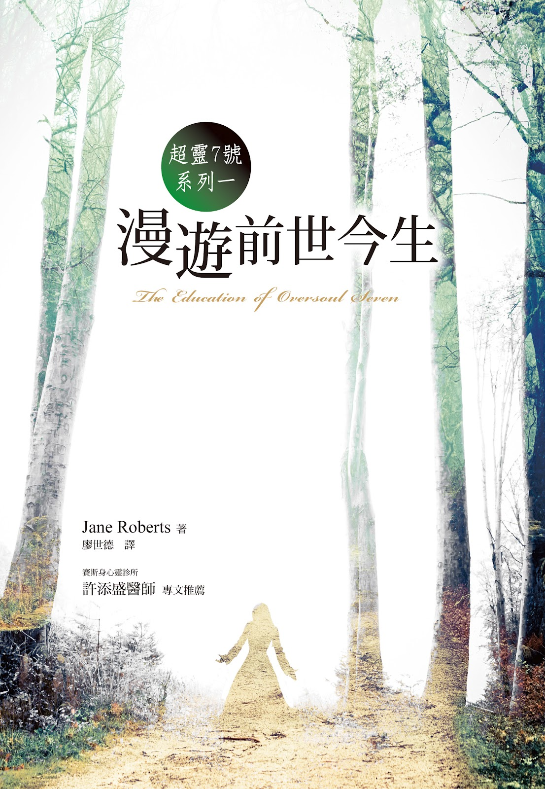
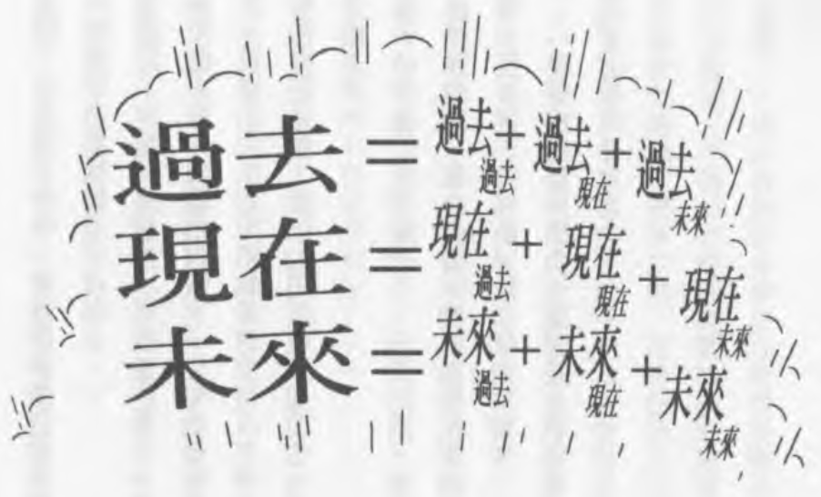
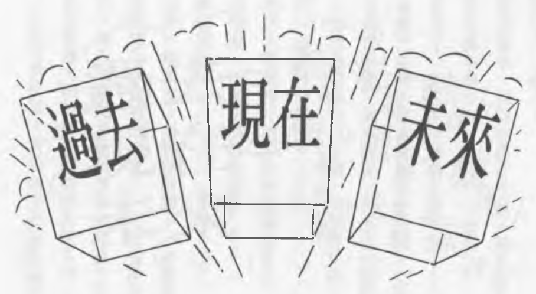
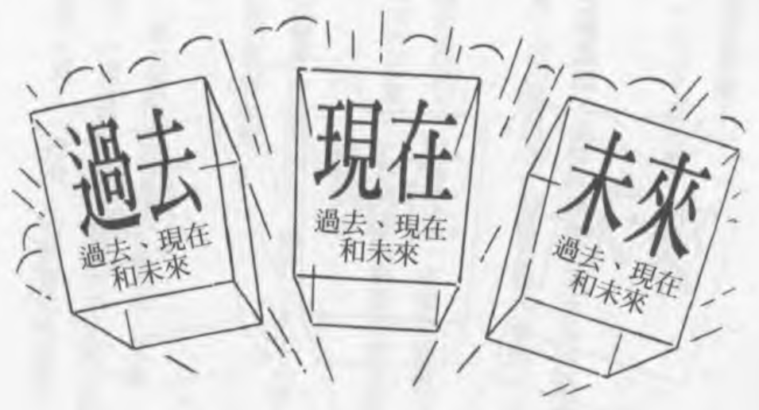
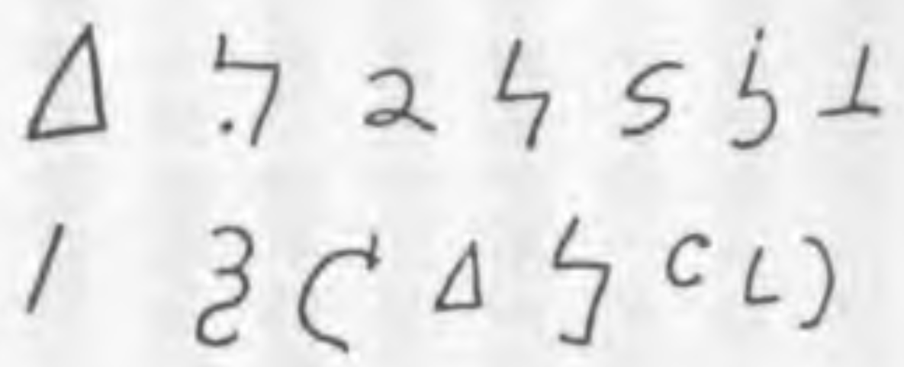
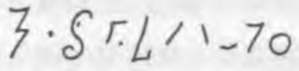
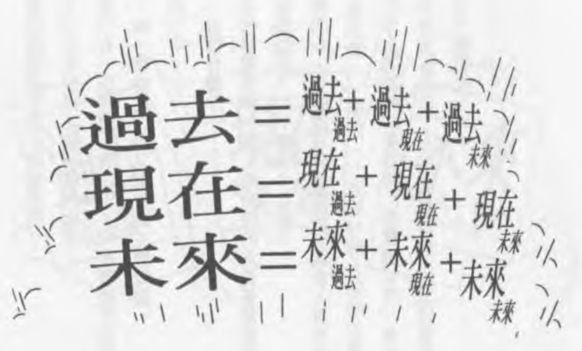
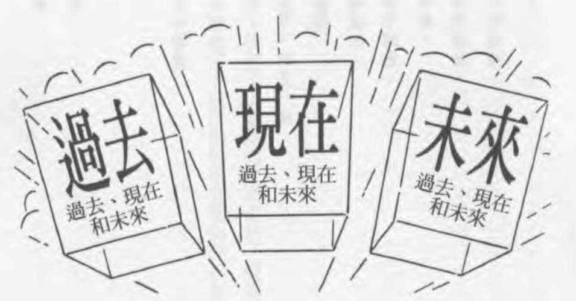
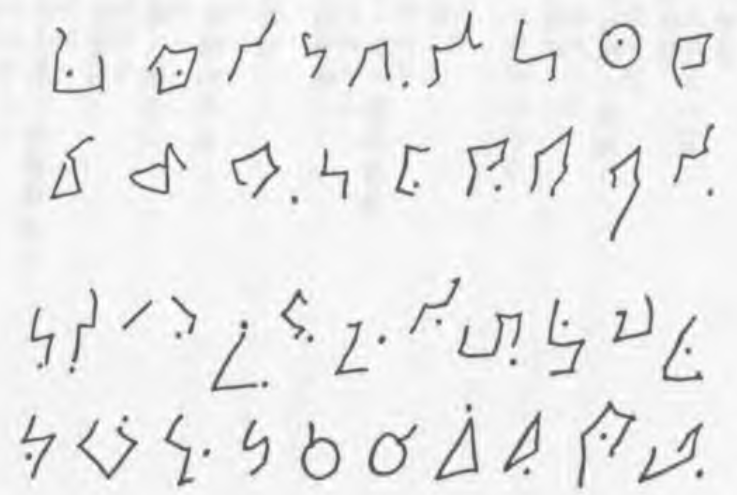

超灵七号系列之一：

漫游前世今生

The Education of Oversoul Seven

作者：Jane Roberts

译者：廖世德

# 关于赛斯文化

许添盛医师

我是个脚踏实地的理想主义者。赛斯文化，是为了推广身心灵健康理念而成立的具有公益性质的文化事业，希望透过理性与感性层面，召唤出人类心灵的「爱、智慧、内在感官及创造力」，让每位接触我们的读者，具体感受「每天的生活，都是灵魂的精心创造——You create your own reality.」我们计划出版符合新时代赛斯精神之书籍、有声书、影音商品及生活用品，并将经营利润致力于赛斯思想及身心灵健康观念的推广，期待与大家携手共创身心灵健康新文明。

# 译序

这是超灵七号，在他的老师指导之下，练习自由进出自己的四个人身的故事。进出四个人身，就等于进出四个时空。不同的人身，有不同的生命问题。所以，进出四个时空，不但有「怎样进去」的问题，而且还要面对每个人身各自的生命问题。

莉蒂亚刚刚在二十世纪「亡故」，原本会在十七世纪的瑞典重生。这个「倒头」重生的问题，让超灵七号困惑了好一阵子。另外，莉蒂亚在二十世纪那一世时，是个无神论者，不信人有灵魂。后来受七号的影响，坚持要先参访「众神之国」才重生。她后来重生在「现在的过去」和「以前的未来」重叠之处。

少年威尔觉得生命太无聊，想自杀。可是那「无聊」是他那一生的课题。

约瑟夫连老婆快要生了，还不知道自己愿不愿意死心塌地作父亲。因为他一直想当艺术家，怕因此照顾不了家庭。这是他那一生的课题。

但是，除了每一个人自己那一世的问题之外，促使杰弗瑞写出那一份文稿的，到底是什么人？众神——宙斯、佛陀、阿拉、耶稣——的表现，也让七号思考到神圣、自由意志、神性等问题。这些问题，连他的老师赛普路斯都无法回答。

读者只要了解「赛斯」的原理，对于小说中七号在各时空间天马行空，当不致有什么意外之感。译者个人比较感动的，倒是几个人物取得人身的经验。

我们生为地球人，习惯身体，和习惯任何事物一样，恐怕早就不再有什么感觉。可是，凡是灵性再现的人，都会对自己的身体再起惊奇之感。

身体的一切静、动作用，不论你信不信神，说它是奇迹，绝不矫情。而奇迹，就是神性显示的所在。

物质实相，本书大部分译为「形体界」，不但是自己创造的实相，也是我们的灵魂藉此传达其讯息的媒介。愿读者每天都透过物质实相，透过身体，体验灵性、神性。

由于本书是文学作品，欣赏空间是属于读者的，译者不需多做诠释。

不过，本书略有「文以载道」的意味。所载之「道」即是赛斯之「道」。说明这一点，主要是针对尚不熟悉「赛斯」的读者而发。阅读时若能参阅其他「赛斯」书籍，当更可能心领神会。

献给各个「时代」所有的说法者，也献给那些懂得苏马利歌曲的人。

# 第一章

超灵七号对赛普路斯做了个鬼脸，然后开始考试。他说：「这么说吧！用地球的话来比喻，我星期三和星期五是男人，星期四和星期天是女人。其他时间就自己学习。

「其实，由于他们的时间观念的关系，这样讲有一点复杂。应该说我的每一世都活在不同的——嗯——不同的时间领域，每一个领域都有自己的名称。」赛笑了笑，七号继续说，「身为莉蒂亚时，我活在二十世纪。身为约瑟夫，我活在十七世纪。身为玛阿，我活在纪元前三万五千年。身为布鲁托，我则活在二十三世纪。而且这之间还有一些空间背景——嗯——一些叫做国家的地方，另外还有许多属于人世的年代。

「虽然我想我不应该是莉蒂亚和约瑟夫的一部分，但我却是。只是，他们表现得很有活力，很快乐。玛阿很爱哭，布鲁托老爱回忆往日美好的时光……」

赛一直没有讲话，现在才说：「你一直在乱想，思绪毫无条理。假若这些事情我都不知道，而你是在说明给我听，但是你只告诉我——譬如——你在所有这些时间里面都曾经有过人身。这样的话，布鲁托为什么老是回忆往日美好的时光呢？」

「嗯，我懂了，抱歉。」七号说，「其实布鲁托自己并不知道。他没有把什么事都视为当然。以这件事情来说，他甚至连我或他自己都没有视为当然。换句话说，他不知道自己是灵魂，更不要说我们两个是一体。他当然也不知道我们有其他部分活在别的时间里面。我有时候会为他感到孤独。事实上，有时候我觉得根本没有人了解我们超灵。我们很努力地在做事……」

七号不禁觉得很落寞，连手上的假想笔都消失了。不过他马上又把它弄回来。只是赛还是摇摇头，断然的说：「不要这样。你知道的，失去假想力，会使你损失五分。假设你是……好，地球上的莉蒂亚，而她就是这样，你看会怎么样呢？实体物质完全不可靠，一下子就消失了。这样的物质反应，你要怎么负责？果真如此，那么我们每个人都要从头开始……嗯，七号，你不能再犯这种错误——让铅笔从半空中消失！」

七号点点头，然后突然——简直是不由自主的——笑起来。「事实上，约瑟夫已经快要知道了。有一次他忘了物质化他的画笔——他创作得正狂热——哗，画笔就不见了。他简直快要疯掉。」七号的眼睛露出父母般骄傲的眼神。

赛严肃的说：「你所有的人身都无法了解心灵形成物质，而你明知此点。我希望你能够改变这种情形。」

「我马上就把画笔幻化回来了呀。」七号说，「但是请告诉我，你不觉得事情有点奇怪吗？」

赛笑一笑，说：「完全不奇怪。我们还是回到你的考试上面吧！」

「我乐意！」七号说，「但等到我爬到你这种境界，希望我还是能够保持幽默感。」

赛笑了起来。她笑得很厉害，弄得七号很不安。她说：「你的幽默感只是我的幽默感的一小部分而已。你看不到的东西还很多。譬如这一次考试——饶了我吧——还有，你还必须为它维持地球的环境。这才奇怪。而且，请你看看这个房间。有个东西你竟然看不到。你的视力真的很……」

七号用心的看了一下四周。他一直暗自得意自己选择和创造的这个环境。教室是真正二十世纪的教堂，就像莉蒂亚小时候见过的一样。教室里面有黑板、桌椅、窗户、纸——而且是新的空白纸——还有一具自动削铅笔机。

于是他脸红了——从他鲜嫩的脸颊一路红到额头上褐色发根的地方。

赛看着，然后说：「效果很好。我真的要恭喜你这个形体。我相信你这个形体是非常好的十四岁男身，白种人。但是对别人来说……」

「那个错误，我找到了！」那个字纸篓事实上一直在角落那边，两尺高，两尺宽，满满的，里面层层迭迭，只是他忘了把它弄到看得见。于是现在他把它弄成红色，而且在上缘加上滚边。

赛说：「还有一个。」她的眼睛没有特别看着什么地方。但在这时，另一边却出现了一个年轻人，披着披风。这个年轻人一副粗野模样，四下看一看，然后对着七号喊说：「啊！你在这里！我就知道我还会遇见你。可是一样，这一切必须停止。」他好像已经半疯了，叫喊的口气是一种最深的愤怒。

赛抬起眼睛看七号。七号咳嗽了几声，然后把头转开。

年轻人喊说：「怎么样？」

七号说：「你是怎么来的？」然后急促的对赛低声说，「他就是约瑟夫。他一定还在做梦，还睡在地球上。」

约瑟夫生气的说：「我是怎么来的？你告诉我啊！下一次我会记住路线。我在梦中看见你太多次了。梦不应该这个样子。」他皱着眉头，突然停下来说，「我在做梦，对不对？我一定在做梦。这个地方真疯狂。这是什么东西？」他看着自动削铅笔机。

七号喊道：「不要碰！它不在地球上。」可是约瑟夫迷住了。

「这是真正的二十世纪，」七号说，「都用电的。」

赛哀叹着说：「我相信他是你十七世纪的人身。那时候不用电。」

七号脸红了，连忙把削铅笔机弄掉，然后对约瑟夫说：「你要忘记你看过。你要忘掉这件事。」

约瑟夫站在那里愣愣的说：「跑哪里去了？」

七号说：「你听我说，你不应该来这里的。不该来这里；每个地方都不该来。这是我的过错。赶快回家吧，回你的身体去。」

约瑟夫质问说：「回我的身体？你是什么意思？」他用力拉了一下披风，「这是我的梦。谁都不能赶我走。」

赛口气温和的问他：「你为什么要披披风？」

约瑟夫低头看看自己，觉得很惊奇：「我不知道。我不知道我为什么披着披风。虽然我喜欢画模特儿披披风，那些折迭的地方很可以发挥一些东西……」讲到这里，他停下来，又开始生气，「你们根本没有回答我的问题。到底是怎么回事？我为什么会在我梦里遇见你们？」他摇摇头，「你现在像男孩子。可是通常你像老人。不过你骗不了我。男孩、老人都是同一个人。」

七号说：「我以前就跟你讲过，你自己老是忘记。我有点像你母亲，又有点像你父亲，不过两者都不是。我们比兄弟姊妹，比母女、父子还亲。我现在只能告诉你这些。你自己必须知道一点东西。你学东西是很快，只是你老是在你不该流连的地方流连。虽然我也知道你有理由：你找我是因为你有麻烦。」

接着七号发现到自己声音里的责难，马上补充说：「没有关系，我了解。你有什么问题？」他转头看了一下，想看看赛是否同意他这样处理。可是赛早就善解人意的消失了。

约瑟夫并没有注意到。他悲哀的说：「我二十四岁了，至今还没有学到纪律。我每次在画架前都坐不到两个小时。可是在这个世界上，我最喜欢的就是画画。我学不到纪律，就很怕自己会失去这种天分——上帝知道我有多少这种天分。最糟糕的是，我已经一年没有灵感了。」

七号在摇头。因为眼前的约瑟夫渐渐变成了一头悲伤的大熊，他的黑发变成了皮毛，披风变成了毯子，眼神又凶又悲伤。他低头看着自己，开始歇斯底里。「我变成了马戏团的熊，变成了人家取笑的东西。喔，这种梦！这一定是在做梦。」然后开始低吼。

七号拍拍他的头，说：「不要这样。快变回来。做梦的时候，你会随着自己的感情、念头变成各种东西。你觉得自己像熊，所以就变成了熊。」

「真的？」约瑟夫又变回了自己。刚刚的事立刻忘得一干二净。他说：「再不想想办法，我这一生就毁了。」

七号说：「这样不行，你还不了解自己真正的问题。我的任务就是帮助你。所以我很快就会回来。同时我会稍微想个办法帮你撑过去。」

他一边说，一边就在心里创造了一间很好的画室，一间符合约瑟夫个人需要的画室。画室里面有一个画架，画架上有一幅画，画里面是一幢标准的农舍。以后约瑟夫在地球上住的，就是这幢农舍。画的一角签着：约瑟夫.兰斯达特，一六一五年。他用心电感应把这个梦传给约瑟夫，说：「看清楚了。你明天就开始画。你会充满灵感，终日画个不停。等到你从这个梦里得到了所有你想要的东西，你就会在你的卧房醒过来。」约瑟夫点点头，听话的走了。

七号说：「你觉得他怎么样？」

赛现身出来，大声的笑说：「我觉得你们两个很像。」

「不要开玩笑。他的问题很严重。」

「这是你另外的一件事，七号。」赛说，「你的幽默感都没有延伸到你自己身上，也没有延伸到你的人身上面。等到你爬到超灵八号，你会更清楚。不过刚刚的状况，你的确处理得很好。」

七号说：「我很担心他。他很冲动。」

赛说：「和你一样。要记得，你的每一次人身，虽然是独立的，可是还是反映你的性格。没有了自己，你不可能创造。

「所以从技术上来说，你有三项缺点。你应该事先知道约瑟夫走的途径，然后阻止他。不过我们的规则很有弹性，而且，纵然环境恶劣，他的成绩也很不错。这一点我会给你在功劳簿里记上一功。

「整个教室的环境也弄得不错。只是我还在等你发现自己的另一个错误。你十四岁的男身在象征上还是很有效。你的表现显示你对地球的风俗习惯很了解。不过我们现在且把这些都摆一边，回到你的考试上面。这件事比较重要。」

她一边说，教室就一边消失。窗外的树木也是。最后消失的是加滚边的字纸篓。七号觉得有一点沮丧，不过他想，这真是漂亮的一招……

现在七号和赛都变成了没有形体的意识点。七号觉得自己在心理上、精神上一直在扩展。他叹了一口气，让自己放松下来。他们向来都用心理图像沟通。那些图像随着意义的转变而转变，双方都是立即接受。用地球的话来说，最重要的是这种对话：

七号说：「创造自己的形体诚然不简单，但现在，纵使并非『地球取向的』，却很欣赏约瑟夫他们。我可以感觉到他们的生命力很旺盛。」

赛说：「我知道这一部分的考试你要怎么处理。但是，请记住，你不能和你的任何一个人身联系。如果是他们和你联系，那没有关系。但是你不能纠正他们的错误。我想看看他们进步的情形。所以这一部分的考试，你只要作旁观者就可以了。我知道你很冲动，所以我特别强调这一点。当然，你和你的人身沟通有多好，以后会成为非常重要的因素。」

七号一下子担忧了起来。赛还没听到一个声音，他已经听到，因为那个声音在对着他讲话。」

「崔梯！崔娣！」

赛说：「那是人的声音。怎么可能？应该没有人能够联络到我们这里才对。」

七号无力的说：「也许是个错误！」不过已经来不及了。

那声音说：「时间到了没有？」

七号急切的说：「快回去你原来的地方。时间还没到，就我所知也永远不会到。」

那声音说：「可是我都准备好了。」

七号说：「不，你还没有。这就是问题所在。如果你真的准备好了，那你的感觉就会比较敏锐。顺便介绍一下，这是我的上司。」

声音懊丧的说：「喔！崔娣！」

赛普路斯：「崔娣？」

「喔，那是达加。我们是老朋友。每次他变成女身，他就叫崔娣。现在他就是女人，在帮我做独立研究。至少我们认为他是女人。当我是女人的时候，我也叫她崔娣。」七号迷迷糊糊的，变成了十四岁的样子。「地球的话里面找不到字眼来形容我们真正的样子，没有什么人称代名词可以用来称呼是男人又是女人的存有，所以我们很难解释。」

赛说：「我们还没有准备进入独立研究。不过我必须承认我实在很好奇。而且我必须记录下来，你在进行各项计划时，似乎有一点困难。」

超灵七号说：「达加，听到没有？请你快走。」

声音：「好吧！如果你坚持的话。但是我已经定好了我的出生日，而且……」七号惊慌地喊：「走啊！」

赛假装没有听见这些话。她说：「我想这件事你以后会好好跟我解释。现在，如果你不介意的话，我们就回到考试上面。」

七号努力保持镇静。他说：「好吧！我们就去看一下莉蒂亚。我当然希望她过得很好。首先，她有几件事我想说明一下。她……」

赛说：「抱歉，从现在开始，我自己会看。」

七号叹了一口气。他在想莉蒂亚。他挚爱地想起她的身影，让这个身影充满了他整个心里，掩盖了他另外那么多「我」的记忆。然后他和赛两个就闪烁着，骑在百万个分子的肩上，一起浮现了。

# 第二章

莉蒂亚很紧张，觉得好像有人站在劳伦斯旁边看着她。上午下起大雷雨。十一点，大雨倾盆打在窗户上面。她七十三岁。只要碰到阴暗的天气，她就特别容易生气。

劳伦斯坐在蓝色长椅子上，对莉蒂亚说：「你觉得怎么样？我希望你出去走一走，然后给我一个答案。」

她放下了姜汁燕麦片，皱着眉头说：「我的孩子不会喜欢这样的。天啊！他们都快五十岁了，安娜尤其自以为是。不过我还是会出去。老诗人最后一次要痛痛快快地玩一下。我喜欢大学生那种年纪的人。他们还没有进入体制，我们却刚要脱离——感谢老天！外出旅行这个想法，我的孩子当然不会介意。可是，我和你没有结婚，却开着拖车全国到处跑——你知道他们有多传统。不——他们很难叫你糟老头，因为我比你还老！管他的，我就是要去！」

他很兴奋，烟斗差一点就掉下来：「我们的帐篷里要放很多书、酒、吃的东西……」

「还有我的两只猫。塔基和绿亩都要去，还有我的金鱼乔治先生。」

他咕哝的说：「两只猫，再加上乔治先生。」

她想哭，但是没哭出来。她铁了心，于是头猛向后仰。以前年轻的时候，她做这个姿势的动作总是大得吓人。她说：「我们走以前，我要先把文件写好，把房子留给孩子。我真的觉得我们可能不会回来了。」

他站起来，说：「我们会的。妈的，我们会的。」他了解她，所以没有抱她，只是一味地说，「我们会回来的。」

「管他的。你说我们会回来，我们就会回来。反正又有什么差别？算了。你知道，我真想告诉你——不是要改变话题——这一阵子我做的梦真的很荒唐。像昨天晚上，那种梦根本毫无意义。可是现在跟你讲的时候，又觉得好像有意义了。但愿我想得起来。」

劳伦斯说：「你这样讲话，让我很肯定我以前就认识你。你比我大十五岁，对不对？可是奇怪的是，我一直觉得你比我年轻。」

她轻描淡写的说：「我亲爱的，在世人的眼光里，我们可是很奇怪的一对。但最重要的是，从没有人真的认为自己会变老。老总是好像来得很突然，所以世人总是有点因你变老而恨你，不论你变老得优雅与否，变老总不是什么有礼貌或有品味的事。你不能怪那些年轻人，因为我们自己年轻时的感受也一样。很糟糕的，因为在某一方面，我从来没觉得比现在更自由呢！」

他说：「你看起来比实际年龄年轻十岁。」

「别耍嘴皮了。告诉一个女人她看起来像六十三岁，不像七十三岁，不会得到她的好感的。你要是聪明一点的话，就不要说话。就一种我们绝对不了解的原因而言，我知道年老对于男人是很糟糕的事，对女人却是不可原谅的罪。但我最好还是不要讨论这件事。」

她喝了一小口酒。「确实，我想，如果光线好，我又愿意化妆的话，我看起来——也许——就和你差不多。但实际上我却像是一个瘦弱的男生突然老了一样，白发跑了出来，一张脸瘦了下去，还不相信怎么会这样。当然，我现在就是这副模样。这副模样就这副模样。比如说，我不会想去染头发，在某一方面来说，七十三岁头发才开始变白，他妈的已是很幸运了。」

他一直没有讲话，这时才说：「如果医生说的没错，我的心脏突然一下子……」「如果是这样，我就开始展开我们的计划。这件事我也不知道自己可以坚持多久。我很清楚我已经面临我的……面临我的第一阶段。现在大致上，虽然只是暂时，但我的记忆应该还好。只是你永远不知道能维持多久。如果我的记忆不好了，那你就继续我们的计划。如果我连自己的诗都背不起来，我就知道不对劲了。」

整个事情对他们而言突然变得很好玩、很有趣。他说：「我们要打败他们的医院、疗养院、精神病院。」他瘦削的、神经质的身躯一下子抖擞了起来。

她跟着他笑了起来，接着顿然停住，说：「我的电动削铅笔机。我想起来了，我梦见我八年级时的教室，里面只有我的电动削铅笔机。这当然很荒唐。他们那时候没有这种东西。我不知道这个梦是什么意思？」

七号对赛说：「这是一个梦渗漏到另外一个梦的状态。」他们挂在窗外两片绿叶上面，绿叶在风中抖动。

赛说：「你听到削铅笔机的事情没有？那就是你没有发现的错误。」七号笑咧了嘴。

「等一下。」莉蒂亚说，「在梦里，我是个男人，很年轻。奇怪，不知道那一部分是怎么回来的。」

劳伦斯皱起眉头说：「不要质疑梦里面神祇的讯息。」他很认真地，「你会发现它们的意义的。」

她说：「不要这么说嘛，我会很紧张。你看外面这些树叶，多么青翠，多么……小心！天啊，我真希望这鬼暴风赶快停止。」

劳伦斯说：「雨水打在拖车顶上就不一样。」

她对他笑了笑。他已经把他的皮革店收起来，不做了。把他的露营拖车装潢了一番。她的书有一半他都为她装上了皮革封面。她简直倒抽了一口气，心想，他们怎么会这么老，又这么相爱？她说：「我做的梦里，有一个人在考试。我刚刚一直在想我的书，现在想起来了。」

「是我啊！亲爱的莉蒂亚。我们两人都在考试。」七号已经要把这句话传给莉蒂亚了，可是赛在旁边轻声提醒他说：「记住，不要催她。」

树叶在风中飞扬。七号用心感受了一下这风的独特，因为赛说：「好了，我们该走了。考试的第一部分只允许我们看一下。」

## 二十三世纪

布鲁托暗地里渴望自己是女孩子，因为女孩子比较会表现自己。然而他现在却和他的父亲住在一种圆球状的屋里，只能以完全无害的嗜好来满足自己。他很渴望看到一些绿得很自然的、会成长的、真实的事物。事实上，这种欲望实在太强烈了，他已经决定起而行。

他急切的说：「我们当然可以找一个小空间，然后弄一个自然的小农庄。整件计划大概只需要一个球形屋。它会自给自足。应该有谁会允许我们……」

他父亲米西亚皱起眉头说：「生命是会成长的。那种生命充满了野性，不会停下来，只会一直成长。为了发展我们能力范围内的人工环境，我们已经花了两个世纪。如果现在你把自由加在那种生命上面，大家就会一直生小孩。你会在六十岁或七十岁就死去。我们的生活方式是平衡的。但是我无法寄望十六岁的你了解这种事。」

他停了一下，然后粗声的说「以前我们的环境是『自然的』，结果我们的女人就一直生孩子，男人则一直占着权位。除此之外，关于那个时代，我想不到什么好事情。那个时代充满了疾病、战争、社会问题……」

布鲁托说：「你总是对的。」不过他还是很讨厌和父亲整天待在家里。

米西亚注视着他的脸，说：「不要在那里胡思乱想了。我们中午要下一场雨。你为什么不到外面去看看？到外面看看可以提提神。」

布鲁托说：「我也许会出去。」他一直很害羞、很畏怯，但奇怪的是，也很傲慢。他父亲的建议听起来很像命令，所以他就站在那儿。

米西亚不高兴的说：「快中午了。」

布鲁托皱起眉头，从他们那个巨大的球形屋走出去。他站在塑料人行道上，抬头看那些塑料树。从他的脚上看出去，就是地球所在。谁知道现在那边怎么样了？没有人知道——他想。现在除了科学的研究，已经没有人会去那里了。雨来了，他不再想这件事。下雨通常会使他高兴，但是现在他只觉得沮丧。这场雨会很温和的下个十五分钟，雨水流进水管里面，过滤，然后再储存起来。接下来明天就轮别的地方下雨。

他小时候就有一张下雨时刻表。那时候他都知道什么地方什么时间下雨。他们家这个区总共有十五个单位，人口一百多万。一下雨，他就很兴奋，跑上人行道，跟着雨起舞。

他抬起头来眯着眼睛看天空。天空有三片云飘过去。每次下雨都会有三片云飘过去。如果你不知道这里的人造天空只有八分之一里高，或者像他一样一直想忘记这一点，你大可想象这些雨——还有这些云——都是真的。他想，已经够真了，只差是人造雨，并且是人工调节而已。他一直皱着眉头，不过想到这里就笑开了。他想象自己有一天看到了四片云，或者两片云——这会叫大家都兴奋莫名的！但是这些雨的确是从天上的浮城落下来的，云不会多也不会少。他几乎想哭，但是想到自己的年纪，就算了。

他想，真正的洪水，或者暴风，不知道是什么样子？想到这里，光是激奋的情绪就让他眼睛闭了一分钟。他曾经在显微影片中看到古代真正的天灾，那种释放了自然力量的天灾。他现在想象的是，黄滚滚的洪水从真正的河流奔腾而出，倾盆大雨夹带着巨大的力量，还有可以把整个世界吹散的强风。

可是地球还是活下来了。地球就在他脚下那一方，而且，不论对人方便或不便，还是有那些巨大的气候变化，那些冷与热。如果能够活在大自然里——想到这里，他摒住呼吸，简直快要闭气了——和大自然对抗，不知道会有多刺激！要真正的暴风雨，从不知道哪里——从它自己，从大自然——而来，沉降到满是泥土、虫子、树根的真正土地上面！

他的眼睛很刺痛。那温和的雨已经下完了。都是假的。那些塑料树不会生气，所以并不需要营养。心理学家认为，地球式的环境可以使人有安全感。他知道这一点。但是现在的他，愤怒地看着那整洁的街道，回到了屋里。

米西亚在等他，他说：「你没有办法在单位里面创造自然的生命条件。这个你也知道，不要自找麻烦了。要不然就要到地球去。」

布鲁托说，「是有人去啊！」他垂着眼睛，脸都红了。

「可是他们没有住在那里……」

「有！显微影片里有说。历史学家下去了，科学家也下去了。他们必须去修理那里的仪器。」

「那又怎么样？」米西亚说，「地球没有未来。整个地球已经干枯、没有用了，只剩下一个空壳子，没有什么有用的东西。」接着他换成温和的口气说，「布鲁托，你是男孩子，不是女孩子，你的机会确实没有她们多，但是你在这里还是有很多机会。地球上就算有什么机会，也是女孩子的。」

布鲁托一直看着窗外。人行道已经干了。吸水机已经把水都吸干了，一点都不浪费。「什么东西都一成不变，」他懒散的说，「你没有想过那会有多奇妙吗？光说地球人的肤色好了。只这一件就够了。在这里，我们都是同种。」

米西亚笑了出来：「每个人都是橄榄黄有什么不好？你是为争论而争论。如果你要的话，这里也可以找到各种肤色，从橄榄黄到橄榄褐到……」

布鲁托说：「橄榄色，橄榄色。你就是不懂。几百年前他们有黑人、白人、黄种人……」

米西亚厌倦的说：「可是他们却互相打仗。现在反而少了一件事可以打仗。种族已经消失了。这有什么不好？你能不能不要再和我辩，找一件有意义的事情做做呢？」布鲁托点点头。他顿时了解他的父亲已经结束了他们的争论。他父亲要他去做一点有意义的事，他就去做。他会到地球去。他要在那里弄一个古代的农庄。他不再只是梦想，然后一再受挫。他要起而行。有一天，他要站在真实的土地上，天上下着真实的雨。然后这一切都会像做梦一样。

赛说：「这一个会带给你麻烦。」他们在房内高高的拱顶上面谈话。

七号说：「这一个不是我最喜欢的。他大半时候心情都很不好。」

赛说：「不过你好像没有看到一种关联。要不要我指出来给你看？」

七号说：「不要。请再给我一次机会。我不要再有什么问题了。」他把整个情景重新看了一遍，其中包括布鲁托用心电感应传给他的意念。然后他脸红了起来，「当然，就是那个农庄！布鲁托要在地球上弄一个农庄。他昨天晚上很可能梦见了农庄，或是农庄的图画……」

赛说：「没错。」

七号说：「布鲁托想这件事已经想很久了。但是，如果他参与了约瑟夫的梦，他当然会用自己的方法利用一下。你知道，在某一方面，他比莉蒂亚要老。他自己也这样认为。」

赛笑了笑，说：「你知道为什么吗？」

「不知道。」

「不用我告诉你，我想你自己会发现原因的。但是现在，如果我们来看看你的玛阿……」

七号很高兴要换题目了……

## 公元前三万五千年

几只小狼在月光下奔过悬崖。玛阿躲在阴暗处等着。她很饿；那一阵子她一直都是很饿，饿到几乎前胸贴后背了！小狼不见了，她从悬崖跑过去，跑到他们之前被迫离开他们发现猎物尸体的地方。她先丢石头把小狼吓走。朗帕从悬崖的另一边围过来。他用的是弓箭。但是他们发现的东西不多——一只兔子而已。不过他们还是马上就吃了，狼吞虎咽地。

他们穿的兽皮使他们可以稍微不畏风寒。他们蹲在那里，不讲话。悬崖上的冰雪一直在掉，风在石缝间吹进吹出。

赛对七号说：「我不知道你那么爱冒险。」

七号耸耸肩膀，有点得意。他说：「布鲁托如果想知道真正的地球是什么样子，他就应该到这里来体验一下。那时候他大概就会喜欢按时停止的人工雨了。」

赛笑一笑，没有讲话。

玛阿和朗帕吃完了。他们跑进附近的一个洞穴避寒。他们闻到兽皮的潮湿味，肚子因为吃饱而感到温暖。他们觉得很平安，就睡着了。他们的满足传到了赛和七号心里。那冷风在洞口进出，他们也感觉到了。

七号说：「我可以把风弄小一点，不是吗？」

赛点点头。

七号嘴里叫出来：「哦！哦！」因为玛阿虽然在睡觉，风变小还是使她醒了过来。

她的灵体一下子就跑到洞外。

她说：「哦！老头子，是你。」

七号对赛说：「她很乖，可是老把我看作老头子。」

玛阿说：「有什么不对吗？我每次看到你都是老头子。今天晚上你要帮我守夜吗？」

他说：「今天晚上不要。」然后又对赛说，「有时候她累了，我就帮她守夜，免得野狼发现他们的洞穴。」

赛问：「你知道你已经跑出自己的身体了吗？」

玛阿不屑的说：「当然知道。如果晚上我不进入灵体，那我的身体睡觉时谁来看守呢？只是，我不喜欢离开自己的身体太远。朗帕睡觉的时候几乎不曾醒过。你们是谁的灵体？」

赛说：「改天再告诉你。」然后就和七号一起消失了。

七号吹口气说：「玛阿老是把我看成老头子。想一想，她自己是黑人，就把我看成黑人。约瑟夫看我有很多样子，可是他也喜欢把我看成老头子。因为某些愚蠢的理由，这样他对我才有信心。可是布鲁托从来就看不到我。」

赛说：「所以呢？」

「他们都看不到我的真面貌——男兼女，不会老，没有身形。我的意思是连莉蒂亚也是。她完全不相信自己有灵魂——至少在理智上不相信。」

赛说：「现在是谁在想这件事呢？你讲话很像懊丧的布鲁托。」

七号说：「布鲁托！只要他还是那个样子，他就永远看不到我。但是你已经见过约瑟夫，所以我想这一部分应该可以结束了。」

赛打趣的说：「如果你不介意，我倒想看看约瑟夫在他的时间里醒来的样子。」

## 一六一五年

七号和赛刚到约瑟夫家，约瑟夫家就响起了砰砰的敲门声。约瑟夫•兰斯达呻吟一声，简直像哭一样，手抓着浓密的头发，从床上翻下来。他这一辈子从来没有这么落魄过。

他叫着：「来了，来了。」他希望自己的口气听起来是生气的、不耐的，就是不要是害怕的。他抓住一支画笔，往油彩罐一插，然后咬在嘴里，奔向门口。「我在工作，我在工作，你没看到吗？我很忙，但是如果你一定要进来，就请进吧！」

艾格兰•霍森塔夫提醒自己说：老婆在一楼的楼梯上看着。于是他轻快的走进门。这毕竟是他的房子、他的房间。房间里乱七八糟，到处都是衣服、床单、油彩罐，还有一些未完成的画。「你在睡觉还是在作画？我太太发誓说你一定还在睡觉。」

「怎么说？你认为我会咬着画笔睡觉吗？」约瑟夫比划着画笔，一直比到霍森塔夫的鼻子前面。油彩的气味呛得霍森塔夫流泪、流鼻水。约瑟夫占了上风：「你不信任我。你一向就不信任我。这样我怎么作画？」

霍森塔夫向后退，说：「好吧！但是我太太说你吃得比十个农场工人还多，我根本无利可图。我们总要来看看我们的画。你来这里已经六个礼拜了，吃好的，睡好的。但是上次我侄子找人来画画像，两个礼拜就画好了。」

约瑟夫反讥说：「那么那一幅画一定撑不到两个礼拜。好的艺术家需要时间。」他戏剧性地指着覆盖着布的画架说：「你的画像在那里盖着。我已经告诉过你。还没有画完就让人看，我会很紧张。开个头也要两个星期。你太太弄得我没心情思考，更不用说作画了。」

「嘘！」霍森塔夫淡蓝色的眼睛垂了下来。他脸上的不快消失了一些，一直对着约瑟夫摇手指头。现在他拉扯着自己的衬衫，然后抬头几近祈求地看着约瑟夫愤怒的脸说，「我太太没有耐性了。女人家，没办法等。」

约瑟夫说：「这我可不知道，」口气好像他们共同知道什么秘密似的，「不过我很快就会让你看到画像。」他戏剧性的伸出手臂，笑着说，「你会看到你们家族——霍森塔夫家族——水垂不朽。这幅画像会代代相传，父传子……」

阿娃娜•霍森塔夫从楼梯那里喊说：「他是个懒东西，你应该把他当贱狗一样赶到雪地里。」

她先生畏缩了，伸手把房门关上。

约瑟夫叫说：「啊！很好！我宁愿把画像烧掉，也不要给你们这种人。你们连店员都不如，不配欣赏美术。」他在房内翻来翻去，收拾东西，然后停在画架前面。

「你画不完了，绝对画不完了，」他自言自语哀叹说，「给愚蠢的女人害了。好吧！如果用那么一点食物，用这一间小房间来换一幅杰作他们都不高兴，那么……」

霍森塔夫一向没有什么想象力。他不知道这种愤怒是可以假装的。他急切的说：「好啦！好啦！我和她谈一下，看看她说的话是真是假。」他关上门，离开了房间。

赛和七号现在是窗台上的两片雪花。七号觉得很尴尬，说：「约瑟夫太激动了。」这时候，约瑟夫掀开了画布，画布上面空空如也，根本没有什么画到一半的画像。

赛说：「真会骗人。」

七号说：「不，他不是有意的。」他很不安，因为约瑟夫今天显然会很难过。

约瑟夫怨恨的瞪着画布：「空白，一片空白！」他非常厌恶，趴一声倒在床上。他知道霍森塔夫不会来了，可是他太太会来——带着她的大儿子。他们会把他赶走，不容推托，没有借口。他又要背着东西，穿着滑雪屐，回到外面，又冷又饿，一直到另外一个农家愿意给他地方睡，给他画布画画为止。但是最糟糕的是，他现在什么东西都画不出来。

这一次他的苦难可不是假的。他把画笔甩开，不知道怎么办才好。

「你的梦啊！」七号说，「赛，我能不能提醒他呢？我在他梦里送给他的画，他都忘了。」

「不可以，你不可以这样，」她说，「这一部分不可以提示。你自己知道的。你有这种想法就要扣二十五分。」

七号说：「不管是不是考试，总之，他真的有麻烦！」

「谁来帮助我呢！」约瑟夫在哀叫着。

七号问：「你说扣几分？」

她提醒他：「二十五分，你已经被扣掉很多分了。」

「你还是不肯告诉我及格或不及格会怎样吗？」

她柔和的说：「那是考试的一部分，你自己要清楚。」

约瑟夫在祈祷：「老天，这一次请你帮助我，我不会再说谎了。」

「你的梦，」七号把这句话直接传到约瑟夫心里，「梦里的那一幅画！」

约瑟夫的心情立刻改变。他突然喊了一声，从床上跳起来，高举起手臂，在房里跳来跳去。

七号简直要跟着激动起来。

赛在旁边下定决心，保留自己的想法，绝不流露什么表情。

七号传信号给约瑟夫：「画啊！」

约瑟夫站在画架面前，一张嘴咧得从这边耳朵到那边耳朵。在他的心里，他看到了一幅油画。那是霍森塔夫家的农庄，季节是夏季，农田丰美，坚固的房舍四周围种满了郁金香。所有绿色的东西都生鲜苍翠。时令正当仲夏，几丝早衰的褐色令人想到日后的枯萎。黄白色屋子底下的几许灰色也让人想到这房子虽然坚固，但是以后还是抵挡不了时间的摧残。然而整幅画的效果却生动有力，似乎整个情景虽然在形体上很脆弱，但是却可以天长地久一样。他心里从来不曾这么清楚的看过一幅画。

画布早就涂好底色，随时可以上色。约瑟夫意念飞驰，手忙着在调色板上调色，用亚麻仁油掺颜料。由于这突如其来的灵感，他觉得很敏感，很有把握，气定神闲。他唱着歌——差不多用叫喊的——开始下笔。

七号参与了约瑟夫的经验，其他事都忘了。约瑟夫只要拿错颜料，他就说：「不，不，你会搞砸了。这里你要的是土色。」还有一次，他说：「笨蛋，这是底色。」

赛一直等着，没有干涉。之间她只说过一句话：「这一部分应该只看一下就走了。」她尽量保持口气中立。

七号嘴里念着：「好啦！好啦！马上就走。」接着又对约瑟夫喊说：「不对，不对，这里不要那么浓，要用透明色。」

地球时间五个小时过去了。门口响起敲门声。约瑟夫喊说：「走开，我在工作。」门开了，霍森塔夫太太和她的大儿子强纳森冲进房里。她叫道：「哈！我要看那一幅根本没有的画。掀开来啊！你的话我就不相信……」说到这里，她和她儿子都愣在那里，不讲话了。

约瑟夫念说：「看到了吧！快走，快走，不要烦我！」除了作画，其他事都无关紧

霍森塔夫太太说：「这是我们可爱的家，真漂亮！」

「真有灵感。」强纳森说，「以男人对男人的方式，我向你道歉。」

「那你就道歉吧！然后我要工作了。你们没有看到我很忙吗？我还没有画完，刚开始呢……」

强纳森急切的问说：「画像也开始画了吗？」

约瑟夫很自然的叫着说：「对啊！对啊！对啊！」

七号对着约瑟夫的心里喊说：「骗子！你已经答应不再说谎。」

约瑟夫感到一种罪恶感，不禁恼羞成怒，恨不得马上再开始作画：「你们会准时看到画像的。一个人想工作时难道都不得安宁吗？」

霍森塔夫太太和她儿子简直就是怀着敬意地向房门走去。

约瑟夫还嚣张的对着他们喊说：「这房子就当是给你们红利，报答你们的仁慈。」七号叹一口气，说：「喔，约瑟夫！」

赛说：「我相信你自己很清楚自己做了什么，你介入约瑟夫的事情太深，什么事都忘了——连考试都忘了。」

七号回归为自己，心里充满了忧愁。他说：「可是我既然都介入了，那就要等他画完底色才行。剩下的他自己来就可以了。」

赛说：「那等你做完我再和你讲话。」七号一时弄不懂自己为什么总无法多了解赛的想法。不过她已经走了。七号站在那里。约瑟夫一径作画，那画笔就像是他心中图画完美的延伸。

# 第三章

超灵七号和赛现在是两个光点。

赛说：「我决定讨论莉蒂亚的研究有几个理由。一个是，你的考试第二个部分是绝对的人世倾向，考试的方法也不会让你怀疑……」

「怀疑？」七号说，「我不喜欢这两个字的含意。你确定你用这个字用对了吗？」她说：「确定。我用这两个字，为的是要给你一点线索，让你了解另外一件事的情况。我们都要化为地球生命的形体，当然还是隐形的。我要你像人那样和环境建立关系。譬如说，我们会离开窗台，进入书房，坐在椅子上。」

她又说：「好，请告诉我，我们现在是在何时何地。」她现在——至少对七号而言——已经化身为一个成熟的少妇，或者说，一个年轻但成熟的女人。不管哪一个都可以。然后，如果你再继续看她，她就会变成一个成熟的青年男子，或者说，年轻但成熟的男人。她笑了笑，说：「这要看你注意我人格中的哪一部分。你有人世倾向，但我没有。我不能把我的一切完全化为女人或男人。当然，从来就没有人可以这样。这一点在我这个层次更加明确。」

她继续说：「但是你到底要化成什么形体？我们所有的讨论都必须用这个形体才行。所以，就请你下决心吧！我要做的一件事，就是看你这个形体有多好，能记住多少细节。」

七号这个光点犹豫不定地飘着：「我没有想到要考形体。但是既然细节很重要，我就尽量挑一点出来讲。发光的橘色圆球怎么样？」

「不行，」她叹一口气说，「要是人的形体。」

七号笑一笑，化成第一章那个十四岁的少年，断然的说：「现在我回答你的问题。此刻是一九七五年四月的一天，在美国——一个国家——的东北部，四点钟……」

赛说：「我懂了，美国的四点。那么……」

七号说：「也不一定。好吧！也对也不对。书房这里现在是四点，但是这不表示这里的四点……」

赛说：「如果你无法解释现在是何时，无法解释何时和何地怎样合在一起，难怪你很难追踪自己的人身。但是没有关系，我还有比较重要的事情要和你讨论。接下来我要给你一个多重选择题，你注意听。」

七号皱起眉头。可是赛不管他：「第二部分完全看你第一部分的表现而定。只是你也知道，其中所有的事情其实都是同时发生，只是有几件却特别清楚。我觉得我了解莉蒂亚和约瑟夫较深。布鲁托还好。玛阿我就几乎完全不了解……」

七号用他十四岁男生的形体懒散地坐着，鼻子哼了一声，开始觉得不高兴。

赛说：「你对他们两个人的协调会不会没有别人那么好？在我看，你没有办法很快就脱离玛阿。」

七号说：「都是他们。布鲁托成天愁眉苦脸。玛阿——老是——把我看成老头子。我已经跟你讲过了。她总是要我替她做一些无聊的事。像是守洞穴啦！她实在很多事。」

赛严肃地说：「恐怕是你这个超灵距离他们两个太远了吧！这就是这一次考试我们要处理的问题。你必须学会和你的人身建立紧密的关系。你为什么认为玛阿老是把你看成老头子？没有关系，你现在不必回答。反正她也没有把你看成快乐的老头子。这差别很大。七号，你在他们身上看到的，都是你自己的性格。这个事实你已经忘记，完全没有掌握到。」

七号叫说：「可是我没有愁眉苦脸，也不多事。」

「但是你加给你人身的那些属性完全是你自己的。那些属性是从你的快乐、生命力、创造力产生的，都有你的性格。可以这么说，你就是他们的原料……」

七号说：「我不喜欢这个字眼。我喜欢自己是他们的……他们的创造者，或者说，他们是我的创作。」

赛说：「就像我以前想的，七号，我真的不知道你要怎样才能够到达超灵八号。」七号说：「你在转变话题。你骗我做了那一次声明……」

赛说：「是你自己骗你自己。事实上，你和布鲁托、玛阿真的太疏远。更糟的是你还犹豫不决。结果他们两人都失去了一种东西。这种东西非常重要，但是只有你才能给他们。他们失去了灵魂的一部分……」

七号很不高兴，以至于他的形体开始模糊。

赛纠正他说：「你又来了，请注意自己的形体。细节非常重要。我不想太过严格，但是，假若那样的事发生在玛阿或约瑟夫的身上呢？」

七号说：「约瑟夫总有办法挣脱。」

「但是玛阿没有办法，对不对？」

七号哭叫着说：「你就是故意要把我弄胡涂。」

赛笑他说：「目前一定是你最不顺的时候。否则超灵是不会哭的。」

七号说：「我不是哭，我是叫。不一样。」他倨傲的说，「反正又何妨？」

「他们只要应用了所有的能力，就会看得很清楚，知道他们根本没有什么障碍，有的只是自己认为有的障碍。不过没关系，现在是考第二部分，深度生活作文。」

七号恢复了镇静。

赛说：「你要在玛阿和布鲁托之间做个选择。但是，你一旦做了选择，就要把所有的注意力都放在你选择的那个人身上，尽力和他合而为一。」

七号说：「听起来很容易。可是我却感觉到你似乎有什么事还没有告诉我。」

她说：「那要你自己发现，你选哪一个？」

七号说：「我想我应该选玛阿，因为我和她的关系最差。好，我就选她。」

「记住，你要尽可能和她合而为一，和你身上由她所生的那一部分合而为一。祝好运，亲爱的七号！」

「等一下，我还有很多问题！」

玛阿说：「哦，又是你，老头子！」

七号只能皱眉头。赛走了，莉蒂亚的书房也不见了，反而是玛阿的灵体贴在她永远的洞穴外面。

他说：「你为什么老是把我看成老头子？」

她回嘴说：「如果你不是，为什么你看起来就像老头子？」

他说：「我看起来不像。这就是重点。」

她耸耸肩膀说：「我不管你像不像，但是至少你可以高兴一点……」

他不悦的说：「我尽量。我会在这里待一阵子，所以我希望……算了。」他告诉自己说，这样的开始已经很好了。

但是玛阿已经回到自己的身体。七号四下看看，心想，她的脾气真不是全世界最好的。冷风把干草扫到他脸上，悬崖因为结霜而变为白色。七号叹了一口气：她的环境也不是全世界最好的。悬崖高高耸立在空中，发出一种奇怪的声音，好像在咳嗽一样。

天气对七号毫无影响。但是他觉得景观很迷人，于是很高兴的从山谷消失，然后出现在一座悬崖顶上，往下看自己刚刚所在的地方。他想到了自己所受到的指示：「尽可能和玛阿合而为一。」想到这里，他有一点愧疚。他想，赛显然心里还有别的东西。他不安地走进玛阿的洞穴。

玛阿睡在几张毛皮上面，身上也裹着毛皮，褐发纠结成一团，黝黑的脸庞所有的重点都消失了，看起来很脆弱，不像地球上二十岁的人，倒像十二岁。七号叹了一口气：赛说的没错，他实在太疏远她了。不知道为什么，他突然感到深受玛阿的吸引，却又觉得无精打采。

他看到玛阿的室友朗帕睡在她的旁边，一下子又感觉到朗帕的呼吸温温的，像海浪一样冲到他的脸上，近得吓人。他的观点也变了，朗帕现在睡在他的身边……玛阿的身边。他从玛阿的身体感觉到朗帕的呼吸……因为他在玛阿的身体里面！

定居在真正的身体里好奇怪喔！玛阿当然感觉不到他，因为他就是玛阿，玛阿就是他，毫无冲突。但是现在玛阿只知道自己是玛阿，他则是她脱出身体时看到的老头子。七号已经胡涂了。他努力整理自己的思绪。于是他想，就某一方面而言，如果他努力了解她，大概就比较能够了解自己。

然而，他的意识还是在不安的翻腾。为了一切实际的目标而受限于一个身体——这可和他一向想变形体就变形体不一样。他现在有责任要维系一个身体的运作！一些相关的细节，想起来都会晕头转向。当然，一开始他的能量可以保养她的身体。可以这么说，他是火花，她的身体从这个火花生长，她的灵体也从这个火花生长，可是……他不想再去想这件事，因为他感觉到一种最奇怪的模棱两可。一方面，置身真实的身体中实在很亲密。他感到自己的意识包覆在所有的原子和分子之间，感觉到那些原子、分子，百万个个别而又相合的意识，万般滋味，好像有数不清的蜜蜂在那里嗡嗡叫一般，很近、很温暖。他有那么一下子还感觉很害怕、受拘束。

另外一方面，身体经验又使他非常震撼，神迷，好像磁铁一样，吸引着他。以前，他从来不允许自己进入自己某一人身的完全实体经验里面。别的不说，那就是，他从来不曾受到邀请。但是现在他突然明白。这种事不需要「邀请」，根本是「介入」。所有的超灵都是个体，都以自己的方式和他们的诸多人身建立关系。以往，他很爱冒险，所以就让自己和自己的人身面对一些挑战。然而，真相其实是他根本不想介入太深。更糟的是，现在倒换成他开始怀疑他的人身在给他一些挑战了。

譬如现在。和血肉这样完全结盟真是骇人——爽快又不爽快，但每一分钟都越来越不爽快。他感到自己越来越血腥、浓稠，陷在一片繁杂的、令人晕眩的互动当中。可以了，够了！

七号站了起来，却没有怎么样。他的意识还是完整无恙，然而通体散布在玛阿身上，附在细胞和器官里，锁在骨和血的迷宫里。

玛阿左肩冷冷的。这就是冷。他知道这个字的意思，但是那种气流，那种袅袅的风吹在暴露的身体上面的感觉，却是崭新的经验。七号感觉到自己手臂上的汗毛竖了起来，站得直直的，好像从肉里一拔就起来的样子。玛阿突然翻身，左肩变成埋在下方。手上的汗毛立刻软了下来。

七号呻吟了一声。玛阿依然闭着眼睛，所以他无法产生视力，无法做任何这一类的事情。他只能透过她的身体体验现实。他心里喊说：「赛，这太过分了。」但是他听不到任何回应。他，或者说玛阿，打了一下寒颤。他很想象以前那样把风压下来。但是现在他囚禁在玛阿的身体里面，只能像她一样，任凭风要怎样就怎样！他对赛呻吟说：「至少你要把风压下来吧！」但是一样没有任何回应。

他的第一天真是匪夷所思。他跟着玛阿，透过她的身体，连着体验早上、中午、晚上。现在时间和季节不再混淆不清。现在他从她的观点看事情。那就是说，他只看到她看到的事情，只差他对时间可以有自己的解释而已。他从来不曾有过这么拘束的感觉。不管怎么努力，他就是挣脱不了玛阿过的日子。

傍晚，天色黑了，又开始起风，月亮出现在低低的地平在线。玛阿和朗帕吃了一些白天采集的树根，剩下的就用韧草绑在腰间。七号透过玛阿的眼睛看了一下，知道洞穴已经很远，入夜时分要回去已不可能；悬崖则是耸立在光秃、没有庇荫的所在。他的身体很冷。兽皮穿在身上很不舒服，脚上的兽皮鞋也磨穿了。这时七号才发现，原来他的脚已经毫无知觉。

眼前，这一切身体的感觉占据了七号所有的心神。他从来不曾一下子遭遇这么多的刺激却无法随意去除。玛阿对朗帕讲的话他也听到了，可是他陷在舌头的感觉里，陷在讲话——空气从喉咙里冲出来——的种种感觉当中，根本没听清楚她在讲什么。

她知不知道她的脚已经快要冻结？她知不知道此时她的身体需要救助？

此时，玛阿的情绪像是在回答他的问题一样，突然一股脑儿倾泄在他的意识上面，使他简直就要窒息。他感觉到自己的知觉在顿然而生的恐惧、愤怒之下消失了。情绪立刻换成话：「都是朗帕。我真不应该听他的话。我知道我们太过分了。我的脚！跛了！」

心情立刻影响身体。他的肩膀塌了，嘴巴歪了，肚子胀气，血液马上流向全身各处。七号觉得自己垮了，好像就要死了一般。（以后赛会说：「胆小鬼！」）

可是他还是用力挣脱玛阿整个人的迷阵，站了起来。他知道有一件事很重要，然而是什么事呢？他急着要找一个安静的地方，一个架构，好避开这一切喧嚣。只要他想得起来，他就知道他可以去哪里，可以有什么办法。身体的吵闹、动作、情绪都在那里，不过他却像天花板上的蜘蛛一样，把自己的意识高高挂在这一切上面，静静的待在那里。

玛阿步伐沉重。七号现在已经从一大堆元音、音节、身体的声音之间认出了她的声音。这声音一直掌握着她体内发生或源自体外的活动。但是，朗帕的声音虽然是从外界而来，仍然影响了玛阿的体内。朗帕每次一讲话，玛阿的意识就产生一大堆反应，并且立即产生生理的反应。她的情绪以这样的节奏起起落落，七号一度还把它和走路时大腿的起落混在一起。

他努力地守在自己建造的那个安静窝里，尽力的集中心神。他感觉到自己的这种警觉产生了一种能量网，一直往黑夜中扩张出去，一直在捜寻，最后清楚的指向东南方。为什么是东南方？是什么意思？七号不知道。他只知道他要跟过去。

他们的身体跌倒了。七号也不知道怎么做的，反正就是把身体拾起来，继续走路。他一直很专心。他到底知道什么，又忘记了什么？

光网继续前进，然后集中在不远处的一座悬崖上面。突然之间，悬崖在七号眼中变成了透明。他看到了里面的光、距离、活动。七号努力要解决一个问题。他知道他必须把玛阿和朗帕送到悬崖上面。

他开始从心灵上给玛阿打信号：玛阿，玛阿，这一边。没有反应。他跨着沉重的步伐，因为寒冷和挫折，简直就要哭了。七号也快要受不了自己徒然的感觉。他很怕自己又跌回她那一堆身体和情绪里面。他努力要控制自己，可是却感觉到自己的意识流失了。他失去了他艰苦维系的独立，变成了玛阿。

她急切的想：我们必须爬到悬崖上面。她传信号给朗帕。可是因为她整天的行为都很奇怪，所以朗帕只是一味点头，一半是因为累，一半是因为惊讶玛阿一副很有把握的样子。玛阿咬咬牙，下定决心。不过她却不知道为什么悬崖这么重要，也不知道自己为什么知道自己必须爬上去。

他们一爬到上面，整个人都趴在地上。玛阿恼怒的哭了，因为，不管她原先心里怎么想，悬崖上面却是一片光秃，她非常失望。她很累，再也走不下去，心思跟着纷乱起来。于是七号又开始感觉到自己的意识悬在玛阿体内某处，只是和她还是分开的。他睁开眼睛站起来，用手摸着崖壁，小心的摸索着。以他目前的处境而言，他需要手的触觉。

玛阿的手指发现了七号要找的点，发现了他早就知道开在那里的门。他把玛阿的身体拉进来。但是朗帕的身体他却作用不到，朗帕自己好像也没有办法。更糟的是，七号知道再过几秒钟门就会自己关起来。他自己的能量已经在降低。前一秒一切事物还这么清楚，后一秒钟他的知觉就已经模糊了。

七号叫出来：「朗帕！」但是这两个字却以玛阿的声音，从她的嘴里跑出来。朗帕抬起头来，站起来一半，人挤过来，一进入里面，门就关了。

知觉还很清楚的时候，七号想说：「这一部分我应该得甲。」然后才一下子，他已经不知道自己这样想是什么意思了。

# 第四章

就布鲁托记忆所及，他在感情上一直受着地球的吸引。这一点根本没有人知道。他的同学没有人有一点兴趣。长长的午后，他们坐在自己的生活区上视听课，透过录像带大家聊来聊去的讨论时，简直没有人提到地球这两个字。

他们也有人谈到学期结束后要到外面去，但是好像没有人知道他们所谓的外面其实不是真正的外面。当然，塑料树确实是仿制，树荫却完全是真的。但是，天穹上的天空虽然一直有照明，却不是很亮，所以阴影并不是那么需要。在这里，阴影只是为了制造效果而已，树下根本没有小鸟在飞翔。那些树不论照顾得有多好，在他看来就是人工造的。有时候他好像知道自己在过去的某个时候早就认识真正的树木，所以绝对不会喜欢假树——当然这是不可能的。

所有的浮城都用自动马达固定，只要稍有飘离地球上空设定的地方，都会自动补偿回来。现今已经没有人记得地球当初住人的光景了。天穹城区里绝对没有真正的树木。虽然如此，他还是常常梦见地球以前的样子。他觉得很生气。他们就是把地球抛弃了，不要了。于是他开始大谈特谈那一座录像图书馆的微缩影片，常常整夜不睡，偷偷看影片看到天亮。

他的激奋（激奋：振奋、激动）随着知识的成长而日益增强。地球上有一些基地，一些正在进行人类学研究的地点和考古地，一些科学设施，还有——他想——一些卫星扫描不到的回归自然的社会。他已经告诉自己一百次，说自己虽然不确定，可是却有可能。

计划展开前几个礼拜，他开始收集物资。他母亲是行政人员，差不多每半年才回来几个周末，所以要瞒她不是问题。但是他父亲却是另外一回事。他父亲几乎是一直在家。米西亚是一个集体父亲，用闭路电视管理三十个男女孩子，看他们有没有按时读书、上课。每次看到他父亲这么投入，他就很生气：为什么他们不能像古时候一样，在一个很大的学校上课？

不过，今天下午，他只关心一件事。每一个星期二，他都会和朋友葛瑞克去散步。他们几乎每一个人都喜欢这种活动，因为可以让肌肉和动力充分发展。但是，布鲁托认为今天和以往的星期二不一样。他以为葛瑞克一见面就会感觉到他的激奋，不管他怎么掩饰都一样。葛瑞克却只是和平常一样走着，和平常一样谈着平常事。

布鲁托不管做什么事、讲什么话，在他自己看来都很不自然、很可疑。他一直从侧面看葛瑞克，以确信自己没有显露出什么异样。但是葛瑞克显然对今天，对他都觉得没有什么不同，他们和平常一样吃着中饭。布鲁托完全是因为紧张，所以就提议说看谁吃得比较快。

所以他们就在塑料街上谈着、笑着，嘴巴快速的嚼着餐丸。他们吃了两片蛋白质、两片碳水化合物，另外还补充了氨基酸。布鲁托为了自己对葛瑞克隐瞒计划，觉得有罪恶感，所以就让葛瑞克赢了。此时的他随时都觉得有罪恶感。

这种游戏他觉得很愚蠢。这将是他最后一次这么漫不经心的吞食餐丸。他很确定以后粮食不会断绝。他收藏的粮食够不够呢？他相信是够了，只是……

葛瑞克说：「你今天一直很安静。」

布鲁托说：「喔，都是这一套。虽然说我不应该，但是走在这些街上让我懊丧不已。我一直希望男生能够接受女生那种训练，能够年轻时就学会商业、政治，这样他们就会知道这个世界是怎么运作的。不要老是被动地看自己的父亲管理小区，学一些雕虫小技……」布鲁托很惊讶自己那不满的口气，因为他本来其实只是想找一些话讲而已。

他本来已经不再关心那些问题了。

有几个男生飘了过去。有一个人坐在他球形屋外面的门廊，面无表情。布鲁托说：「看到没有？他和那些树一个样子，都是人工的。当然，他其实不是。我父亲认识他。他和这里的每一个人一样，都有他的职责。不过这是不够的。他管下雨，可是事实上下雨已经计算机化……」

葛瑞克说：「我们不要谈这种事。我父亲说，弄到最后这样会很麻烦。你一直很他妈的不满。」

布鲁托不禁失笑：「如果你了解的话——我是说，真的很好笑。在这种地方，你会有什么麻烦？」

葛瑞克不安的说：「我不知道。」

布鲁托说：「对啊！根本没有。」他讲这话是要占住葛瑞克的心思，好让自己好好想一下最后的计划。该采取行动了，他越来越紧张。葛瑞克不久就会提议回头走。通常他们应该在吃晚饭前回到家里。快六点了，他们已经走了大约两个小时。他会想念父亲吗？葛瑞克呢？他要不要对葛瑞克讲一些话，免得不告而别呢？要不要讲一些葛瑞克以后还会记得的话呢？

「葛瑞克……我们是朋友，对不对？我很喜欢你……」

葛瑞克停下脚步看着他：「我们当然是朋友。你为什么要说这些？」

布鲁托想笑又想哭：「我不知道。」他一方面觉得自己隐瞒了事情，一方面又想把自己隐瞒的事情喊出来，让大家知道。不过他忍住了——他必须领先两个小时，必须先到他划出来的那个坡道那边。他若无其事的说：「我们走另外一条路回去。」

他停下脚步四处看着，好像想下定决心走哪一条路似的。事实上，他只是想好好看一下这个地方。自有记忆以来，他已经在这个地方住很久了。极目所见，那些生活小区一直延伸出去，每一区都按科学与艺术原理，照古时候的地球环境建筑。每一个城市的风格都属于地球的一个年代。他们住的这一区是十九世纪的美国，街道是俄亥俄街。葛瑞克说：「我们一向怎么来怎么回去。」

布鲁托说：「我知道。但是中午的比赛给了我一个灵感。今天我们各跑各的路，你跑左边，我跑右边，看谁先到。这只是一个建议，如果你不愿意……」

讲到这里，他停下来，知道葛瑞克还是会同意的，任何一种挑战都很好玩。

葛瑞克喊：「好，预备，跑！」他头也不回，绕了一个弯，使尽力气地向右边跑去。布鲁托吓了一跳，愣在那里。他不知道葛瑞克会跑那么快，弄得他没有时间做假性的告别。葛瑞克从路角消失了。布鲁托也开始跑，越跑越快，只有偶尔停下来喘气而已。

人行道很软，所以每一步只能跑一小步。于是他感觉到一种渐渐加速的感觉，好像自己跑得很快，简直可以飞上树梢去了。很奇怪，空气虽然一直维持在七十三点二度，他的脚却冷冷的。终于来到那五英亩的人造树区和城市边缘的田野；他心里评评的跳。

整个地方整齐的放着几张长椅，每一张旁边都有一丛树、一盆花。因为现在是晚餐时间，所以整个地方空荡荡的。那些花有些已经变得很生硬。科学家一直在研究，想制造一种会自我繁殖——至少是能够自我修复——的材料，让这些人造花维持比较自然的外观。布鲁托不知道自己还会不会回来。即使回来，也不知道那时候新的塑料「生命」是否已经取代了旧的塑料「生命」。

一个礼拜前，他很小心的割了一捆「草」，把自己的求生用具和粮食藏在底下。现在他匆匆忙忙的把那些东西拿出来。快七点了，不久天光就要降到最暗。他有点惊慌，但是不予理会，只是把气橇（雪橇）的气打满，把求生用具背在背上，然后滑进安静的天空。气橇是和下方的空气相抵而作用。他的气橇是小孩子用的尺寸，只能够飞六尺高，不过速度还可以。

这时，他和平常一样，急着享受滑气橇的乐趣。他喜爱这种运动，常常自得其乐。他们那里空气的起降很规律，他又是滑滚浪的专家，一般的速度每小时将近三十里。天光已经暗下来，然后会这样持续四十五分钟。这时他的身体就不会有天光最亮时那么清楚，所以即使有人看到他，只要没有注意他的方向，就会把他当作一般小孩子在滑气橇而已。此时他的方向正是离开城市的方向。

半小时以后，他抵达目的地。他降落地面，把气橇的气消掉，系在腰间。天空已经转为黑夜。之前他花了几个月的时间才发现坡道的入口，现在距离他却只有十分钟之遥。那一排塑料屋子静静的矗立在那里；这个地方，除了维修人员，从来没有人来过。此外，也没有人会想来修缮这个地方。他已经到达入口。入口除了刚开始有女性工作人员来过之外，没有人守卫。

布鲁托站在那里，不知如何开始。葛瑞克不久就会开始怀疑他是怎么搞的。他父亲会开始担心。他要不要趁现在还来得及，回去算了？他这样做到底对不对？他眼睛刺痛。历史训练一向是女人的领域——他父亲说女人会窜改历史——男生很少参加这种考试。他参加了，可是也失败了。当初她们要是接受他，他现在就不会自己来这里，不会自己来寻访地球。他会满足于史料。

他这样回想着，心里又温暖的恢复了决心。他的面前是一面铁栏。他很容易就打开了——原本就是照女人的手力做的——走进去，然后从里面关起来，接着沿着光线黯淡的阶梯走下去。

他的脚步声在铝制的走道里回响。他耳鸣，头皮发麻。假设——只是假设——下面走不出去，上面又给人锁住，怎么办？他轻蔑的对自己说：「你这个胆小鬼！」他知道走道只有几百尺长。然而走起来却好像走不完似的。

除了这条走道，还有别的走道。但是，那些走道多数都是用来运送科学器材，而他根本不知道运送时间表。就是这个原因，所以他才选择这条公用走道。这条走道一年只有几次有人走，目的是检查。现在他才知道，万一发生什么事他走不出去，那就要很久很久，才会有人发现他。但他马上就告诉自己说，这并不是因为他粮食不够，事实上他粮食充分。他只是紧张，因为不知道以后会怎么样。

奇怪，往下走令人觉得很厌恶。他曾经在显微影片里看过一些古昆虫。他觉得自己现在就像那些古昆虫一样，在城市底下巨大的走道内爬行。不过他想，或许他只是因为知道自己在步步接近底端，所以感觉到困扰罢了。

他停下来两次，把求生包放在地上，扶着细细的护栏休息。他一直在想他父亲——这时候他应该已经知道他失踪了，或许正在质问葛瑞克呢！

为了表示自己不在乎，他又继续往下走，这一回回声更大了。不久阶梯终止了，有一道小门，上面写着：出口——地面。他一摸，门就自己开了，他走出来，门又自己关上。一个窄窄的厅堂，排满了机器，接着又是一道门。他走进去。

布鲁托咽了一下口水。如果他判断没有错的话，他现在应该是在浮城下方的原子动力升降机里面，所以他和地球之间有七里的空间，空无一物。他环顾那小小的室内，墙上指示牌上的按钮、开关告诉他现在就在升降机内——他做到了。但是，如果他不会操作怎么办？

突然间起了一阵杂音，一种奇怪的蜂鸣声。布鲁托摒住呼吸。想必他一进来，他的身高、体重等就输入了掌管下降的迷你计算机。指示牌上闪起了红灯，三个指示灯——自动下降、听候指示、等候——也亮了。

升降机开始轻微振动。他又咽了一下口水，对着「自动下降」指示灯按下去，然后用力闭上眼睛。他的头向后仰，胃在抽搐。升降机从浮城的电梯间往下落，开始下降。

他睁开眼睛，升降机内很暗。灯号亮了：三万五千尺。看到这个高度，他简直就要昏了。他现在知道，计划是一回事，计划的进行又是另外一回事，两者天壤之别。他现在只身在三万五千尺高空，从自己唯一所知的世界往下掉。升降机的一边是透明的窗户。他往外看，简直不敢相信自己看到的情景。

他全身四周都是空荡荡的。他在那无尽的蓝空中一直下降。他向脚下看——非常恐怖——底下都是山，围绕着蓝灰色的云，厚重而危险，好像崎岖不平且动个不停的地板。升降机好像是一定要撞毁了。急切中抬头看，他往下掉，浮城的底面也跟着在消失。他有办法让升降机半空倒退吗？他看了一下指示牌——不行，他虽然所知有限，也知道要倒退是不可能的。

现在的读数是三万尺。他向下看，惊骇万分，因为他已经接近那些云，云里面奇幻般的出现一些中空。他从来没有看过云——自然的云——只看过每次跟着人造雨过去的三朵云。但是他在研究中知道有云这种东西。影片或纪录中都不曾描述过云是怎么一回事。升降机穿过云间往下落时，他不禁大叫起来。他猛吸气——这些云像是知道一般，让路给他们。这些云「懂事」。他想，这些云简直就是活在空中的生物，是活的。在他看来，这些云似乎正从四面八方赶过来看他。

布鲁托双手抵着窗户，站在那里，看得目瞪口呆。白云一层一层又一层，使他联想到放牧在天空里的生物。看到他这样冲过去，他们有什么感觉？突然间，云变薄了，好像突然给吓到了一样，一下子就飞走了。地球的曲线一出现，他禁不住叫了起来。太阳抵在边缘，放射出最难以想见的光芒。他曾经在显微影片当中看过夕阳，可是没有想到太阳光会这么强、这么有力。

他瞄了读数一眼，马上又看外面。两万尺。土地——地球表面出现了。他开始看到大块大块的颜色。有黑色的——几近蓝色，是真正的太阳造成真正的阴影——有的非常鲜艳，令他不敢直视。升降机越往下降，他就越兴奋。地面上的山好像从嘴巴里伸出来的巨齿。他就要降落在一个非常平坦的地方，降落在「嘴巴」里的一个平地。升降机已经落入地平线，进入阴影里面，地面往上升了起来。他摒住呼吸。

不动了，升降机已经降落。门——难以理喻的——开了。「请指示」的灯号亮了。另外两个灯号也亮了，一个是「保留」，一个是「自动回程」。他咬着嘴唇，希望自己能够按「保留」以防万一。知道自己想回去就可以回去多好。升降机一旦走了，他和家里的联系也就断了。不，升降机不可失。他的手一直发抖，可是他伸出手，却按了「自动回程」，然后自己立刻跳到升降机外面，深恐升降机会马上起动，他从阶梯踩下来，踏上他地面的第一步。

他站在那里。升降机四脚的火箭发动了，向外喷出饥渴的火焰。升降机往上升，起先有一点摇摆，然后慢慢的、稳定的开始往上升。他觉得自己从此失去了——失去了一切。他大声喊说：「再会！」然后断然地回头就走。

眼前的情景，乍看之下很可怕。他本能的抬头看，那真正深峻的天空已经没有塑料天顶的遮盖，整个天空敞开在他上面，在他头顶，不再是在他四周。他不禁感到不安。霞光穿越崎岖不平的平原，直抵高山环绕的远处。那强光刺伤了他的眼睛。然而不止于此，他对于这一片开阔壮观的空间根本还没有心理准备。置身其中，他突然觉得自己很渺小、很脆弱。他这一辈子从来不曾感到这样孤立无援，不禁打了一下寒颤。

他抬头看，升降机还在上升，像气球一样，越来越小，马上就要不见了。他看着看着，想到升降机就要归去的那一座城，叹了一口气。在那一个塑料宝贝盒里，他是多么舒服。他简直开始怀念升降机那坚固的四壁。

他的皮肤开始痒起来。这里的空气是不经控制的，很天然；虽然也柔得叫人惊讶，不过还是推着他的脸，在他身上吹拂，缓缓的推着他，那感觉活生生的。接下来他感觉地面也是这样。地面有沙，有石，有小草。走在这种凹凸不平的地面，他很惊愕，一度还停下来站得死死的，不敢再走。他歪歪斜斜的走着，石头刺着他的脚。他知道他的鞋子马上就要没有用了，太阳在天空里射下几道光芒。

还有多少人到过地球？他突然觉得自己很英勇，不禁感到意气风发。有一次，他母亲做生意时曾经带他去月球。不过月球已经有了文明，而且仍然在天顶之内，很普通。地球就不一样。地球很原始、真实。而且，奇怪的是，他觉得自己好像回到了家一样。

习惯在地表上走路之前，他的气橇就是他的脚和鞋子。他先帮气橇吹气，然后起飞，紧贴着石砾之上飘着。不过他很快就碰到了麻烦。他不知他用的这种气橇根本只能用在他们小区那种稳定的气流上面，要在外面这种飘摇不定的空气中稳定地滑翔，根本不可能。不过已经太迟了。

为了要稳定航向，他一直向下看。啊！这就是第七区！虽然人类学家、历史学家还是很容易就可以把地球上的旧地名写出来，可是如今地球表面已经用符号划分出来。不过他还是很想知道自己要降落的地方叫什么名字，否则岂不难过。

他用心想着，但是只想起「赛普路斯」这个名字。他想，赛普路斯只是岛屿，不是什么大陆。不过，名字总是名字，总比什么都没有好。气橇因为气流变化的关系，突然停顿了一下。不过他知道自己已经开始能够习惯新的气流。他沿着一个很大的「气丘」几近轻松的滑行着，然后对着底下的地面喊说：「我叫你赛普路斯。」

这时他才发现太阳射线已经消失了。在这里，他不需要什么庇护所来架设球形屋。

但是，想到要露宿在外，心里也满害怕的。他怀着一股希望，抬头看山上；但愿他能够在黑夜——真正的黑夜——来到以前爬到山上，不必仰仗城市柔和的灯光。以前他曾经在史料上读到古代地球夜晚的情形，这时他克制着自己不去想这些。他开始觉得眼前的山实际上竟然离——嗯，离赛普路斯这么远。

# 第五章

超灵七号一直在做台子，好把自己维持在玛阿生命经验的井口上面。可是他终究还是掉了下去。他和她之间很松滑。他自己现在这么清楚明白的时候，他就想，这一点都不公平。赛普路斯太过分了，这一部分对他目前这个发展阶段而言，实在太难了。就算他没有完全沦入玛阿的生命经验里面，也会败得很惨。

他只有在他的其他人身有意无意造访他的时候，或者玛阿需要他的时候，才会有自己清楚的意识。譬如说，当他突然觉察到布鲁托已经降落在地球上时，他就整个人进入了玛阿的生命经验——至少他自己这样认为。布鲁托一降落，那个清晰的情景立刻传到他眼里。他从布鲁托的气橇上面看了一眼四周的景色，不快乐的想着说，布鲁托在地球上要靠什么活呢？

那么，他「陷在」（不讲「陷在」，还能怎么讲呢？）玛阿的身体里时，约瑟夫和莉蒂亚的情况又如何呢？玛阿好像随时都需要他的协助。每次他一失去自己的独立性，变成玛阿，他就感觉到她的恐惧、不安，他自己原来那些高超的知识都没有用了。此时玛阿的恐惧好像要吞噬他一样。他突然领悟到，他必须使她超越这种恐惧。只有她解脱了，他们两人才能解脱。

事实上玛阿本身是很独立、很进取的；但是一旦恐惧使她遗忘自己所有的知识，就不然了。好比昨天——是昨天吗？——那个人发现了他们两人时就是。逮捕他们的那个人，相貌和他们看过的人都不一样。就是这一点吓坏了他们。

那个人带着他们从大厅走过去。大厅墙洞上插着火炬，玛阿不禁叫了出来。七号发现，玛阿和朗帕都很怕火。他们看到火就躲，看到灰岩墙上闪跃的黑影也躲。根据莉蒂亚的估计，逮捕——或者是拯救——他们的那个人大约有九尺高。玛阿只有五尺三寸，朗帕五尺八寸。另外，那个人穿的袍子还染了鲜艳的颜色，显然不是兽皮做的。

七号知道，关于这些人，自己是有一些数据。但是，玛阿的心情他至今还感受不到。玛阿此刻在洞穴里凝视着岩壁。她和朗帕聊着，不知道他们什么时候才会被释放。他们刚刚吃完了他们绑在腰间的草根。

他们头上高高的地方燃着一支火炬。洞穴上方中间是开的。两人现在比较不害怕了。抓他们的人把他们丢在那里已经好几个小时。洞穴的门打不开，可是他们在洞穴里却不受拘束。七号又开始担心了。他透过玛阿的眼睛窥视，看到洞壁上的一些影像。这些影像对他而言很清楚，可是对心不在焉的玛阿却不然。他有那么一下子觉得很奇怪，因为，他用来看东西的眼睛，毕竟就是她的眼睛啊！那些影像起先是乳状的，很浓稠，然后才转为清晰、柔和、鲜明。在七号看来，洞壁已经像从来不曾存在过一样，消失了。不过在玛阿却不然。

虽然没有特别针对谁，但是莉蒂亚心理上已经开始在求救。拖车的内壁在她眼前开始模糊。她知道这表示什么。这是一辆露营拖车，由劳伦斯开着。她一直在司机座后背的小板台上看书。此时她一只瘦瘦的手指还按在书上，然而却突然开始发抖，事先毫无迹象。

又抽了一下……。趁现在还来得及，她马上向后靠，坐稳来，免得跌到椅子下。她不叫劳伦斯——决定不叫劳伦斯，就让他开车，不知道也好。她的视野，现在在边缘上模糊得很快。她内在有些东西已经让开了。她已经准备要接受这种混淆——甚至是昏迷……

劳伦斯有没有胆量给她吃药？你自己答应的——她心里想——我不要死得不清不楚，不要独自一个人在家里死掉。她的眼睛飘向了放药的小高橱。如果她没有回来……如果她的心智……丧失了，……如果她没有办法再保持清醒，劳伦斯知道该怎么做。看橱子是她记得的最后一件事。

她从「其中」醒过来以后，跟以前一样，根本不知道发生了什么事。劳伦斯一直在开车，而且在听收音机。所以可见她没有叫喊；或者她叫喊了，可是他没有听到。书还在她身边。她有点头晕，不过如此而已。她……但自己是谁？想到这里，她那饱受惊吓的心一下子又惊慌起来。她怎么可以忘记呢？身体怎么可以忘记自己的名字？身体的名字？身体有名字吗？老天！她闭上眼睛，感到知识的小岛逐渐在崩溃，落入无尽的、湮灭的海洋当中。

七号突然一下子领悟到自己在干什么，连忙从玛阿的身体跳到莉蒂亚身体上面。他以绝对的熟练，下命令给身体的意识，使血液稀薄下来，循环加快，又下了一些必要的指令。「莉蒂亚，记住，要数数字，记住，数数字。」

她突然想到一个方法，这个方法有时候很有效。她很快就找到第一个数字的名称，叫做「一」。她在心里看着这个数字，非常专注地看着这个数字的图像。然后看「二」，接着看「三」，如此这般按着秩序看下去，最后她的惊慌终于平息。她的名字「莉蒂亚」终于在十五和十六之间飘了回来。

七号再回到玛阿身上。他不知道自己怎么做到的。他有一种胜利的感觉，觉得自己并没有陷在玛阿的身体里面。即使只是片刻，但他确实已经离开过了。然而，他和他的几个人身的距离却开始在消失。这一点必然是经过他同意的。生命的经验没有一项是强加在灵魂——或者人身——上面的。但是，他是什么时候同意的呢？他还有没有同意别的事情呢？七号气极了。原本玛阿就已经很不安了，她又在气什么呢？莉蒂亚那时候很可能会丧失生命，但是他知道她还没有准备好。这一点真耐人寻味。她没有准备好，就不会丧失生命——当然。

事实上，莉蒂亚也在想这件事。她人在这里；不发作了。她还活着，而且就她的认识所及，依然非常健全。她强迫自己把注意力放到劳伦斯身上，不要想自己。他是这么的近，却又多么的远！她看着他的头后……她想，他的头真像坚果，褐白色的头发浓密得很，很有元气；颈后的筋很灵活，头转来转去看路时，显得多么轻松自在！

劳伦斯高兴的喊说：「你今天真安静！」

「是吗？」这是发作结束以后她说的第一句话，讲得非常机伶（机警伶俐），声音清晰甜美、健康而正常。她高兴得真想叫出来。喔！上帝！生命……意识……多么美好！她说：「今天真是好日子，我一直在看外面，读书不专心，真丢脸。」

他说：「我们马上就停车，吃晚饭！」

「嗯！」她打开皮包，对着里面的小镜子照着。好奇怪，她的脸……完好如初。她的眼睛，虽然布满了橘色小点，看起来却很清澈，眼神和以前一样慧黠、嘲讽。以七十三岁的年纪来说，她脸上的皱纹不算多。她想，可能是她太瘦了，所以不容易长皱纹吧！她的小嘴，嘴角是有一点下垂了，细细的汗毛却依然生气勃勃。

所发生的事，这……只有三分钟？好像医生说的，是脑里的血液不够。那些小细胞会一个一个死去，把记忆和欲望也带走。到底有什么事会消失而她再也无法记起？到底有什么日常生活必要的分辨力会消失？在它出现之前，还要失去多少东西？可怜的身体、可怜的心，这么不经意地就失去了珍贵的东西。

她对着自己咒骂说：「狗屎！」这种事简直比中风还糟糕。它使意志失血、干枯。好好处在这一刻吧！她看看外面，让外面的景象充满她的心。秋天了！为什么秋天总是让她意气昂扬？真的是这样。

他们穿过褐灰色的草地，又穿过布满橘色落叶的草地，不久就穿梭在一个小镇里。都是房子——她想；每一栋都很神秘奥妙，充满了语言绝对无法形容的人类经验。语言到最后是否也会弃她而去呢？会的——她想。只是今天的她，七十三岁，还在这些市镇、村庄之间旅行。

她突然笑了起来。这些房子，这些树，在某一方面突然好像变成人造的，使她触摸不得，那些树叶好像都能够……都能够回收再利用似的。这其间的差别，除了少数人——可能是小孩子——也许根本没有人知道。只是此刻的她，心里却同时充满了思乡之情，好像整个市镇已经逸出记亿之外，好像她在某一方面已经走了，自己却不了解是哪一方面。

但是她对这个真实的实体世界却又充满了爱。这个真正的地球，自己仍然置身其中，仍然活生生的置身其中，很理性。她有凯旋之感。她说：「这些俄亥俄市镇真漂亮……」

赛普路斯对七号说：「那是布鲁托对人造树叶和俄亥俄街头的记忆，现在以一种渗漏的方式，进入了莉蒂亚的心里。她现在因为自然的地球而感觉精神大振，其实也是布鲁托刚有的惊讶。布鲁托这时在二十三世纪盖他的球形屋，莉蒂亚和劳伦斯也在二十世纪搭帐篷——你了解吗？有一些相关的地方在发生作用……」

七号眨一下眼睛。他和赛这样谈话也有一会了，可是一直到现在，他才觉察到自己是在和她谈话。他急着掩饰，连忙说：「当然，很明显。」

「但是你常常忽略了细节。」赛说，「你帮助一个人身的时候，就是帮助所有的人身。他们每一个潜意识里都会感觉到效果。以这一点来说，每一个人身之间都在互相帮助。你和其中一个有接触，就和他们每一个有接触……」

七号不高兴地说：「可是谁来帮助我？我好像球一样，给大家丢来丢去……」

赛笑着说：「这是最地球式的说法。但是你为什么觉得没有人帮助你？」

七号不理会她的问题，径自问说：「我们已经聊多久了？」

「以谁的观点来说呢？」

「谁的观点都可以，」七号说，「你就是爱缠着我绕来绕去，然后自己觉得很好玩。玛阿和莉蒂亚有一些问题；布鲁托可能也是，谁知道？我陷在玛阿里面，直到现在才脱身——有人需要我，我才能够脱身。不管是不是在考试，这一点都不公平。」

「你的实相是你自己创造的，」赛口气柔和的说，「我们每一个人都是。每一个意识都是。所以，亲爱的七号，请你回想你忘记的那些事情。要不，把你自己目前在做的事情视为理所当然是最好，然后从那里出发。」

「视什么东西为理所当然？」七号说，「你又来了！」

「视你的……处境为当然。」

「玛阿有事情，莉蒂亚也是，布鲁托也是。但是我没有，我只有这次荒唐的考试。」

赛再也忍不住笑。她叹口气，说：「喔，七号，你还是暂时回到玛阿身上好了。如果没有你目前这些状况，我相信你我的意见就一致了。反正你还是不懂。」

「但是我想知道一下约瑟夫的情形，」七号说，「我不想回到玛阿身上。你不知道那有多拘束。我一直陷在她里面，已经觉得无法脱身了。我们不能休息一下、避开一下，然后看一下约瑟夫吗？」七号现在变成了十四岁的模样。他发现这个样子和赛交涉最有效。

赛笑一笑，说：「好吧！不过你要记住，这次的休息很短。你要想着约瑟夫的画。」

画架上是一幅农庄和田野景色。约瑟夫正在上面涂一些透明颜料。霍森塔夫家十八岁的女儿碧安卡坐在乱七八糟的床上看着。（七号一看她，就惨叫一声。）约瑟夫显然在卖弄。他撑着两支强壮的腿，站得开开的，身体向后仰，大头压低，看着画——显然很清楚碧安卡正用着仰慕的眼光在看他。

他说：「你最好不要在这里。要是有人看到你在我房间，我会给他拧着耳朵或踢屁股赶出去。」

她脸红了，站起来，摇摇摆摆，顽皮的向他走去。她上半身的衣服还没穿好，约瑟夫头一低，就看到了她的乳房。她笑了笑。不知耻——他想。她对着他把乳房抓到衣服外面，然后一边笑，一边绕着房内跑。

他叫着说：「嘘，他们会听到，小声一点。」

她喘着气笑着说：「他们又不在家，你也不是不知道。怕什么？」褐色的眼睛充满了兴奋的光芒。

「你们家老么（长辈对排行最小孩子的一种昵称。）在。你又没有办法给他糖吃，要他不要管我们。他要是说了怎么办？」

「啦，啦，啦，那是你的事，」她笑着说，「我反正就是不承认。」

「那我也不承认！不承认！」她知道每次她一耍这种脾气，他就没辙。他无望的大叫：「管他的！」然后抓住她，把她丢到床上。她开始剥他衣服，他就笑了。他们又开始了。

七号安静无声。他和赛没入那风景画中，视线穿透过去，看到房间里面，最后说：「嗯！他过得很愉快。」

赛回说：「我想，你就是因为这样才这么喜欢他。他总是能够自得其乐。」

「嗯……他确实是如此，不是吗？虽然他有些事情我不太喜欢。」七号一边疑惑的说，一边和赛一起把画中的情景盖住，免得侵犯约瑟夫现在非常个人的隐私。不过他们并没有离开，还是留在那风景画当中，只是用一块铁盾挡在约瑟夫的房间前面。

七号再次偷瞄时，女孩已经走了。约瑟夫闷闷不乐的坐在床上，自言自语。他已经损失了白天大半作画的时间，现在因为很厌恶自己，所以也不想作画。就算画了，他只会感觉更糟。他看了一眼图画，更加怀疑有什么地方不对劲。别的不说，亮油看起来就没有那么清、那么亮；色彩老是带着一丝晦暗。他向画架走去，站在图画前面，感觉很气愤。

三天前，这一幅图看起来很棒。今天早上也是。然而现在，他却把自己内心所有的不满都投射到图画里去了。原先就发现的小瑕疵，现在变得非常刺眼。灰色调是不是太重了？他是不是颜料还没有干，就涂亮油？问题是不是颜料搀油时，颜料太干的缘故？

他简直就要吼出来。东西已经毁了，再也无法修复。他那伟大的灵感，那一生最美的一个灵感，他把它搞砸了。去他的；他从来就不是个好画家。去他的碧安卡，去他的霍森塔夫家，去他的他们供给他的一天三餐——他还要和工人一起吃呢！

都要怪碧安卡。一开始是她引诱他的，弄得他无心工作。他开始大喊大叫，一脚把床边椅踢到房间的另一边，然后抓起图画，甩到地上。七号简直不敢相信自己的眼睛。

七号原先还以为这幅图画已经化为真实。但是他眼前所见却不一样——它还是一幅风景没错，不过却已经变成三度空间瘫在他脚下。他四下看了看，极力恢复神志。

赛和约瑟夫都走了。他又变成了玛阿；玛阿抓着朗帕的手站着。他们眼前是一片翠绿的花草树木，以前从来没有见过。整个地方四周环绕着崎峻的山壁，显然没办法攀爬。他们是在一个幽密的山谷里面。一群人穿着袍子，站在一个绿油油的小丘上。有人领着他们向这些人走去。

七号觉得自己又一头撞进了玛阿的生命经验。但奇怪的是，撞进这个身体的感觉却好像回到家一样。

# 第六章

约瑟夫觉得很孤单，好像他的灵魂已经离开了他，或者其中的一部分已经跟着那幅画毁了一般。他已经无心再看那一幅画。光是看一眼亮油上溅到的那些颜料就已经够了。有很多地方，油彩已经掉了下来，连画布都看到了。

记忆中那幅画的签名，还有那原先几近盲目的灵感，现在都跑出来讥笑他。当然，他一直没有完全实现这个灵感。这是他这一生一次伟大的灵感，却因为一时的冲动而毁了。但是也许在他甩坏那幅画之前，那幅画的瑕疵早就很严重，根本没办法修了呢？也许他一直都知道自己没有办法把心中所见栩栩如生的那幅杰作画出来呢？

约瑟夫不喜欢检查自己的心情。他喜欢沉浸在心情里面，喜欢把心情画出来。自我检查会使他很紧张。然而，每当他心里考虑到一些不愉快而实际的事情时，这种感觉就会回到他心里。他必须尽快离开；强纳森就要来打败他的生命，而他没有了图画，也不再有什么谈判的筹码。如果有必要，他也可以和强纳森对抗——他们一样高——但是强纳森会很正义凛然、很气愤，他就得想办法好好保护自己。

事情就是这样！他很气愤，开始收拾家伙，收拾颜料、油罐、画笔、帆布。他把东西搬到门口，心里越来越替自己感到遗憾。他看着窗外覆雪的平原和低丘。其实他也可以停留在路上偶尔出现的那些农舍里。他想，如果现在是夏天，他就可以到镇上参加节庆画素描，到市场讨好那些女人——这样他就不愁找不到地方住。可是现在是冬天，他又把自己的「窝」搞砸了。

他躺到床上，看着那些家当。现在他看这些东西感觉不一样了。他又不是给人家踢出去的，干嘛把自己弄到寒冷的屋外？也许他可以救自己，也许他可以编个故事，也许……他心里瞬间闪过阿娃娜•霍森塔夫的脸——她特别喜欢他妈的那幅画——她要是看到那幅画，表情一定很愤怒。

但是事情实在太过分了。他累得睡着了，翻来覆去的，老是担心霍森塔夫随时可能进来发脾气。后来他醒了，已经过了午夜，整栋屋子很安静。他简直不相信自己这么幸运，于是静悄悄的站起来，打开窗。他想，霍森塔夫他们一定很晚回来、很晚睡。他摒住气，因自己的狡猾而笑了一下，然后把工具用力丢到窗外雪地上。他不敢走楼梯——楼梯已经坏了。他走到另一扇窗，爬到外面，小心翼翼的往下爬了几尺，落在屋檐上。

外面的气温零度以下，但是那冷空气很刺激，更增添了他那顿时兴奋起来的心情。

一跳到地面，他就想，等到霍森塔夫发现他走了，画已经毁了，他们的愤怒也没有用了。运气好的话，他们要到早上才会发现他逃走，这样至少他开始是很顺利的。再说，他们哪里需要追他？他们知道，即使辛辛苦苦的追到他，他还是没办法付他们房租。

他穿上滑板，把背包背在肩膀上，出发了。在夜晚沉静的雪地当中，一开始非常愉快。但是他忘了他的画具有多重，而且他一个冬天都待在屋子里，已经不习惯寒冷。他开始难过，然后开始苦恼。最后，他只能想说自己实在不是个好滑雪选手。他觉得自己比平常来得笨重——确实。他把自己所有的衣服——两件毛衣、两件裤子、两套内衣——全部穿上了。所以他现在觉得身体又湿又痒，然而脸却冷栗（栗：发抖，因害怕或寒冷肢体颤动，战栗。）入骨。不过，他想这样还是值得。他努力恢复一开始时的愉快。这是一个时代的结束，他有救了。

他们在近清晨时分赶上了他。他听到那愚蠢的铃声，感觉到自己心窝的那一块肿块，看到那马拉的雪橇渐渐接近。他们马上就会赶上他。他们已经看到他，他已经没有地方可以躲。强纳森驾着雪橇，约瑟夫可以感觉到他肩膀上头脑中的恶意，那顽强的模样是他不会错。

命运之神在追赶他——以艾格兰和强纳森的模样追赶他。他们后面还坐了两个人——他想，也许是艾格兰的兄弟。然而叫他惊讶的是，他自己竟然定在那里不能动。除了看着他们接近，他一点办法都没有。雪橇越来越近，原本灰色的模样出现了具体的形状。另外的红色也越来越鲜艳，越来越真实。另外一方面，他们好像本来就一直在追他，绝不放弃。这一刻似乎永无终止。

他们干嘛这么麻烦呢？他有些意外，但这意外的感觉改变不了他的惊慌。他们是要报复吗？还是有别的事情？这时强纳森已经跳过来，他父亲跟在后面，后座的两个人也跟着跑过来。他们一下子全部挤在他身边，拿着绳子绑他的身体、手脚。

强纳森大喊大叫：「啊哈！土匪！小偷！啊……拿绳子来，把他绑好……」

看到绳子，他简直疯了。他开始踢、叫、咬。他们脱掉他的滑板，把他丢在雪橇上。艾格兰的两个兄弟，块头都很大，心地却很善良。他们笑了出来，觉得这真是个大玩笑。约瑟夫给五花大绑在他们中间，瞪着他们。强纳森一直在前座咒骂，他父亲则一直附和着说：「对啊！对啊！」

归去的途中，他们一边假装讨论要怎样好好报复一番，一边安慰他不用担心，说他的命运早就决定，因为他们已经决定了他的罪行最适当的惩罚。他则装作完全没有听到。

他们到底为他准备了什么？约瑟夫闭上眼睛，不想想这件事。他们知道他和碧安卡的事吗？他急切的想着这件事。这个问题悬在那里，比雪橇的振动更让他头晕。可是雪橇的振动不由分说地也开始让他难过起来。

这一段路终于结束。他们一边胜利的欢呼，一边把他拖下来，抬上阶梯，抬进厨房。碧安卡、她母亲、两个弟弟站在那里，指着笑着，兴致高昂。他们把他抬上楼去，丢进他的房间。强纳森把他推到床边。

他说：「我们已经决定怎么对付你。」他摇摇头，润一润嘴，两手插在腰间，灰色的眼睛闪着亮光，说：「各位，不是吗？」

房门口众人齐声喊：「是！」原来他们一家人都挤在房门口，探头探脑的。

「我们要让你坐牢。带你到镇上写保证书太麻烦。我们这种好农夫花不起这种时间。所以这个房间就是你的牢房……」

约瑟夫身边都是人在点头、叫喊。他在绳子下挣扎，怒目而视。

「你要为我们画画。你自己答应的。你不画，我们就不给你饭吃。我们每一天都有人带饭上来，只要你没有在画画，我们就不给你饭吃。这样你就会越来越瘦、越来越轻。」

碧安卡用手肘戳一下她母亲，笑了出来。

艾格兰跨出来说：「这很公平。交易就是交易。不管有多久，只要我们没有得到我们的画，你就不能走。我太太，就是她，想要一幅这座农庄的画。她很想要，所以她就要得到。」

约瑟夫说：「画又不是印就有。你不能要一幅画和另外一幅完全一模一样……」阿娃娜往前一站，往他脸上挥着围裙说：「那你最好去学。你以为你这样跑掉就行，是不是？你根本不想完成你的作品。要不是可怜的碧安卡昨天晚上身体不舒服睡不着，她还不会看到你偷偷的溜走……」

碧安卡垂下眼睛。之前他就应该杀了她。

强纳森说：「我们已经把窗户钉上木板。这样比较像牢房。你想走，就必须努力工作。我们给你好饭菜吃，你替我们画我们喜欢的画，这样你就自由了。」

约瑟夫用力的说：「你们不能把我像犯人一样关起来。为什么呢？因为……因为不道德。把我锁起来，我没办法画画。而且我需要光线，你们不能把窗户钉起来。」刚刚他还松了一口气，因为他还活着。但是，现在他们这样弄，简直会让他疯掉。他最怕孤单、寂寞。

他看着他们红通通的、得意的脸，告诉自己说：「我会逃走。」

但是那一天下午，他们果真给窗户钉上了木板。他们一天一夜没给他饭吃，他根本没有办法作画。他们留下一盏油灯，可是他兀自坐在黑暗当中，根本不想去点。最后他只能在房里踱方步，越想越气，越想越气，然后半夜里猛槌房门。他最少也要用这种噪音把他们逼疯。可是没有人在意。

他累了，整个人瘫在门上叫喊，还甩家具。他突然厌烦起来，知道怎样做都没有用。他寻思的说：「他们是讲真的。」他本来不相信。不过，对强纳森和艾格兰来说，交易就是交易，很简单。如果他真的饿了，他们就会把女人送到亲戚家里，免得他的情况降低了她们的决心。

他的脸流着惊慌的汗水，流进胡子里面。首先，他连自己到底有没有办法画出像样的画都不知道。他们强迫他作画，只会把事情弄糟。如果连他都没办法要自己工作，还有谁可以？他愤怒的看着窗户。霍森塔夫可是真的把他关起来了。只要有需要，还要叫他饿肚子。他想，他简直不敢相信这件事。他这一辈子没伤害过人。然而，他们为什么要对他这么认真？

他的心思飘忽不定。他突然觉得自己咬着一颗苹果。于是就用极大的兴味咬下去，苹果啪一声裂开。接着他咒骂着坐起来，发现房里充满了一种期待的气氛，他已经把毯子拉到嘴巴那里。

早晨了，强纳森和艾格兰一起过来，四下看了看。强纳森说：「不做事，就没饭吃。」

约瑟夫躺在床上说：「这种气氛根本没灵感。」但是他们两个走出去，锁住房门，根本不理他。他喊说：「不用等我拿起画笔替你们作画，我就饿死了。」没有人理他。他没有人可以谈话，于是喝了一口他们好心留在水罐里的水。但是他已经饿得头晕。

第二天，他只是躺在床上，看着木板缝跑进来的光线发呆。房里充满了暗暗的光。他昏昏欲睡。他简直已经说服自己，说碧安卡会偷偷的送饭来给他吃。这时候他开始打瞌睡。

接下来他知道的就是自己在做梦。接下来梦的本身又开始分裂。空中闪着亮光。他看着自己的分身，那个分身也往下看着他，浓浓的胡子，眼神很温暖，又有一种奇异的理解。约瑟夫说：「你在这里干什么？你是另一个我吗？我又在做梦了。一个我已经够麻烦，我不要两个……」

超灵七号说：「我以为你自己的影像会使你安心……」

约瑟夫转头不看他，说：「安心？你真的不懂……」

七号觉得受到了伤害，连忙说：「好吧！好吧！」他变成一个老智者，「回头看看我，这样可以了吧？」

约瑟夫说：「感谢老天！你现在总算像个可以信任的人了！你到哪里去了？最近做梦都没有看到你。」

七号说：「我很忙。所以，我也许不应该来。可是我和你一直都有关系。你越来越让我想到自己。只是你老是搞这些麻烦。这根本没有必要。你其实很轻易就可以避免的。但这一次你是真的有麻烦了。而且这一次，除非你有生产，否则霍森塔夫绝不会让你走。你已经激起了他们的道德感。他们要给你教训，即使你会饿死……」

「我在做梦吗？」

「也是也不是。你在睡觉。如果你是这个意思，那么你是在睡觉。但是我要走了。」

约瑟夫求他说：「你不能这样一走了之。我已经好几天没有人讲话。如果我现在没有疯，不久就要疯了。你一定要帮助我。」

七号边说边消失：「我给你画画的灵感。结果又怎么样？你还是搞砸了。你一定很喜欢麻烦。」

约瑟夫说：「你不能走。这样我就完了。如果你一定要走，那就带我走。」

七号觉得很惊讶，不禁重新现身。他说：「这没有意义，也完全没道理。你不像玛阿、布鲁托、莉蒂亚那样足智多谋。而且你的话我一点都不相信，因为你老是变来变去……」

约瑟夫说：「你肯带我走吗？」

七号叹口气说：「好，我带你走。这完全是因为我心里有个东西老是惦记着你。但是你必须听我的话，然后你醒来以后可能会不太记得，如果你在自己的情况下醒来，你就不会问那个问题。」

「什么问题？」

「不要管了。你现在看看四周，告诉我你看到什么东西。」

约瑟夫耸耸肩膀，说：「椅子、窗枱、窗户、好玩的黄猴子……」

七号说：「其实并没有猴子。那是你造出来的。把它弄走，要不你会搞不清楚。」约瑟夫说：「把它弄走？」

七号说：「你房间里原来有没有猴子？」他的口气好像在对学习迟钝的学生讲话。

「没有。」

「那么现在就不应该有。它只是梦的元素。让它消失，要不我就不带你走。」

约瑟夫说：「走开！」然后猴子就消失了。他看着看着，一种权力感使他笑了起来，「你呢？假使我把你弄走呢？」

七号说：「那你会怎么样？」

「我懂你的意思。然后呢？」

七号说：「好吧！想到要带你走，我可不是很高兴。但是在回去之前，我还要去看一个人，就是布鲁托。别在意。不要看床铺，跟着我走就是了。很简单，牵着我的手。」

约瑟夫一牵他的手，他们两个立刻往天上升。他的意识一如七号意料的，昏沉了一下子。没有意识的约瑟夫比较讲理，比较好处理。

赛看着七号拉着约瑟夫。但是她只是微笑着，不想和他接触。她认为，他的技术实在不怎么样。

# 第七章

布鲁托在球形屋里露营。他的小球形屋轻轻的飘着，总是使你忘记它其实是飘浮在空中的。现在他的小球形屋距离地面只有几尺，可折式阶梯已经接到石砾地面。气流吹来吹去。布鲁托从透明的小窗口看出去，极目所及，地球的黑暗遍布四方。

他坐在气垫上吃晚饭。那是他分配给自己最低限量的一餐晚饭丸，用水冲泡而成。他已经得到一种印象，那就是地球经常下雨，因此提供的自然水连回收都不必。他知道地球不像家乡那样会定时下雨，不过他很清楚地球常常下雨。就是因为这样，所以他没有带多少水过来。他想到他那个塑料袋，吊在他的球形屋外面。只要下雨，他就会听着它慢慢满起来，还要注意它有没有破。

坐在这里，四周全是黑暗的天空，使他很不安。不要怕——他告诉自己——这里不一样。事实上，虽然太阳一下山，他露营的这个球形屋就会自动照明，不过他还是错过了飘浮城市里赖以过夜的柔和灯光了。除了这一点之外，他也担心球形屋本身。球形屋已经有些飘浮，如果刮起真正的地球风，不知道会不会把它吹破。这种球形屋当初制造的时候，并没有抵挡气流的设计。

如果真的飘浮起来呢？如果他没有把它绑在树上，会怎样呢？他——不快乐的——想说，最好还是多小心一点比较好。坐升降机都不曾使他这么害怕。别的不说，至少他信任升降机。但是每次他在这球形屋里站起来、开门、跨到外面的平台时，这球形屋总是摇摇晃晃。他的脚步老是会滑出去，风又好像要把他的头发连根拔除似的。他至今依然害怕那不稳定的空气，而且他的眼睛又很刺痛。他心想：你很可能会跌倒、摔断腿。

由于他的动作，球形屋突然振动起来。布鲁托跌了出去，趴在地上。他努力想站起来，可是站不起来，那感觉很像他是故意的一般。最后他用力一跳——一辈子不曾跳这么高过——才抓住阶梯最低的一级，吊在那里。他的体重把球形屋往下拉，因此他才爬上了球形屋。他喘着气，快要哭出来，因为松了一口气而觉得不太舒服。他爬进屋里，把梯子收起来。梯子消失在收藏的位置当中。

风——本来一直是微风——强了起来。亮起来的球形屋在空中飘着。布鲁托从里面向外看着，很担心球形屋会撞进有树的地方。撞坏了就修不好了。

这几小时他一直在和这屋子说话。他说：「我们做得到，不要担心。」他一边说，一边眼光落到一旁的电视机上面。但是他告诉自己，这里没有电视台。他已经跟自己讲了十遍。可是……他还是按了开关，坐在那里，望着空空亮亮的屏幕，不知不觉睡着了，只是睡得很不安稳。

接下来他只知道自己已经完全清醒。日晷显示他睡了好几个钟头。可是有一样东西叫醒了他。什么东西呢？他想了一会，才想起原来电视屏幕一直有个东西想要显现出来。想到这里，他立刻趋向电视机。那个东西一直很不稳定，但是有一些静音干扰，他更激动了。静音突然变成了语音。

语音说：「立刻关闭照明，离开球形屋。」可是屏幕上的东西却一直跳动，没有成行。

布鲁托喊说：「什么？你在跟我讲话吗？你是谁？」

「再说一次，布鲁托。关闭照明，然后离开球形屋。捜寻部队已经开始找你。我们不能再冒险使用这个频道。如果你接到这个讯息，请听从指示。请你等我们。我们是朋友。你不必担心。」

「你怎么认识我？你是什么人？捜寻部队在哪里？」可是屏幕暗了下来。布鲁托试了一下别的频道，可是都没有讯号。他一下子以为这件事是他的想象。那是什么人？他们想干什么？他应该听他们的话吗？球形屋四周的风吹来吹去，球形屋随时都可能撞毁在地上。他想，这样的话，为了救它，他最好先把它收起来。然后找一个地方躲一躲，看看情况如何再说。只要球形屋膨胀着，他就没有办法关掉照明。那是自动的。

他再次向外看。这一次是要找躲避的地方——有树的地方；只要有空地让他降落就可以。他的球形屋飘了一个多小时才找到这样的地方。但是虽然找到了，布鲁托还是犹豫着。他现在是在监管之下！他躲不掉。他没有看到人迹，而且确实没有看到什么地球的直升机。搜寻部队如果到达地球，就会用地球的直升机。

树丛接近了。他抓住求生包，压下把手，然后摒住呼吸，跨到外面的平台，沿着摇摇晃晃的梯子下到地面。球形屋在萎缩，在他身边皱成一团，变成了手提包大小的塑料袋。

他把个人的东西搬到树丛里，然后躲在树丛中。有些树木、藤蔓，矮矮短短的。他低着头用力的跑，脚下的露营鞋自动照出小小圈状的光线，照亮了地面。这是他母亲送的礼物，算得上是奢侈品，因为他露营的营地通常地面都稍微亮亮的，所以这种鞋子不算必需品。可是在这里——他停下来——在这里最好不要想到父母。至少现在不要。

他的脚很痛。这种崎岖不平的地面，鞋子很快就磨破了。可是他很兴奋。至少事情已经在进行，而他到现在为止没有受到干扰。不过他还是承认自己很害怕。可是即使这样，还是令人觉得很刺激。他觉得惊慌，但是觉得很自由。想到这里，他又开始担心一件事。如果和他接触的人事实上是来自家乡，只是在欺骗他，他该怎么办？

然而——他想——他们比较有可能派女人出来搜寻。他从电视机听到的声音就是女人的声音。他抬头看着浓黑的天空，心想，虽然有种种状况，但最后他们很可能就是抓不到他，没办法把他送回家。现在的他，从来不曾觉得这么……这么找到自我。

他突然停下来，因为他的鞋灯似乎照到了一个什么东西。他很小心的前进，然后停了下来，注视着。他走到了一个奇异的园丘（园丘：yuán qiū【释义】古代帝王冬至祭天的地方，后亦用以祭天地。）顶端。下方三十几尺的地方是一些黑黑的、奇怪的东西，似乎是房子。事实上，依他所见，他是在一个圆谷的边缘。他很快就看到一个倾斜度比较缓和的地方，于是就从那里往下爬。

他们的飘浮城市没有山，所以他们不习惯「爬」这个动作。他跌倒了好几次。下到一半时，他停下来望着黑暗的天空，看到云端系着一些光带——这是他这一辈子第一次看到黎明。他抬着头，对于黎明到来的方式（这和家乡不一样，是自己发生，而不是听信号发生的）感到很奇妙。他也了解其中科学的解释，可是第一次看到，他还是很惊奇。天空亮了起来，云彩的颜色从暗灰转灰再转……那些完美的色彩刚出现就立刻转变。

他再回过头时，才发现自己已经忘记了下面的情形。一低下头，他看到那些房子在渐明的光线下，矗立在一堆堆的石砾当中。那些房子其实都是废墟，实在毁得太彻底了，他禁不住往后退了一步。这是什么样的废墟！墙壁倒塌，剩下的柱子高高的，和他在录像带看到的一模一样，几座白色高塔依然矗立，只是藤蔓已经爬满了一半。

他一高兴，什么事都忘了。他尽力的往下爬。石砾地面使他的脚很痛。衣服勾满了荆棘。可是他根本不知道。他的求生包掉了两次，他两次自动的捡起来，又继续跑。那里什么时候住过人？住的又是什么人？那里曾经有人在工作，有些机器还继续的摆在那里。接着往废墟旁边一看，他看到了一间空房子，一些比较完整的废墟，好像有人住的样子，窗口挂着一些粗糙的材料。这里或许还有一些工人或人类学家在住。他小心翼翼的停下脚步，脚步轻轻的往相反方向走去。

没多久，他就走到了中央的石质平台。他一接近，一只小狗就从一座破损的雕像后面跑出来。他虽然没在动物园看过狗，不过他知道那就是狗。于是他就追过去。狗没有叫。不过他突然想它可能会叫，如果有人在睡觉，就会给吵醒。如若不然……他判断错误了吗？……没有。狗是在领他到什么地方去。因为它一直摇着尾巴，跑回来对他叫，然后又跑回雕像那边。

他终于跟了上去。雕像旁边有一个圆洞。狗往其中的梯子跑下去。他看不出洞有多深，因为梯子老是转来转去。可是狗已经不见了。

这是一种邀请吗？那只狗是不是受过训练？是不是属于电视上和他联络的人？这是不是陷阱？他和自己的争辩纯是理论的，他自己知道。因为他事实上已经往前走了一步。这一来，地表的另一边就会有一扇开在地上的门——他从来没有想到会看见这种东西。他已经坐升降机来到了地上，现在竟然有这样的机会进入地下！

可是狗哪里去了？他走了大约十步，突然听到一阵声音，光线也跟着变了。他回身，刚好看到洞口关闭，一块黑色圆盖遮住了早晨的天空。这时他才发现，原来梯子一直稍微有光线在照着。他心想，不知洞口的雕像是不是也改变了姿势，然后坚定的镇住洞口。

他的兴奋——几乎——压倒了恐惧。他时而觉得头痛，时而感到血液在他的耳际冲撞。别的不说，他就从来不曾闻过这种气味——矿物加湿气加泥土，长久以来原封未动的感觉。这种陈腐但召唤人的气味，使他想起自己事实上已经深入地球表面。

通道转了个弯。他又想起狗不知道哪里去了。他脚下的亮光之中有虫跑来跑去。可是他一退回来，虫也跑掉了。阶梯上有时候会有大石子，石墙上有时候会有一些洞，墙壁上流着水。

又转了个弯，阶梯终于没有了。那只狗蹲在那里，安静无声，摇着尾巴，眼神很友善。他想，这只狗是哑巴吗？右边有一道门，很容易就打开了。他发现自己置身于一个没有窗户的大房间，天花板上照着柔和的光。整个房间内到处都是长桌子，长桌子上面都是工具、石雕胸像、四肢。

原来这里是个考古地点。他不知道这种工作会做到地底这么深的地方。也许他们会让他留下来边工作边学习也说不定？但是这时他心里跑出了一个想法。那只狗穿过地板，在房间另一端的门口等他。他想，这未免太周到了吧！是不是他们已经发出悬赏抓他？那些考古学家会不会把他交给他父母或捜寻部队？

他甚至连见到他母亲都不敢想象。但是见到他父亲的想法却让他很惊讶，因为他想到他父亲时，感觉到很孤单，又感到一阵温柔，使他马上就想把这种温柔隐藏起来。他以很得意的站姿打开门。狗跑进隔壁的小房间，他跟了过去——原来是一座很好玩的旧升降机！他一进去，门立刻关起来，升降机往下降，一路摇摇晃晃的，好像已经几百年

没用了一般，然后停了下来。狗突然不耐烦的叫起来，好像一下子有了声音一样。门开了，狗直直的冲进两尺多外一个人的怀里。

那个人抱着狗说：「做得好，『冬天』！」那个人褐发、浓眉、高鼻，穿着长袖衬衫松垮垮的工作裤。不过他注意到的却是这个人的态度。他从来不曾看过有人有这样的仪表，这样轻松、友善，但行为举止又很果断。

这个人说：「我叫『窗户』，你是布鲁托。你引起了我们一阵骚动。当然你自己并不知道。你差一点把事情搞砸了。」

「差一点？搞砸什么？你是考古学家对不对？你就是送讯息给我的那个人吗？是不是真的有搜寻部队在找我？」他有一大堆问题，不知从何问起。他注意到房间的另一边有一张长长的石桌子，木架上排着一团一团的粘土，墙上还有一幅幅完成度不一的壁画。他想：这人的名字叫「窗户」。我从来没有认识有人叫这种名字的。而且狗叫「冬天」不是也很奇怪吗？

那个人道：「我们的名字对我们都有意义。我叫『窗户』，是因为我有时候可以看穿东西。这一只狗呢，是我们在冬天发现的。你现在的所在是泰勒斯遗址。我们还有很多时间可以解释，可是目前你对我们很危险，因为你把捜寻部队引到了这里。平常那些飘浮人是不管我们的。」

他说：「飘浮人？」

窗户用讽刺的口气说：「你们的人啊！现在请跟我来。我希望你喜欢这些东西，因为你要在这里待一阵子。」

他不安的看看四周，说：「你是说，我是囚犯？」

窗户耸耸肩膀，笑着说：「定义是很好玩的东西。但我不会把你在这里的地位界定为囚犯。而且我相信，为了你好，也为了我们好，这一阵子你会很愿意让我们把你拘留在这里的。」

自从布鲁托醒过来，听到电视机上的声音到现在，七号和约瑟夫就一直在看他。现在他们隐身在一角。约瑟夫生气地说：「怎么搞的？他们打算对那个孩子怎么样？你为什么不想想办法？你可以的，对不对？不过，他刚刚跌到那奇怪的泡泡外面时你没有帮他，现在我想你也不会帮他了。」他停下来，身体在发抖，「还有那个假隧道，不管那是什么东西……」

七号说：「你安静一点好不好？从一开始你什么事都没做，光会叫。我知道我不该带你来的。」

「叫？我在空中给人拉着头发飞！我一辈子没做过这种梦。我想我是有点饿了……」

七号说：「就某一方面而言，你是饿了。饿了脑筋就清楚。」

约瑟夫叫说：「脑筋清楚？你说这叫脑筋清楚？他是什么人——那个士兵还是什么的？」

七号顺着他指的地方看去，说：「那只是你的另外一个假身。你为什么老是这样？我告诉过你：只要他一消失，你就知道他是假的——至少对你是假的。如果他原封不动呢？他就成为形体界的一部分或物质的假身。你难道没办法思考吗？」

他们一边谈，一边布鲁托和窗户已经离开了那个房间。

约瑟夫说：「他们走了，你不跟过去吗？」

七号说：「布鲁托根本不知道我在这里。不过我不能再待下去了，我想他不会有事的。我相信他不会有事。他很聪明……」

约瑟夫说：「怎么搞的？这种话听起来不像恭维。」

七号说：「你不应该这样质疑我。不要想和我互换角色。来吧！我要把你送回去了。」

约瑟夫喊道：「可是那个孩子！老天慈悲，知道那个孩子……」

七号说：「这就是你的问题。你老是太夸张了。」他叹口气，摸一摸约瑟夫的手臂，心里想着他的睡房。这次约瑟夫只感到一阵风，一阵撕声，一种杂乱的感觉，接下来他就发现自己已经躺在床的上方，向下看着自己的身体，或者说，他看得到的自己身体的部分在毯子下缩成一团。

他说：「这是我吗？我到处跑来跑去，竟然没有带着自己的身体吗？」这种发现吓坏了他，他愣在那里。

七号说：「转回来！你的头跑到脚去了。你必须把自己的身体排好。」

「我没有办法。我不知道怎么弄。万一我回不来呢？」

七号说：「回来是最容易的。你只要想，就回来了。我建议你花一点心思解决一下你别的问题。事实上你今天晚上看到的事情对你很有帮助。不过这一次完全要看你自己。我已经给了你一些成分，但是你必须好好运用。现在，你就回自己的身体去吧！只要掉进去……」

约瑟夫说：「掉进去？」

七号叹一口气，轻轻推了他一下，把他和他的身体排好，说：「去吧！」

约瑟夫怀疑的看着他，可是还是照着七号的话做了。他的身上跑过一种奇怪的、向下坠的感觉。惊慌之余，他连忙睁开眼睛。一看，自己已经在床上。房间一切如旧，只有一个玩具兵站在角落。

七号好心的喊说：「你忘了解散你的假身。」然后就消失了。

约瑟夫喊说：「走吧！」玩具兵一下子就从眼前消失了。他坐起来，浑身发抖，流汗。他点上油灯，心想真是噩梦！不管怎么样，明天就开始替霍森塔夫他们作画。没饭吃，他已经快疯了。

突然，他一下子跳起来，完全醒了。梦中的情景跑进了他的意识里面。他看到那些废墟矗立在灰白的晓色当中。他想，这就是作画的灵感。他和七号相处的经验正在消失，先是变成梦境，然后变成梦的记忆，然后变成做过梦但是遗忘了的感觉。除去这些，剩下的只是清晰的废墟情景。于是他又点上另一盏灯，拿起笔把那圆形的山和泰勒斯遗址的情景素描出来。炭笔画出了那景色，他感觉很奇怪，觉得那情景很熟悉，好像曾经去过，只是后来遗忘了一般。

# 第八章

那盛着废墟的大土杯到处都是灰尘。等到尘埃落定，窗户站在那里望着天空。他头猛往上抬，高高长长的鼻子直指着天空。那天空空无一物，可是这空无一物却很可疑。捜寻部队并没有如他所料的回来。他等了好几个小时，都没见到他们的直升机出现在一向沉静的天空。飘浮人一旦置身地球的夜晚，总是很机警。但奇怪的是他先前并没有接到他们的消息。他回想，他已经告诉过他们他没有看到这个男孩子，而且他还答应如果看到了会和他们联系。他们应该没有理由怀疑他才对。

他尽力把自己体内的感官全部打开，可是邻近一带——地表、地表下、地表上——都感觉不到有什么陌生人。他心里的远程也没有外来的意念在进出。他内心的集中状态当中也没有出现什么熟悉的身影。他对自己笑了笑——如果不是他打没开感官，就是这个地区晚上很安全。然而他还是不太高兴。他坐下来，摸着一片破陶。一个女人的影像闪进他脑里。那是几百年前做这片陶的女人。时间大约二十世纪初，陶器的风格不为实用而是展示。窗户很不高兴。他不想因此分心，连忙把它去除。他的斥候告诉他当天升降机没有起降。那么捜寻部队到底在哪里？

他们需要的就是失落的捜寻部队——他疲惫地想。这样就会有更多的飘浮人下来调查。但这种状况于他们也可能是前所未有的灾难。他抬头往上看，天空暗下来了。窗户的心感觉到一种熟悉的运动……一种动作渐渐接近……可是依然在很远的地方。他闭上眼睛。内在那一片黑暗在颤抖、振动、破碎。一个全彩的、小小的影像终于成形——是搜寻部队的直升机。

窗户在心里把直升机的影像放大，然后让自己的意识进入了里面。是昨天和他交谈的那三个女人。他立刻捕捉到她们的意念和谈话。所以他分不清楚哪些是真的讲出来的话，哪些只是放在心里的话。他笑了——因为她们不会回来。这一点很清楚。由于飘浮人典型的骄傲，她们认为，既然她们找不到那个孩子，他和他的手下也不可能找得到。

他发现了她们意识之下更深刻的理由，不禁笑了出来。她们待在地球的时间将比原本的计划久一点，以便做最后一次努力，寻找布鲁托。但是要在晚上降落在一个遗址，而那里的人又不归她们管，就让她们很担心。而且，她们相信布鲁托失踪只是因为升降机故障，自己跑出去，因此留下了「违法施行」的证据——因为这种巧合，所以她们在地球的捜寻才会徒劳无功。

她们的偏见又开始作祟了。一个小男生应该不敢作这种旅行才对。她们相信他一定还躲在浮城里。她们应该全力捜查那个地方。

奇怪——窗户心想——她们对人的偏见并没有使他不安。他也了解这种偏见的由来，但是偏见本身，还有感觉到偏见的那种感觉，对内在的感官却是一种苦恼，好像有刺的树丛。那些针刺痛了他对一切生命的默许。够了。不需要再等直升机在天空出现了。它是不会停的。她们几个小时前已经通知浮城，所以一部升降机已经来接走捜寻部队、直升机等等。

他踢了一下地上那些残肢，走进一间显然是以前考古用的小屋子，扶着一些木工作品，从中间走过去。一个活门开了。他走进去，往下走几步，走进升降机。升降机很快的把他送到了内层。布鲁托在那里等他。

布鲁托听见他来了就站起来。他心里有一大堆问题。

窗户说：「嗯，你们的捜寻部队已经走了。她们认为，一个孩子不可能这么大胆，敢做这种事，所以你根本不在地球，而且，如果她们找不到，我们人类也找不到的。」

他皮笑肉不笑的说，「她们有好几个地方都错了。我们这里有很多人。上面的废墟——也就是遗址——其实只是伪装。我们住在下面，你知道的，显然。」

布鲁托问：「你们有多少人？你们是怎么躲的呢？」睡了一晚的好觉，他精神很好。他现在想到的只是确实有人住在地球下面，而地球上面的人都不知道。

窗户说：「我没办法一下子什么事都告诉你。不过我们应该是一支小考古队的一部分，有我们自己的基金。我们向浮城的母队负责。他们认为考古学是一种无害的男性活动。自从大部分人口离开地球以后，就没有人认真看待考古学了。」

布鲁托说：「我想我并不了解。这里是男人在管事吗？」

窗户摇摇头说：「历史上，两性都想管对方。就某一方面而言，男人占上风时，结果总是比较不幸。他们已经无法把自己当单纯的人看待，所以只能用性活动和他人建立关系。不过女人也很糟。以你的背景，你应该了解，她们想要报复，所以到处找一些不好的东西，然后说那就是男性的特质。我以后再解释给你听。现在我只能谈我们现在是个人对个人建立关系。每个人都是因为自己的独特而受到尊重。连名字都有个人的意义，不牵涉到性。」

布鲁托说：「你们有多少人？你什么时候要带我四处看一下？你们为什么叫做『泰勒斯』？」

「喔，我们的名字，是这样的，好几代以前，考古学家就用『泰尔』来称呼遗址上面的假山，后来他们就自称『泰勒斯人』。」他笑一笑，耸耸肩膀，「其他的问题，恐怕你要等几天才会有答案。但也可能不久你就会知道。」

「可能？」

窗户说：「可能。我们的很多方法也许和你们的教养方式完全相反。所以我们要判断一下你可以消化多少、接受多少。这么说吧！也许我们会把你留在外围，我不希望……」

布鲁托：「但到底什么事对我会这么陌生？」他已经厌烦老是坐在那里，很想探索一下这个地方。他别过头去，说：「我想你在逃避。」

窗户说：「你真的这样认为吗？就某一方面而言，我是在逃避。但是我想先让你见一个人……」他按了一个钮，一道门开了。

布鲁托已经准备好了。窗户的口气告诉他某种测验已开始。如果他没有通过，他们会怎么样？没通过不知道表示什么？他没办法多想，一个女孩子已经走了进来。女孩子很苗条，年纪比他略大，和窗户一样，穿着工作裤和衬衫。

窗户说：「这位是『故事』。」

故事笑着往前走。可是突然眼神一暗，然后往后退一步，身体有些发抖。她看着窗户，似乎在寻求支持。

窗户说：「怎么了？」

「还不知道。」她的声音很细，布鲁托必须用力听才听得到。她说：「我只是觉得……他比我们知道的还危险，但是状况却和我们想的完全不一样。我不知道为什么。故事刚开始……」

窗户说：「你会不会弄错？」

她不高兴的说：「当然有可能。我所有的故事都必须先解码才可以。也许我看错了。有些故事现在是真的，以后却可能变成假的。有些刚好相反……」

布鲁托说：「你为什么一直那样看着我？你们到底在说什么？」他觉得受到了伤害，「我们才刚认识，那些故事，是什么意思？」他不高兴的对着窗户皱眉头，根本不看女孩子。

「她之所以叫做『故事』，就是因为她总是看到真实的故事——不是发生过的，就是即将发生的。」

布鲁托说：「这只是迷信，我不想伤害你，可是……」

窗户打断他的话，笑着说：「你不想吗？」

故事急切的说：「如果他什么事都不懂，这样讲有什么用？」

窗户说：「没关系，把故事说出来。我相信他很有礼貌，会听下去的。」

布鲁托轻快的耸耸肩膀，半害怕，半好奇。他尽量不理会臂膀上的鸡皮疙瘩。他想，这个女孩子到底会说出什么故事？他为什么老觉得她会毁掉所有的事情？

她说：「我只能照故事原样说给你们听。不管一开始有没有意义，我就是相信它。所以如果听起来很奇怪，请不要生气……」

布鲁托说：「我不生气。」声音太大了，他自己不禁脸红了起来。

她一直睁着眼睛，可是总是看着右边：「首先我看到的是一个老先生和老太太。老太太很衰弱，也许就要死了。也许是老先生要死了。他们在一种交通工具里面，那是几百年前地球人用的交通工具……有事了。也许根本已经发生过了。她好像在和一个人讲话，那个人好像已经死了。他们两人的关系在于布鲁托。」

布鲁托凝视着她，愣在那里，觉得很丢脸。他想，真是胡说八道，窗户怎么会相信她的话。

她又说：「另外一个人，比布鲁托稍微大一些，不过还是很年轻。他一个人给关在一个房间里。还有一幅画，画的是一座古老的农庄，有很多树。」

这时布鲁托开始往前倾听了。他梦过这座农庄，或类似的农庄。那些树曾经激发他的想象力，因而使他更加决心要来地球。

窗户说：「布鲁托，怎么样？」

布鲁托不安的垂下眼睛，说：「没什么。」他告诉自己，自己在说谎。故事说的只是巧合而已。

故事一直看着右边，没有改变，也没有转过头来。布鲁托不禁很想走过去看看她到底在看什么东西。

她说：「反正我不是很喜欢这个人，这个关在房里的人。他很自我耽溺。我还看到了一个女的黑人。她在某一个奇怪方面和我们，和泰勒斯人有关系。还有……」故事停在那里，表情很严峻，所以布鲁托本来想打断她的话，可是没有。他觉得害怕……或许是觉得很期待。他分不清楚。

故事继续说：「她和考古学也有一些关系，或说和废墟或者某种神有关系。我看到她站在金字塔旁边。我们的危机是因她而来的！」现在，她几乎是恳求地看着窗户说：「到目前为止，我就知道这些。布鲁托，这些事情对你有什么意义没有？」

他摇摇头，说：「没有。我想这只是……只是故事罢了。如果你要相信那些东西，那是你的事。但是对我一点意义也没有。如果有的话，我会告诉你。」

窗户说：「故事，如果你再看到东西，一定要告诉我。布鲁托也是。」

「但是如果布鲁托不了解，而我又不知道他会不会……」

窗户说：「等一下！布鲁托，请听我说。只要女人一接手，她们注重的就是身体的灵活、力量、勇敢、逻辑。这些东西在以前都是男人坚持的。她们还眨低另外一些很好的特质，以为那些特质配不上她们的新地位，而且还会危害那种新地位。譬如她们就想不理会她们天生的直觉。所以，由于你的背景关系，你很可能对很多人的正常能力有成见……」

布鲁托说：「可是我的思想一向很开放。」

「那么，看见未来或过去这种能力你觉得怎么样？读心术呢？就在有人接管之前，事实上科学家已经开始了解这种事很有可能。那个时候，世界正处在一个新发现的转折点……」

布鲁托说：「但是这只表示女人有办法扫除这些迷信而已。纵然她们犯了很多错误，身为飘浮人我绝不快乐，但是女人却很逻辑。我对……对真实的东西是很开放的。」

故事冷峻的对窗户说：「他开始不可理喻了。」她尽力克制愤怒的口气，可是却觉得不安、受辱。她说：「从来没有人怀疑过我的故事。故事的意义并不会马上清楚起来，但是每个人都认为这些故事当然是有意义的。这些故事确实代表了一些真实的东西。我之所以叫『故事』，就是因为这些故事在我小时候就开始了。我们七岁时由父母取名字，然后十四岁时再予以确认。所以你等于在说我的名字没有意义。你在否定我全部的生命……」

她突然爆发，让布鲁托不知所措。他看着窗户。窗户却不知为什么地看着另一边。布鲁托只好被迫防卫自己。

他说：「我不是这个意思。我不是说你的名字错误，也不是说你错误。这么说吧！你的故事对我没有意义，可是确实是故事没错。所以你确实在说故事，所以你的名字也没有错。我只是认为那些故事和我没有关系。」他一脸通红，心情混乱的说：「我只能这么说了！」

她不放松的说：「什么东西对你都没有意义吗？」

布鲁托摇摇头，说：「有一件小事情，不过只是巧合。你提到的那一幅画听起来很像我梦见好几次的一幅画。这并不是说我做过的梦很多我都记得，因为我不是这样的人。那个梦留在我心里，是因为虽然我也来过地球不止一次了，它却使我一再想要到地球来。」

布鲁托并不知道他在说这些话时故事一直很紧张，两边肩膀一直缩得高高的，直到他说完才笑了出来，肩膀松了下去，脸上充满了温暖。布鲁托马上就说：「可是这根本没什么。」他看着窗户，可是窗户却对着故事笑。

布鲁托很惊讶：「为什么这种小事情会让你这么高兴？其他的事情对我一点意义都没有。」

窗户说：「那个梦也许和你到这里来有关系……」

「可是我本来就想来。」

窗户转身把手放在故事的肩膀上：「你应该从这件事学到一些东西。你必须相信自己的能力，不要因为有人怀疑，就跟着怀疑自己。只要我们确实在执行目前的计划，那么面对布鲁托这种怀疑论，你要尽力保持自己的正直。」

然后又转身对布鲁托说：「你对她有好处。她不习惯人家怀疑她的话。最后你们会互相教导对方。」然后又严肃的对故事说，「对于那可能的危机，只要你又知道了什么，请让我们知道。」接着，气氛柔和下来，他说，「故事也可能有扭曲。你可能一开始无意间以为布鲁托是一种威胁，尤其你又怀疑自己的能力时更容易如此。当然，我也会用我自己的方法看看我能够知道什么事情。」

布鲁托惊愕不已。「你是什么意思？难道你也要说故事吗？」

故事说：「他用看的。」

布鲁托对她说：「看什么？我也在看东西啊！」

窗户说：「够了！布鲁托，我们告诉你的已经够你想一天了。」

「但是，如果你们真的认为我是一种危害，为什么还带我进来？」

窗户简单扼要的说：「危害就是挑战。」

布鲁托想要拖时间。他知道这次谈话马上就要结束。和故事见面是否就是一种测验？他是不是应该假装对她的话有兴趣？他不安的说：「你们会带我到处看一下吗？我觉得你们好像不会，你们好像已经把我判了缓刑。但是你们还没有告诉我这里有多少人……」

窗户站起来说：「我想我们会分阶段让你看这个地方。我们从早上开始。我会找一些有意义的事情让你做。但是你的一些问题就等过几天再说吧！」

布鲁托点点头，可是觉得很孤单，又觉得很不满。一个女孩子，名叫「故事」，虽然听起来满口胡言乱语，所说的却应该是真的！还有一个人，叫做「窗户」，说他能看穿东西！看穿什么东西？而且他们让他看的，只是他们要他知道的东西而已。所以，他已经决定了，不管用什么方法，不管是不是已经十六岁，他都要把他们藏匿的东西找出来。

# 第九章

超灵七号又变成了十四岁的男孩子。赛普路斯对他说：「你好像一直都很忽视莉蒂亚。」

七号非常努力的集中意识。他们现在在莉蒂亚的书房。窗外秋天的落叶落下的速度很快，七号简直目不暇接。他把自己的视野放大，看到书房里有很多人在活动。有三个人在敲打抽屉，把里面的东西倒在蓝色地毯上。七号说：「这是怎么一回事？你应该找安静一点的地方。这是不是又是一次没有我的意识知识的对话？这种对话老是使我听不懂。」

赛说：「莉蒂亚的家人已经把这栋房子卖了。她立了契约，把房子让给他们，好让他们不必等她死，就可以处理这一份遗产……」

七号恼怒的说：「你难道不能说得婉转一点吗？」

赛说：「莉蒂亚就是这样说的。如果你追踪她很顺利，你应该知道。」

七号说：「我有啊！她的中风又发作了，结果使我挣脱了玛阿。换句话说，就是我也帮助了玛阿。事实上，我一直到那个时候都没办法挣脱玛阿。」讲到这里他突然想起来，「你告诉我要尽量和玛阿结合，我也同意。但是我实在不知道我能够和她结合到多完整，否则我就不会答应了。」他颤抖了一下，「那个身体无时不在。」

赛说：「他们的身体都是无时不在的。」她一直不知不觉的从年纪不定的美女变成年纪不定的美男子。有时候却是两种形体融合在一起，成为稳定的一体。

七号说：「你的形体好像有一些问题。如果换成是我，又有那样的行为，你就会给我记三次缺点。」

赛说：「我比你了解自己还了解我自己。所以，我很难——事实上是几乎不可能——创造出形体来表达我所知的实相。可是这一点我以前就跟你讲过了。」

七号说：「当然，你都有答案。」他们两个舒适的坐在沙发上。可是七号突然跳起来，喊说：「你看，那个笨蛋把莉蒂亚收集的贝壳全部倒在地上！他不可以这样！」他一喊，贝壳一下子全部飞回抽屉。

赛很急的说：「七号，不要这样！」

那个人转过身，看着抽屉，对另外一个人说：「我发誓我全部倒出来了。」

赛命令说：「倒回去，快！」

贝壳趁那个人背转身，又一个个飞回地板。他一回身，抽屉又空了。他叫说：「怎么搞的？我明明……我是说……我可以发誓……」

赛说：「凡是有什么地方谣传闹鬼都是这样开始的。」

七号呐呐的说：「这些贝壳都是她最喜欢的。我不想再这样在这里碰面了。我们能不能换个地方？」

赛说：「好，心里想着一片云。」两个人立刻就走了。只是七号趁最后的一剎那，把一个形状最完美的贝壳弄消失了，他要留给莉蒂亚。然后他们两个出现在大气边缘的一片云上。

赛说：「进入第二部分试题之前，我要很快的替你复习一下。到目前为止，你学到了什么东西？」

七号皱着眉头说：「嗯……我一直没办法守住玛阿。一开始就挣脱不了她，现在却是给那些人身叫来叫去。他们一有问题就叫我，我好像一直在处理什么事情。然后，我就失去了我的观点……」

他继续说：「布鲁托还是除了美好的往日，什么事都不信。莉蒂亚不认识我，我却很喜欢她。约瑟夫认识我——多多少少，但是他却惹了一些麻烦。玛阿，嗯，我现在比较喜欢她了。但是，我觉得你又在骗我了。」

赛笑着说：「我骗你？那么那个贝壳怎么说？」

七号周身发亮，说：「喔，那个贝壳，我看到了她的未来，发现有一个地点她用得上这个贝壳。我是说，这个贝壳可以帮助她。」

赛说：「我就是在想这件事。你的话有没有什么地方不合理？」

七号辩说：「可是理想和实际究竟不一样。」

赛的表情很严峻，七号从来没有看过。七号说：「好吧！我知道我应该像他们那样一天一天的体验时间。我确实也是这样。我只是偶尔偷窥了一下未来而已……」

赛说：「偷窥一下什么？」

七号改口说：「偷窥……呃……偷窥可能的未来。」

赛说：「你所有的人身和你一样，都有自由意志。你一定要记住。你看到的未来是针对莉蒂亚而存在的未来。她随时可能改变环境、改变未来，你懂吗？」

七号点点头。他受到了适度的教训。

赛说：「我详细说明给你听。你就是布鲁托、莉蒂亚、玛阿、约瑟夫。但是他们也是他们自己，而且不只是他们自己所知的自己。所以呢，你当然也不只是你现在结合的超灵七号而已。你帮助他们、指导他们的时候，一些你不认识的人也在帮助你、指导你。」

七号说：「我是他们的一部分吗？」

赛说：「正是。但是我现在要告诉你事情是怎么一回事。我要用形体来做说明。」说完，七号面前就展开了无数的平面，极目所及，向四方延伸。低下头，他看到的是过去、现在、未来认识的和将认识的人。这些人在这里同时显现了出来。但是他却不是什么东西都看到了，因为那光亮的面实在太远，了无尽头。

赛说：「请你小心的看着。」

七号强调说：「我是很小心的在看啊！」

这一次那无尽的平面变成了一个无尽螺旋的顶部。所以，整个情景虽然充塞于空间当中，七号也只能看到螺旋的小部分。每一个世纪一直在跑出一些螺旋。

七号说：「我头晕了。」

赛说：「七号，注意你的功课。这一切其实只是一剎那而已。剎那里面就充满了创造。用地球的话来说，每一个剎那都产生无数可能的现在。但是，只有你的人身认为真实的那个，才会化为真实。你会学到追踪方法的。」她点点头，又加上一句，「理论上。」

七号说：「但是这么多东西，我又怎么认识我自己呢？」他觉得自己很理性。

赛说：「但是你确实是认识自己的，不是吗？你当然了解自己，所以才懂得问问题。你对自己的认识是不言而喻的。」（她想，如果他不认识自己，也是不言而喻的。）

七号喊说：「我懂了！」

赛说：「很好，这样你就进步了。」

七号恍然一悟：「你希望我懂。你一直在考验我，这样才能够挫一挫我的锐气。」赛说：「你也许没办法完全了解自己，但那是一个自我发现的过程、一个变的过程。你越发现自己，就越……」

七号说：「我已知的部分我就差不多完全没有办法了；不过你能不能让我看更多的形体呢？」

赛说：「你还没有准备好。你必须从经验中直接学习。除此之外，别无他法。好了，你的试题，下一个部分是……」

一架喷射机飞过去。他们两人降落在机身上，乘在上面，偶尔往下探头看看地球。赛说：「你必须和布鲁托、莉蒂亚衔接。你必须用一种方法把你所有的人身集合起来，好让他们因彼此的经验而有收获。」

七号说：「那我该怎么做呢？」

赛笑着问：「你该怎么做？」然后又说，「七号，你必须多参与你那些人身的活动。我知道你会的。」

七号担心的回说：「我不喜欢你这样讲。我想知道一件事。我们这次到底谈了多久，是从我进来之前吗？」

「你不知道吗？你不知道吗？」这股乐声来自四面八方，来自七号的体内与体外，来自云端，来自喷射机。这句话是从时间传过来的回音，他既懂又不懂。最后他感觉到莉蒂亚、布鲁托、约瑟夫、玛阿都在歌唱，都在问这个问题。

可是这个现象一下子就消失了。消失得太快、太彻底了；七号的意识差一点就失去平衡。他喘了口气，说：「怎么搞的？怎么一回事？」

赛说：「只要你问的是真正重要的问题，或者说，只要你问的问题里面隐含着真正的……重要性，你就会得到答案。」

七号喊说：「可是我已经忘了我的问题，更不要说里面有什么重要性了。我也不知道那答案是什么意思。」

赛带一些慈悲说：「亲爱的七号，你确实已经了解。你的一部分已经了解。但是，你回去之前，我要给你一个线索，那就是，你会创造实相，你的人身也会创造实相。」七号失望的说：「这个我知道。我以为你会给我比较大的线索……」

她说：「我有。我建议这一次你从莉蒂亚开始。记住，你的实相是你自己创造的。」

七号心里想：你的实相是你自己创造的……

# 第十章

劳伦斯喊说：「乔治先生好吗？」

莉蒂亚回道：「很好。」通常她会把装金鱼乔治先生的鱼缸放在拖车的书箱上，旁边再堆一些书免得鱼缸翻倒，偶尔就去看一下水有没有泼光。但是现在她在开车，劳伦斯在后座看书，所以鱼缸现在是放在前座她的旁边。安哥拉猫绿亩缩着躺在鱼缸旁边。

莉蒂亚车开得很快，边听收音机，边抽烟抽个不停，偶尔和乔治先生或绿亩讲讲话。她戴着太阳眼镜，白头发上戴着遮阳帽，脖子上挂着一副皮制的和平标志——那是劳伦斯送给她的礼物。她觉得很窝心，就戴着了。每次超过的车子如果有黑人或长发飘逸的年轻人，她就笑一笑，亮一亮标志。

可是她心想，这一阵子黑人对自由主义、对那些「政治改革者」很不满，所以她也许不该再这样做。因为，如果他们不喜欢，这样做又有什么意义？一辆汽车在超车了，前座坐着一对黑人夫妇。莉蒂亚秀了一下标志，黑人也笑一笑，挥了一下手。莉蒂亚心想：可爱的人。所以我还是可以这样做。

她对着劳伦斯喊说：「你不要看了好不好？」没有回应。她想，也许他在打瞌睡，让他睡吧！「绿亩，你怎么不说话？」也没有响应，连闪一下耳朵的声音都没有。她把收音机转到别台。

半小时过去了。印地安那的黄昏开始落下。她不知道他们是不是赶得上爱渥华大学的朗诵诗和演讲。她看着路，嘴里喊说：「我们应该很快就会停下来吃晚饭。」然后又说，「绿亩，去叫醒劳伦斯，告诉他差不多要吃饭了。」绿亩睁开一只眼睛。她又喊了一声：「劳伦斯！」然后关掉收音机。后面一点声音都没有——没有打鼾声，也没有重呼吸声（也没有喘息声——如果他心脏病发的话）。傻瓜，他当然没有。他比她小几岁，不论他是不是医生，他的心脏都还可以用好几年。

「劳伦斯！」她告诉自己要镇定，「下一个休息站要不要停下来？晚上没什么大餐——热狗、肉卷、色拉……」一边说一边往路边靠。路是四线道，可是车子很少。

整部拖车里面安静无声。安静像棉花一样，挤满了整部车子。但是她却觉得那安静好像塞在她嘴巴里一样。她说：「劳伦斯，起来，吃饭了。」她的话听起来软趴趴的，

毫无组织。她往车后走去，笑得很僵硬，然后发现，劳伦斯坐在那里，睁着眼睛，张着嘴巴，已经死了。她心里好像还听到他在说：「乔治先生好吗？」可那是多久以前的事了？他一定……一定……就在那个时候，就在她对别人秀和平标志，然后叫他的时候去的。

她专注地看着他，抓他的脉搏。已经没有脉动了。她努力替他做人工呼吸，想让他充气，弄得他简直要像气球般浮升起来。不过效果却像替有洞的轮胎打气一样，或者……她颓然而止。

她说：「本来我们都赞成我先走，因为我比较大，然后我的心走了以后，你才决定该怎么办……」她努力维持一种对话的口气，不想让自己惊慌起来。别的不说，至少他们曾互相承诺不哭的。

几部车子开过去。她觉得劳伦斯好像还活着，不过显然不是活在那个身体里面。那个身体是怎么让他走的？她控诉般地看着那个身体，越想越生气。她哭了起来，只是声音是留在喉咙里的。她惊觉到了。她想，这表现她惊慌了。但是这种惊慌必须不计一切代价避免。劳伦斯死了，他的身体也死了。她不相信什么来生。

她看着他的身体，希望自己非常切合实际。她必须脱离，免得惊慌失措，而且要维持清醒，要尽可能的正常。假设一切都安好无恙，她会怎么做？答案有了。她从冰箱拿出牛奶、面包、果酱，坐在劳伦斯身体对面，开始吃起来，很小心的吃，尽量避免面包屑掉到地板。她事事小心，他也坐得直直的。如果有车子经过，从外面看来，这车子里是有一位老先生和老太太，在他们的露营拖车里面对面坐着吃饭，黄色透明窗帘后面，还点着一盏温暖的灯。

吃完三明治和牛奶，莉蒂亚把剩菜剩饭拨下来喂猫。

她心想：得计划一下。如果她的心会欺骗她——她确定会——她就必须很精明，很小心。他们早已互相承诺不为对方举行葬礼，不送花，不通知亲友，不举行任何为垂死者、死者、老人举行的仪式。

「莉蒂亚！」

她猛地站起来。她确定有人在叫她，禁不住的问：「是劳伦斯吗？」

他说：「我死了吗？」可是这声音从哪里来的呢？从她的头内还是头外？

她说：「你当然死了！不要那么残酷。你知道我的心有时候会玩一些好玩的东西。我现在不是在听一件东西，而是在把它做出来。」

劳伦斯说：「你的心做不出我的。我就在这里。」

「劳伦斯，我不相信神灵……」

他说：「我也不相信。我的心有在跳吗？」

她喊道：「没有！你一点脉搏都没有。可以了，你的声音从哪里来的？」

「干嘛！就是从我自己的身上啊！我想。我在沙发边死的。至少我认为我是这样。我心脏病发作……」

她气急的喊说：「我知道。现在请你闭嘴，让我想一下。」安静。她必须恢复正常，等这一个……这一个不理性的时期过去。劳伦斯还睁着眼睛，她看了就打颤，可是又没办法走过去把它合起来。于是她就拿了一本书放在他怀里，然后开始清冰箱。他们已经跑了很长一段路，不免累积了一些没有用的剩余。但是她已经胡涂了，竟然把好的食物都丢掉。然后又想不起——不知道为什么——怎么开下面的蔬果箱门，只好停下来想。

劳伦斯的声音：「莉蒂亚，你干嘛在这个时候清理冰箱？」

她叫道：「不要讲话！」她已经完全分心了。

他用力的说：「我真的在这里，你没有疯。平常你不相信神灵，但是请你相信我。我真的在这里。你听到我讲话，就是和这个有一点关系。」

「可是死人不会讲话。所以我一定疯了。」

他说：「那你以为是什么？」她突然开始不在乎自己是不是疯了，不在乎到底怎么一回事。在她看，她大概是做了一场噩梦。她大声的说：「好吧！接下来呢？」她想，疯狂之所以甜蜜就在这种自由。她豁出去了。要不她还能干什么？劳伦斯就在那里。他不论如何都会帮助她处理他的身体。她总不能带着它到处跑，否则不是很麻烦吗？

他希望她把他丢在一个地方，只要安静，能够让他的尸体安然腐化就好。于是她把乔治先生放到书箱上，然后开始开车。但不论如何，她总觉得劳伦斯就坐在她旁边。她突然说：「读者完全没有机会认识你。」

他说：「什么读者，你在说什么？」

她说：「我也不知道。这句话是从我心里溜出来的。我们现在该怎么办？」

「把我的身体丢在什么地方就行了。据我所知，这并不犯法。也许违反地方卫生法，但不论如何，他们又能对你怎么样？」

「我们两人只要有一个死了，另一个人本来就准备这么做的。至少你的想法没有变。」她又紧张的说了一句，「就算你真的在这里，我实在看不到你。」

「我一定是死了，真的死了。但是我又笨得不知道自己死了。可是，如果我真的死了，我又怎么会讲话？你知道的……尘归尘，土归土……」

她说：「这种事不要开玩笑，真的。」

他说：「我只是想帮助你而已。」

七号说：「你已帮了很大的忙。」他一直都在，只是莉蒂亚和平常一样，没有觉察到他的存在。

劳伦斯说：「我觉得有人在这里，可是我不确定，因为我没看到什么人。」

「那是因为你还不懂怎么看，或者，你怕去看……」

他说：「好，听我说，我到底死了没有？我和莉蒂亚完全搞不清楚。你是什么人？」

七号说：「你们的移转是我见过最容易、最熟练的一次。实在值得恭喜。大部分的人总是弄得一团糟。当然，你们什么痛苦都没有；可是，还是很好的一次移转。你们不会耽搁很久的。等一下就会有人过来。我是……莉蒂亚的朋友。」

劳伦斯说：「真的？我还以为她的朋友我都认识。」

莉蒂亚说：「老天，你在和谁讲话？」

「你没有听到吗？」

「没有。除了你，我没有听到有谁在讲话。而且，连你我都不应该听到才对。有了！」她脸上出现了僵硬的笑容，打开收音机，开得很大声，想把他的声音淹没。可是她还是听到他说：「前面有一个公园，开进去。」

她觉得自己正在昏睡，迷迷糊糊的接受了他的指示。她必须付五角钱，经过两个警卫，然后警卫还笑着说今天天气真好等等。莉蒂亚想，如果她真的在昏睡，或者在做梦，这一切事物又怎么会这么鲜明活跃？

七号说：「我可不知道这到底是不是好主意。」

劳伦斯说：「一个人一生用完的身体，他有权利处理这个身体。」莉蒂亚皱着眉头，心想：听起来劳伦斯并没有疯，至少没有比平常疯狂。他说：「那边，那条路，左转。」

她开着车经过一排排的帐篷、营火，还有玩耍的小朋友。营地已经暗下来。一群人在唱着「有人和狄娜在厨房」，空气中都是热狗、牛排、洋葱的气味。莉蒂亚已经不想再知道到底是怎么一回事了。反正有人——是劳伦斯吗？——会告诉她该怎么做。她想，这样也好，因为她已经没办法自己决定事情。

劳伦斯指示说：「再往前开。」

已经开到了个偏僻的地方。黄昏中矗立着高大的枞树。他们已经来到草地停车场。草地上散布着几张空椅，但空无一人。劳伦斯说：「就这里吧！莉蒂亚，停车。我感觉到我的时间不多了，快一点！」

她把拖车尽可能地靠近最近的一张椅子停下来。

劳伦斯说：「下一张好了，景观比较好。」

她停好车，走到车后。他的身体还在那里，怀里还是那本书。「好了，就这样了。可是我一个人搬不动。」

他说：「从椅子上推下来就行了。」

她说：「我没办法！」然后站在那里看着，心想：「我要抽根烟。」她走出去，点了烟，看着那些树林、椅子，吸着那夜晚的冷冷的空气。等到确定自己的心思已经整理清楚后，才回到车上。那是在做梦，劳伦斯没死，他应该在身体现在所在的地方才对。

她回到车上，那身体还在那里。她的心思到底有多乱呢？她不知道。好吧！就这样了！她把他的身体推下来，拖下阶梯，再拖到椅子那边。蟋蟀在叫。她鞋子里跑进了石头，必须脱掉，拿出石头。把劳伦斯的身体拉上椅子比较难，不过她还是做到了。劳伦斯的身体终于好端端的坐在绿色椅上，好像对着营地在眺望树林。

劳伦斯说：「可敬可佩！」然后对七号说，「你会留下来帮助她吗？你知道她会需要帮忙的。我听到有人在叫我了。我感觉到……」说着就消失了，七号再也看不到他。莉蒂亚则是一直没看到他。

她回到车上，向外望着劳伦斯的老人身体，很想哭。可是她哭不出来。她发动引擎，离开公园，一径往前开。除了路像是真的，其他什么东西都不像。她内在的，通常比较安静的一部分这时却很清醒，在心里讲着话。平常这个部分都是被意识思想盖住。但是她平常的意识总是有一些大洞，所以内在的理性会跑出来。她在撤退，而且已经撤退有一阵子了。这一点很清楚。这一次环游全国就是为了要使自己摆脱平常熟悉的环境，因为熟悉的环境会使她……使她方向固定。

不过现在她已经玩完了。她不想再和什么人建立关系。劳伦斯从来没有想过要活到六十（这个里程碑对她一点困扰都没有）。他的确没有活到六十。她突然不想再走得那么快。她想，她要慢慢的、一步一步的走，心理上慢慢的滑走。她要轻松的，感觉不到的撤退，好让她——她自己——遗忘自己在做什么，像心理的安眠药产生的作用一样。

但即使是现在，莉蒂亚对自己的这些意念也只是半觉察而已。她脑中一直想到劳伦斯的身体坐在座椅上的情景。她把它丢开，专心地开车。早晨了，她喂绿亩、塔基、乔治先生吃东西，然后自己也在路边吃早餐。

七号一直试着和她说话。但是她听不到他的话。她根本不相信神灵。她只相信劳伦斯的神灵。但劳伦斯的神灵好像已经抛弃她了。

三天以后，他们逮捕了她。他们从劳伦斯的身体开始追踪。警察非常明理。莉蒂亚的孩子都赶了过来。她把事情的经过说了一遍。他们都假装这种事很正常。她知道他们根本不相信她的话，但她已不在乎。她冷淡的看着自己的孩子。他们太……太固执，太没有想象力……太狭隘了。

第一个礼拜，她的女儿安娜照顾她。可是她趁安娜出去玩桥牌时，带着乔治先生跑了。他们找她找了几个小时才找到。第二个礼拜，换成她儿子罗杰照顾她。但是她看着那郊区的住宅和花园，整个环境那么的中规中矩，不太像真的。这里已非她所属。她不属于任何地方——这一点很清楚。她对这个世界已经渐渐失去兴趣。她模模糊糊的怀疑自己是否曾经认真看待过这个世界。

他们一直给她吃镇静剂，因为她每隔一两天就会说什么劳伦斯虽然死了几个小时，但是还能够自己选座椅。她觉得连她自己也搞不懂。

有一天晚上，她没吃镇静剂。等他们睡着以后，她溜了出去，身形灵活——她认为以她的年龄，她算身形灵活——地跑过别人家的后院，躲在晒衣绳下，闪避垃圾筒，快跑过闪着电视亮光的窗口。

她意气昂然。她跑的时候，睡袍拍打着她的脚踝。拖鞋早就不见了，她赤着脚踩在湿湿的草地上。他们要是发现她，一定会大呼小叫。她略略想到，不知道为什么，也不知道从什么时候开始她已经不再做这种事。是从小时候吗？她听到远处有声音，也许是罗杰和他太太在叫喊。可是她不管，照跑不误。

她几乎感觉到有人在和她一起跑，或者逗趣的跟着她。有一次她踢到树根，差一点跌倒，还听到脑里有个声音说：「小心！」至少她认为有这样的声音。不过她还是没有觉察到超灵七号的存在。事实上，他一直在叫她的名字。但是这股内在的声音却和她儿子及媳妇的叫声混在一起，听不见了。而且，七号也觉得有股力量在把他拖离莉蒂亚，越拖越远，到最后简直再也感觉不到她。于是出现了另一个实相；院子消失了，亮亮的马赛克取代了草地。

# 第十一章

玛阿从来没有见过马赛克。她看着中庭漂亮的地板，凝视着午夜阳光下闪烁的蓝、绿、紫色瓷砖。那些繁复的图案简直使她头晕。那些奇异的线条、形状、圆圈、方块全部互相衔接在一起。

有一个地方，一块亮亮的蓝色鱼形石板嵌在另一瑰绿色的鸟形石板当中，可是却看不到接缝。所以在她看来，很像鱼变成了鸟。其他的图案也有同样的效果。种种表现方式非常流畅、明朗，使她要踩上去都觉得犹豫。不过，驮兽一直往前走，看都不看一下地面。所以她也乖乖的跟着。四周高耸的悬崖影子照下来，在地上投下了清晰的、长长的黑影。

驮兽等着她，喊说：「山托亚！」她已经渐渐习惯他。自从两天前和朗帕分开以后，他一直是她的同伴。他又喊了一声：「山托亚！」

她完全不知道这句话是什么意思。但是从他的手势来看，他的意思很明显。他指着离他们最近的悬崖崖壁。她一回头看，惊愕得不禁往后跳。一块岩石上刻着一个男人像。那刻工实在太好了，她一下子还以为那是真人。雕像的一只手臂近得可以碰到她的手臂。这座雕像和驮兽一样高大，穿着紫袍，和她在这里看到的每一个人一样，蓝眼淡褐肤，杂有橘色斑点。

驮兽慢慢的又说了一次：「山——托——亚！」

她摇摇头，用自己的话说：「我不懂！」

他再指一次，她又回头再看一次。整个崖壁全画着人物和景物。她不知道自己以前为什么会错过这些东西。这些画作手法之精妙，使得画中人物好像已和岩石融在一起，随时会从石缝中蹦出来一般。

驮兽笑着说：「克隆•阿•通。」

玛阿耸耸肩，简直有些生气。他到底要她干嘛？朗帕到底在哪里？每次她一问，驮兽就用手势和她听不懂的话回答她。她推测朗帕应该和她一样，也遭遇了同样的状况。她说：「我和朗帕为什么会分开？」可是驮兽只是安慰似地笑一笑，然后指指自己的耳朵，指指她的耳朵，再指指墙上的人。他是要她听听墙上的人说话吗？

驮兽摇摇头，那头巾飞起来，露出垂在他脖子上直直的黑发。他轻轻抓着玛阿的手——以免她害怕——要她摸她够得到的壁画部分。起先她很惊讶、不安，不自禁的一直往后退缩。那种很怪异的感觉——一种刺痛——传遍了她的手指。驮兽在一边鼓励地看着。

玛阿陷在惊奇与怀疑之间。那些人物画的线条在……在出声。声音又冲击着她的手。她完全迷住了，伸着手去摸比较大的范围，感觉又不一样。色彩一定也有关系。绿色在她的肉里兴起了一阵阵涟漪，然后是徘徊不去的音感。

人物的头和肩膀太高了，她够不到。于是她狡黠地回头摸驮兽的袍子。很软，可是她的手指并没有出现声音。他和蔼的笑着。但是她觉得他是在笑她；或许他根本就料想到她会有这个动作或类似的动作。于是她眼神暗了下来。

驮兽看到她这个样子，就摸摸她的袍子——褐色的、他们给她穿的——淘气地耸耸肩，摇摇头，好像是说：「你看，你的衣服也没有声音啊！」

她的眼睛又亮了起来。但是她还是防卫似地看着他。她本来就一直受到监视，可是显然并没有受到限制。她要看崖壁或不看崖壁都随她自己——他没有强迫她该如何。他们没有意志的对抗。她觉得很满意，于是往前走几步去看另一幅画。那幅画画的是一只奇异的大鸟，蹲在地上，有人从它的嘴里，或许是肚子——她分不清楚——里跑出来。阳光照在它的翅膀上，那些人生动得吓人。怎么可能呢——鸟把人吞进去？什么样的鸟能够吞下这些人呢？

她侧视着驮兽。这种事情是不可能的。她虽然不了解这一片深谷，可是却知道鸟是什么样的动物。于是她指着图画，耸耸肩，做了一下鬼脸，表示不相信，然后一张脸笑了开来。

驮兽抓着她的手，要她摸鸟的线条。可是她抽了回来，深怕鸟的肚子或嘴巴会突然合起来，把她的手吞进去。

驮兽严肃的点点头，意思好像是尊重她的担忧，然后自己伸手去摸。伸回来以后，他的手并没有怎么样。玛阿这才放心了。不过起先她还是很小心。她觉得这也有可能是什么诡计，只是她不了解而已。可是她的表情突然柔软了下来，偏摇着头。她听到的是很快活的声音，意气高昂，或者，很满足的声音。她对着驮兽笑着：鸟在唱歌呢！

驮兽开始兴奋起来。她沉浸在新发现的快乐当中，已经忘了自己。这就是他希望的。她已经比较没有受骗的感觉了。他奉派为她的老师，而她学得很快。但是她到底能学多少呢？她的能力在什么地方呢？重要的是要充分鼓励她，免得她面对那么多新经验时觉得自身不足。

他没有等她，快步向中庭一个明亮的角落走去，然后停在那里。玛阿胸有成竹的跟过去，但故意走慢一点，以示是她自己决定要跟的。很好。他想鼓励她独立——至少如果不是顽固的话，他希望她独立。

但是她专心的端详着这个角落，其他事都忘了。这里的画特别鲜活、生动而耀眼。有些图案是她在她的世界当中已经认识的动物、小鸟，有些却从来没看过。她很高兴地指着自己认识的动物，感觉自己终于能够让他看一些东西，以为回报。驮兽很高兴。但他等着她发现图画下方的文字，发现那个很简单的字。

没多久，她就在小鸟图案下方看到了那个奇怪的文字。

她禁不住去摸它。她的指尖传出这个字的音——很微弱，驮兽听得出来，但是她也懂了。她只花了几秒钟，就把这个声音和上面的小鸟联想在一起。

过了一会，他才向她解释说，这个符号和她前面看到的不一样，本身不是图画，而是用声音做成的浮雕。但除此之外，如果图画都用声音来让人辨认，我们就没有什么内在的理由学写字了。

她指着小鸟迟疑的念着：「伯罗。」

他马上纠正说：「伯鲁。」然后几乎同时又叫又笑起来，因为她实在学得太快了。

玛阿喜欢挑战，可是她并没有自卑的样子。她指着一个兔子图案和底下的文字，要求听字音。驮兽摇摇头。她有点恼怒，但是马上又回头去摸兔子图案下那个文字。

符号给她的手一压，自动的放出声音，她惊讶的笑了起来。

她念着：「仁图，仁图。」然后把手指伸近耳朵，但是皮肤吸收声音太快了，她根本没有办法把这些声音——如此这般的——传到耳朵。她注视着驮兽，意思是：声音哪里去了？是不是他拿走了？他指一指符号，于是她就去摸，于是又接收到另一种声音。从这个时候开始，她就欲罢不能了。

他们在那里过了一个下午。玛阿一个符号接一个符号的摸、看、学字汇，学得很快，又一直要求驮兽跟着念，纠正她的发音。一旦克服了特别困难的音，她就高兴地绕着他跳舞。

太阳西下，中庭已经埋在深蓝的阴影中。但是虽然时候不早，她却不想停下来。她回头走，注视着地板，每认出一块瓷砖的图案，就念出相应的文字。有时候她还趴在地上摸图案。但是这些图案并没有发出声音，所以她只能失望的站起来。

驮兽不想催她，但现在该是让她看城市的时候了。现在应该开始逐步介绍那些风俗习惯和经验，以免她毫无准备、受到惊吓。他一直等着。她一直——用自己的语言喋喋不休，最后终于累了。但是他假装不知道，好让她有动力学习新字汇。不论如何，她的很多心思他都知道。从心电感应上来说，她满容易阅读的。不过她却还没有准备好。同理，她的心灵经验当中，有时候也会出现一些很奇怪的东西，他觉得很突兀，不知道到底是什么东西？

譬如说现在好了，现在她的心思就异常地透明，其中主要是好奇心。她很顺从地跟着他走到中庭另一边的活墙。中庭的那一端摆着两张长椅，和墙壁距离恰当，这样学生就不会觉得给围在什么地方，不会害怕墙上看到的东西。驮兽故意让中庭的门开着。这样，玛阿就会觉得如果有需要的话，她还是有出口可以逃走。他一指，她看到了长椅，就坐了下来。然后他又指一指活墙，从心里发出启动的声音，然后等着。

那厚重的墙壁开始亮起来，变成乳状，接着逐渐出现了一些形象，最后终于整个城市——街道、声音、气味、活动——都出现。玛阿喘着气，身体僵硬起来，眼睛开始瞄出口。驮兽急切的看着她，不知道为什么他的学生的初步反应让自己这么兴奋。他把视野放大，看到了铺瓷砖的路，色彩富丽堂皇，中间点缀着绿带，另外还有一些阳光充足、空气流通的住家（这些住家用的是地球材料，可都是用声频建起来的）。地球上某些隐藏得很好的地方都有这种模范城市，这是其中之一。

她完全沉迷在这一片情景当中。他发出三度空间的指令，于是整个情景突然往前跳出来，变得很完整。他马上注意她的反应，心想最后这一个「显现」的步骤也许会吓到她。

可是没有，她脸上反而现出了奇怪的笑容，怪得无法形容，和他目前见过的她的种种表情都不一样。

她从长椅上跳起来，喊说：「当然！」脸上泛起恍然大悟的表情。他觉得她一定是了解了什么事，可是他却不了解。那感觉很奇怪。整个情景似乎对她有某种重大的意义。可是那是不可能的。

他的学生向左手边通往城市的门走去。他本想等他们经过定向以后再让她进城。但是她却自己跑过去开门。他发觉时已经来不及了。她并不知道这扇门通往城市，为什么会跑来开这一扇门呢？

超灵七号透过玛阿的嘴一直喘气，然后禁不住的催她向城门跑去。但是玛阿的惊愕把七号的意识搞乱了。她愣在那里，呆若木鸡。她原先了然的表情完全不见了，驮兽不禁怀疑自己原先看到的是否只是自己的想象。但他知道不是。玛阿一副呆滞、害怕的样子。（赛普路斯后来对七号说：「也难怪！」）

玛阿呆视着三个高耸入云的三角形物体，觉得难以置信。这三个物体好像是自己从地上长出来的，不属于山、悬崖等这一类结构；是岩石做成的。她知道这是人造的东西，底部很宽阔，越往上越细，顶端——她现在看到——有阶梯。旁边有驮兽他们一些巨大的族人像蚂蚁般来来去去、匆匆忙忙做这做那，令她目不暇给。

三个物体环伺于数个空地当中，其间还有一排石砌平台，平台上有各种绿树。空地当中有几处方场，方场旁边有大小不等的屋子。她眯着眼睛看这一切，突然惊慌的叫了出来，觉得难以置信；她手颤抖着指着刚刚看到的一处地基，那里有水从地上喷出来，而不是雨一般从天上掉下来。水竟然跑上天去，而不是落下来！她看到的所有事物当中，这一件让她觉得最恐怖。这根本……根本是错误，不可能……根本违反她所知的大自然与世界。她呆呆的站在那里看着，显然对其他的一切也惊骇不已。

驮兽叫她：「玛阿！」

她看着他，眼睛睁得很大，显然是觉察到了自己的处境，也觉察到驮兽和他同胞的力量，觉得十分不情愿。如果他们竟然能够逆转自然，叫雨倒着下，那她也只能任凭他们宰割了！她看着他的时候，他从她的表情看到了她这种认知。然而她的眼光却显露她立即有了一种聪明的创意。情况如此，她还是不会失败的！她半耸起肩膀，接受了自己目前的状况，而且已经准备要应付这种状况了。

她侧眼看了一下水泉，深深吸一口气，再回头看一下整个情景，那个样子好似整个状况很稀松平常，没什么好惊奇的。驮兽赞同地笑着，却是偷偷的、把头转到一边的笑。

玛阿一恢复镇静，七号的意识也跟着恢复了。他当然认识那些金字塔，可是另外那些建筑物是什么东西？他遗忘了什么知识？他心里兴起了一股极度的渴望。玛阿突然怀着一股热望往前直跑，头发往后飘得直直的，袍子凌乱不堪。她不习惯跑的时候有衣服在脚踩拍打。袍子有几次还卷到大腿之间，使她差一点跌倒。不过她还是站起来继续跑。驮兽搞不清楚她那种矛盾的反应，不过还是跟过去。他有些讶异的想，他实在不须担心让她看新的环境——因为现在反而是她在带他。

玛阿和七号的意识彼此独立，可是却一直在互相交流。玛阿现在已经接收到七号对那些人和金字塔（她突然知道那就是金字塔了）的熟悉感，也接收到他想去探视的冲动。

她觉得这种情绪是她自己的情绪，一时毫不怀疑——因为太清楚、太无可置疑了。她是后来才开始怀疑的。如此这般，她一直跑，在各式各样的石屋前碰到一群一群的人。他们奇怪地看着她。她的小个子、黑皮肤，使她的目标很明显。可是一看到驮兽，他们便一一回头工作。驮兽的紫袍表现了他是个重要的发言人。

玛阿跑的时候，七号在她身体的韵律当中感受到一种昂扬和喜悦。他清楚又高兴地觉察到她动作的完整，神经和肌肉在快速跨步当中合作的机能很顺畅。有一刻他和玛阿几乎都感觉到彼此的存在，两者在奔赴金字塔的共同目标下又互相结合在一起。

玛阿先停下来，然后飞奔上梯。阶梯很陡，可是她跳得很轻松。驮兽一路跟着，越来越严肃、越不解。他们大概爬了一百阶左右以后，玛阿停下来喘气，一回头，看到了整个城市。每个区域现在都看得很清楚。住宅区位于巨大的外圈，有草坪和铺瓷砖的道路围绕，另外还有区间联络道路，三座金字塔中间则是寺庙和公共建筑。城市四周则是无法攀越的悬崖。

玛阿在想自己什么时候曾经来过这里，否则为什么这一切这么眼熟？她靠着那亮亮的墙壁站着，以便站直身体。

七号对她说：「你没有来过。但是我想我来过。」可是这时玛阿警觉到了高度，不禁头晕起来。刚刚那种接近金字塔的冲动模模糊糊地又回到心里。她在这里干什么？她刚刚真的有在跑，还是只是梦见自己在跑？她一辈子没有站过这么高的地方。她转身靠墙站着。只有小鸟才会跑到这么高的地方。

驮兽保护似地伸出手臂。但是他的表情却是担心的表情：她是否知道自己已经接近门口？当然不可能。不过她冲向金字塔的样子，却像她已经知道金字塔的最高秘密一般。这个秘密很多人都不知道。但她现在差不多是完全静止的站在那里，看着下方的城市，努力在克服自己的恐惧。他想，这种情形好像恐惧是突然出现一般，因为之前她并没有这种情绪。不过他可以确定她并不是在假装。

七号终于了解这种高度于玛阿实在是太高了。不过已经来不及了。他应该早就知道的。其实他几乎和她一样疑惑不明。她快昏倒了。七号想立刻接替她，可是她恐惧地对城市看一眼，然后就一头栽在驮兽身上。

驮兽轻轻的抱起她，往下走。地面上原来聚集了一些人，但是这时却散开来让他过去。一个女人拿着一块海棉，润湿以后帮玛阿擦脸。驮兽觉得这个女人的举动很奇怪、不可解。但突然间，他的心里冒出了一句话：一朝发言人，终生发言人。这个他当然知道，但是为什么他会在这个时候、这种状况下想起这句话呢？他知道这一句话一定有什么重大的意义，只是他不了解而已。

玛阿渐渐苏醒了。但是就在她睁开眼睛的剎那，驮兽突然确信她将面临项目小组的审讯。只是他不知道为什么罢了。

# 第十二章

驮兽说：「音节等于是声音的原子。原子构成物质，音节当然也构成文字。但是音节也能够构成所谓『无字』的音型。这就是说，无字的音型并不指称什么东西或感情，也不指称一般的东西。无字很简单……就是力量而已。无字不代表事物，而是做出事物。」

玛阿耸耸肩膀说：「你说今天上午我们要去找朗帕。我只关心这件事，根本没办法专心。我已很久没见到他了，你怎么可能巴望我对别的事情有兴趣呢？」

驮兽听了点点头。她学他们的话学得很快，但是她一上午一直皱着眉头，装作不了解他的话。可是，他现在却越来越不安。她的学习状况好得惊人，但是这一次……这一次她要和朗帕见面他却高兴不起来，因为她将因此而烦恼不已。他说：「朗帕可能已经到了中庭，我们现在就下去吧！」

她从石椅上跳起来，和先前一样，快步走在他前面。她穿过中庭的出口，奔过马赛克地面，完全不理会先前令她神迷的那些马赛克图案。

朗帕果然已经到了。但是她却顿然停住脚步。他穿着他们给他穿的袍子，样子都变了，感觉距离很远，难以接近。她眯起眼睛，但是马上看到另一个人，也是穿着袍子，在朗帕身边等着，就像驮兽在她一旁等着一样，只是这个人是个女人！玛阿回头瞪着驮兽，因为驮兽一直让她以为朗帕的老师是男人。她在那里站了一会，然后慢慢的，几乎是不在乎的往前走。但是她的牙齿却开始打颤，只有咬紧嘴巴，才挤得出笑容。

朗帕静静的站在那里，看着玛阿走过来。她立刻看出他也很不安。她用自己的语言说：「你看起来真不一样。」

他说：「你也是。那个人是你的老师吗？」

「驮兽吗？我想是吧！她是你的老师吗？」她指着中庭一端的女孩子说。

他说：「对，我的老师。」可是他的口气有一种探询的意味，玛阿不懂，所以她皱起眉头。

他用相同的口气说：「你的老师，你……喜欢他吗？」

她恼怒的说：「我非常喜欢他。」朗帕一下子慌张起来。他看一下驮兽，两个人似乎一来一往达成了一种谅解。玛阿莫名的恼怒起来：「你看他做什么？我们好几个礼拜没见面，你却只是站在那里……」

他说：「我很喜欢我的老师。我很遗憾你没有同样喜欢你的老师。」

玛阿对那个站在背景当中、垂着眼睛的女孩子看了一眼。她比朗帕高多了——当然。然而朗帕和她相比之下并不矮，只是比较短小、结实。但是，玛阿发现，他和她一样，都变了。他们之间已经一无所有。

她很惊讶，紧紧的注视着他。他和平常一样对她笑一笑，耸一耸肩膀，说：「我不知道怎么搞的，以前我们共通的东西……那种生活已经过去了。以我的老师教我的东西来说，我的同盟应该是她才对。你对驮兽为什么没有这种感觉？」

玛阿在看那个女孩子，没有回话。

朗帕说：「她叫欧罗娜。」

玛阿自然的说：「谁管她？」可是连她自己也惊讶的是她真的不在乎。在旧世界的时候，他们是联军。但是当初把他们维系在一起的东西如今已经不复存在。她对他说话那么气愤，他却对着她笑，而她也对着他笑回去。

他说：「那么，你是同意喽？」

「同意什么？……同意你和……欧罗娜吗？」

「不是。同意你和我……分手？」

玛阿点点头。他显然松了一口气，轻声的说：「他们希望你喜欢驮兽。他们对我们有些计划，但是我还不知道是什么计划。」

玛阿有点倔强的说：「我有我自己的计划。」

朗帕沉默了一会才慢慢的说：「他们替我和欧罗娜盖好房子以后，你会来吗？」

这句话的含意从她心里飞过去。她想起他们躲藏的日子。那个洞穴有月光从顶上石缝中照进来。但是她却点点头表示同意。她又一次对自己感到惊讶。好吧——她想——已经很清楚了。所有的关系都断了。她和朗帕都穿着袍子，有了新的语言和知识，可是他们再也不是以前的他们了。别的不说，他们已经不再一起挨饿，不再需要躲在寒冷的悬崖底下紧紧相依，互相保护、帮助了。好吧！

她冷峻的说：「我会来！」然后转身走开。但是她的眼睛却酸酸的。他们离开中庭的时候，她恼火地看了驮兽一眼，说：「所以这一切都在计划当中。接下来还有什么计划，为了你们知道的事情、在乎的事情，我简直就要心碎。我现在没死只是侥幸。但是你们不应该事先就……」

驮兽痛苦的说：「我们希望你转向我，朗帕转向欧罗娜。」

玛阿说：「我谁都不转。」他没有回话。但是她自己却笑一笑，心想，与其回到以前的世界，她倒宁愿……嗯，什么事都愿意。驮兽的态度里有一种东西使她了解到，原来他一直希望她转向他。她走得很快。这种了解给了她一种力量，而且开始觉得很自由，毫无阻碍。她想，伴侣不过是个伴侣而已；伴侣在旧世界很重要，是因为那里男人比女人强。但是在这里……

这时，她和驮兽的关系变了。他觉察到她的心思，立刻发现她的态度不一样了。他摇摇头，要她冷静，要她了解，她还需要努力，才有办法学到必要的课题。他很清楚的觉察到她加速脚步，袍子瑟瑟作响。他由于她的排斥而感到受伤，但也感到惊讶，因为这种感觉没有道理。朗帕马上就接受了欧罗娜，玛阿却没有这么听话。如果她最后没有接受他，一定会有人来接替他。她一定得生孩子。

她静静的往前走，可是却怀着一股傲慢——他觉得她是故意要作弄他。

她突然转身对他说：「你是不是一下子就开始喜欢我的？」

他说：「当然。」

简单的一句话就去除了她的防备。驮兽一点都不觉得困窘。

她也简短的说：「好。」他不能说什么，只有笑。

后来，他说他希望她参加聚会。他说：「你只要听、看就好。我现在不告诉你参加聚会可以得到什么东西。我想知道你可以自己了解多少东西。」他告诉自己她可以做得很好。可是聚会到来的那一天，他还是隐隐约约地感到不安。她对朗帕和欧罗娜的不快会不会妨碍整个过程？

然而，玛阿却一点都不觉得不快。她和驮兽站在他们族人当中。他们的前面是一块空地，大家都笑着注视着空地。他们都很高大，都光头，穿的袍子很鲜艳、繁复。驮兽轻声说：「注意看！」

她注视着站在中央的朗帕和欧罗娜。他说：「每一件东西都是课题，某种课题。」大家一如预期般的静了下来。即使对他的族人所知甚少的她也开始小心起来。每一个人都静静的笑着，但是没有人讲话。空地上堆着大堆的岩石，看似随意，有的很大，有的差不多只有鹅卵石那么大。大家都站在那里不动。可是她却感觉到一种方向的改变，只是无法了解。她的手指和先前摸壁画时一样刺痛，可是现在她并没有在摸东西。她也没有听到什么声音——不论是一般的声音，还是壁画内在的声音，都没有。

她转头询问似的看驮兽。他在干什么？他们在干什么？驮兽头向后仰，眼神很古怪、神秘，梦幻一般，可是又很激动、闪闪发光。嘴唇闭着，可是线条很柔和。他喉部的肌肉没有在动，她却觉得其实有在动。她越来越紧张，觉得非常奇怪。之所以会奇怪，是因为她觉得每个人看来都这么愉快、放松、安静。只是她不知道他们为何能如此静止不动。朗帕行吗？她转头看他。

欧罗娜牵着他的手，他静静的站在那里，垂着眼睛。他和欧罗娜两个人都很专心、很稳定地看着脚下的地面，好像知道那边有事要发生一样。可是是什么事呢？她了解朗帕应该知道怎么一回事。她很不高兴——凭什么他知道，她却不知道——回转身去牵驮兽的手。一牵驮兽的手，她头上四周就响起了一阵紧张的、不稳定的声音。她吓得跳了起来。她觉得头上好像有一种……一种音型，看不见，但是很亮；好像是她的不高兴干扰了这个音型，使它变成了……变成了平常的声音？她脸红的低下头。不管他们在做什么，她已经打扰到他们。他们也知道——她确定。

她还没有想完，还没有动，驮兽就把手伸过来牵着她的手。她刚开始想跑掉，可是立刻就觉得惊愕、头晕。她觉得好像有一条河流一下子把她冲上来，把她带走了。这一条河流就是……就是这些人的能量、专注、目标形成的。他们在做一件事，可是她却不了解。她的手指刺痛，所以她知道里面还是涉及到声音——内在的声音，不是外在的声音。她听不到。不过由于之前摸壁画时的练习，她有时候可以感觉到。她的内在之眼有时候还看到一些音画。这些音画从哪来的，她就不知道了。她只知道是他们在操纵……在操纵一件事情。朗帕和欧罗娜就是在等这件事。驮兽是不是在笑？她觉得他是在笑，可是不太确定。

这时候，她眼睛的一块大石头突然慢慢地往上升高。她很想用力喘气，可是不敢。她手指很痒，好像里面挤满了声音，没办法出来。或者说她不知道怎样让它们出来。石头越升越高，然后突然向朗帕和欧罗娜飞去。朗帕看到石头飞过来，有点想要逃的样子。

玛阿有那么一下子陷在恐惧和轻松下来的情绪之间。恐惧是为朗帕恐惧——如果石头的方向不变，很可能会打到他的膝盖。感觉轻松下来是她发现不是只有她害怕，至少朗帕和她都害怕。她看着这一切，朗帕则是眼睛睁得很大。但是欧罗娜牵着他的手，如果她不挣脱，他也不会。石头对着他们直直地飞过来，到了大约三尺远的地方，慢了下来，然后悬在那里一会，才静静地落在他们脚前。朗帕和欧罗娜依然牵着手，向左边行礼如仪的跨了几步。

玛阿非常惊愕，根本无可奈何。不过现在她开始张望，想看看地面是不是倾斜的。这样就可以解释石头那样移动的原因了。刚刚也许是她的眼睛骗了她，刚刚石头也许不是在飞，而是因为地面的关系，所以在……。她的眼睛睁得很大，带着满意的眼神，因为地面确实有点倾斜，一路斜到朗帕和欧罗娜所站的也方。她顿时轻松起来，可是一下子又皱起眉头，因为地面虽然倾斜，却不足以解释刚刚的事情。

她已经习惯了驮兽他们这个奇异的国度，连带其中颠倒下的雨水这一类的东西。驮兽已经向她解释过水为什么会往上流。然而……石头会笨鸟慢飞未免太奇怪了吧？她的内心深处有些部分很生气、害怕、愤怒。如果规则老是变来变去，你还能做什么事？

但是她的心思又给打散了，因为四周的空气已经发展出一种不知是怎么样的感觉，她刚刚只是忽略了而已。现在障碍逐渐打破，一下子释放出一种看不见但是很强的东西。有十二颗石头一起上升。玛阿伸手护着喉咙。她觉得空中有百万个声音，全部在发光，全部都是……都是活的，好像野兽一样，跑到那些石头底下一开始扛那些石头，和那些石头一起飞着。她本能地转头看朗帕。他和她一样难以置信的看着这一切。但是他还是跟随欧罗娜的榜样，并不慌张。

好吧！既然如此，她也不必慌张！石头现在排成了一排，离地数寸，轻轻地向空地飞过去，轻轻地落下。空中现在已经饱含声音，但是玛阿却听不到。怎么会呢？是无声吗？她的手指又开始刺痛了。然后她发现自己的右手——握在驮兽的手中——感觉和左手很不一样，比较轻，空空的，可是在动，很怪异。这一件事她最害怕——因为牵涉到她的手。她想挣脱。才在想，就发生了两件事。

首先是整堆的石头突然开始移动。这一次比上次更快，毫不摇摆的直往上升。但是让她更加惊讶的是石头的放置位置。它们落到地上时形成了一个明显的图案。她看到的是一个高高的金字塔，两边各有一个半圆形房间，然后石头一个一个往上迭。可是没有人移动或讲话，除了玛阿——还有朗帕，也没有人在看这个过程。她想，我们两个毕竟还是……毕竟还是外人。

气氛突然变了。玛阿立刻感觉到了，然后才知道是怎么一回事。那种巨大的力量开始降低，原先的紧张消失了。住所已经完成。不——她再看一眼，门口一带还是有一些石缝。她注视着这幢房子，过了一会才注意到有一群小孩子从中庭那边走过来，大家都在笑，虽然很兴奋，似乎难以自制，但是没有人讲话。

他们在大人前面围成一个圆圈，大人则明显的轻松了下来，原先极度的专注已经不见。小孩子注视着住所。朗帕和欧罗娜站在门口。地上有三颗石头——比其他石头小。

他们是要从门口走进去吗？玛阿全身僵硬。她又开始紧张了。这一次她发誓她从指尖听到了那声音——一种高频的鸣声。只是她的耳朵什么都没听到。

起先什么事都没有。然后最小的那一颗石头慢慢上升了几寸，摇摇摆摆的往上升，可是又落了下来。空中气氛更加紧张了，连玛阿都摒住了呼吸。突然有人失望的叹了一口气。这么久以来，这是第一次「真正的」声音，玛阿不禁吓了一跳。一个小女孩伸手遮住自己的嘴巴。两边的人都深深地皱着眉头。玛阿知道她的感受，简直要为她哭出来。小女孩半大不小，不过比其他小孩子小。

可是接下来小孩子却把双手插在腰际，脸上懊丧的表情已经消失。大家又笑了起来——很自然的笑了起来。刚刚那颗石头又冉冉上升。这一次很稳定，在半空滑行，然后停下来，悬在那里。玛阿笑了。那些小孩子显然想把石头弄到一个位置上。他们做得到吗？

刚刚大声叹气的那个小女孩轻轻地皱起眉头。玛阿知道，就某一方面来说，专心但皱着眉头是错误的。她毫不思考的告诉她：「你做得到，你做得到。」小女孩的脸开朗了起来。石头滑行过来，落在它所属之处。现在轮到那个小孩子轻松了。

等待的气氛渐弱，可是并没有完全消失。欧罗娜笑着举起手臂，又有一颗石头上升，飞过去就位。还剩一颗石头，会由谁来……玛阿突然懂了——就是朗帕。当然了，是男的和女的把最后两块石头放在自己的住家上面。

朗帕早就知道这一回事，她却不知道。她脸热热烫烫的。她从来没有受过这种训练。但朗帕为什么有呢？他举起手臂，手势和刚刚欧罗娜一样。可是最后一颗石头没动。这颗石头很小，但是并没有随着他的手势升起。不管有没有受过训练，朗帕还是做不到。也许只有驮兽的同胞做得到。玛阿瞪着驮兽；因为是他让朗帕在众人面前接受这种考验。

可是好像没有人担心，没有人不耐烦。朗帕只是静静的站在那里，表情安静而期待。玛阿想：这个白痴！她心里有一丝自我耽溺的快意：活该！但是整个场面悬在那里，已经让她无法忍受。万一他在新伴侣和众人面前失败了，怎么办？

她心里飞奔出一些记忆，想到以前他对她的帮助，想到曾经如果没有他，他们就要挨饿；想到曾经如果没有他，她就会因为恐惧或惊慌而一蹶不起。所以现在她真的想帮助他。但是怎么帮呢？她的手指突然又刺痛了，痛得她身体开始畏缩。她的心眼看到石头升上来，然后飞到它的位置。一定要这样！她这一想，真正的那颗石头突然一下子往上升，摇摇摆摆，像是有一股愤怒的力气在推它一般直飞，然后猛然落在它的位置。玛阿真怕它会跌破。

她差一点大声笑出来！朗帕也许一直很笨拙，不过还是很能做事的！她不安的朝他看过去，他的模样又惊愕又意外。现场一片寂静，外在寂静，内在也寂静。接着所有的人都转头看着玛阿。

干什么？疑惑之下，她禁不住转头看驮兽——驮兽开始笑，接着众人也跟他一起笑了起来。玛阿站在那里很生气、很尴尬。他们在笑什么？那是一种豪爽的、大大的轻松下来的笑声，几近放纵，好像她做了一件什么大好事情一样。可是是什么大好事呢？

她看着朗帕和欧罗娜。他们两个人在低声交谈。他一副很生气的模样。但是他在生什么气呢？每个人都在对着她笑，他却生什么气呢？禁语的禁令显然已经解除，所以她就问驮兽说：「怎么搞的？为什么突然每个人都为我那么高兴？朗帕在生什么气？生气的应该是我——如果要有人生气的话。因为不管怎么，究竟是他离开了我……这还是他的新房子……」

驮兽低下头看她，一副为她高兴的样子。她更迷糊了。除此之外，她觉得自己好像给人遗弃了一般，因为有一件事别人都知道，只有她不知道。驮兽说：「有机会我一定会告诉你。你真正的训练现在已经开始。你已经可以接受训练了。我会告诉你我们是什么人，怎么到这里来，你在我们的计划当中又有什么作用。」说完依旧是一副很替她高兴的模样。玛阿除了接受，又能怎么样？可是她还是瞪着他。她想，他对她还是像个特别的小孩子。只是她还有一点高兴，因为她已经学会做一件事——虽然她不知道那是什么事。

众人已经散成了几群人。他们在传水果和酒。每个人都在谈笑。偶尔有人和她对视，就对她笑一笑。他们把现场弄得闹哄哄的，她根本听不清楚驮兽的话。她回头，看到人家在向朗帕和欧罗娜敬酒——祝贺他们的新居，祝贺那些跑来跑去、跳舞的小孩子。她心里突然产生了一种疏远的感觉。她咀嚼着这种感觉，一方面却又感到不快。驮兽等着她，看着她，脸上的笑容消失了。慢慢的，他们两人向中庭走过去。

# 第十三章

约瑟夫看着自己的油画。他在画一个铺有瓷砖的中庭。等他画完以后，毎一块瓷砖都会有自己的图案，亮丽而完美。看看他用的颜色！他高兴得差点笑出来——那高耸的悬崖，高得多慑人，然而却表现得恰到好处。他心中的情景太鲜明了，所以他在捕捉的时候，心情又是高昂，又是苦恼。

事实上，由于充满灵感，他整个人已经变了。几天前，他心里想的只有吃。但是现在吃在他的心目中却摆在最后。强纳森每天送两次饭来，他有时候简直就是原封不动的送回去。想到强纳森，他就瞪着窗口，非常生气。他屡次要求他至少把最上面的木板拆下来，好让他有充足的光线作画，但是却不能如愿。光有提灯是不够的。

别的不说，铺瓷砖的中庭是室外的情景，但是这种光线之下他画不出来。如果他自己把木板拆掉，强纳森不知道会对他怎么样？当然，玻璃会破掉，因为他必须从里面拆。他一边这样想着，一边向画架走去，暂时把什么事都忘掉。不久他又往后站一站，端详着画面。那光线显然就是不行。

他又愤怒起来，于是大叫一声，拿起椅子把上排的玻璃砸破，然后往外层的木板猛然丢去。虽然吵闹，可是听起来很痛快。他享受着那能量的冲击，心想：「本该如此！」光线从窗户泼洒而入，他笑了。

他听到楼梯传来了重重的脚步声。强纳森一进门，看到一地碎玻璃，就叫了起来，一直说：「这种玻璃，这种玻璃很好、很贵的。」

约瑟夫骂回去说：「我赔，我赔！那种光线我没办法作画！」强纳森吓了一跳，兀自站在那里看着玻璃。

他口气坚决而安静的说：「我警告你，这一次你太过分了。」

约瑟夫边向画架走去，边厌倦的大喊说：「我会赔你玻璃。我告诉过你我需要良好的光线。不必等到冬天，我这一幅画就会卖到好价钱，到时候自然就会赔你好玻璃。现在我要工作了。」

「你是疯子，疯子！等我父亲从田里回来再说。我们绝不会再替你的窗子钉什么玻璃……」

约瑟夫说：「很好！」他大声笑出来，径自开始工作，丢下强纳森自己一个人在那里生气，最后只好猛然关上门，走了。

他一走，约瑟夫就手舞足蹈起来，在窗户透进来的阳光下，像马戏团的熊一样，笨拙的转着圈子。然后他又开始作画。现在他只在乎绘画。他一辈子不曾像现在这样充满灵感。他正逢巅峰时期！他高兴的想着：人有灵感的时候，是不需要规律的；至少灵感有它自己内在的规律。

他的画作来自魔术，来自乌有之处，或者说，来自梦境或想象的某个地方。

这个下午过得太快了，所以强纳森和他父亲跑过来的时候，他以为才过了一下子而已。他不是很在意，只听到厅里很吵闹，然后是脚步声，接着强纳森和艾格兰就进了房门。老人喘着气，强纳森则是嚣张的叫喊。

约瑟夫回转身，把所有的力量集中起来，说：「我告诉过你们我需要光线。我请求你们，但是你们有把木板拆掉吗？所以这是你们的错！你们太愚蠢了……」

强纳森有些害怕的说：「我就说他疯了。」

艾格兰站在那里，人肥肥的、圆圆的，但很严肃。「这里有些事我们不了解，」他徐徐的说，「人不会那样，一般人不会……」

「我就是这个意思！他……」

艾格兰第一次有要他儿子不要讲话的动作。他说：「你打破了最好的玻璃。只有最好的房子才会有这种玻璃。那是我的骄……傲，我的……骄傲。真是凶神恶煞，真是胡闹。不过我喜欢你，不管怎么样，我还是喜欢你。」

约瑟夫红着脸喊说：「所以你就这样表示你喜欢我，把我关在这里……」

强纳森喊说：「那是为你好，让你履行诺言。这没有错。」

艾格兰说：「你才开始作画。虽然你在我们的画作上没什么进展，我们还是给你饭吃。」他的口气简直像是心碎了一般。

约瑟夫大叫说：「谢谢，谢谢！我很感激，我相信。这就是你的画，早就开始了，早就开始了。」他突然指着另一幅平淡无奇的画说：「已经上过油，现在就等它干。」强纳森跑上前去，摸一摸说：「我觉得已经够干了。你就是把它丢开，画你那些疯子的画。你很看不起我们。」

艾格兰深深叹一口气说：「因为那些玻璃，我们本来可以不给你饭吃的，你没有画我们的画，就是骗我们的食物吃。」

约瑟夫横眉竖眼的说：「我已经不在乎吃饭了。我喜欢画什么就画什么。真的有必要，我就吃枕头……」

强纳森说：「吃枕头？我就告诉你他疯了吧！」

艾格兰对他儿子说：「这里有些事我们不懂。你闭嘴，让我考虑考虑。」

约瑟夫哼了一声。

强纳森气愤的在房内踱步。

艾格兰看着约瑟夫说：「对你来说我们好像并不存在。你不把我们当一回事，只觉得我们会影响你和你的作品。我们于你并不存在。」说完停在那里，为自己的话感到害怕，甚至是惊吓。

「嗯，我只想工作，只想画画。」约瑟夫就是听不懂，「你们会有你们的画。我会画出来。你们看，已经开始了。我会赔你们玻璃。我会卖掉一些画，我会赔……」强纳森叫着说：「他已经给附身了。就是这一回事。」

约瑟夫回骂说：「就是给你这种笨蛋附身的。」但是他心里却真的开始不安起来。艾格兰的表情有一种东西使他感到不安。他突然明白自己需要住在霍森塔夫家。如果他们把他赶走，他失去了工作空间，那怎么办？他目前仍必须仰仗他们。他立刻感觉自己受到了危害，真正的危害。他的动力、他的灵感随时可能消失，甚至可能永远消失——谁知道？

于是他开始想让自己笑起来。他感觉到自己脸上的肌肉因此而抽搐起来。「你们只要让我画画就好了。你们要的画都会有，这幅房子的画，你们的画像……」他感到卑贱、可悲，惊讶于自己口气变化之大，不禁气得脸红。

他想把艾格兰当人看，然而他看到的只是一个傲慢自大、肥胖、奇特的……怪物。他就是怪物！约瑟夫气愤的说，他就是怪物！他气愤的说：「不要来烦我！」

艾格兰说：「我们会再来的。」

他们走了，约瑟夫还在喊：「没有疑问，没有疑问！」他想，艾格兰在某方面很看重他，可是他不知道是哪方面？一个星期前他巴不得赶快离开这个房间，现在他只想留在这个房间里画画。但是他却因此让霍森塔夫家把持了他；那是以前从来不曾有过的。他难道是自己灵感的囚犯吗？他的自由哪里去了？

他突然领悟，自己其实连出去都不想出去。他只想画画，尽快把这一生第一次这么泉涌不绝的观念画出来。这些观念迷住了他。但是，由于不知来自何处，是否也让他害怕呢？他大声喊了一声：「罢了！」多想会使你疯狂。他转身开始工作。不到几分钟，他除了画架上的画，什么事又都忘了。

刚露曙光，艾格兰和强纳森又来了。约瑟夫马上感觉到他们的态度变了。别的不说，他们穿的不是工作服，而是礼服。另外，他们进门的样子也很正经、很严肃，静静的，不叫不嚷。他照样画他的画，想尽量利用一天的天光。他不耐烦的说：「能不能等一下呢？今天是我有阳光的第一天，我能不能至少好好利用一下呢？」

艾格兰说：「我们等你。」口气好像是个愉快的陌生人，或是来看画、打算买画的人。强纳森在他身边笑着一张脸，猛点头。约瑟夫警觉起来。他想，只要强纳森在笑，就是有什么事情不对劲。他开始用松节油洗画笔，胡子都竖了起来。他得到的供应已经减少，有什么地方他可以得到比较多的供应？

艾格兰说：「我们可以坐下来吗？」

这句话太有礼貌了，弄得约瑟夫不禁小心起来，一下子转过身，却把调色盘打到地上。

强纳森说：「我来弄。」他捡起调色盘还给约瑟夫，沾了一手的油彩。

看到强纳森这样帮他，约瑟夫一屁股坐在床缘，挥着手臂说：「好吧！我投降！你们想干什么？」

艾格兰清清喉咙说：「我们针对你开了一次家庭会议。」

约瑟夫惨叫一声：「喔……」

「不是，不是。我们有些事情要和你讨论一下。至于你的好处……」可是不知道有什么东西告诉他不要讲话。他兀自低头看着自己的手，抿着嘴巴，慧黠的想说：他们一定想要什么东西，否则不会这么和善。最好是不要讲话，等他们露出底细。

强纳森说：「是的，我们开过家庭会议。」

没有人讲话。约瑟夫不讲话。艾格兰急切的欺身向前，说：「往好的方面想，你打破我们家的玻璃，没办法赔。你现在还没办法卖画来赔我们这么贵的玻璃。你至少欠我们一幅全家福，一幅我们家的图画，因为我们这几个月来给你住这个房间。但是你却在画其他的画。不过那些画，至少你还满认真的……」

约瑟夫不耐烦的说：「所以呢，所以呢？」他们的有礼快把他逼疯了。

艾格兰说：「怎样做才圆满是个问题。虽然我们考虑过，但是送你去坐牢不是办法。因为这一来你就没办法赔我们玻璃，我们也得不到我们的画。不给你饭吃，你会没有力气作画，同样也没办法赔我们。把你赶走只是白白便宜了你。所以我们知道你也希望事情能够妥善解决，好让你安心下来。」

强纳森紧接着说：「然后你就可以开始画画，不必烦恼什么了。」

他皱着眉头，怒吼着说：「你们这些想法都是强纳森提出的吗？他那么担心我的精神状况吗？」

强纳森沾沾自喜的笑一笑。

艾格兰摊着双手，说：「我的家和别人家一样，都有问题。你也许愿意帮助我们解决……」

约瑟夫打断他的话说：「我只想画画。你懂吗？不要再折磨我了。」

「碧安卡很喜欢你。」艾格兰说得直截了当，约瑟夫不禁身体倾上前去。他们父子知道多少？是不是弟弟告的密？他脸红了。

艾格兰说：「不必尴尬。她喜欢你，这是事实，我们不能不考虑。这里没几个年轻人。种田的还可以，但是她觉得你不一样，很浪漫——也许吧！你也知道女人。」

约瑟夫什么话都不敢说。他不喜欢强纳森脸上的笑容，也不习惯艾格兰绝对的热诚。

强纳森顾左右而言他的说：「她也该嫁了。」

艾格兰说：「她觉得你会是个好丈夫。等等——时下很多年轻人她都不喜欢。这里的机会不多。城里就不一样。」

约瑟夫喊说：「你不喜欢我，强纳森也不喜欢我，你太太受不了我。你想我能和这种家庭结成姻缘吗？你们都疯了。」他陡然站起来，暴跳如雷，可是自己也很惊讶。他内心其实有一部分思想满冷酷的。他想，有地方住，有地方做事，还有一个固定的女人！不过他的艺术品他们还是要用买的，否则他就不干！这一想，他的胆子壮了起来：「不要，不要，不论什么条件我都不考虑。我的回答是不要。」

艾格兰说：「这种事很微妙，请你考虑一下。我先就已经告诉碧安卡，你一开始会有这种反应……」

约瑟夫站起来，在房间踱着步说：「一开始的反应，也是最后的反应。」

强纳森说：「这样我们就没收你的画，把你送去坐牢。」他口气很温和。

约瑟夫停下脚步说：「这是勒索！再说，我会变成悲惨的丈夫……」

「你早上必须到田里帮忙，或者做一点杂事。其他时间你可以画画。」艾格兰说，

「你的画改变了我对你的看法。你现在作画很稳定；你一定很累。这很好。这表示你最后会把画卖出去。家里有一个艺术家……」他停了一下，然后又说，「你还可以帮我的亲戚画画像。这种事情很有文化。」

强纳森说：「你要是坐牢，永远别想出来。但是你了解我们的意思。我们对你做投资。我们彼此有个了解才公平。这个房间你可以当画室。我感觉到如果你的作品真的那么重要，你会卖到很好的价钱。」

约瑟夫凝视着他。他比他想象的来得精明。

艾格兰严肃的站起来，还是一本正经的样子，说：「就这么办。我们已经向你提出建议，考虑一下，我们明天再来听你回话。」

约瑟夫没有说话。他陷在这种状况里面，都要怪碧安卡那个贱人。她只要不告诉她父亲他们的事就行了。他相信艾格兰不知道——不过强纳森可能知道。他匆匆的想着；艾格兰以为他女儿只可以当奖品，不能玷污。但他却是谁都不想娶。

霍森塔夫父子走了。他看着已经拆掉木板的窗户，觉得很高兴。他想，不久他的视野就要开阔起来。市集再一个月就要开始。他从心眼中看到那时他的愉快、自在，睡在凉爽的谷仓，画的素描卖的价格很高。但是想着想着，他的眼光落在那些还没有完成的作品上面。他必须画完，必须有一个安静的地方作画。他的自由到底哪里去了？

他皱着眉头向画架走去。不管作不作画，他都不会娶碧安卡。可是就在他这么凶狠地自言自语的时候，心里突然又冒出了几个景象：他作画时，碧安卡送饭给他吃，碧安卡当他的模特儿，摆各种姿势让他画画。过了几年，艺术家兼庄园领主的约瑟夫飞黄腾达，几个胖胖的儿子在他们继承的土地上做事。

这些独立的想法，景象那么诱人，他警惕了起来：「你最好从窗口跳出去，然后走掉。」他到底是得到了一个非凡的机会，因此可能得到一个安心工作的地方呢，还是已经面临失去一切独立状况的危险呢？也许两者都是？也许两者都不是？他哀吟一声把画笔丢掉，凝视着墙壁。

# 第十四章

赛普路斯和超灵七号悠闲的坐在一堆岩石上。岩石位于一个俯瞰泰勒斯谷的山丘边缘。七号说：「我先是掉到莉蒂亚的生命当中，接着又掉到玛阿的生命当中，然后又是约瑟夫。能够挣脱出来真是太好了。我很担心约瑟夫。我的意思是，他现在正在形成自己的实相，自己却不知道——当然。他认为霍森塔夫……家人在骗他。」

赛说：「但是我猜你还是最喜欢约瑟夫，对吗？」

「唉，不，不见得。他只是比较像我，或者说，好像比较喜欢我而已。不论如何，他就是让我越来越想到我自己。他现在陷在他的绘画当中，我陷在我的人身当中。你也知道，我参加考试之前，他根本没有那个样子的画过画。而我却只是偶尔瞄一下我的人身，偶尔帮他们一下而已。我的意思是，有时候我觉得我的人身占有了我，约瑟夫则是担心失去自由。然而要我在他们的经验中失去自由我也不会高兴。」

赛笑着说：「那么现在是不是发生了这种事呢？」

七号斟酌的说：「确实好像是发生了这种事。在你的立场，你很好讲……」讲到这里，他很惊愕，因为赛不见了。他喊：「赛普路斯！赛普路斯？」

「什么事？」

七号猛眨眼睛。那是赛的声音没错，但她并不是形象消失而已……向来不管怎么样，他都能够知觉到她的存在……

她说：「我在这里。」

七号那张十四岁的脸皱着眉头，回转身，赛在那里一明一灭，或者说，一下子这里，一下子那里，先是完全消失在她自己的元素当中，一下子又重新出现。她到底在干什么？先脱出他的经验，然后又出现在他的经验当中，到底在干什么？他说：「好吧！回来吧！」

她在他身边现身，表情非常严肃的说：「你说到我的立场的时候，你的思考不够清楚。我刚刚那小小的表演就是要让你了解这一点。我的立场显然一直在变化，不是静态的。你的也是。同理，约瑟夫也是。」

七号说：「我想我懂了，但是我们来这里干什么？」

赛说：「窗户要为布鲁托做个示范。接下来我就要你告诉我他的示范有什么意义。」

七号叫说：「可是窗户根本不是我的人身。既然示范是做给布鲁托看的，那就要考布鲁托，不要考我。」

赛打断他的话说：「这是考试当中很重要的一部分，别抗议了，听好……」

窗户对布鲁托说：「你天性很喜欢冒险，但是因为他们一直在教你要克制惊奇，所以你的好奇心向往之处，常常会让你害怕。故事的能力会让你担忧，是因为你必须对她那些能力保持开放的态度，要不就是拒绝她——但你不会这样。」

布鲁托说：「我来这里已经很勇敢了。」

「没错。所以我希望你也很勇敢的接受自己看到的东西。」

布鲁托耸耸肩膀，说：「好吧！我接受你。我也准备接受你所有真正的能力……」窗户回答说：「这只是开始。我要带着你开始……」

布鲁托说：「故事说的没错。你终于要带我四处看看了。我很怕你不会，怕你隐藏了什么东西。」他笑笑，觉得自己喜欢窗户基于自己的父亲。这种感觉对他来说满陌生的。他说：「我一直有些失望。山谷里……这一部分已经很好了，可是你们一直让我一个人在这里，真的。」讲完停在那里。除了有些失望，其实他真的一直怀疑这里到底是不是还有东西可以看，到底窗户是不是在说谎。想起这些，他脸红了。

窗户站在那里准备要走了。门突然打开，故事走了进去，说：「又来了一支捜索部队。他们比上一次更有决心，我不知道为什么。这个消息是我们的哨兵传来的。我来不及问细节，不过他们已经开始认为布鲁托是被人绑架了。」

窗户转过来，一脸惨白。

故事说：「你已经……带他四处走过了吗？」

窗户摇摇头说：「我们刚要走。」「你不会让他到处亮相……」

窗户立刻说：「当然不会。」

布鲁托注视着他们两个人说：「你们有事情没告诉我，」接着口气转为指责的说，

「我觉得你们真的是这样没错。」

「既然是这样，」故事说，「就让他们找到他，让他回家吧！他还不知道这里有什么东西，就算知道，他也必须承诺不讲出去。让他回去，否则他们会一直找他。」

布鲁托搞不清楚状况，来回看着他们两个人。故事讲得很快，他听得很难过。但他用坚决的口气说：「我不回去。你们不能让我回去，否则我就告诉他们这里有些事情怪怪的，然后他们就会想办法来调查。」

他们根本没有在听他讲话。故事一直看着窗户，说：「一定要让他们找到他。」窗户：「要不就是绝对找不到他。」

故事摇着头说：「这更不容易。他做不到。」

布鲁托气愤的说：「你们那样讲我，好像我不在这里一样。我有权知道到底怎么一回事。」

故事急切的喊说：「布鲁托，我们是在救你，免得你盲目决定事情。到目前为止，你还没有造成我们的伤害——你什么都没看到。你随时可以回家，我们也可以干脆遗弃你，谁也找不到我们。但是现在……你要不就是留下来，永远和我们在一起——从此再也看不到你的家，要不就是马上离开，再设法给他们合理的解释。」布鲁托追问说：「什么解释呢？」

「我们上面是个山谷，这个他们知道。你可以说你误闯进来……不要，不要，这样会变成我们没有报告……」

窗户闭起眼睛说：「等一下。」他尽力放松自己的紧张、急切，于是内心的视觉顿时明朗起来。这一次他看到三架直升机。他厌倦的想：一个男孩子会有多大的祸害？因为搜索部队现在更加坚定的要找到他。接着他看到了原因。他说：「你母亲在捜索部队里面。她担任执行的职务，是不是？」

「我母亲？你确定吗？」

「她叫阿曼达，褐色头发，蓝眼睛，橄榄色皮肤，三十九岁。她叫你布鲁多——」布鲁托说：「她一想到我，就叫我布鲁多。她平常并不怎么在意我。」

窗户严肃的说：「但是她现在却在想你。」

布鲁托很惊讶，不知道说什么好，不知道该怎么办。窗户看到那些状况——那些事情很明显。他说的，或者说故事说的故事，确实是真的，只是方式不一样而已。他急切的说：「你们可以说是我求你们不要说的，或者说你们的通信系统坏了……」

故事说：「可以这么说——就说通信系统坏掉。好像说得通。」

窗户说：「你知道的，或者你怀疑的，虽然不多，但是我们可以相信你不会讲出去吗？」

布鲁托说：「当然，我保证。」故事注视着他：「刚刚你不是这样说的。」

「那是因为我在气你们一直在讲我。我并没有意思要做什么事情伤害你们……」「所以你决定一下，要嘛就是走，然后我们也赌一下，要嘛就留下来。但我们只希望你的理由能说服他们。我只能暂时切断通信系统，让他们找过来，然后我们已经准备

故事说：「山谷里的人照顾他，等待救援——这个说法对我们有利……」

布鲁托心想：回家去吧！他的犹豫不决快要让他胃痛了。他虽然不高兴，可是却在心眼中看到他母亲：草绿色制服，帅气的短发，近乎军人的动作，可是……「不要，」他喊说，「即使永远回不了家，我也不要给拖回去。除非你们认为只有这样才安全，否则我不回去。所以你们最好想想办法！」

「如果你决定留下来，只有一个地方你会安全，我们也安全，那就是泰勒斯。除了这个地方，没有人知道还有什么地方，」窗户说，「但是如果你跟我们走，就必须留下来，把你的命运和我们的命运结合在一起。现在我们没有时间多解释。你只有先盲目的做——如果你已经决定的话。」他停了一下，然后很快的又说：「他们就要降落在外谷，我心中看到了。」

布鲁托又想到母亲，想到母亲离他就这么近了。他已经有过一次决定离开家庭。现在必须再下一次决心，只是这一次，他母亲离他这么近。从来不曾有过什么事情让他觉得这样矛盾。然而以前种种驱使他出走的深刻心情现在却更加清楚。「我准备好了。我要跟你们走……只要你们接受我……只要我没有超越本分、给你们制造麻烦。」

他的眼神很痛苦。故事和窗户已经走到门口。窗户说：「好吧！快走吧！」

他们从走廊跑过去。走廊通过所有的房间，布鲁托都很熟悉。他们一接近，走廊尾的墙壁就自动开关。他很惊奇，大厅他常去，就是没看过有什么门。门在他们身后无声无息的关起来。窗户说话很快：「这是从下面控制的。」他们来到一个小小的石壁房间。石壁上两块大石向后退，他们走进去，往一道很陡的石梯走下去。

这一道石梯好像没有尽头，不过都光光亮亮的，只是布鲁托一直没看到什么灯座或火炬。他们走了一段时间，石梯还变成平的，摊开来变成了稍有坡度的石廊。窗户和故事都没讲话，所以他也不问什么。他虽然知道他们在地底下前进，可是还是越来越激动。他到底会看到什么东西？到底有什么秘密或计划，他们认为这么重要？

走廊终于在一道石门前结束，石门和先前走过的门一样，自动打开。他们显然已经进入一座不论年代或华丽都难以置信的岩石建筑。墙上依旧是微微的照明，刻了很多的鸟兽、屋宇。他看着这一切，不由得心生敬畏。这些东西好像都是活的，正在等着他们来到。

窗户和故事还是没讲话。不过布鲁托有一种很奇异的感觉，觉得他们事实上一直在进行一种内在的对话。他想，他们到底是怎么样的人？故事差不多和他一样大，可是有时候行为举止却比较老，然而有时候又很爱玩、很天真，像个十岁小孩子。至于窗户呢？他为什么会这么相信窗户？他不禁稍微打了一个寒颤。在这座古怪的建筑当中，他们两人于他简直形同陌生人。

他低下头看看地面。岩石地板很平很干净，可是空气当中却充满了一种甜甜的、难以形容的霉味。地板那种干净让他觉得很古怪，因为那种干净虽然是干净，却很古老，并不新鲜，似乎自古以来就维持着那个样子。窗户和故事转进另一道走廊。布鲁托跟过去，但是旋即呆立在那里。他面前的门古老又厚重，可是打开时为什么却不见裂缝？一道往上很陡的阶梯通到了一块岩石平地。眼前的情景使他大为讶异，布鲁托愕然站在那里，讲不出话来。

他一直以为自己还在地下，然而他眼前展开的却是一片翠绿山谷，四周是很高的山壁，形成巨大的圆锥体，高耸入云。山谷完全封闭在山壁之间，似乎天空是唯一的出口。太阳从这个出口照进来，非常明亮，布鲁托不得不把头偏开，因为他的眼睛还不习惯这种强烈的光线。

窗户对他说：「欢迎！」虽然他向来就一直活力充沛，现在却像真正活了起来一样，整个人有了焦点，变成了真正的他。这一点令布鲁托极度惊讶。故事也变了。她对他整个人笑开来。那是以前从来不曾有过的。她整个人显示她有一种深深的满足。他们两人显然是回到家了。

布鲁托没有时间再去想他的两个同伴的变化，因为有太多事情在分他的心。山谷里到处都是花、草，高大的树木，房舍的设计非常古怪，色彩非常丰富。然而远处却清楚的看到一些废墟，分别处于各种改建阶段。一堆一堆的石头在阳光下闪烁，绿色枝桠彷佛火焰般拂着它们。

布鲁托起先没有注意到那些人，等到看到时，他们已经开始绕着废墟走着，建筑物里面也陆陆续续有人走出来。他们从那些色彩纷杂的三角形结构三三两两成小队地走出来。三角形结构则呈半圆形，围绕在一个广场四周。

布鲁托这时才想到要回头。一回头，他身后竟然就是一座金字塔——他们一定是从这座金字塔走出来的。他说：「可是最后面我们是往上爬的呀！怎么会这样呢？」窗户笑着说：「我们以后再解释给你听。现在我们先见见泰勒斯人。」

布鲁托说：「这个地方有多久了？为什么从来没有人发现？」众人围绕着他们，很亲切地欢迎他们，并听窗户和故事说明为何会有布鲁托这个人。他心里充满了种种疑惑，几个小时之内心情一直惶恐不安。

他开始感觉自己好像回到了「家」。眼前的一切都是新的，不可置信的，却又那么熟悉。是那黄昏——他除了在梦中，从来没有见过的地球黄昏。他想，相形之下，浮城实在太枯燥乏味了。他想到那里的人造树和塑料草。

他和窗户一边从那些建筑物前面走过，窗户一边指点眼前的一景一物。他说：「这个地方比罗马时代还要古老，而且已经开始重建。可以告诉你的事情太多了，实在不知从哪里说起。别的不说，就说我们的种种发现好了。我们那些发现本身就是故事。我们正在研究一些机器，看能不能发动。这些机器在以前我们连做梦也想不到——这里的说明书全部都有，时间竟然可以回溯到洞穴人的时代。这一支文明实在很神奇。我们还不知道他们是怎样开始，不过我们很想弄清楚。地球人大部分还很野蛮时，他们就已经很发达了。我们至今还在研究，还一直在发现新的资料。你看！」

布鲁托不禁倒抽一口气：四周悬崖中央上方的天上照着一轮晦月，还有几颗星星闪烁。他们眼前，山谷已经变窄，明显变成了像是中庭的场所，一片一片绿草之间，有破裂的瓷砖闪着亮光。有好几个地方，杂草已经拔光，露出整片光亮的马赛克。这些铺马赛克的地方彼此衔接得天衣无缝，很难分辨界线在什么地方。

窗户闭着眼睛站在那里，说：「我的心眼看到什么我就告诉你。每次到这里来，只要往内心看，都会看到新的东西、看到细节、看到新的资料。然后这些东西都会告诉我往何处寻视。于是我们又往前跨了一步。」

他的心眼先是一阵闪光，继之模糊，接着就清晰起来。他轻声地形容自己看到的东西：「以看得清楚的部分来说，是一座中庭，全部，也就是说整片山谷，都铺了马赛克。那些墙壁和图画非常重要，可是我们一方面发现这些东西的一些奇怪事情，一方面却还有太多不清楚的。这些不清楚的事情里面确实有非常重要的关键。我们很肯定这一点。但是……等一下……我看到了新的东西……现在有一个小女孩站在中庭。」

布鲁托皱起眉头。他突然觉得很紧张、很不安，一直看着窗户。窗户仰着头，一脸等待的表情，高高长长的鼻子敏感得像动物一般。布鲁托想要说话，可是不敢。

窗户说：「她很黑，很漂亮，在看那些图画……」然后叹一口气说：「她快消失了。我失去焦点了。」

布鲁托不快地、几乎不情愿的说：「我想她就是故事告诉我的那个女孩子。据说她会透过我危害泰勒斯人。我真希望你没有看到她。一切都太美好了，我还一直觉得故事说的故事太……」

窗户笑着说：「太歪曲了吗？」然后睁开眼睛，「有可能。她看到的危害可能就是第二波的捜索部队。她也可能单独知觉到那个黑人女孩子，然后再和前者凑在一起。这有可能。她还年轻，还在学习运用自己的能力。」

布鲁托说：「我只希望她不要拿我来练习。」他环顾四周。那古老的中庭看出来的确像有生命，闪耀着敌视的光芒。他不再觉得自己回到了家。窗户感觉到他的心情，便领着他走回建筑物和泰勒斯人那边。

七号和赛普路斯留在原地不动。这一整天的过程，他们一直在旁观察。七号自己都觉得难以置信。说：「窗户看到的当然是玛阿！」

赛说：「现在你懂了吧！」

七号欣然的说：「懂了！玛阿和布鲁托住在同一个形体界，只是时间不一样。至少他们现在就是，因为布鲁托已经到了这里。很可惜他们都不知道对方，不知道发生了什么事。我不知道我可不可能向他解释……」

他讲到这里就停住了。他觉得有点头晕——或者说是四周的环境在转动，他分不清是哪一个。所有的东西好像都在变换焦点，模糊，然后变得比先前更加清晰，只是不一样得很奇怪。七号一时之间还以为自己置身于公元前三万五千年前发言人的中庭当中，站在玛阿身边。一样是马赛克明亮耀眼，一样是悬崖高耸，可是还有什么地方不一样。是什么东西不一样呢？他叫着：「玛阿！玛阿！」

玛阿转身，显然很惊讶的说：「有人在叫我吗？我觉得有人在叫我的名字！」七号说：「是我，呃，老头子！」可是整个地面开始亮起来，他再也看不到玛阿。悬崖依然高耸，可是地上的瓷砖大部分都覆着在杂草底下。有草拔掉的地方，瓷砖大都已破碎、晦暗。

赛在等他。她说：「牵着我的手。记住，这件事你以后还要回答我一些问题。」七号回说：「我自己现在就有一些问题。」

「七号！用心一点！」

七号把自己十四岁少男的形体变得很扁，一张脸像小精灵一样，然后笑了起来。

赛一下子也变成十四岁的男生，冲着他笑回去，接着马上又变回女身。

她说：「言归正传，我们回到考试上面。现在请你找一块瓷砖看着，随便哪一块都行。」

七号找的是一块蓝、橘两色，可以看到一部分图案的瓷砖。其他的都已经破碎不堪。

「看清楚没有？」

「看清楚了。」

「好，以你现在的知觉焦点，你看到的这块瓷砖是这个样子。现在你要改变你的焦点，去看它别的样子。你可以留在这里。懂吗？」

「我在努力。」

赛叹一口气说：「他们那个时代的人知觉实相——和那一块瓷砖——用的是一种特别的焦点。你还记不记得刚刚你进入玛阿他们的中庭时，那块瓷砖是什么样子？」七号说：「我忘不了。」

「这样的话，你就注视着这块瓷砖，意识一次变换一层，一直到瓷砖看起来和刚刚看到的一样为止。」

七号皱着眉头说：「一次变换一层？」

「好吧！如果这样说没有意义，就这样吧！把你的意识想象成一盏灯——其实本来就是——然后慢慢的转，一次一个方向。这样它就会照出瓷砖别的样子。等到照到你认为是玛阿当时那块瓷砖的样子时，就停下来……」

七号说：「我想我懂了。别催我。」他开始注视瓷砖，心想：多么完美！虽然破了，虽然色彩已经晦暗，可是还是多么特别，上面还看得到动物或鱼的尾巴。

赛说：「眨一下眼睛。」

七号眨一下眼睛，再看瓷砖，瓷砖皱了，边缘弯了，然后迅速的缩小、消失。

赛提醒他说：「你走得太快了。就一种说法而言，那是这块瓷砖未来几百年的样子。现在你回头，换个方向。」

七号刚刚看着瓷砖消失，几乎惊慌起来。他想把焦点倒转过来，可是很难。因为他现在虽然在变换焦点，却不知道是怎样变换的。他对着瓷砖说：「回来！」突然感觉到自己对这块瓷砖有一股巨大的爱——这些瓷砖多么珍贵——然后不管他怎么努力，瓷砖就是在缩小、在消失！他觉得自己好像在心里的后面某处，听到赛高兴地笑着！他很生气，不知道她在笑什么。但这时候他又突然感觉到自己的意识了，于是赶紧把它拉回到心眼的左方。

这时，很奇妙的，瓷砖开始发亮，稳定下来，变厚。图案各部分开始出现。七号懂了：那些图案恢复完整以前，他就会看到玛阿当时瓷砖的样子。

他终于看到了，或者说，觉得自己终于看到了。瓷砖的图案现在恢复得很完整，所有的碎片变得完好如初——是一条蓝色的鱼，尾巴很长很奇怪。瓷砖现在看起来很新——太新了。突然间，他还不清楚怎么一回事，瓷砖上方就出现了一只手，抓着瓷砖，把它放在地上。七号非常惊愕。他很想回到瓷砖之后的时间，不过，最后还是继续往前。手消失了，瓷砖还是在那里，依旧是他想看的样子。于是他保持着自己意识的焦点，一直观察瓷砖。玛阿是不是在这里？「玛阿？」

他一喊，立刻感到一阵晕眩，但同时又很清楚的看到玛阿站在几尺之外。他也不知道自己是怎么做的，总之他一把心眼扩大，就看到了那古老的中庭，却又确切无疑、非常鲜活地看到那一个中庭二十世纪时的模样。那些瓷砖存在于形体界当中，却同时显现出两个来，没有一前一后。他的视野一扩大，两个中庭便相迭在一起。

赛的声音似乎来自远方：「这只是一点提示而已，可能的状况还不只这些。你也是一样，你的人身也是一样。你完全活在自己的相位（Aspects）当中。每一次活在一个相位当中，然而这个相位又是其他相位的一部分……就跟那块瓷砖一样。譬如说莉蒂亚，她的经验就是你的经验，即使你意识不到还是一样。同理，你的经验就是她的经验。真希望你能够帮助她了解……」

赛停了一下，又说：「即使是现在，她也在把你的经验转换成她的经验。」

七号说：「对，我看到了。」他一喊，两个中庭就消失了。他就是莉蒂亚；可是莉蒂亚还是她自己，还是个老太太，坐在轮椅上，眼神茫然地看着她那些大孩子。

# 第十五章

莉蒂亚坐在那里，急躁地看着她那几个大孩子。她到梅福院来已经一个礼拜。今天是星期天——会客日。她穿着她极少的几件洋装之一，还扑粉、喷香水，像个老娃娃一般直愣愣地坐在轮椅上。他们已经把她的宽裤子、工作裤丢掉了。她的眼睛老是飘向右边，但是她也一直努力把视线拉回焦点。

护士小姐说：「我们把她打扮好，让她见客。她看来很棒，对不对？」护士的年纪和莉蒂亚的孩子相当，差不多五十岁上下。莉蒂亚啐了一句：「狗屎！」

护士惟一太太对莉蒂亚的女儿安娜勉强笑着说：「别在意！」

安娜紧张的说：「妈，你看起来真的很棒！」她个头大，胸脯也大。一定要说什么的话，你可以说她受过良好的教育。

莉蒂亚光是看着她不说话。

惟一太太说：「她吃了镇静剂。」

莉蒂亚的次子罗杰笑一笑说：「为什么？」

「前天她很烦躁不安，丢杯子，骂人，跑到大厅，还想要跑到楼下，幸好我们抓到了她。」

莉蒂亚说：「只要有机会，我会再来一次。」但是话说出口，却是模模糊糊。那该死的药。她用力想从轮椅上站起来。

惟一太太说：「你们看，她没办法讲话。血液稀释剂应该会使她的大脑血液比较多才对，不过她的情况是不会好转了。」

这一次莉蒂亚对他们皱起眉头。她要怎样才能够让他们知道她很清楚眼前的一切？还有，这个鬼地方谁不想离开？

安娜说：「妈咪，什么事？」她脱下帽子和手套，小心的放在一张椅子上，走到莉蒂亚身边。

莉蒂亚在心里很正常的讲出一句话：「把我弄出这个鬼地方，还有不要叫我妈咪，好像你只有十岁大一样。」不过话说出口却只是一句胡言乱语，只有几个字可以听得清楚。更糟的是，眼前粗壮的安娜从五十出头变成了三十几岁，又变成……。她惊愕非常，根本没办法集中精神跟上安娜的变化。接下来她看到的是七岁左右的安娜，穿着浆烫的围兜装站在那里。莉蒂亚认出那件围兜装，非常震惊，浑身发抖。那是安娜生日时，她为她烫的。

安娜说：「妈，帮我绑腰带。」

莉蒂亚顺口说：「要说『请』。」

安娜说：「我有说，不是吗？」

莉蒂亚说：「你没有说。你过来，站好。」

长大的安娜对惟一太太和罗杰说：「『你过来，站好。』她说得很清楚。」

罗杰说：「你就站过去，看会怎么样。」

长大的安娜走到莉蒂亚面前站着，傻乎乎的，一副不知道该怎么办、扭捏不安的样子。在莉蒂亚眼中，小安娜和老安娜现在合在了一起。她不高兴的说：「不是你。」她很难把小安娜和老安娜分开。但老安娜却是不需要她的。她想她为什么不让开一下？她哄着小安娜说：「蜜糖，过来。」

「好。」

莉蒂亚笑了。只要方法正确，就可以完全阻挡老安娜、专心对待小安娜。

她说：「甜心，你很漂亮。生日快乐！」她很高兴自己还是替她烫了那件黄色围兜装，「你好香！这件衣服又干净又毕挺。」

老安娜已经快要掉眼泪了：「妈，是我。今天不是我的生日。你是说这个吗？你在和谁说话？」

惟一太太说：「她活在过去。她可能认为你是个小孩子还是什么的。他们都这样，但又随时可能醒过来。」

罗杰不知道要看哪里好。他摇摇头，弄弄眼镜，鼻子抽着气，尽力不去看四周的人。他老觉得大家都在看他们。可是他用眼角偷瞄了一下，却发现根本没有人理会他。

小安娜踮着脚尖转一圈说：「我转啊转的时候，看看我的裙摆飞得多高……」

莉蒂亚笑着说：「转啊转！」很高兴自己也这么年轻。天啊！这个小女孩多漂亮！还有那厨房，连窗外的树叶都在摇摆招手，充满了生命。

老安娜突然弯下身来，抓着她的手，说：「喔！妈妈！」莉蒂亚刚刚还视茫茫，现在看到老安娜在注视她，眼神一下子变得非常凌厉。她说：「走开！」这句话不是很清楚，可是意思却很明显。

她两手紧抓着扶手，整个注意力放在老安娜上面。小安娜——还有那厨房——一下子就不见了。她眼中的老安娜置身在一个医院式的、阴沉得难以置信的室内，四周全是一些老人，深陷在椅子当中，已经死了一半，形同木乃伊。老安娜显然也是老人迟暮。莉蒂亚想把这些情景遮住，再回到原来的厨房去。那里至少她还应付得了状况。

老安娜半哭着说：「她不想和我有一点瓜葛。罗杰，你来试看看。」

莉蒂亚不禁皱起眉头。他们又来了。这个安娜到底是哪一个安娜？罗杰又在哪里？罗杰说：「啊，妈，那是女生的舞会，我不想去。」他穿着肮脏的步鞋、破牛仔裤走过蔚房。

莉蒂亚平静的说：「你不想去就不要去。」这种话常常可以去除他的防备心。

他说：「都是一些小孩子。我已经十岁了。」

她笑着说：「然后有一天，你会十一岁。」可是她却知道自己将渐渐濒于危险之境，因为有一天他会十一岁，然后二十岁，然后四十，接下来五十……

「妈，是我，罗杰。」老罗杰说。他一直在流汗，因为他一辈子从来不曾这样过他的下午。他不知道自己是不是撑得过去。

可是他却是莉蒂亚最爱的孩子。她疑惑的张望着，看到老罗杰和小罗杰都在那里。

老罗杰在那可怕的医院式的房间，小罗杰则在厨房。她的头摇个不停。最先是厨房消失，由医院式的房间取而代之，然而这个过程又倒过来进行一次，然后两者并存。

莉蒂亚所有的诗作、笔记、书，都放在餐厅。小罗杰拿着一杯爆米花向书桌走去。她不希望他弄翻爆米花，于是喊说：「不要弄到我的东西。还有不要到我的书桌上去……」

她看到老罗杰的脸突然和小罗杰的脸合在了一起，于是就停在那里。老罗杰一脸受伤的样子。他觉得她是在吼他。喔，天啊——他在说什么吗？她倾向前来听。

可是小罗杰喊说：「好，妈！」然后笑着回头向厨房走去。他就要……就要……「喔，小心……」

老罗杰弯下身说：「妈，什么事？」她想说：「我现在不能告诉你，你会弄翻……」

她喊了一声：「喔！」爆米花已经散在她的本子上面。都完了吗？舞会之前她要赶快清理干净。她伸出手，结果弄翻了扶手烟灰碟上的茶杯。

水的潮湿吓到了她，她叫出来：「啊！」她皱着眉对老罗杰说：「看你干的好事！」可是她的话又卡住了。在厨房讲话她没有问题，可是一到这医院式的房间，她的舌头就不对劲。

安娜简直歇斯底里的笑着说：「我想她是在骂你弄倒茶杯……」

莉蒂亚心想：到底怎么一回事？她看过这个地方，可是从来没有想到自己竟然置身其中。然而她确实置身其中。当然，她现在是用轮椅上那个老太太的眼光看这个地方的。可是，这怎么可能呢？因为她（也）是安娜生日舞会开始前厨房里那个少妇啊！只是——她不禁苦笑——如今厨房何处寻呢？舞会何处寻呢？这样说来，舞会也是多年前的事了。不过现在也还在进行啊！所以，如果她能够做一些当时她做的事情——不管什么事都可以——她还是会赶上舞会的。

老罗杰问说：「妈，你不认识我吗？」

她蹙着一张脸看着他。这句话真笨。她当然记得。如果他不要这样变来变去，她可以很容易就记起一大堆事情。她在那里努力想着眼前到底是怎么一回事，他却想知道她是不是认识他。果然是他！

她想，如果她要失去智力，她就要以最疯狂的方式失去！这一想，她就觉得自己需要一根烟。她想说「培梅尔烟」，想说「抽烟」，都失败了，后来才嘶哑的说了一句：「烟。」

大家都看着她。笨蛋！她很有耐性地做了一个抽烟的姿势，老天，这些人真笨！他们还有理解力吗？

惟一太太终于说：「你不能抽烟，你会烫到自己。」

罗杰说：「我们看着她也不行吗？」

「嗯……好吧！」

罗杰——上天保佑他——给了她一根烟。可是她的手指却夹不住烟。

安娜喊说：「小心，会烫到！」

莉蒂亚厌恶的说：「闭嘴！」这句话终于讲清楚了。安娜缩了回去。

莉蒂亚身边有人咯咯笑了出来。她的视野已经恢复正常。她回过身，几尺之外一个老人深陷在轮椅当中，牙齿已经掉了一半。他们两人对看了一下。

惟一太太轻声对安娜和罗杰说：「那是克伦威尔先生。不要怕，他总是忍不住那样。没有关系，只是……你们也知道……」

克伦威尔高兴的说：「午安。」说着牙齿间溅出口水，差一点掉在右脚大拇趾上。安娜一脸苍白。莉蒂亚想说：「什么样子！」可是她的舌头这一次不听使唤。

克伦威尔瞄着罗杰说：「天气很好！」

安娜吓了一下，对惟一太太说：「怎么搞的，他很清醒啊！」

罗杰低声说：「小声一点，他听得到。」

安娜紧张的说：「妈，我想我们该走了。我们不要你累坏了。下个礼拜我们再来。」

克伦威尔不知道是对谁说：「别急。」

安娜轻声的说：「他……很邪。」

惟一太太说：「喔，他不清楚自己在说什么。」

罗杰说：「再见，妈。」

莉蒂亚突然——几乎很正式的——伸出手来。罗杰握住她的手，觉得很愚蠢。他不会再来了——莉蒂亚突然领悟到这一点，只是不知道自己是怎么知道的。他很怕变成她那个样子——或者说，变成她就要变成的样子。他虽然是她最心爱的孩子，可是她不是很了解他。但是如果她要的话，她是可以把小罗杰叫回来的。他有很多美好的事物可以和她分享。老罗杰走了吗？安娜呢？她想，他们应该走了吧！

克伦威尔老头说：「你的孩子，呃？」

他的声音很粗，把她吓得跳了起来。

他同情的说：「搞迷糊了吧？」

她不理他。别的不说，她根本不想和讲话嘴巴会溅口水的老头子有什么关系。好脏！再说，她看待安娜和罗杰一如往常，并没有变。她心里深处一直闪着一个生日蛋糕，上面还点着蜡烛。

她高兴的说：「吹熄，许个愿！」她的声音在餐厅里甜美、清晰得好似铃声，真奇怪！

罗杰说：「长大以后，我要当医生或是艺术家。」安娜说：「这是我的生日耶！怎么是你许愿！而且你是男生，根本不应该来。这是女生的舞会……」

莉蒂亚说：「亲爱的，不要这样！」但是现在她已经弄不清楚自己是轮椅上那个老太太，还是切蛋糕的少妇。譬如——她想——罗杰现在长大了，但是在干什么？而且她也不知道到底是谁在这样想——老太太的她还是少妇的她？突然她想起来了。罗杰长大以后成了一家百货连锁企业的经理。但是，想起这件事的是谁？那个年轻妈妈？当然不可能。但是很奇妙的，莉蒂亚知道自己身兼两者——其中年轻的妈妈看着罗杰，心里已经知道他长大以后会干什么。

可是轮椅上那个莉蒂亚心想：真可怜！并不是她不喜欢百货公司经理，而是如果她当初鼓励罗杰多画画，他就……。她觉得她有——当然。只是……她极力的回想。那一天他们在玩什么游戏？绑驴尾巴？捉迷藏？当时如果她走进去，替他们改变一下——可能吗？嗯，这种事永远不嫌迟。

她立刻宣布：「罗杰要替每一个人画蜡笔画像。他会像真正的艺术家一般认真，你们每个人都可以带回家……」

罗杰喊了一声：「哇！」立刻冲去拿材料。奇怪！她现在才想起来，他当初是很迷画画的。那时他常常一临摹就好几个小时无法停止。

她全部搞混了。她想改变过去吗？而且，如果她既是那位老太太，又是那个少妇，那她是不是连未来也改变了？罗杰又如何？会不一样吗？当然，他也有可能不理会她的鼓励。她可能到最后已不再帮他——如果那是帮的话。她做得够不够？她要不要持续下去，适时适地的把更多鼓励放在过去？

有人在医院式的室内对她说话。她想看看那是什么。但是一变回轮椅上的老太太，一切就模糊了。

惟一太太说：「吃药了。我们今天有一个新的护士要来，所以我希望我们能够把事情做好，这样她才能轻松的和我们大家认识。」

这个新护士哪里来的？她在嘀咕什么？她皱起眉头；什么东西是真的？什么东西是假的？她有办法重回生日舞会吗？她不要在这里和那个快要疯狂的、奴颜屈膝的人在一起。

惟一太太催着说：「快！快！」

莉蒂亚累了。她看着——或者说，试着看着——惟一太太。她的眼睛又开始老是往右飘。惟一太太把药片放在她手上，又把水递给她。她不高兴的把药吞下去，然后继续想自己的事情。可是等到药效，发生作用，什么事都模糊朦眬了起来。

她开始打瞌睡，于是发生了最奇怪的状况。她觉得自己好像从自己的身体旁边滑了出去，接着又抖又跳，好像又回去了一般，只是从上面落下去而已。「我昏沉了，」她不高兴的想，「都是那些药片。下次我不吃了。」

可是接下来她看到了生日舞会，但却是从远方看的。整个情景的动作很快，快得她根本看不清。不久整个动作停下来，然后是她觉得自己看到自己坐在轮椅上。然后整个过程又马上重新开始。其中还夹杂着很奇怪的窸窸窣窣声音，好像有人在她的耳朵旁边揉卫生纸，又好像是静电。她瞥到一具棺木，棺木中有具尸体——是她的吗？接着出现了一个女孩子，大约十二岁，嘴里好像在说：「莉蒂亚，我是崔娣，我是崔娣。」她觉得自己简直就认识这个女孩子。可是动作和声音又开始了。

接着她知道的就是晚饭时间，而她老是低着头吃西红柿泥。

惟一太太对新来的护士说：「我想我们可以把她的药减量了。我们必须用几天时间来观察他们要用多少药。我想，不论如何她应该不会再有暴力出现。她已经来了一个礼拜。」

莉蒂亚想：一个礼拜？她努力维持眼睛的焦点。那生日舞会是什么时候？

# 第十六章

七号知觉到马赛克的两个相位，莉蒂亚在时间当中溜过来溜过去。玛阿则是站在发言人的中庭当中。她说：「谁在叫我？」可是还是一样没有人回答。她耸耸肩膀，抬起头来，看到驮兽朝着她走过来，一靠近，就笑一笑，指着墙上一幅树木的图画说：「马文沙。」

他在她身边蹲下。这是他最近养成的习惯，目的是减少他们身材的差别。

玛阿用自己的语言说：「我想树应该叫做沙诺拉加才对。」

驮兽笑一笑，说：「有时候是。有时候又叫阿伦巴——那是晚上没有月亮时的树。照耀着阳光的树叫做力达塔。树叶飞跃的树叫做卡地塔。」他笑着，可是很认真。他的笑让她很恐慌，因为这使她想起他是有感情的。他说：「看着这张图，造出一个和它相配的字。」

她不安的看着他。

驮兽说：「说呀！」

「布兰贝达。」

「那么这一刻这张树木的图画就叫做布兰贝达。」

「可是我是随便讲的。」她边讲边笑。

「没错。你一旦把字加在东西上面，你就把它划分了出来，也把它对你的实相划分了出来。所以我们有一些字要叫你学，让你懂得分类。我们从来不会把东西的名称搞混。一切事物都在一直变化。任何文字都无法表达事物多方面的全部实相。」

现在，她最喜欢他的是他在教她东西的时候。她可以接受他这种角色，不会有怕怕的感觉。她摇摇头，对他笑着说：「可是你叫驮兽。驮兽就是名称。」

他严肃的说：「那是你问我的时候，我得告诉你当时我的名字。」

玛阿惊骇的说：「你是说那不是你真正的名字？」

「有时候是。我有时候会用别的名字称呼我自己……」

「如果你的名字老是不一样，别人怎么认识你？」

「他们认得我的面孔。朋友称呼我，时时都不相同。我称呼自己，也是看我高兴……」

他讲话时，表情很温暖。但是她不喜欢，因为那里面潜藏着一种冷静，而且还有一种慵懒的、令人感到害怕的邀请。

她近乎生气的说：「但是我就要叫你驮兽。」

他说：「那是因为你想照自己的需要来限制我的实相。」他口气毫无怨尤，「你想把你对我的知觉限制在一个范围之内。但是当下这一刻我就有索拉娜和马伦妲这两个名字称呼你。这两个名字各自代表你的一个部分。当下这一刻，这两个部分好像还互相冲突。」

她不快的说：「我是玛阿。」她跳起来，然后停在那里。驮兽没有跟她的动作。她说：「哪两部分？」

他说：「一边是控制的欲望，一边是屈服的欲望。」

她觉得大腿很热，头部冷冷的。他的话讲到了她很多地方，讲得太真实了，她只能站在那里呆望着他。

驮兽轻声的说：「我们之所以叫做发言人，就是因为我们总是讲内在的知识。只要有需要，我们就会讲出来。但是通常我们是不讲话的。你们那个世界的人才刚开始在探索而已，后面的路还很远。我们是来帮助你们的。这就是我们的目的。」说到这里，他突然把眼睛移开，一副很不安的样子。玛阿奇怪的看着他。

「我们已经开始和你们混种。这个过程在地球别的地方早就已经在进行。玛阿，你是其中的一部分。你该嫁了。你既然不愿回你们那个世界，那么就该找一个男发言人嫁了。」

她气愤的说：「就选你，对不对？你就是要这个，或者我应该……」

驮兽说：「你选谁都可以，反正你必须把你的血统和我们的血统混在一起，要不就回去。」

她叫说：「为什么？我不回去！」

他笑一笑。可是她感觉到他的笑容背后有一丝不耐烦。他说：「你一直都是个好学生，学得很快。我们到目前为止教你们族人的那些东西，你们要几百年来才有办法学会。但是我们不能一直留在这里，理由现在暂时不讲。你必须把你学到的东西传给你的族人。所以你和我们混血非常重要。」

太阳把马赛克中庭的地板照得很热。驮兽讲话时，玛阿一直看着地上。夜幕将临，她在发抖。他是在给她哀的美敦书（【释义】：拉丁文 ultimatum 的音译，即“最后通牒”），而她突然觉得自己必须在入夜前做决定。

驮兽说：「我们的知识有些是写在我们的血液里面，」他的严肃让她越来越不安，「已经成了我们身体的一部分。」他注视着她，「这些知识会遗传下去，感觉不到，可是却充满了潜能，时时会出现。」

他没有站起来，可是她却觉得他站了起来。她感觉到他话中有话，一下子觉得很刺激，又令人害怕。

他说：「知识可能存在于各种形式当中。你学到的东西都写在你的灵魂里面，和身体无关。然而确实也写在你从地球传承的身体和细胞上面。不论我们有没有感觉，这些知识一直在遗传。」他停了一下又说，「我要你用那一份遗传生孩子……我要你把你的血统和我的血统混在一起。」

玛阿眼睛睁得好大。本来他说的一直都是「我们的血统」、「你们的人」，现在却开始说什么「我的血统」、「我要你……」，她突然想在那张有怪鸟的画，画中有很多人从那只怪鸟的肚子里跑出来。「你不是……从这里出去的。你不是，对不对？」他看着她的脸，说：「对。」

「你是那一只……怪鸟来的。我一直以为那只鸟不是真的，现在我知道那一定是什么东西……」

「是一种东西没错，但是我现在没办法和你讨论这件事……除非你承担起你在这里必须承担的角色，如果你留在这里的话……」

她皱起眉头说：「我不回去了。就是这样了。并不是我喜欢，而且我也知道你们不会强迫我。但是，我也不喜欢因为『应该』做什么而做什么。我知道动物怎样交配。朗帕和我也常做——如果那是你的意思的话。你们说小孩子就是这样来的，可是我们却没有生小孩。如果有的话，那么孩子就是我的。所以我不懂你到底要我做什么。如果就是我和朗帕做的那些事，你为什么不直截了当的说。那很自然，也会让你好过一点。但是你一定还有一层意思我不懂，否则你就不会弄得这样含糊不清。」

于是驮兽说：「就是你和朗帕做的事。」他的口气很正式。

「就这样？」玛阿很惊讶。

他平静的说：「你们为什么在一起？」

「为什么在一起？因为我们彼此需要啊！两个人找东西吃比较容易，并且还能够互相保护。难道还有什么吗？」

驮兽小心的问说：「没有了吗？」

「还会有什么？」

他说：「你们有没有朗帕和欧罗娜现在有的这种互相吸引的感觉？」

她脸色一黑，说：「没有。」停了一下又指责的说，「你有时候对我有那种感觉，我很不舒服。我想你很希望我……对你也有那种感觉——什么感觉先不管。我不知道你要的就是我和朗帕做的那些事，否则我早就答应了。自从到这里来以后，我就没有做过。我也想要。」

事情既然已经讲清楚，她想驮兽应该笑才对。可是没有，他的脸色好像失去了某种希望一般。他抬起头看着她，说：「我绝不会伤害你感情的自由。我接受你目前能够给我的这些。交配，就可能会生孩子。你现在比以前健康多了。」

她抬起头来，看到他阴沉的脸色完全消失了。她非常惊讶。这样的话，她根本不需要做什么重大的决定嘛！很奇怪，她有一种受骗的感觉，好像一件事情已经决定或完成，而她却没有看到一般。她问：「就是交配而已，和我和朗帕做的一样？」

他平静的说：「是的，玛阿。」

「好吧！那我们现在就进行。」她笑着坐在地上，「我不懂你为什么不直截了当的说。你讲得含含糊糊的，我一直以为还有别的事情，还有什么事我不了解的。」说到这里，她看到他脸上的表情，不禁喊说：「怎么啦？」她一直不知道，但是一直以为自己知道，以为他也知道。可是知道什么呢？她说：「怎么又那种表情了呢？」

他说：「你又变成了……索拉娜和马伦妲。」

她跳起来，抓起一颗石头，说：「我是玛阿！」然后把她的名字刻在一块马赛克上面，喊道，「看清楚！」然后气势凌人的说：「我们要不要交配？」

驮兽：「你那可以交配的部分可以交配。」他心想：她真是不能要……真像他们那个世界，天真、美丽、聪明，可是又像暴风一样可怕。

玛阿开始褪去袍子。

他马上说：「不要在这里。这里太硬了，到我的房间去……」

她耸耸肩膀，觉得她现在至少已经知道他要什么。她也想要。他们没有冲突。她高兴的跟在他身边。可是，她把事情想得太简单了，驮兽实在很头痛。到目前为止，在她心目中性并没有和感情连在一起。他也已经怀疑到这一点。可是他现在想的是，他渴望的她的那一部分，她自己都没有发现。他不知道该怎么办。

她说：「我踩在马赛克的『脸上』。」她心情很好，很称心如意。

「对啊！」他说。

「等一下……瓷砖变了，为什么？」她惊叫起来，想往前跑。

他抓住她的臂膀，说：「当然没有，看到了没有？根本没有在动。」

她身体发抖的说：「我看到了。我正好在看地上，就看到那些瓷砖在……在爬，可是却又原地不动。」

他说：「好吧！现在不动了。」

「对。可是刚刚我却很害怕。我想到一些事情。如果我们交配，然后生孩子，他就会活着，然后来了又去，像小狼一样，大家就把他忘了。我看到瓷砖动的时候就想到这些。也许我只是以为瓷砖在动。不过事情都会变动，然后消失。我看过动物尸体，也吃过动物尸体，可是从来没有想过这件事。」

驮兽说：「我们的孩子——如果我们有的话——会有很多生日，而且会一直活到老。」

可是玛阿直直的站在那里，还在惊愕当中。她的感情开始涌出来了。那种感情和饥饿或需要没有关系。她想到自己一生只有一两次有过这种自在的感情。惊讶之余，她说：「感情……会使内在的人感动。」

「你以前就有感情……」

「可是却没有时间去了解，」她疑惑的说，「我从来不曾有过那种我根本不需要马上去做什么的感觉。嗯，好吧！也有一次。那次是一次暴风，而我却躲在洞穴中，很安全。也许还有一两次，我已经忘了。我不知道自己是不是喜欢那种感觉。那种感觉你是不能怎么样的。」

他说：「有些东西在变，」好像在学她刚刚讲的话，「奇怪。」他本来能够轻易就看出她的心思的，可是他不肯。但是他却知道她已经产生了某种状况。在某一方面，她已经变了，已经开放了。她在他身边默默走着。他也不知道为什么，只是替她感到遗憾。他想，这就是感情的诞生，感情的反射。

她突然想起过去的种种，想起那个悬崖和饥饿的世界。那些亮光，还有那伸手不见五指的夜晚，差别实在太多了。她一直没有时间多想什么。这些东西似乎不请自来，而她也毫不怀疑的接受了。现在她发现自己的记忆竟然这么清楚——然而她却没有理由想起这些事情。这些记忆完全是不请自来。她坚决的说：「我不回去。」

他说：「你不一定要回去……」说完停在那里。他领悟到她终于真正让他看到一点她以往的生活。她也曾经和他详细的谈过，可是却谈得很平淡、实际，没有什么感情反应。就他对她所知，她很少透露自己的身世。

他们已经快要走到他住的地方。那是一幢朴素的石头屋子，中间一间金字塔形房间，两边各有一间比较小的房间。地上铺瓷砖，有的地方还铺着毛毯，墙上挂着几乎都是色彩鲜艳的织锦。他带她进入边间，边间里有低低的长沙发，很大的窗户。

这幢房子和发言人给她住的房子很像。

她说：「我从来不曾在保护得这么好的地方交配过。」她突然不安，害羞起来。

「通常我们是喜欢就做，就地就做。我们讲这些……」她蹑手蹑脚在房间里走着。

但是，驮兽并不想就这样占有——虽然说她已经准备好了。再说，他虽然也想多给她一点时间，可是这显然使她很紧张。他说：「在这里坐一下。我们交配以后，我会告诉你很多我们的背景，还有我们是哪里来的，我们想留下什么传统。我们把房子弄成这样子你不懂为什么。但是有一天这幢房子将完全属于你所有。它将属于我们的孩子。可是……我们还是会从地表消失。因为混种的关系，我们放弃了我们的一些特质。如果保持纯正的血统，这些特质原本都是可以保持的……」

玛阿坐在那里听他讲这些，不知道发言人是真正有在交配，还是只是讲讲而已。可是他的声音很有一种抚慰、催眠般的力量，她觉得很舒服。她心里产生了一股很舒畅的心情。他说：「我们会恢复我们大部分的天性。我们会深入人的梦境。文字在人的梦境当中完全是符号……」

她突然一脸奇怪的表情：「奇怪！这好像那个男人——我觉得。我常常在梦中看到他。也许是以前看过他。我不记得最近有没有看过他。」

「发言人常常在人的梦境当中出现，有时候确实是以老人的样子出现。你为什么没有告诉我？」他一脸惊讶的看着她。

她说：「只是个老人嘛！他不是发言人，因为他没有你们那么高……」

「一直都是个老人吗？」

她坚定的说：「当然！」

「除了做梦，别的时候有没有感觉到他？」

「没有。嗯，有时候我会有一些不像是我的想法的想法，我想那应该是他的想法。我不知道为什么——譬如爬金字塔那一次，那种感觉很像醒着做梦，很奇怪。」

驮兽越听表情越严肃，她不禁停了下来：「怎么了？」

「没有。」

「这样的话，我会比较好过。」玛阿说着，开始脱衣服。这一次有点闹着玩的脱得很快。驮兽看着她。她站在那里，那么不在乎的开放自己，然而他却必须照她开放的部分迎合她。照她刚刚说的那些，法庭是有必要开会了。他只要暂时和她自以为是的那个人建立关系，暂时忘记他认为她是的那个人就行了。她说得没错：有些状况在变，实相已经开始转变。最重要的是，玛阿就是她爬金字塔那天那个「另外一个人」。

# 第十七章

约瑟夫紧张地看着自己的画作。画面上那种流动性非常奇特。那些瓷砖简直就像要跳出来一般，一直转变，似乎画面根本不想留在画布上。这和他不想固定在一个地方是一样的。他为什么要？只要他假装同意艾格兰的建议，他们就会让他有某种程度的自由。这样他要逃脱就很容易了——他狡猾的想。碧安卡会很生气。他冷笑一声：她真是个男人陷阱。她自己也知道。

他轻松的坐在床缘，一幅一幅地看着自己的画作，享受着窗口射进地板的阳光。他今天已经画了好几个小时。这一天的工作成绩太棒了——他心想。这一间画室太完美了，夫复何求？他的肌肉在夏暑当中松了下来；他已经快要打瞌睡了。

在他的心眼中，他看到这个房间冬天舒适的光景，窗户没有像去年那样钉上木板，地上铺着地毯以便保持脚的温暖（那是他坚持的），床上铺着鲜艳的床单（碧安卡也许他妈的会做）。但是她要有她自己的房间——啊哈！就是「他们的」房间——给他们睡觉、游戏用的。而他终于不再四处流浪、挨饿、浪费自己的才能。这一次他做得很好，超越了自己，让自己永远安定了下来。

阳光在画面的瓷砖上移动，他看着看着，已经快要给催眠了。他梦见了舒适的「美好生活」。但是他突然清醒过来。他当然不想在这里过什么美好生活。他只是「欲纵故擒」，先玩一下留下来的手法，然后再一脚踢掉。他要夸张种种好处。这样，一旦逃脱这个地方，重获自由，并且了解霍森塔夫一家人是什么样的人以后，他就会觉得自己有双倍的德性（还有双倍的聪明）。他的心里毫无疑问，只要有机会，他立刻逃走。

一阵秀气的敲门声在门上响起。约瑟夫的脸亮了起来，说：「请进。」

碧安卡带着一种害羞的表情走进来。那种害羞是她在他们经过讨论，做了一些「安排」以后才有的。她走进来，约瑟夫大声笑了出来。

她的脸色暗了下来：「是妈妈叫我来的，爸爸也叫我来。又不好玩。他们不知道我们……去年冬天的事。」

他不禁想起当时两人在被窝里热腾腾一身汗的情景；其实那时候他房间里很冷。他说：「进来啊！你可以进来，不是吗？」

她以目前状况下最可能的庄重看着他。她必须让他知道她不是只能作床上的伴侣而已，她还能作妻子。现在她经不起太大胆的代价。

他说：「你再这样一本正经下去，我就要爆炸了。」

「喔！闭嘴！」她很快就镇静下来。

「这才像话。把门关上，我们到床上去……」

她真的很恼羞：「你知道我不可以这样。如果我们要结婚，这样做就不对。」

「很好，我们就忘掉结婚，上床去吧！」

「你认为我在陷害你。」

他叫说：「你？你怎么会陷害我？我做的事都是我自己喜欢的！」

她坐在他旁边，眼光避开，没有像以前那样吼回去。她这样，他反而担心了。她两条腿在裙子之下伸出去，两只脚掌悬在半空中转着圈圈，两只手放在肚子上，看着他的画作，说：「这张图画得真好。」

他不安的说：「说出你真正的感觉吧！」

她轻声笑着说：「你可以进入图画里，走进那院子——管它是什么——当中。这幅画很大，没有人找得到我们。」

他注视着她说：「没想到你会有这样的想象力，也想不到你会喜欢这幅画。」停了一下又说：「来吧！我们来谈一件事。」他不知道自己是不是喜欢碧安卡有想象力，只知道自己越来越不舒服。整个房间好像在等他一般，有一种不真实的清澈。他想，真不得了，但愿他能够把这些色彩表现出来！那阳光……简直有一种质感。那种透明感虽然透明，却有种种变化。前一刻还能够看透，下一刻却浓厚了起来，可是却感觉不到重量……厚重地在金黄色的空气柱之中移动。

碧安卡说：「你的样子好奇怪！」

他转过身来，看到房间光景的变化也波及到她了。她的褐发围着她的脸，形成了一片厚重但美丽的网。她的眼睛好像有好几层深深的色彩，每一层色彩都交融在一起，瞳孔很奇妙的沉进眼眶之中。脸颊呼应着坚定的下颚线，闪着丰富的紫色光影。她的脸是一片充满生命的风景，一片柔和的山和谷。她的心情从心里照亮了整张脸，从脸上透射出来，像云、像太阳一样，在地球上方的天空出现了又消失。

他一边站起来，一边说：「不要动，不要动。」他觉得房内的一切都在变。房间本身、阳光——一切都处在微妙的平衡当中。他必须赶快，赶在这一切改变之前，把她画下来。画架上原先就摆着一幅空白画布。他抓住画布，就开始画她。她充满敬畏的注视着他，觉得他好像着魔了一般。她动都不敢动，直坐到肌肉酸痛。

他说：「不要动，不要动。」

她说：「我要休息一下。」

「现在不要，不可以。」可是他却看到她的姿势开始垮掉，肌肉在皮肤上面像黑影般颤抖。他只好说：「好吧！好吧！休息一下吧！」

「我就是没办法像雕像那样坐在那里让你画。」

「为什么？你当然有办法。你心里可以想别的事情。」

她坐起来说：「我看看你画得怎么样。」

「不要，不要，暂时不要。画完再给你看。」

由于他的坚持，她只好坐回去，然后他们又开始画。他们这样来回三次，约瑟夫终于放下画笔。「现在光线已经差了，明天同一时间再来。」

「什么？妈妈也许不……」

他吼说：「告诉她我叫你来的，妈的！」

她往后退一步。他这才知道他吓到了她：「碧安卡，我并不是真的想这样吼你，只是因为我的工作太重要了。你是很好的模特儿，真的很好。不知道为什么以前我不知道。」

她说：「那么现在我可以看你画了什么了吗？.」

「可以，可以，只要能让你心情好都可以。」

她站在画架前看着图画。画面没怎么遮盖，可是画面中她的脸却像是从画布里透出来，从一个隐匿的空间向外窥探：「还没有画完，这样看着我的脸，真叫人起鸡皮疙瘩。」

他笑着说：「你觉得会让人起鸡皮疙瘩，对不对？」他心情很好。

她注视着图画，又看看他，然后做了此生最精明的一次行动，说：「妈妈在休息，爸爸和哥哥在田里，如果你想走，现在就走，我不会告诉他们。你从西边出去，没有人会看到。我不想你有受骗的感觉。我本来以为我可以对你想怎样就怎样。现在你想怎样就怎样吧！」

他起先还不相信她。于是她看了他一眼，然后转身向门口走去：「我下楼去了，你大概有一个小时的时间。妈妈起床以后，我会尽可能把她缠在厨房。吃晚饭的时候，如果你还在这里，那么，好吧！那就是你自找的。」说完就走了。

他想：他妈的，她真好。至少她愿意赌一下。他努力想着自己要带什么走，要留下什么东西。上次他跑掉时，身上只有几件衣服。这一次他却有七张还没有完成的画。他要发了！他把一些东西丢进背包里面。终于又自由了！出外人，带着画布和颜料，在乡村和市集间四处流浪！他开始哼歌，那歌声在他牙齿间高兴的颤抖着！

他的苦刑结束了。不过，他虽然嘴巴都笑痛了，可是还是一直躲着不去看他的画作。他假装那些画不在那里。可是突然间他开始怀疑起来：他真的要走吗？转身看到那些画，他真的走得自在吗？当然走得自在——又没有人挡他。他一直在想，在哼歌。不过，不管他哼多大声，就是去除不了那些念头。如果没有人挡他，那是什么东西在挡他呢？他在和自己玩什么游戏？难道碧安卡无意间——或者是精明的——揭穿了他的虚张声势吗？

老天，男人心里有时候就是会这样胡思乱想——他当然要走。他已经打包打了一半。

他回转身，看到他的画好像活体般，在画布和颜料间活现在画架上。画面上的阳光和影子好像比房里的阳光和影子还要真实。他离不开这些东西，可是又带不走。有的还很湿，他不敢卷起来，否则就糊了、毁了。有那么一下子，他真觉得害怕，觉得自己其实更加不得自由。

可是他画的那些马赛克技巧多么纯熟！他弯下身来看院子的那一幅画。他运用透明漆的技巧使各种颜料层层相迭却不混在一起……

但是，他突然间却觉得那些颜色其实代表了他的心情。他在精神上——不是身体上——觉得自己掉进了层层的透明漆当中，因此也掉进了自己一层又一层的感情当中。那些感情本来一直都是暗暗的，不透光，现在却变成透明；他以一种孩童的慧黠看得很清楚。不过他这样往下掉却让他觉得头晕，只是他也知道自己好端端的站在地上。

他的感情竟然就是这样！最先是脱逃的欲望。他强烈感受到这一股欲望，连胃都因为渴望而痛了起来。然后他往下掉到第二层——那是解脱融合了羞耻，两者紧紧黏在一起，变成了纤维一般，接着他掉进了无可怀疑的羞耻心当中。

这些真正的感情，以前给掩埋、否定的，现在回来找他了。他真的很高兴自己「有个地方」可以待，很高兴自己不必半挨饿的在外面流浪。他太高兴了，不禁替自己感到羞耻。男人应该自由自在，不要被家庭、房子、女人绑住。接着他又从差耻落到下一层的感情，不禁眼泪掉了下来。

他感觉愤怒像厚重的、红色的网一般罩住了他。他在房间里暴跳如雷，觉得那张网抓住了他的腿，攫住了他。但是，就算这张网松了手，他还是一头撞进了一股恐惧当中。刚刚愤怒的力量就是这一股恐惧带来的。他抓起椅子摔出去，又把背包用力损到墙壁上。

因为，这股恐惧纵有种种伪装，却正是一直叫他苦恼的东西。他一直在逃避这股恐惧，不过已经来不及了——当然。他迫切需要的灵感虽然终于产生了，可是多多少少也出卖了他，因为有了灵感，他就不得不关心、感受、执着。尽管灵感好像来自另外一个世界，却使他不得不和这个世界发生关系。这却是他一直不愿意的。就算霍森塔夫一家人对他已经成为真实的，他也不要，因为他们已经不再是丑怪的人物，他不再能够嘲弄他们或不予理会。

房门又浸浴在明亮的光线之中了。但这是否只是他的想象？他回转身，吓了一跳，因为碧安卡站在门口，看着他。他连听到她上楼都没有。她又不一样了。他看到这一点，觉得很不安。她不再只是一个可以嬉游玩耍的人，不再只是他最新一幅画的模特儿。如今她已经……已经是她自己——这样说什么意思先不管——有她自己的实相，和他一样拥有那些恼人的感情。他一直有这些感情，却一直隐藏着。

她说：「你没走。」这一次她关门说话。她的模样漂亮极了，他想她必定是刚从他的画中走出来。她对着他笑，走到床边等他。事情既然已经到了这个地步，她愿意履行某些承诺。他们脱掉衣服，互相讲一些粗话。此时，约瑟夫在他的心眼当中看到他们两人躺在中庭烫烫的瓷砖上面，从画中往外看着房间。

实际上，真正站在中庭的是布鲁托，窗户在他身边。窗户很可能就看着约瑟夫的房间——单就空间而言，他正好是往这个方向看。但事实上他注意的是布鲁托发现的东西。

布鲁托说：「我很肯定，刚刚我们还站在这里讲话，记得吗？然后你去和你的族人讲话，我很不高兴，因为你『看』到那个黑人女孩子，又想把我的注意力引开。接下来我们就飘回到这里。可是那一块瓷砖！刚刚你告诉我你在『看』的那块瓷砖，说上面没有那个符号。我很肯定。」

窗户说：「可能是另一块瓷砖。」

「可是我知道不是。我一直在看它，因为你也一直在看它，上面没有那个记号。」「如果你说得对的话，那么一定是我们不在时有人动了手脚。」

布鲁托气愤的喊说：「可是你看，低下头自己看一下，这个记号是旧记号，实在难以置信。它在那里已经很多年代了，然而几分钟前却不在那里。」

窗户跪下来，检视着瓷砖。那条蓝色的、失去尾巴的鱼，在黯淡的光线下依然闪闪发光，鱼眼上方清晰可见一个小记号。他说：「你说得没错，它必定早就在那里了，只是我们没看到而已。」

布鲁托不耐烦的说：「可是现在已经差不多完全天黑了。刚刚应该看得比较清楚才对。你什么能力都有，请你弄清楚那个记号是哪里来的。」

窗户站起来，笑着说：「你的口气突然很像以前你怀疑故事时，她在为自己辩护的口气。我也不记得以前看过这个记号。但是就现在这一次来说，常识告诉我们，我们只是因为某种原因没有看到……」

布鲁托说：「我现在真的了解故事的感觉了。那种感觉我不喜欢。我也许解释不出来，但是我知道你说的不对。那个记号里面有个东西很重要。」

窗户说：「一个可能的解释是记号本来就在那里，只是我们没有看到；另外一个解释是我们不在的时候，它才出现在那里，只是弄成很古老的模样罢了。前一个我觉得当然比较合理。」

布鲁托说：「我不在乎。这种解释使我不安，而且反而更加激起我的好奇心，我想那是因为这一次是发生在我身上的缘故。相较之下，你或是故事那些能力就不是那么令我好奇了。不管你怎么说，我知道那个记号之前没有在那里。不管用什么方法，我都要弄清楚它是哪里来的。」说完陡然站起来。他的口气很坚决，窗户禁不住想调侃他。他说：「这就是我们一向很实际的布鲁托吗？」

赛对七号说：「看到没有？你的每一个人身都在用自己的方法解释你在马赛克各相位的经验。莉蒂亚用它来感受自己在『变来变去的时间』当中的身分。玛阿和约瑟夫从感情上用它来知觉他们主观的实相。布鲁托藉它来使自己开放，接触新的可能性……」但是七号却一直注视着那块马赛克，因为那个记号此时无可争议的就在马赛克上面。布鲁托和窗户走了，他回头看他们，然后又摇着十四岁少年的头，说：「布鲁托没错。那个记号不应该在那里，至少布鲁托应该看不到才对。我跑到玛阿的时间时，那块马赛克在她的中庭并没有那个记号。那是她的签名，是她刚才因为很气驮兽所以才签上去的……」

赛说：「没错。」

七号激动的喊：「什么东西没错？你是什么意思？」

「我以前就告诉过你，万事万物都是同时发生的。」

「是的，但是……」

「时间是没有尽头的……」

「是的，但是……」七号觉得自己就要有重大的领悟，可就是没办法掌握。他的处境太明显了（对赛而言则是太好笑了），赛笑了出来。

七号说：「不要笑，我已经没办法专心了。我们来看看，万事万物都是同时发生，所以当我在『时间』当中体验那些马赛克，体验那些马赛克怎样在时间当中存在时，我的每一个人身也都在做同样的事，只是方法各有不同。我只知道这么多。用地球的话来说，我的经验会向四面八方荡漾出去……」

赛说：「比喻得很好。」

「是的，可是……新事物总是不断在产生。我有看到莉蒂亚在做什么、想做什么……她在时间当中走回头，也了解过去和现在是同时发生的，所以她现在想用改变过去来改变现在。但是这件事和另外一件事有很大的差别。玛阿虽然在瓷砖上签名，可是布鲁托却是在他的现在看到这块瓷砖，所以在他的几分钟之前，那个签名并没有在那里。在我的几分钟之前也没有在那里……」

赛说：「当然，继续说。」

七号说：「继续说？我没有办法。情况到了这里，我就弄不清楚了。有一种东西我掌握不到。」

赛笑着说：「确实。」她一直在女身男身之间变来变去。

七号说：「我不想唐突，不过能不能请你暂时不要这样变来变去？」

赛说：「这应该会使你想到什么事才对。可是你卷入这个问题太深了，所以根本没注意到。」然后她渐渐的慢下来，稳定在她一向为方便而呈现的女身上面。

七号气愤的说：「你的口气也不用这么骄傲。我那么多辈子从来不曾碰到过这种考试，以后也不希望再碰到——如果你谅解我这种话。」

赛说：「嗯，亲爱的七号，请你冷静一点，好好的了解一下。所谓过去，就和现在和未来一样，都是新行动和创造力的泉源……」

「这个我知道。困扰我的不是这个部分……」

「所以玛阿现在在瓷砖上签了名字，但是却改变了布鲁托的现在。刚刚的过去她还没有签，所以那个签名没有出现——因为还没有发生……」

七号喊说：「啊，我懂了。我老是害怕有一天我会懂，但我又想懂，现在既然发生了，我又希望它没有发生。我已经懂你的话，却是在最大的矛盾中懂的。」

赛轻声的说：「不要……这么热烈。」

七号不苟言笑地瞄了她一眼，说：「你说玛阿还没有在瓷砖上签名，所以不会出现在布鲁托的二十三世纪。可是这不对啊！就算万事万物都同时发生也不对啊！」

赛说：「你可以和莉蒂亚那样皱眉头没关系。」

「好，就说莉蒂亚好了。她回到过去，然后重新做了一些事情，」他眉头皱得更深了，「这一点我觉得我懂。好，我确定我懂。」他突然激动起来，猛眨着眼睛，眨得赛都头晕了。「我懂了，我懂了，我想。新的事情也可以在过去发生，对不对？就像事情在现在发生，也一直在现在发生，所以也可以在过去发生，而且还可以发生新的事情。喔！我的意思不是这样……」

赛也很激动，说：「不过已经很接近了。必要的话，就做个比喻吧！」

「比喻！如果你问我的话，我会说这次考试完全就是个比喻。」七号喊出来。接着他就想到了一个比喻，很真实，很生动，他不禁非常惊愕。

他笑着道歉说：「我要把它画得很大，这样我才看得清楚。」他画的那些字从天空高高地划过去，显出了这样的信息：

七号自豪的说：「既然是考试，我就把天空当黑板用。再加一笔，我会更有光彩——我希望。我写得很简单，所以我想应该很清楚才对。你看就是了。」

他真的超越了自己。那些闪亮的字横越地平线遮蔽了天空。七号想了一下，把那些字又加上边影。于是那些影子遮盖在布鲁托二十三世纪中庭的瓷砖地板上，使那些瓷砖和青草充满了明暗对比和一种优美。他得意地喊：「你觉得怎么样？任何人看了这种风景、这种天空，都不会忘记……」

赛说：「美得令人摒息。但能不能请你解释一下？」

七号说：「还有没有人看得到？创造这么壮观的东西，就这样浪费掉真可惜。」赛叫说：「七号！」口气有些严厉。

「好吧！我用了一个比喻好让自己了解，然后我又用一个公式来表达。所有的时间都是同时的，里面没有任何矛盾，感谢老天。可是由于我们的时间观念根深柢固，所以就出现了一种矛盾。事实上这种矛盾本来是不存在的。之所以存在，完全是狭隘的知觉造成的结果。所以我设计了一个公式来解释这种矛盾……」

「你一定要这样咬文嚼字吗？」

「好吧！依照知觉的顺序，时间好像有三种，就是过去、现在、未来。你看……」天上那些字的上方出现了三口箱子：

赛脸上露出了微笑一说：「很好，你确实很有创意。」

七号不耐烦的说：「现在听清楚。我用大字来表示这三种时间。但是过去当中就有过去、现在、未来，现在当中也有过去、现在、未来，未来当中也有过去、现在、未来……」

赛说：「我知道你要说什么……」

七号说：「所以过去有它的过去、现在、未来，用小字代表，就像这样……」

他沉迷在自己的作品当中，敬畏的注视着那些大箱子、大字。他说：「我还有很多没有掌握到。不过快接近了。别的不说，中间那个箱子，写着『现在』的，特别耐人寻味……」

赛说：「七号，你已经接近一种很重要的东西。不过记得，不管发生什么状况，你的实相都是你自己创造的。你有可能会迷失在自己创造的比喻当中，所以要很小心。其中的意义……」

七号叫说：「小心？为什么？」

赛说：「不要太莽撞！」

可是七号自顾自地喃喃而语：「中间的箱子。莉蒂亚的现在就在里面，其中又有它自己的过去、现在、未来。可是布鲁托的现在也是，不是吗？约瑟夫呢？玛阿呢？根据……可是又不然，莉蒂亚当然认为那是她的现在……」

「亲爱的七号，拜托，千万记住，你的实相都是你自己创造的。」

可是来不及了。七号觉得中间那个箱子——不管是否只是比喻——拉住了他一把他给拉进了其中马赛克式的结构当中，里面是方块当中有方块，当中又有方块，似乎一无止境，而莉蒂亚就在其中一块等着。

# 第十八章

病人替新来的护士取名为甜小妹。她已经来三天了。

她把药递给莉蒂亚，然后说：「我们只要把嘴巴张开就可以了，把这个吞进去，我们就会舒服多了。」

莉蒂亚将皱皱的嘴张开，厚厚的舌头尽量地伸出来，然后很聪明——喔，很聪明——的把药片含在牙齿旁边，做了一个吞咽的动作。接着趁护士转身的时候，把药吐掉。旁边老克伦威尔坐在轮椅上，瞄她一眼表示赞同，但是没有讲话。

要是吃了镇静剂，她会比平常自己专心时来得麻烦。可是她已经知道，只要努力的做，她现在已经可以随心所欲。她已经「出去」——她这样称那件事——两次了。她不高兴的嘀咕着。她已经快闷坏了。她想，管他的。于是她闭上眼睛，想象自己走出自己的身体，站在旁边。刚开始她老是弄错，用的是肌肉的力量，不懂得用内心的张力。她一直到前天才知道要用心里的张力才对。有时候她动得太厉害了，有些讨厌的人就会认为她想挣脱轮椅，于是就过来替她加束带，或者再把她绑紧一点，搞得她只有无声地咒骂着。

她对自己说：「出去，出去，出去。」

甜小妹走过去，说：「老莉蒂亚又在自言自语了。」

莉蒂亚气恼的想：「可怜的老莉蒂亚，我的脚。」才在这样想，她就出去了。她只是弹了一下，真的是弹了一下，然后就像橡皮筋拉得太紧所以断掉一般，人就出来了。喔，天啊！她看到自己瘦骨嶙峋的身体，简直不敢相信；那慧黯的脸闭着眼睛，隐藏了这么大的秘密——她的身体穿着愚蠢的袍子、粉红色的拖鞋；他们还在她头上结了一个小女生的蝴蝶结，显然是这么地委曲求全。但是不是只有她，在那个冷清的房内，别人的身体也是坐在那里，已经半空了。看到自己的身体，那种震惊简直使她歇斯底里。但是她自己轻狂的笑声却使她醒了过来。她不知道自己能够在体外待多久；也不知道出了体外能做什么。譬如说，她到底能不能悄悄走开，不再回来？如果她不回来，又会怎么样？

突然有一个人说：「你不是那个奸诈的人吧！」她回转身，看到老克伦威尔站在三尺外，摇摆着身体，对着她笑。莉蒂亚觉得很惊愕，甚至是恐惧，于是眼睛飘向他的轮椅。克伦威尔的身体静静地坐在轮椅当中，穿着法兰绒的睡衣裤，又胖又滑稽，两只脚穿的袜子又不一样。

他说：「你以为只有你会这样？」她倒抽一口气。他的样子很像塑料娃娃失去平衡了一般，在空中飘着。莉蒂亚恢复了镇定。她指挥他说：「下来！」她当然不受无齿的克伦威尔的要挟，「马上下来！」

他说：「我还没办法弄得很好，可是我比你清楚该怎么做；你还是新手。我一直在观察你。我可以脱离这个地方，可是你却连怎么脱离都不知道。」

莉蒂亚猛眨着眼睛，看着他说：「脱离哪里？」事实上她是满失望的。以前她觉得她一个人有办法那样，感觉满不错的。现在知道克伦威尔也可以出窍，整个感觉就坏了。

他说：「你只要跟着我做，我做什么你就跟着做什么，一点不痛。」

她纠正他说：「一点都不会痛。」她心里一阵慌张，「喔，为什么是你呢？」现在她觉得又好笑又悲伤。

他说：「你要浪费时间在那里喋喋不休吗？」

「不要，不要。你是说你可以脱离这一家……医院？」自己的口气那么急，莉蒂亚都觉得很不好意思。不过她真的在讲话吗？她狐疑的摸摸嘴唇，真的在动。

克伦威尔扶着肥腰跳呀跳的，看着她。「当然都在动啊！你的嘴唇、手臂都在动，一切都在动。」

莉蒂亚叫说：「你这个老混蛋，不要笑我！」不过这只有使克伦威尔笑得更大声而已。

他说：「抱歉，可是你很奇怪。你在这里，发现我也脱离自己的身体，可是你却只会纠正我的英语，检查自己的嘴有没有动。别担心，跟着我走就是了。」

她开步走，可是却走不稳。她想要很有尊严的走在走廊上，可是却一直往上飘，忽上忽下，有一次还往旁边飘。他们从甜小妹身边走过，阳光透过窗户照在她的头发上。那阳光很美，莉蒂亚看得一时什么都忘了。克伦威尔回头看，然后说：「走啊！」

他走进一间会客室，跨过窗户就出去了。他在离地三层楼高的地方，像气球一样上上下下飘着。她看到他就这样跑出去，突然很生气：「我一定不是脱离身体，而是脱离心灵。」想到这里，她一阵惊慌，「他们说的没错，我老了、疯了。」

他不可思议地来到她身边，说：「现在又是怎么搞的？」

她摆出一副很有尊严的样子说：「大白天的下午，老人家不应该在天上这样乱跑。」

他刻薄地说：「如果我年轻一点，你大概会比较喜欢。装出一副好笑的模样，还是愚弄自己，你喜欢哪一样？或者你只是吓坏了！」

她知道她伤害了他。「很抱歉，真的很抱歉！我想我是吓坏了。那样子从三层楼高的窗户跨出去，我就是没办法。」

他说：「好吧！那你就回到你的身体去吧！我一直以为你很有胆量，他们说你老是兴风作浪。不过我想现在这些都离你而去了。喜欢的话，你就学学他们那些人吧！明明知道自己有办法出去，可是却怕出去。」

她说：「你不但是老混蛋，而且还很无情。」

他笑着说：「那你就是顽固的老白痴。」

她往窗外看，心里交战着。如果她跌下去怎么办？可是接着她却幽默起来。此时一切事物都非常古怪，怪得让「死亡」这两个字不再有意义。她在这里，她的身体却在另一个房间，还折迭在那里，怎么还可能会有死亡这一回事？以她这把年纪，她还有什么好损失的？

她对克伦威尔近乎卖俏的一笑，说：「我也许会因为学飞而摔死，不过总比吃药吃到死好。」

他喊说：「走吧！」说完浮起几尺高，就从窗口走出去。那些玻璃没怎样，反正就是让他通过。只有莉蒂亚在期待听到那些玻璃破成一堆碎片。她看着他，站起来，向窗户走去，向前伸出手臂，紧紧的闭着眼睛，然后——然后就过去了！她发现自己往下看着院子，简直难以置信。院子坐着一些老人。这些老人比较没有那么衰老，可以到外面来。她向来就很羡慕他们。她喊说：「克伦威尔，我做到了，我做到了。」觉得自己像空气一般自由、轻盈。他们两人已经离开很远，赡养院已经一片模糊。

她心想：「天啊！多么希望回到书桌前把这一切写下来！」突然间，不记得有什么移转的状况，她已经到了她的书房。手指一直在颤抖。这张桌子是真的吗？是真的，不是吗？是很坚固不错。不过他们早就把她的家具卖掉了——这个她可知道。

然而房间里每一样东西都很美好的放在那里。连空气都像有光一样。茶几上摆着一束紫罗兰。那是她最喜欢的花。那么现在是春天喽？真的是春天！楼下花园丁香花花香扑鼻。她低头看见自己，发现自己一副少妇的身材，使她又害怕又惊喜。那是她的身体，少妇的身体，穿的是她久已遗忘的、镶蓝花的漂亮洋装。

可是她到底怎么搞的？现在其实是秋天，不是春天，或者说，现在老早就是秋天。她突然很愤怒：「我绝不容忍这种混乱。我是老人赡养院里的老太婆。」她严峻的、决断的抓住剩余一点实相。

于是她就真的变成了老太婆。她睁开眼睛，看到自己坐在轮椅上。她全身骨头酸痛，手握得紧紧的，也很酸。她松开手，小小的镇静剂掉到地上，在地上滚着。护士会发现。她急着用脚去构，想把药拨到椅子下面。

通常，只要她想正确的移动身体，她的两只手臂就会像鱼一样猛扑，手掌部分正好等于鱼的嘴巴。这一次她的手指居然动了，或者说，感觉是手指的东西居然动了。她觉得很有趣，一直看着「鱼」的嘴巴一开一合。那里有一个南瓜。如果她的手真是鱼嘴，如果这两条鱼把南瓜吃了，她的手臂会不会把南瓜消化？她可以把手当矛，也可以把手当鱼，真奇怪！真好玩！实相是不可靠的。

但是一看到地上的镇静剂，她一下子冷静下来。如果他们知道她没有吃，他们会用灌的。她看过他们那样。但她下定决心，如果他们灌她，她一定全力反抗。牙齿、咀嚼——这些事物老是使她想到牙齿快要掉光的克伦威尔。他的事情一下子都冲上了她的脑袋。她在轮椅束带之下尽力转身，想看看他的脸。

这时候发生了两件事，几乎同时但又不是同时。第一个是厅里传来了甜小妹的声音，显然是她走过来了。莉蒂亚的眼睛飞向镇静剂，那药片在地上清晰可见。第二个是克伦威尔做了一件她完全不懂的事。她只感觉他和玛丽亚之间做了一次沟通，那感觉很快、很古怪。玛丽亚的轮椅和他们不一样，没有牵绳子绑在墙上。她也没说什么，一下子就把轮椅往前推，轮子对准药片，把药片压碎。

玛丽亚都没有看地上，只是来来回回地推着轮椅，嘴里哼着：「啦，啦，啦。」药片已经压成粉末状，散成薄薄的一层，看不见了。她翻着舌头继续唱：「啦，啦，啦。」然后看过来，对莉蒂亚眨一下眼睛。克伦威尔笑出声来——是的，非常健康的笑出声来。莉蒂亚知道这就是他。接着玛丽亚开始拍轮椅，声音很大，带着挑衅的味道。

甜小妹走进来，说：「美妙的歌声。」莉蒂亚心一沉。可是甜小妹却没有看地上。玛丽亚还是在唱歌：「啦，啦，啦。」那声音正是她这个衰老的婆婆该有的声音。

甜小妹说：「现在我们把你推到窗户旁边，这个地方是让人走路的。就这里！然后我开电视给你看，等吃晚饭。」然后就走了。

克伦威尔说：「你怎么不见了，呃？」他和平常一样，口齿不清。他脖子上围着围兜，因为老是流口水。两只手一直互相绕着打转，好像自己有生命一样。可是他的眼睛却非常灵活、愉快，而且有一种奇异的坦荡。

他好像能够看穿她的心思似的，「你知道，你也有围围兜。」她回说：「什么？什么？」声音沙哑，在电视机声音下，听不清楚他在说什么。

「我们在外面飞的时候，你跑掉了，不知道跑哪里去了……」他的话都混在一起，可是意思很清楚。

她说：「嘘，嘘，他们会听到。」她担心的四下瞄了一眼。「有时候我真觉得自己是疯子。」

玛丽亚和克伦威尔都笑了起来。玛丽亚推着轮椅跑到她前面，高声的说：「飞呀飞，小鸟一般的飞，啾，啾，啾，崔娣。」她挥着双臂，做一下鬼脸，一直咯咯笑着。讲累了，她靠着椅背坐在那里。

甜小妹急急的又走进来，说：「我们别吵。谁在那里发出那些怪声？」这一次她的口气有些严厉。莉蒂亚看着她，觉得她至少年轻又健康，也许可以依靠。于是她说：「护……护……护士小姐……」可是她很气自己。每次她最想说话的时候，往往就讲不出来。更糟的是，护士小姐连听都没有听到她的话。她往前想伸出手臂。可是，她的右手臂就放在那里，根本动都不动，可是……有一只手臂确实伸出去了。她看到……感觉到……可是只是一下子而已，然后那只手臂又回到她身上，消失了。

她简直就是震惊。甜小妹回转身，看到她的表情就说：「什么事？莉蒂亚？你是不是想说什么？你要什么？」

莉蒂亚想说：「我知道听起来很疯狂，可是我发誓我们下午飞出去了。」可是她说不出来，她说得出来的，只是沙哑的一句：「人会飞。」

护士小姐很有兴致的说：「当然。」

克伦威尔在咳嗽。护士小姐说了一声：「还有呢？」便去替克伦威尔倒开水。房里每一个人都看着莉蒂亚。

「你别怕，」克伦威尔说，「你别怕。」

玛丽亚说：「他们什么都知道。」她笑得像个三岁小孩子，眼珠骨碌碌直转。

莉蒂亚振作起精神，想纠正她说：「他们什么都不知道。」可是话一出口，仍然不成句子。

可是她的思考却有成句。她虽然讲不清楚，却想得很清楚。因为她有办法专心。她已经开始学习她内在的……身体那些新的、古怪的动作……越来越觉察到一种内在的力道，似乎外来的语言正在她的心里成形。

# 第十九章

驮兽轻易地就从自己的身体溜了出去，站在那里。每次把肉体丢掉，他就觉得轻快灵活，精神奕奕。他想，这并不是因为这种地球形体不够奇妙的缘故。相反的，这种地球形体很奇妙。没有它，他就没办法在地球环境当中做事。可是每次他溜出身体时，还是觉得比较符合他自然的因素。

玛阿躺在长沙发上。他走进去，月光从窗口泻入，他在月光下静静地走着。玛阿的身体在睡觉，可是她显然已经走了。她的形体显示出来的，正是此时该有的空洞感觉。好吧，反正他有的是时间，而且也很清楚她在哪里，想到那几个晚上他都跟她到中庭，看她研究洞穴当中的绘画和碑文，他就笑了。那几天白天一到，她就把他们见面的事情忘得一干二净，再也想不起来。但是现在她对梦境的记忆力一直在改善。

可是，离开他住的地方时，他还是怀疑她要怎样回答梦幻法庭的询问，怀疑他们到底能问出什么。他突然觉得很紧张——这真是异乎寻常——她显然知道很多，可是又知道得不多。他有一种感觉，觉得法庭将会发现对他们大家都很重要的资料。他这样想着，天生的敏感渐渐淹没了他的思维。今天的夜晚这么美好，他觉得与有荣焉。

他走到个人宿舍那边停了下来。众发言人的身体，不论男的女的、大人小孩，都睡了。但是他们的本身却走来走去。大人已经替小孩子做完夜晚的做梦训练，马上就会往梦幻法庭去。小孩子都在玩耍，三三两两的跑来跑去、追来追去。驮兽看着，笑得很高兴。

小孩子这样笑、这样叫喊，用的是他们的梦身，然后直接穿过树木——通常是找最粗的——从另一边跑出来时欢欢喜喜的。他们玩这种游戏使他想到自己以前受过的训练；练习运用梦体时的那种快乐，还有抛弃肉体时那种广大的自由。当然也有完全相反的东西，那就是重回肉体的时候，而且是同样的好玩。小时候，他们常常拿这两种形体做各种比较，常常一比就是几个小时。

他和平常一样在中庭找到玛阿。他慢慢接近，然后在还有一点距离时叫她。她现在出窍时控制意识还是有一点困难，他不想吓到她。

她回转身说：「谁？」

「駄兽。」

「喔，好奇怪，我觉得是个老人。」

「你也许会在天亮前看到他。」

她说：「你为什么这样说？你知道我不知道的事情吗？而且，这已经是另外一个梦了，对不对？」

他没讲话。如果她——至少暂时——认为整件事情只是一场梦，那真是再好不过了。他说：「你可以这么说。但是我还要去一个地方。我告诉过你，发言人大部分都是在晚上工作。今天晚上法庭要开庭。我要你跟我一起去，并请你记住那里发生的状况。」

她耸耸肩膀，说：「梦就是梦。只要是快乐的梦，我就要一直做。」她笑着，挽着他的手臂往前走。她以前从来没有这样过。

不过至少驮兽是往前走了，玛阿还在上上下下飘着。她脚时而着地、时而飘浮。几个小孩子跑过去，她皱着眉头说：「你看他们，他们走得比我稳。这真像重新开始学走路。」

驮兽说：「你只要告诉自己要走在地面，说完忘记就行了。」

「你可以这样，我却一直往上飘……」

他说：「你太用力了。不要这样。你也知道，如果你还留在你的肉体里面，根本就看不到那些小孩子。这个地方在你看来会空荡荡的。」

她说：「明天早晨醒来以后，我还会记得这些事情吗？你觉得我会不会记得？我现在好多了。白天的时候，我做过的梦总是会一点一滴的回来。」

驮兽说：「我希望你记得。今天开的法庭非常重要。我已经尽量帮你准备妥当。」他们已经快要到达目的地。自然形成的小山谷聚集了一些发言人，都穿着袍子。玛阿一看到他们就说：「他们也是我梦的一部分，对吗？」

「这些事情是一件事件。你也知道，梦中的事件和所谓醒着的事件其实一样真实。」

玛阿点点头。那些发言人穿着各种颜色的袍子，和整个景色混在一起。每个都时而消失、时而出现。她摇摇头，猛眨眼睛。

驮兽提醒她说：「你的意识起起落落。一定要记住前几个晚上学到的东西。一定要重新掌握意识的那种感觉，好好的在心里转一转，让整个情景的焦点清晰起来，然后定在那里。」

她开始照他的话做，然后对着他笑了起来，因为他的指示非常正确——只要她还记得的话。现在，坐在环形丘陵上面每一个人的面貌，她都看得清清楚楚。驮兽走到这天然剧场的中央，站在那里。玛阿在他左边坐下。大家静了下来。

驮兽开始说：「史料上记载所有的事情都是同时发生。我们身为发言人都知道这一点。但是过去、现在、未来还是有的。所以，历代以来，有一位先知一直在史料中告诉我们，外面会有一个女人到来，很快地学会我们的风俗习惯，并且担任能量的轴心，但是连她自己也不知道她是怎么做的。她的行动将对我们的工作有很重大的影响，为我们展开新的可能性。这些可能性将出现在地球的时间当中，将过去与未来结合在一起。现在，这位女士就在这里。我非常肯定，她已经到了。」

大家一如所料的议论纷纷。驮兽以一种平淡的口气继续说：「她会和我们的人婚配。然后我们的血统将经过她反映出来。她依照过去的预言出现在现在。但是我们也知道，在另一种状况下，这件事早已发生，可是却又要在未来发生。所以，我们在这里发现的事情，都会影响到其他时间和实相。这些时间和实相，不论如何，我们都有关系。」

他看看众人的脸，说：「你们很多人在白天或训练做梦时已经见过玛阿。她学我们的东西学得很快。来这里之前，她自己对出窍意识已经有一点了解。以她的背景，这是一种不凡的成就。可是还有很多问题没有答案，我希望法庭结束前我能够找到答案。」他转身向玛阿说：「能不能请你告诉大家你是怎么来的？你可以告诉大家你是怎么发现洞穴的。这一部分的故事你自己原先并不知道。你是一直到最近才想起来的。」

她疑惑的、非常惊愕的，慢慢站起来，说：「你是说我本来就注定要来这里？以前你为什么不说？」

他严肃的说：「我自己也是一直到昨天才确定。根据预言，本来你要开庭时才现身。」

她看看众人。他们现在似乎和山腰上的树木混成了一片，有时候又消失在青草间。她调整自己意识的焦点，于是景物又恢复了清晰。接着她发现自己在讲话。

她说：「我记得的不多。那一天我和朗帕跑太远了，我们冻得半死。我知道我们必须找一个地方躲一躲。接着事情就做梦一般的发生了。我一直觉得有个老人在我脑袋里一直和我讲话。他给了我很多指示，告诉我要往某一个方向走。我有向驮兽提起这个老人。我只要一出窍，就会看到他。他一直在照料我。但不知道为什么从我来这里以后，就没有再看到他。除非他知道我的身体在这里很安全，否则他不会这样。但就是因为他，我才知道这里有一个避难之处。结果我们一找到洞穴，马上就睡着或者昏倒了。等到醒过来，我和朗帕已经在里面了。」

大家几乎众口同声的喊：「双向门！」

她问：「什么意思？」

他说：「那是象征性的话，不过也是真的。那是指可进又可出的门。我们有一些秘密进口和出口，几乎不可能恰好碰到。不过这一点以后再说。现在请你告诉他们，那一天你爬第三座金字塔的情形。」

「我只记得……」才讲到这里，她就停了。山腰上那些树木开始裂开、飞走。她觉得头晕。众人的身体一一分解。她的视野越来越小，到最后只剩下一个光圈，四周一片漆黑。她禁不住的叫了出来。

她听到驮兽说：「没关系，不要怕。」可是她找不到他。他说：「我就在你前面。你又失去焦点了。放松！不要担心！」

他的话使她安心。有那么一下子，她觉得有一种柔和的黑色撑着她。驮兽说：「你知道怎么做。好好调整你的意识，直到你看见我们为止……」

整个情景立即清晰起来。她倒抽一口气。众人用手肘推着他人，互相笑着。驮兽说：「她还在学习。」

她惊愕的说：「我又回到梦中了。」

驮兽说：「记住，梦和清醒时的事情都是真实的事情。现在，呃，金字塔。」

「金字塔？」她已经忘了。

他轻声的说：「告诉我们你爬金字塔的情形。」

她突然不耐烦：「我们为什么不能在白天我平常的意识下进行？」

他说：「不论哪一种意识，都很正常。但是现在进行，我们发现的东西比较多。来吧！」

「那时我和驮兽在一起。我看到三座金字塔，只是那时候不知道叫金字塔。然后我又开始做梦，或者说，类似做梦。醒过来时，我已经站在通往金字塔顶阶梯的半路上。我怕得要死，因为我从来不曾爬过那么高的地方。这时我突然想到那个老人也曾经爬过……他很熟悉，但我不熟悉。但是连这一件事都在我记忆中完全消失，一直到前几天才又突然想起来。」

她讲完之后，四周一片寂静。她不禁怕了起来。她虽然还是看得到众人，可是有一种很奇怪的感觉，觉得他们在某一个她难以了解的方面已经走掉了，或者说，已经在一个她难以追寻的内在空间消失了。她惊慌起来，回头看驮兽，一看就呆了，因为驮兽和众人一样，好像也消失了。或者是他使他们消失的。总之，每一个人都在，都看得清清楚楚，可是她却觉得完全的……孤单。

驮兽说：「很抱歉，我们刚刚把我们的觉察力转走了一下。也许不是很有礼貌，但是却有必要。我们已经决定让你多了解我们的处境，看你能不能帮助我们。」

她皱起眉头说：「所以那并不是我的想象喽？好，我很怕，我要忘掉这一切，回我的身体去。我把我的意识放在正确的地方，你们却跑到别的地方去，这样我们能做什么？」

有几个发言人笑了起来。她瞪他们一眼，愤怒的说：「和一些老是比你懂的人在一起，实在很不爽快。」

驮兽轻声的说：「没有人要贬低你。没有你不行。你很重要。你在这里的重要性你自己不知道。请你要了解，你并不是无意间来这里的。甚至你跑到这一带来也不是巧合，是人家带你来的。谁带你来的呢？那时候你向第三座金字塔跑去，然后在那第三座隐形门外面停住。这里面的意义只有几个发言人知道。」

他又说：「除此之外，依照我们史料的记载，那个女人将是双胞胎之一，而另外一个将是异性，而且只有心灵。我们不相信那个老人就是这个双胞胎。和朗帕谈话的结果，我们觉得他也不是。所以我们就产生了两个问题。你知道不知道这一对双胞胎是谁？你知不知道那个老人的什么事情？」

她侧过头看他，笑着说：「你没有告诉我你和朗帕谈过这件事。但是不管怎么样，这两个问题我都没有答案。我知道这一次梦中事件非常重要，我一定会记住，但是我不知道其中有什么关系。」

他说：「我们也不知道——还不知道。你有办法找到他吗？你叫过他没有？」

「我从来没有找过他。我不知道从哪里找，也不知道怎么找。但是为什么找他这么重要？」

「寻找这个问题的答案也是这重要性的一部分。」

她眼睛突然睁得很大，因为她突然害怕了，可是又兴奋起来。她喊说：「等一下，我想到了一件事。前天在中庭，我觉得有人在叫我。可是那里根本没有人，我却觉得是那老人在叫我。这一点有没有用？」

「也许。中庭可能就是焦点所在。」他摸摸手，开始想象中庭的样子。接着玛阿只觉得好像听到干草上一阵风声，他们就到了中庭。以前出窍的时候，他们也是这样行路的，可是她老觉得不解。

她揉揉眼睛，看看四周。众人都站在侧边，身影和崖壁上的绘画混在一起，那种感觉像是他们一直在那些石壁中进出一般。月亮很亮，照得那些瓷砖一闪一闪的。

驮兽说：「想着老人，把他放在心里。」

她也照着他的话在做，却没有感受到什么响应。而且不知道为什么，她突然又害怕起来：「也许他已经走了，也许他有事情。」

他说：「你只要想着他，想象他就好。」众人都没有出声。她觉得好像全世界都在等她一般。接着她说：「莉蒂亚快死了。」口气很平静。

这句话吓到了她自己：「我说什么？是我说的吗？莉蒂亚是谁？驮兽，我很怕。我们到底在干什么？到底有什么事？你想找什么东西？」讲到这里，她觉得自己好像一直在往下掉，接着驮兽说：「别担心，只要可以，我会跟着你。」这是她记得的最后一件事。

所有的景物全部消失。她——好像全然绝望的——一路直坠入黑暗中。

# 第二十章

超灵七号开始往下掉……掉进自己或他的各个人身……或者什么东西里面。然而他又同时在扩散、在消失。他要扩散成什么呢？他着急地回想赛普路斯最后说的话，可是就是想不起来。他努力感受莉蒂亚、布鲁托、玛阿、约瑟夫他们每个人的精髓。他们都快要获得自己的灵魂，然而他却快要失去自己——是不是这样呢？不，他想，不可能。他告诉自己说，他们毎一个都是我，我超过他们每一个。我的一部分造成了他们，我不是他们的产物。他喊说：「不是吗？赛普路斯？」可是没有人回答。

连他的意念都在不知不觉当中逐渐消失。他感觉他的意识分裂成一撮撮能量，可是又在每一撮当中感觉到自己的存在。他对自己的那么多部分喊说：「回来！回来！」可是一切都没了……空无一片，连他的恐惧都消失了。过了一会，他来到一片不可思议的寂静当中。其中没有任何一个点可供他参考，他好像同时在每一个地方，却又不在什么地方。

他没办法说什么「我在这里」、「我到了」等等这样的话，因为「这里」和「我」已经无可理喻地变成了同样的东西。他简直已经可以说：「既没有我，也没有这里。」但是这一来，又是谁在这么想呢？

可是接下来连他的意念都停止了；或者说，如果他还在想的话，他已经感觉不到自己的意念了。他觉得自己像是吃了药一般，越来越虚弱，连思考的那个「我」都没有了，只剩下一些无言的感情而已。他开始反抗那种坠落。那股力量很大，一直把他往下推进难以形容的黑暗当中。他反抗着。

他内在的某处突然跑出一个念头：灵魂是不会死的。他想抓住这句话，但是这句话却一下子就消失了。他一直往下掉，一直挣扎。可是似乎越挣扎就掉得越快，也越虚弱。他用力的喊赛，但还是听不到回答。他的身边，除了他这样恐怖的坠落之外，似乎已经别无他物。

他觉得莉蒂亚和他一样，也在坠落、投降。布鲁托、玛阿、约瑟夫都是，只是方式不同。突然，在那飘忽不定的知觉当中，他听到有人在喊：老人！老人！他觉得这两个字以前听起来没什么意义，现在却很有意义。他分辨不出声音是从哪里来的。因为他现在连「哪里」这种观念都没有了。

他的灵视里面又出现了赛普路斯这四个字。他只知道自己迫切需要赛。但是他又同时了解到也有人很需要他。他必须帮助这个人；而且也只有帮助这个人，他才能把自己叫醒。他在和某个人一起坠落，为了这个人而坠落，因为这个人而坠落……他也面临了很危险的境地。这种需要另一个人意识的需要变成了他的需要。他进入了这个意识，透过这个意识的眼看外面，透过吃了药的莉蒂亚的眼睛看外面。

但是莉蒂亚的眼睛除了吞噬一切的黑暗之外，什么都看不见。坠落的速度加快了。七号知道自己是透过莉蒂亚在看外面，整个状况就在于莉蒂亚。现在他有了参考点，于是开始尝试了解状况，希望能够把他们全部救回来。他是陷在她死亡的恐惧当中。那种死亡的恐惧必定是突然发生的。但是，也有可能是因为她觉察到，所以他才觉察到的。两者是哪一个，永远也没办法知道。

黑暗在她惊慌的深渊当中，在他们身边呼嘘而过，吞噬他们。但是他力持镇静，一次又一次的喊着：「莉蒂亚！莉蒂亚！」他突然领悟到，再喊「莉蒂亚」是没有用了；因为她根本不相信人死后还有生命。她不相信灵魂，更别说相信她自己有灵魂了。再用这种方法，他永远也找不到她。

于是他开始模仿劳伦斯的声音，说：「莉蒂亚！」他模仿得很好。

他们坠落的速度慢了下来。黑暗中出现了劳伦斯的影子。他在那一片黑暗的某处感觉到莉蒂亚的惊讶——这就是她的希望所在。一个小小的光点出现了。他现在觉得自己比较有力气了。他让劳伦斯的影子出现在她心里，然后说：「亲爱的莉蒂亚，不要怕，没有关系……」

「阿伦……」她连在心里都说不出话来。

他说：「你只是在做恶梦。就这样而已。注意听我的声音，没有事。」

「阿伦？」这一次她嘴唇动了。

莉蒂亚的女儿安娜对护士小姐惟一太太说：「那是她死去的一个朋友。」

莉蒂亚的恐惧已经解除，她的意识又成形了。

七号以劳伦斯的口气说：「放松一点，你的恶梦是恐惧造成的，还让我没办法帮助你。」

她说：「但是我快死了。」这句话从她的知觉当中跑出来，落到屋子里面。

安娜说：「没有，没有，你没有。不要这样说。」

惟一太太说：「她知道。」

莉蒂亚听到了。七号急着想安慰她。劳伦斯在哪里？他为什么不来？七号一直叫他，可是就是没有响应。她的父母或先生呢？他们为什么不来帮助她？可是七号已经等不下去了。莉蒂亚又开始恐惧了。如果她死的时候真的认为自己的意识也是完全灭绝，那她会有一段适应期很难过。他还是必须消除她的惊慌。于是他开始集中全力，吸引她的注意。可是他需要一种稳定的工具……

突然间他知道该怎么办了——但愿他做得到。他慢慢的，以缩小版的方式，在她的心里制造露营拖车的影子。她开始在注意，开始产生兴趣和好奇心。七号接着再把拖车的影子放大，把焦点对准，然后向外投射出来，一直到整部拖车的影像包住了他们为止。接着他又制造了劳伦斯的影子。

「莉蒂亚……」

「干嘛？」她转身，瞧来瞧去。她坐在拖车的前座，劳伦斯在开车。绿亩那只猫躺在她怀里，金鱼乔治先生在挡风玻璃下的金鱼缸里游着。她故意闭眼又张开，一切都在。阳光透过路边的树梢照下来，仍然明亮，空气又柔又暖，是初秋的季节。她右臂靠在车窗上，风拂着她的汗毛。一切都那么真实。

劳伦斯说：「我们快到了。」

她转头看他。他气色很好，好像她在照片中看过的年老威廉•萨洛扬；怪异，深沉，胡子浓又黑，眼神悲伤又风趣。

她脖子后面的头发弄得她痒痒的。奇怪，她有一种不祥的感觉，又觉得自己已经好几辈子不曾这么快活过。只是……「阿伦，我做了很可怕的恶梦，」她说，「我梦见你死了。而我也快死了，最后住到一家老人院。」她打了个寒颤继续说，「那个梦境好真实……可是我们都在这里，我们旅途顺利……根本没有事。」

他说：「你在睡觉，还打鼾，我不想吵醒你。要是我知道你在做恶梦……不过可能是因为你吃了什么东西。」

「嗯，」她说，「可是今天天气真是好得很奇怪。我是说，它绝对有一种不属于人间的东西。连你都不一样，好像比较有自信，比较果断，又比较聪明。」

他说：「那是我天生的优点，只是无意间表现出来而已。」

她说：「确实。」但是她却觉得很不安。她四处看来看去，又回头看拖车后面。七号躲在劳伦斯的身影里，很紧张。露营车是仿造的；他已经尽可能把原有的东西都放进去，可是无疑的，他必然还是会遗漏什么东西。世上没有人完美无缺。这一场骗局须维持到她死为止，免得她惊慌失措——只要她发现有一样东西不见或错误，就可能对整个状况都质疑起来。他匆匆一想——也不见得会。他总是可以提出解释。但是他真的希望她不要再这样看来看去。他说：「你为什么不读你的作品给我听？我们快到了。」

「我的笔记本放在后面。」

他说：「在我后面。」他伸手绕过座椅，从座椅后面拿出刚成形的笔记本。

她笑起来。七号松了一口气。这一来连劳伦斯整张脸都笑了开来。七号现在觉得比较喜欢自己了。此时，他感觉玛阿好像在前方某处叫他。

莉蒂亚笑一笑，把遮阳帽往下拉，遮住眼前的阳光说：「这是我写的一首童诗，实在是很容易就写成，我简直不敢说是我的作品。」然后开始读：

~~~~~~~~~

本来像驼峰一般隆起，

耳朵和脚是这只兽的一部分。

谁骑在现在之上，

不论是智是愚，

啊哈！就同时骑在过去与未来之上。

~~~~~~~~~

劳伦斯说：「好诗，而且很真实。」

她说：「是吗？对，我想也是。我写了一些童诗，我叫它《苏马利童歌》。我也不知道为什么这样叫，反正我就是这样叫，但是我老觉得疯狂、古怪。书出来以后也卖得很好，真奇怪。我写这些诗时，我的孩子还很小。奇怪，我这样说的时候，我竟然有一种奇怪的感觉，觉得安娜会很不高兴。我是说现在。我好像听到她的声音在我心里……」

他说：「我相信她不会怎样的。」

「嗯，我想也是，」她看一看窗外说，「奇怪，没什么车子，这条路好像是我们专用的一样。」

惟一太太对安娜说：「她一直在虚弱下去。」

她只剩下几分钟了。劳伦斯说：「前面有一个隧道。出了隧道有一个地方很棒，我带你去看看。」

「喔？」

七号连忙造出隧道，因为莉蒂亚的生理感官即将遭遇最后的黑暗。她现在应该还觉察不到，不过那最后的痛苦却可能使她警觉到自己的生理状况，惊慌起来。

她紧张的喊说：「好黑！」

他说：「隧道本来就黑！」

她说：「乔治先生连鱼缸都看不到。」

为了某种原因，七号这才想起自己忘了制造另外一只猫，于是连忙把它做出来，放在拖车后面。

他说：「我刚刚说的这个地方，我知道那里的人如果你朗诵诗给他们听，他们会很高兴。他们都是诗人，只是他们有自己的方式。」

「继续讲话，不要停。隧道让我很紧张。我最好还是把太阳眼镜拿掉。」

「快出去了，看到那个亮光没有？」

「感谢老天，乔治先生一定以为自己瞎了。绿亩当然毫不在乎，反正猫在暗中还是看得见。」接着停了一下，才说，「喔，阿伦，好漂亮的地方！」

惟一太太对安娜说：「她走了。」安娜开始哭，鼻子开始抽搐，然后开始找卫生纸和鼻药。

莉蒂亚很高兴的说：「风景变了，你看！」

七号在劳伦斯的形体中笑着。风景真是如他所愿。山陵蜿蜒，曙光初现。但是他现在必须让这一片景色和真正的环境相融，因为他知道他们现在身在何方，知道自己应该做什么。劳伦斯说：「介绍你和他们认识以后，我可能要离开一下子。我马上就会回来。你可能会有点惊讶。」

「惊讶？」

「对！」他停车，走下去，一副短小精干的模样，然后替她开车门，让她下车。她伸伸懒腰，一转身，他不见了。他原来的位置站着一个老人，看起来有点面善，却想不起是什么人。他穿的褐色长袍让人想起僧侣的法衣或某种少见的学位服。

「劳伦斯必须离开一下，很快就回来。他把你交给我，我会带你去朗诵诗会场。我是……超灵七号。」

她说：「好奇怪的名字。无所谓，既然你是劳伦斯的朋友，我想就没有关系了。」但是，她想，不管怎么样，劳伦斯老是认识一些很奇怪的朋友，因为他老是各地跑来跑去，卖一些淡季皮货。她回头问他的朋友：「这是公社还是什么样的地方？你向劳伦斯买过东西吗？我的意思是，你了解他吗？」

七号笑着说：「我比较了解你。」她看着他，心里依稀想到一个老老的、博学的大学教授——一个顽皮的、喜欢当哲学家的大学教授，但是却非常和善；她曾经喜欢过他。

她说：「你是什么意思？我确定我不认识你；虽然你让我想起一个人。但我想，你给我的印象就是这样而已。」

七号说：「你会想起来的。你的听众都到了。你随时可以开始。」

莉蒂亚眨一下眼睛，看到前面站了一群人，显然是在等待。他们是从哪里来的？之前她根本不曾觉察到他们在那里。她也不知道自己为什么突然就站在他们前面了。老人依然站在她身边。七号很有礼貌的变了一张椅子让她坐。她一坐下来，她的诗集就出现在她腿上。怎么搞的？刚刚一切事物都还有条有理，现在却毫无章法。她刚要说话，一个穿长袍，很漂亮的黑发女子对着讲台走过来。

莉蒂亚向她示意，可是她不理会她。

玛阿对七号喊说：「好吧！至少你来了。」她看到的他是他的老人模样，白发黑肤，眼神清澈锐利。她说：「我不知道这是怎么一回事，但是我知道很重要。我找你找得好辛苦。我做了一个噩梦，梦见我一直往下掉，一直往下掉，后来驮兽把我救出来。经过这一切才找到你。」她一副责怪的口气。

驮兽走上前来对七号一鞠躬。他认为七号是层次更高的、血统高贵的发言人。他对七号说：「我们很荣幸有你在这里。」

七号说：「我也是。请告诉我，你眼中的我是不是也是老人？」

驮兽说：「是个先知，老而神圣的发言人。」

七号耸耸肩膀说：「我是学生兼流浪者——超灵七号。我完全没有形体，但是如果你想把我看成老人，那是你的事。」

玛阿气愤的说：「不要说了。你根本就是老人。他们想知道我是怎么来的。你和这件事有关；这一点很肯定。我猜你还知道一些事情没说出来。」

驮兽皱着眉头说：「玛阿，要有礼貌一点。照我们的纪录，他是众人的人身合成的人身。」

七号说：「她对我讲话老是这样。」他看到每个人的表情都很严肃，就笑出来，「好吧！我想我该走了。你们每个人都那么有深度，让我觉得好像来错了地方。」

莉蒂亚从讲台上喊：「你不能走。劳伦斯呢？」

七号叹口气说：「你们真的搞得乱七八糟。」但是他突然领悟到考试已经快要结束。先前放在一边的记忆现在回到了意识当中。他有事要做。

他对玛阿说：「有时候你们会看到我本来的面目。但是这要你们先看到自己本来的面目才可以。而且，你们的解答也一定要从你和莉蒂亚来的才可以。整体必须发现它的部分，部分必须发现整体……」

驮兽向后退一步，笑着说：「是的，我现在终于明白我眼中的你为什么是这个样子了。是我的诠释，当然。但是你真的和我以前认识的一样。」

七号说：「是吗？不过我现在想介绍一个人出来。请你叫大家安静。」说完他就喊莉蒂亚。莉蒂亚因为惊愕而低着头。她穿着一件折纹柔和漂亮的长袍。她记得那是她多年前穿过的。那时她还很年轻。她迷迷糊糊的，可是很有礼貌的对玛阿说：「你好！」她一说，众发言人立刻明白，于是都兴奋了起来。

玛阿说：「我好像在什么地方看过你。可是怎么可能呢？」她皱起眉头，「也许是在梦中，但是我真的认识你。」

她们站在那里互相看着对方，为了她们感受到的温暖而感到惊讶。接着莉蒂亚不禁倒抽一口气，因为她……变年轻了。这一点毫无疑问。她低声的说：「我身上发生了一件奇怪的事情。但是最奇怪的是，我心里跑进了最奇怪的东西，那就是你的一生情景。我知道那是你的生活情景，你的……记忆。绝对不是我的。」

玛阿也发生了同样奇怪的事情。她变成了莉蒂亚的童年，变成了作母亲的莉蒂亚，变成了……她闭着眼睛，从心中的景象看到了一样东西，那就是莉蒂亚的死亡。而且她一下子就发现莉蒂亚自己并不知道这一回事。她突然对这个……女人？或这个女孩子？或死去的老太太？产生了巨大的、几乎无法承受的爱。她完全迷糊了，于是转头看七号。

七号说：「她要开始朗诵诗了。」

玛阿叫出来：「喔！」谁来告诉莉蒂亚说她快要死了呢？整件事情到底有什么意义？如果这是做梦的话，那么这个梦还要多久呢？但如果不是呢？她喊：「驮兽？」可是驮兽却拉着她的手，要她安静。

大家都静了下来。莉蒂亚打开诗集，说：「这是我的《苏马利童歌》。」然后开始读：

~~~~~~~~~

风想起了明天。

孩子，请听它的声音。

树叶歌唱，摆荡在时间的角落，

风就借着这树叶的声音讲话。

刹那变成了永恒，

树叶在这一刻，却知道现在就是现在，是过去，又是明天。

所以连树叶都有智慧。

~~~~~~~~~

驮兽听到这里，脸上出现了极度惊讶的表情。莉蒂亚不禁停下来，说：「怎么啦？」众发言人都在窃窃私议，每个人脸上都出现期待的表情。

驮兽说：「请再念一首吧！」玛阿听了简直难以置信。她看着他，期待他给她解释。

莉蒂亚环顾四周，更迷糊了。可是她并不害怕。她的诗对听众从来不曾有过这样大的魅力；她开始得意起来。于是又开始念：

~~~~~~~~~

不在时刻的荒野浪游

没有人到得了时间之国。

抓着并排成长的

分钟，

高高的爬上

月份的树。

~~~~~~~~~

她念到这里停下来，可是玛阿却马上接下去。只是她念得太快了，以至于所有的字都连在了一起：

~~~~~~~~~

De li ane bo,

Fra se igna mambra.

Sor ju anda

See far barde nee um

Lar breatum tes mu

Ze to

~~~~~~~~~

驮兽着急的说：「还没有，还不要读这一首。」

不过七号站在那里，却觉得越来越自由。他开始了解接下来会发生什么事。

莉蒂亚哀求的对玛阿说：「我不懂。」

驮兽说：「你有写给大人看的诗吗？」

「当然有。但是我想我大概没有一首背得完。再说，我的笔记本也不在。」

七号轻声的说：「莉蒂亚，你会想起来的。」他的眼神似乎解开了她的记忆，她不禁倒抽一口气。

「好奇怪，真的，我真的想起来了。」她开始朗诵：

~~~~~~~~~

意念鸟之歌

窗外的小鸟

都是你传送给我的意念。

雏鸟，从你脑中的巢飞出。

我喂它们面包屑

不让它们饥饿。

然后它们就栖息在树枝上，

张着喙，唱说：

「我们来自昨日与明日的巢。

上帝护佑我们的旅程。

我们从你内在的世界

飞向你的知识那个外在的世界。

笼子的门大开。

我们唱着歌，倾巢而出。

我们占满树梢。

「细如树铃，

灿烂而美丽，

我们日以继夜在树枝上长舞。

请聆听我们，喂养我们。

我们是你的意念

从出生之笼的巢

飞翔而出，

进入夏天与冬天。

「你的心跳就是我们的歌。

我们随着你的脉搏跳动。

你把我们传送出去

美好而闪亮，

每一个都是活的，特别的，

成为你王国的子民。

我们在屋顶排列成行，

在你的窗外歌唱。」

~~~~~~~~~

她一朗诵完毕，所有的发言人都站了起来。他们开始议论纷纷，很多人还跑到驮兽前面。他举起双臂示意大家安静，然后他说：

「莉蒂亚的诗，你们也知道，都是翻译的，有一点扭曲。原作就是我们教我们的孩子唱的苏马利诗篇。我们在这些诗篇中了解的真理历代以来一直流传下来。玛阿接受的训练有一部分正是学习这些诗篇。」他停了一下，又说，「我觉得我们的心中感应翻译法是正确的。但是刚开始的时候，我很惊讶玛阿竟然了解。后来我才想到玛阿和莉蒂亚的关系。她们相遇的时候，这一层关系就已经非常明显……」

玛阿说：「可是，是什么样的关系呢？刚刚那一首长诗到底在说什么呢？我不懂 」

驮兽说：「最后一首也是从苏马利史书出来的。但是你的训练还没有到那个部分。我们藉很多诗把生存的真理流传给能力最强的人。这首诗是其中之一。所以我们才叫做发言人。我们把内在的苏马利知识化为语言，传给需要文字的人。『苏马利』这个名词是莉蒂亚从另外一个名词翻译过来的。那个名词指的是一种意识『家族』。譬如说，现在这里的每一个人就是苏马利人。」

莉蒂亚喊：「但我是从哪里知道这些诗的呢？这些人是什么人？我一辈子没做过这种梦。我已经开始在怀疑这到底是不是梦。如果不是，那到底是什么？」说到这里，她转身面对超灵七号，不耐烦地说，「劳伦斯呢？你告诉我他马上就回来，可是那已经是好几代以前了。喔，我好紧张。我想抽烟。」

七号热心地说：「这里有。」他从袍子的衣褶当中变出一支她喜欢的牌子的烟，为她点上。她大口大口喷着烟，然后用怀疑的眼神看着他说：「不告诉我阿伦在哪里，我绝不会再做什么事，绝不会再移动一步。」

七号不禁叹口气。再不久，他就不得不告诉莉蒂亚她早就死了。

# 第二十一章

劳伦斯到底是谁？

布鲁托做的梦乱七八糟的，其中没有一样东西拼凑得起来。然而有一刻——就像现在——他却知道自己是在做梦。这只有使他更加迷惑。整件事确实和他在那块古老瓷砖上发现的记号有关——他只知道这么多。他有点怀疑也许是他吃的东西使他做这种梦。可是他马上又开始做梦了。这一次他梦的是自己在时间当中回头走，回到如今泰勒斯人正在研究的原始文明。地点没有错，瓷砖是新的，或者说，差不多是新的。

他甚至可以感觉到自己就站在中庭当中。他环顾四周——好奇怪！这个地方挤满了穿长袍的人，都在听中间站在小台子上面的一个人讲话。这是一个清爽的夜晚。他从来没有做过这种梦，简直就和真的一样。他耸耸肩，摇摇头，向前走，想听清楚现场是怎么一回事。

突然间，他像受到了惊吓一般停了下来，因为他认出了一个女孩子。他确定这个女孩子就是窗户看见并且形容给他听的女孩子，也是故事说和他有关系、却不知道怎样有关的那个女孩子。不过至少她皮肤很黑、很漂亮。他在那里足足站了一分钟，心里在想该怎么办。他应该和她讲话吗？如果他是在做梦——当然，一定是——那么不管他做什么，其实都没有差别。

但如果不是呢？女孩子比他大几岁。他不想愚弄自己。他站在那里，心里还没有决定该怎么办，却看到了窗户——或者说他觉得自己看到了窗户。窗户？他皱起眉头想：这到底是哪一种梦？他捏了一下自己，觉得很痛。这表示什么？这表示他是清醒的。这怎么可能呢？是不是他梦见自己在捏自己而觉得很痛？他想，若真的要愚弄自己，与其在女孩子身上冒险，不如选择那个男人。于是他对着那个很像窗户的人走过去。

「窗户？」

驮兽说：「什么事？」

「喔，真高兴是你！你弄清楚那块瓷砖上的符号怎样跑上去没有？我还在想这个问题。」他很想问是不是他们两个人都在做梦，可是觉得不好意思。

驮兽问：「怎么啦？是玛阿弄上去的。你怎么知道？你是谁？」

「我是谁？你不知道我是谁？我以为你是窗户，不是吗？」他脸红了起来，「你很像他……嗯，不像，你比较高大。你果然不是！我真不懂。你是不是泰勒斯人？」

驮兽说：「不，我是发言人。你是这个意思吗？可是你怎么知道瓷砖的事呢？玛阿发现那个记号时，只有我和她在场。」

布鲁托闭起眼睛，然后再睁开。驮兽，还有其他的人，依旧站在那里。他再试一次，情况依旧。「我是昨天看到的。可是实在不知道为什么，因为我看到它的几分钟之前，它并没有在那里。它说出现就出现。但是，如果你不是窗户，你为什么还回答我？」

驮兽说：「名字只是记号。别人不管叫我什么，我都会回答。」

超灵七号走过来说：「你终于到了。」布鲁托眼中的他也是个老人。布鲁托挣扎着要醒过来。眼中所有的东西都开始模糊。但是七号碰一碰他的手臂，景象又清晰了起来。

布鲁托质问他：「你是什么人？」不管是不是做梦，他已经下定决心要弄清楚怎么一回事。

七号失望的问道：「你完全不认识我吗？没有关系。我想目前还没有关系。你已经回到你常常梦见的美好古代，你不觉得快乐吗？」

布鲁托用尽力气大喊：「这是大梦一场！」

七号说：「好吧！那就安静一点，不要叫。我有很多事要解释给你听，跟我来。」说完他就叫玛阿和莉蒂亚过来。然后所有的发言人都退走，只剩下他们，好像深夜里月亮投下的孤影一般。

七号说：「布鲁托，你活在什么时候？」

布鲁托结结巴巴的说：「你指的是什么？我活在二二五四年。」这时玛阿和莉蒂亚已经走到七号身边。

「泰勒斯人又是什么人？」

「他们……是某种考古学家，活在一个古文明的废墟下面……」

玛阿大叫：「啊！就是他们！泰勒斯人就是……就是……」

七号抢着说：「让他自己讲出来。但是你做得很好。你学到了我的知识。」

对于眼前的状况，莉蒂亚越来越激动，似乎没有劳伦斯也不重要了。她不禁插话进来说：「还有我的诗，对不对？我的诗是从这里开始的。但是，是从玛阿那里来的吗？」她的思考很清晰。她转身面对玛阿。玛阿现在的感觉就像是她的老朋友；只是她现在觉得自己很年轻，似乎不太可能对玛阿有这种感觉。

玛阿笑着对她说：「在某一方面来说，我不确定。」

七号说：「你是透过玛阿觉察那些诗的。」

布鲁托对玛阿说：「我真不愿意承认，可是实在太诡异了。如果我思考够清楚的话，那么你我就是住在同一个地方，只是你在过去，我在未来……」

玛阿驳斥他说：「你思考不清楚。我不住在过去。你是什么意思？」她一直注视着布鲁托。

驮兽一副惊讶的样子看着七号。他指着布鲁托说：「双胞胎……玛阿的双胞胎弟弟……我们的史书有记载……」

莉蒂亚不知道在对谁说：「我想这不重要。我只希望劳伦斯回来。」玛阿马上抓着她的手说：「我相信他会回来。可是我要先让你看一件东西。你看那一面山壁。你的诗在发言人的语言里面就是这个样子。你看到那些符号、那些图画没有？」

玛阿这样关心莉蒂亚，七号觉得很高兴。他对她猛点头，然后对莉蒂亚说：「如果你不是对诗有兴趣，而是对图画有兴趣，你可能已经转向绘画，就像约瑟夫那样。」大家都问：「约瑟夫是谁？」

七号说：「抱歉！我太忙了，都忘了。他一定也想和大家见面。」七号越来越年轻，兴致越来越高昂。在他，整张拼图已经开始清楚起来。他突然恍然大悟，原来……原来如果他觉得自己是老人，在他们眼中他就是老人。赛普路斯要他记住什么……她最后不是说了几句话吗？他说：「没关系，注意看！」

他在心里清楚的，真实的叫着约瑟夫的名字，于是他的声音开始在约瑟夫的睡眠中回响。约瑟夫说：「什么？什么？又是你！」他坐起身，但是不知道自己已经离开了自己的身体。碧安卡躺在他身边。

七号说：「跟着我的声音走。我们有……呃，一个聚会。」

约瑟夫说：「她可以一起去吗？」

七号说：「不可以，人已经太多了。」

「这样我就不知道怎么办才好了。我不喜欢她醒来时发现我不在。」

七号说：「你的身体会在这里。」他觉得自己很讲理。

约瑟夫大叫：「我的身体！」

七号带着一丝严肃说：「快！我们时间有限。」才一下子，约瑟夫已经站在众人面前，猛眨着眼睛。「怎么搞的？怎么搞的？我怎么来的？」不过他马上认出这一座中庭，「这是我的画……这些人在我的画中干什么？」

玛阿说：「是约瑟夫吗？」

约瑟夫指着布鲁托大叫：「怎么搞的？他是那天晚上那个男生，我们跟着他下隧道……还有一个人，名字很奇怪……」

布鲁托脸都白了：「窗户？叫窗户对不对？」

约瑟夫说：「对，对，就叫窗户。」然后指着七号说，「他是不是也出现在你的梦里？」

莉蒂亚说：「可是没有出现在我梦里。天啊！你们每一个都很面熟。我一定看过你们。如果我还记得的话……你是艺术家，对不对？我曾在某个时代某个地方……有个儿子可能是艺术家。不知道他现在怎么样……」她说到这里停下来，因为她突然看到了罗杰的睡房。她很清楚他是什么人。她一生的记忆——不包括死亡的记忆——突然回到她心里。罗杰笑着——以他五十岁的年纪，看来很轻松、很孩子气。他站在床边画架前画画。那画架在房内皱皱的白色窗帘衬托之下，显得格格不入、不得其位。时间好像是清晨，房门开着，他在和隔壁房的人讲话。莉蒂亚非常惊讶。罗杰常常在上班前画画吗？罗杰，多年来就这样任由他的艺术天分埋没吗？

罗杰说：「奇怪，自从母亲……好吧！反正最近我老是想到一些忘记了很久的事情。譬如，我还很小的时候，她就一直鼓励我画画。我刚才想到一件很久没有想到的事情。现在想起来真是历历在目，不知道为什么会忘记。」

他眯着眼睛瞄自己的画。他的睡衣裤还没有换掉。这件睡衣裤色彩缤纷。莉蒂亚笑了起来。穿衣服方面，罗杰的品味一直很差。

他说：「我想，那是为安娜办的一次生日舞会。妈要我替每一个孩子画蜡笔素描。他们都觉得我很棒。我会重新开始画画，也许就是这个原因。我甚至想起安娜穿的是一件黄色的围兜装，有浆烫。」说到这里，他的妻子走进来，而且马上就笑了出来。他说：「什么事？」

她说：「我不知道。你刚刚穿着这件疯睡衣站在那里的样子，实在很好笑……」

可是整个情景到这里就消失了。

玛阿喊说：「怎么搞的？莉蒂亚，你刚刚好像见了鬼一般。」

莉蒂亚说：「我也不知道。我只是清清楚楚的看到我儿子。但是……」她的眼睛睁得很大，「他五十岁了，倒是我的样子却没有那么老。你看我，我没有那么老。还有一件事，我不确定，他刚刚说了一句『自从母亲……』，但是没有讲完。我想他是想讲什么事情。但是我却浑身鸡皮疙瘩。」

玛阿对七号说：「你为什么还不告诉她呢？.」

七号说：「有人想自己告诉她。如果那个人不来，我就告诉她。」

劳伦斯突然出现，说：「我来了。」他提着野餐篮子，手捧着鱼缸。乔治先生在鱼缸里游着。他对莉蒂亚说：「走吧！我答应你要野餐的，现在就走吧！快天亮了，我们可以看日出。」

七号半生气半松一口气的说：「你也该到了。什么事耽搁了？」

劳伦斯高兴的说：「下次再解释给你听。」然后牵着莉蒂亚的手说，「我们要好好谈一下。我给你带来了一盒雪茄，如果你已经没有了的话。」

「我当然很高兴看到你，」莉蒂亚说，「我以为你不回来了……」她对玛阿做了个手势，然后就和劳伦斯一起消失了。

布鲁托和约瑟夫站在那里，面面相觑。

驮兽走上前来，众发言人也跟着从阴影中走出来。他对超灵七号说：「我没有打扰你的意思，而且你们确实为我们上了一课。但是我们还是有很多问题。你们为什么让玛阿来这里？你为什么知道第三座金字塔的密门？泰勒斯人真的就是发言人吗？我是说这个名字指的就是发言人吗？」然后口气安静下来，「最重要的是，那未来的废墟就是我们这个文化的遗迹吗？」

七号想要回答，却没有办法。因为他并不是每个问题都知道答案。而且，他好像又开始在加速了。他的意识开始打转，越转越快——他往上打转，速度快得和刚刚往下落一样。可是，这种起落还是一样没有意义。他有一度还觉得自己好像悬在每一个人的上方，在一个地方动来动去。对比之下，别人就像是动作做到一半就冻结在那里一般，动也不动一下。

可是一下子，这一切都消失了。

赛普路斯站在那里。

七号也站在那里。

他们置身于二十三世纪的中庭当中。七号的大字仍在天空闪耀着，箱子有很小心做上去的记号。

赛说：「看到没有？你陷在自己的比喻当中。你一头栽进中间的箱子，那个你标着『现在』的箱子，在里面体验了一些后续的状况……」

「可是……」

赛说：「梦幻法庭已经结束；至少就你的经验来说已经结束。」

七号叫说：「你又来了，又在考试了。我有很要紧的事情要告诉你。莉蒂亚死了，劳伦斯刚刚才到。他为什么耽搁了？根本没有人去接莉蒂亚——我只好自己去。」

赛说：「莉蒂亚不相信有谁会来接她。你的实相是自己创造的。这是我要你记住的最后一件事。但是你忘了检查自己的信仰。」

七号叫出来：「我的信仰？是莉蒂亚自己不相信人有灵魂……」赛说：「但是你让她的想法把你压倒。你接受她的想法，让她的想法降低了你的能量和效果，吸干你的生命。你把莉蒂亚的想法当作自己的想法，所以你没有办法发挥生命力。但是超灵最重要的职责就是指导他所有的人身，而不是屈从卑劣的信仰；是成为他所有人身的一部分，但不丧失自己的本质。」

赛停了一下，然后用温和但严肃的口气说：「七号，你曾经有一下子不相信自己。」

「什么东西救了我？」

赛说：「因为我相信你。可是考试还没有结束。你也知道，布鲁托、玛阿、约瑟夫都在形体界。有一些问题很重要，你必须找到答案。然后我要看看你的人身怎样运用他们学到——或者说差一点学到——的东西。」

但是七号觉得很恐惧，又对自己很失望。他气愤的看着天空那些字，然后把那些字抹掉。

赛说：「凡是超灵都会犯一种错误。有时候我们为了要让自己学习一种重要的东西，故意犯错……喔，七号，不要这样……」

七号变成了一个愤怒的小老头，开始来回走着，嘴里念念有词：「超灵应该是很有尊严的……好了，窗户、驮兽现在都比我像灵魂。从形体上说来，他们确实如此。他们在那里那么期待我的帮助，但是我却在帮助莉蒂亚。我犯了这么大的错误，自己都不知道。」

赛立刻变成一个小丑，在那里哈哈大笑：「你看，你又在检查自己的信仰了。灵魂是充满生命和能量的。如果有人认为灵魂是很尊贵的、不苟言笑的，那么要不要改变他们的想法，完全是在你自己。」说完就变成了一颗球，在瓷砖上滚着。

七号很惊讶，他还是刚刚那副小老头的样子，追在赛的后面。她一停下来，他就说：「没想到你会做这种事……不知道你有什么理由。我很……震惊……我的意思是，你根本不应该那样。」

赛说：「为什么？」说完又变成平常女人的模样。

七号说：「为什么？只因为……」讲到这里，他想到了答案，不禁脸红。

赛平静的说：「你开始懂了。」

# 第二十二章

布鲁托醒了。他觉得很孤单，可是他想，别傻了。他还是做了那个梦，梦见那些人，而且他还有点想念某几个人：譬如那个叫玛阿的女孩子。他笑一笑，揉一揉眼睛，想把睡意揉掉。她在某一方面真是……粗鲁。好吧！也许不叫粗鲁，而是……实际上他虽然尽力的去想，可是梦中大部分的事情已经消失。等一下——他连忙坐起，感觉到自己就要想起一件重要的事情。可是又不见了。他想，不管，反正重要的是真相。他有一大堆问题要问窗户。

就说泰勒斯人好了。第二次的挖掘没有被发现就很奇怪。悬崖当然有某种程度的掩护作用，但是挖掘工作并不是在地下进行的。窗户也没有告诉他地球上别的事情。地球有没有人住呢？他为什么这么肯定搜寻部队找不到他？是什么东西阻碍了搜寻部队？

梦中的某种东西使他决心要找到答案。他起床，赤脚走出去找窗户。他很饿，所以便往饭厅走。窗户正好在那里，布鲁托走到他旁边坐下。

窗户说：「你胖了。一定是因为我们的阳光和食物的关系。」

布鲁托笑一笑说：「我的胃终于习惯了饭菜。窗户，你们是在哪里学这样种菜的？任何一种——在哪里学的？」

窗户半带笑意的说：「是别人给的。」

「别人给的？」

「它们本来就在这里。地球长出来的，然后我们收割，再把地球给我们的种子种下去，翻土……」

「这个星球其他地方是什么样子？」

「已经不成样子了。地球遭到了严重的破坏。但是由于大部分人都走了，所以地球也开始在恢复健康，连动物都开始出来了。但是，毫无疑问，我们这个地区不一样，特别富饶。」窗户说得很慢，布鲁托觉得他保留了一些事情没讲。他很想继续追问这件事，可是他还有很多问题要问。

他说：「飘浮人为什么不知道这个考古区？第一个考古区他们就知道。」

窗户站起来，说：「我们也不知道，你告诉我吧！」

「你们不知道？你在开玩笑是不是？你知识那么丰富，竟然不知道？」

窗户说：「这里如果不是穿过金字塔，从我们带你进来的路走，你也没办法进到这里面来，不是吗？我们一直在怀疑还有别的路，但是到目前为止还没有找到。动物如果不是我们带进来，也一样进不来。当然，悬崖本身就是天然的屏障，而且现在动物也没有那么多了。只是……」他有点困窘的降低音量，「我们有几次看到飞机飞过去。我们还以为他们己经发现了，可是没有。这个地方明明从空中很容易看得到，偏偏总是逃过对准地球的观察相机。我们也不知道为什么。」

布鲁托说：「也许他们知道，只是没有讲出来。」

窗户摇摇头说：「我们确定他们不知道。」

「这样的话，我现在要问的问题你也没办法回答了。我以前从来没有想到这件事。但是，在某种程度上，你们好像每一个人都有一些能力。你们那些能力是怎么来的？」窗户说：「我们自己发展出来的。生活在地球上唤醒了我们心里久经遗忘的倾向。我们努力促使地球复活。人走光以后，我们就努力的探勘。这个地方受到的破坏最少，也最肥沃。我是第二代。少数人——譬如故事——是第三代。这个任务是从我们的上一代开始的。但是我必须让你看一样东西，才能够真正回答你的问题。来！」

窗户带着布鲁托走到另一幢房子。布鲁托没有来过这幢房子。窗户说：「这里有一卷录像带，内容是泰勒斯人发现这个地方那一天的情形。旁白的是我的叔叔乔•布瑞维。当时他五十七岁，后来活到八十四。摄影师是故事的祖父。我所以这么关心她的发展，这就是原因之一。开始吧！」他把房间弄暗，然后和布鲁托一起坐下来看录像带。

录像带的影像闪闪发光。

布瑞维在录像带里说：「不可思议。」布鲁托不敢呼吸，深怕自己打扰到他。他因布瑞维而感到不安。不过他提醒自己说他早就死了。画面上是布瑞维整张脸的特写，表情明显的充满敬畏。他说：「我一辈子没看过这种东西。」因为太感动了，他的眼眶已经湿润，额头冒汗，厚厚的嘴唇似乎难以控制。

他说：「我们会到这个地方来纯属偶然。只有上帝知道这个地方已经存在多久，」停一下，「摄影机扫描这一带的情景时，我会坐在这块石头上为各位说明。我的队友回去拿装备时，我一个人在这里发现了一些惊人的东西。」摄影机回过来照他。这次照的是全身。布鲁托发现他跛脚，但是比原先感觉的高。

布瑞维继续说明四周的情景，很激动：「山谷四周全是高高的山，爬不上去——根本不可能——所以我们一定是从第一个挖掘地发现的门进来的。本来我们以为在那里已经有所发现，发现二十世纪或二十一世纪的废墟！可是你们看这里！这可是本世纪——所有世纪——考古学最伟大的发现！」摄影机照出开阔的天空，接着又照出高耸的山壁。

布瑞维说：「山壁好像是故意向前倾，以保护这个地方，免得被人发现。但是除此之外，山壁上那些古画保存状况却非常良好。如果你知道这个地方并不是在地下，这一点会让你非常惊讶。另外一个废墟年代比较晚，可是状况比这里差很多。我在这里的室内发现了几千块石刻，天晓得那些石刻说些什么，但愿我们有办法解读。」

摄影机对着石壁做了一个细部特写。布鲁托禁不住叫了出来。

窗户说：「怎么啦？」

「我不知道。能不能暂停一下？」

「当然可以。」

布鲁托注视着屏幕。山壁上一小块地方抓住了他的注意力。那小块地方显出这样的图案：

窗户问：「那是什么东西？」

布鲁托说：「我就是不知道。我很激动，脉搏跳得很快。但是我根本不知道那是什么东西。昨天晚上我做了一个很奇怪的梦，梦里有些东西竟然和这些图案有些关系。但是我只记得一点点。梦里还有一个女孩子——一个黑人女孩子。我也觉得很奇怪，因为故事曾经提到一个黑人女孩子。瓷砖出现符号的那一天，你也看到了一个黑皮肤、很漂亮的女孩子。另外还有一个人在翻译古诗。现在看到这些符号，我就想到……」他停在那里，很不安的样子。接着终于鼓起勇气说：「好吧！当时我觉得我看得懂这些符号；说准确一点是，我觉得我曾经看过有人把这些符号翻译出来，只是不是翻译成我们的话而已。可是现在看到山壁上这些符号，却又没有这种感觉了。」

窗户说：「也许你在梦里进入了某种潜意识的知识也不一定。这很有可能，你也知道。」

「不。我认为我会做这个梦，完全是因为瓷砖上的那个笨符号太困扰我的关系。这个梦也许是我的问题还是什么事情的答案……」

窗户说：「还要不要看录像带？」

布鲁托点一下头说：「要，继续看。」

录像带中布瑞维说：「这个地方真是言语难以形容。」画面中出现中庭的入口，接着照出那些瓷砖。他摇摇头说：「这个地方为什么几百年来没有人发现……我就是不懂。这个星球到了二十一世纪末实际上人口已经爆满，可是却看不到任何文字记载提到这个地方。这个废墟显然非常古老，然而却是——光天化日——清清楚楚的在那里，上面没有什么后代的废墟。真是搞不懂。」他的声音因为惊奇而颤抖。

窗户说：「我们很难感受他们当初发现这个地方时的震撼。就是因为这样，所以这部影片才这么珍贵；因为可以提醒我们。否则我们实在已经很习惯它在这里了。」

布鲁托说：「我就是不懂，上面真的没有后代的废墟？我真的不必假设有人会从后代的废墟底下挖出这些废墟？」

「对，除非后代的废墟使它们完全消失，」窗户说，「但是完全没有证据显示这里曾经有后代的废墟。」

布鲁托说：「飘浮人对地球有完整的纪录。你确定……」

窗户笑着打断他的话说：「我们的人把所有的史料都读过了。这里确实有过一些小市镇，地球有人居住的最后几个世纪尤其如此——但是这一带没有这些市镇的废墟。第一次挖掘时已经做过彻底的检查。这种情形曾经有人提出各种解释，可是都不成立。

「不要忘了，最后几个世纪盖的房子都没有做长远打算。文明一直在重复，一直在拆除、重建，速率越来越快。他们破坏了很多过去的证据，只剩下文字记载和图片。所谓的都市更新时代一开始其实规模很小，但是后来却搞到没有一个城市可以恢复完整或完成的。他们拆旧的盖新的，为的只是要容纳越来越多的人。但是新房子通常寿命不到七年。建材越来越少，最后根本找不到东西盖房子。于是他们开始移民到浮城，整个过程花了将近一百年才完成……」

布鲁托说：「可是他们一直在观测地球。」

「没错，可是那时候他们的注意力一直放在地球上空的生存上。事实上，自从人类离开以后，就不曾有过这个星球有系统的、全面的探测行动。他们任其荒芜，因为要让它休息。由于二十世纪的几次核子战争，有些地方受到辐射线的破坏，至今还没有复原——而且也许永远不会复原。希腊人、罗马人盖的房子早就不见了——譬如说，我们再看录像带……」

画面出现，布瑞维说：「情况是，这些废墟根本没有理由存在这里。你会觉得很疯狂……因为这些废墟感觉很新。当然，它们确实很古老，但是看到它们你会想到新创造的时代，或者这一类的时代。而且它们又这么完整……」

布瑞维讲这些话的时候，摄影机又把整个地区扫描了一次。画面上出现了三座金字塔。窗户说：「我们发现这里时，就是从中间那一座走出来的。」

布瑞维的声调现在比较平静了，而且多了一分决心：「我们后来发现可以把这个地方当作秘密保留下来。第一个考古点我们有对外宣布，可是就目前所知，还没有人知道这个地方。我们拥有别人没有的机会，可以一辈子住在这里，把我们发现的东西弄清楚……」

他停一下，然后又笑一笑说：「我真的不知道我们怎样才能够逃过追捕，不过这个想法真的值得考虑。女人现在铁腕统治浮城，男人都担任最卑微的工作。现在没有人来找我们，完全是因为这种探测的优先级排在很后面的缘故。他们认为地球已经没有什么东西好找。如果他们知道我们发现的东西有多重要，他们会一把夺走。」

布瑞维偏开头，好像不愿接触日后看影片的人的眼光似的。他说：「这也许是一个借口，可是人类需要一个地方，在地球上重新开始——我们可以在这个地方重新做地球人——不是地球男人或地球女人，而是地球人。这个地方可以给我们一个机会，做我们自己的活实验。」说到这里，他的声音又开始颤抖：「简直就像有人带我们来一样。」窗户关掉声音说，「他们后来就是在做这件事。虽然通常没有人会到这里来，可是他们还是用尽各种手段来防止。这时候飞机已经过时，因为对飘浮人他们那种大气层上方的情况不好。不过地球上还是保留了几架。另外还有几架直升机放在升降机里面，以备不时之需。所以这两件东西事实上等于没有了，因此这个地方至今仍然没有人知道。」接着口气转为严肃，「就是因为这样，所以你才使我们陷入了这种处境。我们一直不希望有人注意这个地方，更不要说有捜索部队到这里来捜查他们的公民。他们现在一定认为你已经死了。」

布鲁托一边听着，一边在椅子上不安的动来动去。梦中的内容——尤其是玛阿的身影——一直出现。他脸红了起来，不禁把头转开，因为她的影像实在太鲜明了。他知道自己很想再看到她。可是他想这真的是不可能的，这件事根本只是做梦。他的意念有一些实在太乱了，他要尽力去除。

他一直想当女孩子，因为当女孩子才有权力。梦中那个女孩子正是他一直想做的典型。但是另一方面，他也像一般男人喜欢女人那样的喜欢她——这就是他不喜欢故事的原因。只是，他觉得他应该喜欢才对。

那些半埋没的意念又带出了一个意念。这个意念带着强烈的情感突然出现。于是他说：「我想到了一样东西。在瓷砖上做符号的是一个女孩子。她应该住在……住在这个地方，住在这里……不过那是以前，是这个地方还很新的时候。」想起这件事简直让他头晕，因为，如果事情真是他说的这样，那么这个梦中的女孩子就是属于想象——毫无疑问——这样他就不可能再看到她了。她若非想象，就是已经死了几百年。但是她为什么这么栩栩如生呢？梦怎么会这么真实？他说：「我就是不懂。」

窗户同情的笑着说：「你做的梦解释了你担心的一件事。很自然：一个梦中的女孩子，在你这样的年龄，当然就是这样。你对她的种种看法，都是从我形容那个我『看到』的女孩子来的。」

「我知道。但是假设我是真的看到一个女孩子，而且就是这一个呢？我知道这不可能，因为她已经死了。但是，如果你们有办法用想象看到东西，我为什么就不能在梦中看到东西？」布鲁托皱皱眉头，「我并不相信。可是……」

窗户说：「你当然可以相信。但是因为我们受过训练，所以我假设我是不会发生这种事的。」

「又来了，什么训练？你们有很多事情不让我知道，怕他们要是找到我，我会说出来。但是我并不怪你们，因为你们自己连这个地方为什么没有人找得到都不知道。但是我确实知道一些事情。我很肯定：瓷砖上面那个符号是关键。那些事情很合理，里面有些东西是有关联的。」

「怎么说？」窗户一副困惑的模样。他把录像带关掉，转身面对布鲁托说：「也许故事洞察的东西并没有我以为的那样扭曲；也许你和这一切事物也有相当的关系。请你说清楚。」

在这个最疯狂的时刻，布鲁托觉得自己已经涉足一件很危险的事情，他应该撒手不管才对。这一刻的意义超乎他的想象。

窗户说：「怎么样？」

布鲁托把头别开说：「我本来就一直很喜欢你，现在又觉得和你更为亲近。我想我是很尴尬才对。我有一种很奇怪的感觉，觉得我现在要说的话将改变我们的一生——不只是你我的一生、故事的一生，还包括所有泰勒斯人的一生。只是我不知道自己为什么会有这种感觉。」

窗户说：「信任自己的感觉；感觉什么就说什么。」

布鲁托说：「这就是我的感觉。我要说的话可能听起来没有什么。但是你听清楚。瓷砖上的符号是突然出现的。不论我们怎么解释，那个符号本来就不在那里，但是十分钟以后却出现在那里，干净、清新，可是又很古老。听了录像带上布瑞维的话以后，我更明白事实上这个考古点也是这样。他发现了这个地方——这个地方显然非常古老，但是之前并没有在这里——或至少没有任何关于它的纪录。这种情况和瓷砖上那个新旧兼具的符号一样，只是规模比较大而已。」

布鲁托压低了声音：「但最重要的是那个符号是几天前才有的。凡是发生的，就一直发生。不管听起来多么荒唐，这件事刚刚就发生了，而且我们几乎是看着它发生。试想如果符号出现的那一刻我们就在那里，我们会看到什么？」

窗户看着他没有回答。

布鲁托心里很激动，所以一刻不停：「你在这里已经很久了，所以你把很多事情都视为理所当然。可是我不会，而且如果你愿意告诉我你一直在说的训练是什么训练，也许对我更有帮助。由于我的观点不一样，所以我也许能够看到一些你看不到的事情也不一定。但是有很多事情你却不让我知道。譬如，你们的水是哪里来的？你们的文明规模那么小，哪里去学这种东西？」

窗户说：「恐怕这是因为我一直依赖内心的视觉，反而忽略了肉眼之前的事情的缘故。请原谅我。也许你可以帮助我。」

布鲁托说：「不只是这样。录像带还告诉了我很多事情。他们做的实验正是我从小就梦见，而且梦见好几年的实验，那就是在地球上重新创造生命。可是你们确实已经不问他们一直在问的问题。你们已经不再怀疑这个地方为什么没有人发现。是因为我问了，你们才开始注意。但是找出答案才重要。」

窗户站起来说：「当然，你说的没错。在某一方面，我们也许真的是怕学到太多东西。」他说得很慢，「这大部分和我们所受的训练有关。有很多事情我们是为了这种训练才做。我们也不懂为什么。但我们做了就满足了，我想，然后就不管它了。我们的训练是在先遣考古队到达以后大约三年开始的，或者说，他们那时就开始训练我们，而且方法又那么特殊。」

「等一下，」他继续说，「我让你看另外一卷录像带，也许你会发现更多东西。」他停一下然后又说，「布鲁托，我们要保守秘密和你的态度也有很大的关系。你对自己的状况当然很不高兴。你的脱逃，他们的捜捕，还有新的环境，这些都让你不安。而且，你对我们不怎么了解也使你害怕。你对故事的反应就是例子。我们知道你对我们的能力很不安；我知道你还没有准备好。」

布鲁托说：「很抱歉我这么多疑。我不是真的想伤害她。」窗户说：「这是另外一回事。我有让她好好思考这件事。那时她正在接受训练，从来没有碰过别人这样怀疑她。这种怀疑弄得不好就把她毁了。可是这里……这是另外一卷录像带。三年后拍的。」

声音和影像重新出现。这一次布瑞维站在一个房间内，房间外面沿着崖边铺着石板步道。布瑞维显然比较老了，但是另一方面看起来却更有活力。他的口气现在有了一种信心。一个两岁大的孩子坐在地板上。然后孩子开始爬来爬去，镜头也开始转向布瑞维。

他说：「现在是公元二二一一年六月十七日。这个我们都知道——我们会忘记才怪——但是我们的子孙也许会有兴趣。为了节省材料，我们只拍最重要的地方，这里是其中之一。但是我不告诉你们这里的情形，我让我弟弟的孩子随意示范给你们看。至少我们希望他会做一些他先前做过的动作。摄影机会对准这个孩子，请注意看。我稍微提示一下。我们在地板上随意放了一些石片，而后他会像一个小时之前那样爬过去拿。」

布鲁托怀着期待，又有些不耐烦的看着画面。窗户静静的笑着，不讲话。小孩子半跌半爬，摇摇晃晃的站起来。布鲁托说：「请告诉我他在干什么，这样我才知道要看什么。」

窗户说：「好吧！那里！你仔细看。」小孩子看到了石板，于是走过去，坐下来，胖胖的手伸到石板上面。摄影机采取近照，布鲁托很清楚的看到石板上的符号。小孩子似乎很失望；他手掌按在石板上面，眉头就蹙了起来。布瑞维在镜头外面鼓励似的笑着。布鲁托差一点就要喊说：「安静！」他太专注了，完全忘了布瑞维的存在。

小孩子转过身，显然是对布瑞维叫了一声：「哒！」然后笑了起来。

布鲁托问说：「他在干什么？」然后咬着嘴唇，继续注视着画面。然后他回头看一下窗户，这时画面上小孩子也回到石板那边。摄影机改变焦距照近部特写。画面中可以看到那小小的手指笨拙地沿着符号的线条摸着。布鲁托注意到那些符号比他见过的其他符号都大而清楚，而且小孩子一直笑得很高兴。可是一摸完符号，手一离开，他就显出一副失望想哭的样子。这种情形总共有两次。这样说来，不论他的手指是否只是不经意摸到符号还是怎么样，小孩子似乎是在……

布鲁托惊讶的转头向窗户说：「怎么搞的？他好像是用……手指在听什么？或者说，他好像用手指听到了什么？」但是他还没有说完，只见那小孩子就摇摇晃晃的站了起来，走回地板，用耳朵去听石头，结果什么都没听到。这似乎触怒了小孩子。这时传来了一声很大的笑声——布瑞维的笑声。他说：「他刚刚也是这样。」

布鲁托要布瑞维安静：「嘘！」窗户笑了出来。

小孩子又开始摸符号，嘴里呢呢喃喃，好像在学……在学他用手指从石头听到的声音。布鲁托说：「他是在乱念吗？」但他的眼睛没有离开画面。

「布瑞维一开始也是这么想，可是你看……」

布瑞维在孩子身边蹲下来，说：「我的侄子刚刚做了很好的示范。」他显然很高兴。「我起先完全不懂。我工作的时候，他常常在这里玩。奇怪的是，我也曾经检查过这些石材，差一点就遗漏这件事。但是某一种东西——也许是他发现了什么的气氛吧——就是不让我遗漏。他到底发现了什么东西这么奇妙？后来我想到也许我可以学他的动作……」

布瑞维刻意停了一下，然后直视着镜头，说：「只要用某一种方法来摸，这些符号就会透过指尖发出声音。这种情形是这些符号本身发出振动。但是这一个小时以来，我们已经发现了各种振动方式。」

窗户把声音关掉，说：「这一部分我可以告诉你，他们非常激动，每一个都去摸符号，当然。几个星期以后，他们才知道那些石板有一定的排列顺序。譬如说，第一组那些简单的图案只会发出一个『声字』，用来形容图案所画的东西。接下来随着这种『声字』的增加，开始出现文字……布鲁托，怎么了？」

布鲁托注视着无声的屏幕，一脸惨白：「开声音，快！」

窗户连忙把声音打开。荧幕上现出一排符号：

布瑞维用手指去摸这些符号，然后说：「这些符号的音是沙、欧、奈、巴、图、翁。」

布鲁托说：「不可能。」

「什么东西不可能？」

布鲁托一直盯着屏幕，说：「不要说话，听我讲完，免得我的思绪不见了；否则我就会把这件事重新思考一次，然后下结论说这一切只是闹剧。你跟我谈你们的训练之前，先让我跟你们谈一下我的梦——也谈一下你的族人。然后你再评论我说的对不对。你们族人发现了一些诗。这些诗有的是给大人看的，有的是给小孩子看的，里面包含了历代以来发现的真理。山壁上的绘画和这里也有关系。如果这些绘画也会发出声音，我一点都不惊讶……」

窗户一直注视着他，说：「你说的完全正确。你还知道什么？」

他说：「就这些了。我不知道。我以前也不知道自己知道。」想到这些他自己都头晕，「本来我以为我只是做梦。但是这些符号和我昨天晚上看到的实在太像了。看第一卷录像带时，我就已经很惊讶。但是有一个人在我的梦里说了一些话，那些话就是我刚刚告诉你的那些，或许也可以说是我看到了这些话。但是我现在确实认得这些声音，或者说是字，或是语言——不管是什么，我都记得。」

他讲到这里停下来，回想更多梦中的内容：「还有一个东西非常重要，只是我不确定那是什么东西。是那些声音的一些东西，那种东西有一种力量，可以……做事情；这种力量和它们的意义完全无关……但是我实在想不起来。」

窗户说：「告诉你自己可以，你就可以。」

但是布鲁托皱着眉说：「我全部忘了。但是我这辈子没有这么激动过。你一定要让我接受你们的训练。也许我们会知道为什么一直没有人发现这个地方——你自己也不知道。你们一定要派探险队探勘别的地方。我们一定要。想想，假设地球上还有这种地方我们不知道，这些地方一定也很隐秘，我们看不到。只要我们不知道是什么东西遮蔽了这个地方，我们就别想知道是不是另外还有这种地方。就我们所知，这种地方或许还有好几个，一直等待着在地球重建生命。」

窗户说：「可能吧！但是布鲁托，你不要太激动。也许只有我们这里是这种地方。你为什么会认为可能还有别的地方？真是这样的话，未免太复杂……」

布鲁托抢着说：「我不知道。但是我确定还有别的地方。我也不知道我是怎么知道的。」

# 第二十三章

驮兽说：「玛阿，梦幻法庭的事你有办法记住多少？」

玛阿笑着对他说：「你有办法记住多少？我有一种感觉，觉得事情比你预料的多。」

他说：「阿玛，认真一点！」

「不要这样叫我，否则我就不和你混血。我会生出一个迷糊的男孩，不知道自己是睡是醒，或者又睡又醒。」

「男孩！你已经……」

「现在还没有，」她故意对驮兽诱惑的笑着，「我想我们应该再做一次。这样比较有把握。」然后她不安的笑一笑，摇摇头说，「我还记得那个变年轻的阿婆。我告诉你，她已经死了，自己却不知道，我想，我会记住这件事，完全是因为我觉得我就是她，很奇怪——或者是她的分身。我不知道为什么……」

驮兽说：「你做得很好。你的记忆完全没有扭曲，也就是说完全没有你自己的幻觉。你掌握得很好。」

「这就是我失去意识时发生的事情吗？」

他点点头：「你还记得什么吗？」

她闭起眼睛开始回想：「一个男生，比我小几岁。但是他说我活在过去、他活在现在，我们差一点吵起来。他很自大。我说我不活在什么人的过去当中，我活在现在。」玛阿不知道为什么越来越生气：「他为什么说我活在他的过去？」

驮兽轻声的说：「他活在你的未来。」

「你认识他吗？」

「不认识。但是你和他有关联。有一天你会了解，可是我现在没办法告诉你。」她眼神一暗：「为什么？你老是知道得比我多，你为什么不直截了当告诉我？」

「因为这一来我会使你失去一件重要的东西。」

她笑着说：「我准许你就没关系。」

他说：「玛阿，你不知道那件东西是无价之宝。你怎么可以准许？」

她口服心不服：「好吧！但是请你告诉我一件事：那个男生真的活在未来吗？在某一方面来说，这根本不可能，因为他根本还没有出生。」她蹙着眉头说，「你还没有找到我之前我在外面。那时我绝对不会认为这种事情有可能。我的意思是，万事万物皆是现在。只要我愿意，我就可以想起过去的现在，但是绝对想不起什么未来的现在。」她眼睛睁得很大，「怎么说呢？这表示有一个未来的现在的我记得我、记得你、记得这一切。光是这样讲都感觉很怪异。」

驮兽说：「『现在』这一部分最真实。但是你必须透过思想上的过去和未来才能了解现在。」

玛阿说：「我比较关心另外一件事。既然我要有你的孩子，我就有权利先了解你的族人。换句话说，就是你说的那些事情必须是真的，孩子也是出自我们两人。」

驮兽严肃的说：「都是真的。但是你的族人呢？你记得他们多少事呢？你们这一支血统在某一方面实在很神秘，虽然实际上是从子宫生出来，可是却像树木一样从地球本地长出来。一切事物、人、畜生，都是从地球丰硕的身体长出来，然后至少身体又回归到地球。对我来说，这种情况太陌生了。」

他的眼睛半开半闭，口气很怕人。她慢慢的说：「有没有人训练你……怎样进入身体？我的意思是指活在身体当中，就像你训练我活在身体外面、训练我记忆一样。」他直视着她：「玛阿，有时候你真叫我害怕。让你了解你那么忽视自己身体的动力，让你了解生孩子这一回事以后，你却知觉到我——至少有一阵子——不想让你知道的事。这上面的话我真的不应该讲。我为你的美倾倒，现在依然是。然后想到这个星球竟然产生了神奇的管道，能让意识表达出来……」他话锋一转，「我们还不知道你是怎么知道自己的方向的。」

玛阿喊道：「那个老人，我现在想起他了。现在我知道他和我想象的并不一样。不过这是另外一回事。是他引导我来的。这一点我很确定……」

驮兽说：「而且他也知道秘密金字塔的入口。对于这个地方未来要发生的事情，这种关联真的非常重要。从某些方面来看，你是这些知识的关键。」

「不要这样看我。也许老人有保留什么事情没有告诉我，但是我没有什么没告诉你。」

驮兽说：「你要不要做个实验？我有一个想法……」

「不要，我突然觉得很紧张……朗帕和欧罗娜也要生孩子，对不对？生出你们那一族和我们这一族的孩子。」她用眼角瞄了驮兽一眼：「除了我们生的孩子之外，还会有那种孩子吗？」

他呆了一会才回答说：「没有了。有好几个原因，但是现在不能说……以后也没有这种事情。」

她不知道说什么好，因为驮兽的回答让她很惊讶。「你的意思是，看欧罗娜和我谁先怀孕，我们的孩子是第一个，要不就是朗帕的孩子是第一个？」

駄兽点点头。

玛阿说得很慢：「我的孩子连我原来的世界是什么样子都不会知道，对不对？我差不多已经完全忘了自己。我猜我一直在把它推出我的心外。真是可怕，但是来这里之前，我一直没有什么东西可以拿来和我的经验做过比较。我只是接受而已。」她停了一下，又说，「也许什么时候我该回去才对。在某个我不熟悉的一方面，我现在应该很害怕才对。但是不论如何，我或许还是应该做做看。」

驮兽注视着她说：「你说过你会尽一切可能待在这里。」

「但是现在我想到，我连自己有什么样的传承都不知道。外面那些人我说是我的族人，他们分成各种部落。我和朗帕遇到他们，但是他们却怀疑我们，有时候还追捕我们。终有一天，他们的孩子会了解那个世界。在某一方面来看，那个世界是很可怕的。现在我却觉得很恐惧，因为我独自在这里很安全。我的族人走他们的路，我走我的……」她没办法看他。

「你不是真的在考虑离开吧？」

「我可能连离开的勇气都没有。但是我却很想再看看它。」

他说：「你要是走了，就会改变一切。」

她愤怒的说：「为什么把这种想法加在我身上？实在很不舒服！」

他说：「恐怕是我对地球的敬畏吧！我要强调一种差别……」

她心里突然跑出一个想法，想到一个方法，一种折衷。她说：「今天晚上我必须做一件事。请不要问我要做什么。我必须自己一个人做。我不要你跟来，就算想帮忙也不要。目前这一切也许和梦幻法庭有关系。梦幻法庭使我明白我们——你和我——有多么不一样。有些事情你做起来很容易，我做起事却……很困难。在你们的世界，我至今依然是个外人。」

「但是我们的世界就在地球上。地球就在这里，不是什么另外的地方。你看，这些树木、果实、花；这里的一切外面都……」

「但是也许我还是注定要经历……我的族人要经历的事情，才能享有你们这些房子、金字塔、农田。也许我还是要吃不饱饭，有点疯的时候才比较接近自己。我该怎样就怎么样，否则就是待在这里也没有用。」

「你自己跑不出去。你不知道路……」

「我知道。」她说。他本来可以轻易地看出她的心思，知道她想干什么，但是她知道他不愿意。

他默默的看了她一会，说：「我想你现在也许希望我让你独处一下。」

她点点头，说：「我要想一下。我想坐在这里看一下中庭。」

他不能说什么、做什么，只好庄重的点点头走开。

玛阿一直坐到天黑。如果可能的话，她想午夜前再回去；那时发言人都已经进入梦体当中了。现在的她很害怕，可是心意已决，她对出窍动力的记忆，不知道还清楚不清楚、够不够她做她想做的那件事？没有驮兽的帮助，她是不是有办法自己掌握那种动力？她有没有办法自己设定目的地，然后安全的来回？

驮兽不会知道她竟然想再出窍，因为到目前为止，他并没有教她怎样离开形体、怎样定目的地。她只是偶尔听他讲过几次，但她希望自己还记得。想到这里，她又皱起眉头：在形体上，她根本不知道怎样脱出，可是她潜意识里一定知道。驮兽有一次曾经说，潜意识的知识可以用来引导你前往未知的目的地。

她一边想，一边往自己的住房走去。你很自然的「外出」时，事情好像都会自己料理得很好——她想——但是，如果你的身体还在睡觉，那么也可能会发生种种幻觉。可是，如果想要照她现在想要的那样自觉地控制、定向，那么你就必须做一些在自然流露的梦境当中为你而做的事情。

她闭着眼睛躺在长椅上休息。光是意志力并不能让她做什么，可是她也不想就这样睡觉，然后进入梦境当中。她开始在心里说：「我想出去，到我进入这个地方的入口。」说完了，可是什么事都没有发生。她想，她可能说得还不够清楚，于是又开始说：「我要站在外面，站在那隐形石门的那一边。」然后尽可能依记忆所及的想象那个地方。

突然间她觉得自己的手开始左右摇摆起来，体内也在摇摆，然后耳中听到奇怪的沙沙声，好像有很多话在攀爬或倒退，接着又刮起巨大的回声。这些声音越来越大，不过她还是告诉自己：「镇静，一定要镇静。」她以后要问驮兽这些声音是什么东西造成的。那风声最后变成了巨吼，摇摆的动作也越来越快。有一样东西以一种很不舒服的力道一直在她的头后面咬着……

她睁开眼睛，一切都安静了。真的灵验了，她已经在外面。起先她只是在那里看着。这个地方到处都是有刺的树丛和高高的草，好像有很多东西，可是又什么东西都没有。看不到树木，只有远远的山，山壁位于她身后的一方。那些山有很多洞穴——以前她和朗帕常常躲在里面。

她的眼睛很痛——她提醒自己，那是她梦体的眼睛。她的形体还躺在长椅上休息。她和朗帕在每次满月之间到处来去，已经很多次，却从未曾见过他们的族人。他们为什么从来不曾置身于部落当中？以她的记忆所及，他们一直就是两个人。后来发言人发现他们，他们又一下子就分开了！为什么，这一切实在太凄惨了——她想。

她犹豫的走了几步，发现只要自己告诉自己想要，她就可以很轻松的站在地上。但是她一忘记，整个人就立刻往上飘。不过她真的喜欢走路，喜欢那种脚踏在地球上的感觉。可是想到这里，她停住了。她想，她现在也没有完全做对，因为她虽然能听能看，却没有触觉，感觉不到吹拂在脸上的风、划过脚掌的草。

她开始专注地运用所有的感官。这一专注，身体一切事物差不多立刻鲜明起来，感觉像是置身于形体当中。她真的回来了！空气真的不一样——她想——闻得到草根香。可是真奇怪，那空气好像有一种孤独，一种等待的气息……一种悬宕。她摇摇头，觉得说不出自己的感觉。感觉上这空气好像在……好像在等人。她曾经有一下子感觉到有些人很想来这个地方，而她觉得和这些人很亲近。她感觉四周有一些声音，似乎身边围着一些不同时间的人，伸手可及，可是却给什么看不见的障碍阻隔着。

那种感觉是……在这里，在这外面……这里有人，却没有她所在的这个焦点成形；不过到处都有人在活动，就好比以前她和朗帕常常碰到部落，常常看到活动，只是这些部落或活动常常不够近……不够近。她觉得自己已经接近某种个人的启示，只是她又开始害怕了。她激动过度。然而她的另一半却又十分冷静，平静地等着另外那无知的一半了解状况。

她想她确实是在外面了。以前她和朗帕住在这外面的时候，他们是多么孤独。但是他们只是接受，从不怀疑自己的孤立。可是现在想起来却不寒而栗：到底她的族人是什么人？她和朗帕来自何方？他们为什么一点都不记得？这个「外面」范围到底有多大？到现在为止他们只去过一些地方，那就是发言人的迁居地和一些很明确的地界。他们以前为什么不曾出去好好玩玩？也许他们有，只是忘记了？

她站在那里。起风了，很柔和，可是同样的，这里面还是有一种气息她认不出来。她想，好奇怪。她抬头往天上看，一看，不禁倒抽一口气。她一定是从天上来的！她知道了。她可以感觉到她从天上穿过云层降落时，肚腹间那股气流。

当然，这是不可能的。没有人会从天上掉下来。她想这一定是她的潜意识错乱了。然而她的意念都很清楚、理解力很正常。那奇异的感觉一直都在：

她下来……

坐在一个圆圆的、像小鸟般会飞的东西上，每一边都开着眼睛……从一个很大的迁居地降下来……那个地方远在云端。她乘着一只铁鸟降落，而这只鸟是从一种东西脱离的……

她现在站的这个地方就不一样……不过也没什么不同。她知道……可是她突然浮了起来，意识上上下下。她瞥到了地面……地下很多地道……一只小狗沿着暗暗的、往下的阶梯跑下去。她头晕了。她到底在哪里？她的身体又到底在哪里？接着她看到一个人很像驮兽，于是她心里喊他。可是那个人根本不是驮兽。

这一切毫无意义，必须停止。她现在已经从金字塔的隐形门出来。可是金字塔再也没有以前那么高，山不见了。她又回到了发言人的迁居地。她大大的松了一口气，差一点哭出来。然而紧接着她又摒住呼吸，因为一切事物都不对了。那些房子有一半已经不见，要不就是倒塌……要不就是……反正就是不对了。

玛阿坐起来。

坐起来？

谁坐起来？

布鲁托真的很害怕，因为一切事物都失去了焦点。他曾经检查过中庭那些声画，可是却觉得头晕，不过也许他是在打瞌睡——他不确定是哪一样——然后他就坐起来了。这时一切就不对了。他想站起来却站不起来，怎么搞的？发言人的迁居地已经毁了。他心里说不出来的懊悔、悲伤，觉得病恹恹的。

但同时他又想：我是怎么搞的？我明明知道眼前一片废墟，为什么还说发言人，而不说泰勒斯人？然而不论他对自己或自己深受这一片废墟震惊的部分说什么，他还是充满了疑惑，充满了深深的孤寂。

接着他那个疑惑的部分对他说：「当然，我从天上降下来时，是这些发言人告诉我怎样到这里来的。我就是这样知道的！」

布鲁托对自己说：「我在说什么？我一走出升降机，泰勒斯人就把我带到这里来。但是那升降机是什么东西？为什么我又说『发言人』而不说『泰勒斯人』？」他大声的喊，「我在和自己吵架。」

玛阿把自己的意念关掉，回到自己的身体。可是那里面已经有人——至少已经有了别人的意念。那种感觉真奇怪，是不是有人搬走了她的身体？她透过这个身体的眼睛看到的东西都不对劲。是不是她的意识混乱了？那些废墟依旧在那里——她一直看着，是不是她出窍的时候这里发生了什么灾难？不过也不像——这些废墟都是旧的，不是新的……。

布鲁托气愤的想：当然都是旧的。这些旧废墟，还有瓷砖上那个符号……这些让人搞不懂的东西。

瓷砖——玛阿心想——有她的符号的那些瓷砖到底在哪里？

布鲁托摇摇头。他为什么会想再看那些鬼瓷砖？那些鬼瓷砖已经快要把他逼疯了。在那里。玛阿想，那么这里就对了。可是她已经出窍……

布鲁托喊道：「窗户！窗户！」

窗户一直在附近做事。一听到他喊，立刻跑过来。

「发生了一件事，我不知道是怎么一回事……我不知道自己有没有办法和这个东西分开……」

窗户蹲下来，点点头。可是他很小心。布鲁托的眼神很不寻常，完全反映了另外一个人的人格。「布鲁托……」

布鲁托说：「你听我说，我想做一件事……可是太难了……你注意听，看看我是不是做得到。」说完就停在那里。他停了很久，弄得窗户更加小心。然后他说：「发言人也叫做泰勒斯人。这里就是他们的……迁居地。奇怪的是，这个地方『在里面……』我也不懂……除了我走的那一条路，要来这里还有另一条『里面的』路……真正的路，却是无形的路……嘿！我真不知道怎么说……瓷砖上的符号很久以前就画上去了……不，是三天前。」他的声音是女性的声音。窗户靠过去，叫他：「布鲁托？」

他说：「我是玛阿。我在哪里？几天前我在瓷砖上做了符号。你是谁？你很像窗户……」

很像窗户？布鲁托背后某处心想。他做梦时曾经梦到一个人很像驮兽。窗户这个名字听起来也很熟。他想说话，可是那奇怪的声音却在说别的事情，不听使唤。

窗户说：「镇静一点，慢慢说。」

布鲁托尽力的控制自己，说：「谁说的？是我说的吗？」另外一个声音马上叫说：「我看到了废墟。怎么搞的？」

窗户说：「一切都会没事的。」他弯下身，清楚的感觉到玛阿正在布鲁托里面，于是说，「你们两个人放松一点。各人的脑筋都清楚一点，不要担心！」

布鲁托深深吸一口气，眼睛凝视着窗户。窗户说：「现在是公元几年？」

布鲁托说：「二一一五四年十月。」

玛阿从布鲁托的嘴里喊说：「你是我梦中的那个男生。你在哪里？我看不到你。」布鲁托说：「窗户，怎么搞的？」

玛阿喊说：「是驮兽。」接着口气转为落寞，「你很像他，可是你这个分身不对……」她的口气很恐慌的样子。

窗户马上说：「你听我说，一切都会没事的。你现在所在的地方不对，可是你会回到你所属的地方的。你现在等着，注意听。」

他的声音很像驮兽的声音，玛阿不禁注意起来。她尽力整理自己的意念、知觉。窗户说：「布鲁托，你也安静一下。这样我才能够帮助你们。我叫做『窗户』，就是因为我能够看到别的时空发生的事情。但是这时你必定很像一扇心灵之窗；不然，如果从另外一边看，玛阿就是一扇心灵之窗。布鲁托，现在你要安静一点，只要我问问题，就让玛阿回答。你愿意吗？」

布鲁托木然的点点头。

窗户说：「玛阿，你一定是跑到另一个实相去了。我对你的环境很好奇，但是我也很关心这里的朋友。情况很棘手。我要你好好想想你到底属于哪个地方，好好的想清楚，这样你就会安然归去。听我的话，开始想象。」

布鲁托说：「我感觉有撕撕撕的声音……喔！走了！她走了！」

「你还好吧！」

「我想是吧！那真是一个人吗？」

「这一点以后再谈。现在你确定你还好吗？」

「还有一点不稳……」

窗户说：「我也是。不论如何，你现在似乎是两个人，其中的女孩子提出的答案很有启发性——也许是你说的，代替她说。」

布鲁托畏惧的说：「她住在这里，在过去——和这个地方一样。」

窗户说：「她也许……只是化身。不，这个答案很合逻辑，却不正确。不过这里面一定有关系。难怪故事会觉得受她威胁。」

布鲁托说：「很奇怪，我简直就知道她在哪里。至少我觉得我知道。只是我想，我现在很害怕，根本不敢去找她。但是我有一种感觉，觉得她现在是躺在一张长椅上，眼睛是睁开的。」

房间出现了，玛阿四处张望以后，发现自己回到了自己身上。她松了一口气，浑身打颤。那是她真正的、美丽的形体！她又叫又笑的抱住自己。她筋疲力尽，几分钟以后就睡着了。

# 第二十四章

莉蒂亚和劳伦斯开着车子。

她满足地擦着太阳眼镜，戴回去，然后点上一根烟。

劳伦斯急切的说：「你一定要相信我。野餐的时候我就想讲了。我们两个人都死了，现在的这一切——公路、风景、拖车——都是假的。嗯，简单的说，就是都不存在，都不是真的。」

莉蒂亚摸一摸绿亩，然后兴致高昂的逗劳伦斯说：「我想，绿亩也死了对不对？」

「没有，绿亩是真猫，没有死。我不知道，它可能刚死。我不太会形容那只猫的死亡状态。」

「嗯，真高兴你承认这一点。怎么一回事，是最近在哪里学到的哲学吗？我要说，很有道理。我还不曾听过这么……」

他说：「你一定要相信我。」

「如果车子是假的，你为什么还一直要看路？」他说：「习惯，完全是习惯！」

「好吧！真要辩的话，我就继续吧！如果这些都是假的，而你又知道这些都是假的，那么你就会不相信，然后这一切就会消失。幻相就是这样的，对不对？」

「我是不相信啊！」

「嘘！阿伦，不要对我吼！我没有听你这样和人吵过，没有听你这样大声讲话过，更不要说是为了什么神秘的哲学和人了。」

他喊说：「可是你要相信啊！只要你相信，这一切就会发生。再说，那个老人超灵七号也一直在为你保留……」

「为什么，他那么好！」

劳伦斯闭上了嘴继续开车。过了一会，他说：「你知道你变得多年轻。你看看镜子，你的样子只有三十岁。如果别的不行，这一点总可以说服你吧！」

「好，那是另外一回事。如果我已经死了，你又凭什么认为我还活着，而且还年轻起来？如果我已经死了，我就会变成尸体，然后也不会变成什么样子。我也不会做梦——如果你接下来要这么说的话。」

「没有；你不是在做梦……」

「当然不是。」

他哀叹一声。

莉蒂亚说：「我就是不懂，我承认。但是你为什么还是一副快六十岁的样子？」

「这样你才认得我啊！」

「阿伦，老实说，这样真的很愚蠢。你没有生病吧！」

「如果我没病，我真不懂为什么我没病。莉蒂亚，我没病，我是死了。我一辈子没见过这么顽固的人。」

「老实说，我也受够了。我就是搞不懂你。如果你真的死了，证明给我看。」他说：「好吧！我证明给你看。」说完就开始想象自己年轻，很用心地想象自己年轻的样子。莉蒂亚惊叫了起来。

「你做到了！我也可以！你真帅！喔，阿伦，你看我们发现了什么？要是有科学家知道，我们就出名了！」

她的口气使他有点陶醉，可是他知道她的意识还不是很……完整。她没有在运用她完整的理解力。他不由得怀疑她很怕发现真相。这个真相和她相信的实相本质不一样。这个真相在他也是初次听闻。所以他也在努力的了解。

她说：「我们中饭吃什么？」

他平淡的说：「我想我们想吃什么，冰箱里就会有什么。」

她说：「好，如果幻相是这样，我完全赞成。阿伦，我无意伤害你，可是和一个认为自己死了的人坐同一部车子，这种感觉真奇怪。以前你就有一些观念很古怪，但是……」

「我们是活的，可是已经死了。」

「嗯，这样讲就好一点，我要说的是……」她摸一摸猫，「你的叫声可抵两只猫；不管是死是活——」

阿伦说：「那么在一个假的地方开着车，还要想办法说服自己的女朋友说她死了，你知道那是什么滋味吗？」

「阿伦，你必须承认你说的这些实在荒诞不经，简直可以写成小说……不过，你是开玩笑的，对不对？」

劳伦斯说：「莉蒂亚，如果你回到那一家老人赡养院，你想会怎么样？讲真话。」

「那将是一场噩梦。光提到就很可怕。」

但是劳伦斯却记得事情是怎样发生，或者说，看起来是怎么发生的。如果把自己想成年轻就会年轻，那么把自己想成……于是他专心地把莉蒂亚想成赡养院中的老太太，以及随这个老太太而存在的一切。他想着这种状况应该是……

接着他们已经走在赡养院的走廊当中。

「劳伦斯！」莉蒂亚抓住他的手说：「怎么搞的？」

他环顾四周，嗯，至少他已经弄走了拖车。他想，也许老人赡养院的记忆能够让莉蒂亚离开拖车，让她面对真相。「这是你以前的家；那时你是个老太太。不要怕！已经过去了。」

「我不是怕，我是疯了。拖车哪里去了？」停一下，然后又说。「怎么搞的？我认识这几个护士。和甜小妹讲话的是惟一太太。」

「看到没有？一切都回来了？」

莉蒂亚挑衅的说：「如果我不想要它们回来呢？我现在很年轻；我会一直这样年轻。」

「你可以，如果你愿意。」

「不要用那种口气跟我讲话，也不要在外人面前用那种口气跟我讲话。你在干什么？」停了一下，又说，「喔！我想起了一件事。我想到一个老人，叫做克伦威尔，慢点，我要顺道看看他。不知道我该不该和护士讲个话？当然，她们一定不认识我，因为我太年轻了。」

劳伦斯摇摇头，心想，怎么说都没用。他们从两个护士身边走过，两个护士毫不在意他们。她说：「怎么搞的？他们连招呼都不打一下，你会觉得她们根本没有看到我们。」

他说：「是没看到啊！亲爱的，我们是鬼。」

她看着他，他的年龄已经稳定下来，大约二十八岁的样子。她兴致高昂——因她自己，也因为他，然而他却老是在那里胡说八道。她说：「我在尽力弄清楚眼前的状况，你却老是在那里胡说八道，说什么我们死了。不要讲了，要不你就不要跟着我。不要让克伦威尔不安，上次看到他时，他已经够混乱的了。」

他说：「我不讲话。」

她说：「这就好。」说完滑着华尔兹舞步走进大厅。

她倒抽一口气。克伦威尔看起来很糟。她不由自主的说：「喔！阿伦！」他没说话，只是紧紧抓住她的臂膀。几个病人坐在轮椅上，望着墙壁，其中有几个——譬如克伦威尔——还用绳子绑在椅子上。他脸形凹陷，鞋袜都脱掉，牙齿早就掉光了。电视机开着，播着球赛，画面模糊。

转播员在播报球赛。一个老太太鼾声很大。她端坐在轮椅上，手上的巧克力饼干已经融化。

她说：「这个老太太很面熟。我梦见过她。」

他差一点笑出来：「是吗？」只要能挣脱这个地方，现在也许是说服她接受真相的时候了。

她说：「那是什么声音？思考的声音是听不到的。」

他倾听一下，然后说：「鼓声、歌声，这个乐队真糟……」

「喔！传道社主日活动！谢了！我从来没有那么疯……」

他说：「是什么时候你没去？」

「嗯，都是礼拜天……」

「你知道我不是指这个。」

「喔，嘘！谁晓得你是什么意思？」一个年轻人坐在窗台上看书。他的头发是红色的，可是却戴着绿色呢帽。莉蒂亚心想，这样戴真蠢，可是那帽子很棒。她碰一下劳伦斯，说：「不知道那是谁。他不像客人，肯定也不是服务生。」

这时一个女子出现了。她一副很激动、简直就是生气的样子。他们两个人还来不及说话，还来不及怎么样，这女子已经气冲冲开了门，走进隔壁大厅。他们跟过去，乐队那走音的乐音大声了起来。那「音乐」显然是从大厅另一端的一个房间内传来的。房间门开着，那女子站在门口——几近粗鲁无礼的——往内瞧，然后愤怒的喊：「胡闹！看老天的面子，你们能不能停止，回家去？那些老人真可怜……他们要是还没疯也差不多了……」音乐照旧，她骂了一声：「白痴！」然后回过头来，对莉蒂亚说：「真是忍无可忍！但是你是什么人？你不是这里的人。」

「我叫莉蒂亚……」

「莉蒂亚！你回来干什么？」

「嗯，我不知道，真的。我想不起哪里见过你。」

「崔娣找到你没有？」

「崔娣？」

女子转而对劳伦斯说：「你听清楚，她不应该在这里。我也不知道你在这里干什么。」

劳伦斯说：「这真不容易解释。」

女子叫道：「克伦威尔！你最好过来一下！」

莉蒂亚转身看克伦威尔的身体。克伦威尔的身体坐在那里。窗台上的年轻人却抬起头来看这边，说：「什么事？我在看书。」然后走过来，看到莉蒂亚，就摘一下绿呢帽表示行礼。

女子说：「信不信由你，莉蒂亚，他是你的老朋友。至少我认为他是你的老朋友。但是你却完全不知道怎么一回事。好好想一下！」

克伦威尔笑一笑，一副了然的样子：「当然！我太忙了，一直没有注意到。我只知道有人进来——我们这一种人，我的意思是，」然后对着莉蒂亚说，「你有一次和我一起出窍，曾经现出年轻时候的你。很抱歉我没有认出来。」

莉蒂亚说：「但是我……」

他笑着抢她的话：「再见到你真是太好了！这位先生是你的朋友吗？呃——我们那些人如今只剩下我们了！」

她说：「我们那些人？」

劳伦斯语重心长的说：「她还不知道。她不相信我。」

年轻人笑一笑，说：「喔，她不知道？」然后对莉蒂亚笑一下说，「你不想记起来，嗯？」

莉蒂亚猛然说：「记起什么东西？你是克伦威尔的孙子还是什么人？他的情况那么糟，你却这个样子，实在不好。」

他兴高采烈的说：「当然不好。他现在连吐痰都没有办法了。」

莉蒂亚吓到了，顿时觉得很疲惫。

年轻人说：「你还要逃避多久？看好！」

他对她笑一笑，然后向克伦威尔的身体走去，然后消失在上面。接着克伦威尔便睁开眼睛。

就是需要这些东西。莉蒂亚哭着跑向窗台。她在心眼当中看到自己和克伦威尔两个衰老的人在天上飞，还看着地面有人走来走去，另外有一些椅子。这一切情景都回来了。

趁着还讲得出话，她喘着气说：「真是卑鄙！我看过，就是不相信……」

劳伦斯说：「你太顽固了。」

克伦威尔——年轻的那一个——边信步走开边说：「至少你死得很平静。我们都在学习，可是还有死亡这件事要学习……」

年轻女子说：「那些白痴！乱叫乱喊求什么天国，求什么永福。对了！莉蒂亚，想起我是谁没有？我是玛丽亚——那边，手上拿着饼干的那个老太太。」

莉蒂亚叫起来：「喔！那我的身体在哪里？一定埋掉了。」

劳伦斯说：「没有，火化了。我的也是。我们生前决定的。」

玛丽亚说：「通常我们会等你的身体吃饱再烧。我的意思是，如果不这样就不好烧。看到我的身体没有？它在那里，还想吃东西。我的意思是，它还需要……就某一个程度来说，身体有身体的权利。」

克伦威尔说：「我的身体就在反抗。」他站在那里身形优雅敏捷地看着自己的身体，「我想退出退了两次，可是它就是自己动起来、活了过来、所以你只好随它去，其他我自己来克服。身体只要还在，都是很棒的身体。」

劳伦斯说：「可是我是一下子就走了。我以为每个人都是这样。当然不是。莉蒂亚连自己死了都不知道。我一开始就知道。我在公园椅子上——在莉蒂亚的协助下——离开身体，感觉到一丝遗憾。我不想在我的身体当中变老，或者说，不想要我的身体变老。但我现在却在想，那身体里面还是有很强的生命力。我已经下定决心，只是下得似懂非懂。下了决心一定会不一样。」

玛丽亚笑着说：「死而学习之。可是莉蒂亚，真的，崔娣在找你。」

克伦威尔抢着说：「你死的时候，我想帮助你，可是你不肯……」

莉蒂亚说：「没有关系。可是崔娣到底是谁？」

玛丽亚说：「我也不知道，可能和……嗯，和我们要上的课有关。我们很清楚这里是怎么一回事。我们也帮助那些开始能够独立操作自己身体的人。譬如克伦威尔就想帮助你。现在我们很肯定那些课程在某一方面是假的，在某一方面却是真的。我们学习的那些东西确实是非常真实的。至于那个房间、那些老师等等，我们认为都是为了我们而投出的影像或投影，这样我们才会了解……」

克伦威尔说：「可是事实上，我们其实是在决定要不要重生，如果要的话，又要在什么状况下重生。另外其实我们也都在学习一点，那就是并非事事都可以用知识来看。」

莉蒂亚说：「你现在讲话比以前有教养。你以前老爱讲『不素』（不是）。」克伦威尔说：「但你在某方面却有些做作。」

她叹一口气说：「我想也是。」

玛丽亚说：「嗯，你最好把崔娣找到。以前你在这里时，她也在这一带。有一次我就想告诉你。」

莉蒂亚说：「我曾经想起一个人的声音……」停了一下又说，「可是克伦威尔，如果你真的想死，为什么你的身体还会不准？」

「喔，如果我催它，我想它还是会准的。可是事实上那时细胞还是活的，而且有些部位功能还很正常。老实说，我觉得我的身体没有我反而轻松，没有我老是在烦它。其实只要我忙碌、快乐，我想我真的不应该对它有那么多抱怨。」

玛丽亚接着说：「而且身体常常会变。那些细胞还有细胞的知觉力，感谢老天。身体也会有自己想要的满足东西。奇怪，即使我老爱吃那些巧克力饼还是一样。我一直感觉得到它那种渴望，渴望重回地上，解开来改变一下，自由的接受任何东西。我的意思是，就是那样散开……那身体的生命力，真叫人吃惊。我们现在的身体当然很棒，不会老，不过反而因此让我们对我们的形体更加赞叹！它们承受那么多的压力。」

莉蒂亚说：「我觉得我快要哭了，我根本不知道我的身体在哪里。」

劳伦斯笑一笑说：「罗杰把你的骨灰放在酱汁罐里。我不知道他是怎么弄的。」

她说：「阿伦，真可怕。不管怎样，我要想办法先把那罐子打开，找个地方撒我的骨灰，让它们自由。喔！我一向就不喜欢酱汁罐。」说到这里，她停了一下，然后才说，「如果我都死了却还这样活着，那我一定是有灵魂的。我一直以为那是胡说八道……」

玛丽亚突然喊：「你听他们胡闹成那个样子。」

主日活动即将结束。就在玛丽亚刚说完的剎那，整个乐队突然开始演奏「我主近汝」，曲调荒腔走板。

莉蒂亚皱着眉头说：「这就是我的意思。那种……那种东西！」

但是就在她刚刚说完「……我一定是有灵魂的」时，超灵七号出现了。她回转身看到他，从他眼中看到她出生为莉蒂亚以来所有的事情。她终于知道自己是谁，也知道七号是谁，而且看到了自己昔日岁月当中的爱与秩序。赡养院消失了，劳伦斯、玛丽亚、克伦威尔也跟着消失了。

# 第二十五章

碧安卡背对着约瑟夫躺着。他温柔的——其实是小心翼翼的——看着她。刚刚她的身体还是那么丰富、可口（嗯……他笑起来）。在某个节骨眼上，那已经变成了她的身体一，变成了她的……「碧安卡性格」自然的、快乐的表现，所以有时候他摸她的时候，他真的觉得很尴尬。（他啊！）

她睡着了，他却刚从他的老人梦中醒来。这又是一次梦境鲜明的梦，内容是他画中的中庭有一大群人。他的手顺着碧安卡光滑的背摸着。肉真是多么的有生命！那些血管真像地下河流——啊，身体真是一片景色——不，一片肉色。他可以用这种角度画一幅画。

碧安卡「嗯」了一声。

他说：「你最好回自己房间。因为不管怎么样，今天我们就要结婚。我们至少不必再偷偷摸摸。」

她毫不担心的、慵懒的「嗯」了一声，十分诱惑。事实上她真想大声笑出来，可是她不敢。她说：「从今天开始不用再担心了。即使是现在，如果强纳森撞见我们，你能想象他的表情吗？」

「呃，来，来，起来！快一点，回你的房间去！」

她慢慢站起来，伸伸懒腰。她那种样子老是让他觉得很刺激。「我想我也应该走了，对，要快一点！」

天啊！她真棒！他的肉热了起来，阴茎开始有一种微妙的疼痛。然而要是给逮到，要是都已经偷偷摸摸这么久了，却在这最后一分钟给逮到，弄得他们全家人不高兴——「呃，你结婚的日子，他们总会让你睡晚一点吧？他们不会现在就去叫你吧？」

她转身说：「不要，我最好走了。我还要做头发，还要帮妈做事，搞不好还要拌奶油。而且，如果强纳森逮到我们……」

他爽快的叫一声，抓住她的臂膀，把她拉回床上。她一副心动的样子，半推半就。她闭上眼睛，不由得呻吟起来。她爱他，也爱这种游戏。喔！约瑟夫！她真想笑！因为事实上他们全家根本都知道。怎么不知道呢——她从自己房间走到他的房间，虽然小心翼翼，蹑手蹑脚；他赤着脚冲到房门口，生怕有人知道，还贴着房门凝听了一会——他怎么会认为这一切都隐瞒得住呢？他总是说：「我们该怎么办？」她也老是说：「我躲在床下。」

然而，这一切都是调味料，只有使他更觉刺激。结婚以后，如果这一切变得平淡无奇，她会另外想办法。也许找一个人假想为爱人？不，这样他会把任何有嫌疑的人都杀掉。不想了，她让自己坠入那些——他，还有她的——肉体合在一起的情绪韵律当中。

「啊！」他叫喊着，在她体内穿刺。她那柔嫩的隧道虽然属于必朽的肉体，最后只会剩下一块骨头，然而他却觉得自己已经快要刺穿过去，超越肉体。他的种子急切的射进了他难以想象之处，然而仍然携带着他。他可以感觉到这一点。他脑里一片空白，只有一种极快乐又悲伤的接受、默许。你可以推、可以撞、可以戳，可以叫、喊、笑……碧安卡叫着：「喔！哇！」她因他而目眩神迷。

可是她的叫声唤醒了他。他结束了、胜利了，可是也吓到了。他又恢复了平常那种正经模样。那种隧道是会叫人迷失的。你也真的在里面迷失了。不过，呃，谁在乎？

如此这般，种子已经种了下去，并且在隧道一端造了一个开口，走向了其他的实。

在这其他实相当中的一个里面，超灵七号对莉蒂亚说：「你现在觉得好一些了吗？」

莉蒂亚说：「你必须原谅我这样看你。我从来不知道和自己的灵魂谈话有什么规矩，而且这种事也有点令人不知所措。我该怎么称呼你呢？我不知道原来灵魂像人。」七号说：「我是人的灵魂，你还巴望我像什么？」

「你在笑我。不公平！」

七号在讲理：「我是你的灵魂。你的幽默感很有趣。事实上我刚刚才调整一个形象，好让你和我产生关联，或者说，好让我们彼此产生关联。以你的背景来说，如果和一个看不见的人谈话，你会更难过。我也可以弄出鬼的模样，但是我不要，因为太普通了。」

莉蒂亚说：「那么这个地方呢？这个地方那么漂亮，有山有树，脚下还感觉得到青草。这都是真的吗？」

七号说：「你需要一个明确的地点。如果你觉得自己不知道身在何方，你会很不安心。你永远都需要把自己放在一个地方——至少在你目前这个发展的阶段是这样。」他咳嗽一声。咳完了才想到要掩嘴巴，因为莉蒂亚仍然很在乎礼貌，「我自己目前也处在两个阶段之间，所以我才了解。」

莉蒂亚思索着站起来，说：「那我们的谈话呢？」她很清楚地感觉到自己的身体，自己那柔软的形体动来动去。（可是这是用什么观点看的呢？）她说：「而且我还需要文字，你接下来要告诉我这个，对不对？」

他笑一笑。

「而且我想如果我相信天界……」

七号说：「那你就会稍稍有个体验，一直到最后你烦了，或者终于听见了。也可能很复杂。」

她说：「也可能很复杂？现在已经很复杂了。」她仍然思索着，「好奇怪！喔！天啊！安娜和罗杰在那里。他们还不知情，我却没办法告诉他们。不过，那里当然没有这一回事，对不对？」

七号说：「有，那里也有，只是焦点不同。」

她说：「我不需要再重生了，对不对？」

七号说：「但是你必须做一件事。目前，你需要一个架构，要不……嗯，你必须学会在一个架构之内运用意识，要不你会搞混。」

她说：「那上帝呢？」七号说：「谁？」

她质问说：「你是灵魂不是？」

七号回说：「我觉得你不信上帝。」

「但是你是灵魂。就你所说和我的感觉，你是我的灵魂，你应该是信上帝的。否则，如果你不信，还有谁会信？可是如果上帝死了，灵魂，还有这一切，还有什么用？」

七号不想笑出来，以免伤及莉蒂亚的感受。但事实上他根本不知道该怎样处理目前的状况，只好说：「我问一问赛普路斯。」

「那是谁？」

七号说：「不要避开话题。既然你实际上没有死掉，上帝怎么会死？我的意思并不是说没有上帝。我有自己的想法，知道他是谁，或者说，是什么东西——你看，一用你的话来讲，我就乱了。」

她不耐烦的说：「那么，看老天的面子，你就用自己的话说吧！」

七号叹一口气：「在很多方面，我依然是属于地球的灵魂，否则你就不会决定要重生。」

莉蒂亚反驳：「这件事我还没有决定。」

「你已经决定了。」

她说：「就我所知是没有。我早就怀疑——现在更是证明了，根本没有所谓的自由意志。」

七号闭起他圣人般的眼睛，心里开始呼叫赛普路斯。赛的美丽女身出现，可是那眼神却是七号见过的最清澈、最智慧的眼神。七号感激的笑着，心想，这对那么相信理性的莉蒂亚真是一招。

他说：「请你向她解释一下自由意志好吗？她比约瑟夫还糟——我是说，真爱辩。」

赛说：「她和我认识的一个人一样。」不过她的口气很愉快、理解，所以七号没有不高兴。

莉蒂亚立刻就开始喜欢她：「你是谁？」

「一个朋友。」

莉蒂亚和赛普路斯真像会彼此扶着臂膀走路的朋友。她们现在正是如此。七号觉得自己好像给丢开了一般，或者说，好像等一下就会给丢开。但是他心里有一部分知道赛的心里想什么。

莉蒂亚对赛说：「这使我想到读大学的时候。那时候我常想一口气就学很多东西。」七号笑了起来——他自己为什么没想到呢！

赛伸手一指。说：「你看那边。」她们都站在山崖边，山下这时出现了一个美丽的女人——不，等一下，是个孩子——起先很年轻，然后渐渐变老。莉蒂亚大叫起来：「是我想起来的吗？还是根本还没有发生？那是十七世纪，不是吗？那个女孩子……」

莉蒂亚边讲，那个女孩边踩着一道光亮的阶梯，爬上了山崖。七号想，这太过分了，可是莉蒂亚似乎满进入状况的样子。于是他就仔细的看了一下那女孩子。

他喊说：「是我自己的研究对象——崔娣。」

赛说：「不完全是你自己的。」

莉蒂亚惊讶得坐了下来：「怎么搞的，我简直喘不过气。」七号听了笑一笑。莉蒂亚说：「怎么搞的，我想起来了。我想到是我自己下定决心要重生的。只是，是什么时候决定的呢？」

崔娣说：「做梦的时候，在那所老人赡养院当中。只是你忘记了，我很怕你想不起来。」她口气转为落寞：「我真正的名字叫德加。我现在用这个形体现出来，为的是让你看你日后的模样……」

七号说：「德加，我告诉过你这只是时间问题。」

赛说：「什么时间问题？」

德加说：「嗯，我现在其实不需要这个形体。你要以后才会用到……」

七号很快的说：「在这种状况下用得到。」接着德加消失了。

莉蒂亚皱着眉头说：「我还是不懂。」

赛说：「你决定要重生。你自己也想起来了。崔娣——应该说是德加，为你化为这个形体，让你看看你未来的样子。七号总是叫她崔娣，那是她的绰号。你也很喜欢这个绰号，所以也一直在用。七号一直在尽力帮你。这我倒是很意外，所以我看得出来他是独立在做这一切。」接着眼睛没有特别注意哪里的加重口气，「换句话说，他想要领先我一步。」

七号垂下眼睛。

赛说：「可是莉蒂亚，你会把你忘记的那些事情都想起来的。我会给你暗示，你还记得那天你死去之前，在朗诵诗会场上遇见的那个年轻艺术家吗？」

「当然！我想起来了。他会作我的父亲。我很擅长……很擅长文字。但是我也想改变一下，体验一下色彩与感情的丰富，但同时和艺术保持关系。而且，我也曾经很想要有很感性的父母。我一直在很多方面很理智，这一点很好，我很喜欢。但是我面对观念常常太投入，所以没有办法真正的感受事情。我还有一些很强的能力，却一直没有好好的发挥……」

七号说：「我认为约瑟夫就很有感情。」

「我只记得……我常在梦中遇见他。是不是在我们……活着的时候？是这样说的吗？……我们根本不记得我们睡着的时候在干什么。」

七号笑着说：「你做得很好。」

莉蒂亚说：「我立刻受到他的吸引。他和碧安卡也需要有人给他们……给他们理智的平衡。还有，对，我想起另外一件事。我会成为他的模特儿。」然后转身对赛说，「可是我在二十世纪死去，又怎么会在十七世纪重生？奇怪——十七世纪的文学是很吸引我，这一定是因为我知道我会重生在那个时代。」

赛笑着说：「七号会解释给你听。可是你知道，人是有自由意志的，我们只知道你决定了什么，只是你刻意的把它忘了。」说完就消失了。

莉蒂亚思索着说：「崔梯，崔娣•兰斯达特。我会叫这个名字。崔娣，约瑟夫和碧安卡的女儿。」

约瑟夫扭捏不安的说：「我觉得很奇怪，老觉得这里还有一个人。」

碧安卡说，「每次快乐之后，你就紧张。」她咯咯笑着说，「你和自己的新娘子单独在一起，还会不安。」

他笑着说：「我应该……」可是他觉得很累，不由得大喊，「天啊！这屋子有鬼！」

她叫说：「睡觉！睡觉！」

莉蒂亚看着那脱掉的靴子，床边那堆脱掉的衣服，那汗味和爱的气味，笑了起来。她想，好奇怪，她抽着假烟，在房里走来走去，约二十五岁的模样。可是在别的状况之下，他们其实都是年纪相当——都没有岁数。天啊！他们的生命是如何的交缠在一起？

# 第二十六章

七号做了个鬼脸，开始考试的最后一部分。这一部分叫做「理解力」。他对赛普路斯说：「莉蒂亚理解了很多东西。布鲁托还在学习当中。玛阿也是。约瑟夫肯定已经进步很多。我的意思是，他真的有在画画，而且人际关系也比以前好。但是如果他能够和莉蒂亚——我是指崔娣——相处一阵子，她也会教他一两件事情。这对他很好。」

赛说：「这种态度不是很好。我想崔娣也会从约瑟夫那边，还有碧安卡那边学到一些东西。」

七号说：「但是有几件事我很担心。玛阿根本不知道自己的祖先，」他垂下头，「我也是。布鲁托不知道为何泰勒斯人的挖掘工作几百年来没有人发现，更不要说为什么飘浮人至今还没有发现……」

赛说：「是吗？」

「嗯，一开始我就不了解为什么我懂得带玛阿和朗帕他们到发言人那边……」赛说：「还有呢？」

七号忧愁的说：「我说不下去了。有些事情不对劲。我选择的这些场景，教室啦，椅子啦，一开始很好玩，但是现在已经不适当了。我甚至连那个垃圾筒都开始不喜欢。更糟的是，我一直很忙，所以我不禁开始怀疑自己是不是遗漏了一些课题。到目前为止，你一点忙都没有帮我。」

他不耐烦的挥挥手，整个情景消失了。于是他和赛到了公元前三万五千年前玛阿的中庭当中，隐身的站在那里。七号说：「我有一种感觉，觉得这里有些事我还不懂。」赛说：「你这一个动作补足了很多东西。很聪明！」

七号说：「是吗？嗯，这使我想起一件事。你介意我把我的比喻叫回来吗？」赛说：「我一点都不介意。这个构想很好，只是这一次别再让它跟着你跑了。」七号害羞的笑一笑，然后天空又出现了那些闪亮的字眼：

七号说：「你还记得这些字是什么意思吗？」

赛回答得很快：「完全记得。我希望你也是。」

七号说：「但是只有一个问题。等一下。」说着他又在那些文字上面投射了三口箱子，代表三种时间，每一种时间之内又细分成三种时间。

七号说：「等我一下。」

赛惊讶的说：「等你什么？」

「嗯，以我现在的发展型态，要了解时间的本质是需要时间的。」

「以你什么的发展型态？你不懂吗？七号？」

她的话穿过七号的心，七号的心就这样扩展开来；真是难以形容。以前一些障碍看不到、感觉不到，现在却一一崩落。七号的理解力开始包围他所见所知所觉的一切事物。他的意识环绕在天上的那些文字四周；他穿越其间，发现这些时间，其实只是一种无可描述的经验的不同表象而已。在这种无可描述的经验当中，万事万物皆由自己生出，历久弥新，而又不断新生。

◇ ◇ ◇ ◇

他所有的箱子都

互相合并在一起。

这些箱子变成

圆圈。

圆圈当中还有别的圆圈

（以及「时间」）

不断的产生。

这些圆圈在「无声」的另一边

变化成声音的状态

直到「无」的呼吸

开始在时间点滴中跃动，

在光的点滴中跃动，

最后在事物点滴中跃动，

接着他的箱子又从这些

事物点滴中出现——

从这些箱子

现出了

莉蒂亚的时间，

约瑟夫的时间，

玛阿和布鲁托的时间，

还有那中庭的瓷砖。

◇ ◇ ◇ ◇

七号大叫：「喔！我懂了！窗户的时间之前，发言人的废墟之所以没有人发现，是因为……」他实在太激动了，所以他的话全都向外投射，像分钟一样，一次一个字母从那箱子跑出来。

◇ ◇ ◇ ◇

发言人的废墟

要到二十三世纪

才会出现，

因为

那些废墟之前并不在那里，

因为

那些废墟是

过去的未来才发生

的新动作，

也要到那个时候

才会出现在现在的

过去

那些废墟是全新的废墟！

◇ ◇ ◇ ◇

赛笑着说：「你要不要解说一下？」

七号说：「当然，乐意之至。那十九世纪或二十世纪的废墟位于公元前三万五千年的新废墟之下，因为它们是『后来』从过去的未来出现的。那过去的未来永远在发生新的动作、新的事物。就是因为这样，所以窗户才搞不清楚，以他所了解的时间而言，在他那个时间架构里，这完全是一种两难的状况。」

赛口气柔和的说：「七号，别忘了你的实相是你自己创造的。我们都是。」

七号有点不耐烦：「我知道；你已经跟我讲过很多次。这和我们现在说的事情有什么关系？」

「和你尚未解答的一切问题有关，而且是一个线索，非常适合这些问题。」

「喔，好吧！那我来想想……」

「你的实相是你自己创造的。」赛又说了一次，口气很怪异。突然间，这句话从七号自己的意识之内——不是之外——在他心里响了起来。接着赛就消失了。

可是就在这一瞬间——也可能是一世纪之间——七号体验到一种难以想象的丰富的存在。在这种丰富的存在当中，他完全是他自己——或者说，完全是「它」自己。

他和赛都参与了众多的我；众多的存在像星座一样，向外又向内一直扩展。其实每一个我都是独特的我。七号此时很清楚自己是谁。可是一体验到赛，他马上知道自己瞥见的，只是自己实相的一小部分而已。他的意识开始摇摆不定，根本无从掌握。至于赛，她却在自己内在的一个地方因为彻底的了解而笑了开来。然后，时而在他之内，时而在他之外，出现了一些景象——一直出现，最后他再也看不清楚。

## 七号的意识分成四个不同的时间

其中的一个是布鲁托。他置身在泰勒斯人谷地的中庭，窗户站在他身边。不过，此时的布鲁托虽然是七号的一部分，但还是他自己，非常完整，而且七号也高高在上，看着整个情景。布鲁托一脸庄重的表情，可是兴奋之情溢于言表。窗户以一种父亲的眼光注视着他；但那种「父亲」是没有哪个孩子曾经有过的父亲。

布鲁托说：「我知道自己学到的是一件非常重要的事情。从现在开始，我也是泰勒斯人了。这个谷地的秘密还没有人知道。我要学的就是这些秘密。有时候——譬如现在，我就觉得已经快要知道。我要在这些用声音浮雕成的石板上下工夫，对它们做彻底的了解。我认为我们目前还不了解那些声音的意义。」

说到这里，他抬起头来，感觉到自己隐隐约约的快要了解什么东西，只是一时还没有办法了解。这时正当黄昏，窗户站在那里，皮肤好像在吸收傍晚的蓝色天空，看起来一身蓝绿，几近流体，和天地连在一起，好像要长入空中，变成一棵树，让他——布鲁托——来攀爬。布鲁托心想，这个想法好奇怪。

他看着窗户，一时快要头晕起来，因为他——犹如他后来对自己所说的，「看穿」了窗户。可是窗户却又非常具体、真实，看得他胃一直抽搐。他心想，我们从血肉中长大、成长，就像树木从地球的肉长大、出现一样。

因此，人如果离开地球，就是离开他生长的媒介。这一刻，布鲁托终于知道他必须帮助人回到地球，即使这表示他自己某个时候必须回到浮城也一样。接纳地球，人就可以随处生活、走动。排斥地球，无异否定自己曾经如此渴望的一份资产。

一体验布鲁托的想法，七号就知道他必定要一直再化为肉身；因为事实上并无所谓上升或坠落，有的只是以种种形相显示的存在而已。此时布鲁托和窗户消失了。他们原先所在之处，出现了玛阿和驮兽。

玛阿说：「到了最后，我还是不知道我是从哪里来的。我不记得我的父母，只知道自己很久前在外面的世界和朗帕在一起。怎么到这里来的我就不知道了。我想我们是出生在这里的。」

驮兽说：「就某一方面来说，我们没有任何人知道。」

玛阿断然的说：「可是我想知道，我坚持。」（七号笑了起来。）

「如果我有孩子，我会不知道他是哪里来的，真的。」

（七号笑得更大声了。）他想：玛阿，天啊！天啊！

玛阿说：「我觉得我听到了那老人的声音。」

七号对她说：「没有关系。」他知道他也是在安慰自己的一部分。

但是玛阿说：「什么没有关系？」七号也常常这样质问赛，「你又是怎么把我——和朗帕——带到这里来的？」

七号想说「我不记得了」，但是突然一下子回到了玛阿身上，很努力的在朗帕身边走着，只是那身体已经表现出警惕的样子。一声低语——他的，也是赛的——破空而来，告诉他往哪里走、怎么走。只是这时他并没有清楚的意识到这个声音；他根本已经陷在玛阿的困境当中。但是他，或者赛怎么知道呢？

一问这个问题，就出现了一些影像。他和刚刚一样，只能看清楚其中几个。

其中之一是赛普路斯：不是男不是女的，两者都是，正在写第一份发言人的苏马利史料。以时间而言，他是在文字诞生之前用「声音」写的。却是在正在发生的实相当中写的……

这样的影像他就不解了……

直接在物质上运作的声音……当然！一个力场，保护着发言人的国度；这个力场是……驮兽唤醒、推动的；驮兽就是窗户——但是作为窗户的他，早就忘掉了自己原先知道的事情，然后将是布鲁托来帮助他回想……

约瑟夫……

七号看到的他正在挥汗作画，又气急败坏的大吼大叫——对着小宝宝崔娣。崔娣也毫不客气的哭叫回来。七号有那么一下子跑到了约瑟夫身上，感觉到那嗡嗡作响的肉体亲切感，从约瑟夫温暖褐色的眼睛往外看，看到碧安卡现在已经形体丰满。那是崔娣日后要变成的形体。

约瑟夫伶牙俐齿的说：「房子、土地……这些都会留给我们……」

碧安卡笑着说：「然后你会又肥又有钱，也不画画了，我想。」

约瑟夫大叫：「不会，绝对不会！」可是作为约瑟夫这一部分的七号却觉得分裂、冲突，而且还看到……但这时作为约瑟夫的约瑟夫突然一下子消失了，代之而起的是发言人的约瑟夫，非常辛苦的在石板上蚀刻苏马利图画。玛阿和布鲁托将在他们的时间发现这些石板画。

然后是莉蒂亚……

她就是「故事」！而他——七号——却早就忘了自己是谁，早就忘了自己原先知道的事情。就是因为他忘了自己是谁，所以他的各个部分才能够各自学习、各自成长，可是，在这样的同时，他又不知不觉的帮助了他们来形成他……

赛普路斯也有帮助他。赛已经在学习回想，学会用「光手」来教导，来——优雅的——学习。赛之所以能够帮助他了解，发言人的声音是一大关键。

七号的意识起先是完整的流动着，然后分成四个时间。他在这四个时间内分别看到了玛阿、约瑟夫、莉蒂亚、布鲁托，还有——最惊讶的是——故事；另外还看到了驮兽。故事会和莉蒂亚、崔娣一样独立发展。莉蒂亚是已经发展完成，崔娣和她一样，也会独立发展。至于驮兽，驮兽就是窗户——两者都是一部分，又是整体，都是亦知亦不知……

赛普路斯的意识也已经分开——变成众多的存在实相，多到七号根本看不清楚。于是他大喊一声：「赛普路斯！」

赛就坐在他身边，一直在变换身形，速度快得七号不得不大喊：「不要这样！我已经学了太多东西，头都晕了。你何不直截了当的告诉我就好？」

「喔，七号，直截了当的告诉你吗？」

七号立刻回说：「算了，当我没说。」

赛说：「考试已经结束。我想你一定很高兴。」她停了一下，然后眼睛不特定看什么地方，「你及格了，你也知道。」

七号说：「我根本迷迷糊糊，没办法思考。可是玛阿的出身呢？这个问题我还没有解答。」

「那等下一次好了，」她说，「反正，有些问题光从问题本身的脉络是无从回答的。你必须寻找新的脉络。当然，问题本身是很有象征性的……」

可是七号说：「下一次？」

赛柔和的说：「那是就你的经验来说。当然，如果以别的状况而言……」

他说：「没关系，如果我没错的话，你之于我，就好比我之于玛阿、约瑟夫和……」

她说：「没错！」

他说：「这样的话，你为这次考试做了什么事？我已经把所有的功课都做好了。」她笑着说：「我写了这本书。」

他说：「可是你……又没有形体。」

她叹口气说：「七号，你要学的东西还多得很。」

# 尾声

赛普路斯说：「下一本书会用这样的句子来开头：

◇ ◇ ◇ ◇

莉蒂亚的绰号叫做崔娣，

因为碧安卡说

她就像

刚出身的鸟儿

一样，

又瘦又细。」

◇ ◇ ◇ ◇

七号说：「等一下，我觉得你时态用错了。虽然莉蒂亚是死在二十世纪，之后又在十七世纪重生，可是，由于她还没有体验到那一世纪的生命，所以你不是应该说『莉蒂亚的绰号将叫做崔娣』才对吗？要不，是不是就因为大家都认为十七世纪先发生，所以说『莉蒂亚的绰号曾叫做崔娣』也没错？也许……」

说到这里，两个都不禁爆笑。

赛说：「反正你等着瞧就对了。换句话说，虽然所有的时间都是同一个时间，我还是必须等这本书的内容赶上我的经验再说啊！」

# 附录

对于可能有兴趣的读者，我们提供了以下的这些数据：

玛阿那个时代，所有的发言人都是苏马利人。但是，一般而言，「苏马利」一词泛指一种意识——是具有某些特质的意识集合体。苏马利人是传道者，具有高度创造力，好玩，喜欢制造一些实相，然后一走了之。七号的一个朋友曾经说：「（苏马利人）他们不会留下来割草。」苏马利人就是苏马利人，不论肉身内或肉身外都一样。

七号和赛普路斯都是苏马利人，本书几个主要人物也是。第十二章驮兽对那些文字运用的解释，你们要非常注意。苏马利语不是一般的语言，它的意义在于声音，而不是字形。苏马利语有所为者在于发音，意义在声音的力量之外，乘于其上，就像鱼游于水。

所以，意义由声音而来，声音是意义所由来的管道。同样的发音，时间不同意义就不同，不过都是表达同一个实相的各种面向。有时候一个声音代表好几个文字，有时候只代表一个字。这一点从苏马利文歌的歌词中很明显可看出。下面这一首是莉蒂亚写的，是一个很清楚的例子：

◇ ◇ ◇ ◇

初学者之歌

（摘自莉蒂亚翻译的《苏马利之歌》（苏马利文，亦即玛阿学唱的初学者之歌）

这是真理的一边。

这是愤怒的左边，

听，

星星在歌唱。

从西与东，

讯息像落叶般

纷至沓来，

没有人听到的秘密

乘在风中。

这都是起自于

无声。

在知的不知当中

欢呼。

地球在星光之下

振动，开展。

地球在我们的触模之下

振动，开展。

绽放。

月光一触及

森林地面

就叫喊出来。

森林里的花

充满了

黑暗所生的光。

这就是初始、

结束与中间

永远在向外

冲击。

诸神从光明的

天庭过来，漫游于

内和外

上与下。

星星就是他们的脚步

超越「沉默」边缘的回声，

就是他们的声音

绝不沉入昨天，

或明天。

◇ ◇ ◇ ◇

◇ ◇ ◇ ◇

动物梦幻歌

（摘自莉蒂亚翻译的《苏马利之歌》）（苏马利文，玛阿在发言人之国学的）

到你邻近的世界，

来看我们，来看我们。

我们都是你的梦，

活在毛与血当中，

我们都是

至福而神圣的动物，

野蛮而骨痩如柴，

被你推进了世界。

我们歌颂赞美你。

那是很好的常识，

因为我们知道我们

来自你睡眠的肋骨，

从炽热，激烈的

欲望

出生，撕裂，折断。

在你感官的午夜

我们全然光辉的站起

在月光和暗影之下，

我们跃入森林，

我们奔越大地，

敏捷而完美。

我们是你的梦，

永远逃脱了梦的牢笼。

笼门大开。

我们做我们的梦。

记住，

恳求与提醒。

我们的心肠

因光彩与渴望而跃动。

我们仗着你的咒语，

活在明日之下。

但是我们的梦生起，

甚至变成你的梦一般，

和我们面对。

这些动物的动物，

需要喂养与照料。

梦中的梦不是

孤儿，

不可以任意抛入黑暗。

我们在你面前集结，

吸引你的注意。

我们是你梦的

血与皮，

昂首阔步于中午。

我们奔越森林

与山坡，

从你的不知当中，

打出一条路来。

我们漫游在你大脑

的月亮之下，

请认识我们。

◇ ◇ ◇ ◇

◇ ◇ ◇ ◇

苏马利源起之歌的片段

（窗户在泰勒斯人之国从石板上解读而出）

我们从不知而知的

黑暗当中，

在自己意念的网上

升起，升高。

我们悬挂在「无」

温暖的巢上，

攀爬我们的渴望

所生的形体，

攫住星星一般，

环绕着我们的沉默的

那些音节。

◇ ◇ ◇ ◇

（这首歌并不在二十世纪莉蒂亚所「写」的歌里面。这首歌其他的部分见发言人对「玛阿时间」所做的记载。）

窗户仍然在翻译苏马利之歌的某些部分，也就是那些很像数学文件的部分。这个部分其中一段似乎是在解释声音和物质的关系，诠释数值、原子、音节之间的一种关系。除了这个部分，有很多首苏马利之歌也做了这样的诠释。到目前为止，此种「数学」之说只解读了一些。窗户相信尚有其他部分等待发掘。我们在这里摘录其中一部分。摘录这一部分的原因是因为其中具有发言人「以声音盖房子」这种方法的意义。

另外，其中第一段似乎是针对所有学生，专论一种东西。这一段是整个数据的序文，讨论的是发言人赖以建立文明的基本观念。这段摘录在这里，也是因为这个道理。以下是窗户的译文：

◇ ◇ ◇ ◇

（摘自《盟约圣典》）

要赞扬你的身体，那是你在宇宙间的代表。你身体的神奇并不是偶然。你的工作必须透过这个架构才能够完成；你的灵和灵中之灵必须透过这个架构才有办法说话。肉与灵是你的真实性在时空当中的一体两面。忽视两者任何一个，人都会分裂、困顿。以上记载如是。

灵魂与肉体的婚姻是亘古的契约，应该受到吾人尊崇。且让物体中的灵魂绝不忽视他世间的对偶，绝不对他时间中的伴侣残酷。

心不能踩在肉体之上舞蹈，不能凌驾肉体之上舞蹈。心不能否定肉体，否则就变成霸道的恶魔。果真这样，肉体就会从每一个部分悲切的哭喊，那亘古的契约就失效了。于是肉体和灵魂就孤孑一身，各自乞讨去了。

用爱喂养身体，不让身体饿着，也不让身体吃撑，这样的人也就喂养了灵魂。谁否定身体，就否定灵魂。身体是灵魂的身体，是知识的形体。男与女彼此婚配；同理，每一个我都嫁给他的身体。

不爱身体、不信任身体的人，就不爱灵魂、不信任灵魂。众神从身体各部位发声，连那黄金般的分子都不是哑巴。谁束缚、封闭身体，就束缚、封闭灵魂。个人身体即是上帝个别假身居住之处，要荣显它。但愿任何人都不要轻视身体，只因自我的光华是隐而不见的，就说它污秽。但愿任何人都不要把身体当囚禁的马一般驱策、骑乘，否则他将吃尽苦头。

身体是穿着地球衣的灵魂。身体是灵魂的脸面对四季变化，是灵魂在地球水面上的倒影。灵魂向外转即是身体。灵魂和身体在四季的土地上融合。地球就是依据这一份互古的契约形成的。

灵魂的知识写在身体上面。身体和灵魂是自我的内在和外在。灵魂所由生的灵形成了身体和灵魂。身体和灵魂在地球的时间当中共同学习事物。灵魂以基因为字母，藉以言身体——身体则是灵魂的声音。

所以要让灵魂在肉身上自由显示。

身体是永恒的。灵魂从时空当中将身体取出。身体是灵魂的表现；这种表现是无限的。灵有很多灵魂，每一个灵魂都有一个身体。虽然灵魂才是在时间内也在时间外，但是身体也是如此。且让灵魂自由奔驰全身，将生命呼吸到身体每一个部位。最初的诞生是随兴给予的礼物。现在你必须默许，给你内在的生命祝福。相信身体的自然与健康。身体的自然与健康即是灵魂的自然与健康。因为你每天早上都从混沌中重新涌出，鲜活的涌出……

◇ ◇ ◇ ◇

（这一份文件当中，窗户还解读了另一段。那是一些诗句，把上面摘录的一段和后面论原子、声音与数值的数据连了起来。）

◇ ◇ ◇ ◇

宇宙是神的灵魂的身体，

神的声音藉以抒发的肉身。

起初，人有两个故乡，

一个是他的身体，一个是他的星球。

每一个地方都看得到

计算数字，

每一样东西都刻着计算数字。

原子除文字之外还有身体作语言。

身体是最古老的字母，

地球初识声音之前，

原子已经会说话……

◇ ◇ ◇ ◇

（下面这一段取自主体部分。其他部分尚在破解当中，不过似乎是在讨论一个多向度的数学系统。）

◇ ◇ ◇ ◇

说到身体……身体也是依声音原理建立的，声音在某些音高会照你的观点变成物质。

实际上，数字会朝四面八方扩大。数字代表新生命能量，穿入第三度空间……

整数代表放射性活动的旋轴或中心，能量由之以光和声音的形式出现。这种素质——譬如光和声音——存在于所有等式的加边和减边之上，也存在于所有倍率的所有边上。

◇ ◇ ◇ ◇

这一份文件的内容大部分是一般读者不会有兴趣的。然而，整个写下来，这份文件却提示了一种存在于所有物质之内的属性或价值。由于发言人好像已经实际运用了这种知识，而泰勒斯人也在努力解读当中，所以下面摘录的三段只是一个例子，用以说明他们怎样处理这个题材而已：

◇ ◇ ◇ ◇

（数字）这种潜藏的值只会在某些条件下出现，只是这种值，事实上一直有在作用，而且必须以整数性质的一部分视之。似乎毫无理由，但又影响到等式有效性的那种不稳定，往往就是因为这种潜藏或不可见的值。一些抵触等式的现象往往也是因为这些潜藏的值的关系。

由于这些潜藏的值，所以全体总是超过部分的总和。这些值存在倍率每一边的减边之上，还会影响整数加边上的加数反应或行为。在某些情况下，还会损耗整数的能量。然而，这些潜藏的值都会把现有的属性放大，超过加数界线，进入整数性格——相对于它们在三度空间系统当中的行为——大幅改变的区域。这些隐形值将整数坚实的植入一种比你的时空连体还要优越的动力当中。

有些整数比较容易受自身内在本质的影响，趋向于自己的隐形值。这些整数可能会有一些令人惊奇的状况，只是它们在数字关系上比较不稳定。它们在本质上很有爆炸性，很容易混合，但不容易约束。这种整数有时候会产生暂时的凹陷、一时的崩塌，由此形成洞穴，所有的值即透过这个洞穴飞来飞去（黑洞）。在这里，那些隐形值将达到最高点，影响到其他数值的行为，与整数连结……

◇ ◇ ◇ ◇

这一份小小的样本已经显示出复杂的性质。窗户在布鲁托的协助之下，想全部解读；而泰勒斯人则想要发掘发言人文明的秘密。

莉蒂亚死后，我们在她笔记本内容中发现的观念，也出现在下面的苏马利之歌中。从边缘字迹潦草的注看来，莉蒂亚根本不知道这首诗是什么意思，因此出版时也没有收进《苏马利之歌》当中。

◇ ◇ ◇ ◇

选择之歌

地球的光诞生以前，

我们四处漫游，

把字母撒进沉默，

然后把沉默拨进元音，

一直到沉默

用百万个世界

的声音说话为止。

宇宙之舌，

选择沉默；

沉默选择声音，

地球向前跳，

声音即结成形色。

原子就是音节。

永远说不出来，却会讲话。

沉默就是声音，

永远环绕、凑合。

岩石对聆听的耳朵

而言是喑哑，

但观云的聋眼，

却听见一堆一堆的元音

舞个不停。

选择的时间

在岩上打开一条缝，

于是地球那

隐匿的声音

就出现了。

◇ ◇ ◇ ◇

右页是发言人时代蚀刻在那些山壁上的字母或可代拉的一部分。后来泰勒斯人发现了这些字母。顺着这些符号的笔画摸，会使它们发出相对的音值。我们按照发现的顺序抄录在这里。除了抄录在这里的之外，另外还有一些存在于其他的组合当中，其中有些窗户的族人至少还不得解。

有一些已经部分解读出来的苏马利经文显示，苏马利人用「可代拉」来代替「字母」，以破除「字母」这个词相关的一些概念。他们藉此传导原先字母赖以建立的、关系密切的符号观念。由此观之，则听觉、嗅觉、视觉等感官之下都有可代拉存在。另外的片段还显示皮肤也有它自己的字母。

由于泰勒斯人翻译出来的发言人原稿和史料实在太少了，所以这些史料的意义在这里也只能讲个蛛丝马迹而已。当然，发掘和翻译的过程一直没有中断；而且，只要这个工作一直在持续，就会一直有史料出版。

由于苏马利的哲学杂揉了太多的理论与实作，所以我们的附录将以玛阿初作学生时学会的一首歌作结。这首歌里面的「劝诫」适用于任何时间。

◇ ◇ ◇ ◇

众神的礼物

凡是收到众神礼物的人，

都要善加利用。

早上就把这些礼物打光，

用渴望擦亮，

从颤抖的创造之树

把它们摘下。

温柔的装进你

慈爱的努力之篮。

好好的利用它们，

否则它们就会从果实

变成沉重的石头。

众神的果实是滋养的

汁液。

忽视众神的果实，它们

就变成利齿来咬你。

众神的礼物价值超过

夜晚或早晨。

忽视它们，

夜晚和早晨随即消逝。

你「所知」的核埋在

你的存在之内

众神的果实当中，

一吐出这个核，你就迷失了。

众神的礼物，

是把你「所知」的纤维，

粘在一起的黄色

精髓。

请善加利用，否则你将

四分五裂。

善加利用，众神的果实

就丰裕而生气不断。

吃掉多少，

就长多少。

摇摇那创造的枝，

众神的礼物就掉进

你的怀里，数量很多。

你如果转身，这棵树

就会凋谢，

然后，风就把种子

吹走。

所以，请尽情的利用

众神的礼物。

它们都是你的滋养品；

是在你梦境的黑暗中

开花的果实；

是混沌中射出的

光；

是不知名的树

结的果实，

但永远现成就有。

它们是不知名的树枝

永远生长的

果实，

生长以后就显现出来。

它们比身体里的爱

还要甜蜜。

所以，果实落下时，

任何人都不要转身离去，

而是要捡拾起来。

它们是属于你的富裕，

属于你的食粮。

◇ ◇ ◇ ◇

# 爱的推广办法

看完这本书，是否激荡出您内心世界的涟漪？

如果您喜欢我们的出版品，愿意赞助给更多朋友们阅读，下列方式建议给您：

1.订购出版品：如果您愿意订购一千本（印刷的最低印量）以上，我们将很乐意以商品的爱的推广价」（原售价之 65 折）回馈给您。

2．赞助营销推广费用：如果您认同赛斯文化的理念，愿意赞助营销推广费用支持我们经营事业，金额达万元以上者，我们将在下一本新书另辟专页，标上您的大名以示感谢（每达一万元以一名称为限）。

请联络赛斯文化或财团法人新时代赛斯教育基金会各地分处，我们将尽快为您处理。

•爱的连络处

如果您认同本书的观念及内容，想要接受我们的协助；如果您十分认同本书的理念，想依循本书的观念成为一位助人者的角色；如果您乐见本书理念的推广，而愿意提供精神及实质的协助；请与财团法人新时代赛斯教育基金会各地分处联系。