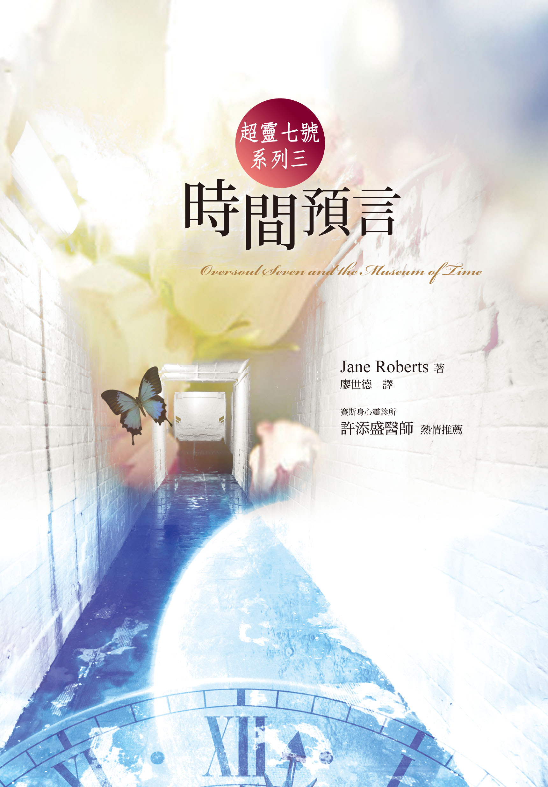

超灵七号系列之三：

时间预言

Oversoul Seven and the Museum of Time

作者：Jane Roberts

译者：廖世德

# 译序

这是超灵七号，在他的老师指导之下，练习自由进出自己的四个人身的故事。进出四个人身，就等于进出四个时空。不同的人身，有不同的生命问题。所以，进出四个时空，不但有「怎样进去」的问题，而且还要面对每个人身各自的生命问题。

莉蒂亚刚刚在二十世纪「亡故」，原本会在十七世纪的瑞典重生。这个「倒头」重生的问题，让超灵七号困惑了好一阵子。另外，莉蒂亚在二十世纪那一世时，是个无神论者，不信人有灵魂。后来受七号的影响，坚持要先参访「众神之国」才重生。她后来重生在「现在的过去」和「以前的未来」重叠之处。

少年威尔觉得生命太无聊，想自杀。可是那「无聊」是他那一生的课题。

约瑟夫连老婆快要生了，还不知道自己愿不愿意死心塌地作父亲。因为他一直想当艺术家，怕因此照顾不了家庭。这是他那一生的课题。

但是，除了每一个人自己那一世的问题之外，促使杰弗瑞写出那一份文稿的，到底是什么人？众神——宙斯、佛陀、阿拉、耶稣——的表现，也让七号思考到神圣、自由意志、神性等问题。这些问题，连他的老师赛普路斯都无法回答。

读者只要了解「赛斯」的原理，对于小说中七号在各时空间天马行空，当不致有什么意外之感。译者个人比较感动的，倒是几个人物取得人身的经验。

我们生为地球人，习惯身体，和习惯任何事物一样，恐怕早就不再有什么感觉。可是，凡是灵性再现的人，都会对自己的身体再起惊奇之感。

身体的一切静、动作用，不论你信不信神，说它是奇迹，绝不矫情。而奇迹，就是神性显示的所在。

物质实相，本书大部分译为「形体界」，不但是自己创造的实相，也是我们的灵魂藉此传达其讯息的媒介。愿读者每天都透过物质实相，透过身体，体验灵性、神性。

由于本书是文学作品，欣赏空间是属于读者的，译者不需多做诠释。

不过，本书略有「文以载道」的意味。所载之「道」即是赛斯之「道」。说明这一点，主要是针对尚不熟悉「赛斯」的读者而发。阅读时若能参阅其他「赛斯」书籍，当更可能心领神会。

献给每一个在其具体化身之中的超灵七号，也献给所有把真相放在心上的那些人。

# 第一章

超灵七号对他的老师赛普路斯说：「我不喜欢医生。」他们两人现在是在医学大楼——楼前方窗口上的两个光点。

赛叹口气说：「这个医生是你的人身。他需要你的帮忙。而且灵魂不应该有成见。」

刚说完，那扇窗户就开了。一个人身穿白袍，探出头来对着下方屋檐上的鸽子吼叫：「走开！走开！」然后猛然关上窗户。

七号狠狠的说：「好吧！他需要帮忙！但这是考试吗？」

赛说：「没错。你会成为他的同事。所以你需要改变一下，化为形体，然后……」七号喊道：「不要！」

赛温和的说：「这是你的教育必要的部分。你现在必须接近地球实相，才能够真正了解自己人身的经验。你自己也知道迟早都要这样。」为了安慰七号，赛化为一个有古老知识的美少妇，或者说，化为一个外表很年轻的老太太。七号则悲伤地化为十四岁的少年；两个人隐形的停在窗台上，下面是这所医学中心的环形小路。七号说：「赛，这实在要求过多。」

赛忍住笑：「你的人身本来就一直有形体。」

七号说：「我这样拥有身体要多久？」

「一直到你帮助乔治，脑桥医师解决问题为止。」

七号说：「要多久？」他的身形开始模糊。赛说：「谁知道？看你而定。」

七号不安地说：「他有什么问题？」

赛说：「那也要你自己去发现。但事实上已经很清楚了。」

七号回嘴说：「我宁可到发言人那一国去帮助玛阿，她活在异国。要不崔娣也可以，她还在十七世纪成长。她们两个人都需要我的帮助。我的人身好像多得我没办法处理，更糟的是，你还一直找新的给我。我根本不知道我还有一个医生人身。」

赛意味深长的说：「其实你是知道的。」

七号脸红了：「嗯，好吧！其实我知道，可是忘记了。我的意思是，我以为他过得不错。」

赛说：「他的生命和能量是你给的。我知道你一直把他维持在一个层级之内，但是你真的应该更进一步才对。」

七号懊丧的说：「有道理。」然后口气又转为怀抱希望，「可是我难道不能直接在这里帮助他吗？」

赛不讲话。

「我真的不能够只披上形相、不披上身体吗？」

赛仍然不讲话。

「消化、呼吸，就这些吗？」七号几近无助的说。

「就这些。」赛说。

「喔，好吧！既然非做不可，我就变一下吧！我白天当女人，晚上当男人。要不就是星期一当希腊人，星期四当印度人……」

赛用强调的口气说：「只能有一个身体。要不就是男人，要不就是女人，你必须选择其一。你必须和人一样只有一个身体，至少这一部分考试你必须这样，而且必须在二十一岁以上——这一次就二十五岁左右好了。」

七号突然领悟到整个状况的意义，不禁感到惊惧：「我必须……住在一个地方，然后……我的意思是，我必须找一间住宅还是房子——照他们这里说的；还要穿衣服，而且要到店里买；我还要……和人交往；我的意思是和人类交往。」他闭着眼睛，激动得连连改变身形。

赛马上说：「七号，不要这样，冷静一点，事情没那么糟。」

七号惊愕的说：「没那么糟？」他越说越生气，「在梦中帮助我的人身，给他们灵感，维持他们的生命——这是一回事！但是……进入他们体内却是另外一回事！」他现在变成了老人，头一直乱转乱动，整个人老态龙钟、摇摇欲坠。

赛笑着说：「真可怜！」

七号说：「我非出生不可吗？现在已经没有什么事可以让我惊讶了。」

赛说：「现在也没有时间可以耗了，你只要现身就可以。」

七号说：「太棒了！」他有点宽心下来，「我的意思是，出生是这么重大的使命。」他想了一下，然后又说：「脑桥到底是哪一种医生？外科医生、一般内科，还是神经科医生？还是……」

赛说：「牙医！」

七号叫道：「牙医？我最不喜欢牙医！牙医都是屠夫！在二十世纪，看牙医简直就像判死刑一样！差不多每个国家都是这样。十七世纪也差不多。我的人身约瑟夫有一次就差点死在牙医的椅子上！那张椅子脏得一塌糊涂……」

赛说：「脑桥医生活在二十世纪末。为了提供你必要的数据，我查过医学史，那个时候牙医师很受尊敬，没有人认为他们是屠夫！」

七号有些发抖的说：「可是他们还是在『拔』牙，而不是用声音『请』出来，或者治疗身体组织，或者是……」

赛忍不住笑出来：「你看，你很了解牙医嘛！只是自己不记得了。跟我来，我们来看一下脑桥医生……他正在里面看病。这里是纽约里佛顿小区医疗大楼的精神中心。乔治每星期三早上在这里看病。」

七号说：「精神中心？那是什么东西？」

赛说：「你会知道的。你看 」

乍看之下，乔治似乎是没什么个性的人。他褐发，身形魁梧，红脸，厚嘴唇，而且——七号发现——还有一口森森白牙。

乔治笑着说：「我没有看过你的牙齿，对不对？好，今天我们好好的看一看。坐上去。」

病人说：「果然！」

乔治：「果然？」他忙着整理「刑具」。（这是七号描述给赛听的。但是赛站在另一边，看不到。）

管理员极多太太靠着门说：「这个病人认为自己是基督。」说完耸耸肩膀。她黑发，身材丰满，好像妈妈。

乔治对她笑笑说：「喔！他的预约卡说他叫约翰•窗户。不过没关系。」

他对病人说：「开始吧！」病人躺在诊椅上，一张毫无特点的脸在头上旋转灯的照射之下，鼓得像个光环似的。那旋转灯简直就是直直地往他眼睛照进去。乔治说：「是臼齿这里。只要擦一点氧化亚氮就可以。」这话与其说他是对病人说，不如说是对自己说。然后他从一口袋子里拿出一个圆圆的瓶子，对病人说：「这是笑气，会让你一点感觉都没有。只要觉得痛，你就擦；擦多少随便你，懂吗？」他对病人的脸直瞧。有的人知道要擦多少，有的人就是弄不清楚。他说：「我想你没有问题。」

病人睁着那褐色的、温暖得很奇怪、很深的眼睛，直直瞧进乔治的眼里，然后说：「我是基督。我有办法稍微忍痛；不过也许我根本不会痛。我从来不知道我会有什么反应。笑气用不上。」

管理员脚步往前移了一步。七号心里惨叫一声。乔治只安静了一会，立刻继续讲话，好像他已经很习惯有个基督坐在他的诊椅上一样。他说：「不打麻醉剂，我不可以拔牙。一个剂量的奴佛卡因又会麻太久。所以你为什么不对我好一点，用一下笑气？这样事情会比较好办。」

基督没讲话，过了一会才摇摇头说：「果然。就照你的意思。」

乔治搓搓手，说：「太好了，太好了！」病人迟疑的按了两下笑气，他便抓过来示范说：「我教你怎么用。」

基督说：「天啊！」七号看到诊椅上的那个人，一张脸光亮无比，张着嘴巴让乔治往里瞧，他觉得很不安。

乔治说：「再擦一下。」于是基督就再按一下。笑气开始产生效果，他开始笑，开始哼起「我主近汝」，乔治只好告诉他把嘴再张大一点，「大一点。」

乔治把钳子伸到基督下颚的一颗前臼齿上。七号看在眼里，一张脸跟着拧得歪七扭八。乔治用力的拔，最后终于夹出那颗臼齿。他夹着那颗牙齿让基督看，说：「你看！你很棒！太好了！就是这个家伙。」

基督平静地躺在诊椅上笑着。乔治•脑桥一看不禁往后退了一步。他一辈子没见过这样灿烂、纯真、不涉人世的脸。这个病人年约四十，眼神看起来却只有十岁。乔治想：他自己也有一个十岁的孩子，可是他的孩子就不曾这么纯真过。

病人基督对他说：「祝福你！」口气异常甜蜜，而且意气昂扬，弄得乔治只能呆呆地望着他，手里还拿着那一颗牙齿，还看得到牙根的血呢！可是这病人一讲话，乔治就突然浑身温热、刺痛起来，不知道为什么。他浑身柔软发热，精神饱满，好像自己一眨眼变年轻了一般。他很自然地把一方纱布塞进拔掉牙齿的那个缺口，再把基督嘴里的血擦干。然后他只能呐呐的——也是自动的——说：「太好了。你表现得太好了。」

然后超灵七号却一直怀疑地看着基督。

管理员极多太太说：「他老是祝福人。」然后又重重的摇摇头说，「但从来不会制造问题。」

乔治只是点头，想尽量装得平常。他想，病人会有这么……这么……这么崇高的表情，应该是笑气的关系，是他昏醉了——老天——并不是什么神秘的事情。然后，乔治自己也醉了，而他却是什么麻醉剂都没吸，一点点都没吸。这又怎么解释？他检查一下缺口，然后说：「你可以下来了，我们会把那个洞补起来，不用担心。」

基督吐出一些血，像小男生一般敏捷的跳下诊椅，停一下，接着转身对乔治说：「孩子，再次祝福你。」说完在胸前划个十字。这一次乔治只能呆若木鸡地站在那里。他真的感觉到好像有人在他身上调整这个调整那个；他血液循环加大，血液也变干净了。感觉上好像已经有好多年一直吮吸着纯净的氧气。他不由得脱口而出：「你是怎么做的？」

那个人就说：「我是基督。」他口气很温和。乔治明知道这家伙是这家精神病院的疯子，却觉得他这句话很有道理。

极多太太咯咯地笑道：「他也给了你一种奇怪的力量，对吗？」她那张大脸一副慈爱但觉得很好玩的样子，「一种提示，很奇妙，对不对？」

乔治说：「我会随时注意的。」然后长长的吐一口气，满怀敬畏地看着基督向他挥手离去。他说：「拜。」

乔治又看了几个病人，不过他已经不再像刚刚那样边看诊边开玩笑。他也已经忘记要向病人说「太好了」鼓励他们、安慰他们。毕竟每个人都喜欢当「好」病人。

他对病人基督觉得很不安。他自己也不知道为什么，不禁心烦起来。如果是因为——譬如牙齿痛而心情不好，那没关系，只要拔掉就好；血糖低也没有关系；有人说什么或做了什么使你生气，也没有关系；有人行为错误让你恼火，也没有关系。就好比现在这家伙——他郁郁的想着。现在这个病人——一个叫做葛瑞哥利•狄格斯的年轻人——一副挑衅的眼神一直和他对视。

他说：「请张开一点。」然后他仔细把年轻人的脸看了个清楚，接着才把眼光移到他的口腔。他敲着牙龈问：「有感觉吗？」接着他直起身体，「我想是你的牙龈有问题，而不是牙齿。有时候会有一点痛，对不对？」

「对啊！」年轻人生气地说。接着又咒骂道，「你怎么知道？」

乔治边洗手边说：「看牙龈就知道。它们不会骗人。牙龈会散开，会……」

「你狗屎！你不过是要我再来看病而已！为了多搞几块钱，你会把我嘴里的牙齿都拔光！」

本来乔治已经快要忘记那使他心烦的老人，可是这年轻人那厌烦的、恶毒的眼光又使他想了起来，因为他立刻在这个年轻人那憎恶的眼光和老人宽厚的、孩童般清澈的眼光之间有了比较。那老疯子祝福他时那种高兴现在消失了。当然，这很讽刺——他想。他本来的存在状态——一向完美无缺——现在已变得灰暗、呆滞，好像浑身充满了麻醉

年轻人傲慢的说：「怎么样？」

乔治说：「妈的，如果我拔牙是为了好玩，那你来这里干什么？」

「那些王八蛋要看我是不是疯子。」

「那你是不是疯子？我觉得每一个人都是疯子。我不建议你一定要做牙龈手术。我觉得没有用。」

年轻人说：「你的意思是，我有钱你就做，对不对？」

乔治已经诱他上钩。他往后站，手插在腰上，说：「如果你要，我现在就可以把你的牙齿都拔光。」说完半恶意半担心的干笑一声。他想，这种人到底是怎么搞的？「你的牙龈情况很糟，我觉得你留不住你的牙齿。不过我会帮你止痛。牙龈手术不是野餐，再说以你的情况，我也怀疑这种手术有没有用。你的牙齿已经松了。大概再三个月，我们就可以拔掉，然后我会暂时给你做一个牙桥……」

葛瑞哥利•狄格斯叫道：「管他妈的什么三个月还是多久，我都不会再来这里！你这个疯子，三个月之后我早就走了。」他开始想从诊椅上跳下来。

乔治说：「随便你。」他耸耸肩膀，因为他已无法和这孩子沟通。而且他告诉自己，也不需要再尝试了。

葛瑞哥利•狄格斯说：「那么，我现在没事了吧！我和银行还有约。」他笑一笑，跳下椅子，大摇大摆的向门口走去。

乔治冷冷的说：「太好了，玩高兴一点！」他开始清理器材，然后装进他的小包包里面。

七号说：「葛瑞哥利虽然已经在精神病院，但我还是很担心。我并不想小题大作，但是……不过，反正他伤害不了乔治，对不对？」

赛说：「要记得各种可能性都存在。我只要你好好看着你人身的生命状况，好好做一点准备才进入他的环境。」

七号说：「还有那个叫基督的人。自认是基督的人总是让我很担心。你永远不知道他们的好恶。我现在还搞不懂为什么基督好一点的时候，乔治却很不安。」

赛说：「你会懂的。如果你一定要担心，以后再担心吧！现在我要你了解一下乔治的生活情形。他下午和晚上会在他的小屋，和他的妻子在一起。」说着他们就已经到达几条街以外乔治诊疗室的楼下。赛说：「特别注意一下房间的安排。譬如说，客厅是在楼上。然后你应该会在八点和他认识，一起吃晚饭。」

七号说：「我为什么要注意这些东西？我感觉到一种线索……一种纠葛……」可是赛已经不见了。

七号不安的四下张望。房间里面一切看起来很正常，却有一种不安的气氛——一种转变成正常的感觉，似乎在他到达之前的一刻，那一切才存在那里似的。他叹一口气。尽管他有这种奇怪的感觉，但是他的第一职责就是把房间好好看过一遍，然后再和赛碰面，讨论他要扮哪一种身分。

七号花了一些时间，试了几种尺寸的身形——不过并没有真正把这些身形化为身体，主要是因为他不知道怎么做。

时间过得很快，不知不觉已是晚上。他想，乔治现在随时都会回家，他觉得自己最好还是依照赛的建议，先了解这幢房子比较好。于是他就走到隔壁。他让自己化为一个无形的二十八岁年轻人——他要化现的身体差不多也是这个年纪。可是这时候，他却发现有一个状况不对劲。房里所有的东西都模糊了，似乎是时间或空间已经被挤压到开始变形。

# 第二章

看不见的七号浑身乱转。他想定在一个时间和空间当中，或者说，让自己进入一个领域。从蕾丝窗帘往外看，他看到一条街之外那条河流、那座拱桥、河的对岸，所以他知道这个地点没错。屋里的灯熄了……等一下，灯？七号咽一口气，再往窗外看，那些路灯竟然都是煤气灯，不是电灯。他的时间错了。他一直执着于自己的身形，所以抓不住正确的时间。

当然，他也注意到屋内墙上的煤气灯了。他叹一口气，把内在的观照转向脑桥医生和他所在的一九八五年，然后等着。可是状况完全没有改变，而且他还感觉到屋里有一种奇异的气氛，只是弄不清楚是怎样的气氛。有一股意识在四处徘徊，可能有一点偏离常轨。他几乎可以感觉到有一股意识碰到了一些比它大太多的概念。

他停在那里。他的任务是要回到正确的时间，不是自己去流浪。可是他的好奇心、冒险心已经生起。他站在原地，却让他的心在屋里梭巡（梭巡：指往来如穿梭般巡逻。形容巡逻频繁。）。楼下是一间小小的诊疗室。左方，几道阳光照在医疗器材上。空气中飘着丁香、樟脑，还有……呃……哥罗芳的气味。屋前有一间候诊室；候诊室前面是两个柜台，后面是厨房。

他所在的这一层有三间睡房、一间会客室、一间厨房。他开始不耐烦。就在这时，他突然感觉到楼上有一阵骚动。他冲上楼。楼上是一间阁楼，当中有一张小床，上面躺着一个人，年约三十。他的意识在这个地方转来转去。他看到的是那个人的梦体，但那个人的梦体一点都不稳定，一直在变换身形；甚至一边换，一边还在制造别的身形——于是弄得好似一屋子飞龙鬼怪；那可怜的家伙好像——他觉得——陷在一波又一波的战斗当中。

一个鬼怪嘴现狼牙，冲到那个人前面。那个人大叫一声，闭上眼睛，浑身发抖。七号立刻化为一个老智者，要鬼怪消失，然后再把那个人引回小床。

这时七号才注意到——半藏在椅子后面的——那些东西，立刻明白这个人为什么会这个样子：「你在吸煤气。」

他们两人并肩坐在床缘。那个人仍然处于梦体当中。他说：「我太太和孩子暑假外出时，我常常一个人在这里做这件事。我在做实验。可是你是谁？我一定还没有醒。」

七号说：「你是没醒。不过没有关系。对了，今年是公元几年？你是谁？」

那个人说：「怎么啦！我是乔治•脑桥啊，脑桥医生。」他的口气有些惊讶，好像他的名字本来就家喻户晓似的。他一边说，一边庄重的向七号靠过来，然后伸出手。

七号愣在那里：「乔治•脑桥医生？你确定吗？」

脑桥医生说：「老兄，我当然知道自己的名字。你呢？拜托，你到底是什么人？我不知道怎么一回事，但是到目前为止，这是目前这种状况下我遇到最快乐的事情……」

七号说：「你说现在是哪一年？」他简直就怕听到答案。

脑桥医生说：「今天是一八九〇年五月二十一日。你的意思是……你的意思是……你连这个都不知道？」他的口气开始激动起来。七号看着他，总算真正看清楚乔治•脑桥一世。他一头淡茶色乱发；胡子也是淡茶色，浅蓝色的眼睛好像圣诞灯泡；可是他那一生是绝对看不到电灯泡的；左边脸颊上还有两颗青春痘。脑桥的眼睛因激动而亮了起来。七号立刻明白他是怎样的人。他是一个梦想家、一个理想主义者，永远徘徊在梦想和行动之间。

七号惨叫说：「你这个乔治•脑桥不对。我所在的时间也不对。如果我算得没错，你太老了，不可能是乔治的父亲。我要找的一定是你的孙子。」

煤气还没有完全消失。脑桥觉得这件事太有意思了。他高兴地说：「既然你在这里，我们就好好谈一谈。我的实验，我一直都有写日记，我叫它《气体活动日记》。这将是一个不得了的题目。」他揉一揉眼睛，伸手去拿烟斗，一副准备长谈的样子。

七号想都没想，立刻替脑桥造了一支假烟斗。脑桥根本不知道自己还在梦体当中。七号忧愁的说：「我必须想办法解决这件事，因为你的孙子——他一定是你孙子——需要我。但我现在连他有什么问题都不知道。」

脑桥做梦般的喊：「喔！」

七号有点大声的说：「喔？你可是帮了大忙；吸煤气，造鬼怪，天晓得还有什么东西……」

脑桥愠怒的说：「我听过威廉•詹姆斯谈笑气，因此决定自己试看看。我觉得我的行为是一种探索，简单而纯粹，探索……真理的本质。」

七号说：「听起来很好高骛远。」他并没有嘲笑的意思，可是他牵挂着要回到正确的时间，更何况他已经越来越清楚他目前十九世纪的环境，还有那夏日的黄昏。确实，那窗户透进来的香气越来越清楚、越来越引人遐思。他抽着鼻子深深的吸着气。

脑桥说：「你闻到的是丁香，种在小路边。法国丁香，白丁香。你还可以闻到苹果花，种在谷仓旁边……」

超灵七号突然对这些花香和蕾丝窗帘下的夕阳和天空感到沉醉起来。结果他只能呆呆的望着脑桥，「置身在这种美当中、置身在这种舒畅的光浴和香浴当中，你为什么还会想找别的实相？……如果你真的感受到此刻的东西……你会浑身充满生命，感受到真理之为真理是怎么一回事，因此不会再去求它。」

脑桥慵懒的说：「讲得真漂亮。」说完闭上他的梦想，「孙子？我没有孙子。」梦体坠入肉体里面，于是他除了睡觉，什么事都完成了。

七号叹口气，看着睡去的脑桥，又是生气又是松了一口气，然后拿起旁边的一床毯子盖在他身上。但是——他心想——自己为什么会把时间弄混到这种地步呢？十九世纪脑桥吸煤气的行为对他二十世纪孙子的问题有什么意义？这间宅子也一样。这两个人的空间坐标显然完全一样，不过他们的时间却放在不同的焦点上面。可是，为什么，为什么一个错误的脑桥却这么吸引他？

他想，一定有什么东西吸引他，否则他应该会毫无误差地直达正确的乔治。七号叹一口气。他孑然一身在十九世纪的一间阁楼里面，房子没错，却和他应该在的时间差了上百年。更糟的是，这种错误本来都会自动矫正过来，然而现在却没有。搞不好赛普路斯已经放他鸽子。眼前整个环境不动如山，他连把时间往前挪一分钟都没有办法，一百年就更不要说了。八十五年也没有办法——不过这有什么差别？

脑桥医生的器材还放在地板上。七号懊丧地看着。他必须回到二十世纪去，在那里形成肉身，然后借着那个身体活一阵子；不要太久——他希望。这个时候，他发现天空已经暗了下来。从阁楼后窗望出去，暮霭当中是那漆着漂亮暗红色的谷仓。谷仓传来一声马嘶，然后是一阵噼里啪啦的声音，一个送冰人骑在马上，连同马车冲了出来。那个人穿艳绿外套，戴一顶绿底白条帽子。他停下马车，走到车后一扛起一块冰块，走进屋里；位置正当七号所在的正下方，所以看不见了。过了一会儿他重新现身，踏上马车。

七号闻到一股热热的肥料气味混杂着丁香的气息，接着雾气散去，下方的走道两边现出两排紫花，沾满了露水。七号心想，真是漂亮。他觉得他比较喜欢第一眼所见吸煤气的乔治•脑桥，而不是二十世纪那个赶鸽子的乔治•脑桥。才这一想，似乎是他召唤来的一样，谷仓后面突然飞起一群鸽子，飞到他的窗口下，开始咕咕的叫。屋内睡在小床上的脑桥突然念说：「他妈的鸽子！」七号禁不住笑出来。不过他马上就冷静下来，因为他必须回到一九八五年的黄昏；而且要快。

# 第三章

赛普路斯现在是二十世纪的乔治•脑桥家里的一个光点。乔治正在等新同事七号医生的到来。他吐一口气，扭开收音机，斜睨着窗台上的鸽子，心里渴望着这项人事安排赶快顺利完成。

可是赛知道，七号这时如果不是迷路，就是在时间或空间上转变错误。这一次他是没到这个空间来。赛有些沮丧。她从正确的时间方位放出自己的意识，但是维持着正确的空间坐标。于是她的意识从目前的位置开始打转，通过房间内的未来。但还是找不到七号！赛立刻回头往过去走。

她几乎立刻发现七号！他在一百年之远的地方徘徊，然而空间却只差几尺而已。她立刻化现为又老又有智慧的女老师，站到他旁边。此时乔治•脑桥在他的时间当中瞄了一眼接待室。当然，他没有看见什么人。

赛说：「七号，你走错时间了。」

七号喊说：「我跑到过去了，而且还碰到乔治的祖父。」他现在的样子是他最喜欢的十四岁男身。

赛差一点笑出来：「没想到你做这种背景参考做得这么讲究。」

七号害羞的笑一笑。

赛说：「我以为你迷路了。」

七号一阵脸红，然后辩说：「我这样跑错时间，又碰错乔治，一定有原因。」赛说：「没错，记住这句话。可是你现在连身体都没有。乔治已经在等你了。」七号说：「你说身体，不是形相？」

赛笑着说：「身体。我以前就说过了。而且你必须把时间放对，这样它才能尽其所用。这意思就是说，我们必须先回到二十世纪。」

七号懊丧的说：「为什么你的时间行走术比我好那么多？」他很哀伤，「有时候我根本没问题，有时候……呃，我讲不清楚。」

赛说：「好，现在你看着身边这张椅子。」于是七号便注视着那张维多利亚式的天鹅绒座椅，看着看着，那张椅子突然发出亮光，接着就变成了二十世纪乔治接待室里的一张皮革摇椅。赛说：「目前的你，这样做是最简单的。还有更简单的，不久你就会知道。」

乔治在办公室里喃喃地说：「那个家伙怎么还不来？」

赛说：「嗯，你的身体呢？准备好了吗？」

七号叹口气：「我根本没时间想身体的事，更不要说弄出什么身体来。」

赛说：「但是我们不能让你的身体没头没脑就在房间里冒出来啊！不要气了，快过来这边。这里乔治才看不到你。」

他们站在接待室壁炉的一角。然后赛指示说：「现在，先弄一个你喜欢的身形出来。年轻人最好，二十六岁左右就可以。其他的，就用你的想象力吧！」

七号很遗憾地把他十四岁少年的身形完全解散，重新化为二十六岁年轻人的模样。现在的他六尺三寸高，头发很浓，几乎全黑。起先他加了胡子，接着又把它拿掉。眼睛起先是蓝色的，接着他把它变成褐色。然后他问：「嘴巴呢？」

赛着急的说：「快一点！快弄清楚，然后固定下来。」

于是七号把头发换成深褐色，加上很高的额头、坚毅的下巴（这样他看起来就一副可靠的模样）。至于嘴巴，嘴巴似乎是不请自来，属于他非常喜欢的十四岁少年嘴巴，只是那嘴形的线条稍微向下修正了一些。他喊说：「可以了！」

赛说：「好，现在尽量保持意识的清楚与平静。这要一点时间。」

七号不知道她在干什么，只觉得自己的身形越来越硬。看不见的原子从地球四面飞过来，凑集成他的色身。他感觉到其中庞大的活动。才一下子，这种活动就已经跑进他里面，开始有一颗心脏在抽血，接着血就开始在全新的血管里流动。他的脉搏开始跳动，活像一个小时钟。他笑一笑，摸摸自己的脸。他以前也曾经因为一些事情，进入他几个人身的身体里面。但是这一次不一样。这一次他有自己的身体！他不由得产生了一种拥有感。这个活生生的地球皮囊属于他所有，谁都不得侵犯！

赛说：「我知道这种经验没什么不好，但是你好像忘了一样东西。」

七号说：「什么东西？」他低下头看着那弹性十足的肉，感觉到里面那些器官蠢蠢欲动……统统让人不得不注意。「我看得到的，都有了。」

赛含意深远地叫他：「七号！」

七号突然笑起来：「喔——衣服，我忘了！」

「没错！」赛摇着头说，「我希望你的功课已经做完，知道自己想穿什么衣服。现在你把它的影子现出来，我来做。」

七号觉得很自豪。他现出一条内裤，上面有苹果树图案，再现出一件高领内衣。赛立刻把它们变成真正的衣服。

七号说：「你怎么弄的？」

赛说：「和弄你的身体一样。我没时间说明。我使……空间里的原子变厚……聚集……。你还要什么东西？」

七号骄傲的说：「最重要的部分！」于是内衣裤上面现出一套墨绿色绿白细方格的西装。他说：「你觉得怎么样？一九八〇年代后期最流行的花色。」

赛有些迟疑的说：「嗯，看起来真像牙医。」

七号说：「但愿如此。我再三研究的结果。希望这一套还适合。」

赛说：「只是我不知道二十世纪的牙医在诊所里大多不穿鞋子。」说完直视着七号那一双崭新的、惊愕的眼睛。

七号立刻现出袜子和黑色靴子。他说：「这双袜子有用除臭剂处理过。我在乔治的衣橱中看过。这一身衣服大都根据他的穿著……所以他穿衣服一定和我很像……」赛只是一直笑。七号说：「好吧，还是有很多要想的。你觉得好玩，却以我为代价……」赛说：「因为你的打扮果然……果然『世俗』，」她竭力忍住笑，「你自己不知道，你简直像个公子哥儿。」

七号反对说：「我没有。我像牙医。你自己说的。」

赛突然严肃起来。她把袜子和靴子做出来，然后说：「记住，你的身体只是暂时的，你要对它好一点。你常习惯做的事情，有了身体，就做不了。另外有些地方它是不会去的。你慢慢就知道。」

七号有些提防的说：「什么地方？」

可是赛没有时间回答。乔治•脑桥又在叫了：「妈的，那个家伙怎么还不来？」说完走到穿廊上。赛说：「快，走到厅里去，这样你才会有从接待室走进来的样子。」说完就消失了。

乔治•脑桥医生（三世）年三十九。以他那不够称头的五尺六又二分之一寸的身高来说，他略微魁梧了一点。事实上，七号根本就认为他是个矮个子。他的褐发不知如何形容。他的胡子和眉毛又浓又粗，可是非常生动活泼，（好像）永远动个不停。他的眼睛小小的，又有点凹陷，可是却，嗯，非常好动。一般人不会注意到他的眼睛——七号想——因为他老是半闭着眼睛；可是，喔喔，那一对眼睛有时候会突然睁大起来，通常是要对他交谈的对象表示惊异和赞美时。有时候那一对眼睛似乎又自己笑了起来。

现在，他的眼睛就是这样笑了起来，因为他看到七号：「太好了，你一定是我的新同事。」

年轻的七号医生笑着向前走一步，以地球通行的姿势伸出手来。

乔治紧抓着他的手：「太好了！太好了！太好了！」他很用力，七号差一点叫出来。「不过等一下，现在是倒垃圾时间，我先把垃圾拿出去，只要一分钟。然后我开车去街角店里买一些酱菜。全部只要两分钟。接着我们就可以轻轻松松坐下来，吃个饭，喝点东西。不要客气。我马上回来！」

七号还来不及回话，乔治已经冲到屋后。七号愣在那里——有一点困惑，他刚刚那么赶，结果只是来等乔治倒垃圾！

屋子里就他一个人。这屋子——他想——就是很可疑。不过他没有多想，一下子就走进那二十世纪乔治的接待室。

他后来对赛说：「其实我不应该说那屋子很可疑才对。」可是他真的说了，而且那屋子也真的不可靠。

# 第四章

当然，七号也知道，自从乔治一世那一代以来，这间屋子已经变了很多。别的不说，接待室壁炉右边墙上就有两块金箔，一上一下，相距两尺远，标示的是一九四八年和一九七二年两次大水的水位。乔治一世的时代，这里是会客室，壁炉也有在用，现在却空置在那里，做个装饰而已。壁炉上面放着一盆静物花卉，非常乏味。七号对着那盆花作个鬼脸，然后从那窄窄的落地窗往外看，立刻注意到窗外那些种在大盆子里的植物。他模模糊糊地感觉到有汽车从人行道前通过，还有一定的节奏——桥边街角的红绿灯先是让汽车通过，然后再挡下来，接着又换绿灯让汽车通过。

这幢屋子是用最坚固的红砖砌的，即使这酷热的六月天，屋内还是非常凉爽。而且，虽然是开了窗户，红砖墙似乎也消除了汽车噪音。但不管，反正就在一次红灯的时候，七号突然发现有一件事错了——又来了！房内的木头地板上铺着厚厚的地毯，但是他身后的门口却没有。七号领悟到他是听到脚步声从前门向梯口走来。虽然除了他，那里不该有人，可是那脚步声却已经走了几秒钟。

他回转身，看到脑桥正要上楼，不禁大吃一惊。这时窗外那些声音也跟着变了。回头往外看，他难以置信。

街上十九世纪和二十世纪的街景并存，或者说，差不多同时并存。汽车比马车、马清楚，不过也只清楚一点点。对面的房子一下子现出十九世纪的风格，一下子又变回二十世纪。新房子刚才出现就消失，工地立刻取而代之，然后工地又变为房子——七号目不暇给。

他回身向内直揉眼睛，糟糕的是，这个过程不限于屋外的景物。那十九世纪客厅里的东西一直跑到这间二十世纪的接待室当中，或者说，这间二十世纪的客厅一直变为十九世纪的客厅。一张羊毛椅出现时还打到他的膝盖。他向后跳，又看到屋角冒出一株巨大的羊齿。

他身边的咖啡桌也消失了，代之而起的是一张维多利亚式的茶几，而且桌上还完整地摆着一壶茶、三个杯子，外加院子里摘来插的一束夏日玫瑰。七号发现，这一切事物的反复变动就像脉搏一样，周而复始，只是实在快得目不暇给。每一件东西都是亮一下又不见；说时迟那时快，第二组东西已经开始出现。

他忽而呆视忽而眯眼。每一瞬无不有东西存在，但是至少总有一样东西在出现或消失。于是当那束玫瑰又出现时，他立刻抓住花瓶。他想看看这样这束花会怎样。

他后来对赛说：「这种举动不是很聪明。」赛也同意。他抓住花瓶以后，花瓶和其中的花开始颤抖、摇晃、发光，整个房间里所有的东西也都跟着颤抖、摇晃、发光。接着，似乎房间本身终于下定决心似的，那张维多利亚式茶几开始稳定下来，洪水记号不见了，整个房间不再变化，于是七号发现自己已经置身在错误的时间、错误的地方。

他不禁咽一下口水。他想，这必定只是他的知觉而已。换句话说，乔治三世倒完垃圾、买完酱菜回来时，那二十世纪的房子必然还在等他。难道不会吗？但是他已经没有时间想乔治三世，因为他突然听到后门有人。不管是谁，只要是从那个门进来的，一定会看到他——包括他的肉身、他的全部。但他不属于这个地方。他一惊慌，一松手，花瓶在他脚下破成了千百碎片。

七号蹑着脚尖，尽量无声快速的冲上楼梯，往脑桥的阁楼书房跑去。他满头大汗，一颗心猛跳。他觉得睡房里随时有人会跑出来，看到他往二楼的大厅冲。他很惊讶身体竟然可以跑这么快。他很喘，可是已经到达阁楼的楼梯门口。他打开门，走进去，心头顿时轻松下来，于是贴在门后喘气。

但这时他突然听到了脑桥的笑声。

他正想往脑桥的书房走，突然想到，虽然时间错误，但他的身体还是真实的身体。他伸手敲门，然后心想，脑桥可能不会让他进去，更糟的是，脑桥也许还不认识他；因为他们以前碰面时，他的身形是智慧老人的身形。

「喔！啊！哈哈哈……」门后传来的笑声使他激动起来。他必须和脑桥谈一谈，弄清楚他吸煤气和时间变换之间的关系。「就在这时，我心里有了答案，」他后来告诉赛说，「我一看到橱子，就知道该怎么做了。」他马上钻进乔治一世书房左边的一个小橱子，安然的坐在里面。然后一边得意自己的足智多谋，一边把身体留下来，换成智慧老人的身形，走出橱子，向脑桥的书房走去。

脑桥轻声笑一笑，说：「你回来了！来，吸一口！我发现了最惊人的事情！」

七号问说：「为什么你吸煤气的时候，就会看到我的灵体？你跑哪里去了？八分钟前我还在楼下看见你……」

「嘘……嘘……」接着他像唱歌一般地说，「我看到了……未来，我看到这间房子未来的样子，我还看到图书馆里有一本牙医学书。当然，那本书本来不会在那里，但是现在却在那里。」

七号闷闷不乐的说：「它现在不会在那里等你。我们已经回到你的时间了。你干了什么事？怎么会这样？我应该是在别的时间，在未来才对。」

脑桥用着同样唱歌般的语调说：「哎呀！只有一个问题，那就是，我连为什么会这样，都不知道。」

七号现在真的开始担心了。他沿着床缘坐在脑桥身边。迟午的阳光穿过蕾丝窗帘照进来，照在墙上壁纸的玫瑰花瓣上面。车房门开着，可是看不到马车。屋外枫树有很多小鸟，叫个不停。脑桥的老书桌铺着白色桌巾，微风从窗口吹进来，桌巾就在桌边微微飘着。脑桥拿起小吸气筒，吸一口煤气，然后梦幻般地说：「今天我本来是没办法来的，可是几个病人取消了预约……啊，好爽快……这样的六月天。」他讲话时，胡子抖啊抖的，褐色眼睛带着笑意地对着七号直看，一边还手抓皮带轻轻甩着，「不管你是谁，再次再次的欢迎你。」

七号想，马车固然不见了，乔治的汽车也不见了，这是不是表示乔治还在杂货店还没有回来？

脑桥在他身边说：「我要把我看到那本书的书名写下来。这样就可以证明我的确去过未来。我可能还要把我的事情告诉人事官威廉•詹姆斯……」

七号反驳他说：「你什么事都证明不了。因为没有人会在你的时间之内发现那本书……」讲到这里，七号不由得打住，因为脑桥的眼睛在发亮：「你说的不错！也许我必须用偷的，然后自己送回来。只要时间再改变一次，我就要做这件事。」

七号喊说：「不要，不要，绝对不可以。刚刚在你的客厅，我也是趁着时间变来变去时抓了桌上的花瓶，结果就跑到那个花瓶的时间去了。」

脑桥说：「我的脑筋很清楚。你的意思是，只要我偷了那本未来的书，我也会到达未来。」

七号说：「没错。」他不禁想到赛。

脑桥半闭着眼睛，身体往后靠，漫不经心地玩着腰带上的流苏，摆动着穿袜子的双脚，沾沾自喜的说：「这是好兆头。」

七号叫说：「好兆头？灾祸临头！」刚说完，楼下就传来了一阵声音。

「哎呀！是马车！一定是管家挪威太太回来了。她去看她阿姨。我想我应该把自己弄漂亮一点，然后……」

七号喊说：「不要吵！」他在思考。如果马车回到了这个时间，那么此时汽车应该也在一九八五年开上了屋前的车道才对。他连忙冲到窗口往外看。

马车缓缓通过牡丹花丛。七号一直等到马给牵到车房——挪威太太显然不理会半途的栓柱，一路把马牵到谷仓里去了。然后他使尽力气，开始想象乔治的小保时捷。他心里看到了每一个细节，也努力把他要的样子迭在马车上面。有一匹马叫了起来，使他分心。脑桥又在他身后做梦般幽幽的说：「你在干什么？」

这时马车突然开始发光，马消失了，汽车随即出现，马和马车（还有挪威太太）马上跟着重现。可是那一部保时捷并没有消失。七号不禁倒抽一口气。挪威太太从马车上走下来，显然看不到汽车。乔治也从车子上跳下来，关上车门，吹着口哨走上走道，然后和挪威太太相继走进后门去了。

七号不知道该怎么办。他身边的脑桥站起来拉平袍子，把呼吸筒藏到床下，回转身，七号不见了。他摇摇头，无声的喊了一声「哎呀」，心想吸煤气的效果不知道会持续多久。

七号很怕走进厅里。他很希望自己一离开脑桥的书房，就会回到二十世纪的屋子。可是一看到屋子还是老样子，心里就想自己毕竟没有这么幸运。他走进橱子里面。他的身体还舒舒服服的躺在那里。他跑进去，可是心里马上跑出了几个问题。譬如，是谁会看到他的身体呢？如果是挪威太太——在十九世纪——那他麻烦更大了。他身上散发的是二十世纪的气味。他身上穿的是合成纤维质料西装，不论是质料还是式样，对她都太陌生。那数字表更不用说了——他想，虽然他可以把它藏在口袋里，不过这可麻烦。还有，两个乔治的衣服他都不能穿，因为以他现在穿戴的身体来说，两个乔治都太矮了。他一边想，一边猛然从楼梯走到二楼。二楼仍然是十九世纪的样子。接着他又从二楼前梯往一楼前门走出去，一颗心猛跳。

他想，如果看到他的是乔治呢？如果真是这样，就表示乔治所在的房子将和他一样，都属于过去。不是吗？但是——他一想到就发抖——如果是乔治和挪威太太同时看到他呢？也许……

他走上前廊地板。这时，房内虽然还是绝对十九世纪的摆设，可是乔治和挪威太太却都朝着他走过来。乔治快步的走上来说：「回来了！杂事都办好了，太好了！」他解开领带，把夏季轻夹克丢在一张十九世纪的椅子上，「不过我却想到了一些笑话！」

七号喊了一声：「哎呀！」

乔治惊奇的问：「什么事？」

七号发现自己弄错了，红着脸说：「呃，我是说，太好了。你有没有发现这间房子有什么不一样？还有那张椅子？」

他头都晕了，因为，他和乔治谈着，乔治显然也看得到他，但挪威太太（显然看不到他们两个）却弯下身捡地毯上的破花瓶，一边捡还一边念说：「怎么搞的？」他闭起眼睛，感到绝望。

乔治说：「椅子有怎么样吗？我看好好的。」然后对七号笑一笑，「不管有没有怎样，我觉得什么事都好好的。今天是个好日子。」他坐下来（对七号来说，是坐在那张羊毛椅子上）又说，「你在想什么？」

七号摇摇头，突然笑起来。乔治这么地踏实、这么地契合在他的时间和空间里面，所以其他的一切在他而言根本就不可能。可是他一边笑，一边他的部分意识有那么一下子突然和乔治的意识合在了一起。于是从乔治的眼睛，他看到了乔治看到的这间房子。是二十世纪时的样子。那一剎那，乔治不知不觉的和七号永远结合了。

乔治说：「什么事这么好笑？」说完自己也笑了起来，「我脸上有蛋还是什么东西是不是？你是不是偷吸我的笑气？」

七号笑得更大声。就算天翻地覆了，眼前仍是真真实实的乔治，知觉着他平日的环境，即使楼上和九十五尺之外，他的祖父还搞不清楚时间也不管他了。

七号喘着气说：「我也不知道。你把我弄笑的，是你的话还是你的样子……」这时乔治的脸现出灿烂的笑容。挪威太太消失了，茶几消失了，七号回到了乔治所在的二十世纪——他本来就属于的二十世纪。

# 第五章

他们坐在厨房的餐桌前。乔治说：「整个二楼都是我们的生活领域。平常很吵，但是只要珍和三个男孩子去小屋那边，这里就很安静。」

七号笑一笑，心里想象着子女围绕乔治的情景。

乔治说：「狗屎！上个礼拜我动手把小屋的两个房间扩大，可是把那两个房间搬到这里来放的话，这里的空间还绰绰有余！但现在没有人这样盖房子了！」

七号想着一些好笑的事。他想：老天！这顿晚餐真不错！乔治多多少少算是好厨师。事实上，他平常下班后就常在夏季短裤之外罩上围裙做晚饭。七号有些羡慕地瞄着他的大腿，心想他自己是不是应该把大腿练粗一点。

乔治寻思着说：「我父母和祖父一定在这里吃过几千次的饭。」

七号差一点就想说：「我真希望你没有这么说。」因为，乔治这一说，他就开始想像乔治的祖父母一八九〇年夏季坐在餐桌前的情景。

乔治说：「想起来心里就毛毛的。城里一直在拆老房子，所幸这一栋留了下来。这一带都留了下来，但究竟还是在没落。市政府对这里有一个都市更新计划。」

七号点点头，可是接着又不安的动一动身体。他突然感觉到一股奇异的气息，不禁回头张望。后面的餐室灯火通明。再过去，二楼窗外的院子逐渐消失在暮色中。然后他听到一个声音说：「这里是精明都市人的地方。」七号很惊讶，抬起头来问说：「什么？」

乔治抬着浓浓的眉毛说：「我没说话啊！」

七号说：「我确实听到有人在说话。」说完自己却笑了起来。

他花了一分钟才弄清楚怎么一回事。原来他忘了人类只听得见讲出来的话。他一直告诉自己要记住这一点，可是还是忘了。照规定，他只能听人说的话。但在他遗忘的那一刻，他却听到了另一个人的意念——不是乔治的意念……

最后他只好说：「呃，我听到楼下有人在讲话。」

乔治边递甜点给他，边回答说：「不是。就是这间房子，老是发出一些奇奇怪怪的声音。」

七号坚持的说：「楼下有什么东西好让人偷的吗？」

「我诊疗室有一些药，就这些。医生的诊疗室偶尔总有人会闯进去。」乔治淡淡的说，「可以了，楼下不会有人的，只要有汽车在，谁都看得出来有人在家……」

但是七号却在追踪这一股意念，楼下一个房间一个房间的追踪，又从屋后追到屋前，最后落在乔治的诊疗室。

起先他根本不知道该怎么办，他「听到」的意念告诉他说楼下那个人充满了憎恨和愤怒，可是也犹豫不决，怕得要死。七号很着急。他想，如果他告诉乔治楼下有人，他就必须玩形体的规则。他们必须报警抓这个小偷——之前这个小偷就是小偷……即使是现在，他还是打算开乔治的药橱。七号开始咳嗽以掩饰自己的疑虑，一方面也给自己一点时间思考。

乔治说：「喔！我倒杯水给你喝。」七号咳得更厉害了。乔治连忙站起来拍他的背。七号突然了解原来身体给人拍时是这样的感觉。他不咳了，然后一张脸通红的说：「呃，我没事。」

乔治说：「你听我说，我洗碗，你下楼去休息，先找好过夜的房间，然后我们喝点啤酒。」

七号喊一声：「太好了！」马上跳起来。乔治看傻了。可是七号仍然感觉到「那个人」的存在。

他很高兴自己这么聪明的遣走乔治。他安静的、可是又有些得意的从楼梯走到一楼。他当然有办法别出心裁的对付那个小偷。可是他突然感到一种惊慌和疑虑，不禁停下脚步。别的不说，光是从空气中他就感觉到一种转变在发生，十分可虑。楼梯一路挂着一些平淡无奇的绘画，但是都……从边缘开始在消失，一边还滴着十九世纪的油。他想，真是可怕，时间又变了。他突然想到，自己只顾着保护乔治的肉身，却忘了一件事，那就是他自己——七号——现在也是有身体的。这就是说，要对付那个小偷并没有他原先想的那么简单。

才这一想，他已经来到了一楼走道，看到一个年轻人走进乔治的诊疗室。门开着，小偷借着手电筒的光办事，可是一听到七号的脚步声，立刻把手电筒关掉。

屋子里的东西好像又开始发光。年轻人蹲在那里。七号是借着路灯的光看到他的；接着路灯变成了煤气灯。七号无声的惨叫了一声。只要听到身后楼梯有不一样的脚步声，他就准备随时拔腿就跑。这时，脑桥拿着一把猎枪，从楼梯冲下来，一边喊：「哎呀！谁呀？」

七号立刻把灯打开，房间亮了起来。葛瑞哥利•狄格斯张大嘴巴，呆呆的站在房子中间，没办法动，也没办法讲话。在他看来，整个房间活像个电影布景，站在楼梯底那个人实在是不可思议，穿着袍子，系着腰带，腰带上还有流苏，鼻子上那支夹鼻眼镜看来有百年的历史——手上还拿着一把枪。

葛瑞哥利摇头，说：「这可奇怪了。我不想惹事情……」

脑桥往前冲一步，喊说：「你这个流氓，袋子里有什么东西？」说完又抢前一步，把葛瑞哥利推到一边，再把满袋子的瓶瓶罐罐拿出来。

七号在那里看得一愣一愣的。脑桥怎么看得到二十世纪的小偷？小偷又怎么看得到脑桥呢？他们两人为什么又都没看到他呢？

脑桥指着诊疗椅，命令葛瑞哥利说：「坐下来。」

葛瑞哥利在发抖：「我想我走错地方了。我是要找另外一个家伙报仇。」

脑桥咆哮说：「还要找人报仇，这是什么话？」

葛瑞哥利看着煤气灯，喃喃的说：「我不知道现在还有人用煤气灯，还有那个东西。先生，你在瞄准哪里？」他现在比较放心了，因为脑桥已经把枪放到一边——虽然还是很容易就拿得到。

七号正视着脑桥的脸说：「你们两个难道真的看不到我，听不见我吗？」

葛瑞哥利呐呐的说：「你都拿回去吧！我本来只是想拿去卖掉。」

脑桥命令他说：「嘴巴张开。」

「什么？」

「嘴巴张开。你有口臭；你口腔有病。你这个自以为是的家伙，男人的家就是他的城堡，你不懂吗？再开一点！」

葛瑞哥利叫道：「你要刑囚，对不对？你这个变态，喔，天啊！」他快掉眼泪了。七号很气馁。他在屋角坐下来。脑桥叫着：「妈的，我没有。只要不受到侵犯，我是很和善的。你看！你都是怎么吃东西的？你的牙龈一团糟。」

「我的牙龈？」葛瑞哥利咽一口气。脑桥的手指插在他嘴里，使他讲话很困难。他不知道这个家伙是不是想把他的牙齿连根拔除。

脑桥质问说：「你们家很穷，对不对？」

「呃！」

他对这个病患开始热心起来：「这个世界上没有一个人是完全坏的。这是我一贯的看法。」

七号喊说：「现在不是传道的时候！」可是脑桥听不到他的声音。

葛瑞哥利兀自说：「我们家很穷，家徒四壁。」但是他越来越觉得他有办法应付脑桥。富有同情心的自由主义分子总是可欺之人。

七号想要试验看看，于是就伸手去抓小桌上的剪刀；可是他的手却从剪刀穿过去。但这个小偷是有身体的——而且是属于二十世纪。他必须弄清楚这两个人为什么看得到对方。

脑桥从抽屉拿出一瓶药，说：「这会使你舒服一点。」说着打开瓶盖，冒出丁香的气味，呛得七号简直没办法呼吸。

葛瑞哥利喊了一声：「嘿！」可是脑桥已经把丁香抹到他的牙龈上。那有力的手指从嘴里挤进去，弄得他整个人缩在椅子上。他又一次彻底吓坏了。他现在在这张牙医诊疗椅上面的样子从来没有人有过——上头有煤气灯照着他的脸，这个怪牙医的手指已经快把他的牙龈挤坏了。他嘴巴溢满口水，眼睛刺痛，可是脑桥却说：「放轻松一点，呃！」

七号开始慌了。他们两人的环境他似乎无能为力，他自己的身体也越来越怪，越来越轻松。

# 第六章

七号一直讲话，可是他们就是听不到他、看不到他。更糟的是，屋里的一切——不但是这两个家伙，连屋子本身——都开始产生奇异的转变。那感觉好似空间正在时间中加速前进，或者说，时间在空间中加速前进——七号不知道哪一个才对。可是屋子的墙壁却开始拍动，活像木片窗帘，接下来变成珠子，接下来变成了小点。

七号这时才明白屋子的墙壁已经消失。此时的他在温热的黑夜，兀自一人站在一个山丘的草地上，什么脑桥，什么小偷——真的，这一带的所有人、物都不见了。不过他知道自己还是在原来的地方，只是不知道自己为什么知道。柔柔的风从他脸上拂过，接着他就看到那条河（是同一条河流吗？）在差不多相同的距离之外。

七号真的很不安，因为到目前为止，他的经验似乎都毫无条理——不过不如说，他或许也觉察到某种秩序，只是完全不知道这种秩序是怎么进行的。之前，那屋子还给人某种方向感，现在连这种方向感都没了。而且，至少现在，赛普路斯好像还把他遗弃了——不论这个现在是哪一个现在都一样，他沮丧地想着。

环顾四周，除了他所在的小空地外，目光所及的都是树木。他到底身在何方？在何时？他心里喊着：「赛普路斯！」可是听不到她回答。

这个地方是不是就是乔治家所在的地方？如果是的话，从这间房子存在之时为准，他是处于过去还是未来？他抬头往上看，远远的天上有三颗闪亮的星。他哀吟一声，开始努力回想地球以前的历史。第一个浮城是二十三世纪开始运作的。他记得这一点，是因为他的一个人身——布鲁托——就住在那里。第二个大约在二十五世纪。第三个一直到二十八世纪才能够住人。想到这里，他不禁跌坐在地上；因为这时他的空间没错，他距离目标还有千年之久。

更糟的是，他根本不敢走出房子所在的区域之外；因为，不管现在发生的是什么事情，这里一定是事情的中心。也许，他只要坐在那里，想着要回二十世纪，时间自己就会倒退。不过，四周的环境实在很不安定。地面上不见任何亮光，抬头往上看，三座浮城也不过星星一般亮而已。天上下着细雨——很细很细，细得像雾一般，脚下的草很潮湿，水滴沿着树叶一层一层往下落，那些树木发出一种细细的声音。除此之外，周遭完全安静无声。

可是，他本来只在十九世纪和二十世纪间跳来跳去，现在为什么会跑到未来的一千年之外了？他又叫了一声：「赛普路斯！」但还是没有得到响应。

他一直发抖，因为已经全身湿透。空气虽然温热，雨水却淋湿了他的西装。他悲伤的想说，难怪地球人要撑伞。但是，就算身体干了，他还是不敢离开身体。因为他怕时间就在那个时候倒转，把他的身体带走，却不把他带走。不过目前发生的这一切，在他还有身体的时候，是怎么发生的？

他想，赛存在于每一个时间当中，他也是，所以他应该不会迷失才对。但现在的他确实感觉迷失了。如果他的记忆没错的话，有一个可能就是，地球到了这个世纪已经大部分不适宜居住，所以早就划为自然保护区，限制进入。也有一个可能是，此时的地球由于负载了无数核子战争的核废料，所以已经濒临死亡。再来一个可能就是，地球正在发展一个新的文明。

他却不知道自己置身在哪一个未来当中，只知道这个未来是从乔治——两个乔治——的现在「长出来」的！

这时候，他却发现这里整个地区都浸浴在一种柔和神秘的气氛当中，这种神秘由于雨雾的关系而更加神秘。奇怪的是，整个地方似乎既蛊惑人、又被蛊惑了；可是另一方面，又有一种静静等待的气息，好像它只是舞台，等一下就有戏要上场……他突然心想，或许……他好像看到了一个可能正在酝酿成形。

这里是否就是两个乔治所在的地球呢？

他还来不及回答自己的问题，天上就突然爆出很多图像。他看到一幅多重空间的图画，不知道先看哪里才好——更不要说弄清楚自己到底看到了什么东西。那图画实在太大了，他可以感觉到自己的意识在努力扩张，以便容纳图画。整个的情景就是：一个世界，但是上面各个区域所在的时间都不一样。每个区域的建筑、农业、技术一直在变化，其中的人都穿着他们时代特有的服饰，然而（七号看到）都在时间里活动。

除此之外，图画里面还有热闹的城市、最原始的木屋，全部是用光亮的马赛克拼凑而成。另外还有工厂、石头做的工具、各式各样的国旗、宗教或学说的徽章，都是他没有听过的。

可是接下来，此起彼落的，总有一块马赛克会冒出一个人物，成为主要的人物。然后这个人（也许是男的，也许是女的）就会做个简单的动作——捧起瓶子、举起手臂、转身走开等等。接着，其他部位一呼百应地跟着改变，于是就出现不同的房子，或者军队，或者是游行队伍。他们做这些动作的时候，整张图画就完全改变。

七号努力想弄清楚这种经验，整个人专注得几乎已经忘我。譬如说，有一张马赛克是公元前一万三千年的一个女人捡起一个很简单的工具，另外一张马赛克上面却是一艘宇宙飞船在起飞。可是接下来这个动作却倒转过来——一个航天员往仪表板上按了一个钮，接着那个女人——彷佛在响应他似的——便捡起工具。

接着他看到乔治•脑桥一世在阁楼的书房看书。那影像出现一下子，快得他几乎跟不上。这个维多利亚时代的乔治呈现为小小的身形，却发出强烈的亮光。乔治三世同时出现，也是小小的身形。那诊疗室在天空衬托之下，活像一口漂亮的白色橱子。他俯身看着小偷葛瑞哥利的脸，两人好像就要那样永远定在那种姿态当中，不过七号却感觉到他们两人的关系一直在改变。就在这个时候，另一块马赛克上面，精神医院那个自认是基督的病人突然举起手，那样子像是要阻挡这一切宇宙的生产活动。就这样，刚刚那一切一下子突然消失了。景色依旧，而且仍然雨雾笼罩。

有风。他听着，风中有一种低低的、奇异的声音，驱使着人，令人昏昏欲睡，但是却很遥远，好像隐藏在风中某处。他听着听着，心里知道这种声音绝不是他平常所知道的所谓声音，而是一种内在的分子骚动，好像那些石头、树木、青草的原子在那里想说什么或造什么话出来。这个声音变化了很多次，他才听出原来是在说「附录」。可是这是什么意思呢？那声音其实只像是一种振动，只是他把它译成文字而已。因此之故，他脚下的土地确实就是在振动，那些笼罩着雨雾的树木也是。一直到最后，「附录」这两个内在的字终于从四方八面直直窜入他心里。

他心里说：「这是什么东西？」这一问，振动停止了，赛普路斯突然站在他旁边。

他从来没有看到赛这么神采飞扬过。她好像拥有一个身形万花筒，任由她使唤一般。她一出现，她的其他——或男或女、各种年龄、各种国籍、各个时间的——身形就纷纷洒落，掉到地上，然后像鞭炮一样爆开。七号对她的能力简直感到困窘不安。他穿着那一套永久免烫的西装站在那里看着这一场展示，觉得自己非常渺小。站在夜晚的雨雾当中，他的西装已经微湿。

事实上，赛最后定在一个身形——一个外表年轻的老妇人，或者说拥有古老知识的少妇——上时，七号其实觉得很懊丧。

他说：「我当然很高兴看到你。但我完全不知道目前的状况是怎么一回事。我现在虽然有身体，但就是没办法停在正确的时间上面。你有没有看到刚刚的情景？」

赛柔和的说：「我看到了。你知觉到的东西比我料想的还多，其中一部分你只要再坚持一下，就会了解。」

七号叫道：「可是我最近的经验都毫无条理可言。我知道有一种秩序，可是一直找不到……」

赛柔和的说：「你会找到的；它就在那里。你对这种秩序的知觉是有一点耽搁，原因我后来才知道。但我有一些重要的线索可以帮助你。」

「目前有一个严重的两难，或者说，目前是一个重大的变化期……一方面，这种变化已经发生——当然；可是在另一方面，从二十世纪乔治的立场来说，这种变化却还没有发生。但是他却在朝各种可能互相交叉的点接近，所以你不但要懂得在他们体认到的问题上面帮助他们，还要在他们到达『可能区』的时候帮助他们。」

七号喊道：「你的意思是我可能会碰到好几个乔治？」他真的很懊丧。

赛不理会他，径自笑一笑：「记住你看到的情景。」她那种强调的口气，七号早就学会要特别注意，「里面也有重要的线索。你要记住里面看到的几个人，尤其要记住葛瑞哥利。不要忘了，即使人类，他们的经验也不见得会从形体上表现出来。七号，所有可能世界的诞生，每个人都要负一部分责任。你看看，不要皱眉。你做得很好。这套西装非常得体，绝对的二十世纪——怪得很。」

七号说：「你讲这些只是要替我打气。」不等他说完，赛就说：「可是你必须暂时回到主要的世纪，否则到时候更糟。不要忘了，脑桥一世会知觉到葛瑞哥利不是没有原因的。」

七号说：「我更胡涂了。我的身体怎么会通过这么多可能呢？」

赛说：「你最好先把那个小偷弄走，不要让二十世纪的乔治知道。其他的事情等一下再说。」说完就消失了。接着那二十世纪夜晚的情景也消失了。

七号（他自己知道，他完全可见的）站在脑桥和那个二十世纪的小偷的面前。房子依旧是维多利亚时间的模样。脑桥——这一次看到他了——吼说：「谁在那里叫？」七号用尽所有的力气，对着葛瑞哥利喊：「出去！出去！」一边说一边把他推出二十世纪的门外。这一次他真的感觉到自己肌肉的活动。

接着，差不多就是同时，他又转身命令脑桥退回十九世纪的楼梯。脑桥惊讶得眼睛快要喷火，可还是乖乖退回去了。

# 第七章

乔治家的外面，葛瑞哥利穿过街道，走了半条街，又穿过人家后院到达了河边，然后在河岸草地上坐下来沉思。头上公路有几部汽车开过去，然后右转开上桥，这个夜晚真的很宁静。河面起雾，空气虽然潮湿，却温温热热的。往左面看是市区柔和的灯光。葛瑞哥利抽着烟，想着一些事情。

他本来是想把那牙医的药偷出来，然后变卖成现金；可是竟然没有得逞。这不能怪他。就算是天才，也想不到会跑出一个怪胎来发现他。一想到这件事，他就笑得不可遏抑，翻倒在地上。那一家人竟然还点煤气灯，半路上还跑出一个小丑，穿的衣服活像上个世纪的都市人。他喘一口气，心想，天啊！幸好已经结束了，真是令人绝倒。把牙医赶上楼的那个人，一定是管理员还是什么人——他想。

可是他不笑了。他想到，虽然他没有偷到东西，但他真他妈的好运，这么轻易就脱身了。只是，他真的需要一些钱，而且，要不是他妈的他的牙齿一直痛，他早就走了。社工人员告诉他说医生会处理他的问题，可是那个蠢牙医却只说：「太糟了！」他想，这样虽然也有好处，不过他越想越气。要是他知道那个王八蛋住哪里，他一定把他骂走。那两个人一定名字一样。不过至少那个怪异的牙医用丁香抹了他的牙龈，满有效的。

他起身向市区走去，想回河上方的疗养院。他很懊丧。他想自己根本没有别的地方可去。所以他还能怎么样？他连自己在哪里、是什么身分都不知道。他不是门诊病人，可是也不是……也不是住院病患。所以他决定先溜回去，吃顿早饭，然后一走了之。他其实是保释在外。他在超市偷东西被人逮到，结果如何？法官只说他必须观察几天……「观察」几天？

想到这，他不禁笑出来。这里根本没有人管他。院内不是没有管束区，可是他们并没有限制他管束区内的活动。白天院里到处都是门诊病人，所以，只要他愿意，直接走出去就可以了。

他从市区房舍的后面走过。看到屋后伸到河边的防火梯，他想，这种地方很容易脱身——只是实在不值得这么麻烦。会住在这里的人，想必没什么东西好偷的。

再走两条街，精神疗养院已经在望：矮矮的房子，有的屋外有阳台，屋前有树木呈几何形排列种植，另外还有一个运动场，一栋大楼，似乎是医院，楼上窗户钉有花式栏杆。市区的灯光照过来，经过云端的扩散，柔和的照在整个疗养院上，他看了不禁摒住呼吸。他想，这个地方看起来像个干净的现代村庄。

他喃喃的骂：「王八蛋！」却不清楚自己在骂谁，但是这种地方的宁静，连带其中的树木、小径，确实使他联想到什么事情，只一时想不清楚是什么事而已。

他早就从心眼中看到自己穿过后面草坪，向自己偷跑出来的房子走过去，再从楼下窗户爬进他们让他住的房间。也许他们反而巴望他跑掉——跑到别的镇去。这样本镇的官员就比较没有事情。

他骂了一声：「狗屎！」不过，这柔和的六月夜晚却使他精神大振。他坐在花圃旁的红椅上，闻着河面升上来的湿气。不过虽然精神很好，他还是感到人生愚蠢。只是这夜晚实在美好，所以他决定在那里好好坐一会儿。如果有人过来问他半夜里坐在这里干什么，他只要说他睡不着，出来走走就可以了。他隐隐约约又开始感觉牙痛，可是他昏沉沉的，实在太累了，索性不管，躺在椅子上，睡着了。

醒来时，已经天亮。这时他不但牙齿痛，而且显然牙龈又有两个地方破了，舌头也痛。他笑一笑，尽力不予理会。他想起昨天的事情。虽然他真的想偷东西，不过幸好没有偷到，所以现在也没有人会来追他。而且他也没有违反诊疗部的荣誉制度。他笑一笑，慢慢向大楼走去，从窗户爬进房里，坐在床上。

大楼内的管束区一大早就有一些吵闹声；但是不知道从哪里飘来咖啡香。他站起来，穿过走廊；走廊墙上挂着一些街景和山水照片。最后他走进一个很大的房间。新生的阳光从东面五片窗照进来，在油布地板上照出五面白光。房内的一角放着一台电视机，开着没有人看。房内四处放着一些椅子，有的有花式造型，还有几张懒骨头（懒骨头：外形是一个大大的填充物布坐包，外层则多采用皮质或者帆布。款色和花色则极富有个性。为了让头部有所依靠，设计师通常把“懒骨头”设计成啤梨状，当你坐下时会根据人体的形态，演变成为靠背椅子，最关键的是无论你以何种方式落座，都可找到让身体最舒适、最放松的方式，可谓“万变不离舒适”。）、几张桌子、几盏枱灯。

起先他以为房内只有他一个人，但是不久就发现房内另一端有一些声音。阳光很强，他看不清楚，却依稀看到一个人，瘦瘦的。他说：「呃，嗨，你知道哪里有咖啡或阿司匹林吗？」

那个人走过来，年约四十，穿连身衣裤、衬衫、步鞋，还抓着一支扫把，说：「管理员那里。」

葛瑞哥利说：「他们让你一大早就做事，呃？」

那个人说：「果然！」

「果然？这样说真好玩。抽烟吗？」

那个人把扫把摆一边，说：「如果你不介意。」

葛瑞哥利笑一笑。他想自己一向孤单，这个人却有一种让他很喜欢的感觉。他为他点烟，并说：「你负责打扫这个地方吗？」

他们在一张小桌前面对面坐下来。他说：「我叫葛瑞哥利•狄格斯。」他倒奇怪自己这么有礼貌。

「我叫约翰•窗户，不过我觉得我是基督，」他笑一笑又说，「你很快就会了解。」

葛瑞哥利一张脸红了起来，说：「你在开我玩笑？我是说，他早就死了。但是在我看，你并没有死。」

那个人说：「这是事实。」

葛瑞哥利说：「你看起来不像将近两千岁的样子。」说完噗哧一声笑出来。他开始感兴趣起来，「嘿，我几年前就听说过你这个人。你为什么认为自己是基督？院里的心理学家怎么说？他们怎么肯放你在这里？我的意思是，你大可一走了之。」

那个人——基督——说：「我要去哪里？我知道自己的长处。我懂基督的历史，要是我走掉，他们会把我钉上十字架。其实医生也知道我哪里都不会去。再说我在这里还有事情要做。」

葛瑞哥利眼睛睁得不能再大，说：「对啊！比如什么呢？」阳光照到他的眼睛，他连忙转头避开。

那个人回说：「喔，我替我父亲照料生意。」他的口气有一点慧黯，或者说，葛瑞哥利觉得他的口气有一点慧黠，于是他又回过头来仔细看这个人。

一回头，就看到阳光几乎直直地照在那个人的脸上，根本看不清楚，轮廓模糊，还很刺眼。葛瑞哥利不讲话，跳起来走到墙边，把所有的窗帘都拉到底，然后回到椅子上，嘴里说：「看不清楚。」

那个人口气温和的说：「瞎眼的人有福了，因为他们将看见上帝。」

葛瑞哥利说：「拜托！够了。」他感到些微的不安，「你知道哪里可以弄到阿司匹林吗？我的牙齿很痛。这里的牙医说我的牙齿有病。」

那个人同情的说：「他们也拔了我一颗牙齿。」葛瑞哥利笑了出来，不再害怕了。他说：「对，这就表示你不是基督。如果是基督，就有办法自己治疗牙痛，不是吗？所以你尽管走出去没关系，没有人会把你钉在十字架上的。」可是接着口气一转，他又说，「他们不会把你钉在十字架上，可是，只要抓到人，他们就会。在这个世界上，不论是不是基督，都可以钉在十字架上。」

那人说：「我想这也是事实。」葛瑞哥利突然一下子觉得他和这个怪人是结合在一起的，至少，他们是用相同的态度或某种东西来了解这个世界。不过这种关系却使他有些不安。于是他突然很突兀的说：「我的牙齿……我想他妈的牙齿快掉下来了。」

接下来发生的事情，或者是谁先说话，他后来根本不清楚。他只知道阳光和刚刚一样，再一次照得他眼睛看不见。然而他内在的视力却跑进各式各样的色彩，还有一个白得不能再白的图案……他在这一切当中瞥见——或者，觉得自己瞥见——那个人的脸，

那表情是想象力所能及的慈悲。

那个人讲话了。葛瑞哥利可以感觉到他的话，却无法用耳朵去了解。接下来他感觉到他的脸、牙龈、下颚、眼睛逐渐温热起来。这阵温热让他有点头晕，他觉得——觉得牙齿在嘴里整个硬了起来。

每一支牙根向下钻的时候，那种压力最烫。牙龈一阵一阵紧起来，小小的热也一阵一阵的烫着。葛瑞哥利心里百味杂陈，不知如何说才好。他用舌头舐牙龈——齿疱不见了！舌头也不痛了。他睁开眼睛，发现才不过一下子，屋内的光已经暗了下来。当然，这是因为他刚刚拉下窗帘的关系。可是，如果是这样的话，刚刚的光又是从哪里来的呢？他呐呐的说：「这……这……光……光……」

那个人说：「比一分钟前暗。太阳暗了些。」葛瑞哥利觉得他现在多多少少是有一般人四十岁的样子了，头上不再有光环，不再像——老天——刚刚那样，让人觉得有神力。

那个人说：「好一些了没有？牙齿不痛了，呃？」葛瑞哥利这一次听到他的声音了。他心里一点都不怀疑这个人治好了他的牙痛。

他呐呐的说：「你……是怎么弄的？我不知道该怎么说好。我这一生从来没有人对我干过好事，更不要说……」

那个人说：「我有时候能够创造奇迹。我不吹牛，但我就是可以。好，我要做事情了。不过不要告诉别人。奇迹老是替我惹事情。」他抓起扫把开始用力扫地。

「但是……但是你不应该在这里扫地的。你治好了我的牙痛。你可以赚很多钱！你可以……天啊！你是怎么做的？太神奇了……」

「我做什么？」那个人说。他猛眨眼睛，好像阳光突然把他眼睛照痛了似的，「再走两个门可以找到咖啡和阿司匹林。」

葛瑞哥利痛快的喊：「妈的，谁还需要阿司匹林？我一辈子没这么舒服过。你治好了我的牙痛；你真行。可是你是怎么做的？」他无法掩饰敬畏的口气。

「嘘！我现在是工友。」约翰•窗户慢条斯理的说。他脸上显出一种克制的表情，可是一丝难以觉察的笑意显示他不是表面上那么无知。他漫不经心地向电视机走去，站在电视机前看节目。

葛瑞哥利气愤的说：「你刚刚还说自己是基督。你……创造了奇迹，怎么可以假装没事？」他一急，抓着窗户的臂膀猛摇。

窗户无疑是吓到了。他换了一种口气，声音颤抖的、低低的说：「不要告诉别人。每次我认为我是基督时，就会做一些不可能的事。可是现在我知道我是什么人，我是约翰•窗户。这是事实。」

这时阳光变成了强烈的黄光，刺眼的强光。他只得皱着眉从窗户面前倒退。现在他知道，这是窗户在玩游戏——而且这个游戏不好玩。窗户很怕自己的……随便怎么说……自己的力量吧。于是他说：「没关系。你爱怎么玩，我们就怎么玩。别担心，一切都会没事的。放心，别难过。」

约翰•窗户轻轻的眨着眼睛。在葛瑞哥利看来，这个工友转身走开之前那一剎那，眼睛里面似乎有一道很强的、属于力量或者了解——或是慈悲——的射线，射进了他的眼睛。他看着，心想，怎么会呢？因为窗户现在是拖着步伐走着；然而先前他走在这个地方时，步伐却是那么坚定、迅速。

他不相信，但也不能不相信。窗户到底在怕什么？他不知道。若是真正的恐怖，他一看就知道；他自己也经历过多次恐怖。窗户不是假装的。但是他究竟在怕什么？他有这样的神力，难道还会怕什么东西吗？

他看着窗户从大廊穿过一个房间，走到外面的草坪。而他自己，精神的变化一开始并不明显，可是生理的变化却很明显。他马上就开始试验——他笑一笑，开始咬牙，咬牙，发现自己的牙齿在牙床上非常坚固。

不过他很不习惯。牙痛已经跟他跟了好几年，现在一下子没有了，他觉得轻飘飘的，简直要头晕了。但是除此之外，他却很想跑一跑，真正的跑——不为躲什么人而跑，而是为了跑的爽快。这样想着，他就站起来，开始跑，尽快的跑，穿过街道，从那些屋子后面跑到河边。一边跑，一边有一种他完全不明白的感觉，那些树、天空、河岸，好像都是他的——他的，又是每一个人的。他轻快的跑上跑下，高兴得大声笑着，

一直跑到终于没有力气——终于可以思考了。他简直不自觉的已经穿越街道，又回到了疗养院草地的椅子上。

已经快八点，门诊病人和工作人员陆陆续续到达；车子都停在左边的停车场。他看着这些人，心想，这些人外表看起来都很好，但是如果真的没问题，就不会来这里。另外，这里的医生或牙医都不知道，院里还有一个人，一个大家心目中的怪人，那个怪人却有办法做一些事情让人舒服。

他又用力咬一咬牙；要是他的牙齿突然松掉，他要怎么办？可是，不会的——他得意的想着，并且仍然感觉得到那个工友对他……对他怎样——不管是怎样——以后，那种很独特的确定感。想到这里，他终于知觉到自己一直在心里深处隐藏着一个意念，那就是，他根本不知道那个工友是否摸了他，或者根本只是看着他而已。可是这有什么差别？这个基督确实有两把刷子！

他深深的、自在的吸一口气。这时他又发现了一件事，那就是，一直到刚刚为止，他的呼吸一直很紧迫，现在他却觉得好像肺里还有很多空隙，或者他的肺在肋骨中还有很多空间，或者说……但是，这一念又使他领悟到另外一点，那就是，他的恐惧已经消失了。现在，他坐在草坪的椅子上，和别人一样，既不怀疑别人会怎么想他，也不担心自己是不是像个流氓，警察会不会因为他穿同一件衣服睡觉已经一个礼拜而来查问。他以前常常这样没错，但他现在却会对路人微笑，而且不是假装的。

这一点和他复原的牙齿一样，使他不由得心服口服。想到这里，从工友走掉之后，他的心灵姗姗来迟的转变终于开始了。现在，他快乐得头晕。他觉得，这一辈子第一次有人为他做了这么一件好事……而且不要求报酬……也不是他要求才这么做。除非你事先防止，否则事情总是朝最坏的情况发展——他以前认为这是理所当然的，一直到刚刚还是。他觉得有些丢脸，不过现在已经毫无疑问。宇宙或上帝，或者机会，或纯然只是命运，已经降福给他，而且方法不是拍拍背而已，是突然向他证明……他迟疑不决……证明什么呢？他并不相信那个人是基督……可是那个人一旦认为自己是基督……哇！葛瑞哥利心想，可是这个人却给拘禁在精神病院里面，一副担惊受怕的样子。也许是怕院方发现他的异能，怕院方对他怎么样吧！可是他想，他们还能怎么样？踢他屁股吗？想到这里他才想起，那个工友说他是基督时，还说他相信自己会给钉在十字架上。

不过，不会的——葛瑞哥利坚决的认为——不管是什么方式都不会。想到这里，他突然体会到，自己这一生最重要的目标就是帮助那个人——想尽办法帮助那个人。不过他不知道，他这样想其实是他这一辈子第一次考虑到别人。这时他心里只有一个大问号，就是：他怎么样帮助那个人？

他想：「反正我就是直截了当走进报社，把事情讲出来。」他想象这时报社会敬畏的接待他，然后记者会访问窗户，接着窗户会把来看他的那些人的病治好……可是他的笑容消失了——那个人一定会吓得半死。他啐了一声：「狗屎！」但这一骂，他却觉得好像有了灵感，至少他心里已经有了解答。不论如何，他要让院里的牙医看看他的牙齿。乔治医生只要看到他完整的牙龈、坚固的牙齿——嗯，想到这里，他高兴得眼泪夺眶而出。只要看到他的牙齿，乔治还能说什么？那可怜的王八蛋还能说什么？

# 第八章

葛瑞哥利发现，乔治一个星期只有两个上午在精神病院看病。所以两天后，葛瑞哥利在中心大楼，站在牙医办公室前面等着。他知道自己很紧张——这一点无庸置疑。他知道这个医生就是几天前他到他家去偷东西的那个人，所以他良心很不安。他不知道自己是不是找对了地方，也不知道那个穿怪衣服的怪人是这个医生的亲戚还是什么人。而且——他也很纳闷——后来赶他走的那个年轻人又是谁，他虽然很想把约翰•窗户的事情说出来，很想证明他的异能，可是他却不敢再到乔治家。所以他现在才来这里。他等得很不耐烦，才见乔治从走廊走过来；七号则手脚利落的走在他旁边。

他和七号立刻认出对方。他开始紧张：因为他相信他偷窃未遂的事情已经传开——不过七号却一下子笑起来，对他挥挥手，说：「等不及要进来的病号，对不对？」他愣了一下子，连忙挤出一个半内疚半感激的笑容。

乔治说：「你今天并没有和我预约，对不对？」

他边说边开门。葛瑞哥利从七号身边挤进去，说：「我必须和你谈一谈，只要一分钟。你必须看一样东西。」

他简直就是请求，而且还用这么讨好的态度，于是乔治就半笑着戏弄他说：「今天不找我麻烦了啊？」

葛瑞哥利叫说：「都好了，你看。」说着用力张开嘴巴。

乔治耸耸肩膀，推一下眼镜，说：「怎么回事？牙齿掉了吗？」说完看一眼，然后抽一口气说，「天啊！坐下来！」然后把他往诊疗椅上推。

乔治说：「打开一点。」他就开一点。接着乔治长长吹了一声口哨，对七号说：「看看这孩子的牙齿，好吗？请告诉我你看到了什么？」

七号不解的看一下，然后说：「又整齐又漂亮。嗯，太好了。」

乔治红着脸说：「我就怕你这么说。」

葛瑞哥利说：「我敢讲你很惊讶对不对？」乔治把手指伸进他的嘴里，去戳他那坚固的牙齿，他就开始笑。

乔治说：「天啊！几天前他的牙齿烂得随时都会掉下来。事实上我还认为不如让那一口牙齿全部掉光对他最仁慈。」他看着葛瑞哥利一直摇头，「怎么搞的？我没看过这种事情。这种病只要一开始，牙龈组织只会越来越糟。以你的情况，根本是没救了，绝对好不起来。」

葛瑞哥利沾沾自喜的说：「你是这么说的没错。」

七号让自己的意识流进乔治的意识，对于他内在发生的反应觉得非常惊讶。葛瑞哥利的牙齿痊愈似乎在乔治心里产生了一些震撼。乔治看到葛瑞哥利牙齿的情形，既相信又不相信，一直想要怎么样消灭眼前确切的证据。他这么顽强的否定态度使七号很不解。

葛瑞哥利刚刚笑得很大声，现在却为乔治感到遗憾。

乔治红着脸说：「到底怎么回事？」

葛瑞哥利说：「你可能不相信。」

乔治说：「现在我什么事都相信。」

可是真正要讲故事了，葛瑞哥利却觉得忸怩不安。只是因为他确实决心要帮那个工友，所以才没有夺门而出。他开始说：「我真的不知道，本来我的牙齿痛得受不了，来你这边看过以后，我又长了两个牙疱。但昨天早上，我在娱乐间遇到一个人，他是院里的工友。我们开始交谈……」他直直地看着乔治的眼睛，吸一口气，口气转为高亢、惊惧、踌躇不安，「这个人注视着我，不知道做了什么，我就突然觉得牙齿紧了起来。我是说我『感觉』到牙齿紧了起来。我觉得浑身发热，又看到一些光……」他停在那里。这样叙述事情，使他终于体会这件事对他的冲击有多大，又是多么不可能——却又确切无疑。他抬起头来喊说：「就是我跟你说的那个人，那个说他是基督的那个人。是他做的，我讲真的，就是他做的。」

七号尽量表现出认真的样子，却闭着嘴巴不讲话，免得说错话。他很疑惑的想：有身体，再加一套西装，不见得就会使你变成人类，当然也不会比较容易了解某些人类的观点。他真想喊说：「你们所谓的奇迹，其实常常发生，那只是大自然不受阻碍、自然表现的东西而已。」但他还是闭口不言。不过却很想知道为什么这两个人这么震撼、葛瑞哥利为什么说得快要掉眼泪。

乔治摸一摸鼻翼，擤一擤鼻涕，推一推眼镜——这是七分钟内第十次了——坐下来，伸出几近肥胖的手臂，丧气的说：「好吧！事情既然这样，那就这样吧！我的意思是，十年内没有哪一个牙医能够治好这种病，更不要说两天。你们不会骗我的。」后面这一句其实是对葛瑞哥利说，不过他的口气却带着问号，好像希望他们真是骗他的。然后他又说：「我真宁愿这是什么魔术……呃，牙齿这样痊愈表示……」他拿起一只新的病患水杯，抽出其中的玻璃纸，倒满水，然后一饮而尽。

葛瑞哥利一直看着他。他自己也一直尽力恢复镇静。接着，他几近道歉的说：「都不是。可是我就是全身舒畅，我是说我觉得很奇妙。而且，我对人也开始不再这么……这么偏执。」他有点羞涩。

乔治不知哪来的幽默感，突然说：「否极泰来。」

葛瑞哥利勉强挤出一丝笑容，看着七号说：「我做的事情我并不骄傲。」口气里有一些怀疑。

现在故事说完了，于是他开始担心七号也许会向乔治提起他偷窃未遂的事情。可是七号却对着葛瑞哥利笑一笑，说：「把这些事都丢开吧！」

本来七号一直都很安静，乔治都忘了他在那里。现在听到他讲话，吓了一跳。心神恢复过来以后，他加重语气的说：「对！对！」可是顿了一下，他又疑惑起来，「这一定是某种暗示。只有这个答案才对。我的意思是约翰•窗户那家伙是个怪胎，至少他绝对不是基督。但是暗示——妈的——暗示怎么能够一分钟就把牙齿治好，好得和你们的一样？不可能！」

葛瑞哥利以超乎平常的勇气说：「那个人也许不是基督，可是却也没有问题。我是说，他自己知道有时候会认为自己是基督，而且他也没有伤害别人。但是，老兄，他不只是这样而已。想想他可以治好多少人的病，搞不好他连癌症都有办法治！」

乔治双手往屁股口袋用力一插，说：「哇！哇！太好了！摸一下，你的病就好了。」然后又几近粗暴的说：「我就是搞不懂。」然后他情绪高昂起来，「把嘴巴张开。七号，你把那边他的病历拿过来，我要看看那白纸黑字的诊断纪录……」

七号拿出病历，乔治逐页翻着，然后用手指捏着葛瑞哥利的病历，那个样子好像那几张纸是火一样。他小心地看着，一副不相信的样子，边看边摇头，说：「这里。四天前开始，严重牙周病。」

看着病历，终于证实了他最恐惧的事情——那就是根本不可能的事却真正发生了。他决定用决心、气力、幽默面对这件事。他一向实际的态度使他愿意实际地面对这件最不可能的事情！他不得不如此——他认为。这时葛瑞哥利以忧虑的口气问他：「你打算怎么办？」

「怎么办？」乔治重复一句，「妈的，怎么办？已经办了。我也许会和那个工友谈一下，也许不会。给我一点时间考虑一下。不过，我明天会再检查一下你的牙齿……」

葛瑞哥利说：「你不会让他有事吧？」他的口气很担忧，「我的意思是，他的异能不是会使院方不爽快吗？」

乔治回说：「当然会。」他很困扰，虽然名义上他是当权派的一员，却常常很同情弱势者——所以他才会到这家医疗中心来帮忙。可是，他的传统医学知识，却使他对葛瑞哥利的痊愈感到颜面无光——因为这大大的违反了常识。想到自己也曾经碰见过这个自称基督的病人，他更紧张了，连忙说：「我今天早上还有三个病人要看。这件事我会想一下再和你联络。我们会好好研究一下……」葛瑞哥利根本不想走，可是七号推了他一下，把他带到了门口。

乔治对他说：「我保证一定会和你联络。」他走了之后，乔治替病人拔了两颗牙齿，补了一颗，一句话都没说——除了偶尔指着一项器材对七号说：「XX 拿给我就对了。」那些器材七号也是几次以后才知道名称，起先他还以为乔治是在叫他的宠物！七号就这样跳来跳去，等着乔治点下一件器材，然后他就顺着乔治手指的地方找器材。

乔治说：「挖刀。」七号很快就把挖刀递给他。他边接边说：「太好了！」却是失神的、自动的说出来的。他要病人张嘴的时候，也没有平常的笑容。

最后一个病人走了。他看着七号，摇着头说：「我真的迷糊了。我这辈子第一次做事不知道该怎么办。你有没有什么看法？……」

这一次七号忘了自己原先想帮助乔治的想法：「有什么问题吗？他的牙齿确实好了。只要没有阻碍，奇迹其实是很自然的。」

乔治眼睛睁得很大的说：「这种话真奇怪。『只要没有阻碍，奇迹其实是很自然的』？狗屎！一定还有什么事情。不要这样，你觉不觉得我们是给催眠了？」

七号吓了一跳，说：「催眠？」乔治哪里来的这种念头？

「还是我们自己在创造假象？」他又牵强的说，「不是。好，你觉得怎么样我不知道，但是我已经给弄迷糊了，一定要弄清楚怎么一回事。这里面一定在搞什么鬼。」他们一边说一边关好办公室的门，向停车场走去。这是六月天色淡灰绿的一个下午，天气热热的。乔治每次来这里看诊，回去的时候都是直接穿越运动场，今天他却停下来，坐在一张秋千椅上。七号也在他身边坐下。运动场这个时候没有小朋友玩耍，偶尔只有几个病人走过去。场边的树丛遮住了一部分附近大街的汽车声。他们两人坐在那里都不讲话。

后来乔治说：「你真奇怪，你知道吗？你好像觉得他妈的没什么大不了。」

七号淡淡的说：「事情是这样就是这样。」

「也许是你比较年轻吧！我不知道。但是至少我还在牙医学院的时候，他们就告诉我们，有些东西、有些情况是绝对无法恢复的。妈的，我还是癌学社社长呢！」

七号说：「学习长癌啊？谁要啊？」

乔治说：「现在没时间开玩笑。如果那种病可以这样治好，那整个医疗界就要天翻地覆了。那时候我们就不是想办法弄钱发展技术，而是……妈的，我不知道，也许重新思考我们对身体的概念，或者，老天，把那个人找出来，或者……」

七号天真的说：「对啊！你也知道那个人在哪里。」

「对啊！在疯人院里。如果我不是自己亲眼看过那孩子的牙齿，我会说他就是属于那个地方。」讲到这里，他突然坐直起来，「我想到了。他有两个。对！没错！他们是双胞胎，一个牙齿很好，一个一口烂牙。这真是他妈的骗局！」

「双胞胎！」他坐在秋千上，笑得腰都弯了。

七号看着他不说话。

「喔！天啊！我怎么会上当呢？那个痞子这样整我，只不过因为我治不好他的牙齿。我的意思是，他把我们当傻瓜，当我们是当权派，当我们不在乎，当我们不论如何都有利益。」

七号尽力想了解他这种反应，可就是不懂。他为什么优先假设这种骗局呢？他又为什么越来越快活呢？七号说：「所以你根本不认为有什么奇迹，对不对？」

乔治说：「绝对没有。你太善良、太容易受骗了。」他还在笑，可是已经比较小声。他轻轻荡着秋千，眼睛还盯着右脚拇趾，好像所有解答都在那上面似的。他说：「你听我说，那个基督先生也有份。双胞胎一号先让我看他的一口烂牙，然后双胞胎二号再给我看他的好牙，然后再说那个『基督』把他的牙痛治好了。但他们这是干什么？奇迹？乖乖！差一点上当。」

七号直率的说：「我猜你也不相信有灵魂，呃？」

乔治站起来伸伸腿，笑着说：「我相信牙齿。牙齿不会骗人。」

就他和乔治的关系来说，七号最多也只能说这么多；其实想起来真悲哀，他甚至连这些该怎么说都不知道。所以他只是稍微严肃的看着乔治说：「生命比牙齿更重要。」刚讲完，他就知道自己伤害了乔治，因为乔治不以为然地拍拍他的背说：「是吗？好，你听我说，牙医可能不是全世界最拉风的行业——你不久也会对自己有这种感受。但是我告诉你一件事，把病人的坏牙齿拔掉、消除他们的牙痛，病人没有不感激的。别人有痛苦的时候，帮助他们消除痛苦也许没有什么深度，却非常实际。所以呢，灵魂的问题我留给传教士、僧侣去处理。我还是要说牙齿最诚实，不会骗人。」

七号仍然兀自看着他。他现在每一分钟都更了解乔治一些。

乔治笑一笑，说：「你觉得很惊讶是不是？不管怎么样，骗人的把戏会让我气愤，就是因为这样——给人不切实际的希望，虽然他妈的我了解其中的动机！要耗大家来耗，我倒要看他们搞什么鬼。」

七号说：「首先你要先找到那一对双胞胎。」

乔治说：「还有，不管有没有奇迹，我想，这个孩子的态度变得这么好实在太棒了，」他笑一笑，「不，是这两个孩子。是他们在开我玩笑，我想。」

可是说到这里，他的心情改变了。他一脚穿入地上的沙子当中，用比较强硬的口气说：「只是这个玩笑实在不好玩，妈的，我不知道。前几天我也看过那个工友的牙齿，他也说他是基督。但没关系，他像是个好人。我看完他的牙齿，他好像有说『上帝保佑你』还是什么的……」他想不出来，停在那里，显然很尴尬。

七号：「怎么样？」

乔治说：「狗屎！」他自我解嘲的说，「反正不管他说什么，我听了那句话却觉得很好，好像整个人换了新的一样，精神饱满。管理员说其实他常常做这种事，并说这其实是一种暗示。一定是——暗示。可是，他妈的，我其实是很不懂暗示的，至少我觉得我不懂。」

乔治似乎一下子忘了七号的存在。他低吟着，自言自语的说：「我想过很多事情，以前从来没有想过的事，多少年了……现在竟然有这种事。竟然有人利用这种事，真是丢脸……」

七号说：「什么事？」他嘴巴再也闭不住了。

乔治挥舞着手，喊说：「就是，妈的，那样给人不切实际的希望。好吧！我们走了。生活不是运动场，我告诉你……我要去抓那一干人犯。」

乔治决绝地站起来，向停车场走去。七号走在他身边，觉得有些不妙，所以用近乎叫喊的声音说：「你搞不好会碰到很多想不到的事情……」

可是乔治不理他。现在的他心里充满着正义感，眼眉冒火，双手大力摆动的说：「玩笑归玩笑，也够了。」七号心想，这个乔治突然一下子变得很像他的祖父乔治•脑桥一世。

# 第九章

乔治要在中心的牙医办公室和葛哥可利碰面。那里比较有隐私可言。葛瑞哥利迟到了。乔治对七号说：「他不会来，要不要打赌？他大概以为我们已经知道他在搞鬼。妈的！生命怎么这么复杂？」

七号说：「也许他说的都是真的。」他笑的样子彷佛是说他也认为这一个可能性最低，「因为，我们毕竟找不到他有双胞胎兄弟的纪录。我的意思是，警方的纪录是不可能乱改的。」

「不管有没有纪录，只有这种解释才合理，」乔治顽强的说，「除非你相信奇迹。」

「奇迹也许只是一些我们不了解的事情而已，」七号说，「科学家也承认有很多现象是无法解释的……」

乔治说：「可是牙齿就是牙齿。」他的口气彷佛是不用再讨论下去的意思。

七号还来不及回答，只见葛瑞哥利已经走进来，关上门。乔治等不及他坐下，抢前一步的说：「好吧！你的双生兄弟在哪里？我们已经知道了。」

葛瑞哥利一头雾水：「我的双生兄弟？」

乔治意有所指的说：「牙齿不好的那一个。你有两个。你让我看你的好牙齿，然后跟我讲那些荒唐的事情，害我上当——差一点上当。你有一个双生兄弟，我们已经找到纪录。」他的口气跟真的一样。

葛瑞哥利气恼的看着乔治。那种气恼连乔治都看得出来不是假装的。乔治本来就一副好心肠，所以立刻就觉得很内疚。

葛瑞哥利说：「我没有什么双生兄弟。」他的口气是完全不可置信的口气，「你怎么会这么想？我的意思是，我也许一直很偏激，可是这件事我完全坦白。我要告诉你，那个人治好了我的牙齿，那是真的。我是有些细节没说，可是那些细节和我的牙齿没有关系。」最后这一句他歉疚地望着七号说。

七号很谨慎的说：「算了！乔治医生今天事情够多了，我明天再告诉他。」

「不要，我要讲完，」葛瑞哥利和刚刚的乔治一样顽固，很坚持地说，「我告诉你，如今我整个人已经换过了。对我来说，这个世界已经不一样。」

乔治说：「告诉我什么？」他那怪异、愚蠢的表情显示他虽然这样问，却完全不知所以。

七号只好挥挥手，告诉他说自己只是随便说说而已。接着葛瑞哥利迟疑地，用有些防卫的口气说：「我的牙痛治好之前，我先是找你看。那是上午。你说我的牙齿已经治不好，可是又很痛，我快要疯掉。于是我如往常一样，想想也没有人会关心，就豁出去了。那天晚上，我决定上街去玩玩，可是身上没钱。于是我就从电话簿找到你家的地址，然后就过去了。」乔治眼睛睁得好大。葛瑞哥利几近恳求的看了他一眼，继续说，「嗯，我是想偷一点药拿到街上变卖现金。我想反正你拿那些药也不要钱。就这样……」他又不安的看了乔治一眼。

乔治说：「你最好都说出来。」他边摇头边用质询的眼光看着七号。

葛瑞哥利说：「妈的，我也不知道。」他讲话快要结巴了，「我一进你家，楼梯很暗，车房里有车。楼上后面有灯光。我想楼下诊疗室晚上应该关起来才对。所以，如果我不弄出声音，就可以全身而退。后面的门根本没锁，于是我就走进去……」

七号用有力的口气说：「我就是在那里发现他的。」

乔治眉毛抬得老高：「你为什么没有跟我讲？」

「呃，他根本没拿东西。这一点很重要。」七号说，「我们谈了一下。我不希望他的情况一直坏下去……」

乔治喊了一句：「老天！」

七号爽快的说：「所以你走了之后，我就下楼去探个究竟，结果发现他翻箱倒柜，到处找药。」

乔治直看着七号，一脸肃然起敬：「老天，你真行。很笨，可是很敢。」

七号禁不住脸红。乔治说：「可是，为什么呢？我可以处理啊！」

七号不理他，想让他自己想清楚。

「没错……」乔治说，还是一脸茫然。

一直站在旁边的葛瑞哥利这时说：「我还没有说完。最后一件事最奇怪。」

七号知道，在葛瑞哥利的故事里面，这「最后一件事」就是他发现乔治家里出现了煤气灯，进入乔治祖父的年代——更糟的是，他（葛瑞哥利）遇到了脑桥。七号想到这里不禁紧张起来，不安的看着乔治。

乔治大声喊：「什么事最奇怪？」口气开始有点像他祖父，「这几天确实很奇怪。说吧！」

葛瑞哥利吸一口气说：「呃，七号发现我之前，还有一个人也发现了我——一个绅士，穿着红色古装，拿着一把古代的长枪，直直对着我。不过他还是先把灯开了。只是不是电灯，而是煤气灯。我对他大叫，说我没有带什么武器。」

大家都不讲话。乔治听得一张嘴开开，然后揉一揉眉毛，说：「我不相信。」

葛瑞哥利大叫说：「起先我也不相信。」他越叙述越激动，「后来他坐下来，给我讲了一篇大道理。他也是牙医。他在我牙齿上面擦了一些丁香。只是……一切都像是电影，那间屋子好像是上一世纪的东西。我觉得……他是你的亲人还是什么人。他说他是乔治•脑桥医生。我正在想该怎么办的时候，七号医生就进来了。他大叫一声，那个人抓起长枪，冲到楼上，然后他就让我走了。我回到中心，没事。第二天上午，窗户就治好了我的牙痛。」

乔治的眼睛现出绝对惊奇的眼神。可是接着他开始笑出来，认定七号和葛瑞哥利在搞什么把戏。可是一看葛瑞哥利坚决的表情，他开始停一下又笑，笑了又停，然后喊说：「你们在耍我！」可是他也知道自己又听到了一件这辈子最惊奇的事情，而且是坚如盘石的实情。

七号说：「嗯，也许葛瑞哥利吓坏了，所以造了那个人的假象。」

葛瑞哥利说：「还是你叫他走的呢！」

七号红着脸说：「嗯，没错！」

乔治坐下来，手掩着脸哀吟。接着他抬起头，笑一下说：「好吧！就算我假装什么事都有可能吧！请你形容一下那个穿古装的人。」

葛瑞哥利说得很快：「沙色头发，眉毛很浓，人很瘦，大约六尺高。他的衣服是绒布的——我简直不敢相信——腰带上还有流苏。对了，腰带上还有两个字母 G.B.。」

乔治听着听着，都不讲话，光是瞪着眼睛，脸色转为苍白，矛盾的是刚刚那个笑容一直没有消失：「我祖父生前就是那副模样。他确实也有一件那样的袍子。我小时候就看过，我记得很清楚。」

葛瑞哥利回看他，觉得不可置信。「喔！不会吧！不会是鬼吧！」他声音颤抖，

「他的身体不是透明的。但是真的替我的牙齿抹了丁香。鬼就不可能这样做。我还可以告诉你，他把丁香放在哪里。」

「我办公室没有丁香油。」乔治说得很清楚，「我祖父确实是牙医，也确实是用丁香油治牙痛。我还记得那种气味……」

葛瑞哥利叫说：「对了！那种气味熏得我眼睛很难过。」

乔治很平静的说：「所以你也没有双胞胎兄弟？他看的就是你的牙齿？」

葛瑞哥利点点头：「不过他很结实。七号医生也看到了。他也看到了煤气灯。」七号红着脸说：「我以前就看过他。」然后转而对乔治说，「他真的应该是你祖父。」

乔治叫说：「你也看到了？你为什么没有告诉我？算了，因为你认为我不会相信你，我想。没错，我是不相信。」他一古脑儿往自己医师椅一坐，看着小窗外面。「至少几天前我还不相信。但是天晓得为什么，我现在相信了。你们两个知道这件事对我有什么影响吗？我祖父的鬼魂……还有一个人自称基督，还能治牙痛，我要怎么面对这种事情？我问你们，真的。」

七号马上接口说：「承认这种事情是你实相的一部分。事情既然发生了，那么不管该不该发生，都是合理的。你做事从来不服输的。」

乔治狐疑的说：「你怎么知道？」

七号马上补充说：「你的行为举止不像。」

乔治回说：「算你猜对。如果这种事情真的——好，真的发生了。只是，老天，为什么发生在我身上？」

葛瑞哥利喊道：「那我呢？」然后慢慢的说，「你知道吗？我最近想了很多，也许我已经找到答案。」说到这里他停下来。

乔治说：「呃，说啊！说啊！妈的，我有兴趣！」

葛瑞哥利一直看着地板说：「嗯，我不是要博取你的同情心，可是我小时候很苦，家里很穷。父亲是个酒鬼，母亲也好不到哪里去。五个小孩子。我觉得没有人关心我。我讲真的，都没有……曾经有好几年，我常常喜欢——不知道该怎么说——我常常喜欢看天空，心里想：『妈的，宇宙，只要你愿意，你可以替我做一点好事。』做多少我不在乎，但是至少为我显一点小小的奇迹，让我知道宇宙、生命，或者我知道的什么东西是活的、关心人的。」

葛瑞哥利呐呐的吐出最后一句。可是他说得很快，乔治和七号都听不清楚。所以他一说完，乔治就说：「妈的，我很抱歉……」

葛瑞哥利马上抢乔治的话说：「你们还不懂吗？我认为，不论如何，现在就是了。我是说，那时候我就开始期待奇迹，所以那么久才发生在我身上。」

七号忍不住喊道：「当然！我忘了你在这件事当中多么重要。我知道为什么了。你的意图……」

乔治抢进来说：「我希望谁能替我说明一下。」然后又对葛瑞哥利说，「你说的，煤气灯？」

葛瑞哥利点点头。

七号轻快的说：「你觉得怎么办？」

乔治站起来，手放在后面，眯着眼睛，一副坚决的表情说：「我要去查一查约翰•窗户。既然他能治牙病什么的，世人，或者某些人就应该知道。医学界，还有哪些人，天晓得。」

葛瑞哥利喊道：「不要，你不可以这样。他们会让他活在地狱。你不懂。只要他认为自己是基督，他就会治病，至少他治好了我的牙痛。可是他很偏执。他很怕……很怕给人钉上十字架。我是说真的，他真的很害怕。我知道这样说很奇怪，可是你去告诉院方，真的会把他吓死。」

乔治说：「那你建议我怎么做？」他语气高昂，「我以为你是想要大大的宣传一下。」

葛瑞哥利说：「我不知道。也许什么都不做。」他的口气很克制。

乔治说：「如果那个家伙真的在治病，就一定还有别的病患，为什么现在事情还没有人泄露出来？」

葛瑞哥利说：「也许他们都有些古怪。」接着突然大声的叫喊，「我了解了，你根本就不相信我。谁会相信一个病人呢？」

乔治说：「对，好……」

葛瑞哥利呐呐的说：「老兄，当然，我很抱歉我好像口无择言；可是我本来只是想证明你从一开始就错了。现在我真遗憾我那样做。那个人那样帮助我……我当然不愿意他有麻烦。你知道，事情不只是我的牙齿而已。现在我整个世界都变好了，我整个生活……」他一副快要掉眼泪的样子。

乔治安慰他说：「你听我说，我只和他的主治大夫谈一谈。他本人，还有你，没有人会去调查。可以吗？」

葛瑞哥利说：「好。」可是一副并不相信的样子。

乔治说：「你相信我吗？」

葛瑞哥利说：「相信。」说完自己都很惊讶。原来他还满喜欢乔治的；还有七号。不论如何，他好像这一辈子终于交到了真正的朋友。只是——窗户也是朋友，他绝不让任何人伤害他。

乔治尴尬的笑着说：「当然，也没有证据证明那真的是我祖父。我只是相信你们两个人的话。但是就我来说，我看不出你们有什么理由要骗我。你可以形容一下那房间里面的样子吗？」

葛瑞哥利说：「当然可以，完全是古式的，那间诊疗室也是。我的意思是，那里面有几张很奇怪的小木桌，窗帘有蕾丝边，那张医师椅也很奇怪，和这一张完全不一样。还有一些，呃，维多利亚式家具——我想你们是这样叫的。最特别的是，诊疗室窗户前的花瓶插着一棵很大的羊齿植物。我就是躲在那株羊齿后面，不过还是被逮到了。」乔治尽力保持镇静：「我有一张我祖父诊疗室的照片，窗户旁边确实有一棵羊齿植物。」他摇着头又说，「这件事已经开始有它特殊的意义——我觉得。但是我不知道该怎么办？七号，你觉得呢？」

七号回说：「我不相信他是鬼。」他认为现在是让乔治多知道一点生命事实的时候了，「我想，也许是你不在家的时候，那里的时间改变了，因而过去重新出现。就是这一类的事情。」

「你的意思是，我一走出去，关上门，啪一声，屋里就变成一九〇〇年或哪一年吗？」

七号原本以为他会嗤之以鼻，或者哑然失笑。结果不是；他的表情已经从原来的惊愕放松下来。

他摘下眼镜，用卫生纸擦干净，然后摇摇头说：「我小时候老是害怕自己有一天会发疯。妈的，我早就忘了这件事。或者说，我根本不让它留在心里。我和父亲一直处不好，祖父却是我的偶像，他死的时候我九岁。有时候我会觉得自己看到他，通常是在楼上。可是有几次却是在光天化日之下，在候诊室，在楼下看到他。小时候我就有一种奇怪的感觉，每次下楼去，我就觉得那房间……不一样；我觉得只要稍微注意一点，就会看到他们，看到他们以前在那里生活的模样。至于多久以前？妈的，我也不知道。但是没事的时候，我常常溜下楼去。有一天晚上，我发誓我就看到祖父在他壮年时期的候诊室里。还有煤气灯。可是后来长大以后，却告诉自己说那都是我的想象……」

乔治半眯着眼睛，声音越来越像在梦中：「别人都说阿公是个怪人，不过他的病人却很喜欢他。他是最好的维多利亚式行善家，总是尽量做好事。他有留下一本日记，可能在阁楼。但是他一直在做……意识拓展的工作，或者说，一直在做那一类的事情。凡是威廉•詹姆士的书，他都看。他还做了一些奇怪的实验，而且我想，他还会写信给詹姆士讨论实验结果。我父亲说他心神不定，要我把这种乱七八糟的事情忘掉。」讲到这里，他回过神来，一脸通红的说，「所以，我就长成了精力充沛的美国男孩子。妈的，我不知道自己在抱歉什么？我可是个他妈的好医生。」

七号笑着说：「你祖父也是。我看到的时候，他在吸笑气……」

乔治陡地站起来喊：「这就对了。这是我们的家族秘密。我的意思是，这是我们家真正不为人知的秘密，我父亲要我绝对不可以讲出去。其实我常常看到我祖父吸笑气。夏天我父亲常常出国。坦白讲，我父亲是个公子哥儿，很会钻营。我们有一个管家，夏天就是我和他在家，还有我祖父，一直到他去世为止。他死了以后，我要不就随父亲出国，要不就是参加夏令营。你看到的一定是我祖父没错。妈的，有一次他叫我吸笑气，那时候他已经很老。我觉得好舒服。」

葛瑞哥利说：「所以说我们看到的是鬼喽？你在耍我们是吗？我告诉你，他很结实。」

乔治说：「一定和相对论有关系，或和时间的弯曲有关。一定是这种关系。爱因斯坦相对论，不是说我懂；这是一种相对的时间和空间。反正不管怎么样，这种事一定有科学的解释。妈的，我不会放着这件事就这样过去的。我会追究到底。七号，你看我祖父走来走去时，是不是很震惊？」

七号笑一笑说：「不会。我很喜欢他。事情怎么发生，我就怎么接受。这表示我是一个务实派，对不对？我的意思是，发生的，就发生了。还要假装没有，那就太蠢了。」

乔治急促的说：「太好了，太好了！英雄所见略同。要是有人不喜欢，他下地狱去就是了。」然而他接着又摇摇头说，「听起来是不错，可是为什么只发生在我身上？要解释给别人听真是不可能，但我们就是无法不理会。尤其是葛瑞哥利的牙痛那样痊愈……我至今好像还看得到他的牙齿当时的样子，可是，哇，才一下子，却变得那么健康。我一定要去见约翰•窗户的治疗师。」

葛瑞哥利说：「也许他根本不会让你见他。」他简直就希望如此。

乔治说：「我倒想看看他怎么阻止我。现在我相信了，我就要追究到底。」

葛瑞哥利说：「我就怕你这样。」七号也开始有同样的感觉。

# 第十章

乔治觉得自己此刻显然处于很不利的地位。别的不说，他现在一身热又一身汗。已经下班了，可是这一下午已经看了两个病患。这两个病患没办法自己到他诊所。现在他只渴望喝一点冰啤酒。他穿着 T 恤、短裤，再加上那双他每次下班就立刻换穿的步鞋。

可是相反的，精神医学中心的约瑟芬•布里特医师显然非常注重仪表。她那身蓝色夏季套装非常整洁，那一头黑发没有在太阳穴部位流出一点汗珠，腋下部位也是干的。乔治心里哀叫一声。有一些职业女性总是要时时显示自己非常，嗯，非常专业。她就是那种职业女性。所以她的笑容淡淡的，非常世俗、有礼貌，再加一点防卫性。

她看着乔治有点粗但不十分肥胖、毛茸茸的大腿，抬一下眉毛，说：「乔治•脑桥医生吗？真准时喔！我知道你想和我讨论我的一位病人，约翰•窗户先生。」

她没有说「坐下」，可是乔治已经在她桌前的椅子坐下。他翘着二郎腿，笑得很迷人：「身为牙医师，我懂牙齿。那里面没有什么神秘的东西。可是心灵则是另外一回事，那是你的领域。」

她指着客客气气跟在乔治后面进来的七号说：「呃，等一下，这一位是？」乔治还是笑得很迷人：「呃，我的同事。我想你不介意吧！如果你介意，当然……」不知道为什么，他一直到最后一刻，还在征询七号的意见。这一次见面的约定原来并没有包括七号。

约瑟芬用力的看了七号一会，然后彷佛真的一样地笑着说：「好，你可以留下来。」乔治不禁在心里偷笑。不知道他妈的什么道理，好像每个人都很喜欢七号。七号很有礼貌的点点头，然后坐下来。

约瑟芬对乔治说：「我相信你知道这种事一直都牵涉到保密问题。」

乔治说：「当然。」边说边调整坐姿，好让自己舒服一点。乔治突然注意到约瑟芬好像稍微往后缩了一下。她有什么问题吗？乔治有点不高兴。她没有看过男人穿短裤吗？

约瑟芬说：「你要谈的病人是约翰•窗户。可是你电话中没讲清楚为什么。所以你要不要跟我谈一下？」她的口气很冷淡，一板一眼的。

乔治给自己点上了一根烟，然后说：「妈的，我才巴望你来告诉我一些呢！我承认我已经没有办法了。要不我就不会来这里。这个家伙说他自己是基督，对不对？这是一件事。可是还有一件事，在告诉你之前，我必须先问你几个问题，而且可能有些古怪。」

「喔？」

乔治说：「这个人是不是……是不是曾经治好过什么人的病？妈的，我不知道该怎么说才好。」他很窘，更觉得自己满头大汗。

「治好别人的病？喔，真好玩。」她笑出来，表示不以为然的意思。乔治差一点就跳起来。她吓到了。她的笑声说明了这一点。

他已经很习惯别人看牙病时因为压力产生的一些行为。有的病人会时而笑时而歇斯底里。约瑟芬的笑就是这一种。可是，为什么呢？她在怕什么？不过她立刻回过神来，马上从刚刚那种虚假的风趣转而说出一番说词。不过那种说词实在太简单了，任谁都看得出来连她自己都不相信。

她用麻质手帕优美地擦掉因笑而流出的眼泪：「喔！原谅我！真是的，你们也听过这种荒唐的故事！」她身体向前倾，在办公室那一边笑着，有一种假装出来的率直。「这种地方，事实和虚幻之间的界线有时候是模糊不清的，」她用利落而职业性的口吻说，「人都有想象力，当然。有人认为自己是基督，谣言自然满天飞。这一方面，恐怕催眠用语才是主犯。但你就是为了这种事才要谈约翰•窗户的吗？我向你保证，他很善良。事实上，他是这里的工友……」

她的呼吸急促，嘴唇上面冒出汗珠，乔治看在眼里反而有些高兴。他说：「但我觉得你自己都不相信是这样。」

她的眼睛一下子睁得老大，接着眼神又转为挑衅：「怎么说？」

七号本来一直刻意沉默，现在却开口说：「我想乔治的意思是，以你的知觉力和知识，你当然有能力思考约翰•窗户的行为是怎么一回事，」接着转为偷偷讲的口气，「呃，我们这一次来也不是什么官方的调查。我们了解你身为心理学家，在自己的能力范围内必须相当谨慎。」

乔治一直摇头。谨慎什么？他不了解。七号到底要干什么？但是不管他要干什么，约瑟芬都有了反应——她突然放松下来，原来肩膀上的紧张不见了。她说：「是的，我必须非常谨慎。谢谢你了解这个事实。」

乔治自我解嘲的笑说：「我常常自找麻烦。我想七号讲话就比较得体。不过无论如何，我还是要提一个问题，那就是，你认为窗户有没有能力诈欺或参与骗局？」

她真的吓到、被冒犯了：「我绝对不这么认为。」她的口气转为严峻，「你们不妨直截了当的告诉我你们有什么事吧！」说完偏过头看着窗外，然后又断然的转过头来说，「怎么样？」

乔治看着自己的手说：「好，我们就直接说了。我有一个病人，原先一口牙齿已经完全坏掉，可是两天以后，却完全康复。那个病人说是约翰•窗户治好的。他在这里，在这家医院里。这件事我不知道应该怎么办。」

七号轻声的接着说：「起先乔治认为那是骗局。他认为其实那个病人有双胞胎兄弟，一个牙齿健康，一个牙齿不好。但是我们现在知道根本不是这样。」

乔治一直摇头。他听不清楚七号的话；他想，这必定是天气太热的缘故。可是七号的口气却令人很舒服。而且，那种力量还影响到了约瑟芬，所以她脸上的肌肉又松了下来。

七号说：「我们并没有控诉窗户什么事情。不过如果他真的有什么异能，我们认为你应该知道。这样你的立场就比较不那么尴尬。」

乔治这一次听清楚了，也看着七号，不由得很钦佩他。他真是个天生的心理学家！于是乔治说：「就是因为这样，所以我们才决定来找你，不找别人。」

约瑟芬踱着步：「我知道。我知道事情迟早要曝光。」接着她突然说：「你们要是知道我有多紧张，就知道我还能正常思考真是奇迹！我知道这件事迟早要泄露出来。约翰迟早要碰到一个人会去跟院方讲。事实上，我想我现在是比较轻松了。至少有人可以和我分担这种责任了。」

乔治惊愕不已，一脸通红，一脸汗水，笑得很古怪：「分担什么东西？什么责任？你是说窗户真的会治病？我的意思是，他真的有这种能力？」现在情势一转，乔治反而无法接受了。一个有声望的心理学家怎么可以说这种话呢？「我想你的确已经说服我『催眠用语』可能是主犯的原因了。」他近乎叫喊的说，「我不知道为什么，但是我认为一个心理学家应该……」讲到这里，他再也不好意思讲下去了。

约瑟芬走过来，站在他面前，很不高兴的说：「反正你已经脱不了身，就算你想脱身，也来不及了，因为我还要告诉你更多的事情。」

一时三个人都沉默了。

约瑟芬站在办公室中央，看着乔治。她的姿态充满了挑战。由于大家突然静下来，

窗外蜜蜂飞行的声音一下子变得很大。乔治从窗口看到外面树荫下有病人和访客走来走去。七号在咳嗽。

乔治说：「我他妈的有一种感觉，觉得不如趁现在情况还好，一走了之。」他表情古怪的看着七号，再用纸巾擦一下汗，说，「伙伴，你认为呢？」

「何妨彻底了解一下？」七号说，却替乔治感到不安。而且，他心里已经开始隐隐约约地了解了什么事情，但就是不知道是什么事。

约瑟芬说：「怎么样？下定决心吧！」她两手插腰，黑眼睛睁得老大，也许是期待，也许是气愤——乔治不知道是哪一个。

「好，」他笑着说，「我也许会后悔，可是管它去！」

就这样，于是约瑟芬医师坐下来，但整个人简直像在幻想一样。

「说真的，我真的不知道该从何说起。」她的声音很轻，很遥远，「就从我第一次遇见他开始吧！细节后面再说。」她紧张的抬了抬眉毛，停一下，接着就立刻开始讲，那样子好像如果她不赶快开始，就再也不会把这件事说出来一样。

「这家医院是一家小区小医院。病人通常会受到相当好的照顾，但是重点在于使那些病情比较轻微的人复原，重新回到社会。我们为这种病人设立了中途之家。有时候这种病人会变成门诊病人。约翰和另外几个病人在这里没有什么问题，他们在医院都有工作。但因为种种原因，大家都认为他们到外面一定不行。但是我想到最后就再也没有人注意他们了。反正不管怎么样，我到这家医院的几个礼拜以后，有一天，我职务上必须查一下他的纪录，并且约他谈一下。

「记得那一天，我偏头痛，吃了药，但是没有用。那是吃过中饭以后不久。我觉得胃也很不舒服。后来他来了。那是他第一次和我会面。我看过他的档案，等一下我再拿给你们看，现在无关紧要。你们都看过他没有？喔，当然！你看过他的牙齿。好，他来了，一个很普通的人，中等身材，肤色、体重、身高，样样中等，没有一样特别。我就想，他认为自己是基督，想象力未免太丰富了。我自我介绍，他就坐下来，就在乔治•脑桥医师你现在坐的地方。我可以直接称呼你乔治吗？」

乔治点头。

「乔治，」她说，「反正，我们都没提到基督。他说他是约翰•窗户。每次和病患第一次见面，我总是先聊一些平常的话题，先建立良好的关系。然后，那时我一定在看窗外还是在看手表，因为我没有看到事情已经开始发生。嗯，我一抬头，他就说——轻声的说：『基督，这边，我们把那头痛弄走吧！看到没有？头痛不见了。』他整个人也变了。原本很普通的一个人却放大了许多，好像变成了所有的人，好像那种『普通』已经提升到无以伦比的地步，以至于完全不再普通——当然。」她舔一下嘴唇，「那一刻，我的头痛就消失了。我要提醒两位，我根本没告诉他我头痛。」

乔治站起来，开始在房里踱方步。七号不禁替他——也替约瑟芬感到难过。他想，当你发现奇迹竟是那么难以接受时，那有多难过。

约瑟芬暂停了一下；她一脸通红。然后接着说：「我很震惊。我是说，你们一定会认为我应该惊喜才对！但是我的第一个念头却是：『好可怕！这是不可能的。』他——约翰•窗户，或者基督，不管叫什么——在那里笑着的样子，活像他知道我在想什么似的。但是，这一切才从我脑海中转过去，约翰又变成了原来的约翰，他一副完全不知道怎么一回事的样子。我当时认为他在假装，但其实不是，他的表情很真实。可是我当时——我想真是难以置信——简直就是愤怒了。我告诉他，我们的会面要提早结束，我忘了我还有另外一个约会。我真的把他赶到了门口。」

她停下来喘气。外面树丛上蜜蜂的嗡嗡声很大。乔治一直摇头，一副窘相。

他说：「这可能就是催眠。我不是很清楚，不过偏头痛通常不就是情绪因素产生的吗？」

约瑟芬站起来两手插腰看着他。她两脚跨开，脚尖几乎正面相对，冷冷的说：「偏头痛的情绪因素我知道。但那个时候，事实上我的偏头痛已经好几天了。我通常两个礼拜左右会有一次偏头痛。好，有一次没有，不过那是六个月以前的事了。」她的声音柔了下来，接着双脚并拢，说，「我不应该怪你。这件事的确使我很不安。所以我就一直躲他，好像在躲瘟疫一样。我一直找借口不要看到他。到后来我终于受不了了，当然……」

她降低声音说：「其实还有别的事，但是我现在只讲重点。有时候我从走廊走过去时，会看到有几个人围着他，要不就是跟一个人在一起。他们在保护他；我有证据，以后再告诉你们……有几个病人是我看的，原来没有什么结果，可是有一天病情突然改善了很多；改善到可以出院的地步。而这些病人，我刚好都看过他们曾经接近他。我没有办法告诉你们我是怎么知道的，但是每次我看到他们在一起的时候，他们真的有一些秘密，或者说『阴谋』。每一次——总共发生了三次——他们交谈的时候，约翰就变成基督；可是等到我从旁边走过去，他就变回窗户，还一脸无辜的看着我……」

乔治喃喃而语：「这又不能证明什么。」

可是约瑟芬突然弯着腰笑了起来，笑出了眼泪。乔治身体往前倾，不知道她是怎么回事。她眯着眼睛，伸手找手帕。「抱歉，这件事我憋了很久，你们懂吗？我都没有跟人讲。但是……」她直直的看着乔治，过了一会又开始笑，边喘边说，「证明？呃，根本没有什么证明。自从约翰到这里来以后，我们的治愈率就变成东部最高。这里病人花的时间比其他大医院的病人少，却比较快出院。而且……」她不笑了，「要不了多久，还有人会感到更惊奇。」

乔治难以置信的看着她：「你难道是要告诉我，他……也在治疗精神病人吗？」

她猛点头：「不但这样，而且令人尴尬的是，我还因此大大的出名。我们这个部门只有我是专职医师。当然，我们处理的是轻症病患，严重的都在另一个部门。所以我们谈的不是重症精神病患。」

他们两人差不多已经忘了七号的存在。七号巴不得如此。他静静的坐在那里听着，对于人类对事情的反应越来越惊奇。他们两人为什么对窗户创造的奇迹这么固执、排斥？他们难道不知道自己制造了空前未有的问题吗？显然不知道。所以，他一定是在某个地方不了解他们的动机或理由。

七号想，如果他对这一切不是这么不解的话，可能就会知道他们为什么不清楚周遭另外发生的一些事。譬如这个奇妙的六月下午，他简直就是沉醉极了。每次他的心思一离开他们的对话，他就觉得这宇宙的一角真是愉快！窗外铁架上攀着玫瑰花，房内空气闻起来就有玫瑰花香。树丛中还停满了小鸟、蜜蜂、昆虫。河流甜而潮湿的气味在空气中打转却看不到。他感受着这一切，几乎已经遗忘了还有他们两个人。

不久，他回过神来，看到约瑟芬一副要掉眼泪又努力克制的样子。乔治站在一旁，又关心又尴尬的模样。七号站起来，很有精神的说：「这一切都会有解的。虽然科学到目前为止还无法提出答案。」

约瑟芬立刻破涕为笑。乔治心想：「对啊！早该这么说的。」他不禁再一次对七号的敏锐感到惊奇。

约瑟芬说：「我知道。这就是我一直坚持的原因，当然，也许还可以发现什么东西……发现一种心理过程，可以用来治病。窗户只要认为自己是基督，就有办法治病；他自己本身却什么病都治不了。所以，他的观念到底是怎么释出那种能力？……」她的声音在疑惑中渐渐微弱下去。

乔治大声的说：「你在开玩笑。」然后笑了出来，「我想到办法了，把他的观念拿掉，我们就什么问题都没有了！」他故意笑得很邪恶，然后对着约瑟芬斜瞄一眼，

「嘿，这个构想不坏，但你做得到吗？」

七号听了非常生气，直直的看着乔治，很惊恐的样子。

约瑟芬皱着眉头说：「我恐怕……没办法。我也曾想过……或者说也曾试过，我的意思是，」说到这里，她扬起头，眼神充满了挑战，「他确实有一种治病的能力。那个男生的牙齿也证明了这一点。那么，我们又有谁有权利剥夺他这种能力，只为了使他符合我们先入为主的观念呢？所以我一直很为难……而且照你的话，好像科学能够治疗人的观念似的。」

乔治说：「对啊！」说完一张脸红了起来。他觉得自己很羞耻、卑贱。可是他的务实及时伸出了援手，「好吧！我们既然面对这种状况，就直截了当的承认它吧！」他说得很诚恳，简直有点做作。「只要我们还脚踏实地，不管踏出什么地都可以，都没有关系。我现在可以见见这位『窗户』吗？我总要从什么地方开始。」

约瑟芬非常克制的样子。她点点头说：「不过有一件事，就是我也要去。我们小心一点，他变成基督时，非常偏执。」

「老天——」乔治喃喃的说，声音拉得很长。

约瑟芬说：「你们在这里等我。我先去看一下，先和他约一下。我已经下班了，我不想单独和他讲话。」说完就走了。

乔治点上一根烟，然后摇着头对七号说：「我就是不相信。」

七号说：「为什么？」他口齿清晰，弄得乔治很不舒服。为什么？他开始列出一大堆理由，表示这件事是多么不可信。这时只见约瑟芬匆匆忙忙跑回来，脸色苍白的喊说：「窗户不见了。今天早上就没有人看到他。」

乔治叫了一声：「老天！」

「他通常连广场都不去的——虽然他可以去。他一向很怕陌生人。」约瑟芬一副忧心忡忡的样子，「当然，我必须向院方报告。可是他到哪里去了呢？为什么呢？我是说，他本来也喜欢这里的。」

「是吗？」乔治讽刺的说，「我们最好赶快找。」不知道为什么，乔治一下子非常害怕起来。他似乎觉得他的生活已经出现了重大的危机，行将危害到他所有的信仰和价值观。

# 第十一章

超灵七号全副心神放在乔治的问题上时，当然是所有的人身全部放进去的。由于他还有一个身体要照应，所以必须运用各种焦点。但是这种方法他却还在练习。

另外，他还必须要和老师赛普路斯一起体验事情。此时的赛，正用她无瑕的观点在观看他的行动。

譬如说，就连乔治对约瑟芬说「也许我们可以在有人发现约翰•窗户失踪前先找到他」的时候，七号都会突然听到赛开口说话。这时他就会努力让自己停留在约瑟芬的办公室（希望自己点头点对了地方），主意识形成小小的一道光，在天花板上跑来跑去，而赛则是另外一点光点，在窗户上方跃动着。

赛说：「这一切都是枉费。」她以光速前进，七号也是，所以他们的对话几乎不花什么时间。

七号喊说：「我知道。你跑哪里去了？你只要告诉我『窗户』在哪里就可以，其余的我来解决。」

赛叹一口气说：「你也知道我不能告诉你，要不就是作弊……」

七号回说：「那就作弊吧！你看看乔治，简直快要疯了。他连奇迹都不懂。」

赛笑一笑，低头看看乔治。乔治伸手擦脸上的汗，说：「我敢说是那个该死的葛瑞哥利•狄格斯为了保护窗户，把他带走了。」

七号的形体猛点头。对赛和七号的意识而言，这个房间里的种种声音、动作实在慢得出奇。

约瑟芬说：「为什么呢？」

赛同情的说：「我知道你的意思。我给你一些提示。第一，想一想之前你接收到的有关『附录』（Codicils）的讯息。这些讯息、这些『附录』非常重要。另外，请记住，你的任何一个人身的活动，你所有的人身都参与其中。另外，以地球的状况而言，你还有一个最后期限。」

七号：「最后期限？」他更不安了。

赛轻声的说：「喔，七号，你去找他就是了。再给你一个提示：顺着你的『冲动』去找。以身体的情况来说，你要快一点！你其实知道他在哪里。」

七号狐疑的说：「是吗？」可是他立刻回到了自己的身体里。乔治用手肘推他，说：「来吧！我们走了！」

约瑟芬站在她的高跟凉鞋上，几乎是摇摇晃晃的说：「好啊！我们要去绿野仙踪！」她觉得很好玩。

七号说：「太好了！」情况有些不明之下作了如此适当的回答，他觉得很得意。

随着下午的过去，七号觉得自己的情况越来越不明了，而且更加混乱。他们先捜寻精神病中心，尽可能地不动声色。这项行动失败以后，他们就全部挤进乔治的保时捷，开上街去，冀望看到窗户或葛瑞哥利。

约瑟芬最后说：「我们要是在这个商业区再走一次，我会疯掉。我们哪里都跑过了，就是找不到他们。我们只知道他们坐公交车往丁布图去了。而他们两个人是不是在一起，我们根本不知道。」说完叹一口气。她的妆因为天气炎热而开始结块，鞋子又痛脚。再说，她实在不喜欢和乔治在前座挤得这么近。

七号坐在小小的后座说：「我们停下来讨论一下，也许可以订出一个计划。何不停在你家前面，乔治？那里比较凉快。」七号自己也不知道为什么要乔治停在他家门口，只知道他这一说，就想到那一次在那个地方发生的时间转换。赛说「顺着你的冲动」就是这个意思吗？

乔治疲惫而顺从的说：「我没意见。」

约瑟芬脱掉鞋子，用一只脚踝去磨另外一只脚踝。他们在乔治家门前停车。约瑟芬说：「我不懂为什么要到这里来，」她很担忧的样子，「我们根本毫无进展。」

七号很想表示同意。

乔治说：「妈的，我们不知道什么时候一定会找到他。」其实他自己都没有把握，「如果他还在镇上，就找得到。」

七号突然警觉起来。对啊！我们「什么时候」一定会找到他——这句话有意思！约瑟芬说：「你的车窗该洗了。」她无话找话说。七号听到这句话，一直看着她。她知不知道她这一句话还有别的意思？或许不知道。可是当她说到「窗」这个字时，他突然想到一个他已完全遗忘（他后来对赛普路斯说：「嗯，其实也没有完全遗忘。」）的人。那个人也叫窗户。上次检查的时候，那个人在二十三世纪。约翰•窗户就像那个窗户的翻版，只是不太清楚。他灵感突发，觉得约翰•窗户真的像是一道该洗的窗户，因为他会使视线扭曲……

「对，我知道。珍回家前我会洗好。」乔治说，「她老是唠叨这件事。」

七号这时知道终于有事要发生了。但是发生的时候，他不希望乔治和约瑟芬在场。于是他顺着冲动，打开车门，挤下车，说：「我觉得我想在客厅坐一下子。」他有些歉意，「这种热天真难过。快吃中饭了，可是我还不饿。你们何不去找一点东西吃，待会儿再来接我？」接着又说：「我要好好想一下。」这句话是学乔治的。

约瑟芬摇摇头说：「我不吃。但是我想我应该再去中心看看。乔治可以在外面找找看，我找个理由进去……」

七号不耐烦的点点头，因为他感觉到时间已经在改变。乔治的车子一转弯，路突然消失了。

七号跳起来。他身后的屋子、所有的东西，都消失了。但却是消失又出现，原来的消失，接着新的又出来取代。

最后，他突然想到处理这种状况的方法。这种方法是他很久以前学过（可是在哪里？又是什么时候呢？）只是后来就忘记了。于是，又一个东西——一棵小树——出现时，他就直直地注视着小树出现的地方。接着一切复出又消失，但是小树却长高了。如此这般，他开始往未来移动，至少——他觉得——他已经把未来定下来。他是要到二十三世纪去看那个时候的窗户和这个世纪的窗户有什么关系。如果他找到了未来的窗户……他是不是就会找到二十世纪的窗户？

那棵树已经完全长大，接着就死了。于是那个地方变成空的，接着出现一间茅屋，接着茅屋又消失，新的东西又出现……七号看得猛眨眼睛，接着惨叫一声；现在这个地方变得有点像他二十五世纪浮城所在的地方。果真如此，他已经超过了两个世纪。他还来不及想要怎么办，整个地方已经开始稳定下来。他抬头看，发现自己的疑问果然没错。整个地方有点荒凉，天上的浮城在阳光照耀下一闪一闪，好像风筝一样。

他不禁咽一下口水。这一次时间变化已经变化出绝对不愉快的事情。地面不是青草，而是一层棕色的植物，好像秃头的人戴的假发。棕色草底下的地面几近灰色。仅有的几棵树矮小、扭曲，充其量三尺不到。空气虽然满温热的（表示现在是夏天），可是却看不到花、看不到小鸟——他注意聆听之下——也听不见昆虫的叫声。就算真有这些东西，恐怕也不会动吧！

他环顾四周，一种孤绝感越来越深。这里，本来是乔治家所在的地方，附近华特街繁忙的交通咫尺可闻；在这里，原本那二十世纪的空气充满了种种活动；可是现在，二十五世纪的现在，这一切都消失了。不论是什么原因，现在的地球已是荒凉、硗薄的世界。他任由自己的意识四处徘徊。他不安的站在那里，一颗心却已经飞越那一片几近荒芜的大地。才（人眼的）一瞬间，他的意识已经跃过一个大陆又一个大陆。奇怪，连海面都泥滞不动，山岭也没有植物，偶尔只见一两棵矮树孤立在那里。怎么搞的？

那种孤寂感几乎使他无法自拔；他到底还是地球灵魂啊！因此，如果有些人迁到地球上方的人造城市居住，不知道又会怎么样？这其间到底失去了什么传承？人的血液里不再响起的是什么样的形体回声？

七号突然领悟到这里是找不到窗户的。这个世界没有住人。这样的话，窗户真正所属的未来到底在哪里？窗户不是应该在二十三世纪吗？怎么会在二十五世纪呢？

这样的话，他七号又为什么会跑到这里来呢？赛说：「就算好像错了，也要相信自己。」他也知道。但是这样做到底好处在哪里？他紧张的看看四周，想尽快脱离这个「可能」。不过，虽然他很肯定自己记得「窗户」上一次是在二十三世纪没错，但是会跑到二十五世纪来好像也没错。

七号皱着眉头开始注视正前方。这一次他看到一株细长的、死灰色的小树。他知道，种种可能就像某一个时间冒出来的正切面……有点呈水平延伸状。他这样注视小树，一直注视着、注视着。最后小树开始变得稍微有点模糊。他还感觉自己好像只用右眼在看东西，或者说，感觉自己稍微有点向右倾斜，或者说，感觉自己在心理上倾向右边。至少，当所有的东西——地面、天空、七号，甚至于他所有的意念——突然都转了个弯，从一个可能变为另外一个可能时，他是这样向自己解释的。不过，虽然事物是这样转变，但是，由于天上三座浮城依旧在，所以时间依旧是二十五世纪。那株小树（或者是它的第二分身？第三分身？）现在紧紧依靠在第一座浮城的右边，那距离是无限的小，小到在实体上无法丈量。可是七号自己知道已经到了另外一个世界。

这一点在到处都出现新东西的时候开始变得很明显。这些新东西出现的速度很快，他看了不禁往后跳。但是往后跳的时候，有个东西打到了他的腿，或者说，他的腿打到了什么东西。他回转身一看，不置信的揉着眼睛。

乍见之下，是乔治二十世纪的家。他碰到的是乔治祖父时代就有的系马柱。那是乔治刻意保留下来的。只是现在这支系马柱却位于阶梯玄关的右边，不是在右栏杆旁的出口。房子本身就叫人很困惑；因为实在太像乔治他家，可是又到处可见扭曲、差异之处。看起来是砖砌的，可是又像比砖轻很多的材料盖的。前面候诊室右边开了三个窗，可是左边也有三个窗。而他确定乔治家的这一边只有两个窗口。除此之外，这幢房子看起来像是新盖的；或着说，太完好了，不像是真的；或者说，还不怎么有人住过。

他往后退，想看看比较完整的面貌，结果却看到一面美观的招脾，上面写着：「多窗古屋，据信是一八六〇年到二〇一〇年间存在于此地点之房舍的完整遗迹。最初的建筑经过二十三世纪的探勘以后，提供了一些事实，并由建筑史家根据这些事实进行详细评估。后续的挖掘提供了更多的数据。五年前进一步往下挖掘，发现一座防空壕，因而发现了原始的『附录』。本博物馆对外开放。关于『附录』，详情请内洽。」

「附录」？他不禁激动起来。但四下无人，却让他很不安。他在阶梯上坐下来，看着河流。

河岸也不一样了。乔治时代建的堤防已经埋在土里。这条河条一定泛滥过好几次，因而河面越来越宽；因为它现在是流在一道高高的堤防之下，又深又宽；堤防上面种满了树木。他看不到公路，只见自然形成的小径，这才知道自己是在公园里面。四周环境非常优美，他很想沿着河边走下去。可是他叹了一口气，还是步上博物馆的阶梯。

他迟疑的打开前门。这道门，材料虽然看起来一样，却比二十世纪乔治那时候的轻。门一开，刚看见通往各房间的大厅模样，就有一个人从前阶走下来，说：「你好！前一个小时的导览已经过去了。我可以为你做一次个别导览，只是没有团体导览那么详细。可以吗？」

七号——至少有一下子——很疑惑。这个人使他依稀想起二十三世纪的窗户，那长长的鼻子、锐利的眼神都一样。但是，这个人虽然也是三度空间的，身上却没有意识。

七号还来不及说话，那个人已经走过来，优雅的转身，让他看他的背部，然后再转过来，面对他，以一种无言的权威说：「我是摩那克，以全像现身来当你的导览。」七号说：「全像！我早该想到才对！」看到全像，不赞叹实在不可能。那皮肤、毛发、眼睛——事实上是一切的一切——实在太完美了；那种深度感毫无瑕疵。一看到摩那克的脸（不如说，一看到摩那克的影像），他几乎同时肯定这个全像的原身就是二十世纪的窗户；不但是五官相同，他还看到窗户的五官一直重迭在全像的五官上面。

由于七号没有跟着他走过去，所以他就问：「有问题吗？现在的科技已经非常进步，所以游客会问的问题我差不多都答得出来，只是……」

「真正的窗户，我是指摩那克，在哪里？」

「在他的书房。一切发掘工作和这间博物馆的设立，背后主导的力量就是他。我可以安排你们见面。他的管理处在一里之外。你可以走两边的走道，标示很清楚。好，现在如果你走进这个房间，这个房间据信是一间牙科诊疗室。」

七号从门口往里面看一眼，觉得很惊讶。这个房间应该就是重修过的乔治的诊疗室。他只看一眼，就发现里面的桌椅是乱配的，至少把四个时期的东西给配在了一起。门里面旁边的桌子上放的医疗器材有十九世纪，也有二十世纪的，桌上还放着一块牌子，写着「牙科器具」。

七号停在那里。全像人说：「怎么样？」

七号不耐烦的说：「我要去找窗户，没有时间看完全部。嗯，谢谢你的关照。太完美了。」

全像人说：「对不起，最后那个字我不懂……」可是七号已经走了。门一关，构成全像人形象的激光束一消失，一切都无声无息了。

七号一边离开博物馆，一边心想他是不是应该先弄清楚「附录」到底是什么东西。他知道赛说过「附录」非常重要，但是找到约翰•窗户却是迫在眉睫的事。如果——他提醒自己这个「如果」好严重——他想的没错，那么现在这个可能未来里面的窗户（或摩那克），也许能够帮助他找到二十世纪的窗户。

七号很快就找到两边走道。他沿着步道尽快的走着，心里不能不想起以前这个地方是华特街和胡桃街交叉的地方，到处是步道和绿荫大树。不，他知道，若是在二十世纪，他早已转个弯，走上胡桃街。同时，这一带也是乔治和约瑟芬开着乔治的车子到处找约翰•窗户的地方。

他希望自己能够一直清楚的掌握整件事情。他已经可以听到自己日后对赛说这是她派给他最难的功课。但是他不再幻想了，因为他已经走近一幢石砌大楼。他一直摇头……这是乔治时代基督科学教会的教堂，位于教会街和胡桃街转角处。大楼门口有一个牌子，上面写着「管理大楼」。

他回过神来。窗户——或者摩那克——是不是在里面？要弄清楚这一点只有一个方法，那就是走进去。他步上台阶，门自己开了。

一跨进门坎，他就看到摩那克坐在长廊的尾端。他一眼就看出他是那个全像人的模型。但是，除了认出来之外，他的意识马上就和摩那克的意识融在一起。他发现摩那克和窗户既是同一个人，又不是同一个人。他很高兴。他们两人互为反相，活在不同的时间里面，但关系却比兄弟亲密。他想，这意思就是说……当然！约翰•窗户也是他的人身，是他的其他人身的反相；是他自己忘掉这种关系，好让他的各个人身各自追寻自我之道；若需要帮助，才回来找他。现在就是他们需要他帮助的时候了。

他认出摩那克就是二十五世纪的窗户，并且认出了其他的关系。摩那克也抬起头来，礼貌的、询问式的看了七号一眼。可是就在这个时候，屋子里的空间和东西却开始发光，挤成一团又散开。不久，他发现自己已经站在二十世纪的基督科学教会教堂当中，看着一脸惊愕的约翰•窗户和葛瑞哥利•狄格斯。

他一出现，葛瑞哥利就说：「你怎么知道我们在这里？我根本一辈子没来过教堂。」

他松了一口气，回答说：「说来话长。」他喘着气，惊愕不已。

窗户说：「果然。」

葛瑞哥利说：「他又变基督了。我要跟着他，免得有人占他便宜。」

七号摇摇头说：「你在这里干什么？」

葛瑞哥利皱起眉头说：「我要让基督知道这里有人相信疾病的痊愈很自然。他不必害怕，因为……因为这里的人还说没有邪恶这种东西。他们留了一些小册子在这里，我想看看他们说些什么。没有人会把你钉上十字架，因为……」最后这一句话他是对窗户说的。窗户又开始认为自己是基督了。他哀伤的看着七号说：「你是不是犹大？你是不是要来出卖我？」

葛瑞哥利压低了声音对七号说：「老天！看你干的好事！还不快走！」

七号喊道：「快！你们两个快跑到门口。如果我的推论没错，乔治的车子马上就要往这里开过来了。」

葛瑞哥利半拉半推的把约翰•窗户推到门口，七号一开门，乔治的车子就到了正是摩那克的门在二十五世纪打开的所在。

约瑟芬立刻看到他们三人，马上要乔治停车，然后他们全部挤上车走了。

# 第十二章

窗户还在想自己就是基督。虽然七号已经把他们推到车子里面，他还是一直悲伤的看着乔治说：「你是不是犹大？」

窗户问一次，葛瑞哥利就回一次：「不是。他是朋友。」约瑟芬因为乔治那多毛多汗的大腿而皱着鼻子。她在汽车引擎声下，挥着一个档案夹大叫说：「我借到了他的档案。」

汽车窗户全开，可是车内还是很闷。乔治很焦虑的样子。窗户的基督脸很平静，可是也很丧气。乔治把车子开上教会街，说：「现在怎么样？」

七号说：「先吃饭，为什么不让窗户到餐厅好好吃一顿饭？他在中心没有吃饭，对不对？吃过饭以后我们就知道接下来要干嘛了。」

约瑟芬半信半疑的说：「我不知道。」

「为什么？」葛瑞哥利说，「他可以做个治疗。他不会让哪一个人尴尬的，如果你是怕这个的话。」

乔治笑着说：「他妈的，对啊！我从来没有和基督吃过晚饭。」

约瑟芬睇视着他。七号笑起来。窗户用基督的口气说：「我希望这不是最后的晚餐。这年头做基督并不容易。」

葛瑞哥利反驳他说：「是你认为自己是基督。我想我们已经谈过，已经确认了这一点。」

窗户说：「这也不容易。」七号想，他真聪明。窗户真诚的说：「你们大家吃，我不吃；我在斋戒。」

大家终于决定了一家餐厅。乔治松了一口气，他很累，不知道自己在搞什么。这个约翰•窗户让他慌乱。别的不说，窗户老是一派纯真的样子；其实乔治倒希望他疯狂一点。尤其听说他治病的事情后，更希望他表现一些怪异的行为。（他想，妈的，谁都可以说自己是基督。何不趁着他现在在场，让他当场表现一下？）

他们冲进餐厅。一坐下，每个人都升起一股期望之情——除了窗户之外，他笑着对葛瑞哥利说：「我就知道带我走没有用。他们会找到我们的。」

葛瑞哥利冷冷的说：「对啊！」

七号说：「我们先点菜再说。」他的笑容轻快。他其实很不安，不过不很想知道为什么，免得发生什么他无法控制的事。

于是每个人都看着菜单，不讲话。餐厅里只有几个客人，很安静。乔治说：「这里的餐厅都很安静。大家都躲在自己家里。」

约瑟芬不理他，兀自舔一舔嘴唇，笑着对窗户说：「约翰，你现在认为自己是基督吗？」

乔治呐呐的说：「约翰？」然后突然笑起来。

「当然，约翰，不必拘束，我们是朋友，不是吗？约翰，你还记得我们以前见过面吧！」

由于约瑟芬的问题，大家一下子把兴趣转到了约翰身上。他自己也知道是他说话的时候了。他还笑一笑表示接受，对他们说，一直到这个时候，他简直还不是真实的，几乎还不算是个人。（七号后来对赛说：「尤其对造成这一团混乱的人来说，很奇怪，他简直就是无名氏。」赛还回答他：「当然。很可惜你们当时不知道为什么。」）

约翰•窗户说：「果然！我是约翰•窗户，认为自己是基督或者说，我是基督，但认为自己是约翰•窗户。我知道这对我是一种两难，对别人也是。我受的教育非常奇怪；也就是说，我学到的东西好像都是从别的地方来的。我的表达能力很好。就像他们说的，葛瑞哥利常常要我『从橱子里面出来』。所以我是橱子基督，或者说，橱子约翰•窗户。我不知道哪一个才对。我这样说有没有回答你们的问题？」说完他开始吃饭。葛瑞哥利要他明天才斋戒，所以他点鱼和薯条。

约瑟芬笑得很职业：「你做得很好，真的很好。」

乔治吓了一跳：「你的话我听起来不觉疯狂，但觉得很奇怪，好像有什么意义。」窗户看着乔治说：「我常常思考这件事。我这种立场非常奇怪，尤其当我认为基督教为恶和为善一样多时，更是如此。基督教已经过气了。所以，这个时候为什么还有人想做基督呢？」

乔治说：「你告诉我啊！」他有点尴尬，因为窗户的眼光一直没有离开他的脸。他最后只好擤擤鼻涕。

他们以前都曾经听过窗户讲话，但是现在他们都为他声音里的一种清澈而觉得惊愕。他的话好像每个字都是必要的、不可免的，都自有含意。约瑟芬一直想维持他们那种职业的、优越的姿态，就用纡尊降贵的口气说：「很好，约翰。」

乔治不禁念道：「妈的！」

葛瑞哥利对着大家说：「我是怎么告诉你们的？」

约翰•窗户穿的是牛仔裤、运动衫、凉鞋。乔治注视着他：他和餐厅里随便一个男的没有两样。但事实上，乔治先看看那些男性客人，再回头看他时，却有一种奇异的感觉，觉得那些人的脸有一种东西反映在窗户脸上。然而窗户却有他自己的五官：淡蓝色的眼睛、不黑不白的肤色、嘴唇很薄；比例也很正常。可是，纵然如此——乔治顽固地想——窗户的脸还是有一种东西——是他不了解的。

窗户说：「我认为我是窗户时我知道，我认为我是基督时我也知道。但我真正想的是，那一个认为我是窗户或基督的我到底是谁？」

约瑟芬用热忱的口气说：「约翰，这个问题有深度！」可是这种假装是没有用的；不论窗户是什么人、什么东西，都不是今天的心理学可以探究的。今天的心理学无法解释他这个人。她不禁皱起眉头。有一件事也很奇怪。他们的饭已经吃完，照一般的情形，服务生就会过来收碗盘；可是很奇怪，他们这一桌似乎自成一格独立在那里。她不知道为什么。她简直就想捏一下桌子，看餐桌是不是真的。

窗户说：「还有一点。基督是能治人的病，不过他很偏执，他认定他一定会给钉上十字架。窗户本身没办法治病，但是他有办法透过基督得到这种能力，而且窗户很正常。他很害怕，但是他没有偏执狂。」

七号抢在大家的前面说：「那么现在说话的这个人是谁？他说到基督，也说到窗户，那你是谁？」

大家都静了下来。乔治摒住呼吸。约瑟芬紧张得一直抓着穿了裤袜的腿。窗户兼基督在他们之中样子最为惊愕。他开始讲话，声音发抖：「我也不知道。我想我叫做摩那克；或着说，我觉得我可能叫摩那克。我有时候会觉得我是这个人。」

摩那克？七号咽一口气。当然！透过心理的输血，这种事情是可能的。约瑟芬开口想要说话，七号瞄她一眼阻止了她。他说：「好，摩那克，你有办法帮助窗户或基督吗？」

乔治和葛瑞哥利完全呆住了，眼睛一直离不开窗户的脸。

乔治呐呐的说：「你是说他也是别人吗？」

葛瑞哥利喊了一声：「嘘！注意听！」

摩那克说：「我是窗户兼基督。」他的声音听起来很遥远。接着窗户的脸突然现出一种「别的地方」的表情，「或者说，我以前是窗户兼基督。治病的窗户就是基督。」

接着他的口气转为犹豫，好像他的话是来自远方，还需要翻译的样子，可是每一个字又那么清晰，透明——太透明了，七号心想，他们如果不小心，搞不好还会掉下去呢！可是他这么想时已经来不及了。

接下来到底怎么一回事，没有人知道。七号也许很清楚，却觉得很难接受。

首先是他们的知觉产生了变化。整个环境当中的事物依旧没变，但是对乔治、约瑟芬、葛瑞哥利、七号而言，餐厅里的每一个细部好像都清楚起来、独立起来、亮了起来，一方面自成一格，一方面又不可思议的和整个环境联成一气。譬如乔治正好看着糖罐，那糖罐似乎霎时有了另外一个实相——看得他眼睛睁得老大——罐里的糖开始发光，变成细细的结晶，每一粒结晶都很完美，但又彼此相融；一方面保持自己的个体，一方面又互相接触、互相流入。除此之外，糖罐本身的白光也亮得令人眼花，似乎属于糖罐本身，镶嵌在上面，但同时又在上方或里面跃动。乔治觉得好像有人在对他催眠一般。

葛瑞哥利一直看着自己鞋子上右脚拇趾的地方。看着看着，突然觉得那大脚趾光是因为在那里，所以成了全世界最重要的东西。他从来不曾有过这种感觉。那双鞋子好像种在时间、坐在空间当中，成了坚硬的皮革直直地踩在地板上，然而又像是由千百道光辉组成，每道光辉各自挥洒，却又构成了整双鞋子。那些光交错跳跃，随着餐厅灯光的反光跳动，那餐厅的灯光似乎都属于鞋子所有。

约瑟芬本来眼睛一直看着菜单介于餐巾盘和西红柿酱罐之间的边缘，但是她还不知道怎么一回事，就看到菜单上的字好像在往上跳，简直像是写在菜单上面的空间一样。她还发誓说——在一剎那之间，她还看到字母的影子落在菜单上面，接着菜单的透视点就完全变了。换句话说，现在菜单本身在字母的四周自我成形，所以熏肉这两个字不但栩栩如生得很奇怪，而且还在自己四周形成了菜单的部分。每一个字都使菜单皱缩或变化，相对的每一个字也都变成最重要的字，其他的字立刻从视线中完全消失。但接下来——她禁不住的喘气——所有的字又同时位居要津，每个字都鲜明得使她看起来很难过。每个字都在菜单的成形上出了一份力量。

乔治则是一直很没有礼貌的看着约翰•窗户的嘴。那是他拔出他蛀牙的地方。拔牙之后的缺口很清楚。他慵懒的想到，他拔了这颗蛀牙以后，还补了三齿桥。正这么想的时候，他看到了另外一边的一颗好牙，接下来发生的事，直叫他呼吸不出来。（他后来对约瑟芬说：「我差一点就尿出来。」约瑟芬听他这么说，不禁厌恶的噘起嘴巴。）那颗牙齿立刻吸引了乔治全部的注意力。他可以感觉到那牙根、神经、牙床的生命，但还不只是这样而已，那牙齿好像在形成牙龈，和平常牙龈长出牙齿完全一样。不——他想——不是这样的。他非常用心的想了解这种事。那牙齿好像参与了牙龈的形成，而那牙龈反过来又把牙齿支撑得很整齐……那牙齿似乎跑在时间的前面，了然自己的实相，因而要求嘴要支撑它。

一边这一切在发生，一边那个现在自称摩那克的人就说：「治病的窗户就是基督。」在七号看来，这个人好像有两对眼睛，或者说，有两套视觉。七号现在确实看整间餐厅看得很清楚，可是那却像把望远镜倒过来看的感觉，像是深入时间——而非空间——的探索。而在望远镜的这一端，则是真人一般大的、有血有肉的摩那克，一边正往博物馆外面看，一边自言自语。但是现在实际在餐厅中讲话的却是属于约翰•窗户的摩那克。七号听到他说：「我竟然到了这个地方、这种时间，真奇怪！我觉得自己是同时活在基督的时代、二十世纪、二十五世纪。我好像有几个自我，只是其中一个焦点稍微失准罢了。我不知道多少人有这种感觉？」

七号透过那双重的视觉和窗户对视，看到摩那克在笑，窗户那缩小的脸也在笑。

「也许摩那克是整个的我其他部分未来的我。也许是因为基督和窗户，我才可能存在。」

七号低声的说：「反之亦然。」他不知道是只有一个摩那克听得到他的话，还是两个都听得到。

餐厅的摩那克说：「当然！」他是替二十五世纪的摩那克回答。二十五世纪的摩那克自忖：「也许我在我的时间发现的那份『附录』，我还是起草人呢！」

七号急着说：「『附录』？快告诉我们『附录』的事。」

博物馆前的摩那克心里这样想，餐厅里的摩那克就跟着这么说：「这份『附录』是我们文明的基础。没有它，这个世界早就不在了。」

七号一了解他话里的意思，心里不禁扫过一阵惊慌，连忙问说：「什么时候？这份『附录』起源于什么时候？」

答案：「『乔治』当时。」

话声刚落，所有人的知觉全部恢复过来。只听到约翰•窗户说：「我不知道自己在干什么。」

乔治边摇头边呐呐的说：「刚刚怎么搞的？」他看着窗户的嘴巴，觉得他的嘴巴很平常。

约瑟芬眨着眼睛一直看菜单说：「我也不知道。」菜单现在很平常。葛瑞哥利鞋子上的奇迹也不见了；他一直摇头，感到不解。

窗户又开始认为自己是基督了。他阴沉地说：「你们难道不知道吗？刚刚就是现代版的『最后的晚餐』。乔治医师，我知道你是我的牙医，但你确定你不是犹大吗？」乔治说：「别说了！」但是他的声音很轻，他不想声张，「我确定。相信我，好吗？」

基督说：「当然。」

乔治叹一口气说：「太好了！」

七号说：「你还记得你说你是摩那克吗？」他尽量装出不担心的样子，可是他知道其中还有很多不可解的事是他处理不了的。他要趁窗户，或者说基督，或者说摩那克还有办法回答时，先问问他。

约瑟芬对乔治说：「我想窗户一定是一种触媒。我必须告诉你刚刚发生在我身上的事。」

乔治说：「同样的，我也要告诉你，你绝对不相信……」

葛瑞哥利说：「窗户，你刚刚有没有对我的鞋子怎么样？」

七号正想要插话，或者不如说，正想要使大家暂时不讲话，这样他好问窗户问题，

但是窗户马上回答葛瑞哥利：「没有。你看到的就是它本来的样子。」他的口气简直有点抱歉。「事情真的很复杂。我说真的。但是有时候我确实认为自己是未来的人，叫做摩那克。我一觉得我是他，有时候大家就会看到事情真相。有时候，」他说得很慢，「我怀疑我必须超越基督，才能得到某些东西。」

约瑟芬说：「但是你说的我应该已经可以了解了，真的，约翰。」她伸出手。

窗户一下子看起来有些惊慌。他举起另一只手，好像不知道该怎么办才好，然后快速但轻轻地放在约瑟芬手上。她的脸一下子红起来。乔治还以为她突然发烧。她闷闷的喘一口气，把手伸回来，一直看着窗户。窗户说：「我只是想帮助你。」

她低声但凶凶的说：「我不需要你的帮助。」乔治说：「他妈的怎么一回事？」葛瑞哥利笑着说：「摸火自然会烫手。」不过他却充满善意。

窗户说：「看到没有？我伤了她的感情。这是另外一件事。有时候我摸别人的时候，他们就会摸到自己，或者说触及自己。这种事总让他们很生气。我从来不知道这种事什么时候会发生。」

约瑟芬抓起她缀着白珠的笔记本，站起来很快的向门口走去。她显然在克制眼泪。乔治一脸不解的模样，马上跟过去。她打开门，他说：「怎么啦？」

她靠着墙壁用手帕擦眼泪，喘着气说：「他又来了。只是这一次他触及了我的秘密，还告诉我不要担心……」

乔治说：「可是他只是碰你的手，没说什么啊！」

「喔，是吗？这就够了。」她的声音几近沙哑，已经没有原本淑女般的仪态。乔治笑一笑，没讲话。「还有，我们到底和他有什么关系。我真丢脸。今天晚上我比和他正式谈过三次还了解他。现在我知道我是怎么压制他……怎样设计他，要他说我喜欢听的话了。窗户不是疯子！就是这样我才怕！他碰到我的时候，我知道——他……替我感到遗憾；遗憾我不会处理，遗憾他替我治好头痛时，我吓到了。」

乔治说：「呃，这一部分我忘记了。不过，他妈的这真不得了。」

「葛瑞哥利也有同感。可是我却很紧张。如果有人能够治好别人的病——他们必定有一种力量强过于你，是不是？这一点我也很害怕。」

乔治说：「不要这样，头痛好了又不是什么坏事。」接着他打趣说，「他发现了什么秘密？」

她黯然说：「又不好玩。还有，我就任之前，他来这里才三个月。他的纪录说他曾经自杀过，父母双亡，我不知道他是哪里人、籍贯哪里，什么都不知道。反正我就是觉得很古怪。」

他们站在夏日的夜晚里，看着停车场上汽车来来去去。气温有点冷，约瑟芬禁不住拉紧自己的夏季外套，乔治的腿起了鸡皮疙瘩，汗毛直竖，好像电线。他说：「妈的，好冷！窗户令我不知道该怎么办。你不是说十一点前要送他回去吗？」

约瑟芬红着一张脸说：「事实上我已经帮他请假，说是要去你那里。我的意思是，他是男的……我总不能说他要去我那，要不别人会讲话。」

乔治笑着说：「你真会想。好，那你准备怎样？真要带他去我那里吗？我的意思是，我没有问题。」

她点头。

乔治担心的说：「我希望珍不要突然出现来吓我。知道的人越少越好。」

约瑟芬不以为然的说：「你的意思是你没有告诉她？」

乔治说：「告诉她？天啊！我已经三天没看到她了。她和孩子到小木屋去了。」他的眼睛睁得老大，因为他第一次感觉到这样的安排真奇怪。

他说：「他们每一年夏天都去。」口气好像在辩解。

他在自己的心眼里看到他的太太，但同时又感觉到自己越来越喜欢和约瑟芬在一起，「呃，我们最好快进去找他们，赶快走。」

她说：「喔。还有一件事。我不知道你那边怎么样。刚刚我的知觉有一些变化。本来我想那应该是药物的关系，但是我并没有吃药。天啊！我的同事要是听到我这么说，一定认为我疯了！」

乔治回说：「同志的力量，呃？」不过他感觉到她现在对他已经比较亲近，于是他有点粗鲁的转身，把门打开，走进餐厅。

七号的表情告诉他有事情发生了。他从来不曾看过七号这么严肃。葛瑞哥利显然全神贯注在听什么。乔治替约瑟芬拉开椅子（第一次）让她坐下，然后自己坐下。

葛瑞哥利轻声的说：「窗户又变成摩那克了。真是疯狂，你们听。」

窗户——摩那克——一脸发呆的表情。他一方面看着七号，一方面又看穿过去，好似陷在一场精采的白日梦里。二十五世纪的摩那克开始向博物馆走去。他感觉到一种奇异的不安。他纳闷——已经纳闷了一百次——到底是什么东西使他知道要先探索这个遗迹。他这样想的时候，作为摩那克的窗户就在餐厅里说：「我不知道是什么东西使我知道要先探索这个遗迹。」

乔治问葛瑞哥利说：「他在说什么？」葛嘘了一声要他不要说话。一个服务生在后面清理桌面。所以乔治只好向窗户靠近，想听清楚一点。

摩那克思索着说：「『附录』的起源一直是个谜。」他越来越不安，「搞不好更糟，因为我们也有可能永远找不到这份『附录』。如果真是这样的话，我们的世界会怎样？没有『附录』，天晓得人类会遭遇什么命运。」窗户在餐厅也就眼神茫然的把这些话说了一遍。

接着摩那克的口气突然开始急促起来：「不知道为什么，我想必须检查一下『附录』。」他快步的向博物馆走去。现在连那个对七号讲话的摩那克都开始激动起来，七号也是。这间二十五世纪的博物馆和乔治家相连，七号知道自己马上会去那里——而且窗户必须跟他同行。

七号对窗户说：「没有关系。」窗户现在很沉默。「我们会弄清楚的。我们必须弄清楚。」

乔治说：「弄清楚什么？」他的口气很不高兴。

七号一直全神贯注的听着摩那克讲话，所以根本不知道乔治和约瑟芬已经回来。他抬头看他们，突然觉得很惊讶。他刚刚听到的那些东西，他要怎样解释他们才会清楚呢？他们是多么愉快的一对人类啊——他欢喜地看着他们。他的欢喜必然溢于言表；因为约瑟芬突然一副很害羞的样子，乔治则是一阵脸红。葛瑞哥利在旁边看着，心里很了然，约瑟芬的表情使乔治感到害怕，就紧张地说：「什么事？」

七号轻快的说：「没事。只是我们必须回你家去，快一点。我以后再解释，现在我们一分一秒都不能浪费。」

乔治耸耸肩膀说：「向前行，什么都不怕。」约瑟芬拿起皮包。葛瑞哥利保护式地抓着窗户的臂膀。七号虽然尽力保持泰然自若的样子，暗地里禁不住担忧起来。如果他们没有及时找到「附录」，这个约瑟芬、乔治、葛瑞哥利、窗户所属的世界将完全不存在——或者说，也许会变为另外一种可能，进入一个未来的世界。那时地球已经成废墟，而摩那克则完全不存在。

窗户走得很平静。但是七号真不知道他是不是强到可以做所有必要的事？

可是，七号再急迫，也无法再维持团体一致行动。约瑟芬坚持她要休息一下，说着就钻进一辆出租车回家去了。

乔治带着其他人回到自己家。他刻意进入自己的卧室。葛瑞哥利和窗户在厨房喝咖啡，七号在一旁坐立不安的等着。一切都很安静，但也安静不了多久了。

# 第十三章

乔治在睡觉，七号在二十世纪的厨房和窗户、葛瑞哥利谈话。这时候，脑桥（乔治一世）也穿着红丝绒睡袍，坐在床缘，从阁楼窗边往外看底下的车、马路、草坪。他觉得自己的心很清澈、沉着——和六月夜晚的天空一样沉静。六月的夜空，月光照在窗外的景物上面，那样的纤巧美丽。这时的他正在想着要出窍去。

他告诉自己现在是一八九二年。但是，不论这个数字听起来多么明确、权威，不论他的感官数据怎样证实这个时间没错，他都必须了解此时此刻还有别的时间——别的年、季节，甚至于世纪——和他的时间合在了一起。他只知道这么多。而且——他提醒自己——不论他的太太、儿子，是不是不到一个礼拜就要从欧洲回来，剩下的时间都将如他所希望的那样「漫长」——尽管他们回来之后，他的实验虽然不致完全停止，也将大受影响。

想到这里，他也告诉自己万万不可分心。他必须维持清晰的、开放的心灵焦点。他告诉自己：「忘记一切，谨记当下的一刻，好好的体验。」他眼光轻柔的望着窗外，望着白色蕾丝窗帘在六月的微风中摇摆，望着系马柱上……丁香叶上月光的跳跃、颤抖……

一切都很平静，脑桥却觉得暗潮汹涌；他皱着眉头，紧张地捻着胡子，看着屋角的书桌——说正确点，是看着暗潮汹涌的所在。他知道是那里，因为那里是黑暗中最不清楚的地方。他的日记在那书桌的抽屉里。他想要记一些事情，可是又不想动，免得破坏自己施放的咒语。轻柔的空气似乎因急切而在搏动；他似乎应该做什么事，却不知道是什么事。

他很有耐心、很顽强地开始尝试另外一种方法。这种方法通常有效。自从他发现自己不需要笑气，也能够运用意识做事，控制事情以后，他就不怎么吸笑气了。他现在用的出窍法，他称之为「方法一」。

他躺下来，完全的放松，闭上眼睛感受他体内所谓灵体的肌肉。然后他想坐起来——但身体仍然静静的躺着。他想动手，但真正的手仍然横放在胸口；他想动腿，可是真正的腿仍然平置在床上。

「呃，呃，」他因用力而发出了好像打雷的声音。他的身体开始打颤。他一边叫着咒语，一边知道自己太用力，出太多力气了，只好重来！然而他开始觉得好困。他打一下哈欠，觉得很烦躁！这时他产生了另外一个想法。如果还记得起来，他要用一下「方法五」。现在自己这样想睡觉，正好可以利用一下。

平常他总认为意志力、决心、努力是最重要的。但是现在他才知道，这些东西其实有时候会妨碍他特别的心灵活动。所以现在，他很勉强的放弃了这些东西，开始运用另一种出窍的方法。这种方法利用的是他身体的睡意。他狡猾的召唤睡意，让睡意支配他。他深深的打哈欠，好像要把睡眠引诱过来一样。他闭上眼睛，瘦瘦的身体非常沉重地躺在床上。

他让睡意淹上来，任意横行，然后又想象自己的形相处在外面的大厅——这就是他的诡计。他的意识「走到下面」，然后他就睡着了。这时他已经把他的意识（和他自己）转到另一个清楚的形相上面。

他的呼吸越来越深。是时候了吗？他的心……摇摆不定，可是还是很……很清醒。那种清醒好像是一种错误的清醒。他的呼吸越来越深，越来越深，已经快要入睡。可是他又很聪明地在心眼中保留着自己完整的形相。他从心里看着自己的形相：稀薄的褐发、鹰勾鼻、红睡袍——完美！他不分心去看细节，可是终于认出自己的意识在做一个翻滚的动作，似乎是要滚下山去，滚进睡眠的湮暗当中。然而就在他刚开始有这种感觉的时候，他（有了！他在心里叫道）却让自己的意识滚进自己的形相里面。此时此刻的他，在这个形相当中完全清醒着。他一方面恭喜自己，一方面又努力着不要回去看自己的身体。因为，以前他这样做时，有时候会就跌回去。真的会这样。

他听着、看着，心想：「刚刚是这样，现在呢？」一切就绪了吗？今天是个宁静的夜晚；他在大厅里很安静，于是向二楼走下去。

出窍以后，到处走动——何等美好神秘的经验！他想做自己最喜欢的运动——出窍以后，晚上在街上走来走去或飞来飞去。但是他没有。之所以没有，只因为有一次他从前门走出去时，门外的事物突然很快的变来变去，他只得全神贯注地处理这种状况。他一边想这件事，一边已经走到二楼大厅，停在那里。卧房的门关着。他突然觉悟到这里并不是只有他一个人。

他小心翼翼地穿过第一道门，走进西厢卧房。卧房里，月光透窗而入，他同时看到了好几样东西。他熟悉的家具已经不见，墙上的煤气灯也不见了，床头桌上摆的是没有灯芯的枱灯。

他心想：怎么搞的？心里激动起来，于是弯下身去看个究竟。有线从灯座里跑出来，延伸到墙脚上的某种出口。他必然已经到了未来。这种灯一定是未来的电灯。他曾经在杂志上看过这种灯的报导，只是现在看到的已经过了改良。这时的牙医学是何等的恩赐！

他差一点想放声大笑。可是他马上警觉到，如果他太激动，可能会失去控制，然后就会被推回自己的身体。但，这是他未来的家吗？那么在这张本来应该他睡的床上，现在是谁在睡呢？他弯下身来，看见月光照在一个人的脸上。他注视着那个人的脸。这个人的相貌和他无疑有一种家族的相像，比他儿子还像他。哎呀！他不由得弯下腰去看。

他现在发现毯子里面竟然也有电线伸出来。他轻轻的摸一下毯子——身上传来了轻微的震荡。那种震荡又跟着一种滋滋响的声音，他觉得好奇怪。这一定就是电。可是怎么会在毯子里呢？——惊慌之余，他啐骂一声。但是既然他已经出窍，为什么电还会电到他——如果真是电的话？他的意识开始飘移，眼前的情景暗了下来。

情急之下，他开始把全部精神贯注在眼前的床头桌上，力图维持它的焦点。院子里传来夜晚紫丁香的香气。床头桌渐渐的恢复清晰。他耳朵里听到一种奇怪的滋滋声，或者说，一种火烧的劈啪声，接着他的意识一阵转动，头晕目眩，几乎站不住脚。他感觉自己似乎在做远程飞行，然后又很清楚的看到自己寸步未动。

这一次脑桥的激动确实差一点就把他推回自己的身体。但是他的好奇心却因此更强了。于是他就很坚定的站在原地；只是他的意识有一下子像橡皮筋一样来回弹跳，好像要同时咬住两个地方似的。

经过了这一切，卧房还是原来的卧房，可是家具又不一样了。天花板上透出柔和的灯光，只是看不出光源在哪里。一群人——好像是游客——站在房内四处张望。这些人嘴里喊着：「啊！」「啊！」就是没有看到他。这一切都是他的幻相吗？他狐疑着。于是他在心里下令：「所有的假象都消失吧！」他的信心超乎自己的想象。

但结果并没有怎么样。他倒抽一口气。如果他想的没错，如果这些人真是他的幻相，那么这些人连同这间卧房都要消失才对。所以他一定太自不量力了。不过他现在到底人在什么地方？眼前的一切又是怎么一回事？

一个声音突然从墙里跑出来，他吓一跳，不禁往后跳。「这是乔治的卧房，里面的摆设有的是原来的东西，有的是仿制的。正确的年代不详，但这些家具肯定都是一九〇〇年代之前的东西。当然，相信各位也有注意到这一座古老的枱灯还插在墙上的插座上。这种枱灯是用手开关的。」

他欢喜极了。这是他最强的出窍经验。他要尽可能的什么都看都听，好记在日记里。然而，这件事情的清楚明白也让他很担忧。一切都太清楚了，假若……假若他再也回不去了怎么办？

但是他还来不及真正担心的时候，就看到了一样东西，把他吓到直入骨髓。那些游客——或者不管是什么客——不论男女，都穿着彩色罩衣，裸露着手臂和腿到处晃，没有人有一点尴尬。他霎时还以为自己置身在什么奇异的妓女户当中。可是不然，那些游客显然还是在看这间卧房，好像这间卧房是……是博物馆的展览品似的。

那不知来处的声音又说：「在那古老的时代，有谁知道惟一的乔治做了多少意识状态的实验，自己度过了多少个夜晚，才发现『附录』？要是没有这一份『附录』，我们这个世界也将不存在。那个时代人类的信仰根本是自我毁灭的，因此最后的结果也就只有毁灭。」

「惟一的乔治？」乔治不禁又开始头晕。等到他听到「附录」这两个字，更是整个梦体都震惊了。于是他的意识不由得整个都警觉起来。「附录」这两个字似乎一下子充实在他的心里……

又听到滋滋声了。然后是黑暗，又亮起来，又暗了。接下来他只知道自己一下子回到了身体。他在自己的身上大喊：「附录！附录！」声音大到连自己都吓一跳。

他环顾四周，再看看时钟，是晚上十一点。他很清醒；记忆所及这么多年来也不曾这么激动过。他立刻穿上拖鞋，走进大厅，再往二楼走去，打开西厢卧房。房内一切如常；他熟悉的那张床空空的，好端端的在那里。煤气灯也好端端的挂在墙上。他摸摸胡子，叹口气，心想：「也许这房子有鬼。」

乔治的祖父关上房门时，乔治也正在这么想。他醒过来，觉得头胀痛。他摇摇头，躺在那里发呆。其实他可以发誓，真的有人来过这个房间。但是——狗屎！他坐起来，关掉电毯。虽然是夏天，但是他依旧把电毯定在最低温度，因为这间老房子即使在最热的晚上，还是很潮湿。他穿上裤子，把脚插进鞋子，往厨房走去。他想，他这一辈子从来没有哪一个礼拜这么疯狂过。他真希望珍和孩子回来以后，生活赶快恢复正常。

灯亮了，他听到一些声音。他想，又是什么狗屎？他只想得到一刻的安宁，好好吃一块三明治，然后七号却在和他妈的窗户讲话。一定是他们，因为他听得很清楚。

他一边向蔚房走去，一边喊道：「里边在干什么？」口气是一种开玩笑的不悦。

# 第十四章

七号开朗的喊：「嗨！」

乔治笑着说：「你和谁在一起？窗户？还是摩那克？还是基督？」

窗户说：「现在我是基督。」

「太好了。」乔治粗鲁的说，「我们都需要基督。我是说真的。」然后又对七号说：「这里到底是怎么搞的？你知道吗？我恨不得明天就回到我的『牙齿牙龈业』，倒贴人都没有关系。」

七号同情地笑着。乔治又说：「讲真的，不是开玩笑。这些事已经快把我搞疯了。这些事情没有一件是应该发生的——基督治好了葛瑞哥利的牙痛；所有这些假象，还有不管餐厅里发生的什么事；窗户觉得自己是基督，又是未来的什么人。反正他明天就回中心去！就这样了！」

基督有点好奇的说：「你是不是犹大？」

乔治说：「不是，妈的，我只是发呆的穷牙医。」

基督说：「要是他们把我钉上十字架……」

乔治说：「不要说了好不好？现在这个国家已经不会有这种事了……」

基督说：「上帝保佑你！」

乔治说：「妈的，我比较喜欢你是窗户的时候。」

可是乔治的口气变得很奇怪，因为——除了讲到犹大或钉十字架那种便给的话之外——窗户一说他是基督，浑身就会散发出一种气息。乔治突然身体倾前，说：「你并不是真的怕钉十字架，对不对？你也知道我不是犹大。你到底想要问什么？我真的不懂，我承认。」

「好吧！」突然有个声音说：「你到底要不要告诉他？」

乔治吓一跳；葛瑞哥利从后玄关走进来：「干什么？开会吗？」乔治说：「我猜你也睡不着。」

葛瑞哥利瞄一眼乔治说：「我本来并没有打算把你们丢在这里和窗户先生在一起。」接着又对七号说，「怎么样？」

七号迟疑的说：「说起来很疯狂。」

乔治口气平淡：「说说看。」他在餐桌前坐下来，装作失望的样子，叹一口气，然后笑着：「各位，不要这样，轻松一点。这场骗局真高明。」

轮到七号叹一口气。他放下手中的花生酱三明治，摊开双手说：「和窗户兼基督兼摩那克彻底深谈以后，我们了解的真相是这样的。准备好了吗？」

乔治说：「说吧！」他翘起二郎腿，「没什么大不了的。」

七号说：「好。窗户，要是我的话你不同意，你就纠正我。是这样的，」他指着窗户，「这个人集窗户、基督、摩那克三个人之大成。只是不知道为什么，这几个人的特质都分开了。他没有把这三个人的特质融合在一起。他现在能够治病，这个我们知道。但是他是摩那克的时候，他就说他来自未来，或者可以看到未来。」

乔治傻笑一声：「是吗？」表示不信。

窗户突然说：「我是摩那克。」口气很柔和。

乔治喊说：「喔，老天！」七号嘘一声要他不要讲话。

这个时候，葛瑞哥利用手肘碰一碰乔治，指着自己怀里。他的膝盖上放着一台录音机。他把录音键按下去。

窗户摩那克一脸严肃。他说：「我倒宁可相信我是和乔治——惟一的乔治——共同发言的。『附录』是由他先开始的。你是惟一的乔治吗？」

由于疑惑，乔治不由得一脸困窘。他想说：「不是！而且我也不是犹大！」但是奇怪的是，他却听到自己讲出不一样的话来：「妈的，『附录』的事我知道！」

他这么一说，七号就倒抽一口气。这时候，窗户的眼睛显然肯定不属于此时此地。那一双眼睛急切地看着乔治。「我有一种不好的感觉……感觉过去曾经发生一些事情，」那是摩那克在低声说话，「可能性好像已经改变。我好像必须在你现在的时间和你接触……我马上试看看。这种事我本来应该很会的……」他语音渐落。窗户的眼睛失去了光彩；他又变成了自己。他说：「我差一点在那个时间看到一样东西……透过一个人的眼睛……」

七号站起来，说：「乔治，你知道『附录』的什么事？快说！」

乔治一脸不解：「这是在干什么？刚刚他说到『附录』时，只是想到我曾经在我家阁楼看到我祖父的日记，第一页上面就有这两个字。『附录』——就这样而已。那是他一本日记的标题。他每一本日记都有标题。但是我根本不知道那些日记还在不在。」七号喊道：「一定要在。」

七号和人在一起的时候，他的行为举止必须尽量和人一样，免得泄露自己的真面目。这时，他获得乔治的允许以后，大大的松了一口气，立刻冲进阁楼找乔治祖父的日记。乔治、窗户、葛瑞哥利则全部跑到二楼的卧房睡觉。

七号进入阁楼，开灯，关门。他的心评评跳，使他分心（他不出声地喊道：「太吵了！」），于是他就把那副二十世纪的身体安置在窗前的旧床上，然后走出去。他不知道那张床是不是另外一个身体——譬如脑桥——所有的，是不是属于另外一个时间？

他环顾四周，看到一间二十世纪堆满灰尘的阁楼，到处都是箱子，角落有一些古董家具，灰尘的味道又掺杂了窗外传来的紫丁香气息。这时，他终于找到了那张老书桌，正是乔治一世阁楼书房里那张光鲜漂亮的书桌。他一个抽屉一个抽屉的翻，终于找到了他要找的东西。他笑着想，得来全不费功夫——他发现了那一迭整齐的日记。

可是，他并没有马上打开来看。这些日记的作者——脑桥——是不是还在那里，只是看不见而已？如果在的话，那些抽屉又像不像被一只看不见的手打开的？那些日记和抽屉会不会固定不动？他一想到要打开日记，就感觉到自己和脑桥离得很近——近到可以摸到他。

他站在那里看着。那些日记本现在已经散落在地板上。他研究着日记本的位置，再看看书桌。一切都属于二十世纪，惟有——他不由得眯起眼睛看着——惟有空中一个小圈圈不一样。呃——他想——这个圈圈其实也不小。而且，他根本不知道自己为什么知道那个地方不一样。但真的就是不一样。

七号看着那一个亮亮的地方，一边怀疑，一边期待。他一定要弄清楚脑桥知道「附录」的一切！这个奇怪的、超透明的圈圈是不是和一八九〇年代有关系？此刻他觉得自己和脑桥再接近也不过了，而且，除此之外，他还闻得出这个地方和书房内其他地方不一样。

他笑起来：懂了！他内在的感官——当然——比他身体的感官敏锐多了。他现在知道整间阁楼都有紫丁香和灰尘的气息——只有他注视着的那个地方除外。他往前跨一步，心想，因为某种理由，这里就是两个乔治时间交会的地方。

突然间，那个地方出现了一只红袖手臂，非常的真实、具体，七号吓得往后退一步，差点跌倒。那只手（当然是乔治一世的）伸出来，捡起最近的一本日记；一触及日记，那上面的灰尘立刻消失得无影无踪，颜色又鲜艳了起来，整本日记看起来很新。

七号——因为出窍，所以由心里——喊道：「是脑桥吗？是脑桥吗？」可是没有回应。但是那只手却打开日记，拿着一支自来水笔，振笔疾书。七号又说：「脑桥，『附录』的事你还知道什么？」但是不见回应。

差不多就是同时，七号看到了一种状况，使他不禁倒抽一口气。那种状况好像他在看一幅弧形的电视蛋幕。

换句话说，空中的那个圆形一直在发光。脑桥的手和日记本消失了，代之而起的是一些波状的线条和弯曲。接着脑桥的手重新出现，只是这一次显然是一座雕像的手——就是立在那间二十五世纪博物馆当中那尊脑桥雕像的手。

七号禁不住头晕。他尽力全神贯注在一八九〇年的脑桥。接着出现几条波状线以后，空间那个圈圈变了。脑桥的手再度出现，不过已经在日记上写了一些东西。

圈圈当中的情景稳定了下来。脑桥的手继续在干净的日记上写着，七号立刻开始看那些文字：

~~~~~~~~

一八九二年六月二日

今天晚上终于完成了出窍状况。我发现自己到了西厢的卧房，而且时间是在未来的某个时候。我发现确实有一些用电的器具，这些器具以我们目前的知识是绝对无法了解的，所以我没有办法马上就了解这些器具是怎样产生作用的。另外，在另一个奇异的视野当中，我还看到一个人在一张床上，而那张床原本应该是我的。我的直觉告诉我，他是我未来的亲属；确实，他和我真有家族相像之处。这件事使我想到几天前，我吸笑气进入意识转变状态以后，碰到的一个人。那个人说我有一个孙子。但是我当然没有。我儿子根本还没结婚。可是……我在我的卧房看到的那个，会不会是我未来的孙子？莎拉不在的时候，当然，我实际上等于隐居在这间阁楼当中，只有早上下去侍候我的父母——当然是尽心侍候，我必须承认。

~~~~~~~~

七号看到这里，不禁皱起眉头。脑桥到目前为止只写了这些，而且还在写。那么「附录」到底怎么样了呢？赛普路斯跑到哪里去了？她显然减少了他很多的工作。他开始担心起很多事来。

脑桥的手又写了几行，七号很烦躁地继续看：

~~~~~~~~

我还遭遇了一件事，同样也很神秘。我不知道其中有多少幻相。我觉得自己——好像——依旧来到那未来的西厢卧房，只是这间卧房已经成了博物馆的展览品。里面的家具是我原先的卧房和我前面所说那间卧房的混合。有一些确实是活生生的人一直在看这间卧房。他们衣服穿得很少，我虽然道德观绝不狭隘，可是依然吃惊不已，一开始还以为自己置身妓女户中。

~~~~~~~~

脑桥的手又开始写了。七号烦躁得差一点想要大叫。如果他都看到脑桥的手了，那么脑桥是不是也感觉到有人在看他呢？如果他把手伸进那个地方，有没有办法把那本日记本拿出来呢？他想象如果这样做，也许脑桥会吓一跳，甚至会「哎呀」一声地叫出来。可是他想，这样做有什么好处？没有。所以他就等着。

脑桥的手开始颤抖。他越写越快、越激动。

~~~~~~~~

现在我们就要进入事情的核心。墙壁里跑出了一个人的声音，那是用什么方法，我根本不知道，不过可以肯定是未来发展出来的一种留声机。这个声音谈到「附录」，讲到「附录」这两个字时，还用强调的口气，强调这个东西的极端重要。如果我记的没错，他还说到了惟一的乔治」的事情，或者「乔治的时代」这一类的话。可是这些话却对我造成前所未有的冲击。我打从灵魂的核心感受到这些话的力量。当然，这件事也有可能只是象征性的，而非真有其事，况且，我对意识状态也有相当的经验，知道幻相会有多诡谲——如果你信以为真的话。但是，自从（从这里开始，字迹开始潦草起来，表示他内心的激动）我开始在意识方面探险以来，我就是一直觉得其中必有原因。今天晚上我终于了解原来那个原因就是我必须发现了「附录」，而不管这「附录」到底是什么东西。

但我仅有的一个线索却是在前述的未来。我根本不知道自己是否有办法回去那里。我试过很多种出窍的方法，一直到上一次才成功。那么，上一次这种方法是否同时把我推进了不一样的时间呢？我当然会进一步做实验，因为，连我现在写这些东西，心里还是很着急，知道自己事实上并不了解。再一个礼拜，我太太和儿子就要从欧洲回来，到时候我实验的机会就会减少很多。

~~~~~~~~

但是——七号心想——乔治也是再一个礼拜，妻子珍和孩子就要回来……

他对自己看到的这段话实在难以置信。脑桥根本还没有找到「附录」！他一直希望能从脑桥这边得知「附录」的内容，再告诉二十世纪的窗户。惊慌之余，他再转头看日记。空中那个圈圈已经快要容不下日记内容。脑桥的手又开始写了。他和前几次一样，先瞄一下日期——是一八九二年六月二日，而现在是一九八二年六月二日，他在阁楼里，在乔治、约瑟芬、葛瑞哥利、窗户的世界。那么这样说来，脑桥显然是在窗户、葛瑞哥利、七号他们刚刚坐在厨房谈话不久出窍的，接着乔治就下床到厨房来了。

七号这些念头来了又去，但是自从他知道脑桥还没有找到「附录」以后，一股不祥的感觉就笼罩在他的心头。他现在更加惊慌了。空中那个圈圈又开始一闪一闪暗了下来，一边又抖动着，最后终于化入黑暗当中，变成一个黑圈圈，有点怕人。他想，如果没有「及时」找到「附录」，有哪些世界会消失？是不是真正的消失？如果「附录」并没有在过去种植下去，又怎么能够出现在二十五世纪，并且成为某一世界的基础？他慌张的张望。那黑圈圈一直在……扩大，越来越黑，越来越浓，越有压迫感。

这时他好像听到赛说：「头转开，不要看，快！」可是已经来不及了。连串的事情发生了又消失，速度快得他知道自己已经碰到麻烦。他立刻把自己的灵相解散，变成隐形意识。（他后来对赛说幸好来得及，因为那黑圈圈，或者黑洞，或者什么东西，就像一台多方位的绞肉机，不管什么东西，只要一靠近，都会绞成肉酱。）

事实上他的意识已转得七荤八素、颠三倒四……如果意识有形状，那形状早就不成其形状。他一下子觉得自己很长，一下子又觉得自己很短，一下子觉得自己很大，一下子又觉得自己很小，而且完全「不知所之」。那个黑圈圈似乎穿越了整个宇宙，好像是张开巨口吞噬一切的空间动物园。他觉得自己好像在一个无底洞一直往下坠。然而即使这样说都不见得贴切，因为，他觉得那时间实在太陡峭了，他一方面固然一直往下坠，

一方面却有一部分定在时间的门口，看着看着，没办法动。这一部分对另外一个在时间隧道中一直往下坠的部分完全不知。

更糟的是，事情一件件发生得固然很快，但是消失也很快。这样的结果就是他也有另一个部分觉得自己在那时间隧道中往上回升。非但如此，而且一路上空间还一直在消失。那种感觉就像空间一直在打结，或者他和空间在打结；连他的意念都毫无间隔，彼此挤在一起、粘在一起，变成了一团豪猪刺——接着这一切又消失了。

心中无言。

他知道自己心中的意念转得非常快——快得不可思议，可是又没有一个意念停在心里。他还是他没错，也冷静得离奇，却没有什么东西可以作为依据来判断自己。他没有……相对于任何东西而存在。但，是这样的话，他又如何知道自己存在？他想着这个问题，这个问题却悄悄未曾停留。他知道的只是他的意念好像……好像和他都是分离的，不相连的。然而，他却「又」觉得浑身充满即有即消的能量，像是瀑布一般，一直往下落。这种能量的运动使他的意识有点模糊，感觉起来却非常坚固。

这一切感觉似乎连绵不绝。他在这个四周的能量墙一直动来动去的滑道中一直坠落；然后，一方面知道自己在坠落，一方面却又觉得自己不像在坠落。说正确点应该是，他觉得自己悬在那里，动也不动。但他身边的那一片黑暗却动来动去，波动着，浓度变来变去，在黑暗中变换着各种黑暗之形。

他已经超越恐惧，甚至不论眼前的这个过程多么怪异，他已开始感觉到自己是其中的一部分。他和这个过程似乎是一体的。

他感到他的意念开始压缩，难以触及，接着在他的意识当中旋转。这时他感觉前面某一个距离之外有股力量在拉他，然后开始感觉自己在坠落，而且是坠落得很快。接着的「一剎那」他看到了一道光环。那光环非常非常漂亮，他想肉眼是没有办法看才对，不过想时迟那时快，马上就出现一道光，一股浮动之力，一阵怪异的砰砰声——接着他发现自己到了一个地方。他立刻明白已经到了另一个宇宙。

七号倒抽一口气。他想他绝对是到了另一个宇宙，或说反宇宙；因为他处处感觉到相反的东西。那大气特别令人感到窒息，空气凝滞不动，非常沉重。可是整个环境倒是相当具体。到处都是丑陋的矮树丛，灰沙绵亘数里，天空是骇人的紫灰色，有雾从地上数尺直升高空——至少——数里，泥滞不动，久久才重见紫灰天空。

是白天是黑夜很难讲，整个地方似乎一直存在于曙光或黄昏当中。远山毫无植物，赤裸裸的岩砾和土石看似台阶，可是阴森森的，好像死路一条。他站在那里越久，越感觉到那大气的沉重。他虽然没有身体，却感觉到自己有千钧重；不，是他的意念有如千钧重，是他的心灵存在重得难以承受。

他着急地往四周仔细的看，发现自己实际只是置身于某种古代工事当中，约在二、三楼之处，因为他抬头看到了半毁的天花板，而他是站在一块小小的地板上面，显然是这一部分的仅存之处。工事以木材筑成，多半已经腐烂。他瞄一下远处，发现远远的灰地上有许多这类工事的废墟堆在那里，和这个已经风化的世界结为一体。所以，他一直没有认出这些东西。

他看到脚下有一块金属，于是蹲下来看。是一块破裂的金属板，上面有几个风化的字，写着：「斯吉米许五四一，第五次世界大战」。

第五次世界大战？他看了不禁头晕起来。所以那些房子或者废墟原来都是堡垒。一想到这，他内在的感官突然现出一个情景；几千年前，住在这里的几千几万人不断的建筑堡垒、不断的打仗。他们是一个衰败的种族，死于……死于绝望。他深深的感受到这一种心情，不禁叫了出来。他知道这个世界、这个宇宙当初是怎么一回事了。这个世界由人的绝望所造，是未来可能的世界。这个世界的人对乔治当初那个世界充斥的种种问题没有做任何反应。

他抬头看，天上没有浮城。整个地方没有一点科技或冒险精神。在这个实相里，那个种族的生存没有久到可以有这些东西。想到这里，他才注意到这里完全没有声音。没有虫鸣鸟叫，没有风的低语他低头看地上，也看不到蚁丘。他以前看过这种凄凉的情景，现在这个是最终的版本。

他知道没有人受得了这种绝望的气氛。他自己的意识都卡在上面了，连自己的意念亦为之黯然，他内在的视野也蒙上了一层孤绝感。最后他开始担心自己的灵视会不会永远被黑暗遮蔽。肉身的人感受到绝望时，是不是会怕这个东西？乔治也有这种感受吗？窗户呢？葛瑞哥利呢？约瑟芬呢？那种感觉是不是凡事都已无关紧要、毫无意义？他们从来不对别人或自己讲到这种事——他想到这一点，不禁感到不解。那摩那克呢？

想到摩那克，就想起「附录」。他知道「附录」不会存在这样的一个宇宙当中。这样的一个宇宙绝对找不到「附录」。这种宇宙，人的心灵永远见不到「附录」。那么基督教呢？空气越来越紧，他努力的振奋自己，但他仍然在想：那么基督教呢？

想到这里，他的心眼突然豁然开朗，看到窗户和先前在乔治家的厨房时一样，仍然在说他是基督，然后为摩那克辩解。一看到这个内在情景，他不禁叫了出来，因为这时的窗户既是窗户自己，又是乔治当时那些人的化身。当时世人所知的基督教在那个时候已经死灭。二十世纪的世界还是没有广大到知道奇迹是事实，所以基督才变成一种迷妄。因此人也不得不采取一些步骤，带领自己超越自己……变成摩那克。人必须找到「附录」。

他从来不曾这么绝望、这么孤寂过。一个灵魂——包括超灵七号这种灵魂——怎样才能找到这么重大的讯息？他连「附录」谈什么、要怎样才能找到都不知道呢！而且，如果他找不到，是不是表示这一个可怕的世界就是乔治他们那个地球的未来？责任感在绞他的心，但他还是告诉自己，如果别无他途，如果……如果他必须如此，他也只好接受了。

他叫道：「我会找到『附录』的。」这一叫，倒让他自己惊愕得不禁吸一口气。他觉得空气更紧了，但现在是紧紧的围在他身上，形成一个密实的圆圈，圆圈里面有一种带着磁性的黑暗。他还不知道是怎么一回事，就已经跌回他刚刚出来的隧道中了。

空间变为时间，时间变为空间。他的意念突然有了不可思议的质量——一下子又好像完全消失不见一般。在那之间，他告诉自己说，不管怎么样，他都不在乎。他会找到「附录」。只有一次，在他的意念很清楚地重现出来的时候，他想到乔治的世界现在不知道在哪里，想到他的身体还好端端地躺在那里的那间二十世纪阁楼不知道在哪里，不禁有些怀念。

甚至，乔治的世界果真还存在吗？

他真的还有那个世界可以回去吗？

# 第十五章

赛普路斯说：「乔治的世界当然存在。」

七号一听到赛的声音，就感觉到有人在拉他（的头发），要把他拉出那神秘的隧道。时间和空间又开始凑合，并且合理起来。他的意念开始恢复为清楚明白的句子。赛说：「你只是还没学到能量文法。」他听得到她的话，就是感觉不到她的存在。他心里喊道：「能量文法！那种感觉真可怕！」

赛的声音回答：「你只是卡在过程当中。能量借着这个过程在说明它的原子结构。」

他吵着说：「可是你在哪里？我在哪里？我刚刚觉得自己好像吊在那里……」讲到这儿，他突然感觉到自己的一部分靠了过来，和他合在了一起，那感觉像是有几千道能量的闪电忽东忽西地跳跃着，要和他的意识相合。他低声的说：「喔，我想起来了。」

赛说：「好，再多想一些，然后你我就会到达架构二。」

他想：「多想什么？」可是他虽然这样问，那回答的能量闪电和他的意识相合却很快，快得使他忘了自己的问题。他再也不需要问题了。那些能量和他的觉察力相合相融，他不禁喊道：「果然！」接着立刻出现一群形相。这时他已看到赛了。她在等他。架构二立刻在地面四周成形，他不禁倒抽一口气。

他们站在一个自然的花园当中。花园里的花，每一朵都是他见过最美丽的，每一片叶子都是真真实实的，却又不只是叶子。花园四周是一片森林，也是他想象力所能及最生气淋漓的森林，其中的每一棵树比他见过的树木都来得丰美、意气风发。他看得简直没办法仔细注视四周环境。连那空气都是最为芳香的，彷佛香精一般，似乎夏季的空气都是从这里散发出去的。

赛说：「因为你是地球灵魂，所以我想你会希望架构二是这个样子。」不过，他已经完全迷醉，根本没办法回答。整个景色一直在变化，似乎有百万个夏天在酝酿。

赛在自己的形相上也使尽浑身解数，只是七号实在没办法了解她在干什么。她现在的模样不只是所有男女要素——帅气兼美丽、健壮兼丰满——的原始模型而已，不只是把两种性别的特质合为一身，而且是把每一种特质发挥到无以复加的地步……

赛说：「你走对路了。」

他说：「可是……为什么每一样东西……都那么新？好像现在一剎那才创造出来的。我是说，你看那朵玫瑰，第一排第三朵。那朵玫瑰是花蕾，所以看起来是新的没错。但是旁边那一朵比较大的，花瓣全开了，看起来依旧是崭新的感觉！」

赛以最天真但也极度谜样般的笑容笑着说：「正是如此！」

他说：「连老树都那么清新……或者说那么新鲜。」他更加不解。

赛说：「没错！你差不多都看出来了！」她的笑容更加神秘了。

他听了喊道：「你总是想要辉煌壮丽就能够辉煌壮丽。可是现在，现在你反而比较像你的本色……你简直就是自己的模型……」他的意念在打转。他的直觉在连接一些东西，弄得他喘不过气来。他终于喊出来：「你是……平日你的源头！」

赛轻声的说：「在这里你也是！」这一说，他立即明白她的话确实是真的。因为他感觉到自己……正从自己的大源头中长出来，同时又是不断转现的源头。

那一刻，他觉得自己化为完全觉察的能量——他的身分已经印在宇宙之上。能量已经化成了他——这个过程无休无止。他的觉察力极为广大，可是其中的每一个细节，却又清楚得彷佛独立存在。就在他的觉察力当中，他看到了乔治一世、乔治三世，还有兼为二十五世纪摩那克的窗户。

他兴奋的对赛说：「他们都是各自存在？谁都不像谁，井水不犯河水！但每个又是彼此的分身。」

赛说：「还有。」她的声音化为能量波，在他们四周流动，那些能量波化为闪亮的影像。七号又倒抽一口气，因为他前面突然站了两个乔治、两个窗户、两个摩那克……还有——他又抽一口气——约瑟芬、葛瑞哥利。只是这些人——他终于知道，都是他的化身——都不只是肉身的人而已，就像刚刚那花园里的玫瑰和树木不只是玫瑰、树木一样。他们都是自己多方位的模型，拥有无限的潜能和能力，是人格精神的储藏所，亦是他们汲取个人能量之处。

这一切在发生，他的意识也跟着心灵影像化出形相。他是窗户，也是约瑟芬，也是葛瑞哥利。他的能量自然的、壮观的，也化为他们的生命。甚至就是现在，葛瑞哥利沉睡在二十五世纪的世界时，他都感觉到自己的一部分蜷卧在葛瑞哥利臂弯的一个细胞当中。

赛说：「还有。」她这一说，七号就觉得自己一下子闯进了一片广大的空间，躺卧在一个清澈的精神宇宙里，处处有人在支撑他。他的记忆立刻完全恢复过来，历历如新；当然——他想——完全没有用到我们平常所谓的「想」。他想到了自己在这个难以形容的内在宇宙的出生——还有那连续的重生。这个内在宇宙会自动化成一个个别宇宙——那就是架构二。他发现自己完整如初，只是力量比以前强、潜能比以前大，欲望和目标也比以前多。于是他知道自己已经达到了赛普路斯的心灵实相当中。

他想，再超过这里，不管什么东西他都不可能再理解了。但是，他才这一想，赛的实相就打开了。他感受到一些更为非凡的东西，而他却是这些东西的一部分。他本人在这一切当中安全的、高兴的——大胆的——前行，感觉自己像宇宙最年轻的少年，而且看到了自己未来成长的模型。

赛说：「还有，看好。」才这一说，所有东西都消失了，可是山脚下不知道从哪突然冒出了一间小土屋。才一下子，数以百万计的房子又代替了小土屋，同时整个环境不断扩大。他算一算，至少有一百个城市，每一个都是从小土屋开始产生。然后从每一幢闪亮的房屋又出现新的房屋，各种风格的都有，数不胜数。他看到的有拜占庭式宫廷及大道，二十五世纪的浮城，欧洲及印度式城堡、寺庙，中古时代的乡村、阿拉伯市集等等。不论是哪一个，这些文明都各有本色，可是每一个又包含了其他每一个的特色。

赛说：「所有可能产生的文明，模型都在这里。然后每一种可能的异常文明也都有发展的自由。」

七号喊道：「『附录』！『附录』一定是文明的模型……」

赛笑着说：「没错！」

他又说：「好，既然如此，我一定会找出来，而且是马上。」

赛嘘一声，说：「我会把不相干的东西拿掉，让你好做一点。你看！」

于是他就看到乔治一世在阁楼书房做「出窍」实验。整个景象很清楚、很详细，给人的感觉很完整，连乔治后院的紫丁香气息都闻得到。

乔治出窍了。他嘴巴一直在念说：「不管『附录』是什么东西，我一定要找到，否则就来不及了。」他的梦体穿着心灵版的、他最喜欢的红睡袍，半走半飘的从玄关走过来，心想：「我一定要看见那间博物馆的未来。」

他这一想，七号就惊愕得快没办法呼吸。因为乔治一下子就从一八九〇年的情景消失，换到了二十五世纪的情景当中，站在博物馆前面。

七号说：「我必须承认我很惊讶。但是从这里看确实一目了然。我不必担心时间变幻莫测，不必——这么说吧——一个原子一个原子的穿过空间。你只要……只要说出自己的意图……」

赛说：「在架构二，你可以任意穿越架构一存在的任何时间。架构一的时间都是地球向度。」

乔治一直摇（他梦体的）头；他不解，可是很爽快。他想：「我刚刚是怎么做的？哎呀！接下来该怎么办？」

七号笑一笑。现在有的是这一间博物馆——乔治家的二十五世纪版。在他看来，博物馆的墙壁突然变透明。他看到楼上有个房间——原来是乔治的书房——里面有尊雕像姿势是往窗外看。他每一个房间都看，每一个多多少少都和乔治家当时有点像。但是他特别注意到地窖里有一间下房。他一想要看仔细一点，整个房间的情景就立刻变焦，变得很近。于是他看到一个金牌子，上面写着：「旧防空壕」。旧防空壕里面有一些玻璃盒。他趋向前看，盒上有脾子写着：「『附录』显微影片残余，二五五〇号坑发现。」七号不禁叫出来：「显微影片？」这时他注意到有一个比较大的牌子，上面写着「附录」。他喊：「找到了。我只要……」

赛摇摇头说：「不行，你不能代替乔治；他必须自己找……再把这讯息换成他自己的讯息。」

他想，这是什么意思？但他还是在心里对乔治大喊：「到地下室去！」

乔治一世拉紧睡袍，心想：「我想我最好先去地下室，如果进得去的话。」可是他的意识却摇摆不定。想到自己的身体，他有点担心；他离开身体是不是太久了？不会——他告诉自己——绝对不会。一切都很好。他嘴里念说：「一切都很好。」这已是第十次了。可是有个东西告诉他事实完全不然。

他知道自己头痛——因为出窍的关系。他不知道为什么会这样。他开始从博物馆的前面飘过去，同时又觉察到一道白光——好像在他的头里面。这道光使他感到害怕，他的意识不禁飞回身体上面。

可是——他想——妈的！他花了多少时间才找到正确的出窍状态；他不能——也不愿意——失去这次机会！他一定要找到「附录」！他的急切他自己并不惊讶。自从听到那一句话以来，那句话就一直萦绕在他的心里。于是他开始全神贯注。

他现在已经站在博物馆里面。他告诉自己下楼去，却犹豫不决。那道白光又出现了。这一次比刚刚更强烈——他内在的空间一直在扩展，可是方式异常奇怪、异常怕人。他又开始头痛，却是刚刚的双倍痛。他从来不曾碰到过这种事。

他往下飘，楼梯在他脚下。他猛咬牙……他要是坚持下去……不论如何，又会怎样呢？充其量只是回到自己的身体罢了。会这样吗？或者他根本已经走太远回不去了？

七号心里喊：「回身体去。」可是乔治已经下定决心要找到「附录」，根本听不到他的话。他对赛说：「他已经走过头了。他为什么听不到我的警告？」

赛说：「因为他和我认识的一个人一样顽固。」

乔治看到了一个牌子。那道白光现在已经强到令人看不见东西。他开始担心自己会消失在那广大的白光当中。他的意识感觉到有人以不可思议的速度在拉他回身体去。他低头……看到自己的梦体在身体上方打转。接着他脑筋一片空白，然后猛眨眼睛，坐起来。

赛和七号变成了两个光点，栖息在乔治家的铜煤气灯上。

七号说：「没事了。不过我并不顽固，如果刚才你是指我的话。」

乔治坐起来，点上烟斗。

赛说：「这一点以后再讨论。现在我要确定你真的了解该怎么做才找得到『附录』。」

七号笑着说：「没问题，至少我认为我了解。乔治这一次虽然失败了，但是我一定要帮助他在那间二十五世纪的博物馆找到『附录』，让他带回一八九〇年代……」

赛抢他的话：「可是牌子他带不回去。那种东西不可能存在于乔治的时代，可是其中的观念可以……」

他喊：「你的意思是他必须自己记下来？」

「不一定。」

他喊：「可是他绝对记不起我在牌子上看到的那些东西。他注定要忘掉一些事情，还要弄错一些，而且……」

赛轻声的说：「他要把那些事情转到他的时间里面。可是，他们还是要到乔治孙子的那一代才会找到『附录』。」

乔治放下烟斗，又躺下来，很快就睡着了，而且开始打鼾。

七号说：「怎么转呢？我还是不懂。如果我不赶快把事情弄清楚，乔治他们那个世界的未来就会非常可怕。」他叹口气，又说，「这一次你让我处理的东西太多了。」赛若有所思：「胡说！你的能力永远超过你的想象之外。你现在已经知道架构二，就真的很简单。乔治必须在二十五世纪的阁楼书房发现，然后在防空壕制成显微影片。然后摩那克才会在二十五世纪发现那些影片，因为那些影片确实在那个可能的未来里面。这一切再简单不过了！」

七号喊道：「但是如果我没办法，那么事情会变成怎么样？在我听来，事情真是复杂得可以。」他变回了十四岁的男身，以示对这种事缺乏经验，并且一副惊慌苦恼的样子站在那里。「还有约翰•窗户、约瑟芬、葛瑞哥利他们怎么办？他们的问题怎么办？他们和这一切有什么关系？」他的口气很忧愁。

赛化为自己最喜欢的女相，一张脸从老迈、世事练达，转为年轻但闪耀着智慧的光芒。她笑一笑轻声的说：「七号，我不给你全部的答案。如果我是你，我从现在开始会很忙。你的身体还留在二十世纪的阁楼。这是一件事。由于乔治三世马上就要去阁楼，所以此刻种种可能性正在酝酿。这是另外一件事。所以你最好赶快回到正确的时间去。」

七号说：「我现在迷迷糊糊，根本不知道怎么回去。如果不需要的话，我当然不愿意再走那条隧道。」

赛叹一口气：「记住架构二就是了。架构二是每一个时间和空间的内面。你要什么时间，全神贯注在上面，你就会从那个时间出去。」

七号说：「你确定吗？你以前为什么没有跟我提起过架构二？」

「这一点现在没办法解释，不过我的话没错就是了，我确定我给你的指示没错。不过，纵然如此，也要你同样确定才行。」

七号马上说：「我确定。」说完马上开始想象架构二是所有时间和空间的内面，然后心里说：「我要到这间房间，晚上，但是在一九八二年六月二日。」

他闭上心眼以便全神贯注。可是他觉得都没有怎么样，于是又张开眼睛。一开眼，才发现其实已经发生了。眼前是他可爱的身体，空洞的躺在老床上。他笑一笑，钻进那肉身当中——时间刚刚好。

阁楼门开了。乔治三世头伸进来喊说：「天亮了，你找到那些狗屎日记没有？」

# 第十六章

在摩那克的精神生命当中，「附录」是非常重要的一部分，而且意思非常清楚。

所以他很难想象如果没有这一份「附录」，这个世界将伊于胡底（伊于胡底：一种感叹，对一些不好的现象表示感慨，意思是究竟要到什么时候为止，意同不堪设想。）。他知道，在人的发展事迹上，历史学家确实留下了极大的断层。而且他发现自己每次一想到「附录」前的世界，心里就非常不安。最近他一直在筹备「附录」起草五百周年的庆祝活动。

他一直在想，若考虑到「惟一的乔治」的几个时代背景，考虑到很少有人能够真正从事灵性之旅，再考虑到以前所受的训练和信仰系统根本就和他直觉的发现完全对立，那么他（惟一的乔治）成就实在了不起。

他站在博物馆的前玄关，和平常一样，感觉到一股惊恐的力量。这表示他正透过一种交互神经连续体在捜寻状况。他几乎可以感觉到「惟一的乔治」的存在，并且还在学习心灵动力的内在机制，在一个找不到自己同胞的世界流浪，一直到找到「附录」而后止。可是怎么找呢？这个问题从来就不得解。摩那克心想，这个问题非常重要，因为，如果「附录」没有在古时候出现，那么——摩那克——和地球人见到的将是一个完全不同的世界。没有「附录」，人类是否有办法生存下来？似乎是太不可能了。

摩那克突然颤栗起来。博物馆非常安静，显得很怪异。他站在那里等着。员工清扫过整间博物馆，洗过玻璃窗以后，都走了。所有的桌子上面都有花瓶，里面插着鲜花。真空吸尘器无声无息地扫过全部的地板以后，一直到现在才自动关闭。这个地方是要重新呈现「惟一的乔治」二十世纪的家——里面是古代的室内布置，固定的窗户（现在的是活动墙窗），狭小但舒适的室内。他发现那些鲜花是本地品种，「惟一的乔治」家的后院可能就种过。

可是那鲜花的气息和房子本身却不一致；这一点毫无疑问——他这样想，觉得很不安。那些花……很奇怪，好像是现代的东西。或许，如果说它们是凋谢的花倒还恰当一点。他笑一笑，但同时又感到很强的一波异样东西进入了这无瑕的厅堂。

他细长的尖鼻嗅着嗅着，人因为稍感惊愕又颤栗了一下。他心里问说：「这里有人在吗？」

边说边开始在自己的意识之内感觉有没有什么东西——不论怎样细微都可以，感觉有没有什么异常的讯息是不属于他的意识的。有——他听到一些轻声细语。奇怪——他开始听到一些话，接着他的心里就现出一些字，那些字又排成人形。对了！他想：定是一个有这种身形的人在说这些话！

出现了一个窗框，却是迭在一个人形上，而且很模糊，所以尽管他已受过一些训练，还是没办法把这影像维持得很久，所以也没办法好好研究一下。他想，为什么会有这种异乎寻常的问题？他闭起眼睛把那影像看清楚一点，然后终于了解其中的讯息，不禁叹一口气。那是一个叫窗户的人在讲话。但是讲给谁听呢？说些什么呢？这件事和他又有什么关系呢？

不过……还有一样东西！他突然觉得浑身无力，不禁靠在玄关的桌缘。那已经打开的管道还有种异样的感觉……一种空空的感觉，彷佛其中少掉了一种重要的成分。阴湿的世界来的讯息——他恍然大悟——「附录」问世前的世界，追寻「附录」的世界，还有一个活在那个世界的人身……那个人身……是他的另一面！

这一点是没有疑问了。他知道那种最纯粹的感觉。如果「附录」有教人什么东西，那就是自我的全方位。这一点已经传播了几百年。他认得那种「变素」——很特别，可是很明确，代表的是他心里承认了「另一个我」。这就是说——他想——会有一个我在他看来永远是另外一个我，而这另一个我看他也是另一个我。然而两者都徜徉徘徊在各自的意念世界当中，只是由鬼鬼祟祟的神经路线连接起来。

不过，为什么是「附录」前的世界呢？

那个古老的我想要告诉他什么事呢？接着他纠正自己说，那个我其实和他是同时存在的，也就是二十世纪和二十五世纪并存。

窗户心里说：「我的心灵兄弟，讲话啊！」

没有回应；有的只是一股越来越着急的情绪。可是为什么着急呢？这一次摩那克听到了：「『附录』！」而且还说了好几次，口气如果不是示警，至少是非常着急。但他已经认出这个声音就是他自己的声音，有人要偷「附录」吗？「附录」本身是偷不了的——他想。「附录」存乎人心。那些古老的显微影片倒是偷得了，但是，为什么要偷呢？他皱起眉头——他一定想错了，不可能是这样。

他边想边觉得不安，就往前梯走上去。他放松身上的肌肉活动，轻松的查看是否已经万事齐备。真是完美——乔治的家！保存得那么好，好像他随时会回来似的。随时！他突然想到，就一种参考架构而言，乔治其实现在就回来了。他以前也这样想过很多次，不过都是当作好玩的理论幻想。现在他知道，不论理论与否，依照「附录」本身所

定的规则，他现在在二十五世纪爬着楼梯的时候，乔治也住在这间屋子或这间屋子的摹造屋里。这样说来，那惟一的乔治现在在做什么？在担心「附录」的人是谁？为什么担心？「附录」当然很安全；但是，如果有人偷了「附录」，会得到什么东西？如果有人偷了，大家将失去一件古物、一个至亲的符号……

惊愕之余，他再也想不下去，整个人近乎呆滞的到达楼梯顶端。他的想法竟然那么偏执！一直——很认真的——认为可能有人会偷走「附录」。然后事实上，这个世界早在一百多年前就清除了这种社会疾病！他为什么这么鬼迷心窍？就他的认识所及，他的一生从来不曾有过偷窃的行为；由于「附录」会使大家知道自己的潜能、能力，所以偷窃的原因早就近乎自然的消失了。同理，造成个人犯罪的怨恨与烦恼也早就不存在了。这不是说如今人类已经人人尽成圣人，而是说，至少他们现在的行为确实属于一个有尊严的种族。他们尊重自己，也尊重别人。

但是，如果这样的话，为什么他还会认为有人想偷「附录」，因而感到非常着急？他想，这个想法一定不是他的想法。他何时才懂得判读自己意识升起的讯息？他那种偏执狂并不是他那个时间内的东西。他觉得很疑惑，想着想着，就在梯口的一张维多利亚古椅上坐下来。他知道他和他的「其他的我」有一种精神关联——一种看不见的精神交会。刚刚那种可能有人要偷「附录」的恐惧就是从这里来的。但是他为什么在这个时候——在发现显微影片的周年庆之前——收到这个讯息？再过两个小时，这个地方就要挤满世界各地来访的客人。

再过两个小时，「附录」——当然——就要展示出来。

「全像玩家」将表演——叙述「附录」发现史及惟一的乔治一生事迹的——庆典剧。他叹一口气，决定去找他的同事雷奥娜，看看她的梦境工作有没有什么结果，也许能让他了解他着急的原因也不一定。他们两个都是梦境考古学家。但雷奥娜一直都是最优秀的寻梦人——他想。有时候事情逼到最后一分钟，她都能及时想到很好的梦境资料，那种情况好像是有什么危机激出了她的能力似的。他皱起眉头，心想自己为何没有这种能力。他喜欢和平、安静。但是，今天一直到庆典结束，他将不得安宁……他往博物馆大厅走去，突然不知道为什么老是觉得庆典会有问题。他想把这个念头丢一边去。

他打开乔治卧室的门。雷奥娜在里面做梦，希望这个地方能够激发一些新的讯息。她原先望着窗外，摩那克走进来，她转过身，很着急的样子。

她说：「我做完了。这个房间情况良好。」

摩那克说：「但是？」他太了解她了，虽然她笑一笑想要掩饰，他还是知道她其实很着急。

「好吧！我也许接收到了一些事情……很令人苦恼，至少和我们知道的一些事情矛盾。那些事情发生时，我真是恨哪！」她的大眼睛仍然带着几许做梦的眼神，整个人似乎还沉浸在另一种意识当中，人不迷糊，但是软趴趴的，像小孩子刚睡醒的模样，连她的焦虑似乎都因这种内心的复苏而缓和了不少。她说：「我已经做了纪录。我立刻就做了录音。」她的右脚脚趾在凉鞋里扭动，于是她轻轻的跺了一下右脚，脚踝上脚环就跟着叮当响，迷你裙也随着飘了几下，十分迷人。「你想想，这里以前是有窗户的；或者说，以前曾经有窗户在这里开来开去。」说着望着博物馆的地面。

他笑着说：「然后把汽车的烟放进来。」他们常常爱玩这种游戏。他们站在那里，运用内在的感官，一直提升，提升到他们听到古时候的汽车声、轮胎的轧擦声……「不过不要拖，你比我优秀，你看到了什么？」

她回转身说：「是吗？当初是谁的梦把我们带到这里来的？是你！」

他说：「没错！可是我老是有些地方不完整……」

她认真的说：「也许。你以后可以看看我的纪录。但是这次有三个梦，都很清楚。其中一个，我在古时候的厨房里面——很可能就是博物馆的厨房——看到一个人，名叫窗户，一直想看我们的这个世界。」

他顿时一脸苍白，毫无血色。

她觉察到了：「怎么搞的？」

他说：「继续说，你讲完了我再告诉你。」

她狐疑的说：「好。我会接着讲第二个，不过有一点复杂。第二个梦简直就是恶梦，一连串的事情一直发生，但很清楚。我从这些事情看到如果没有『附录』，如今的世界会变成怎样。真是吓人，可是我从头到尾都很冷静，一直保持着批判的态度……」她停一下，又说，「其中的一些……大部分……观念真是疯狂，很难理解。譬如在这个梦里面，战争是达成和平的手段。我的意思是，里面的国家都有军队，然后据说战争机器越强，就越有可能达到和平！我告诉你，真是白痴！在这个梦里，人类完全不会处理科技。他们竟然利用科技制造报复性武器。」她猛摇头，简直已经生气了。「整件事真是可恶，但没想到我竟然碰到这种荒唐事。还有，」她又说，「不过我觉得这第三个梦最重要。」

他点点头。他们检查梦中的细节已经检查了十年；做纪录做了十年，来回核对细节也已经核对了十年，所以他了然于心。

「第三个梦，我是个女人；和第一个梦的窗户有关系。我叫做约瑟芬。」她用力的说出这个名字。

他注视着她说：「你是说那些传奇有错误？我们认为的乔治最要好的朋友是个女的？」

她一字一字的答说：「不是约瑟『温』，是约瑟『芬』喔——女的。我很肯定……不过那个叫窗户的男人要放在哪里，我却不知道。」

他说：「我可以告诉你。我刚刚上来的时候发生了一件事。从这件事，我想窗户以前是——现在也是——我在二十世纪的一面。」

「那么如果我想得没错，约瑟芬是否就是我的一面……」

他说：「这样的话，我们两个就和约瑟芬都有关系了，至少在某一种能力上是这样。」接着又放慢口气：「可能就是这样，所以一开始我就找到这里。」

她看来很哀伤的样子：「那你最近为何觉得『附录』会有危险？」

他叹一口气：「我不知道。这间博物馆，这个环境，整个地面，还有那条河，最近有时候好像……好像在改变，好像随时会消失一般。」

她叫道：「那么我们只好一起做个梦，也没有别的办法了。我们只好自己带自己，睡在这张床上……清清楚楚的进入过去……」

他说：「变数很多。有压力，我就没办法进入最佳状况，和你一样……况且典礼马上就要开始了，剩下没多少时间。技师现在可能已经开始在地下室和楼下房间集合了。」

她对他笑一笑。

他也笑起来，说：「你当然也没有错。天晓得我们会发现什么东西？搞不好还会发现新的资料，就顺便庆祝一下。」

他们把衣服全部脱光，躺在原先惟一的乔治床上，开始让自己的意念融化，接着再把两人的意念融在一起。他们感觉自己的身体消失在被褥里面；他们的肉身虽然躺在那里又冷又硬，像个石头一样，可是就感觉所及，他们已经变成了被褥。他们的心在意念相融之处交会；他们的梦变成了一股烟升上来。接着他们两股烟跟着两人各自和共同的意图，一齐化入这个房间的过去——所有的过去——消失在无数的秋季、夏季，漂遥过数不完的冬季、春季。

他们两人都是天生的旅梦家。他们的能力因大学教育而得以发展学以致用。他们喜欢共事。他们各自谨慎的、清楚的、轻松的在比较深且稳定的梦境意识之上，维持着自己的批判意识。除了他们的亲密之外，他们对彼此的爱更是一股很大的力量。因为这样，所以他们一个的梦境意识才得以和另外一个的梦境意识交融。但是他们的意图使他们维持了一定的方向，那就是惟一的乔治古老世界。

他们的梦体有时候碰到了极度的黑暗，其中四处爆火花，又听到——似乎是——几百万人的讲话声。但是他们都知道不要分心、不要查看，不要为这种梦幻般朦胧的状况所动。

摩那克心里说：「我爱你！」雷奥娜的心里也回说：「我爱你！」然后他们两人就顿时意气昂扬起来，感觉能量已经集中，他们已经成功了，因为这一趟梦之旅已经把他们带到要去的时间与空间，在无限的可能当中不可思议地找到了他们的目标。

从现在开始要特别小心了。

# 第十七章

动的感觉没有了。摩那克和雷奥娜尽力维持意识的稳定，可是还是稍微失去了一下意识；不过才一秒钟，他们的梦境视觉就又开始运作。这时他们看到了很多很多成形了一半的身形。

起先摩那克看到的只是一些形状，但是渐渐的，虽然一切还是灰色的，但那些形状却渐渐有了客观的身分。他的梦境感官全部都在高度运作，所以他很坚定地站在「降落室」的一角。

雷奥娜站在他身边，看颜色看得很清楚，不禁倒吸一口气。他们想要试探一下，就闻一闻空气——竟然什么东西都没有！所以他想：她焦点还是没有定得很清楚。因为想向前走几步，所以她向空中升高了好几尺。他笑一笑，她又降了回来，并向他道歉：「抱歉，我现在可以了。你有没有看出什么东西？」

他们站在那里，静静的看着。房间里的东西渐渐清楚起来。餐桌前坐着几个人。他说：「如果我们想的没错，那几个人应该就是我们的分身。吸引我们的就是他们。」他刚说完，意识就开始起伏上下，把他拉向一个正在讲话的人。他站在那个人旁边，那个人的心也一下子就对他展开，好像他的心就是他的心似的。他的心当然不是他的心，可是那种亲密感和陌生感杂揉的感觉却异常醉人……

她喊：「小心！不要一人演两角！」

他有听到也没有听到。他想，这个人，这个房间为什么这么面熟？为什么他好像来过这里（而且不是做梦来的）？

他还来不及回答自己的问题，一个很大的声音突然遮盖了一切，他简直吓了一跳。那雷鸣般震动的声音过后，紧接着是一阵尖锐刺耳的高频，使他的耳朵很痛。不过这两种声音的节拍都转换成一种焦虑。两种声音到处充斥，可是又突然一下子戛然而止。他头昏眼花，睁开眼睛，看到她正用怀疑的眼神看着他。她显然也听到了那种声音。

四周依然有些安静。他们两人依然隐身站在那里，但是已经渐渐认出餐桌前每个人讲话的声音。他刚刚对一个人感到不解，而那一阵巨声又把他的意识推离了那个人。但是现在，他开始小心翼翼的建立某种亲密感。

他心里说：「我是摩那克。」

约翰•窗户坐在乔治二一十世纪的厨房中，说：「我是摩那克。」

乔治笑着说：「又来了？」

摩那克吓了一跳，心里回说：「我一直都是摩那克啊！」约翰•窗户就说：「我一直都是摩那克啊！」

七号说：「这房里有别的意识。」

乔治说：「别说了好不好？怪阴森的。你和他一样糟。」他快速的灌完一罐啤酒，

「他……他根本就是人格分裂……」

七号转头对窗户说：「如果你真的是摩那克，那你一定知道『附录』是什么东西。」

大家都没讲话。

摩那克非常激动，根本不敢讲话——连在心里讲话都不敢。雷奥娜站在他身边说：

「他们有一个没有真身！你看那个身体，那个身体没有历史。他在这个平面是平的。不过小心，这个房间和其他人都是真的。」

这个时候，刚刚那可怕的声音又响了起来，把摩那克吓得脑中空白一片。而且这次音量更大，像尖锐的石头一样，在他头里到处奔窜。接着不知为什么，又停了。

一个人说：「外面交通那么繁忙，根本听不清楚。」不过摩那克听得清楚。他对雷奥娜无力的笑一笑。汽车！那种声音就是汽车……

乔治关上窗户。

七号真的希望能够挣脱身体，好处理这些刚发生的状况。可是他不敢。他轻声的说：「如果你是摩那克，我们知道『附录』就在你们的世界，在你们的可能性里。可是在我们的可能性里，也就是在你的过去，我们根本还没有把它放在那里。你懂吗？」摩那克努力专心的听他讲话，可是他的意识层却变来变去。他想，如果要处理，只有一个办法。他心里对雷奥娜说：「必要时就把我拉出来。」说完他开始让自己的意识向窗户的意识靠近、靠近。

到达某一个心理层以后，一股主观的引力拉住了他。他觉得自己彷佛卷在许多感情和情绪的世界当中，最后当他睁开眼睛——他已经是用窗户的观点在看这个陌生的房间了。不过他还是他；他的身体感官还是把感官资料维持得很清楚、分明。他用窗户的声音说：「我想我懂。」

接下来，由于他忙着定向，所以没办法讲话。窗户的意识……果然广大！摩那克好像站在各个大房间门口逐一窥探一般，象征性的体验了窗户人格的各个层面。那二十世纪的窗户面对的确实是他的时间——这一点可以肯定。但是，摩那克也看到自己的人格以一种反相存在于另一个房间之内（他想，他的特质在那里是不是就是窗户的潜意识呢？可不可能呢？）然后，窗户的基督就站在两者之间。他很惊讶，但是也了解。于是他透过窗户说：「窗户会治病。现在我懂了。没有发现『附录』之前，你们根本不知道你们可以不用药治病……」窗户的记忆开始在他的意识里闪现，他不禁心中充满慈悲。窗户小时候为了要医治一只受过大人的处罚。他反抗所有的约束，想要发挥自己的能力……他半气愤地喊：「喔！窗户自认是基督，是因为至少神能够治病。他不需要有罪恶感……」讲到这里，他一阵头晕，连忙努力控制自己的意识。

雷奥娜说：「没关系，我在这里。」

乔治抹一下脸上的汗水说：「妈的，有道理，你知道。」然后又对七号说，「可是他为什么非要弄得这么恍恍惚惚才说得清楚？」

七号低声说：「乔治，不要讲话，你会吵到他。」

摩那克不信的说：「乔治？你就是乔治？惟一的乔治？」

窗户每次以基督或摩那克的口气讲话时，乔治老觉得很尴尬。他不敢看他，只是笑着说：「惟一的乔治是谁？不过我是乔治，如假包换。」

摩那克说：「很荣幸见到你。」

雷奥娜心里低声的说：「他就是惟一的乔治。可是也不是。我看得出来……有个地方……不对。」

摩那克松了一口气，对乔治说：「那么你显然并没有想偷『附录』嘛！」

七号抢他的话说：「我们只是想确定『附录』会在你们的时代出现。你一定是旅梦家。我感觉到摩那克身边还有人……」

摩那克长长的透了一口气。房间墙壁突然开始消失，东西一件一件化为影像，影像化为一些形状，形状又慢慢散去。他心里喊道：「雷奥娜，你还在吗？」虽然他的身体一直叫他回博物馆的房间，他却开始感觉到她的存在。

他的意识一从他分身的心里跑掉，约翰•窗户眼中的一切表情也跟着消失了。窗户自己感觉好像突然在一个新的世界睦醒过来，却不知道是什么世界。可是——他想，不，这个世界没变。乔治、七号、葛瑞哥利仍然在那里看着他；变的是他，基督走了！他有几分难以置信，但虽然用内在的觉察力到处找，还是找不到偏执的基督。于是他说：「我再也不是基督了。他走了，再也不回来了……」

乔治听了为之黯然，连七号都不由得长长吸一口气。乔治只能呐呐的说：「对呀！」因为实在确切无疑了：眼前的窗户已经变成……变成平常人；或者说已经恢复本色。窗户的眼睛一直眨、一直眨，好像一直在调整自己的焦点……终于定下来，不眨了。这个焦点代表他的特质已经重新洗牌，产生了新的组合。他的眼神也一变而为平静、坚定、自信、不再飘浮不定、无精打采、畏惧。

整个过程一瞬间就过去了。窗户的眼神开始变化时，葛瑞哥利说了一句：「我的天啊！」话音刚落，这个过程就结束了。

然而好像是在响应他一般，约翰•窗户的姿势、态度，甚至于他的嘴、鼻子、耳朵都开始发生无数的变化，非常重要，又非常个人……似乎这个叫窗户的人忽然组装完成，连本来使他分裂的那些紧张、挣扎霎时都不见了。乔治、葛瑞哥利、七号，不论如何反正就是知道他已经恢复正常，以前是不是正常就不管了。现在这个人，不管是否曾经具有基督或摩那克的身分，现在都是窗户。

葛瑞哥利瞪着他说：「怎么一回事？你是谁？你已经不是基督了？永远不是了？你没有办法治病了？」

窗户轻松的晃着头，笑着说：「我碰到的事我自己知道，我忘记的部分就由你来告诉我。不过不管怎么样，一直到事情结束之时，我一直都知道我会治病。我一直都知道我在潜意识里形成了基督的人格。这样看整件事才合理——否则别人老是觉得很疯狂。不过事情不只是这样而已。」

七号感觉赛此时正在他的意识外围某处，他的意识外围一直都有一些精神活动。这些精神活动很强，使得他极想加入、离开身体……他有时候总是会忘记身体，只是没有人知道而已。他说得很快：「窗户，请告诉我们怎么一回事。」

窗户笑一笑，说：「我正在习惯做……做我自己。我想我要说的那些事情听起来一定很疯狂。但我自己知道那些事情一点都不疯狂。」

乔治一直摇头。他知道，不管窗户要说什么，一概都是真的。但是，他「怎么」知道是真的？

窗户开始说：「通常我是在代替一个人讲话；那个人叫摩那克——你们也知道。好，有一天他的意识和我的意识突然混在了一起。他知道有我这个生命，我也知道有他这个生命。但是他的世界却会使我们的世界变得很疯狂。有时候我会透过他的心理影像看到他们的世界。我一辈子不曾这么快乐过。他们的世界，观念完全和我们不一样……

七号关心的是「附录」。另一方面，「附录」这两个字老是在约瑟芬的心里响着。她感觉到一种奇异的熟悉感，好像自己以前曾经在奇怪的情况下看过这两个字。换句话说——她想——这两个字意思是「遗嘱补篇」。然而，如果这里的意思是「某人遗嘱的补篇」——那是什么人的遗嘱补篇呢？

她信步往楼上她的小书房走，接着便发现自己在书架上排得很整齐的书当中找来找去，一边找，一边嘴里念着：「『附录』！『附录』！」口气很生气且着急。接着，她不由自主的开始翻书。她有一种很奇特的感觉，感到自己的手指知道自己在干什么，感觉在她自觉的范围以外，她的心有个明确的目标。

书架上方有个窗户。她瞄了一眼，突然觉得那是个线索。于是她开始翻书，非常紧张。她的手，她的手指，她整个人，从来不曾有过这么重大的压力。终于找到了——那是一句话，非常特别、非常重要的一句话。她非常高兴且欢喜的大叫一声。这句话是在一本叫做《心灵政治》（Psychic Politics）的书里面找到的。这本书很旧，是一个叫珍•罗伯兹的人写的。就是这一本书——人类未来的蓝图。她现在百分之百的肯定这幅蓝图早就写在人类的细胞、组织当中。她欢喜、快速地读着：

# 附录（个人与众人经验的种种假设）

◇ ◇ ◇ ◇

一、万物都是神圣的、有活力的，每一部分都彼此相连，每一部分都在创造的合作互动中交流，其中有最细致的东西，也有最庞大的东西，都平等地涉入。

二、身体感官呈现出实相的一种独特版本。在其中，存在体以一种特定的空间次序被感知，藉神经模式建立，并且又是一种神经焦点的结果。还有不少在生物上可选择的神经路径，有一些次序是到目前还没被选择的。

三、我们个人的自我管理和政治组织都是连续式感知的副产品。我们的外在沟通方法奠定了我们的神经元行为产生关联和复制的模式。我们就这样把自己锁在某些实相结构当中。

四、可是，我们那连续式、有偏见的感知，却远比我们所知的有弹性。有些半步——未感知到的冲动——对我们平常的焦点而言太快或太慢，所以会跳过神经末梢。这一类的认知是可以被学习和鼓励的，它带来的感知数据会触发平常感官反应的改变，充实我们平常不熟悉的潜在感官系统。

五、这更大的、可能的感官系统，包含许多在细胞身分与行为方面的内在身体实相感知增强，以及自动有意识控制身体的过程，还有当平常的感官变得敏锐有力之后，对外在状况为之增强的感知。（譬如，我们的视觉距离充分发挥它的能力还远得很。色彩、质地及深度方面的细微处有待拓展。若能如此，整个视觉区域将会达到一种目前被视为特殊或超常的极佳状态。）

◇ ◇ ◇ ◇

约瑟芬继续往下看。「附录」的后面，作者加了一些注释。共有五篇「附录」的注释。她很快的、不耐烦的看着。

◇ ◇ ◇ ◇

## 附录注释一

若能接受一开始的附录，对自我的实际知识将为之扩展，用有偏见感知所生的障碍将随之破除，并且重建个人、社会、政治的生活。

人类如果要发挥自己真正的潜能，就必须拓展对自我的概念和实际的自我经验。惟有意识的进化，方能转变我们正规意识状态的世界观。

## 附录注释二

这下一步的重要就如同基督教在人类史上诞生一般，将为文明提供一个遵循的新结构。基督教代表的是某个时期的人类心灵，形成最初的内在发展模式，然后由之形诸为神话、戏剧、历史，并且和塔木德经（Talmud）犹太文化共同呈现人类心灵方向。犹太教和基督教的传统差异，代表的是相属但不同的可能性，是两者的分离，但又因共同的根源而联合，并又以不同的程度在现世中实践。

「人格化的神」这种传统观念，代表了人类集体心灵「一个自我」这种发展。这个「自我」统治「我」，有如神统治人；人主宰星球和其他物种，有如神主宰人——刚好和「众神」或本质特性较为宽广的「多重焦点的我」这种观念相反。

我们目前所知的这种神经模式，是随着旧约的犹太人（那时候称为「上帝的子民」）开始发展的，期待透过时间达到完全以一个自我为焦点的自己。在这之前，则神经的运作方式尚未一定。时至今日，我们的世界还有一些少数民族和部落拥有这种他类的神经脉动，科学仪器测不到它们，因为我们对此根本就是盲目的。

犹太人的先知却懂得利用这种感知焦点，而且在神经方面比较没有偏见。所以他们能知觉到那不一样的实相。然而，他们把力量投注在整个宗教上，并因而造成基督教兴盛的伟大工作，却也在许多重大层面局限了人类潜在的感知。

这些先知能够感觉到集体心灵的潜能。他们的预言又及时定出了方向，将这一支犹太宗教投射到未来。他们的预言之所以能够赋予「上帝的子民」那么大的力量，正是因为它给了他们的宗教一个未来；在人世条件之下，给予一条延续线，给予了某种「不朽」。

这些预言是一些心灵模具，要用肉体来灌铸。有些已经实现，有些则否。后来大家就遗忘了这些未实现的预言，而它们也成了备份的选择与方向。先知超越时间的预言为一个民族奠定了可能的方向，预见了这种在时间中进行的历险本有的成功与灾祸。

这些预言提供了心灵的网络、蓝图、戏剧，让生活着的人们进入已画出轮廓的角色，但一路上又任其即兴演出。然而，他们演出的角色都有其效用，因应一个内在实相而选择；这个内在实相已经预见到「上帝的子民」的活力心灵将要采取的形状。

但是，正如蛇蜕皮一样，心灵也会将已僵化的模式抛弃。我们都需要新的心灵蓝图使人类延伸到未来，充满伟大的事迹、英雄、挑战；因之从心灵将一出新的创作剧投射到人世三度空间剧场。现在的我们不再用初始的眼光看实相，而是用我们的信念结构，

但我们却已经比这些信念结构壮大。这些结构本来只是用来整理和组织经验的，但是我们却将这一幅图画错认为实相。在这一方面，我们的神经早就冻结，被迫承认目前所有的感官知觉连续模式，以至于竟然认为，我们选择的这个模式是惟一可能的。

## 附录注释三

到目前为止，我们一直将那个庞大「自性」未被认出的部分向外投射到上帝、宗教、政府、外在概念当中。在这种存在里，自性依靠的是感官知觉，因此我们的神经成见和僵化的焦点也限制了我们的「身分认同」概念。一旦我们觉察的是非正规的——从被承认的途径之外而来的——数据，就会觉得它是从「非我」或外界来的。

人用了极大能量压抑自性的层面，却将之投射到宗教、民族的英雄和文化组织上面。政府和教会试图维持现状，以维持自身的生存，其理由并不在政治或宗教，而是要维持自身赖以成形的正规状况。

但是那样的一种自身赖以存在的实相结构已经开始崩溃。正规的状况不再适合或足以解释自它生出的个人经验。内在心灵与其创造物之间，已经产生了暂时的裂隙。

除此之外，随着年代的移转，被经验的自己也已经不再一样。被经验的自己是心灵的创作。心灵潜入经验下的世间自性这片海洋当中，创造出一些外在状况，被经验的自己则对这些外在状况起反应。我们经验到的只是整个潜在自己的一部分而已，但是当意图和目的改变时，却经验到不同的部分。要实现更多的潜能仍然是可能的。

## 附录注释四与五

大家现在都认为意识的某些层次很怪异或属于次要，但答案或解决之道却是在这些层次上面。这包括比较广泛的利用梦境和转变后的状态。到目前为止，这种转变后状态人类都认为是意识的「例外」。然而这种「例外」其实代表了其他种类的焦点；若想拓展我们的「自我」概念、藉更强的概念化过程拓展我们的个别自性经验，若想将「他类观点」这种直接经验提供出来，并创造他种数据来推动我们所知的这个世界，那么我们就非常需要这些「例外」所代表的其他种类焦点。在以前，由这种感知而衍生的态度有它本身的困难。不过这种感知在生物体上却是可以接受的，而且还能使身与心的关系比较清楚。

◇ ◇ ◇ ◇

约瑟芬大大松了一口气，不禁高兴得想哭。那感觉彷佛「附录」本来就一直放在她心的后面，现在即将重见天日。但是这本书本身又是怎么一回事？这本书是她一两年前在旧书店买的，买回来之后一直没有看。现在看的这几页她也看过，只是一直不知道有这么重要，所以当然也不知道这些文章有一天竟然会改变她的一生。她的生命确实已经改变——这一点无庸置疑。这时她突然觉得想要回乔治家。

另外她还感觉到自己的心有一部分以一种崭新的、奇妙的感受在向外探索。她简直就是头晕目眩，连忙在椅子上坐下来。她的意识有一部分已经到了乔治家——她想，怎么搞的？那一部分隐隐约约看到了乔治家的厨房，她的心里开始出现黑体的「雷奥娜」三个字，而且还闪着亮光。这是什么意思？

她这样想着，雷奥娜的梦体在厨房也感觉到了她的存在。雷奥娜在梦体中对摩那克喊说：「我几乎可以感觉到有另一个人，一个女人，我的分身。那个女人拥有『附录』的知识。我不知道到底怎么一回事，但是我现在知道『附录』仍完整无恙。没事了，我们可以回家了。『附录』安然无恙。」

她的意识开始起伏波动。她和摩那克的心再一次相合。他们又看了一眼这间古老的厨房，心里知道「附录」如今是牢牢地扎根在悠久的时间之外了。灵旅的节奏复起，他们彷佛百年前就已经准备好了似的，满足的、高兴的开始回家。

约瑟芬在书房中重新拿出那本书，注视着那几段章节，于是那些文字就跑到了雷奥娜的心里、跑到了窗户兼摩那克的心里、跑到了葛瑞哥利心里、跑进了两个乔治心里，也跑进了超灵七号的心里。

但是这些人惟有七号看得到赛普路斯。他从来不曾看她笑得这么祥和。他已经尽可能掌握每一件事。但他现在兴奋放松得几乎没办法讲话。

赛说：「七号，看这里。」于是七号便看到乔治一世瘦瘦的手在旧日记本上写着，写出了「附录」这两个重大无比的字。

乔治一世喊：「哎呀！运气真好！」

七号在心里对乔治一世低声说：「你绝对不知道。我的好朋友，再会了，至少暂时再会了。」他笑一笑，然后又说，「我们的关系——呃——非常好。你的成功远超过自己的想象。」

七号现在知道没关系了，一切都没关系了；一切本来就安然无恙，只是他们自己一直在干著急、疑神疑鬼，因此老觉得事情有什么不对劲。他们本来就一直安然无恙，一直很平安，打从生命的内在就一直欢欢喜喜的。只要相信有一种甜蜜的大平安永远维系着他们生命的元气，就没有什么好害怕的；因为他们确实是非常高超、是充满爱的宇宙的一部分。这个爱的宇宙永远以一种平安、一种无可理解的爱呵护着他们。

七号对赛喊道：「那种爱现在成了我们每一个人的一部分。只要不刻意，我就感觉得到这种爱。刻意反而难以感受，因为那种爱本来就一直在这里。一直在这里。」他不信的笑一笑，「或者说，一直在那里。反正，就是无处不在，呵护着、保护着我们每一个人。所以，没事了。一切无恙，本来就无恙。」

赛回说：「我向来怎么跟你说的？」

七号大声的对乔治和葛瑞哥利说：「我该走了，至少要尽快走。但是你们虽然看不到我，我还是常与你们同在，方法是成为你们每个人的一部分。」

他感觉自己进入自己的意识，看见约瑟芬以不应该有的速度在黑暗的街上开着车往乔治家冲去。他轻声的对她说：「对待生命轻松一点。你的成就已经超乎自己的想象。但是就像我告诉他们的，一切真的都安好无恙……」讲到这里，他闻到了夜晚空气和紫丁香的气息，知道约瑟芬已经把车开进了乔治家后院。他又轻轻地说了一声再见，于是约瑟芬笑一笑，把车开进车房，然后下车，拉一拉洋装。

七号感到喉头哽咽。他对乔治说：「我多多少少还是满喜欢这个身体的。这眼睛、手、头发，这耳朵，还有全部，都很适合我。但是你们知道，我真的不属于这个地方；我想乔治，这一点你一直很清楚。我诚心的祝福各位，但是我想你们大概不会记住我——当然不是故意忘记。但是不管怎么样，我还是与你们同在……」他整张脸非常愉快的笑开来，看着他们每一个人。

赛轻声的说：「该走了。他们会忘记，但还是会想起来。」

乔治说：「忘记什么东西？」

葛瑞哥利说：「你说什么？」

乔治说：「哎，我不知道。我只觉得有一件非常重要的事来了又走了，但是又没有走。不要问我他妈的什么意思！」

天花板的角落开始闪着细细的光芒，飘向窗口，接着又飘到窗外，一直在透明的空气中跳跃着、旋转着，然后消失不见。

七号问赛说：「接下来呢？」

她说：「天晓得？」

「那你知道吗？」

赛用最甜蜜、最清晰的灵声说：「我知，你知，你所有的人身都知。」

七号说：「我知——或者说，我差不多已经知了。」说完笑一笑，就在那里等着看接下来会怎样。