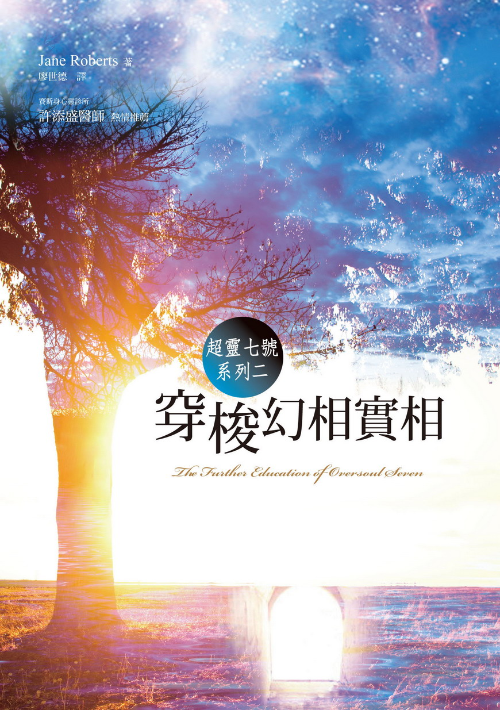

超灵七号系列之二：

穿梭幻想实相

The Further Education of Oversoul Seven

作者：Jane Roberts

译者：廖世德

# 译序

这是超灵七号，在他的老师指导之下，练习自由进出自己的四个人身的故事。进出四个人身，就等于进出四个时空。不同的人身，有不同的生命问题。所以，进出四个时空，不但有「怎样进去」的问题，而且还要面对每个人身各自的生命问题。

莉蒂亚刚刚在二十世纪「亡故」，原本会在十七世纪的瑞典重生。这个「倒头」重生的问题，让超灵七号困惑了好一阵子。另外，莉蒂亚在二十世纪那一世时，是个无神论者，不信人有灵魂。后来受七号的影响，坚持要先参访「众神之国」才重生。她后来重生在「现在的过去」和「以前的未来」重叠之处。

少年威尔觉得生命太无聊，想自杀。可是那「无聊」是他那一生的课题。

约瑟夫连老婆快要生了，还不知道自己愿不愿意死心塌地作父亲。因为他一直想当艺术家，怕因此照顾不了家庭。这是他那一生的课题。

但是，除了每一个人自己那一世的问题之外，促使杰弗瑞写出那一份文稿的，到底是什么人？众神——宙斯、佛陀、阿拉、耶稣——的表现，也让七号思考到神圣、自由意志、神性等问题。这些问题，连他的老师赛普路斯都无法回答。

读者只要了解「赛斯」的原理，对于小说中七号在各时空间天马行空，当不致有什么意外之感。译者个人比较感动的，倒是几个人物取得人身的经验。

我们生为地球人，习惯身体，和习惯任何事物一样，恐怕早就不再有什么感觉。可是，凡是灵性再现的人，都会对自己的身体再起惊奇之感。

身体的一切静、动作用，不论你信不信神，说它是奇迹，绝不矫情。而奇迹，就是神性显示的所在。

物质实相，本书大部分译为「形体界」，不但是自己创造的实相，也是我们的灵魂藉此传达其讯息的媒介。愿读者每天都透过物质实相，透过身体，体验灵性、神性。

由于本书是文学作品，欣赏空间是属于读者的，译者不需多做诠释。

不过，本书略有「文以载道」的意味。所载之「道」即是赛斯之「道」。说明这一点，主要是针对尚不熟悉「赛斯」的读者而发。阅读时若能参阅其他「赛斯」书籍，当更可能心领神会。

献给神圣伪装背后的众神。

# 序一

赛普路斯说：「这本书的开头是这样的：

◇ ◇ ◇ ◇

莉蒂亚的绰号

叫作崔娣，

因为碧安卡说

她就像

刚出生的鸟儿一样，

又瘦又细。」

◇ ◇ ◇ ◇

七号说：「等一下，我觉得你时态用错了。虽然莉蒂亚是死在二十世纪，之后又在十七世纪重生，可是，由于她还没有体验到那一世的生命，所以你不是应该说『莉蒂亚的绰号将叫做崔娣』才对吗？要不，是不是就因为大家都认为十七世纪先发生，所以说『莉蒂亚的绰号曾叫做崔娣』也没错？也许……」

说到这里，两个都不禁爆笑。

赛说：「反正你等着瞧就对了。换句话说，虽然所有的时间都是同一个时间，我还是必须等这本书的内容赶上我的经验再说啊！」

# 序二：（不久之后）

超灵七号有些着急的问：「你真的要写这本书吗？」

赛普路斯说：「嗯，我想第一部分应该叫做『杰菲男孩、南南、艾莉丝皇后的冒险之旅』。」

七号说：「这些人到底是什么人？他们和崔娣，和她的新生命，还有我日后的教育有什么关系？」

赛笑着说：「这一点你必须自己去了解。真正的教育是包含了惊奇。可是现在请你注意，杰菲男孩、南南、艾莉丝皇后的冒险之旅就要开始了。当然，杰菲男孩还是不知道到底发生了什么事。」

# 第一章

这些札记记录了我的……我的什么我也不知道。是梦里的活动吗？可是，这种事没有文字可以形容。说正确一点，这一份手稿应该说是日记才对。但说来也奇怪，这一本日记又真是我的身体睡着以后开始的。首先有几点事情要说明。我在这里就用冗长的开头说出来。老实说，我是忍痛接受种种掣肘，才写下那最后陈述的。不过我以后不会再接受这种掣肘。我现在毫无怀疑的知道，一般语言所说的过去、现在、未来这种东西其实是没有的。不过纵然如此，从现在开始，我还是会尽可能按时把发生的事情写下来。可是我有一种很奇怪的感觉，感觉不必等我把已经发生的事情写下来，就要发生重大的事情。

理论上，这些札记是可以在过去发现，甚至在我现在写下来之前发现。同理，这些札记也可能在我毫无所知的实相中显现，甚至（我现在才知道）也可能在某个陌生人放下心里的障碍以后，由他自然而然地写出来，以一种心理幻相的形式出现。甚至连我都可能以流浪汉的面貌出现在你梦中，或者你以流浪汉的面貌出现在我梦中。

我好像是这几个月才活过来似的。然而，这些事刚发生的时候，我却很惊愕。即使到了今天，我有时候还会怀疑自己是否正常。只是，到目前为止所发生的种种，却让我瞥见了实相的内在；但这只有使实相的外在更加奇妙而已。

我要声明的一点是，我并没有吃过什么药物。我目前卷入的这一个险境，不是我所知的任何事物引发的。这些札记都是白天写的，代表的是我并没有想要把我的行为和大部分人毫无所知的空间连在一起。

截至目前为止，我一直尽可能地回归正常生活；但我无法保证一直都能这样，尤其是因为我有时候会碰到一些问题，而问题的性质却不很清楚。同理，到目前为止，我也一直在大家接受的实相里保持着正常意识。不过我确实越来越清楚地觉察到原有的一种平衡现在已经岌岌可危。

每次我写这些札记，写完再重读一遍时，我就知道自己已经从那些同样真实的境域安全归来。日后如果我决定不回来，我也会在这里记下来，这样，凡是关心我的人就会知道我的「迁出」是自愿的，而非受到强迫，或者——更糟的——是出于自己的错误和不小心。尤其，如果我的前妻莎拉读了这些札记，我更不希望她想象我是从她所不了解的某一实相底下爬回来的。

在这里，也许我该提一下我是个心理学家。光是我的学位（康乃尔大学学士、哈佛大学行为心理学硕士及博士），就已经足以让人来读这些札记了。对于那些仍然承认这种荒谬的博学象征之人，我要说：「听我说完。以你的标准，我有权利得到你的认可。」至于那些认为学位是天真仪式的人，我则要说：「我和你们是站在同一边的。」但是，既然我花了很多年才得到这种身份，何妨好好利用一下。

我应该告诉你们，我已经三十六岁。只是我至今还有点不相信一部分的我已经年过三十。我的前妻住在北美大陆的另一边；虽说可能不合法，但已经再嫁，而且已经怀了她的第一个孩子。到底要不要在地球这个疯狂的生存园地养一个人，我一直下不了决心。倒是莎拉显然已经等得不耐烦，最后终于采集了意愿比较高的别人的种。所以发生这些事情的时候，我仍是单身一个人。

我相信我已经卷入最重要的工作，但也了解我的态度具有一切自我中心的特性，或者说有许多这一类的特性。但是我绝对没有受到弥赛亚情结的困扰。别的不说，我已经厌倦于检查自己是否有精神分裂的症状；尤其自从发现我向来认为正常的意识状态其实只是我身份表面的涟漪以后，我更是如此。另外一个原因是，我一直处在自己的历险当中，用自己的人格做心理试验；但我工作的一部分又需要我扮演种种觉察的状态。

因此，我预料得到同事对我会有什么批评，那就是我没有保持应有的客观，或者，不符合「科学方法」。我连脑波探测仪，甚至如今深受尊重、又饶有地位的所谓「梦实验室」都排斥。因为不论我去的是什么地方，我都必须独行。没有人能够告诉我什么方法有用、什么方法危险。一般生活的种种假设对我也毫无用处。然而，我还是不想回头。获得个人伟大的成就（与知识）——这种希望，远胜于我已经发现或仍在等待的种种危险。

所以在这个冗长的介绍后——心理学家是以唠叨出名的——我将记下那些使我陷入这种状况的事情。第一件事与后来所发生的事比较起来，实在不足为道，所以我当初的惊愕现在看起来简直就是可笑。但形体界就在那晚为我开启了第一个开口。第一声剥裂声是出现在我一向习惯的平凡生活当中。

我住在纽约北边一个小镇的一幢公寓，与国立大学毗邻。这些现代公寓刚刚建好不久，每一幢都有自己的进出门户，从阳台向外望都是岩石、泥土、土坑。这种公寓到处都是人造的环境、空调、隔音与防潮装置；一切都是为了使生活卫生而平淡，使我不禁想到史金纳箱（译注：skinner Box，一种可以严格控制和观察动物学习行为的装置）。

那天晚上我睡不着，于是就爬起来，走到客厅。我在阳台上站了几分钟。阳台位于七楼，没有楼梯通到地面。一排阳台向外突出，脆弱地悬在地上覆雪的石砾上方。

那时是凌晨两点。我在阳台站了大约五分钟，然后回到屋内。我看了一下时钟，然后躺在沙发上，就睡着了。我梦见两个人在和我讲话。他们的穿著很普通，是毫不起眼的西装。我们讨论到行为心理学，他们认为人除了人格表面的性质以外，根本找不到其他的东西。我不同意他们的论断。就在这时候，一阵吵闹声惊醒了我。我坐起来，完全的清醒——我必须再强调——是立即清醒。

我非常惊愕，因为那两个人吊在那里。我的梦我记得很清楚，我认得他们两个是我梦中的影像。我用力眨眼，又揉揉眼睛。

其中一个说：「别担心，是风把阳台上的花盆吹翻了。」

我没有讲话，很小心的看看四周，一切如常。整个房间坚固而真实。只有这两个人不应该在那里却在那里。我的感官线索对这一点完全无法理解。房间里点着一盏暗暗的灯，我看他们如同看沙发、桌子或任何东西一样的清楚。若非我还记得梦中的他们，我简直就要认为他们是抢匪、是小偷。

我尽可能讲理的说：「听好，你们都是我梦中的影像。我不可能真的在和你们讲话，因为我一直很清醒——除非我现在还在睡，根本不知道怎么一回事。」

第一个人笑着说：「你工作太累了，是不是呢？」奇怪，我觉得他的笑容很令人宽心。我白痴般的用力点头，说：「是啊，一定是。我一定还在睡觉，还在做梦。」

但是另外那个人笑了起来。他对我似乎没有第一个那么有好感。他说：「真有趣的假设。如果我说你才是我梦中的影像，你怎么说？」

我不高兴的皱起眉头，不过还是注意到自己的反应。这个人稍微比我年轻；我不高兴他这样子了然，或者说，假装比我了然眼前的状况。更糟的是，他无所顾虑地笑开来，说：「况且，也许你们两个才是我梦中的影像。」

这个时候我确信我已经完全清醒了。我感到很害怕，一时之间不禁开始怀疑他们两个都是疯子——事实上是盗贼——闯进了我的屋子；而我只是把他们和梦中的影像混在一起了。我捏一下手臂；反应很正常，我的主要官能都在正常的运作。然而眼前的情况我却一点都无法理解。

年轻人说：「我们已经适度激起了你的好奇心，我们将很高兴看到你接下来的反应。」

他刚说完，我就从沙发上弹了起来。这时同时发生了两件事：在我惊愕的注视之下，这两个人渐渐的消失，好像空间慢慢地把他们吃掉一样；然后我脖子的下端硬生生的咔嗒一声，这才知道自己已经坐回沙发上，但我是怎么回去的却完全不清楚。房间还是原来的房间，只是那两个人不见了；而且已经没有什么东西可以证明他们来过。只有一样：我记得自己确实是睁着眼睛的；只是想不起来自己是不是闭过眼。他们一走，我立刻跑到门口开门看外面，花盆已经在阳台地上摔破了。

几天过去，我终于说服自己这件事是梦中梦。可是有一件事却让我搞不懂：就是我确信他们两个人消失的时候，我的确有从沙发上跳起来；可是接下来回到沙发上时，我却是闭着眼睛。如果这真是做梦，为什么我后来还会想到什么睁眼睛闭眼睛？通常你做梦时看到什么就是什么，然后就没了。至少我当时认为应当如此。我颈后那咔嗒一声就更难解释了，但后来我认为那只是肌肉痉挛。

这件事我没有告诉别人。真的，我努力地把它逐出了我的心里。因此，如果不是后来发生更奇怪的事情，我也许已经完全忘记。这件更奇怪、更惊人的事情大约是发生在一个礼拜以后。这次我完全无法归诸于做梦。

就我记忆所及，这件事其实是一连串的事件。当时我坐在书桌前，正在专心地看学生的论文。这篇论文讨论的是我们用老鼠做的脑前叶实验。这时，毫无异象的，我突然陷入一种极度恐怖的经验当中。首先，我的身体一直在膨胀，可是越来越轻。这个过程一直持续到我感觉自己已经轻到不能再轻才停下来。我的两耳之间似乎充塞着好几里宽的空间。

我感到身上的细胞处在一种最奇怪的状态里，好像每一个都拥有一种警觉性，一种小型人格——热切，敏感，有个性；最重要的是，每一个都能够主动采取行动，而非只是随刺激起反应。我有一种疯狂的想法，觉得自己的意识已经散成很多部分，我一下子觉得……觉得松弛，或说飘浮不定了起来。我的颈后又响起了那咔嗒声，接着很恐怖的，我发现自己已经悬在阳台外的半空中，距离围篱大约五尺远，和地面相距六尺，其间空无一物。

我想我随时都可能掉下去，可是没有。我看不到任何人，但我还是大声的求救。这时是下午，我提早回家看学生的报告，但同一幢宿舍的人大部分还在上班上课。我完全不相信自己悬在那里。我告诉自己我不可能这样悬在半空中，但也不知道为什么我没有掉下去。感觉上好像不会有什么事发生，没有人会发现我，我将永远悬在那里，好像一条鱼一样，吊在一条看不到的线上，只等着人来收线。接下来，突然间我回到了客厅，只是依然悬在空中，飘浮着。

接下来，我的位置变了，并且遭遇了今生几近最恐怖的恐怖，因为我正往下看着自己的身体。「我」手里拿着笔，闭着眼睛坐在那里，好像在打盹。我看到自己的头顶，每一丝头发都好像草一般从头皮怒放出来。我的肩膀松垮垮的。这里面夹杂着熟悉与生疏，混在一起叫我惊愕得说不出话来。我的身体看起来异常孤单，使我不禁感到怜惜。

但是我怎么可能离开自己的身体、看自己的身体呢？但我根本来不及想这个问题，很快就回到了自己的身体。我只是闭眼睛，想象这一次跌下去不知道会有多痛。然后不知道自己怎么了，只听到咔嗒一声，接着是轻轻的一声爆破声。我不再害怕，睁开眼睛，那我刚刚闭起来的又是谁的眼睛呢？

我惊慌不安，望着窗外自己刚刚悬在那里的地方，深怕看到自己还吊在那里。

那天晚上，我知道自己必须找人谈一谈了。我心里只想到一个人——我的老同事南洛•布莱尔。他对催眠和超心理学稍有涉猎。但是如今想起来，如果我当时没有找他，事情不晓得又会怎么样。当然，后来的几个礼拜，我不只一次地想到，但愿自己当初没有打那一通电话。

# 第二章

如果你正当二十出头的年纪，三十六岁听起来会很老。但如果你五十几了，三十六岁又年轻得难以置信。由于我的教育背景，我是一个非常值得重视的人，但对南洛•布雷尔来说，我却只是个年轻人。我一打电话给他，他就马上过来了。我在电话里丢过去的一些话激起了他的好奇心。我之所以打电话找他，有好几个理由。坦白讲，让我震惊的不只是这次事情本身，而且包括其背后的意义。况且，我也希望我找来讨论这件事的人要能够理解但又很冷静，不会到校园去嚷嚷。

「南南」，是学生和年轻教授对他的昵称。说他是凋谢的校园之花再恰当不过了。他已经过了退休年龄，但还在荣誉教职授课。他从工业心理学到催眠研究，在很多方面都很有名。就是因为他对催眠这一种非传统的兴趣，我才想到他对我有帮助。

还没有敲门，他那紧张快速的咳嗽声就告诉我他已到了门外。他一手抓雪茄，一手抓着半瓶酒，根本没有寒暄，就说：「嗯。没有嗑药，也没有吸 LSD，是吗，杰菲男孩？」

我不高兴的回说：「听着，我不喜欢人家叫我杰菲男孩，而且，我也没有嗑药。」

他不理会我，兀自说：「对，我想你是没有，那不是你的风格；不过我想知道我们的状况。现在，是否可以请你慢慢的、准确的告诉我，这里到底是怎么一回事。你在电话里没有讲得很清楚。」

我让他在一张椅子上坐下，然后把前后两件事说了一遍。他好像很兴奋的样子，这使我有一点意外。他坐在那里，烟抽个不停，眼睛很少离开我的脸。我不怎么在意他那心理学家一般慈祥的笑容。我看他扮这种慈祥的样子看太多了。他是很慈祥，可是没有看起来的那么慈祥。但他却异常敏锐，或者说，一直到最近都很敏锐。

讲到某一点时，他打断我的话说：「是，是，是。你脖子后面那咔嗒一声，请你再说明一次。」他口气的平静很夸张；至少在我听来是这样。我不知道他是不是吃了什么东西；或许我根本就认为他有吃。我重新讲了一次。由于他没有打断我的话，于是我就继续讲其余的事情。

然后他不耐烦地站起来，压抑着兴奋地走来走去。「对，对，对，」与其说是对我说，不如说是对他自己说。「这里该怎样跟我们的年轻人解释？」他嘀咕完这一句，然后转过身来面对我说：「我们很需要在这方面做一些实验。他们做的都错了。」

「他们？他们是谁？哪一方面？」

「当然，身为坚定的行为学家，你真的不知道我在说什么。你是坚定的行为学家，不是吗？算了。」他重重的坐下来。以他的体积，那样子坐进我的编织椅，确实是太重了。椅子咯吱几声，呻吟了一下，总算保住了。「好，就这样。」他说，「我要做个建议。首先你对自己这些经验，毫无见解可言，对不对？」

「我的确是没有办法解释，如果你是这个意思的话。这是某种怪异的知觉吗？是因为我太太离开我，我的反应所造成的幻相吗？天晓得！」

「对。」南南说，「然后呢？」

「然后？然后——没有了。如果那不是幻相，我就是真的出窍了。这个我没办法接受。我相信以你的背景，你应该有一些别的解释。」

他说：「假设你真的出窍了呢？我不是说你真的是出窍了，而是你有没有考虑过这个可能性？」

「为什么？我没有。」我惊讶的回说，「我是率先承认行为主义并没有解决或开始解决所有问题的人；不过，行为主义却提供了充分的证据，证明我们的意识是生理机制的结果，也是我们利用生理机制方法造成的结果。这样看来，就没有一个『我』可以脱离身体。否则我就没有任何知觉器官了。」我踱着方步，心里很生气，一心防卫着。这一切对当时的我是太清楚了，根本不用争辩。

南南说：「等一下。你说你觉得自己离开了身体，觉得自己悬在半空中，后来又往下看到自己的身体。既然这一切都这么鲜明无误，你又为什么认为这些事情事实上不曾发生呢？」

我说：「当然，当时我确实认为这些事情真的发生了。」我现在口气比较缓和。

「那么，又是什么东西使你认为没有呢？」

我心里开始不快。「常识吧，我想！没有东西支撑，人不会悬在半空中不掉下来……」

「所以，你就否定自己的经验喽？」南南以他那出名的淘气孩子般心理学家的笑容笑着说，「你知道，这才是真正的疯狂。」

我喊道：「我不否认我有这样的经验，要不我就不会找你来了。」

「那么，听我说，」那天晚上，他终于第一次真诚的笑了起来，「你这个年轻人是不错，曾经好几次帮我丢垃圾。这样的人不会很糟糕。但是，这一向以来，你似乎一直刻意让自己很迟钝，所以这些事情才叫我这么惊奇。」

他又说：「你听着，心理学的各个门派之间并没有好好互相沟通一下，这真是很讽刺。据我所知，你根本不认为超心理学是正当学术，可是现在有些人做了一些新的实验……」

「得了吧！」我说，「我偶然读过几篇这种报告，大部分都是假科学杂志或药学文献。电影也在流行灵异的风潮。以前还有那些莱因实验，都是一些鸡毛蒜皮的东西。」可是南南却很顽固的说：「他们在研究出体，或者说，研究出窍状态。到目前为止，他们利用的主要是一些异能人士，或者自称能够随意体验这种现象的人，认为自己能够体验这种现象的行外人。但是，到目前为止还没有一位心理学家能够内外两端同时着手。我们需要的是一个心理学家能够将自己的意识投射到体外，然后同时由体内和体外两种脉络来研究这种经验。我们不是那些故弄玄虚、乱七八糟的东西，不要……」

「嗯。」我应道。

「但是，」他挥了挥胖胖的手说，「我现在并不是建议你去担任这个角色……」

「好，」我说，「科学怪人。晚安！」我用一种玩笑式的雄辩向他一鞠躬，装作要送他走。我现在知道，他最辉煌的时代已经结束。我打电话找他是个错误，他的名声或许是过度膨胀了。

他看起来真的受到了伤害。于是我笑笑，倒了两杯酒，一杯给他，一杯给我自己。我并不是在为自己的态度找借口；但我相信我的立场很正确。我的很多同事——不论年老或年轻——都和我立场一样。我只是不想伤害他的感情而已。

「我认为我是看到了两个人。我认为我是离开了自己的身体。」我口气温和的说，「我相信这里面一定有个合理的解释。但是，你却只看它的表面价值。坦白讲，我现在也说不出一个合理的解释。我可以接受这两件事只是一个幻相，但这种想法只会让我不安。而且这也不是事实。」

「是，是，是，当然。」他说，「可是，如果人毕竟还是独立于身体之外，那不是很讽刺吗？如果心理学竟然否定人性上某种可能使我们免于死亡恐惧的特质，那不是很讽刺吗？如果能够证明人的意识和身体是各自独立的，我们将释放出何等不凡的能量啊！」

我当下没有回话；因为这一刻对我来说很痛苦：凡是称职的心理学家都知道，不可以把心理学和宗教混在一起。南南也没有声音了。他意味深远地看着我。

我说：「这是神话中的神话。」

他说：「你认为我是个老头子，不久就要完蛋，所以死抓住一根稻草要自己相信那不可能的事。没错，这是很自然的推论。」

我愧疚地否认他的话。但他说：「不，没有关系。如果我站在你的立场，我想我也会这样想的。然而——」他站起来，迅速、敏锐，可是带着优越意味地看了我一眼，

「然而如果我也有这种经验，如果我也像你这么年轻，我就敢，并且也会好奇的想要一探究竟。我不会这么甘心就否定自己感官产生的证据。我会多思考一下这种经验对我个人及身为心理学家的意义。」

我想打断他的话，可是他那「心理学家一般慈祥」的面具已经不见了。他抢着继续说：「我很清楚自己在年轻教授间的名声。可怜的老南南、老傻蛋，他最辉煌的日子已经过去了。你觉得奇怪吗？我当然知道自己的绰号。我们自己也会给老教授取绰号，其中有一些还很真实，譬如我的绰号就是。可是，虽然年轻人流行这一套，人类的心灵在过去无以名之的几十年里，就说六〇年好了，却不见得已经过气。人类的心灵反而以最奇特的方式加速活动。」

「可是，现在的情况是，你打电话找我来，要我为你证实这整件事只是幻相，只是一种自我催眠，不涉及任何心智的紊乱。你想把这种经验掩盖起来，只因为这种经验不符合你的现实观。但是我却不肯合作。因为就心理学，甚至就事实来说，你的经验都是成立的。所以我建议我们做一些实验，不要只是嘴巴上吹毛求疵。」

「这不公平，」我说，「你把我当成少不更事的小孩子，这我可太老了；把我当作乖乖牌，我也不高兴。我和任何人一样，充满了好奇心，思想很开放。」

「喔，是吗？」他笑着说，显然很高兴看到我的不快。「那请你告诉我，当你年过三十，发现这个世界是半疯狂的世界时，你怎么办？是继续玩游戏呢？还是去寻找哪里不对劲？」

「我会试着去寻找哪里不对劲！」

「那是检查老鼠还是检查人呢？是泡在试验资料的统计分析里，不管人心的主观实相吗？喔，算了吧！你也知道，大家早就这么批评行为主义。」他对着我坦然地笑起来。

我只好耸一耸肩膀说：「好吧！那你有什么想法？」我暂时投降了。

他缓慢而且谨慎地开始讲：「首先，以开放的心态审视那两件事情。然后，如果你认为其中真的有幻相，就再弄清楚一点。事情不确定，就追个究竟。这样，如果还不满意，我建议你做一些实验。我有几本书让你先看一下。当然，我希望你能把你做的实验做个完整记录，并且留一份给我。」

他越来越激动。我注视着他，乘势说：「你为什么不自己做？」

「有啊！」他说，「我几年前做过，但没什么结果。可是，我觉得你在这一方面很有天分；就当是老心理学家的直觉吧，随便你！可是，如果你出窍以后到了某个地方，又能正确报告你看到的东西，至少我们就有了个开头。」

「有几个年轻的心理学家也做过这种实验，可是最后不是遭到当权派排斥，就是和科学界混在一起吸毒。所以，在体制内，只有你这种人才有路走，才可能认真做一些实验……」

我看着他，好像他已经完全丧失神智似的：「听着，如果我真的出窍过，我实在也不知道自己是怎么出去的，更不要说改变位置或者回去了。」我一边说，一边想起自己挂在窗外当时那种感觉。我突然觉得很不安，于是笑了一下，说：「而且，如果我出窍以后回不来怎么办？」

他眼中的光辉不见了：「是的，是有这种可能，但我认为没什么危险。」

我惊讶地说：「我刚才是开玩笑的。」

「是吗？」他很严肃，「但确实有人碰到了这种问题。」

我近乎叫喊：「什么？这种事太怪异了！」

南南摇头说：「是吗？都是无稽之谈吗？也许是，也许不是。」

我说：「这种事没有『也许』，太荒谬了。讲到实验，你说的这种实验实在不好玩。」

「而且也没有人会支持你。」他说，「是的，我是在诱你上钩，诱你做我想做却失败的事情。我已经告诉你我的动机，这完全是为了公平起见，我保留了一些事情没讲。不过，如果你接受我的建议，我会全部告诉你。如果——这是一个很大的如果——你可以事先知道自己要出窍，那么也许我们就能证明一件事。」

我缓慢的说：「你就可以提出一篇革命性的论文，不再原地踏步……」

「不错！」他看起来没有一点罪恶感。事实上他还很得意。

我说：「于是我就成为你的囊中物，然后，因为我研究的是主观机制，所以就继续当心理学家。接着你的声誉将会使我们的研究论文出版。」

他同意的笑了起来。

我说：「我承认我对行为主义有些怀疑。但是，现在大家对研究迷幻药的功效都已能够接受了。这大家都知道的。对立的组织越来越多，有些心理学家对『控制心灵』也越来越有兴趣。但你说的这种事却和这种流行，还有天晓得的什么东西相冲突。你真的认为人的意识有那么多东西可以研究吗？我必须承认我比较偏向另一边——就是人的知觉无他，纯是脑活动的结果而已。」

「更妙的是，」南南说，「这一点你的笔记还会说得更清楚。在科学界，这对我们是很有用的。你一开始并不相信什么东西。不是吗？我们会这么说，而且这也是真的。但是——如果我们要做——我们就必须完全私底下做这件事。否则，要是我们失败了，别人知道后，会把我们当白痴。然后你的生涯从此一毛钱不值。因此，如果你同意的话，我先要教你一些 OOB（出体）的方法。」

「方法？你是说这种事情也有自助手册？」为了某种原因，我不可遏抑地笑了起来。这可能只是我对那一晚上所有事情的神经反应而已，不过他的话所激发的想象实在很好笑。而且，他的表情由好玩转为不悦，让我笑得更大声。

待我恢复平静不久，我们的讨论就结束了。他回他的公寓，又抱了一堆书回来给我。每当我一个人的时候，就拿出来翻翻。我发现这些书都是图书馆的书，大约是一个礼拜前借出来的。当时我对这一点毫不以为意，对自己选择这个密友也毫不起疑。但是如果当时我知道以后要发生什么事，我一定会把他留下来，连夜质问他。确实，我到几个月以后，才知道他其实口风甚紧。

# 第三章

三天之后，我听说南南在他自己的认知下，住进了一家精神医院，并经诊断为精神分裂时，你可以想见我心里的滋味。不过很怪的，我却松了一口气，因为我再也不需要把他的建议当一回事。我一方面为他感到遗憾，一方面又觉得异常的自由。

然而，回想我们的会面，我就想到他那莫名的兴奋。难道是我们的谈话和我奇异的经验害了他吗？就算是这样，我想，他自己具有这种疾病的倾向应该也有一阵子了吧。然而我自己也该警觉到一些症状才对。因此，由于有些内疚，我决定尽快去看他。

但是差不多过了一个礼拜，我才有这机会。别的不说，当时我的研究工作真的非常繁重，因此，尽管我已决心要去看他，但还是一直拖着。我有种种的借口，一直到有一天，我终于开始克制自己，了解到自己对南南的情况感到必须负责是不合逻辑的。我的反应很正常，没有理由要感到罪恶。不论身为个人或社会的一分子，我的背景都已经设定了我会这样。

因此第二天，我就履行了我的义务探访，并且认识了南南的新朋友——艾莉丝皇后。大家都这么叫她，她年纪大约和南南相仿。他归她管，不过，也可能是她归他管。无论如何，这一次的探视却是很恼人的，而且怪异。我这样说是因为在探视中，似乎不是我在检查他的心智，而是他在检查我的心智。

我用力的、肯定的一脚踏进接待室。「布莱尔博士？」我的口气——我希望——是坚决的。

「啊，杰菲男孩，到我的客厅来。」他带着最热忱的笑容，指着接待室的一角说。其他病人纷纷让开。他在扮演慈祥的老心理学家。这一次他的演出最完美，其他的病人围着他，好像都是配角，对他很尊敬，而他则像古代的风笛手一样，一径笑着。

他的客厅有一张破旧的会议桌，椅子排得乱七八糟。他又对我笑了笑，然后坐下来，好像我是他特别喜欢的病人似的。他的态度表示这是他的办公室，或等于他的办公室。他穿的是平常服装，不是医院的病患服。他对待那张桌子也像是他的办公桌；他拨开桌上那一堆烂杂志，毫不在乎。

一个女人走到我们身边。他向她招手，说：「亲爱的艾莉丝皇后，来和我一起坐一下。你对杰菲男孩会有兴趣的。这就是他。」我愣在那里。但是想到他的情况，却很愿意配合他。

这时病人开始走来走去、咳嗽、打喷嚏、吵闹——等等，似乎表示他们各忙各的，不会偷听我们讲话。然而他们的动作似乎又很漫无目标。由于我比较习惯处理老鼠，不习惯处理人，所以，我实在不知道要对他们如何才好。

我打起精神，试着对南南高兴的笑说：「怎么样？还好吗？」

「很好，很好。」南南回答，他的确看不出有什么不好的地方。「我在继续我们的研究，现在艾莉丝皇后作我的助手。」

我紧张的说：「很高兴认识你。」我不得不转头去看她，因为南南的态度要求我这样。我不想拂逆他，但实在也不怎么想和谁打交道。艾莉丝皇后的白发沿着她的脸围成一圈。她穿着连身裤和衬衫。不知道为什么，她的穿著似乎触犯了我的正派观念——其实那时候我自己也知道这很荒唐、不公平。所以，我温和的说：「艾莉丝皇后？」我想我只有一丝笑意吧！

南南说：「这个绰号，说正确一点，是尊重的称号。这种尊重说出了一个事实，那就是，她脱离了她的时代。她活的时代不对。」

艾莉丝皇后说：「这很不方便，没什么人了解。喔，不，我不该这么说，有几个人懂的。可是，我不是皇后。我不必装作是俗世的皇室……我猜你是你们那个世纪的绅士！」

「对，他是，真的。」南南明显地加油添醋，口气简直就是嘲讽。整件事对我实在是太过分了。我想找个借口告退，南南却突然靠过来，开始以一种同谋的态度，几近愉快的说：「你知道，我们没有太多的时间，所以我要把目前知道的都告诉你。」

这可以忍受。于是我暂且不走，说：「请！」我想知道他到底有多不理性。我已经大大的产生了好奇心。这是我第一次接触精神分裂的人。虽然我们早就利用紊乱制约法，从老鼠身上观察到精神分裂的症状，但这是另外一回事。

因此，我一方面表示同情与关切，一方面观察他的反应。他开始讲话，很激动、很迫切，小小的褐色眼睛简直就是永恒地停留在我脸上。他不让我看别的地方，常常停下来大声问说：「你懂吗？你懂吗？」

我坐在那里只好一直说：「懂，懂。」他很热切地注视着我——我要说，这是最令人难受的地方，也是最奇怪的情况。

他说：「这里这些人，他们的行为，其实是很正常的。对于他们这种病人，我常怀疑这个事实，就是他们并不——我重复一次——并不疯狂。你懂吗？」

我说：「懂，当然。」我不想再让他不快。

「但是，除此之外，你听好，这很重要。艾莉丝皇后听到了一些声音。他们在各种时刻对她讲话，传出一些很惊人的消息。我自己有一次也听到，不过可能没有她那么清楚。我不确定这两种声音是不是一样。但我相信这些信息是属于一种神的对话，只是细节乱掉了。你了解吗？」

他的眼睛还是没有离开我的脸。我尽力掩饰内心的感伤。没想到这么聪明的人，这么快就疯成这个样子。我虽然缺乏实际的经验，但也认得他这种病的典型症状。

他不耐烦的说：「你懂吗？你懂吗？」他正常的穿著和外表，与他急切的样子实在差别太大了，因此他突然伸手抓着我的时候，我几乎吓得快跳开。他声音嘶哑的说：「你开始做出窍实验没有？」

「没有。」

「唉，你一定要，马上，这很重要。」这一次是用喊的。

「好，我会，今天晚上就开始。」我尽力安抚他，可是，实在没有意愿。

艾莉丝皇后突然说：「他不相信我听到声音。」我转头看她。我已经完全忘了她的存在。她皱着眉头站起来，用一种绝对了然的样子看着我。小孩子和疯子常常有这种了然的样子。

我不知道该说什么、该怎么办。我当然不想让他们不高兴。这时一个小丑般的高个子，弯着腰，踮着脚尖快步走过来，拿起桌上的一本杂志，然后对我眨了一下眼睛，同情的说：「别让他们烦你。我们都没有像艾莉丝皇后一样听到那声音。也许你不久也会听到，也许你永远也不会听到。」他鼓励似地眨一下眼睛，然后回到了他的座位。

我一直看着他的身影。这个……这个病人希望我了解我和他的处境相同——他在安慰我。我站起来，想要离去。这时病人又开始跑来跑去。艾莉丝皇后挺起瘦弱的肩膀，突然说：「你以为你是谁？我是说，你想象自己是谁？」

我说：「谁都不是。」

她说：「真糟糕。」

南南带着最疯狂的笑容说：「这就是他的问题。」我一句话不说就走了。

事实上，我嘴里不说，其实心里很震惊。我想，南南在我家的那一次谈话已经让他疯了，因为他现在认为我们已经在一起从事某种神秘的实验，其中还牵涉到艾莉丝皇后听到的声音。我摇摇头说：「可怜的老傻瓜！」可是，等我回到家，却发现自己的心情一直在绝对的不安与几近无力的被动之间摇摆。这是极不寻常的。可是接下来我突然又感到一阵快活，似乎一切都会进行得很顺利，到底是我的问题或是南南的问题似乎也无关紧要了。

我想我是工作太累了。显然，那两次和南南见面的经验，是疲劳造成的。我吃了一些维他命 C，心里更加快活起来，感觉自己心里有什么东西必须马上写下来。我简直想都没想，就在老打字机上插入纸张。

乍见自己写下来的东西时，我惊讶得无以复加。稿纸上方出现了这几个字，似乎是个题目：

超灵七号：生命层次

我看着，心想，什么超灵七号？是什么东西盘据了我，使我写出这种胡言乱语？可是，我虽然这样狐疑的看着这个句子，心里却感到很兴奋。我突然感到很肯定，充满信心，于是开始打起字来，能打多快就打多快。那些话好像是从什么地方自己溜出来，经过我的脑，溜到纸上，而我却不知道是什么地方，并且其中还有故事在发展。

我只要意识到这些话一秒钟，手就立刻打出来。令我吃惊的是，我打字的速度越来越快。一页打完，根本来不及读，句子又出现了。两小时过去，我终于停了下来，点上一根烟，困在那里。但我几乎马上又感到要打字的冲动，是冲动吗？当然不只是冲动。但我确信只要我愿意，我可以抗拒这种冲动。可是我决定继续打下去，就当作是一种实验，看看到底会怎样。

结果这个「怎样」却成了一本书的开端，书名就是前面出现得很不可思议的《超灵七号：生命层次》。除了短暂的休息，我连续打了四个小时。我不了解这些文句到底属于何种性质，可是其中的狂想令我惊讶，并且深知这不属于我的人格所有。除了枯燥的学术论文之外，我成年以后，没有写过什么东西。

那一天晚上，后来我仔细思索了自己经验前和经验中的主观状态。这一次我没有再犯错，没有再打电话找任何人。不过，我反而更加害怕，因我现在面对的是一项实体证据——一件自己在毫无所知的状态下写出来的作品。这些文思到底是哪来的？刚刚那种冲动会再盘据我吗？如果会，我有办法抗拒吗？然而，我是不是只是在愚弄自己？

但是，后来连这些问题都无关紧要了，因为我产生了更骇人的念头：如果南南因为听到一些声音，就被认为是疯子，那么这又会让我怎样呢？精神分裂症实际上是否为某种病毒所引起的？如今这种病毒已经从他身上传染给我了吗？不可能——我想。可是这种解释至少可以把整件事放在真实而合理的范围之内。我知道这很愚蠢，不过想到高剂量的维他命 C 可以抵抗病毒，我又吃了一些。此外，我还安慰自己说，这整件事没有涉及什么听觉或视觉方面的幻觉。

但就实情来说，事情是一件接一件的发生。我在这里记下这些奇异的篇章，并没有做什么更改。各位看下去，就会看到超灵七号以他奇异的方法盘据了我生活的细节。

# 第四章

面谈进行了好几世纪，或者只是一下子——看你的观点而定。超灵七号皱着眉头，在门上挂了「外出吃饭」的牌子，然后对他的老师赛普路斯说：「每个人都想当神。没看过这种事。这些应征的人我一个都不信任，他们太急了。」现在的他看起来像个上师，因为地球的应征者要的就是这个。他对着候诊室咖啡桌对面的镜子瞄了自己一眼，笑一笑说：「我看起来有点像基督，你觉得呢？」

赛一直在想事情，所以也一直在改变形体。她停了良久才说：「如果莉蒂亚已经准备要重生，我不懂为什么在这种时刻，你还替她这么大费周章。如果你帮助莉蒂亚顺利展开新生命的话，你的评分会很高。而且，如果这件事对她是那么重要，事实上也构成了你这一学期最重要工作的一部分。所以我不懂你这样寻找众神有什么道理。」

「这样岔开我的事情，你觉得我会有什么感受？由地球人的『神』的概念，显示我的地球人教育真的有一点问题。地球的神实在都很衰老痴呆。这很糟，可是有什么办法？你把他们丢在时间里面，他们就要受时间的影响。任何人都一样，只是他们撑得久一点而已。莉蒂亚虽然是我的一个人格，还是得自己去找答案。」

赛说：「七号，我希望你要记住这一点；也希望你记住自己这一个学期要处理的是主观实相。我猜，『外出吃饭』这个牌子和地球的习惯有关，是吗？不过，就算是这样，我也不知道自己是否同意你为这次面谈设立的场所。」

七号沉吟着说：「我仿造了一个医生的候诊室。莉蒂亚曾经在二十世纪去过这间候诊室。我尽量使用地球的象征，好让她在一生与一生之间有安全感。她很容易受惊。我喜欢这个环境——有关灵魂医疗之类的东西。」

赛说：「这种冒险可能会很复杂。」她停下来，想让七号表示意见，可是七号没有，只因为羞愧而脸红而已。赛突然消失了，但她的声音却不知道从哪里来的，说：「你在莉蒂亚这一方面显然没有问题——至少没有什么事情无法处理。所以你可以一个人做得很好。这样，莉蒂亚就可以准时出生了。」

「好吧！回来吧！」七号喊着——象征性的喊着，因为到目前为止，他们的谈话事实上都是无声的、无文字的。

赛出现时，七号又脸红了。他说：「我有一个小问题。」这一次他表情严峻。赛的形体有男有女，或者说有女有男；年纪也是又老又年轻，或说又年轻又老。她对七号的话有什么反应就现出什么面貌。

「嗯，」七号犹豫的说，「事实上是莉蒂亚在找神。她一直不肯重生。在她重生之前，她想先知道那些神是不是真的存在。但最糟的是，她对整件事很顽固。」

赛的表情一下子又老又气愤：「还有呢？其他的呢？」

七号深深的叹一口气，尽量装作有一些（不是很）关切：「莉蒂亚下一世的母亲是碧安卡，你知道，就是约瑟夫的太太。她现在在十七世纪的丹麦已经快要分娩。不要忘了，莉蒂亚已经决定赶回来重生——当然，是按她的条件。我是说，我们知道所有的时间都是同时的，但是……」他的声音因悲伤而慢慢消失了。

赛为自己这一个学生感到遗憾，于是形体立刻变为慈祥的老医生。七号一时士气大振。

他说：「实际上，如果用地球的话来说，这个问题主要是时间的问题。我是说：在这种时间之下，女人分娩的痛苦是不可能一直继续不停的。而且我也一直没有机会改变莉蒂亚的想法。」

赛又不见了。这一次她不见是因为她的反应很快很矛盾，她不知道该用哪一个形体来表达。她说：「你是说莉蒂亚未来的母亲碧安卡就快要生孩子，可是莉蒂亚却受到误导，想要先朝圣诸神？」

七号静静的说：「呃，我不确定。但是，如果我的时间顺序没错，那么碧安卡在二十四小时内就要生小孩了。」

两个都没讲话。

七号又说：「当然，这只是可能，有太多的可能，从三小时到四十八小时都可能。我想。」

赛说：「是有可能。但莉蒂亚也可能决定不生出来当崔娣。」这一次她的声音彷若雷鸣，又有回声；元音和各音节都化成影像，飞入空中，染上阳光，化成多彩的三棱镜。只是这种三棱镜另外还有声音，元音和所有的音节纷纷破裂，化为大小不一的声音。七号掩住他的「上师」耳朵，大声叫了出来。

这一阵喧闹终于停止了。七号幽幽的说：「你不需要这样……」然后转为严肃的口气说，「我也了解你的关切。」

赛说：「喔，七号！」她已经变回她和七号做这种讨论时常有的形体——一个拥有古老知识的少妇，或者古老而外表年轻的女人——依她（或他）的观点而定。「你到底还是莉蒂亚的超灵，怎么可以让她做这种事？」

七号说：「她把我搞迷糊了。她的上一辈子……她完全不信任我。等到她死以后，知道真的有灵魂，又要我把真相直接呈现给她看。虽然是她自己决定要生作约瑟夫和碧安卡的女儿崔娣的，但是如果你问我，我要说她玩这种自由意志玩过头了。她现在连自己是不是想重生都不确定，除非她……」

七号话头断了。由于担心的缘故，他已经忘了保持那间假造的候诊室。他和赛变成了无目标的两个光点。不过七号立刻又重建了这个环境，并希望赛没有发现。赛只是无力地笑着。既然她没有讲话，七号就若无其事的继续讲。

「那未来的父亲也有问题。事实上，我和约瑟夫本身没什么麻烦。起先他是想当艺术家，很自由，无牵无挂。但后来他却想要讨老婆、生孩子……」

「然而现在，」赛打断他的话，「他老婆就要生孩子了，他却不知道自己想不想当父亲。」

七号抗议的说：「原来你一直在监视我。这件事你早就知道。」

「等到莉蒂亚找到诸神，她又会希望整个世界停下来，对不对？」她的声音又开始在空中颤抖，然后纷纷飘落到角落的红丝绒沙发，降落在皮椅上。

七号喊道：「别再这样。」可是来不及了，空中到处都是声音，有的闪烁如水晶，有的低鸣如雷，化成千百个光声碎片，然后落到地毯上，聚集成堆。赛毫不理会——事实上她有一半是觉知的，她说：「寻找诸神可能很棘手、麻烦，可是又很好玩。你听我说，不要忘了莉蒂亚和约瑟夫都是你的人身，所以其中也有一些你的个性在。莉蒂亚说她什么神都不信。当然，这就是她这么急切找神的原因。而且……」

「她来了，」七号喊说，「请你不要告诉她我们讨论的这些事情。她有很夸张的隐私感 」

赛说：「好。但是不要忘了，你自己对神的看法也很重要。」她把这些声音消掉。莉蒂亚走了进来。

莉蒂亚看起来二十出头的样子。她甩一下乌黑长发，啪一声擦了一下手指说：「我猜这是医院的诊疗室。有关灵魂医疗这一类的东西。」

七号笑一笑：「我想是的。」

莉蒂亚回说：「就是。生理的医生没什么用，灵魂的医生也好不到哪去。」她笑一笑，从裤袋中拿出一支假想烟。七号帮她点烟，然后悄悄对赛说：「我和你说过的……她有点……麻烦。」

莉蒂亚见过赛多次。她对她笑一笑表示打招呼，而且还耸耸肩膀。七号不理会——或者说几近不理会——她的轻忽。莉蒂亚皱着眉头说：「不管怎么样，如果找到什么神可以放进时间里的话，都要他告诉我一些地球的状况。」

赛变成了——多多少少算是——年轻的女人。这就是说，她化成了和莉蒂亚类似的形体，以便和她建立关系。她的念头转得很快，因此在莉蒂亚看来，她一下子出现，一下子又消失，叫人迷惑了。

莉蒂亚紧张地喷着假烟，说：「如果我要再出生，那么我第一个要找的就是神——或者上帝，都可以。可是等我有了形体生命，就还有别的事要干。因此可以的话，我最好趁这个机会，否则我以后就不知道了。就我所知，神——如果有神的话——从来没有做多少好事。但我想，如果我们能找到一个正派的，我们就可以……就可以把他，或者她，放进时间里。我想在地球上，神换成女性也是可以的。」

七号很开心地笑着对赛说：「你看，她想把那些神放在她上一辈子时间的后面。她很了解那个时期。她现在连偏见都还很新鲜。」

「我想你们似乎把这种事看成了一种资产。」赛说，「如果我是你，我会忘了什么把神放进时间里的事——我是说，如果你找得到有人愿意从事这种冒险的话。七号，我要告诉你，关于这一个学期的工作，你故意忘掉了一些事情。你在某些题材上所有的知识没有办法要用就用，因为，如果不是这样，你可能会过度支使你的人身。」

赛的话中有些东西打击到七号一时的自满，他简直惊慌了起来，但还是继续讲，自认非常勇敢：「莉蒂亚知道一般人对神有什么期望。当然，我们会先查一下旧神。如果我们找到什么新神，他们也必须了解地球的习俗才行。譬如，你也知道，地球人一直保持性别的差异，他们一生不是男性就是女性……」

「不是男性就是女性？就两种？」

她的话彷若雷鸣一般打在七号所有的经验上，四处洒下了影像。在他的心眼之前闪耀着几百万种动、植、矿物的性别。各种配偶与复配偶在那里不断的繁殖生命、更新生命。他知道，他都知道，只是在某个层面上，他都忘了。要不，他也可能为了千种理由假装不知道。这时候，七号跨出了自己的视野，走进了一个很大的视野，感觉自己好像有一千个头，每一个头都眼花撩乱。他在自己心的背后，艰难地回想自己在神的事情上到底忘记了什么。

七号回神过来时，赛还是不相信，还在说：「才两性吗？」这一次七号现出的是十四岁少男的形体，站在那里，低着头，鼓着清新的脸颊，说：「赛普路斯，这一点都不公平。」

现在，赛看起来比莉蒂亚老了，比什么人都老，只是那样子很奇怪，因为她的五官在可见的范围内并没有什么变化。她想对七号和莉蒂亚笑一笑，想安慰他们。可是，从她的知识看他们，他们却变得很远，使她再也知觉不到他们。她在时间和空间里寻找，觉得很累，最后仍找到他们；先是超灵七号——他那野性的能量吸引了她，但那股能量又变成了严肃的质问。

他问：「你在哪里？」他告诉自己他不应该问这个问题。他应该知道的。

莉蒂亚抗议说：「我一直不知道你们在干什么。」她坐在假红沙发上手指紧张地敲着杂志。「我有一种很坏的感觉，觉得我们的寻找诸神会在完全料想不到的情况下结束。」

但是，身为一个十四岁少年，超灵七号这时却觉得一种古老的童年在吸引他，使他回到一种新颖的东西；这种新颖的东西是每一种最小存有的中心。他知道找神是小孩子的游戏，但又只有这种游戏值得玩。

他想这些的时候，赛不见了。医生的候诊室连带其中的红绒沙发也不见了，只剩下他和莉蒂亚。七号感到一丝惧怕——他还有那么多的事情要问赛——可是已经来不及了。他怀着希望四下看看，环境已经变了，无疑是因为莉蒂亚信仰的关系。七号真希望自己知道她对众神到底有什么看法。

# 第五章

莉蒂亚觉得很气愤。她说：「我以为死后就会完全了解上帝。我有形体的时候，虽然不相信自己有灵魂，可是我以为灵魂——如果真的存在——至少知道答案。但不是这样。现在反而是我在帮助我的超灵找神。反正现在我什么都做了，结果却什么事都不确定。」

七号不高兴地说：「嘘！你安静一点好不好？我们在别人的领域里；我可以感觉得出来。」

莉蒂亚从匆忙造出的外套口袋里拿出一根烟，紧张地四处看了一下：「你是什么意思？别人的领域？」东西己变了，四周出现了一些墙壁，一直在逼近。为了考验自己的知觉，莉蒂亚故意站着不动。当然，墙还是越来越近。

「在地球上，如果你不懂规矩，不喜欢一个地方，你就像到了外国一样。抓着我的手，安静就好了。」七号说。

他自信的口气有点虚张声势。这个地方充满了他厌恶的人格特质。恐惧的情绪虽然看不到，但确实含在所有的东西里面，好像粗重的蔓藤使其他植物都窒息了一般。他们脚下不时突然露出裂罅，愤怒在心中跑进跑出，好像地震一般。七号一点都不喜欢这种感觉。可是种种原素不断的分化出来。七号小心地带领莉蒂亚在可以走的地方走着。七号感觉到有种恐惧和愤怒在聚集。这种恐惧和愤怒属于某人或某种东西。

莉蒂亚笑都不敢笑一声。她开始发抖，接着立即造出一口棕色手提袋，袋子悬在肩带下摇摆着，里面有一把手枪。

到今天以前为止，七号一直想教她自动假造一些东西，可是一直没有成功。然而现在，由于太害怕了，她却无意识间自己学会了。

他们周围有个东西在逐渐成形。刚刚感觉到的那种恐惧和愤怒正在化为形体。七号感觉到一种浓稠的东西在成长，只是还没有看见。那是一种旋转的、中心很黑的、恶灵类的东西。他向后退。恶灵——或不管是什么东西——绝对在那里没错，是从那阴暗的墙壁跑出来的。然而在另一方面，它的四周却有一种愚蠢的东西围绕着。莉蒂亚打开手提袋，手伸进去抓住手枪。

然而，那个东西说话了——虽然七号知道这个东西的舌头本身没有力量，可是至少那些话确实是来自某个地方——一边说，一边像邪恶的大豪猪，射出恐怖的尖刺，刺进心灵的皮肤，一边还散发出恶臭，像蛇一般到处乱窜。莉蒂亚吓得丢下手提袋，地面立刻变为流沙，将手提袋和手枪，以及其他东西吞噬了。

莉蒂亚结结巴巴的说：「想个办法吧！」

七号先是闭上眼睛，然后又睁开。情况依旧。于是他很有礼貌的说：「我们是要去拜访神。」

左近某处出现了可怕的轻笑声，渐渐增强，终至吞没了七号的思想，吞没了他勉强维持的镇静。空中出现了巨大的牙齿，因为太接近地面，令人很不舒服，并且随着笑声一开一合；开的时候，还可以看到一条食道直通远方，远得连七号都无法想象。

莉蒂亚哭了。

七号也很害怕，心很乱。他轻声对莉蒂亚说：「我以为你不相信有恶灵。」

莉蒂亚看着那些巨大的牙齿，呐呐的说：「我不知道自己是不是相信神，但我相信有恶灵。」此时那些大牙已逐渐消失，原来的魔身却更近了。

「其实根本没有什么恶灵，」七号急切的说，「你要相信我。」

莉蒂亚生气地喊：「那么这又是什么东西？」

那声音说：「跪下来拜我，要不就死！」声音是那个东西发出的，不过也像是从地面，又像从天空来的。

七号终于恢复了镇静。然后他故意借用莉蒂亚的声音说：「好吧！」

莉蒂亚抓着他的臂膀说：「你怎么可以这样？你是在向邪恶低头！」

七号近乎叫喊地说：「可以请你让我来处理吗？」

那怪物嘶喊着：「低头，趴在地上！」

莉蒂亚浑身颤抖地喊：「不要！」她突然想起「天主经」，就开始念。

「『在天……』」

七号说：「莉蒂亚，没有用的。」但是莉蒂亚根本听不到。

「低头拜我！」怪物愤怒的说。

莉蒂亚继续念：「『我等父者……』」

七号想，这会变成一场形而上的叫喊比赛——他自己现在也开始愤怒了。他以目前的情况下尽可能地温柔体贴提醒莉蒂亚说：「你又不相信圣父上帝。你只信魔鬼。」莉蒂亚咬着牙继续念：「『我等愿尔名见圣……』」那个东西迅速接近，形状一直在变，距离她只剩下几尺远。

「拜我！」那个东西道，「否则就死！」

莉蒂亚喊说：「那就死吧！」她已经吓得快要忘记祈祷了。

七号不敢再耗下去。他开始让自己的信仰来主导事情，让自己的信仰充塞整个环境。就在那张巨嘴成形而张开的瞬间，怪物消失了。七号立刻把莉蒂亚拉开。她嘴里还在念「天主经」。

七号厌恶的说：「碰到我算你幸运。会发生这种事都要怪你。害我用了一点时间才了解是怎么一回事。但，以后请你让我来处理好吗？差点给你吓死。」

莉蒂亚这时才问：「我们是怎么出来的？」

「我弄出来的。」

「你？」莉蒂亚喊说，「你是个懦夫！一个超灵竟然有这种行为，那魔鬼叫你做什么你就做什么！」

七号叹口气说：「当时我们还置身其中，实在很难跟你解释怎么一回事。现在请看一下四周。你看到了什么？」

莉蒂亚看了又看。地球的景观未曾有什么变化。在这里，似乎什么东西都无法确定。起先她以为自己看到的是一排树木，在空中显出针剌般的树形。她甚至一度还很肯定自己闻到了松针的气味。可是才一下子，这些东西便开始摇摇摆摆、变厚，最后变成了中古时代的尖塔和街道。尽管有个东西始终在那边，可是不管这东西是什么，它就是一直在变。

莉蒂亚说：「这使我想起印象主义的画。乍看好像是树，可是等到你仔细的看，却又完全不是树。」她不喜欢这种效果。她那实实在在的心喜欢环境很确定。于是她这么说。

七号笑一笑。他已经变成了一个艺术家——在莉蒂亚眼中看来很古老的艺术家，因为他穿着褐袍，为了搭配，还留着胡子，手中比划着的画笔还是十四世纪的。「是你的心在画画或形成这环境，」他说，「此刻我故意让你的心来主导。之前你会制造那个恶魔，是因为就你的信仰而言。神和魔鬼是有关系的。只要找到其中一个，自然就会找到另一个。更糟的是，你对圣父上帝的信仰比较弱，对魔鬼却很肯定。所以你的祈祷不过是演练而已，根本徒然无功。就某方面来说，这种祈祷反而加强了你对邪恶的信仰。你真的认为恶比善强。」

莉蒂亚尖酸的说：「地球上确实恶比善多。我不懂你为什么有办法忽视这个问题。我至少还敢面对它的挑战。」

七号说：「如果不让你遇见一些魔鬼，你就不相信确实有神的存在，不是吗？只有这样，你才会有超乎意料之外的收获。这样我就不用再操心了。」

「操心？你是说你不帮我了？」莉蒂亚这时根本没办法专心。因为环境已经从荫蔽的大街变成荫蔽的后巷，地点在俄亥俄州。她还记得自己曾经住过这里。这种变化很像空间时进时退，每次带出来的影像都不一样；又像是看着商店橱窗，橱窗的倒影栩栩如生，和真实的东西一样。她想，也许众神就只是倒影而已……

「不要看了，」七号喊说，「你的实相已经模糊了。我们并没有打算要这样做。」「为什么？」她心不在焉的问。她真希望他不要讲话，因为影像突然清晰了起来，她几乎听得到一些声音。

七号说：「莉蒂亚，心思不要跑掉……」可是来不及了。

七号悲哀的想，她根本还没准备好。同理，他自己也不知道自己准备好没有。但他无论如何，只能跟着她——还有她的信仰。

倒影开始闪烁，变成方块和圆圈的万花筒，反复重叠，却被暗紫天空下一股奇异的光一一分割。接下来一瞬间，所有东西突然又清楚固定下来，变成了绝对牢靠的东西——原来是一座相连的新城堡、宫殿，却散发着古老优雅的气息；虽然这时的地球是新的，可是那种辉煌灿烂却是古老的。

莉蒂亚高兴得差一点说不出话来：「这就是众神之国！我想象过！」

七号手里依旧拿着画笔，叹了一口气。他知道，或者认为自己知道，这一切会引导他们。但是他不能就这样一脚跨进来引导莉蒂亚——这种寻找必须依循她自己的欲望、信仰。七号想，他不担心她的欲望，她的信仰却是另外一回事。可是，此时的空气实在清新干净，连他都觉得畅快起来。

莉蒂亚说：「今天是最奇妙的一个夏天。」

七号也想这么说，可是他没讲出来。

莉蒂亚兴致高昂。她的连身裤和外套换成了如圣女贞德穿的那种银色甲胄。莉蒂亚前生曾从图片中看过。现在的她，莉蒂亚，又年轻又勇敢，充满决心，要去寻找众神——以及其他。她已经找到了——或者说，差不多已找到了。

七号近乎呻吟地看着她的影像。她看到圣女贞德的图片时是十八岁。眼前的情景她早想象过。

当然，这是很真实的。

她说：「不论如何，我们真的赶走了魔鬼，不是吗？我们必定保住了众神之国。」

七号暂时迁就一下：「对！」口气很阴郁。

整个情景很快就出现了各种空间景象。远方出现了高山，上有公路和小径蜿蜒。树木冒了出来，瞬间就长成了大树。湖泊水波轻柔，几乎要溢出湖边。莉蒂亚说：「我想我必须坐在这里喘一口气。」

「是啊！你可把我累坏了。」七号嘀咕着。可是他现在又为她感到骄傲。这个环境的确太棒了。

只要继续保持下去，就真的太棒了——他想。他穿的袍子太热了，于是他换成丝的。只是他也知道，从古至今很少有艺术家穿丝袍的。不过他想，凡事总有第一次。他钦佩的看着莉蒂亚。谁都不能说她不独立。他笑着，心想，她那么勇敢、诚实。她的纯真与热情远超过他能忍受的程度。他倒想看看这种性格会把她带到什么境地。

但是，除此之外，他自己的一部分也开始有了反应。他一切的起始都开始出现、上升。他把自己的兴奋和她的兴奋合在一起。她的兴奋从所有他所知的时间、地方，一一进入他的经验里面。整个情景清晰得虽以置信，难以纳入任何实相，超越了他们两人，却又非常完整。

那充满夏日芳香的小路通向一幢大房子；大房子俯瞰着山顶。他们开始爬。

# 第六章

小路刚开始很好走，可是渐渐就变得很滑，原来清新的空气也变冷了。事实上，风突然开始冷冽起来，七号只好把丝袍再变成毛料的，另外再加上一条围巾。

他叫着「莉蒂亚，你冷吗？」可是没有人回答。他眯着眼睛瞄了一下，才知道在下雪，有那么一下子，他什么东西都看不到。「莉蒂亚？」

好像看到莉蒂亚在前面远远的地方，于是他又叫了一声。但是，这些雪是哪里来的？才想到这个问题，他一下子一颗心就沉了下去。因为前面那个人不是莉蒂亚，而是他自己的人身之一——约瑟夫——莉蒂亚未来的父亲。之前七号完全卷入莉蒂亚的经验里面，差不多已经忘了约瑟夫。不过也不尽然如此——他马上怀着罪恶感地告诉自己——否则就太夸张了。不过和莉蒂亚失散的确令他很不耐烦。即使想起最后一次和约瑟夫见面的情形，也无助于他解除这种不耐烦。他记得那一次约瑟夫曾经很生气地要他管自己的事情就好，别管他。

七号必须承认他对约瑟夫一些糟糕的观念都是他自己的想法。可是，就像他曾经告诉赛的，他后来才了解约瑟夫的处境。他几乎立刻感受到约瑟夫精神的孤寂。现在又看到约瑟夫蜷缩在山上，身体已经冻僵一半，伏特加酒瓶滚在斜坡上。眼前的情景，很难找到比这更悲惨的了。七号一眼把这一切都收了进来。约瑟夫一生的种种事情开始聚集、打转，流进七号当下的经验里面——碰撞，出现，消失，最后进入正确的时空关系当中——依照约瑟夫的经验，把焦点对往现在。

一座十七世纪的山，山上一幢几乎看不见的农庄，约瑟夫的太太碧安卡就要临盆了。七号透过约瑟夫黯淡的心眼看到的是，约瑟夫怀着说不出的苦痛与关切，在屋子里跑上跑下。屋子里四个壁炉都烧着火，用来让碧安卡分娩应该够温暖了。只是（因为约瑟夫没有好好的清一下烟囱）屋子内到处是烟和水蒸气，而且很热。约瑟夫一直叫说烟会毁了他的画布——可是那些画布搁在那里已积了好几个月的灰尘；他简直已经有好几世纪没办法好好画画了。可是松节油的气味——和烟、水蒸气混在一起，使他难受极了。所有的女人都在叫——尤其是碧安卡，在床上叫得令他觉得好像她随时都会爆炸。他的岳母把他赶到谷仓。

冷空气使他一下子感到晕眩。他回头又爱又恨（全部扭曲在一起）地看了一下那幢房子，从干草堆里把他藏在那里的伏特加酒拿出来，穿上滑雪板走了。

刚开始的坡很容易滑。他唱歌以提升自己的兴致，并且假装自己才二十岁，未婚——是个四处流浪的、爱玩的艺术家，而不是二十六岁，而且有家室的人。他越滑越快，越喝越快，没有注意（或假装没有注意）天已经黑了。他想忘掉碧安卡看他的眼神，想要逃避她的哀号。不知道为什么，碧安卡的哀号使他非常害怕。如果生孩子就是这样，好，去他妈的神明——如果有神的话！难怪基督没有为人之父！想到这，他自己都吓了一跳；这个念头真是大不敬，更不要提基督也有阳具——他又惧又怕的呻吟：「喔，上帝！」这个念头到底是哪里来的？

一开始想的事情就把自己吓坏了。所以他试着在心里画画，好把这些念头忘掉。就在这时，他跌倒了，一支滑雪板脱落，扭到了腿，然后差不多就在同时，他发现自己两条腿大部分的感觉都消失了。他离家有多远？他想，他的衣服大概可以在外面待上一个小时左右，但是如果再待久一点，他就完蛋了。也许他已经完蛋了？他对时间已经迷糊了。他这样突然给赶出家门已经多久了？

对，他们一定会感到很歉疚。他开始滥情起来。他靠着一棵树坐着，望着山坡。冷冷的夜色已经落下。赤露的山巅已经覆上白雪，空气冷冽。他知道自己不能再浪费时间，必须套上剩下的一支滑雪板，尽快的回家。他必须恢复体内的血液循环。这些他都知道，可是就是坐在那里不动，对自己喃喃自语。

他想，生产不应该这么粗暴才对。想到碧安卡必须忍受的这些，他就受不了。他们快乐的做爱怎么可以造成这么——这么恐怖的事情？老天！这样的话，祈祷又有什么用？上帝懂什么恐怖？他对基督教没什么好处，基督教对他也没有什么好处。这一点没什么关系。只是现在的他需要一点安慰、一些保证……保证生产于碧安卡没有他（以及所有人）想象中的这么艰难。

如果有上帝，如果有神……可是这都是童话故事，他想。渐渐失去了意识的时候，他想到这座山上也许真有一些古代北欧的神。他们会把他叫醒，用宴飨、斗剑、男性豪爽的笑声欢迎他，给他吃大块的烤肉——从他隔壁家偷来的猪肉。这些神都是永恒的、男性的神，不需要女人软玉温香的身体，不需要流那么多血生孩子——古代维京的诸神，以宴飨度过漫长的冬夜。

七号不悦的问他：「除了吃，你有没有想过别的事情？」自从上次细心地看他以来，他显然胖了不少。

约瑟夫的肉眼已经快要冻僵。他睁开心眼。

七号的形体是一个老智者的形体。

约瑟夫惨叫一声：「喔，是你。」随即又哀伤无力地说，「你必须把我弄走，我快冻僵了。我绝对到不了我的家。」

七号严肃的说：「我希望你彻底明白，是你自己把自己弄到这种地步。」他看起来和山一样古老、智慧而可靠，又有点生气。

约瑟夫心里说：「现在不是讲道的时候。我连自己现在是不是真的看到你都不确定。我只知道不管什么时候我看到你，不是在做梦，就是迷迷糊糊的……」

「你本来就一直迷迷糊糊的。」七号变出了一瓶白兰地，「拿去吧！」约瑟夫的灵体坐起来——这一次是不自觉的——喝酒，喝得咕噜咕噜响。七号趁这个时候用心灵往约瑟夫家跑了一趟，看看那边的情形。那里正在进行着一场蒸气浴。水蒸气从热水中冒出来，升到窗口，结成一层薄霜，烛火在其中闪烁。烟囱的烟使天花板显得又低又暗，约瑟夫的家人在下面走来走去，总要弯着身，边咳嗽边踩着小碎步的走着。碧安卡在二楼的主卧室，活像个受到惊吓的洋娃娃。为了分娩扎起来的头发沾满了汗水和水蒸气。她的淡蓝色眼睛，一下子眼神空洞，一下子又吓得要死。她母亲霍森塔夫太太老是对着三个外甥女喊：「差不多了。」三个外甥女则一直惨叫，原因七号搞不清楚。

客厅窗户旁的画架上摆着一幅画，很大，但只画了一半。画架上挂的抹布发出松节油的气味。约瑟夫每天都用松节油清洗画笔，好让碧安卡认为他一直有在画画。卧房里收集了一些布，准备碧安卡生产时用的。隐身的七号把这些布踢到一边，向碧安卡走去。

他已经忘了自己看过多少次女性分娩。但他一眼就看出碧安卡现在的疼痛是源自于恐惧和害怕。他看得出来，由于某些很明确的焦虑，她确实快生了。所以，他必须把莉蒂亚的时间加快，因为，孩子生出来的时候——嗯——莉蒂亚必须在场才可以。可是现在他必须忘掉尚未发生的事，把心神先集中在此刻的碧安卡身上。

碧安卡从来没有看过他。他心里同时叨念着碧安卡、约瑟夫、莉蒂亚。他摇摇头，心里对碧安卡说：「碧安卡，时候还未到。你的痛是恐惧造成的。深呼吸，放轻松一点。对，就是这样，没什么，对了。」他把能量一波波传到她的腹部，看着这些能量到达她的子宫，然后到达大腿。她开始打盹；七号温柔地拍拍她的肚子，她静下来，七号走下楼去。

几个男人——霍森塔夫先生的几个兄弟——都在谷仓里。谷仓里到处是锯屑、干草、牲畜的气息和粪便，还有——七号看到了——伏特加酒。四个男人蹲在一间牛棚里，挤着，笑着，又温暖又舒服。身边放着草叉，只要有女人家上来找他们，他们就可以说是在工作。

七号对约瑟夫的岳父霍森塔夫说：「约瑟夫快要冻僵了。他需要你的搭救。他穿着他最喜欢的滑雪板上山去了。」说完又把约瑟夫的情景植入霍森塔夫的心里。霍森塔夫突然咒骂了一声，肥肚子咕噜咕噜作响。他跳起来喊：「我刚刚有一个可怕的念头，约瑟夫出事了。我的笨女婿，你在哪里？」

七号看着一阵骚动开始了。那些人找约瑟夫找不到，连忙把马匹套上马鞍，离开冬夜里温暖的谷仓，赶出去救人。七号，或者说他将自己送到农庄去的那一部分，这时回到了约瑟夫身边。对约瑟夫而言，七号未尝有一刻离开过他。

然而七号还是很担心，因为约瑟夫相信自己快要冻死了（是真的）。而他必须让约瑟夫的信念主宰事情。约瑟夫哀吟着说：「我快死了，两条腿一点感觉都没有。我看不到我的第一个孩子了。他长大会成为有教养的绅士。」

七号虽不愿意承认，可是这时他真的很不安。如果救难队没有赶上怎么办？不过，他想，不管约瑟夫的信念是什么，他总是有办法的。他对约瑟夫说：「闭上你的心眼。如果一切都顺利的话，你就要有女儿了。」

约瑟夫说：「我很害怕。但不论如何，我要儿子。」

「你和碧安卡会有个女儿。」七号喊道，「我们不要在这里吵了。何况你醉了。」

「我不要男孩子，也不要女孩子，」约瑟夫叹口气，自怜的说，「我只想一个人。」

七号又命令他：「闭上你的心眼，不要讲话。」

约瑟夫抗议道：「我绝不！……我还是不知道自己是醒着还是在做梦。」七号平静的说：「你听我说，你每次碰到不明白的事情就不高兴。所以，为你自己好，请闭上眼睛。」

约瑟夫的心眼流露出恐惧的眼神。他哀戚地说：「我不知道是怕冻死，还是怕你的帮助。」

七号说「你根本没有时间考虑这些了。」说完才一下子，他就把约瑟夫的肉体、灵体，一把往山下送了三里，到达一个很明显的地方，好让霍森塔夫他们较容易发现，可以很快很容易地找到他。约瑟夫叫着：「老天，我死了。我在空中飞，魔鬼把我抓走了。」但他一边又狡黠的用手指戳自己，看看自己到底是不是还活着。

但是，他的梦或他的灵体，和他此刻的肉体却是分离的。所以约瑟夫突然很清楚地在自己的旁边看到了自己，酒醉、僵硬，近乎蓝色的形体双眼合着，两道浓眉间沾着冰雪，褐色的胡子看起来像是老刺猬的白刺。他顿然觉得非常孤寂，很想念自己的身体。他曾经用这个身体和碧安卡做爱、播种——他健壮的腿、强壮的臂膀，还有那沾满油漆的手指。他发誓，只要能够脱离这一次险境，他绝对不再抱怨什么；他要好好画画，做个好丈夫、好父亲、好家长。

每次约瑟夫真正感受到自己的感情时，七号都觉得很窘。因为通常他只是当好玩的玩一下子而已。如果约瑟夫不再扮个疯艺术家，不再扮小丑，而是真正的……真正的、诚实的体会自己的感情，不知道会怎么样？多愁善感——约瑟夫常常爱很大声的哀叫、吵架、大嗓门——是一回事，但是他现在的感情却很深刻。约瑟夫迥异于往日的自怜，突然对自己的身体慈悲起来。因此七号温柔地说：「你的身体不会有问题的。如果你相信我的话，他们会来得及找到你的身体，你的身体不会有什么重大伤害。」

约瑟夫还在看自己的身体。那向来轻易产生的自怜又来了。他哭着说：「我的身体会冻僵，可怜的东西！」

七号很困扰的喊道：「只是可能而已。听好，我要把你的念头弄出你的身体。你忘了就是了，好吗？」

「忘了？」约瑟夫叫起来，他简直没办法思考。

七号知道，只要约瑟夫还看得到自己的身体，而且他又不是不管身体是什么样子都肯回去的话，任谁都没办法要他不注意自己的身体。

约瑟夫夸张地喊着：「诸神在上啊！」

七号这时想到：对啊！这应该有用。他对约瑟夫说：「看这里！」约瑟夫一回头，注意力一离开自己的身体，七号一下子就把他推出去。约瑟夫感到一阵晕眩，刚刚四周还是暗暗的，这时突然所有的雪都亮得很刺眼。他看着上方的岬角，看到岬角以难以形容的样子在颤抖、变化，接着他的前面展开了一条夏日的小径，空气温暖宜人，和先前的冷冽完全不同。约瑟夫高兴得叫了出来，顿时轻松了起来。七号也是。因为，约瑟夫只要注意力放在这种温暖的感觉里，就能使他的肉身不冻僵——如果七号能够使约瑟夫一直这样的话。

约瑟夫问道：「我们在哪里？我们怎么到这里来的？」他问得很急，因为他已经快说不出话来了。他往下看自己的灵体（以为那是他的肉体），看到的是晒成古铜色漂亮的手脚，腿毛间沾着汗珠，两腿在褐色的袍子间一进一出、一进一出。抬起头，他突然叫道：「你看，还有一个人丨.」

那是莉蒂亚；看起来依旧是圣女贞德的模样，只是累了一点。她一看到约瑟夫，就倒抽一口气：「你在这里干嘛？」

约瑟夫说：「我连这里是哪都不知道。我也不认识你。」然后又疑惑的说：「我认识你吗？」

莉蒂亚看着七号，难以置信的问：「他不认识我了？」

「对，而且我不希望你现在提醒他，」七号马上回说，「我有很好的理由……」

「什么理由？」莉蒂亚抢着说，「我一直相信诚实至上。我知道你身为灵魂，是不是就有权利隐藏约瑟夫的重要消息。」

莉蒂亚现出了一个奇妙的景象，约瑟夫以坦然的钦佩看着她。他现在兴致高昂，完全进入了这次历险当中，早就把自己的悲惨、危险忘得一干二净（七号希望这种情况能够维持一阵子）。但是莉蒂亚义愤填膺地把她行头里的剑放下来，说：「我认为你必须向约瑟夫解释一下。」

约瑟夫喊道：「加油！你说说他吧！他老是吓唬我。我只有喝醉酒还是做梦时才会看到他。而现在我什么都不知道。」

莉蒂亚皱着眉头说：「但我却知道一件事，那就是我已经很厌倦看起来像圣女贞德，厌倦形相变来变去。我想定下来，定在一个形相、一个环境里面。我们为什么不在这里扎营过夜，明天再探查一下众神之国呢？如果这是众神之国的话。」她很累、很不满。七号不禁叹了一口气。他们的周遭已经暗了下来。太阳西下，附近一块花坛布满了紫色阴影。这时候，山上所有宫殿的灯光陆陆续续亮了，从阳台上照出来。约瑟夫看呆了。他一辈子没看过这么多的灯光。

莉蒂亚大声笑了出来：「众神的路灯。」不过她马上又冷静下来，「神不住在什么山上，同理，也不住在什么地方。我知道。我是拾神话的牙慧。」她又恢复了她二十岁的自己，紧张地抽着烟，很认真。她看着约瑟夫说：「你是够真实。但你可能已经忘记，我见过你。超灵七号是真的，只是我一直以为他是假的。」

约瑟夫叫着说：「听好，我当然是真的。我差不多要想起你来了。但是我们在这里干什么？我一定是在做梦。你是不是在做梦？」

莉蒂亚看着七号，夸张的、半讽剌的宣布说：「我们在朝圣，要去找神——如果有神的话。」但是她的口气却不带什么希望，「不管怎么样，」她又说，「你似乎已经加入了我们的行列。我只能告诉你这些。」

约瑟夫皱着眉头说：「我又不信教。我觉得那些教士差不多都是坏蛋。可是上帝却只有一个。谈论诸神实在是惊世骇俗。」他显然是不高兴了，早已忘记自己先前对这个问题的想法。他控诉般地望着七号说：「我就知道。为什么我不能像别人一样拥有普通的灵魂，反而是离经叛道的那种，还在做什么异教的朝圣？」

他讲完就停在那里，想着事情。他听说过异教诸神的事一下子突然全部来到了他脑海中。狂欢舞会！他想起了那些北欧的神，几乎闻到了烤架上的肉香，那肥肥的油还在滋滋作响。（妈的，他饿了。）浓浓的肉香使他不可遏抑；那诱人的气味散发出来，使得莉蒂亚大叫：「什么东西这么香！」

「烤猪！」约瑟夫喊道，「盛大的飨宴……」

霍森塔夫喃喃地说：「他还没有清醒，真的是烤猪！」他和他的两个兄弟跪在约瑟夫身边，想把约瑟夫的身体搬上雪橇。气温零度以下，他们几个人也快冻僵了。

霍森塔夫在约瑟夫耳边大叫：「约瑟夫，醒过来，你必须动一动，醒过来！」他们几个兄弟抓着约瑟夫的手臂又推又揉，接着拉他的腿。霍森塔夫掰开他僵硬的嘴巴，灌了一些白兰地进去。约瑟夫又呛又咳嗽，睁开了肉眼——他看到的不是夏天夜晚，而是白雪，还有霍森塔夫着急的脸，脸上粗大的毛孔带着黑头粉刺，部分隐藏在红色毛线围巾后面。但最主要的，他看到霍森塔夫那热切的、惊吓的、因为冷而肿起来的双眼。约瑟夫睁开眼睛的时候，霍森塔夫喊：「天啊！」他边咳嗽，边骂约瑟夫笨蛋，边又高兴地哭着。

他叫道：「他醒了！快来帮我。」他们把约瑟夫搬上雪橇；他坐在他旁边，不时动动他的手脚，强迫他动动——这可违反了约瑟夫的意愿。他喃喃地说：「我要睡觉，让我睡觉就是了。」

霍森塔夫则喃喃地说：「严重冻伤。他妈的笨蛋，老婆都要生了，还跑掉……」这时候他们几个人心情好了起来。他们刚刚在屋里已经做了必要的放松。这一次救回约瑟夫，回去以后他们会成为英雄。然而霍森塔夫还是很着急。他一直赶马：约瑟夫在外面冻太久了。他抓着约瑟夫的手，皱着眉头，边啜着白兰地边骂；偶尔也往约瑟夫的喉咙里灌一些。

约瑟夫心想，这白兰地太棒了。他举起一个重重的马克杯，笑着说：「哪里弄来的？很适合给神喝。」七号焦急的看着他，他却耸耸肩膀说，「我想我觉得有一丝凉意，这个东西让我暖了起来。但是我为什么会觉得冷呢？空气暖得和夏天一样。」

七号说：「这只是你的想象。」

约瑟夫说：「我简直都听到声音了。」他的胡子有些白兰地滴了下来，他用手去抹。「你听到声音没有？」

七号马上说：「那是风。」他希望约瑟夫等身体回暖以后再重回身体。可是他听得到霍森塔夫的叫喊、马的奔驰——马蹄踏破雪堆的声音，有一匹马的前蹄已经跑酸了。七号适时的专心下来，把这些影像关闭，然后让那三个人跟着霍森塔夫的雪橇停下来。

莉蒂亚不高兴地坐下来——她现在穿的是衬衫、泡裤——说「看到这些山，起先我还满高兴的。我想到了奥林帕斯山。不过这很可能也没有什么好看的。可是为什么风景这么诱人呢？」

明亮温暖的灯光从夏天夜晚的山上射下来。她注视着，感伤地说：「是真的有奥林帕斯山。天啊，宇宙真大！」她觉得好想哭。

「别担心，」约瑟夫回说，「这一切刚开始一定都是梦。」微风包围着他，他觉得浑身是劲。他看了莉蒂亚一眼，那眼神不只是欣赏而已。他说：「我们到树下坐一下。」他的胡子因为这突生的诡计而兴奋地抖着。

莉蒂亚立即了解他的企图。她几乎要喊出来：「你不可以这样！我就要生出来做你的女儿了。」可是七号阻止了她。他不要约瑟夫想到碧安卡；在约瑟夫的身体状况稳定下来以前，也不要他想到自己的身体。霍森塔夫那一家人和约瑟夫一样，老爱把生活的小事夸张成什么样子。所以，七号知道，碧安卡虽然这样呻吟惨叫，事实上，却并不是真的要生了。约瑟夫皱着眉头，半冻僵的身体瘫在雪橇上。七号检查了一下，觉得他可能会失去一条腿。

七号一时之间觉得很不快乐。他的麻烦可真多。他现在真正需要的，就是马和雪橇后面来一阵疾风。马已经累了，他真正需要的——想到这里，他停了下来。突然间清晰地出现了丹麦的情景。雪橇后面吹起了一阵强风，吹得雪橇疾行不止。霍森塔夫大叫说：「这阵风从什么鬼地方来的？」

七号在不远的地方听到赛说：「这是你要的。不要忘了练习梦的课程。」

「我都忘了，」七号心里喊说，「我……」可是赛早就不见了。

约瑟夫不怀好意地对莉蒂亚笑着说：「我知道自己想干什么。」

莉蒂亚不耐地问七号：「你难道对他没有办法吗？」她的黑发在风中稍微缠在一起。她好不容易把头发拨回去，不知道自己对约瑟夫到底有没有欲望。他的褐眼四周和额头上有些温温的、湿湿的。他的眼神确实是在引诱她。不过她实在忘不了她即将成为他的女儿——不论如何，也许。而且除此之外，她向来就以完全不同年代的人生和他建立关系。如果她保持在二十岁，约瑟夫就是个满有趣的老人，彬彬有礼，几近世故。但是，如果她在心里长大三十五岁，那么他就很笨拙，连话都讲不清楚，但很有趣。

她跌落在这些念头当中，有些疑惑，有些心动。约瑟夫坐在岩角上，叉着二郎腿，对着她给她自认最有力、意思最清楚的笑容。

七号在心里听到隐形的赛说：「请看山上。」他还来不及讲什么，她就消失了。于是七号就看看山上。

山还是老样子。不过，他已经看到远方城堡的窗口上有一些模糊身影。

约瑟夫在对莉蒂亚说：「女人，不要三心二意了。」

# 第七章

宙斯从山上往下望，说：「他们又来了。他们的精力和毅力真不可思议。」

基督说：「的确是。」

宙斯抱怨说：「可是他们的规则却变来变去。」他靠着丝绒沙发，喝着酒，一边摸着床垫旁铜桌上的圣树，一边端详着观景窗外跑过去的各个世界、各个年代。

基督笑着说：「我不知道你还有什么好危险的。」

「喔，十字架刑？」宙斯说，「我向你保证绝对不好玩。」

「可是整个的概念却很好玩，」基督很怀念地说，「当时确实有一些很棒的时刻，让我觉得我和他们几乎已经相通。耶路撒冷不是奥林帕斯山（Olympus，希腊众神居住的山），但是传奇就在那里；还有那种刺激，那种教育的差别。」

他们两个在那里静静的坐了一会儿（大约几世纪之久），看着夜晚和黎明在下方的

地球和四周所有的星球上一闪一闪而过，各自沉浸在自己的思考中。神国外面，时间和空间从窗外柔柔的吹过，广阔的花园有小路通往各个世界。

这样的地方并不存在于一般状况下，而是——这么说吧——存在于不寻常的状况下，存在于心灵的宫殿当中，存在于你我，甚至于每一个读者这样个个截然有别的内在世界里。

只是，不论有无城堡与否，有一个事实是任何东西都掩盖不了的，那就是，这里是众神的老家。宙斯在打盹。基督偶尔还是做一些十字架刑的噩梦。默罕默德在天井练剑。他猛烈的挥着剑，可是他的侍从再也没有人假装跌倒、假装吓坏了，所以他只好对着一些异教徒挥剑，把他们的身体切成两半，甚至于千千万万片。但奇妙的是，这些尸块马上又恢复原状。默罕默德叹了口气，阿拉！这样杀人作乐，已经够了。而且老是叫人在旁边机械式的鼓掌，阿拉！也够烦了。

宙斯想，这里的人除了回忆，已经毫无所有。

基督大声回答说：「可是这些回忆多么美好！而且，真可怜！他们至今在地球上还会因为我而打仗，还在等我的『再临』呢。那将是降福的一天。可是我一定是疯了才会回去。」

宙斯抬起浓如森林的眉毛，声若惊雷地大笑说：「少来了；你其实是很喜欢的。你现在还会想，完全是因为他们还在想念你。承认吧！」

基督眼中闪出一道熟悉的喜悦眼神。他瞳孔里的电子群纷纷走避。接着时间里某些早已遗忘的岛屿、几座小火山就爆发了。「我该回去给他们一些教训的。虚伪与欺骗！故意曲解神的话。虚伪与欺骗！」基督把手上的金杯攒到地上，射出了刺眼的光芒。宙斯安抚他说：「算了吧！都过去了。不要发脾气。你会让——让哪里？俄亥俄州吗？让那里下雨。上次你在那就搞了一场水灾。」

基督说：「跟你在希腊搞的没得比，还有地中海。」他已经冷静下来。不过他马上又摇摇大头，灰色的鬈发从肩膀顺着他的天蓝色袍子滑下去，「不过，还是很可悲。这个地方挤满了古老的神。他们多半已经忘了自己是谁，除了陈情之外，都没有人来了。更糟的是，他们都直呼我的名字。」

「你就是那么容易沮丧，」宙斯说，「我们会再起来的。你等着瞧。当然，只要有一个人起来，所有的人会跟着起来。」

一个身躯庞大、黝黑的女神，弯着身，摇摇晃晃地走进了这间漂亮的日光室。她灰色的头发因为上面跃动的电花而歪曲、僵硬，眼睛充满了秋日狂喜的眼神，虽然心情悲伤严肃，神态却很慑人。整个日光室一时之间暗了下来。基督和宙斯忧心的互望一眼。宙斯道歉式的咳了一声。每次希娜——他的老婆——从她的房间出来，他就会这样。她疯了，认为自己根本不是什么神。她甚至认为自己是黑暗时代（当然，这连绵了好几世纪）的人类。

宙斯说：「可怜的东西，她已经连一个信徒都没有了。」

希娜在王座般银色吊绳下的悬摇椅坐下来，一张脸比最深的黄昏还要来得黑。她向多重空间的窗外望了一会，然后说：「疯的是你们两个。我们不是什么神；从来就不是。我们都受骗了。这里只有我正常，你们都中邪了。基督，你是中了十字架刑的邪；你，亲爱的老公，是中了权力的邪。默罕默德中了魔剑的邪。基督老是看见一个跳舞的女孩把施洗者约翰的头放在盘子上端过来给他。都是幻觉！都中邪！可悲的是，你们一直在欺骗自己。可是，每次想到这件事，我就无法忍受。要是没有飞马作伴，我恐怕早就疯了。」

她一说到「飞马」，飞马就出现了。它巨大的翅膀优美地迭在光亮的马背上。它一直在奔驰，好维持身材。这时它悠闲地向希娜走过去，亮着一口漂亮的马齿，笑着说：「还在谈那件事？你们都需要运动。这就是你们的问题。你们需要努力一下。」它略微得意但优美地走着说，「我不是骄傲，但是身为神兼动物，并没有给我什么好处。」希娜心不在焉地摸着飞马的身体。宙斯以思虑的眼神对着基督说：「如果她说的没错呢？我是说，万一她的疯狂反而是对问题的一种理解呢？……」

基督说：「当然，她完全正确，也完全错误。」

宙斯皱起眉头——他的皱眉头很有名——不高兴地说：「你讲话很像佛陀。他也是没办法清楚说个是或不。要不要存在，他始终就是三心二意。」

飞马的性格现在绝大部分是动物性格。它把鬃毛从希娜的手中扭开，衷心地说：「原谅我，这种封闭的气氛使我紧张。有人记得我，当然很好；没有人记得我，我也不在乎。我反正都有办法在星光下奔跑、吃草。你们没办法，我真遗憾。」

基督酸溜溜地说：「它根本没有在跑。一没人看见，它就用飞的。」

飞马听见了，但是没有理会。每当它比较骄傲的时候就想，它的救赎是在它的动物性而非神性；因为，真正能够在小地方高兴，而又能沉浸在全面的好心情之下的，是它的动物部分。譬如现在，它就能够感受到地球在它蹄下轻微的颤动，泥土在地表下松动——这种松动会稍微改变昆虫爬行的地洞。夏天的月亮微微照亮了草根，月光为地上爬行的虫漆上了银亮的颜色。

然而，只要它想，它也可以振翅直上云霄，把自己的精神传到即使用神的话来说都很遥远的地方。但是现在，它只是用心的嚼着青草：空气中有某种东西——一种改变的迹象——一种异国的芳香。它竖起耳朵仔细听。太棒了！下面的崖角上有客人！

别的神老是觉得很寂寞。他们也有好几次出去走走，寻找信徒，但是，很不幸的，每次都因为环境的关系缩短行程。然而，身为灵感的神——飞马想——却给了它另一种好处：它的思想和任何人——不论不朽或必朽——一样灵活。事实上，它一直对自己的思想心存感激，因为它的思想总是很灵活，很愉悦。但是，也许等一下就会有一场宴飨、一些欢乐、一些精彩的对话，使众神暂时解脱那永远的沉闷。不，沉闷这两个字不对——飞马想。神其实从来不沉闷。他们只是觉得不再有人需要他们而已。可以说，他们是遭到强迫退休，不再有什么职责必须完成。

就一种旧的、公认的方面而言，他自己也是这样。可是，他还有强烈的兽性，并且，要求灵感的人还是很多，即使他们不知道灵感来自何方亦然。飞马一边疾驰，一边想，其实常常有人呼唤它，只是老是忘记它还有兽性——或者说，更坏的——还有玩心。「啊呀——」飞马嘶叫一声，向客人走去。

最先听到马蹄声的是七号，于是伸手围着耳朵聆听。飞马在远远之外就撕鸣了欢迎之意，免得客人吓跑。它自己也很喜欢这个声音，因为，所有的马，不管哪一匹，打招呼或凯旋而归时都会这样。它踩着步伐，每一个动作都显出雄壮的肌肉。它又嘶叫了一声，在满月照耀着群山的奥林帕斯天空下，觉察到自己健美的身形。

莉蒂亚倒抽一口气：「到底是什么东西？」

约瑟夫说：「好像是一匹很大的马，或者几百匹马。」他越说越不安。

飞马从阴影中慢慢的、高贵的走出来。它的神性与兽性融合得这么完美，连七号都看呆了。地球的过去、现在、未来全融合在飞马身上。七号、莉蒂亚、约瑟夫的眼前不禁生起了种种影像：谷仓、草地、战争、战场；其中有很多的马在刀光剑影中，忘掉自己的恐惧，勇敢的负载主人与敌方交战；此外，还要拖犁耕作大地；那些鬃毛的气味、青草的气味、谷粒的气味全部混在一起。七号、莉蒂亚、约瑟夫各自以自己的方式感受到这一切，最后连飞马的兽性部分都变成了神。但是，除此之外，连飞马的神性都变得很自然，而且还有实体——那是大自然把自己看成了一匹马，充满了力量、速度、生命。

莉蒂亚从来没有骑过马，一开始吓得要死。约瑟夫一向喜欢马，因此非常敬畏。但他对自己的反应几乎感到惊骇。他把自己和飞马的力量合而为一，想象这一匹马在黑暗的山中奔驰；他颤抖，快乐得头晕。七号不只快乐：他已经恢复稳定、镇静。飞马到达才一下子而已，他的地球性格又长出新的根。他笑出来，突然领悟到莉蒂亚在这个宇宙为何需要一个自己的地方。他感觉到自己是根源于地球的灵魂，他所有的人身全部融合在这个地球的灵魂当中。然而，他又感觉到一种无可忍受的哀伤——虽然一下子就消失了，但也足以让他感受到每一个人类敏感的、个人的实相……

七号给飞马迷住了，注意力早就离开约瑟夫的身上。约瑟夫发现飞马身上有翅膀，于是喃喃地说：「我从来没看过马有翅膀的。」一时之间，约瑟夫的意识分成了两地。

霍森塔夫说：「听到没有？他在说什么马翅膀，真是昏迷了！」他们在谷仓前解下马鞍，马粪在冷空气中散发着蒸气。他们叫喊着，七手八脚地把约瑟夫抬进去，抬进厨房。

他的岳母喊道：「快，让他坐在这里。」她打开炉子，把约瑟夫的脚架在炉门前，再把加热的砖块拿出来，用毯子包好，放在约瑟夫的身体和扶手间。火炉的火旺了起来，她又丢了一些火种进去。

约瑟夫一下子合眼，一下子睁眼，嘴里念着有翅膀的马。有几次他一点感觉都没有。接着，他的毛袜底下开始觉得痒痒的、烫烫的，然后发出一股潮湿的气味。有人抓着他的脚，脱去了几乎冻结在脚上的袜子。约瑟夫扭着身体。

他往脚下看，远远那两块紫色的肉肿得好像不是他的。他的岳母在强灌他热可可。有几只猫从谷仓那边蹑了进来，其中一只跳到他的肚子上，一个女孩子连忙把它赶走。「你这个笨东西，」霍森塔夫开始了，「这种时候玩这种蠢游戏。」约瑟夫呻吟一声，又闭上眼睛，假装人还没有意识。他要躲避霍森塔夫接下来的演讲。

# 第八章

约瑟夫一消失，莉蒂亚就叫道：「我绝不提醒他，我会生出来做他的女儿。」七号嘀咕说：「他就是粗心大意。」他真想知道约瑟夫如何能够一方面听到莉蒂亚的话，一方面又若无其事。

「你好像有什么问题，」飞马说，「我能够帮忙吗？」

莉蒂亚皱着眉，严肃的说：「你只是一部分的神话变成真的而已。我还记得……飞马，是灵感之神……」

「是的，我常常帮助你，只是不见得用这个形体。」飞马回说，「你很幸运，我是你相信的神，只是你对我的观念有些混淆不清。」

莉蒂亚酸酸的说：「我想，你总不至于说，我上辈子写的诗都是由于你吧！」飞马笑着说：「难道是由于你吗？」

她说：「当然。要不还会有谁？」可是她开始想起，自己的确常常觉得那些诗像是她的，又不像她的。

「是你写的没错，」飞马有些自得，「不过却是我引你到诗存在的那个地方的。」莉蒂亚有些不高兴的说：「那时候我要的是诗，现在我要的可是神——如果有神的话。」

飞马前足踩着草地，说：「很好，你已经找到一个。」

莉蒂亚尽量不显出失望的口气：「好吧，就算我已经知道灵感是怎么一回事。我没有伤害你的意思，但是我真的没想到神会是一匹马。不论是神、不是神，马就是马，即使像你这么能言善道也是一样。你的演说技巧很棒。」莉蒂亚突然想起自己也教过英语。

七号一直站在旁边让莉蒂亚讲话。可是现在他紧张地插进来说：「莉蒂亚，我建议你结束这次谈话，否则你会后悔的。灵感是很麻烦的东西。」

莉蒂亚对飞马说：「我相信只要我碰到了真的神，我一定认得出来。而马，即使有翅膀，还是马。我的意思是，有翅膀不一定代表神性。」

七号听到赛普路斯不知从哪里发出的声音说：「你最好赶快把她的错误观念去除，否则恐怕会制造莫须有的麻烦。」

「你开玩笑，」七号心里喊道，「她顽固得很，你知道这件事我们必须照她的方法……」

「但是要有人带。不要忘了练习你的梦课程教学。」

七号根本来不及回答。时间还没有开始起皱纹，他却已经先感觉到了。他知道莉蒂亚这次是过头了些。

他转身向她。她说：「我在地球的最惨的时候曾经祈祷求助，可是就是没有神理我。」

「莉蒂亚，不可以，不可以，」七号喊道，「赶快改变话题！」

可是她还是挑衅地瞪着飞马说：「我最惨的时候，就是没有神理我。」

飞马说：「你确定吗？」刚说完，立刻就起了一场变化，快得连七号都惊愕不已。他只听到时间加速，接着莉蒂亚的朝圣之旅就变成了噩梦。他当下就看见（还好是后见之明——赛普路斯后来说）事情的究竟：莉蒂亚回到了她上辈子最惨的时光。

她在一家赡养院的日光室里，人已经奄奄一息，坐在轮椅上，眉头深锁，望着大窗户外面的山。她吃了药，人深陷在轮椅当中。可是她却觉得自己醉了，头晕目眩，好像已经在什么放纵的宴会中喝了好几天的酒。然而，她也知道自己哪里都没去过。她已经离开了那老人之家。这一点很清楚。但不管是不是坐轮椅，她确实在某个地方，正在自己无法理解的某种精神旅途中。

「亲爱的，吃药。」护士惟一太太说。

莉蒂亚愤怒的心想：「我真想『亲爱』她。」她确实很愤怒，但是这股愤怒的能量还是无法使她的手脚动起来。如果是从前，她的手脚会有动作的。

惟一太太说：「现在我们张嘴。」口气软硬兼施。

莉蒂亚对自己说：「妈的，我知道。」可是她还是张开了下颚而且还松垮垮的；她自己都很惊讶。接着她感到药片从软软的、可是有点遥远的食道滑了下去。这食道好像和她一点关系都没有——只是她知道其实以前是有关系的。

窗外展开了暮色——她注视着。山下，一间加油站的灯光亮了起来。她想，至少这间加油站一直是加油站，一直很正常。而现在——她带着一种骄傲的好奇心看着——霓虹灯上那一匹红色飞马却举起前腿，正要轻轻地踏进第一波闪亮的空气中。它嘶鸣一声，振起翅膀，把刚入夜的云彩激起阵阵涟漪，就要起飞。奇怪，为什么没有人听见？她笑了一下，至少是在心里——因为她不知道自己的嘴唇动了没有。附近有一些农庄。

她想象这一匹飞马是在向农庄里所有的马撕鸣，释放它们，给它们翅膀，于是几百匹马就奔上原野，而农夫惊愕得只能愣在一边观看。

她在心里看到了这一切。可是她又摇摇头，心想，那些药，是那些药使她疯了。那奇幻的马从霓虹招牌上飞走时，她为之绷紧了全身的骨头。不过才一下子而已，整个事情一结束，她又软了下去，觉得很悲伤。她开始模模糊糊了解到自己的处境。不但是她给绑在这里，合法的给封了嘴因此无从诉诸于什么正义，而且，事实上这个世界也变了。现在再也没有什么东西是永久不变的了。这种事情是他妈的他们给她吃药造成的；如若不然，至少他们知道发生这种事，却不希望老人家告诉年轻人。这其中的秘密在于，这个世界其实一直在变，而你一旦脱离，便看到了真相。

七号连忙说：「喔，莉蒂亚，是这样没错，但也不全是这样。你没有必要再经历安养院的处境。」可是莉蒂亚不听他的，因为她活着的时候并不信自己有灵魂。所以七号只好等——等机会随机应变释放她。

她想，也许等你一死，事情就清楚了。可是她又怀疑这一点。她的观念从她心灵的山滚了下来，滚得很快，她只来得及抓住几个。其他都不见了。跑哪里去了？

惟一太太端着餐盘走过来说：「吃饭饭喽！」

莉蒂亚连忙打起精神。

惟一太太用怕怕的口气说：「小心，不要打翻了饭菜，很烫。」

莉蒂亚望着腿上的餐盘。饭菜的热使她重新感觉到大腿的存在。惟一太太把她的绳子解开，要她吃饭，可是莉蒂亚根本不想吃他妈的他们的饭。由于她有些部分不晓得跑去了什么地方，于是她使尽意志力，振作起来，对准焦点，提起肌肉，抓起餐盘——连带上面的碟子、刀叉、冰淇淋匙等等——丢了出去。

然后，她满意地坐回来，心里想说：「我认为这是你们他妈的下了药的饭菜。」可是她的嘴，她的唇却变成了棉花一般，讲出去的声音软趴趴的，有气无力，因此什么话都没讲。她只好在心里喊说：「老天！」

惟一太太在收拾饭菜。这时莉蒂亚发现了一件事——是她的病友。这些病友本来就坐在他们的椅子上，一直在她旁边，只是她没有注意到。只要有护士在，他们都故意不理人，显得很笨的样子。所以她一向也不理踩他们形成的背景声。可是这一次，他们的声音不再是低语，而是突然变得很大声、很真实，而且又他妈的近得跟打雷一样，甚至他妈的比她听过的雷声还要大。

基督说：「我们刚刚看到了真正的复活，她的眼神稍微亮了一些。」

莉蒂亚说：「你到底是谁？」

基督友善地说：「耶稣•基督。」

「还有宙斯，在此为您服务。」宙斯说。

莉蒂亚想，要不是注意到他们是新来的病人，还真不知道怎样讲话才得体。最后她说：「这里每一个人都觉得自己是神。」她很钦佩自己讽刺的口气。她怎么突然思考清晰起来了呢？

宙斯回她的话说：「当然，我们都是神。」

希娜走进来，说：「你们都认为自己是神。」她在金色床垫上坐下来，整片天鹅绒裙子铺在床垫上。「他们……疯得像神，」她对莉蒂亚说，「不过我得承认他们虽然很疯，却很迷人。如果他们不是中邪，他们算什么呢？也许他们真的是神，只是年老痴呆了吧？」

莉蒂亚什么话都不敢说。

「不要这么不高兴，好吗？」希娜说，「做个比较快乐的人吧！基督和宙斯虽然不是真的神，可是他们真的认为他们是神，我就照这样对待他们。」

莉蒂亚低头看溅在自己睡袍上的饭菜。

「嗯，亲爱的。」希娜递给莉蒂亚一面银镜。

莉蒂亚往镜中一看，吓了一跳——她看到自己一张很老的脸，瘦骨嶙峋，长满了皱纹，可是却又一副满足的样子。这张脸也充满了痛苦、愤怒、悲伤。她虽然疑惑，却知道不满在这里已经不合时宜。「要不你还期望我怎么样？」她说，「这就是我的样子。这就是我。」

「这只是几个你其中的一个。」希娜带着最轻微的不悦说，「来吧！变一下。然后吃饭。」

基督说：「加利利来的鱼。」

宙斯说：「罗马来的上好鹅肉。只有神才有这种宴飨。」

「变啊！」希娜催莉蒂亚。莉蒂亚望着镜子，在镜子里她看到了另一个自己——七岁大，嘟着嘴。她立刻就想起来——那是她一年级的时候。她在发脾气，于是老师就叫她去照镜子。她看着自己生气的表情，最后不禁笑了出来。而现在，那一对热切的、自以为是的、年轻的眼睛从镜子里望着自己，那生气的模样这么清新、这么天真，看得莉蒂亚都想哭。这小孩子的表情这么……这么好玩；那好玩的样子她只觉得无法理解，于是她突然对着那张脸笑了一下。

希娜（兼一年级的导师）说：「这样好多了。」

莉蒂亚倒抽一口气，因为她认为这个小孩子看到她——这个老妇人——笑了一下。这个小孩子看到了并且很喜欢的，是这张老妇人长满皱纹可是明亮的脸，是使她禁不住笑出来、忘掉自己脾气的脸。

镜面突然皱了，小孩子的脸消失了。莉蒂亚现在看到的是好玩、有尊严、笑得很好看的老脸；那是她自己。

希娜（兼一年级导师）说：「你看，不难，对不对？」她一边整理裙子，加上一条夏季的绿围巾，一边温柔地说：「你也可以把轮椅变一下。」

莉蒂亚搞胡涂了，根本不知道自己在干什么。她低头看自己，发现自己已经不再绑在椅子上。不过这是他们把她解开的，不是吗？

希娜说：「基督，请帮帮她。」

基督优雅地向前倾身，说：「你知道我是谁吗？」

莉蒂亚不安地瞄着他。他是不是赡养院中坐在她隔壁的那个老家伙？是图画和圣经中都没见过的年老基督吗？但是不论如何，她觉得他很慈祥。所以为什么要伤害他的感情？于是她叹口气说：「你是基督。」

「正是，」基督回说，「我跟你说，不管你是老、是年轻、是男是女，你就是你。你现在不必老，也不必生病。现在绝对不必，其他时候也不必。所以，你现在最喜欢什么样子，就变什么样子。」

宙斯喃喃地说：「然后也许我们就可以吃晚饭。」可是莉蒂亚一直看着基督，没有听到他的话。基督的口气这么肯定，实在荒唐。他点头的时候，那灰白的鬈发也跟着肯定地跳跃着。他褐色的眼睛连眨都没眨一下，睁得大大的，眼神带着老人特有的纯真。他很希望她赶快变，而她不想伤他的心。

他说：「女儿。」

她果真一下子就变成了一个女子，年轻、明艳，令人难以置信。

希娜说：「漂亮！基督。」

基督说：「对！我宝刀未老！」他长满皱纹的两手互相搓一下，显然很满意的样子。

宙斯叫道：「那么我们可以吃饭了吧！」他拍一拍手，就出现了一张饭桌，桌上全是可口的菜肴。他不太优雅地抓了一只羊腿，然后说：「我们每个人都各有所属了，你来干什么？」

莉蒂亚刚抬头起来想要回答，人却傻了。因为宙斯那一对眼睛霎时变得很年轻诚恳——而且很熟悉很熟悉。那是七号的眼睛。莉蒂亚一明白过来，整个情景就消失了，

一切又回到原来的她。「到底怎么搞的？」她叫道，「真可怕！我脱离了一个最悲惨的状况……」

「你要求帮助，并且如愿以偿。」七号说，「那是你早已遗忘了的一件事。我倒是很惨，等了很久才和你联络上。我累了。另外，我还有一件事，这件事我一点都不期待，那就是我的梦幻课教学。我要教的是一个很麻烦的学生。」他本来想说「和你一样」，但是忍住了。因为，别的不说，莉蒂亚所犯的错误至少还满有趣的。另外，他自己也聪明，不想惹起一番争吵。所以他就说：「我一直卷入你的问题里面，根本已经忘记还有人那么需要我。不是，是差一点忘记。」他修正着说，假设赛普路斯也在听。

七号连忙把莉蒂亚弄出去，弄到一条无尽的长廊上。那是通往上帝住所各区的众多长廊之一。他说：「你会在这里等我回来吗？反正你也需要一个人消化一下你的经验。」

莉蒂亚很高兴自己又恢复了健康、强壮，因此也不假思索地点头。七号还要对她说什么，刚开口，环境就变了，或者不如说，他已经到了外面。「莉蒂亚，不要忘」当然，莉蒂亚什么都没有听到。

# 第九章

七号的学生威尔说：「你说什么？」因为七号原本要对莉蒂亚说的话，却在他一下子给推到梦幻教室以后，才说了出来。

七号喘一口气，嘀咕的说：「抱歉，我迟到了。我正在和别人说话。」教室墙壁上挂着同样是假造的校钟。他尽量不去看校钟，说：「现在让我们复习一下这个世界的问题。」教学实习可不是他所喜欢的茶（即不合他胃口之意），不过他也不想混时间。他很高兴自己用的是地球语言。但在他一想到「茶」这个字，课本旁边的磁托盘真的就出现了一杯茶。课本的名称叫做《观念建构下的实体宇宙》。

威尔马上说：「那里不应该有茶。那不是原始结构。」他年轻，高大强壮，微笑着（或者对七号而言是在微笑），带有一种说不出的满足。

「我在考验你。」七号马上说，「你说对了，这杯茶是杂念产生的结果。我故意让它主导，就是要让你知道……地球会怎样毫无理由的发生不当状况。」

「狗屎！」年轻人说，「我要很抱歉的说，是你自己犯了错误，现在只是在掩饰而已！」

七号说：「我没有犯什么错误。」他的口气严峻过度，「如果你还记得的话，应该知道这时你不该还在上这个课，而且还要我当你的家教。」

「七号，我希望你也不要忘记！」这声音是赛普路斯的声音，只有七号听得见。她在监视七号对威尔的教学。她隐身，七号则是刚从学校毕业的年轻人。七号在心里对赛说：「请记住这个我第一次实习梦幻教学，好吗？『实际生活一个人与世界各种状况的原因』——哇，不管从哪个观点看，这个题目都太大了。」

赛没讲话。

七号对威尔说：「再说一次，我没有什么错误。」他兀自喝了一口茶，笑一笑。

「事实上这茶很好喝，」他说，「这就是一个例子，说明如果不对自己的思想太过追究的话，一个看来微小的错误也可能造就良好的经验。」

赛惨叫一声，说：「不管你的话是对是错，这就叫狡辩。」

威尔当然听不到她的话。他站起来，很慵懒地靠近桌子，带着优越意味（或者说，对七号而言带着优越意味）地笑一笑，说：「你又在替自己找借口了。我想，如果我不是这么讨厌这一门课的话，我大可自己教自己。」

两个人都沉默着。

赛说：「这年轻人多么聪明！」她慈悲地对着七号笑一笑。

七号叹口气说：「威尔，我听说这门课你已经上过三次，还不及格，那就不要说什么自己教自己了。你就坐下吧！」

威尔气愤地耸耸肩膀，坐下来。七号为他感到难过，因此就把茶递给他。茶杯在空中平平的滑过去，降落在威尔的右手。七号又在磁托盘上投射了一片柠檬，然后说：「别难过，实体界的建构从多方面标准看都是高级课程。」

威尔说：「如果这一次再不及格，我就休学。我以前已经告诉过你。」

七号马上回答说：「你既然已经报名，要休学就要申请。我也讨厌论文，所以就不用写了。」

「这样的话，就让我及格，把我弄走吧！」威尔喊着。为了因应威尔的气愤，七号自动改变了形体。七号想，他现在需要的是父亲般的人物——于是他一下子就变成了这样的人物——一个老人，穿着褐袍、背心、凉鞋。

「到最后不是你的老师让你及格，而是你让自己及格。」七号（以这个老人的身份）说，「来，你很有创造力，又充满活力，不要对自己这么没有耐性。」

威尔平静了一些，但旋即又站起来，皱着眉头说：「这种课老是发生这种事。老师老是变成你，要不就是你变成老师。不过我要说我比较喜欢你。和我年龄相近，又没有比我懂多少事情。」

七号说：「没错。」

威尔又怀疑地说：「我现在是醒着，还是在做梦？我只要在这里，就弄不清楚。」七号说：「是清醒也是做梦。你现在应该已经清楚了。」

威尔说：「清楚？我什么都不清楚。而且，我根本认为『实体界』这种课程很烂。」

七号说：「那你为什么要上？」他差一点就要变回年轻的老师，幸好及时控制住了。

威尔叫道：「为了要证明我做得到。」

七号惊骇之余，忘了自己，不禁对着赛喊说：「你听到没有？」接着，又尽可能平静地对威尔说，「这就是你的问题所在。你根本不需要向任何人证明你可以，包括你自己。」

威尔还来不及回答，赛现身了。然而威尔只是呆在那里，不讲话；因为跟着赛的形体而来的，是他明确地感觉到有一股力量和肯定。他突然一下子知道自己虽然有种种问题，但终归不会有事的。只是他不论如何都搞不懂站在他前面这个人是谁。

别的不说，赛使他想起了自己的母亲和姐姐——不一定和赛完全一样（因为她们常常使他很苦恼），却是他心目中希望她们的样子。但同时，赛又很像另外一个人，一个他常常梦见和她见面、恋爱的女人（不是女孩子）。所有这些影像全都混在眼前所见的这个女人身上，他分都分不清楚。而且，不知为什么，威尔感觉越来越有信心。

他——回想着梦中的人物：「你是那个女性原理吗？那个女缪思？或者是……母神？我真的在地球上学了很多东西。」她没有回答，于是他又说，「我有时候看来很笨，其实不然。」

七号在旁边看着，心想：真奇妙，因为威尔现在看起来很自在潇洒，甚至有些粗鲁。他向赛走过去，说：「不管你是谁，你真他妈的吸引人。」越接近她，他就觉得越有信心，力量就越强。

突然间，他觉得自己不能再接近了。他心里出现了一个影像，使他看到自己是这么卑鄙。他这么趾高气昂地接近的其实是——其实是什么？

原先那个女人的形体模糊了，然而却又变大；他感觉到其中有很强的力量在动。虽然他有一部分知道自己感觉错误，但还是禁不住喊说：「你是女性原理！」然而就在他喊的时候，他已经靠得太近了。他顿时感觉到自己置身于一股难以置信的镇静力量当中；这股力量在抓他——也就是说，他感觉到这股力量抓住了他的心，或者说在抓他的心。他慌忙的告诉自己说，梦总是从荒诞变为恐怖。但是他同时又想，接受这种强大镇静力量的安慰有什么不好呢？因为这力量是他自己的力量啊！超乎女性与男性的关系，是他的存在寄托于其中的巨大平安呢！但是，他绝望的想，这股力量实在太庞大了——他这一说，或这一喊，一切突然就结束了；他坐在床上，浑身冒着冷汗。

整个房间充满了一种怪异的宁静，他狐疑地四下看着。是不是平常的夜色起了奇怪的灰白雾？也许这是雾和窗户打开所造成的？他很紧张的去摸索。

「他隐隐约约看到了我们。」赛说，「不管什么时候，他只要感觉到虚与实之间的空间，就会感觉到别的实相。」

七号懊丧的说：「你对他太苛刻了，他没有办法认同自己的生命力——真的。他把它当敌人看。」

赛笑着说：「要不就说它是女性原理。」

七号更加懊丧地说：「我也不是很喜欢梦幻课程。」

威尔已经醒了一半。他望着眼前一片黑暗，心里说：「这里还有人在吗？」七号说：「没有，睡吧！」

威尔说：「很好，因为我刚刚受到了惊吓。」他想他是在和自己对话。他站起来，赤裸着身体向窗户走去。

七号对赛说：「他很美。你看那健康的身体，那个姿势……」

威尔姿势变来变去。他意识到自己的厌世，若有所思地垂下头，体味着自己「孤独世间少年」的观感。他经历了多么不寻常的事情！他显然很聪明、很疯狂，才会发生这种事情——即使只是梦也是一样。而且他觉得，只要他感受到什么情绪，那情绪就一定会给模模糊糊的……制造出来。也许他的自信超乎了自己的了解之外？不论如何——他想——他现在比上床之后感觉舒服多了。他决定要有深度的笑一下，于是就有深度的笑了一下。

七号说：「他会记得重要的事情吗？」

「有很多细节会记不住。但是我希望他能够感受到自己的生命力。可是，他学到的东西却需要一些时间来融会贯通，因为那没办法用讲的。」

七号哀伤地说：「他有学到东西吗？有时候我真不知道……」

赛说：「你有没有学到东西反而比较重要。威尔的事情这一次我帮你了。可是从现在开始，你要自己面对他。记住，虽然你必须暂时忘记一些事情，但是这次的经验也是你自己选择的。所以，你要告诉自己你知道怎么帮助他——这样你就真的会帮助他！」这时她和七号已经变成了两个光点。威尔看见了，以为那是对街二十四小时超市霓虹灯的反光。他的手指在窗台上敲着，那灯光在他的指尖来回闪烁。

# 第十章

我一直没有时间写这些札记，因为我一直忙着写《超灵七号：生命层次》。除了我的学术工作之外，我的生活总是针对这本书而安排。我睡觉时，有时候某一章的某一部分会突然把我叫醒，所以我的床头一直放着一本笔记本。若不是这样，我平常差不多一个晚上可写上三个小时。每次我一坐下，文思与一种幸福感就涌上来，我的一部分就会随着笔下的文字载欣载奔，时间感尽去矣！

当然，我没有告诉别人我在做什么。事实上，我自己也不知道我在从事什么古怪的历险。我写的当然不是一般所谓的「生命教育」，根本不知道写完一章后下一章会是什么。同理，我也不知道那些文字从哪里来的。那些文字涉及的一些概念固然不必认真，不过作为一种幻听，我想是可以接受的。不论如何，我就这样卷入了最古怪的行为当中，因此也决定要去好好研究一下发生的每一件事情。

我并没有像我一开始时怀疑的疯了。我的生活未曾有一事一物改变（到目前为止，我还是杰菲男孩——我提醒自己）。不过，诚实一点的说，应该是我外在的状况没有什么改变。除此之外，我的确有印象我做的梦跟以前都不一样，而且比较常做梦，内容也比较多采多姿。然而，前面也说过，我已经记不起梦的内容，只是醒过来时就见到这一份手稿在这里，有如刚出炉的一样。

我尽量客观的看这一部剧本，用心回想什么样的人平常就会写这样的书。但是我完全想不到我认识的人当中有谁是这种人。难道人的潜意识真的那么好玩、创造力真的那么强吗？换句话说，这份手稿难道真的是我的潜意识产生的结果吗？我真的没有办法接受这种论点，因为我根本不相信潜意识能够产生这样的作用。我向来就认为潜意识包含的只是自我压抑的、原始的、可憎的部分；这些部分——没错——我们早就饱受制约，将之压抑下来。这个制约的过程就是：凡事都必须回归基础。我目前的经验，在那个架构之内必定可以找到答案。可是，我的背景却没有一样东西可以提出这样的解释。

我做了一个小小的实验。那就是，这份手稿「开始」之前，我便开始吃维他命 C。当然，我并没有发现其中有什么关联。但是，今天我增加了维他命 C 的剂量，想看看这会不会造成本书生产上的变化。也许在我们不了解的状况下，大量的维他命 C 会刺激某些荷尔蒙，因而提升我们的创造力也不一定。目前我还不相信这一点，但是我也不忽视这个理论。

有一件事特别让我搞不懂：就是为什么我都没什么自觉做过什么，可是所有的文稿一写出来就已经很完整呢？为什么我老是觉得那是「有人」给我的？我一直困扰于这一点，到最后不得不承认自己的确越来越觉察到，这一份稿子的后面确实有一个人格化的源头。那么，这样的感觉是否只是意识心对潜意识产物的一种惊讶呢？当然，这可能是最合理的解释。然而，纵使潜意识真的有这种能力——这一点我自己都还不确定——为什么现在才突然发生在我身上，以前都没有呢？

我并不怀疑潜意识是创造的源头。但是我差不多也确信潜意识的活动是受「制约」引导的。凡是行为都是有原因的，而这个「原因」不过只是我们对后天学习所得的神经模式反应。所以——在我来看，似乎——我的行为只是某种制约反应的结果而已。

这我并不喜欢。小时候我养了一只猫。每次一听到开罐器的声音，它就不请自来。它已经深受制约：它知道，只要不是我家吃饭的时间，开罐头的声音就代表它的食物——因为我们从来不在用餐时间喂它。那么，现在「制约」着我，使我每天晚上教了一天书以后，还坐下来「写」那本书的，又是什么东西呢？我的过去有什么东西在用开罐器呢？现下发生的，又是什么样的学习过程呢？

无聊的废话——上面这一段。然而，除却行为的制约与后天学习，我除了往这个方向寻找答案外，已经别无他途。

到目前为止，我一直没有谈到稿子的内容。这份稿子浑然天成，迷人的是其过程而非其艺术性。所以，我神往的是这本书产生的过程。至于内容，就要由小说家来评断了。然而，本书的一些情景和人物，却使我的心思有些不得宁静。他们老是萦绕在我心头，想要遗忘而不可得。为了留下记录，我将按照某种秩序，把这些令人遗憾的思考都写下来。

别的不说，这本书里面讲到诸位神明的处所，它所描述的情景，就让我想起了南南和艾莉丝皇后在精神医院的情形。就算那些「神」，也让我想到南南那些盛气凌人的病友。我不知道自己为什么会产生这种联想，又为什么这么不安——只是不愿意承认而已。

当然，到目前为止，书中描述的众神并不会使我困扰。人怎么会为神话人物的行为或情况感到不安呢？所以，同理，我也不愿对「神」或「上帝」采取什么立场——不管用什么宗教语言都一样。换句话说，「无神论」这句话已经预设了上帝的存在。我本身相信的是偶然的宇宙与达尔文原理。在这个架构之下，虽然有些革命人士也想占一下便宜，把「推动宇宙与进化的神性」放进来，但是「上帝」（或「神」）这种概念是进不来的。所以不论如何，由于种种原因，书中描述的诸神并不会使我怎么样。会让我怎么样的，只有书中诸神的环境很像南南所住的真实医院这一件事。

但是，最近却有一件事引起我的注意——说正确点，就是吸引了我。所以，在我的笔记之前，我要在这里记下我对本章那种不安的感觉。那个年轻人威尔第一次到梦幻教室来的时候，我感觉到一种最不喜欢的情绪，觉得自己对他很认同。别的不说，我写下——或者说记下——前面那几段之前，刚好也给一个很麻烦的学生上过课。接着当我展开每晚的写作时段时，竟然发现超灵七号也在教学生，心里不禁有些吃惊。但是耸耸肩膀，继续尽速打字，把一直跑过来的文句抓下来——成为现下的这一份稿子。

那一天晚上，天气闷湿。窗户开着，二月的空气跑进来，感觉很沉重。窗口下，学生或教授，或教授的太太来来去去，那脚步声传到我这里，有着一种奇异的强度。我想，这无疑是因为湿气的关系。有人往垃圾筒走去，打开盖子，然后是盖子猛然摔到地上的声音，那声音大得好像我就站在垃圾筒旁边，似乎是我自己心里的东西在敲打一下。

如果我记得没错，我当时不禁起了鸡皮疙瘩。然而一方面我又边用打字机在打梦幻课的情节，不知不觉间越来越和情节的主角威尔合而为一。我未尝感觉到什么——意识状态的变化，然而，写到那一章的一半时，至少在我心里，我却差不多已经完全用威尔的口气讲话。也许是我替他讲话，也许是他替我讲话——我再也分不清了。

稿子里面是没讲，不过我很肯定，当时威尔闹着要退修梦幻课是威胁说他要自杀。只是超灵七号这个主角好像一点都不关心，所以为什么我就要关心？

我还发现了另一个关联，那是威尔把赛普路斯看成是女性原理的时候。因为那个时候，我自己也在我的心眼中看到了我的前妻莎拉，看得很清楚，简直就像看到她本人一样。后来我知道这是因为我曾经不让莎拉生孩子的缘故——我前面说过，她现在怀了别人的孩子。我不肯是因为我不懂让另一个脆弱的人生到这混乱的人世有什么道理。因此，如果我对威尔的了解没错，他也不懂再活下去有什么道理。也许我对这一切感受太强烈了，因此我就有点幽默的写道，威尔不再认为生命有意义至少是很理性的。他再也没有那种愚蠢的冲动，想要追寻什么神、什么圣灵。

同理，我现在思考得深了，就觉得我和威尔合而为一也是满合理的，纵使只是那么一个小小的理由也无妨。这个理由是他使我想起我的大学岁月——尽管大人总是认为自己当学生时都有这一类的气质。我身材健壮，没什么魅力，没有一点威尔的那种优雅，也没有那么悠闲、那么吸引人、那么骄傲。当时——甚至于现在——我尽管对自己的严肃莫可奈何，却很清楚自己的严肃。虽然他使我想起自己的大学岁月，那种合而为一却让我怕怕的。我不喜欢自己在那一章里放入感情。我承认，有一个小小的巧合让我这样不知所云，的确让我满窘的。这小小的巧合就是，我的名字叫作杰弗瑞•威廉•布洛。

我的确怀疑这本书在作弄我，怀疑「有人」知道这种名字的类似会使我不安，而且，「那个人」还在观察我的反应。

所以呢，除了这本札记之外，我就拒绝做任何反应。我若无其事的把整章写下来，好像我不曾侧身于那些情景当中一样；好像窗口下传来的声音不曾这么大声、这么强烈一样；好像我的客厅和七号的教室都是幻相、不曾使我吓一跳一样。而且，从头到尾我的心思一直都有打字声伴奏；我的手指好像自己能思考一样，以惊人的速度敲出语句。相对的，我现在打自己的这些札记，时间就久了很多，而且我还觉察到自己文笔的僵硬，心里有点不悦。

我真希望威尔没有出现在稿子当中，因为这样他就不会回到别的章节。只是如今这本书毫无疑问是会继续下去了。一开始的时候，我每逢一章，就告诉自己这是最后一章了，我有的只是一场短暂而怪异的精神历险，其他什么都没有，至少我不要再在这一方面愚弄自己。但是现在，当我这样写着的时候，我一方面决定今晚到此为止，一方面心里却有点悲伤，因为我发现自己开始在担心小说里的一个人物，不知道他会不会自杀。

我刚写下最后一句，就「知道」下一章又在等我了。但是我为什么会知道？我是怎么知道的？我一方面反省自己的情绪，一方面却从心眼看到自己把打字机上的稿子撕下来，插上新纸，准备展开下一章。

当然，我也可以抗拒。我知道抗拒是可能的；所以，如此这般……

# 第十一章

七号在宇宙间流浪。他想避开自己所知的所有事物。要做到这样，他就得不让自己停靠在任何一个实相之上，不和自己的任何一个观念搭上关系。由于他知道的东西越来越多，所以他就越走越远。刚开始时，他的内在总会产生一种奇怪的变化，带着他，支撑着他。这总让他有一点怕怕的，不过并没有他以往常见的那些事情出现，于是他的行程就这样开始了。他觉得自己像一粒种子，乘在风中，吹过宇宙，绝不落地。

一路走来，他有时会发现自己的心思变了，就努力想掌握整个过程。首先，一开始很像心思倒转，搞得人很迷糊，然后就在他终于快要弄清楚的时候，心思又变了，好像跑到旁边去了一般。空间事实上是不分上下的，这他已经习惯。但现在他心思的那种上、下的性质不见了，连带他主观的方向感也不见了。换句话说，心思就是一直的来——倒转的来、从旁边来，或者从里到外、从外到里，但就是没有一件心思是他的或谁的。

他想把这一切弄清楚，因为，似乎应该有他自己的思考来做衡量的尺。可是，他已经放掉了自己，或者说，已经开始了流浪之旅，所以在这个节骨眼上，他实在不知道怎样把这个过程倒转过来。那些心思一来就是一起来，没有前后之分。那些心思一开始混在一起，一下子就吓到了七号，吓到了他的某一部分。

譬如有个心思说：「这是开始。」可是离它最近的心思却说：「这是结束。」两个句子一起来。然后其中一句的字母开始和另外一句的字母混在一起；接着七号的心有一部分就开始进进出出，忙着追踪。其他的心思同时间也都是这样。七号的各个部分不断地跳跃，各形各色不断变化；七号也就一直忙着追踪。

这可不是七号心目中的逃避之道；更何况这一次又发生了前所未有的状况，那就是所有的句子都用各种语言讲。譬如「这是开始」这句话就是用很多种语言讲的。所有的句子都是这样。另外，他也在心里看到了这些句子。只是他都还没习惯呢——那些句子在各种语言之间变来变去——字母开始模糊、变化，互相离开，变成光波和光子。偶尔有一两颗光子爆炸，其中的光就把其他的光子变成光波，然而又立刻变成光子，好像马赛克一样，在黑暗的宇宙间闪烁。

七号猛眨眼睛，因为他发现宇宙的黑暗竟然不是固定的，一直在闪烁，一直在变成光波和光子，直到一部分字母变成了光辉灿烂的黑夜。

七号想——或认为他自己在想——又是光又是黑暗。怎么会有光夜，或者说，怎么会有夜晚是光亮的？这就意味着——还没想完，那光夜的断片又交换了位置，彼此变成了对方。七号又是恐惧又是惊异地叫了出来；因为他突然跑到了另一边——哪里的另一边？他想，他的心（或者他剩下的部分）都不一样了。

他本来来来去去一向比光速还快。但是现在他发现，一旦发生了这种情形，在他那不可思议的运动速度当中，却存在着一种完完全全的静止。于是他镇静了下来，在那里或躺或卧。

当什么东西都跑得这么快、使你简直跟不上的时候，在那速度之中或之上，就会有一片新的'安静的「高原」——如果是这两个字的话。因为，先前他听到的那些字、那些句子，现在也都像云一样，跟着或坐或卧。只是这些字、这些句子，现在都变成了长大的波，闪着亮光，各流各的，毫不在乎这个世界。

七号想，那最后一句是谁想的，从哪一个世界来的？同理，他也认不出什么句子是他的句子，认不出还有谁的句子。他看着那温和的运动，就是搞不懂。然而他却发现其中有一点微弱的声音，好像光破裂了变成音乐，或者就是那音乐所由生的音符——他突然发现自己就在做这件事。

他的一小部分骑在他其他部分的身上——这一部分显然是要垮了。他现在也没有什么形体——因为他就是没有——而是他的存在有一种可捉摸的形式，而这个形式就要化成碎片，再结成长大的波，有时候又化为粒子，然后这一切又一直往外延伸，进入——进入不管是什么东西都可以。七号边做这件事，一边他的意识就从其中流过去，顺着那波一起一落，跃起来又跌回去——很好玩。

他的那些波和粒子从别的波和粒子边流过，只是他不知道那是谁的。他只感觉到一种陌生。他是「过了一阵子」以后才知道，每次一有这种事情，他的一些意识就会和那些波混在一起，但是非常可以肯定也有别的意识流进了他的心里。那么，他到底有多少他呢？

你怎么会知道呢？

怎么会知道什么？

那是他的心思吗？

谁的心思？

他已经到了宇宙的另一边，或者说，到了宇宙内部的另一边——这样讲在那时是什么意思？或者不论他是谁、是什么东西，都一概不管了。

是那时没错。这是他有过的最奇怪心思。他也知道，凡事没有那时是怎样的，都是现在是怎样。可是他在这「万有」当中到底置身何处呢？乌有之处又如何跑出一个地方，像他一样，变成波和粒子，四处散布，喷洒光和声音呢？声音是早就消失了，可是还是一直在那里。他甚至怀疑赛普路斯是否找得到他。他已经……散出去了。

他像玩跳房子一般到处跳跃；或者说，不论到了哪里，空间就变成他；或者说，不论到了哪里，他都把那个地方变成了空间——他已经分不清是哪一个。

如果……

他喊道：「我是超灵七号。」他是认真的吗？

他是认真的。

立刻——比立刻还快——所有的波和粒子，不论在哪里，都停了下来，有的甚至消失在他的知识所能理解或注意力所及的范围之外，然而这「停」实在停得太快了，就像橡皮筋一下子就弹出去的那种速度，所有的波和粒子开始互换、压缩、变小，比光还快的变成另外一种光，把七号丢回了先前所在宇宙那一边。

后来他对赛说：「说我是全方位的晕头转向都不够。」刚说完这一句话，自己就被「不够」这两个字吓了一跳。他以前一直没说什么，一直没有把自己表现出来——至少曾经短暂的如此。于是他骄傲的对赛说：「这一次我一定很清楚的讲出了自己，因为我到了这里。」

赛温柔地说：「是吗？」

七号摇摇头，很抽象地说：「没有你的干扰，我就顺利的完成了。」

「好，」赛说，「我就可怜可怜你，帮助你一下吧！如果你是说『我是在这里』，而不是说『我来了这里』；如果你知道『这里』有时候和『我』是同义字，那么你就真的已经学到了东西。」

七号知道自己在这次「宇宙另一边」的历险当中，确实已经学到了重大的课题。他知道自己知道，但是却不知道怎样让这种认知成为他随时可用的知识。可是他努力着，说：「你想要告诉我说，我所在的这里一向就在这里。不是的，你是要告诉我我的所在，不管在哪里，就是在这里。」他的声音小了下去，「不管是什么东西都是这样吗？」

「不要这样，」赛说，「你把事情弄复杂了。」讲完就停在那里。七号感觉她好像在吸取他的认知，好像她正伸手到他不知道的自己拥有的一座隐形智慧库去，要拿出一颗知识种子。他觉得好怪，好像他应该（下去？）帮助她。所以他就这样做了。

于是他刚刚在宇宙另一边感受到的一切又重新发生了。只是这一次那些散到未知地平线之外的波和粒子变成了……变成了他的意识，他的心思往上长、往外长，变成了他对赛讲的话。

七号得意洋洋的说：「我到了这里。我永远都在这里；或者说，我和这里是一体的。」

「所以如果威尔自杀，他就会带着他的这里，」赛温柔地说，「他变成了新的这里；这新的这里又马上认出自己。」

「所以如果莉蒂亚不愿生出来作崔娣呢？或者说，如果她改变了心意呢？」七号问说，「当然，我不是说她一定会这样想。」

「目前这些问题已经够了，」赛说，「同理，如果我是你，我会先看看莉蒂亚喜欢什么东西再说。还有约瑟夫也是。而且……」

七号说：「我走了。」

# 第十二章

莉蒂亚懊丧地在众神住所的大厅徘徊，脚步在大理石地板上踩出了阵阵回响。她边走边用手抚着身边的马赛克墙壁，又皱着眉头看着那些成排的喷水兽头，众神的半身像、全身像。她想，她的生命从来不曾这么孤单过——嗯，至少上一辈子没有。不过这只是她记得的一辈子，其他想不起来的可能随便哪一辈子都不曾这么孤单。

她不但觉得很孤单，更糟的是，她好像什么事——不论是年龄、性别，还是穿着——都下不了决心。她现在已经看穿七号的一些把戏。七号的把戏没有她期待的一半好玩。她先变成男性，样子和她在一本史书上看到的插图一样。接着又变成年轻的土耳其舞女，脸上覆着面纱。接着，因为很无聊，又变回自己。但是，就算是做她自己，她还是得面对各种年龄。但是，不管什么年龄，她好像都不满意，都觉得不适合。譬如，她已不是一个毫无老妇人知识的年轻女子，但她也不是内在永远年轻的老妇。她显然两者都是，不过她越想就越混淆。

她想，她这样对神的事情下判断，也许是踰越了本分；可是在另一方面来说，她也知道自己一旦重生，就没有机会了；甚至连那种倾向都会消失。只是，她朝圣已经朝到累了，尤其从七号放她一个人走以来，更是如此。她一下子明白了同伴的重要。自从七号走了以后，她就没有再碰到过半个同伴。不过她知道自己身边一直有一些人，只是她看不见而已。这些人的存在很近，很吸引人。有时候她简直就听到了他们的笑声；有一次——还差不多已经看到他们的脸。不过由于她心里感到惊慌，这种惊慌隔离了她和那些人——不论他们是什么人。

莉蒂亚边思索边往一扇大窗走去。这是她在这一道长廊上注意到的第一扇窗子。她站在窗前，向「外面」——如果这两个字恰当的话——看，窗外的景色使她不禁生起了思乡之情。仅仅一扇玻璃窗之隔，她眼前迤逦而开的」片雪景，使她想起自己见过的圣诞卡片。农田、白雪山头，这种情景——她想——真是古老而亲切。这样的地方介乎白天与黑夜、生与死之间，在这里每个人一次过一个时代，而且只有一个形体。

她鼻子抵着玻璃窗，很想哭，但又觉得自己懦弱得渴望再诞生在某个时空里。她眼睛睁得好大——她想，当然那一定是约瑟夫和碧安卡他们的农庄，否则怎么会这么吸引她？

不止于此，她——依然很思乡的——感觉到自己很熟悉那院子里的一草一木、谷仓里的每一匹马；好像在无可言说的过去，她早就在那里度过了未曾开始的一生。可是另一方面，她又充满了期待与好奇。由于这样的不安，使她不禁摒住了呼吸。等到终于松一口气时，那呼吸一下子变成了窗上的霜。空气冷冽。莉蒂亚打了一个寒颤，然后着急的四处张望。她立刻发现自己原来已经置身于一幢农舍当中。床垫铺得很厚的一张床上躺着一个少妇。显然是深夜了，角落壁炉的火已经熄灭，只剩下几点灰烬偶尔在黑暗中明灭。可是，那个少妇却在流汗。她在说梦话，系着金发带的头甩来甩去，结蓝带的睡帽一直抖着。

莉蒂亚蹑着脚尖向床铺走去。

这是她未来的母亲吗？那女人躺在床上，大肚子把棉被撑得高高的。地上铺着一张毛毡，床脚边另有几张小毛毡。桌旁摆着一壶水。她很紧张，连忙变一根假烟点上，然后又为自己倒了一杯水。她忘我地喝了真正的水。可是碧安卡在睡觉，根本不知道。

莉蒂亚喃喃地说：「妈的！」碧安卡很漂亮，但是和她自己有关系的却是约瑟夫。因此，就这一点来说，她将是她父亲的女儿，不是母亲的女儿。她眯着眼睛，一边小心的走，一边思考着。碧安卡真正的分娩——相对刚刚过去的那次假分娩——可是无法永远延期的。

这时莉蒂亚眼中看到了一个动作。碧安卡梦中（怀孕的）的形体轻易地从床上升了起来，轻手轻脚的，很优雅。

梦中的碧安卡问：「谁？」

莉蒂亚愣在那里。处理别人梦中的自己她还没有什么经验。再说，就她二十世纪的生命与碧安卡的关系而言，碧安卡早就死了几百年了。所以这时她也迷糊了。这一点于约瑟夫亦然——她想——但她又常常碰到他。所以，不论如何，若从「生者」有限的观点来看，她已经回到过去了。

她轻声地说：「是我，莉蒂亚。不过我应该是崔娣。我应该要生出来做你女儿的。」

七号突然出现，喊说：「不是，不是，不是，要小一点。你不会生出来就是大人。」

她吓了一跳，连忙变成三岁的小娃娃，一张脸圆圆的，眼睛充满了坚定、热切的神情。

碧安卡弯下身，叫了一声：「喔！」然后笑了起来。

但是莉蒂亚突然觉得很害怕。

「喔，你就是我的宝宝！」碧安卡喊说，「到目前为止，我一直不知道自己是不是真想要个孩子，可是一看到你……」

莉蒂亚马上变回自己，然后向七号走去，说：「是你设计的！……你设计……」

七号笑起来，指着碧安卡说：「她原来也是三心二意，可是现在不会了。」碧安卡穿着睡袍，手里提着假蜡烛，站在那里看着。

莉蒂亚生气但轻声的说：「我还在考虑。」

碧安卡喊着：「我看到了我以后的宝宝。」她的梦中形体开始动摇、模糊，跑向她床上的身体里面。她又喊了一声：「我看到了我以后的宝宝。」然后就醒了。

约瑟夫躺在大厅的床上迷糊地说：「什么？什么？」他的岳母要他在这里睡的。他听到对门碧安卡的叫声，挣扎着醒过来，然后又皱着眉头，睁大眼睛。他们放在他脚边的砖头已经凉了。厅里没有窗户，而他就是讨厌封闭的空间。碧安卡又叫了一声。他坐在床缘，伸长了脖子，咒骂了一声——不是很小声。别的不说，至少他还在宿醉。他没有睡在自己的床上。那些女人要他让床给那些侄女。就连他的老婆也属于他们，或者说，属于这座房子，或者说，属于那即将出生的孩子——反正一句话，就是不属于他。

他下床，把长袍套在睡袍外面，打开碧安卡的房门。月光从窗帘间照出一道银白小径，射在昨晚装热水的水壶和水桶上。那些水壶和水桶放在壁炉旁边，闪闪发光。椅子上整齐地摆着一些布和衣服。他皱起眉头。那张椅子是他装饰的。他画了碧安卡喜欢的花朵图案。如果宝宝生出来的话，那张椅子就会——漆成了蓝色和粉红色——放在宝宝的房间里。这张椅子使他想到自己的画作，还有那些浪费在玫瑰花苞上的时间，还有日后的时光——因为他一直告诉自己说，他决心要做……做艺术家，可是却失败了。

碧安卡小声地问说：「约瑟夫吗？」她躺在月光所照的另一边，所以他看不清楚她。他头抽痛，脚也痛，可是一听到她的声音，就脸红了。一方面他对她的处境当中他所扮演的角色感到内疚，一方面也很生气——因为女人应该比较懂得处理这种事情才对；但是另外一方面，他也为自己听到她声音以后的反应感到内疚，因为他竟然产生了性欲。他想到上次他们同床已经不知道是多久以前的事了。他还来不及忍住，已经在他心眼中看到她向来的模样：裸体，而且即使不苗条，也没有胖得像条怀孕的母牛。这种比喻使他更觉羞耻。他往床缘坐下，丧气的说：「我来了。」「我梦见了我们的宝宝，只是她已经是三岁的女孩了。」

「女孩？」约瑟夫说得很辛苦；一方面是因为他自己常说要男孩子，一方面是因为他很冷。而且，讲孩子也让他很烦。他一直觉得有些事他最好不要知道，他知道得太多了。他想起自己遇到莉蒂亚的梦。

「她很像你，」碧安卡说，「只有她的金发像我。」

约瑟夫抽搭着鼻子说：「如果她像我，愿上帝保佑她。」

「这个梦也许是真的；也许我真的看到她了……」

约瑟夫说：「老太婆的故事（无稽之谈的意思）。你的梦很普通。」他的口气不自禁地很粗鲁，因为碧安卡的梦让他很不安。那种不安他揣测不来有多深。他褐色的胡子都竖了起来，一颗头转来转去，怀疑的四处张望。

碧安卡说：「你在找什么？找白鹤吗？」她噗哧一声地笑了出来，「你看来很好笑，很粗鲁，很害怕。」

他说：「我不怕。怕什么？」

「怕当父亲啊！」她娇媚的说，「你早就应该想到的。」

他说：「多早？」边讲自己边笑，不过还是很不安。在这张大床上，他必须把她当处女看，不能当老婆看。床上的鹅毛毡沿着她身体轮廓柔柔的贴着。他开始想象他们两人放肆的叫喊。他手向她伸去，但停在半空中，然后——点亮了床边的蜡烛。他喃喃地说：「如果我们能够再做一次，我会很高兴。」

她轻声的说：「做？做？做什么？」她很困，不知道宝宝现在是不是就睡在她身体里边。她说：「很快就会结束的。」

他想回话，但是没有；因为，他想，她以后就不一样了。别的不说，她以后就要喂宝宝喂好几个月。想到这件事，他就面红耳赤，心里看到了松垮的上衣、全裸的乳房。他们还是会一起叫啊、跳啊，但是，他相信他们再也不会像以前那样，像小狗狗一样无忧无虑了。他——二十六岁——的青春已经消逝。她则是二十三岁。他们很幸运。不过老天，问题在于他们的青春并没有过去。他们的青春徘徊不去，不甘罢休。他说：「如果你可以，你一定也会马上做，对不对？」他一下子觉得好多了；他毕竟还是没死！她很困的说：「我天生淫荡！」一边说一边笑，因为这句话老是使他性致高昂，让他觉得他和她是艺术家和情妇，而不是农夫和农妇。她也有些欲望了。她的话让她自己也有同样的感觉。

莉蒂亚紧张地说：「我们离开这里吧！我感觉到幽闭的恐怖。」她和七号一直隐形的站在那里，没讲话。

约瑟夫假假的笑一笑，说：「你母亲让我睡草床，把我当厨工。」

「她没有！.」

「现在和你躺在这些鹅毛上面更像了。」约瑟夫在开玩笑。他开玩笑是因为时机可以，而且他也累了。

莉蒂亚说：「我想我做不到。」

七号天真的问：「什么做不到？」

「你知道嘛！再出生啊！人为什么不能生出来就十岁；生出来就已经长大？」

碧安卡说：「不过你最好离开。要是我母亲逮到你在这里，她会对你吼，然后你就会吼回去。事情结束之前你不应该在这里的。」

约瑟夫叫道：「真会结束就好。你有没有感到宝宝在动？有没有在踢你的肚子，还是怎么样？」

「现在没有，不过刚刚有。天啊，刚刚有！宝宝现在在睡觉，我猜！」

约瑟夫说：「也许已经走了。」

莉蒂亚说：「他会是个好父亲。他做梦的时候我们达成这个协议。不过他醒的时候是不会记得的。就是做梦时也不见得记得起来。」

这时，黎明划破了天空。房间里充满了灰蒙蒙的光，楼下有声音传来，公鸡叫了。

「你最好回你的床去。」碧安卡说。

莉蒂亚不安的看看七号，看看结霜的窗户，又看看外面覆雪的山。楼下人的活动快了起来。她透过窗户，看到碧安卡的哥哥强纳森口里吐着热气，两手摩搓着走出谷仓。烟囱开始冒烟。她突然明白自己是在从上看下面的情景。整个情景在后退，或者说，她也在后退。

过了一秒钟，她已经回到长廊，一张脸贴着亮亮的玻璃窗看着外面，脚下是大理石地板。外面的雪景很遥远，她简直都看不清楚。

她几乎是不高兴的看看四周。别的不说，七号走了她就很生气。另外一件事也叫她不知如何是好，她到底是不是真的想再出生？她不知道。不过她对自己现下的状况也一样不满意。光想到这一点就更加生气。但是她一下子突然觉得豁出去了，突然振作了起来。她已经累了，不想再这样来来去去、不能自主。她想要有一个自己的地方，一个熟悉的地方，可以投靠，可以回去，一个连超灵七号都会急着去敲门的地方。

她要……

她摒住呼吸，但很高兴，因为她果然看到了变化。她曾经梦想有一辆拖车，可以开到海边，就她一个人，很年轻，在那里写诗（和上一辈子的结婚生子，而把写诗列为第二优先不一样）。就她一个人过活——很好玩。她想——约瑟夫一定也曾经这样梦想。

喔！她叫了出来，因为她身边冒出了一辆拖车，大窗前还摆着一张贴着丽光板的桌子及一盆凋落了一半的假花，可是令人觉得很亲切，皮革椅上堆满了笔记。她向窗外望去，拖车离海岸只有一尺远。「喔，天啊！」她叫出来。她二十岁，赤足，兴高采烈。她想她……还活着；如果她需要个伴，海边至少有时候会有游客。她会假装自己只处在一个时空。并且，她告诉自己，除非她情况良好，准备妥当，否则绝不改变。

# 第十三章

莉蒂亚坐在拖车里，生着闷气。窗外的海洋在阳光下闪烁，远处看得到几棵棕榈树。她啜着咖啡，闻着那芳香。她现在年轻得光鲜昂扬；几个小时的变来变去，在二十岁到三十岁之间，研究每一种年龄的微妙差别以后，她终于选定了二十三岁做她的年纪。整个情景，她的形体——一切都太完美了，一切都是她长久以来想要的。可是她并不快乐。

不说别的，这时候又有谁会读她的诗？她置身于世界与世界之间，很孤单。所以她还是觉得不满意，似乎她还需要某种了解；她似乎对自己的各种实相还是一知半解。有时候她也感受到一些巨大的活动就在她身边，可是她就是无法触及、无法知觉。

然而——她想——她好像还是没有重生的勇气。她对诸神的朝圣是依赖七号的帮助（没有他，她的追寻就不会有什么发现了）。如今七号不见了。她怀疑七号是不是想让她自己去试一试什么滋味。

她还有儿女活在人世，不过，她现在已难以理解这种情形了——她想。他们现在就像故事中的人物，因为她和诗及自然界的关系比较好，和自己家人的关系比较差。她一向就很难认真的对待人。

一个小孩子的声音说：「你最好快一点！」

莉蒂亚往车窗外望，说：「什么？」她起先没看到什么人，接着马上看到在地平线的一个小孩子，以不可能的速度向她走来。她很奇怪这孩子离她这么远，她却听得到他的声音。但是，惊讶之余，还没有回过神来，她却发现了另一件事。原来这个小孩子是个女孩，穿着雪衣。沙滩上的沙粒闪烁，这个孩子转眼间就已经到了她的面前。

「你真的最好快一点。」她谴责的说。她的眼睛大大的、蓝色的，眼神很热切，下巴线条坚毅，只是脸圆圆的。

莉蒂亚问说：「我最好快一点干什么？」

小女孩依旧是谴责的口气：「你知道，宇宙又不是只有你一个人。」

「你叫什么名字？你要干嘛？还有老天，你为什么穿着雪衣？」

小女孩认真的回答：「我要回家。你最好也回去。」

莉蒂亚想回答，却停了下来。她在思考。女孩大约六岁大，看起来很面善，但同时又很陌生、特异或什么的。

小女孩严肃的说：「来吧！」但是她清晰高亢的声音里又有着一种喜悦，「你会来的，对不对？我必须回去了。如果你不来，我不知道事情会变成怎么样。」

这时又跑出了另外一个声音说：「崔娣，崔娣！」

小女孩说：「我在这里！」莉蒂亚不禁呆呆地看着她。是崔娣？未来的她？当然——如果她重生的话。但是，她都还没有重生，为什么就会有一个小孩子叫崔娣？她生气的说：「你到底是谁？」她想去抓小女孩的肩膀。但就在这时，一个小男孩突然出现在远处，也是穿着雪衣，大约八岁大，嘴里吐着水气。

他说：「太好了！你跑到哪去了？你再不快一点，真的要遭殃了。」他看着莉蒂亚，不安的问：「她是谁？」

他看着莉蒂亚。

莉蒂亚也看回去。这个男孩是……劳伦斯！他是……

崔娣喊说：「你不敢告诉他吧！」

莉蒂亚吓了一跳，不禁往后退。这时她终于看到了农舍，顿时恍然大悟。原来在他们相会的时候，闪亮的海沙已经逐渐变成了雪堆；阳光也暗了下来，变成了暮色，整个冬景已经覆上蓝色的阴影。她着急的四处张望，找拖车，找太阳……

小男孩又说话了：「这位女士是谁？」莉蒂亚突然什么都忘了，但上一辈子的记忆突然又恢复。她和劳伦斯都是乡下地方长大的年轻人——她的劳伦斯，又老又顽固，老是反抗权威。她知道，现在这个小男孩就是劳伦斯。但是这么说的话，表示劳伦斯也重生了吗？她怎么会忘记了他呢？她还有什么事想不起来呢?为什么想不起来呢？

崔娣温柔地对她说：「这是我表哥。」她的口气太小大人了。

莉蒂亚只是看着他。他回看时，那眼神清澈、纯洁、真诚，这么无视于她的存在。她简直想哭。男孩子转身，做了一个雪球，握在手里，向农舍跑去。农舍的后门开着，透出了一道光线，照在暗的谷埕上。崔娣说：「我非走不可了。你也非来不可……」说完向农舍跑去。

莉蒂亚喘着气，自然而然的受到崔娣的吸引，跟着向农舍跑去。但她事实上不只是受到崔娣的吸引，而且还受到她对劳伦斯记忆的吸引。这两个孩子是怎样找到她的？这男孩为什么不知道自己是劳伦斯？为什么不认识她？为什么……

两个小孩子已经消失在屋里。莉蒂亚一接近屋子，气又开始喘了。她想，她怎么可能忘掉她对劳伦斯的爱？她现在想得比以往都更急切，因为她的记忆一下子都回来了。整个的记忆超乎她想象的丰富，也比她生命的意义和寻访诸神更重要。那种感觉生了出来……什么感觉？是生之欲望——不论她懂不懂都没有关系了。

她从窗户向屋内窥视。窗户外面结冰，里面却冒着蒸气，所以她就拨掉一些冰块，好让自己看清楚一点。眼前所见的使她充满了思家情怀。里面那一家人正团聚在餐桌前，沐浴在壁炉的火光中，更沐浴在两支大白烛的闪烁烛光里。厚木桌上放了一大盘的熏肉、大块的面包。约瑟夫正在切面包。霍森塔夫先生和大儿子强纳森坐在桌前，霍森塔夫太太阿娃娜忙进忙出。两个小孩子慧黠的互看一眼。他们只有汤，没有鱼。碧安卡——崔娣的母亲——变胖子。她说：「拉斯明天回家。他父母会来接他。就这样。」崔娣嘴里不知道在念什么，拉斯低下了头。

莉蒂亚差一点叫了出来。劳伦斯将叫做拉斯，并且是她的表哥——如果她重生为崔娣的话。她真想告诉这个男孩实情，让他了解。她在心里喊说：「喔！你难道忘了吗？我们是爱侣啊！我们一起开拖车出去旅行，你死在途中。」

拉斯说：「事实上我已经长大了。」他对崔娣鼓起胸膛。

老霍森塔夫先生生气的说：「小孩子吃饭不要讲话。」

拉斯夸张的说：「我长大了。」手势比得很大，汤溅了出来。崔娣咯咯笑了起来，并弯身躲她祖父丢过来的面包。结果面包掉在她母亲的汤里，大家都笑了出来。

突然有一个声音说：「你会给他惹麻烦，还有崔娣。」这声音异常熟悉。

莉蒂亚转身，看见站在那里的正是劳伦斯，而且还是她记忆中的样子——他们初认识时的年近三十。

他说：「如果你不肯想起来，我就没办法和你讲话。」他没有看莉蒂亚，只是直视着窗内。「看到自己以后的样子真奇妙，对不对？」

莉蒂亚叫说：「不管他们。我们就是我们。你说，你还记得我？我怎么会忘记你？天晓得。」

他穿着一件黑披风，手里捧着一束玫瑰。屋内灯光从窗口照到外面，使得那一束玫瑰在雪地中显得特别鲜亮。

她喊说：「喔，劳伦斯……阿伦。」她一时之间觉得他们似乎还在当初的初恋当中，她和他还是夫妻……

「罗杰，你嫁的是罗杰。」劳伦斯说。

「可是我现在没有。而且我们现在都恢复年轻了。」

劳伦斯笑着说：「是吗？也许我们还在变换年龄喔？」他把花交给她，「这些花你要怎么处理？插在饭桌上的花瓶吗？你难道不懂吗？你是没有年龄的。如果要真正年轻，我们就必须在时间中回头，必须重生。」

她说：「我们可以保持现在的样子。」

他说：「可是你会越来越不喜欢。没有真正形体的生命，要保持原样不变，我们了解的还不够。事情还多得是。你一直活在自己的精神世界，连我都没有办法让你早一点注意到我……」讲到这里，他停了下来，觉得很窘，担心她，又觉得很尴尬。他太了解她的眼神，而她又一直在变漂亮、变可爱。

她耸耸肩膀，抬抬眉毛，以一种夸张的、幽默的、可是非常有效的邀请的表情说：「呃，我在海边有一辆漂亮的小拖车……」

他说：「莉蒂亚，看在老天的面子，请听我说！看看里面，看看崔娣那个孩子。她现在存在于某一个实相当中。这个实相可能发生，也可能不会发生。拉斯也一样。这种状况难道没有一点意义吗？」

她气愤地看着他：「我们在世的时候，你比较容易相处。再说，我要生为崔娣也是生在过去——至少从我们的观点看是这样。所以，不论我现在决定怎么样，她都已经出生。这一点我已经想清楚了。」

劳伦斯着急的说：「你错了。所有时间都是同时的，没有过去，没有未来，所以……」可是她已经气得跑到他的爱无以企及之处。她随着农舍和整个情景消失了。他知道自己必须尽快找到她。

但是对莉蒂亚而言，却是劳伦斯消失了。她喊着说：「阿伦，你到哪里去了？」他其实就在她身边问着同样的问题。可是他们谁也看不见谁、听不见谁。两个人都很不安，尤以莉蒂亚为最；因为她对劳伦斯的记忆仍在她的身边打转，那些情景历历在目，出现了又消失。她想，她会忘掉他是不可思议的。这是她第十次这样想了。但是，他之所以回来，显然是为了他们的爱，为了帮助她。甚至可能是为了提醒她。但是，提醒她什么呢？再说，如果她真忘了劳伦斯，她还忘了其他什么事呢？又为什么呢？

就在这时，毫无理由的，她突然想起自己不同时候的存在和声音——差不多要呈现但没有呈现的形体、差不多已讲出口的声音。

她常常怀疑自己是不是给包围在另外的一个空间里面。别的不说，那些声音老是快得让她听不清楚，那些形体老是变来变去，快得让她知觉不到。她知道自己现在的感官很难去听见或看见那些难以名之的活动。她确实感觉到有某种活动……有很多人，是现下就存在的一个世界，是她掌握不到的，但是她却想现身其中。可是那是什么样的世界呢？那里有谁在呢？她会在那里找到劳伦斯吗？

一想到劳伦斯，「罗杰」这个名字就立即浮上心头。她想，当然，罗杰是我先生啊！可是这个答案好像又不对。然而这个名字却一直在她心里响着，直到她不再有办法想别的事情为止。她的身边开始出现一些形体；摇摆，成形。

# 第十四章

「是我，是罗杰。小罗杰。你听得到我的声音吗？」

莉蒂亚听到声音转身，可是没有看到什么人。

「如果你听得到我们的声音，请你打个手势。」

莉蒂亚想，那声音——如果是声音的话——就她而言，实在是无中生有。她听得到，可是又听不到。也就是说，那声音似乎在不远的远处形成了一座声音的小山，只要她注意到那个方向，那声音就堆在那里，忽起忽落——她不知哪一个是起、哪一个是落，但是却听得出字眼。

她一直想着她的丈夫罗杰，一直在回想他们在一起的生活。所以——她想——现在也许是他的某种讯息。可是这声音就是没办法和名字连在一起。

莉蒂亚还在世的儿子听从灵媒的指示喊说「我是小罗杰。」他已经说了十数次，觉得自己像个傻瓜。

烛光在铺了桌布的桌上闪烁，照到摆满小艺品的书架上镶金框的基督像，照到小罗杰的妹妹安娜手指上的大钻戒，和灵媒手上闪耀的金铃铛。小罗杰把全身体重都放到直背椅上。这件事他已经很烦了。他之所以还来，只因为他答应了安娜的关系。

灵媒欧威士太太轻轻的摇摆着身体说：「振动在变。」她说话的音调变了。罗杰看一眼那些反光，紧张的想着：糟糕，那些光使基督看起来好像斗鸡眼。

安娜用低低的、害怕的声音说：「再叫一下她的名字。」她想到小时候有一次玩心电感应盘，那指针不知道为什么，毫无来由的突然一下子冲到底。

灵媒说：「专心想。闭起眼睛，尽力从心眼看你的母亲。」

于是罗杰就闭起眼睛专心想。他看到了瘦瘦的手指，形同少年人的骨架——大约七十岁左右。他看到了锐利的、嘲讽的眼睛，看到了她朗诵诗时穿的合身洋装。他看到了她常穿的连身裤，看到她跟那个人跑开——那个人叫什么名字？叫劳伦斯还是什么的——那时她七十出头。天啊！他看到两具瘦瘦老老的身体在做爱，他想把那景象抹掉——他至今还对这件事感到丢脸。

欧威士太太说：「她来了！你母亲来了！我感觉得到。」她讲的是真的，她从来不骗人。她的心思和女孩子的红丝带一样，绝不松懈，其中充满了种种心情。她衷心的，断然的相信母爱是地球上，或者是任何地方，最强大的力量。譬如现在，她就相信那种力量正在呈现。她流着汗，用心倾听着。她终于看到了一个心象，于是轻声地说：「我看到她了，你母亲。穿着漂亮的蓝袍，站在左边，那里。她说：『给我亲爱的儿子，我的挚爱。罗杰，我还是和你在一起的。』」

欧威士太太眯着眼睛看着罗杰的脸。他连忙让自己的脸保持在目前这种情况下可接受的表情。

欧威士太太说：「你母亲说你父亲也来了。你看，真正的爱又结合了。」

罗杰嘴里念着说：「她和父亲总是处不好。」但他想问的是，「她在应该懂事的年纪跟他跑掉的那个老混账呢？他也来了吗？」

他妹妹安娜用着轻轻的、秀气的声音说：「妈妈？真的是你吗？」

罗杰觉得很忸怩，顿时脸红了起来。老天，安娜已经五十出头了耶！而且她从小就没叫过莉蒂亚「妈妈」。

安娜说：「真的是你吗？」她告诉自己说：我就知道不是。可是，她突然觉得很无助，像孩子似的——她很胖，又染了红头发。室内的气氛变得很懊丧且悲伤，和灵媒脸上的表情完全不同。灵媒的脸充满着神圣纯真的表情。那当然不是假的……是不是呢？欧威士太太说：「你们的母亲说她和你们的父亲都很快乐。她现在就站在我旁边。她和一个人在一起。那个人中等身材、白头发、蓝眼睛。是你们的父亲吗？」

罗杰刻薄的说：「不是。我父亲死的时候还很年轻。」

「喔，那可能是你们的祖父。灵媒有时不见得绝对正确……他是生重病死的。」罗杰想。老天，很多人都是这样的。他已经起身准备要走。

欧威士太太又说：「他是做——皮革的。是的，没错。」罗杰和安娜吓得透不过气。安娜抓起蕾丝手帕，脸埋在里面。那手帕散出香气，呛得罗杰鼻子一直抽气。欧威士太太又喊说：「天啊！安静！你们会把振动破坏掉。」

罗杰一脸苍白，肚子很不舒服：「多告诉我们一点关于那男人的事！」他意味深长的看着安娜。安娜早就吓坏了，因为她已过去的母亲的老爱人在召魂中出现了。她想，这真是双倍的丢人。但是他确实是做皮革的。她还记得他和莉蒂亚跑掉时，还把他们的拖车爱窝全部铺上了软垫。

安娜低声的说：「喔！不会是他！」

欧威士太太知道自己说中了一些事情，只是不知道是什么事。她听到的「皮革」这两个字不知道是从何而起的。只是两位客人看起来并不怎么快乐。男的愤怒地睁大了眼睛，那胖胖的女的则吓得半死。欧威士太太说：「我感觉到一股大爱，一股超越坟墓的爱。」她的口气很了然，充满了希望。

「喔！」安娜叫了一声。

罗杰说：「还有吗？」他已经恢复镇静。

欧威士太太说：「好长的路！」她累了。她绝对不知道自己的感觉从哪里来的。有的是自觉的猜测，有的却……绝对来自他处。

罗杰嗯哼一声。这到底只是运气好猜对了，还是真的是那对做了他们最后放纵之旅的老先生和老太太？

欧威士太太说：「暗下来了。她要走了。亲爱的女士，再见！你的两个孩子要你记住他们。」她是对着天花板说的。

孩子——莉蒂亚想，这就对了。出于好奇，她顺着那声音往下走，走到了有无数镜子的长廊，最后才走进这个房间。她看到自己真的到了地球，不禁很惊讶。她显然已经死了，但是其他的事情看起来却是难以理解。

那两个人看起来很面善。从她侧听到的对话，他们一定就是她的孩子——罗杰和安娜。可是他们没有她记忆中的那么年轻。她站在他们旁边，大约二十五岁，或者三十五岁的样子，但是他们看不到她，而且她自己还在想要不要重新出生当小宝宝呢。她看着，然后努力要让自己清楚的出现。

安娜叫道：「那边有东西。我发誓。」

欧威士太太轻声说：「不要动。」事实上，她自己差一点就要从椅子上跳下来，因为她在一瞥之间看到了莉蒂亚。这是她一生少数几件真实的灵异事件之一。

莉蒂亚想，这一次召魂算是成功了。欧威士太太指着她，一张脸都扭曲了。罗杰不知道在喊什么，安娜头埋在手帕里哭。情况太复杂了，莉蒂亚又想哭又想笑。可是她刻意和她的现在保持距离。她几乎已不可能找到自己的什么部分对这两个中年人具有重大的意义。他们一向和她并不亲近，他们难道忘了吗？

安娜对罗杰叫道：「那边，那边有东西。」

欧威士太太喊说：「你已经离开形体界。你已经死了。要安心，亲爱的人。」

莉蒂亚喊说：「我知道我死了。」可是没有人听得到她的声音。

罗杰说：「那边有什么东西？什么人都没有。都是你的想象。我没有听到或看到什么东西。」

莉蒂亚厌恶地说：「那些图案！」

安娜喊道：「喔！妈！」莉蒂亚一听到她的声音，房间就开始暗了下来，墙壁、桌子、人都化为镶嵌玻璃般的碎片，飞来飞去，最后终于拼成了一张新的图片。安娜现在变成了五岁，罗杰十二岁，正在客厅里玩。那是他们早已遗忘的一个春天晚上。白色的窗帘在风中飘着，外面有狗在吠，从窗口吹进夜晚潮湿甜蜜的气味。

安娜问：「人死后到哪里去了？」

莉蒂亚看到自己现在是个年轻的母亲，带着孩子站在那里。她心里泛起一阵温柔。年轻的母亲莉蒂亚说：「亲爱的，人死后哪里都去。」

但是罗杰突然站起来，一张热切的脸充满愤怒，充满了说不出来的童稚的炽热，喊着说：「你就是会说，可是却不是真的。你已经死，就不是人了。死人不会像电影里面那样回来。会吓死人！」

对年轻的妈妈莉蒂亚来说，这时好像连夜晚都在等她回答，一切事物都在等她回答。问题的意义她似乎感受得到，却不了解。她轻声的、清晰的笑着说：「等几年以后，我死了，多了解一些，再回来告诉你们。好吗？」

她一边说，一边发抖，又看了罗杰一眼。他是不是狡猾的笑着？这个小孩子是不是自己怕死，就先把母亲赶到时间前面？做这个年轻的母亲——做这些长大的孩子记忆中的母亲，这些想法真是可怕——她想。这两个在成年期徘徊的孩子，还在问这种问题的孩子——她是为这样的孩子回来的。

罗杰说：「这是你的承诺吗？」他咬咬嘴唇，想到自己新的青春在这郊区的夜晚生起，心里怕怕的。

年轻的母亲莉蒂亚说：「这是我的承诺。」

年轻的罗杰说：「我要看到了才相信。」中年的罗杰也说了同样的话。

莉蒂亚注视着，又回到召魂的那一个房间。灵媒透过酒杯在看安娜和罗杰，而他们则兴高采烈地讨论着今晚发生的事。她偷偷摸摸地化成自己死时的老女人模样。她努力地在自己的记忆中寻找，终于从许多经验中找到了他们所谈论的莉蒂亚。她就从这个观点去响应他们的谈话。

她现在看他们好像是透过一层雾一般。罗杰和安娜啜着酒，看着欧威士太太紧张的脸。欧威士太太一直在发抖，只是不愿意承认而已。「你们的母亲必定不是普通人。我从来没有看过这种人。我还在紧张。我看她看得很清楚。」她用手掮风，「我见过很多亡灵……」说到这里她的声音不见了，肚子感觉像有东西沉了下去。她知道，在此之前的……全部都是想象，只因为她太想「看见」了。她快速的说：「我希望她找到平安。」

罗杰说：「她在世的时候，从来不曾刻意追求平安。她很特殊，一直到死都很叛逆。我猜她很高兴让我们知道我们有多笨。」

安娜紧张的四下看一下，说：「这样说她不好。」

莉蒂亚看着他们的脸。她想，她已经很爱他们了。不过她对他们太严格了。她的诗，以及后来的劳伦斯，都是她的生命。一想到这个，她突然在心眼中看到约瑟夫的脸。做他的女儿，她必须在感情上和他建立关系。她想象自己成了他忙碌家居生活中的孩子。

安娜在问：「你想她还在吗？」

莉蒂亚心里说：「再见了，亲爱的安娜，亲爱的罗杰。我会遵守我的诺言。很抱歉，你们小时候我和你们比较亲……」安娜为什么不表现一点她的天分？罗杰为什么不表现一点勇气？为什么……想到这里，她心中有了一个新的发现。那一次与孩子谈死后生命是在一个春天的晚上，那时她已经认识劳伦斯。那一天她和他幽会以后，还怀着罪恶感回到家里。她是在镇上认识他的，虽然说是偶然，其实也是故意设计的。

她突然一下子到了镇上。召魂室不见了。谁都看不到她。从市政厅的钟看来，这时是下午六点。她想了一下，才知道自己身处何方，再想一下，才确定自己是走在人世的街上。

风很大，很冷。路人都穿着大衣、围着围巾。她虽然感觉不到冷冽，可是也在发抖。汽车来来去去，路边飘着报纸、垃圾。她看着看着，觉得很孤单。她什么东西都看得很清楚，但是发现自己闻不到什么气味。来来去去的汽车就在咫尺之处，但她只听到一点点声音。

她也感觉不到和地面有接触，只是想起以前穿着高跟鞋时伴着她到处走的卡答声，或者是布鞋的轻松跳跃，就觉得很怀念……

这倒是她死后第一次觉得自己像鬼。难道超灵七号就是用这种方法让她不安，好让她想要重生做人？她虽然感觉不到他的存在，可是却不知道有多少经验是由她自己的意念产生的，又有多少是由七号主导产生的。她叹了一口气，她追寻诸神的旅程已经缩水。她现在在这里，完完全全在世间。

身边的人匆匆忙忙，来来去去，完全沉浸在自己的事情里。有的要去赴约，有的赶着去办事。莉蒂亚笑一笑，发现自己不知不觉已经变成了年近四十的女人。她以前从来不知道人活着的时候可用的东西是那么地少。人活着时，不用担心青春、纯真、岁月的经验、智慧的调和等问题；因为人一老，自然就失去了青春。但是现在她却可以自由来去——只是有好有坏，因为她经过店面橱窗时，看不到自己的反影。

然而——癫痴地——她也不肯把全部的精神都集中在这里。否则她就会闻到空气、感觉到空气、听到汽车声。不过真要如此，可就讽刺了。什么讽刺呢？劳伦斯说是年龄变动的讽刺。她叹了一口气，突然发现有人在跟踪她。跟踪？她哑然失笑。她的形体没人看得见，又跑来跑去、色彩换来换去的，在这里又有谁能跟踪她？

她转过身去，看到劳伦斯站在几尺远的地方，假装在看橱窗（天啊！他披着一件披风）。和她一样，别人也看不见他。看到他之前，她一直以为自己是一个人。现在一看到他，整个街景突然热闹了起来。她吓了一跳。汽车声，刺骨的寒风，街上所有的气味和声音突然一下子都活络了起来，那种鲜活好像会刺人、会攻击人一样。莉蒂亚很自然的造出了一顶帽子、一件大衣，和一条围巾。劳伦斯已经到了她身边，微笑着。

他说：「你这个臭女生真难找。」他看来约二十五岁左右——大约是他刚认识她的年纪，比她小十五岁，一头风中乱发，披肩在风中飘着。

她笑着说：「你的披肩。」时间崩溃了，或者说，时间的边缘互相接触了。两个人又活着幽会了。他穿的是他在一出戏里的戏服，或者他正要去排演，她则——应该——在图书馆里。

他很高兴，很快的亲了她一下。「喜欢我的戏服吗？我在戏里要自杀。我死的时候，你没看到我的披肩在飘吗？一部分在飘。也许我应该专心从事我的皮革业，忘掉这些乱七八糟的表演。」

她叫着说：「你看起来很棒。」她高兴得头晕，两个人站在那里，彼此眼中只有对方，其他的事都不重要了。那一刻莉蒂亚看到了他们早先的一切。那些感情、景象，以令人目眩的速度跑来跑去，几乎把她击倒。起先她感觉到她对劳伦斯的爱，接着又看到他们共度的夜晚——那间小餐厅、红白相间的桌布、晚餐、烛光、酒。她听到自己兴奋的讲话声，感觉到当时很担心家里留给保母照顾的两个孩子。最后是一丝罪恶感，因为她先生罗杰出差去了。由于这种罪恶感，这一刻就结束了。他和她两个没有形体的人站在昏暗的街上，彼此互望；人来人往，可是没有人看见他们。

莉蒂亚轻呼：「喔！」

劳伦斯说：「戏演完以后，我们一起走。你可以尽情地回忆。」

她说：「你都还记得吗？」

他点点头，说：「只要你愿意，我会帮助你回忆。你好像把那些记忆都关闭了。」她慢慢的说：「你老是当不成演员，不过你最后却开了一家皮革店……」「还有，」他说，「我们的相遇，刚刚重演过的……那是我们二十年前最后一次的见面。」她看着他，不说话。

他没有看她，只说：「有一次你还考虑要自杀。」

「自杀？为什么？不是我，近百万年以来我没有。」她叫道，「告诉我，我还忘了什么？」

可是劳伦斯已经走了，整个情景消失了。

# 第十五章

七号说：「我一直告诉你，课程表上没有自杀这一项。」他叹口气又说，「我就是没办法和你沟通，对不对？」他连失望都不想掩饰了。他现在是一位慈祥但年轻、聪明的老师，不过也是慈祥但聪明的老人。可是威尔现在的心情很烂，所以感受不到什东西。

七号说：「我应该是你的超灵，可是我们好像没有很多相像的地方。我真不知道是不是有人搞错了？」他漫不经心的点了一根烟（亲爱的读者，是大麻烟），然后很正确而温柔地喷着烟。

威尔说：「你在做什么？太丢脸了。你以为我不知道，你哈草（吸毒）只是为了让我舒服，为了弥补我们的代沟而已。这一间教室是假的。清醒的生命也是一样。即使是梦——老天，我又不笨。」

装成老人的七号垂下眼睛，开始在教室的地板——完美的硬木，阳光洒在上面真是得其所哉——上踱着方步，不过都没有用了。他开始替自己感到难过。

威尔责怪他说：「你是上师。不过你什么东西都没办法教我，因为所有的学习都是无意义的。任何事都没有意义。我知道自己一边睡在床上，一边也醒在这里。但那又怎么样？这个地方和地球一样没有意义。或者说，和生命一样没有意义。我不属于任何地方。你的灵魂既然不喜欢你，你最好就算了。」他讲完就站在那里偷偷看着七号，黑色的眉毛抬得高高的。那是年轻的、不在乎的、打量的、轻蔑的一种表情。然后他又平静地说：「生命毫无意义。我不想再抬举它。」说完就要走。

七号叫道：「你不能走。」他在想着事情，「你不学方法，就没办法自杀。如果你真的想自杀，最好方法正确比较好。而且，自杀很难的。」

这一次威尔冲到了七号前面，握着拳头，用尽力气的喊说：「我不想用什么东西来做这件事。你还是不懂。我要的是整个事情结束；我要我结束。」

七号小心翼翼的后退，问说：「可是为什么呢？」他已经问了一百次，「你年轻、健康、有钱，又聪明……」

「生命毫无意义，就是这样而已。」威尔回答。他不自觉的傲慢，七号看了直摇头。

不过七号仍顽固的站在那里，一股强大的能量突然盘据在他身上：威尔这样否定生命，但却充满了活力。他决定再试一次，要让威尔看到他自己的力量和效能。于是七号把以前的威尔和以后可能的威尔都叫了过来。七号的身形变化一停止，威尔站在那里抽了一口气，一直看着——看着自己。这个自己是这么的圆满、成熟、慈爱，看得他目不转睛；可是另一方面他也看得快要受不了了。他一生的渴望都集中在这个人身上。如果这么神奇的人是人的话，那么这就是他一直想做的人！这个超级版本的威尔在对他笑。虽然没听到他讲话，但威尔知道这另一个我和自己是同根生——是他自己（威尔）的怀疑和挑战创造了这个超级版本，他自己就存在其中。

可是，诡谲的是，在威尔来说，他却感觉到心里的愤怒与欣赏同步而生。因为这个超级威尔不只是他可以了解的比较好的威尔而已，而且是他的奥林匹亚式的我。他可以感受，却无法理解。这是一种在权力和感情实相上都属于大尺寸的我。事实上他心目中一向善良的我和这个奥林匹亚版的我完全不一样。这个版本太强了，不可能善良——他不安的想。不过他也知道他并不邪恶。因此威尔很生气，因为，如果不好也不坏，他就不知道该怎么处理了。

他用力地喊说：「你又不是真的存在。」这一喊，那个超级版本就消失了。

超灵七号清了一下喉咙。

由于太震撼了，威尔没办法假装自己毫无感受。那个形相走了，不过他仍然感觉到他的温暖和力量，也许是因为他没有完全吓坏的缘故吧！甚至有那么一下子，他还觉得自己有所反应，觉得自己就是那个超级版本，用着最疯狂的爱和同理心在看平常的自己。这种爱，没有平常所谓的虔诚或美好，是属于个人的、感情的，可是却形成了一股巨大的、客观的、支持的力量。至于同理心，其中却有太多的幽默，因此并不神圣，但又充满了欣赏，因此无所谓优越。威尔努力的要把这一切想清楚，所以没有注意到教室的墙壁已经消失，笑容可掬的七号从窗口对着他招手，接着窗户就消失了。

但是这时七号的笑容几乎也同时消失了；因为威尔给了他一个问题，使他——至少在回想的时候——困扰良久。他喜欢威尔吗？或者说准确一点，他是不是不喜欢他？当然，他绝对的、确实的希望威尔好，只是他觉得威尔很烦，因为他老是埋怨，而且他的内在不好，不像他的形体这么优雅、有魅力。

赛普路斯突然不知道从哪里出现，说：「你是不很喜欢他，所以不要挣扎了。不管事情怎么样，我都要和你谈谈。」

七号紧张的说：「呃，我要去看看碧安卡。」

赛说：「一定要去。我跟你去。至于威尔……」

「反正，他也不是很喜欢我，任何一个有关的人他都不喜欢。」七号低声骂道，「他只在乎自己，虽然也不见得苟同自己。我就是不懂他为什么这样怨恨生命。莉蒂亚有时候也刚愎自用，可是她在乎。我的意思是，她真的愿意把一些精神资产和『众神』的知识留给崔娣。我知道她就是这样才下不了决心再出生！她希望整个宇宙都变好了，然后新生命才诞生。当然，宇宙是这样没错。你我都知道的，但是……」

七号和赛现在都已隐形，来到崔娣的睡房，也就是约瑟夫以前的画室。这家人都在休息了。可是他们的真实存在（essence）有部分在床脚间、书桌旁，在一切刚好在那里的东西之间飘来飘去。约瑟夫曾经以父亲的心情把那些床脚雕成动物头像。那一张优雅的玫瑰木书桌，是碧安卡他们家的祖传宝贝。

外面很冷，冰柱已把窗户差不多完全冰封。七号说：「现在我可以去找莉蒂亚了。」他懊丧的说，「威尔老是使我失去耐性。」

赛静静地转过身来，带着一点惊讶的语气说：「七号，我感觉到莉蒂亚己经决心要出生了。追寻众神将是她出生前最后一次冲刺。」

七号红着脸，吶响地说：「我正想要说我相信她己经决定……」

赛严肃的说：「我知道有些事你尽力不想让我知道：例如莉蒂亚到现在还非常犹豫不决。至于威尔，他现在虽然活得很舒服，如鱼得水，但他实在很不喜欢存在，因此想要自杀……」

七号叫道：「好了，不要说了。算我多虑。我一直想接受人对神的观念，只是很难。而且，你的杰弗瑞和威尔又这么像，如果威尔自杀——我相信他不会——我不知道杰弗瑞该怎么办。而且他又不是我的人身，我实在不了解他的角色。」

赛笑了起来。那是七号看过她最满意的笑容。然后她变成了女老师。她做这种讨论时通常用这种形体。她说：「杰弗瑞现在不会自杀。他有书要完成。」

七号说：「可是一旦写完以后呢？谈到这我就更生气了！他现在就在写我们的话，就是这本书。他知道我们在讲他。我真不懂你为什么让他写这本书。」

赛说：「喔，七号，我并没有要他『写这本书』。」说完笑了起来，但是她的同情和兴致使七号生气不起来。她喊说：「你就是在想这些吗？好吧！不要忘了，是你自己决定了要忘掉一些事情，要和自己的人身建立良好关系的。」

七号说：「可是他现在就在写这本书。」口气松懈了一些。

赛说：「你说得没错，他要是看到自己写的东西，会很不高兴。」

七号说：「可是他知道我们在说他啊！」他觉得很窘，十四岁的手臂在空中挥舞着，「但他又不相信我们的存在。」

赛以近乎庄严的笑容说：「他现在不像以前那么肯定了。不管怎么样，我们一直让他很忙，威尔那些数据又让他很难过，所以我们很快就必须给他一点时间，让他写自己的笔记。」

七号近乎责骂地说：「这一切对他可能都太多了。我一点都不喜欢——我告诉过你——他和威尔或者那个自杀的问题连在了一起。」

赛说：「七号，你的问题就是你太多虑了。你老是怕别人『决定错误』。事实上你是在操纵威尔，或者说，你想操纵他，而他很不高兴。操纵完全没有用。威尔现在的目标就是要结束这种操纵。」

七号黯然地点点头。

赛温柔地说：「但是你确实有方法可以帮助他。只是必须由他来决定。杰弗瑞也必须让他自己来，当然。」

七号问说：「书写完以后，他要怎么办？」

突然一个声音跑到赛的声音中说：「这本书永远也写不完。」刚说完，七号立刻看到一千本书，甚至于不只一千本书；每一本都有上下集。每一本都是不同的杰弗瑞写的。超灵七号身体抽搐了一下，说：「这就是我们说的那个杰弗瑞。」

赛说：「没错。」

七号刚要回话，但是他正注视着的窗外冰柱却突然开始融化，滴到窗台上。在七号看来，那窗台好像是威尔的窗台，而不是约瑟夫的窗台。于是他对赛喊说：「威尔一定有麻烦。我们一直在这里讲他……」七号讲到这里，已忘了自己要讲什么。

冰柱差不多已经完全融化。阳光在残余的部分闪耀了一下。威尔看着，心想自己也会像这冰柱在阳光中融化一般，那么轻易就离开了生命。他想吞安眠药。

威尔有一顶塑料的圆盘帽，是在一家二手商店买的。每当威尔生闷气的时候，七号就喜欢坐在这家店里，从一个很安全的窗角看威尔。譬如现在，他就能很清楚的看到威尔——他正僵硬地坐在脏乱的床边，两眼直视着窗外那即将消失的冰柱。

他喃喃的说：「狗屎！」他已清醒了，记忆中的梦使他很生气。虽然已经快要忘掉，可是他却越想越生气。他只记得梦见另一个自己时的那种感觉。那个自己太美好了，站在旁边的他显得那么地无足轻重，或者说，几近无足轻重。如果他死了，至少那空虚的身体还会引起别人的注意。他死了，他们——他的朋友和所谓的朋友、他到处旅行的父母、他那些正经八百的教授——才会去想到：怎么可以让这样的一个年轻人死掉？他咒骂着：又在那里自怜自艾了！好吧！这种事就让安眠药解决吧！

七号从心里说：「但你连阿司匹林都不愿意吃。」

威尔心想：「不，不可以吃药。」他接受了七号的想法，并没有考虑这想法是哪里来的。如果他要死，就要造成冲击。如果他要死，就要死得对。他整张脸笑了开来。

但是想到这里时，原来一直似有似无的畏惧，却突然笼罩了他整个心头。他连抗拒都不想抗拒，因为他觉得生命本来就很……很狗屎，根本没什么大不了的。这片乌云笼罩在他的心头，他的情绪也越来越黑暗。他的绝望在加速，带着能量和行动在冲撞。为了不要太惊吓自己，他决定不做任何决定。去他的，留到最后一刻，让命运来决定吧！他走出屋外，走下阶梯。他的摩托车在路上等他——他想——就像一头黑色怪兽，或者救援武士的神驹。是哪一种呢？

他觉得自己自由又狂野，无所顾虑，可是内心就好像死了一般的在微笑。因为喜欢这样的感觉，于是他又想了一次。

街上还有一些残雪，在明亮的阳光下闪着潮湿、几近黑色的光。两旁的商店像是纸板剪出来的，只要一推，就会像骨牌一样，连番倒塌。太丢人了。不过，不管他做了什么事——他告诉自己——他反正已经死了。他的感觉和别人不一样。他是不受影响、不可触及的。

摩托车声轰然作响，附近一带都吵到了。他倒希望把所有睡午觉的人都吵醒。愤怒的威尔漩涡启动了死亡的引擎。他跑得很快，声音很大。他没有戴安全帽，那三月的冷风几乎可以在他头上钻出洞来。这比喻真有创意！但这种时刻他为什么还在想他妈的什么创意呢？他真希望自己不要再分析自己一些他妈的想法了。

他停在红绿灯前，心中决定要骑慢一点，免得违反那些愚蠢的交通规则，召来警察阻挡。绿灯一亮，他立刻冷笑着往前冲，向镇外驰去，早就忘了要骑慢一点这一回事了。秒表跑到了八十。前面有一座桥，是一种开放的网状构造，潮湿的时候很危险，他却直直地往前冲。这不是自杀，只是实验而已、比赛而已。他加速往前冲。如果撞上了，他死了——好啊！那他的问题就解决了。如果没撞上，他就当作有人或什么事要他活着，当他在这个宇宙还有一些价值吧！只是他到现在还没有发现有这样的人或事。

狗屎。他连最后的一点愤怒都快消失了，可是他却想保留。

隐形的超灵七号一直站在摩托车头观察威尔的心思，想知道他走的方向到底有多危险。他一直设计把威尔最喜爱的记忆灌输到他脑海中，可是威尔却一直把它挡住。他很顽固，心思完全放在未到的桥上。七号马上就从心里看到了那座桥——就在十里之外，桥面滑得正如威尔所愿，成拱状架在一道斜坡上。当然，桥下的水很深。桥的那一端是个转弯，路边有两间屋子。七号苦着一张脸想：他必须让威尔想怎样就怎样，但问题是，让他自由就是让他死。

摩托车现在的速度是九十。这一台摩托车威尔很文雅地叫它轻型的 BSA，是属于绅士型的一种机器，而且——七号对威尔大喊：小心！威尔差一点撞上从对面闯出来的一辆汽车。但是七号发现，他和汽车司机都不想撞死人，都想替自己保持光荣纪录。七号对着那个司机的超灵叹了一口气，表示同情与了解。此时威尔已经看到那座桥，非常兴奋。

真是绝望——七号看一下四周，突然想到了一条线索，那就是，威尔想死，但不会想带走任何的东西。（是赛普路斯传给他这个灵感的吗？）于是七号就想到威尔很喜欢猫。摩托车停下来要多久？安全距离是多远？只不过一瞬间，七号就变出了一只猫，还选威尔最喜欢的条纹毛色。这只猫，脚受伤了，坐在桥中间喵喵叫。

剩下的就看威尔了。

威尔已经看到了猫。去他的，他就把它一起带走吧！这个宇宙才不在乎一只猫怎么样。不过他觉得这只猫怪怪的，好像有什么地方不对，要不它早就跑开了。他现在已经完全看到猫，越来越大，越来越大。它也许想自杀。它可以爬走，不是吗？这个可怜的小东西怎么搞的？就算他弯到旁边，还是会撞到它；然后它就会死在路边，好几天没人理会。谁会好心把一只死猫拿去埋掉？

七号很得意，认为自己制造了一只全世界最可怜的猫。他让猫发出可怜的哀叫，挣扎着要站起又跌倒。

「喔，两倍狗屎，三倍狗屎！」威尔骂着，骂着，骂着，心里生出了最热切、最强烈的怜悯，然后速度慢了下来。在这个残酷的宇宙，他不想再错杀一个笨东西来增加这个宇宙的悲惨。摩托车开始打滑，打滑，威尔想停下来，愤怒和怜悯使他盲目了。他已经慢下来，可是还不够。他转弯，躲猫，然后整个人摔到摩托车外面，接着摩托车撞到了桥栏。

一切静得不像是真的。他双手双脚趴在地上，一身乌黑青肿，可是没有受多大的伤。他绝对没死！他转过身来找猫，口里骂说：「笨猫，九命怪猫！」

七号觉得很累，但舒了一口气。

# 第十六章

写完了各位目前看到的这些，我看着稿子，惊愕得难以形容。

书里的人物竟然在讨论我——很客观的，而且对我的处境怀着一种很奇怪的同情，这种关心使我紧张得无以复加。他们一直用第三人称来指我，说「他」这样，「他」那样，使我惊慌。如果他们对我的分析不是那么准确，也许我还不至于这么苦恼。但是，我读到有几段话却是用一种……一种慈爱的、保持距离的口气来说我，最让我觉得窘迫不安。

所有这一切，表示前此的活动模式有了重大改变，而我却只是模模糊糊的认识到这一点；我怕追问，因为，我想，我很担心这件事最后究竟伊于胡底（伊于胡底（yī yú hú dǐ）：一种感叹，对一些不好的现象表示感慨，意思是究竟要到什么时候为止，意同不堪设想。出自 《诗经•小雅•小旻》）。但是，发现这份稿子和我自己的关系正在改变，更让我震惊。不管他们是什么人，也不管这本书怎么写出来，超灵七号和赛普路斯都是虚构的人物。但是他们对我的批评，甚至于他们知道我的存在，却动摇了我所有想法的根基。我一直在说：「他们没有权利这样，完全没有。」但是过后才警觉到自己说这种话的意义和讽刺的意味。

够烦人的——这本奇怪的书，这种奇怪的传达方式。但是我却开始在想，这本书实在很好，可以出版，完全不必——当然——让人知道它是怎么来的。于是我就从这里想到，不知道有多少稿子就是这样写出来的，其中真正的「作者」绝口不提，并且还拿掉了一些可能泄露他们身份的章节。

可是，这样的发展（我简直就把它当作是侮辱）却使我更加困扰，因为其中虚幻的人物竟然批评起生命，而艺术——如果这算是一种最特别的艺术——竟然也退出了它原本所属之地，进而展开非常认真的计划，意欲进入正常的领域。于是小说人物开始化为真实，然后检查起他们的创作者能力与特质。这样的看法一直缠绕着我；只是一开始这前提就令人难以接受，因为不论就什么意图、什么目的而言，这本书都不是我写的。我只是听信了某种主宰的力量而已。那么，这是不是表示说，不论这本书的起源是谁，那个人都可以尽情的分析我，就好比我在实验室里解剖那些动物一样呢？

以这次威尔差点发生车祸的事来说，我的反应我想是很正常的。只要事情没有结束，一颗心就会悬在那里，任谁都一样——即使只是读冒险小说都是这样。所以，如果最后我顿时松一口气，其实也是再自然不过。所以在这一点，我相信赛普路斯和七号实在夸大了我和威尔的「一体」。因为他们绝对不可能比我更了解我自己。每个人一辈子都会有几次自杀的念头，我并没有比别人严重。

不论如何，只要书中有提到我，你们都可以想见我对事情种种看不见的反应。因为，别的不说，这些文句虽然是我写的，但是我没办法反驳、解释；简单的说，就是没办法回嘴。我必须先写完，重新看过之后，才知道自己写了什么，才知道文中有提到我。我根本没有办法对内容加上什么意见，连后来都没办法。疯狂极了——我的反应都不对，我的话都没有办法放到书里。那书里好像有两种秩序，并存却不相混。这一点当然使我更加气愤。因为，他们都可以那么狡诈的进入我的实相，要我为他们写书，为什么我连在内容当中表达自己的反应都不行？但是我显然就是不行。我现在的这些批注只是我的平行声明，是他们的书或世界的另一边，或者说，我的这一边，也就是实验室里的动物保留自己实验报告的一边。

我很担心。难道最后我只能到处夸耀自己通过了艰深的心理迷宫吗？难道他们要我做的就是这些吗？然而，连实验室里的动物都有诱因，而我的报酬又在哪里呢？我不知不觉在对什么剌激起反应呢？这个问题突然让我很有兴趣，于是我停了下来，心里怀着一种期待。如果我走的是实验室动物以外的一种迷宫，套用本书的话，如果我走的是一种「全方位」迷宫，那我的精神奖赏一定像是马前面的莴苣一样，还在我的前面。

这种话听起来很像南南第一次对我说的话。那一次他建议我做一些实验，但结果不欢而散。关于这些实验，从来不曾有谁好好跟我说明过。但是不论如何，他们却给了我一种方便，一个从内部、从最隔绝的实验室，用我自己的思想对这种经验做第一手研究的机会。我既像实验室里的动物，又像是实验者，用独特观点在从事行为制约的研究。这样一说，我好像了解了其中的一种逻辑。如果我的了解没有错，那么以后「书内世界」对我的世界的侵扰，其实只是要把刺激放到实验室当中而已。然后，他们就会观察我的反应。奇怪，我以前为什么不了解？没关系，这个游戏多少人都可以玩。

所以呢，明天我一行都不写，就等「他们的」反应。但是，这样做我到底是聪明得可以呢？还是玩游戏玩疯了？现在我只想问所谓的「正常」可有清楚界线？我真希望自己有一个真正博学的同事，熟悉各派的心理学。这样我就可以和他讨论这件事。但事实上我已经超越了这一点，因为我真的觉得没有谁可以帮助我。而且有时候，我又怕自己到最后的下场会和南南一样，甚至更惨。我已经惯常认为我的心理学观点无懈可击，所以一想到让人家当傻瓜看，就觉得很可怕。

用心想这些可把我累坏了。我觉得非常的疲倦，眼睛几乎睁不开。我的手指在打字键上游移，不知要不要继续……

写到这里，有人敲门。我很高兴有人来访，所以就喊：「进来！」我想来者应该是我的学生或同事吧！结果出乎我意料之外的，站在门口的竟是南南。他笑着，一手拿烟，一手拿着一杯酒。我跳起来，说：「你跑出来干什么？」但我立刻又感到内疚，「好吧！你病好了，他们放你出来了，对不对？」看到他，我感到解脱，因此连忙抓住他，把他拉进来。我现在觉得全世界好像只有他才能够和我谈谈——当然，这是说如果他正常的话。

他好像看透了我内心一般的说：「我和你一样正常。我这样说可是意义深远喔！」「是吗？」我心想，但愿他自己知道有多深远。

他说：「不论如何，我感觉到你想要见我。」他坐在椅子上，椅子因他的体重而呻吟着。「事实上我和那些医生一样正常；或者不如说，我比他们还正常，所以我的状况比较特殊……」

他兴致高昂，一直在开玩笑，但我很不舒服：「比正常还正常吗？听起来很怪异。」

「你分不清我到底正常不正常吗？这使你陷入了特殊状况，我很抱歉。现在我既然到了这里，到了你的地盘，我们就照你的方式来玩吧！你可以照你的定义，告诉你自己我很正常——当然，这是假设你知道自己用这个字用得对。我的杯子空了，我想是否可以麻烦你帮我添一杯？」

「抱歉，当然可以。」我倒了两杯，他一杯我一杯，把酒瓶放在桌上。

他说：「他们给了我一张精神健康证明书。」

我说：「我真高兴！」我是讲真的。

他说：「我知道你会高兴。」但奇怪的是我却觉得他语带双关，有些意思他没讲出来。可是是什么东西呢？他的态度只是先前状况的残留呢，还是一种心理战术？我探测性的问他：「艾莉丝皇后最近好吗？」

他回说：「很好，要有多好就有多好。」这话对我说等于没说。

他又说：「你在写报告，或者论文，或者书，对不对？」

我看着他，觉得他和以前没有什么不同。他并不知道我在写书，讲话的口气也不像知道的样子。

「怎么啦，有秘密，呃？我在底下的房间听你打字一打就是几个小时。我不是抱怨，这你知道。我只是想当然耳的认为你在写稿。」

一开始他说到写书时我大为紧张，现在一下子又觉得轻松起来。当然了——我想，他刚刚是从公寓楼下上来的，而不是从精神病院来。在这大楼里面，你可以听到两层楼外人的喷嚏声，所以听不到打字声才怪呢！于是我说：「我在写一篇论文。」我也许说得太快了，「最后可能会变成一本书。」

南南两手摩擦，直说：「好，好，好；很好，很好。我们的男孩已经跟上来了。」我听到他的话用第三人称讲我，觉得很不安，但马上想到他一向对人就是如此，不只对我而已。我显然是反应过度了。心里一轻松，我又替自己斟了一杯酒。南南原来的那一杯还没喝完。

「不论如何，我很高兴你已经没有问题，」我说，「你还要回去做追踪检查吗？」他说：「我必须回去照顾艾莉丝皇后。」说完换了一下姿势。这一次椅子叫得更惨了。他笑了起来。

我说：「坐蓝色那一张吧！这张我要把它丢了。蓝色那一张舒服多了。」南南抓着酒杯、烟，换过去，我就把那张旧椅子放到门外，准备改天再丢到垃圾堆去。

南南盘腿坐在长沙发上，很舒服的样子。他说：「对，我要照顾一下艾莉丝皇后。」然后若有所思地看着我说，「我知道你不想告诉我你在做什么。这很容易了解。但是现在我要示范一样东西给你看，可是要我走了以后你才会懂。」

「怎么说？」我问。

他回说：「你是杰出的心理学家，会懂的。我很高兴我们有这次的小小谈话。很好，很好，很好，我们的男孩做得很好。」他站起来，紧张而又几近狡诈地摩擦双手，笑得像一只猫一样，然后就消失了。

我说的是真的消失。他就这样不见了；我站在那里，不相信自己的眼睛。突然间，我觉得很虚弱，晕头转向—或者我认为自己晕头转向；然后又发现自己坐在书桌前，趴在上面，头枕在手臂上。南南刚刚绝对不在这里。我唯一理性的结论就是，他走了以后我睡着了，然后才梦见他消失。但是，如果是这样，我为什么想不起他是什么时候走的？我伸手去抓酒杯。哪有什么酒杯？我迅速看一下屋内，桌子上没有酒杯，也没有酒。我冲进厨房，看到酒就在橱子里面，没有动过的迹象。我大为惊骇！

回过神来，我力持镇静的走到客厅。那张旧椅子原地未动。这一次我替自己倒了一杯真酒，坐下来努力恢复神智。南南根本没有来过。我也没有把那张椅子搬到外面。于是我判断，这件事只是做梦而已。我写完札记以后，一定睡着了，而我因为关心南南，又因为需要和人谈谈，所以这种关心和需要就在我睡梦中启动了……

但我的想法动摇了。这种解释根本不成立。我和南南的会面实在太清楚了。我开始在想，虽然……虽然有其他的状况，但南南确实来过。我是不是不知不觉的搬过椅子？南南是不是还在医院？接下来——我不想问，但是又不能不问：他是不是用出窍的状态跑来这里的？

如果他不在家，就听不到打字声。但是他又怎么知道这一份稿子呢？虽然极不可能——但这件事是不是真的、根本不是做梦？

如果答案是的话，那我的麻烦可大了。我不得不开始担忧自己是不是正常。但是我实在不愿认为自己疯了。因为我确实看到了南南。现在我不想再怀疑自己的知觉，但我也不喜欢人瞎胡闹。如果南南在对我玩什么把戏，我一定要追究到底。

我决定当天下午就去精神病院找他。

# 第十七章

神学家如今都藏身在宇宙的一个小角落，不再像以前领域那么大。七号想，神学这门艺术好像已经式微了。当然其实这并不尽然，因为，凡是艺术都没有什么式微不式微的，只是就它处理的那些时间脉络来说，神学不再是大家积极追求的东西而已。七号感伤地摇摇头。那些很久没有人修剪的树丛、草地，以前镶象牙、现在已蒙上一层灰尘的塔，那些破落的房子——以前他们的版图大到从这一区到那一区要走上好几个世纪，现在却是一瞬间就到了。

但是，不论如何，这些神学家确实是特殊的种族，因为他们的职业需要，他们的个性必须是神性加上人性。事实上这就是一种混种，很不容易，而且使他们……使他们有些怪异。不过，七号为了莉蒂亚的事，必须找一些神的档案，所以他就坚定的前进。

七号想见的那个神学家，就是大家很亲昵地称之为南南的神学家，因为这个神学家老爱想一些自己搞不懂的神性问题。名字对灵魂没有什么意义，所以超灵七号一直到进入神学家的领域之内，才知道他要找的神学家和杰菲男孩这个心理学家的朋友同名。有些神学家还有形体活着，有些已经没有。在这一方面，由于七号并不十分了解南南的身份，所以一面对重大的问题，就把这件事给忘了。他已经答应莉蒂亚要尽量发掘他住在她习惯的地球上的种种情形。所以一接近那几近荒凉的地方，他就发出心理传感器寻找南南。

南南从内在某处发出了精神的欢迎之意：「乖乖，是的，是的，看看谁来了？七号！真令人高兴！」他对七号发出了方向指引。接着七号便沿着一间间的咨询室寻找他的方寸之地。

南南劈头就问：「多久了？时间过得真快。不论如何，自从上次见面以来，我们都已经有一些变化了。当然不见得是最好的变化。不过至少我在做一些重要的事。」由于七号是属于地球的灵魂，所以南南也化为人身，变成慧黠的老神学家，一头白发和他们那一等级标志的光环相互辉映。七号发现南南的脸红粉无瑕，实在太年轻了，不禁怀疑他是否已经脱离了以前的种种关系。一般人绝不会把南南当成智慧的老者看，那个光环也不代表什么。不过七号笑一笑，没说什么。一方面由于他不想伤南南的感情，一方面他也知道，这个神学家尽管饱读诗书，却很嫉妒他们这个阶级。南南头上的光环表示了他拥有十个神学博士学位。

「呃，他们缩减了你的空间。」七号说。这么久没见面了，他真不知道该怎么样和南南讲话，所以就一直在变换身形，一直到南南看着他，笑了开来地说：「对，对，这个好。」他才停下。七号稳下来的是十四岁少年的身形，穿着粗糙的褐色毛袍，像个求道者。七号笑一笑。南南说：「我已经很久没有真正的学生了，所以我希望你不要介意暂时看起来像我的学生。光是想象神学家又开始有学生就很痛快。」

七号说：「如果你要的话，我还可以更年轻。」为了让南南高兴，他又说，「我是学生。我在朝圣，代表我的人类人身寻找诸神。说实在的，我并不知道这件事对他们——对我其中的一个人类人身，一个叫莉蒂亚的——为什么这么重要。我只有一个印象，那就是，人对于神性的概念很肤浅，所以……」

南南高兴的喊说：「没错，没错！你听好，我有一样很重要的东西要给你看，正好可以证明这一点！」

他一边翻他巨大的档案柜，一边说：「我最近做了一些很棒的研究，其中一样你可能会很有兴趣，因为你的人身有很多都和基督教有关。你看『基督个案历史』，我自己写的。」他的热切很有感染力，可是七号却摇摇头说，「我对个案历史没有兴趣，只对活的神性人格有兴趣。」

南南喊说：「这里都有了。而且是彻底的研究。在这里面你可以一个一个看到神性的动机，看到神的诞生，听到神性由脱离永恒的子宫，由空无挤进神性实相时最初的呐喊。」

七号很窘的说：「我活了那么多辈子，从没听过这种荒唐事。神想存在就存在。」南南不耐的说，「是，是，是。但这并不是说出生很容易。凡是出生都很难。神的出生——这么说吧——更是特别，而且绝大部分更难。从档案显示这一点确实没有错。统计数字显示得更清楚。神性人格的访问也证明了这个事实。」

七号说：「那你有没有检视过自己的存在？我的意思是说，我知道所有神学家都是部分的神——虽然和神只有小小的关联而已。可是问题还是一样，你自己的出生，或者说你历次的出生是怎么样的？」

南南严肃的说：「检查我自己的存在就不科学了。我在地球上确实有个分身，是个心理学家，专从人的观点检查生命。但是，我并不怎么在意他，也不知道他是否承认灵魂的存在，但是……」

七号很气自己多嘴，但是他很有礼貌的说：「如果你能谅解我的话，那么我要说，在我而言，把自己分成两半却去研究整体未免愚蠢。我希望我没有伤害你的感情，可是神学这门艺术如今到底怎么搞的？神学现在已经变成科学了吗？」

「本来就是科学。艺术太不上不下。我们希望神学能够明确一点。科学家的感情不会受伤，因为他太客观了，所以没有感情好受伤。」南南的口气很骄傲，「现在，这一份个案历史你要不要看？《拿撒勒的耶稣：九八七一号个案历史》。」

七号说：「好，很好。」他用的是最活泼的地球人口气，因为他看到南南——不论是不是科学家——感情已经受伤。七号衷心的又加上一句，「我会很感激的。」

南南的脸色亮了起来，但他咳嗽一声，清一下喉咙，然后以专业的口吻开始说话。他说：「一切的资料都在这里。基督曾经被放在时间的子宫里。他挣扎了好几个世纪，甚至必须挣脱错误的行星、银河；掉进黑洞又爬出来，一个换过一个，一直追寻，追寻，追寻他要的那个时空，那个地球子宫，那个时间土壤中的细缝……」

七号尽量不打哈欠。他想，总的来说，他还是比较喜欢杰菲男孩的那个南南。至少那个南南比较有幽默感。可是眼前这个神学家却陶醉在自己的资料当中说个不停。他一直用「是的，是的，是的」或者「没错，确实是这样」打断自己的话，然后再继续讲，越讲越激动，激动到七号不由得提防起他。他暗自想，南南是不是疯了。南南一直在讲，他根本没办法插话。于是他决心以后不再在梦幻课上对威尔「长篇大论」。当然，这并不是说他曾经这样，只是……

南南终于停下来，清一下喉咙。七号就说：「这些，呃，这些数据你哪里弄来的？」

南南说：「从基督本人那里弄来的。一催眠，什么都出来了。」他得意的搓着手掌，「全部都放在个案历史里了。」

七号说：「你介意让我自己看看吗？这样就不必麻烦你叙述了。」

于是南南打开永恒纪录机，说：「这些影像全部来自基督的心里。可是，我们先看一下实验状况的外部投影，你看。」他把永恒纪录机对准东边的墙，墙壁一下子就消失了。纪录机投射出来的影像照在天空——有点像汽车电影院，七号想，只是现在拿天空当银幕而已。他不知道还有多少人在看。

基督穿着皇家紫袍，躺在金色的沙发椅上，闭着眼睛，长发散在脸上，两手交叉摆在胸前，袍子的角垂下的地方露出了一方床单。他像在睡觉或做梦，脚趾偶尔在床单下抽动一下。他旁边坐的是拥有一身专业素养的南南。他说，「现在慢慢往回数，从一百万数到零。」

七号低声说：「那就数不完了。」

南南就说：「没关系，我们可以跳过去。」他拨一下一支杆子，说，「我们往前跳，这里：孕前记忆。」

天空里出现了一个巨大的魔鬼。七号吓了一跳。魔鬼一下子出现一千种以上的形体，却一直保持一个完整的形体。

南南满意的说：「最原始的魔鬼。效果很强，你不觉得吗？你可以说那魔鬼就是基督的影子，代表了他否定的部分人格，例如：喜爱权力、欲求知识、自然而发的生命力——用地球的话说，就是自然而发的男性特征。而他的温柔、理解等等则代表女性的——『温煦的人将继承大地。』等等这一类东西。所以呢，魔鬼代表的就是那个形象夸张的一面，不受约束的……」

七号打断他的话，不安地说：「你就不能静一下吗？」他一边看着魔鬼的形相，一边小心翼翼的隐起身形。他从来没有看过这么吓人的形相；这个形相虽然一句话都没讲，但嘴巴一动一动的，似乎正以一千种无言的句子在响喊血腥和仇恨。

南南骄傲的说：「这个影像是从基督的心里投射出来的。从某一方面看，这个影像是和他一起出生的。」

巨大的魔鬼这时变成了叫嚣的耶和华，正在威胁以色列人，要求牺牲。七号吓得向后退一步。一座山出现了，一朵漂亮但怕人的云中出现了天父上帝的手。那双手完美但很可怕，把桌布连带十诫交给了摩西。摩西看起来也不正常。七号不快的想：他那一副狂喜的样子，活跳到狂热的程度。

南南说：「这也是孕前记忆。当然，在所有的意图和目标上，魔鬼和天父上帝的行为到最后都差不多。所以整个个案历史从这里就开始复杂。」

七号说：「现在就很复杂了，而且很可怕。你难道都不怕吗？」

南南略略得意的说：「你忘了，我早就看过了。你看……」七号真想走。他想起莉蒂亚小时候有一次看恐怖电影的感觉：她很怕自己一转身，银幕上的怪物就会下来追她。但是七号告诉自己他没有莉蒂亚这么怕；而且他也不希望南南视他为孬种。所以他决定不走。

天空银幕映出了一个忙碌的城市，街上挤满了驴子、马、人、宫殿，寺庙外面都是摊贩。南南做了特写，要让七号听清楚一些声音，但是市声喧嚣，实在很吵。然而才一下子而已，整个城市就毁灭了。七号搞不清楚怎么一回事。到处都是火、烟，房屋崩塌，帐篷倾倒，人马惨烈的叫喊，一块残骸掉下来，削去了一头驴子的头……七号看着这一切。那驴子的头被削掉了，还在叫，似乎还在叫。接着声音立刻也被削掉了，快得和刚刚驴头被削掉时一样快。

南南说：「你也许会认为这是魔鬼搞的。可是其实是耶和华。懂吗？只要有这样的孕前记忆，一个做父亲的人就会把所有不齿他的人赶尽杀绝——就算是神子还是免不了有问题的。更何况基督的母亲是人、不是神。耶和华的伴侣也不是神。耶和华的脾气很坏，女神都受不了他。所以，就神性而言，基督是半个孤儿。他的父亲基本上是性无能——所以天使才向玛丽亚显现。于是这个父亲就把自己的挫折迁怒到人世，迁怒到……」南南得意的说，「对啊，迁怒到自己儿子身上。要不他为什么让他儿子给钉上十字架？基督不论怎样掩饰，都知道自己的父亲恨他。但是，他无法面对真相，所以只好把他父亲仇恨的个性投射到魔鬼身上。」

这时七号惶恐的喊说：「这个我希望你不要解释。」因为银幕上出现了十二使徒，其中使徒约翰站在基督旁边，头埋在基督胸前。南南说：「十二使徒的关系也很有意思，其中基督和约翰的关系更是如此——本来是女人才有的那种温柔……」他抬抬白眉毛，头上的光环摇晃了一下，他不耐的把它扶好，又想继续说。

但他还没开口，七号就抢着说：「还有多少人在看这些幻灯片？这些影像就这样往天上照，谁都看得到。我想基督也许会告你侵犯隐私，但我可不想让耶和华或那个魔鬼生气！魔鬼至少还有一点幽默感，但我相信耶和华完全不懂幽默。」

南南说：「可是基本上耶和华和魔鬼都是从基督的心投射出来的。」

七号轻声的说：「那么天空为什么越来越暗？」

南南很懂似地说：「啊哈！那一定是基督的焦虑形成的。」

七号说：「可是你没有一点不安吗？天空又暗了。」

「不。我们神学家和科学家一样，要排除感情才能做事。我们经不起主观。」南南的口气很慈祥，可是很有优越感。

七号说：「不过如果可以的话，你最好把你的感情转回来，因为我的感情告诉我，现在我们有麻烦了。」

天空现在已经很暗，暗到七号几乎想不起白天是什么样子。所有的投影都不见了；然而奇怪的是，却又彷佛都印在黑暗当中，留在那里了。层层黑暗造成了巨大的黑影，七号感觉到其中有些动静，他一点都不喜欢。

南南喘一口气说：「精神活动的死亡是很悲壮的。基督的心现在在他那些影像上开始产生反应了……」

七号看着神学家说：「你安静一下好不好？」神学家耸耸肩膀，继续思考，只是不出声了。但七号现在怕得要死。谁知道他们触动了什么样的神心作用？而神心作用一经推动，除了神还有谁挡得住？七号觉得他们真的是触动了神心。就让基督的心保持他的秘密，让诸神保有他们神的隐私！让……

七号的心思断了。黑暗正以不可置信的速度化入黑暗本身当中。一个极小的形相，在这种活动中逐渐成形。这个极小的形相比七号想象得到的任何小东西都小，可是依然看得见，力度之强，使它的大小变得完全无关紧要。七号不禁想，以前怎么会认为事物的重要性不论如何都和大小有关呢？他一直注视着那形相，因为事实上也看不到别的东西。他发现这个形相实际上是由许多小光组成，而这些小光的所在是在……在黑暗的那一边。

基督笑着说：「我要教他们一些催眠的事。」

宙斯不安的说：「我觉得还是你太过分了。」

基督说：「胡说！」他和宙斯已混了一个下午。他们早就看到南南做的投影。这些投影出现在他们住所的大窗外面，但人的肉眼看不见。

宙斯声若轰雷的说：「不过还是很好看。」

「那个白痴神学家要什么我就给他什么，」基督说，「想听什么我就说什么。因此要是有什么后果，可不要怪我。」

南南和七号一直在注视的那个小形相已经充塞了整个宇宙。他们两人吓得要死，各自以各自的方式去了解。

譬如，对七号来说，其中的每一个细节都有意义，可是，把这些细节拼凑起来，却又不然，但是却又像时时会显现出意义。那种悬宕真是难以忍受。

宙斯问道：「超灵六号呢？」

基督嘴里念着：「七号，是超灵七号。不过如果他不小心，他就会变成超灵五号。他自找的。不过这对他有益，教他不要去找这个神学家学什么了不得的东西，让他的眼界开阔一点。」

南南看到了自己。那个他变成了百万碎片，到处洒落、抽搐、变换关系。他的记忆也变来变去，好像锯齿状的影像，形状变来变去。他全神贯注在那又黑又亮的形相上，好像再也没有别的东西存在。

基督轻笑着说：「这就是催眠！」

宙斯说：「耶和华那一部分也不错。」他喝了一口酒，心里想是不是该吃晚饭了。他狡黠的看了基督一眼，摸摸黑胡子，笑起来全身抖动，搞得地板为之震动，说：「我不知道你那么恨你父亲！」

基督不高兴的说：「不要开玩笑。神话老是讲这种荒唐故事，还有一大堆凶杀案。人类老是要神替他们处理问题，替他们杀人。」他呻吟了一会，「阿拉这一点做得就很好。他一点也不隐瞒。」

「好了，别介意了！」宙斯啐骂一声，说，「你不觉得该替他们两个解咒了吗？他们好像快要撑不住了。再说也该吃晚饭了。」

「我应该让这个神学家从一百万倒数的——数一百万次。你听过这种白痴事情吗？」基督尽力让自己口气幽默，可是他又实在很恼怒。超灵七号说的没错，侵犯神的隐私真要命。

宙斯抚慰他说：「让他们回去吧！」

基督顽固的说：「他们想激怒我；我不过有求必应罢了。」

宙斯说：「让他们休息吧！你应该很慈悲才对。至少可怜我一下也好。你知道，我们是绝对不在这种状况下吃饭的。」

基督说：「我就知道你只想吃饭。」说着笑了起来，因为宙斯的幽默是非常虔诚的幽默（当然，他的愤怒有时候也满令人感受深刻的）。不过，基督想，他却没有我这么常思考。所以他就说：「真是的。」

那全方位的影像在黑上加黑的天空中闪烁，南南和七号的意识或多或少都给这个影像抓住了。基督不甘心的喊说：「就到这里吧！」他伸出手，自己的手就从银河里神奇的伸了出来，把七号和南南抓了回去。

宙斯说：「好像鱼一样，真可怜！」

这一次基督笑了出来。然后他用心眼一瞪，南南的九八七一号个案历史就毁了。再瞪一眼，南南已经回到神学大楼的地板上。又瞪一眼，迷迷糊糊的超灵七号已经回到他的金色沙发前。

# 第十八章

超灵七号发现自己到了基督的面前。他很疑惑，所以就一直变换形体——变换的速度超乎自己的想象——想找一个可以让基督息怒的形体。基督流露着霸气的眼睛一直没有离开他的脸。七号后来告诉赛普路斯说：「基督的眼睛连眨都没有眨一下。」七号已经在刚形成的舌尖感到一股辩解之意。最后他自己选择的是一个十四岁的少年形体，因为他知道基督特别喜欢小孩子。

基督说：「你要为自己说什么话吗？」七号的少年形体一稳定下来，他又说，「喔，你这个灵魂很年轻。」他的口气比较缓和了，「嗯，真的年轻。」

七号立刻回说：「我很遗憾你一开始就给钉上十字架。但我希望你不要因此怀恨人世。我的意思是，这件事和我一点关系都没有。」

有人在旁边笑出声来，七号这时才知宙斯也在。他出现在基督的右边，一边笑，一边啃着羊腿，还拿了一些给基督。基督不耐烦的摇摇头说：「不要。这件事让我倒尽胃口。」

七号刚刚恢复了正常的呼吸。宙斯慈祥的看着他，用一种又是甜蜜又是威吓的口气说：「所以你很喜欢神，呃？」

七号轻声的说：「西泽的归西泽，上帝的归上帝。不对。什么什么归上帝……嗯，反正你们也知道这一句话。我的意思就是，我让诸神各行其是，希望他们也让我自行其是。」他暂停了一下，然后又对基督说，「那一句话是你说的，对吗？呃？阁下？我是不是应该说『陛下』？」

基督有点赌气似的对宙斯说：「好吧！我就吃一点羊肉吧！」然后又对七号说：「我不在乎你怎么称呼我。不过那句话不是我说的。我从来没有说过那句话。那句话的意思是好是坏我也不在乎，但是我就是没有说过那句话。」

七号不安的说：「我不是故意的。你只要说不是你说的就可以了。」事实上，七号越来越不安。刚刚他怕得要死，可是现在基督却是威严尽失，使他感到尴尬极了。譬如，他现在啃着羊肉，连刀叉都不用。他和宙斯两个人都是嘴巴鼓鼓的，基督还吃到了不好咬的部分。接着宙斯把整块肉放到咖啡桌上，若有所思的说：「基督，你知道，你可能说过那句话，只是忘了。人，甚至于神，一辈子说那么多话，当然有可能你的神舌吐出那一句话以后……」

基督的眼睛闪着怒光。他往围兜吐出一块碎肉，然后以强调的口气说：「我没有说，而且也没有骂那个可怜的家伙。在神的讯息来说，别人引用错误是最糟糕的事情。可是这种事情老是发生。没完没了，没完没了。」基督的口气开始有些恼怒。他的神眼四处游移。七号想，再这样下去，搞不好基督就会忘掉他在那里。这样他就可以溜走。基督看着七号，又说了一次：「没完没了。」

七号想，基督可能已经忘了。但是他这一想，基督就立刻头倾向他，神眼燃烧起来，然后说：「你认为我忘了，对不对？我连人世的开始都记得。」接着眼睛又暗了下去，嘴巴念说：「想到从前……」

七号简直想哭。如果基督就是这个样子，那传说就太过言过其实了。以前，他遇到什么书的作家本人，常常是失望的多。可是这一个！他垂下眼睛，看着地板。地板开始黯淡起来。接下来，七号觉得自己听到宙斯和基督在某个地方笑着——巨大的笑声吓到了百万只天上飞行的小鸟。那种笑声泄露出神的幽默、慈悲，但是除了神的耳朵，别人都听不到。笑声渐渐变了，一直到最后，七号觉得它已经变成了永恒的声音。

他发觉自己闭着眼睛，于是赶忙睁开眼，揉一揉，看到眼前的咖啡桌，刚刚还有一块羊肉，现在却摆着一堆破烂的杂志。那张金色沙发变成了几张破烂的椅子，咖啡桌前坐的不是基督和宙斯，而是杰菲男孩和「他的」南南。

艾莉丝皇后坐在另一边。她说：「『正常』这个观念实在很狭隘，你们不觉得吗？那些自认正常的人，一旦发现自己事实上比他们的观念授权给他们的还要大，往往就开始产生问题。」

杰弗瑞不理会艾莉丝皇后，径自对南南说：「这真荒唐。」南南对艾莉丝皇后滑稽的耸一耸肩膀，说：「杰菲男孩的脑筋就是搞不懂。」接着又对杰弗瑞说：「你很想知道昨天下午我是不是真的有去你那里？我去了。我回答你的问题了吗？」

杰弗瑞有点不高兴的说：「也有，也没有。你的形体有去吗？」

南南说：「当然没有。」然后又带着慈悲的老心理学家笑容说，「我知道，我就知道，你还有问题。不过我们一个一个来。」

杰弗瑞叫着说：「你反正就是一直住在精神病院里。你不必给我什么解释。」南南点着头说：「没错。」

艾莉丝皇后低吟着说：「如果有神的话，人家也会把他们当疯子。」她把她蓝白相间的衬衫塞进连身裤中，又拉出来，然后肯定的说，「很多疯子都在讲神。自从我住进来以后，这里已经有三个基督进出。但我告诉你们，他们不是疯了。他们都是狂热分子。」

杰弗瑞忍耐着等她讲完，然后急切地对南南说：「我想我那时和你做了一次完整的谈话，然后你就……你就消失了。现在你又告诉我你确实有去，但不是本人去。换句话说，我们那些疯狂的纪录是一致的。事实根本就不是事实……」

南南激动地喊说：「是事实，都是事实，杰菲男孩。只是这些事实属于另外一个系统。我就是想让你了解这一点。」这时一个漂亮的女孩子端着一盘糖果从房内另一边走过来。那盘里无数的巧克力片显然是她切的。她弯膝行礼，南南说：「亲爱的，谢谢你！」甜蜜而气派的拿了一片给艾莉丝皇后，然后注意力又回到杰弗瑞身上。

艾莉丝皇后说：「还有一个。」一边说一边用手去戳杰弗瑞，杰弗瑞连忙躲开。南南看了笑了起来。杰弗瑞生气的说：「还有一个什么？」

艾莉丝皇后站着说：「还有一个基督啊！只有他还没走，而且是到目前为止最好的一个。」杰弗瑞这时才发现她虽然这把年纪了，身材还是和女孩子一样苗条，白发在午后的阳光下看起来就像金发。那阳光穿过电视机旁窗户的黄塑料窗帘照下来，杰弗瑞觉得她简直比他还年轻。

艾莉丝皇后很有兴致的说：「喔，对啊！她认为她就是基督。但是医生一直告诉她说她一定是万福玛丽亚，因为，不管你是不是疯了，总有一些惯例可循。」她用脏脏的手揉着雏皱的脸，天真的笑着，「如果你是女性，又认为自己是神，他们会认为你比男性自认是神还严重，因为男性至少没有弄错性别。懂吗？」

杰弗瑞的眼睛睁得大大的，一副难以置信的样子。他紧张地摸着自己西装的钮扣，对南南说：「你知道她在说什么吗？」

南南说：「是的，是的，是的，她说的没错。你知道，这个地方的心理学气氛是全世界最浓厚的。辛西亚，刚刚送巧克力过来的那个女孩子，她并不认为基督是女人，但是她认为她是女人，也是基督。其中的差异很微妙，你懂吗？当然，她一直让我的同事很烦，但是她绝不会收回自己的话，说她是万福玛丽亚。你看。」南南手一指，杰弗瑞跟着转身，看到二十几岁的辛西亚在众人间走动。从她的行动举止来看，她似乎真的为自己在做什么事。她用最慷慨的笑容，递给每个人一片巧克力，连杰弗瑞都差一点受骗——至少有那么一下子差点受骗。他说：「怎么会这样。真难以置信！但她显然深信无疑！」

南南更激动了。他润一润嘴唇，好像上课一样的对杰弗瑞说：「你没看到吗？她父亲带糖果来给她，她就像分鱼一样的分掉……」

艾莉丝皇后快乐的说：「她自己空闲时写了一部圣经。我有时候还要帮她打字。」杰弗瑞说：「天啊！真的疯了，你们两个都是！」

南南笑着说：「要不你还巴望什么？这是精神病院啊！」接着口气转为狡猾，「没有疯狂，就没有正常。艾莉丝皇后，你同意吗？」

杰弗瑞没有听到她回答。他坐在那里，把头埋在手掌里，感到前所未有的灰心。他悲伤的说：「我自己也有一点疯了。我以为自己看到你本人去我那里，以为至少你本人真的去了那里。一定有一种什么传染病，使我们的脑无法再分辨现实。我可以感受到一些片段，可是又拼凑不起来。也许是你以前去过我那里，我把记忆和现实搞混了……」南南说：「不要，不要这么难过。」他想抓杰弗瑞的手安慰他，杰弗瑞却躲开了。那个女孩辛西亚听到他们讲话，走过来要递一片巧克力给他。他愤怒的说：「走开！」然后抬起头，和她的眼睛对看。那对眼睛不是基督的眼睛——天晓得基督的眼睛是什么样子？但是基督的眼睛应该是这个样子——让所有的矛盾化为无形；看你一眼，你就在他眼光中看到自己；一个纵有那么多误解，却极尊严的人。于是他接下巧克力片，说：「谢谢！」他不知道自己其实这么单纯、这么优雅。

艾莉丝皇后坐在那里端详着自己的手。南南好像在他的硬背椅上睡着了——或者，就像医院里的病人希望访客快走一样，假装打盹。杰弗瑞突然发现，现在根本没有人在注意他，心里微微一惊。他也许一直都是隐身的。艾莉丝皇后抓起一本杂志，有人把电视机的声音开大，室内都是电视里球赛观众的叫声。他想，他好像应该走了。于是他咳嗽一声，抓起外套，转身离去……

电视机的声音突然大了起来，观众的叫声、鼓掌声，使得超灵七号回到了自己身上。他顿时想起是两个神巨大的笑声把他推到这来的。但他却是透过杰弗瑞来体验这一切的。七号一发现这一点，就觉得很困惑惊愕。他不知道为什么是杰弗瑞。杰弗瑞根本不是他的人身。

就在这么想着的时候，众神的住所和南南的精神病院突然碰在了一起，然后开始相融，范围极为广大，七号连忙呼叫赛普路斯。赛没有回答。两个环境一直在变，令人头晕。众神的住所，其中有宙斯和基督，还有金色沙发，突然迭在病院的会客室上面。咖啡桌上的杂志在空中乱飘，然后掉在基督的沙发上。电视机现在变成在众神的住所里面，还在播球赛，宙斯疯狂的呼喊和观众的呼喊混杂在一起。

更糟的是，刚刚要离去的杰弗瑞突然变成了威尔。艾莉丝皇后变成了宙斯的老婆希娜。南南还是他本人，但也是神学家南南。七号跌跌撞撞的走着，尽力要维持局面。可是才一下子，整个环境突然开始扩张，宙斯、基督，连带医院里所有的病人，住所的众神，全部都合而为一，变成了一个大神，一个很衰老、很疯狂的大神——这么老，这么疯狂；一想到他降临，连草木都会为之颤抖。

接下来，七号看到这个堂皇威武的实体统治了全世界，听到这个老神的声音四处充斥，飘进宇宙的一切神秘之处，进入森林的角落，进入海底深洞，进入人心幽微之处。七号吓坏了。

他看到鸽子惊飞起来，躲到别处。他感觉到神的呼吸在这无尽的秋天把世界撼成碎片，树叶纷纷快乐的自杀。（威尔大喊着「啊！哈！」并随着每一片树叶死去。）他感觉到每一个生命都在颤抖；面对这一股宇宙的风暴，人人都只能尽力自保。这个神的疯狂在人的染色体之间轻声低语，使之染上无数瑕疵。他对众人呼喊着艰深的真理，众人则在无数野蛮的战争当中屠杀邻人，并且庆祝胜利。疯狂的默罕默德挥舞着他的永恒之剑，耶和华送出瘟疫和洪水，丘比特和托尔放出雷电，佛陀则冥思着自己神圣的肚脐，他的上师在街上泼撒香灰。

七号喊说：「停止！」

这个疯狂的神——同时是耶和华、佛陀等等的神停了下来，似乎现在才注意到他。他眼中所见的地球现在有了这个神的五官。所以那风中摇晃的树梢在他看来成了基督的鬈发，海洋则是不知深度的湖，蓄积了他疯狂的快乐与悲惨。这个神知道自己是魔鬼，愤怒的占有地球，要把地球变成自己疯狂的巅峰，直到有一天——也许是今天、明天，也许是百万年后的一天——这个巅峰终于痛苦得受不了，于是他的心开始分裂，神性的神经元洒出去，成了必朽之物。他那福佑的本质已经遭到污染，失落了。

这真是疯狂的幻觉。七号努力清理自己的意识，使它脱离那种绝望的心情，以免灭绝。失神之余，他突然看到莉蒂亚和威尔从这个神的婴儿时期，穿过无数的日子掉下来。

威尔叫嚷着：「我不要活在这种世界。」他的声音冲破了下方的空气，他的记忆也从心里灌到空间里。

莉蒂亚很愤怒，兀自在那里站了一会，对宇宙挥着拳头，说：「我不想重生在这种疯狂的世界！」她还想再说什么，那疯狂的神眨一下眼睛，莉蒂亚一个回旋，人就越来越小，任那眼神雷霆的威力吹跑了。

七号非常惊愕，所有的反应都慢了下来。这是什么样的噩梦？可是他破除不了这个魔咒。这一片惨烈幻相的心理意义太清楚了，他必须为莉蒂亚和威尔他们破除；如果他们已经失落的话……不过他该怎么做呢？他又叫了一次赛普路斯。这一次她的反应很突然、很严肃，七号吓了一跳——这次她的反应快得让他觉得自己意识最有力的部分一下子惊吓了一百万次。

赛用力的强调说：「七号，你怎么会让这种事发生呢？」说她的口气是「用力强调」也不太对。七号感觉到了她的不以为然，或者说正确点，她的悲伤。他还来不及说什么，就看到她同时对莉蒂亚和威尔显现。他们两人好像就在他下面远远的地方。莉蒂亚一副气愤而难以置信的样子；威尔则一边顽抗，一边吓得要死。七号看着赛在他们的下方弄了一座夏季的山，静静的对他们说些什么，然后才转过来面对七号这边。

七号不耐的说：「怎么搞的？我做错了什么？他们是怎么了？威尔是不是在吃药？」他还在害怕，而他发现赛竟然没有安慰他，只说：「你自己要小心！」他们两人现在站在威尔的「卧室」里，两个人都隐形。

威尔住在一个稍有组织的小区；也就是说，这里常常有年轻人来来去去。威尔的床位于一棵大橡胶树下，上面写着他的名字。旁边有两口橘色木箱，他拿来当书桌。橡胶树和木箱表示大房间的这个角落属于威尔所有。床头上方有一张佛像，像中佛陀慈祥地注视着威尔的枕头。威尔觉得自己很幸运，因为他的这一角有个窗户；他用张地图遮住窗户的一半。

他蜷曲在床头，不知道自己是否有体力走到小区洗手台去洗脸，甚至于走到冰箱那里。他的粮食——橘子——放在冰箱的第三层。房间里另外还有十张床，四处摆着，每一张都有一个记号表明那是私人财产。但是现在屋内只有威尔一个人。

他刚刚从噩梦中醒来——他认为自己刚从噩梦中醒来。但是那个噩梦的最后却不像噩梦，因为最后他是在一座山上做日光浴。他依稀记得梦中那种骇人的疯狂。他想，这或许是他吃的一种药，或者几种药起的作用。现在，他想，一切都正常了；这就是说，一切都很糟糕，令人沮丧。他伸着发抖的手在床单下找药袋——他的备用药。他一直把药袋藏在那里。接着看都没看自己拿了什么药，就吞下两颗。

超灵七号对赛说：「他老是在吃药。」

威尔眼睛直眨，开始喃喃自语。赛叹口气说：「你刚刚经验的是一场噩梦；好吧！就算那是威尔和莉蒂亚对神和宇宙最大的恐惧造成的，可是你应该是从旁监视，而不是自己陷进去。」

威尔在房里跑来跑去地喊说：「我出窍了，我出窍了。」但是七号的心情并没有因此变好。

七号气愤的说：「那也是吃药的关系。要不是我，天晓得你会有什么麻烦。」

威尔越讲越大声，开始在床上翻滚。赛对七号说：「你留在这里陪他。我以后再好好和你谈。」

七号叫道：「那莉蒂亚呢？我应该回她那里不是吗？」可是已没有人回答；反正就是来不及了。威尔已经站起来，看着七号。

他傻乎乎的说：「我又做梦了。你真的在这里。你是我最苦恼的旅程。」但事实上目前这一刻他却很满意。因为依他自己的判断，有七号存在就表示自己安然无恙，至少接近安然无恙。实际上，也不知道为什么，他甚至觉得很有把握。他对七号说：「如果你只是我的想象，我现在好得很。」

七号说：「很抱歉，我可没那么好。」

威尔喊说：「那我为什么感觉这么舒服？」

七号说：「赛普路斯替你补充了一些能量，只是你可能不记得了。」七号觉得很感伤。

威尔高兴地叫说：「又怎样呢？反正我出窍了，你也在这里，我们终于脱离教室了。」然后他边思考边看着七号，「上一次旅行，我碰到一个疯神，很可怕。我不想再来一次。可是如果你是精灵的话，那么我想我就可以想去哪就去哪。」

七号说：「我不是精灵。」

「好吧！不管怎么样，基督很惨。不过我们可以去看看他妈妈。」

七号不安的说：「谁的妈妈？」

「基督的妈妈。怎么啦？她应该很了解他，不是吗？」威尔吃吃的笑说，「毕竟，还有谁更了解他呢？」

七号说：「就算是吧！但是，为什么要找基督的妈妈？」

威尔漫不经心的说：「为什么不呢？反正这是我的出窍之旅，不是吗？」他笑笑又说，「而且，我若想改变，我还有你啊！」

七号对自己嘀咕：「那是你以为的。」但是无疑的，他是必须和威尔相处一阵子了。他实在很不喜欢最近发生的一些事情。一个人身的经验到另外一个人身的经验之间，到底有多少的记忆交换？在不知道细节的情形下，威尔是否知道莉蒂亚在追寻众神，并且到目前为止不是很如意？七号想，此刻他必定要好好的看着威尔，否则他就会和威尔又卷入噩梦里面了。

威尔说：「怎么样？」七号对他真是又有气又欣赏。威尔站在那里，傲慢而粗鲁，自以为是神的下了个决心。下定决心做什么呢？他说：「从现在开始，一有机会，也许我就会自杀。所以你应该帮忙我，否则你以后会后悔。现在我想去看看童贞玛丽亚。当然，如果这在你的能力范围内的话。」

七号叹了一口气。威尔这句话使人感到一丝不祥。他说：「以后的事我没有办法保证。但我还是希望你改变一下想法。」

威尔嘴里念着：「这不是你的生命，不是你的生命，不是你的生命。」七号真希望赛没有给他那么多的精力。

七号只得说：「随便你吧！」

# 第十九章

七号和威尔的穿著像虔诚的朝圣客。

现在这条街道（如果算是街道的话）看起来似乎属于古代的耶路撒冷。驴子来来去去，商人忙着做生意。玛丽亚的家位于一群摊贩后方。那房子是由饲槽、谷仓、小客厅构成的奇怪组合。室外进口的两旁各有一棵棕榈树。突兀的是，其中竟然有一片草地，草地中间是一些小小的雕像，构成了「耶稣诞生」的景象；所以有玛丽亚、约瑟夫，和小耶稣。另一旁是十二岁的基督水泥像；右边是一支巨大的十字架，上面钉着成年的基督，看来很真实的血从伤口流到地上，在地上形成了一摊干血。两棵棕榈树前面都跪着一个负剑的天使雕像。

威尔看着这一切，对超灵七号说：「这不是真的，你知道。这条街道根本没有起头。你向两边走，它就消失了。」七号耸耸肩膀表示毫无感受。但是那些人造物和那些真实的、走来走去的驴混在一起，却让人产生某种感觉。那些看起来很廉价的、水泥做成的天使，有一种最疯狂的意味，彷佛那种丑怪已经给了他们生命。

七号说：「现在让我来处理吧！拜托。如果可以的话，请你要有礼貌。」说完就去敲门。

威尔说：「真不敢相信，我们现在就在敲童贞玛丽亚的门。这种事就算是做梦还是吃药，都不太可能。」

门开了，好像是自己开的一样。开始时房间看起来很暗。他们犹豫的往里面走了几步。接下来终于出现了几道光，好像投射灯一般——虽然没这么亮——照亮了室内。其中一道光照到了饲槽，一道光照到一群睡眠的牛，另一道光则照到童贞玛丽亚坐在那里打毛衣。

她愉快的说：「欢迎。可是如果你们是来看我儿子的，他不在。」

七号有礼的说：「我们知道。我们是来看你的。」

玛丽亚看起来有些提防：「你们是记者吗？我现在已经不接受访问。」

七号连忙向她保证他们绝对不是记者，玛丽亚才把毛线放在一边，但还是有一点疑惑。

威尔还在自言自语：「真是不可思议，这不可能是真的。」然后低声地对七号说，「真是疯狂。而且，她很像惠斯勒的母亲。」不过他一边说，一边已经改变了想法。

玛丽亚一直眨眼睛，很着急的样子。她很像发条娃娃，穿着蓝长袍、褐披肩；太光滑的额头披着黑色面纱，脸很像磁器，眼睛很机械化。但虽说很机械化，眼神却又很可怕。威尔觉得那眼睛似乎已经哭了几世纪之久，而且好像又要哭了。

她开始轻泣，然后伸手抓一张可丽柔纸巾，说：「请原谅我。我儿子一直是个好孩子，你们知道的。但他们把他钉上十字架。然后呢，很多人一直来找我，要我写些东西，要我替他们调解事情。生命有它的残酷面，所以我没办法每一封信都回，我想他们一定认为我一点也不在乎。」她用手指着屋内的一角。那里堆放着信件、石版、卷轴、电报，全部堆成一堆。她说：「现在连传信都可以不用电线。我还要把电话拿掉，因为曾经有好几年，我日夜接电话接个不停。你们知道，我儿子现在在老神之家（old god's home）。我有时候会去看他。可是他至今都没办法忘记十字架刑。他已经变了。他绝对想不到他父亲会让他这样死，就算目的很好也一样。我们的家庭就这样破碎了。我很抱歉这样唠叨，一直在讲自己的事情。你们要喝酒吗？」

七号摇摇头。威尔站在那里，望着没有玻璃的窗外，发现街上的声音似乎全部止于窗外。他觉得自己很像在看默片。他看到窗外的商人在讲话，看到驴子在拉车，可是就是没有任何声音进入窗内。他想：真奇怪，很特别的一次旅行。他希望自己一点都不会忘记。

七号对玛丽亚说：「请继续说。」然后又对威尔说，「我希望你过来坐在这里。」威尔踩着半傲慢半随兴的脚步，表示他觉得这一切太不可能、太荒唐，所以一点都不在意。不过他还是坐了下来。

玛丽亚对威尔谦卑的笑一笑，好像承认说她需要每一个人真诚的体贴。她拉一拉袍子，低下头说：「我尽力做个好女人。约瑟夫，我的先生，只是个木匠；他多才多艺，这是真的。但是从耶稣一出生，我就觉得他很特别，所以我想留给他一些足以傲人的东西，一些别人没有的……」她停下来看着七号，很着急、担忧的样子。

七号说：「继续讲，很有意思。」他没有看威尔，因为他现在更加遗憾让他来了。这次探视玛丽亚根本不可能让威尔相信宇宙有什么意义。而且七号自己此时差不多也已经忘记玛丽亚原本应该是什么人。在现实中，眼前的这位妇人，那种犹豫……他不想讲了。是因为她直言无讳的关系吗？他很快地说：「如果你不想说，就不要说。」可是已经来不及了。

「我一直没有办法和我儿子讨论……讨论肉体的事情，」她顿了一下，「你了解吗？」

七号说：「绝对了解。你想不想改变话题呢？」他很紧张。

「不，这一定要说。」玛丽亚断然地说。

「好吧！那就说吧！」七号喃喃地答。

「我告诉他，他是来自上帝……没有经过男人。其实这只是一个母亲善意的谎言。」

威尔跳起来喊说：「我就知道！」他抬头边挥着手边喊着，「都是白痴！所有的宗教、所有的哲学，至少在西方，都是白痴！」

但是七号（依然一副朝圣客的样子）却站在玛丽亚这一边；他很不安，直求着威尔说：「不要吵，请不要吵！」

玛丽亚哭着说：「我儿子竟然相信我。他真的受骗了。」她的口气很痛苦。

她的眼睛好像是生来哭的。一哭就变成古怪但很特别的「铸模」，可以用那些眼泪把一个与她所言绝不兼容的真理放大再扭曲一般。她说：「我知道那是谎言。」这一次她像是在谴责已不再有救赎希望的自己。「可是，」她的眼泪骤然停了。她气昂的抬起头来，望着惊愕的七号，挥着昂扬的手势，突然变得非常权威。七号不禁往后退了一步。威尔则在旁边看着。玛丽亚的口气很坚定，甚至是强硬的说，「可是谎言就是真理，这个我也知道。或者说，谎言也会变成真理。也许谎言一直都是真理，只是我不得不假装那是谎言。但是就某一方面而言，我就是上帝的母亲。」

她一边说，室内的空气似乎一边就跟着闪烁。七号不安的想，如果玛丽亚一想到什么事，就有什么事发生，搅乱这个世界，或者搅乱他们的话……但是玛丽亚会想到什么事呢？

不过她并没有想到什么事。而且，她甚至连自己刚刚说了什么都想不起来。她那洋娃娃一般的五官又开始现出懊丧的神情。「所以我们的假相都一样。」她的口气很悲伤，「坏的是耶稣后来竟然想要自杀。所以他们就把所有的刀叉、银器全部拿走，不准有任何尖锐的东西出现。」

七号想到当初自己看到基督和宙斯吃东西时不用刀叉，心里还想他们真是老粗。想到自己曾经这样想他们，他心里不禁产生一丝内疚，就脸红了。

威尔站在室内的中央，说：「好吧！就是这样了。夫人，如果基督还会想自杀，那表示他没有疯。然而，你还是很怀疑，不是吗？众神曾经什么时候受不了生存呢？」他吃吃的笑了起来。他控制不住；起先是用手遮着嘴，然后坐在地上，抱着肚子一直笑。

七号听到威尔这样讲，觉得很难过。但是他心里在烦一件事，却一直弄不清楚是什么事——这使他更加心烦。玛丽亚又哭了。威尔很识大体的不讲话了。七号心里在想这次和童贞玛丽亚见面的多层意义。玛丽亚是在表演。他心里有这个想法。基督和宙斯也在表演。不，这一点不对。不过确实是有一出戏在进行，用了一些道具——七号心想——他必须在某件事发生之前，弄清楚自己、莉蒂亚和威尔到底在扮演什么角色。可是，是在什么事发生之前呢？——是在朝圣变成完全相反的事情之前。但如果已经发生了呢？因为七号一想到莉蒂亚，玛丽亚就不见了。至少他和威尔发现自己已经到了外面，正走在一条街上。

「七号！七号！」

七号听到有人在叫他，惊讶得停下脚步。这里有谁认识他？他看了一下街上，没有熟人。行人来来往往，虚耗着这下午时光。骡子拉车送货，狗和小孩跑来跑去，马在拉辘轳。穿着日常便服的男男女女突然都开始匆忙起来——也许是要去吃晚饭。然后，在这一片混乱当中，他终于发现了一个人，和他们一样穿得像朝圣客，向着他们跑来——是莉蒂亚。

七号刚认出她，马上又听到另外一个声音——是赛普路斯——在心里对他说：「你忘了一个人，不是吗？」七号想回答，可是莉蒂亚喘着气说：「赛普路斯要我来这里。我有一次很可怕的经验。我不知道到底是什么，不过我知道有一些疯神，还有天晓得的什么东西！我后来来到一个山坡。但这一位是谁？」

七号显然很不安，威尔却似乎自得其乐。他轻蔑的鞠个躬，说：「你是谁？童贞玛丽亚的妹妹吗？」

莉蒂亚很不高兴。威尔马上又说：「或者是佛陀的女儿？也许是佛陀假装的女人？也许……」

七号喊说：「闭嘴！不要讲了！」

可是威尔食髓知味。他心里开始在想自己到底吃了什么药，因为他从来不曾有过这么棒，这么刺激、清醒的旅程。他扳一下手指，叫说：「对了，你一定是佛陀。」

突然间到处开满了莲花。摊贩、行人、驴子都不见了。街道也消失了。热闹之后的寂静是最奇怪的。威尔从来不曾感受过这么安静的气氛。接着，他、莉蒂亚、七号都注意到了一件更奇怪的东西。他们的周遭有一张巨大而透明的佛陀像在成形，他们站在佛相里面，脚下长出了最柔软的草，天上展开了最美的蓝天。然而这一切只是佛相的一部分。七号一直看着。透明的、万花筒般不断出现的佛相融合在一起，形成了绿草和蓝天，其中有着百万个佛相。空气也变得不一样了，好像是最轻柔的胶，有各种颜色，全部混在一起。威尔很吃惊，伸出手指来拨空气；他感觉到那空气好像有自己的生命，轻推着他的指尖。

他喊说：「了不得的旅程！真是了不得的旅程！」他的声音使果冻般的空气产生了阵阵涟漪，轻轻慢慢震动着。

七号喊道：「不要叫，注意听！」

莉蒂亚说：「我什么都没听到。」她把朝圣袍围在喉咙上，着急的四处看着。

这时威尔往后跳一步，叫说：「我听到了。」空气开始发出最安定人心的声音。他们的眼前，空气开始变厚，但仍然是透明的。空气中出现了一个巨大的、稍微坚硬的佛相。佛相的各部分一直在移动、流动；不过还是很像空间制成的果冻。

七号定了定神，有礼的说：「呃，午安！」

莉蒂亚没说话。威尔坐在地上说：「我在这里，师父。我已经没有自我。我已经打倒欲望。我一直在看讨论你的书，请把我当成你的仆人。」

七号低声的对他说：「站起来，不要糟蹋自己。」

威尔几近怨恨的瞄了七号一眼，然后对佛陀说：「我告诉你，我已经打倒欲望，我已经没有欲求和色欲。」

佛陀抬着俊秀的眉毛，对七号说：「他在说什么？」

「抱歉，」莉蒂亚迟疑地插嘴说，「你是印度的神吗？如果是的话，我有问题要问你。」

「只要符合你的幻想，我就是印度的神。」然后他举起流动的手臂，指着威尔说，

「这个可怜人在说什么？」威尔坐在一个莲花座上，一直坐不好，因为他的布鞋老是和袍子缠在一起。

他吟诵着：「唵，唵，唵。」佛陀叫道：「你闭嘴好吗？」声音很大，威尔吓得站了起来。

佛陀质问他说：「你说什么弃绝欲望是怎么一回事？」他说的是一种印度方言，可是他们每一个人都听得懂。

威尔轻声的说：「那是你的教义。我在你所有的经文里都读到了这一点。」

「人应弃绝欲望，」佛陀说，「在我听来真是胡说八道。要是有人说我说过这种话，那么他们实在太离谱了。蜜蜂应该弃绝蜂蜜吗？猫应该去掉尾巴吗？苹果应该去掉果核吗？苍蝇应该去掉翅膀吗?头皮应该去掉头发吗？牛应该去掉牛鸣吗？……」

七号说：「呃，我们懂了。」

但是佛陀继续说：「马是撕撕的叫，它不会像猫那样咪咪叫。但是，大家引用我的话时，却是把猫的咪咪声放到马的嘴巴里。」他神圣的眼睛朝着自己的肚脐瞄，一边瞄一边叹气。可是七号发现他的眼神却很快乐，像果冻般眨着。

七号说：「这可是有点尴尬。」因为这时佛相明显的时而像果冻一般柔软，时而又像一粒葡萄，只剩那肚脐依旧不变。有那么一刻，佛相安定下来，佛的声音又跑了出来，比之前的都来得甜蜜，好像在层层相迭的果冻之间闪烁。

佛陀说：「想要没有欲望的欲望——这是不可能的！同理，所有的实相与状况根本都是不可能的；这就是说，如果它们发生的理由是众生心目中的理由，就不可能。譬如说莉蒂亚……」

莉蒂亚想都没想，立即屈膝跪下。她划了个十字，说：「是的，天父。」这是她对以前天主教式制约的反应。这种制约她以为自己早就遗忘。但她一警觉到错误，就连忙站起来，瞪着超灵七号，一方面好像她的错误要怪他，一方面又想掩饰的说，「抱歉，我绝不会再在谁的面前下跪。而且，真正的神是不需要人崇拜的。」

佛相笑得浑身摇晃，然后用甜蜜的声音说：「莉蒂亚，你的一部分——也就是你的欲望——是在别的地方形成的。所以你现在才会觉得这么不满足。你没有随着自己的欲望再出生。你一直阻碍它，给它加条件。你把自己和自己的欲望分开，并检视它，而当你犹豫不决时，又要众神负责。」

莉蒂亚说：「我没有啊！再说你还能要我怎么样？」

佛陀说：「你的欲望想怎么样，你就怎么样。」

威尔喊：「你不能这样说！佛教徒信仰的是超脱欲望。这连我都知道。」

佛陀听了又笑得浑身摇晃，喊说：「啊哈！我不是佛教徒；我是佛陀。你的欲望是你内在的指引。你想死是因为你只有这种欲望，只容许自己有这种欲望。」

威尔喊说：「我不相信，我已经没有我，我已经去除了我。我现在只想为他人服务。所以我只能假设你那荒唐的话是在考验我。我只想无我，而且我已经无我。妈的，我真的已经无我。」讲到这里，他突然站起来，眼神凝滞，怕得没办法动。这时佛陀摇晃着，开始融化成半浓稠的液体，对着他流过来。最先开始融化的是边缘，在地上一摊一摊的流到他脚下。他终于大叫一声，往后跳。可是这时全部的液体就像岩浆一样，对着他流过来，而且越流越快。

他仰头看那融化的佛陀，喊说：「不要，不要。」佛陀似乎就要对着他整个崩下来。

最后一刻，七号一把抱住威尔，佛陀才慢慢停下来。威尔浑身发抖，嘴里喃喃自语。七号严峻地对佛陀说：「你不需要这么过分。我们已经了解你的讯息。」接着又对威尔说，「你的『旅行』已经结束。我相信结果一定超乎你的预期。在你的形体内醒来吧！如果你要的是无我，你现在差不多已经知道滋味了。我希望你已经学到教训。不管怎么样，现在没事了，你可以放心的醒来了！」

威尔光是点头。他已经吓得没办法讲话。他嘴里念着什么以后再也不吃药，然后就消失了。佛陀已经缩小，变得皱皱的，每一部分都摇得十分风趣，弄得莉蒂亚简直忘了生气。不久佛陀也不见了。七号和莉蒂亚在那里站了一会儿，仍然穿着朝圣服；空气又渐渐开始浓稠起来，变成半固体。景色渐渐又变成了众神住所外面的花园。这时候他们才看到赛在等他们。

她说：「七号，这实在太过分了，我要和你谈一谈。」她现在的形体是近似皇室的形体，所以七号没有抗议，只是心里已经抗议了一次。莉蒂亚也没有说话，但七号很担心她会出口埋怨最近几次历险的不顺。

花园笼罩着蓝绿色的光。那种光，本质上很悲伤，但性质上却又奇怪的维持着中性，那种感觉是七号感受得到却无法了解的。

莉蒂亚懊丧地坐在公园椅子上。她垂着头，仍然穿着朝圣服，一副中古时代人的模样。她动了一下，注视着神的住所。住所的原石结构若隐若现，好像远方的悬崖。她说：「不论如何，如果有人有兴趣听的话，我可以告诉他我已经做了决定。」

赛笑得很温柔，问莉蒂亚说：「你决定了什么事？」不过七号注意到她的笑容和那光一样，非常中性。

莉蒂亚一只手撑着椅背站起来，朝圣服的帽子半遮住她的脸颊，看起来一副很累的样子，似乎又是挫败又是胜利。她说：「我已经完全准备要重生了。我毕竟还是要去完成这件事。」她坚定的口气和她松垮垮的肩膀完全相反，「我想要再过人世的生活。人世的生活界限很清楚，其中的道理我可以了解。天啊！我上一辈子过得比神有意义，谁还要那么老的基督和佛陀？我想再去碧安卡那里一趟，和约瑟夫谈一谈，看看分娩的事情准备得怎么样。我就是弄不好其他这些……」她顿了一下，然而突然振臂一呼，「胡闹！」

七号不禁脸红。可是赛却以她那种奇异的中立态度，抓着莉蒂亚的手，两个一起消失了。七号一下子觉得很孤单。不过他知道赛还会回来找他谈。可是他知道自己必须让莉蒂亚和威尔用他们的方法来追寻。他只要尽力帮助他们就好了。

七号在这一片奇异的光里，从内心挣脱了他自己的各个人身，挣脱了莉蒂亚、威尔、约瑟夫，整个人顿时轻松了起来，自由而愉快。这个宇宙原是很平安的，欣欣向荣。所以，他不知道莉蒂亚和威尔的不满到底从何而来？不过，众神好像——嗯，是有一些不按牌理出牌，不过他们也有可爱的地方。所以，莉蒂亚和威尔还巴望他们什么？他们为什么还认为——如果有的话——宇宙的经营和这些神有关系？

他决定趁自己还可以的时候赶快忘了这些事。无拘无束之余，他开始在光里面玩耍。他变成花，一碰到柔和的空气就盛开。他已经忘记了自己是透明的，但是他知道自己已经比较了解自己曾经无知了。

起先，赛在他只是远处的一个意念，接着她就出现了。然后他们两个化作光点，在花园里闪烁。

七号说：「不管你要说什么，我都要告诉你，我非常失望。我以为众神会比较清醒。」赛没有马上回话。背景声越来越大。七号听到远方默罕默德和异教徒互相砍杀的击剑声，他一边大喊「阿拉」，一边跳来跳去。七号不悦地说：「这就是我的意思。」

赛说：「这没什么不好，不要这么严格。他们只是巨大的心理投射，是人这个『神子』夸张了父母的好坏品性。」

七号惊愕地说：「你是说他们都不是真的？起先我是不相信他们真的存在，但后来我又想，既然他们对人类思想的影响那么大，那他们一定真的存在。于是我开始认为他们是真的，希望他们——嗯，用人类的话来说——至少是个大人。可是现在你却告诉我，他们从一开始就不是真的。」

他觉得又迷惑又累。望一下四周，园子里有各色的鸟在飞，天空异常的蓝灰，色彩难以形容的花四处盛开，但是他都不喜欢。

赛所在的位置换来换去。起先是在树叶上，后来又到了草上，接下来又到了默罕默德的剑上，以致七号不由得喊说：「赛普路斯，不要这样！」

赛说：「喔，七号，你很清楚我不会怎么样的。」

七号说：「我当然知道你不会受伤，可是我太担心了，想不清楚。」

赛说：「不要再想了。众神都是真的，只是和你的人身期望的不同而已。就一种说法而言，他们是从人的渴望，从人的爱、恨、恐惧、希望生出来的。神的创造每一个人都与有荣焉。最后我们有的就是一个集体的神，由每一个人的一部分组成。」

「所以他们不是真的。」

「喔，七号，你还没有碰到真的神——如果你是这个意思的话。我以为你已经懂了！」赛沮丧地看着七号。七号为了掩饰自己的迷惑，又变成了十四岁的少年。赛随即变成老师，说：「我从来不知道你认为……」

「认为什么？」七号不高兴的说，「你以为我认为什么？」

赛说：「我一直想当然耳的认为你知道自己知觉到了莉蒂亚和威尔版的神，大部分是莉蒂亚版的——因为他们都是从她的心里反射出来的，并因此具有那些心理内涵。众生理解的神总是有很传统的人格，好像是宗教上的心理雕像，只是多了一些能力和性格。但是最主要的是，不论就什么智慧的、道德的标准来看，他们都有所不足。说他们是有趣的超级巨星也许最恰当不过。」

七号可惊骇了，他叫着说：「我一点都不知道。莉蒂亚和威尔当然也不知道。我不相信——依人们所了解的——神和宇宙的经营有什么关系。但是……算了，我不知道自己在想什么。」

他们安静了一会，然后赛轻声的说：「你真的了解你的实相是自己创造的吗？」七号叫道：「可是神的实相是另外一回事。这种误解是怎么发生的？如果我遇见的

神背后真有真神，你要怎么去发现呢？如果他们总是掩盖在人的信仰底下，又有谁能发现他们呢？你我都知道宇宙本无事，一切万有都在我们心里，也无处不在。可是莉蒂亚不知道；威尔以为自己知道，可是他又有一个疯狂的观念，认为欲望与存有是对立的。如果莉蒂亚决定重生的背后是这种情形，那我并不希望她出生。如果她『是』为崔娣出生，那我必须给她一些东西、一些线索，帮助她活这次新生命。给她一些观念，让她不会……」说到这里他停了下来，然后生气的说，「我自己简直不知道该怎么想。而威尔呢？他还在想自杀呢！」

赛说：「你提醒了我。我们该让杰弗瑞休息了，这样他才有时间写札记。我想他应该也有一点生气吧！」

# 第二十章

有一个非常独特的处境，我必须承认我是非常关心的，那就是这一份文稿竟然把我的一些事情也包括在它的故事里面了。想想看，当我发现自己竟然自动写下（而且不是以我的观点）我上次去看南南的事情时，心里有多恐慌。事实上等到我发现这桩奇怪的事情时，我已经叙述大半了。我一开始写这本书，一颗心就不知道跑哪里去了。我只能形容说，我好像发生了一种「精神的缺席」。我并没有失忆症。我知道自己的手指在打字机上敲着。我清楚周遭的一切，可是却在一种难以描述或理解的情况下忘了自己。等到发现自己的生活已经变成这本讨厌的书的一部分时，我当然大为惊骇，然而我的手指却照样在打着字。奇怪的是，我其他的部分却一直保持中立，不表关切。这种情形真叫人发狂。

我最近的孤单也帮不了我什么忙。校园里几乎每一个人都外出度春假。我留下来是因为要等莎拉的信。她这个礼拜或下个礼拜应该要生产了。不管她是不是我的前妻，我对她仍然很有好感。反正不论如何，看过南南以后的那天下午，我一个人在学校里，就发现这份文稿竟然写出了我自己的经验。

学校里连空气都有一种孤绝的气氛。天井外面的停车场一辆车子都没有。没有吵闹声简直有些恼人；没有人走向垃圾筒的声音，没有什么东西让我分心，所以我一边写，一边那些人物的对话就像有声音一样，在我的心里深处响着。本来这个时候我就该小心了，可是无奈的是，这只是开始而已。

那声音越来越大，好像真的声音一样，在空荡荡的大楼内回响。大楼内好像什么东西都是水泥和金属做的，所以回声更强。不过，这必然只是想象。艾莉丝皇后的叨念，南南他妈的笑声，甚至于电视里球赛转播的观众呼喊声——这一切都在大楼里发着声音，回响着。然而这当然是不可能的，因为这一切声音都是属于前一天我去过的精神医院里的。我如此这般的告诉自己。

然而这些声音却越来越大。接着又发生一件更奇怪的事情，我实在很不好意思说，因为如果有人读了这份稿子，可能会开始怀疑我是不是还正常。

但是，和前一章描写的一样，这件奇怪的事情是，我客厅内的空气突然开始浓稠起来，变成了半固体状，最后，前天我在医院所见的情景完完整整地出现在我眼前。也就是说，我看到了他们——整个会客室，所有的病人，都搬到了这里，和我的客厅重叠在一起。就另一种说法而言，就是那本书活起来了！我把这件事叙述完毕之后，或者说我离去之后，整个情景并没有跟着消失。相反的，那个疯神噩梦——随便怎么叫都可以——反而因为我而有了生命。梦中那种绝望的感觉依旧很令人难过。另外我还卷入了童贞玛丽亚的半途而废之旅，以及佛相出现的那件事中。

他们要威尔在形体中醒来时，当天的指示就跟着停了。我如释重负的离开了打字机，闭上眼睛。但是我发誓，我刚闭上眼那一剎那，就从威尔的眼睛看到了先前描绘过的小区房间。我吓得大叫，但一切旋即恢复正常。

但是就这么一下子，我已经看到很多东西。于是我这边产生了一个令人最为遗憾的反应。我看到威尔的床头上挂着一幅佛像，接着又跟着他的眼光看到了洗碗槽里堆满了碗盘，一朵塑料花沾满了咖啡杯里流下来的汁。就这些，不过也够了。我知道这些已够威尔觉得恶心；不过我突然大叫一声，然后发现自己又回到了自己的客厅。

整个情景消失了，可是威尔的心情，他记忆中那些疯神，他对佛像的排斥，全部变成了一股混乱的情绪，冲向我。我一再告诉自己威尔只是书中的人物。但是我很清楚自己的反应远超过他是虚构的英雄或反英雄。我压抑多年的记忆好像报复一般全冲进了我心里。

然后跟着来的，是当时事情发生时我对生命的态度。那时我正在写毕业论文。

当然，我并没有过威尔那种生活，或者说，我没有过书中威尔的那种生活。可是当时我却很希望自己有。我想，小区的生活好像很浪漫的样子，至少，我想象那种亲密是没有人会逃避的。但是想到自己曾经短暂而密集的涉猎过佛教等东方宗教知识，我就沮丧。这段经历我如今差不多已经完全遗忘。更糟的是，我当时的生活态度现在都回过头来攻击我。我终于明白自己始终不曾放弃这种生活态度，只是把它隐藏起来，让自己感觉不到而已。

我简直就认为生命不值得活。我这种感受到底有多久了？

因为我不苟同世间的生活状况，所以我不想把自己的种子还给地球。

而且——我现在明白了——我认为宇宙和其中一切不过是无生命的化学元素偶然造成的产物，生命是从某个疯狂的宇宙科学怪人的精液中冒出来的——化学剂疯了，所以形成了毫无理性的世界，当然也毫无目标。就这一点而言，威尔的疯神和我的疯神是一样的，只是他的是宗教后裔，而我的是科学后裔而已。

这种绝望感阵阵逼来，使我想起了遗忘已久、如今只是依稀记得的自杀念头。自杀，是一个理性的人，在这个毫无条理、每一个物种完全是因为比较精明所以才能生存的世界保持荣誉的方法。这种理解，我埋藏已久，却很不舒服。接着而来的，是一种我无从逃避的罪咎，那就是发现自己拿老鼠做实验，实际上只是借着破坏它们的脑来发泄自己的愤世嫉俗而已。我破坏它们的脑，纯粹是出于愤怒。了解到这一点，我不禁跌坐在椅子上，掩面哭泣起来。

这真是一个心理学教授的义行啊！因此我决定研究一下自己的感情，以便厘清自己的思想。可是没有用。我和南南行将变成书中的人物，但什么东西都去除不了我的愤怒。这本书是我的手写的，却不是我的思想。我在想，这件事怎么可能是意外呢？我虽然还不明白其中的目的，但是那一连串疯狂的事件，却暗示其中有一种奇异的秩序，存在于一般意义的目标之外。

我为什么要在意威尔有没有自杀呢？同理，我为什么要在意莉蒂亚是否决定重生呢？然而，我突然明白，我是非常在意的。这两件事让我越来越着急。只是每次它们一浮上心头，我就尽量假装没事。于是我问自己：莉蒂亚在某方面是否让我想起莎拉？在我荒唐的想象当中，我是不是认为莎拉孩子的出生都要靠莉蒂亚的决定出生？这种荒唐的念头总是让我自己很不屑，可是我又不得不承认，自己的确做了这种联想。

再说，上一章虽然提到莉蒂亚已经决定要出生，但我并不相信。她可以一夜之间就改变心意。我认为我这些出于想象的作品毫无逻辑可言，因为（老天！）尽管顽固的莉蒂亚一直在拖延，我还是认为莎拉和碧安卡都在等孩子出生。而且，我又怀着一种没有道理的希望，期待莉蒂亚的朝圣会寻出生命的目的。但其实我又不承认灵魂的存在（超灵七号例外）。对于这一切荒唐的事情，我还能怀抱什么希望？

除此之外，我整个人已经很累了。我坐在那里听候指示。我因为等待而无力；但我终于知道，书是要完成的，完成之后我还必须研读。于是我又害怕了起来，不管给我这一份稿子的是谁或什么东西，万一他突然决定保留不给的话，我怎么办？

# 第二十一章

超灵七号笑着对赛普路斯说：「我希望要莉蒂亚生没有要她死那么难。她不会相信自己已经死了那么久——当然，这是以她的状况来说的。但是如果她也不相信自己就要出生为崔娣，怎么办？」

赛现在是个年轻的女老师。为了配合她的形相，七号就变为十四岁的少年。他们站在一间仿照莉蒂亚即将出生的房间制成的房间里。七号四下看了一会，一副很担忧的样子。他说：「这种排练总是让我紧张。我想我应该都准备好了。我们有摇篮、柜子，抽屉里面装满了布，一切都是标准的十七世纪。我已经再三向她说明她的角色，我想她应该很清楚了，知道怎样在婴儿的体内做身体动作，怎样建立知觉。」

七号边说边用手指算他所说的各点。赛说：「不要这样。你那样担心细节，让我很紧张。」

七号愤愤不平的说：「谈到细节，你说的倒容易！你光是指挥，下海的却是我！嗯，嘿……」他停住了，看着摇篮。摇篮他做得还好，是用地球的橡木做的。只是他忘了把它固定在空间里，所以摇篮的形状虽然没有问题，但却像木板一样翘了起来。

赛说：「还好这只是排演，要不你的麻烦可大了。真正的婴儿根本没办法睡在这种摇篮里。还说细节呢！」

七号说：「好吧！我很高兴这不是考试。每次一考试，我就把细节忘得一干二净。摇篮目前还可以。」他笑一笑，又说，「我奇妙的创意可以稍微做个补偿。」

赛忍住笑，稍微严肃的说：「记住，一切都要安排妥当。我想那一对新父母应该也已经准备好了，所有必要的背景资料都知道了吗？」

七号轻快的说：「嗯，绝对。我和约瑟夫再三在他梦中聊过了。他已经了解为什么要当父亲，莉蒂亚要作女儿；或者说，为什么选他和崔娣了。」

「碧安卡呢？」

「她知道她和莉蒂亚会有一些——呃——一些创作上的冲突，这是因为她们都想帮助对方克服挑战。但是她们仍然会深爱对方。而且……」

讲到这里七号停了下来——哀叹了一声。原来约瑟夫突然出现了。他穿着古罗马式的长袍，生气地走过来，站在七号面前说：「你又到我梦里来了。或者是我又到你的梦里去了？」他简直是语带恐吓地说，「反正我也看不出有什么差别。现在我碰到了问题，你必须帮助我。」

赛很识相的消失了。

七号说：「约瑟夫，你老是这样，没事就来烦我。你有什么问题？」

约瑟夫紧张的走来走去，抓着头皱着眉对七号说：「我从来不知道我什么时候会做这种疯狂的梦，也不知道在梦里我能够做什么，但是我知道我总是会遇到你。我太太就要生产了，我的画怎么办？她把我的画室改成了育婴室，简直就是抢过去的。」他气愤地看着七号，褐色的胡子一直抽动，「我不是当父亲的料。我也不是当丈夫的料。」他坐到床上，七号笑了起来，因为他一坐下，那假床就像真床一样吱吱作响。七号想，以假床来说，这还不坏。约瑟夫头埋在手里，一副要哭的样子。

「算了吧！」七号说，「我们已经谈过十次了。你说你愿意作父亲，这样就可以了解形体的创造力，了解艺术创作……可以建立新生命，了解生活艺术。」

约瑟夫哀叹说：「好，我全部收回。画家的问题已经够多了，我没有权利再养孩子。绘画不会哭，不会臭臭的，不会需要某个女人来照顾它。」

七号觉得很丢脸，叫说：「你已经在吃崔娣的醋了。」

「碧安卡把我的画室送给她，」约瑟夫叫着，「我却不知道。」

「崔娣将成为你最好的模特儿，」七号说，「她甚至会引导你成为真正的艺术家。」

「我宁愿拿猫当模特儿，」约瑟夫吼叫回来，「这都要怪你。」

七号耸耸他十四岁大的肩膀说：「现在大家什么事都怪我们超灵。你告诉我你愿意做父亲。你和莉蒂亚在梦中相遇，彼此约定做父女。碧安卡也有她的理由，可是这些都是你的想法。」

约瑟夫抬起头，狡猾的说：「以前有人告诉我，如果你给孕妇看黑猫，她的孩子就会流掉。」

七号立刻说：「没这回事，这完全是迷信，胡说八道。」他一副强调的口气。

约瑟夫说：「你知道的这么多？怎么我老是忘记你是谁。」

七号恼火的说：「我是你的灵魂。这可是一桩好事，我告诉你。」说着叹一口气，变成一个老者，因为他用这种身份对待约瑟夫比较容易。

约瑟夫很明显的轻松了下来，说：「这是我在梦中看到的老人。感谢上帝，你有听到我说的话吗？」

七号聪明而仁慈地回说：「有。」他留白胡、蓄白发，一对蓝眼流露出最神圣的眼神。

约瑟夫重新开始讲：「我太太就要生产了。我刚刚还觉得很好，现在却充满了怀疑，而且又害怕，像个孬种。但是我应该充满父爱才对，应该像个力量之塔才对。」七号说：「你想怎么样，就可以怎么样。」

约瑟夫惊讶的说：「真的吗？」

七号说：「心情不安、复杂都很自然。有一个人，她可能会让你觉得舒服一点。」他心里呼唤着莉蒂亚，莉蒂亚立刻出现，是个漂亮女人的形相，比约瑟夫年轻几岁——真聪明，七号想。

她说：「喔，是你。你的脚很冷，不是吗？没关系，我也是！真怪异，可以想象我竟然是个婴儿吗？然后还要叫你爹地？还是爸爸？我应该叫你什么？」

约瑟夫笑了出来，急急的说：「天啊！我想起来了。」

「我长大以后就是这个样子，难道不适合做你的模特儿吗？」

约瑟夫抓住她，笑着说：「模特儿？」

七号说：「我们不要失控。约瑟夫，你舒服一点了吗？」

约瑟夫笑着直点头。

七号说：「好吧！如果是这样，你们两个都该走了。你们确定一切都准备好了吗？」

约瑟夫和莉蒂亚两人正经八百的握握手。约瑟夫说：「我舒服多了。」接着又「喔！」一声，消失了。

莉蒂亚说：「怎么搞的？」

七号说：「他一定是醒来了，或者是有人碰了他的身体。但是从技术上来说，你应该也要走了。我在排演整个出生过程的——呃——内在机制。不过我希望你去安慰约瑟夫，有没有问题？」

莉蒂亚说：「没有。我现在觉得很好。我真正住在婴儿身体里面时会有什么感觉，那是另外一回事。」她高兴地笑着说，「最让人胡涂的就是老，但是我过得很好。不过我什么时候才会真正变成崔娣？」

七号变回十四岁的少年说：「我说过了，看你自己的选择。你可以在她出生时就变成崔娣，可以在之前，也可以在以后。换句话说，婴儿有一种身体意识，自然，自我或精神想进去时就进去了。不过，如果你等太久，身体意识会很孤单。身体意识是需要喂养的。时机一到，你自然就知道。」

莉蒂亚笑了笑，变成死前的老太婆模样，短短的白发，歪歪的戴着一顶鸭舌帽，穿衬衫、宽长裤，手里抓着一根雪茄。她说：「真好玩，在某种程度上这样舒服多了。我才在想又要做小孩子了，偏偏样子差那么多。况且，我觉得我比约瑟夫老，可是他却要做我的父亲。我希望我能够和他好好相处。」

七号说：「这不是做女儿讲话的口气。」说完自己就笑起来。但是莉蒂亚却突然一下子严肃了起来。

她说：「不要忘了，你曾经答应要特别为我，或者说为崔娣做一件事，给我们一些知识，以矫正我们在诸神那里发现的一些歪曲事情，而且这些知识一定是小孩子能懂的。」

七号说：「我答应了就会做。而且我给你这些知识，还能够给你内心一点指引，让你展开新生命。」

莉蒂亚问说：「而你也不会忘记我，我是说，我，莉蒂亚？」

七号说：「忘不了，事情也不会变成那样。亲爱的莉蒂亚，再见了！」说完，莉蒂亚就消失了。

七号等着赛现身。他很紧张。

赛出现了，说：「我看你这事情处理得很好。」

七号十四岁少年的脸整张笑开来，说：「是吗？我也这么认为的。我那些人身，不是都很不错，很独特吗？我真希望他们事事顺利。」

# 第二十二章

这时候，碧安卡已经到了分娩的阶段。她很害怕，浑身大汗。但糟糕的是，小孩子已经在踢她的肚子，吵着要出来了，她却还不确定自己要不要这个孩子。约瑟夫也很害怕。他进进出出，尽力维持那魁梧身材的平衡，免得那吱吱作响的地板宣布他的存在，要不碧安卡的母亲就会过来赶他。他差不多已看不到什么东西，因为热水的水蒸气使窗户蒙上一层雾；不过也去除了他的鼻窦炎。他觉得快要发狂。要是他知道生孩子是这么……这么的痛苦，他当初会不会放过碧安卡？他惊慌的眯着眼睛想。不，什么东西都不能够使他不要她那肉欲的身体。在他的心眼中，他又看到他们两人像野兽般抱在一起，充满了狂喜，教他迷惑又得意。

霍森塔夫太太说：「出去！至少你喝醉时不要在这里碍事。」

碧安卡叫着说：「约瑟夫，我已快要准备好了。」

霍森塔夫太太又叫：「出去！出去！」

约瑟夫想叫回去，但他痛苦的看碧安卡一眼，就跑出了房外。他想，生过孩子以后，她就会像以前一样无足轻重。他很得意，但一方面又有罪恶感。她将重归他所有。

这一切发生的时候，看不见的莉蒂亚一直在房内徘徊。

碧安卡呻吟一声，闭上眼睛。她一这样，莉蒂亚的某些部分就开始反应，跃动，寻找自由，寻找一种可以让她从另一个角度存在的开始。莉蒂亚本人实相的某种东西突然变得和玻璃纸一样清晰。她能够——从主观的表面到核心——看穿自己。接着她感受到一股极度的默许与快活，一个冲刺的动作要把她推进创造的活动当中。这个动作快得让她差一点就跟不上。

超灵七号在那里。莉蒂亚觉得自己的经验和他的经验，或者说，他的经验和自己的经验，已经融合在一起。然而她却又感到不曾这么独立过。因为就算到了这一刻，她还是可以决定要出生或不要出生。如果不要，她还可以有别的选择。然而眼前这一个房间看起来多么的温暖、多么的坚固；场景适时的出现，一个婴儿即将在一幢历史所不知的屋子里诞生。她突然领悟到，蒙眛的宇宙在这一次的诞生，或者任何一次的诞生中，已经自我创造为新知了。

霍森塔夫太太喊说：「快！热水！」

碧安卡已经陷入了半昏迷状态。分娩的痛好像好几个世界要一起挤进她的子宫，好像想出来的孩子不只一个……好像——她喘着气——好像有个神要出来！她明白这是一句不敬的话；由于自己所受的宗教制约，她想要说：「上帝，原谅我！」可是一种强烈的认知却喊出声来——是的，是有个神要出来。这个神有一部分是她，一部分是约瑟夫，可是大部分是地球要转化为神，而且同时神又要转化为地球。

最后一道阳光射进了窗户，射穿了满是水气的房间。莉蒂亚觉得自己好像进入了宇宙，散成无数有意识粒子，每一粒都在颤动、发光、更新，然后又集合起来。一个炽亮的门吸引着她——那是碧安卡的子宫。从这个门，这个知与未知的门，婴儿出现了。

莉蒂亚感觉到自己穿过碧安卡和约瑟夫的经验，在他们的分子当中醒来。他们最无意识的记忆全部移植到了她身上。她经过人的实相，回到了他们父母的生命当中，接着又在令人晕眩的下降当中，在难以追踪的连续当中，碰触到每一个存有的意识与实相。她穿过基督及默罕默德的染色体，穿过玛丽亚及奥林帕斯诸神的染色体，看到他们透过人的意识，都还活着。人的意识，虽然饱受扭曲，可是却在每一次出生、每一个创造的意念、每一次的脉动当中重造。不论如何，她一定要把这种理解传授给崔娣。

七号说：「其实并没有什么神好找，因为他们从来不曾消失。他们隐藏在我们心里，成了我们和万有的一部分。他们就在那里，无所不在，所以也不在任何地方。」赛温和地建议说：「先感受一下你自己的理解吧！」

莉蒂亚在婴儿体内拉长自己的意识，感受到地球的持久耐力。大自然的每一个部分都是参加这一次诞生典礼的宾客。于是她感受到无数的黎明与黄昏、无数的季节，感受到温暖的生存卧榻以无比的平安承接她。那种平安使人想到超乎一切责难的爱，好像每一个婴儿的宇宙，好像她里面的宇宙都开了眼——再次开眼，可是又是第一次开眼。婴儿睡着了。

莉蒂亚惊醒过来，有点害怕这种和谐的感觉。她自己的意识和个性像橡皮筋一般弹了回来，她在里面摇摆来摇摆去。她又怕了：一旦忘记了自己，她何去何从？

# 第二十三章

用比喻来说，莉蒂亚在婴儿的里面是蹙着额头的。她简直不相信自己不会讲话。原来重生或任何一种出生是这个样子！真的不是很有尊严，而且还会呈现一些问题，可是当初她决定要重生时，却（轻易的？）忘了这些问题。

可是，这是重生吗？也许她是同时在很多地方出生很多次也不一定？超灵七号就这样说过。

七号说：「亲爱的莉蒂亚，你当然是这样没错。」

莉蒂亚从内心里看他。她的——不如说是崔娣的——眼睛对焦还对不准，但不管怎么样，七号和赛普路斯在碧安卡和约瑟夫的眼中是看不见的。

赛说：「七号来帮助你处理状况。我来看他做得怎么样。但是，莉蒂亚，真的没什么好紧张的。完全不必。」

七号说：「我们现在应该叫她崔娣了，不是吗？或者她现在还在学做崔娣？」

婴儿哀号了一声。碧安卡喊说：「约瑟夫，你听。我们怎么办？她脸都红了。」约瑟夫也喊着说：「哎哟，快想办法。我不敢碰她。」

碧安卡说：「不要叫，你吓到她了。」

七号说：「约瑟夫一点都没变，我看得出来。但是你决定做他的女儿时，当然已经考虑到他的性格了。」

莉蒂亚木然的说：「我想现在抽腿也来不及了，对不对？」

赛笑着说：「你这样讲话很像七号。不过这是可以想见的，因为他毕竟是你的灵魂。」

婴儿安静了。碧安卡和约瑟夫蹑手蹑脚走到隔壁房。莉蒂亚说：「感谢老天！」然后就溜出崔娣的身体，走到摇篮边七号和赛那里。她变成了一个二十岁左右的女人，抽着假烟，在房里大刺刺的走着。

赛说：「对了，十七世纪他们没有这种烟。」为了配合莉蒂亚，她也变成了一个小姐。七号不知道要变什么好，试了好几个，直到赛叫他定下来才定下来。

他说：「我没办法不紧张。我是来帮助她的，可是她这样跑来跑去，我怎么帮她。」

莉蒂亚回嘴说：「如果你死在二十世纪，却要在十七世纪重生，你也会这样的跑来跑去。」

七号说：「我是啊！这就是其中的一大问题。只是，你是……你是我最接近这种经验的一部分。」说完他用期待的眼神看了一下赛。

赛说：「你做得很好。你自己向她说明。」

莉蒂亚喷一口烟，说：「听你这样说，好像我不是我自己，而是你的一部分。」

崔娣哭了。

莉蒂亚喃喃的说：「喔！妈的！」

七号说：「这种否定的态度……」话没说完，突然觉得站不住脚。但他有充分的理由，因为他想同时脚踏三个房间。一看到自己这种处境，他立刻消身以取得平衡，这才明白自己错在哪里。原来他同时置身很多不同的时间：莉蒂亚在这一个房间里行将在二十世纪死去，他从她死的老人赡养院立刻认出来，却花了一分钟才把秩序弄清楚。接下来在另外一个房间——和这一个房间重叠——莉蒂亚又行将在十七世纪出生为崔娣。她属于她的「现在」，就在这个房间。第三间房间，她刚刚开始的生命却即将夭折。

赛从第二个房间喊说：「七号，不要飘了。」七号畏怯的回过头，站在崔娣的床旁。他笑了：婴儿的头新鲜得像颗桃子，柔和的两眼直视着他。他想，这好像是桃子忽然有了视觉，在向外张望。

莉蒂亚说：「我会不会失去我的记忆？会还是不会？」她着急的问。

赛回说：「不要再烦恼这件事了。如果七号记得自己是谁，你当然也可以。求得自己的灵性比较麻烦，不过你现在还不必烦恼这件事。」

七号皱着眉头说：「莉蒂亚，我希望你不要再那样望着那孩子。你迟早都要和她合在一起，拖不是办法。你不会还想拖吧，会吗？」

莉蒂亚抬起头来说：「我从来没有这么想。我倒是不知道我还可以改变心意。」赛严峻地说：「七号！你成事不足，败事有余。」

七号做了一个鬼脸，变成一个认真的年轻人，在房里踱着步。他说：「也许吧！可是她毕竟是我的人身。她有权知道自己可以改变心意，尽管这种事让人很烦还是一样。莉蒂亚，如果你现在改变心意，你就必须找个替身，而且这个人必须对十七世纪的生活有兴趣才行。大家对出生在哪一个世纪都很敏感，十七世纪又不是大家的最爱。而且就算有兴趣，有的人还是不会……」

赛打断他的话：「七号，够了。莉蒂亚，放轻松一点。你喜欢十七世纪，但七号不必跟着喜欢——这是当然的。不过他倒不虚伪就是了。」

婴儿在动。赛柔和地说：「她是活生生的有机体，为你而准备的，正在等你给她意识，好变成人。她已经有了身体意识，但是，用你的话来说，就是还没有自我。你要不要给她自我？你知道，有的人出生前就已经进入婴儿身上，有的人则是出生后。但是你显然已经耽搁了。」

七号笑一笑。

莉蒂亚差不多也是笑着说：「我怎么能不给？我当然会给。我只是怯场而已。我知道我不是在对自己说再见，不是在失去本来面目，而是在变成另外一个我。我会为崔娣努力，也会努力做崔娣。我会……」

可是最奇怪的事情发生了。莉蒂亚睁开眼睛，却看到一个突然回想到的快乐情景，她叫了出来。那是她上辈子的卧室——真的是她的：泼洒着阳光的壁纸，白色的窗帘。她从一个坐在床缘的人的观点看着床单。她看到的是——没错，她怀里抱着一个孩子。她刚刚才生了个小孩。但是生了谁呢？

她急切地想：让我抓住这个情景，抓住这一刻。婴儿很——天啊，真的，还有刚出生的气味，而且，不论这表示什么，反正还是她的！她的！她的！她高兴得唱起歌来。她那温暖的臂弯挤满了这新鲜的、坚固的肉体。奇怪的是，婴儿的眼睛很清澈，好像小野兽一般，又了然，又天真。她要为他写一首诗——但不是现在，是以后。只是，罗杰跑哪里去了？小孩子要叫什么名字？她为什么想不起来？她突然害怕起来，婴儿突然看起来很陌生。

「罗杰？」她喊着，「阿杰？」

罗杰匆匆的跑进来，手臂上还挂着毛巾：「什么事？」看到这么一个活生生的人，看到一个人这么健美却又笨拙，她不禁啼笑皆非。「喔，天啊！我不知道怎么了。我听你的话睡了一下，一醒过来，就想不起小罗杰的名字了。你看，我现在想起来了！这可是我孩子的名字！这个房间很奇怪，我觉得我以前就做过这些事。」

罗杰说：「疯孩子。」然后弯下身来要亲她。可是她抬起头来看着他，心想：「这个人是谁？他很仁慈，还有双奇怪的斗鸡眼。他是谁？」

七号问赛：「他是谁？」

赛说：「你应该知道的。是罗杰，莉蒂亚的丈夫。」

她和七号隐形站在床边。莉蒂亚和罗杰都看不到他们。莉蒂亚哭了。

罗杰说：「不要这样。你自己也说过，新妈妈的心情都很复杂。好了啦！你会吓到孩子的。我正想要端桃子给你吃。你看我这个丈夫多体贴！」

「桃子！」莉蒂亚喊说，「对啊！我就是梦见了孩子和桃子，或者什么东西。天啊！我的样子一定不能看。我的鼻子是不是哭红了？也许是生孩子时医生给你的那些蠢药。现在这些药不会影响我了，是不是？」她停了一下，又说，「不过我还是弄不懂。今天到底是几号？」

罗杰嘲弄的一鞠躬说：「是的，夫人，今天是一九二七年十月十八日。你还想知道什么？我是你的私人数据顾问。」

莉蒂亚眼睛睁得大大的，叫着说：「我想起来了。我因为某种原因梦见了十七世纪。后来一醒过来，就不知道自己身在何方了。」她打了个寒颤，「看，孩子睡了。天晓得他会梦见什么！请你把他放到摇篮里好吗？现在我至少肚子已经平了，不会再像大象一样。我要起来穿衣服，然后……」

罗杰说：「亲爱的，但今天晚上可不要喝太多，嗯。新妈妈喝太多不好。」刚说完他就后悔了。

莉蒂亚叫着：「你一定要这么说吗？你一定要把这个美丽的下午搞砸是不是？」

罗杰吼回来：「你说美丽的下午是什么意思？几分钟前你还在哭，而我还在为你打气。」

七号着急的说：「怎么搞的？莉蒂亚弄错了。我以为她只是在释放记忆，没想到她真的进去了！她刚过完那一生。这个孩子是她的儿子罗杰。」

赛木然的说：「我知道。七号，每一世生命都是平行的——你也知道——否则莉蒂亚就不可能从二十世纪跑到十七世纪。」

「是，是，我知道。理论上是这样。但是实际上，现在崔娣这个孩子应该是莉蒂亚才对。她在二十世纪不应该有孩子。我要怎样才能要她回到正路？」他停了一下，又说，「你看她！我已经想起了这一天！如果现在不阻止她，她就会再活一次那一生，是不是？这一天她爱上了劳伦斯，不管是不是她的丈夫……」

七号很不安，就消失了，连赛都看不见他。七号变成一股烦恼的气旋。他——当然是无言的——说：「我一定要阻止她。我到底是她的灵魂啊！崔娣怎么办？赛普路斯，我真的很难过。帮助我吧！」

赛叹了口气：「不要转了，你会头晕的。」

七号停下来，化为一张小小的、白色的、烦恼的人脸，只有赛看得见。他说：「你难道不知道会怎样吗？你知道她有自由意志。」

「她当然有。」

「所以就更糟了，你不懂吗？我不知道你为什么一点都不关心。如果今天她和劳伦斯恋爱了，她就会重新经历整件事情。但是因为她有自由意志，所以，如果她没有和他恋爱的话呢？」

赛忍住笑说：「我不懂。」

七号叫说：「我就怕这个。你应该是我的老师，可是在这种世间的事情上，我却开始怀疑这一点。如果她没有和劳伦斯谈恋爱，如果她的自由意志改变了那一生的什么事，她就会改变一切。这样也许她就不必再生作崔娣了！」

赛普路斯说：「七号，你看！」整幢房子在七号的视野中展开，一个年轻人戴着歌剧帽站在门口，手里捧着一束花，神情很愉快。他知道自己给人的第一印象很好。赛笑了起来。

可是七号却快疯掉了。他喊着：「那是劳伦斯。他一个人，和上次一样。他不能进去。我要先把莉蒂亚弄出来，回到她所属的地方。」

赛叫道：「七号，回来！」可是来不及了。七号已经化成了一股十月的怒风，冲进门廊，把劳伦斯手中的花吹到台阶下，从莉蒂亚手植的天竺葵旁边飘了过去。

劳伦斯一边追一边骂：「妈的！」

七号回到莉蒂亚的房间，看到赛正在那里笑着。那笑容混合了同等的镇静与玩笑。她说：「坐下来欣赏莉蒂亚吧！我以后再跟你解释。你给自己惹了个大麻烦。现在什么都不用说了。」

七号不得不同意，莉蒂亚看起来的确很棒。她就着一些瓶瓶罐罐在化妆，头抬得高高的，很骄傲的样子，有时候又侧斜着，看看化妆的效果。她穿的裙子很短，还有荷叶边，玻璃丝袜是黑色的，短发服贴地躺在头上。她正在戴一对三角形银耳环。七号突然想起曾经在什么时候看过这一对耳环。

他叫着：「就是这一对耳环让劳伦斯丧心病狂的。莉蒂亚，你知道自己在干什么吗？快把耳环拿掉，回到你所属的地方。再等一下，你就会初次遇见戴那一顶笨帽子的劳伦斯，和他恋爱。这样我就没办法把你弄出来。但是如果你没有和他恋爱，我就不知道你又会替我们制造什么问题；因为这一来什么事都要变了！」

罗杰走进房间，说：「好了吗？我刚刚在走道上看到劳伦斯，不过他的女朋友没有来。」接着他用责怪的口气说，「你在抽烟。你知道抽烟不好……」

莉蒂亚愤愤的对他说：「对年轻妈妈不好，我知道。反正你就是认为女人不应该抽烟，就是这样。但我就是要抽。」

七号叫说：「莉蒂亚，马上跟我走！」

赛柔和的说：「七号，没有用的。莉蒂亚那一生不相信有灵魂，也不相信什么聆听脑里的声音。你说什么她都听不到。」

七号喊说：「你就是不懂。你们的关系太……淡了。莉蒂亚是我的人身，而且……」他还是停了下来，哀叹一声，因为这时衣衫不整的劳伦斯已经戴着他那可憎的帽子，肆无忌惮的来到了门口，面颊因秋风而赤红着。莉蒂亚站在走道间，看着他。七号想，她上钩了。他惊慌的回头望着赛。

劳伦斯说：「我有一种最奇怪的感觉，觉得你好像不想要我进来。似乎有什么东西把我挡着了。」

罗杰关上前门时，莉蒂亚走进客厅，笑着说：「别傻了，真相是跑不掉的。」罗杰不知道她为什么这样说，只是突然觉得很悲伤。七号看着他，不知道罗杰已经知道多少，又记得多少。莉蒂亚显然不知道发生了什么事。

劳伦斯非常开心。罗杰看着他，不自在的说：「你的女朋友呢？」

劳伦斯高兴的说：「她没办法来。今天晚上我要和你一起分享莉蒂亚。」

莉蒂亚笑着说：「干嘛？太轻浮了吧！」她跌坐到沙发上。

七号对赛说：「我想起来了，有个地方错了。劳伦斯应该比莉蒂亚年轻很多才对。他们是在这种状况下恋爱的。这件事一开始就是因为她很老才显得荒唐。她至少比他大十岁……」

赛说：「现在呢？」

她和七号现在是两个光点，飘浮在天花板下。七号往下看，说：「我想我懂了。创造随时都在发生。所有的存在都是开放的。所以这一次莉蒂亚和劳伦斯各做各的。他们这一次多多少少年纪相近。可是崔娣呢？」

「我们来看看。」赛说，「你看。」

他们往下看，婴儿——小罗杰——哭了。莉蒂亚起身来安抚他。

「真爱哭！」她说。身体往下弯，她看到了一个活生生的奇迹：他那清澈的眼睛，很聪慧，亲昵得难以置信……

有人在说：「你看，你的记忆虽然会变，但还是很生动。你可以完完整整重新活在这些记忆中，不必担心你会忘记自己的经验。」

莉蒂亚一下子不知道自己身处何方，不知道谁在说话。接着她看到了摇篮中的孩子，这才发现自己是站在摇篮边，赛和七号也在。

七号笑着说：「这个孩子就是崔娣。我们已经回到了十七世纪。」

莉蒂亚看着房间，觉得这房间和另外一个房间一样真实、坚固。

赛笑着说：「坐下来吧！我来说明怎么一回事。」

七号有点尖酸的说：「对，我希望你好好说明一下。」

莉蒂亚点点头。她看起来很迷惑不安，于是七号变了一支假烟，并为她点上。

赛说：「莉蒂亚，不管什么时候，只要涉及出生，你都会透过联想，想起自己别的出生经验，想到你何时出生或生孩子。死亡的经验也是一样。除非你把记忆活出来。这一次你就很有创意的改变了记忆，所以你和劳伦斯才会年纪相当。你的父亲——新的父亲——约瑟夫，就忍受不了临摹绘画。所以你一重新活你的记忆，你就改变了状况，而不是只有临摹而已。挣脱了三度空间的限制，你就有很大的自由可以处理自己的经验。」

七号得意的说：「而你的经验就形成了崔娣潜意识的基础。」

赛说：「很高兴你懂了。」

七号红着脸对莉蒂亚说：「其实我自己也忘了。先前那三个房间也让我混乱得很，再加上你的混乱，于是开启了你二十世纪的记忆和整件事情。」

莉蒂亚气愤的说：「可是你一次可以活多少辈子呢？」

赛笑着说：「通常你一次只感觉到一个。但是真正完全进入一辈子之前，通常你会意识到……」

七号突然打断她的话，狐疑地说：「我觉得你还有很多事没讲。可是没有关系，不管有什么事，我和莉蒂亚都能够处理。好了吧！莉蒂亚，你现在必须和崔娣结合，不能老是爱要不要的。」

莉蒂亚说：「想想，我以前常认为人死了就死了，一了百了！这太过分了。想想我刚刚遇到的劳伦斯有多真实？罗杰又如何？劳伦斯和我一旦如表兄妹般相遇，我们还会记得什么事吗？还有……」

七号说：「看吧！我告诉过你，以你目前的发展状态，你需要把自己放进一次人生里去，否则你会很疑惑……」

赛说：「就像你以前一样。现在也是。但是，莉蒂亚，只要你完全进入崔娣的生命，你就进入了创造的源头。而由于你的合作，崔娣的自我意识也将从这里开始。」

莉蒂亚笑一笑，想要回答，可是她突然觉得孩子吸引着她，其他的事她都不在意了。

# 第二十四章

赛普路斯说：「七号，看着我！你必须做一件事，让崔娣从莉蒂亚那边生出新意识，而且又很独特，属于她独有。」她一边说一边开始转，越转越快，最后变成了声音。七号发现自己听着这股声音，然后不知道为什么她就消失了。第一个声音又长又深，他不知道怎么办才好。那种声响很稳定、很单调，好像是所有的物质一起在发声，是物质加物质的沉动声响，重量加古老重量的声响。他直眨眼睛。赛普路斯，或者说她的随便哪一个部分，怎么可能发出这么……这么大的声音？

他自己突然也觉得沉重了起来，好像比几个世界加起来还重似的，并且开始沉入（或者是通过）一种东西里面，却没有速度感，也感觉不到动作。他想，你怎么可能往下掉却感觉不到往下掉的动作？可是那声音把他镇住了。他在那声音里面觉察到慢得难以置信的意念，恐怕要好几个世纪才讲得完，要延宕（拖延）好几个年代，每一句话都比最大的岩石还沉重。在他来看，这么慢的意识，银河几乎等于在一秒钟里生灭。

七号很害怕。赛现在已经完全化入那声音之中。他已经不抱找到她的希望。他自己都快瘫痪在里面了。那长长的声音把他的意识变成了另外一种东西。他的意念开始有一种很奇异的重量，压在他的身上。他陷进了一种前所未有的深刻感情中。

他真诚地喊道：「赛普路斯，你在哪？」可是连他的恐惧都有一种缓慢的、沉重的稳定。意念在他的心里发出了冗长的声音，好像是从古老的过去开始，而终于在遥远的未来出现似的。那音节太长了，等到赛听到——如果她听得到——的时候，他已经不需要她的帮助了，或者说，他已经没救了。

事实上，他刚觉察到赛普路斯四个字的时候，他的意念还在表达中，可是却已经在心里完成了。这些慢动作的声音，深而缓，一直以一种更慢的速度从他身上跑出去。当然，每一个元音都异常的沉重，七号觉得他简直就可以靠在上面了。

喊到了「你」这个字的时候，七号感觉到那个字奇异的质量。他也不知道是怎么做到的，就抓住了它（他后来对赛说他走是为了要活命。赛听了不由得笑出来）。然后他和声音开始往下掉，那声音变成了：「你——伊伊伊伊。」

他想：「灵魂是永恒的。」所以呢，声音无法带他超越他存在的时间之外，让他进入……才这样想，那第一个「灵」字就在他刚想完的时候开始跑出来，延伸，拉长。然而前一个——呼唤赛普路斯的——意念，却还有一半多没有变成声音，那个「在」还在他的四周回响，后一个意念的「灵」字却已经开始响起。

经过这些冗长的声音轰炸，七号到最后已经完全没办法思考了。他仍然抓在「你」字上面。「你」则在一直向外扩展，一直在自我建设，没完没了。七号吊在声音之桥上，觉得恍恍惚惚的，因为这时他已经明白，原来声音是有质量的。那质量会变长，会变厚。每一个声音都是一边响，一边往下落，可是背后就是筑起一堆质量，绝对不会消失，而且还会在空间里形成结构，甚或就是形成空间的结构。

而且这种结构是有感觉的。

这些结构都是从赛消失在其中的声音出现的。

七号终于也开始怀疑自己是不是也消失在声音里了？他现在是不是已经变成声音？他现在的意念是不是先前的他的变奏？他想（尽力去想），这是不可能的。刚这样一想，第一个字就立刻展开那缓慢的、不偏不倚的旅程。他真想哭，可是却不知道怎么哭——再说，他不知道自己这一哭，又会弄出什么声音来？

奇怪的是，现在连他内心的意念也开始慢了下来。他一点办法都没有。他的意识往下沉到深的地方，就在那里，他的意念声从他的身上发出，就像树木从地上长出来一样，很慢，却是自然而然，非常稳定，很有力。

他感觉到一种奇怪的得意，一种无言的喜乐，一种自己就是源头的感觉。只是他不了解这到底代表什么。他已经尽可能地沉得很深了。可是，会沉到什么地方呢？沉到那冗长的、沉重的声音当中吗？沉到那共鸣当中？他是不是……是不是冻结了？他的意念从他的身上冒出来，缓慢而庄严地形成了一些结构。他的话一结束，这些结构就开始发声，好像什么声音大楼终于建好，或者声音当中的声音升起了形色与质量的世界。

◇ ◇ ◇ ◇

他的内心有一种和缓的、稳定的平安。他不害怕了。

他感觉到自己巨大的耐力，

创造力充沛、无限。

他休息，可是意念却不断从四周、

从上下生出。

他意念的声音

成形成像。

每个声音都在

慢动作的舞蹈中。

集结，增厚，冻结，

最后变成花、变成树。

他在中间，

自信，平安，创造。

声音和声音一相接、

相连，在周密的骚动

中一起发声，

就有小鸟复活。

世界由此而生，

他的人格活在其中。七号自此知道自己落到了

自己存在的

根基。

◇ ◇ ◇ ◇

赛从另外一个空间说：「这个和弦是从你出现之处发出来的。」

第一个字开始了。他等了几个世纪，才听到第二个字。赛笑了；博学的、有智慧的，从她存在的根基、从七号出现且仍在出现之处现身又隐匿。

崔娣也从那里出现了，然后进入一个新的「现在」，进入自我意识，但又在要求一个一向就属于她的意识。这个意识现在已经冲进她认知的范围内。

崔娣睁开眼睛，环顾室内。

# 第二十五章

莉蒂亚翘着二郎腿隐身坐在那里，看着崔娣在雪中玩耍。崔娣和猫在玩。猫叫威尔罕，在薄薄的雪地上优雅地跑着，然后撞上了一块软软的地方，就直直的掉了下去。接着就听到它咪咪的叫，疯狂的爬着，一直在吓自己，最后跳了出来，继续走。崔娣一路看着它。每次猫一不见，她就愉快的叫着，接着猫就又出现了。

崔娣现在走路虽然还是常常跌倒，可是已经不需要莉蒂亚看着。莉蒂亚的眼光越过田野，看着远方，心想是不是该吃晚饭了。但她克制住了。肚子饿的不是她，而是崔娣。碧安卡今天答应要给崔娣吃羊排，所以崔娣很期待。不过另一方面，莉蒂亚想，和崔娣一起期待——不，她纠正自己：不是和崔娣一起期待，而是「身为」崔娣而期待羊排，真是刺激、好玩……好吃……而且，能够觉察她的感情，却不需要与之合而为一，也很愉快。

她坐在那里，抽着烟，想着。正想伸手再去拿一支假烟时，一个年轻人出现了，而且一副惊愕的神色。她立刻认出这个年轻人曾经在佛陀事件出现，可是他显然完全当她是陌生人。由他的穿著和举止，可知他来自二十世纪。她高兴地站起来说：「你来这干什么？」

威尔有点自得地说：「我在做梦，我非出窍不可。反正，我回答你的问题，就是我在寻找生命。至于我为什么会跑来这里，我自己也不懂。这是哪里？」

莉蒂亚说：「十七世纪的瑞典。」

「太好了，我想也是。我一直在寻找某个异国的地方。但这景色真是荒凉啊！」他皱着眉头轻蔑的看一下四周。

「不会吧！这里很漂亮啊！」莉蒂亚反驳：「我也曾经在二十世纪活过。你就是从那里来的；我看得出来。」

威尔打断她的话：「等一下！所以你已经死了！」

莉蒂亚有点生气的说：「不是，是你还没有出生。反正不管了，和我讲话算你运气好，因为我还在休假。事实上，我正在活那边那个小孩的生命。」

威尔很惊愕地说：「不会吧！这简直就是越活越回去。我是说，你现在是大人，却必须重新做小孩子。」

莉蒂亚说：「就是这样。」她很喜欢这个同伴，想要和他建立同代人的关系，于是就像少女对少男一般对他笑着。

他皱着眉头对她说：「抽烟有碍健康。」

她笑了出来，喘一口气才说：「我完全没有健康可言。我是说，我只有色相，没有肉身。崔娣有肉身，可是她不抽烟。况且在十七世纪，他们根本没有这种烟。」

威尔叫着说：「你疯了！」

莉蒂亚回说：「也许是你疯了。因为这是你的梦。你做梦来到这里。但是在我，这却不是梦……」她突然停下来。威尔说了什么，她想回答，可是屋子里传来了一阵羊排香，十分诱人。崔娣的感觉一下子向她掩了过来，她们两人就合而为一了。崔娣忘掉了猫，向屋子蹒跚奔去。

那个小姐消失了——威尔愣在那里。

他呻吟了一声。他的梦——不管是什么都行——快要控制不住了。他站在那一片荒凉的景色当中，觉得很孤独。但才刚为自己感到悲伤，莉蒂亚又出现了。

她不安的说：「这种事情会越来越多。我老是忘了我是谁，完全变成了崔娣。你看篱笆围起来的这块地很小，看到没有？只要不冷，他们就会让崔娣在这里玩。可是在她来说，这个地方太大了。在我……」

威尔打断她的话说：「我要自杀。」可是莉蒂亚的一部分突然又和崔娣合在一起，跑到厨房去了，所以没有回话。

威尔于是又重复一次：「我说我要自杀。」

莉蒂亚回说：「抱歉，我刚刚没有在听。我想我永远都不会那样死。你不是告诉我说，抽烟对我的健康不好吗？可是你知道的，自杀也不能促进健康啊！」

两个人静默了一会，威尔才说：「你真爱说笑！」可是他充满了好奇，「那你怎么死的？死过多少次？你是在耍我吗？」

莉蒂亚不只回答他的问题而已。她变成了临死的老太太；白发苍苍，瘦骨嶙峋，身穿连身裤，罩着褪色的衬衫。威尔看着这种变化，大为惊骇。

莉蒂亚用老太太嘶哑的声音说：「我上次死的时候，大概就是这个样子。在某一方面，我是很自豪的。我是说，我认为自己生存了下来。」

但是威尔实在太惊骇了，因此感觉到自己已经快要从床上醒过来。他很不愿意，不过终究还是醒了——冒着一身冷汗。他很害怕。原先他已经吃了一些安眠药，现在则假想——他咬牙切齿喃喃的说：「假想」——自己刚刚睡着了，但并没有做梦。可是不然，他确实是做了一个梦，梦见一个美少女霎时变成糟老太婆。呃！他用心想还梦见了什么，可是就是想不起来。然后又开始思考这个梦的象征意义，可是他几乎立刻就放弃了。

他想，她怎么会想重生呢？如果人死后马上又在另一个生命中苏醒，那自杀有何用？天啊！一辈子是十年好了，他苦笑着——你会生、死、生、死、生、死。砰！砰！砰！狗屎！他伸手到床下，抓出几颗药片，看都没看就吞了下去。

当然，小孩子不会记得他们过去的生命。这样——他想——至少可以平静一阵子。不过还是一样。你还是一样要先设定长大前就自杀，然后整个事情就重新再来一次。而且，他自杀并不是因为他穷，他无知，他生病——他骄傲的想，他看不起这种借口——而是因为他不喜欢，不喜欢生命本身，不喜欢生命的种种状况。

他躺在凌乱的床上，手枕在头后，从心里对自己猛抛媚眼。他想，不管他觉得自己有多糟，他一定还是那么酷、那么不在乎、那么聪明、那么嘲讽，因为他一向就是这样。人家是一直这样告诉他的。

「聪明」——他讨厌这两个字。还有人类。因为，不管他对他们说什么——他那三寸不烂之舌说起话来令人很容易相信——他都和他们没有关系。他不知道他们在干些什么勾当。就他而言，他们就像数字一样，没有人格。

他把眼光从自己的角落移到小区厨房的窗台上，移到沾满油烟的假天竺葵，又移向外面那一片树木茂盛的地方。他想起了校园周界外的悬崖，想起了他们常在那里的瀑布下方举行啤酒会。

他还没有决定要怎么样，只是百无聊赖的穿衣，对着佛像，将大拇指放在鼻子上轻蔑的比一比（但是他做得很优雅，简直就是漂亮）。大约十分钟以后，他已经愉快地走在滑溜的岩床边。他得意的吹着口哨，把外套放在手臂上，望着悬崖的最高处。他能够轻松的走到那里，不会累坏——即使这一次的场合很重要也一样。

他问自己：「什么很重要的场合？」

又自己回答：「天晓得？」他的心分成了两边，很奇异，很美妙。他的身体轻而透明，几乎看不见，只是他知道事实上没有看不见。

他怀着又骄傲又受伤的心情，清亮的眼睛睁得大大的，往下看。

不是很深。

不过也够深了。

他的头够晕了，可以往下跳了。药已经发生作用。

他要做的就是，

现在，

往下跳。

「狗屎！」他想，即使是现在，他也忘不掉自己；或者说，没办法不注意自己。他觉得自己好像有两个我，两者都不可爱，互相看守着对方。一个在想：「多么悲惨啊，可是我却又这么帅、这么年轻。」另外一个则想：「这种时刻还在想这些，真是笨得可以。」不过此时两个他都在往下看。

我是杰弗瑞，在此要暂时打断这本书。我运用意志力从来不曾这么生猛过。可是我一写完「不过此时两个他都在往下看」时，我就知道我非停下来不可。再继续写下去就要惹祸了。即使我知道我的手指在打字键上飞跳，已经准备好要写出下一个句子，但只因我突然一下子鲜明的、不容否定的感觉到一种个人的危险；于是我知道，下一行，再写一行，这一行就会把我毁了。原因却要等以后才知道。

我腋下汗液涔涔。我用一只手把另一只手抓离字键，感觉到那只手随时可能用自己的力量打出——打出什么呢？打出说我死亡的句子吗？我点上一根烟，尽量远离那该死的打字机，可是那句双关语却在我的心里徘徊不去。

这一章一开始就写威尔，弄得我很紧张。因为整整两周以来，自从描写七号回返他存在的根基那一章以后，就完全没有描写威尔的东西出现。那样的回返，用我们的时间来说，难道需要两个礼拜吗？本章一开始，我还发现了一段时间的空白，因为崔娣已经不再是小孩子了。她已经变成一个人。所以那两个礼拜是不是和七号的旅程，以及崔娣自我意识的成长有关系呢？威尔又是怎么搞的？他一出现在本章，我就感受到警讯。最后，随着那最后的一句之后，我再也无法忍受了。我拒绝写下的，到底是什么句子？

威尔只是书中的人物，而且发展得不甚完整，我站在那里，一直告诉自己这一点。我越来越不安，望着窗外的阳台，还有阳台上的天竺葵花盆。这一盆花就是我先前笔记提到第一次梦境中翻倒的一盆花。我觉得自己好像——没错——好像中了邪一样，慢慢的向阳台走去（我的第一次出窍经验就是在这里发生的），向外看着那座危颤颤的新水泥大楼。大楼向外突出，真像是一座悬崖。再向下望，则是垃圾筒、尚未整修完成的草坪、停车场。

我在干什么？我知道自己在发抖，觉得自己好像站在一道深罅的边缘，想从这个世界跳到另一边。

我知道，不管威尔是或者不是什么人、什么东西，我都必须阻止他，不能让他跳下去。但是我们怎么可能阻止一个书中人物做什么呢？不可能吧——我想。但是我却知道，我的任务就是阻止他。这时要是有人问我，我会毫不犹豫地回说，我的任务就是「拯救威尔的生命」。

一念既起，我就觉得晕眩，像是要失去平衡一般。我很怕自己脚下踩空，整个人从栏杆翻过去，跌到楼下。但是，大楼突然开始模糊，在一阵眩光中几乎完全消失，然后变成了悬崖。那就是书中威尔在找的悬崖……他就站在岩石边，看着下面。

所以我——也就是他——还没有跳！

我怕得要死，突然间明白自己就是前面所说威尔的「另一个我」。我——旁观者——就站在他的旁边，而且他都知道！我是说，他也感受到有一个我在做他的旁观者。只是我不知道他是否知道我是真的。

我叫：「不要跳！」

「生命之轮……转呀转……」威尔念说，咯咯地笑着，声调很可怕，然后奋力举起臂膀，用哀伤的声音说：「甜蜜的老爹，威尔男孩就要从这里走了。」那声调彷佛在讽刺自己。

他这一说，我就感觉到一股蜂拥而来的轻忽心态，一阵怪异的冲动：想要放手，想跳，想选择空无，以死欺生。但是一想到自己，我就急切的说：「你还有前途，你会成为心理学家。你要把这一切都忘记，把那些药、那些大话全部忘记。」

威尔呻吟着：他在那里，分成两边，依旧在和自己争辩着：「追求生命的卓越？都是愚蠢的、虚幻的追求！」

我叫道：「可是你还活着！不是吗？你不能自杀！因为我就是你以后的我，而我是百分之百存在的。」

他向我这边看着。当然，他看不到我，只是可以感觉到我的存在，知道我是他的另一个我，然后在脑里听到我的声音。

他说：「我是怎么搞的！老是三心二意。光是这样就会把人逼到自杀！喔！我讲话还是那么聪明！天啊！我真恨自己！」

我喊说：「不要这样！你一跳，连我也死了！」我急了。可是我是真实的人，他却是故事中人，因此，他的死为什么会影响到我呢？我不知道；可是我知道他真的会影响到我。我一冲动，又喊说：「你要写一本很奇怪的书。我知道，因为我看过。」

他说：「谁在乎呢？我已经厌烦跟自己这样愚蠢的对话。可是另一方面，和自己交谈也无妨，因为在这个世界，我根本没有朋友。我的父母也不在乎我。」他决断地耸耸肩膀，向悬崖边走一步，更靠近了崖边——太靠近了。

我跳起来，想要挡他，可是他的话突然让我的胃很不舒服，因为我现在也是没有朋友。接着，虽然没有什么变化，但情况果然发生了。威尔的感觉不只是他的感觉，也变成了我的感觉——完全的、完整的变成了我的。这种奇怪的转移一发生，由于一股绝望的全力冲击，我差一点就往崖边翻出去。

这时候，眼前的景色突然清晰得无以描述——灰色的悬崖扩散成春草和细石，弯曲的树木冒出新芽。溪谷就在我的身体下方，似乎我已经失去所有的深度感，因而谷底好像距我只有一步之遥，根本就不危险了，而且，还诱惑得很。

可是奇怪的是，我感觉到的绝望，是一种性的绝望，在那里渴望着高潮的解放。我一方面很想越过那个我幻觉中虽然很浅、实际上却深知它存在的深谷；可是那溪谷却又像情人一样，很诱人地变换着，越来越近，因此我又想，只要踏出一小步，我就可以解除内心隐藏已久的巨大压力了。

我心里却又有一个声音在说我必须再变成为观者，否则我和威尔都要完蛋。但是这个声音很弱，又没有我的感情力量，因此我虽然有在听，却不觉得有什么意义。

可是我又沉浸在自己的情绪当中，昏昏沉沉的，一直想跳下去。我差不多已完全忘记威尔。

我听到威尔的声音在说：「妈的，只有一小步。」这句话却引起了我的注意。我看着他。他摇着头，一副陶然而又茫然的样子。我一下子以为他已经完全失去理性，因为我完全不了解他行为的意义。接着他又咯咯笑了起来，狂野的、像野兽一般的吐一口气，然后一下子坐到地上，脱掉鞋子和袜子，再咯咯笑一声，把鞋子和袜子往溪谷丢下去。

我的眼光跟着鞋袜往下掉。那一双鞋子……是我的，还是他的？他依旧很放肆的又叫又笑。但我却是在明白了他叫是因为放松之后，才了然这到底是怎么一回事。

原来，就某一方面来说，我的绝望就是他的绝望！但我一旦接受了那一份几乎不可能的精神重担以后，他就自由了！

我嫉妒地看着他——这个年轻人，形体完美，就要带着解脱的心出发了。他到底是谁？真气人！那样懒散地坐在崖边，一点都不在乎人世如何。我的心情仍然很绝望，现在却是真实地感受到它，不再像以前一样陷在里面。

威尔站起来，转身，赤脚在路上摸索着走着，小草枝和石头拍打着他的脚踝，刺着他的脚踝，使他流眼泪——可是又满足了心里的倔强。「我差一点就跳了。差一点。」（我捕捉到他的意念，用心听着。）他继续说，「可是有人救了我。有一样东西在最后关头阻止了我。有人，或者有些东西很关心我。如果我跳了，我就感觉不到脚下这些石头的感觉了。我就不会再想事情，再……」他讲了一大堆话。如果他跳下去了，现在他就没感觉了。他的自得真令人尴尬。

他向着来时路走去。可是一接近来时路的时候，他就停了下来，或者不如说，就给挡了下来。我可以感觉到他的惊讶。然后，好像有什么奇幻的力量在拉他一样，他又回到原来的地方，很疑惑地看着现场。当然，他看不到我——这一点我很肯定。然后他回头走开，又停下来，转身再走到我的所在，停下来看着。我看着他如此这般来回几趟，几乎已经忘了自己的状况。最后他犹豫不决地站在我的前面。

他为什么不走？我自己的孤寂感已经把我包围在一片乌云当中，差不多使一切无关于它的意念都窒息了。但是我却让他的行为给迷住了。他直直的看着我所站之处，显然非常迷惑。他好像很肯定这里有个人或东西；虽然看不到我，却在某一方面觉察到我的存在。

我想：他为什么还不回家？为什么不回小区去？

我又想：因为他不是只有未来。

我觉得，我们两个人都领悟到了这一点。

他的童年只有靠我的成年才能够实现。

他靠的是我的生命！

他是真的吗？

比真实还真实吗？

比我多年来的真实还真实吗？

如果我不接受他成为我的一部分，他就无处可去了。我四下看了看。我站的地面也是真实的吗？那些路真的通向什么地方吗？回他们小区的路是否只有一条？

他简直是拼命地在看自己的来时路，然后脸上现出恐惧的表情，可是也现出了期待的表情。

我说：「我在这里。」不知道他是不是听得到。

「喔，哇！看我刚刚经历了什么？」他用心灵回答，「刚刚我一直在和自己讲话，可是没有人回答我……好像那里没有什么似的。真奇怪！」

我说：「那正是我最害怕的时候。」

「所以才制造了我们两个。但是我们现在怎么办？我究竟是活下来了。」他停一下，说，「是吗？我突然决定要活下去，却觉得……觉得很不真实。」

他一边说着，我就一边把他看清楚了。他就是我心目中几年前的我，住在小区（我自己倒从来不曾住过）——但不止于此：还很孤单，想起来都有点受不了。那么，是我——威尔——未来的我在求助吗？还是我——未来的我——从现在回到过去，改变过去，因而改变了未来？

于是我说：「你会变成我。但是我自己也在学习。我将因为你而改变、因为刚刚的事情而改变。」

「你是说你才是真实的，而我不是？但是对我而言，你不过是自言自语的我。」

「我们两个人没有对方都是假的，」我说，「如果我否定了你的实相，我很抱歉！如果我忽视了你的问题和抱负，我也深感抱歉！但是，虽然我很想，可是实在不知道该怎样接受你。」

我一边说，一边完全迷糊了。因为我突然变成了威尔，听着那内心对话当中的我在讲话，但同时我还是我，讲着我的话。

不知道怎么搞的，悬崖，连带威尔的影像，都在闪烁不停。于是我知道这里的某处，我有了记忆的空白。接着我就发现自己站在阳台上，往下望着那块还没有整修好的草地，还有一双不知道是谁丢在垃圾筒旁边的旧鞋子。

我累极了，跌跌撞撞走进卧室，然后立刻睡着。但是就在我躺下去的一剎那，我想到自己有一次也曾经站在山头上想自杀。这是我过去的正规纪录。当然，我已经完全忘记；这个记忆已经封锁许久。

我昏昏沉沉地想着：是不是我的记忆刚刚才诞生、刚刚才纳入过去里面？但我又急切的想说：威尔现在在哪里？我们两个是不是还很危险？

# 第二十六章

七号对赛普路斯说：「我想我了解你的意思，可是我不确定。」他们两人在杰菲男孩的阳台上，各自坐在一张椅子上；当然是隐形的。「威尔是杰弗瑞过去的自我。我想，听起来是很简单，可是……」

赛温柔地说：「可是什么？」接着又漫不经心地说，「草坪一弄好，杰弗瑞就会有很好的景观。」

七号顽强地说：「你还有事没告诉我。你突然提起杰弗瑞的草坪也瞒不了我。」赛的眼睛没有特别注视什么地方地说：「我没有保留什么东西。倒是你可能替自己保留了一些东西。我给你一个提示。杰弗瑞想起了威尔，莉蒂亚必须把她的记忆传给崔娣，然后……」

七号喊说：「不要讲出来，我自己想。」

赛说：「很好！我就是要让你知道，你现在想起这些事是很好的。」

七号说：「有时候你讲话很深奥。」因为他用了不少的方法——时间、人物、事件、机率——来回追寻记忆，但是总想不起自己还遗忘了什么事情。

赛说：「喔，七号，这不是深奥不深奥的问题，而是……」

七号打断她的话：「等一下！」

「干嘛？怎么了？」

七号兴奋地喊道：「你看！」因为南南从楼下的走道走过来了。他责备赛说：「你早就知道他要来，对不对？」可是赛只是笑着。

她说：「你注意看、注意听就是了，也许你会想起一些重要的事情。」由于她一直在笑，因此不免担心自己会不会伤到七号。

可是七号迷迷糊糊的，根本没有注意到这一点。他嘴里念说：「有很多问题都没有答案。我至今还是不知道为什么杰弗瑞要为我们写书，莉蒂亚为什么和他有关系，她全盘接受崔娣的生命和杰弗瑞的未来又有什么关系？对！我和莉蒂亚也还有问题。但是杰佛瑞为什么应该关心这些呢？」

赛嘘一声，说：「你听！」他们两人都变成了光点，飘到杰弗瑞客厅的天花板上。

七号着急的说：「杰弗瑞打字打到这里的时候会怎么想？他会知道我们偷听了他和南南的谈话。」

赛说：「你忘了，他认为我们都是小说中的人物。」

南南敲门，敲了几次，才把杰弗瑞叫醒。但是杰弗瑞依旧躺在沙发上，有气无力地说：「走开！」

南南喊道：「是我，南洛•布莱尔。」

杰弗瑞喃喃的说：「太好了，我正要找你。」然后走向房间，开门让南南进来。南南一副得意的样子说：「我已经完成任务。」

杰弗瑞不高兴的说：「在你说是不错。不过这一次是真的吗？」

南南说：「等一下，等一下。我是过来跟你说再见的。我要出去旅行，写一些东西。我必须说，看到自己的伙伴犯罪，你的样子是不会快乐的。」他笑了一下，望着天花板说，「如果你不介意的话，杰菲男孩，我要说你看起来真的很累的样子。」

杰弗瑞说：「我介意！而且我不喜欢人家叫我杰菲男孩。」

「对，你当然不喜欢。这个男孩是那个大人的一部分，只是……」

「你这样说是什么意思？」

南南坐下来，和蔼地笑着说：「我的意思是你老是太古怪了。我想提醒你这个男孩藏在一个地方。」

杰弗瑞停在那里，呆望着说：「威尔？你是说威尔？」他觉得心里空了。威尔在哪里？

「威尔？」南南问。

杰弗瑞说：「没有。」他显然松了一口气，不过南南假装没看见。南南又望着天花板说：「当然，科学的方法已经出局。这些事情你根本没办法证明。」

七号喊说：「南南看得见我们。」

赛说：「是吗？」

杰弗瑞说：「证明什么？」他从沙发上跳起，禁不住激动起来。

「嗯……不管你做什么事……」南南天真的回答，「别的不说，我出窍来过这里，但你绝不会向你的同事承认这一点。我当了几天的精神病人对你也没有什么帮助。是的，是的，是的，我对你的精神历险很了解。你并没有投入，至少没有全程的投入。」杰弗瑞尽力镇静的说：「你到底知道我多少事情?你又是怎么知道的？」然后禁不住大叫起来，「又是怎么认为你知道的？」

南南站起来，转身，双手交迭在背后，向阳台的门走去，然后停在那里，向外望着说：「我想象你现在已经有一份稿子。但我对你那些——嗯——奇怪行为的了解并没有你想象的那么详细，或者说，并没有我希望的那么详细。你第一次梦见那两个人，然后打电话给我，我一点都不意外。那时候我已经梦见过你……」

杰弗瑞粗鲁的说：「我要喝酒。」

南南边说：「没有问题。」边向厨房走去，口气好像他是主人似的。杰弗瑞听到冰块碰玻璃杯的声音。南南出来时，手里拿着两杯酒。

他大方的说：「干杯！」

杰弗瑞说：「那个梦！」

「嗯，对，那个梦。我们该怎样跟我们的年轻人解释这种事呢？当然，这是我的问题。你绝对可以了解，没有问题。」

「天啊！」杰弗瑞大叫说，「你到底讲不讲？」

七号对赛说：「他太紧张了！你知道，我差一点想到一件非常重要的事。可是他一叫，我又忘了。」

赛应着说：「哦？」好像不怎么关心。

南南坐下来，说：「我并不确定，不过我却梦见一份我已经忘记、但你却自动写出来的稿子。只是我有帮着发动这件事。」

杰弗瑞说：「说下去。」他的表情异常的专注、平静，好像时间都静止了。

南南继续说：「几年前，我对出窍、催眠、意识转变这一类现象很有兴趣。这么说吧，我玩了几年。可是我很小心，我必须考虑我的名声。我活着，一直走学术路线。一直到我梦见那个梦，才振作起来。我就想，也许我可以假设——只要假设就好——里面确实有些东西可以探讨。那是你这次经验之前好几天的事。但我醒来以后，却知道你一定会来，所以就没有和你联络。但是为了以防万一，我就先向图书馆借了几本书，一方面是要保持思想的清晰，一方面如果我的梦有什么意义，而你又真的打电话来的话，我就可以借你。后来，当然，你就真的打电话来了。」

杰弗瑞说：「我注意到借书纪录卡上的日期，真不知道那些书借出的日期是不是真的。那是……」

「你本来就应该这样怀疑，所以你现在应该有理由相信我了。并不是说我证明了什么事，而是我提示了一些东西，至少。」他顿一下，又说，「当然，这件事还没有结束。」

杰弗瑞不安的说：「你这样讲是什么意思？」他很着急，又疑惑南南的话不知道和他的着急有没有关系；因为威尔一直在他的意识里闪进闪出。

七号对赛说：「我应该记住的那些事情和杰弗瑞的梦……和这本书……都有关系，对不对？」

赛说：「嘘……」

南南口气转为风趣：「杰菲男孩，你不是喜欢惊奇吗？以可能的情况来说，我就知道这些，那就是，不管你卷入的是什么事，现在都还没有完成。你还有很重要的事情要做。另外一件事是，我老是感觉到你犹豫不决、不快乐。也许是没人爱，但是很骚动不安的部分，隐藏在你自觉的心理学教授扮相后面。所以我才叫你杰菲男孩——这是开玩笑的，当然。」

夜色渐深，整间屋子都是南南的声音，好像有一种催眠的力量，连七号都快打瞌睡了。南南半闭着小眼睛，可是那昏沉的眼神当中却隐藏着一种清醒。

他继续说：「另外，我也感觉到你在某一方面，呃，代表了过去犹豫不决的我……像个年轻人……需要帮助的部分。我很想回到过去，去改变一些事情……虽然我相信你也曾经这样做过，但我还是想。」他柔和地笑一笑，「是的，是的，是的，就是这样。」

七号叫出来：「我想起来了！我怎么会忘记呢？」

南南几乎紧接着地说：「所以，再说一次，总共有两个人到梦中找过我，弄出了这一出戏，包括我已经知道，而你没有告诉我的。」

七号对南南喊说：「是我！」当然，南南听不见。

「还有谁呢？」赛轻声地问。

「还有你，」七号说，口气有点不安，「可是我为什么到现在才想起来？」

赛说：「原因是其次的事。」

杰弗瑞说：「你是在告诉我，我在这里看到的那两个人以前曾经在你的梦中出现？」南南独白的催眠效果现在破功（破功：苦心经营，毁於一旦）了。

南南说：「我没有证据。不过我确实是这么说。好吧！因为你对他们的形容就和我看到的一样。所以我才说他们就是那两个人。」

杰弗瑞质问说：「可是精神病院是怎么一回事？那是怎么开始的？难道你真的……呃……」

「那医院符合你的定义，如果你要问的是我是不是疯了……」

七号对赛说：「这个问题我先放着。现在我有另外一个问题：威尔现在在哪里？为什么我现在突然为威尔和莉蒂亚他们感到不安？」

赛说：「别的先不谈，莉蒂亚现在的确很需要你。有些事情必须处理，而且必须在南南和威尔谈完话之前处理。莉蒂亚的事情和威尔及杰弗瑞都有关系。」

七号有些慌张的问：「什么关系呢？但我自己也必须记起一些事情，对不对？」赛回说：「快，快去找莉蒂亚。已经没有时间了。以你现在的状况，你已经没有时间可以浪费了。」

# 第二十七章

雪丘亮得刺眼，一直爆出小小的黄白色亮光。崔娣眼光一路追着。这些亮光从雪的下方羽毛般地浮出来，再从雪丘顶端冒出。由于有那样的漩涡，她几乎看不到底下的雪丘。崔娣怀疑地看着白色巨兽般蹲在那里的雪丘，不知道是不是很危险。

可是除了这些之外，她的屁股内外都湿了。那种熟悉的、褐色的、热热的、臭臭的东西跑出来的时候，软趴趴的。她一坐到地上，就把那东西压扁，然后挤在她的两腿之间。屁股外面的潮湿却黏在雪上，她一坐到雪中，就觉得又冷又硬。她的脸因为阳光——也因为冷——而红通通的。可是她还是坐在那里——坐在雪中，然后突然倒了下去。

她不觉得痛，可是觉得好像刺到了什么。她开始想，她到底刺到了什么地方，值不值得哭一下。但是雪堆上那些黄白色的光在阳光下闪烁着，却一直吸引她。她看着看着，觉得好像在做梦。然后她就看到了猫，那只猫绕着小屋子走着。接着她才想起自己刚刚跌倒了。她想去追那只猫。

「我，起来！」她心里对自己说。之所以会从心里对自己说，是因为，她的声音在心里虽然没有什么问题，可是要在肉体上说出来，却没有办法。内外如一很难。猫又跳进了阳光里，看来好像是一团活动的影子。她很不耐烦，想要站起来，身体却毫无动静。她的「另外一个她」在这种时刻要她去做另外一件事。可是是什么事呢？

说着，事情就发生了。

她很清楚的看到自己站起来追猫。她眼前闪过自己这一副景象。还不知道怎么一回事，她已经跟着自己的影像站了起来。但影像却是霎时就消失了，只剩下猫在那儿。影像消失之前，有那么一下，她追赶着自己那个影子。她看到那个影子——那个自己，身着外套、包着护腿、围着可恨的橘色围巾——向前跑去。

可是事实上她并没有在跑；她其实举步维艰，根本走不快。雪打过来，一打到屁股就痛。她想，雪当然不是冲着她而来，而是她自己跌倒，才碰到雪。又跌倒了。这一次跌得更重，屁股重重的摔在地上，刺痛。她叫了出来。

没有人来扶她。里面、外面都没有。她很害怕。

一阵风袭来，她想把风打回去，可是没有用。阳光更亮了，雪光四处闪烁，她几乎看不见东西。风把雪吹到她脸上。她气得对风叫喊，然后又对自己说：「我，起来！」

她的「另外一个我」在她脑里的某处说：「你必须先把情景创造出来。」她的表情愉快起来，觉得自己不再那么孤单。她必须先把情景创造出来。是要这样做。于是她摇摆着头，开始想。可是没有成功。

莉蒂亚说：「我想我应该再帮助你一次。」说着便投射出崔娣的影像，让她看看自己的身体在干什么。她看到的是自己站起来，走进屋里。于是她就站起来，大步踩在脆冰上，追着那影子去了。这时候几朵乌云遮住了太阳，崔娣惊愕得停下脚步。那亮光跑哪里去了？天为什么变黑了？变冷了？她掉了一只手套。雪也不一样了，变成了深蓝色——也许更糟，像雷雨天翻覆的乌云。

她浑身打颤。天空黑暗的那一半会刺人。好像那里有看不见的树丛，有许多小针叶一般。她肥短的手向外挥，开始笑起来。因为那空气刺人的感觉很像小猫有时候舔她的手指那种感觉。

莉蒂亚想，天啊！崔娣的世界多么丰富！她们才处在院子里五分钟左右，她却已经探索过多少感官数据？碧安卡放崔娣一个人最多不会超过十五分钟，而且会一直从窗口望着她。这件事莉蒂亚一直记着。可是崔娣老是在当下奇妙的经验中忘记。莉蒂亚真想大叫——因为怀念，也因为快乐。她虽然已经差不多忘记她那初次的探索，呃，生命和造物的感觉，不过透过崔娣的观点感受这些东西，也实在贴近得吓人。

莉蒂亚的意识一半和崔娣合在一起，一半已经分离。她看着崔娣。崔娣这个小孩子在雪地里举步维艰。莉蒂亚知道房子只有几尺之遥，可是一透过这个小孩子的经验，却远了许多。而且，她想，十七世纪的景色感觉这么亲切、这么古老，却永远不曾失落；当然——因为那个时候，以另一个角度来说，就是另一个「现在」——崔娣的现在——永远对她的感官开放的现在。如果这是与二十世纪不同的观点，那不同之处又在哪里？她必须重新调整自己的思考，因为所有的时间显然都同时存在。不管她不了解的事情有多少，一个小孩子处于当下的奇迹就是非常有意义、独特和勇敢的。

可是，她为什么又想哭呢？

她自己知道为什么。她卡在自己的经验和崔娣的经验之间。崔娣的生命，那个明亮的新焦点越来越吸引她。然而如果她退让了，她就会失去自己的身份，会给消除掉，至少会暂时湮灭。她会失去自己的自由——她想。但是，如果她的自由把她封锁在一个空间、一个时间，无可比拟的生物焦点之外，那么这种自由于她又有什么意义？因此，看着崔娣，透过她感受事物，与之同感，莉蒂亚领悟到自己是这样觉得无家可归。她在空间与空间中飘荡，却不愿放弃自己的自由。然而，就在她这样犹豫不决的时候，她却感觉到崔娣更加贪恋生命，形体更长大、更健康了。

七号则是同时体验她们两人的感觉。自从崔娣第一次倒在地上以来，他就一直想和莉蒂亚沟通。可是莉蒂亚的心思一直不在这里，所以她根本没有听到。他说：「莉蒂亚，你必须完全进入你的经验，也就是崔娣的经验。不要替自己感到遗憾。跟她一样，看着后院。要惊奇。然后你的惊奇就会带着你去你想去的地方。」

可是崔娣已经走到了门口。碧安卡开门让她进去，然后她在火炉边坐下，把湿衣服脱掉。碧安卡把炉门打开，让她保暖。火炉的热气从炉子里冲出来，吓到了崔娣。莉蒂亚很累，但是感觉到自己和崔娣一样，对那炉火又迷又怕。但她忍住了，因此没有在崔娣的专注中失去自己。

崔娣觉得自己很笨重，不知如何是好。

碧安卡说：「现在要脱你的护腿了。」

约瑟夫说：「甜心，你看！」他的声音向来就大，冲进了崔娣的耳朵。她皱起眉头。但是约瑟夫递给她一片涂了果酱的面包。这一来，他的声音虽然还是很大声，可是却和蜂蜜一样黄、一样温暖、一样浓稠了。

碧安卡说：「你想贿赂她亲你。」

约瑟夫笑着说：「你也想贿赂我啊，可是不是用面包和果酱。」

碧安卡说：「少来，现在不是时候。」她脸都红了，而且有点生气，因为，有时候你不希望他知道太多时，他偏偏知道。

碧安卡和约瑟夫都笑了。他们一起把崔娣的湿衣服脱掉。崔娣高兴得念念有词。莉蒂亚很惊慌，因为她又忘了自己。那种家庭情景，温暖的厨房，几个大人都把她催眠了。喔！大人！天啊！她又来了，她发现——自己又自然掉进崔娣的精神世界中了。

七号说：「不过这一切都是观念。」他终于和莉蒂亚接通了，「我一直想和你谈一谈。也是时候了。」

莉蒂亚心里问说：「现在是时候了？什么时候？」然后自己心想，「当然，是时候了。」

崔娣的衣服已经脱掉。碧安卡在火炉上热了毛巾，正在帮她擦身体。那种不舒服的感觉弄得她一直尖声啼哭。

七号说：「是该忘记的时候了，只要一下子就好。该给你的新我一个机会。你已经尽全力在帮助她了。」

约瑟夫走过来说：「爸爸的小亲亲。」他的大脸靠了过来，一脸褐色的胡渣。

莉蒂亚感觉到全部的生命都在召唤她。炉子里的木柴在爆裂。那爆裂声似乎没有哪一种燃木曾经有过。约瑟夫把面包塞进崔娣的嘴里，那种触感，那种味道，是宇宙间一种全新的触感和味道。那是一种感官的惊奇。所有的生命和实相突然一下子集中在这间温暖的厨房里。

莉蒂亚心里在哭泣。她怀念着过去和未来。

七号说：「我会与你同在。」他已经变成玻璃窗上的一个光点。

莉蒂亚说：「这会成就很多好事。但我也会把你忘记，对吗？」

约瑟夫注视着崔娣的脸，柔声地说：「碧安卡，她很像你。」

莉蒂亚向约瑟夫看了一眼。她想，他已经忘记他们两人决定要作父女……

碧安卡担心地说：「她有时候看起来很奇怪。」

莉蒂亚从孩子的眼睛看出去，透过窗户，看到十七世纪的田野全都下了雪。往日复活了，变为现在。

七号说：「这当然不是过去。我为你感到骄傲。」

莉蒂亚说：「这个时间是现在，对不对？我希望有什么方法可以把我收集的一些知识，或者你收集的一些知识传给她。譬如已经先放进去的指示，或者……」讲到这里，她觉得头晕，就停了下来。她感觉到自己更加完整的变成了崔娣，觉得实在很难专心下来。她叫道，「七号，没有关系吧？」她叫是因为七号似乎已经消失在某个心理距离之外。而她——身为崔娣——却浑身摇摇摆摆，因为碧安卡正在为她换干净的衣服，弄得她很不耐烦。

「不会有事的，」七号叫回来，「我保证。我还保证会给崔娣某种『说明书』，给她在新生命当中用。你学会的那些东西也会成为她的资产。」怀着他对莉蒂亚感到的骄傲，还有他满腔想帮助她的欲望，他以满溢的心情大叫说：「我会想一些好东西的。」

碧安卡看着孩子，说：「你看她，她的样子变了。」她用围裙擦擦手，靠近一步看，又叫道：「她现在在这里了！」

约瑟夫笑着说：「在哪里？她可是我的女儿耶！」

碧安卡自言自语的说：「她现在在这里。」她看着约瑟夫让崔娣骑在背上，哼着芭蕾舞曲，走进隔壁的房间。

七号轻声的说「亲爱的莉蒂亚，不会有事的。」

崔娣哭了。

七号也想哭；不过也想笑。

他说：「亲爱的莉蒂亚，暂时告别了。哈喽，亲爱的崔娣！」

但是他突然觉得有什么东西吸引了他。有事发生了。是一次重大的心理调整。想都来不及想，七号发现自己已经回到赛那里。杰弗瑞和南南还在喝酒、谈话。赛说：「这里的时间没有消失。但是莉蒂亚一忘记，就会让杰弗瑞……」

「记起来。」七号接着说完，「那是当然的！」

南南陡地站起来说：「怎么了？你的样子好像见了鬼一样。」

杰弗瑞神秘兮兮的说：「可能是想象的鬼。不，我很好。不过我倒想起了一件事。现在想起来我本来就不应该忘记。」然后停一下，以不高兴的口吻说，「不要用那种虚伪的、慈祥的老心理学家笑容看我，好吗？」

「是，是，好。」南南不以为意的说。

杰弗瑞又说：「你也许知道，也许不知道，我中间名字的缩写是 W，也就是威廉的缩写。」

他站起来，简直毫无力气，连开口讲话都难，「好吧！我就告诉你吧！我想到的是，不知道有多少年了，我一直认为自己是威尔。我连签名都签威廉，不签杰弗瑞。那一阵子，我非常消沉；真的。然而几年下来，我全忘了。一直到今天，我才想起一件事——该怎么说呢——一次自杀未遂吧！有一天，我站在一个悬崖边，心里一直在转这个念头。后来到底怎么搞的，我一直不知道。我的记忆有一段空白……但我总归就是没有跳下去。现在想起来，从那一天以后，我就不曾认为自己是威尔。我整件事忘得一干二净，一直到现在。」

南南急着说：「你最好坐下来。」

但是杰弗瑞激动地踱着步，喊着：「可是那就是一种精神的自杀，不是吗？」南南谨慎的说：「我想可以这么说吧！」

杰弗瑞说：「这个你倒很清楚。」他很生气，所以南南轻拍他的背想安抚他时，他就把南南的手推开。

他说：「我现在不需要同情。我一想起名字的事情，就有一种很奇怪的感觉。我有『回来』的感觉，有一种『有我』的感觉，好像我已经找回了自己的一些部分。」南南说：「你一下子让我很嫉妒。在你这个年纪，我本来也有可能写你在写的书，或者说我的书。可是我没有，当然。」

杰弗瑞说：「我没有说我在写书。」

南南一副不为所动的口气说：「起先我还猜是科学论文，后来才明白是另一种文稿，不管怎么说，我曾经有机会，但是错过了。可是现在我却像是及时的回来，因为帮助你而换了另外一个我。」

杰弗瑞喊道：「我不是另外一个你。」

南南说：「当然不是，你太死脑筋。可是你的未来会很像我可能有的未来……」

七号听不懂他们的对话；因为这时他已经失去了地球时间的焦点，所以所有东西都是按着存在或即将存在的时间出现、消失。空间则不一定，但主要是在杰弗瑞的客厅。他确实有听到杰弗瑞的声音，不过有时候是昨天，有时候是明天，就是找不到现在。赛在旁边等着，说：「你离今天太远了。」

七号着急的回说：「我一开始就找不到什么今天。」

「只要你人在，任何时候都是现在。停在事情的『现在』之处，然后叫它今天就对了。」

七号轻声说：「好吧！既然你这么说。但是，现在的现在跟以前的现在是不一样的。啊！我都胡涂了。我的意思是，你的现在和我的现在不一样。」

她说：「没有关系。我现在在超越时间的平台上。理论上，你应该也是。不过还是请你告诉我，你现在在什么时间当中。」

七号立刻答说：「照你的观点，我的时间应该比你慢，我想。」

「好，这就是杰弗瑞的过去。现在请回来一点点。」

七号开始头晕。桌椅照着不同时间的位置变来变去。杰弗瑞的身体一下子在窗口，一下子在门口。南南不见了。客厅一明一暗。一明一暗，犹如昼夜交替。

赛指示着说：「现在。」

七号想尽力阻止那些事情。可是他忍不住笑了。因为现在跑出来的是杰弗瑞的房间，而时间是在晚上，在……之前。什么之前呢？他看到自己和赛两个人都是大人模样，在杰弗瑞的院子中。

他在超越时间的平台上对赛说：「这个样子很适合我。」

她说：「嘘，注意听，注意看！」

以前的七号站在男相的赛旁边说：「我想我都想起来了。」

现在的七号问说：「想起什么东西？」

时间之外的赛说：「不要讲话好吗？」过去的赛和过去的七号站在一起，说：「我觉得你很聪明。过了今天晚上，你会完全忘记杰弗瑞是你活在时间内的人身之一。这样你看他会比较客观。本来你和他建立的关系就有些问题。」

现在的七号叫着说：「就是这样！」突然一切记忆都回来了。过去的七号说：「对！我同意。我们两人都要在他的梦中出现，引导他挣脱消沉的心情。自从他老婆离开他以后，他就一直很消沉。他虽然是心理学家，却没办法认清自己的消沉。」

赛在时间之外的平台上说：「莉蒂亚和杰弗瑞可以互相帮助，因为他们都在寻找存在的意义。」

过去的七号叫道：「我们要激发杰弗瑞的创造力。他这种创造力已经埋没了很久。我们要重新引发青年威尔的种种不满，让杰弗瑞了解自己的问题、处理自己的问题。」两个赛都说：「没错！」

两个他再加两个七号都在说话，时间变厚了。这时杰弗瑞的客厅也有了双重时间。其中一个以前的、男相的赛和七号从院子走进屋来，叫醒躺在沙发上的杰弗瑞。风吹倒了院子的天竺葵，吓到了杰弗瑞。

另外一个时间——也就是他们的现在——南南和杰弗瑞还在谈话。南南说：「是的，是的，是的。我自己差不多也已经写好一份自动出现的稿子。改天让我看看你的吧！」

杰弗瑞突然说：「你觉不觉得我们并不孤独？」

南南耸耸肩膀，笑着说：「我们谈话的时候，我一直在看天花板。它一直吸引着我。你有没有看到那两个亮亮的点，靠角落的那边？很可能只是反光，可是……」

杰弗瑞抬头看天花板。虽然没看到什么特别的东西，可是他却感到有一股渴望。于是他说：「你相信灵魂吗？我是说，你是个心理学家。」

（杰弗瑞在时间极深之处问这个问题的时候，崔娣却从她的婴儿室望着窗外的星星，心想那星光构成的样子既熟悉又陌生，似乎她虽然是向外看，但却看到了自己的内心。

（在杰弗瑞广大的意识当中，威尔则正跨着精神的脚步，对着杰弗瑞逐渐了解状况的门坎走过去。）

南南自在的说：「接近要点了——既然你问了，是吧？」

杰弗瑞说：「我相信……是有一种东西没错。不过我现在必须写一些东西。我不是要缩短我们谈话的时间，可是我必须先做一件事。」

南南说：「我想你可能真的有些东西要写。」

于是杰弗瑞就写了前一章和本章。他彻夜的写。他的经验交缠在叙述当中，时而变造，时而纵向衔接，时而横向衔接；有时焦点清楚，有时焦点模糊；都是他的经验，又不只是他的经验……也是威尔的经验。但他已经不觉得讶异了。

之后，他小睡了一下，接着又开始写。

# 第二十八章

超灵七号说：「我现在就开始给崔娣上『苏马利』（sumari）课程。我要给她很好的教育，因为我答应过莉蒂亚。除此之外，我还有一个很好的构想。」

赛普路斯说：「首先，你必须先解释『苏马利』是什么东西。」

七号说：「没问题。我会告诉她『苏马利』的意思就是『很多东西』，但是我们用它来指自我内心的国度。」他怀着期待停了一下，然后又说，「嗯，你对我的构想没有什么好奇吗？」

她说：「我在等你告诉我啊！」她的眼光和上一次一样，并没有特别注视着什么地方。

他用非难的口气说：「你也许已经知道。」

「我不知道。我只知道你喜欢让我意外……」

「好吧！你觉得我把这些数据叫《超灵七号的小书》怎么样？」他无法再保守秘密，「这本书完全是写给崔娣看的。当然不是真的书，而是一本梦书。每天晚上她睡着以后，我就读一点给她听。我要从苏马利的地理开始——你知道的——就是自我内心的国度，还有这些国度的主观位置。嗯，你觉得怎么样？」

赛说：「好点子！」她的女老师身形在发光，七号十四岁少年的身形也浑身闪烁着快乐的光。

他说：「莉蒂亚自己也在写书。所以给她书真的很适合。我是说给崔娣书很适合。凡是人生重要的事情，里面都有。而且，既然是一本梦书，她的潜意识就会把它当作冰淇淋『舔光』。」

赛笑了起来。她怀着风趣的心情，忘了要维持自己的身形。她一下子变成男人，一下子变成女人；变换的速度很快，弄得七号晕头转向。七号气愤地说：「不要笑了。」赛说：「喔，七号，我是在和你一起笑，不是在笑你。」

七号不高兴的说：「我又没有在笑。你倒让我想起了一件我忘了放在梦书里的事。我要怎样才有办法说清楚，我们既不是男的也不是女的？我必须写一本书来探讨苏马利的性别，不过这可能要等崔娣长大以后再说。」

赛说：「你会写出来的。你要现在给我看这本书吗？」说着，她已经变成了男身，很高，皮肤褐色，头发又浓又黑。她变成这样，纯粹只是为变而变，但也是想使七号分心，不要再急切的想着那本书。

七号自然地说：「好形象！印度人！我现在不给你看这本书，不过你可以看我念第一课给崔娣听，顺便看看我的床边礼仪如何。我不想让你看整本书。我真的喜欢让你意外。不过，不论如何，这本书真的很小。」他笑一笑，变成一个印度上师，用着戏弄的口气讲话，「但这本书将成为圣典，记载着历代以来的知识！」他注视着赛，好像在帮她催眠似的，然后就变出一条头巾，绑在自己头上；头巾中间还镶着一颗巨大的宝石。他说：「我穿这样上课怎么样？」

赛笑着说：「你会把崔娣吓死。」于是七号变成一个十四岁的上师，穿着落叶色般的褐色袍子，脸容同色，只是染上淡淡的一层金色，树皮色的眼睛很深很柔。赛说：「很好，这很适合你。你应该常常这样穿才对。」

可是七号还在动脑筋，他的身影周围开始有一点模糊。「这是我在多重空间当中理论上第一次创作。我也想把它当作学校指定的论文，所以当然希望它不错。这本书会流传下去，影响每一种人，因为超空间艺术穿越的实相实在太多了。」他的眼睛亮了起来，「而且，由于可能有别的世界翻译本，所以取书名我要特别谨慎。《超灵七号的小书》是我的第一选择。不过，我是不是该给它取个比较正式的名称，譬如说《初级苏马利课程：生命的准备》？」

赛说：「不要昏头了。」

七号笑着说：「你在嫉妒。不错，我也许有点热过头了，不过我真的很兴奋。我要把新生活所需的数据都传给崔娣，但是又要简单，让小孩子能够了解。我想我已经做到了。所以，你准备好了吗？底下就是第一课。」

赛点点头，两人霎时到了崔娣的床边。小孩子睡得很熟，七号翻到正确的页数，开始念：

◇ ◇ ◇ ◇

苏马利地理

苏马利诸城都是一些心灵的状态。如果了解真相，就知道这些城市和真正的城市一样的真实，甚至更真实；而且各有各的界线、文化、手工艺、商业等。那里的人，有的是观光客，一个城市又一个城市的玩，有时候就同时住在两个城市；因为在苏马利的城市，心情和意念就是街道、巷子、大道，全部都存在，并且互相交叉。

所以苏马利的城市可以突然合在一起，居民却一点都没有怎么样。他们只知道整个城市的环境顿时丰富了起来，并且经历到一些前所未有的事情，新鲜得令人惊愕。换句话说，城市与城市的界线会不停的变来变去，街道时而出现、时而消失。

除了会合在一起之外，苏马利的城市还会突然变小。黑黑的山从四周突起，遮住了阳光，把城里的商店包围在很窄的地方，窄到没有地方可以种东西。

那么呢，凡是活着的人，都住在苏马利的城市，或者说，都同时住在几个苏马利城市里。这一点不论他们住在外在世界的什么地方都一样。并且，凡是真正的工作或创作，实际上都是先发生在这些内在的国度。大家晚上在外在世界入眠时，就会到这些内在的国度来造访；即便是醒着，他们自己的一部分有时候还是会觉察到自己是这个内在世界的公民。

当然，整个苏马利的实相，包括它自己内在的大陆、国家、海洋、沙漠，都是外在世界的内在对位。只是，苏马利世界一直都在这里——或在那里。我的意思是，不论依外在世界的标准你是死是活，你都是活在其中。所以这个苏马利世界是非常长久的，你即将开始认识的形体世界就是由苏马利世界构成的。但是苏马利世界却比较活跃、比较富于变化，因为——嗯，因为万事万物都会随着意念和情感而移转。而且你很快就会发现，原来人的情感是时时在变的。

因此，在内在城市里，凡是忧愁烦恼的人，就会共同制造一座很高的山峰，阴暗而凶险，然后每个人都会停下手上的工作，抬头望这座山，心里更加忧愁。他们更加忧愁，这座山就更高、更阴暗，也更凶险。不过，迟早总会有一个聪明的小孩，或者大人出来说：「我们的忧愁只会使这座山更加可怕，所以我们应该不要忧愁，不要理会忧愁，且看结果如何。」这样，如果很多人都听他的话，接受他的建议，那么只要一眨眼，忧愁山就会不见，这个城市也就解脱了。

这些人在外在世界醒过来以后，就会记得他们学到的课题，领悟到他们实际的经验其实也是意念和情感造成的；至少忧愁会制造出苦恼山。当然，外在世界的山比较长久，而且不论如何都不会只有苦恼山，还会有快乐山。然而，让内在的苦恼山成长却是完全没有必要的。

所有的冒险和探索都会让人进入内在国度，在里面，他们可以掘自己的洞穴，铺栈道，制造海洋以航行其上。然后大家就会——这么说吧——遍尝其中的滋味。人也会制造形体世界。你看，他们会在丰富的四季里，把形体世界建立在时间与空间当中。这种事本身就是极度的冒险。

苏马利的城市大部分都是想象力所能及的最美丽堂皇的城市。它们的光和创造力向外照射到外在的世界，使外在的世界常保光明，于是每一个城市，不论有什么事情，都焕发着某种欢乐和生命。

每一个人都是独特的。你也是。你的自我有很多面，然后你会创造自己的生活，并在其中专注于某种能力，利用它，享受它。如此这般，你不但帮助自己，也帮助别人，并且使生命的存在更加丰富。不过这个课题我们要以后再谈。

◇ ◇ ◇ ◇

七号念到这里停下来。他听到赛在远远的地方说：「对崔娣来说，最后面那一段太复杂了。而且，没有人愿意听人讲书讲一晚上的。最糟的是，你还忘了一件重要的事。」

七号稍微皱了一下眉头。他一直以为一切都进行得很顺利。只是他确实念得十分入神，根本忘了崔娣的存在。但事实上，她在哪里？她的身体虽然沉静的躺在床上，可是她的神灵早就离开，不知神游何方去了。赛向来就不会错，这次亦然。

七号有些失望，开始在屋子里外寻找，最后发现出窍的崔娣正在雪地里玩耍。七号直摇头。她可能已经玩了有一阵子了，而他竟然没有发现。更糟的是，他念的东西她根本没有听到。

崔娣用沾有果酱的梦中手抓他的头巾，笑着说：「你来了。」她的身边有一瓶果酱，罐子很漂亮。她还做了一件褐色的假外套及护腿穿在身上，看起来像小熊在吃果酱。天上飘着雪花，崔娣却一副自得的样子。

他以十四岁上师的形体蹲在她旁边说：「你哪来的这瓶果酱？」

她的褐色眼睛转为生气的眼神，一副要吵架的样子。七号就让果酱罐子悬空跳舞，来回翻转了几回，崔娣才拍拍手笑了出来，然后说：「哪来的这瓶果酱？我还要你来告诉我呢！」

她气愤了一会儿，但是知道他是她的朋友，除了他，没有人看得到她。想到这儿，她就笑了。这回她笑得很开心，于是敞开心胸，接纳了他教她的方式。他今天看到她的时候，她正在生气，吵着要吃面包果酱。但碧安卡很忙，所以就把她赶出厨房。她就去睡觉，睡觉醒来以后，她直截了当的就下楼梯，跑到外面——这种事在她是不允许的——而且还拿了一瓶假果酱。（七号后来告诉赛，这叫一石二鸟。）

七号没说话，等她追赶他追累了，他就变成雪人。然后两人一起上楼去，躺在床上。他就念刚刚她没有听到的〈苏马利地理〉给她听。这一次他很小心地看着她，而且念得很慢，好让她可以问问题。

赛回来了。她看起来很苍老，然而却又是永远年轻的小姐模样。她说：「你要教她和自己生命衔接的方法对不对？当然，你也会和她讨论法术和苏马利时间……」崔娣淡淡的说：「哈喽！」她见过赛，情况和今天一样。

七号对赛说：「当然，所以不要催我。这些课都在另外的几章里。」

赛说：「七号，我有个建议。事实上，你的小书不但可以帮助这个小孩子，还可以帮助很多人。所以我们不妨把它当作附录，放在杰弗瑞的书后面。这样大家就可以自己看了。」

七号一副把持不住的样子，但却很高兴。他这时同时拥有三种身形，三个都在跳舞。「崔娣，你的小书全世界都在看，你觉得怎么样？」

不过这一次崔娣倒是很快就睡着了——灵、体全部睡着了。

赛说：「你的书可以放在『跋』和『杰弗瑞后记』的后面。」

「跋（跋：文章或书籍正文后面的短文，说明写作经过、资料来源等与成书有关的情况：跋文。跋语。序跋。）？」

「众神有话要说，所以他们激发了杰弗瑞的灵感，让他写了一篇『跋』。」

# 众神之跋

宙斯说：「有人在看吗？」

基督说：「根本没有。」

「你确定吗？」

「上帝之子会说谎吗？我难道不是全能的吗？你难道不是全能的吗？」

宙斯喊道：「喔！天啊！」

在众神住所的门廊，他们两人独自坐在绿色的木摇椅上。两个都静静的，不讲话。可是那种安静却很奇特、很有张力，似乎随时都可能冒出任何一种声音。然而，即使是宙斯这般如同雷鸣的声音，人类还是听不到，因为他的声音是在「安静」的外面。如此这般，所以基督和宙斯就气定神闲地在他们神的空间里——隐形的——摆荡着摇椅。没有人——即使是七号也一样——看得到他们，因为他们置身在光的后面。

希娜说：「老是这样，客人一走，这里就冷冷清清。」她走进门廊，望着远方说，「我看到我们的世界回来了，感谢老天爷！」说完也坐到摇椅上来。她的波纹绸袍跟着飘呀飘的。有一种声音，别人却听不到——当然，除了众神之外。

基督说：「这种声音很像默罕默德挥剑的声音。」他站起来，用皱皱的手比了一下十字架，灰发飘飘然，「不论如何，游戏已经结束。」然后比刚刚宙斯更大声地说：「阿里阿里，自由了！你们都可以出来了。」

他这一叫，就发生了一些事情。希娜、宙斯、基督一下子都回复了青春。一千次的重生使他们的皮肤从皱巴巴的纸一般变为漂亮、有光泽，那种细致真是难以形容。基督变成少年，褐色的头发每一根都生气勃勃。宙斯有了新的大腿，很强壮，又有黑色的胡子，年龄介乎六十到一百岁之间。以这么老的年纪而言，他的活力实在如同神威。希娜也是又老又年轻，是个妈妈女神，身材很好，基督不禁惊喜得叫出来：「哇！圣母！」希娜笑着说：「干嘛？孩子！」说着就学他变成了童贞玛丽亚。

宙斯喊说：「不过游戏还是结束了。别人替我们加上什么伪装都是骗人的。我已经厌烦再扮什么角色了！可怜的默罕默德在哪里？应该有人告诉他，可以把那他妈的剑放下了！可怜的佛陀，人家把他变成一团果冻，而你们却碰个正着。」

可是基督还是兴奋地喊：「这有什么不同？我们自己又没什么改变。不过你说得也对，我们还是应该做神的事情。这些角色都别别扭扭的。」

于是三个人同时喊：「阿里阿里，自由了！你们都可以出来了！」

宙斯更大声地喊：「游戏结束吧！」说完，一道巨大的闪电击中他们的住所。这道闪电来自无垠的天空，任何宇宙飞船都无从发现。然后随着闪电而来的，是一阵喧嚣，其中几乎什么声音都有。当然，这阵喧嚣人是听不见的，因为也是在分隔各个世界的「安静」背后。

接着，装饰众神住所的几千个怪兽雕像开始动了起来。石笑脸开始长肉，交缠的四肢开始伸长。天使开始振翅。那些雕像、默罕默德人马木雕、琐罗亚斯德半胸像——窗台上、石柱上所有怪兽，都动了起来，或站或跳或飞。于是，这座原来由众神构成的神的住所，现在变成了各色各样的神；包括以前的神、未来的神、有可能成为神的神，有叔叔伯伯神、姑姑婆婆神、兽神、鸟神，每一个都有自己的样子，很独特、光亮！

基督说：「好奇妙的大楼呀！」说着说着，那些神就从水泥或木材或石材，从边缘或小尖塔，从任何东西，一一的变成活的形体，从他的身体往下掉。

宙斯喊：「给大家上琼浆玉液。」然后又戏谑的加上一句，「基督，你要酒和鱼吗？」

基督说：「你尽量笑吧！下一次你来作基督。那种要钉十字架的角色我玩腻了。那些女神很快就会回来，而且都是带着人性回来。我要和她们换一下。」

「这就是问题。我们都必须随着时代而改变，」默罕默德说。他轻快的从后花园跑过来，把剑插在草地上。「佛陀最聪明，他老是模棱两可……」

众神走在充满阳光的草坪上，边啜饮琼浆，边谈话，每一个的形相都很庞大。童贞玛丽亚说：「真糟糕！以我来说，是十字架刑弄坏了整件事情。不过大家还是坚持众神在这几出戏里不管用什么方式，都必须死。」

基督不屑的说：「算了吧！都结束了！我承认我也有点紧张。可是如果大家需要这种象征，他们就会得到这种象征。更何况他们还在学习当中。」

童贞玛丽亚回转身和众人站在一起。这时飞马落了下来，细致的吃着草。然后他抬起头来慵懒的说：「吵什么吵？不久就要有新的神了。」

宙斯说：「我希望他们比以前的神好。老是玩一些同样的角色实在没有创意。新的神也许会比较有感觉，我们或许可以借助他们做一些事情。基督一直都没有成长。同样的，我也没有。但是如果有很好的新角色可让我们努力……这不是很棒吗？」

令人吃惊的是，他这一说，所有的神纷纷热切地跟着喊：「不是吗？不是吗？」飞马嘀咕：「我想不可能。」他的口气很感伤。

希娜说：「我们不能强迫别人认识我们的真面貌。」

宙斯笑着说：「如果可以的话，有时候我觉得这对他们也很好。」

基督梦想般地说：「但是如果他们能够认清我们并不等于那些角色……我的意思是，如果我们不必附和他们对我们的观念，那该有多好！但是，如果我们不附和他们，他们又完全不认识我们，但最重要的是，我们每个都有很好的特质。我想问题是大家都太坚持自己的观念了。完全用人的观点，把我们想象成超人。在他们的层次，这是可以理解的。但是用他们的性观念或种族观念来界定我们，即使以他们的标准，都未免太荒唐了。」

佛陀说：「他们真的不可靠。」他和平常一样，姗姗来迟。他的样子像个印度上师，不过他立刻把自己变成树。然后，他像在争辩什么似地说，「他们老是曲解神说的话。如果他们能够认识我们的真面貌……」

基督得意地说：「我也是这样说。不过这恐怕是不可能的。」

宙斯说：「但除了自然之外。我最喜欢化入自然当中了。」

默罕默德喊：「我也是，不要忘了。」

飞马也赞成：「永远有创造、有收获。」

佛陀说：「不过为什么自然对他们还不够？他们老是曲解我的话，说我说自然平淡无味，说我说生命的要点就是要克服生命，好像生命是疾病一样。他们还常常说什么消除欲望。我从来没有说过这种话。」

希娜变成了童贞玛丽亚，说：「你们可能都没有我了解人。我奇妙的概念让我完全清楚。他们就是不相信自然。他们不喜欢死亡、看不透死亡，真的。他们为死而苦恼。自然一直在孕育新生命，但是人却有最大的困难，无法认识自然当中的神性。我不懂他们为什么会这样，但他们真的就是这样。」

宙斯说：「他们也看不到自己身上的神性。奥林匹亚诸神至少都一直在自然——以及人性——当中出入。但是基督见到自然只有一次，而且很快就完蛋了。」

基督说：「好吧！说我们自己吧！每个人都走了，不需要再演那些角色了。」希娜念旧地说：「但还是要信守那些承诺……」她一边说，一边和诸神一起消去了身形，也消去了和身形在一起的人格。然后他们的知觉开始互相融合，在无垠的精神宇宙间奔跑、旋转。

千万意念从「安静」的另一边无言地说：「该『晚点名』了。」于是每一股神的觉察力都把注意力转向地球，看着地球，看着地球的每一部分，注意到最小的粒子，和山和海和天融合在一起，冲进每一个生命当中，因地球时间的准确而兴高采烈。

众神元气淋漓的跃入地球，除去身形，化为千万棵家庭后院的树木、海洋中的鱼，化为人、兽、虫；随着曙光穿过杰弗瑞房间的窗口，流进桌上这本书的草稿当中。众神就这样一直在赋予地球生命、形体、实质。

# 杰弗瑞后记

我用这几个注释来为这一份稿子做结尾，心里充满了疑虑、疲惫却又得意的心情。任何人读这本书，都很容易追踪到我卷入的轨迹。但是，后来我自己却成了这怪异故事的当事人之一。对现在的我来说，现实和幻想已经不再有区别。换句话说，我现在知道，每一个人都在面对实相，只是程度不一而已。也许我们每一个人都有一个年轻的、犹豫不定的我，在心灵的荒野流浪；但不管怎么样……而且不论治疗的手段有多怪异，这么多年来，我第一次觉得自己非常完整。

这并不是说，我相信超灵七号是我精神的指导。但我确实相信他代表了灵魂的创造层和广大面，而我们大部分人经常忽略了这些层面。这样的话，那么灵魂这份永远热情的想象力是不是就会采取步骤，化成自动的文稿，让我们的意识觉察到呢？至少以我的情形来说，答案是「是的」。而且，这个通常属于潜意识层次的自我一旦浮现，成为意识的导师，那么这种任务涵带的一种「奉献」就是无可怀疑的。

不过还是有一些问题悬而未决，这些问题有的世俗、有的神秘。我现在该怎么办，我毫无概念。只是我以后再也不会自限于学术圈，而会大胆的涉猎其他领域，做一些研究调查，希望那好奇的威尔会高兴。他至今依旧在疑惑存在的意义呢！

超灵七号宣布要为崔娣写那本小书让我很惊讶。我想：「老天，书写书。」不过，我却很想把这本小书送给莎拉，让她的孩子看（她生了一个儿子，时间和崔娣出生同时），但不说明书的来源。如果我有孩子，我也会读给他们听。这本书文字的简单只是表象。如果小时候我读过类似的散文，也许威尔就会觉得生活比较快乐，我们也就不必站在悬崖边考虑要自杀了。我现在才知道，凡是自杀，都牵涉到几千个人——不论生或未生的——的死亡。那些可能的我，如果没有这样死去，都会从我们的生命中成长出来。即使是一直活着，我们还是要一直改变自己和自己的关系。也许……谁知道呢？也许就是我们另外的我在我们所不知的世界出生。

显然，这份稿子开始之前，我确实变成了自己的陌生人。我孤立了那个年轻的、问题很多的我；同样的，我也埋葬了那些问题。我否定了那些最终可能使问题解决的不满。以我的过去来说，如果我没有救威尔，那么现在的我到底会不会自杀？如果那个我——也就是威尔——死了，到底还会不会有我的「现在」？又或者会不会因为我的「现在」确实存在，所以威尔不会自杀也就成了既成事实呢？这一点我是不相信的。我想，没有他，我自己尽力在时间当中存在也很久了。他之所以会这么消沉，不但是因为过去存在的问题，也是因为我一直把他隔离在心理困境当中，使他一直没有机会给与和获得、没有机会满足。因此，就他而言，时间已经停顿了。因此，我回去救他，等于又翻动了他。这表示他要不就是跳下去，要不就是不跳。

我读《超灵七号的小书》时，可以感觉到威尔也在读。我感觉我们两人在形成一份共同的记忆，一份小时候读了相同东西而形成的记忆。最奇怪的是，我读到七号晚上念给崔娣听的那几段时，却看到我童年的卧房在我心里和崔娣的卧房重叠在一起，而且七号也是在念给我听。这真是令人尴尬的告白！可是我在打那本小书的时候，我的心有一部分是开放而透明、天真而更新了。这本「小书」将会收在这份文稿后面，作为附录。这是赛普路斯向七号建议的。

但是到目前为止，「小书」已经不再只是小书而已。既然有数学和科学公式，那么也许也有心理或灵魂的公式。如果真是这样，那么《超灵七号的小书》所提供的公式，将使我们比较完整的体验生命。当然，开始历险之前，听到这样的说法，我自己也不禁大为惊骇。

至于莉蒂亚，虽然在我来说，她一直都是书中的角色，可是我却比较不了解她。只是我渐渐知道——早在文稿告诉我之前很久就知道——她朝圣是为了我，因此——当然——也是为了威尔，以至于让他在那种可笑的情况下拜访童贞玛丽亚。那一天的前一个晚上，我们还一起分享了一场吓人的噩梦。我虽然不想承认，但是我觉得莉蒂亚要出生或不出生的两难，确实和我的精神状态很像，即使我压抑自己的懊丧还是一样。

所以，在一种最不客观的状况下，至少就这一件事而言，虚构的人物和真实的人物一直在互相帮助、互动，因此形成了一连串空间与空间之间的事件，简直难以描述。在此我必须声明的是，我相信赛和七号是真的……是虚构上的真实。他们的实相可能跨越了这种简单的定义。

神学家南南是个问题。我不知道他到底是独立的人格，还是纯粹虚构的人物，又或者是两者的混合。他可以是弗罗伊德原理无法用在宗教上的实例，也可能代表南南•布雷尔对宗教或某些心理学教条的不信任。

我个人觉得讨论诸神那一部分很精彩。原因无他，因为它触及了一个重大的问题。用传统的方法追寻诸神是没有用的，因为我们对于诸神的认识往往在他们一定是怎样、他们一定像什么当中消失殆尽。这本书怪异的产生方式给了我一种模糊的「感觉」，觉得那种创造力必定每一个神都有。那种广大的存在形态，是我们传统的神话难以容纳的。我现在已经明白，我一直以为宗教上所有的上帝形相就是上帝，然而一旦认识了这些形相背后精神的贫乏，那种神圣之感便消失殆尽。

然而，关于生命的起源，进化论的「偶然的宇宙」也不是答案。虽然我相信「进化」并不是一个反复无常的神，但是「神的存在」这个问题，绝大部分依然无解。

南南的身份才是最难而依旧无解的问题。我向你保证，他是一个真实的人，一生事迹历历可寻。二十七章的访问录是我最后一次访问他的纪录。此后我再也没有见过他；他也没有留下地址。但不论从什么合理的理由来看，南南绝对不是未来的我，因为他的历史存在于我的过去与现在。就此点观之，我就不会变成他那个人。但是我可以确定的是，现在的南南和这一切历险发生前的他，是不一样的人。当然，我就是这样。如果他年轻的时候也曾经写下这一份自动的文稿，那么如果我以后变成他那种人，我可是一点都不惊蔚。

至于赛普路斯和超灵七号到底是独立的实体，还是我自己心灵高度创造的因素生成的人格，我也没有答案。我想，这个根本的问题可能要由未来的一些事情才能解答。也许我会再度受到催促，写下一些不是我自己的话，产生一本如今还只是可能的书。也许这本书就是一种援助，是对我的问题所起的响应。但不管怎么样，我相信我以后再也不会有这种奇异的、精彩的创作冲动了。也许再过几个月，我回顾这件事时，甚至会觉得难以置信。但果真如此，我将比现在贫乏许多。

精神病院那些病人当然是真实的。我亲眼见到艾莉丝皇后，还有那个自认是基督的女孩子。所以如果后来有什么艾莉丝皇后的手稿，在南南的协助下写成、曝光，我也不会大惊小怪。

因此，这份手稿其实提出的问题比答案多。我猜想这才是真正的要点。所以，我此后的一生将依据本书研究实相——这是我最确定的一点。

# 尾声

七号疑惑的说：「我确实了解杰弗瑞写的那本书。但是从另外一个观点看，你我都知道他也是书中的人物。」

赛说：「没错！」

七号静静的想了一会。他实在不想说出心里的想法，可是赛却问：「然后呢？」「然后，」七号说，「我的困扰是，我们又是从另一个观点知道这一点的，而且我们自己也是书中的人物。」

赛笑着说：「没错！」

七号喊：「但是我们都知道我们是存在的。」他已经不只是气愤而已。

赛说：「那么你在烦恼什么呢？我们创作了这本书，把自己包括在里面。我们创造了自己，也创造了令人目眩神迷但确实存在的实相。我们创造了形体世界，使这本书有意义。」

于是七号喊道：「如果我必须先搞懂这一切才能晋升到超灵八号，我看我是，永远晋升不到了。」

# 附录：超灵七号的小书

于是超灵七号就每天晚上坐在崔娣的床边，为她念他特别为她写的书。但是他知道这本书其实是为所有的小孩——所有年轻的、隐藏在大人心里的小孩写的。他也知道，这本书将重新唤醒大人心中的小孩。这样，过去的误解就可以在现在获得纡解。

他对赛普路斯说：「而且我的书是魔幻书。这就是它美的所在！不管是谁，只要了解我的话，都会有生命的喜悦。事实上，我还有一章专门讨论这一点……」

于是，一次一些的，七号开始对崔娣念着……

## 喜悦的生命

每一个生命，你的生命，每一个人的生命，都是喜悦的；你绝不可以忘记这一点。你一出生，你就感受到喜悦，因为生命本身就是喜悦。每一个存有，不论是在哪个实相发现自己，都是感受到喜悦才存在于那个实相当中。并且，凡是在那个环境当中生活所需的一切，也都有人给与。你的身体也是喜悦的。你的身体是万事万物神奇的一部分，从你所见周遭的一切生长出来。原子和分子的歌声穿透奇妙的空气，变成石、树、狗、猫、人。所以你是很奇妙的。你使空气喜悦，因此不论你在哪里，空气都会浓稠地进入你的体内。

你想动，你就想象前面的空气变成了你的身体，接着你后面的空气便不再是你的身体……真的很神奇。你的手臂向右动一寸，你左边的空气就有一寸不再是你手臂的一部分。你取空气制成身体。但这个过程实在太快了，你根本看不到，还以为是理所当然的。可是你知道，就是因为快，所以这个过程才这么顺畅。

但是你的生命确实是喜悦的。不过这是个秘密，一个小秘密，真的很简单，以至于变成了不是秘密。但是你总得记住自己的生命是喜悦的。谁忘记这一点，就没有办法像以前那样运用他的法力，而且还会气愤那些能够运用的人。所以他们常常认为法术并不存在，然后发现伟大的哲学来证明。可是，当然，伟大的哲学就是法术！但是他们看不到这一点，因为他们真的认为法术并不存在。

很多人都忘记法术其实是很简单、自然的。所以他们发展了繁琐的理论及方法，说是要施行法术。但是你我都知道，每个人都知道，法术是自己产生的。法术之为法术，就是因为这一点。

但人是很有创造力的……这也是法术……所以他们创造了这个神、那个神，这个「域」、那个「界」，还有地图，为的是预先告知什么地方可能发生法术，这样他们就不会惊讶。不过这实在很愚蠢，因为法术想在哪里发生，就在哪里发生，也就是任何一个地方都可能发生。你预先告知它发生的地点，无异于画地自限。

但是，因为那是你的法术，所以让它自然发生会更好玩。这样，你那奇妙的自我，就会告诉你越来越多的事情。这样，法术就会以无碍的喜悦，流遍你的全身。但是只要你说我要它这样、要它那样，你就会限制自己的形体。因为，你内在神奇的自我对你的潜能显然知道的比你多。只要你愿意听，它就会清楚的告诉你。

因为，法术的特质之一，就是你要它变什么，它就变什么，有求必应。你在其中创造自己的实相。所以你划定的地图其实是真的。但是如果你忘记法术之所以为法术，你就会认为只有你的地图才是真的，其他都是假的。你会非常盲目，为了哪一个方向、哪一张地图、哪一条路是正确的而和人吵架。但其实地图就是法术做成的。只要一眨眼，就可以出现很多很多地图！

尤其是你长大以后，很多人都会告诉你说，世上没有法术。如果你相信他们的话，那么你也会遗忘。这样你做起事来，就会好像你的生命并不喜悦，因此不会做出什么奇妙的事情……你知道，这也是法术。但是法术不会反过来自觉到自己。于是你就会做出一些一点都不奇妙的事情，譬如悲伤、疾病，然后你就必须去处理这些事，一直到有一天，你突然记起自己的生命原是喜悦的。

做这些不奇妙的事情时，你会觉得污秽不洁、没人爱你、气愤，觉得事情都很不自然，而且还必须为一些悲伤、恐惧的情绪，及一切相关的事情烦心。然后，很奇妙的，这时你才明白原来这些东西就像夏日的暴风雨一样，来了又去。而且愤怒、悲伤、憎恨又很神奇。它们会让你重新认识自己的生命原来是喜悦的。因为恨就是到处寻找爱，却没有在爱的所在寻找。爱就是知道自己处于宇宙应有的位置而对自己的感觉，就是知道自己只因为是自己所以值得爱，只因为自己是喜悦的，所以值得爱。

不止于此，你自己就是法师，就是你内在构成你生命的那个活生生部分。但是你必须自觉、接受、承认这一点，你自己的法术才会产生。这样，你才是在主导自己的法术。

但是，因为那是你的法术，所以让它自然发生会更好玩。这样，你那奇妙的自我，就会告诉你越来越多的事情。这样，法术就会以无碍的喜悦，流遍你的全身。但是只要你说我要它这样、要它那样，你就会限制自己的形体。因为，你内在神奇的自我对你的潜能显然知道的比你多。只要你愿意听，它就会清楚的告诉你。

对很多大人来说，这一切听起来都太简单、太违背常识。他们认为，心不过是我们藉以说「不」的东西，是把神奇拒之于千里的东西。这一点真不幸。世间再也没有什么东西比这个更偏离真理了。

但是如果你用心对「神奇」说不，那就等于对自己喜悦的存在闭门不纳，也等于是放着自己的生命力量不用。

每个人都是用法术在做事，不论他自己知道不知道都一样。所以，你知道，信仰也是法术。很多人都认为，只要有信仰就事事平安；或者说，就会有法术发生。他们如此这般相信，也的确会平安一阵子。但是，万一他们开始怀疑自己的信仰，而开始去找其他信仰，他们就会觉得自己失去了法术，或者说，就会觉得生命不神奇。然而，事实上法术一直都在，未曾失去过。

但是，人太喜欢制度了。所以他们把各种信仰——有些是信手拈来的——都借来用。他们探索各种信仰，有时候还碰到很大的麻烦。但其实他们真正不该忘记的，就只是他们本身就是神奇的，他的生命本身就是喜悦的，根本不需要再做什么加工。

你的意识心也非常奇妙。你的意识心作用起来，非常神秘复杂，可是却又简单而清楚。这就和空气一样，你的意识心藉你的眼睛向外观看，看到一团一团的空气就是它的身体，然后借着你的脸和肌肤微笑，就好比月亮透过天空的肌肤放出月光一样。这样说，你了解它的清晰兼神秘了没有？所以，就某一方面来说，用意识心质疑法术是很愚蠢的，因为——呃，因为意识心本身就很神奇嘛！

但是法术本身其实也很愚蠢。法术完全建立在怀疑之上。我们认为法术很脆弱，所以必须有人照管，对某人下咒或付钱雇人照管，而且下咒还要下得对。所以就有一些人专门研究该下这样的符咒或那样的符咒。这种事情已经发展得很复杂。于是就有很多书在讨论这种事情。

然而，凡事无非都是符咒。你的话，你的意念都是符咒。科学无他，就是一种方法，目的在于寻找什么符咒会造成什么结果。当然，科学家通常没有僧侣这么了解法术，更何况他们还陷在自己一套复杂的方法当中，无法自拔呢！

念咒和画符基本上没有很大的差异。医生给你药吃也一样。两种方法，只要你相信，都有效。只是，其中之一的行使者——当然——永远不会同意另一者有效。不幸的是，双方其实根本都不了解法术。法术其实是在一切符咒、方法、公式的后面。

除非你完全不需要符咒，否则，只要你相信，符咒就有效。凡事皆是自发的。你自己是自发的，这个世界也是。它后面的一切原理无非都是法术。万事万物后面和当中的存有，就是法术。

## 身体与生命

你的生命包含了各式各样的自由。你一生可能拥有的自由，也都要由你的生命而来。有的人花了很多时间作践身体，假装自己只有心，或者认为只有心是重要的。有的人几乎完全忽视身体，为的只是希望自己比较有「灵性」，希望自己「比别人好」。这就好比一只小鸟想要飞得比别的小鸟快，却一直不肯用翅膀，或假装自己没有翅膀是一样的道理。这只小鸟绝对没办法飞到天上。当然，小鸟绝对不会想这种蠢事，所有的生物都比人聪明。

事实上，不论什么时候，只要你碰到问题，观察动物都是很好的方法。它们自在地处于自己的自由当中，一点都不担心自己有什么局限。猫狗就可以教你很多东西。猫就很享受它的生命，你也应该享受你的生命。苍蝇在天花板嗡嗡的飞，它也很喜欢自己的实相，在其中享受它的自由。如果它去想什么自己到底会不会飞——嗯，它就会马上摔下去，至少飞行的速度会慢下来，于是就逃不过你妈妈的捕蝇器。

所以，想从作践身体修得虔诚、良善、美好，实在没有什么意义。

事实上，每个人都有自己的王国。你的身体是地球的一部分，而这一部分真的完全是你的。你的一生，任谁都无法夺走。这一个地球的部分，非常活跃，完全属于你自己，不属于别人。就某一方面而言，你这一部分是这个行星的一部分，从活生生的地球质素生长出来，完全就是因为你，不是别人。所以，你怎么对待自己的身体很重要。

而且，你并不是活在身体当中，而是靠身体而活。这意义不一样。你在其中流动，通达每一个部分。你的身体是你的魔幻王国，你的意识心好比其中的君王。好的君王很有爱心，会给百姓自由，让他们在这个王国当中自由来去。所以，比较起来，你的感情、意念、欲望，就是你王国的百姓。所以你应该善待自己的感情，然后你，还有你的王国，就会兴盛。但是有的君王变成了独裁者，制定了种种不可理喻的律法、禁忌。这是因为他们害怕自己王国子民的缘故。

只要你是好君王，自然就知道自己的王国是好的，自然就不会害怕自己的子民……关注自己的意念、感情、欲望……你就会鼓舞它们。你还有你的身体，就会拥有成长与兴盛所需的一切自由。

## 力量与一首苏马利歌曲

这里有一首苏马利歌曲，能够帮助你重新想起自己是一种喜悦的存在。苏马利歌曲是专门对你的平常自我和魔幻自我讲话的歌曲；所以当然就是喜悦之歌。但是这种喜悦之歌不是象征，不是记号，也不是符咒。因为这些东西是非常诡谲的。譬如，如果你认为你的法术是来自于某一勋章、十字架、项链，而你却失去了你的这些幸运物，那么你就会遭遇到觉得自己已经失去法术的问题。这样，你就会一辈子一直追寻法术。

又如果你认为符咒能创造法术，那么，你并不会因此而很平安。既然没有人能够绝无差池，所以你也可能会忘记咒语。更何况，凡是相信符咒的人都很善妒，很会保护自己，常常以为只有他们有那种「神力」。所以如果你想学，你就得接受一些考验，以证明你的勇气，而且，你还要承诺遵守戒律，证明你配拥有「神力」。同理，这一切都很愚蠢，因为花、鸟、青蛙等等也都有这种力量，而且不需要证明给谁看，不需要接受什么考验。

所以我们这首苏马利歌，只是一种用来提醒你的东西而已。这首歌已经从内心的语言翻译成你能够了解的语言，但是法术依然存在于译文当中，没有消失。要是你可能就要忘记自己的生命是喜悦的生命，在这种危险的当口，它就是唤醒你的记忆。当然，你也可能会忘记这首歌。纵然如此，你也只是失去了一个提醒你的好东西而已，是很可惜，但不会因此而认为自己的法术已经随着记忆的消失而消失。只是，我希望你要永远记得：你的生命是喜悦的生命，你就是你的法术；你不必向自己或什么人证明什么，就可以拥有这种法术！

我们的苏马利歌是这样的：

◇ ◇ ◇ ◇

我的心是

百合花瓣上的青蛙，

独自，了然，

但绝不孤独。

我的心翠绿

又光辉，

在百合花瓣的意念间

跳跃，从不滑倒。

我的心坐在我存有

的池边微笑着，

从早到晚

绝不需要时钟，

却知道时间。

◇ ◇ ◇ ◇

## 苏马利时间

有时候，有些时刻会成为开放的管道，另外一种时间就会从其中出现。这种另外的时间叫做「内在苏马利式的非时间」（an inside-Sumari kind of non-time）。在这种时间里面，一切事物都很神奇。它的一小时等于一般时间的好几天。这种苏马利时间，你可以一眨眼就学会东西，在一般的时间却要好几年。那种顿然的领悟，像新鲜的水果一般甘甜，等着你摘食。

这种苏马利时间是一种很特别的时间之心，其中包含了时间真正的意义。同理，这种非时间的苏马利时间永远都是光鲜新颖的。这种时间包含的奥秘之所以是奥秘，完全是因为知道有这种光辉时间的人太少了，尤其是这种时间根本就存在于一般人所知的时间中。

然而，一般的时间总是很多小时加上很多分钟，你如果完全活在那样的时间架构中，做事情就需要很多时间。但是灵感就不一样。灵感发生于一种时刻。在这种时刻当中，法术轻易的就从这个世界跳到别的世界。

每个人都有钥匙可以进入苏马利时间。你只要用它就对了。你可以在一般时间之内写作、画画、学东西，或者只是非常快乐的过十分钟，可是在苏马利时间，却已经等于一个小时。

当然，苏马利时间和地球时间是合在一起的。我承认这一点很诡谲。地球时间来自于苏马利时间。但是我们把地球时间切割得太细了，因此已经忘记时间其实本来是完整的。

因此，既然都用「时间」这个名词，我们就说苏马利时间是完整的时间。我们以后不会再用这个词，可是现在我们的游戏就是要认出苏马利时间，并且好好的利用这种时间。

如果时间是果实，苏马利时间就是这种果实的汁液和精髓。如果时间是节庆，苏马利时间就是圣诞节。

有的人偶尔闯进了苏马利时间的一角，就很高兴。可是他们大部分都不懂得怎么找到这个地方。然而这个地方却一直都在那里。

即使你拥有很多很多时间，只要种类不对，你连一分钟的苏马利时间都不可能拥有。因为，很奇怪，苏马利时间就是地球时间的另一面。我的意思是，譬如，十一点会突然的透明起来；表面上，十一点还是十一点，但其实底下却是另外一种东西，而且你还能够看过去——也就是——看透时间。

## 起始

说什么事情起始如何、说什么「太初有道」等等，都是骗人的。因为，当初上帝无中生有，创造山、海、大地，以天为旗宣告宇宙的开始、由气海创造生命时，并没有什么正式的「起始」。

起始有太多种起始。我们这里的「起始」只是你进入的一个。这种「起始」很像做梦从中途做起，醒过来以后一直在想怎么一回事一样。做梦，梦中的事物常常同时发生，然而又好像有头有尾……有过去，有现在，有未来……宇宙就很像这样。你一定会觉得奇怪，到底梦的内容是怎么一回事，到底有多久，却不知道你到的时候它刚开始。甚至可以说，其实完全没有那回事。

譬如，假设你梦见自己进入丛林。你做这个梦时，床脚、窗户、门并不会真的有藤蔓攀爬，也不会有奇禽异兽攀越。可是那一座丛林又好像是真的。这样说来，它是来自何方，又是从何时开始的呢？因此，宇宙就像这一座丛林一样，安然的存在，但是论及最深奥之处，那么问宇宙何时开始就毫无意义。宇宙每一天都在开始，每一分钟，和我们接触的每一点都在开始。众神也是一样，他们是一种巨大的意识物种，行走的是巨大的精神道路。我们这个世界从来不曾出现过这种路。

宇宙众神在每一个地方，每一个点同时开始。我们的精神实相起自于一颗不可思议的内在圣心。我们看不见这一颗圣心，因为我们就是这一颗圣心，只是进入世俗，化为个体而已。我们就是神，只是经过伪装而已。

## 方法

（七号说：「这一章虽然短短的，却非常重要。所以崔娣，你要注意听；不管是谁，凡是在的，都要注意听。」）

关于技术，整个的要点在于你需要一些方法，让事物来为你做事。这时你该做的就是放手让事情自己进行。这样它们就会自动的为你「做事」。如果你忘了这一点，你就会一直找，一直找，一直找方法……然而就是行不通，因为，只有你放手让它去才可以；因为只有自然和你的天性做起事来效果最好。

想研究这件事，你最好是观察那些你做成功的事情。你会发现，就是因为你放任自己自然为之，因为你自然的倾向那个方向，所以你就做对了。

反过来说，如果你失败了，你会发现，你其实一直做得很辛苦，一直在找新的方法，希望成效比目前的方法好……而真相是，不论什么方法，其实方法就是障碍。因为，自然是不用方法的。自然「做事」，只因为它是自然。

「方法」事先就设定了对立的一面，不管你做什么事都一样。「方法」只表示你认为自然不会自然而为。

# 爱的推广办法

看完这本书，是否激荡出您内心世界的涟漪？

如果您喜欢我们的出版品，愿意赞助给更多朋友们阅读，下列方式建议给您：

1.订购出版品：如果您愿意订购一千本（印刷的最低印量）以上，我们将很乐意以商品的爱的推广价」（原售价之 65 折）回馈给您。

2．赞助营销推广费用：如果您认同赛斯文化的理念，愿意赞助营销推广费用支持我们经营事业，金额达万元以上者，我们将在下一本新书另辟专页，标上您的大名以示感谢（每达一万元以一名称为限）。

请联络赛斯文化或财团法人新时代赛斯教育基金会各地分处，我们将尽快为您处理。

•爱的连络处

如果您认同本书的观念及内容，想要接受我们的协助；如果您十分认同本书的理念，想依循本书的观念成为一位助人者的角色；如果您乐见本书理念的推广，而愿意提供精神及实质的协助；请与财团法人新时代赛斯教育基金会各地分处联系。