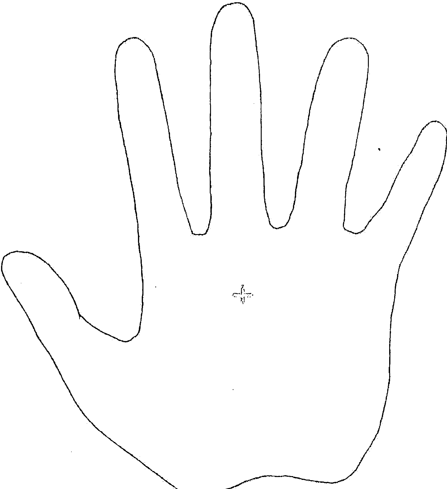
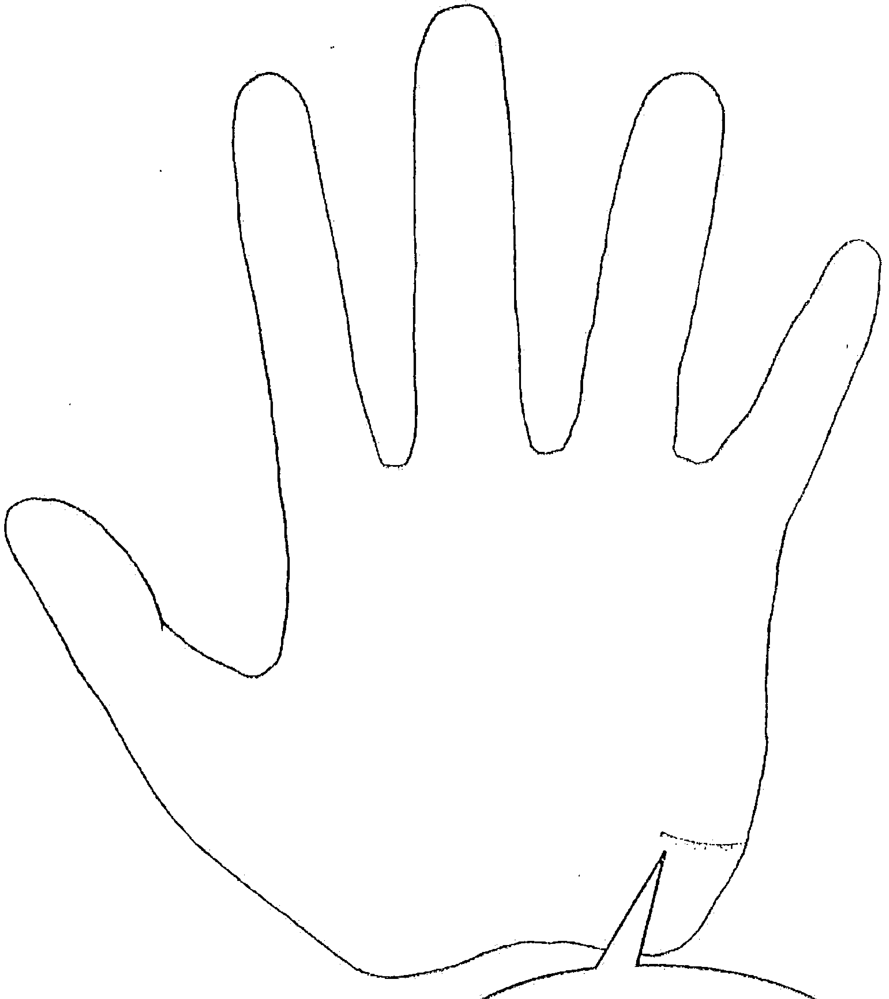
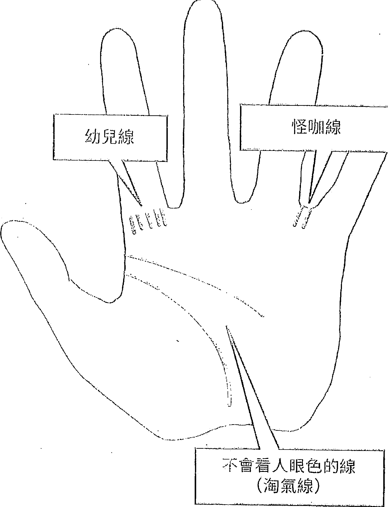
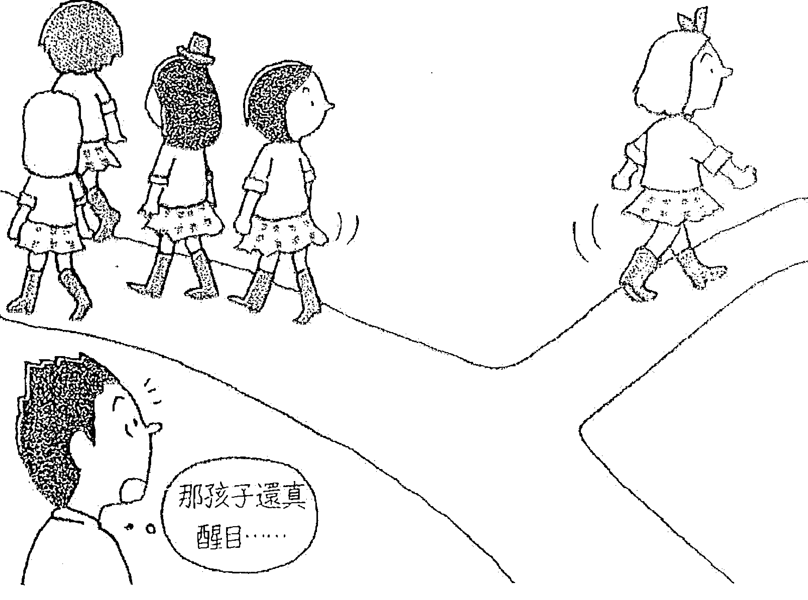
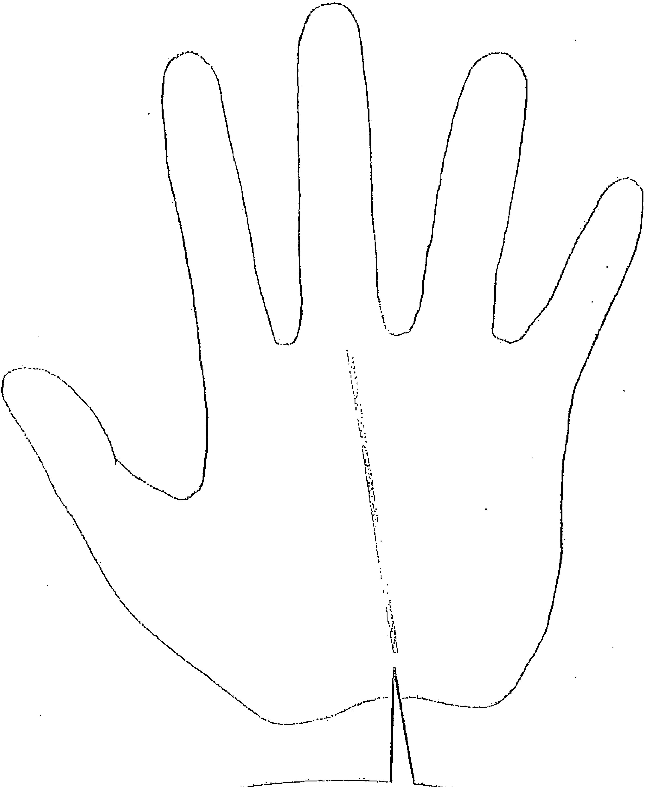
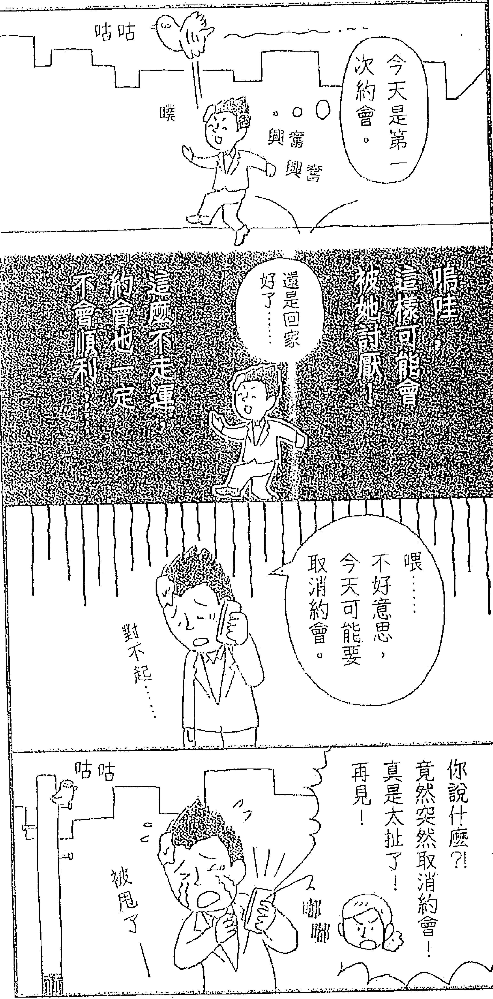
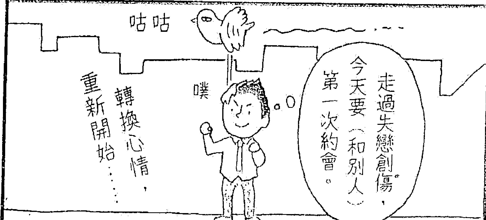

# 超強運：這樣做，好運一直來一直來！
### 連水逆、犯太歲都不怕的超強開運術！

「運氣好的人」都有共同的行動及思考模式。只要掌握「運的特性」，就能擁有強運體質！

### 開啟源源不絕好運能量 × 增添信心 × 吸引貴人提攜 × 正財偏財滾滾來

日本最強命理系藝人（精通手相、風水、開運景點）
## 島田秀平

---

**運が良い人、悪い人。実は本来、一目瞭然！**
**金運、仕事運、対人運をアップさせる「超最強開運術」**

[著] 手相芸人 (ホリプロ所属・原宿の母の弟子)
## 島田秀平

---

你無法用眼睛看見它，卻能確實地感覺到它的起伏。

有的人運氣相當好，卻也有人不那麼走運……
該怎麼做，才能像那個人一樣，變得跟幸運之神那麼親近呢？

至今為止，見過萬人以上的我可以明確地告訴你一件事：
「運氣好的人」都有共同的習慣、行動，以及思考模式。

綜藝界的某大哥大、中上億彩券的幸運兒、知名大企業的總經理……
這些人都深諳「強運的祕訣」。

你之所以不像他們那麼順風順水，單純只是因為你還未掌握箇中的訣竅。
那麼，接下來就讓我們一起看看那些超級幸運兒都在實踐的「強運法則」吧！

---

## 第 1 章 水逆、犯太歲都不用怕！為你招來好運的「強運心態」

> 被幸運之神眷顧的人知道：運勢有起有落，能以正面心態面對挑戰，才是打造好運循環的關鍵！
> 
> 為何好事都只集中在那個人身上？有沒有辦法只留下好運，隔絕厄運呢？

### 1 運氣好的人都有的「某個共同點」

隨著我以「手相藝人島田秀平」的定位在演藝圈逐漸站穩腳步，我也多了許多機會幫更多人看手相。

我覺得手相裡濃縮了那個人的「故事」。像是：思考型手相、直覺型手相、愛撒嬌的手相、宅男宅女型的手相……真的有各式各樣的手相。

人類是複雜的生物，光靠手相當然無法道盡這個人的一切。但每次幫人看手相的時候，還是會讓我感慨「原來如此！」或驚訝「沒想到他也有這樣的一面！」手相真的是一門非常有趣的學問。打從進入這個領域，我無時無刻都有新發現，從來沒有覺得厭膩的時候。

因為我常幫人看手相，所以經常有人問我：「運氣好的人，他們會不會有共同的手相？」

運氣好的人確實有共同之處。不過，那個共同之處並非顯現在手相上。

手相（特別是左手的手相）會不斷地改變，每個人都會有好的線跟不好的線。應該說，每一條線都有其正反兩面的意義，不能以偏概全地一口斷定這條線是好是壞。因為，那就是那個人的個性。

我能做的，就是從那些線當中找出好的那一面告訴對方，但「運氣好的人一定都會有的線」其實不存在。

不過，好運的人的確有一個共同點，那就是當我告訴他「你有一條〇〇線，這條線有這樣的優點哦」時，對方表現出來的反應。

運氣好的人，當有人告訴他「你的手相很棒！」時，都會坦率地表現出開心的表情。「哦！真的嗎？太棒了！我好開心哦！」那種坦率的態度，讓我覺得對方果然對自己充滿自信。

有的人甚至會告訴我：「壞的事情就不用說了，你只挑好的部分告訴我就行了。」

相較之下，運氣不好的人則會這麼說：「你一定只挑好話講，我可不是那麼好騙的。」「只告訴我不好的事情就好，因為我想提早預防萬一。」

越是在意「壞事」的人，不知為什麼，幸運就越難降臨在他身上，本人也覺得自己老是不走運。

總而言之，「只相信好事，並打從心底感到開心」就是運氣好的人都有的共同點。不僅是手相，運氣好的人非常懂得如何善用占卜，讓自己時時保持正面心態。就算占卜師告訴他不好的結果，他也不會太在意。面臨重大決策時，也不會只憑占卜決定，當占卜師建議「你最好這樣做」，他也只會去做自己想做的事，絕不會因此被對方牽著鼻子走。

這些幸運兒只相信好的事情，抱著愉快的心情過日子。運氣越好的人，越是懂得跟占卜保持剛剛好的距離。

到底是因為手相好，所以運氣才好？還是因為他們抱持著樂觀的正面心態，所以才出現了好的手相呢？我認為，應該是因為他們抱持著能招來好運的想法，所以出現了好的手相，他們打從心底為此感到開心，結果又招來了更多的好運。懂得打造良好的正面循環，就是那些運氣好的人的強運訣竅。

**「只相信好事，並打從心底感到開心」是運氣好的人都有的共同心態。**

### 2 運氣好的人「行動力」都很強！

運氣好的人有一個共同點就是，一旦覺得「這點子不錯！」就會馬上採取行動。

除了工作以外，我對各地的開運景點和風水也有研究，只要覺得「這個不錯哦！」或「似乎很有用」，就會跟一起上節目的朋友分享。「我跟你說，那裡是開運的景點！」、「就風水學來說，這麼做比較好。」

我這樣說之後，大部分的人都會說：「哦！竟然有這樣的好地方，我想去看看。」「哦！真的嗎？我也想試試看！」

之後他們會分成兩種人：一種人會馬上去做，另一種人則是遲遲都沒有行動。在我的印象中，覺得「這個不錯」就馬上實行的人，往往能夠得到周圍的喜愛，並獲得巨大的成功，是他人眼中順風順水的幸運兒。

其中，最讓我印象深刻的就是觀眾緣極佳的女星 S 小姐，她周身散發出一種柔和的氛圍，你幾乎每天都可以在電視上看到她。

**只要「通」你的「命」，就能得到幸運**

關於 S 小姐，有一件事令我相當印象深刻。位於東京明治神宮內苑裡的「清正井」，現今是非常知名的開運景點。當初這個景點還沒這麼出名的時候，我有一次跟 S 小姐一起上節目，告訴她：「『清正井』是個很不錯的開運景點！」我還說：「而且，趁清早的時候去參拜，效果更好。」

S 小姐開心地說：「我最喜歡開運景點了！好想去哦！我一定要去！」我不記得說完這些話的隔天還是後天，在電視上看到 S 小姐在某個現場直播的綜藝節目。

「啊！是 S 小姐耶！」心裡才這麼想，就聽到她在節目上說：「其實，今天早上來上節目之前，我跟母親起了個大早，去參拜了『清正井』這個開運景點哦……」

沒想到她動作竟然這麼快！像 S 小姐這樣高人氣的藝人，當時各家電視台的綜藝節目都爭先恐後搶著請她上節目，如此忙碌的她根本沒時間好好休息，早上應該很想多睡個五到十分鐘才是，沒想到她卻特意起了個大早，到我建議的開運景點參拜……這樣的 S 小姐讓我再次深深體會到，工作能力強的人，行動力果然非比尋常。

有些人我告訴他有個靈驗的開運景點，隔段時間再問：「話說，那個地方你去了沒？」他會回答：「還沒耶，這陣子我忙得要命，根本沒有時間去。我真的很想去啊。」但我想應該很少有人像 S 小姐那麼忙吧？

重點不是「有時間才去做」，而是「就算再忙也要騰出時間去做」。去開運景點參拜只是一個例子，不管任何事，「馬上去做」「覺得好就馬上實行」，只要擁有這樣的行動力，就能吸引好運到來。

所謂的命運，就是搬「運」你的生「命」。「運」這種東西，待在原地守株待兔是無法得到的。命運就是運命，腳步輕盈立即行動，將自己的生「命」搬「運」到各個地方，才能連結各種有形無形的良緣，受到幸運女神的眷顧。

**「馬上去做」「覺得好就馬上實行」，行動力才能吸引好運到來。**

### 3 運氣好的人不會糾結於失敗！

運氣好的人還有一個共同點：就算發生了不好的事情，遭遇了失敗，也不會糾結過久。他們的行動敏捷，所以能夠爽快地轉換心情，面對下一個挑戰。我認為，這是因為他們「相信自己的運氣」，並時時抱持著「謙卑」的思考。

之所以會糾結於失敗，其中一個原因是源自「我的努力還不夠」「自己的能力還不夠」的自責之念。這樣的想法，乍看之下非常謙虛，背後其實隱藏著「我要靠自己一個人的力量做到」的驕傲。因為只相信自己的能力，所以失敗時才會如此苛責自己。

反之，相信命運的人，無論何時何地，都認為「我能有這一切都是多虧了命運」。他們一方面盡一己之力做到最好，一方面抱持著謙卑的心態，認為自己能有今日都是多虧了奇妙的緣分，或是他人的幫助。

所以，當他們失敗的時候，也會告訴自己「這次恰巧運氣不好」「這回沒那麼走運」，迅速地切換思考，不再糾結。他們對於別人的失敗也是抱持同樣的態度。對於盡力、試卻失敗的人，他們不會單方面地責備對方「都是因為你的努力不夠」，而是以寬大的胸懷安慰對方：「你已經盡力了，可惜這回不走運。」

像這樣的人，人心會向他靠攏，會有越來越多人願意幫他一把。結果就是，他們能夠受到上天的眷顧，並獲得成功。如此一來，他會更加感謝命運對自己的眷顧，更心懷謙卑……像這樣的人，因為相信命運，尋求歸結於這個點，更能馬上面對及保持心情正向的心態，也容易獲得更大的成功。

當然，失敗的時候自我反省，從受挫的經驗中學習，能夠促進個人的成長，因此，有時的確需要督促對方自我反省。

**不糾結於失敗，轉念切換心情，能為你招來更大的幸運。**

但是，這世上有很多事情並非僅靠一人之力就能左右結果。一味地責備自己和他人，並無法讓你前進。相信「運」的存在，在事情進展不順利的時候，告訴自己「這波運氣不好」，果斷地轉換想法，重振精神展開新的行動，將為你招來新的好運。越是能夠盡快轉念的人，越是能夠受到幸運之神的眷顧。

### 4 中彩券大獎的人都有的「四個習慣」

我因為工作的關係，所以有許多機會與中彩券大獎的得主交流。這些中大獎的人，無論是居住的地方、年齡、職業都不一樣，彼此也不認識，讓我覺得奇妙的是，這些中樂透大獎的人都有四個共同的習慣。

這四個習慣分別是：

- ① 買彩券的前一天戒酒吃肉。
- ② 在上午買彩券。
- ③ 用吉利錢買彩券。
- ④ 去買彩券前上廁所，並清洗乾淨、剪完髮、剪指甲，讓額頭亮一圈，將四周環境清掃乾淨。

也許有人覺得這只是祈求好運的儀式，但每個大獎得主如果都有這樣的共同習慣，我想應該有它的涵義在內。以下我將針對這四個習慣，為大家說明。

首先，「買彩券前一天戒酒吃肉」這一點，是怎麼回事呢？

喝酒雖然能讓人覺得愉快，卻會使人的身心變遲鈍。肉類則是能夠提高能量的元氣食材，可以喚起人們野性的本能。在買彩券前一天戒酒吃肉，就是為了隔天買彩券做準備，藉此好好磨練人類與生俱來的動物本能。

第一點，「在上午買彩券」是因為早晨是一天的開始，空氣特別清新，此時買彩券的話，直覺會比較敏銳。從早上起床到晚上休息這段時間，隨著活動的時間變長，人的身心也會跟著疲憊。當你忙著處理各種大小雜事及人際交涉時，除了身體的疲勞外，還會產生負面情感及欲望等「穢氣」。

彩券的號碼是隨機選碼，因此直覺無法派上用場。但是，比起穢氣聚集的夜晚，在身心及腦袋都清爽的早上買彩券，比較能招良好運。

#### 保持期待的愉快心情，讓自己樂在其中

第三點，「用吉利的錢買彩券」的習慣，正好符合「好運會招來好運」的強運法則。前次買彩券中的錢、比賽時獲得的獎金、上司或長輩給的零用錢、別人送的紅包，都很適合用來買彩券。

最後一點，「去買彩券的路上順手撿起路邊垃圾，買完後，繞彩券店附近一圈，將四周垃圾撿乾淨」，其實跟強運法則有很大的關聯。之後我還會再向大家說明，強運的人都懂得在平時累積「陰德」。像是撿垃圾這種別人都不太想做的事情，只要你自動自發去做，就能累積「陰德」，為你招來好運。

中彩券大獎的人，在買彩券的路上藉由撿垃圾讓自己的心變得更澄淨，換個角度講，其實就是藉由累積「陰德」，為自己招來好運。

你覺得怎樣呢？若問我實踐這四個習慣是否就能百分之百中大獎，我雖然無法保證，但這的確是中大獎的幸運兒都有的共同點。只要想到實踐這些至少能提高一％或二％的得獎率，心情也會跟著愉快起來吧。

不要給自己太多壓力，覺得「這麼做一定會中獎」，也別擔心「萬一還是沒中獎該怎麼辦？」先用愉快輕鬆的心情實踐看看吧。另外，一直懷抱著興奮期待的心情，等待開獎的那一天到來，其實也是能夠吸引好運的正面心態。

順帶一提，經常中彩券的人不會一次買許多張彩券，他們的特徵就是採取連號十張、不連號十張，一次買二十張的買法。

比起穢氣聚集的夜晚，在身心及腦袋都清爽的早上買彩券，更能招來好運。

### 5 「幸運」是由「陰德」和「行動力」組成的

「幸運」這種東西，表面上看似偶然發生，其實它的發生都是必然的。老是很走運的人，總能在最好時機抓住好運做得順風順水的人，不管他們自身是否意識到，其實他們都是以能招來好運的生活方式過日子。那麼，導致他們的好運發生的必然因素是什麼呢？我認為就是「陰德」和「行動力」。

前面我也提過，運氣好的人往往想到什麼好點子就會馬上付諸實行。「運」也有「搬運」的意思，也就是說，搬運你的身體，讓自己動起來採取行動，就能給你帶來好運。

好運這種東西，守株待兔是無法等到的。所以我經常說：「運氣好的時候，更要多出外，多跟別人見面。」舉例來說，有人抱怨「占卜師告訴我現在正是戀愛運絕佳的時期，所以我一直等待著真命天子（女）出現，結果根本就不準！」。像這樣只會等待好運發生的被動心態，根本是本末倒置。

幸運必須主動掌握才行！即便現在正是走運的時期，如果只是站在原地等著幸運降臨，反而會讓你錯失本來能夠抓住的好運，害你自己浪費了大好的桃花運。

好運的另一個要素「陰德」，簡單來說，只要你主動去做那些「人們不想做、但對他人有益處」的事，就能夠累積。陰德可分為：像掃廁所或撿垃圾這種自動自發去做的陰德，也有另一種自然出現在你面前的機會，例如：

- 「不知為什麼，輪到我上廁所時，衛生紙總是剛好就用完，所以經常幫忙換衛生紙。」
- 「在捷運上有位子坐時，眼前剛好總是站著老人家或孕婦，經常要讓位給別人。」
- 「為何經常有人向我問路？」

像這種因為不可抗力而做的好事，也是「陰德」。我們很容易用「這麼做是否會吃虧」的角度來思考。其實「德」跟「得」就像是一枚硬幣的正反兩面，為他人付出所累積的「德」，有一天將為你帶來「得」，就像日本諺語「好事並非為了他人而做」所說的那樣，你為他人做的好事，福報之後都會回到你自己身上。

很多成功人士都把「我只是比別人運氣好一點」這句謙虛話掛在邊。也許你也認為他們之所以成功，只是因為運氣比別人好。其實，那是因為他們一直以來「主動累積陰德，並努力付諸行動」。

「我能走到這一步，並非只靠自己一個人的力量，而是平時累積的陰德和行動力，才為自己招來了好運。」相信運的存在，並時時不忘對周圍的感謝，才會讓他們產生「這都是多虧了大家幫忙」的謙虛心態。正因為他們一直這麼努力，才能吸引周遭的協助，成就了大大的成功。像這樣子，懂得保持謙虛與自信的絕佳平衡，才是真正幸運的人。

好運這種東西，守株待兔無法等到。運氣好的時候，更要多多外出。

### 6 「做事起勁」與「自信」將為你帶來幸運！

接著，若工作進來，連續取得成功的人還有一個特點，就是做事特別起勁。運氣好壞其實跟「做事起勁與否」有很大的關聯。做事起勁的人，一旦發現什麼有趣的事情，馬上就會採取行動。前面提到的幸運兒的共同點之一「行動敏捷」，指的就是「做事很起勁」。

那麼，所謂的「自信」又是什麼呢，我認為就是「了解自己」。經常有人會說「我沒有自信」，這種人換句話來說，就是「不了解自己」。更進一步說，這種人不知道自己擅長什麼不擅長什麼、喜歡什麼討厭什麼、想做什麼不想做什麼……就是因為不了解「真正的自己」，所以才無法喜歡自己，對自己缺乏自信。

相反的，如果明白自己好的一面和不好的一面，就能懷抱著確信下決定，「那麼，就決定做這件事吧！」「就選擇這麼做吧！」這樣的心態有助你建立起自信。

因此，「缺乏自信」的人，與其埋頭磨練自己的能力，不如先列出十個關於自己的形容詞，也許更能幫助你建立自信。

順帶一提，自信中還有一種「缺乏根據的自信」。

- 「雖然不知道為什麼，但我總覺得自己很走運。」
- 「我不是很清楚為什麼，但就是覺得事情會很順利。」

這也是會為你招來好運的一種自信。乍看之下，這句話跟剛才提到的「有自信的人，就是清楚了解自己的人」似有矛盾，其實兩者的根本是一樣的，因為，不「了解自己」、不喜歡自己的人，無法擁有如此強烈的自信。這樣的自信乍看之下「毫無根據」，其實是源自「我了解自己」，而且我喜歡這樣的自己的心態。

因此，我認為「運氣好的人的條件」有兩個。一個是「做事很起勁」，另一個是「充滿自信」。如此簡單的結論，應該有人會感到懷疑吧。

其實，目前為止我直覺提示的「行動力」和「積陰德」，其實都是源自於「做事起勁」和「自信」。做事起勁的人會馬上行動，擁有自信就能從容地累積「陰德」。抱持著自信去挑戰眼前的課題，自然就能夠招來好運。

「缺乏自信」的人，與其埋頭磨練能力，不如先從了解自己開始。

### 7 少抱怨多做事，好運就不會遠離

相反的，運氣不好的人有怎樣的共同點呢？人生中有幸也有不幸，運氣再好的人，也會有運氣不好的時候。其實，我們不能一概認定「運氣好就是好事」「運氣差就是壞事」。當你抱怨「討厭！真是不走運！」的時候，其實正是在幫自己累積「陰德」，很有可能為你帶來好運。不過，若因為日常生活中的某些壞習慣，導致運氣下滑的話，那就太可惜了。

導致運氣下滑的壞習慣，首推「抱怨」和「說別人的壞話」。看什麼事情都覺得不順眼，一天到晚都在抱怨的人，周圍的人會逐漸遠離你，好運也是。幸運不會降臨在喜歡抱怨的人身上。

當我跟經紀人分享這件事之後，他告訴我一個有趣的例子。經紀人的重要工作是幫自己負責的藝人排工作行程。他必須安排包含我在內的數名藝人的行程，在這個過程中，他發現一件很有趣的事：有的藝人即使再忙，新的工作機會往往會在他們剛好有空的時間安排進來；有的藝人明明一點也不忙，工作邀約卻經常卡在同一個時間帶。

接下來才是最有趣的地方。明明行程並不滿，但工作邀約總是重疊在同一個時間，不得已必須拒絕其中一方邀約的，大多是「愛抱怨的人」「愛說別人壞話的人」。

相反的，雖然很忙，新的工作邀約總會在剛好有空的時間進來的人，基本上都是不會抱怨或說別人壞話，對工作樂在其中的人。這樣的人不但容易安排工作行程，當他「今天想好好休息一下」時，恰好就不會有新的邀約進來，真的非常神奇。據他說，這樣不可思議的現象，在經紀人之間其實是件很平常的事。

越是愛抱怨、喜歡說別人壞話的人，事情越是進行得不順利。這樣的人若因此而抱怨，運勢就越容易下滑。反之，不抱怨、態度正面積極的人，事情總是進行得相當順利。這樣的人會心懷感謝，打造正面積極的循環，並因此獲得更大的幸運和良緣。

不僅是演藝界，我相信這一點在任何業種都是同樣的道理。人們喜歡「開朗的人」「快活的人」，運氣也是一樣。因此，經常保持正面積極的心態，幸運就容易降臨在你的身上。

運氣喜歡開朗快活的人，不抱怨、不說別人壞話，就能招來好運。

### 8 「谷底」之後運氣就會開始回升

人的運勢有起起伏伏的波動。正如「天禍之與福兮，何異糾纏」1這句話，災難和幸福，任一方不會永遠持續，而是交互到來。當你覺得自己身處「谷底」，其實接下來正要開始走向「頂峰」。

其證據就是，占卜師經常會對運氣好的人說「好運不會一直持續哦」，而對運氣差的人則會說「接下來運氣就要開始好轉了」。因為運勢的起伏正是自然的原理，這麼說的話，占卜的準確率就是百分之百。

光是這麼想，你會不會覺得心情輕鬆一點呢？其實，運勢的上升期和低迷期，都有它的意義。正如早上有早上要做的事，夜晚有夜晚該做的事，這兩個時間點各有適合的生活方式。同樣的，運勢的上升期和低迷期，也有各自的意義，以及適合的生活方式。並非只有運勢上升才是好事，運勢下滑的時期就長遠的眼光來看，其實也是非常重要的時期。

占卜時如果被告知「你的運勢正在下滑」，應該會感到不知所措吧。此時的你能做的事情應該只有「多加小心，不讓壞事發生」。但是，只要想到運勢下滑期也有其意義，即使身處低潮期，應該也能保持正面積極的心態。正如我前面所說的，「正面積極的心態能夠招來幸運」，身處低潮期，即使連續發生看似不幸的事情，也別意志消沉，以正面的心態過日子非常重要。如此一來，當運勢開始好轉的時候，就能為你招來更大的幸運。

那麼，運勢的上升期與低迷期的意義，指的又是什麼？在不同的時期，我們應該怎麼過才好呢？

> 1. 意指「禍福彼此相靠，有自因禍生福，福中藏禍」。

簡單來說，我認為運勢的上升期是「分享期」，低迷期是「學習期」。前面也提過，運氣上升的時候最好積極行動。運勢上升的時候，請多多外出與人交際，跟別人分享你的知識與專長，將為你的人生帶來巔峰。

不過，一直向外分享的話，內在會在不知不覺間磨損。這段時期雖然很快樂，卻會讓你失去成長的時間，感覺就像是一直在花用儲蓄那般。像我這樣的搞笑藝人，沉潛二十年後好不容易開始走紅，之前累積的搞笑哏一直拿出應用的時候，雖然覺得開心，但心裡也會隱隱覺得不安。其實，我也曾聽過不少同業煩惱：「我也想思考新的哏，但就是沒時間啊。」

人們需要與自己獨處的時間，好好磨練自我。運勢的低迷期，正是學習的大好時期。任何人都無法避免運勢的低迷期，因為低迷期有其意義在內。這是藉由學習讓將來的自己更成長的時期，不應該用負面的眼光看待它。

此時最重要的是，不要將已經下滑的運勢拉得更低，而是以正面的心態面對它。「最近，似乎不太走運」「事情好像不太順利」的時期，千萬不要意志消沉，也別焦急，好好地面對自己。告訴自己「現在正是學習的時期」「不久後就會開始走運，現在是準備的期間」，不斷地累積訓練，吸取克服自身弱點的新知識……

覺得自己不走運的時候，更要以正面積極的心態度過這段時期。身處低潮，別意志消沈，用正面的心態過日子，是運勢好轉的關鍵。

### 9 幸與不幸都有意義，掌握「運勢週期」的數祕術

既然運勢有起有落，你應該會想知道自己的運勢何時上升，何時下滑吧？在此向你介紹「數祕術」。所謂的數祕術，簡單來說，就是用你的出生月日算出的數字，來占卜你的性格與命運。聽起來似乎有點神祕，其實跟手相一樣，是立基於龐大數據的一門占卜術，具有統計學的意義。

在此介紹的是，用簡單的計算方式，算出「我今年的課題」的方法。這麼一來，你就可以知道自己運勢的上升期和低迷期。

首先，將今年的西元年，以及自己出生的月份和日期列成一排，由左向右相加。然後將算出來的數字，十位數與個位數相加，就能得出 1 到 9 的個位數字（如果是十位數的話，請再相加，直至出現個位數字）。

比方說，要占卜 2017 年的運勢，我的生日是 12 月 5 日，就是「2+0+1+7+1+2+5=18」，然後是「1+8=9」。最後出現的個位數，就是我今年的課題。1 到 9 的數字代表的意義分別如下：

1. **1**……開始、播種的一年。請挑戰新事物！
2. **2**……與人邂逅、打造人脈的一年。請享受與人的交流。
3. **3**……開花結果，愉快的一年。別糾結於小事，盡情謳歌人生的美好吧。
4. **4**……鞏固地盤，打造基礎的一年。重新檢視你的優勢。
5. **5**……轉機、新機會到來的一年。勇敢投入新世界吧！
6. **6**……自我犧牲、為他人奉獻的一年。事事以別人為優先。
7. **7**……自我投資、學習的一年。克服你的弱點，將時間放在學習新事物與考取證照。
8. **8**……保持自然就能夠收穫成功的一年。順勢行動吧！
9. **9**……揮別過去、集大成、重大事項告一段落的一年。好好為下一個階段的人生準備吧！

像這樣列出來之後，你可以看到運勢自然的起伏流動。1 那一年播種，2 那一年與人邂逅成長，3 那一年開花結果。3 這一年換句話說，就是運勢的上升期，也就是「分享」的時期。接下來，4 這一年就是重新檢視基礎、鞏固地盤的「學習期」，然後在 5 這一年挑戰新事物。

然後，6 這一年就算有點吃虧也要為了他人而工作，這一年就是施恩給他人，讓人覺得「多虧那個人幫了我」，也就是「儲存人緣」的一年。7 這一年重新將重心放在自己身上，投資自我，考取證照或學習新事物，這些努力在 8 這一年會得到回報獲得成功，最後的 9 就是集大成的一年。然後，重新回到播種的 1 那一年……

順帶一提，9 那一年也有「告別過去」的涵義在內，這一年，你要從目前為止的累積中，找出真正想做的事、真正需要的人，是面臨取捨、適合「斷捨離」的一年。因為，肩負過多事物會讓你的身心過於沉重，無法在 1 有全新的開始。

#### 幫助你了解今年課題的『運勢圖』

自 1 那一年開始逐漸上升，到 3 那一年達到巔峰，4 那一年下降，然後在 5 那一年再次上升。然後在 6 和 7 那兩年緩緩下降，在 8 那一年逐漸回升，9 那一年穩定下來，之後重新回到起點 1，就是這樣的感覺。

人生的運勢週期大致上就是這個樣子。只要知道你「今年的課題」，就能成為「今年應該怎麼過」的參考。舉例來說：計算的結果如果是「2」，因為今年是邂逅的「年」，請多多外出與人見面吧；如果是「3」，因為是開花結果的一年，所以好好抓住機會吧；如果是「4」的話，就告訴自己「稍微冷靜一下，重新檢視自己」……

以我的例子來說，2017年是「9」，是以往為止努力的集大成之年。為了下一階段的人生做準備，我是不是該來研究一下「貓咪肉球占卜」呢……（笑）

數祕術最大的優點就是，並非以「好壞」來衡量運勢的上升期和低迷期，而是用「這一年的課題、應該抱持的心態」的角度來看待。如果只從「今年是運勢的低迷期」這個角度來看，一點也不有趣，一旦發生什麼不順利的事情，就會馬上陷入沮喪。明明沒有什麼不幸發生，卻先入為主地覺得「今年運氣果然很差」，情緒變得更加低落。

但是，數祕術要告訴我們的就是：下降的運勢，之後一定會谷底回升。只要想到其中包含了「今年的課題」，你就能做好心理準備去面對。告訴自己「這是今年的課題，任何事情都有它的意義」，抱著豁達的心態過日子。

就像我再三強調的，幸運最喜歡的是「正面積極的心態」。即使身處低迷期，也要找出你的「課題」，豁達且積極地過日子，這麼一來，將為你招來更大的幸運。

不以「好壞」衡量運勢的上升期和低迷期，把它當成你要面對的人生課題！

#### 正向積極過日子，就能為你招來好運

- 正面思考，只相信好事，並打從心底感到開心。
- 行動力強，一有好點子馬上付諸實行。
- 不糾結於失敗！對他人的失敗寬容以待。
- 服務精神旺盛，自動自發去做別人不太想做的事情。
- 知道自己擅長什麼不擅長什麼、喜歡什麼討厭什麼、想做什麼不想做什麼。
- 不抱怨、不說別人壞話。
- 面對人生低潮，當成學習的大好機會，豁達地過日子。

## 第2章 鍛鍊運力，變身「強運體質」

### 改變你人生的最強開運術！

> 幸運可以經由後天訓練獲得！
> 只要積極培養正面心態與開運習慣，
> 就能打造強運體質。
>
> 幸運是否是與生俱來的天賦，
> 像我這樣平庸的人，
> 還有辦法改變人生嗎？

### 1 「運力」跟智力、體力一樣，可以鍛鍊

人無法違抗命運。好事、壞事發生與否，全都由命運決定。也許各位會有這樣的想法，其實並非如此。

運勢的好壞取決於你自己。你可以刻意鍛鍊自己的運力，以人為的方式讓它提升。正如智力可以藉由讀書和累積經驗鍛鍊，體力可以藉由肌肉訓練和慢跑提升，運力也可以藉由自行鍛鍊提高。

正如我跟大家提過的，運氣有每年、或是每隔數年的週期起伏，這樣的週期恐怕是我們無法違抗的。雖說如此，身處無法改變的命運週期，能否掌握更大、更多的幸運，或是讓不幸減到最低，取決於你「每天的生活方式」及「對事情的看法」。

我曾說過，並非所有不幸都是壞事。

### 運勢可以藉由刻意鍛鍊提高

正因為經歷過黑夜，才會覺得朝日可貴，就是因為有不幸，你才能發現幸運的存在。這樣的思考模式，也是鍛鍊運力的方法之一。無論身處何種狀況或環境，都應該抱持正面積極的心態，不因不好的遭遇而沮喪。

雖說如此，「這一陣子還真是不走運」的狀況若一直持續，心情難免會受到影響。就算知道自己應該「正面積極」，還是很難阻止心情逐漸變得低落沮喪。

其實，幸與不幸的境界，只在一念之間。只要你改變看待事情的觀點，對人生整體的看法就會改變，一下子就可以提升。

## 運的好壞取決於你的生活方式。

你的心情與運氣。

這麼說可能有點誇張，運的好壞取決於你的生活方式，這是我與許多人交流之後，最真實的感想。

接下來的篇章，就與大家分享我的見聞，告訴你鍛鍊運力的秘訣。

### 2 不去計算沒有的東西，把眼光放在「現在擁有的東西」

大阪的堀越神社最知名的就是「一夢祈願」的御守。

正如其名，那是可以讓你實現一個夢想的御守，只要有了它，你就能在神社發行的短箋上，寫上這輩子一定要實現的一個夢想。

某次，我恰巧有機會在電視節目的錄影，跟好幾個藝人一起參加「一夢祈願」。能夠實現的夢想只有一個。如果是你的話，你曾選擇什麼願望？

節目錄影的時候，大家都很煩惱要如何抉擇。

> 「我想變成有錢人，但只有這個願望成真的話，一個人孤孤單單的也太寂寞了……」
> 
> 「我想買間大房子，但如果家人感情不好，大房子也沒意義……」
> 
> 「我想結婚，可就算結婚，沒錢還是沒辦法過日子……」

沒錯，就算告訴你「願望一定會實現」，倘若前提是「只有一個」，大家反而不知道該如何選擇。乍看之下，每個人似乎都知道自己的願望為何，其實根本不知道自己真正想要的是什麼。

那麼，大家最後許的願望是什麼呢……

「希望全家人健康。」
「希望可以跟重要的人們一起開開心心過日子。」

每個人許的願望都是非常基本的事。許完願之後，大家才發現一件事。
「咦？這些願望不是早就已經實現了嗎？」

我認為，「一夢祈願」的御守，表面上「只讓你實現一個願望」，其實是要告訴你「你最想要的東西，其實已經在你手上了。」

我們平時懷抱著各種願望。「想要這個」「想要那個」「想變成這樣」「想變成那樣」是讓我們更努力工作的動力，為生活帶來了滋潤與刺激。

但是，如果你認為「我沒有那個」「我沒有這個」「我無法變成那樣」「我不可能變成這樣」就是不幸，那可是天大的誤會。

我們已經擁有了最重要的東西。平常心中湧現的那些願望，不過是立基在那個最重要的東西之上的「人生選項」罷了。

願望能否實現，無關幸與不幸。因為，你已經擁有了最重要的幸福源頭。這是我在「一夢祈願」的錄影中得到的最大啟示。

別再去計算你沒有的東西，先看看你「現在手邊擁有的東西」吧。這樣一來，大部分的人都會發現「咦？其實我擁有的東西還真不少呢！」

那就是現在的你的「強處」和「武器」，是你「幸運的源頭」。因為有這些東西的支持，才有現在的你，以及今後的你。

這麼想的話，你應該會覺得眼前豁然開朗，心想「我的人生，其實也沒那麼差嘛。」像這樣子，將目光放在當下的自己，也是鍛鍊運力的方法之一。

#### 將目光放在當下的自己。

### 3 「現在的我所擁有的」就是「我真正需要的東西」

得不到想要的東西，任何人卻會覺得沮喪吧。

但是，如果那個東西「對自己來說並非必要」，那你覺得如何呢？「想要的欲望」「求而不得的懊悔心情」是不是一下子突然降低呢？

人雖然無法獲得「想要的東西」，卻能夠得到「必要的東西」。

這是我的恩人告訴我的話。有人可能會覺得這要看你如何解讀這句話，但我覺得這句話的確表達了某種程度的「真實」。

現在的自己，是過去蓄積的結果。那時候的某件事、那一次的邂逅、曾說過的那一句話……過去的一切，打造了現在的你。

換個角度說，過去那些經驗全都是打造現在的你所需要的東西。反之，之前求而不得的那些事物，全都是形成現在的你不需要的東西。

比方說，我之前曾與人組成搞笑組合。我一直想靠搞笑成名，卻總是不太順利，後來不得不已與搭檔解散。我覺得靠自己一個人的能力實在不行，甚至想過要放棄演藝圈的工作。

但是，如今的我卻以「手相藝人島田秀平」的身分，立足在演藝界。之前因為個人興趣而學習的手相，沒想到之後會在人前表演……

用搞笑征服世界，我之前的願望並沒有實現。但現在的我卻以手相、風水、都市傳說及怪談受到觀眾矚目。我想，這就是我的生存方式，也是別人真正需要我的地方。

有一段時間，我也曾煩惱過「自己到底在做什麼？」但之後我捨棄了「我原本想成為的那個自己」，轉念覺得「我要在需要自己的那個領域好好努力」。自此以後，我開拓了身為「手相藝人」這條路。

人的願望沒有窮進。

- 「我想讀那間學校，但因為考不上所以讀了其他學校。」
- 「我想在那家公司工作，但沒被錄取所以去了其他公司。」
- 「我想進那個部門，但人事把我分配到其他部門。」
- 「我想跟那個人交往，但被甩了，所以才跟現在這個人在一起。……」

諸如此類，我們總會遭遇到「理想與現實之間的差距」。

#### 心存感激接受「眼前的所擁有的事物與位置」

但是，如果一直聚焦在「我原本想做……」或「我原本想成為……」的理想上，就會被「可是我做不到」「可是我無法成為那樣的人」的負面情感束縛，遲遲無法前進。

不過，只要切換想法，覺得「現在的我所擁有的」就是「我真正需要的東西」，「現在我所處的位置」就是「真正需要我的地方」，看待事情的心態就會有一百八十度的大轉變。開始覺得「既然如此，就讓我在現在的位置上好好努力吧！」

前面我曾提過，運氣喜歡「正面積極的心態」。所以，你要做的不是持續追求「一直想要的幻想」，而是心懷感激地接受「現在眼前所擁有的事物與位置」。然後，盡可能地享受當下，專注在眼前的事。你的好運將因為這樣的正面心態而開啟。

**在真正需要你的領域好好努力。**

### 4 松下幸之助面試員工必問的問題：「你覺得自己運氣好嗎？」

松下電器（現Panasonic）創始者松下幸之助是個偉大的人物，他的著作《開拓人生大道》（道をひらく，PHP研究所）現今仍是許多人最愛的案頭書。

身為昭和時期的知名企業家，他的著作大多與工作心得有關。有一次，我聽到一則有趣的故事，那是關於松下先生對於「運氣」的看法。

聽說松下先生面試員工時一定會問一個問題：「你覺得自己運氣好嗎？」

為什麼會問這個問題，其實背後有很深的涵義。你覺得自己運氣好嗎？還有，要怎麼回答這個問題才會被錄用呢？正確答案是，回答「是」。

因為錄取運氣好的人，就能提升公司的運勢嗎？不對，松下先生的問題可沒有這麼膚淺。那是因為他想錄取正面思考的人嗎？也許可以這麼說，但真正的理由有更深的涵義。

覺得「自己運氣很好」的人，沒有「我能擁有這一切都是靠自己一人努力」的驕傲心態，心中經常抱持感謝之念，覺得「多虧天時地利人和的幫忙，才有現在的我」。這樣的人懂得「感謝」，松下先生才會給予他高度的評價。

覺得「自己運氣很好」時，就會對他人心懷感激，以謙虛的態度認真工作。一旦做出成果，他也會覺得是因為「得到周遭的幫忙」「自己運氣好」，以感謝之心想要回饋公司和社會。

松下先生是藉由「你覺得自己運氣好嗎」的問題，來衡量對方的價值觀。他想知道對方是否是心懷謙虛，認真面對所有事物的人；想知道對方是否過於相信自己的能力，因而心懷驕傲。

藉由這個問題，可以得知這個人是否具備了吸引好運不可或缺的「正面心態」和「謙虛」。

今後要一起長久合作的人，究竟是不忘「對他人的感謝之情」，以謙虛的心態努力工作的人，還是覺得「這一切都是靠我自己的努力」，一旦隊友失敗就會火上加油責備一番「是你的努力不夠」的人呢？

#### 吸引好運不可或缺的要素：「正面心態」和「謙虛」。

為了一起鍛鍊運力，攜手走向幸福的人生，一定要先分辨這一點。你不但要時常問自己這個問題提醒自我，如果遇到了將來可能成為工作或人生夥伴的人，不妨也問問對方這個問題。

### 5 向神明許願前，記得先好好「道謝」

有人拜託你幫忙，而你也幫了，對方卻連一句「謝謝」也不說，任何人都會覺得不開心吧。

反過來說，你請前輩給你工作上的建議或指點，或是央求同事幫忙，事成之後卻完全不理對方……這是很失禮的一件事吧。

像我們身為藝人，個人 Live 表演的票若賣不出去，應該會很傷腦筋吧！此時如果拜託前輩幫你捧場買個十張，Live 之後卻連通電話也沒打給對方致謝，這可是相當大的問題。

此時，一定要準備伴手禮，前去向對方報告並致謝：「多虧前輩的幫忙，Live 進行得很順利，真是太感謝您了。」這才是身為社會人士應有的禮儀。能夠注意到這一點的人，就容易得到周遭的協助。

有時雖然不是故意忘恩負義，但人們很容易在事過境遷後就遺忘他人曾給予你的協助，所以更該多加注意才是。

### 向神明道謝也很重要

同理，向神明「道謝」也是很重要的。比起向神明打招呼跟許願，向神明報告與道謝的「還願」更加重要。

你一年去神社或寺廟參拜幾次呢？

一年至少要去廟裡參拜一次。有的人會在大年初一去寺廟參拜祈福，有的人則不會。不過，我建議每年年初都應該去參拜住家或公司附近的廟宇。

此時，首先要做的是「跟神明道謝」。在你跟神明許今年的願望之前，請先回顧過去一年，告訴神明「謝謝您給了我平安無事的一年」。

### 拜託別人幫忙，之後一定要報告跟回禮。

御守最好在年初參拜時一併換新的。將用舊的御守還給神明，向祂報告去年的經過並道謝後，再購買新的御守邁向新的一年。光是這麼做，就能讓你的心情煥然一新。

雖說御守沒有保存期限，將今年的願望寄託在新的御守，等來年向神明報告時並一併道謝，將用舊的御守還給神明，這也算是敬畏神明的禮貌吧。

拜託別人幫忙，之後一定要報告跟回禮。無論是對人或對神明，如果你都能善盡禮儀，自然就能鍛鍊運力。

### 6 經常做到「別人對你的要求＋1」

有的人工作表現亮眼，他們總是能夠得到周遭的協助做出結果，他們如此幸運的祕訣是什麼呢？這當然是那個人自身能力做出的結果，但我認為其能力裡還包含了「運力」在內。

工作的運力都是在「工作的現場」鍛鍊的。比方說，覺察對方的心情和他的要求，早一步行動，就是其中之一。

某企業負責人事的主管告訴我，跟某個新進員工說『把筆遞給我』時，如果對方能夠同時準備紅筆與黑筆，甚至連 MEMO 用紙一起遞上來，這樣的新人當然會讓人覺得「這傢伙還真是機靈啊」，自然對他青眼有加。

這只是一個例子，無論任何事，只要你能做到「別人對你的要求＋1」，工作的運勢就會越來越好。我認為在演藝界裡，能做到「別人對你的要求＋1」非常重要。

搞笑藝人可以分成：靠著一個哏大受歡迎，之後卻不知所終的短暫爆紅，以及一直很受歡迎，在搞笑界屹立不倒的人。某次我跟伊藤麻子談到這件事，討論「為什麼會有這樣的差別？」時，最後得到了一個答案。關鍵就在於你是否能做到「別人對你的要求 + 1」。

綜藝節目就某個意思來說，就像拼圖一樣。發通告給知名的藝人，請他說出觀眾會喜歡的哏或妙句……這些內容其實腳本上早都已經寫好了。這就是別人對藝人的要求，也是我們最低限度的工作。但是，只會說「腳本上寫好的台詞」的人，演藝生命就越短暫。

雖說做腳本上沒寫到的事，經常會在後製時被剪掉，的確有可能是白費力氣。即便如此，只要你一直堅持做到「+ 1」，很有可能就此開創新的機會。

伊藤麻子就是賭上這個可能性的人。一說到伊藤麻子，最著名的就是「淺倉南的新體操哏」。節目的製作組當初要求的只有那個哏，但伊藤小姐對我說：「我絕對會多表演一個哏給他們看。」

即使全部被剪掉也沒關係，她一直以來都是如此。即使最後沒有播出，她還是會讓現場的人知道「這個人會做的不只這一個」。現在的伊藤麻子小姐已經不再是「那個淺倉南的新體操哏的人」，她參加了許多脫口秀節目，活躍於各大綜藝節目。這一切都是因為她一直以來堅持的「＋１」原則所帶來的結果。

在工作的現場，我也經常要求自己做到「＋１」。無論是演藝界或公司，最可怕的就是「被看破手腳」。換句話說，就是被別人認為「這個人只會這個哏」。當我因為「手相」受邀上節目時，我還會多表演另一項才藝，努力不讓人覺得我「只會手相」。

比方說，參加「從手相看戀愛運」主題的採訪，在採訪之後的閒聊，我會告訴工作人員：「今天因為採訪的主題是手相，所以我只說了手相的事。其實我知道可以提升戀愛運的開運景點。」

像這樣提醒自己，經常做到「別人對你的要求 + 1」。就算這麼做，有可能無法打動對方的心，甚至會讓對方覺得「話題扯遠了有點討厭」。不過，對方也有可能正在尋找新的企劃吧，說不定會主動迎上來說：「連這種事你也會嗎?!」

實際上，我因為手相受邀上節目時，在錄影空檔跟工作人員閒聊的開運景點、都市傳說、恐怖故事，後來都成了節目邀我上新通告的契機。

說到這個，能幹的店員除了顧客挑選試穿的衣服以外，不是經常會再多推薦一個商品嗎?應該有不少人因為覺得「這個也不錯」，所以一併買下來吧。如果你想模仿這樣的銷售技巧，比起卯起來向顧客推銷：「這個、那個，還有那麼那個，都很適合您哦!」我認為「顧客想要的東西 + 1」才是剛剛好的程度。例如：「不知道您是否會喜歡，要不要再試試看這個?」的態度，才是最恰當的。

聽完伊藤麻子小姐的經驗，「＋１」的累積實在不容小覷。是否能夠提高運勢，拓展你的機會，關鍵就在於你是否經常讓人看到你「＋１」的一面。

**覺察對方的心情和要求，早一步主動提供服務。**

---
*註2：伊藤麻子，日本女性諧星，因為模仿安達充的棒球漫畫《鄰家女孩》女主角淺倉南的哏而走紅，漫畫中淺倉南的設定是新體操選手。*

### 7 運勢強的人，比起過去，更在意的是將來

如果想開運，比起「目前為止做過的事」，建議你不妨多說說「接下來想做的事」。這句話是我認識的某電視台人事負責主管告訴我的，他說這是面試時被錄取的祕訣之一。

細想這句話，的確很有道理。環顧我的周遭，嘴裡說著「接下來想做的事情」的人，眼睛總是閃閃發亮，工作運也非常好。反之，嘴巴總是掛著「我以前……」的人，會讓人覺得他「似乎缺乏自信」。還有一些人，當他們看到別人活躍的表現，就忍不住想酸「你不知道那傢伙從前啊……」

不論是哪一種人，都是因為無法對現在自己做的事情抱持自信，才總是喜歡提當年勇。

比方說，在面試時炫耀「我高中三年級的時候，曾經進入全國高中機器人大賽的前四強呢！」——如果面試官對這個話題不感興趣，話題就會在此結束。但如果你換個說法：「如果有機會進入貴公司，我想開發可以協助照護的機器人。因為我高中一年級的時候……」先從將來的話題開始說起，對方自然也會對你過去的經驗產生興趣。

不管聽到再多關於過去的事情，我們最感興趣的始終都是眼前的「將來」。所以，人事負責人想知道的都是面試者將來的規劃。就算要提起過去的話題，也必須接在未來規劃之後。告訴對方：「接下來我想做這樣的事。」然後提出你的根據：「因為我過去曾經做過這些事，所以我想活用那樣的經驗。」這麼說的話，整體的話題就有了連貫性。

這樣說起來好像是在教社會新鮮人如何面試，但我認為無論出社會幾年，談論「接下來想要做的事」都是一件非常重要的事。跟同事或上司去喝酒，如果對方的話題都是「人家我以前也是……」「那時真是太美好了」或是「那個時候，你是那樣子……」老是提過去的事，會不會覺得很膩？這麼做除了消除壓力之外，根本沒有任何好處。

多談「接下來我想做這樣的事」「我現在做的事情，今後想讓它發展成這樣」這類將來的話題，就會萌生「做事的動力」，這樣的拚勁與行動力，也將直接關係到你之後的工作與成果。

把眼光放在將來，成為能夠帶領大家一起暢談未來的人吧。

**面試時，多提「將來想做的事」。**

### 8 最擅長說話的人，其實是最懂得傾聽的人

「想說有關自己話題的人」跟「想傾聽他人說話的人」相比，一定是前者占多數。你周遭是否也有這樣的人，老愛說跟自己有關的話題。也許你會覺得這樣的人很煩，換個想法，其實這正是鍛鍊你運力的大好機會。

想說有關自己話題的人既然佔大多數，那麼擅長傾聽的人一定會受到他們歡迎，被他們疼愛。

最近經常有節目找我去講都市傳說或恐怖故事。因此，經常有人問我：「請教我說話的技巧吧！」「請告訴我能讓對方喜歡我的說話方式。」「要怎麼說話，人家才會對我感興趣呢？」

任何人都想要被喜歡，因此會想學會說話的技巧。但是，真正讓人喜歡的人、想讓人再見到他的人，並非說話有趣或說話技巧高超的人，而是「樂意傾聽自己說話的人」、「願意專心傾聽自己說話的人」。

換個立場來看，當你覺得迷惘煩惱、心情鬱悶煩躁的時候，最想見到的是怎樣的人？有時當然希望有人能夠提供自己建議，但是，這時最想要的，應該是願意傾聽你說話的人吧。

說話的那一方如果是「投手」，傾聽的那一方就是「捕手」。棒球最受矚目的雖然還是投手，但只有投手的話，棒球這個遊戲是無法成立的。對話也是同樣的道理，如果你的周遭都是想成為投手的人，你不妨就成為捕手吧。

說到擅長傾聽的技巧，我認為「擅長回應」也是其中一項。回應有很多種做法，首先要注意的是，盡量別使用「但是」這個字。

也許有人會感到疑問，「但是」不也是一種回應嗎？因為「但是」是否決前一句話的接續詞，所以不算是回應。不過，很多人使用「但是」這句話的時候，其實只是中間換口氣的接續詞，沒有太大的含意。雖說如此，「但是」含有否決的意義在內，很可能讓原本在你面前暢所欲言的人，瞬間踩下心中的刹車。

在你說出「但是」的那個瞬間，就算沒有那個意思，話題也會就此打住，原本愉快的對話氣氛也會因此中斷。

「不過」也是同樣的道理，就跟「但是」一樣，許多人經常不自覺用來回應他人。「不過，你說得有道理。」「不過，是這樣沒錯啦。」……明明是在肯定對方，卻說出了「不過」，書寫文章時會發覺這樣用字不妥。但是對話的時候，不知不覺就會用上。

最好別使用「但是」「不過」這類會讓對方感覺到「隔閡」的用詞。多說「這樣啊（配上大大點頭的動作）」「原來是這麼一回事啊！」「真是厲害耶！」像這樣子，以肯定的用詞回應對方。光是這麼做，就可以成為「擅長傾聽」的人，一口氣縮短跟對方的距離。

#### 最受歡迎的人，是最懂得傾聽的人。

### 9 偶爾展現你有別工作時的「另一張臉」

最近的電視圈，除了搞笑哏和說話風趣，越能讓人家記住「說到○○就想到他」的人，工作運就越好。

在現今的電視圈，有的節目還會開「家電藝人」「鯉魚隊藝人」這類主題。對我們藝人來說，如何給觀眾留下「○○藝人」的印象，是勝敗的關鍵。當經紀公司要推出新人時，會努力讓觀眾記住他的特色。不論是讓他穿奇裝異服、讓他表現奇特的特技……在競爭者眾多的演藝界，每個人都想要打造自己的代名詞，讓觀眾記住你的臉和名字。

這一點在任何業界都是一樣的。

---
*註3：鯉魚隊全名為「廣島東洋鯉魚隊」，隊名「鯉魚」來自市內的國家古蹟廣島城之別名「鯉城」，並非直接採用鯉魚為吉祥物。*

不是「可以被取代的人才」，而是「獨一無二的人才」，若能讓人對你留下這樣的印象，就是你最大的強處。

因此，首先要磨練工作的能力，此外，除了能力之外，另外擁有「令人印象深刻」的特色或名言，也非常有幫助。

比方說，跟上司一起拜訪客戶的時候，能夠讓上司一邊苦笑說：「這傢伙真是個讓人拿他不知該怎麼辦的人，上次竟然做了這樣的事。」一邊向客戶介紹你這個人的特色。例如，你是阪神隊的超級粉絲，一有空就一定會去看球賽。或是，明明是男人，卻超愛吃甜點。去甜點吃到飽的店裡，簡直就是萬紅叢中的一點綠。最喜歡唱歌，招待客戶唱 KTV 時一定會大顯身手。

……諸如此類，無論什麼都好，重點是設定一個特色，讓對方記得「啊，你就是 ○○ 那個人」。這麼一來，客戶就能一次記得你。

#### 讓別人記住你的特色，就能打造更順暢的人際關係。

任何工作都必須與人相處，工作能力強當然是最重要的，但如果還能讓人記住你這個「人物」，就能打造更順暢的人際關係，工作也會更加順利。

阪神隊的粉絲也好，超愛吃甜點也行，任何小事都無妨。有時候，越是無聊的小事，越容易讓人記得你。設定某種特色讓對方看到你這個「人物」，並記住你，如此一來，你的工作就會更加順利。

### 10 迷惘的時候，想想「我這麼做是為了誰、為了什麼？」

> 「我到底是為了誰、為什麼做這份工作？」

無論任何工作，只要你擁有堅定的「信念」，在迷惘跟煩惱的時候，你的心最終都可以回到初衷。然後，你就能鼓勵自己「再好好努力工作吧！」

工作方面，決定你能否開運的關鍵，取決於你是否擁有堅定的信念。擁有信念的人，內心就會穩定平靜，走的路就不會偏移。堅定的信念容易招來好運，也會為你帶來好人緣。擁有信念的人，比較容易獲得周遭的協助，能夠打動別人出手協助你。

對我而言，我的「信念」就是「透過手相讓周遭的人開心」、「希望觀眾相信自己的可能性，變得更加正面積極」。

手相不是一門簡單的學問，但稍加學習之後，你會發現它能夠成為極佳的溝通工具。我會踏入這個圈子，一開始是得到師傅知名占卜師「原宿之母」的允許，將手相的線改成「白目線」、「色胚線」這樣有趣的說法開始的。

如今的我在節目上看了許多藝人的手相。其實，我是透過這些藝人，對著電視那一端的觀眾說話。看手相是件簡單的事情，不須任何道具，只要單純地看對方的手掌即可。所以，只要一聽到手相相關的知識，你當場就會看起自己或旁邊人的手相。

有一條線叫「怪咖線」。這是不懂看周遭眼色，經常說出讓人傻眼話語的怪咖經常會有的線。但是，擁有這條線的人往往是別人眼中的療癒系，深受周遭的喜愛。

如果看到我在電視上談論手相，家人和朋友之間互看起手相，「哇，竟然有『白目線』！」「我有『財運線』耶！太好了！」能因此歡歡笑笑、熱熱鬧鬧的，就是我最大的心願。

對於那些缺乏自信的人，看到自己的手相，如果知道「原來我擁有這樣的才能」，就能恢復自信。我就是抱持著這樣的信念，一路走過來的。

手相不是百分之百準確，老實說，確實也有一些可疑之處。我本來想從事的是搞笑，有時也會迷惘「我到底在做什麼？」但是，這時我會思考「為什麼是手相呢？對了！這都是為了讓人們開心。」回到一開始的初心，重新湧起勇氣與拚勁。

我無法像知名搞笑組合「DOWN TOWN」那樣，可以用搞笑逗人開心。但是，透過手相的話，我就可以做到。雖然我無法得到想要的「搞笑人生」，但我卻獲得了讓人開心並可以賴以維生的「手相人生」。

正如前面所說，人生無法得到想要的東西，卻能得到必要的東西。能否靠著必要的東西拓展命運的關鍵在於，你是否抱持著「自己是為了誰、為了什麼原因做這份工作」的堅定信念。

> 註 4：「Down Town」是日本知名的搞笑組合，由濱田雅功與松本人志組成。隸屬於吉本興業，除了綜藝節目之外，在戲劇、電影、音樂、出版也有多方面的發展。

擁有堅定的「信念」，迷惘的時候，心就可以回到初衷。

### 11 提升工作運的根本，是擁有「你想達成什麼目的」的信念

「好吧！我就以手相維生吧！就這麼決定了！」

原本想靠搞笑維生的我，之所以會轉念這麼想，都是多虧了「DOWN TOWN」的松本人志先生。我剛開始接到手相的工作時，那時心裡還在猶豫「這樣真的好嗎？我明明想做的是搞笑……」

那時我上某個綜藝節目的通告，其他藝人都在講有趣的話題，只有我只能說手相的事情。錄完節目之後，我的心情沮喪到了極點。「我到底在做什麼啊……」當我心裡這麼想，一邊前往廁所時，剛好遇到松本人志先生。「啊，松本先生，您辛苦了。」打過招呼之後，我忍不住向他吐露了自己無處發洩的心情。

松本先生這麼告訴我：「無論搞笑或手相，不都是讓人開心的事嗎？島田你走手相這條路，不是很好嗎？」這句話雖然簡單，卻深深打動了我。「原來如此，雖然做的事情不一樣，根源卻是相同的。」一想到此，原先的不快都煙消雲散了。

我的根本願望是「想讓人開心」，所以才會過度執著於「要用搞笑達成這個目標」。但是，真正重要的不是「方法」。不論方法如何，只要能守住你想重視的根本，達到想要的目的就好了。松本先生的那句話，讓我察覺到這件事。

無論搞笑或手相，都是為了讓電視另一端的觀眾開心。因此，我打從心底認為，走手相這條路也不錯。即便工作的型態不同，完成工作後達到目的若是一樣，工作就有了它的意義。比如說，想提供旅客一趟愉快的旅程，這樣的心願，無論飛機駕駛或是維修人員都是一樣的。

「我無法做想做的事。」
「不能進想進的部門。」

如果你心中有這樣的煩惱，不妨先思考「自己想要達到怎樣的目的？」

#### 確立對工作的根本信念，就能提升你的工作運。

也許你會發現，自己至今為止做的事情竟然有意外的結果。不執著於方法的話，你就會發現眼前有新的路，視野一寬開闊不少。只要你這樣想，工作運也會隨之提升。不是「如何做到」，而是「做到了什麼」，這樣的信念，才是提升工作運的關鍵。

### 12 失敗的時候，正是學習的大好時機

犯下重大失敗的時候，如果能夠懂得跟成功的人請益，就能提升你的工作運。經常聽到「接近做事順風順水的人，就能提升自己的運氣」。根據我的理解，是因為在這樣的人附近，你會被對方的「想法」同化，自己也會轉換成跟對方同樣的心態。

但是，為何要選在「失敗的時候」接近成功的人呢？因為失敗的時候，正是最容易吸收教誨的時機。「怎麼會失敗呢？」「為什麼事情會進行得不順利？」此時是你求知慾最強的時候。

所以，遭遇失敗時不要怪罪他人，也別一個人自怨自艾，應該把這個時候當成學習的大好機會，向成功的人請益。這麼一來，你就會被成功者感化，更進一步提高你的工作運。

接下來跟大家介紹我個人的實際體驗。

我曾參加人氣搞笑節目《松本人志的〇〇な話》（松本人志的〇〇故事）的錄影。節目中聚集了以「DOWN TOWN」松本人志先生為首的搞笑藝人，大家輪流表演「絕對讓人笑出來的故事」。這簡直是考驗搞笑藝人說話功力的節目，對我而言，是個壓力相當大的節目。

事情發生在我第一次上這個人氣節目的時候。在一群搞笑高手中，我完全插不上話，根本無法炒熱場面，表現得很差。錄影結束後，當我沮喪地準備回家時，「香蕉人」的設樂統先生叫住我：「我開車送你回家吧？」

於是我接受他的好意，在回程路上請教了他許多問題。「那個時候該怎麼做才好呢？」「這時該怎麼辦呢？」由於剛才失敗的記憶太過鮮明，我對他提了許多具體的問題。設樂先生仔細地回答我的每一個問題，讓我獲益良多。最後，設樂先生說了這麼一句話：「我終於能告訴你一直以來想對你說的事了。」

在那一瞬間，我馬上理解他這句話的意思。因為有機會跟設樂先生身處同一個現場，我才首次體會到了以往為止未曾感受到的緊張感，並親身經歷了需要超人般瞬間爆發力的現場表演。我終於有機會跟大前輩站在同一現場，看到他所看到的風景。

有些東西不站在同一個水平上，是無法看到、無法理解的。所以設樂先生才說「我終於能告訴你一直以來想對你說的事了。」那一天，我痛切地感受到「厲害的人，每天都在厲害的地方奮戰著」。如果不曾經歷過大失敗，就無法看見真正重要的事情。那一天，我因為自己的失敗被傷得體無完膚。但是，正因如此，我才有機會站在跟大前輩同一條地平線上，得以一瞥他眼中所看到的風景。

失敗會讓人成長，之前雖然常聽到這句話，此時我才實際體會到這句話的意思。

> 註 5：設樂統，日本男性搞笑藝人、主持人、演員。搞笑組合「香蕉人」成員，負責裝傻被吐槽，搭檔是日村勇紀。

#### 經歷重大失敗時，趁這個機會學習真正重要的事情。

像這樣回首過去，我切實感覺到自己的確從各方前輩那邊分到許多福氣。而今後某一天，我也要像這樣把福氣分給後輩，藉此回報前輩們之前對我的照顧……為了迎接那一天的到來，我每天兢兢業業地努力修練著。

### 第三節 「好運體質」打造法

#### 心態謙虛，專注當下，就能鍛鍊運力！

- 不去羨慕他人，在自己的位置上好好努力。
- 常懷一顆謙虛感謝的心。
- 經常做到「別人對你的要求 + 1」，機會就會到來。
- 多說「將來想做的事」。
- 樂於傾聽，為你帶來善緣。
- 成為一個「有特色」的人。
- 擁有堅定的「信念」，即使一時迷惘，心也不會迷失。
- 失敗的時候，把逆境當成學習的大好時機。

### 第3章
## 想轉運，這樣做就對了！
## 人生就是「運氣的資金調度」

人生的低潮期，是命運給你的提醒，只要懂得好好度過這段時期，壞運也能成為好運的契機！

「每次遇到不好的事情發生，我都覺得好沮喪，真希望能夠轉運……」

### 1 壞運也可以成為助力，即便壞運也要善用

至今為止我跟大家談到的「運氣」，雖然是眼睛看不到的東西，人們卻會用「使用運氣」、「降低運氣」或是「儲存運氣」的說法。一般認為，眼睛看不到的東西無法看到它的增減，所以也無法正確地使用或儲存。但是，以往的先人已經證實：運氣確實有其正確使用和儲存的方法。

在第三章和第四章，我將引用各位前輩們的實例，為你介紹運氣的「正確使用方法」及「正確儲存方法」。

希望自己可以得到命運的眷顧。我相信任何人都希望如此，但幸運是什麼？不幸又是什麼？其實我認為兩者之間並沒有明確的界線。前面也提到，運勢是由「陰德」和「行動力」組成的。其中的「陰德」，其實與壞運有密不可分的關係。

## 即使是壞運，也要好好地善用

比方說，被分派到麻煩的工作時，會令人忍不住嘆氣覺得「為什麼只有我這麼倒楣……」乍看之下倒楣的事情，請別把它當成壞事看待。

其實，運氣這種東西「取決於你的想法」，塞翁失馬，焉知非福。有時覺得倒楣的事情，很可能在不知不覺中成為幸運的契機。正如「轉禍為福」這句格言，從前的人非常明白運的特質。因此，我們應該在意的，不是一味地乞求幸運，而是如何讓壞運成為自己的助力。換句話說，就是「即便壞運也要善加利用」。

#### 越能正面看待壞運的人，幸運越容易降臨在他身上。

舉例來說，明明是晴天卻突然下雨，所以你買了一把傘，卻忘了把剛買的傘放到哪裡去。此時你一定會覺得「我的運氣真差」吧。但如果換個念頭想，這把傘也許能幫到某個人呢？在自己不知情的時候成為他人的助力，這不就是所謂的積陰德嗎？

當然，我們無法得知這把傘是否真的幫到了別人。重要的不是「是否真有人因為那把傘而得到幫助」，而是「那把傘可能幫到某個人」的想法。這麼一來的話，原本的壞運對你而言，就不再是壞運了。幸運喜歡開朗正面的人，越是能正面看待壞運的人，幸運就越容易降臨在他身上。我認為，所謂「善用你的壞運」，就是這麼一件事。

### 2 運勢低迷期是儲存運氣的時期，上升期是分享運氣的時期

我認為人的一生，大致上可以說是兩個時期的重複。

運勢低迷期是，嚴格要求自己、給自己施加壓力，督促自己努力的時期。即使遇到不遇，也要當成是自我鍛鍊，不求回報地學習，踏踏實實度過每一天。

運勢上升期是活用之前兢兢業業努力的成果，使用目前為止累積的資產的時期。但是，財產一旦使用就會減少。所以，等另一個低迷期到來的時候，再努力蓄積財產，等待活用它的下一個上升期來臨……像這樣子，不斷地重複兩個時期的更迭。

運勢低迷期是學習的時期，運勢上升期是分享的時期。這麼想的話，你就能接受前面提到的數秘術告訴你的「今年的課題」吧。運氣低迷期的時候，告訴自己「現在運氣不佳，正是給自己施加壓力好好努力的時期」，趁這個時候蓄積你的知識與技能等財產。

## 人生是「運氣的資金調度」

此處所說的「財產」也包含幸運在內，即使身處運勢的低迷期，如能正面積極地過日子，就能招來更大的幸運。等到了運勢的上升期，就能活用低迷期時累積的財產，同時注意不要一下子把好運用盡。正如你使用存款時，一邊注意不把錢花光，一邊想辦法賺進新的收入。

目前為止我使用了「財產」、「儲蓄」的說法，因為我認為所謂運氣，其實可以用「金錢」來比喻。人生就是「運氣的資金調度」——運勢低迷期是儲存運氣的時期，上升期就是使用並分享運氣的時期。能夠好好度過兩者的起落，才能打造更好的人生。

清流之所以清澈，是因為不斷地流動，人生也是因為運氣不斷流動，才不會因此腐敗，可以變得更加多采多姿。這麼一來的話，無論是遇上命運的緩流或急流，你都可以當成乘船順溪而下那般樂在其中。

#### 人生是「運氣的資金調度」，幸與不幸都有它的意義。

### 3 最認真的人 = 最強運的人

給自己施加壓力，努力累積財產的時期，你必須非常認真才行。身處運勢低迷期，人的反應通常可以分成兩大類。

一種人的反應是「鬧脾氣」、「嫉妒」。這樣的人會批評成功的人和做事順風順水的人，為自己的失敗和不走運找藉口……埋怨自己的處境，並嫉妒他人的成功。「都是因為那個人本身就有優勢。」「只是他剛好走運遇到貴人罷了。」這些人最喜歡聚在一起抱怨別人。

反之，另一種人會警惕自己「這樣下去不行」，專注且認真地去做該做的事情。這樣的人當然能夠累積財產，為接下來的好運期做好準備。綜觀整個演藝界，更讓我覺得這句話確實在理。那些受歡迎的藝人，經常把眼光放在更高的境界。這些人一定也曾有過不順利的時期，是危機感促使他們變得更認真努力。所以，他們沒有那個空閒去跟同樣面臨低潮的人一起在居酒屋喝酒發牢騷。

那些愛發牢騷的人一定覺得「自己已經很努力了」，但是認真的人，比他們努力十倍、二十倍。持續努力不願放棄的人，之後一定可以收穫更大的成功。人一旦認真，就會挑戰比現在的自己高一層的障礙。

以我為例，在節目的事前討論時，製作人若問我：「下一集的節目想做這個主題，手相有相關的線嗎？」當下我一定會馬上回答：「有！」即使心裡想「有那樣的線嗎……」嘴上還是會這樣回答。然後在下一集節目前努力找資料，以求符合節目的要求，同時準備前面提過的「別人對你的要求 + 1」。

現在大受觀眾歡迎的搞笑組合「Viking」，也是以「超級認真」為自己招來好運的人。成名之前，他們經歷了很長一段沈潛期。在那段時期，他們一點也不怨天尤人，小峠英二先生，一直努力地在想搞笑段子。

目標是在搞笑比賽「King-of-conte」得到冠軍。因此，他們決定每個月舉辦個人的 Live 表演，並規定自己每個月都要表演五個新段子。各位讀者可能很難想像，每個月表演五個新段子要很拚才辦得到。大多數的人要他一個月想出一個新段子，就已經叫苦連天了。一個月想五個新段子，一年就有六十個。然後他們經由實際的 Live 表演，選出特別受歡迎的段子在比賽中表演。他們在比賽中的優勝，以及之後的活躍，都來自沉潛時期的「認真付出」。

> 註 6：日本知名搞笑組合，搞笑比賽「King-of-conte」二〇一二年的冠軍。由小峠英二負責吐槽，西村瑞樹負責裝傻。

如果有人覺得「現在的自己真不走運」，建議你好好觀察周圍順利的人。不要懷抱著批判或嫉妒的眼光，而是客觀地觀察那個人的所作所為。此時，你會發現「運氣好」、「剛好接到大案子」的人，私底下都相當努力，他們比任何人還要認真地面對任何挑戰，所以才會得到如此大的好運……讓你忍不住就對他們刮目相看。

此外，像是結婚、孩子出生，這些人生的重要轉折點會讓我們的責任感增加，心想「不能再這樣下去了」。無論是人生的不遇，或是重大轉機，任何人的一生中都會面臨「要認真面對」的時刻。

覺得「我已經很認真了」、「我明明很努力啊」的人，很難接受有人比你認真，無法正視一個殘酷的事實：你所謂的極限，只是別人的起跑點。因此，能否跳出「一丘之貉」、「井底之蛙」的侷限，並因此變得更奮發努力，將大大左右你今後的人生。只要你往更高一層走，看到「井底」以外的世界，一定會發現世界原來如此寬廣。無論是不遇還是轉機，都是為了讓你看到更高更遠的地方，讓你變得「更加認真」。運勢上升期時所使用的財產，都是在這個時期一點一滴累積起來的。

#### 「運氣好」的人，私底下都相當努力。

### 4 「誇獎」是對的一番好意，坦率地接受吧

一般人認為「謙虛是日本人的美德」。但應該注意：過度謙遜反而會浪費對方的一番好意，讓你錯失幸運。例如，如何回應「他人對你的讚美」，就是典型的例子。

聽到別人誇獎你「真好看」、「好可愛哦」，有人會全力否定「沒有啦，沒這回事。」這些人大多認為「被稱讚就應該表現得謙虛一點」，幾乎是下意識地做出這樣的反射回應。但是，這樣的反應說好聽一點是謙虛，其實是在否決對方的好意。換個立場想，當你坦率地向對方說出「你真好看」、「你這樣很可愛」的內心想法，當下卻遭到否定，心裡應該不會太愉快吧。

日本人的謙虛低調雖然是優點，但我想是時候改變這種降低自身和周遭評價的文化了。

## 對於他人的讚美，不要謙虛，大大方方地接受吧

雖說如此，應該沒有人會在被稱讚的時候充滿自信地回應對方：「對，你說得沒錯！」我的建議是，被人讚美時，只要坦率地回應「謝謝你」即可。

坦率地接受別人讚美，也是重要的溝通方式之一。否定對方對你的讚美，兩人的溝通將到此為止。無論是對話或人際關係，都無法有更進一步的發展。這麼做沒有辦法為你帶來幸運，非常可惜。而且，對方之所以讚美你，就是因為他對你抱持好感與好印象。好人緣和好運，往往就此展開。

運，往往是透過這樣的人來到你身邊。

也就是說，否定他人對你的讚美，就是在你和對方之間築起一道牆，也等於是親自斬斷了原本有可能來到你身邊的良緣。

這就像是你為了表現自己的謙虛，將對方特意為你挑選的禮物退還，告訴他「不用不用，我配不上這樣的好東西」，對方一定會覺得「真是的！既然你不希罕我的好意就算了！」

讚美的話語也是同樣的道理。

讚美是對方基於好意送給你的「禮物」，應該心懷感激坦率地收下。懂得收下他人對你的好意，跟懂得為他人付出一樣重要。

### 5 意外之財最好請客花掉，才是「正確的運氣使用方式」

假設你突然有一筆意外之財進來。

這時我建議你將這筆收入的一半或三分之一，用來請客或買禮物送人，好好地用掉這筆錢。

每個月的薪水是預計會進來的錢，也是維持生活所需的錢，當然不能大肆花用。

但是，意外之財是「原本不存在的錢」。之所以能拿到，正是運氣使然，所以與他人一起分享才是「正確的運氣使用方式」。此時若想一個人占為己有，反而會導致你的運勢下滑。

另外，「請客」還有消災擋厄的效果。當你拿出錢來請客，就能趕走厄運，這正是所謂的「花錢消災」。如果能夠這麼想，請人吃飯時應該就能大大方方地掏出錢包來付帳吧。

比方說，突然想到買下的彩券、靈光一動去玩的柏青哥，讓你發了筆意外小財。贏錢就是好運為你帶來的結果，你怎樣花用這筆錢，將決定之後是否能繼續維持好運。

有些彩券大獎得主或連續中獎的人，中獎之後會捐獻一筆錢幫助他人。另一方面，獨占獎金花大錢享樂、買了一大堆奢侈品……一下子就把錢花光，甚至導致破產，走上窮途末路的人其實不在少數。對金錢越是執著的人，越容易陷入金錢的魔咒，最後走上破滅之路。聽說對於彩券大獎得主，政府會專門發一本指導手冊給他們，我想這麼做有其道理。

因為是天上掉下來的財富，如果你不占為己有與人分享，就能為你消災擋厄，招來新的好運。如能抱持這樣的想法，就不會遭到命運的捉弄，讓金錢影響你的人生。

「請客」有消災擋厄的效果。

### 6 任何事情沒有好壞之分，決定好壞的，是你自己

人們不知道為什麼，比起「好事」，更容易記得「壞事」。

這也許是避免壞事再次發生的某種自我防衛本能，但我覺得有點可惜。

之前我曾提到，幸運喜歡積極正面的心態，如果一直執著在負面的記憶，很可能錯失原本可能到手的好運。

雖說如此，若是只清楚記住好事，只想等待相同程度的好運再次降臨，在等待的這段期間，就會抱持著無法滿足、不幸的感覺。

其實，被「好事」與「壞事」束縛的心態，才是不幸的源頭。

這是我從禪寺師傅那邊聽到的教誨，無論好事壞事，常保一顆「淡然接受已發生事實」的平穩之心，才是讓你集中在當下的秘訣。

這也是某種意義上的「搬運生命」。

正如清水不斷流動才能保持清澈，任何事情的記憶無論好壞不須眷戀，專注於不斷變化的現狀＝流動的「當下」，就能為你招來好運。

有一個說法，要我們把心事都「放水流」。經常抱持這樣的心態，無論好事或壞事，都能夠不受束縛，淡然地接受。

還有另一個不被壞事束縛的方法，就是改變你對事情的看法。

即使發生了壞事，不妨轉換想法，告訴自己「也許原本有可能發生更糟的事」「光是這個程度事情就能解決的話，我也算是好運。」

就算無法馬上做到這樣的轉念，只要慢慢養成習慣，你會發現原本的不幸，在自己的腦中一轉，就有可能成為幸運的契機。

最擅長做到這一點的，就是松下幸之助先生。前面提過，松下先生在面試人的時候，一定會問對方「你覺得自己運氣好嗎？」其實，松下先生也堅信「自己是擁有強運的人」。

在此介紹一則關於他的軼事：

松下先生年輕的時候，某年夏天掉到海裡，差一點溺斃，在千鈞一髮之際獲救。這樣不幸的事件，松下先生的看法卻是「如果是冬天的話，我很可能心臟麻痺死掉。真是太幸運了！」

另外，還有類似的故事。某次松下先生騎腳踏車時被車撞到，連人帶車被拋到鐵軌上。差一點就要被迎面而來的電車給撞上時，所幸電車及時停了下來，因此撿回了一條命。這件事在松下先生看來，則是「多虧電車停了下來，我才能倖免於難。我果然是個好運的人。」

掉進海裡差點溺死、被車撞飛到鐵軌上，這的確是攸關生死的大事件，松下先生果然是個強運的人。

不過，如果你是當事人，應該會認為兩者都是天大的災難吧。

但松下先生卻認為：「雖然遇到如此危險的事，我卻能夠獲救，自己果然運氣很好！」真不愧是昭和時期的知名企業經營者，如此正面的想法，才能給自己招來好運。

沒錯，其實根本沒有什麼「好事」或「壞事」。決定事情是好是壞的，不是別人而是自己。無論好的記憶或壞的記憶，全都不要放在心上，就讓它放水流吧。

其中，特別容易停留在心上的壞記憶，就把它轉換成「沒有演變成更糟的事態，自己算好運」的正向心態吧。

從松下先生的例子也可以明白，不論發生任何事，只要深信「自己運氣很好」，不怨天尤人，就是強化你的運勢，讓你幸福的心態。

**不論發生任何事，只要深信「自己運氣很好」，就能強化你的運勢。**

### 7 錢包掉了，「厄運」也就掉了

在此想問大家一個問題，你曾掉過錢包嗎？

掉了錢包，不僅會遭受金錢的損失，還必須掛失IC卡或信用卡，如果駕照、健保卡等身分相關證件也掉了，申請重新發卡的手續也很麻煩。而且，丟掉的錢包大多是用起來順手、喜歡的設計，丟失了如此心愛的東西，想必會覺得相當沮喪吧。

錢包對任何人來說都是重要的物品，是絕對不想弄丟的心愛東西。

不過，丟失如此重要的東西，其實不全是壞事。因為，丟失重要的錢包，可以幫助你擺脫「厄運」。

也就是說，錢包成了你的「替身」，代替你消除了身上的厄運。

前面我曾建議把意外收入拿來請客。

同樣的道理，當你掉了錢包，請你這樣想：「這樣運勢就會提升吧」「因為可以消除厄運，也算是好事一件吧！」

丟失的錢包十之八九不會回來。

無論是誰撿到，一定都會花掉錢包裡的錢。如果是不錯的錢包，也許還會被陌生人拿來用……越是這麼想，不甘心與後悔就會越來越強。

不過，正如「覆水難收」這句話，丟了的東西就是丟了。不會回來的東西就是不會回來。像這樣乾脆地轉換心情，對你自己也有好處。

當然，也有被好心人撿到，失而復得的例子，所以最好還是向警察報失。

不過，請別過度執著於一定要找到。放鬆心情，告訴自己：「找得到的話算運氣好，找不到的話就算是幫自己擋了災。」

我剛開始手相占卜前，竟連續掉了三次錢包。

當然，那時我非常傷腦筋，簡直快要受不了連續掉錢包的自己。

不過，之後接到許多手相的通告邀約，讓我重新改變了看法。

之前以搞笑組合出道卻一直不紅，後來不得不跟搭檔拆夥。我想，一定是當時的厄運跟著錢包一起丟了，自此才開啟新的演藝生涯吧……現在我已經能對這件事抱持感謝之心看待。

此外，因為丟失了錢包，讓我發現了對自己而言「真正重要的事情」是什麼。雖然掉了錢包，好在失去的不是重要的家人。再說，厄運只要丟失了錢包就能消災，也算是好事一件。幸好不是有損自己或重要人生命或健康的災難……當初我雖然因為丟了錢包而沮喪，還是這麼安慰自己，轉換心情。

不只是掉了錢包的時候，當有討厭的事情發生時，請告訴自己「跟真正的大事比起來，這只算是小事……」重新振作起精神。

不過，有一件事情應該不需要我多提醒，可別為了消除厄運故意丟失錢包哦。畢竟掉了錢包不算是小事，還是會令人沮喪……（笑）

**遇到不開心的事，迅速轉換心情，就能轉運。**

### 8 讓金錢在世上循環，就能提高你的財運

有句話說「錢是行走天下的東西」。

某人在某處使用的錢，經過多人的手來到自己手上。而你使用的錢，也會轉到某個人的手上。接著，別人使用的錢，又將來到你的手上⋯⋯就像這樣，金錢在這個世上不斷地循環著。

正因如此，只要你讓金錢在世上循環，就能提高你的財運。

前面我曾提過，「意外收入要拿來請客」，這也是讓金錢在這個世上循環的道理。

另外，在「錢洗弁財天」洗的錢也是一樣的道理。

應該有不少人覺得，「這可是特地在弁財天大神那邊洗過的錢」，會想留下來當成招財錢母，好好地收藏起來。其實，最好的方法是馬上使用。

洗錢的時候，你身上的穢物會跟著錢上的汙垢一起沖走，提高你的陰德。

讓洗乾淨的錢在世上循環，藉此提高金錢運，正是錢洗弁財天原本的意義。

順帶一提，我最推薦的錢洗弁財天是位於鎌倉的宇賀福神社。這是與鎌倉幕府開幕者源賴朝淵源頗深的廟宇，源賴朝在此地發現一股泉水，睡夢中有人告訴他：「使用這股泉水供養神佛就能天下太平。」因此於此地建廟，祭祀宇賀神。這裡也是知名的開運景點。

到了宇賀福神社，一開始先買線香和蠟燭。

- 首先，用火點燃蠟燭。這燭火稱之為「智慧之燈」，點燃它可以增廣智慧，讓你更看清楚這個世界。
- 之後，用燭火點燃線香。線香冉冉上升的煙霧可以清除自己身上的汙穢。
- 最後，將錢放入盆裡清洗。

錢洗弁財天各地都有，如果你想去參拜，卻不知該去哪一所神社的話，建議你去位於鎌倉的宇賀福神社。

> （弁財天乃日本神話中的七福神之一，兼具河神和財神的屬性，傳說使用弁財天祠中的湧泉清洗金錢，財富則源源而進，利息與興隆。）

比起存錢，讓錢流通，更能增加金錢運。

### 9 即使是路邊的零錢，也要好好珍惜

意外收入進來的時候要請客用掉，在錢洗弁財天洗的錢，也要馬上用掉。
在此，還要提醒大家一點，就是「在路邊發現零錢的話，該怎麼做？」
關於這個問題，其實有兩種說法。

有一派認為，最好不要把運氣用在「撿零錢」這樣的小事上，為了得到更大的好運，像撿到零錢這樣的小幸運，最好還是保留運氣不要撿。

這麼做是源於「人生七勝八敗」的想法，想贏的話，把運氣用在更大一點的事情上比較好。若是這樣的價值觀，在路邊看到小錢的話，最好不要去理它。

但另一派的說法是，撿起路邊的零錢，是認同原本沒人在意的零錢的價值。
這麼想的話，撿起零錢與其說是「使用運氣」，「尊敬金錢，累積陰德」的說法更恰當。對再少的錢都給予敬意，這麼一來的話，不知不覺之間就能提高你的財運。
比起前者，我認為後者的說法更有道理。

錢如果不使用，就只是一片金屬。站在錢的角度來說，即使是一圓或五圓，倘若無法發揮其本身的價值，是不是有點可憐呢。

正如「嘲笑一圓的人，將因為一圓而哭泣」這句俗語，即使是出手百萬、財力豐厚，對一圓硬幣不屑一顧的人，有一天也有可能因為少一圓而不能買到想要的東西。

即使是一圓也不能忽視，我絕對無法對路旁的零錢視而不見。

在路邊看到零錢的話，我一定會撿起來。

撿起那塊錢，才能讓它重拾原本應有的功能。

這麼一來，你就能讓原先死在路旁的金錢，重新展開它的「錢」生。

讓原本有價值的東西在世上循環，發揮它應有的本來面目。

撿起零錢讓它重新在世上循環，讓「死錢」成為「活錢」，也算是累積小小的「陰德」。

對再少的錢都給予敬意與重視，就能提高你的財運。

#### 轉念思考，壞運也能成為好運的契機！

- ◈ 不過就是轉機，是為了讓你看到更高更遠的地方，變得更加認真。
- ◈ 被人讚美時，坦率地回應「謝謝你」。
- ◈ 意外之財的正確用法是與人一起分享。
- ◈ 被「好事」與「壞事」束縛的心態，才是不幸的源頭，好事壞事全部別放在心上，以平常心面對。
- ◈ 丟失重要的錢包，可以幫助你擺脫「厄運」。

## 第4章：開運訣竅大公開！
### 14個馬上活用、立刻奏效的風水術

> 一命二運三風水，
> 風水與一個人的運勢息息相關，
> 本章為你介紹活用風水開運的訣竅。

> 最近真的很不順，
> 有沒有什麼方法能
> 讓人馬上開運？

### 1 打造增強運勢的環境，招來「好氣」的打掃法

接下來我將從居家風水的觀點，傳授你儲存運氣與分享福分的訣竅。首先要介紹的是，「如何藉由環境改造，為你增強運勢」的方法。打造良好的開運環境，能夠幫助你調整身心，接二連三地儲存好運。

居家風水正如其字面上的意思，極度重視「風」與「水」兩個要素。簡單來說，通風良好，水循環乾淨的房間，就能為你招來好運。

「通風良好」指的就是整理得乾淨清爽的房間。沒有灰塵累積，空氣流通的狀態。更換房間裝潢的時候，也請留意通風的動線。

而所謂「水循環乾淨」，不用多說，指的就是保持廁所、浴室、廚房等地的清潔。 正統的居家風水注重房屋的方位與隔間的配置，卻很難靠一己之力改變。所以，不妨先從自己可以改變的「通風」與「水循環」下手。

可能有人會覺得這麼忙還要每天打掃房間太麻煩了。
這樣的人，請你至少留心以下三個地方，把這三處清掃乾淨。

### 首先，是家中的玄關。

玄關是家的入口，同時也是運氣的入口。走進玄關收拾得乾淨清爽的房子，你也會抱持著愉快的心情踏入吧。運氣也是同樣的道理。玄關一塵不染、收拾得乾淨整齊的房子，比較容易招來好運。

### 其次是廁所。在風水學中，廁所是「跟財運有關的場所」。

其實，各界的名人如演藝界大姊大和田秋子小姐、大哥大北野武、高爾夫球選手石川遼先生，都是相當注重廁所打掃的人。

打掃廁所就是打掃家中水循環的地方，此外還有兩個提高運勢的效果。

其一是自動打掃被稱為「不淨」的汙穢場所，積極去做別人不願做的事情，有助你累積陰德。其二是養成「主動去做別人不想做的事情」的習慣，磨練你對商機的嗅覺。

只將眼光放在大夥兒一窩蜂搶著做的事情，你就會有一堆競爭者。而刻意留心別人不想做的事情，也許會發現意外的藍海產業。我認為，這樣的商機嗅覺可以藉由日常生活中打掃廁所的習慣養成。

### 第三個家中要注意的場所，就是「東北角」。

即使手上沒有羅盤，現在也可以使用智慧型手機的 APP，輕易找到你要的方位。東北角又被稱為「鬼門」，是不好的氣容易進入的方位。這個位置如果堆滿塵埃和不需要的物品，容易招來惡氣聚集。

可以的話，當然希望房子整體清潔、通風良好，倘若無法全面顧及，至少要留心玄關、廁所、東北角，這三個地方請記得經常打掃除拭，整理乾淨。

即使有人告訴你，你家在風水學上的方位不好，隔間配置不良，你也無法馬上改變這兩點。但只要注意通風和水循環，特別是針對現在提到的三處進行徹底的打掃，還是可以打造開運的環境。

**經常打掃玄關、廁所、東北角。**

### 2 提升運勢的『我的開運礦泉水』

人體的百分之六十是由「水」構成的。

自古以來，文明都是在水邊（河邊）發展的，尤其是有名的開運景點，大多是水源充足，青苔茂密的地方。在日文中，經常會用「適合那裡的水」這樣的說法，來形容一個人適合他所在的環境。

「水」與「人」之間，是切也切不斷的關係。這麼想的話，我們更該多重視每天喝進身體裡的水。

現在很多人喝的不是自來水，而是礦泉水。在此向你推薦，琉球風水志 SHIUMA 開發的開運術——「我的開運礦泉水」。方法非常簡單！就是每週試著喝不同品牌的礦泉水。

### 讓你保持良好狀況的「我的開運礦泉水」

今天開始一整週喝「volvic 富維克礦泉水」、下週喝「南阿爾卑斯天然水」、「evian 天然礦泉水」「好喝的六甲礦泉水」……像這樣子，每週都換不同的水喝。

除了全國都有在販賣的礦泉水，有的區域會販賣當地生產的「當地啤酒」和「當地礦泉水」，建議你也可以列入考慮。不同品牌的礦泉水，成分也會有些許不同，連那塊土地上的「氣」也蘊含在內。

不管你住在哪裡，當你感覺到「喝這塊土地的水感覺運氣不錯」「這水喝起來挺愉快的」，不妨把那個品牌的礦泉水當成「我的開運礦泉水」。

另外，我也建議你試試開運景點湧出的泉水。

說到引發奇蹟的水，世界最知名的就是「Lourdes之泉」。其實，日本也有很厲害的水，接下來為大家介紹日本三大開運景點。

1.  **富士山：** 作為知名的開運景點，富士山的山麓有好幾處湧泉。其中最有名的就是「忍野八海」。經過數十年時光過濾的富士山雪水，從八處泉水中湧出，是國家指定的天然紀念物。（忍野八海是指忍野的八個池塘著名觀光地，忍野位於富士五湖地區的小村落。富士山周邊山坡上的雪水融化後，流經火山多孔熔岩慢慢過濾了八十年，形成了這八個池塘，因此水質清澈透明，深受當地居民尊敬。）
2.  **能登半島「燈之宿」：** 位於能登半島尖端、珠洲峠上的知名旅館「燈之宿」的湧泉。珠洲峠因為其特殊的地形，海中有對馬暖流和利曼寒流兩個海流交會，上空有寒帶噴射氣流和亞熱帶噴射氣流交會。海洋與上方更有寒暖流交會，無論從氣象學或海洋學來看都相當稀奇，可說是世界上極其珍貴的波動匯集地。這裡汲取的水，自古以來被用在傷口、紅腫、疼痛的治療。而知名旅館「燈之宿」內販賣的一百三十年前的不腐水「百年水」，一升容量的水一瓶高達一億兩千萬日圓。
3.  **長野縣分杭峠：** 分杭峠通稱「零磁場」。聽說，地面由四塊巨大的板塊組成，彼此以巨大的力量推擠，正因為四塊板塊的力道均衡，所以才稱為「零磁場」。實際上，在分杭峠這塊地方，羅盤的針會一直轉圈圈。正是因為磁力均衡，所以磁針才不會指向任一方向，而是不斷地轉動。有很多人說來到這裡之後，感覺身體充滿能量，甚至還有人因此治好了腰痛與肩頸痠痛的毛病。

這裡的湧泉只能在當地入手，所以不容易取得，但作為知名的開運景點，這裡的礦泉水效果值得期待。除了市面上銷售的礦泉水，這幾個開運景點的水也可加入「我的開運礦泉水」的選項。

**礦泉水蘊含了那塊土地的「氣」，多飲用開運景點的水。**

### 3 找出家中最好的氣場

其實不用特地去開運景點，也有方法讓你的家裡充滿「好的氣場」。家裡有各種氣流，有不好的氣流動的地方，也有好的氣流動的地方。

因此，要讓家中充滿「好的氣」，就是找出「最好的氣」流動的地方，增加在那裡度過的時間。光是待在那裡就可以累積運氣，我非常推薦。

但是，該怎麼找出好的氣場流動的地方呢？答案超簡單。

首先，購買好幾朵花。任何種類的花都可以，不過請選一個種類購買。然後在每個花瓶裡插一朵，擺放在家裡的各個地方。因為之後要確認花的狀況，花瓶或水請盡量保持同樣的條件。

你會發現有的場所花朵枯萎的速度較快，有的場所枯萎速度較慢。而花朵狀況維持最好的場所，就是家中的氣場最好的地方。

### 找出家中「好的氣」流動的地方！

這麼一來，你就可以找出家中氣場最好的地方。

如果可能的話，將床擺放在那個地方是最理想的做法。床鋪是你一天裡花三分之一時間要待的場所。睡覺的時候，不論好氣或壞氣，你最容易受到「氣」的影響，因此請盡量在「好的氣場」流動的地方睡覺。

如果無法擺放床的話，沙發也無妨。總之，就是盡量在「氣場好的地方」多待一些時間。光是這麼做，你的身心都會因為「好的氣」而充滿電，變得更加有精神。

那麼，花朵迅速枯萎的場所，也就是「壞的氣」流動的地方，該怎麼辦才好呢？

在那裡不擺放任何東西是一個方法，其實重點是人不要待在那裡，因此擺放衣櫃等家具也無妨。

即便不用搬到好方位的房子，也可以在你現今居住的地方避開「壞的氣」，持續接收「好的氣」。

## 將床擺放在家中氣場最好的地方。

## 4 想讓身體休息就睡「北枕」，想要提高創意就睡「東枕」

經常聽說「睡北枕不吉利」，你知道理由嗎？

在佛教的葬禮中，遺體的頭部朝向北方，因為跟死人睡同一個方向，所以一般都認為不吉利。這是主要的理由。

那麼，為什麼要讓往生者的頭部朝向北方呢？因為釋迦牟尼佛圓寂的時候，頭就朝著北方。

因為與「死亡」的連結，在佛教徒眾多的日本，睡北枕被認為是不吉利的事情。

然而，在風水學中，卻認為「睡北枕最好」。其理由在於磁力。

地球的地磁流向是從北到南，身體朝南北向躺著，而且頭部朝北的話，就容易吸收地球的磁氣，促進血流的循環，所以睡北枕可以讓人好眠。

從科學的角度來看，睡北枕是好的。特別是覺得「最近身體的疲勞，一直無法消除」「我想要儲存能量」的時候，可以藉由睡北枕接收地球的能量。

## 根據當下的需求調整睡覺時頭的方向。

認為「睡北枕不吉利」的人，不要想成是跟往生者睡同一個方向，想成是跟釋迦牟尼佛睡同一個方向即可。

其實還有一句俗語是「希望來世幸福就睡北枕」。

這是「期望死後安樂的人，就要睡北枕」的意思。以前的人認為，能夠睡跟釋迦牟尼佛圓寂時同一個方向，死後一定也能早登極樂。

另一方面，商務人士和藝術創作者，有許多人是頭朝著東方睡覺。

這是因為太陽自東方升起。頭朝東方睡的話，就可以沐浴在當天第一道陽光的能量下。就像太陽升起照亮黑暗的大地那般，會有源源不絕的創意湧出。

想要消除疲勞、儲備能量的人，建議你睡北枕。

想要提高創意、思考力的人，建議你睡東枕。

睡覺的時候，根據當下的需求調整睡覺時頭的方向，也是儲存好運的方法之一。

## 問題解決
## 5 廁所裡絕對不能放的東西、應該放的東西

之前，我提過家裡玄關、廁所、東北方三個場所，最好經常保持清潔。

其中最容易累積「惡氣」的廁所，還有幾點要注意。

首先要注意的是，除了廁所用品之外，不要放置任何其他物品。其中最不能放的就是時鐘和月曆。時鐘跟月曆跟行程有關。在惡氣流動的廁所裡放置這些東西，很可能對你的行程管理帶來不好的影響。希望工作順利的人，如果你的廁所裡放了時鐘或月曆，請馬上將這些東西移動到其他地方。

相反的，應該放在廁所裡的東西，有廁所專用地墊和拖鞋。這麼做不只是為了不將廁所的髒東西帶入其他房間。另外，也是為了不將廁所的「穢氣」帶到其他空間。

## 除了廁所用品外，不要放置其他物品在廁所。

## 6 「丟掉東西」運氣馬上就會提升

丟掉物品，心也會變得清爽。

因此，當你因為失戀或工作失誤、人際關係的齟齬而糾結的時候，這時最好馬上進行斷捨離。

這是《當真嗎？TV》¹ 節目中的常客、心理學家植木理惠² 說的。

丟掉東西整理環境，就開運的觀點來看，是為了「讓氣場更好」。當你覺得煩惱、迷惘，遲遲無法前進的時候，就進行斷捨離吧。當你的內心和房間都處於通風良好的狀態，運氣也就會隨之上升。

但是，突然要你「丟掉東西」，不習慣丟東西的人、對物品的執著過於強烈的人也許會感到煩惱。有的人甚至不知道要丟掉什麼、丟掉多少，才算得上有斷捨離……

這樣的人，請告訴自己「我要丟掉五十樣東西」。

丟掉不需要的兩、三樣東西，任誰都可以輕易做到。但是，正因為可以輕易做到，所以效果不高。

要想達到斷捨離的效果，在某種程度上，必須有「我丟了好多東西！」、「真是太清爽了！」的實際感覺。「狠下心丟掉」的感覺，正是讓你的屋子與內心一口氣通風良好的重點。

要丟掉的東西數量，就下定決心定為五十個吧。兩個、三個、五個、十個左右，也許可以輕易地丟掉，但到了二十、三十個……就會產生「這個要丟還是不丟」的迷惘。

「這是某某買給我的。」

「當初買這個的時候，有那樣的回憶呢！」

像這樣子，面對接二連三浮現的回憶，告訴自己「但現在我已經不需要了」，果斷地與過去告別，當你丟完五十樣東西後，一定能得到前所未有的清爽感覺。

- 1 富士電視台於每週三晚上九點播放的節目。
- 2 慶應大學理工學部講師、心理諮商師，曾以最年輕的獲獎人之姿獲得日本教育心理學會的「城戶獎勵賞」、「優秀論文獎」。

## 進行五十樣東西的斷捨離。

這就是房子與內心通風良好的感覺，那是種難以言喻的爽快感。坦白說，丟掉五十樣東西不是件容易的事，但比起毫無目的地丟棄東西，有個具體的「目標數字」，比較容易進行。

正如同我之前提到的，運就是要「搬運」。

當房子與內心都處於混亂的狀態，行動力也會遲鈍。請務必進行「五十樣東西的斷捨離」，讓你的周遭保持清爽，腳步輕盈地去實踐你想做的事。

## 7 金錢喜歡「愛錢」的人

想要提高財運，首先要改變你「對錢的心態」。

明明很喜歡錢，希望擁有許多金錢，卻無法拂去「賺錢是件骯髒事」的想法。日本人的DNA中似乎被植入了「錢＝俗氣東西」的刻板觀念。

清貧被崇尚為美德，在孩子面前更是不能談到錢的事情。這是日本人獨有的價值觀，當然有其值得推崇的一面。

但是，像這樣子把金錢視為不好的事物，無法提升財運也是理所當然的。就像沒有人願意靠近討厭自己的人，金錢當然也不會來到嫌棄自己的人身邊。

賺錢絕對不是件骯髒的事情，反而能夠創造令人雀躍的新事物。當你好好花用賺來的錢，或是捐贈大筆善款，就等於將你所賺的錢回饋給世人，賦予金錢新的生命循環。

美國的有錢人多抱持這樣的想法。

所以，微軟的創辦人比爾·蓋茲、臉書的創辦人馬克·祖柏格、世界數一數二的投資者沃倫．巴菲特……這些揚名國際的超級有錢人，每個都是樂於捐贈巨額善款的人。

## 改變你對金錢的「想法」

當然，這麼做除了可以節稅，捐贈大筆金錢，也就等同於把從世人手上得到的財富再回饋給世人，是件有福報的事。

簡單來說，金錢是支撐這個世界的能量。賺錢就是獲得這份能量，貢獻世人的好事。

只要改變對金錢的看法，你看待有錢人、成功人士的眼光就會大大不同。

把金錢視為俗物，你很容易覺得這些有錢人「一定是做了什麼壞事才賺了那些錢」「他一定是個只追求利益的俗人」。

唯有把金錢當成好東西，你才會以謙虛的心態，真心去學習賺錢的方法。

只要改變對金錢的看法，你就會積極地向有錢人學習，讓自己更加貼近富人的思維，這就是提高財運的根本。

## 把金錢當成好東西，以謙虛的心態，學習賺錢的方法。

### 8 將開運景點的照片設為手機待機畫面

你一天看智慧型手機的畫面多長時間？
我想你應該沒有意識到這一點，但我相信時間一定很長。
也許比看電視的時間還要長，說不定，比你看到家人臉的時間還要長……
再說下去可能要發展到其他議題，在此我就不多說了（笑）。總之，你每天花了這麼長時間看的手機畫面，其實可以用來提升你的財運。

我建議的做法是，將開運景點的照片設為你的手機待機畫面。
實際前往開運景點當然是最好的方法，可一旦忙起來，恐怕沒時間那麼頻繁地去。
因此，如果把開運景點的照片設定為手機的待機畫面，只要觸碰手機，就可看見開運景點的風景。光是這麼做就能夠振奮你的精神，療癒心靈，效果極佳。
即使不是知名開運景點，也可以放看了就令人覺得療癒、精神振作的照片，或吉利事物的照片。例如，心愛的孩子或寵物的照片也很好。

因為工作關係，必須經常盯著電腦螢幕看的人，可以將電腦桌面的背景設定成我剛才提到的那些照片。

雖然電腦本身也有不少漂亮的風景或動物圖片，但這樣的照片缺乏感情，拿來當成桌面背景未免有點可惜。

除了手機畫面和電腦螢幕之外，「房間的牆壁」也是「經常會看到的東西」。

實際上，日本許多企業的社長室裡都裝飾有高山或名城的繪畫或照片。企業的社長們有不少人都相信占卜或風水，在辦公室裡裝飾這些照片，恐怕就是為了提升公司的運勢。

唯有一點要注意的是，能夠提高工作運的，就等於是充滿能量的東西，裝飾在寢室裡的話，很可能會妨礙你的安眠。如果是裝飾在寢室裡的話，我推薦具有療癒效果的森林照片。

## 從智慧型手機、電腦的畫面獲得能量。

## 9 憑感覺，選擇你的私房開運景點

國內外有許多開運景點，其中有適合你的開運景點，當然也有不適合你的開運景點。到了傳說中的開運景點，深呼吸之後卻沒有什麼特別的感覺……應該有人有過這樣的經驗吧。

這無關你的感覺敏銳或遲鈍與否，只是單純不適合而已。你應該以自己的感覺選擇適合自己的開運景點，而不是憑那個地方知名與否，或是他人的評價好壞。

反之，在散步或旅途中信步所至的場所，覺得心情愉快，空氣清新通身舒爽，如果有這樣的感覺，就代表那是塊與你有緣的福地。

這樣的地點因人而異，可能不是一般人眼中的開運景點，而是公園、咖啡廳或餐廳，或是別人眼中平凡無奇的街中一角。請把這樣的場所當作你的「私房開運景點」，覺得狀況不佳時，不妨造訪那裡為自己充充電。

另外，你也可以經常到自己的住家、職場或學校附近的土地公廟參拜。

土地公是「在你身邊守護的神明」，無關規模或知名度。待人也是同樣的道理，不懂得好好珍惜身邊的人，幸運不會降臨在這樣的人身上。

對待神明也一樣。平時總是守護著你的生活、工作、學習，離你最近的神明，最好經常前去參拜。

說到參拜神明，考試時可以參拜希望考上的那間學校附近的土地公廟，找工作面試時可以參拜你想就業的企業附近的土地公廟。如果你有將來想待的場所，建議你不妨去參拜那附近的土地公廟。

參拜土地公就等於是與那片土地結緣。因為有「已經跟神明打過招呼」的安心感，你就能以平常心發揮原本的實力。

## 經常參拜住家、公司附近的土地公廟。

### 10 吃出好運氣的開運食物

自古以來，日本人習慣在決一勝負的前晚吃「炸豬排飯」（日文中炸豬排的發音同「勝利」）。

近年一到了考試季節，學生都會吃「KIT KAT」巧克力（KIT KAT 的發音同「必勝」）。

像這樣子，在決一勝負前吃食物許願，是日本獨特的風俗習慣。而正月的年菜中，「黑豆＝認真地生活」¹³、「小沙丁魚乾＝五穀豐收」¹⁴、「栗子金團＝財運提升」¹⁵，每一樣年菜都有吉祥的寓意在內。

能劇的樂師，從以前就有在重要表演前吃「炸天婦羅飯」的習慣。因為這道菜裡包含了生活中不可缺少的三大要素。包裹著麵「衣」的「食物」天婦羅裝在「容器」（日文中「裝盛餐點的方盒」音同「住」）裡，有祈求「衣、食、住」豐足的願望在內。

另外，甜點的話，「紅豆湯」是最好的開運食物。

紅豆湯的發祥地是位於島根縣的出雲¹⁶。

十月因為神明全都動身前往出雲，所以被稱為「神無月」，而在神明聚集的出雲，十月則稱為「神在月」。

「神在」的音讀是「JINZAI」，轉音念成「ZENZAI」，正是日文中紅豆湯的發音。

也就是說，紅豆湯（ZENZAI）的由來就是「神在」一詞，這是能讓你吃出好運的超級開運食物。也許有人會認為這只是單純為了祈福而搞出來的文字遊戲，但聽了其由來，還是會想來碗紅豆湯吧。

在重要的工作前吃最強的開運食物「炸天婦羅飯」和「紅豆湯」，抱持著「如此一來工作運必定會提升」的想法面臨挑戰，相信接下來萬事一定都能順利。

- 13 日文中，「豆」的發音同「認真」。
- 14 日文中，「小沙丁魚乾」的漢字寫作「五萬米」，有作物豐收之意。
- 15 栗子的鮮黃色令人聯想到閃閃發亮的黃金，有招財的好意在內。
- 16 古代所稱的出雲，係指今日日本的島根縣，有日本神話的故鄉之稱。

## 在重要的工作前吃開運的食物，可以增強你的自信。

## 11 跟崇拜的前輩要一樣東西當作你的幸運物

從你崇拜的人或成功人士那收到他用舊的東西，有助提升你的工作運和財運。自古以來就有這樣的說法，其實，在演藝界也有從成功的前輩那邊收到他轉讓的東西後，也跟著成功的案例。

諧星中也有這樣的例子，其中最有名的就是「今田先生的長夾」「崎山先生的白桌」。

今田耕司¹⁷ 先生的長夾，一開始是在「次長課長」的河本準一先生¹⁸ 手上，之後依序傳到「麒麟」的田村裕先生¹⁹、「天津」的木村卓寬先生²⁰、「Punk Booboo」的黑瀨純先生²¹，在諧星中輾轉流傳。

光看這串名單就可以知道，這些人不是在搞笑大賽「king-of-conte」中獲得優勝、就是寫出了百萬暢銷書、或是電視通告接到手軟，全都是收穫了巨大成功的人。而且這些好事都發生在收下那個長夾之後。

### 我曾有機會一睹那個傳說中的長夾。

因為換過好幾個主人，皮夾看起來的確有些年份，但保持得很乾淨。它的每一代主人都懷抱著「這是大前輩傳下來的東西」的敬畏之念，小心翼翼地使用。

一開始送出這個皮夾的今田先生本人，可能只是不經意地將不再使用的皮夾送給後輩。但是，它在不知不覺中成為「會帶來成功的傳說中的皮夾」，收下它的人也會覺得「我要努力不讓這個傳說在我這裡結束」「我要好好珍惜，等成功之後再傳給後輩」，因而更加地努力。

- 17 今田耕司：日本諧星、主持人、演員、配音。代表作品有《心靈遊戲》《蟬時雨》等。
- 18 河本準一：日本諧星、演員。與井上聰組成超人氣搞笑組合「次長課長」。曾在長篇電影《大雄的新魔界大冒險：7人的魔法使》中，擔任滿月牧師一角的配音。
- 19 田村裕：日本當紅諧星、作家。與川島明組成超人氣搞笑組合「麒麟」。2007年獲第十二屆ABC搞笑新人總冠軍決賽優秀新人獎。《無家可歸的中學生》為其暢銷著作。
- 20 木村卓寬：日本知名諧星。與向清太朗組成搞笑組合「天津」，擔任吐槽的角色。
- 21 黑瀨純：日本知名諧星。與佐藤哲夫組成搞笑組合「Punk Booboo」，擔任吐槽的角色。

「崎山先生的白桌」也是異曲同工的故事。

崎山先生即山崎弘也先生²²，他把搬家時不要的白色桌子送給後輩藤堂雄太先生²³ 之後，藤堂就以少年隊的哏走紅，之後他把白桌給了「鬼之島」的和田貴志先生²⁴，和田就在搞笑大賽「king-of-conte」中獲得亞軍……

就像這樣，接收那張白桌的人全都獲得了成功。

其實，我手上也有大前輩給的幸運物品。

當初和拍檔拆夥後，我以個人身分上搞笑 Live 表演，上場前我在舞台的側台非常緊張，「SUMMERS」的三村勝和先生²⁵ 剛好經過我身旁。

「你怎麼了？緊張嗎？」三村先生問道，我誠實回答：「對啊，我超焦慮的。」此時三村先生說：「那我給你點零用錢好了。」從口袋拿出一張皺巴巴的千圓鈔票。

「所謂的零用錢，就只有一千日圓嗎？」三村先生這麼做一定是為了緩解我的緊張。他的體貼當下讓我深受感動，真的覺得自己鬆了一口氣。

表演結束後，我對三村先生說：「三村先生，剛才真的多謝您了。托您的福我才能順利表演完，您的千圓鈔票，我還給您。」結果他笑著說：「不用不用，這一千圓就當作是我給你的聲援（日文中「千圓」的發音與「聲援」同）吧。」當場表演了諧音哏。

他還說：「等有一天如果你也在舞台側台看到跟今天的你一樣緊張的後輩，你再把這張鈔票給他吧。」

對我來說，那張千圓鈔票就像「今田先生的長夾」及「崎山先生的白桌」一樣。

「等有一天獲得成功，成為讓後輩敬仰的人物之後，我一定要把這張鈔票送人！」我在心中暗暗發誓，一直將這張鈔票收在錢包裡當作「護身符」。

這也算是將人推向成功的壓力，而且是能提高幹勁，激勵人正面積極的好壓力。一想到自己的皮夾裡有那張「千圓」（聲援），就會湧起一股「今天也要好好努力」的拚勁。

等到把它交給後輩的時機到來，我希望在這張鈔票裡加入「要朝著更高的地方努力」的聲援在內。我認為這麼做才算真正承繼了三村先生給我的幸運千圓鈔票的意義。

- 22 山崎弘也：日本諧星。搞笑組合「不可後觸」成員，裝傻擔當，搭檔是柴田英嗣，暱稱「崎山」。
- 23 藤堂雄太：日本諧星。
- 24 和田貴志：日本諧星。在搞笑組合「鬼之島」擔任吐槽的角色。
- 25 三村勝和：日本知名諧星，在搞笑組合「SUMMERS」擔任吐槽的角色，搭檔是大竹一樹。

## 向崇拜的成功人士要他用過的東西，有助提升工作運和財運。

不只是三村先生，我也從「DOWN TOWN」的松本先生和「香蕉人」的設樂先生這些前輩那邊分到了許多好運。

當初解散搞笑組合，打算不再走搞笑這條路的時候，激勵我「你再努力一年，嘗試跟搞笑不一樣的路看看！」的人，正是綜藝圈的大姊大和田秋子小姐。

如果沒有當初那句話，我很可能沒機會以手相走出自己的另一片天。

多虧了許多人分給我的好運，才能有今天的我。

雖然不知道何時才能做到，但我希望總有一天換自己分享好運給後輩。我會好好努力，期許自己成為有那個資格的人。

### 12 擁有你的心靈支柱

我的父親在我高中時因癌症病逝。

距今十年前，當時剛解散搞笑組合，正煩惱接下來的工作該怎麼辦的我，發現了父親留給我的筆記本。封面上寫著「給秀平」的字樣。

我有兩個姊姊，當時也發現了父親各自寫給姊姊們的筆記本。

當時，其中一個姊姊剛生完孩子，另一個姊姊剛結婚。也就是說，我們三姊弟剛好站在結婚、生子、工作的人生歧路上。就在這個時候，我們發現了父親寫給我們的筆記本。

我讀了父親寫給我的筆記本後，更加驚訝。彷彿是為了當時的我所處的狀況量身給予答案那般，父親從他的觀點寫下了「關於工作」「關於人生」的建議。

我問了兩個姊姊，他們的筆記本裡寫的竟是「關於結婚」「關於育兒」的建議，這樣的巧合也嚇了她們一大跳。

工作結婚生產都是人生中普遍的課題，筆記本裡寫了這樣的內容並不足為奇。但是，能在如此絕妙的時間點裡發現筆記本，我想還是有某種看不見的力量在主導。

## 成為能讓心靈支柱感到驕傲的人。

我雖然從事手相占卜，但我仍認為必須跟占卜保持適當的距離，所以能夠從較冷靜的角度看這一切。雖說如此，親身體驗了如此不可思議的事情，讓我覺得「父親在守護著我們三姊弟，才會讓我們在恰好的時機發現了筆記本」。找到了筆記本之後，我更加強烈地感受到了父親的存在。

一旦討論起靈魂是否存在的問題，恐怕就沒完沒了，也許我們永遠找不到答案。

但是，在心中擁有一個永遠在身邊守護你的心靈支柱，有助你儲存好運。

過世的父母親或是你最愛的爺爺奶奶。

從前非常照顧你的老師，或是鄰居的老奶奶。

無論是誰，雖然現在已經不在，但曾是你心中重要支柱的人。只要你將那個人放在心上，勉勵自己好好努力，成為讓對方值得驕傲的人，你的運勢也會隨之增強。

### 13 當你感覺到祖先的護佑，請去掃墓

我經常聽說有些知名的演員或企業社長，每逢祖父母跟雙親的忌日，就連每月的忌日也一定會去掃墓。

他們都說：「掃墓可以讓自己重振精神，湧起一股想好好努力的能量。」掃墓是對祖先盡孝，同時也能給自己帶來元氣。以心理學來說，掃墓的確有讓心情振作，消除煩惱和迷惘的效果。

因為我經常前去掃墓，所以很清楚箇中的效果。

當然，墓裡有生下我的父親（我的母親尚健在，但父親已經去世了），還有生下父母親的祖父母、生下祖父母的曾祖父母，還有更久以前的先祖……

光是站在祖墳前，你就可以和連結自己的「命運連鎖」面對面。這麼一來，你就會覺得多虧這些人努力繁衍子孫，才有今天的自己，因而心懷感激。自己的迷惘和煩惱在時間的長河中，根本不足為懼。因此，掃墓可以讓人重振精神，湧起一股想好好努力的拚勁。

有人去掃墓可能是因為宗教所產生的義務感，不過當你感受到先祖的護佑時，也可以前去掃墓。

過去的先祖們，只要少了一個人，就沒有現在的你。只要這麼想，你就會覺得從父母親到祖父母、曾祖父母、以及更久遠的先祖們，都在背後默默地支持著你，為你加油打氣。

從活著的人們那邊得到的加油打氣固然令人開心，但光是站在墓前，就能感覺自己渾身充滿勇氣。想到先祖們都在為你打氣，感覺就像有百人在祝福自己那般。

**掃墓能讓你重振精神、充滿勇氣。**

---

### 14 追溯先祖的祖譜，找出屬於你的路

當你感受到祖先的護佑，建議你也試著追溯祖譜看看。

這麼做也許比起掃墓麻煩一點，但透過一個個追溯先祖的過程，你會更深切地感受到祖先與自己之間的血脈相承。

我曾經追溯過自家的祖譜。我的根源在長野縣，我們島田家代代都是侍奉真田家的武將。

最後我追溯到的先祖，是名叫島田太郎兵衛的人。說到真田家，最有名的就是 2016 年大河連續劇的主角真田幸村[^26]，不過在長野縣上田市當地，幸村的兄長信之大人[^27]更受歡迎。

[^26]: 真田信繁，日本戰國時代末期的武將，以「真田幸村」之名而廣為人知。與源義經、楠木正成三人並列日本史上「三大悲劇英雄」，被視為武士道的象徵。
[^27]: 真田信之，日本戰國時代武將，安土桃山時代至江戶時代的大名，關原之戰後成為上田藩藩主。

正如大家所知，幸村在爭奪天下的重要戰役中因為依附豐臣家，所以吃了敗仗。真田家的血脈之所以沒有斷絕，都是因為他的兄長信之依附德川家獲得了勝利，成為了上田藩的首代藩主。因此，在上田市當地，人們都奉信之為英雄。

而我的先祖島田太郎兵衛，就是信之的幕僚之一。這個職務的工作是跟在主君身邊，與主君討論戰術，並將決定事項傳達給家臣。從前，思考戰術的時候經常會使用到占卜，身為信之的幕僚之一，島田太郎兵衛似乎相當擅長這方面。

知道這件事之後，我知道自己已走上手相這條路是必然的。

說得誇張一點，我感覺到了自己與先祖的連結，相信「我一定走在正確的道路上」「祖先們一定在庇蔭著我」，並因此勇氣倍增。

順帶一提，島田太郎兵衛之所以能出人頭地，是因為真田信之一家從外地移往上田城時，他曾護衛信之當時尚在襁褓中的女兒雅姬，並將她平安無事地護送到達。當時的道路和交通不像現在這樣發達，這幾乎是賭上性命的任务。因此，能夠平安無事地護送雅姬公主到達，才讓我的祖先得到出人頭地的機會。

而我結婚的對象，名字竟然就叫「雅」。

這到底是怎樣不可思議的因緣，我竟然跟祖先島田太郎兵衛以性命守護的公主同名的女子結婚。這樣一來，我的太太就算再任性，我也該乖乖聽話才行，因為人家可是公主，這也是沒辦法的事……（笑）

總之，我透過追溯族譜了解自己的人生，並獲得勇氣，所以我也推薦大家這麼做。

追溯族譜時，你會發現自己與某個祖先的名字相似、職業相似，即使有點牽強也無所謂，找出彼此的共同點吧。只要你能實際感受到自己與先祖之間的連結，就能獲得百人的力量。

**感受與先祖的連結，獲得百人的力量。**

---

#### 善用風水的自然力量，開啟更好的命運！

- 留心家中玄關、廁所、東北角的整潔。
- 丟掉東西整理環境，讓氣場更好。
- 用正面的態度看待金錢。
- 經常參拜住家或公司周遭的廟宇，讓當地的神明守護你。
- 光是待著就覺得愉快的地方，把那裡當成你的私房開運景點。
- 跟崇拜的前輩要一樣東西，承繼對方的好運。
- 掃墓、追溯祖譜，能讓你獲得祖先的護佑。

---

## 第 5 章 3 萬人告訴我的「最強命運解碼」
### 手掌中的線，隱藏著你的成功關鍵

手相代表的是你的特性，只要了解自己，就能建立自信，獲得屬於你的成功人生！

> 「我的手中沒有事業線，這表示我這輩子都無法成功嗎？」

### 1 「手」裡濃縮了那個人的「一切」

「手真的就是『那個人』的代表呢。」

學習手相的相關知識，隨著自己有越來越多機會看別人的「手」，我的感觸越來越深。不僅是手掌中的線，「手」本身就代表了那個人。

比方說，年輕人的掌紋不會太深太複雜，但是中年、壯年這個年齡層以上的人，他們的掌紋都有複雜且深刻的傾向。特別是女性的手，隨著年齡的增長，特別容易看到顯著的變化。

就像臉上的皺紋會隨著年齡增長變深，手掌的紋路會變深也是理所當然的，也許有人會這麼想。可我認為這是因為隨著經驗累積，個性確立自信增加，手中的掌紋自然就會變深。尤其女性的手變化之所以特別大，是因為結婚與生產等重大事件，會對女性的人生造成戲劇性的變化，這麼一想的話，自然也可以理解。

另外，在手相界還有一個說法，「手中掌紋的數量越多，你的敏銳度就越高」，像本人是全世界有名的掌紋複雜。日本人的民族性注重和平，特別會顧慮他人，所以擁有敏銳度高的掌紋，也不足為奇。

除了掌紋以外，在統計上「財運越強的人手就越柔軟」。

我實際觸摸過的手裡面，像秋元康先生[^28]的手就非常柔軟。作為 AKB48 的製作人，獲得極大成功的秋元先生，果然有一雙財運好的人的手，令我印象深刻。

[^28]: 秋元康，日本演藝界幕後工作者，身兼節目企劃、作詞家、編劇、作家、藝人企劃製作、導演、漫畫原作等身分，本人則以「作詞家」自居。

我分享這件事之後，本書的編輯也說：「我認識的財運好的人，手都很柔軟。不是肥胖，而是摸起來相當柔軟，彷彿皮膚要被對方吸附一樣，摸起來很舒服呢。」

沒沒錯，那種觸感跟「肉肉的」不一樣，而是像皮球一樣充滿彈力，摸起來彈性好、柔軟、光滑，質感非常好。

當你遇到有可能成為工作夥伴或結婚對象的人，請先跟對方握手、確認對方手的柔軟度。不過，光是以這一點作為判斷的基準，我是覺得有點危險啦……(笑)

人類處理「手」的皮膚感覺的大腦領域非常寬廣。即使觸碰的對象是同一樣東西，比起腳尖的感覺，用手感覺可以處理更豐富的觸覺資訊。因此，才有一種說法，說「手是位於體外的第二個大腦」。

這麼說來，果真如此。用腳尖觸碰熱水，也許無法馬上感覺到「好燙！」但用指尖觸碰的話，馬上就能感覺到。由此可知，「手」可以說是人類的身體中最敏感、最重要的部位之一。

因為掌握了許多的資訊，所以手裡濃縮了自己的一「切」——可以從中看出那個人的人格與人生，其實不足為奇。所以我認為，了解濃縮了自己「許多資訊」的手相，可以開拓你的運氣。

因為，透過手相了解自己，可以知道如何面對自己，培養積極面對事物的思考，協助你建立「自信」。前面我也曾提過，「自信」是帶來好運的要素之一。了解手相，了解自己，培養自信，能幫助你開拓更好的人生，是「開運」的關鍵。

**了解濃縮了自己「許多資訊」的手相，有助開拓你的運氣。**

---

### 2 開運的第一步是了解「手相 = 自己」

那麼，接下來我要傳授大家有關手相的知識。當然，這些知識不是絕對，我只是希望這些知識可以讓你作為參考，讓你透過手相了解自己的「許多事情」，能夠更有自信地、快樂地、積極地生活。

首先，從手相的基本開始談起好了。經常有人問我「右手跟左手，先看哪一邊才好呢？」我建議你可以先看左手。

那麼，右手跟左手又有什麼不同呢？這是我看過許多人手相的感覺，右手的手相是「與生俱來的資質」，左手的手相則是「你現在的狀態」。

因此，你可以透過手相了解自己，並對你的未來有所助益。運勢的起落是將來發生的事，所以我認為應該先掌握現在的自己（左手的手相），了解應該如何面對自己。

另外，還有一個我經常被問到的問題，「有沒有一看就知道運勢好或壞的手相呢？」簡單來說的話，整體的掌紋深刻清晰就是強運的手相，而掌紋不清楚、散布許多細紋的就是運勢較弱的手相。這是手相教科書的第一頁一定會寫的内容。不過，現在看到自己的手，覺得「紋路好像很不清楚」「散布著很多細紋耶」的人，也請放心。

手相（特別是左手的手相）是會變的。即使現在出現了不好的相，今後當你看待事物的看法和思考不一樣時，手相也會跟著改變，運勢也會隨之變強。因此，最重要的是先「了解現在的自己」。

順便再跟大家分享一個小知識。一般認為，手相的線，比起橫向的線，縱向的線較深較多比較好。像事業線、財運線等都是縱向的線，橫向的線則是智慧線、感情線、婚姻線。這樣看來，人們的苦惱根源大多聚集在橫向線。

**左手的手相是「你現在的狀態」，透過手相了解現在的自己。**

因為思考紊亂、感情動搖，所以人們才會煩惱。結婚就某個意義來說，伴隨著幸福的同時，也是苦惱的根源。其實，婚姻線在昭和初期為止，一直被稱為「意志線」。因為如果意志力不強，婚姻生活就無法持續。而這樣的意志線不知從何時開始，變成了婚姻線。

這麼看來，橫線的確是代表人們苦惱的線。因此才會有「縱線較多比較好」的說法。但我認為，橫線是象徵你這個人有多「人性化」，正因為有煩惱，才能感覺到幸福，即使有許多橫線也沒有關係。

#### 手相中基本的六條線
- ① 生命線
- ② 感情線
- ③ 智慧線
- ④ 事業線
- ⑤ 財運線
- ⑥ 婚姻線

---

### 3 「生命線」——生命力就看這條線

生命線是手相中最有名的一條線。因此，經常有人問我：「我的生命線很短。這樣代表我會短命嗎……」

生命線越長的確越容易被視為長壽的象徵，但你要注意的不只是「長度」。有不少人其實不知道，「線的深度」與「彎曲的弧度」也很重要。即使生命線短，只要你的線深刻而明顯，而且呈現明顯的弧度，就代表你的生命力強。

**生命力與「長度」無關，重要的是「深度」與「弧度」。**

#### 看生命線的方法
- **要注意身體**：線條較淺或不明顯。
- **身體相當健康**：線條深刻且弧度明顯。

---

### 4 「智慧線」——你是「思考型」還是「直覺型」？

從拇指往小指方向延伸的橫線，就是所謂的「智慧線」。有人說這條線越短，代表這個人越笨，其實沒有這回事。

智慧線長的人是深謀遠慮的類型，短的人是不會想太多只憑直覺行事的人。差別就在這裡而已。長的人容易因為過度思慮導致無法馬上採取行動，短的人則稍嫌思慮不足。無論長短，都有各自的優缺點。

要注意的是智慧線的「角度」：
- **① 接近平行**：注重邏輯思考的人。
- **② 朝下延伸**：注重感覺的直覺思考類型。
- **③ 朝下往手腕方向延伸**：又稱作「藝術家線」。感性非常敏銳豐富，擁有很好的藝術美感，同時也擁有一顆極易受傷的心。

#### 從智慧線的特性，學會如何教育、活用人才
只要了解智慧線，就可以活用在部下的指導或育兒。比方說，對智慧線長的人說話要有條理，短的人則要以感性的話語打動他。如果發現孩子有藝術家線，可以讓他多開發美術或音樂的才能。這樣的孩子內心較敏感，與其用責罵的方式教育他，不如多採用誇獎的方式。不過這類型的孩子容易做夢，想法也天馬行空，有時還是必須讓他知道現實嚴格的一面。

---

### 5 「感情線」—— 從長度和角度，看懂你的戀愛傾向

手掌中由小指側往中指或食指下方延伸的「感情線」是代表你的情感的線，可以看出你的戀愛傾向。

這條線短的人，個性比較沒耐性，而且急躁易怒，是屬於戀愛容易一頭熱的類型。相對的，一旦有什麼事情發生，這樣的人也比較容易變心。

相反的，感情線長的人較有耐心，因此需要花比較長的時間慢慢喜歡上一個人。這樣的人比較長情，是屬於愛情細水長流的類型。另外，這樣的人雖不像感情線短的人那樣愛恨分明，但個性執著的他們，一旦生起氣來，其實相當可怕。

接下來談談感情線的角度：
- **① 朝著食指方向往上延伸**：容易陷入愛河的類型。
- **② 角度平坦**：感情的起伏較小，談起戀愛來也是屬於冷靜的類型。
- **③ 前端朝左下方延伸**：對談戀愛沒有太大的興趣，比起戀愛，他們更看重的是個人嗜好與工作。

#### 從感情線可以知道彼此是否適合
談戀愛的話，與戀愛傾向相似的對象在一起會比較順利。當你遇到可能成為戀人的對象時，不妨看看對方感情線的長度和角度是否與你相似。在手相學中，跟感情線越相似的人談戀愛，比較容易建立長遠的戀愛關係。

---

### 6「婚姻線」——從數量和形狀看你的婚姻生活

「婚姻線」是小指根部和感情線中間區域的橫向短線。

- 如果這個區域有**好幾條深刻的線**，代表這個人是隨時都可以結婚的手相，大多情路順遂。
- **只有一條且深刻**的人，是會跟初戀情人結婚的手相。
- **位置**：越靠近小指代表晚婚，越接近感情線代表早婚。
- **形狀**：
    - 尾端稍稍上揚：能擁有穩定愛情與幸福婚姻。
    - 前端分成兩條：可能分居或離婚，需多注意伴侶關係。

**擁有好幾條婚姻線，代表你的情路順遂。**

---

### 7 「財運線」——「一點一滴存錢」 VS. 「一口氣發大財」，你是哪一種？

位於感情線上方，筆直往上方延伸的線就是「財運線」。

- **在小指與無名指正中間往上延伸**：代表你是一點一滴累積財富的類型，擅長儲蓄，個性實在。
- **靠近無名指延伸**：能夠一口氣發大財的類型，適合進行投資。
- **有好幾條財運線**：錢會不斷流出，要注意別太浪費，不知「儲蓄」為何物。
- **呈波浪狀**：得多花一些時間累積財富，必須忍耐以免半途而廢。

**從財運線了解你的花錢傾向，避免過度花費。**

---

### 8 「愛說話線」 —— 社交型性格是長壽的源頭

我觀察過，超過九十歲、一百歲還能維持健康的人，每個人都有一條強而有力的生命線。除此之外，健康長壽的人還有另一條共同的線：從中指根部朝生命線內側進入的線 —— **「愛說話線」**。

正如其名，這是擅長在人前說話的手相，有活力的長壽人士都有這條線。喜歡說話、愛跟人相處、富有社交性的人，的確比較長壽。

首先，社交性格的人比較愛活動，所以腳力不會弱。其次，社交性格的人具備了溝通力與理解力，擁有極強的活動力。此外，說話能夠幫助你維持大腦的功能。因此，頭腦、身體都健康的長壽人士手上都能看到「愛說話線」，其實不足為奇。

即使本身個性愛說話，但周圍也要有可以聊天的對象。希望自己的爺爺奶奶健康長壽的人，請記得多陪老人家說說話。

**健康長壽的人共同點是「愛說話」。**

---

### 9「神秘十字紋」—— 被神秘力量守護的手相

手掌正中央如果有十字紋，那就是「神秘十字紋」。

擁有這種線的人，運勢很強。因為有某種神秘的力量守護著他們，所以即便遭遇了事故或災害，也能夠平安無事。手上有神秘十字紋的人，比起理論思考做出的結論，選擇直覺和覺得有趣的事情，事情會進行得更順利。

其實，跟隨直覺做事，本來就是強運人的特點。因此，即使你沒有神秘十字紋，當你覺得「最近不太順利」「好像不太走運」的時候，請像擁有神秘十字紋的人那樣，跟著你的直覺行事吧。

**跟隨直覺做事，是強運人的特點。**

## 看神秘十字紋的方法

相信直覺行動，一切都會順利。

## 10 「宅男宅女線」—— 鑽研一事情到極致的人

大聯盟的達比修有選手、田中將大選手、松井秀喜選手。摔角界的吉田沙保里選手。

這些在世界舞台上決勝負的一流運動選手，他們的共同點正是手掌的小指下方的「宅男宅女線」。

運動競賽最大的資本就是身體，運動選手中有人不但生命線又深又長，甚至還有兩條生命線。在選手時代被稱之為鐵人的金本知憲先生（現任阪神虎隊教練）的生命線竟然多達三條。更厲害的是，摔角界的吉田沙保里選手竟然有四條生命線。真不愧其「靈長類最強女人」的稱號。

但是，如此強而有力的生命線，並非所有一流運動選手都有。而這些人毫無例外都擁有的，就是「宅男宅女線」。

提到「宅男宅女」，一般給人的印象就是關在家裡，熱衷於某種次文化的印象，很難跟運動選手連結在一起。當我發現這條線是一流運動選手都會有的線時，也覺得非常意外。不過仔細想想，其實也不是不能理解。所謂的一流選手，都是在一條道路上做到極致，像這樣以頂尖為目標的心理素質，也可以說是某種「宅男宅女」吧。

每天不斷嘗試錯誤進行嚴苛的練習，他們也算是「練習的宅男宅女」吧。

我之前認為「宅男宅女線」給人一種陰沉的印象，只要發現有人有這種線，就會說：「你經常沉溺在自己的世界裡，無視周遭只做自己喜歡的事情，還真是令人傷腦筋呢。」不過現在的我已經改變想法，覺得「宅男宅女線 = 專注在一件事情的人會有的手相」。

### 看宅男宅女線的方法

位於月丘下方，從手背經由手的側面，往手掌延伸的線。

> 這樣的人專注的興趣，將為他帶來實際的利益。

## 所謂的「一流」，就是在一條道路上做到極致。

## 11 「淘氣線」「怪咖線」「幼兒線」—— 隱藏的偶像性格

你的智慧線跟生命線，在拇指旁的出發點是怎麼樣的？兩條線是連在一起，還是分開的呢？

如果兩條線是分開的，那就是「不會看人眼色的手相」，又稱之為「淘氣線」。乍聽之下給人不好的印象，其實這並非是不好的手相。

因為，不會看人眼色，代表不會聽別人的話，也就是說，不論周遭的人說什麼，他們都擁有貫徹自己的堅強心智。

這樣的線在綜藝界、寶塚出身的女星、AKB 48 的團體偶像中經常出現。這些人都是努力強調自己的個性，盡力不讓自己「埋沒在人群中」的人。

除了「不會看人眼色的手相」，經常可以在偶像明星身上看到的，還有另外兩條線。一條是在小指和無名指之間的兩條短縱線——「怪咖線」。

擁有這種線的人很有個性，跟周圍人的感覺不太一樣。同時，這樣的人能夠以他們有點脫線的個性緩和周遭的氣氛，又稱為「療癒線」。

### 能夠成為你個人優點的個性線

這種手相的人最喜歡愉快地待在自己的世界裡！請記得拿出大量的誠心和他們相處！

### 個性或特徵也能成為你的武器

另一種線是在食指根部，像被刷子刷過的數條短縱線——「幼兒線」。

擁有這種線的人就像幼兒一樣愛撒嬌，同時又被周遭的人喜愛，特徵是常保年輕的氣息。

手相中並沒有這條線好或那條線不好。任何線不分好壞，呈現的只是那個人的個性與特徵。即使是別人認為不好的線，只要換個看法，就很有可能成為自己的武器。

「幼兒線」也不例外。都已經是大人了卻還留著幼兒的個性，乍看之下似乎是不好的特徵，但正如我說的，這樣的個性會受到周遭的喜愛，而且能夠一直保有青春的氣息。

擁有這三種線的人，也許你沒有自覺到，其實自我非常強烈，乍看之下有點古怪的個性、備受喜愛的人格特質，代表你有潛力成為療癒他人的偶像。

乍看之下有點古怪的個性 = 備受喜愛的人格特質。

## 12 「事業線」—— 適合你的成功訣竅就在這裡！

從中指的根部附近，呈現縱向的直線，就叫做事業線。事業線正如其名，是可以了解人生的浮沉、工作運的線。這條線清楚而深刻的人，越有可能獲得成功。

事業線與生命線、智慧線、感情線並列手相的基本線，但並非所有人都有這條線。那麼，沒有事業線的人，難道代表他們就沒有成功的可能性嗎？事實並非如此。

因為事業線代表的是在人群中發光發熱，或是創建公司獲得極大成功這種特定的成功類型。除了這種成功之外，還有其他各式各樣的成功。

### 看事業線的方法

這是告訴你適合你的成功形式的線。就算沒有事業線也沒關係。

### 事業線會告訴你符合你的成功形式

有的成功雖然不耀眼，卻完成非常重要的工作得到他人的評價，例如以頂尖參謀的身分，成為不可缺少的重要存在。

沒有事業線的人，就像後者那樣，適合的是在幕後取得成功。

也就是說，事業線是告訴你符合你的成功形式的線，你可以從這條線參考適合自己的成功是哪一種。

#### 了解你的特性，走出屬於你的路！

- 透過手相了解自己，培養積極面對事物的思考，有助建立「自信」。
- 即使生命線短，只要線深刻而明顯，呈現明顯的弧度，就代表生命力旺盛。
- 智慧線長的人是深謀遠慮的類型，短的人是憑直覺行事的類型。
- 跟感情線越相似的人談戀愛，較容易建立長遠的關係。
- 婚姻線越靠近小指，代表容易晚婚，越接近感情線，代表容易早婚。
- 事業線代表的是在人群中發光發熱類型的成功，沒有事業線的人，適合在幕後取得成功。

## 結語

感謝你讀完《超強運：這樣做，好運一直來一直來！連水逆、犯太歲都不怕的超強開運術》這本書。

如果大家讀完這本書可以了解「與運勢好好相處的方法」，將是我最欣慰的事。本書中，我引用了各方前輩的例子告訴大家「鍛鍊運氣的方法」。

別過於緊張焦慮，開朗地面對眼前發生的大小事情並樂在其中，相信你一定能開拓更棒的人生。

例如，這樣的事情有可能發生……

## 某一天

（咕咕……噗！）

「今天是第一次約會。興奮、興奮！」

「嗚哇，（被鳥屎滴到）這樣可能會被她討厭！還是回家好了……這處不走運，約會也一定不會順利。」

「喂……不好意思，今天可能要取消約會。對不起……」

「你說什麼？！竟然突然取消約會！真是太扯了！再見！」（嘟嘟——）

（咕咕……被甩了——）

## 下個月

「走過失戀創傷，今天要（和別人）第一次約會。轉換心情，重新開始……」

「糟糕！這下子不就又跟上次一樣…… No!! 這是什麼宿命連環？！沒辦法……雖然很臭，還是先去跟她見面……臨時取消的話可能會被甩。」

「對不起，我被沾到鳥大便……」

「對不起，我想起有重要事，先回家了。竟然沾著鳥大便前來赴約，超扯的！」

「又被女生甩了……」

## 下下個月

（情境漫畫內容延續）

拿這麼無聊的事情舉例，真的很不好意思。

我想藉由這幾張漫畫告訴你「這世界上沒有不幸」。工作或戀愛不順利，做什麼都不起勁，人生中經常會遇到這種事情，讓你覺得「沒一件好事，我還真是不走運啊！」。不過，任何事最重要的是你接受和應對的方式。這些壞事有可能成為你的轉機，或是幫你拓展更好的良緣。

不要執著於眼前的結果，從更長遠的觀點來看待事物，這麼一來你就會發現，乍看之下不幸的事情，很可能是未來幸運的種子。

「人生沒有不幸」「人生真的很有趣」，這就是三萬人告訴我的「超強運心態」。

二〇一七年新春
手相藝人 島田秀平

| 項目 | 內容 |
| :--- | :--- |
| **姓名** | ____________________ □女 □男 |
| **年齡** | ____________________ |
| **地址** | ________________________________________ |

**廣告回函**
板橋郵政管理局登記證
板橋廣字第 143 號
郵資已付 免貼郵票

23141
新北市新店區民權路108-2號9樓
野人文化股份有限公司 收

**請沿線剪下對折寄回**

書號：0NFL0184