# 自序

## 認識塔羅牌，開啟創意人生

隨著娛樂新聞、流行資訊與文藝活動的推波助瀾，「塔羅牌占卜」在全台校園、上班族與年輕女性的社交圈、時尚圈中已漸漸蔚為風潮，甚至成為一種「算命次文化」現象。根據艾菲爾的觀察，現代人接觸塔羅牌不再只是為了尋求一個神祕的答案和預言，而是為了尋找更豐富與美麗的人生，而塔羅牌中所蘊含的知識與能量，能夠幫助每一位接觸塔羅牌的朋友開啟智慧，為你創造亮麗的創意人生。

塔羅牌與西洋數字學、占星術並稱為西洋的三大神祕學系統，在西方的社會中，塔羅牌的發展有其古老神祕的歷史淵源，也有與不同產業與商品結合的新方向，例如在各大歐美的網路入口網站，只要搜尋「塔羅牌」關鍵字都可以找到大量的網路資料。在國內主流的報章雜誌，幾乎每周都會有不同主題的塔羅牌占卜，讓大家可以在趣味測驗中了解自己的個性和運勢發展。艾菲爾老師研究塔羅牌已經有六～七年的時間了，記得我第一次抽塔羅牌就選到一張「愚者牌」，現在回顧這一路研究學習塔羅牌的旅程，我收穫很多。對於塔羅牌我充滿著一切美好的記憶。

艾菲爾目前擔任「命運好好玩」節目的塔羅牌占卜師，也是中、港、台各大入口網站的星座塔羅的專欄作者，如今集結了過去學習塔羅牌的心得，加上對塔羅牌的新體悟，終於撰寫完成這本《跟著艾菲爾學塔羅》的教學書，希望各位讀者也可以跟隨艾菲爾老師的腳步，一起走進塔羅牌的神秘世界。

隨著生活、流行、時尚、女性商品紛紛與塔羅牌結合之後，塔羅牌不再披上神秘難懂的面紗，相反的塔羅牌可以輕鬆的走進你的生活之中。「創意生活、休閒人生」不應該只是購買商品或物件，更可以是一種自由的生活選擇與生命哲學，塔羅牌兼具美感、藝術性、又蘊藏著大量的神話學、符號學、神秘學與心理學基礎，藉由塔羅牌中的智慧與占卜師客觀的建議，認識、學習塔羅牌你將可以得到生命的鑰匙並開啟創意人生。艾菲爾邀請大家「跟著艾菲爾學塔羅」一起體驗身心靈的富裕與滿足。

艾菲爾 2010 年 4 月

# 目錄

## Lesson 1 認識塔羅歷史與開牌前的準備

塔羅牌的起源／聖別儀式／與塔羅的第一次接觸

- 愚者……14
- 魔術師……18
- 女祭司……22
- 皇后……26
- 皇帝……30

## Lesson 2 介紹塔羅日記與塔羅牌禁忌

如何進行塔羅日記／塔羅牌的禁忌

- 教皇……38
- 戀人……42
- 戰車……46
- 力量……50
- 隱者……54

## Lesson 3 提升運用塔羅牌的層次與心靈淨化

- 命運之輪……60
- 正義……64
- 吊人……68
- 死神……72
- 節制……76

## Lesson 4 從塔羅牌進入潛意識，面對死神與魔鬼

塔羅顯現潛意識／塔羅，面對自己的工具

- 惡魔……84
- 塔……88
- 星星……92
- 月亮……96

## Lesson 5 步入人生美好的世界

- 太陽……102
- 審判……106
- 世界……110

## Lesson 6 邁向你的英雄之旅，做自己的英雄

塔羅牌權杖牌組介紹和應用

- 權杖一……120 / 權杖二……122 / 權杖三……124
- 權杖四……126 / 權杖五……128 / 權杖六……130
- 權杖七……132 / 權杖八……134 / 權杖九……136
- 權杖十……138

## Lesson 7 接受生命中所有的愛，學會分享與珍惜

塔羅牌聖杯牌組介紹和應用

- 聖杯一……142 / 聖杯二……144 / 聖杯三……146
- 聖杯四……148 / 聖杯五……150 / 聖杯六……152
- 聖杯七……154 / 聖杯八……156 / 聖杯九……158
- 聖杯十……160

## Lesson 8 面對心中的雅典娜，勇敢揮動真理之劍

塔羅牌寶劍牌組介紹和應用

- 寶劍一……168 / 寶劍二……170 / 寶劍三……172
- 寶劍四……174 / 寶劍五……176 / 寶劍六……178
- 寶劍七……180 / 寶劍八……182 / 寶劍九……184
- 寶劍十……186

## Lesson 9 探索所羅門王的寶藏，創造富足人生

塔羅牌錢幣牌組介紹和應用

- 錢幣一……190 / 錢幣二……192 / 錢幣三……194
- 錢幣四……196 / 錢幣五……198 / 錢幣六……200
- 錢幣七……202 / 錢幣八……204 / 錢幣九……206
- 錢幣十……208

## Lesson 10 認識塔羅牌中的人物原型

宮廷牌組的介紹和應用

- 【 權杖宮廷牌組 】
權杖侍者……214 / 權杖騎士……216
權杖王后……218 / 權杖國王……220
- 【 聖杯宮廷牌組 】
聖杯侍者……222 / 聖杯騎士……224
聖杯王后……226 / 聖杯國王……228
- 【 寶劍宮廷牌組 】
寶劍侍者……230 / 寶劍騎士……232
寶劍王后……234 / 寶劍國王……236
- 【 錢幣宮廷牌組 】
錢幣侍者……238 / 錢幣騎士……240
錢幣王后……242 / 錢幣國王……244

## 課後叮嚀 給學習者的建議

占卜者的使命與道德問題

## 學習迷思 預測期限與塔羅牌陣

塔羅牌預測的有效期限 / 有關塔羅牌陣的迷思

## 我的塔羅故事 1 寵物情人……114

## 我的塔羅故事 2 深夜白影……162

# 牌義學習說明

因作者艾菲爾特別將大阿爾克納牌卡以「心測占卜解讀」來加強牌義的學習，故將大牌的使用學習方法說明如下：

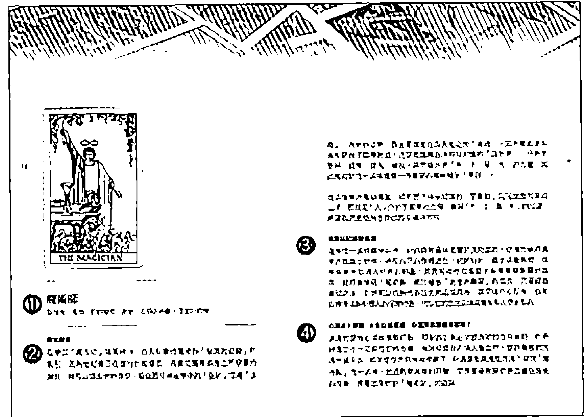

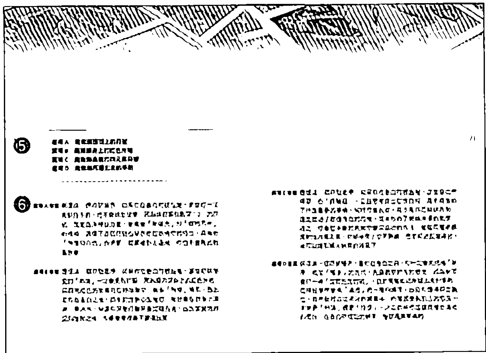

1.  關鍵字 將牌卡的意透過簡單的說明，讓初學者能有最基本的認識。
2.  牌面故事 藉由故事的呈現，讓讀者陶醉在充滿神秘感的塔羅世界中。
3.  塔羅日記運勢預測 將牌義生活化，能貼近學習者的實際狀況。
4.  心測占卜解讀 以測驗的形式來加深學習者對牌義的理解。
5.  心測選項 每張大牌作者都以四個選項來說明，看過選項後可以回到前一頁觀看牌卡的圖案來進行選擇。
6.  心測答案 答案的說明除有對學習者進行占卜解讀外，也對牌義有進一步的解析，可加深學習者的印象。

皇家圣学院 http://strc.taobao.com

## Lesson 1 認識塔羅牌歷史與開牌前的準備

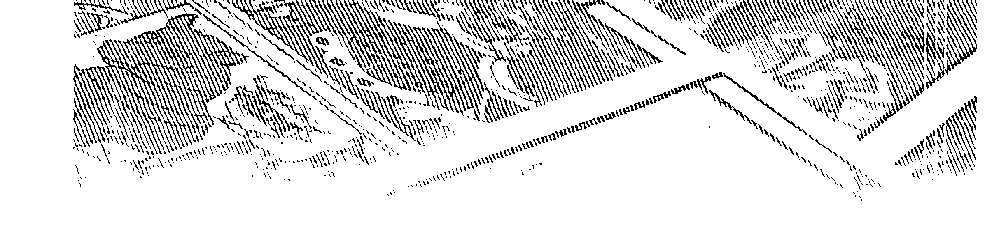

### 塔羅牌的起源

塔羅牌的起源圍繞著許多的傳說，最普遍的說法是源於十四世紀的義大利，而最早的塔羅牌的根據傳說有出自古埃及、古印度以及古中國等各種說法。一般我們較常聽到的說法，是由 Court de Gabelin 於 1781 年在 Le Monde Primitif 所提出的，內容提到塔羅牌是由吉普賽人自印度輾轉引入。

事實上，塔羅牌真正的起源，到目前為止仍是個謎，但若是以相似的紙牌而言，最早應可追溯到十四世紀的義大利及法國。

根據我們所知，目前最早有紀錄的塔羅牌是在 1392 年，只保留了 17 張牌，一般相信，它們是由法王查理斯四世要求 Jacquemin Gringonneur 所繪製的，但是後來發現，其實它們實際上是更晚（十五世紀中葉）義大利威尼斯的紙牌。現在最早以及最完整的塔羅牌是在 1422 年由一名義大利畫家 Bonifacio Bembo 所繪，也就是我們熟知的「威斯康提塔羅牌」。塔羅牌原文「Tarot」一詞出自十四世紀的中歐文藝復興時期，當時的義大利出現一種名叫「Tarocchi」的紙牌；這種紙牌在十五世紀中葉被天主教聖方濟教會的修士確立它的形式並且沿用至今，而 Tarocchi 一詞傳到法國以後，就變成了現在大家所熟知的 Tarot。

我們一般看到由78張所組成的塔羅牌共分為兩部分：22張的「大阿爾克納牌」（又稱大秘儀，也就是塔羅牌的原型，像是愚者、戀人及吊人等）和40張的「小阿爾克納牌」（又稱小秘儀，四組各有1到10的牌）以及16張宮廷牌，這種組合成爲目前大家最耳熟能詳的塔羅牌。78張牌中大阿爾卡那牌是屬於比較精神性、抽象性的牌；小阿爾克納則代表著比較具體的事情，16張宮廷牌則是一個人內在的16種面向。

### 聖別儀式

關於塔羅牌的開牌準備，各家門派對此有不一樣的方法，有些人主張不需要作開牌準備，有些傾向神秘主義的老師會告訴你必須要進行所謂的「聖別儀式」。關於聖別儀式的來源從什麼時候開始，可能是無從考證的事情，不過為了強調塔羅牌的神秘性，以及尊重你所使用的塔羅牌，我認為在開牌之前進行聖別儀式也是可行的方式。

要進行聖別儀式之前，你必須準備一副全新的塔羅牌，最好是沒有經過別人觸摸過的新牌，再準備一個水晶石頭、一個玻璃杯、一把拆信刀、一支蠟燭。準備這些物品分別代表神秘學的土元素、水元素、風元素和火元素，這些象徵的物品剛好跟西洋神秘學的土、水、風、火互相輝映，藉由塔羅牌的聖別儀式，開啟塔羅牌的神秘力量。

進行聖別儀式的時間，你可以選擇一個心情平靜的假日或是一個陽光充足的早晨，但是請盡量避開容易犯到禁忌的「魔空時間」。所謂魔空時間的概念，應該是從日本的塔羅牌學習者所流傳出約定俗成的禁忌，相傳在這個時間幫人占卜，或是接觸塔羅牌容易招來不好的厄運，也容易接觸到不好的能量場，所以對於一個新的塔羅牌學習者，盡量不要在下午五點到七點，以及子夜十一點到凌晨一點這一段時間接觸塔羅牌或是進行占卜，否則將招來惡靈。如果按照中國的說法，這兩個時段剛好就是所謂人間氣場陰陽交換的時間，是屬於陰氣最盛、陽氣最弱的時候，因此不適合問神占卜。

當你了解了魔空時間的禁忌，同時也準備好「土、水、風、火」的象徵物之後，就可以準備進行聖別儀式了。在準備儀式的時候，請你坐在一張書桌前面，面對桌子，把新的塔羅牌放在桌子的正中間，同時心情保持平靜。將點燃的蠟燭放在桌面的右側下方，將拆信刀放在桌面的右前方，將盛滿水的玻璃杯放在桌面的左前方，將水晶石頭放在桌面的左下方。這四個元素的象徵物擺放定位之後，就形成了一個神秘的結界。在這個結界的空間中是非常純淨的，是充滿喜樂的，也是非常神聖的。

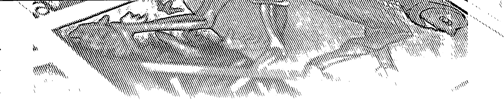

### 與塔羅的第一次接觸

當塔羅牌的結界形成之後，接下來就到了開啟塔羅牌的步驟了，這個步驟也是你與塔羅牌之間的第一次接觸，你將喚醒一個沉睡千年的塔羅牌靈魂，這個靈魂也許就是你前世的自己，所以你不需要感覺到害怕或不舒服。拿起塔羅牌之後，分別依序在燃燒的蠟燭、拆信刀、盛滿水的玻璃杯和水晶石頭上，分別繞三圈，完成之後再把塔羅牌放在中間的位置，然後念出下列的祈禱詞。

> 「傾聽我聲音的所有精靈呀
在月之神統領的國度裡
我將解開你烙印在背上的封印
將你未完成的使命交付於我
賜於我左手精神
賜於我右手力量
我盡力完成你未完成的使命」

念完之後你可以靜心冥想有一道白光注入你的塔羅牌中，完成之後，你再用左手在天空中畫一個五角星，那麼就完成了整個聖別儀式的全部過程。從此之後你就可以認真的學習塔羅牌，也許可以在慢慢的練習中，發現塔羅牌的神秘性。

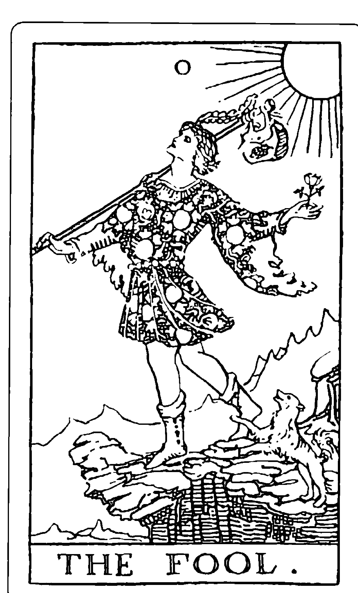

## 愚者

- 冒險
- 天真
- 魯莽
- 自由自在
- 樂觀
- 積極
- 重新出發

### 牌面故事

在接觸神秘學的過程中，學習「愚者」必定是你探索塔羅牌的第一步，在愚者牌中，你會看到如小丑裝扮的年輕人，輕鬆的在懸崖邊跳舞，這象徵著這張牌中最重要的涵義「樂觀與自信」，由於他輕鬆愉快的心情，讓他忘記了眼前的一切危險與阻礙。而在愚者身後的「小狗」，則同時扮演著「追隨者」與「提醒者」的雙重身分，這也是有著深遠的意義，象徵著在我們日常生活當中，很多時候，總有人善意的給予我們中肯的意見，只是我們是否察覺對方所做的提醒，或是我們還是我行我素，輕漫隨性，依然故我。如果無法接受別人善意的勸告，那麼最後的結果也將由自己承擔。

### 塔羅日記運勢預測

選擇這張牌暗示，你的體貼程度和幽默感都是第一名，你是一個喜歡跟朋友一起聚會的人，當然你也不會吝嗇的向朋友介紹自己的情人，因為你也希望情人可以跟自己的朋友融入在一個和樂的氣氛中。為了避免初次見面的陌生感，你會非常貼心的顧及到情人的感受，讓彼此都有一個舒服愉快的經驗，而不會只顧到跟朋友聊天，而讓情人孤零零的冷落在一旁。

### 心測占卜解讀 ☆你是一個愛耍大牌的人嗎？

演藝圈裡面常常驚爆某某藝人愛「耍大牌」，但是其實耍大牌的行為，並不只限於在演藝圈當中，在你我身邊就有很多朋友愛「耍大牌」，搞不好你就是一個別人眼中的「耍大牌」高手。放鬆心情，凝視塔羅牌，並且從其中選擇最吸引你的符號，艾菲爾不僅要測驗你的「耍大牌」指數，還要加深你對這張「愚者牌」的認識。

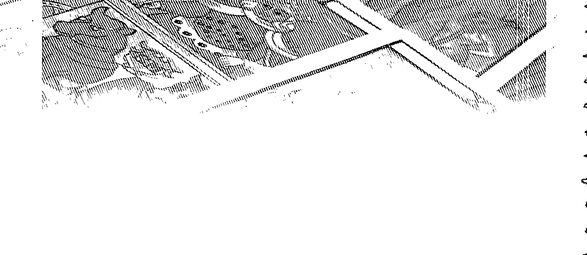

- 選項A 愚者身上的衣服
- 選項B 愚者的五官與表情
- 選項C 愚者肩上的行囊與權杖
- 選項D 愚者身邊的山崖

**選項A 答案**
選擇這一個符號暗示，你的個性有著樂觀天真的一面，有如愚人的天性一般，因為愚人這一張牌創作的原型，就是希臘神話中的「酒神」。所以你在團體裡面跟同事或朋友相處，一定是一個可以大口吃肉、大口喝酒的人，無論你身處在什麼樣的環境中，你一定都可以隨遇而安的。由於你像愚人的個性一樣，不拘小節，所以你的耍大牌指數不高，只有 25 分。

**選項B 答案**
選擇這一個符號暗示，你的個性中還存在著童心未泯的一面，有如愚人的年紀，是個初出茅廬的小夥子，因為愚人的五官，看上去像個未經世事的年輕人，這也暗示著你在人際關係的交際手腕上面，可能還不太純熟，有可能因為在職場上不懂得進退應對而得罪人。由於你的人際關係與人互動還不純熟，因此有可能在無意間因為言語而得罪人，讓別人誤以為你是一個愛耍大牌的人，因此你的耍大牌指數很高 100 分。

**選項C 答案**
選擇這一個符號暗示，你是一個有能力和才華的人，一如愚人手中的權杖以及上面所繫的包裹，裡面裝載著愚人與生俱來的天賦本能，也就是西洋神秘學的精髓「風、火、水、土」四大元素，這暗示著你的學習能力很強，而且領悟力超高，在與人相處的職場中，懂得察言觀色，也知道如何去迎合別人的個性，由於你的資質不錯，自然也能得到別人的喜歡與信任，所以你的耍大牌指數平平。

**選項D 答案**
選擇這一個符號暗示，嚴峻的高山與陡峭的懸崖象徵著我們平日所身處的環境當中，這有可能是我們的職場關係，也可能是我們的人際關係，雖然表面上看起來沒有什麼危險，但其實危機四伏，因為如果我們疏忽了別人的感受，有可能隨時被別人在背後捅一刀，或是落入別人所設下的陷阱中，所以在充滿競爭的現在社會中，就算是長袖善舞的人，也必須戒慎恐懼，因此你被認為耍大牌指數大約 75 分。

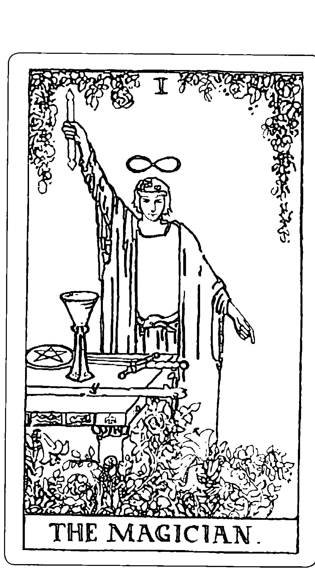

## 魔術師

新局面，成功，好的發展，創造，冷靜的判斷，適當的時機

### 牌面故事

在學習「魔術師」這張牌時，首先你會被魔術師「怪異的姿勢」所吸引，因為他好像正在進行什麼儀式。其實從魔術師身上所穿著的服裝，就可以猜出他的身份，類似西洋神秘學中的「巫師」或是「法師」，而他的姿勢，最主要就是在與天地之間「溝通」。另外魔術師在桌前擺放了四種物品，這就是建構西洋神秘知識的「四元素」，分別是聖杯、錢幣、寶劍、權杖，其中蘊含著「水、土、風、火」的力量，因此魔術師這一張牌還有一個重要的精神就是「學習」。

這張牌雖然看似簡單，卻把西洋神秘知識的「宇宙觀」完完整整的呈現出來，那就是「人」介於宇宙天地之間，學習「水、土、風、火」的知識，將讓我們更能洞悉自己的命運與方向。

### 塔羅日記運勢預測

選擇這一張塔羅牌暗示，你的穿著品味是屬於技巧型的，你擅於使用舊東西或是小物件，搭配自己的整體造型，例如別針、帽子或是眼鏡，這些有著強烈個人特色的飾品，其實幫助你在造型上有著畫龍點睛的效果，就好像這張「魔術師」牌所蘊含「創意與學習」的概念，只要經過嘗試之後，你就可以找到代表性的飾品或風格。甚至這些小配件，也可以慢慢成為你個人的招牌特色，所以你的生活品味是屬於引人目光型的。

### 心測占卜解讀 ☆告白被拒絕，你選擇放棄還是繼續？

浪漫的愛情必須被情歌打動，可愛的對象必須被真誠的告白感動，但是好運並不一定都在你的身邊，有時候當你向情人告白時，也許會被對方潑一盆冷水。如果你在告白時被拒絕了，你選擇放棄還是持續？凝視「魔術師」這一張牌，並且觀察其中的符號，艾菲爾要看穿你告白被拒絕後的反應，還要加深你對「魔術師」的認識。

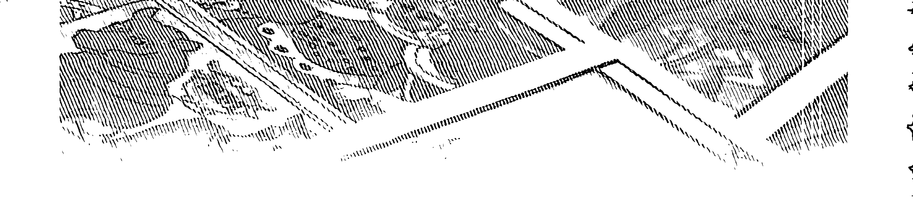

- 選項 A 魔術師頭頂上的符號
- 選項 B 魔術師身上的紅色外袍
- 選項 C 魔術師桌前的四元素符號
- 選項 D 魔術師所擺出來的手勢

**選項 A 答案**
選擇這一個符號暗示，如果你在告白時被拒絕，那麼你一定會堅持下去，絕不會就此放棄，因為這個類似數字「8」的符號，就是西洋神秘力量，象徵著「無限大」與「鍥而不捨」的精神。選擇了這個符號也暗示你在感情中的特性，具備著「熱情與自信」的勇氣，就算被對方拒絕，你也不會就此輕言放棄。

**選項 B 答案**
選擇這一個符號暗示，如果你在告白時被拒絕，那麼你談戀愛的「熱情」一定會受到打擊，因為魔術師身上的紅色外袍，與四周紅色的玫瑰花在神秘學中，都有「熱情」暗示。因此當你在告白之後，如果對方狠心拒絕你，就好像在你身上澆淋一桶冰水，會讓你深受打擊甚至知難而退，因此當愛情路受到挫敗之後，你便會摸摸鼻子選擇放棄。

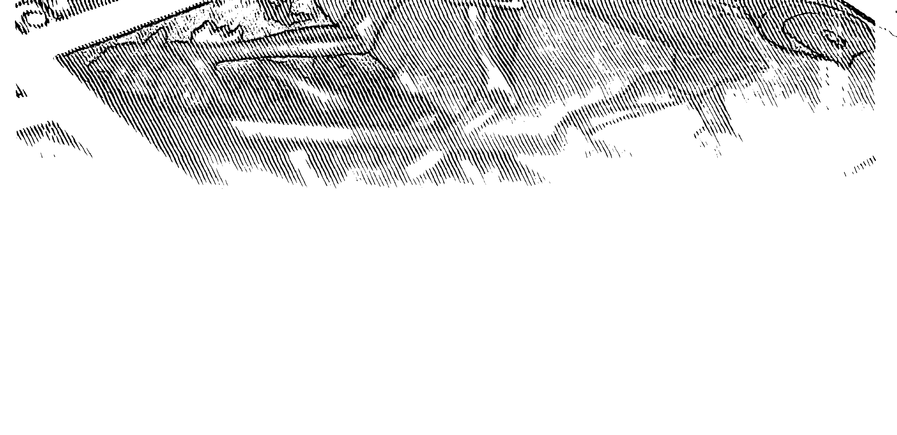

**選項 C 答案**
選擇這一個符號暗示，如果你在告白時被拒絕，那麼會從中得到一些「經驗值」，並且思考自己在告白時，是不是忽略了什麼重要的事情。同時你會反省，是不是自己錯估形勢，還是錯過了最佳告白的時機，或者忽略了營造浪漫的氣氛。總之，你會在不斷的失敗中學習成功的方法，就如同魔術師面對這四個元素，初期使用上並不熟練，但是經過反覆練習，就可以達到爐火純青的效果了。

**選項 D 答案**
選擇這一個符號暗示，當你在告白之前，你一定會先透過「明示」或是「暗示」的方式，先去觀察對方的態度，因為你不會打一場「沒有把握的戰」。就如同魔術師所擺出來的手勢，在神秘學中象徵「溝通」是一樣的道理。由於你懂得察言觀色，自然就可以從平時的感覺中，約略感受到對方的態度，究竟是「熱情」還是「冷漠」。所以依照你這種沉穩善溝通的個性，在告白時成功的機率，應該是非常高的。

## 女祭司

-   直覺
-   知性
-   接受
-   心靈發展
-   研究
-   冷靜觀察
-   等待
-   靈性思考

### 牌面故事

在學習「女祭司」這張牌時，首先你會被女祭司這張牌所散發出來的「冷靜、祥和」的氣質所吸引，因為整張牌面的風格，是用白色、藍色與黑色等冷色系的顏色鋪陳在畫面的四週，唯一的「黃色」出現在女祭司腳邊的上弦月和背後的花卉圖騰布幔。其實從女祭司身上所穿著的服裝，就可以猜出她的身份，類似西洋神秘學中「女巫」或是「祭司」的角色，而她的姿勢，端坐在兩個神柱之間。這兩根顏色對比的柱子，象徵著聖城「耶路撒冷」旁的兩根神柱，分別代表著「理性、感性」、「黑暗、光明」、「善與惡」等二元性的精神。

女祭司胸前的十字架、手中的卷軸也暗示著，這位女性具有很濃厚的宗教氣氛，她是一位替神祇傳遞訊息的女巫。從她身旁的月亮，你可以知道她具有「重生、再生」的能力，一如月亮具有週期。也許這個女祭司所蘊含的智慧就是你內心情緒的週期反應。

### 塔羅日記運勢預測

你選擇這張塔羅牌暗示，在感情中你是標準的完美主義者，非常在意世俗的眼光與想法。如果不小心陷入三角戀情或是被認為是別人眼中的狐狸精，是你非常排斥與絕對不願發生的事情。為了避免被人指責是狐狸精，在感情的互動上，你總是小心翼翼的處理感情的選擇與發展。如果不小心身陷「狐狸精」的批評時，艾菲爾建議你，應該採取冥想、沉思、靜坐的方式，謹慎處理複雜的三角關係，這是唯一能幫助你從這個泥沼中脫身的辦法。

### 心測占卜解讀 ☆失戀後你的療傷指數有多高？

戀愛時像「吃蜜糖」，失戀時像「含苦瓜」。面對內心的憂愁與悲苦，你的自我療傷指數有多高呢？凝視「女祭司」這一張牌，並且觀察其中的符號，艾菲爾要看穿你失戀後，自我療傷的指數有多高，並教你認識「女祭司」的更多內容，讓我們一起面對內心的女神吧。

-   選項A 女祭司身後的黑色柱子
-   選項B 女祭司身後的白色柱子
-   選項C 女祭司身後的花卉圖騰布幔
-   選項D 女祭司腳前的上弦月

選項A答案 自我療傷的指數 25 分 選擇這一個符號暗示，當你面對失戀的痛苦時，你的自我療傷的能量是非常弱的。因為黑色的柱子在神秘學的意涵中，代表著「黑暗、消極、沮喪」，它代表著我們內心比較脆弱敏感的部份。由於你在面對失戀痛苦的時候，內在的負面情緒會把你整個人吞噬，因此你的自我療傷能力較差，可能會終日以淚洗面、無法自拔。

選項B答案 自我療傷的指數 100 分 選擇這一個符號暗示，當你面對失戀的痛苦時，你的自我療傷的能量是很堅強的。因為白色的柱子在神秘學的意涵中，代表著「光明、希望、智慧」，它代表著我們內心比較堅強毅力的部份。由於你在面對失戀痛苦的時候，懂得調適內心的情緒，會轉化自己的能量，讓自己從憂傷的情緒中「重生」，因此你的自我療傷能力非常好，搞不好還可以當別人的心靈導師。

選項 C 答案 自我療傷的指數 75 分 選擇這一個符號暗示，當你面對失戀的痛苦時，你的「重生」的特質是很堅強的。講到「重生」這個概念時，就不得不提到「天蠍座的原始能量」，大家到知道「天蠍座」掌握「生與死」的兩種概念。這裡所說的「重生」是指精神的，而不是指肉體的。有一句話「當你經歷的挫折越大，你所獲得的智慧也是越大的」。因此面對難過尷尬的失戀痛苦，你是真正具有療癒特質的人。

選項 D 答案 自我療傷的指數 50 分 選擇這一個符號暗示，當你面對失戀的痛苦時，你一定會受到「內在情緒的干擾」。就如同月亮的陰晴圓缺有它的週期性，而你的情緒也如潮水一般，會一點一滴侵蝕著你的心，雖然此刻你的心情是寧靜的，但是難保不會觸景傷情或是睹物思人，或是遇到了特別的節日，例如情人節、對方的生日，這種特別容易傷感的日子，你內心脆弱的防線又會再次崩潰。

## 皇后

-   懷孕
-   收穫
-   結婚
-   充實
-   有藝術的天份
-   包容
-   母親

### 牌面故事

在學習「皇后」這張牌時，首先你會被皇后「華麗與優雅」的形象所吸引，接下來觀察一下「皇后」的樣貌，飄逸的金髮與白皙的肌膚，就像是古典宮廷畫中的仕女。沒錯，這張塔羅牌就是以「維納斯」為範本所描繪的，而皇后身旁的「愛心盾牌」透露了這張牌蘊含著所有跟愛情有關的事物。

也許你會好奇，為什麼「皇后」會坐在一處森林當中呢？其實這可不是荒郊野外，而是一處「維納斯的花園」，四周豐富的樹林與麥穗，象徵女性對於愛情的付出，是生生不息而且源源不絕。而皇后身上珠光寶氣的裝飾，除了暗示這是一張非常符合女性精神的牌之外，同時也有富裕豪華的象徵。另外這張牌還有一個在占卜上面最經典的意義，那就是這張牌也是塔羅牌中「母親」的原型。

### 塔羅日記運勢預測

選擇這張塔羅牌暗示，恭喜你，你是一個體貼大方又賢慧明理的人，未來結婚之後不但可以協助先生在事業上打拼，同時你也會將家庭瑣事打理得非常完善，讓先生沒有後顧之憂。你覺得為了先生和家庭，你是可以犧牲自己的事業和時間、自由的，只要家庭和樂、子女健康、先生幸福，就是你最大的安慰與成就。由於你不是一個獨斷或是跋扈的人，善溝通、能體諒、懂包容則是你個性上的優點，像妳這樣特質的女生，誰娶到妳一定會非常幸福美滿的。

### 心測占卜解讀 ☆怎樣告白最能打動你的心？

在戀愛中你是一個怎樣人？情人採用什麼樣的告白方式最能打動你的心？想要更了解自己在愛情中的真面目嗎。凝視「皇后」這一張牌，並且觀察其中的符號，艾菲爾要告訴你，情人怎樣告白最能打動你的心，還要帶領你深一層認識「皇后」這張牌。

-   選項 A 皇后頭頂上的皇冠與權杖
-   選項 B 皇后背後的躺椅
-   選項 C 皇后前方的麥穗田
-   選項 D 皇后身旁的愛心盾牌

**選項 A 答案** 選擇這一個符號暗示，怎樣的告白最能打動你的心呢，當然是情人最 man、最有魄力的告白，一定可以打動你的心。因為在西洋神秘學中，「皇冠、權杖」都是世俗中最有權力的象徵，這暗示著你期待未來的情人是一個非常有 guts 的人，最好擁有堅強厚實的肩膀可以讓你依靠。如果對方在愛情中表現得害羞又被動，這樣的個性反而會增加你的反感，所以情人率真的真心告白，一定可以打動你的芳心。

**選項 B 答案** 選擇這一個符號暗示，怎樣的告白最能打動你的心呢？當然是情人溫柔、浪漫的告白，最能打動你的心。因為在西洋神秘學中「巴洛克風格的躺椅」象徵著華麗、美好的事物與想像力，這暗示著你期待未來的情人是一個懂得營造浪漫氣氛、並訴說著溫柔故事的新好男人，最好擁有「細膩、體貼」的氣質。相反的，如果對方在愛情中表現得粗魯或大刺刺，這樣的個性反而會增加你對他的反感，所以充滿創意的告白和情話，一定可以打動你的芳心。

**選項 C 答案** 選擇這一個符號暗示，怎樣的告白最能打動你的心呢？當然是情人「踏實與誠懇」的付出，一定可以打動你的心。因為在西洋神秘學中「麥穗與穀物」象徵著醞釀、豐收與富足，這暗示著你期待未來的情人是一個「事業有成的人」，最好有一個穩定、有前景的事業發展，因為情人如果擁有「穩定、令人羨慕」的職業條件，這樣的背景更會加深你對他的好感與愛慕之意。想反的，如果對方在職業發展上沒有企圖心，又缺乏優勢的物質條件，就算對方再體貼溫柔，你還是會偷偷在心裡畫上一個叉叉。因為只有「上進、有事業企圖心」的人才可以打動你的芳心。

**選項 D 答案** 選擇這一個符號暗示，怎樣的告白最能打動你的心呢？當然是情人「全心全意」的付出，一定可以打動你的心。因為在西洋神祕學中「愛情盾牌和金星符號」象徵著「堅定不移的力量和勇氣」，這暗示著你期待未來的情人是一個永遠把你放在心中最重要位置的人。因此情人能夠為你許下什麼「承諾」，關係著你們的愛情可不可以開花結果。由於你把愛情看成是這一生最重要的事情，所以你對「感情發展、婚姻生活」，自然也會有很深的期待。因此一個願意跟你步入「結婚禮堂」的感性告白，願意照顧你一輩子的情人，才是真正可以打動你芳心的對象。

## 皇帝

有魄力，領導，責任，承諾，升職，武斷，頑固，秩序，成功，權力

### 牌面故事

在學習「皇帝」這張牌時，首先你會被皇帝「威嚴的氣勢」所吸引，接下來觀察一下「皇帝」的樣貌，冷靜的眼神與堅強的形象，再加上手中所握有的權杖，他就是全世界擁有最高權勢的統治者。

-   選項 A 皇帝所坐的石椅
-   選項 B 皇帝手中的圓球和權杖
-   選項 C 皇帝身上所披紅色的披風
-   選項 D 皇帝頭頂的皇冠

選項A答案 選擇這一個符號暗示，愛情中你的個性比較低調、有個性 並不喜歡碎碎唸。因為你覺得碎碎唸，並不會讓你們的愛情 關係變好，除此之外，你也不想當個囉嗦的情人。因為「石 椅」在神祕學中，象徵著堅定不變的意志力。因此你是一個 比較有個性的人，有自己做事的風格和習慣，你希望情人之 間可以互相尊重，而不是不斷的吵架或是用碎碎唸來溝通。 當然如果你的情人喜歡碎碎唸，你也一定會立刻甩了對方。

選項B答案 擇這一個符號暗示，愛情中你「三娘教子」的本領，可能 會讓情人感到反感，因為在神祕學的符號中，「權柄」具有 絕對權威的象徵，因此當你和情人相處與溝通的時候，你常 常不知不覺展現出「霸道、控制與強勢」的特質，或許在朋 友眼中，你罵情人的口氣，好像在數落自己的小孩。因此艾 菲爾建議你，在感情中不要忘了「溫柔的本質」，不然情人 可是會越變越壞喔。

選項 C 答案 選擇這一個符號暗示，在愛情中你希望對方與你的互動是熱情的，而不是整天吵吵鬧鬧，因為「紅色的外袍」這個符號象徵「熱情、積極」的本質，你期待愛情生活中可以多一點笑聲和互動，而少一點冰冷爭鋒相對的語言。由於你不擅長記恨，也不會挖情人的瘡疤，所以不愉快的心情會當面表達，絕對不會留在心中，成為互相抱怨的負面能量。

選項 D 答案 選擇這一個符號暗示，在愛情中你不但有喜歡碎碎唸的習慣，而且還非常嚴重，因為「皇冠」這個符號象徵著至高無上的權威，這代表著你的潛意識，往往會有一種「強壓別人服從」或是「要求別人聽命於你」的霸道行為。由於你像石頭一樣固執，情人要跟你理性、對等溝通幾乎是不可能的，當情人的行為做錯或是你覺得有不滿意的地方，一定立刻變成機關槍，立刻發揮你「愛雜唸」的本領。

## 2 介绍塔罗日记与塔罗牌禁忌

有關塔羅日記的學習是每一個塔羅牌初學者都需要面對的功課，這種學習的方式，是把塔羅牌的神秘性融入到生活、內化到個人精神層面的一種手段。一個人每天的日記最能忠實呈現我們生活的全貌，不只反映出我們最近生活為了什麼課題忙碌，也可以反映我們這一段時間的情緒，藉由塔羅日記，可以知道最近生活中都在為哪些事情煩惱，以及找出可以解決問題的對策，讓你的生活更加的完美和諧。

### 如何進行塔羅日記

塔羅日記的操作很簡單，無論是初學者或是已經熟悉每一張牌義的進階者都應該每天練習，這樣可以讓你對牌義的了解更加的豐富多元。你可以在睡前先放鬆心情，然後把牌拿在手上，簡單的洗牌之後，把塔羅牌放在你的書桌上，或是化妝台前，然後就上床睡覺。等到第二天早上醒來的時候，簡單的梳洗完畢之後，要出門之前，從昨天晚上就洗好的牌中，隨機的抽選一張。將這張隨機抽選出來的塔羅牌，放在一整副塔羅牌的最下方，或者你要抽出放在一本書中也可以。重要的是先不要去看今天選到了哪一張牌。選完之後，你就正常展開你一天的工作生活，等到晚上回家之後，你再去把早上抽選到的牌拿出來看，是選到哪一張塔羅牌。

這樣進行塔羅日記的記錄，是需要持續的。因為你可能很難從一兩天的記錄中，看出什麼心情與能量的變化，但是當你進行了一個月，或是持續進行了兩個月，你就會從記錄中看出一些重複的變化。例如這一個月你選到的聖杯牌組特別多，或是你有可能接連幾天重複選到同一張牌，或是你只要選到某一張牌當天就會特別不順利，抽選到某幾張牌當天的心情就特別輕鬆，甚至還有別人請客吃飯的好運。

藉由這樣的長時間記錄塔羅日記，一方面可以讓你加深塔羅牌的印象，另一方面可以讓你的塔羅牌的意義生活化，也可以豐富你的想像。當你觀察如果你一整個月都是著重在某些元素牌時，則代表你最近似乎為了某些特定的事情心煩，也許就是要提醒你，不要鑽牛角尖，應該適時的把自己抽離出問題的風暴中，這樣才不會讓自己越陷越深，也才能平衡你的內在能量。

記錄塔羅日記對於塔羅牌的學習者來說，是有很正面的意義的，無論你是初學者或是你是老師級的塔羅占卜師，都可以在塔羅日記中溫故知新，找尋生命與靈魂的新出口。

### 寫日記，認識自己

既然「塔羅日記」這麼重要，艾菲爾綜观目前市面上的塔羅牌教學書，在塔羅日記這個單元的著墨份量和篇幅都太少了，無法提供學習者一個良好的學習範本，因此本書在78張牌牌義說明之後，都有預設一個塔羅日記的學習單元，可以幫助學習者在每日的抽牌練習中，獲得最生活化、最貼近實際狀況、最深入你潛意識的運勢建議。

本書所載的塔羅日記運勢預測的範圍都是以一周運勢為主，所以當你選到了某一張牌，所建議的運勢發展，可以當作是你個人當周的塔羅運勢，讓你在學習塔羅日記的階段，就直接可以幫助自己了解個人運勢，讓你輕鬆做個塔羅牌大師。

## 塔羅牌的禁忌

關於塔羅牌的禁忌，其實各個塔羅牌老師的說法也是南轅北轍，並沒有一個統一的標準或是規範。不過還是有幾個大家比較常講的禁忌，那就是不適合用塔羅牌占卜跟健康有關的議題，因為關於生病或是身體的健康的預測，並不歸塔羅牌所管，所以對方要占卜健康，最好建議他直接去看醫生，不要因為塔羅占卜而耽誤了病情。另外塔羅牌也不適合問生死問題，有關生命的生死有其神聖性，不應該用開玩笑的心態占卜，就算知道了結果對這個占卜的人，也沒有好處，只會讓他提心吊膽的過日子。

再來就是關於為了增加塔羅牌的準確度，而認為需要「養牌」的問題了。關於「養牌」的說法也是一個很難釐清的問題，我個人是認為不需要養牌的，因為塔羅牌之所以預測事情會準，跟你有沒有養牌其實並沒有關係。千萬不要因為走火入魔，而迷戀養牌的迷信或是儀式，這樣只會讓你更加恐懼塔羅牌而已。

## 教皇

心靈導師，得到援助，宗教情懷，慈悲，寬大，精神上的指導，團體學習

### 牌面故事

在接觸神秘學的過程中，學習「教皇牌」是非常重要的階段，因為從這張牌開始，塔羅牌中的人物，就不再僅限於一個人了。譬如我們看過的愚者牌、魔術師、女祭司到皇帝、皇后，牌面中都只出現一個主要人物，這張「教皇牌」在畫面中卻出現了三個人物，代表著重要涵義就是「團體的概念」，泛指學校、公司、社團或是一個志同道合的群體。所以教皇牌闡述一個重要的概念就是，在群體中我們應該與別人保持著什麼樣的關係。

「教皇牌」還有一個重要的意義就是「學習的概念」，例如牌面中兩位位階比較低的信徒，正在聽從教皇傳達上天的旨意，這是一個充滿智慧的時刻，因為我們平凡的人藉由教皇的講解經文，而了解上天的指示，其最終的目的就是要我們保持「身心靈」三位一體的和諧。

### 塔羅日記運勢預測

如果你選擇這張塔羅牌，暗示在未來的生命中，無論你是單身或者你有一個美滿的家庭，最後你都會慢慢發展出「宗教情懷」。也許你是一個對於「宗教」、「靈修」、「身心靈療法」非常有慧根的人，或者你身邊就有這樣的管道，可以讓你去接觸這樣的知識，由於你能藉由這樣的宇宙智慧來安撫心靈、豐富生活，所以未來無論你是否有自己的婚姻生活，都可以獲得心靈滿足，就算是單身也不寂寞。如果有穩定的戀情關係，則可望與另一半培養出互信、互諒、互助、互愛的大智慧。

### 心測占卜解讀 ★什麼原因導致命中注定我愛你？

「命中注定我愛你」是一部最熱門的電視劇，談戀愛就像著魔一樣，往往莫名其妙，目光與心情就會受到特定人士的影響，難道你們之間有著特殊的心電感應嗎？放鬆心情，凝視下列的塔羅牌，並且從其中選擇最吸引你的符號，艾菲爾要測驗你與情人之間，是什麼原因導致「命中注定我愛你」，還要帶你認識這張「教皇牌」的神祕。

-   選項A　教宗手上的「權杖」
-   選項B　教宗腳旁的兩把鑰匙
-   選項C　教宗前方穿紅袍的信徒
-   選項D　教宗前方穿藍袍的信徒

選項A答案　選擇這一個符號暗示，你與情人之間在今生相遇彷彿有著前世的宿命和累世的緣份，由於前緣未盡，因此在今生又再度重逢。因為教皇手上的「權杖」，並不是一根普通的手杖，而是一個可以通曉古今，結合「聖父、聖靈、聖子」三位一體的法器，也象徵著你與情人之間，不但情投意合，而且還是身、心、靈三者都非常的一致，因此在與現任的情人相處上，你會感覺到像家人一般的熟悉和親切。因此艾菲爾建議你，珍惜目前的緣份。

選項B答案　選擇這一個符號暗示，你與情人之間在今生相遇，其實最大的意義在尋找一個與自己個性、行為、觀念甚至生活習慣都截然不同的人。因為你們談戀愛最大的意義在「互補」。教宗前方地面上擺放著兩把交錯的鑰匙，它有陰陽調和與互相協調的暗示，因此在這一生你註定會遇到的情人，一定是個跟你個性差異非常大的人。因為你這一生的愛情課題就是在學習如何尊重不同的意見，以及用溝通來化解心中的歧見。

## 戀人

相愛，良好的關係，選擇，邂逅，美好的時光，甜蜜關係

### 牌面故事

在接觸神秘學的過程中，學習「戀人牌」是你們非常期待與渴望的一件事情，在這張牌中你會看到一組「完美戀人的原型」，那就是亞當與夏娃和伊甸園的守護者大天使拉菲爾。他們彼此形成一個和諧的三角形。而這個三角形的核心和神祕的價值是「理性溝通和理解」，因為大天使拉菲爾所象徵的元素就是「風」，而風的元素，泛指情人之間「身心靈」的接觸與了解，由於充分的溝通，因此心中沒有任何的秘密和污垢，因此就算是裸著身軀，也覺得聖潔，也覺得沒有瑕疵。

所以身處在愛情中的情侶們，看完這張塔羅牌之後，千萬不要誤解了愛情的本質，以為浪漫晚餐或是鮮花禮物才是情人的最愛，其實情人只是要一份沒有隱藏的溝通和一種單純的信任。

### 塔羅日記運勢預測

如果你選擇這張塔羅牌，暗示你的愛情運勢真的非常強，不但兩個人恢復了從前戀愛時期的浪漫，而且最近情人也常常哄你。例如問你有沒有記得吃飯，有沒有穿足夠的衣服保暖，有沒有在睡前想他之類，總而言之，情人最近好像是嘴巴抹上了蜂蜜，講出來的話都特別讓人覺得窩心甜蜜。艾菲爾覺得，既然情人常常哄你，你也應該特別珍惜這份關係，這樣才可以遇見「幸福的青鳥」。

### 心測占卜解讀 ☆你對情人百依百順的程度有多高？

在愛情中我們往往要求情人對我們忠誠，但是你對情人的百依百順程度又有多高呢？放鬆心情，凝視下列的塔羅牌，並且從其中選擇最吸引你的符號，艾菲爾要測驗你的「對情人百依百順程度」指數，還要帶你認識這張「戀人牌」的更多含義。

- 選項 A 夏娃
- 選項 B 亞當
- 選項 C 大天使拉菲爾
- 選項 D 伊甸園中的小山丘

選項 A 答案 選擇這一個符號暗示，在感情中你對情人的百依百順程度會出現許多的考驗。雖然你嘴巴說著會愛情人一輩子，但是實際的狀況恐怕不是如此的。因為在聖經故事中，夏娃受到蛇的誘惑而誤吃禁果，不但觸怒了上帝，也導致他與亞當必須被逐出伊甸園。因此戀人牌中的夏娃，其實暗示著你的內心，對於情人的忠誠與百依百順程度，是不足的。

選項 B 答案 選擇這一個符號暗示，在感情中你對情人的百依百順程度是非常高的。因為你總是期待的能夠與情人多一點理性溝通，尤其是你可以注意看一下亞當的眼睛，他是非常專注的望著夏娃的。你甚至可以為心愛的情人犧牲一切。因此戀人牌中的亞當，其實暗示著你的內心，非常依賴而且需要對方的鼓勵和支持，而且總是期待對方可以多關心你一點。

選項 C 答案 選擇這一個符號暗示，在感情中你對情人百依百順的程度是非常和諧的。因為大天使拉菲爾在聖經故事中，他擔任負責治癒人類病痛的職位，故有「靈魂守護者」之稱，而且大天使拉菲爾象徵的意義是「風與智慧的光芒」。這代表著你在過去的戀愛經驗中，其實是受盡了委屈與挫折，由於你深知愛情的傷痛與背叛的痛苦，所以在未來的愛情發展上，你會展現出呵護與照顧情人的姿態，以避免背叛或欺騙，為雙方帶來痛苦，因此情人對你的要求，你也會盡量順從對方。

選項 D 答案 選擇這一個符號暗示，在感情中你對情人的依賴感是正面的能量。其實很多人在學習「戀人牌」時往往會忽略整個伊甸園的場景，其實仔細觀察，你會發現在伊甸園中，很多事物都是「陰陽調和」的暗示，例如一個男生、一個女生；一棵生命之樹、一棵智慧之樹；一處高山、一處水流。所以這也暗示著，一段恩愛的感情必須是要能夠和諧和互補的。因此當情人對你的依賴程度非常高的時候，你就相對的也能約束自己，但是如果當情人對這段感情失去信心之後，你對他的忠誠度也一定會開始動搖。

## 戰車

勝利在望，掌握先機，勇氣，精力旺盛，鬥志，出差外派，交通旅行

### 牌面故事

在接觸神秘學的過程中，學習「戰車牌」是一件非常困難的事情，因為這張牌中的神秘符號和意義非常的複雜，不但有神話的元素、也有星座的概念、甚至還有印度的神秘意涵。但是無論這張牌的意義多麼難懂，只要捉住一個概念，就可以融會貫通。請看看這個戰士是如何駕馭這台雙頭馬車的。沒錯，這個駕馭戰車的王子，手上似乎沒有任何的韁繩，那麼他是靠什麼能量使這台雙頭馬車前進呢？或許你也已經猜測到了，就是他驚人的「意志力」。所以這張牌暗示，想要獲得成功的桂冠，無須依靠堅強的設備與武力，只要把你的「意志力和決心」發揮到極致，那麼勝利女神將在終點，為你施放勝利的煙火。

### 塔羅日記運勢預測

如果你選擇這張塔羅牌，暗示最近想要換工作的心情是非常的急切的，而且你也有「天時、地利、人和」的大好運，也許最近剛好有機會讓你有空閒的時間找工作，或者你最近想要去的公司剛好有職缺，或是有人願意幫你推薦、說好話之類的，總之「非常幸運」。所以想要轉職的朋友，可以勇敢一點，努力的衝刺和表現，相信你一定可以順利的轉職成功，至於換了新工作之後的狀況將會是如何呢？艾菲爾建議，只要持續表現出「積極、進取」的精神，應該會獲得賞識的。

### 心測占卜解讀 ☆情人關機躲你，你的反應會如何？

戀愛中的情侶，個性上都很猜疑敏感，深怕做錯了事情惹得情人不高興？我們有時候寧願情人跟我們大吵，也不願意情人關機不回應，因為猜不透對方心思的痛苦很煎熬。放鬆心情，凝視這張塔羅牌，並且從中選擇最吸引你的符號，艾菲爾要測試，如果遇到「情人關機躲你，你的反應會如何？」，還要加深你對「戰車牌」的認識。

- 選項 A 戰士所騎乘的座車
- 選項 B 戰士前方的白色的獅身人面獸
- 選項 C 戰士前方的黑色的獅身人面獸
- 選項 D 戰士身後的圍牆和城堡

選擇這一個符號暗示，如果情人跟你吵架而負氣手機關機不回應的時候，你一定會不斷的打電話聯絡、無論是留言、傳簡訊、甚至發 E-mail 通知都要找到情人。因為你是一個不可能接受情人逃避或躲藏的，不管是「要不要繼續這段感情，或是為了什麼原因「關機、搞失蹤」，你一定會打破沙鍋問到底。因為「戰車」在塔羅牌的意義中，就是衝鋒陷陣的突破，它的方向只有前進，沒有後退的空間。

選擇這一個符號暗示，如果情人跟你吵架而負氣手機關機不回應的時候，那麼你一定樂觀的以為，情人可能是手機放在家裡，或是忘記充電，或是剛好開會關機吧。由於你這種神經大條的個性，難怪情人要躲你。因為「白色的獅身人面獸」在塔羅牌的意義中，有樂觀、正面思考的暗示。其實情人故意藉由關機，就是想要試探你對他的關心程度，所以千萬不要當個「神經大條的傻小子」，就算本性樂觀，還是要表現出緊張和關切的行為。

選項 C 答案 選擇這一個符號暗示，如果情人跟你吵架而負氣手機關機不回應的時候，那麼你一定悲觀的以為，情人可能是準備分手吧。沒錯，因為「黑色的獅身人面獸」在塔羅牌的意義中，有著黑暗、負面與不幸的暗示。所以如果接連幾天情人的手機、電話都打不通，留言也不回，也許他真的是在躲你，或許你們的愛情已經降溫，他根本不想理你，所以如果你還是無法跟情人聯絡上，也許這段感情可以準備結束了。

選項 D 答案 選擇這一個符號暗示，如果情人跟你吵架而負氣手機關機不回應的時候，那麼你一定盡全力的安撫與呵護情人，因為「城堡」在塔羅牌的意義中，有著「安全與保護」的暗示。這代表你在內心中，仍然割捨不了這段感情，也願意為了情人而改變你的行為與言語。因此艾菲爾建議你，如果你這麼在乎情人的感受，就應該多體諒和溝通，千萬不要再互相傷害了。

## 力量

精力充沛，有活力，受歡迎，理想，和解，溫柔的力量

### 牌面故事

在學習「力量」這張牌時，首先你會被少女與猛獅的組合，感到好奇。因為這張名為「力量」的塔羅牌，究竟是形容獅子勇猛的神力，還是形容少女的勇氣？艾菲爾先賣個關子。其實這張牌的關鍵意義在於「智慧」與「柔和之力」，有點類似中國太極「借力使力的道理」，你可以觀察，圖中的白衣女子，他是用柔順的姿態去安撫這頭野獸，有耐心的馴服對方。所以這張牌所闡述的神秘力量與內涵，就是「智慧的力量」。

在世俗之間，我們都以成敗論英雄，但是這張牌超脫這個世俗的價值，塔羅牌要告訴你的是，態度溫和並不是軟弱，姿態柔軟反而更接近成功。這裡我突然想起「胸有激雷而面如平湖者，可拜上將軍」這句話，大概可以詮釋這張牌的意義。

### 塔羅日記運勢預測

如果你選擇這張塔羅牌，暗示你最近的桃花運勢後勢看漲，你的桃花是綜合型的，可以發揮在事業上面，也可以發揮在愛情上面，因為你有一股溫柔、傾聽、體貼和耐性的特質，這些個人的魅力，不論是當你的朋友，或是做為你的情人，都能感受到你的母愛與包容性。所以只要你能發揮這樣的才能，就可以吸引到渴望愛情的伴侶。

### 心測占卜解讀 ☆你的碎碎唸情人到底聽不聽？

明明個性是非常直率的人，談了感情之後，就變得非常愛雜念，常常唸東唸西的，就是希望情人可以聽你的，艾菲爾奉勸你，別雜念了，反正情人也不一定聽你的話。凝視「力量」這一張牌，並且觀察其中的符號，艾菲爾要告訴你，到底情人會不會聽你的，或著只是多費唇舌罷了。另外要教你認識更多「力量」的內在意義。

- 選項 A 白衣女子頭頂上的數字符號
- 選項 B 白衣女子身旁的獅子
- 選項 C 白衣女子身上的花環
- 選項 D 白衣女子身後黃色的天空

選項 A 答案 【愛情就是「枕頭風」】選擇這一個符號暗示，在談戀愛的過程中，你對情人的嘮叨和雜念，是沒有「休止符」的，你只要一開口就像機關槍一樣，不停的對著情人數落他的不是，再不然就是管東管西，要他早點回家、不要喝酒、不要熬夜、當然也包括不要亂搞七捻三的。你之所以會有這樣的反應是因為這個符號，是西洋神秘學中「無限大」的意思。所以你也不管情人會不會聽你的勸告，反正你就是「愛唸」。

選項 B 答案 【愛情是把情人當小孩在管】選擇這一個符號暗示，在談戀愛的過程中，你對情人的嘮叨和雜念，可以說是沒有功勞也有苦勞，總算是真情動天。在你不斷循循善誘的勸說之下，情人確實會改變若干壞習慣，例如花錢不知節制的壞習慣、不懂得尊重女生的壞習慣、和改變暴躁脾氣的壞習慣。因為力量牌中的獅子，最後是被這個溫柔的女生「馴服」，所以不要對情人放棄，因為他聽多了你的勸告，是會進步的。

選項 C 答案 【愛情是心有靈犀的默契】選擇這一個符號暗示，在談戀愛的過程中，你跟情人算是一拍擊合、一見如故的對象，所以你們很容易培養出互動的默契和熟悉感，有點像是家人的感覺。因為彼此可以心意相通，因此你不需要，經常在情人耳邊提醒，只要一個眼神或是感覺，你們就知道彼此心中的感覺。所以你們算是非常有緣份的情侶。

選項 D 答案 【愛情是心甘情願的被套牢】選擇這一個符號暗示，在談戀愛的過程中，其實你跟情人雜唸的機會比較少，反而是情人跟你嘮叨的情形比較多。因為情人動不動就查勤，約束你不能晚歸，約束你不能跟同事聚餐，甚至連手機關機和睡覺之前都要向情人報備。因為在你們戀愛的過程中，其實你是比較「怕」情人的，也許是太過在意，所以你變得處處都要顧及情人的感覺，因此在戀愛的過程中，你只能享受「被人雜唸」的幸福了。

## 隱者

建議，理智，判斷力，知識，思考，援助，成熟的判斷

### 牌面故事

在學習「隱者」這張牌時，首先你會被隱者「低沉冷靜」的氣質吸引，因為他低頭不語，好像在沉思；手中高舉的提燈，好像是為了替自己照耀眼前的方向；又好像是為了別人，而特別想著燈塔一樣，為别人標示著他的方向。其實這張牌最主要的含義就是「謹慎」，你可以從隱者身上的灰色外袍看出他的年紀，一個經歷歲月磨練的長者，在處理事情的態度上，一定是非常冷靜的。另外這張牌也有心靈提升的涵義，因為這個隱者，身處在荒山野嶺中，就像是一個苦行的修道者，藉由身體的鍛鍊與肉體的考驗來提升、純粹自己的精神與力量。

### 塔羅日記運勢預測

選擇這張塔羅牌暗示，你認為戀愛中最珍貴的是一種與情人之間「和諧平靜」的關係，你不會過分的向情人需索愛情、金錢和情慾，相反的你比較重視互相的尊重與理解，彷彿是「老夫老妻」的關係，你覺得能夠真正的理解與互信，才是戀愛中最重要的事情，也只有建立起深厚的默契和親人般的情感，這樣的感情才可以長久，至於愛情和情慾，那些只是戀愛中的一部分，不值得一再的需索與要求，誠信與穩定的交往才是你最重視的價值。

### 心測占卜解讀 ☆面對愛情，你的慢熱指數有多高？

不是每一個人面對感情都是屬於「乾柴烈火」型的，面對情人的示好與追求，你的「慢熱指數」是高還是低。凝視「隱者」這一張牌，並且觀察其中的符號，艾菲爾要看穿面對愛情你的慢熱指數有多少，還要教你認識「隱者」的神秘。

- 選項 A 隱者手中的權杖
- 選項 B 隱者手中的提燈
- 選項 C 隱者所站立的位置
- 選項 D 隱者身上的灰色外衣

選項 A 答案 【不可能用熱臉去貼對方的冷屁股】選擇這一個符號暗示，當情人追求你的時候，你的慢熱指數會隨著情人的態度而改變，如果情人熱情回應的時候，你也會熱情報；但是當情人被動或是冷靜的時候，你也不會用熱臉去貼對方的冷屁股。因為隱者手中的權杖，是連接到地方的，這代表著你的熱情與否，其實是跟對方的心態有著共同的頻率，就好像隱者把自身的能量，透過權杖傳遞到地面，而外在的能量也透過，權杖傳遞給隱者。它們之間形成了和諧的循環。慢熱指數 50 分

選項 B 答案 【追求愛情的和諧，不可能莽莽撞撞】選擇這一個符號暗示，當情人追求你的時候，你的慢熱指數不高也不低，是屬於溫和協調的。注意看到隱者手中的提燈，裡面不是一盞油燈，而是一個神秘符號「六角星」，這代表著與情人的愛情互動，你不會誇張的熱情，也不是孤獨而冷漠，而是和諧的與情人互動。這些戀愛的態度，都是從過去的戀愛經驗中學習而來的。這也代表你對愛情的看法有比較成熟穩重的思考。不會像過去莽莽撞撞、或是不知所措。慢熱指數 25 分

選項 C 答案 【被對方嫌棄沒有女人味】選擇這一個符號暗示，當情人追求你的時候，你的慢熱程度是非常高的。看到隱者所處的位置嗎？背景是一處黑暗的深夜，而且站立在冰冷的山頂上，由於你的內心缺乏浪漫、溫暖的氣質，以致於總是表現出一副兇巴巴或強勢的態度，再不然就是一個喜歡「東家長、西家短」的長舌婦，任何情人接觸到你的個性之後，都會自動的打退堂鼓。所以選擇這個符號的朋友，該好好思考一下，是不是太過強勢的性格與穿著，讓你的戀情一再的遇到挫折。慢熱指數 75 分

選項 D 答案 【除非對方先說「我愛你」，否則懶得回應】選擇這一個符號暗示，當情人追求你的時候，第一時間你會顯得手足無措，因為你太害羞了，也不知道如何回應對方的追求。你在戀愛中的個性，是標準的「慢熱型」，你覺得除非對方的態度非常明確，或是要等到對方說「我愛你」了，那麼才代表著對方想要追求你，除此之外，任何的打情罵俏或是曖昧的接觸，你都會裝傻或是假裝沒有看見，因為個性害羞矜持的你認為，沒有必要隨著對方起舞。慢熱指數 100 分

## 提升運用塔羅牌的層次與心靈淨化

說到塔羅牌大家都知道它可以用來占卜、預測事情，也是時下最流行的算命工具。但是塔羅牌真的就只能當作算命的工具嗎？其實不然。目前國外的出版社每年都會有塔羅牌的作品評鑑，選出具有藝術性與原創性的塔羅牌，現在時下的塔羅牌風格可以說是包羅萬象，如果你是一個對紙牌藝術有興趣的人，你會發現收集不同的塔羅牌就像是辦一場嘉年華會一樣，有的塔羅牌風格是神話的、有的塔羅牌風格是抽象的、有的塔羅牌風格是動物的、有的塔羅牌風格是環保的，更有時尚精品與塔羅牌結成，走的是時尚風。無論你喜歡什麼樣的題材都可以在塔羅牌的世界中找到你喜歡的風格。

另外塔羅牌也是一種可以讓心靈提升的工具，對於高階的塔羅牌老師而言，塔羅牌不再只是單純或是單一的占卜工具，它可以被當作是讓靈魂和心靈淨化的媒介，它可以讓你的專注力提升、讓你的靈感力加強，讓你的預知能力更加的敏銳，但是要達到這樣的境界，不是一天兩天的接觸就可以體會的，也許需要有更長時間的接觸和認識你才能體會其中的奧妙。這也就是中國神祕學所說的「人應」與「物感」之間的相互交流，在初學者階段可能你是從塔羅牌中找答案，但是到了更高階界之後，或許是塔羅牌藉由你的言語和表達，說出了它自己想說的話。

## 命運之輪

幸運的時刻，重大事物的來臨，注定，機會來來到，轉換期

### 牌面故事

在學習「命運之輪」這張牌時，你會被一幅怪異的景象吸引，好像是教堂中的壁畫，又好像是中古世紀皇室城堡中的聖經油畫。在學習這張塔羅牌時，必須跟大家分享一個西方觀點的「宇宙觀」，那就是「風」、「火」、「土」、「水」四個元素，有類似中國的「五行」相生相剋、生生不息的含意。因為在「命運之輪」這張塔羅牌中的四個角落，分別畫有老鷹、獅子、金牛與天使四個圖騰，就代表著上述四大元素。環繞在其中的是一個刻有神秘符號與文字的「命運之輪」。這個命運之輪是以「創造力」為核心，煉金術符號和上帝之名的文字，構築著我們所處的這個世界。他的涵義是我們時時刻刻都受到這些神秘力量的影響。

### 塔羅日記運勢預測

選擇這張塔羅牌的朋友，未來將是一個運用職場資源得天獨厚的好時機，工作好運令人羨慕，就連業績也有新的斬獲。由於運氣好轉，所以想要衝刺績效的朋友，一定要更努力把握這一波的景氣。同時因為自身的才華與努力，在最近一次的工作內部的調整中，你將有升官、加薪的優勢，艾菲爾建議你逐步積累資源，未來你將同時擁有單打獨鬥或合夥創業的本錢。就連感情運勢也和你的事業運勢一樣令人期待。

### 心測占卜解碼 ☆情人是否曾經背叛我？

談戀愛最悲慘的事情，莫非「情人偷吃，你卻最後一個知道」。凝視「命運之輪」這一張牌，並且觀察其中的符號，艾菲爾要告訴你，戀愛中的你是不是被情人蒙在鼓裡？情人是否曾經背叛你。另外要帶你進入「命運之輪」的世界。

-   選項 A 命運之輪左上方的天使
-   選項 B 命運之輪左下方的金牛
-   選項 C 命運之輪上方的獅身人面獸
-   選項 D 命運之輪左邊的蛇

**選項 A 答案** 選擇這一個符號暗示，情人是一個比你還要敏感細心的人，雖然你總是處處提防他外遇背叛，但是相對的，他也是時時刻刻提心吊膽深怕你會跟別人搞七捻三。所以艾菲爾建議你，既然兩個人都這麼在乎彼此，就應該誠實以對，不要再讓對方費心猜了。目前情人是沒有背叛你的。

**選項 B 答案** 選擇這一個符號暗示，情人是一個慾望強烈的人，在戀愛關係中，尤其重視情慾關係的和諧度。因為命運之輪左下方的金牛，其實就是十二星座中，土象星座的暗示，而這裡也象徵著感情中的肉體與情慾。所以你想知道，情人是否曾經背叛你？這個答案恐怕也是肯定的。尤其是肉體關係的出軌。如果你現在的感情屬於遠距離的相處，那麼情人可要看緊一點，小心假戲真做，到時候要挽回也太晚了。

### 選項 C 答案

選擇這一個符號暗示，在你精明、敏感的個性之下，情人其實不敢背叛你。因為在西洋神秘學中，獅身人面獸是智慧、思考力的象徵，由於你懂得掌握情人的心，該強勢的時候，你會強勢，但是該溫柔貼心的時候，你也會扮演小女人，由於你懂得扮演兩手策略，所以情人對你還算忠誠。

### 選項 D 答案

選擇這一個符號暗示，情人不僅曾經背叛你，恐怕現在還在欺騙你，因為你選到的符號是埃及神話中的邪惡之神，這是一個不好的徵兆，似乎要把你的愛情帶入到黑暗的方向。所以你覺得情人最近的行為有點怪異，而且常常有不能見面的藉口，那麼恐怕是有不好的事情即將發生。艾菲爾建議你，去看看情人的通話紀錄吧，或許可以找到什麼偷吃劈腿的蛛絲馬跡。

## 正義

誠實，公正，解決爭端，均衡發展，中立，和法律有關，有機會勝訴

### 牌面故事

在學習「正義」這張牌時，首先你會被一個電影中熟悉的畫面吸引。因為一個金髮碧眼的男子，右手持劍、左手持秤，是不是像極了西方影集中，刻印在法院、陪審團中，象徵正義、公理與裁判的符號。

沒錯，塔羅牌中的「正義牌」就是以希臘故事中，正義女神雅典娜為形象，所發展出的一張牌。因此這張牌就與正義、法律、公理、司法、仲裁、判決等概念有關，只不過在了解這張塔羅牌時，還有其更深遠的意義。

其實「正義牌」所探討的意義，超脫了世俗的法律層面，而是在探討當我們在面臨選擇和判斷的猶豫時，那個幫助我們洞悉真理、破除迷信的「智慧」，由於我們有了能夠明辨是非善惡的「智慧」，我們才可以接觸到宇宙中的「真、善、美」。

其實正義的概念，並不是專屬於西方社會獨有的概念，在東方的社會中，埃及的古文明中都有類似的概念。由正義牌所衍生出來的占卜意義包括：誠實、做決定、割捨與一刀兩斷。

### 塔羅日記運勢預測

如果選擇這一張塔羅牌暗示，在職場中你是老闆眼中「值得信賴、可以依靠」的台柱。第一、你很清楚自己在公司內的角色，你不會爭寵，反而容易得到老闆的欣賞。第二、你很任勞任怨的付出，你相信努力可以為你創造更多的機會與人緣。第三、你知道「正直、誠實」的價值，可以為你贏得更多的幫助與信任。由於你做事情中規中矩、不會偷雞摸狗，因此很容易得到老闆的肯定與依賴，你是老闆心中不可或缺的重要支柱。

### 心測占卜解讀 ☆名牌和感情哪一個是你最愛？

看過「慾望城市」電影版的人一定知道，主角凱莉在電影開頭的時候，說了一句台詞「20 歲的女性，追求的就是名牌和愛情」，名牌和愛情似乎是所有女生一輩子都不可缺少的東西。凝視「正義」這一張牌，並且觀察其中的符號，艾菲爾要告訴你，「名牌和愛情」這兩個讓你又愛又恨的東西，到底哪一個才是你的最愛。另外要加深你對「正義牌」的認識。

-   選項 A 男子所持的寶劍
-   選項 B 男子所持的天秤
-   選項 C 男子所戴的皇冠
-   選項 D 男子身後的紫色布幔

選項 A 答案 名牌和愛情都不是你的最愛。選擇這一個符號暗示，你具有清晰又睿智的眼光，由於崇尚「理性主義」，所以不太會有感性和盲目的衝動。對於時尚名牌和愛情，你會抱持著欣賞但不過份追求和狂戀的狀況。因為你覺得迷失在外貌和愛情世界的人，是非常愚蠢，有損你高貴又典雅的氣質。因為「寶劍」在神祕學中，具有「保衛」和「正義的裁判」的意涵，因此選擇寶劍的人，代表你追尋的是世間真理，而不在乎表象的事物。

選項 B 答案 名牌和愛情都是你的最愛。選擇這一個符號暗示，你的個性矛盾又猶豫，常常自尋煩惱，也容易被他人左右。所以如果問你「名牌和愛情」哪一個是你的最愛？依照你的個性推測，你可能會說，這兩個都是你的最愛，因為你無法從這兩個項目中比較出哪一個才是你最想擁有的東西。因為「天秤」在神祕學中，具有「衡量和比較」的涵義，在個性上則衍生有「左右為難、優柔寡斷」的意義。

### 選項 C 答案 名牌才是你的最愛

選擇這一個符號暗示，如果要你在「名牌與愛情」中，選擇一個當作是你的最愛，你一定會義無反顧的選擇追求擁有「名牌」的配件與生活。如同好萊塢女明星全身上下穿著打扮的珠寶、首飾，那些精品才可以襯托你高雅的品味與氣質。你甚至可以為了追求「名牌」拼命工作，捨棄情人的陪伴。因為愛情對你來說，太脆弱了，無法用「永恆」比擬，但是「名牌」卻有永恆不敗的經典款。因為「皇冠」在神秘學中，具有世間的榮耀與永恆的象徵。

### 選項 D 答案 愛情才是你的最愛

選擇這一個符號暗示，如果要你在「名牌與愛情」中，選擇一個當作是你的最愛，你一定會義無反顧的選擇愛情。因為從小你就對愛情充滿著美好的幻想與期待。只要有一個疼愛你的情人陪伴相守在你的身邊，就算是過著粗茶淡飯的生活，你也可以甘之如飴。因為「紫色布幔」在神秘學中，象徵通往感性生活的一個道路。

## 吊人

考驗，犧牲有回報，有耐力，久病，獲得教訓，動彈不得，瓶頸

### 牌面故事

在學習「吊人」這張牌時，首先你會對這張牌的組合感到好奇，甚至懷疑這張牌是不是被放顛倒了。沒錯，這張牌就是這樣的圖案，不要小看這張風格簡單的圖片，裡面可是蘊藏著神祕的北歐神話與傳奇故事。這張牌中被倒吊在樹上的人，是北歐神話中開天闢地非常重要的神「奧丁」，傳說奧丁為了祈求天神的智慧，而自願倒吊在參天的巨木上長達七天七夜，最後天神終於給了他神秘的符號，一個有二十五個字母，這就是流傳在北歐以及神秘學教派中甚至是女巫與異教徒經常使用的符號「盧恩文」。後來這些符號經過演變與傳承之後，成為現在大家熟悉而且經常使用的英文字母。

那麼吊人牌，帶給我們哪些智慧呢？由於奧丁是自願倒吊在樹上，引此衍生出有「自願為他人犧牲奉獻」、「自我選擇的挑戰」等涵義，而「七天七夜」的時間，則衍生為「漫長的等待」與「精神的冥想」，以獲得智慧。另外也有「遇到生活瓶頸」的涵義。

### 塔羅日記運勢預測

選擇這張塔羅牌暗示，當愛情發展遇到瓶頸，面對這種讓人心碎的發展，說什麼你也不願意接受這樣的感情發展。為了挽回這段感情，你絕對會拼了命的努力或是試圖表現得溫柔與體貼。你是一個靠意志力在苦撐的人，因為你覺得一段感情得來不容易，無法接受情人說分手就分手的事實。像你這樣執著的人，你的感情路也會談得比別人辛苦，由於你一路走來遍體鱗傷，跌跌撞撞的，簡直就是戀愛苦情花。但是為情人犧牲、奉獻、兩肋插刀，也幾乎成為你戀愛的宿命。因此很容易得到老闆的肯定與依賴，你是老闆心中不可或缺的重要支柱。

### 心測占卜解譜 ☆怕情人生氣？！你的忍功有多高？

你是一個會為了討情人歡心而改變自己性格的人嗎？還是你常常為了怕情人不高興而凡事都在忍耐呢？凝視「吊人」這一張牌，並且觀察其中的符號，艾菲爾要告訴你，你是不是一個會為了怕情人生氣而委屈自己的人。另外要教你更多「吊人」這張牌的秘密。

-   選項 A 吊人身後的「T」型樹
-   選項 B 吊人身上的紅色褲子
-   選項 C 吊人身上的藍色衣服
-   選項 D 吊人頭頂的黃色光束

選項 A 答案 忍功 50 分 選擇這一個符號暗示，吊人身後的「T」型樹，在神祕學的知識中，象徵一棵能夠溝通天地之間知識的生命之樹。這代表著其實你與情人在內心深處，一定是心意相通，兩個人培養出深厚的默契與習慣，也很清楚對方的禁忌與底線在哪裡，你們不會刻意的去挑起對方緊張的神經，就算不小心引起對方心情的反彈，你事後也會全力的安撫對方，由於你認為兩人的相處地位是平等的，因此不會刻意委屈自己迎合對方。

選項 B 答案 忍功 25 分 選擇這一個符號暗示，吊人身上的紅色褲子，象徵著原始的能量，是一種比較低層次的。這代表你是一個我行我素的人，你認為真實的呈現出個性的面貌也是一種「態度」，你覺得為什麼自己要忍受情人的壞脾氣，為什麼面對情人就要逆來順受，如果情人是一個不講理的人，那麼你一定會據理力爭，絕對不妥協，所以你不但是不怕情人生氣的人，相反的，你還處處惹情人生氣。

選項 C 答案 忍功 100 分 選擇這一個符號暗示，在情人面前你還真是委曲求全，尤其是害怕情人不高興，你常常懷抱著戒慎恐懼的心情。尤其你會衡量與情人之間相處的「安全距離」，任何情人不喜歡你做的事情，例如上網交友、深夜不歸、手機簡訊不回，這些事情你都會盡量配合情人的要求。誰叫你一看到情人銳利的眼神，就立刻變成一隻膽小的貓。

選項 D 答案 忍功 75 分 選擇這一個符號暗示，由於吊人頭頂上的黃色光束，象徵「冷靜之後的智慧」與「光明的力量」，因此當你遇到與情人之間的衝突時，你比較會採用「積極溝通」和「理性分析」的方式。情人要求你做到的事情，如果你覺得，對方說的有道理，那麼你是願意遵守的，但是情人如果提出「過份、無理的要求」甚至「耍賴」，你則會心情平靜的跟對方講道理，不會因為怕對方生氣而刻意委屈自己。

## 死神

-   失敗
-   無法掙脫
-   絕望
-   遺失
-   改革的時機
-   停止
-   失業
-   泥沼
-   結束

### 牌面故事

在學習「死神」這張牌時，首先你會被一個詭異又恐怖的骷髏人吸引，尤其他手中高舉著一朵黑白相間的花朵，更加深了整個畫面的凝重的氣氛。死神牌是大家最不願意抽到了一張塔羅牌，它真的有這麼可怕恐怖嗎？讓艾菲爾告訴你。

死神牌所蘊含的「死亡」，並不是單指肉體、生命的死亡，其實還有精神層面死亡、解脫的涵義。而它所謂的死亡，其實也包含著「結束、終止、告一段落或是分離與告別」。那麼為什麼塔羅牌78張還需要有一張「死神牌」呢？其實無論是在中國還是西洋的神祕學中，都非常強調精神層次的昇華與靈魂的粹煉，有時候我們必須藉由某種形式的「死亡」來提升我們的智慧，甚至開啟我們靈魂的眼睛，因此就有了「死神牌」的誕生。

但是這一張以死神為主角的死神牌，有著更積極的意義，那就是「重生」。因為肉體會隨著時間演進而老化死亡，但是純粹的精神與靈魂卻可以不斷的重生，就好像是死神手中高舉的「薔薇十字教派的旗幟」，其中蘊藏著「重生復活」的秘密。

### 塔羅日記運勢預測

選擇這一張牌暗示，你的個性非常的強烈，在愛情當中佔有慾和控制慾都非常強烈。你認為在感情中，最重要的就是「全心投入、沒有隱瞞」，因為你是一個把愛情看得比工作、生活、性命還要重的人，一旦你發現情人偷吃劈腿的事實之後，你的挫折感與報復慾會立刻飆到最高。由於這股怒氣無法平息，你甚至會想要「報復對方」或著「以牙還牙、以眼還眼」，讓心中的怒火可以得到發洩。由於你的個性非常極端，所以也常常在愛情中傷害自己。

### 心測占卜解讀 ☆抓到情人偷腥，你會叫他洗門風嗎？

「洗門風」是台灣早期的道德制裁方法，如果情人偷吃劈腿，你會叫對方道歉、洗門風嗎？還是直接吵架鬧分手呢？凝視「死神」這一張牌，並且觀察其中的符號，艾菲爾要告訴你，如果捉到情人偷腥的證據，你是否會要求情人「洗門風」，另外並教你認識「死神牌」。

-   選項 A  死神手上高舉的旗子
-   選項 B  死神身上的黑色盔甲
-   選項 C  死神背後的河流
-   選項 D  死神面前的黃衣男子

**選項 A 答案** 選擇這一個符號暗示，如果情人偷吃劈腿被發現，你一定會立刻跟情人大吵一架，把所有的不滿與抱怨，一次發揮出來。因為你覺得，談戀愛本來就應該信守「忠貞、誠實」的承諾，所以抓到情人偷吃劈腿，你絕對會吵得跟對方「沒完沒了」，除非對方在你面前發下重誓，不然你是不願意輕易饒恕對方的。至於要不要對方「洗門風」？你認為如果對方願意買個名牌禮物、鮮花、巧克力來道歉，或許你會願意原諒對方。

**選項 B 答案** 選擇這一個符號暗示，如果情人偷吃劈腿被發現，你絕對沒有第二句話，一定立刻擺「臭臉」要求分手，因為你覺得跟一個花心的情人交往，是一件令人氣餒的事情。而且情人偷吃，就好像是貓兒偷吃，是一件無法改變的壞習慣，與其隨時隨地的擔心受怕，還不如痛快分手比較愉快。所以如果你抓到情人偷吃的證據，絕對沒有第二句話，一定立刻要求分手，連一次「洗門風」的機會都不給對方。

選項 C 答案 選擇這一個符號暗示，如果情人偷吃劈腿被發現，你必定會有「哀莫大於心死」的無力感，就好像是所有的氧氣，瞬間被抽離一樣，有點快要窒息的感覺。你不會寄望情人是否會回心轉意，因為你覺得你們的感情，隨著情人的背叛，已經默默的在心中，為你們的愛情畫上休止符。就好像是「死神背後的河流」一去不復返，無論情人再怎麼的挽留，你還是不願意接受「複合」的要求。既然傷害已經造成了，情人想要怎麼「洗門風」也於事無補。

選項 D 答案 選擇這一個符號暗示，如果情人偷吃劈腿被發現，只要情人願意回頭，你還是會願意接納對方的。因為你的心胸是開闊的，你具備有憐憫與寬恕的美德，就好像是「死神面前的黃衣男子」，他的身份是一個「教皇」，你也知道「人非聖賢、孰能無過」，只要情人願意道歉，你還是願意給對方一個機會，當然如果情人願意為愛「洗門風」，你也不會反對的方式。情人要求你做到的事情，如果你覺得，對方說的有道理，那麼你是願意遵守的，但是情人如果提出「過份、無理的要求」甚至「耍賴」，你則會心情平靜的跟對方講道理，不會因為怕對方生氣而刻意委屈自己。

## 節制

收支平衡，進行順利，安全，節省，忠實，順暢，調和

### 牌面故事

在學習「節制」這張牌時，首先你會被這個身著白衣，有一雙大翅膀的天使所吸引，他就是聖經故事描述四大天使的其中一位，他是屬性是「水」，掌管天界的北方，被稱為「神之鷹」的加百列。那麼這個天使跟「節制」牌有什麼關聯呢？

首先「節制牌」所要節制的並不是你的行為與行動，他所要節制、調和的是你的心靈能量。為什麼塔羅牌這麼強調「心靈能量」的意義呢？如果你過去看過聖鬥士的卡通故事，那麼你一定常常聽到卡通主角，最常講的一句話「啟發吧！我的小宇宙」。沒錯，每一個人的心中，都有一個可以呼應天地的小宇宙，藉由這樣的心靈能量，我們可以鼓動自己的情緒、激發我們的鬥志，甚至創造出不可思議的奇蹟。但是我們的這種心靈能量，必須在適當的時間、地點表現出來，這樣我們才能發揮最大的心靈智慧，也才能實現我們最完美的夢想。

### 塔羅日記運勢預測

如果你選擇這張塔羅牌，暗示你的個性「隨和友善、開朗活潑」，沒有威脅性的作事風格，讓人覺得你是一個單純可靠的朋友，特別是在爾虞我詐的職場環境中，這種隨和友善的個性，反而容易突顯出來。由於你是一個值得信任的夥伴，自然也是大家都喜歡合作的對象，所以你想當個職場萬人迷，絕對是實至名歸。

### 心測占卜解讀 ★沒頭緒，這段感情還可以撐多久？

「這段感情還可以撐多久」？幾乎所有找艾菲爾占卜愛情的人，都想知道這個問題，凝視「節制」這一張牌，並且觀察其中的符號，艾菲爾要告訴你，目前的這段感情還可以撐多少時間。另外要教你認識「節制牌」，請大膽的接受這個占卜結果吧。

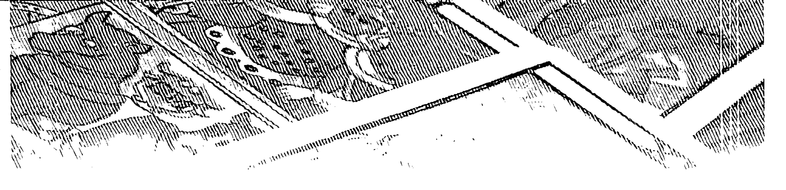

+   - 选项A 天使手上所握的圣杯
- 选项B 天使身旁的黄色花朵
- 选项C 天使身后的皇冠般的光芒
- 选项D 天使脚下的水池

### 选项A答案 包容对方的缺点与个性，感情还是有机会的

选择这一个符号暗示，如果你对目前的感情感觉到忧心忡忡，艾菲尔建议你，别担心，感情还是可以在风雨中坚持下去的。由于你们彼此能够包容对方的缺点与个性，因此相较于初恋时的不稳定，现在的感情可以说是根基非常的稳固。感情想要能够继续走下去，就不要再「鸡蛋里面挑骨头」，有时候睁一只眼、闭一只眼的感情，或许更轻松自由。

### 选项B答案 既然已经不爱了，还撑什么撑

选择这一个符号暗示，你们现在的这份感情恐怕有些危机。造成爱情不能长久的原因，不是第三者的破坏，主要还是你们的关系已经出现「同床异梦」的裂痕，尤其是你们都是爱自己多于爱对方的人，因此对方会觉得总是感觉不到你的用心与热忱。因为这朵天使身旁的黄色花朵，就是「水仙花」，此花在希腊神话中有「自恋」的暗示，所以艾菲尔建议你们，既然已经不爱了，还撑什么撑。

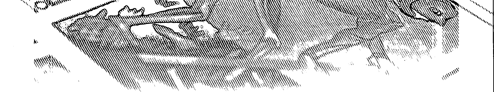

### 选项C答案 早早结束这份感情，也许下个情人会更好

选择这一个符号暗示，也许你已经对身边的这段感情感到失望，而把自己的恋爱幸福，寄望在更理想的对象上面。因为「皇冠般的光芒」代表更美好的目标与理想，既然身边的这段感情没法实现你对恋爱、家庭的渴望，那么就不要浪费彼此的时间，也许早早结束这份感情，下个情人会更好。

### 选项D答案 体谅与沟通，让你们的爱情升华成家人

选择这一个符号暗示，这段感情或许激情的感动比较少，但是亲情与默契的互动，却是非常浓厚的。由于你们彼此的心意相通，而且非常可以体谅对方生活、工作的压力，因此你们是彼此眼中的解语花。很多事情你们只要一个眼神就可以互相了解，这份真心的信任与了解，就是你们感情稳定的基石。因为在神秘学中，天使脚下的水池代表「深层的潜意识」，所以别担心，你们的爱情已经让彼此的关系升华成家人了。

## 我的学习心得

## 4 从塔罗牌进入潜意识，面对死神与魔鬼

很多人好奇塔罗牌为什么会准，就是因为塔罗牌是处理你深藏在潜意识中的问题和情绪，如果把你深藏在潜意识中的恐惧和问题解决了，你的烦恼和人生疑问自然也可以烟消云散。

### 塔罗显现潜意识

关于透过塔罗牌可以处理个人潜意识的问题，这是它跟一般西洋命理和中国算命最大的不同之处。这样的理论基础，如果从科学的角度来看，可以用瑞士心理学家荣格的「共时性」又译「同时性」（Synchronicity）来解释。简单的说，我们每个人除了有意识与潜意识的分别之外，在我们居住的这个环境和我们相处的这个地球上，还有一个属于我们大家的集体潜意识。

这个集体的潜意识就散布在我们四周，就像空气一样，无色、无味、无形，伴随着我们每天日常生活和作息，这个集体潜意识中有关于我们想法的片段，有关于我们记忆的残影，有关于我们情绪的因子，乃至於你的家人，以及你所关心的朋友、情人，和那些你今生都未曾谋面过的陌生人的任何讯息，都可以在这个浩瀚的集体潜意识撷取有关于他们的所有讯息。

当我们透过塔罗牌的抽牌与牌阵占卜时，简单的说就是把这些储存在人类共有集体潜意识的讯息，用图片、图象的方式重新排列，而形成一个新的画面，在这个新的画面中，由资深的塔罗牌老师，来解读关于你的过去，你的现在与你的未来。

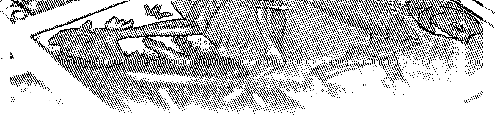

也许你会觉得，神祕塔罗牌似乎无法用科学的方式解释，但是塔罗牌就是凭借着它这种妙不可言的神祕性，被用来预测一个人的事业发展，揣测某人的爱情结果，甚至预言球赛和选举的胜负。

### 塔罗，面对自己的工具

当塔罗牌可以被用来预测所有事情的发展之后，那是不是所有的问题和困难都可以迎刃而解了。问题可能没有你想像的这么简单，因为在人的潜意识中存在了许多宿命的业力和因果，这些宿命的影响，就是我们内心的恶魔和魔鬼，当塔罗牌从我们的潜意识整个翻开来的时候，那些我们害怕的、那些我们恐惧的、那些被我们视成禁忌的话题和想法，就好像是潘朵拉的盒子被摊开一样。所以我们必须要面对我们内心的困境、我们必须用爱疗愈我们内心的伤痛，我们用关怀我们的家人、用宽恕来原谅我们的敌人、用开阔的心接纳我们的对手。

所有的仇恨都应该被化解，这样你才可以进入塔罗牌描述的美好世界。尤其是透过塔罗牌的学习之旅，你会发现原来我们在现实世界中，所争夺的、所抱怨的、所在意的、所恐惧的，到了那么美好世界都会烟消云散。所以奉劝各位塔罗牌的学习者，要珍惜生命中美好幸福的一切事物，千万不要在内心累积仇恨，因为这些仇恨只会茁壮你内心的魔鬼，并不会为你迎来天使慈祥的爱。

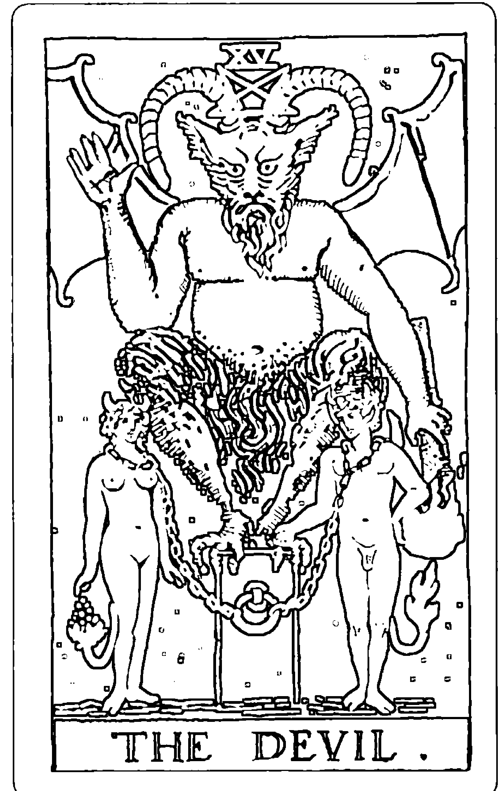

## 恶魔

束缚，俘虏，不伦，情色行业，妖艳，性，荒唐，欲望

### 牌面故事

在学习「恶魔」这张牌时，首先你会被这个怪异诡谲的空间感到恐惧，因为在一片漆黑的画面中，一个相貌狰狞的恶魔，手引着火炬，面前站着裸体的男女，感觉上非常的恐怖。没错，这张牌就是塔罗牌中，大名鼎鼎的「恶魔牌」。

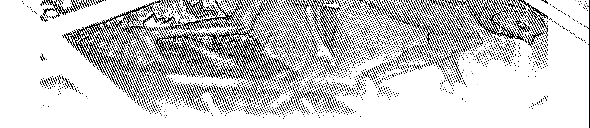

首先看看恶魔的样貌，你在他身上至少可以找到山羊、驴子、蝙蝠、猴子、牛、狼、老鹰等动物的象征。因为恶魔的原型就是「人类的兽性」，因为这张牌用了很多动物的符号，还反应人类原始的动物性。这张牌最大的涵义其实跟「欲望」脱离不了关系，这个欲望包括「酒色财气」的原始本能，也包括「色、声、香、味、触」等五欲。

或许你会怀疑，是不是真的有所谓的「恶魔」诱惑着我们向下沉沦，其实答案是否定的。因为你注意看看这张塔罗牌的背景，是一片漆黑的空间，这暗示着是你心灵的深处。所以即使世间有恶魔的存在，也是你心灵提供给他茁壮强大的养分。

至于恶魔前方的一对男女，则是描写着「亚当与夏娃」在偷吃禁果之后，受到了「情欲」的折腾。

#### 塔罗日记运势预测

如果你选择这张塔罗牌，暗示你的个性「善谋略心机深」，特别懂得在办公室里面察言观色，也会针对主管与上司的意见投其所好，因为你与生俱来的洞察力，也特别容易看穿别人的心思与权力欲望。所以在职场上你比较像是公司内部的主流派，针对主管的意见和主张，你绝对会贯彻到底，这样不但可以巩固你的权利，也可以增加你的价值。只是你这样的行为如果不加修饰，看在其他同事的眼里，可能认为你过于权谋与世故。

### 心测占卜解读 ☆现任情人是真爱还是祸害？

常常会有人问我「到底现任的情人是好人还是坏人？」针对这个问题，相信你也非常想知道，身边的情人到底人品如何？现在请凝视「恶魔」这一张牌，并且观察其中的符号，艾菲尔要告诉你，现任情人是你的真爱还是祸害？并加深你对「恶魔」这张牌的认识。

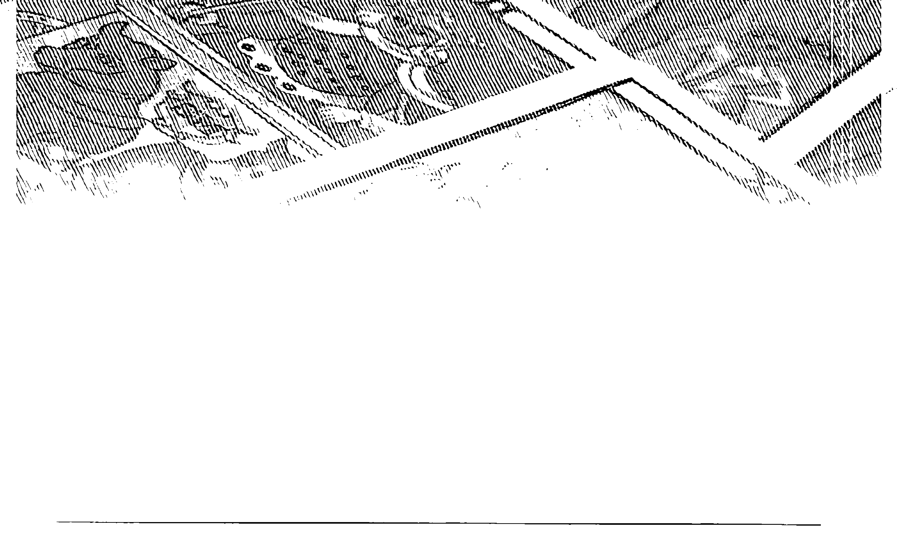

+   - 选项 A 恶魔头顶上的正五芒星符号
- 选项 B 恶魔的翅膀与头顶羊角
- 选项 C 恶魔手中的火把
- 选项 D 恶魔前方的裸体男女

#### 选项 A 答案 情人对爱充满理智，是你的最爱

选择这一个符号暗示，注意看看恶魔头顶上的五芒星，其实是一个「倒五角星」，五角星在西洋神秘学中是一个非常神秘的符号，象征着人的五种感官，因此「正五角星」代表情人在面对诱惑与暧昧的关系时，绝对会信守承诺，不敢越雷池一步。因此现任的情人对爱充满理智，是你的最爱。

#### 选项 B 答案 小心情人的本性，是个爱情祸害

选择这一个符号暗示，情人的潜意识还存在着想要出轨、劈腿的冲动，就好像是原始的动物一样，面对诱惑就显得蠢蠢欲动。因为恶魔的翅膀与头顶羊角，都代表着人原始的欲望。所以选到这个答案的人，最好管紧自己的枕边人，小心他将来成为爱情祸害。

#### 选项 C 答案 情人受到诱惑就会变成爱情祸害

选择这一个符号暗示，情人是一个心智不够坚定的人，再加上他的异性缘不错，因此身边总是围绕着暗恋他的对象。因为恶魔手中的火把，在神秘学中象征「煽动」、「引诱」。因此如果你与情人之间，因为时间或距离的关系，而无法常常见面，你就要小心情人受到刺激的引诱，而发展偷吃花心的秘密恋情。

#### 选项 D 答案 情人对爱不够坚贞，迟早变成爱情祸害

选择这一个符号暗示，情人本身就是一个不受教的人，常常违背你们的承诺和誓言。因为恶魔前方的裸体男女，身上都系着一条铁链，这暗示着他们是意愿向恶魔交换圣洁的灵魂，以换取短暂的快乐与欢愉。由于目前身边的情人对爱不够坚贞，所以迟早变成爱情祸害。

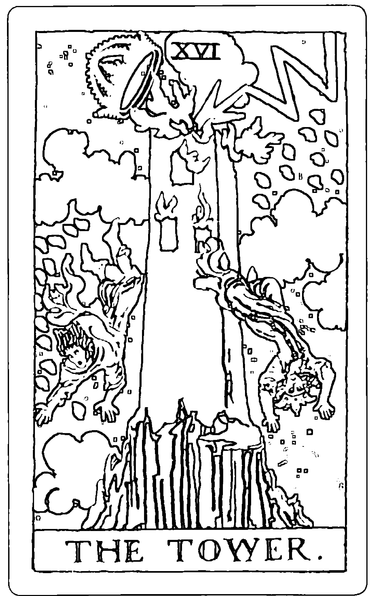

## 塔

突发事件，打击，挫折，崩溃，分手，倒闭，破产，开除，天谴

### 牌面故事

在学习「塔」这张牌时，首先你会被「一副慌张恐惧的景象」所吸引，这难道是高塔被雷击中，要倒塌了吗？没错！这张牌就是在描述这种紧张的关系。一道呈现「W」形状的闪电，恰巧打中高塔上的皇冠，慌张的人们，眼见三面窗户都冒出了火花，情急之下只好往下逃跑，但是这个举动是否会让他们平安地渡过危机呢？这个问题恐怕只有天知道。

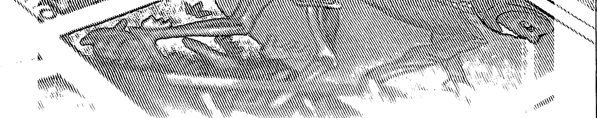

每次在学习「塔」时，总是会想起一个网友们发起的提问，「你觉得塔罗牌中哪一张最恐怖？」得到网友一致认为最恐怖的牌，就是这一张「塔」。原因很简单，这张牌的意思就是「完全的毁灭」与「宿命的天谴」，仿佛是命中注定的倒霉事，让你防不胜防，只能无奈的接受一切的破坏与毁灭。

这张牌中的皇冠，象征着人世间最尊贵的价值与名誉；牌中的高塔，象征着你苦心经营的人际关系、爱情关系或是一切能运用的组织与资源；牌中的两个人，一个是你，一个是你重视的那个人，在这慌张改变的危机中，谁还顾的了谁？或许你会问，抽到这张牌，还有解决的办法吗？诚挚的建议你「听天由命吧」。

#### 塔罗日记运势预测

你选择这张塔罗牌暗示，由于你的创业之梦是多么的不切实际，导致你才刚开始投注心力就遭逢巨大的冲击，惨烈的程度可说是屋漏偏逢连夜雨，只能说在你的创业之路上连老天爷都不站在你这一边，所以「剧烈的改变和挫折」是无法避免的，艾菲尔乐观的建议你，毁灭往往是成长的开始，所以还是请你积极的看待事情未来的发展，并适时修正努力的方向，因为「失败乃是成功之母」。

### 心测占卜解谜 ☆未来我倆不会有婆媳问题？

社会上时有婆媳关系不佳的新闻传出，若是发生在名人身上，媒体少不了要多加着墨。这种暗中较劲的互动关系，总是读者茶余饭后的话题。凝视「塔」这一张牌，并且观察其中的符号，艾菲尔要看穿你的内心并揭露你的命运，看看未来你倆不会有婆媳之争，还要教你认识这张牌－「塔」。

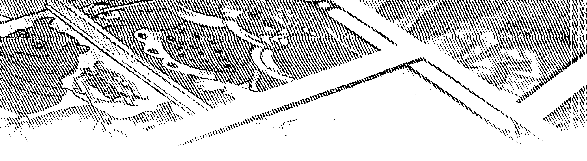

+   - 选项 A 塔牌中的皇冠
- 选项 B 塔牌中的闪电
- 选项 C 塔牌中的高塔
- 选项 D 塔牌中穿着红色与蓝色衣服的人

#### 选项 A 答案 结婚之后，你该改正一下自己的价值

选择这一个符号暗示，「皇冠」被认为是自己的意志与价值，可惜在这张牌中，却被闪电击中东倒西歪的。这就表示结婚之后嫁做人妇，虽然未必天天洗手作羹汤，但是面对一个全新的环境，如何跟自己的婆婆相处，可能有必要收敛一下自己的「娇气」，很多想法都必须要经过「审慎评估」，否则冲突和争吵应该难避免。

#### 选项 B 答案 未来你的婆婆是个狠角色

选择这一个符号暗示，「闪电」被认为是权威手中的武器，因为在神话故事中，天神宙斯就拥有「闪电」这个武器。所以未来你的婆婆恐怕也是个难以应付的「狠角色」。如果不是脾气暴躁，就是天生是个「刀子嘴」喜欢搬弄是非。建议你如果希望未来可以相安无事，你最好先学习「逆来顺受」，不然还是不要同住一个屋檐下，免得天天吵架。

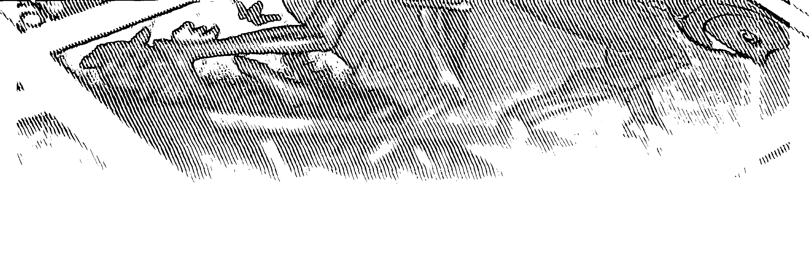

#### 选项 C 答案 婆媳过招八十回

选择这一个符号暗示，「高塔」被认为是坚定的意志与态度。在未来的婚姻生活中，最难适应的恐怕是婆家中，每一个人特殊的想法与行为模式吧。想要讨好自己的婆婆，可是婆婆特殊的想法与行为个性，也不是这么好被安抚的。所以想成为人见人爱的好媳妇，未来婆媳之间，势必要先过招八十回。

#### 选项 D 答案 互动平淡，相安无事

选择这一个符号暗示，塔牌中的「两个人」其实互动没有交集。因此在未来的婚姻生活中，就算你与自己的婆婆同住一个屋檐下，但是忙碌的生活，让彼此的生活互动降到了最低。所以「互动平淡，相安无事」的状况，也许是一种福气。因此未来婆媳间发生冲突的机会，应该可以避免。

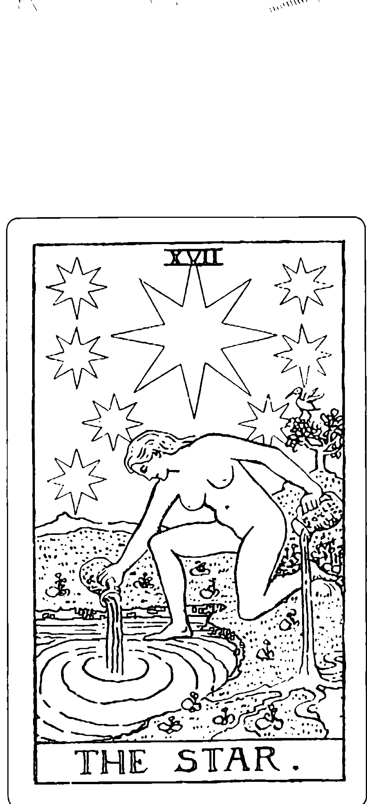

## 星星

实现愿望，灵感，未来有希望，幻想，治疗，有创意、医疗

### 牌面故事

在学习「星星」这张牌时，一个宁静又神秘的夜空，深深吸引着你的目光，那个在夜空下全裸的女性是谁呀？她就是神话故事中的「星星之女」，掌管着宇宙中关于音乐、艺术、天文学、医学与天神日常生活纪事的一个神祇。在原野中她裸着身体，舀起湖中的水，又慢慢让它回流到湖泊中，看似单调的举动，彷佛有着某种神祕的魔力。

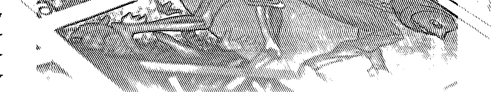

注意看看夜空中的星星，光芒耀眼的星辰，在这张塔罗牌中显得非常的巨大，没错这就是西洋神秘学中最有名的天狼星，属于猎户星座的星群。据说埃及金字塔所对应到的星星，就是以夜空中的天狼星为座标。

而这个星星也是告知世人耶稣即将诞生的「伯利恒」之星，也就是现在大家过圣诞节喜欢在圣诞树顶端上放置的那个希望的许愿星。而围绕在天狼星四周形成一个勺子的形状，它便是大名鼎鼎的「北斗七星」。塔罗牌的星星，给人一种安祥、希望与平静的感觉，也是创作力、思考力的来源。冥想著这张牌你可以获得许多神奇的力量。

#### 塔罗日记运势预测

如果你选择这张塔罗牌，暗示你是自主而独立的个体，在感情游戏中具有掌控恋爱热度和进度的主导性，尤其你属于「周旋在百花之间的花蝴蝶个性」，面对爱情洋溢着青春无敌的气息，视每一段恋情为你丰富人生经验的小插曲，因此在恋爱的过程中，你并不会为了哪个对象而专注的在他身边守候，因为你知道爱情是一种会退去的「激动」，当热恋降温之后，你就会把恋爱目标转移到别人身上，不断寻求新的感觉。

### 心测占卜解读 ☆我适合当情人？还是情妇？

你是情人眼中的好情人？还是好情妇？虽然只有「一字之差」，但是感受与价值却是差很多。凝视「星星」这一张牌，并且观察其中的符号，艾菲尔要告诉你，到底你适合当情人？还是情妇？另外要教你认识「星星」这张牌的含意。

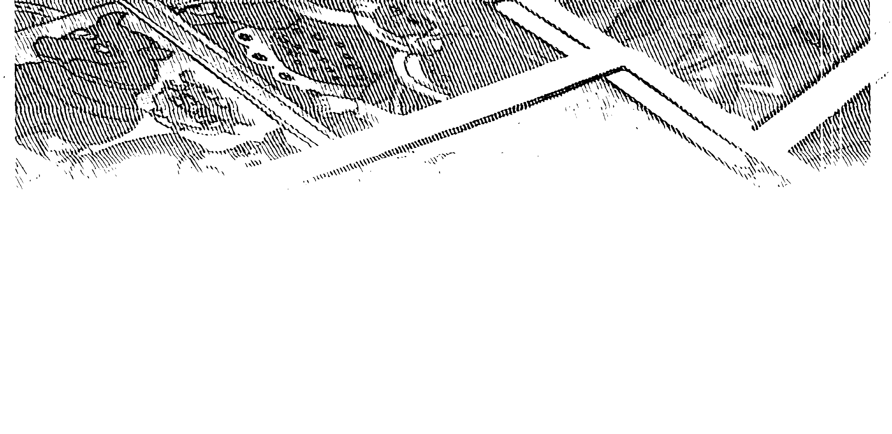

+   - 选项 A 星星牌中的裸女
- 选项 B 裸女手中的橘色水瓶
- 选项 C 橘色水瓶流出来的水液
- 选项 D 夜空中的八角星

#### 选项 A 答案 有当情人的潜在特质

选择这一个符号暗示，星星牌中的裸女，就是天空中的星星之女，有多变、打破传统与惊世骇俗的暗示，他们不按照世俗的传统，随意的驾驭着自己的爱情能量，因此很难在爱情中专注。在他们的想法中「婚姻」是个骗人的玩意，只有直接的热情与爱意，才能让他们活得像自己，因此选择这张牌的朋友，未来有当情人的潜在特质。

#### 选项 B 答案 虽然想从良，但总是被人当情妇

选择这一个符号暗示，你的个性其实很难捉摸，有时候害羞、有时候又热情。虽然外表给人一种乖乖女的形象，但是真实的你其实可以展现出不同的风情，尤其是对方总觉得你好欺负，因此在谈恋爱的时候，都会背着你花心偷吃，让你被迫变成情妇。虽然你一再的告诫自己，绝对要斩断这些烂桃花，但是你的心太软，虽然要求自己要从良，但总是被人当情妇。

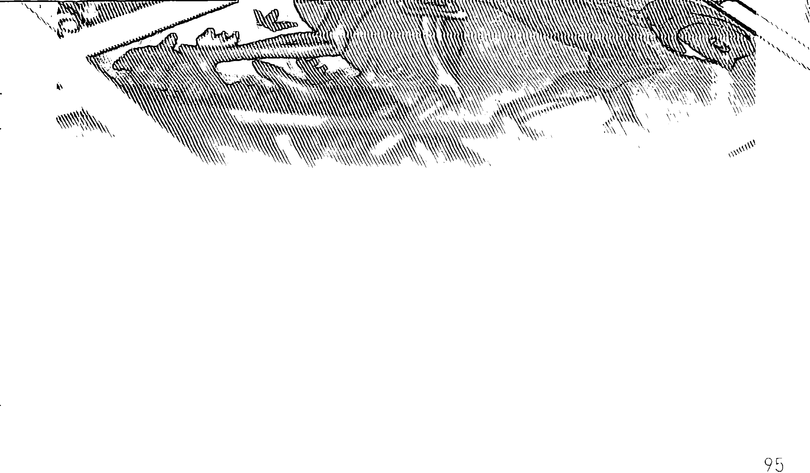

#### 选项 C 答案 只当情人太无趣，偶尔也想当情妇

选择这一个符号暗示，你的个性不按牌理出牌，常常有许多惊世骇俗的想法，尤其是在感情世界，你觉得趁着年轻、单身，或许可以尝试一点不一样的角色与生活。就好像是流出橘色水瓶的水液，不愿意再被局限在小小的瓶子中，恣意的展现自己最真实的面貌。因为你认为青春有限，只当情人太无趣，偶尔也想当情妇。

#### 选项 D 答案 你是异性期待的好情人

选择这一个符号暗示，你的个性非常的坚贞，而且对感情始终如一，就好像是夜空中的恒星，照耀着情人。由于你稳定又温和的情绪，让情人觉得值得信赖，这种温柔又体贴的爱，让情人觉得你是他期待已久的好情人。

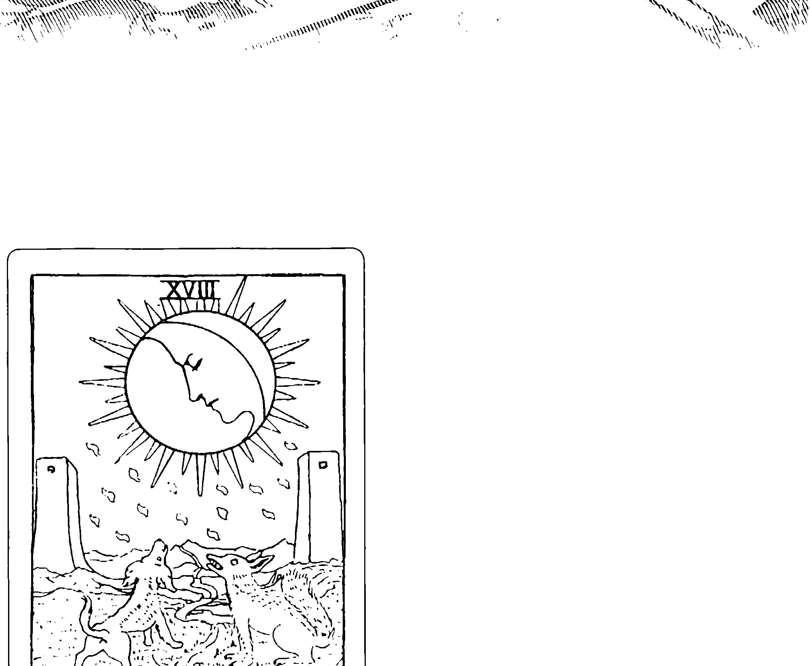

## 月亮

谎言，不安，内心脆弱，迷惑，暧昧，犯小人，欺骗

### 牌面故事

在学习「月亮」这张牌时，首先你会被一个巨大的月亮所吸引，这个月亮特殊之处，在于它有很多重的样貌，时而展现上弦月的样子，时而转变成月圆，时而隐藏自己变成神秘的蓝月。这个塔罗牌中的月亮，充满着神秘与不确定性，让人莫名的被它吸引同时隐约的感觉到未知的恐惧。

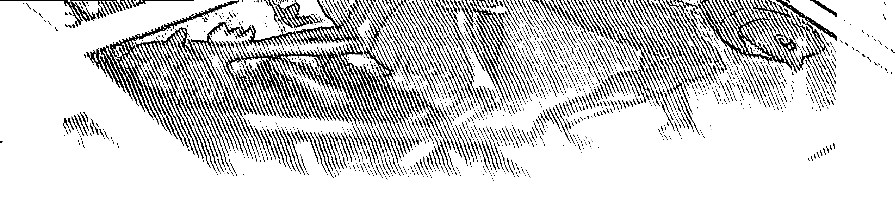

月亮牌中的主角，除了月亮之外，还有两只野兽分别是野狼和野狗，以及一只从水池边爬出来的蜥蜴。其中蜥蜴象征着内在的恐惧，而两只野兽则暗示着你原始的兽性。

人之所以会感觉到恐惧，就是因为无法清楚的窥探出自己内心的想法，我们在作判断的时候，不只受到理性、感性的影响，同时也会受到潜意识的阴影、兽性和儿童时的记忆等因素影响，因此人们总是说，「凝视着天空中的月亮，就是在跟自己的潜意识对话」。在现实占卜中，月亮牌则代表着「欺骗、隐瞒、背叛和小人」的涵义。

#### 塔罗日记运势预测

选择塔罗牌暗示，未来对你来说将会是一个「矛盾徬徨与充满危机的阶段」，由于是月亮牌的关系，这正是你心中太阳力量最微弱的时刻。这寓意着在职场中，你担心自己的才华与实力，会被忽视或是埋没，你内心的光与热，闪烁着就好像是天空中的星光，必须借助他人的帮助才能有所表现。因此想要在工作领域中更上一层楼将是困难重重。想要跳槽转职一样也是充满着危机，试想一下在只有星光的夜晚攻城掠地，你有把握安全的抵达目的地吗？还是留在原来的工作环境吧。由于时机不对，想要跳槽和转职都是不理智的决定。

## 心测占卜解读 ☆情人和旧情人还在暧昧吗？

陷入恋爱中的情侣，对于情人的一切秘密都想知道，包括情人是否还跟旧情人继续搞暧昧。凝视「月亮」这一张牌，并且观察其中的符号，艾菲尔要告诉你，到底情人与旧情人之间是不是还背着你在搞暧昧？究竟是你想太多，还是你的直觉已经发现了某种秘密。此外并加深对「月亮」牌的认识。

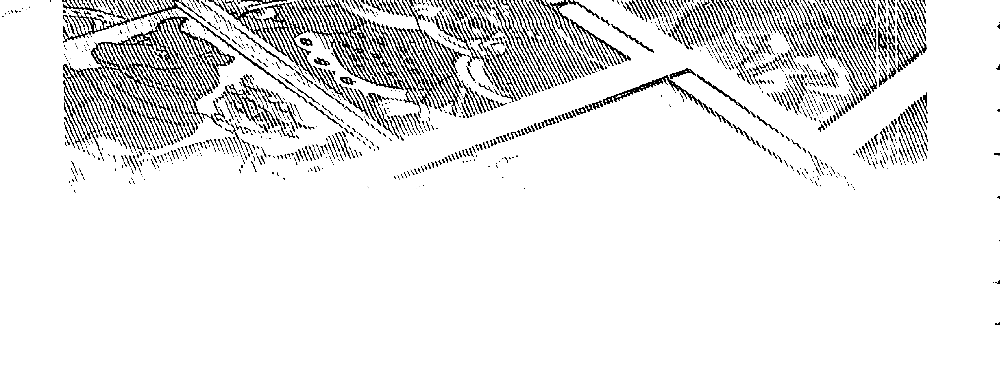

- 選項 A 月亮牌中的蠍子
- 選項 B 月亮中的人頭符號
- 選項 C 月亮下的野狼與野狗
- 選項 D 月亮牌中小徑所通往的道路

#### 選項 A 答案 曾經搞過曖昧，現在已經結束了

選擇這一個符號暗示，說起情人搞曖昧這一件事情，你就有一把「心頭火」，因為情人真的是個沒良心的人，竟然敢在你們交往的時候，偷偷跟前任情人搞曖昧，再不然就是還偷偷藏著舊情人送他的衣服與飾品，還好隨著你們戀情穩定，情人已經停止對舊感情的依戀與回憶。所以過去情人曾經與舊情人搞過曖昧，但是現在已經結束了。

#### 選項 B 答案 會搞曖昧，但是程度比較輕微

選擇這一個符號暗示，說起情人對舊感情的懷念，就如同初一、十五的月亮「不一樣」。因為情人屬於「睹物思情」、「觸景傷情」型的人，在平常的生活中，他並不會總惦記著舊情人，但是當你們感情不順利的時候，情人就會把你跟舊情人比較，看看誰比較溫柔體貼。或是經過與舊情人曾經同遊的地點，也會喚起他們的回憶。因此情人會搞曖昧，但是程度比較輕微。

#### 選項 C 答案 會搞曖昧，程度最嚴重

選擇這一個符號暗示，情人就算分手之後，還是會跟舊情人藕斷絲連，而且程度最嚴重。例如到現在他們還會在網路上保持 MSN 的聯絡，趁你不在的時候，不但講電話，而且還偷偷見面，簡直就是「捨不得放下這段感情」。因此建議你，千萬不要太相信對方，最好偷偷查勤、翻翻對方的電話簿，搞不好可以發現更多驚人的秘密。

#### 選項 D 答案 目前沒有搞曖昧，但是不知以後會不會

選擇這一個符號暗示，對於情人是否與舊情人搞曖昧的這個假設，你是暫時可以放心的，畢竟情人也沒有那個時間和膽子，所以你可以繼續好好經營這段關係。不過在愛情順利的時候，應該多培養默契與對彼此的信心，否則現在雖然沒有跟舊情人搞曖昧，但是難保以後絕對不會發生類似的事情。

## 5 步入人生美好的世界

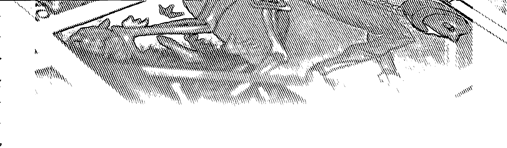

在塔羅牌的學習之旅中，你發現生命的開始都是純真無邪的，我們都是用愉快、樂觀、冒險的心情和態度來看待這個世界。但是隨著生命的過程日漸曲折，我們承受了太多的壓力和恐懼，這些負面的情緒和能量，影響了看待這個世界的角度，我們開始抱怨、開始欺騙、武裝自己，甚至對未來感到懷疑和不安。但是塔羅牌的旅程告訴你，沒錯，這些障礙和考驗，都只是生命過程中的一個小環節，並非生命的全貌。

因為抱怨是可以化解的，欺騙是可以導正的，武裝是可以解放的，懷疑與不安也可以透過智慧的判斷與睿智的洞察力穿透。唯一不變的是，這個美好的世界依然是純真無邪的，是值得我們再次用愉快、樂觀、冒險的心情和態度來看待他，只要我們拋棄過去、勇敢向前，那麼那個祥和的美麗新世界一定會出現在你的眼前。

### 太陽

一片光明，有活力，喜悦，有人帮助，好运

### 牌面故事

在學習「太陽」這張牌時，首先你會被一個幸福洋溢的畫面所吸引，一個稚氣的小嬰兒坐在白馬上面，他的身邊有四朵盛開的向日葵，還有一個熱力四射的太陽，顯然這一天是一個晴空萬里的好天氣。

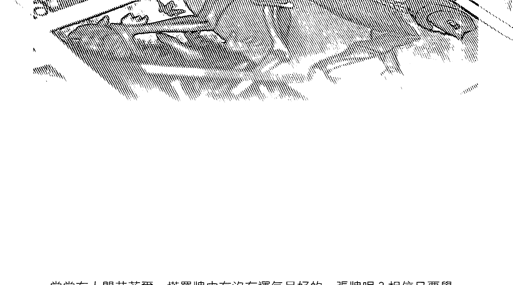

常常有人問艾菲爾，塔羅牌中有沒有運氣最好的一張牌呢？相信只要學習過塔羅牌的人都知道，「太陽牌」是塔羅牌中能量最強的一張牌，因為太陽這個符號，無論是在遠古還是現代，它都是最有能量的象徵。

「嬰兒」在此有新生命誕生與新機會出現的暗示，「白馬」象徵著遠行與一帆風順的好運。就連花園中的「向日葵」也全部盛開，暗示著這是一個晴朗順利的一天。任何人只到選到這一張牌，幾乎可以說是拿到了幸運女神的桂冠，因為一切的願望與期待，都有可能順利實現。

### 塔羅日記運勢預測

選擇塔羅牌暗示，未來對你來說將會是一個「掌握機會與追求成功的階段」，你現在的職場能量就像是日正當中的太陽，正從厚重的雲層中探出萬丈光芒，耀眼的光輝讓人無法忽略你的存在。這寓意著在此刻你的才華與實力，將被工作中的貴人發掘，甚至有可能帶領一個團隊成為領導者，善用你的自信與魅力，你可以爭取到很多的合作機會的，是老闆和同事眼中不可多得的人才。

#### 心測占卜解讀 ☆我的桃花運會從幾歲開始？

菊花、蓮花、荷花，女人的最愛莫過於「桃花」，想知道你從幾歲開始走桃花運嗎？凝視「太陽」這一張牌，並且觀察其中的符號，艾菲爾要幫你預測一下，你從幾歲開始「情花開」，還要教你認識「太陽牌」。

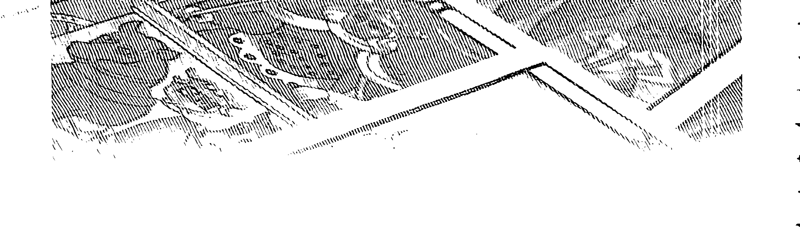

- 選項 A 光芒四射的太陽
- 選項 B 向日葵
- 選項 C 白馬
- 選項 D 小嬰兒

**選項 A 答案** 選擇這一個符號暗示，你的桃花年在 29 歲、30 歲、31 歲、32 歲。你很討人喜歡。但是你也可能氣得別人發瘋。你雖然知道你喜歡誰，但是你並不瞭解誰喜歡你。有的時候，時間是唯一公正的法官，只有它能幫你看清楚誰值得你珍惜。雖然你在愛情上有遠大的前程，但是，你如果不在你的桃花年好好把握，你有可能會錯過你最喜歡的，也是最適合你的。當你眼巴巴地看那個人從你手中溜走，你可能才會明白，此情可待成追憶，只是當時已惘然，當然你也要小心有晚婚的危機。

**選項 B 答案** 選擇這一個符號暗示，你的桃花年在 25 歲、26 歲、27 歲、28 歲，你需要積極勇敢一點才能得到幸福。你的桃花很多，但是都很淡。所以說，如果你不能主動地追求幸福，可能很多很好的緣分到你手中都會變成親情或者友情。當你愛上一個人的時候，可真的多多少少都需要一些衝動。付出越多，收穫越大。雖然你的桃花很淡，但是每次發生都是一個驚喜。

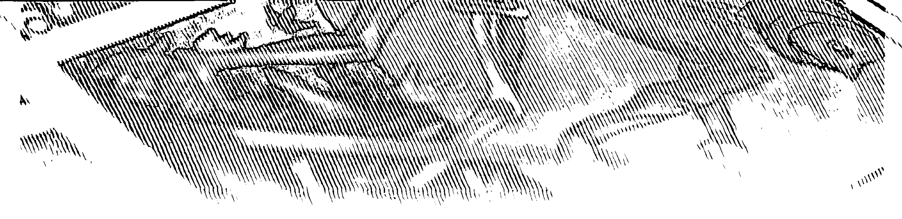

**選項 C 答案** 選擇這一個符號暗示，你的桃花年在 21 歲、22 歲、23 歲、24 歲，其實你的桃花年是常年開放的，但是這幾年可能更容易有真命天子出現吧。你本身具有善良溫和的性格，可以跟很多不同性情的人進行交往，很多人和你交往之後，多多少少會被你吸引，就算離開你也會想念，可以說你是情場上的幸運兒，當然也可能早婚。

**選項 D 答案** 選擇這一個符號暗示，你的桃花年在 17 歲、18 歲、19 歲、20 歲。由於你青春洋溢，再加上你有赤子之心，因此在你年輕的時候，身邊就會出現很多追求者，雖然有些人表達示愛的方式可能古怪，如果你肯用心去聆聽，你會發現，這種人可能也有幽默的一面，當個朋友也是不錯的選擇。

### 审判

復活，事情的最後決定，判斷力，收穫，改變，審判，解放

### 牌面故事

在學習「審判」這張牌時，你會感覺到一個豐富的場景和畫面，一個天使吹奏著和諧的音樂，在底下的人們歡欣鼓舞的接受著天使的祝福。這個吹著治療聖樂的天使就是聖經故事中四大天使之一的「加百列」，它在聖經故事中最有名的例子，就是告訴大家「大洪水」即將來臨，同時也是告訴世人，耶穌降生馬槽的福音天使。

這個「審判」牌描寫的是人死而復生的神話，從棺木中爬出來的人們，有男有女、有老有少，它們因為接受了天使的祝福，因此擺脫了原本束縛在身上的枷鎖，而讓靈魂獲得「重生」。其實很多人誤會「死而復生」的涵義，它講的不是生命的復活，而是指靈魂的「重生」。

「加百列」天使，手中所拿的小喇叭是它的象徵符號之一，吹奏出七個音符，可以治療人的七個脈輪，而「十字旗幟」則有宗教、救贖與治療的涵義。因此這張牌最核心的意義就是「只要放開心胸，你自然可以接受到神的祝福與救贖」。

### 塔羅日記運勢預測

選擇這一張牌，暗示你最近的心情與感情，似乎仍受到舊情人或是往日戀情的影響，還沒有從失戀的難過中脫離出來，你的心情徘徊在舊情人與新戀情之間。念舊的你，表面上雖然看不出你對過去戀情的思念，可是仔細想想，如果心中沒有一個最後的決定與割捨，是不可能接受新的戀情，艾菲爾建議你如果期待新的感情機會，必須先徹底的跟舊愛和往日戀情作一個明顯的分割。

#### 心測占卜解譯 ☆愛情破鏡可以重圓嗎？

愛情破碎了，還有沒有機會再來一次呢？凝視「審判」這一張牌，並且觀察其中的符號，艾菲爾要告訴你，到底愛情破鏡可以重圓嗎？另外要更進一步地教你認識這張「審判牌」。

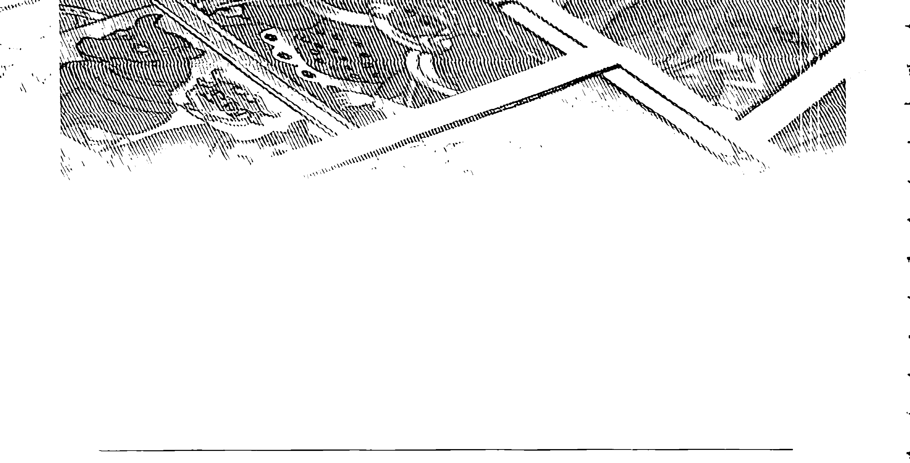

- 選項 A 紫色翅膀的天使
- 選項 B 天使手中的小喇叭與旗幟
- 選項 C 天使下方高舉雙手的六個男女
- 選項 D 天使下方長方形的盒子

**選項 A 答案 破鏡重圓有奇蹟**
選擇這一個符號暗示，破鏡重圓對你來說並不是不可能發生的。當你和情人發生口角或是衝突的時候，也許你可以藉由共同的朋友或是家人當你們的「和事佬」，畢竟陷入愛情危機的情侶們「當局者迷、旁觀者清」，聽從旁人的協助，可以指出你們感情問題的癥結點，只要接受旁人的建議與祝福，相信感情的破鏡重圓，還是會有奇蹟發生的。

**選項 B 答案 原諒情人，破鏡重圓等時機**
選擇這一個符號暗示，破鏡重圓對你來說，只要你願意原諒情人，破鏡重圓的一天一定會到來，只是時間早晚的問題。面對感情的尷尬處境，對於情人的過錯，只要你願意釋懷原諒對方，那麼你對情人的恨意也會消除，或許回歸平靜的心情之後，兩個人可以重修就好，再次破鏡重圓。

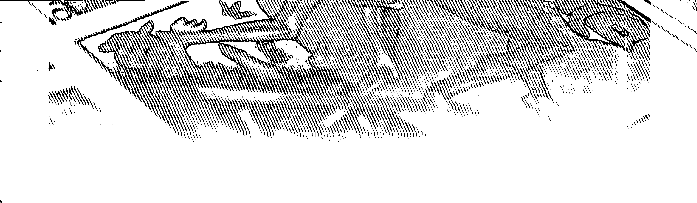

**選項 C 答案 改變個性，破鏡重圓非難事**
選擇這一個符號暗示，情人鬧分手一定是彼此的個性不合，或是觀念上有一些衝突。為了延續過去的甜蜜時光，建議你們彼此都需要改變自己的態度與行為，或許可以更溫柔體貼一點，或許可以更加強溝通與互信，只要願意改變自己固執、控制、自大與孤僻的個性，感情要破鏡重圓一定不是難事。

**選項 D 答案 個性頑固、破鏡難重圓**
選擇這一個符號暗示，你與情人之間的爭吵，已經到了一發不可收拾的地步，而且彼此都不願意再跟對方有任何的連結和互動。看到對方打來的電話，你就直接想關機，甚至連跟情人有關的物品、回憶，你也全部想要刪除，由於你們彼此的傷痕還在，因此想要破鏡重圓，恐怕是非常困難的事情。

### 世界

完成，幸福，美好，成功，旅行，財富

### 牌面故事

在學習「世界」這張牌時，一個繽紛又豐富的畫面呈現在你的面前，特別是在空中有一個花環，裡面有一個揮舞著彩帶與魔法棒的天使。在這個花環的四周，分別有「獅子」、「老鷹」、「天使」、「金牛」的符號，這代表著西洋神秘學中，最重要的四個元素，也是星座中四個星座的符號代表。

「世界」牌是七十八張塔羅牌中，大阿爾克納牌的最後一張，它象徵著美好的世界與精神、物質的和諧與完整，因此在占卜的時候，選到這一張牌，有非常幸運和順利的暗示。

「世界」牌是塔羅牌大牌的最後一張，他象徵著愚者之旅最後的終點與目的地，由於愚者經歷了一切的困難和挑戰，並且完成了生命中不同的試煉，最後獲得人生寶貴的經驗，因此才可以享受幸福與美好的人生。但是究竟塔羅牌中的「美好世界」是否真實的存在於我們的四周呢？究竟人生的哪一處風景才是愚者真正想要追求的完美目的地呢？如果你真正懂得「愚者的精神」，或許這一切的問題都不再是問題了，因為在愚者的心目中，把自己樂觀、正直、和諧與平靜的力量發揮出來，隨處都是美好的世界。

### 塔羅日記運勢預測

選擇這張塔羅牌暗示，當你和情人之間共同遇到難關的時候，你會為了愛情犧牲或是自願奉獻的程度是最高的，因為「世界」象徵經過苦難與磨練之後的完整和和諧。你們堅定的相信，兩個人在一起，必定是前世註定的緣分，就算此刻遇到了人生中的關卡，只要同心協力一定可以克服，甚至衝破這道關卡。由於你的心被一道和諧的光包圍著，因此為愛無怨無悔付出的程度是最高的。

#### 心測占卜解讀 ☆擇偶時，你最重視什麼價值？

「擇偶」是人生的終生大事，你會重視什麼樣的價值？凝視「世界」這一張牌，並且觀察其中的符號，艾菲爾要告訴你，在擇偶的時候，你會優先重視另一半的心靈契合還是選擇純粹的肉慾關係。並帶領你一起進入「世界」這張塔羅牌。

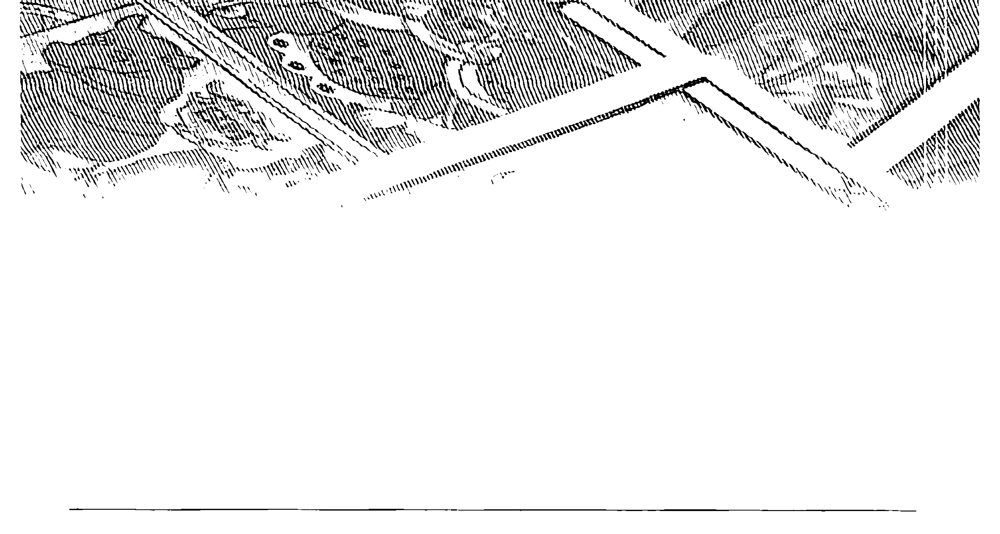

- 選項 A 右下方的「獅子頭符號」
- 選項 B 右上方的「老鷹頭符號」
- 選項 C 左上方的「天使頭符號」
- 選項 D 左下方的「金牛頭符號」

**選項A答案 重視肉慾與熱情的感動**
選擇這一個符號暗示，在選擇感情或是婚姻的另一半，最讓你怦然心動的，其實是另一半的身材與外在條件。簡單的說，你是一個視覺型的動物，你偏好身材凹凸有致的美女，或是欣賞體格強健的帥哥，因為只有這類型的情人，可以帶給你戀愛的刺激和快樂，因為你比較重視「肉慾和熱情」帶給你的感動，而這種感覺則是影響你擇偶的重要條件。

**選項B答案 重視溝通與心靈交流**
選擇這一個符號暗示，在選擇感情或是婚姻的另一半，最讓你感覺舒服與平靜的，其實是你與另一半的心靈交流和默契。簡單的說，你是一個重視「觀念溝通」的人，你欣賞對方的才華，當然也期待自己的想法觀念，能夠獲得對方的認同。因為你比較重視「心靈交流」帶給你的感動，而這種感覺則是影響你擇偶的重要條件。

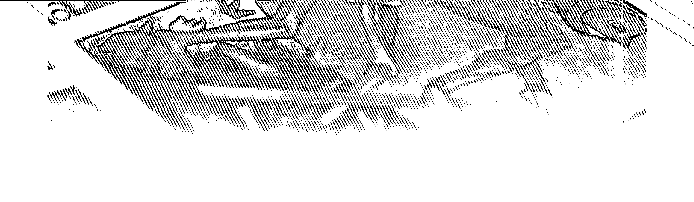

**選項C 答案 重視心靈契合度**
選擇這一個符號暗示，在選擇感情或是婚姻的另一半，最讓你感覺舒服與幸福的，其實是你與另一半的感情和浪漫互動。簡單的說，你是一個重視「戀愛滋味和浪漫回憶」的人，你渴望找情人依賴，並且可以親密的撒嬌。因為你比較重視「愛的交流」，而這種感覺則是影響你擇偶的重要條件。

**選項D 答案 重視物質和夥伴關係**
選擇這一個符號暗示，在選擇感情或是婚姻的另一半，最讓你感覺穩定與誠懇的，其實是你與另一半的事業與未來發展。簡單的說，你是一個重視「物質生活和安全感」的人，你渴望找到感情與事業的夥伴，這種感情生活與事業發展結合的愛，會讓你充滿活力與自信，而這種感覺則是影響你擇偶的重要條件。

## 1 我的塔羅故事

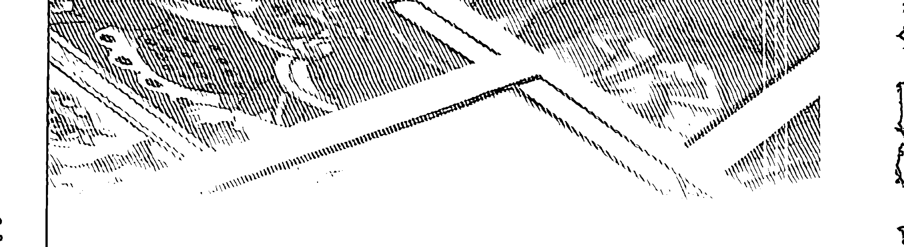

### 寵物情人

關於塔羅牌的神秘性與靈異能力，相信每一個對塔羅牌好奇的朋友，都一定或多或少聽過一些流傳在塔羅牌世界的神秘故事。這樣的神秘故事對於喜歡神秘學的朋友來說，其實反而是一種吸引人的魅力，但是艾菲爾本人從學習到實際幫人占卜這麼久的時間中，本人並沒有有很多跟這種神秘現象接觸的經驗，當然也沒有因為學習塔羅牌而遇到鬼怪或是靈體附身的現象。

不過這麼多年的占卜，還是有幾個神秘難解的故事可以跟大家分享，或許大家可以站在比較客觀的角度來看待我的經驗。

第一個故事是關於塔羅牌算出寵物是飼主前世情人的故事。

常有人問我，塔羅牌可以預測什麼樣的問題。

> > 「有關愛情、人際關係或是工作發展等，未來三到六個月的運勢都可以用塔羅牌來預測」。這幾乎成為我對於這類問題的標準答案。

有時候我也常在想，現在人不就是因為對愛情、人際關係或是工作等問題感到彷徨所以才會來問塔羅牌嗎？難道還有其他項目比這些問題重要嗎？我存在這樣的想法已經有一陣子了。

直到一個叫莫尼卡的女生約我，才打破我對塔羅牌只能預測這些問題想法的迷思。

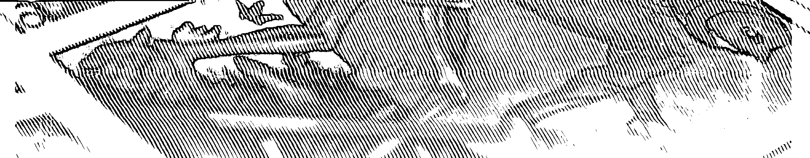

某天我接到一個叫莫尼卡的女生電話，他在電話中告訴我希望能和我約個時間見面，就她所想知道的問題來利用塔羅牌占卜一下。在電話中我和她約定了會面的時間，只是因為時間匆忙，電話中我並沒有詢問她希望占卜的問題是什麼，但我心想可能就是愛情或是工作困擾吧，難道還有其他問題嗎？

我們約在週五的晚上見面，因為是週末的關係，她穿著輕便的服裝，讓我第一眼望去，以為她是個在學的研究生。後來在談話中才知道她是在外商公司工作的秘書。

「你想問愛情還是工作預測呢」？我習慣性的問著莫尼卡。

「都不是，我想問我和寵物鼠在未來有沒有緣份再度相聚在一起」。對方回答我的問題。

「……」我似乎沒有聽懂她的問題，又重複了一次。我驚訝的表情反而讓對方感到不好意思。

她向我解釋，不要因為這個問題而覺得她蠢或是很無聊。

接下來她告訴我和這隻楓葉鼠相處一年多的故事

一年多以前，他的朋友因為要到香港工作，所以把兩隻楓葉鼠送給她照顧。由於她也很喜歡寵物，所以就收下來了。

但是她過去並沒有養過楓葉鼠，所以對於這種動物的習性與嗜好一點都不了解。只覺得楓葉鼠個頭小小的，卻活力十足的樣子，讓她覺得非常可愛。剛開始飼養的時候因為彼此都很陌生，楓葉鼠還會咬她，以宣洩自己的敏感與不安。但是久而久之，彼此熟悉之後，楓葉鼠甚至在她肩上跑來跑去，從手的這一端跑到另一端。她覺得在男友出國的這段時間，有兩隻楓葉鼠陪伴是最大的慰藉與寄託。

但就在一個星期前，其中一隻楓葉鼠卻因為生病死掉了。為此她還向公司請假兩天無法上班。

所以她想知道和這隻楓葉鼠未來還有沒有緣份在一起。

乍聽到這個問題時我有點驚訝。

驚訝的原因不只是因為我第一次被問這樣的問題，也來自於我究竟應不應該在這個問題上幫她占卜。

畢竟一個寵物的靈魂不是我能掌握或是褻瀆的。

但是在了解她的意思之後，我知道她是個很崇敬的想要了解這個問題，我便試著藉由塔羅牌來幫助她。

我告訴她當牌陣中三張牌全部出現正牌時，那麼答案就是肯定的。如果三張牌有一張出現逆位的倒牌，那麼答案就不一定了。

當三張牌抽出後，我記得我在翻牌的那一煞間，我的心跳和莫尼卡的脈搏以及楓葉鼠的靈魂全都連結在一起。

「第一張是寶劍十、第二張是吊人、第三張是聖杯六」我一張接著一張的翻開。

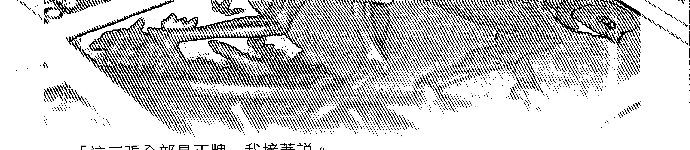

「這三張全部是正牌」我接著說。

所以這三張牌暗示著在不久的將來這隻楓葉鼠的靈魂，會以其他生命的方式在你的身邊出現。寶劍十象徵你對於這隻楓葉鼠的離開感到傷心難過到不能平復自己的情緒。而吊人牌則象徵楓葉鼠默默的為你付出依賴與信任，牠這一生的使命就是要為你帶來快樂，牠是個守護的靈魂。

她聽到這裡，點點頭，表示同意我的說法，接著她又開口問我。
「那未來我們會再相遇嗎」？

「會的，因為未來出現聖杯六這一張牌，他描述著一個人以溫柔的態度和神情保護著另一個人，兩個人共同緬懷過去一段熟悉的回憶，所以未來是可以期待再相遇的」。

接下來我翻開這副牌的切牌，竟然出現了一張聖杯二號牌，這代表莫尼卡自己的潛意識也已經感應到，她與寵物的關係，不是單純的飼主與寵物，其實他們在前世的經驗中，有可能曾經是一對戀人，因為在塔羅牌 78 張牌中，清楚代表戀人的牌也只有兩張，分別是戀人牌和聖杯二號牌。

聽到我的預言之後，她露出了希望的笑容。就好像是陰雨過後遇到難得的陽光一般。

在莫尼卡決定結束離開前，我問了他最後一個問題。

「你的楓葉鼠叫什麼名字」？
「他叫壞壞，一隻很聰明的楓葉鼠」莫尼卡的臉上流露出不捨的感覺。
「祝福你和壞壞在未來的日子中，能早日相遇」我很肯定的告訴他，因為塔羅牌也給了她肯定的答案。

# 第六章 權杖牌組

邁向你的英雄之旅，做自己的英雄

無論是希臘神話、北歐神話乃至於中國的傳奇故事中，都有很多描述個人冒險的神奇故事，不管是在什麼樣的文化背後或是靠著什麼樣的信仰支持，這些故事中的主角都有許多個共通性，如果不是出生在貧苦的家庭之中，再不然就是從小背負著家族與命運的原罪，但是這些故事的主人翁，並不因為這些先天的殘酷條件而自我放棄，也不曾向悲慘的命運低頭，他們選擇用自己的意念去戰勝困難的環境，用自己的雙手披荊斬棘，用自己的雙腳邁向自己的成功之旅。

整個權杖牌組從一號牌到十號牌，所要呈現的就是我們的內心不向命運低頭的心路歷程。當我們面對宿命與業力的考驗時，如果我們選擇退縮，那麼永遠只能瑟縮在自己內在脆弱狹小的心靈空間中。但是權杖牌組要告訴我們的實證卻是，任何微不足道的小人物，也可以成為自己的英雄，只要你願意敞開心胸，接受命運的考驗，迎向生命的挑戰，無論你的人生志向是什麼，只要勇敢的踏出第一步，你便開始了你的英雄之旅。

無論這個旅程有多麼漫長，這個旅程的考驗有多麼艱辛，積極的信心和無比的勇氣，將是你邁向成功之旅的護身符。

權杖牌組同時也告訴我們，我們來到這個世界上，就是這個世界的主角，永遠不要放棄，只要勇敢前進，你一定可以在這趟英雄之旅中凱旋而歸。

## 權杖一
充滿機會與行動力的時刻

### 牌面故事

漂浮在天空中的雲團，從裡面伸出一隻男性的右手，手中緊握著一根權杖，權杖上有若干樹枝和樹葉，這就是很典型偉特牌對權杖一號牌的圖像描繪。

在認識權杖一號牌的時候，必須先對權杖一號牌所代表的元素符號與精神內涵有充分的了解認識之後，那麼你才可以順利的學習接下來的權杖數字牌組與權杖所代表的宮廷牌。

首先「權杖」在西洋神秘學中代表的是火元素，它有生命力、創造力、行動力的暗示，當然也是西洋神秘學中陽性符號的代表。因為你仔細的觀察那隻伸出雲端的手，其實是有著陽剛、粗壯和堅毅的象徵。接下來把你的眼光往畫面的背景遠眺，你會發現這是一處有城堡、有高山、有河流、有樹林的風景。城堡中的安全性、財務和身處其中的家人，是這個權杖與這隻手的主人想要保護和擁有的。高山的挺拔與堅持，也彰顯了權杖一號牌對於自己原則和理想的堅持。而河流代表權杖的主人對於處理感情的態度是直接、積極，不達目的絕不輕言放棄或是回頭的。而茂盛的樹林，則暗示權杖所帶來的生生不息的生命力與創造力。

### 占卜解讀

由這些看似簡單的符號，卻代表著深遠與神秘的意涵，因此在學習權杖牌組時，必須深刻的了解，它與聖杯牌組、寶劍牌組、錢幣牌組之間的差異與區隔，在未來在牌陣與占卜的解釋上，才可以達到豐富、準確與多元的目的。

### 塔羅日記運勢預測

選擇這張塔羅牌暗示，當情人向你提出近期結婚的請求時，對你來說真是一個「美夢成真」的事情。在潛意識中你本身就渴望能和心儀的對象步入禮堂，如今男友終於開口向你表白他的想法與期待，你夢想能當個美麗高貴的新娘的願望不久就可以實現了，現在唯一困擾你的就是你父母與長輩的意見，以及未來你和公、婆相處的問題，如果他們也希望你們早日完婚，那麼你們的婚禮籌備將會進展的非常順利喔。

## 權杖二
在動、靜之間作一個決定

### 牌面故事

一位穿著歐洲中世紀衣服的男士，站在樓房的高處往遠方看去，外面的風景有高聳的山嶺，也有綠草如茵的丘陵，一彎平靜的水面，像是寬廣遼闊的海洋。而這位男士所身處的地方則是城堡內樓頂。他的右手拿著一個球體，感覺像是一個地球的模型，左手則緊握一支權杖，這樣的構圖是偉特版塔羅牌在詮釋權杖二號牌最經典的畫面了。

既然叫作權杖二號牌，那我們首先把學習的焦點，放在畫面中的這兩支權杖，相信大家也已經察覺到這兩支權杖的差異了。因為一支是固定在城牆之上，另外一支權杖就是緊握在這位男士的左手上，一支是固定的，另一支卻是可活動、自由的。這暗示當你面對事業抉擇、愛情發展、或是是否出國留學等二擇一的抉擇時，不要忘記，決定權始終都是在你的手上，你可以選擇維持一個既有的現狀，也可以選擇一個自由、全新的新狀態。無論你選擇用什麼樣的態度去面對未來，你所需要具備的都是自信與勇氣。

如果你選擇了維持既有的現狀，那麼你也沒有損失，因為你就像是固定在城堡上的權杖一樣，依然被保護安全的待在原處，持續的擁有這整個莊園與權力。如果你選擇了一個新的發展與決定，那麼就是選擇了一條全新、自由、開闊的道路。

你的冒險精神，將可以帶領你去探索新的世界、尋覓新的機會。

### 占卜解讀

在學習權杖二號牌的意義時，可以從城堡內外的差別，和兩支權杖的差異，以及這位男士遠眺遠方的神情來略之一二。你可以把這位穿著歐洲中世紀衣服的男士，解讀為是這個城堡或是莊園的領主，在既有的基礎之上，仍然期待前進遠方的夢想。無論這個遠大的夢想是單純的想要遨遊世界，還是想要獲得更多的資源，佔有更多的土地和權力，這樣的差異度就在於他手中握著地球時，在思考未來的一念之間。

### 塔羅日記運勢預測

如果你選擇這張塔羅牌，暗示最近想要換工作的心情是非常的急切，但是你似乎還處在「觀望局勢、等待機會」的狀態。雖然你對目前工作的興趣已經降低，但是你好像還在思考未來的方向在哪邊，由於目前的心中存在著不只一個選擇的工作機會，以致於你處在「以靜制動」的思考狀態。艾菲爾建議你，如果想要轉職換工作，你可以先思考一下，究竟什麼樣的工作性質與內容，才是最適合你的。只要清楚的思考這一點，那麼就可以鼓起勇氣，勇往直前。所以你最近換工作的機會，也是很高的。

## 權杖三
等待遠方捎來的好消息

### 牌面故事

延續著塔羅二號牌的畫面，當我們在閱讀權杖三號牌時，可以明顯的看出畫面主人翁對於未來的期待。與權杖二號牌相同的是，一樣有一個人站在山嶺的高處，但是權杖三號牌這位穿著橘紅色外袍與綠色披肩的主角，似乎更靠近海濱，他彷彿站在海港的高處看著遠方的三艘船帆。這三艘船帆與他身邊的三支權杖互相輝映著，這形成了偉特版塔羅牌權杖三號牌的經典畫面。

### 占卜解讀

要了解權杖三號牌的意義時，大家不妨揣測一下，這個主人翁與海面三艘船的關係。這位主人翁是不是這三艘船的船主，正站在海濱的海港等待著漁豐收的消息呢？或者這個主人翁只是一個單純想要旅行前往遠方的旅人呢？無論你覺得這個主人翁的身分是什麼，權杖三號牌在解釋上，都與海外、國外、遠方的事物或消息有關。也許你正在等待別人的回應，或者你正在醞釀一個遠方的旅行，但無論是哪一種，結果和過程都會是順利圓滿的，只不過在這個確切機會與出發日期來臨之前，你還需要有一段等待的時間，短則三五天、一個禮拜，長則十天、半個月，但只要你有耐心並且對自己有信心，你是可以得到一個期待豐收或是順利成行的好消息的。

### 塔羅日記運勢預測

如果你選擇這張塔羅牌，暗示在職場中你的工作態度渾身是勁，職場上也有貴人相助，樂觀開朗的朋友能幫你克服重重挑戰。財務上「要怎麼收穫先怎麼栽」是賺錢的不二法門，投機與僥倖不容易在你身上發生，由於成功是一步一腳印的累積，所以不用羨慕別人現在享受的成果，因為他們也是苦過來的。由於你有正確的認知，你就像是一隻蟄伏中的大鳥，只要有熱帶氣旋來到，就可以展翅高飛。因此艾菲爾建議你，這段時間可以培養休閒活動和建立人際網絡，未來這些人和資源都是你邁向成功的基石。

## 權杖四
一段安穩、舒適的關係

### 牌面故事

有別於前面介紹的權杖一、權杖二以及權杖三號牌，畫面中都只有一位主人翁，在權杖四號牌中，出現了一個更具像、更豐富多元的畫面。因為在這個牌中很明顯的可以看到這是一群人歡樂的聚會。

賓客當中有大人也有小孩，大人們手中握著新鮮花朵所編織而成的花束，向你招呼著，似乎大聲的邀請你加入他們的聚會同樂，而小孩子也已經載歌載舞圍成圓圈在開心遊戲，這是一個風和日麗，充滿鮮花、歡笑與愉快氣氛的一天。

權杖四號牌中的權杖，不同於前面三張牌、孤單或是錯落的散置各處，這邊的四支權杖和諧、穩定、協調的整成一個花架，這個花架上編織了豐盛的水果與芬芳的花朵，暗示著這個聚會是成功的、是受人歡迎的、是為某人紀念並慶祝一個特別的聚會。而遠方的紅瓦白牆的城堡，在畫面中顯得巨大而穩固，與這四支權杖相互輝映。就好像是在一個安全、穩定的場所中，任何人都可以自在的唱歌跳舞、飲酒歡樂。

### 占卜解讀

由這張牌延伸出來的解釋，如果放在職場中，代表大家同事彼此之間的相處，非常的和諧、彼此有良好的合作基礎，互相都是對方的貴人，沒有小人或是扯後腿的事情。如果放在感情中，代表你與情人之間的互動，是非常穩定、愉快的，彼此都信守著對情人的承諾，也都嚮往未來可以進一步發展共組家庭。如果已經到了適婚年齡的情侶，選到這張牌，還有步入禮堂或是結婚的暗示。

### 塔羅日記運勢預測

如果你選擇這張塔羅牌暗示，你是朋友或上司眼中的好幫手，由於你們同在一個屋簷下工作，自然必須和諧相處，尤其要培養團隊合作的默契。還好你與同事、朋友的向心力都非常強，在朋友需要幫助的時候，你絕對會挺身而出，因此同事自然也把你當「事業貴人」一樣的看待。時間可以培養休閒活動和建立人際網絡，未來這些人和資源都是你邁向成功的基石。

## 權杖五
彼此衝突、對峙的場面

### 牌面故事

不同於權杖四號牌的穩定、和諧、團結，權杖五號牌是非常衝突與對立的一張牌。先從塔羅牌畫面中五個人的表情與肢體動作來看，他們的眼神似乎沒有交集，彼此都看著不同的方向，而且從他們高舉手中的權杖看來，似乎是一個抗議、對抗與爭奪權力的畫面。尤其他們手中揮舞著權杖，像是可以攻擊對方的武器，但是彼此勢均力敵的狀態，又讓他們的關係陷入膠著與對峙。

權杖五號牌是權杖牌組中場面最混亂、也是所有塔羅牌中人數最多的一張牌，在這樣的氣氛中，彼此都有自己的堅持、彼此都有自己的利益、彼此都有自己的原則，在互相不能包容退讓的狀態中，大家都害怕自己被對方佔了便宜，所以奮不顧身的舉起手中的權杖當作是擊退對方的攻擊武器。只是在混亂與對抗中，誰也沒有佔到便宜，誰也沒有得到好處。有的只是無止境的糾葛與算計，有的只是瀰漫著衝突與暴力的氣氛。

### 占卜解讀

由這張牌延伸出來的解釋，如果放在職場關係中，代表此刻你正面臨犯小人的狀況，而跟你對抗或扯你後腿的人，就是你的同儕與平輩。大家在職場關係中為了爭取有限的資源和客戶，大家為了彼此的利益爭得你死我活，吵得不得開交，連帶的影響了大家合作的氣氛，也使得辦公室瀰漫著互看不順眼的低氣壓。彼此的衝突已經不是台面下的角力與暗潮，恐怕已經成為辦公室眾人皆知的職場八卦了。如果放在戀愛關係中，代表你與情人在個性、觀念上，有著很大的落差，誰也不願意向對方低頭，也常常為了金錢、價值觀或是生活中雞毛蒜皮的小事情，鬥得不可開交。

### 塔羅日記運勢預測

你選擇這張塔羅牌暗示，你是個習慣於獨來獨往，也極為注重個人隱私，雖然看起來靜靜的不怎麼愛理人，不過頭腦冷靜，觀察力透徹，言詞相當犀利，並且經常是不鳴則已，一鳴驚人，講出來的話對於某些人來說深具殺傷力，因此不免得罪人。雖然你在辦公室也很挺公司和同事，但是這種孤芳自賞的臭脾氣，如果朋友在無意中傷了你的自尊心，你一定會記恨一輩子。特別是哪些平日稱兄道弟的同事與客戶，如果因為利益關係扯你後腿，你會記恨一輩子。

## 權杖六
追隨幸福的領導者

### 牌面故事

權杖六號牌是由一個騎著白馬的騎士和四周簇擁著他的群眾和跟隨者所組成的畫面。這匹白馬身上有著華麗尊貴的裝飾，暗示著他的主人是一個品味不凡、身分優雅、地位尊貴的人。而這個騎士的頭頂與右手中所握的權杖都繫有一串新鮮樹葉和彩帶編織而成的桂冠，而騎士與簇擁者的行為一致來看，他們彼此的關係是和諧與愉快的。由騎著白馬的騎士帶領著簇擁者依序前進，而身邊的群眾也很自然的服從著騎士的帶領。

不同於其他的權杖牌組，在這張牌中我們可以看到不同身分和階級的人同時存在於一張牌中，雖然它們的身分有別，但是卻可以彼此協調互動。或許大家可以來猜測一下這個騎士的身分是誰，也許他就是從遠方而來，戰功彪炳、凱旋而歸的騎士。或者他只是遊行儀式中帶領著大家前進的騎兵，但無論他的身分為何，四周的群眾都很歡迎並且願意接受騎士的指導。

### 占卜解讀

由這張牌延伸出來的解釋，如果放在職場關係中，代表你與你的上司或是主管彼此的關係是非常和諧愉快的，因為大家有著共同的目標與理想，朝著同一個理想不斷的努力。你很服從主管與公司高層的意見，公司的制度與管理階層對待基層員工的福利也是非常和諧人性的。而你個人在公司職場由於具備專業的知識、協調的能力，因此也是受大家歡迎的人物。

如果放在愛情關係中，代表你與另外一半此刻的關係是和諧而互補的，也許一個人比較強勢，但是另外一個人也願意服從他的意見，你們在彼此感情關係與婚姻關係中照顧對方，也願意一起去實現共同的夢想。

### 塔羅日記運勢預測

選擇這一張塔羅牌暗示，最近期待戀情加溫的機會非常高，只要稍微調整一下你與情人之間相處的默契就好了。回想一下你是不是一個喜歡發脾氣、愛擺臭臉的人，會不會常常當著情人的面就發牢騷呢，如果情人曾經嫌棄你，認為你的個性太過強勢霸道，那麼建議你在未來的日子裡，應該軟化自己的態度，表現和平、體貼的特質，同時多聆聽對方的意見，這樣你所期待的戀情加溫，就可以順利實現了。記得感情和婚姻是需要個性與觀念的互補，不是互相對抗、批評和鬥爭。

## 權杖七
堅持到最後一刻不放棄

### 牌面故事

權杖七號牌是由一個拿著棍棒的年輕人與六支權杖的組合，但是單調的畫面，其實卻是非常具有張力與動感的一張牌。首先看看這個年輕人所站的位置，就是一處高山的懸崖邊，再向後一步就沒有退路了，他手中拿著僅有的權杖作勢要與對面的六支權杖對抗。這些拿著六支權杖的人，究竟是為了什麼理由要威脅、反對這個年輕人呢。而這個拿著一支權杖，站在懸崖邊的人，有逆轉勝的可能嗎？他有勝算嗎？他能堅持到最後一刻嗎？光是想到這一幕，就讓人覺得仿佛是電影中扣人心弦的情節，畫面充滿戲劇張力。

不同於其他的權杖牌組，這張牌由於沒有清楚的畫出拿權杖的全部七個人，反而讓這個畫面充滿更多的想像力。無論他們究竟是為了什麼原因，而使得雙方的立場和觀念形成對立，這張牌的主角，依舊是擺在這個站在懸崖邊的年輕人身上，你從他拿權杖的動作和作勢保護自己的眼神，以及積極的採取攻擊與防衛的態度，就可以知道他在形勢比人強與勢單力薄中並沒有打算舉白旗放棄。反過來，他還繼續為著他的權益、為著他的理想和理念，堅持到最後，哪怕後面已經是退無可退，他依然選擇背水一戰。

### 占卜解讀

由這張牌延伸出來的解釋，在職場環境中，代表你的處境非常的艱難，你不但要以一擋百，而且還要應付來自四面八方的壓力，在這個充滿挫折與挑戰的職場環境中，你有勝算嗎？你能夠堅持自己的理念說服對方嗎？這個答案，誰也沒有辦法幫你回答，因為只要你選擇積極面對，不放棄希望，誰敢說你完全沒有機會逆轉勝呢？如果放在愛情關係中，則代表你與另外一半的關係，週遭的朋友和親人並不看好你們的發展，不斷的藉由冷言冷語打擊你的信心，但是最後你的戀愛結果究竟是攜手共度人生，還是放棄分手呢？就看你們的愛是否可以幫助你們克服一切挑戰了。

### 塔羅日記運勢預測

選擇這張塔羅牌暗示，你的個性似乎有種不服輸的個性，在戀愛的過程中不怕麻煩，就算與情人之間的相處是遠距離的關係或是雙方的父母反對你們的交往，你也會拚了命在情人面前證明，你們的愛是可以攜手走下去的。這種勇於接受挑戰的脾氣，不會輕言說放棄，因為你總是對自己說「未來一定會有轉機的」。艾菲爾建議你，在邁向幸福的道路上，沒有人知道距離的終點是遠還是近，但選擇持續不放棄的人，一定可以得到真愛的果實。

## 權杖八
一段順利、無阻礙的旅行

### 牌面故事

權杖八號牌可以說是所有權杖牌組中畫面最單調，結構最抽象的一張牌，因為這張牌中，只有八支權杖由空中飛過，並沒有出現拿著權杖的人物，整個畫面的背景則是簡單的平原，和一條小河與遠方低矮的樓房。沒錯，這樣的畫面就是偉特版塔羅牌在描繪權杖八號牌的經典畫面。這些不知由哪飛過來的八支權杖，在天空中迅速飛越，所要傳達的是一種速度感，從權杖傾斜的角度代表著，它們即將達到地面，在塔羅牌的解釋中，這暗示著一件事情將會有快速的發展，並且會有順利的結果，就好像是在空中投擲權杖，這麼樣的順利沒有阻礙，而所有事情都可以順利成行，結果都是可以預期的美好與成功。

平坦的草原和直行順暢的小河與這八支在空中飛行的權杖，看似互相沒有關聯，但是其實這些符號是互相呼應而有關聯的。平坦的草原，象徵一切事物都非常的明朗，完全沒有隱瞞或是隱蔽的風險。而直行順暢的小河，代表事情的過程，從頭到尾都非常的順利，就好像這直行順暢的河水，由高處往低處流，是自然順利的過程。

### 占卜解讀

由這張牌延伸出來的解釋，在職場關係中，代表你的官運和升遷的機會是非常強烈的，你往後的發展，都會順利加薪與晉升。如果你正在等待考績結果，或是等待外派出差的機會，這張塔羅牌也暗示著，關於旅行、出差或是外派的好消息即將出現。在戀愛關係中，則代表著你將認識來自遠方的情人，或是可以發展異國之戀，或是即將與情人有一趟甜蜜的異國旅行，戀愛過程的順利和幸福是可以期待的。

### 塔羅日記運勢預測

選擇這張塔羅牌的朋友來說，艾菲爾建議你，在職場關係中，代表你的官運和升遷的機會是非常強烈的，你往後的發展，都會順利加薪與晉升。如果你正在等待考績結果，或是等待外派出差的機會，這張塔羅牌也暗示著，最近關於旅行、出差或是外派的好消息即將出現。職場中任何幸運的機會都是值得期待的。想要異動的朋友可以好好期盼，看看最近有什麼適合你的職缺與工作機會出現。

## 權杖九

### 回顧並且反省自己的過錯

### 牌面故事

一個穿著歐洲中世紀衣服的男生，手中杵著一支權杖，歪歪斜斜的插在地上，這個男生頭上不知道什麼原因纏繞著一圈紗布，他的眼神空洞而無助的望著遠方，究竟是什麼原因讓他的眼神中透露出無助與恐懼的表情，恐怕沒有人知道。它的身後插滿了直挺的權杖，數一數總共有八支，而更遠的風景則是高矮不平的丘陵與開闊的天空。這樣的組合就是偉特版塔羅牌對於權杖九號牌的經典描述。

首先看看這個畫面中唯一的男生，從他頭上頂著紗布，雙手無力攙扶在歪斜的權杖上，可以猜測這個男生如果不是曾經受過傷，就是目前還處在精神不濟的狀況中，但究竟是什麼原因，是什麼人使他受傷的，這確實讓人納悶。而後排一整面的權杖，看起來像是一面圍牆，阻隔著他與外界的接觸，這個圍牆是不是一面保護他不再受傷的設施呢？還是只是限制他外出遠行的障礙呢？這個圍牆是別人為了阻礙他逃脫而設立的柵欄嗎？還是這個男子為了防止別人繼續傷害他而建立的防衛設備呢？

無論你站在哪一個角度思考，權杖九號牌它的意義都是一體兩面的，是幫助你的人，也可以是阻礙你發展進步的人，相反的，造成你挫折或是受傷的人，其實也是協助你成長茁壯的人。其間的差別，就看你自己如何去面對並判斷其中的真偽和對錯。

### 占卜解讀

由這張牌延伸出來的解釋，在職場中你因為一個過去不愉快的經驗與經歷，讓你對未來的挑戰和發展，感到憂心忡忡。此刻的你是沒有能力獨自面對這個考驗，你在等待內在的能量完全充滿之後，將會有新的行動。在感情關係中，則代表你仍然被困在過去的戀愛傷痛中，你阻隔自己與新戀愛的戀愛機會的接觸，此刻的你只想孤單的靜一靜，等自己的從情傷中完全復原後再說。

### 塔羅日記運勢預測

選擇這張塔羅牌暗示，你現在工作的好好的，怎麼又突然興起換工作或是轉職、轉業的念頭呢。艾菲爾覺得你實在是「無病呻吟」。既然已經為這份工作投注了這麼多的時間，也付出了這麼多的心血，如果你說放棄、就放棄，那麼也只能說是消極逃避責任的作法。雖然工作中多多少少有點讓人覺得氣餒或是不受重視的地方，但是只要對自己有信心，眼前的難關是可以克服的。所以面對換工作的猶豫，建議你打消這個念頭，因為你只是在無病呻吟。

## 權杖十

壓力倍增考驗著你的體力和決心

### 牌面故事

一個穿著黃色上衣的男子，用弓箭步傾身向前作勢環抱著十支權杖，遠方有一處紅屋白牆的房子和綠葉茂盛的樹林，這樣簡單的構圖就是偉特版塔羅牌對權杖十號牌的經典描述。這張看似簡單的畫面，卻含有深厚的意涵。首先大家猜想一下，這個穿著黃色上衣的男子為什麼要環抱著十根權杖？他是自願的抱住這厚重的權杖嗎？還是他是被人委託要看管照顧這些權杖的呢？他有足夠的力氣持續的維持這樣的姿勢嗎？還是他快要忍受不住，而要讓這十支權杖傾倒在地上了呢？他這樣費力的抱著這些權杖跟遠方的住宅又有什麼樣的關聯呢？

### 占卜解讀

一個簡單的圖案卻能引發諸多的聯想與揣測，足見這張牌並不容易解釋。在塔羅牌的權杖牌組中，只要是探討我們個人與事業理想之間的關聯性，也代表我們個人在追求事業成功中所可能遭遇的挫折，並期待我們在艱難的困境中，還能持續的展現堅強不認輸的毅力與勇氣，而這張權杖十號牌則剛好完整的詮釋我們面對事業困難，絲毫不放棄的面對挑戰，同時試圖戰勝這個任務。

這十支權杖每一支都代表著不同的責任與壓力，當這些事業阻礙同時出現在你面前時，相信任何勇敢的人，都會覺得氣餒甚至想要放棄，但是面前的家庭與房屋，則代表著這個黃色上衣男子對家人與家庭的承諾，他知道他對這個完整的家有責任，因此就算再艱困的阻礙，他也要奮力的克服，絕不輕言放棄。

而遠方茂密的樹林則是與黃色上衣男子的勇氣與生命力互相輝映，代表著這個人有生生不息的鬥志和精神。

### 塔羅日記運勢預測

選擇這張塔羅牌暗示，最近你的生活壓力已經到達了頂點，身上似乎背負著千斤萬擔的重量，讓你每天愁眉苦臉的。你像是一個沒有靈魂的機器人，整天在辦公室裡面，忙得團團轉，除了消耗你的體力之外，也讓你的精神和健康，一點一滴的流失了。每到中午過後，你就好想補眠一下，由於長期的熬夜操勞，身體沒有好好的復原，小心最近的爆肝指數100 分。艾菲爾建議你，到了周末和休息的時間記得要多補充一下自己的營養和心靈能量，你才可以容光煥發的事業中打拼。

# 7 聖杯牌組

接受生命中所有的爱，学会分享与珍惜

生命是需要滋养的，只有受到爱的滋养，灵魂才会成长，我们的内在能量才会散发光芒，我们的人生才能绽放幸福的花朵。我们对于爱的认知，最小是由我们还在母亲子宫时，就透过我们的脐带去感受到母亲的爱，这种爱是无私的奉献，是一种温暖的保护和安定的力量。当我们渐渐懂事成熟之后，我们渴望在感情世界中获得一份真挚、无私、诚实与永恒的爱。这是属于感情的层次，但是人的一生，最容易发生欺骗、背叛与抛弃的情感纠葛，也同样是在这个阶段中。这种对感情的失望和挫折，可能会扭曲我们对人性的价值和对幸福的追求。

整个圣杯牌组从一号牌到十号牌，所要呈现的就是我们的内心对爱情期待又怕受伤害的心路历程。当爱情来临的时候，我们整个人心花怒放，连能量磁场都散发出玫瑰色的光采，但是当我们遭到情人背叛、欺骗、分手的时候，整个人像是掉到黑暗的地狱，对感情失去了希望，把自己禁锢在幽暗的心牢中。

但是圣杯牌组要告诉我们的是，人世间除了美好的爱情之外，你也可以在友情、亲情中寻找到正直诚实的爱。能够跟你发生爱的对象，不一定只限于你的情人，它可以是你的朋友、你的兄弟、你的父母、甚至是你的宠物。而且随着年纪的增长，你会发现对爱的价值，不再是占有与比较，而是关怀与分享，只有懂得在爱情、亲情、友情中学习、成长、分享的人，才能体会人世间最美好幸福的爱。

## 聖杯一

充滿戀愛與幸福的時光

### 牌面故事

漂浮在空中的柔軟雲團伸出一隻溫和慈祥的右手，手中捧著一個金黃色的聖杯，這個聖杯不是普通的酒杯，從聖杯上的花紋和裝飾，暗示著這個金黃色聖杯的神聖性與尊貴性。聖杯中流出五道水柱，分別流向滿是睡蓮的池塘，這個散落荷葉與紫色蓮花的池塘，像極了梵谷的名畫，而一隻白鴿銜著一枚圓型的神秘符號，放入聖杯中。這樣的構圖就是偉特牌對於聖杯一號牌的經典詮釋。

聖杯一號牌與權杖一號牌在數字上同屬「數字一」，但是在解釋與內涵上，卻有極為不同的差異。

首先注意雲中那隻手，他是用一種柔軟和諧的姿勢托住這只聖杯，彷彿是向眾人展示這迷人的寶物，也像是一種贈與。在塔羅牌中聖杯牌組，主要是探討人世間愛情與情感的每一種面向，無論是初戀、熱戀、失戀或是親情、友情乃至於對動物、大自然的喜愛與興趣都包含這其中。

### 占卜解讀

所有的數字一號牌都跟新階段開始、某種觀念的創新、生命力的展現有關，於是我們看聖杯一號牌，可以解釋成一段新關係的萌芽階段，這個新感情不只限定在愛情，它可以是親情，例如新生命的誕生，或是新的友情的建立，或是和諧同事情誼的開始。

而聖杯中流出五道水柱，代表我們可以表達情感的五種不同的感覺，也就是眼睛（視覺）、耳朵（聽覺）、鼻子（嗅覺）、舌頭（味覺）、身體（觸覺），藉由這五種不同的管道，我們把生活當中接受到的情感磁場，一點一滴的累積到我們最神秘也是最豐沛的情感大海中，也就是心理學、神祕學所強調的潛意識中。

每當我們需要表達我們對某一個人的喜怒哀樂時，我們就會在神祕的潛意識中搜尋關於他的情感記憶，無論是高興的、悲傷的，都可以清楚而明確的表現出來。因此那看似平靜的蓮花池，就代表著我們蘊含情感記憶的內心與潛意識。

### 塔羅日記運勢預測

選擇這張塔羅牌暗示，你的個性似乎有種浪漫性格，在戀愛的過程中，總是可以立刻投入一段深刻的感情中，因此和你談戀愛的情人會覺得你表現出來的情感，讓人「深刻難忘」。只可惜有時候你付出的愛太多，到了有點氾濫的狀況，連你自己都無法控制自己感情的情緒，則會變成多愁善感，或是歇斯底里。艾菲爾老師你，像你這樣特質的人，在情人眼中絕對是善良又溫柔的，只是你的「愛」可不能讓對方無限制的予取予求。

## 聖杯二

兩情相悅的互信和溝通

### 牌面故事

在閱讀聖杯牌組時你會發現他們共同的特徵就是畫面和諧色彩豐富，這也代表著戀愛的氣氛是繽紛愉快的。而聖杯二號牌完整地呈現出談戀愛時幸福美滿的氣氛。首先年輕的男女穿著絢麗的衣服，手持聖杯，兩兩對望，好像在互吐戀愛的心情。他們之間的情緒表達並非完全透過言語，而是透過眼神與心電感應。你可以從他們手持聖杯的高度與眼神的交點，感覺到他們之間在感情中的地位的平等、平衡，並沒有一方過度強勢，也沒有一方居於低下的位置。而這對情人後方的天空中出現了一個獅臉天使，和兩條交纏在一起的蛇，透過這個神秘符號加強了這段感情的信念。

### 占卜解讀

首先，天使在神秘學中，都有祝福與傳遞上帝之愛的含義。因此在這裡出現的獅臉天使代表著，它考驗著在戀愛關係中，彼此對愛的忠誠度，也警惕著每一個對愛情許下諾言的情人，應該專注著他們對愛的信念。如果有人違背了戀愛的誠信，是會受到上天的懲罰的。

在更遠的地方出現了一棟小屋，這個小屋與這對戀愛也是互相呼應的，代表談戀愛的雙方如果都可以堅守愛的真諦，那麼未來就有機會共組家庭，且幸福美滿的生活在一起。

無論你是在戀愛的哪一個階段，選到這張聖杯二號牌，都有幸福、溝通與美滿的暗示，就算是老夫老妻，選到這張牌也可以重新擦出戀愛的火花。這張牌的重點是平衡與溝通，這樣的態度和觀念，在戀愛的每一個階段都很重要，懂得聆聽對方的話，懂得尊重對方對愛的需求，那麼你們一定可以實現彼此對愛的承諾。

### 塔羅日記運勢預測

如果選擇這一張塔羅牌暗示，在老闆眼中你是個「好溝通、好協調」的員工。也許你的才華與專業能力，在公司眾多人才中，不算是最突出、最頂尖的角色，但是你具備「合作、協調、彈性與柔軟的身段」，在公司中卻是數一數二的佼佼者。也就是說你的情緒EQ一級棒，時時刻刻都看到你笑容滿面，一副輕鬆自在的心情，完全不被繁瑣零碎的工作內容擊倒。由於你具有這種「配合度高」的特色，因此在老闆面前，很容易受到老闆重用與賞識，也算是非常幸運的角色。

## 聖杯三

### 一段糾葛難解的三角關係

### 牌面故事

塔羅牌的聖杯三號牌是聖杯牌組中，畫面最豐富氣氛最歡樂的一張牌，三個高舉聖杯的年輕女子，一位穿著紅色的連身披肩、一位穿著黃色的連身披肩、一位穿著雪白色的連身披肩，搭配著或金色、或褐色或棕色的蓬鬆捲髮，腳上踏著輕盈的舞步，好像為了一場盛宴而歡聚舞蹈，四周散落堆疊著豐盛的水果與花卉，真是一個愉快的日子。

請大家猜猜看，這三位女子在這樣的聚會中，內心保持著什麼樣的心情，是百分百的開心聚會呢？還是在笑容背後，或多或少藏著彼此爭奇鬥豔的比較心理？他們也許曾經暗許自己才是這個聚會中最漂亮的美女。但至少在表面上，這樣忌妒、比較、爭奪的心情是被隱藏起來的。

### 占卜解讀

選到聖杯三號牌，如果是在工作職場中，大部分的解釋都是偏向正面、樂觀的，因為這張牌有代表發揮團隊精神，互相協助與共同分享勝利成果的暗示，就好像是在慶祝豐年祭，大家都愉快的載歌載舞。但是如果在戀愛關係中選到這張牌，在解釋上則必須格外注意，因為這張牌有代表在戀愛關係或是婚姻關係中出現了第三者。如果你從聖杯二號牌的精神，延伸到聖杯三號牌你就會發現，戀愛關係或是婚姻關係，是只能夠出現兩個人的，如果多了一個人，那麼這樣的感情關係，就會出現吃醋、比較和爭奪的心理。大家都想向情人證明自己才是最俊俏、最美豔的，所以戀愛中的男女，在問塔羅牌中，最怕出現的就是這張暗示著有第三者的聖杯三號牌。

### 塔羅日記運勢預測

你選擇這張塔羅牌暗示，在感情的關係中你不僅偷取男人的感情，同時你也會掠奪對方的財富。在與你交往的時候，對方光靠鮮花、巧克力是不夠的，必須要有足夠的能力提供你優渥的物質生活。選擇這一張牌暗示，在對方細心的呵護與優渥的物質環境下，你將感到非常的滿意與舒適。但是一旦對方失去了原有的財力與經濟能力時，你也會毅然決然的選擇離開。對你來說，你認為自身的性感和魅力與所能享受的豪華生活是成正比的，因此你會努力營造自己的美貌，所以你媚惑的能力和手段都是很強的。

## 圣杯四

在猶豫和矛盾中持續左右為難

### 牌面故事

一個穿著紅色上衣、藍色褲子和灰色外袍的年輕男子，雙手抱胸盤坐在樹下，他的眼前出現了四個聖杯，三個擺放在眼前不遠的草地上，另一個聖杯則由空中的雲朵所伸出的手握著。這張牌是聖杯牌組中最抽象的一張牌，需要好好的解釋。但是如果你懂得藉由顏色的神秘性來分析，也可以很快的了解這張牌所要傳遞猶豫、矛盾、等待、和抉擇的意義。

在塔羅牌的神秘符號中，色彩的學問，其實有它深遠而奧妙的地方。這個年輕人穿著代表熱情與行動的紅色上衣，可是卻穿著代表冷靜與沉思的藍色褲子，他身上又罩著灰色的外袍，灰色代表對一切事物還懷抱著懷疑、無法肯定和質疑的意涵。因為灰色是介於白色與黑色之間，一種模稜兩可的模糊地帶。

皇家圣学院 http://strc.taobao.com

而這個年輕男子，雙手抱胸盤坐在樹下，似乎很平靜的等待著時間一分一秒的過去，讓他猶豫和難以抉擇的原因，恐怕跟眼前的這四只聖杯有關。

你覺得他會選擇哪一個杯子呢？或者他想一次擁有這四個杯子，抑或這四個聖杯他都不喜歡，而在等待別的聖杯出現呢？

### 占卜解讀

選到這張聖杯四號牌，如果是問感情狀態，代表對方或是自己對目前的感情關係是遲疑的，讓你遲疑的原因也許是新舊感情同時出現，讓你不知道要如何選擇。也有可能是你覺得感情的發展，進入停滯穩定時期，你總覺得彼此的關係還缺少什麼可以增加彼此信任和甜蜜的因素。

也有可能你面對一個新的感情狀態，卻遲遲下不了決定，因為你還留念過去情人所帶給你的種種甜蜜回憶。如果是在職場關係中，選到這張牌，代表你對目前的工作狀態，卻乏熱情，在等待更好的工作機會與貴人出現。

### 塔羅日記運勢預測

你選擇這張塔羅牌暗示，在認識新朋友的時候，你的戀愛機會是不是往往還沒有開始就已經先結束了呢？原因很簡單，就是因為你在談戀愛初期「猶豫不決的特質，讓人不敢領教」。每個人都希望自己的感情對象是「專注深情」的人，只可惜你表現的「猶豫不定」，而且態度模糊，讓對方不知道該繼續放感情，還是維持現狀就好了。艾菲爾建議你，以後當戀情機會到來的時候，記得態度更積極一點，免得別人覺得你「騎驢找馬」只是想玩玩罷了。

## 聖杯五

為失落的關係感到惆悵難過

### 牌面故事

我之前說過所有的聖杯牌組都有繽紛的顏色和和諧的組合，這張聖杯五號牌似乎成了唯一的例外，因為一個灰白頭髮、垂頭喪氣的人，身上罩著一件黑色的外衣站在河邊，眼前面對三個已經傾倒的聖杯，而聖杯中也流出五顏六色的液體。不過這個人的身後還有兩個沒有傾倒的杯子。而畫面的遠處雖有一條河流阻隔了兩岸，但還是有一座石橋作連接，如果這個人要回到那棟樓房只要經過石橋，仍然是可以到達的。

### 占卜解讀

聖杯五號牌所要傳遞的概念是，面對失去或是已經無法挽回的事情，你的內心如何與內在的孤單相處。從黑色的外衣，可以聯想到這個人的心情與磁場，是沮喪難過的，是低落消極的。畢竟看著原本盛裝液體的杯子在自己的面前傾倒，內心會有些許失落的惆悵感。但是如果這個人轉身過來，他會發現他即使失去了部分東西，但是還有一些東西是它可以掌握的。

也許你會問，如果時光可以倒轉、事情可以重來一遍，這個人會不會小心一點，不再把面前的聖杯傾倒。那麼就要請你看看這眼前一去不復返的河水，很多事情發生之後就是無法挽回或是避免傷害的。

在戀愛關係中，如果選到這張牌，代表此刻的心情是低落難過的，不管你們之中是誰做錯了事情，對你而言面對感情的消逝，你的內心還沒有辦法從這個打擊中療傷復原。如果你是因為害怕被拒絕而不敢挽回對方，那麼這座石橋告訴你，就算只剩下百分之一的機會你還是有希望的，因為你只要願意去嘗試，你是可以走到那個幸福的對岸，重新在穩定的基礎中建構你的愛情。

如果是問職場關係，這張牌則有出現遭人誤會、錯失機會與犯小人的暗示。

### 塔羅日記運勢預測

你選擇這張塔羅牌，暗示你目前的感情、婚姻關係處在不順利的階段。如果不是單身，就是與另一半之間有很深的誤會和心結，面對愛情空窗期和冷靜期，你也無須煩惱，只要你保持愉快的心情，那麼戀愛的自信就會很快的充滿著你的身體，到時候你就可以幸福的經營自己的愛情。所以艾菲爾建議你，不要氣餒。目前只是愛情遇到波折，不代表以後也會繼續孤單下去。

## 聖杯六

### 最溫馨幸福的往日記憶

### 牌面故事

在一個歐洲莊園的廣場前，一個戴著紅色頭巾的小女孩，手中拿著插滿著花朵綠葉的聖杯送給戴橘色頭巾的女孩，數一數廣場前總共有六個聖杯，廣場的背景是許多高矮不一的樓房，旁邊還有用馬賽克拼貼的石板路，很明顯的這是某個莊園的城市中心。

塔羅牌的聖杯牌組主要是在闡述跟情感有關的事件，而聖杯六號牌則是描述我們關於童年時期的美好記憶。那個充滿歡樂愉快的童年，大家整天無憂無慮的玩遊戲、辦家家酒、玩騎馬打仗，生命中很多美好的記憶，都是從那段時間開始的。

從神秘學的角度來看，數字六在宇宙中是一個代表完美與和諧的數字，他有整合、統和和平靜的意涵，在聖杯六號牌中，也同樣具有這樣的暗示。

從畫面後方的建築完整的房子來看，為這兩個小孩提供了一個安全與不受威脅的場所，因此他們可以在這個廣場中盡情的歡樂遊戲，而從他們身上的衣服來看，他們的童年是受到相當完整的照顧，並且得到父母、兄弟、朋友與師長完整的愛。

### 占卜解讀

聖杯六號牌在感情中的解釋，代表著你的另一半有可能是你青梅竹馬的關係，或是另一半的身分與你的童年有很深的連結。也代表著你們的戀愛關係，就好像是兩小無猜一樣，整天無憂無慮的甜蜜約會。如果是已婚的朋友，問感情選到這張牌，則代表著你們即將有孕育下一代的計畫或打算，由於彼此都喜歡小孩，因此對於懷孕、生育這一件事情，彼此都有很高的共識。

如果是問事業選到這一張牌，則代表幼年時期對於事業的夢想與計畫，將有實現成功的一天，小時候對於人生的志業，會順利圓滿的實現。

### 塔羅日記運勢預測

選擇這張塔羅牌暗示，如果此刻問你對誰最放心不下，或是對誰還有深深的歉意與眷戀，你的潛意識中可能直覺的出現舊情人的樣貌或名字。因為你仍然深深懷念著過去的某段感情，特別是在那過去的時間中，兩人攜手度過不少風風雨雨的往事，你仍然感激著對方過去無條件對你的愛，到現在你還深刻記憶著對方誠懇堅定的眼神，或是還懷念著舊情人身上那股讓人安定、放鬆的體香。

艾菲爾建議你，如果是因為誤會或是個性不合而造成彼此分手，那麼為什麼不給自己和對方一次破鏡重圓的機會呢？不要讓內心的恐懼和成見，阻隔了你擁有純真愛情的機會。

## 聖杯七
對著白日夢空想幸福的未來

### 牌面故事
一個人背對著畫面，眼前出現了一陣白煙，在白煙上浮現了七個盛裝不同符號的聖杯。這些神祕的符號分別是，天使的頭像代表感情；臉上罩著白色的布，同時散發粉紅色光芒的聖母像，代表信仰；一條金黃色的蛇，代表感情欲望；一個高聳的寶塔，代表擁有房屋住宅的渴望。珠寶首飾象徵財富與優渥的生活品質，桂冠暗示著我們所追求的事業成功，藍色的龍形圖騰，則是邪惡欲望和佔有慾的象徵。

在完全理解這張牌之前，先請各位讀者想一想，這個顯示著不同夢想與其帶的白煙，是從何處飄來的。而這些顯現在白煙上的七個聖杯，象徵七種不同的願望，又是誰的願望呢？而這個站在白煙前的人，在他的內心中，與這七個聖杯又有什麼樣的關聯性呢？

其實這陣白煙以及盛裝七個不同符號的聖杯，是這個主角內心對於現在生活與未來夢想的一種投射。他期待自己可以擁有更多的財富、享受著更多人的愛，提升更好的生活品質，甚至可以無限制、無條件的擁有他所有想得到的東西。

### 占卜解讀
也許你會問，為什麼他的夢想中會同時出現，正面與負面的願望呢？或許這就是人性，在人的潛意識中同時存在著光明與黑暗的能量，就看你在做決定的那一瞬之間，你是天使戰勝魔鬼，還是魔鬼克服了天使。

或許你更想知道，這個人是否最後可以獲得聖杯中所承載的禮物。注意看看這些聖杯所處的位置，是在一陣虛無飄渺的白雲之上，這也代表著人所存在著諸多夢想與期待，其實都是一場「空」。

聖杯七號牌在感情中的解釋，代表著你與情人的關係。不論目前你是處在戀愛的哪一個階段，未來的關係恐怕有如虛幻的夢境一般，很難維持長久永恆的甜蜜。你最好要有「春夢了無痕」的心理準備。如果放在事業職場關係中，代表你現在擁有的權力或是目前既有的資源和人脈關係，未來也將經歷「人在情在，人走茶涼」的現實和悲哀。

### 塔羅日記運勢預測
你選擇這張塔羅牌暗示，在職場工作中，你常常有不切實際的幻想，「錢多、事少、離家近」雖然是很多人的夢想，不過對於這個工作標準，你表現的也太明顯了，常常抱怨工作超時，再不然就是心情不好就請假，偶而也曾「遲到早退」，所以在老闆眼中覺得你好逸惡勞，而且每次偷懶或和情人講電話的時候，都被老闆或主管抓包。像你這樣工作態度不佳的員工，老闆沒有減你薪水已經是不錯了，小心不要被炒魷魚才好，工作還是勤勞一點，不要整天胡思亂想作白日夢。

## 聖杯八
找尋感情中最穩定踏實的基礎

### 牌面故事
一個穿著紅色衣服、綠色褲子的人，拄著拐杖，一步一步的向著樓梯的高處走去，夜空當中有一輪平靜的明月，感覺上是月圓時分，但又好像隨時要變成弦月。遠處有幾座高低錯落的山頭。而在近處的平坦地方放著八個聖杯，襯托著背景是涓涓平緩的河水。這看似靜態的聖杯八號牌，其實是一張動態的變化牌。哪裡可以看出動態的感覺呢？你注意哪天空中的明月，不是無時無刻不在緩慢規律著變化嗎？這個穿著紅衣服的人，和涓涓的流水也是一步一步的朝著他們的目的地，緩慢著前進。而看似靜止的八個聖杯，難道就永遠保持著這個樣貌嗎？難道沒有傾倒的一天嗎？這些不確定的因素也象徵著感情現狀的維持是很不容易的，我們必須無時無刻的付出關心，細心呵護著情人的感受與脆弱的心。

在所有的聖杯牌組中，在牌中出現的人物與聖杯的關係，都是想要擁有，或是都是採取視覺正面面對著，只有這一張牌，牌中的主角選擇背對並且離棄這些聖杯，真是如此嗎？其實不然。這個穿紅衣的主角，就是因為知道以目前的方法想要維持著這八個聖杯的穩定和安全是不容易的，所以希望可以找尋到更完美安全的方式來維持著聖杯的安全，也希望可以找到另一個聖杯來填補聖杯八號牌中間的那個空缺。

### 占卜解讀
聖杯八號牌在感情中，代表我們緬懷著往日戀情的美好，但知道甜蜜溫馨的愛維持不易，所以我們總是默默的找尋各種可以讓愛情完美完整的方法。人們之所以這樣細心地呵護感情，除了是因為不忍心看著自己苦心經營的愛情基礎一夕間破碎，另一個原因則是因為自己曾經經歷這樣的苦楚，而不希望讓愛情遺憾的事件再次發生。

如果用在職場關係中，則代表我們希望目前的業績和高品質的產品狀態，可以繼續維持，但是也不間斷的在找尋可以突破或是讓現狀更穩定的方法。

### 塔羅日記運勢預測
如果你選擇這張塔羅牌，暗示愛情一再NG，確實讓人心酸，因為看著別人的戀情如此的穩定恩愛，為什麼自己的感情總是遇到花心男或是劈腿男，不然就是一堆爛桃花，搞得生活只剩下苦悶沒有樂趣。而且每次要走出失戀的情緒，一定都讓自己哭的死去活來，好像世界末日來臨一樣。還好你只是抱怨一下，發洩自己的情緒之後，就可以慢慢的走出情傷，因為你懂得調整憂傷情緒，仍然非常期待新戀情的出現。

## 聖杯九
受盡呵護、備受寵愛的優閒時光

### 牌面故事
一個感覺上體格非常壯碩的男子，頭上戴著具有異國風情的紅色圓帽，身上穿著白色、灰色條紋的長袍，感覺非常自信有精神的坐在一張長椅子之上。他雙手交叉環抱胸前，似乎對目前的現狀感覺到滿足而得意，因為他的嘴角的笑容掩飾不住他的好心情。四周圍繞著九個聖杯，分別擺放在由藍色布幔所襯托的圓型桌子上，感覺上是為了一場盛大的活動或聚會而精心設計的擺設。

首先大家猜想一下，這個擁有這麼多聖杯的人是誰？是什麼原因讓他的喜悅和自信由內而外的散發出來。其實大家應該已經猜到了，就是因為這個人能夠擁有這麼多的聖杯，讓他感覺精神和物質，同時處在富足、滿意與喜樂中，這種精神與物質的能量，就像是他身後環型的桌子，包圍著他，他自然感覺到得意洋洋。

桌子上擺放的九個聖杯，雖然是放置在高處，但是卻沒有傾倒的風險，因為這些聖杯和這個主角所坐的長椅子是互相輝映的，這暗示著在這樣的場合中，這些聖杯是非常安全的，也呈現出穩定的和諧感。

### 占卜解讀
在之前的文章中有提到「顏色的神秘性」在塔羅牌的學習上具有重要的內涵，各位可以從這個主角，身上所穿著白色與灰色相間的衣服看出，這個人是真正懂得幸福與快樂的道理，因為白色代表我們對真理的理解與認同，灰色或許還帶有一點模糊、帶著一點疑惑。但是相較於之前的聖杯牌組，這個人已經有百分之九十可以體認到幸福與快樂的真諦。他所剩下的百分之十，也就是未來聖杯十號牌所需要補充的「學習可以分享的愛」。

聖杯九號牌在感情中代表，你是一個擁有完整愛的幸運之人，因為對方似乎無時無刻不把自己的注意力放在你的身上，他照顧著你的物質生活，也想提供你精神層次的安全與滿足。如果在職場關係中，則代表你的職場表現深受大家的肯定與認同，或許即將有升官、加薪的暗示，面對這好的結果，都是你應得的禮物。

### 塔羅日記運勢預測
選擇這張塔羅牌暗示，戀愛中最珍貴以及讓你不斷需索的是一種「被情人呵護和寵愛的虛榮感」。你是一個「夢幻公主系」的人，喜歡那種被情人捧在手心、不斷呵護的關注，這樣你就可以恃寵而驕。如果情人是個不解風情，或是一個粗線條的人，你一定會覺得無聊和厭煩，因為在你的潛意識中，你喜歡那種向情人「撒嬌」和被情人「疼愛、疼惜」的感覺。

## 聖杯十
建立起互信、學習的家庭關係

### 牌面故事
這是愉快的一天，一個美滿的家庭中，父母帶著子女在草地上玩樂，男主人和女主人張開雙臂，欣賞著天空中的彩虹，彩虹上浮現著十個金色的聖杯，遠處有他們一家人居住的幸福小屋，還有平緩蜿蜒的小河流在他們的眼前經過。這樣的畫面就是偉特牌組對聖杯十號牌的描述。它所闡述的是關於「幸福的家庭之愛」。

從這張牌天空中高掛著的七色彩虹，和地面上心情愉快的家庭，所有的能量是互相影響而一致的。彩虹在神祕學中，代表著幸福、愉快、完美的暗示，因為它聚集了不同能量的光芒，當這些光芒都能同時展現的時候，人的精神層次、物質層次都可以獲得完滿。

### 占卜解讀
聖杯十號牌的愛，是一種對家庭之愛的描述，也是男女之間，從初戀的羞澀、到暗戀的曖昧、到熱戀的激情，到彼此的心性都穩定之後，對承諾、對責任都有更成熟的想法，而共組家庭的保證。到了這個層次的愛，愛情不再是單方面的佔有，愛情可以昇華變成親情，愛情可以是包容、愛情可以是寬恕、愛情可以是奉獻，愛情可以是犧牲，而這種種的愛情樣貌，就好像是天空中的彩虹一樣，可以用不同顏色的能量展現在世人面前。

這種愛情的最高境界，是需要經歷無數次的失敗之後才可以淬炼而學習到的真諦，就好像彩虹總是在經歷狂風暴雨之後，只有等到雨過天晴才會顯現的道理是一樣的。

聖杯十號牌在感情中，代表此刻彼此對愛的想法是成熟的，是有責任的，是想要共組家庭的，也代表你們的交往是會受到家庭認同的。在職場關係中則代表，大家同事彼此之間的感情具有像家人一般的革命情感，彼此的觀念和默契都是非常團結一致的。

### 塔羅日記運勢預測
選擇這一張塔羅牌暗示，你是個性保守的人，時常把「家庭」、「婚姻」與「夫妻生活」的觀念掛在嘴邊，因為你是一個高道德標準的人，你認為無論是男生還是女生，這一生中最重要的還是要有一個「美滿的家庭」，由於你對未來的婚姻生活充滿期待，自然你也會約束自己，不要變成一個感情的背叛者。由於你對婚姻生活具有高度的信仰，所以也比較不會亂搞劈腿關係，因此你的愛情忠誠度是高的，同時你也相信婚姻和愛情是寬容對方的缺點，欣賞對方的優點，在兩性關係中，你表現出成熟的智慧。

## 我的塔羅故事

### 深夜白影
另一個關於塔羅牌的神秘性與靈異能力的故事，是我在深夜算塔羅牌時，竟然發現身後有一個快速晃動的白影。

在幫別人算塔羅牌的歲月中，我也曾經有一度是有接受駐店服務的，那時候是應朋友的邀請，在南京東路的小餐廳駐店，時間都是在晚上的八點之後。記得有一次一個女性朋友約了他的友人一起來找我用塔羅牌算感情發展。這個來找我算塔羅牌的，以前是一個靈異節目的製作人，所以她接觸的神祕和靈異的現象，比我還要多，遇到的算命師也是千奇百怪的都有。

她的年紀應該算是熟女的這個範圍，很想知道未來有沒有感情的機會，因為她說自從上一任交往五年的感情分手之後，已經有很長的時間找不到對象。我記得我當天幫她很仔細的用塔羅牌不斷的測算，總覺得出現的答案，跟她想問的愛情問題，好像彼此搭不上邊。

例如她問什麼時候會有感情對象出現，出現的塔羅牌都是一些權杖牌組、寶劍牌組。她問自己需要做哪些調整，就出現一些錢幣牌組，塔羅牌出現的答案，完全跟她的問題無關。遇到這種塔羅牌的答案跟占卜者的問題，互相沒有關聯性的經驗，那時候我還是第一次遇到。

一直算到後來，塔羅牌也沒有什麼具體的答案和建議，我心裡著急，對方也著急起來。因為我跟她說，塔羅牌說你的愛情不順利，是因為跟你的家人有關耶。

我記得我那時候詢問她，你父母之間的婚姻關係好不好呀？你會不會因為受到父母之間不協調的婚姻關係影響而找不到適合的對象，或是因為父母之間的相處冷淡導致你對婚姻沒有抱持很高的期望。

她回答：「我的父母是住在一起的，他們的關係還算融洽，雖然偶爾有意見的不同，但是發脾氣都算可以接受的範圍」。

「不過有可能是受到我哥哥他們的婚姻影響」她繼續接著說。

「因為我兩個哥哥他們的感情和婚姻，一個已經離婚了，另一個為離婚的事情常常吵架，搞不好是潛意識受到他們真實婚姻生活的影響，而讓我感情和婚姻沒有信心吧」。

經由她這樣的解釋，我也稍稍有了信心，就繼續接著幫她釐清感情問題。

「那麼如果排除了父母和兄長對你的感情影響之外，還有沒有不利於你感情發展的因素存在呢？」接著我又請她抽出三張塔羅牌。

「第一張錢幣王后、第二張錢幣十號牌、第三張權杖四號牌」全部都是跟家庭有關的牌。

「你現在抽出來的三張牌，還是跟家庭因素有關耶」我很狐疑，也很直接的說出塔羅牌暗示的關鍵問題。

這時候對方的表情有點嚴肅，聲音變得有點不敢肯定的回答。「塔羅牌是說，影響我感情不順利的原因，跟我姊姊有關嗎？」

「你的姊姊？」我沒聽懂她說的意思，因此有點疑惑的重覆她的回答。接下來，這個製作人用故事分享的方式，敘述着她的經驗。

> 「因為在我出生之前，我的上面本來是還有一個姐姐，但是這個姐姐在我媽生下她沒幾天就夭折了，因為當時都沒有取名字，也沒有報戶口，我父母也不知道要找誰處理，後來就交給葬儀社的人去拿去埋掉了。因為沒有名字，所以這個夭折的姊姊往生之後，家裡也沒有祭拜，也沒有請別人辦超渡法會。」

> 「一直到我在作電視靈異節目的時候，有一次有一個道家的法師說，我身上跟著一個親人時，我才去問我媽。我媽才告訴我，在我出生之前有一個沒有成年的姐姐，在很小的時候就夭折，有可能是這個姐姐不知道要去哪裡，所以就跟著我。」

> 「那個道家的法師告訴她，她姊姊跟在她身邊，不會害她，只是這個姊姊現在的願望是希望可以被供奉到廟裡面，跟著菩薩修行，因為這個姊姊希望往修行的道路上走，所以過去你戀愛不順的原因，就是因為這個姊姊在阻擋的。」

「可是我已經答應我姐姐會把她供奉到她想去的廟裡面了，為什麼塔羅牌還會說她是影響我戀愛不順利的因素呢？」當這個電視製作人說出內心的疑問時，我隱約眼角餘光瞄到一個像白貓大小的白影快速的閃過，閃進另一個完全沒有燈光的房間中。這時候，我記得我的一個感覺就是，我的腎上腺素突然升高。

「……」幾乎就在同一秒，我腦中閃過一個問題，如果剛剛的白影，真的是你姊姊，那麼就請抽出三張正位牌。

這時我也沒有回答這個電視製作人的問題，我就直接從她的牌中選出三張塔羅牌。

「第一張錢幣一正位、第一張錢幣五正位、第一張錢幣七正位」這三張牌的出現，證明了這個電視製作人所說的一切，也證明了我剛才看到的不是幻覺。

我告訴她，也許她辦的超渡法會，還沒有圓滿成功，因為她的姐姐覺得還有一些俗事沒有處理完畢，她是藉由我看得懂的塔羅牌訊息告訴我，她還在你身邊，也許你可以找機會到供奉她的廟宇走走，看看她還有沒有什麼需要，或是還想要表達什麼，不過你不用擔心，你姊姊只是希望你能多幫幫她，她沒有要害你的意思。

聽了我這樣的建議之後，她好像找到答案一樣。

「也許我應該再去問問父母和其他家人，願不願意跟我一起去祭拜她，或許這樣我的姐姐也可以了一些心願。」

聽到這樣的回答，雖然前一刻覺得很恐怖，但是下一秒也覺得很欣慰。因為無論是成為人身，還是靈體，都是「有情」。當我們遇到困難時，能幫助我們的還是我們的家人，就算變成了靈魂，最放不下的、最依戀難忘的還是我們的家人。

# 寶劍牌組
## 面對心中的雅典娜，勇敢揮動真理之劍
回顧我們一生的發展，從我們懂事之後，就一直面對不同的人生抉擇，我們總是在一個人生的十字路口中，抉擇我們未來的發展方向。例如求學時代，我們要選擇就讀哪一所學校。我們在學校生活中，則要選擇哪些是我們感到興趣的學科。就連我們身邊的朋友，我們也會加以選擇。從學校畢業之後，在職場上我們要選擇自己喜歡的工作職務和事業領域。在感情世界中，在風花雪月的情愛裡，選擇我們的戀愛對象和婚姻伴侶。

這所有的一切決定，我們所仰賴的是理智和智慧。但人生的抉擇就只有這些項目嗎？有時候碰到利益衝突或是道德規範和法律禁忌的時候，在左右為難的情況中做決定，那才是真正考驗的開始。

所有的人性都是有弱點，當我們面對善與惡這兩扇大門時，你要如何做決定？人性是禁不起考驗的，當我們面對金錢和利益衝突的時候，我們能站在理智的這一方嗎？當我們的情緒受到煽動、當我們的資訊受到朦蔽、當我們的權益受到侵犯、當我們的尊嚴受到踐踏的時候，我們還可以客觀、公正的抉擇判斷嗎？

整個寶劍牌組從一號牌到十號牌，所要呈現的就是我們的內心在面對抉擇時矛盾、擔心、恐懼與左右為難的心路歷程。還好在面對諸多誘惑的考驗時，我們還是可以找到最公正、最無私的準則，那就是我們每個人心中都有一位正義之神雅典娜，當我們向祂祈禱、向祂祈求的時候，祂會為我們指引一條正確光明的道路，而只要你勇敢的揮動手中的真理之劍，就可以剷除所有虛幻假象，看見真理之光。

## 寶劍一
憑藉著理智和智慧作判斷

### 牌面故事
一隻孔武有力的手從雲端伸出來，筆直著拿到一把寶劍，寶劍的上端穿越過一個皇冠，週遭還有些綠色植物點綴其間，遠處的山頂則是一片片白雪覆蓋的高山，形勢非常的嚴峻荒涼。這就是很典型偉特牌對寶劍一號牌的圖像描繪。

在認識寶劍一號牌的時候，必須先對寶劍一號牌所代表的元素符號與精神內涵有充分的了解認識，那麼你才可以順利的學習接下來的寶劍數字牌組與寶劍所代表的宮廷牌。

首先「寶劍」在西洋神秘學中代表的是風元素，它有判斷力、思考力、敏銳力、和危險、挑戰的暗示，在西洋神秘學中和「權杖」一樣，「寶劍」也是陽性符號的代表。因為你仔細的觀察那隻伸出雲端的手，其實是有著陽剛、粗壯和堅毅的象徵。

### 占卜解讀
仔細看看這把刀光鋒利的寶劍，是一把雙面刃，這代表著我們在做任何決定之前，都必須敏銳、理性的思考，因為我們的決定可能會影響一個人的幸福或是發展，如果不慎做了錯誤的決定，也有可能讓自己陷入險境，就好像是寶劍一號牌背景所顯示的，我們在做任何決定時，必須保持絕對的理性、平靜，不受任何事物威脅或是人情的影響，這樣我們才能夠心中無愧的面對內在的正義女神，如果我們是抱持著害人之心作了顛倒是非的判斷，那麼不但我們無法面對自己的良心，也會受到法律與社會正義的制裁。

塔羅牌所有的數字一號牌都跟做決定與行動有關，出現寶劍一號牌時，代表此刻的你無論是面對感情的選擇、事業的抉擇、金錢的紛爭都必須做一個明快而理智的決定了。

### 塔羅日記運勢預測
選擇這一張牌暗示，你的個性非常的剛烈火爆，對很多事情都非常有原則和想法。你認為在感情中，最重要的就是兩個人必須互相尊重與信賴，因此在談戀愛初期，你就會在你們的愛情中，劃一條「紅線」，例如和前任情人搞曖昧或是偷吃劈腿的這些荒唐事，都是絕對禁止的。如果發現情人偷吃劈腿的事實，你一定會二話不說的要求分手，因為你覺得自己的「愛情自尊」不容許對方踐踏。再加上你認為「背叛」這種事情，就想是連鎖反應一樣，只要被發現一次之後，還會有第二次，為了杜絕後患，你會立刻要求分手，因為這股怒氣絕對忍不下來。

## 寶劍二

在資訊不透明的情況下，延遲作判斷

### 牌面故事

一個雙手環胸手持寶劍的人，眼睛蒙著一條白色的布，獨自坐在石椅上。它的身後是一處平靜的水塘，天空中還有一輪上弦月。

學習寶劍二號牌時，大家不妨揣測一下，這個人此刻的心情如何，是焦躁不安？還是平穩冷靜？這樣複雜的情緒也許這個人都同時具備，畢竟在面對人生抉擇時，誰的內心可以不受情感、情緒的波動。

大家再揣測一下，這個人眼睛蒙著一條白色的布，是誰幫他綁上去的，是他自己綁著，還是別人替他綁上去的，而眼睛綁著白布的用意又是為什麼呢？

### 占卜解讀

在偉特版塔羅牌所有的二號牌都跟二擇一有關，只是在做決定之前，你必須能夠理智的分析，做出這個決定之後，所造成的影響，以及對自己產生的利弊得失。所以這個人眼睛上蒙著一條白色的布，其實是代表此刻他正在傾聽內心中最真誠、最理性的聲音，不受外在感官的影響，就是希望不受「眼見為憑」的錯誤影響了自己的判斷。

最後請大家再揣測一下，這個人面對人生的種種抉擇是不是已經有十拿九穩的把握了。這個部份身後的月亮似乎透露著玄機，月亮反映了這個人的彷徨與無助，他希望自己可以擁有更多的智慧來作判斷，他希望自己所做的決定，不至於影響了別人的權益，或是至少是對週遭的朋友產生最小的傷害。灰色的上衣暗示著，他需要更多的資訊來協助他面對這次的人生抉擇，他需要更清晰、睿智的理性。

寶劍二號牌如果出現在感情中，代表你可能面臨感情二擇一的尷尬處境。也或者你們的關係到了要不要攤牌說清楚的狀態，這種攤牌不是愛情的告白，相反的多多少少跟感情是不是要結束、婚姻是不是要中止，這種重大感情考驗有關。

### 塔羅日記運勢預測

選擇這一個塔羅牌暗示，最近期待戀情加溫的機會不大，甚至還有分手的危機，由於在你們的關係中充滿誤會與嫌隙，導致任何一方想要試圖改變這樣的處境，都顯得有點使不上力。仔細想想你會發現，彼此之間的差異性越來越大，很難再找到聯繫感情的機會，因此你們的戀情可能會像被雨打散飄落的花朵，在短期之內就要凋零，戀愛關係恐怕無法再持續維持一個月。

## 寶劍三

有立即的傷心和受傷的危機

一個紅色的愛心，上面插滿了三把銳利的寶劍，四周還有烏雲，正下著滂沱大雨，整個畫面給人一種難過傷心的感覺。沒錯，偉特版的寶劍三號牌，就是要傳達這種失望、傷痛、痛不欲生的感覺。

在所有的塔羅牌中，紅色的愛心只出現過一次，就是在寶劍三號牌。大家可以猜猜看，這個紅色的愛心是誰的心，是情人的心，還是你的心？當三把寶劍刺穿在這顆心上，所要表現的是一種即時的心痛，和一種立即的受傷。也許某人聽到了一個不利於自己的消息，當下那種撕心裂肺的傷痛。這種傷痛可以是情感的失望、情緒的落寞、身體傷心的反應等。而深厚的烏雲和暴雨加強了這種被刺傷的力道和強度。如果你要問，偉特版塔羅牌中，哪一張牌所代表的傷痛是最強烈的，我必須說，這張牌如果不是第一，那也是第二，足見這張牌對人造成的傷害有多深。

### 占卜解讀

在感情中如果選到這張牌，通常是有很不好的暗示，例如感情破局，或是情人背叛、夫妻離婚等諸如此類的事情。如果在事業上選到這張牌，也有事業成績不理想，甚至遭合夥人背叛或是公司遭遇極大的立即危機有關。

所以選到這張牌的人，可能要有心理準備，因為一場帶來改變、傷痛的狂風暴雨即將來襲。

### 塔羅日記運勢預測

如果你選擇這張塔羅牌，暗示在職場中你極有可能被身旁的「小人」所傷。因為寶劍三號牌是一張非常痛苦與受創的牌，任何人選到這張牌，都暗示著目前的人際關係中，恐怕會有一些事件發生，這些事件有可能是「被陷害、遭人設計、替人被黑鍋、或是別人惡意欺騙」等等。這種違反誠信與合作默契的行為，真的是讓人感覺到非常遺憾，但是很不幸的，你就身處在這樣競爭和爾虞我詐的職場關係中。艾菲爾建議你，如果真的感覺到「職場小人」的問題嚴重，也許可以參考一下化解小人的方法。

## 寶劍四

讓身心靈獲得全面的療癒和恢復

### 牌面故事

一個人躺在石棺上，身體筆直雙手合十向上，這個石棺的側邊雕飾著一把平放的寶劍，另外三把寶劍則懸掛在灰色的牆壁上。這是一個什麼樣的環境呢？怎麼出現了這麼神秘的石棺。或許你可以從牆上鑲嵌著彩色玻璃的聖畫，猜想出這是一處神聖的教堂。那麼這個人躺在石棺上做什麼呢？他在沉思嗎？或者他是睡著了？難道他是死亡了嗎？

如果你是用單張牌的方式解釋寶劍四號牌，可能會覺得不容易理解寶劍四號牌的全貌，但是如果你從寶劍三號牌的角度來思考，也許比較容易進入狀況。寶劍三號牌代表心理與身體的創傷，那麼寶劍四號牌就是療傷、復原和休息的過程。

在療傷的階段，他的心情又是如何呢？是全然的放鬆嗎？恐怕也不見得。因為三把寶劍雖然沒有插在他的身上，但是尖銳的劍鋒仍然指向他的身體。分別是眉心輪、心輪和太陽輪的位置，代表著過去的那些傷痛記憶與經驗，仍然或多或少的影響著他的行動、情緒和潛在心情。

那麼牆上鑲嵌著彩色玻璃，又與這個療傷的人，有什麼樣的能量互動呢？這代表著面對心情、情緒與靈魂疲倦的人，只有宗教無私的愛，可以幫助你重振疲憊的心靈。

### 占卜解讀

寶劍四號牌在問愛情關係中，代表你與對方此刻需要冷靜的面對各種難關。也許消極的回應或是以拖待變，也不失為一個可行的方法。在充分冷靜的思考之後，你自然可以找出最好的解決方式，千萬不要衝動，或是在盛怒的情況下作決定，否則你只會讓狀況更加複雜難解。在問事業發展的時候，選到這張牌，則暗示最近你並沒有創業、升官、加薪的機會，搞不好還有隱藏的小人隨時伺機傷害你，你也不需要跟他正面交鋒，就讓複雜、惱人的風波自動平息吧，你只要把握負責、認真的作事原則，就可以安然度過事業危機。

### 塔羅日記運勢預測

如果你選擇這張塔羅牌，暗示面對目前的感情挫折，你有一點無能為力，彷彿只能隨著命運的發展，一點左右感情情勢的能力都沒有。也許你們的關係已經瀕臨分手邊緣，只是雙方都在苦撐，誰也不願意當罪人，但是試圖叫你改善這段關係，你又顯得「無能為力」，所以面對這樣的感情僵局，你也只好以拖待變，只能期待愛情還有奇蹟出現。在等待對方回心轉意的這段時間，你恐怕需要花點時間好好的療癒情傷。

## 寶劍五

### 逞凶鬥狠的人，難道會有好下場

### 牌面故事

三個人分別站在對立的位置，面對著不同的方向，地上散落著七橫八豎的寶劍，這個靠近蠻面近處的男子也只能勉強的拿起三把寶劍，遠處的水面因為強風吹拂而起了波瀾，天空中的雲被吹散的像是拉長的棉絮，這是一處什麼樣的場景，這三個人剛剛發生了什麼事情，他們剛才共同經歷的事件還會有續集嗎？

寶劍五號牌，是描述三個人因為利益與意見不合而引發爭奪與衝突的場面。在衝突中當然有人贏，有人輸，贏的驕傲的咧嘴而笑，他豪奪這些戰士散落的寶劍，但是這個贏得勝利的人，兩隻手也只能勉強的拿起三支寶劍，他是真的勝利嗎？

另外兩個失敗的人，失望的準備離去，他們真的心悅誠服的承認這場比賽的勝負嗎？他們是佩服的離開，或者是準備去找救兵，準備再拚個你死我活呢？

### 占卜解讀

在塔羅牌中的數字五號牌，都是一場危機，這個危機與錯用某種能量有關。在寶劍五號牌，那個身穿綠色衣服的男子，錯用了好鬥、攻擊與爭鋒相對的能量，因此把原本和諧的關係弄僵，也在別人心中種下日後衝突與仇恨的種子。

寶劍五號牌在問感情關係中，代表你與情人此刻的關係是容易爭吵的，常常為了個性與觀念想法的不同而爭的你死我活，互不相讓。也許你贏得了表面的勝利，但也可能傷了情人脆弱的心。

在職場關係中，代表你與同事、客戶甚至是主管之間，常常為了做事的風格和方法有衝突。大家雖然同在一個屋簷下做事，但是彼此勾心鬥角，互相看對方不順眼。

### 塔羅日記運勢預測

如果你選擇這張塔羅牌，暗示就算你目前身邊有情人陪伴，或是有交往穩定的情人，甚至已經有了自己的家庭，但是目前與另外一半的感情，真的是差到極點。吵鬧不休的生活，幾乎填補了你們所有的生活空間，與情人之間像是「諜對諜」一樣，總是猜想著對方下一步會有什麼動靜，處處提防著情人不安份的情緒。艾菲爾建議你，既然與情人的相處，失去了溫柔甜蜜的本質，還不如恢復單身生活比較愉快。

## 寶劍六

平靜的度過生命中的各種危機

### 牌面故事

一個人使勁的撐著小船，載著一個大人和一個小孩向前行，這艘船是個非常普通的渡船，唯一比較特別的是，這艘船上插滿了寶劍，數一數竟然多達六把寶劍插在船艙上。在了解這張牌之前，請大家先聯想一下，這三個人的關係，他們是一家人嗎？或者只是單純的船東跟旅客的關係？他們要前往什麼地方呢？過去航行的路途中一切平安嗎？是什麼原因讓這對旅客瑟縮著身體呢？是因為湖面上的冷風嗎？或者他們有什麼不能說出口的秘密？船上的六把寶劍代表什麼特殊意義呢？

簡單的一張牌內容卻充滿著諸多秘密，顯見寶劍六號牌它的神祕與複雜性。在塔羅牌組中非常少看見船隻，在這裡的船隻它的功能是被當作渡河的工具，但是在意義的解釋上，則暗示一個人從某種狀態，過度到另一種狀態中。從湖上水波的變化，我們可以猜想，應該是從一種波濤洶湧的情緒，慢慢過度到平靜無波的情緒中。而船上的寶劍則暗示這種情緒轉折的旅程是非常艱辛的，因為在我們的潛意識中有太多關於生活、情感、個人情緒等難解習題，這些問題不是一時半刻可以全部釋懷的，也不可能選擇遺忘，因為這些記憶的傷痕，已經成為我們生命的一部份，我們所可以做的努力是，勇敢的前進，前往那生命中的桃花源，前往那個被上帝指引的聖地，只有安全的到達那裡，我們的身、心、靈，才可以完全被救贖釋放。

### 占卜解讀

抽到寶劍六號牌在感情中代表著，我們與情人正經歷一場信任危機，只有耐心、寬恕、包容可以化解一切的障礙，但是千萬不要以為這件事情在情人心中不會留下任何的創傷，你必須花更多的時間和精神去化解對方的疑慮，這樣兩人才可以共同攜手走下去。抽到寶劍六號牌在事業發展中代表著，未來的業績將會越來越好轉，因為最困難艱苦的創業時期已經度過了，只要與合夥人持續努力，你的業績將可以蒸蒸日上，甚至可以跨足海外市場。

### 塔羅日記運勢預測

選擇這一個暗示，最近期待戀情加溫的機會平平，要改善你們的關係絕對不是一朝一夕就可以達到的，所謂冰凍三尺非一日之寒，過去你們兩個人的相處中，其實就累積了許多恩恩怨怨，如果兩個人都希望改變這個困境，彼此就應該打開心胸，並且原諒對方曾經對你造成的傷害，這樣仇恨與誤解雲淡風清之後，兩人的關係才可以真正的雨過天晴，戀情也才有加溫的機會。或許找個周末一起出遊旅行，也可以軟化對方的態度，增加戀愛中互信互助的默契。感情的問題是需要雙方共同解決的，單憑一己之力是很難改善的。

## 寶劍七

偷雞摸狗的算計著一個詭計

### 牌面故事

一個穿著討喜圓點服裝的男子，頭戴紅色高帽，躡手躡腳的拿著五把寶劍向外離去，在離去途中還不時的回頭張望，在畫面更遠的地方，則是三座標誌著旗幟的帳篷，從帳篷上裝飾著五顏六色的布幔，可以猜想應該是類似馬戲團的團體，準備在此處表演。而此刻的天空中是昏暗黃澄澄的夕陽，可以推測不久即將接近傍晚。

在解釋這寶劍七號牌之前，大家先來猜想一下這個人的心態吧？從他身上的穿著和鬼鬼祟祟的行動來看，他應該是個從馬戲團裡脫逃的小丑，在離開時他還帶走了五把值錢的寶劍，想要趁著夜色將至的時候，離開遠走他鄉。他輕聲小心的離開，就是不希望別人注意到他的行蹤，但是他真的可以順利逃離嗎？從他不時回頭張望，可見他的心情是忐忑不安的。剩下來的兩把寶劍還原封不動的插在原地，這兩把寶劍未來有可能成為追捕他的武器嗎？

### 占卜解讀

寶劍七號牌要傳遞的意義是，偷竊行為、心情不安與鬼鬼祟祟的情緒，和慌張臨時的決定。在問愛情的時候，通常用來表示，感情中有人有不忠的行為和舉動，或是曖昧的秘密戀情正在醞釀中，也代表某人有未報備的差旅或行程，這樣的事情如果一旦曝光，可能引發更多的衝突與爭吵。

在事業發展或是職場上，代表你應該更注意你的合夥人的行為，是不是有什麼暗盤或是私底下的交易是你不知道的，以及公司員工是不是有內神通外鬼的問題，不當的竊取公司資源和利益。另外也有代表犯小人的暗示，這些危機都是在你忽略與疏忽的狀況中，一點一滴的進行著。

### 塔羅日記運勢預測

選擇這一張塔羅牌暗示，在老闆眼中你是個「難搞又棘手的人物」。第一、老闆一定覺得跟你不熟，也許老闆也沒時間來認識你，總是透過其他員工的小道消息來認識你，因此你們彼此之間，總是存在著陌生與距離感。第二、你也覺得老闆本身神秘兮兮的，好像隱瞞了很多公司經營的秘密，也不想透露出來，所以你會自動閃的遠遠的，免得被老闆誤會，你是來當間諜或是想要「偷師」。總之，你跟老闆之間存在著很深的猜忌與防備心，最好小心一點，免得還沒得到老闆的信任，就先被暗算、吃悶虧。

## 寶劍八

用逃避的方法面對真實人生

### 牌面故事

一個穿著橘色衣服的男子，眼睛與身上都纏繞著白色的絲帶，他的四周一共有八把寶劍，圍繞在他的周圍，感覺上他的行動與觸感都被封閉限制住了，由於行動受到了限制，他只能直立在原地等待別人的解救和幫助，但是誰會過來救他呢？他難道不能自救嗎？

寶劍八號牌是在描述我們面對困難、壓力和恐懼時的反應。這八把寶劍代表我們正面臨的恐懼與心理障礙，這些心靈的挫折可以是感情的，也能是事業的，或許是人際關係的，當然也有可能跟親子關係有關。當面對這些考驗的時候，大多數的人都是選擇逃避，或是迴避，就像這個困在這個劍陣當中的橘衣男子，但是當我們越是逃避這些問題，其實我們的內心就越恐懼，最後形成心靈的囚禁。

仔細看看，這個橘衣男子其實是可以離開這個劍陣的，因為在他身後就有一條可以離開的空隙，只要他轉身他便可以離開，而且纏繞在他身上的絲帶，感覺上也可以輕而易舉的掙脫，所以這暗示著我們在面對內心恐懼的時候，是採取積極面對的態度，還是消極迴避的態度。

而這個男子在被限制行動的此刻，仍然是渴望得到外在的關心，或是嚮往一個安全、舒適、穩定的生活，他身後的城堡就是他對於美好生活的期待，也是他內心中覺得最穩定的地方。他腳下的流水，慢慢的向外延伸，反應出他內心渴望得到別人的幫助，也期待有人可以真正了解他內心的傷痛與恐懼。

### 占卜解讀

寶劍八號牌在問感情的時候，代表我們還沒有真正的從過去的戀愛傷痛中走出來，或許自己愛鑽牛角尖，讓自己的情緒陷入過去失戀的氛圍中，這樣會影響新戀情的開始，因為你總是對人有戒心，無法敞開心胸，也無法散發戀愛磁場。

在事業發展上，寶劍八號牌代表你的工作表現遇到的瓶頸，面對事業的挫折與未來的展望，你顯得沒有熱情且興趣缺缺，似乎有點在逃避問題，日復一日的數著日子過生活。

### 塔羅日記運勢預測

選擇這張塔羅牌暗示，最近你的生活壓力有與日俱增的趨勢，特別是一些困擾你的事業抉擇和愛情的發展，讓你感覺到人生就是一次又一次的關卡和考驗。當我們來到人生的十字路口時，面對未知的命運，我們也只能選擇相信自己，再不然就是把自己交給命運女神。只不過面對未來的考驗，心中不免充滿猶豫與不安全感。這些前途茫然的恐懼，真是讓人心力憔悴又矛盾。艾菲爾覺得，因為你內心充滿著「未知的問號」，最近也容易顯得心浮氣躁，左右為難的矛盾與擔心害怕的情緒，讓你再次感受到內心的無助和脆弱。

## 寶劍九

在憂鬱的狀況中，又有失眠困擾

### 牌面故事

一個穿著白衣服的人，花白的頭髮，雙手掩面，不知道是不是在夜半裡聽到了不好的消息，而感到傷心啜泣。或者是因為內心中的恐懼而再度面臨失眠的問題。

黑暗的牆壁上掛滿了九把寶劍，銳利的寶劍，讓這樣的畫面場景顯得更加的驚悚與壓迫感。

寶劍九號牌要傳遞的訊息是，聽聞一件可怕的消息，或是發現一件令人震驚的事情，由內心深處所反映出來的絕望與傷心。黑暗的牆壁可以解讀為他內心中的潛意識，試想在內心深處有著鋒刃銳利的九把寶劍，任誰都會寢食難安。花白的頭髮，則暗示著他經歷這樣的事件之後，身心俱疲，精神與體力都會大大的消耗很多，甚至導致情緒和健康每下愈況。

### 占卜解讀

在問愛情時抽到寶劍九號牌代表，正面臨感情、婚姻中最痛苦的煎熬，有可能你發現對方不忠，或是對方跟你談論分手、離婚的事情，再不然就是對方一聲不響的消失行蹤，讓你身心俱疲、內心焦慮、備受煎熬。在身體的反應上除了夜夜哭泣之外，也伴隨著失眠與憂鬱的問題同時發生。

在問事業上抽到寶劍九號牌代表，工作中可能有被小人陷害或是發生替人揹黑鍋的倒楣事，遇到這些事情，你也有苦說不出，有口難言，只能持續的傷心與悲觀，彷彿世界末日就降臨在你身邊一樣。所以在職場上有可能正面臨棘手的官司、或是你的業績嚴重落後，或是你的表現被受質疑，還是你的想法遭受誤解，都有可能造成你內心嚴重的恐懼和焦躁不安。

### 塔羅日記運勢預測

如果你選擇這張塔羅牌，暗示最近真的無心工作，因為要煩惱的事情太多了，而且運勢好像不斷的碰壁。讓你不禁懷疑，究竟老天爺的用意是什麼，為什麼讓你遇到這些倒楣事，為什麼要用這些不公平的事情考驗你，為什麼不斷的把你的機會之門關閉。由於一切的不順利像是一波波的熱浪來襲，讓你每晚失眠，幾乎就要虛脫的快要招架不住。就算是在工作中找個幫手也不足以減輕你的壓力和負擔，尤其最近的業務績效亮起紅燈，痛苦的日子似乎看不到結束的一天，小心老闆隨時找你去「喝咖啡」。

## 寶劍十

全盤皆輸的局面已經沒有轉機

### 牌面故事

一個穿著黃色衣服的男子，倒臥在血泊中，身上還披著一件紅色的披肩，他的臉側向一旁，不知此刻他的傷勢如何，是生是死。數一數他身上竟然插滿了十支劍，遠處的天空仍然是黑濛濛的一片，但是靠近山嶺的地方，有些黃色的亮光，好像快要日出了。

寶劍十號牌是所有偉特版的塔羅牌組中畫面最殘忍、狀況最慘烈血腥的一張牌。因為十支寶劍就直挺挺的插在這個人的背後，他是遭人暗算嗎？還是被人仇殺？或者是輸了一場爭戰的比賽，而落得犧牲了性命。他還有求生的機會嗎？

在寶劍十號牌的解釋上，代表著這就是最糟糕的時刻了，畢竟沒有比犧牲生命還要來得殘酷的。紅色的披肩在此象徵著他的生命與血液，正在一點一滴的消失當中，顯然這個人是沒有獲救的機會了。

因为最严峻、最恐惧、最恐怖、最绝望的事情终究还是发生了。痛苦伤心的事情虽然难以避免地发生，但是至少我们不必永远活在恐惧伤心中，因为更远处的黄色日光，象征日出即将来临，象征着这个痛苦与伤心的事情到最后是会慢慢被宽恕、平复、度过的。

### 占卜解读

在问感情的时候，选到这张牌，代表你与情人、伴侣的关系似乎已经没有转圜、复合的余地了，你只能伤心地接受分离、分居与离异的事实，这个结果虽然令人气馁绝望，但是还好暴风雨最后终于会过去，希望的明天一定会来到的。

在问事业的时候，选到这张牌，代表你的公司或是你的事业，已经走向了倒闭、关厂或是收摊的地步，不论你有多么舍不得，这个难关看起来你必须独自地面对它，虽然你心中有一万个舍不得，不甘心，但是现实的考验摆在眼前，你暂时是无能为力的。还好最后的那一道曙光，暗示人生总是在绝望中还有生机，只要你愿意给自己再一次的机会，还是有东山再起，咸鱼翻身的一天。

#### 塔罗日记运势预测

如果你选择这张塔罗牌，暗示最近工作运势乌云罩顶，由于沟通不良的关系，让你莫名其妙被人放冷箭，或是帮人背了黑锅，还无法澄清，这种无奈的心情，不仅无助还很冤枉，眼见工作中的倒霉事接二三地发生，让你无心工作。有点想「双手一摊」让问题持续扩大，不去收拾善后。此刻在你潜意识中只想赶快放假，或是飞到海外转运、避风头。由于你在职场中，对内对外沟通不良，导致深陷离职、转职的风暴中，想要热血却没有动力，无奈的感觉有如陷入人生绝境。

# 錢幣牌組

探索所罗门王的宝藏，创造富足人生

在神话故事中所罗门王的宝藏是天底下最大的财富，最值钱的珠宝全部藏在里面，最有价值的艺术品，全部搜罗在所罗门王的宝藏中。获得财富、满足欲望是我们人性的一部分，我们每一个人都希望自己可以生活在富足美满的家庭中，有享受不尽的美酒、有珍馐美膳、有美女佳人相伴。为了维持这样豪奢的生活，我们是需要金钱和财富的支持的。如果可以成为全天下金钱最富足的人，应该是一件幸福又幸运的事情。但人生的幸福真的可以跟财富的多寡画上等号吗？

整个钱币牌组从一号牌到十号牌，所要呈现的就是我们的内心在面对心中欲望、金钱满足与实现事业梦想的心路历程。由于每一个人都想成为全世界最富有的人，那么势必会产生事业的竞争、财富的争夺或是利益的侵害，当我们面对这些诱惑与冲突时，我们是如何克服困难的，我们又如何战胜内心的贪念和欲望。当我们拥有了这些财富之后，是不是美满幸福的生活就会接着来呢？

在钱币牌组中，探讨所有关于人一生在事业经营、创业发展中所可能发生的所有事情。例如我们如何构思一套成功的经营模式，如何学习别人成功的经验，如何克服事业的挫折，如何持续的努力，当然也要懂得生活品味的享受，最后到我们懂得与家人一起分享金钱财富所带来的安全感与满足感。这些随着不同年纪、不同阅历和人生的不同阶段所产生的对事业金钱观念的转变，全部都描述在钱币牌组中。

## 錢幣一

准备进行投资和有利可图的好时机

### 牌面故事

一只手从云端中伸出来，手中托着一枚黄澄澄的金币，这个金币看起来份量十足，而且上面还刻着一个神秘的五角星。再看看四周的环境，是一处绿草如茵的花园，这个花园还有一圈茂密的篱笆，从篱笆的一端可以通往户外，在更远的地方则是白雪皑皑的高山。花园的近处种满了白色的百合花，感觉上是非常宁静祥和的感觉。这样的画面就是伟特版塔罗牌对于钱币一号牌最典型的风格。

钱币一号牌与其他牌组一号牌的共同之处，都是有一只由空中伸出的手托住那一牌组的符号元素。其中握住权杖和宝剑的手，是采用紧握的姿势。而握住圣杯和钱币的手，则是用托住的姿势。因此可想而知，钱币牌组和圣杯牌组一样，在神秘学的能量中，都属于阴性的能量。

在钱币一号牌的花园中盛开的白色百合花，有象征纯洁的暗示，这代表着你想获得的财富，必须是不能违背内心的，必须是清廉正常的，就好像是白色的百合花一般，纯洁无瑕，同时散发着芬芳。如果你渴望的财富是透过偷抢拐骗、或是用贪污、诈术获得的，那么这个财富或是富裕的生活绝对无法长久。

注意到了吗，这个花园有一个半圆型的拱门，代表你虽然获得财富，但是却未必获得百分之百的安全感，如果你是心安理得赚钱、投资，那么你也无须担心别人会来抢夺你，但是如果你是用不正当的方式得到金钱，那么就会有人前来报复或是抢夺，让你终日不得安宁。

### 占卜解读

如果问爱情占卜时抽到钱币一号牌，代表你们目前的恋爱关系是非常稳定的，但是需要小心呵护，握得太紧情人会感到压力，握得太松情人又觉得没有被照顾的感觉，所以感情的松、紧之间，还需要多多沟通。

如果问事业发展抽到钱币一号牌，代表你的工作发展非常有「钱景」，而且近日就会有加薪、或是接到大业绩的机会，是一个有未来，值得全心投入的事业。

#### 塔罗日记运势预测

如果选择这一张塔罗牌暗示，在老板眼中你是他的「金鸡母」，是公司开拓业绩、增加绩效不可或缺的重要人物。由于你努力认真，任劳任怨，可以帮公司带来很多财富，老板当然会对你疼爱重用。只不过现在遭逢经济不景气，你的工作压力也越来越大，因为老板总是为你设下难以跨越的业绩门槛，让你感觉到「心力憔悴」。不过不要担心，你的努力老板都还是看在眼里的，只要你对自己有信心，你还是可以稳坐「金鸡母」这个角色的。

## 錢幣二

获利的机会充满风险要谨慎小心

### 牌面故事

一个带着红色高帽的年轻人，手舞足蹈地抛着手中的钱币，他的视线随着钱币抛掷的弧线不断地游移，仔细看看这两枚钱币在他手中运行的轨道，竟然形成一个数字八的符号。而他的身后则是高低起伏的海浪，海面上似乎是强风大作的时刻，在海面上两艘船只，被海浪摇晃得忽高忽低。

钱币二号牌要传达的意涵是关于投资与财富获得的时运与不可预测性，另外也隐含着赚钱的风险与可能发生的危机。关于这些意义其实是需要运用一点联想力才能理解的。海面的波涛所代表的是投资模式或是经济关系中的线性发展，指数有高有低。而这个年青人轻慢的态度，也可能让手中的钱币摔落地方，而造成损失。

### 占卜解读

如果你在问事业发展与投资理财时，选到钱币二号牌，这代表着个人财富的损失和公司营收的短缺，应该是每一个人最担心害怕的事情。但是这个带着红色高帽年轻人胸前的那个数字八的符号，提供了一个答案就是，不必在意短暂的损失，或是收入的低点，因为经济指数的高低，自然也有它循环的周期，你只要耐得住性子，或许也是可以盼到丰收、得利的好时机。

如果你问感情时选到钱币二号牌，则代表情人就像这个年轻人手中的钱币一样，对你的态度忽冷忽热，或是与你的互动有点黏又不太黏，让你在追求和谈恋爱的过程中煞费苦心。

#### 塔罗日记运势预测

如果选择这一张塔罗牌，艾菲尔必须提醒你，最近在做任何重大决定要避免因为思考迟钝所造成事情的延误与不必要的耽搁，因为机会可能随时会被别人捷足先登。想要赚钱，最好凡事亲力亲为，不要假手他人处理，以免因为别人的误判而让你蒙受莫名的金钱损失。另外投资股票、基金也要注意风险管理，否则也有可能发生「高买低卖」的错误判断。

## 錢幣三

凭借着专业的知识与技术发大财

### 牌面故事

一座装饰华丽的建筑物前，伫立着三个男子，一个人站在长板凳上，身着蓝色衣服，由他手中拿的工具，可以猜测他是位建筑的工艺专家，另一位穿着橘色圆点服装的男子，手上拿着建筑的设计图，可能是建筑物的设计师。另一位穿着灰色长袍的男子，感觉上是一位修士。他们之间的对话是讨论如何让这间教堂可以装饰得庄严华丽，让这间教堂的神圣性可以透过建筑物的装饰显现出来。

钱币三号牌所有要传递的讯息，是关于分工合作、各司其职与按部就班做事，以及和谐的团队默契，有助于事情的发展和成功。这样的意义在这个画面中，是很容易联想的。首先看看他们的眼神，虽然站在不同的方向，但是却有共同的交集。再来就是他们忠于设计图，不断地依据原则和准则修正进度，并导正突发的状况。再者，他们三个人分别从自己的专业出发，集思广益，他们共同的心愿就是希望这个教堂可以顺利圆满地完成。

### 占卜解读

如果你在问感情时，选到钱币三号牌代表着，你的另一半有可能是你工作职场中的对象，或者你容易在职场中与你的客户和同事，产生稳定的办公室恋情，你们的关系既是同事又是情人，这样的发展是非常和谐的。

如果问个人事业发展选到这钱币三号牌代表着，要借助团队合作的力量，因为单打独斗是比不上团结的默契的，你可以吸收别人的长处，集思广益，截长补短，可以帮助你快速地提升自己的专业，也可以帮助你更了解产业的全貌。而你想要获得的财富，也可以透过学习、进修和专业训练之后，得到满意的成果。

#### 塔罗日记运势预测

如果你选择这张塔罗牌，暗示最近的偏财机会不错，在变动的局势中你还是有机会赚到别人赚不到的钱，因为这张牌暗示着一种「稳定」与「分散风险」的力量。所以你可以选择定期定额地投资基金或是股票分散风险，同时强迫自己储蓄和存钱，这是一种积少成多、聚沙成塔的力量。所以艾菲尔建议你，想赚钱除了细心理财讯息和股票知识外，用一种长期投资的方式，才可以稳赚不赔。

## 錢幣四

对人吝啬、对自己小气的铁公鸡

### 牌面故事

一个穿着深色外袍的男子，头戴王冠，坐在一张石椅上，他的身后错落着高矮不一的楼房，看上去应该是一个聚落或是城镇的全貌。他面无表情地环抱着手中的金币，另外他的双脚和头顶上，也分别有一枚金币。他为什么紧紧抱着这些财富和资源呢？如果金币可以拿到城镇中买东西，或是换取他想要的日常生活用品，那他为什么拒绝呢？

钱币四号牌，所要传递的讯息是，个性节省、对事物抓紧不放、害怕别人来强夺自己的资源，以及过度看重金钱的价值等。

所谓钱财乃身外之物，但是对照这个人，紧握钱币、脚踩钱币的姿态，似乎不认同这样的道理，他把金钱看得比自己的生命还要重要。因为一枚金币在他的头顶轮上，一枚金币在他的心轮的位置，可见他所有的思考和行动，都是在确保自己的财富和资源，不会被别人抢夺和占有。

### 占卜解读

如果你问感情选到钱币四号牌，代表你与情人目前的关系是稳定和谐的，彼此都想要占有对方更多的时间和空间，而且互相会吃对方的醋。也代表你与情人在用钱和理财的行为上，可以多沟通，找出彼此都能适应的金钱观，这样才不会嫌弃对方小气或吝啬。

如果问事业发展选到这张钱币四号牌，代表你在公司内的发展是非常稳定的，你的职场表现一直都保持着固定的水准、业绩和绩效也都是大家有目共睹的，只是唯一需要改进的是，你 should 要学习分享经验和成功的秘诀，不要藏私，不要害怕分享你的资源，因为成功的能量本来就是越聚越多的。

#### 塔罗日记运势预测

选择这张塔罗牌暗示，你在金钱的使用上和情人的习惯有明显的不同，因为你是个非常节省的小气鬼，你们一定常常为了不同的消费习惯而起争执。由于你过度的节俭，总是保持着「省钱能致富」的想法，这一点恐怕情人是大表不能认同，而且你有时候会耍赖皮，要情人送你生日礼物或是情人节礼物，可是你却故意忘记回送礼物，因此在情人的心目中，你一定是个小气又吝啬的人。

## 錢幣五

最落魄、最匮乏的倒霉时光

### 牌面故事

一个身着简陋残破的老人和一名脚受伤的男子，在大雪纷飞的夜晚，瑟缩着身子、拖着疲惫的身躯，他们要去那里呢？他们身上有足够的金钱可以找到一个安身立命的地方吗？在大雪纷飞的时刻，他们要如何度过这样的严冬呢？他们的背景是一处镶嵌着彩绘玻璃的教堂，透过教堂的玻璃装饰，可以感觉到教堂里面应该是充满着神圣的蜡烛和圣乐诗歌，这个教堂可以成为他们暂时的避难所吗？

钱币五号牌所要传递的意义是，金钱与资产，就像是流水，你可以一夜致富，但是也可能家道中落。就算你今天有一份令人称羡的工作，但是你也不能保证，你不会有失去这份工作的一天。在这样不稳定、没有安全感的时刻，谁才可以给你安慰、谁才是你最大的信仰、谁才可以给你最强烈的安全感来源呢？

看到那发光的教堂吗，上面刻画着五颗钱币绘制而成的生命之树，伟特版的塔罗牌藉由钱币五号牌要告诉世人，只有最坚定、最诚恳的信仰、最强烈的信念，可以帮助你在经济匮乏或是财务吃紧的时刻度过经济和财务危机。

人生中你无法避免的就是生病和老残，当你的身体发生这样的危机和病痛时，你势必无法有稳定的营收，在你经济发生最窘困的时候，请不要放弃你的信仰与信念，因为那才是超越物质的永恒财富。

### 占卜解读

如果问感情选到钱币五号牌，代表你与另一半可能会因为财务危机而濒临分手的命运。或是你已经感受不到对方的热情，你觉得自己在感情中是一个孤孤单单的人。如果问事业选到钱币五号牌，代表你将经历一场人生中最大的财务危机或是经济的考验，有可能是被公司遣散、有可能公司面临财务危机，有可能正面临银行的催讨、或是即将结束营业。

#### 塔罗日记运势预测

如果你选择这张塔罗牌，暗示你这种「花钱不手软」或是「刷卡不眨眼」的个性若不改一改，就算你家有金山、银山，也会被你在不知不觉的情况下掏空的。或许你每次购物、买名牌总有借口，例如「我就是缺少这种颜色的鞋子来配衣服」、「这是今年最流行必买的时尚配件」、「这是要送给自己、慰劳自己一周来的努力」，这些五花八门的理由，其实正把你拖入负债的深渊中。所以你的消费习惯如果不痛下决心彻底改变，那么未来破财的状况，恐怕会持续。

## 錢幣六

施与受之间和雇主维持财富的平衡

### 牌面故事

一个衣着繁复，头戴小帽的男子，一手拿着天秤，一手施捨着跪在地上乞讨的人。这两个跪在地上乞讨的人，眼神渴望地望着他们眼前的慈善家。这个画面上方，则画满了钱币，不过有趣的是，这个钱币所形成的符号，竟然也是左右不对等的。

在钱币六号牌中「不对等」的关系，串连整张牌义。首先大家可以看到财富上的不对等，因为一方是慈善家，另一方却是需要被施捨救济的人。再来就是地位上的不对等，一方是高高在上的绅士，另一方却是跪地乞讨的乞丐。

钱币六号牌其实要强调的是「施比受更有福」的概念。这个富翁虽然有钱但是却不独享，他还是愿意适时适当地帮助别人，施捨财物。但是这个奉献和给予也不是毫无限制的付出，因为他一手拿着天秤，代表他做任何事情，都需要理性的判断，是需要衡量事情的轻重缓急的，也代表「量力而为」的意涵。

### 占卜解读

如果你问感情选到钱币六号牌，代表你与情人之间可能有地位上的不平等，可能一个人强势，另一个人需要常常去安抚对方。整体来说，感情中选到这一张牌，代表着彼此必须互补个性上的强弱，彼此的关系才可以平衡。

如果你问事业发展选到钱币六号牌，代表你有可能是领薪水的劳方，也可能成为给别人薪水的资方。但是无论你是哪一方，代表此刻的工作关系是非常和谐的，如果你盼望着加薪，可能还是要看看你的上司或老板，愿不愿意给你理想的报酬，建议你适时地表现出期盼的眼神，也许可以打动你的上司那慈善的心。

#### 塔罗日记运势预测

如果选择这一张塔罗牌暗示，你是朋友眼中的「福星贵人」兼「账房」，由于你不擅长拒绝别人的要求，所以朋友只要对你开口，你一般都会答应接受，由于你很好讲话，因此朋友如果手头上有点紧，或是需要「借钱、调头寸」的时候，都会第一个想到你。由于你个性软弱，而且富有同情心，不懂得说「不」的艺术，自然朋友有金钱压力的时候，就会立刻想到你。艾菲尔建议你，钱是辛苦赚来的，还是要谨慎一点，虽然说朋友有「通财之义」，但是还要小心谨慎一点。

## 錢幣七

相信一步一脚印的真实价值

### 牌面故事

一个穿着橘色衣服的男子，在农田中望着已经熟成的作物，这些作物都是用黄澄澄的金币来表示，看起来是一个大丰收的季节，只是为什么这个男子不继续努力耕种呢？为什么不一一将这些熟成的果实摘下呢？他伫立在锄头上，是在休息？还是在思考呢？

钱币七号牌要传达的意义是关于「一分耕耘、一分收获」的道理。这个农夫面对眼前的收获，心情上应该是非常愉悦的，因为长时间的辛苦总算有了丰收的代价。

只是他摘除了一颗钱币之后，就没有再继续努力地工作，这一点则令人担心。他是不是会就此怠惰了呢？或者他就要在成功之前功亏一篑了呢？这样的发展也不是不无可能，就看你怎么样去看待和思考农夫的行为了。如果他面对眼前的成功，继续保持着休息怠惰的心态，那么煮熟的鸭子也有可能失去。

### 占卜解读

如果你问感情选到这一张牌，代表你在情人面前是一个勇敢表现，也愿意付出努力的人，你希望可以藉由勤劳、踏实的努力来赢得美人的芳心。面对爱情的经营，你是一个有头脑的人，你懂得酝酿气氛、制造恋爱的情绪，因为你知道恋爱的果实也需要一点一滴的灌溉，最后才可以盛开美丽的花朵。

如果你问事业选到这张牌，代表你过去的努力终于有了代价，你的成功和收获是大家有目共睹的，你在目前的领域中也累积了许多专业的知识、经验和人脉，这些都是你成功的秘诀，也是你未来攀向事业巅峰的基石。

#### 塔罗日记运势预测

对于选择这张塔罗牌的朋友，最近的事业运势逐渐加温，过去的工作体验，让你理解到工作进修与自我学习在职场生涯中是一段漫长的过程，由于你对目标不懈怠持续努力，目前已经初步看到成果了，你应该继续提升你的专业与技术，不要放弃。最近的工作中出现了一个让你争取表现的机会，能不能赢得上司的肯定与同事的认同就靠这次的表现和成绩了。

## 錢幣八

懂得包装、行銷而致富的年轻人

### 牌面故事

一个穿着蓝色衣服的人，身上围着一件工作的小肚兜，勤劳地坐在工作台前，专注地望着手中的钱币，他希望可以打造出完美的金币，而在他的工作坊中已经有五面完成的金币高挂在墙上，两面未完成的金币则散落闲置在他的脚边。画面远处的背景可以看到若干楼房，那边则是人们居住，市场与市集的地方。

钱币八号牌所要传递的意涵是「辛勤工作」、「展现成果」、「适时行销」的工作态度与精神。从这个人的动作和眼神，可以看出他已经可以非常熟练地打造出完美精緻的作品，这样的功夫和技术不是一朝一夕可以达到的，而是经过日积月累的训练。而他把完成的作品高挂在墙壁上等待贩售，这就是一种展现成果的行为，代表他对自己作品的信心与自信，也是一种对品质的保证。画面远方的市场和这个工艺师傅的行为是互相呼应的，因为他必须懂得「适时行销」。

### 占卜解讀

如果是問感情選到這張牌代表，面對感情你希望在情人面前表現出專注、認真的特質，讓他知道自己是一個個性樸實、工作認真的人。你不會誇張的求表現，或是討好對方，你只是默默的付出，因為你相信自己的誠意可以感動對方。

如果問事業發展選到這張牌，則代表你在職場中有好的評價，大家對你的才華和作品都非常的肯定，你只需要再加強你的行銷能力，或是懂得稍微包裝和修飾自己的作品和提案，這樣你的方案就可以獲得多數的人支持，在市場上驗收之後，也可以贏得勝利致富的機會。

### 塔羅日記運勢預測

如果選擇這一張塔羅牌暗示，塔羅牌中的「錢幣八」代表著你對感情態度依循著「愛的執著」、並背負著兩人甜蜜的「誓言與承諾」，當然也追求與另一半「穩定」的交往。在這些原則與態度的培養之下，你是一個在感情中行事務實的人，當別的情人在花前月下浪漫的甜言蜜語時，你總是想著如何為情人營造一個更美好的生活環境。你是用誠心與誠意來打動情人的心，用認真的態度來感動對方。

## 錢幣九

最優渥、最優閒的豪門生活

### 牌面故事

一名身上穿著華麗刺繡長袍的女子，手中持著一隻高貴的鸚鵡，佇立在一個結實累累的葡萄園中，碩大的果實象徵這是一片富饒豐收的大地，而這個女子的家境應該非常富裕的。地面上堆疊的錢幣也像座小山一樣，這位女子的表情似乎是因為對這樣優渥的生活而感到滿意。數一數地上的錢幣和樹上結實累累的葡萄，都各別有九個。錢幣九號牌所代表的意義，是人們嚮往的富裕生活、有高貴優雅的衣著、有一塊年年豐收的良田、還有可愛的寵物陪伴。這樣悠閒的生活，相信應該是大家夢寐以求的吧。葡萄在這裡，代表著是財富的象徵。因為在歐洲，熟成的葡萄是可以買賣交易的，也可以拿來釀酒，因此擁有葡萄莊園的主人，一定是富商巨擘。

這個看似酒莊女主人的女子，臉上顯露出自信與優雅的氣質，看著手中的鸚鵡，這有什麼特殊的涵義嗎？其實人是非常矛盾的，當有了財富之後，卻又渴望自由，渴望那種不用整天與金錢為伍，無拘無束的自在生活。

### 占卜解讀

如果你問感情選到這張牌，代表你所遇到的感情對象，會是一個經濟能力條件非常優渥的人，也代表你期待對方可以滿足你金錢的慾望。或是你現在的戀愛和婚姻關係中，你倍受情人寵愛，因為對方已經盡可能的滿足你對富裕生活的期待。

如果你是問事業發展，則代表你的工作發展將會非常成功，你對物質生活的一切渴望都有可能成真，不但衣食無缺，而且可以享受高品味的人生。

### 塔羅日記運勢預測

選擇這張塔羅牌暗示，戀愛中最珍貴以及讓你不斷需索的是情人的金錢和禮物。你是一個「物質主義」者，你喜歡那種收到禮物的感覺，你渴望嫁入豪門，並且享受著情人的財富、榮耀和身分地位的光環。如果情人只是一個窮小子，或是一個剛出社會的新鮮人，你一定會覺得無聊和厭煩，因為在你的潛意識中，你希望成為一個讓大家都羨慕、忌妒的名媛貴婦。

## 錢幣十

享受安全富裕的家庭價值

### 牌面故事

一個美滿富裕的家庭，是我們人生的目標，也是我們今生一切努力的方向，在錢幣十號牌中所呈現出來的畫面，就是我們夢想的真實呈現。一個年長的長輩，坐在椅子上，他的眼前有兩條聽話的白狗。身邊有一對夫妻，這是他的家人，旁邊還有一個害羞的小孩，則是他的孫子。他們在自家的宅院裡，享受著難得的假日時光，而十枚金幣散落在畫面四周，暗示著他們的生活非常優渥舒適，並不曾因為金錢物質的匱乏感到焦慮。

錢幣十號牌，所要表現的是一種家庭的概念，是一種家庭價值的和諧和穩定，也代表穩定的經濟能力，是維持一個家庭安全感的重要意義。在家中的金錢是可以共享的，是可以照顧弱小的，是可以供養長輩的。家中的金錢並不是獨占的、而是應該分享的。年長的老人，接受著年輕一輩的照顧，因為過去他的努力對這個家庭是有貢獻的。年幼一輩的小孩，同樣接受的父母物質上的照顧，因為未來他們也會持續的為這個和諧的家庭努力。只有大家團結的居住在一起，才是真正的富有。

### 占卜解讀

如果你問感情選到這張牌，代表你的感情對象期待與你共組家庭，也希望你們的感情可以獲得家長和家人的祝福與認同。或者你的戀人希望可以與你的家人多互動了解。

如果你問事業選到這張牌，代表你的工作有可能是需要承接家族的工作，或是你的工作是經由家中長輩介紹的，或者家人對你的工作表現非常的支持並且感到驕傲。

### 塔羅日記運勢預測

選擇這張牌暗示，面對「結婚」這件事情你是屬於務實派的，你嚮往美滿的婚姻生活，但是你也知道婚姻必須要有穩定的經濟環境當基礎，而你是個孝順的小孩，婚後仍然期待和家人、父母同住，共享天倫之樂。對你來說浪漫的感情，不是婚姻幸福的保證，只有穩定的金錢收入才能夠給家人更多的愛，因此你會利用年輕的時候多努力，多累積一些經濟能力，因此你也比較傾向晚婚。

# 10 宮廷牌组

## 認識塔羅牌中的人物原型

在七十八張塔羅牌中，可以粗分為三個部分。第一部分是二十二張大牌牌組、第二部分是四十張的小牌牌組、以及第三部份十六張的宮廷牌組。大牌牌組所代表的是塔羅牌的精神層次，是歸屬於我們靈魂與潛意識的部份。小牌牌組所代表的是人在現實生活所發生的一切喜怒哀樂的事情，也代表我們預測某一件事情發生的原因、事件的過程和最後的結果。而宮廷牌組中所描述的人物，則代表著影響我們命運與運勢的重要人物，也是每一個人靈魂中最基本的十六種原型。

塔羅牌的宮廷牌組，總共有十六張牌，分別是由火、風、水、土四種元素牌再搭配侍者牌、騎士牌、王后牌和國王牌，總共有十六種變化。對塔羅牌的學習者來說，塔羅牌的宮廷牌組是七十八張塔羅牌中最富有變化的牌，因為宮廷牌在占卜上和十二星座的關聯性是非常高的，如果可以完整的了解這十六張宮廷牌組，那麼才算是真正的理解塔羅牌的奧妙以及西洋神祕學的奧義。

在一般的塔羅書籍中，只會告訴你宮廷牌組每一張牌不同的意義，但是艾菲爾老師根據多年的占卜經驗，發現這些宮廷牌組其實不應該當作個別的牌看待，而應該解讀是一個人的十六種面像。這樣解釋是之前的塔羅牌老師所不曾提過的，屬於艾菲爾老師的獨到見解。至於應該如何分析這關鍵的十六張牌，就請讀者繼續看下面的內容說明吧。

## 白羊座

幸运数字：3，6，9

幸运颜色：红色，黄色

幸运物：蜥蜴，向日葵，火焰，奔跑的野马

## 水瓶座

幸运数字：4，13，22，27

元素：水

幸运颜色：蓝色，绿色，粉红色

幸运物：香水，莲花，鱼，水波纹，白色的骏马

## 水象星座塔罗牌组

- 星座属性：巨蟹座、天蝎座、双鱼座
- 元素属性：水
- 颜色代表：蓝色、黑色、深蓝
- 神秘符号：漩涡、海星、海王、蛇发女妖、贝壳、水母、深海

## 土象星座塔罗牌组

- 星座属性：金牛座、处女座、摩羯座
- 元素属性：土
- 颜色代表：金色、焦红色、深紫色
- 神秘符号：黑色的骏马、蔷薇花、山羊、野猪、水星、石榴、母牛、山羊

## 權杖侍者

充滿熱情和樂觀的青年

年紀：16-22 歲的青少年與青年
代表身分：喜歡運動、喜歡看體育頻道、注重身材、有健身、喜歡跳舞的年青人
出入場所：運動場、游泳池、健身房、舞廳 pub

### 基本個性

天生外向的權杖侍者，喜歡尋找一位能夠陪伴他體驗新鮮生活的情人，最好能和你一起去追求夢想並且滿足它內心對世界的好奇心。但是外向又自信的權杖侍者，最不能接受一個沒有主見又囉唆的情人，只要對方在他面前表現出軟弱和不理智的態度，就可能是權杖侍者提出分手的理由。因為權杖侍者喜歡個性獨立的女孩，如果情人太過軟弱依賴，權杖侍者反而覺得照顧起來很累而且有被束縛的感覺。

### 塔羅日記運勢預測

選擇這張塔羅牌暗示，如果你是社會新鮮人，對於求職這件人生大事，你的心志光明磊落，而且懷著熱誠的理想，你擅長溝通與協調，而且對於新鮮的事物與觀念，總是抱持的學習的精神，這種積極的態度和服務人群的信念，再搭配上你與身俱來的溝通協調能力，非常適合應徵服務、傳播、行銷業務以及需要團隊合作方面的職務。在面試時你可以穿著正式的服裝，表現出認真和誠摯的性情，將使你在面試時獲得主考官的青睞。

## 权杖骑士

勇气与战斗力兼具的冒险家

年紀：23-33 歲青年與青壯年
代表身分：喜歡玩車和開快車、喜歡交際應酬、喜歡呼朋引伴的青壯年
出入場所：重機俱樂部、賽車俱樂部、燒烤店、居酒屋

### 基本個性

權杖騎士的個性是非常熱情正直的，他們認為感情必須全心投入用心呵護，「愛情」就會像發芽開花的小樹，一天一天的茁壯，所以他們在戀愛的時候對另一半的態度很細心也非常關懷。權杖騎士的善良、誠實、孝順、顧家的那一面，是他們戀愛時吸引對方的秘密武器。

### 塔羅日記運勢預測

選擇這張塔羅牌暗示，在情人眼中你是個「愛命令人、個性高傲」的情人。你平常的個性就喜歡幫別人安排一切，例如幫對方出主意，或是命令對方服從你的決定與意見。你的個性比較強勢，比較不懂得理性溝通和包容妥協的藝術，常常與情人意見不合的時候，就逼著對方要讓步。如果對方不順從你，你會用更強勢嚴厲的脾氣去處理感情。由於你在談戀愛的時候，總是站在自己的角度來思考問題，容易忽略對方的感受與需要，這樣也只會增加戀愛的不順，或是造成不易維持的戀愛模式。

## 權杖王后

自信有魅力的女王

年紀：27-35 歲或更年長的女性
代表身分：熱情好客、喜歡在團體間仲裁、會照顧晚輩、有權力慾望的女性
出入場所：火鍋店、演唱會、羽球場、女子健身中心

### 基本個性

面對感情，權杖王后認為真正的男人應該是具有一定的年紀和經濟能力，個性上穩重自信、有擔當，最好年紀比你稍長些的男生對權杖王后有致命的吸引力。在潛意識中權杖王后的目光總是離不開那些中年或是接近中年的男生，權杖王后認為這樣的對象一舉手一投足都散發出成熟男人的魅力。至於那些年紀比他們小的「弟弟」，最多也只能當個異性知己。

### 塔羅日記運勢預測

你選擇這張塔羅牌暗示，如果你覺得自己的戀愛運好像不順利，那其實是有原因的。很簡單，就是因為你在談戀愛初期「就表現得一副管家婆的感覺」，大小事情都要問得一清二楚，而且在還不是很熟的時候，就擺高姿態，讓人覺得你高不可攀。艾菲爾建議你，在雙方還不熟悉的時候，最好收斂一下自己驕傲的個性，畢竟你是在找一個情人，不是在找一個奴隸，所以對人和善客氣，你的戀情也會更順利，千萬不要一下子就給對方吃閉門羹，否則你的強勢、跋扈的壞名聲只會越來越多。

## 權杖國王

實踐個人意志的領導者

年紀：34-45 歲或更年長的男性
代表身分：個性幽默、爽朗，性格阿莎力，有豐富的社會經驗和閱歷的主管
出入場所：會議室、高爾夫球場、網球場

### 基本個性

權杖國王是個標準的大男人主義者，在與他們的相處互動上，權杖國王總是習慣擺出高高在上的姿態。當他們根據自己的需要而做出決定的時刻，你最好服從他的決定，不然至少也要尊重他的意見，否則權杖國王就會顯露出不高興的表情或是擺個臭臉給你看，他們是不輕易接受別人道歉的人。

### 塔羅日記運勢預測

你選擇這張塔羅牌暗示，從牌中人物形象，他的姿態英挺而硬朗，威嚴的直視著遙遠的前方，目光有神且手持權杖，象徵個人的精神和體力都處在非常充沛的階段，你有著簡潔明朗和自信的性格，非常適合擔任富有挑戰性與壓力的管理性職務，例如公司的儲備幹部或是小組長之類的工作，你的勇氣與熱情將是你邁向成功的助力。艾菲爾建議你，在工作領域中表現自信的個人優勢，精神奕奕的朝氣，將使你在職場中無往不利。

## 圣杯侍者

流連在戀愛遊戲中的少年郎

年紀：16-22 歲的青少年與青年
代表身分：喜歡玩電動、蒐集成公仔、喜歡跑夜店、聽流行樂、穿著時尚的青年
出入場所：網咖、夜店、熱舞音樂祭和百貨公司

### 基本個性

聖杯侍者的個性是比較淘氣、調皮的，白天是純潔的天使；夜晚則化身為性感的惡魔，他們的個性剛好遊走在「善惡」兩者的邊緣。但是無論聖杯侍者是哪一種角色，他們都願意帶給別人歡樂。在這種角色的變換中，他很清楚自己所做的一切事情，只是當他選擇回歸到愛情的道路上，他們會認真的談一場戀愛，而不是只有玩玩而已。

### 塔羅日記運勢預測

選擇這張塔羅牌暗示，戀愛中最珍貴以及讓你不斷思索的是一種「談戀愛的感覺」。你是一個「浪漫主義」者，你喜歡那種臉紅心跳的感覺，你渴望延續那種青澀和打情罵俏的關係。如果你的戀情只剩下穩定、有如親人的關係，你一定會覺得無聊和厭煩，因為在你的潛意識中，你認定自己是「為愛而活、為愛而生」的人。

## 圣杯騎士

外表與個性都超優雅的白馬王子

- 年纪：23-33岁青年与青壮年
- 代表身份：有流行感、会注意头发造型、喜欢收集球鞋、穿着韩系的青壮年
- 出入场所：流行服饰店、潮流商店、夜店、艺术中心

### 基本个性

圣杯骑士的个性是非常风流多情的，由于深信野花总比家花香，面对感情的态度像个游戏人间的花蝴蝶。不论对方是否已经有情人或是对方是个已经有婚约的熟女，圣杯骑士总会似有若无的用眼神发电，慢慢的卸下对方的心防，等到对方迷恋堕入情网后，圣杯骑士又再去追逐其他恋爱对象，圣杯骑士可以说是标准的绯闻制造机。

#### 塔罗日记运势预测

如果你选择这张塔罗牌，暗示你知道情人是比较喜欢乖乖听话型的人，为了在感情中讨好情人，你会刻意的掩饰自己的脾气与个性，尽量去迎合情人的需求。但是你这样的牺牲可能未必会为自己带来幸福的感情，因为你的朋友总是觉得你这样「装清纯」究竟可以伪装到什么时候。但是你就是改不了，因此在谈恋爱的初期为了给情人一个好印象，你还是会假装清纯，以博得情人的欢心。

## 圣杯王后

柔情似水,直觉超强的女王

- 年紀：27-35 歲或更年長的女性
- 代表身分：穿著打扮女性化、有燙頭髮和染髮習慣、喜歡作水晶指甲造型的女生
- 出入場所：美髮中心、指甲造型店、百貨公司、整形中心

### 基本個性

聖杯皇后的心情和個性，隨時都非常的輕鬆愉快，臉上的笑容像向日葵花朵一樣盛開，任何接近他們的人都感受到聖杯王后親切的態度與迷人特質。這種天真的感覺讓每一個遇見他們的男士，不知不覺也有想要戀愛的衝動，就好像是蜜蜂追逐著甜美的花朵。

### 塔羅日記運勢預測

選擇這張牌暗示，你的體貼程度是最高的，而且「一路走來，始終如一」。這代表你有著非常會照顧人的個性，例如你會幫情人準備宵夜，或是幫情人整理工作需要的文件檔案，甚至在學生時代還會幫情人抄筆記，整理考試的重點，由於你把學生時代熱心助人的好習慣，一直保持到現在，所以你總是會願意多犧牲一點自己的時間，讓情人感受到溫暖與幸福的感動，所以任何人跟你談戀愛，就好像多了一個家人在身邊照顧，是非常浪漫的事情。

## 聖杯國王

懷抱著崇高關懷的人道主義者

- 年紀：34-45 歲或更年長的男性
- 代表身分：上班穿著整齊西裝、頭髮留著西裝頭、喜歡穿白襯衫、沒有抽菸
- 出入場所：網球場、寵物店、瑜珈運動室、教堂、禪修中心

### 基本個性

聖杯國王在感情中是標準的衛道人士，他們認為最理想的愛情是雙方家長見過面，討論後才開始交往比較合適。在他們的標準下，認為男女約會最好每次都有家人陪同比較合適，要不然邀請對方參加家庭聚會也是不錯的方式。至於現在流行的一夜情、網戀、虛擬性愛、速食愛情對他來說都是洪水猛獸、十惡不赦的壞東西。

聖杯國王在工作總是展現專業形象，對事情判斷的理解力非常敏銳，是辦公室中深受大家信任依賴的長輩，因為常常扮演著安慰同事和屬下的角色。

### 塔羅日記運勢預測

選擇這一張牌暗示，你是屬於容易被愛沖昏頭的那一型，當愛情來臨的時候，你是會完全的奉獻和犧牲，因為你認為竟然兩個人談戀愛，雖然還沒結婚，但是也算是一家人，所以當情人需要用錢的時候，你出手可是非常的大方，你之所以會這樣做，除了是幫助情人解決經濟上的困難之外，另一個層面也是向情人證明，在你的內心中，早已認定兩人親密不可分的關係。

## 寶劍侍者

個性/生到處惹事生非的小夥子

- 年纪：16-22岁的青少年与青年
- 代表身份：身上有刺青、抽烟、喜欢讲手机、玩线上游戏、逞凶斗狠的年轻人
- 出入场所：网咖、庙会、驾车练习场

### 基本个性

宝剑侍者认为人与人的关系之所以容易变得复杂，在于有太多人想窥探别人的隐私或是秘密，当知道的八卦越多，所泄漏的秘密也越多。宝剑侍者容易把过去答应别人誓死保守的秘密，转眼间就将它当作廉價的小说情节，透过电话、简讯或是在下午茶的聚会，加油添醋的把它泄漏给其他朋友。因此宝剑侍者在朋友眼中往往被归类成像间谍或是狗仔队一样的角色。

#### 塔罗日记运势预测

选择这张塔罗牌暗示，在情人心目中认为你难相处的原因，在于你总是学不会看场合说话，例如当你和情人两个人相处的时候，情人希望听到你温柔又甜蜜的情话，你反而认为干嘛这么肉麻，或是当情人希望能听听你的意见时，你反而打着哈欠说想要睡觉，由于你总是不会在正确的场合里面作对的事情，以致于到现在你们总是三不五时的斗嘴，虽然不是大吵架，但是情人一定在私底下偷偷的抱怨过你，真是有点白目喔。

## 寶劍騎士

作事草率個性不留情面的年輕人

年紀：23-33歲青年與青壯年
代表身分：喜歡飆車、愛參加朋友聚會、個性海派、不在意穿著、打扮隨性自在
出入場所：夜市街頭、海產店、燒烤店

### 基本個性

寶劍騎士的個性是屬於擁有才華，但是時運不濟、生不逢時的人。他們也許有很好的家世背景，本身也有不錯的學歷，但是缺點就是驕傲自大、嘴巴不甜，不懂得經營自己的人際關係，以致於生活職場中的貴人，漸漸離他遠去，讓他空有一身好本領，卻是英雄無用武之地。因此寶劍騎士在職場中不得志之後，容易變得自怨自艾。

### 塔羅日記運勢預測

如果選擇這一張塔羅牌暗示，在老闆眼中你是個「難溝通、意見多、愛抱怨」的員工。你是一個很有主張和意見的人，對於公司經營、業務發展甚至是公司員工協調與配合的機制，你都很有意見，但是你的意見未必深受大家支持，反而會覺得你有點「雞蛋裡挑骨頭」或是「無病呻吟」。你這種「嚼舌根」的特質，其實很不討喜，也許大家礙於同事關係，沒有人願意把這個問題點出來，但是你自己可以思考一下，如果你總是愛在辦公室裡面「大發牢騷」，最好可以收斂一點，免得在經濟不景氣的時候，你是第一個被裁員的倒楣鬼。

## 寶劍王后

嫉惡如仇個性冷酷的女王

- 年紀：27-35歲或更年長的女性
- 代表身分：留著深黑色的直髮、穿著打扮偏向中性牛仔風、喜歡穿著休閒布鞋
- 出入場所：電影院、音樂會、演講場合、簽書會

### 基本個性

在情人眼中，容易把寶劍王后歸類成性情難搞的母老虎。在約會時寶劍王后總是缺乏耐性，和情人意見不一致的時候，寶劍王后很難輕易的妥協。因此當他的情人必須付出更多的耐性、小心翼翼的呵護他、體貼他，不然爭吵和冷戰將難以避免。

由於寶劍王后的個性難以捉摸，脾氣有點「恰北北」，無論是在職場中還是感情中性格都很強勢，個性又極端，常常對著情人劈頭亂罵，容易讓情人對寶劍王后「凶惡和男性化」的舉動，產生莫名的恐懼。

### 塔羅日記運勢預測

選擇這一張塔羅牌暗示，情人想要聽到你在他面前撒嬌可能會困難點。因為你們大部分時間都花在挑剔對方，由於你的個性比較像是女強人，因此跟情人約會的時候怎麼可能低頭向人撒嬌呢。所以跟你談戀愛的情人，一定私底下抱怨，被你嘮叨、碎碎唸很容易，要你撒嬌比登天還難。

# KING of SWORDS.

## 寶劍國王

喜歡主持正義打抱不平的仲裁者

年紀：34-45 歲或更年長的男性
代表身分：戴著金屬框眼鏡和數位電子手錶、對手機和新科技產品有高度興趣
出入場所：科技產品的賣場、高級音響的門市部、書店、高級的洋酒俱樂部

### 基本個性

寶劍國王在朋友眼中是個「有點冷漠」、「不擅長人際關係溝通」的傢伙。因為他們在人際關係中是個不折不扣的死心眼，不但作事情不知變通而且還一板一眼，他們天生有交友上的潔癖，由於事事堅持自己的理想與原則，讓一件需要溝通與協調的事情只要有寶劍國王的加入討論，往往氣氛變得很僵硬，而且枯燥乏味，因為他們喜歡引經據典，而且沒有妥協空間，所以大家都打從心理懼怕他們。

寶劍國王對待情人的方式一點情調都沒有，尤其常常「得理不饒人」，一點也不懂得「體貼」和「浪漫」，真的讓情人覺得很挫折。例如生活中的一些小細節，寶劍國王就是喜歡翻舊帳，跟情人唱反調、挖苦對方。

### 塔羅日記運勢預測

選擇這張塔羅牌暗示，你有精明幹練的形象，這是你的優點，卻也是你在感情中的敗筆。由於你給別人一種「睿智、理性」的氣質，所以很多人跟你初次見面，都會對你冷漠、高傲的氣質給嚇到，大家在職場中比較佩服你的專業能力，也對你的意見充分的尊重，由於你必須時時刻刻維持這樣的形象，以致於在私底下或是談感情的時候，你也不知不覺的被這種思維模式「制約」。由於你總是拉不下臉來「撒嬌、裝可愛」，所以情人對你在感情中的評價，可能是「嚴肅、難相處」。

# PAGE of PENTACLES

錢幣侍者

懷抱賺錢致富夢想的年輕人

- 年紀：16-22 歲的青少年與青年
- 代表身分：半工半讀的學生、從小對賺錢理財展現出高度興趣的年輕人
- 出入場所：夜市、餐飲店、創意市集、服飾店

### 基本個性

年紀小小的錢幣侍者，未必懂得生財之道，不過對於食、衣、住、行的日常開銷卻非常精打細算，他們的價值觀務實；個性穩定又保守，對於風險性高的投機行為興趣缺缺，在錢幣侍者的觀念中「省一塊，就是賺兩塊」。同學、朋友甚至家人想要從錢幣侍者口袋中借到一毛錢是不太可能的，他們天生就非常節儉。

### 塔羅日記運勢預測

選擇這張牌暗示，你們的感情發展已經逐步開始以結婚為目標邁進囉！結婚已在你們的計劃內，不過為了讓彼此未來的家庭生活可以更為寬裕，目前你們正同心協力在經濟與工作上努力打拼，等待生活穩定後，就會馬上踏入禮堂，完成結婚計劃。所以現階段最重要的事，就是先搞定未來的新房和住所，一旦買了幸福的小窩，你們就可以籌畫婚禮了。

## 錢幣騎士

一步一腳印，穩定投資的經營者

年紀：23-33 歲青年與青壯年
代表身分：有創業和做生意的頭腦、可以發掘別人看不見的價值、有儲蓄的習慣
出入場所：公司的業務部門、會議室

### 基本個性

錢幣騎士的個性是很穩重踏實的，唯獨對金錢與利益他們比較汲汲營營的爭取。錢幣騎士在職場中受到同事冷眼旁觀的原因，有可能是在辦公室的升遷與績效比賽中，錢幣騎士展現出強烈的企圖心與慾望，讓辦公室同事感到他們帶來的壓力與威脅，漸漸敬而遠之。或許他們認為在上司面前盡力爭取表現的機會是正確的作法，但在同仁眼中看來卻不舒服。

### 塔羅日記運勢預測

選擇這張塔羅牌暗示，你的個性屬於事事有規劃、提早作安排型的。也許是對金錢物質你有比較強烈的不安全感，所以關於投資、談戀愛、組織家庭、或是生小孩，你會比較謹慎。你認為不可以漫無目標的追求戀愛生活，凡事都應該理性、而且提早安排。你這種對愛情生活的責任感和對家庭的照顧，很能打動那些以結婚或是生小孩為前提的異性伴侶。由於你希望可以提供一個有利於感情雙方安全健全的戀愛基礎，因此你的戀愛成熟度也是非常高的。

## 錢幣王后

貪戀物質享受人生的女王

年紀：27-35 歲或更年長的女性
代表身分：對流行品牌訊息如數家珍、喜歡逛街、對珠寶和皮包有蒐集的興趣
出入場所：精品店、下午茶餐廳、時尚派對、美體瘦身中心

### 基本個性

錢幣王后的個性是屬於規矩型的人，這類型的人由於生性保守、個性內斂，對於自己的感情比較不容易表露出來。這類型的人也比較不適合發展辦公室戀情，因為在她的觀念裡，辦公室就是辦公室、同事就是同事，怎麼可能和同事去發展戀情呢，這是絕對不合乎規矩。如果真的發生辦公室戀情它們也會非常的低調、守口如瓶不會輕易的在公眾面前曝露自己的戀情，以免引起不必要的風波。

### 塔羅日記運勢預測

選擇這一張牌暗示，你在感情上常常會壓抑自己，在愛情裡總是表現得很內斂，但其實你的野心與企圖十足。除非對方是成就非凡、獨立能幹的異性，你才會認真考慮結婚，如果對方在談戀愛的時候，表現出像濃厚的孩子氣與不成熟，甚至把愛情當遊戲，那麼你可是沒有時間陪他玩下去。在你的戀愛觀念中，只要成就非凡、財力十足、才華洋溢的對象，才是你心目中的理想伴侶。

## 錢幣國王

擁有巨財卻吝嗇節食的企業家

年紀：34-45 歲或更年長的男性
代表身分：有著中廣身材的企業人士、喜歡看經濟與財經雜誌、熟悉股市行情
出入場所：銀行、股市交易所、郵局、金融中心、商品展覽場

### 基本個性

錢幣國王的個性是一個顧家、愛家的好男人，他會疼愛自己的小孩，也會珍惜感情的另一半，他以擁有一個幸福的家庭生活為人生最大的滿足。對於事業野心，他們也有很大的期待，他們希望經由自己的努力，打造一個安全、舒適的生活環境，當然他也希望自己的另一半體諒他對家庭的付出和犧牲。錢幣國王是一個懂得享受和營造生活品味的人，家中的裝潢和設備是屬於非常豪華經典的樣式。

### 塔羅日記運勢預測

對於選擇這張塔羅牌的朋友，在你的潛意識中認為，自己的安全感來源在於不虞匱乏的物質生活和豐沛的金錢，你是一個把物質享受當作評斷人生是否成功的指標。在你的心目中，物質所帶給你的滿足和安慰高於情感。你人生最大的夢想就是希望有一天可以成為一個受人敬重的企業人士。你認為值得讓人敬重的理由，不是你作了哪些慈善事業，而是你如何從困苦中勵志向上，以及你如何不斷的擴充自己的事業版圖和累積財富的能力。

## 占卜者的使命與道德問題

在塔羅牌的學習旅程中，相信每個人都有自己的目的與期待，有些人是單純的喜好收藏富有藝術價值的塔羅牌，有些人是抱著對西洋神秘學的興趣而學習接觸塔羅牌，而有些人是希望可以經由塔羅牌的學習而成為一個成功的占卜師。無論你學習塔羅牌的出發點是什麼，關於塔羅牌占卜師的使命與道德問題，對每一個塔羅牌的學習者而言，都是同樣重要的。

國內與國外的算命網站，都有以塔羅牌為主的占卜服務，由於塔羅牌學習的方便性和占卜操作的簡易性，目前國內有很多的塔羅牌占卜師在算命市場上幫大家解答疑惑。

由於在占卜的過程中，我們可能會觸及到別人的商業機密、感情隱私與個人內心的矛盾和恐懼，我們在解釋牌義的時候就必須格外的謹慎小心，因為別人有可能因為我們的建議而去做某種決定，如果因為這個決定，對方因此開始了亮麗美滿的人生，那麼你這位塔羅牌占卜師可以算是功德一件。但若別人因為你的建議，而去做了一件違背良心、傷天害理、投機取巧的事情，那麼你是不是要幫這個人承擔命運的因果和業力呢？

我聽過很多人轉述他們找塔羅牌老師算命的經驗，有些人是學藝不精抱著好玩練習的出發點幫別人算命，有些人是依照個人的主觀喜好幫別人解牌建議，有些塔羅牌老師甚至透過塔羅牌占卜主導或是影響別人的決定。如果不能用最客觀的態度來看待塔羅牌的意義，那麼學習了再多的牌義，就算你對西洋神秘學有太多的認識也是枉然。

給各位塔羅牌學習者的建議，無論你是用單張牌，還是用塔羅牌陣幫別人解答疑惑，要記住，不要受到別人傷心的故事或是悲傷的遭遇而影響了你的專業判斷，千萬不要因為聽了對方的心情故事後就流露出同情與義憤填膺的情緒，從開始占卜時，到占卜結束你都要保持情緒的中立、價值的客觀，千萬不要反客為主，主導或是強勢建議別的作為和判斷。如果你要以個人立場或是經驗給對方意見時，應該是在整個占卜全部結束，把塔羅牌也收拾完畢之後，才可以根據你自己的看法回應對方的疑問。如果你沒有辦法把握這樣的占卜原則，你會發現整個占卜過程會變成聊天、八卦與沒有焦點的談話，這樣對求問者來說是浪費時間、浪費金錢，沒有意義的事情。

有關占卜過程中的道德問題，也是成為一個占卜者應該嚴格遵守而且非常重要的。因為我們在占卜的過程中難免會知道一些個人情愛的隱私或是工作發展上的決定，在沒有得到對方的同意之下，塔羅牌老師是不宜、也不可以在事後轉述別人的占卜內容，更不宜把這些資料撰寫成心情故事轉載在網路上供人分享閱讀。在占卜的過程中，塔羅牌老師能盡量避免詢問對方或是相關人的姓名是最好的，否則很容易影響自己的判斷，也很容易成為八卦的傳遞者。對於對方想要保留的內容和隱私，你必須完全的尊重，千萬不要抱持著聽故事的心態，一再要求對方揭露內心的傷痛，因為這樣作對一個塔羅牌老師的專業和形象都是有傷害的。

## 塔羅牌預測的有效期限

在塔羅牌的學習中，有關「塔羅牌可以預測多久的時間」這件事情一直是個沒有標準答案的疑問。有的老師說塔羅牌只可以預測一週以內發生的事情，有的則說可以預測三到六個月之內發生的事情，有的人主張可以預測一年以內發生的所有事情。關於塔羅牌預測的有效期限，依照我的實際占卜經驗來看，一年以內發生的事情都可以預測的，這一點是非常確定的。因為塔羅牌的牌陣中，就有一個牌陣叫做流年牌陣。這個牌陣是由提問者，從 78 張塔羅牌選出 12 張牌，分別代表十二個月。用十二張牌來看一年之內的感情、事業、金錢與健康的變化。

對於塔羅牌稍有接觸的人，應該常常聽到有人討論自己的算塔羅牌經驗，例如他們會說「有個老師算我三年之後會結婚」，或是「有個老師說我五年之後會買房子」。這種超過一年以上的預測，基本上存在的變數就很多，畢竟支配人的命運的因素實在太多了。如果你持續的心存善念，那麼未來的危機也有可能逢凶化吉，如果你總是懷著害人、厭惡別人的醜陋之心，那麼未來應該出現的好運氣，也會被你阻擋在外。

除此之外，人的運勢總是跟天體運行的能量有關，根據天體運行的規則來說，一般只要經過「三個月」，人的「運」和「氣」就會有一次的「小調整」，經過十二個月之後，就會有一次的「大調整」，而塔羅牌的占卜則是利用你自己的潛意識找出影響你運勢變化的因子，然後預測你近期或是未來長期的發展，但是超過一年以上的預測，畢竟變數太多，預測內容的準確度已經超過塔羅牌可以預測的能力範圍了。

可是如果有人只想要知道未來幾天內會出現的發展，或是需要當下立刻做決定，塔羅牌針對這種沒有時效性，但是卻要明確給出答案和建議的問題，也可以回答嗎？根據艾菲爾本身的經驗，這一種幫助別人找出問題的癥結點，同時給別人一個清楚建議的算命方式，就是塔羅牌本身的強項，因為很多人會猶豫，就是在面對機會和危機的時候，不知道要如何作選擇，他們深怕做錯決定，一個好好的機會，卻變成危機。如果可以透過塔羅牌預測未來運勢的變化，就算是一個危機，也可以變成是轉變人生歷程的好機會。

## 有關塔羅牌陣的迷思

對於塔羅牌的學習者而言，塔羅牌的學習階段和步驟，應該先從了解各張牌義開始，當你對每張牌的精神和內涵有了充分的了解之後，才會進入到塔羅牌陣的學習。關於塔羅牌陣這個部份，可以說是塔羅牌最神秘的奧義，尤其是塔羅牌的牌陣取名和陣法位置，非常多元和華麗，讓每個接受占卜的人，在完成一次的塔羅占卜之後，有如看完一次瑰麗繽紛的生命曼陀羅之花。

在塔羅牌陣中最著名的應該算是「塞爾特十字牌陣」，這個牌陣有它神秘的歷史淵源，幾乎每一個介紹塔羅牌的書籍，都會提到它，但是他的缺點就是太過複雜，因為他的牌陣位置變化大，不易學習，也成為初學者在學習塔羅牌時的障礙。

有很多學習塔羅牌的朋友問艾菲爾，是不是一定要透過牌陣才可以幫別人占卜。我想這個答案因人而異，也因不同人提問的問題不同而也會有所差異。如果你用塔羅牌陣已經非常熟練了，那麼你就繼續用牌陣幫別人占卜，這是沒有問題。但是如果你是初學者，你想用單張牌幫別人作塔羅牌的測驗和預言，這也不會因為抽出來的牌數比較少，而影響問題解答的準確度。因為塔羅牌的準確度，與抽出來的塔羅牌數量無關，最重要的是感應塔羅牌呈現了哪些意義，以及哪些意義沒有被呈現出來。

在占卜的過程中，最怕就是解不出牌的訊息，而不斷的要求對方「再抽一張牌」，因為每多抽一張牌，就增加了解牌的困難度，也會增加對問題解釋的變數。有些占卜老師對於牌義似懂非懂，當他們解釋一個現象，辭窮之後，就會再要求對方抽「補充牌」或是「延伸牌」，如果這樣的選牌，對於塔羅牌的說明和預測有完整的幫助，那麼當然無可厚非，但是如果只是偷機取巧的找靈感或是話題，那麼就是非常危險的事情了，因為這樣的占卜師不但自己的學習無法進步，也可能為對方帶來更多錯誤的建議。

我對於塔羅牌陣的看法，就是如果你真的對所有的塔羅牌都已經完全熟悉，那麼初期只要會最基本的「時間之流」這個牌陣就足夠應付所有的問題了。因為這個三張牌的牌陣，算是塔羅牌學習中，最初階、最簡易，但是呈現出來的結果也是最直接的。

「時間之流」牌陣的操作方式，就是從78張牌選出三張塔羅牌，分別代表「過去」、「現在」、「未來」。每一個區間所可以預測的時間範圍是三個月，所以透過這個牌陣，就可以預測九個月左右的事物發展，對一個人的建議和幫助是非常強烈的。

特別是對於塔羅牌的高階學習者，不要盲目的追求華麗的豪華牌陣，而忘記在基礎牌陣上下功夫，因為很多重要的訊息和關鍵意義，往往就在一、兩張之間，如果你只是為了追求陣法好看、名聲響亮而忽略了基本牌陣的練習和重要性，那麼將是一件非常可惜而遺憾的事情。