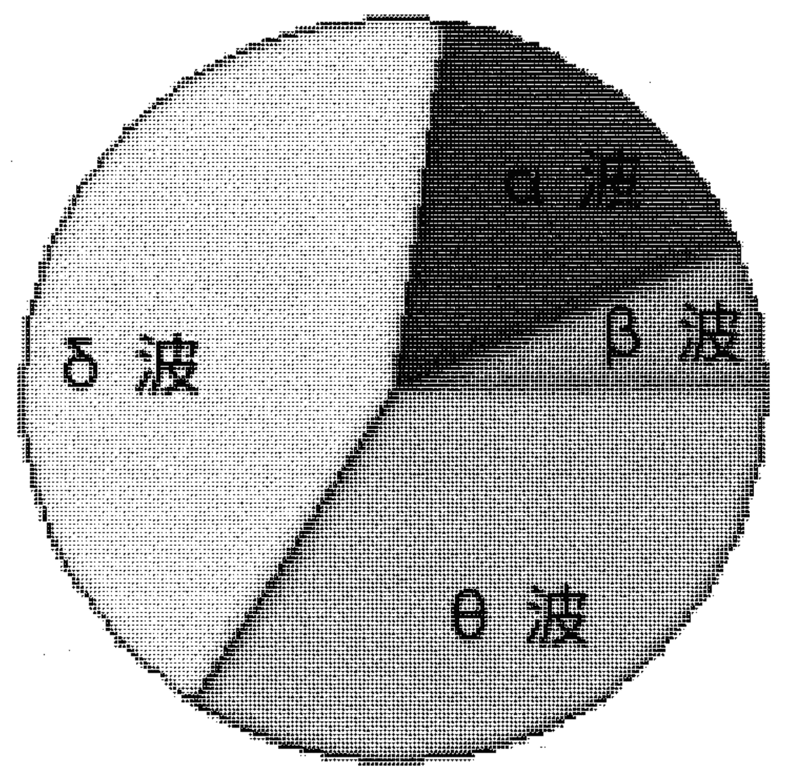

# 轻松自在玩催眠

为生命献上衷心祝福，
对宇宙怀抱无限感恩！

# 祈祷

亲爱的上帝，
感谢你让我有这个机会，
从事这项非常有意义的工作，
我找到了原来就拥有的仙女棒，
轻轻挥洒出神奇的力量，
协助人们解决他们的问题，
在「自助助人」中得以「助人自助」。
「信任」真是一件有趣的神迹，
当人们愿意「信任」自己的力量无限，
放下愤怒、忧虑、思念、悲伤、恐惧、不安与不舍的枷锁，
体验生命的美好却又不执着于美好的幻象，
无条件的爱任何时候的自己，
接受自己，也接受他人，
他的生命就能轻易的转化，
进入安适自在的人间天堂。
「信任」本身就是一支神奇的魔法棒，
「信任」让我们能够轻易运用意念的无限能力，
满足身心所有渴望，
「信任」能够让我们不执着于渴望的满足，
欢乐的享受一切，
而学习「信任」正是一個享受的过程，
也是我们拥有永恒生命的目的之一！
亲爱的上帝，
我知道，
我称呼您「上帝」，
跟我称呼您为「佛陀」或者其他的名字一样，
其实并没有什么差异！
因为我了解宇宙的真谛，
我们全都是一体！
亲爱的上帝，
我了解，
每个人都可以如同您一般充满能力，
其实我们可以就是您！
或者，
也可以还是自己！
亲爱的上帝，
让我们持续努力，
让每个人都了解生命的真谛，
发现到每个灵魂原本就拥有神奇的仙女棒，
当大家一起挥洒出他们神奇的能力时，
那将是宇宙另一个契机！

# 增编版自序

大道至简 万法唯心

「催眠」是我身心灵成长领域中众多学习的最爱，由2002年初次学习催眠的茫然，接触迄今转眼之间已经十五个年头。2005年两次至吉隆坡授课，2011年受邀至上海授课。藉由口碑相传，授课地区逐渐扩增至郑州、常州、深圳…等地。

授课内容除了催眠以外，增加了宇宙灵气、系统排列、塔罗占卜、图卡疗育、ESP超觉阅读…等，可与催眠相辅相成的多项专业技法与心法。

就像每一个来到地球游学的生命，我由受苦生命过往中，发掘到了宇宙透过困顿带来的丰盛礼物。曾经的苦难，在我怀抱感恩之心全然接受后，转化为处处盛开的繁花。过去因追求被爱、被肯定的无名忙碌，随着心性的调整及智慧的增长，越来越加安适、自在、平静、喜乐。

感谢「催眠」开启了我与内我、天地、宇宙连结的那一扇窗，引领我进行这场灵性觉知、生命成长的大跃进。

## 轻松自在玩催眠 学会身心灵健康的 30 堂课

《轻松自在玩催眠》于 2007 年 7 月出版，多年来帮助我在催眠教学及推广研究更加顺利，许多个案、学员因为本书连结上了彼此间的缘分。读者及学员们纷纷回馈，他们藉由书中催眠引导词稿，就能穿越情境时空，体悟催眠的无所不在。

展望未来，将继续研创助人技术与理论，持续撰写书稿分享经验；继续秉持「大道至简、万法唯心」的精神，整合东方全息医学理论及思维，用以「助己助人、助人助己」。

本书历经三刷，于初版 8 年后重新修编再版上架。特邀几位「超鉦催眠」国际证照课程结业学员撰文推荐，分享他们应用本书心得。

祝福大家，安适自在、乐活人生。

廖云鉦 20160401

# 尽力随缘 轻松自在

「等待」可以让果实更甘甜，「等待」可以让花朵开得更芬芳、灿烂。许多时候，我们需要学习「等待」。

树上的果实，需要等待逐渐长大、成熟。如果太早将未成熟的果实摘下来，果实生硬、干涩、难以入口。有些摘取下来的果实，需要置放几天，等待它们在室温下逐渐蕴熟，才能有香甜美味的果肉。

奥修说：「不要过于急忙，急忙让你欲速而不达。当你很渴时，要学习耐心等待。等待愈深，它就会来的愈快。」

是的，「恒常是无常，无常亦是恒常。」

时间的等待是必要的！在时间的流动与静止中，生命可以产生许多微妙的变化！

尽管去做，成为一个游戏的孩子！

允许自己快乐，允许自己悲伤，接受自己的聪慧，也接受自己的愚昧；接受自己的悲伤，也接受自己的喜乐。

当太阳升起，黑夜悄然离去，当黑夜来临，太阳静待时机。

光明之中，黑暗隐然；黑暗之中，光明显现！

宇宙就在黑暗与光明中交互轮转，在生与灭之中循环！

廖云釩 ( 催眠水晶 ) 2007 年 4 月

# 推荐序

## 催眠是百搭的良药

「催眠是日常生活随处可见的现象，然而因不理解或误解，使得催眠被蒙上一层神秘的面纱。本人为谘商心理师，乐于学习各种助人方法，早想学习催眠，经四处打听后，找到个案经验最丰富的催眠专家廖云鈜老师。

廖老师七天的催眠课程，不但化繁为简、直指核心、倾囊相授，也让人理解生活无处无催眠。催眠不是睡着，可以保持对话；当事人不会被牵着鼻子走，可以保有意志；催眠也不是告诉自己一百次我很棒就行了，而是找到那麽没自信的根源，予以转化，自然会觉得自己够好了。

更令人欣赏的是廖老师博学多闻，把身心灵的内涵整合进催眠，可迅速帮助当事人，不吝惜在课堂中现场处理学员的问题，令我相当佩服。而廖老师始终强调对生命要有正确的观点，催眠才能发挥效果，这和心理谘商所强调观点重于技术也是一致的。

催眠是个很有趣而浪漫的过程，当事人可以从象征和比喻交织出以往没觉察的自我。在有效的催眠师引导下可以化解情绪、关系、生理问题。催眠可以结合在各种专业增幅效果，我在学习过廖老师的催眠后，将催眠的概念应用在心理谘商中，效果和速度倍增。

想对催眠有初步了解吗？这就是你不可或缺的经典书。

刘焕祥
谘商心理师、催眠师、牌卡疗育师
FB 粉丝专页：奥尔的智慧树屋 部落客
任职于张老师基金会台中分事务所

# 生活无处不催眠、活在每一当下

多年前为了自己情感及家人相处感到苦恼，为寻求解决，找到廖老师的网站，预约个案协助。

廖老师亲切有耐心的一一回覆我所提出的一连串疑惑，点出我错误的观点，协助我建立正向人生观，放下对家人的执着。

廖老师和蔼的笑容，轻柔的引导，和缓了我躁动的情绪，我在意识清醒下，探索问题核心的来龙去脉，彷佛搭乘一部时光机旅游过去及未来。

领悟生命的过程，没有人可以给你标准答案，只有自己亲身体验。潜意识时光机可以回顾过往生命，提示今生课题、任务！而我就是透过这趟英雄（雌）之旅了解自己，选择这个家。这次的领悟让我从此更加实活在当下。

廖老师可说是一位神奇女子，在华人催眠界中唯一运用及整合新时代各类元素 +NLP 概念及佛学，融合自身生命体验，发展出各式各样的催眠手法，协助及应用在不同个案中，解除心病，开朗心灵，活出自信及自我魅力。

2015 年 8 月，终于有机会跟随廖老师学习催眠，发现了催眠术的博大精深，如同廖老师常说的：「生活无处不催眠」。课堂中看到老师示范各种催眠技法运用，协助学员立即解决多年问题，快速、精湛的手法，经常让现场同学叹为观止。廖老师更毫不藏私分享多年实务经验及观点，让大家收获丰盛。

本书集老师多年研究、整合及新时代元素、个案经验撰写而成，内容丰富扎实、有系统，以浅显易懂的生活话语阐述，连我 70 多岁母亲都天天拿来练功。

透过本书可以轻松、容易的学习、体验各种不同催眠引导，协助身心灵平衡、健康。完全不懂催眠的人，也能快速入门运用及丰富人生，以拥有美好心灵生活。
对于已学习催眠的朋友，更是值得拥有的好书及优质催眠教材。

廖芝榆
逗豆咖啡工研 负责人
中山社大及大安社大－东方校区 咖啡讲师

# 由异端到自由挥洒老师传授的仙女棒

我是一个虔诚的天主教徒，「催眠」在我接触之前，一位前辈弟兄告诉我，那是「异端」让我不敢接触它，这期间经过了不断的祈祷，身、心、灵均承受了无数的磨难与考验，在 N 次的九日敬礼中，天主启示了罗马书第十二章第二节，我才安心、放心的挥洒老师传授的仙女棒，自助、助人。

自助：破除了我多年来超过十一点就睡不着，半夜醒来就无法再入睡的魔咒，学会了催眠，我可以随时随地自我催眠、不再因睡眠品质不佳影响健康及工作，这是我最大的收获，也因学会了催眠，救了两位家人的生命，家母说实在值得。

助人：在医院帮助开刀后胃口不佳的病人恢复食欲、不再靠打点滴补充体力、早日出院、帮人事小姐找寻遗失的文件、帮助同事和已亡的妹妹联系……等

「催眠」就像老师所说的，每个人都可以学习，但我觉得找到好的启蒙师才重要，很感谢主让我与老师结缘，（p.s 结训日是 94 年 12 月 25 日圣诞节，很巧妙！）结训时，我给自己 100 分、老师 200 分，老师教我们百般武艺（不只十八般），我只用了一招半式就救了一些迷途的羔羊回到主的羊栈，我们在世上累积的财富带不走，但是在世上帮助需要帮助的人，可以累积天堂的财富，感谢老师让我有机会累积天堂的财富。

老师不只催眠技巧高人一等，最难能可贵的是提供回训的机会，让所有的学员在每次的回训中学到不一样和最新的技巧，同学中又可以互相分享彼此的心得，真是美好的时光，每次我们都相约、期待下次再相聚。

蔡锦淑
宏仁医院 药局主任

# 体验超时空之旅

回想从小到大，上过的课不计其数，但真正能在自己脑海中留下深刻印象的并不多，又能让自己觉得有趣且充满好奇（惊奇）的更是少之又少，而廖云釩老师教授的催眠课就是其中之一。

有别于传统填鸭、注重学理及单向的教学方式，廖老师融合各项所学与个案经验，以最浅显易懂、生动活泼的方式，透过脑力激荡与实地演练，让原来对于催眠一知半解却充满好奇的学员，在短短的数天中，即得以一探催眠世界的奥秘。

其实很难想像，竟然有一种课能让自己从早上到晚都不觉得累，甚至有时觉得愈上精神愈好，且不需要死记就能轻松学会。

廖老师总能以各种不同的方式让学员们自然而然学会催眠，在学习的过程中，自己所获得的往往远超出自己原想要的。

学员间的意见交流、心得分享与相互学习，是催眠课程中不可或缺的一环，这使得课程更加丰富、有趣！由于每一位学员都有不同的生活背景、特色与感知能力，这也使得每一堂课都精采可期。

藉由这本书的出版，能让每个人都有机会来一趟可遇而不可求的超时空之旅，处处充满赞叹与惊奇。

想要体验一下吗？相信您会不虚此行！

法官助理
Younver

# 当命运的音符响起

你不是每天都可以碰到那么好的事！
从前，我对「催眠」是很敬畏的，总觉得那是种可随意控制他人，而被控制者浑然不觉的邪术，并认为自己这辈子都会跟催眠绝缘。

命运第一次来敲门，是妻对于前世回溯热潮产生兴趣，两人怀抱著前世今生的鸳鸯蝴蝶梦和银子，踏进老师当时位于板桥的工作室，老师轻松而生动活泼的解说，缓和了不少紧张的情绪。妻和我先后体验了催眠，讶然于我们并不是在失去知觉（睡着）的情形下接受指令，而是在全程清醒的情况下体验到催眠的巧妙。

命运接下来就像贝多芬的乐曲一样，「登登登登！」的连续敲了下来，因为我们在结束三次催眠体验后（我好像还保留一次体验机会），花了好几个月，参加老师工作室开的初阶及中阶课程，透过实地体验及操作，使我们逐渐揭开催眠的神秘面纱，并建立起正面的心灵能量。催眠，实际上只是和自己内在对话的工具而已。

不久前，老师才出了一本《末那催眠》，没想到她老人家不动则已，一动就是和盘托出！

这二十七堂课的份量远超过许多催眠教材，更可贵的是，老师提供了不少引导词稿，这可是难得的「业务机密」喔！

看到老师决定出版此书，真令学生又惊又喜。惊的是，此举足证老师的功力早已超出当年甚多，令学生瞠乎其后！喜的是，本书无论对好奇者、初学者或行家，皆是值得参考的好书，也是当年学习时无缘觅得的优质教材。

你不是每天都可以碰到那么好的事，当命运的音符响起，聪明如你，该如何抉择呢？

王凤山
执业律师
社团法人中华国际催眠研究发展协会理事

# 揭开让心病药到病除，豁然开朗的神奇

带着好奇且兴奋的心情，在一年前参加了廖云鈜老师所开的「国际催眠师培训班」，在真正了解催眠的技巧及功用之后，终于了解催眠并非像变魔术般的随意控制他人的思想及行动，而是用来引导个案解决问题的一种方法。

透过课程的进行，我对催眠的疑惑逐渐解开，也真正见识到催眠解决个案问题的能力如此强大。透过催眠也让我自己更加认识自己，改善了自己原本有点自闭的个性，体会如何用心的去与人互动、和家人相处。

学习催眠课程，除了对自己有所帮助之外，对于常处于负面思想、彷徨无助的人来说，催眠更是一帖心病的药引，若再加入 NLP 心法，就可让心病药到病除，豁然开朗。

在本书中，廖老师透过丰富的个案辅导及教学上的经验，以生动活泼的笔法，介绍许多催眠方法实际的运用。无论你是想了解催眠是什么，或是想成为一位催眠师，或者你已经学过一些催眠课程，本书都很适合。

相较于坊间动辄数万元的各种心灵成长课程，本书绝对值得对生命成长及催眠有兴趣的读者来收藏。如果对催眠想再更深入的研究，便可找一些进阶的催眠课程，真实体会老师在课堂中传授的各式技巧，相信你一定能够成为一位助人助己的优秀催眠师。

罗茂诚
新希望催眠工作坊负责人
http://www.newhope.idv.tw

# 催眠副作用及催眠能量类别和佛法修行催眠观

廖云釩老师学养与经验俱优，推展催眠术与正确的催眠观念不遗余力，以破除催眠神秘与难学的面纱为职志。这本轻松自在玩催眠，就是最新最棒的呕心沥血之力作。

所有技术与观念已经超越当代催眠界的范畴，拥有这一本书，就可以马上上手，真正让您轻松自在玩催眠，可以节省您大把的金钱与时间，绝对物超所值。

廖老师将密技大公开，完全不藏私。这样的胸襟与气度令人钦佩，想来因为老师不断追求卓越与创新，让自己精益求精，才会不吝公诸最新心法与技术，希望大家都能跟上最新的发现。

本人也受教于 廖老师，获益良多。在此也提供一些心得与浅见贡献老师，以报师恩。

首先想谈一谈催眠的副作用，至于这个副作用的好或坏，就由大家自己去评断。

被催眠的副作用有十项如下：

1. 提升直觉力
2. 观察力会变敏锐
3. 开启内在的智慧
4. 灵性的提升
5. 改变对宇宙看法
6. 开发出超感应力
7. 增加专注力
8. 身体容易放松
9. 改善睡眠品质
10. 帮助禅定静心

这些副作用不一定都会发生，有些会立即发生，有些则是慢慢的产生，根据经验，副作用的产生与催眠的次数及深度还有被催眠者的敏感度，以及本身的体质有关。通常做过越多次的催眠或催眠程度较深的，副作用的强度较强。另外催眠深度较高，甚至能开发出一些超感应能力出来。

刘润泽
资深金融保险训练讲师
特约华语领队、导游
社团法人中华身心灵关怀协会理事

## 催眠，帮助我们活得清醒，活得自在

机缘巧合，2015年3月，我有幸参加了廖云钒老师在上海的前世催眠引导体验沙龙，为我拂去遮蔽双眼的面纱，打开了灵性世界的大门。这次催眠初体验仿佛是一道智慧的光芒，投射在我的人生道路上，我倏然明白，我前半生前所经验的，不管是好是坏，都是为了成就现在以及未来的我。以前总觉得自己深陷生活的泥淖之中，对己身遭受的种种磨难与挫折感到迷惑，痛苦，悲哀，不甘，无奈但也无能为力。何其幸运，催眠让我终于看清自己今生的课题，解开心中的迷惑。

冥冥之中，似乎有一股力量推动着我朝着身心灵事业行进。在廖云钒老师的专业催眠师培训课程中，不但疗愈了我自己，也同时开发、训练、强化了我潜在的觉察力。老师的诸多著作中的观念及智慧，更是启发并坚定了我从事心灵工作的决心与信心。其中尤以“轻松自在玩催眠”为甚。

本书文字浅显易懂，非常具有亲和力，一方面破除普罗大众对催眠的误解，另一方面也从脑波研究的科学角度对催眠做了更多理性的分析。穿插在各章节中的众多的案例实证，更是让人津津乐道，让本书平添了不少的可读性及趣味性。书中第二篇的30堂心灵魔法课，罗列了27种催眠引导词，更是老师十余年来的心得精华，非常难得。

老师曾多次强调，催眠是一个易学难精的技术，经过廖云钒老师亲自带领的专业催眠培训，学员们已然可以独立操作个案，但如何累积经验，精进技术，则要看各人的努力修为。

本书绝对是催眠参考工具书的不二之选。如今我作为专职催眠师，经由反复诵读书内的引导词，将它们逐渐转化为我的催眠语言，不但提高了自信，对个案的处理技巧更是精准有效，已经成功帮助许多有困扰的个案走出情绪的迷宫。

人身难得，我们何其有幸能够投胎为人，体验这芸芸众生的喜怒哀乐。催眠，能够帮助我们活得清醒，活得自在。期望有更多的有缘人能够接触并了解这个能够润泽自己，帮助别人的技能。

吴忆萍
现专职从事身心灵工作，专注于催眠，塔罗占卜，OH卡解读及系统排列
曾任 B&Q 中国市场部经理

## 催眠法宝，伸手自来

「催眠」是一件好玩又有趣的事，许多人对催眠的认知总误以为是「睡着」，其实，「催眠」除了可以解决失眠问题之外，绝大多数时候是要让你更清醒，唤醒沉睡的潜意识、让最具智慧的潜意识带领我们向内探索，找出困扰自己身、心、灵上的核心问题、运用自己内在已具足的智慧处理问题并且成为自己的资源！

「催眠」无所不在，我们每天都身处在被催眠的环境中，而且每个人都是催眠高手，尤其父母就是孩子的最佳催眠师，如果，父母对孩子的语言是正向的，那么，孩子将会成为积极正向的人；在企业中，领导者的语言，若使用正向话语，肯定可以激发下属的潜能，创造最佳绩效；对于个人而言，只要有正确的生命观点，突破限制性信念，便能轻松达成自己的人生目标，而这本「轻松自在玩催眠」正是适合各种不同身份、角色的你，让每个人都能成为催眠高手，熟读这本「轻松自在玩催眠」，让自己的语言变得有魔法，随时想用，开口自来！

陈颖蓁
蓁心蓁艺身心灵美学空间 创办人
NGH/ABH 美国国家催眠师协会 催眠治疗师
Crazy Color Inc. 副总经理

## 做中学、学中做，轻松有趣的专业催眠书

《轻松自在玩催眠》是我接触的第一本跟催眠相关的书籍。之前的印象中催眠是一门神秘、深奥的学科，以为看到的书会是一本需要用大量的脑细胞去分析、吸收才能领会的东西。

这本书写得潇洒、自在，文字清新，内容利落，重点突出。很适合刚开始接触催眠领域的人阅读。廖老师在书中的不藏私、真诚的教导，使这本书的实用性很高。又因为语言的简洁易懂，让大家在内容领悟上更加便通。

本书清晰地阐述出了催眠的相关概念及催眠的实用价值，条理分明、解释充分；在催眠引导的操作面上呈现了多元、丰富灵活的操作手法，让人真的感受到催眠是门很有趣的“学问”；在催眠后暗示的演练上更体现出了廖老师在此领域中的专业及游刃有余，针对不同的主题有完全不同形式的暗示，不同于坊间其他催眠师在带回个案时的刻板，廖老师所给的催眠后暗示本身就给与了被催眠者满满的正能量。

这是一本结合实用性和趣味性的专业催眠工具书，值得反复阅读和收藏。读通此书，能让生手快速入门，打通任督二脉，快速成为专业催眠师。真心推荐这本学习催眠者必备床头书。

高翔
养心殿心灵工作坊催眠师

## 一本助己助人的幸福魔法书

从对催眠的好奇与不懂，到自己人生经历一些事情，搜寻到廖云钒老师的催眠课程，决定让自己面对这些存在潜意识的疑惑中，找寻答案。

报名了催眠课程，老师用心传递教导让每个人对生命的认知，与对催眠的正确观念。老师的直白教学方式如同她的书一样，让人可以轻易的浅显易懂。没有过多华丽的辞藻包装，却可以从书里让人运用催眠去疗愈自己帮助别人，这样的魔法书，让不懂催眠的人，可以随时自己启动魔法功能，让人自在的玩魔法，藉由催眠去探索宇宙间分裂出来，存在每个时空中的你我他。

上了催眠课与复训课程，再仔细的翻阅和运用了轻松自在的 27 堂课，它带给我的不只是方便，更是用了最简单的方式帮助了自己，使自己身心灵在书的帮助下更健康了。

轻松自在玩催眠是一本助己助人的工具书，更是幸福魔法书，随时随地都可以展现它的强大功能，让魔法的力量，不会因为时间与空间而限制了它的功能。

一本好书可以改变你的人生观，与提升自己的价值，认识自己，做自己，对生命有了不一样的诠释与认知。体会到生命存在的意义，因为催眠遇见了更棒的自己，让我学会如何更爱自己，如何去有效又立即的去传达幸福，值得信赖的书 100 个赞永无止尽的按 ...。

得知老师要增修再版，心情真是雀跃不已，怎样都要推荐一下。不需要太用力的推，因为我身上已有这本书的魔法，所以不须要费力，就可以让自己快乐。期待再版的诞生，让其他需要帮助的人，藉由这本幸福魔法书，轻松的施展魔法，让自己的人生变得更有存在的意义！

台湾 陈姵臻

## 无论学习什么知识和技巧，都需要有正确的知见！

初次认知催眠的时候，我以为催眠一定可以回到前世，催眠一定可以看见画面，催眠时自我受到别人的掌控，后来上了廖老师的催眠课程，廖老师的细致讲解一扫我心中的困惑，顿觉豁然开朗！原来催眠不一定非要回到前世，催眠也可以看不见画面，催眠中自我意识是可以起主导作用的。

课后再读这本工具书，对催眠的观点理解更加透彻，催眠无处不在，催眠是协助自我与他人厘清观点、转化信念的一种工具，它能够迅速有效地深入问题根源处让我们去看见在表意识层面无法（不愿）看见的东西。

其实催眠的技巧和方法是非常多的，但是快速有效和正确见解，以及能够传达正确见解的人却很难遇到！廖老师就是这样一位能带给你智慧的人，这本书是一本能够迅速理清你的思路带你走入催眠世界的好书。

广州 闫姝彤

## 催眠中的领悟与天使对话

催眠是什么，也许很多人对他的心理是崇拜又害怕的。崇拜催眠的神秘与神奇，害怕的是对方看穿自己……！

廖老师的正知正念令我很是欣赏，老师教学方式也是简单易懂，让我在催眠的领域上领悟更深。
读了轻松自在玩催眠这本书收获到了很多，催眠中连接到了天使国度，来到了罗马大教堂。

各种穿着白衣的天使在颂经歌唱，非常好听，让人轻松又温暖。在那里，有人叫我公主殿下，我的气质完全不同，但长相与现在一样。在那的父王对我说的一番话，和给予我的一些能量我知道了自己的使命：无私的爱，坚强，奉献。

我更加热爱自己的这份工作，能够助己助人，助人助己。
很开心廖老师重新出版轻松自在玩催眠这本书，相信更多喜爱催眠，对催眠有兴趣的人们在这书的帮助下更轻松的学习与认知。

让自己的身心灵发光发热，喜乐的活在当下，更好的接受过去、面对未来！

陈菲
常州 身心灵工作者

## 前言

优质催眠让你身心灵都健康

金刚经有云：「万法唯心」。
西方高灵赛斯也有著名的观点：「意念创造实像」。
人类每一个意念的流动，都是一个自我催眠；别人的一句话、一个动作，就可能在你的潜意识中植入一个暗示。

催眠就像水一样，在我们的生命之中不可或缺！人体中有百分之八十左右的水份，水让人人类内在系统可以充分运作。人类可以几天不进食，却不可以没有水而活下去！

催眠就像是一杯水，每个人都需要它，每个人也都习惯接触它，平日却又不觉得它有多重要！

催眠就像各种不同形式与样貌的一杯水，这杯水可以是一杯白开水、也可以是一杯果汁，一杯酒，一条河流，一池湖水，一片大海……或者是一杯从臭水沟里舀起的水，可以是气体、液体也可以是固体。而催眠可以是一句话，一个触碰，一个感觉，一个情绪，一个记忆，一个意念，一个观照，一个觉知，一个恍惚，一个……。

是的，催眠在生命中时时出现，富多样性又如此不可或缺，用水来形容催眠，真是再贴切不过了！

水是如此的重要，如此平凡易得，在我们生活中却时时影响着我们。它可以是小小的水滴，也可以有如海啸般的巨大能量。

同样的，催眠是如此简单易学，却又深不可测，变化无穷，蕴含着无比的威力。

催眠深入人类的生活之中，日日使用它，在你生活中占有非常重要的地位，却又让你习惯于它，以至于你无法感觉到它的存在。

水可以有平淡的味道，却也可以甘美的让人雀跃。因为有水，生命得以延续滋长，因为有催眠，生命可以更加美好。喝了毒水，你的生命会有危险！如果你不懂得如何善用催眠，而让自己每天在不自知中不断的进行着负向催眠，你将被导入痛苦的深渊！

每个人都应该了解催眠，就好像每一个人都必须喝水一样！了解你每天都为自己下了什么指令，就像了解你每天喝的是不是毒水一样的重要！

乍听「**催眠**」这两个字，让人感到有些疑惑、有些神秘、有些好奇、也有些恐惧！其实催眠早已存在你的生活当中；事实上，每个人都时时刻刻活在催眠之中，多数的人却不自知。

## 轻松自在玩催眠

学会身心灵健康的 30 堂课

就如同大多数的人一样，舞台催眠是我初次所接触到的催眠！当时的我也误以为，下个指令就能够让人听话。「能够控制一个人」那真是一件超炫的事情！直至深入这个看似神秘的领域，才了解到催眠的浩瀚。

「**催眠**」，它仅仅是一个名词，让人们可以辨别的一个标记。人类运用「催眠」相关的技术已经有数千年之久。「**催眠**」背后蕴藏的的学问，却并不是几本书就可以说明白的！

将每天人们都在使用、却不自知的催眠，做全世界的推展，用最浅显易懂的文字与语言，让人类可以由自我催眠的幻梦中清醒来，是我个人的愿望，而这个愿望正在逐步达成中！我相信，我能够做到的，你一定也能！

感谢参与这本书的所有伙伴们，也感谢正在阅读本书的你；更感谢 2007 年初版本书的姿霓出版社，容许我有无限的写作空间！

## 第一章 「解毒」催眠的疑惑

用「解毒」而非「解读」，实在是因为不了解催眠的人，通常会视「催眠」为「毒物」或「异端」。本书的详尽说明，有如解毒剂一般，可以为你或其他视「催眠」为毒物者，做个详尽的「解毒」！

记得，在北医的一次证照课程，担任医院药剂师主任的一位学员，于第二天中午课程中，疑惑的说：「老师，我会来学催眠，其实只是单纯以为学催眠可以帮助睡眠。在我要来学催眠之前，好心的告诉我的教友：我要去学催眠了，学回来以后，可以催眠你们都好睡！没想到这位教友很慎重的说：「你要去学催眠？那是异端！」。

这位同学很迷惑的说：「我很害怕催眠是异端，可是学费已经缴了，所以才来上课。我上课已经一天半了，看大家都可以完全进入催眠状态，而我到现在为什么一点感觉都没有？」这位药师说着、说着，就提到：「可是很奇怪耶！我昨天晚上，整个晚上都没有起床！」全班十多位同学都笑了！

原来她的睡眠品质不太好，半夜起床五、六次的状况已经持续六、七年之久。身为资深药剂师的她不敢服用安眠药物，所以想到要学催眠让自己好入睡。

这位学员上完七天的课程后，除了学会运用催眠协助自己入眠以外，还能够帮助家人及其他的朋友。她告诉我：「廖老师，我后来又去请教了我们教堂的神父，他跟我说学催眠很好喔！」信与不信的一念之差，让一个人从此对催眠有了完全不同的认知！

阅读本书，从任何一页开始，都会是很好的选择。

构思这本书在出书前经历了一番时间的酝酿与转折。在适当的时候，终于与大家见面！

原来只想分享十几个催眠引导词稿，让每一个人都可以简便又轻易的运用催眠，最后完成了这一本十几万字的书籍，我相信「一切都是最好的安排」！

### 一、催眠是什么？

整合个人所学，经由个案及教学经验多方研究，将催眠定义为：

> 「运用各种不同形式的引导，让潜意识在无意识或有意识中，同意接受建议或暗示，为催眠！」

学习催眠前，我们先来了解催眠的历史。严格说起来，催眠已有数千年的历史，早在五千多年前的埃及，以及中国古老的道术，或是其他民族的巫术都有迹可寻，西方将这项技术定名为「催眠」约有两百多年年的历史。

Hypnos — 这个字，源自希腊语「睡眠」，后来由英国曼彻斯特的外科医生詹姆士·布雷德（James Braid）将这种降低病患痛苦的医疗方式定名为催眠（Hypnosis）。

在希腊神话中许普诺斯（Hypnos）是睡神，相传 Hypnos 住在冥界，他的左手拿着罂粟花蕾，右手持着一支牛角，牛角里装满了液体，这种液体可以令人进入睡眠。如果被他的魔法棒轻触到眼睛，无论是人或者神，都会无法抗拒的进入梦乡。

大不列颠百科全书字义如此阐释：Hypnosis（催眠状态）系指处于一种特殊的意识状态，介于半睡半醒之间，对各种刺激亦有反应的心理状态。这种类似睡眠状态的催眠，其实并非是睡眠。

## 轻松自在玩催眠

学会身心灵健康的 30 堂课

「催眠」这个名称并不十分恰当，容易让人误以为「催眠」就是睡眠。事实上，催眠状态是进入类似睡眠的状态，并非等同睡眠。为了区别催眠与睡眠，我将催眠进入类似催眠时的状态定名为「类睡眠」。

由于催眠进入的状态十分多样化，为了容易让人们更容易理解，有些时候我会将催眠的某一些状态称为「清醒中的梦」。

事实上，许多人在催眠状态中，开启了他的潜意识之门，呈现更清醒、更具智慧与觉察力的状态。所以，我也会形容催眠是一把「开启心灵的金钥」。

近年来，催眠在世界各地蓬勃发展，依据每位催眠研究者不同的学习背景与其研究方向，对催眠也有不同的定义。有些人诠释催眠是指一个人在催眠师的「诱导」下，进入催眠状态而「强烈接受有益建议」的现象。

有些人认为催眠是运用「放松和暗示」的技巧，使人接受引导进入「类似睡眠状态」，进而接受催眠引导者的指令，以期达到预期目标的效果。

有些人则认为，催眠是同时下达许多指令，让人类大脑「超载讯息」，而使人进入类似「逃避」的状态。

「瞎子摸象」这句话是形容许多瞎子摸着大象，描述大象的模样。摸到象鼻子的，就以为大象是粗粗长长的；摸到象耳朵的，就以为大象就像是一把扇子……。这句话也能形容多数的人对催眠的了解，其实并未认知催眠的全貌。

由于催眠的领域极为广泛，引导催眠的方法也有很多，每个人适合的方式又不尽相同，进入催眠后的感受又因人而异，而藉由催眠协助的效果也不太一样。也因此，进行个案时需要量身订做，才能发挥效果。催眠实在是一门易学难精的专业技术。

我认为，唯有以宽广的心态来进行催眠研究，才能探讨出更广泛的心灵领域。所以，学习催眠者除了需要具备爱心以外，宽广、包容与好奇的研究精神更是不可或缺。

可以非常确定：

-   1、催眠并不是睡眠。
-   2、每个人都可以学习催眠。
-   3、每个人都可以接受催眠。
-   4、催眠会随着每一次的经验而更加容易。
-   5、人们可以自我催眠，也可以接受他人引导进入催眠。
-   6、人们不一定需要经过有意识的同意下，才能接受催眠。
-   7、催眠的同意是建立在潜意识层面的，有些时候表意识是不自觉的。
-   8、催眠的「控制」与一般所了解的「控制」不尽相同。
-   9、每个人所运用的主要感官接收器各不相同。
-   10、藉由催眠可以改善人类身心灵的运作。
-   11、善加运用催眠可以让人们活得更快乐、更健康。
-   12、误用催眠可能引发生、心理问题。
-   13、催眠有时会引发强烈的情绪或生理反应，身心有困扰或疾病者，一定要找受过专业训练的催眠师协助进行催眠。
-   14、催眠可以运用于包括人类健康及宇宙生命探索研究的许多范畴。

为了方便让人们更加容易了解催眠的各种不同运用、层面与样貌，我将催眠区分为：**广义催眠与狭义催眠**。

广义催眠是你在表意识不自知之下，已经自我催眠或接受他人的建议。广义的催眠可以这样叙述：「运用人类视、听、触、味、嗅的五种感官，在有意识或无意识下，激发人类的欲望本能，产生的各种生、心理的感受！」。因为内在或外在所引发七情六欲（注）的感受，所产生的各种情绪以及生理反应，生活中在自知或不自知下的自我催眠或接受他人给予的暗示都可以算是广义催眠。

「狭义催眠」是在自知之下，运用各种方式进行自我催眠或接受他人催眠引导。可以这样形容狭义催眠：「运用人类视、听、触、味、嗅的五种感官，集中专注力，让脑波由主导表意识运作的 β 波优势，转为由较慢的 α 波主导的变动意识或更深慢的频率状态，并得到一种身或心放松的目的。」

一个集中的点、一个意念、一个图相、一个声音、一个感觉、一个动作、一种味道、或者一个事件、一个回忆甚或整个宇宙，都可以引导一个人进入广义催眠或狭义催眠的状态，当事人却不一定能够自觉。

简单的说法是：「每个人都可以进入催眠，只是需要的时间及引导方式各自相异，进入的状态与产生的效用也会有所不同。」

我在《末那催眠》一书中，写到许多误用催眠程式的效应，以及人们在无意识中进行自我催眠或接受了催眠。这种在无意识中被输入暗示的状态，比较接近「广义催眠」。

本书中，我将分享许多简单又有效的催眠引导法属于「狭义催眠」，你可以将这些方法运用在自己身上，也可以运用在相信催眠及相信你的朋友身上，因为「信任」是催眠引导成功的重要因素之一。

学习催眠，可以先了解一些关于催眠的注意事项。如果你觉得你已经有所了解，也可以直接跳到第二篇的催眠应用上，循序看看或是继续往下看，各有不同体会。毕竟，每一个人的生命的特质以及学习、经验都不尽相同。那么，就选择让自己开心的方式来阅读本书吧！

注：

-   七情：1、儒家称：喜、怒、哀、惧、爱、恶、欲为七情。
-   2、佛教称：喜、怒、忧、惧、爱、憎、欲为七情。
-   3、黄帝内经记载：喜、怒、忧、思、悲、恐、惊为七情。

六欲：《大正新修大藏经》弘明集／郗嘉宾奉法要：六情，一名六衰，亦曰六欲，谓目受色，耳受声，鼻受香，舌受味，身受细滑，心受识。识者即上所谓识阴者也。五阴六欲，盖生死之原本，罪苦之所由。「六欲」亦可写为「六欲」：眼贪美色奇物，耳贪美音赞言，鼻贪香味，舌贪美食口快，身贪舒适享受，意贪声色、名利、恩爱。

### 二、催眠早已存在于你我生活之中

催眠的运用非常广泛，以广义的角度来谈催眠：「我们每天都是活在催眠当中。」

人类每天都活在自我催眠，以及他人催眠暗示中。早上起床告诉自己「今天下雨了！凉凉的好棒喔！」与「今天又下雨了！真讨厌」，因为不同的自我暗示，产生的了正负不同的心情，在不自觉当中影响着你一天的情绪。

当我们认同了保险业务员所述说的愿景，而购买了保险；看电视时融入了电视剧的情境当中，随着剧中的情节产生了喜怒哀伤；听政治人物讲述他们的政治理念时，感到慷慨激昂；或者被老板责骂，导致心情郁卒；恋爱了，时刻活在爱情的欢乐中；为自己的遭受遗弃，感觉悲伤；在白日梦，幻想着各种美好情境……等等。这些因为自己的感受或接受

## 輕鬆自在玩催眠 學會身心靈健康的30堂課

了他人的影響，所導致的各種情緒產生，也都可以統稱為是接受催眠（暗示）的模式之一。

由另一個層面來談催眠：舉凡運用方法專注意念，讓腦波進入慢速的 α 波為優勢主導狀態，這種恍惚的狀態，也可以統稱之為催眠狀態。當我們唸咒、讀經、禪坐、冥想、觀想、氣功、瑜珈、畫畫、跑步，或者在直線的高速公路上駕駛、在搖晃的公車上的放鬆、宗教的祈禱、巫師的吟唱……，甚至於只是專注於呼吸當中，都可以引導進入與催眠狀態相同的恍惚之中。

運用語言做建議或暗示，或者運用肢體動作改變生、心理的狀態的方法或技術，也都可以視為催眠相關技巧。

近年來，越來越多心理學及精神醫學專家們，開始運用催眠這項過去無法以科學證明的心靈技術。而在外科手術上，催眠麻醉也能協助對藥物過敏的病患。

除此之外，無論是商業銷售、開發潛能、研發科技產品，回溯童年及前世、療癒無名疾病、探索宇宙，也是近年來催眠進行與研究項目。

我的第一本著作《末那催眠》談的多是父母、家庭互動時造成的影響。本書將著重在「狹義催眠」中的引導技法與各種情境的探索。

瞭解了催眠的眾多樣貌後，以下無論談及「廣義催眠」或「狹義催眠」，都將統稱為「催眠」，以方便閱讀。

## 三、催眠不僅僅是讓人睡著

我常常應邀在一些學校、企業進行催眠相關演講，在講完了催眠理論的部分後，往往會來個催眠集體體驗，讓大夥實際感受一下進入催眠狀態的感覺。此時，總有人立刻趴在桌上或躺下來，一副準備睡覺的樣子。這是他們對「催眠」不甚瞭解，誤認為催眠等同睡眠。將催眠運用在幫助入眠上，的確有著非常好的效果。進行催眠中，有些人也會進入似睡非睡，甚至於感覺熟睡的狀態，但是催眠跟實際的入眠，其實並不太相同！

運用自我催眠做個午間休息補充體力，只需要短短五到十分鐘，就能夠讓人恢復精神與體力，精神抖擻的回到工作崗位。

被催眠者往往能夠在「10……9……8……7……6……5……4……3……2……1……，睜開眼睛，回到現在感覺很輕鬆……」的催眠指令下達後，睜開眼睛，恍如睡了一個長長的好覺，帶著舒適的感覺回到當下，這是平常午睡無法達到的效果。

「催眠」可以讓人在短短的幾分鐘內恢復體力、精神充沛，這就是神奇的效用之一。

這樣的效果，運用自我催眠及催眠 CD 也都可以輕易的達到。這正是本書所要達到的目的：「協助每一個人可以簡單、有效的運用催眠進行自我催眠或體驗多種不同的催眠，身心靈都健康。」

## 四、催眠是一連串的同意

我曾經接受過多家新聞媒體及節目的邀請談催眠，十分瞭解電視媒體需要有議題性及畫面的報導或表演，採訪記者或節目製作人通常會要求以動作性的催眠進行呈現，或讓觀眾產生興趣的議題。

在學校、醫院或是其他團體的現場演講，如果要在短短的一小時或兩小時的時間中，讓聽眾瞭解催眠的樣貌，舞臺式的動作催眠要比演講式的催眠容易引人入勝。於是，多數呈現在人們眼前的就是舞臺催眠了。

當臺上的觀眾們跟著催眠師的引導，做出各種動作或在一瞬間倒下時，卻極易讓人產生接受催眠者被催眠師所控制的誤解。

事實上，在接受催眠之前，通常催眠師都會運用一些技巧，先取得被催眠者的認同，進而願意接受催眠指令，而這個「願意」多數時候被催眠者並不自覺。

我經常在演講中運用舞臺瞬間催眠，2005 年 5 月，我初次到馬來西亞教授專業催眠師培訓課程，當時大馬的民眾對催眠並不熟悉，主辦單位在一個購物中心的中庭安排了免費講座。

流動的人潮是比較困難的演講場所，於是我運用舞臺瞬間催眠技巧，請來賓上臺現場體驗他們的第一次催眠，成功的將在購物中心逛街的人群聚集過來。那一次的課程辦得十分成功，我充分運用人們對催眠的好奇的心態：「當人們被某些事件吸引了，也是進入催眠的開始。」

你可以在腦中構築一個這樣的畫面，在一個中庭的廣場中，有一些人坐著，一些人站著，一個穿白色衣服的女性在講些甚麼。她的身後站著幾個閉著眼睛，雙手伸直緊握不停旋轉，其中一位女性坐在講台旁的椅子上，全身軟癱著，好像睡著了。奇怪的是，後來這些人都說是自己清醒著的，而且感覺很舒服！

有些人會批評舞臺催眠，覺得舞臺催眠讓人誤解催眠是一種控制！事實上「水能覆舟，亦能載舟」端看我們如何應用。這一、兩年來，台灣一些催眠愛好者開始瘋狂的學習舞臺催眠及瞬間催眠，顯示社會大眾對催眠終於有了新的認知，這真是一個不錯的現象。

我在 2006 年底到吉隆玻探訪學員，適逢一位台灣催眠師第一次到吉隆玻開課，與當地的報紙合辦免費催眠講座做招生宣傳。我正巧看到這個訊息，就與幾位當地催眠證照班結業學員一起去做觀摩。

活動最後，催眠師邀請現場來賓上臺接受催眠幫助睡眠，現場約有十多位觀眾自願上臺接受催眠。催眠師引導他們排成一排，再要求觀眾往前站一步，然後將麥克風放下，在被催眠者耳邊說了幾句話，被催眠者一一倒下。

現場觀眾一片嘩然，讚嘆之聲四起。而瞭解催眠的我們很清楚——當觀眾們舉手「願意」上臺時，是第一步催眠引導，而觀眾們「願意」上前走一步時，已經進入第二步驟的催眠引導卻不自知。當然，接著他也會接受「願意」倒下的指令。

「同意被催眠」正是接受催眠成功的第一步！

這些同意有可能是你表意識不以為意的，卻是一個催眠引導的開始。人們想要清楚的覺察自己，需要學習的必然就是自我觀照，時時檢視自己的想法與行為，如此自然不容易在無意中接受了別人的催眠暗示，卻以為自己是不知的。

## 五、人們常被催眠而不自知

催眠存在於我們生命中的每一個當下，當我們聽到催眠的種種神奇進而被吸引或抗拒時，或是對一件事物產生了信任、興趣或好奇時，或者是戀愛或失戀時的感覺，都可以稱為「催眠」，而這些催眠有可能是發生在自知卻不覺的狀態下，這些都是廣義的催眠現象。

誠如我在前面所說的，「催眠是一連串的同意」，那一連串的同意，也有可能在你不知不覺之中，就進入了你的潛意識。

在引導催眠時，許多催眠師會運用催眠語法「感覺你的呼吸」、「感覺你坐在椅子上」、「感覺冷氣的聲音」、「感覺更放鬆了」，在你同意這一連串真實的事件下，你的身體也就同意放鬆了。

2006 年夏天，我接受一個民營機構邀請，為他們的員工們介紹運用催眠做放鬆。單位的主管是一位不相信催眠的人，他覺得：「能夠被催眠的人是因為定力不夠」、「被催眠跟起乩一樣，是比較不雅的事」、「容易被催眠的人也容易被控制」！

當天我做了兩場舞臺「瞬間催眠」，這位主管也自願上臺挑戰被催眠，當我請他想像眼皮打不開的狀況，全場都可以很清楚的看到「他一再毫無困難的把眼皮打開」。當其他五、六位自願上臺接受催眠者，都已經接受催眠指令由站立、瞬間倒下、很放鬆的躺在講台的地板上有如沙灘上的一粒細沙時，這位主管依然很堅持的抗拒著。

當日的講堂裡坐無虛席，在走道上還加了許多臨時的座位。這位忙碌的主管自始自終都沒有離席，演講結束後，他除了上臺請現場的大家在午休間抽出一點時間做自我催眠補充體力，以便更有精神在下午工作外，還熱情的邀請我與助理到貴賓室聊了許久。臨別時，他還一再交待要主辦人員一定要再邀請我去演講。

後來聽主辦人員說，他們單位經常辦演講活動，很少像這一次參加這麼踴躍，而且中途完全無人提早離席。連這位通常都會提早離席的主管，很難得的全程參予，又與我們談了那麼久。然後她笑著說：「我看主任根本就是被廖老師催眠了！」

這位主任從對催眠害怕反感，到好奇願意接受，並且鼓勵屬下運用，也可以說是一連串接受催眠過程。

一位個案，就是因為不瞭解催眠而被騙了近百萬。事情一開始是她在等公車時，被一家賣天珠的店中傳來的藏香香味所吸引，走進店中不知不覺買下了價值七、八十萬的天珠。當時沒有現金，是用刷卡的方式買下來的，幾個月下來加上高額利息，成為揹負了一百多萬元的卡奴！

這是她的內在程式在店主的推銷下，自己產生了購買天珠後可以讓她生活更美好的幻相，情不自禁的就在沒有考慮後續的情況下掏卡購買了。

最常見到的則是在算命的時候被植入催眠暗示，通常命理老師都會誇口自己是鐵口直斷。卻不料這一斷，卻有可能真的「斷」了一個人的一生！

曾經有一位年輕的女性就遭遇了這樣的問題，因為一位命理師告訴她，她是小三命。從此她的命運就陷入催眠後暗示的夢魘之中。雖然自認為外貌和身材都不輸人，卻怨嘆因為父母為她取了個小三命的歹名，即使找個男人嫁了，也不會有甚麼好結果，她覺得自己的一生毫無希望。她開始責怪她的父母因命名錯誤，以至於讓她帶來的歹八字，讓她的生命完全毀於一旦，從此進入萬劫不復的一生！

這些其實都是命理老師的誤導。多數的命理都是統計學，會有其準確性。然而，運用生辰及姓名推論，瞭解自己個性的缺失，進而做調整，才是最佳的解決之道。

有許多命理老師跟我學習催眠，有一次，我很好奇的詢問一位資深的命理老師：「你已經是十分知名的命理老師了，為什麼想要來學習催眠呢？」

這位老師說：「以往我看到一個人的相貌或姓名或是命盤時，就能夠很清楚的知道他的過去、未來，以及他的問題在哪裡，但是我不知道如何才能協助他！我想跟你學習催眠來幫助這些客戶！」催眠課程還沒結束，這位老師就很興奮的告訴我：「我昨天協助了一位客戶，她失眠有段時間了，一直無法改善。昨晚我幫她做了催眠，解決了她許多心中的疑惑，今天她打電話來告訴我，當晚就睡得很好！」

近幾年來流行改名字，許多人誤以為只要更換一個好名字，從此就可以平步青雲、一帆風順。卻忽略了「真正影響命運的是個性，並非名字。」倘若只是改了名字，卻觀念不變、死性不改，深層問題無法解決，同樣的問題還是會再發生的。

名字可以視為與過去連結的記憶，如果能抱持著藉由改換名字，揮別過去，進而時時提醒自己做心性的調整與改變，更能夠有效的讓自己生活平順、喜樂！

## 六、善用催眠協助生活愉悅、身心靈都健康

近年來有愈來愈多的科學研究，發現人類潛意識隱藏著龐大未知訊息。許多醫學研究顯示，身體與心理是一體兩面相互影響的，心理健康身體也就健康。透過專業催眠能夠有效探詢表意識無法認知的潛藏問題，改善心理狀態。有些時候，僅僅一個小想法的調整，生命就可以從此改變！催眠可以協助人們建立正向思考，由不同的角度看事情，讓生命更加喜樂。

日本 IHM 綜合研究所，量子學專家江本勝先生對水做了許多有趣的研究。實驗室工作人員將水裝在瓶子裡，讓水聆聽各種不同的音樂、讓水看電視影片，或是在水瓶上貼上不同各國不同的文字 -- 愛、謝謝等正向語句…以及殺你、討厭你…等負向語句。然後將這些水分裝在玻璃皿中置入冷藏室中，再用顯微鏡以兩百至五百倍的倍率拍照它的頂端部位做觀察。

研究人員發現：讓水聽了輕快、愉悅的「田園交響曲」後，照到美麗晶瑩像皇冠般的水結晶；聽了蕭邦「離別」鋼琴曲的水結晶，則分裂為許多小小的水結晶；接受電視電磁波照射的水結晶呈現破損模糊；瓶上貼著「愛」、「感謝」等文字的水，則依然完整晶瑩；看「生命」影片的水，雖然同樣接受電磁波的照射，卻也形成了漂亮水結晶。

江本勝先生在神戶大地震之後的第三天，偶然拍到神戶自來水的結晶照片。水結晶完全被破壞，就好像是也經歷了一場恐怖的大地震一般。他們做了個實驗，請五百個人在一九九七年二月二日下午兩點鐘，共同想著放在江本勝先生辦公桌上的一杯水。在同一時間裡，從世界各地，每個人都只想著「水變乾淨了，謝謝」。破裂分離的水分子，在祝福下再度成為了美麗的結晶。

然後，他們又做了一個實驗：請小學生們準備兩個清潔的玻璃瓶，一個瓶子貼「謝謝」，一個瓶子貼「混蛋」。每天對著貼「謝謝」的瓶子說謝謝，對著另一瓶說「混蛋」。一個月後，「謝謝」的米飯變為可以釀酒的麴；另一瓶則變黑發臭。

一位好奇的小學生則做了第三瓶，這一瓶什麼也沒貼，就只是放在旁邊不理它。一個月以後，這一瓶米飯除了變黑變臭以外，還發黴腐爛了。（註）

這些實驗的結果讓我們看到：水與米飯都是可以接受到各種訊息的影響，並且沒有空間與距離的限制，也讓我們理解心念訊息影響的力量。

請停下來想一想：我們身上的水份佔了多少比例？我們每天發出的意念及語言是正向的還是負向的？許多憤怒與仇恨以及其他負向的情緒，正是我們每天為自己貼上的標籤！想要成為怎樣的水結晶體，是我們自己可以掌控與主導的！

人類的潛意識占所有意識的百分九十以上，猶如一座冰山的碩大底部，催眠可以深入潛意識，善加運用潛意識強大的力量，協助人們做身心的調整，改善我們的生活品質。在情緒調整、紓解壓力、消除恐懼、建立自信、幫助睡眠、建立未來目標、探索童年創傷、回溯前世及超心靈時空，並且可以用於古文明、神秘學、宇宙科學等等研究。

催眠可以協助找到人們生理與心理需求，改變不良習慣進而建立良好習性，對於暴食、厭食、偏食等不良飲食，及菸癮等不良習性，也可以運用自我催眠中建立良好習性。

生活中的緊張與壓力令很多人情緒失控、失眠，淺眠、惡夢、負面思考及罹患憂鬱，如果善用催眠，都可以有很好的改善。催眠同時也可以幫助強化我們免疫系統，增強身體的抵抗力，讓我們可以活得快樂健康，而且這是一種可以自行操作，不需要任何成本的最佳身心靈保健方法。

在我的研究中，催眠也可以融入佛學及其他宗教思想，成為現代的修行法門，讓自己每天都在心靈沉澱的靜心當中。人們可以很容易與自己的潛意識對話，與萬物對話，與道家中所謂的冤親債主取得溝通協調，解決靈擾的問題；更可以開發內在潛能。以及超感官知覺 (ESP) 也就是俗稱的通靈能力。

每天給自己正向的思考，給他人正向的語言，可以讓你以及你周遭的朋友都成為美麗的水結晶！

只要按時抽出點時間做正向的自我催眠引導，可以清理過去負面的記憶，建立美好的當下，讓我們身心都健康。

在我催眠臨床工作中，許多催眠個案實例中，確實運用催眠協助改善了許多醫學無法解釋的無明疾病！

註：《生命的答案水知道》如何出版社，江本勝先生著

## 七、學習催眠前後，認知大不同

我於 2004 年至 2008 年，受邀在臺北醫學大學進修推廣部教授《國際專業催眠證照班》，合作五年期間，教授了十四個班級學員。

那個時代裡，「催眠」在一般人眼中，仍有許多神秘與恐懼，更遑論進行「前世回溯」、「預觀未來」、「超時空探索」……等研究。時至十多年後的今日，許多心理師、醫師…等專業人士，越來越多人願意相信：「潛意識影響著我們的身心健康與人生。」

催眠逐漸由非主流邁入主流，預料未來將為更多人所接受與應用。

由於在催眠中，每個人所體驗到的感受不盡相同，所以對催眠的看法也就有所不同。經過課程學習後，因各自體驗的不同，所以也會產生不同的收穫與想法。

可以確定的是，每個人都因為學習催眠而有所改變，變得更喜樂、更寬容更平靜、更有活力…！

以下摘錄臺北醫學大學進修推廣部學員，學習催眠前後，認知上的不同與改變（應學員要求，部分學員以筆名發表）。

### 鐵齒小阿姨：

學習催眠前，我以為催眠是讓人睡著，做一些自己都不知道在幹什麼的事情。那些被催眠的人是不是事先就套好的，否則怎可以聽到音樂就可以怎樣！甚至於有員警說催眠可以幫助辦案，太怪了！對於催眠的認知相當的模糊，也許就像許多宗教家給予的定義，叫做異端吧！

學習催眠後，發現催眠根本就可以很清醒，是一種潛意識與表意識的調整，幾乎每個被催眠過後人，都會有一種睡了一覺的舒服感覺，但他們都可以很確定的說，我沒睡著，但是跟睡著一樣的舒服感覺，透過催眠可以幫助我許多心理層面的調整，讓我去面對許多以往不想面對的事情。

### 博儀：

學習催眠前，我以為催眠是可以迷失人的心智，使其任由催眠師的擺佈。

學習催眠後，我覺得催眠可以使身心都獲得放鬆，進而發現深藏在潛意識中的訊息。

### 大風：

學習催眠前，我覺得催眠是一種表演，尤其是常常看到電視上的表演 感覺像是很炫的秀！

學習催眠後，我覺得催眠是讓人忘記表像感受 開放更多的靈魂去聽自己內在深層的記憶和聲音一種方法。

### 偉俊：

學習催眠前，我對於催眠的認知，是在電視上的印象，就是可以把人變成舞女，變成猴子，或是看不到東西，戒菸，那些舞臺效果的催眠手法，所以我以為催眠是一種睡眠的無意識狀態，才會被任人擺佈。

學習催眠後，我瞭解催眠是一種意識清醒的潛意識溝通模式，透過與潛意識對話，瞭解個案的內在行為與觀點，藉由內在的改變，改變個案的態度，個案可以完全清醒，但是清醒的過程中，卻可以有如在睡眠般的休息，藉由催眠可以解決個案許多心理層面的問題。

### 篁：

學習催眠前，感覺催眠為一種暗示矯正或是控制自己或對方的行為。
學習催眠後，催眠為一種引導方式，要被催眠者出於自願的情形之下接受引導或是暗示。

### 維岑：

學習催眠前，我覺得催眠是巫術的一種！被催眠者在被催眠師下了一些指令之後就會做一些奇怪的動作。
學習催眠後，我覺得催眠應該是與潛意識在科學認知之外能量溝通的一種語言。

### 崔西：

學習催眠前，我對催眠的概念來自看電視的表演，以為催眠師的角色類似魔術師般。
學習催眠後，我覺得催眠只是一種「自我的暗示」，每個人都可以為自己或他人來做催眠，只是有經驗、有系統、有修為、有具備成功催眠師特質的人，會把催眠這件事情做得更好罷了。

### 君靈：

學習催眠前，我帶著好奇，及增加一種知識，一種知性之旅的心態，感覺或許這是探討前世今生最好管道。
學習催眠後，我感覺難以置信！催眠並非我原先想像中那樣，我不得不立正站好！用嚴謹態度來探討。經過廖老師豐富個案分享，同學們的七十小時相處的真情流露，我更瞭解到催眠並非只是像我之前所想的那樣膚淺而已，催眠在日常生活中處處可見，只是過去自己不懂。

### 明穎：

學習催眠前，對催眠的瞭解，僅於電子媒體所呈現的畫面，感覺催眠很神奇、有趣、不可思議。
學習催眠後，瞭解原來催眠是專業的、是敬業的、生活化的，可以將催眠無時無刻運用在日常生活所面臨的壓力、情緒、人際關係、工作、學業乃至病痛，甚至回溯到前世因果，真是超乎想像的棒！我將催眠運用在本身，每天力行「自我催眠」放空自我，舒緩情緒，有莫大的幫助，這是我學習催眠前無法想像的收穫。

### 雨：

學習催眠前，是初次對催眠的深刻印象，數年前催眠大師馬丁對著全場的聽眾進行催眠的盛況，現場的人閉上雙眼做著催眠師所下的指令。
催眠師對大家下聽到特定音樂會開始跳脫衣舞的指令，令人震撼的是待音樂響起，部分人開始隨著音樂擺動脫去身上的衣物，有人甚至連臉部的表情都很投入。
一個催眠師竟有如此大的力量控制在場的大多數人，讓這些人照著一個陌生人的話去做。當下覺得這好似魔術，魔術師使了些外行人不得其門而入的把戲，現場的人有如道具般，魔術師說一不敢做二。這是多麼匪夷所思，似乎馬丁大師下了魔咒。讓眾人的意識受他控制。

學習後催眠，感覺催眠好似一種意識狀態的改變，是一種注意力強化的狀態，改變原本表像系統的意識焦點。進入催眠狀態的時候能夠取得身心靈的放鬆，不同於睡眠時的放鬆，催眠的效果還帶有心靈的抒發，隨意進入不同於現實的境界。面對平時無法妥善處理的情緒狀態，能夠藉由情境轉換把負面思想中斷，進而引出相對正面的想法，把原本極度憤怒的感覺轉變為平靜中帶點波瀾的心情。

### 祥志：

學習催眠前，以為催眠是一種治療精神疾病的方式，等到進入狀況後，才知道催眠不止能治病，幾乎是無所不能的上天、下地，過去、現在、未來任你在時間、光中穿梭，幾乎與神無異。

### 梧立：

學習前，我對於催眠的瞭解，是來自於美國醫生 Brian Weiss 所寫的那本轟動一時的著作《前世今生》。隱約記得這位醫生幫他的一位女病患進行催眠，在催眠的過程中，她非常詳細的描述了她的前世經歷，同時她也找到了今生不舒服的根源。因為這本書，我對於催眠和前世今生感到興趣，同時我也覺得，連美國醫生都出書描述前世催眠而且引起一陣轟動，可見「前世」、「輪迴」這些事應該都是真的囉！
學習催眠後我開始瞭解到，前世回溯只是催眠諸多技巧

## 輕鬆自在 玩催眠 學會身心靈健康的 30 堂課

中的一部分，雖然它真的很重要，也確實很吸引人！而我對於催眠的瞭解，也從當初侷限的「前世今生」，變得更加寬廣。催眠不僅能帶你回顧前世，更重要的是能讓你進入完全放鬆並且注意力完全集中的狀態，而在這種狀態下，你的心靈可以徹底去探索你所遇到問題的根源！催眠不僅可以讓你探索前世的經歷、解決今生的難題，甚至可以利用「時間線」幫助你展望未來。如果你願意的話，催眠甚至可以帶領你探索整個宇宙，讓心靈遨遊於最浩瀚的時空，體驗那種無邊無際的感覺。所以說，催眠就像是心靈的魔法師，讓你體驗生命的無限可能！這也就是剛學習過催眠的我，對於催眠的看法。

**翠霞：**
學習催眠前，我覺得催眠可以幫助我找到解決我煩惱與痛苦的方法，但是我不敢去嘗試。學習催眠後我慢慢的找到我自己不敢去想的深層記憶，在工作上我也找到自己應該去做的事情而不會逃避。

**慧玲：**
學習催眠前，我聽說學習催眠不僅可以幫助別人更可以幫助自己，包括探索自己、戒除不良惡習、使注意力專注、甚至可以改變情緒……等好多好多的好處。但我並不確定催眠是否有如此神奇的功效。
學習催眠後，我試著將我所學的部分運用出來，例如：失眠或煩躁時做自我催眠，這對我有很大的幫助，可以使我心情很快恢復平靜。而且自己真正接觸催眠之後，才發現催眠真的有很多不可思議的功效。

**鳳仙：**
學習催眠前，總以為催眠就像電視上所表演般充滿了魔術般的神奇，甚至以為被催眠者應該是被催眠師控制了心智，否則怎會聽其指令行事。
學習催眠後，在自己被催眠的情形下，方知被催眠者其實意識非常清楚，仍可由自己的意志決定參與的程度。所以學習催眠後對催眠的驚奇仍在，唯已驅除對催眠原有的疑懼。

**筱華：**
學習催眠前對於催眠的瞭解僅停留在狹隘「舞臺催眠」印象中，認為催眠會使人失去自我意識及自主行為的控制能力，絕不可輕易嘗試。
學習催眠後發現催眠不僅科學，更可以廣泛的應用在工作或生活中，幫助自己和他人。

**宗翰：**
學習催眠前我以為可以藉由催眠完成許多想做的事，感覺催眠是希望的寄託！
學習催眠後，我瞭解催眠是工具（Tool）、是通道、是鑰匙、是導引的技術，是生命經驗的融合與驗證，更是深層生命記憶的對話藝術！

**小錚：**
學習催眠前我覺得催眠會像電視上的舞臺催眠秀一樣讓人不自覺的作出奇怪的動作。
學習催眠後我覺得催眠是一種與潛意識的對話方式。

**蘭：**
學習催眠前，我覺得催眠是在「接受了特別的指令，而讓腦部某一層次的意識成為主導，而產生並喚起某部分腦波的運作，自身的表意識並不會清楚知道」。
學習催眠後，得知了更科學的理論，瞭解到催眠是「經由引導，啟動腦中的 α 波運作，進而喚起了 θ 波，即潛意識，來開啟深層心理及心靈的大門，可進而喚起深層記憶或是做行為態度的導正」。

**筱晨：**
學習催眠前，只覺得催眠很神奇，可以改善疾病，又可開發潛能，覺得好像很難學會，對催眠的印象只停留在舞臺表演上。
學習催眠後，才知道之前很多的想法和觀念和真正的催眠有很大一段距離，大約可分幾點來說。

- 1、催眠不是睡著，因為表意識是完全清楚的。既然完全清楚，就可完全掌控自己，知道所有發生的事和催眠的過程，所以並不會說出自己不想說的事，更不用擔心會回不來！
- 2、催眠是透過一個放鬆的過程，找到潛意識的自己，並在催眠中找到答案。
- 3、催眠不一定是看見，也許是感覺到，每個人不同。每個人都可被催眠，只是深淺度不同而已。

**明鑑：**
學習催眠前，我感覺催眠是神秘的、好奇的和懷疑的。
學習催眠後，覺得催眠真的很神奇。催眠是一種身心靈的啟發與放鬆的。

**Maggie：**
學習催眠前以為一定要閉上眼睛才算是被催眠。能夠看到前世今生。實在是太神奇了，根本就是無所不能。顧名思義，能使人睡著，但是卻能聽的到外在的聲音。
學習催眠後對催眠有了更多的認識：

- 1、清醒中的覺察，很像是在睡覺，不過能夠清楚的聽到催眠師的指令，中間可能伴隨著恍惚狀態，可能醒來後會忘記催眠中所發生的所有事〈所以催眠師要有良好的操守才行〉。
- 2、不一定要閉上眼睛，也不一定能「看」到前世今生，有可能是「感覺」到前世〈當然也有可能是自己在幻想的，不過催眠容許想像，畢竟有效比真實重要〉。
- 3、催眠是真的還蠻神奇的！不過，是不是真的能無所不能，我個人覺得還是要因人而異！如果，被催眠者進入的催眠深度夠深的話，要擁有超越凡人的能力是指日可待的！而且要研究的部分真的太多了。

## 八、催眠中的體驗各不相同

催眠之所以易學難精的原因之一是：每個人在催眠引導中的感受與體驗不盡相同。有些人是看到、有些人是聽到、也有些人是聞到或感覺到，有些人則是一點感覺都沒有，僅僅就是睡了舒服的一覺，醒來過後身心舒暢，原來的煩惱好像也沒有了！
我也曾經遇到過接受催眠引導後，卻完全處於清醒意識狀態的個案或學員。呈現這樣狀態的人多數生活作息有問題，他們平日專注力就無法集中，睡眠品質不佳或難以入眠。身心呈現這樣的狀態，需要一些時間學習專注、建立正確認知，才能更有效進入催眠狀態。

有些人以為，催眠中所有的景象都是被催眠自己的想像。針對這個部分，我們首先需要瞭解的是：

催眠容許想像！事實上，有些催眠引導是由想像開始的！

例如：你可以想像你在一個夏日的海邊，溫暖的陽光在你的身上感覺熱熱的、暖暖的，微風輕輕的吹著你的臉，涼涼的很舒服……

你也可以想像，你的嘴巴裡含了一片檸檬片。（這個想像，可以充分瞭解人體的想像力，有些人不一定會看到或感覺得到檸檬片，口水的分泌卻多了起來，這也是歷史故事「望梅止渴」的力量！）

頭腦的想像力讓你的身體感覺到十分的真實，以至於產生了種種的感受！目前科學尚無法證明催眠中的所見所聞到底是想像還是真實的，但是，我們可以很確認的是：不管是真實或想像，都影響著我們的感覺、情緒以及身體，甚至於影響著我們的生活。

回溯前世中的所見所聞到底是不是真的？這一直是很多人的疑惑，以我個人的個案及教學經驗，真假其實不太重要。即使是想像，那麼也是因為你潛意識中的一些訊息資料，表示這些訊息一直都影響著你。正因為在潛意識狀態下被催眠者是如此的清醒，以至於多數的人並不覺得自己跟清醒中有什麼太大不同。

以下是我在臺北醫學大學進修推廣部講授的專業催眠證照班中，一部分學員接受催眠引導的體驗分享。（應學員要求，部分學員以筆名發表）。

## 感覺自己在雲裡—皓宜

被催眠，一直是我很期待的事情。從大學等到研究所，從研究所等到進入職場，我試過許多種方法：集體催眠、錄音帶……但始終沒有進入到催眠當中的「那種」感覺。

到北醫上課的前幾天，我感覺到老師的引導讓我更放鬆了，但也沒有預期中「強烈」的催眠感覺。直到課程上了一半之後，我突然感覺到自己在老師的催眠引導當中，開始有了一種「幻影」般的感受，我感覺到周圍的色彩與亮度開始改變，也開始感覺到，周圍隱隱約約的有了一些不同的景色……

最初，我總是感覺到自己在雲端。跟其他有更強烈感覺的同學比起來，我似乎只能看到白白的雲，其他什麼都沒有。只是，奇怪的事情發生在我的身體上，我感覺到自己的頭左右搖晃、接著又前後搖晃，臉上開始不自覺有笑容、肢體動作……簡直像個三歲的小孩子。

對於崇尚科學的我而言，這樣的事情簡直是匪夷所思，打破我從前的視野與框架。有一度，我在想自己是不是人格分裂了，或是神經有問題、生病了。

然而，在與同學的印證當中，我發現自己和他們居然會在催眠當中看到同樣的事物，我開始相信，也許世界上真的有靈魂，也許每個人的心靈深處，都有一個內在的孩子，也許每個人在老遠的時間裡，其實早已見過面，也許，這世界真的有輪迴……

從不相信到相信的歷程，我覺得自己改變很多。更深的接觸到自己的內在，也更開放的接受身邊的人事物，這要歸功於催眠的效果。我覺得這陣子以來，心情還真不錯呢！

## 成為一隻活潑無所拘束的猴兒—宗翰

從一開始眼前一片黑，跟著同學的引導，感覺手飄了起來，到成為活潑無所拘束的猴兒，而後能夠感覺到圖像與顏色在腦海眼前印現，這種感覺是粉奇妙！
生命有無限可能，畫地自限只會讓自己徒增遺憾！

## 我跟我的內心更靠近了—小錚

催眠中，我能聽得到外界的聲音，也能專注催眠師對我的指令，經由引導，我能看到一幕幕的畫面出現在腦海中，有時雖然會驚訝所出現的畫面是超乎自己的想像，但是最重要的是我在這些經驗中所學習到的感覺，經由催眠，我跟我的內心更靠近了。

## 回溯前世讓我身心舒放—蘭

我曾有許多次被催眠的經驗，起初多次是前世回溯，看到的畫面不大，不是十分的明亮清晰，但可辨認畫面中的人、事、物（人的臉孔比較模糊），年代與地點不是那麼的確切，但是「感覺」卻是百分之百的明確，可以感受回溯前世那當下的所有心情、思緒。
多次是悲從中來的哭泣，在釋放了那悲傷的情緒之後，部分心靈似乎獲得紓放，不自覺的感到輕鬆。
身體上某些長久以來無法解釋的不適感也漸漸減輕，存在細胞中的記憶，彷彿得到慰藉。
在前世回溯中，心裡也舒坦多了，一些原有對某些人或事的看法亦在瞬間開朗，也就是一般人所說的「看開了」、「想開了」。累世以來的我，許多人格特性仍然延續著，有好的、有不好的。在催眠中，得到了一個誠誠實實面對自我的內在，那麼的直接無防備，也伴隨著一些震撼 -- 對曾喚醒的累世記憶，有著心疼、有著無奈、有著榮耀……的心情。

不過，現世的理智，亦瞭解到在當時的時代，確實是有所為、有所不可為。現世及往後的來世，應多學習，學習不再重蹈覆轍。學習去勇敢的面對應做了結的「結」，學習去創造更好的因緣。

在經歷喚醒累世記憶後，更感受到人的渺小，儘管追溯到我的根源，有幸曾是一個特別的意念體。然而，「不斷地學習」、「帶給人們幸福」是我往後的使命。

## 催眠，治好我的肩頸痛的毛病和減輕我氣管不順暢的問題—筱晨

第一次催眠，剛開始很緊張，但在老師的帶領下，發現真的很神奇。後頸酸痛已經困擾我有一段時間了，常常還是覺得很緊、很不舒服，頭也會痛，都要按摩或擦薄荷油才可以減輕，但始終不知是什麼原因。

進行催眠時，老師問我這後頸不舒服多久了呢？大約從高中開始，高中時有發生什麼重大的事呢？我的直覺就回答說母親在我高中時開了刀，但剛開始半信半疑這和後頸有關係嗎？

之後，經由老師的帶領下，我好像回到了當時母親開完刀送進恢復室的時空。一到那，就像當時的我一樣無法呼吸。老師引導我退一步像是第三者在看一部電影，就感覺好多了！
我邊敘述所看到的事情，老師也安慰我一切都過去了！而且，現在母親也還健在，所以不用再擔心。很奇怪，這時的我全身顫抖但不覺得冷，有股熱熱的能量從後頸通到了尾椎，頓時感覺都通了，之後老師再帶領我補充能量後回到了現實。

這一個多月以來，我就再也沒用過薄荷油了！
讓我不不得不相信催眠這神奇的力量 我治好了我的肩頸痛的毛病和減輕我氣管不順暢的問題。讓我不不得不相信這神奇的力量，對於看待事情的態度也變得開朗許多，上完課的感覺，就像被淨化了，感覺人生充滿希望！

## 前所未有的平靜與釋懷—明鑑

雖然沒有身歷其境的畫面和聲音，可是隨著冥想和肢體語言的帶動，可以感覺一種到了似曾相識的環境，催眠後有一種前所未有的平靜與釋懷，心情很好很放鬆很愉快，好像領悟自己無法用言語形容存在心理某件事與物。

## 頭腦實在是太清楚了—Maggie

第一次被催眠時，不是在這個課程中，是我的氣功老師幫我做的，老實說第一次的時候，我覺得自己根本沒被催眠，因為頭腦實在是太清楚了。第二次才覺得自己真的有被催眠，清醒時有種很舒服的感覺，不過如果沒有用心體會的話，還真的是會覺得自己沒被催眠〈可能深度不夠吧〉。
後來，在這個課程的催眠經驗中，都知道自己是真的有被催眠的，不過進得都不深，所以還是很懷疑自己感覺到的到底是真還是假，連自己都還在懷疑中，也難怪一般人根本不願相信催眠能催出前世。
不過，透過大家的經歷，我絕對相信前世真的存在的。

## 改善了與小兒子的關係—鐵齒小阿姨

從屬等級的那堂課程，在上課之前，我還沒辦法處理我跟小兒子的關係，無法找到他對我冷漠的原因跟處理的方法。

這樣的事情讓我困擾許久，在那堂課程裡面，我和我同學進行操作。同學帶我到隔壁一間非常安靜的教室，讓我完全放鬆之後引導我進入一個環境。

在咖啡廳我和小兒子陌生的關係裡，剛開始我感到非常的難過。在那次的引導當中，每一步都讓我找到更多的原因跟方法，引導到宇宙能量給我的信心；再回到咖啡廳裡面，我可以很坦然且很有自信，同時在心態上的調整也非常的舒服。讓我後來面對我小兒子的關係時，可以更加的安心，更加坦然，也因此改善了一些相處的關係。

這樣的練習，不僅自己能夠學習催眠技巧，更能夠實際改變我自己的問題。

## 感覺好像睡了一覺一樣，很舒服—博儀

有一次在課堂中，老師帶領大家做漸進式放鬆，配合老師的引導及音樂，感覺自己進入了似醒似睡的境界，老師的聲音很清楚，但是進入腦中的只有聲音，沒有意義，感覺自己全身都很輕鬆，手腳酸酸的，很想躺下來！後來結束後，感覺好像睡了一覺一樣，很舒服。

## 一次和心靈的深談—風

意識朦朦朧朧，對外在的感應不強，但是對於內在的情感感受卻非常強烈，是一次和心靈的深談。

## 忘記自己的名字—偉俊

在這些催眠的經驗過程中，我想提出我的印象最深的經驗，就是在測催眠深度時候，我把自己的名字忘記了……

個人聽說會忘記姓名，在某種催眠深度下，跟所有同學一樣，我也很害怕「回不來」，所以某些心理抗拒下，可能會讓這個感覺無法達到。

但是因為我相信老師，更想親自體驗，所以在這次的課程當中，把自己豁出去了，讓自己完全信任同學的催眠指令，在同學的引導下，我真的忘記了我的名字，好驚訝！現在呢，我記得得很清楚，我並沒有回不來，但是，忘記名字是什麼感覺呢，你也來試試看吧！

## 催眠完後覺得疲倦—簡

自己被催眠的感覺，因為表意識的集中，所以在催眠完後覺得疲倦，催眠間的引導及之後的暗示，會讓自己在無形中接受影響。

## 一片空白—維岑

大部分的感覺都是感覺，看到畫面很快消失或是一片空白。但是在時間一到卻可以馬上回到現在，希望在日後跟老婆多多練習之後，可以更確切的體驗被催眠的感覺。

## 畫出來的畫面看不懂—崔西

Shihua 試圖以自動書寫方式要協助我寫出前生，但是畫出來的畫面看不懂，所以日後有機會還是可以再練習，試著以這種方法來找前生。

前世催眠方法看似簡單，但是就以我和 Shihua 的互相練習均得不到解答，看來即便可以進入前世回溯，也不見得就可以清楚的來論述前生，這個手法可能更需要實做的經驗。

## 感覺自己前世大概是個文盲—君靈

不知道是如何原由，一直進前世都是，用抽離看到自己一人，每每問到旁邊有人嗎？回答都是自己一人，用書寫記憶法，連筆都拿不動，畫面呈現是拿著補蝴蝶網飛來飛去在花園裡玩的小孩，想想小時拿起課本就打瞌睡的情景，應該互有關聯，我想前世大概是個文盲！

## 我是一隻老虎—翠霞

在黑洞裡，慢慢的看到了黃色、黑色、白色.影像形成，但是我卻看不出來自己在前世的樣子。當老師說我的前面有一面鏡子，我照著鏡子，我的五官時而清楚，時而時而模糊，我還是說不出來自己的樣子，這時從我身上發出了一種喘息聲，老師叫我把手舉高，問我看到自己是誰？我很吃驚，居然看到一隻毛絨絨黃黑條紋的虎手，原來，我是一隻老虎啊！

我聽到老虎的喘息聲，很嚇人！再加上同學一直說是隻老虎。當下我實在無法接受自己怎麼可能是一隻老虎？

直到看到石頭上像是書生妝扮的人，拿起弓箭的那一刻，我的眼淚狂飆，感覺心臟好痛！

老師把我帶離開那裡，我看到自己的靈魂往上漂，看到了觀世音菩薩，不知道和我說些什麼，說完繼續趕路，看到一座橋，過了橋看到了一個很大的門，雖然我看不到上面寫什麼。而且老師不斷引導我，我就是看不到！一會兒，我到了一個像靈修的地方，高高的山，雲霧環繞，有一個平臺是我修行的地方，那裡真的讓人很舒服。
當老師把我喚醒前，說到補充能量，我看到紫色的氣被我吸進來身體，睜開眼睛時我全身很熱，臉部發紅，總覺得一切好不可思議！

## 九、讓自己健康的催眠引導，可以很簡單！

操作催眠其實可以很簡單，由於催眠涵蓋的範疇極廣，所以是一個易學難精的工具。倘若想要真正學會催眠並能有效應用，具備催眠的正確認知就特別重要了。
2003 年我應邀到緯來電視台「九點麻辣燙」節目擔任專家來賓，主持人羅霈穎（羅碧玲）小姐詢問她曾經在某節目上接受催眠的真假。
當時節目製作人介紹一位穿著西裝的男士，說是專業催眠師。然後，這位催眠師開始進行集體催眠引導。
當時在場的藝人有十多位，隨著催眠專家的引導開始翩翩起舞。當催眠師下指令在北極零下的寒冷天氣裡時，大家在溫度高達四十多度的攝影棚裡冷得直發抖，直到催眠師下了恢復正常溫度的指令，大家才恢復正常狀態。

這個時候，製作人卻告訴我們：「你們被騙了，這位先生根本不是催眠師。他沒學過催眠，剛剛只是照著稿子唸而已！」。

這位知名的女主持人疑惑的問我：「那個人根本沒學過催眠，大家卻都跟著他的引導跳舞、在平常熱得發汗的攝影棚中全身發冷！這樣真的是有被催眠嗎？如果沒有，為何我當時真的冷得直發抖，而在場多數的藝人，也都有相似的感覺！」

聰明的你可以想一想，這些藝人真的就如此被一個從來沒學過催眠的臨時演員，靠著一篇引導詞稿就都被催眠了嗎？
答案就如我的回答：「是的！當我們願意接受的時候，就可以很容易的進入催眠狀態。」
本書第二篇撰寫了各式催眠引導詞稿，協助大家可以快速成為催眠大師！

## 十、說說話就可以進入催眠

面對催眠書籍上的測試、深度、深化、級數、隱喻、類推……等等的專有名詞，是不是感到學習催眠複雜又困難！
看到關於催眠的繁多技巧：手臂上升法、後倒法、人橋法、流水法、電視法、下拉法……，是不是對催眠感到更疑惑！

由於每個人的學習模式各不相同，從不同的專業角度，對催眠也會產生不同的看法，這些都不容易說得完整、明白！就像當下科學，對於人類思想的力量研究也還無法完整的解釋與說明。

建議大家在體驗中，找到適合自己應用有效方式，以成為快樂、自信的人為主要目的。有意成為專業催眠師者，則需要累積足夠的體驗與經驗，在進行催眠助人中更加熟悉催眠術技巧，以期達到應用催眠技術助人的終極的目標。至於研究與探討的工作，建議在助人的餘暇時逐步進行或交給專業研究者去做。

運用人體的視、聽、觸、味、嗅等五種感官接受器的任一或整體作用，都可以引導人們進入催眠狀態。運用語言引導再加上觸碰肢體的催眠引導技巧，往往進入催眠的速度可以更快。

動物催眠大多是運用肢體觸碰，催眠「人」的技巧，則多數以語言引導為主。所以，只要懂得運用語言引導，就可以很快成為催眠高手了。

成為一位專業催眠師，需要精熟更多理論與技巧，累積足夠催眠引導經驗。引導一個人進入催眠並不困難，困難之處在於：「進入催眠以後要做些什麼，才能夠快速有效的協助個案解決問題！」事實上催眠的運用是可以極為簡顯易做，也可以是深奧難解的。

本書將教會你以唸讀稿子就能輕易進行各種催眠引導的技法，讓你在說話時就可以引導自己或他人進入催眠，進入前世或者超越時空也非難事。

本書第二篇中，我撰寫了 30 篇催眠引導詞稿，將視、聽、觸、味、嗅的各種語法，催眠、NLP 神經語言程式學及多種相關理念、技巧及正向建議融入其中。

不同主題、效用的催眠引導詞及技巧，提供讀者根據需求做適當的選擇。你也可以根據需求，重新組合成為另一個篇催眠引導詞稿；或者將自己的需求與想法加入，量身訂作成為更適合自己的專屬催眠引導詞稿。

保持輕鬆、平靜、正向的心情與想法。催眠可以打開協助你深層意識之門，讓每個人都可以輕鬆自在的在意識之海垂釣，這正是筆者撰寫本書的目的！

運用本書第二篇催眠引導詞稿前要先注意：如果身心已有疾病，請先尋求醫師或專業人士醫療或做催眠協助是比較安全的。

## 十一、每個人都可以學會催眠

這個小標的意思是：「每個人都可以學會，讓自己生命活得更好、更健康的優質催眠法！」在《末那催眠》書中我做了十分清楚的說明：「人類在出生時就開始接受了催眠，並且在往後的生命中，不斷持續接受自己或來自他人的各種明示或暗示。」

近年來催眠教學課程中，我經常讓初次接觸催眠的學員們，嘗試在甚麼技法與觀點都不明白之下，直接照著引導詞稿唸讀，相互催眠。成功率也可高達 60% 左右。本書中，我將協助大家避開繁瑣的催眠基本理論，直接運用不同情境的引導詞，引導自己或他人進入適當有效的健康催眠狀態當中！

許多人對學習催眠感覺害怕，紛紛問我學習催眠需要什麼條件！

每個人都可以學會催眠，其實我們的每一個想法都在進行自我催眠。「催眠」是人類與生俱來的能力，只是不知如何善加運用而已！

生命的本身就是一場「學習如何學習」的過程。所有的人都可以學習催眠來「自助助人」，運用所學幫助自己有了體會與經驗後，進而幫助他人！助人工作是由「自助助人」當中學習「助人自助」，以幫助他人有自助的能力。

想要成為一位助人工作者「愛心」與「耐心」是絕對必須的基本要件，「同理心」與「寬廣包容的心」更是不可或缺，「好奇心」能引發一個助人工作者持續進行研究探索。「上進心」則引發不斷學習的意圖，以具備更精深的技術與能力。

如果你還未具備以上條件，只要堅定目標、繼續學習，相信未來必然能夠達成心願！

專業助人工作者除了需要擁有上述各種「心」以外，最重要的是對自身應用技術的信任，以及個案對你的「信任」（如果你做的是自我催眠，這個個案就是你自己！）倘若無法與個案建立信任，多大的本事也都僅是空有！

一次，我成功的引導一位個案進行了生命回溯，解答了他心中的許多疑惑後，他才告知之前曾經接受催眠的不佳經驗！

一開始，他是接受山 XX 的「X 析」進行前世回溯，引導師跟他說所進行的方式並非催眠。他在瞭解了更多資訊後，發現當時做的就是催眠，就不敢再繼續了。他說，並不是因為害怕接受催眠，而是認為對方是在欺騙，這讓他感到無法信任！

一年後，他又找了一位催眠師，想要藉由催眠解除心中疑惑。這次是因為催眠師在諮詢過程中，流露出不認同的神情，雖然只是一點點，卻讓他再度感到無法信任，而將感覺完全關閉了，影響了催眠引導的進行。

可見，專業助人工作者除了對自己的技術要清楚明白以外，也要保持與個案間的親和關係。身為一位助人工作者，也必須先放下自己的主觀認知，以客觀的角度、更寬廣的包容讓個案產生信任。如此，助人工作就能夠更為順利！自助者也是一樣：必須先相信自己，因為信任與效果是相互影響的！

一位專業的助人工作者，充滿愛心、值得信任與具備高超的技術同等重要！

## 十二、想讓生命活得美好，先學習正確的催眠技巧

如果你只是一個想做心靈成長學習的人，應該學習催眠！因為，催眠可以讓你更容易瞭解其他課程所運用的手法與理論。

如果你已經學習了許多激勵課程或心靈成長課程，更應該要學習催眠！

因為藉由學習各種專業的催眠技巧與理論，讓人更容易瞭解與靈活運用先前所學。

一位擔任麻醉師的學員，在參加我的催眠課程後，跟我說：「我覺得之前上的那些課程，好像是去逛百貨公司，買了很多東西，拿在手上一袋一袋的。學習催眠後，我終於能夠將所有的小袋子，通通放在一個大袋子裡了！」過去她參加了許多心靈成長課程，總是懵懵懂懂的，學習催眠後才能進行整合。催眠涵蓋的領域真是太廣了！

我是一個愛學習的人，參加過許多心靈成長的課程，也經常看到許多老師運用催眠作為工具卻不自知呢。有些老師進行課程前，還會先表明自己應用的並非催眠。

我經常會在課堂中提出疑惑：「老師，請問你做的這個技巧，跟催眠有什麼不同呢？」多數的老師會堅稱他們沒有學習過催眠。

專職教授催眠的我卻很清楚，這些老師們運用的正是「催眠」引導的技巧！

催眠也在存在於各個宗教當中！有幾次，我帶領催眠進階班的學員去參加教堂的醫療特會、密宗的灌頂祈福法會，也去參觀了道教的神壇。許多學員就好像發現了新大陸一般驚訝：「哇！原來他們應用的都是催眠！」催眠真是無處不在呢！只是或許使用的人自己也不甚清楚。

我也發現到許多人害怕催眠！有些心靈成長課程明明就應用許多催眠術，卻急於要與「催眠」兩個字劃清界限。這是因為他們誤以為催眠就是讓人不清醒、催眠就是控制、催眠就是引發幻覺、催眠就是通靈起乩、催眠就是異端、催眠是不科學的……。

有些成長課程利用人們對催眠不甚瞭解的弱點，帶領回溯及未來探索開發潛能…等等，卻不明確告知學員，再以超過催眠課程數倍甚至數十倍收取費用。學習者實在需要謹慎選擇。

事實上，深入探索研究催眠，就會發現催眠的確會使人不清醒—因為在催眠狀態中實在太舒服了，以至於有些人會進入深層的無意識狀態，就好像睡著了一般。

有些人覺得自己像是做了個夢，卻不記得夢的內容。也有些人覺得自己像是做了個清晰的夢境，夢境中的一切歷歷如繪，真實的讓人充滿疑惑卻又不得不信。

催眠可以讓願意接受指令的人，跟著指令做動作，看起來，那的確像是一種控制！

催眠可以引發人類的創造力與想像力，就好像你在編織一個夢想，然後你才能去達成它！

在我多年的專職研究中，催眠的確可以有許多不可思議的成果，在此簡單的將這些研究分列於後：

- 藉由催眠進入意識能量的超覺空間，開啟人類內在的潛在各種能力如，在國外稱為 E S P「超感覺」能力！
- 催眠可以開啟人類的各種內在感官。宗教上，稱為開啟天眼、天耳、天語……等各種神通。
- 催眠可以進行前世回溯，讓人們了悟生命的無常與宇宙的生滅與輪迴，佛家稱為「宿命通」。
- 催眠可以開啟潛能讀取他人的腦部思考訊息，也可以與其他萬物的意識做溝通，這在佛家叫做「他心通」。
- 催眠中可以接收其他能量訊息，也可以開啟接收訊息的能力，那就是俗稱的「通靈」，或者西方所說的「訊息讀取」。
- 催眠中可以進行超時空探索，探訪高靈及探訪你思念的親人，道家稱為「觀落陰」。
- 催眠中可以探訪未來閱讀「阿卡沙記錄」，道家稱為「探訪元辰宮」。
- 催眠也可以引導其他意識進入身體中，那就是宗教俗稱的起乩。（註 1）
- 催眠可以整合心理及精神醫學上的幻聽、幻視、幻覺。
- 催眠可以協助改善無明疾病，進行宗教所稱的靈療。
- 催眠可以引導你的意識進入其他時空，這就是靈修者夢寐以求的靈魂離體經驗。
- 催眠可以進入宇宙其他次元時空進行科普研究，是人類與生俱來的天賦能力「時空穿梭機」。
- 催眠中可以與附著在你身體的其他意識進行對話，去除道家所謂的卡陰、卡靈或靈擾。以及多重人格的研究與整合。（註 2）

以上數項催眠法是在催眠工作與教學的十多年中的一部份研究，我深深感受並且體驗到生命的偉大以及運用催眠能夠做到的是如此的豐富，也感覺到了人類的渺小與無知！

催眠的確不太符合現代科學，因為它超過了目前人類科學能夠瞭解的，就好像在五百年前的人類，需要許多的研究，才能證明地球真的是圓的。催眠是如此細微、廣闊，就好像從一個電子到整個宇宙。讓我們一起進入這個有趣又神秘的領域吧！

註 1：《科學觀靈術》2014 年 1 月出版，以催眠進行道家觀靈術之研究與探討，並結合心靈意象分析。

註 2：《艾茉莉大宅》2014 年 10 月出版，歷時多年研究，以催眠與內在次人格進行溝通協助並做整合。觀靈術與多重人格整合皆為獨家創新研究。

## 第二章 從腦波解讀催眠中的身心靈

在我多年專職催眠助人工作經驗中，經常藉由催眠有效協助在傳統醫療多年無法治癒的個案。

我認為催眠並非傳統醫學所稱的「治療」，而是疏通潛藏在患者深層意識狀態下的阻塞、傾聽疾病所帶來的訊息，從而啟動了案主的自癒能力。（註）而這些自癒力是每一個人都原本就擁有的，只是藉由催眠重新找到，並予以啟動罷了。

《末那催眠》一書中提到：人們不當使用自我暗示（催眠）讓自己陷入憂鬱之中，卻不自知。認識催眠可以協助人們為自己下正確的暗示，同時還可以啟動人類自癒力。這麼好的方法，如果可以大量推廣，讓更多人學習，一定可以節省許多社會資源。這也是我撰寫相關書籍的動機之一。

### 一、認識催眠的六級深度

運用本書的各項催眠詞稿並不需要在意催眠深度，引導者只要照著稿子唸，被催眠者跟著聲音的引導，就可以逐步進入催眠狀態。

催眠深度雖然不是頂重要，不過稍做瞭解也是好的。畢竟被催眠者如果能夠進入更深層催眠中，成效確實較淺層催眠者為佳。

由於每個人的接受催眠能力以及能進入的深度有所不同，為了區別進入催眠後的狀態，世界各地的催眠師們將催眠的深度做了 50 級、30 級、12 級、6 級等許多不同的分類。在早期也有將催眠深度分為淺度、中度、深度等三級的，本文選擇較通用的六級做為區別。

一些特殊醫學上專業催眠運用：如無痛分娩、手術麻醉、牙科止痛等等，則必須要進入相當的深度才能操作。在此，催眠深度測試就有其絕對必要性。畢竟並非每一個人都可以很快的進入四級深度以上的催眠麻醉狀態，這也正是麻醉催眠至今無法全面推展的原因之一。

運用催眠於改變行為，如：戒菸、減肥、紓解壓力，以及心理治療，都可以在極輕度催眠下就可達成（有些人只要願意重新建立新習性，重複自我催眠就可達成目標），有些被催眠者，需要多次練習才能夠進入更深的催眠深度，所以並不需要特別執著於催眠深度上！

我個人比較喜愛運用六級深度於教學中，讓學員可以瞭解催眠中的各種不同狀態。

以下是我個人根據催眠實務經驗，對催眠深度重新做了整理與說明。在各個催眠級次介紹中，加入了在表意識及潛意識狀態下在各級深度的不同比例，方便大家更容易瞭解在各個催眠深度級數下的身心狀態。

第一級：極輕微的催眠狀態，被催眠者感覺自己是全然的清醒，可以聽到外面的聲音。幾乎感覺不到已經被催眠，僅止於眼皮沉重、眼皮好像不想睜開或睜不開、身體稍微放鬆。
意識狀態 99%～90%，潛意識狀態 1%～10%。

第二級：被催眠者感覺自己還是很清醒，可以聽到外在的聲音，感覺自己的身體稍微放鬆，有些人會想要睡覺。可以給予暗示眼皮完全無法打開，手臂有沉重感好像無法抬起，手臂可以經由指令變得僵直。
意識狀態 90%～75%，潛意識狀態 10%～25%。

第三級：身體更為放鬆，可以聽到外在的聲音，在此狀態下開始較容易接受建議及暗示。給予指令時，數字還是在腦海中，但是無法說出那個數字。可以局部無痛感（掐捏時有感覺，但是無痛感）。可以接受會感覺腿很重，無法從椅子上站起來、無法走路等等指令。
意識狀態 75% ~60%，潛意識狀態 25% ~40%。

第四級：身體放鬆，依然可以聽到外在聲音，在此狀態下開始容易更接受建議及暗示。給予被催眠者指令，可以忘記數字、名字、住址等，只感到觸摸，不覺得疼痛。在這個深度中能夠麻醉做牙科小手術、無痛分娩等。（少數對數字敏感者，不會忘記數字，但可以忘記名字；有些人則是可以忘記數字，無法忘記名字）。
意識狀態 60% ~45%，潛意識狀態 40% ~55%。

第五級：身體放鬆，依然可以聽到外在聲音，意識已經有 55%以上甚至更多，在內在的世界裡。沒有觸摸感，完全感覺不到疼痛，此狀態可以進行麻醉手術。接受暗示下，睜開眼睛可以看到不存在於現實中的物品及人物。在此狀態下極容易接受建議及暗示，可以開啟許多超感官潛能，包括氣場的觀察及內視疾病。有些催眠師稱此現象為「正向幻覺」。
意識狀態 45% ~25%，潛意識狀態 55% ~75%。

第六級：身體放鬆，依然可以聽到外在聲音，但意識已經有 75%以上甚至更多，在內在的世界裡。除了以上的五級狀態外，還可以看不見、聽不到、感覺不到確實存在的事物或聲音。在此狀態下極容易接受各種建議及暗示，可以接觸極內在的神性，做各種不同物種的轉化。有些人進入極深的催眠狀態時，會完全融入潛意識的世界裡，喚醒後會有些人會不記得剛才所發生的事情。有些催眠師稱此現象為「負向幻覺」。

意識狀態 25% ~ 1%，潛意識狀態 75% ~ 99%

註：《催眠自療心視界》2010 年 4 月出版，記述了多位以催眠傾聽疾病的呼喚，療癒身心的案例。

### 二、催眠深度並不是絕對的需要

有些催眠師會在每一次為新個案做催眠前做敏感度測試，其實並不一定需要！過於相信催眠敏感度測試的結果，反而容易讓個案對催眠產生誤解或者誤判個案接受催眠能力。

我個人就曾接到許多經由其他催眠師測試後，被宣佈催眠敏感度不足，無法進行催眠的人，在我的引導下卻極順利的進入深度催眠。

多數的時候，只要個案願意接受建議，催眠就會有效，所以深度並不是絕對需要的。一般催眠只要一到三級深度即可，自我催眠則根本連深度都可以不需要。

然而，無可否認的，被催眠者進入催眠的深度愈深，催眠師能夠協助的就愈快、愈多，在某些狀況下催眠深度確實又影響著催眠的成效。

催眠可以用專業語言或技巧，引導被催眠者進入潛意識狀態，接受建議或暗示。而重複不停的語言及動作，也可以讓他人接受建議或暗示。兩者不同的地方是，當被引導者的腦電流頻率每秒波動 8 ~ 13 次，或者波動頻率更慢時，建議或暗示可以更加快速有效的下達。

催眠深度愈深，所需要的時間愈短效果也愈好，這就是我所說的「成效」。如果被催眠者腦電流頻率由每秒波動高於 14 次以上的 β 波優勢主導，則就必須較長的時間，才能達到目標！

教導個案學習如何進入腦電流低於每秒波動 13 次的 α 波優勢主導狀態，是想要運用催眠快速達到效果的專業催眠師必須學習的。知道個案的腦波處於何種狀態，也就顯得格外重要了。

瞭解自己在各種腦波下身體的感受，進而訓練自己可以快速的進入輕鬆的 α 波優勢主導狀態，這是瞭解自己腦波狀態的另一項好處。有點像你找到了一條確定進入 α 波的道路，你想要到達 α 波時，只要循著這條路就可以了。腦波搜集儀同時可以成為生理回饋儀的道理就在於此。

### 三、觀察腦波瞭解催眠狀態

我運用 EEG 腦波搜集儀觀察被催眠者的腦波，協助了許多經由其他催眠師做過「催眠敏感度測試」，宣佈無法進入催眠的個案。這些個案多數因為緊張、焦慮、憂鬱、燥鬱，導致睡眠品質差，甚或無法入眠。

催眠引導中發現，這些個案多數是因為在催眠引導時專注力不集中，無法產生適量的 α 波，或腦電流高強度頻率，每秒波動由高於 14 次以上的 β 波優勢主導。經由我教授簡單呼吸專注法，多數身心都能有很好的成效，進行達到某種程度的改善。

我也發現，許多個案就是因為無法專注，所以想藉由催眠協助，有些時候催眠已經是他們的最後選擇了。陰錯陽差下，誤尋了深信「唯有通過催眠敏感度測試，才能進入催眠」的催眠師，當然無法順利得到幫助！

事實上，只要個案建立正確的催眠觀念，並且願意學習，沒有不成功的催眠。我很慶幸懂得善用觀察腦電流狀態的腦波搜集儀，因而能夠做更為精確、有效的協助。

我的催眠班學員們，建立了對催眠深度的正確觀念，不再執著於傳統催眠敏感度測試，即使不用腦波儀觀察腦波，在催眠他人或自我催眠時多數都能有很好的成效！

### 四、腦波數據分析生心理模式運作

認知腦波的波動頻率及強度，影響著我們的思考與行動，透過四種腦波不同類型的變化中，可以觀察、分析人們的思考與行動模式，了解身心模式以進行有效協助。

以 EEG 腦波搜集儀搜集個案清醒與變動意識狀態下的腦波，讓催眠師有可見的各種圖表數據為依據。除了催眠師能夠更容易了解個案的專注狀態，以進行更適當、快速的協助以外；也可以藉由各項腦波圖表，協助被催眠者了解自己的心識狀態。避免個案仍在 β 波優勢主導的絕對清醒狀態，催眠師卻誤以為個案已經進入催眠。

我們的思考與行動不停的進行著，往往容易習慣於焦慮卻不自知，腦波會依據你當時的身心狀態做出清楚的顯現。腦波時時都在變化，我們可以藉由觀察腦波的變化，運用呼吸法、自我催眠法或各種其他方法，隨時調整自己的思考方向與行動。如此，就能夠達到覺察自己的頭腦思維與深層意識接觸，進而達到快樂心靈、健康身體的目標。EEG 腦波搜集儀在進行催眠時發揮了強大的協助功能，只要一些簡單的引導與學習，多數人就可以達到 α 波主導的放鬆、平靜狀態！

我藉由觀察個案以及自己的腦波，應証當時的心理與生理狀態，進而做適當的調整，對於身心安定有很好的成果。還可以藉由個案的腦波數據，解析其生活中的行為與狀態精確度極高，經常被譽為：「腦波算命」。

### 五、腦波是我們大腦電流脈沖譜出的樂章

腦電流是我們大腦所產生的電流脈沖。人類無論是處於清醒或是睡眠狀態，腦部的電流時時刻刻都在流動，腦波就像是我們的心電一樣，我們稱腦電流為「腦波」。

腦電流的脈沖強度，我們稱為振幅，以百萬分之一伏特為單位。腦電流的每秒的波動次數，稱為頻率，以赫茲為單位。

我們的腦波無論是清醒還是睡眠休息還是工作，都是由四種腦波的不同強度與比例組合多變化的。腦波的波動變化就好像一首樂章，不同的音符變化組成了不同個體的生心理狀態。

腦波組成的各種型態，代表各種不同的思考模式與性格，而四種類型的腦波各有各的功能，只要觀察腦波各種類型所產生的身心理狀態，就能讓我們可以輕易的學會如何調整到達一個想要的類型。這有點像是搭乘捷運時，先了解整體路線圖，這樣就知道要搭那一線捷運才能讓我們能夠很快的抵達目的地。(註 1) 依據腦波的每秒波動的次數，將腦波分為以下四個類型：

### β 波 (Beta waves) 14 ~ 38 Hz (赫茲)

每秒頻率波動 14 ～ 38 次的腦電流，是一種快速波動的狀態，在一般思考及驚慌時的意識層面，都是 β 波優勢主導，β 波是我們在計算、推理、思考、行動時較多使用的波。

β 波優勢主導時，通常是我們在清醒及較有行動力時。大量高頻的 β 波，會出現在遇到壓力、緊張、憂慮、焦慮時，根據我的研究，當人們感覺到頭脹、頭痛、嚴重失眠，通常都可以觀察到大量 28 Hz 以上的 β 波出現。

焦慮症患者通常在睡眠中腦內仍有大量的 β 波出現，所以會有無法入眠或無法熟睡的現象產生。

如果 β 波一直呈現比例較低的狀態，人們會沒有動力，沒有目標，因而無法有正常的生活運作。

### α 波 (Alpha) 8 ~ 13 Hz

每秒頻率波動 8 ～ 13 次的腦電流，是一種較慢速波動的狀態。α 波可說是界於意識與潛意識間的通道與橋樑，為變動意識狀態。如果 α 波過低，潛意識的訊息就無法傳遞。

α 波是想像力來源的腦波，在放鬆、恍惚及心胸坦然開放時，會大量出現，α 波振幅較強的人通常有較高的專注力與觀想能力，較易進入催眠狀態！

α 波通常會出現在從事宗教活動、氣功、冥想、瑜珈、聽經、上課、畫畫、慢跑、催眠等專注力集中時就會大量出現。當 α 波大量出現時，會感到放鬆或是入神。

清醒中就出現大量 α 波的人，通常感覺較敏銳，直覺力強，易受他人情緒影響，也比較會作白日夢。

在我的腦波資料庫中，在清醒中出現大量 α 波者，除了靈修者以外，也會缺乏行動力，有些憂鬱症患者在清醒中就會測出較一般人較多量的 α 波，比較修行者跟憂鬱症患者不同的地方是修行者的身體是放鬆的，而憂鬱症患者的身體則是緊繃的，修行者的心理是放鬆、不在意、不執著的，而憂鬱症患者的心理則是不想動、在意的、想放棄的。

## θ 波 (Theta waves) (4 Hz 8Hz)

每秒頻率波動 8 ～ 13 次的腦電流，是一種慢速波動狀態。潛意識狀態的腦波多為 θ 波優勢主導。θ 波中存有極豐富的知覺與情緒的深層記憶，這些潛藏在潛意識記憶庫中的經驗，深深的影響著我們的信念與期望，控制著我們的態度與行為。

θ 波也是靈感與創造力的來源，通常在做深度冥想或熟睡作夢時會大量出現，θ 波大量優勢主導時，如果你的 α 波也足夠時，就能夠收到潛意識傳遞出的訊息。

θ 波優勢主導時，身體極度放鬆，進入高層次的入定狀態，這時我們會停止邏輯思考及批判，也就能夠全然接受催眠的指令。

> Theta 波在科學上被稱為「通往學習與記憶之門」
—— The Gateway to Learning and Memory。

## δ 波 (Delta waves) 4Hz 以下

δ 波是每秒波動 4 次以下的腦電流，是一種極慢速波，為無意識狀態的腦波。

恢復體力的深層睡眠時為 δ 波優勢主導，在夜間深沉熟睡時，只有 δ 波持續波動，在 δ 波緩慢的波動下，我們可以進入恢復體力的熟睡狀態！催眠中進入 δ 波主導的無意識狀態，為五到六級深度。

清醒中就有較大量 δ 波產生的人，直覺很強，通常很輕易就可以猜中別人的心事。也很容易受他人影響，產生生活及情緒的困擾，需加強學習自行開關這個像雷達一樣的接收器。

請不要以為哪一種是不好的腦波，其實每一種型態的腦波都有它的功能存在。

註：腦波部份資料係參考書籍，並依我多年實際觀察經驗整理。潛能總開關，作者劉儀，方智出版社

再版註 1：由於先天遺傳的因素，腦波有幾個基本組成類型。2008 年我應「麻辣天后節目」邀請，現場示範量測了主持人利菁及來賓艾力克斯的腦波，並作了詳細的解說。相關影片可至 YOUTUBE 搜尋。

## 六、易產生 α 波及不易產生 α 波的腦波比對實驗步驟

將搜集腦波的貼片貼於前額，這一塊區域是腦部思想區，前額葉與情緒表現、專注力、理性，創意有極大關聯。

一般人的前額腦波多屬於 β 波優勢，β 波是一種快速波。經過催眠引導放鬆或專注力的訓練後，多可轉變為較慢的 α 波。

運用催眠引導人們進入變動意識狀態的方法有許多種，我們在這裡是運用放鬆式的引導方式。

我以腦波儀記錄近千個受測者在清醒中、催眠引導中、喚醒後的三種腦波變化。

以清醒中一分鐘，催眠引導兩分鐘、喚醒後一分鐘，三個階段共四分鐘的方式，記錄三個不同時期狀態下的腦波變化。

腦波儀為萬智科技公司製作 EEG2000V323 型，可將每秒中取得之腦波信號做轉換，將腦波過程記錄於電腦中，由程式自動轉換為圖表方便進行觀察與比對。

### (1) 清醒中的腦波變化

引導受測者談話，頭部不動，眼睛平視的腦波狀態。

### (2) 催眠引導中的腦波變化

以漸進式放鬆的催眠引導，引導個案閉眼進入放鬆的變動意識的腦波狀態。

### (3) 喚醒後的腦波變化

喚醒個案後，引導受測者談話，頭部不動，眼睛平視的腦波狀態。

### (4) 本測試僅針對 β 波及 α 波作判讀比對。

## 實驗結果

紅色為 β 波，藍色為 α 波，由於貼片貼於前額上，會因眼部的動作導致 θ 波及 δ 波失真，故在此實驗中僅觀察 β 波及 α 波。

| | A 不易接受催眠者 | B 易接受催眠者 |
|---|---|---|
| 平均圖 | [圖片：包含實驗前、中、後的腦波數據表格與圓餅圖] | [圖片：包含實驗前、中、後的腦波數據表格與圓餅圖] |
| | 一般人清醒中腦波平均數據，紅色 β 波平均數值約為 12%～13%，藍色 α 波平均數值為 20%～22% | |
| | 不易接受催眠者在 1、清醒中（第一排圖表） 紅色 β 波平均數值為左腦 10.4%右腦 11.4%， 藍色 α 波平均數值為左腦 20.1%右腦 22.5% | 易接受催眠者在 清醒中（第一排圖表） 紅色 β 波平均數值為左腦 12.9%右腦 13.0%， 藍色 α 波平均數值為左腦 21.9%右腦 21.9% |
| | 2、催眠引導中（第二排圖表） 紅色 β 波平均數值為左腦 13.9%右腦 10.9%， 藍色 α 波平均數值為左腦 25.3%右腦 22.8% 3、清醒中（第三排圖表） 紅色 β 波平均數值為左腦 12.2%右腦 11.6%， 藍色 α 波平均數值為左腦 20.9%右腦 18.6% | 2、催眠引導中（第二排圖表） 紅色 β 波平均數值為左腦 9.69%右腦 9.52%， 藍色 α 波平均數值為左腦 46.2%右腦 46.6% 3、清醒中（第三排圖表） 紅色 β 波平均數值為左腦 11.6%右腦 11.6%， 藍色 α 波平均數值為左腦 21.6%右腦 21.2% |
| 優勢波 | 將上圖由左到右切割為三個區塊，依序為清醒中、催眠引導中、喚醒中。可以看到不易接受催眠引導者在催眠引導中產生稀疏的藍色 α 波，還有極少的紅色 β 波。 | 將上圖由左到右切割為三個區塊，依序為清醒中、催眠引導中、喚醒中。可以看到接受催眠引導者在催眠引導中產生聯結濃密不斷的藍色 α 波。 |
| 長條圖 | 上列圖表由左到右依序為清醒中、催眠引導中、喚醒中。不易接受催眠者在催眠引導中藍色 α 波及線條高度相差不多，右邊藍色 α 波清醒中甚至高於催眠引導中。 | 上列圖表由左到右依序為清醒中、催眠引導中、喚醒中。易接受催眠者在催眠引導中藍色 α 波線條明顯高出清醒中及喚醒後。 |

## 比對說明

以上為兩個不同狀態者的腦波圖表記錄，簡單比對說明如下：

A 君平日躺在床上需要約一小時以後方能入眠，夜間易醒，平日喜愛打電腦遊戲。

B 君一躺在床上不到五分鐘就可以入眠，晚間的夢通常很清楚，喜愛學習五術。

需要注意的是，每個人的腦波狀態都會有些不同之處，在此僅做一般性的比對，並非表示所有的人腦波狀態都跟這兩位一樣。

腦波是腦部電流活動的一種形式，現代醫學證實，腦部的各種活動，包括思想、情緒、慾望等，都是電流與化學反應呈現出來的，透過腦波儀可測量腦波狀態，由特定程式中顯示淺顯易懂的波形圖表。

運用腦波蒐集儀能夠幫助催眠師與個案快速建立良好的互信關係，催眠師也能夠由腦波數據中更加明確個案的身心狀態。被催眠者可以藉由不同時期的腦波變化或與他人的腦波變化進行比對，觀察自己身心的狀態、變化，從而做有效的調整。腦波蒐集儀實為專業催眠師必備工具。

## 七、各種腦波圖表分析

### 1、躁鬱的腦波

個案為女性，年約 30 歲，平日精神不佳，沒有生活動能，也不知道自己能做些什麼！嗜睡、淺眠、半夜易醒、總覺得睡不飽、精神差。曾經接受過其他催眠師催眠，由於沒有任何感受，被判定為無法接受催眠者。
後經專注力練習指導及催眠協助後，睡眠狀況逐漸改善，工作動能也增進中。

| 圖表 | 說明 |
| --- | --- |
| 平均圖 | 一般人清醒中腦波平均數據，紅色 β 波平均數值約為 12%～13%，藍色 α 波平均數值為 20%～22% 躁鬱者在鬱症狀態時的腦波 1、清醒中（第一排圖表） 紅色 β 波平均數值為左腦 6.56%，右腦 6.56% 藍色 α 波平均數值為左腦 16.3%右腦 16.4% 2、催眠引導中（第二排圖表） 紅色 β 波平均數值為左腦 16.5%右腦 16.4%， 藍色 α 波平均數值為左腦 34%右腦 34.6% 3、清醒中（第三排圖表） 紅色 β 波平均數值為左腦 4.87%右腦 5.11%， 藍色 α 波平均數值為左腦 13.6%右腦 13.6% |
| 優勢波 | 將左圖由左到右切割為三個區塊，依序為清醒中、催眠引導中、喚醒中。 可以看到躁鬱者在鬱症狀態時清醒中就產生了紅色 β 波，在催眠引導中產生藍色 α 波雖有產生，但是紅色 β 波依然存在，經過催眠後紅色 β 波已經消失。 |
| 長條圖 | 左列圖表由左到右依序為清醒中、催眠引導中、喚醒中。 躁鬱患者在鬱症狀態時，無論在清醒中或催眠中，腦電流強度都較一般人低很多，在催眠引導中的腦電流更低了。 |

### 2、靈修者的腦波

個案為男性，30 歲，敏感體質，催眠中畫面及感受清楚，平日動作快易焦慮，睡眠狀況佳、多夢。
個案每接近廟宇都會無法自制的下跪並且痛哭流涕，靜坐時身體會產生氣動（靈動）無法控制，深感其擾，經催眠三次後，已改善此現象。

| 圖表 | 說明 |
| --- | --- |
| 平均圖 | 一般人清醒中腦波平均數據，紅色 β 波平均數值約為 12%～13%，藍色 α 波平均數值為 20%～22% 靈修者的腦波 1、清醒中（第一排圖表） 紅色 β 波平均數值為左腦 18%，右腦 19% 藍色 α 波平均數值為左腦 28.6%右腦 27.9% 2、催眠引導中（第二排圖表） 紅色 β 波平均數值為左腦 13.5%右腦 10.8%， 藍色 α 波平均數值為左腦 41.4%右腦 44.6% 3、清醒中（第三排圖表） 紅色 β 波平均數值為左腦 19.9%右腦 20.3%， 藍色 α 波平均數值為左腦 26.6%右腦 26.1% |
| 優勢波 | 將左圖由左到右切割為三個區塊，依序為清醒中、催眠引導中、喚醒中。 可以看到靈修者清醒中有大量的藍色 α 波及紅色 β 波，在催眠引導中紅色 β 波消失，產生更大量藍色 α 波，喚醒後藍色 α 波及紅色 β 波產生均較稀疏。 |
| 長條圖 | 左列圖表由左到右依序為清醒中、催眠引導中、喚醒中。 有些靈修者無論在清醒中或催眠中，腦電流強度都較一般人高很多。 |

### 3、心靈工作者的腦波

個案為女性，40 歲，敏感體質，為通靈者，直覺力強，身體虛弱多病。

個案原本因白血球過低住院，經催眠協助與身體對話、進行身體與疾病排列之後，後白血球量逐漸回昇，三天後即可出院，醫師無法解釋原因。

| 圖表 | 說明 |
| --- | --- |
| 平均圖 | 一般人清醒中腦波平均數據，紅色 β 波平均數值約為 12%～13%，藍色 α 波平均數值為 20%～22% 心靈工作者的腦波 1、清醒中（第一排圖表） 紅色 β 波平均數值為左腦 15.5%，右腦 13.7% 藍色 α 波平均數值為左腦 23%右腦 22.1% 2、催眠引導中（第二排圖表） 紅色 β 波平均數值為左腦 8.18%右腦 7.57%， 藍色 α 波平均數值為左腦 41.4%右腦 39.7% 3、清醒中（第三排圖表） 紅色 β 波平均數值為左腦 13.9%右腦 11.1%， 藍色 α 波平均數值為左腦 24.4%右腦 22.2% |
| 優勢波 | 將左圖由左到右切割為三個區塊，依序為清醒中、催眠引導中、喚醒中。 可以看到心靈工作者清醒中有少量的藍色 α 波及紅色 β 波，在催眠引導中紅色 β 波消失，產生頻率一致的大量藍色 α 波，喚醒後藍色 α 波及紅色 β 波產生均較稀疏。 |
| 長條圖 | 左列圖表由左到右依序為清醒中、催眠引導中、喚醒中。 心靈工作者在催眠中，藍色 α 波強度大量增加，紅色 β 波減少。 |

### 4、焦躁失眠者的腦波

個案為女性，30 歲，經常性頭痛，閉上眼睛後覺得更清醒，無法入眠，經常感覺耳邊有人在跟她說話，服用焦慮及安眠藥物多年。

經催眠協助與在耳邊對她說話的聲音進行對話溝通後，頭痛現象已明顯改善，睡眠也比較安穩。

| 圖表 | 說明 |
| --- | --- |
| 平均圖 | 一般人清醒中腦波平均數據，紅色 β 波平均數值約為 12%～13%，藍色 α 波平均數值為 20%～22% 焦躁失眠者的腦波 1、清醒中（第一排圖表） 紅色 β 波平均數值為左腦 18.6%，右腦 19.1% 藍色 α 波平均數值為左腦 22.4%右腦 23.2% 2、催眠引導中（第二排圖表） 紅色 β 波平均數值為左腦 21.5%右腦 20.8%， 藍色 α 波平均數值為左腦 34.1%右腦 35.3% 3、清醒中（第三排圖表） 紅色 β 波平均數值為左腦 20.1%右腦 19.8%， 藍色 α 波平均數值為左腦 24.4%右腦 23.0% |
| 優勢波 | 將左圖由左到右切割為三個區塊，依序為清醒中、催眠引導中、喚醒中。 可以看到焦躁失眠者清醒中有少量藍色 α 波及紅色 β 波，在催眠引導中紅色 β 波及藍色 α 波均大量出現，喚醒後有少量藍色 α 波及較一般人較多的紅色 β 波。 |
| 長條圖 | 左列圖表由左到右依序為清醒中、催眠引導中、喚醒中。 焦躁失眠者無論在清醒中或催眠中，腦電流強度都較一般人高很多。 |

### 5、進入催眠卻沒有任何感覺的腦波

個案為男性，35 歲，對催眠極有興趣，看過許多催眠相關文章及書籍，在之前曾接受過兩位催眠師共五次的催眠。覺得自己完全清醒，沒有一點點被催眠的感覺。

經過腦波測量，了解個案較偏左腦邏輯思考，進一步了解他對催眠的認知有所偏差之後，建議他參加台北醫學大學開辦的催眠正證照班，以了解催眠以及了解被催眠以後的各種不同狀態。

課程進行時，個案順利進入三級以上催眠狀態。由此可見，建立催眠的正確認知，對進入催眠狀態有很大的幫助。

| 圖表 | 說明 |
| :--- | :--- |
| 平均圖 | 一般人清醒中腦波平均數據：紅色 β 波平均數值約為 12%～13%，藍色 α 波平均數值為 20%～22% 1、清醒中（第一排圖表） 紅色 β 波平均數值為左腦 13.6%，右腦 8.99% 藍色 α 波平均數值為左腦 21.4%右腦 18.0% 2、催眠引導中（第二排圖表） 紅色 β 波平均數值為左腦 19.1%右腦 14.5%， 藍色 α 波平均數值為左腦 33.6%右腦 33.8% 3、清醒中（第三排圖表） 紅色 β 波平均數值為左腦 12.3%右腦 10.6%， 藍色 α 波平均數值為左腦 22.3%右腦 21.3% |
| 優勢波 | 將左圖由左到右切割為三個區塊，依序為清醒中、催眠引導中、喚醒中。 可以看到催眠中無感覺者清醒中有少量藍色 α 波及紅色 β 波，在催眠引導中紅色 β 波及藍色 α 波均大量出現，喚醒後有少量藍色 α 波及較一般人較多的紅色 β 波。 左腦腦電流波動較大，腦波訊息較豐富 |
| 長條圖 | 左列圖表由左到右依序為清醒中、催眠引導中、喚醒中。 催眠中無感覺者 左腦腦電流波動較大，左腦腦波訊息較豐富 |

### 6、無法接受引導及建議者

個案為平面媒體記者，經友人介紹想藉由催眠解決情緒問題。由腦波觀察可見，個案專注力相當集中，且 α 波比例極高。可以判斷非常容易進行回溯，且畫面相當清楚。進行催眠測試時，個案卻連一級催眠深度都過不了！可見，催眠敏感度測試僅能提供參考，不需過度盲從！

| 圖表 | 說明 |
| --- | --- |
| 平均圖 | 一般人清醒中腦波平均數據，紅色 β 波平均數值約為 12%～13%，藍色 α 波平均數值為 20%～22% 1、清醒中（第一排圖表） 紅色 β 波平均數值為左腦 11.8%，右腦 12.7% 藍色 α 波平均數值為左腦 23.1%右腦 23.6% 2、催眠引導中（第二排圖表） 紅色 β 波平均數值為左腦 8.09%右腦 8.33%， 藍色 α 波平均數值為左腦 47.7%右腦 45.7% 3、清醒中（第三排圖表） 紅色 β 波平均數值為左腦 10.9%右腦 11.6%， 藍色 α 波平均數值為左腦 24.1%右腦 23.9% |
| 優勢波 | 將左圖由左到右切割為三個區塊，依序為清醒中、催眠引導中、喚醒中。 可以看到催眠中無感覺者清醒中有少量藍色 α 波及紅色 β 波，在催眠引導中藍色 α 波大量出現，喚醒後有少量藍色 α 波。 |
| 長條圖 | 左列圖表由左到右依序為清醒中、催眠引導中、喚醒中。 催眠中 α 波極明顯的大量增加。 |

## 腦波研究結論

2003 年開始進行腦波研究迄今 (2016 年) 已經測量、蒐集數千個人次包含「清醒狀態」與「催眠狀態」的腦波紀錄。

由研究過程中發現，有些人在運用催眠技巧加以引導後，確實不易進入以 α 波為優勢主導的催眠狀態。然而，這樣的個案，只要是信任、願意接受引導、願意改变认知，多數也能順利解決問題。在經過練習之後，通常可以順利進入催眠狀態。可見，腦波仍然僅供參考，重要的是信任與正確的認知。

身心靈是一體三面交互影響的，透過腦波數據呈現，可以協助我們更加了解自己的生心理狀態，以進行心性調整。

以上腦波數據僅為本人搜集相關資料統計研究之初步成果，經由腦波的各種圖表，還可以觀察到更多資訊，目前持續研究中，在本書中僅稍作說明。

# 第三章 會呼吸就可以玩催眠

## 一、催眠時的注意事項

進行自我催眠或引導他人催眠時，請以好玩的心情，尊重的態度，嚴謹的技術來操作。

關於進行催眠時的心態，我的一位催眠老師史帝芬·紀立葛 (Stephen Gilligan) 博士如是說：「要以小孩的有趣、好奇的玩耍心情，母親溫柔的體貼關懷與父親的嚴肅權威的態度進行催眠！」。

以下為進行催眠時必須注意的事項：

### 1、什麼人不適合做催眠

以廣義催眠的角度來看，我們每天都活在催眠中，無論是自我催眠或者是他人的催眠暗示，都時時刻刻的影響著我們的思想與行為。每個人都可以進行自我催眠或引導他人進入催眠。

人們在催眠中會引發一些深層的情緒，多數時候只需要讓這些原本深藏在潛意識中的情緒發洩出來就可以。倘若有深層問題，則可應用溝通式催眠深入協助。

身心長期處於情緒不穩定、憂鬱、焦慮、失眠、恐懼…等不適狀態，或是已經檢查出有身心疾病者，建議尋求專業人士協助，以達到最佳之療育效果。運用本書催眠引導可幫助放鬆及較易入眠。進入催眠後，請隨順情緒，勿刻意誘發情緒。

孕婦運用輕鬆的自我催眠對自己及小嬰兒是非常好的，不適合探索情緒或內在的催眠，以避免誘發激動情緒。

### 2、場地的選擇

空氣流通，安靜並且感覺安全的場地，能有比較好的催眠效果。

但如果善用催眠引導技巧，也可以將吵雜的環境設定為自然背景聲音，藉著聲音的頻率引導自己或他人進入催眠狀態。

一位學員在學習催眠後一個月，與朋友相約在一家百貨公司的中庭噴水池邊，順利進行了一場極為成功的回溯。

另一位學員在車上催眠他的朋友，應用車子行駛前進感受、聲音及震動，完成了一次非常成功的催眠引導。值得注意的是：在行進中的車輛上引導時，必須注意控制聲音大小，切勿讓司機聽到催眠引導。否則司機也可能同時進入催眠狀態，極易造成重大的危險。

有一次我在攝影棚電視節目裡現場催眠。進行催眠引導時，導播發現有一個攝影機不停的左右晃動，原來是掌鏡的攝影師也被我催眠了！

這是由於催眠引導是以聲音進行，只要聽見引導，在不知不覺當中就被催眠了。當事人可能自己還不知道呢。

行進、駕駛或在操作機器時，並不適合做催眠，以免發生危險。如果是透過廣播或媒體進行催眠引導時，必須注意在催眠引導前先請聽眾找到定位。

在室內進行催眠時，坐在地板上或床上是很好的選擇；如果想要坐在椅子上，有舒適靠背的椅子，則是比較適合的。

催眠師也要注意選擇一個感覺舒服的位置與姿勢。畢竟無論是進行催眠引導還是溝通式催眠，都需要一段不算短的時間，催眠師自己感覺舒適，才能專心進行催眠工作。

## 輕鬆自在玩催眠 學會身心靈健康的 30 堂課

## 3、背景音樂

背景音樂並非進行催眠時的主要工具。催眠師並沒有時間協助個案選擇音樂，選擇催眠師個人喜好的音樂，是比較方便快速的。輕柔的純音樂，自然音樂或水晶音樂都是不錯的選擇方向。

有歌詞的歌唱或吟唱的樂曲，多數更能帶領人們進入與歌詞相關的情境之中。在失戀時聽哀怨的歌曲，容易更加陷入自怨自艾與悲傷中。在實務上，我也曾多次運用兒童歌謠，非常成功的引導團體進行童年回溯。

值得注意的是，背景音樂也可能快速引導案主進入催眠狀態。有一次我在進行個案催眠溝通時，選擇了一段海浪波濤的音樂作為背景音樂。誰知，才剛播放出海浪聲，個案就陷入了死亡前的恐懼，還好我有很豐富的經驗，沉著的引導他去面對死亡。原來，他直接回溯到了小島土著的前世。那一次他駕著獨木舟出海捕魚，淹死在風浪中，屍體沉入海底多年，一直沒有被人發現。海浪聲，正是他那一世生命的烙印。

## 4、善用大自然原聲

背景音樂並非絕對需要，周遭的自然原聲做為背景聲音，也是很好的。例如：冷氣聲、車聲、流水聲、說話聲，甚至於吵雜的救護車聲或電鑽聲都可以應用適當的引導詞，將這些聲音轉化為有效的催眠深化工具。

在工作室或教學中，我經常運用救護車聲、電鑽震動的強大聲音、不定時的上課敲鐘聲，將學員個別或集體引導進入深層催眠狀態，效果非常好。一次在臺北醫學大學教授專業催眠證照班，當時學校正在整修校舍，不時傳來電鑽的聲音。於是，我在進行集體催眠引導時先給予暗示：「等一下，你會聽到電鑽的聲音。當你聽到電鑽的聲音時，將感覺電鑽好像在清除你身體深處的緊張以及壓力，讓你覺得更放鬆！」那一次集體催眠，效果特別好，許多學員紛紛表示，全身的緊張好像都被電鑽清除了般的輕鬆。

不定時響起鐘聲也可以應用暗示法！在進行引導之前，我先做暗示，說：「等一下你會聽到鐘聲響起，每一次的鐘聲，都會讓你進入更深層的放鬆裡！」進行中催眠引導，鐘聲果然響起，我進行著催眠引導完全不受影響，還增加了語詞引導進行催眠深化。事後，學員們分享這是一次非常深沉的催眠經驗，有些學員連鐘聲都沒聽到呢！

我也曾經在催眠引導中使用非常吵雜的宇宙外太空音頻，透過音響發出的巨大音頻震動，整個空間彷彿也進入了頻率共振中，效果出奇的好。

討厭雨聲而經常失眠的個案，可以善用雨聲引導自己進入專注與睡眠。我曾經請一位在電子工廠從事大夜班工作個案帶著眼罩聽宇宙低頻音樂，以吵雜的太空穿梭聲音，引導自己成功進入好眠。他住場區倉庫上方的宿舍，除了樓下載貨的大貨車穿流不息的吵雜與震動以外，還有四個明亮沒有窗簾遮掩的落地大窗。

由上述案例中可見：只要懂得善加運用，任何聲音都可以成為引導催眠的好幫手。在生活中，我們也不需要懼怕惡劣的環境，而是要學習充分運用環境！只要善於運用資源，困頓中可以學習修身養性，干擾也可以轉化為助力。

## 5、每個人進入催眠狀態所需要的時間不一樣

多數敏感體質者，只要閉上眼睛，就可以聽到、看到、感覺到有如身歷其境般的景像，根本完全不需要做前置催眠引導。少數人則需要一些時間建立催眠的正確認知及學習接受催眠。

一般而言只要先取得被催眠者的信任，運用本書第二篇的引導詞稿直接唸讀，初學者可以有百分之五十以上的成功率，就如同一般專業催眠師一樣！

我經常在催眠師培訓課程中，就安排學員練習催眠引導前世或遨遊宇宙，成功率極高。

## 6、不要選擇在風口

進入催眠後身體呈現極度放鬆狀態，如果坐在風口，強風直吹下，極易造成身體的不適。

## 7、心錨啟動器的應用

心錨：NLP 神經語言程式學眾多技巧之一，是記憶與啟動潛意識經驗的開關。在欲建立感受經驗的狀態下，將拇指與中指輕點在一起，作為一個開關，待需要時應用，就是最簡單的「心錨啟動器」。

催眠師可以協助個案適時建立心錨與使用心錨。個案進入催眠狀態的速度將愈來愈快，且愈來愈深沉。在個案與教學中，我經常應用各種心錨技巧，協助案主與學員記憶美好的經驗作為資源心錨。

## 8、服裝、飲食、心情

接受催眠穿著輕鬆服裝即可。進行催眠前先感覺一下，身上穿的衣服，是否讓感覺束縛。可以先將眼鏡、皮帶或其他覺得累贅的束縛拿掉或解開，讓自己感覺輕鬆。適度的餐飲，不宜過飽。大量的流汗或淋雨後請先將身體擦乾，酒後不適合接受催眠。

## 9、寫下催眠前中後的心情記錄

接受催眠後，可以將催眠中的所見所聞以及心情收穫寫下來，比對催眠前後的心情、狀態。書寫記錄催眠過程時，等於是再次回顧、重新整理自己的思緒。經過一段時間，再回來看這些心情紀錄，將有更多的收穫。如果幫人做催眠，也可以請對方寫下他催眠中的狀態及感受，催眠引導者也可以將過程寫下來，累積足夠的個案後就可以出版了！

## 10、自製催眠引導錄音檔

撰寫催眠詞稿，為自己量身訂做專屬的催眠引導錄音，隨時可以應用還可以增進自己催眠引導的功力。本書第二篇的引導詞，除了可以做為引導他人進入催眠使用，也可以製作成催眠錄音檔提供自己或他人使用。我自己就經常使用自己錄製的催眠引導來進行午休補充體力，效果絕佳。

## 11、為個案建立正確催眠認知

除了催眠師自己本身的專業知識需要足夠以外，被催眠者對催眠狀態的認知也非重要。多數不成功的催眠來自於被催眠者錯誤的認知，一旦被催眠者建立了正確認知後，催眠成功率通常立即大幅提升。

## 12、建立屬於自己的催眠流程

無論是應用引導式催眠還是溝通式催眠，都必須理解：「每個人進入催眠狀態及所適合的催眠方式都不盡相同。」我在進行個案時通常都是透過溝通與觀察為個案量身訂做屬於他們個人專屬的方式與流程。

初學催眠者可以先嘗試運用不同的引導方式，熟悉後自然能建立適合自己的自我催眠流程或是催眠他人的流程。參考本書，可以很容易寫出自己專屬的催眠引導詞稿。

## 13、其他注意事項

進行催眠時如果不想中途被打斷，手機或電話必須先關掉。手機開震動並不是很好的選擇，表示當事人還是心有旁騖，催眠效果必然受到影響。

## 二、會呼吸就可以自我催眠，會說話，就可以引導他人進入催眠

我常笑稱：「只要會呼吸就可以自我催眠，只要會說話，就可以引導他人進入催眠。」（註 1）確實，只要「願意」每個人都可以接受催眠或催眠他人。

「呼吸」是許多宗教、氣功、冥想、禪坐等等，經常運用的靜心方法，其實跟催眠的理論都極其相似。運用呼吸的方法很多，深呼吸，快呼吸、亂呼吸、間隔呼吸，應用這些呼吸法都可以進入催眠狀態。

瞭解了呼吸法的基本原理，做起來就事半功倍，還可以自由變化使用！呼吸法的道理其實很簡單。人體的神經系統可分為自主神經與非自主神經。自主神經是管制人體內臟的運動神經，又稱為內臟神經系統或不隨意神經系統，簡單的說就是不受人體意識控制的生理運作，如心臟的跳動、胃的消化、膽汁及荷爾蒙的分泌等等，這些是由身體自動機制做的，都稱為自主神經。（註 2）而我們自己可以靠著思想掌控的神經，像眼睛的閉合、手腳的動作、嘴巴的咀嚼，就叫做非自主神經。

老天爺給了我們一個很好的功能，這個功能可以由自主神經自動管理，也可以由非自主神經掌控，這個功能就是「呼吸」，呼吸是人類的一種本能，你沒去想到的時候，它會自動的運作，當你想要主導時，也可以由你的思想來調節它的速度與深度。

瞭解了呼吸的運作後，我們再來探討一下人為什麼會有雜亂的思緒？為什麼無法專注？人所以常會分心多數是因為表意識的思考太多了，每天想東想西，導致專注力不集中。呼吸專注法就是運用呼吸是自主又可非自主的功能，讓聒噪的表意識思考忙碌於呼吸的運作，然後就可以進入由潛意識主導的極度放鬆狀態了。

唸經、唸咒或專注於於某一個特定的點上，也會產生相似的效果，某知名宗教團體就運用了專注傾聽耳朵中的聲音，創立了「觀音法門」。

## 1、應用呼吸法自己催眠

運用呼吸法進行自我催眠，是簡單、有效的最佳選擇。只需要會呼吸就可以做到，而健康的人類都會呼吸，所以幾乎人人都可以透過呼吸進行自我催眠。

音樂雖非絕對必要，但適當的背景音樂，仍然有些幫助放鬆的效果。先選擇一首喜歡的背景音樂，音樂可以固定同一首音樂，當你的身體及心靈習慣這個音樂時，聽到相同音樂就會自動進入過去催眠狀態的經驗中，這是人類原本就已建立的自動程式。

將音樂打開，然後選擇一個可以放鬆的好位置，可以是坐著或站著，甚至是躺著，如果坐著的話，要找張有靠背的椅子。閉上眼睛，可以發出聲音也可以不發出聲音，在心裡用穩定、低緩的聲調數數。如果覺得眼前太過明亮，也可以帶上眼罩。

多數人在閉上眼睛後，能夠開始感覺到隨著呼吸逐漸進入到放鬆的狀態。配合緩慢的吸氣與吐氣，運用腹式呼吸能夠讓身心更容易放鬆（吸氣的時候肚子大，吐氣的時候肚子小），剛開始可以將自己一手放胸口上，一手放置在腹部上，有些人習慣用胸式呼吸，那也很好。

將呼吸的頻率調勻，深吸慢呼，愈慢愈好，只要不斷的將專注力集中在呼吸上，當有想法時可以跟著想法走，想完了再拉回來專注呼吸當中。只要專注在呼吸裡，不需要管腦中雜念的來來去去，也不需要一定要努力將腦中雜念排除。如此來回幾次，自然可以進入極度放鬆的狀態。

我教導許多人運用這種超級簡單的呼吸法自我催眠，有非常好的效果。我稱它為「小兵立大功」，可說是進入催眠的最佳練習。練習呼吸專注法如果反而越來越清醒，通常多是具備要求完美的特質，建議降低標準，先求專注再逐漸練習放鬆。

呼吸專注法簡單、易學，除了可以用來練習放鬆以外，還能夠練習專注力集中、幫助清除腦袋中多餘的雜訊，效果都很好。在睡覺前應用，能夠有效幫助入眠，進而達到好夢安眠的效果。

自我催眠的功力就像是電玩中的級數或者武俠小說中的內功一樣，功力會愈練愈高。持續的做，愈常使用，效果愈好，一定可以達到你想要的效果。應用時請選擇一個舒適的位置，如果是坐著操作，則請找張有靠背的椅子。運用此法有可能進入極深的催眠狀態，請不要在公共場合中使用。

## 2. 運用引導詞進行自我催眠（聽障朋友可以運用本法）

在第二篇中選擇一篇適合當下狀況所需的引導詞稿，將引導詞的情境大約記憶一下，然後運用想像力，觀想進入情境當中。使用這個方法有點像是在做冥想，也可以產生還不錯的效果，可以有背景音樂，也可以沒有。這個方法很適合聽覺有障礙的人。

幾年前有一次接受一個協會團體邀請，做現場瞬間催眠。一位美髮連鎖機構的負責人接受瞬間催眠引導進入一個美妙的世界，在那個空間裡，他找到了他日思夜想的夢中情人，一直到催眠結束後的餐會中，他仍愉悅又陶醉的談著他的第一次被催眠經驗。當日參與會議的成員也因此對催眠產生了極大的興趣，在現場紛紛提問。

有一位年約十多歲的年輕人遞了一張紙條給我，上面寫著：「請問聽覺如果有問題，可以接受催眠嗎？」當時我並沒有太多的時間回答他，在這裡可以分享我的經驗。如果有聽覺障礙困擾的朋友想要接受催眠，可以運用文字或圖畫引導進入，運用觸覺催眠也可以。重點是在對方接受催眠之前，以他能夠理解的適當方式先做說明後，並且設定以觸碰為引導的方式。再由被催眠者自行以觀想自我引導的方法進入催眠，觸碰喚醒後再與他討論進入催眠時的經歷與感受，如此自然能夠一步步的找到適合引導他的方式。

我曾經應邀在由行政院勞委會協辦「視障品質再造研習營」中做「知覺感官開啟」專題演講，現場為視障朋友做過集體催眠，也為幾位先天失明及後天失明的視障朋友們做過催眠引導。發現多數後天弱視或失明的朋友仍然保持視覺畫面，感受力也較強烈；先天失明的朋友，則感受力稍差。由於沒有太多的個案，所以還無法做出效果的比對。可以確定的是視障朋友的聽覺較一般人更為敏銳，而且是可以接受催眠的。

## 3. 製作催眠錄音檔（視障朋友可以運用此法）

自行製作催眠錄音檔是非常經濟且有效的好方法，市面上一片催眠CD售價由三百五到一千五不等。製作催眠錄音檔方法非常簡單，可以重覆多次使用，也可以贈送需要的朋友使用，現做就現賺。

催眠錄音檔製作流程如下：

- 1、先選擇好要錄音的器具，手機、電腦都是很方便的選擇。錄音完成後，可以轉拷複製或上傳網路，分贈其他有需要的人。
- 2、在本書第二篇中找一篇適合、喜歡的催眠引導詞稿，將催眠引導詞唸一次，用自己習慣的語詞順一順稿子。畢竟，每個人的習慣用詞不太一樣，選擇你唸起來順的語詞感覺會比較流暢。（建議先由專注力練習開始）
- 3、利用安靜些的空間或人聲較少的夜間來製作你的催眠錄音檔。也可以在野外大自然空間，利用現場的蟲鳴鳥叫，連背景音樂都有了。
- 4、找一個自己聽起來感覺很舒服的背景音樂，同一個背景音樂可以重覆運用在不同的詞稿中；也可以根據自己的喜好選擇不同的背景音樂，搭配不同的引導詞稿。
- 5、如果要上傳網路公開給社會大眾使用，請注意背景音樂的版權問題。
- 6、催眠的引導語法可以粗分為「佈道式」與「溫柔式」引導催眠。

佈道式的催眠就像牧師在教堂中講道一樣，聲音抑揚頓挫，不停的唸讀引導詞，多次重覆同樣的字句，從頭到尾都沒停。許多激勵課程中經常運用這種！一些產品的行銷大會上經常用佈道式催眠：巨大震耳的激勵音樂，許多人用麥克風愉悅又熱情的分享銷售心得！佈道式催眠確實當場能產生激勵效果，讓人感覺充滿活力，這個活力有些人可以持續三天左右，三天中會有興奮或不可抑制的想要去做的衝動！但通常後繼較為無力，需要不斷強化激勵，就像打補針一樣。

溫柔式的引導催眠則讓人感覺輕鬆、平靜、舒適。在逐步的溫柔引導中，讓人緩步進入潛意識的放鬆狀態，較能面對困惑以及開啟各項潛能。我個人比較喜歡溫柔式的引導，十分適合集體引導，中間做些音樂的留白，讓個案有自己的思緒空間。這兩種引導方式各有特色，建議剛開始都嘗試一下，再來選擇適合自己的方式。

- 7、運用佈道式催眠引導，可以多次反覆頌讀引導詞稿。聲音要洪亮，最好以丹田發聲，適合中氣十足的音量的人多加使用。
- 8、使用溫柔式的引導，可以將自己的速度放慢，大約平常說話速度的一半或三分之一的速度。唸讀催眠引導詞時，使用平常說話的聲音就可以，不需要刻意強調抑揚頓挫。在這種引導中，刻意的音調反而讓人感覺很怪。
- 9、在唸讀催眠引導詞時將音樂調小聲，這個時候音樂只是作為襯底而已。根據所需要引導詞的時間，進行音樂的播放，留白處可以將音樂聲調大一點點。剛開始錄製時會有些小狀況出現，如音樂聲音大小控制不當，唸稿不太順等。這些小困擾都會因為每一次熟悉度的增加而逐漸排除，不需要去在意！
- 10、你的聲音會因為投入引導詞稿的情境中而愈來愈有感情。熟悉了聲音的運用以後，將會發現發聲時會產生一股波流，是令人感到鎮定的頻率。然後，自己也可以逐漸寫出屬於自己風格的催眠引導詞，最後就能不需要稿子，隨時隨地依照環境個案需求創造，進行引導式催眠。
- 11、唸讀催眠引導詞稿，可以有很多種方法，基本的方法是遇到逗號時停三秒（在心中從 1 數到 3），遇到句號時停五秒（在心中從 1 數到 5），遇到驚嘆號或問號，除了停留一下以外，聲音可以稍微提高一點點！
- 12、在要引導他人之前，先嘗試製作催眠錄音檔，自己聽聽看。進行錄製時，可以學習更多如何運用聲音、語法以及背景音樂的知識與經驗。

## 三、催眠別人

## 1、自行引導

首先詢問對方的需求，根據個案的需求，選擇一篇適合他的引導詞稿（第一次接受催眠者可以先從專注力的練習開始）。找一首適當的背景音樂，請對方舒適的坐下。簡單介紹第一篇關於催眠的部分說明，讓個案瞭解並且願意信任。開始進行催眠，引導個案進入放鬆與情境中，待催眠引導完成喚醒後個案後，再與對方討論一下方才進入催眠中的狀態與感受。

## 2、以催眠錄音檔進行引導

先詢問一下對方的需求，根據他的需求，選擇一片適合他的引導錄音檔（第一次接受催眠者可以先從專注力的練習開始）請對方舒適的坐下，可以簡單的介紹一下本書第一章關於催眠的說明，以讓個案瞭解、感覺安全、願意信任，播放催眠錄音引導個案進入催眠狀態。喚醒個案後，與對方討論、解說、分析、整理，個案方才進入催眠中的狀態與感受。最好能夠全程在旁陪伴，讓被催眠者有安心及信任的感覺。也可以方便隨時注意被催眠者的反應，以便個人情緒反應出現時，隨時提供適當安撫與協助。（聽催眠引導錄音有強烈情緒反應者，請尋求專業醫師或催眠師協助，先行處理情緒問題。）

## 四、集體催眠

## 1、帶領者自行引導

先確定這個集體催眠引導的主題，根據主題，選擇一篇適合的引導詞（可以將先從專注力的練習開始），找到適當的背景音樂，請大家坐下，先討論一下大家對催眠的疑惑，簡單的解答大家的疑惑，並介紹一下第一篇關於催眠的部分說明讓他瞭解並且願意信任，請大家調整一下位置找到舒適的姿勢，播放音樂，唸讀引導詞稿引導團體進入催眠狀態，喚醒後可以逐一徵求願意分享者談談剛才的經驗，或者大家一起分享討論各自進入催眠後的狀態。再由帶領者釐清、說明、整合、解答疑惑。

## 2、以預先錄製好的催眠錄音檔進行引導

先確定這個集體催眠引導的主題，根據主題，選擇一篇適合的引導詞預先錄製好催眠引導錄音檔（可以將先從專注力的練習開始），請大家坐下，先討論一下大家對催眠的疑惑，並簡單說明解答參與者的疑惑。以第一篇關於催眠部分進行說明，讓參與者瞭解感覺、安全，並且願意信任。請大家找到舒適的姿勢，播放催眠錄音引導進入。待喚醒後，可以逐一徵求分享者談談剛才的經驗；也可以一起分享討論各自進入催眠後的狀態。帶領者必須隨時注意團體的反應，倘若團體中有人發生較大情緒反應出現時，可以隨時到其身旁提供適當安撫與協助。集體催眠引導人數較多時，建議可依實際人數帶領幾位會催眠的助教在旁觀察，以便於學員出現情緒時提供協助。

催眠引導注意事項：

- 1、開車及操作機械中可以給自己正向暗示，不適合自我催眠或聆聽催眠CD。
- 2、如果身心有疾病，應尋求醫師醫療或專業人士做催眠協助。
- 3、如果沒有做過其他相關專業訓練，建議勿以易引發情緒之引導詞稿。
- 4、自我催眠者可以將每一次進行催眠的感受及經驗記錄下來，會有所幫助及領悟。
- 5、催眠後的討論可以成為被催眠者與催眠者的經驗，累積經驗有助於被催眠者對催眠的認知與被催眠能力，催眠師也可以根據被催眠者調整催眠語詞與引導方式。
- 6、需隨時注意團體的反應，以便個人情緒反應出現時，立即可以到個案身邊提供適當安撫與協助。
- 7、習性並不是一日之內造成的，要解除老舊習性的程式，請給自己一點時間，持之以衡的去做催眠引導。

這世界上還尚未發現一次就能解決你所有問題的方法！信任自己能夠做到是運用催眠引導首先需要學習的認知！

註1：藉由人體五種感官，視、聽、觸、味、嗅的專注進行引導，都可以設計成為催眠引導的方法，請參考本書中第二篇第18堂課開啟內在感官催眠引導。

註2：人體生理學——黃基礎博士等專家著——藝軒圖書出版社。

## 輕鬆自在玩催眠

學會身心靈健康的 30 堂課

本篇教導大家以最輕鬆簡單的方式學習催眠自己及催眠他人。

我經常在國際催眠師培訓課程的第一天，就讓學員分組練習「回溯前世」或是「遨遊宇宙超時空」。

主要目的是讓大家明白：引導式催眠十分簡單易學，「回溯前世」、「靈魂離體」、「遨遊超時空宇宙」都並非難事。

重要的是：個案在這些引導當中，學習到了些甚麼？領會到了些甚麼？

近年來，假借各種名稱進行「回溯前世」宣稱可以消業障、改命運的課程不少。這類課程通常要價不斐，卻並未有其廣告宣傳的效用，請謹慎選擇以免受騙。

30 個催眠引導詞稿刻意編排出各類不同主題，由淺至深循序漸進。由前至後閱讀、練習，將逐步學會運用發揮最佳效果。在練習中對催眠引導有更多的瞭解，進而成為一位催眠引導大師。

熟悉之後，也可以信手捻來，隨意翻閱，先讀想讀的，做想做的部分，直至熟悉所有章節，也是另類的練習方式。

進行自我催眠前可以針對自己當時所需，選擇適當的催眠引導詞稿。引導他人進行催眠前，可以先與對方溝通、討論一下，以瞭解對方需求，再根據對方需求進行適當的催眠引導。引導式催眠可以錄製為錄音檔或是進行無人數限制的集體催眠引導，非常好用。（可以將所有的引導詞稿都錄製起來，這樣隨時都可以提供使用了！）

我個人比較喜歡依照現場的個案、團體的需求，以及當時場域的氛圍，進行現場即時催眠引導。進行催眠個案工作中，則多數以溝通式催眠為主。

「溝通式催眠」與「引導式催眠」進行方式大不相同，成效也有顯著的不同。進行溝通式催眠時，被催眠者可以保持不同程度的清醒，進入類夢境中，透過催眠師的逐步引導，進行更深入的探索。同時，催眠師也可以即刻順著被催眠者回饋的訊息進行更直接、有效的協助。

本書中以引導式催眠為主，關於「溝通式催眠」可參考2014年11月出版之《艾茉莉大宅-超意識催眠個案實錄》。《艾茉莉大宅》是我在2011年協助一位學員整合她內在三十多個人格的六次催眠紀錄，刻意以對話的方式撰寫，方便大家參考、應用。

本篇中則為大家撰寫簡單、有效、不同主題的催眠引導詞稿。並在每一堂課進行前做說明，最後做注意事項提醒，以協助引導者更清楚該篇催眠引導詞的理論與功能，達到更加精準、成功應用催眠引導。

在催眠引導中，語言的應用與語音、語調占了非常重要的部分。善用語音、語調，聲音頻率可成為影響情緒的波流。

初學者建議只需要照著一般說話速度讀稿即可，不需要過度強調詞句的抑揚頓挫，以免弄巧成拙，反而讓被引導者笑場。

## 第一章 呼吸、專注、放鬆

### 第一堂課 專注力是進入潛意識的起跑點

專注力是學習的根本，擁有良好的專注力，學習及做事時往往能夠事半功倍。許多人因為專注力不足影響了生活，甚至於埋沒了天份。

專注力如果不易集中，會導致滿腦子思緒紊亂，也容易導致淺眠或失眠…等等睡眠障礙相關問題。

持續訓練自己的專注力，確能改善、穩定情緒，加強學習力，並且能夠有效提升學習、工作的動機與成果。

專注力也是進入潛意識狀態的起跑點，運用思考、呼吸、冥想、音樂、咒語、佛經、歌唱、瑜珈、畫畫、慢跑、打太極、氣功、舞蹈、自發動功……等，都可以將專注力集中。

簡言之：只要將專注力持續集中在一個點上，就可以有效訓練專注力集中！

應用本篇呼吸專注引導詞稿，可以簡單、快速、有效的去除雜念，訓練集中專注力，也是學習自我催眠一個絕佳入門技巧。

進行專注力集中催眠引導時，選擇坐在椅子或是選擇躺在床上都很好。重要的是選擇一個覺得舒適的姿勢，輕鬆的坐著或將身體四肢舒適的在床上完全的攤開來，一邊聽著播放的輕鬆的音樂，一邊進行自我引導。將會感到非常輕鬆、舒適與安全。

### 專注力集中引導詞稿

感覺我（你）輕輕閉著的眼睛，讓自己慢慢的放鬆下來…，耳朵聽著輕柔的音樂聲，感覺自己的身體完全放鬆了…。

你可以讓自己的心情完全的淨空，把一些煩惱的事情慢慢地丟掉…，就像將把一包垃圾丟到垃圾車裡一樣…。

現在，只需要靜靜的享受這寧靜舒服的時刻，慢慢吸氣…，慢慢吐氣…，你可以調整一下呼吸的速度，可以讓情緒，隨著呼吸的頻率，慢慢的緩和下來…。

你可以慢慢的深呼吸…，吸氣的時候，感覺將清新的空氣吸到肚子裡…，經過鼻腔…，進入氣管…，到達你的肺部…。

感覺整個身體被空氣充滿..，非常的舒適與滿足…。

吐氣時…，把所有的壓力以及不愉快的心情、煩惱以及負面的情緒完全都排除出去。感覺到每吸一口氣…，你的身體就更舒適…，心情愈來愈滿足…，而且放鬆…。

你會感覺到每呼一口氣…，身體感覺愈來愈輕鬆…，心情也愈來愈平靜了…。

深深的吸氣…，慢慢的吐氣…，讓思緒自然的來…，也自然的離開…，每吸一口氣你就感覺更舒適…，每吐一口氣你就感覺更放鬆…。

隨著音樂的聲音…，持續的做著深呼吸…，感覺自己更放鬆了…。

~~ 音樂 ~~

等一下我會從 10 數到 1，每數一下，你就可以將這個專注的感覺記得更清楚，當我數到 1 的時候，你會帶著充沛的能量與精神，用自己的速度睜開眼睛回到現在…。

- 10 ~
- 9 ~
- 8 ~
- 7 ~
- 6 ~
- 5 ~
- 4 ~
- 3 ~
- 2 ~
- 1 ~

現在…，你可以用自己的速度，慢慢睜開眼睛，感覺眼前變得更明亮了，伸個懶腰，感覺好棒！

### 催眠成功秘技：

- 1、有些人剛開始做這個練習時，還是不斷的會有些思緒進來，只需要時時在發現時將專注拉回自己的呼吸即可，這是一個練習的過程，不需要太在意。
- 2、專注在點的凝視或專注在聲音的傾聽，對於專注的提升也都可以有很好的效果！
- 3、初學者比較無法掌握速度，可以在引導詞稿中逗號處稍作停留，在心中數 1.2.3，遇到句號時，在心中數 1.2.3.4.5.6.7.8.9.10。結束前的倒數，可以逐漸提高音量及音調。

### 第二堂課 運用心錨啟動器，專注力快速集中

在這篇催眠引導詞稿當中，除了應用呼吸數數法讓我們能夠更快的進入專注狀態以外，也協助運用全腦開發三指法，建立一個專注力啟動器。

未來需要專注時，只要將左手的大拇指、食指以及中指輕輕點壓在一起，就可以快速的連結到這次的經驗當中。

這個專注力的啟動器（心錨），也會因為經常啟動與連結，而更加快速、有效。

應用這個催眠引導，可以在 5 到 10 分鐘當中，快速而輕鬆的去除雜念，集中專注力。請選擇一個不易被打擾的空間（請暫時關掉你的手機），坐著或躺著來聆聽這個引導，都是很不錯的選擇。

### 建立專注力集中啟動器引導詞稿

調整一下姿勢…，找到一個讓自己感覺舒適的姿勢…，讓自己的身體放鬆下來…。

專心著聽著我的引導，你可以在心中告訴自己，我將……愈來愈專注……，我將……愈來愈專注……，我將……愈來愈專注……。

現在，你可以專注在你的呼吸裡，你只需要專心的呼吸，慢慢的吸……慢慢的吐……

想像你的肚子就好像是一個氣球，吸氣的時候把空氣吸進你的肚子裡，肚子慢慢大起來。

吐氣的時候，將身體所有的不愉快、緊張以及壓力，慢慢的吐出去。

專心的吸氣，專心的吐氣，吸氣的時候感覺美妙的空氣，從你的鼻腔進入你的支氣管，到達你的肺部，從肺部傳送到你身體的每一個細胞，每一個細胞都呼吸著新鮮的空氣，每個細胞都感覺充滿活力。

吐氣的時候，感覺所有負面的情緒與壓力由你的鼻子、皮膚排除出去……你更放鬆了……

你還是專心的吸氣，專心的吐氣，吐完氣以後數 1，再慢慢吸氣…，吐完氣以後數 2…，專心的吸氣…，專心的吐氣…，吐完氣以後數 3…。很好，持續你的呼吸，繼續數出下一個數字…，每數出一個數字你就感覺更專注了…，每數出一個數字你就感覺更輕鬆了…，你只需要專心的吸氣與吐氣…，並且持續的數出下一個數字…，不需要管我說的話，我說的話可以直接讓你的潛意識聽到，感覺更專注與放鬆了…。

持續你的呼吸，繼續數出下一個數字，每數出一個數字你就感覺更專注了…，每數出一個數字你就感覺更輕鬆了…，你只需要專心的吸氣與吐氣，並且持續的數出下一個數字，感覺自己更輕鬆了……在每次吐完氣時，在心中繼續往下數出下一個數字…。每往下數一個數字，你就可以感覺，身體會愈來愈放鬆…，心情愈來愈平靜…；每往下數一個數字，你就可以感覺，所有負面情緒與壓力都漸漸離你遠去…，你可以讓自己完全淨空，排除心中的雜念、計畫，讓自己慢慢進入更深更深的放鬆狀態。

你可以跟隨著音樂的聲音，持續的做著深呼吸，並且在吐氣時數出下一個數字，感覺自己更放鬆了…。

~ 音樂 ~

透過這個呼吸專注練習，可以集中你的專注力，讓你在工作中更加專注，並且事半功倍…。

感覺自己能夠輕易的集中專注力，並且很輕鬆的面對所有學習與工作…，隨著每一次的練習，可以愈來愈專注…，愈來愈輕鬆…。

現在你可以將左手的大拇指、食指、中指輕輕的點壓在一起，你可以將這個專注的感覺，記憶在這三個手指頭之間…。

未來的每一次，只要你將這三根手指頭輕輕點壓在一起的時候…，就可以讓你的身心，很快的進入這個專注又放鬆的經驗當中…。

等一下我會從 5 數到 1…，每數一下你就可以將這個專注的感覺記得更清楚…，當我數到一的時候…，你會帶著充沛的能量與精神…，用自己的速度睜開眼睛回到現在…。

- 5、你可以記住這個專注的感覺…。
- 4、你知道在未來的任何時刻，只要你將這三個手指頭點壓在一起，就可以很快的進入專注的感覺中…。
- 3、是一種無比輕鬆的感覺…。
- 2、睜開你的眼睛，感覺眼前變得更明亮了…。
- 1、鬆開手指頭，動動手指頭，伸個懶腰，感覺好棒…。

### 催眠成功秘技：

- 1、除了「三指法」建立「心錨」以外；聲音、畫面、觸碰、味道、情緒、時間、事件、環境、人物也都可以成為很好的心錨！
- 2、古人所謂的「望梅止渴」，正是思物而啟動了味覺及分泌系統的「心錨」。「觸景生情」，則是因為環境而啟動情緒的「心錨」！

### 第三堂課 五分鐘快速補充精神與活力

這一堂課的光能引導結合了前一段專注力集中的經驗，能夠協助你在午休或平時疲累時，快速進入每秒鐘振動 0.5～4 Hz 的 δ 波。

δ 波是屬於「無意識層面」的腦波，良好的睡眠需要進入 δ 波中，如此自然可以在短時間內達到所需要深沉的放鬆，讓我們的身心在短短的幾分鐘內，就能恢復活力與精力。

經常聆聽，可以開發內在潛能，提升專注力，幫助我們精神更加集中，讓我們的身心擁有更充沛的動能，得以輕鬆的面對生活中的各種忙碌與挑戰。

這是一個快速放鬆的催眠冥想引導詞稿，適當運用，可以讓你在短短幾分鐘內得到深沉的休息，並且補充精神能量。

可以選擇一個不被打擾的空間，無論坐著或躺著聆聽這個引導都很好。

### 午間小憩催眠引導詞稿：

調整一下你的姿勢，讓自己的身體更放鬆。

將你的左手大拇指、食指以及中指輕輕的點壓在一起，找到專注的感覺，可以告訴自己｜｜我將……進入很舒適的放鬆裡……我將……進入很舒適的放鬆裡……我將……進入很舒適的放鬆裡……。

現在你可以專注在你的呼吸裡，你只需要專心的呼吸，慢慢的吸……慢慢的吐……感覺你的肚子就好像是一個氣球，吸氣的時候把空氣吸進你的肚子裡，肚子慢慢大起來，吐氣的時候將身體所有的不愉快緊張以及壓力慢慢的吐出去……，專心的吸氣，專心的吐氣，吸氣的時候感覺美妙的空氣，從你的鼻腔進入你的支氣管，到達你的肺部，從肺部傳送到你身體的每一個細胞，每一個細胞都呼吸著新鮮的空氣，吐氣的時候，感覺所有負面的情緒與壓力，從你的皮膚與鼻子排除出去……你……更放鬆了……。

你還是專心的吸氣……，專心的吐氣……，吐完氣以後數一，再慢慢吸氣，吐完氣以後數2，專心的吸氣，專心的吐氣，吐完氣以後數3，很好，持續你的呼吸……，繼續數出下一個數字，每數出一個數字你就感覺更放鬆了……，每數出一個數字……，你就感覺更輕鬆了。

你只需要專心的吸氣與吐氣，並且持續的數出下一個數字，不需要管我說的話，我說的話可以直接讓你的潛意識聽到，感覺更放鬆了……。

隨著每一次的呼吸，感覺身體所有的負面能量，緊張以及壓力，完全吐出去，感覺身體更輕鬆了……。

你可以觀想一道白色的光，一道溫柔的光，也許你可以看到這道光，也許你可以感覺到這道光，也或許你只需要去觀想溫暖的光，接觸你的頭皮，你的頭皮放鬆了，進入你的頭頂，你的每一個腦細胞都放鬆了、每個腦細胞都感覺到溫暖的光，感覺充滿活力，使你的整個頭腦都感覺到無比輕鬆，你可以更加敏銳的做出所有的判斷與決定，感覺非常的輕鬆……白色的光進入你的脖子，你的脖子感覺到放鬆……。

白色的光到達你的肩膀，你的肩膀放鬆了……。白色的光到達你的手臂，你的上手臂、下手臂、手腕、手掌以及手指頭完全放鬆了……。白色的光到達你的前胸，你的前胸放鬆了……。白色的光到達你的後背，你的後背也放鬆了……。溫暖的白光繼續往下流動，到達你的腹部、臀部、大腿、膝蓋、小腿、腳踝、腳掌以及每一根腳趾頭，都完全放鬆了……。

白色的光包圍著你的全身，白光愈來愈明亮，你也愈來愈放鬆，白色的光溫暖無比，讓你全身的每一個細胞都愈來愈放鬆……。

你感到前所未有的平靜、安詳、舒服，你進入深沉的放鬆狀況，你進入非常深的催眠狀態……，你全身都是小小的閃著亮光的白色光體，感覺你就是一個發亮的光體，全身的能量都暢通了……，你知道你可以很專注…，你知道你充滿能量…，你知道你擁有處理所有事情的能力…，你知道你可以是最棒的…，你懂得好好愛自己…，懂得用平靜和諧的心去看待每一件事情…！

~ 音樂 ~

等一下我將從 10 數到 1，你可以帶著這個充滿能量與能力的感覺，用自己的速度慢慢睜開眼睛，回到現在，你會感覺眼前變得非常明亮，身心都感覺很輕鬆！

- 10、這是一個美妙的經驗，你感覺身心舒暢無比，好輕鬆……
- 9、你知道你未來可以更輕鬆的進入這樣舒適的狀態中……
- 8、你知道你充滿能量，擁有處理所有事情的能力……
- 7、你知道你是最棒的……
- 6、你懂得好好愛自己……
- 5、你懂得用平靜和諧的心去看待每一件事情……
- 4、記這這個很棒的感覺……
- 3、動動手，感覺好輕鬆……
- 2、動動腳，準備清醒過來……
- 1、睜開眼睛完完全全的回到現在，感覺眼前好亮……

搓搓雙手，擦擦臉，揉揉眼睛，按摩一下肩膀……感覺很輕鬆……

### 催眠成功秘技：

- 1. 可以視個人休息時間需求，在中間插入適當的音樂。
- 2. 有些人喜歡趴在桌上做午間休息，那樣容易壓迫手部神經，造成痠、麻、脹等不適。坐著、斜靠或躺著比趴在桌上效果更佳！
- 3. 少數人應用以上三種催眠引導都無法放鬆，反而更加清醒。追蹤原因，多數是因為他們太過於認真，過度要求完美，多數在生活上也是如此，這樣的人總是帶給自己過大的壓力。建議改變態度，降低生活及工作目標，多做些無目地的事情或是輕鬆的散步，或可逐漸改善。

## 第二章 舒壓、好夢、安眠

### 第四堂課 順流－紓解情緒與壓力

恐懼、壓力、憂鬱、焦慮，有一部分是來自於父母的基因；另一部分來自於我們從出生到六歲之前，經由父母以及周遭的環境植入的程式，再加上成長每天不斷的負向自我催眠及想像，擴張後的結果。大部分則是來自於我們深層潛意識、集體潛意識的印記。《末那催眠》、《輪迴業力法則》、《催眠自療心視界》等幾本書當中都有相關原理說明與案例。

兒童的思考及學習行為的研究者 -- 心理大師皮亞傑發現：面對複雜多變的外界環境時，小孩子會主動探索。他們除了透過五官的接收訊息外，也以身體的觸碰來獲取各種外界訊息，在訊息中探尋出固定關係。進而在心中形成一個模式架構，再利用這個架構進一步的探索其他事物。

這樣不斷的探索學習下，逐漸在內在形成行為驅動程式。成年後，他們依然按照程式應對外界事物。（事實上在我們在選擇父母時就已經決定了我們的個性及生命藍圖。當我們還在母親的子宮裡時，父母親彼此之間的互動關係，也影響著我們成長後的行為與思維。）

運用催眠探尋那些引起我們生氣、焦慮及其他情緒的刺激，瞭解當我們有這些情緒及感受時，具體的感覺並察覺隱藏著的深層意義，是非常有效的方法。

- 是什麼讓我感覺到有壓力？
- 是什麼使我恐懼？
- 是什麼使我哭泣？
- 是什麼使我害怕？

負向的情緒是一個沉重、向下拉扯的力量，倘若不適時處理，除了消耗生命的動力外，更會儲存在我們的深層意識中，就像是一個情緒的垃圾場。一旦這個垃圾場再也無法容納源源不斷湧入的負面情緒時，隨時都可能引爆。唯一能有效處理的方式，是理解「情緒」像是一個警報器，試圖為我們帶來潛意識或身體的訊息。

讓我們抱持正向的信念，由理解情緒背後訊息及正向意義開始吧！

狄派克·秋普拉博士研究「量子潛意識身」（quantum mechanical body），這是以最新醫學探討古代醫學知識的一項研究。根據狄派克.秋普拉博士的學說：「我們身體的意識形成一個量子意識能量場，連最微細的想法與情緒都影響著這個量子身的變化。」另一位研究物質結構全世界知名的威廉·提勒博士，在任教史丹福大學物質科學系的三十年期間，發現了情緒是一種資訊，而資訊可以跑得比光速更快。這也正是中國的國粹針灸利用針刺穴位，做情緒與生理的調理的原理。（註1）

適當的疏導負向情緒，引進正向的意念，是可以創造美好未來的不二法門。

保險行銷業務是個競爭激烈、業績掛帥的一個行業，全年不斷的競賽，各種不同名目的獎項與表揚，各種不同名稱的商品，不停的拜訪，不停的進行與歸零。

這些都讓擔任某大保險公司處經理的浩強停不下腳步，他不容許自己停下腳步，也不容許周遭的親人停下腳步，樂天派的妻子淑美，在他的眼中看來是一個無所是事、不知長進的人。乖巧樂觀的兒子小琥，在他眼中，則僅是一個不像自己，倒是像極了那個一無是處妻子的延伸物。浩強每天都很不開心，感覺所有的責任都落在自己的肩膀上，他終於生病了。

看遍了相關醫學領域，也曾經試著從職場退下休息了兩年的浩強，經過三次的催眠探索，終於瞭解自己之所以不斷的拼命賺錢，原因實始於十歲時，看著因父親不負責任，導致生病的母親仍然拖著孱弱的病體，推著小車到處賣麵養活全家。因為金錢匱乏而產生的那股強大的不安全感，從此根植在他的心靈深處。從那時開始，他暗暗立志，一定要成為一個物質及金錢豐裕的人。

在潛意識的催眠狀態裡，深層的內在與他的身體做了對話。他重新認知到身體健康才是無價的，在與潛意識達成共識後，他承諾會多給自己一點空間！

社會的快速演化，讓許多人在物質以及金錢的競爭中不斷努力衝刺，看看坊間的舒壓、激勵課程不斷推陳出新，就能夠明白人們的壓力有多大。

事實上，「壓力」是身體的一種原始本能，這種本能在人類老祖宗還在茹毛飲血時就已經存在了，因為具備了這樣的功能，所以人類才能敏銳的感受到隱藏於周遭的危險。只要善用「壓力」提出的警告，壓力就能成為一個有效的警報器，而不影響我們的生活與健康。

人體有一個舒適區，舒適區是我們習慣的生活模式，只要我們有所期待，或者他人對我們有所期待，就會造成生理的壓力。

> 著名的壓力研究學者韓·賽伊（Hans Selye）博士的說法：「我們永遠都在面對壓力！」

適當的壓力正是推動我們不斷前進的動力，可以讓我們保持有活力，壓力同時代表著新問題或新學習的發生。

事實上，當你不想去面對壓力時，壓力才會因而產生！所以壓力其實也可以說是自己所造成的。

試著看到你的壓力來源，並且去面對，你將發現壓力也可以成為一位時時提醒你的好朋友！

事實上，壓力並不會消失！當你學習面對他時，壓力就不再是壓力，反而轉化成推動我們前進的助力了！

想一想，在一條流動的河流中，你要怎麼樣才能感覺不到它的衝擊的力量呢？

面對無常最好的方式是接受他的恆常，而不是努力的想要原地不動，因為「無常是恆常」。

在催眠引導詞中地、水、火、風等四大元素的靈活運用，多數能讓人有像詩詞般的意境感受，也是我個人很喜歡使用的催眠引導方式之一。

「上善若水」本篇催眠引導詞稿，除了運用眼球上視法以外，還應用了水的各種特性與變化，讓我一起體驗水的良善與美好的無窮變化吧。

註 1《學會情緒的方法》洛伊. 馬提納 (Roy Martina) 著 方智出版社

## 紓解壓力催眠引導詞稿：

調整一下身體，找到一個舒適的姿勢，讓自己舒適的安定下來，感覺很輕鬆……。

輕輕的閉上眼睛，做幾個緩慢而深沉的深呼吸，慢慢的吸……，慢慢的吐……，然後，你可以專注在你自然而平靜的呼吸中！

將你的眼睛看向頭頂上方的中心點，百會穴的的地方，感覺你的眼皮有點眨動，你更放鬆了……。

想像頭頂有一個小小的窗戶，小小的窗子，透著淡金色的陽光，推開窗門向外看，可以看到窗外美麗的風景，藍藍的天空，清澈無比……，幾朵薄薄的白雲，自在的飄著……，翠綠色高聳的山峰，綿延不斷，山頂上覆蓋著皚皚白雪……。

而你，正是在覆蓋著山頂的白雪，在這個空曠寂靜的高山頂上，縱觀全景，安適自在……，沒有任何人打擾……，感覺好平靜……，好輕鬆……。

淡金色的陽光照耀著你的頭頂，藍藍的天空，飄浮著幾朵白雲……，微風輕輕的吹拂在你的臉上……，涼涼的……，感覺好舒服，好放鬆……，感覺好舒服……，好放鬆……！

耳朵裡傳來遨翔在天際的鷹鳴聲，感覺好溫暖，好放鬆……！

陽光持續著照耀著你，熱熱的，暖暖的，好舒服，好溫暖，好放鬆……！

陽光持續著照耀著，熱熱的，暖暖的，好舒服，好溫暖，好放鬆……！

感覺你的身體逐漸的溶化開來，形成一顆顆晶瑩剔透的水珠，好多好多的水珠，晶瑩剔透的水珠……！

一顆顆晶瑩剔透的水珠聚集在一起，形成一道細小的水流，由山頂往下慢慢流動……，愈來愈多的水珠聚集在一起，由山頂往下慢慢流動……，感覺這道水流愈來愈寬，愈來愈寬了，感覺你的身體在山巔上往下流動，想像你正沿著山坡往下流動，輕輕的，緩慢的，流動……。

等一下，我將從 1 數到 10，每數一下水珠就聚集愈多，每數一下你流動的速度就愈快，當我數到 10 的時候，你會成為一道由許多許多水珠匯集而成，澎湃、洶湧、快速流動的河流！

- 1、感覺你的身體像一道寬闊流動的河流！
- 2、在山間流動著！
- 3、看到兩邊的景色！
- 4、愈流愈快……愈流愈急……愈流愈快！
- 5、你的身體觸碰著河床！
- 6、愈流愈快……愈流愈急……愈流愈快！
- 7、河岸兩邊的景色快速的變化著。
- 8、你是一條流動的河流。
- 9、順著山坡流動，感覺好輕鬆。
- 10、愈流愈快……愈流愈急……愈流愈快。

想像你是一道快速奔流，強而有力的河流，陽光照耀著你，閃耀著七彩的光芒！你正以萬馬奔騰的速度衝擊而下，感覺你由高處向下沖刷下來，就好像一道連續耀眼的黃金瀑布，往下沖刷著，感覺你由高處向下沖刷下來，水珠四濺，你是一道流動著的，充滿動量的瀑布！持續的往下沖刷，感覺你的身體充滿活力，往下衝擊……往下衝擊……。所有的壓力都在衝擊下釋放了，好輕鬆的感覺……你不停的往下衝擊……往下衝擊……。所有的壓力都在衝擊下釋放了，好輕鬆的感覺……。

七彩的彩虹，斜斜的掛在你的頭頂，看一眼那道美麗的彩虹，紅……橙……黃……綠……藍……靛……紫……，感覺你也可以是，霧氣凝聚淡淡七彩的那一道彩虹！

掛在藍天的天際，聆聽著奔騰澎湃的瀑布衝擊聲，下望著這一片絕倫美麗大地景色。你的身體輕輕的懸掛在天際，好輕……，好輕……，沒有重量……，沒有負擔……！沒有壓力……！沒有煩惱……！好輕……，好輕……，好輕……，好輕……！

陽光照耀著你，你的身體透著美麗的七彩，紅……橙……黃……綠……藍……靛……紫……。

陽光照耀著，陽光持續著照耀著，熱熱的，暖暖的，好舒服，好溫暖，好放鬆！

感覺你的身體愈來愈輕，愈來愈輕，長長的身體，逐漸形成一個個好小好小的水滴，往上飄浮起來，往上飄浮起來，往上飄浮起來，好多好多跟你一樣的小水滴，跟你一起飄浮起來！

愈飄愈高……愈飄愈高……。

現在你在好高好高的天空，小水滴們逐漸的聚攏過來，在藍色的天空裡逐漸聚攏過來，大家聚在一起好熱鬧，好開心！感覺你是一朵輕柔的、白色的雲朵，輕輕的，就像一朵綿絮一樣，沒有重量，沒有感覺！

陽光輕輕的照在你的身上，柔柔的、舒適的……，平靜的，好舒服，好放鬆……！

風兒輕輕的推動著你到世界各地旅遊，老鷹在你的腳下飛翔……，河流就像是一道白色的細鍊在你的腳下流動……，偶爾你也會飄到那一片曾經停留過的山脈……，跟老朋友們打個招呼……！有些時候你會降落在草原上，滋養翠綠的小草，有些時候你會停留在湖泊裡享受恬靜的生活，也有些時候，你再次回到奔騰的瀑布裡……，享受衝擊的快感……！

有些時候……，你會想起在山巔上那段的寧靜生活，而你也知道，隨時隨地你都可以回到那裡，享受寧靜！

現在，你享受著生命的變化，輕鬆、平靜而且自在……，你可以像雲朵輕盈……，也可以像白雪般沉靜……，你可以是細幼的小水滴，也可以是充滿動能的強力瀑布……。

你知道，你的能力是無限又極其寬廣的，你可以像彩虹般耀眼燦爛，也可以像南極的冰雪般沉寂黑暗，你享受生命，順著生命之流，做著愉悅的旅程……。

可以聽到音樂的聲音……，樂音正是你的私人嚮導……，你可以跟隨著音樂的引導，進入更平靜的放鬆裡……！

## ~ 音樂 ~

風兒輕輕的吹拂著你，感覺好清涼，好平靜，好放鬆……！

陽光輕輕的照在你的身上，柔柔的，舒適的，平靜的，好舒服，好放鬆……！

柔柔的光包圍著你，就像是一個讚美的擁抱，你可以將這一次生命的旅程，記憶在你身體的每一個細胞裡……。

未來的每一個時刻，吸氣的時候，你會感受生命的活力，吐氣的時候，你會感覺到生命的平靜，享受著每一個美好的經驗……。

等一下，我會從十數到一，當我數到一的時候，你將帶著美好奇妙的感受，睜開眼睛，完完全全的回到現在，你將對生命有不同的看法與想法，感覺很棒！

- 10、讓每一個細胞都記住這個美妙的感覺！
- 9、這是一次很棒的經驗，你將在其中有一些很棒的領悟！
- 8、吸氣的時候，感受生命的活力。
- 7、吐氣的時候，感覺到生命的平靜。
- 6、我喜歡這種感覺。
- 5、我瞭解我可以很自在。
- 4、動動手，動動腳，伸個懶腰！
- 3、感覺好棒。
- 2、搓搓雙手，搓搓臉！
- 1、用你自己的速度慢慢睜開眼睛，感覺很棒！

## 鈧催眠成功秘技：

想像在一條湍急的河流中，是順流輕鬆，還是逆流上游比較輕鬆呢！

如何面對自己生命的態度，每個人都有自由的選擇權。

不一定強求看到引導詞中的所有景象。有些人一開始什麼感覺都沒有，那就隨順著引導者的語音，不需要有任何期待吧！

## 第五堂課 催眠讓你夜夜安眠

近年來，由於社會進步快速，生活在忙碌環境當中的我們，無論是個人學習、家庭、情感、工作還是人際關係多少都感受到了愈來愈沉重的壓力。

我們可以透過睡眠來讓疲累緊張的身心得到休息，好夢安眠可算是生命基本的需求。在睡眠中因為應付生活而過動的腦波可以放慢下來，紊亂的心情可以得到寧靜；睡眠可以讓我們再度補充白天所耗損的體力與精力，以在第二天有足夠的動能重新面對生活。

睡眠占了人類生命中三分之一的時間，對我們而言是非常重要的大事。

白天的身心疲累如果無法在夜間得到充份的休息，第二天就無法專心，也容易心浮氣躁，做起事情來自然就沒耐性，容易感到力不從心，容易犯錯，久而久之也就形成了一個惡性的循環。

如果到了晚上，躺在床上，依舊想著白天所發生的事情，那就更難以入眠了。等到好不容易睡著了，也因為腦中還有掛念的事情，而容易淺眠或驚醒，第二天早上起床後昏昏沉沉的，久而久之就成了一種習慣性的惡性循環，想到要上床就害怕睡不著，想到會睡不著就更焦慮！

也有些人睡了一整晚，總是覺得睡不飽；這是因為他們的腦波仍然以快速波動的 β 波進行運作，當然不能夠得到真正的休息。腦部波流在入睡後無法放慢，所以睡得不夠深，睡得不夠沉，睡再久都還是覺得累。

在眾多失眠與憂鬱的個案中，我發現失眠是憂鬱症及許多身心官能症產生的前兆，而這些疾病往往又帶來影響失眠的力量。所以，只要學習專心的入睡，補充了身心的能量，許多身心的問題也都能夠慢慢的舒緩，睡眠真的十分重要。

其實，睡眠是需要專心的，躺在床上胡思亂想當然睡不著，即使偶爾失眠也不需要太在意。

有些人躺在床上看電視或看書，看到眼睛累了，才逐漸睡著。這些都是不良的習慣！如果要睡得深、睡得好，要讓臥室成為一個睡眠的心錨，在臥室裡只睡覺不做別的事。

請記住，「床」是用來睡覺的。「上床」，就是要睡覺！

持續每天聆聽，運用催眠冥想引導進入睡眠，你會發現除了可以愈來愈容易入眠以外，睡眠的品質會比自然入睡更好，在深沉的放鬆中，你的身體及心靈可以很容易的得到真正的休息。

因為睡眠更深沉，所以睡眠時間會逐漸縮短，更短更深的好睡眠讓你清醒後精神充沛，神清氣爽，專注力增強，做起事情來會充滿活力，心情也更加愉悅了。

經常以催眠冥想的方式，引導自己進入放鬆的深沉睡眠，可以排除緊張壓力，提升身體的能量，每天早晨起床時也會感覺到精力充沛，非常輕鬆。

這個催眠引導結合了全腦開發三指法，讓我們能夠很快的連結專注的經驗，快速有效的排除腦袋中紊亂的思緒。光能引導、光球保護，引導我們在短時間內感覺舒適、安全的進入深沉的睡眠當中。

可以在每晚要入睡時聆聽這一段好夢安眠催眠冥想引導，並實際配合三指法進行專注力啟動，協助輕鬆進入美好的夢鄉，直到明天早上充滿活力的清醒過來。

## 舒適安眠催眠引導詞稿

這是一個引導你進入深沉睡眠的催眠冥想，等一下我將引導你進入心靈深處，你的壓力能夠得到紓解，你將感覺到身心全然的放鬆，你將進入甜美的夢鄉，在深沉而舒適的睡眠狀態裡，補充身體所需要的能量，當你明天早晨起床時，會感覺到精力充沛，非常輕鬆。

你可以輕鬆的躺在床上，選擇一個舒適的姿勢，讓自己的身體更放鬆，將你的左手大拇指食指以及中指輕輕的點壓在一起，找到專注的感覺。可以告訴自己……我將……進入舒適深沉的睡眠裡……我將……進入舒適深沉的睡眠裡……我將……進入舒適深沉的睡眠裡……明天早上我會在適當的時間自然的清醒過來，感覺很棒……明天早上我會在適當的時間，自然的清醒過來，感覺很棒……明天早上我會在適當的時間，自然的清醒過來，感覺很棒。

現在你只需要專心的呼吸…，慢慢的吸……慢慢的吐……感覺你的肚子就好像是一個氣球，吸氣的時候把空氣吸進你的肚子裡…，吐氣的時候…，將身體所有的不愉快、緊張以及壓力慢慢的吐出去…，專心的吸氣…，專心的吐氣…，感覺美妙的空氣…，從你的鼻腔進入你的支氣管…，到達你的肺部…，從肺部傳送到你身體的每一個細胞…，每一個細胞都呼吸著新鮮的空氣…，排除出身體裡所有負面的情緒、緊張以及壓力…，你更放鬆了……。

你還是可以聽到我的聲音…，感覺我的聲音離你愈來愈遠、愈遠、愈來愈遠…、愈來愈遠……感覺有一雙溫暖的手…，輕輕的為你做著按摩…，好輕柔好溫暖的一雙手…，感覺每一個音波都是一雙溫暖的手…，好輕柔……好放鬆……好放鬆……好輕柔……

這雙溫暖的手…，按摩你的腳…，每一根腳趾頭都放鬆了…，溫暖的手輕輕的按摩你的腳踝…，你的腳踝也放鬆了…，輕柔的按摩著你的小腿好輕柔…、好舒服…、好放鬆…，輕柔的按摩……大腿……放鬆了，臀部……放鬆了，腹部……放鬆了，腰部……放鬆了，背部……放鬆了，胸部……放鬆了，肩膀……放鬆了，手臂……放鬆了，手腕……放鬆了，手指頭也都放鬆了，脖子……放鬆了，臉頰……放鬆了，頭部……放鬆了，每一吋頭皮都完完全全放鬆了……。

你的身體就好像一座休假的工廠…，所有的機器都休息了…，所有的員工都下班了…，現在你的身體就像是一座空蕩蕩的工廠…，沒有一點動靜…，沒有半點聲音…。

現在你全身的每一個細胞都放鬆了…，感覺你的身體就像一片輕柔的羽毛一樣…，飄起來…，輕輕的輕輕的飄…，飄起來…。

等一下我會從 1 數到 10 的時候…，每數一下你就會更放鬆…，當我數到 10 的時候…，你會感覺你的身體好像消失一般…，沒有任何重量…，非常輕鬆……。

- 1、感覺身體好放鬆…。
- 2、是一種全然放鬆的感覺…。
- 3、不需要有任何想法…。
- 4、就只是讓自己全然的放鬆…。
- 5、好輕鬆…。
- 6、睡著了…。
- 7、好輕鬆…。
- 8、睡著了…。
- 9、好輕鬆…。
- 10、睡著了……睡著了……睡著了……

想像由頭頂傳來一道溫暖的光…，像一道冬日的陽光…，照耀著你…，你的頭頂感覺到溫暖…。

溫暖的光逐漸籠罩著你…，包圍著你…，讓你覺得好安全…、好舒適…。溫暖的光滲透到你全身每一個器官…，每一個組織…、每一條肌肉…、每一個細胞…，所有的煩惱…、緊張…、焦慮…、疼痛完全消失了…，白色的光包圍著你的全身…，愈來愈明亮…，你也愈來愈放鬆…，白色的光溫暖無比…，讓你全身的每一個細胞都愈來愈放鬆…，感覺你的每一個細胞都是一個個小小的光體…，這些小小的充滿活力閃動著光芒的光體形成一個巨大的光體…，感覺你就是這個巨大的溫暖的充滿能量的光體…，你完全放鬆了……

感覺你的每一個細胞都是一個個小小的光體…，這些小小的充滿活力閃動著光芒的光體形成一個巨大的光體…，感覺你就是這個巨大的溫暖的充滿能量的光體…，你完全放鬆了……。

感覺你在這個光的溫暖當中…，好安全…、好舒適…，你在這個溫暖的光體當中…，好安全…、好舒適…，你只會聽到我的聲音和樂音的波動…，所有的聲音都讓你更放鬆……，所有的聲音都讓你更放鬆……，所有的聲音都讓你更放鬆……，所有的聲音都讓你更放鬆……。

在這裡你可以好好的睡……，睡得很深、睡得很熟、好安全好舒適……，睡到明天早上自然的醒來，你會感覺到精神充沛，充滿活力……。

～音樂～

## 鈧催眠成功秘技：

- 1. 偶爾失眠不是什麼大不了的事，不需要太焦慮、緊張。
- 2. 請製作催眠錄音檔，每晚使用。
- 3. 儘量在固定的時間上床睡覺。
- 4. 睡前勿抽菸、喝酒、過度飲食或打線上遊戲。

## 第六堂課 催眠讓你夜夜好夢

在專業催眠進行中，催眠師可以引導個案回溯過去或探索症狀產生的原因，進而協助個案找到答案或由催眠引導者依照個案需求，直接給潛意識一些建議。本堂課的引導對於沒有能力回溯的個案，也可以有很好的效果。

「夢」是潛意識傳遞訊息的管道之一，重複的夢多數是來自於潛意識的深層記憶。有些時候，個案日間不能得到的滿足，潛意識在夜間透過夢境滿足了他的需求；有些時候，夢就只是一些片斷的無意義畫面。

心理大師榮格相信，「夢境」是潛意識傳遞給做夢者的預示與訊息。

榮格在他的母親去世的前一天夜晚，夢見他獨自走在一座粗獷原始、樹葉濃密遮天、感覺陰晦的森林之中，原始的叢林裡，佈滿著許多參天巨樹，在巨樹中間有許多奇形怪狀的大石塊。突然間，他聽見尖厲的一陣口哨聲，響徹整個暗夜的森林。

他的身體因為恐懼而打顫著，灌木叢中發出響聲，一頭巨張著可怕大嘴的大獵狼犬竄了過去。榮格看到突然明白｜｜這頭可怕大嘴的大獵狼犬，正在執行著擄走某個靈魂的命令，他就此驚醒過來。

榮格在第二天早晨，接到了消息，得知他的母親去世了。那是一場有生以來令他感到最震驚的夢，夢中的景像及恐懼的感受，有如身歷其境般。他認為這個夢的含意是日爾曼人的神把母親召喚去了。

「夢」一直以來都是人類心靈的世界，也是心理學家著墨極多的領域。應用溝通式催眠引導直接探訪夢境與潛意識相會，相較於傳統心理學的「讀夢」、「解夢」更為直接有效。古代修道及現代新時代靈修或許會將這個過程稱為「靈魂離體」。

一位吉隆玻學員，從 10 多歲時一直到近 60 歲，經常做著被崩塌山洞壓死的惡夢。這個身歷其境的夢跟隨他數十年，年輕時他經常夜半驚醒，抓著窗戶的鐵欄桿大喊救命，吵醒了整個宿舍的同學。直到將近 60 歲，只要是外宿，也必須整夜開著燈才能入眠。

經過 2005 年我應用溝通式催眠，只進行了一次，就完全改善他幾十年的夢魘。原來，在他的深層意識中，有著在洞中被壓死的記憶。運用催眠深入潛意識中，讓潛意識瞭解一切都過去了，問題也就輕易地解除了。

無論夢是真實的呈現，還是未來的預告，我們都可以運用睡前暗示法，讓夢境更加和諧。畢竟，一個平靜、和諧的好夢，可以讓我們身心舒暢，精神愉悅。

如果你經常有惡夢或半夜驚醒，建議你先尋求專業催眠師協助，找到惡夢的源頭，適當的處理，效果非常好！

現在，讓我們運用催眠引導，給自己一個好夢！

## 夜夜好夢催眠引導詞稿

這是一個引導你進入甜美夢境睡眠的催眠冥想…，等一下我將引導你進入心靈深處…。你的壓力將得到紓解…，你將感覺到身心全然的放鬆…，進入甜美的夢鄉…，你將在深沉而舒適的睡眠狀態裡..，補充充份的身體能量。在明天早晨起床時…，將會感覺到精力充沛，非常輕鬆…。

你可以輕鬆的躺在床上…，選擇一個舒適的姿勢…，讓自己的身體更放鬆…，將你的左手輕輕的放在胸口…，將你的右手輕輕的放在左手上方…，現在你可以告訴自己…，我將……進入甜美、舒適、深沉的睡夢裡……，我將……進入甜美、舒適、深沉的睡夢裡，……我將……進入甜美、舒適、深沉的睡夢裡……。

明天早上..，我會在適當的時間…，自然的清醒過來…，感覺很棒……！明天早上我會在適當的時間（註）…，自然的清醒過來…，感覺很棒……！明天早上，我會在適當的時間…，自然的清醒過來…，感覺很棒……。

專心的呼吸…，慢慢的吸……慢慢的吐……感覺你的肚子，就好像是一個氣球……。吸氣的時候，把空氣吸進你的肚子裡…，吐氣的時候，將身體所有的不愉快、緊張以及壓力…，慢慢的吐出去…。

專心的吸氣……，專心的吐氣……，感覺美妙的空氣…，從你的鼻腔進入你的支氣管…，到達你的肺部..，從肺部傳送到你身體的每一個細胞…，每一個細胞都呼吸著新鮮的空氣…，排除出身體裡所有負面的情緒…、緊張…以及壓力……，你更放鬆了……。

感覺你走進一個美麗的空間…，這是你最喜愛的空間…，有你最喜歡的環境…，有你最喜歡的景色…，有你最想見到的朋友…，你感覺到舒適..、平靜 ... 與安全..。

你的眼前有一道柔和的光…，這道柔和的光將引導著你進入美妙的夢境…，讓你覺得好安全、好舒適…。

現在…，想像你的眼前有座十層的階梯…，寬闊的台階往下…，這座階梯將會引導你進入美好的夢境中…。

等一下，我會從 1 數到 10，每數一下你就會走下一層台階…，每數一下眼前的景色就更為美妙…，當我數到 1 的時候…，你可以進入甜美的夢鄉…。

## 輕鬆自在 玩催眠 學會身心靈健康的 30 堂課

感覺你在這道光的引導下…，好安全、好舒適…，你跟著這道光往前走，往前走……

1、邀請你的潛意識帶領你進入最美好的情境當中！
2、感覺你的身體往下，光引導著你，更舒適了！
3、感覺你更接近美好的夢境，更輕鬆了…！
4、再往下走一步！感覺美妙的景色…！
5、是一種輕鬆無比的舒適，好輕鬆……好平靜……
6、你即將進入美妙的夢境之中…！
7、是你想要到達的仙境…，在那裡你將感覺到生命的奇妙…！！
8、你感到舒適、安全而且放鬆…！
9、你進入美妙的夢境國度裡…！
10、在這個夢境當中…，你感覺安全與輕鬆…，並且能對你目前的狀態有所啟發…！

是一座金色的金字塔…，安全…舒適…，淡金色透明的金字塔將你罩住…，你感覺很安全…，很舒適…、很溫暖…。你將在這座能量的金字塔中…，享受美好的睡眠與夢境…，並且補充身心靈所需要的能量……。

現在你陶醉在美妙的夢境中…，你不需要聽到我的聲音…，樂音的波動將引導你進入更深更美妙的夢境中…，所有的聲音都讓你更放鬆……，所有的聲音都讓你更放鬆……，所有的聲音都讓你更放鬆……，所有的聲音都讓你更放鬆……。

在這裡你可以好好的睡……，睡得很深……、睡得很熟……、好安全、好舒適，……有一個甜蜜而且美好的夢…，睡到明天早上自然的醒來…，你會感覺到精神充沛…，充滿活力……

在這裡…，你可以好好的睡……，有一個甜蜜而美好的夢……，睡得很深……、睡得很熟……、好安全，好舒適……，睡到明天早上自然的醒來。你會感覺到精神充沛…，充滿活力。

樂音的波動將引導你進入更深更美妙的夢境中…，所有的聲音都讓你更放鬆……。

～音樂～

## 釩催眠成功秘技：

1、這個催眠引導運用自我暗示法、呼吸放鬆法、樓梯深化法、及金字塔能量保護法！
2、請製作催眠錄音檔，每晚使用。
3、可以先設定想要起床的時間，當你的潛意識熟悉後，你將能夠享受睡到自然醒的輕鬆。
4、養成上床就準備睡覺的習慣，不要在床上看書或看電視。

## 第三章 轉化、成長、告別

## 第七堂課 揮別曾經陪伴的好友—香菸

首先，我們需要瞭解，每一個習慣的形成之初，都是因為當時生心理的需求。只是，它們往往在持續一段時間之後，形成一個愈想戒除愈戒不了的行為。

我自己在 57 歲那一年，成功揮別了陪伴我長達五十年之久的「啃指甲」這個行為。「啃指甲」是我在小學一年級的時候形成的，當時因為我到了就讀小學的年紀，由熟悉的外婆家返回父母親家。

小學一年級的我是早期的鑰匙兒童，脖子上總掛著一把大鑰匙。父母親都要上班，下課後無人陪伴，「啃指甲」就這樣出現了，她在任何時間點都能陪伴我，寂寞、孤單、緊張、焦慮，甚至於快樂的時候。

成年後，我應用了各種方式想要戒除這個不雅的行為，卻總是持續一段時間後，又復歸原形。

直至我理解了，當她的任務達成時，就會自動離開了。果然，在我的自信及安全感建立完成後，這位陪伴我五十年之久的好朋友就正式告別了。

戒菸跟戒除啃指甲行為一樣，有幾個很重要的關鍵點：

1、找到吸菸（啃指甲）的核心目的。
2、要感謝並接受目前抽菸的這個行為，而不是抗拒他、討厭他！
3、確實想要戒菸（啃指甲）。
4、瞭解戒菸（啃指甲）能讓他得到想要的健康，或者其他原因…。
5、有一個支持他戒菸（啃指甲）的環境。
6、有可替代香菸（啃指甲）的興趣、嗜好或抒解情緒的方法。
7、堅持每一天聽催眠引導錄音，持續 21 天！
8、如果未在預定目標的時間點達成，也不需要氣餒！

確定了以上的關鍵後，就能夠順利的與「香菸或者過量飲食」說拜拜了。

在做戒菸（啃指甲）催眠引導前請用紙筆寫下以下問題的答案。

1、確定自己真正想要得到的是什麼？
2、預定在什麼時間內，達成怎樣的目標？
3、從那裡可以確切的知道，你已經得到了你想要的結果了？
4、可以與誰分享成果？
5、希望得到的結果，將會對現在或未來的生活產生何種影響？
6、為什麼到現在還沒有得到所希望得到的結果？
7、找到一個目前可以取代這個習性的行為，並且確定不會影響身心平衡！

要運用催眠揮別過去的習性，除了要先找到這個習性的核心目的外，一定要確認：

1、是你可以做到的！
2、是你可以接受的！
3、你相信這個方法可以協助你做到！

有一個學員的戒除菸酒的案例：

保華對我說，想請我幫他戒菸，我確定了他想要戒菸的意圖後，幫他做了個回溯，從中瞭解他抽菸的原因！

從小學開始，保華就是一個憂鬱的男孩，他常常不由自主的望著垃圾筒發呆，因為哥哥常常告訴他，他是垃圾筒檢回來的，他感覺好孤單，他好想知道自己親生的父母到底在那裡？為什麼不要他。他也曾經問媽媽：「我真的是垃圾筒撿回來的嗎？」媽媽有些時候會說：「傻孩子不要胡思亂想，你是爸爸、媽媽生的啊！」有些時候媽媽又會笑著說：「對啊！那個時候你髒髒小小的，哭的好利害，我才把你撿回來，你下次再不乖的話，我就再把你丟回垃圾筒！」

保華覺得好疑惑，他想他有可能真的如哥哥所說的，不是這個家的小孩。

不太記得幾歲開始，他就經常要到雜貨店去幫爸爸買菸，他很羨慕爸爸要他去買菸時的神情，他也羨慕爸爸跟幾個朋友在一起，抽著香菸，瀰漫的煙霧裡，幾個男人開心的聊天，大聲的說出彼此讓人羨慕的人生經驗！他好想快點長大。

然後我們來到了保華唸高中的時候，原來保華高中住在學校的宿舍裡，當時的他有點寂寞，有一次同學遞菸給他時，即使他邊抽邊咳，卻覺得學會抽菸後，就能像父親一樣說話有權威性，也會如同爸爸一樣有許多朋友，保華就這樣開始了有朋友及香菸陪伴的歲月。

那一次催眠我們找到了保華抽菸真正的意圖，「想跟父親一樣有很多朋友及權威感」。許多人像保華一樣，抽菸只是一個表象的呈現，潛意識中其實潛藏了其他的意圖。

這一篇催眠引導詞稿，除了語言的帶領以外，也藉由手寫的動作，讓被催眠者更融入催眠狀態中。接受催眠引導時請配合動作，效果可以更好。

## 揮別好友催眠戒菸引導詞稿

將你的眼睛閉上……，想像在你的前面伸手可及的地方有一個白板，也許你可以看到這個白板…，也許你需要想像這個白板就在你的眼前…！感覺這個白板也許是有框的…，也許是木框的…，也可能是金屬框的…，都無所謂…。

現在，…你已經感覺有一個白板在你的眼前了…，這個白板也許不怎麼清楚…，而你只要感覺或想像你看到這個白板就可以了…。你也可以感覺或想像…，你的右手拿著白板筆，左手拿著板擦……。

現在…，舉起你拿著筆的那隻手…，在白板上用筆畫一個圓圈…，直徑約 30 公分大…。

在圓圈中用筆畫一個 X…，完全填滿圓圈…，而這個 X 的四個端點…，都剛好和圓圈接觸…。

感覺你拿起板擦…，用板擦的一角…，慢慢的先把 X 和圓圈相交接的地方…，一小…，一小段…的慢慢擦掉…。

把圓圈裡面的 X 擦掉…，不要破壞外面的圓圈…，小心的把相交點旁 X 的線段…，擦掉一小段…，一小段的擦…如此 X 便和圓圈分開了…，這時…，你可以放心的把 X 的兩條線擦掉了。現在，…你可以感覺眼前的圓圈…，已經成了一個空白的圓圈……。

請你在圓圈內寫 1，然後用板擦把 1 擦掉…，再寫 2，再用板擦擦掉…，寫 3、再擦掉…，繼續往下寫…，現在開始寫 4…，把它擦掉…。

持續的寫…持續的擦…，你可以不需要注意聽我說的話……，你的潛意識可以聽到我所說的……。

只需要一個數字、一個數字的繼續寫…，只需要一個數字、一個數字的繼續擦…，每寫一個數字…，就會讓你愈來愈放鬆…，每擦一個數字…，也可以讓你愈來愈放鬆…，愈來愈進入催眠的狀態裡，當你數的數愈接近 25 時，你可以進入更深的催眠狀態中，每擦一個數字，你就進入更深一層的催眠狀態中，感覺更舒服、感覺更寧靜。

當你寫完 25，並擦掉後，你可以完全的放鬆下來，並且進入很深的催眠狀態中，你可以舉起右手食指，表示你已經做完了……。

現在，繼續寫和擦，每次寫、擦，都讓你更放鬆，進入更深的催眠狀態中。我只說給你的潛意識聽，你只要繼續的寫、擦數字，直到寫完 25 為止，當你舉起右手食指時，你會進入比以往更深的催眠狀態中。

愈接近 25，你會進入更深的催眠狀態中……

很好，你現在已經做完了，你已經進入比以往更深的催眠狀態中……

等一下我會從 10 數到 1，隨著我的數數你可以回到第一次想要抽菸的時刻，10……9……8……7……6……5……4……3……2……1……。

現在…，感覺你看到了第一次抽菸的你…，就在你的面前…。你可以告訴他：那時候面臨的困難已經過去了！現在，我已經不需要藉由抽菸來陪伴或是解決問題了。而且，我已經找到了我的另外一個朋友來陪伴我們！現在我們不需要再抽菸了！

感謝這些年來香菸的陪伴，讓我們歡送他離開，去幫助更需要他的人！未來，如果他想回來看看我，我也很歡迎。

現在，我已經具備充分的能力，讓自己過的快樂。並且因為有了新朋友的陪伴，將越來越成長越來越平靜、喜樂。

現在，「菸」這個過去的好朋友，已經可以放心的離去了。外面的世界，有其他的人更需要他。深深的感謝這位好友，陪伴我這麼多年。

從現在開始，我可以愈抽愈少愈抽愈少，我會跟我習性的新朋友一起度過無聊的時光，我能夠在 xxxx 年 x 月 xx 日的家裡，與我的家人共同分享我已經擁有一項良好習性的結果。

觀想一個充滿自信，感覺舒服，穿著乾淨，身體健康，衣服散發著自然芬香的你，就站在你的前方距離十步遠的地方，你看著他，他也正看著你，那是擁有新習性的嶄新的你，充滿自信，充滿活力非常健康！

等一下我會從 1 數到 10，每數一下你就會向前走一步，每數一下你就會更輕鬆，當我數到十的時候，你會與他融為一體，感覺他就是你你就是他……。

1、移動著你的腳步向前靠過去……。
2、感覺愈來愈靠近，看到眼前充滿自信的自己……。
3、感覺更靠近了，看到你自己穿著你最喜愛的服裝……。
4、感覺愈來愈清楚，是一種輕鬆自在的舒適……。
5、感覺更靠近了，感覺身體健康的自己就在面前……。
6、愈來愈清楚……。
7、感覺另一個自己好放鬆，自信的眼神……。
8、感覺更靠近了，感覺那一個自己愉快的微笑……。
9、感覺你們面對面，感覺另一個你的輕鬆笑容，你可以聞的到他身上散發出來你最喜歡的味道，感覺他身體的溫度……。
10、感覺你們合為一體，感覺他就是你，你就是他……。

輕輕轉動你的眼球，由左上往右下轉三圈……。
然後再跟隨著音樂，由右上向左邊轉圈圈，隨著音樂轉動你的眼睛……。
在心中數數，從 10 倒數到 1……

輕輕的在心中唱一首你喜歡的歌……
這是一個很棒的感覺，你充滿自信的站在這裡，你的身體很健康，心情很愉悅，你散發著美好芳香的氣息……。
感覺音樂的聲音，每一個音符都像是讚美的聲音……你好棒……你好棒……你好棒……

～音樂～

記住這個很棒的感覺，你知道你是最棒的，你可以做到，你喜歡這種感覺，感覺好棒！
感覺一道溫暖的光，包圍著你，為你補充身體所需要的能量！
等一下我會從十數到一，當我數到一的時候，你會帶著充滿能量的感覺，慢慢睜開眼睛回到現在感覺很棒！

10、感覺你的身體好舒適……
9、感覺你的心情好放鬆……
8、這是一種美妙無比的經驗……
7、我喜歡這樣的感覺……
6、我記住這種感覺……
5、感覺很棒……
4、動動腳趾頭……
3、動動手趾頭……
2、伸個懶腰……
1、慢慢睜開眼睛，完完全全的回到現在感覺很棒！

## 鈧催眠成功秘技：

1、下定決心，相信自己，調整過去的行為自然很容易。
2、動眼球的方向要轉正確，由右上向左邊轉圈圈不限次數。
3、使用本引導詞最少要連續聽 21 天。
5、壓力過大的人需要先調整目標，學習紓壓、放鬆之後，再進行戒除菸癮。
6、不排除有些人的菸癮，是因為深層潛意識的印記影響（例如，前世生命中曾經吸食鴉片），建議可以先以催眠溝通的方式進行探索並解除印記。如此，效果更佳。

## 第八堂課 窈窕的身裁讓你更健康 — 催眠減重

肥胖的原因很多，多數是因為靠著飲食做為壓力與情緒紓發的管道，或是飲食習慣不良。
值得注意的是：許多自覺肥胖的人並不是真正的胖，而是不喜歡自己。「胖」只是他們給「不喜歡自己」這件事的理由而已。
「愛自己，喜歡自己」是減重的第一要件！
心情保持平靜、愉悅，對於食物的需求將自然降低。
有一位企業家夫人碧霞，因為想要有窈窕的身材，而尋求催眠協助。
三十多歲的碧霞穿著十分家居平常，不太高的身材，已經有一百多公斤的體重。她感覺非常困擾，在還沒嫁給她的先生之前，她的體重還不到五十公斤。
三次的催眠中，我們找到了碧霞的問題所在：她的原生家庭非常貧困，從小她就立志嫁入豪門。當她千辛萬苦嫁給了企業家的先生後，先生每天都忙著打理事業，沒空陪伴她。
婚後陸續生下兩個小孩，都需要她獨自教導，只要小孩的行為讓先生稍微有點不滿意，先生及住在對門的公婆就會罵個不停，覺得都是因為她不盡責！
家裡的大小雜務，碧霞都需要打理，每天早上她都會開車送孩子上學，然後去市場買全家人的菜，通常她會不由自主的買下兩、三倍的份量。
丈夫的企業很賺錢，但是所有的不動產與金錢都在公婆的監督下，全部交由四十多歲仍未出嫁的小姑管理。
碧霞每個月只能領菜錢跟少許零用錢，每天中午盯著菲傭煮中餐，是碧霞一天中重要的工作之一。

閒著沒事一早就同行出去運動的公公跟婆婆，雖然總是不定時回家，但會要求進家門五分鐘之內，就要吃到現煮的熱騰騰的午餐，有許多次她沒抓準時間，婆婆當著她的面前把所有的飯菜全部都倒掉了，因為熱過的菜飯公婆不吃！

有一次還差點引起了家族風暴，大姑、小姑都責備她，覺得她連照顧老人家三餐的一點小事情都做不好！先生當時也站在小姑們那邊，一點都沒體諒她的辛勞！

碧霞很討厭晚間全家一起共餐的時間，每天晚餐時間，小姑、公公、婆婆、大姑的一家四口都聚齊了，丈夫總會與他的家人在餐桌上有說有笑的，只有她像是個外人，一點也插不上話！

對於丈夫的冷漠與不體諒她感到心痛，「這是一個愛我的人該有的表現嗎？你為什麼不懂得體諒我？」碧霞在心中吶喊著。

她也想到過要離婚，但是從小就窮怕了的碧霞，一想到離婚後自己就什麼都沒有了，就感到恐懼害怕。

每天裡，只有在中午她趁著公婆在午睡的時候，才能好好放鬆一下！這個時間的碧霞才感覺到自己的存在。她通常會邊看電視邊吃愛吃的食物，往往一吃就是兩、三個小時！

最近她愈來愈胖了，她感覺更加惶恐了，深怕丈夫不要她，她不敢想像回到未婚前那種窮困生活的樣子，她只想回到婚前四十五公斤的窈窕身材！

碧霞來了三次後，逐漸能夠比較放鬆了！

在第四次預約前，我接到她的電話，她告訴我，她沒辦法繼續了，理由是丈夫發現了，並且不准她來！電話中，碧霞的語氣顯得很無奈。

碧霞的生活中，完全被丈夫掌控了，她唯一能夠紓解壓力的方式，就只能「吃」；而「吃」也是她唯一可以不受別人掌控的。

你是否真的想要有一個窈窕的身材呢！是否能夠成功，端看是否「真的那麼想要」！

減重前，可以先將衣服脫光，在鏡子前面仔細的檢視自己的全身。看看那些部位是感覺太胖或不滿意的，將它們一一記錄下來！

找一張你心目中理想身材的照片，這張照片可能是你過去年輕時的照片，可是跟你身高相似骨架相仿的其他人的照片，將這張照片掛在觸目可及之處，工作桌前、廚房門口、冰箱門上都是很不錯的選擇。

想要減重，並不是每天聽一次催眠引導詞就可以了，是要讓想要建立良好行為的心念時時存在。確定的信念與支持的環境，都是減重成功與否的關鍵。

減重口訣：
少油、少糖、少澱粉，
常常喝水、多運動。

## 建立良好習性——催眠減重冥想引導詞稿：

將你的眼睛閉上，想像在你前面伸手可及的地方有一個白板。也許，你內在的眼睛可以看到這個白板；也許，你需要想像這個白板就在你的眼前！

這個白板也許是有框，也許是無框的！可能木頭框的、也可能是金屬框的，這些都無所謂。

現在，你也許已經看到或是感覺到，有一個白板在你的眼前了，這個白板或許現在還不怎麼清楚，你只要感覺或想像你看到這個白板就可以了。

感覺你的右手拿著白板筆，左手拿著板擦…。

現在，舉起你拿著筆的那隻手，在白板上用筆畫一個圓圈，圈圈的直徑大約三十公分左右…。

在圓圈中用筆畫一個 X，X 必須完全填滿圓圈，這個 X 的四個端點，要剛好和圓圈接觸。

你拿起板擦，用板擦的一角，慢慢的先把 X 和圓圈相交接的地方，一小段一小段的擦掉…。把圓圈裡面的 X 擦掉，不要破壞外面的圓圈…。現在，小心的做，把相交點旁 X 的線段擦掉一小段，一次一小段的仔細擦。如此 X 就和圓圈分開了，這時你就可以放心的把 X 的兩條線擦掉了。

現在，你可以感覺眼前的圓圈，已經成了一個空白的圓圈……。

先在圓圈裡寫 1，然後，用板擦把 1 擦掉。再寫 2，再用板擦擦掉，寫 3，再擦掉，繼續往下寫，開始寫 4，把它擦掉，繼續寫下去…，你可以不需要注意聽我說的話，繼續寫，繼續擦…。

一個數字，一個數字的繼續寫下去，一個數字，一個數字的繼續擦下去，這會讓你愈來愈放鬆，每擦一個數字，你就愈輕鬆，當你寫出的數字愈接近 25 時，你就進入更深的催眠狀態中。你每寫、每擦一個數字，就進入更深一層的催眠狀態中，感覺更舒服、感覺更寧靜…。

當你寫完 25，並擦掉後…，你可以完全的放鬆下來…，並且進入很深的催眠狀態中…，你可舉起右手食指，表示你已經做完了。

現在，繼續寫和擦，每次寫、擦，都讓你更放鬆，進入更深的催眠狀態中。我只說給你的潛意識聽，你只要繼續的寫、擦數字，直到寫完 25 為止，當你舉起右手食指時，你會進入比以往更深的催眠狀態中……。

愈接近 25，你會進入更深的催眠狀態中。很好，你做的非常好，現在你已經進入比以往更深的催眠狀態中……。

現在你坐在一個經常去的餐廳裡，餐桌上擺滿了你最喜愛的食物，好多、好多曾經喜歡的食物，就在你的面前，你看著這些食物，很仔細的看著這些過去你喜歡的食物！

等一下這些食物會跟隨著我數的數，愈來愈大，愈來愈大，當我數到 10 的時候，他們會有原來體積的三倍大……

1、感覺這些食物逐漸變大了。
2、這是一種奇妙的感覺。
3、感覺這些食物在桌面上逐漸擴張。
4、感覺這些食物佔滿了整個桌面。
5、食物的體積愈來愈大、愈來愈大了。
6、有些食物掉到桌子下面。
7、好有趣的感覺。
8、好奇妙的感覺。
9、這真是太神奇了。
10、從現在開始，我每天只需要吃三分之一份量的食物，就足夠了。

從現在開始，我每天只需要吃三分之一份量的食物，就足夠了。

從現在開始，我每天只需要吃三分之一份量的食物，就足夠了。

你吃著盤中喜愛的食物，每一種食物都變得比以前大三倍，你感覺好奇妙，你感覺好輕鬆，現在你可以跟著我說：「從現在開始，我只需要吃以前三分之一份量的食物，就足夠了。」

夠了！從現在開始，我只需要吃以前三分之一份量的食物就足夠了！從現在開始，我只需要吃過去三分之一份量的食物就足夠了！

你可以感覺，食物甜美的味道進入你的身體……，你可以很快的感覺到好滿足……，食物成為很棒的能量……，讓你更健康……！

你知道，從現在開始，你可以做到！每天適當的飲食讓你更健康……！

記住這個很棒的感覺，你知道你是最棒的，你可以做到，你喜歡這種感覺，感覺好棒！

## ~ 音樂 ~

觀想一個身材適中的你，穿著你最喜愛的服裝，全身散發著自信的魅力，就站在你前方距離十步遠的地方。你看著他，他也正看著你，那是擁有良好飲食習慣的你，一個嶄新又充滿魅力的你，充滿自信，充滿活力，非常健康。

等一下我會從 1 數到 10，每數一下你就會向前走一步，每走一步你就會感到更輕鬆，當我數到 1 的時候，你將會與那個窈窕又自信的你融為一體，感覺他就是你，你就是他。

- 1、移動著你的腳步向前走過去，看到面前那個美麗又自信的自己。
- 2、愈來愈靠近了，看到他充滿自信的微笑。
- 3、感覺愈來愈靠近，我好愛我自己。
- 4、愈來愈清楚了，那是健康有活力的我。
- 5、感覺愈來愈靠近，有著良好的飲食習慣。
- 6、愈來愈清楚了，我要成為自己的主人。
- 7、感覺另一個自己好舒適，好放鬆。
- 8、更靠近了，我無條件的愛我自己。
- 9、感覺你們面對面，感覺另一個你充滿魅力的輕鬆笑容，你可以感覺他身體散發的溫度，你可以聞嗅到他的身上散發出來怡人的芳香。
- 10、感覺你們合為一體，感覺你就是他，他就是你。

輕輕轉動你的眼球，由左上往右下轉三圈……
然後再跟隨著音樂，由右上向左邊轉圈圈，隨著音樂轉動你的眼睛……
在心中數數，從 10 數到 1……
輕輕的在心中唱一首你喜歡的歌……
這是一個很棒的感覺，你充滿自信的站在這裡，你的身體很健康，心情很愉悅，你散發著美好怡人的芳香。
感覺音樂的聲音，每一個音符都像是讚美的聲音｜｜你好棒……你好棒……你好棒……

## ~ 音樂 ~

感覺一道溫暖的光，包圍著你，為你補充身體所需要的能量！
等一下我會從 1 數到 10，當我數到一的時候，你會帶著充滿能量的感覺，慢慢睜開眼睛回到現在感覺很棒！
- 10、感覺你的身體好舒適，我無條件的愛自己……。
- 9、感覺你的心情好放鬆，我對自己的生命負責……。
- 8、這是一種美妙無比的經驗，我是自己的主人……。
- 7、我喜歡這樣的感覺，我值得擁有一切……。
- 6、我記住這種感覺，我肯定我自己，並且充滿自信……。
- 5、感覺很棒，我願意對過去告別，喜樂的活在當下……。
- 4、動動腳趾頭，好輕鬆……。
- 3、動動手趾頭，好舒適……。
- 2、伸個懶腰，感覺好棒……。
- 1、慢慢睜開眼睛，完完全全的回到現在感覺很棒……！

## 鈦催眠成功秘技：

- 1、確定想要減重的意圖與目標，建立減重的正向動機，是減重成功的不二法門。
- 2、眼球的方向要轉對，由右上向左邊轉圈圈不限次數。
- 3、使用本催眠引導詞，請連續聽21天！
- 4、請放慢進食速度，細細品嚐食物的美味。
- 5、壓力過大的人需要先調整目標，學習紓壓、放鬆之後，再進行減重。
- 6、有些人的肥胖是因為深層潛意識的印記影響（例如：童年或前世生命經驗中，曾經因為飢餓產生心理創傷），建議可以先以催眠溝通的方式進行探索並解除印記。如此，效果更佳。
- 7、盡力隨緣不強求，否則反而增加壓力。倘若強求，即使暫時減了重，還是會很快復胖！

## 第九堂課 轉化恐懼為力量

小邱是一位帥帥的男生，大約二十五、六歲，企業第二代的他，家中經濟還不錯，因為找不到未來目標，所以找到我為他做催眠協助。

第一次小邱來的時候，結束了兩個小時的談話後，我送小邱走出工作室，針對他害怕死亡及失去這個部分，我們有一段有趣的對話。

小邱：「我覺得我很害怕死亡及失去我擁有的。」
水晶：「你一定會失去，而且一定會死亡，無論你擔心或不擔心。我有點好奇！你想這樣擔心多久！」
小邱：「我也不知道耶！就是會擔心！」
水晶：「很好啊！你可以繼續擔心下去，沒有人會阻擋你！問你一個問題喔，你覺得你會活到幾歲？」
小邱：「七十五歲吧，我覺得七十五歲就差不多了。」
水晶：「嗯！你現在二十六，所以如果你繼續這樣擔心下去，到七十五歲，你要死了，然後你會想～哇！我就這樣擔心了五十年，卻什麼都沒做！」
小邱：「……」
水晶：「還是你從今天開始就想，管他的呢！反正一定得死，做自己開心的事。這樣也許你只活到五十歲，但是起碼你是開心的生活了二十五年。」
水晶：「還有一個可能喔！就是你死了以後，發現其實你只是從那個舊了的身體離開，然後，你會很懊惱，原來你讓自己白擔心了好幾十年。」
小邱：「……」
水晶：「反正就先相信有來世吧，去做些自己想做的事！大不了就是死了以後，發現一片黑暗死寂，才發現被我騙了幾十年！不過活得還挺開心的！反正如果沒有來生，死了就死了，也沒得想了吧！」

小邱：「（笑）老師，我懂了！」

水晶：「小心點喔！相信我！你就被我催眠了！」（笑）

許多人以為只有自己才會恐懼，其實恐懼在某些時候，是一種自我想像！某些時候，恐懼有可能是來自別人的暗示。

關於恐懼，有一個很經典的的故事：

兩個在學走路的小孩，因為他們的母親對跌倒的認知不同，所以有了不同的學習結果。

小孩跌倒了～A 母親看一看沒事，讓小孩自己起來！

B 母親看到了，以最快的速度衝過去，扶小孩起來，以緊張又恐慌的聲調問：「痛不痛？摔到哪裡了？不怕不怕！」邊仔細檢查全身，看看有沒有那裡受傷了。

乍看之下，A 媽媽好像太不盡責了！仔細想想，經過這樣的教育，那個孩子長大後，比較能夠面對挑戰呢！

恐懼多數自於自於當事人的內心！我的工作室裡，每每會有許多帶著恐懼來尋求協助的個案。多數時候，他們都是擅長每天嚇自己的「催眠師」，他們總是害怕一些還沒有發生的事，並且不斷的專注於擔心這些事，進而給予恐懼能量，擴大了恐懼！

他們所恐懼的那些事情，當然有可能會發生；但是，也可能不會發生！

每天不斷的嚇自己，在事情尚未發生前就攪得自己痛苦地活著，划算嗎？

害怕自己會死！怕爸爸、媽媽會死！害怕老公有外遇！害怕男友會劈腿！害怕戀人會離開！害怕小孩功課不好！害怕小孩以後沒好工作！害怕…！林林總總的不同的恐懼想像，不勝枚舉！深究其因，多數是因為害怕失去，進而想像恐懼！

既然，恐懼是學習及想像來的，讓我們也一起學習怎樣運用催眠，來接受恐懼與快樂可以同時存在吧！

以下這個催眠引導詞稿，請將你的聲音放得更慢，可以是平日說話速度的二分之一，虛線的地方，請保持一些空白時間，粗體字的部分請加重語氣！

## 恐懼轉化催眠引導詞稿

輕輕的閉上眼睛…… 找到一個**放鬆**…… **警覺**而又**舒適**的姿勢……。

讓自己**更放鬆**……。

**開放**…… 能量的**場域**…… 讓自己融入這個**場域當中**……。

**專注在**…… 你身體的**中心**……。

讓你的身體…… 與…… 兩個膝蓋…… 成為…… 一個**三角形**的…… **能量場域**……。

**開放**…… 你的…… **覺知**……。

讓你…… 所有的…… **感受**…… 逐漸…… **敏銳**…… 起來……。

**專注**…… 在你的身體…… **中心**…… 與…… **兩個膝蓋之間**…… 的空間……。

**感覺**…… 這個**空間**…… 的…… **能量**…… **流動**……。

**注意**…… 你的**呼吸**……。

將**呼吸**帶進…… 這個…… 有**能量的場域當中**……。

**容許**…… 自己…… **專注**…… 進入…… 更深…… **放鬆**…… **平靜**……。

**傾聽**…… 自己…… **心跳**……。

感覺……自己……呼吸……，
每一個……心跳……都是……一個……美好的……樂音……。
每一個……呼……與……吸……。
都是……一次……開始……與……結束……。
容許……平靜……進入……你的中心……。
容許……專注……進入……你的中心……。
容許……放鬆……進入你的中心……。
同時……也容許……一些些的擔心……。
讓……擔心……與……恐懼……一起……到來……。
感覺……所有的……感覺……。
所有……感覺……都可以……是你
容許……這一切……發生……。
自然的……共存……。
看到……平靜的……你……。
看到……擔心的……你……。
看到……悲傷的……你……。
也同時……看到……快樂的你……。
容許……他的……存在……。
這些……都是……你……。
恐懼……是一種……感受……。
就如同……快樂一樣……。
容許……他的……存在……。
就好像……天地自然……運行……。
容許……他的……存在……。
就好像……日、月、星辰……律動……。
自然……發生……。

你可以有……好多種……感受……。
也同時……可以有……好多個自己……。
有些時候……你們……分離……。
有些時候……你們……合而為一……。
容許他……發生……
自然的……就好像……水……的流動……。
自然的……就好像……風……的吹拂……
你……感受……所有的……感受……。
容許……他們……發生……。
一切……是如此……自然……而又……和諧……。
就好像……太極……一般……。
陽……中……有……陰……。
陰……中……有……陽……。
黑夜……白天……。
天空……地面……。
一切……都是……如此自然……。
而……你……。
容許……他的……自然……發生……。
每個人都有……許多個……不同的……你自己……。
溫柔的……剛猛的……。
快樂的……悲傷的……。
歡笑的……哭泣的……。
開放的……拘束的……。
穩重的……頑皮的……。
勇敢的……恐懼的……。
就是……這許許多多……不同……組成了……你……。
不需要……抗拒……。
不需要……拒絕……。
因為缺少了一點點……都不會是你……。
接受……這許多的……不同的……你……。
讓 …… 這些 ………… 不同 的 …… 你 …… 融合 …… 在一起……。
產生出……一個……真正的……嶄新的……你自己……。
生命……就是這樣……。
沒有拒絕，…… 沒有勉強 …… 這才是 …… 完整的你自己……。
生生……不息的……在黑與白中的你……。
讓所有……能量……融為一體……。
感受……陽光……擁抱下……。
充滿……所有的……能量……。
一個……完整……的你……。
擁有……黑暗……白晝力量的你……。
擁有……宇宙力量……的你……。
動動手……。
動動腳……。
感受……能量……在身體……的流動……。
可以用自己的速度……選擇繼續在這個能量的流當中……。
或者 …… 也可以 …… 睜開眼睛 …… 完全全的 …… 回到現在……。
感覺能量……充滿……舒適輕鬆……。

## 釩催眠成功秘技：

- 1、這個催眠引導的方式，聲音可以更輕柔一些，而在主要詞句（粗體字）部分加重語氣，如此更能呈現重點語句的暗示效果。
- 2、每一句的中間停頓可以稍長，給予被引導者更多空間，進行內在意識流動。

## 第十堂課 淡忘失戀打開心門

失戀是多數人曾經的經歷，卻又是許多人不想去面對的經驗，恐懼失去及感覺被拋棄的不安全感，則似乎是每一個人都有的，「因為害怕失去，所以想要擁有」！

其實，有些時候給對方自由，也正是給自己另一個空間，不願放手，只會將自己禁錮在痛苦與怨恨當中！

多數時候失戀的感覺與戀愛的感覺一樣，都是我們的意識所創造出來的結果。一段感情的過程，讓人學習到的可能不僅僅是被愛或者愛人的感覺，如果只是執著於要跟對方長相廝守，一但達到目的，也許才正是新問題的開始。

人們總是希望甜蜜的愛情能夠永恆。經常遇到失戀的男女們期待藉由催眠為他（她）們解除失去愛情後的痛苦。我不寫「戀人」而寫「愛情」，是因為許多人多半只是因為自己的愛無處發洩、排解，或者想要找到愛的來源與依靠。

藉由催眠來做遺忘，只要催眠深度夠，也並不是很困難。只是當催眠讓你遺忘事件時，你卻也同時失去了這場戀愛所學習到的生命經驗。

生命的輪迴程式其實就存在於生活之中，在戀愛中我們學習如何愛自己以及愛他人，當你完成學習後，自然一切順遂。

小敏經常失戀，每一次失戀時都讓她感覺極度的痛苦，每一次錐心的苦痛，都讓她想自殺，這一次她又失戀！她希望能夠藉由催眠將一切痛苦忘掉。

經過我的說明後，她願意試一試**目標催眠法**，所謂的**目標催眠法就是跟隨著個案的被催眠能力，運用各種技巧的催眠法，協助個案完成想要達到的目標，運用這樣的方式被催眠者的被催眠能力如果足夠的話，還是可以引導進入前世做體驗，如果暫時還無法有進入前世回溯的能力，他的問題也可以獲得解決。**

催眠進行中，發現小敏的內在視覺能力很弱，感受性也不太強。事實上，她在找到我之前，曾經被兩位催眠師宣佈因為敏感度不夠，所以無法進入催眠。另一次則是希望去看看前世跟那些男友到底是什麼關係，結果花了 8000 元聽了三個小時音樂 CD，卻什麼也沒看到！

我運用目標催眠法，以各種技巧協助她做改變信念、面對恐懼，重新修整與父母之間的關係，以及面對過去多次失戀後的情緒。效果非常好。

小敏在接受第三次的催眠時就告訴我，她已經完全走出過去的陰影了。

小敏之前所找的催眠師，是坊間一般需要測試被催眠能力，並僅以回溯前世為催眠目的的催眠法。倘若被催眠者無法專注或內在視覺尚未開啟，就無法進入前世。意圖以回溯來解決問題的催眠的目標完全無法達成，被催眠者付了高額費用，僅是增添了一場沮喪的回憶。

所以，我進行個案及教學，是以協助案主認清問題、找到方法、解決問題為主。如此，個案除了有機會探索潛意識資料庫或前世以外，還能釐清問題、解決問題。

以下這篇催眠引導詞稿，運用水晶凝視法，引導詞設計以協助打開封閉的心門、排除出心中的各種負面的情緒，迎進光明為主。唯有先整理好自己，最適當的他（她）才有機會出現！

## 敞開心門催眠引導詞稿

將你喜愛的水晶，置放在眼前或吊掛在眼前適當的地方…，凝視著它……，看到水晶的色彩以及閃爍的光芒……，持續凝視這個水晶……，感覺水晶散發出的能量……，在你的眼前擴大……，愈來愈大……、愈來愈大，感覺水晶穿透出來的能量包圍著你，好輕鬆……。

想像由水晶傳遞出一道光能到達你的眼睛，你不一定要看到或者感覺到這道光。但是你可以接收到水晶由傳遞到眼睛進入你身體的能量，你依然凝視著水晶，就好像你的眼睛可以穿透水晶，看到水晶的內部，感覺眼皮好沉重，身體也很沉重，很放鬆……！

現在你可以閉上眼睛，感覺水晶的能量由你的眼睛進入你的身體，你的頭部放鬆了……，臉部的肌肉放鬆了……，你的額頭也放鬆了……，眼睛以及上下眼皮也都很放鬆……，上嘴唇……、下嘴唇……、舌頭……、下巴……、喉嚨……也都進入很深的放鬆裡，放鬆是你想要的，容許它的發生……。

容許放鬆的感覺…，傳遞到你的脖子……，傳遞到你的雙手……，傳遞到你的胸部……，你的胸部放鬆了……，你的雙手及雙腳也都完全放鬆了……！

這是一個寧靜舒適的旅程，在這一個療癒的旅程中，你的心靈將得到安撫，你將找到內在深層的寧靜……！

現在……，放鬆你的身體與心靈……，
讓腦海的思緒……，在水晶能量的撫慰下慢慢的消失，
把你的注意力放在呼吸上，輕輕的吸……，慢慢的吐……，

專注的在呼吸上，輕輕的吸……，慢慢的吐……
當你吸氣的時候……，把水晶的能量與放鬆的感覺一起吸進頭腦裡……，
感覺你腦中的每一個腦細胞，都充滿水晶的能量以及放鬆的感覺……，
讓緊張隨著你的吐氣吐出來……，
讓你腦中的雜亂思緒，隨著你的吐氣吐出來…，
當你吸氣的時候……，把水晶的能量與放鬆的感覺一起吸進身體裡……，
感覺你身體每一個細胞，都充滿水晶的能量以及放鬆的感覺……，享受腦中的寧靜與平和……，
將你的專注力由外在的感覺中拉回，回到自己的中心，
你胸口的地方……，
觀想你的胸口有一道門……，一道心形的門……，
隨著我的數數，這道門會慢慢的打開……。

- 1、更清楚的感覺或看到這道門。
- 2、感覺它的形狀與顏色。
- 3、門慢慢的打開了。
- 4、慢慢的打開了。
- 5、透出門內的黑暗。
- 6、你更放鬆了。
- 7、心形的門即將完全打開。
- 8、這是一個很棒的經驗。
- 9、你將接觸深層的自我。
- 10、能夠打開心門真是一個很奇妙的經驗，而它可以這樣輕易的發生。

想像這心門中沉重的記憶，不愉快的、不想回憶的記憶，讓它們流出來，就像把臭水溝的水疏通引導出來，讓它們完全流出來……
現在感覺你的心完全淨空了，好空虛，好空曠，感覺穿著白衣的天使，走進你的內心世界，將水晶柔和的能量引導進來，水晶的光芒就好像陽光一般，照亮了你的內心世界，感覺在你的心門裡，有一個燦爛發光的水晶球，清澈、透明、美麗的水晶球，散發出溫暖、舒適、柔和的能量，充滿你的心中，水晶球的光芒閃耀，從你的中心散發出萬丈光芒，就好像是一顆太陽，存在於你的心中一般。

你的心中充滿了溫暖，陽光撫慰你曾經受傷的心靈，溶解了曾經的憤怒與不安。你知道你值得被愛，你知道你願意無條件的愛自己，你知道愛別人之前，先學會愛自己。而從現在開始，你願意好好愛自己，你知道整個宇宙的愛都充滿你的心中，你就是愛的源頭！

你願意相信宇宙的安排，知道一切都會更好！知道有一天真正的他一定會出現，知道你有資格得到一段美好的感情。讓愛的光能充滿你，散佈開來，就好像你就是一個溫暖的太陽，人人都會想接近你，而你有能力吸引適合你的朋友。

你的心中充滿了溫暖，陽光撫慰你曾經受傷的心靈，溶解了曾經的憤怒與不安，你知道你值得被愛，你知道你願意無條件的愛自己，你知道愛別人之前，先學會愛自己。而從現在開始，你願意好好愛自己，你知道整個宇宙的愛都充滿你的心中，你就是愛的源頭！

你願意相信宇宙的安排，知道一切都會更好！知道有一天真正的他一定會出現，知道你有資格得到一段美好的感情。讓愛的光能充滿你，散佈開來，就好像你就是一個溫暖的太陽，人人都會想接近你，而你有能力吸引適合你的朋友。

等一下你經隨著音樂的引導，進入未來美好的時光，你將看到自己未來幸福美好的生活……

## ~ 音樂 ~

溫暖與美好的感受充滿你的心中，現在你可以你的心門輕輕的關上，而隨時隨地你都可以將它再度打開，以迎接另一段感情與愛的到來！

等一下我會從 10 數到 1，你將帶著這一次心靈旅程美好的記憶與感受，充滿愛的能量，用自己的速度慢慢睜開眼睛回到現在，感覺平靜、舒適與放鬆。

- 10、這真是一次美好又奇妙的旅程，你知道你值得被愛。
- 9、感覺你的心中充滿了愛的溫暖與能量，你願意無條件的愛自己。
- 8、你知道所有的一切都會愈來愈棒，你願意開放你的心。
- 7、你感覺內心寧靜、安適，你學習如何無條件的愛別人。
- 6、動動手。
- 5、動動腳。
- 4、就要醒來了感覺很棒。
- 3、慢慢的睜開眼睛。
- 2、搓搓手、將手心放在眼睛上，感覺熱熱的很舒服。
- 1、搓搓臉，動動身體，伸個懶腰，感覺很棒！這是一次美妙的心靈之旅，你知道一切都會愈來愈好。

## 鉯催眠成功秘技：

- 1、愛他人之前，要先學會愛自己。
- 2、愛是宇宙間最偉大的力量，有條件的愛並不在愛的其中。有條件的愛，是你是為了想得到某些東西才去愛。

## 第四章 肯定、合一、提升、吸引

### 第十一堂課 肯定自己，創造無形的財富—人際關係

經國擔任一家電子公司中階主管，是位忠厚寡言的年輕人，他有一份很不錯的工作，婚姻也很美滿，唯一的困擾是他總覺得自己的人緣不夠好。

他很羨慕他的朋友凱祥，凱祥說起話來總是幽默的不得了，無論男生或者女生，都喜歡跟凱祥聊天開玩笑，周遭總是圍了一大圈人。

經國跟朋友在一起時，總是默默坐在旁邊的那個人，他覺得在團體裡，根本就是個局外人，為此他感覺非常困擾。

經國終於決定做個改變，跟老婆商量的結果，他決定以催眠試試看，是不是可以讓他擁有如凱祥般的風趣、幽默與好人緣。

在催眠中，我們發現了原本就不善言詞的經國，總是想得到每一個人的肯定。團體之中，經常會聽到不同的意見與聲音，即使在閒聊時，也會有不太相同的想法出現。經國很怕順了公意失婆意，久而久之，潛意識就自然習慣成為一個局外人，覺得這樣是最安全的。

我為他做了幾次對話式的催眠做深入的探討，在與潛意識的互動中讓他瞭解，每個人都可以有自己的想法，只要是能夠尊重別人的想法，當然別人也就會尊重你。至於那種強力而固執又不願尊重他人的朋友，對他的行為，保持尊重有就可以了，根本不用在意！同時我也協助他找到了他最喜歡的互動方式！

一個月後，經國愉悅的聲音由電話的另一端傳遞過來，「廖老師，我現在開始學會說笑話了喔！」

多數的人總期待自己有許多談得來、互相瞭解的好朋友，也有些人自認為人際關係不太好，是因為朋友太少！有些人則會抱怨自己結交了一堆酒肉朋友，吃飯看的到人，要幫忙時卻不見半個人影。

其實，以磁場相吸的道理來看朋友，相斥的磁場即使你百般忍受，也必定無法長久，一生當中，會有許多朋友，這些朋友多數是來來去去的，能夠持續很長一段時間都保持密切關係的朋友，畢竟不是太多！每個人腦袋的思考記憶及收集資料的模式與生命經驗都各不相同，一群人參加同一場演講，可能有各自不同的感受！

每個人會有他自己的腦部運作與思考模式，NLP 神經語言程式學稱為「後設模式」，人們用自己獨特的方式（內在篩選器），對由外界接收到的訊息自動做刪減，扭曲、一般化。每個人都有一個內在篩選器，篩選自己想看到，想聽到，想感覺到的。對同一個事件，每一個人都會有各自不盡相同的感受與認知。

所以說，公說公有理，婆說婆有理！兩個其實可能都沒錯，因為都是以自己的模式來做詮釋。如果真的要評斷對錯時，就只有尋求表決或依照你所生活所在地的法令了。

現實生活中，遭到誤會確實不太好受，語言能夠表達的畢竟不夠完整，就當是有人提醒你，在磨鍊你的耐力，如果這樣想，當然心裡就舒服多了。

誤會其實多數是因為彼此看事情的角度不同，可以學習以不同的角度，運用不同的篩選器來與每個人相處，這樣就能逐漸的建立起好人緣了。

這一篇催眠引導詞稿，運用內視法，地、水、火、風等四大元素的變化。催眠語句的連結，能創造像故事般的情節效果，讓當事人融入冥想的放鬆與情節裡，這也是我個人喜歡使用的引導方式之一。

### 微笑與傾聽創造好人緣催眠引導詞稿：

輕輕的閉上眼睛，調整一下身體，找到一個舒適的姿勢，讓自己舒適的安定下來，感覺很輕鬆。

做幾個緩慢而深沉的深呼吸，慢慢的吸，慢慢的吐，然後你可以專注在你柔和、自然而平靜的呼吸中！

將你的眼睛輕輕閉上，將專注力集中在你的眉心輪，專心的呼吸，將吸進來的氧氣，傳遞到你兩眉之間的眉心輪，感覺你內在的眼睛，感覺它有點脹脹的，感覺它有點麻麻的……，很奇妙……，很輕鬆……！

持續的將氧氣傳遞到你的眉心輪，感覺吸進宇宙間的能量，傳遞到你的心靈之眼，好亮……，好亮……，好舒適……、好輕鬆……！

望向你的眉心輪，深深的專注的凝視著，你會感覺到那兒有一道門，現在你會感覺，你的眼皮有點眨動，你更放鬆了……。

想像兩眉之間，有一道小小的門，小小的小門，你可以看到或感覺到這道門，它的形狀與顏色，隨著我說話的聲音，你往那道門逐漸接近……！

當我數到 1 的時候，你可以推開這道門，看到或感覺到門外的景色！

- 3、伸出你的手……，
- 2、接觸那道門……，
- 1、打開那道門……，走進另一個時空……。

感覺你站在一條小徑上，小徑的兩旁有著矮矮的樹叢，可以看見左手邊有著綿延起伏的山。你悠閒的沿著小徑往前走，淡金色的陽光撒佈在整個大地，蔚藍的天空清澈無比，風微微的吹在你的臉上，幾朵薄薄的雲朵，不停的變換著它們的笑臉，翠綠的森林一望無際。

低下頭，可以看到五顏六色的小花，開滿了小徑的兩旁，深深吸口氣……，感覺空氣的芬芳，你更放鬆了……！

沿著小徑繼續往前走，兩旁的樹愈來愈高、愈來愈濃密，仰起頭來可以看到幾隻灰色的小松鼠，在樹上跑跳著，灰白色蓬鬆的尾巴，不停的在樹葉中閃動！

小鳥清翠的歌唱聲，在你耳邊迴繞，深深吸口氣，森林芬多精的芬香讓你感覺好舒暢！

找到一塊大石頭，停下來稍做休息，享受一下眼前的美麗景緻。

彷彿你好像也成為了森林裡的一棵樹，陽光照耀在你的身上，兩旁有好多好多跟你一樣的樹，大家都在陽光下伸著懶腰，風吹動著樹葉，沙沙作響，就好像每一顆樹說出的話：「歡迎你，歡迎你！」你笑了，你知道這些都是你的好朋友！不需要語言，因為你瞭解。陽光對著你微笑，你也笑著迎向陽光：「歡迎你，歡迎你！」你回應著整個森林，所有在森林裡的大樹、小花、小草、松鼠、小鳥以及其他的動物、植物也都對你說：「歡迎你……」

陽光持續著照耀著，你愈長愈高、愈長愈高，變得強壯！每當有新的成員加入這個森林的大家庭時，你有都會晃動著你的身體，微笑的告訴他們：「歡迎你！歡迎你！」

你懂得照顧周遭的朋友，五顏六色的小鳥，總是喜歡在你身邊飛舞著，吱吱喳喳的鳴叫，七彩的蝴蝶經常來聊天，小松鼠在你的身上快樂的跑跑跳跳，五彩繽紛的小花依偎在你的腳下，牠們都是你的好朋友。

在你的身旁，還有許許多多跟你一樣高大的樹木，每天你們一起在陽光在做著日光浴，一起在微風下輕輕吟唱。在黑夜裡，你是森林裡的戰士，跟著其他的朋友，一起守護著整個森林。夏季裡的狂風暴雨，讓你更加卓壯，你的樹根深深的紮在這一塊肥沃的土地上，享受著地球母親的滋養，你熱愛你的生命，讓你的生命花朵在森林裡綻放，讓你智慧的果實在土地長滋長，小雨滋潤你的心靈，大雨洗淨你成長的創傷，金色的陽光擁抱著你，撫慰著你，好溫暖，好放鬆……好滿足！

就是這一刻，當你享受著宇宙給予的無盡資源時，你瞭解改變與成長，領悟了自己的特質是什麼，而這些美好的特質原本就存在於你的身上。你對著大地微笑，也對著整個宇宙微笑，你享受著擁有無限能力的美好。享受著大地萬物與宇宙的回應……更放鬆了……

~ 音樂 ~

你知道生命中充滿了所有美好特質，你很清楚的知道這些美好的特質就在你身上，你喜歡跟朋友在一起，傾聽他們的話語，微笑，是一個很好的回應，帶著微笑，回應他們。

淡金色的陽光，藍藍的天空，清澈無比，幾朵薄薄的白雲，自在的飄著，翠綠的森林綿延不斷，你帶著微笑，愉悅的享受著生命的美好。

風兒輕輕的吹拂著你，感覺好清涼，好平靜，好放鬆！

陽光輕輕的照在你的身上，柔柔的，舒適的，平靜的，好舒服，好放鬆！

柔柔的光包圍著你，就像是一個讚美的擁抱，你可以將這一次生命的旅程，記憶在你身體的每一個細胞裡。

未來的每一個時刻，吸氣的時候，你會感受生命的活力，吐氣的時候，你會感覺到生命的平靜，享受著每一個美好的經驗。

等一下，我會從十數到一，當我數到一的時候，你將帶著美好奇妙的感受，睜開眼睛，完完全全的回到現在，你將對生命有不同的看法與想法，感覺很棒！

- 10、讓每一個細胞都記住樣美妙的感覺！我接受自己的一切。
- 9、這是一次很棒的經驗，你將在其中有一些很棒的領悟。
- 8、吸氣的時候，感受生命的活力。
- 7、吐氣的時候，感覺到生命的平靜。
- 6、我喜歡這種感覺，我知道自己擁有許多潛能。
- 5、我瞭解我可以很自在。
- 4、動動手，動動腳，伸個懶腰。
- 3、感覺好棒！
- 2、搓搓雙手，搓搓臉！
- 1、用你自己的速度慢慢睜開眼睛，感覺很棒！

### 鈧催眠成功秘技：

- 1、真正的朋友，貴精而不在多。
- 2、尊重他人，做自己！
- 3、微笑與尊重他人的想法是建立親和的不二法門！
- 4、相信自己，不強求每一個人都可以接受你，不需要因為想要擁有友誼而去討好別人！

### 第十二堂課 身心靈合一，享受生命豐盛

接受一切的發生、接受一切的自己，讓身心靈合為一體，成為愛自己的命運舵手。

由於每一個人進入催眠的速度都不盡相同，進行催眠CD錄製時，通常以引導者的步調進行，聆聽者只需要自然的以自己的速度跟隨即可。

生命的腳步也是依照每個人的速度進行，當我們能夠輕鬆的以自己的步伐行進時，就會吸引與我們當下產生共振的人事物。心念的頻率改變了，與下一個課題相關能量頻率的人事物就會接近，頻率不同的就會逐漸遠離。

經常有許多人問我：「我今生為何而來？」

其實，每個人一直都在自己的生命軌道中，從來不曾離開。即使有些人暫時迷路了，也還是在通往終極目標的道途上。也就是每個靈魂都在通往淨化的目標中，持續關注目標何時達成，往往忽略了享受經歷生命過程。

當我們感到恐懼時，多數是因為不相信自己，不相信命運，不相信宇宙。當我們願意全然接受命運，並且願意開心做自己時，恐懼也就逐漸遠離。

我們的心靈及身體是由許多不同的元素所組成，不同元素震盪出不同情緒。當我們願意接納自己的情緒，不再拒絕或逃避時，這些不同的元素就能夠融為一體，產生出更具能量的頻率。

每個人都有許多不同樣貌的自己，當我們願意接受所有的自己時，一切事物就會明朗、美好。唯有面對當下，傾聽潛意識的聲音，達到身心靈合一的狀態，生命才能夠有真實的喜悅。

### 身心靈合一，享受生命豐盛催眠引導

歡迎您來到心想事成、樂活喜悅的金色次元心靈世界。
請選擇一個舒適、安靜的地方，坐著，或者是躺著都很好………。

輕輕的閉上眼睛，調整一下姿勢，讓自己感覺很舒適………。做幾個規律的呼吸，慢慢的吸氣……，慢慢的吐氣……，感覺自己更放鬆了……。溫暖的陽光照在你的身上……，感覺好舒服、好放鬆……。清涼的微風輕輕的吹在你的臉上……，感覺很輕鬆……。

規律的呼吸……，專注的呼吸、慢慢的吸氣……慢慢的吐氣…，感覺美好的空氣……，帶著芬芳的氣息，讓你更放鬆了……，慢慢的吐氣……，將身體的沉重感慢慢的吐出去……，在吸氣與吐氣的節奏當中……，感覺身體更放鬆了……。

感覺你躺在陽光下，微風輕撫著你，大自然的芬芳讓你感覺好舒暢……。舒適的進入更深的內在裡……，這將是一次奇妙的經驗……，輕鬆的感覺傳遞到身體的每一個細胞……，在這個經驗中，你將更加理解生命……。在這裡，你將與內在潛意識做深層的溝通與對話……。我們到達了一個舒適的空間裡……。在這將是一次美妙的經驗……。我們會在一個舒適的空間……在這裡你將與你的潛意識做最深層結合……。

這是一個你最喜歡的舒適空間，在這個舒適的空間裡，站著的、坐著的，好多好多不同姿勢的你，這些你，外表長的都一樣，各自擁有不同的特質與情緒~~~
溫柔的……剛猛的……喜悦的……悲傷的……快樂的……歡笑的……哭泣的……流淚的 充滿自信的……沒有安全感的……開放的……拘束的……穩重的，調皮的……沒有安全感的……害怕的……恐懼的……憂鬱的….緊張的……
還有其他不同特質的你 ~~ 這些都是你……，
看一下這些不同的……，
有你經常呈現的……，
有你隱藏著的……，
但是這些都是你………。
也許你曾經覺察到他們的存在……，
這些都是你，
也許現在你才發現他們的存在……，
這些都是你……，
生命就是由這許許多多的不同元素，組合了完整的你……。
即使缺少一點點都不會是你……，也許你曾經抗拒也許你曾經逃避……，
只有接受這許些不同的元素……，讓他們溶合在一起……，創造出嶄新的自己……，全然接受，完然的愛自己，你才可以開展喜樂、圓滿的生命……。
現在你就在心裡 告訴這些不同的自己…..
從現在我會學習接受這些不同特質的我……，
從現在我會學習珍愛自己……，
從現在我會無條件的愛自己……，
感覺熱熱的…暖暖的.. 愛的能量在你的胸口……… 洋溢著……，

像太陽一般，溫暖的愛在你的身體充滿 好放鬆……，
感覺愛的能量充滿你的全身……，
感覺你像太陽一般將這些愛的能量散發出去……，
感覺舒適、溫暖、讓愛的能量充滿你的每一個感覺與細胞……。

現在，請跟隨著我在你的內心中，重複我說的每一句話……，

從現在開始……，
我願意對自己的行為負責……，
我願意對自己的生命負責……，
我真心的愛我的身體……，
我是自己的主人……。

我開心的迎接壓力，因為我知道那是成長的滋養……，
我知道我是傑出而且令人感覺驚奇的……，
我允許自己可以有悲傷、憤怒或者恐懼的各種情緒
我知道我可以快樂的活在當下……，
我願意開放我的心靈，接受所有一切的發生……。

我是天真、無瑕的……，
我是純潔、無罪的……，
我願意承認我的恐懼的存在，這讓我找到愛的感覺與安全感……，

我願意面對恐懼……，
我知道我是一個溫暖、美妙而且珍貴的生命……。
我看到並且感謝自己擁有的天賦禮物……，
每一件事情的結果都是最美好的……，
答案就在我的心中，不需要外求……。
無論在任何層面上我都是豐富而且滿足的……，

我值得被愛……，
我瞭解生命就是愛……，
我允許愛在我的心中萌芽……，
我就是愛的源頭……。
我愉悅的面對生命的所有課題……，
我找到原本就存在於我自己內在中的愛……，
我知道愛就在我的心中，我不需要向外索求……，
我是純淨的光及純淨的能量……，
我可以感受到黑暗中的光明……，
我知道愛自己可以讓我得到完全滿足……，
我是宇宙萬有的一部分……，
我學習傾聽潛意識及身體的所有呼喚……。

就在這裡 與那些所有的不同特質的自己做個最深刻的擁抱……，
感覺，你們是個整體……。
感覺，金色能量的光雨灑佈下來，包圍著你，擁抱著你，
在這個舒適的能量漩渦當中，接受金色能量的轉化，就像你
置身於冬季裡溫暖的陽光一般……。
在這金色能量的祝福中，與你所有的自己合而為一……，

溫柔的……剛猛的……快樂的………悲傷的……自信的……歡笑的……哭泣的……開放的……拘束的……穩重的……調皮的……害怕的……恐懼的……憂鬱的……喜悅的……興奮的……緊張的……
這些都是你……，
這些都是你……，

金色的光能籠罩著你，你的頭皮放鬆了，每一個腦細胞都放鬆了；每一個腦細胞都放鬆了，每一個腦細胞都感覺到寧靜無比，整個頭部感覺寧靜、輕鬆。

從現在開始，你可以更加容易的覺察自己的內在反應，並且接受自己所有的一切，感覺很自在……

金色的光往下流動，接觸你的頸部，你的頸部放鬆了；金色的光能流動著，你的肩膀，你的肩膀也放鬆了……，這些都是你………。

金色的光到達你的手臂，你的上手臂放鬆了、下手臂也放鬆了、手腕、手掌以及每一根手指頭也都完全放鬆了……這些都是你。

金色的光到達你的前胸，你的前胸放鬆了……。金色的光到達你的後背，你的後背也完全放鬆了……這些都是你………。

溫暖的金色能量繼續往下流動，到達你的、腹部、腰部、臀部、大腿、膝蓋、小腿、腳踝、腳掌以及每一根腳趾頭，都充滿的金色溫暖的能量 你完全放鬆了…這些都是你………。

金色的光能攏照著你的全身，你感覺愈來愈明亮，也進入愈來愈深沉的放鬆的感覺當中，金色的光溫暖無比，讓你全身上下每一個細胞、每一個感覺、每一個神經，都體驗到這種輕鬆的感覺……這些都是你………。

你感覺前所未有的平靜、安詳、舒服，你逐漸的進入深沉的放鬆狀況，感覺你就是這道金色發亮光體，全身的能量都感覺暢通了……，你擁有處理每件事情的能力，完全的接受自己所有的一切。

~ 音樂 ~

從現在開始你的潛意識啟動了身心整合系統，每個人的身體裡都具備這種能力，身心整合系統，是一種與生具備的本能，每個人的身體裡都具備這樣的能力，可以將表意識及潛意識所有的元素都將自動整合。

這是你與天俱來的天生能力，這是一種喜悅、平靜、自在的滋養。

未來的每一個時刻，每當吸氣的時候，你將感受生命的活力，吐氣的時候，你可以感受到生命的平靜，享受著每一個美好的經驗。

等一下，我會從十數到一，當我數到一的時候，你將帶著美好奇妙的感受，睜開眼睛，完完全全的回到現在，你將對生命有不同的看法與想法，感覺很棒！

- 10、讓每一個細胞都記住樣美妙的感覺與經驗！我接受自己的一切。
- 9、我知道我只需要開心的做自己，就會在適當的時間點裡，得到美好的果實～我接受自己所有的一切
- 8、每當吸氣的時候，感受生命的活力與美好。
- 7、吐氣的時候，我可以感覺到生命的平靜與放鬆。
- 6、我喜歡這種感覺，我知道我自己擁有許多潛能，我接受自己所有的一切。
- 5、我瞭解我可以很自在。
- 4、動動手，動動腳，伸個懶腰。我接受自己所有的一切
- 3、這是一次很棒的經驗，我將在其中有一些很棒的領悟。
- 2、搓搓雙手，搓搓臉！感覺很舒適！
- 1、用自己的速度慢慢睜開眼睛，感覺很棒！

### 鈦催眠成功秘技：

- 1、人類是多重意識組成的集合體。
- 2、當我們能夠接受自己所有的一切時，生命就開始了提升與轉化。

### 第十三堂課 成為吸引好運的磁鐵

每個人都想要擁有好運，有些人甚至常常因為別人擁有好運，自己沒有而羨慕、忌妒、恨。
然而，老天爺真是那麼不公平嗎？你只是還沒有看到老天爺給你的禮物。
種不出植物的貧困沙漠，底層卻蘊藏了豐富的黑金。中東許多地區都因此成為地球中經濟富庶的國家。生命就是如此，越看似貧脊的土地，蘊藏的往往更形富饒。
我常常在上課告訴學員：「要學習從貧窮與匱乏當中，去找到豐盛的資源！」
要如何才能找到生命給予我們的禮物呢？
以我自己的生命歷程而言：
我出生在台灣一個傳統的重男輕女家庭中，父親由大陸來到台灣，他唯一的弟弟在很年輕時就去世了。
父親的第一願望就是：多生幾個兒子。然而，他的希望落空了。他有了一個兒子，兩個女兒。
從小父親就常常告訴我：「如果妳是兒子，該有多好！」
從小，家裡的資源總是給哥哥。上學時，我身上穿的常常都是哥哥已經穿了好幾年打了補釘的舊制服。
哥哥縱然換了好幾個學校，但是依然可以一路讀到學費極高的私立專科學校。服役回家，爸爸立刻為他買了當時最貴、最時髦，號稱有飛機引擎的偉士牌機車。
而我，在國中畢業時，爸爸就要我先休學，因為家裡負擔不起我的學費。那個舉動激勵了我，除了高職第一學期學費是爸爸繳的以外（還是媽媽跟他大吵了一架以後，才幫我爭取到的），其他都是靠我自己打工。

我從高一開始了工讀生涯：白天在電子工廠當小女工，晚上念商科夜間部。每天五點多起床準備搭公車上工，下工後則趕公車上學，直到晚上十點多才回到家裡，別人的一天我當作兩天用。

高職畢業後，我就開始工作了，沒能再繼續學業。

經過了一段認真生活但不開心的日子以後，我在四十多歲時因緣際會走進了心靈領域。接受了自己的生命過程，學習為自己而活，觀照自己的情緒與思維，完成讀書的夢想。

現在的我，活得十分自在快樂，有自己喜愛的工作與生活，還在當學生正在完成夢想的路上（正在學習中醫）。

最重要的是：由於過去的經歷，我越來越懂得做自己，為自己而活。

一個人想要成功：首先要接受自己的一切！接受是自己選擇了這樣的命運、這樣的父母、這樣的身體、這樣的個性、這樣的特質，來地球上進行生命的遊歷與學習。並且明白，需要學習由匱乏中看到豐盛，由沙漠中發掘黃金。

當我願意接受自己所安排的命運，並且學習從沙漠中挖掘黃金時，好運也就接近了！

### 吸引好運催眠引導詞稿

找一個舒適輕鬆的姿勢，雙手放在大腿邊，或者身體的兩側，讓自己覺得舒適的位置。

專心在自己的呼吸裡，輕輕的吸氣，再將氣緩緩吐出去，就是這樣持續的專注在吸氣與吐當中。

吸氣時想像將空氣吸進腹部深處，肚子脹大起來，吐氣把緊張壓力吐出去，感覺自己很放鬆，專心的吸與吐！

持續做著呼吸，吸進整個空間的能量，吐出身體與心理的

## 輕鬆自在玩催眠

學會身心靈健康的 30 堂課

緊張與壓力！只需要專注在呼吸上！

告訴自己：我的潛意識即將啟動身體裡吸引好運的系統，我的潛意識知道每個人的身體裡都具備這種能力，吸引好運能量的系統，是一種與生具備的本能，所有好運將自動被我所吸引。

首先我必須將自己調整成跟它一樣的頻率，好運是一種輕鬆自在的能量，如果我的能量跟它一樣，它就會被我吸引過來。如果我的能量跟它不合，它就會快速的離開。

我要讓自己成為一個正向的能量，從現在開始，我可以每天都保持笑容，早上起床的時候，我會先對著鏡子裡面的自己微笑，跟他說：「早安！我好棒，我是最棒的，我喜歡我自己！」

將我的嘴角往上提，微笑讓我擁有吸引好運的能量。

好運總是帶著微笑看待每一件事情的發生，因為每一個人擁有好運的時候都很開心，所以微笑也會吸引好運的能量！從現在開始，我每天都可以保持笑容，我可以對著自己微笑，也可以對著別人微笑，我知道我將吸引好運的能量，能看到所有人的優點。

是的！我會擁有看到每一個人優點的能力，我知道當我可以很快的看到每一個身邊的人的優點時，我將發現，這些人都會將好運的能量傳遞給我！

接下來，我可以瞭解每個人的想法，我可以尊重他們的想法，看到他們的想法背後的正面思維，即使他們的想法跟我不一樣，我可以在尊重他們的同時，保有我自己的想法，每個人都可以有他自己的想法，我保持微笑，並且尊重他們的想法。

現在我將找到一件讓我非常快樂的事情，然後去實踐它，做這件事讓我很快樂，我知道快樂可以將好運的能量吸引過來，當我快樂的時候，我所吸引的也是快樂的能量！

我是一個有能力的人，這些存在於我的身體及心靈的能力，現在終於被我發現了，我值得擁有好運。我可以每天保持微笑，我可以每天擁有好心情，我可以客觀的看待每一件事情！我尊重自己，懂得愛自己，我充滿行動力，我願意包容所有的一切，我感覺自己很快樂，也傳遞快樂給他人，我知道我終將擁有好運，並且能夠好好的運用他們。我喜歡幫助別人，也願意接受別人的幫助，我懂得運用最經濟的資源，創造出最佳的成果，我是值得擁有這一切的！

我將出人頭地！我將嘗試著去實踐，所有的可能性！我知道我有能力，轉化不可能為可能！我也懂得運用我擁有的力量，輕易的做最適當有效的決定！我知道在每一次的經驗中，我都學習到如何愈來愈好愈來愈棒，這是一個很棒的經驗，而我擁有能夠輕易做到的能力。我喜歡成功學習朋友成功的秘訣，並且去確實的實踐！

我是個幸運的人，我就像一個強大的磁鐵，吸引著成功和財富，以及我想要擁有喜悅，我即將擁有我想要的成功與財富，而那真是我想要的。

現在，想像一個充滿自信穿著有品味、非常成功的我，充滿好運能量的我，就在我的面前。

他愉悅的工作著，我可以很清楚看到他衣服的顏色、材質、髮型，讓這個畫面與情境愈來愈清晰、讓這個畫面成為彩色的、放大這個畫面。

現在聽到那個充滿好運的成功 的我，正在說些什麼，聽到他周遭所有的聲音，感覺他說話的速度，讓這些聲音很清晰，然後將眼球移動到左邊耳朵的地方，回想剛剛的聲音，並且保持在這裡。

接著，感覺當我成功時，身上穿了什麼衣服？腳上穿了什麼鞋子？記住身體接觸衣服、鞋子的感覺！

觀想我身邊充滿好運的味道，那個味道就像是某種香水一樣，想像我聞到了好運的味道，並且記住這個味道！

現在將注意力移動到口腔，想像我是非常好運的，正咀嚼著我最喜愛的食物，美好的味道，在我舌頭上的味蕾與喉嚨間散佈著，記住這個美好的味道！

想像一下，非常好運非常成功的我，心情是如何？

讓自己完全感受這些視、聽、觸、味、嗅的感覺，愈來愈清晰，讓這個畫面成為彩色的、放大這個畫面，當我想像出這個畫面的時候，這種感覺也會出現在我的身上，如此自然的發生了，我感覺自己充滿動能，就像一塊充滿好運的磁鐵，吸引著更多得好運靠近。

現在感覺身體的動能快速的流動著，從 10 數到 1，感覺我身體的動能將愈來愈強大，當我數到 10 的時候，我可以帶著充滿動能的感覺結束這段自我催眠。

- 10、我懂得感謝，感謝生命所帶來的一切發生。
- 9、我敞開我的心，接受所有一切事物的發生。
- 8、感謝所有批評我的人，藉由他們的批評，我得以持續成長。
- 7、感謝我的父母，感謝他們給予我生命，感謝他們教育我、撫養我，我承接著父母給我的生命，感覺自己充滿自信。
- 6、我感受在在任何層面的豐富與滿足。
- 5、我知道我能夠輕易吸引我所需要的一切。
- 4、我可以如此輕易做到我想要做的一切。
- 3、我尊重他人給我的建議，選擇我自己想做的工作。
- 2、我確信我值得擁有一切，我可以輕鬆自在，感覺很棒。
- 1、我充滿好運的能量，吸引著好運過來。

記住這種放鬆、自在、充滿動能的感覺，並且隨時保持這種感覺當中，我是一塊吸引著所有好運的磁鐵。

## 鈧催眠成功秘技：

- 1、『每一個良善的意念，都可以讓我吸引更多好運』，這是好運吸星大法的核心概念，簡單易懂。
- 2、想要擁有好運的能量，就要先產生吸引他的能量，進而讓自己就是好運，散佈好運。
- 3、可以想一想，如果我是好運，我會被怎樣的人所吸引呢？
- 4、畫面與感覺描繪的愈清楚有效越好。最好的方式是跟隨著引導想像畫面，如果沒有畫面或感覺，可以先從假裝有開始。
- 5、做自己心中真正想做的，而不是為任何人而做，就僅僅是為了我自己。然後，靜候美好結果的發生。
- 6、每天固定使用這個催眠引導，連續二十一天，你將擁有一個嶄新的自己。

## 第十四堂課 你值得擁有，成為吸引金錢的頻率

有些人以為錢是骯髒的，也有些人視錢如命，還有一位朋友告訴我，她曾經因為想讓一位追求者瞭解也有錢無法辦到的事情，所以故意跟對方不再來往。

我則很清楚的知道，錢其實也是一種頻率！錢雖然不是萬能，但是有些時候，沒有錢卻是萬萬不能！如果你視錢為骯髒的或者你覺得自己不配得到金錢，金錢當然不會接近你！如果你強取豪奪，這樣的金錢也留不住的！這是生長在公務員家庭從國中畢業就打工的我生命的體認！

第一次真正見識到「錢」這個頻率強大的威力，是在2006年3月份的一個「ESP超覺閱讀師」培訓課程中！

當時是在臺北郊區一個渡假飯店的兩天課程，第二天的一大早，二十多人浩浩蕩蕩的分乘兩部小巴要進入山谷做戶外教學，我搭乘那部小巴的司機，一聽我們這群人是玩催眠的，就請我幫他「找錢」！

他說他一個月薪水是兩萬二，過年時在宿舍裡掉了兩萬九，那是存了很久要買音響的錢，同宿舍中有五位同事，他很清楚的感覺到，其中一個人行動怪怪的，卻又捉不到證據。當時發現錢掉了時，雖然立即報公司處理，也搜索了宿舍卻只在浴室的窗子卡縫中，發現了撕成碎片的紅包袋。

事情是發生在年後的一個晚上，當天晚上下著毛毛細雨，宿舍裡的六個大男人一起喝著小酒，大夥夥起鬨，因為有一位單身的同事就要去相親了，大家就開始玩起了相親的遊戲，他則將放在置物櫃中西裝口袋裡放在紅包裡的錢，連著紅包袋拿出來，給扮演相親的同事實際演練一下。

幾個大男人喝著酒，玩鬧著到凌晨12點左右，他由同事手中拿回了紅包，放回置物櫃中的西裝口袋裡。

到了第二天清晨，他7點起床時，置物櫃卻是打開的，別的東西都還在，就少了放在西裝口袋的那個紅包。到現在已經快一個月了，一點線索都沒有，說著說著，這個看來快50歲的大男人聲音哽咽了起來。催眠偵訊是須要專業訓練的，我自己並沒有受過這樣的訓練，不過決定大膽的運用「系統排列」來做做看。（註）

同學們也都抱著好奇又興奮的態度，打算一起玩玩看，會找到什麼樣的答案。我請同學們自願上臺進入場域裡，一位是代表那位司機，一位代表是那個紅包，然後還有幾位代表其他的同事。

排列開始，有一位同事一直接近著「錢」，「錢」也表現的很自在，代表司機的同學則一直看著「錢」，錢離他有點遠！他一步步的接近「錢」，當他觸碰到「錢」時，神奇的事發生了，一股具大的力量將他彈開，這個身高一百八十多公分，體重八十多公斤的大男人，連連快速的向後彈退開來，反彈的力量很強大，他一直被彈退到牆邊，在幾位男同學的協助下，才勉強站穩身體！他的臉上透露著驚訝的表情，連著說：「好強好強的能量！好強好強的能量！怎麼會這樣？怎麼會這樣？」

二十幾個人的眼睛都看到的，當他伸手去觸碰代表「錢」的同學時，對方是站著一動也沒動的，代表錢的這位同學也很疑惑：「我什麼都沒做啊！」強大後推的力量是從那來的呢？

我們後來並沒有找到小偷！雖然站在錢旁邊的同學代表，長得很像案發當時在現場的其中一位同事！我把整個過程告訴了司機！而對於這個排列，在場的大家都有很深的感受！金錢好像真的是一股強大的力量！就如同古人說：「人有兩隻腳，錢卻有四隻腳，所以人是追不到錢的！」

我們後來也做了多次排列以探索錢的能量，在其中的一次探索中，再次見識到，當你用不當的手段取得金錢時，錢還是會以各種不同的方式離開！

一位學員家中有房子要賣，我們也把錢這個能量排列進場域裡，代表「錢」的學員在這個場域中非常不安，很想離開。除了不安還有些憤怒，詢問了這位學員的房子原來是祖父的遺產，我又詢問祖父的工作是什麼？大家終於瞭解了原因，原來這位學員的祖父早年是放高利貸的。

房子後來成交了，但是有些損失，我回想到了那位司機所遺失的錢……。

這一篇催眠引導詞稿，將協助你轉換頻率，讓你的頻率跟金錢的頻率可以契合，這樣金錢自然就會被你所吸引了。

請每天在固定的時間，撥出時間來聆聽，連續二十一天以上，你將成為一個積極努力的人，產生吸引錢的能量。

請以強而有力的聲音，唸讀這一篇引導詞稿，重覆的唸讀，可以選擇較快速的激勵音樂！

值得注意的是，過度執著於錢的得到反而容易造成生心理的壓力，不妨以平常心去做讓自己快樂的工作，也藉以培養吸引錢的能量。

註：德國心理治療大師伯特·海寧格（Bert Hellinger），是我個人非常景仰的一位老師，在學習由他整合發展出的「家族系統排列」時，讓我對靈魂能量，有更深的體驗，也讓我的催眠工作做了很快的提升。海寧格老師將他的工作，定義為與靈魂的工作，系統排列的作用層面在靈魂上，也就是身心靈三個層面中的靈性層面。這一項已經在全世界各地流傳，有效又直接工具，可以探索的極其深入而又廣泛。

## 成為一個吸引錢的能量催眠引導詞稿

找到一個舒適輕鬆的姿勢…，雙手放在大腿邊…，或者身體的兩側…，讓自己覺得舒適的位置…，你的雙腳可以輕鬆的踩在地面上…，或是就只是很輕鬆躺著…，將雙腳分開不交疊…。

現在…，你已經選擇一個十分舒適的姿勢了…，可以專心在你的呼吸裡…，深深的吸氣…，用力的將氣吐出去…，深深的吸氣…，用力的將氣吐出去…，深深的吸氣…，用力的將氣吐出去，就這樣不斷的吸與吐…，吸氣時將空氣吸進你的腹部深處…，肚子脹大起來…，吐氣把緊張壓力吐出去…，感覺自己很放鬆…，專心的吸與吐…，不需要管我說的話…。

很好…！持續做這樣的深呼吸…，吸進整個空間的能量…，吐出身體與心理的緊張與壓力…！不需要管我說的話…，只需要專注在你的呼吸上…！

感覺自己很放鬆…，專心的吸與吐…，不需要管我說的話…，很好！

持續做這樣的深呼吸…，吸進整個空間的能量…，吐出身體與心理的緊張與壓力…！不需要管我說的話…，只需要專注在你的呼吸上…！

你的潛意識會將我說的所有建議完全記憶…，這是一個很棒的經驗…，你即將啟動身體裡吸引錢這種能量的系統…。

你知道…，每個人的身體裡…，都具備了吸引錢這種能量的系統…。

這是一種與生具備的本能…，錢將自動的被你吸引過來…。是的，你有這個能力…，一種吸引錢的能量過來的能力…。

要吸引錢這種能量…，首先你就必須將自己調整成跟它一樣的頻率..，錢是一種快速旋轉流動的能量…，如果你的能量跟它一樣…，它就會快速被吸引過來…。如果你的能量跟它不合…，它就會快速的離開…。

是的…，當它進入我們的場域時…，它是順時鐘旋轉的…，離開時它是以逆時鐘旋轉的方式…。現在我要教導你如何成為跟錢一樣的頻率…，當你成為跟錢一樣的頻率時…，你就可以將錢這種能量吸引過來…。

首先，你必須要做的是，讓自己成為一個正向的能量…。從現在開始…，你可以每天都保持笑容…，早上起床的時候…，你會先對著鏡子裡面的自己微笑…，跟他說：「早安！你好棒，你是最棒的，我喜歡你！」

- 你會跟太陽微笑…，並且跟它說：「早安！」
- 你會跟家人微笑…，並且跟他們說：「早安！」
- 你會跟鄰居微笑…，並且跟他們說：「早安！」
- 你會跟同事微笑…，並且跟他們說：「早安！」
- 你會跟客戶微笑…，並且跟他們說：「早安！」

是的，將你的嘴角往上提…，微笑，讓你將擁有吸引錢的能量…。

是的，你知道錢也是帶著微笑的…，因為每一個人看到「錢」的時候都很開心…，所以微笑也會吸引錢這種能量…！

從現在開始…，你每天都可以保持笑容…。你可以對著自己微笑…，也可以對著別人微笑…，你知道你將吸引「錢」的能量…，能看到每天接觸的人的優點…。

是的！你會擁有看到每一個人優點的能力…，你知道，當你可以很快的看到每一個身邊的人的優點時，你將發現…，這些人都會將錢的能量傳遞給你…！

現在，你已經學習到了用你的微笑…，吸引帶著微笑的錢的能量…。

接下來你必須要做的…，讓自己成為一個順時鐘的能量…。

從現在開始…，你可以瞭解每個人的想法都很棒。你有很好的想法…，你的家人有很好的想法…。很好！他們的想法都很棒…，都是很好的！

你可以同意每個人的想法…，接受他們的想法…，看到他們的想法背後的力量…，即使他們的想法跟你不一樣…，你也可以尊重他們的，同時保有你自己的想法…，每個人都可以有他自己的想法…。你保持微笑，並且尊重他們的想法…。

現在，找到一件讓你覺得快樂的事情…，然後去做它…。這件事是讓你很快樂…，也會讓其他人快樂的事情…，你知道快樂可以將錢的能量吸引過來…。當你快樂的時候…，你所吸引的也是快樂的能量…！

你知道…，你是一個有能力的人…，這些能力存在你身體及心靈的能力…，現在終於將被你發現了…，你值得擁有金錢…。你每天保持微笑…，你每天擁有好心情…，你可以客觀的看待每一件事情…！

你能夠好好的愛自己…，你充滿行動力…，你願意包容所有的一切…。你感覺自己很快樂…，也傳遞快樂給他人…，你知道你終將擁有你想要的財富…，並且能夠好好的運用他們…。

你喜歡幫助別人…，也願意接受別人的幫助…，你懂得運用最經濟的資源…，創造出最佳的成果…，你是值得擁有這一切的！你將出人頭地…！
你將嘗試著去實踐…，所有的可能性…！
你知道你有能力…，轉化不可能為可能…！
你也懂得運用你擁有的力量…，輕易的做最適當有效的決定…！

你知道在每一次的經驗中…，你都學習到如何愈來愈好愈來愈棒…，這是一個很棒的經驗…，而你擁有能夠輕易做到的能力…。

你喜歡成功學習朋友成功的秘訣…，並且去切實的實踐…！

你是個幸運的人…，你就像一個強大的磁鐵…，吸引著成功和財富…，你即將擁有你想要的成功與財富…，而那真是你想要的…。

現在，將眼球移動到右上角…，想像一個充滿自信穿著有品味…、非常成功的你…，就在你的面前…。
他正在很成功的狀態下…，做著讓他愉悅的工作…。你可以看得很清楚…他穿著衣服的顏色、質材…、他的髮型…他的笑容…他的氣勢…，他的一切……。讓這個畫面與情境…，愈來愈清晰…，讓這個畫面成為彩色的…、放大這個畫面…。

然後，將你的眼球移動到左上角…，輕鬆的保持在這個位置上…，回想你看到什麼影像…。現在，將你的眼球移動到右邊耳朵的地方…，聽到那個成功的你正在對你說些什麼…，聽到他周遭所有的聲音…，感覺他說話的速度…，讓這些聲音很清晰…，然後將你的眼球移動到左邊耳朵的地方…，回想剛剛的聲音…，並且保持在這裡…。

將你的眼睛移動到右下方…，保持在這個位置上…，感覺你成功時…，非常有錢時…，衣服穿在身上的感覺…，腳上穿了鞋子的感覺…，感覺你身體的感覺…，記住這個感覺…！

現在，將你的眼球移動到眼前上方一點點的地方…，觀想你身邊充滿成功的味道…，那個味道就像是某種香水一樣…，想像你聞到了成功有錢的味道…，記住這個味道！

現在，將你的眼球移動到眼前下方…，好像看著你的下巴…，想像你非常有錢非常成功…，正在吃著美好的食物…，你所喜愛的食物的味道…，在你的舌頭與喉嚨散佈著…，記住這個美好的味道！

現在，將你的眼球望向中央…，再移動到左下方…，想像當你非常有錢非常成功時…，你的心情是如何？

讓自己完全感受這些視、聽、觸、味、嗅的感覺…，愈來愈清晰…讓這個畫面成為彩色的、放大這個畫面…，當你想像出這個畫面的時候…，這種感覺也會出現在你的身上、因為它如此自然的發生了…，就像太陽從東邊升起來一樣自然…，你感覺自己充滿動能…，愈來愈有能力賺錢…。

現在，感覺你的身體的動能快速的流動著…，我將從10數到1…，你身體的動能將愈來愈強大..，當我數到1的時候…，你可以帶著充滿動能的感覺睜開眼睛回到現在…。

- 10、我知道我是傑出的，我感覺充滿自信。
- 9、我打開我的心，接受所有一切事物的發生。
- 8、我感受在在任何層面的豐富與滿足。
- 7、我感謝所有批評我的人，藉由他們的批評，我得以持續成長。
- 6、我知道我能夠輕易吸引我所需要的一切。
- 5、我可以如此輕易做到我想要做的一切。
- 4、我尊重他人給我的建議，選擇我自己想做的工作。
- 3、我確信我值得擁有一切。
- 2、我可以沒有任何壓力，感覺很棒。
- 1、我充滿動能，完全放鬆，動動手，動動腳，伸個懶腰，睜開眼睛，輕鬆的回到現在！

## 鈧催眠成功秘技：

- 1、想要擁有金錢這個好朋友，必須調整自己的頻率為吸引金錢的能量！
- 2、想一想，如果你是錢，你會被怎樣的人所吸引呢？
- 3、做你心中真正想做的，等待美好結果的發生。
- 4、眼球一定要跟隨著引導移動到適當的位置上，如果沒有畫面或感覺，可以假裝有，畫面與感覺描繪的愈清楚愈有效。
- 5、使用本催眠引導，最少必須連續進行二十一天。
- 6、與父母關係不佳者，通常很難吸引金錢的力量，請先學習「尊重父母，做自己」。

## 第五章 活力、脈輪、光

## 第十五堂課 健康活力，增強自癒力

現代醫學研究顯示：「身與心是一體兩面相互影響。」當心理出狀況時，身體會感覺不舒服，當身體有疾病時，心理也會有相對應的症狀發生。

北京科技報報導：哈佛醫學中心的吉南德斯和羅森塔爾教授發現，當病人處在催眠的恍惚狀態下時，骨折和外科手術的傷口能更快癒合。

這一項研究中，他們邀請了12位踝骨斷裂的病人參加。吉南德斯對其中的6人在三個月內每星期做一次催眠，另外6人只接受一般治療，由另外一批專家通過X光透視儀來觀察病人的骨頭癒合情況，他們根本就不知道哪些人接受了催眠，哪些人沒有。結果表明，那些接受過催眠的患者要比接受一般治療的患者早兩個星期下地行走。

一些生物化學家認為這是內啡肽影響的結果，拉濟格拉耶夫對此表示認同。內啡肽是人體內合成的一種麻醉物，據說患者在接受催眠過程中會分泌得更多，從而減輕了癒合過程中的痛苦。因為它能給人帶來精神愉快，所以有一種無痛感覺，這個研究報告讓我們更加確定催眠引發人體自癒力的效果。

使用自我健康療癒催眠，請你先檢視一下你的生活，人要活的健康，有幾點是需要注意的：

- 1、睡的著 -- 正常的作息。
- 2、吃的下 -- 均衡的飲食。
- 3、拉的出來 -- 正常的排泄。

## 輕鬆自在 玩催眠 學會身心靈健康的 30 堂課

4、想的開 -- 正面樂觀的心態。

如果能確實做到以上四項，能不健康也挺困難的！反之，如果你覺得自己不健康、沒有活力，請你先思考一下，是否做到了以上四項？我認為，疾病其實是我們的好朋友，善意的提醒我們該注意起居作息，好好照顧身體，試著用正向的角度思考一下，你身體的病痛與不適，想告訴你一些什麼呢？觀察一下你的周遭朋友，你會發現，懂得愛自己的人，通常都比較健康，我說的是「自愛」，是一種真正懂得愛自己的行為，每一個人都有這樣的本能，只是遺忘了，讓我們一起把愛找回來，你的身心自然健康愉快。

生病需要看醫生，但是在看醫就診的同時，如果運用催眠的方法，來增強我們的免疫力，引發身體的自癒機制，通常能夠有加成的效果，事實上人類的心靈，就是一個萬能的醫師，而愛正是最偉大的療癒能量！充滿愛的能量讓身體健康有活力！

全美華人健康論壇報導，台大病理科醫生李豐女士罹患過淋巴癌。相同病症的病人，有的輾轉病榻，有的早死了，她卻能夠好好地活著。

> 「人在高興的時候，細胞是圓潤潤的，就像 18 歲的年輕人一樣。在憤怒恐懼的時候，細胞皺縮著就像個八十歲沒有活力的老頭子！」

癌細胞就是像個扭曲皺縮的老頭子，只要持續的運動加上樂觀心理、只要五穀雜糧加蔬菜，就可以將癌細胞回復成圓潤的正常細胞。

> 「要善待你的細胞而不是虐待。暴飲暴食、熬夜，就是在虐待你的細胞！」李豐女士這麼說。

經常使用催眠讓潛意識接受好的訊息，用平靜、快樂的情緒滋養你的身體，如此我們的身體自然能遠離病痛，更加健康！

這一篇催眠引導詞稿，同時運用了想像與觀想的技巧。想像與觀想是催眠中經常應用的技巧，並不需要強求一定要有畫面，也些時候只要有所感受即可！

想像力比較弱的人，平日可以多觀察周遭的環境或物品的形狀、色彩，經常觀想或想像，畫面與感受力自然愈來愈強。在許多宗教中，「觀想」是經常使用的修行法。

進行催眠時容許想像，但並不代表催眠中的所見所聞都是想像而來的。催眠中所見並不一定是「幻象」，很多時候可以是「回憶」；許多人在進行預觀未來催眠引導時所見的情景，數年後確實如實發生了！

先不論催眠中所見是否為實，經常進行想像或觀想，確實能夠開發我們的內在視覺，加強直覺能力與創造力！

以下這個催眠引導詞稿比較特別，可以站立著進行。找一個四周空曠的空間，公園會是個不錯的選擇。因為是站立著，所以請注意四周環境安全。如果環境不許可，坐著或躺著也是可以的！

## 健康活力、能量補充催眠引導詞稿：

站在地上，雙腳分開與肩同寬，調整成一個舒適的站姿，把眼睛輕輕的閉起來、感覺一下你的身體、動動身體，調整一下，以一種你感覺舒服的姿勢站著。動動你的左肩，讓左肩放鬆，動動你的右肩，讓右肩也放鬆了。動動你的雙手，讓兩隻手臂自然的垂下來，感覺很舒服……，很放鬆……。

感覺你正舒適的閉著眼睛，調整一下呼吸……，感覺空氣由你的鼻腔進入……，傳遞到腳底……。吐氣時……，感覺由腳底傳遞出身體的濁氣由你的鼻子排除出去……！繼續做這樣的呼吸，每一次的吸氣與吐氣都讓你更輕鬆……！

調整一下姿勢，讓自己更放鬆，等一下我會引導你進入潛意識的世界裡，在這個世界中，你可以保持清醒，也可以很放鬆……！

想像你站在一片翠綠美麗的草原上，暖暖的陽光照耀著整個草原，也照在你的身上，感覺好溫暖、好放鬆……！

微風輕輕的吹著，吹在你的臉頰上，你的手上涼涼的，好舒服好放鬆……！

想像你的腳，就好像是插座一樣，牢牢的插在土地裡！

從你的腳底傳來一股溫暖舒適的熱能，地球溫柔的能量像一個溫柔的母親，像一個充滿電能的能量場，將這股能量由你腳底中心的湧泉穴緩緩送入。

陽光輕柔的灑在你的頭頂，滋潤著你的每吋皮膚，你的每一個皮膚細胞，就好像在陽光下的一片片綠色的樹葉，吸收著陽光的光能，伸展開來，完全放鬆了……！

邀請一道來自太陽的白色之光，白色的光由你的頭頂進入，帶來舒服、放鬆的感覺……，白色的光進入你的頭腦裡，清理與淨化你頭腦的每一個細胞……。

白色的光調整你的腦部神經，每一個腦神經細胞都感受到了白色的能量……，感覺他們也逐漸成為一個個白色的光點、你的頭腦可以無比敏銳，更加有思考計劃的能力……。

白色的光到達你的脖子……，感覺你的頸部的每一個細胞都閃耀著白色的光芒，整個頸部都暢通無阻，像一道充滿白色光能的通道……。

白色的光繼續向下延伸……，到達你的五臟六腑……，想像你的胸口有朵鮮紅色的玫瑰花……，這朵開放的璨爛的紅色玫瑰花……，散佈著玫瑰獨特的芬香……，玫瑰的芬香透過你的呼吸傳遞到你身體的每一個細胞……。

這朵紅色玫瑰中央是一顆明亮的鑽石……，這顆鑽石發出璨爛的七彩光芒……，與這道來自太陽的能量合為一體……。

七彩的白色光芒逐漸由你身體的中心……，擴散開來，到達你全身的每一地方……，感覺你身體的每一個系統、每一個組織、每一個器官、每一條肌肉、每一條血管都充滿七彩光芒，感覺你身體的每一個細胞，都是一顆顆小小的光體，感覺這些光體散發出無比溫暖的光芒，由你的心中散發出去……！

你可以告訴自己，我愛我的身體，我愛我身體的每一個細胞，所有的緊張、壓力、煩惱、悲傷、恐懼、擔心以及其他的負面能量，也都成為了七彩白色的光芒……。

感覺你就是這道充滿了愛的能量的七彩白色光芒，七彩的白色能量將你溫柔的包圍住，你就像是在一朵柔軟舒適的雲朵當中，你胸口鑽石的光芒，穿透雲朵，持續向外拓展開來……，將你愛的能量傳遞出去，傳遞出去，傳遞出去……

感覺你就是愛，愛就是你……。

感覺你充滿愛的能量，也傳遞著愛的光芒。感覺你身體的每一個細胞也都充滿了愛……，充滿了愛的光芒……！

是的！你就是愛……，你身體的每一個細胞都愛著你……，你也深愛著你的身體……！

從現在開始，你會好好照顧自己……，每天你都可以在十二點之前上床，你可以睡得很甜，睡得很香……，睡得很沉……，睡得很好……，你可以有正常的作息……，你每天都會有均衡的飲食，喝適當的水，也有正常的排泄，你可以正向的看待每一件事情，以正面樂觀的心態愉悅的生活，你就好像是一個快樂的畫著圖畫的小孩子，無居無束，任意揮撒你想畫出的每種色彩，看著你生命就是一幅美麗的圖畫。

感覺你是一個天真無邪、自由自在跟著音樂舞蹈著的小小孩……，每踏出一步就好愉快，每踏出一步就好輕鬆……，每一個腳步都為你帶來健康……，每一個腳步都為你帶來喜悅……，現在你可以讓你的心靈跟著音樂的聲音……，愉悅的舞蹈，可以沒有任何想法……，就只是讓心靈跳出愉悅，舞出平靜與放鬆……

~ 音樂 ~

記住這個很棒的經驗與感覺，你知道你是一個快樂的天使，你知道你將好好照顧自己，你知道你有愛自己的能力，你知道你可以將愛傳遞出去，你知道你是一個傳遞愛的天使，而你就是愛！而愛也就是你……！

愛是一種充滿能量的七彩光芒，就如你現在所充滿的光一樣，愛自己以及愛別人是你想做的，那是一種被擁抱的溫暖，好舒服……，好放鬆……，那也是一種擁抱著別人的溫暖……，好舒服……，好放鬆……。

接受愛，讓你感覺好平靜，好溫暖……，好放鬆……！給出愛……，讓你感覺好滿足……、好輕鬆……！

你現在已經充滿了七彩白色的光並且散放開來，你知道這就是愛，你懂得接受愛並且散發愛。你懂得愛自己也懂得愛別人……！

等一下我會從 10 數到 1，當我數到 1 的時候，你可以帶著充滿喜悅與愛的心情與能量回來，你將帶著充滿愛的七彩光能，慢慢睜開眼睛回到現在！

- 10、感覺全身充滿喜悅與愛的心情與能量……。
- 9、吸氣的時候吸進美妙的愛的能量……。
- 8、吐氣的時候將愛的能量散播出去……。
- 7、這真是一種很棒的感覺……。
- 6、我感覺到愛……。
- 5、我充滿愛……。
- 4、我有能力愛自己……。
- 3、也有愛別人的能力……。
- 2、我值得被愛，我會愈來愈健康……。
- 1、動動手，動動腳，伸個懶腰，帶著充滿愛的舒適與平靜，慢慢睜開眼睛，回到現在，感覺充滿了愛的溫暖，好輕鬆，好平靜！

## 釩催眠魔法成功秘技：

- 1、本篇引導詞稿也可以單獨使用第一階段的「全身呼吸法」，對於平靜心靈與放鬆的效果都很好！
- 2、怒、喜、憂、思、悲，驚，恐等七情，都影響著我們的身心，也是疾病產生的主要原因。
- 3、倘若能學習對於情緒不特別在意或不在意，只是在旁邊看著自己情緒的發生，並且知道它們總是這樣來來去去的，就可以感受到神奇的發生。
- 4、學習傾聽情緒帶來的訊息，並藉之進行自我心性調整，是絕佳的修行法。

## 第十六堂課 開啟人體的七個能量中心

人體本就是一個充滿了能量的電磁場，量子體正是人體的能量全息，在這能量全息的電磁場中有七個能量資訊的發送器與接收器，這就是脈輪（chakra），梵文的意思是輪子轉動，就是指身體的能量在這些地方彙集，貫穿身體前後盤旋迴圈轉動，是人體能量進出的管道。

脈輪與脈輪間的能量是流通的，打開脈輪能讓我們很容易的與整個大宇宙的全息能量場聯結，讓身心靈更加平衡健康。如果將宇宙思考成一個人的身體，星系是器官組織，星球是單一器官，那麼我們就是存於宇宙身體中的一個個細胞，跟其它所有在地球上，甚至於整個宇宙的其他生命體，是以能量做聯結的。

七個脈輪個有其顏色代表，能量可能不足也可能過度，我們可以運用不同的光色為其補足或中和，如紅色與藍色相對應，橙色與紫藍色相對應，紫色與黃色相對應，每個脈輪也都對應著專屬的音頻，這些音頻可以震動開啟對應的脈輪。

## 第一脈輪 海底輪、紅色、肉體

位於人體肛門與生殖器間的會陰穴，與生存能量及身體意識相關、熱忱、生命力、腳踏實地，為生命的原始能量。對應器官為生殖系統、腎上腺、小腸、肛門，脊椎骨、血液、膀胱、男性生殖器官等等。

海底輪順暢時，身強體健、免疫力強、充滿動能、熱情有活力。

海底輪一旦運作失衡，身體氣血循環變差、缺乏對生命的熱情與動能，對身體漠不關心、會產生自律神經失衡及各個對應器官病變等各種問題。

## 第二脈輪 生殖輪（臍輪）橙色、情緒體、靈妙體

也稱丹田輪，位於人體肚臍下方三橫指處，也有資料顯示是在肚臍正中，對應腰椎第二節肚臍正後方命門穴，與異性情感、性生活、渴望、平衡、付出、服務等相關。對應器官為女性生殖器官、腸、腎上腺、腎臟、及卵巢、精囊等部位的生殖器官。

暢通後較能同理體恤他人、具自信、感覺溫暖、直覺較強、創作力、精力及性能力亦能增強。生殖輪一旦失衡則會感到無安全感、依賴，佔有慾強，內分泌易失調，女性子宮、卵巢等相關病變。

## 第三脈輪 太陽輪、黃色、心智體

亦稱胃輪，位於太陽神經叢，與自我意識、理性、意志力有關。對應器官為胃、肝、胰、腎上腺等消化及神經系統。

暢通時理性、有自信、學習力及直覺力強、對於情感感受能力也強，作事較易成功。胃輪常因壓力過大而失衡，會導致退縮、無力感及胃潰瘍胃下垂等對應病變。

## 第四脈輪 心輪、綠色、星光體

位於胸口膻中穴，對應同理心、愛心、慈悲心。對應器官為心臟、肺、胸腺、乳腺、手、臂，血液。

心輪暢通時，可療癒情感創傷，具備無條件的愛己愛人的能力。心輪失衡關閉時，會造成情感麻木對人的不信任，產生心悸、血液循環問題、高低血壓、膽固醇、乳癌等疾病。

## 第五脈輪 喉輪、藍色、乙太體、靈性體

位於咽喉處，對應溝通能力，表達力和創造力相關。對應器官代表為口、鼻、喉、皮膚、支氣管、肺呼吸系統。喉輪運作通暢時，溝通能力好、創意佳、口才好人際關係好、重視自我心靈成長。喉輪運作一但失衡，人際失調、過度在意他人的看法、無法溝通表達自己的想法與意見，過於專斷固執、批評、恐懼、有喉嚨痛、哮喘、鼻子、甲狀腺、皮膚過敏及皮膚病等對應疾病。

## 第六脈輪 眉心輪、靛色、星空體

也稱為第三眼，位於前額兩眉之間、第六感。為宇宙體，對應外在印象、生命探索、直覺能力、靈性啟發。對應器官為腦下垂體（松果體）、腦部、下視丘、雙眼、鼻子、耳朵，眉心輪暢通時，思考客觀、具備洞察力、領導力、預知力、通靈能力。此脈輪失衡時，容易有偏頭痛、睡眠品質不佳或難入睡。易受騙、或有偏執信念。

## 第七脈輪 頂輪、白色或紫色、涅盤體、神性體

位於頭頂之上的百會穴，對應第七感，靈感、使命感、智慧，領導力相關，是接通人類與宇宙之間的橋樑。對應器官為大小腦、腦下垂體、松果體、腦神經系統。平衡時具靈感，瞭解自己靈魂使命，具靈性、直覺力，失衡時會有沮喪、妄想、等精神衰弱的毛病。多運作頂輪可刺激靈感，除可增強腦部的運作活動外也可減短自我學習及訓練的時間。七個脈輪的色彩正好對應彩虹的七個顏色，從下到上非常容易記憶，是我很喜歡的補充能量催眠引導之一，做七輪開啟前可以先看看彩虹的圖畫，這樣就可以對七輪有一個初步的認識。

第一輪的海底輪開啟也有人稱為拙火的啟動，七輪開啟後有些人身體會有些自然的轉動，不需要太在意，在做這個催眠引導時，被催眠者也可以隨著引導者的聲音逆時鐘或順時鐘晃動身體。這個催眠可以排除身體負面能量，暢通身體各個能量中心，身體的各個能量中心與情緒生理都有些相關，經常運用能夠心情愉悅、精神充滿。

這個催眠引導最好以坐姿進行，坐在椅子上或盤坐都很好！

2012 年 7 月出版《宇宙靈氣寶典》，附贈催眠錄音 CD 即為「七輪開啟中脈暢通」。許多讀者回饋應用在靜心及幫助睡眠上都非常有效。學員回饋就連自覺無法被催眠的丈夫，都能在播放這個催眠錄音一分鐘後睡著。還有一位學員全家睡前播放這個錄音檔，因為三歲的孩子聽過一次以後，從此每次睡前都一定要媽媽播放。

## 七輪開啟中脈暢通催眠引導詞稿：

調整一下你的姿勢，讓自己感覺很舒適……，輕輕的閉上眼睛，觀想你尾椎接觸椅子的會陰處，有一個火鉗般的的紅色能量……。感覺這股紅色能量，由下到上，像輪子一樣逆時鐘旋轉……，為你淨化與清理堆積在海底輪的所有負面能量與情緒……，你的身體跟隨著紅色能量之輪的逆時鐘旋轉，讓這股紅色能量持續的運用最適當的速度，為你淨化與清理堆積在海底輪的所有負面能量與情緒……。

觀想你肚臍下方丹田處，有一股橙色能量……，感覺這股橙色能量，像輪子一樣逆時鐘旋轉……，由腹部前方逆時鐘旋轉到腰部後方，為你淨化與清理堆積在生殖輪的所有負面能量與情緒，讓這股橙色的能量持續的運用最適當的速度，為你淨化與清理堆積在生殖輪的所有負面能量與情緒……。

觀想你胃部，有一股黃色能量……，感覺這股黃色能量，像輪子一樣逆時鐘旋轉……，由胃部前方逆時鐘旋轉到後方下背部……，為你淨化與清理堆積在太陽神經叢所有負面能量與情緒……，讓這股黃色的能量持續的運用最適當的速度……，為你淨化與清理堆積在胃輪的所有負面能量與情緒……。

觀想你胸口檀中穴，有一股綠色能量……，感覺這股綠色能量，像輪子一樣逆時鐘旋轉……，由胸口前方逆時鐘旋轉到後方背部……，為你淨化與清理堆積在心輪所有負面能量與情緒……，讓這股綠色的能量持續的運用最適當的速度，為你淨化與清理堆積在心輪的所有負面能量與情緒……。

觀想你喉部，有一股藍色能量……，感覺這股藍色能量，像輪子一樣逆時鐘旋轉……，由喉部前方逆時鐘旋轉到頸部後方……，為你淨化與清理堆積在喉輪所有負面能量與情緒……，讓這股藍色的能量持續的運用最適當的速度，為你淨化與清理堆積在喉輪的所有負面能量與情緒……。

觀想你兩眉之間，有一股藍紫色能量……，感覺這股藍紫色能量，像輪子一樣逆時鐘旋轉……，由眉心前方逆時鐘旋轉穿透腦下垂體到達腦部後方……，為你淨化與清理堆積在眉心輪以及腦部所有負面能量與情緒，讓這股藍紫色的能量持續的運用最適當的速度，為你淨化與清理堆積在眉心輪以及腦部的所有負面能量與情緒……

觀想你頭部頂輪百會穴……，有一個紫色能量，感覺這股紫色能量……，由上到下，像輪子一樣逆時鐘旋轉，為你淨化與清理堆積在頂輪的所有負面能量與情緒……，你的頭部跟隨著紫色能量之輪的逆時鐘旋轉，持續的運用最適當的速度，讓為你淨化與清理堆積在頂輪的所有負面能量與情緒……。

現在你身體裡從下到上紅、橙、黃、綠、藍、靛、紫的七個脈輪……，七個逆時鐘旋轉的漩渦，這七個逆向旋轉的脈輪……，將你身體所有的負面情緒與能量化為一股黑色氣流，由身體後方及腳底湧泉穴排出體外，傳遞到地球的中心……，成為地球的堆肥……。

現在你可以感覺你的身體非常潔淨而且輕鬆……。

~ 音樂 ~

現在觀想這七個脈輪由上到下開始漩渦似的順時鐘旋轉……，為你補充各個脈輪的能量……。

頂輪的紫色能量順時鐘漩渦似的往下旋轉……，眉心輪的藍紫色能量順時鐘漩渦似的往由前到後旋轉……，喉輪的藍色能量順時鐘由前到後漩渦似的旋轉……，心輪的綠色能量漩渦似的順時鐘由前到後旋轉……，胃輪的黃色能量漩渦似的順時鐘由前到後旋轉……，臍輪的橙色能量順時鐘由前到後漩渦似的旋轉……，海底輪的紅色能量順時鐘由下到上漩渦似的旋轉……。

感覺這七個脈輪的七個色彩在你脊柱間交會，感覺你的脊柱熱熱的暖暖的白色燦爛光能，這道溫暖的光能在你的脊椎裡從上到下、從下到上自然的流動，清除淨化潛藏在脊柱裡所有負面的能量與基因的記憶，感覺由你脊柱散發明亮的白色光芒，愈來愈愈亮愈來愈亮，所有過去的業力以及負面基因將完全得到淨化，感覺你就是一道明亮圓滿晶瑩燦爛的白色光能，感覺成為一道明亮光茫的喜悅與溫暖，讓喜悅與溫暖包圍著你，也照亮周遭的人們……。

讓自己持續在這個光的能量當中……，從現在開始……，你的七個脈輪會自動的為你清理與淨化所有的負面能量與情緒……，也將為你補充所需要的能量……，你只需要每天給自己一些時間，觀想與感覺脈輪的轉動與白色光能的流動……，就可以擁有一天比一天更棒的能量與能力……。

音樂的聲音波動讓你更加的融入在能量中……，音樂的波動引導你更深的記住這個充滿能量的感覺……。

~ 音樂 ~

感覺白色的光能在你自己身體裡流動，等一下我會從 10 數到 1，在我數數的時候，你可以感覺更平靜更輕鬆，當我數到 1 的時候，你可以帶著喜悅、平靜、輕鬆、自在以及充滿能量的感覺，用自己的速度慢慢睜開眼睛回到現在。

- 10、感覺喜悅……。
- 9、感覺平靜……。
- 8、感覺輕鬆……。
- 7、感覺自在……。
- 6、感覺充滿能量的感覺……。
- 5、感覺充滿喜悅、平靜、輕鬆、自在以及充滿能量的感覺……。
- 4、記住這個感覺……。
- 3、動動手、動動腳、伸個懶腰……。
- 2、搓搓手，搓搓臉，按摩一下脖子、後腰，揉揉眼睛……。
- 1、用自己的速度，慢慢睜開眼睛，完完全全的回到現在，感覺很棒！

## 釩催眠魔法成功秘技：

你會發現，原來氣功、瑜珈都應用了催眠引導。心靈工作者本身也非常需要能夠暢通脈輪補充能量的催眠引導！每一次帶七輪開啟導引時，即使在冬日都感覺好溫暖！你不妨也試著做做看！

## 第十七堂課 聯結宇宙能量導引，光體開啟

生於寶瓶世紀新時代的我們是幸福的，許多在過去密傳的方法，都逐漸呈現在光明中，讓人們隨手可得，如今我們可以在家中利用時間自我修行，在行為與思考的逐漸調整轉化中，讓身體的能量也逐漸回復，在家修行儼然已成為一股現代風潮。

從古到今，許多宗教及靈修法門的開悟者們，都會提到「光」。在進入神性體驗時，多數形容有如置身於光與能量中，許多宗教的經典中也用光來形容神佛與聖靈。

在催眠狀態中，許多人也有相似的感受，他們看到耀眼或不斷變幻的光在眼前出現，有些人感覺到自己是一道光，沒有物質具象的形體。有些人在實際或催眠頻死經驗中，也感覺自己經過一道光的隧道或著跟隨一道光柱向上浮升。

近百年來科學的焦點，愛因斯坦的質量互換公式、量子物理學、資訊醫學等等研究，在在顯示萬物都是由能量所構成的，開啟光體是一個重新喚醒內在自覺的催眠引導，每一個人都能夠輕易的做到。

我們的身體中可以分為肉眼可見的物質體以及幾個無法以肉眼看見的能量體，如情緒體、感受體、理性體、乙太星光體、以及靈魂體。

愛因斯坦的狹義相對論質能互換公式 E=MC²，已說明質是凝結的能，能是釋放的質。當能的頻率降低到一個程度時，物質體便會形成。資訊醫學研究也顯示，在我們物質體的周圍的光環正是磁力能量磁場，而我們的每一個意念與思考都影響著身體的每一個細胞，甚至於像蝴蝶效應一樣，影響著整個宇宙。

## 聯結宇宙，開啟光體催眠引導詞

開啟內在光體，認知自己是宇宙的一個個體細胞，你的心智與思想的提昇，正是地球能量的提昇，也是宇宙能量的提昇。

經常運用光體開啟聯結整個宇宙能量，將快速協助你身心靈的整合與健康。

邀請一道來自宇宙順時鐘旋轉的白色圓滿之光……，由頭頂百會穴進入你的身體……，感覺這道白色的能量為補充你大小腦……、腦下垂體……、松果體……以及腦神經系統……，所有細胞的能量，感覺你腦部細胞成為一個個的小小光球……，發出晶瑩的光芒……。

這道白色光能為你補充頂輪的能量，增強你的智慧……、靈感……、直覺力……，讓你擁有領導力……，為你接通你與宇宙之間的橋樑，讓你瞭解今生的使命……。

順時鐘旋轉的白色圓滿之光持續往下……，到達你前額兩眉之間第三眼的地方……，帶來圓滿的能量……，感覺你的腦下垂體（松果體）、下視丘、雙眼、鼻子、耳朵……，所有的細胞都成為一個個的小小光球……，發出晶瑩的光芒……。

白色光能為你開啟第六感的直覺能力……、讓你的靈性啟發……、思考客觀。你將具備良好的洞察力以及通靈能力……，讓你的生命更加清明與穩定……。

順時鐘旋轉的白色圓滿之光持續往下，到達你的喉輪，帶來圓滿的能量，感覺你的口、鼻、喉、皮膚、支氣管、肺呼吸系統的細胞都成為一個個的小小光球，發出晶瑩的光芒……。

白色光能為你開啟乙太體，開啟你的溝通表達能力、創意能力，你將具有良好的人際關係，懂得重視心靈自我成長，讓你的生命更加平靜與喜樂……。

順時鐘旋轉的白色圓滿之光持續往下，到達你的心輪……，帶來愛的能量，感覺你心臟、肺、胸腺、乳腺、手、臂，血液的細胞都成為一個個的小小光球，發出晶瑩的光芒……。

白色光能為你開啟星光體……，開啟你的同理心、愛心、慈悲心，你將具有無條件的愛已愛人的能力，讓你的生命更加愉悅與平靜……。

順時鐘旋轉的白色圓滿之光持續往下，到達你的胃輪……，帶來直覺的能量……，感覺你胃、肝、胰、腎上腺等消化及神經系統的細胞，都成為一個個的小小光球……，發出晶瑩的光芒……。

白色光能為你開啟自我意識、理性、意志力，你將具有理性、自信、學習力及增強直覺力、情感感受能力也將增強，讓你的生命學習與順暢，更加容易感受生命一切美好事物……。

順時鐘旋轉的白色圓滿之光持續往下……，到達你的生殖輪，帶來溫暖的能量，感覺你的腸、腎上腺、腎臟、及卵巢、精囊等部位的生殖器官細胞都成為一個個的小小光球，發出晶瑩的光芒。白色光能為你開啟情緒體……，你將具有同理、體恤、自信、直覺、創作的能量，你的精力及性能力亦將增強，讓你的生命更加容易感受安全與自在……。

順時鐘旋轉的白色圓滿之光持續往下，到達你海底輪……，帶來火餡般熱情的能量，感覺你腎上腺、小腸、肛門，脊椎骨、血液、膀胱、生殖系統等細胞都成為一個個的小小光球……，發出晶瑩的光芒。白色光能為你開啟生命的原始能量……，你將得以增強免疫力、充滿動能、熱情有活力的能量，你將更懂得愛惜自己的身體，你的身體將更健康，你的生命將充滿熱情與動能……。

觀想你所有的細胞，所有的器官，所有的脈輪都成為白色圓滿的晶瑩光體，感覺你的周圍有許多跟你相似的白色光體……，感覺地球上有許多發亮的白色光體……，感覺其他顏色的光體一起存在於整個宇宙之中……，感覺你融入成為宇宙巨大光體的一部分……，將你的光體能量逐漸向外擴大，感覺你的能量的龐大與渺小……，感覺身體的舒適與放鬆……，持續保持在這個舒適的狀態裡，讓你的脈輪持續運作……

順隨著音樂的波頻，讓平靜在你的心識中像漣漪一般擴散出去……。

### ~ 音樂 ~

讓每一個細胞每一個最細小的分子都記住這樣的感受，感受每一個身體細微的波動，舒適平靜的感覺，你可以讓自己持續在這樣愉悅平靜的感受中，或者讓你的心識用適當的速度慢慢睜開眼睛回到現在！

### 鈦催眠成功秘技：

- 1、淨化與開啟能體的催眠引導，成為宇宙的一份子，讓我們的知識也與思考更加宏觀！
- 2、許多因時代冥想都應用類似的引導。
- 3、作為自我催眠或集體催眠的前置引導也非常好用。

## 第六章 童年、前世、未來

## 第十八堂課 啟動內在感官運作

進行包括童年、前世、未來的各種回溯催眠引導前，先瞭解自己內在感官目前的運作模式，清楚自己在回溯催眠中可能體驗到的狀態，是非常重要的。

每一個人都可以透過練習，增強各種內在感官運作。現在測試出的結果，僅能代表目前的運作模式，並不代表未來還是一樣的模式。

事實上，只要透過正確認知的建立，每個人都可以「看到」或「感覺到」回想起過去或未來。

回溯前世是催眠重要技巧中的一種，運用催眠CD引導成功率可以超過百分之五十。

藉由催眠回溯前世深入深層意識，瞭解自己過去生命中的學習及體會瀕死經驗，重新認知生命永恆的可能性，從而擴展生命的視野。最重要的部分不在於回溯的本身，而在於藉由回溯建立正確生命觀點，認清在生命困頓所學習到的能力及智慧。

觀點的建立，影響著回溯者在整個引導中的收穫。當我們可以重新定義死亡時，就可以學習逐漸放下潛藏於心靈深處中的不捨與恐懼。

接受催眠回溯前必須先瞭解，每個人在回溯催眠引導中的感受不盡相同。有些人所看到的內在畫面非常清晰，感受也強烈，如同身歷其境一般；有些人像是正在觀看一齣自己擔任主角演出的電影；有些人則就僅僅是一個感受或一個片段的畫面；也有些人聆聽催眠引導時，什麼也看不見或是感覺自己好像睡著了。

多數人在回溯催眠中是可以很清醒的，有可能進入催眠或前世，卻因為沒有看到畫面並且清醒著，因此以為自己並沒有進入催眠。

曾經在國際催眠班課程進行時，學員們互相催眠引導前世回溯，有一位學員感覺眼前只是一片黑暗，所以自覺並未進入催眠狀態。引導他的同學鍥而不捨繼續做瀕死經驗催眠引導，接下來她感覺整個身體就像要分解了一般，十分不適。引導的學員很快的帶領她回來，經過詳細的核對，這才發現她可能是經歷了密宗經典《西藏渡亡經》中記載的地、水、火、風四大崩解的死亡過程。

這位學員對密宗並不瞭解，因為視覺能力尚未開啟，在催眠中什麼也看不見，因此以為自己沒有進入前世時空。經由身體感受、體驗，才知道其實已經進入回溯前世的催眠狀態。

以上的各種過程都是在引導催眠或回溯前世時可能發生的正常狀態。

## 表意識的五感六覺

生活中，人類透過眼、耳、鼻、口、舌等五官，接收外在資訊。

眼睛接收畫面、影像，耳朵接收聲音、頻率，鼻子聞嗅氣味，舌頭品嚐味道、身體覺受觸感、溫度、重量。五種感官加上身體的覺受等資訊，在腦部神經系統整合、儲存，構成了每個人不同的主觀經驗。

由於每個人的主要接收感官都不盡相同，所以就會產生以下各種不同的狀況：

- 視覺型：著重於眼睛所看到影像、畫面、色彩變化。
- 聽覺型：著重耳朵所聽到的聲音、對四周聲音較為敏感。
- 觸覺型：對於觸覺有較強烈的感受，比較強調溫度、觸碰感及覺受。
- 頭腦型：擅長於於使用頭腦分析，腦中總是不斷思考。

## 內在意識的五感六覺

相同於外在身體感官的覺受，人類內在應用的感官也可以區分為：看到、聽到、感覺到、聞嗅到、品嚐到等等五種體驗。

不同於外在感官的由眼、耳、鼻、口、身等五官做訊息接收，內在感官覺受是一種感覺、畫面、回憶與想像的綜合體。催眠中的訊息多數來自於我們的內在覺受。

看到：催眠中所看到的畫面可以分為以下幾種類型：
畫面在眼前、畫面在腦海中、畫面是透明的浮水印、眼前有光影閃爍、一片黑暗。

看到畫面以後又可分為動態及靜態：
動態：像電影一樣，畫面是一幕幕播放出來的。
結合：自己正在電影中演出。
抽離：像在看自己擔任主角演出的電影。
靜態：像照片一樣，一張一張的。

完全看不到任何影像畫面，但是可以感覺到自己身處的環境。
有些人可能看不到任何畫面，也感覺不到什麼畫面。

聽到：在催眠中聲音的發生可分為以下幾種類型：
聲音由四面八方傳來。
聲音由左耳或右耳傳來。
聲音在腦海中出現，並不是聽到，但是很自然的就能夠明白訊息中表達的意思。
有些人可能聽不到任何聲音，也感覺不到什麼聲音。

感覺到：以直覺力覺察、判斷資訊。
雖然眼前及腦海中沒有畫面、也聽不到聲音，但是可以感覺到一些什麼。有點像停電時，雖然因為黑暗看不到，但是可以感覺到四週環境的狀況。
可以感覺到自己與週遭的狀態，可以感覺到身體的溫度與重量的不同，可以感覺聞嗅到一些氣味。
這些都只是一種感覺，並非真正的看到、聽到或聞嗅到。
有些人可能一點感覺也沒有。

聞嗅到：聞嗅到氣味，不一定經由鼻子聞嗅到的，有些時候只是感覺到有氣味。
有些人可能聞嗅不到任何氣味，也感覺不到有什麼氣味。

品嚐到：感覺品嚐到某種味道，不一定經由口唇品嚐到的，有些時候只是感覺到口中的口水分泌。

## 什麼都看不到怎麼辦

進入催眠狀態不一定會看到，看不到不一定表示沒有進入催眠狀態。目前看不到，並不表示以後也看不到。
每個人都擁有視、聽、觸、味、嗅的各種內在感官，內在感官能力會隨著學習增強。「夢」是內在視覺感官應用的一種方式，人們都會作夢，多數人在夢中是可以看得到。
多數時候，在催眠中覺得什麼都沒看到，是因為認知的問題。內在感受到的畫面，每個人都不太相同，可以分為影片、單一畫面、彩色、黑白、浮水印或者是沒有色彩的半透明狀，有些人則僅僅感覺到光彩的變化或是黑黑的一片。
如果您眼前沒有畫面，可以在腦海中找找看，如果眼前、腦海中都沒有，請運用您的感覺來做體驗。過度想要看到的人，可能會因為使用頭腦思考或焦慮，反而什麼都看不到。建議不急著找尋眼前的畫面，先觀察一下腦海中的畫面、或者以感覺試試看。
如果暫時看不見，也不需要氣餒，可以先以感覺體驗，學習放鬆自己。藉由多次聆聽的學習，潛意識也會有所收穫。被催眠能力是可以逐漸開啟的，多數的時候「強求看到」，反而落入頭腦的思維，而什麼都看不到。

## 什麼感覺都沒有怎麼辦

連感覺都沒有的人，有可能是平常比較少去觀察自己的狀態或者表達能力較差，有些人則是對催眠狀態認知偏差。建議勤加練習，必定有所收穫。
剛開始的確有些人還是一點兒感受都沒有，那就請安心的閉上眼睛，將聆聽催眠引導交給潛意識自動運作吧。每個人主觀經驗都是獨一無二的，不排除以上說明可能不完全符合您的狀態。

## 想像與回想的差異

我經常在帶領回溯催眠之前應用啟動內在感官運作催眠引導，發現許多人是認知有偏差，所以以為自己是想像。於是就有了以下對話：
云釩：甚麼都沒看到的同學請舉手。
學員：「老師，我甚麼都看不到！」
云釩：「你家沙發甚麼顏色的？」
學員：「我家沒有沙發，只有藤椅！」
云釩：「藤椅是甚麼顏色的？」
學員：「是淺咖啡色的！」
云釩：「如果你看不到，怎麼知道你家藤椅的顏色？」
學員：「我是想像的！」
云釩：「所以你家沒有藤椅？」
學員：「………！」

類似這位學員狀態者有不少，他們在釐清觀點以後，通常就能夠成功進行回溯催眠。由上述對話，或許你可以瞭解甚麼是「想像」、甚麼是「回想」，也更瞭解一個催眠師具備正確觀點的重要性。

內在感官的運作會隨著正確的認知、專注的提升，而越來越清晰。你可以應用本篇催眠引導詞稿先瞭解自己目前的內在感官運作狀態。

## 啟動內在感官運作催眠引導詞稿

我將協助您瞭解自己內在感官的運作模式，以及在回溯催眠中可能經驗到的狀態。

催眠中的訊息，來自於我們的內在感官覺受，這些覺受由畫面、聲音、氣味、觸覺建構出過去回憶與想像創造的各種情境。

每一個人都可以透過練習，增強內在視、聽、觸、味、嗅的各種感官運作。這一次測試出來的結果，僅代表您目前的內在感官運作模式，並不代表未來也是這樣。

現在，請閉上您的眼睛，做幾個深呼吸……，慢慢的吸氣……，慢慢的吐氣……，在吸氣與吐氣的之間感覺自己更放鬆了，規律的呼吸……。

然後您可以回想起您最熟悉的家，回想你每一次回到家的時候，打開了大門，進入客廳裡，你看到了客廳的牆壁、地板、天花板以及客廳裡所有的傢俱。

覺察一下，這些影像可能出現在您的眼前，也可能出現在你腦海當中。這些影像可能是像電影一樣的呈現是動態的，也可能是一張張的照片是靜態的，有些人是黑白的畫面，有些人則是繽紛的彩色畫面。

如果在你的眼前或腦海中都沒有畫面的出現，那麼請您想像現在臨時停電了，你憑著記憶與感覺的引導，在您熟悉的家的這個空間裡自在的走動著。這就是您的感覺系統～～～，有些人需要先以感覺這個系統來進入催眠這個世界的引導當中的。

現在，請想像你正坐在客廳裡，在你前方的桌上有一個水果盤，水果盤中有許多五顏六色的水果，紫色的葡萄、紅色的蘋果、黃色的香蕉、橙色的橘子，以及好多好多其他你喜歡或不喜歡的水果。覺察一下，這些水果的影像，是出現在你的眼前，還是出現在你的腦海當中。

你可能甚麼都看不到，那麼你也可以運用一下想像力，想像你看到一個裝滿水果的水果盤，就在您的前方！

想像你，拿起一顆蘋果，放在鼻子旁邊，深深吸口氣，感覺蘋果的芳香，蘋果的芳香進入了你的鼻腔。

也可以拿起一個檸檬，感覺這顆檸檬綠色果皮的光亮，拿起一把水果刀，將檸檬切兩半，可以看到檸檬的果肉，也可以切下一片檸檬片，把檸檬片放在嘴巴裡，品嚐一下檸檬的味道，感覺一下，你的口水分泌是不是越來越多？

你可以想像你打開客廳的電視，聽到正在演唱一首你喜歡的歌曲，這首歌曲在你的耳朵邊慢慢的唱了起來。

覺察一下，這首歌的聲音是從前方傳遞過來的，還是由右耳朵或左耳朵過來的，這就是你接收聲音的方式。

嘗試將這首歌曲的聲音調整到你的左耳朵，再調整到右邊耳朵，感覺一下聲音的變化。

慢慢睜開眼睛回到現在。

可以將這首歌曲的聲音放大，也可以將聲音變小。

隨著每一次的呼吸，感覺自己更放鬆了。

注意自己的呼吸，深深的吸氣，慢慢的吐氣，吐氣時感覺更放鬆………。

現在你的眼皮越來越沉重，等一下我會從 3 數到 1，每數一下你的眼皮就會越來越沉重當我數到一的時候，你的眼皮會黏得很緊很緊，就好像被強力膠緊緊黏住一般。

3………感覺上下眼皮被強力膠粘住了.

2…………

1…………

現在你感覺你的眼皮很沉重，被強力膠緊緊黏住一樣，你會想睜開眼睛，但是沒有辦法睜開；你越想睜開你的眼皮就黏的越緊，越想睜開就越放鬆了。

你會試著舉起你的左手，你會感覺你的左手好沉重，越想舉左手你的手就越沉重，所以你沒有辦法舉起你的手。

現在感覺妳的身體，感覺你的呼吸，是緩慢的還是快速的；感覺你的身體的溫度，是溫暖的還是冰冷的；感覺一下，你的心跳，是緩慢的還是快速的；記住這些感覺。

等一下我會從 10 數到 1，當我數到 1 的時候，你就可以帶著平靜輕鬆的心情，慢慢睜開眼睛完完全全的回到現在。

10、你會記住這一次測試的經驗……

9、你一次比一次更融入這些視聽觸味嗅的感覺當中………

8、………
7、………
6、……
5、……
4、………
3、……
2、………
1、睜開眼睛，動動身體感覺很輕鬆。

## 第十九堂課 童年回溯 -- 擁抱內在孩童

多數的人們在童年時，都曾經遭遇到一些不愉快的事件，童年時的我們在經歷成長的過程中，總會有些當時沒有能力處理及面對的人、事、物，這些不愉快的經驗在我們的表意識中多數早已經遺忘了，卻潛藏在潛意識當中時時影響著我們，可能讓我們沒有安全感，缺乏自信，感覺自卑，感覺沮喪，做事情沒有動力。這些潛藏的不愉快經驗也可能影響到我們的家庭互動、親子關係或人際關係。

宣宣跟同居一年的男友時有口角，可是又無法離開。痛苦又無助的她找到我，希望藉由催眠可以讓她瞭解目前沒有任何動能又痛苦的自己！

在童年回溯中，我們找到了四、五歲的她，一個孤單、寂寞又恐懼不安的小女孩，獨自一個人在寂靜空曠的家裡，家中所有的人都不見了，她好害怕自己被遺棄！

回溯到宣宣在三歲的時候，就已經被個性不合因而離婚的父母親所遺棄了，由奶奶及叔叔、嬸嬸撫養，

在催眠中宣宣絕望又害怕的哭泣著：「你們不要不要我！」。

我請宣宣抱住那個三歲的小女孩，告訴她，「我在這裡我愛妳，我會永遠陪伴妳！」

童年不愉快的事件，也可能是小時候父母的嚴厲管教，或者老師的體罰與責罵，也可能是一次被誤會的經驗，或者是被同學朋友背叛的不愉快，這些不愉快的過去，確實還是經常得影響著我們。

這一個童年退行催眠引導，可以協助你找到過去不愉快的事件，與過去的自己對話，進而消除不愉快的感覺，建立愉快的經驗，讓你的未來可以不再受到影響。
探討童年的不愉快經驗，並且擁抱我們內在的小孩！安撫我們的內在小孩，能夠撫平我們心中某些無名的不安與恐懼，這是一個經常在催眠中運用的技巧。
在這一次的童年的催眠冥想中，你一定可以有許多收穫，在這個催眠引導過程中，你可以保持清醒，也可以隨時睜開眼睛，你可以用輕鬆、好奇、以及探索的心情來面對這個有趣的旅程。
下面這個引導詞稿，運用了睜眼、閉眼以及想像的引導技巧。

## 童年回溯—擁抱內在小孩催眠引導詞稿

等一下，我將引導你做一個童年退行回溯，在這個回溯中，你可以想起過去的一些經驗，記得得與不記得的一些人事物，都可以透過這個回溯逐漸的回想起來，你也可以藉由這次的回溯，找到曾經覺得沒有能力與受到挫折的自己，給他適當的撫慰與擁抱。
凝視著你的前方，看著那一面牆，想像你的眼睛，穿過了牆壁，看到一個很美麗的風景，感覺這個美麗的風景好像就在你的眼前。
等一下，我會從 20 數到 1，當我數第一個數字時，請你閉上眼睛，而在下一個數字時，請你張開眼睛。在我數到 1 之前，也許是 15、也許是 10、也許更早，你將會完全閉上眼睛，進入非常放鬆的狀態中。
20 閉眼……19 張眼……18 閉眼……17 張眼……16……
15……14……13……12……11……現在你感覺眼皮很沉重，很沉重……，你可以完全的閉上眼睛，讓自己放鬆下來。

隨著我的聲音，你將發現，你身上的肌肉會慢慢放鬆，你臉上的肌肉會放鬆……你的手會放鬆……你的腿會放鬆……你的整個身體會放鬆……你將會進入一個非常舒服、平靜的放鬆狀態中。

現在你的你的臉放鬆了，你的脖子放鬆了，你的肩膀放鬆了，你的手也放鬆了，感覺你全身的肌肉都很放鬆了，全身都放鬆了……

你看著這個美麗的風景，專注的看著，同時專注的呼吸，專心的吸……慢慢的吐……專心的吸……慢慢的吐……專注在這個點上，專心的吸……慢慢的吐……專心的吸……慢慢的吐……

你可以逐漸的想起最近所發生的一些事情，開心的事，不開心的事，快樂的事，悲傷的事，想起一些你覺得重要的事，或者不太重要的事，現在你可以回想起一件最近讓你覺得不愉快的事，重新回到那個事件當中，感受當時的感覺，回想當時的情境，你可以從另外一個角度看待這件事情，感覺你感受到了什麼新的心情與感覺……。

讓你的潛意識跟隨著音樂的腳步，引導你回顧童年時光…………………………。

你也可以跟過去那個不開心的自己，說說話，告訴他：「一切會愈來愈好。」你也可以給一些他鼓勵「一切將愈來愈棒！」順著這個經驗再往前回顧，還有什麼也是這樣不愉快的事件，再更早一點之前發生的，你逐漸的回想起一些過去的不愉快，一些重大事件發生的當時，感覺你的面前出現一些過去經驗，愉快的經驗……記住了，不愉快的經驗……是一個學習，愉快的經驗……記住了，不愉快的經驗……是一個學習……

## 輕鬆自在玩催眠

學會身心靈健康的 30 堂課

順著這個經驗再往前回顧，還有什麼也是這樣不愉快的事件，再更早一點之前發生的，你逐漸的回想起一些過去的不愉快，一些重大事件發生的當時，感覺你的面前出現一些過去經驗，你知道，你透過這些經驗做著生命的學習……

等一下，我會從 1 數到 5，當我數到 1 時，你會回到這一生中，一個最不愉快的童年時刻，一個影響你最深、最不愉快的童年時刻，這是一個很好的經驗，讓這一切很自然的發生。

- 1、那是一次不愉快的過去……
- 2、在我童年時的不愉快經驗……
- 3、慢慢地回到那一個最不愉快的童年時刻……
- 4、快到那裡了，一切都很安全……
- 5、回到那一個最不愉快的時刻……

現在你已經回到過去那個不愉快的時刻，你可以重新經歷那一個不愉快的感覺。若有任何情緒，你可以選擇用你想要的方式把它宣洩出來。這是一個很適合的時間點，讓你瞭解到你的潛意識中，壓抑了什麼樣的情緒。此刻，當你做了適當的瞭解或宣洩，這個不愉快的過去，就不會在潛意識中影響到你的行為與身體了……

現在你終於重新喚醒了過去的不愉快，你可以告訴那個過去的自己，你已經長大了，已經擁有能力、擁有各項資源去面對那些曾經的不愉快，擁抱那個童年的自己：告訴他一切都已經過去了，他很安全，你將在身旁支援他、幫助他……你也可以告訴他，這是一個很好的經驗，因為過去的你，還在學習，還在成長……你可以告訴他，他是個可愛、善良，值得疼愛的小孩，不需要因為別人錯誤的對待，而覺得自己不好，要相信自己是最被寶貝的小孩。你可以告訴他：你會永遠的愛他、陪伴他、支持他……再緊緊地擁抱住你內在的小孩，告訴他、你永遠愛他，感覺這個過去的你，內心充滿著愛，並且願意接受一切，一切都過去了，不會再有任何影響了……你可以告訴他，任何時候，你都將在他身旁支援他、愛他……你可以感覺這個小孩，感覺到很安全、很平靜。現在擁抱這個過去的你……內在的小孩，緊緊的擁抱……感覺他跟你融為一體，感覺內心的平靜，感覺你們合而為一的喜悅……

感覺身體放鬆了，你知道你安全，你知道被瞭解，一切都會更好，一切都會更棒……

~ 音樂 ~

等一下我將從 10 數到 1，你可以帶這這個充滿能量與能力的感覺，用自己的速度慢慢睜開眼睛，回到現在，你會感覺眼前變得非常明亮，身心都感覺很輕鬆！

- 10、這是一個美妙的經驗，你感覺身心舒暢無比，好輕鬆……
- 9、你知道你未來可以更輕鬆的進入這樣舒適的狀態中……
- 8、你知道你充滿能量，擁有處理所有事情的能力……
- 7、你知道你是最棒的……
- 6、你懂得好好愛自己……
- 5、你懂得用平靜和諧的心去看待每一件事情……
- 4、記這這個很棒的感覺……
- 3、動動手，感覺好輕鬆……
- 2、動動腳，準備清醒過來……
- 1、睜開眼睛完完全全的回到現在，感覺眼前好亮……
- 搓搓雙手，擦擦臉，揉揉眼睛，按摩一下肩膀……感覺很輕鬆！

## 鉯催眠成功秘技：

- 1、每個人都有一個內在孩童，無名的情緒常常都是因為這個內在小孩沒有得到當事人的關照，內在的需求沒有得到滿足。
- 2、適當的安撫與擁抱我們的內在孩童，必將發現愈來愈能夠愛自己，負面的情緒也愈來愈少了。

## 第二十堂課 回溯前世生命經驗

科學往往發生在覺知之後。
幾年前，如果你在大馬路上看到有人掛著藍芽耳機在大馬路上講行動電話，你會怎麼想呢？再早一點的五百年前，如果說地球是圓的，可是會被砍頭的！再推到更早一點的時間，在人類還沒發現空氣時，其實已經開始呼吸了！
以上這些前例都可以證明：「人類是先有想法或已經運用了，才去尋求科學的印證。」眼見不一定能為憑，更何況宇宙有百分之九十几的未知，有待我們去研究探索呢！
有些人覺得：「前世回溯催眠中的所見所聞，通通都是腦袋瓜子幻想出來的！」這種論點乍聽之下好像沒錯。
其實，不僅僅是前世，許多感覺以及情緒，不都是腦袋想出來的嗎？這就是人類優秀的地方：擁有無限的想像力，所以能夠創造與研究許多新奇的事物。
即使如此，我們也不能貿然的說：「前世回溯中的所見所聞都是幻象！」
回想一下昨天所發生的事情，跟回想前世所發生的事情，在我們的記憶庫中，其實並沒有什麼不同！
回溯童年確實可以協助我們有效面對情緒、身心的困擾，回溯前世也一樣有效！
有些時候，專業催眠師會引導個案一步步的追溯。由現在、生孩子、結婚、談戀愛、大學時期、高中時期、初中時期、國小時期、童年時期、嬰兒時期，剛出生的時候、媽媽的子宮裏，進入靈魂在虛空時、回到前世…探索未來。
在這回溯的過程中，你能分辨出今生的記憶都是真實的！卻將前世的記憶歸為虛構、想像嗎？

事實上，許多個案描述他們的回溯經驗，在催眠中的所見所聞，跟他原有的認知是全然相悖的。

如果，在目前科學尚無法證明前世回溯中所見所聞都是假的之時，就冒然說「前世不是真的、沒有前世」那真是過於武斷，也顯示出如此思維者的無知與狹隘罷了！

在無法以現代人可以接受的科學進行論證時，誰也無法肯定有或沒有前世。目前科學尚無法明確證明前世的真假與否之時，能夠有效的協助個案，比證實真偽更為重要。

事實上，無數個案在回溯中，找到了他們目前所遭遇的問題所在，有些個案更解決了目前醫學無法解釋的疾病，回溯到的前世是真實的嗎？我個人在無數個案的經驗中領悟到的是：「真實性極高，但不排除某些部分是一些創造性的建構！」

這個催眠引導中，我只先教導大家如何以引導式催眠進入前世！我的第三本書《輪迴業力法則 - 通往天堂之道》記述了更多關於前世探索及宇宙生命輪迴的研究。第四本書《催眠自療心視界 - 解讀疾病基因密碼》則記述了關於疾病與前世生命的關係。

我常說：「進入前世很簡單，困難之處是如何解決個案的問題！」以下這篇催眠引導詞稿，初學者應用在初次體驗者身上，成功率最少有百分之四十以上。隨著被催眠者及引導者的經驗提升，成功率還可以高達百分之百。

有些人只要進入了過去的記憶中，找到了身心問題的癥結所在，就得到了療癒。多數的人則需要經由專業人士運用技巧協助處理，在本書中的引導只能做到前者，如果你在回溯中引發了一些無法處理的情緒，請尋求催眠專家協助！

「前世回溯」是催眠極其重要的技巧，愈來愈多的研究顯示前世真實存在的可能性。在回溯中，許多人得到了心靈及生理的紓發與協助，也是一個不可爭的事實。更顯示：只要有效，其實並不需要太執著是否真實。

個人認為引導回溯催眠，應該抱持著瞭解生命運作模式、找到生命輪迴程式進而做心性的調整與修正，不應該執著於跟某人前世到底是什麼關係上。如果僅僅將重點放在找尋過去世的關係，有可能因此而造成了更多心理的障礙。

我也建議催眠師不需要執著在信與不信之間，完全不相信前世存在可能性的催眠師，大可以選擇不做回溯催眠，並不需要邊做邊批判。否則極有可能，因為你的主觀造成了錯誤的引導，反而對案主造成不可抹滅的新創傷。

「萬物皆有靈」生命用各樣不同的形式進行學習。有許多人在進行生命回溯時，發現自己並不是都以「人類」的形式生活！我們發現了生命在大宇宙中，以各種樣貌存在，以在不同的生命體中，學習各式各樣的課題！

在催眠教學中，也曾經遇到許多有趣又特別的事情。有一次學員在回溯催眠中發現，在這個課程相識的五位同學，在某一世中居然是在英國倫敦街頭一起表演的木偶。這位學員清楚的看到了我在那個時空中，是操控木偶的人。

這些生命形態形形色色、包羅萬象。不過當我們仔細想想，在地球上的生命形式之後，就一點都不覺得奇怪了。

你以為你身處的房間之中有多少生命呢？光是躲在牆壁隙縫之中就有許多肉眼看的到與看不到的生命了呢！

另一個催眠中的實例：筱華在催眠中就看到了她是一隻快樂的豬，也曾經是一隻跟人類互動的海豚。

筱華是跟先生一起參加心靈花園三天工作坊的一位女士，課程進行中非常的認真與投入。我在集體引導回溯後，邀請筱華單獨為她引導前世回溯。進入催眠中，我引導筱華到一個她最快樂的時間點裡。

「我是一隻豬，一隻小豬呢！」筱華說
「怎麼知道你是一隻小豬呢？」同學們好奇的問。
「、我在走路啊，主人帶著我進城逛街，我四隻腳著地正在走路啊，是石板路喔！」筱華的神情跟語調挺開心的。

她繼續說：「我的小主人很疼愛我，每天都跟我一起玩，我長大了，變的很胖，沒辦法出門了！每天只能躺在窩裡睡覺，小主人還是常常來跟我玩，他是我現在的兒子！」

另一世裡，筱華感覺自己是一個在大海裡生活的海豚，跟許多同伴在一起玩耍！

「有一天，我在海上玩，看到有一艘船，船上有一個男人，是金頭髮的外國人！」

「今生你認識這個男人嗎？」我問。
「是我老公！他開著船，每天都在固定的時間裡來，帶著魚來給我吃！」

那一世裡筱華在大海中遇到了當時是漁夫的先生，以後漁夫每天都在海中出現，帶著筱華愛吃的魚，筱華每天在固定的時間都會去等待漁夫！

「他變老了，頭髮白了！」筱華說。

有一天，海豚還是去固定的地方等待漁夫，這一次漁夫沒有出現，後來也沒有再出現了！

海豚還是每天去同一個地點等待，直到有一天，它覺得身體很累，於是游到大海深處，在那裡睡著了。從這次回溯中筱華瞭解了生命的意義不僅是從人類的生命中可以做學習，她感覺對自己的未來有更多的瞭解了。喚醒筱華後，大家七嘴八舌的問她，「會不會是你想像的呢？」。

「我才不會幻想自己是豬呢！」筱華認真的說道。

威強是一位年輕的電腦公司老闆，希望藉由催眠增強自信心！做完腦波測量後，我直接為他做回溯，他到了一個草原，是一個很大的草原，他發現自己是一頭強壯的公牛，每天在草原上憂哉憂哉的吃著青草！

有一下子，威強突然停止不說話了，我問：「你現在在做什麼呢？」

「我正在看著隔壁的那隻小母牛啊！她長得好美，現在正在對我眨眼睛呢！」

牛的生活很開心，無憂無慮的一天又一天，沒有任何煩惱，直到有一天，牠被宰殺了！

「心中會有怨恨嗎？」我問他。

「不會啊！不需要有怨恨，這是我生命的任務！我現在是一塊牛排，在一個外國家庭的餐桌上！」

經常接觸到以動物的生命形式做學習的個案，每個生命都有他們獨特的學習，只要尊重牠們，善用牠們的資源，相信動物們是很樂意盡牠們自身的職責的。

「我進入一個黑黑長長的隧道，好黑喔！好像是一道好長好長的隧道！」

「我現在的身體像蝌蚪一樣的，旁邊有好多跟我一樣的蝌蚪！」

「我感覺自己好像是精子耶！好多好多跟我一樣的精子！我們在比賽，我拼命的遊，拼命的游，游得很快很快！哇！我贏了，我第一名！」威強開心的說。

的確，所有的人要出生之前，都要經過嚴厲的比賽呢！能出生，已經是億中選一了，當然是最優秀的囉！這個催眠成功的為威強建立了超強的自信。

還有人的生命曾經是一株快樂的小草！筱星是一個專業美容師，今年二十三歲，探索前世只是為了好奇，我引導她進入最快樂的生命時空。「我在一個很大很大的草原上，陽光很亮，風很舒服的吹，我的身體好奇怪，我是一株草呢！」小草每天天剛亮就醒了，曬曬太陽吹吹風又是一天。

每天都是這樣過日子的，腦袋裡什麼想法都沒有，只有當很久很久都不下雨時，小草才會覺的口渴的難受，「好渴喔！」筱星說。

她在草的那一世裡遇到了今生教她美容的老師，那位老師是一顆露水，每天清晨，都會出現在筱星的葉片上，筱星將露珠吸入身體裡，感覺很舒服！第二天，露珠還是會再出現。

喝完露水的小草，很快樂的在這一片草原上生活著，沒有想法，沒有煩惱！筱星重新找到草那一世的生命記憶，成為一個容易開心的人！

工作中也發現，催眠可以瞭解人們深層的習性，多數的人會將過去的習性帶到今生來，做出莫名的行為卻不知道問題出在哪裡。

在北醫大的課堂上，我帶完一個集體的冥想催眠後，琪琪在下課時告訴我：「老師，我覺得胸悶，胃也很不舒服！」

我一向都在課堂中做實際操作示範，這樣的現場操作，除了讓學員們可以更容易的學習到催眠技巧的融會貫通外，也可以順便協助解決學員的問題，同時自己的技術也可以做進一步的提昇及成長。因為每一次的學員不同，狀況也不一樣，所以每一次的課程對我而言都是一個全新的挑戰。

我心想：「正想著等一下不知道要那一位上臺做童年回溯的催眠示範，這下可個案可自己跑出來了！」於是邀請琪琪等一下可以上來當示範的個案！

今天要教的是以感覺引導由童年回溯到前世的技巧，琪琪坐在講台前的椅子上，她覺得胸口很悶，胃不舒服！琪琪是位長的十分秀氣的大眼美女，文文靜靜的她，上課很少說話，也很少發問。

我引導琪琪回到最近一次感覺不舒服的時候，「上次休假的時候，媽媽答應我要到車站接我，我等了很久，結果媽媽沒有來！又失約了，我感覺很不舒服！」她說。

「媽媽沒有去接你，媽媽在那裡呢？」我問琪琪。
「媽媽在上班。」

「更早一點的時候也是這樣的不舒服，那又是什麼時候呢？」我繼續往前面的時間點推進。

「高中的時候，冬天很冷，媽媽說要幫我送棉被，結果人沒來，找計程車司機送來的！」

「那時候媽媽在做什麼呢？」我問。

琪琪嘟著嘴說：「媽媽在加班！」是個忙碌的媽媽呢，我心想。

「回到更小一點的時候，也是一樣的不舒服，那時你幾歲呢？」

「我小學四年級的時候，媽媽又忘了幫我送便當了，我好餓！好餓！」琪琪的臉更臭了，聲音很無力。

琪琪的媽媽忙著工作，從小琪琪就跟著外婆一起生活，平日很少能夠看見媽媽。

小琪琪曾經由媽媽帶著去一家早餐店，這一次她是獨自一個人來到早餐店門口，看到早餐店老闆家的小女孩，琪琪覺得自己好想把這個小孩子「抓過來咬下去！」

更小一點的時候，在路上看到其他的小孩也有這樣的心情與想法「好想把他抓過來咬下去」！有許多次真的就衝到小孩子的面前，一把抓了他的手咬了下去。

「更久一點的時候，也是這樣胃不舒服胸口悶悶的，那是什麼時候！」我繼續推向過去。

「我在一個很黑的洞裡，看到了黃色、黑色、白色，我看到一隻老虎！我有聽到老虎的喘息聲，很嚇人。」琪琪說。

「看看自己的手！」我引導著，琪琪的神情有點驚嚇的樣子：「我的手上有毛，我是一隻老虎！」

「我看到石頭上有個人影，是一個書生的妝扮的人，他拿起弓箭！我感覺胃及胸口很不舒服，感覺心臟好痛！」琪琪開始掉淚！

我將琪琪引導離開那個瀕死的時空。琪琪看到自己的靈魂往上漂，看到了觀世音菩薩，不知道對她說了些什麼，琪琪感覺心情非常平靜的繼續前進，看到一座很寬廣的白色古橋，橋的那端看到了一個很大的拱門，她雖然看不到門上面的字，但是可以感覺這裡是一個很特別的入口。一會兒，到了一個像靈修的場地，高高的山，雲霧環繞，有一個平臺。琪琪感覺那是她修行的地方，「那裡真的讓人很舒服！我還到一個很華麗的宮殿上，宮殿前方坐著一個穿著黃色服裝頭上帶著冠冕的男人，好像是皇帝的樣子，我的腳上有一個銅質的輪子，當老師把我喚醒時，說到補充能量，我看到紫色的氣被我吸進來身體，睜開眼睛時我全身很熱，臉部發紅，總覺得一切好不可思議！」

同學們七嘴八舌的猜測著，那個腳下有銅質輪子的到底是誰呢？

如果瞭解神佛們可能是另一個空間的生命能量體後，其实在催眠狀態中遇到任何高靈時也就不必驚異了。

前世回溯催眠之所以引起一些爭議，是因為「進入前世」是一個很容易就可以學習到的技巧，但是如果只是學習到進入的技巧，卻沒有學習到引導個案面對生命及解決問題極易造成當事人更多的困擾的。前世回溯催眠法經過一些商業的行銷包裝，在媒體大量宣傳後，固然因而讓人們瞭解了這個有趣的技術，卻也讓許多人們陷入前世的疑惑！

無可否認的，前世回溯催眠，協助了許多人們重新得以面對過去世的痛苦與遺憾，當他們能以不同的角度去看待過去的生命，進而瞭解生命的寬廣與學習歷程，身心理的問題得到了許多的改善，這些問題多數是運用現代醫學沒有辦法處理的問題。

驚訝於人們無知的單純，前世曾經是敵人，今生難道還是企盼再成為敵人嗎，前生也許是親人，又怎知今生又如前世般相似的共處呢，不瞭解宇宙生命程式的人們，往往就此陷入迷思當中

以下這個催眠引導可以探索你的前世經驗，要注意並不是每個人都可以看見，有些時候就只是一個印象或僅僅是一個感覺。

## 前世回溯催眠引導詞稿：

輕輕閉上眼睛，調整一下你的姿勢，讓自己感覺很舒適……。

容許你的腦袋放空，可以專注於你的呼吸上，慢慢的深呼吸，慢慢的把氣吸進來……，再慢慢把氣吐出……，讓自己有規律的呼吸……，每一次的吸氣，每一次的吐氣，都讓你感覺很輕鬆……。

吸氣的時候，把平靜、放鬆的能量，吸進你的腹部……。

吐氣的時候，把身體內的緊張與負面情緒完全吐出來，感覺你愈來愈放鬆了……。

等一下你將回溯你的過去生命經驗，你很安全，並且可以保持清醒，只要你想要，隨時都可以睜開眼睛回到現在！

現在請想像或創造一個環境，在室內或者戶外的環境，有一道很特別的門就在你的眼前，想像自己向著那一道美麗的門走過去。

推開那道門，你看到了另一道門，一道更加特別的門，你可以看到或感覺到這道門的形狀與色彩，你再次朝向第二道門走過去，通過第二道門，你來到了第三道門，所有的感覺愈來愈清晰，愈來愈明亮，你通過第三道門，進入一個空間，是你喜愛的空間，可能是室內，可能是草原，可能是海灘上……

你感覺非常放鬆與平靜……，在這個空間裡有一條長長的走廊，你向這條長廊走過去，感覺輕鬆自在非常自由，你即將超越時間與空間，你將回想起過去生命中發生過的一些事情……。

你走進這道長廊，感覺好像正在穿越一條長長的時間走廊，你看到長廊兩旁有許多圖畫，每一幅畫代表你一次的過去生命經驗。現在，你可以以悠閒的腳步，瀏覽這些你過去生命的圖畫……。

感覺你站在一幅畫前，可以看到或感覺到畫中的景物與人物，感覺畫中的景色是室內還是戶外，是明亮的還是黑暗的，感覺畫中有幾個人，這些人你是否熟悉……？

你也可以走進畫裡，當你從畫裡穿越出來時，可以低下頭看看你的腳，你的腳上穿了什麼樣的鞋子……。

舉起你手，看看你的手，是男性的手！還是女性的手……。

低下頭去看看你的自己的身體，你的身體是胖的還是瘦的……。

你也可以透過右手邊的那一片明亮的鏡子，看看你身上穿的衣服……看看你長得是什麼樣子……感覺一下，這是什麼年代？

現在你可以看一看四周的環境，感覺一下有沒有其他人在旁邊，感覺這些人你是否熟識，你可以與這些人交談，提出一些你心中的疑惑，或許你可以得到一些很好的解答。

你可以選擇成為經歷著生命的自己，或者只是一個旁觀者，在一旁靜靜的觀察著生命過程的發生。

你也可以運用一些時間探索這個前世生命經驗，根據你的需求，回溯到更年輕一點的時候，或是年長一點的時候！

~ 音樂 ~

如果你想要探索跟你生命中有關的重大事件，也可以請你的潛意識帶領著你去做更清晰的探索，你可以瞭解為什麼發生這件事，對你而言有什麼意義……？

你可以看看在這一世裡的某一些人，在今生中你是否相識……！

也可以到這一世生命臨死前的三分鐘，回顧你這一世生命的過程與學習，並且經驗死亡……。

讓自己飄浮在已經死亡的身體上方，回顧你此生的學習與遺憾……。

~ 音樂 ~

## 輕鬆自在玩催眠

學會身心靈健康的 30 堂課

回到那道有許多圖畫的長廊，重新走在長廊上，選擇一幅圖畫，再次走進畫裡，繼續回溯另一世的生命經驗……。

~ 音樂 ~

這一次你回顧了幾個前世生命的經驗，無論你是看到、聽到還是感覺到，都可以對今生的生命有一些很棒的領悟與幫助，你知道，經過這一次的回溯，你的生命將愈來愈平靜愈來愈喜悅，你將更容易順著生命的流輕鬆而自在……。

感覺溫暖的光包圍著你，為你補充身體與精神的能量，感覺很輕鬆……。

等一下，我會從 10 數到 1，當我數到 1 的時候，你可以睜開眼睛，完全清醒，感覺非常舒適與輕鬆，你會記得所有回溯中所看到聽到感覺到的人事物，未來的每一次，當你做這個回溯催眠時，你都可以愈來愈容易，愈來愈輕鬆……。

- 10、感覺白色的光充滿你的身體，每一吋肌肉，每一條神經都感覺很舒適與放鬆……。
- 9、感覺白色的光能為你補充身體能量，好舒適好輕鬆……。
- 8、這是一次很棒的經驗，你從中獲得許多……。
- 7、你知道你會愈來愈棒……。
- 6、你喜歡體驗生命的感覺……。
- 5、慢慢清醒過來，感覺很舒服……。
- 4、動動手，動動腳，好輕鬆……。
- 3、更清醒了……。
- 2、準備完全清醒過來，伸個懶腰，感覺非常舒適與平靜……。
- 1、睜開眼睛，完完全全回到現在，感覺很棒……。

## 鈧催眠成功秘技：

- 1、生命可能以各種形式存在：快樂的豬與海豚、快樂的公牛、快樂的小草、老虎！
- 2、回溯催眠是催眠的重要技巧之一，但也不需要以為所有的問題都要透過回溯才能解決！
- 3、前世回溯的方法有不少，多門法與畫廊法，只是眾多回溯法的其中一種。
- 4、在每一個探索之間，可以音樂做為引導，能引發被催眠者更多畫面或感覺，比只是持續以語言引導更為有效。
- 5、回溯中並不是每一個人都可以看到，有些人就僅僅是一個感受或一個片段的畫面！
- 6、個案如果暫時看不見，也不需要氣餒，因為每個人對於「看見」有不同的認知。

## 第二十一堂課 遇見未知的自己

人們對自己的未來總是感到茫然，人透過紫微斗數、批八字、批流年、西洋占星命盤、姓名學、生命靈數、通靈等等方法，來瞭解自己的未來。

藉由催眠進行未來探索，可以經由自己的內在眼睛或感覺，預視自己的未來。預先看看自己在一個月後、半年以後、甚至幾十年以後，我還曾經帶過一些學員到來世的生命中！

在我的工作研究中，先運用催眠未來推運法，預知自己的未來，進而重新為自己調整、設定未來目標與方向，確實能夠讓未來生活更加符合你理想，讓自己成為自己命運的舵手。

筱樺是一位約三十多歲的女孩，因為與同公司的業務主管耀武有工作上的配合，所以經常有密切的互動，進而產生了感情，也有了親密關係。

耀武對目前婚姻不太滿意，妻子卻不願意離婚，耀武曾經要筱樺放棄一切跟他遠走台中，從小就渴望家庭溫暖的筱樺在幾經掙扎後，拒絕了。

沒想到耀武因此疏離她，隔了一段時間後，筱樺發現耀武跟另一位女同事有很親密的互動，對她的態度也有了一百八十度的轉變。

筱樺好後悔當初沒有答應耀武的提議，她一直懊惱著，直到心情因為沮喪而連工作都無法進行，方才透過友人的介紹而找我協助！

我運用多重未來探索，引導筱樺到了當時接受建議的未來時空，感覺她懷孕了，耀武卻失去了之前的熱情，開始與其他女同事往來……

經過這一次的超時空探索，筱樺終於解除了她心中的悔恨，瞭解當時的她做了最好的選擇！

根據許多國內外的超心理學者的研究顯示，你的意念創造著你生命的實相，我們的未來，其實就在自己撰寫設定的生命藍圖程式之中，因為你就是這個藍圖的設計者，所以可以隨時隨地為你的生命藍圖添加程式或做程式更新，讓它更加符合你的理想。

國內外許多科學研究證明，人類的心靈深處確實有著許多未知的能力，運用未來推運催眠引導，能夠開啟你的深層意識，協助瞭解你原先設定的生命藍圖，進而調整自己未來的腳步與方向，這是一個很棒的冥想引導，你只需要帶著輕鬆的心情，預先瞭解自己的未來，然後朝著未來的目標方向前進，如果有感覺不太滿意的，也可以在下一個引導當中做最適當的修正。

我們可以透過探索未來的冥想之旅，瞭解自己的恐懼與害怕，也可以依據探索未來得到的訊息，調整自己的生活腳步，滿足自己的理想與需求，讓自己愈來愈舒適、愉悅的享受美好人生。

## 遇見未知的自己催眠引導詞稿

現在你在這一個寧靜舒適的地方，選擇一個最喜歡的姿勢，用放鬆的心情，跟隨我的引導。

你可以開始做幾個深呼吸……，慢慢的吸氣……，慢慢的吐氣……，在吸氣與吐氣的之間感覺自己更放鬆了……，你可以凝視眼前的那一道牆或天花板……，專心的凝視著這道牆或天花板，很專心……很專心……的看著……

想像你的眼睛可以穿透這道牆，想像這道牆或天花板的背後……，是一片美麗的大草原……，這是一個讓你覺得舒適與輕鬆的地方，你可以在閉上眼睛後仍然感覺這個美麗的景色……！

感覺溫暖的陽光照在你的身上……，好舒服好放鬆……。

清涼的微風輕輕的吹在你的臉上……，讓你感覺好輕鬆……。

做幾個深呼吸……，慢慢的吸氣……，感覺清涼的空氣……，帶著草原的氣息，讓你更放鬆了……，慢慢的吐氣……，將身體的壓力慢慢的吐出去……，在吸氣與吐氣的時候……，感覺更放鬆了……。

感覺你走在一條往下的階梯……，十層的階梯，很寬敞、很明亮……，兩邊有著各式各樣美麗的花朵，小鳥的聲音也在你的前方引導……。

等一下我將從 1 數到 10，每數一下你就向下走一步，每數一下你就進入更深的放鬆裡，當我數到 10 的時候，你將停留在一個舒適的空間中，在那個空間，你可以預先看到你的未來……

- 1、向下走一步，感覺身體向下，更放鬆了……。
- 2、向下走一步，感覺身體向下，花朵的芳香讓你覺得好輕鬆……。
- 3、向下走一步，感覺身體向下，更輕鬆……。
- 4、向下走一步，感覺身體向下，你更放鬆了……。
- 5、以加倍的速度進入更深的內在裡……。
- 6、你知道這是一次美妙的經驗……。
- 7、輕鬆的感覺傳遞到身體的每一個細胞……。
- 8、你知道在這個經驗中，你將更加瞭解你的生命……。
- 9、我們即將抵達你的未來……。
- 10、感覺我們到達了一個舒適的空間裡……在這裡我們即將預知你的未來……。

這是一個讓你感覺到非常舒適的空間，在這個空間裡，你感覺到非常的輕鬆，我們即將閱覽你生命的藍圖，在要進入今生的不久之前，你設計了這張生命的藍圖，設計了你今生生命的歷程，你已經走了一陣子了，應該可以更加清楚自己的生命了，我們相信現在的你有能力去面對未來的生命課題，所以你可以閱覽由你自己設計的生命藍圖……。

你感覺自己坐在一張桌子前……，桌子上有一本打開的書，可能是一本薄薄的書，可能是一本厚厚的書，感覺它的顏色，感覺他的大小，感覺你可以更清楚的看到或者感覺到書本就在你的面前……。

你看著一本記錄著你今生生命的計劃書，數到3的時候可以開始翻閱，並且看到或感覺到其中的計劃，這些計劃可能是一些靜態的圖片，也可能是一幕幕動態的影片，或者僅僅是一個感覺，感覺你在其中的經歷，或是一篇篇你看得懂或看不懂的文字，都很好！每翻一頁就更清楚，每翻一頁你就可以逐漸的回想起當時寫下這個計劃的原因與感覺……。

現在你可以跟隨著音流的引導，感覺每一個音流都是一雙引導你的手，讓你更舒適放鬆的閱讀你生命的計劃藍圖，你可讓自己慢慢的、更加清晰的回想起這些計劃……你可以隨時隨地的清醒過來，也可以安心的翻閱瀏覽，你可以選擇任何你想探索的時間點，去到在一個月後、半年以後、甚至幾十年以後，也可以設定探索某些特定的人、事、物……。

現在你可以跟隨著音流的引導……，感覺每一個音流都是一雙引導你的手……，讓你更舒適放鬆的閱讀你生命的計劃藍圖……，你可讓自己慢慢的，更加清晰的，回想起這些計劃……，你可以去到在一個月……、半年以後……、甚至幾十年以後……，你可以隨時隨地的清醒過來，也可以安心的翻閱瀏覽，等待我喚醒你……。

~ 音樂 ~

現在你可以做個深呼吸，你已經瞭解並且知道，整個生命的藍圖是你自己做的規劃與設計，你將愈來愈有自信去面對每一件事情，你知道你擁有能力做好任何你想做的事情，你知道你會一天比一天更好，一天比一天更棒一天比一天更開心，現在我會從 10 數到 1，隨著我數數的聲音，你可以慢慢的回來，當我數到 1 的時候你會帶著充滿自信平靜的心情慢慢睜開眼睛，完完全全的回到現在感覺很棒！

- 10、慢慢的清醒過來、身體逐漸的恢復知覺……。
- 9、愈來愈清醒……。
- 8、感覺身體的自信與動力……。
- 7、愈來愈清醒……。
- 6、感覺內心平靜、安詳……。
- 5、愈來愈清醒……。
- 4、覺得全身就充滿了活力……。
- 3、愈來愈清醒……。
- 2、即將完全清醒了，感覺很棒……！
- 1、帶著充滿自信平靜的心情，用自己的速度慢慢睜開眼睛，完完全全的回到現在感覺很棒！將你的雙手互將搓一搓，擦擦你的臉，揉揉眼睛、揉揉耳朵、動一動身體，你完全清醒，這是一次非常美好的經驗，隨著你繼續聆聽這個催眠冥想引導，你會更容易進入深沉的潛意識狀況，一次比一次更快，一次比一次更深，一次比一次更好。

## 鈧催眠成功秘技：

- 1、無法探索前世或沒有未來目標的人，通常無法探訪未來，建議先建立未來目標。
- 2、首先要明白，未來會因為當下的改變而改變！
- 3、或許事件未變，但是觀點改變，原來認為是問題的部分就不是問題了！

## 第二十二堂課 未來推運—重塑生命藍圖

在經歷在這個引導中，我們初步瞭解了你可能的未來，你必須要很清楚的瞭解，未來是靠你自己掌控的，而且是可以根據你的理想做設計與調整的。

在這一個催眠引導中你可以重新設計你的生命藍圖，將這份生命藍圖調整到最適合你，每一次的調整已經閱覽可以依據每一次的探索未來得到的訊息，根據自己的理想與需求，調整自己的生活腳步讓自己愈來愈舒適愉悅的享受美好的人生，要記得的是，想要就去行動！

多數的人因為對未來感覺茫然，所以想藉由催眠先到未來，希望能找到一個未來的目標！

我一向相信未來絕對會因為現在的改變而改變，所以多數會運用多重時間線來為案主設定未來目標，並且明確告知——未來會因為你信念的改變而改變！

有些時候，催眠未來，其實就跟算命一樣，當你相信了，並且朝著那個預設的未來前進，那麼它就一定可以達成！

曾經有一個案在諮詢時告訴我，香香去算命時，命理師告訴她以後會當二奶。算完命後，香香一直沉溺在那個「成為二奶」暗示之中，覺得自己的一生就此完蛋了！

如果香香一直相信這個暗示，那麼就當然有可能成為二奶！

如果她不相信，並且極力避免，當然命就算不準了！因為信念的改變，能造成很大的不同。設定未來目標，進而調整方向與腳步，是一個很好的方式。

## 重塑生命藍圖引導詞：

現在你可以選擇一個寧靜舒適的地方，選擇一個最喜歡的姿勢，可以坐著也可以躺著，用放鬆的心情……，跟隨我的引導……，現在你可以閉上眼睛，開始做幾個深呼吸……，慢慢的吸氣……，慢慢的吐氣……，在吸氣與吐氣的之間感覺自己更放鬆了……。

你可以在你的心裡面先設定一個未來的自己，可以是一年後，也可以是十年後，當然也可以設定，在今生完成生命目標後，即將愉悅的離開你的身體……。

設定好以後，可以想像或看到未來的自己，就站在離你眼前不遠的地方……。

看著他或感覺著他……，感覺他的衣著……、頭髮……，感覺他的心情……，感覺他的精神……，你也可以去感覺他身處的環境……，以及每一個細微的動作……。

也許你會看到，也許就只是一個感覺，都很好。你也可以運用你的想像力，想像未來的你所有的一切。他的情感、婚姻、家庭、人際關係、事業、健康……以及所有其他你想知道的……。

注視著未來的你……，做幾個深呼吸……，慢慢的吸氣……，慢慢的吐氣……，在吸氣與吐氣的時候……，依然凝視著未來的自己……。

可以感覺到未來的自己正在對你說話……，也許只是一個意念從你的腦中發出……，也許是一排字幕在你眼前出現……，也或許你只是很放鬆的聽著我的聲音……，感覺到自己正在跟自己說話……。

你可以保持深呼吸，在呼吸的當中，用自己的意念問未來的你一些你所疑惑的問題，並且聽聽看他的回答！感覺到他充滿自信與喜悅的表情，用輕柔的聲音回答你的問題！也許只是個意念從你的腦中發出……，也許是一排字幕在你眼前出現……，也或許你只是很放鬆的聽著我的聲音……，感覺到自己正在跟自己說話。我知道我擁有創造一切的能力……，我知道我可以選擇自己的生命過程……，我可以放下所有我想放下的一切，我可以吸引所有我想要吸引的一切，我可以做到……一切都將很棒……我可以做到……一切都很棒……我可以做到……一切都是那樣的美好……一切都很棒……

感覺美好的感覺充滿你的全身，每一個細胞都感覺好棒，每一個細胞都放鬆了……。

你感覺非常的舒適、非常的輕鬆……，感覺自己朝著充滿自信未來的自己慢慢走過去，等一下我將從 1 數到 5，每數一下你就向前走一步，感受未來時間點發生的狀況，每走一步你就更能感受到成功的能量！當我數到 1 的時候，你可以感覺到所有未來的過程，並且完全的與未來的自己融合為一，感受成功自信的能量，感受所有美好的感覺，感覺一切都很棒，你可以做到……！

- 1、你的腳步往前踏進一步，感受當時發生的狀況，你知道一切都會更加美好……。
- 2、再往前一步，感受當時發生的狀況，周遭的人、事、物以及你的心情，你的感覺……。
- 3、再往前一步，感受當時發生的狀況，你的心情，你的感覺，你知道一切都會很棒……。
- 4、再往前一步，感受當時發生的狀況，你的心情，你的感覺，感受當時發生的狀況，你知道你即將走近一個完全嶄新、美好的生命當中，感覺好棒……。
- 5、你可以感覺到所有未來的經驗與過程，並且完全的與未來的自己融合為一，感受成功自信的能量，感受所有美好的感覺，感覺一切都很棒，你可以做到……。

現在你可以記住這個圖相以及身體的感覺，未來的每一個時刻，只要閉上眼睛，做幾個深呼吸，想到這個圖相。你就可以很快的感覺到身體裡這股成功自信的感覺，現在你只需要好好的享受這個感覺……隨著音樂的聲音讓自己完全融入美好的感受當中……。

現在你只需要好好的享受這個感覺……隨著音樂的聲音讓自己完全融入美好的感受當中……。

~ 音樂 ~

現在你可以做個深呼吸，你知道自己愈來愈有自信去面對每一件的事情，你知道有能力做好任何你想做的事情，你知道你會一天比一天更好，一天比一天更棒，一天比一天更開心，現在我會從 10 數到 1，隨著我數數的聲音，你可以慢慢的回來，當我數到 1 的時候，你會帶著充滿自信、平靜的心情，慢慢睜開眼睛，完完全全的回到現在，感覺很棒！

- 10、慢慢的清醒過來、身體逐漸的恢復知覺。
- 9、愈來愈清醒。
- 8、感覺身體的自信與動力。
- 7、愈來愈清醒。
- 6、感覺內心平靜、安詳。
- 5、愈來愈清醒，隨著你繼續聆聽這個催眠冥想引導，你會更容易進入深沉的潛意識狀況，一次比一次更快，一次比一次更深，一次比一次更好。
- 4、覺得全身充滿了活力。
- 3、愈來愈清醒，這是一次非常美好的經驗。
- 2、即將完全清醒了，感覺很棒！
- 1、帶著充滿自信平靜的心情，用自己的速度慢慢睜開眼睛，完完全全的回到，現在感覺很棒！將你的雙手互將搓一搓，擦擦你的臉，揉揉眼睛、揉揉耳朵、動一動身體，你完全清醒了。

## 鉯催眠成功秘技：

- 1、改變了自己，就改變了全世界！
- 2、設計好自己的生命藍圖，告訴潛意識：「讓我們一起共同完成！」

## 第七章 天使、菩薩、神奇顧問

## 第二十三堂課 引見指導靈

西方靈學與神秘學研究中，指導靈是十分普遍的一個名詞，指得是宇宙裡比人類層次更高等的生命體。

「守護靈」、「指導靈」、「守護神」等名稱，其實也就如同佛教中的神佛、菩薩或者道教中的各種神明。

指導靈總是以各種不同的樣貌呈現，也許是遨翔天際的一隻老鷹，也許是位美麗的仙女，也或許是一位留著雪白的長鬍子，具古老智慧的老人家，也可能他就是另一個時空中，智慧充滿的另一個你自己。許多西方神秘學的研究中，指導靈總是時時的引領著你、保護著你，無怨的與你共同完成今生神聖的任務與使命。在東方的宗教中，也有臨危救苦救難的觀世音菩薩！

許多個案及學員在催眠中見到了他們的指導靈，甚至於出現了耶穌及其他神佛菩薩。

莉莉是位虔誠的佛教徒，長年素食的她，在催眠中感覺離開自己的身體，輕輕得飄起來，她循著光往上飄動著，驚喜的看見在光中，接引她的竟然是耶穌。

「祂穿著白色長袍，及肩的頭髮與鬍子都是捲捲的淺褐色，臉上露出慈祥和靄的笑容。我好開心看到祂來接我！對祂也種熟悉的似曾相似的感覺！」莉莉開心的笑著說。

莉莉跟著耶穌進入了天空的雲上，厚厚的白雲好像地毯一般，有一個美麗的花園，花園裡許多有珍奇美麗的花草以及飛舞、跳躍歌唱著的鳥兒。

「這些植物與動物長得都不像我們在地球上看見的，鳥兒們唱著不同聲音的歌，不但不吵雜還很好聽，很奇妙、很美的花園！」莉莉說。

我引導莉莉向耶穌請教莉莉心中的疑問，莉莉感覺到：「祂只是微笑著，不說話，但是我可以感覺到祂想要傳達給我的想法，很奇怪的是祂並沒有發出聲音來，但是我很清楚祂要告訴我什麼！」

莉莉覺得耶穌讓她感覺到安全與寧靜，那座花園讓她感覺非常舒適，實在不想離開，我告訴莉莉以後隨時都還可以再回來，莉莉的臉上露出平靜愉悅的笑容！

催眠中有時候，能與過去的自己做對話，並且協助過去的自己走出傷痛。運用這樣的方法，經常可以有很好的效果。畢竟只有自己才知道自己最需要的是什麼！

有些時候，我會想著：指導靈是不是就是在未來時空的自己呢？這真是一個有趣值得深入探討的想法！

## 引見指導靈催眠引導詞

選擇一個你覺得輕鬆的姿勢，可以用放鬆的心情，跟隨我的引導，這一次我們將進入另一個時空，與你的指導靈相見，並且請教他一些你心中無法解答的問題；或者就只是一個相見，就好像去看一位許久不見的老朋友一般……。

等一下，在我聲音的引導下，你將進入一個恍惚又清醒的狀態裡……！

現在你可以深呼吸，慢慢的吸氣，同時在心中數數 1、2、3、4，保持這個狀態在心中數 1、2、3、4，再慢慢的吐氣，在心中數數 1、2、3、4，持續的以這樣的方式做呼吸，感覺愈來愈放鬆……。

深呼吸……，慢慢的吸氣，同時在心中數數 1、2、3、4，保持這個狀態在心中數1、2、3、4，再慢慢的吐氣，在心中數數1、2、3、4，持續的以這樣的方式做呼吸，感覺愈來愈放鬆，不需要管我說的話，持續保持這樣的呼吸，每一次的呼氣與吐氣都讓你更放鬆……。

你會感覺好像睡著了，卻又可以感覺很清醒，你的身體可以感覺很沉重，心情覺得很輕鬆，感覺腦袋的淨空，感覺身體放鬆，你的深層覺知即將打開，彷彿像是睡著了，卻又可以感覺清醒的超然，也許你會疑惑這樣的身體與情緒的狀態，同時，又享受著前所未有的平靜與放鬆……。

彷彿脫離了吵雜的塵囂，進入一個寧靜的自我空間裡……，偶爾飄過來生活上一些瑣碎的雜訊與思緒，卻也感覺到恍若進入另一個時空，卻又清楚的知道你的身體就坐在這裡……。

你可以聽得到遠處傳來都市的喧囂，也可以很清楚的聽到引我的聲音，感覺這個聲音好像來自遙遠的彼方，卻又清晰無比的傳入你的耳朵裡……。

現在你可以打開潛意識的心，發現通往內在的那條長長隧道，感覺你眼前明亮的光，引導著你往前行進……。

感覺你走在一條長長的隧道，前方的光閃爍著，引導你往前，也許你可以感覺心中的喜悅與小小的緊張，你即將與期待許久的另一個時空的老師相會……。

你可以在心中，呼喚在另一個空間一直守護著你的指導靈，隨著你往前的速度，整個隧道愈來愈明亮……，感覺你進入一個你所喜愛的空間，可能是室內，也可能是戶外，再一次呼喚你靈魂的指導老師，並且感覺他在你面前出現，你可以感覺他的性別、身高、性別、年齡，你也可以看到或感覺到他的髮型以及臉上的表情……！

## 輕鬆自在玩催眠

學會身心靈健康的 30 堂課

感覺他伸出歡迎的雙臂，愉悅的迎接你的到來，你可以看到或感覺到他站著或坐著的姿態，以及聽到或感覺到與你互動時的聲音，這個聲音可能是一個想法，可能是一個意念，也可能是在你眼前的一排文字，都很好……。

現在你可以提出你的疑惑，然後聽聽看或感覺一下這位指導老師給你的回答……。

在音樂的聲音中，你們可以自在的彼此交流，也可以訴說你心中的疑惑，直到我喚醒你……。

~ 音樂 ~

經過這一次的會面，你知道與瞭解，在你們共同努力下，你的生命將在整個宇宙間散發光采，你是宇宙，宇宙也是你，你的意念正創造著你生命的實相……。

在這位充滿智慧、愛心，並且瞭解你的指導老師的陪伴下，你將更具備深層覺察能力，你不再恐懼、憂慮與焦躁，你終將尋找到生命的方向與目標，體驗生命的美好歡笑時光……。

現在你可以將你右手打開，手心向上，感覺你靈魂的指導老師在你手中放置了一件禮物……！

你可以感覺這件禮物的形狀，它的顏色，它是硬的還是軟的，它是輕的還是重的，這個禮物可能是個能量體，也可能是某種意義的象徵，不需要想太多，帶著感謝的心情，欣然接受就可以了，它正是你目前最需要的一樣東西……。

感覺一下，對你而言，這項禮物有些什麼作用，如果你有疑惑，也可以請教一下你的指導老師……

現在你的疑惑都已經得到了適當而滿意的答案，等一下我將從 10 數到 1，你可以充滿愉悅的回到現在……。

- 10、你的疑惑得到了適當而滿意的解答。
- 9、你終於與你的神奇靈魂指導老師相會了。
- 8、你知道你隨時都有一個智者可以協助你。
- 7、你知道你的神奇指導靈可以提供所有他能提供的協助。
- 6、你感覺很平靜。
- 5、你感覺很安全。
- 4、動動手，感覺好棒。
- 3、動動腳，感覺好輕鬆。
- 2、慢慢睜開眼睛，完完全全的回到現在。
- 1、伸個懶腰，感覺好棒！

## 鈧催眠成功秘技：

- 1、不需要太執著指導靈的形象或樣貌，也不需要在意宗教的區別！
- 2、每一次我做這個引導時，總有許多學員收到指導靈的能量禮物，並且得以充分運用於生活當中。

## 第二十四堂課 創造神奇生命顧問

每個人都可以選擇自己的生命顧問，可以是活著的人，也可以是已經去世的人，可以是女性也可以是男性，可以是你認識的朋友或歷史、宗教人物，或者你也可以依照你個人的需求創造一位生命顧問。

明穎是一位麻醉師，是臺北醫學大學進修推廣部催眠證照班的學員，前不久才跟我分享了她協助小姪女的故事！

小姪女的寶貝狗狗生病去世了，小姪女一直很想念狗狗，以致於總是悶悶不樂，明穎知道了以後，為小姪女做了一個簡單的回溯，然後在催眠過程中，將狗狗設定為會一直陪伴在小姪女身邊的顧問，「喚醒小姪女以後，她好開心呢！」明穎在電話中的聲音充滿了助人後的愉悅！

對命理五術頗有研究的鄭老，跟我學了四天催眠課程後，立即就為他不愛讀書的唸高中的女兒，設定了隱形的指導老師，女兒的功課突飛猛進！

我也曾經協助許多個案創造了協助他們的生命顧問，讓他們的生命更加豐富，你不妨也做做看！

請先依照以下步驟做一次催眠引導前的創造。

- 1、先思考一下，你希望從這位顧問那兒得到什麼樣的資源。
- 2、再思考一下一位生命顧問要具備怎樣的能力，才能滿足你的需要。
- 3、想一想，在你知道或認識的人當中，有誰擁有第二項能力。
- 4、如果你的記憶與認知中，並沒有人具備上項能力，請你創造一位！
- 5、先建構一下你的生命顧問的形象，他的性別、身高、年齡、學識、背景、臉型、髮型，站著及坐著的姿態，以及與你互動時的聲音、表情。越仔細效果越好！

## 創造神奇生命顧問催眠引導詞

專注在你的呼吸上，將你的眼球略為看向上方，觀想你的眼前有一道電梯的門……，感覺這道電梯門的顏色與形狀……，感覺你站在電梯門前……，這是一座十層往上的電梯，等一下你將乘坐這座電梯去探訪你的生命顧問，電梯將停在第二十層的地方，那是一個讓你感覺舒適安全的地方，在那兒你將見到你的專屬生命顧問……。

現在感覺電梯門打開，你走進電梯門裡，電梯門關上了，你可以看到或感覺到電梯內部的景象，可以在右手邊十的按鍵上按一下，電梯往上，即將帶領我們去會見你的生命顧問……。

- 1、電梯向上，你感覺很輕鬆……感覺身體愈來愈輕鬆……。
- 2、……你的身體更放鬆了……。
- 3、……感覺你的身體很舒適……。
- 4、……感覺你的心情平靜而且輕鬆……。
- 5、你即將看到你的生命顧問……。
- 6、電梯往上，你更放鬆了……。
- 7、……完全放鬆了……。
- 8、加倍的放鬆……。
- 9、更放鬆了……。
- 10、電梯停下來了，你即將進入一個舒適的空間，你將看到或感覺到你的生命顧問……。

電梯門打開，你已經到達與生命顧問相見的時空。你可以感覺自己在一個最喜歡的空間裡，感覺周遭的環境，是室內還是戶外，是光亮的還是黑暗的……？

看到或感覺到你的神奇生命顧問就在你的面前……，你可以看到或感覺到他的性別、身高、年齡，你也可以看到或感覺到他的髮型以及臉上的表情……。

感覺他伸出歡迎的雙臂，愉悅的迎接你的到來……，你可以看到或感覺到他站著或坐著的姿態……，以及聽到或感覺到與你互動時的聲音……，這個聲音可能是一個想法，可能是一個聲音，也可能是在你眼前的一排文字，都很好……！

現在你可以提出你的疑惑，然後聽聽看或感覺一下這位生命顧問給你的回答……。

在音樂的聲音中，你們可以自在的彼此交流，你也可以訴說你心中的疑惑，直到我喚醒你……

~ 音樂 ~

現在你的疑惑都已經得到了適當而滿意的答案，等一下我將從 10 數到 1，你可以充滿愉悅的回到現在。

- 10、你的疑惑得到了適當而滿意的解答……。
- 9、你終於與你的神奇生命顧問相會了……。
- 8、你知道你隨時都有一個顧問協助你……。
- 7、你知道你的神奇顧問可以提供所有他能提供的解答……。
- 6、你感覺很平靜……。
- 5、你感覺很安全……。
- 4、動動手，感覺好棒……！
- 3、動動腳，感覺好輕鬆……。
- 2、慢慢睜開眼睛，完完全全的回到現在……。
- 1、伸個懶腰，感覺好棒……！

## 釩催眠成功秘技：

- 1、有些學員為孩子創造了神奇老師，指導孩子做功課，效果絕佳。
- 2、有些學員創造了神奇顧問團，針對每一個專業部分作指導，也許你也可以試試看為自己成立專屬神奇顧問團！

## 第二十五堂課 宗教禪修催眠—藥師佛菩薩消災解疾

佛學及密宗的禪修法中有一種觀想法，就是在心中建構一尊佛像。從頭到腳建構一個完整的圖像，再由細節開始巨細靡遺地愈仔細愈好，包括佛像上的線條、裝飾品。只要夠專注，就可以在心中建構一幅圖像，圖像的清晰或完整度依照每個人的內在感官而有所不同。

熟悉西藏神像掛畫的人都知道，這類圖像是有點複雜的。在佛像的觀想中，可以訓練自己的內在視覺以及專注能力，也可以讓思緒更加澄淨。

北醫專業催眠證照某一個班的課程中，在帶視覺的水果盤觀想法時，有位修行佛學二十多年的學員，提問說：「佛法說不得有妄相，為何在催眠中要教觀想有水果盤，這樣不是引導人產生妄相嗎？」在一旁擔任該次課程助教的前期學員，當場就跟她辯了起來，眼看就要成了一場無法停止的爭辯，該位學員突然想到，她在禪坐時也經常使用觀想法，觀想菩薩來做相應，一場誰對誰錯的爭辯就此停歇，可見主觀的以為自己的想法就是對的，其實有可能是一件沒有看到全貌的誤失。

與其說宗教中的灌頂或禪修是催眠法的一種，倒也可以說是催眠法中，其實蘊藏著存在於許多東西方宗教千年來的修行方式。

我是一個不喜歡燒香、祭拜或唸經等繁瑣宗教儀式的人！然而，透過許多項目的身心靈相關學習與催眠教學及個案的這份工作，我由東西方各種不同領域的學習中，逐漸的走入與宗教相通的一條道路，許多經由催眠探索出來的訊息，也在一些宗教經典中發現！

在我的工作中，許多虔誠的基督教、天主教徒們在深層意識中見到了東方的神佛菩薩，而虔誠的佛道教徒則見到了耶穌或上帝！

現在的我依然不是宗教的忠誠者，而是信仰所有的宗教，只要這個宗教是對人有幫助的！

個案及學員們種種不可思議的經歷，讓我領悟，宇宙其實沒有那麼多的區隔，所有的區隔都是人類自己的分別之心，身處於新時代的我們，應該不是只有民族觀或者世界觀了，而是要敞開我們的心胸，接受我們都是宇宙的一份子這個事實。

做以下這兩個催眠引導，可以完全沒有宗教的區隔，或者也可以依照個案的宗教信仰將引導詞做適當的修改。

將藥師佛菩薩觀想為一位療癒你身心靈的醫師，或者就只是一道藍色的療癒之光，當然，你也可以觀想成任何覺得能夠療癒你身心的神或者上帝。形象是誰，其實並不是挺重要的，重要的是你知道可以藉由心念的觀想，讓自己愈來愈健康，這才是我們想要達到的目標！

這個催眠禪修引導，是前幾年帶著學員們參加了兩次密宗的灌頂法會而有所得，更加確定了自己思考的方向，我將這個引導詞寫的比較容易引導與瞭解，以簡短有效為目標。運用觀想時，不一定要看到影像，也不一定要感覺到光的色彩，在做這樣的觀想催眠引導時，也可以先找到一張相關的照片放在眼前，稍微看一下菩薩的法相，顏色以及服裝，對等一下催眠引導中的觀想可以有幫助。

## 藥師佛菩薩消災解厄催眠引導詞稿

選擇一個舒適自在的姿勢，輕輕閉上眼睛，做幾個深呼吸……，吸氣的時候……，觀想一道藍色的光由你的鼻腔進入你的身體，到達肺部，由肺部透過血液的輸送……，傳遞藍色的光到你身體的每一個細胞，觀想你身體的每一個細胞都發出接受療癒的藍色，吐氣的時候，感覺藍色的光將你身體細胞的負面能量透過吐氣完全排出，你呼吸著來自於藥師佛菩薩的藍色能量，藍色的光能充滿你的全身，充滿你周圍的空間……。

放鬆你的身體，自然的呼吸……，感覺你心情的平靜……，感覺你呼吸的平和……。

觀想你的一切雜念與思緒，就好像天空的雲朵般……，一朵朵的雲朵慢慢的飄過……，慢慢的飄過……。

吸氣時將平靜吸進來……，讓一切雜念與思緒……，都像被微風吹動的雲朵，飄走……。

觀想你的全身都是透明的，你海底輪的紅色火焰開始發熱，熱能逐漸往上，到你的生殖輪、胃輪、心輪、喉輪、眉心輪以及頂輪……。

這股紅色的熱能充滿你的全身，將身體所有的負面能量完全排出……。

你感覺全身微微的發熱，好像在夏日裡的太陽下一樣，你感覺身體微微出汗，讓自己進入一個空寂寧靜的狀態當中……。

感覺你通體輕靈……，就好像一片沒有重量的羽毛一般……，而且明……、亮……、透……、淨……。

感覺你盤坐在潔白清澈的堆滿白雪的高山上……，清晨的太陽緩緩昇起，散發出金色的光芒，慢慢在這金色的光中……，你感覺到寧靜……、平和與放鬆……。

翠綠的草原與靄靄白雪的山陵在你的下方，你的身體慢慢飄昇，就好像虛空中有一股柔和的力量，引導著你往上，往上……。

到達宇宙的中心，那是一個寬廣遼闊、潔淨的修行道場，你可以與無數的心靈修行者在這裡靜修，領悟宇宙間的神秘法則……。

在這個光明、璀璨的宇宙虛空中，透明的大地，鋪滿了淡金色的細沙，無數的修行者坐在朵朵蓮花上，在禪修中靜靜的領悟神聖的藥師佛法。

在這個一望無際的宇宙星空中……，無數朵綻放七彩琉璃光芒的蓮花……，每一朵蓮花上都盤坐著藥師佛菩薩一般的修行者……，無數的七彩琉璃光芒的蓮花形成蓮花的海洋……，無數的修行者、閃動著無量的藍色七彩琉璃藥師佛光……，照亮著宇宙，照亮著大地與天空……，所有生命都籠罩在這一片祥和當中……。

我們沐浴在藍色七彩琉璃藥師佛光中，感覺幸福、寧靜與快樂……。

微風中飄著藥草的清香，飛過眼前的幾隻紅嘴白鶴，帶領我們來到生長著無數甘草的藥園……，感覺這些宇宙能量滋養以及有藥師琉璃光如來佛祝福滋潤下的藥草，閃著藍色七彩的光芒，深深的吸口氣……，將藥草園裡的能量吸進你的身體中，感覺它帶來無限的喜悅，讓你的身體更健康……。

想像你的身體在這個園中，開始變大了……，逐漸的擴展出去，愈來愈大……，愈來愈大，感覺你充滿在整個宇宙之中，盤坐在一朵潔靜的蓮花上，現在你已經化身成為藥師琉璃光如來佛。

你散發出無限的藍色七彩琉璃之光，七彩的琉璃之光照向宇宙的每一個地方，感覺你的身體散發出耀眼的藍色七彩琉璃光芒，你在心中告訴自己，從現在開始，我願意以自身的光芒照耀以及幫助、去除宇宙間所有的疾病……、痛苦與災難……。

感覺你的身體光芒四射，智慧的能量在你全身流動，你知道你將有能力，以慈悲的心以及充滿的智慧協助所有生命……。

你擁有能力，以慈悲的心及智慧的能量將疾病驅離，你可以讓所有的疾病消失……。

感覺你的身體融為藍色七彩琉璃光芒，在耀眼的光中，你的慈悲心以及智慧的能量更加增長，在這宇宙空無之中，你是慈悲與智慧的能量，你沐浴在藍色七彩琉璃之光之中……。

你在宇宙空無中，盤坐在一朵蓮花上，在你的正前方，端坐著莊嚴的藥師佛菩薩，菩薩散發著藍色七彩琉璃光芒……慈悲的望著你……。

由藥師佛菩薩的眉心處，傳遞出藍色七彩的琉璃光芒照射到你的眉心輪，藥師佛菩薩的喉輪放射出藍色七彩琉璃光芒，照向你的喉輪，藥師佛菩薩的心口處，射出一道湛藍的光芒，進入你的心輪，藍色七彩的琉璃光芒照射到你的胃輪、藍色七彩的琉璃光芒照射到你的臍輪、藍色七彩的琉璃光芒照射到你的海底輪，感覺你每一個脈輪都被打開了，每個脈輪都暢通，能量流動非常的輕鬆……。

感覺你就是充滿藍色七彩琉璃光芒的藥師佛菩薩，將你身體的藍色七彩琉璃光芒，遍灑整個宇宙空間，所有的生命都沐浴在這一片藍色七彩的琉璃光芒中，就好像沐浴在藍色的潔靜海洋裡，你為所有的生命清靜他們的身以及業力的障礙，讓他們得以在清靜中回歸宇宙極樂世界……。

現在讓自己以及整個宇宙都融入在這一片祥和又寧靜的藍色七彩光芒之中，好好的享受能量在你身體及四周的流動……。

~ 音樂 ~

感受身體的寧靜與祥和，你知道你將一次比一次更融入，一次比一次更放鬆，你知道你將愈來愈健康……，你知道你將有能力協助自己也協助別人……，你將記住這個美好的經驗……，帶著充滿能量的感覺，…… 用自己最舒適的方式……，慢慢睜開眼睛……，完完全全的回到現在。

## 鈦催眠成功秘技：

- 1、許多宗教的儀式中，隱藏了催眠的元素。
- 2、可以融合所有信仰，並不需要執著於宗教的隔閡。
- 3、讓自己完全敞開，充分運用自我的力量，將可以直接連結大宇宙。

## 第二十六堂課 宗教禪修催眠—觀音甘露普降

閉上眼睛，觀想來自五方的諸佛菩薩……，為你帶來太陽般的柔和光芒……，感覺你面對太陽昇起的東方……，全身非常的放鬆……，寧靜而且自在……，你感覺你的心非常平靜……，你的呼吸平順而和緩……。

你面對著太陽升起的金色光芒，太陽緩慢的由東方升起，帶來光明，引動大地萬物的生長，讓大地充滿了生機，感覺你在金色太陽光芒中……。太陽的金色光芒……，為你做深層的淨化，吸一口清新的空氣……，你的身體感覺輕鬆……、自在與詳和……。

觀想你的眉心輪中，有一個細胞，進入這個細胞當中，觀想這個細胞逐漸擴大，愈來愈大，像宇宙一樣充滿整個空間，無邊無際，充滿整個虛空之中……，祥和的光，也充滿整個宇宙……。

觀想你身體的每一個細胞……，也都有如這個細胞一般……，綻放著明亮而鮮豔的明光，每一個細胞都有如宇宙般的大，每一個細胞都綻放著明光……。

感覺你的整個身體都是無邊無際的明光……，沒有形體……、沒有時間……、沒有空間……。時空在這裡已經不存在了……，你的心也開放有如這個無邊無際的宇宙一般……。

清淨的空氣，鳥語花香、太陽柔和的光芒將我的全身照亮，太陽柔和的光芒將我的全身照亮，我沐浴在太陽柔和的光芒裡，所有身與意的障礙被太陽的光芒照的通明透澈、消失的無影無蹤、我變成一個透明的修行者……，太陽的光芒源源不斷的進入我身體裡……，消除身體裡的病氣、病兆、病毒都被融化了……，太陽的光芒將我全身照的通明透澈……。

淡金色太陽的柔和光芒……，照耀著你的全身……，每一個細胞都被照耀得透明清澈……，你聞嗅著萬花百草的濃郁香氣……，這股香氣像一股透澈的清涼……，由你的呼吸傳遞到身體的每一個細胞……，感覺你每一個細胞都呼吸著濃郁的花香……，清涼舒適的花草香穿透你的心靈……，讓你感覺神清氣爽，你的心胸打開了……，像整個宇宙般的開闊……，無邊無際，所有的病痛以及煩憂都在宇宙間散發消失了……。

虛空的宇宙間，恍如一片寧靜的黑色湖面……，閃耀點點星光，每一點星光，都是一朵潔白純淨的蓮花……，無數的蓮花在宇宙間綻放，感覺你也是一朵晶瑩、剔透、潔白的蓮花，綻放著無比的清香。星光閃爍著、照耀……，白色的蓮花也綻放著空靈潔淨的七彩白色光芒，你盤坐在這一朵純靜、優美的蓮花中，你是蓮花，蓮花也是你……。

在這虛空寧靜的宇宙湖面上，無數的蓮花一起綻放，七彩的蓮花共同發出七彩的美麗光芒，每一朵蓮花都是一位修行者，一起在宇宙間做著心靈的遨遊。

觀想被七彩白色光芒所包圍的觀世音菩薩就在你的面前……，祂以楊柳枝揮灑出淨瓶中的甘露水，揮灑到宇宙天地的每一個角落……，每一個地方都灑了晶瑩剔透的甘露水……。

清涼的甘露之水……，從頭頂撒下，你全身都沉浸在清涼的甘露法水當中，清涼的甘露法水，融化著你全身的每一個細胞……，讓你也成為有如白玉水晶般的觀世音菩薩……。

你拿著楊柳枝，往下撒出甘露法水，甘露法水形成一股能量的波流……，閃動的一波又一波，傳遞到天地宇宙的每一個角落，一波波的甘露法水，傳遞到天地宇宙的每一個角落……

觀想許多人得到甘露法水的淨化……，觀想他們的身體散發著白色七彩的光芒，身體的疾病與負面能量都融化在甘露水的波流當中……。

讓甘露法水，隨著音流散佈開來……。

~ 音樂 ~

感覺你的身體充滿潔淨的七彩白色能量……，感覺你是一朵晶瑩……、剔透……、潔白的蓮花……，綻放出宜人的芳香……，你也可以有如觀世音一般……，以慈悲之心……，散播療癒的甘露法水……，將療癒的甘露法水，灑向台灣……、灑向地球……、灑向宇宙……，每一個生靈都接受了療癒的甘露法水，觀想台灣……、地球……、宇宙……，每個角落都充滿了療癒的甘露法水。

等一下我將從 10 數到 1，你可以帶著平和舒適的感覺，用自己的速度，慢慢回到現在。

- 10、感覺你的身體潔淨無瑕……。
- 9、發現你的慈悲之心……。
- 8、感覺平和安祥與寧靜……。
- 7、感覺白色的蓮花香氣……。
- 6、記住這個很棒的經驗與感受……。
- 5、動動手，很輕鬆……。
- 4、動動腳，很放鬆……。
- 3、動動脖子，伸個懶腰，深深吸口氣……。
- 2、慢慢睜開眼睛……。
- 1、感覺很棒……！

## 鈦催眠成功秘技：

- 1、觀想愈清楚，效果就愈好。
- 2、應用這個觀想進行情緒調整與自我療癒，效果非常好。

# 第八章 探訪宇宙超時空

## 第二十七堂課 探訪生命圖書館—阿卡沙記錄

相傳在宇宙的某一處空間中，有一個存放著所有生命記錄的地方。

每一個靈魂在那兒都存放著一本記載著他每一世生命學習過程的書，有的人生命之書是薄薄的一本，也有些人厚得像百科全書一般。有些人的書中全是圖畫，也有些人的書以英文或日文記載，有些生命之書則挺特別的，使用的文字並不是現代的文字。

有些人稱這個生命圖書館中的生命之書為阿卡沙記錄（Akasha），阿卡沙是一個梵語字，阿卡沙像感應版，能自動感應整個大宇宙的一切變動將其記錄下來，也有人稱為生命藍圖或者黑盒子。

以上是西方關於生命之書及阿卡莎紀錄的概念。

有趣的是：東方觀靈術「探訪元辰宮」，也會出現這麼一本記錄生命歷程的書，通常放在供桌上，叫做「生死簿」。

本篇引導詞可以結合下一篇「探訪元辰宮」一起應用。

### 探訪生命圖書館催眠引導詞稿：

閉上眼睛深呼吸，觀想你正乘坐著一項你今生最特別的交通工具，這架超越時空的飛行器即帶著你探索宇宙的生命圖書館，查閱你靈魂經驗的所有記錄……。

在這一次的深度探索經驗中，你能夠更加瞭解內在靈魂體的所有經歷與學習，這些經驗與學習將讓你今生的學習更加容易更加美好……！

## 第二十八堂課 探訪元辰宮（元神宮）

現在你可以感覺自己正在這個飛行器中，看一看前、後、左、右，看看四周的景象……。

感覺你坐在這裡很安全，調整一下坐姿讓你自己覺得很舒適……。

等一下我會從 1 數到 10，隨著我的數數我們即將動身探訪宇宙生命圖書館……。

- 1、感覺你身處的飛行器……。
- 2、感覺隨著我的聲音，飛行器即將啟動……。
- 3、身體急速的向前……。
- 4、你以幾乎感覺不到的速度飛往另一個時空……。
- 5、身體更放鬆了……。
- 6、加倍的放鬆……。
- 7、這是一次有趣的時空之旅……。
- 8、你感覺身體更輕鬆了……。
- 9、等一下當我數到一的時候，我會就會抵達生命圖書館……。
- 10、我們已經抵達宇宙生命圖書館，你可以走下這個飛行器……。

感覺一下四週的景象，眼前有一座建築物，看到這座建築的形狀，它的大、小、高度以及其他。低下頭，看一下自己的服裝，感覺一下你身上穿了怎樣的服裝……。

往前走，圖書館的門口會有一個管理員，請求他協助你參觀這座龐大的生命圖書館……！

走進生命圖書館中，感覺這座生命圖書館的內部，有些什麼？感覺它的明亮度，是黑暗的還是明亮的……！感覺裡面有些什麼樣的人……？看一看這些人你是否熟悉……！

請求圖書館的管理員，協助你找到屬於你的那本生命之書。

當你找到這一本屬於你的生命之書以後，你可以帶著這本書，找一個舒適的地方，仔細的閱讀。
現在坐在舒適的座位上，感覺你的生命之書就在你的眼前，你可以先看看這本書的外觀，感覺它的大、小、厚、薄以及顏色，封面上寫了些什麼字呢……？
打開第一頁，看看裡面寫些什麼……？
有些時候書本上會呈現一部動態的電影……！
有些時候會是一張張的照片或圖畫，或者是一篇你看不懂的文字，都很好……！
你可以持續的做更深入的瞭解及探討，如果有問題也可以請管理員做協助……！
現在你可以用你的速度持續探索，你可以選擇一頁頁的翻閱……！
也可以進入書中，重新感受某一世的生命……！
你有很充分的時間可以探索，直到我喚醒你……！
你將記得所有的過程，並且記住每一世的經驗、學習與遺憾……！

~ 音樂 ~

經過這一次的生命經驗，你探索靈魂體的學習，找到了你生命循環的模式，你可以記住所有生命的學習經驗，或者只是記住每一次的美好，讓這些美好的經驗，融入你的生命能量之中，感覺你在寬廣的宇宙間飄浮著，黑暗的宇宙卻閃耀著充滿智慧的色彩，感覺你眼前充滿的色彩，讓這個色彩的能量包圍住你，感覺平靜、感覺喜悅，感覺……。
智慧之光，舒適的，以你最喜愛的方式，從頭頂進入你的身體，你的身體更放鬆了，從你的身體中心逐漸的擴散開來，頭部……頸部……肩膀……雙手……前胸……後背……腰部……腹部……臀部……大腿……膝蓋……小腿……腳踝……腳掌……腳指頭……感覺每一個細胞都充滿光的能量，這是一個智慧的能量……。

智慧的能量將跟隨著你進入更深層的放鬆裡，想像你七彩的光包圍著、保護著，就像被一個七彩、透明、閃亮的大氣泡包裹著，你感覺好安全，完全的放鬆了，從現在開始，你身體的每一個細胞隨時都呼吸著宇宙間美好的能量……。

當我從十倒數到一的時候、每一個數字都將帶領你進入更加深層平靜的狀態，在我數數的時候，你將能夠傾聽內在的聲音，找尋到你疑惑的解答……。

- 10、每一個倒數都讓你進入更深層的無意識狀態中……。
- 9、未來你將每一個時刻，每一秒鐘都可以享受宇宙智慧的能量……。
- 8、沉沉的進入深沉的無意識狀態裡，享受極度深層的放鬆……。
- 7、你心中的所有疑惑，都將在無意識的智慧寶庫中得到解答……。
- 6、這是一次很棒的經驗，你從中獲得許多……。
- 5、深深的吸進宇宙間的美好能量……。
- 4、未來每一次都可以更快更深的進入這個深沉、美好的狀態裡……。
- 3、將這麼美好的感覺深深的記憶在每個細胞的記憶體中……。
- 2、感覺滿足與平靜……，就好像進入一個深沉熟睡中……。
- 1、自然的清醒過來、帶著滿足與平靜，享受美好愉悅的心情……。

當音樂停止時，你可以帶著這一次的美好經驗，用自己的速度，慢慢的回到現在！

## 鈧催眠成功秘技：

- 1、『生命圖書館』是項很有趣的時空探索，許多人在這裡找到了生命的目標與答案。
- 2、每個人的生命之書都不太相同，來探索一下你的生命之書是甚麼樣子的？記錄了些甚麼？

我從 2002 年開始研究，催眠與現代科學、神秘學、各個宗教及民間信仰之間的相關性；也運用催眠術研究前世、未來、中陰身、地獄、天堂、整個宇宙及其他超越三度空間的時空。在催眠狀態下，被催眠者的意識得以遨遊宇宙、穿越古今，進行超時空之旅！

中國道家傳統民俗信仰中的「元辰宮」又名「元神宮」；在西方文化中則稱為心靈的「生命花園」或是「生命殿堂」。印度修行大師奧修則認為身體就是一座「廟」，住在身體裡的就是我們的靈魂能量體，也就是「神」。這些名詞說得其實都是同一個地方，指的正是每個的內心世界，呈現的意象可能是花園、房子、一座大宅邸、宮殿、城堡，有些人則是一座巨大的塔。

我將「元辰宮」視作是潛意識呈現的意象，反應出當事人當下的心靈狀態。

知名心理學家榮格藉由曼荼羅觀照、解析自己的潛在狀態。我們則可藉由催眠引導，觀照自己內在心靈映照出來的花園或殿堂，藉以檢視自己的心靈。同時以隱喻來進行清理、修正與調整，讓自己時時在覺知、滿足的狀態。

進行元辰宮探訪時，可以去除宗教思維，僅是運用催眠引導為心靈進行總整理。如果，內在心靈花園充滿盛開美麗的花朵，或者潛意識中的房子明朗光亮，可初步瞭解潛意識的意象世界，是偏向陽光、開朗，或是渴望光明的。曾經有個案描述她的「元辰宮」是個陰暗、破舊、傾斜、充滿灰塵與雜物的小屋子，她甚至在要進入屋內時迷失在彎延的小徑上。這樣心理狀態非常明確顯示出需要清理。

有趣的是在探索生命花園、生命殿堂、元辰宮時，多數引導者發現恰好呈現了自己當下此刻內心的世界！

元辰宮的每一個部分無論是建築、格局、陳設還是小件物品都有其獨特的象徵意義。在引導中如果案主有不滿意的地方，可以由催眠師協助或自行修正。關於「元辰宮」中陳設的相關意象，可參考《科學觀靈術－解讀超意識 HTP》一書，有更詳盡的介紹與說明。

進行元辰宮探訪，並不需要在意宗教的界限，引導中也可以換用探訪者能夠接受的適合名詞取代。多年研究讓我更清楚：「名詞就僅是依不同時代、文化的認知與語言而已！」

我們需要明白，要取得豐盛沒有捷徑。修正、調整自己的心性，金錢、財富、成功、幸福自然順利到來。生命花園與元辰宮的探訪，對個案而言，確有清理深層潛意識的效果！但也不能一味以為只要進行清理元辰宮，生命的進行就會一帆風順。

近年來，坊間有不少自稱可以代觀元辰宮者。我並不認為找人代觀一下元辰宮，打掃一下、修改一下建築、擺設，命運就會改變。相反的，其實正是給人騙你的機會，不可不慎。

曾經在網路上就看過一個人分享他因為探訪元辰宮差一點受騙的經驗：B 女因為好奇，找到了一家專門辦理元辰宮探訪的宮廟，委託宮廟中的人代觀。結果對方看到他的元辰宮是在一棟大樓裡，內部非常骯髒、狹窄。代觀者要他花幾萬元來調整元辰宮，才能改善運勢。B 女不相信，又跑到另一家宮廟找人代觀，這次看到的是一棟平房，外觀非常破舊，這次要他花幾十萬調整。B 女分享：兩邊看到的完全不一樣，相同的是都要他花大錢修繕、調整。

有鑑於越來越多人利用人們的無知進行斂財，特別撰寫《科學觀靈術 - 解讀超意識 HTP》已於 2014 年 1 月出版，將元辰宮、心靈花園、生命殿堂做了更詳盡的分析與解讀。並附贈元辰宮探訪催眠引導 CD，讓讀者們想看就看，還可以自行調整、建構自己喜愛的心靈花園。

請注意，自在的生活，接受自己的一切，好運自然到來。

## 探訪內在元辰宮、心靈花園催眠引導詞稿

輕輕的閉上眼睛，調整一下身體，找到一個舒適的姿勢，你可以聽得到外界的聲音，感覺自己的身體與衣服接觸的感覺，感覺得到自己的心跳，聞得到飄浮在空氣裡的味道，讓自己舒適的安定下來，感覺很輕鬆……。

做幾個緩慢而深沉的深呼吸，慢慢的吸，慢慢的吐，每一次的吐氣都讓你更輕鬆，現在你可以專注在你自然而平靜和緩的呼吸當中……！

將你的眼睛看向你的後腦，感覺在你的後腦有一道門，打開你內在的眼睛，感覺那道心靈之門，並且感覺你眼皮的眨動，你更放鬆了……。

等一下我會從 3 數到 1，當我數到 1 的時候那道門會動打開來……！

- 3、看著那道門……。
- 2、他慢慢的打開了……。
- 1、你可以看到門外的景色……。

那是一條長長的步道，在一片美麗的花海當中，長長的延伸著，走向前去，你可以看到整個花園美麗的風景，遠處是山頂覆蓋著皚皚白雪的翠綠山峰，藍藍的天空，清澈無比，幾朵薄薄的白雲，自在的飄著……。

你走在這條長長的步道上，在這個空曠寂靜，沒有任何人打擾，感覺好平靜，好輕鬆……。

淡金色的陽光照耀著你的頭頂，藍藍的天空，飄浮著幾朵白雲，微風輕輕的吹拂在你的臉上，涼涼的，感覺好舒服，好放鬆，感覺好舒服，好放鬆……！

陽光持續著照耀著你，熱熱的，暖暖的，好舒服，好溫暖，好放鬆……！

感覺你走在花園的步道小路上，鼻子聞嗅到花園裡的充滿花香與草木香的新鮮空氣、開放的燦爛豔麗的映入眼廉、小鳥兒的叫聲在你耳邊迴旋，遠處有一棟熟悉又有點陌生的房子，房子周圍種著花草樹木，移動著你的腳步，來到房子前面是一種熟悉而又有點陌生的感覺，房子前的圍籬上，懸掛著一塊板子，仔細的看一下正刻著你的名字。這是一座屬於你的花園，代表著你內在意識的花園，你可以四處看看，感覺一下這座花園給你的感覺……。

感覺一下這座花園裡有些什麼樣的花草樹木，它們生長的情況如何，這些花草樹木代表著什麼意義？感覺這些花草樹木的水份是否足夠？種植的泥土是否需要施肥？園中的日照是否足夠？有沒有那些樹枝需要修剪？有沒有那些花草的日照被遮掩了……？

你可以在心中呼喚照顧這裡的園丁，請他做協助……！

然後你可以請園丁引導你，到那棵代表著你的花或樹木前，感覺你的生命之花或生命之樹目前的狀況，感覺一下它是什麼樣的花或樹……？

代表著什麼樣的意義……？

感覺它有那些需要協助與照護的，感覺這棵花或樹有沒有枯萎或者落葉的現象……？

它枝葉的伸展，會不會太密，會不會下垂或彎曲……？

樹葉上有沒有蟲咬或異樣的斑點？是不是需要修剪……？

也觀察一下樹幹處沒有斷裂……？

有沒有昆蟲或螞蟻侵襲……？

觀察一下這一棵花或者樹是否生長的很平均……？

這棵花或樹水份是否足夠？需要鬆土或清除雜草嗎……？

樹下是否有寄生小動物……？

樹根是否正常良好的伸展……？

陽光照射是否充足或過多……？

花或樹上有沒有異物纏繞……？

以上的各種問題你都可以呼喚園丁，請他為你處理……！

如果你不喜歡原來的這棵生命之花或樹木，也可以請園丁為你重新種植一棵你喜歡的樹木！你可以用一些時間在這些逛逛，享受這裡美好、愉悅又舒適的氣氛……。

你開始走向那棟屬於你的生命之屋，這座在台灣民間稱為元辰宮的生命之屋，正是你另一個生命的象徵，你可能會看到西式的房子，也可能看到中式的房子，也有可能是古老的四合院式的屋舍，有些時候它會是一座小小的竹屋，也有些時候會是座很大的殿堂，你可以看到或感覺到屬於你的生命之屋，是怎樣形式的房子……！

你會發現，在門框上掛著一塊匾，匾上面寫著房子主人的名字，你可以感覺一下，上面寫了些什麼……？

走進這間屋子裡，也許你會看見有位管家，你可以請這位管家帶領你參觀，如果沒有，你也可以自己往前行走探索……！

首先你可以聞一聞這間屋子，是不是有黴味或潮濕的味道……！

看一看整個屋子四周的亮度是否足夠，牆腳如果有蜘蛛網也可以順手清除……！

你會看到在廳堂前，有一個供桌，供桌上擺了兩盞燈，看一看燈火的亮度與旺度！如果燈火的亮度與旺度不太夠，你可以添加一些燈油，或者想像它改變成你想要的亮度與旺度……。

你也可以檢查一下這個供桌是否夠穩固？油漆有沒有脫落需要修補的？供桌上如果有灰塵，你可以將灰塵擦乾淨……。

看一看供桌上供奉著什麼樣的神像，祂代表什麼呢……？

供桌上頭有一本簿子，這是你今生的流年記錄，你可以停留一下，在這裡看看……！

檢查一下這座屋子的屋頂及牆壁、地面是不是平整？如果有破洞，可以請管家做修補，或者用你的意念觀想像它已經修復……。

走到客廳中，你可以看到或感覺到客廳的陳設，找一下客廳中有一面銅鏡，你可以在裡面預觀到你的未來……。

繼續往前走，走進臥室中，檢查一下臥室內的擺設是不是整齊，鋪在床上的枕頭以及棉被是否整齊？你也可以更換成你所喜歡的陳設與枕頭、綿被，然後將窗子打開或關上……。

走進後面的廚房裡，檢查一下柴火夠不夠多……？
灶上的火是不是夠旺……？（有人看到得是瓦斯爐具）
檢查一下米缸是不是夠大？有沒有破洞？缸裡的米是不是新鮮？缸裡的米是不是裝滿了……？
檢查一下水缸夠不夠大？有沒有破洞？水缸裡的水是否乾淨？水缸的水足夠嗎……？
再看看灶臺上還有那些物品，可以將這些物品整理一下……。
你可以在這兒停留一段時間，再做一下檢視，也可以請你的管家或守護神帶你到處走走，或者也可以好好的休息一下，為你的心靈補充美好的能量……。

~ 音樂 ~

你終於完成了這一次心靈花園及生命殿堂的探索，瞭解了你心靈的狀態，並且為你心靈做了最好的調整，你將記得與感覺這一次很棒的經驗，瞭解自己愈來愈好……！
等一下你可以用自己的速度慢慢睜開眼睛完完全全的回到現在，或者稍做休息……，直到意識自動回復清醒過來……。

## 鈧催眠成功秘技：

- 1、開心活在當下，比終日探訪元辰宮更為重要。
- 2、接受命運的安排，從中覺察而調整心性，不執著開運改命，是最好的生存之道！

## 第二十九堂課 探訪死去親人－－觀落陰

這篇催眠引導詞稿對於想念死去的親人者，具有悲傷輔導的效用。

我在 2002 年研創以催眠引導進行民間「觀落陰」，解除人們對親人思念之情，以及與已過世親人間的愛恨糾纏，效果極佳！

人們總是思念著死去的親人，因為對其他時空的不了解，他們害怕擔心死去的親人身上的疾病是否痊癒，過得好不好？是否會受苦？

中國的古老傳統，以觀落陰、牽亡魂等方式來慰藉活著的親人，在我研究中，也可以進入超意識的催眠狀態探訪此時空。

一般觀落陰運用咒與焚香、符令由道士來引導進入另一空間，根據我的觀察統計，成功率不到一成。運用催眠，僅需運用專業語言引導當事人，可在很快的時間內，自行探訪親人，初次成功率即可達百分之五十，經過多次練習進入後，成功率更可達百分之八十。如果在催眠中自己沒有視覺，感覺也不強烈，則請可以進入的友人代為探訪，傳遞訊息。

在一次催眠課程中，珍珍想要探訪去世約九個月的先生，我引導著幾位學員，以極快的速度進入另一個時空，感覺是在一個中國古代的城鎮裡，珍珍的先生穿著灰色的布衣。

珍珍在旁問道：「現在過的好不好啊？」
傳訊傳遞著珍珍先生的訊息：「還好啦！」
「住在哪裡啊？」珍珍問著。
「平民區！」
「有沒有什麼需要啊？我都有唸經給你，你有收到嗎？還有什麼需要嗎？」珍珍很關心的問。
「我感覺他說有幫助，可以捐些錢給孤兒院！」傳訊答道。

「請他自己唸唸經吧！自己唸一遍勝過別人唸百遍！如果我說錯了請告訴我！」我插話。多年來的接觸，讓沒有特別信仰的我知道，只要有心，即使唸唸「阿彌陀佛」都會有能量，唸「哈裡路亞」也可以，並沒有宗教的限制。

傳訊說：「好像可以耶，他說不用幫替他擔心了。下面有地藏王的菩薩的講經堂，可是他不能去！」

珍珍著急起來了，急切的問著：「為什麼不能去啊？」

我依據經驗告訴珍珍，也告訴現場的大家。基本上，當一個靈魂做完在地球這個空間的功課後，就離開了，離開以後如果還有牽掛，身體的能量就會很沉重，牽掛愈多身體就愈沉重。這些牽掛包含在人間兒女、夫妻、父母，也包含所有的怨恨、不滿、後悔各種情緒，既然走了就把放下一切吧！離開了這裡，就不要再有所牽掛了！

傳訊聽我說了這些話，邊點頭邊說：「他感覺好多了，我正在引導光給他！」

我在工作中研究的心得是，如果一個人死亡之後，仍念念不忘生前的財物、感情或者生前的親人，能量確實會干擾與影響活著的親人。而活著的親人如果不停的牽掛死去的親人，也一樣會造成對方的困擾。

欲探訪親人，需要具備內在視覺能力或較強的直覺感應力，先從其他催眠引導切入，會有較高的成功率。
運用這項引導，需要具備一些能量的運用與助人的技巧，否則可能在引發一些狀況時無能力處理。
本引導詞建議謹慎使用，如果在使用中並未見到親人（視覺型），也不需要太過執著！

## 探訪死去親人催眠引導詞：

閉上眼睛，觀想某一位你所信仰的神佛菩薩就在你的面前，感覺這位菩薩為你帶來光能，這一道最適合你的光能……，是你最喜愛的色彩……，感覺這道光……，像雨一般……，由天際灑下……，綿密的光雨……，不斷的往下降落……，穿透你的頭頂……，由頭頂進入你的身體，你的頭皮……、額頭……、鼻子……、臉頰……、耳朵……、嘴唇……、下巴……、脖子……、肩膀……、兩隻手……、前胸……、後背……、腹部……、腰部……、臀部……、大腿……、膝蓋……、小腿……、腳踝……以及每一根腳手指都被光雨所淨化……。

綿密的光雨，持續的灑下來，舒適……、溫暖……、清涼……、寧靜的感覺，由你的深層中心散發出來，這是屬於你的自性之光……，感覺這道光能的色彩，感覺它散佈在你身體的每一個地方，每一個細胞，在你身體外圍形成一個保護的光罩，這個保護光罩將持續的保護著你，你可以感覺它的色彩、形狀、厚度與其他你想要探索的資訊及感受……。

現在在你的心中，誠摯的祈請你的守護神，引導你探訪思念的親人……。

音樂的聲音，發出光能的波動，你可以感覺你的守護神在前方引導著，引導著你往下或往上，你可以看到或感覺到周圍的環境，跟著守護神及這道音波的光能往前……進入更深的狀態裡！等一下當你再次聽到我聲音時，你就會看到或感覺到你的親人就在你的面前……！

~ 音樂 ~

每一個波動都讓你更放鬆，現在你可以更清楚的看到或感覺到周遭的環境，感覺你所思念的親人就在你的面前，你可以詢問他的狀況，他的感覺如何……？
有沒有需要協助的地方……？
你也可以對他說出一直以來你想要對他說的話，如果你的親人有需要協助的地方，你可以引導他一起向你的守護神祈請協助……。
你也可以在音樂的波動下，跟你的親人好好的話家常……。

~ 音樂 ~

是該回來的時候了，再次觀想守護神的淨化之雨，感覺這道光，再次灑下，像雨一般，由天際灑下，綿密的光雨，不斷的往下降落，穿透你們的頭頂，由頭頂進入身體，頭皮、額頭、鼻子、臉頰……、耳朵……、嘴唇……、下巴……、脖子……、肩膀……、兩隻手……、前胸……、後背……、腹部……、腰部……、臀部……、大腿……、膝蓋……、小腿……、腳踝……以及每一根腳手指都被光雨所淨化……。
綿密的光雨，持續的灑下來，舒適、溫暖、清涼、寧靜的感覺，由你們的深層中心散發出來，這是屬於你們的自性之光，感覺這道光能的色彩，感覺它散佈在你們身體的每一個地方，每一個細胞，在你們身體外圍形成一個保護的光罩。

## 輕鬆自在玩催眠

學會身心靈健康的 30 堂課

罩，這個保護光罩將持續的保護著你們，可以感覺它的色彩、形狀、厚度與其他想要探索的資訊及感受……。

現在在你的心中，誠摯的感謝這位守護神，也祝福這位思念的親人……。

你知道他會愈來愈好，而你也可以很安心的做好自己，感覺你的思念得到完全的紓解，感覺你的不安與恐懼完全釋放，感覺溫暖的守護神保護著你們，照顧著你們……！

好好的享受這個舒適放鬆的感覺，你的意識可以清醒，以自己最舒適的速度，慢慢睜開眼睛，完完全全的回到現在！

## 鈧催眠成功秘技：

- 1、過度思念親人，可能造成逝去親人的牽絆。不妨在思念親人時，送出祝福。
- 2、瞭解生命生生不息的輪迴程式，心懷感恩，「放下」對物質及親人的過度思念，是我們每一個人都需要學習的！

## 第三十堂課 喜樂的人生 -- 天堂極樂世界

許多人害怕未知的世界，所以也害怕死亡，我運用催眠探索瀕死經驗，也探索死亡後的世界天堂以及地獄的存在。

死亡後你會到哪裡，其實跟你自己的心智及意念息息相關，如同新時代賽斯的「意念創造實相」的思想模式，我的數千個個案經驗顯示，你想到那裡，自然就會到那裡！因為，你自己就是自己生命程式的設計者！

有些人或許會因為我的這些話而有些疑惑。每個人不都是想上天堂，誰會想到地獄去呢？

以佛道家的想法，是有天堂與地獄之別的，以西方宗教及新時代想法，死亡以後，我們將回歸一個極樂的地方。生命的最終歸途就是天堂，地獄只是學習的中途站而已！而這些道理正是我自己由工作中的領悟。

如同意念創造實相的道理，一個人在有物質生命體時，就將自己置於不快樂、不開心、不滿足、擔心與害怕、憤怒、抱怨……等負面思想當中的靈魂，一旦離開身體後，如果能放下他所有的負面情緒與思想，靈魂的頻率自然提升，自然就可以回歸到上方接近光明的極樂天堂。

當這個靈魂離開身體後，依然有所怨恨不滿或其他種種負面情緒與思考，靈魂的能量當然無法上升，只能在另一個空間做快速淨化，以便得到提升。地獄就是一個補習班，讓你能夠快速的做不能通過的學習，以便能夠進階。

如果以西方思想看待生命的程式，因為某些人考試的分數還不足提升到更高級班，這些人就需要專門的學習來輔導不足，以便大家都能順利提升，所以有了地獄這個補習班，如果你能自修，當然就不需要去了！抱著自在輕鬆的心情，來走生命這條路的學習與提升，是不是就愉快多了呢？

生命的輪迴程式一直都存在於我們的生活中，不快樂的人在他還沒學習到如何走進快樂時，就會重複讓自己不快樂。地獄與天堂其實就在你的一念之間，君不見，多少人在幸福中卻仍不自知？多少人在幸福中卻將自己置身於不滿足的地獄裡！天堂與地獄，其實也存在於人世間！

## 天堂生活催眠引導詞稿：

輕鬆的坐在你最喜愛的位置上，選擇一個舒適的姿勢，用放鬆的心情，跟隨我的引導，在我的引導下，你將進入一個恍惚又清醒的狀態裡，你將好像睡著了，又可以感覺很清醒。

你的身體可以感覺很沉重，心情可以覺得很輕鬆，享受這樣舒適與放鬆的身體與情緒狀態，容許寧靜在你的心靈與身體上蔓延與發生……！

享受著這個深層的平靜與放鬆，隨著你的心跳與呼吸，彷彿脫離了吵雜的塵囂，進入一個寧靜的自我空間裡，偶爾飄過來生活上一些瑣碎的雜訊與思緒，可以讓你感覺腦袋逐漸淨空，你的身體放鬆了，你的深層覺知打開了，你進入彷彿睡著，卻又可以感覺清醒的超然狀態！感覺到恍若進入另一個時空，卻又清楚的知道你的身體就坐在這裡……。

你可以聽得到遠處傳來都市的喧嚷，也可以很清楚的聽到我的聲音，感覺這個聲音，好像來自遙遠的彼方，卻又清晰無比的傳入你的耳朵裡……。

你將逐漸回想起一些塵封多年的往事，你憶起了第一段情感，想起了第一份工作，也記起了幼年時在一起玩耍的玩伴，你也可以回到被父母親呵護的時光，也或許你再次感覺到了貧窮的不安，你又一次的經驗到了在母親子宮裡的溫暖，也可能感受到的是一種不被接受的恐懼，或者全然喜悅的期待……。

也許，你可以看到自己腳下紅色的繡花鞋，感覺自己穿著華麗的緞質彩衣，隨著悅耳的樂音，在華麗的宮殿上開心的舞蹈……。

也許，你感覺到自己是森林裡一棵最高大的樹，在溫暖的陽光下成長與茁壯。你也許是一個木偶人，與你的夥伴們，在主人靈巧雙手的操控下，擺動著僵硬的肢體，做著模仿人類的生硬動作，取悅無聊的人們……。

也許，你是一隻壯碩的公牛，正含情脈脈的對著隔壁欄裡那隻美麗的小母牛，眨動著你的眼睛。

也或許，你是大草原上的一棵小小的草兒，隨風自在的擺盪著，享受怡人的陽光……。

你也可能是，穿著盔甲的戰士，與敵人勇猛的廝殺，遺憾的死在淒涼的沙場上……。

你可以是一陣清柔的微風，輕輕吹動著人們的心房……。

你可以是飄泊的雲朵，在天際做著輕鬆自在的旅遊……。

你可以是一隻史前的大恐龍，親吻著不會說話的石頭……。

或許你是一團能量光體，在浩瀚的星空中快速流動，在不同的星球上停留、玩耍與學習……。

也許你在各個星球與宇宙的不同時空間中穿梭，協助著其他能量體的成長，完成了你的工作後，進入一個無瑕純淨的潔白空間裡，聳立在柔軟白雲間的那座永恆的白色城堡，莊嚴的殿堂上，兩旁邊站立著許多有著小小翅膀，穿著白衣的小天使，為你達成任務歸來而歡欣鼓舞……。

古老的中式宮殿中，穿著黃色袍子的帝王，正指揮著文武百官，共同達成守護人間子民的工作。

穿著灰色道袍的老者，正教導著結著髮髻的青衣童子，看守好煉著丹藥的巨大藥爐……。

希臘的白色神殿裡，穿著白衣的眾神們，享受著生命的歡愉……！

無數次，你穿過隧道，到達另一邊，無數次，你跟隨著光揮別你的身體，迎向天空……。一次又一次，從中學習與體會，享受痛苦，也品嚐失落！

你瞭解生命是一個永恆的學習，順著生命之流快速往來穿梭在不同的時空中，藉由扮演不同的角色，領悟與體驗，完成生命的不同學習與課題……。

當你處在憤怒、悲傷、憤恨與不捨的情緒裡時，你的靈魂體會陷入較低的能量頻率中，這就是地獄，當你真誠喜悅充滿愛的能量時，你的靈魂將體驗生命之美，享受高頻的喜樂人生……。

你可以沒有宗教的侷限，也可以不需要有語言的隔閡，可以不談因果輪迴，那只會讓你陷入宿命的框架之中……。

只需要認真的做好自己，愉悅的去面對生命所有的挑戰，就像是一個純真的孩子，用你每一個當下的心情，大膽的在生命的畫布上，揮灑出屬於你個人風格的圖畫……。

沒有後悔，因為失敗只是為了成就更好的未來。不需要有局限，因為你的生命可以自由自在的在宇宙間遨遊……。

你也可以沒有恐懼，你終將瞭解，恐懼是為了讓你更加確定的走在生命的道途……。

而痛苦與悲傷，也只是為了讓你能夠更深的品味喜悅的感覺。當然，你也可以將苦痛收集起來，以便從中領悟更多的喜樂……。

也許某些時候，你會感覺到有些孤寂，你可以閉上眼睛，打開你意識的心，發現內在的自己，你將發現，整個宇宙的生命與你同在……。

你也可以呼喚在另一個空間一直守護著你的那位指導靈，他也許是遨翔天際的一隻老鷹，也許是位美麗的仙女，也或許他是一位充滿智慧的老人家，留著雪白的長鬍子，對你露出慈詳和靄的笑容，也可能他就是另一個時空中，智慧充滿的另一個你自己，無怨的與你完成共同完成這個神聖的任務與使命，感受他的存在，在你們的努力下，你的生命將在整個宇宙間散發光采，你是宇宙，宇宙也是你，你的意念正創造著你生命的實相藍圖……。

在這樣恍惚又清醒的深層覺察的引導裡，你探索到了恐懼、害怕的源頭，你解決了身體無名的苦痛，你不再憂慮與焦躁，你學習到了如何舒適的進入甜美的夢鄉，你終於尋找找到了生命的方向與目標，和宇宙璀璨之光與愛同在，體驗生命的美好歡笑時光……。

你將逐漸發現，我們來自浩瀚的宇宙，透過不同的生命形式，做著課題的學習，生命的過程只是像一個電腦的方程式，不需要太在意，不需要太真實，讓自己充滿快樂與愛，正是你最初的選擇……。

感受你美好的身體，感受生命的喜悅，讓音樂的波流引導你進入更深的生命經驗中，隨著音流在宇宙空間遨遊……！

## ~ 音樂 ~

感覺你融入整個宇宙當中，在黑暗的宇宙中，望著閃爍的星辰，感覺每一顆星辰都是你的好朋友，為你傳送來美好的能量，感覺你的身體充滿宇宙的能量，感覺宇宙的豐盛也在你的身體當中……。

感覺身體的輕盈，感覺內在的放鬆，等一下我將從 10 數到 1，當我數到 10 的時候，你可以帶著這一次美好的經驗，用自己的速度慢慢睜開眼睛回到現在！

- 10、感受這一次美好的經驗。
- 9、將這個美好經驗的記憶深深的保留。
- 8、你體驗生命的有趣與變幻。
- 7、你將擁有更美好的人生。
- 6、你知道你可以創造自己美好的生命藍圖。
- 5、你容許快樂在你生命中發生。
- 4、你知道你可以一直快樂的在天堂中，卻不需要執著於一直擁有快樂。
- 3、深深吸口氣。
- 2、感覺真棒。
- 1、帶著了悟生命的美好心情，平靜輕鬆的睜開眼睛回到現在！

## 鈦催眠成功秘技：

- 1、輪迴程式並不需要經由前世證明。
- 2、檢視一下你的生命中，有哪些不斷重複發生的事情。那正是你進入輪迴程式的一個最佳證明！

## 第一章 被催眠與催眠他人

1、寶玲問：任何人都可以被催眠嗎？

云釩老師答：

是的，每一個人都可以被催眠，只是進入催眠所需要的時間以及進入催眠的狀態與深度各不相同。

適當運用本書所寫的催眠引導，就可以成功的引導自己或者你的朋友進入催眠狀態，每篇引導詞稿也都各具意義，可以協助你自己或友人做最好的改變。

要注意的是，每個人對催眠的體認都各不相同，先不要有太多的批判與比較，比較能夠順利的進入。

2、倩倩問：有位朋友不相信催眠，我該如何催眠他呢？

云釩老師答：

送他這本書，並且要請他在閱讀後寫下完整的心得報告。

說說你自己進入催眠或催眠其他朋友的實例，吸引他對催眠產生好奇。當他請你為他做催眠時，給他一些等待的時間。如此，你們就可以有很棒的成果。

請他想像一下，如果他可以進入很深的催眠狀態……

根本不需要為他做催眠，除非他願意信任你，也相信自己的被催眠能力！

有一個這樣的事實可以講給他聽：催眠是每個人都可以輕易做到的，容易到連傻瓜都可以做得到！

3、美茹問：兒童適合做催眠嗎？

云釩老師答：

誠如我在《末那催眠》書中所言，人類一出生後就接受著家庭與社會環境的催眠（程式輸入），所以如果能藉由催眠讓兒童輸入正向的程式，對兒童而言是非常有幫助的。

事實上，坊間已經有一些兒童課程，已經運用催眠引導的技巧進行了，只是不明說是催眠而已。

4、美惠問：我的小孩很不聽話也不愛讀書，催眠會有效嗎？

云釩老師答：

小孩不愛讀書的原因有很多，運用催眠除了找到孩子不愛讀書的深層原因以外，還可以藉由催眠他提升專注力以及增強自信心等等正向的協助。

不過最重要的是孩子必須願意接受催眠，這樣才能得到更有效的協助。

根據我的經驗，如果父母也願意一起接受催眠，會更有效！

5、「員警」問：我為何無法進入催眠？

云釩老師答：

「無法進入催眠」的主要原因，通常都是對進入催眠狀態有主觀預設，有些人甚至先將自己列入「無法進入催眠者」。概略為下列幾種類型：

- 1. 已經進入催眠，但是並不了解催眠是什麼，所以自覺並沒有進入。
- 2. 以為催眠就一定是要看見或進入前世，因為沒有看見或沒進入前世，就覺得自己沒有進入催眠。
- 3. 很難放鬆的人，只進入極淺度的催眠狀態，所以自覺根本沒有被催眠。
- 4. 看到的畫面非常清楚，所以覺得根本就是自己的想像或原有的記憶。
- 5. 以為催眠就是會完全忘記，因為醒了以後都還記得，就覺得不是進入催眠。
- 6. 以為催眠會完全記得，因為醒了以後都不記得，只感覺自己像是睡著了，所以就自覺沒有進入催眠。
- 7. 以為催眠不是睡眠，進入催眠狀態後感覺自己是睡著了，所以覺得自己並沒有被催眠。
- 8. 以為催眠中手腳一定是不能動的，因為自己手腳能動，所以覺得沒有進入催眠。
- 9. 以為催眠一定要閉上眼睛，自己眼睛是睜開的，所以當然很清醒。
- 10. 以為催眠一定是恍惚狀態，自己很清醒所以沒有被催眠。
- 11. 也許真的沒有進入，需要一些時間學習如何進入更深層的催眠狀態。
- 12. 每位催眠師的學習、訓練與臨床經驗都不相同，我曾經做過許多被一些催眠師宣佈無法進入催眠狀態者，都非常的成功。

6、建立問：我在催眠引導中看不到光也沒有任何感覺，這樣催眠會有效嗎？

云釩老師答：

催眠中每一個人的狀態都不太相同，也並不是每一個人都可以看到或有強烈的感受，不過藉由多次進入潛意識狀態的學習，多數可以開發各種感官，更加敏銳的看到聽到以及感覺到。這些敏銳的感受也經會發生在生活當中。

7、『國中老師』問：為什麼我看不到我的前世？

云釩老師答：

誠如我前一個問題的回答：「並不是每一個人都可以『看』到他的前世。事實上有些人是『感覺到』他的前世！」

值得注意的是：「前世回溯」僅是催眠中眾多有效技法的其中之一，並不一定回溯前世才能解決當下的問題。

有些時候，過度迷惑於前世回溯催眠，反而會造成無法藉由催眠協助的結果。

8、牙醫師問：為什麼我每次被催眠都只是睡著？

云釩老師答：

有些人在催眠中會進入類似睡著的恍惚狀態，這樣的狀態其實與真正的睡眠不太一樣，進入恍惚狀態後，可以快速補充體力，也可以輸入正向建議。

不妨好好享受這樣的舒適放鬆，不需要在意是不是一定要看到、聽到或感覺到。

9、『好緊張』問：催眠引導詞中都說要放鬆，請問放鬆是什麼？我要如何才能感受到放鬆？

云釩老師答：

催眠引導詞中經常會講「放鬆」，放鬆你的眼皮、放鬆你的手……等等一大堆放鬆，有些人的確不太懂得「放鬆」到底是什麼，可以試一試讓自己先緊張起來，全身都用力，眼睛用力張到最大，拳頭握緊，愈緊愈好，呼吸加快，愈快愈好，想一些讓你討厭的，痛苦的，不喜歡的人事物，這樣大約做個三分鐘，然後做幾個深呼吸。感覺一下深呼吸的感覺，這就是「放鬆」！

10、「疑惑的小丸子」問：只要能夠看到我的前世，我的問題就都能解決了嗎？

云釩老師答：

近年來我一再呼籲，進入前世很簡單，重要的是進入後要做些什麼！如果就僅是回前世逛逛，或者僅想要找到與某人的關係，並不一定能夠解決問題。

瞭解自己的前世的確可以瞭解過去的生命模式，但事實上，生命的模式由今生就可以得知，我個人十分擅長前世回溯催眠，但也重視今生的生命課題的瞭解。

11、「怕怕了」問：我想接受催眠，但是害怕回不來！催眠以後會回不來嗎？

云釩老師答：

也是我經常跟學員說的一個觀念，如果能夠去到一個空間不回來，那麼我應該會先辦個「天堂旅行團」，然後再辦「天堂移民團」！

請留下你的聯絡方式，當我可以做到這樣的話，一定先通知你！

12、「大同寶寶」問：前世回溯中的所見所聞是真的還是假的？

云釩老師答：

根據我數千人次的個案回溯經驗，某些前世極可能是真的！其人們的所見所聞都是真實的存在於潛意識記憶庫當中，時時影響著我們！許多人確實在回溯中得到協助！

我的工作會解決個案的問題為主，前世是否是真的，做為研究項目，讓我們跟隨著現代科學的腳步，在不斷研究與探討中發現吧！

13、「喜愛算命的人」問：催眠到未來的所見所聞一定會發生嗎？

云釩老師答：

如果能以正向觀念，接受預觀未來催眠中的所見所聞，而不執著於這些所見所聞，將預觀未來當做是一個生命目標計劃與藍圖調整。抱持這樣的正向心態，預觀未來可以調整當下的方向，當現在的思考與行事改變時，每個人的未來都將越來越美好。

就如同去算命，命理師告訴你：「你是一個失敗者！」如果你全然接受了，那麼自然就會如你所預期的，而發生不好的事情！

我個人認為，未來催眠可以為人們建立一個基本藍圖目標，如果你的未來很好，就持續努力照著原來預定的腳步去做。如果探索到的未來不如所期，也可以找出原因，調整方向，這才是預觀未來催眠的最終意義。

14、「失戀的安安」問：催眠可以讓我遺忘我想遺忘的人嗎？

云釩老師答：

催眠遺忘能有百分之十左右的成功率，並不困難。通常我僅在教學中做示範時運用這項技巧，畢竟遺忘不是唯一的方法，也不是個真正有效的方法。

人之所以要遺忘，是因為這件事讓他產生感到，之所以會痛苦，多數是因為他的渴望沒有得到滿足，當人們可以找到渴望的原因，進而得到滿足時，也就根本不需要遺忘了！這樣就可以從曾經經歷的痛苦中得到許多好處，這個痛苦對你而言也就不是痛苦了。

找對了方法，未來相同痛苦就不會再出現，即使再出現也已經具備智慧面對這才是根本解決的方法。

15、「我想找到愛」問：我的男友變心了，我想帶他去催眠，只要讓他聽我解釋一下就好了！

云釩老師答：

在你前男友同意要接受催眠前，建議你可以先接受催眠感受一下催眠能帶給你的幫助，這樣你可以比較容易讓他能夠接受催眠。

要改變別人，不如先改變自己。

16、蓉蓉問：聽說催眠可以探訪死去的親人，是真的嗎？

云釩老師答：

許多人在催眠中確實可以見到已經過往的親人，並且得到心靈的慰藉與療癒。已經有愈來愈多科學研究證實時間的同時性，在量子物理學研究發展中，也發現了意念其實是可以超越光速的一種波動能量。我相信在不久的將來，一定能為真實與否找到一個正確又合理的說明，目前就讓我們先一解對親人思念的渴望吧！

17、「瑜珈行者」問：催眠引導與冥想有什麼不同？

云釩老師答：

以一位專業催眠訓練師的角度來看，冥想是情境催眠法。如果真有一些不同的話，那就是催眠師通常會在引導詞前多加上一些深化的技巧，並且在結束前給予正向建議，讓冥想發揮更強大有力的效果。

18、「哈利波特」問：我去上過一些心靈成長課程，也去做過XX溝通，課程中也都做前世回溯，可是老師說這不是催眠，因為很清醒！

云釩老師答：

許多心靈成長課程都運用了與催眠相似的手法或引導，但是授課老師可能自己也並不是很清楚。至於因為很清醒所以不是催眠，更是天大的誤解，我只能說那是運用大家對於催眠的誤解而設計出來的一種行銷手法！

19、「小超人科學家」問：聽說催眠可以打開超能力？

云釩老師答：

是的，適當的運用催眠，的確可以開啟人類的許多潛能，我曾經為多位學員開啟他們的內在能力，這些潛能包括宗教中所說的各種神通，也就是西方國家研究多年的「E S P 超覺能力」。事實上這些都是人類與生俱來的本能，只是運用催眠來做協助開啟及找到而已。

20、『總是會憂鬱』問：有沒有什麼方法可以立即讓不好的情緒消除？

云釩老師答：

介紹給你最快速有效的疏導情緒簡易法，『眼球的轉動法』。眼睛的轉動與我們腦部的運作有著非常深切的關係，當我們在回憶一件事時，眼睛會自然的往左邊看，上下左右方向各自代表著不同的意義。我們將眼睛所的運轉範圍想像成面對著我們的一個時鐘，右邊是建構，左邊是回憶，嗅覺的創造是在12點，嗅覺的回憶在6點的位置，聽覺創造是3點，聽覺回憶是9點的位置，視覺創造是在1點，視覺回憶是在11點，情感創造是5點，情感回憶是7點的位置。要進入記憶的檔案，可以眼睛先右轉3次，然後左轉三圈或無數次時，將不愉快的記憶與感覺化解。這樣簡單的方法可以疏導積壓的情緒和任何不平之氣，非常有效！

21、『詩詩有兩種』問：催眠成功與不成功的關鍵要素是什麼？

云釩老師答：

有些人覺得催眠不成功，到底是怎樣的不成功呢？是他原先對催眠的主觀認定，讓他覺得沒成功，還是發生了什麼事呢？催眠是否成功的定義又在哪裡呢？

有些人以為一定要進入前世才算是一次成功的催眠，我是一直抱持著以解決問題為第一優先為導向，如果個案的被催眠能力足夠的話。以下有兩個不同的個案可以做些比對與瞭解：

## 第一個個案：

聽助理說，從還沒有預約開始，她就已經打了許多通電話來了，電話中問了許多問題，想要瞭解跟男友前世的關係，又想要瞭解未來如果她能夠跟男友有個結果，會是怎樣的結果。

她約了兩點來做第一次催眠，在上午她又打了三次電話，問了催眠可不可以錄音之類的問題，也再問了之前就問過的相關問題，該注意什麼？要不要帶著男友的照片……等等！助理也都很有耐性的做了回答。

是一位約四十歲左右的女性，在一所知名大學擔任助理教授，已婚的她在三年多前認識了另一位男性，從聊得來開始有了更深入的交往。在去年，她感覺無法給對方一個肯定的結果，所以主動要求以朋友的關係來往。

對方在幾經掙扎下答應了，而她卻陷入更深的感情深淵之中，她發現她不能沒有對方。當她再回頭希望對方重新復合時，對方卻以感覺已經不同了為由，拒絕給她機會！

透過精通命理及通靈的姊姊，也在觀音與佛祖的告知她與他有夙世因緣下，由反對轉為支持，通靈的姐姐一向都與已去世的祖父及奶奶更經常溝通，祖父與奶奶也同意，目前的先生並不適合她，所以原本因為擔心沒有家人支持才與男友分手的她，更加堅定要與好吃懶做又不孝順岳父岳母的先生分手！

她很堅持要進入前世看看與他之間的關係，也很堅持要進入未來，看一看她未來與他的結果是什麼。儘管我跟她解釋了前世不一定每個人都能看到，未來是可以改變的，真正有修為的菩薩是不會干涉人類的情感……等。她仍然很堅持她的堅持！開始進行催眠工作前，她去上了化妝室，然後兩次檢查帶來的錄音筆是否打開了（這些動作其實都說明了她的焦慮狀態）！

進行催眠引導時，她的腦波呈現極高的 α 波比例，她感覺身體很舒適放鬆，可是她什麼也看不到，所以自覺這次催眠並沒成功！

也因為她堅持一定要進入前世與未來，卻又什麼都看不到也感覺不到，所以我也有主動為她處理些什麼。

從腦波圖表觀察到了她的睡眠品質不佳，她也承認了確實睡眠通常很淺，在教導她自我催眠時，她做了約一分鐘，就自行睜開眼睛，表示等一下還有事，回家再練習就好了。

我並沒有勉強她！這類自我主義過強的個案，通常又沒有安全感、不容易信任，能夠接受改變的機率是較低的。我也僅能盡力，然後送上祝福了。

## 第二個個案：

是臨時排進來的個案，由於明天就要上班去了，所以在希望在上班之前解決已經有段時間的感情困擾！

已經相識有段時間的男友，因為一些問題而分手了。她感覺心情很沮喪，希望能忘記這段感情重新面對未來，卻又常常反覆的想要重新找回過去的甜蜜幸福！

經過前置的談話及說明後，她覺得想要改善目前的心情狀況是目標而不一定要進入前世！

我們順著感覺逐漸的引導……然後進入了母親的肚子裡……進入了另一個時空！然後她感覺自己是一個伸手不見五指的黑暗空間中，四周一點點其他生命的跡象都沒有，我引導一道光給她，她感覺那是一道美麗的藍色光，藍色光引導著她往上飄浮，來到了一望無際的雲海上，有一位她覺得是耶穌的長者微笑著等待著，迎接她的到來。她感覺好溫暖，對方並沒有說任何話，她也能夠感覺到這位像耶穌的長者，正摸著她的頭說：「妳來了！」這時候的她，是個穿著白色衣服的小小孩，她感覺好安定、好溫暖、好踏實！

因為害怕失去那份情感的空虛，被溫暖所填補了，她感覺前所未有的平靜。接著我們又順利的引導了兩個過去的生命經驗，她瞭解了生命的意義以及學習的歷程……。也瞭解了，原來過去的生命太過平凡了，所以她想選擇有些不同歷練的生命過程！

結束這一次的一對一催眠課程後，她好奇的問我：「好奇怪呢！我又不是信基督教，為何會看到耶穌呢！」

這是一次成功的催眠過程，因為被催眠者願意信任，並且願意將一切交給自己的潛意識主導。所以我們在一次催眠中，就非常成功的解決了她的所有問題與困擾！

誠如我經常說的，催眠的第一個成功要素，就是「信任」。信任自己、信任催眠師的能力、信任引導方式，也信任引導的結果！

22、回溯前世一定需要引導被催眠者，一步一步的追溯由現在到大學時期、高中時期、國中時期、國小時期、童年時期、嬰兒時期，剛出生的時候、媽媽的子宮裏，靈魂還沒來投胎的時候、才能回到前世去嗎？

云釩老師答：

催眠回溯有許多方法，這個順著時間線逐步回溯的方法僅是許多方法中的一種，是比較漸進式的。實際上，催眠引導方式，要視個案的狀態而定，並不一定要循著時間線來做回溯。

23、「小魔女」問：如何選擇適合自己的水晶做能量補充？

云釩老師答：

水晶是具有能量的礦石，內含有不同種類的微量金屬，因此會產生各種不同顏色的水晶。現在坊間有很多人造水晶，幾乎是以假亂真，很難用肉眼來分辨，因此在選購上，要特別注意。天然水晶礦愈是呈透明、無雜質的狀態，價格也就相對的提高，人工水晶則是完美無缺，如果擔心買到人工水晶，可以選購內含有天然冰裂紋的水晶。另外要注意到顏色及外型的問題，顏色要鮮豔色澤，外型要好。水晶手鍊要注意到每顆珠子大小均勻，串孔處有無裂痕……等等。初次購買水晶，最好是先挑選自己喜歡，價格中等的水晶。

水晶有很多種顏色，藉由水晶的能量與顏色，可以和身上的七個脈輪相互搭配，作為能量的補充，七個輪脈的顏色分別是，海底輪：紅色、臍輪：橙色、太陽神經叢：黃色、心輪：綠色、喉輪：藍色、眉心輪：靛色、頂輪：紫色。建議可以參考坊間水晶書籍，具備一些必要的常識，對水晶有一些初步瞭解之後，走進水晶店，自然會知道哪一種水晶適合自己，水晶也會呼喚你。根據直覺選擇的水晶，往往最適合當事人。

天然水晶有記憶、儲存和放大的功用，購買回來後，記得要先進行消磁的動作。最簡單的方法就是用海鹽先泡過一個晚上後，拿到太陽光下照射一、兩個小時。

有些人會有購買水晶靈擺的需求，靈擺有很多樣式，價格也依其造型的不同而有高低，可依自己的經濟能力購買，或是選購造型簡單、實用的就可以了。

24、「好想被催眠」問：我曾經找催眠師替我做了催眠敏感度測試，說我沒辦法進入催眠。我該做些什麼才能被催眠呢？

云釩老師答：

進行催眠前並不一定要先做催眠敏感度測試，即使做了催眠敏感度測試，也僅能提供參考而已。

工作中也會經常會遇到一些已經接受過其他催眠師催眠的個案，其中有部分個案是被宣告為無法「進入催眠者」，有些個案則是覺得自己並沒有進入催眠，當這些個案告訴我他是無法被催眠者時，我會告訴他可以再試試看，通常再試試看以後，進入催眠狀態的也有百分之七十以上。也有許多個案根本就是極易進入催眠的體質，卻不知為何被誤判為無法進入催眠。

25、「享享受」問：怎樣才能找到適合自己的催眠師？

云釩老師答：

我經常告訴催眠證照班的學員，因為每位學員的生命歷練以及學習方式理解能力……等特質都不盡相同，所以即使一起上課做練習，也會產生出不同的能力。當然也會有不同能力、不同特質與不同學習的催眠師。建議可以先在各催眠師的網站上看看相關文章，感覺一下這位催眠師的理念是不是跟你契合，這是非常重要的，因為「信任」可以讓這個工作更為有成效。

26、「學生」問：看了老師的書《末那催眠》後有一些疑惑。倘若如書中所言，每個人的程式都是在七歲前由家庭或環境所輸入的，為何我兩個女兒被爸爸責罵以後，反應完全不同呢？

云釩老師答：

根據我的研究，人類的記憶除了《末那催眠》一書中所寫的著重在於讓人們瞭解出生後程式的植入以外，還含有身體基因的記憶，以及靈魂生命學習的記憶，這兩種記憶也是集體潛意識的一部分，這些部分的程式也持續影響著我們！

27、水欣問：我學習了許多心靈相關課程，也上過一些催眠課程，仍然覺得自己還有很多問題，所以不敢接個案，請問我該怎麼做？

云釩老師答：

每個人都有些問題，就連我自己也一樣，這是不需懷疑的事實。我一直對於自己能夠成為一個心靈工作者，懷抱著感恩的心，每一位個案其實都是為我們帶來淨化與精深能力的導師，事實上身為一位心靈工作者，在協助個案時，也同時的協助了自己。所以我們跟個案的地位是在同一個位置上的，只是我們學習了更多助人助己的技巧並且藉由工作累積更豐富的能力，如此而已。在工作中及生活上「盡力隨緣」一直是我的座右銘，歡迎你也一起體會看看。

28、「好癢喔」問：我參考了一些書籍，也去買了一些催眠CD來做自我催眠，很奇怪的事情發生了，每次做過催眠隔一段時間以後，身體上總有好幾個地方會一直發癢，雖然我一再忍耐，但是總是隔段時間，又開始發癢，這種情況雖然不是太多，但是令我有點困擾！請問這是什麼原因？

云釩老師答：

有些學員或個案在做完催眠後，身體會發生一些症狀，這些症狀有可能是過去生命的經驗，也有可能是潛意識透過身體表達或釋放的一些反應。

我的學生或個案中有一到上課就皮膚癢、脖子不舒服、肚子痛、喘不過氣、頭痛等很多現象出現，有些反應是正常的，正好可以處理。

關於「皮膚癢」，我的經驗通常是因為壓抑或內外在的衝突，你也可以看看中醫的經絡分佈圖，或者看看脈輪分佈圖，也許能有所獲。運用回溯或直接對話都是還算不錯的解決之道，請專人協助當然是比較好的，優點是速度比較快，缺點是需要點花錢。既然你已經產生症狀了，我建議還是要找一下專業人士協助處理會好些。歡迎參考《催眠自療心視界 - 解讀疾病基因密碼》中的案例。

29、菊英：我想探訪死去五年的父親，催眠後能保證一定看得到嗎？

云釩老師答：

我以催眠引導協助個案探訪已逝親人已經有段時間了，許多思念親人的人們，解除了他們的思念之苦。因為每個人的感官接收各不相同，所以並無法保證每個人都可以『看』到過往的親人。有些人其實並不一定需要『看到』，只要協助他們面對思念的根源，痛苦就此可以解除。

30、蘭蘭問：我覺得我的先生有很嚴重的憂鬱，我可以帶他去做催眠嗎？

云釩老師答：

基本上個案必需願意接受催眠協助，這樣才能發揮最大的效果。憂鬱的形成有很多原因，往往家庭的因素也占了一個大的影響，建議妳可以先來接受催眠，由自己開始調整改變，相信對於你與先生的互動一定能有很好的幫助。學習專業催眠課程可以讓你自己有些技巧可以與先生互動，也是一個很不錯的選擇。

31、惠美問：我是個護理人員，我失眠已經有一年多了，催眠可以保證讓我好睡嗎？

云釩老師答：

藉由催眠協助或做自我催眠，確實可以有效協助睡眠。如果能藉由催眠探索失眠底層蘊藏的困擾，進而調整信念，再配合自我催眠，效果將更為持續與完整。首先要學習信任自己可以做到，自己給自己的保證才是最好的保證。

32、網友台中人問：有一位朋友想要催眠忘記痛苦回憶，這是他困擾很久的問題了，請幫我推薦台中的催眠師。

云釩老師答：

有些人可以進入催眠六級深度，給予指令遺忘自己的名字或其他不想記得的人事物。但是遺忘只會讓自己費盡心力學習到的經驗歸零，並沒有辦法真正的解決問題。選擇逃避或催眠遺忘並不是最好的方法。我瞭解您想幫助朋友的心情，但是最重要的是：他想不想改變，他是否願意學習去面對。即使是運用催眠來解決問題，也需要當事人願意接受與面對！建議您可以請您的朋友上網做些蒐尋，上各個催眠師的部落格或留言板做個詢問與互動，充分瞭解催眠師的理念與風格是不是契合，也是催眠成功的重要要素之一！

33、網友待灣仁問：台灣人往生後，輪迴投胎是否也投胎台灣人？人是來世間修功課的，扮演各種不同角色，如果今生悟到真理，來生就不會再扮壞人？所以，如果台灣人修成正果，是否不用再輪迴投胎台灣人了？

云釩老師答：

催眠中，許多人回溯了他們的童年及前世的生命經驗。儘管目前的實證科學，尚無法證明回溯中的前世經驗是真實還是幻想，但是這些成功回溯者有百分之九十以上，肯定回溯經驗對他們現在的思想與生活有所幫助！並且，對於不可思議的前世感覺有非常真實！我引導數千人回溯經驗的初步統計，台灣人往生後，輪迴投胎不一定也會投胎成為台灣人！很多時候加害人反而會投胎成為受害人的後代，例如第二次大戰中的日軍投胎為台灣人！生命的形式有許多種，投胎轉世是在整個宇宙間輪迴，並不僅限於地球上的人類生命！

34、網友小星星問：催眠可以讓人忘掉不愉快的回憶嗎？我有很多不愉快的回憶，但是無法忘記。我希望得失憶症，但顯然沒有辦法如願。請問有可以讓人忘記不愉快回憶的催眠術嗎？

云釩老師答：

生命就是不斷重複你沒學會的，讓你從學習中去體驗與經驗，進而學會如何面對。選擇遺忘是一種逃避，即使遺忘了，同樣的事情一定還會再發生，因為你還沒學會！催眠遺忘並不是解決問題的最好方法，想要解決問題可以將核心的原因找出來，看看你的潛意識要藉由這件事學習甚麼。或者可以運用一些 NLP 技巧讓你改變信念或調整腦部對事件的看法，將情緒淡化。

35、網友小瓜呆：催眠師可以催眠自己回到前世嗎？若學會自我催眠，是否可以自我治療呢？

云釩老師答：

有靜坐基礎者或敏感體質者，都可以自我催眠回溯前世，並不限於催眠師。一般人也可以輕易藉由催眠 CD 的引導進入前世，成功率約有百分之五十，催眠引導 CD 可以參考本書第二篇催眠引導詞稿，依照自己的需求選擇主題進行製作，非常簡單。

回溯前世是催眠中一項重要的簡單技巧，重要點是需要建立正確的生命觀，否則不但原來的問題未能解決，反而增添新的困擾。

瞭解廣義催眠的意義以後，可以更清楚人類其實無時無刻的活在自我催眠及他人催眠之下，每一個起心動念都是一個自我催眠暗示。人類本身就有自癒系統，運用正向信念加上自我催眠，能夠讓我們擁有幸福快樂的人生。

36、網友阿督仔問：催眠前世是外國人，那是否會說外國話？

我發現很多人都在討論前世今生是否為真？如果是真的，那你回到前世記憶時，如果是外國人應該會說外國話。關於有人被催眠然後說外國話的紀錄好像很少！

云釩老師答：

前世回溯中的所見所聞，目前仍在研究與應證，沒有實證科學可證明，前世回溯中的所見所聞都是真的，但也無法證明都是虛構。

很重要的是，許多人經過前世回溯瞭解生命的意義以後，許多身心靈的疾病因而得到改善或療癒，更能正向快樂的生活。

每個人在催眠中的催眠深度，影響他在催眠狀態下做些甚麼。

要說出身為外國人時的語言，需要進入較深的催眠級數，是可以做到的。

我這邊有不少學員經歷過這樣的狀態，沒過彈琴的可以彈得很好；沒學過聲樂的可以唱出義大利歌劇，還可以虎虎生風的打出整套的拳法。

## 第二章 成為催眠師

37、「高手」問：會做這本書的 27 種催眠引導，就算學會催眠了嗎？

云釩老師答：

引導式催眠只是催眠眾多技巧中的一小部份，能夠靈活使用本書的 30 項催眠引導技巧，可以算是初步進入催眠領域。

進行個案時，更為精準、快速、有效的是「溝通式催眠」。溝通式催眠是項易學難精的技術，除了技術的學習以外，正確的心法及生命觀也非常重要，歡迎一起研究探討。

38、「天成道長」問：每個人都可以有靈通或神通嗎？

云釩老師答：

我曾經為許多人打開「靈通」這種我稱之為「超覺」的能力，我自己在經過一些學習後，也有強大的訊息讀取能力。（我不喜歡稱為通靈或靈通、神通，因為這些能力事實上是很科學的，而且是每個人都有的能力。）

要注意的是，有些人想盡辦法要開啟神通，以為擁有靈通或神通就是與眾不同的，其實這些靈通力及所謂的神通是每個人都擁有的，多數的人在自行修行後即可開啟，有些人在因緣俱足時，可以找到適合的老師協助他開啟。

要開啟之前，也請自問：「你為何而開啟？你是否有能力做好防護自己的工作？」

如果只是開啟這些靈通力，卻沒有保護自己的能力，只會讓不順利的人生更加糟糕而已。已經打開靈通能力的朋友要思考的，不是曾經是誰，而是為什麼在這裡？

在工作中經常遇到這種先天就具備靈通力者，因為容易被其他能量侵入，身體跟精神多半有些狀況。有的人一進廟宇就痛哭失聲的，有的人身上有上百、上千個其他人格的，有些人則經常莫名其妙想自殺……，種種狀況都是因為他的先天體質很特殊。但也並不是具有這種靈通體質就全部都不好，只要認真在自己的生命學習上，善用自己的能力，能夠內外協調，也會帶來順遂的人生。

39、之樺問：我是一位心靈工作者，我也為我的個案做催眠，每當個案離開時，我都會感覺不舒服，請問我應該怎麼辦？

云釩老師答：

從事心靈相關個案工作者，除了在跟個案工作時必須融入、同理個案的感受以外，還必須要學習抽離，以客觀的角度看全域，更要學習如何時時清理，與補充能量體的能量。這樣才能有好的能量與精力去協助個案，這是非常重要的。建議可以用本書的七輪淨化或其他催眠引導詞稿，讓自己保持在平靜、愉悅的能量當中。正確的信念與觀點可以形成強大的正能量氣場，也非常重要。

40、季安問：催眠課程一般收費是多少？催眠訓練師那麼多，課程內容有不同嗎？

云釩老師答：

目前 NGH 催眠師訓練課程定價為 2000 美元，台灣收費約在四萬到六萬之間，大陸收費約在 12000 人民幣到 15000 人民幣之間。實際上課時數應有七十小時以上，包含實習及作業課程最少應有一百小時以上的訓練，完成催眠基礎訓練，算是符合國際標準的課程時數。學習的課程內容，會因為每位訓練師的標準不同而各有不同。

41、佩如問：我如何能成為一個催眠師？

云釩老師答：

目前台灣的催眠課程以 NGH 美國催眠師協會的催眠訓練師開課最多，近期也還有一些其他團體引進的催眠課程，NGH 美國催眠師協會為國際上人數最多的催眠師團體。截至 2016 年初為止，台灣已經約有數百多人取得催眠訓練師資格，可以教授催眠師課程。由於每位催眠訓練師的學習背景跟個案經驗都各有不同，所以教授的課程也各有不同。雖然多數以 NGH 標準課本為主，有些催眠訓練師也會加入他們各自所學。我的課程中就會加入 NLP 神經語言程式學、系統排列、舞臺催眠、瞬間催眠、心理學、超心理學、靈魂學、能量學等。催眠是實際與人接觸的工作，臨床經驗十分重要，建議最好找到個案與教學經驗都夠豐富，且口碑較佳的講師進行學習。

42、「東森記者」問：催眠證照好像很容易取得？可以用這張證照據以執業嗎？

云釩老師答：

以我的課程而言，學員繳交了個案報告、學習心得及家庭作業，會代為申請證。曾經也有一兩位學員用了一整年的時間才做完他的報告，拿到證照。當然不排除少數催眠訓練師為了多招收學生，只要繳費就發證。不過，我相信如果這樣做，學生即使拿到了證照也會覺得心虛。以 NGH 催眠師協會的證照而言，都是由訓練師代為申請，由國外總會核發的。這是一張屬於國際證照的學習證明，要根據每一個國家對催眠這個執業的法規來決定是否可以據以執業。

43、「民視記者」問：成為一位專業催眠師需要具備什麼條件？成為催眠師真的有如一些文宣上所說的，收入跟醫生是一樣的嗎？

云釩老師答：

很多的愛以及無限制的心。很多的愛能夠對所有的一切產生熱情與耐心，無限制的心能有更多的包容、學習、接受，以及最少的批判。每個行業都有成功者，有些做小吃的小老闆收入比開大餐廳的老闆更好！最重要的是你對這個助人工作是否有熱情，如果從事這個工作只是一心要有高收入，也是一種激勵自己的方式，不過剛開始時是要付出許多努力，如果只想要有高收入，建議從事某些其他行業應該更容易些。

44、學員問：催眠師能夠選擇個案嗎？

云釩老師答：

中國古代名醫扁鵲有「六不治：不信者不治，信巫不信醫者不治，衣不適體、食不調勻者不治，輕命重財者不治，粗知數味藥名者不治，日換醫生者不治。」做不到的工作，要坦然承認自己無能力！

45、學員問：催眠工作需要怎樣的場地！

云釩老師答：

【山不在高，有仙則名；水不在深，有龍則靈。】良善的心與純熟、有效的技術、正確的生命觀才是最重要的！我在進行催眠師培訓時，通常會要求大家可以在任何地方進行催眠工作。

The request was rejected because it was considered high risk

## 《輪迴業力法則：通往圓滿成功之道》2009.11 月初版 2012.04 再版（贈：學習愛與接受自己催眠 CD）

業力是協助我們通往天堂的最佳道路，在眾多以消除業障的觀點中，云釩老師獨到的見解，讓你了解業力與輪迴的正向意義。
適合對前世今生有興趣、不了解自己因何而來、不想再來了、對靈魂的學習及修行有興趣，對生命輪迴感興趣，想了解業的形成與面對業力。

## 《催眠自療心視界：解讀疾病基因密碼》2014.01 出版（贈：好夢安眠催眠 CD）

2010.04 出版
疾病與情緒都是為我們生命帶來訊息的使者，幫助我們能更生活得更好。即使是卡陰，也都有正面的意義，云釩老師引導你正向看待疾病的發生。
適合想了解疾病形成的心靈原因，身心靈的交互影響，卡陰與卡靈現象的了解，前世業力的進行。

## 《輕鬆自在玩催眠：學會身心靈健康的 27 堂課》2007.07 出版 2008.08 二刷（贈：創造好人緣催眠 CD）已絕版

獨特又專業的催眠引導觀點，讓你簡單理解催眠、應用催眠。27 篇獨特的催眠引導詞稿，協助你更清楚認識催眠及應用催眠。
認識催眠，了解催眠，快速學習引導式催眠（初學者入門，已學者深入與進階）

## 《末那催眠：末那識，是憂鬱的病毒也是解藥》2007.04 出版 2012.01 再版（贈：回溯童年療育內在孩童催眠引導 CD）

了解童年及原生家庭對我們的影響，學習如何愛自己。
每一個罹患憂鬱的人，都是最高明的催眠師，憂鬱指數愈高，功力愈深厚！這是因為隱藏在他們意識背後的【末那識】暗中作祟，不斷傳送出負面情緒，造成身心靈超載，當然就快樂不起來。

## 贈送【吸引好運】催眠錄音檔

購買《輕鬆自在玩催眠》來信即贈廖云鈺老師親自撰稿、錄音之【吸引好運】催眠引導錄音檔。

為愛護地球、節省能源，我們將催眠錄音檔上傳雲端，請依下列方式提出申請：

- 1. 以E-mail、Line、WeChat任一方式傳遞訊息。主旨：我是《輕鬆自在玩催眠－學會身心靈健康的30堂課》讀者，索取【吸引好運】催眠引導錄音檔」。
- 2. E-mail：ibmsa001@gmail.com
  Line：golden-d
  WeChat：wiilocked1
- 3. 我們將在收到E-mail後3個工作天內將雲端連結寄給您。
- 4. 備註：提出申請後超過3個工作天未收到相關連結，請來電聯繫：+886-2-25775078。

國家圖書館出版品預行編目 (CIP) 資料

| 輕鬆自在玩催眠 ：學會身心靈健康的 30 堂課 / 廖云鈜作 . -- 初版 . -- 臺北市 : 金色次元管理顧問 , 2016.05 面 ; 公分 . -- (SOUL 系列 ; 8) ISBN 978-986-85706-8-9(平裝) 1. 催眠療法 2. 心理治療 418.984 105007280 |

SOUL 系列 8

# 輕鬆自在玩催眠 —— 學會身心靈健康的 30 堂課

作 者 ／ 廖云鈜
發 行 人 ／ 廖云鈜
編 輯 ／ 金色次元出版編輯組
出版企劃 ／ 金色次元

出 版 ／ 金色次元管理顧問有限公司
台北市松山區市民大道四段 159 號 4 樓
電 話 ／ 02-25775078
網 址 ／ http://www.golden-d.com
E-mail ／ ibmsa001@gmail.com

總 經 銷 ／ 吳氏圖書股份有限公司
電 話 ／ 02-32340036
傳 真 ／ 02-32340037
235 新北市中和區中正路 788-1 號 5 樓

編排設計 ／ 速立得創藝廣告行銷股份有限公司
印 刷 ／ 中茂分色製版印刷股份有限公司
出版日期 ／ 2016 年 5 月 初版

定 價 ／ 新台幣 380 元
訂購戶名 ／ 金色次元管理顧問有限公司
匯款帳號 ／ 台北富邦銀行忠孝分行 305168007057
I S B N ／ 978-986-85706-8-9