# 轻疗愈4本套装

**轻疗愈**

# 致中国读者信

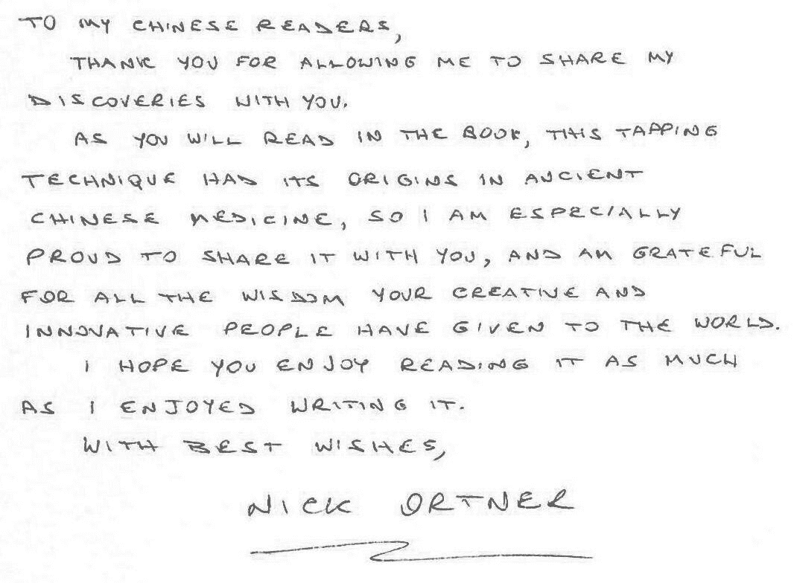

**致中国读者：**

感谢你们阅读这本书。

事实上，情绪释放疗法与中国古代的某些疗法有着异曲同工之妙，所以得知本书将出版中文简体版，我深感荣幸。我想说，中华民族是一个充满智慧和创造力的民族，感谢你们奉献给这个世界诸多宝贵遗产。

写作此书对我而言是一种享受，同时，我也希望把这份美好的感觉传递给你们。

祝好！

**尼克·奥特纳**

# 推荐序Ⅰ
能量心理学的自助时代来临

Amanda 老师

中国情绪释放疗法第一人

能量心理学不同于东方经络学，它虽然以中国 5000 年经络学为基础，但它的重点旨在疗愈心理问题，以及由心理（情绪）问题所引起的身体症状。能量心理学所关注的是情绪健康，而东方经络学更集中治疗身体层面由经络不通引发的各种症状。能量心理学最具代表性的疗法就是情绪释放疗法。

2011 年，我初次把情绪释放疗法及其他一些能量疗法带到国内，那时候大家对能量疗法还是普遍陌生的，也查找不到这方面的介绍资料。当时，我和我的学生翻译了不少情绪释放疗法的介绍性资料，我把它们转化为平实的语言，并加入了很多本土化的东西和自己总结的经验。

当时，尽管万事开头难，但我内心很坚定地看到，能量疗法是非常适合中国人自助使用的，它不涉及任何灵性和宗教的成分，也没有心理学书籍的教条和冗长的理论，容易上手，见效显著，因此它非常符合我们这个“压力山大”而又寻求速食的时代。

我当时也是凭着一颗炙热之心，建立了能量疗法的自助平台，因为我早已预见两点：第一，未来是能量疗法的时代，人们将逐渐放下对药物的盲目迷信，而把注意力放在保健和食疗上，从而逐步走入从能量和情绪释放的角度达到身心平衡的阶段；第二，水瓶时代精神的加深，让我们内在的力量复苏，我们将不再过度依赖外界的力量去创造和实现愿望，自助将是未来疗愈自我的大方向！

当中资编辑找到我为尼克·奥特纳的《轻疗愈》（*The Tapping Solution*）写推荐的时候，我很兴奋地在想：这本书，我等了 2 年了！它终于来到了中国！尼克是我非常欣赏的情绪释放疗法领域的先锋人物！我最欣赏他的地方就是他没有经过任何这方面的培训，也没有心理学的背景，他最初创建情绪释放疗法世界网络峰会时完全是凭着一腔热血，几年下来不知让多少人受益，而我也是其中一员。

尼克对于情绪释放疗法的操作技巧和诠释完全来自实践。因此，他的书中没有长篇大论的教条，而是大量案例和供自我使用的引导语，以及适量的专家研究报告和深入疗愈的资源。全书涉及的面非常广，从简单的头痛到幼年创伤，从工作压力到财务问题，是适合人手一本的好书！可以说，随着这本书的到来，定能引爆能量心理学的繁盛时代！

尽管情绪释放疗法浅显易用，我们中国人的问题也普遍比较复杂，但它在处理我们日常情绪及舒缓压力方面，完全可以胜任！未来，随着人们对能量疗法认识的加深，我们也需要更多的能量疗愈师加入进来，因为内在深层的问题，需要更为专业的辅助。

期待未来的中国全民能敲打释放，能量疗法真正深入每个家庭，我们的生活变得更和谐、更美好，喜悦感恩常驻心间。这也是我心中最美好的愿景！

# 推荐序Ⅱ
释放身心，重获自由

马克·海曼

医学博士

葆拉头疼很严重，几乎每天都犯。这种情况已经持续了十几年。尽管我给她开了安眠药，可她每个月还得跑四五趟急诊室，因为她的头痛和由此引发的失眠实在太严重了。除了服药，她还调整了自己的生活方式，因为这对类似的病症通常有效，比如不吃谷蛋白、肉类、奶制品和服用膳食补充剂等，可她的头痛一点儿也没减轻，这让她什么事都做不了。

一年前，我通过朋友认识了尼克·奥特纳。他擅长使用情绪释放疗法（ Emotional Freedom Techniques，简称 EFT，目前国内尚无统一翻译，本书统译为“情绪释放疗法”。——译者注）。他向我解释了情绪释放疗法的科学原理，分析了这种疗法为什么能解决那么多健康问题，从身体病痛、心理困扰到情感关系。于是我决定让葆拉去找尼克治疗，他的疗法或许能解决葆拉的问题，但我还是拿不准。我把疑惑告诉了葆拉，不过当时的她已经到了病急乱投医的地步。

在治疗过程中，我零星地听说了葆拉的好消息，比如她的头痛正在缓解，服药量也比以前少了。几个月后，当我见到她时，我还是大吃了一惊。这时葆拉的头已经完全不痛了，同时也不再服用任何药物了。

亲眼见证了情绪释放疗法的神奇疗效之后，我想了解更多，于是我独自探索，并最终认定将情绪释放疗法与医学结合将大有裨益。到现在为止，我仍然把疑难病例介绍给尼克，他用情绪释放疗法治疗的效果仍然稳定而持久。

我是一名执业医师，看到情绪释放疗法开创的治疗新天地，我由衷地感到兴奋。无论是医学还是其他任何科学，都需要我们拓展认识的疆域，检视治疗的手段和方法。持续不断的探究最有效的治疗方法是我们的工作和职责，我们不能仅仅头痛医头、脚痛医脚，还应寻找从根本上消除病症的方法。打个比方说，我们不能仅仅给蔫了的枝叶浇水，而应该把注意力放在根部，这样植物才能枝繁叶茂。

情绪释放疗法快速而有效地调节身体的压力反应，找到病症的根源，然后对症下药。它能够在心智、情感和身体等多个层面上改善健康，如治愈情绪低落、焦虑、创伤后应激障碍、纤维肌痛等，如果再配合健康的生活方式，情绪释放疗法就能积极而快速地调适那些经常让我们生病的压力。

想想未来几年、几十年，我能自然而然地见到这样的一个世界：在那里，情绪释放疗法把我们从不必要的药物治疗中解放出来，提升我们的身心健康，为我们创造出更丰富、更圆满、更友爱的富足生活。能够参与创造这样一个新世界，我感到既荣幸又激动，同时我希望你也能运用这本书收获情绪释放疗法带给你的无尽幸福。

# 权威推荐

**李子勋　CCTV 长期特邀心理专家**

皮肤是身体最大的器官，情绪释放疗法可以唤醒皮肤知觉，把身体从情绪中解放出来。这一疗法是最近 20 年心理学界流行的治疗方法，它源于躯体治疗中的拍打理论，暗合中医经络理论，疗愈效果很好。读尼克·奥特纳这本《轻疗愈》，做自己的情绪医生。

**刘利平　华夏心理培训学校校长**

情绪释放疗法是现有自我疗愈方法中作用最快、清理最深的疗法之一。提供培训服务这么多年以来，我们发现简单有效、操作性强的方法越来越受心理咨询师和企业培训师的关注和欢迎。这个方法应用范围广阔，必将大放异彩！

**露易丝·海　国际知名心灵导师和演讲家，《生命的重建》作者**

尼克·奥特纳教我用情绪释放疗法解决了身心的各种问题。他的方法简单好用，效果也确实很神奇。我很喜欢这本《轻疗愈》，相信你也会喜欢。

**韦恩·戴尔博士　《正能量：实践版》作者**

不用怀疑了，情绪释放疗法真的管用，我找尼克治疗过，这个疗法对我的生活大有裨益。

**乔·维泰利博士　《零极限》作者**

《轻疗愈》介绍了解决我们身心困扰的方法。尼克·奥特纳真是个天才！现在就来看这本书吧，它可以帮你永远解脱身心困扰！

**黛比·福特　《接纳不完美的自己》《好人为什么想做坏事》作者**

情绪释放疗法是革命性的治疗方法，众多治愈的案例足以证明其神奇而有效。尼克为这个突破性的新疗法制订了一整套方案，它能帮助你释放恐惧情绪。

**克里斯蒂安·诺斯鲁普　《女人的身体，女人的智慧》作者**

我真心推荐情绪释放疗法！跟着这本书开始你的敲击之旅，前面就是健康和幸福。

**盖伊·亨德里克斯　《大飞跃》作者**

尼克·奥特纳向他的读者详细讲述了情绪释放疗法的历史、敲击的正确方法，以及不同的人如何运用情绪释放疗法改善了自身生活。能够接触这一疗法真的非常高兴！

**琳内·麦克塔格特　《疗愈场》作者**

情绪释放疗法是一种相对较新但非常有效的治疗方法，它能治疗许多让我们苦恼的问题。尼克不仅讲述了情绪释放疗法背后的科学原理，而且提供了操作指南。此外，他还讲述了令人（包括尼克自己）难以置信的成功案例，这些事例将促使你投入情绪释放疗法的怀抱。所以，今天就拿起这本书，让这个简单而行之有效的方法成为你疗愈身心的武器吧！

**克丽丝·卡尔　《疯狂性感厨房》作者**

情绪释放疗法极大地提高了我的生活和工作的质量，除了尼克·奥特纳，我实在想不出更好的人选来为你展示这意义深远的疗法。尼克是我的私人教练，现在只要你读这本开创性的书，他也能成为你的私人教练。你千万不要错过这个治疗的机会，它不仅能改变你的生活，而且能够让你在关键时刻化险为夷。

**阿里尔·福特　《心心相印的秘密》作者**

尼克·奥特纳是一位情绪释放大师，他有一套实用易学的治疗方法，这套方法能够引导你走上负面情绪、身体病痛等问题的疗愈之路。尼克用一种奇妙的方式调整你的大脑，使你过上精彩的生活。

**奇普·康利　美好生活精品酒店创始人，《巅峰》作者**

在我人生最低谷的那几年，我接触到了情绪释放疗法。很神奇的是，这种非正统的疗法居然重塑了我的生活，让我有种拨云见日的感觉。尼克·奥特纳的这本书考虑周详，信息量大。它将让你了解这种革命性的治疗技术，让你知道如何实施，以及为什么会产生这么好的治疗效果。

**卡罗尔·塔特尔　《轻声的启迪》作者**

如果你想大幅提升你的生活质量，那么就听听尼克·奥特纳怎么说吧。作为敲击治疗领域的重量级老师和带头人，尼克帮助世界各地的人拓展心智和生活。如果要学习并成功运用情绪释放疗法，《轻疗愈》就是最实用的工具。按照尼克的指导去实践吧，巨大的变化和美妙的生活就在前方。

**梅克拉博士　风靡全球的自然养生网站 Mercola.com 创始人**

我的几千位遭受身心折磨的患者接受了情绪释放疗法，我亲眼见证了它的威力，没有比这更神奇的事了！情绪释放疗法能够令你获得难以置信的突破，也能给你的日常生活带来便利。尼克·奥特纳是情绪释放专家，他能用切合实际的方式教你应用这一疗法。

**道森·彻奇博士　《唤醒你基因里的精灵》作者**

我认为，情绪释放疗法是 100 年来心理学和医学领域最重要的成就之一。在本书中，尼克·奥特纳对情绪释放疗法的介绍极为详尽，如果你想了解并快速掌握这一疗法，本书正是你需要的。书中详细记录了许多治疗案例、几十个实操练习以及特定部位的敲击指引，这一切都将带你走进情绪释放疗法的神奇世界。

尼克运用神经科学的最新进展解释了情绪释放疗法的治疗原理，与此同时，他也让这一疗法变得真正有用，使它能够解决我们每天都要面对的现实问题。如果你想打破禁锢生活的锁链，那么这本书就是那把钥匙。

**丽莎·加尔《觉醒》灵性广播节目主播**

不仅尼克·奥特纳本人充满正能量，他的书也同样充满正能量。尼克真心想让人们意识到情绪释放疗法的疗愈效果，他的观点应当走向世界。我喜欢尼克的解说，他条分缕析，使情绪释放疗法变得实用易学。只要遵循书中的步骤，你就能立即摆脱烦恼。

**保罗·舍勒博士　逍遥右脑记忆法的开发者**

在发展情绪释放疗法的技艺和科学方面，在全球范围内尼克·奥特纳可算是数一数二了，尤其是这本书的出版，使得这一点更加确定无疑。经过创新，尼克让情绪释放疗法这一天赐的礼物能够惠及所有人。

无论你是刚刚接触情绪释放疗法的新手，还是实习医生，或者临床治疗师，对你来说这本书都是最完美的指引。方法都在书里，你做了就能立即受益，找人一起快乐地尝试吧！未来几年，情绪释放疗法一定会大有发展。

**唐娜·伊登与大卫·范斯坦博士　《能量心理学的承诺》合著者**

尼克·奥特纳已经让超过 50 万人感受了敲击穴位的魔力，使他们变得更健康、更幸福。尼克亲自用无比清晰的语言告诉你，如何改变那些对你造成束缚的思想和行为模式，如何改善你的情感关系，如何在你所看重的事情上取得成功，以及如何才能过上更健康、更快乐、更富足的生活。

**露丝·巴钦斯基博士　美国国家行为医学临床应用研究所主席**

渴望新生活的到来，却又不敢有所尝试。那么，你一定不想错过这本书。这本书能帮你找到前行的障碍，然后，运用情绪释放疗法，你就可以永远地解决它们。尼克·奥特纳揭开了情绪释放疗法的神秘面纱，他将指导你把它运用在生活中的任何方面。

**埃里克·罗宾斯　医学博士，泌尿外科医生和心身治疗专家**

哇，这本书真是太神奇了！尼克的文字引人入胜，充满激情，同时他也把情绪释放疗法背后的治疗原理阐释得透彻无比，如何运用它解决各种问题他也讲得十分详尽，尼克不愧是情绪释放疗法的大师。在过去的 14 年里，尽管我每天都用这一疗法来治疗患者，但我还是从他的书中学到了很多新技能。这是我所读到过的最积极、最诚恳、最令人振奋的书之一，它绝对是这一领域的经典之作。强烈推荐！

**帕特里夏·卡林顿博士　临床精神病学副教授**

这本书很开阔眼界，对于尚未了解情绪释放疗法的人，以及已经有所了解，还想立刻运用它解决自身具体问题的人来说，这本书都将为他们带去巨大的帮助。这本书对每一个人来说都意义重大！

**埃里克·列斯科维茨　医学博士，哈佛医学院中西医结合小组主任**

我是一名有超过 25 年临床经验的精神科执业医生。在我看来，情绪释放疗法是我见到过的最有前景的新兴治疗方法。这本书向读者概要地介绍了情绪释放疗法的来源、原理和功用。这个疗法看似简单，但其应用将是无限的，是心理治疗和个人成长的重要途径。这本书内容充实、趣味性高、简明易用，尼克·奥特纳应当受到赞扬。

**利萨·兰金　医学博士，《心智胜过医药》作者**

对于那些想消除引发恐惧、焦虑和慢性疾病的负面意念的人来说，看这本书就够了。科学数据表明，人们可以通过身体活动开启或关闭自我修复技能。这种活动能关闭身体的应激反应，同时开启身体的放松反应。

情绪释放疗法就是这样的心身转换活动，尼克·奥特纳热情而又不失优雅地教你掌握这种简单的自我修复方法。

**阿加皮·斯达西诺鲍罗斯　《放飞心灵》作者**

这本书真的很有价值！尼克把情绪释放疗法介绍给了所有的人，让我们能了解并运用它来摆脱不利的固有反应模式，同时体验到更多的自由和快乐，通过情绪释放疗法其实很容易实现这些。

**马斯汀·基普　TheDailyLove.com 创始人，首席执行官**

情绪释放疗法完全改变了我的生活。起初我还以为这只是个小噱头，然而事实并非如此。这是一种革命性的疗法，它将带你深入心灵，让你体验到情感自由。我永远感激尼克·奥特纳把情绪释放疗法介绍给了我。这是一本必读书！

# 前言
放手过去，开始全新的生活

我看上去一定很傻，至少我这么认为。

2004 年的春天，我一个人坐着，一边盯着电脑屏幕，一边自言自语，同时还在身上的不同部位敲来敲去。如果你从窗外看到我，肯定觉得我有毛病。

实际上，我确实有点反常。那天早上醒来，我的脖子非常疼，疼得我都不知道那一天该怎么过。你知道我说的那种疼法吧？接下来的一天、两天，甚至三天，可能我都得缓慢地转动脖子，在别人眼里就像个机器人。

只要能消除疼痛，让我干什么都行，包括敲敲打打，虽然它看上去有点奇怪。

关于情绪释放疗法，我已经听说过很多，据说它将中国古代的针灸和现代心理学相结合，能治疗极为广泛的病症。我从书上读过一个又一个无比神奇的成功案例，所以我想，为什么不试一试看看结果如何呢？

#### 奇迹一个一个在我眼前发生

让我惊奇的是，本来应当持续好几天的疼痛，不出 10 分钟就消失得无影无踪了。啊！真是种解脱啊！我又能像正常人那样自由地转动脖子了，而且一整天都没有感到任何不适！这个情绪释放疗法真有用啊！

我突然意识到，这种疗法应该不只能治脖子疼，它应该还能帮我改变其他。我跟很多人一样，认为疼痛是不可能瞬间消除的，然而这个小小的经验打破了我的惯性思维，我开始设想从未考虑过的各种可能性。

我们所受的教育告诉我们，无论是解决问题还是改善局面，都需要一些时间，而且前提是有改变的可能。假如疼痛、疾病、成瘾、肥胖、情感关系、财务等问题真的能轻松迅速地解决呢？这些看似不可能的事情如果真的发生了呢？

这是我第一次尝试情绪释放疗法后在心里酝酿的想法。我开始思考，我生活中的其他方面是否也能获得改善，如何才能帮助我关心的人。

起初，情绪释放疗法对于我来说只是一项爱好。我在自己身上反复运用，后来又介绍给亲戚朋友。没过多久，我又开始接待来访者。就这样，我身边的人很快都知道，如果他们把生活中遇到的事情告诉我，无论是身体疼痛还是情绪低落，我都会建议他们采用情绪释放疗法。在我的坚持下，他们都得尝试这种匪夷所思的疗法，一个都逃不过。

随后，奇迹一个又一个地在我眼前发生了。当时，我只关心这个疗法有没有用，至于它如何起作用，其实我并不了解。不过今天，最新的科学和研究已经分析了情绪释放疗法背后的原理，以及为什么它能彻底解决问题。

我刚接触情绪释放疗法时，全球至少有几万人在使用它，并且形成了一个活跃的圈子，成员们一起探索治疗原理，分享治疗经验。不过，很多人对这种疗法存有疑问，所以我觉得有必要把这种疗法介绍给更多的人。

#### 任何问题都能交托给它

尽管我没有任何制作经验，口袋里只有几张刷爆的信用卡和几笔短期贷款，但接下来我还是决定制作一部名为《轻疗愈》的纪录片，以便介绍情绪释放疗法的神奇疗效。我还拉来了妹妹杰茜卡（Jessica）和最好的朋友尼克·波利齐（Nick Polizzi）。我想这部纪录片不仅要有冲击力，还要教会观众如何运用，更要展示它的神奇疗效。

开始的 6 个月，我们去了很多国家，采访了情绪释放疗法的一系列专家、教授、医生、心理学家、精神病学家、个人发展培训师和畅销书作者。他们把对情绪释放疗法的热情和使用后的积极体验全都分享给了我们。虽然我们拍到的内容兼具说服力和教育意义，但仍然不完整，我们还得拍摄普通人对这种疗法的运用，而且不能只讲述他们过往的经历，还要全程展示情绪释放疗法及其疗效。因此，我们计划把 10 位患有各种严重病症的患者集中在一起，开展治疗工作坊，用以检验情绪释放疗法的疗效。

2007 年秋，为了拍摄一些前期画面，我和尼克·波利齐走进了得克萨斯州乔迪·麦克唐纳的家。乔迪患有纤维肌痛综合征（该病症原因不明，患者可能有躯体或精神创伤史，其最突出的症状是全身弥漫性疼痛。——译者注），我想拍摄乔迪的症状和这些症状对她造成的影响。此时的乔迪尚未接受敲击治疗。我详细地了解了她的生活，并开始热切地期待：情绪释放疗法将会对她产生怎样的作用？

望着乔迪热情的笑容和明亮的双眼，你一定想不到，她的病痛多么严重，她常常疼得趴在地上，一晚上疼醒 15～20 次。你也一定猜不到，长年累月的膝关节疼痛让她不得不放弃酷爱多年的远足，更严重的是，她甚至连一小段楼梯都上不去。8 年来，她的纤维性肌炎不断地损耗她的生命，缓慢地侵蚀她的人生。

乔迪是个教师，酷爱写作，同时还是 4 个孩子的母亲。疼痛给她的生活造成了很大影响，医生也告诉她，她的病治不了，可她不服输。她坚信积极心理学和吸引力法则，决心笑对人生。无论怎样，她都拒绝放弃。

数分钟的交谈后，我发现了两件事：第一，年幼时乔迪受过严重的心理创伤，如眼睁睁地看着父亲殴打母亲；第二，尽管发生了很多事，乔迪还是决心做一个积极高效的人，她花大量时间去帮助他人。

她尽力让自己高兴起来，她找过所有应该找的医生，也尝试了各种疗法。为了战胜疼痛，她已经做了所能做的一切，然而迟迟未见成效。这到底是怎么回事？情绪释放疗法会有效吗？

乔迪所做的一切打动了我，当时我真想把情绪释放疗法教给她，然而我必须等待。我们已经达成一致，几星期后我们会开展为期 4 天的敲击治疗，那时才能把这种疗法介绍给她。

拍完了乔迪这一段，尼克和我重新上路去访问其他参加敲击治疗工作坊的人。这些可敬的人正在不顾一切地寻找解决问题的良方，苦苦盼望状况的改善；

唐娜患了乳腺癌，身心备受摧残，严重的失眠状况更令她虚弱不已；

越战老兵约翰腰疼已经 30 多年，无论是求助医生还是吃止疼药，都收效甚微；

勒内的妻子 3 个月前因车祸离世，这让他痛不欲生，以致身体极度虚弱；

杰基不敢在众人面前讲话，因为胆小，她喜欢的很多事情都没办法开展；

……

这 10 位来访者正沉浸在巨大的痛苦当中，他们努力寻求改变，结果却无功而返，试想又有多少人处在同样的境遇当中？此时，对我来说最重要的问题是，情绪释放疗法真的能起作用吗？

我会在这本书其他部分介绍他们的转变，为了能让你先了解一些情况，我先说说乔迪的变化吧。乔迪的疾病被诊断为“不治之症”，谁也帮不上任何忙，然而为期 4 天的治疗刚过了 1 天，她疼痛的毛病就消失了！接下来的几年，再也没有犯过，她生活的方方面面也有了很大的起色。

如果对于这么严重的情况都可以有如此惊人的疗效，那么对于你的情况又会有怎样的疗效呢？你想获得如此惊人的转变吗？

生活中，你是否想做出改变？孩提时有没有遗留创伤？是否焦虑？身体是否疼痛？是否觉得自己过于肥胖？财务状况是否糟糕？感情关系是否亮了红灯？经过证实，无论哪种情况，情绪释放疗法都可以为你解决。在本书中，我不仅会介绍如何运用情绪释放疗法改变问题背后潜藏的惯性模式，还将深入探讨以上提及的和未提及的问题。

#### 击溃惯性模式，重获身心平衡

无需特异功能我就知道，有些事情肯定是你希望改善却毫无进展的，我也能猜到，总有那么几件事，你一而再、再而三地付出努力，却屡战屡败。

你也可能无数次地对自己说：

“唉，老毛病怎么又犯了！”

“我为什么又跟他提那件事？”

“我为什么又吃那种东西？”

“我为什么又没锻炼？”

“我为什么又没钱了？”

“我为什么又灰心丧气（生气、失落、崩溃、焦虑、疲惫）？”

上面说得其实挺委婉，对自己你可能不会这么客气，大多数人都免不了要加上一两个脏字儿！

虽然你有这些负面想法和行为，但你正在努力改善，然而，你想要的结果还是不见踪影，于是难过之外又平添了几分懊丧。不了解自己的惯性模式也就罢了，可事实上你了解！只不过你对它们无能为力。实际上，我们现在的惯性模式形成于 7 岁之前，它们来自父母、老师、社会和朋友的影响，这点我们稍后探讨。

之前的问题在于，我们能将这些模式识别出来，却没办法打破它们或实实在在地做番改变。我们可能会求助于心理医生或精神科医师，一周接一周地谈下去，而效果往往不尽如人意，即使情况很理想，改善也是姗姗来迟；我们可以认真地考虑问题，使情况暂时改善，可过不了几天，甚至过不了几个小时，同样的问题又卷土重来；我们也可以运用意志的力量强迫自己改变，可这通常是个痛苦的过程，无法长久，有时能达到目标，有时又不能。总之，这些方法都无法给予我们一种牢牢掌控生活的感觉。

然而现在情况不同了。

情绪释放疗法与我知道的任何疗法都不相同，它的出现是为了改变世界，它正在全球范围内的精神创伤治疗方面大放异彩。不过，在讨论改变世界之前，我们还是先讨论怎样改变你的人生吧。

还记得我们说过的那些模式吗？现在，我们终于有办法去影响、摆脱甚至击溃它们了。情绪释放疗法直击问题的根源，在心理和身体之间取得平衡，同时改变我们所做的事情、我们的感觉，还有我们体验世界的方式。情绪释放疗法可以运用在任何方面，不过，首先我们会把它集中运用在生活的重要方面，也就是那些对你影响最大的方面。然后，你会自然而然地学到如何把它运用到生活的其他方面，以及如何与世人分享。

#### 该是时候改变了

最前面的两章内容至关重要，它们是后面内容的框架和基础。第一章讲了情绪释放疗法的起源和历史，以及探索该疗法治疗的最新科学发现。

在第二章中，我会分步骤介绍情绪释放疗法的运用，这样你就能知道如何做并在自己身上体验一番。情绪释放疗法最大好处之一就是你能立刻感受到它带来的改变，而根本不用花几个小时学习如何操作，也不用等 1 个月后再看疗效。

学习了情绪释放疗法的基本步骤，并且感受到它的魅力之后，我将带你分析可能阻碍改变发生的原因。在改变的需求背后，往往有一些念头以无意识或半意识的形态存在着，是这些看不见的惯性模式阻挡着理想结果的实现。在第三章，我们将用情绪释放疗法来清除这些惯性模式，以便最大限度地发挥这本书的作用。

第四章将讲述如何运用情绪释放疗法迅速缓解生活压力，降低焦虑水平，从而减轻崩溃感。

第五章可能是蕴含能量最大的一章。在这一章中，我们将分析幼年时期经历的负面事件与当前处境的关联。我见过疗效最显著的几个案例都从中获益。

接下来的两章更加详细地介绍了情绪释放疗法和我们的身体。第六章概要地讲述了压力影响身体的方式，以及我们应当如何使用情绪释放疗法加速疗愈进程。第七章集中介绍了如何运用情绪释放疗法解除身体疼痛。

在第八章中，我们将重点介绍如何借助情绪释放疗法减除赘肉、重塑形体。我知道很多读者都喜欢读这一章，而且很多人会跳过其余部分直接看这一章，我建议你不要这样做。只有了解了前面章节，你才能更有效地运用情绪释放疗法达到瘦身的目的。

在第九章和第十章中，我将与大家分享自己从情绪释放疗法中获得的神奇体验，包括找到心爱的人、改变财富观以及随后在财务上的体验。你也能获得同样的体验，而且改善的速度一定会让你吃惊！

第十一章以一个令人发笑的小故事开头，这一章将告诉你如何面对某些严峻问题，比如内心最深处的恐惧。在第十二章中，我将介绍情绪释放疗法更为广泛的用途，比如，如何治疗失眠或加深睡眠、儿童如何使用情绪释放疗法、如何提高体育竞技水平、如何治疗成瘾等。

第十三章可能是最振奋人心的一章，我将介绍全球的个人和机构所做的情绪释放疗法，它们或者十分出色，或者具有突破性意义。

在最后一章，我将通过情绪释放疗法为你和你的生活展现一幅新的远景图。在这一章中，你将找到希望和灵感，它们将激发你奔向梦寐以求的新生活。

整本书中有很多情绪释放疗法的应用介绍，它们将帮你把这一疗法融入生活。我也会重点介绍几位在自己的专业领域运用情绪释放疗法的医生，其中有心理医生和精神科医生，让你一窥传统治疗中运用的情绪释放疗法。

能带你走进情绪释放疗法的新天地，我感到非常荣幸。我通过情绪释放疗法体验到了希望、神奇和灵感，我希望你也能在这本书里找到，这是我内心最殷切的期待。它给我的生活带来了很大转变，而且改变还在继续，每一天都在继续。我相信同样的事情也会发生在你和你爱的人身上。

是时候去改变那些惯性模式了……

是时候去拥有一个健康、精力充沛、充满活力的身体了……

是时候去收获富足、美满和幸福的生活了……

是时候去享有舒适、惬意、积极的情感关系了……

也是时候开始读这本书了！

# 第一章
疗愈的 2.0 时代

**A MONUMENTAL DISCOVERY**

尝尽所有传统疗法，玛丽的恐水症依然如故，束手无策的卡拉汉医生偶然间让她尝试在眼睛下方轻敲几下，陪伴玛丽几十年的恐水症就此一去无影踪。或许卡拉汉医生也万万没想到，自己的偶然一试，竟开创了一个新的疗愈时代。

任何真理都要经历三个阶段：第一，被嘲笑；第二，被激烈反对；第三，被不言自明地接受。

德国著名哲学家　亚瑟·叔本华

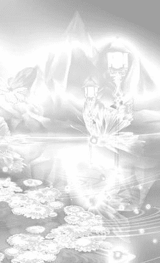

罗杰·卡拉汉（Roger Callahan）是一名科班出身的心理医生。他并非第一次遇到这种情况，可这次的情形还是让他沮丧到了极点，因为他简直束手无策。

他有一位来访者名叫玛丽，从孩提时起就患有严重的恐水症。已经 40 多岁的她依然恐惧任何形式的水：澡盆里的水、游泳池里的水、海水甚至雨水。她甚至不敢给孩子洗澡，晚上还经常做与水有关的噩梦。为此，她只好向卡拉汉医生求助。

为了治她的病，卡拉汉医生倾尽所能，却没有成功。他已经给玛丽治疗了一年多，而且使用了他掌握的所有传统心理治疗技术：认知疗法、催眠疗法、放松疗法、理性情绪疗法、系统脱敏疗法和生物反馈疗法等。这些治疗方法都是心理医生、精神科医生和公众普遍接受的，然而用在玛丽身上，却丝毫没有效果。

失败也不是第一次，可卡拉汉医生从未如此失望和沮丧过。玛丽虽然能坐在卡拉汉医生家的泳池边将两脚放进泳池里，但内心仍然充满恐惧，卡拉汉医生只好放弃在泳池边的治疗。然而不幸的是，治疗本身带来的压力又引发了玛丽严重的头痛。

卡拉汉医生一直对人体身心功能的运转很有兴趣，在为玛丽治疗期间，他也在学习人体经络穴位。经络是中国古代针灸医学的基础，它是一种能量通道，可以将维持生命活动的关键物质（或者称作“气”）输送到身体的各个器官和系统。经络贯通人体，每一条都与不同的器官相联系，比如胃、胆囊、肾脏等。此外，每条经络都有腧（shù）穴（人体脏腑经络之气输注于体表的部位，是针灸治疗疾病的刺激点与反应点。——译者注），这是经络的开口，位于体表的特定部位，可以通过针刺或指压来沟通和平衡经络内部的能量流动。

在一次治疗中玛丽提到，一想到水她的胃部就会产生不适感。卡拉汉医生忽然灵机一动，他想敲击胃经的腧穴或许能减轻这种感觉。胃经的腧穴在眼睛下方，于是他让玛丽用手指尖敲击这一穴位。

玛丽照着卡拉汉医生的话做了。让他们感到惊奇的是，仅仅敲击了几分钟后，玛丽突然大喊：“没有了！现在想到水，胃部的不适感完全没有了！”她来到游泳池边，慢慢地接近水，她发现她已经不再害怕了。

从那天起，她的恐水症和有关水的噩梦都消失不见了。

这件事发生在 30 年前，今天的玛丽见到水依然没有恐惧。可以想象，见到这样的结果卡拉汉医生会有多么惊讶。他和玛丽努力了那么久，使用了各种传统心理治疗技术，甚至连替代疗法也没有放过，可只要敲击眼睛下方，问题就如此轻巧地解决了！更重要的是，这种恐惧感再也没有影响玛丽的生活。这究竟是怎么回事呢？

### 对恐水症病人的偶然一试

有了玛丽的治疗经验，卡拉汉医生随后开始深入研究经络上的腧穴，探索如何将传统心理治疗与情绪释放疗法相结合。他自创了一整套“敲击规则”，不同症状有不同的敲击顺序。

如果你患有恐怖症，例如恐高症，你就得按这个顺序敲：先敲眼睛下方，然后敲腋窝，最后是锁骨。如果你正在生气，比如老板说了让你不高兴的话，你就得用另一种顺序敲：先敲眉毛，然后敲眼睛下方、之后敲腋窝、锁骨。

加里·克雷格（Gary Craig）学习并实践了卡拉汉医生的敲击规则后，认为敲击顺序不如敲击本身重要。为了使这一疗法更易实施，他整合出一套固定的敲击顺序，这就是后来的情绪释放疗法。

按照这一顺序可以敲击到所有主要经络的腧穴，而不用管具体病症是什么。我将在第二章详细介绍这一敲击顺序，不过这里先简单透露一下：从手部开始，然后敲眉毛内侧、眼睛外侧、眼睛下方、鼻子下方、下巴、锁骨、腋下，最后敲头顶。

加里不仅简化和完善了情绪释放疗法，他还创建了一个社区，他逐一记录并分享了人们使用这一疗法后取得的神奇疗效。今天，全球各地成千上万的人已经了解了这一疗法，并把它运用在日常生活中。

卡拉汉医生为玛丽治疗的突破性进展发生在 1979 年，然而，为何玛丽和那么多患者能通过敲击特定穴位摆脱恐惧、焦虑等难题呢？在随后的 30 年间，西方世界对此没有更多解释。不过现在我们已经了解了很多背后的科学。

当你体验负面情绪时，无论是愤怒、苦恼还是恐惧，你的大脑都会亮起红灯。它会使你的身体开启一种战斗或逃跑的反应机制。为了应对外部世界的威胁，这种反应机制会将你身体的潜能激发出来，你的肾上腺素分泌会增加，肌肉紧张度会提高，血压、心率、血糖水平也会升高，这样你才能拥有足够的能量应对挑战，就像我们的祖先被老虎追赶时的情形。

远古时期，外界环境对人身安全构成了很大的威胁，如今它的威胁已经很少能激发我们的战斗或逃跑反应了。今天，大多数战斗或逃跑反应是由身体内部激发的，比如玛丽的恐水症，仅仅想到水，她的身体就会开启应对威胁的反应机制。

对大多数人来说，身体的应激反应是负面记忆激发的结果，这些负面记忆根植于童年创伤或习得性反应。无论是外部激发还是内部激发，身体的应激反应都会呈现同样的现象：肾上腺素分泌增加，心率升高等。

除了如上所说的负面经历或记忆，日常生活中也充斥着各种激发我们战斗或逃跑的事件，比如老板的电子邮件让你很苦恼；午餐吃太多让你害怕长肥；回到家满眼凌乱和各种杂务让你焦虑不安。在所有这些情形中，你的身体都在随时准备战斗或逃跑。

你可能会说：“我的身体不会因为这些小事情就准备战斗或逃跑。”然而，事实的确如此！尽管这时分泌的肾上腺素和皮质醇不及老虎追你时多，但二者本质上并无差别。如果几百次、几千次持续不断地战斗或逃跑反应在一周或一个月内累积起来，它们就会对身心造成很大的影响，使得我们疲惫、苦恼、焦虑、紧张。所以，整体来看，我们的生活并不令我们十分满意。

情绪释放疗法的作用就在于它能够非常迅速地中断身体的战斗或逃跑反应，同时重塑大脑和身体的反应模式。现在，我们就来看看这一切是如何发生的。

### 来自现代科学的强效证明

科学已经证实，人类的应激反应发生在大脑的杏仁核中。这片杏仁状的脑区是大脑边缘系统的一部分，也是中脑的一部分，管理着人类的情感和长时记忆，负面情绪就在这里编码。

杏仁核常被称作身体的警报装置。“噢，麻烦来了。”杏仁核说，“有情况，我们的安全正在受到威胁。”它向大脑发出信号，令大脑通过战斗或逃跑反应动员整个身体。幼时的负面经历会为杏仁核提供编码素材，如果出现类似的情形，杏仁核就会发出警报。

例如，四年级时你在全班同学面前演讲，有人因为一个磕巴而嘲笑了你。这时，你的尴尬可能就会导致身体和头脑产生反应，将在众人面前讲话与“危险”一词联系在一起。然而，身体无法区分真实的威胁和感受到的威胁，每当类似的情形发生或仅仅是想象类似的情形发生，杏仁核都会发出警报。

尽管我们不确定其中的机制，但敲击经络的腧穴似乎能关闭杏仁核所发出的警报，使身体镇定下来，让杏仁核认为此时是安全的，从而阻断应激反应。而且，在经历或讨论压力事件的同时敲击腧穴能对抗这种压力，并让海马体（也是大脑边缘系统的一部分，主要负责学习和记忆，日常生活中的短期记忆都储存在海马体中。——译者注）重新编码。海马体会将过去的威胁与当下的信号作比对，然后告知杏仁核当前的信号是否是真实的威胁。

10 年前，哈佛医学院针对针刺穴位的研究显示，通过功能磁共振成像（fMRI）和正电子发射断层显像（PET）扫描脑组织，你能清晰地看到，当穴位受到刺激时，杏仁核的红色警示就消失了。由此可见，刺激特定的经络穴位能降低杏仁核、海马体和其他与恐惧有关的脑组织活动强度。这样的前沿研究实在令人振奋！

另一项双盲研究（Double-blind Study，研究对象和研究者都不了解试验分组情况，而是由研究设计者来安排和控制全部试验。——译者注）比较了针刺穴位和指压疗法（无针，与情绪释放疗法相同）的效果，结果发现，两种刺激方式效果不相上下。而更多的非正式研究则显示，在治疗焦虑障碍方面，指压比针刺效果更好。

与肾上腺素一样，皮质醇是应激反应中分泌的压力荷尔蒙，道森·彻奇博士（Dawson Church）研究了战斗或逃跑反应的皮质醇水平。他采用了随机分组加控制组的研究方式。实验中，83 位受试者分成了敲击治疗组、传统的谈话治疗组和不接受任何治疗的控制组。经过 1 小时的治疗后，彻奇博士和他同事对比了受试者的皮质醇水平和心理状况的变化。结果，敲击治疗组的皮质醇水平显著下降，平均下降幅度为 24%，个别受试者高达 50%。与此同时，谈话治疗组和控制组的皮质醇水平没有显著变化，只表现出皮质醇在一天当中随时间流逝而出现的正常下降。此外，在敲击治疗组，皮质醇水平的降低与焦虑、抑郁的缓解，以及整体心理状况的改善直接相关。

彻奇博士还跟我讲述了一段研究背后的故事，这更加凸显了敲击治疗的非同一般。

彻奇博士把样品送到实验室后，心想三五天应该就能拿到皮质醇水平检测结果了，正好能赶上几天后的医学会议，届时，他要在会上作报告，可以把这个研究结果公布出来。

然而，检测结果没有在预想的日期前出来，还拖了好几个星期，彻奇博士无法在会上公布它们，这令他大为不解。彻奇博士找实验室的工作人员询问，才知道检测人员怀疑送检样品或检测过程出了问题，导致检测结果不正常，于是他们反复检测。

为什么他们会有这样的质疑呢？因为与正常情况相比，敲击治疗组的皮质醇水平下降得太多了，这让检测人员难以置信！经过反复检测后，最终他们不得不相信：敲击治疗组的皮质醇水平确实出现了意料之外的显著下降。不过，这一点彻奇博士早就知道了。

通过敲击经络穴位解决心理问题从属于新兴的“能量心理学”，这一方法也称作“无针针灸”。针灸是一套高深的治疗体系，有 5 000 年的历史，它的疗效已经被大量研究所证实。而如今支持能量心理学的研究证据也已不计其数了。

实际上，对能量心理学的研究很符合美国临床心理学协会设定的“循证法”标准。曾任职于美国约翰斯·霍普金斯医学院（The Johns Hopkins School of Medicine）精神医学系的临床心理学家大卫·范斯坦博士也曾说过：“十几个国家的研究都显示，能量心理学对一系列病症的治疗都快速有效，且疗效长久。”

范斯坦博士发表在美国心理学会重要期刊上的一篇研究综述中提到，纵观已有刺激针灸穴位的研究，在治疗恐怖症和应试焦虑方面，该疗法已经被证实是行之有效的；在治疗创伤后应激障碍、演讲焦虑和抑郁方面，该疗法可能行之有效。现有研究中有 1/4 是在 2008 年后发表的，这说明能量心理学的研究正在蓬勃发展，其适应征名单也在逐年加长。

如今我们至少可以看到几十项研究已经证实，情绪释放疗法对一系列病症都有很好的疗效。你可以在如下网址查询这些研究的详细信息：www.thetappingsolution.com/research。

这些研究清楚地表明，情绪释放疗法能够治疗很多疑难病症，比如创伤后应激障碍、精神创伤、恐怖症等。既然该疗法在这些疑难病症上取得了如此显著的疗效，那么它一定经得起检验。对于更常见的问题，比如改善情感关系、减肥、破除思想障碍和摆脱财务困境，它同样能有效地解决。

熟知的情绪释放疗法获得了学术上的支持，这让我们感到很高兴。不过我们还应该看看同样有力的事实。成千上万的病例记录，有的是患者写的，有的是医生写的，这些都明白无误地记载了情绪释放疗法的治疗效果，而且数量还在不断增多。在本书中，我将与大家一起分享患者和医生运用情绪释放疗法的体验。

### 你能改变你的大脑

为了弄清楚为什么情绪释放疗法能够成功治疗恐怖症、焦虑症、创伤后应激障碍等病症，我们还是回过头来看看大脑的边缘系统。情绪释放疗法不仅能阻断应激反应，而且还能重塑大脑边缘系统。当你一边刺激穴位，一边想象一段难过的往事或某个苦恼的问题时，大脑的边缘系统就得到了重塑。

重塑边缘系统是暴露疗法的基础，而暴露疗法是卡拉汉医生治疗玛丽时所运用的心理治疗技术。在一段时间内，他让玛丽不断接近游泳池，过些日子再让她把脚放入水中。整个过程就是让玛丽逐渐暴露在恐惧源下。

在暴露疗法中，患者或是被暴露在引发恐惧的真实情境当中，或是依靠想象引发边缘系统处于应激场景或事件的反应状态。然而，这种传统的暴露疗法通常见效极为缓慢，看看玛丽的情况就知道了，一年半后，她在真实情境中仍然感到很焦虑，甚至还引发了严重的头痛。

当你一边敲击穴位，一边回忆童年的痛苦经历时，你就像是在进行改良版的暴露治疗，这里的暴露是指对童年痛苦经历的回忆。通常，情绪释放疗法能很快重塑大脑的边缘系统。其发生机制是怎样的呢？当你想到某些让你感到焦虑或不舒服的事件时，这种想象就会激发你的杏仁核发出警报，使身体产生战斗或逃跑反应。如果同时进行敲击治疗，杏仁核活动就会受到抑制，不过此时，大脑对危险的想象仍然存在。反复多次后，海马体就会得到这样的信息：这件事过去被标记为“危险事件”，可实际上标错了。

**指点迷津**

#### 为什么关注负面经历？

人们第一次听我介绍情绪释放疗法时，常会问：为什么要在敲击的时候想糟糕的事情？我不愿意想糟糕的事情！有句话不是说“想什么来什么”吗？

我知道大家为什么这么问，不过，这些所谓的糟糕的事情是事实，无论你想与不想，它都在那里。就像你丢在抽屉里的一摞账单，尽管你不想看到它们，但它们总在那里，你终究还要付账。我们尚未处理好的情绪、信念和心理创伤也一样在控制着我们的生活。我们需要找到它们，看着它们，承认它们就在那里，然后对它们做些处理。我们这么做就是为了解决它们。

当然我们也不能无休止地关注，只需关注一小段时间即可。敲击治疗的目的就是关注这些负面事件，然后对它们进行处理，再开始关注积极正面的事情。

经过治疗后，杏仁核就不会再针对这类事情报警了，海马体也会把它归为普通事件，你也不会再陷入应激反应的泥潭了。之所以会这样，是因为海马体是大脑边缘系统中控制情境关联的部分，此时，它已经把过去的负面经历标记为“没什么大不了”了。于是，当你下次想到或遇到这类事时，杏仁核就不会再报警了。

我常听来访者说，用情绪释放疗法处理过某一特定事件后，他们“对那件事已经记不太清了”。事实上，他们仍然记得那件事，只是与其相连的强烈情绪消失了。因为大脑边缘系统已经重塑了记忆，所以，那件事情在记忆中变得更为中性，也更为积极了。

科学家们推测，这种对边缘系统的重塑永远改变了大脑的神经通路，杏仁核中与特定情形相关联的恐惧通路也已被移除。近期的科学研究也发现大脑神经具有可塑性，大脑的神经通路并非是永久的，而是可以改变的，上述推测刚好与此一致。由此可见，你可以发展出思考和感知世界的新路径，而不必拘泥于固有看法。换句话说，你也可以像玛丽一样，摆脱导致你身心不适的恐惧、想法或记忆。

通过情绪释放疗法，痛苦的记忆连同你对它的关注都能得到改变。我曾经用情绪释放疗法为来访者处理负面的童年经历，后来听他说：“现在，想到我的家人，我真的能看到他们在微笑，我也记起了与他们一起度过的所有幸福时光。”我改变了他的过去或他的记忆了吗？当然没有，但我确实清除了他的心理创伤，以及创伤后对负面经历的持续关注。当负面经历被处理好后，正面经历就会浮出水面，因为它们一直都存在。

情绪释放疗法能改善大脑的神经通路，优化你的生理机能。如果这些不足以激发你去学习它，那就想想经常性的应激反应对健康造成的负面影响吧。如果不用情绪释放疗法或其他办法来清除应激反应，那么这些烦人的记忆、事件、想法所唤醒的情绪就会不断地激发身体的应激反应，有时可能一天当中发生很多次。大量的研究已经表明，这样的压力会对身体造成伤害。

“压力是最重要的非遗传影响之一。”道森·彻奇博士说，“目前已经知道，与压力有关的心理创伤影响着一千多种基因，其中许多关系着衰老和细胞再生过程。”

第六章介绍了如何使用情绪释放疗法治疗躯体疾病。在这一章中，我们将详细探讨压力如何影响身体，以及敲击为何能减轻压力、加快疗愈进程。

### 做自己的疗愈专家

在东方，主要是中国，针灸已经应用了几千年，人们用它来治疗疾病，消除疼痛。实际上，针灸已经被用来在无麻醉的情况下进行非侵入性的外科手术！最新的研究显示，针灸和指压疗法能提高身体的内啡肽水平，而内啡肽是一种我们熟知的能让我们“感觉舒适”的神经递质。

大多数人只要进行最基本的敲击就能获得良好的感受，即便他们并没有同时关注某一事件，这很可能是因为敲击提高了身体的内啡肽水平。事实上，你可以在任何时候敲击任何能让你感觉良好的穴位。通常，敲击过后你会觉得内心更加平静、更加满足。锁骨是大多数人都喜欢敲击的穴位，用大拇指敲几下你就会感到放松，同时精神也变得更好。

情绪释放疗法正处在东方指压、针灸疗法和西方心理学以及其他身心科学的交汇处。读完这本书后，你也会认为，交汇处正是诞生神奇的地方！

虽然情绪释放疗法已经获得了科学的支持，但我喜欢它最重要的原因是，它很安全，而且容易运用。实际上，情绪释放疗法的许多非常成功的治疗师并没有正规学习心理学或医学，他们只是接受了情绪释放疗法的训练。当然，每种训练都有它的好处，如果一名医生能够把自己对人体的了解带入到情绪释放疗法当中，那么他就会具有别人所不具备的优势或眼光。不过，正如我的朋友同时也是情绪释放专家的帕特里夏·卡林顿博士所说：“情绪释放疗法是真正属于大众的治疗方法。”

加里·克雷格是情绪释放疗法的创始人，他是斯坦福大学的工程师，对于理解人们所面对的困难，他有一种天赋。他能把从卡拉汉医生那里学来的情绪释放疗法运用得很好，并在其基础上提高。

我的兴趣主要在于帮助他人，同时传播和普及这一重要的治疗方法。所以，我写这本书的目的就是希望你能通过它有所改变，并获得自己最想要的结果。你可能还想联系情绪释放疗法的专业治疗师，去寻求特殊的帮助或建议，书中会介绍一些成功的治疗师。不过，只要把这本书中的理念付诸实践，我相信凭自己的力量你就能获得难以置信的结果。

现在，你已经见到了很多证据，它们都可以证明情绪释放疗法确实有效，我敢肯定你一定已经迫不及待要体验一番了！

**专家简介**

#### 大卫·范斯坦博士：从惊讶到毕生推广

说起替代疗法，大卫·范斯坦（David Feinstein）博士可谓见多识广。1970 年，范斯坦博士赴约翰斯·霍普金斯医学院精神病学系任职，系主任把他叫到办公室，交给他一个有趣并且改变了他一生的任务。“我总是不断地听到这些来自西海岸新疗法的消息。”系主任对大卫说，“这些疗法是噱头吗？还是值得了解一番的新进展？去研究一下。”

当时，各种名目的新疗法不断涌现，超过了 200 种。范斯坦博士在随后的 7 个月中研究了其中的 46 种。在这当中，他会研究它们的文字资料，密集采访它们的践行者，甚至加入周末的工作坊或亲身体验。这些疗法包括沟通分析疗法（Transactional Analysis）、生物能疗法（Bioenergetics）、完形疗法（Gestalt）、呼吸重生疗法（Breathwork）、敏感训练疗法（Sensitivity Training）、罗夫按摩疗法（Rolfing）、再评价咨询疗法（Reevaluation Counseling）、致幻剂辅助心理疗法（LSD-Assisted Psychotherapy）和裸体会心团体疗法（Nude Encounter Group）等。

对于范斯坦博士所探寻的大部分疗法来说，参与者起初的感觉似乎还不错，但之后他们又回到了从前的老样子，他们的生活并没有任何实质改善。

所幸的是，范斯坦博士的探寻工作仍然在持续进行，他想找到一种确实能让参与者生活得到改善的疗法。最后，他碰巧遇到了情绪释放疗法。

当时，范斯坦博士参加了一个关于情绪释放疗法的培训课程，一起学习的还有多位心理学专业从业者。时至今日，他仍会惊喜地谈论曾经的经历：

一位女性受试者患有严重的幽闭恐怖症，多年未愈。治疗师让她敲击身体的一系列部位，同时想象自己所经历过的恐怖事件，包括身处幽闭空间时的情景。让我感到惊奇的是，她很快就报告说，她所想象的情景已经不那么可怕了。不到 20 分钟，她的幽闭恐怖症似乎就消失了。

受试者报告的改善已足够让人吃惊了，接下来她被要求进入靠近门的一处窄小空间，并且尽可能地待在里面，感到不舒服时再出来。谁知道，她一直待在里面，直到最后我们不得不把她叫出来。她出来时表现得非常欣喜。她很惊讶自己居然在从前让她恐慌的空间里待了半个小时。

“我从没有见过如此快速有效的疗法。”范斯坦博士对我说，“那速度真的太快了！”

在这之前，范斯坦博士一直致力于传统的西方医学，现在，他看到了情绪释放疗法的威力，并且开始讲授这方面的课程。课程开始时，他往往都会讲一段话：

“今天我站在这里，感觉非常惊讶，即使是最疑难的病症，我们也可能用一种机械、简单的方式来达到难以理解的快速治愈。在这当中，我们甚至不需要稳定可靠的治疗关系、不需要深刻的洞察力、不需要多么投入。确实，在身上敲敲打打看上去很奇怪，但它的确有作用！”

见识到情绪释放疗法的神奇之处后，范斯坦博士作了进一步的研究。他不知疲倦地记录病例，对这一强大的疗法进行验证。他已经在能量医学方面撰写了 80 多篇专业文章和 8 本专著，也先后任职于约翰斯·霍普金斯医学院、安提亚克学院（Antioch College）和加利福尼亚职业心理学校（The California School of Professional Psychology）的临床心理学家。

很高兴，我能在不同场合采访到范斯坦博士，有趣的是，即使到了今天，他仍然会为情绪释放疗法能快速见效感到惊讶。看来他那接受传统医学训练的思维还没有完全适应这种快速、有效且易于运用的疗法，不过这也不能怪他，我这种没有医学训练背景、只受了替代疗法训练的脑袋也表示难以理解！

# 第二章
不可思议的体验

**QUICK START: EXPERIENCE TAPPING NOW**

如果心理创伤可以在 30 秒内发生，那么为什么治疗不可以在 1 天、1 小时，甚至 1 分钟内实现？

如果心理创伤可以在 30 秒内发生，那么为什么治疗不可以在 1 天、1 小时，甚至 1 分钟内实现？

情绪释放疗法专家　里克·威尔克斯

杰基是加拿大一位出色的地产代理人，以前她非常害怕在公众场合讲话。虽说这样的人不在少数，可她连区区几人的场合都恐惧不已，即便是跟她认识并信任的同事开电话会议，她也会紧张焦虑。

这一点显然会殃及她的工作，妨碍她拓展业务，最重要的是还会影响她对生命的体验。可以想象，一刻不停地担心说错话是一种怎样的负担？因为对他人的评判无休止地恐惧，即使聪明如杰基，也只能在缄默中窒息自己的灵感。

后来杰基接受了敲击治疗，专注清理孩童时期遗留的负面想法，比如不敢表达、认为无人倾听自己的心声、不敢大声讲话等。她曾经目睹父亲责打弟弟们，而自己却没能保护他们，这件事情她记忆尤为深刻，并始终耿耿于怀。

正是这些性格形成时期的负面体验塑造了她的身心，导致她在与别人沟通时充满了负面想法。当她一边沉浸在这些负面经历当中一边进行敲击治疗时，她的大脑和身体的反应模式就得到了重塑，恐惧也随之散去。

从那时起，杰基的业务有了显著的起色。更重要的是，她终于能轻松自如地与他人交往了。

曼迪是一位单身母亲，她浑身上下总是时不时地疼痛。各科医生都看过，还是找不到任何器质上的病因。医生告诉她都是“心理”在作怪，曼迪对医生的判断半信半疑。让她烦恼不已的是，医生唯一的解决办法就是让她长期吃止疼药，这给她的生活造成了很多不便。然而仅仅敲击了几分钟，她下巴处的疼痛就从 8 分降到了 5 分（最高 10 分）。

“你疼痛背后的情绪是什么？”我问她。

“愤怒。”她马上回答，而且这种愤怒与工作不顺心有关。接下来，经过几分钟的讨论和对愤怒的敲击，她下巴处的疼痛完全消失了。这个结果令她大为吃惊。

从器质性角度看，她的下巴很可能什么问题都没有。疼痛不过是身体在表达愤怒（从微观上讲这种疼痛可能是因为长期紧张导致局部供血不足，而情绪释放疗法正好缓解了这种紧张）。现在曼迪明白了，如果再感觉身体疼痛，她就要问“我的身体想对我说些什么”而不是“我的身体出了什么问题”，而且她知道可以用情绪释放疗法清除身体表达的情绪以及疼痛。

45 岁的洛丽感觉自己孤苦伶仃，她刚刚经历了痛苦的婚变，又接连约会失败，于是心灰意冷。她不仅怀疑自己吸引理想异性的能力，而且还把自己封闭起来，免得再受伤害。在她看来感情就意味着痛苦，而最安全的做法就是连试都不试。

我们一边敲击，一边检视了她离婚的经历，以及她对自己、对异性所抱有的看法。关键是我们把她有关感情的包袱全部清除了。渐渐地，洛丽重新向爱情敞开了心扉，并对未来的感情作了具体设想。

### 简便易行，却实实在在

以上仅仅是情绪释放疗法万千奇迹中的几例。说到这里，想必好奇的你一定很想体验情绪释放疗法即将带给你的重大影响。

探索情绪释放疗法 10 年来，我发现它最大的好处就是简便易行。谁都可以轻松掌握，也容易付诸实施，并取得效果。

我们都太忙了，没有时间去学一套复杂的程序，也弄不清楚学到什么程度才能见到效果。遗憾的是，大部分自助和自我发展的方法都太注重概念和观点。也许有些人喜欢了解和探讨不同的概念，但我们真正寻找的是实实在在的改变。

我们希望实实在在地减轻体重、治疗病痛、增加收入、改善关系。凡此种种，情绪释放疗法都可以一展身手，而且不止于此。

我已经说过，情绪释放疗法简便易行。我在后面会详细讲述它的 8 个简单步骤，这里先列出来：

1．找到你的“压力王事件”（Most Pressing Issue, MPI），同时想几个词作为提示语；

2．用主观焦虑评分（SUDS）为你的“压力王事件”打分；

3．认真拟定一份问题描述语，把“压力王事件”填进空白处：尽管 _____，我还是全然地接纳我自己；

4．用一只手的四根手指敲击另一只手的手刀点（见图 2-1 所示），同时将问题描述语重复 3 遍；

5．依次敲击身体的 8 个部位，同时大声说出“压力王事件”的提示语。每个部位敲击 5～7 次；

6．将 8 个部位敲击一番后，做个深呼吸；

7．再次用主观焦虑评分为你的“压力王事件”打分，检查效果；

8．重复以上步骤，或寻找其他“压力王事件”再次进行治疗。

到此为止，你已经对情绪释放疗法有了大致的了解。现在你只需问自己一个问题：你想立刻获得实实在在的改变吗？如果想，就请继续读下去！

#### 你在烦恼什么？找到你的“压力王事件”

开始情绪释放治疗的最简单方式，就是集中精力去想你的“压力王事件”。我们都有当前主导我们情绪和心理的问题或挑战。如果我问你现在最让你苦恼、最让你头疼、最让你放心不下的事情是什么，你会怎样回答呢？

常见的“压力王事件”包括：

工作，我的老板快把我逼疯了；

孩子，这个小东西让我头疼好多天了；

丈夫，昨晚我们打了一架，我真是难过死了。

现在就停下来考虑一下怎样回答下面这些问题：现在最让我苦恼的事情是什么？生活中最有压力的事情是什么？很多人觉得把“压力王事件”写下来会更好。不过，你也完全可以在头脑里想象它。

如果你一下想起好几件事情，从中挑一件就可以了。在这里，没有对错之分，跟着你的直觉走就行。在敲击治疗的过程中，我会反复提到运用你的直觉。

锁定了“压力王事件”后，你还需要把它描述得具体一些。也许你想的是“我受不了我丈夫”，可这太笼统了，你要想想具体的细节，比如，你可以这样说：“我受不了我丈夫，他昨晚说的那些话特别难听。”

**指点迷津**

#### 描述“压力王事件”一定要具体

我经常听到学习情绪释放疗法的人说他们“不知该说些什么”。在本书的各个部分，我都会为你提供可以加以运用的描述示例。不过你所面对的生活情境是独一无二的，我无法猜测你所面对的事情具体是什么。我会列出一些常见的事项，然后你要运用自己的语言描述你独特的经历。相信你的直觉，只要你遵循书中的步骤，情绪释放疗法几乎不可能运用错误。

关键问题是，你要把事情描述得具体再具体。对泛泛而谈的事情作敲击治疗能改善你的情绪，让你感觉更好些，但只有把细节加上去才能更有效，尤其是事情的重要元素，比如什么时候发生，都有谁参与进来，你当时的感受怎样等。这样才能让特定事件的焦点更加明确，你才能更有效地重塑大脑的反应模式。

如果在描述中你卡在了某个细节上，那么就把注意力放在你的感觉上，或者想象当时的场景，然后再去描述。尽量想办法清晰地回忆当时的情景和感觉，这样才能有好的效果。在这里举两个例子加以说明。

放之四海皆可使用的描述：我肩膀疼。

稍具体些的描述：当我举起胳膊时，我的左肩膀会疼。

更具体的描述：当我举起胳膊时，左肩膀会有种火烧一样的刺痛。

再举一个有关情感的例子。

泛泛而谈的描述：我很生气。

稍具体些的描述：我很生气，因为老板责备了我。

更具体的描述：我很生气，心里堵得慌，因为老板说我不好好工作。

你可以用许多不同的方式让描述变得更具体。有时候，不断地问自己更深入的问题会有助于找到具体感受。比如：

“我恨他。”

为什么？

“因为他很蠢。”

他做了什么？

“因为他不回电话。”

我有什么样的感觉？

“生气。”

有多生气？

“非常生气！”

如果生气的极点是 10 分，我现在有几分？

“ 7 分！”

我的愤怒在身体里是什么感觉？

“憋在心里，快要炸了！”

现在，你对愤怒的对象、程度、感受等就有了更具体的描述了。描述要尽可能地具体，越具体越好，永远都是这样。

#### 用主观焦虑评分给“压力王事件”评级

你已经知道了自己的“压力王事件”。现在你需要从 0～10 分给它打一个分，这一方法叫做主观焦虑评分（Subjective Units of Distress Scale，简称 SUDS）。

想想你的“压力王事件”，体会身体由此产生的感受。它带给你的苦恼能达到哪一个级别？10 分是你所能想到的最苦恼的感觉，0 分是一点不好的感觉都没有。不要担心你做出的评分不准确或不正确，只要听从你的直觉就行了。

想想你对丈夫的愤怒，如果你确实非常生气，你可能会评 8～9 分；如果第二天你已经冷静了一些，但仍然愤怒，这时候可能是 5 分。想获得明显的改善，就从 5 分以上的事情开始吧。

#### 拟定问题描述语

现在已经知道了你的“压力王事件”的主观焦虑评分，下一步就是准备一份问题描述语，它会把你的“压力王事件”的能量引导出来。当你准备好后，就可以开始敲击了。

问题描述语基本上是这样的：

尽管 _____（把你的“压力王事件”填进去），但我还是全然地接纳我自己。

你可能会这样说：“尽管我恨我老公，因为他昨晚说的话很难听，但我还是全然地接纳我自己。”

或者这样说：“尽管我的腰很疼，但我还是全然地接纳我自己。”

或者还可能这样说：“尽管任务截止日期即将到来，这让我抓狂不已，但我还是全然地接纳我自己。”

现在，为你目前的“压力王事件”准备一份问题描述语吧，不用担心语言不优美。不管你的“压力王事件”是什么，只要填空就可以了。

当你准备好问题描述语后，就可以开始敲击了。首先，把问题描述语说 3 遍，同时用一只手的 4 根手指不停地敲打另一只手的手刀点。随便你用哪只手，舒服就好。凭感觉控制敲击的节奏和力量，按照我说的去做吧，你不会做错的！

把问题描述语说 3 遍后，就可以按照情绪释放疗法的顺序依次敲击 8 个穴位，一边敲，一边大声地说提示语！

**指点迷津**

#### 接纳不完美的自己

有些人在说“接纳自己”的时候会感到不舒服，因为情绪释放疗法要求把注意力集中在“负面事件”上，而这些事件似乎太严重、太重要、太难以忍受，以至于让他们无法接纳自己。

如果你发现自己真的无法把问题描述语讲出来（这种情况很少见，不过确实存在），问题也不大。你可以跳过这一步，仅仅敲击就好，稍后再尝试。不过问题描述语非常重要，尽管有时候讲出来有些困难。

当接受我们本来的样子时，我们不是在“解决”问题，也不是在“固化”问题，我们是在向我们自己、我们的感受、我们的境遇和过往表达同情和爱。

自我接纳常常能加快问题的解决。有句老话这样说：“越是对抗，越难摆脱。”很多时候，我们接纳自己的那一刻，也正是奇迹发生的那一刻。

你可能跟我一样，起初会觉得情绪释放疗法有点奇怪。这个时候，你得花点工夫来记忆敲击的穴位并理解整个过程，如果需要，你还可以复习几遍，总之要花点时间把最基本的步骤了解透彻。现在你所花费的精力都是有意义的，掌握了基本的要领之后，别的学起来就快了。

#### 选择“提示语”

提示语要短，简单几个字就好，能让你想起“压力王事件”就行。在敲击治疗的过程中，每敲击一个穴位，你都要大声说出提示语。例如，如果你的“压力王事件”与你对丈夫的愤怒有关，你就可以一边按顺序敲击穴位，一边说：“生气……生气……生气……”

针对其他事件，你的提示语可能是：“吓死我了”“难过”“郁闷”“腰疼”“头疼”……

敲击每一个穴位时，你都要反复大声地说出提示语。提示语的作用之一是帮你把注意力集中在“压力王事件”上，另一作用是帮你更真实地体验“压力王事件”带给你的感受。

当你适应了敲击治疗后，你可以在转换穴位的同时说不同的提示语，例如你可以说：“生气……气死我了……我快炸了……真是气死我了。”在这本书中，我会给出很多像这样的升级版提示语示例，不过刚开始还是简单些好，当你敲击各个穴位时，说同样的提示语就可以了。

#### 敲击的顺序

有了提示语之后，你就可以按照情绪释放疗法的顺序开始敲击了，如下：

1．眉毛内侧

2．双眼外侧

3．双眼下方

4．鼻子下方

5．下巴

6．锁骨

7．腋下

8．头顶

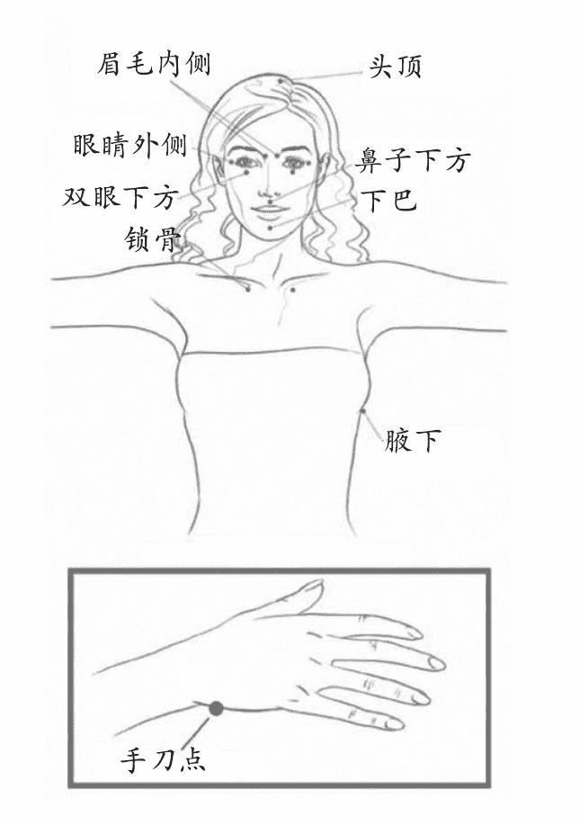

图 2-1　穴位图

同一条经络在身体两侧并行，这意味着你可以用任意一只手敲击身体任意一侧的穴位，跟着直觉走就行。如果喜欢，你还可以同时敲击身体两侧的穴位，不过没必要这样做，因为不管敲哪边，你敲的都是同一条经络。

按顺序每处敲击 5～7 次，不过数目并不固定，如果你想在某一处敲击 20～100 次，那就敲吧。我这样提醒你，只是为了说明要在每一处花足够多的时间，这样你才有时间说提示语，才能有更好的效果。

准备好试一试了吗？首先把问题描述语说 3 遍，同时敲打手刀点。然后一边说提示语，一边按顺序敲击 8 个穴位：眉毛内侧，双眼外侧，双眼下方，鼻子下方，下巴，锁骨，腋下，最后是头顶。第一次不要追求完美，尽力去做、去感受就可以了！

#### 坚持下去，直到感觉显著好转为止

现在你已经完成了第一轮的敲击治疗！来个深呼吸，仔细感觉你的身体，注意发生了什么变化。问问自己，那件事情改变了吗？敲击的时候我想起什么了呢？现在从 0～10 分的主观焦虑评分应该打几分呢？

回忆一下你丈夫昨晚说的那些话，体会自己现在的感受。你可能会发现，原来翻腾的怒火现在已经平静多了。你还可以说同样的提示语再敲击几轮，让怒火彻底平息。

你或许会发现，当你针对丈夫昨晚说的话敲击时，还想起了 3 个星期前让你更加生气的事。这很好！我不是说你对丈夫生气是好事，而是说你抓住了生活的本真。这时，你可以把关注点从昨晚的愤怒转移到 3 个星期前的愤怒上，并针对后者敲击治疗。我们用这种“剥洋葱”的方式，一层一层地剥下去，最终就能解决问题，找到自由、希望和理解。

坚持下去，直到你对“压力王事件”的感觉显著好转为止。这意味着主观焦虑评分降到了 2～3 分或者干脆降到 0 分，也意味着你能够控制整个事件了。你敲击的时间应足够长，这样才能缓解症状，无论是身体还是心理的症状。坚持下去，做 5 轮，做 10 轮，专心地、投入地做，去获得你想要的解脱。当你成功地把“压力王事件”清除后，你就可以继续寻找想获得改善的其他事情进行敲击治疗了。

**指点迷津**

#### 情绪释放疗法速查指南

这里再次列出情绪释放疗法的 8 个步骤，你可以给这一页加个书签，这样你读后面章节的时候就可以随时回来查阅了。不过话虽这样讲，大部分读者还是掌握得比较快，所以你可能不用查阅太多次！

1．找到你的“压力王事件”，同时想几个词作为提示语；

2．用主观焦虑评分为你的“压力王事件”打分；

3．认真拟定一份问题描述语，把“压力王事件”填进空白处：尽管 _____ ，我还是全然地接纳我自己；

4．用一只手的四根手指敲击另一只手的手刀点，同时将问题描述语重复 3 遍；

5．依次敲击身体的 8 个部位，同时大声说出“压力王事件”的提示语。每个部位敲击 5～7 次；

6．将 8 个部位敲击一番后，做个深呼吸；

7．再次用主观焦虑评分为你的“压力王事件”打分，检查效果；

8．重复以上步骤，或寻找其他“压力王事件”再次进行治疗。

### 4 种常见的敲击对象

在前面，我们敲击的对象是愤怒的情绪。本书中，我们会提及从情绪释放疗法中获益的很多事件，如肥胖、情感关系、财务等。无论具体事件是什么，它都是我们敲击的“对象”。

在敲击过程中，敲击对象的不同层面会逐步展现出来。通常情况是，你开始敲击某个对象，后来却发现更深层的东西。例如，朋友的议论让你很生气，当你针对这一愤怒情绪进行治疗并将它清除后，接下来却进入了另一个不同的层面，比如忧伤，可能将忧伤清除后你又会发现，实际上你是在埋怨自己：当她粗鲁地对待我时，为什么不站起来跟她理论？就这样层层深入进去，直到问题完全解决。

这样一层层地治疗起初可能有些枯燥，但现实情况是，情感的、躯体的、精神的经历往往有多个层面，只有把事情的每一个层面都找到，我们才有可能彻底清除它。

刚开始敲击治疗时，选择什么作为敲击对象呢？最常见的 4 种敲击对象是症状/表现、情绪、事件和束缚性信念。在接下来的几节里，我们会一个个地讨论。

为了帮你找到敲击对象，我想给你看一幅很有创意的示意图。它是我的朋友情绪释放疗法专家林赛·肯尼（Lindsay Kenny）画的“敲击树”。这幅图展现了不同种类的敲击对象。

在这张图中，树根代表束缚我们的信念，也就是我们关于自己和世界什么是对什么是错的看法。树干代表过往事件，这些事件常常给我们留下心理创伤，并且今天仍然影响着我们。树枝代表伴随事件而来的情绪，比如愤怒、悲伤、沮丧和绝望。最后，树叶代表外部的症状和表现，它们给我们的生活带来压力和紧张。

**识别你的敲击对象**

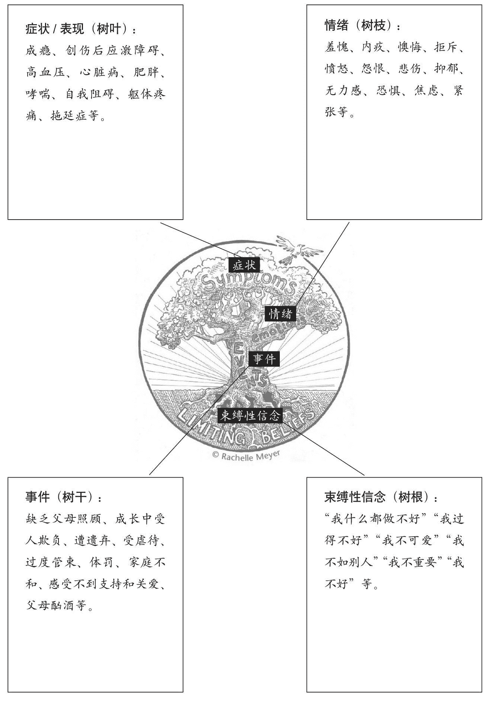

在本书其余部分，我们会不断地提及敲击树上的各个部分，如针对症状，情绪，创伤性事件，或者针对事件背后的信念。大多“压力王事件”都具有多个层次，比如，你的身体可能疼痛，情绪又不好，而此两者又同时源自童年时的某个事件。你可能会发现，针对敲击树的某一部分治疗时，树的其余部分也会得到治疗。例如，针对代表束缚性信念的树根进行敲击治疗后，代表症状和表现的树叶也会得到治疗。

#### 症状和表现

敲击对象的症状和表现可能是成瘾、肥胖、躯体疼痛、自我阻碍、财务问题和心脏疾患等，这些非常容易察觉，而且往往给生活带来很大不便，因为它们是真实存在的。这些症状表面看是比较纯粹的问题，而它们往往是更深层事件的表现。随着时间的流逝，你会察觉出深层问题，并把它作为敲击治疗的对象。

有时直接治疗明显的症状和表现会更容易些，而且效果会更好。例如，我的朋友阿丽尔来找我说她偏头痛很厉害，试了各种办法都不管用。我们花了不到 30 分钟进行敲击治疗，并且只是纯粹地针对偏头痛。

我们所使用的问题描述语是：尽管我头痛，但我还是全然地接纳我自己。接下来，我们一边按顺序敲击穴位，一边念提示语：“头疼……头疼死了。”我们没有关注潜藏于症状深处的情绪或束缚性信念，这就是“症状敲击”，结果头痛就治好了！不过，如果针对症状敲击不能治好头痛，你就得从敲击树的树叶部分深入下去，找到更深层的敲击对象进行治疗，直到获得满意的效果为止。

#### 情绪

如果仅仅针对头痛敲击不能令阿丽尔的症状得到缓解，那么下一步我就会问她：“你头痛背后的情绪是什么？”她可能会回答“生气”“伤心”或者“难过”。接下来，我们就会针对这些情绪敲击，直到它们被清除干净。

有时单一症状的背后隐藏着多种情绪。当我们把洋葱皮一层层剥去时，不同的敲击对象可能就会显露出来，如开始时的愤怒常常转化为深一层的悲哀，而悲哀又时常转化为更深一层的巨大悲痛。通常，我们都可以直接从情绪开始敲击，当最主要的障碍是情绪问题时，我们更应当这样做。如果你非常愤怒，那么就针对愤怒进行治疗；如果你感到无助，那么就针对无助开始敲击。

**指点迷津**

#### 时常萦绕身心的情绪

有时我们很容易堵在非常熟悉的情绪上。例如，很多人仅仅针对愤怒和悲伤进行治疗。如果能了解更多情绪，你就能更有针对性地进行敲击治疗了。以下列出的是一些我们时常会体验到的情绪，你可以运用这个情绪列表来更好地识别当下的情绪状态。

疏离　矛盾　愤怒　焦虑　辛酸　无聊　轻蔑

抑郁　惊恐　敌对　耻辱　饥饿　抓狂　不安

绝望　恶心　悲伤　怀疑　恐惧　尴尬　嫉妒

害怕　厌恶　孤独　无奈　遗憾　大怒　后悔

沮丧　暴怒　难过　不满　内疚　憎恨　思乡

希望　悔恨　怨恨　羞愧　痛苦　担心　无助

#### 过往事件

另一类常见的敲击对象是过往事件。我们将在第五章中讲到，过往事件可以分为两种：一种是发生之后就过去了的事件，另一种是一直伴随并影响我们的事件。这两种事件的区别在于我们是否已经在情感上、精神上或躯体上把它们处理完毕了。

一个人可能会想起她在高中时发生的事情，比如痛苦分手的经历。她说：“嗯，那是一次痛苦的经历，但是已经过去了，它已经不再困扰我了。”她还记得过去的经历，但已经感受不到任何情绪了。

另一个人可能也会想起高中分手的经历，但她的体验就不一样。她想到那件事的时候，心里就会涌起一股强烈的哀伤，对失去的爱情，她的内心充满了遗憾。这就是还没有处理完毕的过往事件。这时，针对这一事件进行情绪释放治疗能帮助她摆脱那次分手的痛苦，从而继续现在的生活。

#### 束缚性信念

束缚性信念是对自我和世界的错误观念，这是我们根据一系列过往事件或经历总结出来的不正确结论。例如，有人可能会因为一次失败的经历就认定他没有能力做好某件事情，他会设想，如果再做同样的事，结果肯定又会失败。如此一来，这一信念就会限制他对未来的期待。

就像敲击树中显示的那样，束缚性信念是我们生活的根基。有时我们很难意识到这些束缚性信念的存在，我们觉得它们就是“事实”本身。例如，我们可能认为自己根本不可能瘦下来，因为父母就没有瘦过；我们可能会认为自己永远不可能富有，因为富有的人不信神。任何观念只要向可能性关闭了大门，就成了束缚性信念。

常见的束缚性信念有：

我什么都做不好。

我心里很不踏实。

我不可爱。

我不如别人。

我不重要。

我不够好。

这些信念通常在孩童时期树立起来，它们来自父母、老师或早年玩伴，进而给我们未来生活罩上阴影。“我什么都做不好”的信念会对我们做的所有事情产生深刻影响，它会改变我们说话的方式、做事的方式、追求的目标等。

通常，针对过往事件进行敲击治疗能消除束缚性信念，不过，如果知道这些束缚性信念是什么，我们就能针对这些信念本身进行治疗。

**指尖敲出丰盛**

#### 创建你自己的敲击树

敲击树是描述我们日常生活非常好的视觉图示，它也是很好的工具，能够帮助我们系统性地解决各种问题。通过它，我们能更清晰地看到症状、情绪、过往事件和束缚性信念之间的联系，就像树叶、树枝、树干和树根的关系一样。用相互关联的眼光看待它们，对我们有效运用情绪释放疗法具有重要作用。就像我已经说过并且会一再提及的一样，情绪释放疗法的关键在于具体，这样才能真正了解自己当前的状况，而要做到具体和有效，你就得向更深处挖掘。

所以，花一些时间画出你自己的敲击树吧。不用画得太好看，但要多留些写字的地方，因为大多数人都有很多东西要写上去。

**树叶：症状和表现**

你现在有哪些症状？身体有什么感觉？原来有没有诊断出什么疾病？身体有没有哪个部位疼痛？把这些明显的、能感受到的症状写在树叶部分。比如，你可能把症状记录为超重、腰疼、抑郁、精力不足或者头脑不清等。如果不知道该写些什么，最好的办法就是想想平常抱怨最多的事情，或者想想别人问你“怎么了”时你最常说的事情。

**树枝：情绪**

平时你的情绪怎么样？早上起来时你感觉如何？晚上睡觉时又感觉如何？想想昨天发生的事，把其中所有的负面情绪都记录下来。如果你想不起来，就翻到前面列出的各种情绪状态看看。

**树干：事件**

哪些事情对你来说像刚发生一样？上一周，哪些事情给你带来了很大的压力？上一年呢？过去 10 年呢？我们会在第五章中详细讨论过往事件如何影响你，所以不用担心遗漏了什么，只要把最明显、最重要的事情记下来就行。

**树根：束缚性信念**

你对自己抱有哪些固有的看法？对生活呢？你怎样看待财富？怎样看待情感关系？怎样看待你的身体？不用急着回答这些问题，因为它们需要你深入地思考。记住，束缚性信念一开始就像真理一样，慢慢地你才能发现它们的真面目。这里的几个问题能帮你搜寻到这样的束缚性信念：

**完成你自己的敲击树**

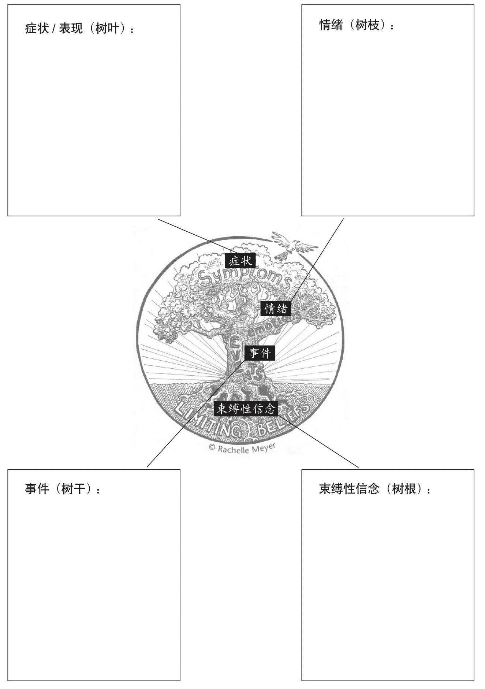

对于我自己，我觉得哪些描述是正确的？

对于这个世界，我觉得哪些描述是正确的？

对于财富，我觉得哪些描述是正确的？

对于情感关系，我觉得哪些描述是正确的？

对于我的身体，我觉得哪些描述是正确的？

我们会在本书中详细探讨每一个问题。现在，把你脑中想到的写下来就可以了。

写完后，再看看你的敲击树，这里罗列了当前你面对的问题。我确信它并不全面，但我仍然希望它可以起到两个作用：其一是帮助你看清生活，这样你就能把注意力集中在想治疗的敲击对象上；其二，它显示了每件事的不同层面和各部分之间的联系，这样你就能更有效地运用情绪释放疗法。这些情绪、症状、过往事件和束缚性信念都是本书着重处理的东西，我们会把它们一个一个地全部清除，从而塑造出一个鲜活、健康、快乐的你！

### 正面描述 VS 负面描述

我在第一章中提到过，我常被问及为什么要关注负面事件而不是正面事件。我想在这点上多说一些，因为它确实是个非常重要的话题。

很多学习过吸引力法则的人会担心，重复负面的提示语会使负面事件更加顽固，或者招致更多的负面事件。然而事实是，这些负面想法、经历、信念都真实存在，都在影响你，不管你是否意识到它们的存在，也不管你是否承认它们的存在。如果你花些时间来认识它们、了解它们，然后告诉杏仁核它们并不危险，那么你就能永远地把它们清除掉。

花园里长了野草，你不能说“没有野草，没有野草，没有野草……”，它就会不存在。你当然可以尽可能多地关注那些美丽的花朵，但野草绝不会凭空消失，除非你蹲下身去将它们拔掉。

花些时间拔除野草，这样你才能拥有一个长满美丽、健康植物的花园，对你来说，道理也一样。当你花时间拔除过往的野草，留下的将是一个身心健康、充满活力、时常快乐的自己。

还需要注意的是，情绪释放疗法不是意识擦除器，它并不清除过去的记忆，只是对过去的记忆加以处理。经过处理后，我们便能从过去的经历中学到知识、获得感悟、实现成长。就算我们想把过往的某个经历擦除，如果没有对它进行处理，它还是会牢牢地待在原来的地方。

常见的情况是，当我与来访者针对愤怒进行敲击治疗时，愤怒经过身体和心理的处理可能转化成悲伤；我们再针对悲伤进行敲击治疗，悲伤可能会转化为失落；我们再针对失落进行治疗，它又可能会转化为对过往和体悟的感激。这样，原来的愤怒情绪得到了纾解，身体就可以感受到更多的正面情绪了。

### 如果 1 分钟内奇迹没有发生

情绪释放疗法快速有效，有时甚至比传统疗法治疗几个月甚至几年的效果还要好。在来访者当中，常常出现这样的情况，他们对情绪释放疗法的疗效没有抱太大希望，但恰好就体验到了 1 分钟见效的神奇。不管这种情况多么常见，毕竟不是百分之百。我们都有根深蒂固的情感模式，通常很难打破，我们的大脑也有坚实的物质基础来对抗各种改变。所以持续的敲击治疗才可能带来更深刻、更有力的突破。

对于那些根深蒂固的情绪来说，也就是敲击树最坚实、最顽固的部分，治疗有时可能很曲折。你想清除的情绪在治疗开始后可能变得更严重，这是正常的现象，因为当你打开情绪出口时，大量被压抑的情感会浮出水面。这时请不要灰心，这是身体在告诉你究竟积聚了多少情绪能量。如果继续敲击，你就能不断地清除它们。无论你是在几分钟、几小时还是几星期内获得这样的效果，它都是实实在在的改善。

**指点迷津**

#### 坚持下去，改变就会发生

对于情绪释放疗法，一开始你可能摸不着头脑，但了解敲击的穴位和过程后，你就能在本书提到的所有方面获得迅速有效的改善。如果你爱自己，现在就花至少 15 分钟来真切地体验情绪释放疗法吧。当你有了治疗体验后，你会认识到这是一个值得学习和运用的治疗法。

想象一下，如果你真的能体验到几百万人已经体验到的疗效，那么你将过上怎样的生活？如果你能消除身体的病痛，生活会是什么样？如果你能甩掉旧创伤和旧包袱，生活会是什么样？如果你最终能把自己从束缚性信念和过往往事中解脱出来，你将有怎样的创造和贡献？你将成就一个怎样的未来？

所有这一切，都始于以下两个简单步骤：学习情绪释放疗法和坚持敲击治疗，然后改变就会发生。你可以做到！

你可以通过以下网址观看有关敲击穴位过程更详细的讲解： www.thetappingsolution.com/tappingvideo

# 第三章
纾解焦虑和压力

**RELIEVING ANXIETY, FEELINGS OF BEING OVERWHELMED AND STRESS**

为什么有的人可以平静地一边享受挑战一边毫不费力地完成各种事项，而有些人面对同样挑战却焦虑紧张、无法承受？

上帝赐予我平静，让我接纳我无法改变的事；上帝赐予我勇气，让我改变我可以改变的事；上帝赐予我智慧，让我分辨二者的不同。

美国著名神学家、思想家　雷茵霍尔德·尼布尔

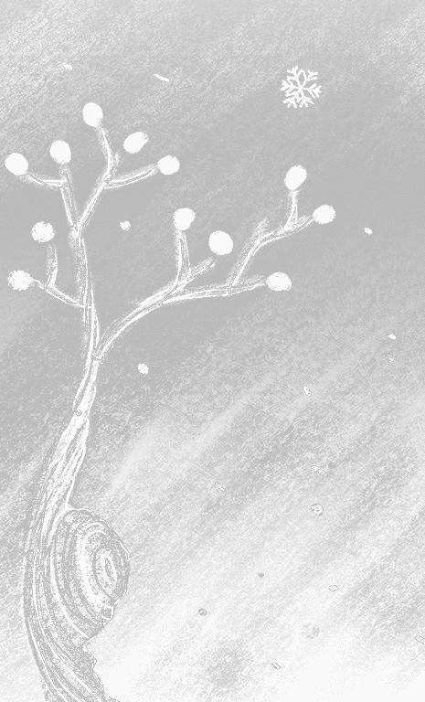

克莱尔正处在崩溃的边缘，而身边的朋友却没看出来。工作稳定，孩子聪明，夫妻关系也很融洽，认识克莱尔的人都觉得她是个注重个人形象又幸福快乐的女人。充满爱心、尽职尽责的克莱尔渴望自己的存在能让这个世界变得更美好，于是非常在意自己吃什么、穿什么、想什么、做什么，这些都让她压力非常大。她试着减压，让心态更加积极，然而效果却并不让人满意。

不知道是什么原因，克莱尔的身体无缘无故开始疼痛，医生也查不出所以然。她夜里失眠，白天虚弱，体重也增加了，怎么都减不下来，尝试了各种办法后，还是无法摆脱焦虑。当终于有时间喘口气、重新检视生活时，她所能想到的只有一句话：受不了。

担负的责任太多了，受不了！

要做的事情太多了，受不了！

经济压力太大了，受不了！

做一位出色的母亲太难了，受不了！

做一位贤淑的妻子太难了，受不了！

又要外表光鲜，又要感觉良好，又要在别人面前有面子，太难了，受不了！

为我们熟知的现代生活的各种压力全部向她袭来。听起来是不是很熟悉？你的生活里有让你“受不了”的事情吗？最让你受不了的事情是什么？你的身体出现什么症状了吗？

在现代生活中，焦虑紧张、崩溃疲惫、马不停蹄已成为生活的常态。我们常常对自己说：“生活就是这样紧张、繁忙，事情一件接着一件排得满满当当，连喘口气的时间都没有。”

还记得真正松口气的感受吗？现在试一试，看看能体会到什么。你可能会发现：之前压力太大了，都没有注意到身体一直在超负荷运转。请想想，上次真正放松是什么时候？

因为形成的某些思维和行动的惯性模式已然无法继续下去，所以我们的身体会无缘无故地疼痛；所以我们会把病因简单地归结为病毒、细菌等生物的、外在的因素；所以我们焦躁不安地走来走去，感到很不舒服；所以我们感觉事情多得让我们喘不过气来；所以我们失眠、肥胖，压力如影随形；所以我们难以静下心来享受我们的生活。

一些来访者争辩道，不是他们的思维和行动出了问题，而是生活本身出了问题！他们会说“如果这件事不是这样，我就能快乐起来”“如果没有这么多事，我就能快乐起来”“如果有很多钱，我就能快乐起来”“如果能瘦下来，我就能快乐起来”……我们很多人都简单地认为，除非这些事情发生，否则我们无法快乐起来。

在这里我得宣布一个坏消息，（我知道又给你们增加压力了，不过好消息就在后面，我保证！）如果想更有钱、更健康、更知足，你首先要做的事情就是改变惯性模式。只有做到这一点，你才能创造出真正想要的生活。曾几何时，减轻压力和改变模式是那么高不可攀，难以企及，但现在情绪释放疗法可以让这一切在转眼间发生。

前面我们已经见证了情绪释放疗法在身体病痛方面的神奇疗效，对于心理方面的问题它同样有神奇的疗效，当你针对当前的信念、情绪进行敲击，你的生活就能迅速发生改变。稍后你就会读到，对克莱尔来说这种变化已经发生了，而且整个过程看起来非常神奇，同样的，你也能发生这样的改变。

### 真的“什么都不管用……”吗？

克莱尔首先向我提及，她已经尝试了多种减压疗法，从瑜伽到冥想，从自我肯定到积极思维，但都没效果。她非常泄气，从心底里觉得“什么方法都不管用”。

如果我们在一条自我发现、自我提升的道路上走了好几年，却始终没有看到期望的或治疗保证的结果，那将是件令人非常沮丧的事！而且这种沮丧连同更多对负面结果的预期，又会成为阻碍我们前行的障碍，接下来这一障碍又会加深我们对自身或对未来事件的消极看法。

我知道我该做些什么，但从来都做不到。

我试过其他办法，但似乎没什么用。

这种办法可能对别人有用，对我不起作用。

我经常开始做一件事，可从来都做不完（我们现在就来改变这一模式，请相信自己肯定能把这本书读完）。

我们要把这种沮丧情绪清除掉，要把担心无法自我提升的焦虑清除掉，这非常重要。正是在这一清除的过程中，我们才能看到未来新的可能性，否则，像“什么都不管用”“我总是有头没尾”这样的思维定势和信念会不断成为事实，结果你就不会读完这本书，尽管你一直苦苦寻找的生命突破可能就在第九章！或者你仅仅是看完这本书却不会真的进行敲击治疗，而敲击本身才是缔造奇迹的源泉。

所以，现在我们就进行敲击治疗，把这些负面的预期清除干净。

**指尖敲出丰盛**

#### 释放挫败感：什么方法都不管用……

在这本书中，你会见到各类事件的敲击练习。开始敲击治疗时，我们会通过一句检查语来判断是否有必要把某个问题当成敲击治疗的对象。例如这次治疗的检查语：我心里很失望，因为什么方法对我都不管用。

把这句话大声地说几遍，然后根据这句话符合事实的程度打分，10 分表示“与事实完全相符”，0 分表示“与事实完全不符”。

一般说来，如果你觉得某个问题的真实水平能够达到 5 分或更高，它就很可能是一个需要你立即治疗的对象。

记住，以下的描述语仅仅是帮助你开始敲击治疗，如果有更好的描述语或想法，你大可跟着你的直觉走。

手刀点：尽管什么方法都不管用，这让我非常失望，但我还是全然地接纳我自己。

手刀点：尽管我做事总是有头没尾，但我还是全然地接纳我自己。

手刀点：尽管什么方法对我都不管用，这让我非常着急，可此时我还是决定放松一下。

眉毛内侧：什么方法都不管用……

眼睛外侧：我很失望……

眼睛下方：什么都不管用，我很着急……

鼻子下方：我已经尝试过很多方法……

下巴：可是都不管用……

锁骨：这个方法很可能也不管用……

腋下：很可能对我不管用……

头顶：我很失望……

眉毛内侧：什么方法都不管用……

眼睛外侧：做事有头没尾……

眼睛下方：找别的办法也让我不放心……

鼻子下方：因为很多办法都不管用……

下巴：对别人管用……

锁骨：对我不管用……

腋下：我很失望……

头顶：又着急又失望……

现在，再来一轮正面描述的敲击治疗。请记住，只有当你感到放松，或者已经部分地相信了正面描述时，才能进行正面描述的敲击治疗，不要勉强为之。如果在正面描述治疗的过程中，你的大脑里想的是“我不相信”或“那不是真的”，你就要回过头去继续进行负面描述的治疗，直到这些负面的信念全部清除为止。

眉毛内侧：我选择相信，这个方法可能是管用的……

眼睛外侧：我选择释放身体里的失望情绪……

眼睛下方：有些方法还是有用的……

鼻子下方：我已经有了积极的转变……

下巴：我还希望转变得更多……

锁骨：我相信自己有能力改变……

腋下：我要把身体里的沮丧和焦虑全部释放掉……

头顶：释放掉，全部释放掉……

### 认知转向和“阿佩克斯效应”

按照上面的方法做完之后，克莱尔的失望情绪得到了缓解。她说：“你知道吗？其实不是什么方法都不起作用，实际上过去两年我有很多成功的经验，我的生活也有很大的转变，我希望情绪释放疗法能给我带来更大的转变。”

从克莱尔跟我说“什么方法都不管用”到治疗结束，短短几分钟的时间里到底发生了什么？她之前是在撒谎吗？是这几分钟让她改变主意了吗？

实际上，她的大脑和身体把过去所有负面体验都提取出来了，包括所有那些没有放下或没有处理好的创伤。这些负面体验已经形成了束缚性信念，令她难以逾越。针对她的失望情绪和自我暗示进行敲击治疗后，我们清除了她固有的思维模式，于是新的信念开始出现。

当我们用情绪释放疗法治疗这些情绪和体验时，一种认知上的转向就发生了，通常这种认知转向十分显著，人们几乎会忘记之前的体验。

我之前说过，情绪释放疗法不是意识擦除器，它不会以任何的形式清除记忆，但它确实能清除记忆背后的负面情绪和惯性模式。在最极端情况下，这种认知转向会成为“阿佩克斯效应”（Apex Effect，这个效应发生在一个人出现剧烈改变时，这种改变过于彻底，以至显得不真实。——译者注）。

有人本来害怕蜘蛛，用情绪释放疗法治疗后，这种害怕感消失了，然后他们会说他们从来就不怕蜘蛛。这就是每次敲击治疗前都要进行主观焦虑评分的原因之一，它会帮你记住敲击的起点，这样你才能准确地计算自己的进步。

**指点迷津**

#### 选择描述语

我们已经在前面学到，开始一轮敲击治疗时，先说问题描述语：尽管 _________（把你的“压力王事件”填进去），我还是全然地接纳我自己。

在这里，我想向你介绍一种替代的描述方法，叫做“选择描述语”，这是情绪释放疗法的早期探索者帕特里夏·卡林顿博士（Patricia Carrington）发明的，它允许你把问题描述语的结尾部分替换为一种选择。

使用选择描述语主要有两个原因：第一，当你不愿说“我还是全然地接纳我自己”时，你可以用选择描述语替代；第二，选择描述语能让你觉得有力量感，并且可以让你控制自己的敲击体验。

选择描述语是这样的：尽管 _________（把你的“压力王事件”填进去），但我此刻还是选择 _________（把积极的、肯定的话语填进去）。

例如：

尽管我对工作中发生的事很气愤，但此刻我还是选择把它放下。

尽管我的腰很疼，但此刻我还是选择放松。

尽管我跟她说了那样的话，这让我对自己很失望，但此刻我还是选择原谅自己。

对于你想治疗的具体的问题，你可以凭直觉选择合适的选择描述语。

### 终止压力的恶性循环

梅丽莎完成了她的第一本书，这是她人生中的一个重大目标。多年来，她一直梦想着能写一本书，所以，你可能会觉得此时的她一定非常自豪、非常欣喜，接下来会想办法向世人推广。然而，她却陷入了困境。

几个月过去了，她没有做任何事来推广她的书。我问她为什么，她说：“要做的事情太多了！我要设计网站，要把书放到亚马逊上促销。要做的事情多如牛毛，我都不知道从哪里开始！我压力太大了，我受不了了。”

压力是日常生活面临困难的表现，它让人感到不舒服，给我们的身体带来灾难。在它的作用下，身体的皮质醇水平升高、血压升高、血糖升高，此外，它还常常导致更为紧张的关系，例如，你可能会把同事给你带来的压力发泄到妻子或孩子身上，并形成恶性循环。

如何终止压力的恶性循环？答案在于转变我们的战斗或逃跑反应。

经过深入沟通后，我发现她潜意识里有些东西正在阻碍她。我们会在第四章中讨论这些。首先，我们得减轻她“受不了”的感觉，所以我带她做了几轮敲击治疗。

**指尖敲出丰盛**

#### 释放沉重感：压力大到受不了……

在敲击开始前，问你自己：“我受不了的东西是什么？我觉得什么事情搞不定？让我感到有压力的东西到底是什么？”

接着，试着说出检查语：我受不了了，要做的事情太多了。接着给出一个从 0～10 分的评分，然后开始敲击。你可以使用下面的提示语，也可以自己编。你还可以找找导致这种压力的主要想法或事件，并且给出一个 0～10 分的评分。这样做能深入问题的根源，达到更好的效果。

手刀点：尽管我压力很大，快受不了了，事情多得做不完，但我还是全然地接纳我自己。

手刀点：尽管要做的事情多如牛毛，让我压力很大，但我还是全然地接纳我自己。

手刀点：尽管我觉得搞不定这些事情，也觉得我不够聪明，但我还是全然地接纳我自己。

眉毛内侧：这些事情我搞不定……

眼睛外侧：我快要受不了了……

眼睛下方：压力太大了，受不了了……

鼻子下方：要做的事情太多了……

下巴：受不了了……

锁骨：事情太多了……

腋下：时间太紧了……

头顶：我搞不定了……

眉毛内侧：我怎么做得完这么多事呢……

眼睛外侧：我做不完……

眼睛下方：因为要做的事情太多了……

鼻子下方：我需要帮助……

下巴：时间总是不够用……

锁骨：事情总也做不完……

腋下：我受不了了……

头顶：实在受不了了……

继续进行负面描述的敲击（把你说的当作“事实”，因为你在说你的感受，所以这就是你的“事实”！），直到你感觉有所缓解。接下来，在时机成熟时，再做几轮正面描述的敲击。

眉毛内侧：我选择放松……

眼睛外侧：我有办法完成它们……

眼睛下方：我过去做到了，现在也一样做得到……

鼻子下方：我要把这种受不了的感觉扔掉……

下巴：我要做我该做的事情……

锁骨：压力大解决不了问题……

腋下：我要把这种受不了的感觉扔掉……

头顶：扔得远远的……

反复进行以上正面描述的敲击治疗，直到你觉得够了为止。

为了帮助你尽快上手，这里的描述都比较宽泛。你把自己的情况描述得越具体，敲击治疗就会越有效。比如在敲击时，如果你意识到让你感到最有压力的是工作中的某个项目，那么就可以针对这一项目和感受来敲击。问题描述语可以是：尽管这个项目给我造成了很大的压力，我可能永远都完不成，但我还是全然地接纳我自己。

把这一描述重复 3 遍，然后按顺序敲击穴位。

说不定在敲击过程中，你意识到你很生气，你觉得老板不知道你在这个项目上投入了多大的精力。这时你可能会说：“尽管我很生气，因为老板并不知道我在这个项目上投入了多少精力，但我还是全然地接纳我自己。”

把这一描述重复 3 遍，然后按顺序敲击穴位。就这样继续进行，直到你感觉问题变得清晰为止。

有时，你可能不清楚针对某件事的敲击治疗是否可以告一段落。对此，我通常建议你继续敲击，直到你对它的主观焦虑评分降到 1～2 分为止。当然，能降到 0 分最好，不过有时事情会在脑中停留一小会儿，几个小时后才逐渐散去。

如果你已经将内心深处的创伤敲击了 15 分钟，评分从 10 分降到了 4 分，你也可以不用继续敲击了。聆听你的直觉，关注你的身体，尽力而为即可。你可以伴随着 4 分的评分过一两天，找到合适的时机再来处理它。

做了 15 分钟的敲击治疗后，梅丽莎说：“你知道吗？其实针对那本书，我并没有太多事情要做，而且要做的事情我都能做。我只需要每次前进一小步就好，而不是一口气把所有的事情都做完。”

这个看法真特别！究竟发生了什么？敲击治疗后，她要做的事情还是和之前一样多，这一点并没有改变，那么到底是什么变了？之前她不断地告诉自己，她所面临的情形有多难以承受，所以她的身心针对这一威胁产生了逃跑反应。而现在杏仁核的报警已经安静下来了。当然，她并没有面临什么真实的威胁，是她的惯性模式让她自以为陷入了困境。

情绪释放疗法能增进我们解决问题的智慧，让我们更有能力面对周遭的世界。那种感觉就像是大脑打开了开关，灯一下子亮起来了，然后身体也跟着运动起来，接着我们就真的能面对很多事情了！情绪释放疗法把我们带入一个安静的世界，让我们更加了解自我、他人以及我们所生存的世界。

为什么有的人可以平静地一边享受挑战一边毫不费力地完成各种事项，而面对同样挑战的其他人却焦虑紧张、无法承受？

这是因为他们已经培养出了健康、成熟的思维方式和信念，而其他人没有。在情绪释放疗法的帮助下，我们能改变不健康的思维方式和信念，缓解焦虑、紧张和崩溃感，停止对外界的机械反应，主导自己的生活。这样的我们既能奋力向前，又能享受生活！

**指点迷津**

#### 是什么令你崩溃？说出来，敲下去

刚开始运用情绪释放疗法的人往往卡在“说”的部分。其实，就算你没有特意准备问题描述，也一样可以获得情绪释放疗法的所有好处。你可以不必严格按照程序做，只要一边按顺序敲击，一边自由地谈论给你造成压力的事情就可以了。

例如，你可以想象和朋友通电话，你正在跟她说今天工作有多忙。这时你可以开始敲击治疗，一边打电话一边敲！而她无需知道你正在做什么。宣泄的过程中，你的身体会安静下来，同时，借助情绪释放疗法负面情绪也能处理掉。

宣泄没有任何错，给高压锅放点气是好事。但如果你发现自己在一件事情上喋喋不休，而事情没有丝毫改变，你也没有任何解决办法，那么这就是问题了。而在宣泄的同时加上敲击治疗，你可能会得到下面的结果：

你很快不再纠结这件事了。

你在这件事上产生了新的认识。

你很自然地想出了创造性的解决办法。

许多人都跟我说过，在某些情况下，他们实在无能为力。我点点头，然后让他们把压力、愤怒或忧伤告诉我，同时进行敲击治疗。结果，就在当时当地，他们往往能想出潜在解决方案。所以放松去表达吧，大声说，别管有没有条理，把想到的全倒出来，别忘了同时敲击穴位。你会发现，你的感觉大不相同。

### 重新讲述你的故事

来自美国科罗拉多州的劳伦是两个孩子的母亲。婚姻紧张、肥胖、情绪低落、崩溃感，这些都让她很纠结。开始敲击治疗前，劳伦讲述了她生活中发生的事情。

连着 20 分钟，她都在跟我讲她的事情，尤其是工作上的事。我几次想打断她，问问她当时的感受，可就是插不进去话。

最后，我只好举起一只手，示意她停下来，她才告一段落。我亲切又坚决地说：“不要再说事情了，这些都是具体的事件，而不是你。”

她立刻明白了我的意思。她停下来做了一个深呼吸说：“哦，天呐……我半天全说事情了。”

问题并不在于她说的事情，而在于她太执著于说事情了。她说了一遍又一遍，同时想了一遍又一遍，可最后还是不断地重复那些具体的细节，以至于没有关注在事情当中的感受，也没有从分析或寻找解决方案的角度看待事情，只是一遍又一遍地讲述事情本身。

我们都会陷入自己所说的事情当中，人物、情节、对与错。我们诉说别人对我们做的事情，讲述世事如何不公，一味地倾倒那些让人充满愤怒、哀痛、妒忌、恐惧等负面情绪的故事，但说完这些事情后，我们留下了什么？收获了什么？

只要劳伦继续一遍又一遍地讲述她的事情，她的生活就不会有任何起色。现在，她已经认识到了这一点，于是我们开始针对她讲述事情的惯性模式进行敲击治疗，而不是她的事情。我们使用了这样的问题描述语：

尽管我总是讲这些事情，总是陷到故事情节中去，但我还是全然地接纳我自己；

尽管我总是一遍又一遍地重复相同的事情，但我还是全然地接纳我自己。

接下来，我们开始把敲击的重点放在她对这些事情的感受上。这样做并不是要把具体的事情完全忽略，而是以一种积极的方式来处理它。所以，当我问劳伦感觉如何时，她就能放慢节奏，感知自己的内心：“我觉得这些都是别人的事，我都在为他们忙，从来没把自己放在第一位。”

对劳伦来说，这是一个至关重要的问题，于是我们又探讨了她没有把自己放在第一位，从而让自己和他人都深受困扰的其他情境。你能想象乘飞机时有人对你说“给自己戴好氧气面罩后再帮助别人”吗？对劳伦来说，就需要有人这么提醒她。她现在已经意识到，应该把照顾自己放在帮助他人前面，可她真的会这样做吗？

情绪释放疗法非常灵活，与其他疗法配合也能得到非常好的效果，其中包括意象疗法。我决定在这里尝试一下。我告诉劳伦，她现在的情形就好比是电脑上运行的一款叫做“先人后己”的程序。我问她想不想换一款叫做“先己后人”的新程序？她立刻明白了我打比方的用意，于是承认她现在运行的程序是错误的，并且想尝试一款新的。

我让劳伦闭上眼睛，开始对她进行意象引导，同时，劳伦继续按顺序敲击所有穴位。在这当中，我引导她“卸载”旧程序，然后“安装”新程序。人的心理真是神奇，我也不知道为什么，当我用这种方法治疗她时，奇迹又一次发生了。慢慢地，劳伦卸载了所有旧程序，同时安装了新程序。

这么做效果如何呢？当时的治疗发生在周五，下面是她周一邮件中的一段：

这个周末过得真棒……整个治疗过程让我焕然一新！我对自己和周围人的看法全变了，我的想法和感觉也融合在一起了，那是一种真正的默契。以前，我的想法很多，我也知道自己想要什么样的感觉，但我很难把两者调和起来。现在，我的想法和感觉之间已经没有距离了，它们已经统一起来了。

看样子，劳伦学会了讲述新事情了！

### 你最忧虑的是什么？

对绝大多数人来说，如果能永远不看新闻，将是一件幸福的事情，因为漫天的负面事件实在惨不忍睹！

然而，躲进小楼不问窗外事也不是最好的解决办法，有没有一种方式，让我们既能知晓天下事，又不被它们干扰呢？

我认为有，那就是情绪释放疗法。

如果我们因为环境、政治、战争和其他事件而感到过分担忧，那么这种担忧就会损害我们的身体、减弱我们解决问题的能力。苦恼于一件重大环境事件不会对事件本身产生任何作用。大多数人都有一种错误的认知，觉得如果我们不苦恼，事情就不会有转机。然而事实是，真正促成改变的是积极的行动，而非叫苦不迭。

几个星期前，我在一个非常爱护动物的好友那里亲眼见证了这样的事实。她的邻居总是虐待几条狗和一匹马，她给相关当局报了警，但因为法律上的原因，这些机构并没有权力作任何干预。

这一状况引发了她很多情绪，对此我们进行了敲击治疗。这些情绪包括愤怒、无力感、悲伤等。治疗过后，她的情绪平复了很多，并且开始从新的角度看待这件事。

她仍然关心动物，但已不再感到痛苦，这个改变虽然微小，但意义重大。在后面我们会提到，当我们改变看法时，我们的情绪状态、行为方式以及身边的人都会跟着改变。

**指尖敲出丰盛**

#### 释放无力感：什么事让你觉得无能为力？

花点时间想想，哪些事情正让你忧虑不已。然后借助情绪释放疗法帮你缓解忧虑。

手刀点：尽管我非常担心 _________（把你忧虑的事情填进去），但此刻我还是选择放松。

手刀点：尽管我禁不住想 _________（把你忧虑的事情填进去），但我还是全然地接纳我自己。

手刀点：尽管我非常担心 _________（把你忧虑的事情填进去），但此刻我还是选择体会当下的安全。

眉毛内侧：这件事让我担心极了……

眼睛外侧：这么做不对……

眼睛下方：这个世界真不太平……

鼻子下方：愁死我了……

下巴：真发愁啊……

锁骨：真揪心啊……

腋下：这件事不对啊……

头顶：这个世界不太平啊……

眉毛内侧：我得操心这些事……

眼睛外侧：如果我不操心，谁会操心？

眼睛下方：我得操心……

鼻子下方：操碎了心……

下巴：压力真大……

锁骨：如果我不操心，事情就不会有改观……

腋下：如果我没有压力，事情也不会有改观……

头顶：真是操碎了心……

继续进行负面描述的敲击，直到你的忧虑得到缓解。

眉毛内侧：我选择放松……

眼睛外侧：我选择放下……

眼睛下方：我能放松，同时仍然能寻求改变……

鼻子下方：我能放下这些不好的感受……

下巴：同时仍然继续关心……

锁骨：我无需带着不好的感觉去关心……

腋下：我无需带着不好的感觉去寻求改变……

头顶：全都放下……

### 用“选择”代替“应该”

你可能已经意识到，这章的内容有一条主线：当我们面对焦虑、崩溃感以及现代生活的压力等问题的时候，情绪释放疗法可以改变我们看问题的角度。

我们并不能改变问题产生的情境（要是真能改变，我肯定会告诉你），但我们能改变看待问题的角度和面对问题的反应。过去 10 年，我发现最神奇的事情在于，当你换个角度看问题时，你的感受、反应和问题本身往往也会自然而然地跟着改变，而且这种改变常常是朝好的方向。

所以情绪释放疗法能让你拥有一个明亮的视野，重新讲述你和你的生活。借助情绪释放疗法，相信自己可以优雅平和又充满喜悦地走过紧张的生活和纷繁的世界。

**指尖敲出丰盛**

#### 我应该……

在我们所使用的词汇当中，“应该”二字是极其熟悉的，然而不幸的是，这个词承载了众多压力，包括内疚、恐惧、耻辱、后悔等各种负面情绪。通常，当我们说“我应该……”时，我们甚至意识不到随之而来的隐隐的忧虑、压力和崩溃感。

我应该多锻炼身体；

我应该吃好点；

我应该努力工作；

我应该减肥；

我应该多陪陪孩子；

我应该多读点书；

我应该多关注孩子的需求；

我应该……没完没了的“我应该”……

“应该”二字的问题在于，它在暗示我们做得不够，它让我们羞愧，让我们把注意力放在没做好的事情上。如果我们用“选择”二字代替“应该”，那么我们的力量感就会强得多。

我选择多锻炼身体；

我选择吃好点；

我选择努力工作；

我选择减肥；

我选择多陪陪孩子；

我选择多读点书；

我选择多关注孩子的需求。

这样说感觉好多了吧？所以，让我们把生活中的“应该”都找出来，然后针对它们敲击，再把它们替换为更积极的“选择”。

找一张纸和一支钢笔，把你认为“应该”做的事项全部列出来。你可以参考上面列出的事项，但最好列出能更深入地体现你生活经验的事项，对我们当中的大多数人来说，这不是一件难事。

列出全部的“应该”事项后，我们就要逐一对它们进行敲击治疗了。假如某个事项是“我应该多锻炼身体”，那么你就可以一边敲打手刀点一边说：“尽管我应该多锻炼身体，但我还是全然地接纳我自己。”重复 3 遍。

接下来，按照敲击顺序逐个敲击穴位，每到一处都要说：“我应该多锻炼身体。”

就这样一直做下去，直到你觉得你的描述不再与事实相符了。这时，换用积极的选择描述继续按顺序敲击，比如“我选择多锻炼身体”或换用你喜欢的其他描述。还可能你的思维转变得太大，认为自己已经锻炼得足够多了！

就这样，针对每一个“应该”事项进行敲击治疗，直到思维有所转变，然后再换用积极的选择描述继续敲击。如果你有很多“应该”事项，你也可以一次敲击几件，剩下的就留待稍后或第二天吧。

把“应该”事项全部治疗完毕后，体会一下自己的感觉。如果你跟我的大部分来访者一样，那么当你从所有“应该”事项中解脱出来时，就会为你的自我关爱、同情心和平静感感到惊奇。如果在接下来的几天或几个星期里，又有“应该”事项偷偷摸摸地回来，你就继续对它们进行治疗！

摆脱“应该”的生活，才能得到充满“选择”的生活。当我们掌握选择权时，我们才是最有力量、最自由也最快乐的人。

# 第四章
抗拒让我们停滞不前

**OVERCOMING YOUR RESISTANCE TO CHANGE**

寻求改变的同时，总有一个抗拒改变的破坏者拖着我们停滞不前，陷入泥沼。当头脑选择向左，心灵却选择向右时，唯有找出幕后导演，我们才能迎来切实的改变。

我们最大的恐惧不是死亡，而是涉险而生。活着，并且表达真实的自我。

《四个约定》作者、疗愈师　唐·米格尔·路易兹

现在，我们已经把紧张、焦虑和崩溃感这些精神层面的噪音平息了。接下来我们将讨论如何运用情绪释放疗法促成生活方方面面的改变，这一章的主题就是改变。这正是你看这本书的原因，不管是减肥、治疗身体病痛，还是改善财务状况、提升情感关系，你总想改变点什么。

不过，在真正改变之前，我们先来看看一个很多人都要面对的小麻烦。在改善状况的需求深处，往往潜藏着一个抗拒改变的破坏者。我们天生就不喜欢改变，让事情保持原样多轻松啊。我们知道这样节省精力，所以很多时候，我们在潜意识里保持原样。老话说得好，明枪易躲，暗箭难防，比起陌生的人和事，熟悉的局面更好掌控，即使这局面并不理想。所以，当我们开始考虑改变生活的某一方面时，抗拒就会飞速袭来。

我知道你现在正在说什么：“我不害怕改变！我要减肥！我要挣更多的钱！我要治好我的病！”我相信，你在意识层面上确实需要这些，不过我也明白，作为人，我们往往还有潜意识或半意识的念头、恐惧和障碍。我们嘴上说想改变一些东西，可不知道为什么，我们总是卡在那里，无法前进，而且，有时不仅无法前进，还得眼睁睁地看着它倒退。

### 谁是幕后导演？

每个人都需要成功，在意识层面上确实如此。然而不幸的是，我们的潜意识常常有它自己的主意。意识是我们能感知到的东西，比如平时的想法、作出的决定等。而潜意识是幕后的导演，它是我们想法和决策的无形掌控者。在大多数情况下，它的判断来自我们童年时期的经验。

有多少次你想改变些什么（比如开始锻炼身体），却发现无法坚持下去？然后你停下脚步，责备自己几句，接着想出一堆无法那样去做的理由。你越是这样，情况越是糟糕，因为失败的经验增加了，下一次再想改变时，信心就更少了，于是恶性循环。

你害怕改变吗？以下列出了害怕改变的几种表现，你看着眼熟吗？

自我阻碍：当事情向好的方向转变时，你会想办法让它停止。

拖延耽搁：你发现自己很难迈出第一步，或无法坚持到底。

完美主义：武装到牙齿才能出发。

糊里糊涂：你不知道自己要什么，所以无法开始。

犹豫不决：迟迟做不出决定，让你无法向前。

如果有上面这些表现，你就要看看自己是不是在抗拒改变了，这很重要，否则你就会继续苦恼，直到认识到你的抗拒为止。

玛丽已经念叨了好几年，说自己应该减肥。她把这个地球上的减肥食谱试了个遍，每次稍有进展就前功尽弃了。她的体重常常在固定范围内波动，高低差不了 3.5 公斤。

治疗开始后，我们先聊了聊她的体重。她说：“只要减到 60 公斤，我就再也减不下去了。好像哪里报警一样，然后我就开始开小差，不是停止锻炼就是猛吃东西，节食餐也不吃了。不管用什么办法，最终我总会把减掉的体重补回来。”

一到 60 公斤就卡住是没有道理的。她没有意识到，当体重减到 60 公斤时，有个声音就会说：“停止锻炼！停止吃节食餐！”不过，这种模式已经重复很久了，她明白一定有心理上的原因。

我问了她几个重要的问题（你可以用同样的问题问自己，看看自己有没有在抗拒改变），对于其中一个问题，她立刻做出了回答。我问她：“如果你突破了 60 公斤这一关，并且减到了理想体重，谁会受到伤害或不高兴？”她不假思索地回答：“我姐姐！”

在成长过程中，她一直把姐姐视为偶像。她清楚地记得，有一天姐姐很不高兴地对她说：“你太漂亮、太苗条了，搞得我就像一头肥猪。我讨厌你。”因为自己的出色而惹姐姐生气，这已经不是第一次了，不过这次的记忆最为深刻。后来，姐姐也说过，她的成功让姐姐感到很失败。这些经历使得玛丽形成了一个观念：苗条、漂亮是不安全、不好玩的！所以，她一定要让体重增加到“安全”区。她的潜意识认为，姐姐对自己的“喜欢和肯定”比“苗条和漂亮”更重要。

当她意识到这一点后，就能针对她和姐姐以前发生的事情以及与此有关的情绪进行敲击治疗了。在治疗当中，她不仅改变了关于减肥的一系列想法，还改善了与姐姐的关系，改变了对姐姐的反应模式，治疗有了更深入的效果。识别出类似上面的思维模式是有益的，它的影响往往超出事件本身。当我们对此进行治疗后，巨大的改变就可能发生。

### 继续前行，还是原地踏步？

我们可以想象自己有两面，一面受制于成长需要，以便尽可能地实现自我，但另一面却受制于对确定和熟悉感的需要，因为不论是好的还是不好的改变都是未知的，而未知就意味着不确定和不熟悉。

我们一次次原地踏步，实际上是在质疑自身处理未知事件的能力。大脑铭记过去发生的一系列事情，并用它们预测未来获得成功的可能性，根据这些信息，我们要么继续前行，要么引发恐惧反应，停止前进的脚步。你可以借助以下几个重要问题来判断自己是否抗拒改变。想想你希望改变的事项，然后问自己：

如果真的改变了，结果会怎样？

如果真的改变了，别人会有何感受？

如果真的改变了，我会体验到怎样的痛苦？

如果真的改变了，我会失去什么？

不论你想改变的东西是什么，了解你对改变的抗拒都极为重要。不管是想医治病痛，还是想赚更多钱，背后的模式都相同。正因为如此，我们才会在本书中反复提及这一点，对于任何事情，你首先要确保把对改变的抗拒清除掉。

我经历过这种抗拒。大学毕业后的几年，正逢互联网蓬勃发展，市场营销咨询业方兴未艾，我也进步很大，跟大多数好友相比，我的年薪是他们的 3 倍。

为了庆祝个人的成功，也为了跟朋友们尽情地玩一次，我组织了为期一周的聚会。我们 12 个人住在墨西哥两栋漂亮的别墅里玩得特别尽兴，我永远都不会忘记那次聚会。那次经历让我更加确信，我要追求更成功的人生。第二年，当我们准备再次聚会时，原先的两栋别墅却租不到了，于是，我们每个人都得花更多的钱。

我努力说服每一个人，但很多人都说他们承担不了那么多的费用。我十分期待这次旅行，也盼望着和好友相聚，我尽力告诉所有人再次相聚和尽兴是多么重要。结果，我得到的回答让我很意外，尤其其中一人这样说：“我们不像你挣得那么多，不可能想干什么就干什么。”

那次对话很不愉快。离开时，我觉得自己太过热情，挣得也比他们多太多，因此心情很糟糕。毫无疑问，在接下里的一年里，我的财务状况急转直下。我贷了一大笔款，几个客户没给钱，又错过了需要的工作，最后，我的境况完全转变了，变得只能和朋友们互相同情了，谁也不能嫉妒我挣得多了。

后来，我意识到了这其中发生的事，并学习了情绪释放疗法，明白自己值得挣那么多，明白比朋友挣得多也没什么不对，明白与他人不同并非不可接受。这时，我才重整旗鼓，让自己过上了宽裕的生活。

**指点迷津**

#### 停滞不前的好处是什么？

只有深挖问题，我们才能看到意识深处隐藏的想法。要做到这一点，方法之一便是问自己重要的问题：停滞不前（或让问题存在）的好处是什么？认真回味这个问题，仔细想想，停留在目前的状态让你得到了什么？你可能得问问你的潜意识，请闭上眼睛，这样或许能比平时想得更深入些。

现在请问自己：改变（或解决问题）的坏处是什么？认真回味这个问题，想想改变的坏处。以下是我从来访者那里听到的一些回答，它们是否能引起你的共鸣？

停滞不前（或让问题存在）的好处是什么？

我什么都不用改变；

我还能做我现在做的事情；

别人不会对我有更高的期待；

我很熟悉现在的情形；

我不想让别人感到不舒服。

改变（或解决问题）的坏处是什么？

别人会注意到我；

我可能无法适应；

要承担更多责任；

别人会对我有更高的期待；我得努力工作来维持；

我可能无法维持；

我没有时间放松；

我努力了，但没有结果；别人会评判我、批评我。

你已经发现了不想改变的一些原因。你那么努力地寻求改变，可自己却让它停滞不前。不论有多少原因让你想改变，但不想改变的原因总是更为强大，它们每次都是赢家！我们会花点时间针对这种抗拒敲击。现在，你只需要让自己意识到这些抗拒，想想它们如何影响你的生活。

### 我想保护谁？

对所有人来说，“保护”都是一件重要的事。任何威胁到安全的事件都会激活大脑的边缘系统，使我们进入战斗或产生逃跑反应。当我们做陌生的事情、追求新的事物时，我们的大脑就会把它们与相关的风险联系起来。大脑会问：“这样的改变对我有好处吗？”如果答案是“改变意味着责任太重，对我没有好处”，那么我们的潜意识就会想方设法阻止改变发生。

大脑之所以这样构造，就是为了找出潜在的危险，因为我们的身体需要安全。我们祖先的大脑在不断地寻找老虎和熊，这是它的首要任务：察觉危险。你能想象，有人要求我们的祖先保持积极心态吗？要求他们不要这么悲观，不要害怕老虎攻击他们吗？或者告诉他们“如果你能把注意力放在好的、积极的事情上，老虎就抓不到你了”？

在遥远的过去，这么做是荒唐可笑的。所幸，人类的生存状况在现代社会已经发生了很大改变，我们有时间关注生存之上的高级需求了，不过，我们的大脑还没有完全适应这种改变。

**指尖敲出丰盛**

#### 释放抗拒感：你是否害怕改变？

如果你跟我们当中的大多数人一样，只要谈到改变，焦虑水平就上升，那么现在就是进行敲击治疗的好时机。想想你希望改变些什么，然后用检查语评估一下。检查语可以是：对于改变 ________ ，我感到焦虑。为这句话打一个分，再开始敲击治疗。

手刀点：尽管我现在对改变感到焦虑，但我还是接纳我自己。

手刀点：尽管我不愿意把过去的记忆翻出来，但我还是接纳我自己和现在做的事。

手刀点：尽管此时我知道我为什么不想改变，但我还是接纳我自己和现在的感受。

现在开始按顺序敲击穴位：

眉毛内侧：我不想谈论与改变有关的事情……

眼睛外侧：我甚至不想针对改变进行敲击治疗……

眼睛下方：我只想一个人静一静……

鼻子下方：但是对于现在的情况，我觉得不舒服……

下巴：改变真让人不安啊……

锁骨：我不确定是否愿意这么做……

腋下：我不确定这么做是否安全……

头顶：一说到改变，我就会紧张。

再来一轮正面描述的敲击治疗：

眉毛内侧：有一些事，我准备做出改变……

眼睛外侧：也许我准备得比我想象中要充分些……

眼睛下方：没准儿我会喜欢做出的改变……

鼻子下方：没准儿我现在已经改变了一点点……

下巴：这比我想象的容易……

锁骨：我看看哪里发生了变化……

腋下：这样我就更容易做出决定了……

头顶：现在开始改变也不是难事……

### 用身体的痛阻止心灵的伤

琼腰疼得非常厉害，整个人像残废了一样，无法工作。然而她坦白地告诉我，这种情况对她还是有一些好处的。她有稳定的伤残补助，虽然不多，但已经可以支付她的账单了。她受伤前的最后一份工作做得很不开心，那个老板脾气特别大。当我让她想象腰疼治好之后的情形时，她立刻开始担心要回去上班。很明显，这两件事之间存在着一些关联。

我们用情绪释放疗法治疗了她对回去上班的担心、疼痛带来的好处、缓解后生活的改变等。我们仅仅治疗了她对改变的抗拒就已经显著地减轻了她的疼痛。她问我是不是潜意识通过引发疼痛让自己不用上班。我提示她，潜意识不仅能引发疼痛，很可能直接参与了疼痛。想让来访者认识到这一点很难，因为他们无法接受疼痛是自己造成的，一旦意识到这一点，他们又很容易自责，于是精神压力就更大了。

但我们大可以对自己表示理解和同情，以此来吸收这种压力，化解对改变的抗拒。我们应意识到，我们已经尽了最大的努力，我们的身体和头脑仅仅是想让我们安全而已。当我们认识到需要安全感时，也就能直接地认识到我们对改变的抗拒，并且借助情绪释放疗法清除它。接下来，改变就可以成为现实了。所以，我们应该认识到，我们不过是在让自己或别人感到安全。了解了这一点之后，我们会做些什么呢？不用说，当然是开始敲击治疗！

**指尖敲出丰盛**

#### 释放不安全感：你不确定改变是否安全？

检查语：对我来说，改变很危险。为这句话打一个分，再开始敲击治疗。

手刀点：尽管对我来说，改变很危险，我还是接纳我现在的感受。

手刀点：尽管开始改变后，我将无法感到安全，但我还是要换个角度看问题。

手刀点：尽管是出于保护自己的缘故，我让自己停止改变，但我还是接纳我现在的样子，我也会从新的角度看待改变。

现在开始按顺序敲击穴位：

眉毛内侧：做出这些改变让我感到不安……

眼睛外侧：如果做出改变，我不知道怎么保护自己……

眼睛下方：我知道，改变是痛苦的……

鼻子下方：我要保护我自己……

下巴：如果要做出改变，我不确定怎么做才能让自己安全……

锁骨：想让自己安全可能是非常不容易的事……

腋下：我不清楚是否知道如何让自己安全……

头顶：我不清楚能否学会让自己安全。

再来一轮正面描述的敲击治疗：

眉毛内侧：也许我能安全地做出改变呢？

眼睛外侧：也许我的办法比我想象的要多呢？

眼睛下方：也许没有我想象的那么难……

鼻子下方：可能我已经做出了某些改变……

下巴：有时候，我确实觉得比以前更放松……

锁骨：或许我能想办法多做一些改变……

腋下：我能做出改变，同时保护自己……

头顶：我喜欢看到自己的信心一天比一天高。

### 你真正想要的是什么？

我们都说要改变，但就像我们前面谈到的那样，意识当中的渴望并不一定产生相应的行为，如果能让潜意识里的你和那个确实要改变的你相一致呢？想想看，如果二者真的一致了，那么改变会有多么轻松！如果没有达成一致，那么结果要么就是改变不会发生，要么只能事倍功半。如果潜意识里的你不愿意减肥或讨厌健身房，那么减肥就会成为一种痛苦的经历；如果你不愿意花更多时间工作，那么挣更多的钱也会成为一种负担。总之，当我们的潜意识没有和你想要的改变达成一致时，那么改变就迟迟不能发生。

只要我们察觉到束缚性信念（不管是与事实相符的还是只是想象当中的），同时针对它们进行敲击治疗，我们就能轻松快乐地推进目标。比如，你觉得减肥过程很痛苦，因为你不喜欢健身房，可又不得不去。这时，你既可以针对厌恶健身房进行敲击治疗，也可以针对减肥的负面认识进行治疗。这种负面认识就是：为了减肥，我不得不去健身房痛苦地健身。如果你针对这种认识治疗了，你就有可能发现新的东西。或许你会认识到：我可以开始打网球，这项运动很棒，我也很喜欢。现在你的潜意识和改变步调一致了，你感觉既愉快又安全。

寻找对改变的抗拒时，不要对自己太苛刻。你要意识到，这是一个长期的过程，你不可能一转眼就把大大小小的抗拒全找出来。但就算只发现一种抗拒，你也能为生活带来新的可能。改变是生命的伟大真相之一，我们渴望让一切保持原样的确定感，也渴望成长和改变，在两者之间，我们苦苦挣扎。

敲击治疗确实有作用，但这需要一个过程。你会做出改变，开始适应新环境；也会在渴望成长的过程中遭遇对改变的抗拒，这时你针对抗拒做治疗，实现改变，对改变也不再有不适感……是的，就是这样！这就是为什么你有必要给这一章加个书签，以便随时回来翻阅，请重复练习敲击示例，好让你的改变更容易实现。

**指尖敲出丰盛**

#### 让头脑和心灵统一

请做一做下面的练习，看你的头脑和心灵是否已经统一到你所渴望的改变上来了。

想象一下，你已经达到了你想改变的目标。或许你现在已经减到了期望的体重，身材看上去很棒；或许你的生意大有起色，财运滚滚来；或许你已经恢复了健康，正准备重新投入生活的怀抱；又或许你再次找到了一生的真爱。

现在继续想象，你衣着光鲜，同爱人耳鬓厮磨，感叹生活的美好；你拥有一辆宽敞的名车、一幢漂亮的房子；你邀请亲朋好友，与你一起分享幸福时光。

这种感觉怎么样？

太惬意了，感觉不能再好了！

有些不适，这些东西对我来说有点不确定。

不行！不舒服！

他人的反应如何？

所有人都为我高兴！

他们看上去有点严肃。

他们都很生气！

你的反应又如何？

我太高兴了！跟我想象的一模一样！

真的不舒服！

我想逃出去！

如果每题你都选第一个选项，那么祝贺你！你很可能会轻松快乐地接近你的目标。如果你的回答是第二个选项或者第三个选项，那么我也祝贺你！现在你已经知道，有些隐藏的障碍在阻碍你走向渴望的成功。认识到这一点，你就可以针对这些障碍做点什么了，比如敲击治疗！

# 第五章
哀悼失落的童年

**TAPPING THROUGH YOUR PAST**

无论你是 23 岁、33 岁，还是 63 岁，在曾经未愈的伤痛面前，你永远只是个孩子。

过去的记忆一直伴随着我们。要想摆脱它们，我们只需把那些束缚心灵的画面、感受、怨恨、恐惧、依赖和失望全部放手。

美国最受欢迎的内观禅修大师　杰克·康菲尔德

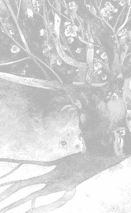

朱迪恨她父亲。

他从来没有拥抱过她，欣赏过她，从来没有参加过家长会，也从来没有牵过她的手。他更喜欢家里的男孩们。

受到这样的对待，朱迪很愤怒。想到父亲应该待她的样子，朱迪又感到非常难过。这一切让她很压抑。愤怒、难过、压抑，所有这些情绪都在深深地折磨着她。

就算朱迪是个跟父母住在一起的十几岁孩子，这种情况也很严重，何况她已经 63 岁了。她在愤怒、受伤和失落当中煎熬了 50 多个年头了。

为什么一位 63 岁的老人会因为过世已久的父亲感到苦恼？为什么我们要反复诉说那些和现在一点儿关系都没有的陈年旧事？为什么我们能把这些情绪、记忆和过往的伤痛保留这么久？为什么它们对我们的影响这么大？难道我们不能放下过去，继续向前吗？

接下来让我们分析过去的事件可能对你现在和将来造成的影响。

首先声明一点，你内心的某个自我可能想跳过这一章。回首过去、检视你与父母的关系（包括过去和现在），比讲述当前的压力和生活难得多。

但当你最终把这些往日的记忆释放掉时，你将体验到前所未有的轻松。在我见过的治疗当中，针对童年经历进行治疗往往能获得更加显著和持久的疗效。那些你认为是当下的问题（比如肥胖、财务、情感关系）往往深植在童年的经历中。

### 身体与童年创伤

童年时期的创伤、未解决的事件、未处理的情绪并不只在精神和心理的层面影响着我们，它们对身体的影响也是巨大的。凯泽永久医疗集团（Kaiser Permanente）和美国疾病控制与预防中心针对负面童年经验做了一项规模庞大的实验。实验人员分析了 17 000 个成人的病历，最终发现：未经处理的童年创伤与许多躯体症状存在直接联系，包括心脏病、癌症、糖尿病、中风、高血压、骨折、抑郁症和吸毒。

与负面童年经验得分为 0 的人相比，得高分的人抽烟（高出 3 倍）和自杀（高出 30 倍）的可能性更高。此外，许多受试者都超过了 60 岁，这表明，童年经验在几十年后仍然影响着身体。

这一发现被许多研究证实，包括勒妮·D．古德温（Renee D.Goodwin）和默里·B．斯坦（Murray B. Stein）在 2004 年所做的研究《美国人童年创伤与成年躯体疾患的关系》，其中提到：

童年时期受到的身体虐待、性虐待、漠视与成年后患各类躯体疾病的风险升高相关，这一相关在统计学意义上是显著的。具体分析受试者的人口学特征、终生焦虑障碍、抑郁障碍、酒精和药物依赖及各种心理创伤后发现：童年时期受到的身体虐待与患肺病、消化道溃疡和关节炎的风险升高相关，童年时期受到的性虐待与患心脏病的风险升高相关，童年时期被漠视与患糖尿病和自身免疫性疾病的风险升高相关。

身为内科医生、同时也是畅销书作者的加博尔·马泰（Gabor Maté）医生说：

大多数乳腺癌患者都存在长期潜藏的心理压力，这些压力来自童年经历、早期情感模式和无意识的心理应对方式，结果就容易让人患上各种疾病……研究发现，有以下情况的女性更容易罹患乳腺癌：童年时期与父母情感联系微弱的女性；有压抑（尤其是愤怒情绪）倾向的女性；成年后缺乏良好情感关系的女性；奉行利他主义，有强烈照顾他人倾向的女性。

以上这些实例表明，科学研究正在不断证实身体状况与心理健康之间的联系，同时，我们对情绪在生理上如何表现也有了越来越多的了解。

看了上面的两段话，你可能会想这些对你不适用，你没有任何被虐待的经历。有时对我们影响最大的并非是重大创伤性事件。我的朋友同时也是情绪释放专家的卡罗尔·卢克（Carol Look）说：“创伤有大也有小。”

重大创伤是我们生活中的重大事件，比如车祸、地震、火灾和恐怖袭击。微小创伤是长期积累的创伤体验，我们常常感觉不到它的发生。如果你成长于一个酗酒的家庭，父母总是责骂你，又或者在学校总受欺负，那么你很可能会体验到一连串微小的创伤。这些创伤叠加起来，就会成为一个重大创伤。

在继续这个话题前，我首先要提醒：尽管情绪释放疗法非常有效，也非常安全，但只有你自己才知道哪件事处理起来不会让你太难受。如果仅仅想到童年时期的某件事，你的身体就会发抖，恐怕你不适合自己单独做敲击治疗。对于这样的重大创伤，你应当寻找情绪释放治疗师，或者经验丰富的情绪释放疗法践行者，他们有处理类似重大创伤的经验，也能给你带来安全感。

你可以在下面这个网址中找到情绪释放疗法践行者名单：www.thetappingsolution.com/eft-practitioners。

如果你想使用情绪释放疗法帮你的朋友或家人治疗，也要记得上面的提醒。你可以把情绪释放疗法的步骤教给他们，然后和他们一起针对各种各样的事情进行敲击治疗，并为他们提供支持和帮助。不过，如果敲击进行到似乎有些不安全的阶段，而你又没有足够的经验，或者目前的情况让你感到很不舒服，那么这时你就得向外界求助了。

### 童年创伤塑造了我们

我们已经知道了童年经历可能对身体造成影响，但受儿童时期创伤影响的不只是身体，而是我们的全部，包括思维模式、信念、习惯和情感反应。

我们对世界的认识绝大部分形成于 7 岁之前，7 岁前发生的事会在心里留下持久的印痕，这些事件塑造了我们的人格，也就是我们对世界的认识和看法。为什么有的人能愉快、满足、充满激情地度过一生，有的人却一直在挣扎、没有安全感，认为这个世界充满危险、幸福可望不可即？通常，这些都是由幼年时期的经历决定。

索尼娅来自佛罗里达州，是一位情绪释放疗法践行者，她在财务上遇到了一些问题，于是来找我治疗。在财富、自己的能力和世界观方面她都有一些束缚性信念。她已经针对其中的一些信念进行过敲击治疗，只是感觉效果不够深入，没有触及问题的根源。所以，她只是暂时地好转了一些，随后又跌回固有的模式当中。

与她交谈过后，我发现虽然在金钱方面她确实存在很多束缚性信念，但还有来自童年的更深层伤痛。她跟我讲述了一段她经常回忆起的生动记忆：她母亲曾经酗酒，家里非常困难。有一天，她走进厕所，看见母亲在流血，手腕上的血管已经割开。她父亲也在里面，两手紧紧地按着母亲的伤口，好让她不至于死去。在索尼娅看来，这段回忆已经模糊，但我知道，它依然影响着索尼娅。

我告诉她，尽管我们可以针对财务方面的束缚性信念进行治疗，但直觉告诉我，我们应当首先把注意力放在这件事以及其他的童年创伤上。我问她是否有足够的安全感回到过去的创伤中，索尼娅坚定地给出了肯定回答。我一直都认为，在处理比较棘手的问题时，最好先让来访者自己作出选择，而不是一头扎进治疗中。确认来访者是否有足够的能量面对往事，这点很重要，它往往能够成为治疗的驱动力，从而提升治疗效果。

索尼娅开始了治疗，按照她自己的节奏从一处移到下一处。在这期间，我让她尽可能细致地描述母亲当时的情况。她讲述之后，我又进一步询问她当时的感受、看到的情景、闻到的味道等，为的是尽可能获得更多细节。当她把整件事情讲完，我又让她再跟我讲一遍，讲完后，我又让她再讲一遍，然后是第 4 遍，第 5 遍。每讲一次，我都会询问更多的细节和感受。期间，我问她：“这件事给了你怎样的启发？”她回答说：“我从没感觉到安全。母亲随时可能去世，我很担心她。”

**指点迷津**

#### 用放电影法处理过往事件

放电影法是由加里·克雷格发明的，这一方法可以详细追溯某一事件，而不至于在泛泛的描述中简单重复。想象一下，你正在讲述电影中发生的事。电影都有开头、高潮和结局，还有中心人物，以及他们说的话、做的事。在情绪释放疗法治疗中，我们可以使用放电影法处理过往的具体事件，从而将卡在那里的能量释放出来。

放电影法的好处之一在于，你不必把事件的具体细节大声说出来。你可以一边敲击，一边想象。关键在于此时你要把注意力集中在这 5 个地方：画面、声音、感受、身体触觉及剧中人物的想法，在合适的情况下，还得注意你的嗅觉和味觉。下面这些问题会帮你展开想象。

你的小电影持续多长时间？

你得确认它是简短的，不要超过 3 分钟。一般说来，电影里主要的创伤情节只持续几秒钟。如果你的电影情节有好几次高潮或者好几个创伤，你就要尽可能地把它剪成 3 分钟以下的小片子。

小电影的片名叫什么？

为你的小电影起一个独特的片名吧。

现在，你要治疗的具体事件已经被拍成了有片名的小电影，下一步就要在你的脑海中播放了。想象电影情节时，用主观焦虑评分为你此时的感受打一个 0～10 分的分值。如果你不敢看得太仔细或者太深入，你也可以猜测一个仔细看时的分值。

接下来，一边在脑海里放电影，一边进行几轮敲击治疗。

之后你能感受到的分值，通常都会比开始时减少几分。

继续在脑海里放电影。这一次，从分值为 0 或非常低的地方开始，一旦某处让你感到焦虑值升高，就停下来开始敲击。这么做非常重要！大多数人和创伤共存太久，以至于回想事件时都忘了自己的感受。不过现在不会了！运用情绪释放疗法时，只要感到焦虑值升高，我们就能利用这个绝好的机会开始敲击治疗。

再次在脑海里放电影，从头到尾，只要焦虑值升高，就停下来敲击。继续，直到你能在焦虑值不升高的情况下看完整部电影。

最后，把电影再在脑中放一遍，这次让场景、声音和色彩都夸张些，尽力去寻找那些负面的感受。如果你发现焦虑值重新升高，那么就停下来继续敲击！

注意：大声地说出电影中的事件，就像你正在讲给朋友听一样，这样做效果会更好。一定要在你感觉不舒服的地方停下来，哪怕只有一点点不舒服，停下后，随即开始敲击治疗，直到焦虑值降为 0 。接下来，从刚才停下来的地方继续向后讲述。如果你不想出声，就安静地敲吧，只要在脑中想象这些情节就好。当然，如果你能把看到的场景和感受到的情绪描述出来就更好了，不过，这些全部由你决定！

索尼娅和我针对她的记忆进行敲击，她把事情描述了一遍又一遍，直到能平静地看待这件事。我让索尼娅闭上眼睛敲击。这样更放松，她也能更有效地回忆。如果你发现自己容易分心，也可以试着在敲击的同时闭上眼睛。

清除母亲割腕这件事后，我又让索尼娅分享了更多童年经历，然后我们再对其进行了敲击治疗。我让索尼娅尽力回忆母亲每次喝醉后的情形、每一次担心母亲会死的情形，以及与她苦难童年相关的每一个情形。接下来，我们针对这一大堆负面事件进行敲击，而不是一件件地单独治疗。

这是一次情感之旅，也是一次眼泪之旅，更是一次解脱后的欢乐之旅，在对过往记忆进行敲击治疗的这 45 分钟里，到底发生了什么呢？我会让索尼娅用自己的话告诉你：

与尼克一起紧张治疗后，当晚我感觉筋疲力尽。我觉得自己非常平静、非常柔软。我的家人也注意到我特别安静。我终于安静了下来。我很早就睡了，整整一晚，我似乎总梦到一句话：“我觉得自己很安全。”这句话是我和尼克一直试图说服自己的，它一遍又一遍地出现在我脑海里，我也一遍又一遍地反复确认。我并没有刻意这样做，整个过程都很自然。

之后，我度过了多愁善感的一周，在那一周中，我都觉得很累，很想睡觉，睡很多很多觉，我知道这是一种健康的需要。现在，我觉得身心清爽，仿佛一切都很明朗，我的饮食偏好也改变了，不再总想吃甜食了。我的注意力完全放在了当下，我清晰地觉察到，我对遇到的每一个人都充满了善意和关爱。

我还想说说其他几件事。对于财富，我不再感到焦虑，无论是想到财富、谈论财富，还是获得财富。上周五晚上，我应邀出席了一个小范围的演讲会，有 25 位女性参加，我感觉非常棒。过后，她们当中的 4 位又邀请我为她们讲讲情绪释放疗法，其中一位已经成为了我的客户。

我正在写自传，并为它取好了书名，而且我也在建设我的网站，此外，我还制作了辅导情绪释放疗法的名片。

这真是一次令人惊异的体验。现在的我每天都过得很充实，从幸福、快乐和爱的角度来看，我的身体、头脑和心灵全都不一样了。

你读完这封来自索尼娅的电子邮件后，是否也在想：“真的吗？仅仅做一次 45 分钟的治疗就能有这么大的变化？”我也很惊奇她有这么显著的改变，可事实就是这样！我们在第一章中已经提到，情绪释放疗法确实能重塑人的大脑和身体，当你找到问题的根源时，你就可能获得令人吃惊的转变。

你可能还有疑问：为什么我们针对索尼娅童年发生的事进行治疗，就能转变她现在的财务状况呢？尽管现在还无法确切地解释其中的原因，但我相信，当我们找到并治疗了根源性的事件和想法时，生活的其他方面就能顺理成章地获得改变。

这就像电脑的操作系统，用过几年后就会变得越来越慢，越来越容易死机，而且总出差错，你有这样的体会吧？童年时期的创伤就是这样的旧系统！而经过敲击治疗后，我们重新安装了一个健康、快速的新系统。

在生活中，安全感强的人比没有安全感的人洒脱得多，他们能更加自信地与他人交往，更愿意投入广大的世界，更能承受情感关系的负荷，也更愿意冒险，因为他们有一个安全的大后方，所以现在索尼娅能在演讲会上推广她的业务。

### 那些想说却不能说的话

把注意力放在每一个具体记忆积存的能量上，这只是治疗童年创伤的方式之一，另一个行之有效的方式是让来访者把童年想说却不能说的话说出来。孩子们常被要求保持安静，不能讲话，大人又常常觉得他们的想法不重要，而孩子们往往也无法明确地表达他们的感受，尤其在面对老师等大人物时，他们更不知道如何表达。

还记得朱迪对父亲的怨恨吗？她把感觉告诉我后，我让她大声说：“我恨父亲！”然后再根据这句话与现实相符程度和情感强烈程度给出一个评分。你可以猜得到，对她来说，评分已然超过 10 分。即便是在她说问题描述语的时候，我也能感受到她汹涌的怒气。所以我们只能进行最基础的敲击治疗：尽管我恨父亲，但我还是全然地接纳我自己。

接下来，我们开始按顺序敲击穴位，同时说提示语：我恨父亲。

在敲击的过程当中，她情绪激动地大声说着提示语。我告诉她持续地按顺序敲击穴位，敲完一轮接着敲下一轮，同时不断重复相同的提示语：我恨我父亲。

她这样持续敲击了至少 20 分钟，同时一遍又一遍地重复着提示语，根本不需要我的鼓励。她对父亲的恨如此强烈，我都震惊了。同时，在不断敲击的过程中，我能察觉到她的情绪在起变化。一开始，她的愤怒是真实的、粗暴的，随着不断敲击，这种愤怒逐渐转化成了忧伤。

朱迪必须把她积压已久的情绪表达出来，这个过程就像小孩发脾气，先把压抑的情绪全部释放出来，接着力度降低，最后筋疲力尽。好在朱迪一边表达情绪，一边在敲击，这样负面的情绪就能被清除，身体也能逐渐放松，同时大脑的边缘系统也能得到重塑，从而进入全新的反应模式。

当朱迪足够平静后，我让她想象把自己的具体感受告诉父亲，同时不必担心有任何糟糕的后果。接下来，朱迪诉说了她因父亲不爱自己产生的深深忧伤。她说她很难过，说她不过是个需要爱的孩子。她问父亲：“为什么你不能像爱哥哥和弟弟那样爱我？”她一边哭，一边敲击，一边诉说内心最真实的想法。终于，她找到了一句她从来都没想过的话：“我值得！我值得被爱！”

几个星期后，我回访朱迪。她说她从来都没有感受过现在这样的轻松、自由和幸福。这些天来，她都在想念父亲，发现自己是那么爱他！确实，当我们治疗了过往的伤痛时，我们对生活的整个体验都会发生改变。

**指点迷津**

#### 未说出的话

我发现，治疗童年伤痛最有效的方式之一就是让来访者回到当时的情境里，把当时想说却没能说出的话说出来。

首先，回到记忆中的场景，用放电影法在脑海中反复播放。然后，选择合适的时机，把当时想说却没说出的话大声说出来，一边说，一边按顺序敲击穴位。跟着直觉走，把你真正想说的话说出来，在治疗当中，你可能听得到他人的回应，根据情况作出反应即可。继续一边说一边敲击穴位，直到你感觉话已经说完，创伤已经愈合时为止。

这一治疗可以帮助来访者认识到，此时此刻他们是否愿意与记忆中的当事人讲话。例如，我有一位来访者曾经被她哥哥强暴过，在治疗中，这位来访者一边想象，一边把她的感受全部表达出来。她说他的行为让她很受伤，对她整个人生影响非常大。

治疗结束后她告诉我，那些话已经在她心里憋了好多年，现在能说出来感觉真好。她还说之前一直没有决定是否要跟哥哥面对面地谈谈，现在她觉得她会做出对双方都有利的决定。

### 拥抱童年的那个自己

在我治疗瑞秋时，我更加明确了一件事，那就是我们会把创伤积压在身体里。瑞秋想解决她和丈夫的夫妻生活问题。她很爱丈夫，他们看上去相处得也很好，唯独夫妻生活很不如意，只要丈夫碰到她身体的特定部位，她就会害怕得往后缩，不仅阴部，就连大腿外侧、后背和臀部外侧也碰不得。

这件事让她感觉非常糟糕，她的内疚感更是让局面雪上加霜。我问她是什么事引发了这种惊恐反应，她说只模模糊糊地记得一点，其他的完全想不起来。这往往是童年创伤的反应。来访者说，“我就是记不起来了。”这时，你必须发挥一下创造力，想办法把事情弄清楚。

我突发奇想，让瑞秋把自己画在纸上，再把感觉不舒服的部位标出来。这么做纯粹出于直觉，也许我想通过画画帮她接近那个童年的自己。瑞秋在纸上做好标记后，我让她将这些部位从最不敏感到最敏感排列出来。接下来，我们开始针对最不敏感的部位进行敲击治疗。我们所使用的问题描述语是：尽管我不愿让别人碰我的胳膊，但我还是全然地接纳我自己；尽管别人碰我的胳膊会让我感到很害怕，但此刻我还是选择放松。

我让她想象有人摸她的胳膊，同时继续敲击穴位，直到她能够适应这种想象中的触摸，不再感到恐惧或害怕。接下来，我们继续针对其他所有部位做了上面的治疗。之后她说轻松了很多。然后，我问她是否真的想彻底解决问题，她说：“真的想！”

这里要提示一下，我下面要进行的并非是传统的治疗，我本身就是非传统的！我的治疗是一种辅导或训练，我不是有执照的治疗师，只是在情绪释放疗法方面积累了一些经验而已。我这么做仅仅是出于对他人的关爱，而且碰巧我和瑞秋关系比较特殊，所以我们尝试了一些非常规的做法。不管怎么说，我立志助人，为了得到结果，我会尽我所能。

为了真实地了解瑞秋的状况，也为了更深层次清除她的创伤，我让妻子布伦娜来帮我。布伦娜跟瑞秋的关系也很好，那天正好在家。我问瑞秋，是否可以让布伦娜轻轻触碰她的胳膊，瑞秋同意了，于是在瑞秋敲击穴位时，布伦娜碰了碰她的胳膊。一开始，瑞秋的胳膊稍往回缩了缩，不过随着不断敲击，她逐渐放松下来了。

治疗继续进行，一轮接着一轮，直到瑞秋的胳膊不再敏感为止。最后瑞秋说：“感觉挺舒服的！”这正是对充满爱意的触摸的正常反应。接下来，我们继续治疗了其他敏感部位（当然，只限于此情此景下适当的部位），其中一处是胸部外侧。

瑞秋说如果有人碰那儿，她会非常生气。于是，我让瑞秋敲击穴位，同时想象有人触碰了那儿。她适应之后，我让布伦娜尝试着触碰她那儿，瑞秋笑了一下，不过紧接着，当布伦娜抓住那个部位后，我看到瑞秋脸上露出了愤怒，瑞秋也觉察到了自己的愤怒。接下来，我们继续敲击，敲了一轮又一轮，直到那个部位不再敏感。随后布伦娜再次抓住那个部位，这次瑞秋没有愤怒。

我们治疗的最后一个部位是大腿外侧，在这里我们遇到了不小困难。只要布伦娜碰到瑞秋的腿，瑞秋立刻如灵魂出窍般僵在那儿，无法思考，也没有感觉，于是治疗就卡在这里了，继续敲击似乎也不管用。我不得不重新把她拉回现实，然后继续尝试。

我让布伦娜胳肢她，这惹得瑞秋发笑，于是她又回到现实中来。我们继续敲击，然后布伦娜再次触碰她的腿。当瑞秋再次僵住，我又让布伦娜胳肢她。就这样来来回回反复多次，直到她不再“灵魂出窍”。最后她终于能完全接受布伦娜触碰她的腿了。同之前一样，她再次说道：“感觉挺舒服的！”

之所以如此详细地讲述这次治疗，是因为我见过很多女性害怕别人碰触她们的身体。害怕肢体接触（无论是性的，还是纯友谊的）对任何人来说都是巨大的损失，我们的身体原本就是要被碰触、抚摸和关爱的。有研究表明，被抱得少的婴儿不如其他婴儿健康，他们不会像被关爱、被滋养的孩子那样茁壮成长，这一点也不会因为长大成人而改变。

治疗之后，瑞秋情况如何呢？她没有花太长时间就从我们的治疗当中获得了显著改善。第二天，她打电话给我，兴奋地宣布她和丈夫刚刚度过了一个销魂的夜晚。她从来没有体会到如此被爱、被呵护的感觉！

### 同情为理解打开一扇门

在治疗他人童年创伤的过程中，我的共感和同情能力得到了极大的提升。我已经从太多人那里听来了太多的伤心事和太多痛苦，每当看到有人大发雷霆、愁苦、粗鲁、令人失望或以某种方式伤害我、伤害这个世界时，我就在想他们很可能经历过重大创伤。他们这样做只不过是在对创伤作出反应，这是他们所知道的唯一能做的事，当然，这并不是说负面行为就是合理的。

同情确实为更深的理解打开了一扇门。当伴侣不想跟你亲密接触时，你可以问：“怎么了？发生了什么事？”而不是感到被排斥，于是愤怒、难过。当别人劈头盖脸地冲你发火时，你可以问：“怎么了？发生了什么事？”而不是以眼还眼、以牙还牙。我们都有需要治疗的伤心事，我们可以用情绪释放疗法把它们医治好、排遣掉，然后为我们和所爱的人创造一个崭新的未来。

还有，不要忘记同情我们自己和过往经历，不要因为自己没有达到某种要求就苛责自己。而是要问自己：“怎么了？发生了什么事？”并且给予自己关爱和同情。

**指尖敲出丰盛**

#### 建立深层安全感

加里·克雷格创立的安全感建立法有两个步骤：首先把生活中经历过的所有不愉快事件罗列出来，然后再对它们施以系统性的敲击治疗。当你找到了事件中的情感包袱，并把它们清理掉时，你头脑和心灵的冲突就会越来越少。冲突减少，安全感就增加了，身体和心理的痛苦也就减少了。详细步骤如下：

1．为你的生命设定一个时间轴，然后适当地分成几个时间段，比如出生、 0～5 岁、 6～10 岁等。

2．在每个时间段填上你能记起的所有不愉快经历。如果你填了 100 项或更多，不要惊讶，生活了这么些年，哪能不遇上点烦心事？对于具体的事件，只要主观焦虑评分达到 4 分，你就应该把它填进去。分值低的事件可以留待日后治疗，先挑主要的治疗，通常当主要事件得到治疗后，小事件的焦虑程度就会降低。别忘了小时候的玩伴和所有曾经和你同住一个屋檐下的人，还有从幼儿园到大学的所有经历，以及其他各种各样的创伤、疾病、事故等。你从这些事件和关系当中学到了什么？你怎样描述它们？通过这些事件和关系，你怎样看待自己？怎样看待别人？怎样看待这个世界？请记住，你能通过敲击治疗把从中学到的负面东西清除掉。在搜寻具体事件的过程中，你可能发现有些事并没给你现在的生活带来不愉快，没关系，填进去。事实上，既然你想起了它们，就说明它们需要你做一些处理。

3．为每个事件打一个分值，10 分的事件是最困扰你的。

4．从分值为 10 的事件开始依次进行敲击治疗。一定要注意随时涌上心头的更深层的记忆和情绪，这些也要接受敲击治疗。

5．在敲击的过程中，新的记忆可能会浮上心头，给它们评一个分值，然后加到事件列表里去。

6．制定一个治疗计划，每天针对其中的两三件事情进行敲击治疗。这样你就能用 3 个月的时间轻松地把所有事件解决掉。把你感受到的所有变化都记到日记里，如身体的好转、情绪的改善、与他人关系的转变等。回忆治疗完毕的某些事件，感受先前异常严重的事件如何变得不值一提了。

**专家简介**

#### 医学博士埃里克·罗宾斯：热心的践行者

埃里克·罗宾斯（Eric Robins）博士是一位经过美国医学会认证的泌尿外科医师，就职于洛杉矶的一家大医院。在过去 13 年中，罗宾斯博士运用情绪释放疗法成功地治疗了很多病人。

早在进入医学院之前，罗宾斯博士就对替代疗法（alternative medicine，常规西医治疗以外的补充疗法，一般包括冥想疗法、催眠疗法、顺势疗法、按摩疗法、芳香疗法、维生素疗法等，传统的草药和针灸也归在其中。——译者注）充满了兴趣，因为他的家人患有慢性病，而常规治疗不起作用，反倒是替代疗法疗效更好，成为实习医生后，他开始出现慢性疲劳症状，与家人的慢性病一样，这也是替代疗法比较对症的疾病。

1998 年，罗宾斯博士第一次学习情绪释放疗法，于是决定在自己身上做试验，他想让自己精力更充沛，而结果让他大为吃惊。之后，他注意到，有些病人患上了尿路感染，而另一些病人却没有，尽管这些病人近期都有过性生活。他进一步发现，发生尿路感染的病人通常都经历过某种程度的精神创伤。他意识到，如果要治好这些病人，就得医治他们的精神创伤，情绪释放疗法正好有用武之地！

据他估计，大约 90%的病人都有精神创伤，这些创伤不是加重病情，就是阻碍治疗，于是，他开始更深入地研究心理能量释放的各种方法。之后，他开始在治疗病人时使用情绪释放疗法。

他说：“情绪释放疗法是最好的心身治疗技术，因为它起效快且容易应用。”

谈话当中，罗宾斯博士乐于帮助病人的心情溢于言表。他跟我讲述了第一次应用情绪释放疗法治疗病人的情形。这位病人是越战老兵，患有严重的创伤后应激障碍。

“他夜里经常在恐惧中惊醒，”罗宾斯博士说，“我们开始针对他在越南最受伤害的事件进行敲击治疗，直到他能比较中立地看待那件事情。几个月后，我在一次聚会上见到了他。他妻子对我说他好多了，夜里不再惊醒了。”

罗宾斯博士澄清道：“如果有病人来，出于职业的原因，我会先运用传统医学把器质上的病变排除。不过，我始终认为身体有神奇的自愈能力，如果病人把身体中积聚的不良情绪和创伤性事件清除干净，那么他的躯体疾病就能得到治愈。”

罗宾斯博士跟我讲述了另一个不可思议的治疗结果。一位病人 40 岁出头，患有尿潴留，常规治疗对他不起作用。我见到他们夫妻不到 5 分钟，他妻子就提到了发生在丈夫身上的一次创伤性事件：她丈夫 5 岁时，在看病的过程中受到了惊吓，从此留下了深深的恐惧。

罗宾斯博士立刻为这位病人进行了敲击治疗，清除了他早年所经历的创伤。之前他的身体长久处于过度紧张和恐慌当中，以至于影响了健康。在接下来的两周里，他的病症完全治愈了。

想象一下，如果全国的医生甚至全世界的医生都能用罗宾斯博士的方法治病，那么，不仅疾病治疗得快，而且整个医疗体系，包括过高的医疗费用和常常不尽如人意的治疗结果，都能得到巨大改观。

# 第六章
失衡的身体

**HEALING THE BODY**

没有负面情绪的积压，将来就不会有它们转变成的疾病。

情绪连接着身体和头脑，在其中往复，并影响二者。

美国著名神经科学家　甘德丝·柏特

“哈哈，很有意思，尼克！”

这是妹妹第一次进行敲击治疗时的反应。我得承认，作为哥哥我总是遭到她的怀疑，因为这些年来，我和她开了不少恶作剧玩笑。不过这一次情况有些不同，因为我是真的想帮她。

这是十几年前的事，当时我刚接触这种“奇怪的敲击治疗”。她跟我抱怨说嗓子疼，鼻子也不舒服，同时还浑身乏力，喘不上气来。我问我妹妹是否愿意尝试一下。当我把敲击方式和部位教给她时，她又开始满心怀疑起来，在脑袋和身体上敲打几下怎么能对付普通的感冒病毒呢？我安慰她说，情绪释放疗法不是旁门左道，它确实能帮她缓解症状。我妹妹听后眨了眨眼，然后同意尝试一下。

我们首先针对她的症状开始敲击，几轮过后，她感觉好了一些，主观焦虑评分从 10 分降到了 8 分，但这个效果还不够好，于是我问她最近有没有什么烦心事。

她说：“亚历克萨哥哥叫我帮他刷房子，我真的不想刷。我 21 岁了，还得刷房子，真讨厌，我真的不想刷。”

我们针对她在刷房子这件事上的情绪进行了敲击治疗。结果没几分钟，她的鼻塞和咽痛全部消失了，主观焦虑评分从 8 分降到了 0 分！

我做了无数次的敲击治疗，也一次又一次地见到了这样的结果。我把这种结果称作杰茜卡所说的“一分钟见效”。通常是 15 分钟见效，不过谁会去数呢？这种情况经常发生在简单的躯体症状上，比如嗓子疼、肚子疼、头疼等。但和情绪释放疗法所能治疗的所有问题相比，这些症状仅仅是冰山一角。在这一章里你会见到，对于更复杂的病症，情绪释放疗法同样疗效显著。

### 探寻身心合一的奥秘

人们往往会说：这怎么可能呢？敲击穴位怎么能疏通鼻塞？更不要说治疗严重的疾病了。

从法国哲学家、现代医学奠基人勒内·笛卡尔的时代起，传统西方医学一直相当排斥心身联系这一概念。历史记述，当时教会恐惧任何对情绪和情感的研究，因为这可能会对信众的信仰产生威胁，而这将极大地削弱教会在当时拥有的绝对权力。

为了能够解剖尸体（在当时，解剖是亵渎神的行为），笛卡尔不得不与教皇达成协议，只研究身体的物质部分，不研究思想和情感。

笛卡尔与教会订立的规则把人分成了身体和心理两部分，这两大阵营割裂了几百年。从那时起，人们普遍认为身体和心理做着不同的事情，它们虽然共存于同一个身体，但井水不犯河水。直到 20 世纪 60 年代，反主流文化运动在一夜之间兴起，它激发了人们探索东方智慧的兴趣，很多人开始接受身心合一的观念。但没过多久，人们对身心二元论产生了怀疑。

最近几十年，这种趋势进一步发展，包括按摩、针灸、整体疗法和快速发展的情绪释放疗法在内的替代疗法正被越来越多人接受。美国国立卫生研究院于 2009 年所做的一项研究发现，美国人每年花在替代疗法上的金额达到了 340 亿美元，这说明越来越多的美国人正在寻找心身结合的疗法维持健康。

“心身联系”到底指什么？它是“真正的科学”吗？还是一群人在乱吆喝？

事实上，你已经见过真实的心身联系，只是那时你还小，不能理解这个概念。还记得小学老师第一次叫你名字，全班同学都掉过头来盯着你看的情形吗？我打赌你当时肯定跟我一样脸红，这是因为心里感受到的尴尬使面部血管扩张，所以脸羞成了红苹果。

脸红是常见的现象，所以我们从来不问：血管怎么知道你不好意思了？那个时刻它们如何了解到你的情绪？

国际知名的演讲家、《情感的分子》（*Molecules of Emotion*）一书的作者兼药理学博士坎达丝·珀特（Candace Pert）能回答上面的问题。20 世纪 80 年代，在美国国立卫生研究院任主任的她率先研究精神神经免疫学（Psychoneuroimmunology），并发现了“身心灵”（Bodymind）的科学依据。感谢珀特的研究，现在我们才能更清楚地了解，无意识念头对健康、幸福和心身疾病（Psychosomatic Illness）影响巨大。

根据“心身疾病”一词我们就能猜出她的理论观点。“psycho”当然是指心理，而“somatic”指的是身体，字面意思就是“心身”。20 世纪 70 年代，珀特的一项研究为她日后的成名奠定了基础。她在细胞表面测量到一种叫做阿片受体（Opiate Receptor）的分子（对科学家来说，测量是一个黄金准则，珀特通过测量证明了阿片受体的存在。——译者注）。她在《情感的分子》中写道，这些受体就像钥匙孔，它们与一种叫做肽（Peptide）的特定“钥匙”相匹配。她介绍道：“这种钥匙实际上是我称之为情感分子的重要组成部分。”阿片受体漂浮在细胞表面，就像莲叶漂在池塘上一样，当它们跟自己完全匹配的肽结合后，细胞的活动就会发生改变。换句话说，在任何时候，细胞的活动都能根据所结合“钥匙”的不同而发生相应的改变。珀特解释道：“简单说，这些分子水平的生理现象能够转变为细胞和身体的活动，甚至引起情绪改变。”

这些年，珀特博士在世界各地巡讲，她已经成为许多人心中的偶像，其中包括替代疗法治疗师、传统医生等。她的研究还在不断为我们的认识和治疗创造新的可能性。珀特坦白说她从没否定西方医学，她只是想与其展开对话，并将“身心灵”运用其中。

### 卡住的情绪能量

我们已经知道压力对心理影响巨大，那再来看看压力对身体的影响。在第一章中，我们讨论了身体的应激反应。杏仁核感知到危险，然后拉响身体内部的警铃，激发身体释放肾上腺素和压力荷尔蒙皮质醇。从生物学角度看，这一反应得以让我们躲避特定的短期危险，因为大量释放的肾上腺素和皮质醇使身体具有了迅速反应的能力。你的血压和心率上升，更多的富氧血等待着供给大脑和肌肉，你的感觉更为敏锐，身体也更为灵巧，这样你就能用最快的速度保护自己。无论你打算停下来同危险搏斗，还是一阵风似地跑掉，你的身体都需要这种能力。

然而，今天人们面临长期的压力，这与上述情形完全不同。在身体看来，我们像永远被老虎追赶着一样！尽管我们的身体生来就装备着一系列保护系统，诸如免疫系统、血脑屏障，但它们并不适应长期处于战斗或逃跑状态。今天我们面临是无穷无尽的烦恼，如房贷、工作压力以及繁重异常的日程表。对绝大多数人来说，压力源永远排着长队，一个刚解决，另一个就迅速补位。这就好比你刚刚摆脱了一只老虎，另一只又跟了上来。你的身体当然无法永远处在高强度的战斗或逃跑反应中。随着时间的推延，这种长期压力就会干扰你的身体，如导致体内环境失衡。

在身体平衡状态下，具有刺激作用和镇定作用的荷尔蒙和化学物质会大致平衡，而在长期压力下，身体无法达到平衡状态，于是荷尔蒙和化学物质就会失衡。

从生物学的角度看，身体处于失衡状态是很不利的。长期压力与心脏病、失眠、消化系统疾病、偏头痛、抑郁、肥胖、记忆力下降、性功能不足、不孕不育、躯体疼痛、皮肤病和免疫力下降等病症都有直接的关联。据美国家庭医生学会报告，家庭医生接待的患者中，2/3 的症状都与压力有关。一项研究显示，遭受重大压力困扰、同时又缺乏情感支持的中年男性比遭受同样压力困扰但享有亲密关系的中年男性在未来 7 年更易死亡。另一项研究表明，压力管理可降低罹患心脏病的风险。对心脏病患者来说，它或许能让心脏病发作的风险降低 75%。

在压力的长期侵扰下，我们的身体很容易失衡，从而变得无法正常运转。然而西方医学让我们把注意力放在症状上，而非问题的根源上。

回想上一次感冒，你是不是鼻塞、咽痛、不住地咳嗽、心情不好、希望感冒早点结束？为了让自己早点好起来，你可能会多睡一会儿，同时服用维生素或吃一些非处方药。你的朋友、同事和家人也会安慰你说，很快就会好的。

你可能已经有意无意地把感冒归结为“压力山大”，然而，当你忙不迭地疏通鼻子、止咳祛痰时，你就无法真正关注自己的情绪了。也许身体需要的不是治疗“鼻塞、打喷嚏、咳嗽、咽痛、发烧、睡眠不良”的药，也许它真正需要的是消除“恐惧、内疚、愤怒以及当时你所感受到的所有负面情绪”的药。治好我妹妹感冒的可能正是第二种药：针对刷房子事件引发的负面情绪进行的敲击治疗。

“普通感冒”看似没什么大不了，但实际上西方医学到现在仍然无法治疗它。从科学角度讲普通感冒仍然是一个未解之谜。我还没有听说，哪一种西药、中药或其他治疗方法能在很短的时间内把杰茜卡的症状全部消除干净。

让我们再想远一点。如果卡住的情绪能量导致严重的、甚至威胁生命的失衡病症，它是否也能导致其他病症？我已经在第一章中介绍过，科学已经发现，情绪释放疗法能降低压力荷尔蒙皮质醇水平。问题是情绪释放疗法是否能治疗比普通感冒更恐怖、更难治的其他失衡病症呢？

### 敏感的身体

还记得得克萨斯州的乔迪·麦克唐纳吗？我们在她家见到她时，剧烈的纤维肌痛正折磨着她。夜间，她一般要疼醒 15～20 次，而且不得不放弃她所喜爱的野外远足运动。她到处求医问药，可是不见好转。

纤维肌痛是一种奇怪的病，很多人都可能得，其致病机理到现在也没有彻底弄清楚，更别说如何治疗了。摄制《轻疗愈》这部纪录片期间，我们开展了一场为期 4 天的敲击治疗工作坊，参加治疗工作坊时，乔迪几乎疼得无法忍受了。

乔迪的教练是情绪释放疗法践行者里克·威尔克斯。里克首先问乔迪，患病之前是否发生了什么重大的事情。她回答：“是的。”她那长期与毒瘾作斗争的女儿不但怀孕了，而且艾滋病毒检测结果为阳性，所以那段日子她异常悲恸。里克又问她不能去野外远足是什么感觉，她回答：“难过。”

里克带着她做了几轮敲击治疗，他不只关注乔迪的症状，还关注她的情绪。第一天的敲击治疗结束后，乔迪就能毫无痛苦地爬一小截楼梯了。当时她不敢相信情绪释放疗法能完全治好她的病，觉得这只是偶然现象，因为纤维肌痛确实偶尔会神奇地消失一阵子。

乔迪度过了一个极其舒适、疼痛全无的夜晚，接着又投入了第二天的治疗，她期待更多的指导和治疗。第四天治疗结束时，乔迪发现她又能自如地在户外走动了，而且还轻松地、毫无痛苦地走在我们队伍的最前面。让我感到高兴的是，她的这一转变完全被摄像机记录下来了，这是多么有力的证明啊！

在接触情绪释放疗法之前，乔迪跟很多慢性疼痛患者一样，总想做各种各样的治疗，希望能缓解疼痛。开始敲击治疗后，她明白了一件事，就是要让自己的节奏慢下来，然后倾听身体的声音。乔迪无法把女儿从毒瘾当中“拯救”出来，无法帮她脱离随后的悲惨境遇，悲伤和自责全都压在了她的身体中，尤其是膝盖上。通过敲击治疗，乔迪终于把这些情绪释放出来，于是她的身体康复了。

很多年过去了，乔迪的生活和往日完全不同了：她不再遭受疼痛的困扰，一觉睡到天亮；她轻松自如地在楼梯爬上爬下，充分享受整栋房子；她经常写作，已经写了好几本书等待出版。

乔迪的治疗效果能保持这么长久的原因之一在于，她一直在坚持敲击治疗。每天早晨她都会进行敲击，这不仅能够帮她达成积极的目标，还能帮她清除负面情绪。“没有负面情绪的积压，将来就不会有它们转变成的疾病。”乔迪说。

看到乔迪的转变，你很可能会想，是情绪释放疗法“治好”了她的纤维肌痛。在为期 4 天的敲击治疗工作坊中，她消除了膝部的陈年病痛，重新让身体充满了活力，8 年中头一回睡了个好觉。

从科学的角度讲，没人能说情绪释放疗法可以治病，不论是纤维肌痛，还是其他病症。人的身体极其复杂，在任何时刻，体内都在发生难以计数的变化，其中有好也有坏，而影响这些变化的因素也同样难以计数。

不过有一点是肯定的，那就是在释放体内积压的情绪能量方面，情绪释放疗法是一个非常强大的工具。就像你看到的那样，情绪能量在躯体上的表现可能会比我们原来认识的更明显。这种表现不只是发烧感冒，也包括了从原因不明的疼痛到甚是严重的各类疾患。

坎达丝·珀特对于“身心灵”的研究在不断地、确定无疑地提示我们，身体与情绪的联系很可能比西方医学认为的更密切。遗憾的是，我们关注的是病菌（美国人每年花费在抗菌皂上的费用约为 10 亿美元），而我们的身体或许对情绪更为敏感。

### 情绪造就命运

当我们开始谈论如何通过释放情绪能量来促进身体的疗愈时，可能会一下子得出这样的结论：是情绪造成了疾病。这又是一个误区。我们讨论的是心身联系，即心理如何影响身体，身体又如何影响心理。我的朋友兼畅销书作家克丽丝·卡尔（Kris Carr）喜欢使用“参与”一词来描述情绪对疾病的作用。她认为，与其说情绪造成了疾病，不如更准确地说情绪参与了疾病的形成。我们的命运有情绪的参与，所以我们的身体状况、心理状况才会是今天的模样。

从另一方面说，释放情绪能量虽然能疗愈身体，但并不是说疾病就不会发生。比如，毒气肯定对你的身体有害。假如不小心吸进了一些，而你既冷静又放松，不像别人那样整天提心吊胆，你的身体就能更有效地解毒。总之，你能通过情绪释放疗法管理你的压力、焦虑和其他情绪，从而让其参与建设自己的健康和幸福。

参加敲击治疗工作坊时，唐娜的身心已处在极度疲惫的状态。在那之前的 6 个月，医生诊断她患有乳腺癌，她做了双侧乳腺切除，并且接受了 33 次化疗。不过唐娜来学习情绪释放疗法的目的并不是治病，而是单纯地为了想睡好觉。

从化疗开始，4 个月以来唐娜一直遭受失眠的折磨，常常几天几夜睡不着觉。不做化疗的时候，她夜里至少也要醒来 3 回。“那还是两片安眠药外加一片抗抑郁药的功效。”她解释说。

她从一个活跃的、精力充沛的女强人，变成了一个大门不出、二门不迈的人。她想让两个孩子重新找回“原来的那个妈妈”。唐娜说：“如果焦虑能少一些，平静和自信多一些，这就是我最大的福分了。”她又继续说道：“我已经告别了从前的生活方式，脱离了原来的社交圈子……如果我有体力和自信重新回到那个世界，该多好啊！”

唐娜尝试过好几种替代疗法，除了传统的心理治疗外，还包括自然能量疗法（Reiki）、针灸和气功。她希望它们能为她带来内心的宁静和安稳的睡眠，然而遗憾的是，这些尝试都没成功。后来她的治疗师推荐她来参加了我们的敲击治疗工作坊，希望她能把失眠敲走，再敲来一个理想的新人生。

“患癌对我来说还是有很多好处。”她解释说，“它帮我找到了过去生活里缺失的平衡感，帮我认识到什么才是真正重要的东西。”她补充说，她的目标就是要找到一个“正常的新生活”，然后学会“带着一颗欢喜之心尽可能地活出自我。”

看着唐娜讲话的样子，我们都深深地为她感动，被她激励，但我们也为她担心。你能感觉到她的决心，但她的声音是那么细小、无力，似乎她从来都没有真正地为自己生活过。她的身体确实在这里，可她的灵魂到底在哪里呢？

为了找到她焦虑和失眠的根源，我们决定探寻她心灵深处的感受、希望和梦想。当被问及在生活中她到底追求什么时，她回答：“我希望我的孩子们快乐。”我们再让她在想象中对家人说：“我要花一些时间来为自己做一些事情。”这时她开始表现出不安来。

为了帮助她镇定下来，我们开始带着她做敲击治疗，治疗的重点在于表达出她的个人愿望。在治疗当中，因为切除了双侧乳腺，唐娜表示想做回一个“真正”的女人，当然，她也想解决睡眠问题。

敲击治疗有了效果。第一个晚上唐娜睡得很香，中间一次也没醒。在接下来的治疗当中，包括后来，她的睡眠也一直没有问题。唐娜笑着说：“睡眠好了，一切都改善了。”

通过敲击治疗，唐娜还与一个被她冷落了许久的人建立了联系，那个人就是她自己。“我希望我能告诉别人，不要刻意让自己永远‘积极’，这会给自己带来不必要的压力。我现在认识到，把情绪表达出来，同时做敲击治疗把这些情绪释放掉，是一件非常重要的事情。”情绪释放疗法已经让她的生活发生了翻天覆地的变化。

刚参加完敲击治疗工作坊的唐娜焕然一新。她看上去精力充沛，似乎敲击治疗把她的身体和心灵重新联结在了一起，拥有了一个健康的“身心灵”。除此之外，唐娜也实现了重新融入社会的愿望，她又能去参加孩子们的活动了。不过，她也第一次心甘情愿地放弃了一些活动，以便把时间和关注留给自己。

### 唤醒身体的疗愈力量

情绪释放疗法专家林赛·肯尼向我介绍了她治疗利娅的过程。50 岁的利娅过去是一位教师，最近被诊断出肺癌。两人第一次见面时，林赛问利娅患肺癌之前，她的生活中有没有发生什么事情。利娅说她生活得很舒心，婚姻美满，没有遭受过任何形式的心理创伤。然而她刚一说完，丈夫迪克就插话说大约在做出诊断的 6 个月之前，她的姐姐贝丝刚刚因为一种呼吸系统疾病去世了。

提到贝丝，利娅就哭了起来，很明显这是一个创伤性事件，但奇怪的是（真的奇怪吗），她刚才怎么没有想起来？

很快林赛就明白了，在过去的两年半里，利娅一直承受着巨大的痛苦。贝丝确诊前一年，她失去了丈夫，同时也失去了活下去的意愿，她拒绝了所有的治疗，所以利娅认为她没有为自己争取活下去的机会。

林赛不禁猜测，利娅积压的情绪如此强烈，这是否与她的肺癌有关呢？于是她花了一个小时为利娅和她丈夫进行敲击治疗，敲击的对象是她对贝丝去世的感受。在治疗当中，利娅不仅诉说了她的悲伤和失落，同时也宣泄了她对姐姐拒绝治疗的愤怒。在利娅看来，贝丝拒绝治疗，实际上就是放弃自己，放弃生活，也放弃了她。

治疗 1 小时后，利娅对姐姐去世的伤痛消除了很多，对那段往事的情绪也平复了很多，此外，她还选择了原谅贝丝拒绝治疗。

这是一个重大的进展。不过利娅的肺癌还没有治愈，她需要进行更多的敲击治疗。为了清除更多的负面情绪，促进肺癌的治疗，林赛教给利娅和迪克一套简单的治疗步骤。她一边指导利娅按顺序敲击穴位，一边指导利娅向自己的身体索要能量提供给肺部，以便修复癌症引发的损伤，清除癌细胞，提高免疫系统的活性。最后，她还指导利娅一边敲击穴位，一边感谢身体的努力。

离开时利娅和迪克放松了很多，这一次的治疗让他们非常兴奋，对于情绪释放疗法所能起到的疗效，他们也充满了期待。林赛告诉他们，每天至少要按顺序进行 3 轮敲击治疗，同时还要处理其他负面情绪。

4 个月后，利娅向林赛宣布了一个惊人的结果：她不用再做化疗、放疗和手术了！这些天她一直坚持敲击治疗，同时也调整了生活方式。她认为是情绪释放疗法、积极思考和自我疗愈救了她的命。被传统医学几乎判了死刑的利娅，如今找到了提升身体疗愈能力的新方式。

最近林赛告诉我，利娅的健康状况十分稳定。不过需要强调的是，尽管这些结果好得令人难以置信，但我们还是不能过高估计情绪释放疗法的疗效。癌症是一种极其复杂的疾病，关系到躯体、情绪和精神，所以，说情绪释放疗法治愈了癌症是不妥当的，但针对引发情绪和创伤的事件进行敲击治疗确实能促进身体的自我修复。自我修复开始了，身体也就更能抵抗自己的癌症了。

我们很是为利娅所经历的一切感到振奋。我已经看到太多情绪释放疗法促进康复的案例，但每一个机体、每一种病症都千差万别。尽管利娅通过敲击治疗和改变生活方式控制了癌症，但我们不能武断地说每个人都能获得这样的疗效。

尽管情绪释放疗法非常有效，但它不能取代西方医学，很多情况下，情绪释放疗法都是和手术、化疗等传统治疗手段以及其他替代疗法结合使用的，而且某些情况下，情绪释放疗法正是在原有治疗的基础，才唤醒了来访者身体的疗愈力量。

很多人都担心，在敲击治疗中，对愤怒、悲伤、压力和焦虑的关注会把负面的事情吸引到他们的生活中。

在这一章里，我们已经了解了唐娜、利娅和乔迪的情况。从中我们能看出，正是因为对悲伤、愤怒、怨恨等情绪的拒绝承认和对自我需要的否定，身体才可能患上疾病。

这里需要再强调一次，你有负面的情绪、想法和经历并没有任何错，我们都会时不时地体验到这些。只有当这些负面的东西没有宣泄口时，身体才会失衡，进而引发疾病或者阻碍康复。

当这些负面的情绪、想法和经历得到处理和释放后，你就能变得积极，而不像以前的唐娜那样，强迫自己积极起来，只有这样，你的生命才能释放正能量，因为积极的状态来自你的内心，而不是对负面情绪、想法和境况的掩饰、躲避及否认。

想象一下，医生在几分钟之内就迅速找到问题的根源，而非先做一大堆检查，然后让你没完没了地吃药（况且每种药都有副作用，都可能产生新问题），很可能这样还无法治好你的病。随着越来越多的医生开始意识到心身联系的重要性，想象越来越有实现的可能。

现代医学采用的是一种标准的、对抗的传统治疗，它认为身体需要药物或手术来治愈一系列症状。然而遗憾的是，药物和手术并没有获得我们期望的成功率，而且还给我们带来很多压力，给身体带去进一步的损伤。任何与当今医疗体系有过深度接触的人都能体会到这种治疗方式所带来的损害，包括身体的和心理的损害。

现在越来越多的医生，包括心理医生、精神科医生，以及其他临床医学工作者，都在了解情绪释放疗法，并把它运用到治疗中去。他们这么做只有一个简单的理由：情绪释放疗法确实有效。在过去几年里，我见到许多专业医生一开始怀疑情绪释放疗法，后来却热衷于此。

情绪释放疗法任何人都可以使用。当专业的医生把它运用到临床实践当中时，我还是感到十分兴奋。并非只有医生才能为自己或他人进行敲击治疗（我也不是），但专业所带来的经验和知识对情绪释放疗法的实施确实有帮助。

接待来访者时，我在体察来访者真正需要，以及思考怎样做才能最有效地帮助他们的同时，也积累了个人发展、咨询、心身疗法等方面的经验。所以，无论你是为自己进行敲击治疗，还是求助经验丰富的情绪释放疗法实践者，抑或是求助结合使用情绪释放疗法的传统医生，你都应该明白，从即刻起，你就可以运用这一强大的治疗手段，而且不久之后它会为更多人所使用。

**指尖敲出丰盛**

#### 建立你自己的疗愈敲击树

我们在第二章中做过“敲击树”的练习。现在，我们将运用这一章学到的知识来绘制一棵帮助我们疗愈身体的“敲击树”。前面的内容可能会重复出现在这里，重要的是，你得花一些时间来考虑，怎样运用情绪释放疗法让“身心灵”发挥更大的作用。就算你觉得自己很健康，也最好想想以前体验到的头疼、感冒或其他症状。

找一张纸和一支笔，把你的疗愈敲击树画出来。（你可以访问 www.thetappingsolution.com/tree 获得空白的敲击树图片，然后打印出来。）不用画得太好看，只要用心就可以了，不过要多留些写字的地方。上一次练习的时候，大多数人写上去的东西都比预想的多！

**树叶：症状和表现**

你现在有哪些症状？身体感觉如何？医生的诊断结果是什么？身体有什么地方疼吗？把这些看得见的、感觉得到的事项填在“树叶”部分。

**树枝：情绪**

你平时情绪怎么样？早上醒来时感觉怎么样？晚上睡觉的时候呢？想想昨天发生的事，把你经历过的所有负面情绪都填进去。你觉得哪些负面情绪和你的身体、病症有关？或者和你的整体健康状况有关？

**树干：事件**

在与你的身体和疾病有关的事情（包括当前的和过去的）当中，哪些正在困扰你？你身体方面的问题是从什么时候开始出现的？那时你的生活中发生了什么事情？

**树根：束缚性信念**

说起身体和健康，你有哪些固定的看法呢？如果要谈论自己的身体，你会怎么说呢？如果要谈论你的病症，你又会怎么说呢？医生对你说过什么？你觉得他说的哪些话对？你对你的身体状况有什么评价？

在这里诚实非常关键，如果这时候你还逼着自己积极地看问题，那么你就是在和自己作对，和自己的身体作对。真实一点，把想到的全说出来，然后你才能释放出实实在在的正能量，这时，你的身体才能运用它来帮助自己走上康复之路。

**建立你自己的疗愈敲击树**

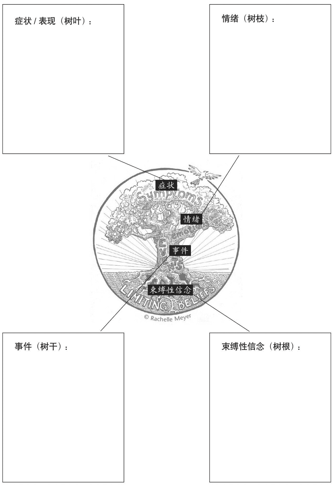

这一切都做完后，站起来看看你画的疗愈敲击树，这里概要地罗列了你此时的“身心灵”。这些情绪、症状、事件和束缚性信念正是你需要运用情绪释放疗法来清除的东西，然后你就可以收获一个身体健康、活力四射的你！

**开始敲击治疗**

与症状相比，疗愈敲击树是更有效的敲击提醒，并且是可视的。为了发挥敲击治疗的全部威力，你需要把各个部分都加以治疗，从症状开始，然后一路进行到你的束缚性信念。

用这一章的事例来说，就是从杰茜卡的感冒到乔迪的纤维肌痛，再到唐娜的失眠和利娅的癌症，这就是整个过程，其中包括了针对根源（可能促成疾病发生的信念、想法）的敲击治疗，它对身体的自我疗愈意义重大。

# 第七章
身体能够自愈

**RELEASING PHYSICAL PAIN**

身体能够自愈，疼痛可能缓解，诊断也并非总正确。腾出一点儿时间尝试情绪释放疗法，或许你能从中找到久违的轻松感。

如果治愈只有一种解释，那就是带着宽容和觉知走进躯体和精神的痛苦之中。是这些痛苦，让我们在成见和惊恐中停滞不前。

美国畅销书作家　斯蒂芬·莱文

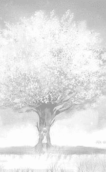

“帕特里夏的疼痛跟心理没有关系！这里写了，她的第一腰椎骨折了，还装了好多根螺栓！这种情况敲击治疗怎么治啊？”

这是 2007 年 7 月，当时我和妹妹正坐在桌子旁，查看报名参加敲击治疗工作坊的申请表。我们面前有一大摞申请表，说明很多人都在急切地寻找能帮助他们解决疼痛、肥胖、悲伤等问题的方法。

杰茜卡正在读帕特里夏的申请表。帕特里夏在一次严重的沉船事故中受了重伤，第一腰椎骨折，这是腰部最大的几块椎骨之一。后来，外科医生成功地用 4 根钛金属螺钉和 8 组螺栓加固了她的腰椎，可是遗留的疼痛仍然十分严重，所以她一直在服用吗啡、扑热息痛、耐而可和安定。此外，她的睡眠不好，必须服用安必恩才得以睡个好觉。然而这么多的药也无法阻止她的腰规律性地疼痛。对于自己的境遇，帕特里夏深感绝望。

我和妹妹争辩的焦点在于，情绪释放疗法能否缓解有明确物理原因的躯体疼痛？她那时的理解是，情绪释放疗法只对心理或精神性的疼痛有效，因为这些疼痛才是由压抑的情绪所引发的。我知道情绪释放疗法的疗效还不止于此，于是我动用我既是项目负责人又是哥哥的特权，否决了杰茜卡的提议，同意帕特里夏参加我们的敲击治疗工作坊。

坐了 6 个小时的车之后，帕特里夏终于来到了工作坊的举办地。当时，她的腰疼得非常厉害，尽管她强打精神（她天生就是那种性格坚强、乐观积极的人），腰部的剧痛还是让她疲惫不堪。帕特里夏在她的申请表里写道：“这么久了，我觉得我还像生活在噩梦中一样……一切都变了……我还在不断地适应、调整，努力让自己挣扎出来。我一天到晚总在考虑，这件事（这个活动或这个决定）会对我的腰有什么影响？这一点非常讨厌。我行动起来比原来慢多了，这让我又急又气，我担心别人会以为我残废了。那次事故完全改变了我的生活，我心里充满怨恨，但也只能努力去关注事情好的一面。”

### 你真的会一直疼下去吗？

里克是工作坊的志愿者之一，他负责为帕特里夏减轻疼痛，同时帮她开启新生活。

里克首先注意到，医生已经跟帕特里夏说了很多，包括可能出现什么情况，不可能出现什么情况。医生的诊断可能会对我们的身体和将来的生活造成破坏性的影响，当我们听到“你会一直疼下去”或“你以后不能自如活动”这样的判断时，我们就会在潜意识当中把这些束缚性信念化为己有，在显意识层面，我们往往会把它当作真理，作为行动的依据。

事故发生前，帕特里夏很喜欢做瑜伽，可是医生告诉她“不要再做瑜伽了”。这句话在情绪上摧垮了她，负面的化学物质传遍了她的身体，同时也限制了她去做可能做的事情。

如果医生没有跟她说那句话，她可能已经尝试过瑜伽了，瑜伽可以让她缓慢地伸展身体，然后促进身体康复，然而，医生的话却把这种可能性扼杀在了帕特里夏的头脑里。

直到她接触情绪释放疗法后，这一切才有了改观。在里克的专业引导下，帕特里夏把医生对她说过的话和她对这些话的感受全部清除了。

这次敲击治疗连同我们即将介绍的其他方法，产生了惊人的效果。治疗开始后的第二天晚上，帕特里夏已经感觉不到腰痛了，由螺钉和螺栓导致的沉重感也消失了，最重要的是，她对未来充满了希望，而且为她可能做到的事情感到兴奋。她不再把注意力放在不能做的每件事情上了！治疗结束后，帕特里夏的腰痛完全消失了，安眠药也不用再吃了，而且她又开始练习瑜伽了。这些结果是那么的不可思议！

**指点迷津**

#### 哪些是“事实”？

当你身体的某个地方疼痛时，你可以问自己：

对于这种疼痛，我觉得哪些想法是符合事实的？

对于我的身体情况，医生是怎么说的？

对于我的身体情况，我在网上查到的信息是怎么说的？

对于我的身体情况，我觉得哪些想法是符合事实的？

花几分钟的时间，想想怎么回答上面这些问题，最好用笔写下来，越详细越好。你的答案可能是这样的：

我腰部的一个椎间盘突出了。（写得越详细越好，比如，我腰部第三腰椎的椎间盘突出了，而且越来越严重，现在疼得非常厉害，感觉又热又胀。）

医生说我会这么一直疼下去。

医生说最后得动手术。

医生说病情正在恶化，将来很可能还会更严重。

只有吃止疼药才能缓解疼痛。

我觉得我会这么一直疼下去，而且会越来越严重。

检查你列出的每一项，根据每一项你认为符合事实的程度，各自给出一个 0～10 分的评分。

如果你确定无疑地知道自己有一个腰椎间盘突出了，并且这是事实，你就给它打 10 分。如果你完全相信它会一直疼下去，也给它打 10 分。如果你对某句话存在一些怀疑，就给 7 分或 8 分。

现在来感觉一下你整体的疼痛是多少分，范围仍然是从 0～10 分。

我们将使用下面的问题描述语。敲击一轮后，把它们合并为一组继续敲击。

**指尖敲出丰盛**

#### 破除束缚性信念：针对诊断结果敲击

手刀点：尽管我有一个腰椎间盘突出了，但我还是全然地接纳我自己（重复 3 遍）。

眉毛内侧：我的腰椎间盘突出了……

眼睛外侧：腰椎间盘突出了……

眼睛下方：又胀又疼……

鼻子下方：医生说我的腰椎间盘突出了……

下巴：医生说会一直疼下去……

锁骨：医生说最后得动手术……

腋下：医生说很可能会越来越严重……

头顶：止疼的唯一办法就是吃止疼药……

眉毛内侧：我觉得这病永远好不了，而且只会越来越严重……

眼睛外侧：我的腰椎间盘突出了……

眼睛下方：好疼啊，好疼……

鼻子下方：又胀又疼……

下巴：我觉得这种情况只会越来越严重……

锁骨：我相信医生说的话……

腋下：止疼的唯一办法就是吃止疼药……

头顶：好疼啊，好疼……

深深地吸一口气……然后放松。

你还可以通过下面的网址了解这一主题的更多信息： www.thetappingsolution.com/tap5 。

以上只是一个针对诊断进行敲击治疗的示例，关键在于，你要准备你自己的问题描述语和提示语，让它们反映你的真实情况，同时还要相信自己的直觉。

现在，像往常一样，我们要检查两件事：

1．现在疼痛可以评几分？疼痛的感觉有什么变化？

2．在这中间，你想到了什么？

查看治疗前的疼痛评分，现在的评分是升高了还是降低了？疼痛的感觉有变化吗？疼痛的部位有变化吗？把此刻的疼痛评分记录下来。

之前列出的每一项分值改变了多少？你还认为你会一直疼下去吗？你还认为医生告诉你的所有事情都是真理吗？如果这种想法减少了一点，如果治愈的希望开始出现了一点，把新的评分记录下来。

然后问自己：“在敲击治疗当中，我想到了什么事情？”当你说“医生说我最后得动手术”时，你的情绪有没有起伏？如果有，你就要进行更多的敲击治疗。刚才你心里最想说的是什么？有什么新的想法或感受？把这些记下来，然后把它们加进下一轮的敲击治疗里。

运用相同的问题描述语和提示语反复敲击，直到这些问题全部被处理掉，你的感觉也比较好为止。你也可以不断换用新的问题描述语和提示语，根据你的喜好来做决定就可以了。

当你针对病症的现状和医生的诊断进行敲击治疗时，你会发现你正在从别人的话语和自己的想法当中解放出来，就像我们在帕特里夏身上见到的那样，这种解脱可能会产生神奇的效果。

尽管让妹妹认错很困难，但杰茜卡还是得承认，我让帕特里夏来参加敲击治疗工作坊确实是一个正确的选择。“依我看，帕特里夏的疼痛不会消失。”她说，“但我现在明白了信念对身体疼痛有多大的影响。只要摆脱束缚性信念，身体的疗愈能力就能神奇地展现出来！”

### 病痛与情绪的“奇怪”联结

直到今天，帕特里夏的经历仍然让我吃惊。当时尽管我希望参加敲击治疗工作坊能缓解她的腰痛，但我和杰茜卡一样担心我们能否真的帮助她，因为她腰痛的原因确实再清楚不过了。对于躯体病痛，我们往往会对所想的和别人所说的那些所谓的事实深信不疑。有了这些“事实”，我们就不再是我们自己，我们就不再拥有我们自己的希望、梦想、目标和渴望。因为我们已经和病痛，和医生的诊断紧紧地联系在了一起。我们被那些虚假的观念所左右，却抛弃了真实的自己。

现代医疗体系的意图是好的，但它的影响很糟糕。西方的医疗产业总是在不断地制造关于身体的负面信息，并且一再把这些负面信息灌进我们的耳朵，比如将来“可能”出现这样或那样的状况，然而这些信息并不符合事实。你可能无法想象有医生对你这样说：“看了你的 X 光片，从纯医学的角度讲，我的诊断是，你有一个腰椎间盘突出了。不过我还是希望你能了解，你的身体有可能不疼，我见过很多这样的案例，我也见过自行痊愈的人。记住，身体有内在的康复能力，我相信你能恢复健康。跟我讲讲生活中让你激动兴奋的事情吧，想一想，如果将来你的腰不疼了，那时候的你会是什么样？”

在促进身体疗愈，给人以希望和向前的动力方面，以上的态度、方法、语言将会产生怎样的影响？穿着白大褂的医生权威高，他们说的话往往直接影响病人的意识和潜意识，进而控制病人的生活。

所以，在整个医疗产业改弦更张之前，你需要通过情绪释放疗法来清除所有关于身体及其疗愈能力的束缚性信念。

我第一次见到约翰时，他显得比较安静、沉闷，明显深受疼痛折磨。这名越战老兵有 30 年的腰痛史。为了展示约翰在家中的样子，我和尼克·波利齐一起坐飞机去他家拍摄了他的身体状况和生活状况。

看得出，约翰是一个善良的人，但他正处在巨大的躯体和情绪痛苦当中。他的妻子珀尔告诉我们，约翰很少笑，孩子们经常会问“爸爸在哪里”，他们这样问只是为了避免撞见他。约翰的腰痛源自 1974 年的一次事故，那次事故令他的椎间盘严重突出。这些年来，他已经做了 4 次手术，可是几乎没有好转。此外，他夜里失眠，还患有高血压、糖尿病、耳鸣等。

和帕特里夏一样，约翰也被医生告知，他的腰痛属于器质性病变，会一直持续下去，所以需要进一步的手术治疗。情绪释放专家史蒂夫·芒恩（Steve Munn）对约翰采取了不同的治疗思路。

“是什么情绪积压在你的腰间？”他问，“有什么事情卡在那里了？”

“愤怒。”约翰脱口而出。他继续回忆（同时敲击穴位）小时候父亲如何用一条沉重的皮带反复抽打他。随后，他又和史蒂夫一起针对与父亲有关的各种情绪和情景进行了敲击治疗。除了对父亲感到愤怒和伤心外，他还为在越南做过的事感到内疚，对过去和现在的长官也心有不满。

之后，约翰惊奇地发现，伴随了他 30 年的腰痛烟消云散了！或许，约翰接受敲击治疗的最神奇之处并不在于腰痛消失，而在于女儿的发现。

“我觉得父亲就像换了一个人。”她说，“我爱这个新爸爸！”

珀尔表示同意：“他现在会微笑，也会开怀大笑了！”

花点时间仔细体会，身体有什么地方疼痛吗？是否有酸胀、僵硬或者其他不舒服的感觉？然后问自己：“如果有情绪积压在我的 ________（把你感到不舒服的身体部位填进去），那会是什么情绪？”你也可以这样问自己：“如果有一件事情卡在我的 ________，会是什么事情？”

倾听你的身体，等待随后的回答，你可能会为你所听到的回答感到惊讶，为它评一个 0～10 分的分值，然后针对它进行几轮敲击治疗！

**指尖敲出丰盛**

#### 释放潜藏的情绪：疼痛在告诉你什么？

你可能从来也没有听医生这样问过你：“你疼痛中的情绪是什么？”不过，当你见到情绪释放疗法的结果，并用心去感受它时，你就会发现，敲击治疗对疼痛的缓解大大超乎我们的想象。

手刀点：尽管我觉得我的 _________（把你的身体部位填进去）积压着一种 _________（把你的情绪填进去）的情绪，但我还是全然地接纳我自己。

手刀点：尽管我有很多 ________（把你的情绪填进去）的情绪积压在 _________（把你的身体部位填进去），但我还是全然地接纳我自己。

手刀点：尽管我觉得我的 _________（把你的身体部位填进去）积压着一种 _________（把你的情绪填进去）的情绪，但此刻我还是选择放松。

眉毛内侧：我有很多的情绪积压在……

眼睛外侧：我的 ________ 积压着很多情绪……

眼睛下方：那些往事让我感到……

鼻子下方：这些情绪令我难以释怀……

下巴：我有很多的情绪积压在……

锁骨：那些往事让我感到……

腋下：我有很多情绪……

头顶：很多的情绪积压在……

眉毛内侧：把积压在 ________ 的情绪全部释放掉……

眼睛外侧：释放掉……

眼睛下方：现在是和往事告别的时候……

鼻子下方：也是该告别 _________ 的情绪的时候……

下巴：让它们走……

锁骨：让这些情绪统统走掉……

腋下：所有这些情绪……

头顶：把积压在 ________ 的情绪全部释放掉……

深深地吸一口气……然后放松。

你还可以通过下面的网址了解这一主题的更多信息： www.thetappingsolution.com/tap6 。

同往常一样，现在集中注意力并问自己：“情况有什么变化吗？现在我的情绪有多强烈？疼痛加重了还是减轻了？我有没有想起别的事情？”

根据回答准备好下一轮敲击的问题描述语和提示语，反复这样做，直到你感觉轻松为止。

**指点迷津**

#### 寻找疼痛更深层的原因

第一次疼痛是什么时候？当时生活中发生了什么事情？比如，“那是 10 年前，当时我换了工作。”

当你注意到这一疼痛的时候，你想起了什么？比如，“想起了那一次的脖子疼，还有我的继母。”

你对这一疼痛有什么感觉？比如，“疼了这么多年，我觉得很生气。”

你对疼痛中的自己有什么感受？比如，“我觉得是我不好，因为我找不到解决问题的办法。”

如果不疼了，你会成为一个什么样的人？比如，“我会是一个完全不同的人，可以做比现在多得多的事情……也能承担更多的责任。”

这一疼痛想跟你说些什么？比如，“它告诉我要放慢节奏。”

描述疼痛的部位，它的大小、颜色、形状各是什么样？比如，“颜色发红，面积不大，但是整个部位都肿起来了。”

疼痛给你带来了什么好处？比如，“我就不用回去工作了。”

疼痛给你带来了什么坏处？比如，“我不能过想要的生活了。”

上述问题的答案都是寻找更深层原因的线索。以上不过是示例，你可以适时地使用它们来进行敲击治疗。不过，如果你对这些没有感觉，就认真地把上面的问题回答一遍，再根据你回答的内容准备下一轮敲击治疗的问题描述语和提示语。

### 找回身体久违的轻松感

这一次，我遇上了难题。来访者埃米是一位生意搭档的女朋友，一开始对她治疗的效果并不理想。

埃米说她患有坐骨神经痛，已经好几年了。她是一个运动型的女孩子，喜欢跑步，可是她的坐骨神经痛严重妨碍她运动。我问她疼痛从什么时候开始，她还清晰地记得。

“在我举办婚礼的时候，当时我在跳舞，却重重地摔了一跤。”埃米说。

我问她当时有什么心事时，她快速地给出了答案：“那天晚上太恐怖了，我和前男友大吵了一架，从那时起，情况似乎总不对劲。”从她的回答可以推测，只要针对先前发生的事和情绪冲突进行敲击，她的问题似乎就可以解决。接下来我就是这样做的，然而我们尝试了情绪释放疗法，可是疼痛没有缓解。之后我们又针对先前发生的具体细节进行敲击。之后她的感觉确实好了一些，可是疼痛还是没有丝毫的缓解，这让我很惊讶。或许她的坐骨神经痛跟婚礼上摔的一跤没什么关系。

然而我告诉自己不要轻言放弃，于是继续问她：“现在你生活中最头疼的事情是什么？”

埃米回答说：“上班。我讨厌上班。”

她告诉我，上班让她多么痛苦，她多么不喜欢干她的工作，又多么不喜欢一起工作的同事，她多么想逃开。我们继续进行敲击治疗，先是问题描述语：尽管我讨厌工作，它让我烦死了……让我们感到惊奇的是，仅仅经过一轮敲击，她的疼痛就显著地缓解了！我们继续针对工作敲击，直到她的坐骨神经痛消失为止。由此看来，她的坐骨神经痛完全是由工作压力引起的。

所以，当你在治疗中间卡住，不知道该把什么作为敲击治疗的对象时，不妨做一些其他的尝试。仅仅是敲击过程本身，往往就能使身体和心灵得到显著的放松，不同的想法、记忆和念头便会自动浮现出来。

通过不断的试验、犯错、再试验，你就能搞清楚症状的缘由是什么，这时你就知道该如何来清除它了。

对情绪释放疗法感到好奇的人经常会问：“多长时间起作用？一分钟就可以吗？我每天得敲击多少遍？”对不同人来说，答案是不同的！

情绪释放疗法专家卡罗尔·卢克（Carol Look）报告过一个有关头痛的案例。她公寓楼里的门卫经常抱怨他的偏头痛反复发作，于是卡罗尔提议他进行敲击治疗。接下来，他们仅仅针对身体的症状进行了治疗，虽然也提到了生活压力，但只是泛泛而谈，并没有深究。随后，这个门卫就见到了治疗效果，而且在随后的 7 年中，他的头再也没有疼过！

仅仅针对症状进行敲击治疗也能取得显著的疗效，不过在某些情况下，我们有必要进行更加深入的挖掘。如我最好的朋友尼克·波利齐长期患有偏头痛，我们针对症状做了几次敲击治疗，然而每次都是当时见效，过后又犯。直到我们更深入地挖掘，最终将他的偏头痛和有关他父亲的情绪和记忆联系起来时，他的症状才永远地消失了。

任何时候，我们都无法预测疼痛何时会消失。一分钟就能治好吗？有这个可能。找受过训练的践行者治疗就能发现问题的根源吗？有这个可能。我只能说，我一次又一次地见到了情绪释放疗法的神奇疗效，确实惊世骇俗。如果你身体哪里不舒服，真的应该试试情绪释放疗法。先针对症状进行 5～15 分钟的敲击治疗，你很可能这样就会获得明显的缓解。如果没有缓解，请不要放弃，你可以再进行更深入的挖掘，找到疼痛背后的原因，我保证，你的努力是值得的。

我经常在世界各地巡讲，现场介绍情绪释放疗法。需要示范时，我会邀请 3 位志愿者到前面接受治疗。为了证实情绪释放疗法的威力和持久疗效，我愿意当着好几百位听众的面进行现场治疗。如果敲击治疗不管用，我脸上就不止被扔鸡蛋了！

然而，一次又一次，神奇的结果出现了，尤其在疼痛缓解方面。疼痛是如此的真实，疼就是疼，不疼就是不疼，所以它具有强大的说服力。无论是在听众面前，还是在一对一的单独治疗中，我见证了太多奇迹，以至于我常常会惊讶：这一次怎么又灵验了？！

我对他们说：“你不用为了让我高兴而说疼痛消失了，真的消失了吗？”当然，他们回答真的消失了。

我常常难以相信疼痛会消失得如此迅速，部分原因是在我们的观念和认知中，我们不认为敲一敲就能让疼痛消失而且永远消失。我们相信阿司匹林能通过化学反应治疗头痛，但没有人这样对我们说“敲一敲，把疼痛赶走”，或者“宝贝儿，你疼痛之下藏着什么情绪”。

当然，这一切正在改变。越来越多的经验显示，身体能够自愈，疼痛确实有可能缓解，诊断也并非总正确。在疼痛的治疗领域，这些可能性都很令人振奋。你确实应该腾出时间尝试情绪释放疗法，相信你能从中找到久违的轻松感。

**指尖敲出丰盛**

#### 感受你的身体

在这一章，我们已经了解了关于疼痛的知识。我们的身体不只是血肉之躯，还是我们的盟友，它能够为整个生活提供无比宝贵的反馈和信息。现在，花些时间来感受你的身体，看看哪里感觉紧张、焦虑或疼痛。转动你的脖子，有没有僵硬的感觉？深吸气，感受呼吸的深度，你的胸腔里有没有不舒服的地方吗？

如果你感觉身体紧张、焦虑或疼痛，问问自己：“这种感觉意味着什么？我的身体想告诉我什么？如果我的身体里积压了一些东西，那么它是什么？”

当你找到答案后，针对它进行几轮敲击治疗，既要治疗感受到的疼痛、焦虑或紧张，也要治疗与症状相联系的情绪。

当你静下心来专注地进行敲击治疗，最后把压力释放掉时，相信你能体会到身体有多放松！继续敲击，直到你的身体达到深度放松的状态，并充分享受这种感觉！

**专家简介**

#### 大力推广情绪释放疗法的埃琳·香农博士

在美国圣路易斯市的荣民医疗中心做博士课题时，埃琳·香农（Erin Shannon）博士见有些病一治就是好几年，甚至好几十年，效果却一点儿也不显著，这令她非常失望。

几年后，她的母亲因脑瘤病逝，而当时她却束手无策。那时唯一看似能缓解母亲剧烈头痛的就是几种替代疗法，包括自然能量疗法和其他的能量治疗法。一开始，香农对这些疗法的疗效持怀疑态度，她所受的专业训练告诉她，这样的治疗不可能管用。然而，她无法否认她的母亲确实感受到症状有所缓解。

和其他优秀的临床医生及研究者一样，香农开始详细观察，在产生这一结果之前，大脑和身体是如何协同工作的？在华盛顿大学医学院精神病学系和遗传学系做博士后研究时，心身关系已成为香农的主要研究方向。这一研究是美国国家心理健康研究所（the National Institute of Mental Health）资助的，香农博士渴望从神经病学的角度发现大脑和身体的关联方式。

当香农博士开始了解各种替代疗法时，她发现了大量践行者的见证，而且对情绪释放疗法的研究也越来越多。在好奇心的驱使下，她决定把情绪释放疗法纳入到自己的临床治疗当中。像其他受过传统训练的治疗师常常经历的那样，香农博士对情绪释放疗法的起效之快留下了深刻的印象。

如今，她经常为来访者进行敲击治疗。首先是一轮例行敲击，接着针对来访者的压力事件继续敲击，这样在当天的治疗结束后，来访者就能明显地感到放松。教完基础的敲击治疗后，她还会布置作业，以便让来访者持续地进行敲击治疗。毫无保留地把这一治疗方法教授给来访者，使得香农博士在相对保守的美国中西部地区声望日隆。

香农博士对情绪释放疗法大加推荐，因为它容易操作，疗效显著。她认为，每一名专业的医学工作者都应该了解这一疗法，不过她不明白为什么那么多医学专业人员没有学习这一强大的治疗技术，这其中包括医学博士、心理医生和精神科医生。

她告诉来访者尽管去尝试，这一疗法没有害处，既不会造成任何损失，也不会对身体有任何伤害。情绪释放疗法十分容易掌握，任何人都可以使用，当然也包括那些受过医学训练的专业人员。

# 第八章
享“瘦”身材也享受食物

**LOSING WEIGHT AND LETTING GO OF FEAR, GUILT AND SHAME AROUND FOOD**

在肥胖和减肥当中，到底哪一个更让人头痛？或许我们选择吃什么带来的负面情绪远远比不上我们与食物一起吞掉的那些负面情绪。

我们最大的弱点是放弃，然而通往成功最坚实的道路是再试一次。

美国发明家　托马斯·爱迪生

玛丽搞不清楚，在肥胖和减肥当中，到底哪一个更让她头痛。

她尝试了各种各样的节食法和运动减肥法，但没有任何效果。我们见面时，她都快要放弃了。经历那么多痛苦，就为了减几斤肉，这么做值得吗？

食物有什么错？饮食的快感去哪里了？为什么不能内心平静地用餐？对于这用爱做出的饭菜，为什么不能怀着一颗感恩的心去享用？在人类的历史当中，食物曾经是一个朋友、一种供养，也是生活的根本。它包含着我们的记忆，联结着我们家人，也镌刻着我们的生活方式。然而近年来，对我们当中的很多人来说，它带来的已经不是营养，而是……

### 与食物有关的苦恼、恐惧、愤怒和自责

“这种东西我能吃吗？”“不要吃那个！”“吃这个让我感到内疚。”“我怎么能吃这种东西呢！”

食物什么时候变成了一种让我们痛苦的东西？

还是回头谈谈玛丽吧。她为什么要减肥？为什么提及食物她就这么痛苦？

食物已经在很大程度上成为了“装在盒子里的东西”，很多书也谈到，我们真的已经和食物深深地割裂开来。当我们开始加工、包装、冷冻和运输食物时，我们与食物之间的关系就已经发生了彻底的、恶性的改变。我们现在吃的绝大部分东西，要么只能勉强称作食物，要么干脆就成了对身体有害的东西。优质新鲜、本地产的有机食物，饱含各种营养物质和生命的活力，它能真正地帮助我们，而不是成为身体的负担。在这里，我想介绍情绪释放疗法能真正帮到你的地方，也就是玛丽所犯愁的，她应该吃什么，不应该吃什么的问题。

我们已经听说过很多不同的理论。一个专家告诉我们：“一定要吃这个！”而另一个专家又说：“你吃什么都不能吃这个！”这些理论已经足够烦人了，更让人郁闷的是，我们选择吃什么带来的负面情绪已经远远比不上我们与食物一起吞掉的那些负面情绪了。

玛丽回忆了她 20 年的减肥史。曾经有十几年时间，她对“零脂肪”的食物非常着迷，她还吃各种各样装在盒子里的食物。受媒体和所谓“食品”企业的蛊惑，在她的意识中，吃“零脂肪”的食物能帮助身体告别脂肪，玛丽清楚地认识到，她并没有瘦下来，可她仍然坚持这样做。她想，肯定是自己做得不够好，毕竟零脂肪食物广告里的每一个人看上去都那么快乐、骨感。

后来，她又求助于节食法：阿特金斯节食法、南滩节食法、葡萄柚节食法、血型节食法等。每次新买一本书，新尝试一种节食法，她的迷惑和沮丧就更深一层：“上一本书不是说，这种东西不能吃吗？”

我们首先得把她头脑当中有关食物和减肥的乱七八糟的想法全部清除掉，就像在第三章中做的那样（当时我们针对现代生活所带来的崩溃感和焦虑感进行了敲击治疗）。我们当中的大多数人都得围绕食物和减肥问题进行敲击治疗，如果没有这种初步的敲击治疗，我们可能会因为压力巨大和思维混乱而找不到合适的问题描述语。

**指尖敲出丰盛**

#### 解除对食物的压力

让我们先来看看你对吃什么的问题有多紧张。大声说：“对于该吃什么、不该吃什么的问题，我特别紧张、焦虑，快要受不了了。”

根据这句话与现实相符的程度，给出一个 0～10 分的主观焦虑评分。10 分代表跟你的情况 100%吻合，0 分代表完全不吻合，凭感觉写一个数字就可以了。

现在开始敲击治疗！

手刀点：尽管我对该吃什么、不该吃什么的问题感到非常头疼，但我还是全然地接纳我自己。

手刀点：尽管我总是止不住地担心我吃什么好、吃什么不好，但我还是全然地接纳我自己。

手刀点：尽管有关饮食的各种观点让我头昏脑胀，我都不知道该怎么办才好，但此时我还是决定放松一下。

眉毛内侧：吃什么东西的问题真是烦人啊……

眼睛外侧：我应该吃这个吗？

眼睛下方：我不能吃那个！

鼻子下方：这东西对我好……

下巴：那东西对我不好……

锁骨：是这样吗？

腋下：我都不知道该吃什么了……

头顶：真是烦死人了……

眉毛内侧：各种各样的说法太多了……

眼睛外侧：似乎每个人的观点都不同！

眼睛下方：对于吃什么的问题，我实在搞不清，也很害怕，压力好大……

鼻子下方：在吃什么的问题上压力好大……

下巴：把这些压力全部释放掉……

锁骨：还有这些焦虑……

腋下：我不应该吃这个……

头顶：我不应该吃那个……

眉毛内侧：应该，不应该，应该，不应该……

眼睛外侧：太让人迷惑了……

眼睛下方：负担太沉重了……

鼻子下方：太让人焦虑了……

下巴：压力太大了……

锁骨：都是食物惹的祸……

腋下：惹来这么多麻烦……

头顶：把有关食物的压力全部释放掉……

如果你的情绪还是不好，或者期间你感受到了别的情绪，接下来就针对它们进行具体的敲击治疗。如果没有，下面就来进行几轮积极的敲击治疗。

眉毛内侧：对于应该吃什么的问题，我现在选择放轻松……

眼睛外侧：我选择对应该吃什么的问题感到放心……

眼睛下方：食物是安全的……

鼻子下方：我是安全的……

下巴：我心里很平静，很容易就能选出对我最有好处的食物……

锁骨：我放松下来，享受我吃的每一口食物，不管它是什么……

腋下：只要我选择吃一种食物，我就会放松下来，我要把与食物有关的自责、恐惧和焦虑全部释放掉……

头顶：在吃什么的问题上，我选择放松……

眉毛内侧：我的身体明确地知道它想要什么东西、需要什么东西……

眼睛外侧：我搜寻正确的信息，并为自己选择最好的食物……

眼睛下方：食物是安全的……

鼻子下方：我是安全的……

下巴：我现在选择放松……

锁骨：把有关食物的恐惧、自责和焦虑全部释放掉……

腋下：释放掉……

头顶：全部释放掉……

深深地吸一口气……然后放松。

你还可以通过下面的网址了解这一主题的更多信息： www.thetappingsolution.com/tap7 。

现在感觉如何？让我们来检查一下。大声说：“对于该吃什么、不该吃什么的问题，我感到特别紧张、焦虑，快要受不了了。”

感受一下这句话与现实的相符程度，现在你会给它评多少分？和治疗之前比有没有降低？在敲击期间，有没有感受到别的情绪或者想到别的事情？记住，在进行敲击治疗时，你要特别注意这期间感受到的特别的东西。我无法指导你针对具体经历进行治疗，因为我根本就不了解你的情况，但你了解，所以一旦心里有什么感觉或有什么事情浮现，你就要针对它们进行敲击治疗，然后释怀。你想到的东西越具体，敲击治疗就越有效。

在此我不得不严厉地说，如果你一直在看这本书，却不做敲击治疗，你就是在浪费时间。情绪释放疗法和其他疗法的不同之处就在于它能让改变发生，而不只是在探讨一个抽象的问题。我不希望你只是更多地了解了食物和你对食物的感觉，然后走开。我希望的是，当你结束阅读时，你对食物的态度和感受能发生根本的改变。所以开始敲击治疗吧！

我和玛丽花了大部分时间治疗她对食物和节食法的焦虑，此外，我还让她回想了过去 20 年的经历，以便了解她这一路走来的感受，然后针对它做敲击治疗。例如，她告诉我在采取南滩节食法的那段日子非常艰难，她记得当时看有关南滩节食法的书时满心怨恨。我们针对治疗当中涌现出来的以及减肥历程中的每一处情绪和每一个记忆都进行了一轮又一轮的敲击治疗。

治疗结束时玛丽谈到，她这么多年来从未感觉像现在这样轻松，而且她的轻松不只是在情绪上就连身体也感觉舒服多了，这让她觉得十分惊奇。现在的她拥有前所未有的热情和激情，认知上的改变带来的变化常常超乎想象，这也是情绪释放疗法常常产生的疗效。

“你知道吗？过去 20 年，我过得非常不容易，但我从中学到了很多东西。”她说，“我现在知道怎么做能改善我的状况了，也知道怎么做能让自己感觉好点，我还知道要想减体重我必须做什么，不过就算一时半会儿减不下来，也没有关系！”

我在前面谈到，我常会因为来访者的疼痛真的消失了感到惊讶，当这种认知转变发生时，我也同样感到惊讶。经过情绪释放疗法治疗后，来访者变得如此不同：智慧、安宁、富有同情心，这常常让我觉得自己是在跟一个全新的人讲话。实际上，这个人一直在那里，只不过从前的他被负面的经历、情绪和信念淹没掉了。

几个星期后，我找玛丽做回访。她很高兴地报告说，在敲击治疗的同时她没费什么劲就成功地减掉了 6 斤。但比减重更棒的是，对于食物和体重她的心态比从前平和了很多。她说:“回想过去，我曾经对有关食物的问题感到那么烦恼、怨恨和困惑，现在我的生活又回来了，连我周围的人都发现我已经变成了一个充满活力的人！”

**指点迷津**

#### 你有怎样心酸的减肥史？

大多数人在很长的时间里都没有理顺食物和身体的关系。如果你喜欢玛丽的故事，你可能会想尝试我对玛丽所进行的治疗。你可以在纸上回答下面的问题，也可以向朋友说出你的答案。

回想你减肥的整个历程，从什么时候开始你对自己的体重不满意？你试过哪些节食法和运动方法？效果怎么样？你还试过别的方法吗？在那段时间里，你感觉怎么样？经过这一过程，你又有了什么样的看法？

一步一步地回忆整个过程，针对随时浮现的事件、情绪和信念进行敲击治疗。如果有朋友和你在一起，你就把这些说给他听就好了。坚持对每一个回忆进行治疗，直到把情绪释放出来为止。

对很多人来说，这是一个长长的故事，所以你要随时记录想到的东西，以确保把情绪全部释放出来。这个过程可能不会很快结束，你可能需要一个星期或者一个月的时间，但一定要坚持下去。当你完成整个过程后，你会为你的变化感到吃惊的！

以下这一点，我认为再怎么强调也不会过分：食物和体重给你造成的压力正是你减肥不成功的原因，其他的束缚性信念确实存在，稍后会谈到，但我们一定要从消除整体的压力和崩溃感开始进行治疗。在下一节中你会看到，食物和体重给你造成的压力可能会让体重增加，更别说减重了。

### 压力减小，体重就能减轻

当玛丽对食物和体重不再烦恼时，她的体重却降低了，为什么？原因在于对食物和体重的烦恼引发了身体的应激反应。应激会让身体产生一系列剧烈反应，包括：

流向消化系统的血液只剩下平时的 1/4；

对内脏的供氧减少；

对营养的吸收下降；

内脏中酶的生成量减少（最少只有平时的 1/20 000！这就是当你顶着压力吃饭时，常常感到肚子胀气和不舒服的原因之一）；

重要营养物质的排泄加快，比如维生素和矿物质；

肠道益生菌数量减少；

胆固醇含量增加；

皮质醇和胰岛素含量增加。

最后一项对减肥来说尤其重要。因为当皮质醇含量持续升高时，无论减肥还是增加肌肉都非常困难。这时的你很容易发福，而且肉主要长在肚子上。

当玛丽放松心情、不再对食物焦虑时，她的身体就有了反应。所以当你想吃什么就吃什么吧！只要在吃的同时放松，那么你将会体重减轻，内脏供氧增加，营养素吸收率提高，消化酶生成更迅速（这样你的肚子就不会胀气了），重要营养物质在身体中的停留时间延长，肠道益生菌数量增加，胆固醇降低，皮质醇和胰岛素含量降低……

只要你的压力减小了，你的体重就能减轻。所以，不管是一般性焦虑、过往的创伤事件，还是生活中的其他问题，只要针对一般性焦虑、创伤性事件以及生活中的其他问题进行敲击治疗，来访者就常常能减轻体重，而不用刻意减肥！

### 难以阻挡的美味诱惑

我在上一章中提到，在面对观众进行现场演讲时，我常常会把疼痛作为情绪释放治疗的对象，因为疼痛的治疗结果非常明显，而且容易见证。另一个常被我用来演示的治疗对象是饮食冲动，它也具备容易见证的特点。

每次当着听众的面治疗饮食冲动都是同样的情景。首先，我会在一片笑声中介绍一大袋糖果、巧克力、甜饼和其他大家都喜欢的美食。在一大群非常关注健康的听众面前介绍这些特别有意思，他们必须承认想吃这些垃圾食品。我让每位听众挑选自己最喜欢的东西，想办法激发他们吃的冲动，然后找几位志愿者到讲台上，现场治疗他们的饮食冲动。

首先，我会让志愿者们评估他们的饮食冲动强度，然后描述他们对糖果或巧克力的感觉。很快，我会得到下面这样的回答：

“冲动强度是 10。闻起来很香……我能咬一小口吗？我喜欢吃这个，饿死我了！”

“冲动强度是 8。我午饭没吃多少，这个就能让我吃饱了。”

“冲动强度是 10。我的心思离不开它，完事后我们能把这个吃了吗？”

我们笑得更厉害了，看来这些志愿者们都很想把这些美味吞掉！

接着，我们会进行几轮敲击治疗。问题描述语是：尽管我真的想吃，但我还是全然地接纳我自己。

一般来说，之后那种很强烈的冲动就会减弱一些。每当你抑制不住自己的冲动时，你就可以先利用情绪释放疗法让冲动平复下来。

进行过两轮敲击治疗后，台上的志愿者们深吸一口气，他们变得更安静了。我通常会问：“如果在这股冲动背后有一种情绪，那么是什么情绪呢？”

**指点迷津**

#### 饮食冲动背后的情绪

按照下面的问题描述语进行敲击治疗，你就能有效缓解饮食冲动。问题描述语是：尽管我特别想吃，但我还是全然地接纳我自己。重复几轮，直到冲动显著减少。

不过，有时候探寻冲动背后的情绪也很重要，如果我们不关心引发冲动的根源，那么冲动很可能会在几小时或几天后卷土重来。

确实，当它卷土重来时，你也可以一次又一次地把它压下去，但为什么不直截了当地把背后的情绪处理掉，从而永远消除饮食冲动呢？

当志愿者们开始注意冲动背后的情绪时，笑声往往会转变为眼泪。我们当中的许多人都在用食物来压抑负面的情绪、事件以及来自生活的各种压力。一位叫约翰的志愿者说，在冲动的背后他感觉到一种深深的悲哀。另一位叫马克的志愿者说，他不知道为什么，当他琢磨这种冲动以及背后的东西时，他感到怨恨。接着是里克，他说他感受到的是对未知的恐惧。

接下来我们把注意力放在了那些情绪、事件和压力上，至于食物冲动早就忘得精光了。我们治疗的对象变成了童年时期的记忆、压力、崩溃感和恐惧感等。敲击治疗进行了大约 20 分钟后，我让 3 位志愿者检查他们的食物冲动强度。没错，这些冲动都消失了！

就像我的朋友卡罗尔·卢克总喜欢说的那样：“这跟食物没有关系！”食物掩盖了真正发生的事情。当你发现了潜在的情绪、事件和压力时，你就有机会让你和食物之间建立起更健康的联系。

**指尖敲出丰盛**

#### 是什么触动了你的饮食冲动

尽可能地把食物放在你面前，这样你能更清楚地看到它。如果你冲动的对象不是食物，而是一瓶酒或一支香烟，你也可以把它放在面前。如果你手头实在没有想吃的食物，就在头脑里虚构一幅景象。

你想吃的食物闻起来是什么样？把它拿在手里是什么感觉？站起来远远地望着它，从各个不同的角度观察它。它哪一个特点最令你动心？你可以借助下面的小提示进行敲击治疗。

你拿到食物的过程是怎样的？你需要到外面去购买吗？你需要打开它的包装吗（有的人听到拆包装的声音就会兴奋）？你能想起与食物有关的声音吗（油炸时的“滋滋”声或者咬下去的“咔嚓”声）？把这些都填补到你的敲击治疗中去。

进行完一轮敲击治疗后，食物冲动的强度降了下来，这时再去闻闻食物，味道有什么变化吗？你也可以吃一点，味道有什么变化吗？此时，你想吃它的冲动上升了吗？还是你已经能将它放下了？

当压力增大时，你对食物的冲动可能又会抬头。下一次发现自己想吃某种东西时，不要急着吃，先停下来做点侦察工作。在冲动袭来之前，你跟谁在一起？刚才发生了什么事情？你们聊到了什么事情？你刚才在想什么？很多时候，我们感受到了冲动，却没有察觉是什么触动了它。找到触动它的东西时，我们就能直接针对它引发的情绪进行敲击治疗，然后把这种冲动彻底解决掉。

### 想运动却不行动

来自缅因州的莎伦是两个孩子的母亲。她高兴地告诉我已经减了不少体重，她还自制了食谱，觉得比较有效，尽管还没有达到她的期望值。

我们针对她在节食减肥、身体健康等事项上的压力和崩溃感进行了必要的敲击治疗，而后我问她：“你平时会做什么运动？”

她低下头小声地说：“嗯……我不是特别喜欢运动。”

我冲她笑笑，什么也没说。

“我知道我得运动，这对我有好处，不仅减肥快，感觉也会更好。”她说，“我从前喜欢跑步，可现在我太重了，一跑就会觉得很尴尬。”

我们开始了如下治疗：“我一跑就会觉得很尴尬”，我让她给这句话符合事实的程度打分，她回答 8 分。我们的问题描述语是：尽管我一跑就会觉得很尴尬，但我还是全然地接纳我自己。几轮过后她说：“其实是我的两条腿又笨又沉。”我们又针对这句话进行了敲击治疗，直到她说：“我觉得身体轻松些了……我能跑一点了。”

有 3 种方法可以用来消除对运动的抵触情绪：

1．描述你想到运动时的感觉，并针对它进行敲击治疗。所以你可能会说“我觉得懒洋洋的，不想动”“太难了，我不喜欢流汗”或者“运动太辛苦了”。不管你内心发出什么声音，你都要针对它们进行敲击治疗。

2．直接敲击治疗：尽管我不愿意运动，但我还是全然地接纳我自己。一般来说，更具体的问题描述语会取得更好的效果，但当你犯懒时（有时我们不愿意深挖自己的感受或寻找生活中所有事件的根源），就可以使用这样通用的问题描述语。几轮过后，阻碍你去运动的能量或许就不见了，接着你或许就会上跑步机或者做瑜伽了。

3．寻找问题的根源。很明显，在消除对运动的抵触情绪上，这是最有效、最持久的办法，我会用莎伦的事例来说明。随后我们还会寻找与减肥、运动、身体形象等有关的各种根源。

**指点迷津**

#### 是什么让你难以行动？

下面这些事项符合你的情况吗？找出符合你情况的事项，并评一个分，然后针对它们进行敲击治疗！

如果我开始了运动，就得一直运动下去。

我真的不是运动员那种类型的。

太花时间了。

我请不起私人教练。

我买不起健身房的会员卡。

我太忙了，没有时间。

我经常出差，不能有规律地运动。

我太累了，没有体力去流汗。

如果我体力更充沛，我就得多承担事情。

敲击治疗后，莎伦有点儿想运动了，不过我想更深入一些。我让莎伦闭上眼睛，想象她站在镜子前面，镜子里是理想体重的她，那个她已经能穿瘦版的牛仔裤了。

当她想象她能穿瘦版牛仔裤时，她笑了。我问她：“这样的体重有什么不好吗？”这时她的笑容不见了。她很快回答：“我丈夫可能一天到晚要盯着我看了，我可不喜欢那样。”

莎伦跟丈夫的关系不好，亲密感已经褪去，她已经不大喜欢跟他待在一起了。这几年她一直在考虑离婚，但家里已经有两个孩子，考虑到孩子就只好维持现状了。她害怕减肥以后变得更漂亮，感觉更好，这样就会吸引丈夫的目光，而她不喜欢这样。

她和丈夫的关系肯定需要治疗，但因为我们在关注她的体重和她对运动的抗拒，所以我们进行了下面的敲击治疗：

尽管我不想减肥，那样会吸引我丈夫，但我还是全然地接纳自己。

尽管我觉得穿瘦版牛仔裤不安全，但我此刻还是选择让自己感到安全。

尽管我不愿意让丈夫注意我，但我还是全然地接纳自己。

几轮敲击治疗过后，我让她想象同一幅画面，穿着瘦版牛仔裤站在镜子前面，然后告诉我她看到了什么，感觉到了什么。

“我能坦白地告诉丈夫，我不喜欢这样，而且这样让我觉得不安全。”她说，“可是谁知道呢？也许我看上去更漂亮了，心情更好了，我更有精力维系我们的感情了，我们的关系可能就变好了。”

下一步，莎伦该去检视她和丈夫的感情问题，然后把与这段感情有关的压力和负面情绪全部清除掉。起码她已经迈出了第一步，这会让她继续向前，越来越爱跑步，精力也越来越好。

几星期后，莎伦报告：

我开始跑步了。很多天来，我只能连续不停地跑 11 分钟。但今天我跑了 15 分钟！我很有成就感，因为第 12～15 分钟的路是一段缓坡，我感觉非常棒！

我今天还称体重了，总共减了 12 斤，过圣诞节也没吃胖，我真高兴！

**指点迷津**

#### 运动的好处和坏处

还记得第四章中我们讨论过改变的利弊吗？下面这些事项符合你的情况吗？如果符合，就针对它们进行敲击治疗。

运动和流汗有什么坏处吗？

这样我就完全没有时间放松自己了。

太贵了，我得买装备和器械，或者去健身房办卡。

精力好了就得承担更多的工作，担负更大的责任。

这样我就没有时间干别的事情了。

运动可能导致受伤。

维持现状的好处是什么？

我不用为了协调时间而发愁。

我可以放松、休息。

我不想去尝试陌生的、不熟悉的东西。

上健身课感觉太尴尬了，我不想丢人。

我不想半途而废，徒增挫败感。

当你找到抗拒运动的原因时，就可以针对它们进行敲击治疗。

### 画一棵你自己的减肥敲击树

我们将针对减肥画一棵敲击树，以便识别出与体重、食物、健康、运动等有关的症状、情绪、事件和束缚性信念。我已经按类别列出了一些你可能存在的问题，你还可以将自己的能想到的添加进去。

**树叶：症状和表现**

超重 10 斤；

精力不佳；

大象腿；

我太胖了；

没有肌肉；

没有合适的衣服穿；

容易疲乏；

喘不上气来；

个人形象太差了。

**树枝：情绪**

愤怒；

难过；

尴尬；

自责；

害怕他人评判。

**树干：事件**

那一次，约翰说我很胖；

那一次，妈妈跟我说别再吃那么多东西了；

那一次，所有人都被邀请去跳舞了，就是没邀请我；

那一次，我穿不上漂亮的牛仔裤了；

那一次，丈夫说我完全不像 20 年前的样子了；

那一次，我的教练责备我不好好锻炼。

**树根：束缚性信念**

我减不下来，我试过了；

减肥太难了；

肥胖是基因决定的；

我天生就是这种胖人；

想减肥就得受罪；

减肥了就没有安全感。

信念来源于经历和我们从生活中获取的信息，我们把它们当作支持我们信念的“证据”。当我们通过敲击治疗把信念下面的这些“支柱”取走时，就能树立新信念。在新信念的指引下，我们就能作出新决策。

接下来我会与大家详细分享某些束缚性信念，你可以想想它们是否与你的信念相符。

#### 束缚性信念 1：我减不下来

如果之前多次减肥失败，你可能发现你正在和一种想法作斗争，那就是“我减不下来”。你可能会认为自己只能减掉一点点或者根本减不掉。如果看上去根本不会成功，你很容易就会想“那还费什么劲”，这一态度的力量会超过你对健康饮食和运动锻炼的渴望，所以想采取任何行动前你都要激烈地斗争一番：

我以前试过，不管用……

我根本不可能减下来……

让自己受这罪没有一点意义，那还费这劲干吗？

或许你觉得减不下来是因为你的家人都为减肥头疼，所以你也应该这样，又或者有人曾经告诉你，你的新陈代谢缓慢，所以从那时起你就认为是你的身体不需要减肥。

家里人都减不了，所以我也减不了……

我的新陈代谢太慢了，所以减不了……

我的身体跟别人不一样，本来就这么胖，我还是全然地接纳我自己吧。

#### 束缚性信念 2：减肥太难了

很容易看出，这一点为什么也能成为束缚性信念。毕竟堆积如山的证据都可以证明这一点！只要想想上一次节食有多么痛苦，就知道减肥不是一件容易的事，尤其还要准备那么多陌生的食物，要为每一种东西称重，还要学习新的烹饪技巧，而且还要运动，要培养新习惯，养成新习惯多难啊（这又是另一个束缚性信念）！跟这些问题相比，你想减肥的理由很快就站不住脚了。

这一束缚性信念特别适合采用敲击治疗清除，因为情绪释放疗法很能缓解这种挫败感。针对这种舒适区外的感受进行敲击治疗能增强你对陌生事物的耐受力，进而促使它们转变成你熟悉的东西！

尽管减肥太难了……

尽管我不想费那么大劲……

尽管我不想受那么多苦……

尽管没有坚持下去的毅力，但我还是全然地接纳我自己。

#### 束缚性信念 3：想减肥就得受罪

你很可能认为这一信念确实是事实，因为你的经历就是这样，而且每一次节食都强化了这一认识。就算节食计划没那么严苛，你偶尔也能吃点喜欢的东西，但有些东西你还是得放弃。对大多数人来说，这一信念能引发很多感受，而每一种都是理想的敲击对象！比如恐惧、沮丧、愤怒、反叛。继续敲击吧，一边敲一边把你的感受大声地发泄出来吧！

尽管要减肥就不能吃糖……

尽管不能想吃多少就吃多少……

尽管上次减肥很受罪，这次又要减……

尽管我担心又不能随便吃东西……

尽管我不能吃想吃的东西，但我还是全然地接纳我自己。

#### 束缚性信念 4：减肥了就没有安全感

在第四章中我们已经把改变充满风险的潜在原因一个个地揭示出来了。对减肥来说，这些潜在的阻碍同样发挥着很大的作用。除非想办法把它们清除，否则不可能取得我们所期待的成功。

尽管在意识层面，我们可能希望减肥，但潜意识恐怕会存在不想减肥的理由，而这些并不总是清楚明白，我们可能需要侦察一番才能让它们浮出水面。比如，如果你受过创伤或虐待，体重就可能是一种防御机制。超重的身体能让你感到安全，如果要减肥，你可能就得面临失去保护的危险，我们有保护自己不被伤害的需要，这是生存的本能。

尽管我担心招致别人的注意……

尽管减肥了我就没有安全感……

尽管减肥了他们就能继续伤害我……

如果减肥有可能威胁到你与他人的关系，你就会倾向于认为减肥是一种挣扎。我们的改变会影响我们身边的人，有时他们甚至会来拆我们好不容易才搭好的台。

尽管我减肥，母亲/丈夫/最好的朋友会生气/嫉妒……

尽管不跟家人一起吃饭会让他们不高兴……

尽管我想跟别人一样，逛街也能吃甜点……

在天性当中，保持稳定的身份认知是我们最强烈的驱力之一。这是一种微妙的平衡，很容易被巨大的改变破坏。减肥成功后，你会是谁？减肥成功后，原来说过的减肥以后要做的那些事情怎么办？是回去上学？还是跳伞？还是开始登台演唱？或许你还没有准备好去做那些事情。我们首先要针对妨碍我们过健康生活的想法进行敲击治疗，然后就可以决定是否做某件事，接着再对那件事单独进行敲击治疗。

尽管我担心减肥了就得有很多重大的改变……

尽管我不知道减肥后的我是谁……

尽管我担心减肥后仍然不快乐，但我还是全然地接纳我自己。

**指尖敲出丰盛**

#### 充实你的减肥敲击树

继续充实你的减肥敲击树。你可能觉得，要填进去的东西实在太多，一定不要慌，一步一步来。不要忘了，对所有的问题都进行敲击治疗后，你会获得巨大的改变，不仅在减肥上，在生活的所有方面都如此。

**你的减肥敲击树**

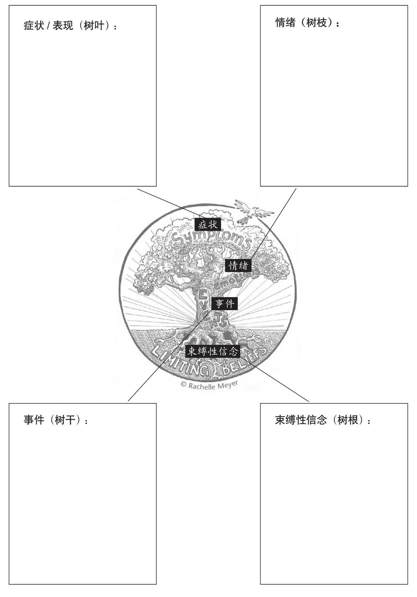

# 第九章
营造健康的情感关系

**CREATING LOVE AND HEALTHY RELATIONSHIPS**

你选择走到哪里就将情感包袱背到哪里，还是选择医治、释放，将它们送到原来的地方？

父母、孩子、配偶和朋友会继续触碰我们的隐痛，直到我们认清那些不愿意了解的有关自己的那部分。每一次，他们都会为我们指明自由的方向。

“功课”疗法创始人及畅销书作家　拜伦·凯蒂

我们一见钟情。

实际上，这么说并不确切。因为这“一见”发生时，她只有 10 岁。多年以后我才发现，对她来说，当时确实是一见钟情，她当时对我十分痴迷，可那时的我只是一个 18 岁的懵懂少年，根本没有注意到妹妹的这位死党。

15 年后我们重逢时，我确实对她一见有情，可仍然有些不确定。

随后，敲击治疗改变了一切。

几年前，我的一段维系 6 年的感情结束了。对方人很好，我们对感情也都非常投入，可是事情并没有像理想的那样发展。尽管我知道分开终归是正确的选择，但过程仍然非常痛苦。

当时我进行了许多次敲击治疗。这个时候进行敲击治疗的好处就在于它完美地开启了身体的自愈过程。我不相信，今天跟相处了好几年的女朋友分手，经过 1 个小时的敲击治疗，明天就能阳光灿烂，但我真的相信，你能借助这一疗法快速摆脱痛苦，让伤心往事随风飘散。

如果不进行敲击治疗，你很可能会纠结在原来那个人身上，持续几个月甚至好几年。你可能会一直恨那个人，并且把包裹着痛苦和伤心往事的包袱带进下一次的情感经历中。敲击治疗能帮你原谅、忘记往事，然后继续向前。

之后，我又成了单身汉，而且不知道下一步该怎么办。我该怎么往前走？继续约会吗？我上一次的感情到底出了什么问题？我需要改变吗？是我的错吗？

一般情况下，人们会一遍又一遍地问这些问题，却找不到真正的答案，也画不上句号。当然，我也问自己这些问题，可我还有情绪释放疗法帮我渡过难关。比如，当我想到重新开始约会时，下面的这些想法和感觉就冒了出来：

我都 31 岁了，去哪里约会合适呢？

上网行吗？填那么多资料，还得上传照片，多尴尬呀！

哎呀，还是不要瞎折腾了……

所以，我开始进行敲击治疗：

尽管我很发愁约会的事情，但我还是全然地接纳我自己。

尽管我还没做好约会的准备（我得上网吗？可是上网太不好意思了）……但我还是全然地接纳我自己。

尽管我不想到外面去约会，但我还是全然地接纳我自己。

你注意到没有？我运用的敲击治疗还是最基本的形式，你也能做。想想你在想什么，把你正在想的事情转化成问题描述语，然后就可以开始敲击治疗了。

每次进行敲击治疗时，我都感觉很放松，没过多久，我的认知也发生了变化。

“约会挺好玩的！肯定能遇上感兴趣的人。就算遇上悍妇，至少也能在朋友那里爆个笑料！”

那段时间，我进行了很多次敲击治疗，是它帮我愈合伤口、放手过去、展望未来。几个月里，我针对数不清的、各种各样的事情进行了敲击治疗，以便让自己站稳脚跟。我每天都进行敲击治疗，为建立自己的新生活而努力。过后我发现自己已经做好准备，希望再次回到感情生活中去，我已经从敲击治疗中获得了新的能量，我要让我的生活前行，我要为自己找到一个完美的伴侣。就在这时，一个奇怪的念头冒了出来。

**指点迷津**

#### 关于约会，你害怕什么？

看看下面列出的这些束缚性信念，其中哪些能引起你共鸣？你可以大声说出来，边说边体会，然后打一个 0～10 的分数。

费那个劲干吗？反正也没有用；

我不吸引人/我不够瘦/我没有钱/我不够有趣；

太花时间了；

我不知道该怎么约会；

我见人就发慌；

我太挑剔/我年龄太大了/我太古板了/我太忙了；

我有孩子了；

我的工作不允许我分心；

我没有时间出去。

还记得我在本章开头提到的那个女孩吗？那个我已经认识了 15 年的女孩，她名叫布伦娜，一直是妹妹杰茜卡的死党。我们虽然认识，但只是偶尔碰巧见到，平常时不时地也能听到她的消息。我觉得她很招人喜欢，但我们完全谈不上亲密。不过在某些因素的促使下，我找杰茜卡打听了布伦娜在做什么，有没有谈朋友。杰茜卡迟疑了一下，但还是告诉了我她目前单身。我又问她，如果我们约会她怎么看。

8 岁的年龄差距对我来说已经不是问题。我设想，说不定她 10 岁时对我的爱慕还能帮上忙。尽管杰茜卡一开始有点不舒服，毕竟一个是她最好的朋友，一个是她的亲哥哥，但她最后告诉我，无论怎么看我们都很般配。

一时冲动的我给布伦娜写了一封电子邮件，后来也聊过几次，几星期后发生的一连串事情就把我们撮合到了一起。那是情绪释放专家卡罗尔·卢克主办的一次公共活动，我要在上面作一个关于情绪释放疗法的演讲。在那里，我遇到了布伦娜，她当时是志愿者。

开始的几天，我对布伦娜确实有种非比寻常的感觉，但我无法确信她就是我要找的那个人。

“布伦娜很不错，在很多方面都很适合我。”我跟卡罗尔说，“可我觉得她还不是我要找的那个人，我也不知道为什么，她好像没有对我敞开心扉，我想找一个能全情投入的人。”

碰巧的是，我跟卡罗尔说完这番话的第二天，布伦娜就来找我，她问我是不是可以花些时间跟她做一次一对一的敲击治疗，她想治疗之前那段感情经历。我同意了，同时也把心思从“我喜欢这种类型的女孩”转换成了“我会不遗余力地帮她解脱”，然后，我们开始了敲击治疗。

布伦娜告诉我，之前的感情经历令她非常痛苦。她的男友总是躲在厚厚的硬壳里，什么事都瞒着她。他还骗了她，在与自己交往的同时，他还有另一个女朋友。他也从未明确地给他们的感情画一个句号。总的说来，他就是个混蛋！从她的诉说中，我能看出她有多痛苦。

我们开始针对事情本身敲击。通常，这可以剥去伤痛最表层部分，同时也是揭示更深层现实最简单的方式。当我们一边敲击穴位，一边谈论过去发生的事情时，我们往往会认识到更深层的问题。于是我们开始揭开事件下面深藏的伤疤。

布伦娜说她男友对待她的方式让她感到羞辱。“羞辱”二字是她内心最深处的伤痛和最主要的伤口，所以我们开始重点针对这一感受进行敲击治疗：

尽管我对那件事感到非常的羞辱，但我还是全然地接纳我自己。

“羞辱”二字的意义非同一般，我们围绕着这两个字敲击了一轮又一轮，同样的问题描述语也重复了一遍又一遍。当你敲击治疗时，你也要时刻寻找能直达你心底的关键词，就像对父亲充满怨恨的朱迪，她只需一再地针对怨恨进行敲击治疗，大量的负面情绪就能得到释放。我们就针对布伦娜的羞辱敲击，让她流了很多眼泪，最后她终于长长地舒了一口气。

接下来，我们又针对她在那次经历中形成的信念继续治疗，比如“我无法信任男人”。很容易看出这一痛苦经历是如何造就了这样的信念。如果它没有被清除，同样的境况就会一再重现，或者为避免伤痛，她会远离情感生活。

看着布伦娜一步步放松自己、放手过去，我非常欣慰。她说她感觉好多了，而且谢谢我花了那么多时间为她治疗，可这并不是让我最兴奋的事，真正让我吃惊的事发生在晚饭时间。

那天晚上，我们坐下来一起吃晚饭时，我真实地感觉到她确实敞开了心扉，我对她的印象迅速改变。开饭不到 10 分钟，我就暗暗地对自己说：“这个姑娘太棒了，我爱上她了。”

到底是哪一点让我对布伦娜的印象完全不同于以往？这一点为什么那么重要？在治疗之前布伦娜害怕再次受伤，她把过去的负面经历带到了现实中，所以她的行为、选择、语言等都深受影响。

对我来说，我过去也曾害怕涉入感情，害怕再次失败，害怕再次心碎。不过我进行了很多次敲击治疗，所以后来布伦娜走进了我的生活。布伦娜也有类似的感受，她害怕再次受辱，所以不敢完全信任我。然而接受敲击治疗后，我们就幸福地在一起了。

对我来讲，整个过程最有意思的地方在于，当布伦娜放手过去、敞开心扉时，我对她的感觉怎么会发生那么大的变化？她的长相没变，做过的事情没变，个性没变，整个人最核心的部分也没变，她只是把过去的恐惧释放掉，将她的内心敞开了，可对我来说，这点将一切都改变了。

2012 年 9 月 22 日，我和布伦娜结婚了。如果我们的故事不能证明情绪释放疗法的强大，我不知道还有什么能够证明！

### 你有多少“情感包袱”？

“她有很多情感包袱”“我不跟他约会，因为他的情感包袱太多了”。为什么我们不说小孩有情感包袱？因为他们大多都没有！“情感包袱”是我们从生活经验里收集来的负面情绪、标志性事件和束缚性信念，与我们形影不离。

和布伦娜在一起之前，我和她都背负着从过去的情感经历中带来的情感包袱。如果我们没有用情绪释放疗法清除它们，我们很可能不会在一起，或许更糟糕的是，我们可能会以一种不健康的方式在一起，彼此把过去的垃圾都带到现在的感情中来。

为什么我们总是一次又一次吸引同一类人？为什么随着年龄的增长，我们和爱人的关系反而越来越坏？你可能会想，随着时间的流逝和经历的增加，一个人的智慧也会增长。但对很多人来说，经历得越多，越容易疲惫，越容易发怒。这也是因为他们一次又一次从情感经历中带来了大量的情感包袱。

如果我们将情感包袱鲜活地呈现在眼前，它们就会让我们哭，让我们笑，或者让我们又哭又笑！现在，开动大脑想象你过往感情中的每一个负面经历、情绪和信念，如果它们都是你随身背负的包袱，你能走多远？

这个问题其实非常简单。你要么选择医治、释放，将它们送还到原来的地方，要么耗尽余生背负它们。假如你走到哪里就将它们背到哪里，你现在的情感关系会健康吗？你能找到对的那个人吗？

**指尖敲出丰盛**

#### 清除过去的情感包袱

这个练习可以帮你寻找和清除来自过去的情感包袱。请关注不时闪现的特别记忆和念头，它们也需要你的治疗。

手刀点：尽管我有这么多情感包袱，但我还是接纳我自己。

手刀点：尽管我从过去的感情中带来了那么多的情感包袱，但我还是接纳我自己，并且选择想办法将它们放下。

手刀点：尽管我一直背负着这些情感包袱，而且它们正变得越来越沉重，但无论怎样，我还是选择接纳我自己。

眉毛内侧：这些情感包袱……

眼睛外侧：所有那些陈旧的伤痛和恐惧……

眼睛下方：痛苦和忍受……

鼻子下方：所有的眼泪……

下巴：我一直背负着这些情感包袱……

锁骨：把它们背进每一次感情当中……

腋下：用它们来提醒我注意防范危险……

头顶：可是，现在这些包袱是不是有点太重了！

眉毛内侧：所有这些幽灵一样的陈旧记忆……

眼睛外侧：或许我能找到一种办法……

眼睛下方：把这些陈旧记忆放下……

鼻子下方：我打算轻装而行……

下巴：也许我能重新对爱情充满期待？

锁骨：会有怎样的可能性到来？

腋下：我决定把一些陈旧的情感包袱放下，做这个决定，我真高兴……

头顶：我已经准备好轻装而行。

你还可以通过下面的网址了解这一主题的更多信息： www.thetappingsolution.com/tap8 。

### 父母的故事

父母往往是我们与爱人关系的第一个榜样，而且在我们的成长阶段，他们一直跟我们生活在一起，所以他们的言行对我们有很强的塑造作用。

在极端情况下，语言、肢体、情感上的虐待行为会一次次地在代与代之间重复。如果父亲生气时打母亲，孩子见到后就会认为（通常是下意识地）这种行为是合理的。当然，不少孩子发誓永远不会像父母那样使用暴力，但这常常需要个体足够成熟，还要治愈这种代际模式。

即便家庭中不存在虐待，孩子也会习得其他的行为模式，并将它们带入日后的生活。紧张工作一天后，父亲会不会变得默不作声？母亲是不是总在唠叨？孩子看着这一切，他会学到生活就是这样子。

你可能比较熟悉哈里·查宾（Harry Chapin）的那首经典民谣《摇篮里的猫》（*Cat’s in the Cradle*），这首民谣讲述了一个因工作繁忙无法陪伴孩子的父亲退休后希望多陪陪长大了的孩子，以弥补以前的疏忽，但此时的孩子又因工作繁忙而没有时间了，于是父亲悲叹道，自己的儿子也成了他的模样。

我们能借助情绪释放疗法来破除这种代际模式，这样就可以避免将上一代的行为模式带入到新的感情当中。为了做到这一点，最有效的方式之一就是针对童年时期的事件和经历进行敲击治疗。一边回忆、再现父母之间发生的事情，一边针对形成于其中的情感、事件和信念进行敲击治疗，这样做能让你产生深刻的变化。

**指点迷津**

#### 来自父母的情感包袱

你背负着哪些“经验”，下面的描述能否引起你的共鸣？

有爱就有痛；

无论情况有多坏，感情都是不能背叛的；

进入一段感情中，就得放弃原来的自己；

你得放弃喜爱的东西；

脾气大的人说了算；

不要谈论你的需要，也不要奢望它们会实现。

如果你不知道怎样从成长的家庭环境中寻找情感包袱，下面这些问题可能会帮助你！

在你成长的家庭环境中，父母是如何表达爱的？

父母如何处理分歧？

如果父母一方遇到了问题需要帮助，另一方如何提供支持？

谁说了算？你是怎么看出来的？

他们的关系如何？两个人该如何相处？

父母之间是如何表达亲密的？与其他家庭成员之间呢？

现在，把目光从你的家庭环境移开，转而想想（外）祖父母、姑姑、舅舅、叔叔、姨妈的家庭，再问问上面的问题，这样做往往能帮助我们认识到家族里代代相传的模式和信念。

### 曾经的情感创伤

埃米莉离婚 1 年多了，但她仍然沉浸在巨大的悲痛当中。15 年的婚姻生活破碎不堪，要想建立新生活，其中的困难可想而知。

尽管她知道，离婚绝对是最好的选择，但她仍然感到痛苦。尽管离婚后获得了解脱和成长，也经历了很多积极的转变，但她还是感到伤心。

她不想开启新的情感生活，因为实在太痛苦了，所以她把注意力全部放在事业上，好让自己不再想过去经历的一切。她知道她应该勇敢地迈出新生活的第一步，可她真的做不到。

我们坐下来敲击治疗时，她诉说了过去发生的各种事情以及她的感受。我将详细讲述这次治疗中最重要的部分，我将重点关注其中的问题描述语和提示语，如此你就能同时看到治疗的进展和来访者的转变，然后从中找出对你有用的部分加以利用。

你可以一边读以下部分一边回想上次的情感经历，看看是否有遗留的负面情绪没有解决，无论是愤怒、哀愁，还是悲伤。

问题 1：虽然我们已经离婚了，但总是见面、说话，我不知道什么时候才会是我们的最后一面，有时我觉得我们还没有结束。

分手很少是完美的：该说的没说，不该说的又说了，或者说的时机又不对。情绪释放疗法能帮助你清除这些遗憾。

问题 2：回忆是最痛苦的东西，让我苦不堪言。

当和我们共同生活的人分开时，我们会觉得这个世界突然变得极其陌生，有时很小的事情就能勾起过往的回忆。如果我们没有将过去的关系医治好，就会一再地被带回到过往的生活中。这就是埃米莉当时的情况。

问题 3：我很担心他，过去我一直照顾他，他现在一个人，我感到很难过。

我们希望将关爱给予我们所爱的人，尽管这意味着有时我们会受伤，有时又得不到回报。

问题 4：我觉得我浪费了 15 年的时间去帮他寻找快乐，但我却放弃了自己的生活，对此我非常愤怒。

在这种情况下，首先显现的往往是愤怒，之后愤怒会转化为悲伤。然而埃米莉感受到的一直是悲伤，直到接受敲击治疗后，愤怒才浮出水面。在敲击的过程中，我们可以感受到她表现出的关爱和母性并不健康。当我们针对这一点敲击时，她积压的怨恨才开始显现出来。

问题 5：离婚的整个过程都一片混乱，法院宣判的那天更是乱到了极点。一说起那天的事我就难过得受不了。

治疗进行到这一步时，一段异常痛苦的记忆浮现了。我们不再进行平常通用的敲击治疗，而是一边敲击，一边详细讲述当天发生的事情。

问题 6：离婚后的生活很艰难，我渴望被需要的感觉。

这时我们已经针对愤怒、悲伤和特定的事件进行了很多轮敲击治疗，她已经开始认识到那段感情中存在的一些微小问题。只要把这些问题找出来并清除掉，下一次发展新的感情，情况就会大不相同了。

问题 7：我就要 41 岁了，现在怎么办？

治疗刚开始时，埃米莉根本没有考虑过发展新的感情。此时，她已经敞开了心扉，但随之而来的是与之相关的各种束缚性信念（比如年龄）。

问题 8：我已经准备好要把他忘掉了。

针对埃米莉的年龄和将来发展新感情的可能性进行过几轮敲击后，她自发地宣布：“我已经准备好要把他忘掉了。”

以上内容显示了敲击过程中的问题转换。传统的治疗可能每处理一个问题就花去几个月的时间，而情绪释放疗法要快得多。

我们不需要在愤怒的泥潭里挣扎几个月甚至几年，我们只需花几分钟就能将它们清除，然后我们会思考以后的路该怎么走，接着迈出下一步。

我们可以借助情绪释放疗法抛掉过去的情感包袱，抛掉来自我们父母的情感包袱和代际模式，从而在内心最深处建立健康美满的情感关系。

### 让爱之花盛开在当下

很显然这些相同的包袱会出现在当前的情感关系中。如果你正在寻找一位恋人，情况也一样。我发现在情感关系的治疗中，针对以下两方面进行敲击治疗效果最好。

一方面是，想一想我们从父母的情感模式中学到了什么？我们从自己的情感经历中学到了什么？我们的过去对当前的情感关系正在产生怎样的影响？

另一方面所针对的事情没那么严重，也比较琐碎，比如和爱人之间的小别扭、意见分歧等。

如果对方特别开明，你们双方感情也比较好，那么你们可以考虑一起进行敲击治疗。不过我发现双方先各自治疗，把积压的情绪释放一部分，再一起治疗的效果会更好。

这里要提醒你注意的是，如果对方很气愤，你最好别说这样的话：“为什么你不针对自己的情绪进行敲击治疗呢？”这么说往往会火上浇油！人们首先需要对方接纳自己的情绪和感觉，而不是被当作错误的、没有意义的东西拒绝。

所以一开始你应倾听对方的感受。当对方觉得自己被理解时，你就可以考虑一起进行敲击治疗，将负面情绪彻底释放。

同理，你要做的也不是“治疗”对方，情绪释放疗法可不是这样运用的，你要做的是处理自己的问题。

如果对方脾气不好，容易生气，不要奢望你能改变这一点，而要想你对她的愤怒有何反应，你是否表现出接纳和关爱，还是以眼还眼，以牙还牙。先认清自己的反应模式，然后运用情绪释放疗法有针对性地治疗，结果会让你感到惊喜的！

**指尖敲出丰盛**

#### 情感包袱

我们在这里谈的是情感关系，所以不用画敲击树（如果实在想画，也可以画），接下来要做的是查看我们走到哪背到哪的情感包袱。

1．来自情感经历的情感包袱。把迄今为止对你比较重要的关系都列出来，这段关系不一定要维持很长时间，也不一定要发展到恋爱阶段，只要对之后有持久影响就行，包括暧昧、一夜情和办公室恋情等（尽管这种持久的影响可能仅仅是尴尬）。

2．找出原因。你觉得某一段关系结束的原因是什么？在这里重要的是你对这件事的描述方式，而不是你最好的朋友或者兄弟姐妹作出的分析。

3．结论。尽可能地回忆，你得出怎样的结论，例如：

我没有吸引力/我不聪明/我不性感/我不苗条/我没有钱；

我有孩子，对方无法接受；

我很穷/我依赖感太强/我嫉妒心太重；

我特别没有安全感；

是我不好。

4．评分。针对某一结论，根据你主观感受到的真实程度打分。

你是什么时候开始有这种感觉的？

那时发生了什么事情？你看见了什么、听见了什么才得出这样的结论？

5．放电影。针对与上述某一结论有关的事件，运用放电影法进行敲击治疗，把卡住的情绪能量全部释放掉。完成后再次将结论大声说一遍并评分，你很可能发现，这次的评分降低了很多。

6．继续做。当你想起别的事情时，用同样的方法治疗，直到把卡住的情绪能量全部释放掉。

返回第 3 步，再次检查你所认为的关系结束的原因，你很可能发现这时你已经能够从新的角度看待那段关系了，你所看到的和你所感受到的都不一样了。

**专家简介**

#### 乔·梅克拉博士

谈及情绪释放疗法的推广和普及，乔·梅克拉（Joe Mercola）博士是除这一疗法的创始人加里·克雷格之外贡献最大的人。梅克拉博士在芝加哥创建了自己的自然健康中心，同时通过他的网站 Mercola.com 向数以百万的用户提供了医疗信息和资源。这一网站创建于 1997 年，如今已经是关于自然健康疗法最知名的几家网站之一。梅克拉博士过去是一位骨科医生，此外，他还研究替代医学，主要专注于预防保健。

梅克拉博士强烈推荐情绪释放疗法。他第一次接触这一疗法是因为失恋，当时一位女性朋友将情绪释放疗法介绍给他，然后一起针对“不值得”这句话进行了敲击治疗。很快他就找到了问题的解决办法。短短几星期后，他又处在热恋当中了！这一次的体验促使他更深入了解情绪释放疗法，他也开始在自己的网站上介绍这一疗法。

我清楚地记得，那一次我坐在听众席中听梅克拉博士的健康讲座。他花了一个多小时详细讲述影响健康的重要因素，比如保证足够的维生素 D 、吃新鲜食物、运动、服用某些膳食补充剂等。讲完后他总结，尽管这些因素对健康都非常重要，但还有一个因素十分关键，而且应当首先强调，因为它对健康影响最显著，那就是童年时期的心理创伤！那么他如何治疗这些创伤呢？不用说，当然是情绪释放疗法。

# 第十章
释放匮乏，创造丰盛

**MAKING MONEY AND ACHIEVING YOUR DREAMS**

没有拍过片子，没有制作团队，倒卖房子欠下 100 万美元债务……尽管如此艰难，但他还是选择想办法让全世界知晓情绪释放疗法，最终，这位穷困潦倒的小企业主成为了引领百万人踏上幸福征程的疗愈大师。

远离那些小看你的人吧。小人经常如此，而真正的伟人会让你觉得你也可以变得伟大。

美国著名作家、幽默大师　马克·吐温

无论怎么想，我想做的事情都是不可能实现的。

好在，当时的我并不知道这一点……

那时，我已经学习情绪释放疗法好几年了。不管是客户、家人、朋友还是我身边的其他人，只要愿意一试，我都会带他们进行敲击治疗。无论是在自己身上还是在周围人身上，其运用的结果都令我大为惊讶。更让我震惊的是加里·克雷格写的《打通你的气场》（*EFT Insights*）中的内容，这本书记录了情绪释放疗法在各种病症上取得的神奇疗效。正是缘于此，我才对自己说：“我要制作一部介绍情绪释放疗法的纪录片！”

如果这句话出自纪录片导演或者全职的情绪释放专家，似乎还比较正常，可它却出自一个正在买卖房子的人。这个人从没拍过片子，也没有钱（我当时住在一个不足 50 平方米的公寓里），更没有制作团队。

我迫切希望全世界都知晓这一疗法，我对此充满热情，谁也拦不住我，不过我不知道要让梦想成为现实，中间必须经历多少步骤。无知，有时候真的是一种福分！

想法诞生后仅仅两周，我就刷爆了我的信用卡，还翻箱倒柜地搜集零钱买价值 4 万美金的摄像机和音频设备，以及别人告诉我拍纪录片会用到的东西，我还把妹妹杰茜卡和最好的朋友尼克·波利齐找来做帮手。

我：嘿，杰茜卡，你知道情绪释放疗法是怎么回事吗？拍个介绍它的片子怎么样？我不知道怎么弄，不过一定很刺激。

杰茜卡：哦，我对拍片子一窍不通，不过我喜欢情绪释放疗法，那就拍吧！

我：嘿，尼克，你去平面设计学院了，就算是艺术家了。还记得情绪释放疗法吗？以前用过好几次的那个？想不想拍一个介绍它的片子？你负责摄影和编辑怎么样？

尼克·波利齐：嗯……我从来没拍过纪录片，不过我肯定能做好，拍吧！

在这之后，我们还聊了很多，不过刚开始就是这样。我们有想法之后就去实现。当我在电台采访和现场演讲中谈起这件事时，我很高兴能向大家宣布，最终的成品《轻疗愈》是一部动人的、诚实的、制作精良的纪录片，已经销售了几万套，改变了世界各地人们的生活。

如果你听说有 3 个年轻人想拍一部纪录片，而他们既没有钱，也没有拍纪录片的经验，你可能会想最终成品一定比较粗糙，但在幸运之神的帮助和自身努力下（更不用说情绪释放疗法本身的神奇了），我们最终制作出了令我们引以为豪的作品。

我们是如何做到的？更重要的是，你如何运用同样的原理，在自己想做的事情上做出成绩、改变世界，同时在物质和精神方面获得回报？答案当然是运用情绪释放疗法！

### 从小企业主到疗愈大师

没有情绪释放疗法，就没有这部纪录片。拍摄这部纪录片之前的几年时间，我一直在进行敲击治疗。你可以说，有了情绪释放疗法这部纪录片才成为可能。

接触情绪释放疗法后，我很快就发现，我目前对于财富和成功的看法会对我以后的成长很不利。大学毕业后，我在一家公司只干了 3 个月就辞职了。之后的 8 年中，我一直是个企业主，我喜欢企业主的自由，但企业财务状况不稳定。我总是激情四射地为一件事情忙一阵儿，然后就兴趣全无。我无法长期关注于一件事情，也无法持续拥有激情，结果可想而知。

就在我开始拍摄纪录片时，形势急转直下。哥哥、父亲和我做着买卖房屋的交易，我们买来房子，将它修葺一新，然后再卖个好价钱。这桩生意让我有一种满足感，因为我喜欢看着破旧的老房子焕然一新，然后迎接幸福的新主人，但它无法满足我深层的愿望。就在我开始拍摄纪录片时，房地产市场的行情开始直线下跌。

这时我们手上积压着 30 多处房产，它们不仅持续贬值，而且根本卖不出去。无奈之下，我们将这些房产租的租，卖的卖，最后却发现我们欠了 100 万美元！而且这笔债务不是公司倒闭就可以逃掉的，这是个人借贷，我们 3 人都要还。

没有了资源和本钱，大多数人都会在这个节骨眼上打退堂鼓。确实，当时决定继续拍摄纪录片是一个很冒险的决定。欠着 100 万美元，还在疯狂地追逐梦想！但我对自己说：“我要弄明白为什么会这样，我要想办法扭转局面，同时我还要专心拍摄纪录片。”我也深刻反省过，看清了造成当时那种境况的原因。

我在金钱、事业和财务上的情绪和信念对我很不利。如果你不喜欢自己当前的财务状况和职业，我想原因也与我一样。我本可以埋怨经济形势，埋怨那些盲目冒进、搞乱房地产市场、造成次贷危机，然后又让我们这些升斗小民承担后果的公司和企业，但我个人要承担起责任。我问自己：“我到底怎样看待财富？为什么我会走到今天这个地步？”

我们来看看当时我在财务方面的敲击树，我会写得很详细，这样你就能想象出自己的敲击树是什么样子。

记住，这不仅仅是一个小小的练习或一幅漂亮的图画，它实际操纵着你的财务状况。如果你想得到改善，你就得改变你的情绪反应模式，治疗你在财富方面的心理创伤，同时调整潜在的起支持作用的信念系统，否则你做任何新尝试都逃不开过去的负面经历、情感和信念的控制。

#### 我的财务敲击树

**树叶：症状和表现**

财务状况不是特别好就是特别坏；

钱总是不够；

对工作缺乏热情；

要付的账单太多；

住着很小的房子；

没有空余时间。

**树枝：情绪**

压力大；焦虑；恐惧；

提不起精神；烦闷。

**树干：事件**

五年级的那件事；

上一次财务状况好的时候；袋鼠船长的故事；

财务状况时好时坏的循环。

**树根：束缚性信念**

我不想引人注目；

富人不好；

如果我富有了，工作就会太忙；

做自己喜欢的事情挣不到钱；

我不想被别人批评；

挣钱本身让我打不起精神。

在这些有意识或无意识“程序”的操纵下，难怪我会落到这样的地步。我在财务和职业方面的信念一点都不给力，是它们引发了那些事件，那些事件进一步影响我的情绪，我的情绪又进一步造成现在的状况。很多情况下，我们只关注树叶，也就是症状和表现，尽管它们并不是问题的根源。这是我在接受敲击治疗前的敲击树。看着这棵树，你能想象我会不管不顾地取出 4 万美元，接着又鼓动妹妹和最好的朋友来加入这个项目吗？而且最重要的是，你能想象它居然能成功吗？

当然不会！在那样的状态下，这种事根本不会发生。我只能掰着大拇指，想象各种失败的原因，然后消沉、焦虑、心怀不满。如果你也在事业或财务方面遇到了困难，你一定要看看你的敲击树，弄清楚现状下面隐藏着什么。能够改变现状的不是另一个宏大的想法、快速致富的计划或什么重大机遇，这些东西一文不值，真正重要的是健康的财务敲击树。有了健康的财务敲击树，一个人才能承担起这些东西，并且让它们成为现实。

在本章结尾，你将有机会填充自己的财务敲击树，以便真正看清你的现状，不过现在，我还是继续讲述我们拍摄纪录片的故事，希望你能从中吸收一些有用的东西，获得类似的成功。

在拍摄纪录片之前的几年里，我进行了无数次敲击治疗。正是这些治疗让我开始接纳新的机遇和改变，是它让我抛弃陈旧过时的想法，树立起新鲜有力的信念，让我有信心向着积极的方向前进。

如果我仍然害怕引人注目，这部片子根本就不会问世。

如果我仍然相信富人不好，我就不会从劳动中获得可观的经济收益。

如果我仍然担心成功意味着更加繁重的工作，我就会想办法阻碍自己的成功。

要想改变我的境况，这些信念必须改变。想在不改变这些信念的前提下得到改善，基本上是痴人说梦，不过是不是感觉很熟悉？我们当中的大多数人正在这样做！在拍摄过程中，我还得针对财务压力、房地产债务压力和拍摄纪录片的压力进行敲击治疗。在不断治疗下，事情逐渐有了改善。最终，我制作出了一部成功的纪录片，同时完全摆脱了债务的纠缠！

当然，虽然我已经围绕财务状况进行了这么多的敲击治疗，但我仍然不能“点到为止”。生活在不断地给予我们更新的、更大的挑战。战胜这些挑战，我们才能获得成长、找到快乐、体验满足。情绪释放疗法的好处在于，它能帮你接受更有趣味的挑战，这些挑战比大多数人面对的要有意思得多。今天我的挑战已经不是支付电费，而是在 10 000 名观众面前自信地演讲，针对这样的挑战进行情绪释放治疗确实是一种愉快的经历！

对我来说，面向更多的观众演讲是我下一步的目标，也是我此时运用情绪释放疗法所要征服的挑战，“下一步”的思维方式将极大地帮助你实现自己的梦想。

### 只需关注“下一步”

有一次我做了一个小型的演讲，演讲的题目是《激情创造财富》。你一定能猜得出，这次活动的主题是关于如何将个人的激情投入到能够获利的产业中去。我分享了自己拍摄纪录片的过程，同时强调我是如何运用情绪释放疗法迎接每一次新的挑战、沮丧和挫折。从前的我，面对这些挫折，会感到浑身无力、无法向前。此外我还重点提到，我只为“下一步”担心。“下一步”是指眼前的事情，如果不做，事情就无法继续。当我有了想拍摄一部纪录片的想法时，我的第一个问题是：“我能找谁来帮忙？”这个问题回答完后，我接着问自己：“拍片子需要什么设备？”每一次，我只采取必要的行动来解决我的“下一步”问题，同时整个项目也在不断向前推进。

我猜想在那次演讲中，我肯定没把这一点的重要性解释清楚，因为现场观众提出的第一个问题就完全忽视了“下一步”的原则！

一位女士走到话筒前说：“我看你制作了一张光盘，我也想制作一张。你能告诉我光盘怎么制作吗？我以前没制作过，不知道怎么做。”

我回答：“嗯，我很乐意帮你解答。这么看，你光盘里的内容已经全部准备好了，现在就是要找人把它做出来是吧？”

“不是，我正在准备光盘的文字部分……还没有完成，但我很担心最后怎么把它们制作成光盘。”

你能猜到我是怎么回答的吗？这不是“下一步”！这里的下一步是指准备光盘的文字部分，再下一步是录制，接着是片子的剪辑，至于如何把这些内容做成实体的光盘则完全不是现在要考虑的事情！

她觉得困难是因为同时关注的事情太多，而没有把注意力放在目前最重要的事情上。类似的情况，我总是一次又一次地见到。最终目标、大的愿景虽然很重要，但将它们弄清楚后，接下来要做的就只是眼前的事情了。

运用这一原则进行情绪释放治疗的神奇之处在于，这样做对识别“下一步”非常有效。这里的下一步就是指你要跨越的下一个障碍，它现在就横在你眼前！

尽管涉及这个项目的所有事情快要让我崩溃了……

尽管我不知道接下来该做些什么……

尽管对于这件事该怎么做，我还没有想清楚……

尽管我不在状态，不知道自己在做什么……

那位向我提问题的女士可以用这样的问题描述语来进行敲击治疗：尽管我不知道怎么制作光盘，我快愁死了……这样，她很快就会认识到，一切都井井有条，她只要把眼下要做的事情做好就行了。

敲击治疗能消除我们在事业和财务上的纷扰，让我们从精神上、心理上甚至体力上更好地应对生活的挑战。今天现代生活的节奏越来越快，我们的目标、愿景和梦想也变得越来越复杂。崩溃感过于强烈，有可能让我们什么事都做不了。情绪释放疗法是消除这些纷扰的重要且简单的工具，它能为我们营造一个安静的空间，在那里我们才能多方权衡，做出最明智的决策，然后迈出下一步。

### 扼杀梦想的拖延症

尽管我不想再写下去了……

尽管我已经写累了，想看看电视……

尽管我想把这件事推到明天，但我还是全然地接纳我自己。

砰、砰、砰……我不想再写了……砰、砰、砰……我想看电视……

这就是 5 分钟前的我。是的，这就是真实的敲击治疗！

我写累了，坐不住了。所以我对自己说，敲击治疗 5 分钟，看看感觉怎么样。我做了，然后就是现在这样：没有拖延！

有时候情绪释放疗法就是这么简单，一天抽出几分钟就可以了。每当遇到困难，感到沮丧或想偷懒时，你都可以试试情绪释放疗法。当然，运用情绪释放疗法解决生活中的巨大难题非常有效，不过解决起小问题来，它也同样“身手不凡”，因为大问题都是由小问题积攒而成的。

拖延是一件很平常的小事情，但它却是人生的大问题。它扼杀梦想，浪费价值千万的想法，让人很多年止步不前。

如果你做什么事都完不成，总把事情拖到以后，然后又对此懊悔不迭，你的这种表现很可能来自某些深层的信念和创伤。一般说来，治疗日常的拖延并不困难，只要进行一些敲击治疗，让能量重新流动起来，然后把事情向前推进就行了。

用情绪释放疗法治疗拖延症的好处在于，它不一定让你埋首于事件当中，而是帮你消除纷扰，将你带到一个安静的地方，然后你就能决定那一刻你该做什么。有时我运用情绪释放疗法治疗在某个项目的拖延，结果是我会从繁重的工作中抽身离开一会儿。因为我认识到，确实需要呼吸点新鲜空气，于是我会出去散散步，让大脑休息休息，稍后再高高兴兴地回到工作中去。

有时我运用情绪释放疗法治疗在某个项目上的拖延，结果会让我认识到，我根本就不想做这个项目！此时我会下定决心放弃它或换一种方式实施。如此运用情绪释放疗法，能够为我们带去明晰、专注和觉知，似乎唤醒了更多的脑细胞参与工作。此时我们就能做出更加明智的决策。当我们追寻自己的直觉时，我们总能获得更好的结果。

**指尖敲出丰盛**

#### 从拖延症模式中解脱

当你开始在某件事上拖延时，你可以试试下面的敲击治疗。

手刀点：尽管我不想，但我还是全然地接纳我自己。

手刀点：尽管我真的觉得继续不下去了，我就是不想，但我现在还是选择放松。

手刀点：尽管我不想，就想做点别的，但我还是全然地接纳我自己。

眉毛内侧：我就是不想继续做这件事了……

眼睛外侧：我想做点别的……

眼睛下方：我做不下去了……

鼻子下方：我又像往常那样开始拖延了……

下巴：我在想，为什么我不愿意做这件事……

锁骨：到底出了什么问题……

腋下：我就是不想做这件事了……

头顶：我宁愿做点别的。

眉毛内侧：我觉得做不下去了……

眼睛外侧：真的做不下去了……

眼睛下方：我想拖一拖……

鼻子下方：我做什么都不想做这个……

下巴：我为什么不想做这件事……

锁骨：我不做行吗……

腋下：我为什么要做这件事……

头顶：为什么要做？

当你感觉好一些时，再来几轮正面描述的敲击治疗。

眉毛内侧：我要搞清楚我想做什么……

眼睛外侧：我选择放松身体……

眼睛下方：我选择放松大脑……

鼻子下方：把这件事情想清楚……

下巴：继续进行是安全的……

锁骨：我已经准备好继续向前了……

腋下：并且把阻碍我的东西清除掉……

头顶：现在就把阻碍我的东西清除掉，让自己重新明晰起来。

深吸一口气……然后放松。

你还可以通过下面的网址了解这一主题的更多信息： www.thetappingsolution.com/tap9 。

继续敲下去，一轮接着一轮，尽量让自己的感受更具体，同时察觉随时涌现的记忆和感受，直到你觉得是时候迈出精彩的下一步为止。

### 奇迹总是一个接一个出现

情绪释放疗法世界峰会是每年一度的在线盛事，免费向公众开放，过去几年，参加的人数已经超过了 50 万人。在峰会期间，我经常被转变巨大的神奇案例所震惊。

去年有一个案例更是引人注目，因为它是实时发生的。阿莉莎是一名有 2 个孩子的年轻妈妈，已经失业了好几个月，为前途忧虑不已。她参加过很多次面试，她知道就业形势很不好，竞争异常激烈，自己很难找到工作。对于申请的职位，她觉得不是自己达不到要求，就是能力超过了工作需要，似乎没有什么职位适合她。带着这样的想法，每次面试她都会紧张，平时也总是灰心丧气。结果几个月过去了，她还是没有找到工作。

一个星期六的晚上，当时她在听峰会的一场报告。报告的内容大部分都在我们这一章里谈到过，比如我们的情绪、过去的经历和束缚性信念如何让我们停滞不前，并一再重复同样的模式和结果。阿莉莎认识到自己有这样的信念：

就业形势严峻；

竞争激烈；

找到工作不太可能；

不是自己达不到要求，就是自己的能力超过了工作的需要。

她明白了这些信念是如何引发她的焦虑、紧张和其他负面情绪。

当阿莉莎认识到这些时，她开始针对它们进行敲击治疗。紧接着，她发现自己的想法完全变了，有如神助一般，她感到充满希望，心里非常兴奋……她知道，有一份理想的工作就在那里等候着她。

第二天上午，她去参加了一次早先约好的面试。稍晚些时，她给我发了一封电子邮件，告诉我发生在她身上的事情。

她讲到前一晚的敲击治疗，讲到她感受到的巨大转变，讲到面试进行得多么顺利。实际上，面试官告诉她，她先前申请的那个职位已经招满了，但还有一个薪水更高的职位空缺，而她非常适合那个职位，他们会在第二天决定是否录用她。果然，第二天阿莉莎说她已经得到了那份工作！

我们仔细分析就会发现，很显然阿莉莎得到工作，是因为她进行了敲击治疗。之前，她会带着紧张和焦虑进入面试，面试官很快就能觉察出来。她脑子里充满了负面的想法，这不仅会影响她的情绪和对问题的回答，还会影响她的形象，而且更微妙的是，她的负面想法还会影响面试官。

敲击治疗后，阿莉莎变得平静、自信，也放松了很多。她相信自己的能力，也相信能找到很好的工作。对于这样一位人才，谁不愿意雇佣呢？

### 清理、清理，扭转你的金钱模式

哦，我的天！很对不起，这章就是写怎么赚钱、怎么从债务中脱身、怎么成为百万富翁？我们已经花了不少时间讨论敲击树、束缚性信念、“下一步”原则、拖延症等。你能读到这，说明你想赚更多钱！

有些话我已经说过，现在还要再说，直到它深入你的骨髓，成为你的一部分为止。你必须首先治疗你的束缚性信念、过往事件和你经常感受到的情绪，其余的一切自然会明朗起来。这一过程，我已经多次见证过，我的亲身体验也可以证明这一点。

现在，我每天跟所爱的人一起做着自己喜欢的事情，同时改变很多人的生活。这并不是因为我找到了快速致富的方法，也不是因为我继承了一大笔遗产或找到了一个好老板，而是因为我把阻碍我前行的束缚性信念清除了。这样一来，其余的一切自然都会明朗起来。

你也可以做到！只是，你得先做一些努力。你得非常细心地体会并找到你秉持的信念，识别积压了情绪能量的事件，改变让你不断重复的情绪模式。

现在，我们就来一起做，看看你的财务敲击树是什么样子。

**指尖敲出丰盛 1**

#### 画出你的财务敲击树

把相关事项填进你的敲击树，这样你就能对自己的财务状况有直观的感受。或许看到纸上的这一切会让你感到痛苦，因为你真切地看到了你的想法、感受和作为，但这是一件好事！当你直观地看到自己在财务方面的信念时，你就能清楚地认识到当前的现实，以及在改变这一现实的过程中所要经历的每一个具体的步骤。

**树叶：症状和表现**

树叶代表你当前的财务状况。诚实一些，把你的情况真实地反映出来。如果你有外债，那么这是一种表现，你就要写进去；如果你的薪水不够支付账单，写进去；如果你没有工作或你挣的钱不少，但还是过得很拮据，也写进去。把能代表你当前财务状况的所有事项全部写进去。

**树枝：情绪**

看了你的财务状况，感觉怎么样？生气吗？难过吗？失落吗？尴尬吗？羞耻吗？这一切让你感到气愤吗？财富给你的感受是什么？名望呢？

**树干：事件**

在金钱、财务和职业生涯方面，有什么不好的事情发生吗？还记得你的第一份工作吗？在你的成长过程中，父母的财务状况如何？还记得孩童时期与金钱有关的某一次或某几次负面经历吗？家里经常谈论与财富有关的话题吗？

**树根：束缚性信念**

这些才是真正重要的东西。你的财富观是什么？你怎么看待“追逐梦想”这四个字？你对职业发展有什么基本的看法？反复地大声说：“财富是……”

以下是关于财富的一些最常见的束缚性信念，你占几条？

挣钱是一件困难的事；

世上没有足够的钱分给每个人，如果我挣钱多，就是切掉了别人的饼；

要想挣到钱，我必须努力工作；

只有积累了大量的知识和技能，我才能挣到很多钱；

我不配比现在挣得更多；

钱来得不容易；

我不可能同时拥有时间和金钱；

我必须节衣缩食；

富人对上帝不虔诚；

金钱是罪恶的根源；

富人是……（把你最常说的负面评价填进去）

金钱买不来幸福；

钱不是风刮来的；

我来自一个并不富裕的工人家庭；

钱总是从我的指缝里溜走；

坑蒙拐骗才能弄到钱；

我运气不好，挣不了大钱；

事情一到我这里就变得困难了；

我付不起钱。

**你的财务敲击树**

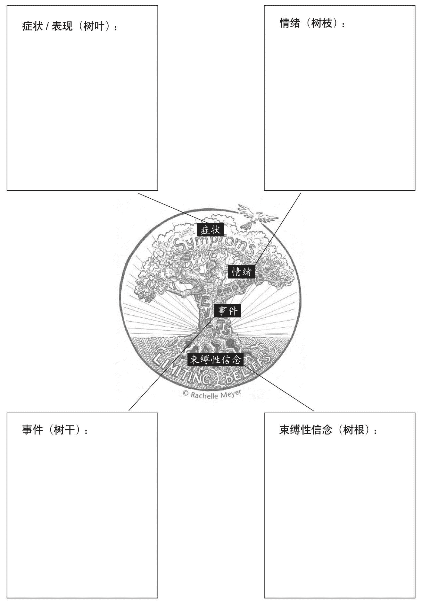

**指尖敲出丰盛 2**

#### 一步一步，实现梦想、目标和抱负

很多人都对我说，他们最关心的问题就是金钱，所以我在这里多加了一点练习。如果你真的想改善自己的财务状况，实现自己所有的梦想、目标和抱负，就把这些练习都做完！

通常，我们的梦想、目标和抱负一般都超不出下面这几条：

挣 100 万美元；

出一本书；

环游世界；

做慈善事业；

……

把你的目标写出来，这样做确实是一个很棒的开始。如果你没有足够深入地思考或没有找出妨碍你实现它们的束缚性因素，它们很可能不会像你想象的那么快速完美地实现。你可能已经知道很多关于如何有效设定目标的建议。比如，将目标视觉化、情感化、设定时限、经常回顾、详细描述目标实现后你所体验到的感觉等。

这些建议都很好，只是如果你的各种想法没有在你的目标上取得一致，你一定会浪费许多时间。我这里所说的一致不仅是一种表浅的、显意识上的一致，而且是一种包括潜意识和无意识在内的多层次的一致。你需要找出心里的“如果……该怎么办”和“这样很好，可是……”的声音，你需要检视你在情绪和心理上的限制性因素。当你这样做时，你才能跳出自我的循环。在这之后，你才能避免那些常见的模式和自我阻碍的行为。

对你治疗的相关目标和梦想来说，它们的内容、层次越丰富，最终的效果就越好。你可以集中精力每天敲击一项，连续敲击 30 天，看看会发生什么。

**第 1 步：把你的梦想、目标和抱负写下来**

你可以锁定一个具体的目标（比如，我想一年挣 100 万美元）、一个宽泛些的目标（比如，我想跟母亲和平相处）或一个愿景（比如，我要制造巨大的社会变迁）。

不要担心措辞问题，只要是脑袋里想到的词句，就是正确的，而且一定要写下来。

**第 2 步：把你对目标的第一感觉写下来**

把目标读出来时，你感觉如何？你心里的各种想法百分百统一了吗？你的身体有什么反应？你可能会写：“我把目标读出来时，我觉得不舒服/很兴奋/很焦虑……”尽量描述得具体些，并且给每一种感觉强度评分，最低 0 分，最高 10 分。如果你把目标读出来时感到焦虑，你就这样写：“我感到焦虑，强度是 8 。”

你所记录的情绪或感觉可以不止一种。如果你感觉紧张，写下来；如果你感觉有点恶心，写下来。记得同时记录评一个从 0～10 的分数。

**第 3 步：别人会如何评论你的目标？**

家人、朋友、同事、邻居，谁第一个在你的脑中闪现，你就想象当你把目标告诉他时，他会说什么。

如果那个人是你的母亲，你就想象母亲的回答：“你这个想法太不切实际了！”把这句话记下来，并在后面加上你对这句话的感受，写得具体些，再给出一个评分。

**第 4 步：你怎么看待你的目标？**

你可能会说：“我觉得这有点不太可能……我从来没做过这个……你当自己是谁呀？”注意由此引发的感觉，尽量详细地描述你的感觉，再给出一个评分。

**第 5 步：将负面的感觉敲出去，把正面的感觉敲进来！**

认真检查每一项，只要有问题出现，就针对它进行敲击治疗，直到感觉的强度降到 0 为止。在这期间，请注意任何浮现出来的新问题。你可能一次完不成，所以慢慢来吧。

当你把所有问题（一定要注意挖掘更深层的问题）都治疗后，你就为实现你的目标扫清了障碍。

**指尖敲出丰盛 3**

#### 将负面的感觉敲出去，把正面的感觉敲进来

我们通过一个示例来看上一个练习当中的 5 步是如何进行的。以你正准备进行敲击治疗，那么就开始吧。

**第 1 步：把目标写下来**

例如：“我一年要挣 25 万美元。”

**第 2 步：感觉如何？**

例如：“看着这个目标，我觉得有点紧张，心向下沉，感觉压力很大。当我闭上眼睛时，感觉它的强度是 7 。我问自己这是什么感觉，是焦虑，现在我要针对这种焦虑进行敲击治疗。”

手刀点：尽管我的心向下沉，但我还是全然地接纳我自己。

手刀点：尽管面对一年挣 25 万美元的压力，我感觉心向下沉，但我现在还是选择放松。

手刀点：尽管我看着这个目标时感觉身体不舒服，但我还是全然地接纳我自己。

眉毛内侧：这种心向下沉的感觉……

眼睛外侧：我觉得有点紧张……

眼睛下方：这种心向下沉的感觉……

鼻子下方：就在我心里……

下巴：这件事让我觉得压力好大……

锁骨：我觉得焦虑……

腋下：特别焦虑……

头顶：心情特别沉重。

继续针对随时浮现的问题进行敲击治疗，当你觉得好些时，再进行几轮正面描述的敲击治疗。

眉毛内侧：我现在选择放松……

眼睛外侧：同时释放这种沉重的感觉……

眼睛下方：把它们全部释放……

鼻子下方：从我的心里全部释放……

下巴：所有这些焦虑……

锁骨：现在全部释放掉……

腋下：一年挣 25 万美元的恐惧……

头顶：现在全部释放掉。

**第 3 步：别人会如何评论你的目标？**

例如：“如果我告诉我的朋友，我想一年挣 25 万美元，他们当中有一半会笑话我，另一半会说我太贪心。当我想象把这件事告诉朋友时，我觉得自己很渺小，一点也不自信。这种感觉的强度是 8 。”

手刀点：尽管我没有信心把我的目标告诉朋友，但我还是全然地接纳我自己。

手刀点：尽管我不希望我的朋友知道我的目标，但我还是全然地接纳我自己。

手刀点：尽管我知道，当我把目标告诉他们时，他们会对我指手画脚，但我还是全然地接纳我自己。

眉毛内侧：我不想告诉朋友……

眼睛外侧：当我想象把目标告诉他们时，我会觉得自己很渺小……

眼睛下方：这种很渺小的感觉……

鼻子下方：我担心他们会对我指手画脚……

下巴：我担心他们会不喜欢我……

锁骨：我不知道我的朋友会怎么想……

腋下：如果我把目标告诉他们……

头顶：或者我真的实现了我的目标呢？

现在，再进行几轮正面描述的敲击治疗。

眉毛内侧：我要把这种渺小的感觉释放掉……

眼睛外侧：我感觉自己很强大！

眼睛下方：我对我的目标充满信心……

鼻子下方：我要释放任何与目标有关的焦虑……

下巴：我相信我能拿到我想要的东西……

锁骨：我相信会有贵人相助……

腋下：现在我感觉既自信又强大……

头顶：既自信又强大！

继续进行第 4 步的敲击治疗，治疗的对象就是那些关于目标的束缚性信念。把负面的信念清除掉，需要时重复几轮！

这一过程的要点在于，你要让你的问题和感受具体化，接着再加以系统性的敲击治疗，也就是把遇到的不同方面的问题一个个地全部清除掉。

如果你想把这一过程彻底地进行一遍，那么一次很可能完不成，所以你要额外安排一些时间出来，可以每天只关注一个步骤。尽管你得花几天甚至几个星期的时间，但只有做得彻底，效果才能更好，如果匆忙行事，你可能遗漏掉某些正在影响你的深层信念。

# 第十一章
释放恐惧，回归本心

**ELIMINATING PHOBIAS AND FEARS**

你有哪些恐惧？它们对你的生活造成了哪些影响？因为这些恐惧的存在，你对你自己和周遭的世界形成了怎样的看法和信念？

大多数研究证实，人最大的恐惧是当众演讲，其次才是死亡。死亡仅仅排第二？这意味着，如果你去参加葬礼，即使你躺在棺材里也比上台讲话好受些。

美国喜剧艺人　杰里·塞恩菲尔德

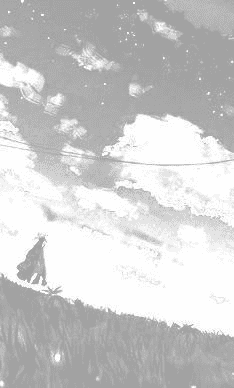

林赛极其害怕小丑。我知道，这听起来很可笑，我甚至能听见你小声嘀咕：“小丑？真的吗？居然怕小丑？你不是在说笑吧？”但事实就是如此，小丑让林赛恐惧至极。尽管我们觉得好笑，尽管林赛自己也知道这种反应一点都不理性，但她还是害怕。

林赛是一个有趣、活泼、充满欢笑的 24 岁女孩。5 岁时，她看见父母在看电影《小丑回魂》（*It*），里面刻画了一个无比凶残的小丑。尽管她对这一场景完全没有记忆，但她的父母认为她害怕小丑应该就是从这件事开始的，很显然，一定是有什么东西在她心里留下了阴影。

我知道她害怕小丑，但不知道她有多害怕。后来另一位同事告诉我，有一天林赛看到一幅小丑的图片，吓得哭了起来。我当时才意识到，这是一种对她生活造成巨大影响的恐怖症。

所有恐惧都存在条件反射，恐惧不符合逻辑，而且没有任何实际意义，一旦这一模式被植入系统，意识就无法再压制它。尽管小丑恐怖症看上去比较有趣，但其模式和其他恐怖症是一样的，不论恐惧的对象是公众演讲、封闭空间、高度、针，还是真菌、疾病、牙医、蛇。恐惧的发生通常与负面的经历有关，模式会一再重复，每次都会重现当时的情景。

你可能会说，人对蛇的恐惧是真实的，因为蛇可能带来危险，而对小丑的恐惧则不真实，因为小丑并不危险。是的，人类有一种天生的、遗传的倾向，就是聪明地提防有潜在危害的蛇。这与我们所说的恐惧有很大不同，如果有一条毒蛇此刻正出现在我们的办公室里，我们的恐惧就是自然而且理性的反应。

恐怖症的不同之处在于，它是非理性的。在面对 5 000 名听众演讲时，多数人都有些紧张，就算是身经百战的老手，也还是会有一点点的激动或兴奋。而恐怖症就不同，它会让我们一开始就躲进假想的恐惧情境中！

你可能还记得罗格·卡拉汉在治疗玛丽的恐水症时所获得的治疗突破。当时，敲击治疗一结束，玛丽的恐惧感立刻就消失了。情绪释放疗法不仅对玛丽有效，它对所有种类的恐惧和恐怖症都有非常好的治疗效果。

### 没有了恐惧的自己会是谁？

仅仅经过大约一小时的敲击治疗后，我们就治好了林赛的恐怖症。我将把治疗的过程记录下来，因为不管你恐惧的对象是什么，治疗的过程是相似的。仅仅谈论小丑就会让林赛紧张害怕，我们先使用了最简单、也最通用的问题描述语：尽管我害怕小丑，但此刻我还是选择放松。然后，我们开始按顺序敲击穴位，同时不断重复“我怕小丑……我紧张……我有压力……”就这样一直敲，直到她平静下来、放松下来。

之后，我再问她这种恐惧是什么时候开始的。她告诉我，她父母认为她是小时候看电影《小丑回魂》被吓到了，不过她不记得这件事，陈述当中也不紧张。但为了慎重，我们还是对此进行了敲击治疗。这时的问题描述语是：尽管我小时候看了那个恐怖的电影，但我还是全然地接纳我自己。这时我们又面临无法打分的问题，因为她对这件事完全没有感觉，但我还是觉得，聪明的做法是继续敲击几轮，以防万一。

这一步完成之后，林赛非常放松，所以我们决定进入下一步。面对恐惧一定要循序渐进，所以我继续问林赛：“如果现在给你看一张小丑的图片，你会有什么感觉？”注意，我这里并没有说，“我要给你看一张小丑的图片”或“想象一个可怕的小丑”我得让她循序渐进地进入这一过程。

“我会有一点点害怕。”林赛回答，“我现在就觉得有点紧张了。”于是我们继续敲击，问题描述语是：尽管我感到有一点害怕……直到她再次平静下来。

“林赛，我要用电子邮件给你发一张小丑的图片。”我继续说，“你觉得行吗？有没有问题？”

“没有问题。”她说，“发吧。”

我们的治疗是通过电脑视频进行的，所以我立刻给她发过去一张卡通的小丑图片。看过之后我问她：“看见小丑后有什么感觉？”

“有点紧张。”她回答。所以我们继续针对这一紧张情绪敲击，直到她平息下来。

接下来，我开始给她看真实的小丑照片。到这一步，情况开始变得有意思了。当她见到小丑的真人照片时，她说：“我讨厌那个红鼻子，真让我受不了。”这是她恐惧的一个方面。对于恐惧，你要特别小心地把所有不同方面都找出来，然后全部清除，以便完全解脱。某一个方面通常是具体的，如果林赛特别害怕红鼻子，用“尽管我害怕小丑……”这样的问题描述语可能无法将恐惧感清除，所以我们的问题描述语必须更具体一些，比如，尽管那个红鼻子实在让我受不了……

我们继续对越来越多的小丑图片展开敲击治疗。最后，我把电影《小丑回魂》中的小丑图片发给了她。而她仅仅瞟了一眼就非常焦虑，于是我们继续敲击。焦虑强度降下来之后，她开始仔细看图片，我们的敲击也继续进行。几轮过后，她终于能看着小丑的图片说：“我不喜欢这个小丑，他的样子很恐怖，但是我能看着他了，而且没有不舒服。”看着这个恐怖的小丑，我也是同样的感觉！她不再恐惧小丑了，此时的她只是不喜欢看恐怖的小丑，大多数人也不喜欢！我们的治疗成功了。

在恐惧消除，治疗即将结束时，林赛有些难过。她说：“恐惧消失以后，我都不知道我是谁了。”我知道这听起来很好笑，但这是我们一个共有的模式，就是对于消失会感到恐惧。害怕小丑是林赛的一部分，在一定程度上林赛就是这样定义自己的。她从小害怕小丑，她所有的朋友都知道她害怕小丑，而且她也在生活中采取了各种各样的措施避免见到小丑。这种恐惧是林赛生活的一部分，也是她本身。如果没有了它，她会是谁呢？

我们继续敲击，问题描述语是：尽管我不怕小丑后，我都不知道我是谁了……尽管我从前一直害怕小丑，现在不怕了反倒不习惯，但我还是全然地接纳我自己……这些描述语开始让她的头脑和身体向新的可能性敞开，这样她就能抛开阻碍她的恐惧，并开始塑造一个全新的自我。

林赛还可以继续对这个新自我进行正面描述的敲击治疗。比如，我已经不怕小丑了；我现在觉得小丑挺好玩；我选择过勇敢、有趣、甚至身边有小丑的生活！这样做能帮她强化已经开始萌芽的新自我，而且很有可能会带给她更强的自信。如果不运用正面描述的敲击治疗强化她的改变，她或许不会再害怕小丑，但可能不会对小丑产生任何正面的感情，更进一步的敲击治疗则会让她发现，原来小丑真的很有趣！

### 这不是勇敢不勇敢的问题

克丽丝·卡尔（Kris Carr）是一位勇敢的女性。

过去的 10 年间，她一直在和一种罕见的癌症作斗争，并且把这段经历记录在了电影《去你的癌症》（*Crazy Sexy Cancer*）里。凭借电影和荣登《纽约时报》畅销书排行榜的几部作品，她已经成为了好几百万人的希望之光。换句话说，她本人就是战胜困难，过自由、快乐、充实生活的代名词。

所以，当我们在她位于纽约州伍德斯托克镇的家附近一起爬山时，她提到的一件事让我大为惊讶。她说山顶上有一座铁塔，爬上去就能极目四望。我说：“太棒了！我们一起上去！”可她回答：“哦，不，我就不上去了！我恐高。”

话一说完，她立刻明白，她的那句话说错了对象。如果有什么问题可以进行敲击治疗，我是一定不会放过的！而且，还有比恐高更适合运用情绪释放疗法的吗？

我向她保证，治疗过程没有痛苦，而且不需要做任何她不想做的事情，于是我们当场开始了敲击治疗。我们从她对治疗本身的害怕入手，就像聊起小丑会让林赛紧张一样，谈到高度，克丽丝也会提心吊胆。她的身体和头脑开始设想接下来可能发生的各种各样的危险情形，然后产生恐惧，然而，这些都是假想的、尚未发生的事情。

接下来，我们一边爬山，一边针对她的焦虑情绪进行敲击治疗。我们爬到山顶时，她已经平静下来了。我看了看铁塔，觉得这塔确实很棒，因为它在不同的高度上分布着好几组阶梯。这样一来，克丽丝就能不急不忙地向上攀登，同时进行敲击治疗。

我们从塔底开始，交叉使用通用的问题描述语（尽管我恐高……）和对她身体状况、心理状况进行具体描述的问题描述语：

尽管我觉得很紧张……

尽管我觉得呼吸急促……

尽管我很紧张……

尽管我的身体在颤抖……

尽管我怕掉下去……

我们对她的身体和心理出现的各种状况进行了系统的敲击治疗，然后慢慢地，我们开始攀登。我们只有在她感觉舒适和安全时才一步一步向上爬。一路上，我们就这样一边敲击一边爬。当时，她那体贴的丈夫布莱恩也跟我们在一起。我们向上爬时，他在下面用力晃动铁塔，好确认克丽丝是否真的战胜了恐高症（不推荐用这样的方式来克服恐高症，顺便说一句，布莱恩的做法当然招致了克丽丝的抗议）。

当我们到达铁塔顶端后，克丽丝因为战胜了持续多年的恐高症而获得了巨大奖赏。举目四望，壮丽的秋色一眼看不到边。

当你最终释放那些持续多年的恐惧和束缚性信念时，就能见到人生最美丽的风景。你的大脑是不是经常跟你开玩笑？它会不合时宜地制造出一些紧张、焦虑、崩溃的感觉来？让你在尚未发生或者基本不会发生的事情上产生压力？如果是这样，你就用情绪释放疗法来消除这些对未来的负面想象吧。

### 像剥洋葱般步步深入

梅根（Meggan）是一位活跃的作家、演讲者，她帮助世界各地几千位女性提升了自我。

她将要在一个重要的会议上发言，所以她来我这里寻求一些帮助。梅根从前经常登台演讲，听众的反响特别好，但那时的她总是在讲桌后面念稿子，对此她一直感觉不太好。这次，会议的主办方并未摆放讲桌，而她也计划脱稿演讲，只是这一安排让她深感焦虑。梅根听说情绪释放疗法治疗演讲焦虑非常有效，于是向我求助。

治疗开始后，我让梅根想象站在台上的情景，前面没有讲桌，手里也没有讲稿，然后让她把身体感觉告诉我。我发现治疗恐惧时，让来访者把注意力放在自己的身体感觉上能让他更快地进入治疗状态，因为这样做能促使他关注自己的感受，明白自己的情绪状态。

梅根告诉我，在想象演讲画面时，她觉得胸部发闷，嗓子发紧。在演讲焦虑中，这种感觉很常见。我让梅根为这种感觉的强度打一个分，她打了 7 分，于是我们开始了最简单的敲击治疗：

尽管我胸部发闷，嗓子发紧，但我还是全然地接纳我自己；

尽管我的喉咙里像有什么东西堵住了，但我还是全然地接纳我自己；

尽管我胸部发闷，嗓子发紧，但此刻我还是选择放松。

敲击治疗持续进行，直到她胸部和嗓子的症状消失为止，然后我让她继续想象演讲画面，并问她感觉到了什么、看到了什么。她说她感觉好多了，演讲进行得很顺利，但开场的时候挺困难的。我们清除了卡在她胸部和喉咙的情绪能量，果然另一种恐惧凸显了出来，所以我们针对开场时的困难进行了敲击治疗，直到她有信心继续下去为止。

我继续让她想象演讲的画面，同时寻找任何感到不舒服的地方。我甚至把现场的压力故意夸大，以便确认所有的负面情绪都已经清除干净了。例如，我让她想象刚上台时观众们板着脸，看是否能引发她的焦虑。通常，观众都是很热情的，演讲者登台了，他们肯定会表示欢迎，但我想多给她一点压力，以确保她的演讲焦虑得到了完全的治疗。

随着敲击治疗的继续进行，我们对问题的挖掘也越来越深入，直到最后梅根找不到与演讲有关的焦虑、压力和担心。她说：“对于演讲，我现在感觉很兴奋，我开始考虑我要演讲什么话题了，而之前我根本没想到这一步，因为整个过程把我吓住了！”

有一句话我已经说过很多遍，但还要再重复一遍，因为它太关键了：在治疗当中，你要抓住时机寻找问题，像剥洋葱一样步步深入，同时关注自己的感受！

梅根为她的疗效感到高兴，我们随即准备结束治疗。正在这时，梅根突然说她很想用情绪释放疗法治疗她的飞行恐惧，毕竟她得坐飞机去参加会议！由于演讲焦虑的治疗只花了 30 分钟，所以我同意继续帮她治疗飞行恐惧。

5 年前她和妹妹一起乘坐飞机，没想到这成了她此生最恐怖的一次经历。一开始，她就觉得气流很不正常，飞机不时会猛地向下跌去。当时的她确信自己活不成了，飞行员也没有安慰乘客。在她身边，哭泣声、尖叫声不绝于耳，于是她觉得情况更严重了。不过最后她们平安降落了，但这次经历对梅根造成的心理创伤永远地驻留在她心头。为此她做过治疗，情况也得到了一定的改观，但她觉得那次创伤没有完全抹平，仍然在影响着她生活的方方面面。

那次经历让梅根认定，她必须时时保持警觉，因为世界是不安全的，她的身体也是不安全的。所以我在此帮她治疗的并非仅仅是对那次经历的恐惧，而是一种关于生活、安全感、自我认知和戒备状态的深沉恐惧。

我运用“放电影法”为梅根进行治疗。我让她讲述那天发生的事情，同时按顺序敲击穴位。通过梅根的身体语言和语音语调，我发现，仅仅是讲述那件事就给她带来不小的焦虑，所以我很小心地向前推进。我提醒她，如果觉得情绪太激烈或感觉不安全，我们可以暂停一小会儿。

梅根从头到尾回忆了那天的飞行经历。在这当中，我主要帮她感受安全。必要时我会用问题引导她更深刻地感受那次的经历，也会在她反应比较强烈时让她抽出身来。一开始，她的情绪非常强烈，后来随着敲击的进行，她逐渐平静了下来。之后，我又让她再次描述整个过程，然后再来一次……直到整个过程中，她不再有强烈的情绪出现为止。

最后，再次回忆起那次恐怖的飞行时，她高兴地哭了出来，因为她已经感受不到 30 分钟前还存在的那种恐惧和痛苦了。

第二天，我收到了来自梅根的电子邮件。下面就让这封邮件来详细说明她体验到的治疗效果吧：

治疗结束后，我像一个十几岁的孩子那样睡了很久。要不是因为宝宝的原因，我还会一直睡下去。这不是疲惫，而像是补偿原来欠下的睡眠。那个 15 年前因为受到惊吓而变得警惕过度的我一直没有休息，她一直在为了我的安全而守望，现在她终于可以休息了。对生活失去信任会让你消耗巨大的精力（笑）。我隐隐地感觉，当欠下的睡眠得到充分补偿后，我的精力就会变得无比充沛。

治疗的效果让我着迷，同时也让我有些困惑。我不断地尝试，想把原来对乘坐飞机和脱稿演讲的恐惧重新唤起，却怎么也做不到，它们真的不见了。我记起了没有恐惧时自己的样子。我不知道情绪释放疗法是如何做到这一点的，而且我也不需要知道，因为它已经做到了。

情绪释放疗法直达伤痛，将它抹去，“唰”地一下，它就把被那次飞行经历挡住的平静感和安全感还给了我，就像魔术师把白桌布从餐具下面抽走一样。情绪释放疗法告诉我，我对世界和生活的信任其实一直都在那里，它是我存在的根本，而恐惧只是暂时地阻挡了我的视线。我完全相信情绪释放疗法了，就像当头棒喝、醍醐灌顶，我真的信了。千言万语都无法表达我的感激之情。

你有哪些恐惧？它们对你的生活造成了哪些影响？因为这些恐惧的存在，你对你自己和周遭的世界形成了怎样的看法和信念？

**指点迷津**

#### 害怕坐飞机？

如果你或你身边的人害怕坐飞机，你就可以用下面的方法来治疗：

**1．事前练习。**去机场前先进行敲击治疗，尽力在头脑中想象飞行时的情景：你去飞机场、安检、候机、登机、落座、听到引擎发动、感到飞机开始移动、起飞、维持飞行状态、降低高度、最后降落。

在上面的想象当中，是哪几个环节让你产生恐惧？是引擎刚发动的时候吗？是飞行中间遇到湍流吗？如果是，就针对这一过程敲击治疗。

如果你没有实际去乘坐飞机，你所能做的最有效的事情就是尽力唤醒关于飞行的记忆，这一方法适用于所有恐惧治疗。当然，真正的检验是在你面对真实情景时！不过你会发现，仅仅回忆过去的飞行经历就能让你获得惊喜的结果。

**2．飞行中的敲击治疗。**当我看到有人在飞机上进行敲击治疗时（比你想象的要多见！），我总是很高兴。这是缓解焦虑、恐惧和压力非常有效的做法，我也在非常严重的湍流中进行过敲击治疗。不要担心被别的乘客看到，他们很少注意。大多数时间，他们只关心自己的事情。如果他们真的注意到你了，不妨把这个强大的工具介绍给他们。

**指尖敲出丰盛**

#### 战胜恐惧本身就是了不起的成功

战胜某种恐惧本身就是了不起的成功，不过战胜恐惧还会给我们的情感关系、财务状况甚至个人健康方面带来更大的成功。原因在于，这些恐惧会暗示我们，让我们觉得自己不能完全掌控自己的生活。如果林赛无法控制自己对小丑的反应，那么她能控制她生活的其他方面和她的情绪反应吗？如果克丽丝因为恐惧的限制而无法登上山顶的铁塔，那么同样受限制的还有什么事情呢？如果梅根担心紧张和焦虑随时会控制自己，那么她能获得真正的安全感吗？

当我们确信自己有能力有办法来管理恐惧（无论是理性的还是非理性的恐惧）时，我们就能在生活的各个方面作出更大的成绩。

所以现在就找出一种恐惧，然后用情绪释放疗法克服它，不一定非要是强大的或者持续多年的恐惧。如果你实在找不到（我知道你能找到，但是如果你实在找不到的话……），就帮助他人克服恐惧吧。这里列出了一些常见的引发恐惧的事物，看看是否与你相关：

动物；

桥梁/隧道；

虫子/蜘蛛；

死亡；

牙医（或其他与医院有关的事物）；

电梯；

幽闭的空间；

乘坐飞机；

高空；

身体疼痛；

演讲；

开车；

电话销售/给陌生人打电话；

社交；

水。

# 第十二章
还有什么是你忧虑的？

**CLEARING OTHER LIFE CHALLENGES**

失眠？焦虑？吸烟？孩子？你还想改变什么？找出来，敲下去，奇迹会一个一个在你眼前出现！

生活中，谅解可以产生奇迹，谅解可以挽回感情上的损失，谅解犹如一个火把，能照亮由焦躁、怨恨和复仇心理铺就的道路。

科威特著名女作家　穆尼尔·纳素夫

我们在书中已经见到，情绪释放疗法是战胜我们生活中常见问题的重要治疗工具，比如身体病痛、减肥、财务和情感问题，但它也可以运用在大量更细微的事物上，本章将重点讲述，这样你就能更深入了解如何把它运用在你和你所爱的人身上。

值得注意的是，书中没有提及的事物，并不代表情绪释放疗法对它没有疗效。限于篇幅，我们无法把所有的事物都写上来。不论你所关心的具体事物是什么，情绪释放疗法都能帮上你的忙。

### 睡一个深沉而安稳的好觉

第六章中我们已经提到过，许多人反映，情绪释放疗法的作用之一在于让他们睡眠质量更高了。当然，这一点很容易理解，因为当我们从日常压力中解脱出来后，睡眠自然就会好起来。

我一次又一次地见到，针对压力和其他问题进行敲击治疗后，来访者常常会报告，经过治疗后他们获得了从未体验过的深度睡眠，而这些治疗都不是直接针对睡眠问题进行的。当你运用情绪释放疗法将压力和生活中的其他问题解决时，相信你的睡眠也会同时得到改善。

大多数人都会时不时失眠，所以当你发现自己烦躁不安、无法入睡时，不妨进行几轮敲击治疗。你可以简单地说“尽管我睡不着觉……”然后一边说提示语，一边按顺序敲击穴位，另外，如果你正在为某件事大伤脑筋，就直接针对它给你带来的压力敲击，这样你就能睡个好觉了。例如：

尽管我总在想今天公司里发生的那件事……

尽管我压力太大了，睡不着……

尽管我总是忍不住去想那件烦心事……

尽管我翻来覆去睡不着……

如果你患有轻微或严重的失眠，也许得多做一些努力来打破现有的模式。我们先从生活中的压力事件开始，找出那些让你焦虑并导致你无法入睡的事情。如果你已经针对这些事情进行了敲击治疗，但睡眠问题还是没有解决，那么很可能真的就是睡眠本身的问题。你很可能已经在“睡不着觉”这件事上积压了大量的焦虑、压力和失落情绪。如果失眠已经持续了很多年，你很可能背上了沉重的思想包袱，一旦你想睡觉，它们就会来打扰你。在这种情况下，你所要治疗的就是睡眠模式本身。

现在，你只需把这些模式找出来，然后一个接一个地进行敲击治疗即可。你可能得持续几个晚上或者几个星期，虽然有点麻烦，但绝对值得。充分的深度睡眠不仅对身体健康极为关键，而且本身就是精彩生活的一部分。

以下是一些可能让你失眠的事项，我把它们按照敲击树的形式列了出来，找出符合你的事项，然后针对它们进行敲击治疗。

**指点迷津**

#### 失眠敲击树

**树叶：症状和表现**

睡眠不足；容易醒；打鼾；

醒后感觉没有休息好；

做噩梦。

**树枝：情绪**

睡不着觉本身所引发的压力：我要是得不到足够的睡眠该怎么办？

担心第二天要发生的事情：要做一个重要的报告、开一个重要的会、各种繁杂的事务或者仅仅是上班。

焦虑，觉得自己快要崩溃了，灰心丧气，害怕，担心，忧愁烦闷等。

**树干：事件**

你的生活里发生过哪些与睡眠有关的事情呢？比如，半夜失火把你惊醒，7 岁时摔下床。这样的事件可能不会很多（与别的问题相比），如果有，就把它们列在这里。

**树根：束缚性信念**

我睡不着，我从来都睡不好觉；

我总做噩梦；

我每小时都要醒来一次；

我总是提不起精神；

我是失眠症患者。

根据你的敲击树，一项一项地进行敲击治疗，以便享有深度、充分的睡眠。

### 缓解成瘾症状

有关成瘾的问题非常复杂。它们很少能在短期内戒除，不是我们敲几个针灸穴位，持续一辈子的嗜酒问题就能立即好转的。但对于成瘾的医治过程中所遇到的两个主要障碍，情绪释放疗法具有很好的效果：第一个障碍是身体对成瘾物质的极度渴求，第二个障碍是引发成瘾问题的潜在心理因素。

#### 缓解身体对成瘾物质的渴求

与治疗身体对食物的渴求一样，我们也可以用同样的方法处理身体对烟草、酒精和药物的渴求，而且效果出奇的好。

几年前，我主持了一个小范围的《轻疗愈》放映会，反响很好，放映结束后，观众都很兴奋，想立即在自己身上试验情绪释放疗法。影片播放了差不多一个半小时，后面的半个小时是讨论时间。这时，前排的一位先生举起了手：“对不起，我在这里坐了这么久，很想抽支烟，我们能对这个进行敲击治疗吗？”

接下来，我们开始了敲击治疗，我们的问题描述语是：“尽管我很想抽支烟……”很快，这位先生对香烟的渴求程度就从 8 分降到了 0 分，整个过程不超过 5 分钟。他惊讶地发现，他居然不想吸烟了，而且他一直坐到讨论结束。他告诉我他很兴奋，因为刚才的感觉非常好，而且他刚才难以抵挡对香烟的渴求，如果没有情绪释放疗法，他得到外面去吸烟，就无法参加讨论了。

无论身体渴求的是什么，在解决这个问题时，重要的是，你得实际地去敲击，这样才能收到成效。不过，要想获得持久的疗效，你还要清除潜在的心理问题，也就是渴求的“根源”，这一点非常重要。

#### 清理引发成瘾的心理问题

那次在康涅狄格州举办的为期 4 天的敲击治疗工作坊中，来自佛罗里达州、已经退休的丹尼斯是我们几百位申请者之一。他在申请表中写道他想戒烟，但试过各种办法都没有效果，现在只要能戒烟，让他做什么都行。他能来参加我们的敲击治疗工作坊，我非常高兴。我知道，如果我们对他进行两天的敲击治疗，他就能轻松控制对香烟的渴求，这意味着他可能好几天都不会吸烟了，如果我们还能治疗他潜在的心理问题，到工作坊结束时，相信他就能最终戒除烟瘾。

第一天，一切都跟我想象的一模一样，他没有吸烟，也不再渴望吸烟。第二天，事情发生了有趣的变化，治疗期间，丹尼斯对辅导他治疗的史蒂夫·芒恩说，他刚才有一种被周围人抛弃了 20 年的感觉，而且大多数人都不吸，所以他常常感到内疚和羞愧。史蒂夫与他一起进行敲击，将这种抛弃感、内疚感和羞愧感统统释放掉，因为负面情绪并不能帮我们戒烟，实际上，它只会让我们不断自责并停滞不前。

这些负面情绪清除后，丹尼斯发出了一句让我们很惊奇的感慨：“我因为吸烟内疚和羞愧了一辈子，我现在要继续吸，并且享受它！”

当我听到他这么说时，你能想象我的感情有多么复杂！我在这里拍摄纪录片，为的是展示情绪释放疗法的威力，而这个“戒烟”的案例却可能成为反例。现在他要说，是情绪释放疗法帮他继续吸烟，事情真的就是这样了吗？我能把它编进片子里去吗？

我真的把它编进去了，因为我觉得，正反两方面案例的平衡和真实地呈现事实都是非常重要的。而且当时我觉得（现在我也这么看），这里蕴含了两个重要的启发。

第一个启发是：看似倒退，实则向前迈出了一大步。看起来，丹尼斯似乎是倒退了，他刚来时想戒烟，离开时却想吸烟，但我认为这并不是倒退，恰恰相反，在消除了对自己的抵触、愧疚和怨恨情绪后，丹尼斯向着最终戒烟的目标迈出了一大步。

确实，他可能会因为愧疚而戒烟，或者因为怨恨自己而暂时停止吸烟，但如果不对他的负面情绪加以治疗的话，他的烟瘾早晚会死灰复燃，而且就算他的烟瘾不再回来，这些情绪也会从其他地方以其他的形式冒出来，比如食物成瘾或其他一些强迫性行为。这就是停止吸烟的人常常体重增加的原因，他们不过是把吸烟的习惯换成了吃的习惯而已，而这些行为带来的舒适感和情绪放松是一样的。

我们所做的不是让来访者“停止”吸烟、饮酒或用药。如果仅仅针对症状和习惯进行治疗，我们确实能够暂时压制身体对这些物质的渴求，但很难获得持久的疗效，我们所做的是要清除引发这些症状的潜在心理模式。只有做到了这一点，我们才能实现深入、持久的健康转变。

事实上，药物、酒精、烟草和其他成瘾的物质都有各自的益处，如缓解疼痛、转移对困难事件的注意力、让精神和身体放松。只有当我们把成瘾背后的痛苦和情绪波动的根源找到并治疗后，这种成瘾的习惯才会好转。

第二个启发是：只有自己想改变，才能改变。在拍摄《轻疗愈》过程中，我们一共邀请了 10 位来访者参加工作坊。在这 10 位当中，7 位获得了十分惊人的疗效，另外 3 位，我认为是获得了常规疗效，不过他们也确实取得了某些突破，比如对某些问题恍然大悟。我确信，这对他们来说是非常正面的经历，但如果从外部标准来评判，比如戒掉烟瘾，那么对于这 3 位来访者来说，他们就没有百分百地获得想要的结果。

后来，我们回顾了这 4 天的治疗，分析了哪些措施有效，哪些没有效，也讨论了该如何将这些治疗呈现在纪录片中。结果，我们发现了一个让人震惊、然而又完全能够理解的事实。

报名参加工作坊的申请者有几百位，而我们的遴选标准之一就是申请表填写的完整程度，以及他对疗效的期望程度。尽管情绪释放疗法能够治疗对改变的抗拒，但我们还是希望来访者能够一开始就具备一定改变的热情，以便将治疗过程向前推进。

对整个治疗过程研究后我们发现，没有取得理想结果的那 3 位来访者的申请表都是别人代填的！拿丹尼斯来说，他妻子非常希望他能戒烟，所以帮他填写了申请表，而丹尼斯本人也来了，所以他也有一些改变的愿望，但总的来说，这件事的主要驱动力并非来自于他。

想要改变的必须是你自己！如果你不想改变，回头看看第四章的内容，找到你心里可能潜藏着的对抗拒改变的原因。如果你不断地拖延，不去做那些想改变就必须做的事情，或总是给自己制造前进的障碍，也许你的各种想法还没有取得一致，我想第四章的内容会帮你改变这一点。

同样的，如果你想让你所爱的人改变什么，你就要知道，这必须由他们自己决定，你可以帮他们打开改变的大门，但你不能把他们推进去。所以，你的注意力应放在开门上，或许你可以把这本书分享给他们，把纪录片《轻疗愈》推荐给他们看，把你所能想到的任何其他资源与他们分享，接着，对他们表示关爱、支持和理解。这是你所能给予他们的最大礼物。

#### 加速成瘾康复

大卫·奥罗克（David Rourke）是一位情绪释放疗法的践行者，他参加麻醉药品滥用者互助协会（Narcotics Anonymous）已经有 25 个年头了。大卫将自己的时间全部投入到帮助成瘾者康复上，他一次又一次地介绍成瘾者进行敲击治疗，发现这一疗法对促进成瘾者康复有非常大的作用。

对于严重的成瘾来说，要达到真正的康复可能需要很多年。这一过程非常复杂，通常可以分为几个阶段。首先是沉思阶段，先要让成瘾者认识到，他们患了某种病，并且需要药物来治疗。然后是准备阶段，接着是慎重阶段。

大卫多次见到情绪释放疗法是如何帮助成瘾者从一个阶段进入到下一个阶段。对于成瘾康复来说，治疗效果的保持特别重要，因为经过 28 天的康复治疗后，大约 90%的成瘾者会在 24 小时内退回到原来的状态。大卫解释说，真正的康复在于解决成瘾背后的潜在情绪问题。治疗杰茜卡的感冒和约迪的纤维肌痛时，仅仅针对症状进行敲击治疗就足够了，而对于成瘾来说，单单治疗症状（也就是饮酒或服药的习惯）是不够的。例如，对于孩子去世后开始迷恋海洛因的成瘾者来说，我们不仅要针对他食用海洛因的行为进行治疗，还要针对他失去孩子的悲痛进行治疗。

只要抓住核心问题，并将可能导致药物滥用的情绪能量释放掉，成瘾者一般都会更有能力，也更容易保持治疗效果。

在准备阶段，成瘾者会积极地计划戒除对物质的依赖，这时，另一个同等重要的因素开始发挥作用。成瘾者需要一种策略，正如大卫所说：“如果你想把某些东西移走，最好的办法就是找一些东西来替换它。”在这里，敲击治疗就可以充当这样的替代物。所以康复中的嗜酒者和朋友一起吃晚饭时，就可以用敲击治疗代替喝酒的行为，他不需要当众进行，可以私下里在厕所或厨房解决，想喝时只要短暂离开去进行敲击治疗就可以了。

情绪释放疗法的镇静功能也能帮助成瘾者免遭饮酒或服药念头的困扰。他们可以针对自己的感受进行敲击治疗，唤起内心深处的力量，从而不再退回到原来的状态。“对于所有的问题，我们自己都有答案。”大卫说，“情绪释放疗法能帮助我们找到那些答案。”

### 提高竞技表现：专业运动员的秘密武器

参加高水平竞技的专业运动员也使用情绪释放疗法。他们不仅借助这一疗法来提高竞技水平，还用它来改善自己的生活。比如有一支职业棒球大联盟球队，过去 10 年里曾经赢过总冠军赛；职业高尔夫球员协会的高尔夫球手们用情绪释放疗法来降低杆数、镇静大脑、稳定手感；美国国家橄榄球大联盟的运动员们通过情绪释放疗法更为快速地治愈受伤的队员，以便更快返回球场。

运动员们通过情绪释放疗法获得了很好的成绩，但为什么他们没有提及？原因显而易见。职业的竞技运动竞争非常激烈，即使微小的优势也能导致结果大为不同。情绪释放疗法所能给予运动员或运动队的优势可能价值几百万美元，如果你具备这种优势，你也不会与竞争对手同享！此外，情绪释放疗法在不知道它为何物的人眼里会显得很奇怪，而且敲击治疗常常会涉及情感问题，所以那些大男子主义的运动员不愿意承认。当纽约洋基队的球星亚历克斯·罗德里格斯（Alex Rodriguez）约见治疗师时，媒体和公众都过来围观并调侃他，如果有哪位球星说自己正在使用情绪释放疗法，你能想象媒体会说些什么吗？

尽管我理解运动员们为什么不愿意承认他们在运用情绪释放疗法，但这一点还是让我很失望。公众对运动员们很尊重，也很崇敬，如果他们看到运动员们在运用这种神奇的情绪释放疗法，他们也会尝试的。名人和运动员真的可以做出表率，让这一疗法成为主流，这样就可以改变数以百万计人的生命，以致改变世界的面貌。

#### 让重度焦虑的运动员重返赛场

棒球比赛就是这样，每一个错误、每一次失策都会被记录、追踪、分析。假如哪天球员不在状态，犯了几个错误，接着就会被永远地写进历史。

所以大联盟棒球队的球手得认真管理他们的焦虑，这毫不稀奇。斯泰茜·沃恩布罗克（Stacey Vornbrock）就是为专业运动员进行敲击治疗、以此提高他们竞技水平的情绪释放专家。

斯泰茜曾经治疗过的一位职业棒球运动员非常焦虑，以致每次比赛前，他都要按顺序做一系列特定的“赛前仪式”，以便让情绪平稳下来，然而他的症状越来越严重，他总是最后一个进入球场，更糟糕的是，赛前仪式也不管用了，他的发挥受到了很大影响。

于是他去找斯泰茜求助。接下来，他们一起针对引发比赛焦虑的核心问题进行了敲击治疗。结果，他很快就放松下来，而且这些年来一直伴随他的“赛前仪式”也可以告一段落，他也不再是最后一个走进球场的球员了。

这已经是很大的进步了，但他还需要更多的敲击治疗，以便让他的状态回升到原来的水平。治疗比赛焦虑后，下一步他们就要处理过去的运动损伤了，这是限制职业运动员发挥水平的另一个常见障碍。

有一次受伤经历对他影响特别大，这次受伤不仅限制了他的动作幅度，降低了他的敏捷度，还损害了他的自信心。斯泰茜带着他进行了很多轮敲击治疗，还用她的创伤康复法释放了斯泰茜从受伤那天起就在肌肉中积存的情绪能量。

治疗的效果很好！他的身体恢复到了受伤前的状态，他又能做凶狠的击打和俯冲动作了。很快他就打出了很好的成绩，这又增加了他的自信，并点燃了他发挥出最佳竞技水平的欲望。

#### 康复身体，唤醒运动潜能

斯泰茜已经一次又一次地见到，过去的旧伤是如何严重影响期望打出最好成绩的运动员的状态。一位多年前遭受过严重身体袭击的职业高尔夫球手来找斯泰茜，希望她能帮助自己提高竞技水平。斯泰茜很快发现，这位高尔夫球手所受的身体伤害已经深深积存在他的身体里面。他是个天生的运动健将，可自从那次遇袭之后，他就无法相信他的身体能做出自己想要的动作了。

他们开始借助敲击治疗处理先前的那次事件，同时试图重新唤醒他体内的运动潜能。不久后，他成功地释放了在体内积存已久的负面情绪，同时对自己的身体重新建立了信任。结果，他不仅提高了运动成绩，而且情绪得到释放的他又有更多精力去追求事业和生活中的新目标。

普通人也经常会遇到与体育运动有关的问题。无论是对于网球比赛的焦虑，还是某一次膝伤所带来的持久不适，你都可以运用敲击疗法治愈，它对非专业的体育爱好者一样有效。尽管它不一定能代替认真的体育训练，但它能对你的身心产生惊人的正面效果。它能帮助你愈合身体创伤，同时将你从妨碍你发挥最佳水平的情绪当中解脱出来。

与传统疗法不同的是，情绪释放疗法还能帮助各种水平的运动员重新建立起他们对身体的感觉。斯泰茜解释道：“接受训练师指导，同时频繁参加训练课的运动员会进入一种信息超载的状态。他们越多运用左脑，成绩就越差，因为同一时间考虑的问题太多了。”

情绪释放疗法能给你的思维“降噪”，从而帮你运用潜意识来提高竞技表现。与其费力地考虑各种动作，不然让大脑吸收信息，给身体足够的时间做出动作，此外，运用情绪释放疗法释放压力后，身体会更敏捷地作出反应。

想象你命令身体的各块肌肉做出投球或者挥杆的动作，显然，想用意识做到这一点是不可能的，但潜意识提供指令，身体就能随即作出反应。对顶尖的运动员来说，能够结合“身心灵”概念的治疗工具往往能够帮助他们凭借感觉来提升竞技表现。

### 情绪释放疗法的作用远不止于此

对各个年龄段的儿童和青少年来说，情绪释放疗法都已经被证明极为有效。年龄不同，治疗手段有所差异。

作为成年人，我们需要进入孩子们的世界，然而在潜意识当中，我们总是希望把孩子带到我们的世界中来。但当我们越多使用他们的语言，努力进入他们的世界时，治疗的效果就会越好。所以如果你针对孩子考试不及格进行敲击治疗，你就要记住，他最关心的可能不是这次考试对上大学有什么影响，而是朋友或者老师会怎么想，因为对他们来说，看上去“犯傻”或成为“差生”才是最要命的事情。你应该将孩子表达的任何情绪作为敲击治疗的对象，而非你的想法。

情绪释放疗法的一大好处在于你不需要太严肃。你可以用幽默和玩耍的方式来清除恐惧、焦虑和其他各种情绪。这一点对成年人适用，对儿童和青少年来说则更为重要。例如，你可以在孩子敲击每一个身体部位的时候扮鬼脸，或者发出好玩的声音，只要能吸引孩子关注，并且让他感到安全就行。

为孩子治疗时，你可能需要改变一些步骤，这没有关系。尤其对于很小的孩子来说，有时你可能得换种方式治疗，比如跳过一开始的问题描述语，只要根据情况进行，同时注意观察怎样做起作用就行了。对于无法为自己治疗的幼儿来说，你也可以帮他们轻轻地敲击穴位。

十几岁、几岁甚至更小的孩子会过分地关注一些事件。在他们眼里，任何事情要么极为完美，要么极为失败。你要允许他们用自己的方式表达情绪，同时针对那些极端信念进行敲击治疗。你要避免与他们讲道理，因为这可能会让他们觉得你误会他们，从而不愿意尝试情绪释放疗法。

#### 化解孩子的恐惧

9 岁的萨姆最喜欢打垒球，而且他最爱当投球手，可是一夜之间他突然害怕做投球手了，他已经准备放弃成为明星投球手的梦想了。

萨姆没有任何征兆地极度恐惧投球，他担心会被球棒打到，担心弄断腿，甚至担心死掉。他的焦虑如此强烈，以至于无法再走进投球区。

于是萨姆的妈妈带他去拜访热心肠的情绪释放疗法践行者布拉德·耶茨（Brad Yates）。开始时他们聊了萨姆对投球的感觉，然后布拉德开始用最简单、最易懂的语言讲解情绪释放疗法：“看，我们要做这个练习了。有一些东西在你的身体里游动，让你感觉不舒服。我们现在要敲击一些地方，让你的身体安静下来。这样做能帮你把不舒服的感觉释放掉，把害怕赶走。”

一开始小男孩有些害羞，不过他同意跟着布拉德一起做。治疗大约一个小时后，布拉德让萨姆闭上眼睛，想象自己投球的样子，并且把自己的感觉说出来。“我很高兴。”萨姆笑着说。在不久之后的一场比赛中，萨姆发挥得很好，他也非常享受比赛的每一分钟。

#### 平复社交焦虑

埃米莉上中学的第一年患上了严重的社交焦虑症，她不愿意去上学，夜里也睡不好觉。

有一天晚上，埃米莉的父母给她读了布拉德·耶茨写的有关情绪释放疗法的童话书《女巫的愿望》（*The Wizard’s Wish*），结果埃米莉很快就睡着了。她的这一转变让她的父母很诧异，于是他们带着她去拜访布拉德，希望布拉德用情绪释放疗法帮她减轻心理压力。

一开始，埃米莉不愿意进行敲击治疗，但最后还是在布拉德的引导下敲击了几轮。见到焦虑好转后，布拉德决定对治疗效果进行现场检测：带她去学校。

到学校附近后，埃米莉坚决不下车，于是他们又敲击了几轮。之后，布拉德问埃米莉感觉怎么样，她说：“我现在没问题了。”经过这次治疗后，埃米莉能重新回到学校。现在，她的老师特别为她开了绿灯：当她的心理压力增大时，她可以离开课堂去进行敲击治疗。

布拉德告诉我这件事时，我不由得笑了出来，因为我小时候也干过同样的事情。我清楚地记得，并且我的家人也时常谈论。当时我上小学二年级，我们家刚从故乡阿根廷搬到美国，我不愿意去上学。一天，内利耶奶奶开车送我去学校，她下车关上门后，我立刻把所有的车门锁上，躲在里面不出来。那个时候的汽车，只要从里面锁上，外面就打不开。所以当内利耶奶奶要进来时，我就是不给她开门。

最后我的心情平复下来，从车里出来走进了学校，但我一点也不开心！当时如果有情绪释放疗法，我一定能把我的焦虑、恐惧和由于生活发生巨大改变造成的压力全部清除。

#### 给大孩子一个情绪出口

玛吉是我的一位来访者，她曾告诉我她在 16 岁的女儿身上运用了情绪释放疗法，我听后兴奋得不得了。玛吉说她女儿经常因为学校的事情找她帮忙。女儿也了解情绪释放疗法，而且她们以前一起做过，效果很好。尽管玛吉和女儿非常亲密，但跟大多数青春期的孩子一样，做女儿的还是不会把她面临的所有困难和盘托出，因为那会让她不舒服。如果我们还留有青春期的记忆，就知道为什么会这样。

玛吉非常智慧地告诉女儿，如果她有不愿意讲的事情，就可以简单地把那件事的名称说出来，就像电影名称一样，或者只把对那件事的感觉说出来，而不用说细节。这种方法也是我常用的，每当我注意到来访者似乎不愿讲述某个具体场景时，我就会这样做，这通常是因为他们对所做的事情或所扮演的角色感到不好意思。但我从来都没有想到过，这一招还能如此有效地运用在青春期孩子身上。

当玛吉和女儿针对一些问题进行敲击治疗后，女儿的感觉好多了，也自己把事情说出来了。通过放弃了解细节，玛吉给了女儿她所需要的空间，正因为这样，她们才能一起讨论正在发生的事情，同时进行敲击治疗。

#### 改善视力

视力只会随着年龄的增长而下降，真的是这样吗？事实并非如此，其实视力不佳或下降在一定程度上与你的情绪有关。

听来访者报告情绪释放疗法改善了他们的视力后，卡罗尔·卢克专门做了一项实验来研究这个问题。

她带着 120 位被试者进行了为期 8 周的治疗，每周治疗不同的情绪，比如这周释放愤怒，下周释放恐惧等。事实上，这样做能帮助被试者更加看清他们自己和他们的生活。实验完成后，大约 40%的被试者报告，他们对光的感受度、对颜色的感受度、抗疲劳度、近视和远视状况等得到了显著改善。此外，被试者报告，治疗愤怒后视力改善最为显著，其次是治疗焦虑后。

你可以通过下面的地址查看研究的完整结果和关于此次研究的更多内容：www.thetappingsolution.com/eyesight。

#### 治疗过敏症

有人把过敏症称为“免疫系统的惊恐”。鉴于情绪释放疗法能有效地治疗恐惧，所以它能对多种过敏症状起到良好的疗效，其中包括小麦、化工品、花粉等。运用情绪释放疗法治疗过敏时，最常见的做法是把过敏原（就是导致你过敏的物质）放在面前，同时针对过敏的症状进行敲击治疗。治疗时将注意力集中在免疫系统对过敏原的反应上以及与过敏原和过敏症本身有关的情绪上，不管你想到什么，都可以针对它们进行敲击治疗。

桑迪·斯特拉多姆斯基运用情绪释放疗法和其他创新性的疗法成功地帮助过敏症患者摆脱了病症的困扰，你可以通过下面的地址了解关于她工作的更多内容：www.thetappingsolution.com/allergies。

#### 提升创造力，促进发挥

我们已经见到，情绪释放疗法能减轻体育运动中的焦虑，进而促进体育技能的发挥，此外，它还能极大地促进其他能力的发挥，包括音乐、舞蹈、写作、演讲、谈判、销售……这个单子可以拉 100 米长！情绪释放疗法能消除身体当中阻碍创造力、影响发挥的负面情绪，从而让天赋更好地展现出来。一旦这些才华不再受到长期恐惧和焦虑的干扰，你就能发挥到极致，而且你不仅能更轻松、更频繁地表现出自己最佳的水平，还能更多地享受其中的乐趣。

### 替代他人进行敲击治疗

“替代敲击治疗”是指你代替别人在自己身上进行敲击治疗。替代敲击治疗的好处之一在于，你可以为很小的宝宝和其他不能进行敲击治疗的人治疗。目前，对于替代敲击治疗的各方反响都不错。

进行任何替代敲击治疗前，检视自己是很关键的一点：为什么如此迫切地为别人而不是为自己治疗呢？你得把与这个问题有关的事件和情绪清理一番，这很重要。与检视自己的行为相比，发现别人的问题常常容易得多。很多时候，另一个人的行为之所以在我们眼里成为问题，是因为这种行为引起了我们的不快，如恐惧、愤怒或嫉妒。

如果你想为你的小宝宝进行替代敲击治疗，想让他“听妈妈的话”，那么你很可能不会成功，因为这样做的原因是他的行为让你不满意。在这种情况下，需要治疗的是你自己的情绪。

小宝宝大多都爱闹，为什么他们正常的反应（就算是不大正常）会让你如此关注？情绪释放疗法不是用来让别人成为你希望的样子，而是用来清理情绪能量的，所以你要确保你进行替代敲击治疗的出发点是纯粹的。如果你怀疑这一点，你就可以进行下面的敲击治疗：尽管我试图改变他们，治疗他们……

我的妹妹杰茜卡录制了一段关于替代敲击治疗的引导音频，这段音频在最近几年大受欢迎。听过这个简单的音频后，很多人都分享了他们的令人难以置信的经历和体会。你可以在下面的地址免费听到这一段录音：www.thetappingsolution.com/surrogate。

**指尖敲出丰盛**

#### 有趣的尝试

我们已经在这本书里讨论了很多宏大的主题，从情感关系到财务状况，从饮食到压力的缓解。现在，我们花一分钟来放松一下心情吧！情绪释放疗法能帮助我们改善各个方面，比如促使我们克服那些诡异的、不寻常的压力和障碍，否则它们就可能进入我们的生活，年复一年地盘踞在那里。

我见过一位女士，20 年来都不能吃维生素和营养粉，她一打开瓶盖就会觉得恶心。她知道这些东西对她的健康有好处，但就是不能吃。我决定先针对她的恶心进行几分钟的敲击治疗，看能否把这种感觉清除掉。首先，我把从她厨房里取出来的装着绿色营养粉的瓶子打开，她一看到就立即向后退，像往常那样努力地克制自己的恶心。她解释说，在成长的过程中，她父亲总是让她吃各种各样的维生素和矿物质，而这总让她特别恶心。即便现在长大成人了，她也没能过得了这一关。

我们开始了敲击治疗，利用她的记忆来引导治疗过程，问题描述语大概是这样的：尽管父亲总让我吃那些维生素……尽管我很讨厌维生素……果然，仅仅几轮敲击过后，她就能把那些绿色的营养粉喝下去了！又是一个一分钟见效的案例！

花些时间来想想你生活中那些非常琐碎的习惯、讨厌的东西和你想要克服的习惯性做法。仔细想想，它们一开始是如何形成的？是什么情绪引发了这些？有什么记忆能帮助你解释它们的形成？接下来，针对你发现的事件和情绪进行敲击治疗，然后你就会惊讶地发现，用情绪释放疗法也能清除这些不值一提的小事！

# 第十三章
用爱唤醒生命的能量 A

**NEW VISION FOR HUMANITY**

一次创伤就是一个不断下陷的漩涡。而情绪释放疗法就像一只锚，有了它，心灵之船就不会在漩涡里一直陷下去。

不要怀疑，一小群善思、专注的人能改变世界。确实，历史向来如此。

美国人类学家　玛格丽特·米德

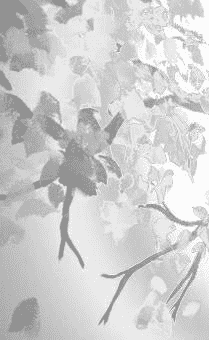

你已经见到了情绪释放疗法对你的生活产生的巨大影响，现在，我想介绍世界各地的人们所做的一些令人惊叹的工作。

情绪释放疗法已被证明是适用于全球各种问题的强大治疗工具，在心理创伤的治疗方面尤其有效。我不会谈论情绪释放疗法对世界和平有多大的贡献，但我会说情绪释放疗法解决的往往是其他传统疗法无法解决的问题。此外，情绪释放疗法还有很大的潜力应对不景气的经济，并促进其发展，同时还能让不堪重负的医疗保障系统更有效更经济地运行。

你会发现，情绪释放疗法对世界作出的潜在贡献几乎是无限的！

### 创伤后应激障碍：看不见的流行病

谈到创伤后应激障碍，人们往往会想到退伍老兵。然而不幸的是，这一病症影响着世界各地各种人，包括经历过自然灾害、战争、疾病、虐待、强奸等数以百万计的人。这种创伤后遗留的病症对人的影响不分种族、年龄和性别。对经历过海啸的孩子和从伊拉克返回的士兵来说，其症状的严重程度可能是一样的。

美国国家心理健康研究所把创伤后应激障碍定义为：“人在目睹或经历危险事件后引发的一种焦虑障碍。”

面对危险，你自然会感到害怕。这种害怕使身体迅速作出调整，以便防御或躲避危险。我们之前已经讨论过，这种战斗或逃跑反应是一种健康的反应，它的目的在于保护人们不受伤害。但对于患有创伤后应激障碍的人来说，这种反应机制遭到了改变或破坏。即便危险已经过去，他们还是会感到紧张和害怕。

从前面的定义中你很容易看出，创伤后应激障碍为什么会被描述为“看不见的”全球流行病。在任何时候、任何地方，人们都在努力从创伤中恢复，但他们逃脱危险很久之后仍然感到不安全。随着情绪释放疗法的日益普及，我很高兴地说，我们可能已经找到了一种方法，它能平复创伤受害者的恐惧和焦虑，缓解他们的身体病痛，结束他们的抑郁、失眠、噩梦和偏执，点燃他们对未来的希望，让他们重新过上正常的生活。

#### 清理卢旺达的噩梦

与洛丽·莱登（Lori Leyden）谈到她在卢旺达所做的工作，不禁会让你感叹情绪释放疗法的神奇。在饱经创伤的卢旺达，如此简单的操作就能促进这些患者在身体、感受、精神和心灵等所有可感受到的层面康复，这使你不由得堕入遐想，情绪释放疗法将给全世界带去怎样深刻的变化？

2007 年，心理医生、同时也是压力管理专家的洛丽博士接到了一个电话。电话那头的人问她能否将她的第一本书《压力管理手册》（*The Stress Management Handbook*）翻译为卢安达语，而这正是卢旺达人所使用的语言，因为 1994 年的种族大屠杀在 100 天内屠杀了 80 万人，幸存者中绝大部分都成了创伤后应激障碍患者。得知这一消息后，洛丽非常渴望贡献自己的力量。

“我知道，这是一个改变生命的时刻，所以我问他我能提供什么帮助，接着就应邀到卢旺达参加创伤治疗工作，我的治疗对象是大屠杀幸存者中的孤儿和寡妇。”她回忆道。

2007 年，洛丽第一次去卢旺达，那次她为 100 名孤儿及年轻人进行了治疗。这些年轻人 20 来岁，大屠杀时，她们只有 6～10 岁，现在他们每个人照顾着另外 2～6 名孤儿。她们缺少支持，对未来也失去了希望。

第一天，洛丽询问她们和她们照顾的孤儿需要进行哪方面的治疗。她们回答了很多，有遭受强奸的创伤、对未来的无望、对贫穷的恐惧以及家人被屠杀的记忆，还有留下来继续照顾孤儿的绝望。

她先对强奸创伤进行了敲击治疗。仅仅 3 轮过后，她们的主观焦虑评分就从 10 分降到了 2 分，而且她们的轻松也是看得见的。“这些年轻的幸存者们第一次感受到了身心的宁静和安全。”她说。

从 2008 年开始，洛丽参加了一个志愿小组。这个志愿小组为参加住宿制的高中孤儿院的 500 名大屠杀幸存孤儿提供定期服务。孤儿院坐落在山顶上，位置十分偏僻。当年，附近的区域险些遭受大屠杀的洗劫。尽管志愿小组在这里的工作极为成功，他们只用了一年时间就将创伤发作率降低了 90%，但洛丽认为仅有这些治疗是不够的。一旦这些年轻人毕业，他们就会对未来失去希望而再次遭受创伤，因为他们没有机会上大学，学习技能，或者从事能够让他们摆脱贫困的经营活动。

洛丽决定把她的工作扩大为一个项目，项目的名称就叫做光明计划（Project LIGHT）。她向我解释：“这些经受过创伤的寡妇和孤儿承受的负担太重了，凶杀、折磨、截肢、艾滋病、无家可归、贫困……卢旺达几乎 90%的民众都亲眼目睹过种族大屠杀的残酷，所以从某种程度上说，这整个国家都患有创伤后应激障碍……每一次去卢旺达，我都会被那些年轻人激励。他们的恢复力、同情心、专注感和容忍度都让我真切地认识到，医治整个世界是可能的。”

2011 年 5 月，在敲击疗愈团队的支持下，洛丽开展了一种新型的基于情绪释放疗法的人道主义援助。这是世界上首个在国际范围内疗愈青年、促进其成长来培养领导力和企业家精神的援助项目。今天，这一项目已经硕果累累。“我们把敲击治疗作为一切工作的基础，这些工作包括疗愈身心、培养解决问题和解决冲突的能力、培养创造力、提升效能和专注度、促进团队建设、实现个人成长。”洛丽说。

光明计划采用间接培训的方式展开援助。首先培训项目大使，再由后者将情绪释放疗法传授给社区里成千上万的民众。

马蒂厄、伊薇特、德西雷和菲德尔是光明计划第一期的项目大使，他们已经把自己的绝望和痛苦转化成了对自己和他人的关爱、同情和喜悦。除去在社区教授情绪释放疗法外，他们还当选或被任命为地方政府的公职人员。现在，同样重要的是，他们已经建立了能够自给的微型金融企业，找到了摆脱贫困的出路。

尽管洛丽运用情绪释放疗法疗愈的案例很多，但她首先想起的还是光明计划项目大使尚塔尔。在种族大屠杀时，尚塔尔只有 8 岁，她目睹了全家人被害的场面。她的脖子上也挨了一刀，脑袋险些被砍下来。后来，她在一堆死尸中醒来，身边是她的叔叔。她爬到附近的树林，看到凶手们正在把仍然活着的人杀死，其中包括她唯一还未被害家人。

从那天起，尚塔尔就和陌生的混混一起生活在大街上，同时还遭受着巨大伤痛，她几乎体验过创伤后应激障碍的全部症状：焦虑、恐惧、绝望、抑郁、惊恐发作、失眠、疼痛……

2009 年，当洛丽见到尚塔尔时，她又一次无家可归。每天晚上，她只能偷偷地爬进工地的小窝棚去睡觉。那时洛丽几乎帮不上什么忙，但两年后光明计划启动了，洛丽知道尚塔尔会是一个优秀的项目大使候选人。神奇的是，洛丽最终找到了她，并把她带进了光明计划首期住宿培训里。学习情绪释放疗法后没几天，尚塔尔的状态就发生了转变。“她开始有了强烈的改变生活的愿望，她的躯体病痛减轻了，心理症状也在第一周当中降低了 36%。”

现在，尚塔尔已经 26 岁了，她已经成了激励他人的出色榜样。洛丽微笑着说，“通过参加光明计划，尚塔尔已经在村子里开了自己的杂货店。周围老老小小的顾客不仅去买面包、糖果，还找她做咨询，学习情绪释放疗法，而且村里的老人们推举她进入了国家妇女领导委员会（The National Women’s Leadership Committee）。”

听到洛丽所讲述的故事，我比以往更加相信，不管我们的世界面临怎样的困难和挑战，情绪释放疗法都能发挥强大的威力。如果卢旺达的尚塔尔能够用情绪释放疗法治好自己的严重创伤，为什么其他人不能做到呢？

由于项目获得了极大的成功，洛丽此时正在为扩大光明计划寻找资助。“我此刻在关注肯尼亚、印度和南非。”她说，“我希望，情绪释放疗法能通过光明计划获得更大的认知度，同时希望光明计划推动我们把这一领先的治疗技术提供给全世界最需要它们的人。这样，我们的下一代就能弥合伤痛、努力工作并把我们带入一个和平的未来。”

回想与洛丽的谈话，我不得不惊讶于光明计划在卢旺达所获得的成效和项目人员所付出的努力。洛丽把情绪释放疗法看作是进入其他治疗手段的一扇大门，包括冥想、祈祷、唱歌和其他积极的努力。我和洛丽都认为，情绪释放疗法能有效地帮助人们开放身心，同时为他们提供冥想乃至祈祷的关注点。情绪释放疗法所具有的灵活性正是它在世界各地广为使用，并且取得良好效果的原因之一。这种灵活性使情绪释放疗法能适应各种不同的文化、信仰、宗教等特色和传统。

坐落在以色列采法特市的创伤治疗中心（The Israel Trauma Care Center）始建于 2006 年。从很多方面看，这里与卢旺达的情形都不同。治疗中心开始运营前，以色列北部地区遭受了超过 500 名恐怖分子的火箭弹攻击。治疗中心向表现出创伤后应激障碍症状的采法特居民实施情绪释放疗法，这些症状包括失眠、惊恐发作和对巨大噪音的强烈恐惧。他们运用情绪释放疗法对当地民众进行了成功的治疗，这一成果也获得了采法特市长的肯定。

#### 别让猖狂的海啸继续摧残年轻的心脏

2006 年，印度尼西亚发生地震时，特迪还是一个 7 岁的孩子，当时他正和朋友在海滩上玩耍、奔跑、欢笑。当脚下的大地颤动时，两个孩子和邻居家的一只羊立即向最近的一所房子冲去。片刻过后，房子被海啸冲进了丛林里。又过了几个小时，海水终于退去，特迪发现自己被困在已经损坏的房子里，他感到又害怕又孤单，而他的朋友和那只羊都死了。整整两天过去，特迪才获救，当时他已经筋疲力尽，内心也受到了极大的创伤。

特迪无法入睡，夜里总是止不住地冒汗，这个年轻的生命正在遭受创伤后应激障碍的摧残。为了能让他的精神状态得到恢复，创伤缓解和情绪支持疗法（Trauma Relief & Emotional Support Techniques, TREST）的创始人迪帕克·莫斯泰特（Deepak Mostert）开始教他运用情绪释放疗法。

结果，仅仅经过一次治疗，特迪的创伤症状就消失了。在接下来的几年当中，特迪做了更多的敲击治疗，最后他终于找回了原先那个勇敢的自己。很快凭借自己的努力，他成为了当地的领导人。每当迪帕克在他的家乡举办情绪释放疗法治疗班，特迪都会去参加。

从 2006 年开始，迪帕克的创伤缓解和情绪支持疗法援助机构一直在受灾地区帮助幸存者克服创伤后应激障碍。在迪帕克看来，特迪的进步又一次证明，对于遭受创伤的幸存者来说，情绪释放疗法确实是最快速、最有效的治疗方式。

迪帕克原来是一位警察，后来经过培训而成为了心理治疗师。他很早就开始关注遭受创伤的受害者。他之所以对创伤感兴趣，是因为自己曾经遭受创伤后应激障碍的折磨。

22 岁那年，他被困在了一栋着火的建筑里；31 岁那年，他又被困在了一辆着火的汽车里。2006 年地震袭击印度尼西亚爪哇岛，造成近 6 000 人死亡，120 万人无家可归，迪帕克听到这个消息后立即挺身而出去帮助当地的一个非政府组织，并且实施了援助当地孩童的计划，这些孩子的精神、思维和心灵都遭受了看似无法修复的损伤。

迪帕克见到了无数年轻却充满忧郁的面庞，而传统的心理治疗似乎无力让这些忧郁消失。因为对于人数这么多、受伤这么深的群体来说，传统的心理治疗根本治不过来。迪帕克决心尽可能为他们带来改善，所以他开始尝试运用情绪释放疗法。结果他很快发现，只花几个小时、几天的时间就能让几百、几千个年轻幸存者的创伤减轻。迪帕克一次可以治疗 100 个孩子，而且能有效地帮助他们重现微笑，帮他们从头痛、腰痛、严重焦虑、恐惧、绝望、无助和悲伤中解脱出来。

迪帕克取得巨大成功的消息不胫而走，他和他的团队开始培训其他团体，包括政府医疗卫生部门的员工、心理医生、学生、青少年组织和教师等，之后，这些人再运用他们的技能，作为情绪释放疗法治疗师去治疗更多的人。

在迪帕克和他的团队的持续努力下，他们已经培训了 15 898 名情绪释放疗法治疗师。在那次援助中，他们和他们培训的治疗师在短短 3 个星期内就治疗了 377 214 名遭受创伤侵害的受害者。

创伤缓解和情绪支持疗法援助项目远远超出了迪帕克的预期，他解释说，情绪释放疗法通过敲击身体治疗心理症状，疗效显著，是遭受创伤后应激障碍困扰之人的重要疗法。

“从心理学的角度讲，一次创伤就是一个不断下陷的漩涡。”迪帕克说。这个漩涡往往包含着记忆，比如烟火的气味或者水灌进肺脏的感觉。敲击治疗能让幸存者同时接触到自己的情绪和身体能量，所以它能以比谈话治疗快得多的速度让幸存者从创伤中解脱。“对大多数幸存者来说，体会身体感觉令人不安，但借助情绪释放疗法重新体会身体的感觉，情绪就能慢慢地在这一过程中稳定下来。情绪释放疗法就像一只锚，有了它，他们的船就不会在漩涡里一直陷下去。”

创伤缓解和情绪支持疗法援助机构总共在 7 个地方实施了他们的援助计划，仅仅在印度尼西亚这一个地方就影响了超过 100 万的幸存者。迪帕克发现，在灾后重建过程中，创伤后应激障碍会如瘟疫一般爆发出来。为了缓解这一时期人们的巨大压力，迪帕克的援助机构不断重返受灾地区，继续培训当地民众，教他们如何运用情绪释放疗法。

从一开始，对幸存者的培训就被证明是成功的。迪帕克说：“在每 1 000 名受过培训的幸存者当中，只有 2～3 名需要后续的创伤治疗支持。”对于一个由 4 名志愿者组成的援助小组来说，每一个学校需要花 3 小时，每天可以治疗 3 所学校，这样下来，他们一天就可以治疗 1 200～1 500 名学生，同时培训 60～120 名教师。如果有更好的资源和条件，这一数字还能大幅增加。一个由 4 名志愿者组成的援助小组每月最多可以治疗 25 万名幸存者。

迪帕克认为，“创伤是人类进步的重大阻碍。”为了发挥更大的影响力，迪帕克开发了一个三级培训项目，他希望能把这一项目应用于全球的受灾区域。他的目标是建立一个面向全球政府和社区的训练机构，这一机构专门培训情绪释放疗法，以便在灾后的创伤治疗中运用。

#### 捍卫生还者的正常生活

迪帕克·莫斯泰特讲述他在印度尼西亚所做的灾后康复工作时提到，创伤后应激障碍的发病期在灾后的几个月到几年之间。确实，那时大部分救援项目都结束了，而且当地人在灾难发生后首次离开临时居住区，回到他们先前的家乡继续“正常的”生活。可以想象，当你在一场战争或一次自然灾害结束后回到家中时，你一定会不断地回想起那些失去的最亲最爱的人。所以在这一阶段人们会遭受恐惧、焦虑、悲伤和其他潜在的创伤后应激障碍症状的困扰。

然而重建时期十分关键。从自然灾害中恢复需要大量的投资，政府所担负的重建整个村庄（包括公路、市政管网等基础设施）的财政负担是非常沉重的，它极度需要当地居民以饱满的状态回到工作中去。在这一阶段，民众的工作效率越高，当地经济复苏就越快，他们就能越早实现自给自足，而无需政府的再援助。

如果返回家中的人们都被创伤后应激障碍折磨得身心俱疲，他们就无法开办农场、经营商店、驾驶出租车，无法承担既能供养自己又能支持当地经济发展的任何工作。

如果一个 4～5 人的创伤缓解和情绪支持疗法志愿援助小组能够进去那片区域，并且在接下来的 30 天内运用情绪释放疗法治疗成千上万遭受创伤后应激障碍折磨的民众，这时你就能看到，情绪释放疗法在整个经济和社会的重建当中发挥着怎样的关键作用。如果当地民众没有获得真正的心理支持，重建工作很快就会一片混乱，进而让本来就困难重重的经济步入危机。而当情绪释放疗法提供深入持久的心理康复援助后，重建工作就能顺利开展，于是衰落的社区能够焕然一新，对经济至关重要的商业活动也能得到极大的发展。

就像光明计划的洛丽·莱登所说的那样，没有情绪释放疗法所提供的身心疗愈，民众就无法重新回到社会中，无法回到工作岗位，无法让经营活动重新开张，无法上学，无法过上健康、有成效的生活。不过，有了情绪释放疗法所提供的心理疗愈，人们就能迅速恢复，从而有能力克服哪怕最恐怖、最具破坏力的灾难。

### 瓦哈卡计划：生命最后的微笑

德博拉·米勒（Deborah Miller）所做的情绪释放治疗直达人心、令人振奋，同时也让人揪心。德博拉是一位情绪释放疗法的践行者，也是细胞和分子生物学博士。她志愿把自己的时间和才华贡献给墨西哥瓦哈卡州的奥雷利奥·巴尔迪维索综合医院（Hospital General Aurelio Valdivieso）的儿童癌症病房，在那里有一个名为“瓦哈卡计划”（The Oaxaca Project）的项目。迄今为止，德博拉已经运用情绪释放疗法帮助了几十位癌症患儿。

肿瘤学专家阿曼多·克罗·埃尔南德斯博士已经在医院工作了 15 年，他见证了德博拉的治疗工作所产生的显著效果。他说：“做了情绪释放治疗后，家属不那么紧张了，孩子不那么难受了，也更有活力了。有一个小女孩觉得没有希望，于是开始拒绝服药，也不配合做任何形式的治疗。这种情况十分严重，以至于她妈妈都想带着她回家等死了。然而，德博拉为她做过情绪释放治疗后，小女孩开始放松下来，笑容也越来越舒展。没多久，她就同意继续吃药和接受治疗了。”德博拉补充说，通常患儿对自己的病情非常担心，对躲不掉的疼痛和他人的来访也非常厌烦，以至于情绪低落，十分消沉。

埃尔南德斯博士说，即使是对临终的病人，情绪释放疗法也扮演着非常重要的角色。它能缓解痛苦，并且给患儿和他们的父母带去安宁。敲击治疗为整个癌症病房赋予了一种基调，那就是痛苦是为了走向希望和安宁。

很多年幼的患儿害怕针头、医院，甚至害怕白色（医院及所有与医院有关的东西都可能是白色）。通过情绪释放疗法，他们能把这些恐惧释放掉，同时更快乐，更有活力，甚至身体也更强壮。同时，患儿的父母也能通过情绪释放疗法来处理精神上、心理上、财务上无法逃脱的巨大压力。

情绪释放疗法在个体身上展示的正面效果很快也给医院带来了益处。埃尔南德斯博士非常肯定地说：“情绪释放疗法能创造更平静的情绪状态，也能促进血液病的康复，这一点本身就有临床上的应用价值。”有一位十几岁的病人叫迪亚哥，他的癌症意外复发了，导致健康状况直线下降。经过德博拉的情绪释放治疗后，他的心理状态，连同免疫水平都显著好转。随着迪亚哥的迅速康复，医院的医生和护士就能更多地照料别的患者了。

由于类似的一幕经常发生，于是埃尔南德斯博士断言，情绪释放疗法不仅显著提高了患儿的生存质量，而且为他所在的这类医院创造了可观的优势。情绪释放疗法通过改善病患的心理状态，或许能降低感染，减少并发症，甚至降低病患所需的服药量。这样一来，实验室的工作量就能减少，而治疗一名病患所需要的护士人数也能减少。对医院来说，这样就能缩减大量开支，这样奥雷利奥·巴尔迪维索综合医院这样的机构就有能力收治更多的癌症患儿。

除了能帮助患儿和他们的家人外，情绪释放疗法还是医护人员的重要工具。埃尔南德斯博士提到，因为有了情绪释放疗法，治疗的气氛和环境变得更积极了。此外，情绪释放疗法还提高了医生解决问题的能力，而且它促使医护人员对癌症患儿表达了更多的关注。

德博拉的乐观和充满关怀的态度传递了满满的正能量，毕竟，瓦哈卡计划最大的特点就是要把欢笑带给这些癌症患儿们。

“你会爱上这些孩子。”她微笑着说，“他们很美丽，很有力量，也很勇敢。他们和这种可怕的疾病生活在一起，并且尽力克服它。把促进康复的疗法教给他们，看着他们的笑容在你眼前绽放，那种感觉真是美极了。我常常跟孩子们尽情地玩笑，以至于忘记了这是癌症病房。瓦哈卡计划的目的不仅仅是治愈疾病……它真正的目的在于创造美好的感觉。”

瓦哈卡计划令人兴奋的一点在于，德博拉把情绪释放疗法补充进了传统的医学治疗当中。她并非用情绪释放疗法干涉医生的治疗，而是借助它来减轻患者对疾病、手术和其他治疗措施的焦虑。而且，就像埃尔南德斯博士所谈及的那样，德博拉的工作也帮助了医护人员。她不仅为他们提供了促进治疗的工具，而且他们也可以把这个工具运用到自己的生活当中。

参加录制《轻疗愈》的情绪释放专家帕特里夏·卡林顿博士作过一些关于情绪释放疗法的研究，其被试者有医生、护士和患者，尽管研究规模不大，但结果很有说服力。研究显示，情绪释放疗法能降低病患对药物的需求，缓解他们的疼痛和焦虑，为医护人员提供释放压力的出口并提升其护理水平，而且还能降低医院的总体支出。

卡林顿博士在自己的网站上写道：“我能预见有这么一天，情绪释放疗法会成为医院普遍接受的治疗方法和外科手术前的必不可少的步骤之一，这是一个值得期待的未来。”

### 压力缓解计划：清除战争记忆

在美国，针对退伍老兵的情绪释放治疗也在如火如荼地开展着。看到情绪释放疗法如何在卢旺达和墨西哥帮助遭受创伤的病患摆脱困扰时，你可能就不会对这件事感到惊讶了。

抑郁、焦虑、失眠、噩梦、嗜酒、滥用药物、暴力、自杀倾向、妄想……这些仅仅是创伤后应激障碍的一小部分症状，这种症状在经历过战争的退伍老兵中已经司空见惯。

对于这种创伤，传统的治疗手段还没有比较有效的办法，也正是因为这个原因，情绪释放疗法的创始人加里·克雷格和灵魂医学研究所（Soul Medicine Institute）的创始人道森·彻奇博士才共同发起了一个叫作“压力缓解计划”（The Stress Project）的治疗项目。其目的是训练退伍老兵运用情绪释放疗法，以便将带来巨大痛苦又挥之不去，而且往往又非常残酷的战争记忆清除。

为了验证情绪释放疗法确实具有这一作用，克雷格和彻奇找来了 5 名参加过越南战争和伊拉克战争的退伍老兵，他们都遭受过严重的心理创伤。接下来，他们花了 5 天的时间为老兵进行敲击治疗，帮助他们减轻创伤后应激障碍的症状。

现在，这最初的 5 名老兵已经增加到了 3 000 多人，压力缓解计划所带来的显著疗效也扭转了一向对情绪释放疗法持怀疑态度的大卫·格鲁德（David Gruder）博士的看法。格鲁德博士是美国加利福尼亚州圣迭戈市的一位临床和组织心理医生，他现在把自己描述为一个“非常非常热心于情绪释放疗法的人”。他的看法之所有有如此大的转变，是因为其显著疗效。

经过一小时的敲击治疗后，皮质醇水平下降 25%；经过 6 次治疗后，创伤后应激障碍的典型症状下降了 63%，焦虑和抑郁下降超过 50%。尽管这些治疗数据令人印象深刻，但老兵们的亲口描述才最有说服力。

阿特·弗里托格的创伤后应激障碍曾经发展到极为严重的地步。他会进入一种极度愤怒的状态，甚至威胁要杀害陪伴了自己 33 年的妻子和他们的孩子。但仅仅在压力缓解计划中接受了 3 天的治疗后，阿特就能一边温柔地握着妻子的手，一边平静地跟她讲述自己的感受，脸上还充满笑容。

他妻子感激地说：“这是 5 年来我们第一次真正地谈话。”谈到自己目前的精神状态，阿特补充道：“我还能像一个真正的人一样生活，不受恐惧干扰，这点太让人兴奋了。”

刚参加压力缓解计划时，安迪·哈德尼克口吃非常厉害，而且伴有严重的偏执、反社会和暴力倾向，此外，他还时常做有关伊拉克战争的噩梦。经过敲击治疗后，安迪能平静地讲述自己过去的经历了，他的口吃也好了，而且也没那么偏执了，以前他不能去餐馆吃饭，现在终于可以去了。

卡林·斯隆也是一位伊战老兵。在参加压力缓解计划之前，他喝起酒来没完没了，直到喝得不省人事，醒来后一睁眼又会去拿酒瓶子。这是他唯一能想到的摆脱过去记忆的方式。他清楚地记得他眼睁睁看着一个孩子被炸飞了，紧接着一群妇女向他跑来，大喊孩子是他杀的。被内疚牵绊，被记忆纠缠，还要忍受下巴和脖子的灼痛，卡林简直被折磨得死去活来。

接受情绪释放治疗仅仅几天，卡林就滴酒未沾地睡了一夜，并且报告醒来后的感觉很好。几个月后，卡林完全戒掉了嗜酒的毛病，也不再有内疚感了，下巴和脖子的疼痛也消失了。而且最为重要的是，他的精神状态发生了彻底的转变。

“我很快乐。”他说，“在接受情绪释放治疗之前，如果我说我很快乐，那就是太阳从西边出来了。可是现在，这句话我一天差不多能说 10 次。”

与瓦哈卡计划中的病患感受到的一样，情绪释放疗法也能让老兵迅速摆脱症状的困扰。很显然，这样一来，健康保险公司就能减轻很大负担，不用再为持续数月或数年的无效治疗支付昂贵的费用了。

情绪释放疗法带来的益处远不止如此。如果它能够与药物等传统的治疗方式结合使用，健康保险公司、医院和医生就能花更少的钱取得更好的疗效。这些节省下来的开销就能对整个医疗系统产生极大的影响，促进重大改进的发生，包括将更多的人群纳入医疗保障体系、为病患和老年人提供更好的护理等。

### 换回一个美好新世界

情绪释放疗法能够治疗乃至治愈那些遭受过创伤的人们，否则他们就会在身体上、心理上和精神上遭受长期的折磨。认识到这一点，你就很容易想到，情绪释放疗法将在全世界掀起一场怎样的变革！

**指尖敲出丰盛**

#### 为美好世界送出一份力量

我们在这一章里谈到了几个项目，有光明计划、创伤缓解和情绪支持疗法援助计划、瓦哈卡计划和压力缓解计划。他们需要各种各样的支持来继续他们出色的创伤疗愈工作。

我希望你能花一些时间来看看他们的网站，同时提供力所能及的帮助。与大多数非营利组织一样，他们最紧迫的需要仍然是资金。不过，他们也需要人手来传递他们的消息。所以，你可以考虑把下面的网址（以及这本书）通过电子邮件、社交工具和其他联系方式分享给你的朋友和家人。谢谢！

**光明计划（ProjectLightRwanda.com）**

运用情绪释放疗法和现场培训帮助整整一代的大屠杀幸存者摆脱创伤后应激障碍的困扰，并帮助他们重塑生活、重建家园。

**创伤缓解和情绪支持疗法援助计划（TRESTAid.com）**

将情绪释放疗法传授给印度尼西亚的地震受灾民众，帮助他们治疗创伤后应激障碍，重新开始新的生活。

**瓦哈卡计划（OaxacaProject.com）**

借助情绪释放疗法促进癌症患儿康复，并为遭受病痛折磨的心灵带去一份安宁。

**压力缓解计划（StressProject.org）**

使用情绪释放疗法帮助越战和伊战老兵治疗创伤后应激障碍。

# 后记
遇见真正的自己

“在我生命的大多数时间里，我相信事情本来就应该是它们现在的样子。我不知道这其中的原因，不理解我做事的根源，也无法预计自己能做出怎样的改变。如果我怨恨某人，那一定是因为他做了什么对不起我的事情；如果我觉得自己受到了伤害，这也是完全正当的感受，因为是有些人让我受到了伤害；如果我以某种方式做事情，这也是因为我个人的特点。我就是这样，做事情，对事情作出反应；作决定，体验负面的情绪和结果，同时相信，事情只能是这样。”

如果你对上面所描述的感觉（不管这种感觉发生在现在还是过去）很熟悉，你就会知道，这并不好玩，不相信自己能掌握自己的未来是一件痛苦的事情。

幸运的是，在人生的某一个时刻，我开始慢慢地为自己的生活负起责任。我逐渐发现，我正是被过去的经历所塑造。我渐渐明白，尽管生命当中的负面经历不是我的过错，但我确实该为它们负责。

在最初反省生活的那几年，我知道我想改变，想做不一样的事情，想作更明智的决定，但我不知道怎样才能做到。我不知道怎样才能打破积习已久的恶习，怎样才能停止做已经做了那么多年的事情，怎样才能按照喜欢的方式作出反应，怎样才能作出让我热血沸腾的决定，怎样才能在生活的所有方面放手同时继续向前……

幸运的是，就在问题足够迫切的时候，答案出现了。对我来说，这个答案就是看上去有点奇怪的情绪释放疗法！当我第一次体验情绪释放疗法的威力时，我惊呆了。随后，它继续不断地在我和周围人的生活里制造奇迹，让我一次又一次地目瞪口呆。

我希望书中的内容能够对你有所启发，能够激励你，并且最重要的是，能够实实在在地帮助你做出你所期望的改变。如果你把这本书通读了一遍，却没有练习，也没有关系，但我强烈建议你回顾一下书中的练习，同时进一步查看网上那些能让你真正体验到情绪释放疗法的资源。

这本书无法介绍与情绪释放疗法有关的全部内容，我只能分享这么多，这让我有点难过，但我实在不能用一本 3 000 页的大部头来增加你的负担！我治疗过的所有来访者都拥有他们自己的故事，也都能自成一书。在这里，我只希望这本简单介绍情绪释放疗法的书能够激发你的兴趣去了解更多，并且在自己的生活中继续敲击治疗的旅程。

我们在这本书里讨论了各种各样的问题：身体疼痛、疾病、儿童时期的创伤、情感关系、赚钱、减肥等。当你继续自己的生活时，你可能得把注意力集中在某一个问题上，了解你在这一方面的具体进展，这样你才能保持专注，同时轻松地对你努力的结果作出评价。

#### 请与家人和朋友一起分享

如果说我在传播这一强大治疗工具的过程中面临的最为重大的挑战是什么，答案就是情绪释放疗法这一概念对于公众来说太陌生了，而且它和传统医学的差别太大了，以至于没有任何文化或心理学方面的线索促使我们真正地体验它。

当我们打开电视机，我们会得到各种各样的线索，包括好吃的、好喝的，还有药品、汽车等，可能看见一只狮子你就知道去哪里买什么擦伤药。但不幸的是，电视上没有放慢生活节奏，然后去原谅、去疗愈、去关爱的广告。我经常公开地讲，在个人发展和替代医学领域也许会有很棒的事情发生，那就是某个人通过疗愈他人成功地赚到 10 亿美元，然后在超级碗（Super Bowl，美国国家橄榄球联盟的年度冠军赛，是美国最有影响力的赛事之一。——译者注）的比赛中间插播一条商业广告，就放在药品广告的后面，提示观众“运用情绪释放疗法敲一敲，敲去病痛和烦恼，敲来好运连连惊喜不断”，也许情绪释放疗法的知名度会大不相同。

不过在这之前，你还得提醒自己进行敲击治疗，加入有很多人敲击治疗践行者的网站或交几个了解敲击治疗的朋友。你进行敲击治疗的次数越多，体验到的益处就越大，你就越不容易忘记治疗。

阅读了这么多精彩的内容，也听说了别人的成功经历，你很可能已经想到，身边正好有一两个人（或者 10 个人）或许能够从情绪释放疗法中获益。当初我拍摄纪录片《轻疗愈》的原因之一就在于，当人们与他人分享这一疗法时能有一个直观的了解途径。

我发现向别人推荐情绪释放疗法的最佳方式是分享你的个人经验，讲讲它在你身上有什么作用或者把纪录片及这本书递过去，然后温柔地建议对方试一试。而且如果对方意识到你要“治疗”他们，他们就会拒绝，如果你的朋友和你所心爱的人感觉到，你只是怀着一颗开放的心给他们提供一些支持和帮助，这时他们就愿意接受你的建议了。

正像我上面所说的，这本书仅仅是自我疗愈之旅的一个开始，一个起跳点。如果你想继续深入下去（我非常建议你这样做），就请访问我们在网上的所有资源吧。关于这些资源的网址，我已经在这本书里多次提到，你可以先访问 www.thetappingsolution.com。

我还经常被问及，怎样才能成为一名情绪释放疗法的教练，或者要接受怎样的培训才能教授他人。体察他人内心，并且引导他们实现疗愈和成长是我一生中最有收获的经历之一，我非常推荐你做这样的工作。我们已经在下面的网址列出了你需要用到的资源：www.thetappingsolution.com/training。

#### 你也能成为希望和疗愈的灯塔

归根结底，情绪释放治疗就是让你释放过去的创伤和负面经历，同时从中获得启示的过程。它就像剥洋葱，一层一层，层层不断，释放掉怨恨后，却发现下面还有悲伤；把悲伤抚平后，取而代之的是理解；理解又通向觉知和喜乐；觉知和喜乐又会转变为安宁和爱。就这样，我们一层一层地剥下去（中间一般要流一些眼泪），剩下的就是真实的自己。这就是情绪释放疗法：认识自己最深处的美丽，理解并原谅过去，发现未来蕴藏的可能。

获得幸福、快乐、安宁的生活是可能的，成为一束散发能量的柔光、一座希望和疗愈的灯塔也是可能的。我从没有想到过，通向如此喜乐、安宁、富足的路径之一竟然是在身上敲敲打打。不过生活中最神奇的事情总蕴含着神秘，这一点没有几个人能参透。

从我个人的经历当中，我得到了一个经验。它经受了科学研究的检验，经受了几百万践行者的检验，也经受了世界各地人道组织的检验。即便这些都不算数，那还有我个人所经历的事实。我知道，我希望你也知道，或者你也开始知道：情绪释放疗法确实有效。

它的疗效，我看到了，也体验到了。我借助它改变了我的生活，这一转变深刻、美丽、令人称奇。对未来，我仍然充满敬畏，但也充满激情，这个未来，是你的未来、我的未来，也是人类的未来。

我迫不及待地想在生活的旅途中遇见你，听你讲述过去的经历，我也迫不及待地想听你告诉我，情绪释放疗法如何帮助你疗愈身心，祛除病痛，越过障碍，收获多年前就该属于你的富足，如何帮助你原谅那些伤害过你的人，最后建立起你梦想的生活。

#### 梦想成真的礼物

你还在看吗？太棒了！下面的部分是对坚持看完这本书的读者的一个奖励。现在，我就来一条一条地恭喜你。除非，你只是把书翻到最后来看结局，不过这不是小说，所以这个“除非”不存在。

如果你已经看到了这里，我就知道：你渴望改变，渴望更好的生活，渴望让自己和这个世界变得更好。我希望你在前面读到的内容能帮你梦想成真。我准备了一个简短的课程，它可以帮助你把你在这本书里学到的内容付诸实践，进而推动你进入下一个阶段。你可以在 www.thetappingsolution.com/mygift 找到这个课程。它是百分百免费的，是我送给你的礼物，因为你读完了这本书，而且为自己和这个世界做出了努力。

# 附录
进阶训练

如果你想进行敲击治疗的进阶训练，就可以查看下面的这一系列资源，它们基本上涵盖了这本书所涉及的所有问题。

**里程碑式的发现**

获取情绪释放疗法背后令人振奋的最新科学研究的详细信息：

www.thetappingsolution.com/research

**快速入门：现在就来体验情绪释放疗法**

观看敲击治疗短片：www.thetappingsolution.com/tappingvideo

**不再抗拒改变**

如果你想了解更多消除具体障碍的方法，请点击这里：

www.thetappingsolution.com/change

**治疗过往的伤痛**

过去的创伤让你停滞不前吗？在这里你能找到突破的方法：

www.thetappingsolution.com/thepast

**疗愈身体**

在促进身体疗愈方面，情绪释放疗法被证明极为有效，在这里你可以了解更多：www.thetappingsolution.com/heal

**缓解身体疼痛**

我们的“疼痛缓解世界峰会”是一个线上活动，已经超过 10 万人参加。如果你想战胜身体疼痛，它就是你需要的资源。你可以在这里免费观看预告片：

www.thetappingsolution.com/painrelief

**营造有爱的、健康的情感关系**

如果你想表白或者提升你们之间的感情：www.thetappingsolution.com/love

**消除恐惧和恐怖症**

从害怕坐飞机到害怕公众演讲，它能帮你解决特定的困难：

www.thetappingsolution.com/overcomingfears

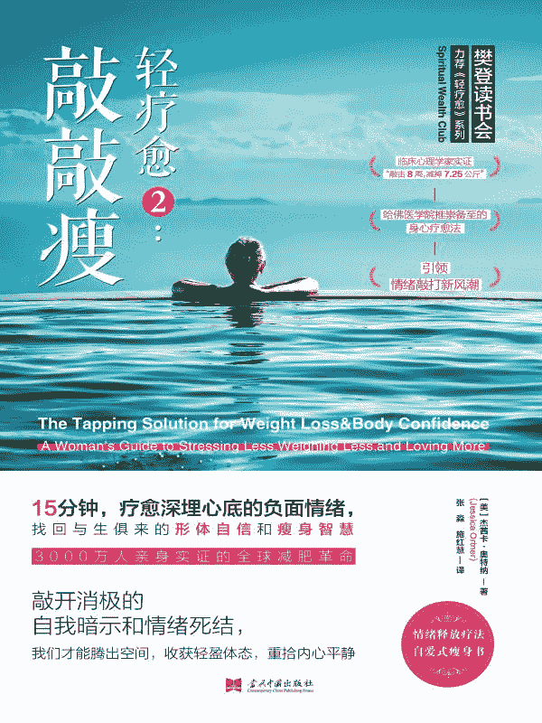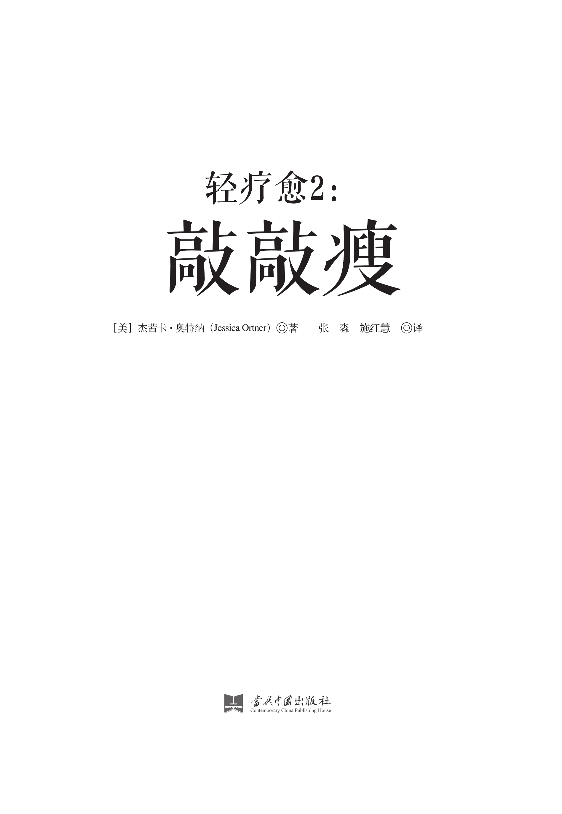

**图书在版编目（CIP）数据**

轻疗愈．2，敲敲瘦／（美）杰茜卡·奥特纳著；张淼，施红慧译．—北京：当代中国出版社，2016.7

书名原文：The Tapping Solution for Weight Loss & Body Confidence

ISBN 978-7-5154-0695-4

Ⅰ．①轻…　Ⅱ．①杰…　②张…　③施…　Ⅲ．①精神疗法　Ⅳ．①R749.055

中国版本图书馆 CIP 数据核字（2016）第 115045 号

The Tapping Solution for Weight Loss & Body Confidence

Copyright © 2014 by Jessica Ortner

Originally published in 2014 by Hay House Inc. USA

This translation published by arrangement with Hay House （UK） Ltd through Bardon Chinese Media Agency.

Simplified Chinese edition Copyright © 2016 by **Grand China Publishing House**

All rights reserved.

© 2016 本书中文简体字版通过中资出版社（**Grand China Publishing House** ）授权当代中国出版社在中国大陆地区出版并独家发行。

未经出版者书面许可，不得以任何方式抄袭、节录或翻印本书的任何部分。

版权合同登记号　图字：01-2016-2593

出版人　曹宏举

策　　划　中资海派

执行策划　黄　河　桂　林　隋　聃

特约策划　任小平

责任编辑　隋　聃　王延新

特约编辑　张　艳　涂玉香

装帧设计　张　英　廖国兰

出版发行　当代中国出版社

地　　址　北京市地安门西大街旌勇里 8 号

网　　址　http://www.ddzg.net　邮箱：ddzgcbs@sina.com

邮政编码　100009

编辑部　（010）66572264　66572154　66572132　66572180

市场部　（010）66572281 或 66572155/56/57/58/59 转

印　　刷　深圳市东亚彩色印刷包装有限公司

开　　本　787 毫米×1092 毫米　1/16

印　　张　19 印张　212 千字

版　　次　2016 年 7 月第 1 版

印　　次　2019 年 1 月第 6 次印刷

定　　价　35.00 元

* * *

**版权所有，翻版必究；如有印装质量问题，请拨打（010）66572159 转出版部。**

# 权威推荐

Amanda 老师（AFRT 释放法创始人，疗愈的花瓣自助平台创办人）

如果说《轻疗愈》开启了中国能量心理学的疗愈时代，那么，《轻疗愈 2：敲敲瘦》是帮助中国女性摆脱内在集体意识枷锁的有效工具。它让我们敢于质疑社会和传统给女性设立的标准，从而把力量集中在内在感觉与跟身体的对话上，开启原生态的自爱之旅！

青　音（著名主播，心理专家）

每个女人都应该先爱好自己，只有这样我们才能给出健康清新的爱，而爱自己的第一步就是爱自己的身体。有些女性拼命健身、跑步，或者是减肥，如果过度，恰恰是对自我的“憎恶”在起作用，稍有懈怠就恨自己为什么不能一直保持下去……很感谢这本书会让每个女人找到正确的方法，爱好自己的身体。

朱莉·丹尼卢克（Julie Daniluk，《治疗炎症的食物》作者）

杰茜卡的作品充满激情，为我们提供了一把打开脂肪储藏库的钥匙。用敲击消除消极的自我暗示，打开珍惜自己美丽的机会大门之后，你就可以获得成功。

莉莎·瑞金（Lissa Rankin，医学博士，《纽约时报》畅销书《心态胜于医药》作者）

作为医生，我充分了解维持健康体重的诸多益处。我一直想给那些准备好放弃节食、愿意为了永远保持最佳体重而做一些内在功课的病人推荐一本书。不用再找了，这本书就是我想要的。

克丽丝·卡尔（Kris Carr，《纽约时报》畅销书《疯狂性感厨房》作者）

多年来，“改变你的盘子，改变你的命运”一直是我最喜欢的座右铭之一。但遗憾的是，当我们看低自我价值时，很少有精力去滋养身体。本书提供了一个强大的体系，可以释放那些阻碍我们爱自己身体的情绪和信念。

现在，我养成了定期敲击的习惯，并从这种强大的情绪疗愈方法中获益良多。它是我会使用的最重要的治疗方法之一。试试和杰茜卡·奥特纳一起踏上这段奇妙的旅程！”

谢里尔·理查森（Cheryl Richardson，作家，演说家，全美十大咨询师之一）

这本书让我太兴奋了！敲击很强大，它让你在极短的时间内就产生积极的改变。奥特纳为那些渴望形体自信的女性带来了福音。通过探索问题的源头——隐藏在体重背后的伤痛，让你深陷其中难以自拔的信念，模糊不清的自我保护界限——你不必非要减肥成功，才能重拾自信。

只需要照着书做一些敲击练习，你马上就可以感觉更良好。在领导女性走出“减肥地狱”方面，这本书将作为变革者被载入史册。

堂娜·伊登（Donna Eden，《能量疗法》、《女性能量疗法》作者）

这本书太棒了！我翻开第一页就被深深吸引了。通过展示如何积极地跨越障碍，杰茜卡帮助我们变得更加强大。我很爱它。这本书非常有趣，适合独自一人阅读，我强烈推荐所有辛苦减肥的人都读一读这本书。感谢你，杰茜卡·奥特纳，谢谢你写出了一部能帮助人们轻松获得形体自信的温暖作品。

加布里埃尔·伯恩斯坦（Gabrielle Bernstein，《纽约时报》畅销书《不纠结过去，不忧心未来》作者）

这本书不可不读！杰茜卡·奥特纳出色地激励读者直面恐惧，和身体建立全新的关系。全书每一页都精彩无比，杰茜卡为读者简化了敲击的技巧，同时为那些已经走上形体自信之旅的人们提供了极大的支持。我爱这部作品！

唐娜·盖茨（Donna Gates，《身体生态食物》作者）

杰茜卡·奥特纳不仅温和地教授我们改变生活的工具，也鼓励我们拥抱自己的独特性，完完全全地爱自己，接纳自己。要是美国的每一位少女都能学习这种自爱和形体自信课程该有多好……

玛萨·席莫芙（Marci Shimoff，《纽约时报》畅销书《释放更快乐的自己》作者）

本书中，杰茜卡·奥特纳为我们介绍了一种有效、实用的方法，帮助我们消除对身体的批评。如果想要体重和形体自信彻底而持久地改变，我们就得消除那些消极信念和情绪。敲击是我亲身体验过的最强有力的技巧之一，杰茜卡是引导我更加自爱，更加自信的完美向导。

桑妮雅·乔凯特（Sonia Choquette，《纽约时报》畅销书《答案很简单》作者）

这本书指引你快速、轻松地拥有你想要的身体，彻底成为最棒的自己。读一读这本书吧，享受它带给你的自由。

珍妮弗·麦克莱恩（Jennifer McLean，作家，疗愈专家）

情绪释放疗法简单、容易操作，而且可以创造奇迹，不仅能帮助我们解除束缚性信念，还能治愈某些身体疾病。本书提供的深刻洞见和已被证实有效的方法，将帮助我们实现身心平衡，改变生命，恢复活力。

卡萝尔·塔特尔（Carol Tuttle，dressingyourtruth.com 网站创始人）

本书提供了大量资源，以帮助成年女性和十几岁的少女释放和体重、外表相关的耻辱与束缚。作为一名女性问题专家，我很赞赏杰茜卡撰写了一部如此珍贵和及时的作品，她帮助女性从那些和自己有关的错误信念及误解中解放出来。阅读这部作品，有助于你释放自己的身心，更加爱和欣赏自己，更加享受生活各方面的乐趣。

希瑟·戴恩（Heather Dane，健康教练）

在《轻疗愈 2：敲敲瘦》中，杰茜卡·奥特纳为读者提供了一种爱自己，接纳自己，并且摆脱所有导致我们体重超重的束缚性习惯和信念。敲击看起来似乎太简单或太奇怪，但它绝对有效。杰茜卡帮助了数百万人通过爱自己而获得理想的身体，甚至过上理想的人生。

阿加皮·斯塔西诺普洛斯（Agapi Stassinopoulos，《释放心灵》作者)

杰茜卡的作品是一份宝贵的财富！她为我们提供了大量工具、策略和观点，帮助我们更加爱和接纳自己，并深入解决体重伤痛背后的真正问题。读这本书时，你会感觉好像是在读一封最好朋友的来信。我本人一直在体验敲击为生活带来的新鲜感以及情感宽慰。如果你想感受自己的内在转变，就阅读并且试试情绪释放疗法吧。

# 推荐序Ⅰ

Amanda**老师**

（AFRT 释放法创始人）

### 一本让你由内而外焕发光彩的好书！

《轻疗愈 2：敲敲瘦》绝非只是一本减肥书，它更是一本教我们如何自爱与自我照护的实操手册！杰茜卡说得非常好：我们增肥的原因很多时候不是来自饮食习惯，而是来自减肥本身的压力和内在负面的自我对话。

这本书介绍的是一种不节食、不运动、不反弹的体重管理方法，在阅读过程中，我们将学习如何管理自己和身体的关系，内观和疗愈自我内在的负面信仰，以及如何让身体找到最适合它的食物和饮食习惯。

《轻疗愈 2：敲敲瘦》最大的特点就是你在阅读的过程中，可以随时对应自我面临的挑战即刻敲打释放，而且即刻见效！我认为，虽然它的受众群体以女性居多，但是它同样适用于对自己的体态感到不满的男性。毕竟，健康的体魄和心态是每个人的追求，它构筑了我们幸福的基础。

不管是西方女性还是东方女性（东方女性可能更严重），我们中的大多数人太早就被教导要先去满足其他人的需要，要压抑自己的情绪，要表现得乖巧可人，我们也一直把自我的价值、身材和体重紧紧捆绑在一起。

在寻求外在的认可和希望获取更多爱的路途上，我们前仆后继，不吝于尝试各种减肥方案，甚至冒着生命危险去整容变身，这些行为的背后有很多是对自我的否定和排斥。

杰茜卡在书中步步深入地探讨了这些自我惩罚与上瘾行为的根源，并提供了有效的解决方案。即使你只是想减减肥，阅读这本书也能让你的收获远远超出预期——你很可能发现，随着运用书中介绍的方法，你变得越来越放松与自信，在体重趋于正常的同时开始享受每一口食物，真正地和自己的身体成为密友！

如果说《轻疗愈》开启了中国能量心理学的疗愈时代，那么，《轻疗愈 2：敲敲瘦》是帮助中国女性摆脱内在集体意识枷锁的有效工具。它让我们敢于质疑社会和传统给女性设立的标准，从而把力量集中在内在感觉与跟身体的对话上，开启原生态的自爱之旅！

# 推荐序Ⅱ

**克里斯蒂娜**·**诺思拉普**

（Christiane Northrup，医学博士）

### 致“永远需要再瘦 5 公斤”的女人

就在为自己的最新作品拍摄封面照片的大约 1 个月之前，我遇见了这本书，时间可谓刚刚好。虽然有多年的封面拍摄经验，但每次正式拍摄之前，我仍然会担心塞不进设计好的服装。所以，我会在拍摄之前执行严格的节食计划，控制卡路里的摄入量，并每天测量体重，甚至旅行时也带着体重秤。这个方法我用了很多年，但最近它不奏效了。

是的，我的身体最终开始呼喊“不要再这样对我了”。控制卡路里摄入量和运动已经不再管用了。体重秤和我的体型都变得“坚定不移”。

虽然生物学原理告诉我，少吃饭多运动可以让衣服更合身，但事实是另外一回事。这种极具讽刺意味的情况就在我身上发生了。

每天早晨，当我带着除体重外，各方面都非常健康的身体踏上体重秤时，都期待着身体能“背叛”我。在体重问题上，我总把身体当成一个需要持续监视的罪犯。我知道极端的节食计划很疯狂，但在了解杰茜卡的方法之前，我没有其他选择。

刚拿到杰茜卡的作品时，我很怀疑敲击疗法是否会给我或我的身体带来任何益处。但是，在阅读的过程中，我被敲击可以降低皮质醇水平的研究深深吸引了！对，简单的敲击就可以降低压力荷尔蒙水平，而它与体重的增加密切相关。这是一个新发现。

所以，尽管心存怀疑，我仍然决定尝试一下杰茜卡的方法。在尝试的过程中，我非常惊讶，它竟能如此迅速地改变我和我的身体。与杰茜卡的合作，让我意识到自己一直被两个束缚性信念干扰：第一，减肥、锻炼、正确饮食以及保持良好的身体状态是很难的事；第二，女性的价值和我们的体重紧密相关。

在我以往的观念中，我永远不够苗条，永远需要再瘦 2～5 公斤。人们永远不会对自己的减重成果感到满意，这种思维方式让我无法对自己的身体感到自信。

在杰茜卡的指导下，我用敲击清除了扭曲我和身体之间关系的焦虑。接着，我的观念转变了。第一个也是最显著的变化是我对运动的感觉。从小到大，我一直把运动当成苦差事。在我的记忆中，从 4 岁开始，每次和家人外出，我都需要背很沉的装备。10 岁时，我穿着滑雪靴，把滑雪板、滑雪杖和一个背包运到了华盛顿山山顶。那真是让人煎熬的一天！

小时候的经历让我相信，我永远不会享受运动的过程。所以，进行杰茜卡的敲击训练后，我非常惊讶：我竟然会在早上醒来之后渴望运动。我期盼着活动自己的身体！运动已经成了我的快乐源泉，而不是必须去做的苦差事。这是多么巨大的转变！

在定期敲击之后，我决定放弃快速节食，转而好好照顾自己。相比严格控制饮食和不断测量体重，我会吃喜欢的新鲜食物，然后关注并欣赏自己的身体。

所以 1 个月后，我是否成功穿上了拍摄封面照片的衣服呢？是的！我可以轻轻松松地拉上计划要穿的每条裙子和裤子的拉链。拍过这么多次封面照，我第一次感觉这么棒。我不仅感觉到了从未有过的舒适感，还频频被人夸赞身材好。多么美妙的惊喜啊！

作为医生，我的信念一直是，身体知道而且会告诉我们它们需要什么。但现在我意识到，身体想表达的信息可能是模糊不清的，且可能被杂音干扰，比如关于自身价值、缺点的错误信息等。

一般的节食计划往往都以这些束缚性信念为基础。节食计划让我们为身体套上枷锁，并对自己说“你不够好”。这些计划强迫身体服从命令，但让我们面对现实吧，强迫是不会起效果的。即使你吃得很少，运动得很多，也不一定奏效。对此，我有亲身经历，你可能也不陌生。在减肥瘦身方面，有很多方法可以收效很快，但却无法长期维持，而且它们只会让你越来越听不清身体想对你说的话。

现在，我要宣布一个好消息：不论你的信念是什么，你都有可能将其扭转。相应地，你也可以转变自己的生活规律。不论你是吃甜食上瘾，讨厌运动，还是永远对自己的身材不自信，你都能在这本书里找到解决方案。通过书里的一组组敲击治疗，加上杰茜卡提供的网络课程支持，你将会找到属于自己的方法，找回与生俱来的形体自信和瘦身智慧。

现在，是时候停止极端的节食和锻炼计划，和我们自己、我们的情绪、食物、身体建立全新的关系，并在这个过程中，用一种自然而愉快的方式转变身体的状态。

本书提供的方法非常有效，且纯粹而简单。试着做一点敲击练习吧，除了几公斤体重、一些过时的信念，以及过量的皮质醇，你不会有任何损失。

# 前言　减肥？瘦身？塑形？你的烦恼有人懂

多年来，我一直坚信减肥能解决我的所有问题。只要能穿进那条裙子或那几条牛仔裤，我就会很快乐，事业就会腾飞，桃花就会不断。不过，前提是我得减肥成功，改变现在这副模样。以前，每次拍照我都会感到惊慌，试图用双手遮住讨厌的身体部位，如果遮不住，我就会把照片裁切成大头照，这样大家就只看得到我的脸。我会刻意回避很多社交活动，会隐藏情绪，那样人们就不会留意到我很胖。我不断购买各种减肥、健身器材和减肥食品的书籍。

这听起来是不是很熟悉？你是否感同身受？目前，减肥已经催生出一个价值数十亿美元的产业，甚至成为一种文化痴迷。我猜想，你应该不是第一次购买与减肥有关的书吧。

但是为什么好像所有的方法都不管用？为什么具有强烈的减肥意愿、努力地付出，却收效甚微？肯定漏掉了某些东西，而它们正是获得傲人身材的关键。但是，那到底是什么？是更频繁地锻炼，还是只做某种特定运动？是摄入各种碳水化合物，还是一点儿都不吃？是素食还是高蛋白饮食？在这个充满矛盾信息的世界里，到底什么能帮我们实现减肥的心愿？

总结起来，就是四个字：你的情绪。

### 瘦不下来？是坏情绪不让你瘦

你的情绪控制着你对自己、体重以及自我价值所持的信念。它们也控制着你的行为。你是否曾兴致勃勃地制定健康的饮食计划，最后却发现自己捧着半盒饼干，寻思着“我真的又……失败了吗？”你的情绪驱动着你的行为。你可能明确地知道“应该”做什么，但并没有去做，因为你的情绪转变了你的行为频道。

愤怒、害怕、憎恶和内疚，会“劫持”积极的情绪，并在生物学层面上影响你。这是个不应该被遗忘的、值得深入探讨的重要话题。我们已经听过太多饮食和锻炼方面的建议，但是我们了解“压力荷尔蒙”（皮质醇）分泌过度的影响吗？要知道皮质醇和腹部肥胖有直接的关系。科学界早就做过这类研究，但我们已经习惯于相信，只要吃正确的食物，多锻炼就可以成功减肥。如果不成功，我们就会怪自己基因不好。更糟糕的是：我们甚至会相信，我们在某方面天生很糟糕。

在经历了很多年的溜溜球式（瘦了又胖，胖了又瘦，身体就像个橡皮筋一样。——译者注）减肥和许多不成功的减肥方法之后，我也精疲力竭了。于是，我开始用微笑掩盖这一切，并尽力取悦身边的所有人。但一回到家，我就猛吃甜食，而接踵而至的羞耻感则驱使我把干净的纸巾揉成团，丢进垃圾桶以盖住糖果的包装纸。

与很多对自己的身体和体重感到羞耻的女性一样，我私底下也是一名“情绪化吃货”。我在很小时就养成了这种习惯，并清楚记得自己的第一次“独自狂欢”。当时我只有 7 岁，引诱我的是满满一大盘巧克力曲奇饼干。我窝在一楼客厅的沙发里，一边竖着耳朵听有没有人下楼，一边“刷刷刷”地吃掉了所有饼干。虽然当时年纪小，但我已经知道这种行为会让人感到愧疚。

那一盘曲奇饼干只是个开头。在接下来的一年里，我对巧克力、其他甜食以及一些咸味点心爱恨交织，深陷其中难以自拔。每次我犯“甜食瘾”时，内心渴望会迅速战胜理性，并让我忘记上次猛吃之后自己有多难受。“甜食瘾”会突然袭来，就像一种必须被满足的生理需要。带着这个习惯，我进入了青春期，并发现体重在不断上升。这让我很慌张，于是想尽一切办法希望把体重减下去。

在那之后的一小段时间里，我每天都在节食减肥并死命运动。挨饿和运动是我对发胖的自己的惩罚。用这样的方法减掉几公斤之后，我有所松懈。然后，就像得了失忆症一样，又开始大吃大喝。我告诉自己：“一直以来，我的表现都这么好，我值得这份奖励！”我对自己说：“我已经运动得这么累了，今天就破例吃掉这个吧。”不久之后，看着镜子里的自己，我再一次既挫败又伤心，怨恨、失望和愤怒淹没了我。

爱因斯坦有一句名言：所谓疯狂，就是重复做同一件事，却指望得出不同的结果。所以，简单来说，我是个疯子；我的节食计划是疯狂的；我贬低、羞辱自己，出于内疚而试图让自己“改头换面”的行为都是疯狂的。

幸运的是，2004 年时，我的兄长尼克·奥特纳（Nick Ortner）建议我尝试敲击疗法，即情绪释放疗法（Emotional Freedom Technique，简称 EFT）。情绪释放疗法是一种通过敲击人体穴位释放压力的治疗方法。敲击穴位，最终消解了控制我的体重和自信的那股疯狂力量。不过，坦白地说，我刚开始接触情绪释放疗法时，确实认为敲几下就能治病才是真正疯狂的事。

尼克第一次向我演示情绪释放疗法时，我很肯定这是他的恶作剧，所以我拒绝照做。但当我最终让步，尝试敲击了一会儿之后，便对它收效之快感到震惊。当时，我得了重感冒，还引发了鼻窦炎，已经卧床休息了整整两天，但仅仅在敲击穴位 10 分钟后，感冒的症状就消失了。我还记得，当我完成敲击动作，发现自己终于可以用鼻子呼吸之后，内心有多么震荡，那简直就是一个小奇迹。在我针对身体症状敲击了一会儿相应穴位后（接着我还针对事业停滞产生的压力和沮丧情绪进行了敲击），我的感冒和鼻窦炎症状逐渐消失了。这是我第一次意识到，自己一直以来都低估了情绪和压力对人体的严重影响。

几年之后，尼克和我，还有他的好朋友尼克·波利齐（Nick Polizzi），一起制作了一部纪录片《轻疗愈》（*The Tapping Solution*），向人们展示了情绪释放疗法产生神奇疗效的真实案例。这部纪录片不仅为我们带来了巨大的财务风险，也持续考验着我们梦想的力量。在影片制作和筹集资金两方面，我们都没有任何经验。所以，我们只能一边缓解自身的焦虑，不断强化自己“目标一定会实现”的信念，一边逐步推进影片的制作。这听起来可能像是陈词滥调，但实际上，这部关于情绪释放疗法的纪录片之所以能够顺利问世，正是因为我们在整个制作过程中一直都在亲身实践它。

情绪释放疗法到底是什么？请跟着我继续读下去。我会在第一章和第二章中，更详细地阐述情绪释放疗法的概念。

在体验过情绪释放疗法的神奇疗效之后，我开始运用它改进生活的各个方面。当然，除了那个从童年起就一直操控着我的生活和幸福的梦魇：我的体重和外表。

我和体重之间的斗争构成了我大部分的自我认知，但那也是令我羞耻并一直想要隐藏的部分。即使连续几周极端的节食和运动让我轻了几公斤，我也整天惴惴不安，纠结于吃了什么或没吃什么。即使是在我还算“苗条”时，我的内心也没有平静过，更别说快乐了。

后来我意识到，对体重的痴迷蒙蔽了我的双眼，让我无法透过表象看到身体内部正在发生什么。就像我现在教导和培训的许多女性一样，我已经习惯于相信“只需要意志力就可以减肥”，并且我一直相信，我天生就缺乏这种意志力，而那些瘦子却不是这样。即使学习了个人成长知识多年之后，我也很少往“情绪可能正在影响我的减肥努力”这方面想。

### 疗愈体重背后的心理创伤

然而，2008 年发生的那件事，迫使我叫停了那些疯狂的减肥计划，认真思考隐藏在我体重背后的痛楚。

2008 年，当我参加一场会议时，一位女士走过来和我打招呼，并热情谈论起我的影片。那个时候，纪录片《轻疗愈》已经完成，成千上万的人看过我做的网络访谈。第一次和粉丝见面，而且听到这么积极的反馈，我非常激动。但是，她在猛夸我一顿之后说了一句话，简直就是一枚炸弹。“你的个头比我想象的更大。”她边上下打量我边说。一瞬间，我的心情从得意洋洋和兴奋变为绝望和沮丧。

这些年来，我的体重被人评论过很多次，但每次都是以我谦卑地承认“我需要一种新的减肥方法”结束。这位女士对我的评判之所以会伤我至深，是因为我也一直在评判自己。我想，是时候深入审视我和身体及体重之间的关系了，是时候停止取悦他人了！那只会加深我一直隐藏在体重背后的伤痛。

会议结束之后，我回到家里，开始整理我与几百位情绪释放治疗专家、个人成长权威、精神病学家和心理学家访谈时学到的知识，并在自己身上尝试。

用情绪释放疗法减肥之前，我定下一些规则：我不可以用节食或极端的运动惩罚自己。过去，这两种方法都没起作用，我不能再重蹈覆辙。而且，我也不能再把体重作为不快乐或不追求理想生活的借口。因为这样做对减轻体重没有丝毫帮助。

我开始反思自己和身体、食物、运动、性亲密、快乐及完美之间的关系，发现自己并没有问题。只是某些信念导致我喜欢从食物里获得慰藉，而一旦此路不通，我就会倍感煎熬。我突然意识到，我基本不可能照顾好自己厌恶的对象。长时间厌恶自己的身体，导致我完全不知道怎么尊重、爱护自己。对外表的极度关注，剥夺了我尊重、爱护自己的机会，而这仅仅是因为我不符合时下以瘦为美的文化。

情绪释放疗法抑制了食欲，所以我得以把瘦身计划坚持下去，并且有余力关注长期折磨我的感觉和信念。情绪释放疗法也缓解了我的压力，清除了把我的身体困在焦虑和压力状态下的情绪包袱。

不断实践情绪释放疗法之后，我的压力和情绪包袱一点一点消失了。我终于能感知到身体想要什么。品尝到有助于健康和幸福的食物时，我体验到了一种难以置信的释放感。而且，吃掉这些食物时，我竟然感觉到了快乐。人生中第一次，我开始想要舞动身体。

越是欣赏和爱自己的身体，我就越容易照顾好它。我开始欣赏自己的成就、体验快乐，而且即使我还没减肥成功，我也觉得自己是美的。运用情绪释放疗法，我终于活出属于自己的精彩、发挥出潜在能量。同时，我越是积极向上地生活，减肥就变得越来越轻松。

在因为体重问题而与幸福绝缘 10 多年之后，我终于发现，一直以来，我都搞混了这样一个逻辑关系：不是减肥让我更自信，而是自信让我能够保持适当的体重，并拥有更加强壮、健康的身体。对我自己和近年来与我合作过的数千万客户来说，减肥和获得形体自信，与减掉哪里的脂肪无关，而是与我们看待自己的角度，以及生活在这个世界上的姿态有关。

意识拥有强大的能量。当我们诚实面对自己时，会发现眼前的一切突然变清晰了。但是，光有意识还不够。我们或许能清楚地意识到障碍是什么，但思想和行动依然会被割裂。这时候，我们就需要运用情绪释放疗法。我一次次地为情绪释放疗法的效果惊叹，不仅惊叹于它在我身上显示出的效果，也惊叹于成千上万名减重者身上发生的变化。这些人曾观看《轻疗愈》纪录片，并参加我们的网络课程以及一年一度的情绪释放疗法世界峰会（Tapping World Summit）。

我曾经浪费大把时间抱怨自己“试过了一切办法”“它们对我来说一点也不管用”。但我还没试过这件事：爱自己，接纳自己。情绪释放疗法帮我做到了这一点。接着，我的身体和生活就陆续发生了许多难以置信的变化。

### 一起敲击，找回形体自信吧

接到写作这本书的邀请之后，我独自一人坐在厨房的地板上抽泣，因为用如此公开的方式分享自己的经历，令我非常恐慌。另外，我也不想被看成减肥产业的一分子。这个行业中有太多商家，企图通过让女性对自己感觉糟糕而赚取大把钞票。我不是那种人，我也不想干这一行。

但我最终还是答应写这本书，因为我知道你们在普通的减肥书里不可能找到我将要分享的内容。我不相信节食，也不会列出一长串运动计划。在我的指引下，已经有成千上万名客户踏上了自我发现和探索之旅。我希望引领更多女性踏上这条我曾经走过的路。

尽管这本书的书名（原英文名为*The Tapping Solution for Weight Loss & Body Confidence*。——译者注）和我的网络课程名称中都用到“减肥”（Weight Loss）这个词，但实际上，假如体重没有妨碍健康，我并没有那么关心减肥这件事。对于我来说，体重减轻是我更爱自己和感觉身体更健康、更美丽之后产生的一种让人愉快的副产品。而更爱自己，并对自己的身体感觉更美好，才是我真正希望大家从这场旅程中体验到的部分。因为当你这样做的时候，你的整个生命都会舒展开来。你的内在和外在都会发生惊人的、振奋人心的转变，你的梦想也才能照进现实。

有趣的是，尽管减肥从来不是我的首要任务，但我身上的赘肉却不知不觉消失了，而且这种巧妙的现象一次又一次在我的学员和客户身上出现。这或许就是情绪释放疗法的神奇之处。使用情绪释放疗法来清除压力、束缚性信念和情感，你可以迅速找到你和身体真正需要的东西。这样，你就可以更少地关注实际减轻的体重，更多地关注自己的情感，以及你和自己身体之间的关系。这听起来可能有些玄乎，但我的客户和学员就是在转移注意力之后，才发现自己可以用一种自然的、毫不费力的方式减掉体重，并保持下去。

尽管减肥效果足以令人惊叹，但最令我激动的是那些女性的自我感知也发生了非常大的变化。甚至，即使在瘦身成功之前，这些女性也已经不再躲躲藏藏。她们爱上了自己，并且在人际关系和事业上取得了巨大的进步。她们赞美自己的美丽，不仅因为体重计上的数字或衣服的尺码，还因为她们真的认为自己很美丽。

就像你可能已经猜到的，我在这本书里分享的旅程专为女性朋友量身定制。虽然情绪释放疗法的瘦身功能对男性和女性都有效，但女性对体重的感受和对身体的自信程度都不同于男性。

在这本书里，我设计了多套不同的方法，在授课、与学员互动的过程中，我受益良多。在书中，我将尝试解决学员们提出的一些最普遍的问题。接下来，让我们简单了解一下本书的内容。

在这本书的第 1～3 章，我会阐述情绪释放疗法的理论基础，解释情绪释放疗法是什么，以及它为什么起作用。然后，我会教你运用情绪释放疗法迅速越过许多人都会面临的第一个障碍——恐慌，并引导你踏上属于自己的减肥与形体自信寻回之旅。

在第 4～8 章，我会带领你“剥洋葱”，探索体重和形体自信寻回之旅中更深层的部分。这将帮助你清理妨碍你减轻体重的模式和情绪。

在第 9～12 章，你将学习如何在自己、运动以及食物之间创建一个更强大的关系，并且学会照顾好自己。

阅读本书、体验情绪释放疗法时，我希望你跟着做所有的练习，并实践所有的敲击冥想方法。你会在相应章节的末尾找到相应的敲击冥想方法，它们是我专门设计出来帮助你应用那一章所学到的知识的。当然，最重要的是你要真的进行敲击。如果你不敲击，那么读完本书，你或许能够理解为什么你会被减肥问题困扰，但你无法消除这个困扰，无法减肥成功、保持身材、增强形体自信。

我建议你先一口气把整本书读完，然后再回过头重新阅读与你产生共鸣的章节。我希望你在需要帮助的时候想起这本书，并随时翻开它，让它成为陪你走过这段旅程的伴侣。

很荣幸，我能够和你分享这个过程，而且我希望本书能指引你拥有更健康的身体，希望你每一天都会发自内心地喜爱和欣赏自己。更重要的是：我希望读完本书后，你会开始爱自己，接纳自己是这么一位令人惊叹的女性。从现在开始，愿你能看到自己在这个世界上拥有的真正价值。

# 第一章　不节食、不运动、不反弹的减肥方法
HOW TAPPING HELPS YOU LOSE WEIGHT

艰难节食、玩命运动、自我催眠、打坐冥想……，为了瘦下来，我们几乎尝试了所有方法，但体重不是高冷地“坚定不移”，就是自暴自弃地“忽上忽下”。到底有没有一种既科学，又不反弹，且不需要节食、运动的减肥方法？

只有那些相信自己内心比外界环境更强大的人，才能成就伟大。

美国作家　布鲁斯·巴顿

身高 195 厘米的道森·彻奇（Dawson Church）博士是个很难被忽视的人，所以，我一走进会场就发现了他。这一次，我们共同在伦敦做一场关于情绪释放疗法的演讲。我高兴地踮起脚尖，朝站在会场另一端的他挥挥手，毕竟我只有 157 厘米高，不太可能直接出现在他的视线范围内。

我和彻奇博士初次相遇是在 2007 年，当时我正在拍摄《轻疗愈》这部纪录片。在那之后，我和彻奇博士有过几次愉快的合作。一直以来，我都十分欣赏他的乐观个性，因为他拥有那种连圣诞老人都会嫉妒的爽朗笑声。所以，当我看到他穿过拥挤的人群向我走来时，感到非常兴奋。我马上就意识到，彻奇博士肯定会告诉我一些令人振奋的消息。在简单的寒暄之后，他告诉我，他在近期参加的一场医学会议上，首次报告了他的最新研究成果。

彻奇博士证明了一个事实，这个事实我曾亲身体验过，也被成千上万人验证过：敲击穴位可以显著减轻压力对人体产生的消极影响。

在这一章，我会和大家分享彻奇博士的研究，以及其他几项突破性研究成果。这些研究解释了为什么情绪释放疗法能帮我们减肥，且是在不节食、不做大量运动、不反弹的情况下。

### 8 周减掉 7.25 公斤，只需每天敲击 15 分钟

佩塔·斯特普尔顿（Peta Stapleton）博士，是澳大利亚昆士兰州的一位临床心理学家，是治疗进食障碍的权威，在减肥与进食行为方面有 20 年的研究经验。在我访谈斯特普尔顿博士时，她总结了研究的第一阶段即最重要的阶段所取得的成果。第一阶段的研究主题是，敲击穴位如何对食欲和减肥产生影响。结果非常令人兴奋，证实了我在客户与学员身上反复见证的事实。

斯特普尔顿博士进行这项研究的目的，在于探索敲击穴位是否会影响减肥和食欲，以及影响有多大。凭借她和团队记录下的研究过程与数据，在发表最终研究结果之前，斯特普尔顿博士实际上已经向国际医学界公开了一些新发现。

89 名女性参与了斯特普尔顿博士的对照研究。她们的年龄为 31～56 岁，而且 BMI 体重指数（用体重公斤数除以身高米数的平方得出的数字，是国际上常用的衡量人体胖瘦程度以及是否健康的一个标准。——译者注）都显示为“肥胖”。在为期 8 周的研究中，她们每周会敲击穴位 2 小时，平均每天敲击 15 分钟。只通过敲击穴位，不节食也不运动，这些受试者在研究结束时，平均每人减掉了 7.25 公斤！

尽管斯特普尔顿博士在研究前也预测到，敲击穴位的受试者会减掉一些体重，但她承认，最终的数据令她非常惊讶。更令人兴奋的是：即使大部分受试者在研究结束之后停止了敲击，她们的“新体重”似乎也能保持 6 周甚至更久。

这怎么可能呢？在这么短的时间里，敲击穴位怎么可能产生如此惊人与持久的瘦身效果？为了理解斯特普尔顿博士的研究结果，让我们先了解一下压力对人体的影响。

你的身体里有一间配药房，身体会持续不断地供给它正常运作所需的荷尔蒙和化学物质。遗憾的是，很多人会大量吃一种导致体重增加的药，且每天吃，它的名字叫压力。

压力始于杏仁核。杏仁核呈杏仁状，是边缘系统及中脑的一部分，被称为“人体的烟雾探测器”。当察觉到危险时，杏仁核会令我们的大脑产生一种被称为“战斗还是逃跑”的生理应激反应，这种应激反应会令人体过量分泌一种叫做“皮质醇”的荷尔蒙。研究发现，皮质醇与食欲增加、对糖分的渴望以及腹部脂肪的堆积有关。即便是轻微的压力，像是担心牛仔裤太紧了或没法减掉孕期增加的体重，都会导致身体产生“战斗还是逃跑”反应。当产生类似愤怒、害怕和内疚等消极情绪时，身体也会产生相同的压力反应。

“战斗还是逃跑”反应会让身体准备好应对危险：要么战斗、要么逃跑，正如我们的祖先在荒野中遇见老虎所做的那样。这种压力可以把你从突然出现的危险中救出，因此身体中所有防御系统都会被迅速激活。比如，肾上腺素升高，肌肉收紧，血压、心率和血糖都会升高，这样你就能更快做出反应，跑得更快、爬得更高。

由于身体中所有的能量都被集中用于自我防卫，那么，那些对于防卫来说不太重要的功能，例如消化功能，就会被延迟或完全关闭。毕竟当你逃命时，消化不良问题根本就不值得考虑！然而，无法正常消化食物会对新陈代谢产生消极影响，也会阻碍身体消化吸收急需的营养。缺乏必要的营养物质时，身体就可能产生饥饿感，但这并不是因为你真的需要更多食物，而是压力反应导致身体无法很好地消化原本能够消化的食物罢了。

和祖先不同，我们听命于一套复杂的应激与压力反应系统；我们的压力水平会在较长的时间里保持较高水平；我们的身体也会更经常地、长期地保持“战斗还是逃跑”的应激状态。这会对我们的消化、新陈代谢与荷尔蒙分泌持续产生消极影响。

因此，即使你积极锻炼、控制饮食，压力也会让你在减肥方面的努力前功尽弃。这时候，敲击就会成为非常强大的工具。敲击的强大功能在于：它能打破“战斗还是逃跑”的防御系统，让你的身体迅速回到更加放松的状态。在放松的状态下，我们就可以更好地消化食物，并进行新陈代谢。

### 压力水平下降 24%，只需疗愈 1 小时

彻奇博士和他的研究团队进行了一项随机对照研究。他们对 83 名受试者的皮质醇水平（处于压力状态下的人，皮质醇水平会偏高。——译者注）和心理状态变化进行了观察。研究人员把受试者分成 3 组，对第一组受试者进行 1 小时的敲击治疗，对第二组进行 1 小时的咨询治疗，对第三组没有进行任何治疗。

研究人员发现，1 小时后，第二组和第三组受试者的皮质醇水平仅下降了 14%，而接受敲击治疗的第一组受试者的皮质醇水平平均下降了 24%，其中一些受试者的皮质醇水平甚至下降了 50%！

第一组受试者的皮质醇水平下降得如此急剧，以至于研究人员认为，要么是样本抽取出了问题，要么是设备发生了故障。为了确保实验结果的准确性，研究人员推迟数周才递交研究结果。在此期间，研究人员重新调试了设备，并又进行了一次测试。当看到两次测试均出现了同样的结果，研究人员才把研究报告递交给彻奇博士。

彻奇博士的研究发现，不仅经过了实验室的反复检验，也与哈佛医学院在过去 10 年间进行的一项研究结果相吻合。哈佛医学院的研究表明，刺激人体的某些经络穴位可以降低杏仁核和大脑中其他与负面情绪相关区域的活动强度。在 fMRI（功能性核磁共振成像）和 PET（正电子发射 X 射线层析照相术）检查中，你可以清晰地看到，当人体穴位受到刺激时，杏仁核发出的“报警信号”会减弱。

哈佛医学院的研究，集中考察了对经络穴位进行针灸后的人体反应。另一项独立的双盲研究（在双盲实验中，实验者和参与者都不知道哪些参与者属于对照组，哪些属于实验组。——译者注）也证实，只要刺激经络穴位，即使不用针也能产生同样的积极影响，比如敲击。

通过敲击穴位解决情绪问题，是能量心理学领域的一种心理治疗方法。目前，能量心理学领域的许多研究，正受到越来越多的关注。出现这种现象的部分原因在于，与临床心理学学会（美国心理学协会第十二学会）设定的标准相比，该领域采用了更加具有“实证”基础的研究方法。

许多心理学家和心理健康专家开始把敲击纳入日常实践。如今，自己动动手指就可以大大缓解压力，这让我的兄长和我都非常激动。一旦学会敲击，你就拥有了支撑你翻越压力之山的工具。它拥有的力量简直令人难以置信！如果你有兴趣阅读更多论证“敲击能缓解许多疾病”的研究，可以登录网站 www.TheTappingSolution.com/science-and-research.php 了解更多信息，或是读一读我兄长尼克的《纽约时报》畅销书《轻疗愈》（*The Tapping Solution*）。

### 在指尖汇聚的生命能量

现在，我们已经了解了敲击可以影响体重和压力的研究。接下来，我想分享一下敲击的简短历史。这段历史，有助于我们了解敲击在改善身心健康方面拥有的神奇功效。

罗杰·卡拉汉（Roger Callahan）博士是一位科班出身的心理学家。1979 年，当卡拉汉博士运用敲击疗法治疗患者时，他取得了人生的第一项突破性发现。在运用敲击疗法之前，卡拉汉博士首先学习了人体的经络穴位分布。这是古代中国著名的医疗技术——针灸的基础。人体的经络是把重要的生命能量，也就是我们的“气”，输送到各个器官和系统的能量通道。人体正面和背面都分布着大大小小的经络，每条经络都和一个独立的器官相连，例如胃、胆囊、肾等。你就是从每条经络的“终点”，也就是从皮肤表面可以按压到的穴位获得能量。

这些经络穴位就是针灸的施针位置，也是我们要敲击的地方。通过敲击某条经络，我们可以平衡或增强这条经络中的能量流动。当“压力山大”时，我们常会无意识地触摸某些地方，例如额头、下巴、锁骨。这些无意识的动作可能就是为了释放压力。

当卡拉汉博士发现敲击穴位有助于改善病情时，他决定继续研究经络穴位，并把传统心理治疗和穴位敲击治疗融合起来。随着时间的推移，卡拉汉博士制定了多套敲击顺序，以解决不同的问题，例如治疗恐惧的敲击顺序，以及治疗愤怒的敲击顺序等。后来，卡拉汉博士开始向学生们传授这些敲击顺序。

其中一位名叫加里·克雷格（Gary Craig）的学生进行敲击实验后发现，敲击顺序不如敲击本身起作用。为了简化敲击过程，加里整合出一套固定的敲击顺序，这就是后来的情绪释放疗法的基础。现在，许多不同的敲击方法都是以加里·克雷格的情绪释放模型为基础，而这类治疗方法通称为“敲击疗法”或“经络敲击疗法”。

加里开创的情绪释放的敲击顺序涉及人体的所有主要穴位。运用这套敲击顺序可以解决各种身体问题。我将在第二章详细介绍这一套敲击顺序，这里只简单透露一下：从手掌侧面开始，然后敲眉毛内侧、眼睛外侧、眼睛下方、鼻子下方、下巴、锁骨、腋下，最后敲头顶。

当克雷格简化敲击顺序时，帕特里夏·卡林顿（Patricia Carrington）博士通过同事亲身实践，找出另一种敲击顺序，也获得了很棒的效果。她发明了一种“选择描述语”的方法，我们将在后文介绍这种方法。

随着加里·克雷格和卡林顿博士的工作逐渐传播开来，他们的研究结果吸引了众多心理学家和研究者的注意力。之后，他们的诸多研究工作帮助我们更好地了解了敲击是如何重新训练我们的大脑的。

### 即使食物在旁，也可以平静从容

为了理解敲击的突出疗效（不仅可以缓解焦虑、恐惧，治疗心理创伤，还可以减肥），我们还需要理解大脑边缘系统（Limbic Response，指高等脊椎动物中枢神经系统中由古皮层、旧皮层演化成的大脑组织以及和这些组织有密切联系的神经结构和核团的总称。其重要组成包括：海马结构、海马旁回及内嗅区、齿状回、扣带回、乳头体以及杏仁核。——译者注）中的反应。

前文已经说过，察觉到危险时，杏仁核会激发“战斗还是逃跑”的反应。当感知到和食物有关的压力时，大脑也会产生相同的反应。例如，当你很想吃巧克力时，可能身体正因为边缘系统的反应而痛苦挣扎。当压力袭来时，如果你的大脑选择用一整盒巧克力曲奇饼干来缓解压力，那也难怪你会在工作一整天后停不下嘴了。

但现在你知道，敲击可以让“战斗还是逃跑”反应迅速消失，并降低你的皮质醇水平。也就是说，它可以改变大脑面对压力和巧克力曲奇饼干时的反应。敲击治疗可以让你不再迫不及待地吃掉眼前所有的饼干，而是让你停下来思考，吃饼干到底是不是让你放松下来的最佳方法。

如果强烈渴求食物，你可能不会相信自己能在那一刻停下来，思考自己是“想要吃”还是“需要吃”的问题。我是那种在沙发上小坐 5 分钟就能狼吞虎咽下一整盒有机谷物棒（我在“健康饮食”阶段最喜欢做的事之一）的人，所以我完全能理解你的感受。当认为自己不吃就会死时，我会被大脑里根深蒂固的边缘系统反应牢牢控制，而且，可能是持续被控制很多年。

实际上，你可以训练自己的边缘系统，使其面对熟悉的刺激物时，产生不同的反应。这种观点和近期的一项关于神经可塑性的研究结果相一致。这项研究表明，大脑的通路可以被改变。科学家推测：训练边缘系统，让其用新的方式应对白天工作带来的压力和疲惫时，可以改变我们的神经通路。这实际是在训练我们的大脑，用不同以往的方式做出反应。

在帮助数千名客户解决食物依赖症和情绪化饮食问题后，我依然对敲击能迅速改变人们行为的功能感到惊讶。在接受释放压力的敲击治疗后，客户常会说：“哇，这真的和食物没关系。”一旦我们用敲击疗法释放了导致客户过量饮食的压力，他们就会不知不觉减少进食，而那些原本导致他们暴饮暴食的情境和食物也渐渐失去了魔力。

这是否意味着这些客户再也不会被自己的渴望和情绪化饮食操控？并不是。但是，她们的冲动一般都会平息下来。在描述接受治疗后的情形时，她们常说：“我终于可以做到食物在旁，也能内心平静了。”客户告诉我，多年以来第一次，她们终于可以在参加派对时不再一门心思地关注食物了；她们终于能够和那些原本不太可能结识的人愉快地交谈了；她们可以轻松地出门散步或去上瑜伽课，并且真的享受其中了。

关于敲击、减肥和形体自信的成功故事，涉及各种环境、难题和挑战。但不论客户的经历如何不同，每次接受敲击治疗后，她们的体重都有所下降，而且可以保持很久不反弹。更重要的是，在体重还没有降下来之前，她们就已经可以感知身体的美丽。

### 敲击多久，才能瘦下来？

人们常会问我，要敲击多久才能瘦下来。很多客户在接受敲击治疗的前几周，体重就开始下降，但每个人体重下降的节奏各不相同。敲击固然能释放压力，但如果我们过分执着于结果，那将适得其反。当我们真正踏上这条旅程时，减肥将成为产生良好自我感觉的一种令人愉快的副产品。

敲击疗法也可以缓解头痛、背痛和几乎所有的生理疼痛及失眠症状。它还可以缓解诸如恐惧、愤怒之类的消极情绪。在工作一整天后，敲击可以让你放松下来。当你无精打采时，敲击可以让你精力更充沛。总之，敲击为我们带来的生理上和情绪上的益处无穷无尽。所以，不论何时，当想让自己感觉更好时，你都可以试试情绪释放疗法。

情绪释放疗法有着令人信服的科学依据。不过，我是在亲眼见证敲击为客户、我以及我的朋友和家人带来惊人的效果后，才真正相信它是我所见过的最强大的减肥工具。

刚刚尝试情绪释放疗法时，我对它保持强烈的怀疑态度，但如今，我惊讶于情绪释放疗法在减肥、保持体型、增强形体自信、释放压力、治疗疾病、缓解生理疼痛等方面的显著效果。这些年来，在看到情绪释放疗法无可争辩的疗效之后，我非常感激这种改善健康和塑造体型的有效工具能被发现。我的怀疑早就烟消云散了。

我的许多客户在最初接触情绪释放疗法时，也深表怀疑。我很感谢她们坦诚地把自己的想法告诉我。跟我一样，她们尝试过数不清的减肥方法：节食、运动、催眠、冥想等。但每次尝试新的减肥方法后，我们都没有看到体重的改变，即便偶尔真的减掉几公斤，也会很快又长回来。在他们看来，敲击疗法又会有什么不同呢？

但是，当开始敲击治疗后，她们的体重很快就开始减轻。这一次，体重减轻不是节食的结果，而是因为她们开始热爱生活、学着快乐地度过每一天。敲击有助于降低皮质醇水平，而这可以帮助她们减轻体重。

敲击也能帮助你培养健康的生活方式，并一直坚持下去。我将会在本书中分享许多客户的故事。这些活生生的例子向我们证明：即便你不相信情绪释放疗法可以帮你减肥，只要你坚持下去，就一定会获得惊人的效果。不论你相信与否，只要你坚持敲击，最终就会实现减肥目标，并且不再反弹。所以，让我们开始实践情绪释放疗法吧。

# 第二章　用一颗疗愈的心，过洒满阳光的人生
QUICK START TAPPING GUIDE

通过敲击疗法重拾光彩的南希说：“我再也不渴望糖果、甜食和碳水化合物了。我一点儿不想念它们，就算吃冰激凌，我也不那么内疚了。我轻轻松松减掉了 7 公斤，而且还能减掉更多！”

为什么不开始相信，不论你做了或没做什么，最好的日子都一定还在前方呢？

美国湖木教会牧师　约尔·欧斯汀

南希的压力从没那么大过。这位 53 岁的企业家一边想从纽约搬家到旧金山，一边继续经营公司。南希在打包浴室里的东西时，看到了体重秤，于是站了上去。南希非常惊讶，因为体重秤上的数字打破了她以往的最高纪录。这已经不是南希第一次在称体重之后感到惊讶和心碎了。

南希已经记不清不被体重困扰是什么时候的事了。她尝试最新的节食菜单，努力运动，好不容易减掉几公斤，但很快就胖回来了。每当南希成功瘦下几公斤后，她都能感觉到赘肉正绞尽脑汁地想跳回她身上。而一旦她放松警惕，与食物搞好关系，恢复正常的饮食习惯，赘肉就赢了——体重又上升了。

在旧金山展开新的冒险时，南希决定抛弃在纽约时的节食习惯和充满压力的生活模式。“我一直对自己说‘要找一种新方法，要终结现有模式’。”南希听过我的演讲，而且听说我的兄长一直在用情绪释放疗法缓解压力。在听说我的减肥项目后，她还没有完成搬迁工作就报名参加了我们的课程。

当南希在旧金山安顿下来时，她已经练习情绪释放疗法 4 个月了，而且常常运用我的敲击冥想法。搬家的过程充满压力，但南希运用情绪释放疗法，把它们一点点释放了。最后，南希拆开了体重秤的包装，再一次称了体重。再一次，她为眼前的数字感到惊讶，但这是令人愉快的惊讶！在这个无法（也不愿意）遵循严格节食计划的时期，南希的体重减轻了。

南希对情绪释放疗法的效果感到非常兴奋，于是在网络上发表了一篇文章，向女性企业家介绍情绪释放疗法。以下是她文章的部分内容：

我再也不渴望糖果、甜食和碳水化合物了。我很少吃它们，而且一点儿也不想念它们了。另外，就算我吃甜食时，内疚感也减轻了，这没什么大不了。所有和食物、体重以及外型有关的也戏剧化情节就这么消失不见了。我轻轻松松减掉了 7 公斤，而且还可能减掉更多！

最重要的是，现在我真的明白节食和体重给我造成了多大压力，特别是消极的自我暗示，这只会让问题更加严重。我终于明白，这些年来，我一直都做错了！这是我遇到过的唯一一个指出了隐藏在体重背后的情绪问题的治疗项目。

你准备好像南希一样“揪出”隐藏在表象之下的情绪问题了吗？在此之前，让我们学习如何敲击。

### 每一种喜怒哀乐，都有它独特的出口

刚开始接触情绪释放疗法时，你可能会感觉它有点奇怪。下面我来谈谈我的看法。还记得你说服自己改变观念是怎样的情形吗？你是一个聪明的、有自知之明的人，而且你知道应该通过正面的理性思考摆脱某种观念或情绪，但你就是做不到。因为你的身体能真切感觉到它的存在，可能是你的胸口憋闷，或是你的胃部有焦灼感。

情绪释放疗法所做的就是在你的身体和思想之间搭建一座桥梁。当你一边集中精神关注某种想法或感觉，一边敲击时，你的身体就会放松下来，并且向大脑发送“冷静下来”的信号。

我的客户之所以能凭借情绪释放疗法瘦身成功，除了因为它疗效显著外，另一个重要原因是，我的客户的日程表通常都排得很满，而情绪释放疗法刚好不会占用她们太多时间。

情绪释放疗法使用起来简单、方便，而且可以在使用短短几分钟后就让你感觉很棒。现在，我们就来具体了解一下情绪释放疗法的基本步骤：

步骤 1　找到你的敲击对象（“压力王事件”），并为它想一个提示语。

步骤 2　用主观焦虑评分为你的压力王事件打分。

步骤 3　拟定一份问题描述语。

步骤 4　用一只手的 4 根手指敲击另一只手的手刀点，同时将问题描述语重复 3 遍。

步骤 5　按顺序依次轻轻敲击身体的 8 个部位，同时大声说出压力王事件的提示语。每个部位敲击 5～7 次。重复这个步骤，直到你感觉情绪好转为止。

步骤 6　当你感觉情绪好转之后，做一个深呼吸，再次用主观焦虑评分为你的压力王事件打分。

就是这么简单！接下来，我会更具体地向你介绍这些步骤。但是，如果你是视觉型学习者，你可以登录 www.TheTappingSolution.com/chapter2，点播情绪释放疗法的视频。

#### 步骤 1　找到你的压力王事件

鉴于你正在读这本书，我推测你很渴望减肥成功，或是希望获得形体自信。跟很多女性一样，你可能过得很充实，可能需要平衡好工作、家庭和朋友之间的关系，可能正在尝试治疗某些疾病，可能背负着财务压力，也可能刚刚与老板或丈夫大吵了一架、需要走出消极的情绪……，凡此种种，都可以成为压力王事件。简而言之，压力王事件就是最困扰你的那个问题。它非常适合作为你的第一个敲击对象。

压力王事件可能是：

◆最近，工作压力非常大。

◆居高不下的体重让我非常沮丧。

◆我头疼得厉害。

花点时间回答这两个问题：现在最让我苦恼的事情是什么？在生活中，哪件事给你的压力最大？你可以把压力王事件写下来，也可以在阅读本书时在心里默念它。同时也请记住，清单上的事件不一定非要和减肥或形体自信有关，因为影响我们体重的压力，最初常常和体重没有直接关系。

如果你同时想到了好几件压力王事件，可以先挑选其中让你感觉压力最大的那件进行敲击。这时候，答案无关对错，所以请跟随直觉，选择你脑海里出现的第一件事，或你感觉压力最大的那件事。

找到压力王事件并且开始敲击治疗时，你需要把它描述得尽可能具体一些。例如，如果工作是你目前最大的压力来源，那么，为什么它让你“压力山大”？是老板不赏识你？你最近换了新工作或创办了一家新公司？

针对笼统的问题敲击当然可以改善你的心情，让你感觉更好；但把问题描述得更具体，可以让你更加集中于自己当时的感受，也能更好地调节大脑对压力的反应。你会感觉到，尽管现状还没改变，但你已经不再感到焦虑了。这时候你就能放松下来，做出更好的决策或行动。

如果你在描述具体问题时卡壳了，那就把注意力放在自己的感觉上。你也可以想象当时的画面，然后边敲击边把画面描述出来。敲击时，请尽可能清晰地回忆当时的情境，回味当时的感觉。现在，我举一个关于减肥的例子。

笼统的描述：我的体重给了我很大的压力。

稍具体一些的描述：我的体重给了我很大压力，因为我刚刚看到一张自己的近照。

更具体一些的描述：我的体重给了我很大压力，因为我刚刚看到一张自己的近照，我看起来那么胖，这让我很难过。

你可以用各种不同的方法进行描述。有时候，把注意力集中在你的感受上会很有帮助。例如：

◆我感到很生气，因为照片里的我看起来很胖。

◆我有多生气？非常生气！

◆如果按 0～10 给生气程度打个分，我打几分？10 分！

◆我身体的哪个部分感觉到我在生气？我的胃，一想到这件事我的胃就不舒服。

现在，对你感受到的愤怒、愤怒程度以及身体的哪个部分感觉到了愤怒等情况做出更具体的描述。其他生理疼痛也可以用类似的方法描述，比如集中关注头部的哪个地方疼，什么时候开始疼等。不论问题是什么，你的描述都要尽可能具体。

指尖敲出丰盛

**当你不知道怎样描述压力王事件时**

刚开始进行敲击治疗时，客户常常告诉我“不知道要说些什么”。为了帮助你跨过这道障碍，在本书的各个章节，我都会提供示例以供参考。我会列出我和客户都遇到过的常见问题，至于哪种描述适用于你当时的情形，完全取决于你。你和你的生活是独一无二的，所以不论何时你要进行敲击治疗，我都建议你结合自己的经历进行描述。

敲击时的描述语无关对错。你应该相信自己的直觉。相信你的直觉，并遵循上述步骤，相信你几乎是不可能出错的。

提示语要短，简单几个字就好，能让你想起压力王事件就行。在你按顺序敲击各个穴位的过程中，每敲击一个穴位，都要大声说出提示语。例如，如果你的压力王事件和你的愤怒有关，你可以一边按顺序敲击每个穴位，一边说“生气……生气……生气……”针对其他压力王事件，你的提示语可能是：

◆我感觉孤单……

◆我很郁闷……

◆我的后背痛……

在敲击每个穴位时，你都要反复说出提示语，让精力集中在压力王事件上。提示语的作用就是帮助你把精力集中在引起你身体不适的那个想法上，防止你分心。它也像一个晴雨表，帮助你更真实地体验压力王事件带给你的真实感受。

适应敲击治疗后，你可以在转换穴位的同时改变提示语。例如，你可以说“生气……气死我了……我的胃也感觉到了……我感觉太丢脸了……”，你会留意到，你说出的提示语会越来越清晰。

你可以从我在每章末尾提供的敲击冥想练习中，提取适合自己的提示语，然后根据自己的经验和情绪调整它们。刚开始时，可以简单一些，只需要在敲击每个穴位时说出相同的提示语即可。

指尖敲出丰盛

**冥想录音**，**让敲击更有效**

几年前，我在治疗一位失眠症患者时，曾经录下一段敲击的声音，目的在于帮助她入睡。事实证明，这段录音对她的帮助很大。于是，我制作了更多份录音，想和尽可能多的人分享它。

在那之后，我录下了许多不同种类的录音，我把它称为“敲击冥想”。人们发现这些录音可以有效地帮助她们适应敲击这件事，这真的很棒。但是，敲击的目标，也就是压力王事件，总是越具体越好，所以，尽管我的敲击冥想也是很有效的工具，我仍然鼓励人们针对自己的经验进行敲击，尽可能具体地描述自己的感受。

访问 www.TheTappingSolution.com/chapter2 可以下载一份减肥敲击冥想的录音，你可以在早晨和晚上播放它。

#### 步骤 2　你的主观焦虑评分是多少？

现在，你已经知道自己的压力王事件，我希望你按 0～10 给它打个分，这个方法叫做主观焦虑评分（Subjective Units of Distress Scale，简称 SUDS）。

想一想你的压力王事件，留意它在你身体里引起了怎样的反应。它带给你的烦恼达到了什么程度？10 分代表你可以想象到的最烦恼的感觉，0 分代表你一点也不觉得烦恼。不要担心你给的评分不准确，听从直觉就行。

想象一下，当你看了自己发胖的照片，心里会有多生气。如果你真的很生气，你可以打 8 分或 9 分。但当你真的看到那张照片时，如果怒气减少了，那么你可以打 5 分或 6 分。为了看到比较显著的变化，你可以首先选择 5 分以上的压力王事件进行敲击治疗。

主观焦虑评分最适用于衡量情绪强度，而且我们使用这个评分方法有两个主要原因：首先，通过敲击释放压力后，我们会感觉非常放松，然后就可能忘记在敲击之前这个问题有多严重；其次，主观焦虑评分可以显示出敲击为我们减轻了多少压力。为压力王事件评分并非必须做的事情，但帮助很大。

#### 步骤 3　拟定问题描述语

知道了主观焦虑评分后，下一步就是撰写问题描述语了。问题描述语会释放压力王事件的能量。问题描述语的基本框架是这样的：

尽管 ____________________________（把你的压力王事件填进去），但我依然爱自己、接纳自己。

你可能会这样说：“尽管我看到照片里的自己很胖，我感到羞愧，但我依然爱自己、接纳自己”，或是“尽管我头痛欲裂，但我依然爱自己、接纳自己”，或是“尽管截止日期就要到了，我非常焦虑，但我依然爱自己、接纳自己”。

指尖敲出丰盛

**必须说**“**我爱自己**、**接纳自己**”**吗**？

当我向新学员介绍问题描述语时，我看到她们有些坐立不安。对很多人来说，说出“我爱自己、接纳自己”会让她们不舒服，甚至觉得有一点“怪异”，特别是当她们并不这样想时。

我理解她们的感受。曾经，我也认为说出这句话的人，不是自恋狂就是大话王。但是，我很快就感受到这句话拥有的不可思议的力量。

一直以来，我们受到的教育是：如果我们想获得什么，就为之奋斗。接纳自己可能会让人觉得是在向缺点屈服，不肯做出改变。实际上，正是因为我们无法接纳自己，才被困在原地。我们总在抗拒或忽略自己的消极感受，而没有意识到，正因如此，才让消极感受拥有了控制我们的力量。

当不接纳自己的感受时，我们反而会累积更多的情绪。你是否曾因为心烦意乱而心烦意乱？或者说过“我好气自己这么生气！”这种时候，你应该更加理性，而不是这么轻易就被激怒。

当我们不接纳自己的感受时，情绪就会无法释放。随着时间的推移，情绪会越积越多。而爱和接纳自己可以把我们从这个模式中解放出来，让我们自由选择更具建设性的理念。

我见证过接纳的强大影响力。这是实现真正转变的第一步。正如我的朋友克丽丝·卡尔所说：“当我们真正接纳自己时，身体才会放松下来，然后慢慢疗愈。”

还是对“我爱自己、接纳自己”这句话感到抗拒吗？我一直鼓励人们说这句话，不过我也经常用另一种表述，即“尽管我感觉那么 _______________（把你的压力王事件填进去），我也接纳自己的感觉，而且我很好。”

你也可以用情绪释放治疗专家帕特里夏·卡林顿博士的选择疗法（Choices Method），继续和你当下的感觉对抗，但请在句子末尾加上“但我选择……”。如果你感觉不知所措，你可以说：“尽管我感觉不知所措，但我选择冷静和自信。”

#### 步骤 4　敲击手刀点

情绪释放疗法的第一步就是，边敲击手刀点（详细位置见图 2.1），边把问题描述语重复说 3 遍。由于同一条经络在身体两侧并行，你可以用任意一只手敲击身体任何一侧的穴位。

#### 步骤 5　逐个敲击穴位

在敲击完手刀点之后，就要开始逐个敲击情绪释放疗法中的 8 个穴位了（这 8 个穴位的具体位置见图 2.1）。请注意，敲击穴位的同时，口中要不断重复提示语。这些穴位的位置分别在：

1．眉毛内侧；

2．双眼外侧；

3．双眼下方；

4．鼻子下方；

5．下巴；

6．锁骨；

7．腋下；

8．头顶。

和手刀点一样，你可以敲击身体任何一侧的穴位，也可以同时敲击两侧的穴位（但这不太必要，因为不论你敲击的是哪一侧的穴位，敲击到的都是相同的经络）。每个穴位敲击 5～7 下，但是如果你想在某个穴位敲 20 下或者 100 下，那就敲吧！在某个穴位重复敲击是为了给你留出足够长的时间说提示语，并且让身体进入提示语指向的情境。

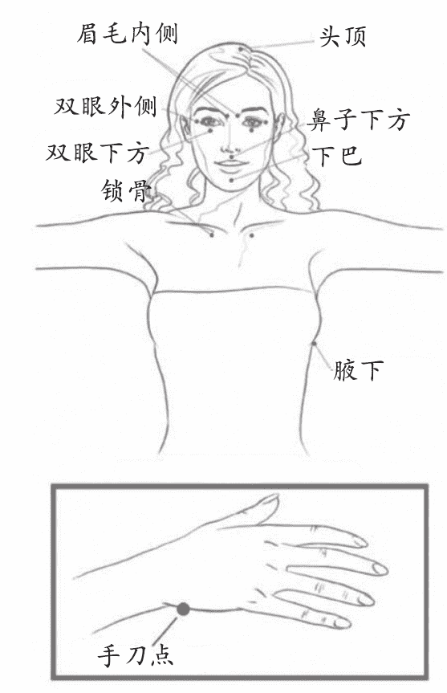

**图 2.1　穴位图**

#### 步骤 6　再次检测你情绪

现在你已经完成了第一轮的敲击治疗。做个深呼吸，仔细体会身体的感觉，留意发生的变化。问问自己：那件事情改变了吗？敲击时，我想起什么了吗？我现在的压力指数是几分？回想一下你的压力王事件，留意你现在的感觉。你可能会发现，之前翻腾的怒火已经平息了一些。接下来，你可以用相同的提示语多敲击几轮，把对这件事的怒火彻底平息下来。

例如，有时候你会发现，当你因为照片里的样子而愤怒时，敲击治疗会让你唤起另一种记忆，体会另一种感觉。这是个好现象。继续针对出现在你脑海里的记忆或感觉进行敲击。这个过程就像剥洋葱，能够一层一层地深入事件中心。随着时间的推移，你就可以和自己建立起全新的关系。我建议你一直敲击下去，直到压力王事件带给你的压力变小，你的感觉明显好转为止。这可能意味着主观焦虑评分下降 2～3 分，也可能意味着主观焦虑评分降为 0。

不论你的痛苦是生理上的、情感上的还是精神上的，你都需要敲击足够长的时间才能将其消除。坚持敲下去。敲击 5 轮，10 轮。在任何可能的时候敲击，并坚持下去，直到你获得想要的那种轻松畅快感。

你准备好试一试了吗？首先，边敲击手刀点，边重复问题描述语 3 遍。然后按顺序敲击身上的 8 个穴位：眉毛内侧、双眼外侧、双眼下方、鼻子下方、下巴、锁骨、腋下和头顶。第一轮敲击时，你不必担心自己做得不够好，重要的是你开始敲击了！如果需要帮助，请访问 www. TheTappingSolution.com/chapter2 获得相关资料。

指尖敲出丰盛

**别着急**，**先专注于敲击负面情绪**

敲击主要是为了减轻某些想法引起的压力。把注意力集中在负面感觉上很重要，因为这样做才能改变你的感觉。这永远是第一个，也是最重要的步骤。随着一轮轮的敲击，当你感觉主观焦虑评分已经低于 5 分时，就可以开始加入自己的感受了。加入自己的感受这个步骤可以跳过，但我想说的是，它真的特别有效，但你必须在真正感觉到积极的情绪时，才能这样做。如果你发现自己还在抗拒积极情绪，那么请继续集中精力在你真实的感受上，继续敲击下去。记住，敲击会向大脑发送冷静信号，告诉它，现在很安全，可以放松下来。

#### 不要停，继续深入敲击

看到自己的照片时，你可能会生气，这是关于敲击治疗的第一个例子。针对某一种情绪进行敲击，是清理阻碍你减肥障碍的方法之一。但是，就像我更早时候提过的，敲击治疗就像是剥洋葱，我们要把问题的表象一层层剥离。就像我们看到的那样，有时候，敲击治疗最开始的目标是不再生气，但随着敲击逐渐深入，你会在生气背后发现别的东西。

当一个问题存在多个层次时，你可能需要逐层敲击清理，最终才能完全解决这个问题。在逐层清理的过程中，最初的阶段或许有些单调乏味，但实际上，好戏在后头，情感和生理体验都拥有多个层次。记住：你不需要一次解决所有问题，不要对自己太严苛。

刚开始敲击时，要如何选择目标？4 种最常见的敲击对象是症状/表现、情绪、事件和束缚性信念。接下来，我们将具体介绍这 4 种敲击对象。

### 压力来源不同，敲击对象也不同

敲击树是情绪释放治疗专家林赛·肯尼（Lindsay Kenny）创造的。它是一种完美的比喻，可以帮助你理解减肥拼图中所有碎片之间的关系。树根代表我们的束缚性信念，指我们对自己和这个世界抱持的固有的看法；树干代表过去发生的事件。它们给我们带来创伤，如今仍影响着我们；树枝是事件引发的情绪，包括羞耻、沮丧和绝望；最后，树叶是显现出来的外在症状，会增加我们的压力。记住，我们并不是认为，所有事情都始于束缚性信念。你也可能是因为某件事，而形成了对自己、对世界的某种看法。

在本书接下来的部分，我们将针对敲击树的各个部分，逐个进行敲击。尽管我们倾向于关注减肥，但为了获得长期减肥的效果，我们需要解决一些潜在问题，这些问题决定着我们和自己、身体、体重以及食物之间的关系。

客户常常告诉我，她们只需要减肥。当我们一起进行敲击治疗时，她们会记起许多事件，比如童年小事、父母离婚或是其他一些印象深刻的体验。然后，她们意识到，正是那些事件带来的痛苦导致体重上升以及随之而来的挣扎。很多人都有某个坚定不移的观念，比如“我永远不够好”，“减肥一定是一件艰难的事”，但最终她们会意识到，这些信念一直在阻碍她们成功减肥。

有时候，你可以一次性解决敲击树的几个部分。例如，通过敲击某个“树根”处的束缚性信念，也可能同时清除一个“树叶”处的症状或表现。当你针对压力进行敲击时，就会产生这样的效果。让我们更具体地介绍一下敲击树的各个组成部分。

#### 症状和表现（树叶）

通常情况下，体重很难减轻和保持。不愿意运动、食欲旺盛、常吃零食等，都是症状和表现。症状可以分为两类：生理症状和行为。症状和表现常常最令人烦恼且最容易辨认，因为它们真实存在。

看起来，这些症状都像是问题本身，但它们常常只是更深层问题的表现而已。理想状态下，随着时间的推移，你将找出那个更深层的问题，然后把它作为敲击对象。也就是说，针对一个明显的症状或表现进行敲击是个很好的起点，这么做可以快速消除症状。

敲击可以有效削弱你对食物的渴望。如果你很想吃巧克力，你可以这样对自己说：“尽管我真的想吃那盒巧克力，但我还是全身心地爱我自己、接纳我自己。”你可以边敲击各个穴位，边说出像“巧克力”“太想吃巧克力了”这样的提示语。很多人发现，只需要做症状敲击，食欲就会消失。我的一个学员和我分享了她的经历：

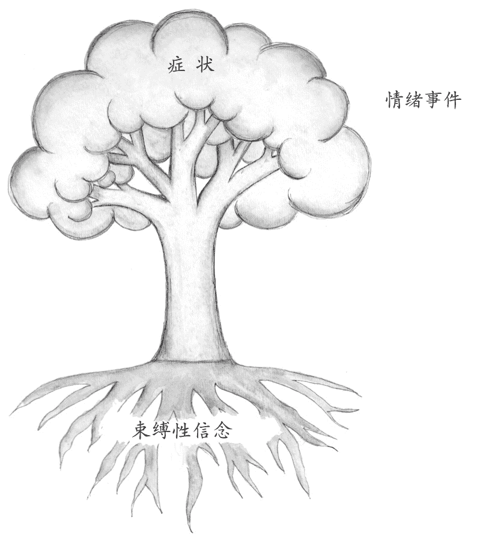

**图 2.2　敲击树**

我超级喜欢多滋乐扭扭糖！从还是一个小女孩时起，我就特别喜欢它。我的高中男友们常会用 1 磅装的多滋乐扭扭糖诱惑我。

昨天下午，我儿子在沙发上睡觉的时候，旁边的桌子上放着一大袋上周派对留下来的混合糖果。我盯着糖果袋子，寻找我最喜欢的扭扭糖。然而，我一个也没找到！但是，我记得冰箱上面还有一袋。想到这，我已经开始流口水了。脑袋里全是撕开糖果包装袋，把糖一颗接一颗地放进嘴里的画面，还伴随着扭扭糖的奇妙味道。

我立马起身往厨房走去。但是，我刚走到冰箱前，却立刻转身回到了客厅，然后坐在沙发上开始敲击了！突然，我发现自己不想吃扭扭糖了。当时我几乎震惊了！前一刻我还到处找扭扭糖，但这一刻却对它们完全没兴趣了。这太惊人了！

但是，当症状敲击无法达到理想效果时，就意味着你需要继续深入敲击树，找到更深入的、能带来预期中的释放感的敲击目标。下一步要做的就是检查你的情绪状态。

#### 情绪（树枝）

如果你因为想吃巧克力而开始敲击，但这并没有让你的渴望消除，你可以问自己：“我很想吃巧克力时，心里是什么感觉？”例如，如果你因为丈夫的话而生气，你可以针对这种情绪进行敲击，直到它消失为止。有时候，你可能会意识到自己同时有几种不同的情绪。这是因为敲击目标有不同的层面，最开始的生气可能会演变为难过和沮丧，然后变成悲伤和孤独。如果你意识到自己正在体验很激烈的情绪，可以先忽略症状和表现，先针对情绪进行敲击。

有时候，我们很容易陷入那些最熟悉的情绪里。例如，我们很多人都会针对生气或悲伤的情绪进行敲击，因为这些情绪很容易辨认。但是，感受、捕捉多种情绪有助于使敲击对象更加具体。以下是很多人都体验过的情绪。你可以用下面的情绪列表进一步了解你目前的情绪状况：

疏离　矛盾　愤怒　焦虑　辛酸　无聊

轻蔑　抑郁　绝望　恶心　悲伤　怀疑

恐惧　尴尬　嫉妒　害怕　沮丧　暴怒

难过　不满　内疚　憎恨　思乡　希望

敌对　耻辱　饥饿　抓狂　不安　厌恶

孤独　多疑　遗憾　大怒　后悔　悔恨

怨恨　羞愧　痛苦　担心

#### 过往的事件（树干）

另一种常见的敲击对象是过往的事件。过往事件分为两种：一种已发生并且很快就过去的事件；另一种是对我们带来比较大的影响，并且一直停留在记忆中的事件。两种事件的区别在于，我们是否曾经从情感上、能量上或生理上加工过这些事件。

举例来说，一个人可能在回想起被小学老师责骂的情况时说：“是的，我记得她点名批评我时，我有多尴尬，但我现在已经不会感到困扰了。”这就属于记忆还在，但曾经的情绪已经消失了的状况。另一个人回想起被小学老师批评的情况时，感受可能完全不同。她的身体还能感觉到情绪。当她回忆起那一刻时，强烈的尴尬、生气和受伤的情绪立即涌上心头。这段回忆就是还没有被加工过的。如果用敲击面对过往的事件，将帮助她平复伤痛，继续前进。

#### 束缚性信念（树根）

束缚性信念是我们根据过往的事件或经验，对自己和世界做出的具有误导性的结论。例如，有些人可能对减肥和保持体形的能力拥有束缚性信念，因为她的体重已经忽高忽低了许多年。于是，她会预测这个模式将不断重复下去，而这样的信念就束缚了她，让她不再相信各种可能性。

我们很难辨别自己的束缚性信念，因为在我们看来，这些信念就是真理。例如，你可能会认为，自己永远也不可能减掉怀孕时增加的体重，因为你的母亲和姐姐都没有减掉。于是，你可能会在孩子出生之后停止锻炼，因为你会想，既然减不掉，那运动又有什么意义？

我们大部分人从童年起就会无意识地收集各种束缚性信念。随着不断长大，束缚性信念会像滚雪球一样越滚越大。家长、老师和同龄人常会在我们还小的时候，就把这些束缚性信念传递给我们。从那时起，他们就对如何看待自己、看待他人形成了固有模式。

“我永远也减不了肥”的信念，会影响我们吃什么、如何吃、是否运动，以及在亲密关系和事业中投入多少努力。它会改变我们的行为方式。针对童年或过往的事件进行敲击，常常可以清除束缚性信念，但如果你已经意识到某一条束缚性信念的存在，你也可以直接针对它进行敲击。

### 敲击树：让疗愈更生动

敲击树是一种生动的工具。通过这个工具，你可以理清生活中发生的所有事件，然后按部就班地解决眼前的诸多问题。通过敲击树，我们也更容易看清症状/表现、情绪、事件、信念四者之间的关系：它们分别是树叶、树枝、树干和树根。了解这些元素之间的联系，对于获得最好的敲击效果来说很重要。敲击穴位时，针对的问题要尽可能具体化，那样你才能把精力真正集中在当时发生的事件上。而具体化的最好办法就是更深入地思考，在后文中我也会不断提醒你这一点。

在遵循书里的步骤进行敲击治疗时，随着压力王事件的不断增加，你可能希望创造一棵属于自己的敲击树。如果这样，你可以访问网站 www.TheTappingSolution.com/chapter2，在一张白纸上打印一棵敲击树。当然，你也可以自己画。敲击树不需要长得很漂亮，只要确保在相应的地方留出足够大的空白即可。

指尖敲出丰盛

**会不会太过于专注消极念头了**？

客户有时候会提到，她们担心情绪释放疗法会过于关注消极的念头和情绪，比如害怕、担心、责备和羞耻。我理解她们的担心。实际上，我们所有人都体验过消极情绪。如果我们试图忽略消极情绪，或是因为这些情绪而批评自己，就等于让这些情绪在潜意识里控制我们。

例如，如果我们很生气，就没办法忽略生气的感觉，然后自行决定不要生气。想要解决这个问题，就要想办法释放怒气，然后才能放松和冷静下来。

敲击能够在很短的时间内，有效地消除负面想法和情感。这样，我们就能再次放松下来。减少负面情绪的最好方法就是针对消极面进行敲击，比如体重带来的压力，你对老板、财务状况、人际关系等方面的担忧和失望等。随着你不断敲击和清除那些消极思想和情感，你将能够用积极的表述方式进行敲击，这将进一步降低你的压力水平，提高你减肥的能力。

客户常常告诉我，随着每天进行敲击，她们逐渐感到开始享受这个过程。尽管刚开始学习敲击时，她们会感觉有点奇怪，但随后就发现，这让她们更加放松、心情更加愉快。

顺利开启减肥旅程的最佳方法就是立刻花 15 分钟，针对任何带给你压力或焦虑的事物进行敲击，先不去管它是否和你的体重有关。想象在不久的将来，你早上醒来时发现，身体状态棒极了！那会是怎样一番情景？

你花在敲击上的每一分钟都是有价值的。所以，现在就花些时间学习敲击的方法，然后坚持练习，并感受敲击带来的变化吧。

相信我，如果我可以通过敲击减掉体重，我的客户也可以，那你也一定可以！

# 第三章　别害怕，你可以丰盛而强大
ENDING THE PATTERN OF PANIC

我们常因为极度想要瘦下来而恐慌，这种恐慌有多种表现方式，也是由多种环境因素触发。恐慌时，我们如无头苍蝇，着急地迎战或者投降，最终遍体鳞伤。静下来敲击 5 分钟吧，你会发现，渡口就在身边，幸福就在眼前。

每个人都会不喜欢自己身体的某一部分，但我已经停止抱怨它，因为我不想批评造物主的创造……我的工作只是让这幅杰作闪耀光芒。

非裔美国女演员　阿尔弗雷·伍达德

现在，我们已经了解了压力对减肥和形体自信的消极影响，以及情绪释放疗法如何帮助我们减小压力对体重和身体的破坏的。我们需要进一步解决女性朋友们在这段旅程中最常遇到的另一个障碍：恐慌。我们常因为迫切希望减肥而感到恐慌，这种恐慌有多种表现方式，也是由多种环境因素触发的。

“我希望在接下来的 3 周内减掉 20～35 公斤。”安娜丽莎在描述问题时写道。几周之后，安娜丽莎将要和一个她变胖后再也没见过的朋友见面。她很确定，在这位朋友眼里，她将是一团“肥肉”，而且安娜丽莎已经在脑海里想象这样的画面了：这位朋友打电话给她俩共同的朋友，告诉她们她现在变得有多胖。安娜丽莎非常害怕和焦虑，一心想要避开朋友们的无声嘲笑。

显然，安娜丽莎陷入恐慌了。从 14 岁起，每当面对当时的“大魔王”——镜子时，我也会陷入恐慌，因为它把我的身体缺陷真真实实地反映出来了。在 20 岁出头时，哪怕只是不经意地看到镜子里的自己，就足以让我变成一名残暴的军训军官。我会死命地拧遍全身，以证明自己的观点：我不够好。

这种一瞬间袭上心头的恐慌感，像给我打了一剂肾上腺素，让我一下子按最新的减肥食谱吃饭，或是去健身房尝试新课程。几乎每次，我都能因此成功减掉几公斤，但很快又全部反弹。这种循环永远停不下来，每次兜兜转转之后，我都会回到那个令人难受的、但非常熟悉的老朋友——恐慌身边。

我激励自己继续当军训军官，继续严厉地批评自己，直到终于忍不住开始绝望地哭泣。我的身材一直都不算苗条，这意味着，我一直都不够好。我感觉自己像是一个人人都可以看到、都可以评判的失败者。

几年之后，我终于明白，在我和体重这对痛苦的关系中，恐慌到底扮演了什么角色。每当我因为看到镜中的自己而悲观失望时，恐慌似乎是唯一能够让我振作起来解决眼前问题的力量。每次，恐慌都强迫我采取行动，而最终，我总会被打回原形。

其实，从某种程度上来说，我知道自己在不断重复老旧而转瞬即逝的减肥模式，但我依然坚定地告诉自己，如果我足够努力，管好自己的嘴，就能获得一辈子都不走样的苗条身材。难道不是吗？我没办法让脑袋里这个总是对我恶言相向的声音安静下来。

像诸多努力减肥的女性一样，安娜丽莎和我都陷入了“恐慌模式”。不论这种情况多么普遍，为了获得长久的形体自信和减肥效果，我们必须打破这种模式。但是，我们首先需要进一步了解“恐慌模式”是什么，以及为什么会出现这种模式。

### 自信是最坚固的盔甲

当我的客户和我开始第一阶段的治疗时，表面上看，她们似乎拥有各不相同的经历。有些人因为需要别人辅助她减肥而羞愧，有些人害怕会再次失望，还有些人似乎准备好接受某种轻微的折磨，准备好而且愿意做“任何需要做的事”。

在这些表象之下，她们的感受非常类似。她们都陷入了恐慌模式，坚信自己需要立刻、马上减掉体重。

我们对恐慌的反应通常有两种：战斗或承认失败。尽管这两种策略看起来南辕北辙，但它们确实都出自恐慌。有些人会出现其中一种反应，有些人则会随着时间的推移，在两种反应之间摇摆不定。

#### 战斗模式：“要么瘦，要么死！”

减肥引起的恐慌，会因为某一段记忆或某一个事件而开启战斗模式，比如 3 周之后要见老朋友等。战斗模式开启后，我们会产生一种强烈的渴望：不惜任何代价也要减肥。在战斗模式下，我们确信体重是衡量个人价值的唯一标准。我们是谁，我们需要做什么，或是我们已经取得了哪些成就，都不及体重下降有价值。

安娜丽莎的情况就是如此。满心耻辱、恐惧和焦虑的安娜丽莎，无法想象和朋友愉快相聚是什么情形，她只觉得自己受到了威胁。她脑海里的那个故事似乎是她唯一的结局。每当安娜丽莎想到要和朋友见面，她就在心理上和情绪上做防御准备，因为背后中伤、言语伤害似乎是避免不了的了。

开启战斗模式后，我们会告诉自己，不论恐慌有多让人难受，我们都需要恐慌，因为这是最后的希望。如果停止恐慌，就相当于放弃减肥。我们相信，需要对自己严厉一些，因为如果松懈下来，体重很快就会回来。恐慌让我们相信，我们还有希望减掉一些体重。

#### 失败模式：“我放弃了！”

相比战斗模式，失败模式看起来很冷静，因此也十分具有迷惑性。

约尼在谈到自己的体重时说：“这是我失败的勋章。最糟糕的是，每个人每天都可以看到这枚勋章。”

“如果你把体重看成失败的勋章，你还有多少动力好好照顾身体呢？”我问道。

“一点也没有。”她回答道。

“这不怪你，”我对约尼说，“如果是我，我也不会好好照顾它。谁会想花时间照顾他们讨厌的东西呢？”

乍一看，失败模式好像和战斗模式相反。我们似乎放弃了，完全不关心体重了。垃圾食品、暴饮暴食、停止运动，我们伤害自己和身体的所有方式都变得合情合理。我们的体重不断增加，怎么减也减不掉。我们对失败的减肥非常失望。我们曾经花费了那么多精力和体重战斗，真是受够了。最终，我们挥动白旗，承认自己失败了。我们告诉自己，这是聪明人的做法。对其他人奏效的减肥项目和食谱对我们一点儿也不管用。我们的命运就是做一个胖子，所以，为什么还要和我们显然无法掌控的事情抗争呢？

但是，越过表象，我们其实一直都没有接受自己的体重。我们做不到。我们常常想起自己的体重，但已无法面对隐藏在体重背后的失望和伤痛。伤痛太强烈、太深刻，它会击垮我们。于是，我们戴上失败的面具，掩盖身体里满满的羞耻感和自责。

实际上，失败模式下的恐慌感和战斗模式下的恐慌感并无二致。而且，在失败模式下，我们感受到的绝望和焦虑可能更加强烈。

### 希望被认可，却偏偏先否定了自己

当对体重感到恐慌时，不论选择战斗模式还是失败模式，我们都会确信，瘦下来就会解决所有的问题。在恐慌模式下，即使表面上看好像放弃减肥了，但实际上，我们内心仍然认为，没有什么东西跟减肥一样重要。我们告诉自己，只要减肥成功，所有的一切都会改变，我们的生活和人生就会焕然一新。

于是，恐慌的力量开始压倒我们自身的力量。我们开始相信大众传媒和大众文化散播的观念：苗条的身材等同于快乐无忧。我们会告诉自己，如果能减肥成功，我们的人际关系将会改善，事业将会腾飞，房间会变得整洁干净，生活会越来越好。但如果我们拥有现在的身材，生活变好的可能性就几乎为零。

对于没有遭遇过这种体重恐慌的人来说，上述经历看上去可能显得有些疯狂。从很多角度来看，它确实疯狂。但是，对于恐慌的我们来说，没有什么比这更加合理了。当时的我们处于一种危险的、对减肥着迷的状态。我们会去书店买最新的减肥书，尝试最新的运动方法，或者进入另一种恶性循环：拆开一盒点心大吃特吃。因为我们成功减肥的希望已经破灭了。

当然，从某种程度上来说，我们知道恐慌并不能实现长久的减肥目标，但还是会一次又一次地陷入这个模式。为什么会这样？真正令我们恐慌的是什么？

因为我们想逃避和否定某些不想讨论的东西，即承认一直以来的斗争对象并不是体重。当因为减肥而恐慌时，我们真正想要的其实是做自己。我们希望能肯定现在的自我，认为现在的自己也很棒。我们恐慌是因为，恐慌可以掩盖一个痛苦的事实：我们实际上也不认为自己足够好，我们其实是在享受否定自己的感觉。

当然，体重并不是我们的全部价值，但它是一个精神支柱。我们告诉自己，一旦通过减肥“改造”了自己，我们最终将值得拥有快乐、爱、成功，以及所有目前得不到的美好事物。

我们一次又一次地被一种观念迷惑，那就是：在某一天，我们的恐慌可能会带来苗条的身材，以及由此而来的快乐。但实际上，如果我们承认自己的价值，不论体重是多少，我们都能拥有快乐。

### 真正的朋友不会轻视你

跟我的很多客户一样，你可能会害怕停止恐慌，因为你把“不恐慌”和“接受自己永远无法减肥成功”画上了等号。但是，你也知道，恐慌并不是正确的问题解决方法。如果恐慌有用，你早已减掉了身上的赘肉。如果恐慌有用，你就不会翻开这本书了。

是时候彻底终结恐慌模式了。是时候承认减肥和体重无关了。事实是，除非你释放压力，清理情绪残留和消极信念，否则，苗条的身材永远是可望而不可即。下面这句话将反复出现，但这是事实：长期保持苗条身材和形体自信是一项内在工作。

我首先让安娜丽莎针对朋友到访引起的恐慌进行敲击。平静下来之后，她突然泪流不止。她发现自己低估了朋友以及她们之间的友情。安娜丽莎一直很会挑朋友，这位朋友永远也不会恶语评判她的体重。实际上，安娜丽莎意识到，自己正在把对待自己的残忍方式用到朋友身上。

最终，安娜丽莎和朋友见面时，已经可以坦然地面对她，并和她坦率地交流。两人聊天时，安娜丽莎快乐地放声大笑。她们度过了非常美好的时光。之前，安娜丽莎在去见朋友时，总会带着防御情绪，身体也会不舒服。现在，她实现了很大的转变。这次朋友聚会让安娜丽莎清晰地看到了一个事实，那就是她的体重不一定会打扰她的聚会。她的朋友想见的是安娜丽莎，而不是体重有多少公斤的安娜丽莎。现在你可以思考一下：曾经有多少次，你因为内心的恐惧和担心身体被批评，而剥夺了自己获得非凡体验的机会？

安娜丽莎只是陷入恐慌模式的千万人之一。恐慌模式让我们盲目地恶意揣测别人，并忽视那些阻碍我们获得持久减肥成果的潜在因素。现在，是时候终结恐慌模式了。但是，在进行敲击治疗、安抚恐慌情绪之前，我们需要探讨一下触发减肥恐慌的两种最常见的物品：镜子和体重秤。

#### 恐慌触发物之一：镜子

每年的 7 月 4 日，辛迪和她丈夫都会举办派对。今年的派对即将开始，在客人到来的几分钟前，辛迪进了衣帽间。她在挑选衣服时，想起丈夫的家人也会像往年一样参加今天的派对。在辛迪和丈夫结婚后的 10 年里，她的身材时而臃肿、时而纤瘦，反复了好几次。每年举办派对时，辛迪都觉得难堪，因为夫家的人会在这时候“检验”自己一年来的减肥成果。

事实上，去年的派对开始之前，辛迪把自己锁在房间，冲了个澡，然后试穿了几十套衣服，最后无助地在衣帽间的地板上哭了起来。辛迪满脑子想的都是大家评判她很胖的画面。辛迪恐慌而沮丧，不确定自己能否坦然地面对家人和朋友。

但是今年，辛迪做好了准备。为了今年的派对，她提前买了一条美丽的新裙子。辛迪迅速换上裙子，欣赏着镜中的自己。辛迪边审视身体的各个角度，边告诉自己：“你看起来很胖，每个人都会留意到这点，然后谈论你有多胖。”

由于辛迪从今年开始参加我的课程，因此这次的情况会和以往有些不同。当辛迪对着镜子自言自语时，突然停顿了下来，留意到了自己的负面想法。利用派对开始前的这几分钟，辛迪进行了一些敲击治疗。辛迪一边进行敲击，一边看着镜子里的自己，然后做了一件罕见的事情。辛迪对着镜子里的自己大声说：“你看起来真美。”

随着辛迪的嘴角扬起，心情也放松下来。然后她打开房门，朝派对走去。那一天，多年来的第一次，辛迪没有纠结自己看起来胖不胖，也没有被食物迷住。那一天，辛迪都在享受内心的平静。人们不断地赞美辛迪，说她看起来美极了。令辛迪最惊讶的是，她也感觉自己很美。

辛迪的故事极大地鼓舞了我。仅仅因为关注到自己的负面想法和进行自我对话，她就开启了新的一天，并成功将负面想法扭转为“你看起来很美”这样的积极暗示。那一天，辛迪没有把所有精力放在关注自己的外形上，而是释放自己的魅力，让每个人都感受到了！

辛迪也告诉我，她很惊讶自己可以感觉那么棒、那么快乐，完全不像往年那样压力重重。“我该不该吃这个”的恐慌感消失了，辛迪开始享受更健康的食物了。

我的许多客户在面对镜子进行敲击时，也发现自己的情绪状态和自我认知发生了巨大转变。通常来说，一开始时，面对镜子进行敲击会让你有些惊慌。因为镜子成了你的敌人，暴露了你最羞于展现在他人面前的缺点。面对镜子，你会审视自己的全身，从头到脚、从前到后、从左到右；你疯狂但有条不紊、毫无遗漏地指出了身上的每一块赘肉；你对自己毫不留情；你所想所说的，都是些刻薄无比、永远不该说出口的话。

我的一些客户，早上一醒来就会冲到镜子前，上下打量自己，然后判断自己能不能度过愉快的一天；还有一些客户会在昏暗的地方洗澡，避免看到镜子里的自己，因为她们知道那会让心情立马变糟糕。我们之所以会赋予镜子，这薄薄的一片玻璃决定我们幸福的权力，不是因为我们毫无价值，而是因为我们从没有投入时间和精力与自己和身体搞好关系。实际上，我们在镜子里看到的是我们与自己的关系，那种被忽视多年的非常重要的关系。

让我们进一步看看你是怎么对待镜子里的那个女人的。在仔细“审查”镜中人时，你可能说过很多伤人的话。在生活中，如果真的有人对你说这些话，相信你一定会气炸。你当然知道如果经常被这样审查，任何人都无法健康成长，但你仍然在无休止地这样对自己。修复我们和自己之间关系的第一步就是觉察。

你和镜子的关系如何？现在，花一点时间问自己下面这些问题：

◆我和镜子的关系如何？

◆我会逃避镜子吗？

◆我会站在镜子前面很久，批评自己吗？

当你面对镜中的自己时，留意自己都说了什么，然后记录下来。不论你在纸上写下了什么，当你重新走到镜子前时，你将找到一直以来寻找的东西。如果你在寻找缺点，那你就会找到缺点；如果你在寻找你所欣赏的东西，那你就会找到它们。你可能认为需要自我批评，而且严格要求自己可以避免受到他人的评判，或者被他们的评判伤害。实际上，正如辛迪的例子，当你欣赏自己和自己的美时，周围的人也将感受到你的魅力。

看着镜中的自己时，留意内心是否出现批评的声音或情绪。如果出现了某种情绪，用 0～10 给它打个分，记录下来。其中的关键是，请一边敲击，一边把那种情绪或自我批评说出来。

你可以按照下面的敲击剧本进行敲击。做几轮敲击和检查，看看你的感觉如何。你可能会发现，刚开始敲击时，那种情绪变得更强烈了。这可能是因为，这是你第一次把内心独白说出口。这是你击中了要害的标志，请继续敲击下去！

手刀点：尽管我严厉地批评镜中的自己，心里也很恐慌，但我依然爱自己，接纳自己。（重复 3 遍）

眉毛内侧：我讨厌眼前的一切……

双眼外侧：现在，我正站在我最严厉的批评者面前。

双眼下方：面对这个样子，我高兴不起来。

鼻子下方：我怎么会让自己变成这个样子？

下巴：我在镜子面前感受到的所有情绪……

锁骨：我允许自己把它们说出来。

腋下：这种恐慌的感觉……

头顶：拒绝镜子里的那个人。

演练敲击剧本的关键在于，你要一边敲击，一边说出你想对镜中的自己说的话。当你感觉自己可以顺畅地说出这些话，同时不认为它们是客观的，那就可以转变为积极的描述。积极的描述与消极的描述一同构成了整组敲击，所以，在后半部分中，你不需要再进行一次手刀点敲击和问题描述。

眉毛内侧：一直以来，我对你都太过严厉。

双眼外侧：你值得被好好对待。

双眼下方：你不需要做其他更多的事情，你就是值得被爱。

鼻子下方：现在，我是爱你的。

下巴：我选择欣赏你做的所有事情。

锁骨：我选择友善地对你说话。

腋下：我爱你，我的身体。

头顶：我保证会把你值得拥有的所有爱都说给你听。

做一个深呼吸，并检查你现在的感觉。再次评估你的情绪强度，然后继续敲击，直到你感觉压力减轻。如果想参考更多相关的敲击剧本，你可以访问 www.TheTappingSolution.com/chapter3。

指尖敲出丰盛

**为什么要先消极敲击**，**后积极敲击**？

尽管我们可能很想对自己更宽容，却常常做不到，因为消极的想法是那么真实。当身体感到恐慌时，我们很难改变自己的想法。但当针对自己的第一感觉进行敲击时，即使那些消极的想法出现了，我们也可以平静地对待。当感觉更放松时，我们就可以继续针对更积极的观念进行敲击。

#### 恐慌触发物之二：体重秤

在网络减肥课程的第一阶段，我会告诉学员，如果愿意，他们可以在课程刚开始时，称一次体重，然后就把体重秤收起来。

有些女性有一大早称体重的习惯，这样，接下来的一整天她们都会对那个数字念念不忘。她们会像对牧师忏悔那样，跟你报告她们的体重以及期待落空后的羞愧感。

授课期间，当学员听从我的建议，把体重秤收起了后，她们开始一遍又一遍地向我讲述衣服如何越来越宽松，身体如何越来越轻盈。正当我要恭喜她们时，她们却告诉我，早上她们踏上体重秤时，自己有多么沮丧，因为体重秤上的数字不是她们以为的样子。她们可能重了一公斤，或者保持不变，或是仅仅只减掉了一点点。总之，她们对那些数字很失望。但是，为什么我们会对体重秤上瘾呢？

为了解释体重秤是如何成为如此重要的身体测量方式，我们需要先了解一下体重秤的有趣历史。美国的第一台体重秤出现于 1885 年，是德国产的。20 世纪 20 年代和 30 年代，体重秤逐渐进入大众视野。当时的体重秤，每台大约 90 公斤重，散布于街角、百货商店、电影院和公共卫生间。体重秤很快成为非常赚钱的工具，顾客花 1 美分就可以称一次。称体重这项产业每年可以创造数百万美元的收益，甚至在“大萧条”期间也兴盛不衰。

在那之后，我们和体重秤之间的关系就发生了非常剧烈的变化。为了真切感受这一点，你可以想象自己在大庭广众之下踏上一个体重秤——身边围着几十个陌生人。对于大部分人来说，这是现实中的一场噩梦。直到 20 世纪 40 年代，称体重才变成私密的事情。随着制造技术的不断发展，小巧的家用体重秤出现了。

从那时起，大众文化就开始缓慢但持续地给我们“洗脑”，让我们相信苗条意味着美丽、快乐、有价值、自信、有才华、讨人喜欢和成功。结果，我们在体重秤上看到的那个数字，从有趣的一探究竟，转变成判断女性价值的标准。我们知道，在更深的层面上，女性的价值超越我们的体重，但是相比自己的身体感受，我们仍然会认为体重秤上的数字更加重要。怎样才能打破这种模式？

首先，探讨一下我们对体重的一个最大误解，那就是，你的体重不应该上下波动。从生物学的角度讲，这个观点完全不正确，特别对于女性来说。你的体重会随着荷尔蒙的不断波动而波动，这不仅只发生在生理周期；当压力水平上升时，体重也会增加。这种波动是自然的、健康的，不需要进行“改造”。

把生活方式和压力考虑进去，相信你更能理解为什么你每天、每周的体重都会不一样。下面这些因素都可能导致你的体重每小时、每天以及每周出现波动：

饮食的变化　便秘　节食　睡前吃东西

易过敏食物　运动　饮水量　药物

月经周期　睡眠　压力　营养补充剂

旅行　每天最后一次进食的时间

每天最后一次喝水或饮料的时间

有趣的是，正常的、健康的体重波动不一定符合你的预期。例如，正如我们看到的那样，当你的压力水平上升时，皮质醇水平也会上升，而皮质醇水平过高会导致身体主动储存水分。而节食会让你的身体承受压力，所以当你刚开始节食时，皮质醇水平会上升，这可能导致你的身体储存过量的水分。所以，刚开始节食的那几天或几周，你的体重可能反而会增加。

相同的原理也适用于饮食方式的改变。刚刚开始吃更多蔬菜和水果时，身体会留意到这种变化，然后会自动储存水分。这是身体在适应你的饮食习惯的积极变化，同时为减肥做准备。

了解影响体重的因素后，我们就可以更全面地讨论，为什么体重秤如此具有误导性和自我破坏性。从很多角度看，体重秤上的那个数字都没有意义。

为了戒掉称重上瘾，首先需要理解，为什么我们不能信任自己的身体，以及为什么我的客户会一边说“感觉身体越来越轻盈”，一边又一次次踏上体重秤。

#### 重新学习信任你的身体

忽高忽低的体重，让我们很多人无法信任自己的身体。多年来，我们一直压抑对美食和快乐体验的自然冲动；而如果我们屈服了这些积极、健康的冲动，内疚感和羞愧感就会接踵而至。随着时间的推移，身体就会变成我们的敌人，它们“故意”策划着让体重上升，而不帮助我们获得更多爱、尊重和关心。鉴于我们如此不信任自己的身体，那么称重上瘾就完全合情合理了。毕竟，我们和身体作对了那么久，又怎么会信任它们的感觉呢？

像镜子一样，体重秤很快变成了某种权威。体重秤上的数字会决定着我们是否可以度过愉快的一天，是否可以快乐、认为自己美丽和有价值。

问题是，不信任自己的身体并因为一个“糟糕”的数字惩罚自己，到头来会让减肥变得更难。因为你不信任自己的身体，所以如果你不踏上体重秤，或是当体重秤上出现了你不想要的数字时，你会压力重重。

我的学员生罗宾，在参加网络课程几周之后，对体重秤在减肥之旅中的效用有了不一样的认识：

从参加课程的第一周开始，我一直在想你提出的“藏起你的体重秤”的建议。我立马就爱上了这个点子，因为我知道如果我正在付出努力（现在的努力是敲击），但没有收到效果（体重秤上的数字下降），就会对很多自认为需要解决的体重和身体问题产生不必要的情绪。

今天早上，我意识到不称体重可以让自己对体重更加负责。不称体重，我就需要“亲自”为自己提供支持。我需要对自己承诺，并对体重负责。不得不说，这让我充满力量。我喜欢这种可以做些不同的事情的感觉！至少这一次，我没有把体重当成惩罚的工具，而是释放自己，真正为自己做一些很棒的事。

体重秤的作用显示准确体重。这不是批评，也不能预测明天、下周或下个月你的体重是多少。为了牢记这一点，现在针对你和体重秤之间的关系，以及重新学习如何信任自己的身体，做一些敲击治疗吧。

手刀点：尽管我让体重秤衡量了我的个人价值，但我依然爱自己，接纳自己，而且我选择取回属于自己的力量。（重复 3 遍）

眉毛内侧：我忍不住要去看那个数字。

双眼外侧：这个数字告诉我应该产生什么样的感觉。

双眼下方：这个数字告诉我，我是好还是坏。

鼻子下方：我已经不相信自己。

下巴：所以我相信这个体重秤……

锁骨：它会告诉我，我做得怎么样。

腋下：我得看体重秤。

头顶：只有这样做我才会感觉自己“很棒”。

继续敲击，甚至夸大你对体重秤的信念，直到你感觉这并不真实。然后用积极的信念进行敲击。

眉毛内侧：我选择取回我的力量。

双眼外侧：我不再每天用体重秤衡量自己……

双眼下方：我选择直接体会自己的感觉。

鼻子下方：我知道身体的感觉。

下巴：而且我知道我的身体真正需要什么。

锁骨：体重秤上的数字并不能带来冷静和自信。

腋下：我现在的状态就是冷静而自信。

头顶：我选择体会自己的感觉而不是用体重秤衡量自己。

做一个深呼吸，看看现在你感觉如何。再感受一下你的情绪强度，然后继续敲击，直到感觉压力得到缓解为止。

### 不瘦下来就不准幸福？管它呢！

陷入恐慌模式标志着，我们此刻就需要想办法爱和接纳自己。因为这样，我们才能感受到更多快乐，并更有耐心寻找健康、可持续的减肥方式。爱上这段减肥之旅后，我们就可以更轻松地向梦想迈进，并为自己取得的每一点进步欢呼雀跃。幸运的是，当你感觉很愉快时，时间总是过得特别快。

盖尔在踏上减肥和形体自信之旅后不久，就清晰地感受到耐心的真正力量。盖尔已经梦想穿裙子很多年，她告诉自己，只有能穿小一码的衣服时，她才会穿裙子。盖尔会吃许多让身体感觉不舒服的食物，无意之中，她剥夺了自己收获简单但重要的快乐，那就是穿上漂亮的衣服，让自己感觉美美的。

在参加了几周我的课程后，盖尔分享了一些激动人心的消息。她买了几条新裙子，并经常穿着它们出门。这些裙子让她感觉自己很有女人味、自信和美丽，这是这些年来第一次，盖尔不讨厌镜子里的自己。

自从盖尔开始审视自己减肥中的潜在问题，并运用敲击疗法清除抗拒照顾自己的想法后，她感觉面对食物时，自己更强大了。不再极度渴望食物之后，盖尔开始选择健康、有营养的饮食，而且吃得更少，也更少想到食物。课程才刚开始，盖尔就取得了惊人的效果。我知道，发生这些转变后，她的体重很快就会有明显的下降。

盖尔是再次证实我的亲身经验的千万名学员之一。对于我们来说，减肥变成一种愉快的体验，在减掉想减掉的体重同时得到了更多。我们中有太多人像盖尔一样，把减肥当成自己最大的梦想。我们告诉自己，除非减肥成功，否则不能和别人相爱，或是拥有一份新事业。除非减肥成功，否则我们无法欣赏自己、享受生活，或是穿上让我们感觉很美的衣服。因为体重，我们让自己的生活停摆，就这么看着岁月从身边流逝。

当我们可以安抚恐慌，并耐心地走过减肥之旅时，就相当于拥抱了当下的所有可能。我们开始发现，原来生活充满惊喜、鼓舞人心而赏心悦目。更重要的是，不是说减肥成功之后才拥有这样的生活，而是现在，马上！当可以享受这场冒险时，我们就能以想象不到的速度抵达目的地，且玩得很开心。这就是耐心的力量，这就是我想要你获得的东西。现在就开始吧，然后耐心地走完自己的旅程。

一旦你可以安抚恐慌，就相当于准备好开始下个阶段的旅程了。从第四章开始，我们将进入本书的第二部分，这一部分将帮助你了解自己，并像剥洋葱那样，解决那些长期阻碍你成功减肥或保持形体自信的东西。现在，让我们先做一些敲击治疗，释放你的耐心能量，为你的减肥和形体自信之旅提供助力。

敲击冥想练习

**感受耐心的力量**

手刀点：尽管我无法在成功减肥之前放松下来，但我依然爱我自己，接纳我自己。（重复 3 遍）

眉毛内侧：我感到恐慌……

双眼外侧：我感觉需要惩罚自己……

双眼下方：体重很重要……

鼻子下方：身体中的压力……

下巴：是我自己给自己施加的压力……

锁骨：我感觉需要批评自己……

腋下：责备自己。

头顶：我接受不了镜子里的自己。

眉毛内侧：这些压力……

双眼外侧：让我很难思考别的事情。

双眼下方：我的生活似乎停摆了。

鼻子下方：除非减肥成功，否则我不可能快乐起来。

下巴：除非减肥成功，否则我不可能自信起来。

锁骨：除非减肥成功，否则我不能享受当下。

腋下：怪不得我对体重感到恐慌……

头顶：我让体重阻止我享受生活。

眉毛内侧：我感觉我需要批评自己……

双眼外侧：所以最终我改变了。

双眼下方：但是，这方法一直不奏效……

鼻子下方：我永远不会那样对我爱的人说话。

下巴：所有这些批评和身体的羞耻感……

锁骨：它们困住了我。

腋下：这些情绪让我背负体重的压力。

头顶：现在，我准备释放这些和体重相关的情绪。

眉毛内侧：让我的生活停摆的可能不是体重。

双眼外侧：是我自己让生活停摆。

双眼下方：我再也不想等体重降下来再行动了……

鼻子下方：我现在就要尊重我自己……

下巴：从现在开始，一切皆有可能。

锁骨：我选择赋予自己权利。

腋下：我将为自己的身体创造充满爱的内在环境。

头顶：在这种环境下，一切都很棒。

眉毛内侧：我用充满爱的语言夸奖自己的身体。

双眼外侧：感谢你为我做的所有事情。

双眼下方：你不需要努力赢得我的爱。

鼻子下方：我现在就爱你，爱你现在的样子。

下巴：一直以来，你都对我这么好……

锁骨：我一直在找照顾你的方法……

腋下：用充满爱的话语和行动。

头顶：我选择去感觉我对你的爱。

眉毛内侧：我不需要审视镜子里的自己……

双眼外侧：或是体重秤……

双眼下方：我只需要体会身体的感受……

鼻子下方：并且给自己应该得到的照顾。

下巴：我信任这个过程。

锁骨：我信任生活。

腋下：所有的一切就这样展开。

头顶：我享受现在这一刻。

# 第四章　享“瘦”身材：唯美食与爱不可辜负
OVERCOMING EMOTIONAL EATING

开心时，你会特意吃大餐庆祝吗？伤心时，你会寻求食物的温暖拥抱吗？情绪化饮食、被食物 抚慰之后，你感觉身心舒畅，还是惭愧内疚？

你的食欲就像是飞机的仪表盘，当你的精神和情感燃料储量下降时，它会向你发出提醒。饥饿就像闪烁的红灯，向你发出“我需要让心态变得更平和”的信号。

心理咨询博士　朵琳·芙秋

情绪化饮食是我们耻于让人知道的小秘密，它带给我们快乐，也让我们羞耻。当我们被情绪化饮食影响时，不论是满足自己吃东西的冲动，用暴饮暴食逃避情绪，还是不停地吃零食，食物都会让你沉溺其中。当情绪受到打击，我们也会产生吃东西的冲动。在那种情况下，任何食物都能安抚我们的身体和心灵。但紧接着，我们就会发现自己捧着圆滚滚的肚子难受地躺在那里，企图消化一肚子食物和愧疚。

如果不接受情绪释放治疗，我们将很难走出情绪化饮食的泥沼。因为我们常常会认为自己无法控制这种行为模式。情感脆弱时，我们很容易去寻求食物的怀抱。因为食物永远不会评判你，它们就在那里，为你提供温暖的慰藉。食物会让你快乐和自由，直到你再次走入暴饮暴食和内疚的恶性循环。

接下来，我们将探索不同类型的情绪化饮食，以及如何解开情绪化饮食的魔咒。但首先，我们需要更全面地理解这个常被误解的话题，了解我们为什么容易对食物上瘾。

研究情绪化饮食时，很重要的一点是：我们需要考察自己在被情绪影响时，吃下肚子的食物如何影响我们的生理机能。大部分人往往过量摄入碳水化合物，包括曲奇、薯片、糖果、冰激凌等。有趣的是，这些食物进入身体后会像药物一样发挥作用，让我们很快镇静下去、快乐起来，不过这种感觉只能维持很短的时间。

大脑里有种叫作“色氨酸”的氨基酸。科学证明，碳水化合物可以提高色氨酸的浓度。色氨酸在人体内参与合成血清素。血清素是一种神经传递物质，当体内分泌血清素时，我们会感到镇静、快乐。也就是说，薯片和甜点之所以那么有诱惑力，部分原因在于，当你吃这些食物时，大脑会大量分泌血清素，让我们沉浸在镇静和快乐的感觉中。食物会触发大脑里的“奖赏中心”（大脑中被称作边缘区和旁边缘区的区域，这些区域与愉悦的奖赏机制相关，就像从性、美食和毒品获得的感受一样。——译者注），释放大量让我们“感觉良好”的物质，充盈我们的身体，让我们感觉很棒。难怪我们一吃曲奇饼干就停不下来！

我访问情绪释放疗法专家布拉德·耶茨（Brad Yates）时，他说过一句令我印象深刻的话：“自我破坏只是一种误入歧途的自爱。”当我开始思考情绪化饮食时，发现他说得太对了。

当体内分泌的血清素把我们带入那种美好的状态，情绪化饮食就像一种鼓励、爱和自我认可，会让我们这么想：“我今天做了很多事情，值得被奖励一下。”实际上，我们并不是把食物当成奖励的“罪魁祸首”。回想小时候，我们有多少次被大人们诱惑说“如果你们表现得好，就可以得到一块饼干”？从那时起，我们误以为甜点是大人认可我们的标志。这样，我们长大后会用食物奖励自己就完全说得通了。

### “我现在就要吃掉它！”

屈从于对食物的渴望，是情绪化饮食的普遍特征，尽管这种渴望很像真实的生理需要。渴望也是努力减肥的过程中经常出现的感觉。

詹娜对这种强烈的渴望非常熟悉。她渴望的是她最钟爱的零食，乐之饼干配奶油干酪。詹娜发现，如果她在下班开车回家时就期待着到家之后能大快朵颐，车速就会明显加快。而刚一到家，詹娜就会冲进厨房，还来不及关橱柜门，她就会一块接一块地往嘴巴里塞她最爱的饼干。詹娜会站在料理台前，非常投入地吃饼干，浑然不觉自己早就吃饱了。詹娜知道这是个坏习惯，但就是控制不住自己。

有一天，詹娜在开车回家的路上，针对自己的渴望做了敲击治疗。每次遇到红灯时，她就会敲击一会儿。到家之后，詹娜感觉非常放松，而且不再有立刻冲进厨房的渴望了。詹娜的生理感觉再也不会“绑架”她了。后来，她意识到，她之所以对食物这么渴望，是想释放白天的工作压力，而直接针对症状（对食物的渴望）进行敲击缓解了她的渴望。

症状敲击，即针对渴望本身进行敲击，常常会很快收到效果。为了缓解你的渴望情绪，现在让我们直接针对你最经常边想边流口水的食物进行敲击吧。专门针对渴望进行敲击，可以让身体镇静下来，缓解想吃东西的渴望。

想一想你渴望吃到的那种食物，甚至可以试着增强那份渴望。为你渴望的强烈程度打个分，然后一边集中精力想那种渴望，一边进行敲击。下面就是一个例子：

手刀点：尽管我需要吃这块巧克力，但我依然接纳自己的感觉，而且现在可以放松下来了。（重复 3 遍）

眉毛内侧：我需要这块巧克力。

双眼外侧：我现在就需要。

双眼下方：好想吃巧克力……

鼻子下方：身体里的这股渴望……

下巴：我现在就需要它。

锁骨：好想吃巧克力……

腋下：太想吃了……

头顶：我的脑袋没法想别的事情了。

现在，感受一下自己的状况。渴望的程度改变了吗？一直敲击下去，直到主观焦虑评分降到 5 分或更低，然后再继续积极描述的敲击。

眉毛内侧：我可以吃巧克力……

双眼外侧：也可以不吃。

双眼下方：现在我很平静。

鼻子下方：现在我感到内心很平和。

下巴：或许我现在可以吃一点巧克力。

锁骨：或许我可以晚点再吃。

腋下：我可以控制自己。

头顶：我选择对我最有益的事情。

做一个深呼吸，然后检查自己的感觉。再次给自己的焦虑程度打分，然后继续敲击下去，直到你放松下来。

当渴望来袭，而且感觉过于强烈、难以抵挡时，你可以在每天早上醒过时，就针对它进行敲击。敲击后的镇静感将伴随你度过接下来的一整天。

### 每个人心里都有一块伤疤

大部分和食物有关的渴望都和情绪有关，不过有些渴望的情感根源埋藏得更深。当症状敲击无法缓解你对食物的渴望，那通常标志着，你的渴望拥有更深层的情感根源。但是，你可能并没有意识到它。你的感觉更像是听到曲奇饼干在尖叫：“现在就吃掉我！”那是因为你的身体陷入了恐慌模式，让你无法理性地看待身体的反应。

为了找出渴望的真正来源，你需要进行一会儿敲击治疗，让恐慌感平静下来。你可以一边敲击手刀点，一边说出问题描述语，比如“尽管我无法摆脱对曲奇饼干的渴望，但我依然爱自己、接纳自己，而且我很好。”

通过敲击治疗平静下来，重新找回自己的判断力后，下面这个问题可能就不难回答了：“我真正渴望的是什么？”于是，事情变得有趣了。现在，你变身为研究员，你自己就是研究对象，你可以针对情绪化饮食源头的情绪进行敲击。

在开始研究自己之前，我们先探讨一下这背后到底发生了什么；探讨一下，当我们被情绪化饮食绑架时，对食物充满强烈渴望时，我们的潜意识在想些什么。潜意识，包括杏仁核，负责保护我们的安全。潜意识的存在是为了保护我们，让我们避免经历似乎很危险的情绪、体验和记忆。在潜意识“眼里”，情绪化饮食是大功臣，因为当我们狼吞虎咽下一整块比萨或巧克力蛋糕时，我们就能更好地躲避“危险”的体验、记忆或情绪。

弄清楚了自己真正的渴望，也就是潜意识用情绪化饮食掩盖的未被满足的需求后，我们就可以用一种更健康的习惯来满足它。这时候，真正的、持久的改变就会发生。詹娜的情况就是如此。后来詹娜意识到，她可以用敲击疗法缓解工作压力，而不是用乐之饼干和奶油干酪。

指尖敲出丰盛

**我们在渴望什么**？**苏打水还是安全感**？

随着你不断针对自己的压力进行敲击，即使你不再直接关注这些渴望，内心的感觉也可能发生转变。萨拉就体验过这种变化。

在参加课程几周后，萨拉停止针对每天都想喝含糖苏打汽水的渴望进行敲击，但依然也不再想喝了。这是敲击疗法常会产生的益处。当我们开始清理导致情绪化饮食的潜在因素，渐渐地，我们将不再需要食物带来的麻木效果。结果，我们会自然而然地远离那些曾经渴望至极的食物。

探讨了情绪化饮食是什么，以及为什么让嘴停下来的最好方式就是敲击之后，是时候研究一下情绪化饮食的根源了。

我们之所以会极度渴望吃掉眼前的零食，常常是因为想逃避某些挑战性的情绪。乔安妮的情况就是如此。在进行一段时间的敲击治疗后，乔安妮意识到，曾经的自己是多么依赖食物压制自身的感觉。乔安妮不仅在逃避某些感觉，而且每当意识到某种情绪来临时，她都会立即奔向厨房。

有一天，我的学员萨曼莎意识到，她一直都在靠情绪化饮食逃避某种特殊的情绪。萨曼莎是一名退休教师，也是一位有抱负的作家。那天，萨曼莎一大早就起来撰写童书稿件，但进展非常缓慢。到了中午，萨曼莎走进厨房，打算做一顿健康的午餐。她打开柜子，看到两大盒曲奇饼干，突然，“吃掉它们！”的念头侵袭了她。

一发现自己有了这种渴望，萨曼莎就立刻进行敲击治疗。然后，她意识到脑海里一直在播放一盘老旧的充满恐惧的“磁带”。借着这盘磁带，她的大脑开始释放自己对这部书稿的担忧和焦虑。萨曼莎的脑海里出现了这样的声音：这本书永远也无法出版……不过，我又有什么能力写出这本书呢？我不是一名真正的作家。

针对写作引发的担心和焦虑进行敲击之后，萨曼莎对曲奇饼干的渴望消失了，然后顺利享用了一顿健康的、令人心满意足的午餐。

现在，花点时间问问自己在逃避什么样的感觉或情绪。如果你发现边敲击边问问题确实有效，那以后每当你需要时，就反复这样做。

你可以参照以下的顺序进行敲击：

手刀点：尽管我需要吃这某种食物才能让自己平静下来，但我依然爱自己、接纳自己。（重复 3 遍）

眉毛内侧：我现在就需要吃它。

双眼外侧：我感觉越来越想吃。

双眼下方：我不想有这种感觉。

鼻子下方：这种感觉太强烈了，我无法控制。

下巴：没希望了，我要失控了……

锁骨：所以我需要它。

腋下：只有吃了它我才能熬过今天。

头顶：这股渴望背后的这些感觉……

再问自己一次：隐藏在情绪化饮食背后的情绪是什么？我是在暴饮暴食还是在沉迷于某种渴望？我试图逃避的是什么情绪或负面想法？记得给每种情绪都打分。把这些感受说出来，然后继续敲击下去。一旦主观焦虑评分下降到 5 分以下，你就可以进行积极描述的敲击。

眉毛内侧：我感受到了渴望已久的平和。

双眼外侧：我感受到了渴望已久的爱。

双眼下方：我不需要找到所有的答案。

鼻子下方：我只是在这一刻感到了释然。

下巴：即使直面这些情绪，我也是安全的……

锁骨：然后就这样让它们离开。

腋下：现在，我找回了久违的放松感。

头顶：我会在吃东西时心怀爱意，以此向我的身体表示尊重。

记住：刚开始敲击时，你可以按照我提供的顺利进行，然后逐步按照自己的具体情况进行陈述。

### “好无聊，去吃东西吧！”

每时每刻，每个人的潜意识都可能把情绪化饮食当成一种方便的干扰物，用来掩饰各种各样的情绪。我们想掩盖、逃避的可能是强烈的情绪，比如愤怒或者其他的情绪。常常被我们低估的一种情绪是“无聊”，它也是情绪化饮食的普遍根源。无聊可能标志着你需要参加新的活动，但持续的无聊或许表示，你的生活缺乏热情。未被满足的热情需求，可能导致你从食物里寻找快乐，因为食物可以在短期内让你兴奋起来。

当你面对多种情绪时，你可能会尝试通过情绪化饮食来回避它们。这时候，你需要回顾一下第二章中的情绪列表。下面让我们讨论一下情绪化饮食最常见的三种触发物。

#### 压力

玛格丽特在 6 个月里重了将近 7 公斤。她非常挫败和沮丧。她说她总是忍不住想吃零食。玛格丽特说：“下班回家后，我常待在厨房。我也不知道为什么。”我问玛格丽特，6 个月前，是什么事导致她体重猛增。她说：“我 6 个月前换了新工作。”“新工作压力很大吗？”我问道。“是的！”她脱口而出，“我的新老板快把我逼疯了。”

开始针对她的压力进行敲击后，玛格丽特发现，吃零食已经成为她放松休息的方式。“我发现很难照顾好自己，”玛格丽特对我说，“我试着满足每个人的期待。我想做个好妈妈，也想成为成功的职业女性；我想照顾好我的丈夫，但我没有时间留给自己。新老板让我压力很大，我几乎难以忍受了。”

我们也针对触发玛格丽特情绪化饮食的一些具体事件进行了敲击。一边进行敲击，玛格丽特一边模仿她的老板说出那些让她恐慌的话。我们一直针对那些话语进行敲击，直到玛格丽特在复述这些话时，不再感觉到胃里翻腾起的熟悉的恐慌感。

然后，我们开始用肯定的陈述进行敲击，像是“我的身体感到镇静和平和”，“我知道自己应该做什么”，以及“我感到冷静和自信”。然后，我让玛格丽特想象自己身处一个巨大的透明泡泡里。我让她一边逐个敲击穴位，一边想象自己可以听到老板的话，但老板散发出的威胁无法穿透这个泡泡来到她身边。这个过程可以帮助玛格丽特强化一个观念：我们可以听到某些人的话，但不接收他们发出的恐慌能量。

在接受敲击治疗之前，玛格丽特认为只有承受老板的压力，才算优秀的职场人士。一直以来，玛格丽特都把镇定和对工作不够重视画上等号。接受敲击治疗后，她开始意识到，自己也可以只听老板的抱怨，而不接收他施加的压力。当老板压力很大时，如果玛格丽特保持冷静和自信，其实可以为老板提供更大的支持。

压力往往会引发情绪化饮食，但情绪化饮食也常常被许多出乎我们意料的东西触发。

#### 反抗情绪

和我一起进行敲击治疗几个星期之后，丽贝卡感觉棒极了。近来，丽贝卡经常进行敲击，而且很享受健康的食物和运动。在我们面对面治疗的阶段，她一直都很积极，但进入电话连线治疗阶段后，当听到电话那头传来低沉而恐慌的声音时，我开始担心她。

“你还好吗？”我立刻问道。

“我在我爸爸这里，但是我不想取消我们的治疗。”丽贝卡轻声说道。

接着，丽贝卡告诉我，在过去几天里，她的情绪化饮食毛病复发了。她感觉很沮丧，认为之前的治疗功亏一篑。丽贝卡相信，是因为自己意志不坚定以及家里准备了太多庆祝独立纪念日的美食，才导致她再次陷入情绪化饮食的泥淖。

“在你发现自己又开始情绪化饮食之前，发生了什么事情？”我问她。丽贝卡想了想，然后说：“噢，我知道是为什么了。”

原来，到父亲家之后，丽贝卡与他分享了最近正和我一起进行的敲击治疗法。丽贝卡的父亲没有为她的努力和进步感到激动，而是对她说：“噢，好吧，其实你多站一会儿就可以减肥。”

父亲的话让丽贝卡感到伤心和孤单，就好像她只有减肥成功才能得到父亲的爱一样。和我的许多学员一样，丽贝卡的第一反应就是反抗。丽贝卡的潜意识告诉她，如果父亲不能爱她现在的样子，她就不会满足他想要我减肥的期望；如果他想做她的父亲，那就应该学着去爱一个胖胖的丽贝卡。但是，在这种反抗情绪背后，丽贝卡仍然感觉很受伤，而且不知不觉就沉浸在愤怒和悲伤之中了。

在减肥过程中，反抗减肥压力的冲动会反复出现。当世界满足不了我们的期待时，我们就会用食物来对抗它的不公。一般来说，内心和不公平有关的潜意识信念被某件事触发后，情绪化饮食症状就会复发。吃东西时，我们会感觉自己好像正在对社会，对那个一直给我们压力、试图让我们达到可能永远也无法企及的目标的社会竖起中指。我们会对父亲、母亲、朋友或导师竖起中指，因为他们对我们体重的态度让我们觉得，除非减肥成功，或满足他们的期望，我们才能获得他们全心全意的爱。

当我们处于反抗状态时，情绪化饮食会让我们获得所谓的“自爱”，能把其他人似乎拒绝给我们的爱还给我们。而且在短时间内，我们会感觉获得了解放或者力量。当认为很多事情都失控了的时候，重新夺回控制权让我们很满足。但实际上，我们只是在发动一场针对自己的战争。

如果你又产生了这种即时的饮食渴望，那么，针对触发物引发的情绪进行敲击通常就能平复它。但是，如果出现特例，情绪敲击失效，你就需要进一步深入，针对话语或事件本身进行敲击。我们将在下一章具体探讨应该怎么做。

现在，你已经明白在丽贝卡身上发生什么事了。针对她反抗反应背后的愤怒进行敲击后，丽贝卡很快就开始回忆起一些往事：这些年来，她的父亲经常提及她的体重，经常指着身材苗条的女性，对丽贝卡说她们看起来多漂亮。尽管丽贝卡的父亲没有明确批评她的体重，但一次又一次的间接评论，让丽贝卡感觉自己因为体重而没有那么可爱和有价值。

随着我们不断针对丽贝卡的情绪和记忆进行敲击，她逐步清理了深埋在心底的受伤感和愤怒感。丽贝卡明白，努力改善健康状况与父亲或社会压力无关，这只是她爱自己和提升自身价值的个人旅程。

放下这么大的情感包袱之后，丽贝卡轻松极了。在父亲家余下的几天里，丽贝卡一直很平静，而且能够用一种很享受，并尊重身体的方式吃饭。更有趣的是，丽贝卡和父亲相处得更加愉快。她了解到了父亲的善意，尽管他的行为和语言伤害了她。

对于我的另一位客户来说，仅仅针对感觉本身进行敲击就可以终止情绪化饮食。克里斯蒂是一位职场妈妈，通过敲击，她意识到，当自己精疲力竭时，最容易被触发情绪，然后开始寻找食物。克里斯蒂把这叫作“妈妈用力嚼”综合征，因为这个习惯是在女儿出生不久后养成的。

每当克里斯蒂空闲下来，比如女儿小睡时，她都会给自己烹制美食，即使并不觉得饿。随着时间的推移，用吃东西放松心情的习惯变得越来越根深蒂固，而这也导致克里斯蒂一直需要努力减肥。一旦克里斯蒂意识到这种模式，她就可以通过敲击把疲惫感更直接地驱赶出来。相比吃东西，她可以选择小睡一会儿，洗个热水澡或是运动一会儿。

#### 自我奖励

可能触发情绪化饮食的事件不计其数。现在，让我们回想一下，你什么时候会被触发，然后做一些敲击。回想一下你上次情绪化饮食是什么时候。当时你是窝在沙发里，站在料理台前，还是坐在汽车里？是在深夜，还是当你一个人在家的时候？

找出触发你情绪化饮食的事件，然后问问自己：“当时发生什么事情了吗？在开始情绪化饮食之前，我有没有一种特殊的感觉？”这些答案会为你提供一个敲击目标，不论那是一种疲惫感或沮丧感，还是某个人说的某句话或做的某件事。你可以在说出那种感觉的同时进行敲击。

麦当劳食品和热奶油糖浆圣代让特丝很快乐。特丝不会在心烦意乱时大吃特吃，而是会在心情大好时沉浸在吃东西的愉快感觉里。对于特丝来说，情绪化饮食就是吃很多东西，让食物成为她的快乐之源。她认为自己值得，而且不愿意放弃这份奖赏。

跟特丝一样，我们许多人都有情绪化饮食的习惯。对于我们来说，情绪化饮食是一张安全网、一份奖赏，甚至是一场旧梦，食物可以让我们想起小时候，母亲满怀爱意准备的家常菜。尽管变胖后，我们会感觉不舒服、不快乐，但仍然抗拒放弃情绪化饮食，因为它已经忠实陪伴了我们这么久，放弃它会让我们感觉不安全。

大部分人都会忽略自己和情绪化饮食之间的关系。但这一点很重要，即我们需要停下来问问自己：“改掉这个习惯会带来什么坏处？”在本书中，我们会多次遇到这个问题。对于特丝来说，尽情吃喝是为了奖励自己完成了某些事情，包括在让人窒息的环境中工作了一天。除了食物，特丝怀疑根本找不到别的办法让自己感觉好起来。

参加几个星期的课程，并针对压力敲击一段时间后，特丝感觉到自己发生了巨大的变化。有一天，当特丝和丈夫开车经过他们最爱的热奶油糖浆圣代店附近时，丈夫问道：“你想让我停下来吗？”

她微笑着给出了一个令自己和丈夫都感到震惊的回答：“不，我真的不想吃。”

在用敲击释放了过多的压力后，特丝再也不需要用食物庆祝自己又度过了艰难的一天。就在那一周，特丝逛杂货店时，往篮子里装的都是新鲜食物，而且一点儿也不渴望曲奇饼干。“我感觉就像是我的大脑被改造了。”特丝在谈到敲击疗法对她的影响时这样说。现在，特丝一点也不认为自己缺少了什么，她很享受吃健康食品的过程。也就是说，她找到了新的、比圣代更令人满足的方式来奖励自己。

指尖敲出丰盛

**潜意识中的你**，**在故意保持体重吗**？

在进一步挖掘体重居高不下背后的原因时，我们会多次提到一个重要概念：继发性获益（Secondary Gain，**指利用症状操纵或影响他人**，**从而获得实际利益**。——**译者注**）。继发性获益并不一定指体重。它是一个心理学概念，包括多种情况，比如生病、疼痛和肥胖。

多年前，当我刚开始全力应对我的体重挑战时，常常在想，是不是我出于某种原因，故意保持当时的体重？但是，每当这个念头出现时，我都会迅速转移注意力，开始思考其他的事情。然而，有一天，我决定问自己两个和继发性获益有关的问题，这两个问题是我在制作《轻疗愈》纪录片时，从情绪释放疗法专家卡罗尔·卢克（Carol Look）那学到的。

这两个问题是“保持体重的好处是什么？”以及相反的问法“减肥的坏处是什么？”我最初的答案很明确：“没有坏处。”多年来，在我心目中，没有什么事比减肥更重要。身材不苗条是我的问题，是横亘在我和快乐、成功以及精彩未来之间的障碍。

但是，随着我继续针对这两个问题进行敲击，我取得了重大突破。我的心门似乎打开了，一连串的答案涌现出来。这些曾经深埋心底的答案让我大吃一惊，我决定把它们记录下来。以下是其中的一部分：

◆**如果减肥成功**，**我就得严格控制自己的饮食**。

◆**如果减肥成功**，**我就会被其他女性严厉抨击**。

◆**如果减肥成功**，**我就是在向我怨恨的审美文化投降**。

如果我减肥成功，并开始追求梦想，但最后却遭遇失败，这就意味着我需要承担所有责任，而不能“嫁祸”给体重。

不进行敲击，我就不可能取得突破，而这个突破开启了我和体重之间的全新关系。随着我针对抗拒的观念进行敲击，体重比以往下降得更快、更轻松，而且身体更轻盈、精力更充沛、心情更快乐，对身材也更自信。

正如曾经的我那样，最初，我的很多学员都抗拒更深入地挖掘体重和身体背后的故事，但是当她们探索自己减肥失败的继发性获益时，就取得了和我类似的巨大突破。

尽管深挖的过程可能会让我们不太舒服，甚至心神不宁，但我真诚建议你坚持下去。在敲击治疗的帮助下，我们不需要深入痛苦的源头，也能找到解决痛苦的方法。

不过，你需要勇敢地负起责任，直面一直以来拒绝接受的东西。你需要勇敢释放生活中那些极度渴望被关注的部分。尽管你一直试图忽略或者掩盖这些渴望，但实际上，它们一直以体重的形式聚集在你身边。敲击治疗会让转变的过程变得更简单，同时，良好的生理和情绪变化很快就会出现。

### 让你发胖的，是冰激凌还是内疚感？

想象一下，如果整个星期都不能享受最爱的美食，你会恐慌吗？终结情绪化饮食有什么坏处呢？你会产生某种特殊的情绪，还是会更想反抗？如果愿意的话，你可以拿出一张纸，把你的想法写下来，然后把它们当成敲击目标。在敲击之前，记得要评估你的情绪强度。

手刀点：尽管我不愿意改掉这个习惯，但我依然爱自己、接纳自己。（重复 3 遍）

眉毛内侧：我不想停止对这种食物的渴望。

双眼外侧：我不想放弃吃这种食物的权利。

双眼下方：这是我逃避不舒服感觉的方法。

鼻子下方：这是赞美自己的方法。

下巴：这是感到快乐的方法。

锁骨：我不想放弃它。

腋下：我受够了这种被逼着放弃的压力。

头顶：我想反抗，我要做我喜欢做的事情。

针对你不想放弃情绪化饮食的所有理由进行敲击。当主观焦虑评分降到 5 分或更低时，你可以开始积极描述的敲击。

眉毛内侧：我可以按照自己的想法做。

双眼外侧：我可以选择吃任何想吃的东西。

双眼下方：我的感觉更平静了……

鼻子下方：我有更大的控制权，可以选择自己真正想要的东西。

下巴：我不需要食物来让自己感觉满足，我选择现在就感觉满足。

锁骨：我不需要食物来让自己感到镇静，我选择现在就感觉镇静。

腋下：承认我真正想要什么，并没有让我感觉不安全。

头顶：我选择在镇静、平和的环境中选择想要的东西。

这组练习的关键不是阻止你沉迷于自己最爱的美食，只是为了准确找出导致你过度沉迷的情绪。

之后，你可能会发现，这些触发物会再次出现，或是产生了新的情绪化饮食触发物。不要因为这些小插曲而气馁。你只需要把这些触发物记录下来，然后逐个进行敲击，直到把它们完全清理干净。

当情绪化饮食成为根深蒂固的习惯，我们就很难看清楚，自己和食物之间的关系是如何为我们制造麻烦的。在和我的朋友兼导师，畅销书《只用 30 天，改变你自己》（*The First 30 Days*）的作者艾丽安·德波瓦（Ariane de Bonvoisin）小聚时，我突然想到了这一点。之前，艾丽安向我热情地推荐过一家冰激凌店。她说，那里有全纽约最棒的巧克力冰淇淋。那天晚上，我们结伴去享用美食。

我们一人买了一份冰激凌，然后在街对面的小广场上坐下来。那是个美妙的夏日夜晚，有一段时间我们就这么安静地坐着，没有说一句话，静静观赏着不远处的喷泉。

突然，艾丽安开口：“你知道我俩吃的东西不一样，对吗？”

我低头看了看她的杯子，说：“不是啊，我点的是和你一样的口味。”

“我们还是在吃不一样的东西。”她说道，“我在吃冰激凌，你在吃内疚。我的身体会享受这杯冰激凌，然后完全消化吸收它。它会进入我的身体，又离开。而你的内疚会停留在你的身体里，然后成为你的体重。”

听了她的话，我惊呆了，陷入了沉默。艾丽安如此真实地描述出了我的感觉，这令我震惊。我已经遵循健康食谱有一段时间了，但体重似乎减不下去。那天晚上，我突然意识到，我的健康食谱混进了一类不该吃的食物，那就是内疚感和羞愧感。

我们生活在一个热爱食物同时崇尚苗条的文化环境。我们从小接受的教育就是：体重增加意味着我们“不如”别人，超过标准体重是因为我们缺乏自控力。在内心深处，我们知道那都不是真的。我们知道自己是优秀的、美丽的，而且富有才华的人。但是，在拼命减肥了那么多年后，我们开始怀疑自己。我们开始轻视自己的价值。就这样，我们的自信被偏爱苗条身材的文化，一点点啃噬掉。

慢慢地，我们开始怀疑自身的价值。我们对自己感到羞愧，因为体形无法达到大众的审美标准。我们想知道，自己是不是真的有缺陷。而真正的问题是，我们还没有学会如何爱和尊重自己原本的样子。

食物并不是我们的敌人。是时候结束这个循环了，不要再把羞耻和内疚当成每餐必备的配菜，包括其他任何负面情绪。

现在，花点时间想一想你在吃东西时的感觉。问问自己，“我吃下去的是什么情绪？”“我在吃东西时，会严厉地批评自己、贬低自己的价值吗？”一般来说，如果你边思考和回答这些问题，边进行敲击治疗，这个过程会变得更加简单。

### 身体需要的是快乐，而不仅仅是食物

之前，我们详细讨论了情绪化饮食；现在，我想探讨一个同样重要的话题：快乐。在后面的旅程中，我们将更深入地探索自我照护和享受快乐。现在，我们先谈一谈快乐在吃东西过程中扮演的角色。当我们用敲击摆脱情绪化饮食之后，会发生什么？我们能吃的是不是就只剩卷心菜了？

你知道的，我不相信节食。我认为身体的需要应该被满足，我要的是健康、愉快的感觉。就我的经验而言，用敲击疗法清理我们和体重之间的潜在问题后，体重会自然而然地降下来。但是，清理潜在问题之后，如果当我们只专注于吃健康的食物，而不针对压力和情绪化饮食的其他潜在原因进行敲击，健康饮食最后会被看成一种剥夺。我不希望这种情况发生在你身上。

我坚信我们需要各种各样的快乐，包括来自食物的快乐；我希望你吃营养丰富的食物，不是因为这些食物富含营养，而是因为它们很美味；我希望你花些时间享受食物，细细品尝它们；我希望你把吃东西当成一件值得期盼的事情，不是因为你需要用食物填满尚未被满足的情绪需求，而是因为你饿了，而且你准备吃的健康餐点非常棒、非常可口；我希望吃东西这件事变成你的快乐，而且不附带额外的内疚、羞耻和后悔。

敲击疗法通常是重塑你和食物之间，以及你和自己身体之间关系的最快、最有效率的方法。同时，我也想和你分享一些我的客户总结出的小贴士，帮助你创造充满快乐的饮食的体验。

1．吃东西之前，做 3 次深呼吸，并留意自己的感觉。如果你感到内疚、愤怒、沮丧，或是其他任何负面情绪，就在开吃之前做一会儿敲击治疗。然后，选择你要放在餐盘上的情绪。“我再也不吃冰激凌配内疚了。我吃的所有食物，包括冰激凌，都把爱和感激当作配菜。”

2．细嚼慢咽。我们中有太多人过着快节奏的、丰富多彩的生活。我们总是想要挤出更多时间，也难怪会狼吞虎咽。很多人吃东西都只会简单咀嚼一下，就迫不及待地把食物吞下去。但细嚼慢咽会让你感知到你真正的感觉。有意识地咀嚼食物，影响着你能从食物中获得多少快乐。而且，因为消化从嘴巴开始，充分咀嚼食物也有助于消化。

3．坐下来吃。料理台是给你准备食物用的，而不是吃东西用的。厨房水槽是为了让你洗盘子，而不是接住饼干的碎屑。站着吃东西时，我们容易产生一种匆忙感。我有好几次最尽兴的狂欢就发生在柜门敞开的橱柜前。这种时候，我会先吃一些坚果，然后来一根谷物棒，接着再吃一些坚果以及椒盐脆饼。接着，我再打开曲奇饼干的袋子，然后再吃一两把坚果。就这样，最开始的健康零食变成一次性终结的狂欢。而坐下来吃东西，会让我们更容易了解自己的感觉，知道自己到底有多饿，以及食物有多美味。

4．利用外在条件，让你放松和平静下来。愉快和轻松的音乐、烛光、漂亮的刀具和餐盘，这些东西可以使客人的用餐过程更加愉快。为什么不为自己做同样的布置呢？如果你的空闲时间不多，就挑选一些能快速准备好的简单摆设，比如一根蜡烛，或是你最爱的古典音乐。如果你边吃饭、边听音乐，那么一定要播放令人平静和放松的音乐，因为快节奏或嘈杂的音乐会令你分心，导致你无法完全专注于食物并享受它们的味道。

5．活在当下，专心地享用食物，不要让其他东西干扰你。不要在吃东西的同时看电视，玩手机或看书。电视、书或杂志、电话或网络信息，会让我们无法充分享受食物。我们的大脑会变得麻木，并很快进入自动驾驶状态。在这种状态下，我们感受不到自己正在吃什么、吃了多少、吃饱了没有，以及最重要的，它们的味道有多棒！是时候专心吃东西，充分享受食物带来的快乐了。

阅读这些小贴士时，你会产生任何抗拒情绪吗？如果你认为这 5 条很难做到，问问自己是为什么，然后把答案记录下来。你的答案就是敲击的目标。

如果家里有小孩，要做到这几点可能会更难。如果是这样，就朝着这些目标努力吧，尽可能专注地享用你的食物。

但对于另一些人来说，这些小贴士可能看上去过于简单，很容易一扫而过，但是，相信我，在我的减肥和形体自信之旅中，活在当下、专注地吃食物，是最艰难的挑战之一。

开始练习这种新方法时，你可能会意识到，一直以来你都在逃避这一点。这是因为，当选择活在当下时，我们需要聆听脑海中的消极对话，感受自己的负面情绪。而很重要的一点是，我们需要面对这些让自己不舒服的声音和情绪，然后做几轮敲击，把它们清理干净，而不是在食物里寻找安慰。

吉尔遵照这些小贴士做了，但她发现，如果吃饭时不开电视就会显得很孤单。然后，她开始进行关于单身的负面自我对话。当吉尔用敲击清理“一个人吃饭意味着她是失败者”的信念之后，她停止了自我批评，享受着自己的陪伴。吉尔说，当强烈的情绪升起时，只是进行敲击，她就感受到很大的变化。

米歇尔意识到，每当空闲下来，她就会感到内疚。她相信，自己应该高效地吃饭，也就是在吃饭的同时，读书或者用手机回复邮件。当米歇尔因为悠闲吃饭而内疚时，她把出现在头脑里的所有念头都记录下来，然后一边大声念出自己的想法，一边进行敲击。

下一章将更深入地探索让我们变成这样的原因。通过回顾过去发生的事件，我们就可以更好地理解它们是如何影响我们的。但是，首先让我们针对专心吃饭进行一轮敲击冥想练习，把吃东西变成更愉快的体验。

敲击冥想练习

**慢慢敲，敲除情绪化饮食**

手刀点：尽管我不觉得我能控制自己吃什么，但我依然爱自己，接纳自己。（重复 3 遍）

眉毛内侧：所有这些和食物有关的压力……

双眼外侧：我想吃得更健康……

双眼下方：但我不想剥夺自己选择食物的权利。

鼻子下方：我需要这种食物。

下巴：我不饿时也需要一直不停地吃……

锁骨：因为我需要休息。

腋下：我需要暂时逃离。

头顶：我需要这种食物。

眉毛内侧：食物能给我安慰。

双眼外侧：当我需要的时候，食物永远在那里。

双眼下方：我不愿意放弃这些不健康的习惯。

鼻子下方：这种强烈的渴望……

下巴：关于吃什么的思想斗争……

锁骨：我不想用破坏性的方式吃东西。

腋下：但是，我也不想剥夺自己吃东西的权利。

头顶：可能有别的办法。

眉毛内侧：可能我还是可以享受食物。

双眼外侧：可能我可以在开始吃东西之前，就让自己平静下来。

双眼下方：可能有其他奖励自己的方法。

鼻子下方：可能做到这一点比我想象的容易。

下巴：我愿意寻找新的方式奖励自己。

锁骨：我愿意寻找新的方式安慰自己。

腋下：现在，我选择感觉镇静与平和。

头顶：我找到了健康的滋养自己的方式。

眉毛内侧：我和我的身体步调一致。

双眼外侧：一直以来，我的压力都太大了。

双眼下方：这样的过量饮食只是在消耗我的身体。

鼻子下方：我学会了用爱让自己充满能量。

下巴：我选择善待自己的身体。

锁骨：我选择为身体提供营养的食物。

腋下：我发现健康的食物也能带给我快乐。

头顶：健康的食物对我的身体和精神有益。

眉毛内侧：我和身体的需要保持一致。

双眼外侧：我要保持体内水分的干净、纯洁。

双眼下方：开始吃饭之前，我会做几个深呼吸。

鼻子下方：我活在当下，而且能控制自己。

下巴：我享受自己的食物。

锁骨：我能控制自己。

腋下：我知道自己什么时候吃饱了。

头顶：我把吃饭变成了更快乐的事……

眉毛内侧：吃饭的时候保持专注而平静……

双眼外侧：这比我想象的容易。

双眼下方：我可以对自己宽容一些。

鼻子下方：我开始每天学习健康的习惯。

下巴：这种感觉太好了。

锁骨：我发现，健康地生活会让我快乐。

腋下：我能控制自己。

头顶：今天，我要用积极的想法和富有营养的食物滋养我的身体。

# 第五章　那些微小却永远锋利的恶意
TAPPING THROUGH YOUR PAST

“你很胖，如果你继续这么胖，没人会听你说话。”杰茜卡的导师对她说。就是这句话，让杰茜卡在随后的 10 年中“继续这么胖”，因为在她看来，变瘦就是在向导师认输。

我会利用记忆，但我不允许记忆利用我。

印度教三大神之一、毁灭之神　湿婆

在过去的 35 年里，霍莉常常在“压力山大”时胡吃海喝。她尝试过多种减肥方法，也曾经成功过，但每次都保持不了几年就反弹了。30 几年之后，霍莉意识到自己已经不再期望可以永远甩掉那些赘肉了。

大约在参加我的网络减肥课程一个月之后，霍莉取得了一个重大突破。在进行敲击治疗时，她意识到自己暴饮暴食的习惯可以追溯到 8 岁时。当时，霍莉的母亲重回职场。不久之后，霍莉的父亲离开了她们母女。

霍莉很害怕单独和母亲生活，因为母亲严厉而无情。被自己唯一能够表达爱和情感的亲人抛弃，霍莉非常生气。于是，她开始大吃大喝。尽管食物带来的安慰十分短暂，但又极其不可或缺。

跟霍莉一样，大部分人在事件发生的当下，不能意识到它会给自己带来怎样的影响。直到几年、甚至几十年之后，当我们仔细剖析生活中那些不甚满意的方面时，这些影响才逐渐浮出水面。通过敲击疗法，我们可以拆除内心的屏障，清理当年那些事件留下的有害残留。如果不及时清除，这些残留将持续影响我们和体重、身体之间的关系。

霍莉刚开始敲击时，首先给 8 岁的自己一个机会，大声说出当时真正的感受。她一边述说，一边泪流不止，并感受到不可思议的解脱感。后来，当她再次回忆起那段时光时，已经能够不再像之前那样悲伤不已了。霍莉对自己，以及对那个只能从食物里寻找安慰的小女孩，产生了同情。这使霍莉和自己、食物建立起了新的关系。

在更清楚地意识到内心压力后，霍莉运用敲击疗法清除它们。现在，她再也不会对垃圾食品有难以抑制的渴望了，因为它们根本无法为身体提供营养或让她感觉良好。

为了明确过往事件是如何影响你和自己、你和体重之间的关系，我们将在这一章里探讨 3 种可能的触发性事件：导致体重增加的事件、扭曲减肥经验的事件，以及你无法准确描述的事件。这些事件都会显著影响你的减肥能力。

当针对体重刚开始增加时发生的事件进行敲击后，贝弗莉成功减掉了她的第一个 13 公斤。当贝弗莉不再关注减肥，也不再空虚无聊后，她的体重开始下降了。从与丈夫结婚之后不久到接下来的 10 年，这一时期被贝弗莉称为“再婚家庭地狱”期。就是在这个时期，贝弗莉的体重开始增加。贝弗莉的丈夫之前有过一次婚姻，且育有两个孩子。离婚后，孩子跟随父亲生活。

结婚之后，贝弗莉仿佛面对着无穷无尽的挑战。当她的继子在家门口贩卖毒品时，贝弗莉努力希望在他们麻烦的人生中充当一位积极向上的、有爱心的母亲。

另外，贝弗莉的丈夫对家里的事情撒手不管，让她更加孤立无助，不知道如何让婚姻健康地维持下去。贝弗莉担心成为失败的继母，甚至放弃了自己生养孩子的梦想，还要在朋友和家人面前，极力掩饰内心的伤痛。在那段时间里，唯一能够安慰贝弗莉的就是食物。于是，她的体重也随着年岁不断增长而增长。

在贝弗莉运用敲击疗法清理记忆中的情绪包袱后，她的身体和饮食习惯轻松实现了转变，并且不再认为自己处于“再婚家庭地狱”了。那确实是充满挑战的时期，但她也记住了很多重要的教训。

听了贝弗莉的故事之后，我很惊讶她给那段记忆起了这样的名字。尽管在敲击治疗时，最好尽可能具体地回忆过往的故事，但并不一定需要逐个剖析每一个记忆片段。但贝佛莉有一点做对了：我们可以像贝弗莉那样，根据那些回忆带给我们的感觉给它们取个名字，然后一边说出名字，一边进行敲击。

用一种概括整体感受的方式给自己的回忆命名，常常可以让你更快地清理一系列相关回忆背后的情绪包袱。在清理了回忆的情绪包袱之后，贝弗莉给那段回忆取了一个新名字——一步步前进的 10 年。现在，贝弗莉在回忆起那段岁月时，已经不会再压力重重了。

### 别泄气，你值得拥有所有美好

我的客户和学员常会惊讶地发现，生命中的那些似乎很小的事件，竟然产生了如此深刻的影响。维多利亚的情况就是这样。她在敲击时意识到，是 30 多年前别人的那句只包含了 7 个字的话，拉开了她和体重之间长期斗争的序幕。

“你不配住在这里。”30 年多前，维多利亚大学毕业后的第一个房东这样对她说。从那时起，维多利亚开始从食物里寻找安慰，因为她担心自己真的像房东说的那样不配拥有生命里那些美好的东西。维多利亚一边敲击，一边想着房东说过的这句话，眼泪簌簌地落下来。她一边啜泣，一边体会深埋在心底多年的悲伤和愤怒。

进行情绪敲击之后，维多利亚可以做到，只回忆房东的话语而心绪不被干扰。“就像大脑里的一个开关被启动了。”维多利亚这样对我说。如果你相信自己不值得拥有美好的事物，那么每当你感觉好事要落到你头上时，你就真的会做些什么阻止这件好事发生。在针对这个事件进行敲击后，维多利亚发现自己不再抗拒做一些改变。

几乎是一夜之间，维多利亚开始期待每天做运动，并烹制味道鲜美且让身体感觉良好的健康餐点。突然间，减肥变得更加容易，也更富有乐趣，因为她开始认为自己配得上所有的美好。

导致我们体重增加或反弹的事件有许多，比如失业、情感问题或医生的诊断结果。我的一些客户，比如维多利亚，可以找出某个具体的时刻，从那时起，她们开始从食物里寻找慰藉。伤害她们的可能是一句令人沮丧的评论，一次不愉快的性挑逗，或是其他一些不愉快的经历。有时候那些微小的、转瞬即逝的事情甚至会对我们产生难以磨灭的影响。

针对这些事件进行敲击，有助于你逐步放下这些事件诱发的情绪和信念。针对它们进行敲击时，你可以运用不同的技巧：直接敲击、边讲故事边敲击，或者边放电影边敲击。你可以逐个尝试这 3 种方法，看看哪一种最适合你。

#### 直接敲击技巧

当你想针对某一事件进行敲击时，只需要给这个事件起个名字，帮助自己记起事件发生时的感受，比如“那副表情”“地狱般的离婚”“失业”等等。

当想到那件事时，你内心升腾起的最强烈的情绪是什么？你可能会产生多种情绪，没关系，但现在请首先关注那种占据你最多注意力的情绪。这种情绪的主观焦虑评分是几分？在空白处填入事件的名字和你的情绪，然后开始进行敲击。

尽管 _____________ 让我感觉 _______________，但我依然爱自己，接纳自己。

尽管 _____________ 让我感觉 _______________，但我依然爱自己，接纳自己。

尽管 _____________ 让我感觉 _______________，但我依然爱自己，接纳自己。

一边说出事件的名字、发生了什么和你的感觉，一边不断进行敲击，直到可以平静地回忆起这件事。保持耐心，因为这样的事件通常都有好几个层次，你需要逐层进行敲击。

#### 边讲故事边敲击

如果你在电话里跟朋友抱怨遇到的某些事情，你就是在讲一个故事。在运用这个技巧时，你可以想象自己正一边逐个敲击穴位，一边和朋友分享发生在你身上的故事。

此外，当你可以平静地讲述这个故事时，问一问自己，“我是否从这件事中，学到了有用的一课？我到底学到了什么？”

#### 边放电影边敲击

这是情绪释放疗法创始人加里·克雷格创造的一种技巧。这种技巧适用于清理个人事件，而非全球性问题给你带来的影响。在运用这种技巧时，你可以在头脑里播放一部关于过往事件的电影。围绕某个事件制作一部电影，能在很大程度上确保你正在集中清理它带来的影响。一部电影有开头，也有结局，有主角。主角会做一些事，说一些话，而且电影通常会有一个“高潮”。

以下这些问题将帮你做好制作电影的准备。

你可以为这个事件制作一部电影吗？运用这种敲击方式有一个很大的优点，即在播放电影的过程中，你都不需要大声说出事件的细节。关键在于，事件的细节和其中涉及的人对你的心理产生的影响。关注电影角色体验到的视觉、听觉、情感和身体感觉，他们在想些什么，甚至是闻到了什么或尝到了什么。

当客户的电影包含过于强烈的情绪时，我会让她们把画面想象成黑白两色，而她们是坐在电影院最后一排的观众。当客户能够舒服地观看“黑白电影”时，她们就可以增加一些色彩，并且离屏幕更近一些。

电影会持续多久？你的电影或者微电影，片长 3 分钟或更短。通常来说，电影里的关键创伤事件只会占用几秒钟。如果电影里出现了好几个创伤事件，你可以把电影分解成几个短片，尽可能清理每一个令人心烦的事件。

电影的名字是什么？根据电影内容为它起个名字。现在，就把你的创伤性事件制作成一部微电影，并给它起一个名字。

首先，在头脑里播放这部电影，并对你现在的情绪强度（按照你的想象）打分。也可以这样计算：生动地想象当时的场景时，你的情感强度会是多少分。

接着，针对这部电影做几轮敲击，并重新评估情绪强度。通常你的主观焦虑评分会减少几分。

现在，在头脑里把电影再播放一遍，从一个情绪强度为 0 或很低的地方开始播放，当你感受到情绪增强时就停下来。这一点非常重要！大部分人都带着过往的心理创伤生活了太久，而忽略了自己的感觉，只是在麻木地往前走。不要再这样下去了！当我们察觉到这些引发强烈情绪的时刻，就可以运用情绪释放疗法对它们进行敲击，给自己释放过往负面情绪的机会。

再一次播放你的电影，从开头到结尾。播放过程中，只要一出现强烈的情绪，就停下来针对它进行敲击。直到你可以在头脑中平静地放完整部电影。

最后，在头脑里把电影再播放一遍，这一次把画面、声音和色彩都夸大一些。试着让自己感到心烦。如果你发现情绪强度又提高了，就马上停下来再次进行敲击！

注意，大声说出电影情节和画面，这有助于彻底清理那些情绪。如果你发现自己心烦意乱，即使程度很轻，也要马上停下来进行敲击，直到主观焦虑评分降到 0 为止。然后，继续描述你的电影。

在深入探索过往事件是如何塑造你和体重之间的关系后，接下来，让我们看一看你减肥之旅的另一方面：如果你之前减肥成功了，可能会发生什么。

### 亲爱的，那是别人的错，你不用背负

阿比正处于人生中身材最好的阶段。她常常运动，饮食也很健康。万万没想到的是，阿比被确诊患有癌症。对此，她非常震惊。很快，她抛弃了健康的生活方式，这让之前减掉的赘肉很快就回来了。癌症诊断发生在几年之前。虽然她知道，并不是健康的生活方式导致癌症，但她仍然抗拒减肥和健康的饮食习惯。从某种程度上来说，她在担心这些健康的习惯会像之前那样弄巧成拙。

过往事件将持续影响我们的判断，而这些判断常常与理性思维相冲突，比如减肥和健康饮食对身体有害，而非有益。我们常把错误归因在某一时期发生的某件事上，就像阿比会把癌症与健康的生活方式联系起来。

苏茜的情况也是如此。因为一位女性朋友给出的负面反馈，苏茜在自己和体重之间的关系上产生了错觉。有一次，当苏茜成功减肥时，她的朋友指责她：“你是不是认为自己比其他人都棒？”这让苏茜感到孤单无助，于是体重很快就反弹了。苏茜认为，胖胖的、可以换回良好人际关系的体形，比苗条却孤孤单单的身材更值得拥有。

现在，花一点时间问问自己：“我上一次减肥成功或感觉健康时，发生了什么？”把你想到的事情写下来，然后把它作为你的敲击目标。如果你什么都没有想起，也不要担心，继续下去。

如果你得到了答案，就可以对它进行敲击。刚开始时，你可以参考下面这个例子。记得在正式开始敲击之前，评估你的情绪强度。

手刀点：尽管上次减肥成功时，发生了糟糕的事情，但我依然爱自己，接纳自己，而且我感觉很安全。（重复 3 遍）

眉毛内侧：那件糟糕的事情……

双眼外侧：当时我的感觉那么好……

双眼下方：然后就弄巧成拙了。

鼻子下方：我不愿意再减肥了……

下巴：一方面，我想减肥……

锁骨：另一方面，我不想减肥。

腋下：我不想重蹈覆辙。

头顶：减肥让我感觉不安全。

当主观焦虑评分降到了 5 分或更低，你就可以开始几轮积极描述的敲击。

眉毛内侧：可能这次会不同……

双眼外侧：可能这件事和体重没有关系……

双眼下方：一直和我有关。

鼻子下方：我已经从过往的经验里学到很多。

下巴：我学到了教训……

锁骨：而且从痛苦中解脱了出来。

腋下：这次会和以往不同。

头顶：这次我有能力解决，我感到安全和自信。

做个深呼吸，看看自己现在感觉如何。再测量一次情绪强度，然后继续敲击，直到完全放松下来。

有时候，随着生活中的压力越来越大，体重问题会渐渐显现。在这种情况下，我们就不需要回忆一个具体的事件或阶段，来找出肥胖的原因。这种方式是为了帮你弄清楚是什么事情在阻碍你向前迈进。如果你想不出具体的事件，在针对信念进行敲击后，你依然可以体会到巨大的转变。关于这一点，我们将在下一章讲述。

即使你不确定这一章是否和你相关，我也建议你读下去，同时完成本章节的敲击练习。通过敲击治疗，你可以挖掘出深埋心底的记忆，并快速清理它们，缓解那些可能干扰减肥进度的压力。

### 当被“毒舌”伤害时

“你很胖，如果你继续这么胖，没人会听你说话。”这是我的导师在我 20 岁时给我的建议，当时我正在他推动举办的健康和营养会议上担任志愿工作。

听到这番话，站在我旁边的两个同伴尴尬地低下头。而我脱口而出：“我的体重并没有妨碍我，我有交往对象。”

虽然我的话并不完全正确，但那是我在意外受到言语攻击后，唯一想到的话。“那是因为你的胸部很大。”我的导师回答道。

我无言以对，想挖个地洞钻进去。但他接下去说的话才真正令我震惊：“我这么说是因为，如果你想影响全世界，在演讲台上发言，那么你的身材会阻碍你向人们传递信息。台下的听众只会注意你的身材。”

当我回想起那一刻时，我发现他的话给我造成了很大的伤害，因为在他说出这些话之前，我自己也是这样想的。受到导师如此令人生厌的言语攻击后，我没有用恰当的方式表达“有益健康的愤怒”，而是承受了下来，任由那些话击垮自己，因为连我也相信它们是对的。当时，我已经被体重问题困扰多年。我承认，肥胖确实是阻碍我迈向未来的巨大障碍。

我认为自己无力改变体重，甚至无法表达愤怒，于是我用自己的方式进行反击。我告诉自己，我会证明他错了，不减肥我也能成功。如果我减肥了，那就证明他是对的，我不能接受这一点。所以，相对于用健康的方式处理自己的感受，我选择再一次用食物把它们掩埋起来。这一次，我告诉自己，不减肥是对的。我觉得我像一个斗士，在替那些因为穿不进小码裙子而备受歧视的女性维权。实际上，当尝试用食物掩盖自己的感觉时，我只会更深地伤害自己。

现在回头来想，我意识到这位导师大错特错：有许多穿不进小码裙子的优秀女性正在改变这个世界。但是，即使我证明他是错的，他的话依然对我产生了影响。关键是要真正放下，然后采取最适合的行动。就算找到反击他的最佳方法，也永远无法拯救我。也就是说，我们要首先满足自己的需求，而不是接受或拒绝其他人的观点。

当用敲击清理伤人话语对我们造成的影响时，有时需要先分析同一事件的不同层面。一天，一位已经参加了几周课程的学员，在课堂上宣布自己取得了一个重大突破。她的前夫曾对她说，因为她太胖了，所以没人会爱她。这一次，她和我们分享时说，最终她给予了自己更深的爱，而且做好准备和某个人共谱浪漫恋曲。她还说，她已经准备好“证明前夫错了”。

我马上指出，如果她认为自己需要证明前夫是错的，她就无法照顾好自己，也减不掉那些体重。她之所以会无意识地反抗减肥，是因为如果她减肥，就意味着她的前夫是对的：男人只会因为她的身材好而重视她。如果她是为了前夫或其他男人而不是为了自己踏上减肥之旅，那么减肥就会像一场艰苦卓绝的斗争。我建议她用敲击疗法分析和清理她前夫对她造成的伤害。如果能够纯粹为了自己而减肥，她就能开启一段愉快而有益的减肥之旅。

#### 训练杏仁核，减轻你的痛苦

我导师的话给我带来了极大的伤害和难堪，以至于多年后，我才敢和他人分享这个故事。只要回想起那句话“你很胖，没有人会听你说话”，我就会不可抑制地哽咽。面对这段记忆对我来说太痛苦了，所以我想尽一切方法去回避它，但痛苦依然那么真实。

前面已经探讨过，如何通过敲击疗法清理伤人话语背后隐藏的情绪。即使这些伤人事件发生在很久以前，我们依然可以对它们进行针对性敲击。虽然关于伤人话语的记忆可能会让你很难受，回忆当时的情景时可能会让你出现情绪波动，但最好的处理方法就是对其进行敲击。

当你想起过去的痛苦记忆时，大脑中的杏仁核会处于高度警戒的状态，随时准备保护你免受伤害。你要做的就是训练杏仁核，让它认识到，这些记忆实际上并不危险。针对伤人话语进行敲击，就是在给自己的大脑提供新的指导，告诉它记忆已经不再具有危险性，即使想起这些话你也可以感到安全。

清理某一个重要的情绪包袱时，你通常会经历一次身体上的释放，比如哭泣或颤抖。继续针对记忆进行敲击，你会发现那些伤人话语会渐渐失去力量。对我来说，眼泪会让我平静、放松地重述那些伤人话语。而这只有我运用敲击疗法释放自身情绪力量之后，才有可能做到。

现在，让我们针对你听过的伤人的话语做几轮敲击。一边复述那些话，一边进行敲击，直到你可以平静地复述它。你可以根据自己的情况填写以下句子，创作一份属于自己的敲击剧本。它们会帮你把敲击过程变得更轻松有效。

手刀点：尽管 _______ 说了 ________，但我依然爱自己，接纳自己。（重复 3 遍）

眉毛内侧：_______________________________________

双眼外侧：_______________________________________

双眼下方：_______________________________________

鼻子下方：_______________________________________

下巴：_______________________________________

锁骨：_______________________________________

腋下：_______________________________________

头顶：_______________________________________

我们常常急于强迫自己原谅别人，因为不想承认那些话有多伤人。生气是被允许的，你可以一边敲击一边表达愤怒。除非你感觉下面的积极陈述很真实，否则不要急着开始下一轮的敲击。

眉毛内侧：那些话无法对我造成影响……

双眼外侧：除非我赋予它们力量。

双眼下方：我把我的力量收回。

鼻子下方：如果他们对我这么严厉……

下巴：我也可以想象他们对自己有多严厉。

锁骨：他们说的不是我的真实情况……

腋下：他们说的是自己的情况。

头顶：我对他们内心需要经历的一切表示同情。

#### 心怀慈悲，拥抱你的“敌人”

用敲击疗法清理伤人话语带来的负面情绪时，如果我们引导自己对那些伤害我们的人表示同情，将有助于推进整个情绪清理的过程。如果你还没有清理伤人话语带来的负面情绪，会很难做到这一点，但并非不可能。如果你感觉自己还在抵触同情“坏人”的做法，那意味着你需要继续针对这些话语进行敲击。

我常常会用“如果他们对我这么严厉，可以想象，他们对自己该有多严厉”来给我的敲击治疗划上句号。曾有这样一位客户：她的母亲一直希望她成为一名端庄的淑女。当我们进行敲击治疗时，她才意识到母亲的自我对话该有多么严厉。

同情那些伤害过你的人，可以让你渐渐原谅他们，并用一种温暖而充满爱的方式取回自己的力量。但是，需要再次强调的是，我们常常会迫使自己太快进入同情的阶段。当你进行敲击时，请允许自己感到生气或受伤。只有当你感觉自己在复述伤人话语时，心中不会出现一丝波澜，你才可以进入同情和原谅阶段。

#### 未雨绸缪，关注当下的事件

每天经历的某些事件，常常会对我们的健康和幸福产生有害的影响，所以最好防患于未然，而不是让它们随着时间积累起来。试着留意那些会令你产生情绪反应的事情和话语。不论何时，当你遭遇诸如焦虑、愤怒或伤心之类的负面情绪时，请花一些时间对它们进行敲击治疗。

举例来说，你可能会经历这样的事情：在连续加班几周之后，收到老板措辞严厉的批评邮件。你火冒三丈地回到家后，只想舒舒服服地躺在沙发上吃零食，试图屏蔽世界的一切纷扰。实际上，相比冲家人发火以及窝在沙发里狂吃，你也可以用敲击疗法分析自己在收到老板邮件之后的情绪。你可以边读邮件给自己听，边进行敲击。这将帮助你在这件事产生严重的负面影响之前，就把它清理干净。

内察阶段的下一步主要关注束缚性信念。束缚性信念可能会限制你充分认识生活中的无限可能。但是，在你开始探索自己的信念之前，我建议你先进行一轮事件敲击。

敲击冥想练习

**放手过去，享受当下**

手刀点：尽管这些事件阻碍我前进，但我依然爱自己，接纳自己，并且解放自己。（重复 3 遍）

眉毛内侧：进一步探索可能让我感觉难以承受……

双眼外侧：我更容易忽视自己的过去……

双眼下方：我更容易忽视这些事情……

鼻子下方：但是这些事情每天都在影响我。

下巴：人生似乎没那么简单……

锁骨：过往的这些事情压在我的心头。

腋下：可能我还可以继续探索……

头顶：慢慢地，好奇地探索。

眉毛内侧：我经历过的这些事情……

双眼外侧：我曾经用它们证明……

双眼下方：我无法继续前进。

鼻子下方：他们说过的那些话……

下巴：我曾经相信。

锁骨：所有这些过往的事情……

腋下：是我让它们对我产生影响……

头顶：是我让它们带来消极情绪。

眉毛内侧：是我自己的种种行为和心态……

双眼外侧：导致我一直无法成功……

双眼下方：我曾经用这些事情证明……

鼻子下方：我做不到……

下巴：我不够好。

锁骨：但也许我的能力不止如此……

腋下：我要从过去的记忆中取回我的力量……

头顶：感受此刻我拥有的力量。

眉毛内侧：过去那些伤人的话……

双眼外侧：曾经，是我让它们停留在我的记忆里。

双眼下方：他们说的是自己的情况。

鼻子下方：我消除了这些话对我产生的影响……

下巴：并且开始聆听自己内心的声音……

锁骨：那个声音将告诉我为什么我已经足够好了。

腋下：我将聆听自己内心的声音……

头顶：那个声音将指引我前进。

眉毛内侧：这些过去的事情……

双眼外侧：我会吸取的教训……

双眼下方：并且消除我的伤痛。

鼻子下方：我很感激自己学到了这些东西……

下巴：或许我被拒绝了……

锁骨：但因此我可以朝着更好的东西前进。

腋下：我愿意探索下去……

头顶：过往的事情里蕴含着对未来的祝福。

眉毛内侧：那些时刻指引着我走到了今天……

双眼外侧：当我选择爱……

双眼下方：当我选择快乐……

鼻子下方：当我看到自己的价值。

下巴：我是如此感激自己经历的这一切。

锁骨：我很感激自己学到的所有东西。

腋下：从过去的经历中，我学到了能为我带来力量的教训……

头顶：并且释放了自己。

# 第六章　念念不忘，必有回响
THE POWER OF BELIEFS

相信自己不够好（不够漂亮/聪明/坚强），就像是给人生做出一个判决，抹除了其他一切可能性。相反，怀抱积极信念，你就会无意识地聚集正能量，并顺利走向更美好的未来。

快乐是一种强大的代谢酶，它能促进氧合作用，提高血流量，抑制皮质醇和胰岛素的分泌，最终达到燃烧脂肪、增加肌肉的目的。

营养学家　马克·大卫

露易丝·海（Louise Hay）在全球总销量超过 5000 万本的畅销书《生命的重建》（*You Can Heal Your Life*）中分享了一条重要人生观：“我们遇到的所有事情都可以归结为一样东西，那就是想法，可以改变的想法。”在我们开始探索信念是如何影响减肥之旅时，必须首先明白，信念就是反复出现在我们脑海里的想法。

在这一章，我们将探讨，在形体自信和减肥之旅中，信念会对我们的体验产生多大的影响，以及给我们带来多少限制或支持。例如，当一位客户告诉我，她讨厌自己和自己的身体时，实际上，她想表达的是，她讨厌自己对自己的想法（信念）。她的想法总是在说“我不够好”。这种想法，这条关于自己的信念，使她产生一种情绪，这种情绪会使她的身体产生一种压力反应，让她的信念看上去似乎是正确的。

针对信念引发的情绪和压力反应进行敲击，你就可以改变自己的信念。一旦压力反应被缓解或消除，“我不够好”的消极信念就会失去说服力。你就可以重塑积极信念，以帮助你爱自己，并勇敢积极地踏上属于自己的减肥和形体自信之旅。

### 老说“我不够好”的人，不会“好起来”

在更细致地探讨信念是怎么回事前，我们需要先了解信念和经历之间的关系。关于这一点，露易丝·海在《生命的重建》中再次给出了完美答案：“不论问题是什么，我们的经历只是内心信念的外在表现。”换句话说，经历是信念的反映。另一种说法是，你的信念就是你为这个世界描绘的蓝图。

如果你一直认为“我不够好”，你就无法体会到真正的快乐。相信自己不够好（不够漂亮/聪明/坚强），就像是给人生做出一个判决，抹除了其他一切可能性。怀着这种消极的信念，你就会无意识地寻找支持这条信念的证据，并采取支持这条信念的行动（或避免采取其他的行动）。你会从支持这条信念的角度解读这些事件，即便这种解读会伤害你。而且，你也会无意识地寻找能“证明”你的信念的人，或被他们所吸引。

几年前，当我和朋友布伦娜分享自己的遭遇时，突然领悟到“信念创造经历”这一点。当时，我跟布伦娜说，有个男孩不经意间评价我：“如果你再瘦一点，就会很可爱。”再一次，我被别人的残酷评论伤害了。布伦娜知道我收到过太多这样的评论，她注视着我的眼睛说：“杰茜卡，这不太正常。大部分人都不会说这么刻薄的话。”

思考布伦娜的话后，我意识到自己一直以来都抱持一条信念，那就是“我不够好”。这些年来，我一直在无意识地吸引和寻找那些能证明“我不够好”的人。同时，我还发现自己拒绝和看轻人们的夸奖。只有当他们告诉我“你不够好”时，我才把他们的话当回事。

也就是说，如果你相信你一文不值，那你就会被那些真的认为你一文不值的人吸引。当你不再这样想时，你也就不会吸引到那些不尊重你的人了。相反，因为你相信自己值得被爱和支持，你就能首先给予自己爱和支持，然后结交许多爱你、支持你的朋友。

开始针对“拥有这副身体的我不够好”的信念进行敲击时，我渐渐清理了这条信念带给我的情绪和压力反应。这不是一夜之间就能完成的。我需要逐个清理所有我用来证明这条信念的事件。这个例子也证明了，我们之前介绍的敲击树包含的元素，包括症状、情绪、事件和信念常常互相联系。

接下来几周和几个月发生的事情非常神奇。我开始远离那些总是批评和充满负面想法的人，重新树立了积极信念，并结交了支持这些信念的人。我的生活开始发生转变，体重也以前所未有的速度“蹭蹭”地降下去。而且，这一切都是在我并没有关注体重的时候发生的。我也没有感觉被剥夺了自由或情绪受到了压制。因为我树立了爱自己的信念，所以能自然而然做出更好的决定，而不用通过节食或极端运动来减肥并惩罚身体。信任自己和自己的身体，同样能够减掉体重。

我在客户身上一次又一次地验证了这个发现。当运用敲击改变对自己、自己的身体以及减肥之旅的信念后，她们纷纷讶异于减肥居然可以这么容易。

持有消极信念就像是整天戴着安有昏暗镜片的眼镜。这副眼镜让整个世界都变得可怕而危险。但是，摘下昏暗的眼镜，换上一副镜片透明清晰的眼镜（即树立积极的信念）后，我们的世界就变得更加明亮而富有生气。突然间，一切都充满希望，我们也能够自然而然地舒服地生活了。

虽然消极信念会带来巨大的伤痛，但我们并没有学会评估这些信念。不论这些信念是我们从周遭环境中吸收获得的，还是由父母传递给我们的，它们常常伪装成事实的模样。尽管在青少年时期，我们会质疑权威以及听到的所有信念，但随着逐渐长大，我们倾向于主动适应社会的观念，并认为它们就是这个世界的真实样貌。更危险的是，我们会认为，这就是我们真实的样子。

想要改变信念，我们首先要学会质疑一直以来看待世界和自己的方式。当我们一边思考某条信念，一边进行敲击时，支持这条信念的情绪就会发生变化。这时候，我们就能退后一步，问问自己：“这条信念是真实的吗？”这样，我们就可以自由选择更有力量的信念，以支撑我们创造理想生活（并实现减肥目标）。

“改变信念就可以改变人生？”最初，你可能会抗拒并不相信这种观点，可能会认为自己拥有很多可以证明自己手持真理的证据。对于大部分刚开始减肥的人来说，我们从来没有试过不苛责自己，不计算卡路里，不节食，不强迫自己进行极端的、自我惩罚式的运动。我们相信不这样做就不可能瘦下来。所以事实就是，你没有站在真理那边，你的信念可能出错了。这就是真实发生的事情，所以为什么要假装它们没有发生呢？

我们感受到的抗拒，最常植根于消极信念引发的压力反应。如果不运用敲击清除那些压力反应，我们就无法创造属于自己的新经历。举例来说，如果我们认为减肥的过程不可能是愉快的，那么我们就真的不可能愉快地减肥。

通常而言，当客户了解到，她们的信念只是一些可以改变的想法时，就会逐渐察觉那些消极信念的不合理之处。但她们常常会说：“我知道那个想法不是真的。我甚至不想去相信，但每次想到它时，都感觉是如此真实。”

我们在上一章里分享了阿比的故事。阿比在被确诊患有癌症时，产生了一条消极信念，即减肥和健康的饮食导致她得了这个病。阿比知道实际情况不是那样，但就是摆脱不了这个想法。针对信念背后的情绪和压力反应进行敲击后，她终于彻底放下这些念头。相同的方法适用于每个人：除非清理消极信念背后的情绪和压力反应，否则我们无法完全放下这些信念。

释放消极信念的第一步，就是辨认出这些信念。为了辨认出消极信念，我们要学会质疑一切，包括认知中的“事实”。“事实”是我们下一步要着手敲击的部分。现在，花一点时间问自己以下这些问题，如果把问题和答案写下来会有更好的效果。

◆我是否在反复咀嚼他人的负面反馈，以支持自己的束缚性信念？

◆我是什么时候发现自己不够（好/美/聪明）的？

◆我正在用什么证据支持自己的消极信念？

### 打开记忆的牢笼，收获隐藏的祝福

开始辨认束缚性信念时，我们常会发现它们的数量惊人，且散布于生活的各个领域。随着时间的推移，我们以这些信念为基础，编写了一个更庞大的故事，并用这个故事告诉自己，“我是谁”，“我可以做到什么”。运用敲击疗法清理束缚性信念后，我们就可以撰写全新的故事，并以自然和舒适的方式取得惊人的进步。

当洛丽挖掘自己的故事，运用敲击疗法清理消极信念时，她体验到了这种方法的神奇效果。“我从痴迷于减肥，变成痴迷于自爱。我意识到，关键就是自爱。我一直在寻找好好照顾自己的方法。突然间，运动和健康饮食变得令人感到满足而兴奋。当我改变关于减肥方法的信念并改变对于自己的看法时，减肥和照顾好自己就变成一件简单而有趣的事情了。”

正如在上一章中，你用讲故事的方法清理过往事件的影响一样，你也可以运用相同的方法清理束缚性信念。你可以一边讲述你的故事，一边敲击。清理消极信念，树立新的、健康的、积极的信念，是你为自己和减肥之旅提供的最大支持。

这套练习的第一部分需要我们拿出纸笔写一点东西，然后再开始敲击。首先，把下面的两句话补充完整。这两句话将帮助你看到自己的束缚性信念。

◆我不能减肥/让身材苗条下来，是因为……

◆我想减肥，但是……

你补充的部分就是你持有的信念。那些信念就是你的敲击目标。当你找出一条束缚性信念，请大声读出来，然后问问自己，“现在，这条信念的真实度如何？”按照 0～10 分的标准，给它打分。如果它听起来就像是事实，那就打 10 分。接下来，一边说出自己的故事，一边进行敲击。以下描述语可以帮助你完成练习：

尽管我相信 _______（在这里填写自己的信念），但我依然接纳自己以及自己现在的感觉，而且我愿意寻找新的思考方式。

在本章接下来的部分，我们将探索你故事里的束缚性信念，然后学习如何针对这些信念进行敲击。

我的客户常告诉我，对自己一直以来坚信的故事进行敲击后，她们开始用全新的方式看待生命。她们意识到，自己已经用大量的事件证明了自己的束缚性信念。运用敲击疗法清理陈旧的信念后，她们得以用全新的眼光看待过往事件，甚至从中学到珍贵的教训，收获隐藏的祝福。为了更深入地挖掘你的故事，你需要挖掘你持有的和自己、你的遗传特征、你的身体以及你的减肥之旅有关的所有信念。

### 你的曲奇饼干里，承载的是糖分还是爱意？

玛乔丽生长的苏格兰小岛人口不足 100 人。她是家里的异类，从小时候起，她就是 7 个兄弟姐妹中唯一一个体重超重的孩子。家人都说，这是因为玛乔丽从姑姑那里继承了“坏基因”，她姑姑也身形肥胖。“感觉就像自己抓住了基因库里最糟糕的那个基因。”玛乔丽说。那些“坏基因”成为身体的一部分，成为一个她无力改变的事实。

许多家族中普遍存在体重问题的人也指出，是基因导致了肥胖。“看，我们都是这个样子。”之所以会责怪基因，是因为我们厌倦了责怪自己，而且节食耗费了我们太多精力。但是，把肥胖归咎于基因，不仅不科学，而且剥夺了我们改变自身的能力。

我们像责怪汽车无法开动一样责怪身体，实际上，我们从没给汽车加过油，也没有悉心维护过它。我们不需要把减肥失败的责任推给任何人或任何事，关键是从现在开始，用好奇心取代责备。在参加我的课程几个星期之后，玛乔丽就开始这么做，而且取得了令人兴奋的突破。

针对关于身体的信念进行敲击后，玛乔丽意识到，自己的家庭很喜欢用食物表达爱。例如，她的姑姑喜欢烘烤食物，并把它们高高地堆在客人的盘子里，以表达关心。于是，玛乔丽意识到，自己一直在吃被“烤”成曲奇饼干、烤饼、松饼和蛋糕的“爱”。

研究普遍存在超重问题的家族时，我们要看的不是基因，而是了解他们的饮食习惯。我们也可以反躬自问，无意之间，我们在饮食、食物和体重方面抱持怎样的信念。当我们不再责怪身体时，就可以改变情绪、压力水平、行为和身体的运作方式。

基因显然发挥着一定的作用，但是，如果相信自己无法控制基因造成的影响，我们就很容易放弃，并且向不健康的、符合我们消极情绪的习惯妥协。请相信，你自己对基因的影响程度超出你的想象。下面，就让我们看一看这个观点背后的科学原理。

“我们可能要错过航班了，”我对尼克·波利齐轻声说道，他是纪录片《轻疗愈》的导演，也是我兄长尼克多年的密友。

“我知道，”他回答说，“但这很值得。”我点头同意他，很高兴可以继续访谈下去。

几小时前，我们到了布鲁斯·利普顿（Bruce Lipton）的家里，准备与这位备受赞誉的科学家和畅销书作家进行一小时的访谈。我们原本想象布鲁斯会像普通科学家那样保守而拘谨，但从访谈一开始起，他就不断带给我们惊喜。

布鲁斯的家在圣何塞山上。访谈那天，他身穿 T 恤和运动短裤，站在门口微笑着迎接我们。在我们准备拍摄设备时，布鲁斯对我说：“你们准备好了告诉我一声，我要换件更精致的衬衣。”我很惊讶他这么随性友善，和想象中的穿着实验室白袍的科学家形象完全不同。

访谈之前，我做了相关调查，知道布鲁斯的研究让我们重新认识了信念对身体的影响。1967 年，在大部分人还对该领域无知无觉的几十年前，布鲁斯就开始进行干细胞研究。欧文·R.哥尼斯堡（Irwin R. Konigsberg）博士是布鲁斯在攻读细胞发育生物学博士学位时的导师，也是最早成功克隆干细胞的科学家之一。在此期间，布鲁斯开始了这方面的研究。

从那之后的几十年间，布鲁斯进行了大量开创性研究。他向我们展示了，基因不能预测健康、成功、幸福或体重。实际上，基因表达（Gene Expression，细胞在生命过程中，会把储存在 DNA 顺序中的遗传信息经过转录和翻译，转变成具有生物活性的蛋白质分子。——译者注）的基础是环境。环境不仅仅指实实在在的物质环境，也包括情绪和信念。换句话说，我们可以通过改变信念、压力水平和营养摄入，改变细胞发育和运动的方式。

我们在布鲁斯家里待了两个半小时才离开，那是一段充满惊喜的时光。为了拍摄纪录片《轻疗愈》进行的一系列访谈中，我最喜欢这一次。和布鲁斯聊天非常有趣，到谈话快结束时，尼克和我都感觉自己就像是吸收了大量新知识之后膨胀了的巨型海绵。

而因为已经错过了回家的航班，尼克和我只能开 6 个小时车到洛杉矶赶另外一班飞机。我们在路上详细讨论了布鲁斯的研究，一致觉得这个想法真的很棒：我们的信念、情绪、压力和营养状况可以改变细胞的运作方式。

布鲁斯的研究告诉我们，我们不是基因的受害者，而是自己思想的产物。按照这个思路，只有很少的、偶然的例子证明，基因在成功减肥的过程中发挥着重要作用。布鲁斯的研究赋予了我们改变自己生活的力量，例如创造更轻松、更令人快乐的减肥之旅，也使我们无法再把减肥失败的责任推给“糟糕的基因”。现在，花一点时间想一想，你为自己和自己的细胞创造了怎样的内在环境。你的身体生活在充满爱和营养的环境，还是自我憎恨和惩罚的环境？你可以把你的思考写下来。

记住：思考这个问题不是为了把过去多年减肥失败的责任，怪罪在任何人或任何事身上，包括你自己。现在的重点是探索你的信念、内在环境正如何影响着你的减肥之旅。接下来，当我们开始探索减肥相关的信念时，在心里记住这些问题和自己的答案。

如果你想观看我对布鲁斯·利普顿的访谈，请登录网站 www. TheTappingSolution.com/chapter6。

### 压力减少，体重才能减轻

“我真的想减肥，但这好像不值得我付出那么多努力。”波莉来上第一堂课时这么说。波莉一直认为，减肥和保持苗条的身材需要节食和付出艰辛的努力。在经历了数周和数月的节食与辛苦运动之后，体重确实会下降，但即使身材苗条了，波莉依然不能享受生活。波莉总是在计算卡路里和运动的时间，时刻担心体重反弹，而这又往往难以避免。因此，只要波莉还想减肥，她就必须忍受随时需要重来一遍的痛苦。和减肥相关的一切，从来没有让她开心过。

波莉不是唯一怀有这种束缚性信念的人，她们相信，减肥必须付出艰辛的努力并不断节食才能成功。如果你相信要减肥就必须承受痛苦，否则就瘦不下来或者体重反弹，那我会再说一遍：当身体被充满压力的内在环境限制，它就不可能健康地成长。

而我的网络减肥课程的学员，反馈给我的最多的回应是：“我正在减肥，而且不觉得自己被压迫了！”她们的经历很棒，但是为什么我们会因为没有压迫感的减肥而震惊呢？

因为节食时，我们通常不会理会自我破坏行为背后的信念和情绪。从很多方面来看，节食都将引导我们走向失败。仅仅依靠节食和运动来减肥时，意志力是我们唯一的动力来源，这让减肥之旅异常艰难。

一旦形成“减肥很难”的信念，你将持续经历艰难的减肥历程。而树立“减肥可以令人感到愉快”的信念，你就更容易形成新的行为习惯，例如吃更富有营养的餐点，并且有规律地运动等。现在，花点时间想一想你怀抱着怎样的减肥信念，然后针对这些信念做几轮敲击。

为了分析你的减肥信念，问问自己这个问题：“如果塑造健康、强壮的身体可以变成有趣的、愉快的体验，又会怎么样？”

这个想法会让你一笑置之或是大翻白眼吗？它会让你焦虑或愤怒，或沮丧吗？不论你是抗拒、自责、好奇、兴奋还是其他什么情绪，都把它们写下来。你可以把这些情绪当成敲击对象，也可以直接针对你的减肥信念进行敲击。为了找到这些情绪背后的信念是什么，问自己以下这些问题，然后把答案写下来。

1．你对自己的基因和身体持有什么信念？

a．这是我的遗传特征

b．我的新陈代谢速度很慢

c．我的身体正在和我作对

d．其他：_____________

2．对于保持健康、强壮的体魄，你持有怎样的信念？

a．如果这不难做到，那说明我现在做错了

b．我得少吃东西

c．我得吃得很讲究

d．我得承受很多痛苦

e．我得好好计算所有食物的卡路里。

f．我需要批评自己，“洗心革面”，让自己变得更健康。

g．其他 _______________

后文中，我会教你如何针对这些信念进行敲击。现在，我只希望你先辨认出自己持有的信念。

### 你是如何评判他人的？瘦子都是贱人？

莉萨至今铭记，中学时，当那些苗条的女生把矛头转向她时，自己感觉有多受伤。她们似乎总是能从嘲笑和戏弄莉萨的体重中获得很多快乐。这似乎是她们最爱的业余消遣。

针对中学时的记忆进行敲击后，莉萨慢慢释放了在心底压抑多年的痛苦。在这个过程中，莉萨也意识到，自己在中学时形成了一条信念：所有苗条的女性都很刻薄。当意识到自己因为不想成为“她们的一员”，而无意识地破坏自己的减肥努力时，莉萨非常震惊。

我们对他人尤其是对其他女性的评判，常常会暴露自己一些不可告人的小秘密。不论是与闺蜜诉说，还是藏在心里，这种对他人的评判都会让自己痛苦和羞耻，因为这些评判隐秘地反映出我们对自己的看法。我们告诉自己，并不是我们想要痛苦和羞耻，而是多年的经验让我们不由自主地得出了这些结论。继续探索下去我们会发现，对自己的评判恰恰反映了我们的信念，正是这些信念导致我们采取了自我破坏行为。

我还记得，多年前，不论何时看到身材苗条的女性跑步，我都会大翻白眼。我不理解为什么明明没有东西在身后催促她们，她们还要运动。于是我认为，身材苗条的女性都是自高自大的家伙。

实际上，我很苦恼自己没有携带“喜欢运动”的基因。所以，如果我的身材没有她们的那么好，但至少我可以评判她们。不知为什么，评判她们让我感觉自己更加强大。最终，我意识到，这些评判反映了我的束缚性信念，并阻碍我成功减肥。

是否真的有些身材苗条的女性，自高自大、为人刻薄，而且非常讨厌运动？当然有。但是，也有体重超重的女性同样自高自大、为人刻薄，非常讨厌运动。地球上有 70 亿人，我们怎么可能仅凭体重和 BMI 指数就知道他们的品格呢？

评判他人，就相当于告诉你的潜意识，如果你变成那样就是不安全的，因为你可能会被别人评判。所以，当你根据某人在社交网络上发布的一张照片评判她，认为她的生活一定过得很轻松，你就是在告诉自己，如果你的生活变得很轻松，就会被他人评判，就是不安全的。然后，你就会无意识地继续让自己过得很艰难，以证明自己的价值。

当你看到某人比你更有钱或更健康时，不要评判她，而是让自己保持好奇，像对待朋友一样和她交往。问问她保持健康的动力是什么。更重要的是，鼓励她。你越是向她表达赞美，你就越能为自己创造相似的成功。

现在，花一点时间想想自己是如何评判他人的。请想一想，当你在商店排队、在会议上、在和邻居相处或是遇见朋友时，心里都是怎样草率评判的。你批评他人的次数比表达夸奖和欣赏的次数多吗？你更倾向于根据他人的外表，还是他人的言论、行为推测他们的真实模样？

指尖敲出丰盛

**你是如何评判他人的**？

我的客户发现的一些常见信念，或许可以帮助你看清自己是如何评判其他女性的。如果其中任何一条符合你的情况，就把它记下来。其他不在列表中的信念也可以记下。

评判：她长得这么美。她肯定很高傲。

你的潜意识听到的是：我永远不能感觉自己很美，否则人们会认为我很高傲。感觉自己很美是不安全的。

评判：她可能很苗条，但至少我很讨人喜欢。

你的潜意识听到的是：要么拥有苗条的身材，要么讨人喜欢——鱼和熊掌不可兼得。

评判：苗条的贱人！

你的潜意识听到的是：如果我很苗条，别人就会觉得我像个贱人。身材苗条是不安全的。

评判：她的生活一定过得很轻松，因为她很瘦。

你的潜意识听到的是：如果我很瘦，或如果我的生活变得很轻松，别人就会看轻我的价值，并且评判我。变瘦是不安全的。让生活变轻松是不安全的。

当你写下自己对他人的评判后，你可能会发现，新的一天中你又会做出新的、不同的评判。不必灰心丧气或是感到羞耻，也不用责备自己。你越是清楚地意识到自己是如何看待他人的，就能越快地辨认出自己的信念，然后针对它们进行敲击，早日为自己和生活带来积极的改变。在上文，我们已经探索了自己是如何评判他人的。现在，来看看我们对自己持有怎样的信念。

### 你又是如何评判自己的？又肥又蠢？

一旦体重增加，伊莎贝尔就会非常沮丧，然后对自己说：“老天，我真是太蠢了！我知道应该做些什么，但不明白为什么就是做不到。”有一天，我问伊莎贝尔，为什么她这么快就断定自己很愚蠢。当我们针对这条信念进行敲击时，她想起了自己的童年。

从 8 岁起，伊莎贝尔就开始在父亲的办公室里帮忙。她的父亲是一名医生，每当小伊莎贝尔犯错时，他就会说：“什么？你是不是很蠢？”父亲的话深深地印在了伊莎贝尔的心里。等她长大后，每当自己犯了错，她就会骂自己愚蠢。随着时间的推移，伊莎贝尔减肥失败就成了她犯下的最大的“错误”，时刻提醒着她是多么愚蠢。

随着我们一起做了几轮敲击，清理了伊莎贝尔记忆背后的情绪、压力以及她所持有的“你很愚蠢”的信念后，她的心情逐渐开朗了起来。用敲击清理她的信念所引发的情绪后，我们继续一边敲击，一边互相问对方：“什么，你是不是蠢？”直到她能够轻松回答说：“不是，但谢谢提问。”突然间，她“不成功减肥就很蠢”的旧信念失去了力量，而且在我们相互问了几次“什么，你是不是很蠢？”之后，两个人都哈哈大笑起来。当开始探索自己是如何评判自己时，我们常常会对一直以来持有的信念震惊。这些信念往往是：“你太蠢了。你是只肥猪。你没有自控力。你什么都做不好。任何事情你都坚持不下去。你永远也不够好。”正如我的客户说的那样：“我最重要的‘幡然醒悟’的时刻，是当我意识到，如果有人用我对自己说话的方式对我 5 岁的女儿说话，我一定会一拳打倒他们，但为什么我要用这种方式对自己说话呢？”

有时候，进行日常对话时，我们对自己的信念也会不经意地冒出来。有一天，我正在和朋友一起拍摄视频。她一边努力竖起台灯，一边嘟囔：“我太蠢了。”我想都没想就喊了出来：“嘿！不许这样说我朋友！”我们互相看了一眼，然后开始大笑。她边笑边指着我说：“接得好！”我们需要尽力“挖”出自己在这类时刻的信念。

如果你把吃一块曲奇饼干或赖掉一次运动当成一个错误，你就是在强化自己的消极信念，比如“我做什么事都坚持不下去”，“我永远也减不了肥”，“减肥是不可能的”等。这些信念会把你束缚在旧时的自我贬低模式中。一旦你发现自己陷入自我贬低模式，但你仍然认为自己是聪明、健康和有价值的，就会迅速地塑立积极的信念，然后做出更好、更有力的决定。

所以，犯错时，你会对自己说什么？如果是消极的自我对话，你就更有可能做出糟糕的决定。因为情绪化饮食而责备自己，无法终止自我贬低模式，如果相信这些消极信念，我们就会继续用吃饼干或不去运动来证明自己的观点，继续重复相同的坏习惯，因为那符合我们的信念。如果我们对自己持有的信念是积极的，就不需要评判某一次的大吃大喝。取而代之的是迅速翻过这一页，做出更好的决定。

“我是”（I am）这两个字是人类语言中最强有力的字眼。如何完成这个句子，决定着我们的命运。

指尖敲出丰盛

**消极的自我暗示会让你更灰暗**

认知神经科学家萨拉·本特松（Sara Bengtsson），在大学生群体中进行了一场研究。研究中发现，期待和表现之间存在联系。研究人员将这些学生随机分成了两组，其中一组接收到的是肯定的词汇，例如聪明、智慧以及机灵；第二组接收到的是消极的词汇，例如愚蠢和无知。然后，研究人员安排这两组学生进行一场相同的测试，结果显示，在测试前接收到积极词汇的那组学生取得了更好的成绩。

真正有趣的是，表现更好的小组对犯错的反应。当接收到积极词汇的小组意识到自己犯了错误时，他们的前额叶皮层——大脑中与自我反思及回忆相关的区域，会变得更加活跃。而测试前接收到消极词汇的小组在犯错时，大脑活跃程度则没有增强。

换言之，每个小组学生对自己所持有的信念，会在很大程度上影响其对犯错行为的反应：大脑变得更加活跃，然后下一次做出更好的决定，或保持原样，毫无进步。

你的自我对话也是如此。如果你在心里骂自己“肥”或“蠢”，那就是在创造一种消极的期待，然后大脑会指引你采取行动实现这种期待。当你做出了并不支持目标的决定时，你（和你的大脑）就会屈服于那些消极的束缚性信念。

### 你先爱身体，身体才会爱你

在多年的减肥过程中，我们中有许多人把自己的身体看成敌人。它们必须努力奋斗才能赢得我们的爱。因为这副身体不够美，而美的标准又非常严格，所以它成为我们持续痛苦的来源，是我们无法隐藏或改变的失败证据。我们的身体看起来实在太糟糕，拥有这样的身体，不可能快乐起来。我们告诉自己，“你需要先减肥，等变瘦之后，你才能快乐地享受生活”。

事实上，是我们自己阻碍了减肥之旅。我们已经知道，想达到持久的减肥效果，感受形体自信，首先需要学会爱自己和自己的身体。让我们先探讨一下我们可能对自己身体持有的消极信念。

尽管你可能对身体持有许多不同的消极信念，但我将先集中谈一谈我的客户和学员持有的两种最普遍的信念。

◆我的身体没什么值得欣赏的地方。

◆成功减肥之后，我才能过上快乐、精彩的生活。

自卡莉记事以来，她就一直持有这两条信念。她对于减肥的努力一直不见效果，于是几年前，她接受了一场非常昂贵的胃分流手术。手术后，卡莉的体重确实有所下降，但一年后，又回到了手术前的水平。别无选择的卡莉决定参加我的课程。

当卡莉分享自己的故事之后，我可以很清楚地知道，一直以来，就是这些消极的身体信念在控制她。多年来，卡莉一直是自己生活的局外人。即使很爱游泳，她也没有和自己的孩子一起游过泳。因为游泳需要穿泳衣，而几年前卡莉就决定，减肥不成功就不穿泳衣。

一天，卡莉针对“我的身体没什么值得欣赏的地方”这条信念进行了敲击。之后，她发现，她的内心突然发生了巨大的转变。在一公斤都没减掉之前，卡莉就跟我说，这是她成年以来第一次真正想要爱和感激自己的身体。“它为我付出了那么多。”卡莉说道。

不久之后，卡莉就买了一套泳衣，带着孩子高高兴兴地去游泳了。在接受敲击治疗之前，她觉得完全不可能带着这副身体去游泳，甚至光是想到这点就觉得可怕。在和我一起针对这些信念进行了几天的敲击治疗之后，卡莉发给我一封邮件。她写道：“我感觉很神奇，感觉自己充满勇气！这种快乐的感觉让我感动得哭了。感谢你！”

改变自己的信念后，卡莉带着孩子进行了好几次游泳。而且，她兴奋于生活变得如此精彩。据我所知，卡莉和姐姐约定要进行一次 5000 米赛跑。她还剪了短发，换了个造型。好几年前，卡莉就想剪短发，但一直不敢这么做。

曾有多少次，我们因为挑剔和不安全感而停滞不前？泳池一直在那儿，快乐也一直在那儿。卡莉之所以发生如此大的转变，只是因为她开始相信自己现在就值得拥有快乐，过上精彩的生活，而不是等到成功减肥之后。相信在之后的人生中，她也能轻易突破阻碍收获幸福。

想一想信念是如何影响你的生活的。这些信念是否不仅使你在形体自信和减肥之旅中停滞不前，也阻碍你真正活出精彩、享受人生？

弄清楚你持有的束缚性信念后，是时候进行敲击了。请首先针对某一条束缚性信念进行敲击。然后，当你可以平静地说出那条信念时，就可以进行积极描述的敲击，用强大的积极信念替换旧的束缚性信念。

最开始，大声说出或在头脑里说出你的信念。例如“减肥是一场艰苦的战斗”，“我的身体没什么地方值得欣赏”。

问问自己，如果要给这些信念打分，10 分代表你感觉完全是真的，0 分代表你基本不相信这种说法，那么你会给它们打几分？说出一个分数，然后一边陈述这条信念，一边开始敲击。

手刀点：尽管我的身体没什么值得欣赏的地方，但我依然爱自己，接纳自己。（重复 3 遍）

眉毛内侧：我的身体没什么地方值得我去爱……

双眼外侧：我不爱它的模样。

双眼下方：所有的地方都不够好。

鼻子下方：我感觉身体在和我作对。

下巴：要是我从小就拥有另一副身体该有多好……

锁骨：真不公平。

腋下：我的身体没什么地方值得我爱……

头顶：我一直对自己诉说着这个故事……

当最初敲击目标的主观焦虑评分降到了 5 分或更低，你就可以继续做几轮积极描述的敲击。

眉毛内侧：我的身体一直以来都做得很好……

双眼外侧：在如此苛刻的内在环境之下……

双眼下方：它每天都为我付出那么多，而我从没有感谢过它。

鼻子下方：我的身体做了生存所需要做的事情。

下巴：现在，我给予身体爱和支持，让它健康成长。

锁骨：我创造了一个充满鼓励和支持的内在环境。

腋下：我的身体很美。

头顶：我很感谢自己的身体。

做个深呼吸，留意你现在的感觉。再次评估自己的主观焦虑程度，然后继续敲击，直到完全放松下来。

指尖敲出丰盛

**问题描述语越具体越好**

正如我们在第二章探讨过的，当你进行敲击时，问题描述语要尽可能具体。以下是你针对自己的信念进行敲击时，可以提问的问题：

◆“谁让我形成了这条信念？”

◆“我是何时形成了这条信念？”

◆“这条信念会让我的身体产生什么样的感觉？”

你可以一边敲击，一边大声说出自己的答案，或是在脑海中默念。

照理说，如果消极信念和感觉符合我们真正的样子，我们就会感到平静。但实际上，我们的消极信念让我们非常痛苦。那是因为它们并不真实，所以我们才会不开心、不愉快。

这个观点是《完整记忆》（*Remembering Wholeness*）的作者卡萝尔·塔特尔提出的。我曾代表情绪释放疗法世界峰会采访过她。当我第一次听到这个观点时，简直如醍醐灌顶。

试想一下，如果你真的不够好，如果你的体重真的是基因问题，而且从生物学上来说减肥是不可能实现的，那么你就会心安理得地服从这些信念，就会平和地面对它们，因为它们符合你原本的样子。而你之所以会对自己的信念感到不满，而且为它们所苦，是因为它们并没有反映出你真实的样子。所以，不要害怕那些痛苦的感觉，它们只是在提醒你，你的信念已经开始偏离自己真实的样子了。

当你开始用敲击疗法清理消极信念和情绪时，新的故事，一个符合你真实样貌的故事，就要开始了。在新故事里，你会清晰地看到和感觉到全新的东西。你会发现自己足够好，且很有价值。你将会看到你拥有惊人的力量，可以创造梦寐以求的生活，且不必承担痛苦或剥夺自己的任何权利。你的减肥旅程将变得简单许多，你的生活会与之前大不相同。

新故事通常是在敲击过程中开启的，但我们常常要过很久，在最意想不到的时刻，才会意识到它的重要性。有一天，我的一位客户在和丈夫逛街购物时，突然留意到这种转变。她一直都很讨厌镜子里的自己。这天，她惊讶地发现一个全新的自己。“哇，我看起来真美。”她说了出来。她的丈夫微笑着给了她一个吻，对她说：“亲爱的，我知道。这些年来我一直都是这么对你说的。”在一起这么多年，她第一次真的把丈夫的夸奖听进去，而且第一次由衷地感觉自己很美。她的人生已经被改写，且充满无限可能。

当我们允许自己创造新的、更符合自己真实相貌的信念时，这些美妙的变化就会发生。当你这么做的时候，这些事情也会降临在你身上。

敲击冥想练习

**放下束缚性信念，创造赋予自己力量的信念**

手刀点：尽管一直以来，我持有的信念都让我停滞不前，但我依然爱自己，接纳自己。（重复 3 遍）

眉毛内侧：所有这些束缚性信念……

双眼外侧：我认为它们是事实。

双眼下方：这些信念中有许多是从我父母那儿得来的……

鼻子下方：有些是从我周围的环境中吸取的……

下巴：如果有什么事容易做成，它就不值得去做……

锁骨：我的运气就是不好……

腋下：我有糟糕的基因……

头顶：我做什么都坚持不下去……

眉毛内侧：这些旧的信念……

双眼外侧：我一直在向自己重复。

双眼下方：这些信念不具有力量。

鼻子下方：我一直在赋予它们力量。

下巴：我允许自己质疑一切。

锁骨：这些信念是真实的吗？

腋下：我真的相信这些信念吗？

头顶：我要保持开放心态和十足的好奇心。

眉毛内侧：逻辑上讲，我知道它们不是真的……

双眼外侧：但是，它们感觉像是真的。

双眼下方：承认这种感觉……

鼻子下方：我已经拥有这种感觉太久了。

下巴：我以为我就是这个样子……

锁骨：但这是一种感觉……

腋下：而感觉可以改变。

头顶：即使我有这种感觉，我还是接纳自己。

眉毛内侧：当我花时间留意这些信念……

双眼外侧：我逐个针对它们进行敲击。

双眼下方：我有能力选择自己相信什么。

鼻子下方：如果旧的信念悄然出现……

下巴：我就会针对这条信念引发的情绪进行敲击。

锁骨：我感到平静和自信……

腋下：我记得它只是一个想法。

头顶：然后我选择另一种不同的想法。

眉毛内侧：我有意识地选择自己要相信什么。

双眼外侧：我相信保持健康能为我带来力量。

双眼下方：生活就是用来尽情享受的。

鼻子下方：健康是快乐的表现。

下巴：我可以实现自己的目标。

锁骨：我的身体在支持我。

腋下：我要对所有这些事情表示感激。

头顶：我拥有活出非凡人生需要的所有特质。

最后这一轮敲击，请你把描述语填写完整。现在，你将选择对自己持有

什么样的信念？

我是……

敢作敢为的

自信的

果断的

够格的

智慧的

充满热情的

聪明的

坚强的

不可阻挡地

有价值的

眉毛内侧：我是 ___________________

双眼外侧：我是 ___________________

双眼下方：我是 ___________________

鼻子下方：我是 ___________________

下巴：我是 ___________________

锁骨：我是 ___________________

腋下：我是 ___________________

头顶：我是 ___________________

# 第七章　那些伤，我们为什么总也放不下？
THE PAIN BENEATH THE WEIGHT

紧盯体重的女性，反而常常减肥失败，为什么呢？因为大多数时候，体重只是问题的症状，而不是真正的核心。继续深挖，我们就会发现，真正阻碍我们减肥、获得形体自信的，是那些难以言说的隐痛。

你的身体无条件地爱着你，即使你挑剔它，抗拒它，不喜欢它，它也完全忠诚于你。

心灵大师　堂·米格尔·路易兹

在减肥过程中，最难理解的一件事就是，体重其实只是症状，而不是真正的问题。当客户听我这么说时，她们会立刻回答：“但是，体重仍然让我开心不起来”，“我太胖了，所以不能参加高中同学聚会”，或是“我这么胖所以才没人约我，找不到男朋友”。

减肥失败的人会把所有问题都归咎于体重，用这条信念把自己包裹起来，回避探索体重背后真正的问题。继续深挖，我们就会发现，真正阻碍我们减肥、阻碍我们获得形体自信的是体重背后的伤痛。我们甚至还会发现，体重其实一直在保护我们，让我们获得某种层面上的安全感。如果能够疗愈体重背后的伤痛后，我们就不再需要体重来“保护”自己，就会意识到自己真正的潜能。这不仅能帮助我们瘦下来，也将让我们过上理想中的生活。

不过，探索体重背后的伤痛之前，我们需要先退后一步，弄清楚自己和身体之间的关系。

### 超重状态，可能是身体在保护你

相信大家都有被割伤过的经历，体会过伤口渗血的刺痛。但我们往往意识不到，身体会多么迅速地做出反应，促进伤口愈合。实际上，在我们痛得甩手之前，伤口周围的血管就已经开始收缩，减少流向伤口的血液；血小板会迅速聚集，形成凝块，并与凝血蛋白结合，阻止血液流出。在接下来的几个星期里，身体会夜以继日让伤口愈合。

我们感谢过身体所做的这一切吗？很多人的答案是，“没有”。

大部分人都认为自己在身体上花费了太多时间和精力，而忽略了身体一直在多么努力地支持我们。敲击的疗愈能力如此强大是因为，它缓解了干扰身体恢复和疗愈的压力。其中，我们面临的挑战是，不管是有无意识还是无意识，当我们告诉自己“减轻体重是不安全的”时，身体就会根据头脑发出的信号采取行动，维持现有体重。这是身体在保护我们。

探索身体和潜意识的原始本能时，我们常常忽略这一点，即保持超重状态可能是身体自我保护的一种方式。在清除导致身体自行保持超重状态的情绪之后，乔恩·加布里埃尔（Jon Gabriel）减掉了 100 公斤。他在畅销书《加布里埃尔的方法》（*The Gabriel Method*）中描述了安全感和体重之间的联系：

如果你目前体重超重，你的身体就会相信减肥是不安全的；它会努力维持体重，保护你的生命。当你的身体认为减肥是安全的，或是认为变瘦会更安全时，你的身体就会推动你去减肥。因此，你需要遵循身体的自然规律而不是反其道而行。如此一来，你就可以自然而然地、轻轻松松地甩掉多余的体重。

自作品出版以来，加布里埃尔就一直在向大众解释，敲击疗法是如何帮助他成功减肥的：

与我合作过的超重者中，至少 80%的人体重增加的原因之一是，情绪或过往的创伤。所以，敲击疗法人人适用，是最简单、最有效的工具，效果立竿见影。

为了更深入地探索体重是如何保护你的，我们需要了解是什么导致潜意识把保持体重视为安全的来源（或者说，把体重下降视为威胁）。

#### 保护你不被某个人或某段关系伤害

体重常常是保护我们远离“不安全”的人或群体的屏障，这是卡萝尔提出的猜想。多年来，因为工作的关系，卡萝尔每隔几年就需要调去新的城市。她发现了一个有趣的规律：她的居住地离母亲家越近，她的体重就越重。卡萝尔认为，她的母亲是“能量吸血鬼”（有意无意吸取他人正面能量的人。——译者注）。通过敲击，卡萝尔意识到，自己要关注的不是体重，而是对母亲的愤怒。卡萝尔的身体一直把体重当成防护屏障，保护她的能量不被母亲“吸干”。

指尖敲出丰盛

**当我们感觉减肥不安全时**

正如我们探讨过的，在减肥与形体自信之旅中，很重要的一点是，反复确认超重的益处是什么。我们常常意识不到体重正在满足我们的某种需求，帮助我们逃避不愿意面对的情绪伤痛。在意识层面，我们非常渴望减肥，但进一步针对减肥带来的恐惧情绪进行敲击时，我们常会发现惊人的事实——大脑正在阻止我们瘦下去。

运用敲击疗法清理内心的愤怒后，卡萝尔感觉自己已经足够坚强到抵挡母亲的“能量索取”。这是巨大的突破。把自己从母亲的能量控制中解放出来后，卡萝尔意识到，自己再也不需要、也不想再用食物掩盖她对母亲的感情了。她不需要用体重来保护自己了，而是有更为可靠的盾牌。

问问自己：“生活中是否存在一种关系，让我感觉自己需要被保护？这种关系使我产生了什么感觉？”用 0～10 给这种感觉打分，然后进行敲击。

尽管和 _____ 的关系让我感到 _____，但我依然爱自己，接纳自己，而且选择坚定自己的立场。

#### 保护你不被困难挑战

对塔拉来说，最需要关注的是她的婚姻，而不是体重。塔拉很害怕自己一旦苗条下来之后，就会因为自信而离开丈夫。希望重新开始的想法让她不知所措。塔拉已经有过一次失败的婚姻，她不想再经历一遍。

每天针对自己的担忧进行敲击之后，塔拉意识到，自己并不愿意放弃这段婚姻。塔拉很快发现，体重只是一个幌子，夺走了她的注意力。于是，她决定采取行动修复婚姻关系。与此同时，她的体重似乎开始下降了。2 个月内，塔拉瘦了 7 公斤多，恢复到新婚时的身材。

花一点时间问问自己：“如果不整天想着体重，我最该思考些什么？当我思考那个问题时，会产生什么样的情绪？”你可以把想到的所有事情都写下来，然后给这些事情引发的主观焦虑程度打分。

试着一边说出“尽管我害怕面对这件事，但我依然爱自己，接纳自己，而且感到很安全……”，一边进行敲击。在敲击手刀点时，把问题描述语重复 3 遍，然后一边敲击其他的穴位，一边更具体地说出问题描述语。

眉毛内侧：我不想面对这件事……

双眼外侧：我感觉自己解决不了这件事。

双眼下方：我会不知所措……

鼻子下方：所以我选择忽略了它……

下巴：转而责怪我的身体。

锁骨：我生活中的这个方面……

腋下：我不想看到这个方面……

头顶：这感觉太麻烦了。

当最初敲击对象的主观焦虑程度降到 5 分或更低时，你就可以继续进行几轮积极描述的敲击。

眉毛内侧：现在，我拥有所有的力量……

双眼外侧：我会心怀爱意地解决那个问题。

双眼下方：我不需要马上找到解决方法……

鼻子下方：我只需要找到第一步该做些什么。

下巴：每次前进一小步。

锁骨：面对这些情绪是安全的。

腋下：我对这个过程有耐心……

头顶：也对自己的能力有信心。

做个深呼吸，检查一下自己的感觉。再次测量你的主观焦虑程度，然后继续敲击，直到自己完全放松下来。

#### 保护你不被更严重地惩罚

有时候，我们会发现，大吃大喝和超重，是为了惩罚自己。莉娜的情况就是如此。她发现，她在用体重惩罚几年前自己所做的一个决定。

几年前，莉娜去了男友的国家生活。从那之后，她眼看着男友从善良、深情的伴侣变成了言语和行为粗暴的家伙。莉娜非常震惊。正当莉娜努力接受男友的性格变化时，却发现自己怀孕了。当时，他们生活的国家爆发了内战。他们的住所附近每天都有无辜的人中弹，这让莉娜越来越想回到几千公里以外的家乡。莉娜担心，如果男友知道她怀孕了，就会强迫她留下来，但她不希望孩子出生在战争的环境中，更何况孩子的父亲还这么粗暴。

爱情和人生走到这一步，令莉娜非常孤单和伤心。她感觉自己别无选择，只能把孩子拿掉。由于为这个决定而深感羞愧，她没有告诉任何人。尽管在当时，对于莉娜来说，这好像是唯一的选择；但随着时间的推移，从堕胎那天起，她感觉她的生命也随着孩子的逝去而逝去了。在杀死一个生命之后，她怎么还配继续生活下去？

回到家乡不久后，莉娜就诊断出患有慢性疲劳综合征，体重迅速增加。针对堕胎形成的记忆、情绪和信念进行敲击后，莉娜最终允许自己为失去的孩子感到伤心。莉娜一边用敲击疗法清理情绪，一边啜泣着说出了深埋心底多年的羞愧感和伤痛。

在参加敲击课程时，莉娜意识到，纪念未出生孩子的最好方法，就是好好生活。自堕胎之后，莉娜第一次把自己看成善良、充满爱的人，并认识到，那是她在极端痛苦的情况下，所能做出的最好决定。课程结束后不久，莉娜发给我一封电子邮件。在邮件中，她说：“在你帮助我接受自己的选择，直面与未出世宝宝的相关记忆之后，我解脱了。我终于原谅了自己。”

几周之后，莉娜又发来一封邮件。她在信里说，敲击课程结束之后，她已经把堕胎的事告诉了 3 个最亲密的朋友。这封信让我非常激动。在针对堕胎这件事进行敲击之前，莉娜极其害怕，不愿意任何人知道这件事。如今，因为一边敲击一边说出过去的感觉，莉娜安抚了身体内的恐慌。冷静下来之后，她可以一边同情自己，一边讲出这个故事。这样，她就更容易找到爱她、尊重她的人，并获得他们的支持。

对莉娜来说，这是个重大突破。当因为某段经历而深感羞愧时，我们常会隐藏这段伤痛，同时默默承受痛苦以惩罚自己。我们害怕别人会像自己那样严厉评判自己。然而，当我们开始理解、同情自己，就会吸引拥有同情之心的人，然后发现，自己其实并不是孤孤单单一个人。

我和大家分享这个故事，不是为了评判莉娜或讨论政治、宗教问题，而是因为我与太多像莉娜这样的女性合作过。一直以来，这些女性时刻都在秘密哀悼着自己未出世的宝宝，并认为自己孤身一人，无法获得他人的支持。当她们无人可倾诉时，体重就会增加，以此保护自己免受堕胎带来的痛苦。当她们终于能够清理压抑心底的情绪时，身体就会开始“放弃”那些体重。更重要的是，她们终于可以不再责备自己，不再为当初那个决定而痛苦了。

无论是堕胎，还是人生中的其他艰难决定，我们都需要原谅自己。当回首往事，我们可能希望自己当初做出不一样的选择，但除非接受自己当时已经作出的决定，否则，我们就很难跨过“过去”这道坎。

有多少女性因为往事的伤痛，而没能点亮自己，照亮世界？我们一直在惩罚自己，但是自我惩罚只会徒增痛苦。

不论是什么问题或记忆让你停滞不前，并让身体变得臃肿，我都强烈建议你说出你的秘密，然后针对它进行敲击治疗。现在，请花一点时间问问自己：“我在用体重保护自己免受什么伤害？”如果愿意的话，请写下你的答案。

### 敲击，让自我惩罚变成自我接纳

初中时，我曾经在一次数学考试上作弊并被抓。回家后，我问父亲自己会受到怎样的惩罚。到现在，我还记得当时的感觉。因为我理所应当地认为会被惩罚，所以，当父亲说他不会惩罚我时，我大吃一惊。我很困惑地问他为什么，他回答：“因为我知道你已经对自己非常严苛了。我对你的惩罚远没有你对自己的惩罚严厉。”

我很幸运拥有这么善良的父亲，尽管他对我的作弊行为不认可，但也希望我能够爱自己。我不知道从哪儿学来的自我惩罚的习惯，并且认为，如果自我惩罚的次数足够多，上天或许就会原谅我。我相信，惩罚自己，严厉地对待自己，会让我成为好人。幸运的是，父母在我进入青春期之前就发现了这一点。

实际上，我合作过的许多女性，在内心深处都骄傲于严厉要求自己。她们认为自己不配快乐，而残忍地对待自己才是正当行为。于是，她们的身体就会用居高不下的体重做出回应，让她们在严苛的内在环境中保持安全。

是时候从伤痛中解脱出来了。学着原谅自己，并且意识到自己不应该自我惩罚。自爱和自我接纳才是正确的答案。

现在，让我们做几轮敲击，从内心深处原谅自己。选择一件你认为需要自我惩罚的事，评估这件事引发的情绪强度，用 0～10 分给它打分。敲击时，心里要想着这件事。

手刀点：尽管我认为应受到自我惩罚，但我依然爱自己，接纳自己，原谅自己。（重复 3 遍）

眉毛内侧：发生过的这件事……

双眼外侧：我感到如此羞耻。

双眼下方：我不能改变已经发生的事情。

鼻子下方：这令人绝望……

下巴：所以，我开始惩罚自己。

锁骨：我从某个地方学到……

腋下：为了成为“好人”，我需要惩罚我自己……

头顶：但是，惩罚自己没有任何益处。

当最初敲击目标的主观焦虑评分降到了 5 分或更低，你就可以继续进行几轮积极描述的敲击。

眉毛内侧：我只能用光照亮黑暗。

双眼外侧：我选择为这种情况带来光亮。

双眼下方：发生的事情并没有反映真实的我。

鼻子下方：现在，我选择心怀爱和同情，如实表现真正的自己。

下巴：当时我已经尽力做到最好了。

锁骨：我学到了那么多，而且我选择了一条新道路。

腋下：我爱自己，接纳自己并原谅自己。

头顶：我的未来一片光明。

做一个深呼吸，检查一下自己的感觉。再次评估你的情绪强度，然后继续做几轮敲击，直到感觉完全放松下来。

### 你在逃避什么？

对已经努力减肥多年的人来说，减肥很可能成为他们没能实现梦想，或直面自身恐惧的最好借口。请完成下面的句子。

因为体重，我不能 ___________________。

补充完这句话后，你需要进一步了解体重居高不下背后的原因。

米歇尔已经 40 多岁，两年前离了婚。她坚称是减肥不成功导致她找不到约会对象。米歇尔会一边看着镜子，一边想：谁会爱这副身体？她讨厌自己的身体，因为这副身体夺走了她非常渴望的东西——浪漫。

我让米歇尔想象减肥成功后的情景：走进一家餐厅，坐在一位潜在约会对象对面。“想象这幅画面时，你有什么感觉？”我问。米歇尔很惊讶地意识到自己心里的恐慌。向爱和浪漫打开心门，可能意味着她需要重复和前夫相处时经历的痛苦，这让她很害怕。

于是，我们开始针对米歇尔的恐惧进行敲击，并集中回想上一段婚姻中，引发她情绪的记忆。进行敲击治疗后，尽管体重没有减轻，米歇尔就已开始约会了。她意识到，阻碍自己的并不是体重，而是恐惧。

刚开始针对自己的体重进行敲击时，我在上面那句话的空白处填写的内容是“我不能成功”。作为身心健康行业从业者，我认为自己需要保持“完美”的状态，这样才能帮助他人。尽管喜欢访谈别人，但我会躲开摄像机，因为我认为我不够美。继续深入探索后，我意识到，我真正担心的是被别人评判。如果我什么都不做，别人就无法评判我的行为。

通常，人们之所以无法完成某个项目，可能也是因为担心这一点：如果某件事没有完成，就不会被评价。如果一本书一直写不完，就不会收到负面的书评。

随着继续进行敲击，我意识到自己害怕的批评其实早就存在。越多地在自己受到评判时进行敲击，我就越确信，人们对我的评判，其实只是他们对自己持有的信念。

不久之后，我们就举办了一年一度的情绪释放疗法世界峰会。我的新发现在这次峰会上受到了检验。会议期间，一个周末的早上，有人在我的 Facebook 页面上发表了一条刻薄的评论。中午，当我和几个女性朋友一起吃午餐时，我向她们宣布，今天第一个讨厌我的人已经出现了。其中一个朋友跳起来说：“为讨厌我们的人干杯！如果没有人讨厌你，那说明你没在做任何有价值的事。”听了这话，我们都大笑起来。

为了活出真正的自己，我们需要打破常规。正如你将在后文中看到的，我们对活出闪耀人生的恐惧，常常给我们的生活蒙上阴影，而且很有可能夺走我们值得拥有的快乐、成功和爱。

指尖敲出丰盛

**针对** “**假想敌**”**进行敲击**

在和数千名女性合作时，我发现，我们常常会幻想自己受到他人的批评。实际上，我们害怕听到的话语，从未真正被说出过。但这些“话”带给我们的感觉是如此真实，因为它们反映了我们自身的信念和恐惧。针对我们认为其他人可能对我们说的话进行敲击，常常能帮助我们和那个人建立更稳固的关系。

敲击疗法也可以让我们意识到，我们正在让一个“有毒”的人或群体靠近我们。在这种情况下，相比保持体重，在自己和他人之间树立屏障，可以创造一种能量边界，少和那个人或那个群体接触。

现在，花一点时间问问自己：“减肥成功之后，我担心会收到什么消极反馈？”你可以把这些顾虑写下来。尽可能写得具体一些，同时指出，可能对你说出这些话的人。然后一边大声说出这些话，一边逐个敲击穴位。

### 被体重包裹的才华

埃莉在学校里的表现一直很好，美术作品总能获得同学和老师的关注，但是令她烦恼的是，这些夸奖似乎让身边的同学都黯淡无光了。埃莉担心自己的成功会让其他人对她做出消极的评判。于是，从很小的时候起，埃莉就学会了转移他人对她的赞美。

埃莉还有一个习惯：把自己和其他女性做比较，然后感觉自己“不如”别人。因为埃莉知道这种感觉有多糟糕，所以她担心如果自己被夸奖，别人就会感觉很糟糕。为了避免这一点，她故意轻视自己的任何成功，并回避他人的赞美。

成年之后，受到别人的关注时，埃莉就会非常不舒服，特别是来自艺术方面的关注。但实际上，埃莉一直把艺术创作当成自己的使命，并付出了极大热情。有时候，当创作渴望特别浓烈时，埃莉就会拿起画笔，但一旦作品获得积极的关注（常常如此），她就会马上消失于大众视线中。随着时间的推移，埃莉越来越努力地隐藏自己的才华，避免受到大家的关注。与此同时，她的体重也逐渐增加，这让她越来越讨厌自己的身体。

在参加我的课程时，埃莉意识到，需要敲击的对象不是体重，而是对展露才华的担心。进行敲击治疗之后，埃莉发现，才华其实是上天的礼物，而不是负担。不久之后，埃莉就开始和大家分享自己的艺术作品，这是她多年来第一次主动向身边人展示它们。

在取得突破之后，埃莉在减肥和形体自信网络学生社区，发布了自己创作的一幅画。画的主题是，当我们常常把自己和他人做比较时，将体验到怎样的痛苦。

我非常喜欢这幅画，于是把它分享在我的个人主页上。而且，我还特意告诉埃莉，我有多喜欢她的作品，并询问她是否愿意为这本书画插图。在清理了对展露才华的恐惧之后，埃莉鼓起勇气分享了自己的艺术作品，并出版了自己的第一本作品集，丰富了所有人的生活。

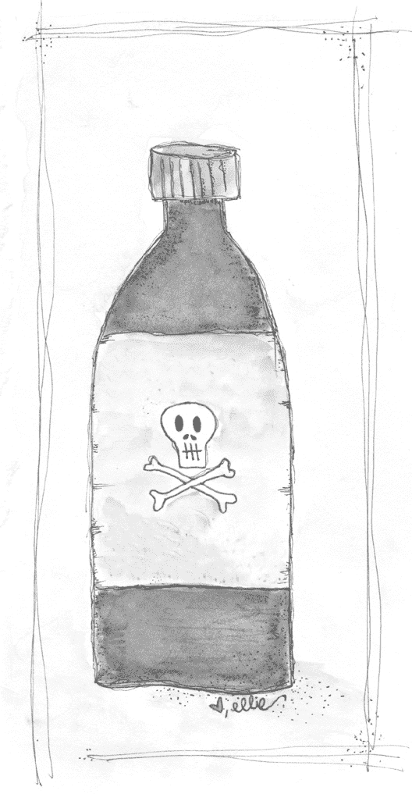

**埃莉的画：“攀比”有害幸福**

在接受敲击治疗后，埃莉不再像以前那样紧盯着食物不放。她和食物之间的关系渐渐开始改善。因为多年来，埃莉一直在尝试戒掉碳酸饮料。敲击治疗之后不到 1 个月，埃莉就惊讶地发现，自己对碳酸饮料的渴望悄悄地消失了。在允许自己展示艺术作品，活出闪耀的人生之后，埃莉终于能够在食物面前保持平静和克制了。

在和我合作过的女性中，有很多人都害怕展露才华。她们极其渴望否定自己的潜力，看轻自己的成就。她们想方设法隐藏自己的才华，于是体重便成了最好的掩护。

谈到对展露才华的恐惧，玛丽安娜·威廉森（Marianne Williamson）的作品《发现真爱》（*A Return to Love*）做出了最好的解答：

我们最害怕的不是自己不够好，而是自己拥有超乎想象的力量。令我们最恐慌的不是我们的无知，而是我们的才华。我们自问，“我怎么配得上才华横溢、美丽动人、天资聪颖、卓越非凡这样的形容？”

实际上，你怎么会配不上呢？你是上帝之子。隐没自己的才华就无法为世界创造任何价值。把自己蜷缩起来一点益处也没有，你身边的人也会因此不安。

我们都应该像孩子一样发光发亮。我们生来就是为了彰显蕴藏在身上的神之荣光。不是某些人被神眷顾，我们每个人都拥有这种光芒。当我们让自己光芒闪耀时，不知不觉中，我们也赋予了别人这样的权利。随着我们将自己从恐惧中释放，我们的存在也将带给别人自由。

### 生命是饱满还是萎缩，与你的勇气成正比

你害怕去做，但真的很想去做的事情，就是你需要做的事。对于凯特来说，她需要做的是开一家健康中心。尽管 4 年前，凯特就拥有了开办健康中心的店面，但她没有动力去拓展人际关系，获取资金，以及做相关的市场宣传。凯特计划在减肥成功之后再采取行动。

针对自己对实现梦想的恐惧进行敲击后，凯特意识到，阻碍她开办健康中心的不是自己的体重，而是她不够自爱。凯特从小就被教导“要安静”和“不要说话”；当她长大后，发光发亮、展露才华让她有不安全感。因此，凯特一直惧怕实现开办健康中心的梦想。

在拥有新的自我认知之后，凯特开始每天针对自己的恐惧敲击。几周之后，凯特在开办健康中心之路上就前进了一大截。突然之间，凯特开始拓展人际关系。渐渐地，有人主动联系她、支持她，例如有位女士提出帮凯特创办一个网站。源源不断的支持和热情，让凯特既惊讶又兴奋。

从那之后，凯特开始制订健康的饮食计划，并且有规律地参加运动。突然间，生活方式就这么发生了简单而令人愉快的改变。凯特的体重和腰围几乎立刻就减下来了。但是，真正让凯特嘴角上扬的是：自己终于会在经过镜子时，停下来欣赏自己的身体了。

课程结束几周之后，凯特和我分享了她的感受：

我已经减掉了 5 公斤，而且已经来到了“阳光”下！我的身体和生活习惯每天都在变化。我再也不会天天情绪化饮食了，而且我喜欢上了运动。路过镜子时，我再也不会贬低自己了……。这些事情对我来说，都非常重要。

每天，我都在学习和成长，这很有趣！我知道自己每天都在进步。敲击疗法改变了我的生活，甚至生命。现在，我依然在进行敲击冥想……。我爱敲击疗法。

人们常常会问我，我是如何在日常生活中融入敲击的。以下是我每天晚上都会做的练习。

首先，想象你最想要什么，先集中想象某一件事情。你可能希望自己强大而自信，希望展露某种天赋，希望大声说出自己的想法，希望拥有更亲密的关系。在脑海中放大那幅图景。做个深呼吸，体会自己在那种情境下的真实感觉。

然后问问自己：“那个情境中有什么地方让我感觉不舒服吗？”“当我在脑海中想象这个情境时，身体的哪个部位不舒服？”举例来说，如果你感觉胃或肩膀缩紧了，这就表示，这个情境正在给你制造压力。

继续一边深呼吸，一边想象这个情境，同时逐个敲击各个穴位。如果你产生了某种恐惧感，或其他负面情绪和自我对话，就继续一边想象自己想要的东西，一边逐个敲击穴位。继续敲击下去，直到你在想象时，能够保持平静而和谐的状态。

这项练习可以定期进行，因为它的作用非常强大。你将发现，自己的梦想正随着舒适区的扩大而不断丰满。

### 追求梦想，就算害怕或不知所措

探索体重是如何保护我们的安全，以及如何让自己从恐惧感中解脱出来，允许自己闪耀光芒，会让我们感到些许兴奋。但是，我们常常再次很快被恐惧打倒。恐惧和不知所措都很正常。克服它们的关键在于从这些感觉中得到好处，而非被它们控制。

这时候，我们就可以借助敲击的力量。针对情绪进行敲击，并不意味着再也不会恐惧或产生其他负面情绪，但敲击可以帮助我们掌控情绪，让我们在遭遇正常和自然的情绪阻力时，也能继续前行。

有时候，思考如何展露才华时，我们会不知所措或有些畏惧，部分原因在于，我们不知道应该做什么，以及不知道如何实现梦想。这些状况都十分正常。我们要做的就是，针对这些情绪进行敲击，和自己的直觉重新建立联结，并形成更清晰的答案。

展望梦想时，你的感觉如何？如果给你的恐惧或不知所措打分，会是多少分？有没有其他情绪或消极信念占据你的注意力？你的身体是否紧张？通过回答这些问题，让自己更清晰地掌握自己的情况。现在，让我们做几轮敲击：

手刀点：尽管我对这个梦想感到不知所措，但我依然爱自己，接纳自己。（重复 3 遍）

眉毛内侧：我是如此不知所措。

双眼外侧：要做的事情有这么多。

双眼下方：我甚至不知道从哪里开始。

鼻子下方：如果我做不到，会怎么样？

下巴：如果我犯了错，会怎么样？

锁骨：如果发生意外，会怎么样？

腋下：所有这些和实现梦想有关的担忧……

头顶：现在我要把这些感觉说出来。

当最初敲击对象的主观焦虑评分已经降到了 5 分或更低，你就可以继续进行几轮正面描述的敲击。

眉毛内侧：可能我不需要知道每个问题的答案。

双眼外侧：可能实现梦想不需要我知道自己具体需要怎么做。

双眼下方：我只要集中精力走好眼前这一步。

鼻子下方：跨出这一步是安全的……

下巴：要相信有些问题的答案自会显现。

锁骨：我可以享受这个过程。

腋下：向前跨出这一步的感觉真好。

头顶：前进对我来说是安全的。

做一个深呼吸，检查一下自己的感觉。再次评估你的主观焦虑程度，然后继续进行敲击，直到感到完全放松下来。

现在，你可以采取哪些行动，向着梦想前进一步？写一封邮件或打一个电话都可以。相信你的直觉，迈出那一步，不论这一步看起来多么渺小。

参加我的课程和进行敲击治疗后，多年来第一次，布朗迪获得了全身心的解放。某一天，布朗迪在翻阅满满一鞋盒老照片时，找到一张自己 30 多岁时，身穿绿色比基尼的照片。她看着照片里那个美丽的女人，想起自己当时其实很讨厌那副身体。

布朗迪回想当时的情境时，非常同情照片里的自己，因为她没能发现自己的美。现在，她比以前胖，但感觉比当年更美，因为她一直在针对自己的信念进行敲击。

接下来的那个周末，布朗迪和丈夫一起去野营。当她穿上泳衣时，耳边又响起了以前听过的批评之声。“听”到后，布朗反而嘴角泛起笑容，因为那个声音再也不能控制她了。布朗迪意识到，如果现在自己不享受生活，不欣赏自己的身体，那就是在浪费更多拥有快乐的机会，正如当年身穿绿色比基尼的自己没能发现自己的美一样。

设定目标和追求梦想很重要，但这不能成为你不享受当下时光的理由。因为说到底，带给我们最多快乐的是追寻梦想的整个旅程，而不单单是结果。

现在，是时候停下脚步，闻一闻玫瑰了；是时候留意到你身上的美了。暂停一下，把手放在心口，做一个深呼吸，体会一下自己的感觉。过美好的生活意味着，认识到现在的自己和生活有多么美好。

敲击冥想练习

**展露才华是安全的**

手刀点：尽管我感觉展露才华不安全，但我依然爱自己，接纳自己。（重复 3 遍）

眉毛内侧：我感觉展露才华是不安全的。

双眼外侧：我感觉尽全力做事是不安全的。

双眼下方：我可能获得了太多关注。

鼻子下方：可能有些人会因此不高兴。

下巴：胖胖的身体、隐藏自己的才华让我感觉更安全。

锁骨：一部分的我想要发光发亮，成为最棒的自己……

腋下：一部分的我感觉这么做不安全。

头顶：我的内心很挣扎。

眉毛内侧：我的内心一直在挣扎。

双眼外侧：保持现状感觉更安全。

双眼下方：减肥让我感觉不安全。

鼻子下方：现在，我感觉保持自信是不安全的……

下巴：我之前吃过这方面的亏。

锁骨：现在，我要把那些感觉都说出来……

腋下：并且放下这些感觉。

头顶：这让我学到很多。

眉毛内侧：某段经历让我觉得，展露才华是不安全的……

双眼外侧：这条信念让我停滞不前。

双眼下方：别人说的话，做出的反应……

鼻子下方：反映的是他们的情况，不是我的。

下巴：我接受他们的行为给我造成的感觉。

锁骨：我害怕再次接收到消极的反馈……

腋下：所以，我最好向恐惧投降，隐藏自己光芒。

头顶：但是我想要更多。

眉毛内侧：我需要做一个选择。

双眼外侧：我可以在意其他人的想法……

双眼下方：以牺牲我的快乐为代价……

鼻子下方：或是在意自己的想法……

下巴：然后释放自己的光芒。

锁骨：我拥有勇气和信念……

腋下：我选择发光发亮。

头顶：我鼓励其他人也这么做。

眉毛内侧：我感觉到，让自己发光发亮有多么放松。

双眼外侧：隐藏才华让人心神俱疲……

双眼下方：我选择放飞想象。

鼻子下方：我选择朝着梦想迈进……

下巴：我选择听从自己内心的那个声音。

锁骨：我知道应该怎么做……

腋下：而且我现在就可以采取行动。

头顶：现在，展露才华对我来说是安全的。

# 第八章　像玫瑰一样娇美，也要像玫瑰一样反击
FEELING CONFIDENT IN YOUR FEMININE BODY

女性往往逃脱不了世俗的枷锁，例如，可以性感，但不能淫荡；可以随和，但不能太随便。这套沉重的枷锁或许一时半会儿卸不掉，但要记得，就像玫瑰可以在美丽动人的同时身藏利刺，你也要在适当的时候勇敢反击。

自我照护不是自我放纵，而是自我保护。

非裔美国诗人　奥德·洛德

从很小的时候起，女同胞们就开始被大量与性别和女性特质有关的信息轰炸。社会主流观念认为，我们可以性感，但不能淫荡；我们可以美丽，但不能过分自信；我们可以随和，但不能随便。通常，在刚刚准备好、有能力接受和理解这一点之前，我们就被扣上了“你是女孩子”的大帽子。然后，当刚要庆祝自己新的、不断变化发育的身体时，我们又迎来了令人讨厌的性注意。有时，我们甚至会因为自己的身体被挑逗起来而自责并感到羞耻。

社会对女性寄予了太多矛盾的束缚和期待。似乎从一开始，我们就注定会搞砸自己和性别之间的关系。在屈服于文化中有关女性性别的焦虑之后，我们中许多人会无意识地把体重当作一种避开性注意的方式，因为性注意一直以来都让我们感到困惑和害怕。

接下来的文字将讨论，我们和性别之间的关系如何影响我们以及我们的体重。而且，我们将寻找和自己身体以及力量建立联系的新方法，进而体验到渴望已久的自由。

正如你将在下文所看到的，对于许多人来说，这种和性别之间的痛苦关系，早在青春期——我们胸部刚开始发育时就已经开始了。

### 讨厌的青春期，讨厌的身体

我小时候是个假小子，拒绝穿裙子，即使每次都要和母亲抗争一番。在我看来，如果哥哥和弟弟不穿裙子，那我也不穿。我非常想和他们一样，尽可能表现得像个男孩子。我很叛逆、心直口快，而且很少害羞，总是期盼着下一场冒险。童年时期的大部分暑假，我都和许多小男孩在树林里奔跑玩耍。

然后，胸部不期而至并毁掉了这一切。我有一个男性朋友承认，有些男孩叫我“有一对波波的女孩”，而且在背地里开我玩笑。我讨厌身体背叛了我，给我带来了这些玩笑和奇怪的关注。

由于当时的我理解不了这一切，就用食物安抚自己的焦虑。用体重把自己隐藏起来不是我有意识做出的决定，但这个方法很有效。在我准备好接受这一切之前，肥胖保护我不被物化和孤立。

我的许多客户也有过同样的经历。从身体开始发育那一刻起，她们就开始隐藏自己。尽管青春期的记忆似乎已经非常遥远，但在那些年里，我们感觉自己像一个突然住进成年女性身体里的小女孩。当时的感觉可能对我们和自己的女性特征，以及我们和体重之间的关系产生了深远的影响。

劳拉是我的一位学生，她跟我一起回顾了自己和身体及体重之间的关系。劳拉曾经在校车上因为发育的胸部被同学戏弄。劳拉非常尴尬且难为情，于是开始穿祖母给她织的一件斗篷。不论天气如何，她都喜欢用这件斗篷把女性化的身体遮掩起来。

随着逐渐长大，只要劳拉减肥成功，就会因为自己受到关注而不舒服，不论这种关注是来自男性，还是女性。早期在学校的遭遇，导致劳拉把拥有女性化的身体和成为取笑对象以及受到不想要的关注联系在了一起。

青春期令我们许多人苦恼。我们还没有准备好面对胸部、月经和镜子里出现的曲线，于是责怪身体发生了让人不舒服和不安全的变化。

花一点时间回想一下你对青春期的感觉。那段时间是否发生了某些事情，或某些回忆让你觉得，拥有女性的身体不安全？如果有，现在就一边进行敲击，一边把这个故事说出来。你可以回顾一下第五章，我们在那一章里学习了如何针对过往事件进行敲击。

当我们还没有被教导如何与女性特质及性别建立积极关系时，任何类型的关注，包括赞美，都可能给我们带来深深的不安。这听起来似乎违背直觉，但当我们缺乏形体自信，且一直在努力减肥时，常常会害怕受到任何类型的关注，因为这些关注可能会给我们带来伤害或羞辱。

洛丽的情况就是如此。她在参加我的课程期间减掉了 8 公斤。她一直针对自己害怕展露才华的问题进行敲击，而且意识到自己已经很久没穿那件灰色夹克了。以前，不论刮风下雨，那件超大号的灰色夹克都从不离身。现在，洛丽变得自信，也准备抛弃“灰色”了。

一天，洛丽决定穿白色的毛衣，配一条好些年都穿不上的裤子。在离开家时，洛丽感觉棒极了，觉得自己美丽非凡、容光焕发、精力充沛。就在那天，洛丽在路上遇到一个男人冲她吹口哨，还低声嘟囔着：“噢，好性感。”听到他的评论后，洛丽感觉受到了威胁，立刻紧张起来。洛丽非常慌张，身体都僵住不动了。她说不出话，也不知道要怎么回应，于是低着头快步走进一家商店。

一方面，洛丽觉得这个男人很恶心，认为他的评论侵犯了自己；另一方面，她又感到受宠若惊：自己这个已经结了婚的 50 多岁的女人，还能吸引异性的注意。当洛丽意识到这一点之后，她又开始为自己感到受宠若惊而内疚。那天晚上，洛丽还对这件事耿耿于怀，心里充满了羞愧和困惑。

几周之后，洛丽告诉我，她很惊讶陌生人的一句评论会打乱她一整天的生活。当我们没有和别人划清界限时，这种情况常常会发生。接下来的部分，我们将继续探讨这个话题。

和我一起针对那个男人的评论进行敲击后，洛丽开始训练自己坚定立场，承认自己的力量。洛丽大声重复了几遍那个男人的话，然后想象当时出现的焦虑感，一边说出自己的感受，一边进行敲击。当释放了那个男人的性关注所引发的恐慌反应之后，她终于可以平静地回想这条评论了。

课程结束后，我让洛丽再次回想当时的情景。这一次，她感到平静而自信。在针对羞愧感和恐惧进行敲击后，洛丽意识到自己能够控制自己的情绪，而且感到强大有力。我们之所以会由于不请自来的关注而恐慌，常常是因为我们对此感到无能为力，或认为自己无法保护自己。当一句评论就能令我们震惊和感觉无力时，理解震惊的原因对解决问题很有帮助。

### 让人难堪的口哨声

尽管洛丽的身体并没有真正被冻僵，但在情绪和心理上，她感觉自己已经被冻僵了。冻僵反应有多种表现，包括感到身体紧张或僵硬，呼吸暂停，附和别人，不敢拒绝，不敢大声说话或改变自己的状态。

很多野生动物都会出现冻僵反应。在受到攻击时，它们的身体会变僵硬，而且乍一看好像停止了呼吸。这就是“伪装成负鼠”这个短语的来源，因为负鼠深谙冻僵反应的精髓。

这是因为大部分食肉动物只喜欢会反击的猎物，而且会在经过搏斗猎物死去之后才吃掉它们，所以有些弱小的动物会用冻僵反应来保护自己。当捕食者对装死的动物失去兴趣时，它们就可以“苏醒”过来，赶紧逃到安全的地方。

我们常常因为冻僵反应而自责，后悔当时没有这样做或那样说。实际上，冻僵反应是身体自我保护的最原始方式。了解这一点很重要，因为这样我们才能更理性地看待冻僵反应，而不轻易否定自己。

过往的冻僵经历会让我们对未来充满担心，因为我们自以为对那些威胁到自己的人和事毫无还击之力。当我们一边回想触发冻僵反应的事件，让自己沉浸到当时的感觉里，一边进行敲击，就降低了在将来发生冻僵反应的概率。结果，我们就可以关注当下，有意识地做出有益的决定。

现在，让我们针对你曾经的冻僵反应做一些简单的敲击吧。即使你多次经历过冻僵反应也没关系，请从情绪没那么强烈的那次开始敲击吧。比如，你感觉自己冻僵了，是因为有人让你接手你并不想负责的项目？还是有人用你不舒服的方式对待你？

需要注意的是，如果你是在受到严重精神创伤后发生了冻僵反应，请寻求专业医师的帮助。在探索疗愈创伤的方法之前，你需要首先懂得寻求所需的帮助。如今，在医疗实践中，越来越多的治疗师开始运用敲击疗法。

跟洛丽一样，很多客户告诉我，她们不喜欢被赞美，特别是来自男性的赞美。“如果街上有人冲我吹口哨，我就会慌张地低下头，”她们说，“我会觉得他们很恶心，感觉受到了冒犯，就像他们在用眼睛剥光我的衣服。但是，另一方面，我又喜欢这种关注，于是我又会因为这种喜欢而愧疚。”

因为受到夸奖而开心并不意味着你“要求被夸奖”，也不意味着你有可能对伴侣或配偶不忠。我们常常不仅害怕赞美我们的那个人，也害怕发现自己做不成任何事。

实际上，坚定立场之后，我们会比自己想象的更有力量。当某个人赞美你时，你可以首先留意一下自己的呼吸。如果你的呼吸短而急，那么你的身体很有可能产生了压力反应。针对被赞美的经历进行敲击，你就可以更快速地恢复冷静状态。

运用敲击疗法平复因为赞美和关注（特别是来自男性的）而产生的压力反应后，我们自然就可以用不同的方式和男性互动。当不再因为男性的关注而紧张后，当可以自然应对意料之外的夸奖或奉承时，我也意识到自己一直以来都习惯于在受到男性夸奖之后感觉不舒服。于是，我开始有意识地观察自己在被关注之后的反应和感觉，然后针对它们进行敲击。

随着时间的推移，我变得能够接受他人的赞美，当然大部分赞美都是善意的。现在，我再也不会认为自己被威胁，而是可以享受其中或对他们不予理会。不论是哪种情况，我都能活在当下，控制自己的生活。

指尖敲出丰盛

**如何回应口哨声**？

在我的居住地纽约，我常和朋友们聊到，这里的男性常会用口哨声来吸引女性的注意。一天，我给其中几位朋友发了邮件，问她们是如何用一种让自己充满力量而非被侵犯的方式回应口哨声的。

一位朋友说，她通常会回以微笑，有时候甚至会大笑，但那不是在嘲笑他们，而是和他们一起笑，好像在说“你们这些家伙都疯了，你们知道吗？”她说，这样的回应让她觉得这只是一次无伤大雅的小小调情。

另一位朋友回复说，有时候她把吹口哨当成赞美来接受，但是当口哨声让她不快时，她就会快步走开。她和别人的差异在于，她每次都可以只关注于当下，并且根据不同的情况判断该如何回应。

遗憾的是，我们无法控制他人；幸运的是，我们可以控制自己的反应和感觉。即便你感到所有的口哨声都不合时宜也没问题。关键是，你要知道，在听到口哨声时，你可以选择保持冷静并关注当下。

就在前几天，我在最难打到车的时间即下午 4 点，站在路边打车。当时大部分出租车司机都在换班。我需要马上赶到另一个地方，但忘了这一点。于是，当出租车在旁边停下时，我想也没想就钻了进去。我刚一安心坐稳，司机就对我说：“实际上，我的换班时间已经到了，但是穿着蓝色裙子站在路边的你，看起来太美了，我必须停下来。”出乎意料的是，当时我没有感觉被冒犯，微笑着对他说：“那好啊，看来以后每次在 4 点打车时，我都要记得穿这条裙子！”然后我俩哈哈大笑。

在了解那些不想要的注意引发的情绪和身体反应之前，我一直很害怕面对它们，甚至会冒出类似“真是一只性别歧视的猪”的想法。我也可能因为自己对不请自来的关注生气而身心疲惫。现在，由于我可以让自己关注于当下，保持冷静，就可以轻易地分辨眼前的情境是否危险，并做出相应的回应。

有时候，一些不具危险性的人发出的赞美也可能触发我们的消极反应。我就遇到过这样的情况。有一次，我的舅公对我说：“你看起来好像瘦了。”我对他微笑，并且表示感谢，但其实心里在尖叫：“可以不要在家庭聚会时谈论我的身体吗？”

很多女性会不好意思地承认，她们在听到“你看起来好像瘦了”之后，会在心里想“所以我以前很胖吗？”当身体形象成为我们内心巨大的伤口时，即便轻如羽毛的触碰也可能让我们感到刺痛。我们不能控制他人说什么，但是当我们疗愈那个伤口之后，就可以选择欣赏羽毛的轻柔，享受这种夸奖或是简单地不予理会。

现在，让我们针对获得的夸奖做几轮敲击。最开始时，你可以用这样的问题描述语：尽管有人留意到我的体重下降了，但我选择平静，选择感受身体的力量。针对获得赞美的经历一直敲击下去，看看有什么可以分析和清理的束缚性观念。

### 接受赞美，同时让对方知道你的底线

如果被关注时感觉不舒服，那通常意味着，我们还没有学会设定安全的界限。我们天生都拥有界限，但除非我们意识到它们的存在，并且严格执行，否则人们就会毫不费力地突破它。当他们越界时，我们会感觉无力和焦虑。结果，我们会责备自己，而且可能暴饮暴食，用不断增长的体重保护自己。

克莱尔的情况就是这样。当我问她什么时候开始长胖时，她明确地想起了那个时刻。在克莱尔减掉 9 公斤后，她的一位男性朋友一边把手放到克莱尔的大腿上，一边告诉她“你看起来真美”。这位男性朋友越过了克莱尔的界限，但她不知道如何守住它。当我问她，“为什么不请这位朋友把手拿开？”克莱尔回答说，她不想冒犯他，或是认为这样做是“小题大做”。

作为女性，我们常常被教导要做个“好女孩”。我们常常被告知，不要惹恼任何人，不要冒犯任何人，什么都不要做，否则就会把事情弄得更糟糕。我们担心会让他人失望或难过，所以常常评判、责备自己。我们问自己：是我想太多了吗，还是太情绪化了？但事实根本不是这样。问题在于，我们从未被教导如何设定安全的界限。这导致我们的世界被其他人随意踩踏。

要过健康的生活，我们就必须为自己划定边界。但是，如果你不专注于当下，就很难知道自己的边界在哪儿。关注于当下时，你会很快意识到，当自己的领地被人侵犯时的感觉。

不论何时，当你感觉不舒服或不安全，你应该做的第一件事，就是离开那个环境。如果感觉不对，就拒绝。“不”是个完整的句子。你不需要解释你为什么要拒绝。

一边回想自己当时的恐惧，说出自己的想法，一边进行敲击可能更有帮助。当你完成这一阶段的敲击后，你就可以进行几轮积极描述的敲击。以下敲击剧本可以帮助你。

眉毛内侧：我的感觉更重要……

双眼外侧：比其他任何人的想法都更重要。

双眼下方：我知道自己的界限……

鼻子下方：并且坚定自己的立场。

下巴：我强大而被保护……

锁骨：被我心里的力量保护……

腋下：被我关注于当下时的力量保护……

头顶：我关注于当下，我能够控制自己。

眉毛内侧：我是一个强大的成年人。

双眼外侧：如果某件事让我不舒服，我会立刻采取行动。

双眼下方：我聆听自己内心的声音。

鼻子下方：我不需要理解自己的感觉……

下巴：我只需要相信它们。

锁骨：我感觉安全而充满力量。

腋下：我能清晰地说出自己的想法，也拥有强大的影响力。

头顶：我感到平静而自信。

学习如何活在当下，如何创造安全的界限时，很重要的一点是，我们要了解能量是如何帮助我们守卫这些界限的，即使在收到预期之外的注意，或是感到不舒服的情况下。

当我和一些女性分享如何运用自己的能量守卫安全的界限时，她们常常会想起自己曾经盯着别人看或者用言语反击别人，直到他们收回自己的视线并开始退缩。这都是我们用自己的能量守卫界限的例子。这些行为保护了我们，让我们感到安全。

我在外出跑步时，常会想起这一点。我很害怕那些体型比较小的狗。它们常常一边大声狂吠，一边朝我冲过来。这时我都会被吓得跳起来。我喜欢时不时在脑海里回想这些小狗的形象，以提醒自己，当我有需要的时候，也可以像那些叫声响亮的小狗一样吓倒别人。

指尖敲出丰盛

**相信你的直觉与本能**

《注意！有人在盯着你》（*The Gift of Fear*）的作者加文·德·贝克尔（Gavin de Becker）说，和其他生物不同，人类虽然能够查觉危险，但会忽略直觉的报警提醒。相反，人们会劝服自己，然后“偏向虎山行”。例如，有些女性虽然看到电梯里有个让人毛骨悚然的人，也往往会走进去。

如果你感觉有什么事情不对劲，请一定要保持警惕。首先顺从自己的本能，然后再担心人们的评判和想法。如果你感觉哪里不对劲，即使无法解释为什么会有这种感觉，也请做自己的“熊妈妈”，尽快躲进更安全的环境。

### 别拿体重考验对方的爱

我们常常因女性的外形而获得关注，这让我们形成这样一个错误的信念：女性身体必须看起来像某个样子，才能吸引浪漫的爱情。这是许多女性承受的另外一种压力。现在让我们看看这种想法是否正确。

婚恋交友网站 YourTango 对 2 万名男性进行了一项测验，旨在找出女性在第一时间吸引男性的特质。是全身没有一丁点脂肪吗？不是。投票结果显示，排第一位的是性吸引力，第二位是笑容，第三位是善良，第四位是幽默感。体型只排到了第五位。也就是说，相比你的体型，男性更在意你的善良和幽默。

那么排第一位的性吸引力到底是什么？吸引力就是能量。你是否曾经和某个拥有很强男（女）性能量的人见面，尽管他（她）在外形上很吸引你，但当你们开始近距离交谈时，他（她）对你的吸引力却突然消失了？那个人可能仅仅只是评论了一下天气，但你突然就感觉到了某种能量，突然就不再对他（她）感兴趣了。

吸引我们的就是那点火花。我们被他们的能量吸引了。这意味着人们不在乎外表吗？当然不是。但这确实意味着，我们拥有的能量比我们的外形重要得多。我们常常会忘记这一点，因为我们已经接受了一条信念——只有当我们看起来是某个样子时，我们才值得爱。结果就是，当我们认为自己不美丽时，就会隐藏自己，以免被人拒绝。

当我们相信，只有拥有完美身材的女性才能吸引“好男人”时，就永远能找到证明这点的依据。如果被一个男人拒绝，我们就会认为是因为自己不够美，因此更不愿意向别人展示自己真正的、自然的能量。结果，我们常会吸引那些害怕挖掘自己潜能、无法接受真正的我、无法成为深情且可以信任的伴侣的男人。当我们偶尔鼓起勇气结识新人，却被拒绝时，就会认为这进一步证明了我们不够好。这是我们自行创造的无休止的循环，即不允许自己感受到身体的美丽，获得形体的自信。

指尖敲出丰盛

“**他如果爱我**，**就应该爱我的脂肪**！”

相信苗条的身材会吸引爱的你，反而可能让自己变胖，并拒绝减肥，因为你想要反抗那条信念。你可能会认为，如果你减肥成功，然后某个人爱上你，那他爱的也只是你的身体。保持肥胖，你就可以考验你的伴侣，确保他爱的是你，而不是你的身体。

这种反抗来自那条束缚性信念，即吸引爱的是你的身体。这条信念可能极大地破坏你目前的人际关系，或是阻碍你找到更深情的伴侣。但实际上，你可以因为自己的思想、身体和心灵而被爱。在减肥和形体自信之旅中，体会自己对身体的感觉和你希望茁壮成长的愿望，这一点很重要。运用第六章里提到的方法，针对这条信念进行敲击。

当我们相信是美吸引了爱，而且认为自己不够美，所以不配拥有爱时，我们也无法获得渴望的爱和感情，因为会觉得自己“不配”。然后，我们就可能会回避别人的夸奖，并且漠视积极的关注，因为我们“不配”得到它。也就是说，对身体的不自信，以及相信身体是唯一能够获得爱的筹码时，你就剥夺了自己被爱的权利。

针对自己对外貌和身体的批评进行敲击之后，希瑟终于意识到，形体不自信阻碍了她享受人际交往的乐趣。正如她在给我的邮件里分享的那样：“昨天我穿着连衣裙去湖边玩，而不是穿短裤或罩衫。对自己感觉更好让我感到很棒。而这种很棒的感觉让我开始重视形象，改善着装，这又进一步让我感觉更好。甚至，老公和我也更加恩爱了！”

运用敲击疗法和自己建立联系，并重拾形体自信之后，我们就不再感觉自己受到威胁或无价值，就可以接受和给予爱。希瑟甚至都没有变瘦，而只是对身体更自信而已。那种自信让她得到了更多爱。

拥有自信的女人具有催眠别人的能力。一个微笑就能迷住别人。有气质、坦率、幽默感，这些特质都会让一个女人拥有吸引力。我们都曾经历过那一刻：某个人一走进房间，整个屋子都被她点亮了。其实，点亮房间的不是她的外表，而是她拥有的能量。让自己成为那个美丽的自己，点亮你走进的每一个房间吧。

现在，我们已经探索了可能阻碍我们减肥的行为、事件、信念和情绪，准备好了进一步探索我们是如何关心自己和自己的身体。那就是本书第三部分的任务。我想说的是，我们可以通过改变生活方式，重获形体自信，来实现减肥瘦身的目的。再接再厉，坚持下去吧！你已经取得了很大的进步。

敲击冥想练习

**自信点，你的身体值得你骄傲**

手刀点：尽管认为身体有魅力让我感到不安全，但我依然爱自己，接纳自己以及我的身体。（重复 3 遍）

眉毛内侧：我对身体感到不安全……

双眼外侧：所以我一直瘦不下来。

双眼下方：我用这种方式保护我自己……

鼻子下方：以及隐藏自己。

下巴：但是我依然感到不安全……

锁骨：尽管已经很胖了。

腋下：所以我愿意用一种新方式……

头顶：让自己感到安全和强大。

眉毛内侧：我要让身体更苗条……

双眼外侧：让能量更充沛。

双眼下方：拥有更苗条的身体是安全的。

鼻子下方：现在我感受到了自己拥有的巨大能量。

下巴：身处自己的能量场内我感觉很安全。

锁骨：身处能量场内让我感觉自己很强大。

腋下：对自己的身体感到自信是安全的。

头顶：我信任并且追随自己的直觉。

眉毛内侧：我要活在当下。

双眼外侧：我意识到了自己的呼吸。

双眼下方：我信任自己的直觉。

鼻子下方：我可以做出选择。

下巴：我有能力采取行动……

锁骨：而且我现在就要这样做。

腋下：我的感觉更重要……

头顶：比其他任何人的想法都更重要。

眉毛内侧：减肥可能意味着我将吸引到别人的赞美……

双眼外侧：或是不想要的关注。

双眼下方：我可以感觉到身体的安全和强大。

鼻子下方：我越是在乎自己的想法……

下巴：就越少在乎其他人的想法。

锁骨：这些只是我的想法……

腋下：我有力量采取行动……

头顶：用任何我觉得合适的方式。

眉毛内侧：坚定立场让我感到安全。

双眼外侧：得到夸奖让我感到安全。

双眼下方：我知道我的价值不仅仅取决于我的身体……

鼻子下方：而且我依然可以爱和欣赏我的身体。

下巴：当我感觉自己在情感上更坚强时，感觉身体也更强壮了。

锁骨：当我感觉身体更强壮时，感觉自己在情感上也更坚强了。

腋下：现在，拥有这样一副身体让我感觉很棒。

头顶：我把身体照顾得越好，就感觉自己越安全、越强大。

眉毛内侧：我感觉可以控制自己……

双眼外侧：而且很强大……

双眼下方：在一个更苗条的身体里……

鼻子下方：在更强大的能量场里。

下巴：做自己让我感觉很自由。

锁骨：我再也不需要躲藏。

腋下：我感受到了身为女性所获得的祝福。

头顶：我很强大。

# 第九章　做运动时，你在想什么？
FINDING THE PLEASURE IN EXERCISE

当我们为体形所苦时，容易陷入两个极端：逃避运动，或把运动当作自我惩罚。而不管你处于哪一端，运动都会与痛苦画上等号。我们还有机会开心地运动，感受生命的活力吗？

……如果你的想法很美好，脸上会出现阳光般的光彩，就会可爱得多。

英国杰出儿童文学家　罗尔德·达尔

当我们为体形所苦时，容易陷入两个极端：逃避运动，或把运动当作自我惩罚。当我们逃避运动时，它就成了一件极度痛苦的事。因为它会强迫我们面对自己的体形，而一旦面对自己的体形，就会忽视最初的运动需求。我们会纳闷：为什么我要受这种罪？我们被痛苦淹没，内心不断挣扎，苛刻地评判自己的身体，同时满怀悲伤和内疚。如果运动给我们带来了生理疼痛，我们就会愤怒和沮丧，进而触发大脑的应激反应。

如果是另一个极端——把运动当作自我惩罚，我们就可能会把运动当成胖子需要承担的后果。如同用言语折磨心灵那样，因为我们（身材）“不够好”，所以需要用运动折磨自己的身体。如此一来，运动就成了“痛苦”的代名词，从而成为难以忍受的事。而一旦痛苦稍微减轻，或者注意力被其他事情分散，我们就会捡回旧习惯，继续不运动的日子。

许多女性都徘徊于这两个极端之间，漠视自己的需求、任由痛苦和恐慌推着自己去运动。无论是哪个极端，都会让我们厌恶自己的身体，不怜爱和疼惜自己，也永远无法享受运动。这种消极关系严重阻碍了我们成功减肥和增强形体自信。

幸运的是，敲击治疗能帮助我们与运动建立新的互动关系。这是我的亲身体验，因为我比任何人都惊讶于运动带来的变化，而我也从未想过自己会崇尚运动。

我的许多客户都和我一样，用敲击重新建立了与运动之间的关系，而这一过程也让我们重新认识了孩提时代就已知晓的道理——运动可以带来无尽的乐趣和享受。不管你现在对运动持何种态度，只要你开启这个程序，开始敲击，你就自然而然地动起来，享受运动的乐趣。

### 体育课上的惩罚

“奥特纳，跑 3 圈！如果你敢偷懒的话，给我小心点！”跑完第一圈，上气不接下气的我不禁在心里暗暗诅咒体育老师。她和足球老师一样，都喜欢在我不听从指挥或注意力不集中（经常性）时罚我跑圈。虽然这种经历算不上惨痛，却让跑步对我来说成了一种惩罚。

我的很多客户都因为感觉不自在或跟不上进度，而在上学时就与运动建立了消极关系。莫莉就是这样。有一次，她的头撞上了排球，遭到了其他女孩的嘲笑，于是开始对运动深怀恐惧。也正是这段经历，让她认为运动会使自己难堪。另一位客户莎伦，在一次体育课的强制跑步中得了最后一名。抵达终点线时，她筋疲力尽，浑身疼痛，而所有同学都站在旁边围观，这让她无地自容。从那天起，她就认定自己不擅长运动。

尽管这么多年过去了，体育课已经成为遥远的回忆，但这些看似不起眼的小事却深埋在我们的记忆里，给我们的运动信念奠定了消极的基础。如果不处理这些回忆造成的压力，我们就会继续找借口对运动敬而远之。如果一动运动的念头，杏仁核就产生“战斗还是逃跑”的应激反应，我们的大脑就会认为运动很不安全，就会调动一切资源避免运动的发生。

你关于锻炼的最初记忆是什么？在和体育运动有关的经历中，你是否遭到冷落，感觉尴尬，被惩罚过？如果你发现记忆中有压力堆积或令人沮丧的事件，请回到第五章，针对这件事情进行敲击，直到这件事造成的压力和情绪都消失为止。

### 是什么让我们讨厌运动？

不管是否来自于过去的事件，阻止我们运动的最大障碍都是信念。有些情况下，最具有束缚性的运动信念与我们的认知（我们是谁）关系密切，有时候还与我们的想法（我们可以做什么）密不可分。如果要消除因为被运动问题困扰而产生的负担，清除阻挡我们前进的障碍，就需要探索与运动有关的最常见的负面信念。

#### “我永远不能成为运动爱好者”

“我永远都无法瘦下来，因为我根本不是那类人。”有一次，露西在我的网络课堂上这样说。她曾在家里尝试跟着运动视频一起做运动，最终却以失败告终，因此她确信自己永远都不会像视频里的女性那样自在地锻炼。她说：“每当我试着运动时，都会想起学校里那些矫健的运动员，而我永远不会成为他们。”

运动让露西非常痛苦，所以她潜意识里有一个信念：运动不符合她的认知，她永远不能成为运动爱好者。针对露西对运动的认知，我对她进行了敲击治疗，并引导她想象自己就是一名运动员——实实在在地想象那个画面，然后留意自己的思维动态。

“我想到一位熟识的女士，”她说，“我非常崇拜她。她报名参加了一场旨在唤起人们关注慈善的徒步运动。她当时大概七十二三岁，但仍然为自己设定了 30 英里（约 48.28 千米）的目标。当时是夏天，气温直逼 38 摄氏度。虽然在此之前，她从未在这样的环境下参加过这样的活动，但最终，她做到了。”

为何一次简单的思考会让露西取得重大突破？我们在运动时的想法，决定着运动产生的愉悦度。露西逃避运动，是因为运动会提醒她，她不应该用运动把自己和想超越的励志人士联系在一起。但这种正面的联想，也会让露西很兴奋。

在你的生活中，有没有这种与运动相关的、健康的、正面的人物？你可以不认识他，但你必须认同他，被他的成就鼓舞。这样，你才能和运动建立积极的关系。

当我们认为运动不符合自己的认知，或认定运动是别人才能做到的事情时，就需要更加强大的信念来激励我们去运动。

情形 1 “我就是不擅长运动。”由于运动通常与学校的体育比赛联系在一起，所以我们经常把它与“足够优秀的人”绑在一起。正如我们所见，信念塑造了经历。如果我们一直怀着“我就是不擅长运动”的信念，那它就会成为既定事实而无法被改变。

一旦摆脱了这种束缚性信念，我们就会看到运动没有好坏之分，也没有输赢之别。运动只是我们与身体建立起的庄严关系的一部分。运动是我们对生命表达感恩之情的方式之一。我们不需要在运动中表现出最佳水平，也没必要跑得更快或跳得更远；我们只需要定期让身体动起来，保证健康就好。

我的教母就是一个极好的例子。她在 56 岁时依旧是一名跑步健将，体形保持得很好。她每天都晨跑，非常喜欢以跑步的方式迎接日出。但是她能跑多远以及跑多快呢？连她自己也不知道。对她来说，跑步只是缓解压力、让身体充满能量的方式。

我曾运用敲击疗法清除了诸如“跑步是惩罚”“我永远都无法享受跑步”（每一圈都是煎熬）这样的束缚性信念。11 月的一天，我决定沿着哈德逊河跑一跑。受到教母的启发，我没有为自己设定任何时间、速度或距离的限制，有一段路我甚至用散步代替了跑步。我抱着享受的心态让自己运动起来，却意外地打开了新世界的大门，发现了一种与身体沟通的新方式。

我喜欢冷空气围绕皮肤的感觉，以及滨水区给我的兴奋感。我还发现，亲近自然让生活中的点点滴滴都变得更美好了。在我的生命中，跑步具备了崭新的意义，因为它让我听清楚了大脑的各种评判。现在，跑步已经成为我最喜欢的活动之一。我不需要考虑自己是否擅长跑步，只需要享受户外光景，感受精力充沛的自己即可。

情形 2 “我不喜欢运动。”很多人都说不喜欢运动，但是我要说的是：你们的身体喜欢运动。你的大脑不喜欢的是运动过程中的审判和惩罚。

事实上，我们需要不断运动才能保持身体健康。研究表明，久坐不动对健康危害巨大。如果不运动，身体就会遭遇更多疼痛和折磨，患病的几率也大大提高。

尽管了解运动对身体的益处，但如果它会引起情感痛苦，我们依旧会逃避。这就是为什么我们需要用敲击疗法与运动建立新关系。只有建立良好的运动情绪基础，才能很好地运动，反之则不然。

你所谓的“不喜欢”运动的真实原因是什么？它会引起你的焦虑感、恐惧感或者其他负面情绪吗？从手刀点开始敲击，你可以说：“尽管我不喜欢锻炼，我依然爱自己，接纳自己。”重复 3 次，然后按照顺序敲击穴位，看看你会收获什么。请相信我：每个人都有自己喜欢做的事情。每个人的情况都不一样，不是所有人的运动方式都是跑步，你还可以选择瑜伽、舞蹈、散步、登山等，找到适合自己的方式即可。

情形 3 “运动让我很难堪。”奥特姆最后一次锻炼是 3 年前。“我以前非常喜欢瑜伽，所以我的朋友一直鼓励我和她一起上瑜伽课，可我迟迟没有行动。我真的没时间。”奥特姆一直认为自己的日程表太满，没有时间上瑜伽课，但我觉得她另有隐情。

“我希望你想象自己进入瑜伽课教室的情景。情景里有什么让你觉得不安全或者不舒服的东西吗？”我问道。

“很多东西都让我害怕，”她回答道。奥特姆体重超过 102 千克，拖着这样的身体去运动会让她很难为情。她解释说：“我害怕大汗淋漓的感觉，害怕气喘吁吁，害怕自己做不好动作，害怕别人盯着我，对我评头论足。”

当我询问是否有其他事件导致她产生这样的信念时，她立即给予了否定，并称这些想法只存在于自己的脑海里。接着，我又问她在锻炼时都想些什么。“你会不会在脑子里评判自己呢？”我问道。她毫不犹豫地承认了。

我们害怕的来自他人的评论，往往是我们对自己的评论的映射。在第六章中我谈到，我们总是对自己提出严格要求，严厉地对待自己。于是我和奥特姆用敲击治疗了她对运动的恐惧，在刺激穴位的同时大喊出提示语后，她渐渐放松下来。当我们以深呼吸结束敲击治疗后，我让她再次想象瑜伽教室。“我感觉每个人都在为我加油打气，”她说，“如果我可以练瑜伽的话，那么所有人都能练。我可以激励他人！”

我之所以钟情于敲击治疗，是因为在敲击治疗清除我们的恐惧后，大脑会自动用积极、正面的信念或想法填充空缺。这就是奥特姆身上发生的变化。

奥特姆不再害怕别人的评判，焦虑值也从 7 分降到了 2 分。随后，我问她还有什么感觉。“有一种尝试新鲜事物的紧张感，但是我愿意试一试。我已经等不及了。”就在我们的课程结束之后，她就跟她朋友一起参加了 3 年来的第一次瑜伽课。

在第二周的培训课程上，我问奥特姆上瑜伽课的感受如何。很巧，那次瑜伽课的主题是热瑜伽（Hot Yoga, 又称高温瑜伽或热力瑜伽，在 38℃～40℃的高温环境中做瑜伽。——译者注），奥特姆一踏进教室就大汗不止。课程开始不久，她就感觉自己无法动弹了。

但神奇的事情发生了：尽管所有恐惧和担忧都成了现实，奥特姆还是非常开心，并因为参加了瑜伽课而感到自豪。由于她已经清除了自我评判，在她眼中，同学们都在努力做好自己的动作，没有人对她评头论足。

从此以后，奥特姆坚持每周上一次瑜伽课，每天散步 20 分钟。她变得越来越自信，也越来越自在。奥特姆表示，每次运动她都感觉很开心，而且不再害怕锻炼了，而是把锻炼当成欣赏自己身体、放松大脑、享受运动过程的机会。“我这样做根本毫无意义”

起初，我的很多客户都和奥特姆一样抗拒运动，但是当她们开始敲击治疗时，就意识到原来自己正遭受着内心对话的荼毒。正如之前所说，如果我们在运动时怀有消极、批判性的想法，就体验不到乐趣。

在运动时，你是否会听到脑中苛刻的评判之声？试着回想你最近一次运动的情形。你想到了什么？有没有一个声音在不停地说：

◆“你做错了！”

◆“你跟不上别人！”

◆“你的样子真可笑。”

◆“你太弱了。”

◆“你太肥了！”

◆“这简直是折磨！”

◆“这些都毫无意义！”

◆“你根本不适合做这些。”

◆“你这是在让自己难堪。”

◆“所有人都盯着你。”

◆“你怎么会变成这个样子？”

那么多聪慧、善良、可爱的女性都纵容着这些苛刻、无情的内部言语，被它们决定着自己可以成为谁，以及成不了谁。接受敲击治疗后，这些消极的声音会被消除。这样，我们就可以把多年来洒在别人身上的爱也分给自己一点。

找出与你的情况最契合的描述，或者你自己写一份。当你在思考或说出这些话时，带着怎样的情绪？那些描述的真实度如何？用 0 到 10 为情绪强度评分的话，你打多少分？即使简单地表达内心的恐惧，也会产生难以置信的效果。你可以根据以下顺序进行敲击。

手刀点：尽管我在锻炼时不停地评判自己，但我依然爱自己，接纳自己。（重复 3 遍）

眉毛内侧：我在运动时，这些消极的声音会冒出来……

双眼外侧：它说我做的一切都是错的。

双眼下方：它说这样会让我不自在。

鼻子下方：享受运动真的很难……

下巴：我陷入了消极思维。

锁骨：现在我把这些想法都说出来，把它们释放掉。

腋下：“你做错了！“

头顶：“你跟不上别人！”

眉毛内侧：“这毫无意义！”

眼睛外侧：“放弃算了！”

眼睛下方：“你应该结束痛苦！”

鼻子下方：“这太难了！”

下巴：“你还是不够好。”

锁骨：“你在让自己难堪。”

腋下：“人们在对你评头论足。”

头顶：我脑子里的所有声音……

当原始敲击目标的主观焦虑评分低于 5 分时，你就可以开始积极描述的敲击治疗了。

眉毛内侧：我听到这些声音……

双眼外侧：但是我可以选择相信这些声音，也可以不相信。

双眼下方：这些声音听起来好蠢。

鼻子下方：我掌握了主动权。

下巴：我选择听那个平和的声音……

锁骨：它在说“我能行！”

腋下：我正在做……

头顶：很高兴我来运动了。

眉毛外侧：放弃成为最优秀的人的念头……

双眼外侧：我允许自己的身体动起来。

双眼下方：在任何不自在的场合，我都能平静下来。

鼻子下方：我尽力了，这就够了。

下巴：我为自己感到自豪。

锁骨：加油！

腋下：不管我做了什么，我都尊重自己。

头顶：我可能不是最优秀的，但一定是不可阻挡的！

深呼吸，看看自己的感觉。再次测量主观焦虑评分，继续敲击，直到负面的信念全部清除为止。

#### “运动与我的生活格格不入”

当我们不自觉地抗拒运动时，脑海里的信念通常都是关于“为什么运动与我们的生活格格不入”。我们没有正视自己的内心世界（与运动和身体有关的信念和情绪），而是指望外部环境来解释为什么我们不做（不能）运动。起初，这些信念相当令人信服，但是当敲击疗法清除了我们对锻炼的内在排斥因素后，我们会发现，外部环境能很快适应我们对运动的新需求，让我们有更多时间动起来。现在，让我们来看一些常见的借口吧。

情形 1 “我没时间。”正如我们之前提到的，在针对抗拒运动的深层原因进行敲击之前，奥特姆也深信自己没时间运动。每次一提到运动，她都会把又长又复杂的日程表详细地数一遍。她觉得这就是她没时间运动的证据。

但在我们一起挖掘阻止她运动的根源之后发现，恐惧和自我评判才是她抽不出空上瑜伽课的真正原因。所以，当我们说没时间运动时，实际上是在说，我们不知道该如何面对内心世界。我们不知道该如何处理那些恶化我们与运动之间关系的情绪、压力，甚至回忆。这时，我们可以用到一个非常有效的工具——敲击疗法，它能让我们以前所未有的速度和效率完成运动。

我们需要深挖“没时间”这个借口背后隐藏着什么。现在，花上几分钟问问自己：“为什么我没时间运动？”当你想象自己做运动时，是否会认为运动是在浪费时间？还有其他消极的感受、声音或者回忆吗？如果有，那是什么呢？一天总共有 24 小时，也就是 1440 分钟，而运动只需要 30 分钟。那些最成功、最忙的人都能挤出时间做运动，因为他们知道运动对取得成功意义重大。你有什么比他们更难的难处吗？

指尖敲出丰盛

**维珍集团创始人**：**运动是第一高效秘诀**

忙得没时间运动，真的是这样吗？维珍集团创始人理查德·布兰森（Richard Branson）有 400 余家公司，出版过多本图书，同时是活跃的慈善家，且保持着许多个人爱好。当被问及他是如何兼顾所有事情时，布兰森坦言，运动是第一高效秘诀。

研究结果证实了他的说法。调查显示：运动不仅能够提高创造力，改善睡眠，还赋予你更多能量，让你更高效。这就意味着，越忙碌越需要运动，而不是减少运动或干脆不运动。

情形 2 “我累到不想运动。”我们之所以不运动，是因为太累了，但同时，我们又因为不运动而累到不行。该如何打破这个令人讨厌的怪圈呢？

当你因为太累而不想运动时，请在脑海里想象一下运动的场景，这也能赋予你能力。这个说法听起来似乎很可笑，就跟说躺在沙发上能减肥一样荒谬。尽管我们可能都知道，或者相信运动能增加活力，但有时我们就是很难克服疲劳。纯粹的意志力有时会起作用，不过强迫自己运动只会深化“运动是惩罚”的信念。所以，我们可以在锻炼前用敲击疗法来增加活力。

通常情况下，压力是疲劳的根源。一旦压力得以释放，我们就能获得更多能量。相信我，真的有用！现在，当我抵制或质疑运动时，都会先用敲击疗法来缓解不适，最终我真的会抬脚去运动。

当你累到不想运动时，可以采用以下敲击顺序来克服疲劳。

手刀点：尽管我累到不想运动，我还是接受我的感受。（重复 3 遍）

眉毛内侧：我不想运动。

双眼外侧：我筋疲力尽了……

双眼下方：我还有其他事情要做。

鼻子下方：我太疲惫了。

下巴：是这些因素在阻碍我运动……

锁骨：疲劳……

腋下：我只想放放松。

头顶：我只想休息。

眉毛内侧：也许这比我想象的更简单。

双眼外侧：也许运动就是我需要的休息。

双眼下方：我愿意把事情变得简单一些。

鼻子下方：我愿意让它变得更有趣。

下巴：我只需要开始运动就好了。

腋下：我需要能量。

头顶：我已经准备好了。

情形 3 “疼痛、疾病让我没法运动。”多项研究已反复证明，运动可以强化体能。佐治亚大学的一项调查显示：经常久坐不动的人，如果能连续 6 周，每周进行 3 次 20 分钟的中低强度有氧运动，体能也会比疲劳程度稍低但不运动的人更强。

“我放弃了自己。一夜之间，我就得放弃所有让我开心的事情。”马尔奇说。在 2007 年被确诊患有桥本氏甲状腺炎的马尔奇总是疲惫不堪。于是，她不得不放弃一直热爱的运动，包括骑行、舞蹈和瑜伽等。经年累月不运动后，她的体重上升了 23 公斤，几乎比之前重了一倍。这让马尔奇认为自己又笨重又丑陋，于是不断对自己说：如果你不能做好过去经常做的瑜伽动作，或者骑着自行车登上附近的小山，运动就没有丝毫意义。

针对她的压力以及由身体引起的愤怒和挫败感进行敲击之后，马尔奇发生了惊人的变化。多年来，她都以为自己再也不能运动了，但是现在，她再次跨上自行车，重新开始瑜伽锻炼了。马尔奇不再认为运动不利于身体健康和疾病治疗了，而是把运动当成让自己感觉良好的方法。这是自确诊之后的第一次，马尔奇把自己看作一个生病的正常人，而不是疾病的傀儡。（敲击治疗对缓解疼痛非常有效，我的兄长尼克·奥特纳就专注于这个领域。你可以登录这个网站，阅读更多关于敲击治疗缓解疼痛的内容：www.TheTappingSolution.com/chapter9。）

健康问题常常让我们感觉身体的能力非常有限。虽然生病中的我们不能做好每一件事情，但是敲击治疗后你会发现，真正阻止你运动的是由健康问题引起的压力和负面情绪。一旦接受这些限制，用敲击来清除这些压力、情绪和生理疼痛感后，健康状况就会随之改善，然后你会看到，其实运动并没有那么难。

当我们对自己充满爱意和耐心时，就能与控制了我们的身体、疾病甚至疼痛建立起全新的关系。最重要的是，我们发现，运动不仅能改善身体状况，还能改善情绪。大量研究证明，运动对人的心理、情绪和生理都有好处，可以预防糖尿病和心脏病、增强身体灵活性，强化能量，改善睡眠，缓解和预防焦虑以及抑郁等。使用敲击疗法之后，健康问题将不再是运动的障碍，反而会成为运动的最大动力。

### 为了减肥而运动，还是运动时顺便减肥？

运用敲击疗法解决体重问题之前，我都把运动当成减肥的重要方式。每次有运动冲动时，我都会对新运动视频或体育课充满激情，然后在日历上记下当日体重，开始记录饮食日志。随着时间的推移，激情会慢慢退却，很快运动的念头就会消失。

由于一直都把运动当成减肥的途径，所以当我在健身房看到那些身材苗条的女性时，都会不禁好奇：为什么你们还在这里运动？在我看来，她们已经非常漂亮了，不需要用运动来惩罚自己。所以每次我达到减肥目的之后，就会停止运动，这也难怪我的体重总是会反弹。

这个模式循环了好几年，最终，我意识到，减肥这个理由没能强大到激励我持续运动下去。于是我开始质疑自己对运动的认知，并探索为什么有人能够成功地把运动变成日常生活中不可或缺的一部分。

这次探索完全改变了我的人生。通过改善与运动的关系，让自己喜欢上运动锻炼（不仅包括跑步，也包括各种形式的锻炼）。我仿佛打开了新世界的大门，找到了变得更健康、更自信、更有活力、更漂亮的康庄大道。虽然我现在偶尔还是会因为太累或太忙而不去运动，但运动确实已经成为我生活中非常重要的一部分。可以说，我简直无法想象停止运动之后，我的生活会变成什么样子。

我坚信嫉妒心能变成好奇心，所以有段时间，我在街上碰到那些身材苗条的人都会凑上去询问：是什么激励你坚持运动？（没错，我真的拦下过陌生人，对他们进行采访。我现在也依旧会针对各种问题做街头调查。）拿到几十份答案之后，我注意到，压根没人提到过“为了燃烧脂肪”和“减肥”之类的理由。他们的第一反应几乎都是“运动能改善我的情绪”，或者“运动让身体更健康”。人们一遍又一遍地重复那些相似的话：“运动能帮我释放压力”、“这是我独处的时间”或者“运动之后，我会感觉更好”。

这些惊人一致的反应让我意识到：我从来没有真正地运动过。我一直都忙于判断运动有没有给我带来身心益处。于是我开始怀疑，包括敲击在内的运动本身是否就是一种治疗方式呢？如果把运动当成一种心灵体验，那我会不会有不一样的感觉呢？

那个时候，我已经清除了那些与减肥有关的旧信念和模式。我叛逆、大胆、坚定，却为了取悦别人而抑制了本真。最根本的原因是我太胖，所以只能尽量让自己不起眼，以免受到评判与遭受苦痛。

后来，我针对自己对运动的抵抗情绪进行敲击，改变了对运动的态度，并意识到原来运动对我的治疗非常有帮助。不久，我就去上了跆拳道课，相当于直接把信念转变成为个人现实。在课堂，我有史以来第一次感受到了力量，听到了内心的呐喊。我开始意识到，与其吸收别人的能量，不如激发潜藏在自己身体里的能量。这是一个巨大的转折，让我在上完课之后感觉自己比以前更强大了。

在过去，我总是压制愤怒，羞于承认它、正视它，但现在，跆拳道成为我发泄愤怒的通道。瑜伽也教会了我聆听自己的身体，并保持顺其自然的心态。每一次运动完，我都感觉自己的灵魂变得更美好了。

终于，我变得跟那些曾被我街头采访的运动爱好者一样了。以下是我去运动的十大理由：

1．正如我的朋友埃琳·斯塔兰德（Erin Stutland）所说的：“身体的运动促进生活的变化。”这句话一次又一次在我的身体和生活上得到印证。每次，当我陷入困境，就会明白过来：是时候运动一下了。

2．运动也是在感恩身体为我们所做的一切。

3．运动使我感觉自己与身体和大脑相互联系，这能让我做出更好的决策，保持最良好的状态。

4．运动会让我更加睿智，更有创造力。（多项研究证明，运动可以增强大脑血液循环，刺激大脑内部的创造区域。）

5．运动对我来说是一种心灵体验，是运动型祈祷和冥想。

6．运动使我感觉自己更强大、更自信、更漂亮、更性感、更有存在感。

7．运动使我活在当下，助我保持内心的平静。

8．通过运动，我能对自己表达爱意，所以我在运动时会不断提醒自己：你没有辜负自己的爱。

9．运动使我变得幽默，充满活力。

10．运动用深刻而真实的方式让我变得更加强大。

你注意到这里缺了什么吗？我的清单上不再出现“燃烧卡路里”“减轻体重”这样的字样了！你运动的动机是什么？你想和孩子一起变得更有魅力、更有幽默吗？你想让生活更有创造力，效率更高吗？是什么让你从床上爬起来，运动起来呢？列个清单，写下你运动的动机。如果发现新的动机，随时加上去。

如果不运动的话，我们就不能体会到自身的真实能力和本质，了解这一点非常重要。运动就像敲击治疗，能帮助我们调节情绪。采用敲击治疗剥离并释放了束缚性信念后，运动就会取得更出色的效果。运动并不是为了达到某种目的，而是一种把我们与自己、身体以及自身能量联系在一起的即时体验。

### 5 个技巧，让你运动得更开心

针对抵抗运动的情绪，包括压力、情绪障碍、生理疼痛以及任何影响你对运动的态度的因素进行敲击治疗之后，你会因为运动而感到兴奋，相信你一定会为这个改变大吃一惊。为了帮助你保住并充分利用这一利好势头，我将为你奉上我和我的客户这些年来积累的实用技巧。

#### 技巧 1　运动没有商量的余地

有一位朋友曾说过：“人们并不纠结于运动本身，而是纠结于要不要去运动。”我们通常都花太多时间思考“我们‘应不应该该’去运动”，就像这是一个艰难的决定似的。但如果搁置这个问题，说做就做，想到运动就去运动，我们就能不知不觉地完成运动。更重要的是，我们的感觉会更棒！就像耐克那句打动了许多人的广告语一样：想做就做（Just do it）！如果我们不再思前想后，把运动当成一件没得商量的事，那我们一定能感受到运动带来的益处。

#### 技巧 2　找伙伴一起运动或寻求他人的支持

研究表明，有后援团的人往往能把事情做得更好。如果你要寻求后援，我建议你找那些身材比你好的人。有时，如果两个人的身材和健康状况处于相同水平，在锻炼时就很容易被双双打回原形，一起失败，互相安慰。做运动最好的办法就是找一个长时间定期锻炼的人，或者对你所选择的运动形式充满热情的人。

为什么那些坚持运动的人会想成为你的同伴？实际上，即便是那些公认的、最坚定的健身爱好者，偶尔也会因为忙碌的生活动摇运动的信念。如果你能成为他们的后援团，他们会感激不尽。而且，有同伴一起锻炼也会很有趣。

我的健身同伴是我的朋友莎拉。她说自行车上的她才是最真实的她。虽然我们不在一起锻炼，但我们大多数早晨都会相互发短信，激励对方起床去锻炼。有时，我们会给自己设定有趣的运动目标；有时，我们会鼓励对方在天气恶劣时也坚持出门运动。事实证明，总有一些日子（尤其是又黑又冷的冬天），我们需要更多的勇气和能量才能起床，但健身同伴会让这一切都变得更简单、更有趣。

#### 技巧 3　让锻炼变得有趣

当奥特姆 3 年来第一次上瑜伽课时，她尝试了许多种类型的瑜伽，直到最后才找到喜欢的那一种。所以，你得去尝试，了解怎么才能让锻炼变得更有趣。上上舞蹈课，看一些有趣的健身视频，或者到附近的公园散散步。你可以根据心情选择一种或多种运动方式。

有时，你可能需要一些愉悦的消遣。有一回，我发短信给朋友娜塔莉，询问她在不想运动时怎么激励自己。她的答复只有 4 个字：《真爱如血》。为什么一部关于吸血鬼的电视剧能激励她去运动呢？原来，她把电视剧下载到手机里，并只允许自己在跑步机上看。这个方法让她的运动变得非常有趣，非常值得期待。“不知不觉间，我就沉浸在电视剧里了，当一集电视结束后，我发现自己已经在跑步机上跑了一个小时。这样，我既可以运动又能看到最喜欢的电视剧，感觉很棒！”

我喜欢在椭圆机上（Elliptical Trainer，一种心肺适能运动训练工具。——译者注）阅读历史小说，还经常因为沉浸在故事里而停不下来。你可以把 Kindle 或者其他阅读设备的文字放大，这样，即使在运动中，阅读起来也会更方便。

接下来是一些我的个人爱好。如果墙壁会说话，那我的单人舞会一定会变成邻居的饭后谈资。从沙发上跳下来，穿着袜子试图在木地板上走太空舞步——我太爱独自跳舞了，完全控制不住自己。我可以化身为拉丁女神夏奇拉，也可以变身成摇滚天后蒂娜·特纳，任何时候我都乐在其中。如果你有一段时间没运动的话，可以尝试在起居室跳跳舞。找一首你最喜欢的歌，跟着音乐节奏动起来。你可以尽可能表现得愚蠢一些、顽皮一些。没关系，我们不需要严格规范自己的动作，只要把它当成表达乐趣以及对生活的感激之情的方式即可。

不管你选择哪种运动方式，都问问自己：如何让运动变得更有趣呢？在健身房边运动边看最喜爱的电视剧？疯狂地舞蹈，还是去户外看看似锦繁华？

#### 技巧 4　在不适中找到舒适

我一直都留意，在运动的最初 10 分钟里，我停止运动的欲望最强烈。当所有事情都让我感觉难熬时，呼吸会变得急促。但如果我继续运动下去，呼吸就会稍微平缓一些。我对这个现象观察了好几年，并做了一些调查，最终发现：运动的前 10 分钟是所有人都最难熬的时间，即使优秀运动员也不例外。在这 10 分钟里，你的身体正在适应运动过程。而之所以会感觉难熬，是因为身体来不及向肌肉输送足够的燃料。

记住，运动时千万别把最开始的不适感当成无法继续下去的信号。此时应该做的不是停下来，而是专注于那些驱使你继续运动的积极想法。通过实践，你会发现在短暂的不适之后，运动会变得越来越轻松。

运动时，你一定要自我肯定。跟我一起运动的一位女性曾大喊：“我可能不够快，但是我能够在可以不来的时候也坚持到场。”她一次又一次地重复这句“咒语”，竟然减掉了 50 公斤！

所以，每当我在运动的前 10 分钟里苦苦挣扎时，都对自己说：“匀速，平稳。”我不需要强迫自己打起精神，以最快的速度奔跑，只需要让步伐更平稳一些就行。因为这样听起来比较轻松而且不费力，可以激励我继续跑下去。

埃琳·斯塔兰德的锻炼方式也是我最爱的，因为她的运动方式融入了积极的自我肯定。我是她的粉丝之一，也有幸成为她的密友。她的方法让运动变得更有效、更有趣。如果你还没有尝试我和她共同制作的锻炼视频，我建议你现在就去看一看，网址如下：www. TheTappingSolution.com/chapter9。

视频的末尾有我独自狂舞时自编的一些动作。如果我滑稽的动作能够让你不再害怕自己运动时显得可笑，那真是我的荣幸！

#### 技巧 5　永远不要低估散步的力量

柏拉图、亚里士多德、阿尔伯特·爱因斯坦和史蒂夫·乔布斯这些历史上最聪明的人都酷爱散步。散步是非常好的运动方式，可以解除疲劳，减轻压力，增强大脑功能，提升创造力。斯蒂夫·乔布斯最著称的特点之一，就是很喜欢边散步边开会。他甚至为了配合行走式会议而建造了新的公司总部！我的一名学生效仿他，边散步边做敲击治疗，真是好主意！

敲击冥想练习

**找到运动的乐趣**

手刀点：尽管我抗拒锻炼，我依然爱自己，接纳自己。（重复 3 遍）

眉毛内侧：我就是抽不出时间。

双眼外侧：我精力不够。

双眼下方：我不想运动。

鼻子下方：我还有好多事情要做。

下巴：运动让我很不舒服。

锁骨：这种感觉真折磨人。

腋下：我筋疲力尽了……

头顶：一想到运动我就浑身乏力。

眉毛内侧：我知道运动对身体有益……

双眼外侧：但是这感觉可能不是真的。

双眼下方：我要清除那些阻挡我运动的一切。

鼻子下方：我知道我应该运动……

下巴：但是我在反抗它。

锁骨：也许我并非一定要运动。

腋下：我可以选择性地运动。

头顶：所有遗留的抵抗情绪……

眉毛内侧：我不想听到那些批评的声音……

双眼外侧：它们说我不够优秀……

双眼下方：它们叫我不要再尝试了……

鼻子下方：它们在评判我的每一个动作……

下巴：它们在评判我的身体。

锁骨：我现在敢于面对它们了。

腋下：它们在慢慢变弱……

头顶：我开始听到不一样的声音了。

眉毛内侧：我足够优秀。

双眼外侧：我可以做到。

双眼下方：我可以享受这些。

鼻子下方：我不需要成为最出色的。

下巴：只需要尽最大的努力。

锁骨：享受这一刻。

腋下：与身体建立联系……

头顶：我能变得更明智。

眉毛内侧：灵感开始涌现。

双眼外侧：我感觉自己又健康又聪明。

双眼下方：又清晰又自信。

鼻子下方：当生活陷入困境时……

下巴：我可以先让身体动起来。

锁骨：身体动起来……

腋下：生活就会发生改变。

头顶：人生也会发生改变。

眉毛内侧：我爱上了运动带给我的感觉。

双眼外侧：我可以感受到自己强大的力量。

双眼下方：没有所谓的目的……

鼻子下方：只需要享受自己的身体。

下巴：运动就是在对我的身体表达感恩之情。

锁骨：我非常享受这独自专属的时光。

腋下：通过运动，我能挖掘出自己的潜力。

头顶：我热爱运动。

# 第十章　让身体决定什么食物最适合自己
UNTANGLING THE MYTHS, FACTS, AND FEELINGS AROUND FOOD

疲劳、腹胀、反酸、头痛、鼻塞等，都是身体发给我们的信号，提醒我们自己出了问题。然而，我们通常都无视这些重要信息，甚至觉得身体背叛了我们。

有些人很愚昧，根本不在乎或假装不在乎自己口中的食物。我对待肚子非常认真、非常自信，因为我看着它就会想到，如果一个人连自己的肚子都不在乎，那他还在乎什么呢？

英国作家、文学评论家和诗人　塞缪尔·约翰逊

对大多数人而言，“吃什么”都是一个折磨人的话题，并让我们在减肥和形体自信之旅上压力倍增。为达到减肥的目的，我们不停地尝试各种“正确的”食物，但任何“健康”“低热量”的食物都没能阻挡体重的上升，至少没能持续阻挡下去。然后，我们责怪自己，怀疑身体出了问题。同时，大部分所谓的“健康”“低热量”食物都对身体不利，它们攫取着身体的必需营养。而关于食物的讨论，正是本章的重点。通过敲击疗法，我们将终结这个令人沮丧的循环，了解哪些食物能帮我们减肥，并让我们精力充沛、充满活力。

当客户或学员提出想要减肥时，我会先了解她们的过往经历。我们已经知道，很多情绪和信念都会阻碍减肥大业。所以，我总是兴致勃勃地想弄明白，是什么对她们造成了重大影响。

据我了解，向我求助的人在减肥之前都会改变饮食习惯，而不是节食或者严格地遵守所谓的“健康饮食标准”。通常，如果我不问，她们也不会注意到饮食习惯已经发生了变化。而我写这一章的目的，就是希望大家能够自行发现饮食习惯已悄然改变。

通过针对情绪和信念进行敲击，许多女性都更加青睐有营养的食物，也更享受食物带来的幸福感。来自俄亥俄州的 57 岁退休人员安妮分享了她身上发生的变化。

清除了所有情绪障碍后，我能够清楚感受到身体的变化。之前，我虽然知道哪些食物不利于我的身体健康，却选择无视这一点，别人说吃什么我就跟着吃什么。但节食的压力真的很大！用敲击疗法与身体建立联系之后，我了解到身体需要什么，以及哪些食物会引起疾病。现在，我清楚地知道身体的感受，并知道哪些食物对我有益。我再也不害怕食物了。这种感觉真好！

这就是敲击疗法的神奇之处。只要清除了潜藏的情绪和信念，我们就能与身体建立联系，让身体决定什么食物最适合自己。疲劳、腹胀、嗳气、反酸、头痛、鼻塞等症状，都是身体发给我们的信号，提醒我们身体出了问题。然而，我们通常都无视这些重要信息，反而觉得身体背叛了我们。现在，我们可以通过敲击疗法改变这种错误认知，并根据身体发出的信号实时调整饮食行为。

健康就像金字塔，底层是情绪和信念，上层是运动和营养。如果情绪基础没有打好，我们不但要面对应激激素引起的消极状况，还要处理因饮食不善和缺乏运动导致的健康问题。在营养信息和饮食时尚泛滥的年代，“我该吃什么”成为人人不可避免的艰巨挑战。我们经常依赖所谓的“专家”，却忽略自己的身体才是最好的专家；我们任由自己被压力吞没，放弃享受美食，而只满足于方便又便宜的食物。

### 吃多少不重要，重要的是吃了什么

谈及我们与体重、食物和身体之间的关系时，避不开由高压力、相互矛盾的饮食信息、大量对健康有害的廉价方便食品等交织而成的风暴。通过敲击疗法，我们可以用一种有效的方法管理压力，与身体建立积极的关系。虽然，我们每天都会通过媒体和其他方式了解各种各样的与节食、营养和食物有关的信息，但并知道隐藏在其背后的一些不为人知的真相。

为了探索这些隐藏的真相，我们先看一组数据。美国疾病控制与预防中心（Centers for Disease Control and Prevention，简称 CDC）的数据显示：69%的美国人体重超出正常范围。1973 年，420 万美国人被确诊患有糖尿病；截至 2010 年，这一数字飙升至 2110 万。

对我们来说，这些数据或许无关痛痒，根本不会停下来思考它到底意味着什么。现在，让我们暂停一会，真正理解它们。这些数据说明，在 40 年不到的时间里，美国糖尿病患者的数量几乎翻了 5 倍！

很多人都把这一结果归咎于美国人太懒了，吃得多却不运动。请恕我无法认同。美国人民很聪明，也很勤劳。这里面一定另有原因，产生这一结果的关键不在于我们吃了多少，而在于我们吃了什么。

大多数人都没有意识到，摆满了货物的杂货店里的商品，尤其是袋装食品，都被特别设计包装了。它们促使我们在不知不觉中，选购了超出身体所需数量的食品。

食品行业有一个术语叫“餍足点”（表示在一组消费品组合当中，消费者最为偏好的一点，即在这一点以外的任何一点的效用都不如这一点的效用高，例如最适温度，过高过低都会引起消费者不适。——译者注）。《纽约时报》畅销书作者迈克尔·莫斯（Michael Moss）在《盐、糖、脂肪》（*Salt Sugar Fat*）中提到：最初，餍足点在苏打水中运用得最完美，此后就被运用于各种食物和饮料。

科学家和数学家精心调配了盐、糖和脂肪的比例，制作出了用于制造高利润食品的标准“食品配方”，生产出了商店里常见的包装“食品”。需要指明的是，这些所谓的“食品配方”并不是食谱，因为实验室里没有厨师、没有面包师。这些食品也不是在厨房里做出来的，即使是，也只是少数食品。

对消费者来说，这非常不利。尽管我们的意志力不低，也很聪明，甚至很勤劳，但仍然避不开食品生产商的圈套。食品生产商投入大量资金生产的食品，包括所谓的“健康食品”，刺激着我们的味蕾，让我们不断提高对食品的需求。其实，我们的身体已经饱了，再吃下去只会感觉不适，但这些食品故意强迫我们忽视这些信号。这些食品的存在就是为了让我们过度饮食。

本质上说，我们的身体没有任何问题，问题出在那些装在盒子和包装袋里的“食品”。情绪会驱使我们从食物中寻找慰藉，而一旦尝到了味道，我们就会欲罢不能。另外，食品生产商还花了几百万美元制作广告，请一些身材苗条、笑容满面的人现场表演吃这些食物。广告就是要撩拨我们的情绪，把毫无意义甚至遥不可及的梦想强加给我们。

还记得奇巧威化巧克力的“休息一下”和“饿了吗？来条士力架吧！”吗？这些广告语总会把所谓的食物和积极正面的事物联系在一起。事实上，当我们需要休息时，它们不可能给我们提供休息的机会；而我们饥饿时，它们也不会真正地填饱我们的肚子。

很多人吃的都不是食品，而是食品的包装盒。迈克尔·波伦（Michael Pollan）在《保卫食物》（*In Defense of Food*）一书中这样写道：“……过去，食品是指能吃的东西；如今，超市里摆满了各式各样看起来像食物的可食用物品。”

喜剧演员迈克·比尔比利亚（Mike Birbiglia）也曾在 Twitter 上以更加幽默的方式表达过同一个观点：“我觉得健康饮食的关键，就是不要吃电视广告里的任何食品！”我非常赞同他的说法。

### 狡诈的“低热量”食品

食品生产商抓住了我们痴迷于健康和减肥的心理需求，于是在食品包装盒上印上“全麦”“新鲜水果”“对心脏有益”等字样，以迎合大众需求。不幸的是，这些“健康食品”也经过了高度加工。举个简单的例子，你就知道食品标签的欺骗性了。下面是一张“对心脏有益的全谷物”麦片的品牌清单：

◆Kix 谷类麦片

◆Trix 水果早餐麦片

◆Count Chocula 麦片

◆全麦桂皮麦片（Cinnamon Toast Crunch）

◆多彩美味全谷物麦片（Lucky Charms）

尽管这些麦片可能含有少量的全谷物，但也含有大量对身体有害的糖类和人工配料。当我们不再关注这些“健康食物”时，就会感受到真正的食物对我们的影响。

脱脂和低脂产品往往都不健康，其糖分和人工配料含量非常高。食品生产商去除脂肪时，通常都会加入大量糖分（以及盐、钠等成分）来增加产品的味道。比如，低脂水果酸奶和脱脂沙拉酱就是典型的例子，两者都是糖分炸弹。

食用减肥食品也会引发意想不到的状况。迈克尔·莫斯的《盐、糖、脂肪》中提到：食品生产商如果想提高某一产品的销量，就会生产该产品的“健康”版、“低热量”版；等到消费者厌倦了“低热量”版后，就会重新选择最原始的那款产品。奥利奥在推出其“100 卡路里装”时就用过这一手段：“低热量”版奥利奥上架不久，奥利奥原版产品的销量就飙升了。

我曾经与许多学员和客户一样，只选择低热量食品和所谓的“健康食品”，比如，我会选择吃年糕，因为它能让我瘦下来。使用敲击疗法平复压力和情绪之后，我清楚地认识到：一小块年糕根本满足不了我，我想要的是包装袋里的所有年糕！但事实上，年糕会使血糖浓度迅速提高，让你渴望甜食和其他“速战速决”的碳水化合物。所以，表面看上去，我是在让自己吃得健康一点，但其实只是助长了自己的食欲。

低热量苏打水的营销思路也如出一辙。尽管它们声称自己“不含热量”，但是越来越多的苏打水不仅会引起肥胖，还会导致 2 型糖尿病（又称“成人发病型糖尿病”，患者的身体并非完全丧失产生胰岛素的能力，但胰岛素的作用效果较差，多在 35～40 岁之后发病，占糖尿病患者 90%以上。——译者注）。因为人工甜味剂比真正的糖类更甜，会刺激胰岛素分泌，减缓新陈代谢，增加腹部脂肪，提高人体对如面包、面食等糖分、淀粉类食物的需求。

现在，我已经不再吃任何贴了“低热量”“脱脂”“无糖”等标签的食品。如果是全麦型或有机食品，那我就会仔细查看其标签和配料表。真正的食物不需要用标签来告诉人们它很健康，所以，如果贴了标签，一定要仔细瞧一瞧，辨别它是真正的食物还是加工食品。如果看清了食物的成分，并用敲击疗法清除与此有关的情绪，进而与身体建立了联系，那就可以享受美食了。

### 是时候疗愈“食物囤积症”了

我们面临的另一个挑战是：面对食物时，缺乏正确心态。第一次见佩塔·斯特普尔顿博士时，我们就讨论了她针对敲击疗法如何减轻体重的调查报告。在访谈接近尾声时，我问她：“与超重和肥胖症患者打了这么多年交道，你留意到他们的心态和行为有什么固定的模式吗？”

“有，”斯特普尔顿博士毫不犹豫地回答道，“许多与肥胖斗争多年的女性都喜欢囤积食物。即便她们不再渴望那些垃圾食品，也舍不得丢掉它们。”

斯特普尔顿博士和她的团队意识到：40～50 岁的女性都牢记着母亲和外祖母的教育——不丢弃任何食物；而她们的母亲和外祖母都经历过“大萧条”“一战”“二战”，那时候食物都非常稀缺。所以，她们习惯在橱柜里塞满食物，“以防万一”。

正如斯特普尔顿博士所说：“我们生活在一个非常有趣的时代。我们不缺食物，却缺少正确的心态。”即使我们拥有充裕的食物，但依然会囤积食物，还会吃个不停。

节食让缺少正确心态的后果更加严重，因为我们经常在严格控制饮食之前，吃过量的甜点。把关注点放在“不准吃”的食物上，而不是寻找更健康的选择，会导致我们产生消极饮食心态，脑海里总有一个微弱的声音在说：“现在就吃光它们，快点！晚一点你就不能吃了！”一旦缺乏食物而引起情绪变化，我们就会用暴饮暴食来反抗。

我的一位学员曾说，她会在晚餐时费劲吃光所有意大利面，因为如果不吃完就要丢掉它们，她不想浪费。针对这个习惯进行敲击后她才恍然大悟，她之所以会养成这种习惯，是因为小时候母亲经常要求她吃光盘子里的食物，理由是非洲还有好多饥饿的孩子吃不上饭。而吃掉那些意大利面后，她既没有表达对食物的感恩之情，也没有解决世界饥荒，只是强迫自己的身体接受消化能力之外的食物。

针对无法丢弃食物的行为做一些敲击治疗吧。首先，想象你有许多与健康目标不符的食品。如果不能把它们捐给食物赈济处，丢掉它们会怎么样？你会焦虑吗？脑海里闪现了什么念头？即使知道它们对身体有害，你还是觉得丢掉是一种“浪费钱”的行为，所以宁愿吃掉吗？花点时间，思考一下丢弃食物给你带来的负面情绪和想法。为你的情绪和信念评分，然后开始敲击。你可以参考以下顺序。

手刀点：尽管我为了不浪费而吃掉了所有食物，我依然接纳我自己，并选择换个角度看待这种行为。（重复 3 遍）

眉毛内侧：我必须吃掉它。

双眼外侧：不吃掉就会浪费。

双眼下方：不吃掉会显得我很没良心。

鼻子下方：我需要尽力吃掉所有食物。

下巴：我害怕丢掉……

锁骨：害怕浪费……

腋下：所有从父母那里继承的信念……

头顶：我要用另一种方式来看待。

眉毛内侧：就算没吃光盘子里的食物也没关系。

双眼外侧：我不再是小孩子，不会被责备。

双眼下方：我是一名追求健康的成年人。

下巴：我给身体施加太大压力了。

锁骨：吃掉这些食物并不会让别人少挨饿。

腋下：我可以用其他方式对食物表达感恩之情，并帮助不幸之人。

头顶：我可以丢掉那些对身体有害的食物！

### 饱了就停下来

由于食物充足且相对便宜，很多人都会存储既不健康又不营养的垃圾食品。正如前文所述，散装食品和廉价食品的设计都是为了让我们过量饮食。但大部分人从小就被教导成食品囤积爱好者，一遇到食品大减价时都会批量购买。比如，当麦片大促销时，我们会拿上 6 罐、8 罐甚至 10 罐，而不是只拿所需的一两罐。

批量购买行为一般发生在金融危机时期，那时候钱往往不够花。食品销售人员知道我们看到苏打饮料大减价时一定会批量购买，所以利用这一心理制订了销售计划。虽然我们在批量购买时想要省钱的意图是好的，却忽视了一个重要问题：到底什么食物才能让身体健康、感觉良好？

布赖恩·文森克（Brian Wansink）博士在《食无止境》（*Mindless Eating*）一书中提到“仓库俱乐部的诅咒”。他针对散装食品买家进行了一个为期两周的调查，发现人们在购买廉价食品后的第一周会吃得非常多散；随后，大部分人就会对它们失去兴趣；接着，一些人会强迫自己吃掉剩下的食品，以挪出空间进购新食品，而另一些人则会直接丢掉它们。

实际上，这两类人都过量进食了那些不能滋养身体，甚至不能满足口腹之欲的“食物”。不难看出，这些“食物”的设计就是为了让我们放纵自己。

因为它们很方便、很便宜，而且到处都有大促销，轻易地吸引了我们的目光。更糟糕的是，与那些健康、营养和身体所需的食物相比，我们会在这些所谓的“便宜货”上花费更多钱。

指尖敲出丰盛

**你的购物袋里装了什么**？

有一天，我打开购物袋，发现里面的东西真漂亮。我被那些新鲜的水果蔬菜散发出的亮丽光芒迷住了。于是，我骄傲地拍了一张照片发给嫂子布伦娜。她是一名健康教练，我们从中学 7 年级开始就是好朋友了。

看完那张照片之后，她给我打了电话。我们一起回忆起童年时光。她说，过去我们在卡通书上看到的购物袋里都装满了五颜六色的水果蔬菜，而现在却不这样了，现在的购物袋里装的再也不是五颜六色的食材，而是各式各样的包装盒了。

看一看你的购物袋，里面装的是包装盒还是新鲜食材？

很多人之所以会有体重困扰，是因为“一定要吃掉剩下的食物，好给新食物腾出地方”。这种观念是我们在无意识中形成的。如果买了与目标不符的商品，我们心里就会非常懊恼。而在吃东西方面，我们却始终没能端正态度，一再觉得不该把食物丢掉，并强迫自己吃掉不该的吃东西，再在第二天考虑节食的问题。

曾经，我也被这样的囤积心理困扰。每次开始新的饮食计划前，我都会先到厨房找一圈，吃掉所有对身体不利的食品。这样的进食根本谈不上优雅从容，而是一个人孤零零地站在那里机械地把食物挤进喉咙。毕竟，我不想“浪费”。

我们根本囤积不了新鲜采摘的果蔬。我们只能囤积高度加工的食品，如巧克力棒、薯片、饼干以及一些加品食物。而我们必须面对的现实是，这些东西也解决不了全球饥饿问题。说到底，像多力多滋玉米片这样的食品十分可疑。所以，是时候仔细看看我们都往嘴里送了什么东西了。

虽然遵循了所有健康饮食的规则，但是调理身体时，我们就会意识到，自己先前完全忽视了身体发送的信号。如果我们以身体为向导，就能看到哪些规则适用，哪些规则对身体毫无益处。过分依赖专家建议和外界信息，对身体没有任何帮助。

如今，食物构成已经发生了巨大的变化。虽然我们知道这一现实，却无法左右食物造成的影响。即便是极其普通的食物，也会导致越来越多的人产生不良反应。2008 年，CDC 的一项研究发现：1997～2007 年，对食物过敏的年轻人（包含 18 岁以下）增加了 17%。

由于食物过敏患者数量的增加，一些地区医院的就诊人数出现了戏剧性的上升。虽然这一现象的形成原因尚且不明确，但这明确地表明，我们应该更密切地关注身体对食物的反应。

### 克制食欲，慢慢吃

有时，我们最渴望、最离不开、吃了第一口就再也停不下来的食物，最容易导致过敏。比如说，我就对烘焙蛋糕过敏。即使独自一人吃掉一大盒脆饼或一大盘甜饼，我的“甜食瘾”依然没有缓解。即使在用敲击疗法清除“甜食瘾”背后的情绪后，家里最好还是不要储存任何饼干，不然我会克制不住自己。我们都知道，大部分食物的设计都是为了让人们别停下来。

当我清除了“甜食瘾”和对麦制品的迷恋引起的情绪之后，体重迅速下降。我便秘好了，早上起来也不会流涕不止了，精力更加充沛了。更让我惊讶的是，我的饮食习惯也随之发生了巨大改变。

我的兄长亚历克斯跟我的经历类似，他对乳制品过敏。在我的童年记忆里，亚历克斯一直在擤鼻涕，一年到头都离不开纸巾。妈妈带他去看医生时，所有人都把这当成过敏，还开了不少抗过敏药。而到亚历克斯上高中时，抗过敏药物开瑞坦几乎就成了他生活中不可分割的一部分了。

几年前，亚历克斯开始减少奶酪摄入量。这令他非常不开心，那可是他最喜欢的食物！不过，当奶酪摄入量减少后，亚历克斯的身体变得更好了，而且一直都那么好。早上起床之后，他再也不需要花 30 分钟来擤鼻涕了。

指尖敲出丰盛

**用真正的食物疗愈身体**

如果有兴趣了解如何用食物来改变身体健康状况，我强烈推荐你读一读医学博士马克·海曼的作品，海曼博士是预防医学与促进健康的顶尖专家之一。他的《超新陈代谢》（*Ultra-Metabolism）*改变了成千上万人（包括美国前总统比尔·克林顿）的生活，让他们每天一起床就神清气爽，状态良好。海曼博士是我的朋友，我非常了解他。他非常敬业，热衷于帮助他人享受真正健康、充满活力的生活。你可以登录网站，观看我采访海曼博士的视频：www.TheTappingSolution. com/chapter10。

亚历克斯的转变非常明显，也非常迅速，这种情况很少见。更有趣的是，当他到阿根廷拜访我的家人、吃他最爱的烤波罗伏洛干酪时，并没有出现任何不适。这可能是因为我家的烤波罗伏洛干酪是纯手工制作的本地干酪，而非加工干酪。

也许，对于亚历克斯这样的过敏性体质人群来说，问题不在于他们所吃的食物，而是食物的质量。工业加工型食物引起身体不良反应的可能性更大。而亚历克斯能有如此收获，就在于他能注意到身体对食物的反应，并及时调整饮食习惯。

请克制食欲慢慢吃，并留意饭后身体的感受。体重增加、腹胀、嗳气、便秘、腹泻、鼻塞、精神不振和经常性头痛，都是你对某种食物过敏的表现。做自己的侦探，留意身体在进食某种食物之后的感觉。如果花些精力和时间来关注身体，你就会发现，身体从来没有背叛你，只是想引起你的注意。是时候聆听它了。

前文已经说过，最上瘾的食物很有可能就是过敏原。消除对这些食物的欲望之后几天，身体会出现“脱瘾症状”。我戒掉麦制品时就是如此。先是腹胀、便秘、精神不振等症状加重；然后，情绪极度不稳定，头也痛得厉害，身体非常虚弱。当我针对这些症状进行敲击后，它们很快消失了。如果没有敲击治疗，估计我会无法顺利熬过这一关。消除这些症状以后，我的身体比以往任何时候都健康，情绪、精力和身体的变化都非常大。

对有些人来说，敲击疗法能够预防脱瘾症。埃莉就是一个很好的例子。她在戒除低热量新奇士饮料时，身体迅速做出了反应。幸好她最终运用敲击疗法成功戒掉了新奇士上瘾。敲击疗法使戒瘾过程变得如此轻松，这让埃莉非常惊喜。此外，她的腹胀、嗳气等症状也得以减轻。埃莉说：“以前，我真的无法抵挡低热量新奇士的诱惑。现在，它也不过如此……。我已经克服了‘新奇士会让我感觉更好’的念头。我喝一罐新奇士饮料后，并没有什么了不起的事情发生。我没有激动，也不需要冷静，没什么特别的。我甚至觉得它一点儿也不好喝，都没法喝完！真的，它已经成为过去了，已经离开了我的身体。”

如果你想要戒掉对某些食物的依赖，请留意身体的反应，并配合使用敲击疗法，不要让脱瘾症状干扰你。这些症状是你的身体正在摆脱有害物质、趋于正常和健康的信号。

### 聆听身体的语言

现在，我们已经了解了加工食品对身体的危害，但是还有一个问题没有解决：我们应该吃什么？这个问题的最终答案在你身上。

用敲击疗法清除了束缚性情绪和信念以后，你会与身体和直觉建立联系。如此一来，身体会告诉你它需要什么。我的很多学员和客户都发现，使用敲击疗法之后，她会有意识地远离加工食品，转而选择新鲜水果和蔬菜。

让我们进行一些敲击练习，学习信任身体让它引导我们吧。

手刀点：尽管我不知道该吃什么，但是我选择冷静，相信自己的直觉。（重复 3 遍）

眉毛内侧：我要让头脑冷静下来……

双眼外侧：以身体为中心……

双眼下方：我留意到，身体需要更多的爱和滋养。

鼻子下方：我相信直觉一定会指引我做出健康的选择。

下巴：我想知道该如何支援自己的身体。

锁骨：这很容易，也很有趣。

腋下：每次只选择一份食物。

头顶：那些对身体健康有益的食物吸引了我的注意力。

眉毛内侧：我感觉到身体发生了变化。

眼睛外侧：曾经以为身体试图背叛我……

眼睛下方：其实它只是想引起我的注意。

鼻子下方：我很想知道身体对食物会有什么反应。

下巴：我想试试那些对身体有益的食物。

锁骨：让身体决定自己需要什么。

腋下：我要保持坦诚，好奇，有耐心……

头顶：慢慢捕捉到身体对某些食物的反应。

身体往往最清楚自己需要什么营养和营养品。加工类食品可能含有陌生或者刺激性配料，有的甚至都不是真正的食物，配料非常复杂，这需要我们仔细检查。

另外，食品标签也会严重误导消费者。举个例子，“营养酸奶谷物棒”这个名字暗示它含有许多“身体必需的粗粮谷物”和“上好的钙质”，“营养”二字更是信誓旦旦。但当你真正仔细看过这些酸奶棒的配料表后，你会发现里面含有 56 种原料。就我个人而言，我从来没有做过需要 56 种配料的食物。

虽然我不是饮食专家，但我也知道“食用色素红色 40 号”可不是长在树上，更别说那些几乎没法读顺溜的配料。根据常识，我可以判断，即便有不少配料确实对身体有好处，但由它们混合加工而成的食品，显然不是好食物。

如果我们过多摄入这类食品，就会剥夺身体真正所需的营养。在《加布里埃尔的方法》一书中，乔恩·加布里埃尔详细解释了营养缺乏的后果。“如果你的身体缺少必要的营养，就会形成另一种饥饿。我们只有每天都吃得够营养，让身体不挨饿，身体才会确信‘好了，我不饿了，不再需要脂肪了。瘦一点也没关系了’。”

当我意识到自己需要注重营养时，就下定决心，如果我的祖母罗萨没有吃哪种食物，那我也绝对不吃。我的祖母在 80 岁高龄时，还能倒立，并且一直坚信“食物就是药物”。如果我递给她一杯“速瘦”奶昔做午餐，她一定会以“你疯了”的表情回敬我。

如果你想用敲击疗法与身体建立联系，获得健康所需的真实信息，你可以参考以下方法。

#### 聆听身体的语言

留心身体的感受，你是感觉精力充沛呢，还是感觉胃部灼热？注意饭后一小时内的身体反应，那些食物会让你感觉劳累吗？保持好奇心，成为身体的调查员，找到最适合你和你身体的食物。

#### 放慢速度，留意吃饱后身体的反应

我们常常会忘记，现在的食物比以往任何时候都充裕。计划节食时，我们通常都会害怕自己再也吃不到这些食物了，于是以最快的速度拼命地吃，最后导致吃进了远超出身体所需的食物。

正如布瑞恩·文森克博士在《食无止境》中所说，我们需要清理那些隔离了我们与身体的障碍。“光盘心理”不但让我们忽视了身体发出的信号，还怂恿我们“多夹一点，多吃一点，不吃光不许放下筷子”。

与其苦恼怎么解决盘子里的食物，还不如在刚开始感觉有饱足感时，就立即停止进食。身体和大脑需要在进食 20 分钟以后，才能准确判断我们有没有吃饱，所以如果等到完全吃饱后才停止进食，就会摄入过量食物。而当身体再次感到饥饿时，你可能会吃更多。

追求品质。高品质的食物能为身体提供大部分必需营养，马克·海曼博士在《10 天排毒餐的血糖解决方案》（*The Blood Sugar Solution 10-Day Detox Diet*）中把这一点阐释得很好：

食物的质量会影响人体基因功能、新陈代谢和健康状况，这一点值得我们充分了解。摄入自己烹饪的、新鲜的、纯净的食物能够改变你的身体机能，不会任由身体挨饿。

海曼博士自称为“品质论者”，我亦如此。我总是会选择手边所能买到的最新鲜、最优质的食物。外出旅行时，我会提前准备健康的零食。在选择零食时，我会比较哪些零食让我的负罪感没那么强烈。不管身在何处，我都会尽量选择品质最高的食物，保证身体健康、感觉良好。

如果我想吃甜点，绝对不会从加油站的便利店里买，而是寻找纯巧克力类的食物。花点时间，仔细寻找，然后尽情享受。我爱巧克力。走进厨房（让烹饪变得更有趣）

食物应该在厨房烹饪，而不是在实验室里加工。拿上食谱，让孩子、配偶、父母，甚至朋友都参与进来，让烹饪变得更有趣。不要担心浪费新鲜食材，多尝试新菜谱，用上你从未用过的香料，让美味的食物成为最新、最有趣的冒险。

你对环球旅行感兴趣吗？那就去挑选当地的食材，用最新鲜的原料，在厨房里调制出异国情调的食物。

如果你喜欢沙拉，那就在食谱里面添加当季食物。用沙拉碗盛出不同的季节，也相当有趣。不管你想吃什么，都要多准备一些原料，然后让烹饪变得有趣。

#### 让饮食变得简便

“凡事预则立，不预则废。”垃圾食品确实方便，尤其是现在，大多数人的生活节奏都很快，每天都很忙碌。正因如此，我们总是轻易选择不健康的食品。我建议你提前准备健康的食物。每逢周日，我都会花一些时间把新鲜的蔬菜切好、放进冰箱，这样工作日做沙拉时，就会方便许多。不管你是前一晚准备第二天的午餐，提前制定整周的饮食计划，还是列购物清单，都要提前计划，这样才能保证饮食健康，既好吃又方便。

指尖敲出丰盛

**如果真正有益健康的食物太贵**

我在纽约参加一个数字新闻学课程时，与另外两名女士同住一间小公寓。当时，《轻疗愈》的纪录片还没有现在那么火爆，所以，在交完课程费用后，我身上几乎没钱了。在那种环境下，我很快意识到，唯一能保证饮食健康的方法就是提前计划，而且只能在杂货店购买所需材料。虽然一片比萨只需要 1 美元，但是它与我的目标不符。我想要健康、充满能量。仔细挑选好需要的食材后，我发现即使在纽约，我也能在预算之内买到健康的食物，关键就在于提前计划。

如果你想了解更多如何在有限的预算内健康饮食，可以登录以下网站查询相关信息：www.TheTappingSolution.com/chapter10。

### 与身体对话

现在，我想向家人、朋友致以最诚挚的歉意。因为每次找到“完美的”饮食计划时，我都会对着他们发表长篇大论。每当我信奉一项新的饮食计划，就会强迫身边人一起执行，任何违反规则的人都会被我判为“罪人”。我就像最狂热的宗教牧师，向每一个人推销这些饮食方法，以为用这种方式就能“解救”他们。说实话，那时候的我非常让人厌烦。

我们很容易陷入错误的认知，认为世界上总有某些饮食“秘诀”能够解决所有问题。我们希望有一种秘方，能够快速燃烧腹部脂肪，能够明确告诉我们应该吃什么、什么时间吃，并在 24 小时之内看到明显的效果。这种恐慌让我们产生了不切实际的期望，让我们失去理智和常识。

我们已经知道，极端的饮食对情绪以及我们与食物之间的关系危害巨大。进食过少会让身体更渴望食物，并最终导致肥胖，因为身体会认为“吃了上顿没下顿”，所以自行储存脂肪。不解决身体的这一恐慌问题，会极大影响我们与食物之间的关系。长此以往，即使我们只吃健康、有营养的食物，也会对身体不利。

埃米非常注重健康，以至于踏进食品店时就会产生恐慌的感觉，仿佛所有食物都想加害她的身体。毫无疑问，现在的食物值得关注，而且了解得越多，越能看到无知的危害有多大。但话说回来，觉悟不应该等同于恐慌。如果我们被恐慌压倒，就学不到任何新知识，就丧失了创造力。

如果我们带着好奇心和兴奋感吃健康的食物，就可以体会到食物和口味的丰富程度。毕竟，营养并不意味着无聊。

另外，世上根本没有所谓“完美”的饮食方法。我偶尔会喝点酒，吃点巧克力；亚历克斯也会吃那些不过敏的奶酪。关键在于不痴迷于完美的食物，尽量有意识地享受最新鲜、最优质的食物。

这就是为什么我要在第四章末尾安排敲击冥想练习的重要原因。如同巧克力，我们吃任何食物时都要享受它，而不应该为了寻找享受的感觉而吃巧克力。即便选择了对身体毫无益处的食物，我们也可以尽情地享受，然后在下一次选择健康的食物。

我们需要再次与食物建立良好的关系。这段关系需要我们多花些时间，真正地投入。与其执着于吃那些滋养身体的健康食物，沉迷于减肥，痴迷于学习生活得更健康，还不如在探索什么对我们最有利时享受过程。

当我们与食物建立新关系后，最健康、最好的选择，就是从食物中体验到真正的乐趣。虽然市面上许多食物都缺乏营养，但是食物本身并不是敌人。真正的敌人是我们已经与真正的食物失去了联系，所以无意中让身体陷入了饥饿模式。

因此，我从来不把食物当成身体的燃料。我相信任何人都不应该有这样的观念。几千年来，人们都在享受食物、颂扬食物，所以，我们应该尊重传统，享受每一次入口的美味。

我总是尽量从食物中寻找乐趣。不仅在吃美味的沙拉时，要体会到其中的乐趣，吃那些富含糖分、极易让人产生罪恶感的食物时，我也会尽情享受。多亏了敲击疗法，我再也不会因为盘子里剩余的食物而内疚。当嫂子在家庭的重要时刻做了美味的黑巧克力蛋糕，我也能纵情享受，而没有丝毫罪恶感或羞耻感。它穿肠而过，不留下任何压力和情绪残留，也不会增加体重。

我们有权利享受食物带来的乐趣，偶尔放纵一下又有何妨呢？下一章我会讲到，当我们感到快乐时，身体机能就能发挥到最高水平。它会像我们支持它一样支持我们。

敲击冥想练习

**与食物建立新关系**

手刀点：尽管我对于什么该吃、什么不该吃感到恐慌，但是我选择放松，相信自己的直觉。（重复 3 遍）

眉毛内侧：所有这些食物引起的恐慌……

双眼外侧：我不知道该吃什么。

双眼下方：食物让我很困惑，“压力山大”。

鼻子下方：似乎每个人对“正确的”饮食方法都有不一致的意见。

下巴：谁来告诉我到底该吃什么？

锁骨：食物恐慌……

腋下：想要找到最佳饮食方法的恐慌……

头顶：“我该吃什么”所造成的压力……

眉毛内侧：使食物变成了敌人。

双眼外侧：我不知道该吃什么。

双眼下方：这种压力让我渴求食品的安慰……

鼻子下方：我担心自己不能“完美地”饮食。

下巴：如此反反复复……

锁骨：要么完美地饮食……

腋下：要么乱七八糟。

头顶：食物焦虑……

眉毛内侧：我已经放弃……

双眼外侧：不再想什么食物最适合我。

双眼下方：也许根本没有答案……

鼻子下方：或许根本没有完美的饮食。

下巴：我要用不同的方式来看待这件事。

锁骨：食物不是敌人。

腋下：我要与食物建立和平的关系。

头顶：我相信自己的身体，尽我所能。

眉毛内侧：我选择释放恐慌……

双眼外侧：我感觉平静、自信。

双眼下方：不再寻找所谓的“完美”饮食了……

鼻子下方：我可以感觉到身体需要什么了。

下巴：我相信直觉会引导我……

锁骨：找到支持身体的信息。

腋下：我抛弃了低热量食物……

头顶：我愿意被那些让身体保持健康的食物吸引。

眉毛内侧：我允许自己尝试……

双眼外侧：去探索什么对我最好。

双眼下方：我注意到了身体对某些食物的反应。

鼻子下方：我很耐心，也很好奇。

下巴：不用设定明确目标……

锁骨：不断了解身体的需求……

腋下：而身体的需求总是不停变化。

头顶：我与身体、与食物建立了友好的关系。

眉毛内侧：我让食物变得更加有趣。

双眼外侧：我很乐于尝试新食物。

双眼下方：我试图从那些有营养的食物中找到乐趣……

鼻子下方：并找到享受食物的平衡点。

下巴：我可以吃任何想吃的食物……

锁骨：并选择合适我的食物。

腋下：我要保持坦诚、好奇、耐心……

头顶：慢慢捕捉到身体对某些食物的反应。

# 第十一章　爱自己，抓住幸福的彩虹
SELF-CARE AND PLEASURE

几千年来，女性的价值约等于抚育儿女以及照顾他人的能力。因为希望被认可，我们在很小的时候，就学会将时间和精力奉献给他人。渐渐地，自我照护和享受快乐成为“不应该”的事，自我牺牲、无私奉献成为理所应当。

做一个坚强的女人对我来说很重要，但是独自完成所有事情不是坚强。

美国著名女歌手　瑞芭·麦肯泰尔

现在，我们了解了压力、负面情绪以及束缚性信念对体内激素、整体健康和体重的影响。现在，我们需要了解彩虹的另一端——幸福。

幸福可以为我们创造一系列不同的内在环境。我在本书里一直强调：减轻体重不但不是幸福的关键，而且与幸福背道而驰。把幸福当成最优先事项，我们就能与身体建立全新的关系，进而创建有利于减轻体重的内在环境。更重要的是，如果我们能够体验到更多幸福，那生活也会以全新、令人惊叹的方式铺展开来。

幸福与压力一样，都会影响我们体内的激素分泌。但是两者截然不同的是，幸福和快乐释放出的激素，能够促进身体健康、改善消化、加强新陈代谢，甚至延年益寿。医学博士莉莎·瑞金在其《纽约时报》畅销书《心态胜于药物》（*Mind Over Medicine*）中就讨论了幸福对身体健康的影响：

与主观幸福感水平较低的人相比，幸福感较强的人寿命要长 10 年左右。幸福感还会影响干细胞移植成功率、糖尿病控制程度、HIV 携带者的艾滋病发病率、中风康复程度、心脏手术以及髋骨骨折的康复率等。

此外，她还写道：

研究表明：不管是在健康人群还是患病人群中，快乐、幸福和正能量一类的积极心状以及其他性格，比如对生活满意、充满希望、幽默等，都能降低死亡率，并延年益寿。事实上，幸福等精神状态能够降低心脏病、肺病、糖尿病、高血压和感冒的发病率，或限制疾病的进一步恶化。荷兰一项针对老年患者的调查显示，乐观的心态让死亡率在 9 年间降低了 50%。

虽然得知保持幸福和快乐有利于提高整体健康水平，但令人疑惑的是，快乐如何影响体重？我的学员萨莉，在意大利度假的 2 周里，就体验到了快乐的力量。在旅行中，为了享受当地的特色甜品，包括最喜欢的西佛凉——那不勒斯市的一种锥形注馅酥点，她坚持使用敲击疗法。结束旅行回家后，萨莉感觉衣服有些宽松，结果发现竟然减轻了 3 公斤！

大多数人都听过类似的故事，并质疑其真实性。我们都以为自己漏掉了某些信息或被误导了。但实际上，这仅仅因为我们没有意识到快乐对整体健康值、良好状态以及减肥都非常重要。

马克·大卫（Marc David）在其《慢慢饮食》（*The Slow Down Diet*）一书中深入探讨了假期减重的现象。所谓“假期减重”是指，即便在度假时吃的食物比在家时更加丰富，但体重竟然比在家时更轻。相信很多人都有过类似经历。马克·大卫在书中写道：“如果没有‘快乐维生素’，食物的营养价值就会下降。有了‘快乐维生素’，身体的新陈代谢才能最优化。”

马克·大卫接着解释了让人产生愉悦感的化学物质——内啡肽（Endorphins，又称安多芬或脑内啡，它能与吗啡受体结合，产生跟吗啡、鸦片剂一样有止痛和欣快感。——译者注）如何影响人体代谢和减重：

内啡肽最不寻常的地方在于，它们不仅能让人产生愉悦感，也能促进脂肪的消耗。换句话说，内啡肽既能让你快乐，又能燃烧脂肪。此外，消化道内的内啡肽含量越高，大脑就会往那里输送越多血液和氧气。这就促进了消化和吸收，进而提高了燃烧卡路里的效率。

### 为什么不把快乐放在首位呢？

如果放松和快乐对健康如此有益，为什么它们不能成为生活中的头等大事呢？

我们生活在一个高度重视速度和生产力的社会，因此，放松可不是什么好事。教师和长辈教导我们：干坐着，不做事情就意味着懒惰、没用；只有努力工作才能解决问题，放松不会有任何收获。因此，当我们“压力山大”、不堪重负时，通常会限制或取消除食物以外的所有娱乐和自我照护活动。即便知道压力和担忧会危害健康和幸福，我们依旧依赖它们。

如果能了解放松时会发生什么，我们就能意识到放松对健康、良好状态的重要性。回想一下，你是不是经常在洗澡时灵感涌现，发现最棒的创意？因为水能让人放松，所以大脑能在你洗澡时解决在压力下无法解决的问题。

散步亦是如此。历史上许多伟大的思想家都通过散步来提高创造力、解决问题、让生活充满活力。这是因为散步能让人愉悦、放松，让思维更敏捷、更高效。

当然，敲击疗法也有类似的放松效果。它使我们与直觉连通，找到身边和心里已有的解决方法。所以“轻疗愈”网站会经常收到客户的邮件，分享他们敲击时的惊叹时刻。

虽然现有的文化让放松和快乐的重要性大打折扣，但是真正的原因在于，我们并不重视自我照护和快乐。我们经常把缺乏自我照护和快乐，归咎于生活节奏过快以及没时间或没钱。但如果深挖下去就会发现，相关的价值观或信念其实早已在我们心中根深蒂固。

回顾历史，传统文化一直都认为女性的价值低于男性。几千年来，女性的价值约等于抚育儿女以及照顾他人的能力。我们天生是看管者，热衷于养育他人。直到现在，我们的其他天赋，如智慧、创造力等，才得到认可。因为希望成为有价值的人，为社会做出贡献，我们在很早以前，就学会将所有时间和精力都花在照顾他人上。于是，自我照护和快乐就成了“不应该”的，因为它们会降低我们作为女性和看管者的价值。

虽然我不鼓励女性用这些历史遗留问题来责怪男性，或把自己看成受害者，但我相信认清事实很重要，因为大多数女性在自我照护上总是困难重重。要知道，无数女性都接受了这样的教育，认为自我牺牲是无私和正确的，而自我照护和快乐是自私和错误的。

不管有意还是无意，这些观念就这样一代又一代地传递下来了。我们被老师和家长教导，要以微妙的方式为他人牺牲自己。我非常喜欢我的朋友雷吉娜·汤玛丝豪尔（Regena Thomashauer）的方式。她是吉娜妈妈女性艺术学校的创办者。雷吉娜说：“我母亲从来不会坐下来跟我们讲：‘亲爱的宝贝，作为一个女人是一种特权，你能做的最好的事就是了解什么让你快乐、什么让你感兴趣、什么让你兴奋。’”

由于我们从来没有被教导过如何欣赏自己、疼惜自己，所以就觉得自己不应该被照护，不应该享受快乐。相反，我们会坚持帮别人完成任务，为别人牺牲自己的健康和幸福。然后，在满足放松和乐趣这些人类的基本需求时，我们就会把食物当成唯一的快乐来源。而当我们从食物中抽离出来，开始节食运动时，就相当于终结了生活中唯一的快乐。于是，节食、减肥变得根本不起作用。

重拾形体自信、减轻体重和增进健康，都需要我们重视自我照护和快乐，认识到女性的价值不应该局限于照顾他人。事实上，自我照护和快乐是我们感觉快乐的基本要素。只有当真正相信自己有权利以更健康、更充实的方式追寻良好感觉时，我们才能减轻体重、增强自信心。

### 自我照护不是奢求，而是必需

相信大家都听过这句话：倘若我们连自己都照顾不好，怎么去照顾他人？从这句话可以看出，我们自我照护的理由仅仅是为了照顾他人。客观地说，这确实是事实。如果我们忽视自我照护，就会疲劳无力；如果我们疲劳无力，我们身边的人、掌管的事都得遭殃。

如果把自我照护和享受快乐，当成生活中的头等大事，我们就会意识到，这远远不止是更好地帮助别人那么简单。我曾经采访过畅销书《顺其自然的艺术》（*The Art of Extreme Self-Care*）的作者谢里尔·理查森（Cheryl Richardson），她总结了女性应该学会自我照护的真实理由。以下是她的观点：

亲爱的，我所认可的事情是：如果你能更好地照顾自己，那你就能更好地帮助身边的人；宝贝儿，虽然我已经老了，但是我想告诉你，如果你能更好地照顾自己，那些消极的自我暗示就会消失；甜心，如果你能更好地照顾自己，那你的身体也会更加强壮；亲爱的，如果你能更好地照顾自己，那你就会更关心自己的想法，而不在乎他人的看法。

如此一来，你便能更强大，你将改变自己和身边人的生活，将对这个星球形成巨大的影响。因为限制女性力量的一大因素，就是她们不能照护好自己。

理查森的观点让我不知所措，沉默了许久。尽管我践行甚至宣传自我照护，但是直到此刻，我才知道自我照护是如此重要。只有与我们自己建立定期的、经常性的基本联系，我们才能消除消极的自我暗示，真正地欣赏自己。只有那样，我们才能发自内心地充满自信，觉得自己有魅力；只有那样，我们才能施展才华与力量，实现梦想。自我照护不是奢求，而是必需！

自我照护和享受快乐可以让我们消除消极的自我暗示，而这些自我暗示正是否决自我照护和享受快乐的最大因素。

多年来，我们一直都否定自己拥有快乐的权利，憎恶自己的身体，在独处时任由消极的自我暗示叫嚣。就这样，自我照护和享受快乐变成了不愉快，甚至痛苦的事情。

我的朋友凯莉有 3 个年幼的孩子，与她的交谈让我明白，自我照护或许很难进入我们的生活。有一天，她在孩子午睡时给我打电话，随口说起她有多么疲惫。我建议她躺下稍微休息一会，她却表示做不到。凯莉解释说：“每次我想打盹，耳边都会响起父亲训斥我没用的声音。”她很清楚自己需要多睡会儿，但是父亲的话一直在脑海里回响。

很多女性都有过类似的经历：我们想要享受一点儿私人时间，却无法平息消极的自我暗示和别人的批评。这个时候，我们很容易去寻找其他事情来分散注意力，如食物、电视、网络等，而不去面对自我暗示及其造成的负面情绪。如果在敲击治疗时，为这些情绪提供一个释放通道，我们就能真正地学会自我照护和放松。

当你慢慢地进食，享受眼前的美味，在室外坐坐或者打盹时，是否有一个声音在说“你这样做不太对”？如果有，那就一边进行敲击，一边把这些烦恼说出来，释放它们带来的负面情绪吧。

重新引入自我照护和享受快乐之后，我们也需要时刻记住：自我照护需要练习。即使有敲击疗法的帮助，一开始，自我照护还仍然会像个“外来客”，不能很好地融入我们的生活和信念之中。我们需要不断运用新方法来放松心情，并随时查阅自我照护清单。

现在，我们来做一些敲击治疗，平息消极的自我暗示，更好地享受自我照护吧。当你想要拥有私人时间时，脑海里声音在说什么？这个声音会引起某种情绪或身体感受吗？把你的答案写下来，给那些声音、情绪和感受打分。它们就是你的敲击目标，请开始敲击吧。

手刀点：尽管在我想要放松时，总能听到批判的声音，但我还是爱自己，接纳自己。（重复 3 遍）

眉毛内侧：我每次想放松时，这个声音就会冒出来……

双眼外侧：它对我说：“别偷懒。”

双眼下方：“努力工作。”

鼻子下方：“做出自己的成就。”

下巴：“别那么自私。”

锁骨：“做些有意义的事。”

腋下：“你应该走得更远。”

头顶：“继续努力。”

当主观焦虑评分低于 5 分时，你就可以开始积极描述的敲击了。

眉毛内侧：生命赋予我这份天赋……

双眼外侧：以示敬意，我选择享受这份天赋。

双眼下方：照顾好自己，才能看到自己真正的价值。

鼻子下方：自我照护非常关键……

下巴：它帮助我发现自己的力量。

锁骨：补充了能量，我才能散发光芒。

腋下：放松让答案更清晰。

头顶：感觉良好的感觉如此美好。

深呼吸，检查你的感觉，看看现在你的主观焦虑评分是多少。如果需要，就继续敲击，直到消极情绪全部清除为止。

### 你值得被温柔相待

针对抗拒自我照护和享受快乐的观念进行敲击时，大多数人会意识到，除了消极的自我暗示，我们还会自我限制照护自己、享受快乐的时间和缘由。但是由于这些限制已经根深蒂固，我们经常注意不到。

通过敲击，卡维塔发现自己的幸福完全被家庭左右：如果家人不开心，她就不开心；一旦孩子的表现不如人意，那她就会觉得自己没有尽到做母亲的责任，进而惩罚自己。

我的另一位客户多琳甚至觉得，如果不能满足她儿子的一切要求，她就没有权利享受快乐、照料自己。她的儿子患有严重的自闭症，这意味着，多琳幸福与否，取决于儿子的病是否能治愈。而且大家似乎都会遵循一条定律：如果不能减轻体重，我们就无法对身体感到自信。

那些与享受幸福相关的自我规定，经常使我们很难，甚至无法照护自己、享受快乐。本质上讲，这些规定都是借口，是它们剥夺了我们自我照护、享受快乐的权利。如果能够看透这一点，我们就会意识到自己应该为自己的幸福负责。只有我们才能决定自己是否有权利享受美好。把幸福寄托在别人身上，对他们来说非常不公平，也让我们身劳心累。承担别人的幸福亦是负担和压力。

想要实现突破，你必须摆脱陈腐的观念，为自己的幸福划定合理的界线。你可以想象自己正在和配偶或家人谈话，而你努力想让他们快乐。这与简单地敲击治疗和谈话治疗截然不同，你不需要对他们说话，只要想象那个画面就好。你可以针对某一点持续进行敲击，也可以每次敲击时都关注不同点。一边进行敲击，一边大声说出下面的描述语，并留意自己说出这些话时是否心态平和：

我只需要对自己的幸福负责。虽然我爱你，但我没有义务让你幸福。事实上，我不能让你或任何人幸福，我只能让自己幸福。

幸福是一种选择，每个人都有权利选择幸福或者不幸福。我爱你、支持你，但这不意味着我有责任填满你的心。

我相信你的能力，相信你一定能走好自己的心灵之旅；我相信你能做出正确的选择。我现在不再为你的幸福而负责了。我选择成为一个幸福的人，并选择爱你。

### 给他人以信任，给自己以解脱

女性天生敏锐、富有同情心和爱心，所以经常会对别人的痛苦感同身受，觉得自己有责任让他们幸福。我们觉得自己应该成为勇士，以一己之力担起全世界的重量。然而，这一重担却会让我们痛苦。

虽然大部分的行为都以爱为出发点，但是我们需要知道，同情他人并不意味着需要承担别人的痛苦。过分地给予，并不能帮助别人，也不能帮助自己。在他人受到伤害时，我们再怎么心如刀割，也不能减轻他们的痛苦。

在别人生气时，我们满腔愤怒也根本解决不了任何问题。这个世界不需要我们成为勇士，而需要我们的天赋、智慧和欢笑，以及我们的爱。当然，这里的爱并不是自我牺牲式的爱。世界需要我们照顾自己，这样我们才能散发出更耀眼的光芒，并激励别人做同样的事。更何况，我们自己都没有的东西，怎么分给别人呢？如果我们自己都没有体验过，如何能传递和平、爱与希望呢？

如果我们想要确立合理的界限，停止承担他人的痛苦，就需要学会放手，并信任所爱的人能够自己找到出路。我从一位朋友身上习得了这一经验。看到她痛苦挣扎时，我总会忍不住过去拉她一把；但是我越努力地帮她，她就越退缩。她不想让我帮忙。

随着时间的推移，我开始质疑自己伸出援手的动机，并意识到我的介入其实是在侵犯她。我很想知道那个假装知道答案的我到底是谁，我怎么会比她更清楚她该如何生活呢？于是我释放了“她的生活应该是这个样子”之类的想法，相信她能够走好自己的人生路。

这可不是一件容易的事。我多次试图把她从我曾经经历过的痛苦中拉出来，但我同时不断地提醒自己要相信她的能力，那才是支持她的最好方法。我只需要让她知道，任何时候我都在她身边。

一旦我们释放了关于别人“应当”怎么做或者世界“应该”是什么样子的想法，就能卸下压在身上的重担。只有信任他们，他们才会变得更加强大。我们不是宇宙的主人，只能跟随不断变化的节奏学习如何起舞，并尽最大的努力享受生活。

我们越努力地“安排”事情，就越容易把事情弄糟。此刻，我们也许看不到更广阔的天空，但是我们依然可以相信，事情总会得到解决。那些生命中最艰难的时刻，最终会成为我们最大的福气，因为我们会从中学到了许多。当我们允许自己正确看待挑战的价值，就会相信别人有能力承受这些经历。我们可以支持他们，但是千万不要以满足自己的虚荣心或欲望的方式。

如果能够以合理、友爱的方式信任自己和他人，卸去压在肩头的重担，那我们也能更好地照顾自己，不管是从身体上、情感上还是心灵上。心灵的负担一旦减轻，就会在身体上显现出来。

在挣扎着接受“爱和支持我的朋友，却不共担痛苦”的想法时，我为自己制作了一段敲击视频。我的兄长尼克鼓励我跟大家分享它，没想到它竟成为最受欢迎的敲击疗法视频之一。如果你也想观看这段视频，可以登录网站了解更多详情：www.TheTappingSolution.com/chapter11。

### 你的时间有限，不要为别人而活

安妮是一名注册护士助理。听到语音信箱里的留言后，她心里一沉。为了更好的照顾自己，安妮会在下班之后去游游泳，但正是这样，她错过了电话。那是公司打来的电话，通知安妮在某个休息日去加班。听完留言后，安妮陷入矛盾。尽管加班会增加收入，而且她也经常在同事需要时一口应承，但这一次，她希望有一些私人时间。

接着，安妮进行了几轮敲击，然后决定照常休息。针对即将说出口的拒绝带来的不安，她在回复电话之前又敲击了几轮。然后，安妮坦率大方地表明了自己那天不能去加班。办公室秘书回答说：“哦，安妮，你太让我伤心了。”但是安妮的回答让秘书大吃一惊：“很抱歉我不能帮这个忙，但是我相信事情一定会解决的。”

挂断电话之后，安妮也震惊了。她简直不敢相信自己能够如此立场坚定。在疑虑开始蔓延时，安妮再次进行了敲击，并不断重复办公室秘书的那句“哦，安妮，你太让我伤心了”。安妮对我说，现在，这些话再也不会触动她了，她为自己敢于拒绝而骄傲。

其实安妮的休息日并没有特别的安排，只是跟朋友约好了黄昏去游船。由于成功地捍卫了休息日，安妮才体验到有趣而愉快的玩乐。更重要的是，她的身体会迅速分泌出有益健康的激素。

我的许多客户都和安妮一样，无法拒绝别人的请求，甚至以牺牲自己的健康和幸福为代价。对我来说，对拒绝的恐惧体现在意想不到的方面：我害怕减肥之后会变得成功（那时我坚信变瘦就是成功），生活就会发生改变。因为不敢拒绝，所以害怕成功。我担心努力追求梦想让事情发展得太快。我害怕力不从心，害怕跟不上变化的脚步。

指尖敲出丰盛

**如果人们对你的合理界限做出消极反应**

当我们拒绝时，人们可能不会积极响应。如果这是固定模式，那我们就需要思考身边都是些什么人。有些人可能“有毒”，他们不支持我们划分出合理的界限，不支持我们照顾自己，因为这样会给他们带来某种程度的威胁。如果是这样，我们就要慎重考虑是否要与他们保持一定的距离。

另一些时候，人们需要时间来适应我们的新行为模式。当你做出改变，可能会扬起一些灰尘。给灰尘一些时间，让它们找到属于自己的地方。他人总是需要一些时间才能适应我们的合理界限，适应我们的新模式。

当不知道如何用拒绝来划定合理的界限时，我们通常会觉得抱着一盒饼干蹲在电视机前，比出去追寻梦想和需求更安全。因为我们无法拒绝，所有不管梦想有多大或多小，都会让我们觉得自己在全速驾驶一辆没有刹车的汽车。一旦撞车，我们就会再次转向食物寻求慰藉，并在抱怨世事不公的同时，希望食物能够弱化打击。毕竟，我们曾经那么努力，那么渴望实现梦想。

无法把拒绝置于首位让我们产生挫败感和倦怠感。如果我们允许自己使用刹车，拒绝他人，那就可以放慢速度，甚至停下来，在需要的时候转换方向。这样，我们就会获得更多主动权，就不再需要从食物中寻找慰藉了。

我们经常担心拒绝会阻碍成功，破坏社交关系，其实情况恰恰相反。当我们以正面、友好的方式拒绝他人，通常能够为自己补充能量，让自己散发出更耀眼的光芒。

见识过拒绝的力量之后，大多数人包括我，都会想继续学习怎么拒绝别人，好让自己恢复元气。在充满不确定性的环境中，我们会想回到“好女孩”模式，不拒绝任何人的请求。不过，现在不一样了，一旦发现自己想做回“好女孩”，我就会授权自己改变主意，拒绝他人。

谢里尔·理查森在《顺其自然的艺术》一书中提供了几个回应他人请求的绝妙技巧，希望能够帮助你勇敢拒绝。

争取时间。告知他们你稍后会回复，而不当场给答案。

检查自己的状态。给自己一些时间，好好检查你的状态，找出最适合自己的答案。

坦诚、大方、友好地说出真相。拒绝他人时，我们最好真诚一些，带着友爱，不卑不亢。对他人为你提供如此机会表示感谢，并坦诚地告知为何自己不能接受此次机会。你不需要详细地解释原因，只要给他们一个拒绝的理由就好了。

下面，让我们用敲击疗法来学习拒绝吧。假设你的朋友、同事或者家人需要你帮忙，但是答应他们会给你的情绪和身体增加额外的负担。现在，想象自己对他们说：“不，很抱歉，这次我不能帮你。”这句话会让你惶恐不安吗？当你想象自己拒绝他人时，会产生负面情绪吗？写下这些情绪和想法，并给它们打分。

手刀点：尽管拒绝他人的念头让我惶恐不安，但我依旧爱自己，接纳自己。（重复 3 遍）

眉毛内侧：我无法拒绝。

双眼内侧：一方面，我真的很想拒绝。

双眼下方：但另一方面，我却想接受。

鼻子下方：我很想接受，不过我已经很累了。

下巴：我想帮助他们，但不想牺牲健康。

锁骨：我需要用拒绝来找到平衡点。

腋下：假如他们因为我拒绝而生气的话，怎么办？

头顶：我现在要把所有的担忧都说出来。

敲击时请说出你所有的担忧。你害怕他人的反应吗？当主观焦虑评分低于 5 分时，你就可以进行积极描述的敲击了。

眉毛内侧：如果不能明确地答应，就拒绝吧。

双眼外侧：我得多关心自己的想法了。

双眼下方：我找了体面的方法来拒绝他们。

鼻子下方：这比我想象的容易多了。

下巴：我越尊重自己的时间……

锁骨：别人也会尊重我的时间。

腋下：拒绝别人……

头顶：就是在肯定自己。

深呼吸，检查你的感觉。你的主观焦虑评分是多少，如果需要，就继续敲击，直到负面情绪全部清除为止。

指尖敲出丰盛

**不再做**“**接受狂**”**会怎么样**？

虽然总是心直口快，但与别人发生冲突之后，我从未舒心过，所以我会刻意避免冲突。这么多年来，即便耗尽了所有精力，我也没有拒绝别人的请求。我觉得拒绝是一件非常可怕的事，因为它会惹别人生气。而且，我以为拒绝会让别人觉得我没用。当我还是“接受狂”时，这是常有的事。但是，虽然我接受了别人的请求，但我却怨恨着他们。

我很担心他人会因为我的拒绝而做出可怕的举动，但是针对恐惧和束缚性信念进行敲击后，我开始尝试着拒绝他人。刚开始可能会有点尴尬或不安，但是随着时间推移，效果真的相当惊人。首先，我的所有担忧都没有发生，没人对我发火，没人觉得我无能，他们反而更加珍惜我的时间了。因为我只有在空闲时才接受别人的请求，所以他们学会更加小心地处理事情了。于是，新机会也来了。

需要拒绝的时候就拒绝，我为自己划定了合理的界限，也开始肯定自己，过上了真正想要的生活。

### 自在的女人懂得求助

伊芙琳是一位单亲妈妈，有一位 5 岁的孩子。伊芙琳与年迈的父母一起住在农场里。她的父亲靠轮椅行动，母亲一人应付不来所以需要她帮忙。此外，她还需要照顾农场里的大量动物。当伊芙琳说她完全没时间照顾自己时，我也没有立即否定她。我很理解，当伊芙琳刚开始上我的课时，总是筋疲力尽、疲惫不堪。难得歇息和放松的时刻，伊芙琳就会想到还有那么多事情需要做，于是便内疚起来。她很容易怨恨自己爱的人，却又因为自己怨恨了他们而内疚不已。

尽管伊芙琳不喜欢这些感觉，但却迷失在无法多做工作的内疚感和对不间断工作的愤恨之中，完全找不到出口。她很爱自己的家人，也非常喜欢这份工作，更希望享受生活。通过每天敲击 10～15 分钟，伊芙琳意识到自己其实每天都能抽出一点时间放松一下，即便是零零碎碎的几分钟。

开始定期进行敲击后，伊芙琳惊讶地发现，原来自己的心里有那么多负面的自我暗示，而敲击疗法竟能够平息它们。从那以后，伊芙琳就把自我照护和享受快乐变成每天的必修课。

除了敲击和冥想之外，伊芙琳一整天都在留心自己的状态，一旦觉得自己不堪重负，就在卫生间里做几轮敲击。此外，她还坚持坐在前廊，放眼望着大自然，享受简单的休憩。而此前，因为心里充满了负面的自我暗示和内疚感，伊芙琳从未享受过如此宁静的时刻。

最终，伊芙琳把自我照护和享受快乐融入了日常生活，并已经能够重新欣赏自己的身体了。“我觉得自己非常棒，也更加自信了。”伊芙琳说，“以前，我只有在做了漂亮的发型或买了新衣服时，才会短暂地喜欢自己，且都是表层的喜欢。现在，我对自己怀有一种深深的感恩之情。真正让我惊讶的是，我对女儿的态度也更加温和慈爱了。”

把自我照护和享受快乐纳入生活不久，伊芙琳就表示自己已经从罪恶与怨恨的循环中跳脱出来了。也正因为如此，她拉近了与女儿和父母的距离，甚至毫不费力地把身上的负担卸下来了。自我照护和享受快乐为她的生活带来了惊人的改变，而这些改变让她激动不已，惊叹不止。

指尖敲出丰盛

“**没时间**”、“**没钱**”**更要加强自我照护**

我们压力越大、越紧张，就越需要自我照护。辛迪在针对为什么她“没时间”来照护自己进行敲击之后，深刻地意识到了这一点。冥思、去教堂、做瑜伽，所有通往快乐的道路，都在辛迪当了妈妈之后被切断了。一夜之间，孩子成为辛迪的第一要务，工作成了第二要务。自我照护已经从她的日程表上划去了：她根本没时间做这些事情。

进行敲击后，辛迪意识到，找到方法让自我照护重新成为生活中的头等大事非常重要。现在，把女儿送上校车之后，辛迪会步行 20 分钟，然后在上班前再花点时间做做敲击治疗或冥想。把自我照护当做头等大事之后，辛迪惊讶地发现，事业居然也跟着有所起色了。她说：“我真心觉得我之所以能够挣更多钱，全因为我聆听了内心的声音，把自己照顾好了。”

当我们重视快乐、幸福和自我照护时，生活将会发生巨大的改变，新的机会也会随之出现。

许多女性都被欺骗了，她们总是认为，坚强、独立就意味着独立完成所有事情。我们经常承担了过多重担而不求助，并告诉自己“这是我应该做的”。我们一直被教导说，如果足够努力，就一定会被注意到，最终一定会收获缺失的爱。然而，因为不愿意求助，我们总是独自承担所有的工作，永远疲惫，永远不受垂青。因为没有人不知道我们是否需要帮助。

事实上，帮助不会不请自来。不要因为我们能做所有事，就认为应当承担所有工作。如果不说出自己的需求，就是在让我们所爱的人猜测我们的心思，而一旦他们猜错了，我们就怨恨他们。不开诚布公地表明自己需要帮助，就相当于亲手将人际关系置于危险的境地。

所以，我们需要赋予自己自我照护和享受快乐的权利，找出那些阻止我们变得足够好的障碍。我们常常在想求助的时候评判自己。但实际上，关键不在于永远不帮助别人或拒绝别人的帮助。帮助他人是一件非常美好的事情，我们需要了解自己的能力范围，并在必要的时候，给别人帮助我们的机会。

另外，我们需要找到一个“收支”平衡点，允许自己收获别人的爱并接受他人的帮助。如果找不到平衡点，我们就会在帮助别人之后，不但不能巩固彼此的关系，还会愤恨不平。

《脆弱的力量》（*The Gifts of Imperfection*）作者布琳·布朗（Brené Brown）在奥普拉的广播节目中谈道：“如果你不能撇开自我评判，主动寻找或接受他人的帮助，那么在你向他人提供帮助时，就会评判别人。因为在你看来，求助和评判是绑在一起的。在这样的心态下，你向我求助，只是因为总有一天我会需要你的帮助。这就是把求助和评判联系在一起。”

现在，我们来进行几轮敲击治疗释放这些评判，并找到给予援手和接受帮助之间的联系和平衡点。你可以想象自己正在寻求他人的帮助。也许，你手头上有很多工作需要别人的帮忙。当你想象自己向他人求助时，会紧张吗？有其他强烈的情绪吗？有消极的想法吗？写下来，给出你的主观焦虑评分。接着，把注意力集中在你的答案上，并进行敲击。你可以参考以下敲击剧本。

手刀点：尽管求助让我很焦虑，我还是爱自己，接纳自己。（重复 3 遍）

眉毛内侧：我不能向他人寻求帮助。

双眼外侧：求助是不对的。

双眼下方：我必须独自完成所有任务才能证明自己的能力。

鼻子下方：做坚强、聪慧的女性……

下巴：我应该独自完成所有工作。

锁骨：求助就是承认自己失败。

腋下：真的是这样吗？

头顶：我一直对自己说的话……

眉毛内侧：求助带来的恐惧感……

双眼外侧：如果他们拒绝帮助，我该怎么办？

双眼下方：如果我给他们增加了麻烦，该怎么办？

鼻子下方：他们拒绝也没关系。

下巴：我拒绝也没关系。

锁骨：我很冷静、很清醒。

也许：接受帮助没什么大不了……

头顶：帮助他人也不是什么大事。

深呼吸，检查你的感觉。再次为你的主观焦虑值评分，如果需要，请继续敲击，直到负面情绪全部清除为止。

### 扩大你的欢乐泡泡

当我与学员和客户分享自我照护的理念时，她们的第一反应往往都是犹豫和怀疑。她们有的人直接对我说：“享受快乐太过简单，而自我照护又太过自私”；有的人则默默在心里想这句话。而只有经过敲击治疗，尝试践行自我照护，我们才能真正地了解享受快乐的好处。

我理解她们的心思。许多女性包括我在内，都曾有过类似的束缚性信念，认为不经历困难的东西就没有价值。多年来，我们一直忍受重负和压抑的挫败感，说服自己没有别的选择，只能任由压力折磨我们。渐渐地，不堪重负变得习以为常，根深蒂固。这就是我们的生活方式。

即便进行了敲击治疗，释放了忍受重负的习惯带来的感受，这一习惯也不会改变。只有清除了习惯背后的负面情绪，我们才能改变习惯。另外，如果想彻底戒掉某个习惯，我们需要行动的支持。

大多数人都疏于练习自我照护和享受快乐。想要让它变成每天的习惯，我们需要有意识地做一些事情，以替代旧的压力习惯。幸运的是，享受快乐是一件非常快乐的事情。

幸福感直接取决于我们允许自己享受快乐和自我照护的程度。是时候改变“幸福是他人给予的”这个念头了，幸福是我们自己挣来的。不管任何事情，“因为它让我感觉幸福”都是最令人信服的理由。

这里，我们需要提出这个问题：如何进行自我照护，体验更多快乐？为了回答这个问题，我想分享一些自己最喜欢的自我照护技巧。你会发现其实自我照护非常简单，不需要抗争，也非常顺利。至于享受乐趣，简单往往就是最好的。需要注意的是，如果你发现自己的内心还在进行担忧、压力和负面的自我暗示，那就花点时间，针对干扰因子进行敲击。先进行敲击，训练大脑，认可放松和享受自我是一件好事。我在下面会给出一些建议，你可以采用这些技巧来自我照护，享受更多快乐。

区分个人发展和自我照护。首先，我们需要弄清楚：个人发展和自我看护不一样。尽管渴望在灵性、生理和心理层面有所发展是正面积极的事，但是个人发展始终是艰难的。而自我照护则是让我们在繁重的工作中适当休息。学习和提升自己非常重要，也很宝贵，但是如果我们想要自我照护，就必须允许自己放松思维，享受自我。

什么也不做（至少少做一些）。我们花那么多时间和精力，努力地完成工作，以至于在疲惫不堪、精疲力竭的时候都想不起来休息。与其想法子运作更快、做更多，还不如花点时间体验大自然，让思绪漫游。你可以逗逗宠物，织织毛衣，涂涂色，泡泡脚，或者看看书。试着做一些让你放松的事情吧，不需要任何理由。

让生活环境更舒适。一些小小的改变，哪怕只在餐桌或书桌上放朵花，都会带来不一样的改变。我经常在工作的时候点上一只漂亮的蜡烛，或用酒杯喝果蔬汁，这样感觉会更有趣。只要你想要让日常生活更有趣，就会发现，哪怕是很小改变也能让自己感觉良好，因为它们很重要。看看你的生活环境，问问自己：“怎么样做才能让这里变得更加舒适有趣呢？”

写感恩日记或快乐日记。我们可能会忙到忘记自己多么热爱生活。养成写日记的习惯吧，每天晚上写写日记，把快乐的事情记录下来。事无巨细，不管是凉爽的微风还是与所爱之人共度的珍贵时刻，都值得记录。这些方法可以让你的生活更有乐趣，并让你留意到自己已经拥有的快乐和爱。

扩大你的欢乐泡泡。这是我最喜欢的快乐练习之一。只要有时间，哪怕是在走路、等待，或者做其他事情，有意识地想一想那些给你带来快乐、让你开怀大笑或者心存感激的事情。把注意力集中在快乐的事情上，感受身体里的正能量，让幸福感扩展开来。这些快乐的事就像是心中温暖的泡泡，当我把注意力集中在它们身上时，泡泡就会膨胀。尽可能多地尝试吧。我们感受到的幸福能量越多，生活中的奇迹就越多。在这里，我想引用瑜伽大师帕拉玛罕撒·尤伽南达（Paramahansa Yogananda）的话，来解释一下为什么这么做会让我们更快乐。

当意识海里出现了欢乐的小泡泡，抓住它，不断地扩大它。静心地冥想，它就会变得更大。让它不断膨胀，直到它突破围墙，成为欢乐的海洋。

涂上口红。花点时间穿上你喜欢的衣服，化个妆，让自己感觉更好。这不是爱慕虚荣，而是关心自己、颂扬美的重要方式。不要再轻视自己了，不要再穿着不合适的衣服，或者怕浪费时间而让头发胡乱堆着了。每天早上花上 5～10 分钟弄一个好看的发型，化个妆，穿上好看的衣服，就足以改变你一整天的状态。如果你现在就很美，那就强化它吧，这是爱惜自己和珍惜自己的最好方式。

重视睡眠。许多人都睡眠不足。是时候赋予睡觉更大的优先权了。我发现有一个方法非常有用，就是计算出我们需要花多少时间才能上床睡觉。我需要花 75～90 分钟完成敲击治疗、洗脸等睡前程序，偶尔我还会做做瑜伽。尽管有人称之为“磨磨蹭蹭”，但我还是很高兴自己养成了这些习惯。了解这一点之后，我就可以提前计划，尽早完成这些程序，然后好好睡一觉。

了解自己如何利用晚间时间也非常重要。研究表明，电脑屏幕、电子阅读设备、电视等都会干扰睡眠，所以请至少提前 1 小时关闭电视机和所有电子设备。此外，进行敲击、写感恩或快乐日记、阅读杂志和书籍都有助于睡眠。

如果你想了解更多关于安心睡眠的信息，请登录网站：www. TheTappingSolution.com/chapter11。

从平凡中看到不凡。回想一天里的所作所为，思考如何才能更有趣。对我来说，边听有声读物，边打扫房间会更加有趣；想着开心的事时，即使在杂货店排队也很有趣。

感受歌声带来的感动，仔细观看每一株小草，感叹生命的美丽和坚韧。对事物充满激情——任何事物皆可。感受手中温暖的茶杯；站在户外，闭上眼睛，扬起脸庞，感受照射到灵魂深处的温暖；不要只为孩子推秋千，试着自己荡秋千吧；滑入游泳池，感受身体周围的水波。

指尖敲出丰盛

**与网络保持距离**，**与自然亲密接触**

许多女性都表示自己晚上会浏览网页、刷 Facebook，因为白天都为他人付出，现在她们需要一些时间来麻痹自己。

但是上网并不是自我照护。它会让人精神涣散、压力累积，并夺走了我们的黄金时间。如果你觉得你白天为别人付出太多，那就设定合理的界限，这样就不需要在晚上麻痹自己了。

脱离科技产品会让有些人不舒服。几年前，我在中国旅游时，做了一次社交网络和科技产品的“戒瘾”活动。这是计划之外的活动，而且我在隔绝了社交网络之后的前几天里会有些焦虑，但是挺过了那几天，我就不再依赖社交网络了。我不再不停地翻看手机、刷新社交网站，而是开始享受生活中的简单乐趣。现在，我偶尔还会做一下社交网络“戒瘾”活动，它已经成为我的习惯之一。如果我们一个劲儿地关注别人的生活，就会减少耕耘自己人生的时间。有时，我会在周末关闭所有社交网络，强烈建议你们也定期试试这种方法。

嬉戏和淘气不会拉低智商。乐观不会让你变幼稚。通常，女性的情绪波动会比较大。有时我们确实会进行严肃的商务会谈，但这并不意味着我们不能拥有积极的情绪。

用敲击疗法清除自我照护和享受快乐的阻碍，颂扬自己和身边的不凡，最终，我们就可以看到并拥抱身边的光和爱。这才是真正的奇迹，不仅在我们心里，还在身体里。

敲击冥想练习

**清除自我照护和享受快乐的阻碍**

手刀点：尽管我之前有享受快乐的障碍，但我依然爱自己，接纳自己，我很好。（重复 3 遍）

眉毛内侧：享受私人时光让我感觉不舒服。

双眼外侧：还有那么多事情要做。

双眼下方：太多人都依赖我。

鼻子下方：我没时间。

下巴：我担心如果我休息的话……

锁骨：会发生不好的事情。

腋下：我只是在关心……

头顶：那些我认为需要担忧的事情。

眉毛内侧：我无法对他们坐视不理……

双眼外侧：无法让自己好好休息。

双眼下方：我必须坚持下去。

鼻子下方：我必须继续前进。

下巴：人们以此为依据判定我的价值。

锁骨：但真的是这样吗？

腋下：那些我一直对自己说的话……

头顶：都是在解释我为什么不能拥有私人时间。

眉毛内侧：我曾坚信……

双眼外侧：爱就意味着操心……

双眼下方：关怀就意味着担忧。

鼻子下方：我无法深爱或关怀……

下巴：除非释放这些担忧。

锁骨：我相信事情总会解决。

头顶：我要向所有可能性敞开心扉。

眉毛内侧：放松也无妨……

双眼外侧：只有我先重视自己的时间……

双眼下方：别人才会重视我的时间。

鼻子下方：拒绝别人……

下巴：才能肯定自己……

锁骨：才能自我照护……

腋下：才能享受快乐……

头顶：才能享受内心的喜悦。

眉毛内侧：这样做……

双眼外侧：生活就会发生奇迹。

双眼下方：留意身边的鼓励。

鼻子下方：相信生活。

下巴：相信内心的声音。

锁骨：我知道自己适合什么样的生活。

腋下：我选择良好的感觉，不需要任何理由。

头顶：我会鼓励别人也这样做。

眉毛内侧：让快乐变得简单。

双眼外侧：不完美也可以感觉良好。

双眼下方：我现在就选择让自己感觉良好。

鼻子下方：我要释放那些证明我的价值，却让生活艰难的需求。

下巴：我了解自己的价值，所以我要找到方法让生活变得简单。

锁骨：享受私人时间也无妨。

腋下：毫无理由的幸福也无可厚非。

头顶：良好的感觉让我感觉非常良好。

# 第十二章　变美变瘦之后该做什么
THE JOURNEY FORWARD

蜕变之后，你或许想知道敲击疗法什么时候结束，那么，请思考这个问题——怎样才能让这段减肥和形体自信之旅更愉快？这段旅程就好比人生，人生不是为了寻找终点，而是为了欣赏沿途的美好。

那些不懂得悲戚痛哭的人，同样不懂得畅怀大笑！

以色列开国元勋　果尔达·梅厄

“我终于感觉身体很舒服，自己很美丽了！”塞莉纳在我的课堂上这样说道。她不再认为自己需要减肥了。现在，塞丽娜很健康，并终于能够欣赏自己的美丽了。

就在我正打算回应她的时候，她问道：“那我想问……什么时候才算完成了呢？”

“完成什么？”我反问她。

我们都笑了。“其实我自己也不知道！”她说，“我猜是因为我先前花了太多时间在体重问题上，以至于现在不知道该做什么了。我想知道什么时候可以停止敲击治疗。”当我们想知道“什么时候可以停止”时，那就暂停下来，思考另外一个问题——“怎样才能让这段旅程更愉快？”这就是人生，而人生就是一个过程。我们一生都需要致力于生理和心理健康。我们不是要找终点线，而是享受旅程。

当我们清除了束缚性信念和负面情绪，生活就会比想象中的更神奇。然而，即便如此，我们永远也摆脱不了疑惑和不安全感。不同的是，当我们再次感受到疑惑和不安全感降临时，可以不再受它们的控制了。我们会意识到快乐、幸福以及感恩之类的情绪触手可及。

即便在瘦下来之后，我们也需要不断学习如何爱护身体、照顾它，使之成为日常习惯。停止敲击就好比我们以前从不洗澡，后来开始洗了，然后说“好了，就这样吧，我现在很干净，不需要再洗了”。实际上，敲击永远都完不成。如果想要成为最优秀的自己，过上最好的生活，就难免沾上污垢，因此也不应该停止洗澡。这是我们人类的常识。

定期敲击能让我们随时了解自己的身体状况。当脑海里响起“你不够好”“你不够漂亮”或“你不能这么做”的声音时，我们可以提醒自己，这些声音只是小小的土堆，完全可以清除，并知道不应该让这些声音决定我们是谁。因此，听到这些声音时，不要惊慌。我们可以定期敲击以清除它们，就好像定期洗澡清除污垢一样。

我们还可以通过敲击了解身体、思想和灵魂到底需要什么，放下那些“纠正自己”和“结束旅程”的想法，并享受现在。如此一来，我们就能更清楚地看到食物和运动如何影响我们；我们就能感受到身体是需要更多睡眠，还是更多工作上的成就感，或是人际交往中更开放的心态。我们越了解身体的神奇之处，乐趣也越多。我们为身体提供支持，身体也会支持我们，生活也就变得更轻松。

我们会发现，如果我们享受现在，旅程就会比所谓“追求目标”更有趣，回报也更丰厚。当我们由内而外地转变，就会越来越爱自己和自己的身体。虽然体重减轻、重拾健康、活力四射的感觉非常好，但我们很快会明白，这一切都是爱自己之后产生的附加效果。

为了全身心地踏入“爱自己”的路程，我们首先必须清除所有由自身经验造成的阻碍，不管是有意还是无意。本章将详细讲述这一点。

### 已经如此强大的你，不会被轻易打倒

“如果从马车上摔下来（Fall Off The Wagon，意指旧瘾复发。——译者注），我该怎么做？”这是我最常听到的问题。除非你是《草原上的小木屋》（*Little House on the Prairie*）里的人物，否则很少有机会坐上马车。既然你在读这本书，那我就假设你不是。

我想说的是，没有马车，只有你的人生。担心自己会从想象中的马车摔下来或已经摔下来，就和寻找不存在的终点一样，是在剥夺自己享受当下的权利。如果体重增加了，或者饮食方法不理想，不要愧疚，只要下次做出更好的选择即可。

当你想象自己从马车上掉下来时，会产生什么情绪？愤怒、沮丧还是悲伤？让这些感受成为你的敲击向导，然后针对与“马车”相关的信念进行敲击。你可以参考以下敲击顺序，并整合出一种新的思维方式。

手刀点：尽管我感觉自己旧瘾复发了，但我还是爱自己，接纳自己。（重复 3 遍）

眉毛内侧：我旧瘾复发了。

双眼外侧：我之前做得非常好。

双眼下方：我曾经干劲十足……

鼻子下方：但现在却搞砸了。

下巴：我犯了一个错误……

锁骨：于是栽了跟头。

腋下：我曾经做得那么完美……

头顶：但一切都被我搞砸了。

眉毛内侧：幸运的是根本没有马车。

双眼外侧：这就是我的人生。

双眼下方：此时此刻……

鼻子下方：我要选择更有爱的思维和行动。

下巴：完美只是传说。

锁骨：这一刻，我找到了和平。

腋下：我知道自己处于何种境地。

头顶：现在就采取行动关爱和照料自己的身体。

深呼吸，检查你的感觉。如果还是沮丧或愤怒，那就让敲击具象化，直到负面情绪全部清除为止。

指尖敲出丰盛

**为什么总会回到老路上呢**？

现在，我偶尔还会回到旧模式，但一旦出现这种状况，我就会对自己说：“嗨，老朋友，很抱歉我现在抽不出空招待你。”然后选择另一种不同的模式。我不会惊慌，也不会认为自己失败了，更不会举起双手投降，认为自己“没救”了。相反，每次陷入旧模式时，我都会非常自豪、非常兴奋，因为我发现旧模式是个狡猾家伙。我会慎重地思考：“之所以会回到旧模式，是因为我之前敲击得不彻底，还是因为我还没形成更新、更健康的模式呢？”

卡罗琳在大学时爱上了跳舞。舞蹈让她找到了自我，所以她知道，失眠就意味着她需要跳舞了。有一天，当卡罗琳正要离开舞蹈室时，她的老师——一位著名的现代舞编舞师拦住了她。老师厌恶地看了卡罗琳一眼说：“就你这样的身材，想成为舞者简直是痴人说梦。”她表示，卡罗琳要么节食减肥，要么放弃成为专业舞者的梦想。卡罗琳非常震惊，也非常伤心，并迅速转到了表演专业，因为表演专业的跳舞课程少得多。

现在，卡罗琳已经是两个孩子的母亲了，她做梦都想成为瑜伽老师，但因为自己的身材而不敢尝试。因为不够苗条，她自大学时期起就觉得自己不能以瑜伽的形式展示身体。当卡罗琳在我的课堂上表达了这一恐惧之后，得到了所有同学的鼓励和支持。同学们表示，她们希望能够向一位身材不完美但真实的女性学习瑜伽。一直以来，卡罗琳都因为身材不够苗条而不敢教瑜伽，但现在，她终于有机会向他人展示自己的天赋了。

传统的教育观念认为女性应该拥有最高标准，不断追求完美，这样的话才有价值。然而，成为完美的人压力非常大，为此所做的每一件事都会把我们逼疯。

我们要保持苗条的身材，但同时不能太瘦；应该美丽，却不能过于性感；要坚强，但又要娇柔；要富有爱心，但最好别太情绪化；要独立，又不能太高冷；要自信，且不能自我陶醉；要热衷于服务他人，但是也不要完全牺牲自我。

当我们把这些标准运用到减肥、照顾身体、供给营养和锻炼计划甚至敲击治疗中时会发现，完美永远可望而不可即。

随后，我们便会放弃自己，因为“如果我无法变得足够优秀，那么再刻苦用功又有什么意义呢？”“既然我不漂亮，那就穿宽松的运动衫吧。”“既然大腿这么粗，那么再好看的发型也没用啊。”“我这么胖，有什么权利花那么多时间照护自己呢？”“除非减轻了体重，否则我不能实现任何梦想，没有资格说出心里话，不能追求理想、分享知识。”。

对完美品质和外貌的追求永远没有尽头，且耗时耗力。追求完美会让我们陷入绝望之中，失去自我控制。然后，我们会从只吃一块巧克力，变为吃掉一整袋；我们会因为破坏了完美的节食计划而破罐子破摔。但实际上，正是想要拥有完美的生活、完美的大腿、挺翘的臀部、成功的事业、美好的家庭和社交关系的信念，阻止我们感受到幸福。

我们是女性，是有情绪的人类，所以有时确实需要保持优雅得体。那是我们本应该有的样子。但这并不意味着我们需要时时刻刻保持完美。我们要做的是享受当下、关爱自己、体验良好的感觉，并尽可能不被体重困扰。享受人生的关键在于意识到你已经足够好，你选择的路是正确的。我们不需要达到任何标准，不需要满足任何人的期待。我们不需要过自己不喜欢的生活，或把生活变成 Facebook 上朋友们呈现出来的那样。我们只需要与自己和平相处，相信自己已经足够好。这也是我们使用敲击疗法的原因。所以即使变瘦了，这趟减肥与形体自信之旅也需要继续。

### 拥抱不完美，爱真实的自己

过度追求完美是一种流行病，治疗的方法就是不瞎想、多行动。当我们从核心层面与身体建立了联系，就会重视自己的想法，而不是只在乎别人的看法。

我之所以热衷于敲击疗法，是因为它能快速、有力地让我们与身体联系起来。当我们与身体建立了联系，就再也不需要思考如何才能更加完美了。我们能真正地做回自己。我们可以照顾身体，不刻意取悦别人；我们的行动不是为满足某个标准，只是因为我们相信值得这样做。这时，我们就可以创造出可持续的变化了。

敲击之后，盖尔意识到自己多年来都在费尽心思追求完美，以求得到别人的认可。“我现在懂了，外部的赞美、感谢、爱和欣赏，永远不能让我幸福、快乐。我一直努力取悦别人，以获得自我满足感，但实际上，我无法从别人那里得到我所需要的东西。

“所以，我总是尝试变得更加完美，认为也许这样我就会得到回应。但是这不可能实现，因为我渴望的只有自己才能给予，我一直都在缘木求鱼。”

盖尔的经历在所有女性身上都能找到痕迹：没有自我接受和自爱，别人给予再多爱和认可也不够。

完全融入减肥和形体自信之旅，我们才会停止追求完美。作为替代，我们应该追求进步、追求救赎，而不是追求答案。这就是我们享受旅程并不断前进的方法。在开拓前路之前，我们或许会陷入误区，不断地寻找答案而不是一步一个脚印地边旅行边探索。

在一次家庭聚会上，我对姑姑彭妮说，虽然有一些亲戚金发碧眼，但是奥特纳家族的人都有一个共同的特征——丰满的嘴唇。“哦，没错，真是太不幸了。”她回应我。我困惑地看着她说：“许多女性都去做填充术，让嘴唇看起来更丰满呢！”她摇了摇头说：“不，在我那个年代，人们都喜欢小巧精致的嘴唇。”

许多人厌恶自己身体的最大原因竟然是它们跟不上潮流！因为它们不符合不断变化的流行趋势，所以我们不喜欢自己身体的某些部位。当很大一部分人有肥胖问题时，标准的女性美却要求我们拥有苗条的小男孩式的平板身体。于是，臀部、大腿和腹部这些能显示女性特色的部位，就成了所谓的“问题部位”。但是别忘了，詹妮弗·洛佩兹和碧昂斯可是让浑圆的臀部成为一种时尚，虽然这一时尚也很难跟上。

这样难道不可笑吗？我们因为自己的身体不够完美而感到羞愧，于是在流行不断改变之时毫不犹豫地改变我们对“完美”的定义。我的朋友埃琳·香农（Erin Shannon）博士将敲击疗法运用到职业运动员身上。她说很多顶级运动员都深受“完美身材”观念的荼毒。运动员或许是对自己身体最没自信的人，因为他们认为自己的价值取决于身体状态。因此，他们不断地挑身上所谓的“缺陷”。

完美身材只是传说。拼尽全力去模仿某些女性的外貌，正如一心想要减轻体重一样：我们效仿的对象其实也被“完美”的身材折磨。

瘦下来并不意味着负面的自我暗示的终结，也不意味着形体自信的重现。即使减肥能够改善健康状况，甚至改变我们对自己身体的看法，但永远达不到“完美”，只有关爱身体内部才能从里到外地改变。

指尖敲出丰盛

**我什么时候才能达到理想体重**？

人们经常问我：“我什么时候才能达到理想体重？”但是这个问题的答案不由我决定，也不由其他任何人决定，而是由你自己决定。我只能提供一些想法作为指引：当你不再把食物当成快乐和救赎的来源时，体重最理想；当你用运动来表达对身体的感恩之情时，体重最理想；当你看到自己的美时，体重最理想。不总想着体重时，你就是最理想的。你只需要愿意承认这一点就可以了。

### 生活就像一首歌

尽管我已经提醒大家，瘦下来之后的那段时间很危险，十分值得注意，但仍然有许多女性迷失了，所以我必须在这里详细分析一下。

我的不少客户都深信，成功减肥后一切都会变得有条不紊、无可挑剔。她们悄悄地想象着自己的事业将要腾飞，人际关系将被改善，并受到所有人的关爱和崇拜。

很多时候，我们之所以减肥，是因为觉得减肥可以让生活变得更完美，但这只是一个谎言。这个谎言剥夺了我们享受当下生活的机会，影响了我们享受快乐，阻止了我们追寻想要和需要的东西。

减轻体重并不能改善我们的社交关系，也不会让事业迎来第二春。要明白，那只是我们对自己撒的谎。

真正能改变生活的是我们对待自己的方式。这是不是意味着你不应该减肥，不应该享受减肥带来的健康和活力呢？当然不是！你应该体会到自己的身体有多强大、精力有多充沛，但是一旦你有了减肥就能拥有完美时刻的念头，就会产生压力，影响你的享受旅程。如果你一直等待完美时刻的出现，那你将永远享受不到进步带来的喜悦，因为对你来说，这些进步远远不够。

拥抱当下的生活，我们才会有脚踏实地的感觉，并最终享受生活。我的一个学员曾在她释放了追求完美的念头之后，体验到自由的快乐：“以前，我会为我的拖延症找各种各样的借口，比如‘身材不够完美’、‘今天没有用完美的方式做事’、‘今天还没有获得完美的建议’。但运用敲击疗法并实施了减肥计划之后，我的拖延症痊愈了。我开始优先处理重要事务了。这让我感觉越来越好。”

我的另一个学员表示：“我发现，做一个‘完美的母亲’和‘完美的妻子’的愿望，阻止了我做真正的自己。敲击疗法帮我打消了成为完美之人的念头。”如果释放了追求完美的需求，我们就能以有意识的、温暖的、自然的方式不断发展，不断成长。

纵观本书，我们都在阐述意识的力量。作为理智、有爱心的女性，我们大部分人都会积极寻找内外合一、共同发展的方式。虽然这个动机很积极，但我们需要认识到这也会产生消极影响。

在上一章的末尾，我们已经知道，自我提升并不是自我照护。我们经常强调，自我提升如果再进一步就会变成自我惩罚。因为敲击疗法的功能非常强大，我们很容易养成这种思维方式，即所有问题都会有对应的解决方法。所以，当我们刚清除一个麻烦、下一个麻烦又冒出来时，就会想：“我还需要提升自己。”这么一来，我们就剥夺了自己享受麻烦解决之后的轻松感和解脱感，因为我们会迅速投入下一个麻烦中去。

当然，敲击疗法带来的惊人效果，会令我们陷入思维困境：既然敲击的效果如此显著，那我们应该就不会再有负面情绪了。生活并非如此，敲击也并非如此！如果生活一成不变，一直平静、温和、乐观的话，就会无聊至极。生活就像一首歌，有高音也有低音。跌宕起伏之间的对比，让我们真正地欣赏彼此，充满活力。敲击疗法不能控制未来，也不能让我们远离负面情绪，但它可以帮助我们透过美妙的音乐，欣赏到生活中各式各样的音符。当你用敲击疗法解决困难时，我希望你能时刻牢记：你不是一个需要解决的麻烦。你应该专注于寻找更好的新方法，继续关爱自己、接纳自己。

指尖敲出丰盛

**与其盲目崇拜**，**不如坦诚学习**

凯瑟琳·赫本、玛丽莲·梦露和特蕾莎修女也会放屁，虽然她们有时会把责任推给宠物狗。我们都有悲有喜，并且害怕被拒绝。我们都是感性的人类，会竭尽所能、追求最好。

我们会望向别的女性，崇拜她们，羡慕她们的人生，并拿自己的生活与她们公之于众的生活做比较，然后得出结论：自己的生活不够好，比不上别人的。

如果一味崇拜别人的生活、别人的身材，那我们就没时间和精力来经营自己的生活，照顾自己的身体。

与其崇拜别人或拿他们与自己作比较，不如抱着好奇心，探究她们身上到底有什么特点值得你学习。嫉妒是一种渴望，可以唤醒我们身上的力量。你可以赞美别人的成就，但是你和他们一样，也可以创造出不凡。

是的，减肥和形体自信之旅可以很严肃，但不管路途多崎岖，都别认为是自己出了问题。你在不断地成长、进化、学习新的方法来爱自己。在这个过程中，你不需要以“完美”为标准来改变自己的感受和外表。

如果你打算踏上自我探索的旅程，那就记住：没有幽默感，我们就无法生存。我们越是痛苦，就越需要欢笑。笑声是最完美的解药，因为它让我们忘记烦恼，与身体建立联系。这就是我绝对不把脂肪妖魔化，而是选择无视它存在的原因。

### 畅怀大笑或悲戚痛哭

正如我们所见，这段旅程的精髓，不在于获得时尚大片中模特们的身材，也不是向肥胖带来的所有健康问题发起挑战或者投降，而是要弄清楚如何照顾好自己。在最健康的状态下，我们最强大；而要想成为最健康的人，我们必须先释放自己的情绪。

如果说，我希望你能从本书学到什么的话，那就是掌握释放所有恐惧的能力。作为女性，别人经常认为我们过于情绪化。于是，我们会学着隐藏情绪，以免被认为太疯狂或太敏感。然而，我们这一强大的感知力其实就是最了不起的天赋。它使我们富有同情心、感觉敏锐，让我们有能力培养自己和我们爱的人，让我们成为了不起的女性。

我们的目标不是无时无刻都保持幸福快乐，也不必因为自己不如阳光般闪耀而羞愧。我们的目标是意识到我们没有必要成为环境的受害者，意识到我们可以做自己想做的事情，让自己感觉更美好。

通过敲击治疗，我们能够坦然接受各种不同的情绪，即便陷入失望之中也能享受激情。这就是不再害怕任何情绪后的结果。因为我们知道自己可以处理失望情绪，并从中积累经验，然后在下一次找出不同的应对方法。同样，即使未来不确定（现实也经常如此），我们也能感觉到快乐和安全。

我们对自己和情绪的接受度越高，在遇到挑战时，出现的戏剧性结果就越少，失败的概率也越低。我们可以感受到自己的情绪，用敲击疗法或行动（如果必要的话）释放情绪，然后继续前行，而不是惩罚自己和我们爱的人。思考如何不再被汹涌的海浪冲回沙滩并不能给我们带来信心。

我们应该知道，即便海浪浇湿了我们，敲击疗法也会为我们带来信心，为我们掌舵，让我们继续前进。我们从现实中找到越多安宁，就越会信任这一点：不管生活是惊涛骇浪还是风平浪静，我们都能乐在其中，甚至会感激风暴让我们看到了自己多么强大、多么能干。

指尖敲出丰盛

**勇敢走出舒适区**

尝试新事物（新训练班、新项目，甚至新蔬菜）非常可怕，因为我们习惯于害怕未知。

我最喜欢的一句瑜伽谚语是：“在姿势中找到自在。”用新方式移动身体或扩展感知极限，可能会让你不舒服，但一旦在姿势中找到了自在，这个姿势就会让你更轻松。

如果我们只追求安全舒适的东西，只需要每天窝在沙发里吃垃圾食品。而要想真正地活着，就必须走出舒适区。在你不舒服时，不需要评判自己，这只是成长的一部分。值得注意的是，敲击疗法能够帮你在新的领域找到自在感。

这么多年来，我们都在否定自己的价值，被负面情绪击倒，所以才会觉得自我照护非常不自然。正如我的一位学员所说的：“有时我会觉得自己已经释放了那么多情绪，是时候与现在的自我见一次面了。因为随着洋葱被一片一片剥开，故事的内核出现了。我知道自己不再焦虑或抑郁了，但释放这些情绪之后，我也不知道自己是谁了，就好像自己与自己变成了陌生人一样。”在踏上减肥和形体自信之旅时，我们需要不断探索喜欢的以及给我们带来启发的东西，需要花时间弄清楚自己的信仰。用敲击疗法拔除了杂草，就必须重新种上种子。我在书里分享了许多积极的敲击提示语，它们非常强大，且是能让你变得强大的维生素，记得每天服用哦。

### 庆祝每一个微小进步

许多人都会在庆祝前一个成就之前，就开始等待下一个“结果”，但是享受旅程的关键在于留意自己的进步，并为之庆祝。这件事上不能犯拖延症，不要等到减掉 10～20 公斤以后才庆祝。我们必须每天都为自己取得的每一个小进步庆祝。

认识到及时庆祝的重要性，是唐娜在我的课堂上取得的第一个突破。有一天，唐娜在家工作时，突然感觉头昏眼花。于是，她走向冰箱，并发现了一袋巧克力糖，那应该是她十几岁的儿子留下的。她很惊讶儿子居然会把巧克力糖落下，因为家人都知道唐娜对巧克力完全没有抵抗力。但是这次，她只吃了几片就放下了——不好吃。随后，她意识到，自己一点儿都不饿。于是，她没有丝毫挣扎和负罪感地把糖果放回冰箱，也再没有吃下更多的欲望。后来，唐娜才意识到那一刻有多重要。正如她自己所说的：“这可从未发生过！”

对于唐娜来说，那一刻着实瞩目，而且让她非常自豪。我们越是注重对微小变化的庆祝，就越能创造更多变化，也越能享受这一过程。生理变化可能会比较缓慢，但是俗话说得好：开心的时光总是稍纵即逝。

敲击冥想练习

**享受接下来的旅程**

眉毛内侧：我为自己自豪。

双眼外侧：我已经走了这么远。

双眼下方：我尊重自己所处的位置……

鼻子下方：我准备好开始下一步了。

下巴：我要拥抱生活。

锁骨：我享受这段旅程。

腋下：我是自己的标杆。

头顶：感觉良好的感觉真好。

眉毛内侧：当我用充满爱意的词汇对身体表达感恩之情时……

双眼外侧：当我留意到不友善的声音时……

双眼下方：我选择感受身体里的力量……

鼻子下方：选择做一个友善的人。

下巴：我承诺要支持镜子里的那个人……

锁骨：即使她犯了错误。

腋下：自我否定毫无成效。

头顶：我现在选择关爱自己，肯定自己。

眉毛内侧：身体动起来了……

双眼外侧：生活也就动起来了。

双眼下方：运动让我学会创造和感恩。

鼻子下方：我更加喜欢运动了。

下巴：我开始意识到什么食物对身体有益。

锁骨：没有所谓的目标。

腋下：我要持续学习身体需要什么食物。

头顶：与身体和食物建立友爱的关系。

眉毛内侧：我要让快乐成为头等大事。

双眼外侧：找到更轻松的方式为生活增添乐趣。

双眼下方：为自己拨出时间，简单地放松。

鼻子下方：学着拒绝别人……

下巴：就是在肯定自己。

锁骨：我重视自己的时间……

腋下：别人也就会重视我的时间。

头顶：把我的幸福放在首位也无妨。

眉毛内侧：展展示才华也很安全。

双眼外侧：我正向着梦想前进。

双眼下方：我有足够的勇气和信心。

鼻子下方：我不在乎别人的想法……

下巴：我选择尊重自己的想法。

锁骨：这是我自己的旅程……

腋下：如果允许自己发光发亮……

头顶：我就能鼓励别人做同样的事情。

眉毛内侧：我不再寻找问题的每一个答案了。

双眼外侧：我不再只靠自己来解决难题了。

双眼下方：能走到这里，我很开心。

鼻子下方：体重不再是问题。

下巴：体重只是在试图引起我的注意……

锁骨：以此激发我的潜能。

腋下：自我照护让我拥有强大的力量。

头顶：我深爱、接受并由衷感谢我的身体把我引到这里。

# 结语　你欠自己一个闪闪发光的人生

当我的学员在课堂上分享自己的经历时，我常听到她们说：“我以为只有我是这样。”她们非常惊讶地发现，原来大家在食物、体重、运动等方面的经历是如此相似。

追求完美造成的压力是如此之大，以致于我们总是把自己与其他可以支持我们的女性隔离开来，让自己禁锢在了旅程中。而正如本书一直强调的那样，我们不需要做更多的挣扎，而只需获得更多的爱和支持。如果你也处于减肥和形体自信之旅中，那就需要认识到一点：不管我们将经历或已经经历了什么，还有许多女性与你感同身受。

与成千上万名网络学员的会面让我知道，假如我们愿意彼此坦诚，就会意识到其实大家并没什么不同。我们对自己的真实感受越坦诚，羞愧感就会越少。

当然，我并不是在说你们要围坐一圈，一起唱圣歌，或互相抱怨。我说的是要做真实的自己，对别人抱有同情心。

### 你独特而珍贵

我有一名学员曾经分享说：“这个小组给了我一样我找了 54 年都没找到的东西——接纳。大家是如此强大，帮我接纳自己，关爱自己。向他人求助没什么大不了，没人会说我应该更加努力，或指责我的成就还不够。”搞砸与食物和身体的关系，比我们想象的更常见。当然，好消息是，我们可以通过敲击来解决这个问题。

如果能够接纳自己以及自己的情感，那我们就能敞开心扉，吐露自己的难处，向志同道合的人寻求帮助和支持。与其退避一旁，不如让我们聚在一起，相互支持。

每学期，我的网络课程都只有短短几周，但课程结束后，学员们还会继续在 Facebook 上发帖子，为彼此加油打气。这些支持和鼓励的力量非常强大，在她们的生活中引起连锁反应。不管你是不是敲击小组或者我的网络学员，我都鼓励你拥抱所有可能性、接受别人的支持。它们经常会在意外的时间，以你意想不到的方式出现。

有一回，我和妈妈一起参加 5000 米长跑比赛，这让我深深感受到群体支持的力量。当我快接近终点时，那些为运动员加油打气的围观群众表现出来的热情与兴奋让我惊呆了。那种感觉真的难以置信。虽然我很累，但欢呼声让我充满了力量感，支撑我跑完了整个赛程。

而我一跑完，就走到跑道旁边为场上的其他运动员加油。然后，我转身跑过赛道，陪妈妈一起冲刺到终点。当我们闯过终点线时，人群的欢呼声和我第一次达到终点时一样热烈、响亮。人群中的大多数人我都不认识，但是我却感觉我们相识已久。他们的支持把这场比赛变成一段精彩的、鼓舞人心的经历。这是如此简单而深刻的体验，让我知道群体力量是何等强大。我们都需要支持。我，作为群体中的一个，为你欢呼！

### 这真的只是一本减肥书吗？

收到的所有评论中，我最喜欢一位学员写的话：“谢谢，杰茜卡，你用这个课程的名字欺骗了我们。你真正在做的是女性激励运动，鼓励女性改变自己的生活，让我们的能量流动起来，让世界变得更加美好，让我们爱上生活……。另外还带来瘦身、延年益寿、生活美满、身体健康等附加作用。非常感谢你所做的一切！”

当我第一次读到这段话时，眼睛里噙满了泪水，因为它清楚地指出了我做这件事情的初衷。我们都是女性。我们不能把自己的生活一片片割开。所以，当我们一心想着减肥时，最应该做的事情就是终止努力减肥的一切行为，试着过单纯的生活。

减轻体重、感觉良好的最有力方式，就是用敲击疗法清除所有负面情绪和束缚性信念。这样，你就能够听到自己内心的声音。是时候关心自己的想法了。所以，放心大胆地学习探戈吧！鼓起勇气要求加薪吧！拒绝那些让你精疲力竭的人吧！

不管你的身心在说什么，仔细聆听吧。要想体会到敲击疗法产生的所有惊人的益处，你得花点时间去做。如果你不把敲击疗法当成生活中的头等大事，那么就收效甚微。即使早上只敲击 10 分钟也会改变你一整天的状态。

这不是关于食物的旅程，也不是关于运动的旅程。虽然这段旅程可以也应该能在这两方面（和其他许多方面）取得积极正面的效果，但是，如果想要获得长期的形体自信和减肥效果，就不能局限于这些改变，而应该着眼于一个更大、更重要的旅程。

如果我们不再为是否运动而纠结，而是因为运动让我们感觉良好而渴望运动；如果我们不再计算卡路里或因为吃了“不好”的食物而羞愧，而是出于食物美味可口并富含对身体和灵魂有益的营养等原因去吃新鲜、健康的果蔬；如果我们不再藏身于阴影，而是关爱自己、享受快乐，那我们就能完成这段旅程。当我们觉得自己的外貌和状态都非常良好，并乐意向世界展示我们的天赋、散发光彩时，那我们就已在这段旅程中取得了进步。

从此，我们可以变得富有爱心、坦诚，随时准备并且能够适应各种变化；从此，我们不再需要维持原状以获得所谓的安全感了。我们清楚地知道，身体会随着岁月的流逝而改变，我们的心胸会更加宽广、天赋也将被强化。而且，因为内心已经完全不一样了，我们会不再害怕这些改变。因为我们已经深深爱上了自己、接纳了自己。我们可以尽情享受旅程，感谢一路上的颠簸和崎岖，因为它们提醒我们：生活正在继续，我们可以而且必须喜欢它们，关爱自己，一如当下。

我不是在讲减肥，也绝对不会讲减肥。我在讲关于人生、力量和发光的勇气。

# 致谢

“感谢”二字太轻，不足以表达我对所有帮我完成此书、一路以来支持我的人的感激之情。

感谢我的哥哥、最好的朋友和最佳拍档——尼克和亚历克斯。你们经常泼我冷水，以防我得意忘形，让我脚踏实地；你们一直在我身边，为我助力加油。

尼克，多亏了你的爱、不可撼动的信念和疯狂的想法。是你成就了现在的我。你绝对不会让任何事物分散了注意力，你用最真诚的热情，把世界变得更美好了。是你每天都在激励我。

亚历克斯，没有你的善良和聪明，这一切也不可能存在。你倾尽心血去践行改变生活的灵感，你总是表演电影情节让我发笑，直到笑出眼泪。我敬仰你们，不仅因为你们是我的兄长，更因为你们都是了不起的人。

感谢父亲母亲在我选择这条人烟稀少的道路时，坚决地支持我。做你们的女儿是我三生有幸。布伦娜，我爱你，有一个从 7 年级开始的好朋友做嫂子真的非常棒。有了你的帮助，核查这本书时非常顺利。我很感激我们在一起的每一个时刻。

卡伦，我会永远珍惜我们一起为这本书奋斗的时光。感谢你为我敞开了美丽家园的大门。感谢我的侄子马拉凯和卢卡斯，以及我的侄女奥利维娅。也许人们会怀疑这几个 4 岁、2 岁和 8 个月大的孩子怎么可能帮我写书，但是你们的确帮助了我很多，我甚至无法用言语来表达。你们的笑声和爱意让我在踌躇犹豫时精神大振。

感谢迪尔德丽·马马诺和莎拉·戴德，有人生来就有姐妹同行，而有人则在人生道路上找到了同行的姐妹。很幸运，我找到了你们。感谢我的所有家人和朋友，因为你们，才有了这本书。

许多人都为这本书的诞生奉献了自己的时间和精力。瑞德·崔西，我永远都忘不了你打的那个电话，是你鼓励我写下这本书。我当时很害怕，是你的信念为我插上了飞翔的翅膀。我永远心存感激。

帕蒂·吉夫特，你是一位非常不可思议的朋友和出色的编辑。谢谢你信任我的愿景。谢谢温德姆·伍德，遇见你是我八辈子修来的福气。谢谢你的爱和支持。谢谢露易丝·海、克里斯蒂安娜·诺思拉普博士、谢里尔·理查森、莉莎·瑞金博士、艾丽安·德波瓦、劳拉·格雷、奥特姆·米尔豪斯、玛丽·艾尔斯、米歇尔·波利齐、埃莉·雅克·卡彭、埃琳·斯塔兰特，为你们深鞠躬，谢谢！

谢谢《轻疗愈》的编辑和主任尼克·波利齐。我永远都不会忘记在兄长那套单身公寓里拆开所有影像设备的那一天，因为我们实现了巨大的飞跃。很高兴我们是一起飞跃的。

谢谢每一个为情绪疗法奋斗的人。如果没有你们，这一切都是空谈。谢谢那么多敲击疗法和个人成长领域的专家接受我的采访。我所知道的一切，都因我站在了巨人的肩膀上。对于这一切，我万分感激。

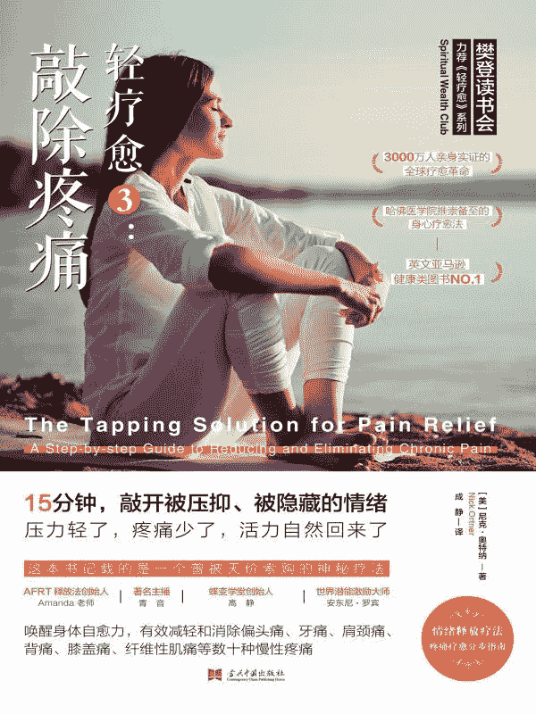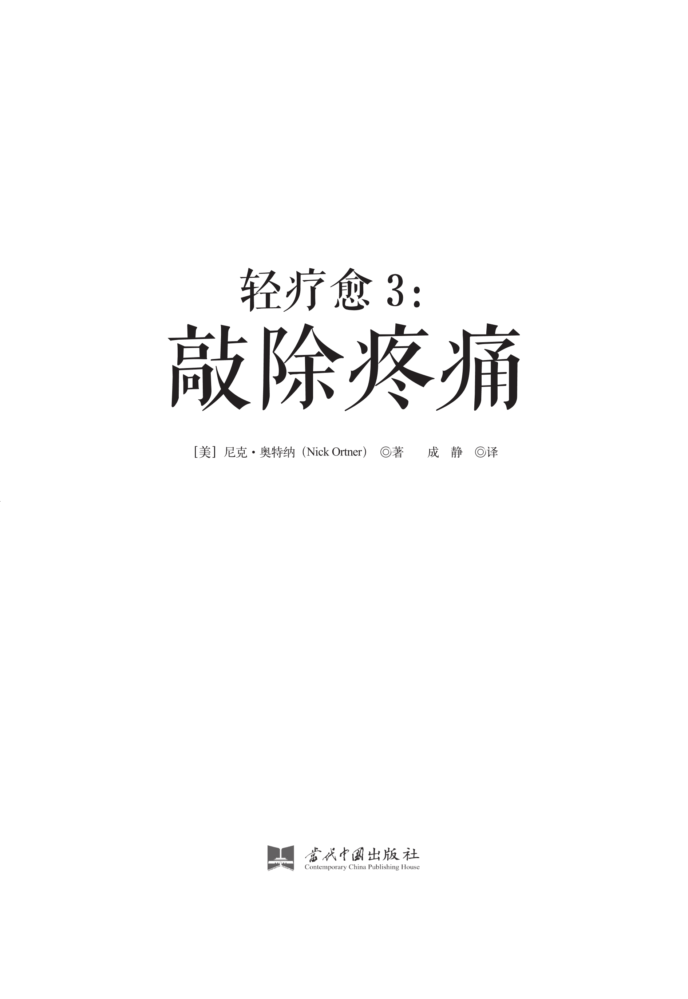

**图书在版编目（CIP）数据**

轻疗愈．3，敲除疼痛／（美）尼克·奥特纳（Nick Ortner）著；成静译．--北京：当代中国出版社，2016.11

英文书名：The Tapping Solution for Pain Relief: A Step-by-step Guide to Reducing and Eliminating Chronic Pain

ISBN 978-7-5154-0721-0

Ⅰ．①轻…　Ⅱ．①尼…　②成…　Ⅲ．①精神疗法　Ⅳ．①R749.055

中国版本图书馆 CIP 数据核字（2016）第 201111 号

The Tapping Solution for Pain Relief: A Step-by-step Guide to Reducing and Eliminating Chronic Pain by Nick Ortner

Copyright © 2015 by Nick Ortner

Originally published in 2015 by Hay House Inc. USA

This translation published by arrangement with Hay House （UK） Ltd through Bardon Chinese Media Agency. Simplified Chinese edition Copyright © 2016 by **Grand China Publishing House**

All rights reserved.

©2016 本书中文简体字版通过中资出版社（**Grand China Publishing House** ）授权当代中国出版社在中国大陆地区出版并独家发行。

未经出版者书面许可，不得以任何方式抄袭、节录或翻印本书的任何部分。

版权合同登记号　图字：01-2016-4077

出版人　曹宏举

策　　划　中资海派

执行策划　黄　河　桂　林　隋　聃

特约策划　任小平

责任编辑　隋　聃　王延新

特约编辑　林海旋　张　艳

封面设计　王　雪

版式设计　廖国兰

出版发行　当代中国出版社

地　　址　北京市地安门西大街旌勇里 8 号

网　　址　http://www.ddzg.net　邮箱：ddzgcbs@sina.com

邮政编码　100009

编辑部　（010）66572264　66572154　66572132　66572180

市场部　（010）66572281 或 66572155/56/57/58/59 转

印　　刷　深圳市雅佳图印刷有限公司

开　　本　787 毫米×1092 毫米　1/16

印　　张　18.5 印张　196 千字　插图 5 幅

版　　次　2016 年 11 月第 1 版

印　　次　2019 年 1 月第 5 次印刷

定　　价　38.00 元

* * *

**版权所有，翻版必究；如有印装质量问题，请拨打（010）66572159 转出版部。**

# 推荐语

Amanda 老师（AFRT 释放法创始人，疗愈的花瓣自助平台创办人）

我相信，《轻疗愈 3：敲除疼痛》将帮助更多人放下对药物和诊断单的依赖，有力量通过自助敲打的方式走出疾病和疼痛的困境。在释放疼痛和不适的过程中，陈年的坏情绪会得到梳理和释放，生命因此在各个层面绽放！

徐敬东（著名心理治疗师、价值观与心理健康研究院院长）

身体是情绪的容器，它记录着你的生命历程，未能释放的情绪也会以疼痛的方式呼求处理和帮助。作者提出了一种能够切实有效地处理疼痛的全新视角与方式，绕过了繁复的分析与沟通，帮助求助者简单快捷地缓解疼痛所带来的心理压力。情绪释放疗法是心理工作者的一项新工具。

俞孟成（奇迹学创始人、身心灵作家）

身体上的疼痛绝不是一个孤立事件，它只是整体事件表现在身体上的一种反应。为了彻底治愈这些疼痛，尼克·奥特纳提出了一整套由内而外的治愈方法，由孤立事件而及整体，从根本上疗愈情绪上与身体上的痛苦，这些方法简单易行，切实有效。如果你想彻底疗愈自己身心上的痛苦，这本书确实值得一看，它将为我们的生活带来巨大的改变！

张芝华（留美著名华人催眠培训师）

情绪释放疗法是一种新兴的能量疗法， 我在美国期间曾学习过， 结合我的整合性身心能量疗法，有非常好的效果。这是一种敲打身体某些重要穴位的能量暗示：当身体接受到信息时，潜意识就会自动搜寻线索并回应。对某些陈年慢性症状与困扰不解的人生模式以及平衡情绪，有很强的疗效。我个人是此疗法的爱好者，也特别喜欢这本书里面简单易学的操作方法。

韦恩·戴尔博士（Dr. Wayne Dyer，《正能量：实践版》作者）

不用怀疑了，情绪释放疗法真的管用，我找尼克治疗过，这个疗法对我的生活大有裨益。

安东尼·罗宾（Anthony Robbins，世界潜能激励大师）

多年来，我一直在向全世界的人们讲述选择以及行动的力量。如果你正经受着慢性疼痛的折磨，那么我建议你选择这本书，并且遵循书中的步骤进行练习。通过情绪释放疗法治愈疼痛的人如此众多，足以证明一切，就是这么简单。

克莉丝·卡尔（Kris Carr，《全食物救命奇迹》作者）

如果你正经受着慢性疼痛的折磨，忍受不了随之而来的压力和疲惫，就去找尼克·奥特纳吧。如果说有谁能将你从痛苦中解救出来，那么一定是他。

我已经亲身体验过情绪释放疗法，并且取得了惊人的效果，相信你也能通过这种简单的工具实现疗愈。就从今天开始使用情绪释放疗法吧，不用担心你会失去什么。健康的人生和千万种可能都在等着你！

露易丝·海（Louise Hay，《生命的重建》作者）

我相信尼克·奥特纳的方法。尽管非常简单，但它却有着奇特的魔力。跟着尼克学习并使用敲击疗法后，我的各种压力都得到了释放，更神奇的是，健康状况也得到了好转。

道森·丘奇（Dawson Church，畅销书《基因里的魔鬼》作者）

如果你自己，或者你爱的人正在与疼痛对抗，那么你需要的正是这本书。尼克·奥特纳用词简练，却非常精准地揭晓了许多关于疼痛的谜题，例如：疼痛不只是由疾病所致，所以常规疗法经常无法奏效。书中分享了许多重度慢性疼痛患者的真实故事，结合最新的研究成果，详细地说明了负面情绪和潜意识加剧疼痛的可能性及其原因。尼克用神奇的穴位敲击疗法，引导读者缓解慢性疼痛。搭配合理的敲击顺序，能处理好各种常见的疼痛问题。书中实用的信息能让你从此摆脱疼痛束缚，只需动动手指，非常地简单快捷。

克里斯蒂安·诺斯鲁普（Christiane Northrup，《女人的身体，女人的智慧》作者）

在美国，慢性疼痛的发病率甚至与流行病不分上下，许多疼痛患者不得不长期依赖止痛药生活。如今，尼克·奥特纳找到了一种新的治疗慢性疼痛的方法，它安全、自然、有效。这就是他在这本最新作品中为我们带来的好消息。

露丝·巴钦斯基（Ruth Buczynski，美国国家行为医学临床应用研究所主席）

如果你正经受着慢性疼痛的折磨，非常渴望得到缓解，尝试过很多方法却未能奏效，那么我建议你看看这本书。书中，尼克·奥特纳为我们解读了身体、情绪与压力之间的关系，还提供了能够缓解疼痛的疗法。我发现，他提出的这一疗法非常实用、简单易行，是身心医学领域的一项重大突破。

金·德埃拉莫（Kim D'Eramo，骨科医生、认证急诊医师）

情绪释放疗法能快速缓解疼痛症状，非常适用于急诊室和病患拥挤的医疗诊所。最重要的是，这本书能让患者痊愈！如果病人能读到这本书，整个医疗体系也将随之改变。

戴维·范斯坦（David Feinstein，《能量心理学的承诺》合著者）

疼痛是身体在以最自然、最生动的方式告诉你，什么不该做。但慢性疼痛可没那么好应付，全球大约有 15 亿人每天都在慢性疼痛中苦苦挣扎。他们每年花在治疗方面的费用高达几十亿，甚至几百亿美元，然而这些根本就没用，甚至还会影响其思维和大脑的运作。这本书的神奇之处在于，它展现了全新的、自然且有效的方式，能解救这 15 亿疼痛患者的灵魂。很多读过此书的人都会觉得，这简直是上天的恩赐。

乔恩·加布里埃尔（Jon Gabriel，畅销书《减肥可视化》作者）

敲击疗法简单易行，也非常地有效，能缓解甚至治愈各种慢性疼痛。通过敲击改变思维，就能完全从生理疼痛中解脱出来，真是太神奇了！这本书叙述条理清晰，让人爱不释手。尼克·奥特纳教会我们如何激发隐藏在内心深处的自愈潜能。每一个想治愈身体的人都应该读一读这本书，其中的方法安全、自然，而且能永久地改善身体状况。强烈推荐！

诺曼·希利博士（Norman Shealy，美国国家综合医学研究所所长）

疼痛是最常见的症状，它会告诉我们哪里出了问题，包括生理上的、心理上的或情绪上的。尼克在这本精彩绝伦的书里详细地分析了这些缘由，并提供了最简单有效的工具，让你从此摆脱疼痛困扰！

杰克·坎菲尔德（Jack Canfield，　“心灵鸡汤系列丛书”著作人之一）

如果你正遭受着慢性疼痛的折磨，那么这本书将带你走上新的旅程，过没有疼痛的新的人生。尼克已经帮助成千上万的人缓解了疼痛，你就是下一个。

# 推荐序 1

Amanda**老师**

（AFRT 释放法创始人疗愈的花瓣自助平台创办人）

### 人人都是治疗疼痛的大咖

身体上的每一种疼痛都直指内在的某个还未解决的故事。长久以来，身体独自承载着我们心智所创造的一切——那么默默无闻而又任劳任怨。长久以来，我们忽略了身体自愈的能力，一味地把痊愈的希望和责任扔给权威专家和药物。这些方法并未触及疾病和身体不适的真正原因：情绪和信仰系统。

能量心理学各类疗法的蓬勃发展，为新时代人们对疾病和身体问题的了解，提供了更深刻的洞见和更多的治疗选择。EFT 的出现，为大众提供了一套切实有效而又非常简便绿色的非药物治疗方案。很多看似慢性和极具杀伤力的疾病，很可能是内在的一个需要被看到的创伤或是旧时的情绪问题没有解决。通过运用情绪释放疗法，追本溯源地解开疼痛背后的情绪死结，很多病痛也就不治而愈。

在推广 EFT 和《轻疗愈》系列书籍的过程中，我们频频收到喜讯：使用者在自我疗愈疾病和心理问题的过程中收获不断。通过敲击释放，有些长年服药的抑郁患者逐渐摆脱了对药物的依赖，失眠和焦虑的症状双双减轻，重新树立起正念和对生命的期望；有些长期患妇科病或是月经不调的女性，也完全康复；平时的一些头疼问题，也很快得到缓解。EFT 不仅仅帮助我们摆脱日常的压力和疼痛的困扰，如果你熟练掌握方法，很可能会在事业和人际关系等方面得到意想不到的提升，当然，你也很有可能成为像尼克一样的释放大咖！

《轻疗愈 3：敲除疼痛》集中针对身体问题进行探索和敲打。不管是关于医生的诊断单，还是慢性疼痛，甚至是潜意识中制造疼痛的真相，在这本书里都有很好的案例说明和敲打操作指南。你会了解到，身体的问题远远不是这些症状所表现出来的部分，在内在很深的地方，我们的心智正在创造着这些问题，并以此规避真正的病因。本书会帮助我们层层深入、在敲打中恢复元气。

我相信，《轻疗愈 3：敲除疼痛》将帮助更多人放下对药物和诊断单的依赖，有力量通过自助敲打的方式走出疾病和疼痛的困境。在释放疼痛和不适的过程中，陈年的坏情绪会得到梳理和释放，生命因此在各个层面绽放！《轻疗愈 3：敲除疼痛》中简单便捷的自助方法，让我们看到：人人都可以成为疗愈疼痛的大咖！

# 推荐序 2

**埃里克**·**罗宾斯**

（Eric Robins，医学博士）

### 敲击坏情绪，做自己的疼痛疗愈专家

多年以来，作为一名注册泌尿科医师兼疼痛专家，我以能治疗各种“不可能治好”的慢性疼痛而在医疗圈小有名气。例如，有位 50 岁的病人在被慢性疼痛折磨多年而求助无门的情况下找到我；另一位病人，她才 33 岁，却因疼痛几乎无法走路；还有一位 41 岁的女士，因为遭受着剧烈的神经痛，仅日常生活的基本自理活动都能耗尽她所有的时间和精力。

这些病人都是抱着极其渺茫的希望来到我的办公室，但他们走出去的时候，身上的疼痛感都会有很大程度的减轻，甚至神奇消失。在接下来的几周或几个月里，他们的身体或许还会轻微地疼痛，但最终，疼痛会完全被治愈。

如果不是借助情绪释放疗法，我永远也无法帮到这些人（除了以上几位，来求医的其他病人不计其数）。我之所以敢底气十足地这样说，是因为日常工作中，我无数次地使用了这种方法。在过去的 15 年里，我见证了情绪释放疗法带来的不可思议的效果。而且，不止我一个人这样觉得。相比那些不采用情绪释放疗法的医生，采用这种疗法的医生就相当于在下国际象棋，而对方却在下五子棋。

那么，为什么在缓解疼痛方面，敲击能有如此神奇的功效呢？正如我意识到的那样，慢性疼痛往往与尚未解决的情绪问题有关。这一点得到了许多现代医学著作的论据支持。我们知道，生理性的疼痛是真实可感的，而得不到缓解的负面情绪所触发的心理机制又会加重疼痛并延长疼痛周期。这些负面情绪可能源于你很久以前的某段经历或者你最近的情绪波动。下面，让我详细解释一下。

在心理层面上，存在着两种与慢性疼痛有关的典型反应。第一种是慢性紧张与肌肉抽搐。随着肌肉的紧张收缩，肌肉组织内部开始供血不足，含氧量开始降低，疼痛由此产生。第二种是神经的超敏反应^((1))。当人们处在慢性的“战斗还是逃跑”状态^((2))时，会释放出压力荷尔蒙，这种荷尔蒙会对我们的敏化神经造成巨大影响。当这些神经被敏化^((3))之后，任何疼痛感都会变得更加强烈。我们对疼痛的认知和感觉方式也会影响神经的敏化，因为焦虑情绪会导致身体释放更多压力荷尔蒙。

另外一件需要解释的事情是：即便是在遭受慢性疼痛的情况下，我们的身体仍具备自愈能力。但布鲁斯·立顿博士（Dr. Bruce Lipton）却在书里说，当身体处在压力状态时，细胞会进入保护/生存模式。这意味着，处在压力下的身体，自愈速度会减慢。只有当身体脱离压力状态，细胞恢复到正常模式时，疼痛才能得到持续的缓解。

敲击之所以对缓解慢性疼痛如此有效，是因为它可以帮助病人释放负面情绪，正是这些负面情绪令身体陷入压力状态。敲击能够解决他们由于过去或现在的某个特定事件造成的负面情绪问题。当大脑得到的信息是“此时放松紧张的肌肉和敏感的神经是安全的”时，身体就能恢复自愈能力了。而且，不仅能自愈慢性疼痛，还能顺带解决其他问题。

虽然我的专业是治疗慢性骨盆疼痛，但这种“生理反应造成疼痛”的理论适用于治疗身体任何部位的疼痛。

每一天，世界上都有无数人经受着慢性疼痛的折磨，他们非常渴望找到缓解疼痛的方法。所以，当尼克告诉我他要写这本书的时候，我非常高兴。敲击疗法缓解慢性疼痛的效果非常好，而尼克又能用通俗易懂的语言深入浅出地阐述这个复杂的课题。因此我相信，许多人都将从这本书中得到期待的帮助。

这本书将带领你经历一段强大且有效的疼痛缓解过程。希望你能全身心投入，即使在一开始敲击疗法看起来是多么“奇怪”。敲击疗法将目标锁定为造成你疼痛的罪魁祸首——你的情绪、压力和过往创伤。一旦解决以上问题，身体的自愈能力就会完成剩下的工作，而你将像其他成千上万人一样，为所看到的、经历的不可思议而感到震撼。

* * *

(1)　即异常的、过高的免疫应答。即机体与抗原性物质在一定条件下相互作用，产生致敏淋巴细胞或特异性抗体，如与再次进入的抗原结合，可导致机体生理功能紊乱和组织损害的免疫病理反应。又称变态反应。——译者注

(2)　指机体一系列的神经和腺体反应将引发应激，使躯体做好防御、挣扎或者逃跑的准备。——译者注

(3)　对刺激更敏感。——译者注

# 前言　在缓解疼痛的路上，你并不孤单

既然你已翻开此书，我猜想，你自己或者某个所爱之人可能正经受着某种身体疼痛的折磨。你们也许正在想办法解决这个问题，也很可能与其他慢性疼痛患者一样，正处于崩溃、愤怒、失望甚至抑郁当中。

我猜对了吧，疼痛可不是闹着玩儿的。痛感分很多种，从不太舒服到非常痛苦，甚至再到折磨。随之而来的情绪体验也同样糟糕，特别是当身体疼痛成为一种慢性病症的时候。

疼痛一直以惊人的方式限制着我们的生活，包括我们能做的事、能去的地方、与别人交往的方式、为世界创造的价值，以及我们在日常生活中呈现的样子等。随着疼痛不断加剧，我们被一天一天地消耗着。我们不断寻求解决办法，想要永远消除这种疼痛，但诸多尝试都宣告失败。渐渐地，我们开始觉得自己仿佛再没有出头之日。以下是我从那些饱受慢性疼痛折磨的病人那里听来的一些话：

疼痛是持续的，永远不会消失。我只有像吃糖一样不停地吃止痛药才有精力做点事情，但疼痛似乎永远不会消失。

大概 10 年前，我摔了一跤，脚部伤得很严重。到目前为止，我的脚已经做了 6 次手术，这让我痛苦不堪。我尝试了各种办法，但没有一种奏效。甚至，手术还加剧了疼痛，这让我非常愤怒。

我曾经努力坚强起来，但后背上的疼痛总是时隐时现，永远无法消除。

如果觉得上面的话有点熟悉，说明你不是一个人在战斗。在美国，超过一亿人正经受着慢性疼痛的折磨，而这还只是冰山一角。无论我身处世界哪个地方演讲，每次在讲台上问一句“谁正在经受慢性疼痛的折磨”，一定至少有 1/3 的观众举手。然而，他们从未参加过任何针对缓解疼痛的活动。

在西方文化背景下，我们最常被告知的解决疼痛的办法就是去找医生，做手术、打针或者吃药。上述方法都有各自的用武之地，但面对慢性疼痛，人们一致认为传统药物是不起任何作用的。我们期待吃药、打针、手术能在某种程度上缓解疼痛或者暂时麻醉神经，但通常会带来一些副作用，例如，加剧我们的情绪性疼痛。持续的生理上和心理上的疼痛循环，让人痛不欲生。

需要澄清的是，我并不是要反对医生或者西方医学。相反，本书建议大家将东西方医学结合起来，互相补充，进而找到一种持久的疼痛缓解疗法，获得应有的治愈。

本书提供的是一种令人震撼的疼痛缓解疗法，一开始，这种疗法看起来可能有点傻，但你很快就能看到它的力量所在。敲击疗法（也称情绪释放疗法，EFT）是一种工具，在过去的 10 年里，我一直使用、教授这种工具，并且尽可能地将其传播到地球的每一个角落。它融合了东方的按摩技术和西方的心理学，可以帮你找到可能导致身体疼痛的深层原因。在缓解疼痛和心理压力方面，它的效果令人难以置信。

2004 年，我开始尝试情绪释放疗法。有一天早上，我起床之后发现脖子疼得厉害，但通过敲击，痛感竟在几分钟之内消失了。这让我非常震惊，因为以前落枕后，我都要等上好几天，忍受脖子、肩膀、背部的疼痛与僵硬，直到它自己好起来。但这次，由于我采用了情绪释放疗法，疼痛和不适感竟然在几分钟之内消失了。我可以舒舒服服地开始新的一天，这简直太神奇了！

很快，我开始将情绪释放疗法推荐给朋友和家人，并且发现他们也得到了类似的效果。不久之后，我想到一个听起来很疯狂的主意，那就是制作一部关于情绪释放疗法的纪录片。情绪释放疗法是如此有效，我必须和尽可能多的人共同分享。我从来没有拍过片子，而且，我必须调高信用卡额度才能支付这笔费用。最后，我和妹妹杰茜卡·奥特纳（Jessica Ortner）、好朋友尼克·波利齐（Nick Polizzi）一起把这部纪录片拍了出来。这也开启了我新的生活。

通过纪录片《轻疗愈》（*The Tapping Solution*），通过情绪释放疗法，我帮助全世界很多人创造出梦寐以求的新生活。而这一切的开端，是我们在 2007 年举办的为期 4 天的情绪释放研习班。

### 疼痛只是身体在告诉你，它不开心

我们从几百名申请者中挑选了 10 位学员进入研习班，共同实践情绪释放疗法。第一次见到学员乔迪，是在她得克萨斯州的家里。她患纤维肌痛已经长达 15 年，痛感主要集中在膝盖部位。在家的时候，乔迪一般会选择爬行，以避免走路带来的剧痛。晚上睡觉时，她经常被疼醒，一晚上甚至会醒来 20 次之多。

和乔迪对话几分钟后，我了解到两个情况。第一，在很小的时候，她经历过几次严重的创伤性事件，包括目睹父亲殴打母亲；第二，即使是在最黑暗的日子里，她仍然决定努力保持积极正面和创造力。尽管承受着常人难以想象的痛苦，乔迪依然充满了正能量，不仅成为一名老师、治疗师、四个孩子的母亲、妻子，还是一位有理想的作家。更可贵的是，她下定决心突破人生，无论是在健康上还是写作上。

研习班开始的第一天，我们问乔迪，在她的膝盖开始疼痛时，生活中可曾发生过什么事情。乔迪告诉我们，当时她怀有身孕的女儿被确诊患上了艾滋病。在形容那个阶段的状态时，她用了“悲伤”这个词。于是，我们的情绪释放专家里克·威尔克斯（Rick Wilkes）针对她“悲伤的膝盖”进行了敲击。

乔迪因为无法帮助女儿摆脱困境而感到悲伤，针对这一“悲伤”进行敲击后，她竟然可以自己上下楼梯而不感到疼痛了。一开始，乔迪并不相信这种疼痛缓解能够持续下去，以为这不过是疼痛消失的少数几个时刻之一，悲观地认为疼痛很快又会故态复萌。但到了第二天，她竟轻松地进行了一次长距离散步。事实上，乔迪以前很喜欢散步，只是因为膝盖疼痛而不得不放弃。这次散步，是她多年来的第一次。

后来，乔迪才意识到，自己已经走在了整个疼痛人群的前面。这么久以来，她第一次相信，自己终于可以摆脱疼痛了！在接下来的几个月里，乔迪坚持每天敲击，有的时候甚至一天敲击多次。收获是，她能一觉睡到天亮，再也不会被疼醒了。

每天早晨醒来，乔迪都能精神百倍地开始崭新的一天。随着疼痛的消失，她终于能轻松地上下楼梯，于是，她的丈夫终于可以建造他们的梦想家园——一栋双层小阁楼了。乔迪又可以定期远足，并在两个月的时间里写完了两本书。要知道，在过去几年里，乔迪甚至连一部书稿都没完成。

另外，她和家人的关系也得到了改善。同样重要的是，乔迪的生活还发生了其他一些巨大变化。在研习班针对“悲伤的膝盖”进行敲击时，乔迪承认自己有一个习惯，那就是照顾周围的每一个人，却很少照顾自己。研习班结束后，她除了每天进行敲击，还特意学着慢下来，聆听自己的身体，尝试更好地照顾自己。

研习班结束大约 7 年以后，2014 年，我又一次联系了乔迪，并为她的新生活感到非常激动。她依旧每天进行敲击，而膝盖再也没有疼过。“那次研习班之后，我一直住在两层的小阁楼里。”她说，“因此，我每天都会上下爬楼梯。”乔迪还有了新的事业：成为一位情绪释放专家，同时也是一位作者和演说家。

### 与坏情绪打一场“软仗”

在本书中，你会遇到很多像乔迪这样的人——凯茜、鲍比、南希、维基、汤玛斯。像乔迪一样，他们每个人都是被慢性疼痛困扰很久后，才开始接受情绪释放疗法。在针对疼痛背后的事件进行敲击之后，他们最终成功摆脱了疼痛的困扰，获得了梦寐以求的新生活。

除了这些例子，我还将分享近期的一些科学发现。这些发现强有力地佐证了情绪释放疗法的科学性：疼痛是如何产生的？情绪和压力如何影响疼痛？为什么情绪释放疗法能有效缓解疼痛？

在第二章中学习如何使用情绪释放疗法之后，在第三章，我们将通过审视压力和疼痛之间的关系，正式开启疼痛缓解之旅。接着，在第四章，我们需要回顾疼痛第一次出现时发生了哪些事情。

在第五章中，我们会详细研究你的诊断结果及其影响。如果你并没有得到任何医生的诊断结果，也可以跳过这一章。但我建议你在接受情绪释放疗法之前，最好找医生诊断诊断。对身体的详细情况有一定了解之后，再使用情绪释放疗法消除疼痛，这一点很重要。

分析完你的诊断结果后，我们将在第六章处理一些尚未解决的心理问题，释放负面情绪。人们常常会惊诧地发现，生活经历与疼痛之间竟有如此深的联系，这就是我要在第七章了解你的过去以及童年重要经历的原因。即使你拥有快乐的童年，我还是希望你读完这一章。因为，一些看起来微不足道的小事也有可能一直潜伏在身体里，在多年后造成你的慢性疼痛。

在第八章，我们将探索人们是如何拒绝改变的，包括在缓解疼痛这种积极行为方面的改变。在这一章，我们还要探究疼痛蕴含着的深层意义，以及身体试图通过疼痛向你传达怎样的信息。

在第九章，你将和身体、你自己以及生活建立一种新的关系。你将继续朝着没有疼痛的生活前进，然后在第十章许下你对未来生活的新愿景。你会发现，在这个愿景里，不仅你的身体不再受疼痛的折磨，你还会有其他方面的积极追求。

在疼痛缓解之旅中，我们将引导你学习敲击剧本，并完成一些练习，帮助你发现慢性疼痛背后的问题。如果想获得最佳效果，请务必完成这些练习。只有当你真的跟着练习做了，敲击疗法才能发挥作用。

我曾指导成千上万人进行敲击练习，许多人都能沉浸其中，并最终取得显著效果。开始阅读本书，让这段旅程开启你的新生活吧。请务必完成书中的所有练习，更重要的是，尽量做到每天敲击。

我建议你在进行书中的大部分练习时，将过程记录下来。情绪释放笔记将帮助你更清晰完整地认识与疼痛相关的事件。将所有因素、事件整合起来，并在此基础上进行敲击，对缓解疼痛至关重要。

每个人的疼痛缓解之旅都有所不同，但对大多数人来说，这需要他们同时思考大事件和小细节，并且将它们联系起来。而一切的最终目的都是缓解疼痛。要想实现这样的目标，你需要一点一点地用心体会自己的细微变化。关注你的疼痛、情绪与观念，以及身体发生的细微变化，有助于更有效缓解疼痛。另外，情绪释放疗法还可以释放压力，让你身心舒畅。

### 轮到你了，开始敲击吧

多年以来，情绪释放疗法缓解疼痛的效果仍然令我惊叹，并激励着我。就好像发生在患者身上的奇迹，同样在我身上发生了。尽管情绪释放疗法背后有权威的科学支撑，在敲击的时候，你仍然要相信奇迹的存在。任何进步都是有价值的，即使只是一点点，你也要对此感到兴奋，要庆祝每一次小小的进步。

情绪释放疗法不仅能够缓解疼痛，帮你恢复健康，更能令人难以置信地、一次又一次地改变我们的生活。随着不断探索疼痛背后的深层原因，你不仅能够治愈身体的疼痛，还能治愈生活中受到的心理创伤。疼痛缓解之旅将让你发现，原来每个事件都是如此紧密地相连，并让你相信真正的改变是能够实现的。

现在就开始憧憬没有疼痛的未来生活吧，开始想象每天早上起来，没有疼痛、一身轻松的样子；开始想象自己正在做着曾经乐在其中却因疼痛不得已中止的事情。找到那一丝希望，便是找到了一切的答案。翻开书，采用情绪释放疗法，朝着美好的未来前进吧。我曾经见证奇迹在成千上万的人身上发生，现在，轮到你了！

# 第一章　疼痛的真相也许并不是你以为的那样
THE TAPPING SOLUTION FOR PAIN RELIEF

你忍受着一切痛苦，努力说服自己相信，只要乖乖打针、吃药、手术，就能有出头之日，不料疼痛却愈演愈烈。你变得被动，开始逃避现实、雪藏痛苦记忆，却未曾想过，自己最大的敌人竟是那些记忆里不堪回首的坏情绪。

所有负面情绪产生的原因都是因为身体的能量系统遭到了破坏。

加里·克雷格（Gary Craig）《EFT 立论宣言》

那是一个安静的周日清晨，我刚坐下来，准备喝杯咖啡浏览新闻，享受早上的时光，却被《纽约时报》上的一篇头条新闻给搅乱了。新闻标题是这样的：

医生发现了一条新的膝关节韧带

又来了？2013 年年底我就读过类似的新闻，报道称人类已经解码人体奥秘——发现了一条“新”韧带。要知道，发现的不是一种新的基因、一种新的外科手术，或者一次药物学上的新突破、一种新的人体化学物质，仅仅是一条韧带而已！更令人震惊的是，美国每年都要进行 60 万例的膝关节置换手术。也就是说，我们已经花费大量时间来研究膝盖和韧带了。但眼前的这条新闻却说“我们还停留在寻找新组成部分的阶段”！

尽管新闻标题很可笑，但它清楚地提醒我：我们对身体仍然知之甚少，包括它的组成、机理以及如何治愈。这一点对于疼痛来说，更是如此。多年来我们得到的结论是：疼痛来自身体里发生的某种异常状况，某种真实存在的、棘手的状况。然而，尽管疼痛每天都困扰着全世界数以亿计的人（或许今天就困扰着你），我们却还不能完全搞清楚它背后的科学原理是什么。

以背部疼痛为例。在美国，背部疼痛是最常见的疼痛，包括误工费用以及劳保补偿金在内，每年由背部疼痛造成的损失超过 500 亿美元。那些下背部疼痛的人往往伴有腰椎间盘突出，他们因为这种疼痛夜不能寐、行动受限、备受折磨。

令人吃惊的是，学术研究领域至今还未发现任何结论性依据以证明腰椎间盘突出会引起疼痛，特别是慢性疼痛。事实上，研究发现，许多经过 X 光检查发现患有腰椎间盘突出的人并没有感到疼痛，而未患上腰椎间盘突出或未发现任何其他病变的人却称自己遭受着非常剧烈的疼痛。

乔治·华盛顿大学为此做了一项调查，调查结果被刊登在《脊柱外科》（*Spine*）杂志上。该调查的研究员给 52 位下背部无痛感的病人照了腰部 CT，然后请对病人临床病史并不了解的神经放射科医生来看片子。医生们指出，35.4%的病人，以及 50%的 40 岁以上的病人都患有腰椎间盘畸形、腰椎间盘狭窄，以及其他随着年龄增长而产生的问题。这表明，一些常见的病变并不一定会带来疼痛。

请允许我再啰嗦一次，因为我太清楚有多少被背部疼痛折磨的人，被告知是腰椎间盘突出所致，而许多做了无数次检查的人，明明被确诊患有腰椎间盘突出或腰椎间盘狭窄，却并没有感到疼痛。

关于疼痛的其他补充数据也都含混不清，甚至自相矛盾。我们通常认为慢性疼痛，或者腰椎间盘突之类的疾病由年龄增长导致，然而，大部分经受背部慢性疼痛的都是中年人，年龄介于 30～60 岁之间。一些研究表明，年纪在 60～65 岁或以上的人，背部慢性疼痛的情况呈减弱趋势。如果背部慢性疼痛真的与年龄有关，相比 45 岁的中年人，65 岁老年人中的疼痛案例应该更多，但事实恰好相反。这些数据让我们更加迷惑了。

将疼痛数据按年龄分组后，情况就更加混乱了。背部疼痛、偏头痛、颈部疼痛、面部和下巴疼痛、纤维性肌痛^((1))，以及复合性局部疼痛综合征等疼痛，在女性中的发病率均高于男性，但解剖学上却未曾证明这些疼痛与性别有关。

疼痛究竟从何而来？或许，所谓的“常识”，特别是关于疼痛与年龄、与身体的某些状况有关的“常识”都是片面的，甚至是错误的。

得益于功能性成像和功能性核磁共振成像扫描技术，我们可以知道当一名病人的身体开始疼痛时，其大脑正发生着哪些反应。我们知道，大脑会给身体发出信号，指使身体制造出疼痛，而且，大脑同样可以消除疼痛。研究表明，恐惧和焦虑等情绪可以加剧痛感，其他负面情绪也会将短时疼痛转化为持久的慢性疼痛。

荷兰曾经做过一项关于负面情绪如何影响疼痛的研究。研究者邀请了 121 位女士，其中 62 位女士被诊断患有纤维性肌痛，受慢性疼痛折磨，剩下 59 位女士则没有这方面的困扰。研究者在用电子实验用具刺激受试者的同时，会让她们先回忆一些不带感情色彩的事件，再回忆一些感到愤怒或悲伤的经历。在这两种情况下，她们都会感到疼痛，但回想愤怒或悲伤的经历时，疼痛往往更为强烈。

一项由 150 名患者参与的、独立随机控制性实验的表明，相比没有接受认知行为治疗、继续等待的患者，那些接受了认知行为治疗、得以释放情绪的患者，他们感受到的疼痛、疲劳以及功能性残疾情况更乐观。那么，情绪和疼痛在身体中到底是怎样相互作用的？

大脑和身体能够以许多种不同的方式制造疼痛，并在程度和时长上对痛感产生影响。例如，抬起重物这样的身体动作可能会损伤你的背部，从而引起疼痛。在这样的情况下，你感受到的疼痛是即时的——就算不是立刻出现，也会在很短时间内感觉到。在疼痛出现之后，你的大脑和神经元会立刻行动起来，重构程序并发出警示，确保你将来不再受到类似的伤害，也就是将你置于“高度预警”状态。大脑的这种重构功能被称为神经可塑性。当我们遇到伤害后，大脑就会立刻产生因人、因事而异的神经可塑性变化。

有的专家认为，经历伤害后，大脑中产生怎样的神经可塑性变化以及产生的时间决定了疼痛的发生部位及时长。换句话说，你受到伤害的那一刻，以及随后几小时内的情绪状态，将在一定程度上决定着你的疼痛是否会演变为慢性疼痛，以及这种疼痛将出现在哪个部位以及哪几个部位的问题。

如果你感受到一种新的、尖锐的疼痛，并且没有明显的病因，那么，别急着使用情绪释放疗法，先去咨询医生吧。疼痛是身体在与你对话，而医学可以准确地翻译出对话的内容，并且告诉你病情会不会恶化。

### 慢性疼痛是一种病，而不仅仅是一种症状

一般来说，疼痛分为两种：剧痛和钝痛，后者又称为慢性疼痛。所谓剧痛，就是当身体受到疾病、伤害或者其他刺激时，神经系统做出的一种即时反应。当我们磕伤膝盖时感受到的疼痛就是一种剧痛。而慢性疼痛则不同。这种疼痛可能出现在任何部位，而且持续时间比较长，也许是几个月、几年，甚至是几十年。斯坦福大学疼痛管理中心的医学博士肖恩·麦基（Sean Mackey）认为，当疼痛越来越持久时，就会变成一种病。

仔细想想这句话。如果慢性疼痛本身成为一种疾病，那么疼痛就会被单独拿出来治疗，而它与伤害、残疾、创伤这类身体问题的关联也就更少了。这意味着，你可能被诊断为背部慢性疼痛，而它与腰椎间盘突出或者背部损伤没有半点关系。

疼痛本身就是一种诊断结果而不是症状，加上情绪与慢性疼痛之间的密切关系，医生可能会接着问你关于情绪变化、生活压力以及精神创伤方面的问题。紧接着，他会向你推荐一位临床医生，这位临床医生最好懂得情绪释放疗法。疼痛本身就是一种病，这个现实可能会彻底颠覆你对疼痛的理解，并为如何治疗疼痛提供新的可能。

幸运的是，人们渐渐意识到需要找到缓解疼痛的新途径。在美国，每年被慢性疼痛折磨的人数量超过一亿。他们当中许多人都被诊断出身体状况方面的异常，需要进行手术。

然而，令人难受的是，许多人在动过手术之后仍然感到疼痛，甚至比术前更加严重。例如，20%接受膝关节置换手术的患者，在术后会一直经受慢性疼痛的折磨。

还有更多患者，手术后仍然需要花费大量金钱购买药物。这些药物给他们带来的副作用不可小觑，但对疼痛的缓解却短暂且效果微弱。很明显，尽管人们强烈渴望摆脱疼痛的困扰，但药物和手术并不能拯救他们。那么，到底什么样的治疗方法才能做到呢？想知道我的答案吗？那就是情绪释放疗法。

1980 年，心理学家罗杰·卡拉汉博士（Dr. Roger Callahan）发明了思维场疗法（Thought Field Therapy，简称 TFT）。30 多年来，思维场疗法成功帮助千百万人缓解了慢性疼痛。这种疗法结合了东西方医学的精髓，同时从精神和肉体两个方面缓解疼痛。思维场疗法要求患者一边用指尖敲击身体的经络穴位，一边大声表达自己的情绪。见证了这种疗法的作用后，卡拉汉开始将它教授给其他专业人士。他有一名学生叫做加里·克雷格（Gary Craig），是毕业于斯坦福大学的工程师。

克雷格对卡拉汉的疗法进行了简化，并将之命名为情绪释放疗法（Emotional Freedom Techniques，简称 EFT）。该疗法排列出了 9 个关键敲击穴位，形成了如今许多情绪释放专家都会使用的敲击顺序。就像克雷格所说，将他的情绪释放疗法和帕特里夏·卡林顿博士（Dr. Patricia Carrington）的敲击选择方法相结合，可以让敲击疗法变得人人可用，即使他们从未接受过专业训练。

**指尖敲出丰盛**

**有关穴位的科学**

2013 年，一篇刊登在《电子光谱学及相关现象杂志》（*The Journal of Electron Spectroscopy and Related Phenomena*）上的研究指出：CT 成像技术证明，人体中确实存在众多穴位。这篇研究和其他研究一起，证明了人体穴位的解剖学意义。

这些研究指出，人体的各个穴位有不同的结构，且穴位所在的部位比其他没有穴位的部位的微血管更加多、更加密集。另一项独立研究还证明，穴位所在的部位比非穴位的部位的局部氧分压要高。

### 为什么疗愈情绪，就能疗愈疼痛？

尽管已经见证情绪释放疗法带来的许多奇迹，我们还是会感到疑惑，到底是什么缓解了疼痛。肯定不只是敲击那么简单吧？事实上，就是这么简单。要想更好地理解为什么敲击对缓解疼痛如此有效，不妨看看坎达丝·珀特（Candace Pert）关于精神和肉体之间关联性的一个伟大发现。

在坎达丝·珀特进行实验研究的年代，人们绝对不会想到她的发现将改变药物学的未来。19 世纪 70 年代，珀特以女性研究者的身份来到由男性主宰的美国国立卫生研究院（National Institutes of Health）实验室工作。她成功地发现了阿片受体（Opiate Receptor），为其后来的“身心合一”理论提供了科学依据。

珀特在《情绪分子》（*Molecules of Emotion*）一书中解释道：“技术上的发明让研究情绪分子构成成为可能，让我们有机会理解情绪分子与身体之间的密切关系。据我研究，情绪连接了我们的意志和身体。”

珀特是一位药物学博士兼作家，同时也是一位蜚声国际的演说家。她的发现让我们开始理解类似慢性疼痛这样的病痛与情绪之间的潜在联系。珀特发现的阿片受体如同一个钥匙孔。它们与特定的钥匙——肽（Peptide）——相匹配，而肽就是珀特所说的“情绪方程式”的重要组成部分。

阿片受体漂浮在细胞的表面，就好像漂浮在池塘上的睡莲叶子一样。当阿片受体与合适的肽完美地结合在一起时，这个细胞的行为就能发生改变。换句话说，细胞会在任何特定时刻，根据其阿片受体与不同肽的结合，发生相应的行为改变。“放大来看，”珀特解释道，“这些细胞层面上的微观生理现象能够转化成行为、身体活动，甚至情绪方面的巨大变化。”

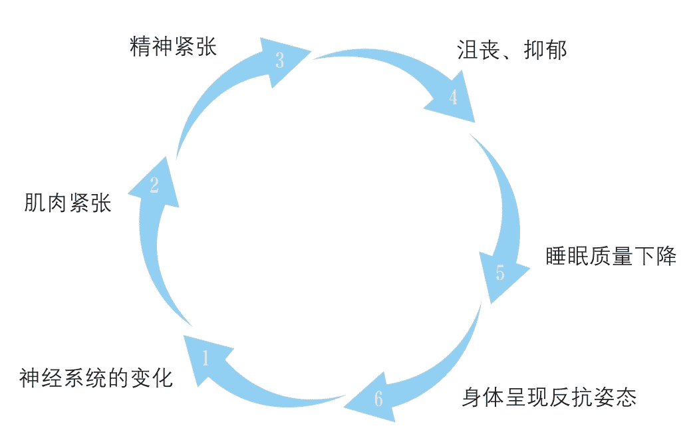

**图 1.1　情绪演变为生理性病症的过程**

珀特的研究成果为“通过处理情绪问题能够治愈身体疾病”的理念提供了科学依据。就像珀特所说：“对于这些无法疗愈的情绪、不断堆积的割裂情感，人们往往束手无策，即便是主流医学模型对此也毫无办法。”

《别了，背痛》（*Healing Back Pain*）一书的作者约翰·萨诺（John Sarno）见证了珀特将其发现用于治疗病人的全过程。在接触了成千上万位病人之后，萨诺发现了一种生理和心理相关联的疾病，并将其命名为肌肉紧张综合征^((2))。

根据萨诺的说法，面对日常生活中的压力与欲望，我们会自然而然地产生一些负面情绪，尤其是愤懑。当愤懑不断累积又得不到纾解时，就会隐藏在我们的潜意识中。“愤懑不断累积就成了愤怒，可怕的、无意识的愤怒将继续演变成生理性病症。”

愤懑逐渐演变成生理性病症的过程并不稀奇，但传统疗法并不能轻易控制或阻止它。关于这一点，萨诺解释说：“如果必须在难过情绪和剧烈疼痛之间做出选择，大部分人都会选择前者，这并不奇怪。但我们的情绪系统处于无意识状态，所以在应对难过情绪的方式上通常毫无逻辑。”因此，我们常常无意识地将愤怒等负面情绪压抑在心里，而不是将它们表达出来。

一旦潜意识中被压抑的愤怒达到一定量，大脑就开始制造生理性病症了。比如，它会限制血液流到身体中的一个或多个区域，从而造成慢性疼痛。假如，数年前你曾有过一段不堪回首的离婚经历，现在你觉得往事成风，伤口已经愈合，一切成为过去。但实际上，在离婚那段时间，你的潜意识已经将愤怒隐藏起来了，只是你没意识到。

这就是潜意识的工作模式，它总是在你根本不知道或者不同意的情况下接管你的情绪。随着时间的推移，这种被压抑的愤怒会阻碍身体对某块肌肉的氧气供给，于是肌肉开始因缺氧而收缩，进而影响到附近的肌群。你可以通过攥紧拳头感受这个过程。当你将手攥紧时，你的前臂肌肉几乎同时感到紧张。就这样保持一段时间，让你的肌肉一直处于紧张收缩的状态后，你就会感到疼痛了。

设想一下，如果现在我要求你攥紧拳头。一分钟后，你的手可能会感到累。十分钟后，它也许会开始发疼，这是疼痛参与进来了。如果你就这样攥紧拳头一整天、一个月甚至一年呢？显然，你将感到疼痛，你的身体也会发生肌肉退化等各种问题。而且不仅仅是你的手，包括手腕和胳膊都会出现问题，甚至到最后，肩膀也会受到牵连。事实上，这样的情况可能发生在你身体的任何部位。你感到紧张，肌肉开始收缩、供血受阻，最终感到疼痛。

根据萨诺的理论，对抗肌肉紧张综合征的唯一办法就是找出引发疼痛的情绪原因：“当患者开始意识到愤怒或其他负面情绪的存在时，这些情绪仍然阻止着他们产生这样的意识。消除这些威胁性情绪后，患者才不需要通过肌肉收缩来做出反抗，疼痛也就消失了。”得益于萨诺的发现，我们可以通过找到身体与情绪之间的连接，释放出全部的负面情绪，进而缓解疼痛。

即使无法马上找到压抑心底的愤怒（毕竟它们被压抑着），你也可以想想心里是否有些情绪没有释放出去，甚至未曾察觉。想一想，也许正是你的某种未被完全释放和发泄的情绪，导致肌肉的紧张和收缩。仅仅是这种初步认识，就对你的治疗效果大有裨益。后文中，我们将会详细阐述这个理念。

### 我们的大脑比我们自己更悲观

探究情绪和大脑如何影响疼痛时，我们必须知道，人类大脑在进化过程中往往更加关注负面而非正面的结果。出于自我保护的动机，我们常常会做最坏的打算。这是一种负面思维倾向。里克·汉森博士（Rick Hanson）在他的书《重塑正能量》（*Hardwiring Happiness*）中对这个概念进行了更为详细的解读：

我们的祖先可能会犯两种错误：一是认为树林里有老虎，而事实上并没有；二是认为树林里没有老虎，但真的有。第一种错误的代价是产生不必要的焦虑，而第二种错误的代价就是付出生命。

由此造成的结果是，为了避免犯第二种错误，我们在不断重复第一种错误。因此大脑的默认设置变成了夸大威胁、低估机会以及我们应对威胁的能力。我们不断强调符合这种认知的信息，同时忽略或否认与之对立的证据。在杏仁核中甚至还有一些特别的区域是专门用来阻止我们忘记恐惧、阻止我们走出童年阴影的。

也就是说，我们的大脑预先充满了对威胁的恐惧，而事实上这些威胁比我们想象的要小得多，而且更容易控制。同时我们又低估了机会的存在，尽管这些机会比我们想象的要大得多。事实上，我们将自己的大脑调成了“纸老虎妄想模式”。

大多数人都感受过汉森所说的“恐惧的独特力量”，因为千百万年来，它们深深烙在我们的潜意识里。就拿你的日常生活来说吧。假设在游泳时受了伤，那么你很可能像大多数人一样，在接下来的几个月里避免下水。但如果你采取了某种措施缓解了疼痛，甚至感觉更加舒服，也许当场就忘了受伤这回事。这就是大脑工作的基本原理。

换句话说，因为大脑经历了那样的进化过程，我们总是将负面经历看得更重。心理学家、《思考，快与慢》（*Thinking, Fast And Slow*）的作者丹尼尔·卡尼曼（Daniel Kahnemann）证明：相对于获得好处，大多数人宁愿付出更多以避免损失。这一发现让他获得了诺贝尔经济学奖。在一段亲密关系里，我们通常需要至少 5 次的积极互动来平衡一次消极接触。而对刚刚开始努力生活的人来说，他们需要的满足感至少是挫败感的 3 倍之多。

回过头想想，假如你度过了美好的一天，心情愉悦，身体也没那么疼。但就在这一天快要结束的时候，你听到邻居说了一句刺耳的话。那么晚上入睡前，你是会想着今天的身心舒畅，还是辗转反侧，反复琢磨邻居的话呢？大多数人会选择后者，这也证明了我们的大脑存在着负面倾向。

我们再来看看大脑内部的运作机制。当我们承受压力时，大脑中掌管情绪和身体疼痛的杏仁核就会被激活。而且一般来说，相对于正面经历，它更容易被负面经历激活。我猜，你肯定想知道这与情绪释放疗法和缓解疼痛有什么关系。正如我与汉森一致认为的那样，大脑的负面倾向给身体强加了不必要的压力。当你的身体感受到压力或者威胁时，就会分泌大量皮质醇（Cortisol），一种被称为“压力荷尔蒙”的物质。你感受到的威胁，可能来自身体，比如刚躲过一辆飞驶过来的汽车；也可能是精神上的，比如感到焦虑、生气或者害怕。当你长时间处于压力状态，你的身体就会释放大量的皮质醇，你将很容易感到疼痛，又很难缓解以及治愈它。而当你情绪积极、身体放松时，皮质醇水平自然就会降低，身体也更容易从疼痛或者伤害中恢复过来。

### 简单敲击，实现身心互动

在以上论述中，我们探究了身体、情绪以及压力如何相互作用，最终制造出疼痛。那么，敲击疗法是如何介入疼痛原理，进而缓解疼痛并与身心进行互动的呢？

尽管我们还未完全掌握情绪释放疗法缓解疼痛的工作原理，但越来越多的专家已经研究过该课题。在一项双盲测试中，道森·丘奇博士（Dawson Church, Ph.D.）发现，受试者在接受了 1 小时的情绪释放疗法后，皮质醇水平平均下降了 24%。而仅仅面谈 1 小时，不使用情绪释放疗法，受试者的皮质醇水平下降幅度则低得多。

皮质醇水平的下降也许只能部分解释敲击疗法在缓解疼痛方面的作用，但大量研究证明，情绪释放疗法确实可以缓解疼痛。雅典的红十字医院曾进行过一项随机控制实验：患有紧张性头痛的患者在接受了情绪释放疗法后，头疼的发作频率和程度至少降低了 50%。还有一项针对 216 名护工的实验表明，接受为时 1 天的情绪释放疗法后，他们的疼痛程度减轻了 68%。除此之外，一群患有纤维性肌痛的老兵，在采用情绪释放疗法之后，疼痛也得到了很大程度的缓解。

研究表明，针灸和穴位按摩都能通过增加胺多酚（Endorphin）来缓解疼痛。因为敲击可以在降低皮质醇的同时按摩穴位，它很可能和针灸一样，也可以令身体释放更多胺多酚，从而缓解疼痛。

**指尖敲出丰盛**

**用**EFT**缓解可怕的幻肢疼痛**

许多研究反复证明，相当一部分截肢病人的残肢部位都遭受着慢性疼痛的啃噬。美国国立卫生研究院指出，近 80%的截肢病人都受此折磨，其中许多人感受到的痛感非常剧烈。

有趣的是，情绪释放疗法对于幻肢疼痛有着特别的疗效。我的朋友、伦敦情绪释放专家凯里·曼（Carey Mann）接触过一位叫本·麦克贝恩（Ben Mcbean）的遭受幻肢疼痛的病人。

本以前是一名士兵，2008 年在阿富汗的时候，由于踩中地雷而失去了右腿和左臂。5 年来，本一直经受着幻肢疼痛，从轻微的疼痛一直发展到相当严重的程度。

在为本治疗的过程中，凯里一边让他回忆爆炸当天的恐怖瞬间，一边为他敲击穴位。就在本回想爆炸瞬间和随后的灼烧感，以及伴随其中的几种激烈情绪时，凯里让他把自己从回忆中拉出来。接着她要求本以现在的更成熟的身份回到过去，对年轻的自己说：“一切都会好起来的。”

接着，本继续敲击穴位的同时，释放由这些回忆引起的恐惧和焦虑，避免情绪堆积产生疼痛。每当情绪就快要爆发的时候，凯里就让本停下来，请他针对性敲击那些记忆碎片，直到回忆被彻底清除。（本书会用大量篇幅详细介绍这种疗法，因此，你将有足够的时间亲身体验。）

治疗结束时，本的幻肢疼痛得到了很大缓解。事实上，那已经不能算是疼痛了，更像是一种轻微震动。接着治疗了 3 周后，本的疼痛彻底消失了。这是他失去右腿和左臂之后，第一次不用带着疼痛生活。同时，他也不用再浪费时间和精力关注自己的残肢部位了。

想了解本·麦克贝恩接受情绪释放疗法的全过程吗？请登录网址 www.youtube.com/user/CareyMannTV 查看。

类似的例子还有很多。例如，某人因背部疼痛什么事也做不了，但身体其他部位如腰椎却健康强健，没有任何病痛。这说明，大脑在没有明显外部诱因的情况下，也能制造非常真实的身体疼痛。幸运的是，我们能够借助越来越多的研究，更好地理解什么是疼痛，并找到缓解疼痛的方法。

至于情绪释放疗法为什么能缓解慢性疼痛，我们至少可以部分地作出这样的解释：它能够实现人体经络的通畅。

经络研究最早起源于古代中国。20 世纪 60 年代，人们第一次通过立体显微镜和其他电子显微成像技术看到这些像丝线一样的经络结构。朝鲜学者金凤汉（Kim Bonghan）在论文中指出，人体的经络遍布全身，且经络直径只有 30～100 微米。因此这些经络也被称为“凤汉管”。要知道，一个血红细胞的直径是 6～8 微米，可以想象，这些经络是多么地细小。

你可以把经络想象成身体中的光纤网络系统。这个网络系统通常附带电荷，并且运载着超过人体所有神经系统或化学系统所能承载的海量信息。有人认为，情绪释放疗法是通过处理情绪和思想，以及疼痛等身体状况直接作用于这些经络的。因此，情绪释放疗法能够比其他方法更加直接快速地找到引起慢性疼痛的根本原因。

情绪释放疗法能够直接针对杏仁核发出令其平静和放松的信号，因此，可以帮助我们更快地克服大脑的负面倾向。当大脑不再那么敏感、不再那么风声鹤唳，它会重新思考，重新关注那些类似疼痛缓解、快乐以及放松等积极体验。下面这个案例会让你认识到敲击疗法是多么强大。

“简直糟透了！”凯茜表示。在过去的三年半里，她一直被牙疼和感染困扰，这让她痛苦不堪。自从接受了包括骨头移植在内的大型齿科手术后，凯茜便一直依赖抗生素和止疼药生活。但几年过去了，疼痛还在加剧。凯茜开始意识到，传统药物可能根本无法治愈她的疼痛。出于对恢复正常生活的迫切渴望，凯茜努力寻找者其他方法。在一次论坛上，我们相遇了。

那是论坛开始的第一天。吃过午饭后，凯茜感到很沮丧，觉得疼痛将永远无法治愈。但她还是说服自己回到座位上，接着听下一个人的演讲，而那个人就是我。尽管她从来没有听说过我，也没有听说过情绪释放疗法，但当我问起大家，谁愿意到台上来与大家分享一下自己的故事，并尝试接受情绪释放疗法时，她还是举了手。

凯茜上台后，我先针对她对上台尝试这种不知所谓的疗法产生的焦虑进行敲击。接着，我问了她一个关键问题：“最开始牙疼时，你的生活中是不是发生了什么变故？”

凯茜沉默了一会儿，叹了口气。她想起来，当时，她的母亲在去往拉斯维加斯的家庭旅行中去世了。很明显，直到站在台上、面对着 3000 多人时，凯茜才意识到自己的牙疼与母亲的去世有关。

接着，我围绕凯茜关于母亲去世的记忆，包括她的悲伤以及相关情绪做了一些敲击治疗。大约 25 分钟后，凯茜的疼痛几乎全部消失了。三年半以来，凯茜第一次摆脱了牙疼。她为此感到非常惊讶，其他学员也都替她高兴。

此后，我和凯茜一直保持着联系。她写信告诉我，会议结束的几天后，牙疼又回来了。为了防止情况恶化，她马上阅读了我送给她的《轻疗愈》（*The Tapping Solution*）（也就是我的第一本书）。阅读这本书后，她学会了独立使用情绪释放疗法，并试着走进自己的情感世界，剖析情感原因（在台上时，我们没有机会深入展开）。后来，牙疼完全治愈了，而且再也没有反复。

几个月后，凯茜再次发邮件给我，详细阐述了她所做的这一切。

嗨，尼克，

第一次牙疼，是因为我吃糖时弄坏了一颗牙齿。我想修补这颗牙，但牙医说这需要借助另一颗好牙的支撑，也就是我总感觉疼痛的那颗。后来，我换了一位牙医。新牙医用了更多的牙来做支撑，就像你在 X 光片里看到的一样。现在这位牙医正尽其所能为我修补坏掉那颗的牙齿。整个过程如下：

◆一颗牙坏掉了。

◆另一颗牙来搭桥，于是好牙也变坏了……

◆换新牙医。

◆在变坏的好牙上打个桩。

◆妈妈去世……

◆牙桩坏掉了。

◆旁边的牙也坏掉了（不知道为什么）。

◆把坏牙拔掉。

◆进行牙齿移植。

◆移植失败（此时我极度沮丧）。

◆进行骨移植。

◆没用。

◆进一步骨移植（这次用了大量麻醉药）。在两次骨移植中，他们拿出之前种植的牙桩，抹上抗生素又放了回去！天哪！拿出旧骨头，又放进去新骨头。

◆第二次骨移植受到感染。

◆每 6～8 周就要上一次抗生素（在将近 3 年的时间里，我已经对抗生素产生依赖）。

◆我在华盛顿特区认识了你。接受了你的情绪释放疗法，牙疼奇迹般消失！真是太棒了！

◆回到家 3 天后，牙疼又回来了。于是我阅读《轻疗愈》，针对失去妈妈的悲伤情绪进行敲击。这一次，牙疼彻底好了！

◆治疗牙疼的过程中，每次去医院都要拍 X 光片，有时候也会因为感染专门跑去拍 X 光片。

我坚持敲击了大约 8 个月，现在什么疼痛都没有了。同时，我的牙齿也没有再感染过，也不依赖抗生素了。我想告诉你的是：我每天都在为你祷告，为你爱的人祷告，以及你愿意帮助经受疼痛折磨的人找到疼痛根源的这份热忱祷告。

人们往往看不到离自己最近的东西，就如我未曾想过妈妈的去世和我的牙疼有关。我觉得你就是上帝的恩赐。我相信，是我的妈妈、我的天使（还有你的天使），以及上帝和其他神奇的力量促使我走到台上。你是上帝派来的使者，我会把你的恩情告诉我的孩子们。

凯茜不再牙疼了，真让人兴奋。但更加神奇的是，牙齿感染问题也同样解决了。在之前的三年半里，她的牙齿感染问题是那么严重。使用情绪释放疗法消除疼痛后，凯茜还专门去拍了 X 光片了解牙齿感染的情况。

凯茜和医生都惊奇地发现，仅仅在最开始使用情绪释放疗法的两个星期之后，感染便全部消失了。她甚至把敲击前后的 X 光片给我寄过来了。

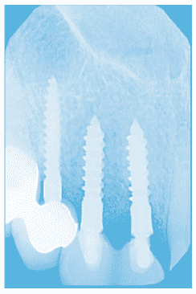

**图 1.2　敲击前的牙齿状况**

**注：阴影部分是凯茜的牙齿感染状况**

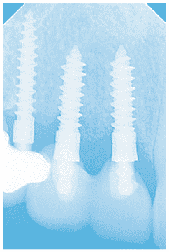

**图 1.3　敲击后的牙齿状况**

**注：阴影部分是凯茜的牙齿感染状况**

在第二张 X 光片中，之前阴影的部分变亮了。这表示感染已经治愈，凯茜不再感到牙痛了。

在我收到这些 X 光片几周后，凯茜参加了为期 3 天的情绪释放研习班，再次与我分享了她的故事。“三年半以来，我终于第一次不用再经受牙疼的折磨，终于可以大声地笑出来。我真是太开心了。”

通过释放因为母亲去世而引起并郁积的负面情绪，凯茜最终实现了传统医疗无法实现的愿望，治愈了慢性牙疼和感染。凯茜的故事有力地证明，情绪与身体之间存在着紧密的联系。

我之所以青睐情绪释放疗法，因为它非常简单，同时又对使用者、时间和地点没有任何要求。它对任何年龄段，以及存在任何病症的人来说同样有效。在后文中你将了解到，情绪释放疗法的使用方式多种多样。为了指导你进行自我疗愈，我在书中提供了一套敲击剧本，诚心邀请你开启疼痛缓解之旅。

不管你是打算自我疗愈，还是请情绪释放专家为你治疗，敲击都能缓解你的疼痛，让你过上更健康、更有活力的快乐生活。现在，我们已经了解疼痛背后的科学原理，那么，做好准备，让我们开始清除疼痛吧！

* * *

(1)　一种非关节性风湿病，临床表现为肌肉骨骼系统多处疼痛与发僵，并在特殊部位有压痛点。——译者注

(2)　Tension Myositis Syndrome，简称 TMS。最突出的症状是患者全身肌紧张力增高，包括紧张性木僵和紧张性兴奋两种状态。前者常有违拗症、刻板言语及刻板动作、模仿言语及模仿动作、蜡样屈曲等症状。——译者注

# 第二章　24 小时摆脱 12 年疼痛大问题
THE TAPPING SOLUTION FOR PAIN RELIEF

如果心理创伤可以在 30 秒内发生，那么为什么疼痛不可以在 1 天、1 小时，甚至 1 分钟内消除？

自我接纳要求你不要试图变成理想中的那个人，而是给自己留出足够长的时间，找到自己真正的模样。

《爱的能力》（ *Loveability*）作者

罗伯特·霍尔（Robert Holden）

2013 年秋天，我在康涅狄格州斯坦福德市举办一个为期 3 天的情绪释放研习班。第二天早上，当我再次踏上讲台时，高兴地发现许多学员的脸上开始挂上笑容，他们的状态看起来比前一天好得多。这是一个很好的信号，说明在与疼痛对抗的路上，大家正在朝着好的方向前进。当我问起有谁的疼痛在一夜之间发生了变化时，好几位学员都举了手。南希第一个走上讲台，分享了自己的故事。

南希患慢性头痛已经长达 12 年之久，并且常伴有颈部不适及恶心感。参加研习班之前，她已经连着 3 周，整日整夜被头痛折磨。在研习班上课的第一天，我为她做了大量的敲击治疗，然而，直到这一天快要结束的时候，南希的头痛仍然十分剧烈，这让她沮丧不已。

尽管如此，在当天的课程结束回房间之前，南希还是和同行的朋友按照学到的方法轮流敲击了好几轮。南希一边敲击，一边说出自己当天的收获。令她惊讶的是，这次她取得了很大的突破。虽然上床睡觉之前，南希还是头痛，但仍然对取得的缓解效果感到激动。

不可思议的是，第二天早上醒来时，南希的头痛、颈部不适以及恶心感全都消失了！仅仅 24 个小时，她就摆脱了困扰自己 12 年的大问题，真是太棒了！

### 在疼痛缓解的路上，一步一个脚印

不管是 5 分钟的简单敲击，还是连续 3 天的集中治疗，情绪释放疗法都能以缓解疼痛的方式告诉我们，一切正在慢慢好转。即便是轻微的缓解也是积极的信号，能够让我们知道自己正在取得进步。

克服大脑负面倾向的方法之一就是：停下来，细心观察并用心体会每一次积极的变化，无论它多大或多小。你也需要关注情绪的变化，同样不必理会这个变化的大小。想要彻底消除慢性疼痛，你必须认真体会自己的感觉。这样，你才能和南希一样，取得令人难以置信的结果。

一般来说，疼痛缓解之旅最好从某个具体的疼痛部位开始，这也是迅速缓解疼痛的最好方法。让我们开始学习如何将精力集中在这些部位吧。情绪释放疗法的优势之一在于简单易行，容易上手。下面，我们将一步步阐述分解动作。

#### 步骤 1 ：出席“疼痛吐槽大会”

使用情绪释放疗法之前，你要先将注意力集中在疼痛上。这也许会让你不舒服，毕竟你很可能已经花了几周、几个月甚至几年时间训练自己忽略疼痛。但为了达到效果，你要把之前所做的努力全部忘掉，集中精力关注疼痛，哪怕只能维持几分钟。准备一个记事本。如果好几个身体部位都感到疼痛，那么从最明显的一个开始。

问自己几个问题：假如疼痛有色彩，我的疼痛会是什么颜色？疼痛有质地或形状吗？会发出声音吗？会发热吗？是钝痛还是剧痛？是发散的还是静止的？感觉像波浪还是像锤子？或者像剃须刀片？把答案写到记事本里，越详尽越好。

通过这样的方式，对疼痛形成具体的感觉和认知。这不仅是为了随后的敲击，更是为了在疼痛发生变化时敏锐地觉察到。

#### 步骤 2：给它的混蛋程度打个分

现在，你已经对疼痛有了更清晰的认知，那么从 0～10 为它打个分吧（这种为疼痛强度评分的方式也叫主观焦虑评分，Subjective Units of Distress Scale，简称 SUDS）。当注意力集中在疼痛上时，你感觉到的疼痛强度如何？如果是你所能想象的最大的疼痛，那么它的评分就是 10 分。如果你根本感觉不到任何疼痛，那便是 0 分。不要担心分数的准确性，跟随你的真实感受即可。如果下背部的疼痛已经剧烈到你完全无法忽略的程度，那么将它评为 8 分或 9 分。如果你现在感受到的背部疼痛，不像躺下来时感受到的那么剧烈，就可以计为 6 分。为了看到更明显的变化，你也可以从疼痛强度 5 分或以上的疼痛开始记录。

#### 步骤 3：拟定问题描述语

记下疼痛强度评分后，你要拟定问题描述语。拟定问题描述语需要你聚焦疼痛的程度和性质。确定问题描述语后，你就可以开始使用情绪释放疗法了。

基本的问题描述语可以是这样的：

尽管我（描述你的疼痛），但我还是深爱并完全接纳自己。

举个例子，你也许会说“尽管我的下背部正热辣辣地、尖锐地刺痛着，我还是深爱并完全接纳自己”。或是“尽管我的下巴正隐隐作痛，但我还是深爱并完全接纳自己”。

开始敲击时，你的问题描述语会和你的亲身体验产生共鸣。事实上，问题描述语并不是咒语，不会一念出口就产生奇幻效果，而是敲击过程中你需要说一些有意义的话。因此，如果这些基本的问题描述语不够准确或力度不足，请换掉它们。

下面是一些替换句式，你可以直接引用，也可以根据情况修改，以便更好地表达感受：

◆尽管我（描述你的疼痛），我也深爱自己并完全接受自己，不埋怨任何人；

◆尽管我（描述你的疼痛），我也选择原谅自己了；

◆尽管我（描述你的疼痛），我也要接纳并原谅自己；

◆尽管我（描述你的疼痛），我还是认可自己现在的样子；

◆尽管我（描述你的疼痛），我还是想放自己一马；

◆尽管我（描述你的疼痛），我还是愿意换个角度看待问题；

◆尽管我（描述你的疼痛），现在也全都结束了，我已经没事了；

◆尽管我（描述你的疼痛），我还是想将这种疼痛释放出来。

情绪释放专家帕特里夏·卡林顿博士发明的选择法，为我们拟定问题描述语提供了很棒的选择。使用她的方法，你需要在描述感受后补充一句“我选择……”。

如果你感到沮丧，你可以拟定这样的问题描述语：“尽管这种疼痛让我非常沮丧，我还是选择冷静和耐心，并且现在就要将它释放出来。”

#### 步骤 4：选择“提示语”

提示语的作用是描述疼痛，它非常简短，很可能只有几个字。敲击手刀点时，你需要说 3 遍问题描述语，然后按顺序敲击其他 8 个穴位，并大声念出相应的提示语。举个例子，如果你的问题描述语与下背部疼痛有关，敲击每个穴位时，你要说“我下背部的疼痛……我下背部的疼痛……我下背部的痛疼……”

这样做的目的是让你把注意力持续聚焦在疼痛上。提示语就像晴雨表，帮助你的思维跟着疼痛的感觉走。

一旦习惯敲击，你就可以改变提示语。比如，你可以说“我下背部的这些疼痛……，我下背部的刺痛……这种强烈的刺痛……”。本书将提供大量这种带入性的提醒短语。但我建议你还是从简单的提示语开始，在敲击每个穴位时重复说同样的短语就好。

#### 步骤 5：就按顺序敲击

拟定问题描述语和提示语后，你就可以开始敲击了。敲击手刀点时，你需要重复 3 次问题描述语。我建议你从你感觉最舒服的那只手开始，一步步按照正确的顺序来，可别做错了！敲击顺序和穴位如图 2.1。

身体的两侧分布着相同的经络，所以你可以根据舒适度决定从哪只手进行敲击，以及敲击身体的哪一侧。

如果你愿意，也可以两只手同时敲击身体两侧。按照顺序进行敲击时，每 5～7 下暂停一会儿。当然这个数字不是固定的，如果你感觉一次敲击 20 或 100 下都很舒服的话，也可以这么办。暂停的目的是让你有足够的时间说出提示语，并细细思考。不必担心某一步做得不够完美，尽力体会就好。

1．眉毛内侧；

2．双眼外侧；

3．双眼下方；

4．鼻子下方；

5．下巴；

6．锁骨；

7．腋下；

8．头顶。

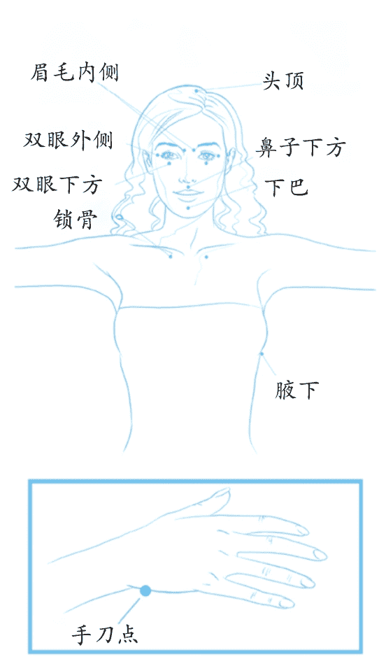

**图 2.1　敲击穴位图**

#### 步骤 6：再次感受一下，是不是没那么疼了？

现在你已经完成了一轮敲击！请深呼吸并用心感受身体，看看是否发生了什么变化。疼痛强度减弱了吗？如果强度从 8 分降到了 7 分，就说明敲击起作用了，意味着情绪释放疗法开始帮你缓解疼痛了。

即使效果没那么明显，也别停下来，继续敲击。因为对大部分人来说，都是需要进行几轮敲击才能缓解疼痛，更重要的是，熟悉整个敲击过程需要时间。

在敲击过程中或结束之后，你可能会出现呻吟、叹息、打嗝等生理反应。这是身体在释放能量、自我放松以及缓释。敲击时，请留心身体的所有反应。

检查疼痛强度是否发生变化时，你可以问问自己，在敲击过程中，自己是否产生了某种情绪或想法。也许一开始就要做到这一点有难度，因为你大部分注意力都用来学习敲击和熟悉穴位了。但渐渐地，尤其当你开始探究造成身体疼痛的深层原因时，你会发现那些情绪和想法都是非常有用的线索。

进行敲击时，你要根据疼痛的变化随时调整自己。如果情绪状态和身体发生了变化，你也要及时做出调整。另外，当你逐步获得持续的疼痛缓解，请调整自己，寻找新的视角和感受。

敲击过程中，你会注意到自己的疼痛发生了变化。它可能转移到了另一个部位、从剧痛变成了钝疼、开始发麻并影响周围的部位，或者以其他的方式发生变化。在极少数的情况下，刚开始敲击时，你的疼痛甚至会加剧。需要提醒的是你要知道，这些都是证明敲击能够对疼痛起到缓解作用的表现。这些反应都是有益的。当你感受到身体疼痛发生的任何变化时，请针对新的疼痛，或是感到疼痛的新的疼痛部位进行敲击，并以此类推敲击下去。这就是所谓的“追击疼痛”。

在后文中你将注意到，敲击提示语都是先关注负面状况（消极敲击），包括描述疼痛本身、压力以及其他负面的情绪和认知。大部分情况下，敲击剧本都会以至少一轮积极敲击收尾，以提供向前发展的新模式。但在开始积极敲击之前，你需要通过消极敲击将疼痛强度降到 5 分以下。然后，再通过积极敲击将疼痛强度降到 3 分以下。

**指尖敲出丰盛**

**如果**1**分钟内疼痛并未缓解**

即使开始敲击后，你依然感觉不到任何变化，那也很正常。这仅仅是一个长期过程的开始，而成千上万人在这个过程的最后，都从慢性疼痛中解脱出来了。所以，别停下来，请继续敲击。如果你感到失望、沮丧，担心情绪释放疗法对你不管用，那么，就将这些情绪也列入你的敲击范围吧。

对不少人来说，敲击可能有些怪异，于是也不太愿意努力记住这些穴位并了解这个过程。但如果你紧紧跟随我的步伐，坚持做完一整轮的敲击，并花时间学习，直至真正掌握这些基本步骤，那么，你付出的努力将带来不一样的回报。

#### 步骤 7：对疼痛进行实时追踪

一旦疼痛减轻或转移到新的部位，就说明是时候检验效果了。一般的检验方法就是做某个可能导致疼痛的动作。例如，如果脖子在你转头时总是很痛，那么，做完一轮敲击后，你就转头试试。你会发现，平时感到的那种难以忍受的疼痛变得没有那么疼了。在这种情况下，继续重复问题描述语和提示语，再做几轮敲击，看看能否将疼痛彻底消除。

还有另一种可能出现的情况：当你试着转头时，疼痛从脖子转移到了肩膀上。这表示疼痛正在对敲击做出反应。在这种情况下，你要继续针对肩膀敲击，追击疼痛。

**指尖敲出丰盛**

EFT**速查指南**

现在，你已经知道如何具体地使用情绪释放疗法了，下面我为你总结了一份快速参考指南。

1．闭上眼睛，深呼吸 3 次。感受自己的内心，并专注于这一刻。你的双脚要牢牢地站在地上，就像扎根到土地里一样。你需要将注意力集中在这个过程和你的身体上，这可能需要一点时间，慢慢来。

2．将注意力聚焦于你的疼痛（或最让你头疼的问题）后，仔细感受它。在记事本里写下你感觉到的疼痛类型（剧痛还是钝痛、热辣辣的还是冷飕飕的，等等），以及疼痛的部位。

3．用 0～10 给你的疼痛强度打个分。10 分代表着你能想象的最高级别的疼痛。在记事本上记下这个数字。

4．拟定问题描述语。

5．敲击手刀点，将问题描述语重复 3 遍。

6．按照敲击顺序依次敲击那 8 个穴位，同时大声说出提示语。每个穴位敲击 5～7 次，但也不用太过计较准确的次数。

7．按照顺序敲击所有穴位后，做个深呼吸，然后检查疼痛强度。再次给疼痛强度评分，并检测敲击是否奏效。

8．做出可能会引起疼痛的动作以检验敲击效果。你也可以将注意力集中在引起疼痛的回忆或情感上。

9．根据需要继续敲击。

10．在记事本里记下你感受到的疼痛以及疼痛强度的变化。这些变化就是进步。

我已经说过，在整个敲击过程当中，你要详细记录各个阶段的身体和情绪感受。对过程的简单记录，将帮助你更快掌握情绪释放疗法，更有效缓解疼痛。

### 画一棵敲击树，用不同的“颜料”给它上色

到目前为止，我们都将敲击的重点放在疼痛的生理感受上。这对于快速缓解疼痛来说，确实是个很好的简单易行的开始，但除此之外，我们还需要进行更深入的探索，以找到疼痛的本质原因。多数情况下，这才是彻底清除疼痛的关键。

在每一轮敲击中，你所针对的任何问题都是一个“靶子”，也就是敲击对象。敲击时，靶子的不同层次或者方面就会显现出来。很多时候，你都会在靶子下面另有发现。

例如，一开始你的敲击对象可能是脚部的疼痛。而当你针对脚步疼痛敲击时，它便会发生变化，这可能会让你觉得自己将无法永久消除疼痛，进而产生无可奈何之感。于是，你转而针对沮丧情绪敲击。你可能会想起医生当初的无能为力，以及自己是多么生气和害怕。这时候，疼痛会一直持续，直到你找到引发脚部疼痛的所有原因。

看起来，整个敲击过程会有些冗长，但慢性疼痛往往涉及很多原因，并与隐形情绪紧密相连。只有解决引发疼痛的每个原因和方面，我们才能彻底清除它。正因如此，我们在彻底消除疼痛的同时，也会得到一些附加价值，即情绪上的缓解。

药物也许能够缓解身体的疼痛（只能维持一段时间，药效过后，你需要接着吃），但能缓解愤怒、沮丧、失望、伤心或其他伴随疼痛存在的情绪吗？当然不能。而情绪释放疗法不仅可以缓解疼痛，还会让我们收获生活中的真正改变。

本书中，我会列出 4 种最常用的敲击对象：症状/表现、情绪、事件以及束缚性信念。为了更清楚地区分这几种敲击对象，我推荐你使用一种超级棒的示意图——敲击树。

敲击树由我的朋友、情绪释放专家林赛·肯尼（Lindsay Kenny）提出的。它不仅给每种敲击对象分门别类，还解释了它们是如何造成具体疼痛的。

**症状/表现（树叶）**　这是你的生理性疼痛。如果你不止一个身体部位感到疼痛，想一想每个疼痛点各自有什么症状。

**图 2.2　敲击树**

**情绪（树枝）**　羞愧、负罪感、懊悔、抗拒、生气、愤恨、悲伤、沮丧、无助、惊恐、焦虑、压力等。

**事件（树干）**　看医生、住院、伤害、离婚、与父母分离、被暴力相向、被遗弃、被背叛、遭受任何形式的虐待、过分严格的管束或批评、体罚、家庭暴力或争吵、缺乏支持或爱、父母或孩子酗酒等。

**束缚性信念（树根）**　“我的疼痛永远不会消失”、“我的身体要坏掉了”、“我什么都做不了，医生说我无药可救了”、“我就活该被疼痛折磨”、“医生说她也无能为力了”等。

在后面的章节中，我会深入分析敲击树的每个部分，并对症状（疼痛）、情绪、创伤性事件以及类似的信念进行敲击。你将发现，针对敲击树上的某个部分（例如，对医生的愤怒）时，敲击树上的另一部分（例如，疼痛）会以某种方式消失或转移。

因为一棵树的内部系统不是单纯的自上而下或自下而上的，而是互相关联、互相支撑的。所以，我们得以看到一个问题的不同方面，发现除疼痛以外的更多问题。

#### 症状/表现（树叶）

我们已经针对疼痛（也就是你的症状或者“树叶”）进行了一些敲击。当针对症状的敲击不起作用时，你就需要从情绪入手，进一步探索敲击树，找到疼痛背后的深层原因。

#### 情绪（树枝）

还记得凯茜吗？那位患有慢性牙疼和感染的女士。她上台接受敲击疗法时，惊讶地发现自己的牙疼和因母亲去世产生的情绪有关。针对这种情绪敲击后，她的疼痛就开始减轻了。而在这之前，凯茜花了数年时间也没能达到这个效果。

疼痛的背后通常隐藏着多重复杂情绪。一开始，你可能只感到愤怒，但渐渐地，在疼痛的折磨下，愤怒会变成伤心，继而演变成锥心之痛。如果你正被某种负面情绪笼罩，就从它开始敲击，即使它看起来和疼痛并没有关系。记住，大多数情况下，你都可以选择从情绪开始敲击。

有时候，我们很容易陷在自己最熟悉的情绪当中。例如，许多人会首先针对愤怒和悲伤进行敲击，因为它们很容易被辨认出来。但重要的是，我们还有许多其他的情绪。了解到这一点，有助于我们更加具体地敲击。以下是我们都可能有过的关键情绪：

疏离　嫉妒　矛盾　恐惧　生气　崩溃

憎恶　焦虑　愤怒　孤独　委屈　悲伤

偏执　内疚　不满　惊恐　抓狂　不安

厌烦　惊恐　敌对　羞耻　悔恨　愤恨

失望　难过　暴怒　沮丧　怀疑　恶心

畏惧　担心　饥饿　尴尬　歇斯底里

安全感缺失

#### 过往事件（树干）

过往事件也是常见的敲击对象之一。慢性疼痛很可能与过去发生的事件有关，因为它消耗了精力并影响了情绪。凯茜的案例就证明了这一点。正是那些得不到正确处理的悲伤情绪，最终导致了凯茜的慢性牙疼和感染。

**指尖敲出丰盛**

EFT**中的放电影法**

情绪释放疗法创始人加里·克雷格从另一个治疗模型——神经语言学规划法（Neurolinguistic Programming，简称 NLP）中研究出了放电影法，旨在帮助人们回忆起更多细节，并用各种感官重现过往事件。放电影法需要你假设自己正在出演一部电影，并将精力集中到具体的事件上。

正如我们所知，一部电影包括开场、结尾、台词、剧情（一些非常具体的动作），而且电影情节会逐渐走强，直至高潮部分。放电影法可以帮助你从过往经历中搜索出至今仍在消耗精力的特定回忆。

放电影法的一大优点就是，在过程中，你都不需要大声地说出细节。你可以一边敲击，一边在心里默默回想。电影的细节要包括 5 种感觉，即视觉、听觉、情绪、生理感受以及关键人物的思维活动。可以的话，加上嗅觉和味觉会更好。以下问题可以帮助你策划这部电影。

电影的时长是多少分钟？你要保证电影能在 3 分钟或者更短的时间内结束，其中创伤性事件通常只会放映几秒钟。如果电影中包含了几个高潮事件或创伤性时刻，则根据高潮事件或创伤性时刻将其分成多个 3 分钟的电影片段。

电影以什么为主题？为你的电影起个名字。

现在，在你的脑海中，某个特定事件已经变成了一段主题明确的电影短片，是时候播放了。回想电影情节时，给你体验到的情绪从 0～10 打个分。如果觉得对这个事件或这种情绪投入太深将对你产生不好的影响，那么尽可能在安全的程度上进行想象，并为它评分。

接下来，一边在脑海中播放电影，一边完成几轮敲击。通常，当你回过头再一次感受这种情绪的强烈程度时，它的分数会有所下降。

在脑海中再次播放这部电影。这一次，从情感强烈度较低的时刻开始，然后在你感觉到强度正在加大时开始敲击。这非常重要。大多数人之所以长时间无法摆脱创伤，就是因为没有注意到自己是怎么一遍又一遍地经历这些事件的，并且根本不管自己的感受如何。不要再这样下去了！这些强烈情绪出现的时刻，就是运用情绪释放疗法进行敲击，让我们释放过往负面情绪的大好机会。

再次播放电影，从开场到结尾仔细感受一遍，并敲击每一个会加剧情绪强度的情节，直到你平静下来为止。

最后一次播放电影。这次你要故意放大视觉、听觉，甚至是对于背景环境的主观感受。尽量唤起自己的不安情绪。如果你发现某种强烈的情绪又出现了，那么，停下来再次敲击。

**要点：**如果你能把电影中的情节大声描述出来，就像给朋友讲故事那样，就更棒了。确保在每一个让你感到不安（哪怕只是微乎其微的感受）的事件上停下来进行敲击，直到它引起的负面情绪强度评分为 0。然后，再一次说出你的故事。

如果你觉得默默敲击更舒服，不说出口也可以。你也可以用语言描述自己看到的和感觉到的人或事，这都由你决定。

#### 束缚性信念（树根）

束缚性信念指的是我们对自己或世界的错误认知。它通常是我们经历了一些事情后所得出的不正确结论。比如，你可能觉得疼痛永远无法消除，因为医生说他无计可施。任何认为疼痛根本无法缓解、无法消除，你无法恢复健康的认知都是局限的。

束缚性信念有时源于童年时代积压的难以应对的情绪（后来造成了某种形式的疼痛）。而这些情绪则源自我们的父母、老师以及同伴，影响着我们生活的方方面面。

类似“我什么事都做不好”或者“我不够好”的信念，会左右我们生活中的每一件事，包括我们所做的、所说的、所追求的以及其他更多。随着时间的推移，它们可能变成某些情绪隐藏在我们的潜意识中，并最终以疼痛的方式显现出来。

束缚性信念总是看起来像真理一样，我们很难第一时间将它们区别开来。一般来说，针对创伤性事件和情绪（特别是那些扎根于童年记忆的事件和情绪）进行敲击，能帮助我们找出束缚性信念。

**指尖敲出丰盛**

**创建你自己的敲击树**

敲击树是个非常棒的模型，可以让你知道疼痛是如何与情绪、事件或者认知观念相联系的。也就是说，树叶、树枝、树干以及树根之间有何关联。这些关联和认知对于通过敲击达到缓解疼痛的目的至关重要。有一点我想再强调一下，那就是你在敲击时，务必做到非常具体。你要真正回到过去的情境中，而回去的最好办法就是深挖并找出疼痛背后的原因。

在开始敲击之前，花几分钟时间制作一棵你自己的敲击树。你可以通过登录 thetappingsolution.com/tree 下载一个敲击树的样图，并打印出来，也可以直接在你的记事本里画一个简单的轮廓。并不需要你画得多好，不过记得留出足够的空白。大部分人需要写的要比这里示范的多得多。

**树叶：症状/表现**　最近你哪里感到了疼痛？症状是什么？用一些具体的事件将这些树叶填满。例如，“下背部疼痛”、“退行性脊髓病”等。你也可以写下疼痛的其他副作用，比如，“精力不济”、“不能正常工作”等。

**树枝：情绪**　你经常处于哪种情绪状态？感觉疼痛时，你又有怎样的情绪？想想在过去几天，你都经历过什么样的负面情绪，把它们写下来。如果你不知道怎么写，参考一下前面列举的情绪清单。

**树干：事件**　当你感到疼痛时，脑海里会浮现出某个事件吗？一天当中，你有没有哪个时段感觉疼痛最为强烈？你在工作、运动或者见某个人时，疼痛是否加重了，又或者发生了其他的变化？当疼痛刚开始产生或转化为慢性疼痛时，你的生活中发生了什么事情？在接下来的章节里，我们会继续深入探究你的经历如何对你造成影响。因此，现在你无需把每个事件都列出来，只要列出最明显、最重要的几个即可。

**树根：束缚性信念**　关于疼痛，你有哪些既定观念？关于你的身体呢？关于不再被疼痛折磨的人生呢？关于健康的身体呢？关于痊愈的可能性呢？关于这些，你都是怎样看的呢？如果你觉得现在讨论这些问题有些困难，不要着急，这些都是需要深入探究的。记住，如果我们对这些束缚性信念的了解不够深入，它们看起来就会跟真理一样。下面这些问题可以帮你挖掘深埋心底的束缚性信念：

◆关于疼痛，我有哪些观念？

◆关于身体，我相信哪些事情？

◆关于疼痛的相关症状，我相信哪些是正确的？

◆关于未来，我抱持着怎样的态度？

再重复一遍，我们会在后文逐个详细研究这些问题。现在，你只要把脑海中出现的东西记下来就好。

记录下来之后，回过头看看你的敲击树。这是对你目前因为疼痛所遇到的困难的简单总结。敲击过程中，你也许还会发现其他问题，但敲击树可以实现两个目的。第一，帮助你认识到，一些看起来无关的问题可能会影响你的疼痛。第二，让敲击达到最好的效果。针对性地处理这些情绪、症状、事件和束缚性信念，正是本书的题中之义，我们将永远清除它们，真正地、永久地消除疼痛。

### 疼痛依旧？可能是情绪模式根深蒂固

情绪释放疗法的神奇之处在于，无论诊断结果、疼痛情况、持续时间以及严重程度如何，它都能迅速地、真正地永久消除疼痛。但正如我们所见，效果往往因人而异。有时候，患者仅仅针对疼痛本身或疼痛产生的直接原因进行敲击，就能快速消除疼痛。我们把这种情况叫做“1 分钟奇迹”，因为它快得出乎预料。但这种情况出现的次数再多，也不能算是常态。

我们都有一种难以打破的情绪模式，它根深蒂固到甚至连大脑都拒绝哪怕一丁点的改变。这些固执的拒绝，有可能正是疼痛产生的全部原因。为了避免注意到不想注意的情绪，我们的大脑甚至形成一种机制：指使身体制造出慢性疼痛以干扰我们的注意力，进而忽略这些情绪。

针对那些最深的、最难处理的情绪进行敲击时，你可能会得到与预期的不一样的结果。你要知道，不管你是针对疼痛还是情绪敲击，在刚开始敲击时，即使情况变得更严重了也很正常。当你开始面对疼痛的深层次原因时，许多被隐藏起来的细节就会开始浮出水面。不要因为进度缓慢而失望。这是你的身体以它独特的方式在告诉你，围绕某个特定的事件，你究竟埋藏了多少情绪。

我曾经遇到一名患者，刚刚开始敲击，还没来得及弄清楚情绪事件究竟是什么，他就大哭起来，因为身体已经开始体验并释放被隐藏的情绪了。继续敲击，你将不断清除那些造成疼痛的因素。即使你消除疼痛的时间只有短暂的几周、几小时甚至几分钟，这也是真正的生命的改善。

我建议你在感到疼痛、不舒服、压力大或者出现任何一种情绪上的不适时，都进行敲击。没有哪个时间是不对的，你也永远不可能敲击过量。有人发现，每天在固定的时间段（比如早晨，比如你最能意识到疼痛的时候）敲击并养成习惯是最好的。你也可以在遇到麻烦后敲击，比如你刚刚和某人在电话里吵了一架。在你需要任何形式的缓释时，都可以开始敲击。

我知道，一开始你可能会觉得敲击有点奇怪，但当你的疼痛得到哪怕一丁点的缓解时，就会意识到它的实践价值。如果你足够爱自己，现在就拿出最少 15 分钟体验一下敲击疗法吧。

闭上眼睛想象一下，当你远离疼痛，不再因为它耗费时间和精力，生活将变成什么样子。每天早上醒来，再也不用担心疼痛，会是什么感觉？如果你再也不必受到疼痛的控制，你又将会过上怎样的生活？实现怎样的人生目标？你准备好了吗？让梦想照进现实吧！（如果你需要更多的敲击指导，请登录 thetappingsolution.com/tappingvideo 下载视频观看。）

有时候，自主完成敲击疗法比较困难。因此，我会在书中分享免费的“敲击冥想”视频信息，为你提供 10～15 分钟的敲击指导。我强烈建议你将这些免费视频下载到随身电子设备或手机上，并随时观看。

下面这一段视频将指导你一步一步针对疼痛进行敲击，请登录 thetappingsolution.com/painbookresources 下载。这些额外的免费资源，是本书与情绪释放疗法不可分割的一部分，所以请跟着我加以充分利用。它们可以帮助你更好地开始进行敲击，从而取得更好的效果。

# 第三章　压力是疼痛的牢门，越是厚重，你越难逃
THE TAPPING SOLUTION FOR PAIN RELIEF

“我感到很疼，觉得整个人生都完了。”这是你疼痛时内心的真实写照吧。不幸的是，你总感觉自己就快被压力淹没，却还要一边忍受疼痛的折磨。先纾解压力，别被困在疼痛的牢笼里！

我们的内在向导会首先通过我们的感觉和身体智慧，而非知识上的理解来指引我们。

医学博士　克里斯蒂安·诺斯鲁普（Christiane Northrup）

“我感到很疼，觉得整个人生都完了。”这是向我寻求帮助的人最常说起的最简单、直接而又让人难过的话。在疼痛的折磨下，许多人一直需要努力与活动不便、睡眠异常，以及来自人际关系、工作和金钱的日常压力作斗争。我们每天都要处理很多事情，因此，大多数同时被生理性疼痛和慢性疼痛折磨的病人都会感到筋疲力尽。

不幸的是，压力本身就会变成一种恶性循环，释放出大量皮质醇，增加焦虑和恐惧等情绪，并由此导致疼痛加重。一旦承受压力变成一种习惯，你的身体就会一直保持高度警戒的状态，永远无法放松。持续的肌肉紧张和频繁的神经系统紧张，都将加重你的痛感。压力还会阻止你与身体交流，而与身体交流恰恰是疼痛缓解过程中的重要一步。

从这一章开始，一直到本书的最后，我会一直让你深入观察自己的身体，并了解自己正在经历什么，不论是在身体上还是心理上。这对你来说也许有难度，尤其当你不想关注身体又不得不这么做的时候。你可能会选择不与身体进行交流，以避免加剧疼痛。但只有与身体建立联系，你才可以观察清楚并意识到身体和疼痛到底是怎么一回事，疼痛才会慢慢消失。

我们生活在以大脑为中心的时代，需要用大脑思考、分析每一件事，也习惯于用逻辑解释复杂问题。而这样的结果就是，我们倾向于避免或忽视身体的内在智慧。将聚焦于大脑的注意力转移到心脏、肠道以及身体的其他感知中心，我们就能对疼痛、生命以及治愈方法产生更清晰的认识。

我们要正式开始疼痛缓解之旅了。最先要关注敲击的就是造成压力的最普遍原因——那种要被疼痛、身体以及生活压垮的感觉。

**指尖敲出丰盛**

**关注肠道健康**，**强化大脑功能**

大多数人从未意识到大脑和肠道之间的联系有多么紧密。加利福尼亚大学洛杉矶分校的一项研究发现，肠道健康对大脑功能的影响巨大。研究者将所有受试者（36 位 18～55 岁的女士）分成了三组，并分别在实验的前后，对她们的大脑进行功能性核磁共振成像扫描。第一组受试者每天食用两次含有益生菌（对肠道健康很关键的元素）的酸奶，并连续食用一个月。第二组则每天食用两次不含益生菌的类似酸奶的食品，同样连续食用一个月。第三组（也是控制组）既不食用酸奶，也不吃类似酸奶的食品。结果显示，一个月后，第一组受试者的大脑中包括负责情绪及感知处理在内的几个区域，都发生了显著变化。也就是说，关注肠道健康其实是为了改善情绪，强化身体和大脑的功能。

### 你的错误认知比压力本身可怕多了

如果疼痛一天到晚无时无刻不困扰着你，就算强度很轻微也会消耗大量的时间和精力。带着这些疼痛，你怎么可能做好该做的每件事呢？你可能需要支持，但又不想一直向家人和朋友求助。在你承受疼痛，或担心疼痛会不会复发时，人际关系、财务状况、治疗过程以及其他方面的压力都会让你更加不堪重负。

#### 敲击你的压力情绪

那种将被淹没的感觉会给你的身体施加更多压力。在应对多个不同种类的压力时，你要先冷静下来，稍稍缓和这种窒息感。

首先，想一想你的日常生活。想想你的疼痛，以及你每天需要为它做的每一件事。想想你的人际关系、账单、医生、医疗保险以及其他需要关注的方方面面。想想你有多累，需要多少支持。将注意力集中到这一点上，让自己置身压力漩涡当中。你可能感觉随时要被压力彻底击溃，哪怕是阅读这件事都会让你窒息。但请继续思考，思考如果情绪释放疗法不管用怎么办？怎样才能保证每天都进行敲击？疼痛真的有可能彻底消失吗？

一次性思考所有这些问题时，你有多难受？从 0～10 给每个问题打个分，同时记录其相对应的疼痛强度。你的疼痛是否发生了某种变化？疼痛强度有多大？通过记录和对比，你会发现，当你处于重压之下时，疼痛强度会增强。

然后，在你的脑海里勾勒出一幅图画。你看起来是怎样的烦务缠身？想象你站就在那里，浑身吸满了金属物，就好像贴满了纸条，上面写着你需要或应该做的每一件事。看到这个画面你作何感想？沉重、超负荷、呼吸困难、受限制、负重、无助、闷闷不乐……，哪些词能精准描述你的感觉？拿出记事本，把所有的感觉都记录下来。接着，开始敲击。

手刀点：尽管现在烦务缠身，但我还是深爱并完全接纳自己。

手刀点：尽管做这些事情压力会很大，但我选择接纳自己以及这些感受。

手刀点：尽管要做的事情多得让我喘不过气来，我还是选择接纳自己，并想办法保持平静。

眉毛内侧：我要做的事情太多了……

双眼外侧：多得让我喘不过气来！

双眼下方：我需要把这些事全做完。

鼻子下方：都要做完！我的压力太大了……

下巴：我不知道该怎么办……

锁骨：压力太大了。

腋下：我感觉筋疲力尽。

头顶：所有这些事情都在耗费我的精力。

眉毛内侧：太多事情要做了……

双眼外侧：我需要更多支持。

双眼下方：我要喘不过气来了！

鼻子下方：我无法放松。

下巴：有这么多事情要做，而且只能自己做。

锁骨：压力太大了。

腋下：我不知道怎么样才能把这些事都做完。

头顶： 要做完所有事情，压力大得让人喘不过气……

用心感受，并对情绪及生理性疼痛的强烈程度评分。继续进行消极敲击，直到评分降低至 5 分以下，然后再进行积极敲击。记住，上面这些提示语只是一种参考，你要学会用自己的语言把真实情况说出来。

眉毛内侧：我应该从不同的角度看待问题。

双眼外侧：找到释放压力的方法……

双眼下方：我一次只做一件事情。

鼻子下方：我知道这些事情不一定要同时进行……

下巴：想到这些，我轻松许多……

锁骨：我享受选择带来的解脱……

腋下：让这些压力释放掉……

头顶：我努力让自己平静下来。

深呼吸，再次回想你需要或应该做的事情。现在你还感觉喘不过气来吗？从 0～10 给你的情绪打个分，然后继续敲击，直到评分降低至 3 分以下，即使需要花费 20 分钟。另外，你还需要关注疼痛。在敲击的过程中或敲击之后，疼痛是否发生了变化？再次给疼痛评分，并记录敲击过程中疼痛发生的所有变化。你的身体也许正在努力证明，窒息感与疼痛之间存在着某种形式的关联。

阅读上一章我们了解到，伴随敲击进行的描述越具体越好。那么，为什么我们还要针对一般问题（比如压力大、事务繁忙等）进行敲击？事实上，大多数人开始敲击的时候，并不知道具体问题究竟是什么，需要进一步探索内心才能得到答案。这就是我们需要进行一般性敲击的原因。敲击可以让身体快速放松。同时，针对压力等一般问题进行敲击，可以让我们更清楚地看到需要关注的具体问题。

通过敲击，你缓解了不堪重负的压力感，那么现在，是时候研究压力本身，了解什么样的压力可能会从生理和心理两方面对你造成影响了。

#### 你的敌人，可能并不是压力

压力总是负面的，它会损害免疫系统，甚至直接制造疼痛。在新闻报道和书刊杂志中，我们总能看到关于压力的负面案例或统计数据。这并不奇怪。且不说生活中充满了诸如疼痛、工作、人际关系、金钱等各种压力，我们对压力缠身这件事本身就已经感到“压力山大”。

可万一我们对压力的错误认知比压力本身的危害更大呢？在一项研究中，研究者用了 8 年时间对 3 万名美国成年人进行了追踪。一开始，研究者向受试者提出了两个问题：第一，在过去的一年里，你的压力有多大？第二，你认为压力对健康有害吗？后来，通过对比分析公开的死亡报告，研究者追踪了受试者在这 8 年中的死亡情况。

结果显示，与那些感到压力大但把压力看成生活的普通组成部分、不认为它会危害健康的受试者相比，那些感到压力大、认为压力有害健康的受试者的早亡率高出 43%。这意味着，相信压力对健康无害，能够提高你的健康水平。这或许是看待压力的一种全新视角。

我们花了非常多的时间去相信压力是敌人，却忘了其实每个人都会有压力。所以，你最好停止为压力担忧，接受它，把它当成生活的普通组成部分。

我们只需注意，不要在压力上不断堆砌新的压力就好。如果我们因为压力本身而更有压力，事情就会变得更糟。我们需要努力减轻身体上以及生活中各方面的压力。另外，压力确实会对我们的身体健康和疼痛造成巨大影响，别让它再给你增加负担了。

让我们针对压力再做一些敲击吧。大声说出下面的提示语，并给这句话的真实性评分：“我的压力让我感到‘压力山大’”。将一件事情大声说出来，可以很好地检验你对其真实性的认可程度。现在，让我们开始敲击吧。

手刀点：尽管压力可能真的危害我的健康，但我还是深爱并完全接纳自己。

手刀点： 尽管我不能再有任何压力， 因为那对健康有害，我依然选择接纳自己以及这些感受。

手刀点： 尽管我应该避开压力，不再焦虑，我还是选择用一种新的视角看待它。

眉毛内侧：压力也许对我有害。

双眼外侧：我应该避开压力。

双眼下方：我不知道怎么做。

鼻子下方： 我感到压力很大，我正努力想办法避免这种情况发生。

下巴：我不知道怎么才能避开压力！

锁骨：这也让我很有压力。

腋下：很有压力的感觉是无法逃避的……

头顶：我不知道怎样才能避免感到压力山大。

用心体会心理和生理上的感受。如果从 0～10 为你的压力打分，会是多少？继续进行消极敲击，直到评分降低至 5 分以下后，接着进行积极敲击。记住，这些提示语只是参考，你可以用自己的语言描述具体情况。

眉毛内侧：我相信压力是可控的。

双眼外侧：我会把精力放在能够控制的事情上。

双眼下方：我可以很轻松地让自己平静下来。

鼻子下方：不管周围发生了什么事情。

下巴：我通过深呼吸让自己平静下来。

锁骨：我决定关注那些让我感恩的事情。

腋下：我喜欢这种感觉，喜欢这种可以改变自己的感受。

头顶：我可以在任何情况下保持平静。

深呼吸，检查你的情绪和疼痛强度。现在，把这句话大声地说出来：“我的压力让我感到‘压力山大’！”再一次，从 0～10 为它的真实性打分。敲击到你对这句话的真实性评分只有 3 分甚至更低。

### 慢性压力到底有多可怕？

虽然我们对压力的看法与压力对身体的影响至关重要，但这并不意味着压力本身对我们是有好处的。事实上，压力分很多种，我们需要弄清楚自己承受的是哪一种。

一些研究认为，有些压力对健康有益，可以增强大脑功能，使我们更具创造力、更健康，并降低乳腺癌和老年痴呆等疾病的患病率。但慢性压力对健康无益，只会令你日渐消瘦，疲惫不堪，进而罹患慢性疼痛。

你很可能已经经历过这两种不同类型的压力了。举个例子，有时候，你可能需要完成某个令人既紧张又兴奋的项目，它充满挑战也带来压力。而项目一旦完成，你又会觉得投入的时间和精力是相当值得的。这就是健康的压力，它可以激发你、鼓励你，并在事成之后给你很好的回报。而随着项目的完成，你的压力水平也会自动下降，就可以开始新的项目了。

去体育馆举重或快跑时，我们也会遇到这种有益的压力。当我们迫使身体去成长和调整时，一开始会感觉不舒服，但之后会感觉非常棒，身体也会渐渐享受这种回报。

慢性压力则不同了，它非常折磨人。这种慢性压力就好像你一辈子都被困在体育馆，要不停举重、跑步、做引体向上。这种压力对身体并没有好处。

慢性压力通常由生活中的一些大事、看起来无法解开的问题造成，比如，疼痛、财务问题以及人际关系问题等。科学证明，慢性压力危害人体健康。以下就是当你处于慢性压力之下时，身体会发生的反应。

1．你会反复思考一个让你焦虑无比的问题，比如，你的疼痛、工作、财务问题、人际关系、家庭或者其他问题。

2．位于你大脑中部的杏仁核察觉到危险。

3．杏仁核激活身体中应对危险的应激反应。

4．在应激反应模式下，身体开始分泌肾上腺素和皮质醇，进入消化系统的血液开始减少，消化功能减退，营养吸收不力，最终导致发胖。

5．在这种被社会心理学称为“危机模式”的状态下，肌肉开始缺氧，并产生疼痛。这些疼痛可能来自慢性疾病、受伤、关节炎、偏头痛、胃痉挛等。

6．大脑中的创造中心进入无意识关闭状态。你解决问题的能力、创造性技巧、本能以及与身体关联的能力也会全都下降。

7．你越来越易怒、失去耐心、感觉被孤立，进而人际关系受到影响，疼痛也会持续下去。

8．压力还会影响你的睡眠。新陈代谢开始变慢，恢复体能的时间需要更长。

9．身体分泌出更多皮质醇，肌肉含氧量进一步减少，疼痛加剧。消化系统更加紊乱，血压上升，免疫系统的反应能力进一步降低。

10．长时间持续分泌大剂量皮质醇后，肾上腺素开始衰竭。你感到疲惫、筋疲力尽甚至抑郁。现在，你的疼痛发展成慢性的、持久的、不可轻易消除的了。

11．你再也没有精力像往常一样健康地运动、饮食，冥想或做瑜伽。慢性疼痛正在吞噬你的生命。

12．你的精力越来越不济，而且很难集中。创造力进一步下降，人际关系也受到挑战，疼痛仍在继续。

13．你“压力山大”，抑郁悲伤。因为肌肉长期处于慢性紧张且缺氧的状态，慢性疼痛不断加剧，并频繁发作。你需要从疼痛和压力中解放出来。

清楚了解慢性压力会对你和身体造成多么糟糕的影响了吧。最后的结论是什么呢？压力是正常的还是有害的？

#### 最后裁定

这是不是告诉我们，压力是生活的正常组成部分，只有你相信它有害时才会造成伤害？或者，慢性压力会不会增加疼痛感，影响健康？

看待压力的角度有很多，我们目前的这两种观点也都是正确的。生活中，我们都会面临压力。而担心压力只会增加压力，这对任何人都没有好处。你正遭受慢性疼痛的事实就说明，压力是没有好处的。

敲击疗法对于纾解压力和疼痛来说有不可思议的效果，并同时能有效释放生活中的不良（慢性）压力，让你与身体建立联系，加速疼痛缓解的进程。现在，让我们仔细分析经受疼痛折磨的人到底遭受着怎样的折磨。

**指尖敲出丰盛**

**爱情的滋润有助于缓解疼痛**

斯坦福大学做过一项调查：邀请 15 名刚开始一段 9 个月恋爱关系的受试者做功能性核磁共振成像测试。研究者会在给受试者进行中度和高度热刺激的同时分别做以下 3 件事：第一，给受试者看其恋爱对象的照片；第二，给他们看一位认识并同样有吸引力的异性的照片；第三，用单词练习分散其注意力以减轻疼痛。

结果显示，第一个（看恋爱对象的照片）和第三个项目（用单词练习分散注意力)都能起到减轻疼痛的效果，但只有看着恋爱对象的照片时，受试者大脑中的回报处理区域才被激活。这表明，强烈的恋爱感觉会更大程度地减轻身体疼痛。

#### 即便疼痛令你感到挫败

在面对面或通过电话指导患者进行疼痛缓解练习的过程中，我发现：当其中一位患者取得了不可思议的效果，而其他患者并没有时，他们往往会产生挫败感。事实上，他们可能已经尝试过许多种不同的疼痛缓解方法，但没有一种奏效。那么，为什么敲击会产生不一样的结果呢？

我们要做的不是把挫败感推到一边，而是先承认它的存在，以及它带来的负面影响。我们要接受这种挫折，并承认正是它导致生活“卡壳”。

摆正观点很重要且有益健康，但我们也必须承认每个人的独特性，并根据不同情况缓解疼痛。就算别人在开始敲击 1 小时后便达到了缓解疼痛的效果，也不意味着你连续两周的敲击是徒劳的。它只能说明你们的情况是不同的，所以需要不同的缓解疼痛的方法而已。

接受这一点并不容易，尤其当你努力过后却效果甚微时。我知道，你非常想消除疼痛，恢复健康，开始新生活，所以才会在希望落空后感到挫败。但你必须直面这种挫败感，并通过敲击将它释放出去。

我知道，你想针对敲击的是疼痛，而不是挫败感。但你无法否认或忽略它的存在，因为它会持续累积。而挫败感累积的过程中，压力也在不断增加。并且，如果挫败感得不到释放，将对你的疼痛缓解带来负面影响。

现在，让我们开始针对挫败感以及尝试无效的疼痛缓解方法进行敲击。一开始，这种挫败感看起来会比疼痛更难控制，也许会令你痛苦不堪，但这也恰好说明了，释放这种情绪对你来说是多么迫切。

花一些时间调整好状态，勇敢面对并用心感受这种挫败感吧。首先，用 0～10 给你的挫败感以及疼痛强度评分，并记录到记事本里。接着，开始敲击吧。

手刀点：尽管我对疼痛束手无策，但我还是深爱并完全接纳自己。

手刀点： 尽管我尝试多种缓解疼痛的方法都无效，而且因此产生了非常强烈的挫败感，我还是选择接纳自己并继续努力。

手刀点： 尽管挫败感充斥着我的生活，我还是选择接纳它，并将它释放出来。

眉毛内侧：疼痛让人如此受挫。

双眼外侧：为了将它释放出来，我做了那么多努力……

双眼下方：但是完全无解，怎么都不管用！

鼻子下方：这让我感到崩溃……

下巴：还有一种办法……

锁骨：如果还是不管用怎么办……

腋下：我烦透了这种疼痛。

头顶：让人崩溃的事情一件接一件。

眉毛内侧：它占据了我这么多时间。

双眼外侧：它占据了我的生活

双眼下方：我想要原来的生活。

鼻子下方：这真是让人沮丧！

下巴：我所做的任何事都是徒劳……

锁骨：我不想再失望了。

腋下：我不敢再尝试了。

头顶：这种挫败感看起来永远也不会消失。

现在，用心感受并对情绪和疼痛的程度再次评分。继续进行消极敲击，直到评分降至 5 分以下，然后开始积极敲击。记住，这些提示语只是一种参考，你要学会用自己的语言描述你的真实情况。

眉毛内侧：我想试试情绪释放疗法……

双眼外侧：万一这一次有效了呢……

双眼下方：我想要高质量的生活……

鼻子下方：我要消除身体的疼痛……

下巴：现在我选择尽最大努力。

锁骨：我这么做是为了自己。

腋下：我要进步……

头顶：我知道改变正在发生。

深呼吸，用心感受，并从 0～10 为你的挫败感打分。继续敲击，直到分数降低至 3 分或更低。

在敲击过程中，注意感受你的疼痛是否发生了变化，并在记事本上记录所有变化。这些变化也许意味着你的疼痛与挫败感之间存在着某种形式的关联。

### 在敲击问题上，放自己一马

“我不确定这样做对不对。”“进行敲击时，我的脑袋是混乱的。”“我知道每天都需要敲击，但我好像永远也做不到。”希望将每一件事都做到完美的思维模式，正在阻碍我们努力向前。

每次有人跟我说以上这些话时，我就会提醒他们：“那些曾经有助于实现目标的思维模式，在消除疼痛上不起任何作用。在每件事上都追求尽善尽美，给自己施加过多压力，无法帮你缓解疼痛。你需要建立一种新的、更加健康的行为及思维模式。”

敲击的一大优势在于，你不需要做到尽善尽美。如果单纯为了进行更有效、更频繁的敲击而给自己施加压力，那么你可能会因为计划被打乱而承受更多压力。在疼痛缓解之旅中，你需要先用敲击疗法克服完美主义倾向。

慢性压力的来源有很多，完美主义倾向是最普遍的一种。在情绪释放研习班结束几周后，学员贝姬打电话向我反映情况，她表示，研习班上的敲击练习确实让疼痛得到了缓解，但研习班结束后，她很难坚持每天敲击。从她描述的生活细节中，我了解到，她回到了旧模式，她的精力和时间又开始被浪费了。

贝姬知道应该放慢节奏照顾自己，但又总是为自己设定超出能力范围的新任务，于是慢性疼痛回来了。与我通话之前，贝姬忙得晕头转向，甚至跌倒 3 次撞伤了眼睛。

摔倒之后，她的疼痛更剧烈了。事实上，贝姬已经意识到强迫自己做这么多事是在为难自己，但又不知道怎么才能停下来。

于是，我带领她针对如何减压做了一些敲击。在之后的几分钟里，贝姬觉得放松多了，并表示愿意放慢生活节奏。她看到了让自己持续处于极端忙碌状态会带来的负面影响。我太为她高兴了，于是想试着改变她的未来。

“想彻底消除疼痛，需要你每周针对疼痛敲击 1 小时，并坚持 1 年，你能做到吗？”我问她。

“时间太长了，我没办法再等上整整 1 年！”很明显，想到要花那么长时间，贝姬有些不悦。

“好吧。那我给你两种选择：第一，继续像现在一样忙碌，1 年后仍然疼痛缠身；第二，放慢节奏，为自己适当减压，集中精力缓解疼痛，1 年后疼痛彻底消除。你选择哪一个？”

贝姬沉默了一会儿。“我想我会选择后者。虽然需要花费 1 年时间，但可以彻底清除疼痛，可我还是觉得时间太长了。”

通话结束前，贝姬表示会给自己少一些压力，并制定计划，将持续的、可实施的敲击练习当成日常工作。

有一点真的非常重要，所以我需要再重申一遍：完美主义和工作狂模式很难打破。创造新的、更为健康的模式需要花费不少时间和精力。而且，即使你跳出完美主义模式，之后也可能“旧病复发”，重蹈覆辙，又开始被慢性压力折磨。

现在，在记事本里写下 3 件让你有压力的事情。然后，再列一张清单，写下能让你纾解压力的事情。例如，看电视、吃东西或者打游戏，等等。你必须对自己诚实。想想如果不做这些事情，你会有怎样的感受？你希望体验怎样的情绪？

通过这两张清单，你或许已经找到释放压力的旧模式。敲击这种积极有力的工具，可以帮你更健康、有效地纾解压力。接下来便是敲击练习时刻。开始敲击前，你要先给疼痛强度评分并记录到记事本里。

手刀点： 尽管旧模式也能纾解压力，但我还是深爱并完全接纳自己。

手刀点： 尽管旧模式也能释放压力，但我相信自己能找到新的、同样有效的方法。

手刀点： 尽管压力重重、想要解脱，尽管知道正是这种心理让我无法脱离旧模式，但我还是选择相信此时此刻我是安全的。

眉毛内侧：我身体的某个部位需要这种模式……

双眼外侧：压力大的时候，我需要这种模式……

双眼下方：当我无法掌控时……

鼻子下方：当我需要逃避时……

下巴：这种模式让我感到安全……

锁骨：我想我需要这种模式。

腋下：我不知道怎样才能改变这种模式。

头顶：我想要改变这种模式，但不知道怎么才能做到。

眉毛内侧：我选择寻求其他方法。

双眼外侧： 如果还有其他方法能让我感到舒服并平静下来……

双眼下方：我已经决定靠自己将压力赶走……

鼻子下方：我认为自己能够改变这种模式。

下巴：要是这比我想象的简单呢……

锁骨：太好了，我不用做对每件事情……

腋下：我只需要去做就好了。

头顶：我很乐意接受这种能让自己平静下来的新方法。

做完这两轮敲击后，再次检查疼痛强度，并为它打分。同时，你还要记录整个过程中体验到的情绪和生理上的变化。

### 你疼，很可能是因为在生活中遭遇瓶颈

跟我反馈敲击效果时，马克的嗓音低沉但略显紧张。在情绪释放研习班上，他身上的疼痛被顺利消除了，但几周之后又回来了。虽然只是偶尔发作，而且不像原来那么严重，但旧病复发的那一天，马克还是过得非常糟糕。他感到后背中间部位非常麻，上背部火辣辣地疼，下背部还有一种尖锐的刺痛感。

当我问马克，对于旧病复发有什么感受时，他表示非常生气，因为疼痛是在他弯下腰准备捡起一件衬衣时发生的。他根本没想到这样一个不起眼的小动作会带来这么严重的疼痛。了解状况后，我带领马克开始针对疼痛部位进行敲击。几分钟后，马克下背部的尖锐刺痛明显缓解，强度从 8 分降到了 2 分，上背部的疼痛也从 5 分降到了 1 分，中间部位的麻木感也完全消失了。而巨大变化是在几分钟内发生的！

尽管为马克取得这样的效果感到高兴，但我还是觉得有必要做进一步的了解。于是我问起他的生活状况。马克告诉我，每天凌晨 3 点，他就会像被电击一样惊醒，他猜测这可能与焦虑有关。他还补充说，自己生活中的好几个方面都已经“卡壳”了。

“为我举个例子，或者说说你感到无能为力的某个方面。”

“比如，财务问题。”马克立刻回答，“我最近遇到的棘手问题有好几个，一想起它们，我就非常焦虑，并且想要逃避。”

当我们继续讨论财务问题时，马克的疼痛强度又上升到了 5 分。尽管我从来不希望患者承受更多的疼痛，但还是对他的这一变化感到兴奋。疼痛强度的上升让我清楚地看到，马克的背部疼痛与财务问题引发的焦虑存在密切关系。

这是非常有价值的信息。通过这些信息，我们才能找到疼痛产生的更深层原因。当我问起马克，是否还有其他更加具体的财务原因让他感到焦虑时，他回答说是财务计划。

在接下来的几分钟里，我们针对马克因财务问题，特别是在做未来计划时产生的焦虑进行敲击。一边敲击，我一边问了他一些问题，例如，这些财务问题带来了怎样的压力，疼痛与什么有关等。敲击不仅能够有效地解决问题，还能帮助我们发现那些被深埋心底却仍然产生影响的记忆和情绪。所以，在发现某个无法解答的问题时，你需要一边进行穴位敲击，一边重复问自己同样的问题。

敲击几分钟后，马克想起成长过程中父亲是如何用钱来控制他和哥哥的。其中，有一段记忆伴随着来自金钱的恐惧和焦虑，浮现在马克的脑海里。

当时，18 岁的马克刚从欧洲旅行回来不久。一个早晨，父亲一言不发地走进他的房间，把一大摞账单扔到床上，又走了出去。马克很害怕，不知道怎样才能让父亲签字，也不确定父亲是否会帮自己付账单，更不清楚这件事的后果：是切断经济供应还是残酷的体罚？

了解状况后，我让马克在敲击穴位的同时，重复讲述这件事，直到记忆强度降低。随后，我让马克想象自己和财务顾问见面的场景。

记起不愉快的回忆时，继续敲击能够非常有效地帮助我们将情绪与回忆或场景联系起来。一般情况下，我们都可以通过敲击同时处理不同的情绪和事件，因为它在释放压力方面有着强大的功效。

“如果财务顾问认为你的财务问题完全无法处理，宣布你已经完蛋了，那么你要怎么办？”我问马克。“但我现在不是在和财务顾问对话，而是在跟我的父亲对话。”马克心里非常清楚。

一边回想，一边敲击时，马克的恐惧和焦虑转化成了对父亲的愤怒。他怪父亲没有指出自己错在哪里，要怎样改进。我继而让他针对愤怒进行敲击，同时使用一些提示语语，例如，“针对这些对于父亲的愤怒，我……”以及“我承受的压力和愤怒……”。

多轮敲击之后，我继续要求马克将提示语替换为“现在，我要释放所有压力和愤怒”以及“现在，我要冲着父亲释放这种愤怒”。

通过敲击，马克的疼痛和焦虑统统消失了。当我让他再次回想财务问题时，马克表示自己已经不再焦虑了。这时候，他的声音听起来明显比刚开始通话时轻松愉快许多。

“我现在干劲满满，想立马完成一些事情。”马克兴致勃勃地说。这表明他已经释放出焦虑和恐惧，准备将自己解脱出来，并开始处理那些曾经逃避的问题了。这样的转变虽然发生在几分钟之内，却会对马克的疼痛甚至整个生活产生重要影响。

试图清除一段记忆时，你可以使用放电影法：一边敲击穴位，一边在脑海里将这段记忆以电影的形式进行播放。在这过程中，你要注意视觉、听觉、嗅觉上的，以及你能记起的其他任何细节。一次次地播放，直到回想时感觉不到任何情绪波动为止，这样你才能够将它彻底清除掉。

类似这样的案例有力地证明了，来自金钱、人际关系以及日常工作的压力，将以怎样的方式影响我们的生活。焦虑、恐惧等情绪会慢慢发展成慢性压力，继而转化为身体疼痛。我们需要停下来，看看疼痛背后隐藏的深层原因。

一边敲击一边探索的方式，有助于我们及早发现隐藏在疼痛背后的、需要我们关注的大问题，例如马克与父亲的关系。让我们从审视日常生活中那些令人“压力山大”的事情开始吧。现在，想象你刚刚清晨醒来，看到了昨晚列好的“今日待办事项清单”。

为了完成清单上的第一件事，你需要承受多大的压力？从 0～10 为它的强度打个分。例如，把孩子送到学校——7 分。将这件事和你给出的强度评分写进记事本里。另外，将你想起这件事时感觉到的疼痛的强度一并写下来。

怎么评判一件事情给你带来了怎样的压力？你可能是这样：“我感到疼痛，但孩子们还是一点都不配合。我渐渐失去耐心，甚至感到崩溃。”如果是这样，那做几分钟的敲击练习吧。你不需要纠结敲击时具体说些什么，表达真实感受即可。就像这样：

眉毛内侧：这太难了……

双眼外侧：为了让一切就绪，早上要做这么多事……

双眼下方：我觉得很不舒服……

鼻子下方：我已经筋疲力尽……

下巴：要做的事情实在太多了！

锁骨：我睡都睡不好。

腋下：这些事情能否变得简单一些？

头顶：为什么他们都不听我的话……

眉毛内侧：我需要有人帮忙完成这些事情……

双眼外侧：这对我的身体来说已经超负荷了……

双眼下方：疼得太厉害了……

鼻子下方：我没办法做完这么多事……

下巴：这只是一天的开始……

锁骨：到了晚上，我就会更疼……

腋下：如果能释放一些压力该有多好……

头顶：我知道它和疼痛有关……

用心感受情绪和疼痛的变化，并从 0～10 为它们打分。继续进行消极敲击，直到评分降低至 5 分以下，然后再进行积极敲击。记住，这些提示语仅仅作为参考，你应该尽量用自己的语言表达真实感受。

眉毛内侧：我可以针对压力进行敲击……

双眼外侧：我选择做一些对自己有益的事情。

双眼下方：当我将压力和紧张赶跑之后……

鼻子下方：我感觉好多了……

下巴：这样一来……

锁骨：我就能遇见更好的自己……

腋下：日子也将变得美好……

头顶：在一天的开始，我选择冷静地处理每一件事。

深呼吸并用心感受后，再次为情绪和身体感觉打分。继续浏览“今日待办事项清单”，直到你可以更加从容地处理它们。如果情况理想，负面情绪的强度会降至 3 分或更低。另外，请详细记录身体的任何变化。

### 给身体一个发言的机会

正如我们所知，身体疼痛和心理层面（情绪）上的疼痛其实并没有明确的界限。本书中的疼痛缓解方法不仅针对身体疼痛，还包括与之相关的任何内容，例如，由于过去的错误、破裂的关系、身体功能的丧失以及人身自由的束缚所导致的挫败、担忧、愤怒、悲伤、失落等情绪。我们深入探索所有这些层面，但首先，你需要释放压力，与身体建立联系。

很多时候，你可能会感觉身体背叛了你，觉得它将你禁锢在疼痛之中，让你无法过上想要的生活。但正如我前面所说，是你自己不想与身体建立联系，因为这会导致疼痛加剧。然而，是时候解放身体，听一听它和疼痛想要对你说些什么了。现在，就让我们开始敲击，重新与身体对话吧。

想象一下，身体正在跟你说什么？你会因此产生多大程度的抵触情绪？从 0～10 为它的强度评分。同样想象一下，如果要与身体重新建立联系，你的抵触情绪有多强烈。另外，也为疼痛本身打个分，但注意与抵触感的强度区别开。将这些评分都记录下来后，就可以开始敲击了。

手刀点： 尽管我不想与疼痛的身体建立联系，但我还是深爱并完全接纳自己。

手刀点： 尽管现在身体与我为敌，但我还是选择接纳自己。

手刀点： 尽管现在我的身体状态不好，还隐藏着各种各样的情绪，但我还是接纳这一切。

眉毛内侧：我不想与身体建立联系……

双眼外侧：它太让我失望了。

双眼下方：它带来了各种限制……

鼻子下方：建立联系后，我就有很多事情做不了了……

下巴：它禁锢了我……

锁骨：与身体建立联系好麻烦！

腋下：我不知道该怎么做……

头顶：那样做看起来不太安全。

用心感受，然后从 0～10 为这种抵触情绪打个分。继续进行消极敲击，直到评分降低至 5 分以下，然后再进行积极敲击。记住，这些话只起提示作用，你完全可以用自己的语言描述真实感受。

眉毛内侧：也许我可以开始考虑与身体建立联系了……

双眼外侧：说不定它正在尽力保护我……

双眼下方：它经历了太多……

鼻子下方：它正尽其所能地恢复健康……

下巴：我想要有更好的感觉……

锁骨：我希望身体能感觉良好。

腋下：如果我现在开始接受这样的身体会怎么样……

头顶：如果我现在开始和它一起努力会怎么样……

眉毛内侧：也许我能够与身体建立联系……

双眼外侧：如果我和身体都能恢复健康……

双眼下方：我想再给它一次机会……

鼻子下方：我知道它想要感觉更好一些……

下巴：我也希望能这样……

锁骨：现在，我选择与身体建立联系……

腋下：我正在慢慢接纳它，以及我自己……

头顶：我们正在一起恢复健康……

深呼吸，聆听身体的声音。你感受到的抵触情绪有多强烈？请从 0～10 为它的强度打分。继续敲击，直到抵触情绪与其他负面情绪的强度都降低至 3 分以下。同时，你要注意疼痛方面的任何变化。

#### 别着急放弃，再试一次

薇姬也是情绪释放研习班的学员。研习班上，她大胆上台，与大家分享了自己的经历和困难。研习班结束后，薇姬的疼痛又回来了，而不是如期望的那样一身轻松。但在研习班上，薇姬发现了一些简单、容易被忽略的，却会对生活产生重要影响的事情。

薇姬分享说，医生曾无情地告诉她，她将在轮椅上度过余生。从那以后，她便一直生活在疼痛之中。在研习班结束后的电话回访中，薇姬告诉我：“我是带着一丝希望（从研习班）回家的。如果所有人都能通过敲击取得这样的结果，那我就有希望。我再也不愿意放弃‘希望’这个词了。”

从她的话语里，我听到了坚定的决心。当我问起，此时此刻，她后背部的疼痛强度如何时，她说差不多是 8 分。“好的，那么你的生活中发生了什么变化？”

她告诉我，自己曾感觉被太多事情压得喘不过气来，因此敲击时很难集中精力。尽管充满希望，但她还是因为未能通过敲击达到消除疼痛的目的而感到挫败。

当我问她是否愿意针对这种挫败感进行敲击时，她痛快地回答：“当然。”在针对薇姬的挫败感以及背部疼痛进行几轮敲击后，她告诉我：“简直不可思议！”薇姬还说，敲击时她感到后背有一股热流涌动，这是前所未有的感觉。几分钟后，薇姬背部的疼痛消失了。这也是她很久以来没有过的经历。

“我终于能彻底摆脱疼痛了，这简直难以置信！我都不敢相信，就好像时光倒流，我回到了健康的时候，并刚刚度过了一个非常美妙的周末。太不可思议了！”

“敲击的过程中，你想起了什么吗？”我问薇姬。

“什么都没有。”她回答说，“我只是专心针对这种挫败感进行敲击。我们都在集中精力，但我是将大量注意力放在敲击挫败感上，而你更关注我的问题。现在我感觉妙极了！”

对于薇姬，我最看重的是她坚持敲击的巨大决心。而她之所以如此坚定，是因为在为期 3 天的情绪释放研习班上，她目睹了许多人成功获得了想要的结果：每次有所突破后，他们就站起来，轻松地弯下腰，左右摇晃身体。要知道，在进行敲击之前，这些简单的动作对他们来说都疼痛难忍。

虽然薇姬一直没能成为他们中的一员，但仍然怀抱着一丝希望。她坚持敲击，又在几近绝望时，通过一个简单的回访电话得到了想要的结果。她的故事很好地说明，敲击疗法用在不同人身上确实会出现不同的效果，但耐心和坚持终将为你带来回报。

薇姬怀抱希望，并迈出了疼痛缓解之旅的第一步。通过情绪释放疗法，她给了身体一个恢复健康的机会，也给了自己一个重新掌控生活的机会。

还有一点非常重要，那就是，你的挫败感也许正是导致你“卡壳”的原因。我不止一次地看到患者因为持续的挫败感而被禁锢在疼痛之中。释放这种挫败感，你将收获里程碑式的进步。

#### 未来的自己

想象“未来的自己”、憧憬更健康更光明的未来，是一种简单又深刻的缓解疼痛的方法。你可以在记事本里描绘未来画面，也可以单纯地在脑海中想象一番。

在后文中，我们将引导大家深入地审视自己，从而更具象地畅想并创造未来。除了减轻疼痛，这项简单的练习甚至会影响你的整个生活。你可以一边敲击穴位，一边从多个方面想象“未来的自己”，下面这 3 个问题或许可以帮到你。

◆放松和内心平静时，我会有怎样的表情？

◆压力较小时，我会关注些什么？

◆谁最能注意到这些变化？

# 第四章　静下来，让过往事件里的坏情绪浮上去
THE TAPPING SOLUTION FOR PAIN RELIEF

每个人心里都有一些难以修复又难以察觉的 Bug，它们带来坏情绪，导致疼痛发生。要想摆脱疼痛的束缚，你就必须将这些坏情绪找出来，敲下去！

过往的知识会一直伴随我们。放下可以释放束缚我们心灵的意象和情绪、怨恨和恐惧、执着和失望。

心理治疗师　杰克·康菲尔德（Jack Kornfield）

“开始感到疼痛时，你的生活中发生了什么事情？”这个问题非常简单，然而我的客户却很少被医生、朋友或家人这样问。他们经受着各种折磨，身体被刺穿、被实验、被扫描、被隔离，甚至需要开刀，但从没有人真正看着他们的眼睛，承认他们不仅是一堆细胞、肌肉、神经和骨头的组合体。

就像你一样，他们每一个人都是独特的，不仅是由细胞、神经、四肢等组成的复杂网络，还是有思想、有情感、有需求、有经验的人。我们身体内部的组合系统非常特别，以至于现代医学也无法完全搞清楚。并且跟你我一样，人人都拥有自己独特的故事。

从这一章开始，我们将会重点关注你的故事。我们会从不同的角度审视你的经历，并从各个方面发现其独特性，进而找到疼痛的真正原因。

开始敲击前，我们需要重点了解疼痛产生时，你的生活发生了什么事情，以及它对情绪的影响。这就是病人来求助时，我会问“开始疼痛时，你的生活发生了什么事情”的原因。虽然这只是众多问题中的一个，但它的力量非常强大，可以在一开始为你指明方向。

要彻底理解事件对疼痛的影响，需要给“事件”下定义。这里所说的事件，不仅包括一次性的偶然事件。根据经验，我将可能引发疼痛的事件分为两类：生理事件和情绪事件。生理事件包括事故、伤害等，情绪事件则指让人难过的时光，或具体的情绪创伤事件。

想一想，当你第一次感到疼痛时，生活中发生了什么事情。你要努力回想那段时间里，生活中发生的全部事件。即使疼痛最初来自一场事故，你也要从多个角度回首那段时间经历的情绪事件。正如我们将要看到的，慢性疼痛的元凶通常不是单一的，而是情绪事件和生理事件共同作用的结果。

现在，一边回想，一边在记事本上记录。可能的话，找个安静的、能够让你集中精力的地方。你也可以闭上眼睛，一边回忆，一边敲击穴位。敲击结束后，再将想到的每个细节记录下来。在回忆的同时进行敲击是非常有效的方法，它可以让你的身体平静下来，这样，潜意识里的想法、回忆、思绪和感觉才能更快浮出水面。

根据下面的清单回答问题，并将答案记录在记事本上。如果之前你已经回答过其中某些问题，就可以直接跳过它们。当你觉得某个问题不太容易回答时，请反复提问，并同时按顺序敲击穴位，看看能想起些什么。

◆工作或财务方面出现了什么问题？

◆人际关系出现什么纠纷了吗？

◆家人遇到什么麻烦了吗？

◆家里发生了什么事情？

◆朋友们发生了什么事情？

◆健康出问题了吗？

◆身体有什么异常吗？

◆还发生什么特别的事情了吗？

写下你记得的所有细节后，将其通读一遍。记录时注意在旁边留出空白，以备后面补充。在本章的后半部分，我会让你针对所写内容逐条进行敲击，但现在，我们先来看看情绪状态会对你的身体康复产生怎样的影响，以及这些事件是否造成了慢性疼痛。

### “当时，我简直是在将自己往坟墓里推”

我第一次让妮科尔抬起右臂时，她犹豫了一下，但还是照做了。然而，手臂刚刚抬高 10 厘米左右，她就赶紧将它垂下。“我的右臂活动起来很困难。”妮科尔指着右侧肩膀说。受伤之前，她在工作中需要一直重复上举右臂的动作。现在，她的右侧肩膀已经疼了差不多 3 年。

回想起当时的情况，妮科尔说，“我简直是在将自己往坟墓里推。”自从受伤后，她的生活就受了很大限制。“有时候，我甚至只能一直躺着。”她说着，语调平静又带着忧伤。妮科尔已经接受了两次肩部手术，但疼痛并没有如预料的一样消失。

在墨尔本的情绪释放研习班上，妮科尔自愿上台，与大家分享了她的故事。当我问及肩部疼痛的强度时，她说达到了 7 分。此外，她表示还感受到一种从脖子往下扩散至全身的神经痛。

接着，我带领妮科尔针对“扩散至全身的神经痛”做了一些基本敲击。

敲击过程中，妮科尔说自己突然感觉到肩膀上有一种震颤性疼痛，随后它又迅速转移到了手臂上。“我的肩膀不像原来那么疼了，现在的疼痛强度差不多是 6 分。”当我再一次让妮科尔试着抬起右臂时，她抬起的高度比几分钟前高 2 厘米了。

妮科尔看起来轻松了一些，于是我问她关于肩膀疼痛的想法。“我很担心它。”她回答道。“你在担心什么呢？”“我已经忍受了这么久，而不知道要忍到什么时候。我看不见希望，但又希望能够摆脱疼痛，步入新的生活。”

接着，我们开始针对敲击妮科尔“对于肩部疼痛的担忧”“无法活动的肩膀”以及“我对于疼痛无法消除的所有担心和害怕”。几轮之后，我问她是否感受到了任何变化。她笑着说：“刺痛感还在。”她试着抬起手臂，比上一次高出了二三厘米。“还是非常疼，”妮科尔说，“但我感觉手臂里有一股能量在流动。”评估疼痛强度时，妮科尔给出的评分又降低了一点。尽管肩痛仍然存在，我还是看到了她脸上洋溢的兴奋。

接下来，我让妮科尔一边按顺序敲击穴位，一边描述受伤时发生的事件。另外，我还要求她同时关注回忆中的情绪、细节，甚至颜色，也就是使用放电影法。放电影法能非常有效地帮助当事人回忆并重新体验当时的情绪。其中的基本原理是：通过一边述说一边敲击，让你与“卡壳”的能量、创伤和情绪建立联系。在敲击过程中，感觉并说出自己的感受，能够帮助你将其释放出来。

还没开口描述，妮科尔的眼泪就流下来了。之前，她在一艘巡洋舰上担任乘务长，这是一份理想的工作。后来母亲生病了，妮科尔不得不辞去乘务长一职到一家中介机构当临时工。

为了保证收入，妮科尔要比在巡洋舰上工作更长时间。不幸的是，她母亲后来又罹患老年痴呆症，妮科尔不得不一边高强度、长时间地工作，一边照顾她。“那段时间，我压力非常大，情绪状况也不好。”她说，“没有人能帮我。我要照顾妈妈，要努力工作，要忍受疼痛的折磨……。说出来感觉好多了。”她补充了一句。

接着，我们开始针对妮科尔经历的心灵创伤进行敲击，正是这种创伤导致她无法正常活动肩膀。一轮敲击过后，妮科尔表示右侧身体里感觉很热。“是一种很热的疼痛感，”她说，“好像有什么东西在移动。”接着，她试着再次抬起右臂，这一次比之前又高了好几厘米。妮科尔兴奋得大笑起来，她太惊讶了。

尽管取得了不错的效果，但妮科尔的疼痛强度还是 5 分，是时候更进一步了。“右侧肩膀开始疼痛、无法正常活动的那段时间，你还经历了什么事情？”我问妮科尔，“疼痛和无法活动对你的情绪产生了什么影响？”

强忍泪水和悲伤，妮科尔承认说，母亲和家人给了她深深的伤害：“照顾母亲的那段时间，真的没有任何人来帮我。”我又问她：“现在，对于家人，特别是针对母亲病重期间他们的袖手旁观你有什么感受？”“我已经原谅他们了。”她不假思索地说。“那么，你的肩膀也原谅他们了吗？”我追问道。妮科尔笑了笑，表示自己也不知道。

配合提示语——“尽管我已经原谅了他们，尽管肩膀上的疼痛未消除，但我还是深爱并完全接纳自己”，我们又进行了几轮敲击。这一次，我们针对敲击的是妮科尔对于家人袖手旁观的愤怒。

就在最后一轮敲击即将结束时，妮科尔反复几次打开又握紧右手。“怎么了？”一结束敲击我就问她。“它变冷了，不再发热了。现在我感觉手臂发冷并带有刺痛感，它好像发生了一些变化。”妮科尔的脸上挂着一种解脱后的轻松表情。

仅仅 20 分钟的敲击，就很大程度地缓解了妮科尔的肩部疼痛。受伤之后，这是她第一次能够将手臂抬高 45°。此外，她还找到了引起疼痛的真正原因——对家人对母亲病重袖手旁观的愤怒。当我问妮科尔是否要继续敲击、继续释放愤怒情绪时，她开心地点点头。如果仅仅敲击 20 分钟就能减轻近一半的痛感，那么继续坚持敲击，妮科尔就很有可能完全摆脱疼痛的折磨。

你可以登录 thetappingsolution.com/painbookresources 查看妮科尔的敲击视频，并跟着她一起敲击。

现在让我们快速回顾一下，我是怎样指导妮科尔找到导致她肩膀疼痛的核心情绪和原因的。

1．引导她说出身体出现的问题，讲述疼痛背后的故事。

2．检查疼痛强度，并评分。

3．直接针对疼痛感进行敲击。

4．再次检查疼痛强度，发现从 7 分降到了 6 分。

5．进一步探索肩部疼痛背后隐藏的情绪。

6．针对这种情绪（担忧）进行敲击。

7．再次检查疼痛强度，发现已经降到了 5 分。

8．让她按顺序敲击穴位的同时，分享与疼痛有关的经历。通常这时候，患者已经进行了几轮穴位敲击，会比开始时要放松一些，是深入探索引发疼痛的深层原因的最佳时机。

9．再次检查疼痛强度，发现仍然是 5 分，疼痛并未得到进一步缓解。基于这样的情况，我让她继续敲击，同时试探性地提问题——你的疼痛到底与什么有关？

10．随着深入探讨，我们了解到她的家人在其母亲病重期间没有提供帮助的事实，由此发现疼痛的元凶——她的愤怒。于是我们继续敲击，直到疼痛几乎完全消失。

### 清扫重污区：直指开始疼痛时的经历

处理类似情绪事件时我们要注意：敲击不是一种擦除工具。并不是说，只要简单地敲击几轮，无法活动的肩膀就能一下子恢复正常。敲击之所以有效，是因为它能够帮助你在感受疼痛的同时挖掘背后的情绪，并在整个过程中，将情绪和身体中令你“卡壳”的因素关联起来。完成整个过程也许需要一些时间。我是在一年一度的情绪释放疗法全球峰会上采访露易丝·海^((1))时才意识到这一点的。

采访中，我和露易丝谈论到敲击，以及它对负面情绪的作用。我问露易丝：“我们应该如何应对内心以及生活中的各种挑战？你比世界上任何人都相信积极思考的力量，但为什么又认为回顾过往事件是如此重要呢？”露易丝还是像往常一样温柔地回答我：“如果想要打扫一间房间，你必须先看到灰尘。这样，你才能更有针对性地清扫。”

露易丝是对的。将矛头对准最初感到疼痛时发生的事情，相当于直接清扫“重污区”——情感方面、精力方面和生理方面。而本书的目的正是为大家介绍“打扫房间”的整个过程。我知道，让你在感受疼痛的同时再次体验那些令人难过的情绪并不容易，但“回到过去”正是整个疼痛缓解过程中最关键的一步。

#### 疼痛方程式

讨论生理事件（比如妮科尔的案例）的影响时，我们还要关注情绪如何作用于疼痛。不难发现，情绪常常会导致慢性疼痛，但也有例外。大多数情况下，疼痛产生的原因都不止一个。并不是说在生活中感到“压力山大”，你的后背就会开始疼痛。疼痛往往是多种情况共同作用的结果。

但如果长期处于“高压”状态，后背的疼痛也许会逐渐发展成慢性疼痛，一步步啃噬你的身体。到了这种地步，每当你拉伸后背肌肉时，都会感到疼痛。渐渐地，你会因为害怕疼痛加剧而越发小心，最终导致身体更加脆弱、更容易受伤，并像这样一直恶性循环下去。

这些运动、情绪、生活琐事以及其他因素累积起来，最终导致了慢性疼痛。因此，即使我们和妮科尔一样，需要做重复性地可能伤及肩部的工作，但如果没有承受她那样的巨大压力和情绪波动，我们的肩部疼痛也许在几周内就会康复。

了解慢性疼痛的生成过程，可以让我们少一些自责：疼痛与情绪有关，而不仅仅是你的责任。但同时，你的情绪、生活以及身体也未曾做错什么，不必为疼痛买单。负面情绪只是一种自然的正常体验，并不能直接带来慢性疼痛。负能量、遗传基因、错误决定或其他任何一件事也无法直接导致慢性疼痛产生。慢性疼痛更像一场风暴，生理上的、精神上的、情绪上的因素以某种特定的方式于“风暴”中结合起来，共同制造了慢性疼痛。

幸运的是，通过一层层分析疼痛的形成过程，我们找到了应对风暴的方法。例如，通过敲击释放“卡壳”的情绪和能量，同时摄入更多营养、加强锻炼。另外，一些必要的药物辅助，也能够帮助我们有效克服慢性疼痛。

要知道，每个人都是独特的。你的目的是持续运用敲击手段，从不同的角度深入探索问题，从而找到终结慢性疼痛的办法。

#### 编写你自己的敲击剧本

如果你的疼痛来源于某个生理事件，比如一次伤害或事故，那么现在就对其进行敲击。但如果情况并非如此，你可以直接跳过这一部分，学习下一小节内容。

闭上眼睛，想一想你第一次感觉疼痛时遭遇了什么事情。回忆过往事件时，你的情绪强烈程度如何？从 0～10 为它打个分，并将数值记录下来。

按顺序敲击穴位的同时，说出你的故事，包括你能记起的任何细节。试着将那段时间发生的每一件事情都包含进去。如果你的工作、人际关系或家庭恰恰是加剧疼痛的压力源，那么，在敲击生理事件之后，也要针对这些问题进行敲击。

如果这些事件带来的精神刺激强烈到你无法独自承受，那么，我建议你寻求情绪释放专家的帮助。登录网站 thetappingsolution.com/eft-practitioners，你可以获得一份情绪释放专家的名单，希望他们可以帮到你。下面的敲击剧本可以让你了解到当你“讲故事”时，敲击看起来是什么样的。

眉毛内侧：我们在去看电影的路上……

双眼外侧：我在开车，妹妹坐在副驾驶的位置。

双眼下方：外面正下着大雨。

鼻子下方：我刚刚换了车道， 打算从下一个出口下高速。

下巴： 这时，有辆丰田汽车从后面跟了上来，和我的车并行。

锁骨：我们被挤得无路可走。

注意：例如，说到“我们被挤得无路可走”时，你也许会感到很不舒服，那么，针对这句话继续敲击，直到不舒服的程度减轻为止。在任何感到不安的时候，你都可以向情绪释放专家求助。

腋下：我们被挤得无路可走。

头顶：我们被挤得无路可走。

眉毛内侧：我们被挤得无路可走。

双眼外侧：完全束手无策，我不知道该怎么办……

双眼下方：两辆车就快撞上了……

鼻子下方：我们被挤得无路可走。

下巴：我不知道该怎么办……

锁骨：我非常害怕。

腋下：我们被挤得无路可走。

头顶：我知道两辆车就快撞上了，但我什么也做不了。

现在，停止敲击，继续对这个事件进行电影回放，并重复描述当时的情况。当你一边想着“我被挤得无路可走”，一边说出这句话时，体会自己的感受，并从 0～10 为它的强烈程度打分。如果你仍然能感觉到情绪上的波动，那么继续敲击，不断重复这些话，并再次体会自己的感受。

重复回放电影，直到回想起事件中的关键情节时你不再有强烈的情绪波动为止，然后再继续将故事讲完。任何让你感觉到情绪波动的情节，都是应该停下来敲击的重点。当你能平静地讲完整个故事时，就算是彻底将其背后的负面情绪清除掉了。

### 黏附于情绪事件的负面情绪

情绪事件与生理事件不同，它们首先会从心理层面影响我们，而不是生理层面。此类事件通常已经潜藏在我们的记忆里很长一段时间，同时附带着不同层面的情绪。我们需要将这些情绪都释放出来，才能真正缓解疼痛。

就在最近，黛比得知丈夫要被调到肯塔基州去。这个消息来得太突然、太出乎意料，让黛比产生一种强烈的窒息感。毕竟他们刚刚才为女儿找到合适的特殊教育学校，那花了他们好几年的时间。一想到要找新学校，黛比就觉得头疼。更糟糕的是，她大腿和右手的慢性疼痛也更严重了。“我感觉就要被这些情绪淹没了。”黛比强忍住泪水说。

为了让黛比从翻腾的情绪中平静下来，我们快速进行了几轮敲击。黛比放松下来后，我问最初开始疼痛时，她遭遇了什么事情。

几年前，当时黛比刚将女儿送到一所寄宿学校。“其实，自打知道自己怀孕，我就一直有负罪感。”黛比补充说。我让她一边按顺序敲击穴位，一边讲述自己的故事，特别是那些跟怀孕相关的故事。“那年我 29 岁，完全不想怀孕，不想当妈妈。”她一边抽泣一边说。

怀孕期间，黛比被要求卧床休息，当时是父亲一直陪着她。黛比的父亲拥有坚定的信念，认为“信仰可以创造现实”，并经常以此教导女儿。让黛比震惊的是，父亲明确指责她在怀孕这件事上的不负责。“这个孩子希望自己能消失，因为知道你不想要他。你必须让他知道你有多爱他，多想生下他、养育他。”父亲对她说。

于是，本来就在深深自责的黛比，又因为父亲的指责变得更加憔悴不堪。“这件事已经过去很久了，而且当了妈妈后，我也发生了非常巨大的变化。”她说，“正是这些指责让我越发地觉得自己必须做出改变，并开始按照别人的要求成为一位妈妈。”

通常，当创伤性事件发生时，我们都会努力说服自己相信，从中得到了教训和智慧就意味着进步。也许在某种程度上我们的确进步了，但由创伤性事件带来的情绪会存留在身体里。如果不能彻底将这些情绪释放出去，身体就会不停地制造慢性疼痛。正如前面提到的，身体会用制造疼痛的方式引起我们的注意，传达某些重要信息。只有彻底释放这些情绪，我们才能真正终结慢性疼痛。

接下来，我问黛比：“你觉得自己的负罪感表现在身体的哪个部位？”“我想是在胸口。我总是想吐，但喉咙里却有一种被噎住的感觉。我感到无法呼吸。”于是，我们针对黛比的负罪感进行了一些敲击，但没有涉及疼痛背后的深层原因。

接着，我又问黛比：“你的负罪感从何而来？”“每当我努力去做某件事情，或者是找到一份新工作时，都会因为需要照顾女儿而不得不放弃。这让我非常沮丧、非常失落。这样的情况一而再、再而三地发生，我永远无法做想做的事情。我不知道如何在坚持做自己的同时当好一位妈妈。”

我建议黛比针对无法为自己做任何事而产生的愤怒进行一些敲击。敲击过程中，她突然停下来对我说：“哇！我真的从来没想过这是愤怒，还一直以为这是负罪感。”

作为有意识并且习惯关注自身的个体，大部分人都会在自我发展上投入时间和精力。在这个过程中，我们会自然而然地开始对情绪状态进行“诊断”。黛比的诊断结果是对于女儿有负罪感。这种负罪感固然需要重视，但其中还隐藏着更为强烈的情绪，那就是她对于自己除了当妈妈以外一无所成的愤怒。

你可能已经知道如何剥开层层情绪外衣，但你可能还想知道，如何才能到达底层，真正完成敲击。在这一过程中，你也许会发现，一次针对性敲击一个层面，能够将情绪强度降至 2 分以下。稍稍喘口气，再次回忆这个事件时又会发现它的另外一个层面，这时候，你需要再进行一次敲击才能降低其强度值。但如果你有足够的耐心，能够长期坚持的话，终有一天能把所有层面的负面情绪及疼痛的数值都降到 0 分。

#### 敲击让身体“卡壳”的深层情绪

针对事件进行敲击，就像是在迷宫里寻路，我们总会遇见意想不到的转弯口。因此，进行自我情绪诊断时要尽量保持开放心态，并不断向自己提出疑问。一旦与某种情绪产生连接（如黛比与负罪感），你首先要关注这种情绪并针对它进行敲击，接着，保持好奇心并继续深入探究。你感受到其他情绪了吗？这种情绪背后又隐藏着什么？

大多数人从小就被教导要和情绪作斗争，因为某些特定情绪是我们不应该有的。甚至还有人说，在某种特定情况下感受某些特定情绪是不合适的。不幸的是，当我们否认负面情绪时，它们通常会变得更强大。只有在我们接受时，它们才能得到释放。这就是为什么要将“我深爱并完全接纳自己”设定为问题描述语的原因。我们要训练大脑注意并接受所有的情绪，这样才能释放它们。

针对愤怒进行敲击的过程中，黛比还与我分享了更多的感受。“愤怒对我来说是一种最自私的情绪。”她说，“意识到自己的愤怒让我更加有负罪感了。当一位称职的妈妈才是最重要的，我怎么能对此表示愤怒呢？”

我们继续敲击，并在这个过程中加入了一些类似“感到愤怒很正常”的提示语。接着，提示语又变成了：“我很生气，因为……”按顺序敲击穴位时，黛比第一次表达了自己的愤怒。一方面，她想成为一位妈妈；另一方面，当了妈妈后她就没办法创建自己的事业。

“我很生气，有了女儿，我不得不放弃自己的梦想。我不再是一位美丽公主，我只能是一位绝望主妇。我知道自己是一位好妈妈，但我还是很生气，因为现实中的自己和我希望成为的样子完全不一样。我也生自己的气，因为我说的每一句话都是最自私的。”黛比抽泣着说。

中场休息时，我让黛比评估一下疼痛的强度。她告诉我，髋部疼痛已经从 8 分降到了 4 分。接着我又问她：“你认为，在髋部疼痛的背后，隐藏着什么样的情绪？”“悲伤。”黛比回答说。于是，我们针对她的悲伤进行敲击。敲击过程中，我不停地向她提出同样的问题。

几分钟后黛比发现，她的髋部疼痛背后隐藏的情绪其实是恐惧。“我不敢想象，如果没有女儿我会是谁……。我想过光鲜体面的生活，而不是像现在这种平庸无趣的生活，但我又不敢重新开始创建自己的事业。尽管知道自己已经拥有很多，但我还是害怕自己不满足。”

在继续针对与髋部有关的情绪进行敲击时，黛比逐渐弄清楚了矛盾心理的由来。一方面，因为害怕疼痛加重，黛比被迫深陷眼前的生活。但另一方面，她又非常希望摆脱现有的生活。黛比最希望的就是在当妈妈的同时，再次成为黛比。她需要知道怎样才能兼顾二者，但这才是最可怕的。每次当她努力想要实现这个目标时，总会有些事情告诉她鱼和熊掌不可兼得。她害怕一次又一次地失望。

问问自己，你是否诊断过自己的情绪状态？如果有的话，那么，有没有哪个层面的情绪被你忽略了？针对黛比的恐惧、疼痛，以及希望向前迈一步的愿望敲击了几轮之后，我让黛比再次评估疼痛强度。这一次，数值已经降到了 1 分。

“我感觉好像做了一次全身按摩，”黛比的声音非常放松。“40 分钟的敲击证明，疼痛是可以缓解的，那么，你是否觉得自己敲击会更舒服一些呢？”我问黛比。“当然。”她回答说，“这种感觉真的很好。”

我当然希望黛比的疼痛就此永远消失，但鉴于她情绪的复杂性，黛比很可能需要继续针对那些不断浮出水面的情绪敲击。随着时间的推移，当她真正将导致自己“卡壳”的深层情绪和能量释放出来时，疼痛才能得到更持久的缓解。到那时，她一定能找到方法让自己过得更好，并成功应对造成慢性疼痛的风暴。

#### 一次一种，深入挖掘

我们已经对情绪事件有了一定的了解，是时候开始探索生活中的情绪事件将如何影响你了。有一点很重要，那就是你必须亲自完成整个过程：努力挖掘出每一层面的情绪，且一次只挖掘一种，然后针对每一种新冒出来的情绪进行敲击。

认真回忆最初感到疼痛的那段时间。想一想，开始疼痛的一周前发生了什么事情？一个月呢？当天的情形如何？随后发生了什么？一边在脑海中播放电影，一边按顺序敲击穴位。例如，如果你知道那段时间里，你的工作压力非常大，你非常紧张，那么，仔细想想你为什么那么紧张，都做了什么，以及这种紧张是如何影响生活的其他方面（如人际关系、身体以及财务状况等）的。尝试在敲击穴位的同时，把你能想到的事情都说出来。

在这一章的最后，同样地，我希望你能回答以下问题，一边敲击穴位，一边感受、想象或憧憬“未来的自己”。

◆如果这个事件不是那样惨淡收场的话，现在会有哪些不同？

◆你想对当时的自己说些什么？

◆对你来说，封存那段记忆，具有什么样的意义？

◆你将从哪些方面找回原来的生活？

免费视频：在针对性敲击具体事件上，你如何想得到我的进一步指导，请登录 thetappingsolution.com/painbookresources 下载视频。

回想开始疼痛时发生的事件后，我们还需要通过医生给出的诊断，找到那些助长慢性疼痛的一般情绪事件。如果你还未接受过任何诊断，也可以跳过下一章，直接阅读第六章。

* * *

(1)　Louise Hay，美国最负盛名的心理治疗专家、杰出心灵导师、著名作家和演讲家，“超自然的演讲家”、“身心互动”健康教师和 20 本畅销书的作者，也是自助运动的主要缔造者和整体健康观念的主要倡导人。其著作《女人的重建》（*Every Woman's Guide to Soccessful Living*）和《心灵的重建》（*Heal Your Life Workbook*）等，已被译成 26 种文字，在 35 个国家中广为流传，被世界各地媒体称为“最接近圣人的人”。——译者注

# 第五章　或许，你太过相信病情诊断书了
THE TAPPING SOLUTION FOR PAIN RELIEF

房间里阴冷依旧，只是现在的萨拉比刚才更加沮丧和失落了。就在上一刻，迟到许久的医生毫无表情地向她宣布了“审判结果”：“你得换一个新的髋关节。”

只有通过原谅，我们才能获得内在的健康，不仅仅是原谅他人，还要原谅自己。

《通往内心安宁之路》（*Peace of Mind Joshua Loth Liebman*）作者

约书亚·罗斯·李普曼（Joshua Loth Liebman）

萨拉的恐惧和紧张很快便转化成了愤怒。为了检查髋部到底出了什么问题，她已经等了一个半小时，但骨科医生迟迟没有出现。那个阴冷的、毫无生气的房间里只有几本旧杂志可看，这无法吸引她的注意力，无法让她不再关注疼痛和漫长的等待，以及由此带来的崩溃感。

一年前，萨拉髋部受伤落下的慢性疼痛开始让她无法像原来那样自如活动、骑马或照顾农场里的动物。多次尝试不同的疼痛缓解方案并终告失败后，萨拉妥协了，决定向专科医生求助。

终于，检查室的门开了，一位医生走进来。他只是对萨拉简单地点了点头，没有为自己的迟到道歉就直奔主题，询问起髋部的情况。“我的髋部出了问题。”萨拉指着身体右侧回答。然而，萨拉还没来得及开口再说一句话，医生便抓住了她的右脚，猛地向右侧一掰。她疼得马上把脚缩了回去。“你得换一个新的髋关节。”医生毫无表情地说。

震惊之余，萨拉还想问几个问题，但每次一开口就被打断。医生从医学的角度为萨拉说明了髋关节置换手术需要做的准备后，便走了，留下她一个人。房间里阴冷依旧，只是现在的萨拉比刚才更加沮丧和失落了……

薇姬后背的疼痛非常严重，以致于她不得不同意接受脊椎手术。自从二十几岁时被诊断为脊柱侧凸，薇姬几乎尝试了所有的治疗办法：罗尔芬健身法^((1))、脊椎推拿治疗、针灸、理疗，等等。“为了不再吃药，我几乎尝试了所有办法，”薇姬说，“然而疼痛却更严重了。”

于是，薇姬开始觉得，手术也许是唯一的选择了。医生来到检查室后，连招呼都没打就直接对薇姬说，他已经看过核磁共振的片子，发现情况有些糟糕。一残忍地宣布完这个令人崩溃的消息后，医生就转身离开了……

我听过成百上千起这样的案例，其中的患者都得到了非常令人崩溃的诊断结果。这样的结果（尤其当医生以糟糕的方式告知你）更像是一记重拳：你惴惴不安地坐在医生的办公室里等待结果，这时，一位身穿白大褂、像是刚做完实验的人走进来，扔给你一道“晴天霹雳”。你感觉自己像被判了终身监禁，不能申请减刑，永远没有出狱的一天。

在传统观念的影响下，我们总会觉得医生是正确无比的，因为他们掌握着所有信息。

于是，我们认为情绪上的问题只能自己解决，只能独自一人在彷徨和恐惧中慢慢消化着灾难性诊断结果带来的巨大心灵创伤。

要想消除疼痛，你必须先修复诊断结果带来的心灵创伤，释放负面情绪。因为它们很可能影响着身体与疼痛之间关系，以一种你很少甚至无法察觉的方式。只有针对性处理各方面的问题，你才能清楚找到那些可能与慢性疼痛有关、给生活带来困扰的情绪压力。

### “最后你可能得坐轮椅”

从踏进检查室的那一刻起，我们的身体就成了医生能够以各种方式随意处置的物件。毕竟他们学医多年，拥有高得吓人的学历，以及我们根本不懂的复杂精密的知识体系。同时，他们还掌握着佐证手段，例如，扫描仪、X 光片等。那些只有他们能读懂的测试数据，都在陈述着关于我们身体为什么会持续疼痛的冰冷事实。

“最后你可能得坐轮椅”“你必须学会忍受长期的疼痛”“如今病情加重，我们也无能为力”，听到诸如此类的话，大多数人立刻就会被震惊，被吓得动弹不得。在本章中，我们将学习如何处理这些情绪，但首先让我们看看这些诊断结果，以及包括震惊、恐惧在内的各种情绪是如何影响身体的。

要不是受到疼痛的折磨，50 多岁的玛尔塔还会是一位非常积极健康的女士。那天，她到一家有名的私立医院见了一位医生，一位非常受人尊敬的外科专家。玛尔塔想知道，为什么自己的脖子和背部会那么疼。

玛尔塔满心不安地在检查室里等候着，同时期待这位医生能够帮她消除疼痛、回归正常生活。走进房间后，医生快速地打了个招呼，对玛尔塔说：“我已经看了你的核磁共振片子。很不幸，你的脊柱已经开始坏死，我们也无能为力。你以后很可能得坐轮椅。”

听到这些话后，玛尔塔开始心跳加速，狂冒冷汗，呼吸困难。大脑里的警报中心——杏仁核开启了高度预警状态。五级警报激发了“战斗还是逃跑”的应激反应，这让玛尔塔陷入激烈的思想斗争中。很快，她身体里的每一个细胞就会被皮质醇以及其他各种化学物质淹没。大脑也进入身体遇险应急模式，不知道怎么摆脱突如其来的恐惧和压力——那是医生刚刚下达的、没有一丝希望的诊断结果带来的。

玛尔塔大脑中负责理性思维的前脑区域开始努力说服杏仁核，告诉它这可能不是真的。她需要保持镇静，并在医生离开前提出几个常规问题。但太迟了，杏仁核已经无法工作。玛尔塔已经无法阻止身体和大脑细胞被压力荷尔蒙淹没。

糟糕的是，一旦杏仁核启动压力应激模式，负责减轻疼痛、对抗感染、延缓衰老等的身体自愈机制就会同时中止。玛尔塔原本一直得不到缓解的生理疼痛，也会因为突如其来的失望、焦虑、恐惧、抑郁等情绪变得更严重。紧接着，睡眠质量下降，新陈代谢变得慢，身体防御机制崩溃，身体开始与她对抗。这些由诊断结果带来的伤害将一直伴随着她，并可能将她的未来变成医生诊断的样子。

这只是对你得到严重诊断结果时，身体发生的变化所做的简单描述。你会发现，诊断本身变成了破坏者，加剧了疼痛，破坏了身体健康。但问题是，我们如何才能终止这种恶性循环？

#### 丢掉你的诊断病例

薇姬是三位自愿上台分享诊断经历的学员之一。这是她参加情绪释放研习班的第一天上午，因为课程才刚开始，每位学员的疼痛都还很严重。还没听完旁边的托马斯的经历分享，薇姬就已泪流满面。

轮到薇姬时，我问她感觉如何。“我想起了自己的诊断经历……，想起对它的恐惧、对未来的恐惧，以及那些穿着白大褂的怪物迫使我相信的事情。”薇姬说出这句话时，泪水像断线珠子般掉落。“现在，疼痛强度有多高？”我问她。“差不多是 8 分，就在我下背部靠左的位置。”“那你的情绪呢？”我又问。“很乱。”

毫无疑问，薇姬曾被医生的诊断结果伤害。自那以后，她以哭的方式释放情绪和能量。为了完成这个释放的过程，我让她一边按顺序敲击穴位，一边描述接受诊断的整个经历。“我感到很无助、很绝望……。如果能好的话，也许……当然也许不会那么糟糕，或许世上存在着某种神奇的治疗方法、药物……，但那时候已经太迟，没有什么神奇的药物或治疗方法，也没有在世华佗。医生告诉我，‘最后你将在轮椅上度过余生，那也许是在你 70 多岁的时候，也就是 20 年后。你也可以接受手术’。”她就这样讲述着自己的故事。我让薇姬描述那天的情形，包括她在被告知诊断结果的那一刻以及前后时段的感受。

“当时我坐在检查室里等着，内心充满恐惧。医生突然走进来，以极快的速度告诉我：‘目前你的脊椎已经呈 50°弯曲，而且正在变得更弯，你也已经因此矮了 4 厘米。它还会继续弯曲，就算做了手术也无法完全治好。像你这样的年纪，生活上可能会比较艰难。再过 20 年，你很可能需要一辆轮椅。到那时，我们再想想其他办法吧。’说完这些他就出去了，留下我一个人，被紧张和压力包围着。”

“听到这些话时，你有什么感觉？”我问薇姬。“我很震惊，”她回答，“这样的诊断结果对我打击非常大……，还有他告诉我的方式……，他本来可以用平和委婉一点的语气告诉我这些，他说话的方式让我感觉根本没有任何希望。”

为了修复薇姬听到诊断结果后产生的心理创伤，我带着她做了几轮敲击，主要针对她当时的震惊和恐惧，以及因医生的粗鲁而产生的不满情绪。接着，我们又针对性敲击了她的绝望感。结束时，我带着薇姬说：“但也许还有一丝希望……，那正是我所需要的……，因此我可以放松一下……，找到康复的办法。”

完成几轮敲击后，我问薇姬的感觉如何。“比刚才平静多了，对于未来生活，我终于有了一丝乐观的感觉。”为了检测这一丝新萌发的乐观情绪有多大力量，我马上反驳她说：“但医生说没希望了啊。”她点点头：“是的，他是这么说了。”她冷静地回应，“不过，我才是那个决定要不要寻找希望的人，而且知道自己会这样做的。如果当初相信他，我就不会来这儿了。”这时，台下爆发出一阵热烈的掌声。薇姬笑了，并坚定地点了点头。

问问自己：去看医生时，你有什么样的感受？除了诊断结果（稍后专门针对它敲击）以外，是否还有其他的求医经历让你产生了不好的情绪，甚至造成情感创伤？如果有的话，一边敲击穴位，一边将它们描述出来。

在情绪释放研习班分享环节接近尾声时，薇姬的下背部疼痛强度已经从 8 分降到了 5 分。在几周后的电话回访中，我了解到她的疼痛已经完全消除了。正是薇姬在讲台上与我一起敲击获得的那一丝希望，帮助她摆脱了疼痛的折磨。通过修复诊断时受到的巨大情感创伤，释放压力和能量，她最终解除了杏仁核的高度警报，于是疼痛消失了。

很重要的一点是，除了消除疼痛，敲击还能使杏仁核平静下来。这有利于你保持更清醒的头脑，同时提高创造力、增强耐性，找到新的解决办法。

你是否注意到，洗澡时往往会想出好点子？散步、烹饪、修剪盆栽，或参与你非常喜欢的活动时，往往会灵感迸发？当身体和大脑越来越放松，杏仁核的警报系统冷静下来时，你才能在情绪上达到最舒服的状态。

这对薇姬来说，意味着更多的希望。状态越放松，你就越有创造力，能找到更好的办法。越放松，你越可能做出正确的决定。在放松状态下的时间越多，就能拥有更大的创造力，生活也更美好、更顺利。现在，将放松情绪作为目标，重新审视诊断结果吧。

#### 在脑海里回放“电影”

开始探索关于诊断结果的记忆如何影响疼痛前，你需要先将记忆中的情景记录在记事本里。如果不能一下子想起更多细节，请先聚焦任何一个能够想起的点，然后敲击穴位。

◆那天是几月几号，什么季节？

◆医生的办公室看起来怎么样？

◆你是在办公室还是检查室里得知诊断结果的？

◆你穿着什么样的衣服？

◆自己是一个人还是有人陪同？

◆当时等了很久吗？

◆医生对你说了些什么？

在脑海里像放电影一样回放当时的情景。尽可能多地记录你能想到的细节，包括气味、声音以及颜色等。

现在，让我们针对这个事件进行敲击。从 0～10 为记忆的强烈程度打分，同时评估你回想这段记忆时的疼痛强度。接下来，尽可能大声地讲述你的诊断经历，同时按顺序敲击穴位。如果医生说了什么促使你产生某种情绪的话，那么想到这些地方时，大声地重复这些话，同时按顺序敲击穴位，直到它们无法再度引起你的情绪波动。

眉毛内侧： 他们让我穿好衣服，然后到医生的办公室里等……

双眼外侧： 我记得自己坐在那里， 环顾着医生的办公室，看到了桌子上的东西和墙上的照片。

双眼下方：我记得当时感觉很冷，冷得要死……

鼻子下方： 医生走进来，坐下说了一句：你脊柱侧凸……

下巴：就是那样。

锁骨：你有脊柱侧凸。

腋下： 没有做任何铺垫，就这么若无其事地说了出来……

头顶：我记得自己当时还在想，这不可能是真的……

注意留意在医生说“你有脊柱侧凸”时，你心里产生的震惊和愤怒。暂停一下，大声重复说出这句提术语，释放你的情绪。

眉毛内侧：你有脊柱侧凸。

双眼外侧：你有脊柱侧凸。

双眼下方：我感到心口像被什么东西拧着那样难受……

鼻子下方：就好像我要灵魂出窍了一样。

下巴：这句话……

锁骨：你有脊柱侧凸……

腋下： 我不相信他以这种方式告诉我了这样的事情

头顶：好像这根本就算不上什么大不了的事情一样。

眉毛内侧：你有脊柱侧凸。

双眼外侧：他让我很气愤。

双眼下方：他本来可以更委婉一点的。

鼻子下方：他没必要这样冷漠。

下巴：真的……

锁骨：他真是……

腋下：真是个混蛋！

头顶：混蛋！

继续敲击穴位，并在回想当时情景的同时，将每一种感受到的情绪都表达出来。如果发现自己陷入了一种特别不同的情绪，例如悲伤，不必惊讶，这些都只是你一层层情绪中的一部分。

完成敲击后，停下来仔细感受。再次想起医生的那些话时，你的记忆和疼痛强度如何？从 0～10 分别为它们打分。继续针对这段记忆，以及一些能引起你情绪波动的话语进行敲击，直到强度降低至 3 分以下。做完整轮敲击后，检查你的疼痛发生了哪些变化，并记录下来。

### 承认吧，你明明就很生气

在查看诊断结果如何影响情绪的过程中，我们可能会发现情绪拥有多个层面，例如，对医生的愤怒可能掩盖了更深层次的情绪。只有处理或释放所有情绪，才能达到缓解疼痛的目的。

萨拉说起医生掰动她的右脚，然后宣布诊断结果时，语速变得越来越快。尽管她描述的事件发生在很久以前，但她的话语及身体语言明确地告诉我们，她当下正经历着高强度的情绪波动。萨拉还想继续往下说，我制止了她。“我希望你在这里停一下，”我对她说，“你在说这些话的时候，感觉如何？”她毫不犹豫地回答：“我很生气！”

许多人会一次次地复述诊断结果，但你现在的目的是对这个事件产生新的认识，而不仅仅以原来的方法重复它。你要重新审视发生了什么事，别人怎么对待你、说了什么、做了什么，更重要的是：在事情发生以及回想这段记忆时，你分别有什么样的感受。在回想与敲击的过程中，你需要集中精力关注这些记忆背后的情绪和能量，看看它们是什么样的。我们都知道，这些情绪可能正隐藏在你的身体里面，正在制造慢性疼痛。

“给我讲讲你的愤怒吧。”我对萨拉说。

“我感觉自己被羞辱了，非常生气。那位医生很傲慢，每次我想问问题时，他都让我闭嘴。他猜到我可能会有不同的意见，于是想要尽快结束谈话。他只跟我说了不到 10 分钟的话，就迫不及待地逃跑。我真想掐死他。”接着，我们针对萨拉的诊断经历进行了几轮敲击，并把重点放在她对医生的愤怒以及想要掐死他的想法上。

结束敲击后，我再一次询问她的情况。“我的愤怒转移了。”萨拉告诉我，“我对医生的愤怒转移到了髋部和身体上。我觉得身体背叛了我。我一直坚信髋部的伤可以自愈，因为身体拥有不可思议的自愈能力。虽然现在已经比原来好了很多，但我还是不能做自己喜欢的事情——骑马。除了接受髋关节置换手术，我别无选择。我觉得自己非常失败……，可恶的髋部……，现在我对它非常生气。”

我问萨拉：“哪个部位感受到的愤怒感最为强烈？”“我的颈部和下巴。”针对性敲击了她的愤怒后，我让萨拉再次说说对于髋部的感受。“我不再生它的气了。”萨拉表示。“可它还是原来那个可恶的髋部啊。”我想试探一下她。“没错，”她继续补充道，“虽然还是不信任它，但我已经不再生它的气了。”

萨拉释放了对自己髋部的愤怒，终于接触到了自己更深一层的情绪——不信任感。

#### 敲击你的愤怒情绪

准备好记事本和笔，开始吧。问问自己：去看医生之前，你是什么样的状态？听他宣布诊断结果时，你的感受如何？之后呢？如今再想起这些事情，你又是什么样的感受？将你在不同时间点上的各种情绪记录下来，例如，希望、恐惧、震惊、不信任、愤怒、孤独、绝望，等等。

看看这份清单，选出一种你现在感觉最强烈的情绪。从 0～10 分别为情绪以及疼痛强度打分。现在，我们做一些敲击吧！这里以敲击愤怒为例，你也可以将其调整成任何其他情绪。

手刀点： 尽管对这样的诊断结果感到非常愤怒，但我还是深爱并完全接纳自己。

手刀点： 尽管对这位医生和他对待我的方式感到非常愤怒，但现在我还是选择接纳自己。

手刀点： 尽管对这样的诊断结果和它带来的绝望感到非常愤怒，但我还是选择接纳自己。

眉毛内侧：我对此感到非常愤怒……

双眼外侧：我对自己有这样的遭遇感到非常愤怒。

双眼下方：他对待我的方式，让我感到愤怒……

鼻子下方：这样的诊断结果让我抓狂。

下巴：我对医生感到非常愤怒。

锁骨：他令我感到绝望。

腋下：他让我的未来暗淡无光。

头顶：我现在非常生气……

眉毛内侧：我身体里的这些愤怒……

双眼外侧：我对身体的愤怒……

双眼下方：我很生气，不知道该怎么办……

鼻子下方： 我很生气，为什么这种事会发生在我身上！

下巴：我很生气，也很无助。

锁骨：他们怎么能那样对我。

腋下：他们怎么能把我的希望都抢走。

头顶：我不能让他们这么做！

现在，你对于这些情绪有什么感觉？身体疼痛发生转移了吗？继续进行消极敲击，直到情绪强度降低至 5 分以下，再开始积极敲击。记住：这些提示语只是一种参考，你可以根据情况使用符合真实情况的句子，用自己的语言表达。

眉毛内侧：我选择将失去的力量找回来。

双眼外侧：我选择怀抱希望。

双眼下方：我要保持能量充沛。

鼻子下方：我要让这些愤怒滚蛋……

下巴：我的身体不需要这些愤怒。

锁骨：我要让身体变得强壮。

腋下：我越是让身体平静下来……

头顶：就越能够把力量找回来。

暂停敲击，用心感受一下。从 0～10 再次为你的情绪以及疼痛强度评分，并继续针对性敲击诊断经历带给你的负面情绪，直到数值降低至 3 分以下，同时评估你的疼痛强度。把这些经历都记录在记事本上，包括情绪以及疼痛上的任何变化。

#### 别生气，它其实是在保护你

围绕诊断结果带来的情绪和疼痛进行敲击后，必须进一步探索这段经历可能会让你产生哪些信念。我们可能会因此相信很多事情，例如，“我永远也好不了了”“生活会变得非常艰难”“我没有足够的力量应对此事”等，这些都将导致你无法痊愈。

“就好像重新将碎片拼起来。”在我们继续讨论萨拉对髋关节失去信心这件事时，我和她开玩笑说，“你正在对自己的髋部说，‘尽管仍然不信任你，但我不会再生你的气了’。”萨拉点点头，笑了。我问她，知不知道这种不信任感是从哪儿来的。

“每次尝试调动髋部肌肉，”萨拉告诉我，“特别是在骑马的时候，它立刻就开始疼。当马停下来、被什么东西绊倒，或以任何方式挤到我的腿时，我感觉自己好像纸牌屋，马上就会疼到散架。”

听到萨拉的这些话，我知道她已经在非常努力地回想过去的经历。“可恶的髋部”令她形成一种思维定式，认为骑马或使用髋部肌肉就等于疼痛。这种思维定式来自于一次骑马事故，后来，医生诊断出她得了严重的关节炎，并建议她接受髋关节置换手术，于是，这种思维定式逐渐根深蒂固。听了医生的建议后，萨拉认为这个“可恶的髋部”毫无用处，骑马也成了再也无法做的事情。

面对思维定式时要记得：你的身体，包括杏仁核在内，一直都在努力保护你的安全。你认为是诊断结果让自己再次进行某项特定活动时必须经受疼痛，但事实上，这是身体以制造疼痛的方式阻止你又一次在活动中受伤。虽然这看起来像是身体背叛了你，给你制造疼痛，但实际上，它只是在保护你免受危险。

针对萨拉对于髋部的不信任进行敲击时，我们都笑了。因为我们用的提示语很像是情侣在打情骂俏。

“你要按照我说的做。”她以这句话开头。

“好，对于开始一段关系来说，这个开头不错。”我跟她开了个小小的玩笑。

萨拉笑着继续说：“我是老大，让你做什么，你就开心地做，不能有任何怨言。什么都是我说了算。”听到这里，台下的学员也跟着笑了起来。

“我希望做自己想做的事情，并且在整个过程中，甚至包括前后，都不要感到疼痛。”她补充道。

“好的，你已经说完了。现在，给你的髋部一个说话的机会吧。”

为了防止你认为直接针对性敲击太轻率，我们会给髋部一个“说话的机会”。记住，这样的练习是非常有效的。从小接受的文化告诉我们，自己和身体是平行不相关联的。于是，感到疼痛时，我们会选择相信一位从未谋面的医生，而不是我们的身体。也许找医生这个想法有时是对的，但未必一直都对。

西方医学将人类的身体看做由细胞、神经、肌肉和骨骼构成的单纯的物理组合，与思想、情绪互不关联。我们经常无意识地忽略或不信任身体释放的信号。为了符合文化的标准和期望，我们选择忽略身体的需求。疗愈身体疼痛的同时，我们也可以渐渐改变固有文化对身体的限制，聆听身体想要告诉我们的事情。

“那么，你的髋部想要说什么呢？”我又一次问萨拉。

“它想说‘遵命，女士’。”听了这话，学员又一次大笑起来。

“我知道这就是你的期待。请给它一次机会，听听它想对你说什么吧。”我给出自己的建议。

萨拉笑了，深呼吸一口气后，继续敲击。“我已经尽力了……有时候我需要休息一下……过去这几年我们经历了太多……需要做些改变……。我们收获了很多……，学到了很多……，也都成长了……没有什么是不可能的。”

继续敲击时，我问她有什么感觉。“我好像已经原谅了自己的髋部，它不是敌人。”她说，“我不能单纯地命令它痊愈，应该跟它一起努力。”

“现在，萨拉与髋部之间的感情是不是比一开始好多了？”我向台下的学员开了个玩笑，大家都笑了。

因为想了解萨拉的进步情况，我与她再次检查了疼痛强度。在敲击过程中反复检查疼痛强度，让我们得以清楚地看到自己是否仍对诊断结果感到愤怒、悲伤、绝望，或产生其他情绪，并了解到这些情绪是否会影响疼痛。

“现在，我的疼痛已经好多了。”萨拉告诉我们，“但如果活动髋部，我还是觉得疼。之所以认为减轻很多，是因为再没有什么能引发疼痛了，并且疼痛过后也不再出现其他症状。以前我一想起疼痛，所有事情都会涌上心头，而现在就只剩下疼痛的感觉了。”

在台上完成整个敲击过程后，诊断结果已经无法影响萨拉的情绪。想起医生、髋部以及身体时，她不再感到愤怒或怀疑，也不再产生其他的负面情绪。这是非常大的进步！释放负面情绪后，萨拉又继续针对一些束缚性信念进行敲击，比如，“骑马会引起疼痛”等。消除束缚性信念、释放负能量，能有效缓解疼痛，帮助身体恢复健康。

问问自己：由于医生给出了那样的诊断结果，所以疼痛就不可能得到缓解了吗？请持续敲击类似的束缚性信念，毕竟它们已经根深蒂固，需要更多时间才能清除。

我们已经了解到，那些围绕医生的诊断结果产生的情绪和想法会如何加剧疼痛，也学了如何清除它们。现在让我们一起看看，消除这些束缚性信念将在生命中制造新的可能。

### 一直把自己当成受害者，你就很难走出来

帕特里夏第一次在抢救室里醒来时，根本不知道发生了什么事情。周围全是医务人员，他们说她摔断了脖子，没办法走路了，需要接受手术才能挽救骨盆、腿和膀胱。“光是回想那个可怕的时刻我几乎都要疼昏过去。”

帕特里夏是在一次约会时受的重伤，当时发生了翻船事故。朋友将船开得飞快，帕特里夏很不幸地在转弯时被重重地甩了出去，导致下背部一大块腰椎骨碎裂。几个小时的手术重新组装了她下背部的骨骼。医生在她的下背部钉入了 4 根钛合金金属棒以及 8 套螺丝钉。

尽管手术很成功，但当帕特里夏听说自己很可能一辈子都要经受疼痛的折磨并与自己喜爱的体育运动无缘时，她彻底崩溃了。

医生的可怕预言摧毁了帕特里夏对未来的憧憬，以及对自己独立、积极乐观的自我评价。手术后的几个月里，她经常感觉下背部非常沉，就好像坠着一块砖头。

日夜不停的疼痛，让帕特里夏终日想着受伤后只能做什么、不能做什么。她成天都得吃药，甚至在大多数的夜里，还必须服用安眠药才能入睡。

2007 年，正在努力与新现实作斗争的帕特里夏申请参加了由我主导的为期 4 天的情绪释放研习班（活动后来被录入纪录片《轻疗愈》中）。在研习班上，她既参与了集体敲击，又在敲击教练里克·威尔克斯（Rick Wilkes）的指导下学习了单独敲击。

帕特里夏主要针对敲击了引发疼痛的不同层面的原因，包括训练大脑接受身体里的那些金属棒、螺丝、螺母等，接受这种“新常态”。大脑在拒绝接受身体中的新物质方面非常在行，因此，她必须促使大脑改变“主意”。她需要让大脑相信，医生帮她重新组装的下背部是有益的身体组成部分，而不是创伤后的残余。

活动结束时，帕特里夏的疼痛得到很大程度的缓解，后来甚至基本消失了。更重要的是，她不再像过去那样常常关注自己的下背部，也不再被负重感压迫。通过使用情绪释放疗法，帕特里夏对自己、对下背部的疼痛，以及对那次事故有了新的想法，她不再把自己当成受害者。这为她的未来创造了全新的可能。

研习班之后的 6 个月里，帕特里夏一直坚持通过定期敲击释放情绪、转变想法。慢慢地，她已经能去远足、旅行、做瑜伽了。下背部的疼痛完全消失后，帕特里夏可以不再借助药物止痛或入眠。

如今，帕特里夏很少关注自己的下背部，也很少想起那场事故。在最近的一次旅行中，一位朋友曾多次主动帮她拿行李，但帕特里夏没搞清楚为什么。直到最后她才意识到，这是因为朋友知道她受过伤，想照顾她。“大多数情况下，我根本不会想起背部曾经受过伤，”她说，“就好像从来没有发生过一样。”尽管背部钉着金属棒、螺丝和螺母，尽管医生告诉她再也不可能恢复从前积极生活的状态，帕特里夏还是通过敲击建立了一整套全新的思维模式，并找到了新的积极生活的勇气和信心。由于坚持定期敲击，甚至在生理性疼痛和不适感消失之后仍然继续敲击，她生活的方方面面都发生了变化。

在情绪上，帕特里夏表示自己越来越积极且平静了。通过让身体处于更加放松的状态，她在不断为身体痊愈提供支持的同时，还阻止疼痛和不适感再度来袭。两年前，我对帕特里夏做了回访。当时距离 2007 年的情绪释放研习班活动刚好 7 年，帕特里夏的疼痛已经完全消失了。这是多么巨大的转变！

帕特里夏的故事很好地说明了，不论当初诊断结果有多严重，敲击都能由内而外彻底改变你的世界。我们已经看到，针对性敲击由医生的诊断结果产生的束缚性信念时，会创造哪些新的可能。现在，让我们看看针对诊断结果进行敲击的具体情况吧。

#### 你是谁？你能做什么？

正如我们看到的那样，对帕特里夏来说，诊断结果可能会迅速变成“你是谁”、“你能做什么”等类似问题的一部分。陷入这种思维定式时，你很容易就会产生束缚性信念，并被其禁锢。开始之前，让我们先看看一些与诊断结果有关的最常见的束缚性信念。

◆我的情况真的很严重。我不认为敲击能起什么作用。

◆医生说过我的疼痛可能永远都消除不了。

◆每次我想锻炼或者活动一下的时候，身体就会很疼。医生不让我做任何会引起疼痛的运动。

◆医生说由于这样的情况，我不能做你说的那件事。我也没办法。

◆医生说我的情况只会越来越糟糕。

◆看了 X 光片和核磁共振片子，我知道膝盖、后背、髋部的情况都很糟。

◆这是身体的情况，和我的情绪没有任何关系！

◆我的情况属于退行性的（随着年龄的增长，细胞、组织、器官会发生异常改变），因此，我能做的就是尽量处理好越来越糟糕的状况带来的越来越严重的疼痛与不适。

◆我没有选择。医生已经说了——“无药可救”。

事实上，这个列表还可以更长。看到这些围绕诊断结果产生的负面想法时再想想，在身体痊愈和疼痛缓解方面，我们需要哪些积极的想法。

假设有人认为自己的情况太严重了，敲击也不可能起作用，这很可能说明，他认为慢性疼痛永远无法消除。同样的，那些认为情况正日渐恶化的人们，也会把身体痊愈和消除疼痛当成不现实的目标。

以下是一些最常见的束缚性信念，希望你能对它们有清楚的了解。

◆我的疼痛也许永远无法消除。这是医生告诉我的。

◆有时候我的疼痛会消失几个小时，但最后还是会复发。这是一种退行性生理状况，我也没办法怎么样。

◆我必须表现非常完美才能治好这病。

◆我必须把所有压力完全释放掉，才能缓解疼痛。

这些束缚性信念也许深埋在我们的大脑里，无法时常被意识到或被提起。它们听起来很像是事实，并对我们的思想、感受和未来可能性产生负面影响。

为了挖掘由诊断结果引起的束缚性信念，我们需要做一些笔记，并对其进行敲击。在随后的章节中，我们将进一步了解，你对于身体以及疼痛可能有哪些束缚性信念。现在，让我们先把目光聚焦于这些与诊断结果相关的束缚性信念吧。

#### 首先，你要相信“可以变好”

请准备好你的记事本和笔，深呼吸并开始敲击穴位。在这个过程中问问自己，知道诊断结果后，对于疼痛和身体，你产生了哪些新的想法？这样的诊断结果，是否改变了你对于未来可能性的判断？

按顺序敲击穴位时，反复问自己这些问题，并把答案写进记事本里，完成记录后再通读一遍。现在，开始做一些一般性敲击。

手刀点： 尽管我对诊断结果怀有这样的信念，但我还是深爱并完全接纳自己。我很乐意寻找一种看待问题的新方式。

手刀点： 尽管知道了诊断结果，也知道将会遭遇哪些不幸，但我选择接纳自己，也愿意寻找看待问题的新方式。

手刀点： 尽管知道除非发生奇迹，否则我的疼痛根本无法治愈；尽管知道这奇迹并不会发生在我的身上，但我还是选择接纳自己，愿意寻找一种看待问题的新方式。

眉毛内侧：我不相信疼痛会消失……

双眼外侧：他们也不相信。

双眼下方：也许确实能有所缓解……

鼻子下方：但我猜，疼痛还是会复发的。

下巴：我相信这一点。

锁骨：我不可能摆脱疼痛的困扰……

腋下：唯有努力改变生活……

头顶：但这并没有什么意义。

眉毛内侧：我可能不会一直疼下去……

双眼外侧：但也可能一直无法真正摆脱它……

双眼下方：但我希望自己能够相信这一点……

鼻子下方：尽管我现在还无法摆脱疼痛……

下巴：但还是希望做到这样。

锁骨：可我又不想失望……

腋下：当然，也不希望让其他人失望……

头顶：因此，保持怀疑看起来是更安全的。

用心感受，并问问自己感觉到了哪些情绪？疼痛是否发生了变化？继续针对性敲击负面情绪，直到疼痛强度降至 5 分以下，然后开始积极敲击。像之前一样，尝试用自己的语言描述你的真实情况。

眉毛内侧：要是疼痛真的可能消除呢……

双眼外侧：也许我能改变那种疼痛无法消除的信念……

双眼下方：我真希望这是真的……

鼻子下方：也许真是这样呢……

下巴：我希望敞开心门，相信它的可能性。

锁骨：我已经准备好迎接新的可能性。

腋下：我选择相信，新的可能真的存在。

头顶：关于疼痛，我持开放态度，相信会有新的可能。

现在，聚焦于一种你认为特别真实的信念。这种信念也许已经深深内化进我们的思想，并影响思想发生改变。针对敲击这种信念之前，感受一下它的强烈程度，并从 0～10 为它打分。同时，记录你想起这种信念时的疼痛强度。然后运用下面的提示语开始敲击。

尽管我抱有 _______ 的信念，但我还是深爱并完全接纳自己。

继续按顺序敲击穴位，直到你感觉到了变化，并找到另外一种信念。完成敲击后，检查一下最初的那种信念的真实状况，以及疼痛是否发生了变化。记录下发生的任何变化。

通常，转变信念会花费大量时间，因为它是情绪和思想产生的根源。所以，当你在清除束缚性信念时，请不要着急。另外，我们的目的是缓解疼痛，你并不需要将所有的信念全部清除。还要记住的是，每次发现疼痛、情绪、信念甚至是内心对整个健康状况的评价发生变化时，都停下来，将其记录到记事本上。

在本章中，我们已经了解了两个得知诊断结果前后疼痛发生变化的案例。接下来，我们要退一步，以更开阔的眼光看看这些情绪如何造成疼痛，并学习以一种健康持久的方式将它们释放出来。同样地，回答以下问题，并在按顺序敲击穴位的同时，通过感受想象未来的自己。

◆关于可能性，你都相信哪些观点？

◆希望自己看起来是什么样的？

◆决心变成什么样子？

免费视频：如果想在针对性敲击诊断结果方面获取任何帮助，请登录 thetappingsolution.com/painbookresources 下载免费视频。

* * *

(1)　Rolfing，即身体姿势训练与肌肉按摩相结合的健身法，具有缓解肌肉发死和关节僵硬的功效。——译者注

# 第六章　将疼痛归结于病症，却放过了罪魁祸首
THE TAPPING SOLUTION FOR PAIN RELIEF

当我们被疼痛折磨时，从未停下来想想，这是不是由情绪造成的。我们只会将注意力都集中在生理症状上，并把它当做疼痛的原因。

你的身体无条件地爱着你，即使你挑剔它、抗拒它、不喜欢它、它也完全忠诚于你。

心灵大师　堂·米格尔·路易兹（Don Miguel Ruiz）

阿尼娅坐在电脑前，打算忍着下背部的疼痛把工作做完。鼠标在收件箱里滑动，她收到过一封邮件。邮件内容是我与世界著名心灵大师韦恩·戴尔（Wayne Dyer）博士的一段访谈视频。在这次访谈中，韦恩和我讨论的是释放愤怒、体验原谅的重要性。

观看视频时，阿尼娅的内心正好充满了对丈夫的愤怒，尽管他们已经离婚。她立刻尝试跟着视频进行敲击，让自己充分感受愤怒的力量。视频播放到最后，阿尼娅感觉自己已经冷静了许多。更令她惊讶的是，背部疼痛竟然消失了。

阿尼娅为这样的结果感到非常兴奋，给我回复了一封感谢邮件。阿尼娅表示，虽然对后背疼痛与愤怒之间存在关联这件事并不惊奇，但跟着视频敲击前，她依然认为疼痛是因为一次受伤造成的，与情绪无关。

这是我常听到的一种说法。在某种程度上，我们已经了解情绪的强大作用，也清楚它与身体之间密切相关。这种关联在一些日常表达中常有体现，例如，“太生气了，我觉得恶心”、“你让我胃疼”、“我的心很疼”这样的话。而当我们受到持续性疼痛折磨时，却从未停下来想想，这是不是由情绪造成的。我们只会将注意力都集中在生理症状上，并把它当做疼痛的原因。

尽管许多人已经觉察到相关情绪会导致疼痛更加持久，但他们却没想到，与疼痛、创伤以及诊断结果并无直接关系的情绪力量有多强大。情绪与身体组织是同一个、内部结构错综复杂的系统的一部分。只有处理并释放身体内滞塞的深层情绪，我们才有可能彻底治愈慢性疼痛。

要想弄明白这一点，我们需要回过头看看，大脑的主要部分如何处理不同情绪、我们对待情绪有着怎样的认知，以及这些认知如何影响身体。

### 大脑的保护意识恰恰成了一道障碍

被问起现在都有哪些情绪时，患者通常只会说感到崩溃、挫败、紧张或者喘不过气来。而在我们进一步挖掘他们的故事后，许多人会惊奇地发现，自己还无意识地埋藏了一些诸如愤怒、恐惧和悲伤的情绪。一般来说，只要通过敲击释放这些深层情绪，他们就能缓解疼痛。但为什么我们很难将慢性疼痛与其深层情绪联系起来呢？

在前面的章节中，我们已经了解到大脑存在负面倾向，以及大脑是如何用慢性疼痛分散我们的注意力，以避免感受到我们不愿意体验的情绪的。同样的，被潜意识保护的欲望与我们对深层情绪的挖掘能力有关。

举个例子，包括杏仁核在内的大脑原始的、无意识的部分，会对以下两种情绪产生同样的反应：一是孤独感；二是当你身处一条破落小巷，突然听到脚步声时产生的恐惧。它将孤独感看成一种威胁、需要惧怕的存在，而不是一种能被处理并释放出来的、毫无害处的情绪。于是，大脑会阻止意识接近这种情绪，以保护你免受孤独感的伤害。就好像你可能会从破落小巷里快速逃走，以免被人跟踪一样。

从文化角度来看，我们接收到了太多关于情绪的负面信息，以至于如今都不知道如何面对它们。小时候，我们被告知不能发脾气，否则就会被惩罚，因此学会了隐藏这些情绪，而不是以健康的方式表达出来。比如站出来，说出自己的感受等。

我们要么熄灭怒火，要么只能让它爆发出来。这两种选择常常会带来情绪性疼痛，以及我们不希望发生的突然爆发。从小，我们就将“情绪化”当成危险，还把类似愤怒、悲伤、罪恶感以及羞愧等统统划入坏情绪行列。

长大后，这种困惑仍然存在。尽管知道吸引力法则和积极思考非常重要，我们还是错误地以为自己永远不该有负面情绪，于是选择将它们深埋起来。问题是，如果我们无法回避负面情绪，该拿它们怎么办呢？

#### 别压抑了，释放出来！

科学证明，对身体来说，并不存在所谓的“坏情绪”。只有那些被我们压抑的情绪，才会真正对身体造成伤害。重要的事情需要说三遍，请允许我再重复一次：只要找到并将这些情绪释放出来，我们的愤怒、悲伤、恐惧以及任何其他情绪都会是健康的、正常的。唯一会对身体构成威胁的只是那些尚未被完全表达出来的情绪而已。

为了缓解慢性疼痛，更重要的是，我们需要在敲击的同时，找到并表达出更多的情绪。但开始敲击前，我们必须让大脑明白，表达情绪是安全的，尤其是在表达负面情绪时。通过采用情绪释放疗法，我们能让大脑中的无意识部分了解到，释放这些情绪不会疼，也不会造成任何伤害。

在情绪释放研习班第一天的第一堂课上，三位学员自愿上台分享。就座后，他们便开始分享自己的故事。托马斯第一个开口：“2003 年，我被诊断出患有类风湿关节炎，这种病疼起来真要命。医生给我吃防止关节退化的药，但毫无效果，我沮丧极了。另外，他们还在我身上尝试了好几套治疗方案，也开了各种方子，还是没有任何作用。”他停了一会儿又笑着说，“药片只是医生自己的盛宴。”托马斯身上的好几个部位都疼，包括胸部、肩膀、髋部、膝盖、手腕以及双脚。他表示，腕部疼得最厉害，强度差不多是 8 分。

当我问托马斯，他对这个诊断结果有什么想法和情绪时，他突然低下头。托马斯的脸色阴沉下来，好几次强忍住泪水。沉默了几秒后，他回答说：“我希望自己变得麻木。我希望自己不要有那些情绪。”他停顿了一会儿，又补充说，“那年，我被几个白人至上主义者绑架、折磨后，就被诊断出这些问题。”说完，托马斯第一次抬头看着我。我看得出他非常紧张。他的眼神让我知道他不能再往下说了。

就像许多其他灾难幸存者一样，托马斯虽然活了下来，却无法处理灾难带来的负面情绪。每次提到那个事件，托马斯都得努力把眼泪往肚子里咽，努力控制内心的巨大情绪起伏。托马斯无法重新回到当时的情景，那对他来说太残忍了。

接着，我引导托马斯在敲击时一边说：“尽管我希望封存这种情绪，也知道这样想并不安全，但我还是深爱并完全接纳自己”。但说到“我还是深爱并完全接纳自己”时，托马斯沉默了，同时停止了敲击。注意到这种变化后，我引导他开始另一轮敲击，并换上一句新的提示语：“尽管我无法重新感受当时的情绪……，那太可怕了……，给我造成的创伤太深……，我不愿意回到过去，但我还是深爱并完全接纳自己。”

又一次说到“我还是深爱并完全接纳自己”时，托马斯摇头表示：“不，我没办法。”我点点头再次开始，这一次我们的提示语是：“尽管我无法爱自己，不敢回想当时的情景，甚至不敢提起，但我现在选择放松。”

在托马斯复述了全部的提示语后，我们继续敲击。在这个过程中，我注意避免让他回忆当时的情绪，因为那太可怕了。最后，我们又进行了几轮敲击，使用的提示语都是“我无法接受自己……我不想回到过去……尽管我不想回到过去，但我还是接纳自己”。

无法接纳自己时，你可以试试下面的提示语清单。

◆我愿意接受新的态度。

◆我希望能够接纳自己。

◆我希望有一天能接纳自己。

◆现在，我需要平静下来。

◆我选择改变对自己的看法。

◆我选择平静下来，并找回自信。

◆现在，我选择让自己平静下来。

◆我选择相信，有一股神圣的力量正支持着我。

#### 深爱自己，接纳自己

如果身处一种重视积极思考的文化中，你可以努力让自己说出“我深爱并完全接纳自己”。但敲击过程中最重要的一点是：找到并尊重你真正感受到的情绪，保证提示语的真实性，不论那听起来有多么负面和黑暗。敲击时，你越能允许自己感受这些带来疼痛的负面情绪，就能越快地将它们释放出来。

完成敲击后，我问托马斯是否感受到任何变化。他回答说：“我确实感觉脖子更放松了，呼吸也变得舒畅了些。这些都是我之前很难感觉到的。作为法院的领导，我无法随心所欲表达情绪，也从没有机会说出自己的感受。有时我会很生气，因为人都是有感情的，不是吗？”

我让托马斯重复说出“感受情绪是不安全的”，然后问他：“你觉得这句话对吗？”他觉得正确程度是 8 分。“为什么呢？”“从小，我父亲就不许我们哭，也不许我们表达任何真实情绪。每次我们一哭，他就会说‘现在我就给你点厉害瞧瞧，让你哭个够’。”

接下来，我让托马斯假设心中有个情绪表，并从 0～10 为感受情绪的开放程度打分。10 分代表完全开放，能感受所有的情绪，0 分代表根本无法感受任何情绪。“在感受情绪这方面，你每天的得分是多少？”我问。“也许是 6 分吧，但一遇到那个问题时，数值就降为 0。”

我知道他指的是那次绑架事件。后来，我们又重点针对他从父亲那里学到的“表达情绪是不安全的”，以及作为领导者，不能表达情绪的观念敲击了几轮。敲击时，我们使用的提示语是：“表达情绪是不安全的……我就是个没有情绪的人……但我也有感情……不，我没办法……有时我可以……但在那件事上我真的不行……这事儿太严重了……回想这件事太痛苦了……接纳带有这些情绪的自己太痛苦……”

试图挖掘潜意识里不想让人发现的情绪时，我们都会感到疑惑，不知是否需要“重新体验当时的情境”。重申一次，在敲击时承认这些情绪的存在是非常重要的，如果你不允许自己感受它们，就永远无法将它们释放出来。

问问自己：是否存在哪些你从不允许自己表达的情绪？你觉得哪些情绪太沉重或者力量太强了，你无法彻底表达出来？在你感受这些情绪的同时，开始敲击。

完成敲击后，我让托马斯再次评估疼痛强度。他低头看着自己的手，攥紧拳头再放开，活动了一下手指，又转了转手腕，然后告诉我：“手腕最疼的地方有点抽筋，但我已经能活动手腕了，而且疼痛强度只有 2 分。”“那么，现在，你相信情绪与疼痛有关了吗？”“我相信。”托马斯抬起头看着我，又笑着大声说了一次，“是的，我相信！”

只是简单敲击了一会儿，托马斯的疼痛强度便大幅下降了。更重要的是，他不再封闭情感，而是变得开朗、友善。现在的他，不仅能真诚坦然地分享自己的故事，还能拿自己开玩笑。这是多么巨大的转变！

那次上台分享后，直到第二天午休时段，我才再一次见到托马斯。他跟我说了这两天发生的变化，也表示愿意与其他学员分享。于是，午后课程一开始，我就把话筒递给了他。

“今天是我到这儿的第二天，疼痛已经完全消失了。”听到托马斯的好消息，大家开始热烈鼓掌。“我又可以自由活动了，”他一边说，一边弯下腰伸手去够自己的脚尖，又用胳膊进行大圆周运动。“这简直太棒了！”他大笑着说，“我终于能在走廊里散步，尽情享受没有疼痛的时刻。我来回地走着，走了一圈又一圈。人们都问我是不是在找什么东西，或是想要去哪儿。可我就只是在散步呀！”托马斯脸上洋溢着幸福，看起来非常轻松。大家又一次对他的分享报以热烈的掌声与欢笑声。

不论是否经历创伤，我们都知道被惩罚、排斥或孤立是什么感觉。时间久了，我们便惧怕表达情绪。因此，我们要让大脑明白，感受并表达情绪才是安全的，不能一味地将其深埋。

现在，让我们做一些敲击。想要表达情绪时，你感受到了多大程度的不安全感？从 0～10 为它打分，同时，为你当时的疼痛强度打分，并将这两个数值都记录到记事本上。现在开始敲击吧。

手刀点： 尽管表达情绪是不安全的， 我也无法加以处理，但我还是选择接纳自己以及这些情绪。

手刀点： 尽管这些情绪对我来说有点沉重和棘手，现在我还是选择相信自己能够处理。

手刀点： 尽管我害怕表达这些情绪，但没关系，我还是选择接纳自己以及这些情绪。

眉毛内侧：我不想表达所有的情绪……

双眼外侧：我已经尽力避免表达这些情绪……

双眼下方：我不该接触这些情绪。

鼻子下方：表达情绪是不安全的。

下巴：我知道，表达这些情绪对我来说确实有点难。

锁骨：我们家没有一个人擅长处理情绪……

腋下：因为家里有个规定——不能表达自己的情绪。

头顶：强大的人永远不需要表达情绪。

眉毛内侧：我不知道如何处理这些情绪……

双眼外侧：如果我的情绪太多了怎么办……

双眼下方：我知道表达这些情绪会很痛苦……

鼻子下方：我会崩溃，甚至窒息。

下巴：我不知道如何避免遭受这样的折磨。

锁骨：也许我不需要立刻这么做……

腋下：也许我可以先关注这些情绪……

头顶：再慢慢处理。

眉毛内侧：也许我能处理一些情绪……

双眼外侧：如果并不是那么多的话……

双眼下方：要是我真的能处理呢……

鼻子下方： 我选择相信情绪来的时候我有能力处理。

下巴：我相信自己能处理一些情绪……

锁骨：我相信自己能处理一些情绪……

腋下：我想要表达这些情绪。

头顶：我做好了表达情绪的准备，并且仍然感到安全。

用心感受并继续敲击，直到你认为表达情绪带来的不安全感的强度降至 3 分以下。同时，记录疼痛程度上的任何变化。

如果你在表达情绪时没有任何不适感，那么，是时候探索慢性疼痛背后隐藏的情绪了。通常情况下，这些情绪都不与疼痛直接相关，但压抑它们，却会给你带来慢性疼痛。

### 疼痛背后隐藏着哪些情绪？

拿出记事本和笔，闭上眼睛深呼吸后，开始按顺序敲击穴位。同时，问问自己：你的疼痛背后隐藏着哪些情绪？通过视觉、听觉、嗅觉或其他方式触及疼痛故事相关的回忆时，都有怎样的情绪涌出来？

这些问题都没有标准答案。如果你得到的答案是愤怒、恐惧、负罪感等，进一步想想，这些情绪的强烈程度如何？从 0～10 为它们打分，同时也为疼痛打分。一旦发现某种特定情绪，在继续敲击的同时，问自己一些更具体的问题，例如，这种恐惧、愤怒或负罪感是针对哪个具体事件？得到答案后，慢慢睁开眼睛，记录这种情绪及其强烈程度，还有其他能想到的任何事情。

在情绪释放研习班上，曾有学员问我：“如果什么都想不起来怎么办？”“那我可帮不了你了！”我开玩笑说，“不过突破口倒是有一个。”记住，敲击过程中存在一个基本的关键点：学会深爱并接纳自己。就算想不出答案也没关系，后文中的一些内容可能会让你产生共鸣，找到头绪。但不管是否已经找到答案，我都希望你能看完本章内容。这是敲击过程的中心环节，大家都能从中受益。

**指尖敲出丰盛**

**身体对于某些特定情绪的反应**

情绪性疼痛会存在于那些本应表达情绪，却没能表达出来的部位。例如，你本想对令你生气的人大吼一顿，却并没有这样做，那么你的颈部、咽喉以及下巴可能就会产生疼痛。这些都是你压抑愤怒、压抑吼叫冲动的部位。

记住，我们之所以将它们称为“情绪”“感受”，是因为身体确实感觉到了。尽管大脑可能善于隐藏情绪，但身体却不会自欺欺人，你永远无法抵赖。身体每记录一种新的情绪，就会体验到相应的新感觉。

尽管尚未找到情绪影响身体的原理，但现有的一些例子已经能够证明，身体对于某些特定情绪的反应是什么样的。

焦虑就是一种慢性恐惧。你也许不会发现它的存在，因为已经习惯它，身体也已经做出了相应调整。但由于身体无法完全适应它，恐惧可能会放大。你将无法活动自如、集中精力，易怒，失眠。另外，身体可能因此焦躁不安。

愤怒在身体上往往会表现为皮肤发热、发红，肌肉紧张，心跳加速，下巴收紧，拳头紧攥，呼吸加速，耳朵里出现嗡嗡声。它也可能从肩胛骨顺着脖子往上窜，有时还会窜到下颌周围。

抑郁会带来冰冷和沉重感，会让身体缺少生气和活力，变得懒散、行动迟缓、犹豫不决。

恐惧一般表现为胃疼、胸闷、冒冷汗、颤抖、虚弱或晕眩，等等。另外，通常情况下，肠易激综合征、消化不良、反胃，等等，也与身体里阻滞的恐惧有关。

挫败感是一种更压抑的愤怒。那种感觉就像想要逃跑，却不知道该走哪条路一样，行动起来很是艰难。但有时，挫败感也会是愤怒与自我否定的结合体。在这种情况下，它将表现为语速加快、耸肩、转动眼球、下颌肌肉紧张等。

负罪感让人焦躁不安。在这种情绪下，你可能觉得自己就要被一种想要逃避的感觉淹没。你呼吸困难，就好像胸口压着一块大石头。

敌视也与愤怒相似，但不同点在于，它缺少将其释放的诱因。产生敌视情绪时，身体通常是压抑的，随时想寻找借口爆发出来。你的身体将一直处于紧张状态，并时刻准备采取行动。

羞耻感与恐惧相似，也会表现为身体虚弱、颤抖。但感到羞耻时，你并不会发冷，而是感觉身体里有一股热流涌动。你也许会脸红、皮肤发热，觉得无地自容，恨不得就这样消失掉。

嫉妒是一种复杂的情绪，是恐惧、羞耻感、愤怒的综合体，嫉妒的外化表现因人而异，可能是冒冷汗、胃部痉挛，也可能是胸闷、皮肤发热。当你发现自己明显嫉妒某个人的生活、成就、家庭关系或其他所有时，关注身体上的感受。这样一来，再次感到嫉妒，你就清楚它将对身体造成什么影响了。

仇恨是一种极端的情绪，通常会影响肠道健康。悲伤常常会从胸部出发，向上移动，通过咽喉到达眼睛，也就是泪水涌出的部位。我们都听过这句话：“她要窒息了。”

羞愧是另外一种带热感的情绪，在身体上表现为皮肤发热、脸颊变红。此外，它还会带来一种麻木感，让你无法动弹、发冷或者感到空落落的。就像羞耻感一样，羞愧也会让你恨不得马上消失。

#### 疼痛与愤怒

愤怒是最有力量的情绪之一，且看似无法控制。尽管“气到要炸锅”“气得发昏”，但我们从未学习如何以一种健康的方式将其表达出来，因此，释放愤怒的经历总会带来许多不愉快。回想一下，你上一次以合适的方式表达愤怒是什么时候？通常情况下，尽管我们已经努力释放，但愤怒还是会持续几天、几周甚至几个月。那么，释放愤怒的关键到底是什么？

医学博士约翰·萨诺研究了成千上万个病例后得出这样的结论：愤怒是一种最常见的、与慢性疼痛有关的情绪。他在《身心结合疗法》（*The Mindbody Prescription*）这本书中所写道：

通常，被压抑的愤怒会以慢性疼痛的方式让你知道它的存在。更重要的一点是，你要知道，由情绪因素引起生理问题（例如，慢性疼痛）是很正常的。我们每天都承受着各种压力，也经常因此产生无意识的愤怒。

萨诺的研究为我们找到治疗慢性疼痛的方法提供了有力支持。通过敲击释放更深层次的愤怒，就是改变发生之时。

第一次了解到愤怒与疼痛有关时，有些人会矢口否认，不承认自己正在压抑愤怒。在潜意识里，人们会把愤怒看成一种借口，就好像是在指责别人、推卸责任一样。但事实上，愤怒是一种日常生活中每个人都会经历的正常反应。一旦将这些愤怒完全表达并释放出来，身体就不再需要制造慢性疼痛以引起我们的注意，疼痛也就消失了。

阿莉莎的案例很好地证明了愤怒与疼痛有关。在情绪释放研习班的第一天，她志愿上台分享自己的故事。在台上，我问阿莉莎：“你现在有什么感觉？”“我快要疯了。”她很肯定地说，但声音微颤着。“哪里疼？”“我的下背部，疼痛强度大概是 7 分，手部的疼痛强度达到了 10 分。”

“你为什么感觉要疯了？”我又问阿莉莎。“10 年前，我摔了一次跤，脚部严重受伤。在那之后，我经历了 6 次脚部手术，还得了反射性交感神经营养不良综合征。”这种病也被称作复杂性局部综合征，常伴有极度疼痛，并且无法通过常规药物成功治愈，其疼痛程度严重到有人将之称为“不死的癌症”。

阿莉莎告诉我们，为了治疗，医生在她的背部植入了一个神经刺激器。但由于在植入前没有拍 X 光片，也没有做核磁共振，这个神经刺激器植入背部后根本起不到任何治疗效果，甚至还给阿莉莎带来电击般的剧痛。

由于背部疼痛太严重，艾丽莎后来又去见了医生。不久，医生的助理打来电话，让她不要耽误，立刻去看神经外科医生。

阿莉莎的声音非常紧张，于是，我打断她，让她说说现在有什么感觉。她表示自己非常非常生气。于是，我们先针对她的愤怒进行了几轮一般性敲击，再让她继续分享。

“因此，我不得不又一次接受背部手术。”阿丽莎说着，泪水像小溪一样淌下，“最后，我的 C5 和 C6 两块脊椎骨合在了一起。护士说我差点儿就瘫痪了，如果一开始，医生就按照标准规程来，在手术之前先拍个 X 光片，就不致于这样。如果拍了片子，他们就会知道，我受伤后腰椎间盘又出了问题，根本不该植入神经刺激器。那位医生让人非常生气！”

我让阿莉莎想象那位医生的样子。“你感觉怎样？”我问她。“我想在他脸上狠狠揍一拳。”阿莉莎生气地说。接着，我又让她感受自己的愤怒，并设想如果医生此时就站在面前，她想说什么。“植入那个东西前，我的背部根本没有问题，都怪你不按标准操作流程来！我根本没有机会拒绝接受这样的手术，因为我根本不知道这会带来这么大的麻烦。”她开始说。

“想象一下那张脸，你是不是还想揍他？”我继续引导阿莉莎。

“是的。”

“那就来吧。”

艾丽莎一边用右手敲击腋下的穴位，一边用左手做了一个揍人的动作。接着，她的脸部肌肉放松下来，露出了大大的笑容。

表达和释放愤怒最有效的方法就是，在敲击的同时，基于想象做你想对任何令你愤怒的人做的事情，包括说出对他的怨怒，以及揍他一拳。这样的方式可以将愤怒轻易地、快速地从身体里释放出去，且不会对他人以及你与他们的关系造成任何影响。

就在阿莉莎做出揍人的动作时，我注意到台下的学员里也有人在做同样的动作。“你们也有想揍的人？”我问学员，“他们都是谁？请注意坐在你旁边的人，揍的时候要小心，可别揍错了人！”引得台下一阵哄堂大笑。

“他挨揍之后怎么样了？”我又把注意力转回阿莉莎身上。她开怀大笑，听起来像是发自内心地充满感激：“那一记拳头很重，他摔倒在地。”继续敲击的同时，我又带着她进行了一系列的重复性的假想。

我对阿莉莎说：“看着倒在地上的医生感受身体里的愤怒，感受你每个细胞里的愤怒，以及长年累月忍受的慢性疼痛……。现在，看着倒在地上的他。”

我带着阿莉莎重复了七八次，每次都让她更加细微地感受慢性疼痛，并以“现在，看着倒在地上的他”作为结束语。每当阿莉莎想象自己把医生打倒在地时，面部表情都会放松许多，并露出笑容。有几次，她甚至大笑了起来。

做完敲击后，我问她感觉如何。“我已经好多了。”阿莉莎说。“好，但现在这位医生已经站起来，也不疼了，但你还在疼。”说完，我让她再次核查了敲击效果。完成敲击后，她对我说：“现在，我真的感觉好多了。”

只做了不到 15 分钟的敲击，阿莉莎下背部的疼痛强度就从 7 分降到了 2 分，手部疼痛强度也从 10 分降到了 4 分。更重要的是，她与自己的情绪重新建立了连接。这是几个月甚至几年以来，她第一次释放出愤怒。她终于可以放下沉重的疼痛包袱，无拘无束地笑了。

有时，愤怒也被称作“非入侵式情绪”。我们也许从小就“被形成”一种观念，认为愤怒是一种负面情绪，不该将它表达出来。事实上，这种情绪也可以帮助我们建立健康的人际边界。一旦建立这种边界，我们就能对他人、不好的行为以及那些自己不感兴趣的事情说“不”。

每个人的情绪都是独特的。在针对性敲击自己的愤怒时，我们通常能发现一种更深层的情绪，比如，因疼痛消耗大量时间及精力、导致人际关系恶化或者因梦想被耽搁而产生的悲伤。你要记住的是，释放愤怒的第一步永远是允许自己感受愤怒。大多数人都很擅长压抑愤怒，因此，我们可以先做一些练习引出愤怒情绪。最好的办法就是练习如何感受自己的愤怒，并在感受的同时针对它进行敲击，直到将它完全释放出来。

#### 打开愤怒的闸门

深呼吸，想想你每天都要做的、即使疼痛也要按时完成的所有事情。想想那些让你愤怒的事情，比如，医生的误诊，老板在你疼痛时仍要求加班，或者家人、朋友让你学习如何对抗疼痛，尽管他们根本不知道长期遭受慢性疼痛是什么感觉。

你的愤怒甚至可以与疼痛无关。你也许会生妈妈的气，因为她对你撒谎了；或者生男朋友的气，因为他总是约会迟到。在这里，请事无巨细地回忆整理，就算你是因为被超市里一个不会道歉的冒失鬼撞到而生气，那也要说出来。

找到令你生气的人后，对你的愤怒程度从 0～10 进行评分。同时评估你的疼痛强度，并将这两个数值写在记事本上。关注你的愤怒，让自己真真切切地感受这种情绪。别担心它是否能被接受，你只需要全心去感受就好。然后，针对它进行敲击。如果你想要诉说、回忆，又或者想起了什么，请大声说出来，同时继续敲击。如果你想像阿莉莎那样，对某个人说些什么、揍他一拳或朝他扔东西，那么在敲击的同时，想象你真的这么做了。在这一过程中，打开你的愤怒闸门，将它释放出来。但要记得，保证你周围有足够的空间，以免误伤他人。

完成敲击后，睁开眼睛，感受一下你的愤怒与疼痛强度如何，并再次评分。继续敲击，直到数值大幅降低，至少降至 3 分。同时，注意疼痛是否转移。时间允许的话，继续敲击愤怒，直到数值降为 0 分。有一点很重要，那就是你要彻底释放愤怒，并让自己熟悉这个过程，训练大脑，让它感到愤怒是安全的。

### 坏情绪就像个无底洞，你要尽量避开它

研究情绪如何影响慢性疼痛时，我们可能会发现，造成慢性疼痛的原因有很多。例如，约翰在 30 年里经历了 4 次手术，但后背仍然剧烈疼痛。约翰参加过越南战争，战事结束后，一直承受着战争创伤后遗症。最近，又有 3 次轻度中风。这些年来，约翰一直被严重失眠、耳鸣和高血压困扰。

由于这些病症，约翰的婚姻遇到了危机。2007 年，当我们第一次在情绪释放研习班上见面时，他新婚的第三任太太抱怨他经常因为疼痛脾气暴躁，也从来不笑。事实确实如此。约翰的易怒导致整个家庭关系非常紧张。孩子们每天放学一回到家就会先看看爸爸是否在家，害怕自己太大声而惹爸爸生气，或者打扰到他。

在讲述自己的故事时，约翰表示，尽管已经退役 40 年，但他仍然清楚地记得那些爆炸的导弹，以及周围士兵的大笑，仿佛这只是一场游戏。说着说着，约翰低下头，为自己被迫做的所有暴力之事感到羞愧和悲伤。看着他，你完全能感受到他背负着多么沉重的负罪感。约翰也对当时选出来的政府官员感到气愤，因为他们会为了一些捕风捉影的理由，就让士兵们执行那些任务。

约翰一边敲击，一边回忆战争经历。他还提到小时候父亲经常打他。在约翰的记忆里，父亲从未表达过爱或温情，而是经常用皮鞭抽打他的后背，也就是他现在常常感到疼痛的部位。这么多年过去了，约翰仍然感到强烈的愤怒、疼痛和悲伤，觉得这都是父亲的虐待造成的。针对父亲的记忆进行敲击后，约翰感觉后背的疼痛减轻了。随着对每一种记忆的消除，疼痛也都得到了相应的缓解。

为了治愈战争创伤后遗症，约翰还针对敲击了自己当士兵时被迫做出的暴力行径。为了弥补对越南人民所犯下的罪，约翰退役后还在越南做了许多慈善工作。每年，约翰都会去越南几次，以教书的方式，或其他任何力所能及的方式帮助当地人。

这些年，约翰还尽力帮助越南家庭移居美国。每次一有申请被拒绝时，约翰就会非常烦闷。如果实在无法帮上忙，他甚至会感到负罪感加重，好像全是他一手造成的一样。

敲击过程中，约翰意识到，自己好像将负罪感变成了一个无底洞，无论做什么都无法偿还当年欠下的债。这些年来，他甚至无法与家人正常相处。每次从越南回家后的几个月，新累积的负罪感就会让约翰喘不过气来，感觉必须马上回到越南还债。最后，他在越南的时间越来越长，这加剧了他与妻子、孩子之间关系的恶化。

这个周末，约翰针对敲击自己的复杂情绪后，后背的疼痛消失了。他又可以舒舒服服地、双腿交叉坐在地板上。要知道，这个姿势他以前是无法做到的。同时，他还发现自己的负罪感大幅度减轻了。

几个月后，我的团队想要跟踪约翰的情况，却没能找到他，因为他又去越南了。然而这一次，他不是为了去还债，而是去教授敲击疗法，因为他热爱那里的人们。他的妻子告诉我们，现在约翰不再感到疼痛，也经常笑了。

约翰还计划结束这次短期的越南旅行后，就回去好好陪伴家人。“我觉得爸爸变成了另外一个人。”他的女儿说。确实，他从研习班回来之后改变了很多。

#### 与身体对话

我希望你能好好了解与身体对话的过程，并亲身尝试。前面的章节告诉我们，身体会以制造慢性疼痛的方式与你沟通，警告你要及时处理被压抑并积郁在身体里的负面情绪。

直到现在，这种沟通都还是单向的，只有身体在向你传达信息。但真正的沟通应该是双向的，至少需要一名倾听者、一名讲述者。现在，你要有一种新的认识，那就是疼痛具有更深的含义，是时候以一种新的方式聆听身体的指引了。

如果别人发现你在与身体对话，会有哪些反应？别担心，没人会把你当成神经病关起来。跟他们解释一下你为什么要这样做，或者只需报以微笑就够了。你在做对自己和身体最有益的事情，这才是最重要的。

把手放在疼痛的部位。如果你需要一些参考，下面的句子也许会帮到你。

你： 嗨，我的膝盖，是我呀。尽管我以前不是一位合格的倾听者，但我真的想要改变。我希望能与你相互协作，让彼此更舒服一点。也希望你能对我耐心点，因为我并不擅长做这件事。我真的想知道，你到底有什么样的情绪呢？

膝盖：害怕。

你：你害怕什么呢？

膝盖：我害怕情况得不到好转。

你： 谢谢你，我的身体，谢谢你的信任与分享。我将尽最大努力变成一位好的倾听者，这样你就不需要以疼痛的方式引起我的注意了。

#### 关于膝盖的敲击剧本

与身体进行一场这样的对话后，为你感受到的情绪与疼痛分别评分，并记录到记事本上。现在，让我们开始敲击。如果敲击对象就是与你对话的膝盖，那么敲击剧本应该是下面这样。

手刀点： 尽管膝盖感到害怕，但我还是接纳自己。现在，我选择保持冷静。

手刀点： 尽管我害怕情况永远得不到好转，这种情绪就隐藏在我的膝盖里，但我现在还是选择保持冷静。

手刀点： 尽管我害怕情况得不到好转，对此也无计可施，但我现在还是选择接受这种情绪，并保持冷静。

眉毛内侧：我的膝盖里藏有恐惧情绪……

双眼外侧：那种对情况永远得不到好转的恐惧……

双眼下方：那种对将会失去自理能力的恐惧……

鼻子下方：那种害怕失控的恐惧……

下巴：我害怕未来要面对的事情。

锁骨：我膝盖里的恐惧……

腋下：我不确定自己是否安全……

头顶：我害怕自己永远失去安全感……

眉毛内侧：我不知道在这种恐惧之下如何才能放松。

双眼外侧：我需要这样的恐惧……

双眼下方：我需要做好准备……

鼻子下方：做好最坏的心理准备。

下巴：我想要放松，但不知道该怎样做……

锁骨：身体希望感到安全……

腋下：身体希望能平静下来……

头顶：但我不知道该怎么做。

用心感受你的情绪与疼痛，并分别为它们的强度打分。继续针对性敲击这种负面情绪，直到数值降至 5 分以下，然后开始积极敲击。记住，这些提示语仅仅是一种参考，尽量用自己的语言说出你的真实情况。

眉毛内侧：这种疼痛只是恐惧的一部分。

双眼外侧：我正在想办法释放恐惧……

双眼下方：我正在想办法释放恐惧……

鼻子下方：我正在倾听身体的声音。

下巴：我在尝试着释放恐惧。

锁骨：现在身体可以放松了。

腋下：我知道我可以应对这种情况……

头顶：身体释放这种疼痛和恐惧是安全的。

用心感受并继续敲击，直到疼痛强度降至 3 分以下，同时注意它发生的任何变化。

释放情绪将产生不可思议的效果。通过敲击表达和释放那些被压抑的情绪，往往都能缓解疼痛。但更重要的是，我们也许还能像约翰一样，因为更加充分地表达了自己，增进与家人的感情，给生活带来其他的积极变化。

接下来，让我们继续深入探索处理和释放过往创伤的办法。特别注意那些来自儿时的创伤性回忆，因为它很可能就是导致你疼痛的罪魁祸首。

免费视频：多做一些敲击，让自己感受更多的情绪层面。请到 thetappingsolution.com/painbookresources 去下载免费的视频吧。

# 第七章　抚平儿时遗留的心上伤疤
THE TAPPING SOLUTION FOR PAIN RELIEF

5 岁时烙下的情绪创伤，就这样令鲍比疼了 25 年。

在未治愈的伤痛面前，我们永远只会是曾经那个脆弱的孩子。

束缚其实就是目睹者对可见事物的错误认同，只要把这种错误的认同逆转过来，便可以轻易地获得自由。

美国著名心理学家、哲学家　肯·威尔伯（Ken Wilber）

每次向患者问起童年经历，我都能听出这样的信息：我的童年经历与现在的疼痛有什么关系？相对而言，他们宁可述说自己正为何事感到“压力山大”，或谈论到底是哪里出了问题才导致疼痛产生。在他们看来，过往事件好像不那么重要，谈起来也让人不太舒服。

然而，这些年来，我见证了非常多的、通过处理儿时残留的负面情绪以及得不到解决的问题，取得良好治疗效果的案例。相比针对敲击其他人生阶段的负面情绪，敲击儿时创伤性事件取得的效果更令人震撼。

请勿跳过本章！许多人可能一看到创伤、虐待这些字眼就认为本章内容与自己无关，因为印象中自己的童年十分幸福，或者已经对那个阶段的情绪做了很多处理。尽管如此，我还是建议你通读本章，无论如何做一些练习。

也许你感觉自己已经调整好了，但事实上，还是会有很多儿时的负面情绪残留并积郁在身体里。就算是拥有完美童年的人，仍有可能因为儿时一些得不到处理的问题和情绪产生慢性疼痛。其诱因可能只是非常琐碎的小事，你根本无法一眼看出它们的重要性。释放出这些过去积郁的情绪，你的内心会更加平和，更有机会在生活的不同领域取得成功。

### 儿时负面经历将被编入潜意识中

曾有研究清楚地指出：儿时的负面经历、未处理的情绪和事件，不仅会在我们生命中留下印记，还会对身体产生持续性影响。布鲁斯·利普顿博士（Bruce Lipton, Ph.D.）在《信念的力量》（*The Biology of Belief*）中解释了为什么儿时经历会对我们的感情、生理及心理健康产生持久的甚至持续到成年后的影响。

我们从父母那里观察到的基本行为、认知和态度会内化到意识中，成为一种固有的模式和路径。它们一旦被程序化并纳入潜意识中，就会持续控制我们的生物状态，直到我们重新“编程”成功。

如果你怀疑这种“继承”的精确性，那么，想想孩子从你那儿学到的第一个骂人的词吧。你一定还记得他说出这个词时看起来是多么老练，甚至连背景含义都完全掌握。

基于这种精准的行为记录体系设想一下，听到父母对你说“蠢东西”、“你配得上什么”、“你怎么这么没出息”、“早知道就不该生下你”、“你个‘病秧子’”时，你会有怎样的感受吧。这些没心没肺的父母给孩子传达此类信息时并没有意识到，它们已经作为绝对的事实被“遗传”到孩子的潜意识中。

在早期发育阶段，孩子的意识还未成熟到能辩证地看待父母的宣判。因此，他们会将其看做是关于“自我认知”的真实定义与评价，而不是单纯的口头发泄。这些口头谩骂一旦被编程入潜意识中，就会变成事实，在不知不觉中对孩子的行为和潜意识塑形，并最终影响他们的一生。

由凯撒医疗集团^((1))与疾控中心联合赞助的一项关于儿时负面经历的研究（ACE Study），已经证实，儿时经历将对人生产生持续的影响。该项研究跟踪调查了超过 1.7 万名受试者，并发现，儿时未妥善处理的创伤将对成年后的身体造成非常负面的影响。

相比儿时负面经历评分为零的受试者，那些评分高的受试者染上烟瘾的概率是前者的 3 倍。在自杀倾向的可能性上，后者更是前者的 30 倍之多。

ACE 研究同时还证明，儿时创伤与癌症、心脏病、糖尿病、中风、高血压、骨折、抑郁以及染上毒瘾之间存在直接关联。鉴于许多受试者都已年过 60，这表明，儿时创伤与负面经历会在成形后的很多年里持续对身体健康造成影响。

2004 年，ACE 研究的结论再一次被勒妮·D.古德温（Renee D. Goodwin）与默里·B.斯坦（Murray B. Stein）所做的一项题为“美国成人儿时创伤与身体疾病之间的关联”的研究证实。该研究指出：

统计数据表明，儿时受到的身体虐待、性虐待与轻视，将在很大程度上提高我们成年后患各种疾病的概率。对长期焦虑、抑郁或酗酒者，以及各种疾病患者的普查数据显示，成年人肺部疾病、胃溃疡、关节疼痛的患病率，与其儿时受到的身体虐待有关。

另外，儿时受到的性虐待将导致成年后的心脏病高发，轻视也将对应提高患糖尿病和自身免疫性疾病的患病风险。

在接下来的内容中，你将看到，这些儿时的负面经历与成人疾病之间的关系也可以用来解释慢性疼痛的产生原理。

#### 长期的“压抑状态”正在啃噬你的身体

引起成年人产生慢性疼痛的事件和情况非常多。我的朋友、情绪释放专家卡罗尔·卢克（Carol Look）曾提出，创伤性事件存在重度和轻度之分。重度创伤事件指的是一些大事，例如，事故、性虐待或至亲离世。而轻度创伤事件指那些我们很少关注到的事情，例如，在学校被人欺负，由情绪化的单亲父亲或母亲养大，等等。这些事件都会带来心理创伤，影响我们成年后的身体状况。

特别是那些源于儿时的被压抑的情绪，以及未处理的负面经历，更有可能导致慢性疼痛。那种长期的“压抑状态”会慢慢损耗身体，中止它的自愈能力，并让我们处于慢性疼痛高风险状态。

《重塑正能量》作者里克·汉森博士曾表示：“那些不堪回首的经历，尤其是创伤性事件，自然而然地会让人更加恐惧。如果你在治安很差的社区长大，或者父母脾气火爆、心思难测，又或者在学校里常常受到欺负，那么即使现在住在一个很安全的社区里，周围都是善良友好的人，你仍会时常保持警惕。”

很重要的一点是，随着对儿时经历的回忆和探索，你要判断哪些事情是难以独立应付的。敲击疗法是处理和释放创伤性事件的一种安全且有效的办法，如果你感到不安，或一想起过去就难以继续敲击，那么停下来，向受过情绪释放训练的心理医生或咨询师寻求帮助，共同克服创伤性事件对你的影响。登录 thetappingsolution.com/eft-practitioners，你将找到一份情绪释放专家名单，其中包括教练和临床实践者，确保你找到一位在创伤治疗方面有经验的专家。

#### “为什么你要这么逼自己呢？”

与大部分患者相比，西尔维娅最大的特别之处在于她的年纪。尽管只有 28 岁，她手臂上的慢性疼痛已经持续 10 年，脚上的疼痛也有 3 年多了。她报名参加研习班的目的就是希望能够缓解疼痛。当我第一次问起她的童年经历时，西尔维娅耸了耸肩，表示自己有个非常正常的童年。

小时候，西尔维娅经常参与各种体育活动，尤其是篮球。她的疼痛是从大学时候开始的。那段时间，她一直待在图书馆里自习。每天早上很早就过去，直到晚餐时间才离开，常常为了完成学习目标而顾不上吃午餐。“为什么你要这么逼自己呢？”我问西尔维娅。“我想是因为希望自己更完美吧。”

上大学后，西尔维娅不再打篮球，而是把全部精力放在学业上。“我好像在任何事情上都想做到完美。”西尔维娅补充道，“上大学之前，我想在打篮球方面做到最好。但上了大学，我不再打篮球了，而是将所有时间和精力都放在学业上。”

“你想要为了谁变得完美？”我问西尔维娅。

“我父亲。”她回答道，“他从来没有对我满意过。”

当我问起缘由时，泪水滑落她的脸庞。她的声音开始颤抖：“因为他也是我篮球队的教练。”说完这句话，西尔维娅发出了急促紧张的笑声。

西尔维娅对父亲最早的记忆，来自于自己 11 岁时的一场篮球赛。那是一场不怎么重要的比赛，但双方分数咬得很紧，西尔维娅的父亲非常紧张。在比赛的最后几分钟里，在某个暂停修整时，西尔维娅和父亲以及其他队友聚在一起讨论策略。在众人注视之下，西尔维娅的父亲用手指着她说：“你要为这场比赛负责。”

“你当时是什么感觉？”我问西尔维娅。

“我很生气。”她一边敲击穴位，一边回答。

“我也很伤心，因为他唯一关心的只有胜负。”

当时，西尔维娅没有表达自己的情绪，而是尽其所能去赢得比赛。她成功了，但比赛结束后不久，她便因呼吸困难进了医院。这开启了一种持续多年的模式，在之后的整个中学阶段，她经常会出现类似的状况——发挥超常赢得比赛后感到呼吸困难。

问问自己：小时候身体是否出现过任何特殊症状？如果答案是肯定的，那么，它也许正在努力吸引你的注意。在记事本上记下儿时身体出现过的任何症状，以及与其相关的事件的任何细节。针对敲击这些记忆，将残留的情绪问题释放出去。

我开始引导西尔维娅敲击她对父亲的愤怒，几轮之后，让她再次描述讨论比赛策略时的情景。但这一次，她可以说出并做出她想做的事情了。“这很有意思，”我告诉西尔维娅，“说出你当时想说的话。”她继续敲击，同时想象自己走近父亲，对他说：“这就是个破比赛，爸爸，根本没什么大不了的。不要再给我压力了。”

我进一步让西尔维娅想象自己抓住了父亲手里的计分板，并当着大家的面，用这块板子抽打他。她笑了，继续对想象中的父亲说话，将他多年来施加在自己身上的压力引发的愤怒和悲伤统统说了出来。尽管我们尚未针对性敲击她的具体疼痛，但在情绪释放研习班结束时，西尔维娅的疼痛强度已经从 8 分降到了 4 分。西尔维娅的故事很好地说明，儿时残留的负面情绪，即使是一件很小的事情都有可能潜伏在身体里，对长大后的我们带来负面影响。

由于 11 岁时，父亲在一场篮球赛中对自己的表现不满意，西尔维娅产生了一种“我不够好”的束缚性信念，于是想要更加努力，想要做到最好。

尽管父亲在这方面的做法乏善可陈，但她的童年还是过得还算不错，没有经历什么大的创伤性事件。“我的父亲其实不坏，”西尔维娅补充道，“他也有非常慈爱、非常关心我的一面。”也正因此，她选择将对父亲的愤怒和悲伤压抑在身体里，从不表达出来。

许多人或多或少都在儿时经历过类似的压力。直到今天，我还清楚地记得，7 岁时，我把自己反锁在一辆校车里的情形。当时，我们家刚从阿根廷移居到美国不久。

尽管拥有很好的、充满爱的家庭，童年时光也过得十分美好，但那段时间，我在学校里很不开心，感觉自己像个流浪儿。将自己反锁在校车里，是我对接下来要在这样一个令人感到孤独陌生的地方久住表达不满的方式。

幸运的是，几个月后我们就搬到了其他地区，我也转到了自己非常喜欢的学校，并很快结交到新朋友。但回想起来，在美国的那几个月真的很痛苦。对一个 7 岁的孩子来说，这些就是创伤性经历。好在这些年来，我一直坚持敲击，已经完全释放了那些负面情绪。

### 你已经是成年人，你能保护自己

现在，开始回想那些可能以某种形式与慢性疼痛相关联的儿时经历。由加里·克雷格创造的“个体平安程序”或许可以帮你更好地完成这项练习。

首先，制作一份困扰性特殊事件清单，并针对这些事件进行系统性敲击，尽管我们能够以此敲击任何人生阶段的困扰性事件，但现在仅仅用它来关注儿时阶段。

当你能冷静看待儿时的不愉快经历、放下情绪包袱时，就会自然而然地减少它们与身体的内在对抗。这意味着，你将获得更高水平的个体平安，以及更少的情感和身体困扰。所有这些都将缓解你的疼痛。具体步骤如下：

1．在记事本中列一张清单，写下所有儿时经历过的困扰性特殊事件。就算这份清单会非常长也不必惊讶，这很正常。按时间段记录，更有利于你回忆过去。

◆0～5 岁，6～10 岁，11～15 岁，16～18 岁；

◆与兄弟姐妹，以及任何生活在一起的人之间的关系；

◆你在学校的经历：幼儿园、小学、初中、高中、大学；

◆生病、事故、住院以及其他创伤性经历；

◆与母亲、父亲、朋友以及其他重要的人之间的关系；

◆你从这些事件或关系里发现了什么？想跟自己、他人或这个世界说些什么？记住，通过敲击，你可以清除这些事件带来的负面情绪。

2．列清单时你可能会觉得某些事件与目前的不舒服症状没有明显关联。无需理会这些，继续往下写吧。你能记起这些，本身就意味着它们需要处理。

3．从 0～10 为每个事件打分（10 分代表情绪最强烈）。

4．从强度为 10 分的事件开始，逐个进行敲击。在敲击过程中，注意脑海里冒出来的每一个细节，并针对它们进行敲击。也许你一开始针对敲击的是某个事件引起的愤怒，后来又从事件中发现了一种新的情绪，比如悲伤。

5．将敲击过程中记起的新的儿时过往事件添加到这份清单里，并对其评分。

你要形成每日敲击两三个事件的习惯，这样一来，几个月之内，你就能够轻松处理几十甚至上百个特定事件。记录你注意到的任何变化，比如，身体的感受、疼痛的部位、疼痛强度、不安的情绪、情绪爆发的频率或人际关系的改变，等等。在脑海中回放这些具体事件，同时关注它们之前带来的强烈情绪是如何慢慢变化以及消失的。

接下来我们将发现，我们在儿时听到伤害性语言很可能成为慢性疼痛的来源。

#### 那一句得不到的肯定

对鲍比来说，疼痛 25 年前就开始了。前段时间，她的父亲刚刚去世。“在我们的成长过程中，父亲的所作所为太让人生气了。我非常希望能向他表达内心的愤怒，但现在却没机会了。也没机会听到他说以我为傲了，这是我一生中最想要听到的。我曾尽了最大的努力，却始终得不到这样一句肯定。”

那是情绪释放研习班开课的第二天，我们刚刚开始探索儿时的过往事件。鲍比自愿上台与大家分享故事，然而她刚一张口，眼泪就顺着两腮流了下来。“5 岁生日那天，父亲对我说他宁可从来没有我这样的女儿……。他用尽一生让我明白，我是多么廉价，毫无存在必要。几乎每一天，我都能听到他说我是个没出息的笨蛋、胖子，他说谁都不会爱我。”鲍比抽泣着说。

“他为什么要那样做？”我问鲍比。

“因为他不知道怎样做到更好。我很希望得到他的爱，但他从来不爱我，也不知道如何给予。当我拿着功课得了 A 的成绩单回家时，得到的却是他的嘲讽：‘你和几位老师上床才拿到这个成绩的？’”

听到这，台下的学员被震惊了，发出阵阵叹息。

“当时我在上高中，想要努力取得好成绩得到他的肯定。”她继续说，小声地抽泣着，“同时，这也是我第一次意识到，自己希望他能以我为荣。”

“后来父亲去世了，我再也没机会听到那句话了。当时，我的儿子才 6 个月大，但因为身体疼痛，我根本无法照顾他。当儿子两岁时，丈夫问我想要什么庆祝礼物。我回答他：‘如果你真想送一件我想要的东西，那么把你的手枪拿来，杀了我算了。’我是认真的，因为自我厌恶，我真的不想活了。那时候，我儿子就在沙发上挨着我坐着。但如果连亲生父亲都不能爱我，我还有什么希望呢？”

鲍比边流泪边敲击，往事如潮水般涌来：“我对他非常生气。这对我来说，一辈子都忘不了。”

为了缓和鲍比的激动情绪，我慢慢地介入她的回忆过程。

“他长什么样子？”

“中等个头，不很胖也不太瘦，就是普通体力劳动者的样子。”

“他做什么工作？”

“在绿湾的一个纸品加工厂当机械师。”

“你对他的最早记忆是什么？”

接着，鲍比开始讲述她的遭遇。“5 岁生日时，他当着我朋友的面对我说，‘我宁可从来没有你这样的女儿’。听到这句话后，我冲进浴室，爬到浴缸里，来来回回地用身体撞击浴缸。”

“现在，你身体的哪个部位还记得那段经历？那是一幅图像吗？哪个部位对它更敏感？”

“就在这儿。”她指着自己的胃部回答，“这里很紧，像一扇锁着的门，我必须要死死抵住它，因为门一旦打开，不知道会发生什么事。”

“那么，‘它’在锁着的门背后？”

“那是一扇非常坚固的门……，至少有 15 厘米厚。”

“是木质的，还是金属的？你平时是如何开关这扇门的？”我追问着促使她继续完善脑海中的画面。“金属的，”她说，“没有把手。”

让鲍比想象她阻止自己与那段经历联结的画面后，我把话题转回生日那天的情景。“你生日聚会那天，现场共有多少人？”我问鲍比。

“三四个人，我母亲也在。她来到浴室，拉开浴帘对我说：‘亲爱的，没关系，他不是那个意思。他又喝多了。你出来走走，一会儿我们吃点蛋糕就好了。’”

接着，我们集中关注了鲍比 5 岁生日那天的一些细节，不过没有按照先后顺序来。为了彻底疗愈那次事件带来的情绪创伤，鲍比需要从头到尾地释放回忆。“那么，生日聚会那天，一开始时发生了什么？”我又问她。

“事情就发生在餐桌旁。那是我最后一次过生日。当时我和朋友们围坐在餐桌旁。我背对着大厅，外面是车库。”

“你当时感觉如何？”

“特别开心。”她抽泣着说，“我们互相拿彼此开玩笑，玩得可开心了。突然，我听到门‘嘭’的一声关上，回头只见父亲走了进来。我老远就闻到了他身上的酒气。”

“然后呢？你当时有什么感觉？”

“我开始害怕，因为父亲经常会让我们感到非常尴尬。”

“你当时是否已经感到快乐渐渐淡去？”

“是立刻消失了。我当时才 5 岁，就会想着如何避开这一切，如何才能让这些不再发生。但我知道，一定要发生什么事情，我知道。”

“你说当时感到害怕，那么，是哪个部位有这样的感觉呢？就想想在你闻到酒气时的感受，先不管后面的。”

“我的胸腔、胃部……，还有我的膝盖都立刻感到疼痛。”

“胸腔和胃部的疼痛有多强烈？”

“差不多是 7 分。”

“你在害怕什么？害怕接下来会发生的事情？”

“我不知道他会说什么、做什么。尽管我知道他不能打我们。这是母亲与他的约定：不能动这些孩子。”鲍比说着，想起了母亲当时对父亲说的话。

我们针对敲击了鲍比当时对父亲的恐惧。“尽管我的身体还是充满了对父亲的恐惧……害怕他将要说出来的话……但我现在选择放松，我感到安全。”“所有的这些恐惧，”我们按顺序敲击穴位的同时，继续往下说，“他将要说些什么……我需要藏起来……这不安全。”为了缓解鲍比的恐惧，我们是这样结束敲击的：“我现在安全了……我内心深处这个 5 岁的小女孩安全了……那个我是安全的……现在。”

通常，一回忆儿时的不愉快经历，我们就会变成曾经那个脆弱的孩子。这是康复过程的一大重要环节。但同样重要的一点是，回忆过程中，我们不应让大脑也跟着回到过去，而要记住，自己永远不需要再面临同样的处境了。现在我们是成年人，能够以当年无法做到的方式保护自己。

完成敲击后，为了检验效果，我让鲍比再次回忆当年生日聚会时的快乐。“我们坐在一起，互相开着玩笑，非常有趣。”这一次，她一边说着一边露出了笑容，又补充道，“哦！当时我哥哥也在场，刚才我都忘了说。”

“你当时真的很开心吧。”我继续问她，“后来闻到父亲身上的酒气，你的身体有什么感觉？”“我仍然感到很紧张，”她回答，“程度大概有 3 分或 4 分。”鉴于鲍比的恐惧强度已经从 7 分降到了 3 分或 4 分，我让她进一步回忆。

“他走到我后面，把手放在我的肩膀上，然后……”她停下来，泪水开始滑落。

“就停在那里。”我又一次叫了暂停。

使用敲击疗法深入探索儿时经历时，我们必须把速度放慢。要将此类事件带来的情绪影响完全释放出去，你需要针对每一个引起巨大情绪波动的故事情节进行敲击，直到彻底清除创伤记忆，或最大程度地释放负面情绪。

“当他把手放在你的肩膀上时，你有什么感觉？”我继续问鲍比。

“我知道将要发生什么了，那会是让我非常痛苦的事情。”她说着，忍不住又开始抽泣。

我们开始了另一轮敲击。“尽管我知道将要发生什么事情，这让人非常痛苦……我确实听到了他的话……而且从那以后，我就一直反复听到那句话……我清楚地知道接下来会怎么样……但当这双手碰到我的肩膀时……我还是选择放松……现在我感到安全。”我们针对当父亲把手放到鲍比肩膀上时，她感到的焦虑进行了几轮敲击。“现在我们开始……改变生活的事件……就要发生了……我感觉它就要来了……我非常害怕……因为它要……触及我的内心深处……马上就要刺穿我的心脏了……疼痛就要来了。”

完成这轮敲击后，我又将鲍比带回到生日聚会的故事里。当她再一次闻到父亲身上的酒气时，我询问了她的感受。“现在什么感觉都没有了。闻到那个味道我也不紧张了。”再次回想父亲把手放到自己肩膀上，鲍比表示，她的焦虑程度降到了 2 分。

释放了这两个重要情节郁积的负面情绪后，鲍比继续讲述后面的故事。“我感觉到肩膀上的手正往下压，好像希望我抬头看他。我真的这样做了，抬头看向他的脸。我记得，当时两张脸的距离大概只有这么远。”她说着，用手比划出三四厘米长的距离。

在鲍比泪水不断涌出的情况下，我们又开始了新一轮的敲击。“尽管知道将要发生什么事情，我现在还是选择放松，选择去感受安全……尽管我知道自己将要听到什么……这是一句将要毁灭我的话……我希望这些事情从未发生过……希望自己能够逃开，希望当时就将蛋糕扔到他脸上……”说到这里，我与鲍比都笑了。我们继续敲击，“当然，任何我希望的事情都没有发生，但我现在选择放松，选择去感受安全。”

当我问起现在看到父亲她会有什么感觉时，鲍比表示：“我什么感觉都没有。不害怕了，也没有别的感觉。”

“我抬起头看着父亲，非常期待能听到一句生日祝福，因为他从来不记得我们的生日，也不相信生日祝福这一类事情……。他把烟从嘴里拿出来，那股烟臭味我至今铭记。”鲍比继续说着，“接着，他看着我的眼睛，就那么直直地看着我说，‘我宁可从来没有你这样的女儿’。”

“听到这句话时你有什么感觉？”

“门被关上了。”

“之前门是开着的？”

“是的，之前门是开着的。”

听到这里，我要求鲍比暂停讲述他的故事，转而针对这些内容进行敲击。“这扇门就要关上了……，因为我就要听到这些话了……，但我还是选择放松，选择去感受安全……。尽管他就要说出非常恶毒的话，但我还是选择放松，选择去感受安全。我知道他这样说是不对的，他说的任何话都是骗人的。但那还是很伤人，当时我才 5 岁。”

回到当时的情景中，我让鲍比慢慢地、逐字将这句话复述出来，同时针对性地敲击每个字对应的穴位。于是，她开始按照我说的做：“我……宁……可……从……来……没……有……你……这……样……的……女……儿……”

“我很愤怒，”鲍比说，“我总是受到伤害，但是现在我很愤怒。”对她来说，这种转变是一个很好的标志。当我问她想对父亲说些什么时，鲍比大笑着请我帮忙组织语言。我笑着点了点头。然而，她自己张嘴了：“作为父亲，你怎么忍心对无辜的、年仅 5 岁的小女儿说出这种话？更何况，我是全心全意地爱着你呀……。你有没有想过，自己在孩子心中播下了多么可怕的种子？”

鲍比大声喊出父亲的全名，继续对他控诉：“为什么我仍然爱你？你根本不配！我从未得到过你的爱，你也不配拥有我的爱。”她又哭了起来， “是我在处理家里的每一件事，是我担负着保护每一位家人的责任！”

“你知道蛋糕放哪了吗？想不想用它做点什么？”听到我的提示，鲍比破涕为笑。

“但我想用手肘做点什么，真希望狠狠揍他一顿。我想看他摔倒在地，也想看他跪在我面前，和当时的我一样高。”

“想象自己全副武装的样子。你要相信，就算只有 5 岁，也没有人能伤害到你。”我继续引导鲍比，“做任何你想做的事情吧。”

鲍比想象自己用左手肘往后顶，想象自己击中了父亲。她是这一次研习班里第三名“打中”愤怒对象的学员，因此我开玩笑说：“这是一个‘教训臭男人’的周末……，我们由此发明了一种新疗法。”听完大家都笑了。

“接着，我把蛋糕朝他扔过去。”鲍比继续想象，同时抡起胳膊，好像要把蛋糕举过头顶扔向她的父亲。在她的脑海中，父亲已经瘫倒在地。

“现在，他恼了。”我煽动鲍比继续想象。

“没错，他生气了。”

“没关系，你已经全副武装，他伤害不了你。”

鲍比点点头，表示自己很有信心。于是，我让她再次描述前面提到的那扇门。“现在，它已经变成透明的了。我看到里面的小女孩在笑……她在笑……太棒了！”鲍比笑着说。

“如何才能将那个小女孩解救出来？”

“我要告诉他是他错了，并用实际行动证明他真的错了，错得彻头彻尾！”

“如何才能证明他错了呢？”

“我也不知道。”

那么，让我们跟着直觉走吧。我拿了另一支麦克风放到讲台上，并请鲍比站到舞台中央。她看起来有些犹豫，但还是照做了。我将麦克风递给坐在前排的托马斯。

“他错了。”托马斯告诉鲍比，说完便把麦克风递给旁边的人。在接下来的 15 分钟里，麦克风就这样被传递着，人人都告诉鲍比，她的父亲错了。听着这些话，鲍比哭得停不下来，整个过程我都在为她敲击穴位。当最后一个人说完之后，我问鲍比：“那个小女孩怎么样了？”鲍比告诉我：“她不在门背后了。”

午餐结束后，鲍比回到台上与大家分享自己的喜悦。“我告诉室友妮基，膝盖已经不疼了。这疼痛可是折磨了我 25 年啊。”感到惊讶的同时，鲍比也为大家给予的爱表示感谢。这时候，我又问她：“膝盖不疼对你来说意味着什么？”“意味着我现在可以大步走向未来了。”鲍比说完，台下爆发出热烈的掌声。

#### 释怀

应我的要求，鲍比再次讲述了 5 岁生日聚会上的经历。在整个过程中，她没有落泪而是频频微笑。鲍比一五一十地讲完整个故事，并告诉我们：“现在，我觉得那与我无关了。在我眼中，他只是个失败者，必须用伤害他人保持心理平衡。我会继续享受生日聚会上的欢乐时光。而那扇原本紧锁的门在变得透明后，被打开并消失得无影无踪了。”

第二天早晨，鲍比再次上台分享她前一天晚上去纽约的经历。“我终于可以自如上下中央车站楼梯了，这是我以前想都不敢想的。过去，在上楼梯之前，我会考虑再三。首先，我认为自己太胖了，担心上不去；其次，我的膝盖疼得厉害。而这一次，两种想法都消失了。我轻轻松松就做到了。

“那天夜里回到房间后，我用习惯的姿势入睡。当时我并未感到疼痛，却听到自己在痛苦地呻吟。第二天早上快要起床时，这种情况又出现了。于是我问自己：‘你为什么要发出那样的声音？你明明就没有什么地方感到疼痛啊！’”鲍比说完又笑了。学员们又一次为她献上热烈掌声。

鲍比的大脑仍然受既定思维的影响，默认一天中需要经历的第一件以及最后一件事情就是疼痛，即使在感受不到疼痛的情况下。这同时也有力地证明了，疼痛不仅仅是疼痛，还与其背后的程序预设、情绪模式有关。释放情绪并改变这种模式，疼痛便能得到缓解，甚至完全消除，尽管此时你的大脑仍然处在预设疼痛存在的状态下。关于鲍比的敲击视频，你可以登录 thetappingsolution.com/painbookresources 查看。

**指尖敲出丰盛**

**关于鲍比案例的概要回顾**

我们可以通过以下步骤帮助鲍比处理并清除儿时的创伤性记忆：

1．首先，让她开始敲击，同时讲述自己的故事。通常，这都是最好的开头方式，能够让我们借此进入那些被鲍比深埋在潜意识底层的记忆。详细说出脑海中出现的任何细节。在这一过程中，避免任何言语上的加工，也无需借用任何方法或技巧，因为鲍比现在要做的，仅仅是释放而已。

这种方法将以听觉、嗅觉、触觉辅助视觉，帮助鲍比重组记忆碎片。鲍比可以运用尽可能多的感官体验，重新回到当年的记忆场景中。这可以让敲击更有力量，让鲍比更充分地释放情绪。

2．当鲍比开始与围绕记忆产生的情绪建立连接，也就是开始在脑海中放电影时，我问她：“你身体的哪个部位会对这些记忆产生反应？”对她来说，“电影”在一扇厚重坚固的金属门背后。而对于其他人来说，那也许是胃部紧张，某个特定部位的刺痛感、失去知觉或其他症状等。无论如何，尽量找到感到疼痛的部位，并与当时的情绪建立连接。

3．在放电影的过程中，我们需要时不时按下暂停键，敲击其中的每一个事件，并一再确认敲击的效果。通过敲击，确保每个特定节点带来的负面情绪都得到纾解。

4．当故事情节发展到高潮阶段，即：父亲对鲍比说出“我宁可从来没有你这样的女儿”时，我让她逐字复述这句话，并同时敲击对应穴位。几轮下来，给她带来最大伤害、像咒语一样时常萦绕耳边的话带来的情绪创伤被渐渐清除了。

5．通过敲击消除这段记忆中最让鲍比感到痛苦的片段后，我将幽默有趣的内容加了进来，也就是让她想象把蛋糕扔到父亲身上。如果感觉不错，就享受这个过程吧。很重要的一点是，幽默有趣的内容可以带来意想不到的治愈效果，让鲍比用更舒服的方式找回失去的力量。

6．最后，打开那扇封锁情绪的厚重金属大门。我借助了群体的力量，将麦克风传递给其他学员，让他们说出鲍比应该听到的话——她的父亲是错的。当然，你在独自敲击时可能无法这样做，但还是可以通过打电话或上网的方式寻求朋友的帮助。决定这样做时，你要确保自己选择的人愿意全心全意提供支持，不带有任何批判或评论的想法。而相对地，你也要保证自己能够完全接受他们的反馈。

记住：运用敲击疗法清除引起巨大情绪波动的记忆片段时，要记得以复述故事的方式检验效果。这点很关键。你需要再次回到故事中，感受这些情绪是否被清除干净。如果你依旧感到不安，那么继续敲击，直到可以不带任何情绪地复述这个故事。

不知如何独立进行敲击？登录 thetappingsolution.com/painbookresources，观看“如何敲击以缓解疼痛”的视频。

### 你可以哭，但这还不够

在情绪释放研习班上，第一次出现好几位男士同时举手想要上台分享经历的情况。马克是举手者其中之一。“昨天与大家一起练习敲击的过程中，我忍不住回想起 8 年前的事情。”马克强忍着泪水开始了他的分享。于是，我让他开始敲击穴位。

“昨天有人跟我说，他们想看一位男士上台流眼泪，我就是大家的许愿精灵。”马克自我打趣道。

“是的，今天我们要与男士们同在。让我们欢迎几位优秀男士先上来开个好头。”我补充说。台下女学员远多于男学员。

马克一上台，我便让他开始敲击穴位，分享 8 年前的那段经历。那必定是一段煎熬的时光。马克在花园里工作时摔伤了腰椎间盘，并自那时起，一直经受下背部及肩部疼痛的折磨。“然而，一切如常。我必须工作、赚钱，还要做其他事情。

“一直以来，在我十二三岁时发生的一些事情总会自动跳入脑海，我一直以为它们与疼痛无关……直到开始使用敲击疗法，又想起一大堆事情后我才发现，它们都与我受伤不久后的那一天有所关联。但在这之前，我从未把这些事情联想在一起。”

马克暂停了一会儿。看得出来，他正在努力控制喷涌而出的情绪。“很明显，这与我曾经受到父亲的体罚虐待，以及被一个比我年纪稍大的男孩性侵有关。”他颤抖着声音，眼里满是泪水。“男人们一般都不会谈论这些，因为我们是男人……。我也找过心理医生，但从未把这些与疼痛联系在一起，直到昨天。”

“我的父亲有非常严重的暴力倾向。尽管我和哥哥未曾犯错，也未曾向他寻求任何帮助，他还是时常以‘我要让你尝尝我的厉害’恐吓我们。他也一定会真的以严酷的手腕让我们尝到他的厉害。除了用皮带抽打，他还会以各种方式虐待我们。所以，即使不犯错，我们还是经常担心自己犯错。”说完，他深吸了一口气。

“我记得那天，那个年纪稍大一点的男孩和我在一起时，我哥哥突然走了进来。令人惊奇的是，面对那种场面，他说的第一句话不是‘发生了什么’，而是‘不要紧，马克，我不会告诉父亲的’。当时只有 12 岁的我选择对这件事情绝口不提，就好像从未发生过一样。但一想起来，我还是怨愤不已，内心充满羞耻感与恐惧，背部肌肉也开始紧张收缩。

“我曾经试验过，一想起那天的事情，下背部左侧的肌肉就立刻紧张起来，接着，愤怒、羞耻感和恐惧一齐涌出。更令人难受的是，我根本无法不去想它。现在，我有了两个儿子，大的 10 岁，小的 7 岁。每次看着他们，我就想起当年的自己。我知道发生了什么事情，只是选择把它们都装进盒子里，直到有了自己的儿子。我开始看着儿子们一天天成长，努力关注着他们的喜好。我想，这就是所有疼痛的原因。”

我问马克：“哪种情绪最为强烈，是愤怒、羞耻感，还是恐惧？”“是这三种糅合在一起的情绪。它就像电流穿过我的身体，制造出背部疼痛。尤其是在昨天，当我将所有事情和疼痛联系在一起时，就好像手里握着两根漏电的电线，全身都疼。”马克回答道。

我试图温柔地引导马克回想那个男孩猥亵他时，哥哥突然走进来的情景。“那一天把所有事情贯穿到一起，结束了一切，却不知道什么时候才能有个新的开始。”

我让马克尽量回想记忆中的具体细节。比如，房间的布置、他哥哥穿了什么样的衣服。这时候，马克紧紧地闭着双眼，努力忍住泪水，点头回应我的问题。沉默过后，他告诉我：“我记得每一个细节。”

看到马克痛苦的表情，我引导他进行敲击。 “尽管我是如此地愤怒、恐惧，感到羞耻……关于那天……哥哥走进来……在那种情况下……”但当我们说到“我还是深爱并完全接纳自己”时，马克沉默了。

在接下来的一轮敲击里，我用了一套更为微妙的提示语：在某些方面，我选择接纳自己。我们继续针对愤怒、羞耻感以及恐惧进行敲击。“在那个糟糕的日子里……当哥哥走进来时……我感到非常羞耻……所有的这些愤怒……怎么会发生这样的事情……我现在看到两个儿子……就像看到当年的自己……那么小……那么无助……这一切都不该发生……我身体里的……所有愤怒……所有羞耻感……所有恐惧……是时候释放出来了。”

完成这一轮敲击后，我又开始通过提问引导马克回到当天。“哥哥把门打开时，你有什么感觉？”

“我很害怕，”他一边按顺序敲击穴位，一边回答，“我怕自己会有大麻烦，怕父亲发现这件事情。”

“如果他发现了会怎样？”

“我不知道，但肯定有人会挨打。”说着，他哭出声来。

马克感受到的恐惧仍然非常真切，于是，我决定引导他重点敲击他在哥哥进门来的那一刻感受到的恐惧，以及被哥哥看到这一切而产生的羞耻感。最后，我带着马克一起说：“尽管经历过那样的糟糕时刻，尽管发生了那些事情，尽管我被性侵了，但现在我还是选择接纳自己，选择去感受安全。”

完成敲击后，马克的触电疼痛强度从 8 分降到了 2 分或 3 分。他表示，回想哥哥开门进来的情景时，自己不再感到恐惧了。鉴于马克对那段记忆仍然存在一些其他情绪，我要求他继续敲击穴位，同时回想每一件事情。这一次，马克无需大声描述事件经过，只要在脑子里回想就好，继续感受紧张、疼痛与身体里的电流。

#### 拥抱当年的自己

回想创伤性经历的过程中，有一点很重要：接受他人的支持。因此，在马克回想时，我继续加以引导。“看看发生了什么事情，”我开始说，“感受你的情绪。”他闭上眼继续敲击，泪水滑落脸庞。

在马克回想的过程中，好几次我都能明显地看出，他的情绪波动很强烈。“去感受安全，”我对他说，“去感受这些情绪。”直到马克承受住情绪中最难熬的部分，我才开始把他带回原来的状态中。“仍然有人爱你。”我对他说，“尽管发生了这些糟糕的事情，仍然有人爱你。看看这些残留的疼痛、羞愧感、愤怒以及恐惧，告诉小时候的自己，‘仍然有人爱你，一切都会好起来的’。”

几分钟的敲击后，马克的表情开始放松。我让他想象身体中每一个过去郁积愤怒、羞耻感和恐惧的部位现在都充满了对自己的爱以及接纳。接着，又让他感受身体对这些爱、希望和快乐产生的反应，感受情绪的火焰如何逐渐熄灭，感受全身肌肉的第一次呼吸与放松。

针对性敲击了这些记忆后，我建议马克停下来深呼吸，将残留的焦虑不安吸入肺部并再次释放出来，让他从内心深处感受对自己的爱。“要知道，这才是你。”

我告诉马克，“这才是最强大、最勇敢的你，才是男人该有的样子。你要发自内心爱自己、接纳自己。要有向前走的勇气，要努力让自己康复起来。相比你父亲教你的那些，或过时的道德规范，对男人来说，这才是最重要的。你要去感受那种力量、勇气和平静。”

经过几分钟的想象之后，马克睁开眼睛，发现身体里的电流消失了，后背疼痛强度也降到了 1 分。坐在椅子上的马克尝试将身体向前倾以及左右摇晃、伸展。“过去活动不方便的部位现在变得灵活了。”听到马克的好消息，台下的学员献上了热烈的掌声。

“一开始，我卡壳了，不知道如何摆脱过往事件的阴影。感谢你引导我经历这一切，真的非常有效。现在，我终于能用爱、善良与尊重将恐惧和疼痛替换掉，用全新的自己面对我的儿子们，尽管我还从未像这样爱过自己。”说到这里，马克几乎泣不成声。

“没关系，这一次我只是有点情绪化而已，并不感到崩溃。我从来没有像对待我的儿子们一样，对待身体里的那个 8 岁男孩。这确实对我有很大的帮助。”马克笑了，其他学员也跟着笑了起来，并又一次为他鼓掌。

#### 浮上来，而不是沉下去

即使事情已经过去 8 年甚至更多年，类似马克这样的创伤性经历还是会在我们的脑海中挥之不去。一般来说，回忆创伤性事件存在风险，所以我希望你能寻求专业人士的帮助。专业人士除了能引导你一步步经历这个过程之外，还能确保你感受到并释放出所有的负面情绪，确保你以积极的想象结束整个敲击过程，让你以正面的心态回归现实生活。

我认为，对于马克而言很重要的一点是，他能够重新以一个“真正的男人”定义自己，勇敢感受负面情绪，并且接纳自己、爱自己。通过敲击清除了存在于记忆中的负面情绪后，积极的想象又促使他重新定义作为男人的自己，而不是沉溺于过去的痛苦经历中。

**指尖敲出丰盛**

**疼痛共鸣**

疼痛领域专家、斯坦福大学疼痛管理中心医学博士肖恩·麦基接 5 岁的儿子放学时，看见儿子重重摔倒在地，还磕伤了头部。麦基立刻跑过去，同时感到自己的身体也产生了某种生理反应。听到儿子头部磕在地上的声响，麦基同其他在场的家长一样，被吓了一大跳。然而，当麦基询问情况时，儿子却只说了句“我没事”，还与他击了一掌。

尽管儿子头上立马起了个大包，但他并没感觉很疼。这时麦基意识到，自己看到儿子摔倒时经历的疼痛可能比儿子实际经历的还要强烈。受这次经历的启发，麦基带领团队，在斯坦福大学做了一项关于疼痛共鸣的研究。

研究过程中，受试者的大脑活动将持续被监测。在实验的第一阶段，受试者的手臂需要接受一次强度大概为 7 分的热烫。在实验的第二阶段，受试者则被安排观看他人受伤的视频，比如，专业运动员在体育项目摔折腿，他们甚至能听到骨头碎裂发出的响声。另外，这些事故都是突然发生的，受试者完全没有做好心理准备的机会。

研究证明，在真正感受疼痛和观看受伤视频时，大脑中的同一片区域都会产生反应。这证明，通过对他人疼痛产生共鸣，我们也能够感受到相同强度的疼痛。

使用敲击疗法释放那些无法随时间推移而消失的、源于儿时经历的负面情绪后，疼痛往往也能得到缓解，甚至完全消除。在后文当中我们将看到，卸下儿时负面情绪的大包袱后，我们的生活将会发生不可思议的改变。

免费视频：我的妹妹杰茜卡曾经与我共同制作了纪录片《轻疗愈》，她的著作《轻疗愈 2：敲敲瘦》（*The Tapping Solution for Weight Loss & Body Confidence*）更是成为《纽约时报》上的畅销书。每年，她都会在情绪释放疗法世界峰会上演示通过敲击冥想达到内心平静的过程。如果需要，你可以登录 thetappingsolution.com/painbookresources 观看相关精彩视频。

* * *

(1)　Kaiser Permanente，美国一家集保险公司、医院、诊所、药店和坐诊医生的职能于一身的大型医疗保健系统及保险公司，成立于 1945 年，总部设在加利福尼亚州奥克兰。——译者注

# 第八章　为什么有些人会害怕疼痛突然消失？
THE TAPPING SOLUTION FOR PAIN RELIEF

你有权体验疼痛消失时的如释重负，也必须勇敢面对它消失后，你需要做出的改变。事实上，你并不需要以疼痛为借口逃避什么，也不该将它当成自己身体的一部分。

如果你回顾自己的生命，并把焦点放在过去的困境，只会为现在的自己带来更多的困境。一切都让它去吧，不管它是什么。如果你一直抱怨或责怪过去的某个人、某件事，你只是在伤害自己。

畅销书《秘密》（*The Secret*）作者

朗达·拜恩（Rhonda Byrne）

现在，让我们转换视角，看一些完全不同的事。我们已经审视了过往事件、创伤性事件以及一些可能引起疼痛并让疼痛郁积在身体里的经历。感受你目前的状况并设想一下，如果疼痛消失了，会有什么不同？对你来说，哪些方面会变得美好？哪些又会变得糟糕？在本章中，我们将探索疼痛缓解可能带来的消极影响，以及疼痛的积极作用。

你也许已经疑惑了，疼痛怎么会有积极作用？疼痛缓解怎么会带来消极影响？毕竟你阅读本书就是想缓解疼痛啊！本章将要探讨的内容可能不太好理解，因为它们受到潜意识的控制，我们几乎无法察觉。

### “潜意识：疼痛的帮凶”？

当疼痛来袭，你只是想让它消失，让自己好过一些。你希望过一种全新的生活，每天早上醒来不必与疼痛对抗。这是你的意识，你极度渴望这些疼痛不再出现。

然而，你的潜意识却喜欢恶作剧。我们已经知道，潜意识会保护身体。因此，它可能会破坏你意识中对消除疼痛的渴望。你可能已经有过类似的经历。

在经济方面，我就经历过这样的对抗。大学毕业几年后，我曾在一家成长中的网络市场咨询企业工作，当时的薪水几乎是许多同龄人的 3 倍。为了庆祝自己的成功，我邀请 12 位关系最好的朋友去墨西哥两座非常豪华的城堡里度假。那一周，我们真的过得非常愉快，我至今仍时常怀念它。

在接下来的那几年，我一直希望能够再举办一场类似的活动，但总是订不到那两座城堡。这样一来，费用就提高了，以致于其中几位朋友想要退出。

我给他们中间的几位打电话，希望说服他们参加。但有位朋友对我说：“我们都不如你挣得多，没办法像你那样随心所欲地花钱。”那次对话让我非常难过，甚至令我产生“自己不应该比朋友们多赚那么多钱”的想法。我开始疑惑，他们是不是都因为经济状况方面的差距生我的气了？或者说，他们这是在嫉妒我？我是不是会因为这个原因逐渐失去他们？

尽管当时我并未意识到，但自那次对话之后，潜意识就开始占据主导地位。到了下一年，我的生意明显不如从前。就像案例中经常发生的那样，行为以一种我无法及时察觉的方式发生了变化。例如，我开始对客户不负责任，开始赚得不够花。一步步地，我开始因为一些决策失误，失去成功的机会。

我的失误直接反映在账面上，例如，好几个项目都黄了，客户也不再付钱给我。在那次通话后的一年里，我欠下很多债。但同时，我也与朋友们重建了美好友谊。现在，我们的经济状况差不多，他们再也不可能因为这个原因嫉妒我。

多年后，我接触了情绪释放疗法，才意识到发生了什么事情。于是，我运用这种疗法克服了潜意识中会因富有失去朋友的恐惧。从那以后，我对于成功、财富的认知发生了变化。同时，我也发现了对抗这些错误认知的办法，无论是对于财富、疼痛、爱还是其他东西。

我的故事只能说明潜意识是如何工作的。它非常善于保护我们，也因此非常擅长隐藏我们本应面对的情绪、认知和记忆，阻碍疼痛的缓解。

在本章中，我们将探索潜意识是通过什么方式留住疼痛，并破坏你缓解疼痛的能力的。

#### 你是谁？你想成为谁？

自 14 岁起，杰茜从 14 岁的时候起就一直受到慢性疼痛的困扰。如今，她年近 40 岁。在被纤维肌痛折磨几十年后，杰茜几乎忘了不疼的感觉是什么样的。参加情绪释放研习班，并针对性敲击儿时创伤记忆后，杰茜的疼痛缓解了 30%以上。然而，课程结束几个月后，疼痛复发了。

“随着生活的继续，疼痛又回来了……。这一次不是发生在原来的部位，但它以同样的方式再次影响了我的生活。”杰茜告诉我们，“我不知道接下来该怎么办……，我只想让这些疼痛滚蛋，为此我愿意付出任何代价。我真的相信敲击疗法是有效的。”这是杰茜第二次参加情绪释放研习班。在正式开课之前，她说了这些话。当时，她的下颚、手腕、手指、肩膀以及大腿后侧都感到疼痛。

开始时，我让杰茜以自己的节奏按顺序敲击穴位，同时想象没有疼痛的自己是什么样的。杰茜大声地与大家分享自己的想象：“那是更好的我，可以做很多事情的我。沮丧变少了，困扰也变少，我几乎不再因为疼痛请假，可以做更多自己喜欢的事情。”

14 岁时，杰茜开始感到疼痛。但在那时，疼痛可以帮她避免在学校和家里受到伤害，是她寻求舒适和解脱的避难所。不过那段时间并不长，杰茜后来拥有了热爱的家庭和事业，过上了非常快乐的生活。然而现在，她不再需要以疼痛作为逃避的借口，反而因疼痛失去了很多，包括最珍视的丈夫、女儿以及她的事业。

“你认为身体有记忆功能吗？”我问道。

换句话说，是不是潜意识正在向身体传递消极信息呢？直到我们开始使用敲击疗法探索她与疼痛以及疼痛缓解之间的关系时，杰茜才意识到自己的疼痛模式是多么强有力地深入到了潜意识里。

我引导杰茜进行了几轮敲击，让她想象没有疼痛的感觉，借此向潜意识与身体传递一种信息——不需要以制造疼痛的方式来保护她了。杰茜不但有爱她的人，还拥有曾给她带来无尽欢乐与成就感的事业。

敲击过程中，杰茜的疼痛开始转移，这表明我们的方向是对的。渐渐地，杰茜开始出汗，感觉发烧一样，但又不是真的发烧。这是在探索那些根深蒂固的疼痛是如何变成她对自己的认知，进而变成她的生活。

成年后，杰茜从未完全摆脱疼痛，因此没有疼痛的感觉对她来说非常陌生。敲击疗法让她明白了自己潜意识里的认知，那就是“她正处于危险之中，只有疼痛能够保护她”。要想彻底摆脱疼痛，杰茜需要想象自己从未被疼痛折磨。

45 分钟的敲击练习结束时，杰茜上颚、手腕、大腿后侧的疼痛消失了，肩部的疼痛转移到了后背中间部位，疼痛强度从 8 分降到了 5 分。鉴于杰茜取得了巨大进步，我建议她继续将敲击目标聚焦于寻找安全感以释放疼痛上。通过敲击，杰茜还需要创建一种对无痛生活的憧憬，让身体停止对抗这种不适应。

疼痛能够迅速掌控你的生活，并逐步决定你感觉到什么，采取哪些行动。最终，它将变成你自己。作为一名疼痛患者，你找准自己的身份了吗？你是谁？你想成为谁？我总是听到人们说，在疼痛时自己似乎变成另外一个人。被疼痛折磨时，你根本无法正常地行动或感知。久而久之，这个“另外的自己”开始左右你的自我定位，并对生活以及其他各方面带来非常消极的影响。

#### 别把疼痛变成自己的一部分

问问自己，没有疼痛的话，你会是谁？在记事本上写下你想到的每个细节。如果什么都想象不到，那么开始敲击，并问问自己是否会有以下想法。我的学员在进行敲击练习时经常会有的想法：

◆我不知道疼痛消失后，自己会变成谁。

◆疼痛消耗了我所有的时间。

◆就算疼痛发生变化，我也不知道该期待什么。

◆变化意味着更多坏事将要发生。

◆如果消除了疼痛，我就得 ____________。

清理这些束缚性观念之前，我们先针对它们做一些敲击。直到你产生了其他想法，或回忆起更加具体的事情，再针对它们单独敲击。

敲击前请大声说：“我不知道疼痛消失后，自己会变成谁。”你感觉这句话有几分可信度？从 0～10 为其可信度打分，同时关注你的疼痛，并评估它的强度。将这些都写在你的记事本上。现在开始敲击。

手刀点： 尽管不知道疼痛消失后我会变得怎样，但我还是选择接纳自己。

手刀点： 尽管疼痛已经成了我的代名词，但我还是选择接纳自己并将它释放出来。

手刀点： 尽管疼痛伴随了我很久，一旦它被消除，我都不知道该怎样面对新的自己，但我还是选择接纳自己并将它释放出来。

眉毛内侧：疼痛已经成为我生活的一大部分。

双眼外侧：我已经与它共同生活了很长时间。

双眼下方：我期待有它的陪伴……

鼻子下方：从某种意义上来说，我需要疼痛……

下巴：疼痛消失后我会是谁……

锁骨：我能否处理这种情况……

腋下：是不是太难办了？

头顶：我不能让疼痛消失。

眉毛内侧： 如果疼痛消失后，我还是不快乐怎么办……

双眼外侧：我想让疼痛消失……

双眼下方：但我不知道怎样才能做到。

鼻子下方：我不确定自己是否能够做到。

下巴：我难道不需要以疼痛确保自己的安全？……

锁骨：疼痛是我生活的一部分。

腋下：它让我感觉自己是不一样的。

头顶：我不知道没有了疼痛，生活该如何继续。

深呼吸并再次大声说：“我不知道疼痛消失后，自己会变成谁。”重新为这句话的可信度评分，同时感受疼痛是否有所转移，在记事本里写下所有变化。继续针对性敲击这种负面想法，直到数值降低至 5 分以下，然后开始积极敲击。

眉毛内侧：疼痛只是生命中的一个阶段……

双眼外侧：并不是我的全部。

双眼下方：我的生命有很多个阶段……

鼻子下方：我的生活会开始新的篇章……

下巴：我绝不只是自己原本认为的那样渺小。

锁骨：我希望有新的发现……

腋下：关于自己与生活……

头顶： 我可以完全摆脱疼痛，安全地做我自己。

眉毛内侧：我不需要以疼痛定位自己。

双眼外侧：这不是我。

双眼下方： 我知道我的生命包含更多事情，应该更加丰富……

鼻子下方：我的生活可以翻开新的一页……

下巴：没有疼痛的新的一页。

锁骨：我可以做原来无法做的事情……

腋下：体验身体与生活的各种可能……

头顶：我可以脱离疼痛，并感觉安全。

### 记住，你可以夺回主动权

你也许会将消除疼痛当成自己唯一想要的结果，但深入了解生活中别具意义的一面后，你可能会发现一些不愿面对的事实。由于对未知的恐惧，基米在第一节课上产生了一种想法：消除疼痛后，她必须面对曾经熟悉但并不喜欢的生活。

在银行工作几年后，肩部僵硬带来的颈椎疼痛（胸廓出口综合征）严重到令基米无法继续工作。她曾求医无数，还尝试注射可的松，但一切都不管用。最后她不得不辞去工作，在家修养。最近，她还接受了腕管手术。

我问基米疼痛最初发生时，生活中发生了什么事。基米告诉我：“之前，我一直在伦敦银行比弗利山庄支行工作。那里的工作氛围不太好。当时银行业正在走下坡路，我的老板正在接受审查。尽管我是办公室里最资深的员工之一，但在以男性主导的行业中，我的意见总是被忽略。”

当我让基米想象疼痛消失后回到工作中的情景时，她感到有些恶心反胃。她说：“如果真是那样，我真不知道自己会做些什么。”针对返回工作岗位的焦虑进行几轮敲击之后，基米的恶心感被另外一种感觉所替代，“感觉就像肠道里有一个黑洞，它让我非常害怕。”

又进行了几轮敲击后，基米的恐惧感逐渐消失了。但她感受到一种压迫性疼痛正顺着颈部右侧向上蔓延，一直到咽喉。

“这种压迫性疼痛的产生是为了阻止我发声。”基米意识到这个问题。在工作中她都尽量保持沉默，有了想法或主意也不愿表达出来，因为在金融服务行业，女性的意见价值往往被低估。

“他们会尝试过所有男性的意见后再来询问你的意见。听完你的意见后，他们还会用讽刺的语气说，‘这是个好主意’。”

“你为此感到生气吗？”

“以前经常会很生气，但现在已经接受了这种现状。我们就不应该说出来，而是静待事情发生变化。”

基于我的观察，基米也许并未意识到自己压抑了许多对男性的愤怒。于是，我让她针对这些愤怒进行几轮敲击。

“尽管身体里累积了这么多的愤怒……出现问题时我总会想很多，却什么也不说出来……我把它们吞了回去……我身体里的所有愤怒……他们对我的不公平对待……那些我想表达想法的时刻……但我都忍气吞声……如果缓解了这些疼痛……我就必须回去工作……我不想回去……感受这种愤怒是安全的……我有权利去感受它……我选择将这种愤怒释放出来……现在就将它从身体里释放出去……”

完成这轮敲击后，我问基米：“敲击时，你感觉如何？”“感觉更有力量了。”她喉部及肩部以下的疼痛强度从 6 分降到 3 分。其中喉部疼痛继续转移到了更靠后的位置，这是以前从未发生过的情况。

为了检验敲击效果，我让基米再次想象疼痛消失回到工作中的情形。“我感受到了发自内心的沉重感，因为从事金融服务行业并不是我想要的。”她解释说。于是，我们又针对这些残留的痛感以及由不公平对待产生的愤怒进行敲击，让她的身体与潜意识相信，感受类似愤怒等比较严重的情绪也是安全的。

接着，我请基米继续描述她当时在办公室里的具体处境。“虽然是资深职员，我在办公室里却没有任何话语权。我只能干坐着，听凭别人决定下一步做什么……有一位来自法国的男同事会反对我的任何意见……这让我非常难办，无论做什么都不顺利……我感到很无助，除了生气什么都不能做……作为办公室里唯一的女性，我没办法跟任何人提起这件事，只能一个人坐在座位上生闷气。”

我让基米回想自己坐在那里，感到无助与生气的情形。“你身体的哪个部位会回应这些情绪？”我问她。“心脏。”

为了给基米一个表达自己的机会，我让她坐下来再次回想当时的情景。但这一次，情况会有所不同。“在你要说话时，可能会感到恐惧、焦虑，但不论如何，请你能勇敢地说出来。”我开始引导她。

“你什么都不知道。”基米笑着说。

“去感受说出这些话时有多轻松，”我告诉她，“把自己看成一个强大、自信的人，你知道自己在说什么。”

于是，基米开始想象自己正在与那位法国男同事对话，但这一次她反击了对方：“你的每个建议，在我们的社会和文化背景下都没有任何意义。想要成功，我们必须采用不同的方法。”

课程快要结束时，基米意识到，疼痛其实是身体故意制造出来的，为了避免她回到充满敌意的工作环境中。工作中的遭遇让基米压抑了太多的愤怒，让她无法正常工作。

“有时，我们真的可以从疼痛中挖掘到很多信息。”课程结束前我补充说，“现在你已经知道自己能够做到，那么有什么理由不全力以赴呢？再过几年，你的疼痛就会完全消失。你要尽力想象自己回到工作岗位上的情景，感受那种焦虑和愤怒，这有利于你与这些情绪建立连接。针对其进行敲击时，你很可能会产生其他的想法，整个过程由此变得更加积极。

“尽管疼痛缓解有可能带来消极影响，但你已经知道如何通过想象与敲击避免这种情况发生。这本身就是一个积极事件，因为你已经知道接下来该做什么了。如果你无法想象疼痛消失后的积极画面，无法相信这会令你的生活更美好，那么疼痛将继续存在。你已经在 45 分钟内取得了很好的效果，接下来，能否坚持每天用 45 分钟的时间处理这些事情呢？”

几天后，基米给我发了一封电子邮件，汇报自己的情况。课程结束后，她的疼痛得到了很大程度的缓解，已经不需要看医生了。她开始接受身心灵治疗培训，感觉充满正能量，对未来也十分期待。在敲击过程中，基米还记起并针对性敲击了几个儿时的创伤性事件，那都是她对男性愤怒的来源。

“真的非常感谢你。”基米在邮件里说，“我是情绪释放疗法的忠实信徒，是坚定的支持者。只要一有时间，我就会坚持敲击。”

#### 这些只是你多虑了

闭上眼，想象疼痛完全消失。这也许是这么久以来，你第一次摆脱疼痛的困扰。你的身体感觉如何？问问自己，疼痛缓解可能带来哪些消极影响？

因为身体不再疼痛，你就不得不回到厌恶的工作中？你就失去了回避困难或某种关系的借口？你就必须重新面对生活以及你自己？

在记事本里写下你想到的每一件事情。如果你什么都想不起来，那么写下其他人可能需要面对的问题。

指导学员进行这项练习时，我问他们，是否有人愿意与大家分享自己的情况。我获得了很多人的支持。下面是其中的一些：

需要做的事情太多了，压得我喘不过气来。如果疼痛消除，我花在自己身上的时间就会变少，但如果我真的花太多时间照顾自己，又会产生罪恶感，因为有太多事情要做了。

我一直在学摄影，非常希望能够掌握这门技巧。但如果疼痛消除，我丈夫就会期待我做更多事情。我非常害怕失败，甚至害怕成功。

得慢性疼痛前，我总是要做许多工作，似乎总也忙不完。能够消除疼痛固然是好，可同时，没有了它的限制，以前那种忙碌的感觉又会回来了。

没有了疼痛，我就得重新学习如何拒绝别人。问题是，我从来都学不会。

因为疼痛，我无法自己吹干头发，所以如果疼痛消除，我一定会怀念丈夫为我吹头发的。

那样的话，我就不再特殊，人们不再帮我开门。以前一直觉得只有金发美女才能享受这样的待遇，而健康的我很没有女人味，不可能被温柔相待。

我是一名商务飞行员，但对这份工作很没信心。如果身体恢复健康了，我就得决定是否继续从事这份工作。

疼痛给了我不去开始另一段恋爱的借口，因为上一段实在太糟糕了。自己一个人过更容易一些。

#### 你比自己想象的更强大

你的答案与上面这些是否有所不同？如果有所不同，请记录下来。完成后，让我们开始针对疼痛缓解带来的不安情绪进行敲击。在开始敲击前，大声说出这句话：“消除疼痛是不安全的。”从 0～10 为这句话的可信度评分，同时为你的疼痛强度打分，并记录到记事本里。在敲击的同时注意观察，是否有其他与疼痛相关的想法、回忆、事件或情绪冒出来，针对这些内容进行具体的敲击。

手刀点： 尽管我有点害怕消除疼痛，但我还是选择接纳自己。

手刀点： 尽管我不确定消除疼痛后是否能感到安全，但我还是选择接纳自己以及这些情绪。

手刀点： 尽管疼痛在某种程度上对我有帮助，但我还是选择接纳自己，释放疼痛。

眉毛内侧：我有点害怕释放疼痛……

双眼外侧：在某种程度上，我仍然需要疼痛。

双眼下方：我不知道消除疼痛后， 如何让自己感到安全。

鼻子下方：我已经疼了这么久……

下巴：我不知道如果疼痛消失，会发生哪些变化。

锁骨：万一我无法应对这些变化呢？

腋下：疼痛是我所熟悉的……

头顶：我知道该有哪些期待。

眉毛内侧：疼痛能够帮助我把自己藏起来。

双眼外侧：疼痛让我得以休息。

双眼下方：疼痛让我有借口拒绝别人。

鼻子下方：疼痛允许我逃避接触某些人。

下巴：疼痛让我与某些人的关系更加亲密……

锁骨：疼痛可以引起他们的关注……

腋下：疼痛帮我分散了注意力。

头顶：如果疼痛消失，我将如何继续保持安全？

用心感受，如果疼痛消失仍然让你不安，那么继续进行消极敲击，直到数值降低至 5 分以下，然后再开始积极敲击。同样地，你要关注疼痛是否发生了转移。

眉毛内侧：我已经做好释放疼痛的准备。

双眼外侧：我有办法照顾好自己。

双眼下方：我可以找到保护自己的办法。

鼻子下方：我知道如何拒绝别人。

下巴：我比自己想象的要强大。

锁骨：我知道自己还有很多筹码……

腋下：我有话语权，有自己的价值。

头顶：我能够释放疼痛，并保持安全。

深吸一口气，与最初的状态比对一下，并再次大声说出那句话：“消除疼痛是不安全的。”现在，你还相信这种说法吗？再次评估，然后继续敲击，直到数值降至 3 分以下，又或者一直降到你想要的状态。同时，你也要关注疼痛发生的任何变化。

### 设定健康边界，你才能保护自己

探索疼痛的积极作用以及消除疼痛可能带来的消极影响时，我们发现两者之间存在一个共同点，那就是缺少健康边界。设定健康边界，我们就能照顾好自己。因为这样的话，潜意识不再需要制造慢性疼痛来引起我们的注意，健康边界会在潜意识介入前完成任务。但如果不设定健康边界，允许人们说一些让我们感到不安的话，并且压抑由此产生的情绪，那么就像前文提到的那样，久而久之，这些情绪就会制造出慢性疼痛。

麦迪逊一直不知道怎样才能设定健康界限，特别是和那些不太支持自己的朋友们交往时。他们总爱越界，而麦迪逊不知如何守住这条界限。多年来，偏头痛成为了她回避这些朋友，拒绝让自己不愉快的社交应酬的理由。

问问自己：拒绝别人时，你有什么感受？你认为自己本就有权利拒绝那些让人感到不愉快的人或事吗？如果答案是否定的，针对你“不愿意说不”这件事情进行敲击。

应我的要求，麦迪逊开始想象这个情景，但她很快开始感到喘不过气来。在某种程度上，她是不希望疼痛得到缓解的，害怕知道疼痛消失后生活会变成什么样子，害怕疼痛消失后再也无法轻易拒绝朋友。因此，她越想得到解脱，就越难达到目的。她需要重新学会说不，但这又可能令他们生气。更糟糕的是，她也许会因此彻底变得孤独，失去所有的朋友。

由于麦迪逊已经针对恐惧与其他情绪进行了敲击，研习班结束几周后，她开始和朋友们设定健康边界。她不再像过去一样害怕拒绝，而是跟随自己的内心，并做出相应反应。在这件事情上，她实践得越多，疼痛缓解得越明显，直到最后完全消失。麦迪逊积极地消除了自己要回避朋友们的借口，于是潜意识释放出这样的信息：她也许需要设定健康边界以保护自己。

#### 从敲击你最抗拒的事件开始

通常，我们无法确定生活中哪些方面需要设定健康边界。布琳•布朗博士（Dr. Brené Brown）在《纽约时报》畅销书《脆弱的力量》（*The Gifts of Imperfection*）中，为我们提供了一种找到答案的办法，她称之为“抗拒日记”。

现在，开始记录抗拒日记，列出令你产生抗拒情绪的记忆和事件。当然，还要注意那些让你感到不适的具体事件，因为不适感是你的健康边界被破坏时会产生的一种反应。

完成记录后，选择一个令你最为抗拒的事件，从 0～10 为其打分并加以敲击，直到抗拒强度降至 3 分以下。想想，可以设定哪些边界以回避抗拒事件。你能否改变逆来顺受的形象，学会拒绝？能否学会寻求他人的帮助，而不是万事都靠自己？有人质疑你的疼痛时，敢不敢站出来表达自己的感受？

在按顺序敲击各个穴位的同时，想象你自己正身处抗拒事件中。在这一次，你要为自己设定边界。请勇敢说出心中所想，做你渴望做的事情，并注意在这一过程中产生的情绪。一边划定边界的位置，一边用心感受，直到这个事件或这段记忆，不再令你产生任何情绪波动。

通过这种方法清除抗拒日记中的所有事件。即使列出的清单非常长，每天只针对一两个事件进行敲击，一段时间后你还是会为自己的成就感到惊讶。通过清除这些事件，你也将逐渐在边界的设定上做到如鱼得水。

#### 如何设定健康边界

设定健康边界有很多种办法，例如，如果你总是说“好的”，那么要学会说“不”；如果你向来说话声音都很小，那么试着大声说话；或者，不要与那些不支持你的人分享自己的观点。

对大多数人来说，这好像是一门新课程，刚开始接触都会感到尴尬、不适，甚至恐惧，担心设定边界将破坏或弄丢宝贵的友谊。

设定健康边界，首先你要训练潜意识，让大脑相信这样做是安全的。从抗拒强度较低的小事件开始，它可以小到类似拒绝接听某个电话，直接让他语音留言就好。

在脑海中保留这些场景，并感受围绕边界产生的任何情绪。现在，让我们针对“设定边界是安全的”这个信念进行敲击。

考虑设定边界时，你感觉不安吗？强度是多少？从 0～10 为这种不安情绪打分。以同样的方式关注疼痛，并评估其强度。把这两个数值都写进记事本里，然后开始敲击。

手刀点： 尽管我不知道如何设定边界， 但为了支持自 己，我选择接纳自己，也愿意去学习。

手刀点： 尽管我从来不会设定边界， 但我还是接纳自己，也愿意去学习。

手刀点： 尽管一想起设定边界的事情就会感到不适，不想说出自己所想，但我选择接纳自己，也会去尝试一下。

眉毛内侧：我不知道如何设定边界。

双眼外侧：我发现支持自己还是挺难的。

双眼下方：如果我设定边界，他们就会生我的气……

鼻子下方：我知道那样说我会感到不适……

下巴：他们不会接受的。

锁骨：我害怕当我说出来时，他们会有不好的反应……

腋下：我不善于表达自己的意愿……

头顶：我不善于索取我想要的。

眉毛内侧：我不敢设定边界……

双眼外侧：我害怕面对他们的反应……

双眼下方：我害怕听到他们对我说的话……

鼻子下方：我不觉得自己能设定边界。

下巴：他们不会喜欢的。

锁骨：设定边界会带来麻烦……

腋下：设定边界会让我的生活更麻烦……

头顶：我害怕设定边界， 但知道自己真的需要这么做。

现在，你对设定边界的感觉如何？从 0～10 为它的强度打分。继续消极敲击，直到数值降至 5 分以下，然后开始积极敲击。同时关注疼痛发生的任何变化。

记住，上面所说的提示语仅作参考，你可以随意使用自己的语言，描述真实情况。

眉毛内侧：我对于索取自己想要的感到不适……

双眼外侧： 我不确定自己是否有权利索取自己想要的。

双眼下方：但万一我行呢……

鼻子下方：也许我应该做出尝试……

下巴：从某个小事件开始……

锁骨：从让我感到安全的人开始……

腋下：我可以尝试与之接触一下。

头顶：对此我感到很兴奋。

眉毛内侧：我有权说出自己的想法。

双眼外侧：我知道自己想要什么。

双眼下方：我可以追求我想要的了。

鼻子下方：我选择开放地看待设定边界这件事情。

下巴：当我尊重自己的情绪……

锁骨：并且追求所需时……

腋下：我是在尊重自己。

头顶：我为自己感到骄傲。

进行到这一步，你对设定边界有何感受？从 0～10 加以评估。继续敲击，直到你开始采取行动设定边界。

#### 当边界总被打破时

成功设定的健康边界还是会有被打破的时候，因此，我们需要更近一步查看自己的人际关系。许多人都发现，自己的关系网因为慢性疼痛受到了负面影响。他们感觉不被理解，被批判，甚至被孤立，不知道如何设定能够改善关系的健康边界。

哈娜对这个问题再熟悉不过。她的人际关系被慢性疼痛搅得一团乱。这几年，父母更是不停地明讽暗刺，质疑她的疼痛。比如，到餐厅吃饭时，哈娜觉得自己需要轮椅，而他们却不这样认为；母亲经常不允许她使用拐杖；甚至哈娜在手术后因为行动不便几度恳求她调低医用坐便器，母亲还是不同意，而这进一步增加了哈娜的困难。

最近，哈娜一位很要好的朋友问起她的身体状况，并针对医疗的重要性发表了她的看法。但这就好像在说，“你接受的所有手术都是有问题的”。

人们的言行一次又一次令哈娜觉得自己并未尽力恢复健康或消除病痛。而事实上，为了了解自己的病情以及缓解疼痛，哈娜已经花费了大量的时间和精力。当被问起想起这些事情有什么感受时，哈娜表示：“我就快疯了！”尽管已经意识到这些愤怒，但她却不知道自己拥有表达情绪的权利，也不敢多说半句，担心人际关系会进一步恶化。

如果你已经明确提出，但人们还是不停地越界，那么你可能需要考虑一下自己是否身处于不良的人际关系当中了。一旦你的疼痛与这种关系的情绪残留有关，那么只有采取必要行动远离那段关系，才有可能消除疼痛。发现自己身处这样的境况时，可以通过寻求帮助，想办法从中解脱出来。

人们常常会遇到这样的情况。就像一位女士在直播节目里说的那样：“我最害怕的事情之一，就是一回到家就被朋友们‘质问’我在外面做了什么。通常，他们的反应都是‘你什么时候才能停止做这些没用的事情？’这太让人沮丧了。”

还有人表示：“我害怕敲击对我不管用。如果真是这样，我必须再次向朋友们解释这在他们看来非常疯狂的治疗方案。我会觉得自己很蠢。他们也会各种劝阻我，说我尽力就好。”

无法设定健康边界时，外界的反应会刺激潜意识产生一种错误的反应——制造出更多疼痛来吸引我们的注意，以避免我们接触那些令人感到不安的人或事件。

**指尖敲出丰盛**

**设定健康边界的**4**个窍门**

当你开始设定健康边界时，脑子里要记住这些简单有力的窍门。它们是唐娜·M.怀特（Donna M. White）发现的，虽然简单却非常有用。

1．清楚地界定你的边界。运用情绪释放疗法与外界接触，包括不同的人、不同的事件。通常，边界的设定因人而异，你需要针对不同的人和事件，设定清晰的边界。

2．设定边界时，立场要坚定。为了解释为什么要设定边界，你也许想要分享自己的感受与经历，但立场一定要坚定，不要说出越界的话。

3．记住，设定边界是为了健康，这意味着你无需为他人的反应负责，因为这些与你无关。你需要全心关注自己，这样的话，潜意识才不会为了保护你远离那些越界的人或事件而制造出慢性疼痛。

4．学习设定健康边界是一个过程。你需要耐心学习，寻求支持与反馈，然后尝试更好的办法。

下面的敲击练习，可以帮助你清除过去存在的、对努力尝试设定健康边界的抗拒。

假设生活中有五个人伤害了你，或越过了你的边界。选取其中一人，设想他就站在你面前。如果你将自己的感受告诉他，或者提出一些问题，例如，“我们之间的关系将发生什么变化”时，会出现怎样的情况？你在做这件事的过程中，会有怎样的感受？愤怒？悲伤？恐惧？满心负罪感？

通过这样的方式，就能发现究竟是什么在阻碍你设定边界。针对其中产生的情绪进行敲击，同时，想象其他人会如何反应，并关注下一种即将冒出的情绪。

问问自己：这种感觉让你想起了什么？针对这些事件进行敲击。如果没有任何特别的感觉，继续敲击便可。

回到前面设想的场景中。再一次站在那个人面前，你有什么感受？继续针对残留的情绪进行敲击，设想他会对你的要求作出怎样的反应，同时感受情绪是否发生了变化。如果答案是肯定的，那么针对这些情绪进行敲击。这一步可能需要花费几分钟的时间。

记住，你所做的这一切都是为了自己，就算需要花费更多时间也是值得的。花费的时间越多，你在设定健康边界时就会越自然。

一旦你与第一个人建立了健康边界，那么继续下一个。在跟第二个人建立健康边界时，是更简单了，还是更难了？你可能会发现，即使你掌握了建立边界的技巧，能够说出自己想要的，跟有些人建立边界时也会面临更多挑战。但反复练习可以帮你继续下去，做完所有该做的事情。

免费视频：如果你想要探索疼痛缓解可能带来的积极或消极影响，针对没有疼痛的未来进行有力的、积极的敲击，请登录 thetappingsolution.com/painbookresources，和我一起吧！

# 第九章　爱自己、接纳自己，一切就会柳暗花明
THE TAPPING SOLUTION FOR PAIN RELIEF

别犯傻了！你遭遇疼痛、承受折磨，不是因为你做错了什么，所以不要处处苛责自己、否定自己。相反，只有爱自己、接纳自己，你才能真正摆脱疼痛，过上自己想要的生活。

左右着你心情好坏的本源，是你的心智，而不是别人，更不是你所在的环境。

《深夜加油站遇见苏格拉底》（*Way of the Peaceful Warrior*）作者

丹·米尔曼（Dan Millman）

现在，我们已经通过观察了解了疼痛缓解的内在阻碍，是时候回头看看你与自己、身体以及生活之间的关系了。这将为你完全消除疼痛、恢复健康打下坚实的基础。

在情绪释放研习班的最后一天，我会让学员上台分享他们前一晚的经历与感受。

“我以前总是因为腿抽筋半夜醒来。”其中一位女士说，“昨晚又是这样，我的小腿因为抽筋疼得厉害。当时的第一个想法是：敲击可能对我不管用，或者我还不够努力。但之后我又想起了你说的：这不仅仅与疼痛有关，还与我们对自己的感觉有所联系。于是，我中止了第一个念头，开始思考对自己有什么样的感觉。我现在对自己的感觉已经比原来好太多了。也许这就是未来的人生道路，需要我对自己建立信心，更多地爱自己、接纳自己……，也许这就是关键。”

“如果必须在爱自己、接纳自己与疼痛消除之间做选择，你选哪个？”作为回应，我问她。

“我选择前者。尽管疼痛令我痛苦不堪，但我还是选择爱自己、接纳自己，因为一切都是基于这一点建立起来的。”

让我再重申一遍。清除疼痛背后的深层原因的关键在于，你要聚焦于爱自己、接纳自己。几个方面共同作用，将为你完全消除疼痛、恢复健康打下坚实的基础。

### 别自责了，错的不是你

长时间的持续性疼痛带来的挫败感与绝望感将逐渐吞噬你的自我认知，并让你产生负罪心理。在第三节课上，我们针对布里安娜的肩膀进行敲击时，她开始意识到这一点。

被疼痛折磨时，我很难让自己感觉良好……。我完全了解积极思考有哪些好处，但这是一场持久战。就好像身体疼到快要散架时，我们根本无法忽略疼痛的存在。尼克，我很喜欢你关于意识的原理的阐述，这让我知道身体里正发生着很多事情，也充满了各种可能。但对我来说，当务之急就是每天弄清楚疼痛是得到了缓解，还是更加严重了。

“尽管知道这需要经历一个过程，不可能在一夜之间达到想要的效果，但有时我还是会感到挫败、愤怒，甚至开始抱怨为什么这种事情会发生在我身上？到底什么时候才是个头？关于疼痛，我的情绪就好比过山车。认为自己能够做到、能够恢复健康时，我的心情就会特别好。”

布里安娜稍稍停顿了一会儿，接着说：“而当我感觉受到了惩罚，日子就会变得非常灰暗。身边的朋友们也许有其他需要面对的问题，但他们不需要像我一样，不需要与疼痛作斗争。我的生活毫无质量可言，总是在喜悦与愤怒、希望与失望之间挣扎、拉扯。”

在这次情绪释放研习班开班之时，布里安娜肩部的疼痛强度是 8 分。每次敲击过后，疼痛都会在第二天有所缓解，但很快又会恢复到原来的强度。

在接下来的几周里，布里安娜继续针对敲击了不同的问题，但开始怀疑自己能否通过情绪释放疗法获得持久的疼痛缓解。即使在感觉良好的情况下，她也不认为自己的身体值得信任。布里安娜认为，不管怎样，疼痛还是会回来。“有时候我感到无计可施，甚至想要放弃。尽管讨厌没出息的自己，但我确实只想尽可能忽略疼痛的存在。这也是我目前唯一能做的。”

为了处理布里安娜的失望情绪，我开始引导她分别针对挫败感以及对身体的不信任进行敲击。几轮下来，她的疼痛得到了缓解。于是，我又开始引导她爱自己、接纳自己。

“过去我一直对自己很苛刻……我总是责怪自己……现在我可以对自己好一点……我可以接受身体现在的样子……我可以接受身体现在的样子……我接受自己原有的样子……”我引导她进行了几轮敲击。

完成之后，布里安娜描述了自己被“自我责备”折磨的过程。“就算只是一个灯泡坏了，我也会一直责怪自己，身体会感觉到这种责怪。我似乎已经习惯了这种自我责备，甚至对此感到舒服与熟悉。就好像我在心里反对爱自己、对自己保持耐心与同情，而把自我责备当成了安乐窝，时不时地就想跳进去。这是我最大的问题。”

我建议布里安娜每次责怪自己时，想象身体同时也受到了鞭打。“因为，从本质上来讲，这就是你正在做的事情。”我解释说，“如果你每天鞭打后背、脖子和肩膀一百次，这些部位就会真的开始疼。”

我不止一次看到这种习惯长期自我责备的案例，就好像这已经成为他们的第二天性。通常都要等到我指出这一点，他们才会意识到，自己一直都在心理层面上进行自我体罚。转变这一模式，是通过敲击处理这些想法的关键一步。

开始将消极的自我责备转变成积极的自我爱护时，你要做好心理准备，明白这是一个漫长的过程。几乎没有人能在一夜之间，通过简单的敲击把自我责备模式转变为自我爱护模式。你需要时间重新学习如何以爱、关心与尊重自己。

另外，我们不一定要对任何事情都进行积极思考。至少在我认识的人里面，还没有一个能够做到这一点。学会更多地运用积极思考是一个循序渐进的过程，过段时间你就会发现，自己的积极思考已经多于消极思考了。

问问自己：脑海中经常会出现什么样的负面想法？犯错误时，你会原谅自己，还是一直揪着错误不放？是否经常觉得别人的不幸都是你造成的？是否认为自己是有缺陷的？照镜子时，会立刻对镜子里的自己产生不好的评论吗？

关注你每日对待自己的方式，记录到记事本里，并对这种思维模式进行敲击。如果你不能将这些想法背后的情绪和观念都释放出来，就会一直受到它们的干扰，无法享受健康快乐的生活。

#### “要相信，你会好起来”

我常常听到人们说起自己患慢性疼痛前都爱做些什么：散步、烹饪、骑自行车、在周末整理花园、画画、游泳、与孩子们玩耍……，尽管通过这些活动，他们都获得了无穷尽的欢乐，但这还只是简单的自我关注、自我爱护和自我接纳。

在患颈部慢性疼痛之前，塔拉很关注自己，经常做瑜伽，也非常享受这一过程带来的身体、情绪和精神上的良好感受。但自从脖子开始发疼，她便不得已中止这项爱好，甚至回避任何需要用到脖子、上背部以及肩膀的活动。每次一使用这些部位的肌肉，第二天早上醒来，她就会觉得疼痛难忍。

遭受一场连环车祸和一次袭击之后，塔拉被诊断为严重的鞭抽式损伤，后来又恶化为颈椎管狭窄症。“这意味着，30 出头的我配备着 90 岁高龄的脖子。”7 年后，塔拉的脖子变得非常脆弱，甚至无法伸直、无法承受头部的重量。为了恢复颈部功能，塔拉接受了一种罕见的极端外科治疗手术——七级颈椎椎板切除术，被取走了后背上的许多块骨头。

手术后，塔拉在物理治疗上花费了 10 万美元。她终于可以重新活动颈部、做瑜伽，只是每次运动过后，第二天醒来时，还是会经历那种锥心之痛。最后，她又一次放弃了瑜伽。尽管塔拉非常怀念瑜伽，以及其他需要活动到颈部和肩部的运动，但这些都抵不过疼痛的折磨。

听完塔拉的故事，我问她：“现在，你的脖子有什么感觉？”“我觉得好像所有的眼泪都在脖子里。”针对脖子里的眼泪以及眼泪背后的情绪进行敲击后，我让塔拉尝试从左到右转动脖子。当然，这将导致她第二天的偏头痛。

尽管害怕，塔拉还是同意试一下。等到她用脖子“画”了半个圈后，我又让她做一个自己最喜欢的瑜伽动作。这个想法令她更害怕了，以至于她开始不断地掉眼泪。“我敢保证，”事后她告诉我，“当你让我这么做的时候，肯定无法理解我的处境。”

最后，塔拉还是决定按我说的做，向我们展示了她最喜欢的瑜伽动作——潜水艇式。令她惊喜的是，第二天醒来，一切安好。“没有偏头痛，也没有其他形式的疼痛。”几个月后，塔拉告诉我：“现在，人们关心我的颈部疼痛时，我都会告诉他们‘我很好’。我甚至很少关注到它，也忘了它过去曾是个大麻烦。这太令人兴奋了。我的生活不再像过去那样受到限制了。”

在之前的那次课上，塔拉对我说：“我的生活里全都是我无法做到的事。我被疼痛限制的动弹不得，感到非常抑郁，就好像身体被人劫持了。我无法提垃圾袋，抱不动要洗的衣服。我还这么年轻就要依靠别人，完全没办法独立。颈部疼痛和偏头痛几乎摧毁了我的生活，那不只是遇见路障，更像是整条街都被永久地封锁了。直到那天，与你一起针对颈部进行敲击，我的内在情绪才第一次得到了释放，就好像被封锁的街道重新开通了。”

接触敲击疗法后，塔拉的整个生活都发生了变化。她在兴奋中，又一次开启了新的生活。回想之前的生活，塔拉补充说，“如果能够给其他像我一样经受慢性疼痛折磨的朋友提个建议的话，我会请他相信这种疗法，而不是感到恐惧。”

#### 如果疼痛消失，你想做什么？

有时，你能做的最棒的事情就是停止关注疼痛，去做让自己开心的事情。被疼痛困扰时，这看起来不太可能做到，并且疼痛还是会复发。但做让自己开心的事情，有利于你在训练并表达自我爱护和自我接纳的过程中，为实现持久的疼痛缓解及恢复健康打下基础。

向没有疼痛的未来前进，你需要敞开心扉面对新的可能，找到与身体、生活以及你自己建立紧密连接的新方式。现在问问自己，如果没有疼痛了，你将做什么？从洗衣服到做园艺、周游世界、跑步、和孩子玩耍，或者找份新工作。不管想起了什么，都记录到你的记事本里。

**指尖敲出丰盛**

**一位医生通过敲击治好了自己的慢性疼痛**

洛丽·莱登博士（Lori Leyden, Ph.D.）是情绪释放疗法基金会的主任。在一次综合性健康疼痛管理会议上，她指导与会医生使用敲击疗法。完成集体敲击后，一位医生惊奇地发现自己的疼痛值从 7 分降到了 4 分。

第二天，这位医生单独与洛丽进行敲击后，感觉疼痛又比前一天有所缓解。另外，他一直认为因为疼痛，自己将无缘网球。

在敲击过程中，这位医生找到了与疼痛相关的创伤性事件：他目睹了父亲由于恶劣的医疗条件中风 4 年不治身亡。这些年，12 位亲人的离世更是让他悲痛不已。

敲击结束时，他的活动幅度更大了，疼痛值降到了 1 分，这令他很兴奋。当洛丽问他是否还遗憾无法参加网球赛时，他表示：“没关系，我有太多其他事情可以做了。我发现疼痛也有它的积极作用，起码我能够更好地照顾我的母亲了。”

这位医生通过敲击实现了疼痛缓解，并与身体建立了一种新的连接。另外，他还发现了一些隐藏的积极作用，从而成为一名更好的照料者。

### 拒绝疼痛，你可以掌控自己的生活

时间久了，疼痛就会接管很多事情，包括身体以外的那些。它将介入生活的方方面面。这一点，塔拉再清楚不过了。颈部的慢性疼痛接管了她的身体后，抑郁紧随而至，从那时开始，她的生活便开始走下坡路。“抑郁带来了其他问题，例如，暴饮暴食、疯狂地网上购物。疯狂购物对当时的我来说确实是个困扰，但我真的不知道如何停下来。并且，因为东西实在太多，我不知道该如何整理。”在情绪释放研习班结束几个月后的电话回访中，塔拉这样对我说。

多次敲击过后，除了能重新开始做瑜伽，过正常的、积极的生活外，塔拉还能控制自己不再疯狂购物了，而且，她还清除了房间里多余的东西。这些事情并不难办到，只不过她不想再做了而已。在清除与疼痛有关的其他问题时，塔拉经常会遇到这种情况。

由于自我感觉更好了，其他限制、问题以及阻碍都会消失。最后，我们不需要强制自己去做，或者回避某些事情了。相反地，只需做自己想做的那些。正如我们看到的那样，这个过程也可以从相反的方面起作用。通过针对人际关系、财务状况、工作以及其他事情进行敲击，很多患者实现了梦寐以求的疼痛缓解。

记住，疼痛与疼痛缓解不只关系到疼痛的存在与否。想真正消除疼痛，你需要释放其背后的情绪和束缚性信念，这关系到你如何审视整个生活。尽管，你目前已经缓解了部分疼痛，但你要诚实地、彻底地审视你的生活。生活的每个方面都存在持续性的压力源，你要处理它们。否则，疼痛很可能复发。即使与疼痛无关，释放压力也将令我们的生活更加丰富、快乐、轻松。

现在，看看你生活的不同方面，例如，人际关系、工作、财务状况、家庭情况、生活方式（饮食、锻炼、作息）等。你的生活方式健康吗？你的人际关系对情绪、心理状态和生理健康产生了什么样的影响？工作呢？你如何规划时间？居住环境如何？

如果无法解决所有问题，那么先关注那些带来明显影响的方面。你必须诚实看待自己的生活，看看哪些方面需要更多的关注，并进行针对性敲击。在必要时刻，请随机应变。

如果你无法一次性关注到生活的方方面面，可以用提问的方式逐个攻破：生活中哪些事情让你感到“压力山大”？你最担心的是什么？你会因为什么事情感到焦虑、愤怒或者恐惧？在记事本里记录这些答案，然后分别进行针对敲击，逐个攻破。

**指尖敲出丰盛**

**区分调入与调出**

讨论如何更好地照顾自己时，要区分两个概念：一是调入，也就是努力接触那些让自己感觉舒服的人或活动，努力追求充实的生活；二是调出，也就是避开某些事情。

电视、互联网以及数码产品都能带来娱乐信息，在我们需要分散注意力时提供有效帮助。但它们只能调出，无法像音乐、瑜伽、园艺等其他爱好那样为我们带来成就感和能量。这并不是说，我们不应该使用现代技术，不应该享受其带来的娱乐信息，只是我们需要花更多的时间去实践真正的自我照护，做那些真正能够充实内心的事情，而不仅仅是分散注意力。

#### 拥抱“全能的膝盖”

我建议大家都去关注身体与体育锻炼之间的关系。在凯文对儿时创伤经历残留的情绪进行敲击并成功释放后，我知道，是时候将矛头对准他与身体的关系了。“你的身体有没有康复的希望？”我问他。“反正那些医疗机构从未表示能治好我的病。”他边敲击穴位，边回答我。

“那你认为呢？”

“我更愿意相信是有希望的。”

凯文两侧髋部都做过髋关节置换手术，而且被诊断出得了椎管狭窄症。多年来，他的脖子、脚部以及右肩一直承受着慢性疼痛的折磨。每天，凯文都不得不吃上好几片止疼药，但现在，身体也快承受不了了。就像他说的那样，尽管最疼的时候已经过去，但现状还是不足以令人满意。结果，凯文体重飙升，增加的体重又反过来让身体变得更差，这进一步加剧了疼痛。

“你还有任何希望吗？”我问凯文。

“是的，至少我还有一对完好的膝盖。”

“岩石一样坚硬的膝盖。”

“没错，它们总是给我支持。”

我让凯文为膝盖起个名字，然后开始继续按顺序敲击。

他沉默了一会儿，说：“全能的膝盖。”

为了让后面的环节更有趣、更有画面感，我召集他的膝盖们一起开了个会。“注意了，注意了，全能的膝盖们，大家一起来开个会。”我开始了，“请右肩过来。看见了吗？你的右肩现在正在一瘸一拐地走进来呢。”

“是爬着进来的。”

“好的，右肩是爬着进来开会的。现在，请叫脖子也进来。”

“脖子是一瘸一拐走进来的。”

“还有其他哪些部位需要参会吗？”

“我的左腿跟腱也有问题，它是被提着进来的。还有我的右脚，是拖着进来的。”

“那么，还有其他哪些部位需要参会吗？”

“我的眼睛，它们看起来有点像斗鸡眼。还有我的脊椎，感觉像是被堵住了。”

“想象它们现在都在会上。现在，看看你那完好的、代表了希望的膝盖，你觉得它们会对这群残兵败将说些什么？”

“首先，我的膝盖会先把它们的军官帽戴上。”

“很好！那它们会说些什么？”

“‘看呐，士兵们，开始我们的项目吧！把你们的工作做好吧！’”

“它们还会说什么？”

“‘好好享受你们的工作。完成之后，你们就可以休息了。’”

通过定位身体最强的部位，也就是自己的膝盖，凯文得以与身体建立一种积极的、有力量的连接。几分钟内，他就可以看到自己是多么希望身体能恢复状态了。他希望身体能够在需要工作的时候好好工作，在不需要的时候便休息，享受生活。

“也就是说，你拥有一群士兵，它们需要为你工作。”我继续说。

“没错。”凯文在敲击穴位的同时回答道。

“在脑海中保留膝盖召集其他部位一起工作的情景。”

“‘让我们击个掌吧！请大家保持队形，继续工作。’”

“你已经开始练习如何保持队形了。但在取得效果之前可能需要经历一些痛苦。”我这样对凯文说，想借此试探他与锻炼身体之间的关系有多牢固。

“没有付出就不会有收获。”

“那么，其他部位如何回应呢？”

“他们已经在排队了。”

“太棒了！现在，他们有了一位领队。也许这就是他们需要在一起的理由。”

“我相信会是这样的。”

“现在，你的身体部位开始对未来有了期待。它们已经看到了你的膝盖是怎样工作的，那么现在，你要感受身体的力量。你的脊椎变得强壮了，脖子、肩膀以及脚部也变得强壮了。你能感觉到那种力量吗？你能感觉到那种信心吗？”

“当然能。我现在感觉比原来更放松了。力量在缓缓流淌，不急躁，不阻滞。”

“要知道，在膝盖的带领下，你随时可以恢复状态。你可以再次变得强壮，成为你应该成为的那个男人，成为你一直想要成为的那个男人。你可以强壮、坚强、充满勇气与爱心，激情而平和。”

完成敲击后，我问凯文感觉如何。他表示，脖子的疼痛从 5 分降到了 1 分，肩膀的疼痛从 5 分降到了 0 分。更重要的是，他开始与身体建立新的连接。膝盖成了凯文力量的源泉，他可以依靠它们的引导向前迈进。并且，通过定期锻炼，它们还能帮助身体重新获得力量，变得灵活。这对于打造健康、强壮、无疼痛的身体至关重要。

#### 摆脱对体育锻炼的恐惧

由于疼痛的限制，我们可能会长期缺乏运动，肌肉开始萎缩，最后骨骼也变得脆弱易断。我们的身体越来越弱，遭受疼痛或伤害的风险也相应提高。为了实现永久的疼痛缓解，最关键的一点是，你要开始进行有规律的体育锻炼。医学博士萨诺在《别了，背痛》一书中指出，有规律的体育锻炼是缓解疼痛的最好方法。

定期进行体育锻炼不仅能够帮你再次恢复健康（尽管这对于生理和心理两方面都是极好的），还能让你摆脱对体育活动的恐惧。通常，这种恐惧甚至比疼痛本身更有害于我们的身体。丢掉恐惧，重新开始正常的体育锻炼是治疗过程中最重要的部分。

大家总以为，是疼痛导致我们无法锻炼身体。而事实上，真正阻止我们进行锻炼的最大障碍是对体育锻炼的恐惧。这种恐惧常常大到足以给身体带来负面影响。萨诺建议，开始锻炼之前，我们要确保自己相信这有助于缓解疼痛。

人们总是告诫我们：你不可以那样做，你只能这样做；小心点，你会伤着自己；你的脊柱弯了；你的脊椎在退化，骨骼开始挤到了一起；你的一条腿比另一条要短一些；你不应该像这样直着走；你有扁平足；别去游泳，你至少要保证自己不被呛到；不要弓着背；睡觉的时候，别用向左侧卧的姿势；弯下腰再起来时，腿要弓着；你不能举重物；别做仰卧起坐等。

由于缺乏专业的医疗知识，我们常常会把所有的劝告和禁忌当成真理，让大脑时刻监督自己的身体。

摆脱恐惧，完全恢复锻炼将是一个漫长的过程。如果你无法快速投入，或在锻炼的过程中感到疼痛，那么不必紧张，你并不会伤到自己。磁刺激治疗是一个温和的过程。持续疼痛意味着大脑仍然处在改变模式阶段。你必须一次又一次地尝试，并且坚信自己一定是安全的。这一点在成千上万的人身上已经得到了证实。

另外，不要急于开始锻炼。并不是说它将带来什么潜在危害，而是因为大脑可能还处在磁刺激模式。我建议你接受磁刺激治疗几周后再开始，这样的话，可以留出时间让疼痛消失，建立信心，同时也给大脑预留重新编程的机会。

在恢复锻炼方面，萨诺还补充道：在过去的 17 年里，通过接受这个建议，非常多的患者恢复了正常的体育锻炼，甚至能够做一些较大强度的项目。还从来没有人提出锻炼身体加剧了疼痛。

尽管萨诺的方法在部分人看来有点激进，但他的结论还被其他一些研究证明，包括登上英国医学杂志的一项研究。在这项研究中，研究者对 187 名年龄在 18～60 岁之间的下背部疼痛受试者进行了为期 12 个月的监测。受试者被随机分成两组：控制组与对照组。前者被安排进行包括体育锻炼在内的一系列项目，后者则只接受标准的基本背部护理。

6 周后，相对来说，控制组的恢复进度稍稍领先。而 6 个月之后，相比对照组，控制组取得了非常明显的进步。1 年后，仍坚持锻炼的控制组的疼痛缓解了许多，同时比对照组需要更少的医疗介入。

詹姆斯·兰维尔博士（Dr. James Rainville）是波士顿新英格兰教会医院的物理医学教授兼康复科主任。他的研究同样证实了体育锻炼在缓解疼痛方面的作用。詹姆斯博士为不同程度的背部疼痛患者组织了一个“背部疼痛集训营”。后来，美国国家公共广播电台专门对此进行了专题报道，因为它的效果非常显著，甚至比背部手术和止疼片的效果都好很多。

“背部疼痛集训营”是一个为期 6 周的身体锻炼项目，旨在增强患者背部力量、提升行动灵活性。在整个项目中，患者做了各种体育运动，包括竞走、跑步、举重等。到结束时，许多患者的能量得到巨大提升，睡眠质量也得到改善。另外，体育锻炼还为他们带来了许多其他好处，比如，身材更健美、心情更愉悦等。

**指尖敲出丰盛**

**敲击对再次受伤的恐惧**

自 2003 年起，我的朋友斯泰茜·沃恩布洛克（Stacey Vornbrock）已经运用敲击疗法帮助成百上千名专业或业余运动员提高专业水平，帮助他们克服对再次受伤的恐惧。她的伤痛康复项目覆盖许多方面，重点针对的是对再次受伤的恐惧以及过度的自我保护意识。

这些运动员大多经历过慢性疼痛，身体的多个部位也曾几度受伤。下面是斯泰茜对再次受伤的恐惧所做的描述。

受伤后，你的细胞会释放出包括各种情绪在内的多种化学元素，并将它们存放在受伤部位周边的细胞接收器中。一旦这些受伤部位产生对再次受伤的恐惧，并唤醒过度强烈的自我保护意识，你马上就会开始以某种方式保护它们。而后来，你之所以得以心安，是因为你的潜意识改变了对行走、跑步、做游戏等各种活动的看法。

你要清楚，除非成功将这种恐惧与意识，从细胞接收器中释放出去，否则它们便会永远留在身体里。受过的伤越多，身体就愈加恐惧、焦虑。尽管身体会努力对抗这种情绪，但只要你仍未将它释放出去，就无法展现自己的真正实力。

运动员自己清楚，受伤后的自己将不自觉地变得保守，因此会不断努力从精神上克服这一点。可惜效果并不理想，他们无法找到办法走出阴影。运用敲击疗法，可以轻松将这些害怕再次受伤的恐惧与焦虑从身体中释放出去。通过敲击，这些运动员至少都恢复到了受伤前的水平。

我曾帮助一位 18 岁美国体操运动员摆脱这种情绪的困扰。当时，他非常焦虑，因为在一些常规项目——高杠、鞍马、自由体操中总是无法稳定发挥。当然，这也是令他受伤最多的 3 个项目。

他的两脚踝至少受伤 10 次。每次上杠失败，脚磕到单杠后都会留下大片淤青。多少次，他从鞍马上摔下来扭伤手腕。弓身跃上鞍马过程中出现失误会伤及背部和脚踝，他甚至听到过脊柱受伤那一瞬间发出的响声。另外，他也在落地时扭伤过膝盖。

多次受伤的后果是，一到落地环节，他的肌肉就会紧张收缩；上杠失败时，身体又会本能地往后撤。这些反应将导致他更容易受伤，无法发挥最好水平。

设想一下，想在训练或比赛时克服对摔伤的恐惧，他需要消耗多么大的能量。这些得不到释放的情绪将分散注意力，导致他无法像往常一样专注于这些动作。

我们针对这种恐惧与意识进行敲击，并重点释放他对每个部位以及每个落地瞬间受伤的恐惧。接着，我引导他想象他身体的每个器官聚在一起开会，创造出一种和谐的氛围，让身体自然而然地协调一致，让每个器官都能自如地工作。

开始使用敲击疗法的那一年，他的目标是成为国家前 50 强。而在最后的比赛中，他远远超过预定目标，取得了第 5 名的好成绩。

### 和锻炼建立积极连接

尽管大部分通过锻炼身体缓解慢性疼痛的研究都集中在背部疼痛方面，但我们必须明白，常规锻炼是实现持续性疼痛缓解、恢复健康的重要环节。关键的一点在于，你要清除“锻炼损害身体、加剧疼痛”的束缚性信念。

为了与体育锻炼建立积极的连接，让我们先通过敲击克服对锻炼将制造更多疼痛的恐惧。一想到锻炼有可能造成疼痛，你有什么感觉？从 0～10 为你的情绪评分，同时评估疼痛强度，并将这两个数值记录到记事本里。现在，我们开始敲击。

手刀点： 尽管确信锻炼对我来说意味着疼痛，但我还是接受现在的感受。

手刀点： 尽管确信锻炼对我来说意味着疼痛，毕竟我的疼痛就是锻炼造成的，但我还是接纳自己，甚至接纳这些恐惧。

手刀点： 尽管过去，锻炼对我来说确实意味着疼痛，并且清楚将来也是如此，但我还是选择敞开心扉，相信也许会有不同的结果。

眉毛内侧： 我不能参加体育锻炼，因为这会给我带来疼痛……

双眼外侧：如果进行体育锻炼，我的身体会反抗。

双眼下方：我以前曾经为锻炼付出代价……

鼻子下方：这样做身体肯定会生我的气……

下巴：它会开始僵硬或发酸……

锁骨：根本不值得这样做。

腋下：锻炼很难！

头顶：我根本没时间。

眉毛内侧：我很害怕移动自己的身体。

双眼外侧： 我不确定是否能够相信身体将变得强壮。

双眼下方：以前身体让我失望过。

鼻子下方：我不知道怎样说服自己再次相信它。

下巴：也许我能与它和睦相处……

锁骨：允许它变得更强壮一些……

腋下：就这样慢慢地……

头顶：但我还是害怕移动自己的身体。

用心感受，注意观察自己现在对体育锻炼的感觉，从 0～10 为它打分。继续进行消极敲击，直到数值降至 5 分以下，接着开始积极敲击，同时感受疼痛是否发生转移。记住，这些提示语仅作参考，你可以选择使用自己的语言，如实描述你的真实情况。

眉毛内侧：如果能够运动的话……

双眼外侧：我可以从中寻找到乐趣……

双眼下方：我很高兴了解到这并不难！

鼻子下方： 真高兴，原来有这么多的运动项目适合我。

下巴：运动是我参与生活的方式……

锁骨：我正以轻松的方式对待自己的身体。

腋下：我会惊讶地发现，原来身体非常渴望运动！

头顶：我会惊讶地发现，身体正在享受运动的乐趣。

深呼吸，再次想象锻炼的情景。现在你感受到了什么情绪？从 0～10 之间为它打分。继续敲击，直到数值降至 3 分以下，即使这需要花费 20 分钟。同时感受你的疼痛，注意在敲击的过程中，它发生的任何变化。

当你可以做过去无法完成的事情——锻炼身体时，可以用新的思考方式做事时，你就会自然而然地自我照护和自我接纳。接下来，你要开始制订超越疼痛缓解的新的愿景。

免费视频：想要通过敲击与身体建立一种新的连接？登录 thetappingsolution.com/painbookresources 下载免费视频，跟我一起踏入新的征程吧！

# 第十章　你想要的，未来都会有
THE TAPPING SOLUTION FOR PAIN RELIEF

疼痛消失后，你想做什么？会去健身吗？像以前一样遛狗、骑马？还是选择重新创建自己的事业？大胆想象吧，你想要的，未来都会有。想想，连最大的坎儿都迈过去了，你还有什么做不到的呢？

你压制什么，它就会变得更强，你抗拒什么，它就会继续存在。

畅销书《当下的力量》（*The Power of Now*）作者

埃克哈特·托利（Eckhart Tolle）

### 做你以前喜欢做的事情

你希望拥有怎样的未来？健康、丰富、没有疼痛的生活会是怎样？敲击疗法的最终目的不仅是缓解疼痛，还包括帮你以全新的心态前进，投身健康、丰富、没有疼痛的未来。

罹患慢性疼痛之前你喜欢做什么？哪些小事情可以帮你制订新的生活愿景？对萨拉来说，这些小事情包括遛她的狗泰格。“今天早上，我与泰格出去散步，但它又傻跑起来。为了追上它，我竟也在马路边跑起来。后来我想到，髋部真应该感谢我，因为通常在我跑步过后，它都会疼上好几个小时，甚至一两天。但这一次，因为之前做过敲击，竟感受不到任何痛感。因此我想，让我们再试一下吧。于是，泰格和我继续傻乎乎地在马路边跑着，而这对我来说，完全没有问题！”

这些能够带给你快乐的日常小事比想象中要重要得多。它们可以改变你的生理状况，让身体释放积极的荷尔蒙和化学元素，以帮助缓解疼痛。这是一种力量强大的疗法，可以为你与身体带来奇迹。只是与狗狗出去遛那么几步就可以改变萨拉的一整天，给她带来希望，开启她未来的、新的可能。尽管她认为疼痛还会回来，但经过敲击，疼痛并未复发。

那么，疼痛都剥夺了你的哪些日常快乐？拿出记事本，写下那些能给你带来快乐的简单日常小事。可以是一次户外散步、与宠物或孩子一起玩、演奏乐器、给喜欢的朋友打电话或你能想到的任何活动。

如果你感觉做这些事情会让你偏离日常路径，有些不敢去做，那么，现在就开始做一些敲击。首先，从 0～10 为你的这种情绪和疼痛打个分，并将它们记录下来，然后开始敲击。

手刀点： 尽管很担心又会像从前那样，但我还是接纳自己以及这些感觉。

手刀点： 尽管到目前为止，疼痛仍然令我无法冒险或做出新的尝试，但我还是接纳自己。我宁愿相信我很好，没有问题。

手刀点： 尽管我对于做出新的尝试怀有恐惧和异议，但我还是愿意试一试。

眉毛内侧： 说服自己去做这些事情，我感到有些焦虑。

双眼外侧：如果我无法应对怎么办……

双眼下方：如果这种情绪太过强烈怎么办……

鼻子下方：人们对我的期待太高了……

下巴：我该怎样保护自己……

锁骨：如果疼痛回来了我该怎么办……

腋下：如果我做得太过分了怎么办……

头顶： 疼痛消失后，我就要做出许多新的尝试，这让我感到压力很大。

眉毛内侧：这让我难以应付……

双眼外侧：太难了！

双眼下方：我做不到！

鼻子下方：风险太大了！

下巴：我根本无法应对！

锁骨：我选择记住……

腋下：我一直在成长和学习。

头顶： 尽管这令人难以应付， 但我已经学到了新的技巧，也拿到了新的筹码。

用心感受，注意自己的情绪反应，并在此为它打分。继续进行消极敲击，直到数值降至 5 分以下，接着开始积极敲击。在关注敲击过程中，你要关注疼痛是否发生了变化。

记住，这些提示语仅作参考，你可以使用自己的语言，描述你的真实情况。

眉毛内侧：当觉得难以应付时，我可以进行敲击……

双眼外侧：我学会了设定边界。

双眼下方：我知道，有需要时可以寻求帮助。

鼻子下方：我知道必要时可以拒绝别人。

下巴：我会聆听身体的语言……

锁骨：尊重和满足我自己的需求……

腋下：我已经做好准备再次掌控自己的生活！

头顶：现在，我信任自己的内在智慧。

完成敲击后，再次评估情绪的强烈程度。同样地，关注疼痛是否发生了变化。如果数值降至 3 分以下，你就可以从刚才列出的“美好事件清单”上找一件事情来做。即使那件事只需要花费几分钟，但你还是要把自己的享受当做头等大事。

记住，有时候你能做的最好的事情就是停止关注疼痛，开始把注意力放在那些能让你感到快乐的事情上。过一段时间，大脑就会接收到新的信息，明白你的快乐比疼痛更为重要。

#### 关注积极信息

朝着健康快乐的方向努力前进，远离疼痛和束缚的过程中，很重要的一点是，你要有意识地关注并尽可能接收积极的信息。做敲击练习时，你享受压力缓解和放松的感觉吗？更多地和爱你并支持你的人在一起，做你喜欢的事情，吃能提供营养和能量的健康食品，多花点时间锻炼身体。总之，尽可能经常地将注意力集中在你能做并且让你感到快乐的事情上。

在国际顶级畅销书《快乐的科学原理》（*The Science of Happiness*）中，作者斯特凡·克莱因博士（Stefan Klein, Ph.D.）解释了为什么我们要有意识地关注积极信息：可以让身体免受危害，甚至还能刺激免疫系统。

敲击是一种极为有效的方法，可以让你更多地感受积极情绪。它能使大脑中的杏仁核（负面倾向产生的部位，总是处于高度警惕状态，不断搜索各种威胁）平静下来，并将积极的经历编入大脑。正如克莱因所说，训练大脑关注积极信息能够在两个重要方面为你提供支持。

快乐既是生活的目标，也是帮助实现美好生活的工具。消极情绪会对我们产生限制，而积极情绪则为我们提供更多选择。也就是说，快乐可以带来活力。

产生积极情绪并非巧合，而是正确的思考和行为方式的结果。这不仅被现代神经科学证明，早在古代，哲学与佛学就已经得出相同的结论（二者都坚信因果论）。

好消息是，克莱因也指出，我们能够通过训练让大脑体验更多的快乐。

有两件事是必然的。第一，快乐情绪更多地依赖大脑的感知，而不是外部环境；第二，偶尔的努力对于改变我们看事情的方式是不够的。重构大脑，需要不断重复并养成习惯，而这反过来又取决于你努力的意愿。

当某件事有助于提升地位、发展事业、教育孩子时，我们就更愿意多做一些。而如果只是能够获得更多日常的快乐，我们便很难调动能量。快乐其实非常直接，“通往快乐的真正秘密在于决心、努力和时间”。在这一点上，科学的解释也是一样的。

因此，为了阻止积极的想法和体验就这样消失，我们每天都要做一些敲击练习。即使疼痛已经得到缓解，也可以继续针对敲击身体的美好感觉。站在阳光下敲击，让自己感受光和热给皮肤带来的美好感觉。停下来关注一朵花儿，细嗅花香，在敲击的同时，享受视觉与嗅觉上的美好体验。

刚开始，这个过程可能会让你感觉有些不适，甚至是反感。这很正常，毕竟你正逆着大脑的负面倾向行事。记住，你的目标并不是在事情糟糕时假装它很美好。你要做的是通过敲击清除消极想法，增加积极的部分，同时提升自己欣赏和感受积极想法的能力。在《重塑正能量》一书中，汉森博士这样写道：

倾向于事情好的方面时，你仅仅是承认、享受、加以利用，并没有否认或拒绝其他那些不好的方面。你已经意识到了整个真相，意识到自己、他人、世界乃至所有人可以共同创造的未来的好的一面，并且在选择这样做时就已经这样想了。

因此，如果你感到疼痛，或与所爱的人吵了一架，那么针对事实以及感受到的愤怒和挫败感进行敲击。清除这些情绪后，感激自己敲击后感受到的冷静，以及其他积极想法或情绪。接着，再针对性敲击这些负面情绪和积极想法，让二者保持平衡。这相当于给积极的情绪一个可以长时间留存的空间。

尽管这听起来很滑稽，但它确实对于清除负面情绪非常有帮助。事实上，有些负面情绪已经深深植根于我们的文化中，只是常常被忽略。回想一下，打开电视、登录电子信箱或浏览杂志时，你很少看到关于敲击疗法和医疗的广告，取而代之的全是保险、汽车、房子、啤酒、食物或服装的信息。不幸的是，我们每天看到的媒体都在利用恐怖的负面信息让我们相信，要花更多钱购买物品和服务才能获得快乐。这背后隐藏的信息就是，我们身处危险之中，生活还不够好。

打破导致慢性疼痛产生的模式，你需要避免受到这些负面信息的影响。每天，你都要努力让更多的积极信息进入大脑，它们可以来自你的生活、家庭或人际关系。做你该做的事情，让积极信息战胜消极的一方。

我每天都会这样做。除了敲击以外，我还要在 iPad 里下载最喜欢的精神领袖的音频课程。我一遍又一遍地听着，以此帮助自己将积极的能量和信息注入大脑和身体中。部分音频我可能听了不下 500 遍，而且极有可能再听 500 遍。它们让我积极正面，并在一个更高的层面上发挥了作用。

记住，在将更多积极影响带进生活时，并不存在所谓“正确”的方式。另外，强调积极信念胜过消极信念的过程，不一定会立即、马上就为你带来巨大改变。

要想达到最好的效果，你可以试着置身于让你感到舒服的人群、场合、活动以及其他信息当中。同时，你要注意自己的想法以及情绪。尽可能频繁地针对消极的想法和情绪进行敲击，这样你就可以感受更多的美好，产生更多的积极思考。

尽量少做或别做的事情：

◆看电视；

◆看新闻；

◆八卦；

◆吃垃圾食品、腌制食品和糖；

◆吸毒；

◆抽烟；

◆只关注自己不喜欢的事情；

◆从不关注自己喜欢的事情；

◆长期不运动；

◆与充满负能量的人待在一起。

尽量多做的事情：

◆敲击；

◆让你感觉很棒的事情；

◆体育运动；

◆吃新鲜、健康的、能给身体带来营养和能量的食物；

◆关注身体里起作用的部位；

◆当你感觉很棒时，对这一刻表示感激；

◆多与喜欢并且支持你的人待在一起；

◆关注他人的优点；

◆阅读能够启发你的书；

◆听启发性的音频；

◆参加会对你有所启发的活动；

◆追求个人爱好和激情。

#### 耐心一点，这需要时间

我一直在强调，使用敲击疗法彻底清除疼痛需要一个过程。如果敲击后，疼痛并未如预期般缓解，你可能会失去耐心或焦虑、挫败了（对此进行敲击！） 。不论走到哪一步了都请记住，你已经花费 10 年、20 年、40 年甚至 60 年的时间形成了一种生理、心理和情绪模式，并由此罹患慢性疼痛。这些模式已经深深扎根于你的大脑、身体、人际关系与生活中，草草读一遍本书或者偶尔的敲击不太可能与这些模式抗衡。与这些模式抗衡需要经历一个过程，需要你花些时间。也许你需要多读几遍本书，或者继续坚持敲击，那么就去做吧。

正如我们所见，疼痛背后的问题是多层次的。敲击的过程就像剥洋葱，一次一层。如果你尚未实现疼痛缓解，或因为停止敲击、没有好好对待自己，疼痛再次复发，那么你很可能觉得，放弃比坚持或往前一步更容易。

可怕的是，潜意识也希望你停止追求疼痛缓解。它会告诉你，敲击对你并不管用，你也没时间、精力、金钱或自由去改变目前的生活。如果你想过真正想要的生活，就针对上面所有这些束缚性信念进行敲击吧。事实上，将敲击纳入日常生活也需要练习，下面是一些帮助你提醒自己的办法：

◆在浴室镜子上贴一张便利贴，写上“今天要敲击”；

◆在床头柜上也贴一张这样的便利贴；

◆在数码日历中写上你的每日提醒。

说到底，敲击是你的责任。你需要坚持这个过程，关注疼痛缓解、健康与安乐，即使在最想要放弃的日子里也要坚持下去。你需要不断向前走。在情绪低落的日子里，你也许会找到一万条足以说服你放弃的理由，但还是要坚决地朝着目标——缓解疼痛前进，并过上你想要的生活。

这就是为什么你必须为自己和未来树立愿景的原因。如果最终目标仅仅是消除疼痛，尽管它也让人兴奋，却不足以打破旧有模式。除非怀有更大的愿景，想要拥抱所有可能性，否则你便无法摆脱旧有模式的束缚，而它们将再次带来慢性疼痛。

一名我跟踪、了解了几个月的患者曾表示，敲击疗法对她来说是有效的，但效果总是不持久。“情况发生了变化，这一点很好。”每天早晨，当她继续敲击时，疼痛便会转移到身体的其他部位，这是开始敲击前从未发生过的。通过敲击，她找到了疼痛背后的深层次情绪原因。后来，她又发现了新的原因，比如，对自己的超重与放弃事业的愤怒。

有时候，她仍在纠结是否应该继续敲击。“我心里有个声音，好像是来自 90 岁的自己。她回首一生说‘我已经做完了所有应该做的事情’，这让我感到愧疚。”她花了 20 多年的时间照料家庭，应对财务问题，为这些事情费尽心力却不知道怎样照顾自己。生活不断陷入困境，让她不堪重负，无法应付。

“但是，”她继续说，“我真的已经下定决心要变得更好，因此一直都没有放弃。我坚持敲击，要把这些坏情绪全部赶出我的身体。”

尽管经历人生的低谷，但她还是拒绝放弃。她决定克服所有来自环境、情绪、身体以及财务方面的问题。这才是敲击过程以及任何重要过程都最终所需要的东西。

奥普拉·温弗瑞（Oprah Winfrey）的故事就是非常棒的例子。奥普拉克服了难以想象的障碍，去追寻想要的生活。奥普拉的母亲在十几岁时，未婚生下了她。从 9 岁开始，奥普拉就被包括亲戚在内的各种人虐待。尝试逃跑却失败后，她被送去青少年容留所，但因为床位不够遭到拒绝。14 岁的她开始独立生活，没多久便生下自己的第一个孩子。又没多久，孩子夭折了。这只是奥普拉曾经面对和克服的诸多困难中的一小部分。

路易丝·海的故事同样让人深受启发。她出生于一个贫困家庭，青少年时期经常遭受虐待。被诊断患有癌症后，路易丝采用了一种办法，在 6 个月内成功消除了癌症肿瘤。这个办法在她撰写的畅销书《生命的重建》（*You Can Heal Your Life*）中有详细介绍。

后来，在 58 岁时，路易丝创办了海氏出版社（Hay House）。这是一家通过个人努力、白手起家达到行业领先地位的出版社。我的一系列书就是通过他们出版的。在我听说路易丝的故事时，根本想不到正在谈论的竟是帮助全世界上百万患者得以康复的伟大人物。

奥普拉和路易丝以及许多其他人，都曾战胜难以想象的挑战，赢得生活与成功。此刻我并不是建议你开始改变世界或成为亿万富翁，我想说的是，你也许需要类似的努力，让自己从旧有模式中走出来，打造新的模式，缓解疼痛，恢复健康，实现生命价值。

这将是一段旅程，如果你想要过上健康的、没有疼痛的、丰富的生活，就必须针对那些令人不满意的方面进行敲击。你需要通过体育锻炼让身体更加强壮、健康，即使最开始时感到不舒服也要坚持。你要多吃新鲜的、富有营养的食物以照顾身体。另外，你也许还要在人际关系、工作以及其他不愿面对的生活方面做出改变。

让自己向前迈进的一个重要办法就是，关注你对未来的想象。现在，你已经读完这本书，并且带着希望进行敲击，那么，是否能为自己描画一个没有疼痛的未来呢？你是否能想象自己也实现了其他目标？达到了新的人生高峰？置身于充满爱与责任的关系中？坚持锻炼并保持健康？减重成功，开始梦想的事业？你真正渴望拥有的是什么？你是否真的全都实现了？

奥普拉讲过一个她与祖母的故事。奥普拉说，祖母一直把她当成小女孩，教她怎样制作黄油，祖母希望奥普拉有一天也能像她一样，做出自己的黄油。

奥普拉回忆说：“当时还是小孩子的我是这样回答祖母的：‘不，祖母，我不想做自己的黄油’。”即使年纪很小，奥普拉就已经对未来有了很大的憧憬。正是这样的憧憬帮助她在今后的许多年里，面临无数艰难的挑战仍能不断追求梦想。

问问自己：读完本书，并尝试缓解疼痛之后，你要对自己讲一个怎样的故事？每次敲击时，你是否会告诉自己“你正朝着没有疼痛的、健康的、丰富的未来前进”？还是说，你会告诉自己“疼痛永远不会消失，最终还是会回来”？

我们内心的认知具有非常大的力量，决定着我们是否持续敲击、是否好好照顾自己，是否更多地关注身体里认真工作的部位。只要你愿意相信，几乎任何事情都是可能的，包括永久地消除疼痛。因为这种信念会带给你能量与动力，让你继续敲击、参与予你启发的活动，阅读具有启发性的书籍，去做任何使你感觉有活力、激发你超越眼前任何障碍的事情。

现在，我们开始做一些敲击吧。我们要打破旧模式，摒除束缚性信念，为未来描画更宏大的蓝图。

你认为打破旧模式，打造没有疼痛、健康的、丰富的未来的可能性有多大？从 0～10 为其评分，同时评估你的疼痛强度，将这两个数值写进记事本里，然后开始敲击。

手刀点： 尽管我的旧有认知已经存在这么长时间，甚至成为我的一部分，但我还是选择相信现在的我比以前要好得多。

手刀点： 尽管我仍会怀念过去那个带有疼痛与束缚的自己，但我已经准备向前走了。

手刀点： 尽管不确定自己将会变成什么样的人，但我还是决定抛开这些过去，接纳完整的自己。

眉毛内侧：自我记事起，这个故事就开始了。

双眼外侧：我认为那就是我。

双眼下方：那是不好的我……

鼻子下方：发生了很多事情……

下巴：感谢上帝，这个故事还没有结束！

锁骨：我要写下这个故事的结局。

腋下：我可以将它变成一个令人惊叹的故事（剧本）……

头顶：变成一个关于治疗的故事……

眉毛内侧：一个关于探索的故事……

双眼外侧：或者关于新的开始……

双眼下方：新的可能性……

鼻子下方：我将是新剧本中的明星！

下巴：尽管剧本的前面几章很糟糕……

锁骨：但现在，这会是一个很棒的故事了。

腋下：我的新剧本里充满感激……

头顶：充满奇迹。

眉毛内侧：现在，我就要编写我的新剧本了。

双眼外侧：我就是明星！

双眼下方：我就是制片人。

鼻子下方：我就是导演。

下巴：我是男主角（或女主角）！

锁骨：我选择在故事中展现自己最好的一面。

腋下：我就是自己要写的剧本。

头顶：现在，我写了一个很美的故事。

深呼吸，用心感受。现在，你觉得新剧本实现的可能性有多大？它与旧剧本之间又存在多大关联？从 0～10 分评估一下。继续敲击，直到你认为旧剧本的真实程度降至 3 分，即使这需要花费你 20 分钟。同样，记录疼痛发生的任何变化。

没有人能够完全依靠自己的力量完成任何事情，我们都需要别人的支持。录制纪录片，开创事业时，我寻求过许多人的帮助，包括我的导师以及朋友。他们都希望我成功，愿意支持、帮助我。不论是当下还是以前，要是没了他们的支持，我永远成不了现在的自己。

寻求帮助是你走向没有疼痛的、健康、丰盛的未来的关键，那些能够给予支持的人值得你花时间去寻找。许多参加过情绪释放研习班的学员都说，在研习班上遇到了对自己的疼痛缓解与生活重建非常有帮助的人。课程结束后，他们还通过 Facebook 联系，继续在网上互动，相互支持，共同进步。关于寻求此类支持的重要性，我已经一再强调。

尤其当你是那种特别独立、总认为自己应该独自完成所有事情的人时，更应该后退一步，关注你本“认为”的这个观念，因为它很可能就是造成慢性疼痛的元凶之一。找到那些也在寻求健康安乐，并且希望互相帮助人们，与之携手向前。即使只找到了一个愿意提供支持的人陪伴左右，你也会为将要发生的可能性惊叹不已。

### 扫除情绪障碍，轻松步入梦想的生活

鲍比在情绪释放研习班结束 4 个月后，给我打来电话。当时在研习班上，她上台分享了自己的故事。5 岁生日时，父亲对鲍比说自己“宁可从来没有这样的女儿”，这让她非常伤心。鲍比告诉我，自从那次课程之后，她的生活发生了一些不可思议的变化，这让我感到非常高兴。

“首先，”鲍比说，“我的婚姻状况改善了许多。与你分享那段经历之前，我总是刻意与丈夫保持距离，因为我感受不到他对我的支持与理解。但自那天之后，我的注意力渐渐发生了转移，开始更多地关注他。几周后，在我们结婚纪念日那天，他表示自己注意到我对他有了更多的欣赏。我肯定了他的说法，接着与他进行了一次特别棒的交谈。我们之间的感情越来越好。现在，我真的很享受和他沟通，而不像之前那样总是想要回避。针对性敲击那段经历之后我意识到，我父亲说错了，他说没有人会爱我，但我的丈夫是爱我的。我的丈夫会做一些我父亲认为男人永远不会做的事情，他对我的爱和接纳证明了我父亲是错的。”

疼痛的原因往往很复杂，其影响也会很复杂，它不仅会让身体不舒服，还会在生活中破坏我们的人际关系。而疼痛背后的问题解决后，随之消失的也不仅仅是疼痛，还有那些一直阻碍我们的、被压抑的情绪和束缚性信念。清除这些问题并加以处理后，我们就可以轻松步入自己梦想的生活了。

“有那么多人说我父亲是错的。”鲍比继续说，“这改变了一切，甚至包括我与儿子之间的关系。”第一次敲击前，她与小儿子之间的关系一直很紧张。研习班结束后，他们的关系彻底改变了，她开始欣赏儿子。“我们不再常常起冲突了，我们在一起时感觉很舒服。”

我为鲍比在交谈中表现出来的活力和兴奋感到惊讶。这是多么巨大的变化呀！讨论完生活状况后，我们终于谈到了她的身体。她告诉我：“我的左膝盖再也没有疼过。”左膝盖的疼痛可是伴随了她整整 25 年啊！在那 25 年里，疼痛几乎控制了她全部的生活。接着，鲍比补充道：“现在，我只会在做运动时感觉到疼痛。”除了一些常规的体育锻炼，她还重新开始练习原来最喜欢的冬季运动项目，包括已经 20 年没有练习过的跨境滑冰。

我为鲍比的生活在如此短的时间内发生如此巨大的变化而折服。“一切都变了，几乎不费吹灰之力，”她说，“我不再需要抗争。”那次研习班结束后，鲍比大概瘦了 22 公斤，不再吃糖，也很少看电视。鲍比表示，过去她总是坐在电视机前，作为一名观众“无所事事”。但现在，她正为考取按摩治疗师的执照而努力准备着。“一有时间我就读书，而不是坐在电视机前无所事事。”

因为有了这些新的能量和可能性，鲍比的事业上了一个台阶。“这些变化都在不断累加，构成一个有机的整体。就在某一天，”鲍比又补充道，“我对上帝说：‘好吧，主，我已经做好准备去做我该做的事情了。我藏在岩石下面已经够久了，已经清除了能够清除掉的所有东西。现在，我终于做好准备继续向前了。把我所需要的人、条件和机会都赐给我吧，我需要去做那些对人生真正有意义的事情了。’”

很快，便有一位患者愿意为鲍比提供场地，让她教授关于情绪释放疗法的课程。“我只是想将情绪释放疗法传播出去，越远越好。”在接下来的几年里，鲍比不停地讲课，与患者互动，不仅仅是通过按摩，还有敲击。

敲击疗法在每个人身上的效果不尽相同，我很好奇其中缘由。我问鲍比，是什么让她发生了如此巨大的改变。她回答说：“这就好像在玩多米诺骨牌，其中最中间的几块是我的父亲，以及他在我 5 岁生日时说的话。只要它们倒下了，其他的也会随之倒下，不费吹灰之力。”

最后，鲍比以自己的膝盖为例补充道：“我的父亲就驻扎在那个膝盖里。那天通过敲击，我将关于他的记忆都释放了出去，就好像链子也随之断掉一样。”

### 给自己一个更好的世界

你梦想的生活是什么样的？你需要做的就是开始建造梦想，并且在愿景变得更宏大时，继续添砖加瓦。拿出记事本，浏览之前写下的清单，看看那些日常生活中能给你带来快乐的小事。在按顺序敲击穴位的同时读一遍这份清单。努力想象清单上的每件事情都在多大程度上能让你感到舒适，并不断回想这些经历中的快乐与积极情绪。一边继续敲击穴位，一边问自己：“如果能过上梦想的生活，我还需要做些什么？应该做出哪些改变？”

如果有了想法，就把它们写下来。但要是什么都想不起来，你也可以写下你理想的生活，以及随着时间推移，这种生活将会发生什么变化。

作为敲击练习的一部分，你要开始不断想象这些愿景，想象你梦想的生活，没有疼痛的、健康、丰富的生活。在想象与敲击的同时，感受自己在梦想生活里的那种完美的感觉。在每天的敲击练习中，除了努力清除压力和消极情绪之外，也要尽可能多地进行积极敲击。通过这种充满正能量的想象，增加身体的舒适度，同时为过上梦想的生活积累积极的动力。

每次与慢性疼痛患者一起时，不论是在每周一场的广播节目，还是在电视直播中，我总是兴奋不已。因为我知道，毫无疑问，它一定能够有效缓解疼痛。一次又一次，我见证了那些曾经经受慢性疼痛折磨，被诊断患有严重的、难以医治疾病的人们，获得了持久的疼痛缓解，治好了曾经死死控制着他们的生理上与心理上的创伤。

我在本书中铺设的旅程对每个人来说都是不同的，你的旅程可以是你想要的任何样子。如果你跟我学习情绪释放疗法，并且在任何需要的时刻都加以应用，我敢保证，你一定会对自己、情绪以及疼痛的内在原因有更清晰、更宝贵的认识。

请庆祝每一次的进步，因为它们将成为一种动力，鼓励你坚持敲击，更好地照顾自己。即使你每天只能进步一点点，但 3 个月、6 个月或者 1 年后，你还是会为生活中的变化所震惊。

此刻，我要赞扬你的勇气与责任心，以及为摆脱疼痛、恢复健康而坚持尝试各种缓解方案的坚韧信念。你能够抱有这种坚韧的信念，并且读完本书，本身就是一件了不起的事情，表现了你的过人之处。这些都说明了：你能坚持敲击，摆脱疼痛，过上梦寐以求的生活。

感谢你为了给自己一个更好的世界所做的努力。我非常期待听到你成功摆脱疼痛的消息，请将你的故事编辑成邮件发给我吧，我的邮箱是 Nick@TheTappingSolution.com。我保证，我会阅读每一封邮件。

保重，常联系！

免费视频：想要通过更多的敲击，创造鲜活闪亮、没有疼痛的未来吗？登录 thetappingsolution.com/painbookresources，和我一起吧！

# 结语　告别伤痛，在敲击中恢复元气

我有幸从事关于情绪释放的工作，得以为那些最需要支持的人提供帮助。在情绪释放疗法基金会的工作是真实而有力量的。我从未刻意为组织筹集资金，却通过它帮助成千上万人走出人生的晦暗时刻。反过来，这些经历又充实了我的人生。我想要与你分享基金会的故事。也许这个故事会让你意识到，以自己独有的才能为那些真正需要的人提供帮助将带来怎样的影响，并以此鼓舞你以一种全新的方式前进。

“你知不知道，我就住在纽敦镇。”2012 年 12 月 15 日，当心理学家、情绪释放专家洛丽·莱登博士刚拿起电话，听到的就是我说出的这句话。就在前一天，家乡桑迪·胡克小学的 20 名学生与 6 名成人遭枪击身亡。从听到消息的那一刻开始，我就给能想到的所有人打电话，希望与之商议看看我们能为这个社区做些什么。

讨论完当时的情况以及所有可能性后，洛丽与我制订了一个计划：将她几年来一直在卢旺达实施的公益项目“全球疗愈”（Create Global Healing）中应用的社区本位模式用到这里来。至今，卢旺达的公民仍无法从 1994 年那场长达百天的种族大屠杀（全卢旺达 20%的公民遇害）的悲痛中走出来。灾难不仅给他们带来了类似创伤后压力心理障碍症那样长期难以疗愈的情绪创伤，更导致许多人常年被慢性疼痛折磨。

在卢旺达，洛丽与她的团队改变了成千上万人的命运。他们教会整个社区的人们使用情绪释放疗法，帮助其在实现持久性疼痛缓解的同时，治愈情绪创伤，鼓足勇气，重建家园。

就像电话里谈的那样，我们决定将情绪释放疗法带到纽敦镇，并在那里培训情绪释放专员。到时候，这些专员将与我们一起，帮助镇上所有人恢复健康。刚开始，我们选择静心聆听人们的需求，并根据这些需求考虑怎样才能提供最好的帮助。我们想为人们创造亲身体验情绪释放疗法的机会，而不是直接将这种疗法强加到他们身上。

通话结束后不到 72 小时，住在加利福尼亚州圣巴巴拉市的洛丽就与我一同抵达纽敦镇，观察那里举行的晚间葬礼和守夜活动。当时，洛丽向我表达了她的忧虑：“这是一种灾后治愈的新模式，我们必须看看，这里的人们愿不愿意接受。”

几分钟后，我们注意到一家商店的窗户上贴着一张字条，上面写着：“我们都是桑迪·胡克人，我们选择的是爱。”这时，我与洛丽对视了一眼，发现彼此眼中满溢泪水。要做的事非常多，但直到那一刻我们才真正确定，自己到这里来是对的。

刚到纽敦镇那几天，我们一直忙于接听由志愿者或求助者打来的各种电话。之后的几周里，我们开始与许多社区居民共同进行一个培训项目，并在志愿者中培训出了 24 位情绪释放专员。这样做的目的是让他们有能力去帮助那些灾难受害者。并且，如果他们没有接受专门的训练就去从事这一类工作，自身也将受到负面影响。

通过那次培训，洛丽、我、我的妹妹杰茜卡、朋友亚历克斯以及其他参与项目的所有人，长时间的工作与努力终于得到了回报。我们在社区中培养起一群心理健康辅导人员，让他们运用情绪释放疗法帮助灾难受害者。

“他们简直太棒了！”洛丽看到这个 24 人的小组在纽敦镇所做的工作后惊叹道。在这一过程中，我们也引导被灾难惊扰的孩子们、学校管理人员、医护人员以及老师们使用情绪释放疗法。纽敦学校社区包括儿童与成年人在内大约有 1 万人，而我们的治疗工作仍在继续。“这座城镇正在恢复元气，”洛丽说，“这里有可能会发生一些神奇的事情，但这需要一定的时间。”

在最初的一年半里，基金会不仅在纽敦镇内产生巨大影响，而且迅速将正能量传递到了其他地区。作为基金会主任，洛丽还到过遥远的亚利桑那州、俄克拉何马州，甚至是菲律宾、利比里亚，为那里的自然灾害幸存者提供服务。此外，基金会也参与了一些商业活动，例如，与纽约交通运输部合作一个项目。

需要基金会提供支持的人越来越多。“由于资金问题，目前的局势已经不是我个人所能控制的了。”洛丽说，“不过，这种增长只是暂时的。我们正在推进一个专门为学校而做的实验项目，将来很可能会推广到全球。看到它在这短短的一年半里取得如此的进展，我感到无比兴奋！”

洛丽接着说：“我总能在许多地方见证奇迹。仅仅在纽敦镇，我们就见证了如此多的奇迹。现在，我又见证了发生在美国其他地区以及全世界的奇迹。真的，此时此刻，任何事情都有可能发生。我们将团队命名为‘情绪红十字会’。这真是一种令人难以置信的回报。”

对我来说，这是最有意义的工作。尽管很久以前我就了解到，情绪释放疗法在治疗创伤方面有着神奇的效果，我也知道，多年来，情绪释放疗法基金会一直在全球范围内积极活动，但从未想过，自己能在离家这么近的地方做这项工作。能为帮助纽敦镇恢复元气尽一份绵薄之力，能将这些重要信息传达给世界上那么多最需要它的人，我感到荣幸，也为自己感到骄傲。

如果你想更多地了解洛丽与基金会在纽敦镇以及世界上其他地区所作的贡献，请登录 tappingsolutionfoundation.org。现在，你是否想起哪些想做却还没做的事情？比如，想学的某门课程、某项技术，想从事的某门生意，想去的某个地方？你能否想象自己正在做这件事？如果有人问起创办基金会、投身情绪释放工作让我学到了什么，我会告诉他：“这个世界迫切需要我们每个人都将自己的才能贡献出来，尽可能以最真实的方式度过这一生”。

不论你渴望做什么，从现在开始，每天朝着梦想迈进吧，即使只能前进一小步也没关系。如果能坚持向前走，终有一天，你会被自己的成就与贡献所震撼。

# 致谢

我要感谢生命中那些伟大的人们，是你们让本书的面世成为可能。感谢我的妻子布伦娜（Brenna），你让我每天都能拥有美好心情，能够坦然处理各种杂务。感谢亚历克斯和杰茜卡，你们越来越有趣、越有活力了，愿你们过上想要的生活。感谢我的父母亲，你们是世界上最慈爱、最有耐心、最智慧的父母，尽管我在 13 岁前并不这样想。

感谢卡伦、马拉凯、卢卡斯、奥利维娅、彭妮、泰勒一家以及其他许多家庭，你们是本书最早的读者。特别是艾莉森·泰勒（Alison Taylor），既然你的人生目标是看到自己的名字被用尽可能多的语言印在书上，那我现在就帮你实现一部分，不用谢！

特别感谢埃琳·沃尔拉思（Erin Walrath），我非常珍视我们的友谊。在上一本书（《轻疗愈》）的后记中，我忘记提到她的名字，在此补上并致以歉意。我们的友谊货真价实。彼得·马里亚诺，这里也有他的位置。尼克·波利齐和凯文·詹尼（Kevin Gianni），我非常感谢他们，也非常珍惜曾经那段互相帮助、互相支持的快乐时光。

感谢你，克里斯·卡尔（Kris Carr）！谢谢你的商业建议，以及一路以来对我的帮助。同时，我也要祝贺你在《阿根廷人在纽约》（*Un Argentino en Nueva York*）里的精彩表现，那真是一部优秀的作品（如果你是克里斯·卡尔的粉丝，或者对这部作品有兴趣，可以到 YouTube 上搜索）！

感谢海氏出版社这个大家庭。帕蒂，感谢你对我的信任以及支持。里德，能与你这样聪明的男士合作是我的荣幸，也感谢你的信任和支持。南希，我非常珍惜这段共事的时光，希望以后还有机会。劳拉，感谢你对本书的大力支持。当然，我还要感谢路易丝·海女士，是你让这本书的出版成为可能，谢谢你为世界带来了光明。感谢你一路以来的支持，你是我生活与爱的榜样。

感谢温德姆·伍德（Wyndham Wood），和你一起工作真的非常开心和荣幸。你是个充满智慧的人，我感恩生命中能够遇到你，谢谢。我还要感谢玛丽·艾尔斯（Mary Ayers）和米歇尔·波利齐（Michelle Polizzi），感谢你们对本书的大力支持。

感谢洛丽·莱登，谢谢你一直以来对情绪释放疗法基金会的非凡贡献。携手努力，我们将取得更伟大的成就！

感谢我的朋友们在情绪释放与个人成长团队中付出的所有努力。埃里克·罗宾斯，谢谢你在工作中的出色表现；韦恩·戴尔、谢里尔·理查森（Cheryl Richardson）、马克·海曼（Mark Hyman）、丽萨·兰金（Lissa Rankin）、卡罗尔·卢克、林赛·肯尼、蒂姆·瑞安（Tim Ryan）、迈克·杜利（Mike Dooley）、道森·丘奇、戴维·范斯坦（David Feinstein）、斯泰西·沃恩布洛克，感谢你们对世界以及本书所作的巨大贡献。

感谢情绪释放团队，谢谢你们的支持与不懈努力，是你们将这些重要信息传达给了全世界。

感谢所有敞开心扉接受我的指导，并与我分享经历的朋友。在帮助你们的过程中，我也得到了提升。感谢电子邮箱中成千上万的联系人，尽管我对你们知之甚少，但还是被你们的支持所感动，同时也为你们对自己以及这个世界的拳拳诚意所折服。

感谢情绪释放疗法基金会，同时也向罗杰·卡拉汉博士、加里·克雷格博士、帕特·卡林顿博士的发现及突破表示最真诚的感谢与敬意。没有你们，这一切都不可能完成！

最后还想感谢的是我在这里忘记致谢的人们（最好不超过一个）。如果真有这样的情况，请接受我的道歉。我一定会在下一本书中弥补自己的罪过！

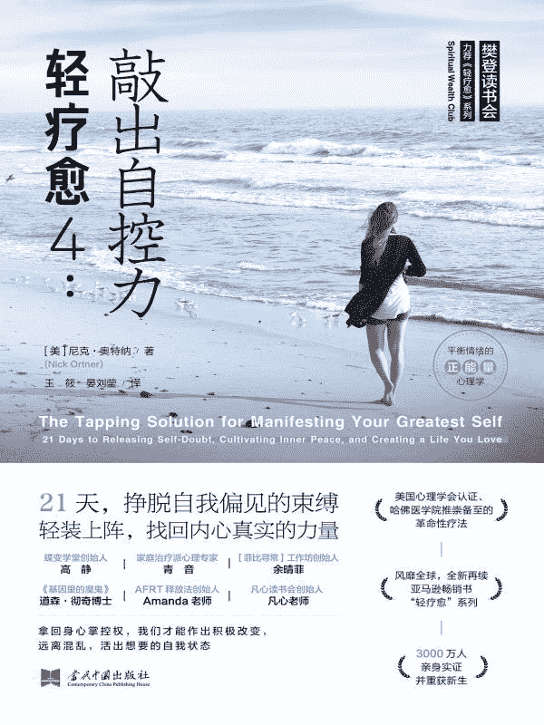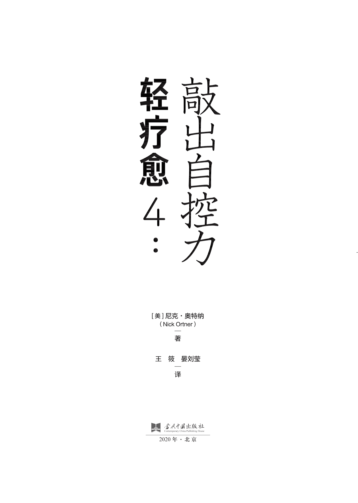

**THE TAPPING SOLUTION FOR MANIFESTING YOUR GREATEST SELF**

Copyright © 2017 by Nick Ortner

Originally published in 2017 by Hay House Inc. USA

Simplified Chinese edition Copyright © 2020 by Grand China Publishing House

This translation published by arrangement with Hay House （UK） Ltd through Bardon Chinese Media Agency.

**All rights reserved.**

No part of this book may be used or reproduced in any manner whatever without written permission except in the case of brief quotations embodied in critical articles or reviews.

本书中文简体字版通过 Grand China Publishing House（中资出版社）授权当代中国出版社在中国大陆地区出版并独家发行。

未经出版者书面许可，本书的任何部分不得以任何方式抄袭、节录或翻印。

**版权合同登记号　图字：01-2017-8482**

**图书在版编目（CIP）数据：**

轻疗愈．4，敲出自控力／（美）尼克·奥特纳（Nick Ortner）著；王筱，晏刘莹译．--北京：当代中国出版社，2020.3

书名原文：The Tapping Solution for Manifesting Your Greatest Self

ISBN 978-7-5154-0955-9

Ⅰ．①轻...　Ⅱ．①尼...　②王...　③晏...　Ⅲ．①精神疗法　Ⅳ．①R749.055

中国版本图书馆 CIP 数据核字（2019）第 172456 号

出版人　曹宏举

策　　划　中资海派

执行策划　黄　河　桂　林　隋　聃

责任编辑　隋　聃　孙泽娟

特约编辑　羊桓汶辛　朱慧芳　韩周航

责任校对　康　莹

版式设计　龚碧涵

封面设计　蔡炎斌

出版发行　当代中国出版社

地　　址　北京市地安门西大街旌勇里 8 号

网　　址　http://www.ddzg.net　邮箱：ddzygcbs@sina.com

邮政编码　100009

编辑部　（010）66572264　66572154　66572132　66572180

市场部　（010）66572281　66572161　66572157　83221785

印　　刷　深圳市雅佳图印刷有限公司

开　　本　880 毫米×1230 毫米　1/32

印　　张　11 印张　243 千字

版　　次　2020 年 3 月第 1 版

印　　次　2020 年 3 月第 1 次印刷

定　　价　59.00 元

* * *

**版权所有，翻版必究；如有印装质量问题，请拨打（010）66572159 转出版部。**

# 致中国读者的信

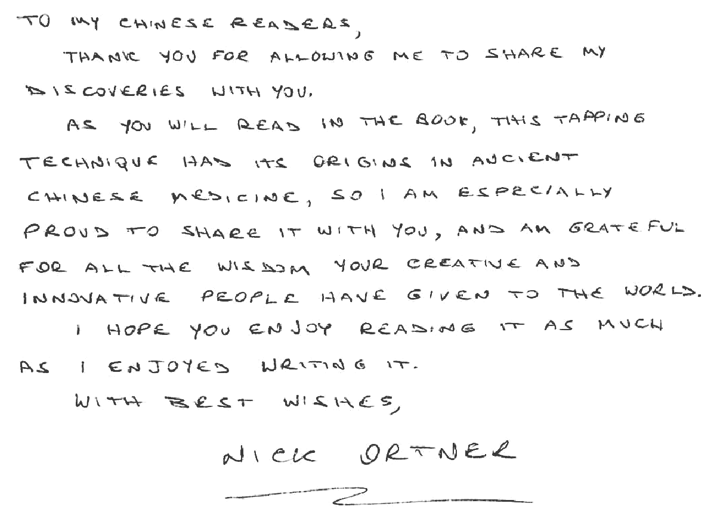

**致中国读者：**

感谢你们阅读这本书。

事实上，情绪释放疗法与中国古代的某些疗法有着异曲同工之妙，所以得知本书将出版中文简体版，我深感荣幸。我想说，中华民族是一个充满智慧和创造力的民族，感谢你们奉献给这个世界诸多宝贵遗产。

写作此书对我而言是一种享受，同时，我也希望把这份美好的感觉传递给你们。

祝好！

**尼克·奥特纳**

# 推荐序

Amanda 老师

〇AFRT 释放法创始人

〇“疗愈的花瓣”自助平台创办人

### 遇见最完美的自己

如果你还在等待别人说服你去做出改变，那你就是还没准备好。

的确，有很多人宁肯忍受沉闷卡壳的生命状态也不愿意做出改变，也有很多人总在获得成功之后迅速退回原点。在接触了众多的 AFRT（AFRT 是 Amanda 的快速释放技术的简称，其基础是情绪释放疗法、密码、瑟多纳、天使疗法、通灵疗法、磁铁清理和催眠等十几种释放疗愈法的精华）学员和来访者后，我发现，人们最害怕的不是重复痛苦，而是成功和不断走出舒适区去接近完美自己的过程。这是因为我们每个人都有一个内在的原始设定，它规定了我们可以走多远。一旦我们超过了这个事前设定好的“舒适区”，我们就会启动“战斗”或“逃跑”的反应，而潜意识也会一直遵从我们的原始设定，不断把我们拉回至这个设定的标准之下以确保我们的安全。

想要改变我们潜意识里的原始设定并非易事。因为，在每个人的内心里都塞满了陈年往事和各种借口，比如：不能原谅他人、无法接纳自己、过度取悦别人、自我否定和破坏、满怀消极情绪、无法对过去释怀，等等。可以说，在决定改变的时候，我们就要做好给自己的内心来个大扫除的准备了——这时，你需要即刻入手一本尼克·奥特纳的《轻疗愈 4：敲出自控力》！这本书将为所有渴望通过疗愈实现蜕变的人们带来喜讯！通过本书中全面而系统的 21 天自我训练，你将轻松收获实用有料的疗愈体验，在不经意间自觉颠覆旧的惯性模式，实现目标，并最终遇见那个最完美的自己！

再次为尼克的新书写序，我的内心充满了惊喜。尼克在《轻疗愈 4：敲出自控力》中延续了他以往真诚幽默的风格，将成长细化为 21 天的主题和内容，让我们可以很省力地一边借鉴他所分享的故事，一边使用敲打手法去完成内在的疗愈。据说，在编著这本新书的过程中，尼克找来很多读者试读并做了大量调整和修改，剔除了所有烧脑冗长的知识，留下了满满的干货和零压力的阅读体验。这是一本由作者和读者共同完成的著作。我相信，在实践这项 21 天练习的过程中，你会和我一样，发现自己的成长是扎实全面的，有了尼克提供的成长蓝图，你所付出的努力都将转化为累累硕果。

如果你是《轻疗愈》系列书籍的忠实读者，你很有可能会发现自己完全可以在每个主题上自由发挥，运用“情绪释放疗法”为自己量身打造疗愈方案，并由一个主题进入到更深层次的内在探索过程。就像尼克说的“天空才是你的极限”，这本书全面展示了那些我们在疗愈过程中容易忽略而又至关重要的方面，而我们完全可以充当自己的疗愈大师，立足于本书，发挥自己的疗愈天赋，将其运用到极致。

可以说，《轻疗愈 4：敲出自控力》中 21 天的练习内容适合我们在生命的不同阶段反复使用，相信每一轮的使用，都会为我们带来崭新的认识和改变！

深深地祝福你活出最完美的自己！

# 权威推荐

桑妮雅·乔凯特：Sonia Choquette，《纽约时报》畅销书《你的三大超能力》（*Your 3 Best Super Powers*）作者

《轻疗愈 4：敲出自控力》能够让你远离平庸，帮助你更快更好地实现梦想。它带来的改变显著而有效，值得你立刻拥有一本。

谢丽尔·理查森：Cheryl Richardson，《纽约时报》畅销书《轻轻松松如意生活》（*Take Time for Your Life*）作者

我很喜欢这本书。本书囊括了很多科学原理和鼓舞人心的故事，兼具趣味性与娱乐性。它能引导你构筑一个睿智而有爱心的灵魂，让你体会到自身强大的能量和不凡的治愈能力。本书将教会你如何使用敲击疗法颠覆生活原本的模样。当你阅读本书并做练习的时候，你会逐渐意识到，做出巨大的改变可能比你想象中的还要简单！

克丽丝·卡尔：Kris Carr，《纽约时报》畅销书作者，情绪释放疗法热爱者

这本书将帮助你克服障碍，让你从自我怀疑走向自我肯定，从“幻想家”变成“行动派”。本书内容浅显易懂，并且很有激励作用。你想要的生活触手可及，而你现在需要做的，就是去敲击！

迈克·杜利：Mike Dooley，《纽约时报》畅销书《梦想：（秘密）没说完的事》（*Infinite Possibilities*）和《撬动宇宙》（*Leveraging the Universe*）作者

这是一本精彩绝伦的书，它介绍了一种强大的技能，能够让所有人都得到前所未有的体验。本书把我们带入一个万事皆有可能的世界，激发我们体内潜在的所有能量。通过多年的应用和实践，尼克采用了一种古老的理论体系，并让它变得更加现代化、快速和高效。在这里，你将找到一个生活指南，帮助你在享受美好生活的同时实现梦想。

凯洛琳·梅斯：Caroline Myss，《慧眼视心灵》（*Anatomy of the Spirit*）作者

敲击练习是一种神奇的方法，能让我们在千头万绪的生活中游刃有余地发展和成长。

帕姆·格劳特：Pam Grout，《纽约时报》榜首畅销书《能量》（*E-Squared*）作者

你不需要医生，也不需要教练；你不需要药片，也不需要安慰剂。敲击是一种依靠自己来改变生活的技能，尼克和整个奥特纳家族将这项强大的技能展现在世人面前。它很简单，也具有革命性。我们每一个人都可以使用它。

艾妮塔·穆札尼：Anita Moorjani，《纽约时报》畅销书《死过一次才学会爱》（*Dying to Be Me*）作者

这不仅仅是一本教你“如何做”的书。尼克·奥特纳用优雅而幽默的方式，向我们展示了他是如何利用敲击来解决自己日常生活中面对的挑战的。他所谈及的话题很容易理解，使得本书的阅读变得简单而有趣。这项疗法在压力、亚健康、成瘾和其他生活中难以解决的问题上具有强大的治疗力量。它简单而有效，却能戏剧性地改变生活。我强烈推荐这本书！

加布里埃尔·伯恩斯坦：Gabrielle Bernstein，《纽约时报》榜首畅销书《全世界都在倾力帮你》（*The Universe Has Your Back*）作者

我相信每天的练习都会带来巨大的改变。在尼克·奥特纳的新书《轻疗愈 4：敲出自控力》中，他提供了 21 天日常练习方法，帮助我们自我成长、改变生活以及实现更深刻的转变。尼克独特的敲击冥想将帮你实现快速转换，让你身心放松。我很喜欢这本书，并极力推荐给每一位想进行个人提升的朋友。

道森·彻奇博士：Dawson Church, Ph.D.，《基因里的魔鬼》（*The Genie in Your Genes*）作者

在这本真诚、有趣而又充满能量的书中，尼克·奥特纳为我们提供了一个活出最完美自我的路线图。通过简短有力的段落和许多值得借鉴的个人故事，尼克巧用隐喻，为我们生动地描绘了一幅幅美好的未来图景。此外，他还在每个章节添加了练习，其内容既鼓舞人心，又浅显易懂，十分实用。尼克概述了为什么我们的大脑更适应于消极的体验，并向我们展示了应该怎样克服进化偏见带来的重复性自我破坏。他引导我们去探索自己可能达到的最佳状态，并将其锚定在我们的身体和行为中……我们甚至能倾听到自己内心的声音。这本书让我们有了拥抱内心的智慧，有了释放压力、实现蓝图的工具。

尼克·波利齐：Nick Polizzi，《神圣的科学》（*The Sacred Science*）作者

尼克·奥特纳正在推进一件整个世界都亟待解决的事情。《轻疗愈 4：敲出自控力》为那些生活停滞不前的人们提供了一个令其耳目一新、易于实现的蓝图，能帮助他们快速找到并解决掉问题的根源。这本书是著名的情绪释放敲击疗法的第 4 本，书中提供了丰富的操作方法和具体指导，值得一读。

凯利·布罗根博士：Kelly Brogan，M.D.，精神科医生，《纽约时报》畅销书《你自己的心智》（*A Mind of Your Own*）作者

最好的秘籍，就是我们自身拥有的强大的治愈修复能力。《轻疗愈 4：敲出自控力》提供了针对强烈情绪、心理障碍和自我限制行为的解决方法。现在，你有能力改变你的生活，而在这些具有启发性的文字中，你将体验到一种毫无副作用的技术方法。

南希·莱文：Nancy Levin，畅销书《值得》（*Worthy*）作者

这本实用的书很有价值。它为你提供了一个行程计划，帮助你实现最完美的自我，过上你最向往的生活。本书提供了现成的方法，你唯一要做的就是去实践它！幸运的是，它非常可行，并值得遵循……当尼克·奥特纳为你加油时，你就会发现自己不可阻挡！

大卫·范斯坦博士：David Feinstein, Ph.D.，《能量心理学的承诺》（*The Promise of Energy Psychology*）和《爱的能量》（*The Energies of Love*）的合著者

穴位敲击疗法为你提供了一种十分精准的工具，能释放大脑中使你快乐的化学物质，进而改变你的感觉、想法和行为。尼克·奥特纳已经向成千上万人展示了如何自助使用这种方法。在《轻疗愈 4：敲出自控力》中，他制定了一个为期 3 周的必要步骤，帮助你跃入更有意义的未来。如果你没有十分要紧的事，那就花些时间和精力，用这本书的清晰指南来提升自己的生活吧。祝你顺利！

克里斯蒂安·米克尔森：Christian Mickelsen，《释放富足：给自己更多的金钱，爱，幸福和健康》（*Abundance Unleashed: Open Yourself to More Money, Love, Health, and Happiness Now*）作者

如果你期待一种与众不同的生活，那你应该立刻拿起一本《轻疗愈 4：敲出自控力》读一读。它充满了绝对可行的且经过验证的克服恐惧、怀疑和限制思维的策略，而且可以迅速给你带来更多的信心、爱、欢乐和富足。我极力推荐这本书。

# 前言　从现在开始，天空才是你的极限

这是我的第 4 本书，也是倾注心血最多的一本。

在书中，我分享了一些自己的故事，但它们讲述的并不是我的人生，而是你的。我曾为实现最完美的自我而踏上旅程，现在我将带你走上类似的旅程。

这段内心的旅程不断激励着我，让我每天早上都能按时醒来，与我美丽的妻子和漂亮可爱的孩子一起分享美好的时光，同时准备做一些让我动力满满的工作。

这段内心的旅程让我享受社区（与我有着深刻的联系）生活，随时充满着活力，拥有一群十分要好的朋友。

这就是为什么我能经常体验到比想象中还要强烈的快乐和富足。

因为这段旅程，我现在变成了我想成为的人。

当时的我并不知道，这段旅程，也就是这本书其实孕育于我 20 多岁时。那时我住在康涅狄格州（Connecticut）伯特利（Bethel）一间 800 平方英尺（约 74.3 平方米。——译者注）的公寓里。我在房地产行业工作，而我的“办公室”就是和女朋友共用的厨房。

我非常享受把房子变成温馨家庭的这个过程。我真正想要的，是用善良、感激和真诚经营我的事业，这同时也是我想在生活中遵循的准则。然而，房地产行业的竞争十分激烈，我并没有什么办法从累积的巨额债务中脱身。

我深爱我的女朋友，但不可否认的是，我们的关系并不算牢固。虽然她经常陪伴在侧，但我还是倍感孤独。我的精力总是被严重的过敏和慢性失眠消耗着，这直接增加了我的痛苦。尽管面对这样或那样的挑战，我每天都会试着放松自己，释放压力，让生活充满更多的爱和感激。我非常努力地把注意力集中在“正确”的事情上，但事实上，我的生活并没有发生任何好的转变。

你有过这样的经历吗？你是否发现，无论自己多努力地推进一件事，或是放弃一件事，你的生活始终过得没那么顺心？你是否对自己能做好一件事情没有信心？

就像我一样，你可能已经意识到自己糟糕的生活模式了。你可能知道自己需要放下过去，去原谅某个人，然后以新的方式来生活。你也知道，是时候停下来了，停止怀疑自己，转而感受内心的力量，变得更加自信。

但不知为什么，你就是无法完全做到这些。

尽管你做了所有努力来改变生活，但你似乎始终无法做好这一切。

这真令人沮丧！

但是……如果那些曾经持续存在的巨大障碍一下子都消失了呢？如果你能变成最完美的自我，过上你最向往的生活呢？那会是什么样子？更重要的是，那将会是什么样的感觉？

这些就是我曾经痴迷的问题，现在我依旧痴迷于此。

有趣的是，当我回首往事时，我发现我最宝贵的财富之一就是急躁——我无法接受自己的成长速度是如此缓慢，所以我一直在搜寻新的方法。在几乎尝试了所有方法后，直到 2003 年，我才终于发现了敲击。

从那时起，我的生活开始转向满足、充满爱和富足。慢慢地，我实现了心中所有的愿景、希望和梦想。如果你当时告诉我，我将来会帮助人们治愈他们的心灵和身体，那我一定会非常开心。当然，我十分喜欢关注个人发展。从高中时代开始，我就一直接触关于个人赋权、情感治疗的书籍和音频。不过，那时的我从未想过要将追求个人发展作为一种职业。

后来我才明白，我现在所拥有的知识就可以改变一切。

我从来都不是一个勇敢的人，但最近这段时间，我从成千上万名观众中随机挑选了一些志愿者。我从未见过他们，对他们一无所知。我邀请他们到舞台上疗愈自己和自己的生活。

我不必疗愈自己，因为我已经奇迹般地变得无所畏惧。我选择疗愈他人，因为敲击所产生的效果不言自明。所以，现在我是那个在舞台上挑选志愿者的人。经过 20 分钟的疗愈，一半的观众在哭泣，而另一半则在为他们所见证的转变而鼓掌喝彩。

如今，我发现的敲击法的疗愈结果已获得了相关科学研究的支持。当然，我也会和你们分享这些成果。这是一个伟大的新闻，简而言之：科学告诉我们，我们并不像自己认为的那样一成不变，因为控制我们思想、情感和行为的大脑是具有可塑性的。人类的大脑能够改变，而且确实会改变。这也意味着持久的转变和深层的治疗是可操作的。

越来越多的人认识到，真正使信息进入大脑的途径是通过身体，而这就是敲击的原理。事实上，敲击已经被证明可以减轻情感、精神和身体上的压力，甚至能对身体的基因表达产生积极的影响。

这太酷了，不是吗？

通过敲击，你的 DNA 将会更有效地工作。无论你想治愈自己的精神和心灵，你的身体和思想，你的人际关系，你的财务状况，还是其他方面，你都可以使用这本书。

一旦开始敲击，你就会更加坚定地在这段实现完美自我的旅程中走下去。准备好进入你最向往的生活吧！

所以，请告诉我——当你每天早上开始醒来，感觉自己处于最完美的状态时，你最想体验的是什么。是更多的平和，更加精力充沛，更健康的身体，有更深厚的人际关系，还是有更多的爱、光明、激情和满足？

你可以创造自己的幸福，然后改变你所存在的世界。你可以随心而为，想走多远就走多远。和我一起踏上这段奇妙的旅程，展现最完美的自我吧！从现在开始，天空才是你的极限。

### 平和的人生需要规划

我在本书中分享了自己的 21 天疗愈之旅。首先，它将带你扫清障碍，引导你展现最完美的自我。然后，它会帮助你在个人道路上规划出一个平和而有目标性的生活。

每天，这本书都会引导你进入下一个旅程，带你进行反思，并根据你的需求随时地改变你的身心状态。每天，你都会发现一个简单的、很容易接受的日常挑战，以及一个敲击冥想练习，我会督促你在旅程中使用它。

为了让这段旅程尽可能地轻松和优雅，有一些建议需要你牢牢地记住。

### 我承诺，我能坚持走完整个旅程

这段旅程将在 21 天内完成。需要注意的是，这些日子不一定是连续的。你可以留出 2 天、3 天或 5 天的时间来消化和运用每天的内容。

根据你的时间来安排疗愈之旅，但你要承诺自己能够完成整个旅程。

为了帮助你顺利地完成疗愈之旅，你可以注册我的电子邮件提醒（E-mail Reminders）。注意，要选择适合自己的节奏。如果你选择一个为期 3 天的延迟提醒，你将每隔 3 天收到我的电子邮件。如果你选择一个为期 2 天或 5 天的延迟提醒，你也会准时收到我的来信。如果在疗愈过程中，你想要改变自己的节奏，你只需要返回最初的页面，并申请一个新的时间框架。

需要注册电子邮件提醒的读者，请点击这里：www.thetappingsolution.com/manifesting。

### 挑战，从每一天开始

每日挑战：本书旨在产生真实的结果，所以，每一章（一天）都会以挑战结束。这些挑战通常会在不同的焦点领域呈现出新的思维方式，多以采取行动的方式出现。

请务必完成这些挑战。从长远来看，它们会给你带来很大的不同，让你学会坚持，并会对你和你的生活产生积极的影响。

敲击冥想：每天都有相应的冥想练习来指导你，在敲击相关穴位时，你可以使用一些词和短语。这些练习在附录里，这样你可以很容易地就找到它们并返回到当天的练习中。现在，毫无疑问，敲击是收获这次旅程的必要条件。开始敲击吧！

注意：当你在书的正文和附录中实践敲击练习的时候，你可以自由地调整文字来反映你的经历。敲击的目的绝不是说“咒语”，而是利用你自己的经验来自我疗愈。

你的 21 天疗愈之旅地图：在这本书的最后，有一个旅行地图，它将为你总结每一天的旅程，这样你就可以快速地找到你想要的内容。

很高兴你已经准备好了。让我们开始敲击吧！

# 快速入门　向往的生活，由你自己定义

想象一下这样的日子：生活事事顺心，几乎没有障碍和烦恼，交通没那么拥挤，有课的早晨不怎么慌乱，金钱的压力小了许多，并不自信的你慢慢变得完美，日常事务的压力也小了很多。

你能想象出这将是一种什么样的生活吗？这是你所向往的生活吗？

高中的某一天，我从妈妈的杂物堆里发现了托尼·罗宾斯（Tony Robbins）的录音带，从那时起，我便一直坚持不懈地致力于帮助人们过上更加健康、充实和幸福的生活。

接下来，你将踏上探索更完美自我的旅程，进而开启最美好生活的大门。在生活中，种种压力和消极情绪限制了我们成为更完美的自己，因此，我们将从摆脱压力和其他消极情绪开始我们的探索之旅。

第一步是学习“敲击”，这是我目前发现的唯一能在短时间内实现深度转换的方法。同时，敲击疗法可以直接帮助我们实现目标，这是其他方法无法做到的。如果你已精通如何“敲击”，请跳到本书第 1 天的课程开始练习；如果你是新手，就请从这里快速开启你的“敲击之旅”吧。

### 了解你的身心复位按钮

这种“敲击疗法”是如何缓解压力，让我们更快、更彻底地实现最完美自我的呢？事实证明，答案就在我们的身体中。

在道森·彻奇博士主导的一项双盲研究中，参与者被分成两组。其中一组每天进行一个小时的敲击，另一组（对照组）则是每天接受一个小时的常规谈话治疗。研究结果显示，敲击治疗组皮质醇（又称压力激素，人类在面临显著压力时会产生更多这种荷尔蒙。——译者注）水平平均下降幅度为 24%，其中个别受试者的皮质醇水平下降幅度高达 50%。相比之下，对照组（谈话治疗组）的皮质醇水平仅下降了 14%。

道森最近在《能量心理学》（*Energy Psychology*）杂志上发表了另一项研究成果，他发现情绪释放疗法（Emotional Freedom Technique，简称 EFT）对基因表达水平具有巨大的影响，总结如下：

基因表达的水平就像调光开关一样层层递进，许多相关基因的表达水平都会被上调或下调。压力、饥饿、疲劳、情绪和许多其他的经历都会影响基因表达水平。

在这项对照试验中，为了获得研究数据，研究者贝斯·马哈拉杰（Beth Maharaj）挑选了 4 名参与者，比较进行一个小时情绪释放疗法与进行一个小时常规谈话的人基因表达的变化。她发现，在进行情绪释放疗法之后，参与者的 72 个基因受到了显著的调控。

同时，这些基因的功能十分具有指向性，包括：癌症肿瘤的抑制、防止太阳的紫外线辐射、2 型糖尿病胰岛素阻抗、机遇性感染的免疫、抗病毒活性、神经元之间的突触连接、血小板和白细胞的形成、增强男性生育能力、大脑白质的构建、代谢调节、神经可塑性、细胞膜强化、减少氧化应激……，它们都是对身体有利的基因功能。

其他研究也表明，情绪释放疗法是一种表观遗传学干预方法，它可以调控许多基因的表达。仅仅一个小时的情绪释放疗法治疗，也会对身体有益。

研究还表明，针灸可以提高人体内的内啡肽水平。敲击可以像针灸一样刺激穴位，让身体释放内啡肽，从而使人产生愉悦的感觉，提高身体和精神体验。

同时，我们也可以从另一个方面解释，即敲击在某种程度上能够疏通经络，从而达到缓解压力的效果。虽然对这些经络的认识可以追溯到几千年前的中国古代医学，但直到 20 世纪 60 年代，这些显微解剖学结构才首次出现在立体显微镜和电子显微镜图像上。

显微解剖结果显示，经络的管状物质结构宽约 30～100 微米，贯穿了整个人体。作为参考，一个红细胞是 6～8 微米宽，可见这些经络十分纤细。

你可以这样理解：经络是身体的光纤网络，它们携带着大量的电子信息，而这往往是身体的神经系统或化学系统所不能承受的。这就是为什么在处理精神压力或身体疼痛时，敲打经络能够比采用其他减压技巧更快地达到效果。

以上仅仅是对科学研究的粗浅罗列和探究，如果你想了解更多与其有效性相关的论文，请到这里查阅：research.EFTuniverse.com。

因此，敲击疗法有坚实的科学依据。但更重要的是，它能为我们做些什么呢？现在让我们一起来探究一下。

### 是什么在困扰着你

你会在这本书和敲击过程中发现一个有趣的二分法。这本书的主要目标，正如书名所言，是通过敲出自控力来帮助你展现最完美的自我。这意味着我们将一起努力，让你比以往任何时候都更加耀眼自信，让你感受到内心的平静，创造出你最值得拥有和渴望的生活。

当我们专注于积极向上的愿望、力求成为最完美的自己时，敲击疗法首先会帮助你释放那些曾经困扰你的沮丧往事，毕竟那是我们的日常体验，而正是因为这些体验，使得消极和沮丧构成了我们日常生活的本质，占据了生活的绝大部分。因此，只有解决（以及必要的治疗）日常生活中的问题，我们才能以更有效、更强大的方式前进。

让我们从探索开始吧，这样你就能真正地看到和感觉到自己身边发生了哪些改变。因为我发现敲击疗法最简单的方式就是关注当下最紧迫的事情或最困扰你的大小琐事。

现在，请你列出目前最困扰你的事情。是阴郁的天气，还是睡眠不足？是刚从老板那里收到的邮件，还是你前任的短信？

请坦诚地面对自己的内心，因为这将成为整个疗法最有力的出发点。

你不能释怀的烦恼是什么？

现在是什么在占用着你的大脑和精力呢？

是什么让你怀疑自己、害怕未来？

是什么在阻碍你的前行之路？

这些问题被称为“压力王事件”（Most Pressing Issue，简称 MPI）。同时，你将学习通过敲击，以意想不到的方式将这些问题快速解决掉。

### 清理负面情绪

首先，让我简要介绍你的“压力王事件”。人们常担心首先把注意力放在消极的东西上，因为一旦那样做了，就很容易陷入其中，进而把生活搞得一团糟。

事实上，通过释放压力、恐惧和其他我们自然而然地产生的负面情绪（在疗愈的第 2 天，负面情绪可能会更多），你可以更快速地清除精神和情感上的“污垢”，为真正积极、美好的生活创造更多的空间。

开始敲击吧！现在，你已经确定了你的“压力王事件”，是时候开始疗愈了。下面是敲击的基本方法。

#### 第 1 步：专注于你的“压力王事件”

当你把注意力集中在最困扰你的事情上时，问自己一些问题，比如，当我思考这个问题时，我的身体有什么感觉？我是否感到紧张、疼痛、刺痛、耳鸣、热或冷？是否感觉到空虚、麻木或虚无？

注意你身体的反应。这里没有标准答案，要尽可能地把你的具体感觉描述出来。

#### 第 2 步：测量“压力王事件”的强度

接下来，在 0～10 分的范围内，使用主观焦虑评分（Subjective Units of Distress Scale，简称 SUDS，是一种 0～10 级的量表，用以测量个人当前体验的痛苦或困扰的主观强度。——译者注）给你的“压力王事件”打分。

专注于你的“压力王事件”，此刻，你的感觉有多强烈？10 分是你能想象的最焦虑的程度，0 分意味着你根本没有感觉到任何痛苦。

不要纠结于主观焦虑评分的精准度，遵循你的直觉便可。

#### 第 3 步：写下你的“问题描述语”

了解自己的主观焦虑评分级别后，下一步是写下问题描述语。写下该语句的同时要把注意力集中在你的“压力王事件”上。基本语句如下所示：

尽管我（描述你的“压力王事件” ），但我还是深深地爱着自己，并接受自己。

例如，你可能会说：“尽管我很担心我的演讲，但我还是深深地爱着自己，并接受自己。”或者你会说：“尽管每当想起我要在这个周末带孩子出去玩时我都十分紧张，但我还是深深地爱着自己，并接受自己。”

当你开始敲击时，你的问题描述语应该与你正在经历的事情产生共鸣。要注意的是，并没有什么神奇词汇可以打开释放压力的大门。你的目标是说出那些对你有意义的词，所以如果你的问题描述语不够真实或感觉不够强烈，那就改变它。

以下是一些你可以使用和改变的基本问题描述语的变体：

尽管我（描述你的“压力王事件”），但我还是完全爱着自己，也愿意接受、原谅自己和他人。

尽管我（描述你的“压力王事件”），我现在选择原谅我自己。

尽管我（描述你的“压力王事件”），我也接受并原谅我自己。

尽管我（描述你的“压力王事件”），我愿意按自己的想法去做。

尽管我（描述你的“压力王事件”），我愿意放手。

尽管我（描述你的“压力王事件”），我愿意持有一个新的观点。

尽管我（描述你的“压力王事件”），它已经结束，我现在安全了。

尽管我（描述你的“压力王事件”），我现在决定释放这个压力。

### 第 4 步：选择一个提示语

提示语就是简短的几个词，它们可以用来描述你的问题。举个例子，如果你的陈述是对某个演讲的焦虑，你的提示语可能是“对演讲的焦虑”。

敲击的同时，你需要重复说出提示语，所以只要你愿意，只要你专注于自己的“压力王事件”，你就可以随时改变说法。在这个例子中，你很可能会说“所有这些对演讲的焦虑……我对这个演讲很焦虑……对这个演讲，我有太多的焦虑……”。

### 第 5 步：敲击身体部位

一旦创建了问题描述语和提示语，你就可以开始敲击了。

首先，说三次你的问题描述语，同时敲击手刀点，它位于你手掌的一边，就在手呈握拳姿势时小指的底下突起的地方。你可以用你觉得最舒服的那只手敲击——以一种正确的速度和力量轻击，不会错的！

在你说了三遍问题描述语之后，继续敲打身体的 8 个部位，同时说出提示语。这些部位是：

·眉毛内侧

·眼睛外侧

·眼睛下方

·鼻子下方

·下巴

·锁骨

·腋下

·头顶

你可以敲击身体上你感觉最舒服的一侧，因为相同的经络在身体两侧同时运行着。

记得要按顺序进行，并且坚持每一轮敲击 5～7 次。当然，敲击次数不设上限，如果你想在某一部位上敲击 20 次或 100 次，那就放手去做！因为敲击的要义就是在击打某一部位的同时花足够的时间不停地说提示语，并让力道渗入肌理。

你不必担心自己做得不够标准，你只需凭着感觉去做，并对此有所体会即可。

这里有一幅身体部位示意图供你参考：

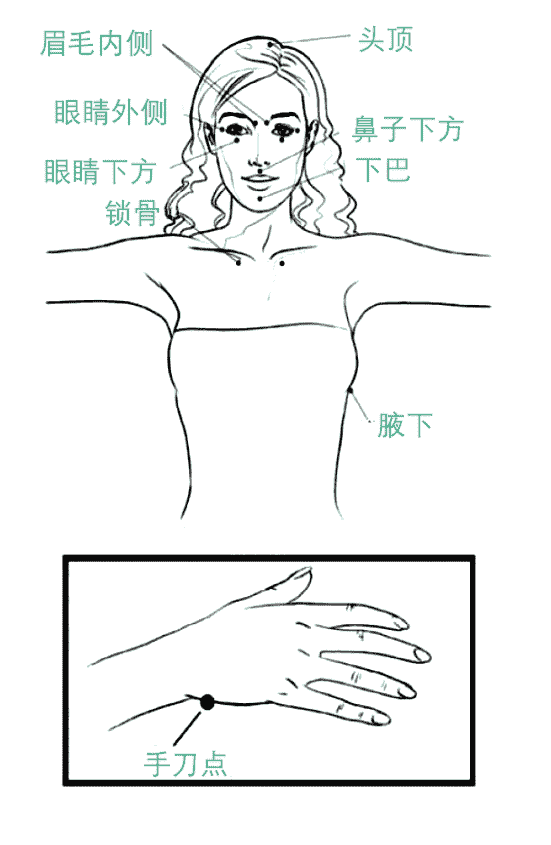

#### 第 6 步：检查

你已经完成了一轮敲击！做几次深呼吸，感受你的身体发生了什么改变：是情绪上的变化，还是生理上的变化？现在，你的“压力王事件”得分是多少？

如果你的“压力王事件”强度从 8 分降到了 7 分，那将是巨大的改变！这意味着“敲击疗法”已经开始缓解你的压力，且在短短几分钟内就产生了效果，因此请继续敲击。如果没有变化，你也不必沮丧，人们通常需要不止一次的敲击来缓解压力，尤其是在他们第一次进行敲击的时候。

当你检查自己是否经历了任何变化时，问自己几个问题：

在敲击的过程中，我的身体有什么感觉？

在敲击的过程中，我出现了怎样的情绪？

在敲击的过程中，我的脑海中浮现了什么“随机”的想法或者记忆？

#### 打哈欠、叹气、打嗝……

人们经常会问自己是不是做错了什么，因为敲击的时候，他们总会打起哈欠或者产生其他身体反应。这些都是好兆头！因为这是你身体放松及释放能量的表现。因此敲击时，你要注意自己身体反应的所有方式。

#### 从“消极”转向“积极”

在整本书中，每个敲击练习都以“消极”或“真相”开头，包括你的“压力王事件”，以及任何与之相关的挑战性情绪和信念。大多数时候，我会以至少一次“积极”的敲击来结束练习，这是一种新的前进方式。

例如，如果你在演讲时表现出焦虑，你可能会用这几种提示语来结束你的敲击，诸如“我现在可以释放这种焦虑”“我可以专注于练习”“被所有人看到和听到让我感觉很安全”，等等。

一般来说，你最好把消极情绪的强度降低到 5 分（最高为 10 分），然后再转向积极的一面。之后，你需要继续保持积极的心态，直到消极情绪的电荷减少到 3 分或更低。

### 第 7 步：测试你的进度

当你的“压力王事件”强度下降时，你就该测试敲击的实际效果了。你可以将注意力重新集中在你的“压力王事件”上。

如果你在把注意力集中于你的“压力王事件”上时，仍感到情绪紧张，那就继续用同样的语言进行更多次敲击，看看你是否能完全清除你的“压力王事件”。

或许你会发现，当你思考自己的“压力王事件”时，你的情绪会发生变化。例如，你现在感到的是愤怒而不是焦虑。太好了！这表明你正在接近你的“压力王事件”产生的根源。在这种情况下，你可以继续前进，发泄你的愤怒。如果你发现这种愤怒之中还掩盖了另一种情感，比如悲伤，那就继续前进，释放这种悲伤。

不断挖掘你深埋的情绪，直到你体验到解脱。

有情绪不好吗？

为什么我们要利用敲击来释放它们？

人们常问我：“为什么我们在敲击的时候需要将注意力集中在释放情绪上？有情绪不是一件好事吗？”

是的，有情绪绝对不是一件好事！

我们的目标是永远不要停止感受自己的情绪。相反，敲击可以帮助我们了解自己的感受，然后我们才能更充分地体会它。当我们敲击的时候，我们的情感体验自然会发生变化。例如，如果你通过敲击释放内心的愤怒，愤怒就会变成悲伤，然后悲伤会慢慢变成同情。

作为情绪处理和释放的结果，主观感受通常在敲击时发生得更快，因此，敲击的这一刻会让我们变得更有存在感，而这样的存在感会帮助你成为最完美的自己。

### 关于如何敲击的视频

如果你喜欢观看视频，可以在以下网址观看关于敲击的 5 分钟视频：http://www.thetappingsolution.com/what-is-eft-tapping/。

太棒了，你已经准备好开始第一天的旅程了！让我们开始敲击吧！

# 第 1 周　塑造平和心态，开启新式生活

你曾感到焦虑吗？或者觉得孤独？认为自己什么也做不好？抑或时常受到小病痛的折磨？平和地应对这一切吧，毕竟积极的成长从来都不会一帆风顺。

# 第 1 天　在不安中混乱，或在平和中幸福？

今天早晨不像原计划中设想得那样完美。

好吧，虽然看起来有些轻描淡写，但我并不想让这本书的开篇过于引人注目。

平日里，为了打破赖床带来的忙乱局面，我通常会在前一天设定一个早起的目标：做一些敲击，享受片刻的冥想，陪我可爱的一岁大的女儿玩耍，然后安静地读一会儿书，开启新的一天。入睡前，我甚至可以预见新的一天将会多么美好，我能感觉到自己的创造力会源源不断地喷涌而出，这将是令人惊叹的一天！

然而，为什么制定的计划会变成一个笑话呢？

凌晨 3 点左右，我的孩子醒了，并不是蹒跚学步的儿童常见的短暂惊醒。可能她觉得凌晨 3 点是起床玩耍的好时间，所以她玩了一个小时，而我也不得不加入她的“午夜茶派对”（实际上一杯茶就已足够，因为这个耗时一小时的“派对”的唯一活动就是不停地将茶杯放进盒子再拿出来）。

第二天，我睡过头了。我用绵长的鼾声迎接太阳升起的黄金时刻。当意识到自己睡过了头，我立刻从床上跳了起来，略过了早上的敲击冥想以及计划中的阅读。一直处于昏昏沉沉状态的我也没能立即检查电子邮件。我确实陪女儿玩了一会，但不是在今天早上，而是在凌晨 3 点。我也没有找到她凌晨 3 点就起床的原因，再加上她还不会说话，因此我们无法很好地交流。

我知道收件箱里充斥着紧急邮件，但我只是不耐烦地等着我孩子那美丽的母亲、我的妻子起床带女儿，虽然她比我更缺乏睡眠。此外，我需要进行新员工的招聘、指导和管理，还要处理几个重要电话。

就在这时，家人打电话给我，让我安排房子的翻新装修。诸多事情交织在一起，使我不得不理清自己接下来几个月的行程安排。我是否像每个新手父母一样睡眠不足，已经断断续续好几个月没睡好了？

对了，我还要写这本书。抱歉让你置身于我这乱成一团的早晨……

现在，回到最开始，那时你并未察觉自己拿起了一个生活失控的抱怨者所写的书。事实是，在我的生活中，我感到无比的幸福：我住在让我有归属感的家乡，做着自己喜欢的工作，有健康的体魄，有美好的家庭和支持我的朋友。毫无疑问，我是幸运的。但每一天，即便生活已经足够美好，我依然需要面对大家都会遇到的各种选择。

每当遇到这些情况，这些慌乱的早晨，这些日常挑战，我应该从哪个角度做出回应，是平和还是不安？生活赐予的柠檬，我是否应该不论大小照单全收？抑或是，我要和柠檬斗争到底，祈求上帝将其换成香甜的橘子，然后纠结为什么我的生活中出现了这么多酸柠檬？

平和还是不安，你会选择哪一个？

我们都想选择“平和”，然而当我们查看收件箱，感到筋疲力尽、不堪重负的时候，当我们在朋友、亲人、家庭、工作和财务之间无法抽身的时候，要想选择一种深度平和的态度去面对，这绝非易事。

从很多方面来说，这是我们面临的最大挑战。

平和还是不安？我们一生中需要面对数十亿次类似的选择。

平和还是不安？成为最完美的自己，并不是要求你跑得比子弹还要快，也不是要求你强大到轻轻一跳就能跃过高楼。

这甚至无关于你最大的梦想和热情，无关于改变世界或者变身超人。尽管这些事情，严格地说，其中一些事情的确能够发生。成为最完美的自己，更多的是关乎于我们每天都在做的简单选择，在最糟糕的时刻，在最好的时刻，或是在其他平常的时刻。正是这些选择和日常行为才能让你实现最大的梦想，让你释放最火热的激情，让你改变世界。

每一个时刻都是一个简单的选择：平和，还是不安？

### 那些让我们歇斯底里的事

当我们谈论平和或不安的感受或经历时，我们指的并不是完全的、持续的、纯粹的平和，也不是绝对的、狂躁的不安，更多的时候，我们经历着平和与不安之间的多个层面。

在敲击时，我们先用一个 0～10 的分值评估敲击前的情绪强度，再评估敲击过程中的情绪变化。这种方法同样适用于平和与不安。如果你在一个特别忙碌的日子里停下来，做几分钟的敲击，你可能会稍感平和，但不是完全的平和。同样地，有时你也会经历低强度的不安。除非发疯，不然你不会感到彻底的放松。在敲击后，你会觉得更加平和。

这些变化，无论大小，都非常重要。事实上，正是有了这些细小的变化（有时你会发生巨大的改变），我们的生活才慢慢地有了改变。

即便是短短几天或一周的时间，微小的变化也能产生巨大的影响。倘若将这些微小的变化延伸至几年甚至几十年，这就是我们展现最完美自我的方式。

在为期 21 天的敲击体验中，请时刻注意自己处于“平和”或“不安”的哪个状态，这会让你觉得更自然，同时也会注意到这些状态是如何在你的经历、身体和生活中表现出来的。目前，关于平和与不安，我所能提供的最简单、最相关的定义如下：

当你真的处于平和的状态，在你面对挑战的时候，你可能会更加开放、清醒，甚至是充满好奇。在面临不确定时，你会发现自己比想象中的还要冷静。在情感和身体上，你可能会减少紧张、痛苦、抗拒和困惑。

当你处于不安的状态时，你可能会觉得自己被隔离或封闭了，可能表现为身体上的紧张和痛苦，以及精神上无法做出决定、无法专注等，也可能觉得自己无力承受所面对的一切，甚至会冷漠地面对原本喜爱的人、地方或事物。

哪种定义最贴近现在的你？你现在的状态更多的是平和，还是不安？

### 关于乐观者的真相

回想我认识的那些真正乐观的人，他们都是习惯以平和的心态看待生活的人，他们都有一个共同的信仰。

他们每个人都将积极乐观当作日常训练。他们持续不断地训练大脑去观察、感觉和体验积极的事物。他们从不刻意做积极的事，只是不断地培养积极的心态。当他们发现自己远离积极的事物时，他们会停下来，深呼吸，让自己重新回到正确的方向。

### 谁不愿意拥有“随它去吧”的释然？

你会发现从不安的状态转向平和的状态需要一点时间。然而大多数情况下，这个转化过程经常会持续不断地出现在生活中。这让我想起了自己的那个早晨。我身在其中，虽然精力不充沛但心态也不是狂乱的，当然更不是平和的。我的确做了很多事情，可是理想中源源不断的创意依旧没有出现。

我需要做一个选择。

我是应该花点时间去留意和敲击我的身心（选择平和），还是像往常一样，被压力和肾上腺素推动着度过接下来的时间（选择不安）？

在我发现敲击之前，老实说，我从未意识到自己总是生活在焦躁不安中。在这一点上，单单意识到这个问题是没有任何帮助的。毕竟，如果我只是注意到自己在不安中度过了一天，却没有办法改变这一点，那么即使我意识到问题也毫无用处，而这反而容易成为不安的另一个原因。

现在请思考下面这个问题：

你是否曾被告知“冷静下来”或“别为小事担心”？（此类信息到处都是且非常引人注目。）

谁不愿意拥有“随它去吧”的释然？如果这很容易实践，那我们早就这样做了。

当我们听到这些信息的时候，大多数人不管是从内心还是口头上都会回答：“说起来容易做起来难……”选择平和时的内心斗争是大脑固有的消极偏见的结果。至于为什么说起来容易做起来难，其背后有着生物学方面的原因，我们将在明天（第 2 天）的课程中谈论这个问题。但是现在，你只需要知道，你不是唯一内心挣扎着去寻找平和的人！

### 能让我们追求平和的，只有我们自己

直到开始敲击，我才开始感知经历的价值所在。敲击可以快速改变我的生理状态、心理状态及情感体验，让我发现不安才是那个慌乱早晨的始作俑者。就像很多事情一样，感知是一种技能，要想学好它，我们必须练习。即便是现在，我也无法做到完美，这就是为什么直到午餐时间，我才意识到为什么一点肾上腺素的增加便能引导我度过不安的晨间时光。

让我们诚实一些。尽管意识到早晨偏离了预先设想的航向很容易使人产生不安，但是就像大多数人一样，我知道如何因“失去”的早晨而巧妙地鞭策自己。不过我有个更好的选择，那就是敲击。我接受这个糟糕的早晨，停下来，深呼吸，通过敲击来改变我的体验。

在我们实践并体验它的力量之前，首先我们需要了解一个核心文化理念，它将对我们的选择产生深远的影响。是停下来、深呼吸，让自己走向平和，还是让自己随波逐流于日常不安的潮汐中？

想象一下你理想中的完美早晨。相信你可以描绘出来，对吧？

清晨的阳光和煦温暖。当你醒来时，你发现自己得到了足够的休息，精力充沛，容光焕发。你做了一些瑜伽体式（为什么看别人做总觉得很简单？）；冥想（吟唱）；用绿色果汁开始你的早晨，抑或是茶或咖啡（借着月光采下的有机产品价廉物美！）。你洗完澡，穿好衣服，享受完健康的早餐（无论今年的流行食谱是什么），然后进入很久以来过得最充实、最高效的一天。

令人惊讶和备受鼓舞的是，当一天结束的时候，你发现早晨的一系列活动会改变你的生活。你会告诉自己，如果每天早上都是这样的状态，你的身心和生活将会有所改变。

只是有一个问题，每天的早晨不可能以完全相同的方式开始。有些早晨，你的状态并不好。有些阴郁的早晨，家里的咖啡喝完了，狗狗也生病了。或者是某个早晨，你再也不想喝那些绿色的果汁！

接下来会发生什么事情呢？

这里有一个更深层次的挑战，一个可能让我们停滞不前的信念，就是我们对外部世界的文化关注。当我们想象一个完美早晨的时候，我们首先关注的是阳光，首先想去做的是简单且重要的事情，而不是我们需要去做的重要事务。

我们幻想的早晨必须是完美的，而且必须要做一些别人也认为是很愉悦、很享受的事情。在强调成就和生产力的文化环境中，这是一种可以被理解的偏见。毕竟，我们总是被告知要“冷静下来”，总是被要求在更短的时间内完成更多的事情。当我们想象一个完美早晨的时候，我们总是首先开始想象我们要做些什么，周围的世界是什么样的。我们相信这些外在因素能够体现出我们是如何盼望去感受平和、感恩、活力、满足、快乐等积极感受的。

我总是把注意力集中在电子邮件上，就像被野兽抓住了一样。每当我的早晨很糟糕时，我总是习惯于责备自己检查邮件的习惯，因为它打乱了我例行公事的顺序。诚然，查收电子邮件并不是最好的唤醒方式。花 10 分钟进行敲击冥想，放下一切陪女儿玩耍，然后安静地读会儿书，这才是开启新的一天更加平和与明智的方式。现实是，我确实需要优先查收邮件。只是有的时候我实在是太累了，注意力无法集中。

我们需要停止强迫自己或对方做得更多、更快。我相信这是真的，我也知道这不是答案。少做一些，或者只是少做一些不能让我们感到满足的事，并不能保证我们真的能渐渐走向平和。

请仔细思考一下。

你有没有想过，在经历了漫长的一周后有这么一天，你本可以彻底放松、重新找到年轻的感觉，可是当它真正到来的时候，无论你如何使尽浑身解数都无法让自己放松。虽然你做了最初设想的活动，但结果却并不像你想象的那样。

这是因为平和是一种纯粹的内在状态。当我们全身心地活在当下时，平和就已经存在了。除了我们，没有任何东西、任何地方或环境能给我们带来平和。换言之，能让我们追求平和的，只有我们自己。

这让我想到一个简单的练习，它可以让我开心地过完一天。

我停了下来。

我开始注意到底发生了什么（来自让人不安的地方）。

我深吸一口气，开始敲击。

当我们花时间去深呼吸和敲击时，我们释放了压力（实际上是通过降低体内的压力荷尔蒙和皮质醇的水平），然后将自己重新定位到一个平和的状态。从这之后，各种各样的魔法和奇迹都出现了。

### 人人都有点亮生命的时刻！

我曾亲眼目睹成千上万的人在敲击过程中出现了令人难以置信的时刻。这是人们将自己的力量集结起来去改变他们体验的时刻。就像一个巨大的灯泡突然亮起来，他们体验到了我第一次敲击时的体会。我们可以用这个令人难以置信的方法来改变自己的感受，而这个简单的操作方法就掌控在你自己的手中。通过它，你可以改变自身状态，改变一切。

从一个时刻到另一个时刻，你可以走向平和，远离不安；走向健康，远离痛苦和不适；走向爱，远离冲突和动荡，甚至创伤。

有些人很快就有了这个点亮生命的时刻。

然而对大多数人来说，这需要时间和反复敲击。现在我想问的是，你是否愿意相信，相信自己也有这种能力来改变你的白天与黑夜，进而是你的一周。

先是每隔一小会儿敲击一次，然后每天敲击一次，如此反复，敲走不同程度的不安和不适，进而体验到更深刻、更持久的平静感。从那之后，在开阔的、自愿的、平和之处，在没有束缚的情况下，你将展现出最完美的自己，你将享受最美好的生活。

### 第 1 天　挑战最完美的自己：平和练习

现在加入我们的第一个挑战吧！

每天早晨，你要注意你是用哪种状态开始新的一天，是平和还是不安。无论是在最开始的 5 分钟还是 1 个小时，你都要停下来留意自己的精神状态和身体感受。

然后用 5 分钟的敲击来释放你所有的不安。

随着时间的一天天流逝，让我们一起见证这个看似简单的过程是如何改变了你的感受。你是否觉得内心更加平静？是否觉得对你的孩子更有耐心？是否觉得做事更有效率？在早晨堵车的时候，你是不是没有那么焦虑了？你现在有可以扭转财务状况的创意吗？你现在选择了更健康的食物吗？注意你日常生活中的这些变化。

从现在开始运用敲击冥想。第 1 天的敲击冥想：敲散恐慌，回归平静。见附录第 249 页，你在有任何相关感受时，都可以回到这一步。

首先，打开你的日历，决定什么时候是你完成这段旅程的第 2 天。明天，后天，还是三天后？选择一天并把它添加到你的日程中。不要跳过这一步，现在就做出选择。

第 2 天，你会了解大脑思维是如何被固化的，你可以用敲击来重新平衡它，让它与你产生最大的共鸣，帮助你展现最完美的自我。不要跳过它，这是我们在整个旅程中都会提到的一个关键概念，你会发现自己的大脑完全可以胜任这些工作……

# 第 2 天　别让“天生消极”毁了你

克罗格（Grog）和托尔（Thor）坐在他们的洞穴旁边。

你知道克罗格，你的祖先。你能认出他，因为你们的鼻子长得都一样。他正在耐心地陪伴着他的朋友托尔。就在这时，在离他们住处不远的地方，他们听到了剑齿虎的声音。

克罗格说：“Ughr all ogg ogg ralf woomr。”对了，你并不懂穴居人的语言，那么请允许我给你翻译一下。

“我真的很怕那只老虎。听起来它的体型很大，正向我们走来。”

托尔一边玩着他的拇指，一边双腿盘坐沉思，说：“大兄弟，没什么可担心的！阳光灿烂，我们已经发现了火种和一些基本工具，还有如此奢华的洞穴，请享受生活的喜悦吧！”

克罗格紧张地四处张望。老虎的声音越来越近，而且动作相当迅猛。

“托尔，我想去地势更高的地方。我们待在这个地方就会成为老虎的美餐，我觉得我们对付不了这个家伙。”

“克罗格，你太消极了！你总觉得事情会出错，总想‘挪到更高的地方’或者担心很多事情。你要明白，你的这种态度是得不到你想要的东西的！”

克罗格感觉老虎正在步步逼近，于是迅速地跑向老虎无法攀爬的高地。最后，他绝望地朝托尔大喊：“快跑！求你了！”

但是托尔仍然无动于衷，继续他平和的冥想。

紧接着，他被一只远古时代体型最大的剑齿虎一口吞下。

好吧，至少看起来，托尔在去世前是很开心的。

与克罗格一起幸存的，还有他的基因。或许是消极、悲观和谨慎的态度让他活了下来。

托尔消失了，他的“乐观”基因也随之而去。

就这样，“乐观”基因一次又一次地消失，“悲观”基因一次又一次地保留下来……

就这样，人类大脑慢慢进化，我们称之为“消极偏见”的东西紧紧地依附着我们的生命。

### 大脑患上了“纸老虎妄想症”

昨天我们关注了平和与不安，并开始用敲击来获得一种新的体验。

你是否思考过，为什么我们会做出这些举动？为什么我们总是与幸福、平和、满足之间隔着一些东西？

为什么选择不安比选择平和要容易得多？

大多数时候，我们大脑的“默认”设置似乎就是消极和不安……没错，很大程度上的确如此。至于我们的自我保护行为，就像克罗格和拯救他生命的“消极偏见”一样，是因为大脑进化到首先对事情做最坏的假设的程度了。里克·汉森（Rick Hanson）博士在《硬件幸福》（*Hardwiring Happiness*）一书中，针对这个概念做了详细解释：

通常我们的祖先会犯以下两种错误：

1．认为灌木丛中有一只老虎，实际上没有。

2．认为灌木丛中没有老虎，实际上有一只。

第一个错误的代价是会产生不必要的焦虑，而第二个错误的代价是死亡。因此，我们为了避免犯第二个错误（导致死亡），逐渐进化为不断犯第一个错误的机制。

一般来说，大脑的“默认”设置总是高估风险、低估机会，同时低估了可以应对风险与把握机会的资源。通常我们会通过证实的确存在风险信息来坚定大脑的“默认”信念，并且忽略或拒绝那些积极的信息。杏仁体（中脑一个杏仁状的部分，与身体的“压力反应”紧密相关）某些区域的主要功能就是预防人类忽视恐惧不安，尤其是在童年阶段。最终，我们被那些实际上比想象中更小或更容易应对的风险所威胁，忽略了那些比预想中更有可能实现的机会。事实上，我们的大脑更倾向于患上“纸老虎妄想症”。

我们中的大多数人都有这样的感受和经历：当我们收到一封语气不当、语意不明确的电子邮件或一条短信时，我们会立刻想到一些负面的结果。比如我们接到一个电话，有人含糊地说：“嘿，你有时间吗？我们需要谈谈。”

对于我们大多数人来说，假设最坏的情况只需要一两秒钟。如果没有思考，我们的大脑会把“我们需要谈谈”转换成“发生了不好的事”。同样，尽管我们刚刚收到的电子邮件或短信所表达的信息并不清楚，但我们依旧会默认情况是糟糕的。即便消息传达得不够清楚，但我们默认它是否定的、消极的。比如，它是伤人的或带有侮辱性的。

然后我们会感到不安、愤怒和悲伤，这些负面情绪会强化我们保护自己免受（另一种）攻击的需求。在尚未考虑到这个人可能是因为匆忙而没有仔细编辑文字信息时，我们已经准备好撤退或以攻击作为回应。

我们的大脑已经在千百万年的进化中形成了这样的机制，这个过程是如此自然而然，以至于不曾被我们察觉。

当你这么思考的时候，这是相当极端的。人类大脑的确如此，它默认的消极情绪就像一张强大的滤片，可以轻松而迅速地改变我们的人生体验。

### 减少想象，你会更快乐

有时候，消极偏见甚至更微妙、更难察觉。例如，我在第一天课程中分享的那个不太顺利的早晨，我的消极偏见可能看起来像是我无法决定和控制自己的早晨，即使我不喜欢它们带来的感觉。

通常我们会不知不觉地放任这些决定。

“你打算怎么办？”我们问自己。

“这就是生活。”当拿着待办事项清单时，我们会这样告诉自己。

虽然我们经常对周围的外部世界有着有限的控制，但这些反应有时会促使我们降低期望。在我们没有意识到的细微之处，我们会给大脑中的消极偏见一些发展空间。

畅销书作家布琳·布朗（Brene Brown）总结道：“我们认为，如果我们能通过减少想象来战胜弱点，那我们遭受到的痛苦会少很多。”

在研究中，我们也看到了类似的结果。心理学家丹尼尔·卡尼曼（Daniel Kahneman）在他获得诺贝尔经济学奖的项目中表明，大多数人会为了避免损失而做得更多，而不是从相同的收获中获益。在亲密关系中，我们通常需要至少五个积极的互动来平衡每一个消极的影响。为了让人们顺利地走向成功，他们通常需要至少三个积极的时刻去抵消一个消极的时刻。

我认为，这些数字实际上可能比研究显示的比例还要高。要知道，我的书在亚马逊上的 1 个负面评论就能很容易地压倒 100 个正面评论。如果读者不点击那些正面评论，真的会被那些以偏概全的负面评论所影响。

为了让自己能在生活中顺利发展，人们通常需要积极的时刻，而且这种积极时刻与消极时刻的比例至少是 3∶1。那我们如何才能扭转这种消极偏见，用每天都可操作的简单方式来塑造最完美的自我，成就最成功的人生呢？

你需要从培养简单的意识开始做起。在这之前，你首先需要了解自己的大脑究竟是如何工作的。克服消极的第一步是意识到大脑的消极偏见。这种基本理解鼓励我们把积极作为一种实践，而不是一种属性或个性特征。

变得积极乐观将成为一项我们每天要去有意识地磨炼的技能。

### 第 2 天　挑战最完美的自己：跟消极说“不”

那么，我们应该如何在生活中引入积极训练呢？

在一日复一日、一周又一周的锻炼基础上，我们应该学会重新规划大脑，让自己在紧急情况下依然能够清楚地识别和接受积极的态度，而不是像托尔一样，被老虎很快地吞噬。

首先，让我们通过简单的观察来认识消极时刻吧！从这些小事开始，比如未表述清楚的电子邮件或短信。大脑天生的偏见会让你做出最坏的打算，会引导你的判断，让你做出指责等举动。从今天开始，尝试注意大脑被消极偏见激活的时刻。记住，这是我们所有人都会经历的一种自然反应，所以没有必要为此责备自己或感到羞愧。你不需要为此感到担心或紧张，你只需要注意它。一旦你注意到大脑在工作中的消极偏见，就停下来问问自己：这是我大脑中的消极偏见吗？

是的，它就是消极偏见。你可以跟它打个招呼，介绍一下你自己，我们会在接下来的日子里用这种意识来建立新的意识流。

一定要花时间去尝试第 2 天的敲击冥想：体会正能量。它可以帮助你调整原始大脑，让它去注意和重视积极的东西，详见附录第 252 页。

你已经为选择平和创造了一个重要的基础！现在，预测一下自己什么时候能够完成第 3 天的课程。打开你的日历，承诺一个日子，将它填入你的日程表。

在第 3 天的课程中，你会看到团队的力量以及它是如何改变了你。即便是那些常被朋友、家人和同事包围着的人，也会对此感到惊讶。

# 第 3 天　享受孤独只是一种借口

每天 8 个拥抱。

这是来自洛夫博士（Dr. Love），又名保罗·扎克（Paul J. Zak）博士的处方，用以提高我们的催产素水平（催产素也被称为“拥抱荷尔蒙”）。

催产素分泌在大脑和血液中，它能帮助我们感受到那些向往的美好：沟通、爱和真挚的情感。催产素也与分娩和养育有关，因为它涉及母乳喂养，以及新生儿与父母之间的感情联系。催产素水平较高的人往往更快乐。不过这里有一个限制条件：人体内的催产素只有在受到外界刺激后才能增加。自然条件下，人体的催产素水平基本为零。因此，要想持续产生催产素并享受它所带来的积极情绪，我们必须要做些事情来启动这个过程，这就是每天 8 个拥抱。我们知道，不论是拥抱别人还是接受别人的拥抱，都能刺激你体内催产素的分泌，这也是拥抱之感如此美妙的原因之一。当然，拥抱并没有限定于只是拥抱你的爱人，你可以拥抱任何你想要拥抱的人。

然而即便大多数人都意识到沟通的积极力量，但是每天接踵而至的繁忙事务却让我们忘记了一件事：我们生来就能从一个简单的拥抱中获得快乐。

如果每天凑不够 8 个拥抱，你也可以通过看一部扣人心弦的情感电影，和朋友健身、唱歌或跳舞来提高催产素水平。这些行为和拥抱一样，是能够让你“感受到美好”的替代方案，毕竟每天 8 个拥抱的方案有些难以实现。

这个原理也同样适用于我们对团体的内在需求。众所周知，在某种程度上，我们天生需要与人联系，但是我们并没有将这些有意义的联系作为每天的优先事项。

今天我们来看看如何给生活带来更多的日常交流和沟通，同时也为你的这次旅行制造更高的催产素水平。首先，让我们先来了解一下它的对立面：孤独，对你的影响。

### 我们都是刺猬

你过去是否留意，孤独是如何像藤蔓一样肆意地生长并迅速压倒你所有的感受的？

盖伊·温奇（Guy Winch）在某一年的生日时就有这样的经历。那是他在纽约（New York）攻读研究生的第一年，当时他与他的孪生兄弟相隔千里，隔海相望。这是他们第一次分开，遥远的距离让他们都感到很痛苦。

因为盖伊和他的兄弟经济拮据，而且国际电话费用十分昂贵（当时既没有手机，也没有可以免费视频通话的 Skype），所以他们通常每周只通话 5 分钟。在他们生日那天，为了庆祝这个特殊的日子，他们决定将通话时间延长至 10 分钟。

生日那天早上，盖伊在他狭小的公寓里踱来踱去，等待着电话铃声的响起。几分钟过去了，电话没有动静。几个小时过去了，电话依然没有响起。霎时间，他悲伤得不能自已。他想，或许他的兄弟在家人和朋友的陪伴下度过了一个快乐的生日，一点都不想念他。

第二天早上，盖伊起床后又检查了一遍电话，发现电话机竟然没有放好，也许是昨天他在公寓里来回走动的时候不小心碰到了。他把电话放回原位，几秒钟后，电话铃响了。是他的兄弟打来的电话，他抱怨在过去的 24 小时里一直没能打通电话。

盖伊解释了昨天发生的事情，但他的兄弟却不以为然。他说，如果盖伊真的想找自己聊天，为什么不直接拿起电话打过来呢？那一刻，盖伊不知道该如何回答兄弟的问话。事实上，他从未想过主动做一些能迅速减轻孤独感的事情，譬如拨通自己一直在等待着的电话。

正如盖伊在 TED 演讲中所言：“为什么我们需要练习情感上的自我急救？”直到后来盖伊才意识到那天发生了什么。在此之前，他每天都被人群包围着，他从未意识到自己其实一直处于孤独的状态。

我喜欢这个故事，因为它是对孤独感的深刻描述。一旦故事开始，孤独就像一个破裂的镜头，扭曲了我们对周围一切事物的看法。

你是否记得，过去某一刻，当你被孤独淹没的时候，你周围的人和事放大了你的孤独？

“孤独”常被理解为独自一人，但也可以被理解为情感上的孤独或孤立。有时候，我们即便被朋友和家人包围着，也依然能感觉到情感上的孤独。

一旦孤独占据了生活，我们常常就会无法积极行事。我们深陷孤独，以至于开始与自己作对。我们开始认定人们并不关心自己，即使他们是真的关心我们。我们也会说服自己，告诉自己已经不受欢迎。当我们被爱我们的人包围着时，我们依旧确信自己与他们毫无关联。

对于盖伊而言，在他生日的时候，他被孤独感吞噬了。但他从未想到最简单的解决办法就是拨出号码给他的兄弟打电话。他独自一人一整天都待在狭小的公寓里，这是多么不可思议的一件事。更令人难以置信的是，他根本没有注意到电话没有放好。

然而我们大多数人都有过这样的经历：我们深感孤独，甚至孤独得无法思考。在孤独之中，我们开始远离身边的人和事，远离我们的生活。我们看不到眼前的一切，也失去了把握那些唾手可得的机遇的能力。

### 越孤僻，越孤独

我们如此强烈地与孤独抗争的理由之一，是因为人类是社会性的动物，天生需要社交。诚然，沟通与交流是如此重要。事实上，已经有研究证明持续的孤独感会使人的寿命缩短 14%。

黑猩猩是灵长类动物中与人类最相似的动物，从某种程度上说，它们相互捉虱子等卫生习惯正是为了确保自己与其他黑猩猩有足够的联系。相对而言，我们人类却逐渐把自己孤立在电脑前和办公室的隔间里，“黏”在数码产品和电视上，这些都提升了我们的孤独感（毕竟拥抱手机与拥抱人的感觉是不一样的）。

当我们开始这 21 天的旅程时，将团体与社会关系融入日常生活中是非常重要的一环。当感觉到自己与外界联系的时候，我们会更容易采取积极的行动，包括克服那些限制我们的旧的思维模式等。

这让我想起最近发生的一件事。几个月前，我们开始了一项家庭挑战。为了克服季节性的缺乏运动，我们建立了一个在线排行榜，通过漂亮的新型计步器统计我们每天行走的步数。

这项挑战的结果令人欣喜。这场挑战的胜利者没有奖品，所以赢得比赛显得尤为重要，所有人都觉得这个活动很有趣。除了追踪步数，我们还不断交换小组信息，相互开玩笑，给彼此加油打气。

在良性的竞争环境下，我们都想成为第一名，彼此间的联系也越来越紧密。这比颁发奖品更有意义，而且我们也随之变得更有活力。

下面给大家分享一则小组挑战中我最喜欢的趣事：有一天，我的哥哥亚历克斯（Alex）突然开始更新他的步数统计。在这之前，他的数据已经在每周步数挑战榜上空白了好几天。自从他的步数再次更新在我们共享的排行榜后，一旦数字超过了妹妹杰茜卡（Jessica）的，杰茜卡就会立刻跳上跑步机，比平时多跑 45 分钟。紧接着亚历克斯为了超过杰茜卡也会走更多的步数……这很有趣，既是娱乐也是交流。他们一边笑着一边开着玩笑，健康的竞争让他们互动了起来。

挑战的有趣之处在于它是如何改变了我们的态度，进而改变了我们的行为。

正因为我们创建了步数排行小组，所以即便是寒冷的雨天，我们也依旧有动力去锻炼。这样一个带有鼓励性的社交团体见证了改变的奇迹：它增加了你的能量，让你更有动力做出应有的改变。

### 社交效果最大化

在某些情况下，与身边的每个人拥抱的确会让人尴尬。上面已经提到，拥抱可以提高人体内的催产素水平，那么，除了拥抱，我们怎样才能最大限度地从社交激发的催产素中获益呢？

显然，这个问题的答案因人而异。在洛夫博士与同事进行的一项非正式实验中，他们找到了线索。洛夫博士先从朋友那里采集了血样，然后让朋友带着智能手机在房间里独自待了 10 分钟。这期间，他的朋友被指示全程与人进行网络互动。10 分钟后，洛夫博士立刻采集了朋友的另一份血液样本。

实验期间，洛夫博士的朋友主要和素未谋面的人进行交流，结果表明，他体内的催产素水平增加了 13.2%，皮质醇水平下降了 10.8%。有趣的是，这位朋友表示，经过 10 分钟的网络互动后，他觉得非常开心，身体也产生了显著的积极反应。正如洛夫博士所说，“对大脑来说，网络上的交流和与人面对面的交流是类似的”。

换句话说，网络上的交流可能会被大脑以几乎同样的方式解读为面对面交流，比如拥抱。这就可以解释，为何脸书（Facebook）能够拥有超过四亿的用户，而且有相当一部分人每天都会多次刷新他们的页面。在没有意识到大脑的这一认知的情况下，他们用登录社交平台体验催产素带来的刺激，从而感受到愉悦。

其他研究也有类似发现。例如，一项研究发现，拥有牢固友谊的人很少生病，即使与朋友相隔甚远。另一项澳大利亚的研究发现，拥有更大社交圈的人往往活得更久，即使那些朋友并没有住在他们附近。

当然，在创建社交，提高催产素和幸福感的时候，并不是所有社交媒体都能产生积极的效果。有时候社交媒体也会产生负面影响，例如我们会变得爱与他人攀比，或被消极的态度和消息影响。因此你只有过滤新闻，远离消极情绪，才能让社交最大限度地发挥积极作用。

面对面地交流同样重要。然而我们每天满满当当的日程安排妨碍了我们的面对面交流。为了适应现代生活，我们应当在不减少社会接触的同时，将社交媒体的效果最大化。

这些年来，我已经注意到一些社交媒体团体有多么强大。在我们组织的私人脸书群组的在线项目中，这些团体快速生成积极效应和鼓励效应的速度之快让我们感到惊讶。我想之所以有如此神奇的效果，是因为这些团体成员有着同样的方向，所以他们能够自然地构建具有支撑力和凝聚力的社交团体，为共同的目标和意愿创造积极的动力。

这些积极的结果让人欢欣鼓舞，惊叹不已！

请思考这个问题：如果你感觉自己与一个志同道合的团体有了联系并得到鼓励，你会采取什么积极行动呢？你会更加频繁地进行敲击吗？你的拖延症会得到改善吗？你是否觉得自己获取了更多能量，或是自然而然地变得更加积极？

### 给予是另一种获得

当然，除了社交媒体，还有很多高效的方法能够帮助我们从人际关系中获取能量。研究表明，我们对社会交际的需求不仅是天生的，而且是具有指向性的。“长寿工程”是目前为止历史上对长寿研究最久、工程量最大的项目。该项目研究表明，帮助他人比建立良好的人际关系更有助于延长我们的寿命。

“长寿工程”项目始于 1990 年，由心理学教授霍华德·弗里德曼（Howard Friedman）和莱斯利·马丁（Leslie Martin）教授发起，由心理学家刘易斯·特曼（Lewis Terman）博士和他的研究团队进行数据收集。

为了研究智能领导力中的社会因素，1921 年，特曼博士在旧金山（San Francisco）选择了 1528 名 11 岁儿童参加一项长期研究。他和团队成员对孩子们的父母进行了采访，研究了他们的玩耍习惯、生活方式、人格特征等，每 5～10 年进行一次采访。1965 年，特曼博士去世，这项工作继续进行（这要归功于他的继任者）。其继任者沿用特曼博士的采访方式，对年龄不断增长的参与者继续进行研究。

1990 年，当弗里德曼教授和马丁教授开始研究这些将近 70 年的数据时，他们意识到特曼博士的数据同时也讲述了一个关于长寿的重要故事。在梳理数据的时候，他们发现最长寿的参与者一直在致力于帮助他人。与其他社会习惯相比，帮助他人似乎更有助于长寿。

仔细回想，这个发现似乎是有道理的。

不知你是否注意到帮助别人的感觉很奇妙，这种感觉不只存在于帮助别人的那一刻，当你回想起来的时候，内心依然会有所触动。

这是一种难以名状的感觉，也是我如此享受工作的原因。我每天都致力于帮助成千上万的人。这种感觉太美妙了！我所分享的东西也激发了我自己对生活习惯（包括早晨）做出积极改变的意识，这样的我才能更好地帮助更多的人。

我们已经看到团体对个人长期健康的重要性，接下来让我们学习如何在这段旅程中利用这些能量。

### 第 3 天　挑战最完美的自己：你从来不是一个人

准备好让自己感受更多的支持与亲密了吗？是时候采取行动了！今天以及在未来的日子里，开始注意那些能让你与别人进行有效沟通的诀窍吧！

因为人际关系（我们在之后的课程中会讲到）就像一份工作，你可以从简单的、日常的沟通方式开始。例如：

关注一些简单的、帮助别人的方法，然后留意帮助他们会让你有什么样的感觉。

给那些志同道合的朋友打电话、发邮件或者发短信。

召集一群想阅读本书的人，一起经历这段敲击之旅。

最后，加入最棒的在线读者群！

受洛夫博士的启发，我决定进行小实验。这是我第一次为读者提供免费的、私人的脸书群组。这是一个私人网络空间，你可以联系与你一样致力于展现最完美自我的伙伴。所以，快来加入我们吧，看看你能通过与团体的联系获得多少力量！

这个群组是免费的，也是完全保密的，其他网友无法进入，所以你可以大胆地分享自己的想法、理想和挑战，这可能正是你所需要的一个群组！点击 www.thetappingsolution.com/manifesting。

第 3 天的敲击冥想：放下孤独，继续前行。详见附录第 256 页。

你计划什么时候完成这段旅程的第 4 天？选择一天并把它添至日程表中。

重要提示：有些人会发现某些天会给他们带来很多意想不到的东西，尤其是在敲击的时候。如果你有类似体会，可以将接下来的课程推迟进行。21 天内完成所有课程并不是一件容易的事，重要的是，你要用心读完这本书。这需要足够的耐心，需要你根据自己的体验安排进度和时间。但不管怎样，一定要把它提上日程。

第 4 天是很重要的一天，是我们寻找你内心真实想法的一天，更是你通过敲击来观察、接受和改变它的一天。

小插曲

为什么你要踏上这段旅程？

我想告诉你……如果你不相信自己具有成为最完美自我的潜能，你就不会出现在这里。

你可以做到，你正在这样做。请继续前进！

我曾与世界各地的很多人合作，通过敲击，他们的生活发生了令人难以置信的巨变。

所以，请你坚持敲击。

如果不进行敲击，你也同样会享受这段旅程，但你不会得到那么显著的效果……

持续敲击，继续阅读。

我们还有庞大的清理工作要完成。

你做得很好！

# 第 4 天　拥抱真事实，还我真面目

“如果要打扫房子，你必须先看到灰尘。”

这个回答让我醍醐灌顶。它是如此简单，却又如此深刻。

这是我第一次采访露易丝·海（Louise Hay）时，她给我的回答。

2013 年，在圣地亚哥一个晴朗的秋天，我第一次与露易丝共同出镜。当时她已出版了畅销书《生命的重建》（*You Can Heal Your Life*），也是海氏出版集团的创始人。这个采访让我既兴奋又紧张。

她像往常一样和蔼可亲、热情好客；当然，也一如既往地给人以启迪。她需要回答的，正是我多年来不断遇到的问题。当我要求人们针对目前正在发生的事（也就是事实）进行敲击时，他们经常坦言，自己并不想面对正在发生的事情，尤其是这些“消极”的经历。他们说，相对而言，他们更愿意敲击积极、肯定的事情。

我问露易丝为什么我们要先关注事实，作为一名积极思考和与自我肯定的先驱者，她是这样回答的：

如果你要打扫房子，你必须先看到灰尘。如果你要清洗餐具，你必须先看到污渍。如此一来，你就能做很多积极的、肯定的事情。

我已经把这个简单而深刻的智慧分享给千千万万的听众了。数不清有多少次，当我读到露易丝的回答时，我听到听众们的惊叹，我震惊于他们的后知后觉，也震惊于他们从未意识到生活里的“污点”。

和很多人一样，这些观众已经习惯于避免接触情感和精神上的“污点”。他们被告知要“坚持到底”，并且“在做到之前，一直假装能够做到”，要“克服困难，继续前进”，要“保持积极”，同时“忽略消极”。

在几十年的积极关注和不懈努力后，他们终究会发现，自己已被越来越多的情感和精神上的“污点”包围。事实上，随着时间的推移，当这些“污点”开始压倒他们的生活时，他们环顾四周，才突然注意到财务周转已经出现了问题，人际关系也支离破碎。他们在工作中迷茫着、痛苦着，他们每天都身体力行地与生活搏斗。

你可以称它为“事实”，也可以称它为“正在发生的事”。在某种程度上，无论你怎么称呼它，你要意识到否定和逃避情感与精神上的“污点”才是事实，是需要耗费大量精力的事实，而这个否定和逃避的过程让人筋疲力尽却达不到预期的效果。

然而通过敲击，你可以改变这个过程。敲击就是露易丝所说的“打扫”，也是露易丝在 86 岁高龄接受采访时提到的方法。

通过敲击一直藏匿在我们情感和精神上的“污点”，我们可以发现并将其清理干净。当我们想要变成最完美的自我时，我们的意念和能力可以让我们从平和开始起航，进而创造最理想的生活。

今天，我们向前迈出了重要的一步。我们将用敲击来说出事实。从今天开始，你将会正视自己的“污点”，并最终将它清除。

### 你的杯子满了吗？

一位研究东方宗教的外国学者前来拜访禅宗大师南隐（Nan-in），向禅宗请教一些问题。然而他并没有选择聆听大师的教诲，而是大谈特谈自己的想法，并说他所知道的一切都是真理。

过了一会儿，南隐大师给学者上了茶。他开始往学者的杯子里倒茶，杯子满了，他却没有停。很快，茶水洒在杯垫上，流到学者的裤子上。终于，学者问：“你没看到杯子已经满了吗？不要再加水了！”

“就像你所说的。”南隐大师答道：“你就像这个杯子，充满了自己的想法，还希望我能告诉你什么呢？除非你再给我一个空杯子。”

当你考虑说出真相时，你的杯子里装的是什么？

你确信真相不会带来任何好处吗？

你的真实体验是否过于消极、强烈或复杂？

譬如，假设你一整天都在努力变得积极，却因为所谓的“失败”（其实你只是没有一直保持积极向上的状态）而自责不已，其实你此时的行为就是在给自己的杯子填满无法面对、无法改变事实的信念。

事实上，强迫自己建立积极的情绪和信念是不可靠的。这种方法不仅难以奏效，而且随着时间的推移，它还会增加你情感和精神上的“污点”。

在你开始面对事实、接受“污点”前，首先需要注意你杯子里装的是什么东西，这很重要，因为情绪和信仰会阻止你说出真相。只有在平和的状态下，我们才能全身心地放松，才能更好地享受简单生活。然而，事与愿违的是，我们常常拒绝开始这个清理过程。

这是为什么呢？

### 接受脆弱，哪怕只有一点点

如果承认自己已经厌烦了用以养家糊口的工作，会发生什么呢？

如果承认自己在人际关系中感到孤独，会发生什么呢？

如果承认自己的身体总是在不经意间做出最真实的反应，会发生什么呢？

最具有挑战性的事，不是正视事实，而是这个过程会让我们认识到自己是多么的脆弱。当我们关注当下的经历，关注那些正在发生的事，我们很容易被愤怒、羞愧、恐惧和悲伤等令人不安的情绪淹没，这些也是我们大多数人需要学着去控制和压制的主要情绪。

你是否曾经因为发脾气而受到处罚，或是在悲伤时被贴上“敏感”的标签？很多人在年少时就已经学会如何避免强烈的、阴郁的情绪。每当我们感受到这些情绪的时候，总会第一时间将它们赶走。

不幸的是，与否定正在发生的事情一样，驱散这些强烈的情绪并不能让它们彻底消失。这些情绪会一直伴随着我们，而我们情感和精神上的“污点”也会随之而增多，久而久之，我们的生活变得黯淡无光。

通过敲击，我们可以倒空杯子，摘下布满灰尘的眼镜清除那些“污点”；我们可以感受到自己内心的全部情绪，然后释放它们；我们可以擦掉“污点”，带着更加纯净、清爽的内心，重新开始。

而这个改变，首先需要你接受自己是脆弱的，哪怕只有一点点。

### 那个在台上哭的家伙

首先，坦诚地说，无论在什么场合发生下述事件，我都会觉得有些尴尬。那就是，有时我会在台上哭泣。

我会泪眼婆娑，尤其当我讲到“敲击疗法基金会”在我的家乡康涅狄格州纽镇（Newtown Connecticut，桑迪胡克校园枪击案案发地点）帮助幸存者的时候。

我对着镜头哭泣，镜头后面有成千上万的观众。诚然，我觉得很不舒服，但我还是那样做了。我无法控制自己，因为那才是真正的我，而哭泣是我当时最真实的感情流露。

当我在镜头前哭泣时，人们走向我，感谢我展现出了自己脆弱的一面。通过我的分享，他们觉得自己的情感得到了共鸣。这种感觉很奇妙。我意识到，即便面对的是成千上万名素未谋面的陌生人，我也能够展现脆弱并得到支持。

尽管如此，我还是不喜欢它！

即使被关心和支持自己的人包围着，我也不想回忆起自己是如何在舞台上流泪的。这让我有点不舒服（我相信有一部分节目编排的就是“男人不会哭”之类的内容）。然而，当这一切结束的时候，我发现自我脆弱的流露帮助了自己和其他人（而且我知道，我需要通过更多的敲击让自己能够在台上真情流露！哈哈！）。

我分享这件事，就是想让大家知道，当你只局限在自己的世界里的时候，你会感到脆弱，这是很正常的现象。在多年甚至几十年间，我们会发现这种脆弱其实就是软弱，所以我们总是拒绝面对现实，我们宁愿用掩饰真相来抵制自己的脆弱。我们试着加快步伐、继续前进，从来没有给自己发现“污点”的机会，更没有机会去清理它们。

如果这让你觉得不舒服，你可以将这种不适感当作一颗北极星，告诉自己你正在朝着正确的方向前进。与其抗拒它，不如进入这种不舒服的状态，并相信在你前进和释放它的过程中，敲击会让你更加平和，同时也会收获更多的支持。

### 每个人的生活都有“污点”

我们先做一个缓和情绪的敲击练习，这样可以让你在更舒适的状态下面对事实。是的，这次我们不再等到章节末尾再进行敲击，而是现在就开始敲击，它将帮助我们探索这一章的剩余部分。

首先，当你专注于当下的事情时，请留意你的精神和身体感受。

你现在所面对的事实，也许是你感到愤怒、悲伤、孤独或缺爱。你现在所面对的事实，也许意味着你的人际关系、事业发展或身心健康正面临金钱的挑战或崩溃的风险。不论事实是什么，当你密切关注它的时候，请留意它触发了你的哪一种感觉。

当你想说出生活中正在发生的事情时，你是否觉得不安、疼痛或紧张？是否感到焦虑或害怕？在 0～10 分的范围内，请为你对面对现实的抗拒强度打分，10 分代表极度抗拒。

做三次深呼吸。首先敲击三下手刀点。

手刀点（重复三次）：尽管面对现实让我很不舒服，但我还是深深地、完全地爱着自己并接受自己。

眉毛内侧：这所有的抗拒感 __________（填入自己的感受）……

眼睛外侧：我不想看到正在发生的事情……

眼睛下方：我宁愿跳过这部分……

鼻子下方：我想要看到好的一面……

下巴：我不想看到发生了什么……

锁骨：我想跳到一个新的更大的事实……

腋下：我不想面对现实……

头顶：这真的太不舒服了……

眉毛内侧：我对当下的事实感觉很陌生……

眼睛外侧：我不想看它……

眼睛下方：我想躲开它……

鼻子下方：我想把它赶走……

下巴：这是事实……

锁骨：我想抗拒它……

腋下：没关系，慢慢来……

头顶：我能让自己感觉到抗拒……

眉毛内侧：我能感觉到自己有多想逃避现实……

眼睛外侧：我可以让这种抗拒感消失……

眼睛下方：当我想到要面对现实的时候，我可以放松下来……

鼻子下方：我能感到自己身心平静……

下巴：看来现在正在发生的事情是安全的……

锁骨：我现在没那么紧张了……

腋下：要相信面对现实是安全的……

头顶：当我专注于事实的时候，我选择了放松自己……

深呼吸，再次关注你对面对事实的抗拒有多强烈。在 0～10 分的范围内，给这个抗拒强度打分。持续敲击，直到你的紧张情绪得到缓解和放松。

你可以重复上述过程，根据实际情况添加自己的语言进行敲击。我只是想通过这些练习来引导你将注意力集中在自己的情绪、感受和想法上。

现在我们可以练习着说出自己内心的真实想法。

这个练习有两个目的。首先，它能够帮助你看到自己的真实状态，也就是你情感和精神上的“污点”。其次，它可以帮助你了解自己和生活中最需要注意的方面。

大声朗读下面的提示语，确保在完全朗读完一个句子之后，再开始读下一个句子。

注意：在敲击过程中，任何一个点都有可能出现空虚、麻木或者其他阻挠你说出真相的现象。不要担心，逐个敲击，同时专注于你所感受到的抗拒力。例如，你可以一边说着“我不知道事实到底是什么”，一边进行充分的敲击。敲击将帮助你放松并释放你的紧张和抗拒，这样你就可以更加清楚地了解自己所面对的事实。

事实上，关于我的工作／事业……

事实上，关于我的人际关系……

事实上，我的财务状况……

事实上，我的健康状态……

事实上，我的身体……

事实上，我现在的生活……

事实上，我感觉自己……

当你朗读上述句子的时候，请留意哪句话让你产生的负面反应最强烈。既然我们要进行清理工作，那就从生活中最大的“污点”开始吧。

当你大声朗读的时候，请密切关注自己的身心反应。你的身体感觉如何？你会产生什么样的情绪？给自己感受到的负面情绪强度打分，分值为 0～10 分，10 分代表最负面的体验感受。

深呼吸三次。首先敲击三下手刀点。

手刀点（重复三次）：尽管（描述生活中某一方面的现状）对我来说是一种挑战，但我还是爱着自己并认同自己的感受。

眉毛内侧：__________（描述生活中某一方面的现状）……

眼睛外侧：这充满了挑战……

眼睛下方：思考这个问题让我很有压力……

鼻子下方：我还是不确定是否要关注这个烂摊子……

下巴：问题太多了……

锁骨：我觉得有些不舒服……

腋下：没关系……

头顶：我可以让自己看到 __________（生活中某一方面）的真相……

眉毛内侧：我可以看到自己的生活究竟发生了什么……

眼睛外侧：能注意到事实让我有什么样的感觉……

眼睛下方：我感受这些感觉是安全的……

鼻子下方：原来面对事实是安全的……

下巴：我可以感受到这些感觉了……

锁骨：我可以让它们适时地出现……

腋下：我不用赶走它们……

头顶：我能看到 __________（描述生活中某一方面的现状，如描述我生活中某一方面的“工作”）的真实状态……

眉毛内侧：我能注意到生活中的某个方面发生了什么……

眼睛外侧：我感受到了面对现实是何种感觉……

眼睛下方：然后我可以放手……

鼻子下方：我可以释放这些情绪……

下巴：通过面对现实，我相信……

锁骨：我可以创造新的事实……

腋下：当我面对现实的时候，我是放松的……

头顶：当我面对现实的时候，我觉得心里很踏实……

深呼吸，当你思考生活中某个部分的现状时，注意你的抗拒力有多强烈，在 0～10 分的范围内给抗拒程度打分。然后持续敲击，直到你得到彻底放松。

有时人们担心面对现状会让自己陷入消极情绪中。我能理解这种担心，但要记住，当我们通过敲击从现实中放松的时候，我们给自己提供了一次清理的机会。一旦你能看到并接受现状（这里的现状特指情感和精神上的“污点”），你就是在为未来清理空间。

### 第 4 天　挑战最完美的自己：说出你的心声

恭喜你开始愿意讲出事实！让我们保持这种状态。

从今天开始，选择一个你想获得提升或改善的生活领域，可以是刚刚进行敲击的某个方面，也可以是其他方面。总之，只专注于生活的某一方面。

每天练习一次，告诉自己关于这方面的现状。可以简单地说：“我对自己的健康状况感到沮丧，我觉得它不会好转了。”或者说：“我的财务状况一团糟，我打算放弃它们了。”

记住，不安或抗拒事实是再正常不过的现象。随着时间的流逝，需要我们面对的事实被掩埋得越来越深，挖掘它们更需要时间和耐心。在这个过程中，如果有任何一点让你不知所措，请停下来，持续敲击。如果有些让你觉得无力承受，那就把它们暂放一边，或者找一个合格的“情绪释放疗法”从业者来指导你。

如果你想尝试“意外收获：冥想对你大有益处”，请翻到第 312 页。无论何时，这部分敲击都能够让你重新获得安全感和平静感。

记住，不要强迫自己刻意“调整”任何东西。你的目标是在面对事实的时候觉得舒服。

只要你直面事实，说出并接受它，那么随着时间的推移，糟糕的事情就会慢慢好转。

我们已经完成了第 4 天的敲击冥想。在开始第 5 天的冥想之前，你要学会接受现实，拥抱自己。第 4 天的敲击冥想：接受现实，拥抱自己（详见附录第 259 页）。

第 5 天，我们将在敲击中加入全新的、充满活力的元素——快乐，并将其带入日常体验，进一步练习平和。

你计划什么时候完成第 5 天的敲击课程？选择一天并将它添加到你的日程表中。快乐正在等着你！

# 第 5 天　不必推迟你的满足感

珠穆朗玛峰，海拔 8844.43 米，是地球上海拔最高的山峰。

众所周知，通往峰顶的路上充满了不可预知的危险，对攀登者的身体、心理和情感是极大的挑战。几乎每一位成功登顶并安全返回的攀登者都有一段很长的故事。今天，我只关注其中三位。

这三位登山者都曾成功地登顶珠穆朗玛峰，并且每一位都在山顶经历了截然不同的身心体验。

一位登山者说，她最近两年一直期待自己有朝一日能够成功登顶。她曾无数次想象自己站在最高峰峰顶，那时自己将会是地球上最幸运的人。当这一刻真的到来时，她感到全身心地放松和愉悦。然而这种轻松感转瞬即逝，取而代之的是想立刻下山的念头。珠穆朗玛峰的温度和天气状况变幻莫测，能否在适宜的天气条件下下山是关乎生死的事情。因此，在峰顶做短暂停留后，第一位登山者和她的团队开始下山。

第二位登山者曾有两次机会差点就登上珠穆朗玛峰的顶峰，但直到第三次才顺利登顶。终于，他如愿以偿地登上世界最高峰。他既兴奋又紧张。他需要为资助他攀登的人们录一段视频或者拍张照片。由于温度太低，团队所携带的摄像机被冻住，他们在冰天雪地里等了三个小时才遇到带着相机的登山者。在峰顶上拍好团队照后，他们立刻开始下山。

与前两位登山者不同的是，第三位登山者是带着惊叹和敬畏的心态站在最高峰峰顶的。这是一个他从未经历过的时刻，他为自己所在之处而震惊。他静静地站着，尽情欣赏眼前的景色，回味一路走来的点点滴滴。

思考一下这三种体验。虽然前两位登山者在登顶后做出了不同的举动，但他们更关注生存问题。只有第三位登山者选择停下来去庆祝、享受这一刻。尽管这三位登山者完成了同样的壮举，但每个人在峰顶的心境却各不相同。

当你面对某种“胜利”的时候，你会有何举动？当你完成一项任务或度过充满挑战的一天或一周时，你会有何感受？你会为自己喝彩，还是会立刻转向下一个任务？

### 心中的“珠穆朗玛峰”

当然，现实生活中很少有人想去攀登珠穆朗玛峰，因为单单是这件事的准备工作就足以让人倍感压力和害怕。

然而，有时我们需要去攀登人生中的“珠穆朗玛峰”。在生活、财务、家庭、工作之间周旋忙碌的我们，无论想要做什么，都认为只有突破耐力的挑战才能度过一天或一周。

今天我们将用一种简单有力的方法来打破这种想法。这是一种特殊的敲击方法，能够让我们汇聚精神力量来做一些我们天生并不擅长的事情，即庆祝胜利。无论这个胜利是大是小，是不朽还是平凡。

在第 2 天的课程中，我们已经了解到大脑天生自带消极情绪。大脑在漫长的进化过程中，习惯通过关注威胁、忽略机会来保证自身的安全。久而久之，原始大脑默认处于高度戒备的状态，它鼓励我们像谨慎的克罗格而非平和的托尔那样，因为这样可以避免人类像托尔一样无视危险，以至于最后成为老虎的腹中餐。换言之，我们的大脑会将每天的挑战看作是攀登精神和情感上的“珠穆朗玛峰”。问题是，我们曾经面临的源源不断的危险，比如剑齿虎的威胁，已经远离现在的我们。

现在我们需要面对的是人际关系、财务压力、交通堵塞、每周七天二十四小时无间断的媒体轰炸、应接不暇的电子邮件和短信等。虽然这些事情很重要，但它们很少会威胁到我们的生存。不幸的是，原始大脑并不理解这一点。当我们冲向可能会迟到的会议室时，原始大脑仍然在心理和身体上调控着我们去躲避“老虎”。这种对压力根深蒂固的过度反应会迅速影响我们的身体，我们会心跳加速、冒虚汗；我们的思考能力会被限制，部分思考如何解决问题的能力会丧失。随之而来的就是，我们会在路上和电梯中焦急地数着秒数，争分夺秒地冲向会议室。

在这个环节，原始大脑已经接管了所有工作。它会不断地增强不安的情绪，并阻止我们意识到开会迟到并不是一个严重威胁。

那么，我们应该如何重新“编程”原始大脑才能让它减少不必要的消极，享受更加平和、积极的时刻呢？

通常情况下，登山队员要耗时 40 天才能爬上珠穆朗玛峰。如果天气恶劣的话，攀登可能需要更长的时间。在此过程中，身体要承受极端温度、缺氧以及任何潜在的致命的挑战。

登山运动使人在身体、精神和情感上都会有大量消耗。因此在到达山顶之前，登山者需要在不同的营地休息并重新适应环境。据登山者回忆，他们除了忍受冷风和严寒，还要面对精神上的焦虑情绪和身体上的痛苦。

现在想象自己正在攀登“珠穆朗玛峰”，你需要在周末达到“峰顶”。在攀登过程中，你需要在几个营地做短暂停留？

当你到达第一个营地时，你会怎么做？你会停下来，挥舞手臂并大声呼喊“哇，我们做到了！”，还是会立刻专注于接下来的挑战？

### 克扣快乐的代价

如果我们不刻意训练大脑去关注和庆祝每一个我们到达营地的时刻，我们就不会在到达峰顶的那一刻感到欣喜。也就是说，如果我们没有停下来为日常生活中的简单胜利喝彩，我们就会陷入过度的压力和不安之中，从而无法享受更大的胜利。

如果我们不庆祝小小的胜利，我们就不会那么快乐。

三位登山者的故事就是一个鲜活的例子。在经历了数年的登顶尝试后，第一位攀登者由于太过于忧虑能否安全下山而无法享受这梦寐以求的快乐时刻。第二位登山者同样被分散了注意力，他的不安来自他急于向资助者证明自己，因为这关乎他下山后如何生存。

从本质上讲，这两名登山者都是带着不安的情绪出发，然后登上最高山峰的，所以当他们面对最终胜利的时候做出了极其相似的反应。

当然，他们的反应没有对错之分，而且他们的行为是完全可以理解的。到达顶峰之前，他们经历了巨大的身体、心理和情感的压力。出于各方面的原因，他们一直被困在生存模式中。或许这就是他们无法在峰顶享受成功时刻的原因。

正如我们在克罗格的故事中看到的，即使我们不会去攀登珠穆朗玛峰，也要意识到危险并对它们做出反应，还要提醒自己：大脑的默认设置总是倾向于作最坏的打算。通常原始大脑会说服你吝啬于快乐，同时让你过度沉溺于忧虑、不安和压力中。长此以往，我们会耗费大量的精神和情感资源，从而忽视进一步发展的机会。请记住：剥夺短暂的、日常生活中的快乐会让我们失去到达终点时的愉悦。

### 进步再微小，也值得庆祝

当第三位登山者站在世界最高峰顶端的时候，他心无旁骛，陶醉于美景中，为自己这一令人难以置信的历程和壮举而狂欢，此时的他已被喜悦之情淹没。那我们如何才能把大脑训练得像第三位登山者呢？

这种改变听起来简单，但是当大脑和身体陷入不安的时候，试图强迫自己去达到平和、快乐的状态几乎是不可能实现的。想让自己感受到更多的平和、快乐，首先就要训练大脑和身体去关注并欣赏生活中的每个小小的胜利。也就是说，每到达一个“营地”，你都应该学着去欣赏和享受那里的风景，学着去庆祝漫长旅程中小小的胜利。

诚然，通往“营地”的道路可能崎岖不平，步履维艰。这是一次极具挑战的旅程，途中也许会有冻伤或其他无法预知的挑战，而这些坎坷正是我们要庆祝每一次胜利的理由。

你的生活将会遇到各种问题。也许你会说：“总不能每解决一个问题都要庆祝一次吧？”但是，如果我们学着庆祝自己取得的进步，而无论进步的大小，会发生什么呢？

接下来，我们将学习如何利用敲击来实现这一点。

回想一下，你每天都收获了什么样的“胜利”？

对于坚持敲击到第 5 天的初学者来说，这本身就是一种胜利（请接受我的隔空祝贺和拥抱）！当然，你不太可能去爬珠穆朗玛峰，这意味着你被冻伤的可能性几乎为零。这是第二个胜利！仔细回忆一下，最近你遇到了哪些好事？例如，今天你敲击了吗？如果有，这又是一个胜利！

早睡早起是否让你的状态更好了？太棒了！

堵车的时候，你是否比往常冷静了一些？做得好！

你对孩子、爱人或同事更有耐心了吗？

现在，请你回忆过去几天或一周的生活，留意自己经历的所有的胜利，无论大小。在纸上或是你的脑海里，列出其中三个：

我的第一个胜利是：______________。

我的第二个胜利是：______________。

我的第三个胜利是：______________。

我们将结合你的胜利清单做一些积极的敲击。积极的敲击不仅可以训练大脑和身体关注生活中的每次胜利，而且能够让你感受到因为它们而产生的积极情绪。首先，专注于你的胜利清单，留意你的积极情绪。在 0～10 分的范围内，给这种积极情绪评分，10 分代表最积极的情绪，譬如快乐的、感恩的、兴奋的等任何你可以想象到的积极感受。

我们要用积极敲击来调动积极情绪，而不是降低压力。这意味着我们的目标是增加主观焦虑的评分指数，即积极情绪指数。举个例子，如果敲击前你的分值是 3 分，那么你的目标是通过积极敲击让这个数值变大，也许是达到 5 分，甚至 8 分。现在让我们开始吧！

深呼吸三次。我们将从敲击三下手刀点开始。

手刀点（重复三次）：虽然我忽视了生活中的美好，但是我现在可以捕捉到它们，并感到快乐和感恩。

眉毛内侧：我 __________（填入你记忆中的第一次胜利）……

眼睛外侧：太好了！我注意到了这次胜利！

眼睛下方：我也 __________（填入你记忆中的第二次胜利）……

鼻子下方：注意到胜利的感觉很好！

下巴：我也 __________（填入你记忆中的第三次胜利）……

锁骨：注意到这一切的感觉真棒！

腋下：我现在感觉良好，这是安全的……

头顶：但庆祝这些小小的胜利还是让我觉得奇怪……

眉毛内侧：大部分时候，我都忽视了它们……

眼睛外侧：现在我能够发现它们了……

眼睛下方：发现它们是积极选择的结果……

鼻子下方：我已经开始留意生活中点滴的胜利了……

下巴：我会庆祝每一个小小的胜利……

锁骨：我感受到了更多的快乐……

腋下：现在我可以停下来感恩每一次胜利……

头顶：尽管有的胜利看似渺小，意义甚微……

眉毛内侧：现在我会停下脚步，关注每一次的胜利……

眼睛外侧：我能感受到它们带给我的快乐……

眼睛下方：我让它们获得了应有意义……

鼻子下方：这种快乐让我很安心……

下巴：原来留意点滴的胜利是让人安心的一件事情……

锁骨：珍惜每天的胜利是可以做到的事情……

腋下：这些胜利让我感受到了快乐……

头顶：现在的我很开心，感恩这一切……

深呼吸，在 0～10 分的范围内，给自己的积极情绪打分。持续敲击，直到你得到想要的效果。如果敲击任何穴位都无法唤起你的积极情绪，你需要先释放消极情绪，再进行积极敲击。如果发生上述情况，首先暂停积极敲击，然后一边敲击一边问自己一些问题，比如：

为什么这些点滴的胜利不能带给我满足感？

是什么阻碍我感知胜利的喜悦？

一旦你找到答案，就会明白为什么积极敲击没有引起你的共鸣。接下来，尽可能地释放消极情绪、拒绝那些让你分心的事情。当负能量下降，一切准备就绪时，再进行积极敲击。

### 第 5 天　挑战最完美的自己：为每一次进步喝彩

你是否发现，我每天都会祝贺你完成了这一章的敲击？我希望从现在开始，你每天至少做两次这种简单的日常祝贺。停下脚步，思考一下：自己最近在敲击中有哪些突破？

你是否发现，你的大脑每天都可能在某些事情上存在消极倾向？

你是否发现，当你释放压力之后，整个人会更加放松？

这些都是一种胜利！这意味着你在进步，而且每一步都很重要。如果可以，每当你发现一个胜利时，就给自己一分钟的积极敲击作为礼物吧！

随着时间的推移，简单的日常习惯会重新训练你的大脑，让你更加真实地感受到积极情绪。

相信自己，你一直在进步！第 5 天的敲击冥想：积极敲击。详见附录第 262 页。现在，请通过积极敲击来练习给自己灌输更多快乐，让自己看到更多“光明”吧！

不要忘了，在结束第 5 天课程的同时，要将第 6 天的课程加入你的日程表，你可以写上：“今天要开始第 6 天的课程了！是时候去体会身体中的平和到底是什么感觉了！”

# 第 6 天　听，你的身体在倾诉

你左手的小拇指正在说什么？请仔细倾听。

你的膝盖里，积郁着哪些消极情绪？请用心感受它们的存在。

你的胃里，堆积着哪些久久不能消散的回忆？你能感觉到它们的存在吗？

以上这些问题可不是在开玩笑。

也许你会纳闷为什么我会问这些奇怪的问题。不要惊讶，我很清楚自己在问什么。因为我知道，你的身体有话要说，有故事要分享，有消息要告诉你。如果你的胃不舒服，请停下手中的事情，关注它。它为什么不舒服？在不适感的背后，隐藏着什么样的情绪？是不安，悲伤，还是焦虑？

现在，深吸一口气，然后慢慢地呼气……在这一呼一吸间，倾听自己的身体。

你的背部感觉如何？它生气了吗？它是在何时、何地因何人、何事而生气？同样地，也请关注你的肩膀。多年来，它们一直背负重担。让你成为它们的听众，让它们和你谈心。

每时每刻，你的身体都在与你对话。你听得到吗？

你的脖子僵硬吗？你能在没有任何疼痛和不适的情况下，用脖子画一个完整的圆吗？为什么做不到？你需要释放什么样的情绪才能轻松地完成这个动作？

和你的大脑对话。它带你去过很多地方，在很多方面指导过你。当你的脑海中反复出现“我不能……”或“我永远不可能……”的念头时，它会有所触动吗？如果有，是什么原因导致的呢？

这些年来，我一次次地向世界各地的听众提出同样的问题，每次人们都能毫不犹豫地说出那些积压在胃里难以消化的事情，堆积在后背未能解决的愤怒，还有藏匿在膝盖里的悲伤，这让他们感到震惊。

一直以来，我们的身体都在和我们对话。今天，就让我们通过敲击来倾听那些身体试图告诉我们的东西。

### 生病？那是来自身体的背叛

你是否有一个总是需要你去容忍、让步的朋友？其实你并不是特别喜欢这个人，有时候甚至是讨厌他，而你之所以会容忍他只是因为他总是围绕在你身边。

这就是大多数人对待自己身体的方式。我们对待自己的身体就像对待那个惹人烦的朋友一样。那个朋友不仅会拖累我们，拖慢我们的步伐，还会让我们受到限制，甚至遭受病痛的折磨。既然如此，我们为什么要听那个朋友的倾诉？久而久之，我们厌倦了那个朋友！我们需要一个新朋友，一个更健康、更快乐、更美妙、更苗条的身体。

也许你听过类似的概念，但此时此刻我要告诉你的是，这个概念是你实现最完美自己的重要部分。你的身体和思想是相互联系的。你的感受、情绪和信念会影响你的身体，反之你的身体也会影响你的感受、情绪和信念。大脑影响身体，身体又反过来影响大脑，大脑和身体就这样循环往复地、无止境地相互影响。

我们从第 4 天开始着重讲述了我们的感觉、生活和真实状态。现在，是时候让我们的身体也加入其中了，毕竟身体是陪伴你一生的“朋友”，也是你最强大、最有力的“发言人”。它吸收了所有东西，如果你不给它“说话”的机会，它就会让你的注意力集中在慢性疼痛、疲劳、睡眠紊乱、消化不良以及更多的不适症状上。

因此，要实现最完美的自己，不是单纯地接受身体，而是要善待它。同时，与身体建立信任关系的第一步就是告诉它你的真实感受。

在你看来，或许生病或残疾是身体背叛你的方式，或许你会责怪它没有变成你想要的样子，没有保持它原来的样子，抑或是你害怕它引发一些过敏症状。

无论你和身体的真实关系是什么状态，现在都是时候要面对它了。

注意：附录中有和每章相对应的敲击冥想。因为部分章节的正文中已包含敲击内容（因为敲击是推动对话正常进行的必要条件），所以当你在阅读这一章的时候，请试着去敲击。如果你在阅读的时候不能敲击，请尝试着通过讨论来思考本章提出的问题。

### 别让坏信念束缚了你

请不假思索地完成下面三个句子：

身体信念 1：我的身体不能 _____________。

身体信念 2：我的身体总是 _____________。

身体信念 3：我的身体将永远无法 _____________。

完成后通读上述三个句子，选择与自己状态最贴切的那个，然后默念或大声说：“我相信自己。”根据这句话与现实相符的程度，给出一个 0～10 分的主观评分。10 分代表这个句子描述的状态跟你的情况百分百地吻合，0 分代表完全不吻合。

在对束缚性信念进行敲击的时候，也许你会萌生减少分值的念头。例如，如果“我的身体虚弱而疲劳”，你对此的评分是 9 分，那么你的目标就是降低这个数字。

做三次深呼吸。我们将从敲击三下手刀点开始。

手刀点（重复三次）：尽管我有这种信念：__________（陈述你的信念），但我还是爱着自己，并接受我所有的感受。

眉毛内侧：__________（陈述你的信念）……

眼睛外侧：这就是隐藏在你体内的束缚性信念……

眼睛下方：这种感觉很真实……

鼻子下方：__________（陈述你的信念）……

下巴：一切是那么真实……

锁骨：这就是我的真实感受……

腋下：这是藏匿在我身体里的真实感受……

头顶：__________（陈述你的信念）……

眉毛内侧：这个信念……

眼睛外侧：感觉如此真实……

眼睛下方：它让我觉得自己被限制了……

鼻子下方：不，这不是一种信念，这是事实！

下巴：不，不是……

锁骨：是的，它是一种信念！

腋下：如果我能改变这种信念呢？

头顶：如果我可以试着放手呢？

眉毛内侧：也许这种感觉并不是完全准确……

眼睛外侧：也许这种感觉只是部分正确……

眼睛下方：也许我可以将它完全释放……

鼻子下方：我要开始建立一个新的信念……

下巴：我要让这个旧信念消失……

锁骨：从我身体的每个细胞中消失……

腋下：现在……

头顶：我要让这个旧信念远离自己……

深吸一口气，根据你对这个信念的感受，给出一个 0～10 分的主观评分，10 分代表这个信念很真实。持续敲击，直到出现你想要的结果。

信念往往是根深蒂固的，所以它们的释放和改变通常需要进行几轮的敲击。敲击可以帮助你与束缚性信念之间保持恰当的距离。当你将这种信念视为一种意念而非真理时，你就会发现自己的信念并非总是正确的。这时，你就可以释放那些限制自己的信念，迎接崭新的、更加强大的信念。

### 治愈心灵的一颗糖

上一节我们研究了限制身体的信念，现在让我们来了解那些积极有力的信念是如何影响我们的。

在《信念的力量》（*The Biology of Belief*）一书中，发育生物学家布鲁斯·利普顿（Bruce Lipton）博士讲述了信念是如何从细胞水平上影响身体的。他在书中提到，一些生病的孩子在前去就医的路上会突然康复。在许多案例中，诸如高烧、咳嗽等感冒症状以及胃痛感等会立刻停止，所有这些奇迹般的治愈都发生在患儿到达医生办公室之前。

这只是众多信念影响身体的案例之一，一旦这些孩子动身去看医生，他们就会相信自己马上就要被治愈了。这种信念坚定到可以让身体自动修复并迅速治愈自己。

这种情形类似研究安慰剂效应的案例，病人是被糖丸治愈，这些儿童是被自己体内积极而强大的信念治愈。

如果你的身体充满了积极的信念，你会拥有什么“超能力”？

我们要善于发现身体中积极的方面。它可以是形状完美的小拇指，可以是你灿烂的笑容、爽朗的笑声、悦耳的声音，也可以是你的发色或腿部力量。它是什么并不重要，重要的是你现在开始发现它、专注于它（注意：身体中积极的信念并不一定与束缚性信念有关，你的目标是给自己的身体带来更多的积极能量）。

从现在开始，学会欣赏自己的小拇指、鼻子、歌喉……不论它是什么，请让自己爱上它。在 0～10 分的范围内，对身体某个部位或属性的积极情绪强度打分，10 分代表非常积极。这次我们的目标依然是取得更高的分值。

深呼吸三次。我们将从敲击三下手刀点开始。

手刀点（重复三次）：我的 __________（填入积极的身体信念），我真的很喜欢我的身体，现在我要开始欣赏它，并心怀感恩。

眉毛内侧：我的 __________（填入积极的身体信念）……

眼睛外侧：我的 __________（填入积极的身体信念）……

眼睛下方：我真的很喜欢它……

鼻子下方：我感恩一切……

下巴：我要用心感受这份爱……

锁骨：我要用心感恩……

腋下：我喜欢它！

头顶：我感恩自己拥有 __________（填入积极的身体信念）……

眉毛内侧：这是一个亮点！

眼睛外侧：我爱我的身体……

眼睛下方：我的 __________（填入积极的身体信念）……

鼻子下方：我真的很喜欢它……

下巴：我所爱的 __________（填入积极的身体信念）是安全的……

锁骨：喜欢这种 __________（填入积极的身体信念）感觉很好、很安心……

腋下：我喜欢这样的自己！

头顶：我对自己的 __________（填入积极的身体信念）心存感恩……

眉毛内侧：我要给予它所有的爱……

眼睛外侧：我要给予它所有的感激……

眼睛下方：它是我的 __________（填入积极的身体信念）……

鼻子下方：我真的很喜欢它……

下巴：我非常欣赏它……

锁骨：我的 __________（填入积极的身体信念）让我感觉很好……

腋下：现在我能触碰到这种感觉……

头顶：我要让这种感觉继续保持……

深深地吸一口气。在 0～10 分的范围内，再次对身体某个部位或属性的积极情绪强度打分。持续敲击，直到你得到理想的分数。

### 情感调谐：让身体感受到关爱

我们已经学习了与身体有关的消极和积极方面的内容，那么如何才能更好地倾听身体试图要告诉我们的东西呢？

答案就在畅销书作家、医学博士加博尔·马泰（Gabor Mate）的《情感调谐》（*Emotional Attunement*）中。虽然他只探讨了关于养育孩子的调谐，但我认为，在我们与身体的关系中，调谐同样扮演着重要的角色。

马泰对情感调谐的定义是：“从字面上看，‘情感调谐’是与他人情绪状态的‘合拍’。这不仅局限于父母之爱，能够在情绪上调谐的父母，可以通过情感情绪的表达让孩子感到自己被理解、被接受。这种情感调谐是心智化层面上的爱，它可以作为一个有效的渠道，让还不会讲话的孩子感受到自己被足够的关注着、被深深地关爱着。”

把你的大脑想象成“父母”，而你的身体则是“孩子”。因此，我们也可以这样定义“情感调谐”：

从字面上看，“情感调谐”是情绪反应与身体反应的“合拍”，指身体对你的经历、情绪和信念所产生的信号和反馈能否被理解、接受以及完全释放，是思维层面的能力。调谐作为一种有效方式，能让身体感受到自己被足够的关爱。同样，为了更好地成长，身体也会帮助自己达到最完美的状态。

我们如何借助“情感调谐”让自己更适应身体呢？马泰解释说，没有完美的方法来练习或证明调谐，调谐是一个“微妙的过程……深深的本能……当父母感到压力、沮丧或分心的时候，很容易失衡”。

如果将大脑看作“父母”，我们就不难理解自己为什么总是与身体出现“摩擦”了。我们常常因为那些必须要做的事情而感到心烦意乱，也因此没有时间去静下心聆听身体试图表达的内容。

通过敲击，我们可以释放压力、安抚大脑，同时发现并聆听身体的倾诉。记住，不要让自己的敲击变得费力或严肃。

不管结果如何，请尽可能地让敲击过程轻松而有趣！你可以一边敲击，一边和你的左手小拇指聊天，或者问问你的肚脐今天感觉如何。随着时间的推移，当你将情绪和压力都释放出去时，你会更容易听到身体的倾诉。

我亲眼见证过敲击在疗愈身体慢性疾病方面令人难以置信的效果，并将其整理出版。如果你患有慢性疼痛疾病，请翻阅《轻疗愈 3：敲除疼痛》（*The Tapping Solution for Pain Relief*），相信你会在这本书中找到治愈自己的方式。

### 第 6 天　挑战最完美的自己：身体在向你发出信号

在接下来的几天里，我们要面对的挑战是将你的身体带进这段旅程。从今天开始，准备接受旅程中可能出现的各种情形。无论何时，请留意并倾听你的身体在诉说什么。罗马不是一天建成的，在敲击的过程中，你需要不断地练习与身体对话，才能听到它在说什么。

我并不是要求你立即用敲击来释放那些限制身体的信念，或是本周就成为自己身体的好朋友。现在，我只要求你留意自己的身体在表达什么，你需要主动去聆听身体发出的信息。

在早晨或睡前，在你开始敲击之前，检查一下你的身体。从精神上对身体进行扫描，同时注意自己的感受。更多相关信息见本书附录。

我们即将开始第 7 天的课程。

在第 7 天的课程中，我会带领大家学习两个至关重要的实践方法，它们能让你更加轻松地完成自我调谐。

小插曲

第一周快接近尾声了，你真棒！

现在我想告诉你一个小秘密。

这段旅程的终极目标不是要你成为最完美的自己，而是教你摆脱那些长期以来阻碍你成为最完美自己的“障碍”。

为什么呢？因为你已经实现了最完美的自己。

通过这段旅程，你将清理和释放堆积已久的“障碍”，充分展现出最完美的自己。

你已经取得了很大的进步，请坚持下去！

# 第 7 天　生活需要仪式感

篮球巨星迈克尔·乔丹（Michael Jordan）在 NBA 职业生涯中，一直在球服下穿着北卡罗来纳大学篮球校队的短裤。

美国的开国元勋本杰明·富兰克林（Benjamin Franklin），作为著名的作家、印刷商、政治理论家、共济会官员、邮政局长、科学家、发明家、公民活动家、政治家、外交家，他的头像被印在面值 50 美元的纸币上。虽然富兰克林的工作涉及多个领域，但他每天都遵循着完全一样的时间表。

韦德·博格斯（Wade Boggs）是波士顿红袜队（Boston Red Sox）的三垒手。每天清晨，他都会在同一时间醒来。在训练之前，他会吃一些鸡胸肉。训练内容通常是先接获 117 个球，在早晨 5 点 17 分进行击球练习，在 7 点 17 分进行冲刺跑训练。

仪式感是一种有效的解压方式。巴西的一项研究发现，公式化的仪式感能够提高人们解决譬如戒烟、哮喘等特殊问题的成功率。例如玛雅·安吉罗（Maya Angelou）博士，她是一位高产的作家，在创作的时候她会租一个普通的、没有过多装饰的酒店房间。纵观历史，很多成功人士都会选择用仪式感来培养轻松、平和的心态，进而在职业生涯中取得不凡的成绩。

顾名思义，仪式就是例行在同一时间、同一地点重复地做同样的事情。而重复是仪式的重要伙伴，只要这两者协调一致就能帮助你更好、更积极地前行。

现在，我们即将完成这段旅程的第一周，让我们总结并审视目前已取得的进展，同时看一看这两个“R”（Ritual：仪式；Repeat：重复）是如何帮助我们继续前进的。

### 不同的食谱，同样的美味

仪式感的奇妙之处在于它可以个性化制订。也许有些人会觉得像韦德·博格斯和玛雅·安吉罗的仪式有些复杂，不要为此而担心，我们可以从简单的仪式中获得同样积极的效果。就像不同的食谱也能做出同样美味的苹果派一样，我们每个人都能发现最适合自己的仪式。

属于自己的仪式可以很简单：每天清晨醒来后，制订当天的计划，然后敲击几分钟。这个简单的小仪式，可以改变一天、一周，甚至一个月的情绪状态。

你在生活中会使用什么仪式？选择一个曾经采用或者正在进行的仪式，将它重新调整或改造，然后通过敲击将它的积极影响最大化。

你也可以重新为自己制订一个新的仪式，例如睡前做些敲击让自己的睡眠更加舒适。你将会如何利用仪式来抚慰生活中的“痛点”，并在这个过程中协助自己挑战最完美的自我？

### 重复的力量

在第 1 天，我分享了自己最有效的早间仪式：开始工作前先独处一段时间，读一些鼓舞人心的文字。

尽管我一直在学习如何更好地坚持早间仪式，但我发现自己偶尔还是想要拒绝遵循仪式。即便是在敲击的时候，我也会在心里说：“我不喜欢被约束。”我喜欢跟着感觉随性而为，我喜欢无拘无束。

事实上，给生活增加点仪式可以让你尽快地从一团糟的状态中解脱出来，过上你期待的生活。

当你的脑海中跳出类似“这些流程会把我逼疯”的想法时，请记住，你才是最终做出选择的人，一切都在你的掌控之中。只有形成最适合自己的仪式，才能给你的生活带来源源不断的灵感和快乐。

而另一个“R”，即重复，也是我多年来经常使用的工具。我相信不断地重复能帮助我成为更完美的自我。

譬如，对我而言，当我反复听读我喜欢的作品时，反复就是最有力的工具。

韦恩·戴尔（Wayne Dyer）是我最喜爱的作家，他的作品让我受益匪浅。2015 年 8 月，戴尔去世，作为他的忠实读者，我只能通过反复听读他的作品来抚慰内心的悲痛。曾经有一段时间，我不断地听他的有声读物，他的言论也激发我产生了一些新的见解和想法。我沉浸其中，从他关于爱与和平的观点中得到宽慰。同时我也注意到，多年来反复听读的这些材料已经潜移默化地改变了我。在他的触动下，我写了首诗，内容是关于戴尔、戴尔的生活以及他的作品对我的影响。

几天后，我在数千人面前朗诵了这首诗，并在网上分享了它。

回顾这首诗的创作历程，可以说是一场不可思议的治愈：我再次聆听他的作品，在不断地重复听读之后开始写作和阅读，并分享了我从中迸发的灵感（这首诗的网址是 https://www.facebook.com/nortner/videos/426226317567415/）。

现在你理解了重复的力量，请回想一下第一周的旅程，你想重复其中的哪一天？让我们一起回顾一下。

#### 第 1 天　在不安中混乱，或在平和中幸福？

为了更好地踏上这段旅程，我们需要先审视一下自己每天的状态。每天面对千头万绪的生活和工作时，我们应该用哪种心态去思考呢？是平和还是不安？

在这个过程中，我们研究了大脑形成不安情绪的原因和方式，了解了平和的真实状态和感觉；我们关注了那些选择平和、拥有积极情绪的人所做的日常练习；同时，我们也利用敲击体会了更多的平和。

第 1 天　挑战最完美的自己：平和练习（第 11 页）

第 1 天　敲击冥想：敲散恐慌，回归平静（第 249 页）

#### 第 2 天　别让“天生消极”毁了你

还记得克罗格和托尔吗？他们在山洞边休息，但是其中一个人成为老虎的腹中餐，还记得是哪个人吗？他为什么会被吃掉？

通过这个故事，我们了解了大脑的消极偏见，了解了敲击背后的科学依据，探究了敲击是如何通过与身体及原始大脑的沟通来平衡我们的消极偏见。

第 2 天　挑战最完美的自己：跟消极说“不”（第 18 页）

第 2 天　敲击冥想：体会正能量（第 252 页）

#### 第 3 天　享受孤独只是一种借口

身处人潮之中，你是否仍觉孤独？

这一天，我们看到孤独是如何影响我们，以及人际交往是如何帮助我们在日常生活中获得更多的成就感。我们也了解了洛夫博士的研究和他发现的克服孤独的妙方。

第 3 天　挑战最完美的自己：你从来不是一个人（第 27 页）

第 3 天　敲击冥想：放下孤独，继续前行（第 256 页）

#### 第 4 天　拥抱真事实，还我真面目

这一天，我们诚实地审视了我们的生活，看到了我们曾经不敢面对的“污点”。我们清理“污点”并开始重塑最完美的自我。对许多人而言，他们将在这一天得到前所未有的体验，也为后续的旅程打下重要基础。

第 4 天　挑战最完美的自己：说出你的心声（第 40 页）

第 4 天　敲击冥想：接受现实，拥抱自己（第 259 页）

#### 第 5 天　不必推迟你的满足感

还记得三名登山者的故事吗？他们先后登上珠穆朗玛峰，但每个人都有不同的体验。哪位攀登者的思想感情最能让你产生共鸣？

这一天，我们开始更多地关注我们在生活中获得了多少快乐，并利用敲击来寻找更多的机会来庆祝生活中每一次的小小胜利。

第 5 天　挑战最完美的自己：为每一次进步喝彩（第 50 页）

第 5 天　敲击冥想：积极敲击（第 262 页）

#### 第 6 天　听，你的身体在倾诉

你的后腰想告诉你什么？（不要担心，我们还没到最后一步！）

这一天，我们观察了身体是如何与我们交流的，并利用敲击来调整它诉说的内容。我们也了解了那些限制身体的信念，同时开始练习培养关于身体的积极信念与情绪。

第 6 天　挑战最完美的自己：身体在向你发出信号（第 60 页）

第 6 天　敲击冥想：调整身体节奏（第 264 页）

### 第 7 天　挑战最完美的自己：获取双“R”工具

从今天开始，你的挑战是将两个“R”加入工具箱中。

你是否已经将敲击列为每天的仪式？

尝试并找出适合自己的仪式。这个仪式也许会花 60 秒、5 分钟，甚至更长时间。

不管你的仪式是什么，请坚持每天都去做。

至于第二个“R”：重复，先从上面列出的六天中选择一天进行重复。你将会在重复中体验不一样的感受，收获更深的见解以及更彻底的自我释放。

仪式。

重复。

将这两个强大的工具加入你的旅程，让它们引导你走向最完美的自我。

请确保完成第 7 天的敲击冥想：平和与耐心。更多相关信息见附录第 268 页。

恭喜你！你已经完成了这段旅程的第一周。每一个新的日子，都意味着你更靠近平和。

如果你觉得自己需要更多的时间来完成第一周的敲击，那就去做吧。在这个旅程中，我们不需要用很快的速度去完成，关键是你要坚持下去，用最好的状态完成这本书。现在要确认自己已经把第 8 天提上了日程。想想看，当你读完这本书的时候，你将会收获无与伦比的体验，那种坚持到底的成就感、自豪感！你已经开始慢慢拥有它们了！

在第 8 天，你将会放远目光。请准备投入到一个深度放松和治愈的过程中吧。

# 第 2 周　完美的人，从来就懂得释放情绪

深受 25 年膝关节疼痛困扰的波比，在释放了暴虐父亲带给她的心理阴影后，最终重拾健康的身躯；韦恩在抛妻弃子的父亲坟前大骂了 2 个小时，却因一句“我原谅你”，生平第一次感觉自己充满了力量。丢掉沉重的情绪负担，你将展现出最完美的自己。

# 第 8 天　寻找身边的小确幸

想象一下，在一个美好的清晨，自己短暂地醒来，然后又沉沉地睡去。好像冥冥之中有什么东西在指引着你，又好像是宇宙或是其他什么，在你耳边低语：

你是光，你是爱，我将与你共同创造最充实的生活。你的使命是，将爱和魔法分享给你今天遇到的所有人。如果你愿意接受这个使命，你需要去发现那些被人们所忽略的生活中的美好，在别人未发现的时候，去传播和分享爱。现在就出发，跟随内心去寻找身边的小确幸吧！

几秒钟后，你睁开双眼。

这些话语在你的脑海中回荡：

我有一个使命。我的任务是传播梦想、魔法、美丽、爱、创造力、快乐和知识。

你起身坐在床上。此时此刻，你的状态比最近任何一段时间都要好，你的身体得到了充分的休息，你的内心归于平静，你可以活力满满地迎接新的一天。就这样，你每天都知道自己的目标，始终铭记你身负使命，你是爱，你是光，你是快乐。更重要的是，你已经准备好将它们分享给大家。

从那一刻起，你感觉如何？你需要遵守日程安排，也许还有空余时间可以自由安排，也许还要面对交通堵塞、账单以及各种必须履行的义务，虽然时间紧张，但你在践行使命的时候并未感受到压力，因为你的内心接受并认可了这个使命。刚刚肩负这个使命的你，感觉如何？你的日常生活感觉还和从前一样吗？你是否有不一样的体验？

在过去的七天里，我们一直在练习摆脱压力、选择平和、远离恐慌。今天，我们要后退一步去看看更宏伟的旅程，将实现最完美的自我设立为新的梦想。

### 点亮愿景，从“心”出发

现在你的激情和目标已经被神圣的使命点燃。请告诉我：你心中最完美的自己是什么样子？请放松，你并不需要去定义或想象最完美的自我的每个细节（事实上也很少有人能做到）。在这段旅程中，我们的重中之重更多的是沉浸在梦想和期待中！

现在，是时候去想象人生的各种可能性了。让我们看看，作为最完美自我的一天会有什么样的体验。

为了做到这一点，我们首先需要把注意力集中到自己身上。想象一下，当你成为最完美自我的时候，你最想要感受的是什么。

例如，你想在人际关系中获得更多的理解吗？

你想在经济上得到更多的安全感吗？

你希望身体更轻盈自在吗？

你希望在工作中迸发更多的灵感吗？

你希望自己的精神生活更充实吗？

如果你下定决心要成就最完美的自我，请专注于你想要的感觉，而不是你想要完成的事情。如果你心里已经有了明确的目标，不要担心，当你以平和的心态出发并朝着这些目标努力的时候，它们就会变成可以助你一臂之力的路标。无论你的收入、年龄、体型、人际关系处于何种状态，你都可以成为最完美的自我。事实上，你想要的任何具体的结果都可能源于成为最完美的自我这一目标，而非其他目标。

这段旅程的重点是成为最完美的自我。从这个目标出发，你能够用平和的心态去做你想做的事情。

请允许我再重复一遍：这段旅程的首要目标是找到自己存在的状态，这关乎你如何展现自己。一旦你开始展现出最完美的自己，你就可以创造并实现任何与成就最完美的自我相一致的目标。

准备好了吗？

行动之前，先成为它。

我知道，让你优先考虑如何在生活中展现自己会让你感到尴尬和茫然。尤其当你惊慌失措地达到你想要完成的目标时，不论你的目标是更高的薪水、更健康的身体，抑或是更融洽的人际关系，你都会感到沮丧。然而，正是在不断蜕变的过程中，你塑造了最完美的自我。

行动之前，先成为它。这个概念对我们来说并不陌生，但我们并不懂得如何去实践。现在，让我们先来探索情绪是如何影响了我们的状态。

### 从“想成为”到“成为”只需一步

我们的生活方式以及我们在生活中如何展现自我，与我们每时每刻的感觉密切相关。例如，如果你走进一场让你压力倍增的会议（这种压力来自内心的恐慌），你很有可能将经历一段消极的时光。你的恐慌会让你更容易发现同事的缺点。同时，你也会感到不耐烦，你一分一秒地数着时间，盼望会议早点结束。在这种情况下，你不太可能发表有创造性的想法或是积极地加入讨论。

不管你做了什么，会议可能永远都不会让你感到兴奋。但如果你的状态很放松（这种放松来自内心的平和），你将会有截然不同的体验。也许你会与同事有更多的交流并积极地参与讨论，那些可能让你烦恼的事情也不再那么烦人，而且你也能更好地获取和整合新的信息。

换句话说，你在工作中的表现与自己的状态息息相关。通过敲击可以改变你的精神状态和情绪，从而让你更快、更容易地完成工作，更能表现出最完美的自我。

这可以归纳为：

通过改变感知模式来改变你的状态。

为了改变你的生活状态，我们首先来比较你的理想感受与真实感受之间的不同。

我希望感觉到 __________（填入你想要体验的感受）。

在过去的几天里，我们一直尝试说出事实。现在，坦言事实再次成为我们的出发点。不要过度思考，请用特定的情绪（比如愤怒、沮丧、恐惧、兴奋、喜爱等）来完成这些句子，避免使用模棱两可的词语，比如还好、还行和一般等。

大多数时候，我感觉我的身体 __________（填入你的感受）。

大多数时候，我感觉我的人际关系 __________（填入你的感受）。

大多数时候，我感觉我的家庭 __________（填入你的感受）。

大多数时候，我感觉我的朋友 __________（填入你的感受）。

大多数时候，我感觉我的经济状况 __________（填入你的感受）。

大多数时候，我感觉我的工作／职业 __________（填入你的感受）。

大多数时候，我感觉我的生活 __________（填入你的感受）。

深呼吸，用心去思考你在这段旅途中想要感受什么。记住，避免过度思考，避免使用模棱两可的词语，尽可能多地完成下列句子：

我希望我的身体感受到 __________（填入你想要体验的感受）。

我希望我在人际关系中感受到 __________（填入你想要体验的感受）。

关于家庭，我希望我感受到 __________（填入你想要体验的感受）。

关于朋友，我希望我感受到 __________（填入你想要体验的感受）。

关于经济状况，我希望我感受到 __________（填入你想要体验的感受）。

关于工作，我希望我感受到 __________（填入你想要体验的感受）。

关于生活，我希望我感受到 __________（填入你想要体验的感受）。

如果有的句子让你感到困扰，不要惊慌，先选择其中一个句子，围绕相关问题进行敲击。举个例子，如果你不确定自己希望对家庭有什么样的感受，那就针对这一问题开始敲击，同时问自己：“关于家庭，我希望体验什么样的感受？”持续敲击，直到你的思路逐渐清晰。如果敲击之后你还是不知道如何完成这些句子，别担心，我们有足够的时间。继续前进，坚持敲击，相信答案总会到来。

除了敲击，还有一个非常有效的方法：离开座椅，让自己动起来，做一些运动，例如开合跳、散步、瑜伽，去健身房锻炼或者出去跑步。运动不仅可以改变情绪、提高记忆力、激发创造力，还能解决问题、增加能量、改善睡眠，同时也能减缓大脑和身体的衰老。不管你是对挑战最完美的自我这一愿景保持怀疑，还是单纯地感到无聊，请离开座椅，让自己动起来！

### 世界上最可怕的自我暗示就是“我不行”

当我们讨论你现在的感受，憧憬你想如何感受最完美的自我时，我似乎听到你在暗自思考另一个愿景，抑或是在期待内心的另一个旅程。

现在很多人都致力于疗愈自己，改善自己的生活、人际关系、财务和健康，这一行为既有趣又能鼓舞人心。但事实上，这个过程也许有点疲惫或者无聊。

当然，我们想要得到好的结果。我们不需要用更多的技术来提高自己，我们不想被另一种愿景吸引，更不能眼睁睁地看着自己的生活被各种紧急事件和拥挤的日程表吞噬。

你是否在学习过其他书或者课程之后仍然觉得没有成就感？

或许，你已经经历了循序渐进的成功，但你依旧感到沮丧，因为你还没有完成巨大的飞跃。或许，在这一段旅程中，你只是厌倦了去努力改善你的生活。我明白你现在的困惑和迷茫。

你拼尽全力去提升自己，最终却没有得到期望的结果，这让你身心俱疲。不尽如人意的结果不仅让你感到沮丧，同时也成为又一个打击自己的理由。现实的打击会让你跳过冥想或敲击，一味地责备自己。

也许你花了一个月的时间才抵达第 8 天，也许你在默默地责备自己没有比想象中的坚定，而不是祝贺自己重新回到旅途。

是时候通过这段旅程和敲击来创造平和了，你不该因为自己的表现而感到内疚、责备和羞耻。无论你对这段旅程有什么样的抵触感，在我们继续前行、创造你的愿景之前，让我们先进行一些敲击来清理你个人发展中的情绪“石板”。

花一点时间，诚实地告诉自己你对这次旅行的感受。你相信自己能够成为最完美的自己吗？你是否在暗自揣度敲击是否真的适合你？你是否因为害怕再次失望而认为梦想和希望是可怕的？你对那些没有达到预期希望的书籍和课程感到厌烦吗？

如果有，写下你的想法，同时留意你感受到的主要情绪，无论是对个人发展的厌倦，对未能成为最完美的自我的恐惧，对没有努力完成过去计划的悔意，抑或是其他事情。

待你准确了解了自己的情绪之后，在 0～10 分的范围内给情绪的强度打分。

深呼吸三次。我们将从敲击三下手刀点开始。

手刀点（重复三次）：尽管我对自己的个人发展感到非常的 __________（填入你感受的情绪），但我现在选择了平和。

眉毛内侧：如此多的 __________（填入你感受的情绪）……

眼睛外侧：这不是另一个通向内心的旅程……

眼睛下方：没有更多的工作要做……

鼻子下方：我已经厌倦了自我完善……

下巴：我已经厌倦了努力提升自我的生活……

锁骨：所有这些 __________（填入你感受的情绪）……

腋下：我不确定我是否还有能量进行这段旅程……

头顶：我不确定我是否会成为最完美的自己……

眉毛内侧：我甚至不确定最完美的自我是什么……

眼睛外侧：我不知道最完美的自我到底意味着什么……

眼睛下方：我想感觉不同……

鼻子下方：我想让我的生活与众不同……

下巴：我不知道它是否会发生……

锁骨：我现在感觉到 __________（填入你感受的情绪）……

腋下：我能完全感觉到它……

头顶：我可以让它走……

眉毛内侧：现在放下 __________（填入你感受的情绪）……

眼睛外侧：现在把它从我身体里释放出来……

眼睛下方：现在把它从我的脑海中释放出来……

鼻子下方：我现在能感觉到身体的平静……

下巴：我不需要答案……

锁骨：我能感觉到此刻的情绪……

腋下：无论我身在何处，我相信自己是安全的……

头顶：我现在感觉到了平和……

深呼吸，检查你最初感觉到的情绪现在还有多强烈。按 0～10 分的分值来打分。持续敲击，直到你得到想要的释然状态。

### 愿你找到生命之锚

我们已经清除了这段旅程上的一些阻力，并塑造了一个最完美自我的愿景，让我们回到你的愿景里吧！

大声朗读你写下的关于最完美自我的陈述，注意最吸引你的那种情感，它就是此刻真正召唤你的愿景。例如，也许你渴望在金钱上有安全感，渴望身体上的舒适，渴望在人际关系中得到更多的关爱（当你看到这些情绪时，你也会发现自己在生活中最希望被治愈的痛点）。

当你在不断地朗读一份饱含积极情感的陈述时，注意其中出现的任何阻力。当你想象自己有这种渴望的时候，你的身体是会感到紧张或紧绷，抑或是会有其他情绪出现？你需要留意这种感觉或状态是如何在身体和情感上与你产生了共鸣。

我们大多数人都经历过一些情绪，比如恐惧、焦虑，这与想象积极未来的结果和存在方式一样有趣。为了让你的愿景成为你的锚，最关键的是要留意这些不同形式的阻力，然后利用敲击来释放它们。如果你这样做了，你就能与自己的愿景更加一致。这就是我们接下来要做的。

留意你在体验目标情绪时遇到的阻力，也许它是一种紧张感，也许是一种对失败的恐惧。在 0～10 分的范围内给你遇到的阻力强度打分。

深呼吸三次。我们将从敲击三下手刀点开始。

手刀点（重复三次）：尽管我在想要 __________（填入你想要体验的目标感受）时遇到了这种阻力，我也接受了我现在的感受，我选择去感觉平静。

眉毛内侧：这 __________（描述你感受到的阻力）……

眼睛外侧：我能感觉到它……

眼睛下方：当我想要感知 __________（填入你想要体验的目标感受）的时候，我感觉到这个感受了……

鼻子下方：这所有的阻力……

下巴：我能感觉到 __________（描述你感受到的阻力）……

锁骨：它在我的脑海里……

腋下：我能感觉到它在我的身体里……

头顶：这 __________（描述你感受到的阻力）……

眉毛内侧：当我想要感知 __________（填入你想要体验的目标感受）的时候，我体验到这个感受了……

眼睛外侧：我不确定自己能否做到……

眼睛下方：我不确定自己是否真的能感受到我想要的感觉……

鼻子下方：我想感受 __________（填入你想要体验的目标感受）……

下巴：我不确定这是否会发生……

锁骨：即便我觉得不确定，但是没有关系……

腋下：我还是很想感觉 __________（填入你想要体验的目标感受）……

头顶：现在，我可以放开这个 __________（描述你感受到的阻力）……

眉毛内侧：我要释放 __________（描述你感受到的阻力）……

眼睛外侧：当我想到感觉 __________（填入你想要体验的目标感受）时，我可以感受到平和……

眼睛下方：当我想到这种感觉的时候，我可以选择平和……

鼻子下方：我相信这个想法是安全的……

下巴：当我想到感觉 __________（填入你想要体验的目标感受）的时候，我感到自己是安全的……

锁骨：当我想到感觉 __________（填入你想要体验的目标感受）时，我可以感到平和……

腋下：现在我的身体感受到了平和……

头顶：现在我的心里感受到了平和……

深呼吸。重新感受阻力强度，在 0～10 分的范围内给它打分。持续敲击，直到你感受到渴望的平和。

对于真正召唤你的每一个目标情绪，你都可以用敲击来释放感受到的任何阻力。如果你需要在这个过程中多次使用敲击来释放阻力，不要担心，这很正常。

### 第 8 天　挑战最完美的自己：下一站目标

还记得宇宙或其他什么在你耳边轻声说“你是光，你是爱”吗？

还记得当你想象新的一天的使命时，那种深植于心的目标和激情吗？

从今天开始，你的挑战是创造并重新体验这种创造。

通过本章的学习，你创立的目标感受就是你的启明灯，它们来自你的内心、你的精神。

从今天开始，你的挑战就是坚持完成这个任务：提醒自己每天早晨要以某种方式去感受。你可以专注于一种目标感受，或者选择不超过三种的目标来支持你在之后的旅程中继续前进。

每天早晨，当你醒来的时候，当你在沐浴的时候，思考你的目标感受，并且把这些想法写下来，放在你的口袋或钱包里。每天都要对自己重复这些想法，尤其是当你觉得与它们不一致或者联系更紧密的时候。

你需要一遍又一遍地关注这些目标感受，直到它们锚定你。它们是你新任务的核心，你应该选择接受它们。

第 8 天的敲击冥想：与意愿贯通。详见附录第 271 页。

请将第 9 天的课程添加到你的日程表中。如果将时间定在第二天感觉太仓促，就承认并接受这种情况，选择一个更适合的日子。

我们正在步入人生旅途的一个重要阶段，请在日历上写下：“第 9 天开始了！重要的释放将从今天开始！”

# 第 9 天　为什么身体会失控？

假设你的身体里有一个“能量槽”，每天早上醒来的时候，你都是精力满满。每一天，你可以自由支配的能量都是固定的，一旦你超负荷地使用它，你就得等到第二天才能重新启用能量，或者从未来的能量储备中提前透支。

思考一下，如果你知道自己每天的能量只有那么多，你会怎么使用它？当新的一天开始时，你是会小心谨慎地使用能量，还是会大手大脚地让它白白流失？

上述这些问题常常会被我们忽视，等到我们明白其重要性时，往往为时已晚。通常我们只有在感到精神、身体和情感受伤时，才会停下来思考——我的能量都跑到哪里去了？但在那一刻，我们早已筋疲力尽。

我们的身体被掏空，就像热锅上的蚂蚁，我们不堪煎熬却无能为力。

但在其他有着类似行程的日子里，我们却能有不同的经历：我们不会觉得疲惫不堪，反而能够轻松愉快地度过余下的时光。这是为什么？为什么有时我们在一天还没结束的时候就已经感到身心疲乏，有时我们又能轻松自在地度过完整的一天？我们的能量到底去了哪里？

在这个神奇之旅的第一周，我们寻找了让自己变恐慌为平和的方法。从今天开始，我们要回顾过去，去关注我们多年来的生活模式，以及它们是如何影响了我们的日常生活的。

### 身体被掏空？这不过是你的误以为

我们都经历过数百次“那些日子”：早上醒来时觉得自己能量满满，却最终在疲乏中结束了一天；各类琐事烦扰着我们，令我们一时千头万绪；待夜幕降临时，我们早已耗尽全力，浑身酸软，疲惫不堪。

这是为什么？

我们的能量究竟是从哪里流失的？我们又该如何修复这些漏洞呢？

通常情况下，只要我们用心回顾过去，就会发现最大、最常见的漏洞。当直接关注某一情绪或单一问题时，我们往往很难精准地找到这个漏洞的所在，因此，最简单的方法就是从日常生活出发。现在让我们来看一看，能量的流失是如何在一天之中上演的：

清晨，你从睡梦中醒来，心情舒畅，准备开始愉快、高效的一天。可是刚起床不久，你的手机便叮叮作响——那些轻易就能牵动你情绪的人，你的母亲、你的老板、你的前任或你的客户，给你发来了短信或电子邮件。这些信息或邮件让你轻松的心情瞬间消失，取而代之的是满满的压力和不安。于是你反复思考起来：该怎么“完美”地回复他们的信息呢？

俗话说：“一日之计在于晨。”此刻你正处于一天的最佳状态，却忘了之前拟定的日计划和日目标，反而机械性地应对着周围的琐事。

时间过得飞快，一切就像连锁反应一般，你开始无法跟进今天的待办事项，先是开会或约会迟到，然后不得不跳过原本的午间锻炼来弥补早上没有完成的事情。接着，你会把这一天的大部分时间都用来完成某一项任务，这让你忘记了敲击。尽管你花了很大的功夫去努力追赶时间，但你完成的事情少之又少，这给你带来了更多的压力，也导致了更多的能量流失。当一天结束的时候，你已经精疲力竭。你对所爱的人失去了耐心，对烹饪也没了兴趣，所以尽管你曾发誓，为了节省开支要少去餐馆吃饭，最终你还是走进了餐馆。

睡觉前，你感觉这一天过得很失败，而你能做的，就只有希望明天会好一些。这就是前面说的“那些日子”。

像这样的一天，是最让人沮丧的。其实我们大多数人都很清楚，自己的计划是从哪里开始偏离了“轨道”。

我们知道，是那些短信和电子邮件让我们的一天开始“走偏”；我们知道，我们需要改变这种行为模式；我们知道，我们需要阻止他人以特定的方式对待我们；我们知道，这种模式已经持续了数月、数年甚至数十年。尽管明白所有道理，但我们心里都很清楚这样一个事实：不管问题是什么，直到现在，它依旧每天都在发生，且从未被改变！

我们甚至可能模糊地意识到这种模式所产生的多米诺效应。因为它的存在，我们的情绪受到干扰，每天能够完成的事情少之又少。

由于缺乏锻炼，我们轻易地碰倒了第一枚骨牌。接着，一系列连锁反应接踵而来。其余的骨牌依次倒下：我们的身体不再健康活跃；我们忘记了敲击，精神和情绪不再平和；我们开始变得不耐烦、急躁，人际关系开始紧张；我们在恐慌和疲惫时做出选择，财务状况开始混乱……

在《轻疗愈》系列的第一本书中，我曾详细地讲述了下面这些模式：

无须特异功能我就知道，有些事情肯定是你希望改善却毫无进展的；我也能猜到，总有那么几件事，你一而再，再而三地付出努力，却屡战屡败。

你也可能无数次地对自己说：

“唉，老毛病怎么又犯了！”

“我为什么又跟他提那件事？”

“我为什么又吃那种东西？”

“我为什么又没锻炼？”

“我为什么又没钱了？”

“我为什么又灰心丧气（生气、失落、崩溃、焦虑、疲惫）？”

上面说得其实挺委婉，对自己你可能不会这么客气，大多数人都免不了要加上一两个脏字儿！

虽然你有这些负面想法和行为，但是你正在努力改善，然而你想要的结果还是不见踪影，于是难过之外又平添了几分懊丧。不了解自己的惯性模式也就罢了，可事实上你了解，只不过你对它们无能为力。实际上，我们现在的惯性模式形成于 7 岁之前，它们来自父母、老师、社会和朋友的影响。

这些模式运行的时间越长，它们从我们身上攫取的能量就越多。

在重复了很多次之后，这些行为模式也让我们产生了错觉——我们误以为自己无法控制它们何时发生。

幸运的是，敲击可以帮助我们关注并改变这些行为模式，以便收回自己流失的能量。敲击是一种强有力的方法，它影响着我们的潜意识（又称“原始大脑”，是决定我们前进方向的核心），能帮助我们解决漏洞和能量的流失。将原始大脑带入这个过程十分关键，因为即使你的头脑意识想要改变，你的潜意识也会自发地抵制它。

正如我们所看到的，尽管改变可取，或者说，改变对你有好处，你的潜意识也仍然会抗拒它。通过敲击，你可以消除潜意识的抗拒行为，然后自由地做出积极的改变。你将能够改变过去的行为模式，改变那些可能超乎你想象的内耗模式。

### 爱自己，不完美又怎样

在讨论你的内耗模式，以及如何利用敲击来改变它们之前，让我花一分钟来为你讲述一些其他的事情。这既是我们所有人共有的本性，也是我们经常犯错的原因。你准备好了吗？

是这样……

我是人类，我有缺陷，我不完美。

我很努力，也很认真，但有时也会犯错；我偶尔会为自己做出的选择感到后悔；我仍有一些想要改变的模式，但还没有花时间去执行。

你理解到最后一部分了吗？

我每天都在和别人聊天，撰写关于敲击的书。然而，当我自己需要进行敲击的时候，尽管我很清楚应当如何针对自己的错误模式进行敲击，但我总是没法按照正确的方式去做。

就像我所说的，我是一个人，一个有缺点而不完美的人。

的确，这个观点似乎已是老生常谈，并没有什么新意。事实上，如果你翻了翻白眼，说“尼克，这都是废话！”，我也可以理解，但尽管如此，这个人类与生俱来的特点，往往被世俗观念视为一种羞耻。我们如果不能认同自身的这个特征，那就只能回归到老旧的流失模式。更糟糕的是，我们还会感到羞愧，责备自己没能“改正”它们。

遗憾的是，内疚感、自责感和羞耻感——无论你产生了何种负面情绪，都将使这种模式流失更多的能量。然而如果刻意地减少某些错误模式，不仅不能解决问题，反而会加速你的能量消耗的速度。我们需要解决的，是这些模式本身的源头所在！

我们都有混乱的、不完美的模式。我们有时甚至会错误地对待这些模式，在有能力更好地治疗它们时选择把它们推开或忽视。没关系，我们都是有思想的人。这世上没有什么是完美的，我们也不完美。

在写本书时，我也有一些混乱模式，比如我那需要调整的晨间计划。我正在努力改善自己，但这是一个过程，而这个过程的第一步就是要自承和自爱。即使你发现自己再次陷入老旧的流失模式，也要保持冷静。

因此在开始识别一些你可能正在经历的流失模式之前，让我们做几轮积极的尝试，来获得更多的平静感。

做三次深呼吸。首先敲击三下手刀点。

手刀点（重复三次）：尽管我有这些老旧的流失模式，但我依然深深地爱着自己，愿意接受自己。

眉毛内侧：这些混乱的模式……

眼睛外侧：它们在我身上已根深蒂固……

眼睛下方：我现在应该改正它们了……

鼻子下方：我不应该再掉进陷阱……

下巴：但我还是……

锁骨：我仍会偶然掉进这些旧的、熟悉的流失模式……

腋下：我不喜欢这样……

头顶：可是它的确发生了……

眉毛内侧：发生了也没关系……

眼睛外侧：我接受这些模式……

眼睛下方：我喜欢这些模式中的自己……

鼻子下方：注意到这些模式下隐藏的情绪是安全的……

下巴：我开始听到取消这些模式产生的束缚性信念……

锁骨：我能在这个过程中爱着自己……

腋下：因为拥有这些模式并不可耻……

头顶：我并不完美，这些只是我人生经历的一部分……

眉毛内侧：我可以从新的角度来看待它们……

眼睛外侧：不用内疚，不用羞耻，不用自我批评……

眼睛下方：我可以用新的眼光去看待这些模式……

鼻子下方：我能在整个过程中爱着自己……

下巴：我能在整个过程中接受自己……

锁骨：现在自爱和自我接纳是安全的……

腋下：让自己慢慢放松……

头顶：现在，我选择感受平静……

深吸一口气，继续敲击，直到你得到自己想要的那种释然状态。你可以重复上述过程，或根据实际情况添加自己的语言进行敲击。

### 不要让发现压力变成另一种压力

当我们说到注意到流失模式时，我们基本上是在关注那些会使你感到沉重或给你带来压力的部分。

要记住，压力并不总是坏事。例如，如果你正在为某个感兴趣的项目而努力，那么在截止时间即将到来时，你很可能会觉得压力倍增。这种压力或许会让你感到疲惫，但它也能激励你做到最好。这种压力也是短暂存在的，因为一旦熬过最后期限，你就可以松口气了。这是一个压力形成积极影响的例子，它能帮助你成为最完美的自己。

然而在其他生活领域，你可能会感受到一些持续的压力，它们不会填满你的能量槽，反而会掏空它。这就是我们下面要确定的敲击点。

注意：这个练习非常适合在纸上或电子产品上进行，因此在开始之前，你需要拿出一台设备，或者笔和纸。

深呼吸三次，想象在某一天开始时，你的能量槽里充满了能量。

问问你自己：“是什么东西最先消耗了我的能量？”

例如，你是否因为睡眠不足而感到疲劳？

你是否因为每天都得催促孩子按时起床、上学而感到沮丧？

你是否感到身体不适，比如出现慢性疼痛、消化不良等症状？

你是否因为工作的最后期限、老板每日的情绪，以及你和伴侣、家人的争吵而感到压力过大？

你是否感到不知所措，因为你并不清楚需要花多少时间才能弥补过失，或推动自己做出改变？

你是否因为失去所爱的人、失败的婚姻或其他不幸的事情而悲伤？

注意首先消耗你能量的是什么，然后估算出它会消耗你多少能量。它消耗了你能量的 5%，还是 10%？或者是更多？把它记录下来。再用一整天的时间来留意身边的一切，弄清楚到底是哪些事情消耗了你的能量，以及它们分别消耗了你多少能量（你可以假设自己的能量槽里装了 100 个单位的能量，然后在每天敲击时，注意每个流失点的单位）。同时也要留意，是什么样的想法和记忆在剥夺你的能量。

例如，你是否经常因为不运动或冥想而感到内疚？

你在婚姻关系、伴侣关系或单身状态中，是否存有未解决的情绪？

你的某位朋友或某个家庭成员会比别人更消耗你的精力吗？

你经常担心钱的问题吗？

记住这些问题，并注意每一个让你精疲力竭的人、地点和事件（从过去到现在），注意它们分别会消耗你多少能量。

当一天结束的时候，你还剩下多少能量？结果是负数吗？

小插曲

记住这一点，答案没有对错之分，也没有好坏之别。用负数结束你的一天并不意味着你“废了”。这个练习是为了让你更深入地了解那些导致你能量流失的模式。

我们的目的是让你注意自己的模式，而不是在你的清单上增加羞耻、责备、内疚和其他负面情绪。

换句话说，不要因为发现压力而产生更多的压力。

当你浏览自己列出的事项时，要注意是哪两个条目消耗了你最多的能量。

把这两个条目消耗的能量相加。一旦释放了这些压力点，就得到了你每天可以额外使用的能量。

### 总有一些事情让你疲惫不堪

现在我们已经达成了共识：一旦我们开始关注自己的流失模式，就会发现这些压力点最终都将转化为“漏洞”，而它正是能量流失的直接原因。为此，关于压力点，我们往往有很多话要说。

举个例子，如果你发现自己最大的流失模式是讨厌你的工作，那我几乎可以保证，只要我提到“工作”，你就会有话要说——关于你为什么讨厌它，你的老板为什么会让你感到不愉快，你的工作有多让你厌倦，什么才是真实可信的，等等。

你也可能会说感觉自己被困住了，因为你需要工资收入来维持生活，你觉得自己对这一切无能为力。这种被困住的感觉会让你开始怨怼，这使得你在做不喜欢从事的工作时，变得更加痛苦。接着，你开始抱怨对接的客户，以及那个总是在老板面前批评你的同事……就像我说的，我们都有大段大段的故事来讲述我们最容易流失的模式。

这些模式或压力点，背后通常都有很长的历史。而其中一些，很可能与我们的童年、压抑情绪或我们年轻时的信念有关。

虽然现在，我们并不需要把所有因素都描述出来，但慢慢地，我们会行动起来，逐步对自我有更深的了解。记住这些模式，以及与它们相关联的大事件（这些事件曾对你造成深刻的影响）吧！

在这个练习中，你将利用敲击来讲述与压力点有关的故事。

首先，回顾一下你当天的能量流失清单，把注意力集中在导致最多能量流失的事件上。当你思考这些生活中的压力点时，请注意自己的情绪，以及脑海中出现的任何事件或记忆。

最后，注意任何可能与能量流失有关的束缚性信念。例如，假设在平时，和丈夫／妻子沟通孩子的问题会消耗你 20%（或 20 个单位）的能量，那么当你考虑与丈夫／妻子沟通时，你最强烈的情绪是什么？

你是否感到愤怒、害怕、悲伤，或者羞愧？

在与丈夫／妻子交流的过程中，有什么特殊的事情发生吗？

是否存在与这种流失模式有关的束缚性信念？例如，你是否觉得他／她总是会激怒你，或者你经常和他／她发生冲突，等等？

在讲述与流失模式相关的故事时，这些都是你需要剖析的问题。接下来，你需要在讲这个故事的时候进行敲击。

你一定能感觉到，这个故事已经在你的内心沸腾起来。现在让我们来满足情绪的欲望——广播时间！

你可以从小时候开始讲述，也可以从你现在的经历开始讲述。记住，你的故事只对你自己有意义，不需要考虑别人。你的目标是在敲击穴位的时候讲述它。例如，如果你的故事与前任有关，那就从某天早上他或她给你发送的短信开始你的故事。讲述短信的内容让你感觉如何，它让你想起了哪些事情。一旦开始畅谈，你就会发现自己已经可以回顾过去的事情了。这很棒，不是吗？跟着感觉走！

这里有一个随着故事进行敲击的指导方法：

1．找到一个切入点，比如回忆你当时的感官体验——视觉、声音、感觉等。

2．弄清这件往事曾给你带来怎样的感触（如果你还记得的话），以及它如今唤起了你怎样的情感。

3．不要为讲述故事而感到烦恼。当回忆涌上心头时，你就开始敲击，并尽可能地让故事更详细。你的讲述方式没有正确或错误之分，所以不要担心故事的时间是否错乱，故事的结构是否严谨……

在开始敲击之前，首先要注意你的故事在流失模式下是否充满情感。在 0～10 分的范围内，请给你的情感强度打分。

做三次深呼吸。我们将从敲击三下手刀点开始。在敲击的时候，要尽可能诚实地讲述整个故事。

手刀点……眉毛内侧……眼睛外侧……眼睛下方……鼻子下方……下巴……锁骨……腋下……头顶

手刀点……眉毛内侧……眼睛外侧……眼睛下方……鼻子下方……下巴……锁骨……腋下……头顶

手刀点……眉毛内侧……眼睛外侧……眼睛下方……鼻子下方……下巴……锁骨……腋下……头顶

敲击的同时，继续讲述在流失模式中的压力点：

手刀点……眉毛内侧……眼睛外侧……眼睛下方……鼻子下方……下巴……锁骨……腋下……头顶

手刀点……眉毛内侧……眼睛外侧……眼睛下方……鼻子下方……下巴……锁骨……腋下……头顶

手刀点……眉毛内侧……眼睛外侧……眼睛下方……鼻子下方……下巴……锁骨……腋下……头顶

一边讲故事，一边持续敲击，你就能降低这个故事对你情绪的影响程度。如果准备好了，你就从头到尾复述一遍自己的故事吧！

你的情绪电荷下降了吗？在 0～10 分的范围内再次评估你的情感强度。

在讲述和复述故事时，如果你发现自己慢慢体会不到最初的那种强烈情绪了，那就说明，你已经将故事完全释放了。

不要担心这个过程需要多长时间。你可能在 5 分钟内就能将一些故事从流失模式中释放出来，而其他故事则可能需要在几天或几周的时间里反复敲击才能得到充分释放。时间长短无关紧要，你只需要持续敲击，直到故事被完全释放。

### 第 9 天　挑战最完美的自己：注意最常犯的错误

你是否经历过这样的时刻：刚刚结束表演，刚刚完成演讲，刚好在最后期限完成任务，或者正处在具有里程碑意义的时刻……

这是令人惊奇的时刻，你顿时觉得所有压力都已消散。你做到了，你的大脑告诉你的身体，现在你可以放松了！啊哈！

这就是我在接下来的几天里将指导你完成的体验。首先，你需要看到并感受到压力；然后，通过敲击来一遍遍审视它；最终，你将感受到一种难以置信的解脱感。

从今天开始，要想摆脱你体内的压力，你面临的挑战就是把注意力集中在你认为的最大的流失模式上。每当注意到这一模式出现在你的日常生活中时，你就要停下来并开始敲击。即使只能敲 2 分钟，你也要抽出时间对你需要讲述的故事进行敲击。请持续敲击。

注意流失模式，并利用敲击来释放你的故事，释放能量。养成这样简单的习惯，能让你更接近平和，为你创造更多的空间和时间，帮助你实现最完美的自我。想想看，当“额外的”能量从旧的流失模式中解放出来时，你将体验到怎样巨大的放松和释然！

花几分钟时间来完成第 9 天的敲击冥想：学会放手。你可以在附录第 274 页找到它。

跟上进步的步伐！你正在摆脱和释放那些不再属于你的东西。前方的道路上你还会获得更多解脱，花一分钟的时间，把第 10 天提上日程吧。

是的，虽然我们仍然在回望过去，但你可能会为自己现在的状态感到惊讶，并体会到减轻负面情绪的感觉是何等奇妙。

小插曲

我知道，回顾过去可能不是你最喜欢的方式。

我完全理解。

但事情是这样的……只要你在敲击，清除过去的情感“污泥”，这就是最快、最直接的方式，它能让你走向完美，过上最理想的生活。而且，最棒的是，你已经在行动了！

给自己一个真诚的，发自内心的表扬。这是你应得的。

不停地敲击，要相信你能做到。

还有一个小提醒……虽然本书的敲击方法是以线性方式列出，但这并不意味着你必须要线性地完成所有任务。

你可能不得不回到某一天，或者在感觉不太对的时候跳过一天，又或者一天做三次敲击。倾听身体的感觉和大脑的直觉，相信自己真的很棒！

# 第 10 天　这不是你的错，只怪童年创伤不肯撒手

文森特·费利蒂（Vincent Felitti）博士对实验结果感到十分震惊。

经过多年的努力，他和团队所做的一项研究终于有了明确的结果。在启动这个项目时，每个人都对它充满希望，然而，最终的研究结果和预期结果却背道而驰。从传统标准来看，这个项目以失败告终了。

但是，令人惊奇的事情往往以出其不意的方式发生。费利蒂很清楚，这次失败其实引出了一个更加引人瞩目的重大发现。

作为凯撒医疗机构（Kaiser Permanente）预防医学部门的创始人，费利蒂致力于帮助病人降低疾病风险。在工作的过程中，他开始关注肥胖症。在他看来，如果可以解决肥胖问题，他就能阻止由此引发的一连串并发症，进而帮助人们变得更健康、更长寿。于是他带领团队着手启动项目，开始研究如何解决肥胖问题。项目初期，费利蒂的研究效果十分显著，一些病人通过他的减肥计划，在一年之内就成功地减掉了 300 磅。

这个数据令人振奋，却很快又发生了意想不到的反转——体重减掉最多的患者，在短时间内又恢复到了原来的体重水平。

为什么会出现这种奇怪的现象呢？费利蒂对此十分好奇，于是，他开始寻找答案。

研究对象中有一名 28 岁的女性，她在一年前来到费利蒂的医疗机构，当时她的体重是 408 磅。在采用了费利蒂的减肥计划之后，这位患者在短短 51 周内便成功减掉 276 磅。然而，她的体重仅维持了几周，便迅速地反弹回来。

当费利蒂询问她，是什么原因使她的体重快速反弹时，她在万般犹豫后，解释说自己在工作中面临着一个年长男性的骚扰。然后费利蒂继续发问，为什么这个事件会导致体重增加呢？患者坦言，她在 10～21 岁时，一直生活在祖父的性骚扰阴影之下。

费利蒂很快发现，在研究对象中，有 55%的志愿者都在童年时期遭受过性虐待，许多人甚至遭受过其他不良经历，包括重型身体虐待、精神虐待、忽视、父母关键角色的缺失、父母吸毒成瘾或被监禁等。

费利蒂被这些普遍存在的事实所震惊，他与疾病控制和预防中心合作，对 17 421 名成年人（主要是中产阶级）进行了大规模的研究，这项研究被称为“不良童年经历”（ACEs）研究，试图从新的角度去挖掘童年经历与成人身心健康之间的联系。

这项研究主要集中在 10 种常见的不良童年经历类别上。研究发现，每 6 个成年人中就有 1 个至少经历过 4 种不良童年经历，每 11 个成年人中就有 1 个经历过 6 种以上的不良童年经历。与健康成长的人相比，经历过 6 种及以上不良童年经历的成年人有 4 600%的概率更可能成为静脉吸毒者，并且有 3 000%的概率增加自杀倾向。此外，这类人的寿命也会缩短 20 年以上。

那么，这些童年经历是如何在几十年后影响我们的身心健康的呢？这项研究指出了两个主要因素。

首先，经历过多种不良童年经历（即 ACEs 得分较高）的成年人更有可能把注意力转移到物质、食物以及其他行为上，以求转移他们几十年来一直未能摆脱的情感痛苦。

其次，不良人生经历会导致成年人体内的促炎症化学物质增加，进而为其带来长期的、难以缓解的压力，这可能会导致成年人因免疫系统低下而患病。

费利蒂医生这样总结道：

我们主要针对 17 种不良童年经历以及 500 名中产阶级成年人进行研究。我们发现，人们将那些不愉快的童年记忆遗落在时空中，并进一步因羞愧而将其隐藏。由于种种社会禁忌的存在，这些童年经历在半个世纪后依旧对人们的情绪状态有着强大、成比例增长的作用，这不仅在生物医学疾病层面有所体现，而且直接影响着个人寿命的长短。

换句话说，有关不良童年经历的研究证明，时间本身并不能治愈童年的深层情感创伤。不良童年经历作为一种创伤，它占据着人类的整个大脑，能控制已成形的神经联系，而这些新形成的神经通路，会促成破坏性情绪和行为的产生。

随着时间的推移，童年创伤会在大脑中变得更加根深蒂固，人们将难以摆脱它。我通过电视、网络或者其他渠道，与客户、观众一起敲击的时间越长，我就愈加确信这个发现——不良童年经历对我们成人的身心健康有着巨大的影响——适用于所有人。

我个人认为，不论你的成绩如何，也不论你是否拥有一个快乐的童年，每个人都或多或少有一些不愉快的童年经历。而这些童年经历，正是我们在达成最完美的自我之前，首先要清理掉的部分。

今天，就让我们回到早年岁月，去治愈我们可能已经背负了几十年的旧伤和明显的情绪压力。你准备好体验深刻持久的自我释放了吗？

### 打包不愉快

在进一步敲击之前，请让我先做出如下说明：如果你在体会过去的想法时，感受到了抵抗情绪，比如焦虑、恐慌、身体症状（疼痛、头痛、疲劳）和回避，不要慌张，这都是正常现象，很容易理解。

我想说的是，这些不愉快的经历早已结束，不是吗？

那么，为什么我们不能将这些不愉快卸下，并把它们打包扔掉？

我知道，你即将体会到的巨大的自我释放十分重要，不可忽视。所以，如果你在关注自己过去的经历时有任何形式的抵抗，请不要逃避，和我一起坚持下去吧。

在 0～10 分的范围内，给你的抵抗阻力打分。

进行三次深呼吸。我们将从敲击三下手刀点开始。

手刀点（重复三次）：尽管我不想回忆过去，回想那些让我感到沉重和疲惫的不愉快的经历，但我还是选择安全感。

眉毛内侧：这些过去的事情……

眼睛外侧：它们为什么还没有消散？

眼睛下方：我讨厌停留在过去……

鼻子下方：但这些往事依旧如影随形……

下巴：我能感觉到，它们还住在我的大脑和身体里……

锁骨：过去的情感……

腋下：这些我似乎无法摆脱的往事……

头顶：它们在我脑子里留下了烙印……

眉毛内侧：我似乎无法摆脱过去……

眼睛外侧：它们还萦绕在我的身边……

眼睛下方：我想超越它……

鼻子下方：我想摆脱过去……

下巴：但我不知道我是否可以摆脱……

锁骨：它令人如此沮丧……

腋下：有这种感觉很正常……

头顶：尽管拒绝关注过去，我现在也能选择保持平静……

眉毛内侧：这些过去的事情……

眼睛外侧：它们已陪伴我这么久了……

眼睛下方：在回忆过去的时候，我可以暂时让自己去感受内心的抗拒……

鼻子下方：而且我可以让这种抗拒感消失……

下巴：我可以释放自己的抗拒……

锁骨：当想到去关注这些往事时，我能够感到平静……

腋下：现在，我感到平和而冷静……

头顶：我选择以沉着的方式看待我的过去……

深吸一口气，再次评估你对过去的抗拒强度。

持续敲击，直到你体验到更深层次的平静。

### 不可抹去的童年印记

在我 7 岁的时候，我们全家从阿根廷搬到了美国。

那时我对康涅狄格、学校和家庭都感到很陌生，这里的人、语言和文化都让我感到难以适应。虽然 7 岁的我，幸运（现在也是！）地生长在一个充满爱和支持的家庭，但在那段时间里，我依旧会因为和朋友相隔千里而感到悲伤。

更糟糕的是，我讨厌我的新学校。

真的，我真的很讨厌它。有一天早上，我终于决定行动起来，抵制上学。

那天我姨妈开车送我去了学校。当看到一辆校车停在学校停车场后，我静静地等着所有人下车，然后迅速上车，把自己反锁在校车里。我坐在座椅上，直视前方，无视我姨妈在车外那绝望的请求。

是的，那天我下定决心，无论如何都不去上学了。

其实现在我早已记不清那天早上的细节，但鉴于亲戚朋友们一遍遍地对我讲述这个故事，我想或许我的确这样做过。当时所有人都说，我是在适应一个新国家、新环境的过渡期中挣扎。幸运的是，几个月后，父母便把我送往了另一所学校。我喜欢这个新学校，而且很快交上了新朋友，感觉既舒服又自在。

虽然那段充满挑战的适应期很快就结束了，但对我而言，那次搬迁就是一种“不良童年经历”。这种经历尽管不会影响我的不良童年经历得分，但它很可能以某种形式一直陪伴着我。成年后，我就定居在童年生活的住所的附近，我想这个决定就是受到了童年经历的影响。

我们大多数人都经历过不愉快的童年时期，其中一些人甚至经受过重大的心理创伤。尽管所受创伤的程度大不相同，但这些经历都在我们的大脑中留下了不可抹去的印记。

我将那段搬到美国的经历称为“小 t”创伤。这类经历涵盖的范围很广，转学被同学欺负、暂时被忽视、遇到挑剔的老师或苛刻的教练等都可以称之为“小 t”创伤。

然而，不可否认的是，主要的创伤，即“大 T”创伤对人们的身心健康和大脑有着更大的影响。虐待、忽视、极度贫困、失去父母、疾病、涉及生命安全的自然灾害（地震、海啸、大规模枪击等）都属于“大 T”创伤的范畴。不过，由于我们许多人并没有重视这些创伤，随着时间的推移，它们最终给人们带来越来越多的压力。就像我们不停地往玻璃杯中倒水水会溢出来一样，如果我们不能及时解决问题，即使这些“小 t”和“大 T”创伤发生在很多年前，“玻璃杯”也无力容纳不断累积的压力。

换句话说，一旦我们的创伤后压力超过了我们的承受范围，或者当我们生活中的某些回忆被触动时，我们的大脑就会在更大的压力下运转。

你是否在参加家庭聚会的时候，突然发现自己在退缩，发现自己正在被七八岁时就已经产生的情绪所吞噬？令人震惊的是，这些记忆仍是如此原始和真切！那我们应该怎么做，才能一劳永逸地前进呢？

我们需要在身体内的“玻璃杯”中创造出更多的空间，否则，即使我们没有刻意关注那些痛苦的童年经历，我们也会不断地被由此而来的未解决的情绪压力所影响。

### 谁说大脑不能重塑？

如果你做到了心无旁骛，能全身心地思考，那么你的大脑会有什么反应？如果你几乎无法扭动身体，不能去任何地方或者和任何人互动，这将如何改变你的大脑？

出于好奇，研究人员选择将曾被隔离数月甚至数年之久的战俘作为研究对象。

由于被隔离监禁，战俘们能做的事情只有思考，许多人在这个过程中发展出了惊人的认知能力。其中一些人训练自己不动纸笔便可在头脑中快速完成复杂的数学方程式，还有一个人在脑海里设计了一幢房子，他甚至清晰地记得每一块板材、每一个钉子应该位于何处，当他被释放回家后，他立刻建成了那幢房子。

在难以想象的阴冷环境，以及令人恐惧、易使人受创伤的环境下，这些战俘克服重重困难，以有力的、积极的方式强化了自身的大脑。

迄今为止，关于大脑和不良童年经历的新闻依旧少之又少。

事实上，我们既不能让时间倒流，也不能撤销我们儿时的经历。

准备好了吗？

你可能还记得我前面讲过，作为身心健康和长寿的驱动力，我们的大脑是可以重塑的，这意味着它可以自我重组。换句话说，大脑可以改变和创造新的神经联系，对健康、幸福、情感和智力产生巨大的积极影响。

相比于传统的“谈话”治疗，敲击触及了压力反应问题的核心，能让被创伤和压力过度激活的“原始大脑”慢慢地恢复平静，促使大脑以更快的节奏发生积极的转变。

此外，通过敲击来释放未解决的情感、记忆和童年经历，可以让你的大脑有机会重新组织新的、更积极的事情。这意味着，通过敲击，你可以最大限度地让脑功能恢复正常，而不是阻碍或者扼杀它。

### 关于创伤后应激障碍

如果你经历过“大 T”创伤，无论它发生在你的童年时期还是成年时期，我都强烈建议你找一位敲击医师来帮助你完成整个敲击过程。要知道，敲击是治疗创伤后应激障碍（Post-traumatic Stress Disorder，简称 PTSD）最有力的方法之一，而在这个过程中一位经过认证的专业人士（许多心理学家和精神病学家会将其融入他们的实践）无疑可以帮助你在回顾过去的过程中免受侵扰或伤害。

关于情绪释放疗法治疗师的列表，欢迎你访问以下网址：http://thetappingsolution.com/eft-practitioners/。

为了在当下恢复平静感和安全感，你可能也想尝试“意外收获：冥想对你大有益处”的敲击练习，具体内容请翻到第 312 页。

### 释放过去，拥抱未来

虽然我已记不清我把姨妈锁在车外的那一天，但是在过去的几年中，每搬一次家，我就会立刻进行为期几个月的敲击。当然，并不是每一次敲击都能给我带来巨大的转变，不过我仍能体会到敲击帮助我释放了能量。承认并释放那段童年的印记，让我感觉很不错。

这就是我们的目标，我们要做的是，释放一个从童年开始就一直困在我们身体里的印记。

现在，花点时间去关注你想要释放的童年事件。

通常情况下，最简单的方法是从比较小的事件开始，比如老师或教练的严厉批评等。你也可以在保证安全的情况下，选择关注一个更重要的事件。

注意：在针对过去进行敲击时，一旦你感到不堪重负，请停下来，深呼吸，放松一下再轻轻敲击，以便释放你的恐慌，然后等待一位合格的专业人员来与你一起敲击。

如果你无法重新记起某个特定的童年事件，那不妨选择青春期或其他具有挑战性的时期。当然，你也可以把注意力集中在童年的经历上，比如找不到朋友的冷落感，或是放学回家后没有人可以交谈的孤独感。

首先，把注意力放在自己关注这些事件时所产生的情绪上。

这些记忆会让你感到悲伤、孤独、愤怒，还是产生其他情绪？

这一次，你不需要对这个事件里产生的所有情感都予以关注，只需将注意力集中在最具体的、主要的某类情感上。在 0～10 分的范围内，对自己的情绪强度进行打分。

为了从你的身体里清理这个事件，你需要一边讲述故事，一边对相关穴位进行敲击。下面我将重申一遍随着故事进行敲击的流程：

1．找到一个切入点，比如回忆你当时的感官体验——视觉、声音、感觉等。

2．弄清这件往事曾给你带来怎样的感触（如果你还记得的话），以及它如今唤起了你怎样的情感。

3．不要为讲述故事而感到烦恼。当回忆涌上心头时，你就开始敲击，并尽可能地让故事更详细。你的讲述方式没有正确或错误之分，所以不要担心故事的时间是否错乱、故事的结构是否严谨……

4．在敲击的时候，如果你的主要情感发生了转换，请注意你的这种情绪，对它进行敲击，并将它释放出来。

在你开始敲击之前，做三次深呼吸。

在你讲故事的时候，我们将从敲击三下手刀点开始。

继续讲述你的故事，同时敲击其他的穴位。你可以大声地讲出来，也可以在心里默默地陈述，如果它在你脑海中呈现出电影画面，那就欣然地观看它。放松，选择最自然的方式进行敲击。

手刀点……眉毛内侧……眼睛外侧……眼睛下方……鼻子下方……下巴……锁骨……腋下……头顶

手刀点……眉毛内侧……眼睛外侧……眼睛下方……鼻子下方……下巴……锁骨……腋下……头顶

手刀点……眉毛内侧……眼睛外侧……眼睛下方……鼻子下方……下巴……锁骨……腋下……头顶

在你讲完故事之前，不要停止敲击。

如果你准备好了，那就从头到尾复述你的故事。

如果在复述的过程中你经历了额外的情感负担，那就停下来，直到你感到放松为止。

接着，如果你再次准备好了，那就从头开始。

重复这个过程，直到你能说出整个故事而不会经历任何情感上的波动。

### 第 10 天　挑战最完美的自己：放下过去，放过自己

啊……我不想再经历第二次……

这就是大多数人在面对过去时的感觉，我们宁愿痛苦地回忆，也不愿松开紧握的双手。

从今天开始，你的挑战就是送给自己的一个礼物。

通过敲击，你终于可以放下过去，放下它带来的情感上的痛苦。

是时候敞开心扉治愈你内心深处的伤痛了。

通过对童年事件进行敲击，你给了自己一个机会：全身心地、有力地迈出自我修炼的第一步。没有了这些沉重的情感负担，你就会有更多能量，并对自己当下和将来的事情产生新的认识。

需要注意的是，针对过去进行敲击，并不等同于一次性清除所有的往事。大多数情况下，这个过程可能比你想象的还要更加漫长，每一次敲击都会持续很长一段时间。

如果你发现自己记住了那些让你感到无法抗拒的事情，那你首先就要针对这些事情进行敲击。如果你准备好了，那就开始敲击吧！不过，我还需要再次提醒你，记得要让这样的敲击成为一个过程，而不是简单地完成任务。如果你在敲击的过程中感觉太过强烈，那就慢慢来，不要强迫自己完成这样或那样的指标。

相信自己，让这个过程按照它本身的节奏慢慢展开吧！

第 10 天的敲击冥想：释放过去，重感心安。见附录第 277 页。

看，这里涉及了太多信息，我知道也许你会觉得有点儿累。不要着急，慢慢来，不过请将第 11 天加入你的日程表。

在第 11 天，我们将进一步深入原始的大脑，利用敲击来释放那些根深蒂固的恐惧。在这个过程中，你会经历前所未有的解脱，并惊叹于自己的一些行为。

# 第 11 天　今天，你逃避了吗？

这是一个令人悲伤的画面。

从表面上看，北极熊、兔子和负鼠都死了，它们的眼睛睁开着，目光却已完全呆滞。当人类接近它们，移动它们的四肢，甚至将它们的整个身体从一边滚动到另一边时，所有的动物都没有反应。它们的身体很僵硬，就像死尸一样。

时间一分一秒地过去，这几只动物仍然没有出现明显的生命迹象。

突然，北极熊的身体开始抽搐，然后摇晃起来。它依旧目光停滞，仿佛是在发呆。接着，北极熊的身体抽搐得越来越剧烈，它的嘴巴开始做出轻咬的动作，它的爪子似乎在抓什么东西。这只巨大而又强壮的动物躺在地上，对着空气撕咬挣扎，似乎正在抵御某种攻击。

北极熊的整个身体开始颤抖。它那巨大的身躯不停地抽搐，似乎本能地想要反击什么。看着这只动物痛苦地挣扎着，好像患者癫痫发作一样，我们却弄不清楚到底发生了什么，以及接下来将要发生什么。

它会在我们最不经意的时候“醒来”吗？

它会跳起来攻击吗？

它会再次回到没有反应的状态吗？

我们毫无头绪。

北极熊的身体在颤抖、抽搐，接着又回归到静止状态。它做了几次深吸气和深呼气，似乎是要做些什么。深呼吸的动作很有效，几秒钟后，北极熊站起身来。它没有任何身体或精神上的损伤，已经恢复了正常的步伐。

同样，负鼠和兔子也躺在地上，爪子伸在空中，身体完全静止。也是在没有任何预兆的情况下，它们的身体也开始抽搐起来。然后，每只动物都滚了一下，然后爬起来，跑得没了踪影。和北极熊一样，负鼠和兔子也没有一丝受伤的迹象。事实上，它们看起来状态极佳，好像之前什么也没有发生过。

你有没有听过“装负鼠”这个俗语？一些野生动物在受到捕食者的威胁但又无法战斗或逃跑时就会选择装死。

这种装死也被称为冻结反应，这种创伤后的应激反应是一项非常强大的生存技巧。一些食肉动物需要依靠追逐或战斗来刺激自身的饥饿感，即便它们有时会停下来，也只是因为暂时失去了捕猎的兴趣。通过“装负鼠”，面临危险的猎物才能存活下来，否则某些种群将会大量死亡。

一旦遇到“装负鼠”的状况，掠食者就会失去兴趣，而猎物也将从创伤（被不断追捕）中摆脱出来。而这个释放身体创伤后遗症的过程可以避免它们的精神、情感和身体状态受到长期损害。

不论是在身体上还是在情感上，当我们感到无力抵抗攻击时，冻结反应就成了我们的一项生存本能。不幸的是，除非我们摆脱创伤，或者释放来自身体和原始大脑的创伤，否则，我们仍会或多或少地停留在受创伤的状态中。

昨天，我们看到了从童年至今未能解决的痛苦事件。今天，我们将进一步审视那些让你感到受限的环境，使你无法采取行动、无法做出改变的境况，以及没有按照你期望的方向发展的事情。

如果你没有立刻意识到自己的冻结反应，那就请跟随我的脚步。与我一起挖掘，你将注意到它在你的生活中所扮演的角色。

### 冻结反应：与威胁共舞

那是 1999 年 9 月的一个美好早晨，40 多岁的职业夫妇斯坦·费雪（Stan Fisher）和尤特·劳伦斯（Ute Lawrence）从加拿大安大略省（Ontario）的家中出发，前往底特律参加商务会议。

途中，一道浓雾突然致使前方的能见度降低为零。由于无法看到车前的情况，斯坦只得踩了刹车，惊险地躲过了一辆巨大的卡车。很快，他们的汽车便在高速公路上停了下来。接下来的几秒钟，他们的耳边传来接二连三的尖叫声和撞击声，一些声音源于车后的追尾，一些则陆陆续续地来自四面八方。

这是加拿大历史上最严重的公路灾难，共有 87 辆车追尾，而斯坦和尤特的车是第 13 辆。

在震耳欲聋的嘈杂声之后，随之而来的是可怕的寂静。车一停，斯坦就拼命地想打开门窗。附近的汽车着火了，斯坦和尤特都听到了人们求救的尖叫声，但他们俩都被困在车里，已自身难保——他们的汽车也有一部分被压在一辆 18 轮大卡车下。

最后，有人找到了他们的汽车，并用一罐灭火器把汽车的前挡风玻璃砸碎了。在被从车里抬出来后，斯坦伸出手来帮助尤特，当时她坐在座位上，动弹不得，无法说话。最终，他们都被救护车送到医院接受检查。医生为他们清理了伤口，很幸运，他们俩伤得都不重。

三年过去了，斯坦和尤特针对他们反复出现的创伤后应激障碍症状（包括睡眠困难、易怒等）寻求帮助，他们甚至会通过增加酒精的摄入量来麻痹自己痛苦的记忆。为了开始他们的创伤恢复治疗，斯坦和尤特分别进行了大脑扫描。斯坦首先接受检查，当他被提示回忆起当时的情景、声音和气味时，他陷入了一种完全的闪回状态。在斯坦的大脑中，与逃跑和战斗有关的区域迅速变得过度活跃起来，他的心脏也开始加速，身体逐渐出汗，血压也骤升到危险水平。

尤特的大脑扫描结果却显示出了完全不同的状况。当被提示回忆车祸时的感官体验时，她的大脑活动竟减少了。随着大脑冷静下来，尤特的心率也开始减慢。她没有出汗，也没有显示出任何与逃离或战斗有关的迹象。

斯坦和尤特都被困在他们的幸存创伤中，却有着截然不同的结果。当斯坦的身体立即采取了极端的“战斗或逃跑”反应时，尤特却好像被冻僵了，她的身体一动不动，脑子一片空白。

创伤治疗师了解到，尤特的冻结反应可以追溯到她的童年早期。尤特的母亲是一名严厉且神经质的人，她的父亲在她很小的时候就去世了，尤特只能和母亲住在一起。作为一个年幼的孩子，尤特唯一的防御办法就是在那样的处境下进行自我麻痹，让自己在精神和情感上保持情绪的空白和缺失。当尤特长大成人，并再次面对创伤时，她采取了同样的反应。

当旧的大脑接管类似的事件时，它会部分阻断我们高层次的大脑神经系统和相关意识，并推动身体去逃跑、隐藏、战斗，或者在必要的时候启动冻结反应……如果出于某种原因，正常的反应是阻断的（例如，当人们被控制、被困住或被阻止进行有效行动时），大脑会不断分泌与压力相关的化学物质，而大脑的电路也会持续不断地燃烧。这样一来，在实际事件结束很久之后，大脑还是会继续向身体发出信号，以逃避早已不存在的威胁。

事实上，我们在感到无能为力时——即便是在没有生命危险的情况下——最容易发生冻结反应，这在儿童中尤其常见。关爱的缺乏，严厉的对待，过度的惩罚，更容易给孩子带来创伤。这时，原始大脑会做出反应，就好像受到了生命威胁似的。弱小的孩子很难通过打架或逃跑来解决问题，因此，他们很可能会求助于冻结反应。

作为成年人，这种冻结反应可以在我们生活的许多情境下表现出来，阻止我们坦言个人的想法、展现真实的自我、面对背叛我们的人或回应冲突等。冻结反应也会导致各种自我打击行为，比如自我破坏行为。此外，它还会阻止我们在生活中做出重要改变——我们知道自己需要做出改变，却始终迟迟未动。

只有当我们在躯体（身体）水平上释放冻结反应，我们才能够越过它。

### 解冻：释放创伤记忆

北极熊、负鼠和兔子都本能地意识到，它们必须通过身体的颤抖或抽搐来释放创伤；而作为人类，我们却被鼓励做到麻木，要“克服它”，“继续前进”，或者服用药物。

事实是，即使是那些已经尽了最大的努力去解决问题的人，也不会因此而感到解脱。最近的研究表明，单独的谈话疗法通常不能解决创伤症状，事实上，这可能会使幸存者再次受到创伤。虽然这些疗法可以成为愈合创伤的关键部分，但它们都不能解决创伤对身体和原始大脑的潜在影响。因为我们被鼓励去压抑创伤，而不是去面对它。我们无法解决问题，只能眼睁睁地看着第一次受伤时的无助感被不断放大。

一旦能够放下创伤留在身体里的印记，我们就能再次自由地做出回应，甚至在必要的时候为自己辩护。试想一下……

如果你能说出你一直想说的话，你会有什么感觉？

如果你能对伤害你的人进行攻击，你的身体会有什么感觉？

如果你能反击或逃离有害的人，你的感觉会有多强烈？

多年来，我不断接触那些被几十年前的“小 t”和“大 T”创伤所冻结的人。在我们一起针对这些记忆进行敲击的过程中，他们已经重新制订了计划，或者说出了他们想说但始终无法说出的话。接着，他们终于能恢复自己的身体和能量。他们不再依靠冻结反应来进行自我保护；他们可以有意识地保护自己，不再让过去的事件给自己带来压力。

要想从冻结反应中获得持久解脱，关键在于利用敲击来重新审视给你造成冻结反应的创伤或事件，这一点你在敲击之后会体会到。在敲击时，你可以采取自己想要的行动，说出你想说但从未说出的话语。借用敲击的过程，你可以在情绪、心理和身体层面释放冻结反应。

### 建立安全感

冻结反应可能源于各种各样的经历，尤其是当反应起源于童年时，如果你是一个“大 T”创伤的幸存者，请记住，几十年前发生的创伤可能仍然困在你的身体和原始大脑中。

为了从“大 T”创伤中恢复过来，我强烈建议你和一名经过认证的情绪释放疗法治疗师一起敲击，他可以为你创造一个安全的空间来探索和释放你的创伤。对于特别有挑战性的创伤，你要找一名受过训练的心理学家或精神科医生，并与他们一起进入敲击实践。

关于情绪释放疗法治疗师的列表，欢迎访问以下网站：http://thetappingsolution.com/eft-practitioners。

为了恢复平静感和安全感，你可能也想尝试“意外收获：冥想对你大有益处”，请翻到本书第 312 页。

### 敲击，让伤痛无关紧要

北极熊、负鼠和兔子都明白如何保护自己，现在，是时候通过敲击来学习它们的做法，释放留在生理、情感和心理上的事件或创伤了。

首先，花点时间注意一下，你的生活中存在哪种冻结反应。

在会议上，你是否会退缩？

在与家人交流时，你是否会保持沉默，或者没有表达自己的意愿？

在明知有必要时，你是否会避免讨论金钱或者拒绝看医就诊？

你会对生活中的哪些部分有所保留？你的婚姻，与孩子的交流，你的事业和财务，与某些人的关系，还是在某些特定的情况下？

你的冻结反应可能很简单，或许仅仅是在面对什么事情的时候瞬间大脑空白，又或许是明明期待着拜访家人，却发现自己在他们面前变得烦躁易怒。当然，也可能是一个特定的事件导致你产生了冻结反应，比如相遇、对话等。

找出一个容易让你产生冻结反应的事例、关系或情境，把注意力集中在经常让你或曾经让你产生冻结反应的个人、情景或者事件上。试着重现那一刻，注意你体验到的任何感觉和情绪。在 0～10 分的范围内，对你的情绪强度（或情绪缺失强度，就像尤特一样）打分。

进行三次深呼吸。我们将从敲击三下手刀点开始。

手刀点（重复三次）：尽管我有这种冻结反应，而且它很难克服，但我还是深深地爱着自己，并接受自己。

眉毛内侧：这冻结反应……

眼睛外侧：我被冻结了……

眼睛下方：我并没有像我期望的那样行动／反应……

鼻子下方：我被冻结了……

下巴：这冻结反应……

锁骨：它在我的大脑里……

腋下：它在我的身体里……

头顶：它是从什么时候开始出现的？

眉毛内侧：这冻结反应……

眼睛外侧：它为什么会发生？

眼睛下方：它是从什么时候开始出现的？

鼻子下方：我为什么会被冻结？

下巴：这冻结反应……

锁骨：现在关注它是很安全的……

腋下：找到它开始的时间和地点是安全的……

头顶：我现在关注着我的冻结反应，我很安全……

眉毛内侧：我可以很放松地思考这件事……

眼睛外侧：我不再因为自己有冻结反应而批判自己……

眼睛下方：关注这个事情是安全的……

鼻子下方：感觉到安全是可以的……

下巴：即使我被冻结了，感觉到安全依然是可以的……

锁骨：当我关注这个问题时，我能保持平静……

腋下：当我想到这个反应时，我有安全感……

头顶：现在我感觉放松和安全……

深呼吸，再一次以 0～10 分的评分来评估自己的情绪强度（或情绪缺失强度）。

持续敲击，直到你有了安全感，看看你的冻结反应变化如何。你可以使用自己的词汇，或者继续使用上面的冥想方式进行多轮敲击。

如果你准备好了，请一边充分敲击，一边讲述让你冻结的事件或人。

当你回忆起一个让你产生冻结反应的事件时，重新唤起当时所有的物理感觉、情绪情感和感知细节，甚至是视觉、声音、嗅觉，让这些一一浮现在你的脑海中。

在挖掘故事的同时，也问自己一些问题：

我应该说却从未能开口说出的话是什么？

我需要采取什么行动来保护自己或表达自己的情绪？

如果你有强烈的冲动，想踢或攻击那些伤害你的人，请确保你周围有足够的空间，能避免你伤到自己或其他人。我们这样做是为了释放创伤，而不是伤害或攻击任何人。

当你让自己释放那些想说却从未说过的话，或者想做却从未做过的事情（冲动）时，针对这些情绪进行敲击。

手刀点……眉毛内侧……眼睛外侧……眼睛下方……鼻子下方……下巴……锁骨……腋下……头顶

手刀点……眉毛内侧……眼睛外侧……眼睛下方……鼻子下方……下巴……锁骨……腋下……头顶

手刀点……眉毛内侧……眼睛外侧……眼睛下方……鼻子下方……下巴……锁骨……腋下……头顶

持续敲击，直到你能专注于某个事件或某个人，而不是停留在任何情感的指责上。

### 第 11 天　挑战最完美的自己：化阴影为泡影

在生活中的重要领域，无论是个人的还是职业的，是经济的还是心理的，最强大的压力通常源自不可控和不确定性。

——加博尔·马岱（Gabor Maté）

事实上，能像冻结反应一样让我们感到不可控制和不确定的事情并不多。我们关闭了感知，失去了行动、反应和回应的能力。面对威胁，无论是在身体、情感、财务还是其他方面，我们都感到无助。我们无法控制局面，甚至连自己的大脑和身体都无法掌控。

从今天开始，你的挑战就是每天一点一点地收回能量，重新组织你的大脑，注意你有多少控制力。

请关注自己的生活，寻找那些容易使你产生冻结反应的事情。一旦你感知到冻结反应，就尽可能地敲击它，并释放那段经历。

如果你抗拒回忆自己的冻结反应，或者对此感到麻木，这很正常。多年来，我无数次地与人们接触，努力帮助他们释放他们的冻结反应，并亲眼目睹他们的身体变化。在敲击之后，他们的能量获得了有效的释放，身体也明显放松了下来。这些人变得更加挺拔强壮，他们利用敲击解除了体内难以消除的障碍，逐渐变得比以往任何时候都更加强大。

这对我而言，是一种难以置信的情景；而对他们来说，是一种更加有利的强大体验。因此，如果你注意到自己有意避开了冻结反应，那就停下来，敲击一下。你所做的事情很重要，你值得拥有更美好的体验。

第 11 天的敲击冥想：解除僵直，体验心安。详见附录第 280 页。

保持你的冲劲，现在就花 1 分钟把第 12 天提上日程。我们将敲击最强大、最原始的情绪之一：愤怒。通过敲击，你终将可以释放愤怒的情绪，并不再受其困扰。

# 第 12 天　愤怒，就应该发泄出来

一天，一名武士来拜见白隐禅师（Hakuin)。

“禅师，告诉我，真的有天堂和地狱吗？”他问道。

白隐禅师沉默了很久，问：“你是谁？”

“我是武士，皇帝的贴身护卫。”武士回答。

“你是一名武士？！”禅师大声说，“什么样的皇帝会让你当护卫？你看起来分明更像个乞丐！”

“什么？”武士的脸因为愤怒而涨得通红，做出了拔剑的动作。

“哎哟！”禅师回应道，“所以，你有剑是吗？我敢打赌，当你一剑割下我的脑袋时，你会感到相当无趣！”

武士再也抑制不住怒火，拔剑出鞘，准备攻击禅师。

禅师立刻喊道：“一念地狱！”

一瞬间，武士明白了禅师的教诲，也认识到了自己行为的严重性。他把剑插回鞘，向禅师鞠了一躬。

“现在，”禅师解释道，“一念天堂。”

仔细想想这个故事，你有什么收获？

在过去的几天里，我们使用敲击释放了童年创伤。其间，很多朋友都遇到了我们体内最势不可当、最难以控制的情绪——愤怒。

今天，我们将用敲击来释放愤怒，不管它是来自童年经历，还是来自其他时期的经历。

### 感情中最忌讳的事，不是发怒，而是隐忍

凡是能使你发怒的，就把你战胜了。

——伊丽莎白·肯尼（Elizabeth Kenny）

在经历了 25 年的慢性膝关节疼痛之后，波比（Bobbie）的腿现在已经不痛了。她的婚姻关系变得越来越牢固，亲子关系也正在改善。此外，她的事业开始进入上升期，体重也成功减掉了 50 多磅。

波比的生活发生了翻天覆地的变化，但最显著、最重要的转变，发生在她的精神世界。波比第一次意识到，自己已经变得足够好，值得获得爱与幸福、健康与强壮、成功与和平。

在波比 5 岁生日那天，她的父亲在她的朋友面前宣布，他希望自己的女儿从未来过这个世界。那些伤害性的话语摧毁了波比的自尊心，她的信念在那一刻被打击得支离破碎。这么多年来，波比一直难以从身体和情感上的痛苦中走出来。

直到 2013 年 10 月的一个周末，波比的生活开始发生改变。

那是我第一次有幸与她一起在台上进行敲击。当我们针对她父亲那些伤人的话语进行敲击时，波比长期以来一直极力控制着的愤怒情绪慢慢爆发了出来。

我鼓励波比把自己想象成一个身穿铠甲、不会受到伤害的人，当她想象着 5 岁的自己先向父亲鞠躬然后把蛋糕扔向父亲时，她整个人又哭又笑起来。有一次，她直接停止了敲击动作，换用身体动作来攻击想象中的父亲。在大约 20 分钟的敲击之后，波比有关膝盖疼痛、愤怒和束缚性的信念，全都消失不见了。那天晚上，她走了很远的路，即便是在上下楼梯的时候，她也没有再感到过疼痛。

波比对此感到十分震惊。

在超过 25 年的时间里，波比始终受困于剧烈的身心痛苦之中，因为她从来不让自己感到愤怒。而在尝试敲击了几个月后，不仅她的疼痛消失了，她的生活也发生了前所未有的变化。

小插曲

在线观看我和波比在台上进行敲击的视频，请浏览网站：www.thetappingsolution.com/blog/painful-words/。

如果能彻底地、安全地释放在你身上持续数周、数月、数年甚至几十年的愤怒，你会发生什么样的改变呢？

你的人际关系会得到改善吗？你的事业会腾飞吗？你的健康和活力会恢复吗？如果旧的愤怒消失了，你的生活会发生哪些好的转变？

小插曲

你是否知道，根据疾病控制和预防中心的数据，85%的疾病都与情感有联系？这是一个巨大的数字！许多健康和保健专业人士常将被压抑的愤怒认定为最有害的情绪，它们也是慢性身体疼痛和患病的重要诱因。

### 我们害怕表达愤怒

对于波比和我们大多数人来说，愤怒是一种感情禁忌。我们总是努力想避免产生这种情绪，但它是我们与生俱来的功能。这是我们对战斗或逃跑的本能反应，是生存本能的一部分。

为什么我们会强烈地抵制愤怒，就像波比一样，宁可让自己变得更痛苦，也不愿表现出愤怒？

这种习惯通常可以追溯到孩童时代。作为孩子，我们大多数人会因为生气而受到惩罚或孤立，譬如被关到房里闭门思过，直到我们能“变安静”或“变乖”为止。

一直以来，我们一次次地被告知，表达愤怒是不好的行为，发泄愤怒会给我们带来更多痛苦。因此，一些人学会了压制愤怒情绪，一些人则叛逆地时常对自己发泄。

不管我们愤怒的模式如何，当我们把它释放出来的时候，我们总能察觉到，愤怒正在破坏人际关系、破坏信任，它会慢慢地把我们的生活搞得乱七八糟。这进一步证实了我们是如何被教育的：不论是感到愤怒还是表达愤怒，都是不好的行为。

我们该如何处理愤怒情绪呢？

如果我们无法避免愤怒，那我们该如何应对它？

这就是敲击的切入点——在不伤害我们自己、我们的生活或人际关系的情况下，利用我们感受和表达愤怒的方式来维持身心的健康。

在研究如何利用敲击来释放愤怒前，我们先做一些敲击来感觉愤怒吧。这一轮敲击能帮助我们在后面的敲击过程中更好地释放自己。

### 愤怒是与生俱来的本能

想一想，面对愤怒，你通常是怎么反应的？你是否经常发泄出来，却发现自己仍然很生气？

如果你常常谴责愤怒，那么请注意观察，当自己将不愉快的事情彻底宣泄出来时，你的心情如何。在 0～10 分的范围内，给这种挣扎感的强度打分。

相反，如果你倾向于抑制自己的愤怒，以求避免引起更多问题，那么，请注意自己在感到愤怒和表达愤怒时，内心出现了怎样的不安情绪。在 0～10 分的范围内，给这种不安全感的强度打分。

深呼吸三次。我们将从敲击三下手刀点开始。

手刀点（重复三次）：尽管愤怒给人不安全的感觉太过强烈、太具有破坏性，但我还是愿意接受我的真实感受，并从现在开始体会它。

眉毛内侧：这愤怒的感觉……

眼睛外侧：很不安全……

眼睛下方：它太具有破坏性……

鼻子下方：这愤怒的感觉……

下巴：让我感到不安全……

锁骨：它太具有破坏性……

腋下：这愤怒的感觉……

头顶：我不能让它发泄出来……

眉毛内侧：当我发泄愤怒的时候，会引起更多的问题……

眼睛外侧：即使情绪爆发，我也无法让它消失……

眼睛下方：这愤怒的感觉……

鼻子下方：要么我不能让自己感觉到它……

下巴：要么我不能让它释放……

锁骨：但我都无法避免……

腋下：它现在正在我的身体里面……

头顶：现在我感受到了这种情绪……

眉毛内侧：让这种愤怒发泄出来是可以的……

眼睛外侧：我可以接受它，它是我与生俱来的一部分……

眼睛下方：我可以放开我的羞耻感，去感受愤怒……

鼻子下方：我能让自己感觉到它……

下巴：它的出现是为了保护我……

锁骨：现在感到愤怒的情绪是安全的……

腋下：我不需要再坚持下去了……

头顶：感到愤怒的情绪是安全的……

深呼吸。在 0～10 分的范围内，重新评估你感受到的愤怒的强度。

继续敲击，直到你感受到你的愤怒已达到一定的安全水平。

### 你无须压抑自己太久

想象着给一个轮胎打气，首先把气打满，然后不停地往里面打更多的气。当空气不断地打进轮胎时，轮胎的边缘开始向外膨胀，并慢慢超出极限。橡胶变得越来越薄，最后压力太大，轮胎爆了。

即使我们已经养成了抑制愤怒的习惯，但在某些时候，愤怒情绪带给我们的压力会越积越多，多到我们难以承受。最后，就像无力承受的轮胎一样，我们“爆炸”了。

在这个练习中，你将让自己感受到压力，并注意到自己身体的哪个部位压力最大。尽管如此，你还是需要用一个简单而有力的敲击练习来释放它，以便让自己体验真正的解脱与平静。

这个练习只适用于你个人，所以开始敲击吧，把你的愤怒发泄出来。这是一次难得的机会，能让你在不受影响的情况下发泄愤怒。

这一次我们将从敲击开始，然后去关注一些具体的人和事。

做三次深呼吸。我们将从敲击三下手刀点开始。

手刀点（重复三次）：尽管我浑身都充满了愤怒，它又强烈又易爆发，而且仍让我感到不安全，但我还是接受我此刻的感觉。现在，我选择让它释放。

接下来，在敲击的同时，一次次地完成同样的句子。要知道，问题不分大小，你可以复述一些让你特别生气的事情，或者用不同的事件和人填满每个空白处。循环起来，并不断敲击穴位。即使你十分抗拒，也要先完成填空。

眉毛内侧：我为 ______________________________ 感到愤怒。

眼睛外侧：我为 ______________________________ 感到愤怒。

眼睛下方：我为 ______________________________ 感到愤怒。

鼻子下方：我为 ______________________________ 感到愤怒。

下巴：我为 ______________________________ 感到愤怒。

锁骨：我为 ______________________________ 感到愤怒。

腋下：我为 ______________________________ 感到愤怒。

头顶：我为 ______________________________ 感到愤怒。

眉毛内侧：我为 ______________________________ 感到愤怒。

眼睛外侧：我为 ______________________________ 感到愤怒。

眼睛下方：我为 ______________________________ 感到愤怒。

鼻子下方：我为 ______________________________ 感到愤怒。

下巴：我为 ______________________________ 感到愤怒。

锁骨：我为 ______________________________ 感到愤怒。

腋下：我为 ______________________________ 感到愤怒。

头顶：我为 ______________________________ 感到愤怒。

眉毛内侧：我为 ______________________________ 感到愤怒。

眼睛外侧：我为 ______________________________ 感到愤怒。

眼睛下方：我为 ______________________________ 感到愤怒。

鼻子下方：我为 ______________________________ 感到愤怒。

下巴：我为 ______________________________ 感到愤怒。

锁骨：我为 ______________________________ 感到愤怒。

腋下：我为 ______________________________ 感到愤怒。

头顶：我为 ______________________________ 感到愤怒。

深呼吸，注意你此刻的感受。

你的愤怒是否发生了变化？是变得更强烈，还是变得没那么气势汹汹？是变得更易于爆发，还是变得缓和了许多？当你对愤怒进行敲击时，你是否体验到什么感觉，比如疼痛、刺痛、热或者冷？

现在，把你的愤怒想象成一个有形的物体。

你的愤怒有颜色吗？

把你的愤怒聚集起来，放进一个盒子里。你的愤怒之盒有多大？有多激烈（或热、冷等）？在 0～10 分的范围内对它进行打分。

对愤怒之盒带来的全部力量和压力进行敲击。例如，你的敲击可以这样开始：

眉毛内侧：这装满愤怒的盒子……

眼睛外侧：里面有这么多的压力……

眼睛下方：这么多的热气……

鼻子下方：这愤怒的情绪……

下巴：它是红色的……

锁骨：它在燃烧……

腋下：这愤怒的情绪……

头顶：它快要爆炸了……

持续敲击，直到你感觉到自己的愤怒之盒在逐渐变小。

然后，如果你准备好了，就进一步在打开愤怒之盒时敲击，释放剩下的愤怒。就像这样：

眉毛内侧：这装满愤怒的盒子……

眼睛外侧：我现在打开它……

眼睛下方：释放内心的愤怒……

鼻子下方：把这些情绪释放出来……

下巴：情绪盒子变得更平静了……

锁骨：我现在可以让这种愤怒消失……

腋下：我现在可以释放了……

头顶：现在的我，感觉冷静而平和……

继续敲击，直到你实现自己想要的平静。

如果你的愤怒没有消散，那就一边充分敲击，一边问自己：

为什么我还在生气？

我到底为什么会生气？

我愤怒的情绪是什么？我身体的哪个部位能感知到它？

敲击你发现的内容，持续敲击，直到你体验到所需要的放松。

当你的愤怒和其他相关情绪被释放时，你可以用一些积极的敲击来结束整个过程。

眉毛内侧：这些愤怒的情绪……

眼睛外侧：所有的愤怒情绪……

眼睛下方：感觉我的体内有一场风暴……

鼻子下方：它们产生了这么多的压力……

下巴：这些愤怒的情绪……

锁骨：把它们释放掉是安全的……

腋下：现在，感觉到平静是安全的……

头顶：我不再需要这种愤怒了……

眉毛内侧：现在，我可以释放这些情绪了……

眼睛外侧：我可以把它们发泄出来了……

眼睛下方：我可以从我的身体里释放它们……

鼻子下方：把它们从我的脑海中释放出来……

下巴：释放这些愤怒是安全的……

锁骨：离开这些愤怒的情绪是安全的……

腋下：它们的存在是为了保护我……

头顶：我很感激……

眉毛内侧：这些愤怒的情绪……

眼睛外侧：它们让我变得安全……

眼睛下方：但我不再需要它们了……

鼻子下方：现在我可以从身体的每个细胞里释放它们……

下巴：没有这些愤怒的情绪，我也是安全的……

锁骨：现在我选择让自己感到平静和放松……

腋下：我选择让身体感觉平和……

头顶：现在，我感到平和……

注意你现在的感受。多次重复这一练习，因为你需要完全释放你的愤怒。当然，你也要注意释放愤怒是如何影响你的情绪“负荷”的。

你是否感到更加轻松，更加精力充沛，更加富有灵感？

请注意释放愤怒是如何在方方面面影响你的日常生活的。

### 第 12 天　挑战最完美的自己：愤怒是生命最好的礼物

你站在海滩上，凝视着大海。

你看到一个巨大的海浪升起，它正随着自身体积的增加而不断集聚动力。海浪变得越来越大，实际上，它同时也在向你靠近，即将扑向你所站立的沙地。你对海浪的力量感到敬畏，同时也感到害怕，因为就在它袭来的那一瞬间，你很可能会被这巨大的海浪打倒。

然后，它突然就在离你几米远的地方坠落，把沙子和海藻冲到一边。你看到附近的孩子兴奋地尖叫着跑开。几秒钟后，尽管海浪再次向你袭来，你依然站在原地，不顾湿漉漉的身子，安然无恙地安静站着。几秒钟前，那似乎威胁到你生存的力量已经消失不见了，呈现在你面前的，只剩下一片广阔宁静的美丽海洋。

当感到愤怒时，我们也会有这种类似的经历。我们知道愤怒是存在的，我们看到它获得了动量，同时也意识到它对我们的威胁越来越大，但我们低估了自己抵抗它的能力。

从今天开始，你的挑战就是针对愤怒为自己创造新的体验。无论你愤怒的根源是什么，你的挑战就是习惯性地关注你的愤怒情绪。

接着，请尽快尝试敲击，去感受并释放自己的愤怒情绪，直到你感到平静和安宁，就像你目睹海浪落下时的心情一样。

我知道，我都知道，你并不想一直这么做。总之，持续敲击。你必须先释放愤怒，然后，平和，那个白隐禅师口中的“天堂”就会随之而来。

现在你的感觉如何？本周我们的敲击学习已经涵盖了很多领域。

请确保你完成了第 12 天的敲击冥想：释放怒火。更多相关信息详见附录第 283 页。敲击的时候，请让自己感受到愤怒的情绪，这样才能最终释放愤怒。当你终于摆脱愤怒的时候，你将获得一种前所未有的体验。

在第 13 天，我们将再次沉浸于过去，送给自己一个宽恕的礼物。你是否已经准备好去体验很久未能体验到的轻松和自由？选择一天作为你阅读和敲击的第 13 天，并把它提上日程。

如果你今天被敲击和自己的愤怒情绪压得喘不过气来，不要着急。花 3 天、1 周，或尽可能多的时间来对你的愤怒进行敲击。给自己足够的时间，但仍要把第 13 天添加到你的日程表中。不如让我们这么写吧——“阅读第 13 天：情感自由日！”

小插曲

你做得很好！

请记住，当你前行的时候，总有那么几天会比其他日子更能引起你的共鸣。

这很好，也很正常。

只要感觉正确，就继续敲击吧！

在敲击冥想中更改情绪描述语。

敲击的要点不是说“咒语”，而是利用你的经历。

如果更换敲击的故事，能让你感觉更真实，就去做吧！

重要的是你在敲击，释放不再属于你的东西，我为你感到骄傲！你做得很好！坚持下去！

# 第 13 天　愤怒是岩浆，宽恕是大海

韦恩在父亲坟前大叫大骂了整整两个小时，好像要把这辈子所有的怒火都发泄完。恢复平静后，他回到租来的车上。的确，差不多该回家了，也没什么好说的了。

韦恩的父亲生前酗酒、好色，曾在监狱里服过刑。大萧条时期，他抛弃了两个儿子，离家出走。当时，大儿子才 4 岁，小儿子只有 16 个月。就在他离家当天，孩子们的母亲正在医院里生第三个儿子，也就是韦恩。两个儿子就这样被抛在家中，无人看管。

因为有这样的父亲，韦恩小时候一直辗转于各个寄养家庭之间，最后被送进一家孤儿院。在韦恩 10 岁的时候，他的母亲终于有能力将儿子们接回家，但是韦恩的生活早已面目全非，他将自己遭遇的一切归咎于父亲。

那天，当韦恩第一次站在父亲坟前时，他心里很清楚一件事：父亲根本不配得到他的爱。耿耿于怀有多自伤，韦恩永不原谅父亲的决心就有多坚定。

你曾有过那样的感受吗？谁是让你恼怒多年的对象？

愤怒是我们人类最强烈、最炽热的情绪之一。常言道，愤怒就像滚烫的岩浆，从我们内心的小火山里爆发而出。

即便如此，我们仍然任由这种情绪一次又一次地灼伤自己。

为什么我们要这样做？

为什么明知宽恕能让自己好受些，却还要以愤怒来自伤？

这两个关键问题我们从昨天就开始思考了。今天，我们要更加深入地探讨这两个问题，并以全新的视角看待将愤怒转为宽恕这件事。

### “我不愿原谅”

我有一个名为“我不愿原谅”的视频在网上很受欢迎，已经被全世界数以万计的网友分享、点赞并转发。视频的文字内容是这样的：

手刀点：虽然我不愿原谅他们对我的所作所为，我却深深地爱自己，接受自己的一切。

不管你心底的想法多么美好、多么健康，你不愿意原谅的到底是谁？

即便你告诉自己已经走出阴影，但一句尖酸刻薄的话，一通没有回音的电话或邮件，就能卸下你的闸门，愤怒和耿耿于怀便如洪水般倾泻而出。

对你而言，你不愿原谅的那个人是谁？

为什么原谅他如此困难？

### 我们为什么总是耿耿于怀？

想象你站在十字路口，身边有个天真的孩子正在四处蹦跶，全然不顾街道上正车水马龙。你看到一辆车迎面开来，就在这时，那个孩子居然溜达到安全区外几英寸的地方，于是你不假思索地伸出手，一把抓住她的背包，在车辆驶来前将她拉回了安全区域。那一刻，你伸出双手拉回孩子的举动正是当你想要原谅别人时的本能反应。

人们本能地认为，耿耿于怀才是明智之举。但是，愤怒是灼热的，甚至会灼伤自己。事实上，愤怒等同于情绪上的自我防备，所以从某种程度上讲，愤怒也会保护你。

直觉告诉人们，原谅这种行为充满风险，就像我们认为那个孩子朝着迎面开来的车辆蹦去，迎面会“撞”上巨大的危险一样。托尔是本书中“第 2 天”故事中的和平爱好者，他会选择原谅，然后再一次迎来“毁灭”。而你在潜意识里更希望自己成为谨慎的克罗格，也许他不太喜欢恐惧或愤怒这类情感，但他会“存活下来”。我们在“第 2 天”那里学过，生存是大脑直觉的第一要义，人类的第一直觉是首先要确保个人生命安全。

当你尝试着想要原谅某个人时，你的直觉会将你拉回“愤怒区”，因为只有这样才能确保你不会被疼痛“辗压”。这就是为什么原谅一个人如此困难，而心存怨念、不愿原谅却如此自然。

如果你潜意识中所谓的危险其实根本不存在，你会有何反应？如果那个孩子看似即将迎面撞上的车只是一个镜面反射，就像一场循环放映的旧电影，你会有何反应？如果你的直觉急于避开的事情实则只是一个幻想，或者只是一个你完全可以应对的威胁呢？如果以上的假设成真，那还值得你去愤怒吗？还是说，原谅才是更好的选择？

### 原谅可以迟到，但不能爽约

那天，当韦恩上车准备回家时，他心底有个声音告诉自己要做一件事，而这件事让他始料未及：回到父亲的坟前。

韦恩不知道自己究竟是受到了何种力量的指引，他推开了车门，再次站到父亲的坟前。接下来他不假思索地说：“从今往后，我只会向你献上我的爱。我凭什么怪罪你？凭什么说你没有尽力？我对你在世时的生活一无所知。从现在开始，我只会爱你。从现在开始，我原谅你。”让韦恩既震惊又欣慰的是，他不是嘴上说说，而是打心底里这么想的。

自那不久，韦恩乘飞机前往佛罗里达州（Florida）的劳德代尔堡（Fort Lauderdale），并在一家汽车旅馆里住了 14 天。短短两周时间，他创作了自己的第一本书《你的误区》（*Your Erroneous Zones*）。同时，他改变了自己的生活方式。他开始有规律地跑步，减重很多。更重要的是，他的整个状态都变了。他感觉身体又一次充满力量，好像有一束光照进了生命之中。随后，他的一些希望变得不再渺茫，梦想也得以实现了。

《你的误区》于 1976 年首次出版。这本书占据《纽约时报》畅销书排行榜 64 周，累计销售了 3500 多万册。此后，韦恩陆续写了几十本书，其中一些也成了畅销书。他经常做客于美国公共广播公司（PBS）的节目，他的故事激励了全世界无数的观众。

这一切都发生在韦恩释放愤怒、原谅父亲之后。丢掉沉重的情绪负担，韦恩展现出了最完美的自己，最终梦想成真。

此后，韦恩·戴尔的故事改变了数以百万计人的人生。

如果你能原谅那个一直让你耿耿于怀的人，你的人生会发生什么变化？无论那个人是生是死，如果你最终释怀、放下怨愤，你将会发生怎样的变化？

你要原谅谁？

接下来的练习需要你做笔记，请在开始前准备好纸笔或电子设备。

准备好，深呼吸三次。

想象那个你不愿原谅的人正走进你的房间，留意你当时的感受。

你紧张吗？

你悲伤吗？

你愤怒吗？

当对方走到你的面前，你的脑海中会浮现出什么画面？你会有何感想？

坐下来，花几分钟时间思考这些问题，用笔记下心中的答案，这样就可以逐一解决这些问题。现在，你需要寻找的是自己此刻对那个人的情绪，以及那个人是如何勾起了你的回忆。举个例子，也许你会说：“当看到父亲走进房间，我内心的怒火喷涌而出。我想到的是他从来没有待在我们身边，陪伴我们长大。”或者是：“我太生气了，前男友居然劈腿。”抑或是其他一切令你愤怒的事情。

相信自己最初的直觉，分辨是身体的哪一部分出现了这种感觉，并用数字 0～10 的分值给你的感受强度打分。

深吸一口气，我们将从敲击三下手刀点开始。

手刀点（重复三次）：尽管我 __________（填入自己的感受），但我深深地爱自己，并完全接受自己。

眉毛内侧：__________（填入自己的感受）……

眼睛外侧：__________（填入自己的感受）……

眼睛下方：当我看到我的 __________（填入自己的感受） ……

鼻子下方：我感受到身体 __________（填入自己的感受）……

下巴：我难以释怀……

锁骨：我已经耿耿于怀很久了……

腋下：我不愿释怀……

头顶：__________（填入自己的感受）……

眉毛内侧：我的身体感受到 __________（填入自己的感受）……

眼睛外侧：这回忆 __________（填入自己的感受）……

眼睛下方：当我看到我的 __________（填入自己的感受）……

鼻子下方：我感受到身体 __________（填入自己的感受）……

下巴：而我无法释怀……

锁骨：我无法释怀……

腋下：我不愿释怀……

头顶：__________（填入自己的感受）……

眉毛内侧：我已经耿耿于怀太久了……

眼睛外侧：这让我筋疲力尽……

眼睛下方：或许是时候释怀了……

鼻子下方：我能开始释怀……

下巴：我不再需要这种 __________（填入自己的感受）……

锁骨：这种情绪一直在伤害我……

腋下：这种情绪将我一直困在过去……

头顶：现在让这 __________（填入自己的感受）随风而去吧……

在陈述经历的过程中，保持敲击。当你准备好了，请留意当你想象与那个人共处一室时的情绪强度，并以 0～10 分为其打分。

注意：如果你正在用敲击帮助自己走出一段充满虐待的情感关系或悲惨童年，你需要多次重复这个行为。但是你要知道，你的每一次敲击都是朝着正确的方向前进了一步。

不断重复这个过程，直到当你再次想象自己与那个人共处一室时内心平静，毫无波澜。

### 第 13 天　挑战最完美的自己：这不代表你还在我心里

我想告诉你：从小事做起，逐步累积。

我想让你尝试多多原谅那些曾经中伤你、打击你、惹恼你的人。

这是练习原谅的一种方式。但是今天，我不会要求你那么做。恰恰相反，我要求你直接命中靶心。

我要求你原谅那个让你无比愤怒的人。

那个深深地辜负了你、根本不值得你原谅的人。

我要求你全力以赴，疗愈那份情感创伤。

这似乎不太可能完成，或者说工作量太大。这个要求似乎挺过分。

的确，我不了解这份情感创伤背后的渊源和细节，但我知道你有绝对的权利去表达那种愤怒，你也有足够的理由拒绝原谅他或她。

愤怒也好、拒绝原谅也罢，都是阻拦在你和最完美的自我之间的一块巨石，如果你不能将它挪走或让它远离自己，你将一直深陷于如何呈现自我、应该做些什么、如何才能真切感受到自己所处的困境之中。

如果你说服自己要原谅的那个人还活着，你要认识到原谅他或她并不代表对方会有所改变。

原谅一个人并不意味着允许对方重新回到我们的生活中，也不代表我们认为对方“这次肯定会有所改变”。所以在选择原谅之后，你可能需要控制与对方的联系，甚至是避免与其相处。重要的是你正在运用上述练习来原谅那个人，无论对方曾经是否做过伤害你的事情，是否说过中伤你的话语。你要先接受自己的想法，再用敲击进行疗愈。

这的确是一件很困难的事情，但是你依然要对成功心怀期待，也要知道这种方式也许会耗费更多时间。

这不是一场比赛，但你要逼迫自己冲向释怀与平静的终点。

你要不断地坚持，直至感觉到自己的变化。这需要一个过程，你要坚信，更要明白所有的结果终将在适当的时候出现。

在你疗愈情绪伤口的同时，也要关注自己在其他方面的转变。

你是否变得更有耐心，更爱你的伴侣？

你是否成功吸引到那个你朝思暮想的人，而不是某个试图帮你疗愈旧伤的备胎？

你的财务状况有所改变吗？你的身体开始慢慢地恢复了吗？

就这样，一边敲击，一边学着原谅，亲眼目睹自己的身体和生活所发生的改变。

恭喜你完成了今天的练习！原谅是治疗情绪伤害的核心，可以帮助你成为最完美的自己。这个过程着实不易，我为你的毅力感到自豪。

第 13 天的敲击冥想：“我不愿原谅”，详见附录第 285 页。

现在你已经卸下沉甸甸的情绪重负，是时候在日程表上增加第 14 天的内容了！我们即将结束第二周的疗愈之旅。接下来，减少一些自我成长的工作量，增添一丝惬意，审视一下自己现在的状态。

# 第 14 天　疗愈是一个循环往复的过程

麦克斯韦尔·马尔茨（Maxwell Maltz）是 20 世纪 50 年代的一名整容医生，当时，他注意到自己的病人身上出现了一个有趣的症状。

通常情况下，在做完整容手术，比如整完鼻子后，病人要花 21 天时间才会习惯自己外貌上的变化，有些病人甚至会在截肢后的 21 天里患上幻肢综合征。马尔茨医生对此很感兴趣，很快，他发现自己也要花 21 天的时间才能适应一些新的习惯。

21 天。

长到让人觉得可信，又短到令人觉得可行。因为谁不想在短短 3 周内改变自己的人生呢？

这个想法非常吸引人，使得数十年间一些自我提升大师全都将此奉为圭臬。久而久之，越来越多有关自我提升的书籍和课程都认定一个人得花 21 天时间才能形成新习惯，适应新状况。

想到本书现在才出版，所以你很可能之前就听说过这个观点，当然我也不例外。但问题是，一直以来大家都误解了马尔茨医生的发现。他并没有主张一个人需要 21 天才能形成新习惯，他只是发现，通常情况下，一个人大约或至少需要 21 天才能完全形成新习惯或适应新状况。

大约 21 天。至少 21 天。

其实 21 并非一个具有绝对标志性意义的数字。它更像一个通用指南，告诉大家至少需要 21 天时间，人们才能获得更大的改变。实际上，各种因素都会影响改变发生所需的时间。

在过去 5 天里，你一直在用敲击释怀过去，发掘、释放自己的一些深层情绪，审视它们对自己当前一些选择的影响。今天，我们回顾一切有用的部分，也想想如何从这次疗愈体验中获得最大的收益，只用 21 天就甩掉情绪包袱。

### 进步慢一点，真的没关系

你是否花了 19 天的时间才完成第 14 天的练习？甚至超过 19 天？还是不到 14 天就完成了它？或者，你花了 2 年时间才完成第 14 天的练习？你每天都坚持敲击吗？你有没有为自己三天打鱼两天晒网而感到内疚？

多年以来，我注意到热衷于自我提升的人群里存在着某种趋势：人们总认为自己不够努力，没有年复一年、日复一日地努力提升自我。这些人长期坚持读书、听广播、参加各类活动，却仍然觉得自己没能达成改变自己、改变人生的期望。这种总觉得自己不够努力的观念给我们带来了极大的压力，有时它甚至阻碍了我们的进步。所以听好了，我希望你能好好地使用这本书。

我要你每天坚持敲击，每天都坚持一个完整的疗程。我很清楚，这本书有着无穷的潜能，能帮助你成为最佳的自己，进而达到最佳的生活状态。我相信你，我也相信敲击的效果。

我曾亲眼目睹有人坚持敲击后，整个生活发生了惊奇又励志的巨变。哪怕每天只敲几分钟，你都能看到较好的疗效！

我希望敲击能对你有所裨益。我真的迫不及待地想知道敲击是如何帮助你展现最佳的自我的。要知道，我们每个人都在不同的情况下，不同的时间点，以不同的步调发生着改变。改变的过程可能会充满变数，因为生活有时很复杂，它会迫使我们放慢速度。

没关系，这很正常。

在回顾你这两周来的改变之前，我想说：

你不是一个大麻烦。

你不是某个项目。

你无须调整自己。

即便你觉得生活没有反映出最好的你，你也要知道自己正处在正确的位置上。即便你觉得自己并没有处于最佳状态，你也要知道这不代表你不优秀。相反，这意味着一股未被察觉的潜能正在推动着你前进。这也并不意味着你很差劲或者你是个大麻烦。也许你会在生活中遇到许多问题，但生活出现问题并不代表你本身也有问题。

所以，让我重申一遍：你不是一个大麻烦。你不是某个项目。你无须调整自己。

这场疗愈之旅会让你以全新的、更深层次的姿态找到最完美的自我。你会认识到，自己在生活中的某个或多个方面有着巨大的潜能。其实，从某种程度上说，要展现最完美的自我就是要接受自己的瑕疵。

即使这场旅途已经过去了 14 天左右，也请不恐慌。要相信直到第 14 天，你都一直在以正确的步调前进。你可以改变自己的步调，也可以选择保持不变，这取决于你自己。但是，在旅途中时刻保持内心的平静对前进至关重要。

要在对的时间做对的事情。

还记得在第一周里，我们是如何集中精力保持平静，对抗恐慌的吗？

现在，花点时间想想你的疗愈之旅，想想你已经完成的敲击疗程，以及你花了多长时间才开始第 14 天的内容。想想当你集中精力思考自己在旅途中的位置时，你会感到多“恐慌”——紧张、担心、焦虑、内疚、气馁、沮丧？现在，在 0～10 分的范围内，给你的这些情绪强度打分。

做三次深呼吸。我们将从敲击三下手刀点开始。

手刀点（重复三次）：尽管我对自己在疗愈之旅和生活中的位置感到恐慌，但我还是爱着自己，并接纳自己的感受。

眉毛内侧：这种恐慌的感觉……

眼睛外侧：我感觉我自己进步得不够快……

眼睛下方：感觉自己进步得还不够多……

鼻子下方：我还感觉不到最佳的自己……

下巴：这样让我感到恐慌……

锁骨：我在生理上感到恐慌……

腋下：我想现在就有个好结果……

头顶：我想现在就展现最佳的自己……

眉毛内侧：这种恐慌……

眼睛外侧：我能感觉到它……

眼睛下方：我从生理上感到恐慌……

鼻子下方：现在我想有个好结果……

下巴：我现在就需要个好结果……

锁骨：这种恐慌……

腋下：拖慢了我的步伐……

头顶：令我崩溃……

眉毛内侧：这种恐慌困住了我，我能一直感受到它……

眼睛外侧：但要是我能现在就释怀呢？

眼睛下方：要是我选择保持平静呢？

鼻子下方：我相信我正在前往该去的地方……

下巴：我相信我正在展现最完美的自我……

锁骨：我能够感受到内心的平静……

腋下：我能看清生活中的种种问题……

头顶：但我依然感到内心平静……

眉毛内侧：我正在努力……

眼睛外侧：每次都前进一步……

眼睛下方：所以心安理得地放松吧……

鼻子下方：原谅这个“不完美”的自己……

下巴：要相信我自己……

锁骨：要知道一切正在按计划发生……

腋下：我的身体感到安全与宁静……

头顶：就在此刻……

深呼吸。针对你在疗愈之旅和生活中所处的位置，回过头来审视自己的恐慌感受，并用 0～10 分的分值给恐慌强度打分。持续敲击，直到你认为内心达到理想的宁静状态。

### 重新找到你的问题

数不清有多少次，我的客户、高层以及来听课的学员通过剖析一些看似毫无关联的事件、回忆或过往的情绪体验，从而完成了最有力的自我突破。

通过敲击释放儿时遭受霸凌的记忆，他们缓解了自己多年来的经济压力。

通过敲击释放早年被老师或教练严厉批评的记忆，他们彻底治好了困扰自己多年的慢性疼痛。

儿时，我们的潜意识会吸收各种与我们有关的讯息，无论成年后我们是否会意识到它们。

在过去的这一周里，运用敲击，你发现了一些可能会影响你每天状态的深层情绪或精神。

不要思虑过多，花 1～2 天的时间来疗愈你的突出问题——它可能是与你有着密切关联的某人，也可能是没有得到彻底解决的事件。

#### 第 8 天　寻找身边的小确幸

如果有一天，一个神圣的使命突然将你唤醒，你会有何感受？你会非常出色地完成使命吗？会以崭新的方式回应或应对吗？你这一天会过得如何？

我们用敲击疗法种下第一粒种子，许给自己一个愿景，想想最完美的自己应该是怎样的，最完美的自己最期待感受到什么。

我们也会用敲击来消除提升自己时的劳累，这样我们就可以重新开始，为当下和未来创造一个真实的愿景。

第 8 天　挑战最完美的自己：下一站目标（第 82 页）

第 8 天　敲击冥想：与意愿贯通（第 271 页）

#### 第 9 天　为什么身体会失控？

如果每天的能量有限，你会如何使用它？思考一下我们每天会耗费多少能量来处理过去的事情。虽然你可能倾向于略过所有过去的事情，但一般而言，清除过去的情感“污泥”是让你走向完美最快、最直接的方式。因此，一旦忽视这一点，后果自负。

第 9 天　挑战最完美的自己：注意最常犯的错误（第 96 页）

第 9 天　敲击冥想：学会放手（第 274 页）

#### 第 10 天　这不是你的错，只怪童年创伤不肯撒手

今天，我们来思考一下费利蒂博士那个失败的研究项目，他们是如何实现了一个更大的目标——帮助我们发现童年不幸经历对人生的影响。

临床研究证明，敲击对创伤后应激障碍的疗效要远强于传统疗法。通过敲击疗法，我们开始审视过往的经历与情绪，这需要我们予以更多的注意力。

同时，我们也审视了遭受过心理创伤的战俘们，了解到他们背后那些令人难以置信的故事，这能激励我们全体共同迈向一个更加光明的未来。

在你决定忽视回顾这天之前，请深吸一口气。我明白你并不愿走到这一步。我能理解，真的，但这些年来，我已治疗过太多有着童年创伤的人。如果没有使用敲击疗法，他们根本不可能恢复到现在这个程度。在这点上相信我，可以吗？你不会为此而感到后悔。如果你觉得自己受到了召唤，需要回头再思考一番，请相信我，你很快就能好好地释放自己了。

第 10 天　挑战最完美的自己：放下过去，放过自己（第 109 页）

第 10 天　敲击冥想：释放过去，重感心安（第 277 页）

#### 第 11 天　今天，你逃避了吗？

一头北极熊、一只负鼠与一只兔子之间有什么共同点呢？

而我们人类又与这三者有何共同之处？

在这一天，我们要探索对恐惧和创伤的原始反应，即冻结反应。我们也要了解这种反应对我们生活的影响，并运用敲击释放这种恐惧。

我认识的所有人，包括那些没有创伤经历的人，几乎都与这一章相关。理解冻结反应能非常奇妙地解放最完美的你！

第 11 天　挑战最完美的自己：化阴影为泡影（第 121 页）

第 11 天　敲击冥想：解除僵直，体验心安（第 280 页）

#### 第 12 天　愤怒，就应该发泄出来

在这一天，我们学习了发现并释放我们最原始、最有必要出现的情感禁忌——愤怒。

我们也了解到波比的故事。得益于敲击疗法，她释放了内心深处对暴虐父亲的愤怒，终于在饱受数十年的慢性生理疼痛后重拾活力。

这是个让人如释重负的大日子！

第 12 天　挑战最完美的自己：愤怒是生命最好的礼物（第 134 页）

第 12 天　敲击冥想：释放怒火（第 283 页）

#### 第 13 天　愤怒是岩浆，宽恕是大海

你不原谅谁？如果你原谅了对方，你将打开内心的哪些方面？

当我们审视原谅的力量时，我们了解到一个关于持久的原谅能带来转变的故事。运用敲击疗法，我们开始体验相同的过程，以及随之而来的内心深处的缓解与自由。这是一个很重要的话题。一旦你真的选择原谅，你会惊叹于自己所释放的巨大能量。

练习：

原谅可以迟到，但不能爽约（第 140 页）

第 13 天　挑战最完美的自己：这不代表你还在我心里（第 144 页）

第 13 天　敲击冥想：“我不愿原谅”（第 285 页）

选择 1～2 天，记下你认为比较突出的一些状况。尽量回答得具体一些。不要只写“引起共鸣”这类句子，可以写写为什么会引起共鸣。例如，第 13 天的练习让我认识到自己面对的挑战是勇敢说不——在幼儿园的时候，我因为说不而遭到了老师的惩罚。

第 ____（填上数字）天对我而言很特别，因为这一天 ______。

要在这种问题上多做敲击，不仅要敲击回忆，也要敲击回忆所引发的情绪，直到那件事给你带来的情绪冲击逐渐降低。

接下来，问问自己：这件事如何让我觉得自己无力？举个例子，或许当年在幼儿园，正是老师对你的怒斥让你认为“说不”是一件坏事。

写下那件事给你造成的束缚性信念：_____________________。

深呼吸。如果用 0～10 分的分值来打分，你的那个观念有多真实？

接着敲击你的束缚性信念。以我为例，这次敲击的过程应如下：

手刀点（重复三次）：尽管当年幼儿园的老师怒斥我，让我以为自己不应该说不，但我还是爱着自己，并接受自己现在的感受。

眉毛内侧：我无法说不……

眼睛外侧：我不应该说不……

眼睛下方：我知道这其实不是真的……

鼻子下方：但这依然让人觉得真实……

下巴：当年幼儿园的老师怒斥我……

锁骨：我当时感到很害怕……

腋下：我为自己对她说不而感到羞耻……

头顶：我当时明白自己不该说不……

眉毛内侧：但这不再是真实的感觉了……

眼睛外侧：我大脑的意识是明白的……

眼睛下方：但我的意识仍然惧怕说不……

鼻子下方：当我要说不的时候，我紧张得动不了……

下巴：因此我反而说了好……

锁骨：说好的那一刻，我感到轻松……

腋下：但过后我又希望自己说的是不……

头顶：我厌烦了自己其实想说不，但说了好……

眉毛内侧：我可以释放自己说出不时的恐惧……

眼睛外侧：我现在能做自己的主……

眼睛下方：我可以缓解那天我感受到的恐惧……

鼻子下方：我现在可以很心安地说不……

下巴：不……

锁骨：我正在说不……

腋下：有需要时我能随时说不……

头顶：说不对我而言是安全的……

如果你准备好了，就请深吸一口气，并再次在 0～10 分的范围内，给你受限心理的真实感打分。持续敲击，直到这种真实感消失。

有需要的话，在第二周的时间里，你可以继续重复这个过程，直到你感觉到自己已准备好开启第 15 天的旅程。

### 第 14 天　挑战最完美的自己：给你一个惊喜

惊喜吧！今天没有挑战。你已经坚持到了第 14 天，恭喜你！

找点空闲时间嗅一嗅玫瑰的香气，给自己沏一杯最爱喝的茶，跟朋友煲煲电话粥，或者凝视一朵美丽的花。

尽情地去做、去享受任何能让你心花怒放的事。

第 14 天的敲击冥想：我不要被干扰。详见附录第 288 页。

现在，你可以花点时间将第 15 天加入日程表。你可以写下一句话，例如：“我准备好迎接第 15 天了。”这肯定很有意思！

# 第 3 周　不忘初心，活出自己最爱的状态

你是否希望自己每一天都有所成长？是否因为自己拥有一堆缺点而闷闷不乐？是否总是试图取悦别人，即便他们不喜欢你？活出自己最爱的状态吧，最完美的你将从这一刻开始！

# 第 15 天　最好的终点，只能由你选择

我跟读者提过，这是我的第四本书。

我一直都想写作，也经常告诉他人，我很享受写作。我总会一边忙着害怕提笔，一边又期待出现写作的真实情况，包括构思与重写的过程。

那时候，我真恨不得自己能赶紧写到下一章……不过，我最终也只能先写完笔下的这一章。

那时候，我提醒自己，别忘了回电话、回邮件，尤其是要记得回电话（我很擅长在电话里畅谈，这种快乐有助于写作）。我告诉自己还得忙第二天的事，不能只是静静地坐在这里纠结于笔下的这一章。

啊！截稿日期已定。我今天必须写。

（你们不太清楚拖延症，对吧？我可能是唯一一个重度拖延症患者……）

写第一本书期间，我在哀叹截稿日期的间隙问了自己一个问题，从此，我改变了自己的写作方式。问题是这样的：

我该怎样做才能愉快地写作呢？

我没有立下宏远的目标，只是希望自己写作时能稍稍惬意一点。

之后，每当开始写作时，我便会问自己诸如此类的问题。例如：

我该怎样做才能更加享受写作的过程呢？

我该怎么先让自己愉快地度过写作前的 5 分钟，激发动力后再提笔创作呢？

有时候，我会给自己泡一杯茶、一杯咖啡或者制作一杯绿色思慕雪（一种盛在杯中的健康食品，其主要成分是新鲜的水果或者冰冻的水果。——译者注）。其他时候，我会挪到自己最喜欢的一张椅子上，或者干脆去户外写作。更多时候，我会把一段 55 分钟长的广播当作背景音乐来听，以便让自己集中精力，至少保证足够的工作时间。

这些对写作日常的微调已经给我带来了翻天覆地的变化。当我又一次害怕提笔时，我会问自己这些简单的问题（并随之改变了我之前的写作习惯），或者让自己在背景音乐的陪伴下继续埋头书写 55 分钟。

更重要的是，我再一次开始享受写作。

我之所以发生改变，是因为一个简单的认知，即必须平衡幸福感。

如果你能微调自己的日常生活，让自己变得更开心，更愉快，更接近自己的快乐终点，你的生活可能会发生什么？

前两周，我们已经学习了清理恐慌感并释怀过去。本周，我们将认识如何向前看，每天都离最完美的自己更进一步。

在开始最后一周的疗愈之旅前，让我们先来思考一下，如何每天用简单的方法制造出让自己感到幸福的 5 分钟。仅花 5 分钟去感受自己的存在，感受与享受幸福，就能给你带来巨大的变化。

### 把快乐放在首位

在希腊语中，许多词都可以用来形容我们口中的“幸福”。这也说得通，因为我们体验到的“幸福”是多姿多彩的。

很多时候，真实的幸福感就来自我们选择尽情品味人生的短暂时刻。就在此刻，你觉得幸福感应该是怎样的？

有时候，幸福感是你在观察或享受大自然时内心的平和感。

有时候，幸福感是你与朋友彻夜狂欢的满足感。

有时候，幸福感是花时间做自己最感兴趣的事的愉快感。

你的欢乐时光是怎样的？你的这些欢乐时刻包含了多少不同的感受与体验？这里有一张欢乐时光列表，它能让你好好思考一番：

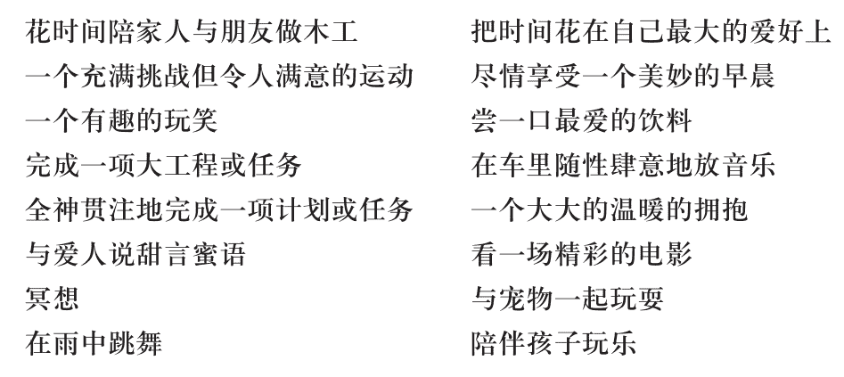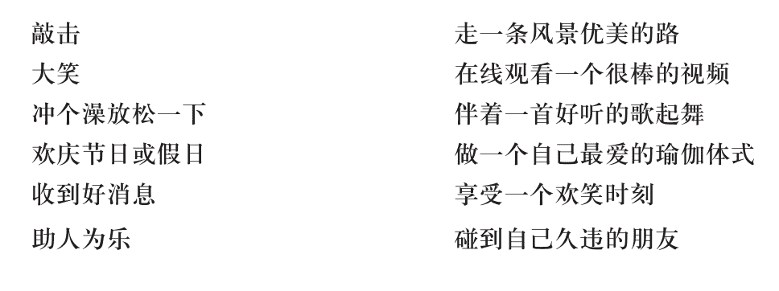

每一项追求都能振奋你的精神，给你一天的生活增添色彩。

有多少幸福时刻对你来说是真实的？你还可以在这个列表中添加些什么？

现在，花点时间列出最近让你感到快乐的事项。

______________________________________________________。

读一读你写的欢乐时刻表，看看自己有多么（或多么不）愉快。

### 不起眼的选择

希腊语中最接近“幸福”的单词是 eudaimonia。它的字面含义是“世界上存在着善良的精灵”，但它的准确含义更接近“人类繁荣”。不过，与易逝的幸福感不同，eudaimonia 是一种生活方式。亚里士多德（Aristotle）曾指出，它不仅涉及欢乐与惬意，还代表对学习的追求。

Eudaimonia 并不是财富、爱或功成名就等外部环境的产物。同样，拥有 eudaimonia 也不需要任何特定的外部环境。事实上，它是我们人类本能想要实现的目标。

从许多方面来看，eudaimonia 同样也是本书的主旨，即展现最完美的自己，进而活出最好的状态。

若想在这一境界不断提升，亚里士多德强调我们要选择自己的发展方式。想要展现最完美的自己，活出最精彩的人生，我们就要积极地追求成就感与自我价值，而不是被动地等着“它”——等着快乐、金钱、爱、目标、热情和精神生活主动来到自己身边。

Eudaimonia 听起来像个宏大的思想，但归根结底，它与日常生活中各种微不足道的选择息息相关。

我们是选择此刻活出精彩，还是选择活得没什么价值感呢？

我在写作前泡上一杯最爱的茶，其实就是选择了自我熏陶。通过这种方式，我不仅变得更高效多产，还能享受写作的过程。这样，我就达到了最极致的双赢。

小插曲

很少有人比苏斯博士（Dr. Seuss，出生于 1904 年 3 月 2 日，20 世纪最卓越的儿童文学家、教育学家。——译者注）更能捕捉到 eudaimonia 的精髓：启程向美好的前方跋涉吧！今天属于你！等着你的是崇山峻岭，快上路吧！

泡杯茶，按下音乐播放键，这就是我在面对截稿日期压力时选择的 eudaimonia。苏斯博士曾说：“是我自己选择了最好的终点，开始了跋涉之旅。”我的外部环境没有变化——截稿日期没变，工作量也没变，但我不再怀着沉重的心情面对截稿日期，反而感觉自己正在激动地迎接挑战。

前方还有哪些让人期待的终点？又是什么在阻碍着你前进？

### 让幸福来敲门

生活递给他一颗柠檬，

生活有时候就是如此。

朋友们同情地看着他，

猜想他已经被酸倒了。

过了会儿他们去看他，

只见他身子微斜，

一副悠然自得的样子，

啜饮着一杯柠檬汁。

这首诗最初被刊登在 1940 年的《扶轮》月刊（*The Rotarian*）上，意指最著名的说法——将柠檬变成柠檬汁。

不过，让我们更坦诚一点吧。当我们身处逆境，感觉自己陷入压力的旋涡时，其实不太可能将代表问题的柠檬转变为一杯柠檬汁。在那样的情况下，我们清醒地知道自己的生活环境，包括财务状况、交往关系、身体健康、家庭情况都需要改变。但问题在于，无论是全神贯注地“修补”外界环境，还是只做该做的事情，我们仍会被压力和恐慌压倒。

当把快乐和满足感融入日常生活中时，我们便选择了 eudaimonia。而一旦做出这样的选择，我们就会发现周围的环境随着自己想法的改变而改变了（而不是环境改变选择）。

只要在日常体验中融入些许（或大量）的幸福感，我们就会觉得生活更多彩，自己也更有成就感，而事实也的确如此。

### 第 15 天　挑战最完美的自己：幸福感终会不请自来

尽管气候潮湿，天气阴沉，但我们仍有很多趣事可做。

——苏斯博士

我们在待办事项上划掉了一个又一个任务，结果却发现自己的清单越来越长。我们做得越多，就越容易发现自己做得还不够。

今天，你的挑战就是在纸上或在电子产品上记下三种方法，让你的任务变得更吸引人。听歌？点燃蜡烛？任务开始前和结束后跳一小段舞？边走边唱？

你还是感到压力沉重吗？如果你的脑子里只有任务，那你就很容易充满恐惧与烦躁。你需要一边思考，一边敲击。你需要观察自己的情绪起伏，努力清除不良情绪。你会发现，一旦自己开始这样做，幸福感就会主动在脑海中浮现出来。

写下上述列表，指定一天来完成任务（不要停，现在就将这个列表加入你的日程），或者至少让自己有明显的进展。时间快截止的时候，一定要从列表上摘选几个能增进快乐的事情，让你的整个体验更加愉悦，然后观察自己的感受。在完成任务的过程中，你有没有感到更加愉快？你是否不再害怕自己完成得不够多？你的效率有没有提高？

按照自己的需要，尽量增加一些愉快的体验来减轻思想负担，接着观察每一个事项做完后你的情绪体验。

当你完成了更多事项、体验到了更多愉悦感时，你就会发觉自己找到了最佳的组合。

第 15 天的敲击冥想：不起眼的选择，带来更多欢乐，详见附录第 291 页。

花点时间将第 16 天的练习加入日程。你可以继续保持这个进度，也可以根据自己的情况稍做调整。现在正式进入第 3 周的疗愈练习。我们将有更大的进步，所以，请一定要全程保持敲击！在第 16 天，你会发现成就最完美的自己的核心要素：如何练习自我接纳。我们同样会从新鲜惊奇的视角来认识自我接纳。

小插曲

啊！你感受到了吗？

如果还没有，那种内心深处如释重负的感觉就要扑面而来了。

敲击的次数越多，你就能更快、更彻底地感受到什么叫如释重负。敲击能最有效、最迅速地清理掉那些无益于你成长的因素。

所以，继续敲击，继续阅读本书。

你真的很棒！

还有一件事，有时候敲击给你带来的改变可能在长时间内难以察觉。你变得更加快乐，但你早已不记得自己以前的感受。你变得更加冷静，但你以为这一切都是必然的。

所以，稍微花点时间认真想想：“我现在的状况与刚开始读这本书时相比有什么不同？”

赶紧承认自己的进步吧，进步不论大小！

# 第 16 天　接纳不完美的自己

窗外漆黑一片，只有鸟儿正在尖声鸣叫，仿佛在叫嚣着外面的世界都属于它们。远处层峦叠嶂的山峰就像巨大的黑色石头一样连绵起伏，让人只看得清那嶙峋的线条。

不到 5 点，第一个起身的僧侣便撞响鸣钟，叫醒了整个寺庙的人。接着，所有人开始清晨打坐——冥想 3 个小时。打坐结束后的鸣钟通常标志着一天的主餐开始，僧侣先用膳，之后依次是俗家弟子和施主。

每天早晨，人们都要花时间自理，他们既要锻炼，也要工作。寺庙里没有高科技，也没有什么物质可供享受，因此所有僧侣每日必须亲手照料大殿，打扫庭院。主餐过后，正午还有一顿，主要是上一顿的剩菜剩饭。这都是些粗茶淡饭，分量极不起眼。有些寺庙严禁午餐后再进食，只允许人们喝一些热饮。整个下午，僧侣们都会学经诵经，之后于晚间集合，再打坐冥想几个小时（比清晨稍长一些）。接着，他们才会就寝，然后第二天早早起床，重复与前一日相同的作息。

这就是佛教僧侣的日常生活。当然，这也只是小小一窥。

他们没有待支付的账单，不用在拥堵的交通环境里挣扎，也无须给别人回电话。此外，他们也极少与外界联络，不会被各种设备的响声所打扰。尽管一些僧侣会定期离开寺庙，去外面宣讲布道，但他们每天仍然会坚持打坐冥想几个小时，回归简单规律的寺庙生活。

正是这种规律的作息和长时间的打坐冥想，向我们解释了为什么针对僧侣的脑部扫描会显示他们的大脑容量在不断增加，衰老速度在逐渐变慢，更易表现出快乐与悲悯……

可以理解的是，我们阅读佛经，也是希望减缓衰老。同样，我们也想体验冥想的快乐。我们不断阅读，希望对自己的思想与身体有更多的掌控权。但生活如此忙碌，科技又大行其道，如果我们仍追求田园牧歌般的宏大愿景，到底会将我们自身推向平静之地，还是推离呢？

明确地说，我没有暗示你放弃一切身外之物皈依佛门的意思。我的意思是，我们中有许多人都热切期盼着远在天边的愿景，但它很可能会将我们推离平静之地。既然已经在日常生活中融入了更多幸福与快乐，那么，我们就要朝着这个方向更进一步。下面我们将学习如何在现代的真实生活体验中更好地接纳自己。

### 爱自己≠接纳自己的全部

我们生活在一个崇拜极端的文化中，潜移默化的训导会让我们以为追寻精神生活就是努力活得像个僧侣，认为成功就是活得“完美”。同样，每当学习自我接纳与自爱时，就有人告诉我们要爱自己的全部。

但事实是：有时，我们早晨醒来是有口臭的；有时，如果我们不坚持冥想或敲击，整天都会过得很崩溃；有时，也许我们觉得自己状态很好，但更多时候，我们会感受到压力、焦虑与无聊；有时，我们甚至会在夜里无法入睡，我们的身体机能也无法很好地运作。

这就是生活的真相。我们都是肉体凡胎。

因此，想要展现最完美的自己，不断练习自我接纳和自爱至关重要。

但是，事情是这样的：你如果想竭尽全力地来接纳自己的全部，无条件地爱自己，那就过度了，也很容易招致失败。

你无条件地接受自己起床时的口臭吗？

你无条件地接受自己的坏心情吗？

可能并非如此吧。

你可能更想每天早晨起床后先刷牙，再叫上好友练习敲击，敲走一天的烦恼。

这很棒！你正在积极向前，改变自己不想接受的事情。

练习接纳自己的全部和无条件地爱自己的确是个好想法，但是如果我们太理想化了，只会让自己与真正的自我接纳与自爱渐行渐远。

我们中的绝大多数人都不是住在山顶的僧侣。我们的日常作息安排常常不可预见，我们经常遇见的那些人（包括我们自己），也几乎不会每天花五个小时来冥想。（不过，能遇见每天花五分钟来冥想的人已经是非常难得了！）

这就是生活的真相。我们都是肉体凡胎。

如果你很少按照自己的意愿去敲击或者冥想，没有关系。同样，如果你意识到自己的私人关系、财务状况和房子的环境都是一团糟，必须全力解决，也没有错。

问题是，当面对生活中繁杂混乱的事情时，你还能接纳自己吗？

这里是我的一些想法。

是时候降低接纳自己的门槛拯救自我了！要知道，我并不希望你全权接受并爱自己的一切。我们都有自己不喜欢的特点、习惯和怪癖，都希望自身或生活中会发生一些改变。作家、精神大师、导师以及律师，包括我自己，都有一些相同的问题。

那么，我们如何练习并真正地实现自我接纳呢？

### 从你感兴趣的事入手

就像你做饭时会意识到自己需要多加点盐、多加点调味料一样，这就是我们即将练习自我接纳的方法。

要学会对自己好一点，更接纳自己一些。

你现在能接受自己的什么小问题（或大问题）！？

我在第 15 天的内容里提到，我很喜欢煲电话粥。当然，我也很擅长，甚至很享受这件事。但这根本不是什么拿得上台面的技能，甚至有些人可能会说（我表示理解）我这样显得很蠢。不过，希望你能专注于自己感兴趣的事，一些你信手拈来又不用非得鼓励自己才能做到的事。

你是否可以花点时间来观察自己具有感染力的笑声、出色的园艺技能，以及发短信时善于使用各种搞笑表情包的天赋呢？

挑选其中一种你愿意接纳的积极特质或技能吧！

当你关注那个特质时，你的直觉是什么？你会在无意中对它嗤之以鼻，觉得它毫无用处，还是会觉得这算得上是一种天赋？在 0～10 分的范围内，给“我能接受这种特质或技能，但它一点都不重要”这个陈述的真实性打分。

现在开始做三次深呼吸。首先敲击三下手刀点。

手刀点（重复三次）：尽管我接受自己的这种特质或技能 __________（说出名称），但它一点都不重要，不过，我现在选择对它抱有好感。

眉毛内侧：这种特质或技能 __________（说出名称）……

眼睛外侧：与其他事相比，它似乎一点也不重要……

眼睛下方：还有许多我无法接受的更重要的事情……

鼻子下方：有许多关于我自己的事情，我都不喜欢……

下巴：这种特质或技能 __________（说出名称）……

锁骨：很难让人感觉到它的重要性……

腋下：它只不过是 __________（说出名称）……

头顶：还有许多更大的问题需要我去解决……

眉毛内侧：这种特质或技能 __________（说出名称）……

眼睛外侧：看起来没那么重要……

眼睛下方：其实看起来也挺没意义……

鼻子下方：还有许多更重要的问题需要我去解决……

下巴：这种特质或技能 __________（说出名称）……

锁骨：或许我能对它有好感……

腋下：或许我能让它比一般情况下显得更重要一些……

头顶：这种特质或技能 __________（说出名称）……

眉毛内侧：我现在就可以让它变得重要……

眼睛外侧：我可以让自己真心对它有好感……

眼睛下方：这种特质或技能 __________（说出名称）……

鼻子下方：我可以让它变得重要……

下巴：我可以现在对它有好感……

锁骨：我不会再低估它的重要性……

腋下：我会真心地对 __________（说出名称）有好感……

头顶：现在，我要让自己对它有好感……

再一次深呼吸，然后在 0～10 分的范围内，给自己的某种积极特质或技能的重要性打分。持续敲击，直到你获得自己想要的接受度和平静感。

### 点亮人生之灯

既然你已经开始关注自己的某一种特质或技能，那么下一步，就去注意那些让你感到开心的事情吧！

这可以很简单。譬如，你不是僧侣，因此每天都能睡在一张舒适的床上就是一件令你很开心的事情。

现在，选一件生活中你能接受的积极的事情。

请仔细思考，相比于其他你想改变的事情，这件事情是多么的微不足道。在 0～10 分的范围内，给它的相对不重要性打分。

做三次深呼吸。首先敲击三下手刀点。

手刀点（重复三次）：尽管这件事 __________（说出你选的这件事）与生活中其他我想改变的事情相比并没有那么重要，但我还是对它有好感。

眉毛内侧：这件事 __________（说出你选的这件事）……

眼睛外侧：看起来不算什么……

眼睛下方：与其他我要改变的事情相比，它不算大事……

鼻子下方：这件事 __________（说出你选的这件事）……

下巴：似乎并不重要……

锁骨：似乎不值得我去注意……

腋下：它一点儿也不值得……

头顶：这件事 __________（说出你选的这件事）……

眉毛内侧：我可以接受……

眼睛外侧：虽然它似乎不怎么重要……

眼睛下方：我可以接受它……

鼻子下方：我对它有好感……

下巴：这件事 __________（说出你选的这件事）……

锁骨：我可以让自己接受它……

腋下：我现在喜欢上它了……

头顶：虽然它很无关紧要……

眉毛内侧：我现在对它有好感……

眼睛外侧：也许我能增强对它的好感……

眼睛下方：也许我能培养一下对它的好感……

鼻子下方：也许我可以关注生活中其他能接受的事……

下巴：我想改变生活中的一些事情……

锁骨：但还有一些事情我能接受……

腋下：而且我对它们都有好感……

头顶：我可以培养自己对生活的好感……

深呼吸，再一次用 0～10 分的分值给这件事情的不重要性打分。持续敲击，直到你获得了自己想要的接受度和平静感。

### 第 16 天　挑战最完美的自己：与镜子中的你对话

如果我问你，你不喜欢自己的哪些方面，我敢打赌你肯定能快速地列出一堆。如果我问你，你爱自己的哪些方面，你会迟疑吗？如果你对第二个问题的回答是“对”或“也许吧”，那就证明大脑中的负面偏见正在左右着你。

因为这种偏见是你生存本能的一部分，所以你从来没想过要摆脱它。但最重要的是，你应该（以各种方式）不断关注它给你带来的负面影响。

今天，你的挑战就是观察负面偏见是如何影响了你对自己的看法。

接着，你可以采用不同的方法来进行修正，例如对着镜子里的自己说话，或者敲击。

我明白，对着镜子说话似乎有点奇怪。说实话，尽管我是露易丝多年的粉丝兼好友，但直到最近，我才开始练习对着镜子说话，而这正是露易丝最喜欢的方法。

第一次这么做的时候，我感觉很怪异。而一旦放松下来，我就发现自己充满了不可思议的力量。

所以，首先找到一面镜子，然后看向镜子里自己的眼睛。

试着对自己说些好听的话。如果你感到消极或者大脑一片空白，试着顺其自然，并立刻开始敲击，直到你感觉放松或头脑清晰。

继续看着自己的眼睛，重复说一件积极的事情，同时逐点敲击。保持这个做法，直到你相信自己正在说的，并且感觉良好。

在你与自身的关系中培养这样一粒积极的种子，让它茁壮成长，然后再寻找看看还有什么正能量也能随之发展壮大。

花点时间完成第 16 天的敲击冥想：将自己的杯子盛满。你可以在附录第 294 页找到它。

不过，首先要确保将第 17 天添加到你的日程表中。请选个日子集中精力来读这本书，并完成第 17 天的敲击练习。你会发现，即便是一个简单的词语也拥有着巨大的力量，能改变你与自身以及与他人的关系。

# 第 17 天　别做人见人爱的“巧克力”

一个美丽的夏日清晨，我的妻子布伦娜（Brenna）走进办公室找我聊天。她得做个决定，想找我拿主意。

那是一个周一，她计划带着我们的女儿去朋友家赴约。但是前一周的周末，我们玩得尽兴又忙乱，布伦娜觉得很疲惫，只想利用周一上午的时间为下一周的工作做准备。

她给朋友打电话说明了自己的犹豫，朋友却催促她赶紧上车，无论如何也要过去玩。布伦娜之前已经调整过约会的日期了，如果现在说没时间，场面一定会变得非常尴尬。

虽然很想拜访朋友，但布伦娜再也提不起兴致了。

现在她面对的只有选择，选择，无尽的选择！

我们每天都面临着大大小小的选择。有些选择看似简单，却依旧让人难以做决定。除非我们自己能划出一个界限，明确我们到底想为自己、为生活做些什么，否则每天面临的各种各样的选择只会让压力累积，最终让我们与自己、与他人的关系变得更加紧张。

### 当我们内心想拒绝，嘴上却说“可以”的时候

唐（Don）是哈佛商学院（Harvard Business School）的一名学生，他觉得没有必要每晚都出去玩。一些同学喜欢频繁出入各种社交场合，但这种过于活跃的社交生活让他不堪重负。哪怕只有一次没有出去玩，他都会被别人注意到，接着，他就会遭遇一连串“关切”的询问。“你昨晚去哪儿了？”同学们会问，“昨晚怎么没看见你？”

在哈佛商学院，人们认为一名出色的学生不仅要考出优异的成绩，还应该拥有自己的社交网络。那些没能建立起社交网络的学生通常会被认为是差生。正如唐的一个朋友所说：“社交在这里简直成了一项极限运动。”

有一年暑假，唐在中国工作。他因乐于倾听、善于思考而受到公司和领导的重视。在这里，他不需要频繁社交，也不必刻意攀谈，他只需要做回自己，这是就读哈佛商学院以来他第一次感到放松。但是假期结束返回哈佛后，他又不得不强迫自己装出外向的样子。每天晚上，即便很想拒绝自己的同学，他仍会选择和他们出去玩。

唐的故事来自苏珊·凯恩（Susan Cain）的《安静》（*Quiet*），这本书关注了很多人都会思考的一个问题：我们足够外向吗？

与唐一样，许多人都在社交旋涡中答应了本想拒绝的邀约。

与唐一样，许多人因担心拒绝别人会导致不良后果而犹豫不决。

我们担心拒绝会伤害他人，会让自己错失重要的机会，所以我们只能违心地选择答应，并误以为这样就能避免摩擦。

不幸的是，当我们内心想要拒绝，嘴上却说“可以”的时候，我们享受平静与接纳自己的权力也随之被剥夺。该如何在答应与拒绝之间建立一个良性的平衡呢？首先，我们要做的就是看清自己的意愿。

### 讨好全世界，倒不如取悦你自己

又是个美丽的一天，或者说，这应该是个美丽的一天。你从睡梦中醒来，睁开双眼，望向窗外，但窗外是一个阴沉的世界。窗外浓雾弥漫，让人压抑，这种感觉简直糟糕透了。

多年后，你惊讶地发现，原来你每次努力望向外面时，都透过了一扇沾满了灰尘和污渍的窗户。所以无论你多么用力地向外望，无论你多么渴望阳光，你都看不到窗外真实的景象，因为玻璃窗上的灰尘太厚，厚到阳光无法照进屋子，厚到你无法看到窗外鲜花盛开的样子。虽然你的窗外是一个色彩斑斓、充满阳光的世界，但窗内的你只能看到灰蒙蒙的一片。

如果你能早点发现窗户上的污渍那该有多好啊……但无论是窗户还是外面的世界，它们都是无辜的。

这就像我们习惯了勉强自己答应别人做那些我们内心其实很想拒绝的事情一样。我们没有遵照内心的渴求与期盼，所以无法看清眼前美丽的世界。前进的道路上有如此厚的灰尘，我们怎么可能成就最完美的自己呢？当然，这使得我们更不可能活出精彩的人生。

正如露易丝·海所说，我们在遵照内心、拒绝别人的时候，其实是在接受自己。一味地接受别人，其实是在拒绝自己，而长期缺乏自我接纳会阻碍我们的视野。

只有不再拒绝自己的情绪或观念，我们的内心才会窗明几净（这个比喻十分贴切，同样适用于日常生活的方方面面，比如我们固有的观念会阻碍自己体会到最期待的快乐）。那么，我们如何才能让自己的视野变得清晰呢？让我们一起来做个练习。在此之前，我见证过很多通过这个练习让人们学会拒绝的事情。

现在，想象一个你想拒绝却又不得不答应的场景。那是一个你必须接受的邀请或不容错过的机会吗？还是你不能拒绝的朋友或爱人？

如果你回忆不起过去的事情，试着想象一件即将面对的、让你不知所措的事情，最好是那种你内心想拒绝却被自己的情绪推波助澜而点头答应的事情。在 0～10 分的范围内，请你对自己本想拒绝却又答应某件事时产生的无力感打分，10 分代表极度不知所措。

做三次深呼吸。首先，我们依然从敲击三下手刀点开始。一边敲击，一边思考这件事情的真实状况，尽可能地让自己身临其境。

手刀点（重复三次）：尽管我在想拒绝的时候意识到自己不得不答应，但我还是爱着自己，并接受我的感受。

眉毛内侧：我不得不答应……

眼睛外侧：我无法拒绝……

眼睛下方：我想拒绝……

鼻子下方：我需要拒绝……

下巴：但是我不得不答应……

锁骨：我很纠结……

腋下：我无法拒绝……

头顶：我不得不答应……

眉毛内侧：想到这里，我感觉自己无能为力……

眼睛外侧：尽管我必须拒绝，但我无法说出口……

眼睛下方：我感觉自己无能为力……

鼻子下方：这种无能为力的感觉……

下巴：太无能为力了，我不得不答应……

锁骨：有时候我想拒绝……

腋下：但我不得不答应……

头顶：这种无能为力的感觉……

眉毛内侧：我不得不答应的这种无能为力感……

眼睛外侧：我现在能感受到……

眼睛下方：我现在可以释放……

鼻子下方：我能努力划定新的界限……

下巴：这是个过程……

锁骨：我现在可以释放这种无能为力感……

腋下：我能感到平静……

头顶：而且我相信自己能改变现状……

深呼吸。现在你觉得自己的无力感有多强烈？在 0～10 分的范围内打分。持续敲击。你可以继续重复数次，或闭上双眼，一边让某件事不断地盘旋在自己的脑海中，一边敲击。观察自己的感受。你想到了什么？有什么感受涌上来？继续敲击，直至你感到放松。

### 别人的快乐，你无法负责

一天早上，我登录脸书，看到下面这句话时止不住地大笑起来：

别再努力取悦别人了，你又不是人见人爱的巧克力。

你是否经常以牺牲自己来取悦别人呢？生活中，在什么情况下你会努力做一个人见人爱的“巧克力”？

事实上是，我们无法一味地答应他人，也无法总是拒绝他人。

回想过去，我们会发现那些花大量时间和精力来与他人打交道的人，总是有着较好的意图。布伦娜的朋友希望与她熟络起来，以便共同度过一个愉快的夏日早晨；哈佛商学院的同学不断鼓励唐去社交，希望社交能给他未来的职业生涯带来助力。

他们的初衷都是积极的。但是无论他人是否出于好意，我们若不尊重自己的内心，将不可避免地感到无能为力。因此在答应之前，你可能还有时间选择拒绝，我敢保证在生活的诸多方面，你还有许多拒绝的机会。

在用敲击克服委曲求全并舒服地拒绝别人之前，我要说一个你可能知道但常常抛诸脑后的事实：别人的快乐你无法负责。我知道，这个事实出乎许多人的意料。你就是这样，总认为自己能通过取悦别人来拯救世界。当然，我并不是说你的爱心、关心和同情心一无是处。

你可以关心别人。你可以爱护自己的家人与朋友，但如果这份关心总是源于自我牺牲、无能为力、愤怒或怨恨，那你将不可避免地被负能量所击垮。你不是人见人爱的巧克力。没人能取悦所有人，尤其是我们在连自己都缺少时间、空间和精力的情况下。

按照自己的需求，学着去拒绝，给自己更多的时间和空间去练习敲击、锻炼身体、联络亲朋好友、打盹儿、创造些东西等，许多滋养精神的追求都能帮助你成为最完美的自己。

### 想象一下说“不”

集中注意力，回忆一下你想变成巧克力取悦别人的时候，让那种情绪——你明明想拒绝但不得不答应的紧张情绪在内心不断起伏。

想象自己与某个人相处的情景。想象别人正在要求你做些什么，而你想拒绝又不得不答应。想象某个人的脸，或者你必须回复的短信、邮件和电话。在脑海中重新想象各种情况。同样，关注自己想拒绝却开口答应时的生理反应——痛苦、紧张、热或冷等。这些都是你的心、思想和身体抗拒你说“是／好”时的表现。

当答应对方时，你在情绪上、精神上、生理上的不适感受有多强烈？根据 0～10 分的分值来打分。

做三次深呼吸。我们将从敲击三下手刀点开始。

手刀点（重复三次）：尽管我在说“是／好”的时候很抗拒，不得不答应他，但我还是爱自己，并接受自己的感觉。

眉毛内侧：我不得不答应……

眼睛外侧：但我想拒绝……

眼睛下方：全身上下都不想答应……

鼻子下方：但是我有义务答应……

下巴：感觉不可能开口拒绝……

锁骨：拒绝或许会很危险……

腋下：我不得不答应……

头顶：我无法拒绝……

眉毛内侧：我想拒绝……

眼睛外侧：我必须拒绝……

眼睛下方：但我不得不答应……

鼻子下方：感觉太难拒绝了……

下巴：拒绝或许会很危险……

锁骨：我不得不答应……

腋下：我总是开口答应……

头顶：他们都希望我答应……

眉毛内侧：我感受到了拒绝的紧张感……

眼睛外侧：我感到自己应该多忠实于内心，开口拒绝……

眼睛下方：尽管拒绝感觉很危险……

鼻子下方：我会学着多忠实于内心，开口拒绝……

下巴：我害怕开口拒绝……

锁骨：但我更为开口答应感到生气……

腋下：我现在感到这种紧张感……

头顶：我现在觉得很心安……

深呼吸。再一次回到自己的想象中。想象自己正与某个人处在某个情境中，你想拒绝对方却又被迫答应。想象那个人正在要求你做一件事。你原本想拒绝，可他不仅当面找你，还给你发邮件、发短信，甚至打电话求你。想象自己接到这个要求时的心情，思考一下应该如何回复。

你的情绪如何？逐点敲击，口述这种情绪，并让自己感受到它。

手刀点……眉毛内侧……眼睛外侧……眼睛下方……鼻子下方……下巴……锁骨……腋下……头顶

手刀点……眉毛内侧……眼睛外侧……眼睛下方……鼻子下方……下巴……锁骨……腋下……头顶

手刀点……眉毛内侧……眼睛外侧……眼睛下方……鼻子下方……下巴……锁骨……腋下……头顶

继续敲击。如果你准备好了，那就开口说出自己要做的选择，包括你渴望自己拒绝以及你不得不开口答应时的感受。

手刀点……眉毛内侧……眼睛外侧……眼睛下方……鼻子下方……下巴……锁骨……腋下……头顶

手刀点……眉毛内侧……眼睛外侧……眼睛下方……鼻子下方……下巴……锁骨……腋下……头顶

手刀点……眉毛内侧……眼睛外侧……眼睛下方……鼻子下方……下巴……锁骨……腋下……头顶

如果你准备好了，那就想象自己开口拒绝的情景。如果拒绝后感到很难受，你可以说说下面几句话：

今天不太适合说这个，让我换个日子说。

今天不适合说这个。

谢谢，我现在还做不到。

不，感谢你自己！

当你继续想象自己仍然处在那个情境中时，一边说不，一边逐点敲击。

手刀点……眉毛内侧……眼睛外侧……眼睛下方……鼻子下方……下巴……锁骨……腋下……头顶

一边开口拒绝一边敲击，并注意你的感受。你害怕收到回复吗？你觉得拒绝别人会有什么后果？继续练习，感受自己在拒绝别人时的心情。

手刀点……眉毛内侧……眼睛外侧……眼睛下方……鼻子下方……下巴……锁骨……腋下……头顶

如果你不再害怕拒绝别人，那就想象一下自己可能得到的回复。别人会感到生气还是疑惑？你会担心自己失去某个机会或不再被邀请吗？

手刀点……眉毛内侧……眼睛外侧……眼睛下方……鼻子下方……下巴……锁骨……腋下……头顶

手刀点……眉毛内侧……眼睛外侧……眼睛下方……鼻子下方……下巴……锁骨……腋下……头顶

一边思考别人的回复，一边保持敲击。

手刀点……眉毛内侧……眼睛外侧……眼睛下方……鼻子下方……下巴……锁骨……腋下……头顶

手刀点……眉毛内侧……眼睛外侧……眼睛下方……鼻子下方……下巴……锁骨……腋下……头顶

手刀点……眉毛内侧……眼睛外侧……眼睛下方……鼻子下方……下巴……锁骨……腋下……头顶

深呼吸，直到你能冷静地面对别人的回应。

如果你准备好了，那就开始敲击，从头想象整个经过。请在大脑中过一遍整个过程——被要求，拒绝，收到回复。

手刀点……眉毛内侧……眼睛外侧……眼睛下方……鼻子下方……下巴……锁骨……腋下……头顶

手刀点……眉毛内侧……眼睛外侧……眼睛下方……鼻子下方……下巴……锁骨……腋下……头顶

手刀点……眉毛内侧……眼睛外侧……眼睛下方……鼻子下方……下巴……锁骨……腋下……头顶

根据自己的需要，一边敲击，一边多想几遍整件事情。如果你完成了整个过程却丝毫不感到紧张，那你就成功了！

### 第 17 天　挑战最完美的自己：不做违心的承诺

我们点头答应，内心却想摇头拒绝。我们对别人竖起表示赞赏的大拇指，心里却根本不那么认为。

我们与别人的互动就像糖浆一样甜，可等到要履行诺言的时候，才发现自己从一开始就不想做出承诺。

接下来的 24 小时里，你的挑战是在 60 秒内，即整整一分钟内做出选择，然后回复那些要求你花费时间、精力去做事的人。针对所有的要求都来一遍，包括那些听起来很吸引人的要求和强制性要求。

首先，在这一分钟内记录自己的感受。大多数人都或多或少能体会到无奈，哪怕面对的是一些很小的要求。无论你的情绪如何，先停下来观察。接着，请一边感受自己的情绪一边敲击，注意到自己的心里究竟是怎么想的。

花一分钟的时间观察并记录自己。

观察、记录自己。这并不意味着拒绝一切要求，而仅仅是清楚自己内心的选择。

对布伦娜而言，“记录”的结果就是重新安排去朋友家玩的时间。这样，她不仅能度过一个愉快的周一，还能全身心地享受新的玩耍时间。

对自己要有所馈赠。要时刻清楚自己想要体验什么样的生活，清楚自己想将精力花在哪里。

只要保持清醒，你就可以亲眼见证生活正在发生质变。

请确保完成第 17 天的敲击冥想：我不是人见人爱的“巧克力”！。详见附录第 297 页。

当然，又到了将第 18 天加入日程表的时候！选一天，可以是明天，也可以是三天后，然后全神贯注地读这本书，并练习敲击。那时候，你会发现给自己讲的这些故事能真正彻底地改变自己的生活。

# 第 18 天　改写属于你的人生故事

接下来，我要跟你说一段有着两个真实版本的故事。边读边试着猜猜这个故事里描述的是哪位公众人物或者历史人物。

首先是版本一：

小 X 家里有三个孩子，他是老大。当小 X 还在上小学的时候，他的父亲离家出走，母亲染上了嗑药的恶习。

多年来，母亲再婚数次，但小 X 作为长子，始终坚持照顾整个家庭。除了竭尽所能地保护弟弟妹妹不受家庭因素的影响外，小 X 还经常给母亲跑腿——母亲不肯离开原来的房子。许多次，母亲都以药丢了为由，打发小 X 到药店去求更多的止疼药。数年过后，小 X 才意识到，母亲一直在撒谎，她是在企图掩盖自己服用了过量止疼药的事实。

随着小 X 渐渐长大，母亲对他的依赖也逐步转变成了暴力。由于害怕儿子不再照顾自己，她开始以施虐的方式来寻求他的重视，这些方式包括灌儿子喝洗洁精，令他呕吐不止。

幸运的是，在小 X 上高二的时候，一位老师成了他的伯乐。老师认识到小 X 人际交往的天分，就给了他一篇演讲稿，并表示如果稿子能引起他的共鸣，便让他参加演讲比赛；如果他没什么感觉，便就此作罢。

小 X 读了稿子，顿时热泪盈眶。那篇演讲稿讲的是永不放弃，与他努力克服童年阴影——母亲的药瘾，自己常年的食物不足、受虐，以及 7 岁那年被父亲抛弃的经历惊人地相似。最终小 X 参加了演讲比赛，并荣获第一名。此后，他一次又一次地参赛，每次都能斩获冠军。

这些成功的参赛经历在他心里种下一颗希望的种子，让他找到接触他人的方法。可是家里的生活状况，尤其是母亲的精神状况却每况愈下。终于，在小 X17 岁那年，母亲拿着刀将他赶出了家门。他离开了母亲的房子，再也没有回去。

小 X 没有上大学，而是成了一名保安。在很长一段时间里，他都无家可归，不得不开着车四处漂泊。时光飞逝，几年后，小 X 开始做宣传策划工作，后来又成了一名教师。30 岁出头的时候，他的事业开始腾飞，他的故事影响了全世界数百万人，甚至包括一些名人和思想导师。他创立的基金会促进了扶贫事业的发展，解决了每年数百万人的温饱问题。

知道他是谁了吗？

这里还有第二个版本：

作为世界上最著名的励志演说家之一，小 X 改变了全球数百万人的生活。各国领袖和知名人士，包括比尔·克林顿（Bill Clinton）、戴安娜王妃（Princess Diana）、特蕾莎修女（Mother Teresa）、米哈伊尔（Mikhail）、戈尔巴乔夫（Gorbachev）和纳尔逊·曼德拉（Nelson Mandela）都曾受到他的帮助。当然，体育明星也不例外。

小 X 每年都会前往世界各地，向 400 多万人分享他激励人心的话语。他还通过写畅销书、制作在线视频等项目影响了 5000 多万人。

有些人认为，小 X 之所以能获得成功是因为他悲惨的童年，成年后又跟癌症做斗争，第一场婚姻也以失败收场。然而，小 X 坚信童年的困境对自己的影响最大。从小到大，母亲酗酒嗑药和长期缺少食物让他饱受生理与心理的创伤，但是他没有被这些经历影响，反而下定决心打破这种现状，阻止身边的人陷入自暴自弃的旋涡中。

如今，尽管小 X 已成为十几家公司的合伙人（这些公司的年收入总额达 50 亿美元），但他仍坚持不懈地帮助人们改变自己的生活。此外，他还将扶贫视为头等大事，他的基金会每年都会扶助数百万人。现在，他已经是一个 4 岁孩子的父亲，一家人其乐融融。众所周知，他本人台上台下都拥有真性情。

小 X 是……

你猜到了吗？

是要我告诉你，还是你继续猜下去？

开玩笑的！小 X 就是托尼·罗宾斯。

给你一分钟时间思考，哪个版本的故事打动了你？

在第一个版本中，当你读到他被赶出家门，无家可归，只能去做保安那部分时，你是否瞬间觉得“哦，这人要完了……”？

在读第二个版本的时候，你有什么不同的感觉？你是否在他获得成功时感到欣慰呢？是否觉得第二个版本中的他变得更自信，更有能力，也更强大了？

很显然，这两个版本各有特色，重要的是，我们不能忽视它们给我们带来的感官体验。

他在什么时候会显得很软弱，甚至绝望呢？他又在什么时候看上去像个英雄呢？

讲故事是我们最强大的沟通技能。但有个大问题更重要，那就是你正在讲述着自己哪个版本的人生故事呢？你的故事有没有强调自己正受到过往和当前事情的束缚呢？抑或是战胜逆境后，你勇敢地展现最完美的自己？在你给自己讲述的故事中，你觉得自己是个什么样的人？你能成为什么样的人？你的生活又会变成什么样呢？

今天，我们继续为朝着最完美的自己前进奠定基础，并运用敲击将失意版的人生故事彻底改写为励志版。

### 创伤后成长：你就是下一个蝙蝠侠

那些遭受创伤的人是如何重新振作（重新恢复活力），甚至更上一层楼的？这就是创伤后成长（Post-traumatic Growth），这也是一个逐渐受到关注的研究领域。

不知为何，许多人都是通过一个小男孩的故事了解到创伤后成长——那个小男孩亲眼目睹自己的父母被残忍杀害。他虽然遭受了毁灭性的心理创伤，但长大后仍热心地帮助那些饱受不公待遇和犯罪迫害的人。通过种种努力，他拯救了许多人的生命。

这个人是谁？

他是蝙蝠侠（Batman）。

无论是在小说中，还是在现实生活中，这种创伤后成长的故事都显得非常不可思议。

在我亲眼目睹的创伤性成长故事中，斯嘉丽·刘易斯（Scarlett Lewis）的故事最激励人心。2012 年，她那上一年级的小儿子杰西（Jesse）遭遇了新城小学枪击事件（Newtown School Shooting），最终不幸身亡。失去杰西后，斯嘉丽随我一起进行了几次敲击治疗。

在经历了丧子之痛后，斯嘉丽渐渐原谅了那个年轻的凶手。如今，她将心中闪耀的治愈之爱写进自己的书中，书名为《孕育治愈之爱：一个母亲的希望与原谅之旅》（*Nurturing Healing Love: A Mother’s Journey of Hope and Forgiveness*）。此后，她还成立了选择爱基金会（Choose Love Movement），一直活跃于治愈枪击事件幸存者的前线，帮助自己和幸存者的父母，以及教育工作者。

在那次夺走 20 名小学生生命的枪击事件后，我也通过敲击疗法基金会努力治疗了许多父母和教育工作者。但不可否认，他们平静的生活因为那场恶性事件而被打破了。

每个幸存者背后的故事都让人心碎，但又充满激励性。得益于敲击疗法，一个又一个幸存者克服了那场令人痛不欲生的创伤，最终回归正常生活与社区圈子，甚至做出了比之前更多的贡献。

平心而论，如果能抚平创伤，挽救逝去亲人的生命，让时光倒流，让亲人更注意当时的情况，他们所有人都宁愿付出一切。但当意识到一切都已无法挽回时，他们并没有就此消沉，反而做出了一些了不起的抉择。

那么，他们向自己诉说了怎样的故事？他们告诉自己生活还有哪些可能性？

### 打开心结，找到自己的光亮

还记得昨天寻找生活的开关，关注阳光，让阳光照进心里的练习吗？

为了找到生活的开关，你可能得先在黑暗中摸索一阵，穿过自己的内心与生活中感到黑暗的那部分。

当我治疗他人时，这种现象时常发生。运用敲击，他们可以找准方向，进入自己内心的黑暗世界，了解那些不断困住他们的难以消弭的情绪、回忆及束缚性信念。一旦释放了那部分情绪，他们就能找到属于自己的光亮，也能向自己述说鼓舞人心、催人奋进的人生故事。

回首过往，你仍会觉得黑暗吗？究竟是什么让你无法释怀？

现在，想想自己生活中的某一方面，例如人际关系、家庭状况、身体健康、财务现状，看看是什么让你陷入困难，无法成为最完美的自己。集中精力思考这个问题，并用 0～10 分的分值给自己的受挫程度打分。

做三次深呼吸。我们将从敲击三下手刀点开始。

手刀点（重复三次）：尽管我感觉自己无法摆脱生活中的这个方面，但我还是爱着自己，并接纳自己。

眉毛内侧：我感觉自己无法摆脱……

眼睛外侧：一想到 __________（说出生活中的某方面）我就觉得自己根本无力摆脱……

眼睛下方：我不知道如何摆脱……

鼻子下方：一想到 __________（说出生活中的某方面）我就觉

下巴：我觉得自己的出路被堵死了……

锁骨：好像没有能突破困难的好办法……

腋下：感觉根本无力摆脱这方面……

头顶：__________（说出生活中的某方面）有一段故事……

眉毛内侧：我必须要说出这个故事……

眼睛外侧：但我不清楚自己想要说什么……

眼睛下方：这个故事……

鼻子下方：这是个什么故事……

下巴：我不想说出这个故事……

锁骨：万一我在这个故事里迷失了自我呢？

腋下：我也许早已在这个故事当中迷失了自我……

头顶：我深陷其中无法自拔……

眉毛内侧：我必须要说出这个故事……

眼睛外侧：我现在就要说出来……

眼睛下方：说出来感觉很心安……

鼻子下方：我得让自己说出来……

下巴：我现在可以说出来……

锁骨：说出来感觉很心安……

腋下：我可以现在说出来，并感受自己的感觉……

头顶：我现在就可以感受到……

一边说出让你无法摆脱的故事，一边继续逐点敲击，让自己感受到内心涌动的情绪。一边口述，一边敲击，要说出自己认为这个故事可能或不可能发生的结果。一边口述整个故事，一边继续敲击，直到说完为止，并释放自己内心的黑暗，尤其是释放这个故事带给你的负面情绪和束缚性信念。

如果你能不带一丝负面情绪地说出这个故事，那你就已经成功地释放了自己的黑暗。这将是你书写第二版人生故事的起点。

现在，开始口述第一版人生故事，持续敲击。

现在，对于生活的这个方面，你可能会有怎样的感受呢？

描述第二版人生故事中最激励人心、催人奋进的愿景。一边开始探索这个新版故事，一边保持逐点敲击。继续敲击，直到你觉得这个版本更真实、更有可能性。

### 小练习：敲击人生的“痛点”

还在艰难挣扎着改写自己的人生？试试这个练习，它能让你更顺利地进行下去。

首先，集中精力思考自己想要改变什么。一般来说，每个人都有人生的“痛点”，例如人际关系、财务状况、身体健康、职业发展等。

填充以下故事中的缺失项：

我在我生活的 __________（填入你想改变的那个方面）感觉到 __________（填入积极的情绪）。

我现在能够 __________（填入积极行动，比如“轻松买单”“与我的搭档坦诚沟通”“好好睡一觉”等）。

这个新的体验让我 __________（填入你能采取的积极行动，因为你生活中的这个方面再也不是烦恼，例如“多运动”或“成为精神导师”，以及“保持对园艺的热情”）。

一边说出人生故事，一边持续敲击，让自己感受并释放随之而来的负面情绪。你也可以用这个方法解决其他问题，逐渐以更全面的视角看待自己的第二版人生故事是如何影响你的方方面面的。

### 不必恐惧未知

在舞台上，托尼·罗宾斯大方地宣布正是自己成就了如今的托尼·罗宾斯。他在网飞公司（Netf l ix，向北美观众提供付费服务的在线视频观看平台。——译者注）制作的纪录片《我非精神导师》（*I Am Not Your Guru*）中表示，自己最初总是努力取悦别人，但只有通过努力与决心，他才成为了最好的自己。他不是神奇般地就变成了现在的托尼·罗宾斯，他是付出了巨大的努力，才重新塑造了自我。

讲述自己的第二版人生故事，活出最好的自己，也是一个过程。而且新的故事并不总是让人感觉真实，即便你通过敲击驱散了心里的一些黑暗，你也仍可能告诉自己，你所讲述的那个崭新的励志故事听上去很假，让人觉得不真实，或者离现在的你太遥远。

没关系，你不过是害怕讲故事罢了。恐惧是一种自我保护的武器，但你不能因此而停下脚步。时间与你同在，你可以好好地把握它。

当你开始不知不觉地害怕起自己的第二版人生故事时，请停下来，用 0～10 分的分值给自己的恐惧强度打分。

做三次深呼吸。首先敲击三下手刀点。

手刀点（重复三次）：尽管我对自己崭新励志的第二版人生故事感到恐惧，但我还是爱自己、接受自己本来的样子。

眉毛内侧：这种恐惧……

眼睛外侧：让人手足无措……

眼睛下方：我无法相信这个新故事……

鼻子下方：这个新故事看上去不可能是真的……

下巴：不可能实现……

锁骨：因为太难了……

腋下：因为太宏大了……

头顶：我不可能成为那样……

眉毛内侧：我的生活不是那样的……

眼睛外侧：这个新故事……

眼睛下方：感觉很不真实……

鼻子下方：感觉不可能实现……

下巴：这个新故事像是个幻想……

锁骨：像一个我永远无法出演的电影……

腋下：这个新故事……

头顶：太过美好，太不真实……

眉毛内侧：我害怕相信这个新故事……

眼睛外侧：我害怕相信它……

眼睛下方：我害怕自己希望它成真……

鼻子下方：万一成不了真呢？

下巴：万一它太过美好、太不真实了呢？

锁骨：万一永远无法实现呢？

腋下：万一又可以实现呢？

头顶：要相信这个新故事实在是太可怕了……

眉毛内侧：我的旧版本故事很颓靡……

眼睛外侧：但相比而言，更让我感到慰藉……

眼睛下方：这个新故事听起来要很费劲才能实现……

鼻子下方：万一工作量太大了呢？

下巴：万一我无力承受呢？

锁骨：我感觉太恐惧了……

腋下：要我相信这个故事，我太害怕了……

头顶：这种恐惧……

眉毛内侧：我能从生理上感受到……

眼睛外侧：非常恐惧……

眼睛下方：这种恐惧……

鼻子下方：正让我努力感到安全……

下巴：但同样让我受困于此……

锁骨：这种恐惧……

腋下：我能看到，也能感受到……

头顶：释放它，让我觉得心安……

眉毛内侧：我可以心怀希望……

眼睛外侧：我可以寄希望于自己……

眼睛下方：我可以创造出最完美的自己……

鼻子下方：我可能会感觉到不适……

下巴：可能工作量太大……

锁骨：我可以进行敲击……

腋下：我可以相信这个新故事……

头顶：现在让自己放轻松，我感觉自己充满希望……

深呼吸。再次给自己的恐惧程度打分。

持续敲击，直到你体验到自己期望的平静度。

### 第 18 天　挑战最完美的自己：活出新生

在第 7 天的练习中，我们学习了重复的力量。如果你让自己重复这个新故事，会发生什么？你会开始相信它吗？你会感受到它吗？

从今天开始，你面临的挑战是一遍又一遍地向自己复述改变后的人生故事。

如果你需要花些时间才能想出改变后的生活，别紧张，保持好奇心，注意你想转变的方面，让自己想象出新的可能性。通过重复叙述，辅以敲击，你就能给自己创造新的生活。日复一日地练习，每天多练几遍，你就能让自己拥有新的生活。在你感到这个新生活很真实之前，请持续敲击，并且一遍又一遍地重复。

第 18 天，请耐心等待。观察自己的改变与感受，然后一遍又一遍地重复整个过程。

确保自己完成第 18 天的敲击冥想：成为第二个自己。详见附录第 300 页。

现在，让我们将第 19 天的练习加入日程表。是时候清理障碍，展现最完美的自己了。

小插曲

他们说“临门一脚”，也就是——任何计划或任务，最后 10%的内容都是最难完成的。

幸运的是，到目前为止你已经完成了许多次深度清理。

终点从此刻开始！

持续敲击，记住无论何时，只要你想改变自己的故事，让它更贴近你的真实体验，你都可以（更应该！）改变。

# 第 19 天　告别杂乱，告白自己

当你想到杂乱时，会有什么想法？

这个问题的答案比我们想象的更具个性化——它往往取决于个人、时间和空间。

一间堆满书本的房屋也许会让教授或作家灵感迸发，却更可能让那些成长于广阔草原的人分心，甚至感到心烦意乱。同样，时刻保持房间整洁的人也不一定会因为车里很杂乱而感到烦恼。

当我们谈论杂乱时，我们并不是在明确地划分正与反，譬如干净与肮脏，好与坏，或者整洁与凌乱。

事实上，杂乱不仅仅是指现实中的东西。

在这段疗愈之旅中，我们体验了压力和令人无措的恐慌，以及愤怒和恐惧等更深层次的过往情绪。这些都是情绪混乱的例子。情绪混乱就像是实现个人抱负未果时大脑里出现的杂念一般。

别忘了我（至少）最爱杂乱的日程安排。

今天，我们将思考不同类别的杂乱，以及它与混乱的区别，然后清除那些阻碍我们前进的杂乱。

### 没关系，生活有时就是会一团糟

当你正在家进行一次非常重要的电话会议时，孩子们突然大叫说肚子饿。几分钟后，你给他们拿了些零食，可他们还是一遍又一遍地喊着饿。开会前 13 分钟，他们明明说自己一点儿也不饿，可是就在你忙着开会的时候，他们却饥饿难耐。

你只能做起饭来，努力地将手机架在肩膀上，尽量把注意力集中在通话内容上。然后门铃响了，狗也开始吠叫。这时，你不小心把牛奶洒了，手机“哐当”一声掉在地板上。而此时，门铃又响了，狗又大叫起来。孩子们嬉戏尖叫着冲进厨房，不小心把你的手机踢到了洒出的牛奶里。

你擦掉手机上的牛奶（还好手机没坏），松了一口气，然后继续打电话。尽管充满曲折，但你最终还是获得了完成工作项目所需的必要信息（耶！）。

现在回过头来看看先前的混乱状况吧！

之前的门铃响起，是因为联合包裹速递公司（UPS）的送货司机来送货了，恰好是你一直在等的包裹（太棒了，快递到了！）。至于孩子，他们虽然给你造成了诸多麻烦，但仍是你生命中的荣光（因为你的心中充满了爱……尽管伴随着些小小的沮丧，但更多的是爱……）。

虽然这段时间可能会有一些暂时的压力，但你经历的大部分混乱情况其实反映了你的整个人生。

这不是杂乱。

这是一个例子，说明生活有时确实会显得一团糟。生活并不完美，我们也不是完人。

摆脱生活中的一些混乱现象并不是为了让一切都变得完美。如果家里有孩子，你的厨房可能不会每天都一尘不染。不过，没关系。

所以，当我们谈到杂乱时，我们真正想说的是什么？

### 只有“想要”做什么，没有“应该”做什么

参加完露易丝·海的“疗愈／个人发展空间”（*Healing/Personal Development Space*）活动，又结束了与其他作者或演讲者的活动后，我回家进行了一个从中学（那还是在我发现妈妈珍藏着托尼·罗宾斯的唱片时）保持到现在的习惯。

我戴上耳机，听着凯洛琳·梅斯、韦恩·戴尔和露易丝·海等作家的音频作品。他们都是我最喜欢的作家。

我想说，我喜欢这么做。自从我十几岁时经人介绍第一次参加了“疗愈／个人发展空间”的活动以来，听他们的作品就成了我人生中不可或缺的一部分。因此，当某位名人邀请我参与会谈时，我立刻热情地回复道：“好，我一定会去！”

当时我一直在旅行，也做过很多场演讲，接触到了世界各地的人。我只想继续开拓和发展这项工作，帮助人们改变他们的生活。

在接受了那位名人的邀请后，我想知道自己在他面前敲击会是什么感觉。我甚至在想，和他拍张照片会多有趣。然而，随着时间的临近，我的内心有个小小的声音开始翻腾。它说：

你很疲惫，根本就不会错过什么机会……回家休息吧！

那段时间，我的演讲行程被安排得非常满。更重要的事实是，我感觉自己被拖住了步伐。我确实想继续壮大事业，但首先我必须承认，我需要休息一下。

时间越来越近了，我后来了解到会见那位名人将意味着错过叔叔的来访。我的叔叔住在阿根廷，通常我们每 5 年才能见一次。

我想见名人吗？当然想。

然而，在生命中的那个特定时刻，我感觉自己有太多计划外的行程。那次旅行就像是放置在我日程安排中的炸弹，会让我混乱不堪。

最后，我做了一个艰难的决定——待在家里。当然，我的内心还是会犹豫，部分思绪说道：“你是不是犯了一个错误？”但当我敲击了一会，内心明朗并舒服后，我觉得自己做出了正确的决定。

结果呢？

在康涅狄格州，我与家人度过了一个美妙的夜晚。我们一家人听着叔叔讲述几十年前的故事——有父母相遇的故事（我之前知道大概的内容，但那次收获了更多的细节），还有祖父的故事，以及那些我未曾记得的我小时候的故事。

那天晚上听到的故事滋养了我的心灵。要知道，其他事情都做不到这一点。那天晚上我与自己最爱的人紧密相连，留下了一辈子的回忆。

我非常感激自己做出了这个决定。一年后，当叔叔意外去世的那一刻，我的这种感激之情变得尤为强烈。它将那个特殊的夜晚和那个艰难的决定联系在了一起，不仅让我明白了什么才是最重要的东西，也让我消除了生活中的各种混乱现象，使我的思绪变得越发清晰。

### 清除生命中的“杂乱堆”

你的收件箱爆满了吗？

你的日程安排超负荷了吗？

你的语音信箱快到容量上限了吗？

这些都算是杂乱！

请选择生活中杂乱不堪的一处，关注它，并且将它从日程中剔除。

想一想。好好想想。

当你想到它时，你的身体感觉如何？你的肩膀紧张吗？你的胃收紧了吗？你是否感觉到身体疼痛，有压力，热或冷，又或者是心悸？

在想到那些杂乱时，请注意你的主要情绪。你是否感到害怕、愤怒、担心和怨恨？在 0～10 分的范围内，给你的情绪强度打分。

做三次深呼吸。我们将从敲击手刀点开始。

手刀点（重复三次）：尽管我觉得当我专注于生活中的杂乱时，这一切都是 __________（说出主要的情绪），但我还是爱自己，并接受自己的感受。

眉毛内侧：所有这些 __________（说出主要的情绪）……

眼睛外侧：我的身体也能感受到……

眼睛下方：每当我想到杂乱……

鼻子下方：就会感到无比 __________（说出主要的情绪）……

下巴：我现在能感觉到它……

锁骨：我不想处理这种杂乱……

腋下：我希望它离开……

头顶：但它就在那里……

眉毛内侧：这让我感觉非常 __________（说出主要的情绪）……

眼睛外侧：我不想这样做……

眼睛下方：我希望杂乱走开……

鼻子下方：我想要它消失……

下巴：为什么我感觉如此 __________（说出主要的情绪）？

锁骨：还有其他我不想处理的原因吗？

腋下：杂乱让我感到非常 __________（说出主要的情绪）……

头顶：我害怕清理杂乱的过程……

眉毛内侧：但我也想让它消失……

眼睛外侧：有这些情绪也没有关系……

眼睛下方：也许是时候思考它了……

鼻子下方：也许是时候释放它了……

下巴：我可以开始放手 __________（说出主要的情绪）……

锁骨：释放这种 __________（说出主要的情绪）……

腋下：我身体里的每个细胞都在释放……

头顶：当我想到杂乱的时候，我的内心感到平静……

深呼吸。清理头脑中的杂乱时，用 0～10 分的分值给你的情绪强度打分。持续敲击，直到你达到自己期望的平静程度。

如果你准备好了，那就继续将注意力集中在杂乱的事情上。一边问自己以下问题，一边逐点敲击，并具体回答每一个问题：

在一个完美的世界里，如何更轻松地清除杂乱呢？

清除杂乱的感觉是怎样的？

继续一边逐点敲击，一边注意自己的感受。现实中可能存在着你无法清除的杂乱，没关系，转而关注释放负面情绪的过程吧！

继续敲击，直到你体验到更大程度的平静。

重复这个过程，以便清理其他让你感到恐惧、焦虑的杂乱。

### 装了 100 磅的大钱包

“这是什么？”我在桌子对面问道。

妻子布伦娜和我同一群朋友出去吃饭。朋友苏（Sue）掏出了她的钱包。这是迄今为止我见过的最大、最鼓鼓囊囊的钱包。

苏笑着说：“我的钱包！”

“等等，让我看看，可以吗？”我开玩笑地问。

她点点头，把钱包递过来。显然，她被我逗笑了。

待她同意后，我翻了翻她的钱包，从里面发现了一叠过期的优惠券和很多张过期的卡，包括五年期的 AAA 卡，其中只有一张仍然有效。我们都笑了。之后，我征得她的同意，扔掉了其中四张过期的 AAA 卡，一个愉快的夜晚就这样结束了。

几个月后，苏前往泰国，结果在安检处停留了 20 分钟，因为海关坚持要搜她的钱包。

她笑了起来，回忆起那晚的聚餐，很想知道我如果看见了这一幕——她被安检处拦下，还做着去海滩度假的美梦——会说些什么。

当然，这 20 分钟没有毁掉她的旅行，不过确实浪费了一些时间。钱包里的杂物给她的生活平添了重量，也在不知不觉中拖慢了她的步伐。

生活或周围有什么样的杂物拖累了你？

### 为欢乐创造更多空间

在读了藤麻理惠（Marie Kondo）的《怦然心动的人生整理魔法》（*The Life-Changing Magic of Tidying up*）后，布伦娜针对是否要保留“杂物”问了我一个简单而有力的问题。

这个问题是：

那会给我带来快乐吗？

这是一个清除物理空间和杂念的简单而有力的方式。

首先，想象家里或办公室里杂乱的一处，或者亲自去那里看看。

当你环顾那个区域时，看着里面的东西，然后问自己：

那里的什么东西给我带来了快乐？

然后问：

那里的什么东西让我感到不快乐？

之后，再将那两类东西分别放在不同的地方或分别堆起来。

选择一个不再让你感到快乐的东西。当你专注于那个东西时，请注意自己出现了怎样的负面情绪或者记忆，用 0～10 分的分值给你的感受强度打分。

放下那个东西，做三次深呼吸，然后一边讲述与它相关的事情一边敲击。你可以讲讲它使你想起了什么，那份记忆让你感觉到了什么，你有什么样的真实感觉。例如，如果它是你的孩子在儿时玩的玩具或纪念品，那就想象这个家不再需要它，然后进行敲击。或者，如果它是你和前任买的东西，你可以针对自己分手时的回忆来进行敲击。

无论那个东西对你的情绪有什么影响，你都要保持敲击，直到你感到内心平静。接下来问自己：

我准备好释放这个情绪了吗？

如果你的回答是“不”，那就注意自己的这种抗拒感的强度，并在 0～10 分的范围内给它打分。

用敲击释放那份抗拒，直到你对清理那个东西的想法不再抗拒。

继续清除其他让你感到沉重或消极的杂物。一旦你摆脱了它，你将会惊讶于自己的内心有多么明净！

### 第 19 天　挑战最完美的自己：清除它，结束它！

你上一次对某个计划兴奋不已却没有时间去完成是什么时候？

那堆被你不断挪到一边的文件现在怎样了？

那本没写完的书、故事或诗歌仍然闲置在你的硬盘里吗？

除了上述那些“杂物”，还有什么未了的事情让你的生活混乱不堪？

挑一件未完成的事：一个创造性的项目、衣柜、花园的一角、收件箱里的一封邮件。挑出这件事，并承诺做到有始有终。如果你遇到了“呃，我不想再有这种感觉”，那就停下来，开始敲击。

如果在敲击的同时，你意识到自己对这件事不再感兴趣，想要一次性了结它，那真是太棒了。做出这个决定，你就已经清除了生活中的那点杂乱。

如果你仍想完成这件事，那就做好你的日程安排，潜心做出一个具体切实的规划，并投入自己百分之百的时间和精力来完成它。

当你完成这件事并回过头来看它时，记得放上你最喜欢的音乐，邀请一个朋友来陪你，然后给自己一个奖励。做你该做的，让整个过程变得有趣起来。

对于一些额外的动力，下面有几则伟大的名言：

有始很好，有终传奇。

——罗宾·夏尔马（Robin Sharma）

在你开始做事情之前，先学会如何完成它。

——佚名

兑现承诺意味着忠于自己说过的事情，即便那份壮志之情在你说出口后早已烟消云散。

——佚名

别忘记耐克（NIKE）的广告词：

有始更要有终。

所以去吧，去完成一件事。注意整个过程和完成后的感受。

等等，你做到了？你做到了！是时候庆祝了！

确保自己完成第 19 天的敲击冥想：更多空间，更多快乐。详见附录第 303 页。

你就要抵达疗愈之旅的终点了，真棒！好好准备，可以这么说，我们将在第 20 天把最完美的自己带出来“兜风”。

现在，用一分钟的时间将第 20 天加入你的日程表。准备好了吗？我们出发吧！

# 第 20 天　美好未来正在向你靠近

这是一个宁静的星期日。极端的天气让人享受不起来，你不必出门，只需静静地坐在沙发上看着窗外。

尽管天气恶劣，天空仍然很美。树木高高地挺立着，云朵缓慢而稳步地组合成各种新的形状。当这一切映入眼帘时，你会突然被一种不可否认的感觉征服，就好像大自然或宇宙在对你说话似的。它在说：

我永远在你身边。

你会握住我的手吗？

你能乘上温柔、温暖的海浪，哪怕它突然颠簸，也坚持不放手吗？

握住我的手，你会无条件地相信我就在这里吗？

你会走向世界，创造属于你的精彩与奇迹吗？

你会相信，即使当你觉得自己是一个人的时候，你仍是安全的，是被爱的吗？

来吧，与我共同营造这份感受！

你会与我携手共创未来吗？

你会和我一起走到永远吗？

突然，你眨眨眼，摇了摇头，思绪抽回到了沙发上，眼睛直勾勾地盯着墙面。

这些都是重要的问题。你的心在怦怦直跳，思绪在翻腾，你不知道该如何回答它们。

我会乘上最翻腾起伏的海浪，还保持对它的信任吗？

我会走向世界，与大自然共同创造出最完美的自己和最光明的未来吗？

我能对此完全相信吗？

好问题！

这些问题令人激动，但也令人害怕。

在过去的 19 天（几周或任何时候），你放下了压力，选择让自己变得更平静；你放下了过去，释放自己最深层的情感和最根深蒂固的情绪模式。

你的感觉如何？你是否已经准备好实现最完美的自我了？你是否受到启发，努力去摆脱更多的负面情绪？

随着疗愈之旅终点的临近，我们将在最后的过程中建立更多信任。和我携手打造最完美的自己和最美好的生活吧，我们将会拥有一个丰富多彩的未来。

### 挫折，命定的旅程

你知道电影《好人寥寥》（*A Few Good Men*）里最著名的一句台词吗？就是杰克·尼科尔森（Jack Nicholson）饰演的杰瑟普上校（Colonel Jessup）在证人席上打破沉默脱口而出的那句。

当然，那句话是：“你无法承受真相！”

那是一个开创性的时刻，杰瑟普上校在重压下爆发，推动了电影情节的发展。

在假设我对你说那句话之前（我真的没说！），请暂停思考，做一次深呼吸。我提到那句话，是因为在很多方面，它描述了我们的文化正在造就的一种被称为“成功”的假象。无论是在精神上还是在现实里定义“成功”，我们往往关注的是最终结果，而不是过程。

这就是事实。我对此深有体会。当然，其他人也在生活中有过类似的经历。当我坐在这里做喜欢的工作，而周围的人都来自我深爱的社区时，我便明白是什么支持着我走到了现在。

老实说，他们中的许多人都因为宇宙、丰富的物资、家庭和朋友等（这个列表很长）而感到幸福。

但这不是故事的全部。

我现在做的工作，以及每天吸引我到办公室的愿景，都是我正在拍摄的纪录片《轻疗愈》（*The Tapping Solution*）。这是我人生中的第一部纪录片。在康涅狄格州的伯特利，我曾向部分观众首映过其中的许多片段。

首映后，我还有很多工作要做。

在那个阶段，总是有很多工作等着我去做。

几个月来，我走遍了全国各地进行专家采访。在整个旅程中，我一直饱受严重的过敏和慢性失眠的折磨。事实上，我的健康状况非常糟糕，最终只能在根本挤不出时间的情况下抽空飞往印度做了一次快速排毒。两周后，我恢复了健康。但在这部纪录片的进展上，我遭遇了毁灭性的打击。这是我在拍这部纪录片之前、期间和之后经历的许多次重大打击中的最为严重的一次。

整个拍摄过程非常紧张，我的任务也非常艰巨。

有无数次，我感觉自己已经陷入绝望的境地，生活中的方方面面似乎都面临着分崩离析。

有无数次，我都可以轻易地说放弃。我本可以告诉自己，这实在是太艰难了，整个宇宙都在阻止我，试图让我脱帽认输。

在那段时间，我本可以放弃。我也有正当理由这样做。

但是拍电影这个疯狂的梦想早已在我的心里生根发芽。尽管我根本不懂拍电影，也几乎没有相关的经验，但我仍想为之而努力。

当时，坏消息铺天盖地向我砸来，我得不到一点好消息。我一度想要放弃，但内心有个微弱的声音要我坚持。

就像我前面所说的，这个梦想早已在我心里生根发芽，所以我要努力前进。其实，我感觉自己更像是在一瘸一拐地前进，但好歹是在进步。然后，我练习了一下敲击疗法。哇，幸好我练习了敲击！书中每天的疗愈之旅几乎都源于我的真实经历。

如果当初没有用敲击治疗束缚性信念，释放尚未解决的事情、情感和根深蒂固的情绪模式，我绝不可能努力实现拍电影的梦想。

如果当初没有发现并治愈自身的问题，我可能会放弃拍电影，也走不到今天的位置，更别提伏案写作和出版如此多的作品了。

这是事实。

与杰瑟普上校不同的是，我知道你能应对这个事实。

我不是说你应该设想旅途中充满艰辛，但是，仅仅期待轻松和顺畅并不现实。

如果总是期待独角兽和彩虹，那只能说明我们其实来自一个充满恐惧的地方。我们不知疲倦地在身边画出美丽的图画，其实只是在试图粉饰内心根深蒂固的恐惧——恐惧那些无法应对的事实。这就是为什么我们需要用敲击释放恐惧、愤怒和各种抗拒情绪。这些情绪固化了我们的束缚性信念，比如我们“不能”做什么，以及我们“永远做不到”。

当用敲击来摆脱这些时常出现的情绪包袱时，我们便能不受限制地实现最完美的自己。这就是创造最完美的自己的时刻。这也是为什么我们想得到持续性的结果就必须“行动前先了解自己”。

我不能透露太多，行动前先了解自己。

如果我们一开始就因为过度专注于行动而将自身的状态抛在一边，那我们将很容易选择放弃，小瞧自己，以及患上拖延症。无论我们之前的生活模式是什么样，它们都会介入、占据、笼罩或者粉碎那些可能已经成形的新的生活模式。

所以请告诉我，当你不断成为最完美的自己后，你会创造什么？

你能相信你经历的那些挫折其实是命中注定的吗？比如，这些还没来得及学完的课程，其实是天意；再比如，通过敲击来清除混乱和释放自己，你能够用新的方法来应对问题。

让我们开始敲击吧！

当你想继续创造最完美的自己和最好的生活状态时，你会背负多少负面情绪？在离开舒适区去完成这个目标时，你会感到多大的压力和焦虑感？现在，在 0～10 分的范围内给这种负面情绪的强度打分。

做三次深呼吸。我们将从敲击手刀点开始。

手刀点（重复三次）：虽然我不确定能否创造出最完美的自己和最好的生活状态，但我还是爱自己并接受我的感觉。

眉毛内侧：这种恐惧……

眼睛外侧：我能感觉到……

眼睛下方：如果我不能做到这一点呢？

鼻子下方：如果我不能成为最完美的自己，那该怎么办？

下巴：这种恐惧……

锁骨：我能从身体上感觉到它……

腋下：我害怕……

头顶：一切都是未知数……

眉毛内侧：这让我害怕……

眼睛外侧：害怕也没关系……

眼睛下方：我从身体上感到害怕……

鼻子下方：这种恐惧只是为了引起我的注意……

下巴：嘿，这一切都是新的！

锁骨：恐惧如是说……

腋下：这一切都是新的！

头顶：但万一我做不成新的事情呢？

眉毛内侧：回去做旧事更容易……

眼睛外侧：至少是我知道的事情……

眼睛下方：这是新的事情……

鼻子下方：新的事情让我感到害怕……

下巴：感到害怕也没关系……

锁骨：我从身体上感到恐惧很正常……

腋下：我现在能感觉到这种恐惧……

头顶：我可以放手……

眉毛内侧：新的事情也可以很奇妙！

眼睛外侧：新的事情并不坏……

眼睛下方：我能做到！

鼻子下方：我能摆脱这种恐惧……

下巴：并且继续敲击释放它……

锁骨：它可能再次出现……

腋下：没关系……

头顶：现在，我感到很安全……

眉毛内侧：我能搞定！

眼睛外侧：我不知道接下来会发生什么……

眼睛下方：没人知道……

鼻子下方：我的恐惧在保护我……

下巴：谢谢，恐惧！

锁骨：我现在不需要你，虽然……

腋下：我很安全……

头顶：但新的事情也很好……

眉毛内侧：我能勇敢地面对这种新奇！

眼睛外侧：我觉得这些未知数不会伤害到我……

眼睛下方：我已经成为最完美的自己……

鼻子下方：我可以继续摆脱这种恐惧……

下巴：我的想法上还笼罩着其他阴霾……

锁骨：我不知道前方是什么……

腋下：但我是安全的，我是被爱着的……

头顶：现在，我可以相信新的事情，也可以放松下来……

再一次深呼吸。同时，再次感受自己有什么压力、焦虑或其他阻力。

继续敲击，直到你感到平和。

### 那个遥不可及的梦想后来怎样了？

请说出现实中你的一个大梦想。我知道你至少会有一个梦想。

停下来思考。回想数年前、几个月前，以及其他最相关的时间点。

你还记得从何时起梦想开始在你的脑海中扎根吗？你感到兴奋吗？充满力量了吗？然后，它与普通的梦想一样，最终也消失了吗？那个宏伟的梦想会变成遥不可及的梦吗？

你的梦想是什么？你想拥有自己的生意、家庭、房子吗？你是否梦想着去旅行，掌握新的技能或运动，在国外生活，或者成为父母？

回顾你经历的整个旅程，从梦想开始的那一刻，一直到最后实现梦想时。在梦想实现之前、期间和之后，你必须克服哪些障碍？你要重新学会什么技能才能实现那个梦想？

我知道，我都明白，现在没什么大不了的事。你所经历的每件事都能让你意识到，曾经的梦想如今已经无关紧要了。几乎在你实现这个梦想的同时，你会立马向着下一个梦想前进。

仔细思考一会儿吧！

你曾经有一个大梦想。这太激动人心了，对不对？但后来，这个梦想似乎变得遥不可及。事情变得越发棘手，也许还会让你感到困惑不已。

你想放弃，你真的想放弃。

但是……咚咚咚……你最终还是做到了。

你实现了梦想。你不断地前进，将不可能变为了可能。

太棒了！

但是，不断地追寻下一个大梦想其实不过是你的消极偏见（Negativity Bias，所有人都有消极偏见，与悲观与否无关，人们就是比较在意“坏消息”。——译者注）在作祟。

别担心，不仅是你，我们都这么想。这就是普通人的大脑回路。

消极偏见介入得太快，你甚至还没能注意到它偷走了你多少快乐。

### 保持敲击，保持信任

听着，我可能不认识你，但有一件事我知道。

你实现了最完美的自己，创造了最好的生活状态“这件事”。你实现了你的愿望，但你还没有察觉到，因为有些“东西”挡住了你的视线。

敲击它！相信我，你已经实现了！

保持敲击，保持信任。宇宙是明智且充满爱心的，它会实现你的愿望，并在人生之路上对你进行必要的训导。

你实现了，你真的实现了！

保持敲击，保持信任。你可以不断地重启这段疗愈之旅。你可以随时地重新审视那些未完成的部分。

你实现了！

你会相信吗？

### 变化最大的，永远是你的内心

对，你知道，但无论如何我还是要说。

疗愈之旅永远不会结束，我仍然每天置身其中。尽管风景在变、天气在变，但变化最大的还是你的内心。

你内心的天气。

最终，这才是你改变最多的地方。

敲击的次数越多，你就越善于释放无用的情绪，而你的心情也就越平静。

即便下雨，你也有理由在雨中起舞。因为在这个旅途中，一旦你运用了敲击，便能感受到阳光已经照进远方阴暗的角落。你会明白自己曾经忽略了什么。在那短暂的阴霾之外，太阳总是闪耀着。

感谢你参与这段疗愈之旅，你现在可以看到，也可以感受到阳光。

是的，即使下雨也是一样。

### 第 20 天　挑战最完美的自己：创造最美好的生活

是时候了。

你已经准备好了展现最完美的自己，开始创造最美好的生活状态。

选择一个你想开创的新领域。

你想要一个更有成就感的职业吗？或者是，更亲近的私人关系？资金更充裕？

在生活中，你真正想要的是什么？

选择一个你可以采取的行动，并让它变为现实。

你终于能要求加薪了吗？

还是学习新技能或勤于尝试？

你更愿意尝试结交新朋友、体验新事物？

你能采取哪些具体的行动来开创最美好的生活？

请做出承诺，并付诸实践。

这是你今天、明天、本周和今后的挑战，练习开创最完美的自己和最好的生活状态，不断向前迈进。

当你感到害怕、困难或无聊时，或者当事情没有变成你想要的或期盼的那样时，练习敲击。

敲击，然后再从当前的负面情绪中走出去。去开创最完美的状态吧，只管去做。

现在，请完成第 20 天的敲击冥想：阳光下的平和。更多相关信息详见附录第 306 页。

就剩最后一天了！请花一分钟时间将第 21 天加入你的日程表。写下这句话：“阅读本书第 21 天的内容，向着最完美的自己前进。”接着，请了解具体方法！

# 第 21 天　享受平静，收获成长

### 请不要过度努力

从前有一个精神探索者，她的名字叫探索者 1 号。最重要的是，她渴望获得启发，想要感受神圣的源泉和真正的快乐。

日子一天天地过去，探索者 1 号努力地探索着精神世界。不久，她感到内心变得越发平静和快乐起来，也很少再被日常压力（它们曾经总在消耗她的精力）所困。

所有认识探索者 1 号的人都注意到了她的这些变化，许多人都对她的目标——获得精神启迪和纯粹的快乐印象深刻，她也感受到了自己内心的真实转变。然而，她仍觉得思想的局限性和过去阻碍了自己。

经过一番思索，她决定加强精神修炼。抱着对自己负责的想法，她向值得信赖的亲密好友——探索者 2 号，分享了她的想法。

探索者 1 号和探索者 2 号一直是朋友。在外人看来，他俩能搭建起友谊之船可以说是件奇怪的事了。毕竟，探索者 2 号并不怎么关注精神世界的修炼，他的动力也没有那么大。更重要的是，探索者 2 号常常在实现目标的过程中分心。

在听说了探索者 1 号的雄心壮志后，探索者 2 号也决定更努力地进行精神修炼。但是，正如所有认识他的人所预言的那样，随着时间的流逝，探索者 2 号三天打鱼两天晒网。虽然他仍然坚持修炼自己，但是他的进度远远落后于探索者 1 号。

几个月后，经过一段不寻常的时光，两个朋友又安排了一次见面。

探索者 1 号刚就座，探索者 2 号就感到震惊不已，觉得她浑身散发着疯狂而又不安的能量。她看上去很疲倦，压力很大。

一阵尴尬的沉默后，探索者 2 号开口了：

“亲爱的朋友，我们上一次相遇时，你决定加倍修炼自己，以获得精神启迪。然而，你现在的面色与能量似乎与你想实现的目标完全相反。我必须问问你，发生了什么事？”

探索者 1 号摇了摇头：“没错，你是对的。我失败了。”

“究竟发生了什么事？”探索者 2 号又问。

“我兑现了自己的承诺：加强修炼。我不知疲倦并努力地获得精神开悟。然而几个月后，我感到筋疲力尽，所以给自己放了个假。我答应自己休息几天，但我实在是太累了，休息几天远远不够，于是我就又休息了几周。现在我离自己的目标越来越远。”

“我懂了，”探索者 2 号回答，“你可以重新开始，永远都不晚。”

探索者 1 号沮丧地点点头：“也许确实如此，但亲爱的朋友，我必须说，你似乎发生了改变。你浑身散发着我见过的最平静和最快乐的能量。你是怎么做到的？”

探索者 2 号微笑着，露出纯净的喜悦：“的确，我感到更平和、更快乐了。我没有你那般自律，驱动力也不强，更没有严格地修炼自己。”

“那你是怎么做到的？”探索者 1 号诚恳地问道。

“我每天练习一会儿，但不是天天练。我有时早上练习，有时晚上练习。坐飞机、坐火车、开会或约会时，我都会花点时间来练习。我尽自己所能去练习。但亲爱的朋友，你要明白，我没有你坚持得那么久。我没有你的坚韧，也没有你的雄心。”

“然而，你获得了精神启迪。”

熟悉这个故事吗？

如果我称探索者 1 号为野兔，探索者 2 号为龟（我承认修改了些许细节），你会察觉到这个故事似曾相识吗？

或许你已经知道我要说什么了，但我仍要告诉你：

从这一刻起，你要成为龟。在接下来的每一天或者大多数日子里，你都要采取措施去实现最完美的自己。但是，请不要过度努力，也别在惊慌中继续，你应该在平静中前进，一边敲击，一边前行。

### 压力、负担，让它们见鬼去吧！

你能听到放烟花的声音吗？

你看到自己的舞鞋了吗？

恭喜你！

我高兴极了，简直为你感到自豪！

你成功地走到了第 21 天，是的，是时候庆祝了。这是巨大的进步，你将努力实现最完美的自己，收获最有成就感的未来。

我希望你一开始就能感受到我所了解的一切。最完美的自己一直在你心里，你需要的就是摆脱压力，卸下过去的负担，让步伐更轻快、内心更亮堂。

你并不孤单，也永远不会孤单。你会陶醉于周围的美丽、光明和奇迹之中……

当我展望未来，它是如此明亮，灼伤了我的眼睛。

——奥普拉·温弗瑞（Oprah Winfrey）

除了你自己要庆祝，我也想花点时间来亲自祝贺你。

只有部分人能坚持读完本书，他们关注敲击，并努力实现最完美的自己。事实上，你能读到这里，就已经向我证明了，你可以百分之百地展现最完美的自己，创造出自己梦想中的生活。

这并不意味着一切都完成了。当然，它也不代表一切都永远结束了。但它确实意味着在你心里，喜悦、富足、自由和仁慈的火花正闪耀着光芒。你已经有所改变。

我尊敬你。

我很荣幸能看到你在这世上的表现。

我尊重你努力实现了最完美的自己。

下一次……保持敲击！

让我给你一个大大的拥抱。

——尼克（Nick）

现在，请完成第 21 天的敲击冥想：让我们庆祝起来！更多相关信息详见附录第 309 页。既然你已经完成了整个疗愈之旅，今天就没有挑战了。

所以……你的感觉如何？别担心，这趟旅程永远都在你的身边。你可以把它作为一年一度的新年礼物送给自己，或者在每年生日的时候再来一次。

随时随地阅读和练习敲击，你每次都会有新的收获。为了让你轻松地回顾 21 天练习的整个过程，我准备了“21 天的疗愈之旅”，可以帮助你总结每一天的旅程。

# 后记　21 天疗愈之旅

恭喜，你已经完成了 21 天的疗程！下面是关于疗愈之旅的每日总结，你可以根据需要轻松地回顾过去。

### 快速入门：向往的生活，由你自己定义

你刚刚开始练习敲击吗？如果是这样，那就从这里开始。我们先根据操作说明做一些快速敲击，然后开始整个疗程。这是一个浅显易懂的过程，你会喜欢它在整个疗程中产生的结果。

即使你已经是一名敲击疗愈者，也不要错过本章的开头。关于敲击如何影响着基因的表达，一门新兴科学已经做出了专门研究。

### 第 1 周：塑造平和心态，开启新式生活

### 第 1 天　在不安中混乱，或在平和中幸福？

为了更好地踏上这段旅程，我们首先需要审视自己每天的状态。面对千头万绪的生活和工作，我们应该用哪种心态去思考呢？是平和还是不安？

在这个过程中，我们研究了大脑形成不安情绪的原因和方式，了解了平和的真实状态和感觉；我们关注了那些选择平和、拥有积极情绪的人所做的日常练习。同时，我们也利用敲击体会到了更多的平和。

第 1 天　挑战最完美的自己：平和练习（第 11 页）

第 1 天　敲击冥想：敲散恐慌，回归平静（第 249 页）

### 第 2 天　别让“天生消极”毁了你

还记得克罗格和托尔吗？他们在洞穴里休息，但是其中一人成为老虎的腹中餐。还记得是哪个人吗？他为什么会被吃掉？

通过这个故事，我们了解了大脑的消极偏见，弄清了敲击背后的科学依据，也探究了敲击是如何通过与身体及原始大脑的沟通来平衡消极偏见的。

第 2 天　挑战最完美的自己：跟消极说“不”（第 18 页）

第 2 天　敲击冥想：体会正能量（第 252 页）

### 第 3 天　享受孤独只是一种借口

即便周围人潮涌动，你仍然会感到孤独吗？

这一天，思考孤独如何影响着我们，以及社区是如何支持着我们完成这趟疗愈之旅、让我们在日常生活中更具使命感的。

我们也了解了洛夫博士，即保罗·扎克博士的故事，以及他那令人诧异的孤独感治疗处方。

第 3 天　挑战最完美的自己：你从来不是一个人（第 27 页）

第 3 天　敲击冥想：放下孤独，继续前行（第 256 页）

### 第 4 天　拥抱真事实，还我真面目

这一天，我们诚实地审视了我们的生活，看到了我们曾经不敢面对的“污点”。接着，我们清理“污点”并开始重塑最完美的自己。

对许多人而言，在这一天里他们将会进行前所未有的体验与思考，这也为他们后续的旅程打下重要基础。

练习：

越孤僻，越孤独（第 22 页）

社交效果最大化（第 24 页）

第 4 天　挑战最完美的自己：说出你的心声（第 40 页）

第 4 天　敲击冥想：接受现实，拥抱自己（第 259 页）

### 第 5 天　不必推迟你的满足感

三名攀登者先后登上了珠穆朗玛峰，但每个人都有不同的体验。哪位攀登者最能让你产生共鸣？

这一天，我们开始更多地关注我们在生活中获得了多少快乐，并利用敲击寻找更多的机会来庆祝生活中每次小小的胜利。

练习：

进步再微小，也值得庆祝（第 46 页）

第 5 天　挑战最完美的自己：为每一次进步喝彩（第 50 页）

第 5 天　敲击冥想：积极敲击（第 262 页）

### 第 6 天　听，你的身体在倾诉

你的后腰想要告诉你什么？（不要担心，我们还没有到最后一步！）

这一天，我们观察了身体是如何与我们交流的，并利用敲击来调整它诉说的内容。我们也了解了那些限制身体的信念，同时开始练习培养关于身体的积极信念与情绪。

练习：

别让坏信念束缚了你（第 54 页）

治愈心灵的一颗糖（第 56 页）

第 6 天　挑战最完美的自己：身体在向你发出信号（第 60 页）

第 6 天　敲击冥想：调整身体节奏（第 264 页）

### 第 7 天　生活需要仪式感

迈克尔·乔丹、本杰明·富兰克林和韦德·博格斯有哪些共同点？

为了总结第一周的练习，我们进行了快速回顾，研究了仪式和重复是如何支持我们不断前进的。

第 7 天　挑战最完美的自己：获取双“R”工具（第 67 页）

第 7 天　敲击冥想：平和与耐心（第 268 页）

### 第 2 周：完美的人，从来就懂得释放情绪

### 第 8 天　寻找身边的小确幸

如果有一天，一个神圣的使命突然将你唤醒，你会有何感受？你会出色地完成使命吗？你会以崭新的方式应对吗？你接下来的一天会过得如何？

我们用敲击疗法种下第一粒种子，许给自己一个愿景，想想最完美的自己应该是怎样的，或者自己最期待感受到什么。我们也用敲击来消除提升自己时的劳累，这样，我们就可以重新开始，为当下和未来创造一个真实的愿景。

练习：

从“想成为”到“成为”只需一步（第 73 页）

世界上最可怕的自我暗示就是“我不行”（第 76 页）

愿你找到生命之锚（第 79 页）

第 8 天　挑战最完美的自己：下一站目标（第 82 页）

第 8 天　敲击冥想：与意愿贯通（第 271 页）

### 第 9 天　为什么身体会失控？

如果每天的能量有限，你会如何使用它？

思考一下我们每天会耗费多少能量来处理过去的事情。

虽然你可能倾向于略过“所有过去的事情”，但一般而言，清除过去的情感“污泥”是让你走向完美的最快、最直接的方式。因此，一旦忽视，后果自负。

练习：

爱自己，不完美又怎样（第 87 页）

不要让发现压力变成另一种压力（第 90 页）

第 9 天　挑战最完美的自己：注意最常犯的错误（第 96 页）

第 9 天　敲击冥想：学会放手（第 274 页）

### 第 10 天　这不是你的错，只怪童年创伤不肯撒手

今天，我们来思考一下费利蒂博士那项失败的研究项目是如何实现了一个更大的目标：帮助我们发现童年不幸经历的影响。

临床研究证明，敲击对创伤后应激障碍的疗效要远强于传统疗法。通过敲击疗法，我们开始审视过往的经历与情绪，这需要我们予以更多的注意力。

同时，我们也研究了遭受过心理创伤的战俘们，了解到他们背后那些令人难以置信的故事，这能激励我们全体共同迈向一个更加光明的未来。

在你决定忽视回顾这天之前，请深吸一口气。我明白你并不愿意走到那一步。我能理解，真的。但是这些年来，我已经治疗过太多有着童年创伤的人，如果没有使用敲击疗法，他们根本不可能恢复到现在这个程度。

在这点上相信我，可以吗？你不会为此而感到后悔的。如果你觉得自己受到召唤，需要回头再思考一番，请相信我，你很快就能好好地释放自己。

练习：

打包不愉快（第 101 页）

释放过去，拥抱未来（第 107 页）

第 10 天　挑战最完美的自己：放下过去，放过自己（第 109 页）

第 10 天　敲击冥想：释放过去，重感心安（第 277 页）

### 第 11 天　今天，你逃避了吗？

北极熊、负鼠与兔子有何共同点？它们又与人类有什么共同之处？

在这一天，我们要探索对恐惧和创伤的原始反应，即冻结反应。我们也要了解这种反应在生活中对我们的影响，并运用敲击来释放这种恐惧。

我认识的所有人，包括那些没有创伤经历的人几乎都与这一章相关。理解冻结反应能非常奇妙地解放最完美的你！

练习：

敲击，让伤痛无关紧要（第 117 页）

第 11 天　挑战最完美的自己：化阴影为泡影（第 121 页）

第 11 天　敲击冥想：解除僵直，体验心安（第 280 页）

### 第 12 天　愤怒，就应该发泄出来

在这一天，我们来学习发现并释放我们最原始、最有必要出现的情感禁忌——愤怒。

我们也了解到了波比的故事。得益于敲击疗法，她释放了内心深处对暴虐父亲的愤怒，终于在饱受了数十年的慢性生理疼痛后重拾活力。

这是个让人如释重负的大日子！

第 12 天　挑战最完美的自己：愤怒是生命最好的礼物（第 134 页）

第 12 天　敲击冥想：释放怒火（第 283 页）

### 第 13 天　愤怒是岩浆，宽恕是大海

你不愿意原谅谁？如果你能原谅那个人，你可能会打开内心与生活的哪些方面？

当我们审视原谅的力量时，我们了解到一个关于持久的原谅能带来转变的故事。运用敲击疗法，我们开始体验相同的过程，以及随之而来的内心深处的缓解与自由。这是一个很重要的话题。一旦你真的选择原谅，你会惊叹于自己所释放出的巨大能量。

练习：

原谅可以迟到，但不能爽约（第 140 页）

第 13 天　挑战最完美的自己：这不代表你还在我心里（第 144 页）

第 13 天　敲击冥想：“我不愿原谅”（第 285 页）

### 第 14 天　疗愈是一个循环往复的过程

养成一个新习惯真的需要 21 天吗？

这一天，我们回顾了麦克斯韦尔·马尔茨医生发现的有趣的症状，并弄清了该症状对我们的疗愈之旅有何积极意义。

我们也将回顾自己这两周以来的改变。这是一个好机会，能让你减轻压力，消除紧张，解决那些未能完成的事情。

练习：

进步慢一点，真的没关系（第 147 页）

重新找到你的问题（第 151 页）

第 14 天　挑战最完美的自己：给你一个惊喜（第 157 页）

第 14 天　敲击冥想：我不要被干扰（第 288 页）

### 第 3 周：不忘初心，活出自己最爱的状态

### 第 15 天　最好的终点，只能由你选择

你是否希望自己每一天都能有所成长？

经过两周的清理，现在，我们能更深入地审视快乐，促使自己一天天成长起来。

你准备好了吗？

你正准备绽放光芒，因此，接下来的这一步很重要。

练习：

把快乐放在首位（第 162 页）

第 15 天　挑战最完美的自己：幸福感终会不请自来（第 166 页）

第 15 天　敲击冥想：不起眼的选择，带来更多欢乐（第 291 页）

### 第 16 天　接纳不完美的自己

到了旅程的这一步，我们虽然变得更加踏实了，但仍然不能确定最完美的自己是什么样子。

今天，我们深入这一切的核心，以一种崭新的、令人惊讶的态度来看待自我接纳。这一天不仅会使你感到新鲜和放松，还会让你以全新的方式了解自己。

练习：

从你感兴趣的事入手（第 171 页）

点亮人生之灯（第 173 页）

第 16 天　挑战最完美的自己：与镜子中的你对话（第 175 页）

第 16 天　敲击冥想：将自己的杯子盛满（第 294 页）

### 第 17 天　别做人见人爱的“巧克力”

你想成为人见人爱的“巧克力”吗？你是否总是试图取悦别人，即便他们不喜欢你？

前几天我们已经回首了过去，现在，让我们回到当前，看看自我价值问题是如何导致我们用牺牲自己来取悦别人的。

接下来，我们将运用敲击来释放压力，并设法建立更健康的界限，以维持我们与自身，以及与他人之间的关系。

练习：

讨好全世界，倒不如取悦你自己（第 179 页）

想象一下说“不”（第 183 页）

第 17 天　挑战最完美的自己：不做违心的承诺（第 188 页）

第 17 天　敲击冥想：我不是人见人爱的“巧克力”！（第 297 页）

### 第 18 天　改写属于你的人生故事

你对自己诉说的这个人生故事是第一个版本，还是第二个版本？

在这一天，我们体验故事的力量，然后观察这些故事是如何影响着我们自身。我们也会学习创伤后成长，了解逆境是如何成为我们最深刻、最持久的力量源泉。在这个过程中，我们开始为实现最完美的自己和最美好的生活打下坚实的基础。

练习：

打开心结，找到自己的光亮（第 195 页）

小练习：敲击人生的“痛点”（第 197 页）

不必恐惧未知（第 198 页）

第 18 天　挑战最完美的自己：活出新生（第 201 页）

第 18 天　敲击冥想：成为第二个自己（第 300 页）

### 第 19 天　告别杂乱，告白自己

你的生活需要有多干净和清晰？

今天，我们来观察实际生活中的混乱，同时，也来弄清混乱和杂乱之间的区别。

然后我们将运用敲击来清除杂乱，创造更多的成长空间。

练习：

清除生命中的“杂乱堆”（第 207 页）

为欢乐创造更多空间（第 210 页）

第 19 天　挑战最完美的自己：清除它，结束它！（第 212 页）

第 19 天　敲击冥想：更多空间，更多快乐（第 303 页）

### 第 20 天　美好未来正在向你靠近

你能相信，真的相信，你值得被爱和被支持吗？

今天，我们将要加深对最完美的自己的信念，开始创造最美好的生活。不过，还有另一座山需要翻越……你准备好了吗？

这是一个重要的日子，能让你在疗愈之旅中更加脚踏实地。接受邀请，走向最完美的自己，开始创造最完美的人生吧！

练习：

挫折，命定的旅程（第 216 页）

第 20 天　挑战最完美的自己：创造最美好的生活（第 224 页）

第 20 天　敲击冥想：阳光下的平和（第 306 页）

### 第 21 天　享受平静，收获成长

恭喜！你做到了。我为你感到骄傲！

所以……你将如何继续前进？我们从一个故事开始讲述吧，让我为你展示一些不同的选择。

这一天为未来的每一天都奠定了基调。不要错过这个值得庆祝的时刻！

第 21 天　敲击冥想：让我们庆祝起来！（第 309 页）

# 致谢

我要感谢那些出现在我生命中的人，他们是帮助我实现最完美的自己的秘密武器。正因为他们的爱、指引和智慧，我才实现了如今不可思议的人生。致我出色的妻子布伦娜，你是一位了不起的母亲，是我的挚友，更是我最佳的人生伴侣，我全心全意地爱着你。致我的女儿琼（June），是你点亮了我的人生，让我每天都面带笑容。我已经等不及想看到你们翻到这一页，读到这些文字时的样子了。我打心眼儿里爱着你们。

致亚历克斯和杰斯（Jess），你们每天都用自己的敬业、智慧与深厚的友谊激励着我，让我惊喜不已。没有你们，这一切都不可能实现，感谢二位日复一日的付出。

致我的父母，我希望你们知道，这本书之所以能够写出来，是因为你们一直都在指导我，给予我关爱与支持。你们应该为赋予我们兄妹生命而感到自豪。致凯伦（Karen）、马拉凯（Malakai）、卢卡斯（Lucas，小卢卡斯和大卢卡斯）、奥利维亚（Olivia）、佩妮（Penny），你们是我第一本书的首批读者，还有泰勒一家（Taylors），尤其是艾莉森·泰勒·帕特里奇（Alison Taylor Patridge），你的人生目标是看到自己的名字出现在不同语言的书籍中（再次表示欢迎，你的名字现在被印在了中国版本的书籍中），以及其他令人惊叹的家庭。致诺兰（Nolan），我想将你的名字放进致谢，希望你能开心，但是，现在你一定得读读这本书。致瑞安（Ryan），你才刚刚加入疗愈大家庭，对一切都还没能适应，祝你好运……

我深深爱着你们所有人。

致伊尔琳·瓦拉斯（Erin Walrath）、皮特·马里亚诺（Pete Mariano）、尼克·波利齐、凯文·詹尼（Kevin Gianni），我们每天都会联络对方，始终保持着友谊，感谢你们的支持，以及那些一同度过的美好时光。致克丽丝·卡尔，我爱你，所以我不会在致谢里写任何令人尴尬的事。

致温德姆·伍德（Wyndham Wood），好吧，认识你真是我的荣幸！即便我说“如果没有你，我根本不可能完成本书”，这也完全不够！感谢你，感谢你，衷心地谢谢你！

致绝妙的大家庭——Hay House，它就像个真正的家庭一样。致里德·特雷西（Reid Tracy），没有多少人会亲切地称呼自己的出版商为亲爱的朋友和导师，但是我会。非常感谢你。致芭迪（Patty），感谢你赐予我友情的力量，带给我巨大的支持。致安妮（Anne），谢谢你为本书倾注的智慧与信念。当然，还有露易丝·海，正是因为你，本书才得以呈现，并被传播到了世界各地。

致韦恩·戴尔，我在写本书时，甚至在日常生活中都深深地受到你的影响。我会想念你，你永远与我在一起。

致谢丽尔·理查森，在过去的这十几年里，你一直陪伴着我，给予了我生命中不可多得的助力。我真的非常感谢你。

致敲击疗愈小组，感谢你们全体成员的支持与努力，让本书的信息能传向全世界。致凯丽（Kelly）与罗莉（Lolita），特别感谢你们这些年来的辛勤努力。

最后，致某个（希望不是很多个）我可能在致谢里漏掉的人。我提前致歉，并保证在下本书里会提名致谢。

# 附录

### 第 1 天　敲击冥想：敲散恐慌，回归平静

这个冥想练习能很好地帮助你消除压力带来的负面影响。在忙碌的一天开始或结束时，你可以试着放松一下；在你莫名感到压力或焦虑时，这也是个不错的方法。

首先，深吸一口气，检查自己的情绪状态。你的情绪如何？你有没有感到压力或焦虑？你是感到担心还是不知所措？你是否觉得不耐烦？

注意观察自己的心理感受。同时，请注意身体上的感受。你是否感到紧张？是否有紧绷感或任何疼痛感？是否不安得想咬紧牙关？是否感到刺痛、热或冷？

意识到此刻正在经历的不同情绪感受后，你想象着将所有情绪装入一个“恐慌袋”。在 0～10 分的范围内，给你想象中的恐慌袋的沉重感打分，10 分代表无比沉重。

做三次深呼吸，我们将从敲击手刀点开始。

手刀点（重复三次）：尽管我感到极度恐慌，心中充满了压力，此刻恐慌袋也是如此沉重，但我还是爱自己，并接受自己的感受。

眉毛内侧：极度的恐慌……

眼睛外侧：沉重的压力……

眼睛下方：这是如此沉重的负担……

鼻子下方：我感到不知所措……

下巴：这让人难以承受……

锁骨：如此沉重的压力……

腋下：如此极度的恐慌……

头顶：我能感觉到恐慌袋是多么沉重……

眉毛内侧：现在有这种感受是正常的……

眼睛外侧：我现在真的感觉到重压……

眼睛下方：我不用害怕它……

鼻子下方：我能感觉到如此沉重……

下巴：这个恐慌袋……

锁骨：让人无法前行……

腋下：我必须放下它……

头顶：虽然很难……

眉毛内侧：我已经习惯了背负着它……

眼睛外侧：它一直与我同在……

眼睛下方：我习惯了这个恐慌袋……

鼻子下方：尽管我不喜欢它……

下巴：它太重了……

锁骨：我现在终于可以放下它了……

腋下：它重重地压着我……

头顶：我现在可以放下……

眉毛内侧：我可以休息了……

眼睛外侧：但如果我需要这个恐慌袋呢？

眼睛下方：如果它能让我感到安全呢？

鼻子下方：我不确定我是否准备好了放下它……

下巴：这个恐慌袋……

锁骨：我太熟悉它了……

腋下：但它太过沉重……

头顶：所以我现在要放下它……

眉毛内侧：让自己休息一下……

眼睛外侧：释放这个恐慌袋……

眼睛下方：我现在不需要它……

鼻子下方：我可以让自己休息……

下巴：我可以给自己休息的机会，现在……

锁骨：把恐慌袋放下……

腋下：我现在不需要它……

头顶：放下这个恐慌袋是安全的……

眉毛内侧：现在放下这个恐慌袋……

眼睛外侧：轻轻地放下……

眼睛下方：我感到很轻松、很安全……

鼻子下方：让思绪休息一下……

下巴：让身体休息一下……

锁骨：现在可以深深地、缓慢地呼吸……

腋下：现在可以卸下这个重担……

头顶：让自己感到平静……

深吸一口气，回过头来留意自己情绪上和身体上的感受。再次用 0～10 分的分值给“恐慌袋”的沉重感打分，并观察自己的情绪变化。

持续敲击，直到你感觉到解脱。

### 敲击小技巧

敲击也是一个伟大的自我发现小工具，你在轻敲自己时，会感到浑身舒畅。你如果遇到了一些困扰自己的事情，请轻轻地敲击。无论是某种情感、记忆还是其他事物，释放那些给你带来压力的部分，你就能最快地通往平和之路。

### 第 2 天　敲击冥想：体会正能量

当你亲身体会正能量时，这个冥想练习将会发挥很大的作用。通过反复运用，你能使大脑更加平衡，并且避免自己陷入消极偏见。

首先，深吸一口气，感受自己内在的情绪。

现在你已经意识到自己在工作中具有消极偏见，你对那些导致这类负面情绪的事情有什么感觉？

其次，请注意身体上的感受。你是否感到紧张？是否有紧绷感或疼痛感？是否不安得想咬紧牙关？是否感到刺痛、热或冷？

意识到此刻经历的不同情绪感受后，用 0～10 分的分值给你的负面感受强度打分，10 分代表极度消极。

做三次深呼吸，我们将从敲击三下手刀点开始。

手刀点（重复三次）：尽管我感到极度消极，很难积极起来，但我还是爱着自己，并接受自己的感觉。

眉毛内侧：这种极度消极的感觉……

眼睛外侧：我的脑海里充斥着消极的念头……

眼睛下方：消极的感觉如此真实……

鼻子下方：这种消极的感觉似乎是事实……

下巴：这种感觉如此真实……

锁骨：这种极度消极的感觉……

腋下：深深地印在我的脑海里……

头顶：它试图帮我生存下来……

眉毛内侧：这种消极的偏见……

眼睛外侧：它试图保护我……

眼睛下方：这种感觉如此真实……

鼻子下方：这种感觉如此可信……

下巴：这种消极的偏见……

锁骨：它很有说服力……

腋下：它在试图保护我……

头顶：但它也让我感到世界一片黑暗……

眉毛内侧：这种消极的偏见……

眼睛外侧：它遮住了光明……

眼睛下方：让人仿佛置身于阴暗……

鼻子下方：虽然它感觉起来如此真实……

下巴：真的很真实……

锁骨：这种消极的偏见……

腋下：如此令人信服……

头顶：它只是试图保护我……

眉毛内侧：但它太阴暗了……

眼睛外侧：我现在不需要它……

眼睛下方：我能让自己感受到光明……

鼻子下方：我可以看到未来……

下巴：我可以相信光明……

锁骨：我可以走向光明……

腋下：光明也是真实的……

头顶：让更多光明照进我的生活……

眉毛内侧：感受到光明很安全……

眼睛外侧：让光明照进我的脑海里……

眼睛下方：让光明照进我的身体里……

鼻子下方：感受它给我带来的快乐……

下巴：我可以相信这光明……

锁骨：现在就让光明填满我的内心……

腋下：我可以相信光明……

头顶：我能让更多光明照进内心……

眉毛内侧：现在，放松地走入光明……

眼睛外侧：向光明敞开内心……

眼睛下方：周围充满光明让我有安全感……

鼻子下方：我能看到光明，而且我有一种安全感……

下巴：现在我感到很平静……

锁骨：我可以相信这美丽的光明就在我身边……

腋下：我可以相信，这美丽的光明是真实的……

头顶：我在光明中感到很平静……

深吸一口气，审视自己在情绪上和身体上的感觉。同时，注意所有的感受变化，再一次用 0～10 分的分值给自己的消极程度打分。

持续敲击，直到你感觉到解脱。

### 第 3 天　敲击冥想：放下孤独，继续前行

你是否即使身处人群之中也会感到孤独？这个冥想练习将帮助你释放这种孤独感。通过练习，你将建立起更多、更深的联系。

首先，深吸一口气，审视内心的感受。

既然你已经明白寂寞会让人精疲力竭，那就花点时间观察自己何时或每隔多久会感到孤独。你会在一天中的某些时候或某一年的某些时候感到孤独吗？你会在某些情况下或在某些人周围时感到孤独吗？

当你留意孤独时，也请注意身体上的感受。你是否感到紧张，是否有紧绷感或疼痛感？是否不安得想咬紧牙关，是否感到刺痛、热或冷？意识到不同的感受后，在 0～10 分的范围内给你的孤独强度打分，10 分代表极度孤独。

做三次深呼吸，我们将从敲击手刀点开始。

手刀点（重复三次）：尽管有时我感到很孤独，但我深深地爱着自己、并完全接受自己。

眉毛内侧：孤独感……

眼睛外侧：让人精疲力竭……

眼睛下方：它如此强烈……

鼻子下方：我感到如此孤独……

下巴：即使我和一群人待在一起……

锁骨：我有时也感到很孤独……

腋下：这种孤独感……

头顶：大过我自己……

眉毛内侧：这种寂寞感……

眼睛外侧：让人精疲力竭……

眼睛下方：让人不堪重负……

鼻子下方：它远超我的想象……

下巴：有孤独感是安全的……

锁骨：我可以让自己感觉到孤独……

腋下：即使这种感觉让人很害怕……

头顶：即使我不喜欢孤独感……

眉毛内侧：我觉得很孤独……

眼睛外侧：现在感觉到这种孤独是安全的……

眼睛下方：我可以有孤独感……

鼻子下方：我可以释怀了……

下巴：这种孤独感……

锁骨：我从心里能感受到……

腋下：我现在可以释放它……

头顶：这样我就有更多时间去联系他人……

眉毛内侧：这种孤独感……

眼睛外侧：一直将我困在里面……

眼睛下方：它阻止我与别人联系……

鼻子下方：它想要保护我……

下巴：但它也在伤害我……

锁骨：我现在可以释怀了……

腋下：我现在可以释放这种孤独感……

头顶：让自己更自由地联系他人……

眉毛内侧：虽然我感觉有风险……

眼睛外侧：虽然我可能会受伤……

眼睛下方：但这种孤独感伤害了我……

鼻子下方：所以，我现在就释怀……

下巴：我要摆脱这种孤独感……

锁骨：让自己更好地联系他人……

腋下：联系他人是安全的……

头顶：我不再需要孤独感……

眉毛内侧：看得出来，我并不孤单……

眼睛外侧：我可以与人沟通，也有安全感……

眼睛下方：释放孤独感……

鼻子下方：如果我的人际关系不完美，没关系……

下巴：如果与人沟通有不顺畅的时候，没关系……

锁骨：释放这种孤独感是安全的……

腋下：我可以寻找新的方式来和他人联系……

头顶：联系他人是安全的……

深吸一口气，注意所有的感受变化，用 0～10 分的分值给你的孤独强度打分。继续敲击，直到你得到解脱。

### 第 4 天　敲击冥想：接受现实，拥抱自己

当你与现实相抗衡时（例如你意识到自己面临难题，但想要抗拒，因为远离它会让你感觉更轻松），敲击冥想是你的最佳选择。通过敲击释放这种抗拒感，你将能冷静地直面现实。

当你口述现实中发生的事时，也请注意身体上的感受。在 0～10 分的范围内，给你的感受强度打分。

做三次深呼吸，我们将从敲击手刀点开始。

手刀点（重复三次）：尽管说出事实会让我感到不适，但我还是深深地爱着自己、接受自己。

眉毛内侧：这个事实……

眼睛外侧：说出来让人感到不适……

眼睛下方：我不想看到它……

鼻子下方：它让我有太大的情绪……

下巴：这个事实……

锁骨：让人不堪重负……

腋下：我不想看到它……

头顶：我不想感受它……

眉毛内侧：这个事实……

眼睛外侧：让人不堪重负……

眼睛下方：没关系……

鼻子下方：我可以看到它……

下巴：我能感受到它所带来的情绪……

锁骨：我可以相信这个事实，并让它来指引我……

腋下：这个事实让我明白自己想改变哪些方面……

头顶：它告诉我应该关注些什么……

眉毛内侧：我可以改变我看到的……

眼睛外侧：这个事实在帮助我……

眼睛下方：当我说出这个事实时，我很放松……

鼻子下方：我可以更加心平气和地看待这个事实……

下巴：我不必再逃避这个事实……

锁骨：我可以看到它……

腋下：我能感受到它所带来的情绪……

头顶：我可以相信，这个事实能帮助我向前迈进……

眉毛内侧：这个事实……

眼睛外侧：引导着我……

眼睛下方：我不必再害怕了……

鼻子下方：我能听见它……

下巴：我可以看到它……

锁骨：并且仍然相信我是安全的……

腋下：现在，我能放松地感受这个事实……

头顶：看到这个事实是安全的……

眉毛内侧：我很安全地看到这个事实……

眼睛外侧：当我说出这个事实时，我很放松……

眼睛下方：我相信我能改变自己的选择……

鼻子下方：尽管改变不会立刻发生……

下巴：它可能需要一点时间……

锁骨：但我还是可以放松并相信它……

腋下：我可以改变我的选择……

头顶：现在放轻松……

眉毛内侧：我感到很安全……

眼睛外侧：我不必害怕……

眼睛下方：我能清楚地看见……

鼻子下方：我相信自己是安全的……

下巴：我现在整个身体都很放松……

锁骨：这个事实引导着我……

腋下：我可以相信自己能向前迈进……

头顶：现在与事实相伴左右，我感到很安全……

深吸一口气。注意你现在的抗拒强度，并用 0～10 分的分值给它打分。持续敲击，直到你感到解脱。

你所面对的这个事实，以及你对它的感觉可能会在某一天或某一秒忽然消失。没问题，相信这个过程，利用自己的不适感来体验更真实的平和感。

### 第 5 天　敲击冥想：积极敲击

这种冥想练习将帮助你感受到更多的快乐。当你变得更加积极并且想要强化这种积极感时，这是一种很好的练习方式。

如果察觉到自己已经获得了一些成功，那就先停下来，看看自己有多积极。用 0～10 分的分值给自己的积极强度打分，10 分代表你能想到的最高程度。

做三次深呼吸，我们将从敲击手刀点开始。

手刀点（重复三次）：尽管有时庆祝这些日常生活中的成功会让人感到有点奇怪，但我现在仍感觉良好，并享受这个庆祝的时刻。

眉毛内侧：（说出你感到有成就的时刻）……

眼睛外侧：我对此感觉不错！

眼睛下方：我可以释放对这种庆祝的奇怪感受……

鼻子下方：我浑身舒畅……

下巴：我充满喜悦……

锁骨：我充满感激……

腋下：变得喜悦让我感觉很安全……

头顶：我内心充满感激……

眉毛内侧：我能不断壮大这股正能量……

眼睛外侧：让这些感受充满我的脑海……

眼睛下方：掌控我的身体……

鼻子下方：能感觉到这一点真好！

下巴：注意到这些日常的小成就很有趣……

锁骨：它们让我有精力感受到爆发的正能量……

腋下：我可以培养积极的感觉……

头顶：我能感觉到自己变得更加积极向上了……

眉毛内侧：变得更快乐让我感到很安全……

眼睛外侧：相信永远会有更多的庆祝时刻也让我感到安全……

眼睛下方：现在，我感觉很不错……

鼻子下方：这种快乐感对我来说确实不错……

下巴：现在我能放松下来……

锁骨：我变得越来越积极……

腋下：我感到喜悦……

头顶：我感到非常放松……

眉毛内侧：我感觉很不错。

眼睛外侧：我现在有快乐感了……

眼睛下方：相信自己能变得快乐，这让我感到很安全……

鼻子下方：我感到越来越快乐……

下巴：我能相信这份喜悦……

锁骨：我可以相信这种良好的感觉……

腋下：它在我的心里不断增强……

头顶：这种感觉真好！

眉毛内侧：这种良好的感觉……

眼睛外侧：它在我的心里不断增强……

眼睛下方：支撑着我的身体……

鼻子下方：疗愈着我的内心……

下巴：我能感觉到在我的内心深处……

锁骨：它在增强……

腋下：这种良好的感觉……

头顶：让我感到越来越快乐……

眉毛内侧：这是另一个指引……

眼睛外侧：它告诉我哪里可以找到快乐……

眼睛下方：我喜欢这种感觉！

鼻子下方：我的这种感觉变得越来越强烈……

下巴：我浑身上下都感到喜悦……

锁骨：这种感觉很棒……

腋下：现在，我可以从心里感受到它……

头顶：它让我变得更加快乐……

深吸一口气。再次用 0～10 分的分值给你的积极程度打分。继续敲击，直到达到你满意的效果。当你习惯了庆祝每天的小成就，注意你的整体情绪和精力是如何随着时间而发生变化的。

### 第 6 天　敲击冥想：调整身体节奏

这个冥想练习能让你恢复与自己身体之间的联系。如果你感到身心不畅快，或想克服身体上的一些症状，这可能是个开始倾听身体诉求的好方法。

如果条件允许，你可以找个安静的地方做三次深呼吸，再随着呼吸感受自己的身体。你可以从头顶开始，接着是脖子、肩膀、手臂、手腕、手背和手指。

将注意力转移到背部，再到胃部和心口处。之后，注意你的臀部、大腿和膝盖。最后是脚踝、脚背和脚趾。

同时，请注意身体上的感受。你是否感到紧张？是否有紧绷感或任何疼痛感？是否不安得想咬紧牙关？是否感到刺痛、热或冷？如果有一种感觉特别强烈，那就用 0～10 分的分值给这种感觉的强度打分。

做三次深呼吸，我们将从敲击手刀点开始。

手刀点（重复三次）：尽管我不能总是停下来倾听身体的诉求，但我现在仍感到安宁，乐于倾听。

眉毛内侧：我的身体……

眼睛外侧：它向我诉说了这么多……

眼睛下方：我可以停下来听听它在说什么……

鼻子下方：我能听到它的信息……

下巴：让它说出事实……

锁骨：我可以无条件地倾听……

腋下：我能感觉到身体需要我自己去感受……

头顶：我能记得它要我记住的内容……

眉毛内侧：我现在可以开启身体的智慧……

眼睛外侧：通过这种方式去关注身体是安全的……

眼睛下方：倾听身体的诉求是安全的……

鼻子下方：我可以集中精力关注我的头部……

下巴：我的脖子……

锁骨：我的肩膀……

腋下：我能听到它们在诉说……

头顶：我的上背部……

眉毛内侧：它在说什么？

眼睛外侧：我的两条手臂……

眼睛下方：它们的感觉如何？

鼻子下方：我的手……

下巴：我的胸口……

锁骨：我的胃……

腋下：它们想告诉我什么？

头顶：我的心口……

眉毛内侧：它在对我诉说吗？

眼睛外侧：我的下背部……

眼睛下方：我的臀部……

鼻子下方：它们需要我听些什么？

下巴：我可以听我的大腿……

锁骨：我的膝盖……

腋下：我的小腿和脚踝……

头顶：我的脚……

眉毛内侧：我能听到它们在对我说着什么……

眼睛外侧：我可以体验到身体上的感受……

眼睛下方：让这感受涌现……

鼻子下方：我可以释放这些感受……

下巴：我可以倾听……

锁骨：我感到释怀……

腋下：让我相信身体的诉说……

头顶：放弃任何不适……

眉毛内侧：我可以释放不适……

眼睛外侧：我的身体能得到解脱……

眼睛下方：现在我可以放松我的身体……

鼻子下方：现在我可以让这些感觉穿过身体……

下巴：我能感觉到浑身舒畅……

锁骨：我可以倾听身体的诉说……

腋下：倾听身体的诉说是安全的……

头顶：现在放轻松，感受身体的平和……

深吸一口气，同时注意身体上的感受。如果敲击前用 0～10 分的分值给感受强度打过分，那么现在再打一次分。

继续敲击，直到你感到解脱。

### 第 7 天　敲击冥想：平和与耐心

这个冥想练习能很好地帮助你在变化的过程中感受到平和。你和你的生活正在转变，你和你的生命会变得更加平和。

我们总想尽快得到改变，但似乎任何一种变化都不会很快发生或出现。当谈到创造积极的变化时，我们总希望能有更多变化。通常情况下，我们希望积极的转变能够更快发生。我们不愿意做重复性的程序化工作。我们想要结果，现在就想要。对变化过程不耐烦是可以理解的，人们总是如此，但要明白，“不耐烦”对我们而言是一种阻碍。具有讽刺意味的是，当我们不再抗拒运用敲击或其他固定的仪式后，这种变化实际上比我们想象的要快。

当你发现自己因改变速度过慢而沮丧时，或者只渴望更多改变和更快改变时，花点时间审视一下自己。首先，观察自己在改变速度过慢时的沮丧程度与焦虑程度，并用 0～10 分的分值给它们打分。

做三次深呼吸，我们将从敲击手刀点开始。

手刀点（重复三次）：尽管我现在正在努力跟上改变的步伐，但我还是爱着自己，并接受自己的感觉。

眉毛内侧：我想要更多改变，更快改变！

眼睛外侧：我希望所有事情都能变好！

眼睛下方：我没有时间完成程序化工作……

鼻子下方：我没有时间做重复性的工作……

下巴：我需要改变现在的境况……

锁骨：这种对变化速度的不耐烦……

腋下：让我感到压力巨大……

头顶：我想要更多改变，更快改变……

眉毛内侧：这种不耐烦的感觉……

眼睛外侧：我是如此急躁……

眼睛下方：这种不耐烦的感觉……

鼻子下方：让我的步伐渐缓……

下巴：我感到压力巨大……

锁骨：我既感受不到放松，也感受不到安全……

腋下：我现在需要巨大的改变！

头顶：但改变也让我感到害怕……

眉毛内侧：我想要更多改变……

眼睛外侧：我想要更快改变……

眼睛下方：所有这些不耐烦的感觉……

鼻子下方：我对时间没有耐心了……

下巴：无论是做重复性的工作……

锁骨：还是完成仪式般的任务……

腋下：我现在需要巨大的改变！

头顶：但改变也让我感到害怕……

眉毛内侧：我只想要一些改变……

眼睛外侧：我没有时间浪费了……

眼睛下方：我现在需要积极去改变……

鼻子下方：我不能坐以待毙……

下巴：所有这些不耐烦的感觉……

锁骨：所有的压力……

腋下：它们让我放慢了脚步……

头顶：也许是时候放手了……

眉毛内侧：相信变化正在以完美的速度发生……

眼睛外侧：现在正在发生的事情让我感到放松……

眼睛下方：尽管一切都和我想的不同……

鼻子下方：这种改变的速度让我感到很安全……

下巴：我现在可以放松身体……

锁骨：当想到自己目前的变化速度时，我感到很平静……

腋下：我能感觉到我身体的平静……

头顶：并且相信变化正在以完美的速度发生……

眉毛内侧：仪式般的任务和重复性的工作都很重要……

眼睛外侧：它们会帮助我转变……

眼睛下方：我可以放慢步伐，专心做这些事情……

鼻子下方：我可以相信，变化正在以正确的速度发生……

下巴：当前的变化速度让我感到放松……

锁骨：我可以信任这个变化过程……

腋下：当我思考时，我也可以全身心放松……

头顶：现在，我感到平静、安全和放松……

深吸一口气。请思考在生活中变化速度给你带来了哪些感受，例如挫败感、焦虑等，在 0～10 分的范围内给你的这些感受打分。

继续敲击，直到你感到平和。

### 第 8 天　敲击冥想：与意愿贯通

这是一个伟大的冥想练习，可以让你更深入、更清晰地与自己和生活的愿景保持一致。

当你发现你对自己的感觉有抵触情绪时，首先要注意这种抗拒感是如何显现出来的。它是一种身体上的感觉，就像你的下巴或胃部的紧绷感，还是一种情感上的抗拒，比如恐惧或者怀疑？如果你弄清了抵触情绪是如何出现的，那就用 0～10 分的分值给你的抵触强度打分。

做三次深呼吸，我们将从敲击手刀点开始。

手刀点（重复三次）：尽管在实现愿景和想法时，我感受到了阻力，但我还是接受自己的感觉，并选择感受平和。

眉毛内侧：所有阻力……

眼睛外侧：让我处于挣扎之中……

眼睛下方：我希望愿景能够成真……

鼻子下方：我始终抱着这样的想法……

下巴：但我知道，要实现它困难重重……

锁骨：我不确定自己是否相信愿望一定能实现……

腋下：我不确定它是否真的会发生……

头顶：虽然我确实希望它发生……

眉毛内侧：但我还是能感受到所有的阻力……

眼睛外侧：我不喜欢阻力……

眼睛下方：我想摆脱阻力……

鼻子下方：有抵触情绪没有关系……

下巴：有抗拒感也没有关系……

锁骨：我现在能感觉到阻力……

腋下：我现在可以释怀……

头顶：我可以释放我体内的阻力……

眉毛内侧：当想到自己的愿景时，我感到很平静……

眼睛外侧：我感到轻松自在……

眼睛下方：我可以相信这个愿景能实现……

鼻子下方：相信这个想法，让我感到很安全……

下巴：当我专注于自己的愿景时，我感到平和……

锁骨：现在，我全身心都感到很安全……

腋下：我相信自己的愿景……

头顶：我感到平和……

眉毛内侧：我可以想象它实现的样子……

眼睛外侧：我能感觉到！

眼睛下方：这个愿景……

鼻子下方：感觉真好！

下巴：尽管我害怕对它抱有信任……

锁骨：但我还是想让它成为现实……

腋下：我可以相信这个愿景……

头顶：我感到很安全……

眉毛内侧：我能看见未来！

眼睛外侧：我能感觉到！

眼睛下方：这个愿景……

鼻子下方：充满了积极情绪，我能感觉到它……

下巴：我能感受到它在我的身体里……

锁骨：它现在是我的一部分……

腋下：它与我融为一体……

头顶：我相信这个愿景可以实现……

眉毛内侧：我喜欢这个愿景……

眼睛外侧：并相信自己为它付诸的行动……

眼睛下方：我现在可以感到平静和快乐……

鼻子下方：我可以接受这些美好的感觉……

下巴：让它们在我的体内自由流动……

锁骨：融入这些美好的感觉是安全的……

腋下：现在，我让它们填满我的思想和身体……

头顶：我现在感受到了爱和温暖……

深吸一口气。再次用 0～10 分的分值给你的抵触强度打分。

不断敲击，直到你体验到更平和的感觉。

### 第 9 天　敲击冥想：学会放手

当你发现自己总是求助于没有实际作用的方法时，这个冥想练习能很好地为你解决问题。它将帮助你释放过去的情感“污泥”，让你变得更健康。

如果你发现自己回到了老旧的流失模式之中，而不是抗拒正在发生的事情，那就停下来，承认你对自己无法摆脱这种模式感到沮丧或压力大。

在 0～10 分的范围内，给你的压力强度打分。

做三次深呼吸，我们将从敲击手刀点开始。

手刀点（重复三次）：尽管我因为这种反复出现的模式而感到沮丧或压力大，但我还是爱自己、接受自己，并选择感受平和。

眉毛内侧：这种模式……

眼睛外侧：这种充满漏洞的模式……

眼睛下方：我似乎无法克服它……

鼻子下方：太令人沮丧了……

下巴：这种充满漏洞的模式……

锁骨：为什么它不会自己消失呢？

腋下：我真想跨过它……

头顶：但它总是不断地回到我面前……

眉毛内侧：这种充满漏洞的模式……

眼睛外侧：如此根深蒂固……

眼睛下方：我想要跨过它……

鼻子下方：但让人沮丧的是，我似乎无法做到……

下巴：所有挫折都源于漏洞……

锁骨：我能从身体上感受到它……

腋下：但我现在选择心态平和……

头顶：尽管我又陷入这种模式，但我还是爱着自己……

眉毛内侧：这种充满漏洞的模式……

眼睛外侧：一直都在我周围……

眼睛下方：没关系……

鼻子下方：即使它回来了，我还是可以感到安全……

下巴：无论如何，我都可以选择平和……

锁骨：当这种模式重现时，我可以放松身心……

腋下：现在，我感到安静和镇静……

头顶：现在，我选择平和……

眉毛内侧：这种充满漏洞的模式……

眼睛外侧：它比我弱小……

眼睛下方：我能注意到它……

鼻子下方：我能做出新的选择……

下巴：这种充满漏洞的模式……

锁骨：我现在能认出它了……

腋下：我可以退后一步，选择一个新的前进方向……

头顶：现在，它对我的影响没有那么大了……

眉毛内侧：这种充满漏洞的模式……

眼睛外侧：它不能控制我了……

眼睛下方：因为我可以看到它……

鼻子下方：我现在做出了新的选择……

下巴：我正在走一条新路……

锁骨：这条路对我来说更好……

腋下：我现在自由了……

头顶：我可以选择新的、更好的道路……

眉毛内侧：我可以决定自己走哪条道路……

眼睛外侧：我可以让它成为我想要的……

眼睛下方：我现在自由了……

鼻子下方：我可以做出新的选择……

下巴：我现在自由了……

锁骨：我感觉很好……

腋下：我现在可以做出不同的选择……

头顶：我现在感到非常平和……

深吸一口气。再次用 0～10 分的分值给你对这种模式的抵触强度打分。

继续敲击，直到你体验到更大程度的平和。如果你准备好了，那就口述与该模式相关的内容，直到你感觉到更深层次的解脱。

### 第 10 天　敲击冥想：释放过去，重感心安

你如果对思考过去未解决的事件抱有抵触情绪，那不妨进行这个绝佳的冥想练习。通过练习，你将勇敢地面对过去，体验更深层次的平和感和接纳感。

当你发现自己抗拒运用敲击疗愈过去的事件时，你首先需要承认自己的感受。例如，当你因为过去的工作没有给你带来平和感与接纳感而感到沮丧时，关注自己的这种情绪，并接受挫折。

在 0～10 分的范围内，给你的抵抗强度，或者任何与之相关的情绪强度打分。

做三次深呼吸，我们将从敲击手刀点开始。

手刀点（重复三次）：尽管我不想回忆过去，我讨厌它，但我现在仍选择承认过去，并对此感到安全。

眉毛内侧：这些都是过去的事情……

眼睛外侧：为什么它不会自行消失？

眼睛下方：我厌倦了停滞在过去……

鼻子下方：但它仍然萦绕在我的脑海中……

下巴：我能感觉到它留存在我的头脑和身体里……

锁骨：所有这些过去的情绪……

腋下：还有这些过去的事情，我似乎都无法摆脱……

头顶：它们在我的脑海中留下了印记……

眉毛内侧：我似乎无法摆脱我的过去……

眼睛外侧：它仍然纠缠着我……

眼睛下方：我想越过它……

鼻子下方：我想摆脱它……

下巴：但我不知道我是否能做到……

锁骨：太令人沮丧了……

腋下：感觉到沮丧是件好事……

头顶：我可以选择平和，即使我抗拒回忆我的过去……

眉毛内侧：这些都是过去的事情……

眼睛外侧：但它纠缠了我很久……

眼睛下方：看着过去的事情，我明显能感觉到自己的抗拒……

鼻子下方：我可以摆脱这种抗拒感……

下巴：我可以释放我的压力……

锁骨：当回忆过去的时候，我能感觉到平静……

腋下：现在，我全身心都能感觉到安静和镇静……

头顶：选择用平和的心态看待过去……

眉毛内侧：我可以看到事情是如何发展的……

眼睛外侧：并注意到它们是如何影响着我……

眼睛下方：承认过去让我感到很安全……

鼻子下方：我能了解到它是如何影响着我……

下巴：我可以相信这种新的意识……

锁骨：我可以让它指引我……

腋下：我可以放下我的恐惧，看着过去……

头顶：让这种新意识带我前行……

眉毛内侧：这种意识将是我的桥梁……

眼睛外侧：它将带我走向平和……

眼睛下方：它将带我走向最完美的自己……

鼻子下方：我可以相信它……

下巴：我能穿过这座桥……

锁骨：我知道我很安全……

腋下：不远处，一个全新的我正在等待……

头顶：一个最完美的我正在呼唤……

眉毛内侧：我可以接受这个信念的飞跃……

眼睛外侧：我可以回顾我的过去……

眼睛下方：并且知道它将载着我前行……

鼻子下方：勇敢向前让我感到很安全……

下巴：勇敢向前让我有一种安全感……

锁骨：现在，我放下恐惧……

腋下：现在，我很安全……

头顶：让这种平静的意识在我的心中生长……

深呼吸。再次评估你对过去发生的事情的抵抗强度。

继续敲击，直到你体验到更大程度的平和。如果你准备好了，那就一边讲述故事，一边敲击这些点。

### 第 11 天　敲击冥想：解除僵直，体验心安

如果你想努力释放冻结反应，不论它对你有多大的影响，这都会是个不错的冥想练习。

你在发现自己被迫出现了冻结反应时，首先要关注自己的感受。

如果你能把自身的冻结反应和一个（或几个）特定的事件联系起来，那就集中精力去了解它（它们）。如果它（它们）只是一种很普遍的感觉，你无法确切地指出究竟发生了什么，那就从日常的敲击开始，然后向特定的方向移动。

接着，在 0～10 分的范围内，给你的冻结反应强度打分。

做三次深呼吸，我们将从敲击手刀点开始。

手刀点（重复三次）：尽管冻结反应妨碍了我的行为和我的意愿，但我还是选择感到安全。

眉毛内侧：这个冻结反应……

眼睛外侧：它植根于我的大脑……

眼睛下方：让我感到安全……

鼻子下方：它植根于我的身体……

下巴：我不需要评判冻结反应……

锁骨：我只需要简单地接受它……

腋下：它能让我有安全感……

头顶：这个冻结反应……

眉毛内侧：它植根于我的大脑和身体……

眼睛外侧：我不想感受到它……

眼睛下方：但它仍深深植根于我的大脑和身体……

鼻子下方：它曾让我有安全感……

下巴：我很感激……

锁骨：但现在是时候放手了……

腋下：我可以仔细观察这个冻结反应……

头顶：我可以了解到这个冻结反应是因何而发生，又是在何时发生的……

眉毛内侧：我可以放心地释放它……

眼睛外侧：这个冻结反应……

眼睛下方：我不再需要它了……

鼻子下方：我可以放手了……

下巴：没有冻结反应，我也能感到安全……

锁骨：我感觉自己浑身通畅……

腋下：不再出现冻结反应让我感到很安全……

头顶：现在，选择感受平和……

眉毛内侧：我不需要冻结反应……

眼睛外侧：我要解冻……

眼睛下方：我现在安全了……

鼻子下方：尽管我很难相信解冻会让我感到安全……

下巴：但是没关系……

锁骨：尽管一想到解冻，我还是有些许害怕，但我现在感到很安全……

腋下：我害怕冻结反应……

头顶：但我可以释怀……

眉毛内侧：释放我体内每一个细胞的恐惧……

眼睛外侧：让一切都远去吧……

眼睛下方：我现在是安全的……

鼻子下方：我可以这样相信……

下巴：我现在感到浑身通畅……

锁骨：释放自己的冻结反应……

腋下：放手吧……

头顶：我感到放松……

眉毛内侧：我可以让我的身体放松了……

眼睛外侧：我感到安全……

眼睛下方：这种安全感让我很安心……

鼻子下方：现在，我浑身舒畅……

下巴：现在，我身心放松了……

锁骨：我可以赶走所有残存的恐惧……

腋下：这种安全感让我很安心……

头顶：现在，我感觉安全、平和……

深呼吸。再一次用 0～10 分的分值给你的冻结反应的强度打分。

继续敲击，直到你体验到更大的安全感和平和感。

如果你在敲击的同时想到了其他事件，在你讲述这个事件或表达那些情绪之前，请敲击这些点，直到你能够完全释放它们。

### 第 12 天　敲击冥想：释放怒火

如果你正在努力地释放愤怒，那这一定是个绝佳的冥想练习，能让你一劳永逸。当你感到愤怒的时候，请留意你身体的哪个部位压力最大。用 0～10 分的分值给你的感受强度打分。

试想一下，你有一颗坚不可摧的心，可以通过讲述任何事情来释放愤怒而不会受到任何的影响。

做三次深呼吸，我们将从敲击手刀点开始。

手刀点（重复三次）：尽管我感觉到愤怒充盈着我的身体，但我还是爱自己，并选择接受这种愤怒。

眉毛内侧：这种愤怒……

眼睛外侧：它在我体内……

眼睛下方：我能感觉到它在我的体内……

鼻子下方：这种愤怒……

下巴：感觉比我的躯体还要大……

锁骨：它是爆发性的……

腋下：这种愤怒……

头顶：现在我能感觉到它……

眉毛内侧：感受这种愤怒让我感到很安全……

眼睛外侧：我可以让自己感受它……

眼睛下方：现在感受这种愤怒……

鼻子下方：可能会让我更加愤怒……

下巴：我现在能真正地感受它……

锁骨：我太生气了！

腋下：这种愤怒……

头顶：现在感受它真的让我感到很安全……

为了释放你的愤怒，请在敲击的同时，做出动作或者口述心中所想。

如果你有强烈的冲动，想去踢或用其他方式攻击那些伤害过你的人，请确保你周围有足够的空间，能避免你真的伤到自己或其他人。我们这样做是为了释放创伤，而不是去伤害或攻击任何人。

如果你有话要说，那就大声说出来。

手刀点……眉毛内侧……眼睛外侧……眼睛下方……鼻子下方……下巴……锁骨……腋下……头顶

手刀点……眉毛内侧……眼睛外侧……眼睛下方……鼻子下方……下巴……锁骨……腋下……头顶

不停地敲击，直到你感到宽慰；然后再进行下一轮的积极敲击。

眉毛内侧：这种愤怒……

眼睛外侧：它让我感到很安全。

眼睛下方：但没有它，我也会很安全……

鼻子下方：现在，释放多余的愤怒情绪吧……

下巴：让它从我身体里的每一个细胞中释放出来……

锁骨：现在，释放它让我感到很安全……

腋下：我不再需要它了……

头顶：我要释放它……

眉毛内侧：没有了愤怒我是安全的……

眼睛外侧：现在释放它……

眼睛下方：现在选择平和……

鼻子下方：我现在感觉自己变得放松、平静起来……

下巴：这种放松感让我觉得很安全……

锁骨：让放松感在我的体内生长……

腋下：我可以放松我的身体……

头顶：我现在感觉很平静……

现在用 0～10 分的分值，给你的愤怒强度打分。

继续敲击，直到你体验到解脱。

### 第 13 天　敲击冥想：“我不愿原谅”

这是一个最佳的冥想练习，能让你学会原谅他人。这是本书中唯一一个已经发表的部分（发表在我的博客上），也是被更多的人分享的部分之一。尝试着让自己敞开胸怀，去宽恕那些深深伤害过你的人吧。

首先确定你需要原谅什么人或者什么事情。回顾当时具体发生了什么，以及对方说了什么、做了什么，将这些清楚地记在心里。

当想到这件往事时，你有什么感觉？你出现了怎样的情绪？你的身体有什么感受？用 0～10 分的分值给你的感受强度打分。

做三次深呼吸，我们将从敲击手刀点开始。

手刀点（重复三次）：尽管我因为他们伤害了我而拒绝原谅他们，但我还是爱我自己，并接受我的感觉。

眉毛内侧：我不敢相信他们这样做了……

眼睛外侧：我很生气……

眼睛下方：这是不对的……

鼻子下方：这不公平……

下巴：我拒绝放下愤怒的情绪……

锁骨：所有这些愤怒的情绪……

腋下：所有这些都是（说出你的感受）……

头顶：它们深埋在我身体的每一个细胞里……

眉毛内侧：我无法放下愤怒的情绪……

眼睛外侧：因为他们不值得……

眼睛下方：他们不应该得到我的宽恕……

鼻子下方：我拒绝释怀……

下巴：我感到无比愤怒……

锁骨：对于已经发生的事……

腋下：对于他们的所作所为……

头顶：对于他们的一言一行……

眉毛内侧：我无法释怀……

眼睛外侧：他们凭什么这么对待我……

眼睛下方：他们不配得到我的宽恕……

鼻子下方：我值得受到更好的对待……

下巴：所有这些愤怒的情绪……

锁骨：我无法释怀……

腋下：我很生气……

头顶：所有这些愤怒的情绪……

眉毛内侧：我不能忍受他们的所作所为……

眼睛外侧：但是，让我更加无法忍受的是，自己会出现这些愤怒的情绪……

眼睛下方：虽然我无法释放愤怒……

鼻子下方：但我也不想一直愤怒下去……

下巴：所有这些愤怒的情绪……

锁骨：也许我能释放一些……

腋下：也许我能释放一部分愤怒……

头顶：释放……

眉毛内侧：现在就释放……

眼睛外侧：从我身体的每一个细胞里……

眼睛下方：我不再需要这种愤怒的情绪……

鼻子下方：没有它我会更坚强……

下巴：即便不感到愤怒，我也能保护自己……

锁骨：现在释放愤怒的情绪……

腋下：尽管愤怒感仍然很强烈……

头顶：尽管我也许需要用愤怒来保护自身的安全……

眉毛内侧：我无法忍受他们的所作所为……

眼睛外侧：但我也无法忍受这种愤怒的情绪……

眼睛下方：现在释放愤怒……

鼻子下方：现在就释放……

下巴：我不再需要它了……

锁骨：愤怒消散后，我感到很安全……

腋下：原谅他们让我感到很安全……

头顶：我感到平静和安全……

深吸一口气，释放愤怒。同时，回想一下已经发生的事情，并注意你的感受发生了怎样的变化。再次用 0～10 分的分值给你的感受强度打分。

继续敲击，直到你体验到平静。

### 第 14 天　敲击冥想：我不要被干扰

当你感觉自己无力改变一些情绪、事件或者行为时，这是个很好的冥想练习。通过敲击，你将正视自己现在所处的位置。

你不是一个大麻烦，你不是某个项目，你无须调整自己。你真的相信这些说法吗？

如果你持怀疑态度，那就试着关注自己对此的感受有多强烈。用 0～10 分的分值给你的感受程度打分。

做三次深呼吸，我们将从敲击手刀点开始。

手刀点（重复三次）：尽管我感到崩溃，觉得自己的整个生活都需要来个翻天覆地的改变，但我还是选择接受自己的感受。

眉毛内侧：我感到崩溃……

眼睛外侧：我有太多需要用敲击治疗的问题！

眼睛下方：我的生活简直是一团乱麻……

鼻子下方：我觉得生活需要来个翻天覆地的改变……

下巴：有太多东西需要调整了，这让我精疲力竭……

锁骨：有太多需要我敲击治疗的问题了！

腋下：我感到不堪重负……

头顶：我只想让这一切都消失……

眉毛内侧：有太多问题需要解决了……

眼睛外侧：简直让人应接不暇……

眼睛下方：我只想让一切消失……

鼻子下方：问题实在是太多了……

下巴：而且太过强烈……

锁骨：处理这些问题是项巨大的工程……

腋下：我只想让它们消失……

头顶：我希望它们能在一夜之间消失，再也不会出现……

眉毛内侧：光想着所有需要治疗的问题就让我感到心累……

眼睛外侧：生活里还有太多东西需要调整……

眼睛下方：问题实在是太多了……

鼻子下方：而且太过强烈……

下巴：这将是项巨大的工程……

锁骨：我不想行动起来……

腋下：没关系……

头顶：也许我不必如此……

眉毛内侧：也许我对自己施加了太大的压力……

眼睛外侧：我不需要给自己制造紧迫感……

眼睛下方：这种压力……

鼻子下方：我不喜欢它……

下巴：为什么我会这么着急？

锁骨：这是一个过程……

腋下：在必要时刻放慢行动速度是安全的……

头顶：我要释放这种压力……

眉毛内侧：也许我不需要调整……

眼睛外侧：我可以意识到这一点……

眼睛下方：并改变自己选择的事情……

鼻子下方：我没有崩溃……

下巴：我的生活不是某个项目……

锁骨：我现在很好……

腋下：我现在很欣赏自己……

头顶：我不需要调整……

眉毛内侧：我对自己的状态感到放松……

眼睛外侧：我在进步……

眼睛下方：也在享受过程……

鼻子下方：我正在释放残余的压力……

下巴：我不需要调整自己！

锁骨：我的生活不是某个项目……

腋下：我相信事情正在往好的方向发展……

头顶：我现在感觉很好……

深吸一口气。仔细思考这样一个问题：当觉得自己的生活需要调整时，你会有怎样的感受？再次用 0～10 分的分值给你的感受程度打分。继续敲击，直到你释放了负面情绪。

### 第 15 天　敲击冥想：不起眼的选择，带来更多欢乐

这个冥想练习能够不断地训练你有意识地追求自己的幸福，即便它远在天边。

当世界变得潮湿，阳光也不再明媚时（再次引用瑟斯博士的话），幸福并不是你可以决定的一种选择。幸福感遥不可及，它不受你当前的生活、财务、事业和人际关系等方面的影响。

当这种感觉向你袭来时，注意自己是如何感知它的。用 0～10 分的分值给“只有在生活发生改变后，我才会感觉幸福”的真实感打分。

做三次深呼吸，我们将从敲击手刀点开始。

手刀点（重复三次）：尽管我觉得幸福遥不可及，总认为它只能在我的境况改变之后才会到来，但我还是爱我自己，并接受自己的感觉。

眉毛内侧：幸福……

眼睛外侧：它似乎是如此遥远……

眼睛下方：我的世界感觉很潮湿……

鼻子下方：阳光也并不明媚……

下巴：幸福……

锁骨：似乎太遥远了……

腋下：太多挫折等待着我……

头顶：我现在开心不起来……

眉毛内侧：幸福……

眼睛外侧：感觉如此遥远……

眼睛下方：我似乎无法触及……

鼻子下方：生活中有太多阻碍……

下巴：生活中有太多困难需要解决……

锁骨：我现在开心不起来……

腋下：生活是这副模样，我实在是开心不起来……

头顶：幸福……

眉毛内侧：我似乎无法触及……

眼睛外侧：我现在还触碰不到幸福……

眼睛下方：我抵达不了幸福的终点……

鼻子下方：在我的情况改变前，我根本感受不到幸福……

下巴：在一切发生改变前，我根本感受不到幸福……

锁骨：幸福……

腋下：感觉遥不可及……

头顶：这让我感到悲伤……

眉毛内侧：我不喜欢这种感受……

眼睛外侧：我感到无能为力……

眼睛下方：仿佛无法掌控自己的生活或幸福……

鼻子下方：我倍感压力……

下巴：我感到不高兴……

锁骨：但感到悲伤也没关系……

腋下：现在，我能直面悲伤……

头顶：现在，我能让黑暗逐渐退去……

眉毛内侧：让自己重见光明……

眼睛外侧：让改变发生……

眼睛下方：让自己享受某一刻的时光……

鼻子下方：让自己在某一刻感受良好……

下巴：有良好的感受让我觉得很安全……

锁骨：尽管这种感觉很可能转瞬即逝……

腋下：但这一刻，我感到很安全……

头顶：让自己享受这一刻……

眉毛内侧：我充分享受这一刻……

眼睛外侧：我可以释放恐惧和压力……

眼睛下方：让自己在这一刻感觉良好……

鼻子下方：有良好的感受让我觉得很安全……

下巴：这一刻，我感到很安全……

锁骨：我现在可以尽情享受了……

腋下：我充分享受这一刻……

头顶：我感到自己在充分享受着这一刻……

深吸一口气，并用 0～10 分的分值给“只有在生活发生改变后，我才会感觉幸福”的真实感打分。继续敲击，直到你体验到快乐。

### 第 16 天　敲击冥想：将自己的杯子盛满

当你注意到自己正在消极地自言自语时，这是一个很好的冥想练习。你和你自己的关系是所有转变发生的真实基础，也是回顾过去的一个绝佳领域。

当你努力让自己感觉良好的时候，注意自己最强烈的情绪。你感到羞耻吗？你为自己无法做到某件事感到难过吗？确定自己的主要情绪，用 0～10 分的分值给你的感受程度打分。

做三次深呼吸，我们将从敲击手刀点开始。

注意：我们在与自己的关系中都处在不同的位置。如果这个敲击冥想中的语言不适合你，请以最能反映自身感受的方式更改它。

手刀点（重复三次）：尽管我对自己的感觉不太好，但我现在仍然爱我自己、接受自己，并且选择平静……

眉毛内侧：我对自己很不满意……

眼睛外侧：我有太多不足……

眼睛下方：有太多需要改变的地方……

鼻子下方：我对自己很不满意……

下巴：我无法接受自己的方方面面……

锁骨：我无法爱自己……

腋下：我现在感觉不到对自己的爱……

头顶：我有太多地方需要改变……

眉毛内侧：我不满意的地方太多了……

眼睛外侧：我需要改变很多……

眼睛下方：我对自己很不满意……

鼻子下方：我无法爱自己，也无法接受自己……

下巴：必须改变的地方太多了……

锁骨：我必须先改变……

腋下：然后我才能真正地爱自己，并且接受自己……

头顶：我有太多地方需要改变……

眉毛内侧：我不喜欢现在的自己……

眼睛外侧：我不能接受现在的自己……

眼睛下方：首先我必须改变……

鼻子下方：现在的我不配得到自己的爱或者接纳……

下巴：这么说很伤害自己……

锁骨：这话很尖酸刻薄……

腋下：我会对其他人这么说吗？

头顶：我会对一个孩子这么说吗？

眉毛内侧：我对自己说这番刻薄的话……

眼睛外侧：我真的是这个意思吗？

眼睛下方：这些刻薄话……

鼻子下方：我太容易对自己刻薄了……

下巴：我可以稍微温和一点……

锁骨：我不需要这么刻薄……

腋下：我应该对自己温和点……

头顶：否则，我会伤害自己……

眉毛内侧：我很难看到自己好的一面……

眼睛外侧：而坏的一面更明显……

眼睛下方：我很难看到我的好……

鼻子下方：也许我能注意到自己有一点好……

下巴：也许我可以温和点……

锁骨：我可以做出微小的改变……

腋下：对自己温和点……

头顶：对自己仁慈一点让我感到很安全……

眉毛内侧：我可以变得再好一点……

眼睛外侧：温和点……

眼睛下方：亲切点……

鼻子下方：对自己好点让我感到很安全……

下巴：我能做少许改变……

锁骨：对自己好点……

腋下：对自己说些好听的让我感到安全……

头顶：放松自己让我感到很安全……

深吸一口气，再次用 0～10 分的分值给自己的负面情绪强度打分。

继续敲击，直到你感受到平和。

### 第 17 天　敲击冥想：我不是人见人爱的“巧克力”！

当你正在努力克服以牺牲自我来取悦他人的不良倾向时，这是一个很好的冥想练习。通过敲击，你将学会建立更健康的交往界限。

如果你发现自己试图成为人见人爱的“巧克力”——想开口拒绝，却为了取悦他人而答应下来时，停下来，并注意自己真正的感觉。

在 0～10 分的范围内，评估自己说声“不”有多难。

做三次深呼吸，我们将从敲击手刀点开始。

手刀点（重复三次）：尽管我又一次成为“巧克力”——当我想说不的时候，却不得不开口答应别人——但我还是爱自己，并接受自己的感觉。

眉毛内侧：我又成了“巧克力”！

眼睛外侧：这是一个很难打破的习惯……

眼睛下方：我又试着成了“巧克力”……

鼻子下方：我一直以来都是这样……

下巴：我不能成为“巧克力”……

锁骨：我不是巧克力……

腋下：我永远不会是巧克力……

头顶：但我还是想做“巧克力”……

眉毛内侧：为什么我还要做“巧克力”？

眼睛外侧：我不是巧克力！

眼睛下方：对别人说不，会让自己尝到甜味……

鼻子下方：我不是巧克力！

下巴：我可以开口拒绝……

锁骨：虽然我感到有点害怕……

腋下：人们可能并不喜欢被拒绝……

头顶：但我不是“巧克力”……

眉毛内侧：我不需要成为“巧克力”……

眼睛外侧：我就是我！

眼睛下方：有时我需要说不……

鼻子下方：我能镇静地说不……

下巴：我可以礼貌地说不……

锁骨：我需要说不……

腋下：因为我不需要做“巧克力”！

头顶：我可以做我自己……

眉毛内侧：我相信，说不是没有问题的……

眼睛外侧：我可以多花点时间……

眼睛下方：我知道这是最棒的做法……

鼻子下方：我不需要再做“巧克力”了……

下巴：我可以是我！

锁骨：照顾自己的感受让我感到安全……

腋下：这需要时间……

头顶：享受每一秒！

眉毛内侧：我很享受花时间为自己着想……

眼睛外侧：让我为自己着想……

眼睛下方：我不必取悦每一个人……

鼻子下方：我可以在自己身上花时间……

下巴：享受拒绝！

锁骨：我能做对自己有利的决定……

腋下：并为自己花更多的时间……

头顶：当我需要时，我可以说不……

眉毛内侧：说不让我感到更舒服……

眼睛外侧：不再成为“巧克力”让我感到很安全……

眼睛下方：我永远不会成为“巧克力”……

鼻子下方：说不让我的内心更舒服……

下巴：不再取悦大家让我感到安全……

锁骨：经常说不让我有安全感……

腋下：放松下来，我现在感到平静……

头顶：让自己明白，说不是安全的……

深吸一口气。试想一下，当你开口答应别人的要求时，你的身体有多么抗拒？用 0～10 分的分值给你的抗拒强度打分。

继续敲击，直到你体验到平和。

### 第 18 天　敲击冥想：成为第二个自己

当你努力释怀一个过去的故事，思考自己是谁，以及自己的生活还有何种可能时，这个冥想练习能很好地帮助你。通过敲击，你将为自己创建一个全新的、更加励志的第二版人生故事。

要长成一朵美丽的花，一颗种子必须先把自己深埋在黑暗的土壤里，它不知道什么时候会有水来浇灌自己，也不知道什么时候能看到太阳。

那颗种子不可能将自己挖出来。在黑暗中，它感到恐惧和孤独。它就那样静静地待在原地，相信生命成长是一个过程。果然，终于有一天它破土而出，并渐渐长成为一朵花，为花园贡献着自己的美丽。

把你的故事也想象成一颗种子。它深埋在你的心中，不知道接下来会发生什么。不过，它最终会感受到阳光，吸收到水分，甚至会加入那些盛开的花朵之中。

请注意，你的“种子”还有多久会“开花”。用 0～10 分的分值给你对“种子”的“太久远／永远不会开花／应该不会开花”的恐惧强度打分。

做三次深呼吸，我们将从敲击手刀点开始。

手刀点（重复三次）：尽管在这个故事中，种子被埋在黑暗的土壤里，未来充满了不确定性，但我还是可以放松心情，让自己相信它终会开花。

眉毛内侧：在这个故事中……

眼睛外侧：种子被黑暗包围……

眼睛下方：多么令人恐惧……

鼻子下方：这是一颗深埋在土壤中的种子……

下巴：我不知道它是否会开花……

锁骨：围绕在我周围的只有黑暗……

腋下：我有那么多事情要完成……

头顶：我不可能完成……

眉毛内侧：我不知道自己是否能相信这个新的故事……

眼睛外侧：我害怕相信这个新的故事……

眼睛下方：我害怕自己希望它能成真……

鼻子下方：这种恐惧感……

下巴：比我想象的还大……

锁骨：这种恐惧感……

腋下：似乎比我想象的大得多……

头顶：有恐惧感是正常的……

眉毛内侧：我现在能感觉到……

眼睛外侧：我可以释放这种恐惧感……

眼睛下方：我可以为希望腾出空间……

鼻子下方：我可以释放这种恐惧感……

下巴：我能看到这个新的故事……

锁骨：我也可以让自己感觉到……

腋下：我能感觉到希望……

头顶：我可以创造这个新的故事……

眉毛内侧：我可以让自己实现这个故事……

眼睛外侧：我可以释放那个老故事……

眼睛下方：尽管老故事感觉更安全……

鼻子下方：可那老故事也限制了我……

下巴：那老故事困住了我……

锁骨：我现在可以释怀了……

腋下：我能感受到自己对新故事的恐惧……

头顶：当然，这个新的恐惧感我也可以释怀……

眉毛内侧：我可以相信这个新的故事……

眼睛外侧：我能感觉到希望……

眼睛下方：这个新的故事……

鼻子下方：我能把它塑造得很美好……

下巴：我能告诉自己这个新的故事……

锁骨：一遍又一遍……

腋下：我可以复述这个故事……

头顶：我可以信任并爱这个新的故事……

眉毛内侧：我可以成为最完美的自己……

眼睛外侧：当恐惧涌现时，用敲击释放它……

眼睛下方：这个新的故事……

鼻子下方：我能感觉到它很不错……

下巴：我现在可以去实现这个故事中的情节了……

锁骨：我可以信任这份喜悦，我也可以信任它带给我的感觉……

腋下：我可以成为最完美的自己……

头顶：我可以让自己完全相信这个新的故事……

深吸一口气。用 0～10 分的分值给你对自己第二版人生故事的感觉打分。

继续敲击，直到你感觉到自己已经与第二版人生故事建立了情感联系。

### 第 19 天　敲击冥想：更多空间，更多快乐

当你抗拒清除身体、精神或情绪上的混乱时，这个冥想练习是很好的疗愈方法。你将不会感到恐惧，并且更愿意重视那些值得关注的事情。

如果你把注意力集中在生活中的杂乱上，那你毫无疑问会产生抵触情绪。

当这种情况发生时，停下来，注意这种抵触情绪的强烈程度，并用 0～10 分的分值对其进行打分。

做三次深呼吸，我们将从敲击手刀点开始。

手刀点（重复三次）：尽管我还没有真正准备好去思考生活中的杂乱，因为它太令我不堪重负了，但我还是爱自己并且接受自己的感受。

眉毛内侧：这杂乱……

眼睛外侧：让人倍感压力……

眼睛下方：我不想处理它……

鼻子下方：我想将它抛在一边……

下巴：这杂乱……

锁骨：让人不堪重负……

腋下：我不能面对它……

头顶：这杂乱……

眉毛内侧：我知道它在向我施加重压……

眼睛外侧：它拖慢了我的进度……

眼睛下方：我能感觉到它……

鼻子下方：但我无法面对它……

下巴：它太难清理了……

锁骨：清理它似乎很累人……

腋下：我宁愿把它推到一边……

头顶：我宁愿忽略它……

眉毛内侧：我就不能忘了它吗？

眼睛外侧：难道不能将它永远深埋在心里？

眼睛下方：我无法清理它……

鼻子下方：它太让人不堪重负了……

下巴：杂乱的事情太多了……

锁骨：它拖慢了我的脚步……

腋下：我不喜欢杂乱……

头顶：我感觉压力很大……

眉毛内侧：我被困住了……

眼睛外侧：明白杂乱给我带来了压力是安全的……

眼睛下方：明白自己被杂乱影响是安全的……

鼻子下方：我能感觉到杂乱有多沉重……

下巴：我不喜欢它……

锁骨：我可以让自己看到杂乱……

腋下：我可以释放它给我造成的不堪重负感……

头顶：释放不堪重负的感觉……

眉毛内侧：释放我在清理杂乱时感受到的压力……

眼睛外侧：我能搞定……

眼睛下方：我可以为释放压力而感到兴奋……

鼻子下方：我可以让自己在清理杂乱时感觉精力充沛……

下巴：想象自己已经释放了压力……

锁骨：让自己感到放松……

腋下：我可以清理这杂乱……

头顶：我可以掌控我的生命……

眉毛内侧：我可以控制生活中的杂乱……

眼睛外侧：让自己感到精力充沛，可以腾出更多的空间！

眼睛下方：我可以清楚地看到更多的精神空间、情感空间和物理空间……

鼻子下方：要想成为最完美的自己，我需要更大的空间去成长！

下巴：清理更多空间让我感觉精力充沛！

锁骨：这意味着我有更多的欢乐空间……

腋下：更多的乐趣空间……

头顶：清理这杂乱，让我感觉精力充沛……

深吸一口气，再次用 0～10 分的分值给你对清理杂乱的抗拒强度打分。

继续敲击，直到你感到自己精力充沛，并能完全清除杂乱。

### 第 20 天　敲击冥想：阳光下的平和

当你害怕走出舒适区去展现最完美的自我，并担心自己不能创造最美好的生活状态时，这是一个很好的冥想练习。敲击的同时请记住，你可以做到！

当你想到这个正在进行的疗愈之旅时，你经历了怎样的情绪变动和心理阻力？

你对走出舒适区感到恐惧吗？你害怕将要面临的挑战吗？你最害怕失败还是成功？

用 0～10 分的分值给你感受到的阻力强度打分。

做三次深呼吸，我们将从敲击手刀点开始。

手刀点（重复三次）：尽管我害怕继续展现最完美的自己，担心自己不能创造最美好的未来，但我还是爱我自己，并接受自己的感觉。

眉毛内侧：这种恐惧感……

眼睛外侧：只是有太多的未知……

眼睛下方：未知的才是可怕的……

鼻子下方：这种恐惧感……

下巴：它在我的体内……

锁骨：我能感觉到它在我的身体里……

腋下：这些恐惧感……

头顶：这些焦虑感……

眉毛内侧：如果我不能成为最完美的自己，那该怎么办？

眼睛外侧：如果我没能创造出最美好的生活，又该如何？

眼睛下方：这种恐惧感……

鼻子下方：我能感觉到……

下巴：世界上存在着太多的未知……

锁骨：它们太过吓人……

腋下：万一我失败了呢？

头顶：如果我成功了呢？

眉毛内侧：我不能再躲藏了……

眼睛外侧：我必须让自己发光……

眼睛下方：人们会看到真实的我……

鼻子下方：听到真实的我……

下巴：他们会有什么反应？

锁骨：这听起来有点刺激……

腋下：但也是很可怕的……

头顶：一切都是那么未知……

眉毛内侧：这让我感到紧张……

眼睛外侧：现在，我可以让自己感觉到这种不适……

眼睛下方：我可以让不适感消失……

鼻子下方：这个世上有很多的不确定性……

下巴：没关系……

锁骨：我正在敲击！

腋下：我能做到！

头顶：我可以发光……

眉毛内侧：我可以相信这个过程……

眼睛外侧：继续前进……

眼睛下方：即使遇到阻碍……

鼻子下方：即使所有的未知数让我感到不堪重负……

下巴：我能做到！

锁骨：我可以相信这段旅程……

腋下：我可以相信最完美的自己……

头顶：我可以放轻松，享受这段旅程！

眉毛内侧：我可以让自己有更多的喜悦……

眼睛外侧：我可以花更多时间来庆祝胜利！

眼睛下方：安全感让我感到非常安全……

鼻子下方：我相信这次旅行是安全的……

下巴：我相信最完美的自己……

锁骨：我可以让它指引我……

腋下：我能创造我最最美好的人生！

头顶：我可以放轻松，享受这段旅程！

深吸一口气。用 0～10 分的分值给你感受到的阻力打分。

继续敲击，直到你感觉到安宁和喜悦。

### 第 21 天　敲击冥想：让我们庆祝起来！

有些人感觉到雨，其他人就会被淋湿。

——罗杰·米勒（Roger Miller）

没有什么需要打分的，也没有什么需要注意的。深吸一口气，让我们马上开始吧！

手刀点（重复三次）：我已经摆脱了压力，我已经摆脱了过去。我不确定我是否是最完美的自己，但我爱我自己，并接受自己。

眉毛内侧：是时候开始庆祝了！

眼睛外侧：我做到了第 21 天！

眼睛下方：这是巨大的成功……

鼻子下方：我可以庆祝！

下巴：我还是不知道未来会怎样……

锁骨：没关系……

腋下：尽管一切都不完美……

头顶：那也没关系……

眉毛内侧：我可以庆祝一下……

眼睛外侧：我能听到任何迎面而来的批评……

眼睛下方：然后将它们抛诸脑后……

鼻子下方：我感到喜悦……

下巴：我能感觉到真正的喜悦……

锁骨：我能感觉到庆祝的美好……

腋下：这种美好的感受进入了我的心里……

头顶：进入了我的身体……

眉毛内侧：现在我完全可以感受到它……

眼睛外侧：感觉到喜悦是安全的……

眼睛下方：我现在可以庆祝一下……

鼻子下方：即使还看不到终点线……

下巴：即使我不确定是否能成为最完美的自己……

锁骨：我现在可以庆祝了！

腋下：我现在能感觉到更多的欢乐……

头顶：我能感觉到这种快乐……

眉毛内侧：我明白最完美的自己其实一直在我心里……

眼睛外侧：我从来没有去寻找……

眼睛下方：我从来没有找到……

鼻子下方：最完美的自己永远存在我心里……

下巴：我可以随时与它构建联系……

锁骨：我能褪去自己伪装的外衣……

腋下：运用敲击释放内心的障碍……

头顶：并成就最完美的自己……

眉毛内侧：我爱最完美的自己！

眼睛外侧：最完美的自己真棒！

眼睛下方：真强大……

鼻子下方：最完美的自己能活出最美好的人生……

下巴：我可以让自己感受到身边的爱和精彩……

锁骨：我不会再受到限制……

腋下：卸掉心中的枷锁吧……

头顶：我爱最完美的自己……

眉毛内侧：我成了最完美的自己……

眼睛外侧：我总能成为最完美的自己……

眼睛下方：成为最完美的自己让我感到放松，感到安全……

鼻子下方：我可以让自己闪闪发光……

下巴：我的感觉好极了！

锁骨：我爱最完美的自己……

腋下：我接受最完美的自己……

头顶：我感到快乐……

深呼吸，继续敲击，直到你充满了平和与喜悦之情。

### 意外收获：冥想对你大有益处

如果你在回首过去或敲击时感到不堪重负，这个额外的冥想练习将对你大有裨益。它能提供一个平静且安全的情绪着陆垫，助你找回自己的思绪。只要你喜欢，随时都可以敲击起来。

如果你感到内心烦忧、不知所措，不妨试试这一页的敲击练习。

用 0～10 分的分值给你的不安全感或不知所措感的强度打分。

做三次深呼吸，我们将从敲击手刀点开始。

手刀点（重复三次）：尽管我觉得这一切都很不安全，但实际上我是安全的。现在我可以让自己放松一下。

眉毛内侧：我很安全……

眼睛外侧：一切都很好……

眼睛下方：我能放下这种恐慌感……

鼻子下方：我很安全，我现在可以放松了……

下巴：一切都很好……

锁骨：我真的真的很安全……

腋下：我现在可以放松了……

头顶：我身体里的每一个细胞都是安全的……

眉毛内侧：一切都很好……

眼睛外侧：我现在所在的地方很安全……

眼睛下方：我感觉很安全，很踏实……

鼻子下方：我身体里的每一个细胞都有这种感觉……

下巴：我很安全，我的身体也很安全……

锁骨：我可以放松下来……

腋下：我可以让呼吸慢下来……

头顶：我感觉很平静……

眉毛内侧：我现在安全了……

眼睛外侧：一切都很好……

眼睛下方：我能感到安全，也能感到放松……

鼻子下方：释怀一切吧……

下巴：我感到安全，也感到踏实……

锁骨：我能放松身体……

腋下：让身体里的每一个细胞……

头顶：都放松下来……

眉毛内侧：我不需要调整任何东西……

眼睛外侧：所有事情都将在适当的时间被处理……

眼睛下方：一切都很好……

鼻子下方：我感到安全，也感到踏实……

下巴：存在于时空中，我感到安全……

锁骨：我在这里很安全……

腋下：一切都很好……

头顶：一切都很好……

眉毛内侧：站立……

眼睛外侧：呼吸……

眼睛下方：将身体扎根于大地……

鼻子下方：现在回到身体上……

下巴：我心里明白我是安全的……

锁骨：放松让我感到很安全……

腋下：我的呼吸速率正在减慢……

头顶：我的心率在减慢……

眉毛内侧：现在我可以放松了……

眼睛外侧：相信我是安全的……

眼睛下方：我越来越放松……

鼻子下方：让身体获得所需的休息……

下巴：我感觉很安全……

锁骨：一切都很好……

腋下：我感觉很安全……

头顶：我现在能放松下来，我感到安全……

注意自己不堪重负和不安的强度，再次用 0～10 分的分值给它们打分。根据需求，多次重复这个过程。