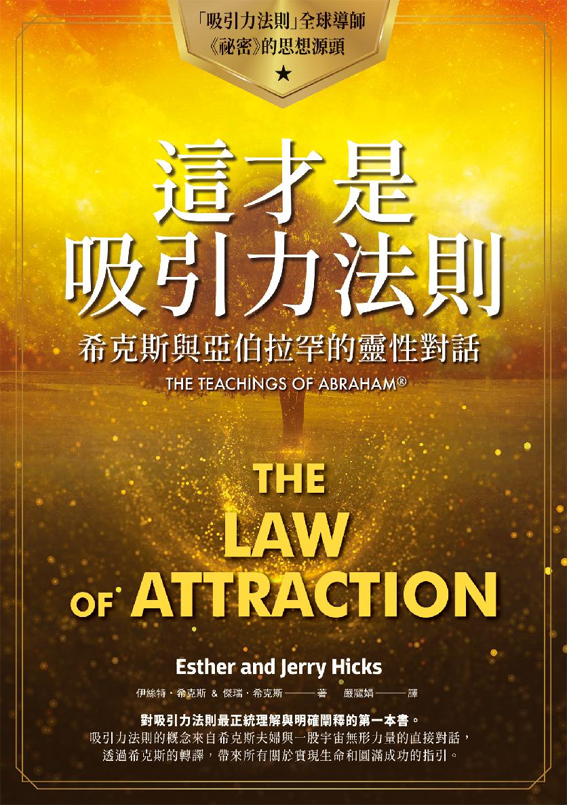

# 推薦序　這是一本《人生使用手冊》

尼爾．唐納．沃許 Neale Donald Walsch

來了，就在這裡。你再也不用尋尋覓覓。

放下其他的書，取消已經報名的工作坊和研討會，告訴你的人生教練，你再也不需要打電話給他了。

因為，有這本書就夠了：你所需要了解的關於人生的每件事，以及如何讓人生成功運轉，這裡全都會告訴你。要展開這趟非凡的人生旅程，路上得遵守什麼樣的規則，也都寫在這裡了。它甚至為你準備好所有工具，讓你可以創造長久以來一直想要的體驗。不需要尋尋覓覓，你要的一切都在這裡。

現在，看看你做了什麼。

看就是了。

我要說的是，在這個當下，看看你抓在手中的東西。你做到了。你把這本書放在這裡，就在你的眼前，這就對了。你還沒想到，就已經做到了。這就證明了，你需要這本書為你帶來效用。

明白了嗎？不，別跳過這一段，你一定要看清楚。我告訴你，你拿在手裡的這本書，就是你能給自己最好的證據，證明吸引力法則是真的存在，而且有效，能夠在真實世界中帶來實際的成果。

讓我來解釋一下。

在意識深處，在你內心一個非常重要的地方，你發出想要收到這樣的訊息的意念，於是這本書才會來到你手裡。

可不要以為這不重要。這非常重要，相信我，重要得不得了。因為，**你將要創造出你想要創造的事物**：你的生命將出現重大的改變。

這不就是你想要的嗎？一點也沒錯。如果你內心深處並未發出意念，想要改善每日的生活體驗，你就不會看到這些內容了。你一直想要讓生活變得更好。你的問題是：該怎麼做？有什麼規則？用什麼方法？

答案就在這裡。你發出要求，然後得到回應。這就是第一個遊戲規則：「有求必應」。但這不像你想的那麼簡單。這本特別的書會告訴你該怎麼做。在這裡，它除了給你一些神奇的工具，還會教你如何運用。

你是否曾希望擁有一本《人生使用手冊》？

這個主意很不錯。現在，這本手冊就在你眼前。

我們要感謝希克斯夫婦，更要感謝亞伯拉罕。（亞伯拉罕是誰？在接下來這些引人入勝的篇章中，希克斯夫婦會告訴你答案。）伊絲特和傑瑞全心全意投入這份志業，跟眾人分享亞伯拉罕傳遞給他們的美好訊息。我非常崇拜且敬愛這對夫婦，我也非常感激他們，因為他們在其領域上如此傑出不凡，身負光榮的使命，要把榮耀帶給我們每個人都已經展開的一段任務：活著，體驗生命本身的繁盛，以及我們本來面目的光采。

我知道，你看了這本書之後，一定會留下深刻的印象，並得到深深的祝福。我知道，讀了這本書，你的生命將會出現轉捩點。這本書除了提供最重要的宇宙法則（真的，你只要知道這個法則就夠了），還透過簡單易懂的文字，告訴你該怎麼過生活。書中的資訊實在驚人，而且太重要了。這是深刻又卓越的見解！

我很少會這麼讚美一本書！但請細讀這本書的每一個字，實踐每一句話。你曾在內心問過自己的每一個問題，都將因此得到解答。所以，請用心讀每一個字。

這本書和你的專注力有關。如果你專注於學習如何運用你的專注力，你的每一個願望都會成真——你的人生將因此永遠地改變了。

（本文作者為暢銷書《與神對話》作者）

# 作者序　書中的訊息真的有效！

傑瑞．希克斯

一九八六年，伊絲特和我初次見證本書中具開創性的實用靈性哲理，這些哲理回應了多年來我一直找不到答案的許多問題。

在接下來的章節，你會看到當初我們與亞伯拉罕互動時，他們真摯講述的亞伯拉罕啟示的基本原理。（請注意，亞伯拉罕是一群充滿愛的存在，而非單一個體。）

一九八八年，我們首次正式出版了一套錄音帶專輯，裡頭包含十個特別企畫的主題，而這些錄音資料便是本書的前身。從那時候開始，和宇宙吸引力法則相關的各種書籍、CD、DVD、訊息卡、月曆、文章、廣播和電視節目及工作坊，如雨後春筍般不斷推出，不少暢銷書作者也把亞伯拉罕的訊息融入他們的寫作中。然而，直到本書《這才是吸引力法則》問世後，亞伯拉罕最初的教誨才算完完整整地納入一本書裡。

（如果你想聽聽此系列最早的錄音內容，可以上我們的網站  [www.abraham-hicks.com](http://www.abraham-hicks.com)  下載免費的亞伯拉罕簡介，長度是七十分鐘。）

本書內容主要抄錄自我們所製作的《給初學者的亞伯拉罕啟示》五片 CD，然後我們請亞伯拉罕稍作編修，增加文字的可讀性。為求清楚與連貫，亞伯拉罕也加入了幾段新的文字。

數百萬讀者、聽眾和觀眾們因亞伯拉罕的訊息而受益無窮。在此，伊絲特和我非常興奮，將以這本書向大家介紹亞伯拉罕最初講述的重要內容。

《這才是吸引力法則》跟之前的《有求必應》（Ask and It Is Given）兩本書有什麼不同呢？讀者可以把《這才是吸引力法則》當成入門書，其他的啟示和概念都由此而來；《有求必應》則涵蓋了亞伯拉罕最初二十年的訊息。

在準備出版這本書時，伊絲特和我再次閱讀了改變我們一生的訊息，這真是個很不錯的體驗！我們重新感受多年前亞伯拉罕和我們分享的這些基本且簡單的法則。

從一開始，伊絲特和我就盡力實踐我們學到的法則，一路上我們體驗到的成長充滿了喜悅。我們深信亞伯拉罕的啟示，因為他們的每句話語都含有無窮的意義，而實踐其教誨已經成為我們日常生活的一部分。從個人的體驗，我們要滿心喜悅地告訴大家：書中的訊息真的有效！

# [第一部]

我們與亞伯拉罕的接觸

Our Path to the Abraham Experience

## ◆簡介／by 傑瑞．希克斯

我們寫這本書，是為了向讀者介紹宇宙法則，並提供實用的做法和清楚的引導，幫助你實現你本來就該享有的幸福圓滿。讀了這本書，你會得到獨一無二且有益的體驗，對於那些我花了一輩子時間想要尋得解答的問題，你將會聽到切實可行的答案。當你懂得運用這個以喜悅為基礎的實用靈性哲理，你就能帶領其他人一起實踐各自心中的理想生活。

很多人告訴我，我的問題或多或少也是他們的問題。當你體驗到充滿智慧的亞伯拉罕啟示，長久以來的疑惑將因此得到解答，你會感受到真正的滿足，而且如同我和伊絲特一樣，你也會重新找回對生命的熱情。帶著對生命的全新態度，當你開始應用從本書中學到的方法，你會發現，不論你想做什麼、想變成什麼樣子、想要什麼東西，你都能用心為自己創造出來。

記憶所及，生活裡總是不斷出現各式各樣的問題，而我一直無法得到滿意的答案，因為我想要找到一套奠基於絕對真理之上的人生哲學。但是，當亞伯拉罕進入我的體驗，向我和伊絲特解釋他們強大的宇宙法則，並輔以有效的做法，幫助我們把概念和理論轉變為實際成果，我才明白，我所讀過的書、遇見過的老師，以及經歷過的人生體驗，早已踏著完美的步伐，引領我走向亞伯拉罕。

我喜歡想像當你閱讀這本書時，就是給自己一個美好的機會，去發掘亞伯拉罕啟示的價值，因為我知道這些啟示將能夠增進我們每日的生活體驗。從我個人的經驗，我也知道，如果你的人生體驗並未替你鋪好路（如同我的人生為我鋪好的路），帶領你接收到這本書的訊息，你現在就不會把這本書拿在手裡。

我期盼你能進入本書的世界，認識亞伯拉罕帶來的強大法則與實用做法，如此一來，你才能用心把你想要的東西吸引到你的體驗中，把你不想要的東西從你的體驗中釋放出去。

## 一個接一個的宗教團體

我的父母親並沒有宗教信仰，所以我不清楚為什麼我總覺得有股力量在催促我，要我去找間教會，當個虔誠的教徒。這股力量在我成長期間從未停息。或許是因為我想要填滿內心深處的空洞，也或許是因為我看到身旁很多人展現出對宗教的熱情，而且他們都確信自己找到了真理。

十四歲以前，我住過六個州，搬過十八次家，有很好的機會去體驗形形色色的人生哲理。每換一個地方，我就投入某個教會，而且我每次都全心全意希望自己踏入之後，能找到我想要尋找的東西。然而，每一個宗教或哲學團體都宣稱自己才是正統，同時指責其他人是錯的，於是我覺得愈來愈失望。我的心一次又一次往下沉，無法找到我要的答案。（接觸亞伯拉罕的啟示之後，我才明白這些明顯的哲理矛盾，並且再也不會為此感到難過。）

## 占卜板的說法

本來我對占卜板（Ouija board）這種東西具有強烈反感。我認為那頂多只能算是一種遊戲吧！或者根本就是騙人的玩意兒。直到一九五九年，那時候我住在華盛頓州的斯波坎，有個朋友提議要玩占卜板。當下我立刻反對，覺得這麼做很荒謬，不過朋友堅持要玩，於是我第一次接觸到占卜板，也親眼見證到一件不可思議的事發生。

由於當時我還在追尋那一長串人生問題的答案，所以我問占卜板：「我要怎麼做才能成為一個真正有價值的人？」一開始，占卜板上的三角形小紙片在各個字母上快速移動，最後拼出來的字是「讀」。

我問：「讀什麼？」它的回答是：「書。」我問：「什麼書？」突然間紙片移動的速度變得跟剛開始一樣快，接著拼出：「史懷哲的書。」我朋友沒聽過史懷哲的大名，我對他的印象也不深，在好奇心的驅使之下，我決定去研究一下史懷哲這個人，畢竟他是以如此特別的方式進入我的意識。

我在圖書館裡找到不少史懷哲的資料，並依次讀完他所有的書。雖然我不覺得自己因此找到了那一長串人生問題的具體解答，但史懷哲的第一本著作《歷史耶穌的探索》（The Quest of the Historical Jesus）讓我大開眼界，我發現除了我以為的方法外，還有很多觀察事物的不同角度。

我滿心期待能打開一扇窗，啟發我的心靈，找到所有問題的答案，但最終我還是失望地發現，占卜板無法帶給我啟示，我的問題也沒有得到解答。不過我內心已經有所醒覺，我相信確實有條無形的智慧通道存在，而過去我總覺得非要親身經歷過才願意相信。

我一個人玩占卜板時總是徒勞無功，但在從事娛樂工作時，我到處旅行，和數百人一起試過占卜板，其中有三次成功了。有一次是在奧勒岡州的波特蘭，我跟幾個朋友對著我們心目中的無形存在「對話」了數百個小時。我們談話的對象有海盜、牧師、政客和祭司，實在太有趣了！就像在派對裡和許多人盡興地談天說地，每個人都關心不一樣的話題，有不同的態度和不同的思維。

我得老實告訴大家，占卜板對我的人生並沒有什麼助益，我也沒有因此學到什麼可以跟別人分享的東西。於是，有一天，我就突然失去了興趣，我把板子給丟了，從此再也沒用過。不過這段體驗相當難忘，尤其是那無形的智慧鼓勵我讀的書，讓我領悟到這個世界比我當時想像的大得多，也讓我想要尋找答案的渴望更加強烈。我因而相信，我能夠尋得無形的智慧，得到實用的解答，知道宇宙如何運作、為什麼我們會來到這個世界上、要如何才能享受更喜悅的生活，以及如何才能實現我們來到這世上的目的。

## 思考致富

我對於人生的疑問愈來愈多，直到一九六五年，我到美國各地的大專院校巡迴演奏時，無意間發現了一本非常棒的書，才第一次找到實用解答。當時我人在蒙大拿州的一家小旅館，大廳的咖啡桌上擺著一本書，我隨手拿了起來，看到書名時心中有種矛盾的感受。那本書叫《思考致富》（Think and Grow Rich），作者是拿破崙．希爾（Napoleon Hill）。

這個書名讓我有些反感，因為我跟許多人一樣，從小就被灌輸一個觀念，認為有錢人大都是不公不義的，如此我們才能為自己的不足與困頓找到開脫的理由。但無可否認的，這本書確實很吸引人，我才讀了十二頁，就覺得渾身起雞皮疙瘩，彷彿一陣電流在體內流竄。

我現在才明白，那些發自內心深處的身體反應，證明了我正朝向非常具有價值的事物前進。不過那時候我只覺得《思考致富》這本書喚醒我內心深處的知覺，讓我領悟到思考的重要性，也了解我的生活體驗多少反映出我的思維內容。這本書寫得有趣又具有說服力，讓我不禁想要遵循書中的建議試試看，後來我也真的採取行動了。

書中的指引對我來說非常受用。事實上，過沒多久，我就建立起屬於自己的跨國事業，也有機會接觸到各式各樣不同的人，為彼此生命帶來意義。我甚至開始教導其他人我學到的這些人生道理。希爾的書改變了我的生命，也帶給我無法言喻的價值，然而，很多接受過我教導的人，不管上了多少次課，就是體驗不到像我這麼驚人的轉變。因此，我尋求人生答案的旅程持續進行中。

## 賽斯告訴你如何創造實相

在不斷追尋有意義的人生解答的同時，我想要幫助其他人更有效地達成個人目標的渴望也愈來愈強烈，但由於那時我跟伊絲特在亞利桑那州的鳳凰城剛展開新的生活，於是這個渴望便暫時被壓了下來。我們交往了幾年之後，於一九八○年結婚，兩人的契合度難以用言語來形容。我們滿心喜悅，每天都過得非常快樂，在不熟悉的城市裡到處探險，裝潢布置新家，一起開拓新生活。儘管伊絲特不像我亟欲尋得人生解答，但她對生活充滿熱情，總是笑口常開，和她在一起很快樂。

有天我去圖書館消磨時間，無意間看到珍．羅柏茲（Jane Roberts）所寫的《靈魂永生：賽斯書》（Seth Speaks），我還沒把書從架上取下來，就感覺全身起了雞皮疙瘩，電流又在體內上下流竄。我把書拿了下來，逐頁翻閱著，心想作者到底寫了些什麼，竟能引起我如此的情緒反應。

我跟伊絲特在一起時，只有一件事會引發兩人的爭執：她不想要聽到我過去玩占卜板的經驗。每當我興沖沖提及這件事，她就會藉故走開。她從小接受的教育告訴她，要對無形的事物抱持戒慎恐懼的心態。我不想讓她為難，所以後來只要她在場，我就不會提起有關占卜板的事。不難想見，伊絲特對《靈魂永生：賽斯書》也沒有什麼興趣。

賽斯書的作者羅柏茲會進入一種出神的狀態，讓無形的賽斯透過她說話，「口授」一系列非常具有影響力的賽斯書籍。我覺得這系列的書相當引人入勝，帶給我許多啟示，我那一長串關於人生的問題也得到部分解答。但是伊絲特對賽斯書感到害怕，一聽到這本書是如何寫成的，她就覺得渾身不自在，再加上封底有張賽斯透過出神中的羅柏茲傳達訊息的照片，羅柏茲的表情看起來有些古怪，更讓伊絲特難以接受。

伊絲特告訴我：「你要看那本書的話請便，但不要把它帶進我們的房間。」

我是個結果論者，我相信每樣東西的效用應該從其可能帶來的結果來衡量。在思考一件事時，我會先從「我對它有什麼感覺」的角度來判斷……而賽斯的許多說法讓我受益無窮。所以，關於這本書是從哪裡來的，以及它是如何寫成的，都不會動搖我的想法。基本上，我覺得我找到了非常有價值的資訊，可以套用在我身上，也可以傳遞給其他我相信用得上這些訊息的人。我覺得興奮極了！

## ◆不再恐懼／by 伊絲特．希克斯

傑瑞沒有強迫我接受賽斯書，是聰明且體貼的做法，因為我對這一類書籍真的有很強烈的反感。一想到有個人和無形的存在接觸，就讓我覺得渾身不自在，傑瑞不想擾亂我的心思，所以他都趁我還在睡覺的時候，一大早起來看這些書籍。漸漸地當他看到特別有趣的段落時，會不著痕跡地在對話中提到，在我沒有心懷抗拒的情況下，通常也能聽出賽斯說的話具有什麼價值。傑瑞介紹了一個又一個概念，直到這些令人驚嘆的作品終於引起我的興趣。後來我們養成早起讀書的習慣，我跟傑瑞坐在一起，由他朗讀賽斯的內容。

我的恐懼並非來自負面的個人體驗，而是別人的口耳相傳，或許他們也是道聽塗說。回首從前，當時我的恐懼根本是空穴來風。一旦察覺到個人的體驗如此美好，我的態度全然改變……感覺真好。

隨著時間經過，羅柏茲接收賽斯訊息的方法不再讓我感到不安，我更深深愛上賽斯美妙的作品。事實上，我們在讀賽斯書的時候感到滿心喜悅，甚至很想去紐約探訪羅柏茲和她的丈夫，說不定還能跟賽斯對話！我真的邁出了一大步，因為我居然渴望能和某個無形的存在會面。但是我們沒有羅柏茲的聯繫方式，不曉得該怎麼樣才能當面請益。

某天我們在亞利桑那州一家書店附近的小咖啡館吃午餐，傑瑞翻閱著他剛買的新書，坐在我們附近的一位陌生人突然問：「你們看過賽斯的書嗎？」

我們簡直不敢相信自己的耳朵，因為我們從來沒有告訴別人關於賽斯書的事。接著那個人說：「你們知道嗎？珍．羅柏茲去世了。」

我記得最後那幾個字重重打擊著我，淚水湧上了我的眼睛。感覺好像有人告訴我說我妹妹過世了，而我居然還不知道。我太震驚了。我們覺得好失望，因為我們再也沒有機會見到羅柏茲……也無法見到賽斯了。

## 跟泰奧「通靈」的席拉

聽到珍．羅柏茲死訊後沒幾天，我們的朋友兼生意合夥人南西和她的丈夫偉斯，前來與我們共進晚餐。南西說：「你們聽聽看這些錄音帶。」她把一盒錄音帶推向我。她的行為有些反常，感覺不太對勁。事實上，傑瑞剛開始看賽斯書時，我也有類似的感覺。彷彿他們有個祕密想要與我分享，卻又擔心我不知會做何反應。

「這是什麼？」我問。

「通靈的錄音帶。」南西悄聲說。

當時傑瑞跟我都不清楚所謂的「通靈」到底指的是什麼。於是我問：「通靈是什麼意思？」

南西和偉斯解釋了一番，雖然他們的說法沒什麼條理，但傑瑞和我倒是明白了，他們描述的過程跟賽斯書寫成的方法是一樣的。他們又說：「她叫席拉，她通靈的對象叫做泰奧（Theo）。她馬上就要來鳳凰城了，有興趣的話可以跟她約個時間碰面。」

我們決定要跟席拉會面，我還記得當時我們兩人有多麼興奮。我們在鳳凰城一棟很漂亮的屋子裡見到席拉。那時候是大白天，完全沒有任何東西會讓人產生毛骨悚然的感覺，這一點讓我鬆了一口氣。一切都感覺很舒服、很愉快。我們坐下來和泰奧「閒聊」（應該說是傑瑞跟泰奧對話，我不記得我開過口），而這次的經歷讓我非常驚訝！

傑瑞的記事本上寫滿了問題，他說那本冊子從他六歲時就開始用了。他非常興奮，問了很多問題，有時候還會打斷泰奧的解答，好在會面時間結束前能多問些問題。半個小時一下就過去了，我們覺得太棒了！

「我們明天可以再來嗎？」我問，因為我也列出了一串想要問泰奧的問題。

## 我該冥想嗎？

隔天我們又去了，我（透過席拉）問泰奧，要怎麼做才能更快達成我們的目標。泰奧說：「宣誓。」然後他給我一段很棒的誓詞：「本人伊絲特．希克斯，透過神聖的愛，要把那些尋求啟發的人帶到我面前，一同分享我的做法。我們將一起向上提升。」

傑瑞跟我早就了解宣誓的效用。我接著問：「還有呢？」泰奧說：「冥想。」我認識的人裡沒有一個會冥想，而且這種做法讓我覺得很奇怪。我無法想像自己冥想的樣子。傑瑞說，他覺得冥想的人應該會看到自己的生活變得有多糟糕，充滿了無盡的痛苦或貧窮，卻無力改變。我則認為冥想就跟踩過燒紅的木炭、躺釘床或單腳站著乞討一樣，都是屬於怪誕的行為。

於是我問泰奧：「你所謂的『冥想』是什麼意思？」

泰奧說，每天花十五分鐘時間，在安靜的房間裡靜坐，穿著舒適的衣物，把全副注意力放在你的呼吸上。你的心神會慢慢放鬆，釋放你心中所有的思緒。然後再度專注於你的呼吸。我聽了之後心想，這件事沒那麼奇怪嘛！

我的下一個問題是，該不該帶我十四歲的女兒崔西來跟泰奧會面，泰奧回答：「如果這是她的要求，就帶她來，但其實沒有這個必要，因為你們也是通靈人。」我記得當時我們聽到這段話以後覺得難以置信，要是我們真的能通靈，我們怎麼會不知道呢？然後，錄音機的錄音鍵跳了起來，這表示我們跟泰奧的談話時間結束了。

我不敢相信時間居然過得那麼快，我低頭看著自己還有那麼多尚未得到解答的問題。席拉的朋友史蒂薇在一旁操作錄音機並記錄我們跟泰奧的對話，她或許發現了我的沮喪，所以她問我：「你要再問一個問題嗎？你想不想知道你的指導靈（spiritual guide）叫什麼名字？」

我其實沒想到要問這個問題，因為我從未聽過指導靈這個說法，但我覺得這個名詞很好聽，於是我問：「那麼我的指導靈是誰呢？」

泰奧說：「聽說他們會直接去找你。你會接收到無聲的訊息，到時候你就知道了。」

我們離開那棟漂亮的屋子，感覺自己煥然一新。泰奧鼓勵我們兩個人一起冥想。他說：「因為你們心靈相契，冥想的力量會更大。」按著泰奧的建議，我們回到家以後，換上浴袍（最舒服的衣物），拉上客廳的窗簾，坐下來開始冥想。（我不知道做法對不對，總之做就對了！）我記得當時我心想，我要每天冥想十五分鐘，我要知道我的指導靈叫什麼名字。但跟傑瑞一起冥想感覺很奇怪，所以我們各占一張高背扶手椅，中間隔著擺放裝飾品的架子，誰也看不到誰。

## 透過我傳遞的氣息

泰奧教我們的冥想法非常簡單：每天花十五分鐘時間，在安靜的房間裡靜坐，穿著舒適的衣物，把全副注意力放在你的呼吸上。你的心神會慢慢放鬆，釋放你心中所有的思緒。然後再度專注於你的呼吸。

我們準備了定時器，設定好十五分鐘的時間，我坐在舒服寬敞的椅子上，專注於我的呼吸。我數著自己的呼吸，一呼一吸，一呼一吸。過沒多久我就覺得全身酥酥麻麻的，感覺滿舒服愉快的。

時間到了，定時器響起來，我嚇了一大跳。我的心思回到眼前的房間和旁邊的傑瑞，但我忍不住大喊：「再來一次吧！」我們又設了十五分鐘的時間，那種超脫一切和酥麻的感覺又再度襲來，實在太棒了。這一次，我感覺不到我坐的椅子。我覺得自己好像飄浮在半空中，身旁空無一物。

我們又設了十五分鐘，我再次進入那種超脫的美妙感受，接下來我體驗到的感覺讓我無法置信……我呼出的不是我的氣息。彷彿有種充滿愛的強大力量把空氣注入我的身體，然後再呼出來。我現在才明白，那是我跟亞伯拉罕的第一次接觸，但在那時候，我只是感受到一股無與倫比的愛穿透全身。傑瑞說，他聽到我的呼吸聲變了，於是探頭過來看看發生了什麼事，他說我的樣子看起來像是出了神一樣。

定時器響起，我又回到現實世界，我覺得有股能量流過我的身體，那是一種前所未有的感覺。那是我一生中最特別的體驗，我的牙齒似乎有電流穿過（不是嚇得打顫），持續了好幾分鐘。

神奇的事一件接著一件發生，直到最後我遇見亞伯拉罕，而我到現在都不敢相信我竟然如此幸運。在那之前，我心中一直懷著毫無來由的恐懼，在那之後，這些恐懼煙消雲散，取而代之的是和本源能量的相遇，一段充滿愛的個人體驗。我從未真的了解「神是什麼」或「神是誰」，但我知道這次體驗就是最好的證明。

## 我的鼻子在寫字！

第一次冥想的成果就這麼顯著，激發出我內心強烈的情感，於是我們決定每天都要撥出十五到二十分鐘的時間來進行冥想。接下來的九個月裡，傑瑞跟我常坐在扶手椅裡，靜靜地呼吸，感受圓滿自在。一九八五年的感恩節前夕，就在冥想的時候，我又有了新的體驗：我的頭開始緩慢地左右晃動。在超然物外的狀態下，那輕微移動的感覺很愉快。我覺得自己似乎就要飛起來了。

雖然我知道那不是我自己的動作，但我不以為意，因為感覺實在太愉快了。有兩三天的時間，在冥想時我的頭都會輕輕地晃動，到了第三天，我才明白那不是胡亂轉動，我的鼻子其實正在寫出一個個英文字母，就像在黑板上拼字一樣。我驚訝地大喊：「傑瑞，我的鼻子在寫字！」

我意識到不尋常的事正在我身上發生，有人想要跟我溝通，一股電流流貫我全身。令人震顫的感受一波波襲捲而來，之前我從來沒體驗過這麼強烈的感覺。鼻子寫出來的字母拼成了一句話：我是亞伯拉罕，你的指導靈。我愛你，我要在這裡跟你一起努力。

傑瑞取出記事本，記下我笨拙地用鼻子寫出來的訊息。亞伯拉罕拼出一個又一個字，回答傑瑞的問題，有時候一談就是好幾個小時。我們好興奮，居然能用這種方法和亞伯拉罕溝通！

## 亞伯拉罕和打字機

我們的溝通方法很慢、很笨拙，但傑瑞的問題一一得到解答，我們兩個人都覺得好開心。接下來的兩個月，傑瑞提出問題，亞伯拉罕指揮我的鼻子動作，寫出答案來，傑瑞則把每個字詞都詳細地記錄下來。某天晚上，我們躺在床上，我的手指開始輕輕地敲打傑瑞的胸口。我嚇了一跳，告訴他：「不是我，一定是亞伯拉罕。」然後我突然有股衝動，想要打字。

我走到打字機前面，把雙手放在鍵盤上。之前我的頭會不由自主地轉來轉去，用鼻子寫出字母，這會兒換成我的手指在打字機鍵盤上不由自主地移動。我的雙手快速地敲打著，打字的力道強到引起傑瑞的注意。他站到我旁邊，試著要抓住我的手，因為他怕我的手指頭會受傷。他說我的手動得飛快，快到他幾乎跟不上。但他其實多慮了。

我的手指滑過了每一個按鍵，敲出了字，打了將近一整頁都是同一句話：「我要打字我要打字我要打字我要打字……」沒有標點符號，每個字都連在一起。接著，我的手指慢慢且有條理地打出了另一條訊息，要求我每天在打字機前面坐十五分鐘。接下來的兩個月，我們改成透過打字機與亞伯拉罕溝通。

## 打字的人開口了

有一天，我們開著車在高速公路上奔馳，行駛在我們車子左邊的是一台十八輪的大卡車，右邊則是一輛大型拖車。那段路面不太平穩，三台車同時開上連續彎路時，感覺兩台大車就快要壓上了我們的車道，眼看我們似乎就要被夾扁了。就在最緊張的時刻，亞伯拉罕開口了。我感到下巴緊繃（有點像打呵欠的感覺），接著我的嘴巴不由自主地說出：「從下一個交流道下高速公路。」我們把車子開下去，停在高架橋下，傑瑞和亞伯拉罕講了好幾個小時的話。我們都覺得激動不已！

雖然我愈來愈習慣亞伯拉罕透過我發言，但是我告訴傑瑞，我希望這件事只有我們兩個人知道，我擔心萬一其他人知道了，會有負面的反應。不過，經過一段時間，我們偶爾會和一些親近的朋友聚在一起跟亞伯拉罕對話；又過了一年以後，我們決定向大眾公開亞伯拉罕的訊息，直到現在。

轉譯亞伯拉罕的振動，每天都讓我有新的體驗。每次舉辦研討會後，我和傑瑞都為亞伯拉罕的啟示、智慧和博愛讚嘆不已。有一天，我想起過去的經驗，突然笑了出來：「以前我聽到占卜板就害怕，現在我自己也是占卜板了。」

## 美好的體驗不斷進展

和亞伯拉罕互動以來，我實在找不出適當的字眼來形容我們的感覺。傑瑞總是很明白自己想要的是什麼，也在遇見亞伯拉罕以前就找到實現大多數願望的方法。但他說，亞伯拉罕讓他察覺到我們在這裡的使命，也清楚告訴他要如何才能做到（或做不到），更讓他知道掌控權完全握在我們手中。沒有所謂的「失敗」或「時不我與」，也不需要隨波逐流。我們完全自由……我們的體驗絕對由我們創造。這真是太棒了！

亞伯拉罕說過，我跟傑瑞是傳遞他們訊息的最佳組合，因為傑瑞一心想要為他的問題找到解答，他強烈的意願召喚了亞伯拉罕的出現，而我能夠讓心思沉澱，釋放抗拒，才能讓解答透過我的口中說出來。

過沒多久，我就可以讓亞伯拉罕透過我來說話了。從我的觀點來看，我只是把自己的意念展現出來：亞伯拉罕，我想要清楚訴說你們的話語。我專注於自己的呼吸，過了幾秒，亞伯拉罕清晰的訊息、愛和力量就會自我體內發出。上路吧……

## ◆與亞伯拉罕對話／by 傑瑞．希克斯

透過伊絲特和亞伯拉罕一起探索，這個體驗直到現在仍讓我感到非常興奮。個人的生活經驗讓我心中不斷冒出新的問題，亞伯拉罕的解答也跟著無窮無盡。

與亞伯拉罕開始接觸後的幾個月內，我和伊絲特每天都會撥出時間跟亞伯拉罕對話，我的問題也逐一得到解答。又過了一陣子，伊絲特更放鬆了，願意讓亞伯拉罕沉澱她的心思，讓無限的智慧透過她傳遞出來，我們也逐漸邀請愈來愈多的朋友和事業夥伴跟我們聚在一起，與亞伯拉罕討論生活中的大小事。

和亞伯拉罕接觸以後，我提出了一長串的人生問題。在此，我希望他們對我這些問題的解答，也能對你有所幫助。隨著與亞伯拉罕的溝通日漸頻繁，我們也接觸了上千人，這些人將生命問題帶到了更深的層次，甚至把他們覺得很重要的問題加入我的問題清單裡，而亞伯拉罕一視同仁地展現了愛和才智。以下是我們與亞伯拉罕的最初對話。

（我不太明白伊絲特如何讓亞伯拉罕透過她說話。就我看來，伊絲特只是閉上眼睛，做幾次深呼吸。她的頭輕輕點了幾下，然後她睜開眼睛，亞伯拉罕就直接對我說話了，內容如下。）

## 我們是你們的導師

亞伯拉罕：大家早！很高興能有這個機會，在此和大家相聚。感謝伊絲特幫我們跟大家溝通，感謝你們發起這次聚會。我們曾思索過這次互動會產生多麼深厚的價值，因為我們可以藉此機會向有形的朋友自我介紹。但除了讓有形的世界認識亞伯拉罕，這本書還會介紹無形存在在有形世界中的角色，因為大家都知道，有形和無形的世界無可避免地交錯在一起，兩者密不可分。

在寫這本書的時候，我們同時也實現了在你進入有形身體前我們曾許下的承諾。我們承諾要留在這裡，專注於更廣闊、更清晰、也因此更有力的無形視野上，而傑瑞和伊絲特則承諾要進入美好的有形世界，來到思維和創造的前端。一旦你的人生體驗在你內心激發出清晰且強烈的願望，我們保證，你就會和我們攜手共同創造。

傑瑞，我們非常想要回答你那一長串的問題（這些問題是經過用心準備，且透過人生體驗的對比磨練而來），因為我們有好多話要說給有形的朋友們聽。我們要你明白你的存在有多麼美好，了解你本來的面目，以及你來到這個有形世界的目的。

向有形的朋友解釋屬於無形本質的事物，是非常有趣的體驗，因為我們分享的知識必須透過有形世界的眼光來闡釋。換句話說，我們的思維如無線電波，伊絲特從無意識的層面接收到這些電波以後，轉譯成有形的言語和概念。這就是有形和無形的完美結合。

我們能夠幫助你明白我們所在的無形領域，我們也會幫助你更清楚地認識自己本來的面目。因為實際上你就是我們本質的延伸。

我們不是單一的個體，我們聚集在一起是因為我們當下的意念和願望彼此相符。在你們有形的環境中，我們叫做亞伯拉罕，是大家心目中的心靈導師，因為我們領悟到的知識較為深廣，也能引領其他人到達同樣的境界。我們知道，文字無法行教導之實，必須訴諸生活體驗，但當生活體驗結合了能夠說明解釋的文字後，就能讓學習更加有效。本著這樣的精神，我們寫下了這本書。

宇宙間的所有事物，不論無形有形，都受到宇宙法則的影響。這些法則不容置疑，永遠存在，且無所不在。當你能夠意識到這些法則，也了解這些法則，你的生活體驗就會變得更加美妙。事實上，唯有當你意識到這些法則時，你才能用心創造出自己的生活體驗。

## 你的內在存在

在這個有形的環境中，你就是你所看到的有形存在，但你並不僅限於你雙眼所見的這個形體。你其實是無形本源能量的延伸。換句話說，真正的你是無形的，而且更廣大、更年長、更睿智，只不過你的焦點現在放在你稱之為你的有形存在上。我們把無形的你稱為你的內在存在。

有形的存在常認為他們非死即活，按這樣的想法來推論，他們有時候也會承認，在誕生進入有形的身體前，他們便已存在無形的領域中，然後，當肉身死亡，他們又會回到無形的世界。只有極少數的人才知道無形的自我其實也存在於當下，且充滿力量，專注於無形的世界，而這無形的觀點會影響有形的視野和此刻有形的身體。

了解無形和有形的視野以及兩者之間的關係，才能真正明白你本來的面目，發掘你進入這個有形身體時所懷抱的目的。有些人把無形的存在稱為「大我」或「靈魂」。什麼樣的說法都沒關係，能夠承認內在存在的存在才是最重要的，因為唯有當你認清自己和內在存在的關係，才能找到真正的引導。

## 我們不想改變你的信仰

我們來到這裡，並非為了改變你的信仰，而是要讓大家重新認識永恆的宇宙法則，如此一來，你才能夠用心去實現創造的目的。他人無法讓你的體驗更加豐富，你的體驗全然由你創造。

我們來到這裡，並非要你信奉我們，因為你的信仰就是我們要你相信的內容。看著令人驚嘆的地球環境，我們看到各式各樣的信仰，這種多樣化已經達到完美的平衡。

我們會用很簡單的方式介紹這些宇宙法則。我們也會提供實用的做法，讓你用心去應用法則，達成你所珍視的目標。我們知道，在發掘生活體驗時，你會發現自己擁有創造的權利，而這會讓你醉心不已。我們也知道，在你學習應用隨順的藝術時，你所找到的自由才是最可貴的價值。

既然無形的你早就明白這些道理，我們的工作只是要再度提醒你而已。我們期盼，讀這本書的時候，如果你存著這樣的願望，你將會得到指引，一步一步邁向覺醒，認識到完整的自我。

## 你對萬事萬物都具有價值

我們要你再次了解，你對萬事萬物具有無比的價值，因為你擁有最領先的思維，你的思緒和言行都為宇宙效力。在這裡，你並非次要的存在，拚命想要趕上別人，你是最前緣的創造者，宇宙所有的資源都任你運用。

我們要你知道你的價值，如果你不明白這一點，就無法吸引到真正屬於你的東西。如果你無法自我欣賞，你就否決了自己天生的權利，無法享受長久的喜樂。雖然你的每一項體驗皆為宇宙效力，但我們希望你也能在此時此刻收割你的辛勞所結出的果實。

我們確知，你會找到答案，帶領你享有在誕生進入有形的身體前早就想要的生活體驗。我們會幫助你實現人生的目的，因為我們知道這對你來說很重要。我們聽到你問：我為什麼會在這裡？我要怎麼做才能讓人生更美好？要如何才能知道什麼是對的？我們會詳細回答每一個問題。

我們準備好了，請發問。

## ◆圓滿是什麼？

傑瑞：亞伯拉罕，我希望這是一本特別為那些想要用心掌控生活體驗的人所寫的入門書。我希望這本書中的資訊和引導都很充足，讀者才能立刻運用書中的概念，體驗到更加快樂和更加圓滿的狀態……也知道自己之後可能想要特別鑽研的主題。

亞伯拉罕：每個人都有自己的想法，我們期望，那些正在追尋什麼的人，能夠在這本書裡找到他們的解答。我們無法一言道盡一切，但我們會清楚解釋宇宙法則的基本原理。我們也知道，某些讀者或許會想要更進一步了解，有些人則覺得有這本書就夠了。我們之前的討論激發出許多問題，本書的內容主要便是在回答這些問題。但所有存在的本質不斷演化，永遠沒有盡頭。

## 宇宙法則的定義

我們要協助你更進一步認識三條永恆的宇宙法則，如此你才能有效地運用它們，在生命中得到滿足。第一條法則是**吸引力法則**，如果你不明白吸引力法則，就無法運用第二條法則**用心創造的方法**，以及第三條法則**隨順的藝術**。你必須先明白第一條法則並有效運用，才能明白且運用第二條法則。明白了第二條法則，也能有效運用之後，才能了解和運用第三條法則。

第一條法則是吸引力法則，它說：同頻共振，同質相吸。這樣的說法雖然看起來很簡單，卻定義了宇宙間最強大的法則。宇宙間的萬事萬物無一不受強大的吸引力法則影響。

第二條法則是用心創造的方法，它說：我的思維所在，我相信或期待的事物，就會真的存在。簡單來說，你心裡想什麼，就會得到什麼，不管你要不要。用心創造的方法，其精髓在於用心引導思維，如果你不明白這個法則並加以運用，你就無法創造出你想要的一切。

第三條法則是隨順的藝術，它說：我就是這個樣子，我也願意隨順，讓其他人就是他們的樣子。當你願意隨順，讓其他人保持他們原本的樣子，就算他們給你重重限制，你仍是個隨順者。但除非你能夠先明白你如何變成現在的模樣，以及如何得到現在的一切體驗，否則你無法達到隨順的境界。

若非你透過思維邀請其他人（或把注意力放在他們身上）進入你的體驗，若非你透過思維召喚某些情況（或透過對那個情況的注意），這些人事物皆無法變成你的體驗。當你明白這個道理，在體驗生命的同時，才能成為真正的隨順者。

理解這三條強大的宇宙法則，用心加以運用，你才能充滿喜悅地享受自由，創造出完全符合你心願的生活體驗。一旦你知道來到你體驗的人事物都必須透過你的思維邀請，你就可以改變生活方式，讓生活符合你進入有形世界時所抱持的目的。

了解吸引力法則，用心創造個人的生活體驗，你就能享有無與倫比的自由，到了這個境界，你才能夠領會隨順的藝術。

# [第二部]

吸引力法則

The Law of Attraction?

## 什麼是宇宙的吸引力法則？

傑瑞：好的，亞伯拉罕，我想你們首先要跟我們詳細討論的主題，是吸引力法則。你們說過，這是最強大的法則。

亞伯拉罕：吸引力法則是宇宙間最強大的法則，也是你在接受我們所提供的其他重要訊息之前，必須先認識的一個概念。你必須先了解吸引力法則，你的生活和他人的生活才會變得有意義。你的生活和周遭其他人的生活，全都受到吸引力法則的影響。你所看見的每件事，都建立在吸引力法則之上。察覺到吸引力法則的存在，明白它如何運作，才能活出你想要的人生。事實上，唯有如此，你才能夠獲得來到這個有形的世界所要享有的喜樂生活。

吸引力法則說：同頻共振，同質相吸。你們所說的「物以類聚」，實際上就是吸引力法則的證明。如果你一早起來就覺得不開心，一整天下來，事情只會一件比一件更糟糕，到了一天結束時，你會說：「早知道我應該整天都窩在床上。」這就是吸引力法則的證據。最愛談論病痛的人生病了，最愛談論富足的人享受富足，這些都是吸引力法則的證據。吸引力法則顯而易見，就好比你把收音機設定在某個頻道，便能夠預期從這個頻道的電台接收到廣播訊息，因為你知道發射台發出的電波和收音機接收到的電波一定相符。

你開始懂了，或者應該說你想起來了，強大的吸引力法則無所不在，到處都看得到證據。你也逐漸理解，你所想的和你實際體驗到的之間，有絕對的關聯。你的體驗並非憑空出現，一切皆由你吸引而來，毫無例外。

由於吸引力法則會回應那些一直縈繞在你心裡的念頭，所以我們可以說，你的實相由你創造。你所體驗到的一切，皆來自吸引力法則對你所發出的思維的回應。或許你正在回想過去，或許你正在觀察此刻，或許你正在想像未來，你在這個強而有力的當下所專注的思維，會在你心中激起振動，而吸引力法則會回應你的振動。

當人們體驗到不想要的事物時，通常會辯解說，他們很確定自己並未創造出這樣的東西。「我怎麼可能會把我不想要的東西帶給自己！」我們知道，你不是故意去體驗你不想要的東西，但我們還是得再次解釋，只有你才能夠創造自己的體驗，其他人沒辦法把你的體驗吸引給你，只有你才做得到。當你把注意力放在你不想要的事物或其本質上，你就不知不覺地創造了它們。而這都是因為你不了解吸引力法則，或者說你不了解遊戲規則吧！當你把注意力放在不想要的東西上，你就邀請它們進入你的體驗。

要更了解吸引力法則，你可以把自己想像成是一塊磁鐵，你所想的和感受到的那些事物的振幅，會被吸引到你的體驗裡。因此，如果你覺得自己胖，你就吸引不到瘦。如果你覺得很窮，就吸引不到富足……這就是法則。

## 心想事成

當你愈來愈了解吸引力法則，你就會更想要用心引導自己的思維，因為你明白，不論你要不要，你心裡想什麼，你就會得到什麼。

把思維投注在某樣事物上，就會把具有相同振幅的事物吸引到你的體驗中，毫無例外。當你想到你想要的某樣東西，透過吸引力法則，思維將變得愈來愈強烈，也愈來愈有力。當你想到你不想要的東西，吸引力法則也會開始吸引，負面思維將變得愈來愈強烈。思維愈強烈，吸引的力量愈大，你就愈有可能體驗到那樣的東西。

看到你想要體驗的事物時，你說：「對，我想要。」然後，透過你對該事物的專注，你就可以把它吸引到你的體驗中。然而，看到你不想要的東西時，你尖叫著說：「不，不要！我不要！」同樣的，透過你對該事物的專注，它仍會變成你的體驗。這是一個由吸引力所構成的宇宙，沒有所謂的排除。當你把注意力放在一件事物上，你就把它納入了你的振動，如果你的注意力持續得夠久，吸引力法則就會把你關注的對象帶進你的生活體驗裡，就算你說「不要」也沒有用。說得更清楚一點，當你看著某樣東西，大喊說：「不要！我不要那樣的體驗！滾開！」事實上，你所做的正是在召喚那樣的體驗，因為吸引力是宇宙的基礎，「不要」根本不存在。你對那個事物的注意力，其實就是在說：「對，我不想要的東西，來吧！」

還好，在有形的時空實相中，思維不會立刻彰顯在你的體驗裡。當你開始想某個東西，到那個東西真的出現在你的體驗中，兩者之間會有一段緩衝時間。緩衝時間可以讓你有機會把注意力重新導向你實際想要體驗的事物。在那個事物真的出現之前（事實上，也許早在你第一次注意到它的時候），你可以用你的感覺來辨別它是不是你想要體驗的事物。但如果你繼續把注意力放在那裡，不論你想不想要，它都會進入你的體驗。

就算你不明白這些法則的作用，在不知不覺的情況下，它們還是會影響你的體驗。或許你聽過吸引力法則，卻置若罔聞，但法則強大的影響力仍在你的生活體驗中隨處可見。

閱讀本書內容並細細思索時，你會注意到你的思維及話語和你所得到的結果之間有什麼關聯，你將領悟到強大的吸引力法則。用心引導思維，專注於你想要體驗的事物，在生活的各個層面，你就會開始接收到你想要的體驗。

有形的世界如此廣大，充滿各式各樣不同的事物，多到令人驚嘆。有些事物和環境能得到你的贊同（你想要體驗），有些則令你敬而遠之（你不想體驗）。在你來到這個有形的世界時，你並不期望世界做出改變，消除所有你不贊同的事物，增加所有你贊同的事物，變成你心目中理想的狀態。

你來到這裡，是為了要創造你所選擇的世界，你也願意隨順其他人對於世界的想望。雖然他人的選擇絕對不會妨礙你的選擇，但如果你專注於別人的選擇，一定會影響你的振動，進而影響你所發出的吸引力。

## 我的思維具有磁力

吸引力法則和它所發出的磁力遍布宇宙各處，吸引振動頻率相似的思維……然後將事物帶到你眼前：你的注意力、你所發出的思維，以及吸引力法則對這些思維的回應，會影響所有進入你體驗的人事物。你透過某種強大的磁力體驗到這些事物，因為這些事物的振動頻率符合你的思維。

你想什麼就會吸引到什麼，不論是你想要的，還是你不想要的。一開始你或許會覺得無法接受，但過了一段時間，我們期待你會感受到這強大的吸引力法則是如此公平、一致且絕對。一旦你了解法則，並且把注意力放在你所喜愛的事物上，就能找回對個人體驗的主控權。有了主控權，你將再度記起，你想要的必能達成，你不要的必能從體驗中釋放出去。

了解吸引力法則，相信你所想、所感受到的，和出現在你生活體驗中的事物，兩者間具有絕對的關聯，如此你才能更進一步察覺到個人的思維從何而來。你會發現自己的思維或許來自所看的書、電視節目、別人說的話語，或觀察別人的體驗。起初吸引力法則對這些思維的影響很小，但它的力量將隨著你的注意力而成長茁壯，然後你心中就會浮現渴望，想要把你的思維導向你想要體驗的事物。不論你在想什麼，不論你的思維從何而來……當思維出現時，吸引力法則就開始運作，為你帶來振幅相似的其他思維、對話和體驗。

不論你正在回憶過去、觀察現在，還是想像未來，你的思維都在當下，而且不論你的注意力放在哪裡，都會產生振動，引起吸引力法則的回應。一開始或許你在思索某個特別的主題，如果你想得夠久，就會注意到別人也開始和你討論這個主題，因為吸引力法則幫你找到發出類似振動的人，並且把他們帶到你身邊。把注意力放在某件事物上愈久，那件事物的力量就愈強，你所發出的吸引力也愈大，愈來愈多的證據將出現在你的生活體驗中。不論你的注意力是放在想要還是不想要的東西上，思維的證據都會持續朝著你奔湧而來。

## 我的內在存在透過情緒來溝通

你並不僅限於眼睛所能看到的這個有形身體，事實上，你是非常奇妙的有形創造者，同時你也存在於另一個空間維度中。無形的你，也就是你的內在存在，跟有形的你並存。

情緒是有形的指標，指出你和內在存在的關係。也就是說，當你把注意力放在某個對象上，對它產生你獨特的看法和意見，你的內在存在也會把注意力放在同一個地方，也對它產生出看法和意見。而你感受到的情緒，就指出內外意見是相符還是相衝突。舉例來說，某件事發生了，你覺得自己應該做得更好，或覺得自己不夠聰明，也有可能覺得自己很丟臉。但是內在存在的看法是你做得很好，你很聰明，向來都值得敬佩。這兩種意見當然不相符，而你就會因為這樣的差異而感受到負面情緒。反過來說，如果你以自己為榮，對自己或他人都充滿了愛，你的想法就更貼近內在存在的感覺，如此一來，你就會感受到正面情緒，例如自豪、愛或讚賞。

你的內在存在也叫做本源能量，它一定會看著對你最有利的地方，而當你的看法符合內在存在的看法，就會產生正面的吸引力。換句話說，你覺得愈開心，你所發出的吸引力就愈好，一切也會變得更美好。你的看法和內在存在的看法之間的振動平衡，能夠帶給你永不止息的偉大引導！

吸引力法則一定會回應你所發出的振動，也會按著你的振動產生作用，因此，如果你能了解情緒可以讓你知道自己正在創造想要的東西，還是正在吸引不想要的東西，對你將非常有幫助。

當人類朋友學習了強大的吸引力法則，明白他們的思維會吸引來振幅相同的東西，他們通常會想要去監控所有的思維，覺得想什麼都得小心翼翼。但是要監控自己的思緒很難，因為你能想到的東西太多了，吸引力法則也會持續帶給你更多的想法。

與其想辦法控制思維，我們鼓勵你不如把注意力放在你的感覺上。如果你選擇的思維不符合更廣闊、更資深、更有智慧、更充滿愛的內在存在，你就會感受到不協調，這時只要把思維重新引導到讓你感覺更快樂的事物上就行了，你會因此變得更快樂。

當你決定進入這個有形的身體時，你知道自己擁有一套無與倫比的情緒引導系統，你知道透過情緒，就能辨別出自己是否脫離了更高的智慧。

將思維專注於你想要的東西，你會感受到正面情緒。當思維走向不想要的東西，你會感受到負面情緒。因此，只要注意你的感受，不論何時，你那強大且充滿磁力的存在，都會把你關注的事物吸引過來，你也能找到吸引力的方向。

## 無所不在的情緒引導系統

那美好的情緒引導系統對你來說太棒了！不論你有沒有感受到，吸引力法則都不曾停止運作。因此，當你想著你不想要的東西，把全副注意力都放在那個想法上，按著法則，你就會吸引愈來愈多相似的感覺，最後你會體驗到振幅相同的事件或環境。

然而，如果你能察覺到你的情緒引導系統，敏銳偵測你的感覺，你會發現，在思維剛開始的階段，當你把注意力放在不想要的東西時，要改變思維還很容易，然後你就能轉而吸引你想要的東西。可是如果你對自己的感受不夠敏銳，就無法有意識地注意到你的思維方向其實是你不想要的，如此可能會吸引到力量強大、但並非你想要的事物，之後要改變就更加困難。

當你想到一個主意，且覺得充滿希望，表示你的內在存在和那個想法享有一致的振動頻率，正面的情緒表示當下思維的振動頻率符合內在存在。事實上，那就是所謂的靈感：在這個時刻，你的振動頻率完全符合內在存在更廣闊的視野，由於振動頻率相符，你就能從內在存在接收到清晰的溝通，也就是情緒的引導。

## 如果我想加快創造的速度呢？

因著吸引力法則，相符的思維會匯聚在一起，聚合後力量變得更強大。思維的力量變強，就更容易彰顯出來，你所感受到的情緒也會相應變強。當你把注意力放在想要的事物上，透過吸引力法則，會有愈來愈多相似的思維匯集在一起，正面情緒也變得更強烈。只要你投以更多的關注，就能加快創造的速度——剩下的就交給吸引力法則，它會把與你的思維振動相符的事物帶到你眼前。

我們將想要或願望定義如下：集中注意力，把思維放在某個對象上，同時體驗到正面情緒。當你把注意力放在某個東西上，同時對這個東西也感受到正面情緒，它很快就會變成你的體驗。我們有時會聽到有形的朋友說他們想要什麼或有什麼願望，但他們同時卻感到懷疑或恐懼，覺得願望無法實現。從我們的角度看來，感受到負面情緒時不可能期望夢想成真。

純粹的願望一定會伴隨著正面的情緒。或許這就是為什麼其他人會不太同意我們所定義的想要或願望。他們會說，「想要」表示匱乏，和其本身的意義互相牴觸。我們同意這樣的說法。但是，問題不在字面上，而是在說出這個字眼時表達出什麼樣的情緒狀態。

我們的願望是要幫助你了解，你想要什麼都可以得到，不論你現在在哪裡，也不管你目前的存在狀態為何。最重要的是，你要了解，你當下的態度，也就是心智狀態，才是吸引更多事物的基礎。因此，強大且始終如一的吸引力法則會回應這個振動宇宙中的萬事萬物，把振動相符的人牽引在一起，把振動相符的情況匯集在一起，把振動相符的思維聚合在一起。沒錯，生命中所有的事物，從思維縈繞心頭的方法，到你在車陣中碰到的人，都按著該有的方式出現了，而這一切都來自吸引力法則。

## 塑造生活體驗

對大部分的人來說，生活還算順利，所以你想要維持下去，但總有一些地方你希望能做點變化。為了讓事情有所改變，你必須以你想要它們變成的模樣來看待它們，而不是繼續觀察它們原本的樣子。你的思維大多和你看到的事物有關，這表示現狀掌控了你的關注焦點、注意力、振動，以及你所發出的吸引力。同時，由於你周圍的人也是這樣看著你，於是問題更加嚴重。

由於大多數人將大多數的注意力都放在當前的情況（現狀）上，所以改變的速度來得非常緩慢，或者根本沒有變化。儘管不斷有不同的人進入你的生活，但這些體驗的本質或主題卻沒有多大的改變。

為了讓好的改變出現在你的體驗中，你必須忽略現狀，也不要管別人對你有什麼看法，只要專注想著你想要的狀態。多加練習以後，你所發出的吸引力就會改變，你也會在生活中體驗到真實的變化。病痛變成健康，匱乏變成富足，糟糕的人際關係變成良好的關係，疑惑變成清晰，諸如此類。

用心引導思維，而不只是觀察周遭的事物，如此一來，吸引力法則所回應的振動模式也會開始出現變化。過了一段時間，你所創造的未來再也不會是為了回應旁人的看法，這個未來跟你的過去和現在也有所差別。這一切比你現在所想像的更加容易。到時候，你會充滿力量，用心創造個人的體驗。

你不太可能看到一個雕塑家把一團黏土丟到工作檯上，大喊：「噢！這不是我要的！」雕塑家知道他必須親手捏塑，桌上的黏土才會變得跟他心目中的想像一樣。形形色色的生活就像是黏土，而你的體驗由你塑造，光是觀察現狀，而不想辦法去掌握它，並按著你的願望用心塑造，就無法得到滿意的成果，也不符合你決定進入這個時空實相時心中所懷抱的願望。我們要你了解，不論現在你的「黏土」是什麼樣子，你都可以加以捏塑。毫無例外。

## 孩子，歡迎來到地球

或許你覺得，要是在你來到地球上的第一天就能聽到這些道理，人生會過得更好一點。假如在你開始有形生活體驗的第一天，我們就來這裡跟你對話，我們應該會說：

孩子，歡迎你來到地球……你想變成什麼樣子、你想做什麼、你想要什麼，都能一一實現。你是偉大的創造者，你來到這裡，是因為你一心一意想要到這裡來。你運用了驚人的創造方法，靠著那樣的能力，你來到這裡。

向前走吧！把思維放在你想要的事物上，吸引生活體驗來幫助你決定你要什麼，一旦下定決心，就把思維放在那個決定上。

你的時間多半會花在收集資料上，這些資料可以幫助你決定你想要什麼……你真正的任務是要決定你要什麼，然後把注意力放在上面，因為當你專注於你想要的東西，才能把它們吸引過來。這就是創造的過程：把思維放在你想要的東西，專注其上，清楚地思考，直到你的內在存在發出情緒。當你發出思維，加上情緒，你就變成吸引力強大的磁鐵。透過這樣的過程，你想要的東西就會被你吸引過來。

一開始的時候，大多數思維所發出的吸引力並不怎麼強烈，你要專注意念，經過足夠的時間，吸引力才會變強。思維聚集愈多，力量也跟著增強。思維的力量變強大以後，來自內在存在的感受也會更強烈。

當你了解思維和情緒的關係，你就能運用宇宙的力量。在體驗生活的第一天，向前走吧！你的任務就是要決定自己想要什麼，然後專注於你想要的。

但我們對你說這些話的時候，並不是你進入有形體驗的第一天。你已經在這裡過了好一陣子了。大多數人除了透過自己的眼睛看自己，也透過別人的眼睛來看自己；因此，大多數人目前並不在自己想要的圓滿狀態中。

## 真正的實相

我們想要告訴你該怎麼做，你的存在狀態才能符合你的選擇，然後你才能運用宇宙的力量，開始吸引你真正想要的東西，而不是你感覺能代表實際存在狀態的那些事物。因為，從我們的角度來看，你口中的「實相」，也就是現存的事物，和真正的實相之間，其實有很大的差距。

就算你的身體不夠健康，或者身材體型和體力都不符合你的選擇，或者生活方式讓你覺得不快樂，或者你覺得自己開了一台爛車，或者周圍的人都讓你失望……我們仍要幫助你了解，雖然你目前的狀態看起來是這樣，但其實你有辦法可以加以改善。你的存在狀態就是你在任何時間點上對自己的感受。

## 如何增加自己的磁力？

你所想的事情若未引起強烈的情緒，就無法產生強大的磁力。也就是說，每一個思維都具備創造的潛力，或有可能發出磁石般的吸引力，但唯有當思維結合強烈的情緒，才能產生最大的力量。當然，你大多數的思維並沒有強烈的吸引力，它們只能或多或少維持你已經吸引到的東西。

因此，每天花十到十五分鐘的時間，用心發出強大的思維，喚起美好、有力、熱情和正面的情緒，把你想要的事物吸引到你的生活體驗中。你不覺得這麼做很有價值嗎？（我們覺得這麼做很重要。）

接下來我們要教大家一個方法，讓你可以每天花一點時間練習，用心把健康、活力、富足、良好人際關係吸引到你的生活體驗中……也就是你所想像的理想生活中的所有要素。注意了，那就是一種改變。當你願意改變，也接受改變，你接收到的不只是創造的益處，你也會接收到新的觀點，讓你的想法跟著改變。那就是進化，那就是成長。

## 亞伯拉罕的創造法

方法是：找一個類似創造工作站的地方，每天都到那裡待一會兒，不需要花太多時間，十五分鐘最剛好，至多二十分鐘。這個工作站不一定要在同一個地點，但最好是沒有人可以打擾你，或者沒有什麼東西會讓你分心的地方。在這個地方，我們不是要你進入另一種意識狀態，也不是要你進行冥想。在這裡，你要清清楚楚地把思維放在你想要的東西上，而內在存在會以美好的情緒回應你的思維。

在進入創造工作站之前，你一定要讓自己保持愉快的心情，如果你覺得不快樂，或感受不到任何情緒，你的行動就無法創造出偉大的價值，因為你無法發出吸引力。我們所謂的「快樂」並非要你興奮地蹦蹦跳跳，而是一種振奮、無憂無慮的感受，一切都變得非常美好。因此，我們鼓勵你想辦法讓自己變得快樂。每個人的快樂因子都不一樣……要讓伊絲特感到快樂，最有效的方法就是聽音樂，她會馬上覺得精神奕奕，充滿喜悅，但是並非所有類型的音樂都有這種效用，而且同樣的音樂也不是每次都管用。有些人如果能親近動物，或去海邊走走，就會覺得很快樂。一旦你感受到快樂，就可以進入創造工作站。

在這個工作站裡，你的任務是要吸收從真實生活體驗收集而來的種種資料（因為你和他人互動已經有一段時間了，也不斷進出這個有形的環境）。你在這裡的工作，就是要把資料匯集到某種你個人的寫照中，而看到這個寫照，你會覺得很滿足、很喜悅。

工作站以外的生活體驗將會充滿價值，因為當你過完一天，不論是去上班、在家裡做事，還是和伴侶、友人或父母小孩互動，不管做什麼，如果你願意投入一段時間，把意念放在收集資料和尋找喜愛的事物上，讓它們變成能在工作站中利用的內容，那麼對你來說，每一天都充滿了樂趣。

每個人都有過購物享樂的體驗吧？你口袋裡有些錢，要去買些你想要的東西。你逛著街，儘管看到很多你不想要的東西，但你一心只想找到自己想要且願意掏錢買下的東西。懂了嗎？那就是我們要你在每天的生活體驗中做的事……就好比你口袋裡裝滿了東西，可以去交換你想要收集的資料。

舉例來說，或許你認識一個人，有他在場大家都很開心，把這個資料收集起來，稍後用在工作站中。或許你看到某人開的車你也很想要，把這個資料收集起來。或許你看到你很想從事的工作……只要是能讓你感到愉悅的東西，就把它記下來（甚至可以寫下來）。當你看到你很想要將它變成自身生活體驗的事物，就把資料收集在你的記憶庫裡。然後，到了創造工作站的時間，就開始吸收這些資料，這麼做的同時，你也是在為自己未來的寫照預作準備，並開始把讓你覺得愉快的事物吸引到你的生活體驗中。

不論你正在做什麼，你真正的任務就是尋找你想要的事物，把它們帶進創造工作站裡，建立自己的願景，發出強大的吸引力——如果你能學會這一點，你就能明白，你想變成什麼樣子、想做什麼、想擁有什麼，全部都能實現。

## 我正在我的創造工作站

現在你覺得很快樂，你坐在創造工作站裡。讓我們舉個例子，說明你可以在那裡做些什麼：

在這裡感覺好好，這段時間很有價值，讓我充滿力量。在這裡真好。

在我的想像中，我是一個整體，我知道那是我自己創造出來的，當然也是我的選擇。在我自己的寫照中，我充滿了能量，不會疲累，毫無阻力地遊走在生活體驗中。想像自己到處飛翔，進出我的座駕，進出建築物，進出房間，進出對話，進出生活體驗。我想像自己毫不費勁、自由自在、開心喜悅地順流而下。

我知道我只會吸引到符合我目前意念的事物。隨著時間一分一秒過去，我也愈來愈清楚我想要什麼。當我坐進車子裡，移動到另一個地方，我知道自己看起來很健康，充滿活力，從來不會遲到，不論要做什麼，我都準備好了。我知道我的裝扮非常完美，正符合我為自己選擇的形象。不論別人選擇什麼，不論別人對我的選擇有什麼想法，都沒有關係，能明白這一點真好。

最重要的是，我很滿意我自己，在我眼中，我令自己感到滿意。

我發現，在生活的各個層面，我都不受限制……我的銀行存款沒有上限，我悠遊在不同的生活體驗，我的選擇不會受到金錢的限制，這真是太好了。所有的決定，都取決於我要不要那樣的體驗，能不能支付得起並不是我的考量。因為我知道我具有磁力，不論富足、健康或什麼樣的人際關係，一切都能被我吸引而來。

我選擇絕對的、永不止息的富足，因為我明白宇宙間的富足沒有止境。為自己吸引富足，並不會造成別人的資源受限……永遠有足夠的資源分給每個人。關鍵在於，每個人都要能看見富足，也想要富足——然後就會吸引到富足。因此，我選擇了「無邊無際的富足」，不需要預先儲備，因為我知道，只要我想要，不論是哪一方面的富足，都能被我吸引過來。每當我想到我想要什麼東西時，金錢自然會流向我，所以我能享有的富足無邊無際。

在生活的每個層面，都充滿了富足……我想像周遭圍繞著許多跟我一樣想要成長的人，這些人因著我願意讓他們變成他們想要的樣子、做他們想做的事、擁有他們想要的東西，才會被我吸引過來，他們選擇的某些事物或許我不喜歡，不過這些事物不會進入我的體驗。我想像自己跟別人互動，一同談話歡笑，他們完美的地方為我所欣賞，他們也欣賞我完美的地方。我們每個人都彼此欣賞，個人不喜歡的事物不會引起任何人的批評或注意。

我想像自己非常健康。我想像自己絕對地富足。我想像自己充滿了活力。在我決定進入有形的存在後，我得到了心之所願的有形生活體驗，也對這樣的生活體驗充滿了讚賞。來到這兒，變成有形的存在，用有形的大腦透過吸引力法則的力量，吸取宇宙的力量來做決定，這真是太好了。從這不可思議的存在狀態中，我吸引了更多具有同樣振幅的人事物。太好了。

我要離開創造工作站了，在這一天剩餘的時間內，出發去尋找更多我喜愛的事物。如果我看到富足卻生病的人，不用將他完全帶到這裡來，只要取我喜歡的部分就好。所以我會帶來富足，撇下疾病。當下的工作已經完成了。

## 所有法則都是宇宙法則？

**傑瑞**：亞伯拉罕，你們提過三個主要的宇宙法則。是否還有其他不是宇宙法則的法則呢？

亞伯拉罕：你們有很多所謂的法則。我們則把法則特別用來指稱那些放諸宇宙皆準的法則。也就是說，在你們進入這個有形的空間時，你們對於時間、重力和這個空間的概念達成了協定，但你們的協定並非全宇宙共通，仍有些空間維度並沒有同樣的概念。在很多情況下，或許你會說那就是法則，我們卻認為那只是協定。而我們要介紹的宇宙法則已經都告訴各位了。

## 如何才能將吸引力法則發揮到極致？

**傑瑞：**有很多不同的方法可以有意識或用心地運用吸引力法則嗎？

**亞伯拉罕：**我們的開場白總是，你隨時隨地都在使用吸引力法則，不論你知不知道。你無法停止使用它，因為吸引力法則是一切事物的根基。但我們很欣賞你的問題，因為現在你想要明白，如何用心透過吸引力法則來達成你的目的。

能夠察覺到吸引力法則的存在，就是用心使用法則的關鍵。由於吸引力法則一定會回應你的思維，所以用心思維非常重要。

選擇你有興趣的事物，以對你有益的方法思索這些事物。換句話說，尋找這些事物中的正面思維。當你選擇一種思維，吸引力法則便會發揮作用，吸引更多類似的思維，於是思維變得愈來愈強而有力。

專注於你所選擇的事物，不要三心二意，你對於這個事物所產生的吸引力也會變得愈來愈強大。專注意念的力量不容小覷。

當你用心選擇思維、行動，甚或是你花時間相處的人，你會感受到吸引力法則的強大益處。當你和欣賞你的人在一起，你會受到鼓勵，發出欣賞的思維。當你和只看到你缺點的人在一起，他們對於你的缺點的看法，也會影響你所發出的吸引力。

一旦你明白，你所專注的事物會變得愈來愈強大（因為這就是吸引力法則），或許你會更謹慎地選擇你所關注的對象。在思維剛出現的時候就改變思維的方向，會比較容易做到，若等到思維凝聚了強大的動力，要改變就比較困難了。但是，不論在什麼時候，你都可以用心改變思維的方向。

## 如何逆轉創造的動力？

**傑瑞：**假設有些人因為之前的思維，已經開始體驗到某些不好的事物，現在他們決定要改變創造的方向。有沒有這種改變的動力呢？要不要先減緩目前正在創造的速度？還是他們能立刻朝著相反的方向創造？

亞伯拉罕：吸引力法則會帶來動力。吸引力法則說：同頻共振，同質相吸。當你專注於某樣事物，不論好壞，它所激發的思維都會愈來愈強大。但我們要你明白，動力是逐漸累積而成的。因此，與其費勁逆轉思維，不如把注意力放在其他的思維上。

假設說，你一直想著你不想要的東西，而且情況持續了好一陣子，因此負面的動力非常強烈。你無法忽而轉向相反的思維。事實上，從你現在的立足點，你甚至得不到一絲正面的思維。但是，你可以選擇比當下的思維稍微好一點的思維，然後再一個更好一點的，逐漸改變思維的方向。

另一個改變思維方向的有效做法，是徹底改變思考的主題，用心尋找事物正面的地方。如果你能做到這一點，也願意盡力專注於讓你更快樂的想法，經過一段時間，吸引力法則便會回應那個想法，你的思維也會跟著改善。現在，當你又想起之前那些負面的思維，既然你的振動模式已經改變了，那樣的思維也會因為你的振動改善而受到影響。慢慢的，你選擇要思索的事物就有愈來愈好的振動頻率，生活中所有的事物也會朝著更好的方向移動。

## 如何克服失望？

傑瑞：有些人亟欲讓自己的財富或健康狀況好轉，但如果創造的動力是朝著相反的方向移動，他們得要有多強的信念，才能克服失望，即使在問題還沒解決前，也能堅定地說：「我知道我一定會成功！」

亞伯拉罕：你看，從失望的觀點論事，你只會吸引到更多失望……了解創造的過程才是王道。創造工作站的價值就是讓你變得快樂，進入一個凡事在你眼中都能如你所願的境地，直到你的信心一片澄澈，那樣的思維會讓你發出正面情緒——在那樣的存在狀態中，你想要的就會被你吸引過來。

失望其實是和內在存在的一種溝通，讓你知道你所專注的事物並非你心所欲。如果你能敏銳察覺到自己的感受，失望的感受就是要告訴你，你並不想體驗你正在想的事情。

## 為何我們不想要的事物在世界各地不斷出現？

**傑瑞：**這些年來，我常看到電視新聞報導恐怖份子的劫機事件，還有嚴重的虐童案或謀殺案之類的負面消息，這些事件在世界各地不斷出現。它們之所以會發生，也是因為吸引力的作用嗎？

**亞伯拉罕：**你對於某件事物的關注，只會讓它變得愈來愈強大，因為你對它的注意力，激發了它的振動，於是吸引力法則會回應它所發出的振動。

計畫劫機的人，會讓劫機的想法愈來愈強烈，但害怕劫機的人，也會讓這個思維變得更強大，因為透過你的注意力，你不想要的東西也因而得到了力量。你會發現，那些擁有清楚的意念，不想要把負面訊息帶入生活體驗中的人，根本連劫機的新聞都不看。

世界上每個人都有不同的意念，不同的意念也會結合起來，因此我們很難辨明某個意念從何而來……當然，新聞報導讓情況變得雪上加霜。愈來愈多人把注意力放在不想要的東西上，就愈來愈可能創造出他們不想要的東西。情緒的力量對世界各處的事件產生深遠的影響。這就是所謂的大眾意識。

## 把注意力放在醫療上，結果卻更常上醫院？

傑瑞：電視上常常播放各種醫療手術。你們認為就人口比例來看，手術量是否真的增加了？也就是說，觀看電視上轉播的醫療過程，會不會讓我們的振動頻率更接近醫療手術的振幅？

亞伯拉罕：把注意力放在某樣事物上，就增加了吸引到該事物的機會。細節愈生動，你投注的注意力就愈多，愈有可能將其吸引到你的體驗中。當你看到一樣東西，感受到負面情緒，表示你正在吸引你不想要的事物。

疾病當然不會立刻纏身，所以你難以察覺思維、隨之而來的負面情緒和最終導致的疾病之間的關係，但這三者確實互為因果。你對事物的關注會讓該事物更接近你。

還好，從發出思維到出現結果之間有一段緩衝時間，你的思維不會立刻變成實相，所以你有充分的機會可以靠著情緒來評估思維的方向。發現自己感受到負面情緒時，你就知道要改變思維的方向。

媒體持續且鉅細靡遺地介紹疾病，當然會影響社會中患病的人數。生理病症多如繁星，統計資料看了令人不快，這些訊息不斷疲勞轟炸你們，如果你讓自己把注意力放在這些訊息上，絕對沒有好處，反而會影響你所發出的吸引力。

或許你該找個方法，把注意力放在你想要帶入生活體驗的事物上，因為你持續關注的事物，就會變成你吸引的對象……愈常想著疾病，擔憂自己生病，就愈有可能引來疾病。

## 是否該追尋負面情緒的起因？

**傑瑞：**假設一個人透過創造工作站，把注意力放在自己想要的東西上，但在他離開了工作站之後，卻又感受到負面情緒，你們覺得他是否應該找出引起負面情緒的原因？或者你們認為他只要把思維專注於剛才在工作站中所關注的事物？

**亞伯拉罕：**創造工作站的力量在於，你愈專注於某個事物，該事物就會變得愈來愈強大；你愈容易想到某件事物，你就愈有可能真正體驗到它。每當你察覺到自己出現了負面情緒，就一定要明白，你已經偏離了正面的思維。

我們建議，每當你發現自己感受到負面情緒，就要謹慎地把思維轉移到你想要體驗的事物上，漸漸的，你會改變和這些事物有關的思考習慣。只要你能辨別出你不想要的東西，你一定也能找出你想要什麼。一而再、再而三地練習，你對於重要事物的思考模式，就會朝著你想要的方向前進。也就是說，你會逐漸「搭起信念的橋樑」，從你不想要的東西轉移到你想要的事物上。

## 如何「搭起信念的橋樑」？

傑瑞：可否舉例說明如何「搭起信念的橋樑」？

亞伯拉罕：在你持續發出意念，用心想著你要的事物時，就是情緒引導系統發揮作用的時刻。比方說，你在工作站內專心想著你要最佳的健康狀態，在你的想像中，你非常健康、充滿了活力。現在，在日常生活中，或許你正在跟朋友吃飯，對方說起自己生病的事情。在她談論自己的疾病時，你覺得這段對話讓你感到很不舒服、很不自在……這就是你的情緒引導系統正在告訴你，你聽到的和你所想的，無法與你的意念達成一致。你下了一個清楚的決定，你要阻止對話繼續朝著疾病的方向走。你試著改變話題，但朋友很激動，一心只想訴說病痛，又把話題轉回她的病症上。這時候情緒引導系統的警鈴再度響起！

你之所以感受到負面情緒，並不只是因為朋友在談論你不想要的東西。負面情緒表示你的信念和個人的願望互相牴觸。朋友的談話正好激發出你內心的信念，質疑你想要健康的願望。因此，避開朋友或停止對話都無法改變你的信念。在負面的信念中，你必須搭起橋樑，緩緩移動，朝著符合你對健康期望的信念而去。

一旦你感受到負面情緒，最好能停下來，想清楚當負面情緒浮現時自己在想些什麼。負面情緒之所以出現，代表你心中的思維非常重要，但你所想的卻牴觸你真正想要的。所以你可以問：「當這個負面情緒浮現時，我在想什麼？」「關於這件事，我真正想要的是什麼？」如此一來，你就能察覺到，在這個時刻，你的注意力擺錯地方了，並非朝著你想要吸引到體驗中的事物而去。

舉個例子，你可以說：「當負面情緒出現時，我正在想什麼？對了，我心想，現在是流行性感冒的季節，我還記得上次得了流感，病得有多嚴重。我沒辦法上班，好多事情都不能做，悲慘地過了好幾天。我到底想要什麼？喔，我希望今年不要生病。」

但在這樣的情況下，光說「我希望今年不要生病」根本不夠，因為你還記得生病的經驗，認為自己有可能染上流感的信念比保持健康的願望要強得多。

我們會用下面的方法搭起信念的橋樑：

每年到了這個時候，通常我就會感冒。

今年我不想感冒了。

我希望今年不會感冒。

似乎每個人都會被傳染感冒。

這麼說或許有點誇大其詞，其實並不是每個人都會被傳染。

事實上，有不少流感季節我並沒有被傳染感冒。

我並非總是會被傳染感冒。

流感季節來了，或許我能倖免於難。

想到自己能保持健康，我就覺得很高興。

過去幾次感冒時，我根本沒想到我能控制自己的體驗，現在我學會了。

現在我明白思維的力量，一切都改變了。

現在我明白吸引力法則的力量，一切都改變了。

就在今年，感冒不一定要變成我的生活體驗。

我不需要去體驗我不想要的事物。

我可以把思維導向我想要體驗的事物。

引導生活轉向我想要體驗的事物，真好。

現在你已經搭起信念的橋樑。如果負面思維再度出現（它不會立刻完全消失），只要更用心引導你的思維，最後它就再也不會出現了。

## 夢中的思維也能夠創造嗎？

**傑瑞：**我想要了解夢的世界。在夢中，我們也會創造嗎？夢中的思維或體驗是否也會發出吸引力？

亞伯拉罕：答案是否定的。在睡夢中，你的意識脫離了有形的時空實相，所以暫時不會發出吸引力。

不論你在想什麼（以及感覺什麼），一定會吸引相符的事物。此外，你在夢境中的思維和感覺，一定也會符合真實的生活體驗。夢境讓你得以一窺你已經創造出來的事物，或者你正在創造的東西，但是作夢並非創造的過程。

通常要等到思維實際彰顯在生活體驗中，你才會察覺到你的思維模式，因為思考的習慣得花上很長一段時間才能養成。在你不想要的事物出現之後，你還是有可能將注意力轉換到你想要的東西上，但難度較高。了解夢境，確實能幫助你在思維變成實相前，就認清楚思維的方向。當夢境指出思維的方向時，要改變思維還比較容易，等到思維在真實生活中彰顯成真時，要改變就比較困難了。

## 他人的好壞我一定要全部接納嗎？

傑瑞：那些和我有所關聯的人，他們所吸引來的東西（想要的跟不想要的），跟我有多大的關係？我的意思是，他們所吸引到的事物（包含我想要的和我不想要的），對我的生活體驗會產生什麼樣的影響？

亞伯拉罕：如果你不把注意力放在某件事物上，那件事物就不會進入你的體驗。然而，大多數人多半不留心選擇所關注的對象。也就是說，如果你注意到跟某人有關的一切事物，那麼你就會把所有這些事物吸引到你的體驗中。如果你只注意到你喜歡的事物，就只有這些事物會進入你的體驗。

某個人之所以進入你的生命，是因為你的吸引。你和此人共同的生活體驗，也全都由你吸引而來；若非你發出的吸引力，這些事物就不會進入你的體驗。

## 不要與惡人作對是嗎？

**傑瑞：**所以我們不需要抵抗任何負面的事物？只要吸引想要的就對了？

亞伯拉罕：你無法把不想要的東西推開，因為在你抗拒的同時，其實會激發出這些事物的振動頻率，吸引來更多你不想要的東西。宇宙間的萬事萬物都以吸引力為基礎，也就是說，你不可能排除任何事物。對著你不想要的東西大喊「不要」，事實上是在召喚這些不想要的東西進入你的體驗；對著你想要的東西大喊「我要」，就是在召喚這些想要的事物進入你的體驗。

傑瑞：或許這就是聖經上說的「不要與惡人作對」。

亞伯拉罕：抗拒的同時，你的注意力就放在抗拒的對象上，你想把它推走，就激發出它的振動，然後開始吸引相關的事物。因此，對於你不想要的事物，最好不要抗拒。如果你有足夠的智慧，就能了解人類所謂的惡並不存在。

**傑瑞：**亞伯拉罕，你們對惡的定義為何？

亞伯拉罕：惡這個字並不存在我們的詞彙中，因為在我們所察覺到的事物裡，並沒有可以用這個字標記的對象。人類使用這個字時，通常想表示善的相反。我們注意到人類說到惡時，指的是跟他們心中所謂的善相反的事物。惡是你們認為牴觸所欲事物的東西。

**傑瑞：**那善呢？

亞伯拉罕：善是你們認為自己確實想要的東西。你看，善惡只是用來定義想要和不想要的說法。想要和不想要只適用於有所求的人。當人類對他人有所求時，情況就很難處理了；如果還想要控制他人的欲求，那會更難處理。

## 要怎麼知道我真正想要的是什麼？

**傑瑞：**過去這些年來，我最常聽到的問題是：「唉，我就是不知道我要什麼。」要如何知道我們想要什麼呢？

**亞伯拉罕：**進入有形的生活體驗時，你懷抱著要體驗多樣化和對比的意念，因為你的目的是要決定自身的喜好和願望。

**傑瑞：**能不能告訴我們，該怎麼做才能知道自己想要什麼？

亞伯拉罕：生活體驗會幫助你找出你想要什麼。如果你能敏銳察覺到你不想要的東西，你就更清楚你想要什麼。說出「我想知道我要什麼」會很有幫助，因為當你有意識地察覺到這個目的，就能增強你的吸引力。

傑瑞：所以，如果有人說「我想知道我要什麼」，他其實就已經開始在尋找他要的東西了？

**亞伯拉罕：**在生活體驗中，你一定會從個人的觀點去辨別你的喜好：「我想做那件事，不想做這件事；我喜歡那個東西的程度遠超過這個東西；我想要體驗這個，不想體驗那個。」仔細檢視過個人生活的各種體驗後，你一定會得出自己的結論。

決定自己想要什麼其實不難，比較難的是要人們相信他們能得到自己想要的東西……因為他們還不了解強大的吸引力法則，也還沒清楚察覺到自己所發出的振動，更尚未體驗到靠著思維去控制來到自身體驗中的事物。當人們真的很想要某樣東西，也付出了不少努力，結果卻還是得不到時，很多人會因此感到不安，因為他們發出的是匱乏的振動，而不是得到那樣東西的思維。因此，過了一段時間後，他們會認為要得到自己想要的東西，就必須經過努力、掙扎和失望。

當他們說：「我不知道我想要什麼。」意思其實是：「我不知道如何才能得到我想要的東西。」或者是：「我覺得要得到我想要的東西必須付出很多代價，但我不願意付出。」也有可能是：「我不想花費那麼多心力，結果只是為了再度感受得不到的失落！」

大聲說出「我想知道我要什麼」，就踏出了有力的第一步，開始你的用心創造。接著你必須用心把注意力轉移到你想要吸引到體驗中的事物。

大多數人尚未把注意力轉移到他們真正想要的東西上，反而只是無意識地看著周圍的事物。看到令人愉快的事物時，他們感受到正面情緒，看到令人厭惡的東西時，就感受到負面情緒。只有極少數人能察覺到他們可以控制自己的感受，用心引導思維，以正面的方式影響進入生活體驗的事物。這是需要持續練習的事。這就是為什麼我們鼓勵大家進入創造工作站，用心引導思維，在腦海中創造出令你覺得快樂的情節，激發讓你覺得快樂的情緒，如此你就能改變自己所發出的吸引力。

宇宙會回應你心中的思維，但你觀察周圍實相後所產生的思維，和因著想像而產生的思維，對宇宙來說並沒有差別。不論是何種思維，都等同於你所發出的吸引力。如果你專注的時間夠長，思維就會變成你的實相。

## 想要藍色和黃色，卻拿到綠色？

清楚知道自己想要什麼以後，一切就能如你所願。但是，你常常不是很清楚自己想要什麼。舉個例子，你說：「我要黃色，我也要藍色。」最後你卻拿到綠色。你又說：「我怎麼會拿到綠色呢？我根本不想要綠色。」這樣的結果其實是各種意念混雜在一起了。（沒錯，黃色混合藍色就會變成綠色！）

同樣的，在無意識的層次中，你的內心經常出現各種混雜的意念，它們是如此複雜，以至於有意識的思考機制無法清楚分辨。但你的內在存在可以分辨得很清楚，也能提供引導的情緒給你。你只要注意自己有什麼感受，讓自己貼近令你覺得快樂或對的事物，遠離讓你不快樂的事物。

練習讓自己的意念更清晰，你就會發現在跟別人互動時，你很快就能知道他們提供的事物是否有價值。你也會知道你想不想讓這些事物進入你的生活體驗。

## 受害人怎麼會引來搶匪？

傑瑞：我可以理解搶匪會選擇要對誰下手，但說無辜的受害人（一般都這麼稱呼）吸引來搶匪，或遭受不公平對待的人吸引來偏見，就讓我無法理解。

**亞伯拉罕：**但是他們確實是一體的。受害者和加害者共同創造了那個事件。

傑瑞：那麼，其中一個人想著他不想要的東西，結果卻得到了；另一方想著他想要的，也得到了。換句話說，這就是你們所謂的振動相符？

**亞伯拉罕：**不論你想不想要，你注意到什麼東西，那樣東西的振幅就會受你所吸引。你真的很想要的東西，會變成你的；你真的不想要的東西，也會變成你的。

要避免對某樣東西發出強大的思維，唯一的方法就是不要把思維投注其上，因為思維一旦開始，會因著吸引力法則而愈來愈強烈。

假設你在報紙上看到搶案發生的經過，除非你了解夠多的細節，讓你心中產生強烈的情緒，不然光是閱讀報導內容或聽到別人轉述的消息，不一定會讓你進入吸引的模式。但如果你看了報紙，或者看到新聞報導，又和別人討論，然後你開始出現情緒反應，那你就會把類似的體驗吸引過來。

當你看到受害人數的統計數字時，你一定會覺得人數怎麼這麼多，而且因為相同的想法同時刺激著許多人，因此受害人數會持續攀升。那些警告訊息不會讓你們倖免於難，反而提高了人們被搶的可能性。警告太有效了，讓你們察覺到搶案愈來愈多，你們的注意力一次又一次放在搶案上，不只在想起案件時情緒變得激動，甚至也期待搶案發生。難怪你們會得到那麼多不想要的東西，因為你們的注意力大多放在自己不想要的東西……

我們建議你，當你聽到可怕的案例時，你要說：「這是他們的體驗，不是我的選擇。」然後釋放思維，不去想你不想要的東西，專心想著你想要什麼，因為不管你要不要，你想什麼就會得到什麼。

你和許多人一起來到這個有形的環境中，因為你想要體驗共同創造的美好。在芸芸眾生中，你可以吸引到和你一起朝向正面創造的人，從那些與你相逢的人身上，你也可以吸引到你想要創造的體驗。你不需要避開不想要的人或體驗，而且想避也避不了，不過你確實可以只吸引到讓你覺得快樂的人和體驗。

## 我決定要過得更好

**傑瑞：**我記得小時候我的身體很糟糕，常常生病。到了青少年時期，我決定要健身，我也練得很強壯，還學會了如何自我防衛。我練了武術，懂得如何保護自己。

從青少年時期到我三十三歲之間，我時常和別人發生衝突，我會一拳就揮上別人的腦袋。然後，過了三十三歲，我在《猶太法典》上讀到報仇的反效果，於是我做了一些重大決定，其中一個決定便是我要停止報仇，在那之後，我再也沒跟別人打過架。也就是說，那些在我心目中很愛挑釁又會鬧事的人，從我停止打鬥（生理心理皆是）的那一天起，就沒有再出現在我眼前了。

亞伯拉罕：所以，你在三十三歲時改變了吸引力的方向。你看，透過生活體驗，隨著日子一天天過去，你了解到自己想要什麼，以及不想要什麼。雖然你的意識尚未清楚察覺到，但每次打架後，你都更明白你不想要那樣的體驗。

你不喜歡受傷，你不喜歡傷害別人，就算你一向都覺得自己有理由打架，心中還是出現了明顯的偏好。你會讀那本書，也是吸引力的作用，因為你想要停止衝突。在讀那本書的時候，書中的文字解答了你在許多不同存在層次中形成的問題。得到答案後，新的意念變得更清晰，你也發出了全新的吸引力。

## 宗教和種族歧視背後有什麼原因嗎？

**傑瑞：**為什麼我們會有偏見？

亞伯拉罕：有些人不喜歡其他人的某些特質，他們對這些特質產生厭惡，這就是偏見的起因。但我們要告訴大家，不只是被控歧視的人有錯。更常見的情況是，感到被歧視的人才是歧視最強的創造者。

覺得別人不喜歡自己的人，不論是因為宗教、種族、性別，還是社會地位等等原因……不論他覺得自己為什麼會受到歧視，那都是因為他對歧視這個主題非常在意，所以他才會吸引到這些麻煩。

## 「同性相吸」還是「異性相吸」？

傑瑞：亞伯拉罕，你們說「同性相吸」，但有個說法跟我們從你們這兒聽到的正好相反，就是「異性相吸」。舉例來說，異性的確會互相吸引，或者比方說，活潑的男性多半會和害羞的女性結婚，外向的女性則很容易受到內向的男性吸引。

亞伯拉罕：你眼前所見的一切，以及你認識的人，都在發出振動頻率，這些頻率必須相符，才會產生吸引力。因此，即使在某個狀況下，有很多不同類型的人聚在一起，那必定是因為他們都有一個相似的振動頻率。這就是法則。在每一個人心中，都會發出想要某件事物的頻率和缺乏想要事物的頻率，所有來到你體驗中的事物，一定會符合你最強的振動頻率。毫無例外。

讓我們來介紹「和諧」這個詞。當兩個人完全一樣時，他們的目的就無法被滿足。舉例來說，一個想要賣東西的人，不會吸引到另一個賣家，而如果他能吸引到買家，就能帶來和諧。

內向的男性之所以吸引外向的女性，是因為他的目的是要變得更外向，所以他實際上會吸引到和這個目的相符的事物。

鐵製的鍋子會吸引到另一個本質為鐵的物品（可能是螺栓、釘子或另一把鐵鍋），但不會吸引用銅或鋁製成的鍋子。

當你把收音機設定在某個頻道，你不會收到另一個頻道的信號，頻率一定要相符才行。

在宇宙中，找不到任何異性相吸的振動實例，不一樣的就是無法相吸。

## 昔日所愛，今日所惡

**傑瑞：**有些人最終總算吸引來他們真的很想要的東西，但當那個時刻來臨時，他們卻發現自己身陷不好的處境中，怎麼會這樣呢？為什麼他們反而覺得更痛苦？

**亞伯拉罕：**很多人在決定自己想要什麼的時候，通常還離那個理想的境地很遠。他們應該要把注意力放在願望上，練習發出同樣的振動，才能和真正想要的東西達成一致的振動頻率，好讓吸引力法則向宇宙伸手，帶來完全符合的結果。然而，他們沒有這麼做，反而失去了耐心，想要一步登天，迫使願望實現。他們在改變振動前就採取行動，因此他們所得到的只會符合當前的振動，而不符合他們的願望。

在你真正想要的事物和你目前發出的振動之間，通常還有一段距離。然而，你所得到的，一定會符合你所發出的振動，沒有例外。

舉例來說，一名女性總是受到伴侶的言語和暴力虐待，她最近終於擺脫了這段可怕的關係。她不想要、也不喜歡那樣的關係。事實上，她厭惡和那個伴侶生活在一起的日子。從她的角度而言，她確實知道她不想要什麼，也清楚了解她想要什麼。她想要一個愛她且尊重她的伴侶。但她覺得身邊沒有一個伴就缺少安全感，所以想要立刻找到新的伴侶。因此，她去平常會去的地方，也遇見了看來似乎不錯的新對象。但是她或許沒有發覺，吸引力法則仍會帶來最符合她內心強烈振動的東西，而當下她心中最強烈的振動，仍屬於她不想要的東西，因為前一段關係令她最不想要的地方，比剛產生的意念更加活躍。為了儘快安撫不安的感覺，她採取行動，一頭栽入新的關係，得到更多符合她內心強烈振動的東西，也就是她不想要的東西。

我們會鼓勵她慢慢來，花更多時間思考她想要什麼，直到相關的思維變成內心最主要的振動。然後，吸引力法則就會帶給她理想的新伴侶。

傑瑞：你們說得很有道理。這麼做才有可能得償所願。

**亞伯拉罕：**那就是創造工作站能帶給你的益處。進入工作站後，想想可能會發生的美好事物，想想你真正想要的東西，讓情緒浮現，然後把注意力留在讓你覺得快樂的地方。或許你一時之間無法完全專注，但慢慢你會發現如何才能讓你想要的東西變成最主要的振動，然後當吸引力法則把符合你思維的東西吸引過來時，你就不會感到意外。事實上，你會發現曾在你腦海中反覆練習的思維，開始彰顯在實際生活中。

## 萬物皆由思維組成？

傑瑞：所有人事物都是由思維組成，或是由思維產生？抑或兩者皆非？

亞伯拉罕：兩者皆是。透過吸引力法則的力量，思維可以被其他思維吸引。思維就是吸引力法則產生作用的振動。思維是素材，也是展現的成果，也是吸引或創造所有事物的工具。

想像你的世界是個資源豐富的廚房，所有的材料都經過細心準備，你也期盼材料供應能源源不絕。想像你自己是一名主廚，不論你想要哪一種材料，需要的量有多少，都能從廚房架子上取得，然後你把所有的材料混合在一起，製作出你最喜歡的蛋糕。

## 我要更多的喜悅、快樂與和諧

傑瑞：如果有人對你們說：「亞伯拉罕，我想要覺得更快樂。如何才能應用你們的啟示，把更多的喜悅、快樂與和諧吸引到我的體驗中？」

亞伯拉罕：首先，我們要讚美他能夠發現最重要的願望：喜悅。因為在尋求和獲得喜悅的過程中，除了能夠和內在存在及本來的面目達成一致，也和所有你想要的東西享有一致的振動。

當喜悅對你來說是很重要的一件事，你就不會把注意力放在令自己覺得不快樂的事物上，你只想著感覺快樂的事物，結果就能創造出美好的生活，所有願望都能實現。

喜悅成為你的願望之後，你對自己的感受會更加敏銳，如此你就能夠引導自己的思維，朝著感覺愈來愈快樂的方向前進。你的振動改善了，透過吸引力法則，你所發出的吸引力只會吸引你想要的事物。

用心引導思維是享受喜悅生活的關鍵，而想要感受喜悅的願望是最好的動力……因為在追尋喜悅的過程中，你找到的思維將能夠吸引你想要的美好生活。

## 渴望喜悅，表示我很自私嗎？

**傑瑞：**有些人認為，希望自己時時刻刻都能享有喜悅，是一種很自私的生活方式，彷彿我們不該渴望喜悅。

**亞伯拉罕：**常有人指控我們教別人要自私，沒錯，我們確實教人要自私，因為除了自己之外，你無法從別人的觀點去察覺你的生活。自私是一種對自我的感受，也是你對自己的看法。不論你把注意力放在自己或者別人身上，出發點都是你自私的振動觀點，不論你感受到什麼，你都會發出相應的振動頻率。

所以，從你自私的角度來看，如果你把注意力放在讓你覺得快樂的地方，那麼你透過吸引力法則所吸引到的事物，會讓你非常開心。

然而，如果你不夠自私，不堅持把注意力放在讓你覺得快樂的地方，反而放在讓你覺得不快樂的事物上，那麼你所吸引來的事物就會讓你很不開心。

除非你夠自私，去關心自己的感受，然後引導思維，讓你確實連接到內在存在，否則你無法和別人分享喜悅。

每個人都是自私的，不可能全然無私。

## 施與受何者較為崇高？

傑瑞：所以，你們認為施與受都對，都能帶來喜悅。也就是說，兩者在道德上的地位一樣嗎？

亞伯拉罕：因著強大的吸引力法則，按著你發出的振動，你給別人什麼，你就會得到什麼……吸引力法則總是那麼準確，帶來與你思維相符的結果。當你發出圓滿的思維，就一定會接收到相符的圓滿結果。當你發出怨恨的思維，吸引力法則就無法帶給你愛與關懷，因為這違反了法則。

談到施與受，通常大家指的是給予的行動或物質的東西，但吸引力法則不會回應你的言語或行動，而是這些言語和行動背後的振動頻率。

比方說，你看到有需要的人，或許他們缺乏金錢、交通工具或食物。當你看到這些人，你覺得很難過（因為你注意到他們的匱乏，並且在你自身的振動中激發出匱乏的頻率），因為難過的關係，你採取行動，給他們錢或食物。你發出的振動其實是在說，我為你做這件事，是因為我看到你沒辦法自救。你的振動其實集中在他們對圓滿的匱乏，就算你透過行動給予他們金錢或食物，你主要的給予卻讓他們無法脫離匱乏。

我們鼓勵你，花一些時間想像這些人過著更好的生活。在心中反覆想像他們成功快樂的樣子，一旦這個想法變成你對這些人最主要的振動，你就可以採取相應的行動。在這樣的情況下，因為你本身正面的振動頻率，你也會從他們身上吸引到頻率一致的振動。換句話說，你讓他們振奮起來。你會幫助他們發出符合內心願望的振動，而不是符合當前窘況的振動。我們認為，這樣的施予才有價值。

所以問題不是施與受何者較為崇高，而是：「注意力該放在想要的東西上，還是不想要的東西上？」「要鼓勵某人，相信他會成功，還是去注意他的現況，讓他更加氣餒？」「要與內在存在達成一致，然後再採取行動，或者在脫離一致的情況下採取行動？」「要讓別人更成功，或讓別人更失敗？」

期望他人成功，就是你能給他人最好的禮物。

環境各有不同，每個人的個性也都不一樣。你來到這裡，並不是為了創造出一個毫無差別的世界，每個人都一模一樣、都想要同樣的東西、都想得到相同結果。你來到這裡，是為了活出真我，也讓其他人成為他們想要的樣子。

## 每個人都能得到自己想要的東西嗎？

傑瑞：要是地球上每個自私的人都能夠得到自己想要的東西，這世界會變得有多混亂呢？

**亞伯拉罕：**不可能變得一團亂，現在也沒有這樣。透過吸引力法則，每個人只會吸引到和他們的意念相符的事物。你們生活的地方享有非常完美的平衡。豐富的萬物均衡地存在，進了這廣大的「廚房」，所有的材料應有盡有。

## 如何幫助受苦的人？

**傑瑞：**我過得非常喜悅，生活十分愉快，但我發現周圍很多人體驗到的卻是苦惱。要怎樣才能讓所有人的生活體驗都遠離痛苦？

亞伯拉罕：你無法創造別人的體驗，因為你無法幫他們發出思維……他們心中的思維、口中的話語、採取的行動，從他們的內在存在帶出了苦惱的情緒反應。他們把思維放在不想要的東西上，創造出自己的苦惱。

現在，你可以做的是立下喜悅的榜樣。對你的存在來說，當你的思維、言語和行動都只和你想要的東西有關，帶來的情緒就只有喜悅。

傑瑞：我做得到。我可以把注意力放在我想要的東西上，放在喜悅上，我也可以讓別人擁有他們創造的體驗。如果說，我把注意力放在他們痛苦的體驗上，我就會在自己的體驗中創造痛苦，對嗎？那我是否就立下了痛苦的榜樣。

亞伯拉罕：假設說有個痛苦的人來到你的體驗中，看到他這麼痛苦，你心中湧現了願望，期望他能找到出路，脫離痛苦的情況，因此，他的痛苦對你來說只是短暫掠過，因為你很快就認清，你希望他們變得快樂。如果你把注意力放在他能成功解決痛苦上，你就不會感覺到真實的痛苦，你也會變成鼓勵他找到解決辦法的助力。這個例子說明了，什麼才是真正的鼓勵他人。如果你只注意到對方的痛苦，或導致痛苦的情況，你就會在內心激發出符合痛苦的振動，也會吸引到你不想要的痛苦，並感覺到痛苦降臨。

## 立下喜悅的榜樣

**傑瑞：**所以關鍵就是持續為自己尋求喜悅？要立下那樣的榜樣，並隨順其他人擁有他們為自己選擇的任何體驗（不論是用什麼方法選擇），對嗎？

**亞伯拉罕：**你沒有其他選擇，只能隨順他人擁有他們吸引來的體驗，因為你無法為他們思考或為他們振動，因此也無法幫他們吸引。

真正的隨順是不論別人在做什麼，你都能保持自己的平衡和自己的喜悅。當你能夠保持思維的振動平衡，符合內在存在的觀點，和宇宙偉大的生命之源保持一致，你的關注對別人就是有益的。在關注別人的時候，你覺得愈快樂，正面的影響力就愈強。

當你能隨順他人的目的，讓他們想要什麼就有什麼（也有可能是不想要的），你就明白了，當你看到他們正在做的事情，你不會有負面情緒。當你懂得隨順，看著所有人的體驗，你就會感受到喜悅。

你的問題繞了一圈又回到原點，也讓我們能夠再次解釋這三項法則為何如此重要。

吸引力法則會回應思維的振動。

選擇令你快樂的思維，用心發出思維，你就能和內在存在連結，回歸本來的面目。連結到本來的面目後，你所關注的對象就會受益。當然，你自己也會感到無比喜悅！

隨著時間經過，你對自己的感受非常敏銳，也能熟練地用心發出思維，在大多數的情況下，你都會吸引到美好的事物。然後（真的，只有在那之後），你才能放心讓別人按著他們自己的選擇去創造。當你明白你不想要的事物無法進入你的體驗，所有的事物都是你透過思維召喚而來的，你就再也不會因為別人選擇的生活方式而感覺受到威脅，就算這些人出現在你眼前，他們也無法進入你的體驗。

## 能同時擁有負面思維和正面感受嗎？

傑瑞：如果我把注意力放在負面的事物上，或想到負面的東西，是否有什麼辦法可以完全不會產生負面的情緒反應呢？

亞伯拉罕：沒辦法。我們也不建議你去嘗試。換句話說，看到負面的事物後要絕對沒有負面情緒，就等於是在說：「不要有引導系統。不要注意你的情緒引導系統。」那跟我們的訊息背道而馳。我們要你察覺到你的情緒，然後用心引導思維，直到你感受到喜悅。

把注意力放在小小的（負面）思維上，你就會感受到輕微的（不想要的）負面情緒。如果你對自己的感受很敏銳，也想要有更快樂的感覺，你就會改變思維。思維跟情緒還不明顯時，要改變很容易。如果思維變得強烈，帶來很強烈的情緒，要改變就難多了。吸引力法則聚集的思維愈多，情緒的強度也會跟著提高。把注意力放在不想要的東西上，時間愈久，那樣的思維就會愈強烈。但是，如果你能夠敏銳察覺到自己的情緒，立刻把注意力從不想要的東西上轉移開來，你會變得更開心，也會停止吸引不想要的東西。

## 如何增進自己的幸福圓滿？

**傑瑞：**你們可否教我們，如何才能吸引到各種美好的事物，例如完美的健康狀態？

亞伯拉罕：你只要說：我想要身體健康！我喜歡健康的感受。擁有健康的身體太棒了。我記得健康的感覺讓我感到多麼快樂。很多人看起來很健康，也看得出來他們多麼喜愛自己健康的身體。想到這些思維時，我覺得很快樂。這些思維和健康的身體有一致的振動頻率。

**傑瑞：**如果我想要富足呢？

亞伯拉罕：你只要說：我想要金錢上的富足！在這個美好的世界上，已經有很多美好的東西可供人類使用，而金錢富足開啟了大門，讓我們可以享受這些美好的東西。既然吸引力法則會回應我的思維，我決定要專注於富足，我明白，只要等上足夠的時間，我心中富足的思維就會帶來相符的富足。既然吸引力法則會把我關注的東西帶過來，我選擇把注意力放在富足上。

**傑瑞：**良好的人際關係呢？

亞伯拉罕：你只要說：我想要良好的人際關係。我喜歡善良、聰明、幽默、充滿活力、給人鼓勵的人，知道世界上有這麼多我喜歡的人，真好。我碰過很多有趣的人，從他們身上發掘出非常迷人的特質。我愈喜歡這些人，這一類的人就愈容易進入我的體驗。我們共同創造出非凡的體驗，真是太棒了。

**傑瑞：**正面的無形體驗呢？

亞伯拉罕：你只要說：我想要吸引那些跟我頻率一致的事物，不論有形或無形。吸引力法則令我讚嘆，我知道當我覺得快樂的時候，我就只會吸引到讓我覺得快樂的事物。純粹、正面的能量就是無形存在的根基。我喜歡利用我的情緒引導系統，讓我跟本源匯集在一起。

**傑瑞：**不斷成長，且充滿喜悅？

亞伯拉罕：你只要說：我是不斷成長的存在，擴展是我的天性，也是無可抗拒的。喜悅只是一個選擇。既然無法避免擴展，我決定在喜悅中好好擴展。

**傑瑞：**這樣就能吸引到我想要的東西？

亞伯拉罕：言語無法讓你想要的東西立刻展現出來，但愈常說這些話，你會覺得說出口的時候感到更開心了，你的振動也會變得更純粹，更沒有衝突。很快你的世界就會充滿了你曾談論過的事物……言語本身無法吸引，但當你說話時也感受到情緒，表示你的振動很強，吸引力法則一定會回應你的振動。

## 如何衡量成功？

**傑瑞：**你們覺得怎樣才算成功？成功的象徵是什麼？

**亞伯拉罕：**不論是獎牌、金錢、人際關係或其他的東西，只要能達成你想要的目的，就算是成功。然而，如果你把喜悅當作成功的標竿，一切就更容易達成了。因為在尋求喜悅的過程中，你的振動頻率會跟宇宙中的資源達成一致。

把注意力放在不想要的東西上，或只注意到你缺乏想要的東西，你就感受不到喜悅。當你感到喜悅時，你的振動頻率絕對不會相互矛盾。當思維和振動出現矛盾時，你就得不到你想要的東西。

我們很驚訝地發現，你們多數人一生都不斷在設定規則，用這些規則來衡量生活體驗，找別人來告訴自己什麼是對、什麼是錯。然而，從你出生以來，你早有一套非常精確、複雜的引導系統，隨時都可以為你效力。

只要注意你的情緒引導系統，盡可能找到讓你感到快樂的思維，你就能從更廣的角度幫助自己改變思維方向，朝著你真的想要的事物前進。

有形的時空實相中存在著許多強烈的對比，在你做出選擇時，你要察覺到自己有什麼感受，用心把你的思維朝著感覺愈來愈好的方向引導過去，隨著時間經過，你就能從視野更廣的內在存在來觀察你的生活。當你這麼做了，你會感覺非常滿足，因為這是在你決定要進入這個美好的有形身體之前，從無形的角度立下的目的。從無形的制高點來看，你了解你的存在本質就是永恆的擴展，以及這個充滿對比的環境所能帶給你的成長。你明白那美好的引導系統是什麼樣子，也知道透過不斷練習，你就能從內在存在的角度來看這個世界。你明白強大的吸引力法則，也知道法則會公平且準確地回應所有創造者的願望。

找到讓你覺得快樂的思維，你就能重新連結到無形的觀點，你會開心地找回生命的目的、對生活的熱情，還有你自己！

# [第三部]

用心創造的方法

The Science of Deliberate Creation?

## 什麼是用心創造？

傑瑞：亞伯拉罕，你們曾跟我們說過用心創造。可否談談用心創造具有什麼價值，以及用心創造是什麼意思？

亞伯拉罕：我們之所以稱之為用心創造，是因為我們假設你是為了特定的目的而去創造。但事實上，更恰當的名稱應該是創造法則——不論你在想你要的東西，還是你不想要的東西，法則都會發揮作用。不論你心裡想什麼（思維的方向由你選擇），創造法則都會根據你的想法來運作。

從你們有形的角度來看，創造的等式有兩個很重要的元素：思維的發動（創造的**願望**）和思維的期望（**隨順**創造的開展）。從我們無形的角度而言，我們會同時體驗到等式的這兩個元素，因為我們的願望完全符合我們的期待。

大多數人並未察覺到思維的力量、存在的振動本質，以及強大的吸引力法則，所以他們想透過行動來達成一切。我們認為在你們投入的有形世界中，行動確實很重要，但有形的體驗無法用行動創造出來。

明白思維的力量，練習用心發出思維，你將發現在創造任何事物時，最強大的力量一定來自**願望**和**隨順**。當你從正面的思維出發，就不需要費盡力氣採取行動，行動的結果也更令人滿意。如果你不花時間調整思維，就需要費更大的力氣，結果也不如預期。

醫院裡人滿為患，那些人正是在透過行動來彌補不適當的思維。他們並非故意生病，可是疾病的確是由他們的想法和期望創造出來的，所以他們只好去醫院，採取實際的行動來改善。我們看到很多人一整天都在透過行動來交換金錢，因為在這個社會中，要過得自由自在就必須要有錢。但是，在大多數情況下，行動並未伴隨著喜悅，只是為了彌補與內在存在不一致的思維。

你想要行動；行動在人類生存的有形世界裡其實頗有樂趣。但你不想透過有形的行動來創造，你想用你的身體去享受透過思維創造出來的事物。

發出思維，感受到正面情緒，你就能開始創造，而當你穿越時空，朝著未來的實現前進，你預期將會看到自己的創造……然後，從你投射到未來、充滿喜悅的創造中，將激發出充滿喜悅的行動。

未經思維引導就採取行動時，這個行動並不會伴隨著喜悅，而且我們向你保證，這個行動所帶來的結局一定不會讓你覺得快樂。行動無法創造出喜悅，這就是法則。

不要猛然展開行動去得到你想要的東西，我們要告訴你，利用思維讓這些事物呈現出來，看見它們，並且滿心期望，如此一來，你想要的就會變成真實的存在。然後，你會得到引導和鼓勵，採取理想的行動，帶領你得到你所尋求的事物……我們所說的，和世界上大多數人的認知有很大的差別。

## 靠著思維召喚而來

當我們開始向人類朋友介紹用心創造時，多半會遭遇抗拒，因為在他們的生活體驗中，有很多他們不想要的東西。聽到我們說：「一切都由你召喚而來。」他們會抗議說：「亞伯拉罕，我不想要這個東西，怎麼可能故意把它召喚過來？」

接下來我們就要告訴大家原因，幫助你了解自己是如何得到現在擁有的一切體驗，以便讓你在吸引事物時能更用心，如此一來，你就能有意識地吸引你想要的東西，避免吸引到你不想要的事物。

我們知道你並非故意召喚、吸引或創造你不想要的東西，但我們要告訴你，你就是那個東西的召喚者、吸引者和創造者……因為你把自己的思維放到那個東西上頭。在正常情況下，你會發出思維，然後你不了解的法則會回應你的思維，帶來你不了解的結果。那就是我們來到這裡的原因：宣揚宇宙法則，讓你明白你是如何得到你現在擁有的東西，你才能領悟要用心掌控你的生活。

大多數有形的存在都已經完全融入有形的世界裡，所以你們很難察覺到自己跟無形世界的關係。舉例來說，你希望臥房裡有光亮，於是便走向床邊的燈，轉動小小的開關，看著光線充滿整個房間。然後你會告訴別人：「這個開關帶來光亮。」但是，不需要我們多做解釋，你也了解光從哪裡來，那又是另一個更長的故事了。你在有形世界中體驗到的所有事物，都符合這個道理。什麼東西是怎麼來的，你只說明了一小部分。我們來到這裡，就是為了要完整解釋清楚。

懷抱著偉大的意念和目的，你從更廣的無形視野進入有形的空間。你來到這裡，是因為你想要經歷有形的體驗。這並不是第一次，你已經體驗過很多次有形和無形的生活。而你來到這個有形的生活中，是因為你要讓不斷變化的本來的面目變得更美好——透過有形的身體和有形的感官，或許你現在還不明白那樣的存在是什麼樣子，但那樣的存在就是更廣闊、尋求成長、追求喜悅、不斷變化的你。

## 我的內在存在與我溝通

我們要幫你回憶起，你的體驗由你創造，用心創造會帶給你無比的喜悅。我們要幫你記起，你跟無形的你具有什麼樣的關係。無形的你就是你的內在存在，它能察覺到你的存在，也和你做的每件事情都有關係。

你不記得自己在來到這個有形的身體之前是過著怎樣的生活，但你的內在存在很清楚你變成什麼樣子，也會持續提供資訊，無論在什麼時刻，都會幫助你享有最大的喜悅。

進入現在的生活體驗後，你放下了之前的記憶，因為那些回憶只會讓你偏離當下的力量。然而，由於你和內在存在的關係，你能夠以自我所具備的完整知識，從更廣的角度來看事情。更廣的、無形的你會跟有形的你溝通，從你進入這個有形的身體以後，這樣的溝通就不曾停止過。溝通的方式有很多種，但你們都會接收到最基本的溝通形式，也就是情緒。

## 讓你感到快樂或不快樂的情緒

你感受到的所有情緒都是內在存在和你的溝通，目的是要讓你知道在這個時刻，你的思維、言語或行為是否恰當。也就是說，你心中的思維與整體的目的無法達成振動一致時，內在存在就會帶給你負面情緒。你的言語或行動所發出的振動不符合本來的面目或你想要的東西時，內在存在也會帶給你負面情緒。同樣的，在你說話、思考或行動時，如果前進的方向符合你的目的，內在存在便會給你正面情緒。

情緒只有兩種：讓你感到快樂的情緒，以及讓你感到不快樂的情緒。在人類的語言中，根據情緒出現的狀況，你們有好多形容這些情緒的說法。但是，當你察覺到這個情緒引導系統（發自內心，以情緒的形式出現）從無所不包、更寬廣的角度在對你說話時，你就能了解，今日你心中所有的意念，以及你來到這個有形身體時所抱持的目的，都將令你受益；你也有能力將所有的願望和信念納入，才能在每個時間點上都做出絕對恰當的決定。

## 我可以信任發自內心的引導

很多人把直覺的引導丟在一旁，以父母、老師、專家或各行各業領袖的意見來取代。然而，你愈常尋求他人的指引，就愈遠離自身睿智的引導。因此，每當我們提醒人類朋友他們本來的面目為何，幫助他們重新連結到內心的引導系統時，他們常常會感到猶豫。他們多半認為自己沒有價值且觀念錯誤，很怕邁步向前，也無法相信自己的引導或自己的心，因為他們認為別人的觀念比他們更清楚，更明白他們應該要怎麼做。

但我們要幫你記起你的存在很有價值，也很有力量，還有你來到這個時空實相的目的。我們要你記起，你的目的是要探索這個美好環境中的對比，知道對比會源源不絕地生出新的願望；我們也要你記起本來的面目，也就是你的內在存在（或稱完整的自我，或本源），在擴展的過程中感受到無比喜悅。我們要你靠著無時無刻都存在的情緒力量，感受到你是否透過更廣的視野觀看現在的情況，還是你選擇了振動不一致的思維，切斷了與本源的連結。也就是說，感受到愛，表示你所關注的事物符合你內在自己看到的樣子；感受到恨，表示你的觀點並沒有與內在的自己產生連結。

其實你早就知道上面這些道理了，尤其在你還小的時候，但是由於你周圍那些年長且自稱「更有智慧」的人堅持己見，努力地要你相信你不能信任自己的直覺，於是你的直覺就逐漸被削弱了。

大多數人類朋友都不相信自己，這一點讓我們非常驚訝，因為來自內心的引導才是最值得你信任的。但你們反而把有形的生命用來尋求一套規則或一個群體（比方說宗教或政治團體），透過規則或群體來定義何謂對錯。然後，你們把大部分時間花在試著要將自己「方形的螺絲」敲進別人「圓形的洞」裡，想讓古老的規則（通常在數千年前就已經寫下的規則）適用於全新的生活體驗。因此，我們看到你除了挫折之外還是挫折。我們也注意到，每年都有很多人死去，而你們仍在爭論哪一套規則才是最恰當的。我們要告訴你：那包羅萬象、永不改變的規則並不存在，因為你們會不斷變化，也不斷成長。

如果你家失火了，救火員開著消防車過來，大大一台車伸出了好幾條又長又粗的水管，不斷噴出水來。他們把水管對準你家噴，熄滅了火焰，這時你會說：「這麼做就對了。」但如果有一天，你家裡好好的沒事，消防員又帶著水管到你家到處噴水，你會說：「你們不能這麼做！」

對於那些代代傳承的規則，也是這樣的情況：大多數過去的法律和規則已經不適合現代的生活。如果你們不想要成長，就不會進入現在的生活體驗。你們來到這裡，就是要擴展、不斷變化、尋求成長，你想要拓展自己的知識。此外，你要擴展萬事萬物……如果很久以前發現的東西就已經是最終原則，那麼你根本沒有存在今日的理由。

## 如何得到眼前的體驗？

我們從一開始就主張，你的實相由你創造，大家也都欣然接受，因為大多數人都渴望能控制自己的體驗。但是，當你明白所有來到眼前的事物都是由你的思維所吸引（不論要不要，你想什麼就會得到什麼），有些人覺得難以接受，因為他們無法控制和釐清自己的思維，也沒辦法只發出會帶來想要事物的思維。

我們不鼓勵你去控制你的思維，因為我們知道那麼做要花很長的時間，也很麻煩。但是我們建議你，要有意識地利用你的情緒引導系統。

如果你把注意力放在自己的感受上，就不需要控制你的思維。覺得快樂時，你就知道在這個時刻，你的言語、思維或行動都符合你的目的；覺得不快樂時，你也知道你和你的目的與內在的自己無法協調一致。簡單來說，只要負面的情緒一出現，在這個時刻，不論透過思維或言語，還是行為，你所創造出來的東西都不是你想要的。

用心思索你想要什麼，清楚自己想要達成的目的，敏銳地察覺自己的感受，這三者的結合，基本上就是用心創造的方法。

## 我的體驗，由我創造

討論進行到這裡，通常會出現一個大哉問：「亞伯拉罕，我要怎麼才能知道那些發自內心的感受值得信任？是否有個比我更棒的存在設下所有的規則，要我變成特定的樣子，或做特定的事情？」我們說，你的體驗由你創造，透過願望的力量，你進入這個有形的身體。你來到這裡並非為了證明自己的價值，也不是為了尋求另一個層次的救贖。你來到這裡，是因為你有特定的目的。你要成為用心的創造者，而且你選擇了這個有時間和空間的有形維度，好讓你可以精進自己的知識，讓你在思維中創造的事物進入有形的體驗，並看到這些事物的益處。因著這樣的體驗，你會擴展，並且讓宇宙也跟著擴展，你的存在讓萬事萬物都受益。

你的所作所為將讓萬事萬物感到喜悅。事物沒有所謂的對錯，只有是否符合你真正的意念和目的。你可以信任發自內心的引導，幫助你察覺到何時才能和自然的圓滿狀態達成一致。

## 在一致的振動中吸引思維

在生活體驗中，你放眼所見的一切事物都是以吸引力法則為根基。由於對法則的了解不夠完備，你們發明了很多意思一樣的說法，例如：「物以類聚」、「好會更好，壞會更壞」。但就算嘴巴上這麼說，大多數人仍不了解吸引力法則實際上有多麼強大。因為法則，某些人才會聚在一起，所有的情況和事件都是法則作用的結果……振動頻率相似的思維，會透過強大的吸引力法則彼此吸引；有相同感覺的人，會透過法則而受到彼此吸引。的確，你心中的思維會聚合在一起，原本不明顯、無足輕重、不怎麼有力的思維，一旦變成你的關注焦點後，就會發展得更加有力。

因著吸引力法則，每個人都像一塊強力磁鐵，隨時隨地把類似的感受吸引過來。

## 創造，就在你思索和說話的時候

別人無法創造你的體驗。你的一切體驗皆由你創造而來，一切都來自於你。當你觀察自己的生活體驗和周圍其他人的體驗，我們要你明白，沒有任何證據會牴觸我們口中這三項強大的法則。當你開始注意到思維和言語（以及所得到的東西）之間絕對的關聯時，你就會更加體認到吸引力法則，也更想利用情緒引導系統來用心引領你的思維。當然，你也會更了解周圍的人過著什麼樣的生活。（事實上，看清別人的生活比看清自己的生活容易得多。）

你注意到了嗎？喜歡討論病痛的人通常渾身毛病，窮字不離口的人更容易過著貧苦的生活，喜歡提到富足的人更容易過著富足的生活。你的思維具有磁力，當你把注意力放在思維上，就會增強思維的力量，最後你所想的就會變成你所體驗到的。而當你願意把注意力放在你的感受上，便能幫助自己更用心地選擇思維的方向。

當你和他人對話時，很容易看出吸引力法則的作用。比方說，朋友在敘說她的悲慘遭遇，你想扮演知己的角色，便專心聆聽她說的話，聽她滔滔不絕說著發生在她身上的事情。你專注的時間愈久，愈容易想起類似的情況。然後你加入討論，提供自身體驗中相符的例子，思維振動也愈來愈強烈。把足夠的注意力放在這些事物上，加上不斷談論你曾經體驗過的事情，就會為你帶來同一類的體驗。隨著愈來愈多圍繞著不想要事物的思維不斷發出，最後你會發現自己碰到的思維、言語和體驗都朝著你不想要的方向前進。（你和友人現在有更多不愉快的情況可以當作聊天的話題了。）

假設在對話一開始，你就能敏銳察覺到你的感受正移往你不想要的方向，也發覺到內心深處有股令人不愉快的感覺。你的情緒引導系統基本上在對你說：你正在思索和談論你不想要的東西。那「警鈴」帶來的警告訊號，是因為你本來的面目和你的願望與當下關注的焦點之間出現了分歧。你的情緒指出不一致的情況。你的引導正在警告你，你正在思索和談論你不想要的事物，你會吸引到你不想要情境、事件和其他的事物，這些事物的振幅會進入你的體驗。

同樣的，當你在談論你想要的事物時，你的思維就會被拉到想要的事物上，也會吸引更多人來談論你想要的事物。在你談論想要事物的同時，內在存在會帶給你正面情緒，讓你知道你的振動符合自身的目的，你吸引而來的事物也會享有一致的振動頻率。

## 願望與隨順之間的微妙平衡

用心創造的方法是一套微妙平衡的法則，主要可以分成兩個部分：其一是跟想要的事物有關的思維；其二是對透過思維創造出來的事物所抱持的期待或信念，以及接受這些事物進入你的體驗。

因此，如果你說：「我想要一台紅色的新車。」你正在透過思維，在你的體驗中開始創造出一輛紅色的新車。當你把愈來愈多的注意力放在那個思維上，你就更能夠在自己的體驗中想像那輛紅色新車，你也會感到愈來愈興奮。當你感到愈來愈興奮，表示在你想到紅色新車時浮現的情緒愈來愈正面，你的紅色新車就會更快進入你的體驗。一旦透過思維創造出來，一旦在想到這個東西時便感受到強烈的正面情緒，這個東西便會更快進入你的體驗。當思維已經創造出來也存在了，你只要隨順地接受它就行了。透過期待、透過相信而讓它發生，你就能隨順。

但是當你懷疑自己是否有能力擁有紅色新車時，你就扼殺了你的創造力。當你說：「我想要一台紅色的新車。」創造就開始了。但如果你又接著說：「但是它太貴了！」你就中斷了創造。也就是說，你發出願望，開始了創造的序曲，但你又不相信，失去了期望，不肯隨順，導致創造受阻。為了讓創造的事物進入你的生活體驗，你必須期待且接受它。

想著你想要創造的事物，並不表示你就能接受它。想著紅色新車時，你覺得很興奮，就能接受它。但是，當你想到紅色新車時，思維的起源卻是你擔憂無法達成這個目標（或你覺得很挫折，因為你還沒得到紅色新車），事實上，你就是把注意力放在匱乏上，因此無法讓新車進入你的體驗。

有時候，在開始創造想要的事物時，你會覺得很興奮，對目標充滿正面的期待，走在能達成目標的軌道上。但之後當你跟別人分享你的願望，對方告訴你一大堆願望不可能實現的理由，或這件事為什麼不應該發生，別人的負面影響對你不利，因為你本來把注意力放在願望的振幅上，也開始吸引，但現在你的注意力轉到願望的匱乏上，這樣一來就把你想要的東西給推走了。

## 感覺如何，好還是不好？

因此，當你說：「我要一台紅色的新車，我知道我會擁有紅色的新車。」你的願望就會實現。可是，當你說：「但是，車子在哪裡？我想要一台紅色新車好久了。我相信亞伯拉罕，但是我想要的東西卻沒有出現。」這時候，你的注意力並未放在你想要的東西上，而是擺在匱乏上，透過吸引力法則，你會得到你所注意的匱乏。

如果你把注意力放在想要的東西上，你就會吸引到你想要的東西；如果你把注意力放在缺乏想要的東西上，你只會更加匱乏。（所有事情實際上都具有兩個面向：你想要的，和缺乏你想要的。）如果你用心察覺自己的感受，就一定能明白你的注意力是放在想要的東西，還是該物的匱乏上，因為當你想著你要的東西，你會覺得很快樂，而當你想到你還沒得到想要的東西，就會覺得很不快樂。

當你說：「我要有錢，才能過我想要的生活。」你就會吸引到金錢。但是，當你的注意力放在你想要卻還沒有得到的東西上，你只注意到匱乏，富足就會離你愈來愈遠。

## 練習用心創造

試試下面的練習，能夠幫助你用心創造：

準備三張白紙，在每張紙的最上端寫下一件你想要的東西。現在拿起第一張紙，在你寫好的主題下方寫上：「以下是我想要這個東西的原因……」寫下你想到的所有理由，想到什麼就寫什麼，不需刻意。寫下所有你想到的理由後，就完成了。

現在把這張紙翻面，在反面最上方寫下：「根據以下理由，我相信我會得到這個東西……」

這張紙的正面強化你想要的東西（用心創造等式的第一個要素）；這張紙的背面則強化了你將擁有這個東西的信念（用心創造等式的第二個要素）。現在你已經集中注意力，在振動中啟動等式的兩個要素，這會兒你正處於接收願望實現的狀態，因為你已經成功做到了用心創造的兩個要素。接下來只要發出願望，持續期待，直到你的願望實現，你就能擁有你想要的東西。

你在同一時間內能夠創造的事物沒有上限，因為要發出願望，同時保有願望實現的期待，一點都不難。但剛開始學習集中思維的時候，或許把注意力只擺在兩三個願望上會比較好，因為當你把想要的東西列得愈多，看著那些還沒達成的目標時，你愈容易心生懷疑。多加練習，你就會更熟練如何集中思維，最後就不需要限制你想列出的東西了。

在得到實際的體驗前，你必須先發出思維。你的思維等於是邀請函，沒有思維，你想要的東西就不會來到。我們鼓勵你專注意念，決定你想要什麼，然後將思維放在你想要的東西上，不去想你不想要的東西。我們也要鼓勵你每天花一些時間坐下來，專注地思考未來的願景，想想你要在生活中體驗到什麼。這就是我們所謂的創造工作站。

日復一日，你要尋找自己的目的，並專注於自己喜歡的事物：不論我在做什麼，不論合作的對象是誰，我最主要的目的就是尋找我想要的東西。用心收集相關的資料，那麼當你進入你的創造工作站時，就有足夠的資源可以做有效的創造。

## 引發強烈情緒的思維會很快彰顯出來

我們說過，你的思維具有磁力，但我們也要澄清一點：雖然所有的思維都有創造的潛力，但沒有引起強烈情緒的思維，就無法把你所想的事物快速帶入你的體驗。如果思維能給你強烈的情緒，不論是正面還是負面的，這些思維的內容都會迅速出現在有形的體驗中。你感受到的情緒便是來自內在存在的訊息，讓你知道你能發揮宇宙的力量。

假設你和朋友去看恐怖電影，兩人坐在戲院裡盯著大銀幕，所有可怕的劇情聲色十足地展現在你眼前，這時候你就在負面的工作站裡。因為當你看著一切你不想看到的東西時，所感受到的負面情緒就是內在存在在對你說，眼前的可怕事物栩栩如生，宇宙正在將力量灌注其上。

還好，當你走出電影院，你通常會說：「那只是電影嘛！」所以電影的內容不是你的期待。你不相信電影情節會發生在你身上，所以等式的第二個要素並未完成。你發出思維時也感受到情緒，創造的過程開始了，但你並未真的期待，不接受可怕的情節進入你的體驗。然而，在你走出電影院時，如果朋友對你說：「雖然只是電影情節，但我體驗過同樣的事情。」接下來，你可能會開始想起那個思維，在你思考的時候，你就有了這件事可能會發生在你身上的信念或期待，然後這件事就會發生。發出思維，抱持期望或信念，兩者合一就會帶來你所接收到的事物。

你想要某樣東西，也滿心期待，這樣東西很快就會變成你的。然而，鮮少有人可以做到願望跟期待的平衡。有時候你的願望很強烈，卻一點期待或信念也沒有。舉例來說，孩子被困在車底，母親心急如焚，雖然她不相信自己能抬起沉重的車輛，把孩子救出來，但她的願望非常強烈，讓她做到了。另一方面，有很多例子是信念很強烈，願望卻很微弱。比方說，你非常相信癌症會發生，但得癌症絕非你的願望，結果還是有可能得了癌症。

很多人在一天之內，會多次進入我們所謂負面的工作站。你坐在桌前，桌上有一疊帳單，你覺得很緊張，甚至感到恐懼，因為你沒辦法付清所有帳單，這時候你就在負面的工作站裡。當你坐在那裡，想到自己沒有足夠的錢，那麼你就創造出更多你不想要的事物。感受是內在存在給你的訊號，告訴你你心中的思維和你想要的東西振動不符。

## 用心創造的過程

先讓我們總結前面說過的內容，好讓你有個明確清楚的概念，知道如何用心掌控你的生活體驗。首先，你必須了解，除了肉眼所見的有形身體之外，還有一個視野更廣、更有智慧、當然年歲也更長的你，他記得一切曾經經歷過的體驗，更重要的是，他也知道你現在是什麼樣子。從那個更寬廣的角度，無形的你能提供有形的你清楚且絕對的資訊，讓你知道你的行事、說話或思維要怎樣才恰當，也知道你即將採取的行動或說出的話語是否適當。

如果你清楚表達此時此刻的意念，你的情緒引導系統就能更有效地運作，因為這個引導系統能夠容納從你的一切體驗中收集而來的資料（你所有的願望、目的和信念），然後比較你當下或接下來的行動，以便給你確切的引導。

在一天的生活中，你要敏銳察覺自己的感受。只要一感受到負面情緒，就停止引發這種情緒的行為，因為負面情緒表示在這個時刻，你正創造出負面的事物。唯有在你創造出負面事物時，才會產生負面的情緒。因此，當你發現自己感受到負面情緒，不論是為什麼、從何而來，也不論情況怎麼樣，都要停下手邊的事情，把思維集中在令你覺得更快樂的事物上。

每天花十五到二十分鐘的時間練習用心創造，在不會被人打擾或分心的地方，安靜地坐著，想像你擁有一切你想要的，想像周圍都是令你感到愉快的人事物。

## 注意現狀只會創造出更多現狀

吸引力法則會回應你所發出的吸引力，而你所發出的吸引力則是由你的思維產生的。你心中的思維也會引發你的感受。因此，你對自己的感受就是產生吸引力的關鍵，那是強大且充滿磁力的吸引力。感覺自己很窮，你就吸引不到富足。感覺自己很胖，你就吸引不到苗條。感覺很寂寞，你就吸引不到朋友。如果不是這樣，就不符合法則。周圍的人都想告訴你什麼是現實。他們說：「面對現實吧，看看現在是什麼狀況。」我們要告訴你，如果你只看到現狀，那麼按著吸引力法則，你只會吸引到更多現狀……你一定要讓思維超越現狀，才能吸引到不同的事物，或更好的東西。

如果你將思維都集中在現狀上，會讓你猶如大樹一樣扎根在一個點上。而當你想像你要把自己想要的東西吸進入你的體驗，這樣的快樂情緒會讓你有所改變。生活中有很多事物是你想要的，持續把注意力放在這些事物上，就能把它們留在你的體驗中。倘若看到你不想要的東西，一定要轉移你的注意力。

## 讚賞能幫助我吸引

能夠引發情緒的思維，才有可能為你的生活帶來改變。有些思維並不會讓你感受到任何情緒，只能夠維持現狀。因此，對於你已經創造出來且很讚賞的東西，你可以藉著繼續讚賞而將它留在你的體驗裡。但對於你還沒有得到且希望立刻得到（也很想要）的東西，你必須發出清晰、有意識、用心、能激發情緒的思維。

最有效利用創造工作站的一個方法，是仔細想想對你而言最重要的事物中，有哪些是你所讚賞的。每次重新思索一個事物時，你會注意到更多細節，花愈多時間注意到更多細節後，你對那個事物的情感也會跟著增加。以這樣的方式運用創造工作站，就能達成用心創造的目的，因為當你想著你想要的東西，在讚賞的情緒中，就能讓你的願望實現。經常進入創造工作站，你會發現你在工作站所想到的事物，跟生活體驗中展現出來的事物，兩者明顯相關。

## 如果我不相信，宇宙法則就會失效嗎？

**傑瑞：**亞伯拉罕，我想知道，如果我們不相信宇宙法則的效用，你們口中的法則還會繼續運作嗎？

亞伯拉罕：它們仍會運作如常。即使你不知道，你也會發出振動，這就是為什麼有些人會創造出自己不想要的東西。你無法關閉創造的機制，這個機制絕不停工，法則也一定會加以回應。這也是為什麼你們一定要了解法則。不了解法則，就像在玩一場你不知道規則的遊戲，你不明白為什麼你會得到現在的結果和一切體驗。那樣的遊戲會讓人感到挫折，大多數人都想罷手不玩。

## 如何讓不想要的東西不會出現在我身旁？

**傑瑞：**亞伯拉罕，你們會怎麼告訴人類朋友，如何才不會得到自己不想要的東西？

亞伯拉罕：不要去想你不要的東西，不要把思維放在你不想要的東西上，因為任何獲得你注意力的東西，就會被你吸引過來。你愈常想著某樣東西，與它相關的思維就會愈有力量，並激發出更豐富的情緒。當你說：「我再也不要想那件事了。」在那個時刻，其實你仍然想著那件事。因此，重點是要將注意力從你不想要的東西上移開，專注於你確實想要的東西。練習一段時間後，你就能從自己的感受去分辨，你心中所想的事物是不是你真的想要的。

## 這個文明社會似乎缺乏喜悅

傑瑞：我們生活在一個非常文明的社會中，從經濟和物質的層面來看，我們過得還不錯，但在街上和工作環境中，卻不見人們充滿喜悅。難道是因為你們提過的，他們有堅強的信念，但願望不夠強烈？

亞伯拉罕：大多數人所發出的振動多半是為了回應眼前所看到的現象。因此，看到令他們覺得快樂的事物時，他們會感受到喜悅；看到令人不快樂的事物時，他們就感受不到喜悅。大多數人並不相信他們能夠控制自己的感受，因為他們無法掌控引起這些感受的狀況，而這樣的信念就是他們缺乏喜悅的主因。我們必須提醒你，如果你一直注意到他人缺乏喜悅，你的喜悅也會跟著消失。

## 我要更有熱情的願望

傑瑞：你們也說過，如果我們的願望充滿熱情，信念就不必那麼強烈。那麼要如何建立起充滿熱情的願望呢？

亞伯拉罕：凡事皆有起頭。許多和我們有互動的人會說：「亞伯拉罕，聽了你們的啟示之後，我還是不知道我想要什麼。」我們會回答說，你可以從一句話開始：「我想知道我要什麼。」發出這樣的願望後，你就變成一塊磁鐵，吸引形形色色的資訊，幫助你做出決定。從某一個願望開始，讓吸引力法則把範例和選擇吸引過來給你；常常想著這些選擇，你就會變得更加熱情。

把注意力放在一個事物上，那個事物就會更加茁壯，你的情緒也會跟著增強。想到你要的東西，並持續加入細節，相關的思維就會愈來愈強烈。但是如果你想到你要的東西，接著卻又想到你還沒得到那樣東西……然後你想到，有了這樣東西後你會有多開心，接著又想到那要花很多錢，而你現在還負擔不起……來來回回思索後，你的熱情便被沖淡了，也減弱了思維的力量。

## 能不能放下無益的信念？

傑瑞：如果有人要我們相信，我們命中注定要朝著某個方向前進，那麼我們是否還能夠朝著自己想要的方向去創造？

亞伯拉罕：如果你的願望夠強烈，就能做到。好比我們之前舉的例子，一個母親經過社會和個人生活體驗的塑造，相信自己沒辦法抬起一輛那麼重的車子，但當她的願望夠強烈的時候（想要解救遭遇危險的孩子），她就能夠做得到。因此，如果願望強烈到了某種程度，就可以超越信念。

信念具有強大的力量，要改變並不容易，但仍然可以改變。持續追尋令你感覺快樂的思維，你就會找到這些思維，並發出相關的振動，然後吸引力法則會回應你的思維，過了一段時間，你的生活就會反映出這些思維的變化。如果你認為，你只能相信有「事實根據」的事物，那麼你的生活不會出現任何改變。當你了解要如何改變思維的焦點，以及吸引力法則對思維的回應，你就會看到新的證據，了解用心創造的力量。

## 前世的信念是否會影響今生？

**傑瑞：**來自前世的思維（或信念）是否仍會在我們當前的生活體驗中進行創造？或者仍有創造的能力？

亞伯拉罕：你是不斷擴展的存在，所有的體驗累積下來，就成為你的內在存在。你的內在存在相信你存在的價值，也知道現在的你具有什麼價值，當你選擇和內在存在一致的思維時，你就能看清自己的價值。

然而，之前的有形體驗並不會影響當前的有形體驗。很多人搞不清楚這一點，主要是因為他們不願意承認，他們的體驗是由自己創造出來的。他們說：「我這輩子之所以吃成了一個胖子，是因為上輩子我是個餓死鬼。」我們說：前世的生活體驗並不會影響你現在的行為，除非你能以某種方式察覺到前世的體驗，並且把注意力轉移到過去的體驗。

## 我的負面期待是否會影響他人的圓滿？

**傑瑞：**對於自己所關心的人，我們常會擔心他們過得好不好，假設我們發現自己對這些人的思維傾向負面的期望，光是反覆思索他們生活中發生的問題，是否真的會對他們造成傷害？

亞伯拉罕：你無法在他人的體驗中創造，因為你不能替他們發出振動，你也無法替他們發出吸引力。但是，當你把注意力放在某件事物上夠久，你的思維就會變得更有力，你會感受到強烈的情緒，這時你就能影響其他人關於這個事物所發出的思維。

要記得，多數人所發出的思維是為了回應眼前所看到的事物，所以如果他們看到你滿臉擔憂，或注意到你憂心忡忡的評論，他們的思維很可能就會被你所影響，轉移到不想要的事物上。

如果你要以最具有價值的方法去協助他人，那麼就想像他們想要變成的樣子，你的正面頻率可以助他們一臂之力。

## 能否解除他人對我的「洗腦」？

**傑瑞：**如果一個人的想法已經被其他人「洗腦」了，也接受了某種信念，後來當他發現自己不想要這種信念了，他要如何解除它呢？

亞伯拉罕：你有兩個主要的負面障礙：一是其他人的影響；二是個人舊有習慣的影響……你已經培養出某種思考模式，所以很容易落入舊有的思維習慣，而非找到與新願望一致的新想法。針對這個問題，最重要的是，你要用心發揮思維的力量，也就是你們所謂的意志力，把注意力再度集中在新的方向上。

你說的「洗腦」只是把注意力放在某樣東西上，然後你對它的關注會得到吸引力法則的回應，所以這個東西變得愈來愈有力。你們所謂的「洗腦」，有時候只是融入當前社會的一種方式，但有時候某些人採取的方式確實會阻礙個人的擴展。隨著時間經過，多加鍛鍊後，你就能辨別出其中的差異，把思維朝著你個人的選擇引導過去。那就是用心創造的重點所在。

## 我的「威力之點」就是現在？

傑瑞：亞伯拉罕，賽斯書裡說過：威力之點就在當下（Your point of power is in the present）。你們認為那是什麼意思？

**亞伯拉罕：**或許你正在想目前發生的事，或許你正在想過去發生的事，或許你正在想未來希望能發生的事，但你的「想」都發生在當下。你在當下發出了思維振動，吸引力法則一定會回應這個振動，因此，創造的力量就在當下。

察覺到情緒因著回應當下的思維（有可能跟過去、現在或未來有關）而出現，對你有所幫助。當你感受到的情緒愈強烈，思維也愈有力，便能更快把符合思維振幅的事物吸引到你的體驗裡。

或許你想起多年前跟別人爭執的過程，或許那個人十年前就過世了，但在當下想起那場爭執時，你也在當下發出了那次事件的振動，你所產生的吸引力就會受到當下思維的影響。

## 最開始的負面事物是怎麼來的？

傑瑞：我常常在想，第一種疾病，或說第一件不好的事物，是怎麼出現的。我們可以說，每件事最初的開頭，都是因為相關的思維才會發生的嗎？人類發明電燈的時候，會先想到電燈，然後發明才隨之而來，是這樣嗎？現在愈來愈多的疾病，或者是那些美好或令人興奮的事物，與之前已經想到的事物只有一步之隔，也就是只有一個思維的距離，對嗎？

**亞伯拉罕：**不論萬事萬物在你們眼中是好是壞，從你們目前的立足點踏出符合邏輯的步伐，你們就會看見這一切。

先有思維，後有其他，你的理解沒錯。首先要有思維，然後思維成形，接著彰顯出來。你目前所處的環境就是體驗的舞台，激發出一個又一個思維。

你可以選擇正面或負面的期待，但不論是哪種選擇，吸引力法則都會增強思維，直到這個思維彰顯出來，而當你明白這一點，你就會希望自己更用心地選擇思維的方向。一開始你只投以細微的注意力，因此不會有任何東西彰顯出來。要花一段時間，好好專注於某個事物，引來足夠的力量，才能讓它彰顯出來。這就是為什麼不論你想不想要，萬事萬物都會不斷擴展。換句話說，人類愈注意疾病，疾病就會愈來愈多，讓更多人生病。

## 想像等不等於心像？

傑瑞：亞伯拉罕，你們會怎麼解釋想像這個名詞？對你們來說它有什麼意義？

亞伯拉罕：想像混雜了不同的思維組合，它有點像是你正在觀察某個情況。然而，在想像中，影像由你創造，並非觀看目前實相中的事物。有些人使用「心像」這個詞，但我們要做個細微的區隔：心像通常只是你觀察到某物的記憶。但說到想像，我們指的是用心地將你想要的元素在腦海中彙整在一起，創造出你想要的情境，也就是說，集中引發正面情緒的思維。說到想像時，其實是指用心創造出你自己的實相。

**傑瑞：**但我們怎麼在心像或想像中看到尚未看見的東西？例如：自己想要的伴侶、想要的小孩、想要的假期等等。

**亞伯拉罕：**你觀察周圍的世界，看到你想要的生活，於是用心收集資料和反覆思索。注意到某人給你的美麗微笑，或別人住的漂亮房子，你用記憶或紙筆記下在你的世界中你能享受的東西，然後在心中混合這些元素，創造出讓你覺得快樂的情境和生活模式。不要尋找完美的榜樣，因為你是獨一無二的，你負責創造自己獨特的實相。

隨著時間經過，你會發現（或想起來）想像的藝術可以讓令人愉快的結果進入你的體驗，而且想像的藝術也充滿了樂趣。你開口說：「我想知道我要什麼。」按著法則，你就開始吸引各式各樣的事例。收集來到你眼前的資料時，你心中最主要的目的，是要找到你想要的事物。你放眼四顧，看到其他人身上有哪些特質是你希望自己的朋友、伴侶或工作所具備的。但說實在的，不論就哪一個主題而言，都沒有所謂完美的榜樣存在，得靠你自己創造出來。

曾有人這麼告訴我們：「我想要變成有錢人，但後來我認識一個有錢人，他身體很不好，婚姻也一敗塗地，讓我覺得財富一定會伴隨著破敗的婚姻和疾病纏身，於是我放棄追求富裕。」我們會說，收集你想要的資料，不要管糟糕的健康狀況和無法挽回的婚姻。

**傑瑞：**那麼，我們可以在想像中拼湊所有想要的特質，塑造出自己想要的伴侶、兒女或工作，對嗎？

**亞伯拉罕：**對，那其實就是創造工作站的重點。進入工作站以後，避開干擾，你就可以開始在腦海中讓畫面成形。

**傑瑞：**所以，想像中的事物不一定要是已經存在的東西，只要是你現在想要體驗的就可以，是嗎？

亞伯拉罕：進入了創造工作站之後，你會發現，在大多數情況下，想要的東西不會馬上來到。但當你覺得很振奮很激動的時候，你就知道自己前方沒有阻礙了……假設你正在努力企畫一個案子，想了又想，不斷思索，然後突然間你說：「我有一個好點子！」你有過這樣的經驗吧？「我有一個好點子」的感受就是創造的出發點。也就是說，你在心中反覆思考的思維已經具體到當你拼湊出思維的完美組合時，內在存在給你的情緒指引會說：對了，就是這個樣子！你找到了！創造工作站的重點，正是在於思索形形色色的事物，一直到你感受到你找到了一個好點子。

**傑瑞：**如果想像中的境地尚未具體實現，最主要的原因是什麼？

亞伯拉罕：如果你已經能完整想像出自己想要的東西，你想要的應該很快就會實現了。關鍵在於想像是否純粹，意思是指，你發出的思維只朝著你想要的方向前進。當你說：「我想要那個，但是……」一加上但是，思維就被抵銷了，還沒發生就挫敗了。你們常常會想著自己的願望還沒實現，而不去想已經實現的願望。如果你想要的東西遲遲不來，只有一個原因：你放在匱乏上的注意力太強了，而不去想擁有這個東西的情景。

如果能找出你想要什麼，然後用心清楚地思索那樣東西，直到它變成你的，那麼所有你想要的事物，很快就能為你所擁有。如果你把時間全放在想像自己要什麼，而不是只注意到現狀，你就能吸引到更多你想要的事物，而不只是吸引更多現狀。重點在於改變你所發出的吸引力。

不去看、不去討論、也不去思索現狀，只專注於你想要的東西。愈常思索和談論你想要什麼，你想要的就會愈快變成你的。

## 耐心是不是種美德？

傑瑞：亞伯拉罕，我們常告訴別人：「要有耐心！」你們覺得這麼說對嗎？

亞伯拉罕：當你了解吸引力法則，也開始用心引導自己的思維，你想要的就會源源不絕地流入你的體驗，不一定要有耐心。

磨練耐心對我們來說無關緊要，因為耐心意味著所有的事物一定都要花上很長的時間才會進入你的體驗，但其實不然。一件事若要等很久才會實現，表示你的思維走上了叉路。如果你向前走又往後退，前進兩步又退後一步，可能永遠無法到達目的地。如果你停止後退，不斷向前，就能迅速到達目的地，那就不需要耐心了。

## 我想要來個大躍進

傑瑞：從我們現在的位置向前走一小步很簡單，只要多費一些力氣，多表現一點，就可以多擁有一點。但是，我們能來個大躍進嗎？換句話說，要達到前所未見的成就，我們真有那樣的創造力嗎？

亞伯拉罕：很好，你說到重點了。小步向前邁進對你來說比較簡單，因為你能察覺到自己目前的信念，然後稍微加以延伸。小步向前進表示你並非完全改變信念，只是擴展一點點。而大躍進通常表示你要放下目前的信念，採取新的信念。

強化創造等式中的信念或隨順，並無法讓你大躍進。要有更強的願望，才能躍進一大步。

在前面的例子，那位母親把車子從孩子身上抬起來時，她就經歷了**大躍進**，對不對？如果她平常會上健身房，可能也要花上很長一段時間，才能漸漸讓她相信自己能舉起那麼重的東西，但強烈的願望在那個時刻促成她的**大躍進**。

我們不支持**大躍進**，因為它們得要有很誇張的對比，給你的願望帶來一股戲劇性的推動力，製造出令人驚訝的結果。但其結果幾乎都只是曇花一現，因為信念的平衡終究會把你帶回原來的立足點。搭起橋樑，慢慢把信念導向你要的方向，用這種方式創造出來的結果會更令人滿意。

傑瑞：請你們再解釋一次，要如何激發願望？怎麼讓自己產生更多願望？

**亞伯拉罕**：把思維集中在你相信自己想要的東西上，吸引力法則就會帶來更多訊息、資料和情境，幫助你創造。

察覺自己想要的東西，感受到強大的正面情緒，這是一個很自然的過程。所以，重點是你要把思維放在你想要的東西上。可能的話，親眼看看你想要的事物，以便用心把自己引導到那個覺得無限美好的思維。在你覺得很快樂的時候，所有（你心目中）美好的事物都會開始進入你的體驗。

把注意力放在某件事物上，吸引力法則就會激發更多的願望。因此，如果你感覺要很費力才能增加願望和正面情緒，那是因為你想到你要的東西以後，又朝著相反的方向去想，無法讓自己穩定前進。

## 偉大的事物是否更難實現？

**傑瑞：**每個人都認為自己可以創造出一些小東西，或將其展現出來，但多數人覺得自己無法創造出偉大的事物，你們認為原因何在呢？

亞伯拉罕：那是因為他們不了解法則，反而用已經發生的事來決定未來……當你明白法則後，你會了解，要創造出一座城堡不比創造出一顆鈕扣更困難。創造出一千萬元不比創造十萬元更難。只是把同樣的法則用同樣的方法套用到兩個不同的目的上。

## 我能不能向別人證明這些法則？

傑瑞：倘若一個人想要測試這些法則，以便向其他人證明法則的效力，他說：「我要讓你看看法則能帶來什麼。」這麼做對吸引力法則的效力有任何影響嗎？

**亞伯拉罕：**當你想要證明某件事的時候，問題總在於你常常因此被推向你不想要的東西。在你想辦法要去證明時，你發出了想要證明的振動頻率，反而更難達到你想要的結果。而如果他人抱持強烈懷疑的態度，可能會影響你，讓你也開始懷疑。

不需要用言語去向別人證明任何事情。讓你的生命和你的生活變成鮮明的例證來鼓舞他人。

## 為什麼要證明個人的價值？

傑瑞：亞伯拉罕，為什麼在有形的世界中，很多人得到了美好的事物後，卻覺得他們得證明自己值得擁有這些東西呢？

亞伯拉罕：其中一個原因，是人類有個錯誤的信念，認為資源有限，所以必須向其他人解釋為什麼他們應該得益。另一個因素則是，他們認為自己不值得。在有形的時空中，強大的思維持續發出訊息：「你不值得，所以你必須證明你有那個價值。」

但你來到這裡，並不是為了證明你的價值。你確實值得！你來到這裡，是為了體驗喜悅的擴展。靠著願望的力量，靠著隨順的力量，運用我們在這裡討論的法則，你才會出現在這個時空實相中。因此，你在這裡的有形存在，就證明了你的價值，你值得變成你想要的樣子，做你想要的事情，擁有你想要的東西。

當你覺得不值得的思維令你很不快樂，而且你知道那是因為那樣的思維跟你內在存在的感受完全不一致，或許你就會想要改變思維的方向。但如果你不明白這一點，通常就會感到驚惶失措，急著想要去討好別人，但由於每個人對你的要求都不一樣，最後你就迷失了方向。

想要為自己辯護的時候，你就進入了負面的模式，因為你的注意力沒放在你想要的東西上，相反的，你想說服其他人你有權去擁有願望。但你不需要證明這一點。你本來就可以擁有願望。

## 行動或工作是不是創造的要素？

**傑瑞：**我看過很多享有傑出成就的人，他們的物質享受、人際關係和健康狀態都棒得不得了，但他們似乎不需要耗費太多力氣就擁有這樣的成果，感覺上他們也不必花太多時間和心力工作。而那些更努力工作的人卻無法像他們那麼享受。所以，有形的工作或行動，真的是創造的要素嗎？

亞伯拉罕：你來到這個有形的環境中，並不是要透過行動去創造。相反的，你的行動應該是讓你享受透過思維去創造的一種方式。花些時間，用心發出思維，和你的願望相關的思維能夠找到相應的信念和期待，吸引力法則就會帶給你想要的結果。然而，如果你不花時間發出一致的思維，那麼就算你採取再多的行動，都無法彌補不一致的振動。

與願望一致的思維會激發出喜悅的行動。矛盾思維所發出的行動會讓你耗費力氣卻無法滿意，也不會產生良好的結果。當你的振動一致，思維也符合個人的願望，你就會真心想要採取行動。如果你得強迫自己去做某件事，或你採取的行動無法帶來想要的結果，一定是因為你的思維與願望背道而馳。

此時此刻，你們都受限於有形的行動，因為你們還不明白思維的力量。當你能善加運用思維，就不需要費盡心力去採取行動。

## 為未來的情況預先鋪路

很多人對我們說：「亞伯拉罕，我必須採取行動，我不能坐在這裡空想。」沒錯，你的生活不斷前進，你的確需要行動。但如果讓我們從你們有形的角度去思考，對於那些我們認為很重要的事物，我們會在今天就開始用心發出思維。當我們發覺自己一直在思考不想要的東西時（這樣的思維總是伴隨著負面的情緒），我們會停下來，努力找到更快樂的思維方式。過了一段時間之後，所有的情況都會開始好轉。

舉例來說，你走在街上，看到有個大塊頭的惡霸正在欺負比他弱小的人。這時候你當然要立刻採取行動！在這樣的情況下，你有幾個選擇：你可以走開，讓那個人受傷，或者你可以冒著自己也會受傷的危險加入戰局。但這兩個選擇都無法令人滿意。

不論你選擇什麼樣的行動，都不要忘記去引導思維。從生活體驗中收集更和諧的影像，把它們帶入你的創造工作站，讓那些思維變成你心中最活躍的振動。隨著時間經過，吸引力法則就不會帶給你沒有正面選擇的狀況。

有些人自認是「救世主」，必須濟弱扶傾，因此他們就常常會碰到需要拯救的對象……如果你希望得到這一類的體驗，就繼續思索這樣的體驗，吸引力法則會把類似的情況帶來給你。但如果你的願望不是這樣，就想著你想要的事情，吸引力法則也會把你想要的東西帶來給你。你現在所想的，會為未來的體驗預先鋪路。

## 宇宙如何實現形形色色的願望

**傑瑞：**根據我以前的經驗，我發現工作最辛苦的人卻得到最少的回報，最不努力的人反而得到最多。但是，總得有人去挖馬鈴薯、擠牛奶、鑽油井，做那些所謂的苦工。亞伯拉罕，請你們告訴我，為什麼各行各業的人都能得到他們想要的東西、做他們想要做的事，以及變成他們想要的樣子？

**亞伯拉罕：**在我們眼中，你們住在完美平衡的宇宙裡。你就像一個廚師，進入了設備齊全的廚房，所有你想得到的材料都在這裡，而且存量豐富，你想煮什麼菜都能煮得出來。當你真的不想要做某件事的時候，你很難想像世界上會有其他人想要做那件事，或不在意做那件事。

但我們清楚知道，如果人們決定他們不想做某件事，靠著願望的力量，他們會找到另一個完成的方法，或者乾脆就放棄做那件事。在你們的社會，常常到了某一個時間點，對某樣東西的願望就消失了，等那個東西消失後，你們又有了更好的新目標。

## 有形的生活跟無形的生活有何不同？

**傑瑞：**在這個有形的體驗中，我們的生活跟無形維度中你們的生活，最主要的差異在哪裡？地球上有什麼是你們沒有的？

**亞伯拉罕：**既然你們是我們的有形延伸，你們的體驗大部分我們都有。然而，我們不允許自己把注意力放在會讓你們覺得不自在的事物上。我們更熱切地關注我們想要的東西，因此我們不會體驗到你們感受到的負面情緒。

你們跟我們一樣都有能力去感受，舉例來說，當你們接受到讚賞或愛的時候，你所能感受到的情緒就指出你看待目前情況的方式跟我們一模一樣。

你知道的有形世界跟你想像中我們的無形世界沒有差別。然而，在無形的世界中，我們的思維比較純粹。我們不會抵抗不要的東西。我們不去思索缺乏想要的東西。我們把全副注意力放在不斷變化的願望上。

地球，你們的有形世界，是個磨練思維的最佳環境，因為在這裡，你們的思維不會立刻轉化為對等物，你們有一段緩衝的時間。針對想要的東西發出思維後，你一定要非常明白你想要什麼（清楚到能讓情緒浮現），才能開始發出相關的吸引力。而且到了那個地步，你一定要隨順，期待想要的東西進入你的體驗，然後它才會展現出來。那段緩衝時間讓你有機會弄清楚自己的感受，知道自己有多麼想要那樣的思維。

如果你所在的空間會立刻把思維彰顯出來，你就要花更多時間來修正錯誤（就好像你們很多人正在做的事），反而沒有時間去創造你想要的東西。

## 怎麼讓不想要的東西無法出現？

傑瑞：在那段緩衝時間內，是什麼把思維中不想要的部分揀選出來，避免它發生？

**亞伯拉罕：**在大多數情況下，你們並非靠著揀選來避免不想要的東西。每個人都有一些自己喜歡的東西和一些自己不喜歡的東西。大多數人按著慣例，創造出生活中大部分的事物，因為他們不了解遊戲規則。他們還不明白法則。

但也有人終於了解這些永恆的宇宙法則（就算你不了解，宇宙法則仍存在於所有的空間維度中）。這些人察覺到自己的感受，他們的思維所彰顯出來的結果就出現了變化。

## 想像事物展現的方法

傑瑞：亞伯拉罕，在想像或思索想要的東西時，除了知道自己想要得到什麼之外，是否也要尋求得到這些東西的方法？還是說，比較聰明的方法是只要想像最終的結果，然後等它自然而然出現？

**亞伯拉罕：**如果你已經想到要用特定的方法，那麼把注意力放在方法上面也沒關係。

要知道這個特定方法是否適當，還是仍不足夠，最簡單的辦法就是透過你的感受。也就是說，在你進入創造工作站後，關於那個特定方法的思維如果會帶來熱情和正面情緒，它就是適當的；但如果你還沒收集到足夠的資料，可能會感到懷疑或擔憂。因此，注意自己的感受，才能察覺到思維和情緒的平衡……方法對了，你會感受到正面情緒，方法不對，你會感受到負面情緒。

當你說到自己想要什麼，和為什麼想要這些東西時，你通常會覺得比較快樂。然而，說到你想要什麼，以及這些東西會如何來到時，如果你現在還看不到進展的方法，那個思維就會讓你感到更糟糕。如果你談到的是誰會幫你達成、何時會發生、發生在何處，但你又都沒有答案，這些細節就會造成阻礙。重點在於要盡可能想像具體的方式，同時仍保持愉快的感受。

## 我的願望是否太具體了？

傑瑞：假設我想在一個非常喜悅的環境中當一名老師。如果我說：「我決定要教歷史（或數學、哲學），以及要在高中（或者其他地方）任教。」這麼說出我的願望會比較好嗎？

亞伯拉罕：想想你為什麼要當老師。也許你想要鼓舞其他人，共享從亞伯拉罕的啟示中發掘的喜悅……當你這麼想的時候，正面的情緒指出你的思維會為創造提供助力。但如果你接著又想，可是這個科目你不太擅長，或在當今的教育體制下學生很不自由，或你記得當學生的時候感覺就快要窒息了，或教過你的老師你都不喜歡，這些思維會讓你覺得不快樂，思維的具體詳情妨礙了你在喜悅中創造。

所以問題並不是你該具體還是籠統，而是思維的方向。你要尋找令你感到快樂的思維。你可能會發現，如果你籠統一點，通常能更快找到這樣的思維。感到快樂後，你要慢慢加入一點又一點令你覺得快樂的詳細資料，直到發出具體的思維對你來說輕而易舉，同時還能感到很快樂。這就是最佳的創造方式。

**傑瑞：**如果只想像最終結果，讓細節完全自由發展，會不會比較好？

**亞伯拉罕：**這個方法很不錯。快轉到你想要的快樂結局，想像你已經達成了你的願望。從那個感到快樂的地方，你會吸引特定的思維、人物、環境和事件，讓你的美夢成真。

**傑瑞：**對於我們想要達成的願望，你們建議我們要進行多深入的思維呢？

**亞伯拉罕：**對於願望的思維要盡可能地詳細，同時要感到快樂。

## 能否抹掉過去不好的思維？

**傑瑞：**過去的體驗、思維和信念可能會阻礙當下的喜悅創造，有沒有方法可以讓我們忘卻過去一切？

亞伯拉罕：看著你不想要的體驗，大聲說你不要再去想那些體驗，那是不可能的，因為在那個當下，你仍然想著那些體驗。但你可以想想別的事物。把注意力轉移到別的地方，不想要的那些體驗就失去了力量，不久之後，你就再也不會去想那些事情了。與其努力忘懷過去，不如關心當下，思索你現在想要的東西。

## 如何逆轉惡化的局勢？

**傑瑞：**發現自己**每況愈下**，所有你很在乎的事情似乎都分崩離析，要如何阻止局勢繼續惡化，將它逆轉成向上的走勢？

亞伯拉罕：這個問題太好了。每況愈下正是吸引力法則的作用。也就是說，一開始時只是小小的負面思維，接著它凝聚了愈來愈多思維、愈來愈多人、愈來愈多對話，直到負面思維變得強大無比，這正是你所謂的每況愈下。當思維如此強烈時，要靠著非常有力的存在，才能把你的思維從不想要的東西上抽離。比方說，你的腳趾頭疼痛不已，這時候你很難想到健康的腳是什麼感覺。在極度負面的情況下，我們建議你，轉移注意力會比改變思維來得簡單。也就是說，去睡覺或看場電影、聽音樂、陪貓咪玩……做些可以轉變思維的事情。

即使在你所謂每況愈下的情勢中，生活中仍有其他美好的事物。把注意力放在你感覺最好的地方，即使只有一點點，吸引力法則也會令其茁壯。把思維引導到你想要的東西上，就可以把惡化的局勢變成好轉。

## 一山不容二虎？

**傑瑞：**在競爭的場合中，一個人贏得獎盃，表示另一個人輸了。如何才能讓每個人都得到自己想要的東西？

亞伯拉罕：你要知道，世界上的獎盃無數。不過一旦進入一場只有一個獎盃的競賽，你就明白，只有一個人可以贏得獎盃，而思維最清晰、願望最強烈、期待最熾熱的人，通常就是最後的贏家……

競爭對你有益，因為競爭會激發你的願望，但是如果競爭妨礙了你成功的信念，就對你無益。你要找到享受競爭的方法。就算你不能把獎盃帶回家，也要尋找競爭帶來的好處。不論結果如何，只要你覺得快樂，你就贏得了我們心目中最值得的獎盃。你贏得了與本源的連結、贏得了清晰的思維、贏得了活力，並且和內在存在達成一致。抱持著這種態度，你就能抱回更多的獎盃。

在這無限的宇宙中，不需要競爭資源，因為資源永遠用不完。或許你剝奪了自己取得資源的權利，因而感到難以滿足，但那其實是你自身造成的。

## 能夠想像，便成真實

**傑瑞：**在我們想要的事物中，有沒有什麼東西會讓你們覺得**不切實際**？

亞伯拉罕：如果你能夠想像，就不會是不切實際。如果在這個時空實相中，你能夠創造出願望，這個時空實相就會提供達成願望的所有資源。你只需要跟自己的願望達成一致的振動頻率就行了。

**傑瑞：**那麼，如果我能想像出我想要的事物，是否就等於我能實現那樣的事物？

**亞伯拉罕：**想像你想要的事物，你就會吸引那樣的事物，並找到創造的方法。

## 同樣的準則是否也適用於「惡」？

傑瑞：你們所說的創造方法，是否也會創造出某些人眼中的惡？比方說，在違反他人意願的情況下奪取他們的生命或財物？

**亞伯拉罕：**就算你不希望別人做什麼，他們還是有可能創造出他們想要的事物，對不對？

**傑瑞：**沒錯。

亞伯拉罕：的確，不論他們想要什麼……都有可能吸引過來。

## 群體的共同創造更有力量嗎？

**傑瑞：**集合一群人之後，是否能增強我們的力量或創造的能力？

亞伯拉罕：群眾的優勢在於能夠創造出激發並增強願望的事物。缺點則是，人愈多愈難把注意力只放在你想要的事物上……一個人的時候，你有足夠的力量創造出你能想像得到的東西。因此，你不需要與其他人協力。但是，大家一起合作一定很好玩！

## 如果別人不希望我成功怎麼辦？

**傑瑞：**如果身邊的人強烈反對我想要的東西，我還能有效地創造嗎？

亞伯拉罕：把注意力放在你想要的東西上，就能忽略別人的反對。然而，如果你反對他們的反對，你就無法專心想著你要的東西，也會影響你的創造。拋下你再也不需要的東西，把注意力放在你想要的東西上，會比反對別人的意見更容易做到。但是如果你怕某個人有可能反對你，於是你就要遠離他，那麼你也許需要不斷搬家，因為總是會有人與你意見相左，說不定你還要離鄉背井，或者乾脆離開這個星球。你不需要逃離反對的意見，只要專注於你要的東西，靠著思維的力量，在任何情況下你都能積極創造。

傑瑞：你們說，我們心中所想的事物，便會為我們所有，不論我們想要還是不想要，只要產生與它相關的情緒，它們就會被吸引過來，對嗎？

亞伯拉罕：如果你想著某樣東西，也集中注意力很久了，吸引力法則便會送來更多的思維，直到你的思維夠清楚，可以引發出情緒。只要你持續這樣的思維，最後就會凝聚足夠的力量，把該事物的振幅吸引到你的體驗中。

## 要如何利用順流的力量來促進成長？

傑瑞：亞伯拉罕，我們要如何進入隨順的狀態，讓我們創造出的動力能夠促進成長，推著我們向前？

亞伯拉罕：找一個讓你想到就覺得很開心的東西，然後把注意力放在上面，直到吸引力法則帶給你愈來愈多相似的思維。多去想你想要什麼，正面的情緒就會出現……正面情緒出現後，你就更明白你正在想你想要的東西。因此，思維的方向由你決定，你要用心且有意識地去決定。

你所體驗到的事物皆由你吸引而來，毫無例外。當你用心選擇思維的方向，慢慢把你的注意力引導到讓你更快樂的思維上，你就再也不會在不知不覺中創造出你不想要的東西。有意識地察覺到強大的吸引力法則，把注意力放在你的情緒和想要快樂的願望上，你就能體驗到用心創造的喜悅。

# [第四部]

隨順的藝術

The Art of Allowing?

## 何謂隨順的藝術？

傑瑞：亞伯拉罕，接受了你們的啟示之後，我覺得隨順的藝術這個主題給我最大的影響，因為我從未由你們所提供的觀點來想過這件事，也不像你們看得那麼透澈。你們可否談談這個主題？

亞伯拉罕：我們衷心想要幫助大家記起你在隨順的藝術中扮演什麼樣的角色，當你能夠用心了解和運用這個法則，所有東西都會被帶到你的眼前。如前面所說過的，不論你是否了解吸引力法則，它依然運作如常。吸引力法則一定會回應你，帶給你正確的結果，這個結果也一定符合你心中所思。然而，要運用隨順的藝術，你必須清楚察覺自己的感受，才能選擇思維的方向。了解隨順的藝術，你才能有意識地去創造。

我們把隨順的藝術放在第三位，讓你先認識吸引力法則和用心創造的方法，理解了前兩項法則，你才能明白隨順的藝術。

隨順的藝術表示：我就是這個樣子，我覺得很開心，充滿喜悅。你就是你的樣子，你的樣子或許跟我的樣子不太一樣，但也很好……由於我能把注意力集中在我想要的事物上，就算你我有不同的地方，我也不會因此受到負面情緒的困擾，因為我有足夠的智慧，不會把注意力放在讓我覺得不自在的事物上。運用隨順的藝術，於是我明白了，我來到這個有形的世界，並非要讓所有人都追隨我心目中的「真理」。我並非來這裡鼓勵大家要一模一樣，因為我有足夠的智慧，我知道一模一樣缺乏多樣化，無法激發創意。把注意力放在一模一樣上，我就走到了盡頭，無法繼續創造。

在這個宇宙中，在這個星球上，隨順的藝術對人類的延續或生存絕對必要，而本源從更廣的視野發出強大的力量，隨順人類的延續。從有形的角度來看，你或許會阻礙了自己的擴展，而當你無法隨順擴展時，你會覺得自己很失敗。當你無法隨順其他人的擴展時，你也會覺得很糟糕。

看到令你困擾的情況，你決定按兵不動，不去干涉或改變它，你容忍那個情況的存在。這跟我們所謂的隨順完全不一樣。隨順的藝術是要找到方法，發掘在這個時刻允許你連結到內在存在的事物。選擇時空實相中的資訊，把注意力放在令你感到快樂的事物上，就能達到隨順。同時你可以利用情緒引導系統幫助你決定思維的方向。

## 是否該保護自己不受他人思維影響？

**傑瑞：**有個問題一開始很困擾我：如果其他人的想法和我的想法有很大的差異，而且這個差異大到有可能以某種方式破壞我的立足之地，我要怎麼保護自己呢？

亞伯拉罕：很好，這就是為什麼我們說，在了解和接納隨順的藝術之前，你必須先明白吸引力法則及用心創造的方法。如果你不明白為什麼某件事物會進入你的生活體驗，你一定會覺得很害怕。要知道，除非你透過思維召喚，否則其他人不可能進入你的體驗，如果你不了解這一點，你當然會擔心別人的作為。而當你明白透過思維的召喚後（思維引發情緒，加上強烈的期望），事物才能進入你的體驗，接著唯有當你真的達到微妙的創造平衡，才能接收到成果。

了解強大的宇宙法則，你就再也不會覺得自己需要高牆、路障、戰爭或監獄，因為你知道你能夠創造自己心目中想要的世界，其他人也能創造出他們所選擇的世界，而且他們的選擇不會威脅到你。不明白這個道理，你就無法享有絕對的自由。

在這個有形的世界中，有些事物和你絕對和諧，有些事物和你絕對不和諧，也有介於兩者之間的事物。你來到這裡，並不是為了毀滅或包容你不贊同的事物，因為你不贊同的事物一直在變。相反的，你來到這裡，是為了在每一個時刻、每一天、每一年，找出你想要的東西，專注思維的力量，讓吸引力法則發揮作用，把你想要的東西吸引過來。

## 他人的行為不會危害到我們

大多數人不願意隨順他人的行為，是因為他們不明白吸引力法則，他們誤以為不想要的體驗會悄悄進入或突然出現在他們的生活中。體驗到不想要的事物，或看到別人有了不想要的體驗，他們認為既然沒有人會刻意選擇不好的體驗，那麼必然有個外在的威脅存在。他們擔心如果其他人做了什麼不好的事，這個不好的體驗就會擴散進入他們的體驗中。因為不了解吸引力法則，他們會覺得自己很容易受到攻擊，他們想要防衛，於是築起了高牆，組成軍隊來保護自己，但這麼做只是徒勞無功。驅趕不想要的事物，只會讓更多不想要的事物來到你的體驗中。

我們說這些話，並不是要你拋下世上的一切衝突和對比，因為這些對比是萬事萬物擴展的要素。我們之所以傳達這些訊息，是因為我們相信，你絕對可以在這個充滿多樣性的世界中享有喜悅的生活。我們的訊息是為了幫助你找到個人自由——在你了解宇宙法則並加以運用後，才能體驗到這樣的自由。

唯有當你明白前兩條法則並好好加以運用，才能了解和運用隨順的藝術，因為除非你知道自己不一定會被別人的行動和言語所影響，你才有可能隨順他人的意願。來自你存在核心的感受如此強大，你想要保護自我，所以你不能也不願讓他人威脅你的感受。

我們告訴你們的法則永恆不變，永遠存在。宇宙法則無所不在，不論你知不知道，法則都不容置疑；不論你願不願意承認，法則都持續運作；不論你明不明白，法則都會影響你的生活。

## 生活遊戲的規則

我們所謂的法則跟你們口中的定律不一樣。你們有萬有引力定律，以及時空定律，除了定律，你們還有法律，包括控制交通和人民行為的種種法令規章。但當我們說到法則時，我們指的是永恆不變、無所不在的宇宙法則。你們或許以為宇宙中有很多法則，但實際上並沒有那麼多。

如果你能了解這三條基本的法則，並加以運用，你就能了解宇宙是如何運作的，也會明白為何你會得到現在的人生體驗。你會知道，所有來到你生活中的事物皆由你召喚、創造、吸引而來，你確實能用心控制自己的生活體驗。明白了這一切，你才能感受到自由——自由來自於了解你如何得到自己所擁有的東西。

本著熱誠，我們要告訴你有形體驗的遊戲規則，不論是有形的生活體驗，還是無形的生活體驗，這些規則都能適用。

宇宙間最強大的法則就是吸引力法則，這個法則簡單來說就是：同頻共振，同質相吸。你可能已經注意到，每當生活中發生了什麼不好的事，常常其他事情也會跟著遭殃。如果你一早醒來時覺得很快樂，一整天下來你會變得更快樂；如果你一早起來就跟人吵架，一天下來不好的事情也會不斷出現。這就是吸引力法則的作用。的確，所有你體驗到的事物，從最明顯的到最細微的，都受到這個強大法則的影響……想到某樣讓你覺得開心的東西，按著吸引力法則，相似振幅的思維也會跟著來到。當你想到某件事就愁眉不展，按著吸引力法則，相似振幅的思維也會出現，最後你會回想起過往，尋找類似的思維，然後或許你會跟別人討論這些話題，最後這樣的思維變得愈來愈強大，把你整個人團團圍住。思維愈來愈強大，累積的動能也愈多，力量跟著增強……愈來愈具有吸引力。了解這項法則，你就能夠決定要把自己的思維放在你想要吸引到體驗中的事物，對於那些你不想要吸引到體驗中的事物，你也可以把自己的注意力抽離。

現在，我們將用心創造的法則描述如下：得到我思維關注的事物，我便開始吸引它。得到我思維關注的事物，且這樣的思維帶來強烈的情緒，那麼我所發出的吸引力也會跟著增強。一旦發出能引發情緒的思維，吸引力就變得更強大，接下來，按著期望，我將得到思維關注的事物。

用心創造的法則具有兩個面向：一面是思維；一面則是期待或信念，也可以說是隨順。當你想著某樣東西，開始期待或相信那樣東西會出現在你的體驗中，你就站在絕佳的位置，可以接收到你想要的東西。不論你要不要，你想什麼就會得到什麼。你的思維充滿力量，是吸引力強大的磁石，不斷吸引類似的思維。思維會吸引思維，當你專注於某個思維，就開始吸引類似的思維。

當你看著別人的體驗，更容易看見吸引力法則的運作：你會發現，喜歡談論富足的人，就能享有富足。喜歡談論健康的人，就能享有健康。常常談論疾病的人，一身都是病。老愛提到貧窮的人，常常也是口袋空空。這就是法則，你無法逆法則而行。你的感受就是產生吸引力的關鍵，因此，把你自己看成一塊磁石，按著你的感受去吸引愈來愈多的思維，你就能清楚看見吸引力法則的作用。感到寂寞，就會吸引更多寂寞。感到貧窮，就會吸引更多貧窮。感到生病，就會吸引更多疾病。感到不快樂，就會吸引更多的不快樂。感到健康、充滿活力、充滿朝氣、非常富足，就能吸引到更多類似的事物。

## 知識來自生活體驗，而非文字

我們來這裡傳授知識，在傳授的過程中，我們發現一個非常重要的道理：**文字無法行教導之實，生活體驗才能帶來知識。**因此，我們鼓勵你認真思考自己的生活體驗，記起你曾經體驗過的事，並從這一刻開始，仔細觀察你在本書讀到的文字跟你的生活體驗之間有什麼樣的關聯。當你注意到你想什麼就會得到什麼時，你就會更想要把注意力放在你的思維上。事實上，這麼做就是用心引導你的思維。

當你決心要控制自己的思維後，引導思維就會變得更容易。你之所以想到不想要的東西，多半是因為你尚未了解這樣的思維對你的體驗百害而無一利。不想要負面體驗的人，一旦你們明白想著不想要的東西只會把更多不想要的東西吸引到你的體驗中，那麼要控制思維就不是難事，因為你想要控制思維的願望會變得非常強烈。

## 與其監控思維，不如用心感受

然而，監控思維並不容易，因為當你在監控它的時候，你就沒有時間好好思索。因此，與其監控思維，不如試試我們提供的有效做法。很少人知道，你作為一個專注於有形身體的有形存在，於此同時，還有一個無形的你存在，一個視野更廣、更有智慧、也比你更年長的你（我們稱之為你的內在存在），他會跟有形的你進行溝通。這樣的溝通有很多種形式，或許是來自清晰生動的思維，有時候甚至是你能聽見的話語，但無論如何，都會以情緒的形式顯現在你身上。

在你來到這裡之前，就已經立下約定，要和內在存在溝通。你們也同意，這樣的溝通會以一種你無法忽略的感受來呈現，而不是有可能被忽略的想法或言語。當你心有所思時，你就無法接收到同時發出的其他思維，好比說你在想某件事的時候，有可能連旁邊的人說了什麼你都沒聽到。因此，感受的過程，好比情緒，是一種很好的溝通方式。

你有兩種情緒：讓你感到快樂的情緒，以及讓你感到不快樂的情緒。當你的思維、言語或行動與你想要的達成一致時，令你感到快樂的情緒就會出現；而當你的思維、言語或行動脫離了心之所願的方向，你會感受到令你不快樂的情緒。所以，不需要監控你的思維，你只要敏銳察覺自己的感受，一旦感受到負面情緒，你就知道這樣的情緒之所以出現，表示你正創造出自己不想要的事物。負面的情緒出現，就等於你的思維正專注於不想要的東西，把該事物的振幅吸引到你的體驗中。創造便是吸引的過程，發出思維時，你就會吸引這個思維所思及的事物。

## 容忍不等於隨順

我們寫下這一部的內容，是為了讓你了解，世界上沒有任何人可以威脅到你。你的體驗由你控制。隨順的藝術說：我就是這個樣子，我也願意讓所有人保持他們的樣子。這項法則會引領你找到完全的自由，你再也不會得到不想要的體驗，再也不需要用負面的方式回應你不喜歡的體驗。

我們說，當個隨順者很好，但是很多人都誤解了我們的意思，以為隨順就是要你容忍。你就是你現在的樣子（按照你的標準來這樣很恰當），你也願意讓別人保持他們的樣子，即使那個樣子是你不喜歡的。你感受到負面情緒，你為他們感到遺憾，甚至你會為自己感到擔心，儘管如此，你還是由他們去，以一種容忍的方式。

但容忍不等於隨順，兩者絕對不一樣。容忍的人會感受到負面情緒，隨順者不會感受到負面情緒。你一定要明白其中的差異，因為負面情緒消失了，你才能感到自由。如果負面情緒存在，你就體驗不到自由。

因為容忍，你不會阻礙他人去做他們想做的事，這麼做看起來對他人似乎是有好處的。但容忍對你沒有好處，因為在容忍的同時，你仍會感受到負面情緒，因此你仍會吸引到負面的事物。一旦成為隨順者，你就再也不會把不想要的東西吸引到你的體驗中，也會體驗到絕對的自由和喜悅。

## 尋求解答，還是觀察問題？

很多人會說：「亞伯拉罕，你們的意思是我應該把頭埋在沙子裡？別人有了麻煩，我要避而不見？難道我不應該找機會去幫助他們嗎？」我們會回答，如果你真的想要幫助他人，不應該把關注焦點放在他們的問題上，而是應該放在如何協助他們，這兩者大不相同。當你尋求解答的時候，你會感受到正面情緒，但當你看著問題時，你只會感受到負面情緒。

當你了解別人想要變成什麼樣子，也知道別人想要得到什麼，如果你能透過言語鼓勵他們，把注意力放在他們想要的事物上，你就幫了他們很大的忙。但是，看到某人運氣不佳，或者看到某人非常窮困或疾病纏身，你對他們說話時口氣充滿遺憾和同情，你說的全是他們不想要的東西，這時你也會感受到負面情緒，並因此吸引來更多你不想要的東西。和他人談起他們不想要的東西時，只會讓他們創造出更多不想要的東西，因為你這麼做等於增強了這個不想要的東西的振幅。

如果你看到朋友生病了，試著想像他們健康的樣子。當你把注意力放在他們的病痛上，你會發現自己也覺得不快樂；但當你想著他們復原的樣子，你會覺得快樂。把注意力放在他們的健康圓滿上，你就能讓自己連結到內在存在，因為內在存在只會看著人們健康的樣子，如此一來，你就能影響朋友，讓他們的身體狀況好轉。連結到內在存在後，你的影響力就更明顯了。當然，你的朋友很有可能依然選擇把注意力放在疾病上，不去注意健康，結果病也好不了。如果你讓朋友影響了你，你也跟著發出會引起負面情緒的思維，那麼這股負面的影響力就會超越你對想要事物的影響力。

## 透過我的圓滿去鼓舞他人

哀怨訴苦並無法幫助他人。了解他人擁有的並不是他們想要的，並不會讓他們受到勉勵。讓自己變得不一樣，才能鼓舞別人。做個好榜樣，發揮你的力量，才能讓其他人受到鼓勵。健康的人可以激發其他人心中想要健康的願望，富足的人可以刺激別人去追求富足，用你的榜樣提振其他人的士氣。讓你心中的思維鼓舞他人。你的思維讓你覺得快樂，你就能鼓舞其他人……你的思維讓你覺得不快樂，你也會讓其他人覺得沮喪，或讓他們創造出更多負面的事物。感受到好的情緒，你就知道自己能鼓舞其他人。

以下幾個情況，表示你進入了隨順的狀態：願意隨順他人，即使他人不願意隨順你；你能變成你想要的樣子，即使其他人並不贊同；你能夠保有你的模樣，他人對你的想法不會帶給你負面情緒。看著這個世界，隨時感到喜悅，你就是隨順者。能夠辨別什麼樣的體驗能帶給你喜悅，什麼樣的體驗不能帶給你喜悅，也能約束自己只朝著喜悅的方向走，你就進入了隨順的狀態。

## 想要和需要之間的微妙差別

正面情緒和負面情緒之間的差別可能非常細微，同樣的，想要和需要之間的差異也可能十分微妙。

把注意力放在你想要的東西上，內在存在會給你正面的情緒。把注意力放在你需要的東西上，內在存在會給你負面的情緒，因為你沒有注意到自己想要的東西，而是把注意力放在你想要卻缺乏的事物上。內在存在知道思維的方向會影響你的吸引力，內在存在知道你不想要匱乏，內在存在知道你想要什麼，而內在存在也會給你引導，好讓你辨別出其中的差異。

把注意力放在解決方法上，你會感受到正面情緒。把注意力放在問題上，你會感受到負面情緒，雖然其中的差異很細微，但你一定要察覺到兩者的不同。因為，當你感受到正面情緒，你就可以把想要的東西吸引到你的體驗中。感受到負面情緒，你就會把你不想要的東西吸引到你的體驗中。

## 用心地、有意地、喜悅地創造

所以我們可以說，隨順者已經學會了用心創造的法則，不會創造出自己不想要的東西。他用心地、有意地、喜悅地創造。你明白了嗎？滿足只有一個源頭：提出欲求、隨順，然後接收，才能得到滿足。因此，當你體驗這段有形的生活，把你的思維朝著想要的東西引導過去，讓強大的吸引力法則發揮作用，把愈來愈多符合你想要的人事物帶到你的體驗中，你就會發現你的生活愈來愈喜悅，也更加自由。

關於隨順的藝術，你還有其他問題嗎？

## 活出隨順的藝術

**傑瑞：**亞伯拉罕，我的確還有些問題想要請益。我覺得，隨順的藝術是宇宙法則中最令人興奮的主題。

亞伯拉罕：隨順是你來到這個有形體驗中要教導他人的課題。但在傳授知識前，你必須先認識這項法則。一般來說，這個主題會伴隨著此類問題出現：「有人正在做我不喜歡的事情，要怎樣才能讓他們改做我喜歡的事？」但了解隨順的藝術後，你會明白：與其想辦法讓全世界的人都做同樣的事，或做你喜歡的事，不如改變你的立場，接受所有人都有權利變成他們想要的樣子、做他們想做的事，以及擁有他們想要的東西；而你可以透過思維的力量，把跟你頻率一致的東西吸引過來。

## 如何才能分辨是非？

**傑瑞：**在遇見你們之前，我沒聽過隨順的藝術，所以我用來判斷對錯的方法是，如果我想要採取某個特別的行動，我會想像假如世界上每個人都做這件事的話，會是什麼樣子。然後，如果那看似真的能帶來喜悅，不會讓人不自在，我就會採取行動。如果**所有人**都採取這樣的行動，卻會讓世界變成我不想要的樣子，我就會放棄這個念頭。

舉個例子，我以前很喜歡去溪邊釣魚，一開始我釣魚的方法跟別人一樣，只要是能釣得到的魚，我都不會放過。但後來我覺得有點不安，因為我不知道那麼做是對還是錯，於是我想，**要是全世界的人都這麼做的話，這世界會變成什麼樣子？**在我的想像中，如果每個人都跟我一樣拚命釣魚，溪裡的魚很快就會被釣光光了，別人就沒有機會享受我體會到的釣魚樂趣。因此，我下了新的決定，我要留下魚兒的小命。我繼續釣魚，但我會把魚兒給放了。

亞伯拉罕：很好。我們所能提供最有價值的東西，就是以自己為榜樣。我們的言語可以讓這個榜樣增色，我們的思維可以增其力量，我們的行動當然也能讓它更有價值。但對每個人來說，要滿足提振世人的願望，關鍵在於能夠清楚決定在某個時間點上我們想要什麼，這樣就夠了。

在你舉的例子中，你的行動符合我們現在告訴你的，而一旦你決定你要什麼，內在存在就會提供情緒，幫助你知道自己的下一步是否正確。也就是說，一旦你決定要讓這個世界變得更好，一旦你決定要為世界增色，不讓世界失衡，你之後採取的行動或你預計要做的事情，只要和那個目的不符，都會讓你覺得不自在。

你希望世界變得更好，而當你想像世界上所有人都採取你想做的行動，這就放大了你的心願，發自內心的引導也跟著變強了。你的做法很好，你並沒有強迫所有人採取行動，只是用所有人採取同樣行動的想法幫你想清楚你是否該做那件事。很好。

## 要是我看到其他人做錯了呢？

傑瑞：那麼做對我來說很管用，所以釣魚的日子充滿了喜悅。但是看到別人只為了個人的樂趣就濫殺魚兒，不論為了什麼原因，仍讓我覺得很不舒服。

亞伯拉罕：好，現在我們談到重點了。由於你的行動跟你的意念達成一致，你感受到喜悅。但由於別人的行動和你的意念不一致，你感受不到喜悅。因此，關於別人，你需要抱持不同的想法：他們就是他們的樣子，他們是自身生活體驗的創造者，他們為自己吸引各式各樣的事物，而我創造我的體驗，為我自己吸引各種事物。這就是隨順的藝術……重複陳述，你很快就會明白，他們並不如你心中所想，故意來擾亂你的世界。他們只是在創造自己的世界，或許對他們來說那一點都不混亂。

難處在於，你看著自己的世界時，看不到富足……當你想到溪裡有多少魚，或當你想到眼前有多少富足和豐饒，都會覺得有所不足。於是你擔憂其他人浪費或揮霍資源，這樣別人就分不到資源了，或者你擔心自己也分不到。

來到這個宇宙間，你會擁有有形的體驗，一旦你了解宇宙有多麼富饒，而且資源無限，你就不必擔憂了。就讓其他人為他們自己創造和吸引，你也為你自己創造和吸引。

## 忽略不想要的，想要的就會來到？

傑瑞：回到一九七○年和接下來的九年期間，我完全與所謂的「外界」隔絕，基本上那就是我解決難題的方法。我關掉電視和收音機，放棄看報紙，如果別人談論的話題我不想聽，我也不跟他們來往。做了那樣的決定之後，我找到了很多人生解答。真的很有效，九年下來成果非凡，我和許多人建立了充滿意義的關係，找回健康後也一直保持在最佳的身體狀態，並且累積豐足的財富。我覺得非常充實，彷彿之前的生活都白過了。但屏除負面的外界訊息，把注意力放在自己的意念上，會不會比較像駝鳥把頭埋在沙子裡，而不是你們口中的隨順。

亞伯拉罕：把注意力放在你認為重要的事物上，對你來說非常有益。把頭埋在沙子裡，消弭外界的影響，就能專注於你認為重要的東西。對你想要的東西發出思維，就能帶來力量、清晰和成果。同時，你會覺得滿足；唯有發出願望、隨順、達成結果之後，你才會得到那種滿足感。

想辦法忽略一切，把頭埋在沙子裡不去注意外界的事，或許這麼做並沒有你想像的那麼糟糕……把注意力放在你覺得重要的事物上，那就對了。隨順其他人變成他們想要的樣子。把注意力放在自己身上，並隨順其他人把注意力放在他們自己身上，是隨順的藝術中非常重要的一環。

傑瑞：換句話說，因為我期待吸引力法則和用心創造為我效力（雖然那時候我還沒聽過這些法則），我因此進入了隨順的境界，對嗎？

亞伯拉罕：對，你把注意力放在你覺得重要的事物上，因此吸引了更多你覺得重要的東西，結果看電視變得無趣了，報紙寫些什麼也不重要了。你並非剝奪了自己想要的東西，相反的，按著吸引力法則，你最想要的東西會愈來愈接近你。看到電視或報紙上的東西，因為那不是你想要的體驗，所以你會感受到負面的情緒，如此便阻礙你得到你想要的事物。

## 每個人都想要喜悅？

**傑瑞：**多數人都想要明白隨順的藝術嗎？還是只有能跟你們對話的人才想要了解隨順的藝術？

**亞伯拉罕：**地球上所有人類，在你們進入有形的身體前，就想要變成隨順者，想明白該怎麼做。但大多數人受限於有形的視野，不但不了解，也不明白自己想要隨順。結果，你想要控制其他人，而不是隨順他們。要學會控制思維的方向並不難，但要控制其他人則是完全不可能的事。

## 如何避免負面的體驗？

傑瑞：所以，在我們想要尋求的隨順狀態中，我們仍會看見和察覺到身邊的負面事物（從我們的角度來看感覺很負面），但我們還是可以保持喜悅，對嗎？或者說我們根本看不見負面的事物？或者，我們並不將其視為負面的事物？

**亞伯拉罕：**都有。當你把注意力放在你覺得很重要的事物上，你不看電視、不看報紙，你只做讓你覺得很享受的事。你把注意力放在自己重視的事物上，吸引力法則便會增強事物的力量，讓你看得更清晰。因此，由於其他的事物和你想要成長及成就的目的不符，便不會被吸引到你的體驗中。

清楚知道自己想要什麼，你就不需要強迫自己不能偏離軌道，因為按著吸引力法則，你不會走錯了路。此外，要當個隨順者也不難，這件事順其自然就會發生，當你看到和你無關的事物，你只會覺得毫無興趣。

電視雖然能提供有用的資訊，但也提供了更多和你想要的生活體驗無關的資訊。很多人坐下來看電視，只因為家裡有台電視，而且沒有其他的事情要做，所以不知不覺就開始看起電視了，這絕對稱不上用心。在這種不用心、沒有決心的狀態中，你敞開自己，毫不選擇地吸收面前一切資訊。你接受資訊轟炸，激發出思維，想到有形世界中發生了很多你不想要的事物，於是你會發現，透過思維，你讓很多原本你不會選擇的事物進入了你的體驗。

這就是不用心的創造：想到某樣東西，卻不夠用心……投入思維之後就會把相關的思維和體驗吸引過來，不論你想不想要。

## 我只尋找我想要的

**傑瑞：**亞伯拉罕，如果我發覺身邊很多人覺得自己很痛苦，也就是陷入我所謂的不好的狀況，你們會建議我怎麼做，才能達到我想要的隨順狀態？

亞伯拉罕：我們會建議你做出決定，決定不論你今天在做什麼，不論你和誰互動，不論你在哪裡，你最重要的目的就是要找到你想看見的東西。由於那就是你最主要的意念，按著吸引力法則，你只會吸引你想要吸引的東西，你也只會看見你想要看見的東西。

## 選擇性篩選，選擇性吸引

由於你最主要的目的就是吸引你想要的東西，因此你會成為**更有選擇能力的篩選者**。你會成為一個**更有選擇能力的吸引者**。你會成為一個更有選擇能力的注意者。一開始的時候，你會發現自己仍吸引了一些你不太喜歡的東西，因為那是從之前的思維和信念所發出去的吸引力。但是，過了一段時間，圓滿變成你一早起來最主要的目的時，只要花三十到六十天的時間，你就會看到生活體驗中鮮少有你不喜歡的東西，因為你的振動和思維已經帶你向前走，不受當下事物的影響。

如果和你很親近的某個人做了讓你覺得不好的事情，或他的行為有可能危害到其他人，你就很難隨順。因此，你會問：「亞伯拉罕，你們說，靠著思維就可以擊退不好的事物，透過思維我就可以處理好它，不需要採取行動，我不明白這是什麼意思？」我們說，透過思維，你召喚來眼前發生的事物，但你當下的生活則是之前的思維造成的結果，正如你今日所想其實投射出你的未來。今天的思維為未來預先鋪路，到了某個時間點，你就會移到未來的那個點，那時你就要體驗現在的思維所造成的結果，正如今日的生活反映出過去的思維。

## 過去、現在和未來合而為一

你不斷在思考，你無法切斷過去、現在和未來，因為三者早已合而為一，它們因著連續的思維而緊密相連。打個比方，你走在街上，看到有人正在打架，身材壯碩的惡霸正在毆打比他瘦小許多的男子，你慢慢接近現場，心中充滿了負面的情緒。你心裡想，我要假裝沒看到，我要走開，假裝這件事沒發生。你感受到負面情緒，你覺得糟透了，因為你真的很不希望那個瘦小的男子受傷。然後你想，好吧，我走過去，我要伸出援手。但這麼做你也會感受到負面情緒，因為你不想被打得鼻青臉腫，甚至一命嗚呼。你說：「亞伯拉罕，現在該怎麼辦？」我們說，我們同意你的想法。在這個例子中，似乎沒有看似完美的選擇，因為過去的你沒有為未來預先鋪設道路，在這個當下你就必須耗費更多的心神。

你在過去就該做好準備，如果你在每天一開始就以安全和諧為目的，也有意地和符合你目的的人互動，我們就能保證，你現在不會碰到這樣令你不安的局面。因此，我們建議你，在這個當下，就用你選擇的方法去處理這個問題，但如果就在今天，你開始把思維引導到你想要的方向，你就再也不會有那樣令人不安、用什麼方法解決都不好的問題埋伏在前方等著你。

## 看到不公平的事情也要隨順嗎？

除非你明白你是如何得到你所擁有的體驗，否則你很難接受隨順的想法，因為你會看到世界上有很多你不喜歡的東西，然後你說：「我怎麼可能讓這麼不公平的事情發生？」我們說，如果你明白那不是你的體驗，你就可以隨順。在大多數的情況下，很多你看到的問題真的與你無關，不是你造成的。那是其他人的創造、吸引和體驗。

與其想辦法控制他人的體驗（你再怎麼努力都做不到），不如想辦法控制自己不要去參與他人的體驗。想想看你要什麼樣的生活，立下清楚的形象，你就能為自己鋪設一條順暢愉快的道路。

## 注意不想要的東西，會創造出更多不想要的東西

你透過思維吸引來到你身邊的一切體驗。你想什麼，就會得到什麼，不論你要不要。因此，把注意力放在粗魯無禮的駕駛身上，你就會吸引更多粗魯無禮的駕駛進入你的體驗。把注意力放在各行各業無法為你提供良好服務的人身上，你就會吸引愈來愈多這一類的體驗。你把注意力放在什麼事物上，尤其是能引發情緒的事物，那個事物就會被你吸引過來，進入你的體驗。

## 隨順的藝術會不會影響我的健康？

傑瑞：亞伯拉罕，如果你們願意，我希望能針對一系列日常的真實生活體驗，請你們告訴我在這些特別的情況中，該如何應用隨順的藝術。首先，就身體健康的主題來說，我記得小時候我的身體很糟糕。然後，到了某個階段，我想要脫離病痛的身體，結果我的身體真的變得非常健康，一直到現在。從最糟糕到最完美的健康狀況，隨順的藝術如何發揮效用？

亞伯拉罕：決定了你要什麼以後，用心創造的等式就完成了一半。你把情緒帶入思維，這正是所謂的欲求或想要。在用心創造的等式另一邊，則是隨順，也就是期待事情發生……因此，當你說我想要，我隨順，事情便成就了。不論你想要什麼，你的創造都可以快速看到成果。不加以抗拒，不以其他的思緒阻擋，就是隨順。

我們說過，當你進入隨順的狀態時，就沒有負面的情緒。隨順的狀態全然沒有負面的事物，因此當你用心設下想要擁有某樣東西的目標，也只感受到正面情緒，你就進入了讓此事發生的隨順狀態。然後，等著吧，那個東西一定會變成你的。

如果你不想要疾病，你必須想著健康。為病痛所苦時，比較容易注意到病痛，所以要讓你的願望、注意力和意念超越當下的情況。想像你在未來擁有健康的身體，想像之前你比較健康的樣子，然後隨順發展，讓健康狀況出現改善。關鍵在於找到讓你感到更快樂的思維。

## 隨順，從貧窮到富裕

**傑瑞：**接下來我要討論的是財富和富足。小時候我們家窮得要命，一家人只能窩在農舍、帳棚或洞穴裡，真的就是那麼窮。直到一九六五年，我發現了《思考致富》這本書，讓我從新的觀點去看這個世界。從那天起，我的財務狀況愈來愈好。本來我住在福斯貨車裡，收入有限，後來轉而一年賺進數十萬美元，之後還增加到數百萬美金。

**亞伯拉罕：**讀了那本書以後，你覺得自己到底哪裡改變了？

**傑瑞：**我記得最清楚的是，那是我第一次只專注於自己想要什麼，基本上我只想著我要的東西。但我想聽聽看你們對於發生在我身上的事情有什麼看法。

亞伯拉罕：你明白了，你能夠擁有你想要的一切。那個願望早已出現在你的日常生活中，但讀了那本書，你才真的相信你的願望有可能實現。

## 隨順和人際關係

傑瑞：另一個我覺得很重要的領域，是人際關係。有時候我發現，要接受朋友的想法跟信念好難，更不用說要去忍受他們「不適當」的行為。

**亞伯拉罕：**你這裡所謂的接受，是指什麼意思？

**傑瑞：**我覺得他們思考和行動的方式應該符合我的要求。如果不符合，我就很容易火冒三丈，氣得要命。

**亞伯拉罕：**那麼，在你觀察他們的行動或言語時，你感受到負面情緒，表示你並未進入隨順的狀態。

## 自私的藝術違反道德嗎？

傑瑞：以前我覺得自己很無私、很慷慨。也就是說，別人絕對不會認為我很自私，所以我期待他們也不要那麼自私，可以更大方一點。但他們做不到，讓我很不安。後來我看到徐伯銳（David Seabury）寫的《自私的藝術》（The Art of Selfishness），我學會了從另一個角度去看待自私這件事，也從那個新的角度明白我為何會有負面的感受。

亞伯拉罕：你一定要讓自己把注意力放在想要的東西上，這一點很重要。有些人會說你這麼做是自私，他們會不贊同你的做法。我們要說，除非你對自己有健全的看法，除非你隨順自己發出願望，並期待得到你想要的東西，不然你無法用心創造，你的體驗永遠不會帶給你滿足。

無法隨順自己去得到想要的東西，通常也就無法隨順別人。無法贊同自身特質的人，通常也會注意到別人身上同樣的特質，並加以批評。因此，能夠贊同、欣賞、隨順自我，就能踏出第一步，去欣賞、贊同或隨順他人。那並不表示你必須按著自己的標準達到完美的地步，或者別人也必須達到完美的標準，因為世界上根本沒有完美的終點，你們會一直改變和成長。重點是，你要在自己身上尋找你想看到的特質，或在其他人身上尋找你想要看到的特質。

常有人指控我們教人要自私，沒錯，我們不否認。你所聽到的訊息都出自自我的觀點，如果你不夠自私，無法持續連結到更廣大、更有智慧的內在存在，不能和內在存在保持一致，你就無法為其他人帶來益處。如果你夠自私，察覺到自己的感受，就能利用情緒引導系統連結到強大的本源能量，接著若有人幸運地能夠得到你的關注，他就能因此受益。

## 旁人的不贊同來自於匱乏

如果有人在你身上看到他們不贊同的地方，通常你會看到對方露出不贊同的神情，讓你覺得自己是不是哪裡做錯了。我們要告訴你，那不是你的匱乏，而是他們的匱乏。他們無法隨順，因此產生了負面情緒，不是你不夠完美。同樣的，當你看到別人身上有你不想看到的東西，因此感受到負面情緒，那不是因為他們少了什麼，而是你個人的匱乏。

因此，你決定了，你只想看到讓你覺得快樂的事物，然後你就只會看到讓你感到愉悅的東西，你所有的體驗都帶來正面情緒，按著吸引力法則，你吸引來的東西一定會符合你想要的。了解情緒的力量，就能引導思維，你就再也不需要其他人為了你而改變他們的行動。

## 萬一有人妨礙了他人的權利呢？

傑瑞：接下來要討論的這個主題，過去也曾讓我感到不自在，也就是個人的權利，包括財產權、領土權，以及享有個人和平的權利。

當某個人的權利被他人以暴力破壞，或某人強奪了他人的財產，看到這些事會讓我心亂如麻。此外，領土權也是我很在意的事，也就是什麼樣的人可以進入我們的國家。為什麼有些人可以入境，有些人卻不行？直到遇見你們之後，我才明白，眾人之間的行為就是他們在玩的遊戲，有點像雙方之間的協定。如果我感受不到其他人的痛苦，我會覺得好過些。但我想進入另一個境界，我想要在看到別人妨礙他人的權利時，也不會有負面的感受，我做得到嗎？能否冷眼看著他們的行動，心裡想：你施加在他人身上的行為都是你自己選擇的。

**亞伯拉罕：**你做得到。當你明白他們透過思維彼此吸引，你就不會為他們感到痛苦，反而充滿了朝氣，因為你了解，透過思維選擇，他們會得到負面或正面的情緒。當然，他們大多不明白自己為什麼會得到現在所擁有的東西。那也是為什麼很多人相信自己是受害者。他們認定自己是受害者，因為他們不明白為什麼會遭遇目前這些體驗。他們不知道自己會透過思維或注意力召喚這些事物。若你能明白，每一項體驗都會讓你的願望變得更清晰，對你會很有幫助。

## 萬事萬物皆無匱乏

你剛才說到領土權。我們對「領土」的看法和有形的你們有很大的差別，因為在有形的世界中，限制無所不在。你們覺得地球上的空間有限，總有一天會住滿人，所以你們覺得空間不夠。

受限的態度、感覺到匱乏而感受不到富足、只注意到空間不足、只看到缺少金錢、只看到缺乏健康……因此你覺得要有所防備。從我們的眼光來看，一切皆無匱乏，萬事萬物都源源不絕。每個人都能享受萬物。當你明白了這一點，受限、匱乏、需要保護和捍衛領土的感受都會消失。

按著吸引力法則，我們被拉聚在一起。在我們無形的視野中，這個「亞伯拉罕家族」會聚在一起，是因為我們具有相同的振幅，正因如此，我們才會被吸引在一起。因此，不需要有人看守入口，不需要有人把不和諧的人事物排除在外，若我們不投以注意力，就不會吸引到不和諧的人事物。在你的環境中也一樣。雖然你看得不如我們清楚，但法則對你我而言，運作都一樣完滿。你從有形的看法來解釋萬事萬物，或許沒有錯，但是你的解釋並不完整。你指著水龍頭，描述水是怎麼進到杯子裡的，但我們說，事情沒有這麼簡單。因此，當你向我們解釋地球上住了一些具侵略性的人，想奪走你的一切，我們卻說他們辦不到。除非你透過思維邀請他們，否則侵略者無法進入你的體驗。這就是法則，在有形的環境和無形的世界中皆適用。

## 失去性命所得到的價值

傑瑞：你們說過，透過這些生活體驗，我們會學到教訓，是嗎？但萬一有人因為體驗到暴力而失去生命，他們能學到什麼？

亞伯拉罕：並沒有人要給你教訓。我們很不喜歡這個說法，聽起來好像你應該或必須學到一些規矩，但規矩根本不存在。透過生活體驗，你得到知識，透過知識，你變得更有智慧，視野更廣闊。

要能夠體會有形的生命具有什麼價值，而且那價值在生命消逝時依然不滅，你就必須先了解，除了你在這個有形身體的體驗外，你也促成了更偉大、更廣闊的體驗。生活中體驗到的大小事物都不斷累積成更廣大的知識。因此，即使離開了有形的身體，你所體驗過的也會留在那個更偉大的知識裡。如果你體驗到生命的終結，那也很有意義。生命消失並不代表什麼都沒有了。

## 數世累積的內在智慧

**傑瑞：**失去生命也是一種體驗，能讓更寬廣的存在得到助益，你們是這個意思嗎？

亞伯拉罕：對，沒錯。有很多原因會導致你失去有形的生命。你已經活了數千世，這就是為什麼你對生活充滿了熱情。我們無法用言語表達你活過多少次生命，更無法細說每一世的過程；你的體驗如恆河沙數，這些體驗的記憶或許會讓你感到混淆，無法向前。因此，當你誕生進入現在的形體，你忘了之前發生過的事，因為你不希望被過去的記憶干擾。但你也擁有更好的東西：你的內在存在，也就是過去所有生活體驗的累積。

現在，你踏上了之前生活體驗累積而成的高點，所以談論你三歲、十歲、十二歲時發生的事情，並沒有什麼價值。當然，因為之前發生的事，你才會變成現在這個樣子……但一直回顧過去，反芻之前的體驗，並不會讓現在的你更有智慧。

你必須接納自己就是這光彩奪目、高度進化的存在，而且如果你能敏銳察覺到自己的感受，你就能利用情緒引導系統，根據感受來判斷將採取的行動是否恰當。

你是有形的存在，你也愈來愈了解有形的你，但大多數人無法從更廣的視野來了解自己。有形的你非常美好、非常重要，它也是延伸自更廣闊、更偉大、更有智慧、當然也更年長的你。那內在的你決定要把注意力放在這個有形的形體上，因為這個形體要去體驗這一世的生活，讓更偉大、更廣闊的內在的你得以增長智慧。

## 為什麼我不記得前世？

在你來到這個世界以前，你就已經決定了，你不會記得過去的生活，那些令你困惑、混淆、受阻的記憶都會消失。但你內心仍會留下一種感覺，也就是你的引導。另外你也決定了，這個引導會以情緒的形式出現，以感受的形式向你展現出來。你的內在存在無法在你發出思維時同時回應思維，因此內在存在同意要給你情緒，讓你知道你的感覺、言語或行動是否符合更偉大或更廣闊的目的。

每當你有意識地想到自己想要的東西，內在存在就會把這些事物列入考慮。因此，每當你用心發出思維時，你就發出了意念：「我想，我要，我期待。」你的內在存在會重視你所有的願望，給你更清楚、更明確、更恰當的引導。

許多有形的存在不明白他們就是自我體驗的創造者，因此不懂得用心思維。來到眼前的事物，他們就概括承受，卻不了解這些體驗皆由自己吸引而來。在那樣的情況下，就更難隨順了，因為你覺得自己是受害者，你覺得很容易受傷，你覺得無法控制眼前的情況，所以你覺得必須保護自己，避開即將來到的人事物，卻不了解這一切皆由你召喚而來。因此我們說，要先明白你為何會得到現在擁有的事物，才能夠採取隨順的態度，隨順自己或他人的行動。

## 萬一性變成充滿暴力的體驗，怎麼辦？

傑瑞：另一個讓我很不自在的主題，則是和性有關的道德規範。現在我已經能夠心平氣和地接受其他人能有自己的性選擇，但要是有人強迫另一個人做些什麼，想到這件事仍會讓我覺得很不安。我是否能做到：不論別人做什麼，不論他是否使用暴力威脅，我的思維都不會受到影響？

亞伯拉罕：不管在討論什麼，你都要先明白，沒有任何人會受害，參與的人都是共同創造者。你們每一個人都跟磁石一樣，吸引跟你的思維相同的人事物。所以，如果某個人一直思索或一直討論強暴這件事，很有可能他會因為自己的話語而變成此類體驗的「受害者」。因為，按著法則，思維的關注焦點會把具有相同振幅的東西吸引過來。當你發出思維，感受到情緒時，你便開始創造，然後你抱持期待，接著你就會得到體驗。有很多人展開創造，但在他們的體驗中，無法確實接收到創造的成果，因為他們只完成了等式的一半。他們發出思維，或許有時候他們的想法充滿情緒，但他們沒有抱持期待，因此也不會得到成果。不論你想的是你想要的東西，還是你不想要的東西，這個創造法則都適用。

## 你可以決定你要看到什麼

前面說過看恐怖電影的例子，電影的聲光效果在你心中激發出更清晰、更生動的思維。發出思維，通常伴隨著強烈的情緒，場景創造於焉開展。但當你走出電影院時，你說：「這只不過是一場電影，事情不會真的發生在我身上。」於是你並未完成創造等式另一邊的期待。

注意了，在你們的社會中，某個主題被炒得愈熱，大眾的期待也會愈高，當每個人的期待愈高，愈有可能吸引來類似振幅的事物。

不要去想你不想要的東西，這些東西就不會進入你的體驗。不要提到你不想要的東西，就不會把這些東西吸引到你的體驗中。一旦你明白這個道理之後，當你看到其他人體驗到不想要的事物，你就不會充滿負面情緒，因為你知道，經過了這個過程，他們就會學到為什麼這些事情會發生在他們身上。

的確，看到別人被強暴、被掠奪財物或謀殺，我們心裡都會覺得很不好受。這些體驗一點也不令人感到愉快。但是，當你明白為什麼你會把這些事件吸引到你的體驗中，你就再也不會去想這些事情了，然後你就再也不會看到類似的事件。

你所想的東西，就會被吸引到你的體驗中。你們看電視，看得頭腦都不清楚了！打開電視，你想要娛樂一下，播報員卻報導了一則又一則新聞，告訴你發生了一些很可怕的事情。如果你了解法則，那麼不論你正在做什麼，你會決定你只要看到你想看的東西，所以你的注意力會離開電視，因此也就不會看到可怕的新聞。

## 我正在為未來鋪路

在報章雜誌上看到某樣東西，心中隱隱浮現負面的情緒，這時你可以立刻把報紙或雜誌丟到一旁，倘若你繼續看下去，只會讓負面情緒擴大，吸引力法則也會吸引更多具有類似振幅的事物。若你把眼光放遠一點，知道此時此刻，你正想把你要的東西吸引過來，於是你就開始為未來鋪路。你不會被吸引到電視機前面，你也不會被報紙吸引。相反的，你會用心設下目的，吸引力法則會把你帶到這些目的之前。

很多人之所以走向不是自己想要的目標，是因為你們沒有用心設下目標。你並沒有把自己想要什麼常常掛在嘴邊，所以無法完全將之吸引過來。用心想著你要什麼，投入更多的準備和思維，那麼要把不想要的東西從你的體驗中釋放出去，就不需要耗費那麼多心力。我們可以說，你不必擔心會有恃強凌弱的人埋伏在前面準備攻擊你，因為宇宙法則已經為你預先鋪設了道路，走向更好的未來。

## 若對象是無辜的小孩呢？

傑瑞：亞伯拉罕，你們的基本前提是，透過思維去創造，而且這個準則不少人都能接收，但我看到很多人之所以躊躇不前，或無法接受你們的啟示，是因為他們想到了無辜的小孩。他們會問：「那麼小孩呢？小孩的思維怎麼可能會為他們帶來生理缺陷、健康欠佳，或遭遇其他更嚴重的疾病侵襲？」

**亞伯拉罕：**那是因為孩子身旁的人發出了這些思維，所以他們會接收到這些思維的振動。

**傑瑞：**有點像心電感應？

亞伯拉罕：沒錯。早在孩子學會說話之前，他們就已經開始思考了。但你們不知道小孩的思維有多清楚，因為他們還沒學會用言語跟你們溝通，還無法表達自己的想法。

傑瑞：小孩並非透過言語表達思維。那是否表示，在小孩學會開口說話以前，其實我就可以察覺到他們的思維了。

**亞伯拉罕：**小孩的確會思考，他們進入人類的環境後，就開始從成人身上接收到思維的振動。這就是為什麼父母的信念要傳遞給小孩非常容易。小孩可以接收到大人的恐懼和信念所發出的振動頻率，你們甚至連口都不必開。所以，為了孩子好，你只要想著你想要的東西，那麼孩子也就只會接收到跟這些事物有關的思維。

## 其他人也應該實現他們跟我的約定吧？

傑瑞：亞伯拉罕，說到隨順，我還是會想起一句老話：人人都有權利做自己想做的事（我認為這就是隨順），只要不妨礙到他人的權利或安全。

也就是說，這一生中，我允許其他人做他們想做的事，表現出他們想要表現的樣子，得到他們想要的東西，但如果他們的行為牴觸我們之前立下的協定，難免我會想要求對方遵守協定或實現之前答應做到的事。

**亞伯拉罕：**如果你擔心其他人會妨礙你的體驗，危害你的安全，那麼你就還不了解你為什麼會得到現在擁有的一切體驗。不妨就從今天開始，專心想著你要的東西，吸引你要的東西。你會提出這個問題，是因為過去你不了解這個道理，於是透過思維召喚其他人來妨礙你的安全。或許在這個時刻，你會問：「我該怎麼辦？」

如果危害安全的人進入你的體驗，就把注意力從他們身上移開，讓令你覺得安心的人來取代他們的位置，因為這些人才能跟你協調一致。但常見的情況是，他們開始行動，做了一些你不希望他們做的事情，你的注意力轉移到這些事情上。你變得更生氣、更惱怒，按著吸引力法則，你會吸引來更多類似的振幅，你的體驗馬上改變了，包含了很多你不想要的東西，一而再、再而三，多到不勝枚舉……不要去注意那些讓你覺得不快樂的事物，把注意力放在令你覺得快樂的思維上，你就能改變振動。或許你無法馬上看到效果，但一切都會出現改變。

在接下來的三十天內，每天早上起床你都要對自己說：我想看見我要的東西，我要看見我要的東西，我期待看見我要的東西。不論我跟誰講話，不論我在哪裡，不論我在做什麼……我都只要看見我想要看見的東西。如此你就能夠改變生活體驗的振動頻率。一切令你覺得不悅的事物都會從你的體驗中消失，取而代之的是令你覺得快樂的事物。結果必定如此，因為這就是法則。

## 隨順是至高無上的狀態

從無形的角度來看，早在你尚未把注意力放在這個有形的身體以前，你的目的就是要成為一個隨順者，了解隨順的藝術，就這麼簡單。我們要你明白，你永遠無法完全做到這件事。如果你要造一張桌子，你可以先在心中想像，然後動手創造，最後造出一張桌子。但人不像桌子。你會一直變化，不斷成長。不論在什麼時刻，你永遠都是當下的模樣。

你想要深入了解宇宙法則，如此才能與法則合而為一。你想要了解為什麼你會擁有目前的生活體驗，如此才不會覺得自己是受害者，很容易因他人的莽撞而受傷。

當你處在兩個世界的交界中，很難明白這些道理——一個是在你明白我們的教誨前就已經創造出來的世界；另一個則是你在學習宇宙法則的同時所創造出來的世界。由於你過去預先鋪設的道路或預先發出的思維，或許跟你現在想要的不完全一致，所以你才會體驗到一些不愉快的事情。我們知道在這個過渡階段你覺得有些不快，但當你愈來愈明白自己想要什麼，不愉快的情況就會跟著減少，過去的不一致振動也會從你的體驗中消失。

當你感受到正面情緒，只想著你正在做、正在想或正在說的事情，你就能隨順自己。看到別人的體驗，你感受到正面情緒，你就能隨順他人。就這麼簡單……當你感受到負面情緒，就無法進入隨順的狀態。

要做個隨順者，表示你感受到正面情緒，也就是說，你必須控制自己的注意力。你不需要去鞭策一切，讓每個人、每樣東西都變成你想要的樣子。你應該有能力去發掘，從宇宙、從你的世界、從朋友身上，找出符合你目的的事物，同時對其餘的事物視而不見，如此一來，你就不會發出負面的吸引力，召喚那些你不想要的東西。這就是隨順。

我們要告訴大家，從永恆的角度來看，隨順是至高無上的狀態。一旦成為隨順者，你就會扶搖直上，再也不會有負面情緒抵銷正面情緒，把你拉下來。不用擔心起伏，你會不斷提升、持續向前！

# [第五部]

分段定向

Segment Intending?

## 神奇的分段定向法

**傑瑞：**亞伯拉罕，我認為結合**吸引力法則、用心創造的方法和隨順的藝術**三項要素，再加上分段定向法，似乎就能實現一個人所有的願望。請你們解釋一下什麼是分段定向法。

**亞伯拉罕：**一旦你明白你的體驗由你創造，首先你要弄清楚自己到底想要什麼，如此一來，才能讓你想要的事物進入你的體驗。如果你沒有找出自己真正想要的東西，就不可能用心創造。

你在生活的不同時刻會有不同的想望。事實上，日常生活是由許多片段組成，在每一段體驗中你都懷著不同的目的。這一部的內容是要幫助你了解，在一天的時間裡要常常停下來，找出你最想要的東西，把注意力轉移過去，增加吸引力的強度。

你在今日生活中所體驗到的事物，只有少數是來自你今日的思維。不論何時，只要你停下來，找出你在此刻這個片段中最想要的東西，你就發出了思維，為進入類似生活片段的未來體驗鋪路。

換句話說，假設你正一個人開著車，在這個生活片段，你想要和別人溝通或聽懂別人說什麼的目的，就不是那麼重要。而想要行車安全、交通順暢、準時抵達目的地，這樣的目的就非常適合放在你從甲地到乙地的這個片段裡。進入駕車這個生活片段後，如果你能了解自己的目的，除了對目前的這個片段有益外，也會為未來鋪路，往後當你進入你的車子，就能創造出令你覺得愉悅的環境和事件。

一開始的時候，即使你在每個片段中找出你想要什麼，但你過去發出的思維仍然有可能對當下這個片段造成影響。但隨著時間經過，由於你發出的思維都跟你想要的東西有關，你就預先鋪設好了道路，來到你眼前的事物都會是你想要的。然後，時間到了，你不需再如此費力，生活就能如你所願。

## 我可以分段定向我的成功

技術上來說，你所有的創造都發生在當下，但你的創造力量並不只是投射在這個時刻，也會投射到未來。因此，如果你願意停下來，找出在這個片段中你想要什麼，未來的路途就會更加輝煌、清晰、美好。每一個時刻的體驗也會變得愈來愈好。

我們談論這個主題的目的，是為了提供實用的做法（給那些想要的人），讓你可以立刻實踐宇宙法則，用心創造你的生活體驗。然而，對某些人來說，我們的話似乎只是空泛的言詞，因為多數人都覺得無法控制自己的生活體驗，但我們要你知道，你做得到。

我們來到這裡，是為了要幫助將關注焦點放在有形身體上的你，讓你具體了解你如何吸引來到你身邊的一切事物，我們也要讓你明白，一切體驗都是透過你的思維召喚而來。一旦你開始探索你的生活體驗，並且領悟到你說的話、你想的事情和你所得到的東西之間絕對相關，你就能了解，一切體驗都由你吸引而來，你的體驗皆由你創造。

## 現在就是最好的時刻

你生活在一個美好的時代，高度進步的科技讓你能接收到來自世界各地的刺激，進而產生思維。資訊對你非常有益，因為資訊給你擴展的機會，但它也有可能造成你的困惑。

如果你能專注於較小的範圍，就能看得更清楚；如果你把注意力放在很多東西上，常常只會帶來更多困惑。你是一個會接收外來刺激的存在，你的思維速度很快，而當你只思索某個主題時，靠著吸引力法則的力量，你就能夠讓那個主題變得愈來愈清晰，直到你確實得到和它相關的事物。然而，由於你們的社會所激發出的思維不知凡幾，少有人能夠持續把注意力放在同一個事物上。大多數人都注意力渙散，沒有機會培養出深刻的思維。

## 分段定向法的效果和價值

分段定向法就是要你用心找出在這個時刻，你到底想要什麼。你的目的，是要從生活體驗的迷霧中，察覺到你在這個特別的時刻最想要什麼。當你花一點時間釐清自己的目的，你就能從宇宙接收到驚人的力量，所有力量都會匯聚到當下這個特別的時刻。

想像你的思維具有磁力。（事實上，宇宙間的萬事萬物都具有磁力，會把具有相同振幅的東西吸引在一起。）每當小小的負面思維進入你的腦海，或者是你把注意力轉移到負面思維，由於吸引力法則的作用，那個思維就會愈來愈強大。如果你覺得非常失望和難過，你會發現你吸引來的人也有類似的感覺，因為你的感受就是產生吸引力的關鍵。如果你覺得不快樂，你就會吸引更多讓你不快樂的事。一旦你覺得快樂，你就會吸引更多讓你快樂的事物。

與你有所互動的人，也是因為你的吸引或召喚，才會來到你的體驗中，比方說跟你一起塞在車陣中的人、逛街時碰到的人、走路時遇到的人、別人和你討論的主題、餐廳服務生對待你的態度、流入你體驗的金錢、有形身體的外觀和感受、和你有約的人（這份清單可以包含你體驗中的所有人事物），因此你一定要明白當下這個時刻的力量。分段定向法的重點就是要把你的思維朝著你想要體驗的事物引導過去，你要能在生命各個獨特的片段，找出你認為最重要的元素。

我們說：你的體驗由你創造，你體驗中的一切事物皆由你召喚而來。有些人聽到這句話會覺得抗拒。你們之所以抗拒是因為你們體驗到許多不想要的事物，於是有人說：「亞伯拉罕，我怎麼可能去創造我不想要的東西？」我們知道你不是故意的，但那確實是你創造出來的。透過你的思維，你才會得到目前擁有的東西，別無他法。除非你明白你的體驗由你創造，否則我們在這裡所提供的訊息，對你來說沒什麼價值。

不論你知不知道吸引力法則，你都會受到影響，而透過分段定向法，你將更能夠察覺到思維的力量，若能用心運用，生活中的大小事都會反映出你用心設下的目的。

## 社會激發出許多思維

你所在的社會具有許許多多的思維，你敞開心胸廣納思維，就會吸引到更多思維，以及隨之而來的各種人事物，多到你來不及好好處理。

當你接觸到媒體訊息，就算只有短短一個小時，也會接收到強烈的刺激，多到你無法應付，無怪乎你常會覺得無所適從。很多人乾脆自我封閉，什麼都不去接觸，因為一切來得太多太快了。

分段定向法是解決這類問題的一個方法，在你讀了這些內容後，心中的混淆將一掃而空，取而代之的是全然的清晰。本來你覺得自己無法掌控一切，現在一切都操之在你手中；許多人原本覺得停滯不前，現在也會充滿活力，向前邁進。

一次思索太多事情，就會覺得混淆不清；單純的思維，才能看得更清澈。當你針對某個事物發出思維時，吸引力法則會立刻開始運作，針對那個事物激發出更多思維。心中的思維不斷轉換，吸引力法則也會按著思維提供更多的思維。那就是為什麼你常覺得無所適從，因為按著吸引力法則，你多變的思維召喚來太多不一致的資訊。

在很多情況下，這些資訊來自你的過去經驗，也可能來自你身旁的人，但最終的結果都一樣：你想太多，無法朝著特定的方向前進，想當然耳你會感到挫折又迷惘。

## 從迷惘到清晰至用心創造

當你選擇了你想要仔細思索的事物後，宇宙法則會依據這個特定的思維，帶給你更多相關的思維。不同於那些來自不同方向（甚至互相矛盾、衝突）的思維，現在來到你心中的思維都會和你已經定下的主要思維協調一致。你會覺得思緒清晰，更重要的是，你明白你正在向前邁進。同時思索太多主題，通常無法朝著任何目標前進，因為你的焦點和力量分散了；然而，如果你只專注在這個片刻最重要的事物，就能更靠近那個目標。

## 在生活中分段定向

你現在所在的地方，也就是你所認知的當下，就是一個片段。你可以把一天分成好幾個片段。每個人的片段都不一樣，你今天的片段也可能跟明天的片段不一樣。總之，沒必要定下刻板的時間表。重要的是，你要知道自己是否正從某個片段移到另一個片段，同時隨著不同片段改變你的目的。

比方說，一早起來，你就進入了新的片段。醒來後到下床活動的這段時間是另一個片段……準備進行下一個活動的這段時間也是一個片段……你坐進車子裡，又開始了新的片段，以此類推。

一旦你察覺到自己進入了新的生活片段，如果你能停下來，大聲說出或在心裡想著，進入這個片段時你最想要什麼，那麼按著強大的吸引力法則，你就能召喚符合你目的的思維、環境、事件，甚至對話或別人的行動。

花一點時間，察覺自己正要進入什麼樣的片段，進一步察覺出你在這個片段中的主要目的，那麼你就不會因為別人的影響而感到混淆，也不會因為自己不用心的習慣或思維而感到無所適從。

## 生活與創造不只一個層面

在生活體驗的每個片段中，還包含了好幾個層次：你會在這個片段中做一些事情（做事是充滿力量的創造）；你也會在這個片段中**談論**一些事情（談論是充滿力量的創造）；你也會在這個片段中**思考**一些事情（思考是充滿力量的創造）。此外，在每個片段中，你會思考現在發生的事，或**過去**發生的事，或者**未來**即將發生的事。

思索未來你想要的東西時，你就開始為未來吸引那樣東西的振幅。然而，由於你的現在還沒準備好讓那樣東西來到，所以不太可能立刻實現願望，不過那個東西會開始向前邁進。當你朝著未來的願望前進時，那些你投注思維的事物也會到未來的某一個點跟你會合。

## 今日的思維鋪設未來的道路

我們所謂的**為未來鋪設道路**是指：處於現在的你，把思維投注至未來，等你到了未來，那裡的道路就已經被預先鋪設好了，也就是你為自己做好了準備。因此，今日的體驗多半是你昨日、甚或好幾年前對於今日的思維。

若能將思維引導到未來你想要的東西上，對你來說將非常有益。如果你的思維和未來你不想要的東西有關，對你來說非常不利。想著活力和健康，希望和期待未來能得到活力和健康，你就預先鋪設好道路，為未來的自己做好準備。但是，害怕或擔憂生病，你就為未來預先鋪設好不健康的道路，或準備了病弱的情況。

不論你是在現在思索現在，還是在現在思索未來，分段定向法都能為你效力。因為不論是哪一種情況，你都能夠用心創造。這正是分段定向的重點。在這個時刻，或許你特別想要做某件事或討論某個主題，也有可能你正在為未來鋪路，只要你能夠用心思維，對你就很有價值。

當你開著車時，如果你的目的是想要有一趟安全的旅程，你就會吸引到相關的情況。當然，如果在還沒上路前，你就曾多次設下這樣的目的……如果你在過去看著未來時，心裡就想著要得到安全，也期待得到安全，那麼這些意念就預先為你的未來鋪設好道路。分段定向能讓你的目的更加明確。

## 我可以為生活預先鋪路，或渾渾噩噩地活著

如果你在這個片段，並沒有為未來鋪設道路，也沒有用心思維，那麼你會活得渾渾噩噩，而且很有可能因為困惑或他人的影響而不知所措。

假設有兩個人分別開著自己的車子，在同一時間抵達同一個地點，然後兩輛車就這麼撞在一起……那是因為這兩個人並未用心將思維擺在安全上。他們毫無自覺地過活，然後同樣困惑的兩個人就這麼吸引在一起。

如果你想要得到什麼，也期待能得到它，一切就能如你所願。但是，如果你不花一些時間去確認你想要什麼，因著別人的影響或自身習慣的影響，你吸引到的東西不一定會是你想要的。有時候你不自覺就吸引來你想要的東西；有時候你不小心，也會吸引來你不想要的東西。然而，發出吸引力時如果缺乏自覺，就無法帶來滿足。用心創造，才能在生命中體驗到真正的喜悅。

## 有感覺才能發出吸引力

用心創造的關鍵是：想像你是一塊磁石，隨時依著你的感受在吸引。當你思路清晰，覺得能掌控一切，就能吸引到明確的情況。當你覺得快樂，就會吸引到快樂的情境。當你覺得健康，就能吸引到健康。當你覺得富足，就能吸引到富足。當你覺得有人愛你，就能吸引到充滿愛的環境。也就是說，你的感受就是你產生吸引力的關鍵。因此，一天當中，要常常停下來對自己說：在生活體驗的這個片段中……這就是我想要的。我想要，而且我期待得到。分段定向法的價值就在這裡。說出這些充滿力量的字眼，你就能做出篩選，把想要的東西吸引到你的體驗裡。

看啊！你所在的這個世界，充滿了形形色色的事物。有些東西你很喜歡，當然也有些東西是你不怎麼喜歡的。但是，進入你體驗的一切事物，皆由你透過思維召喚而來。因此，如果一天當中你願意多次停下腳步，花一點時間找出你真正想要什麼，說出你的願望和期待，你就能以吸引力掌控自己的體驗。你再也不會變成「受害者」（世界上沒有所謂的受害者），也不會不自覺、不用心地吸引生活體驗。把一天分成很多片段，時時刻刻停下來想一想你要什麼，你就做到了用心創造，那樣的體驗會讓你充滿喜悅。

## 我現在到底想要什麼？

分段定向之所以有效，是因為你們有太多事物可以思考，而當你一心多用時，便會覺得無所適從，腦袋也跟著糊塗了。不同的片段有不同的目的，你注意到的東西變少了，就能更精確地把注意力放在當下的細節上，讓吸引力法則的回應變得更有力，懷疑、擔憂或匱乏等矛盾的想法也比較不會出現。

比方說，電話響了，你接起來說：「你好！」你聽出是誰打來的，於是你繼續說：「嗨，請稍等一下喔。」然後你對自己說：在這段對話中，我最想達成的目的是什麼？我想要鼓舞對方。我想要對方了解我，我要對方順著我的願望，得到正面的影響。我希望我說的話能讓對方得到激勵。真的，我希望這段對話很成功。然後，你回到電話上，這時你已經預先鋪設好道路。現在，對方給你的回應會更符合你想要的。

當別人打電話給你時，他通常知道他想要什麼。因此，你也必須花點時間找出你想要什麼。否則在對方的影響下，他或許能達成願望，你卻無法達成你的目的。

如果你同時想要很多東西，只會感到更加困惑。在某個特定的時刻，把注意力放在你在這個時刻最想要的事物上，你的想法就會愈來愈清晰且更有力量，速度也加快了。這就是分段定向的重點：當你進入新的片段時，停下來，找出你最想要的東西，以便把注意力放在上面，才能吸引更強大的力量。

在生活體驗中，有些人進入某些片段時會特別專注，而只有少數人能夠時時都專注於自己想要什麼。因此，對大多數人來說，若能明白自己進入了什麼片段，也能有意地在這些片段中找出最重要的目的，便可以用心吸引、用心創造。你會發現，你的產能提高了，人也變得更快樂。因為當你專注意念，隨順並接收成果，就會覺得非常滿足。

你的存在，就是為了成長。當你向前進的時候，你快樂得不得了；但如果你覺得自己停滯不前，就無法覺得那麼快樂了。

## 分段定向的一天

我們以一天的生活當作例子，在這一天中你除了要察覺到自己進入了新的片段，也要在每個片段中設定好你的目的。

假設你從今晚上床睡覺前就開始分段定向法。你明白進入睡眠狀態是生活體驗的一個新片段。你靠著枕頭躺在床上，準備進入夢鄉，並且為這個片刻設定目的：我要讓身體完全放鬆。醒來的時候我要覺得自己得到了充分的休息，煥然一新，對新的一天充滿熱情。

第二天早上，你睜開眼睛，發現自己進入了新的體驗片段，從甦醒到下床就是一個片段。設下這個片段的目的：我雖然還躺在床上，但是我要規畫好一天的行程。這一天，我要過得很開心、很振奮。然後，你躺在床上，覺得精神恢復了，充滿力量地去迎接新的一天。你翻身下床，進入了新的體驗片段。你在這個片段中準備正式展開一天的生活。在盥洗的片段中，你要想著：我覺得我的身體實在太棒了，我非常欣賞身體運作的美好方式。我想要更有效率地打扮好自己，呈現出我最美好的樣子。

準備早餐時，你心想：我要很有效率地挑選出營養的食物來準備早餐。我要放輕鬆，充滿喜悅地進食，讓美好的身體能夠消化吸收，完善地處理我吃下去的東西。我要選擇對我有形的身體最有益的食物。吃下去之後，我會得到營養，渾身充滿活力。設下這樣的目的之後，你會發現在用餐時，你覺得自己更年輕、吸收更多營養、更有精神。相較於沒有設下目的的時候，你也覺得早餐更好吃了。

當你坐上車子，準備前往目的地，你在這個片段的目的，是希望從甲地安全地前往乙地，一路上覺得精力充沛、心情愉快，你也希望能察覺到其他駕駛人的狀態，如此你才能一路順暢地前行，安全且不受阻礙。

下了車，你開始新的片段。稍微停下來，想像你正走向你要去的地方。想像自己走路的時候非常愉快，安全迅速地從這一個點移動到另一個點。深深地呼吸，感覺身體的活力，感覺自己的思考非常清晰……為即將進入的下一個片段設定願景或目的。想像你跟同事或老闆打招呼的樣子……想像你要鼓舞其他人，臉上掛著微笑。你知道你碰到的人不一定都能用心發出意念，但只要你能用心思維，你就能控制自己的生活體驗，不會因為他人的困惑、目的或影響而不知所措。

採用分段定向法度過一整天，你會覺得所設定的目的慢慢凝聚了力量，自己有種不會被擊敗的感受。你會不斷發現自己能以充滿創意的方式去掌控生活體驗，你也會覺得自己想變成什麼樣子都沒問題，想做什麼都可以，想要什麼都能夠得到。

## 隨身攜帶小記事本寫下你的目的

當然，你的生活片段不一定跟我們說的一樣，每天的片段也會有所變化。只要幾天的時間，你就會發現要辨別新的片段更容易了，也能更快察覺到你在這個片段中的目的。要不了多久，在一天的所有片段，你都能期待良好的結果。

有些人發現隨身帶著小記事本，在進入新的片段時停下來，在記事本中寫下自己的目的，能夠提高效率，效果也更好。在紙上寫下文字，是人類最容易集中注意力的方法。開始應用分段定向法時，記事本非常好用。

關於分段定向，你還有問題要問我們嗎？

## 有沒有一定要達成的目的？

傑瑞：亞伯拉罕，對我來說，要實際運用（和體會）吸引力法則、用心創造的方法及隨順的藝術，分段定向法是最好的工具。也就是說，現在我們意識到這些法則的存在（你們的訊息已經為我們闡明了法則），加上學會了分段定向法，就能立刻看到思維對結果有什麼影響。

我認為分段定向法等於是設定了一系列的小目標，在有意識地應用下，我們能立刻看到成果證明。因此，我想到了一個問題：在有形的生命中，是否有什麼基本的目的是我們一定要達成的？

亞伯拉罕：確實有這樣的目的。分段定向法所設下的目的，是最靠近當下這個時刻你所要達成的目的，而你進入有形生活體驗時的目的，可以說是在另外一頭。也就是說，在這個當下，你的目的就是這個時刻你最想要的東西，但這個時刻會受到之前曾經有過的思維影響，甚至在你誕生來到這個世界之前，那時候的思維也會影響現在。當你從那個更深遠、更廣闊的視野進入這個有形的身體時，你的確懷抱著目的，但從有形、有意識的角度所發出的目的，現在卻占了優勢。

之前定下的目的無法支配你現在的行為。不論什麼時刻，你都可以做出選擇，從不斷變化的視野來決定什麼才是最恰當的，因為在你進入這個有形的身體之後，你就不斷在成長，你的生活體驗已經讓最初的視野更加擴展了。

## 快樂這個目的重不重要？

**傑瑞：**倘若我無法察覺到有什麼特定的個人或整體目的，那麼將目標設定在讓自己覺得快樂，這麼做對嗎？

亞伯拉罕：當你從更廣的視野來到這個有形的世界上時，其實你並未抱持什麼特定的目的。你說：「我無法察覺到有什麼特定的個人或整體目標。」你當然察覺不到特定的目標，因為世界上原本就沒有特定的目標。在你進入有形的身體前，每個存在都具有同樣的目的，比方說要感覺快樂、要提升別人、要不斷成長……而你要用什麼方法來達成這些目的，就看你此時此地所做的決定。在這個時刻，你就是創造者。

## 如何才能知道我們是否在成長？

**傑瑞：**以成長這個目的為例，要怎樣才能知道我們是否正在成長？

亞伯拉罕：由於你們是不斷尋求成長的存在，發現自己成長了，你會感受到正面情緒，覺得自己停滯不前，你就會感受到負面情緒。你不需要清楚察覺到內在或更廣闊的視野有什麼思維或目的，但你有辦法和它們溝通。所有有形的存在都能透過情緒和內在存在溝通，因此只要你保持正面的情緒，你就知道自己和內在存在協調一致。

## 用什麼方法衡量成功？

**傑瑞：**亞伯拉罕，從你們無形的角度來看，有什麼方法可以用來衡量我們在這個有形的世界中是否成功？

**亞伯拉罕：**你們有許多衡量成功的方法。在人類社會中，金錢和獎賞都是成功的象徵，但從我們的角度來看，擁有正面情緒，才是衡量成功最好的方法。

## 分段定向法是否能加速思維的彰顯？

傑瑞：分段定向法除了能讓我們更快得到想要的東西，也能讓我們的體驗變得更愉快，更能夠有意地控制體驗（因此也變得更成功）。對嗎？

亞伯拉罕：「更能夠有意地控制體驗」這句話說得再好也不過了，因為你已經懂得用心設定目標。相反的做法，是不去決定自己想要什麼，在疑惑的狀態中，不論什麼東西你都只能吸引到一點點，而且在你吸引來的東西裡，有些是你喜歡的，有些則是你不喜歡的。分段定向的重點，在於你一定會吸引到你用心想得到的東西。停止渾渾噩噩地創造，停止吸引你不想要的東西。你說可以加快整個創造過程，沒錯，因為當你看清楚目的了，速度自然加快。當你把成堆的土壤從甲地搬到乙地（或者不論你正在做什麼），這麼做當然是有形的創造，但除非思維帶來情緒，否則你無法得到宇宙的力量。情緒浮現後（有可能是正面的，也有可能是負面的），你就能運用宇宙的力量。

當你真的很想要某樣東西時，那樣東西很快就會變成你的。當你真的很不想要某樣東西時，那樣東西也會很快就變成你的。分段定向的做法，就是要你發出思維，想著你想要的東西，在這個時刻，把全副注意力放在上面，因而引發情緒。思維變得透澈，那樣東西來到的速度也會跟著加快。

## 冥想、創造工作站和分段定向

傑瑞：我想弄清楚幾個說法。你們提到三個不同的做法，一個叫做分段定向，還有一個叫做創造工作站。有時候你們也會引用別人的說法：冥想。可否解釋一下這三個方法有什麼不同？分別是為了什麼樣的目的？

**亞伯拉罕：**每一個做法都有不同的目的。在此，你的問題正好符合我們分段定向的這個主題，因為你正要進入三個不同的做法，所以你最好要明白為什麼你要採取某個做法，以及你期待得到什麼樣的成果。

按照你們的說法，在冥想的片段中，你想要讓有意識的思考平息下來，感受內在的世界。這時候你不去想有形的世界，而是從有形的世界抽離，感覺到有形世界以外的事物。之所以要抽離有形世界有好幾種原因，在你進入這個片段時，一定要明白你的原因是什麼。你之所以進入冥想的片段，或許是因為這個世界讓你覺得困惑混亂，你想要抽離。你希望能用一點時間來恢復精神。我們鼓勵大家進行冥想，用意是要你開放溝通管道，讓存在於內在維度的內在存在能跟有形身體中有意識的你融合在一起。冥想是把你的注意力從有意識的有形世界中抽離，好讓你能把專注焦點放在內在的世界。

接下來，在創造工作站這個片段中，你要把精確、特定的思維放在想要的事物的細節上，靠著吸引力法則，讓你的思維更加清晰。也就是說，你會具體思索你的願望，憑藉宇宙的力量，加快創造的速度。在工作站中，你把思維引導到特定的願望上，在這個時刻，讓思維的頻率與透過生活體驗察覺到的願望達成一致。在有形的世界中，除非你先在思維中創造，否則無法得到有形的體驗。因此，創造工作站是一個你能夠用心思考的地方，用心吸引你想要的東西。

分段定向法則是單純地察覺到你正要進入某個片段，你在這個片段中的目的跟之前的片段不一樣，所以你要停下來，找出你現在想要什麼。分段定向法幫你消除明顯的障礙，好讓你能用心創造，因為他人的目的，以及你舊有的思考習慣，都會影響你的創造。

## 如何才能感到快樂？

傑瑞：你們建議，在把意念投注於任何事物之前，要先讓自己感到快樂。有沒有什麼方法，可以有意識地產生喜悅的感受，或者產生具有正面情緒的感受？

亞伯拉罕：在解答之前，我們要先說明快樂的感受具有多大的價值。你們就跟磁石一樣，你的感受就是產生吸引力的關鍵。因此，如果你覺得不快樂，如果你把思維放在你不想要的東西上（這正是不快樂感受出現的主因），那麼你吸引到的東西多半是你不想要的。快樂具有無與倫比的價值，因為唯有從快樂的角度出發，你才能吸引到你想要的東西。快樂也是最自然的存在狀態，如果你不讓自己感到快樂，你就脫離了本來的面目。

發覺自己在某個時刻感到不快樂，花點時間找出周圍有什麼事物可以讓你感到快樂。或許你聽到符合心情的音樂就會覺得很快樂。或許撫摸家裡養的貓咪、出外散步、與愛人翻雲覆雨、跟小孩子一塊兒玩鬧，也會讓你覺得快樂。或者閱讀書籍、打電話給能振奮你心情的朋友，也能給你帶來快樂的情緒。方法不勝枚舉。

如果你能找到許許多多振奮心情的做法，而且不論什麼時刻，你總有方法讓自己開心，那是一件非常棒的事。注意看看什麼樣的人事物能提振你的心情，把它們記在你的腦海裡，當你覺得特別需要振奮時，就用那個方法來轉換心情。

## 萬一身旁的人不快樂，我該怎麼辦？

傑瑞：你們說，在大多數情況下，我們都能感到快樂。但是，如果我們所看到的人正體驗到極為負面的狀況，我們要怎麼讓自己感到快樂呢？

亞伯拉罕：唯有把思維放在你想要的東西上，你才能感到快樂。因此，在任何情況下，只要你清楚知道你想要什麼，意志堅定地把注意力放在你想要的東西上，你就能感到快樂。

**傑瑞：**萬一你不得不跟某些人在一起，而他們的行動和言語都讓你覺得不自在，你覺得要是不按照他們的意願去行動，就充滿了罪惡感，所以你想要討好他們，這時該怎麼辦？在那樣的情況下，要怎麼讓自己快樂？你們有什麼建議？

亞伯拉罕：沒錯，當你身旁有不快樂的人，或當你碰到的人想要從你身上取得的東西，跟你願意給他們的東西不一樣時，你很難保持快樂或正面的情緒。不過，在跟有形的人類朋友互動時，我們注意到，你的體驗大多只有持續五到十分鐘，而那五到十分鐘或許令人很不愉快、很不自在，但負面情緒大多並非在負面體驗出現的那幾分鐘之內到來，而是體驗結束後，你反覆思索的那幾個小時裡，才會感受到負面的情緒。通常你會花很多時間思索負面的事物，遠超過負面事物實際發生的時間。

如果在獨自一個人的時候，你能夠把注意力放在你想要的事物上，多半就能消除負面情緒。然後，在碰到負面事物的短暫時間內，在實際受人騷擾的體驗裡，你就能訓練自己，不去注意別人帶來的麻煩，過了一段時間，吸引力法則就再也不會帶給你類似的體驗，因為那些思維早已遠離你的心靈。

## 碰到意料之外的干擾，還能進行分段定向嗎？

**傑瑞：**有個情況是，大家都希望能按部就班地向前邁步，但他們的目的卻常常受到我所謂**意料之外的干擾**而遭到妨礙。在這樣的情況下，要怎麼進行分段定向呢？

亞伯拉罕：當你的分段定向愈來愈清楚，你也愈來愈熟練，自然較不容易碰到干擾。由於過去的你不懂得分段定向，才會讓干擾出現。每天早上起來，你都要想像這一天的生活體驗會非常順暢，毫無阻礙，這麼做就已經消除了不少干擾。由於某些干擾還是會出現，你可以按著片段來處理。很簡單，碰到干擾時就說：干擾只是短暫的，不會打斷我的思維。我已經發出了思維，思維的力量不會減弱。我會很有效率，馬上把這個問題處理好，繼續回到正軌上。

## 分段定向能否給我更多可用的時間？

**傑瑞：**多年來我一直希望能有更多的時間，體驗所有我想要體驗的美好事物。想要有更多的體驗，成就更多的願望，也能透過分段定向法來達成嗎？

**亞伯拉罕：**當你熟練了分段定向法以後，你會發現，一天下來你多了好幾個小時可以做自己想做的事情。

很多你想要的東西還沒來到，是因為你對這些事物的思維還不夠清楚，沒辦法將它們吸引過來。因此，靠著分段定向法，你就能找到這些問題的答案。清楚知道你想要什麼，再也不用相反的思維引起阻礙，就能讓宇宙法則開始運作，你就再也不會覺得自己需要多方面採取行動，好彌補不恰當的思維。用心思考，就能駕馭宇宙的力量，事半功倍地達成你的願望。

## 為什麼大家不用心創造生活呢？

**傑瑞：**既然每個人都能選擇，要用心創造出自己想要的，還是要渾渾噩噩地生活，為什麼大多數人都選擇渾渾噩噩呢？

亞伯拉罕：大多數人之所以渾渾噩噩地創造出自己的體驗，是因為他們不明白法則，他們尚未了解自己有選擇的能力。他們來到這世上，把一切交給命運或運氣。他們說：「這就是實相，這個世界就是這樣。」他們不明白自己能透過思維控制體驗。就好像在玩一場不明白規則的遊戲，他們很快就會覺得厭倦了，因為他們相信自己得不到主控權。

若能將意念專注於你確實想要的東西，對你將非常有益，否則周遭人事物的影響會讓你不知所措。除非你發出對你來說很重要的思維，否則其他人的思維不論對你來說重不重要，都會影響你。

如果你不知道自己想要什麼，不如設下這個目的：我想知道我要什麼。發出這樣的願望後，你就會開始吸引資料、機會和種種可供你選擇的事物，源源不絕的想法不斷流向你，你就會知道你究竟想要什麼。

觀察眼前的事物總是比較容易，選擇不同的思維則比較難。由於你在觀察事物時只看到當前的樣子，吸引力法則就會帶給你更多類似的事物，過了一段時間後，你就相信自己真的毫無控制的力量。

很多人從小受的教育就告訴他們，他們沒有選擇的權力，他們不配擁有選擇，或他們不知道自己該選擇什麼才好。好好練習，你就能按著自己的感受來分辨你的選擇是否恰當，因為你選擇的思維方向，若能符合更廣的視野，喜悅的感受就證實了你的思維是正確的。

## 「想要」對我們的體驗來說有多重要？

傑瑞：假設有人並不是說：「我想知道我要什麼。」反而說：「我什麼都不要。」或者說：「根據我所受的教導，我們不該擁有渴望。」他們活得單調乏味。你們對這樣的人有什麼建議嗎？

亞伯拉罕：想要無願無求，以便達到更值得他人敬重的狀態，不也是一個願望嗎？想要，便是一切用心創造的源頭。因此，如果你不讓自己「想要」，就是放棄了用心控制生活體驗的權力。

你是有形的存在，你擁有一股來自生命、能量、神、創造力的力量，這股力量從內在的維度流向你。醫生們的學識再怎麼高明，也不明白這股力量從何而來。他們只知道有些人有這般力量，有些人沒有。他們只會說：「這個人死了，他沒有生命了。」創造的生命力流向你，你的注意力放在哪裡，你就朝著那裡擴展。在這個過程中，你把思維放在什麼樣的願望上，思維就會幫助你實現那些願望。

多去想你想要的東西，吸引力法則就會讓更多具有相同振幅的事物動起來，你也會感受到思維的力量。不去想你想要的東西，或者雖然你想著你要什麼，但思維馬上又轉移到你缺乏這些東西的念頭上，就會阻礙思維的力量。

那種單調乏味的狀態，是因為你不斷用矛盾的陳述去減緩思維的力量。

## 為什麼大多數人安於平淡？

傑瑞：亞伯拉罕，在我們的國家，幾乎每個人都有東西吃，有地方住，也有衣服穿。每個人都有自己生活的方法。我認識一些人，他們說：「我的生活勉強過得去，但不知道為什麼，我就是沒辦法建立起強烈的願望，期待更多好事或特別的事發生在我身上。」對於這樣的人，你們有什麼看法？

亞伯拉罕：這並不是因為你不想要得到更多，而是你用某種方法說服自己，你無法擁有更多。你害怕想要某樣東西卻得不到，於是便想辦法避開失望。你並非不希望自己得到想要的東西，而是你把注意力放在匱乏上。按著吸引力法則，你就會吸引到匱乏。

想要某樣事物時，你說：「我想要，但得不到。」你的注意力放在想要事物的匱乏上，按著法則，你只會吸引到匱乏。想著你要的東西，你覺得很高興、很興奮，於是正面情緒出現了；想著你得不到想要的東西，你覺得很失望，於是產生負面情緒。覺得失望，就是情緒引導系統在對你說：「思維的焦點不是你想要的。」因此，我們說，你要隨順自己的願望，把思維放在你想要的東西上，感受因為想要而產生的正面情緒，釋放失望的感覺。接下來，把思維集中在你想要的東西上，那些東西就會被吸引到你面前。

## 如何安排目的的優先順序？

**傑瑞：**你們告訴我和伊絲特的做法，為我們帶來了美好的結果。我希望你們能更進一步解釋，要如何安排目的的優先順序。

亞伯拉罕：雖然在某個時刻裡你不可能一次想著所有的目的，但你和這個時刻相關的目的卻不只一個。比方說，你和伴侶正在互動，你想要清楚的溝通、想讓自己開心、也想讓伴侶開心……同時你也想要影響你的伴侶。換句話說，你想要和諧。

你一定要找出哪些目的是你最希望達成的，因為在排定優先順序的時候，你要把注意力放在最重要的目的上；當你專心想著這個目的時，你就為這個最重要的目的吸引來更多的力量。

假設你已經開始一天的生活，但是尚未清楚分辨每個片段。你跟大多數人一樣，跌跌撞撞地展開這一天，注意力從一樣東西移到另一樣東西，別人的刺激和願望，還有你舊有的習慣，不斷地打擊著你。電話響了、小孩要這個要那個、伴侶也在問你問題，你發現沒有一件事你搞得清楚，然後一天就這麼過去了。很多人就是這樣過了一天。

現在，假設你正在跟別人討論一件事，但你還沒有花時間找出你想要什麼。假設你跟對方的意見相左，那個人可能是你的小孩、伴侶或任何人，是誰都沒有關係。你覺得內在存在敲響了「警鈴」，負面情緒升高了，原因可能是：你有點氣自己踏進了這團泥沼，因為你沒有設下清楚的目的；還有另一個令你惱怒的因素，就是你的目的、想法、願望和其他人不一致。

如果你發現自己正處在這樣的片段，你可以問自己說：在這種情況下，我最想要的是什麼？或許你會察覺，感到和諧是你最強烈的意念，你想要和妻子或小孩或任何人和睦相處。也就是說，跟那些雞毛蒜皮的問題比起來，和諧的關係重要多了。當你發覺到和諧是你最想要達成的目的後，你就能看得很清楚，負面情緒也消失了，於是你說出這樣的話：慢著，我們好好討論一下吧。我不想吵架，因為你是我最要好的朋友。我要與你和諧共處，我希望我們兩個人都很快樂。做出這樣的陳述後，兩人的怒氣都煙消雲散了。你也提醒了對方，他最重要的目的是什麼。現在，目的的優先順序排定了，把注意力放在新的目的上（和諧），對於不如這個目的重要的問題，你就能用全新的角度去看待。

現在我們要告訴你該怎麼說。如果在生活體驗的每個片段一開始，你就能這麼說，一生將受用不盡：在我進入這個生活體驗的片段時，我的目的是要看到我想要看見的東西。和別人互動時，這樣就夠了，你會看見：你想要和諧，你想要鼓舞別人，你想要有效溝通，你想要激發別人產生跟你一致的願望。短短一句話，就已經足夠。

## 是否要具體列出想要達成的成果？

**傑瑞：**如果我們一心想要向前邁進，那麼我們要多詳細地去訂定方法呢？想要的成果或實踐的目標，要有多具體？

亞伯拉罕：想到你要的東西，你的思維要盡可能地詳細，才能產生正面情緒，但又不要細到會引發負面的情緒。或許你還不清楚自己想要什麼，那麼你的思維就不會那麼具體，因此也沒有足夠的力量去引發宇宙的力量。但換個角度來看，你也可能會具體過度，來不及收集到足夠的資料支援你的信念。也就是說，如果你夠具體，但自己關於這個主題的信念卻遭到挑戰，你會發現自己出現了負面情緒。因此，你的目的要夠具體，才能產生正面情緒，但不要具體到引發負面情緒。

## 是否要不斷重述想要達成的目的？

傑瑞：亞伯拉罕，讓我們再來談談分段定向的目的吧。把注意力放在每個時刻的每個細節上，可能會令人覺得很煩悶，那麼我們能否一早起來就只設定一個目的呢？比方說，只想要安全。這麼一來，一整天都能確保安全了，不是嗎？

亞伯拉罕：不論什麼時刻，重述你心中最重要的事物，的確會有幫助，但你不需要不斷地重述目的。一旦定下了安全的目的，也開始覺得很安全，你就能從這個角度，持續吸引安全。只要你覺得沒那麼安全，就該重新強化想要安全的目的。

## 分段定向會不會妨礙自發的反應？

傑瑞：在某些情況下，我們會產生自發性的反應，分段定向的目的會不會影響這樣的反應？

亞伯拉罕：分段定向的目的會阻止你渾渾噩噩的反應，但能增強你用心反應的能力。只要你能自發地吸引你想要的東西，自發產生的反應就沒有害處。但如果你會不知不覺地吸引到你不想要的東西，自發反應有可能會造成阻礙。不論如何，我們都認為用心創造對你才有益，而不是不知不覺地創造。

## 信念和願望之間的微妙平衡

**傑瑞：**亞伯拉罕，是否能用一點時間跟我們講解一下，願望和信念之間微妙的創造平衡？

亞伯拉罕：創造的平衡等式兩端，分別是想要和隨順。也可以說是想要和期望，或思考和期待。

最好的情況是，你想要某樣東西，然後你相信或期望你能得到，這就是最完美的創造。如果你想要某樣東西，你也相信你能達成，這就滿足了平衡，那樣東西也會變成你的。如果你對某物的願望非常強烈，但你懷疑自己沒有能力得到，那樣東西就不會是你的，至少現在沒有機會，因為你必須先讓願望的思維和信念的思維達成一致。

或許你被激發出某個想法，想到某樣你不想要的東西，而因為你常常聽到這件事發生在別人身上，所以你相信它有可能會發生。因此這樣東西雖然是你不想要的，卻進入了你的思維，而你又相信它有可能實現，你就變成這項體驗的候選人。

多去想你想要的東西，吸引力法則就會把證據帶到你面前，直到你相信它會實現。當你明白吸引力法則（由於法則恆久不變，要認識法則並不難），你就可以開始用心引導思維，相信自己有能力變成某個樣子、做某件事、擁有某樣東西。

## 分段定向跟工作有什麼關係？

**傑瑞：**我們是有形的存在，而且我們受過的教育讓我們相信，為了得到財富，我們必須努力工作。但是你們並沒有提到工作這種有形的行動。努力工作或任何有形的行動，在創造的等式中扮演什麼角色？

亞伯拉罕：透過思維把注意力放在你的想法上，吸引力法則就會回應你，你的思維也會變得更強烈。透過預先鋪路、分段定向，並在創造工作站中盡情想像，你就會受到鼓舞，想要採取行動。受到鼓舞而採取的行動，才是能產生良好結果的行動，因為你隨順宇宙法則來引領你。如果你採取行動，卻未用心預先鋪路，通常你的行動就會變成一場辛苦的任務，因為你想要在這個時刻達到的成果，並非光靠行動就能達成。

如果你用思維來創造，接下來因著鼓舞而展開行動，你會發現未來已經準備好了，等待你的到來，到時候你就可以透過行動享受創造的美好果實，而不是徒勞無功地想透過行動去創造。

## 該選擇什麼樣的行動？

**傑瑞：**有那麼多不同的行動可以選擇，好達成特定的目標，我們該怎麼做決定呢？可以採取的行動那麼多，哪一個才是最有效的？

**亞伯拉罕：**想像自己採取行動的樣子，然後注意你在想像的時候有什麼感受。如果你有兩個選擇，想像第一個情景，記下你的感受；然後再想像第二個選擇，記下你有什麼感覺。對於可能採取的行動有什麼感受，也許你現在還不清楚，所以你得先花一點時間找出你的目的，然後排列出優先順序。完成了以上的步驟後，要決定什麼樣的行動最恰當就很容易了。你的情緒引導系統會幫助你做出決定。

## 要等多久才能看到證據展現出來？

**傑瑞：**假設某個人正在等待某樣東西出現，但由於他一直沒有看到，所以覺得有點氣餒。究竟他要等多久才會看到明顯的成功徵兆呢？會是什麼樣的徵兆呢？

亞伯拉罕：當你設下目的，想要某樣東西，然後你滿心期望，接著那樣東西就會朝著你而來，你也會看到不少的徵兆：你會看到其他人達成了類似的願望，你的願望因此變得更強烈；在很多不同的面向上，你會看到跟這樣東西有關的各種證據；你發現自己常想著這樣東西，而且覺得很興奮；想到你要的東西，你覺得很快樂——這些就是徵兆，表示你要的東西快來到了。

你用在創造上的精力，多半花在找到你要什麼，然後調整思維，和你的願望達成一致。一旦你明白這一點，你就知道創造過程多半發生在振動的層次上。因此，在你能夠看到創造的有形證據前，創造已經快要完成，可能達到百分之九十九的程度。

我們也提過，在期待創造的成果時，當你感受到正面情緒，表示創造正在進行，你正穩定朝著你想要的成果前進。

## 可否把分段定向用於共同創造？

**傑瑞：**亞伯拉罕，我們要如何利用分段定向，和另一個人一起達成願望呢？

**亞伯拉罕：**熟練分段定向法之後，和你的願望有關的思維就更強烈了，你的影響力也更強。因此，和別人互動時，他們比較容易理解你的想法。

分段定向法也可以用來引發出對方最好的一面。如果你期待對方不會幫忙你，無法集中注意力，那麼你就會激發出對方這樣的特質；如果你期待對方表現出色，帶給你不少助益，你就能吸引出這樣的特質。如果你花一些時間增強思維，然後再跟對方碰面，你會發現共同創造的結果更令你滿意了，而且另一方也會有同樣的感覺。

## 如何才能更精確地傳達自己的目的？

傑瑞：過去幾年裡，我常參與一些我覺得很重要的場合，但常常在跟某個人談了些話以後，我就離開了，心裡想：啊，我剛才可以怎麼說、我應該那麼說、我本來想說……這樣的互動結束後，我得不到任何成就感，而且覺得很挫折。該如何避免這樣的情況再度發生呢？

亞伯拉罕：思索你想要的結果，再展開對話，就能夠產生動能，幫助你更清楚地傳達你的意思和目的。在這樣的情況中，思維、想法和體驗合而為一。若你能察覺到自己有能力創造出比你獨自一人的創造更偉大的東西，就非常有價值。預先鋪路，對他人的貢獻有正面的期望，你就能召喚出對方的清晰想法、力量和價值。和對方達成一致的振動頻率後，你會感覺很快樂，你的心智清澈，而對方也能想得很清楚，兩人攜手合作，你們的共同創造會有非常了不起的成果。

傑瑞：如果互動的主題會引起爭議，所以我不想擾亂對方、傷害對方的感受，或激怒對方，那我該怎麼做呢？也就是說，如果互動對象的願望與你的願望有所矛盾，但你仍看得到互利的目標，要避免爭議，達成目標，該怎麼做才對每個人都好呢？

亞伯拉罕：當你進入那個片段時，設定目的，把注意力放在你們共通的地方。只注意到和諧的地方，不要去注意你們無法達成協議之處，專注於雙方都贊成的部分。這個解答適用於所有的人際關係。人際關係之所以出現問題，多半是因為你去挑剔你不喜歡的地方，把注意力放在上面。因此，按著吸引力法則，你會吸引更多你不想要的東西。

## 不努力也能享有富足嗎？

傑瑞：你們常說，我們想要什麼，就能擁有什麼。假使說，有人想要富足，但不想去工作。對於這樣的矛盾，你們有什麼建議？

**亞伯拉罕：**把目的和信念分開考慮。如果他們想要富足，但他們相信要工作才有富足，那他們就無法得到富足，因為他們認為只有工作才能帶來富足，卻不想去工作。但若能單純思索富足，不要想到抗拒工作，就能吸引富足。

你說到了一件很重要的事，也就是我們所謂互相衝突的目的，或互相牴觸的信念。解決方法很簡單，不去看矛盾的事物，把注意力放在你想要的事物上。

如果你想要富足，而且你相信自己必須努力工作，也願意努力工作，那就沒有衝突，你也能達到某種程度的富足。

如果你想要富足，而且相信富足要透過辛勤工作，但你不願意努力，你的思維出現了矛盾，那麼你所採取的行動會讓你覺得很痛苦，你的行動也很難開花結果。

如果你想要富足，你相信富足應該屬於你，你也期待富足來到，只因為你想要富足，你的想法沒有任何矛盾，富足就會降臨……發出思維時，注意你的感受，就能釐清矛盾的思維，消除了願望上的衝突，你的願望就一定會實現。吸引力法則一定會帶來你想要的東西。

## 好事紛至沓來

傑瑞：假設有個人的願望是找到工作，他也努力找了好幾個月，卻一直找不到，最後好不容易得到了想要的工作，卻在一星期內又出現了其他四、五個不錯的機會。為什麼會這樣？

亞伯拉罕：通常找工作的人沒有把注意力放在想要的東西（也就是工作）上，而是一直想著匱乏（找不到工作），這麼做等於是把願望推走了，所以他才會花這麼久的時間找工作。一旦有所突破，找到了工作，焦點就從匱乏轉移到想要的事物上，因此他接收到的成果遠超過預先投入的努力。在你所說的例子裡，雖然他的信念微弱，但願望愈來愈強烈，因此過了一段時間，吸引力法則會帶來他想要的東西。如果他能花點時間釐清自己的思維，就不會經歷這些折磨了。

## 為什麼有些不育的夫婦常在領養之後就懷孕了？

**傑瑞：**有些夫妻幾年來都無法成功生育小孩，但在領養小孩後，常常就突然懷孕了，也是同樣的道理嗎？

**亞伯拉罕：**沒錯，正是同樣的道理。

## 競爭在目標設定中扮演什麼樣的角色？

**傑瑞：**下一個問題是，你們怎麼看待**競爭**這件事？

亞伯拉罕：從我們的角度來看，在這個眾人皆在創造的廣大宇宙中，事實上沒有競爭，因為不論是什麼事物，都有足夠的資源可以滿足所有人的需求。你們說只有一個獎賞，所以要彼此競爭，而如果你想贏，就可能會覺得不安。雖然你不想輸，但是通常你比較容易想到輸這件事情。

從競爭的角度來看，贏家一定是最清楚自己想要什麼、期待也最深切的人。這就是法則。競爭唯一的價值，是它能激發出人們的願望。

## 增強意志力會增加優勢嗎？

**傑瑞：**是否有什麼方法可以增強意志力，好讓我們得到更多自己想要的東西？

亞伯拉罕：透過分段定向法，一定能達成這個目標。但這不太像是增強意志力，因為思維才是吸引力法則作用的對象。意志力的意思可能是「決心」，決心則可能是「用心思考」，但這些用詞聽起來都比實際來得困難。其實，簡單來說，你只要持續把思維放在你想要的東西上，吸引力法則就會完成剩下的工作。

## 為什麼大多數人再也體驗不到成長？

傑瑞：大多數人到了二十五至三十五歲的這個年齡層，似乎就已經走到成長的盡頭。他們買了該買的房子，享有該有的生活方式，得到該有的工作，擁有他們該有的信念、政治理念和宗教信仰，甚至該有的形形色色體驗都經歷過了。你們覺得為什麼會這樣？

**亞伯拉罕：**他們尚未經歷過所有該有的體驗，他們只是停止吸引**新的**體驗。新的體驗給人興奮，並帶來更多願望，但很多人再也不用心發出願望，他們認命地接受**現狀**。

把注意力放在現狀上，只會吸引更多現狀。把注意力放在想要的事物上，才能吸引到變化。因此，有些人會覺得自滿，是因為他們不明白法則。

大多數人停下來，再也不追求擴展，是因為他們不了解宇宙法則，因此他們不知不覺地發出矛盾的思維，結果得不到自己想要的東西。你對於自己能成就什麼的信念，牴觸你想要成就什麼的願望，那麼不論你再怎麼努力，也不會有好的結果，久而久之，你會覺得疲累不堪。

有意識地察覺到宇宙法則，慢慢地把自己的思維引導到你想要的事物上，就能產生正面的結果。

傑瑞：假設說，某個人到了某個特定的生命階段，發現自己處於我所謂的向下沉淪或惡化的局勢，他要如何透過分段定向法來逆轉形勢？

亞伯拉罕：你的當下充滿力量。事實上，你所有的力量都在當下。所以，如果你專注於現在，停下來思索在這個片段中你最想要的東西是什麼，你就能看得很透澈。在這個當下，對於所有的事物，你無法立刻釐清你想要什麼，但在這個當下，你可以決定你現在想要什麼。一個片段、一個片段地做出決定以後，你會發現自己看得更清楚，也就可以逆轉情勢。

## 如何避免舊有信念和習慣的影響？

傑瑞：亞伯拉罕，對大多數人來說，要放棄原本的想法、信念和習慣似乎很難。你們可否提出有力的方法，幫助我們避免受到過去體驗和信念的影響？

亞伯拉罕：當下就是力量。我們並不鼓勵你拋棄舊有的想法，因為想要拋棄過去的想法，你只會把更多注意力放在這些想法上。此外，有些舊有的想法其實值得留下。你要做的是，引導思維，讓自己感到快樂。今天，不論我去哪裡，不論我在做什麼，我最主要的目的，就是要看到我想看的東西。最重要的是我要感到快樂。

**傑瑞：**要是有人透過媒體傳播看到不好的事物，或者在朋友抱怨時專心聆聽，要如何才能避免這些負面的事物影響快樂的感受？

**亞伯拉罕：**在生活體驗的每個片段中，設下這樣的目的：我只要看到我想看到的東西。然後，即便眼前都是負面的事物，他們仍能看到自己想要的東西。

## 可以說出我不想要的東西嗎？

傑瑞：說出我不想要的東西，會造成什麼問題嗎？

亞伯拉罕：說出你不想要的事物，或許能讓你更清楚看見你想要什麼。但最好能快速把注意力從你不想要的事物上移開，專心想著你要的東西。

## 值得去思考為什麼會有負面的想法嗎？

傑瑞：亞伯拉罕，想要弄清楚什麼樣的想法會帶來負面的情緒，你們覺得這麼做有價值嗎？

亞伯拉罕：研究負面想法有其價值，原因是：當你發覺自己正想著負面的思維，你要做的就是，盡一切努力停止這樣的思維。如果你內心有個很強烈的信念，你或許會發現負面思維不斷冒出來對抗它。這時候，你必須持續把你的思維從負面的角度引導到其他的地方。在這種情況下，知道麻煩出在哪裡，從新的角度去修正負面思維，對你就很有益處。也就是說，調整負面思維的衝擊，如此一來，它就不會一直冒出來困擾你。

## 要是其他人認為我的願望不切實際呢？

傑瑞：如果有人知道我想要達成的目標（很超乎平常的目標），他們對我說，這樣的願望不切實際，我要怎麼避免受到影響呢？

亞伯拉罕：在跟別人互動之前，你就要把思維放在你覺得很重要的事物上，避開別人的影響。碰到這種情況時，使用分段定向法就很重要了。當其他人叫你要實際一點，他們其實是要影響你，要你像棵樹一樣定住不動。如果你眼中只有現狀，就無法超越現狀。你必須能看到你想要看見的東西，才能吸引那些東西。把注意力放在現狀上，只會繼續創造現狀。

## 如何「在六十天內擁有我想要的一切」？

傑瑞：你們說過，在六十天內，生活中的一切事物都能如我們所願。你們會建議大家怎麼做呢？

**亞伯拉罕：**首先，你必須明白，現在生活中的一切，都是由你過去發出的思維所造成的。那些思維基本上由你的生活環境召喚而來。因此，就在今天，當你開始發出未來的思維時，想像將來你想要變成什麼樣子，未來那些能讓你感到愉快的事件和環境，將逐漸和你的願望達成一致。

把思維放在未來，或許是十年後，或許是五年後，或許是六十天後，你就開始為未來預先鋪路。然後，當你進入這些預先鋪設好的時刻，未來變成現在，你會更加確定自己之前的準備，你會說：這就是我想要的。這些你對未來所發出的思維，以及這個當下你決定要採取的行動，會共同為你想要的生活效力。

做法很簡單：日復一日，找出生活的不同片段。進入新的片段時，你要停下來想一想，當下最重要的目的是什麼，然後按著吸引力法則，你就能把你想要的東西吸引過來。當你愈專心想著某樣東西，你就會想得愈清楚，思緒愈透澈，你就能夠感受到正面情緒和增強的力量。因此，分段定向是用心創造的關鍵，也能加速你的創造。

我們很享受與你們互動的過程，也很高興我們能討論這個重要的主題。謝謝你們，獻上我們滿滿的愛。

## 你明白了遊戲規則

在這場永恆生命的奇妙遊戲中，當你明白了遊戲規則，你就能擁有美好的體驗，因為你確實能夠掌控並創造出個人的有形體驗。

現在你明白了強大的吸引力法則，你再也不會疑惑為什麼有些事情會發生在你身上，或發生在其他人身上。多加練習，把思維引導到你想要的東西上，並且運用用心創造的方法，不論你想做什麼都能無往不利。

按著生活的不同片段來設定目的，你就能為未來的體驗預先鋪路，把強大的思維送到未來，迎接充滿喜悅的未來。注意自己的感受，你就能夠引導思維；和你的內在存在及本來的面目達成一致，你就變成了隨順者。這是你原本就該達成的狀態，你將享有滿足的生活，以及永不停息的喜悅。

我們非常享受與你們的互動。

我們所要傳達的訊息到這裡告一段落了。

——亞伯拉罕

我們來到這裡，並非為了改變你的信仰，而是要讓大家認識永恆的宇宙法則。

我們來到這裡，並非要你信奉我們，因為你的信仰就是我們要你相信的內容。

我們要幫助你知道你的價值，如此你才能吸引到真正屬於你的東西。

我們要幫助你實現人生的目的，因為我們知道，這對你來說很重要。