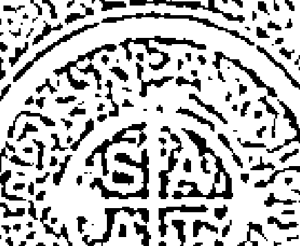

# CHOICES & INCEPTIONS

## Traditional Electional Astrology

傳承千年的擇時經典名著，史上首現中文譯本！

# 地點·時間·人事的選擇

## 古典擇時占星學

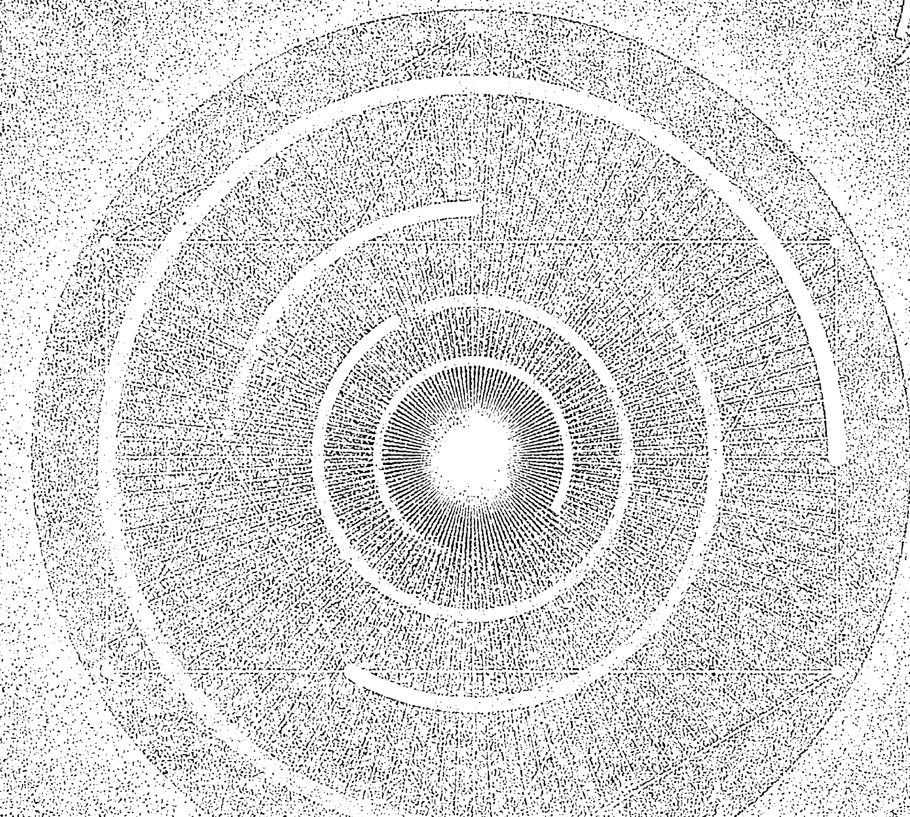

Benjamin N. Dykes, PHD.

班傑明·戴克博士——著

郜捷 Zora Gao——譯

# CHOICES & INCEPTIONS

Traditional Electional Astrology

# 選擇與開始

古典擇時占星

Benjamin N. Dykes, PHD.
班傑明 · 戴克 博士

著

郜捷 Zora Gao

譯

# 致谢

我要向以下的朋友与同事致谢：

名字以字母的顺序排列

- 克里斯·布伦南 (Chris Brenman)
- 查尔斯·伯内特 (Charles Burnett)
- 狄波拉·郝汀 (Deborah Houlding) 以及
- 大卫·朱斯特 (David Juste)

# 出版序

## 你會這麼「傻」嗎？

希斯莉
SATA 星空凝視占星學院創辦人

當一個占星學古文手稿譯者，需要向全世界圖書館蒐羅或購買不同語言、不同版本的古文手稿，再交叉核對各語言與各譯本的正誤，才能著手進行翻譯彙整，為了保存完整古文意義，甚至連手稿的錯誤都要完整呈現，譯者需要博覽群書，深究此學問，補充更正的註釋，才能向讀者傳達正確知識。當一個占星學中文譯者，需要具備完整古典占星專業知識與英文閱讀與理解能力，比對所有專有名詞的英文甚至拉丁文意義，得以精確的中文界定譯名，並且讓古文的原始句型與風味完整呈現，讓文字變成時光機器回到古文明社會。

《選擇與開始》中譯本能問世，是許多傻子們攜手合作，很幸運地都讓我們遇上了。郜捷一年多來日日勤於筆耕的成果，完成了我念茲在茲的期許：接力翻譯戴克博士的古文手稿譯著，以中文推廣至華人社會的首部曲。團隊中還包含紅穎老師專業審訂，彩燕字字必較的編輯校正，涵蓋四種語文的書本對美編也是特大的挑戰。當然我自己就是個傻子，從占星學習應用者身份進入的學術殿堂，要能細細領略這個殿堂必從古文獻扎根。明知學術性的占星書籍不受大眾市場青睞，我還是持續招攬培育各方好手，投入時間精力與成本，努力達成這群傻子們背後傳承的使命感。

对读者来说，这本书的用途何在呢？首先，从二十世纪复兴古典占星文献的运动，中西都是先推介卜卦占星给现代读者，为了使古典占星易于阅读消化理解而推广，让卜卦占星在现代已经等同于古典占星的代名词，而我就是推动这项运动的始作俑者之一。但我的期许不止于此，我相信读者们上手应用这些简单的判读方法后，将会升起更大的求知欲，更多想求进步的读者会希求更多细腻的技术，甚至是最源头的内容。例如，其实卜卦的前身就是择时，这两个学科是一体两面的应用：择时就像是确保正向结果的卜卦。本书据此提到十分详实精彩的历史考證，说明择时的内容是如何演变为卜卦的应用，也因此，读者阅读本书的内容可以同时并进这两个学科的学习。举例来说，卜卦中事情变化或应期等考虑，在择时上也会做相同判断，而本书的择时内容有更多精彩的技术面呈现，例如本书第三部里贾尔的《行星判断技法》(VII.102.10)中提到：当月亮为事项的主管行星时，并非仅观察月亮所在星座的度数变化，而是要观察她经过黄道一圈产生的所有变化：

同样，若月亮或上升主星入相位于一颗与事项属性相似的吉星时，此入相位即为事项显现的应期。而两者之间相距的度数同样亦为应期。

而当事项代表宫位主星入相位于一颗吉星之时，同样亦为应期。而当月亮入相位于一颗吉星之时，同样亦为应期。

当月亮为事项的主管行星之一时，能够赋予她的最长应期为一个月，因在这样长的[时间]里，她将运行经过所有的属性，亦会经过她的庙宫、她所在星座的主星、上升位置及其主星、吉星以及凶星。

本書主要收錄的三本古籍，其實都是師出同源。讀者看這些法則可以先從體會其邏輯來閱讀理解，然後會發現每項問事的判讀有其一致性的邏輯隱藏在後，現代社會的事項應用與古代世界雖不盡相同，但是理解這些邏輯後，就未必要照本宣科，而可觸類旁通，甚至延伸至本命或行運的預測，因為它們都是相同的基礎。爾後，面對後代發展演變的技術，也比較具有基準去判明。

再者，應用這些法則先別貪多，要一個個去實踐。舉例來說，你可能讀到里賈爾以下法則卻從未應用過：

### ——[VII.85.1：上升星座的三分性主星]——

當你被問及[特定]的一群人當中（國王欲派遣他們去作戰或從事其他事項）哪一個更強、更守法且更誠實，則須查看上升位置及其三分性主星：將它們與那些人一一對應——按照詢問者對你說出他們名字的順序：換言之，第一顆[三分性主星]對應第一個人，第二顆對應第二個人，第三顆對應第三個人。再查看其中哪一顆在其所落位置更有力、擁有更多尊貴，是吉星抑或凶星。若它為凶星，且為火星，而月亮呈現凶象且未與吉星[形成相位]，另兩顆三分性主星在它們所落位置上又虛弱無力，則判斷火星代表之人更強、更守法且在[客戶]所關心之事上表現更佳；然而，這預示他們挑選他去辦理的[事項]無法成功，[他]亦[不會][執行]他們的命令。而若那顆凶星為土星，則預示挑選他去辦理的事項耗時長久且拖延。

直到遇上一個類似的問題：球隊比賽時，選擇誰作為先發投手呢？你才發現這個方法很適合應用，也就不會覺得細膩且難以記憶。更重要的是，你有這本詳實的參考書籍，所有問題的判斷都完整羅列，懷抱這部經典著作走向占星師之路，腳步會更篤實。當然，身為現代讀者，也要有自身的辨別力，才能懂得運用本書的古代社會事項，善巧地套用至現代生活中。

我在授課時一直強調實踐的重要性，但所有的基礎都是來自前人的經驗累積。本書主要翻譯：薩爾、伊朗尼，以及里賈爾三本古籍，其實都是傳承自馬謝阿拉。再往前推進至西元一世紀的都勒斯，也就抵達了希臘占星學相當源頭的知識。本書呈現了古典占星學的厚實學術基礎，這些基礎是數千年來先人積累而成，世代學者以各種語言去保存這門被譽為最高深的智慧學問，許多知識學問都曾與占星學緊密相連，也可從這些文獻資料看出古代的社會生活形態。

時至今日，當我們不再仰望星空、不再相信星辰中寫著智慧的語言引領生活的腳步，不再信仰神性的存在，我們就不再需要占星學的啟示。占星學被貶為難登學術殿堂的旁門左道，占星應用者要證明占星學的價值，只能努力端出學與用並進的內容，方能讓占星學重新成為現代人的明燈！雖然傳承占星古典知識這條路還很漫長，但，最困難的第一步，也是奠定未來的基石，我們完成了！

# 中文版序

班傑明·戴克 博士

人類的一切行為都以選擇及與選擇有關的情境作為開始，在其中，我們還必須決定於何時開始行動。或許正是由於這個原因，擇時——抑或「選擇與開始」——成為占星學最早期的類型之一：儘管許多人由於不知道自己的出生時間而無法得知自己生命的起始或開端，但在當下，我們能夠了解自己的行為并為此做出計劃。因此，擇時占星是占星學中最具實用性的類型之一。

占星學子們在我的《選擇與開始——古典擇時占星》中文版一書中將可學習到擇時占星實踐方面最為傳統的法則，其中包括一般性的方法與針對十分具體的行動的法則。我很高興優秀的 SATA 占星學院的朋友們及同事們將它引介到華人讀者群。SATA 團隊站在亞洲持續發展的古典占星運動的最前沿，而他們在這個令人興奮的領域中的譯著名單亦日漸增長，本書便是其中的一部！

# 譯者序

## —

郜捷

2018年10月末的一天夜裡，我做了一個夢。在夢中，我橫下心，拼盡渾身最後的力氣，登上（準確地說是「爬」上）了一座幾乎與地面垂直的險峻高山的頂峰。醒來，我意識到，這個夢是「天書」的翻譯工作即將完成的寫照。

所謂「天書」，其實是我對《選擇與開始——古典擇時占星》一書的戲稱，因為它是一部有關天空、天象、天時之書，更是一部深奧的智慧之書。它以浩大的篇幅收錄了三部流傳千年的、最為重要的擇時占星文獻，內容之廣博使讀者得以一窺古典占星的全貌。而古代先賢們將複雜繁瑣的占星法則融會貫通，運用得出神入化，實在令人嘆服！

然而正因為如此，再加上這部書由中世紀拉丁文譯著翻譯而來的緣故，書中許多字句著實晦澀艱深。而回想當初，從希斯莉老師手中接下這部書的翻譯任務時，自己真是「無知者無畏」。

幸而翻譯的全過程都得到戴克博士耐心細緻的指導，他的學養與嚴謹的治學態度令我深深感佩。一年的時間裡，我先後向戴克博士請教了一百多個問題，而無論難易，他都不厭其煩，一一做出清晰詳細的回覆，甚至還專門補充了許多他新近由阿拉伯文文獻翻譯而來的內容加以說明。本書的一些譯註就是依照戴克博士的說明特別添加的，希望對大家理解本書內容能夠有所幫助。

這部書的翻譯力求在忠實原作的基礎上，使內容明白易懂，但恐諸多初學者仍不免會在閱讀過程中遇到一些困惑不解之處。在此，我分享幾點關於本書閱讀方面的建議，供大家參考：

## 一、關於緒論

不少人在閱讀時有跳過緒論、直奔「主題」的習慣，但如果在閱讀這部書時如法炮製，必定損失慘重，而且十有八九會看得一頭霧水。這部書的緒論篇幅接近全書的六分之一，不僅分析闡述了擇時占星中的各種倫理、哲學議題（ § 1 、 § 2 ），而且對全書每一部當中的文獻內容都進行了概括梳理，補充了重要的背景知識，並對其中有爭議或模糊之處做出了說明（ § 4 、 § 5 、 § 6 、 § 7 ）。

此外，在緒論中，戴克博士還特別針對書中頻繁出現的重要概念或說法進行了考證和詮釋，例如「尖軸不應落在遠離的位置」、「相對於上升位置的果宮」等等。如果你此前未曾接觸過類似的中世紀文獻，切勿錯過這部分內容（ § 3 、 § 8 、 § 9 ）。

有鑑於此，我建議大家：緒論不但一定要閱讀，而且要「首先」閱讀。

## 二、關於註解與詞彙表

註解是這部書十分重要的組成部分，共有約兩千個，其中有相當一部分是對文獻中出現的疑難語句、術語以及背景知識的補充說明，最長的註解接近千字，對於讀者理解本書內容有很大助益。

對於一些沒有註解或譯註的術語，建議讀者查閱本書最後的詞彙表，會看到相應的解釋。

## 三、相似段落比對

此外，我還建議大家在閱讀本書第三部中的著作時，按照註解的提示，參閱本書其他作者著作中相似、但並不相同的內容。如此一來，不但可以更全面、準確地領會個中含義，更可看到文獻傳承過程中，不同作者詮釋上的分化，從而去思索其背後的邏輯，然後有選擇地吸收，而不是囫圇吞棗。

以上這些建議也是我在閱讀和翻譯本書的過程中經驗教訓的總結，其實整部書翻譯下來，讓我頗能體會「字字看來皆是血，十年辛苦不尋常」的感慨。衷心感謝希斯莉老師所給予的莫大信任與支持，將這部具有重要價值與意義的經典之作交付於我翻譯。還要感謝Rose老師專業細心的指導，以及認真敬業的SATA團隊成員，這部書的中文譯本得以面世，仰賴大家同心協力的辛苦付出。

願智慧的傳承代代相續，也衷心希望每一位閱讀本書的人都能從中有所收穫！

# 目錄

圖示目錄 026

# 緒論

- § 1 什麼是擇時？ 030
- § 2 擇時的認識論與道德議題 043
- § 3 「馬謝阿拉的傳承」以及卜卦與擇時的關聯 052
- § 4 伊朗尼與里賈爾 062
- § 5 月亮與月宿 071
- § 6 行星時 080
- § 7 關於應期——伊朗尼與里賈爾 083
- § 8 遠離始宮與宮位系統 090
- § 9 譯文說明 093

# 第一部：月亮與月宿

- 金迪：《擇日》 097
- 里賈爾：《行星判斷技法》VII 101：依據月亮所在月宿擇時 100

# 第二部：行星時

- 貝森：《論行星時》 120
- §1 行星時 120
- §2 三方星座，當落於上升位置時 123
- §3 四正星座，據薩爾《擇日書》 124
- §4 一般性說明和行星徵象，引自薩爾《擇日書》 127
- §5 論土星時與上升位置為土星守護的星座 128
- 里賈爾：《行星判斷技法》VII.100：論行星時的含義 129

# 第三部：完善的擇時

- 薩爾·賓·畢雪：《擇日書》 137
- 擇時中的上升星座及其中的一切 141
- 擇時中自上升星座起算的第二個星座及其中的一切 149
- 擇時中的第三個星座及其中的一切 152
- 擇時中的第四個星座及其中的一切 152
- 擇時中的第五個星座及其中的一切 156
- 擇時中的第六個星座及其中的一切 158
- 擇時中的第七個星座及其中的一切 164
- 擇時中的第八個星座及其中的一切 168
- 擇時中的第九個星座及其中的一切 169
- 擇時中的第十個星座及其中的一切 175
- 擇時中的第十一個星座及其中的一切 077
- 擇時中的第十二個星座及其中的一切 179
- 與十二星座無關的擇時 181
- 伊朗尼：《抉擇之書》 182
- I.1.0：擇時是否有助益 184
- I.2.0：論為所有人擇時的一般性步驟 189
- I.3：論為本命盤已知之人擇時 217
- I.4：論卜卦之後的擇時——無論事項能否完成 221
- I.5.0：所開始之事何時得以完成 223
- II.1.0：為權貴擇時 231
- II.1.1：論確立尊貴身份 232
- II.1.2：論免除尊貴身份 233
- II.1.3：論建造城市與要塞 234
- II.1.4：論建造房屋及城市或要塞中的其餘建築 235
- II.1.5：論摧毀敵人的建築 236
- II.1.6：論河流及泉水的改道 237
- II.1.7：論為擊敗敵人而建造船隻 237
- II.1.8：論外出征戰或其他 238
- II.1.9：論與敵人和解 242
- II.1.10：論返回 244
- II.1.11：論搜尋和狩獵 245
- II.1.12：論賽馬 246
- II.1.13：論遊戲 246
- II.2.1：論以上升位置為代表因子的事項，首先論哺乳 247
- II.2.2：論使男孩離乳 247
- II.2.3：論剪指甲 248
- II.2.4：論修剪頭部或身體的毛髮 248
- II.2.5：論入浴 248
- II.2.6：論治療疾病 249
- II.2.7：論與手術相關的治療 249
- II.2.8：論藉由靜脈或拔罐放血 250
- II.2.9：論男孩的割禮 251
- II.2.10：論給瀉藥 251
- II.2.11：論起凝固作用的藥物 252
- II.2.12：論致噴嚏的[藥物]及藉由藥水或其他[方法]含漱、嘔吐 253
- II.2.13：論穿著新祭服 253
- II.3.1：論與第二宮有關的擇時，首先論歸還或收回借款 254
- II.3.2：論購買 255
- II.3.3：論出售種子、其他與田地有關之物及任何待售之物 256
- II.3.4：論借出金錢 256
- II.3.5：論舉起手[接受金錢] 257
- II.3.6：論更換寄宿地 257
- II.4.1：論與第三宮有關的擇時，首先論與手足和解 258
- II.4.2：說明那些與忠誠於神有關之事 259
- II.4.3：論遣使 259
- II.5.1：論與第四宮有關之事，首先論購買土地 259
- II.5.2：論開始開墾土地 262
- II.5.3：論造磨 263
- II.5.4：論植樹、播種及當年（即在它自己的季節）收穫的一切 263
- II.5.5：論締約[耕種]土地 264
- II.5.6：論出租房屋和生產 265
- II.6.1：論與第五宮有關之事，首先論孕育子嗣 266
- II.6.2：論禮物 267
- II.7.1：論第六宮，首先論購買俘虜 268
- II.7.2：論釋放俘虜、囚徒及馴養馬匹 269
- II.7.3：論購買動物 269
- II.7.4：論購買狩獵使用的動物 270
- II.8.1：論第七宮 271
- II.8.2：論合夥 271
- II.8.3：論購買和售賣 271
- II.8.4：論與女人訂婚 272
- II.9：論第八宮，首先論適當地繼承 273
- II.10.1：論第九宮，首先論道德教育 273
- II.10.2：論傳授歌唱及愉悅之事 274
- II.11.1：論第十宮，首先論傳授游泳 275
- II.11.2：論教授戰鬥 275
- II.11.3：論其他職業教學 276
- II.12.1：論第十一宮，首先論與獲得好名聲和信譽有關之事 276
- II.12.2：論謀求某事，承諾方與謀求方 277
- II.12.3：論尋求愛與友誼 278
- II.13.1：論第十二宮，首先論阻擋敵人或國王抓捕敵人及權力較小之人 278
- II.13.2：論搜尋逃犯 279
- II.13.3：論搜尋逃犯 279
- II.13.4：論使盜賊或看守揭露所求 280

# 里賈爾：《行星判斷技法》VII：論擇時 282

# 本書序 282

# 作者序 282

- VII.1：擇時所必需且不可迴避的法則與基礎 287
- VII.2.0：論行動的原則 289
- VII.3.0：論星座及其象徵 301
- VII.4：論第一宮及其擇時 307
- VII.5：論入浴 307
- VII.6：論剪髮 308
- VII.7：論放血和拔罐 309
- VII.8：論剪指甲 311
- VII.9：論第二宮及其擇時 312
- VII.10：論經營、謀求資產及舉債 313
- VII.11.0：論購買與售賣 313
- VII.12：論出售產品 318
- VII.13：論提供資本 318
- VII.14：論接受資本 319
- VII.15：論搬遷 320
- VII.16：論煉金術操作 320
- VII.17：論第三宮及其擇時 321
- VII.18：論開始說明法律的學問 322
- VII.19：論第四宮及其擇時 323
- VII.20：論建造城市與房屋 323
- VII.21：論藉由挖掘及從河流、小溪引流取水 331
- VII.22：論購買土地 332
- VII.23：論在土地上定居 333

VII.24：論造磨 334
VII.25：論播種與種植樹木 334
VII.26：論租賃土地 335
VII.27：論出租房屋與為獲報酬而生產 335
VII.28：論為房屋驅除幽靈 337
VII.29：論第五宮及其擇時 338
VII.30：論與女人同房以使她懷上男孩 338
VII.31：論為嬰兒哺乳 340
VII.32：論使嬰兒離乳 340
VII.33：論行割禮與施洗 340
VII.34：論裁剪新衣與穿著新衣 341
VII.35：論贈送禮物 342
VII.36：論派遣使者 342
VII.37：論寫作 342
VII.38：論食物 343
VII.39：論酒 344
VII.40：論製作氣味美好之物 345
VII.41：論放飛鴿子以使它們招引其他鴿子 345
VII.42：論從母親腹中取出[胎兒] 346
VII.43：論第六宮及其擇時 347
VII.44：論治療疾病 347
VII.45：論使用注射器治療 348
VII.46：論治療眼睛 349
VII.47：論用瀉藥 349
VII.48：論用止瀉藥 352
VII.49：論藉由鼻子給藥及催吐、含漱 352
VII.50.0：論購買奴隸 353
VII.51.0：論給予奴隸和俘虜法律以及馴馬 355
VII.52.0：購買大型牲畜與小型牲畜 356
VII.53：論第七宮及其擇時 358
VII.54：論婚姻 358
VII.55：論為爭端擇時 362
VII.56：論為戰爭購買武器 367
VII.57.0：論在戰爭中對抗[他人]及議和 367
VII.58：論拆毀敵人的要塞與城市 375
VII.59：論製造武器與剋敵的巧妙裝置——即戰艦及其他船隻 376
VII.60：論合作及一切兩人之間的事項 377
VII.61：論搜尋逃犯 378
VII.62：論使盜賊揭露[所求] 379
VII.63：論陸上及水上狩獵 379
VII.64：論棋盤遊戲、下象棋、擲骰子等 383
VII.65：論與女人同房 385
VII.66：論第八宮及其擇時 387
VII.67：論遺囑 387
VII.68：論亡故之人的遺留 388
VII.69：論第九宮及其擇時 389
VII.70：論為旅行擇時 389
VII.71：論以漫遊為目的的旅行 394
VII.72：為欲迅速返回的旅行者 396
VII.74：論藉由水路旅行 397
VII.75：論購買、登船以及移動船隻 399
VII.76：論將船隻置於水中 401
VII.77：論學習科學與傳授 405
VII.78：論學習歌唱及令人愉悅之事 406
VII.79：論旅行之人進入城市 407
VII.80：論第十宮及其擇時 409
VII.81.0：關於接受尊貴身份 409
VII.82：論為與土地有關的尊貴、徵稅或法律擇時 417
VII.83：論就任行政長官 417
VII.84：論就任宰相或大臣 417
VII.85：論自相同之人中挑選領導者及更強[之人] 418
VII.86：為欲與國王或其他統治者一同旅行之人 422
VII.87：論將國王送往他的統治之所 422
VII.88：為欲在國王面前陳詞之人 423
VII.89：論尋求國王的保護 423
VII.90：論學習專業技能 424
VII.91：論學習作戰 424
VII.92：論學習游泳 425
VII.93：論第十一宮及其擇時 426
VII.94：論意在獲得好名聲與信譽之事 426
VII.95：論履行承諾及提出請求 427
VII.96：論尋求愛與友誼 428
VII.97：論第十二宮及其擇時 429
VII.98：論賽馬 429
VII.99：論國王抓捕敵人或權力較小之人的時刻 430
VII.100：論行星時的含義 431
VII.101：依據月亮所在月宿擇時 431
VII.102：論[某人的]訴求得以實現的應期 431

# 附錄A：主管關係 450

# 附錄B：星座的分類 452

# 附錄C：金迪關於擇時的一般性說明 454

# 附錄D：有關半日時的三種說法 458

# 附錄E：中世紀占星精華系列 460

# 詞彙表 462

# 參考文獻 489

# 圖示目錄

- 圖1: 行為的邏輯簡表 040
- 圖2: 行為的邏輯與考慮本命盤的擇時 042
- 圖3: 「馬謝阿拉的傳承」部分內容 058
- 圖4: 薩爾與哈亞特的資料之分歧 061
- 圖5: 白天行星時的分配（從日出開始計算） 081
- 圖6: 夜晚行星時的分配（從日落開始計算） 082
- 圖7: 應期計算方法推薦（戴克） 088
- 圖8: 阿拉伯二十八月宿及可能的恆星構成 114
- 圖9: 白天行星時的分配（從日出開始計算） 119
- 圖10: 夜晚行星時的分配（從日落開始計算） 119
- 圖11: 北半球南半球的直行星座與扭曲星座 142
- 圖12: 金星解救射手座脫離星體圍攻 196
- 圖13: 木星、土星向月亮投射光線形成右方相位 197
- 圖14: 尖軸的象徵意義——關於購買耕種用地（金迪《四十章》§ 470） 261
- 圖15: 尖軸的象徵意義——關於購買耕種用地（「馬謝阿拉的傳承」[《判斷九書》§ 4.5，4.8-9]、《占星詩集》V.10.1） 262
- 圖16：伊朗尼著作翻譯完成時近似的星盤 281
- 圖17：月亮、價格與赤緯（來源：《占星詩集》V.43.1-4） 316
- 圖18：月亮、價格與月相（來源：《占星詩集》V.44.5-8） 316
- 圖19：月亮、價格與象限（里賈爾VII.11.2、伊朗尼II.3.2-3） 317
- 圖20：巴格達建城盤——據比魯尼 324
- 圖21：巴格達建城近似的星盤（現代計算） 325
- 圖22：金迪關於作戰基本方位的說明 369
- 圖23：里賈爾對金迪內容的修正 369
- 圖24：基於時間的灼傷區間表——按新月發生在星期天早晨計算 371
- 圖25：與幸運點形成相位的行星對應的年數（《占星選集》III.12） 435
- 圖26：幸運點落在各個星座分配的年數（源於行星小年）
（《占星選集》III.12） 437
- 圖27：行星年表 437
- 圖28：主要的尊貴與反尊貴 450
- 圖29：三分性主星 450
- 圖30：埃及界 451
- 圖31：「迦勒底」外觀/外表 451

# 028 ——選擇與開始

# ## 緒論

很高興推出《選擇與開始》一書，這是我的中世紀占星精華系列叢書[1]中唯一有關擇時的書籍。因為大部分擇時文獻的內容都是重複，在判斷上也沒有呈現多樣化的方法。此外，廣為流傳的四部擇時文獻多有重疊，其中有三部已被翻譯並收錄在本書的第三部當中[2]。依狄波拉·郝汀（Deborah Houlding）的建議，我將本書劃分為三部：

第一部包含兩篇僅考慮月亮位置的擇時文獻：即月亮所在的月宿（Lunar mansions），以及月亮入相位至其他行星。這是一種粗糙的、籠統的擇時方法，因為在一天左右的時間裡，它所描述的狀況可以適用於任何地方、任何人。這部分收錄了金迪（al-Kindī，原譯阿拉·欽迪、阿爾欽迪）的短篇文獻《擇日》（*The Choices of Days*）以及里賈爾（al-Rijāl，原譯阿爾瑞加）所著《行星判斷技法》（*the Book of Skilled in the Judgments of the Stars*，原譯《熟練之書》）一書 VII.101。

第二部包含兩篇聚焦在行星時的擇時文獻。這比之前的擇時方法更精細化一些，因為行星時的長度十分敏感於季節和緯度的變化，並且比月亮入相位的時長更短。然而，這部分內容幾乎沒有使用完整的占星學概念和知識體系。這兩篇文獻分別是貝森 (Bethen)^[3]^所著的《論行星時》(On the Hours of the Planets)以及里賈爾的著作《行星判斷技法》VII.100。

第三部的內容即所謂「完善」的擇時：它對於擇時盤各部分徵象進行全面的考量，例如宮主星及其位置，行星時，行星的配置，日夜區分，吉凶星的差異，以及普適性的擇時與針對當事人的本命盤和諮詢事項進行的擇時之間的區別。這部分包括薩爾·賓·畢雪（Sahl bin Bishr）所著《擇日書》（On Elections）的翻譯修訂版、伊朗尼（al-'Imrānī，原譯阿爾伊朗尼）著名的《抉擇之書》（The Book of Choices），以及里賈爾所著《行星判斷技法》VII（其內容完全聚焦於擇時和應期的計算）。

介紹這些內容之前，讓我們先來討論一些術語，以及擇時與卜卦、事件盤、意念推測（thought-interpretation）之間的關聯。

## §1 什麼是擇時？

擇時（譯註：又稱擇日。）占星是古典占星學中一個清晰的支脈，與本命占星（Nativities）、卜卦占星（Questions或「Horary」）^[4]^和世運占星（Mundane）並稱。從某種意義上來說，它很容易理解。「擇時」（election）這個詞意思就是「選擇」，它源自拉丁文eligo（挑選、選出）。擇時占星即選擇好的時機去進行想要採取的行動：從何時出征、到何時建立商業合作關係、再到何時適合出行。基本上，這就是我們在進入擇時實踐之前所需瞭解的全部內容。

另一方面，擇時占星、卜卦占星以及意念推測、事件盤之間有很多錯綜複雜的關聯。除此之外，中世紀對於擇時的適當性，以及是否應為不知道出生時間的人進行擇時、如何為他們擇時存在頗多爭議。後者引出了中世紀的「根」（roots）理論，並且與一些古老邏輯的應用相關聯。總之，擇時占星佔據了占星學分支中一個微妙的位置。讓我們先從術語入手。

# ## 術語

上文提到拉丁文詞彙eligo，由此得到擇時的拉丁文electio和英文election。在阿拉伯語中，擇時通常稱作ikhtiyārāt，也就是「選擇」，它源於kḥāra（挑選）一詞：由此可見，不論是阿拉伯文詞彙還是拉丁文詞彙，同樣都是選擇的意思。

不過，「選擇」這個詞的含義卻是模糊不清的，因為它實際上指的是心智上承諾進行一項行動，而非真的開始行動。甚至人們會認為，這一概念其實是與占星師選擇吉祥的時間有關，而不是與客戶或採取行動的人有關：「擇時」因此成為專業占星師的業內術語。對於行動本身而言，阿拉伯作者（例如金迪[5]、薩爾[6]和卡畢希[al-Qabīsī，原譯阿爾卡畢希][7]）所使用的ibtidāʾāt（「開始、著手進行」）一詞來源於badaʾ（「開始、邁出第一步」）。這個詞被準確地翻譯成拉丁文就是inceptiones（「開始、著手進行」，英文「inception」一詞也由此而來），它來源於動詞incipio，採取行動的人則被稱為inceptor（「開始行動的人」）[8]。由此我們再次看到阿拉伯文與拉丁文詮釋的完美契合。

碰巧的是，早期的希臘作者（例如赫菲斯提歐[Hephaistio of Thebes]與都勒斯[Dorotheus of Sidon]）並不將擇時稱為「選擇」。他們使用的是希臘文katarchē（「開始」），源自於katarchō（「著手開始」）一詞[9]。這與上一段提到的阿拉伯文和拉丁文詞彙的含義是一樣的。由此可見，阿拉伯作者和拉丁作者們似乎一邊強調占星師選擇吉祥的時間，一邊又延續了希臘文獻的說法，即重視行動的開始。因此，這一占星學分支關注的是：選擇好的時間開始進行一項成功的行動。

### ——卜卦、择时、意念推测：重叠且模糊——

目前看來，似乎擇時與卜卦有明顯的區別。人們通常認為，卜卦旨在尋找具體問題的答案，而擇時是為已知的（並且想要成功進行的）事項選擇開始的時間。不過事實並非如此簡單。的確有一些問題屬於「純粹」的卜卦，例如「我走失的牛在哪裡？」而另一些則純粹屬於擇時，例如「我應在何時出發去旅行？」此外，卜卦可以用來詢問與當事人無關的問題或是無法左右的事項，例如「某方會贏得戰爭的勝利嗎？」而擇時的前提卻是，當事人會涉人事項當中，並有權力作出決定。儘管如此，卜卦和擇時還是會由於種種原因而難以清晰地區分開來[10]。讓我們先來看看卜卦與擇時。

- 1. 有些卜卦盤暗示著行動。例如詢問「此事會發生嗎？」這類問題，那麼答案就可能是「會，但你必須做某某事項。」薩爾曾以一個案例來說明[11]，大意為：如果卜問者詢問能否得到榮耀，而上升星座的主星落在第十宮，說明他將會得到，但是要付出努力。如果是第十宮主星落在上升星座，那麼他不須努力就可以得到。古德·波那提 (Guido Bonatti)提供了一個自己實證的案例[12]，一位將軍問是否可以成功佔領敵人的城堡，他的回答是「你能佔領，但你不會去做。」他指出將軍本來是可以佔領的，前提是必須先完成攻奪的條件，而星盤中的徵象顯示當事人無法完成這個條件，所以沒能佔領此城堡。在上述這些案例中，「是」或「否」的答案必須附帶一些未來的行動。如果答案是「是」，就可以選擇一個時間開始行動。但有時候(就像波那提的例子)，卜卦盤顯示結果是有可能的，卻不會發生。

- 2. 有些擇時需要建立在成功的卜卦盤之上。正如後文所述，中世紀作者認為，一些行動需要得到可靠的本命盤（加上流年盤等）或是成功的卜卦盤來確認。例如關於一個人的商業之旅，如果本命盤的徵象是中性的或者模稜兩可的，那麼就需要進行卜卦。如果得到了積極的答案，就可以選擇一個吉時出發。因此，卜卦盤有時候被用來代替本命盤，以其徵象繪製有效的擇時盤。

- 3. 有些卜卦盤、擇時盤涉及過去的行動或事件，而這些行動或事件並沒有刻意地選擇時間。例如有人問國王能在位多久：馬謝阿拉（Māshā’allāh）認為 [13]，可以先繪製出國王登基時的星盤（現在稱之為「事件盤」），再繪製出它每年的太陽回歸盤（solar revolution）——也就是說將未經計畫的事件星盤視為本命盤。這類事件盤與擇時盤有些相似，只不過相對於刻意去選擇的擇時盤而言，這個過去已發生的事件沒有應用占星學原理來選擇時間。同樣地，都勒斯在《占星詩集》（Carmen Astrologicum）V.35中設想某位客戶來卜問失物，大部分內容描述的是失物在哪裡以及如何辨認嫌犯，但是V.35.57以後的內容卻闡述如何識別丟失的是何樣的物品。難道這不是客戶已經知道的嗎？在這個案例中，諮商使用了目前的資訊（以下卦的形式）去推斷過去已經發生的事情，也就是以占星學的方式確認客戶所關注的是什麼。也可能有人會詢問過去發生了什麼，那麼就可以月亮最近的離相位來確認那些過去發生的、與現況有關的事件。因此，雖然或許有人認為下卦是回答當下和未來的事情，擇時是為未來的行動挑選時間，但其實它們都可以應用在過去發生的、沒有刻意挑選時間或給予特別關注的事件上。

（4）下卦與擇時均可與意念推測相關聯。在《心之所向》（The Search of the Heart）一書中，我論證了中世紀及更早期的占星師在某些情況下 [14]，使用一些方法來識別客戶心中所想或所關心的是什麼（例如「與第三宮有關的事項」）。然後通過進一步交談縮小問題範圍，隨後再將星盤視為下卦盤來解讀。而在另一些情況下 [15]，客戶的意念推測和事件結果的判斷則是一氣呵成的。但是赫菲斯提歐在其著作《結果》（Apotelesmatics，原譯《占星效用》、《神話》）III.4 [16]中指出，意念推測的過程似乎也與行動有關。III.4的標題寫道：有關如何預知（意念推測）詢問者（希臘文 peusis，即詢問）想要開始（katarchē）的行動。三種活動及其星盤可能涵蓋出現在同一個諮商中：例如，首先通過意念推測可得知客戶想要找一件丟失的物品，然後通過卜卦法則判斷是否可以找到以及去哪裡尋找，隨後客戶回到家裡開始尋找。在這個例子裡，客戶採取行動是在意念推測和卜卦諮商之後，看似是單獨進行的[17]，但成功的卜卦盤可以就此判斷出開始的吉時。隨後赫菲斯提歐使用幸運點來確認客戶所想，在其中一個例子中，他說客戶想做這件事情毫無意義。但我認為這進一步顯示卜卦、擇時、意念推測三者是很難完全區分開的：赫菲斯提歐是在描述客戶想做的事情本身是毫無意義的，還是在描述客戶的想法（「客戶想做這件事」）是毫無意義的，又或者是在預測事情的發展是毫無意義的呢？有人可能會認為，這完全是一個關於意念推測和卜卦的案例，因為赫菲斯提歐根本沒有提及選擇行動的時間。但我僅想說明，由於三者之間的交集，不能簡單地將卜卦和擇時區分開，而認為卜卦是針對當下及未來我們無法掌控之事，擇時是針對將來我們可以特意為之的事情。

到目前為止，針對卜卦與擇時之間的關聯，我已提出了一些令人費解之處。然而還有另一個有力的證據證明兩者的關聯十分緊密：據歷史考證，擇時的資料曾被一些作者轉換用途，以創作關於某些主題的卜卦內容。舉例來說，有些作者把為商業合夥選擇吉時的資料，改寫成回答關於「在商業合夥中會發生什麼」此類卜卦問題的說明。因此，卜卦占星有許多著名文獻是從擇時文獻轉換而來的，而非一個獨

17 | 印度占星典籍 Yavanajātaka 一書中提到將意念推測盤與本命盤做比對的情況，正如後來的卜卦占星師將卜卦盤與本命盤比對（見「根本」盤）那樣。（見後文）立的占星學分支。我將對此做出進一步解釋，並引出「根」的概念。

- （5）卜卦文獻轉換自擇時文獻。大衛·賓格瑞（David Pingree）在1997年出版的著作中稱[18]，一些重要的卜卦文獻事實上改寫自早期的擇時和本命資料（特別是都勒斯的《占星詩集》V，關於擇時或開始行動的部分[19]）——不過他並未對此作詳細說明。在出版於2011年的《判斷九書》中，我論證了賓格瑞的說法是正確的，為了支持這一說法，我開始編譯所謂「馬謝阿拉的傳承」（「Māshā’allāh group」或「Māshā’allāh transmission」）的資料作為引證：馬謝阿拉的追隨者（和抄錄者）撰寫了許多卜卦資料，特別是薩爾和阿布阿里·哈亞特（Abū‘Alī al-Khayyāt，原譯阿布阿里·阿爾加牙）。本書稍後還將提供更多細節。當把《占星詩集》V與本書的擇時內容及《判斷九書》中的卜卦內容做比對時，很顯然，我發現卜卦的基本架構和大部分的內容，直接來源於《占星詩集》V——無論是馬謝阿拉的譯本，還是烏瑪·塔巴里（‘Umar al-Tabarī，原譯烏瑪·阿爾塔巴里、烏瑪·阿拉塔巴里）的譯本。貫穿本書提供了多處引述和對比供讀者研究。

顯然，卜卦和擇時在內容與風格上十分接近，這恰恰因為其中一個常常由另一個改寫而來[20]。的確，儘管許多本命盤的解讀法則也能夠應用於其他的占星學分支，但是沒有任何另外兩個分支共用如此之多的技巧和方法（以及文獻內容），遠遠有別於其他占星學分支。所以試圖將卜卦與擇時嚴格地區分開註定是徒勞的。

18 | 參見賓格瑞(Pingree)1997年出版著作，p. 47。

19 | 都勒斯在西元一世紀寫下的著作，涵蓋本命、流年預測與擇時內容，但希臘文文獻已不完整。其中部分內容被赫菲斯提歐摘錄和總結在自己的希臘文著作《結果》中，也有其他希臘文、阿拉伯文片段倖存。此外，西元七世紀晚期烏瑪將改動過的巴列維文（Pahlavi）（譯註：一種古波斯文。）手稿譯成阿拉伯文的不完整文獻。大衛·賓格瑞於1976年以《占星詩集》為名編譯出版烏瑪翻譯的阿拉伯文版本（附有英文翻譯），迄今仍是研究都勒斯的重要資料。本書提及《占星詩集》即指賓格瑞版本，並非已失傳的原著或馬謝阿拉的譯本（詳見後文）。

20 | 之所以說「常常」，是因為在《判斷九書》中，烏瑪的卜卦內容與《占星詩集》V並不十分吻合，但他的擇時內容卻與之很吻合。然而那些來源於《占星詩集》馬謝阿拉譯本的卜卦與擇時內容，在關鍵點上都是一致的。這說明或許烏瑪比馬謝阿拉更慎重對待卜卦與擇時的區別。

事實上，在我看來，卜卦、擇時與意念推測在內容上的相似性以及它們之間的歷史淵源，正說明了馬謝阿拉等人認為，有些卜卦就像是提前的擇時：即一張當下的卜卦盤，詢問的是未來發生的事件，其實就如同一張為未來所做的擇時盤。例如我希望進行一次順利的旅行。我此刻卜卦詢問「旅行是否會順利呢？」，如果卜卦盤的徵象顯示會順利，那麼等同於通過擇時挑選了一個未來有利於旅行的時間。類似地，解讀事件盤（即為過去發生事件起的星盤）也等同於在事件發生之後，再回過頭去解讀當初的擇時盤。

這樣說並非是要弱化卜卦盤與事件盤的概念（尤其事件盤的著墨又更少）。畢竟，卜卦盤確實應對並處理了我們難以控制的事項，為它們進行擇時十分困難：例如「X能夠贏得戰爭的勝利嗎？」但是根據上述重疊且模糊的五點內容可知：

- （1）一些卜卦暗示必須採取行動，因為它們指明了必需先要採取怎樣的行動，才能夠取得成功——儘管當事人稍後可能還要正式為這個行動擇時。

- （2）有些擇時需要先由卜卦盤給予好的答案，因為卜卦盤能顯示擇時盤必須具備怎樣的特徵。在不知道本命盤的情況下，卜卦盤至少可以確認行動與本命盤是不衝突的，並且可以代替本命盤，指出在隨後的擇時中將哪些星座和行星放到適當的位置（見§2）。

- （3）當顯示過去發生的事件時，情況有點複雜。諮商時起的星盤本質上顯示了當下正在發生的事，它與過去發生的一連串事件有關（例如財物已經被偷走，那麼現在它在哪裡？）；不過，這張星盤同樣也可以揭示個案所關注的事情能否順利（例如是否可以找回丟失的財物？）以及如何成功地採取行動（例如小偷正在逃跑，如果不追捕，他將逍遙法外，或者說如果當事人不立刻去找，這件東西就再也無法尋回。）。儘管如此，在諮詢過程中，對於過去、現在以及未來選擇的分析仍是流暢的。在小偷這個例子中，無論是針對過去事件起的星盤還是諮詢時起的星盤，都能夠描述先前逃走的小偷的特徵；諮詢時起的星盤還可以顯示能否抓住小偷或找回財物，以及這是否是抓小偷的最佳時機等等。

- （4）在意念推測中，如果客戶詢問的是關於未來行動的問題，諮詢時的星盤會顯示其對此的想法，並同時扮演卜卦盤的角色，用來推斷這個行動成功與否，以及必須先完成哪些事項才能讓行動成功。

- （5）最後，卜卦像是提前的擇時，因為它來源於擇時文獻的內容，只不過以詢問未來之事的形式被改寫而已。

### ——根與行為的邏輯——

中世紀「根」的概念在擇時占星理論和實踐中十分重要，其實它與所有古典占星學分支都有關聯——不過令人感到奇怪的是，（據我所知）希臘時期的文獻很少談到它。

在拉丁西歐（the Latin West）直到英文文本出現之前[21]，卜卦占星的研究一向注重卜卦盤是否符合「根本性」（「radical」，拉丁文 radicalis)，很多人都將「根本性」視為「解盤的許可」。這個詞即「植根」的意思，卜卦盤植根於本命盤，所以本命盤常常被稱為根本盤（radix）。幾個世紀以來，阿拉伯和拉丁文獻都關注根本盤，因為它為其他星盤提供了由來和基礎。一些占星師認為，對於卜卦而言，神的意志（God’s will）才是有效問題的終極根本和基礎[22]。不過嚴謹的占星學定義是：一張根本盤是某個相對獨立事物的開始，其他星盤則是根據這張盤衍生而來的。例如：

- 一張真正考慮周詳的擇時盤，應強化或者弱化本命盤（根本盤）中的徵象。
- 卜卦盤常出現與本命盤（根本盤）有關的徵象。
- 太陽回歸時的行星過運（transit），要考慮與本命盤（根本盤）之間的關聯。
- 每一年的春分始入盤（Aries ingress charts）都要考慮之前的始入盤或木土會合位置（Saturn-Jupiter conjunctions）（根本盤）。同樣，解讀每20年發生一次的木土會合位置，必須考慮三方星座轉移的木土會合位置（the conjunction of the triplicity change）（根本盤）。
- 氣候預測通常需考慮始入盤的一般性主題或新月、滿月盤（根本盤）。

鑒於根本盤在擇時中的重要性，薩爾從《擇日書》開篇就開始探討擇時是否適用於那些不知道本命盤的人。繼薩爾之後，伊朗尼和里賈爾也同樣而為（本書稍後將做說明）。接下來先就根本盤的概念做進一步探討。

透過上述的例子，首先要強調的是：世上並不存在絕對獨立的事物；萬事萬物都是相互關聯的。在占星學中，星盤與其根本盤相關聯。一張星盤依存於根本盤，而根本盤也依存於其他事物，也有它的「根」。

其次，將擇時盤與其根本盤放在「行為的邏輯」（「logic of action」）這個框架下考量會有所助益。在古代，哲學家深知邏輯的重要性，試圖用邏輯模型來解釋行為：他們設法以行為的邏輯來重新塑造慾望、環境和行為之間的關聯。例如，假設我認為「蛋糕是好的」。這種價值判斷表明我有吃掉它的可能性，因為行為建立在人們認為有利的基礎上。那麼如果當我看到蛋糕，頭腦會反應「這是蛋糕」。一般性的（或普適的）價值判斷是蛋糕是好的（也就是說準備採取行動吃它），再加上特定環境並且確認蛋糕可以吃，就會產生行為——吃掉蛋糕。這就是將態度、價值判斷與特定環境相聯繫的一個簡單的例子。同樣地，當警察調查嫌犯時，會結合作案動機（普適性）與下手機會（特殊性）來解釋犯罪行為（個人行為）。普適性範疇以適當的方式與特殊性範疇結合，就產生出具體的具體行為[23]。

| 理論術語 | 行為的邏輯 |
| :--- | :--- |
| 普適性 | 動機／價值判斷 |
| ＋特殊性 | ＋機會／環境 |
| ＝具體個體 | ＝具體行為 |
| **圖1：行為的邏輯簡表** | |

> 23｜如果讀者熟悉康得（Kant）倫理學，會發現這與他分析行為的方式基本一致。「絕對」（即無條件的）命令（「categorical」, imperative）是道德行為的普適性法則，而準則（maxim）是一種特定類型的行為。如果準則與絕對命令完全一致，那麼這個行為就是道德的、被允許的；反之，該行為就是不道德的、不被允許的。

擇時可以放在這一框架下去理解。舉個具體的例子，假設航空公司出售某日飛往明尼阿波里斯市的特價機票。也許你會認為這是一個購票的「吉時」。這似乎是正確的，因為打折是購買機票的好時機。但是打折是針對所有人的，而人們的生活複雜多樣。總的來說這是一個購票的好時機，但並不意味著對你來說是購票的好時機。也許你破產了，無法購買機票，或者也許你恰好在那天要參加朋友的婚禮。若想打折對你有利，那麼它必須符合你的需求和利益。結合占星學來說，假設月亮將要三合位於中天的木星：也許你會說這是一個行動的好時機。然而這對任何行動和任何在該地區的人來說都是一樣的。當然不是說這個吉時沒用，只是針對特定的行動、特別是為你的需求和利益量身定制的擇時而言，需要一些更具體的細節。

我認為本命盤是根，在擇時中扮演「普遍性」這個角色。它與動機、利益結合在一起，展示了一系列行動的可能性（也許是不可能性）。例如我想挑選一個有利於升職的吉時：需要看到我的本命盤對此是支持的，特別是相關徵象要在此時被引動（例如小限或太陽回歸顯示此時有升職可能）。如果能看到這些，那麼升職就有了很好的基礎或根。

擇時本身——或者說本命盤及因其挑選的時間——扮演了「特殊性」這個角色。擇時盤的徵象所描繪的是在特定的時間進行一項成功的行動，而它們必須與本命盤有關聯，因為事項和我有關，與其他人無關。不過，在「特殊性」這個角色中，古典占星家又劃分出兩個層次或部分：次級普遍性層次與次級特殊性層次[24]。也就是說，雖然本命盤扮演「普遍性」角色，擇時盤扮演「特殊性」角色，但是我們可以進一步根據與本命盤的關聯，把擇時盤再劃分為上述的兩個次級層次。

仍以升職為例。我的本命盤是根，顯示了生活的一般性狀況，而擇時盤將這些一般性徵象特殊化。一張好的擇時盤，既要在普遍性層面上是好的，又要能夠強化本命盤裡面有利的一面或是弱化不利的一面。我們希望擇時盤具備好的徵象，並且特別有利於我想採取的行動。因此，要確保月亮和第十宮的狀態都是好的，可能還要考慮太陽，因為它代表榮耀。我們希望擇時盤的上升星座及其守護星（代表我本人）處於好的狀態。這就是一個好的開始：一個對升職非常有利的吉時。不過，這對我個人有利嗎？我們在擇時時已經考慮到了具體的事項，不過從某種程度來說，這仍然是一般性的範疇。試想若我本命盤的第十宮落在了擇時盤的第六宮，火星和土星也落在其中並且落陷或入弱，會怎樣呢？在這種情況下，對於我個人的晉升來說，就不是吉時，儘管理論上這張擇時盤有很多吉祥的徵象。那麼這張擇時盤會完全否定我成功的可能嗎？也許會，也許不會。但是為了得到一張為我量身定制的理想的擇時盤，本命盤的徵象必須在擇時盤中有適當的展現。如同我上文提到的：儘管相對於本命盤的普遍性角色，擇時盤扮演的是特殊性角色，但它自身是複雜的，不僅對事項而言要具有一般性的吉兆，還要有針對性地配合當事人的本命盤。

| 理論術語 | 考慮本命盤的擇時 |
|----------|------------------|
| 普遍性 +特殊性 | 本命盤 +擇時盤(含兩部分)： 普遍性：發光體、吉星等在適當的狀態 特殊性：本命盤的徵象在適當的狀態 |
| =具體個體 | =成功的開始 |

### 圖2：行為的邏輯與考慮本命盤的擇時

本書內容涵蓋擇時的這兩個方面，且複雜程度不一（事實上我已將其簡化了）。我們以伊朗尼為例，在其著作I.1.2和2.0中，關於擇時中「次級的普適性層次」由哪些要素組成，他給出了一些觀點：例如I.1.2提到，他認為在擇時盤中，要讓月亮、太陽、該事項的徵象星（例如金星代表訂婚），以及該事項的一般性代表星座（例如水象星座對應航海）處於適當的狀態[25]。然後在I.1.3提到需要讓本命盤與擇時盤中代表該事項的宮位（例如說第十宮代表榮耀）在擇時盤中都處於適當的狀態：也就是說如果本命盤第十宮是摩羯座，擇時盤第十宮是處女座，那麼在擇時盤中，這兩個星座都要處於適當的狀態。最後在論述二中，闡述了完善的、有針對性的擇時還需要注意哪些細節：例如，在手術擇時中，月亮要在特定的星座並且不合意（in aversion）於火星。雖然常常不容易辨別作者的描述究竟屬於普適性的還是特殊性的，但這些分類對於瞭解如何處理標準的、「完善的」擇時是有幫助的。

## §2 擇時的認識論與道德議題

本書收錄的文獻內容有很多是相同的，因為同樣的資料常常從一處傳到另一處。但從某些角度而言，它們如同一場對話，因為幾個世紀以來，作者們不僅針對擇時的本質和應用，而且還針對認識論（Epistemological）和道德議題做出了思考，尤其以薩爾為代表（儘管可能源自馬謝阿拉）。下面先談談文獻的傳承，隨後討論其他。

> 25 | 本書將拉丁文 adapto 譯為「適當放置某某」或「讓某某處於適當的狀態」，指的是就普適性層面（例如讓行星與吉星形成相位）和特殊性層面而言（例如為王權或者榮耀有關的事項擇時時，讓月亮落在火象星座），找出一個令所擇之事處於好的狀態的時間。

對本書所收錄的資料做出最重要貢獻的是都勒斯。他於西元一世紀創作《占星詩集》，在西元五世紀，這本書的內容被大量收錄於赫菲斯提歐的著作《結果》中，同時亦被翻譯成古波斯文版本（有一些添加和改動）。西元八世紀後半葉，馬謝阿拉與烏瑪分別將古波斯文版本翻譯成阿拉伯文[26]。烏瑪將他的翻譯引用到自己的擇時著作中[27]，而馬謝阿拉並未將自己翻譯的版本彙編成獨立的著作，而是將其傳給了薩爾和學生哈亞特，由他們再傳給其他人。反倒是之後薩爾和哈亞特似乎抄錄了一部擇時著作，而這本書的內容又來自馬謝阿拉對於都勒斯《占星詩集》V的翻譯。這就是本書收錄的第一部完整的擇時資料薩爾《擇日書》[28]的由來，或許它應該被視為馬謝阿拉的著作。隨後，伊朗尼汲取了薩爾、哈亞特及烏瑪的內容。儘管他沒有直接得到都勒斯的傳承，但因前述的淵源，所以他的擇時觀點和方法大部分都源自都勒斯。里賈爾的擇時內容多來源於伊朗尼，但加入了薩爾的一些重要段落。就這樣，都勒斯的著作被很多人重述或改換面貌，很大程度上後世作者的研究都是在他劃定的範圍內進行的。當然，阿拉伯時期還有很多關於「根」以及其他議題的思考：後世的作者並沒有不假思索地盲目抄襲。正如讀者將會看到的那樣，他們對於彼此、甚至自己的資料來源都並非一貫認同。

我們最好從伊朗尼談起，其著作開篇就論證了擇時的合理性。在概述該書架構之後，論述一即以回顧托勒密（Claudius Ptolemy）《四書》（Tetrabiblos）III.2中的重要觀點作為開始。托勒密認為，受孕是人類最初的開始（archē），而本命盤是次級的開始（katarchē）[29]，與最初的開始相關聯，並且依附於它。的確，本命盤顯示了一個人誕生後生命的演變，而受孕盤還可以顯示包括懷孕期間的所有狀況——只要知道受孕的時間，然而大部分人都不知道。所以本命盤作為開始是非常適當的——因為從子宮中誕生的那一刻也是一個人準備好來經驗人生歷程的開始，儘管那是在受孕和懷孕過程之後。伊朗尼引用托勒密的話來論證擇時的合理性，他寫道：受孕盤可以代替本命盤作為開始，意味著如果我們能夠使用本命盤的判斷法則來計畫一個受孕時間（即為受孕擇時），我們就可以徹底瞭解生命將如何演化——其他事項也如此。

> > 26 | 詳見後文「馬謝阿拉的傳承」。

> > 27 | 烏瑪的著作《抉擇之書》(Book of Choices)沒有被譯成阿拉伯文以外的版本，不過這本書的內容與《占星詩集》是吻合的。

> > 28 | 《擇日書》曾被翻譯成拉丁文，本書收錄的這部分內容由拉丁文翻譯而來，並參照了克羅夫茨的阿拉伯文版本。

如今看來，伊朗尼的論證並不完善。因為擇時盤通常被視作一個次級的、相對的開始，依附於「根」（例如本命盤）之下，他在此卻將受孕盤視為擇時盤，有悖於托勒密「受孕是最初的開始而非相對的開始」這一觀點。再者，在受孕之後會有一個次級的、相對的開始（即本命盤）——但通常擇時之後是行動，並非次級的開始。因此似乎伊朗尼將擇時盤和根本盤這一模型放到受孕盤上是失策的。但我認為，可以依照托勒密的自然論（Ptolemy’s naturalism）去填補其中缺失的部分。在托勒密的自然因果占星理論中，受孕盤植根於父母的本命盤及其過運等，所以相對於它們而言，受孕盤就是次級的開始（katarchē）。但相對於本命盤而言，受孕盤卻是最初的開始（archē），本命盤相對於受孕盤來說是次級的開始（katarchē）。我認為，伊朗尼其實是想要通過托勒密的內容來表達一個認識論和道德觀點：刻意地選擇時間乃是一種善舉，因為與未來相關的知識是有價值的，我們運用知識去創造幸福的能力也有其價值。（托勒密在《四書》I.2-3中論證過。）就受孕盤而言，我們通常都想為孩子挑選最好的人生，至少給他們提供最好的機會，因此，能夠特意為受孕擇時，可以提升知識與美德。

伊朗尼接下來應論證擇時是占星學的獨立分支，然而他沒有這樣做，但他或許能這麼說：「擇時盤與本命盤是有區別的。擇時盤是相對的開始，它依存於本命盤之下，就像本命盤依存於受孕盤之下，但無法做到如本命盤那般的預測程度，只能做出將船放下水或是進行交易這種單純獨立的行為，不像生命的誕生那樣擁有一個完整、實質的存在。擇時盤更像太陽回歸盤或卜卦盤，實際上是受時間與範圍限制的一種相對的開始（這也使它們的判斷更加靈活多樣）。此外，本命盤有很多來自非特意挑選的受孕時間，但擇時盤永遠是特意為之的，且與知識及美德緊密相關。因此，儘管擇時盤與本命盤都是相對的開始，但擇時在占星學中扮演它自己獨特的角色。」

在初步說明擇時的合理性之後，伊朗尼（及其他作者）對擇時能達到的效果給出了限制——因為它們不是「根」。擇時無法讓違背本命盤的事情發生（例如若本命盤顯示婚姻十分糟糕，那麼擇時盤無法讓此人擁有美滿的婚姻）[30]，並且也無法讓因受到物質條件限制而不可能實現的事情發生，例如為一個尚未發育完全的男孩擇時生育[31]。擇時能做的只不過是緩和或加強根本盤中已經存在的徵象[32]，或是為其提供一個大體良好的環境，例如為打獵擇吉時。伊朗尼在I.2.13中列

30 | 參見里賈爾《行星判斷技法》VII.〈作者序〉。
31 | 參見伊朗尼I.2.0、II.6.1。這點很有趣。占星師偶爾指出必須瞭解當事人周圍的真實環境，因此我們不能預言一個極度貧困的人會當上國王或是腰纏萬貫——除非他或她在窮人當中備受尊敬或出類拔萃。但伊朗尼在此書中（尤其是II.6.1）指出，諸如醫學知識等對於占星師都是有用的。
32 | 《擇日書》§§1-4；里賈爾VII.〈作者序〉；伊朗尼I.1.4、2.0。

出了各种本命盘与择时盘组合的可能性：例如若本命盘很糟，那么好的择时到底能发挥多大效用[33]。

不过，作者们仍然致力于研究另外两个涉及实践和伦理层面的相关议题：第一，是否应为本命盘未知的人择时，以及怎样为他们择时；第二，是否可以用一张成功的卜卦盘中的征象代替未知的本命盘。

### ——本命盘未知与卜卦盘的使用——

萨尔在《择日书》开篇[34]指出，比起本命盘来说，择时盘是无功用的。它们仅对国王而言作用强大（或者也许是所有有权力的成功人士），因为显然他们的本命盘（通常是已知的）已经预示了成功；所以择时有效地强化了他们的行为。也就是说，好的择时盘加上好的本命盘很容易带来成功——但事实上，这样的人可能并不需要择时来确保成功。

但若是这样，我们就需要为中下阶层的人择时，而他们当中的很多人都不知道自己的出生时间[35]。这些人的本命盘通常只显示了中等程度的成功或是无法成功，因此择时的作用也不大；而如果不知道出生时间，那么选择一个没有助益、甚至是有害的择时盘的风险就会增加，因为不知道本命盘中的哪些征象要在择时盘里被加强或放在适当的位置。所以萨尔认为，以下情况至少出现一种，才能为这些人择时：（1）本命盘及太阳回归盘均显示在那个时间会取得成功，或者（2）对于该事项的卜卦盘显示能获得成功。在（2）中，我们看到根理

论以另一种方式出现了。因为对择时盘而言，本命盘是根本盘，但这里由卜卦盘代理，间接地反映出本命盘的征象：也就是说，一张成功的卜卦盘说明本命盘与行动是不冲突的。因为若本命盘与行动冲突，卜卦盘就不会预示成功。

萨尔强调了以上两点的重要性，因为如果当事人的出生时间未知（因此也不知道太阳回归盘），或是面对一张不成功的卜卦盘（可能包含了本命盘中的一些征象），那么我们在择时时反而会强化本命盘中不好的征象。例如我们可能会在择时盘中强化木星，但并不知道木星在本命盘中入弱，落在第十二宫，同时与两颗凶星形成四分相。这时，择时不仅不会带来帮助，甚至还会造成伤害。

萨尔的著作提出了普遍性的问题并给出了一组可行性的答案。在继续看其他作者的回应之前，我要谈两点：第一点是萨尔的不明确之处。表面看来，他似乎仅仅是说，只要看到卜卦的结果是好的，便可另行择时。但伊朗尼和哈亚特[36]却将此理解为，要将卜卦的特定征象适当地带入择时盘中。这两种观点大不相同。举个例子，假设一个不知道出生时间的客户想要择时旅行，占星师首先针对“旅行会成功吗？”这个问题起卜卦盘。假设卜卦盘的上升星座是双子座。萨尔的观点似乎认为，一旦我们看到旅行会成功，就不用去关注双子座或它的守护星水星了，因为我们只需要知道旅行会成功就够了，只要按照规则进行择时就可以了。但伊朗尼和哈亚特对此的理解是：要以卜卦盘当做根本盘的代理。也就是说择时盘中双子座和水星也要处于适当的状态，因为卜卦盘的征象应在择时盘中扮演活跃的角色。

三种立场。萨尔是一个极端[37]，他允许为本命盘未知者择时，也允许依据卜卦来进行择时，尽管他对两种方法的使用都很谨慎。另一个极端是哈亚特（如伊朗尼所描述），他秉持自然主义观点：认为不应为本命盘未知者择时，也不能使用卜卦。介于两者中间的是伊朗尼，他认为应该找出方法为任何一个人择时，但是（a）仅在必要时才使用卜卦盘，而且（b）不应将卜卦的征象应用至择时盘中。（伊朗尼列出许多其他择时的方法来找到行动的最好时间。）

萨尔与哈亚特分别代表了两个极端——这十分有趣，因为他们两人对其他问题的观点基本一致（换句话说，都传承自马谢阿拉）。下面谈谈伊朗尼，他思考问题的角度是多元化的。

仅就占星理论而言，伊朗尼大致遵循托勒密的自然主义观点：在I.4中，他（婉转地）阐述道，择时理论将本命盘与择时盘关联在一起。择时应通过强化或弱化本命盘的征象来修正本命盘。但是当以卜卦盘替代本命盘、尤其是将卜卦盘的征象带入择时盘时，等于带入了第三个不一定适当的星盘。具体来说，本命与择时的关联是自然的，因为择时可利用行星的自然移动引动、提升或是降低本命自然潜力，但卜卦盘并不自然，因此不属于择时理论范畴。那么，我们要放弃卜卦盘吗？伊朗尼说：不，我们应该尽己所能，哪怕是去使用卜卦盘——尽管他认为本质上这没什么帮助。他认为反而应使用最近的始入盘，因为它对世界局势有影响，并且是自然成因体系的一部分。[38]

> 37 | 里买尔也持此立场。他对萨尔和伊朗尼的著作都有了解，但由于某些原因他完全忽略了伊朗尼的观点。他唯一的与众不同之处是告诫我们不要为恶人和敌人择时，除非知道他们的本命盘（《作者序》）。遗憾的是他没有解释原因，也许他不想碰巧加强他们本命中的吉象，也许想要根据他们的本命盘择时以确保他们会失败。不过占星师为这样的人选择坏的时间，难道不怕被报复吗？

> 38 | 我必须指出，该论证只能说服相信自然占星理论的人。如果你相信占星学是完全有意义的、具有象征性和预言性的，那么就要接受卜卦盘的广泛应用。

方法。从他对萨尔的回应中可以看出，在为不知道本命盘的人择时这件事上，他的观点乃是出于职业道德角度的考量。简单来说，在择时中占星师应该尽其所能，即便力有未逮。伊朗尼是从三个层面进行阐述的：1）以占星学实践为基础，2）出于职业道德考量，3）以择时理论为基础。

#### 1) 以占星学实践为基础。

萨尔等人[39]认为，不知道本命盘（也没有卜卦盘）的择时，可能会无意间增强本命盘中一些不好的征象，或是弱化一些所谓不好却在本命盘中很重要的征象。例如一张择时盘中巨蟹座十分显著，但在本命盘中土星却落在巨蟹座；或者火星落在果宫（比如第六宫），但事实上火星却是本命盘上升星座的守护星，反倒应该被加强。因此在没有本命盘（并且也没有成功的卜卦盘）的情况下，我们不能进行择时，以免错误地强化或弱化本命征象。但伊朗尼认为萨尔等人是不对的。首先，避免在这样的情况下择时反而选择性地加强了无知和对最坏情况的恐惧。而且，就自然征象上说吉星多于凶星，在择时时一定是尽量让吉星而非凶星发挥作用，因此强化凶星的可能性比强化吉星的可能性小。总而言之，增强一颗凶星或是状态不好的吉星的机率，要比增强那些有帮助的行星的机率小。因此伊朗尼认为：尽管我们力有未逮，但仍应该尽我们所能，而不是什么都不做。

### 2) 出于职业道德考量。

伊朗尼借用了萨尔关于一群人出发去旅行的例子[40]。萨尔以此例说明，如果为一群人旅行择时，结果将因人而异，因为他们的本命盘是不同的。伊朗尼说，一些占星师认为，在这种情况下择时毫无意义，因为无法保证每个人的结果。他对此的看法是：这是不专业的，也是不道德的。客户向占星师寻求帮助，但占星师却以无法做一个完美的择时为借口把客户拒之门外，这让每个人都置身于危险之中。换句话说，他是在为虎作伥。如果占星师完全相信择时，他应该至少认可“大致上来说，一些时间要好于另一些时间”。但是在这个例子里，占星师却不愿意去挑选一个大体上来说比较好的时间：既然无法保证每个人都能获得成功，或许他可以建议说在这个时间出发是无害的。伊朗尼随后的评论引人入胜，他提到了神，大意是：人拥有选择的权利——这是神赋予的，目的是为了让人们远离魔鬼。如果占星师因为无法确保这一群人的成功而隐藏了可能的结果，那他实际上等同于否定了人们做出明智选择的能力——也就是在一定程度上扼杀了人性。伊朗尼大概认为，占星师死后必须向神解释，为何身为占星师却不尽力而为，只因为无法知道所有问题的答案。

#### 3）以择时理论为基础。

最后伊朗尼认为，萨尔等人拒绝为本命盘或卜卦结果不佳的人择时是不对的。他说，尽管不能驱除所有的灾祸，但挑选一个大体较好的时间至少可以不促成伤害。这是以择时理论本身为依据的：因为我们必须假设一些时间要好于另一些时间，不论是大体上看，还是针对特别的行动或特别的人。因此，即便我们无法使行动完全成功，也不得不承认：对于本命盘不好的人而言，也依然有一些时间要好于另一些时间。所以伊朗尼认为，拒绝为这些人择时等同于否定择时的概念，这是自相矛盾的，当然也是不专业和不道德的。

上面这段论述（也是对萨尔等人观点的回应）针对的是那些当事人必须去做、无可避免的事项。而如果本命盘显示事情会有不好的结果，当事人可以选择不做的话，那么最好是不要去做。若有些决定难以避免，为不好的本命盘或为不会成功的事情进行择时就成了问题。举个例子，若本命盘显示婚姻很糟糕，占星师首先应该尽量劝当事人不要结婚。但如果他的孩子马上要诞生，为了小孩生活的稳定必须结婚，就符合伊朗尼所说的第三种情况。萨尔或其他占星师因此可能会拒绝为婚姻择时，但伊朗尼认为我们应秉持专业负责的态度，尽己所能帮助客户。

伊朗尼对择时的道德反思令人耳目一新，因为在古老的文献中，占星师对其职业行为及后果的反思或辩论十分罕见。在这方面，古德·波那提是另一位引人注目的人物，虽然并未体现在择时领域。他的《天文书》Tr.7中大部分资料实际上都抄录自伊朗尼，甚至擅自小幅更改案例内容，但是在其他领域，波那提也提出了对客户需求的敏感以及职业责任感[41]。

## §3「马谢阿拉的传承」以及卜卦与择时的关联

此次编译择时资料将我曾经的猜想更推进一步。这个猜想产生于我翻译《判断九书》的时候，我将它写在该书绪论§1中——即「马谢阿拉的传承」这一概念，还有关于卜卦文献来源的看法，以及马谢阿拉所译《占星诗集》去向的推测。

正如前面提到的，在西元一世纪，都勒斯写下含本命、预测及择时（包括事件盘）内容的长篇说教诗《占星诗集》。它目前以其拉丁文名称Carmen Astrologicum 为世人所知。从阿拉伯早期至八世纪中晚期，该书已被诸多作者修改、编辑和补充过。相传马谢阿拉与乌玛分别翻译过古波斯文版本，但只有乌玛的译本至今存世，宾格瑞在1976年曾将此版本翻译成英文，而马谢阿拉的译本大部分佚失。这种说法存在着关键性的误导，我稍后将做出解释。

与此相关的是：在希腊文献中，卜卦并没有明确成熟的判断方法（不像阿拉伯文献那么系统化），那么它如何成为一个独立的占星学分支的？宾格瑞称[42]，卜卦源自对古老的择时资料有意识的改写，但他对此并没有详细解释。尽管标准的中世纪卜卦文献展示了独特的风格和方法[43]，但其中许多实际内容和规则可以追溯到《占星诗集》中一些特定的句子。同样地，乌玛的阿拉伯文版本《占星诗集》V题目就叫做「论卜卦」（On Questions或On Inquiries）[44]，然而其中大部分资料明显都是有关择时的。

2009年我翻译了拉丁文版本的《亚里士多德之书》（Book of Aristotle），宾格瑞和查理斯·伯内特（Charles Burnett）提出这部著作可能是马谢阿拉以阿拉伯文撰写的，但原作已经失传。他们指出两点：第一，其内容可与希腊作者瑞托瑞尔斯（Rhetorius）的著作或乌玛版本的《占星诗集》逐句对应。第二，他们将萨尔关于本命的阿拉伯文著作与雨果翻译的拉丁文版本进行了逐句比对，由此得出两个结论：其一，《亚里士多德之书》的大部分内容，是由马谢阿拉将其翻译的《占星诗集》I-IV（以及瑞托瑞尔斯的资料）重组而成的；

其二，萨尔的本命著作可能不仅保留了马谢阿拉原创的内容，而且很大程度上明显地保留了马谢阿拉翻译的《占星诗集》。所以我认为，马谢阿拉的译本可能依然存在，但不像乌玛的译本那样独立存在。

在我翻译的《判断九书》中，因伯内特慷慨提供的私人书目注释，我开始进一步看到了所谓「马谢阿拉的传承」的轮廓：这组文献可以追溯到马谢阿拉和他翻译的都勒斯著作。《判断九书》是以卜卦为主的阿拉伯文献合集，雨果、可能还有赫曼（Hermann of Carinthia）于十二世纪将其译为拉丁文。这本书共有九个来源，雨果选出萨尔的《论卜卦》(On Quest)、今不复见的[45]哈亚特《秘密愿望之书》(Kitāb al-Sirr，Book of the Secret of Hope) 或称《卜卦之书》(Kitāb al-Masā'il，Book of Questions) 以及一位不明身份但称为「都勒斯」的作者。当逐行对比这三部资料时就会发现，它们以相同的语句和顺序表述了相同的信息。此外还有：（1）个别句子与乌玛版本的《占星诗集》有关，可知该内容源自都勒斯；（2）作者们有时都说资料来自马谢阿拉，偶尔一个作者说资料来源不明，而另一个作者则说来自马谢阿拉。如果再考虑到之前观察得出的结论：（3）萨尔的本命著作来自马谢阿拉（其拉丁文版本即《亚里士多德之书》），而哈亚特（马谢阿拉的学生）的内容明显是从马谢阿拉处复制而来，可以得出以下结论：

- 马谢阿拉翻译的都勒斯著作即《占星诗集》I-IV传世的内容，大部分[46]以本命和卜卦（以及择时，正如我们将看到的）资料的形式保存下来。
- 下落不明的马谢阿拉译本《占星诗集》V，在某种程度上其实就是《判断九书》中「马谢阿拉的传承」——萨尔、哈亚特和「都勒斯」——的内容。事实上，其中「都勒斯」的内容很有可能与马谢阿拉的译本相差无几，有争议的地方就在于，这究竟是都勒斯的原作还是马谢阿拉的译本。
- 我试探性地设想，马谢阿拉的译本并没有失传，因为它本来就不存在。更有可能的是，马谢阿拉将古波斯文版本直接转换为本命、择时和卜卦方面的可用资料，而非他翻译了一个独立版本然后又失传了。否则为何乌玛的版本能够流传下来，而马谢阿拉在占星界的地位如此之高，他的译本却失传了（假设它不是尚未被发现）？

再回到宾格瑞最初提出的：在《判断九书》中，「马谢阿拉的传承」卜卦内容常常与乌玛译本《占星诗集》中择时的内容如出一辙。换句话说，《判断九书》提供了充分证据，说明卜卦的内容实际上是由择时改写而来的，正如宾格瑞所言。不过令人感到奇怪的是，乌玛自己的卜卦内容几乎与《占星诗集》没有重复：姑且不论他的卜卦资料到底是从何处得来，他并没有改写自己翻译的都勒斯的资料。尽管如此，乌玛所写的择时内容却与《占星诗集》非常吻合。这些事实说明，马谢阿拉是历史上主要将择日资料用以新用途，让卜卦成为有影响力的占星学科的人，但不能说是马谢阿拉发明了卜卦：因为乌玛和金迪各有其方法，而他们的资料来源却不明确。可能有些作者在星盘解读的一般性原则基础上，独立地发展出了卜卦的内容，而马谢阿拉只是简单地改写流传下来的择时资料。

还有一个问题：马谢阿拉所译《占星诗集》的其他部分在哪里呢？本书的内容将有助于我们找到答案。简而言之，萨尔《择日书》和哈亚特未名称的择时著作（偶尔被伊朗尼和里贾尔引用）可以被视为马谢阿拉所译《占星诗集》中未被改写为卜卦内容的择时部分。首先，在《判断九书》中，萨尔和哈亚特的文句十分接近（伊朗尼和里贾尔都曾引用）。第二，其中一些内容还可以追溯到别的文献，例如萨尔的《论卜卦》和《五十个判断》(Fifty Judgements)，再次显示了萨尔的大部分观点实际上源自马谢阿拉。第三，他们的大量资料都与乌玛版本的《占星诗集》一致，说明事实上都来自都勒斯。此外还有以下几点有助于阐明「马谢阿拉的传承」以及卜卦与择时的关联：

- 尽管伊朗尼知道萨尔的著作，但他似乎采用的是《择日书》的另一版本：因为他经常把引用的资料归于马谢阿拉和哈亚特，但其实这些内容在《择日书》中也有。所以正如《判断九书》中所呈现的那样，事实上萨尔和哈亚特的著作内容几乎一模一样，至少他们都引用了马谢阿拉的内容——很可能就是马谢阿拉版本《占星诗集》V中的择时内容。
- 伊朗尼和里贾尔很少将这些择时的观点归于都勒斯。他们认为资料来源就是译者本人——「马谢阿拉的传承」当中的占星家或是乌玛。这说明关于《判断九书》中「都勒斯」作者身份的困惑绝非偶然，因为同样的情况也发生在乌玛身上。
- 伊朗尼的一段文字很有趣，它显示了卜卦和择时方法上的重叠。伊朗尼引述了哈亚特关于「择时中最具代表性的征象星」这一主题的论述，并否定了这一观点。但他似乎没有注意到，这实际上来自「马谢阿拉的传承」以及乌玛在卜卦中选择询问者的主要征象星的论述[47]。这表明即便在西元十世纪，卜卦和择时文献也存在重叠。当然，可能哈亚特的确是想将来自于卜卦的这一规则应用于择时当中；但如果是这样，他就偏离了马谢阿拉，因为萨尔在《择日书》中也没有阐述这一观点。

这些参考对于历史学者、翻译者和应用者而言都是好消息：它们不仅仅证实了卜卦与择时的重叠，还厘清了部分有关「马谢阿拉的传承」的历史脉络，并且为重新发现马谢阿拉的《占星诗集》译本（及更多与都勒斯本人有关的资料）提供了更多线索。简而言之，《占星诗集》I-IV的大部分内容被保留在《亚里士多德之书》中，而《占星诗集》V的内容被「马谢阿拉的传承」以卜卦和择时的形式保留[48]。未来我将针对「马谢阿拉的传承」发表文章详细论述，并尝试根据赫菲斯提欧、乌玛、马谢阿拉（即《亚里士多德之书》）及其追随者、阿努毕欧（Anubio）等人的资料「重新构建」都勒斯的著作。

下表涉及本书的一部分内容，希望能帮助读者理解我的观点。左边一栏标明了内容来自萨尔、伊朗尼或是里贾尔著作的哪一部分，这些内容均被多位「马谢阿拉的传承」当中的占星家所引用。右侧一栏标明了其中有哪些内容明确被应用在卜卦当中。当然在哈亚特或是其他人的著作中，仍有许多被应用于卜卦的内容，只是我无法或尚未查证。读者可从注释中了解更多详细情况。

| 内容来源 | 「马谢阿拉的传承」？ | 卜卦？ |
| :--- | :---: | :---: |
| 《择日书》萨尔 | |
| § §118-21 | × | × |
| § 28 | × | |
| § 142 | × | × |
| 伊朗尼与里贾尔 | |
| I.2.1 | × | × |
| I.3 | × | |
| I.4 | × | |
| I.2.8 | VII.2.3 | × |
| I.2.11 | VII.1, VII.2.5 | × |
| I.2.12 | VII.49 | × |
| II.1.8 | VII.70.4 | × | × |
| II.1.11 | × | |
| II.2.6 | × | |
| II.2.7 | VII.46 | × |
| II.3.4 | × | × |
| II.5.1 | VII.22.2 | × | × |
| II.5.4 | VII.25 | × |
| II.5.6 | VII.27 | × | × |
| II.8.3 | × | |
| II.8.4 | × | |
| II.13.3 | VII.61 | × |
| | VII.2.6 | × |
| | VII.11.1/ VII.20.3 | × |
| | VII.25 | × |
| | VII.44 | × |
| | VII.47 | × |
| | VII.70.1 | ×? |

图3：「马谢阿拉的传承」部分内容

最后，我想更详细地讨论一下关于「马谢阿拉的传承」内容的分析与比较[49]。有时，从多名成员的资料有助于确认马谢阿拉原始文献，但有时也显示了成员们——例如萨尔和哈亚特——在诠释或抄录的过程中是如何分化的。这里有一个典型的例子，关于月亮受克时如何择时，共有五段内容，我们将它们分为两组论述。

> 第一组的观点来自都勒斯（即马谢阿拉译本）：
>
> （《择日书》§28）都说[50]，若月亮受克，且即将开始的事项无法延期，则不要让月亮在上升星座中扮演任何角色[51]。宜将她置于相对于上升星座的果宫（cadent）内，然后将吉星置于上升星座，并加强上升星座及其主星。
>
> （里贾尔 VII.3.5）都说，若你见到月亮受克，且事项紧迫无法推迟，则你不应让月亮在上升星座中扮演任何角色，并且宜将她置于相对于上升星座及其尖轴（angles）的果宫内，将吉星置于上升星座，并尽你所能加强上升星座及其主星。

根据里贾尔对资料的使用状况分析，很容易得出以下结论：他只是简单地复制了萨尔的内容，而萨尔则从马谢阿拉译本《占星诗集》（参见《占星诗集》V .5.10-11）中得到这段内容。这部分有三个要点：以某种方式让月亮远离上升星座（或许也包括不能让它成为上升主星）；将吉星置于上升星座；强化上升星座及其主星。细微的差别在于，在里贾尔的版本中，要让月亮落在相对于上升星座的果宫（即

49 | 当然大部分时间我都致力于拉丁文文献研究；最终我们将翻译阿拉伯文文献。
50 | 参见《占星诗集》V .5.10-11。
51 | 这可能表明不仅不要让月亮落在上升星座或是与上升星座有相位，还包括不要让月亮成为上升主星。

不合意於上升星座）並且還要落在相對於尖軸位置的果宮：如果這樣，那麼月亮只能位於第六宮或第十二宮，薩爾的版本則還允許月亮落第二宮或第八宮。假設薩爾在此對馬謝阿拉的理解是正確的，尤其鑑於阿拉伯作者們常常不去區分果宮的意義，是指不合意還是相對尖軸位置而言的果宮：所以「及其尖軸」應該是里賈爾為澄清薩爾的意思而添加的，但事實上卻限制了薩爾最初給出的可能性。儘管如此，這兩個段落非常相似，並沒有出現任何實質性問題。

但在另一些可追溯至哈亞特和「烏圖魯克西斯」（「Utuluxius」）的段落中，卻見到如下內容：
（伊朗尼I.2.11）哈亞特[稱]，當月亮處境不佳卻不得不進行擇時時，若[令她陷於不佳狀況的]凶星可用且狀態可嘉，則以此行星作為上升主星；且若它容納月亮則更佳。他又言道，若[吉星]落於上升星座則是有利的。
（里賈爾VII.2.5）哈亞特稱，若擇時迫在眉睫，而月亮卻入相位於一顆凶星，則宜以此凶星作為上升主星；若[此凶星]未受傷害且狀態良好，則更佳；若它從上升星座容納[月亮]，亦更佳。
（里賈爾VII.1）烏圖魯克西斯稱，當月亮呈現凶象卻不得不進行擇時時，以那顆凶星作為上升主星。

前兩段與薩爾的版本相似，但刪去了將月亮置於果宮，或不合意於上升星座的相關內容。可能基於錯誤的理解，他們額外添加了一些內容。事實上，哈亞特的整套方法想要強調的是，如何處理這樣一顆凶星，尤其在時間緊迫的情況下。哈亞特／烏圖魯克西斯現將這顆凶星作為上升主星，從而取代了之前強化上升星座及其主星的做法。然而，烏圖魯克西斯卻止步於此，說明該版本有些內容失傳了，但哈亞特仍有進一步闡述。他的每一段話都兩次提到了「更佳」或「有利」，這顯示在一個基礎情況之上有兩個改善條件。在伊朗尼的版本裡，基礎情況是：若凶星狀態好，則可以當做上升主星。兩個改善條件是：1）容納月亮和2）「它」（可能是薩爾版本中提及的吉星）落在上升星座。然而在里賈爾的版本裡，基礎情況僅是：以凶星作為上升主星，兩個改善條件是：1）該凶星狀態良好和2）從上升星座容納月亮。由此還原出里賈爾是如何進行改動的：如果哈亞特繼承了薩爾／馬謝阿拉／都勒斯的觀點，認為吉星落於上升星座非常重要，但伊朗尼的段落中卻省略了「吉星」一詞，犯下指代不明的錯誤。隨後在里賈爾的著作中，就變成這顆凶星要落在上升星座並且容納月亮：所以他寫道「從上升星座容納月亮」。下表列出了這些改動是如何產生的。

|  | 基礎情況 | 改善條件一 | 改善條件二 |
|---|---|---|---|
| 《擇日書》§28 | 月亮落在果宮／不合意 | 強化上升主星 （即讓它有好的狀態） | 吉星落在上升星座 |
| 伊朗尼1.2.11 | 凶星如果狀態良好， 作為上升主星 | 容納月亮 | [吉星]落在上升主星 |
| 里賈爾VII.2.5 | 凶星作為上升主星 | 如果狀態良好 | 從上升星座容納月亮 |

圖4：薩爾與哈亞特的資料之分歧

換句話說，(a) 由於某些原因，哈亞特忽略了原本關於月亮在果宮或不合意的內容；接下來 (b) 強化上升主星或讓它有良好狀態這部分內容，被哈亞特應用到凶星上面；然後他 (c) 同意應該讓吉星落在上升星座，但這一點被里賈爾誤解並應用到了凶星身上；最後 (d) 哈亞特認為可將凶星容納月亮作為改善條件。但里賈爾卻認為，在任何情況下都應將此凶星作為上升主星（這樣做並不合理，如果它傷害了月亮的話），兩個改善條件分別是，凶星狀態良好以及從上升星座容納月亮。

從這些段落中可以看到，在占星家抄錄的過程中，相同的資料是如何以不同的方式被使用和曲解的。如果能整合這些內容，我們就可以得到更為完善的、符合古典占星學邏輯的觀點。以下是我復原的內容，第一句是馬謝阿拉／都勒斯的原文（1-3），第二句（4-5）是附加的註釋和建議。

> [戴克：] 如果月亮受到凶星的傷害或是入相位於一顆凶星，且擇時不能推遲，那麼（1）將月亮置於不合意於上升星座的位置，（2）將吉星置於上升星座，並且（3）儘量強化上升星座及其主星。儘管如此，（4）如果這顆凶星狀態良好，可將其作為上升主星，此時（5）若它能夠容納月亮更為有利。

## §4 伊朗尼與里賈爾

如前所述，本書所涵蓋的主要文獻（薩爾、伊朗尼和里賈爾的著作）呈現出對都勒斯內容的複製和傳承，在這條主軸上又加入其他迄今來源未知或是尚未被翻譯的內容[56]。都勒斯的著作被烏瑪和馬謝阿拉翻譯並使用，馬謝阿拉又將譯本傳給了薩爾和哈亞特。伊朗尼的資料來源較多，但鑑於他引用的是「馬謝阿拉的傳承」成員與烏瑪的內容，所以他的大量資料均源自都勒斯。里賈爾則不僅僅抄錄了伊朗尼的許多內容，還進一步插入了薩爾《擇日書》的段落——這也來自馬謝阿拉所譯都勒斯的著作。本節重點談一談伊朗尼和里賈爾。

### ——伊朗尼生平與資料來源——

阿里·本·艾哈邁德·伊朗尼（‘Alī bin Ahmad al-’Imrānī）來自摩蘇爾（今伊拉克境內），致力於數學和占星學研究，卒於西元955年。據伊本·納迪姆（ibn al-Nadim，西元十世紀）《群書類述》（Fihrst）記載，他是著名占星家卡畢希[57]的老師，而卡畢希占星著作的拉丁文版本我已翻譯並出版於《古典占星介紹》（Introductions to Traditional Astrology）中。伊朗尼的代表作[58]即《抉擇之書》（Kitāb al-Ikhtiyārāt或Book of Choices），已被翻譯並收錄於本書當中。其拉丁文譯本[59]名為《論擇時》（On the Elections Of Hours或On the Elections of Praiseworthy Hours），於西元1133年由柏拉圖（Plato of Tivoli）在巴賽隆納翻譯而成。他當時還有位猶太人助手，名叫亞伯拉罕（Abraham bin Hiyya）——該書結尾處的記敘顯示，主要的阿拉伯文翻譯工作是由這位助手以西班牙語作為媒介完成的。我們目前確知翻譯完成的具體日期和大致時間，因為書中描述了當時行星與上升星座的位置。我用軟體製作了當時的星盤，並附於論述二結尾處[60]。一位中世紀譯者不僅繪製了星盤，而且認為著作完成時的行星位置十分重要，這是個有趣且令人振奮的發現。

前文闡述了伊朗尼的擇時觀點，尤其是針對本命盤未知者的擇時的倫理思考。在此我僅想補充的是，對於不同的擇時方法，伊朗尼有著敏銳的眼光和獨到的見解。首先，正如我們所看到的，他提出論據支持了自己的觀點。第二，他對其他作者的內容罕見地進行了批判，例如在I.2.1中，他反駁了哈亞特對於力量的看法：哈亞特將卜卦中選擇徵象星的規則應用到擇時中，伊朗尼對此並不認同。第三，他並沒有簡單地將擇時內容按照宮位主題來整理（就像薩爾和里賈爾那樣），他將一些涉及位高權重的人詢問的事項（與人們日常關心事項相對地）歸納到一起，自成一套規則[61]；此外對於宮位，他將涉及身體、康復治療的事項（第一宮）與涉及奴隸、傭人、俘虜的事項（第六宮）加以區別。里賈爾則將治療歸為第六宮，因為它由疾病衍生而來。

更為有趣的是第四點，即伊朗尼所謂的「醫學模型」。在I.2.13最後一段中，伊朗尼將擇時與占星書籍按複雜及綜合程度劃分為三個層次。第一個層次（1）是基礎占星學書籍，它們闡述的是普適性法則，例如什麼是元素以及它們的含義：如同《古典占星介紹》的內容那樣，因此伊朗尼決定不再於擇時中解釋其含義——但薩爾和里賈爾就對此做出了解釋。對於伊朗尼來說，這些內容就像是基礎的生理學和解剖學知識，「在行醫之前，醫生首先應該瞭解這些知識」。第二個層次（2）正如《抉擇之書》論述一中所呈現的，解釋了基礎的、一般性的擇時程序，沒有考慮特定的情境。對此他說，這如同一本醫療典籍，指導醫生針對某些症狀用藥，並介紹一些基礎的醫療流程。而第三個層次（3）就像論述二的內容，是針對特定的場合、個人以及他們的本命盤進行擇時，類似於一本藥物指南，精準指導醫生如何準備藥物並將它們應用到特定的狀況中。所以占星師是與醫生相似的顧問，要將普適性的法則應用到特定個體身上，以期得到特定效果。事實上，這種觀點幫我們明確了伊朗尼的看法——我們應該為本命盤未知者進行擇時，正如很多醫生都認可：有時必須對病人進行緊急處理，哪怕事先沒有進行全面檢查。舉例來說，只有少數人對抗生索過敏，所以使用抗生索治療是較好且負責任的方法，即便有人之後會出現過敏，但這總比因為沒有全面瞭解情況就一直讓病人忍受病痛來得好。類似地，伊朗尼認為吉星多於凶星，所以應盡己所能為本命盤未知的人——比起因有極小的可能強化本命盤中不佳的行星，而放任客戶置身險境不施以援手而言，這才是更好的做法。通過擇時提供一個可能的小幫助——或者它至少是無害的——要好於因為害怕做不到完美而袖手旁觀。

以下是伊朗尼所使用的資料來源：

- 阿布阿里·哈亞特（卒於西元九世紀前期）：馬謝阿拉的學生，《卜卦之書》又稱《秘密願望之書》。[62]
- 阿布·馬謝（Abu Ma'shar，西元九世紀）：資料來源於其一部未知名稱的擇時著作[63]，也可能是里賈爾《行星判斷技法》VII.101的資料來源，因為伊朗尼在I.2.13中提到阿布·馬謝著有以月宿擇時的資料。
- 金迪（約西元801-870年）：《四十章》。
- 哈西卜（al-Khasib，見II.1.8）：可能與里賈爾所使用的資料作者胡拉扎德是同一個人（見後文）。
- 托勒密（西元二世紀）：《四書》。
- 「都勒斯」：烏瑪或馬謝阿拉的《占星詩集》譯本。
- 馬謝阿拉（約卒於西元815年）：都勒斯《占星詩集》譯本，或一部單獨的擇時著作，同時也是薩爾和哈亞特的藍本。
- 也許是哈桑·本·薩爾（al-Hasan bin Sahl）[64]：儘管塞茲金（譯註：Sezgin，阿拉伯作者。他的德文系列著作羅列了阿拉伯文手稿的名稱及所藏圖書館。其中第七卷列了出全部占星學手稿。）稱他的名字經常與哈桑·本·薩爾·本·納巴特（al-Hasan bin Sahl bin Nawbakht）混淆[65]。
- 薩爾·賓·畢雪（活躍於西元九世紀）：《擇日書》、《論應期》（On Times）（但可能也有《五十個判斷》）[66]。
- 烏瑪（活躍於西元八世紀晚期）：可能引用了他所著的《抉擇之書》（Kitāb al-Ikhtiyārāt 或 Book of Choices）[67]。

### ——里賈爾生平與資料來源——

阿布·哈桑·阿里·本·阿比·里賈爾（Abū al-Hasan ‘Alī bin Abi al-Rijāl，活躍於西元十一世紀上半葉）以其彙編的巨著《行星判斷技法》而聞名。該書以阿拉伯文撰寫，成書於穆斯林統治下的西班牙。它包含了波斯—阿拉伯占星大部分權威觀點，並於西元十三世紀（在「智者」阿方索十世[Alfonso X the Wise]的宮廷中）被阿爾瓦羅（Alvaro de Oviedo）譯成古卡斯蒂亞語（Old Castilian），其後譯成拉丁文[68]，風行一時。遺憾的是，對於里賈爾的生平記載甚少。他生活於西元十一世紀，是穆伊茲·本·巴蒂斯（al-Mu'izz bin Bādīs）統治下的突尼斯日里德（Tunisian Zirid）王朝一名備受尊敬的要員。

里賈爾的擇時著作最大特點在於：大量地逐字抄錄了伊朗尼個人的擇時內容（及一些一般性的資料和規則），然後以其他段落（例如薩爾《擇日書》）[69]和詳細的應期計算方法、月宿、行星時內容作為補充。事實上據我所知，這本書後面的部分內容[70]是波斯人曾接觸過維替斯·瓦倫斯（Vettius Valens）著作的唯一證據：這非常重要，因為儘管波斯人布哲米赫（Buzurjmihr 或 Burjmihr）曾對瓦倫斯的著作寫下評註，命名為Bizidāj，但我們對其內容幾乎一無所知。里賈爾則稱在一部名為Endemadеyg的波斯文獻中發現了瓦倫斯的觀點。兩部著作名稱詞尾dāj與deyg有相似之處，令人玩味[71]；不過確切內容至今尚不為人所知。

+ 68 | 我依據的是最早的1485拉丁文版本，但有時也參考稍晚的版本（據1551版本進行文風的改變及修飾）。我還要指出，1485版本的兩個細節揭示了其古西班牙語根源。例如，文獻在離格中頻繁使用副動詞或動詞性形容詞，以表示現在進行式，而現代西班牙語也是如此：Luna…sit…separando se a Mercurio（「月亮應離相位於水星」，VII.78）；而更為成熟的拉丁語會使用separans代替separando。還有，1485拉丁文版本經常以形容詞的比較級代替最高級：例如，稱某個擇時是「更佳的」（melior），其實指的是「最優的」（optima，例如VII.79）。
+ 69 | 例如見〈作者序〉及VII.51.1。
+ 70 | 參見VII.102-103及VII.105。
+ 71 | 感謝克里斯·布倫南（Chris Brennan）為我指出這一點。

里賈爾身為編纂者，大多引述其他作者的內容，偶爾也論證自己的觀點。他常常列出一串觀點，隨後以「然而我認為……」或「總而言之……」來闡述自己的看法。

### 里賈爾明確的資料來源如下：

- Abimegest：不詳，但與托勒密的《天文學大成》（Almagest）有相似之處。亦或許是賦予馬謝阿拉的敬稱，因為在其〈作者序〉中該詞緊隨馬謝阿拉的名字：類似於「偉大的馬謝阿拉」。
- 阿布·馬謝：有時摘錄伊朗尼對阿布·馬謝的引述，但也從《自然之書》（Book of Natures）的兩個部分中引用關於行星時的內容（見VII.74及VII.100）。
- 伊朗尼
- 法德勒·本·薩爾（al-Fadl bin Sahl，西元771-818年）：哈桑·本·薩爾的兄長。他本是波斯拜火教教徒（Zoroastrian），於西元805-806年皈依伊斯蘭教。他曾是哈倫王（Caliph Hārūn）的御用占星師之一，後被馬蒙王（al-Ma’mūn）任命為大臣。據塞茲金的資料[72]，法德勒稱在著作中使用了波斯、希臘及科普特（Copts，譯註：為希臘羅馬時期的古埃及語文。）文獻（當然不全是初始語言的版本）。
- 哈桑·本·薩爾（al-Hasan bin Sahl，西元782-851年）。塞茲金（122頁）稱他經常與另一位占星師混淆，但在里賈爾的著作裡不存在這種情況，因為哈桑是法德勒的弟弟，而兩者的著作都曾被引用。哈桑是馬蒙王的大臣，也是受人尊敬的女占星家布蘭（Būrān，西元807-884年）的父親。據塞茲金稱，哈桑曾參與將古波斯文占星著作譯成阿拉伯文。
- 哈亞特（見前文）
- 金迪（見前文）
- 沙伊巴尼（al-Shaibānī，活躍於西元十世紀）[73]，來自庫法（Kufa）的占星師，可能與納迪姆（約卒於西元990年）同時代而稍早。他寫下著作《卜卦與擇日之書》（Book of Questions and Choices）。
- 胡拉扎德·本·達爾沙德·哈西卜（Hurrazād bin Dārshād al-Khāsib，活躍於西元九世紀上半葉）：薩爾·賓·畢雪的助手或實習生，他著有《論本命》（On Nativities）與《論擇日》（On Elections）（無疑里賈爾引用了該書的內容）。
- 馬謝阿拉（見前文）
- 偽托托勒密：《金言百則》（Centiloquium）。
- 薩爾·賓·畢雪（見前文）
- 西奧菲勒斯（Theophilus of Edessa，卒於約西元785年），湯瑪斯（Thomas）之子，馬赫迪王（Caliph al-Mahdī，西元775-785年在位）的首席占星師。他將希臘占星資料譯成古敘利亞文，並以戰爭卜卦研究而聞名。遺憾的是，里賈爾著作的拉丁文版本無法指明哪些章節來源於西奧菲勒斯。
- 烏瑪·塔巴里：里賈爾抄錄了伊朗尼的資料，而其中部分內容又來自烏瑪。但他也直接引用烏瑪的應期資料（見VII.102.5）。
- ■ 維替斯·瓦倫斯（西元二世紀）：來自亞歷山大城的著名占星師，他的九卷《占星選集》（Anthology）保存了大量其他資料中未見的內容。正如前文所述，波斯人曾對其著作做出評註，但內容已失傳。
- ■ 札拉達斯特（Zaradusht）：波斯占星家，也以索羅阿斯特（Zoroaster）為名寫作。其著作是首批譯成阿拉伯文的占星文獻之一。

里賈爾著作的拉丁文版本還提到以下作者，不過身份仍有待確認：

- ■ Ablabeç filii çaed：又一位本·賽義德（bin Sayyid）。
- ■ Alaçmin：可能是艾斯米（al-Āsimī）[74]或烏茲曼（al-‘Uthman）。
- ■ Alohaç filius Zaet：名字的最後部分與本·賽義德有關。
- ■ Bericos
- ■ Cadoros
- ■ Feytimus：僅隨瓦倫斯的名字之後出現過一次[75]，並且兩者之間沒有「與」這樣的連詞，因此可能是對瓦倫斯的敬稱。
- ■ 伊本·赫貝泰茲（ibn Hebeteth）：與占星家伊本·希賓塔（ibn Hibinta）的名字相似[76]。
- ■ Minegeth/Nimagest：我認為這兩個名字可能都指的是穆納吉姆·庫米（al-Munajjim al-Qummī）[77]。
- ■ Nufil
- ■ 烏圖魯克西斯：里賈爾在VII.1中引用了他的觀點，而在隨後的章節中又指出此觀點來自哈亞特。

## § 5 月亮與月宿

本書第一部的內容包括：僅以月亮與其他行星以容許度計算的相位 (Moon's connections with other planets by degree) 進行擇時，以及依據月亮在月宿中的移動進行擇時。這些是最簡單粗略的擇時類型。

### ——以月亮入相位 (Lunar applications) 擇時——

有關月亮入相位擇時的內容，我依據伊爾哈得·維德曼 (Eilhard Wiedemann) 的德文譯本^{[78]}，將金迪的短篇文獻《擇日》譯成英文。這種以容許度計算的入相位連結^{[79]} 僅顯示在一天左右的時間裡^{[80]}，有利於執行某些主題的事項，而這些主題與月亮入相位行星的自然徵象有關。例如戰爭（火星）或佩戴首飾（金星）。其中有一些根據相位類型以及月亮交點 (Moon's Nodes) 做出調整。由於在任何情況下，月亮都應處於適當的狀態，並有相關的連結或者至少有整星座的相位 (aspect by sign)，所以這種類型的擇時不容忽視。然而其作用有限，因為（至少在金迪的例子中）這在同一時間對世界上的任何人而言都是有效的。也就是說，由於忽略了宮位與宮主星（它他们对经纬度变化十分敏感），当月亮入相位金星的时候，理论上对任何人都有利于佩戴首饰，或者当月亮入相位火星的时候，对任何人都有利于开战。有时这或许没什么问题，不过显然对于交战的双方而言，同样的开战时间并非对彼此同样有利，毕竟双方的战力并非一致。只有更细节化的择时才能以占星学的角度区别参战的双方，这就是所谓「完善的」择时，将在第三部介绍。

### ——月宿：历史与概念——

以月宿择时在理论及应用上也有类似的问题。但鉴于人们对月宿有不同的理解，因此回顾一些观点并说明我所建构的月宿及恒星位置表[81]会有帮助。

月宿（译注：又称「月站」。）是黄道上一段又一段的区间，其划分的初衷是将月亮的位置与不同恒星关联在一起——她在每个月宿「逗留」[82]大约1天。根据比鲁尼（al-Bīrūnī）的资料，印度有27个月宿，而阿拉伯有28个，即每个月宿分别为13°20′或者12°51′[83]。印度人对月宿的划分可能以月亮的回归周期（Moon’s tropical cycle, lunar revolution or return）即大约27.3天为依据。而阿拉伯人的划分方法则可能基于月亮的可见性，从她脱离太阳光束而显现记为太阴月的第一天，直到第二十八天她再次进入太阳光束下[84]。这两种划分方法相差不到一天。

根据比鲁尼的资料，月宿是根据其中包含（或曾经包含）的恒星来命名的，正如黄道星座根据天文星座的名称来命名一样。之所以说「曾经包含」，是因为月宿的应用非常古老，且与恒星而非回归黄道紧密相连，在某个时间点，它是从回归黄道牡羊座0°开始计算的。而由于岁差的缘故，某些根据恒星命名的月宿已不复落在原来的月宿中[85]。（我的观点是，如果要严格使用月宿，那么应使用恒星的相对位置而不是回归黄道。）此外，对月宿的界定也存在分歧，因为随着时间的推移有些月宿的名字已经改变，也有一些月宿的身份一直有争议[86]。为了方便查阅，位置表提供了月宿中可能的主要恒星的现代经度[87]。读者会注意到它们的分布既不均匀也不规律，有时月宿与恒星之间的距离仅仅约6°。这可能是因为，几个世纪以来它们的相对位置已经移动了。或者也可能它们一直如此：其中一些恒星位在12°51′26″固定区间的开始，而另一些则落区间中的某个位置。

除里贾尔著作中的择时主题（例如哪些月宿有利于商业合伙）之外，月宿本身还将历法、天文学与宗教[88]、气象预测[89]联系在一起，并且比黄道十二星座的起源还要古老。在历法方面[90]，不难看出某日是太阴月的哪一天（观察月相），但没有太阳历就很难将太阴月与季节关联。因此，关于满月在某月宿的资讯自然而然地告诉我们，太阳就在她对面的位置，由此转换为何时播种、气象预测等资讯。举例来说，比鲁尼提到一段记录日期和气温的小诗[91]：若月亮在太阴月第三个夜晚现身昴宿（Pleiades），则冬天已经过去。他随后解释道，太阴月的第三个夜晚，月亮距离太阳约40°[92]，所以如果她落在昴宿（金牛座），那么太阳应位于牡羊座，预示着春天的开始[93]。

比鲁尼的资料显示，对于月宿中的恒星究竟于何时升起（译注：指偕日升。）及何如衡量其影响是存在争议的。小众的说法是，恒星升起标志着某个月宿阶段的开始，在下个月宿从东方升起前持续13天：因此如果某月宿中的恒星在3月31日升起，那么该月宿所预示的征象将对应从这一天开始直到约4月13日——也就是下一个月宿的恒星升起之前。更流行说法是，每个月宿被分配了某个特定的时间：例如《年谱》pp. 351列出了每个月宿的有效影响日期，包括它的升起和降落（译注：指偕日降。）。此外，比鲁尼还指出，月亮与月宿中标志性的恒星会合预示着不利；但若是月亮速度慢且尚未与恒星会合，或是月亮速度快且已离开恒星则是有利的。欲知详情的读者可参阅《年谱》。

显示月宿起源非常古老的一个证据是，它们的科普特语名字没有受到阿拉伯语的影响，且在阿拉伯语占据主流之前，科普特语已经被弃用；而且赫菲斯提欧与迈克西莫斯（Maximus）在他们的择时著作中也提到月亮逗留在黄道星座的某个区域[94]。除此之外，月宿还被吠陀时代的印度人所知晓，而月宿使用太阴月让人联想到巴比伦（因为埃及人使用太阳年）：可以追溯到西元前六世纪的楔形泥板记录了月亮在太阴月经过的区域和天文星座，尽管仅有17个[95]。

可是为何当历法和日月周期的基本问题得到解决之后，月宿仍然没有消亡？温斯托克（Weinstock）认为有两个原因。第一，「我们的历法、占星学与魔法文献具有天然的保守主义倾向：它们经常保留人类思想早期的痕迹。」[96]第二，伊斯兰教坚持使用太阴历也让月宿在近东和西方得以幸存。比鲁尼说，阿拉伯人已经形成了将月宿应用于历法和天气预报的传统[97]，特别是通过它们在黎明前脱离太阳光束升起。例如，若太阳移动到某个黄道位置，其光芒掩盖了某颗恒星，那么这颗恒星在一段时间内是不可见的（阿拉伯文ghāibah）；一旦太阳移开，恒星将可以在太阳升起前被看到，形成「偕日升」（heliacal rising），这时它对面的月宿（从它起算第十四个）则在西方降落。由于太阳每天移动约1°，每个月宿约占据13°，所以每13天就会有一个新的月宿升起——当然这仅仅是平均数，因为恒星相对于黄道的分布不平均，而且升起和降落的情况还取决于观测地的纬度。鉴于一颗恒星一年中仅经历一次偕日升，月宿也因此与季节、气候、人类活动（例如播种）紧密相连。

温斯托克研究了两部阐述月宿的重要文献[98]，其中一部是《克罗维尔抄本12》（Codex Cromwellianus 12，约西元十五至十六世纪），它与里贾尔著作的拉丁文版本十分相似（可能根据里贾尔阿拉伯版本或相似的阿拉伯文资料撰写而成），但内容更加完善。它包含了来源于印度人、都勒斯和波斯人的择时内容以及一些图片，有些很像「外观」（decans或faces），有些显然是星盘。抄本对月宿由哪颗行星主管做出了说明，并根据上面提到的三种文化列出月亮位于不同月宿中适宜与不宜的事项。温斯托克指出，行星与月宿之间的守护关系大多难以理解，不过其中有三个星期的最后一天——它们也对应月亮周期的四分之一（第七天、第十四天和第二十一天）——都由土星来掌管，在巴比伦和犹太传统中即为周末[99]。这些内容或许是本命占星的早期版本，因为它们暗示了如何针对月亮在不同月宿时出生的人进行本命解读。

### ——里贾尔的月宿资料——

在第二部有关月宿的内容中（摘自《行星判断技法》VII.100）[100]，里贾尔依据印度人和「都勒斯」的资料列出了适宜与不宜进行的活动。像比鲁尼一样，描述月宿从回归黄道的牡羊座0°开始计算，而不是依据月宿中的恒星。我们几乎看不到任何属于阿拉伯风格的历法或与天气、农业有关的内容：反而直接根据月亮在特定月宿中的位置进行择时。里贾尔称，印度择时资料其实也源自「都勒斯」（西元一世纪或二世纪的早期希腊相关文献）。温斯托克认为，传承的顺序应该是这样的：首先印度人获得了巴比伦人的月宿资料，并将它们传播至远东；随后，他们又得到了另外一系列与都勒斯有关的资料。同时，阿拉伯人已经熟知了一些前伊斯兰的月宿内容（可能源自后巴比伦希腊资料），但后来他们又从波斯人那里吸收了经印度人发展后的资料。

在内容方面还有几点要说明。首先，印度的择时内容更为均衡地覆盖了诸多主题。最普遍的是关于旅行的主题（26次），然后是播种和种植（15次），穿衣和戴首饰（11次），服药（10次），还有另外七个主题被提到4-8次。都勒斯的资料则集中于五大主题，且按照相同的顺序进行说明。此外，这五大主题的内容都与阿拉伯版本《占星诗集》中月亮落在各个星座的内容密切相关[101]。

- 婚姻（19次），对照《占星诗集》V.16.8-20。
- 购买奴隸（22次），对照《占星诗集》V.11。
- 航海旅行（22次），对照《占星诗集》V.25.1-12。
- 合作（24次），对照《占星诗集》V.19.1-13。
- 俘虏（23次），对照《占星诗集》V.27.1-13。[102]

接下来被提及最多的择时主题是理发、洗头发和剪指甲（9次），还有另外十三个主题仅被提及1次。

我注意到都勒斯资料的五大主题都与第七宫有关，婚姻、交易、旅行的目的地、合伙和逃犯在卜卦的传统中照惯例常属于第七宫范畴。《判断九书》4.5、4.8、4.9及里贾尔VII.22认为，播种和种植也与第七宫有关。

《占星诗集》中有关月亮星座组合的内容，并没有全部呈现在里贾尔的月宿资料中。例如《占星诗集》V.36.58-74中寻找逃亡者的内容按道理应被包含进来，然而并没有。类似地，里贾尔经常提到理发、剪指甲等事项，《占星诗集》却没有讨论：不过我认为，《占星诗集》阿拉伯版本与里贾尔著作拉丁版本的密切关联显示，都勒斯的诗集原本就包含了关于这些主题的择时内容。但都勒斯是否使用星座、月宿或是外观呢？我的观点是，鉴于有几处提到在特定度数之前或者之后适合采取行动[103]，因此他很可能使用了月宿与外观。

### ——半日时（bust）——

最后要谈一谈半日时，即bust或buht，这一阿拉伯术语由梵文bhukti翻译而来，也就是在某段时间内通过的黄道距离[104]：这里指的是新月之后的一段距离或时间。看起来至少有三种方法被用来择时，它们要么严格使用距离，要么则使用行星时或季节时[105]。里贾尔VII.57.2中阐述了一种来自金迪《四十章》的方法，另外两种见书附录D。

这三种方法是：

1. 首先是来自印度的观点（卡毕希IV.23，见附录D）：考虑新月发生在白天（这时日间行星和太阳更有力）还是晚上。如果是在白天，那么接下来12个不规则的小时由太阳掌管，下一个12小时由金星掌管，如此依照行星次序类推，直到月亮掌管的12小时后，转至土星、木星等掌管。在太阳（或任何其他行星）掌管的12小时中，前三分之一（4小时）由该行星第一个三分性主星掌管，中间三分之一由第二个三分性主星掌管，最后4小时由第三个三分性主星掌管。而且这种观点似乎认为，要在太阳掌管的小时里进行与太阳有关的事项，其他行星也如此，例如金星有关的事项要选择她作为三分性主星的时间里进行，土星等等也如此。这样看来半日时类似于行星时系统的另一个版本。卡毕希更进一步认为（但没有解释原因）：如果新月发生在夜晚，则开始的12小时应由月亮掌管，接下来12小时由土星掌管，之后是木星，依次按照降序排列。若是这样，那么此版本半日时的运作类似于法达（firdārīyyāt），而法达使用月亮的南北交点作为时间主星（time lords），也显示了其源于印度。
2. 第二种方法（卡毕希IV.24，见附录D）与金迪（《四十章》，Ch. 11.7）、里贾尔（VII.57.2）所言一致，将新月之后不平等的行星时分为灼伤（scorched）/燃烧（burnt）的小时以及未灼伤/未燃烧的小时（这些时段又被分为与择时有关的区间）。我在里贾尔VII.57.2对此方法做出了较长篇幅的评注并附有时间表。
3. 第三种方法（《亚里士多德之书》II.4，见附录D）阐述的是以距离为基础的半日时，称作buht。马谢阿拉仅说这与月亮每天行进12°有关，因此以月亮到太阳的距离来描述新月后的第一段时间。随后马谢阿拉提到《占星诗集》V对此的论述——这似乎对应乌玛译本V.41.15，其中将月亮行进的距离与她相对初始位置的相位联系在一起。也就是说，在28天之后，她将回到当初新月发生的位置。V.41.15的内容提到疾运盘（decumbiture chart）：一旦月亮行进了某段距离，我们就应该检查月亮的相位，以便对病患作出预测。但如果马谢阿拉指的是这种半日时有更广泛的应用，则还有其他可能性。例如，这个周期有28天，与月亮每月可见的天数以及阿拉伯月宿的数量一致，这暗示了它与月亮行经月宿之间存在关联。另一方面，《占星诗集》写道，月亮每七天就会到达与她的初始位置形成四分相或者对分相的地方：鉴于这里讨论的是择时，所以也许马谢阿拉/都勒斯的意思是，在择时中，七颗行星分别掌管四分之一月亮周期（Lunar quarter）中的一天，对应月亮在黄道上移动12°。遗憾的是马谢阿拉并没有明确指出要如何应用。

## §6 行星时

与月宿相比，行星时使用更为简单，也意味着在择时时更加灵活。行星时背后的基本理念是，白天和夜晚的每个「小时」都按照行星与地球的传统距离（即迦勒底秩序[Chaldean order]）由某一个行星掌管，从土星降序排列：土星、木星、火星、太阳、金星、水星、月亮，然后再回到土星、木星……之所以「小时」加引号，是因为这种小时常常是不规则的，并且具有「季节性」，它们乃是真实形成昼夜的光明及黑暗的时段——而非均等的、由60分钟构成的标准小时。举例来说，在深冬，光照的实际时间非常短，黑暗的持续时间相当长。尽管如此，有光照的时间就叫做「白天」，我们将每一天的白天平均分为12等份，称之为季节「小时」。从日落到第二天日出前漫长的黑暗时段就是「夜晚」，同样将它分为12等份。所以在冬季，一天中白天的「小时」要比夜晚的「小时」短许多。很多占星软件都能计算行星时，但其实你只要知道一天的日出和日落时间，就可以通过笔算或使用计算器得出结果。例如，如果日出时间是早上7：32，日落时间为晚上8：21，那么白天持续了12小时49分钟（769分钟）；除以12，得到每个行星时持续时间为64.08分钟。所以第一个行星时为早上7：32到8：36，第二个行星时为早上8：36到9：40，以此类推，直到日落。如果要计算夜晚的行星时，只要找出夜晚持续的时长（从日落到隔天的日出）除以12，再按照之前的步骤做就可以将此算出。

接下来，白天的第一个小时由掌管那一天的行星来掌管，根据常见的传统体系：星期天由太阳掌管，星期一由月亮掌管，星期二为火星，星期三为水星，星期四为木星，星期五为金星，星期六为土星。接下来的小时依迦勒底秩序分配给随后的行星主管，白天的其余时间也以此类推。七颗行星通过24小时的轮替，第二天白天的第一个小时总是会由这一天的主管行星来掌管。下面的表格显示了每日行星时的分配状况：

| 序号 | 星期天 | 星期一 | 星期二 | 星期三 | 星期四 | 星期五 | 星期六 |
|------|--------|--------|--------|--------|--------|--------|--------|
| 1    | ⊙      | ☽      | ♂      | ♄      | ♃      | ♀      | ☿      |
| 2    | ♀      | ♄      | ⊙      | ☽      | ♂      | ☿      | ♃      |
| 3    | ☿      | ♃      | ♀      | ♄      | ⊙      | ☽      | ♂      |
| 4    | ☽      | ♂      | ☿      | ♃      | ♀      | ♄      | ⊙      |
| 5    | ♄      | ⊙      | ☽      | ♂      | ☿      | ♃      | ♀      |
| 6    | ♃      | ♀      | ♄      | ⊙      | ☽      | ♂      | ☿      |
| 7    | ♂      | ☿      | ♃      | ♀      | ♄      | ⊙      | ☽      |
| 8    | ⊙      | ☽      | ♂      | ☿      | ♃      | ♀      | ♄      |
| 9    | ♀      | ♄      | ⊙      | ☽      | ♂      | ☿      | ♃      |
| 10   | ☿      | ♃      | ♀      | ♄      | ⊙      | ☽      | ♂      |
| 11   | ☽      | ♂      | ☿      | ♃      | ♀      | ♄      | ⊙      |
| 12   | ♄      | ⊙      | ☽      | ♂      | ☿      | ♃      | ♀      |

### 图5：白天行星时的分配（从日出开始计算）

|  | 星期天 | 星期一 | 星期二 | 星期三 | 星期四 | 星期五 | 星期六 |
|---|---|---|---|---|---|---|---|
| 1 | ♃ | ♀ | ♄ | ☉ | ☽ | ♂ | ☿ |
| 2 | ♂ | ☿ | ♃ | ♀ | ♄ | ☉ | ☽ |
| 3 | ☉ | ☽ | ♂ | ☿ | ♃ | ♀ | ♄ |
| 4 | ♀ | ♄ | ☉ | ☽ | ♂ | ☿ | ♃ |
| 5 | ☿ | ♃ | ♀ | ♄ | ☉ | ☽ | ♂ |
| 6 | ☽ | ♂ | ☿ | ♃ | ♀ | ♄ | ☉ |
| 7 | ♄ | ☉ | ☽ | ♂ | ☿ | ♃ | ♀ |
| 8 | ♃ | ♀ | ♄ | ☉ | ☽ | ♂ | ☿ |
| 9 | ♂ | ☿ | ♃ | ♀ | ♄ | ☉ | ☽ |
| 10 | ☉ | ☽ | ♂ | ☿ | ♃ | ♀ | ♄ |
| 11 | ♀ | ♄ | ☉ | ☽ | ♂ | ☿ | ♃ |
| 12 | ☿ | ♃ | ♀ | ♄ | ☉ | ☽ | ♂ |

圖6：夜晚行星時的分配（從日落開始計算）

仍舉上面的例子，如果日出時間為星期三早上7：32，那麼水星掌管白天的第一個小時，即早上7：32至8：36；然後月亮主管隨後的64.08分鐘的行星時，然後是土星，以此類推，直到日落。由太陽掌管夜晚的第一個行星時——具體時長取決於那個夜晚的持續時間。

本書收錄了「貝森」（身份不詳）和里賈爾（《行星判斷技法》VII.100）的資料。貝森的著作只有第一部分與行星時有關，其餘大部分逐字摘抄了薩爾《擇日書》的拉丁文版本，這說明貝森實際上是中世紀拉丁人。里賈爾則闡述了兩個觀點：分別來自本·賽義德（Ablabez bin Sayyid）和阿布·馬謝。我們可以從兩個方面入手分析，辨別出哪些觀點屬於本·賽義德，哪些屬於阿布·馬謝。首先，每顆行星都有兩段風格迥異的內容，分別來自兩位名家，里賈爾按照同樣的順序羅列他們的觀點；其次《行星判斷技法》VII.74引用了《自然之書》關於土星時的觀點，里賈爾認為此書是阿布·馬謝的著作——的確，土星時第二段內容陳述的恰恰就是這個觀點（而第一段來自本·賽義德的內容沒有這個觀點）。

或許有人認為，在某個行星掌管的「小時」裡，適宜開展與該行星特質契合的事項；而如果這顆行星的特質會對事項造成問題，就不宜採取行動。在很大程度上確實如此，不過仍有重要的例外，而且不同作者對此也有分歧。例如火星與流血和刀有關，但是在火星主管的行星時，放血被禁止（可能因為他是危險的行星，不利於健康或複雜的手術——至少在中世紀是如此）[106]。與此相似，貝森說要在金星時放血，而本·賽義德說不能這樣做。（事實上當涉及到什麼能做、什麼不能做的問題時，本·賽義德的內容總是天南地北、五花八門。）三位作者的內容（貝森、本·賽義德、阿布·馬謝）沒有顯示出任何共同的資料來源或特點，於是很難判斷該採信誰的觀點。不過里賈爾似乎未受此困擾，他說：「較之上文所述依行星狀態、位置進行擇時的方法，使用行星時與月宿擇時的作用十分有限，儘管如此，我們仍可從中受益。」所以很顯然，使用它們不會造成傷害，但也無法給予有力的幫助。

## §7 關於應期——伊朗尼與里賈爾

本命與卜卦的古典文獻常常會簡短地論述應期：例如一名囚犯或奴隸可能在月亮形成某個特定相位時被釋放（《判斷九書》§ 6.40），或者當事人將在區分內發光體的某個三分性主星主管的人生階段獲得財富與成就（《本命三書》III.1.2）。在本命領域，占星家們還將預測的內容進一步分門別類，通常他們把論述壽命的內容收錄在一冊書中，年度或週期預測的內容則放在另一冊書中[107]。薩爾的《論應期》通常被視為卜卦、擇時、事件盤的應期判斷準則的集合，它綜合了馬謝阿拉、哈亞特、烏瑪、西奧菲勒斯等人的觀點[108]。事實上，鑑於前文所述「馬謝阿拉的傳承」的背景，哈亞特和馬謝阿拉也可能著有與《論應期》十分相似的資料[109]。

在此我想談談薩爾《論應期》的開篇部分，它闡述了應期的一般性原則——這部分內容在我翻譯的《心之所向》II.5、伊朗尼I.5和里賈爾VII.102.1、102.6-8、102.10中也有提及。我們暫不理會這篇文獻後面聚焦具體宮位主題預測的內容。儘管如此，在我看來，將應期的內容放在擇時資料中似乎有些不得其所：對於卜卦而言，當事人可能想知道什麼時候事情會達成或有所變化；但對於擇時而言，應將重點放在確保行動能夠獲得成功，而非預測未來的事件。應期對於事件盤更為有用，可以預測例如國王將在位多久等事項。

《論應期》前幾節將觀念、法則與原則雜揉在一起。但我認為應期的內容分三方面：

+   (1) 變化的應期。顯示一個持續的狀況可能出現改變、變換方向、反覆等等。
+   (2) 時間長度。即事件顯現或結束需要多長時間。有時候只能確定時間單位（time-units）的數量（例如「5」），但無法確認這個時間單位具體是什麼（換句話說，是「月」還是「年」等）。
+   (3) 制約因素。即在何種情況下使時間單位變得更短或是更長。例如，固定星座可能預示時間單位是以年計算的，而啟動星座則按週計算。

### ——（1）變化的應期——

以下是從伊朗尼I.5.1、《論應期》§1以及《心之所向》II.5.1-2節選出的有關變化的應期的內容：

+   ▪ 移至新的象限或半球（顯然通過行星運動而不是周日運動 [diurnal rotation]）。因此，如果一個關鍵徵象星從南方象限途徑天頂MC移至東方象限，則預示著事件發生變化。
+   ▪ 行星與本輪或均輪的象限關聯發生變化。例如當行星到達遠地點，然後越過它，事件就會發生改變。
+   ▪ 從西方到東方的變化，反之亦然：因此當行星穿過太陽光束並出現在太陽另一側時，則預示事件發生改變。
+   ▪ 從一個星座移至下一個星座，例如徵象星從獅子座進入處女座。
+   ▪ 行星從黃緯北緯移至南緯，反之亦然。這需要經過它的交點。
+   ▪ 月亮週期的變化，從漸盈到漸虧，或從漸虧到漸盈。
+   ▪ 行星停滯以及與太陽會合，包括進入或離開太陽光束（標準距離可能是與太陽相距15°）。

### ——（2）時間長度：計算方法總結——

作者們通過計算應期來確定距離事件的高潮或結果有多少個時間單位：例如兩顆徵象星相距13°，那麼對應13個時間單位（日、周、月或年）。應期的計算方法更難理解。為此，我比較了六份資料：

+   - 伊朗尼I.5.2（8種方法）^[110]^
+   - 偽托托勒密的《金言百則》格言81（7種方法）
+   - 《心之所向》II.5.2（7種方法）
+   - 里賈爾VII.102.1（7種方法）
+   - 里賈爾VII.102.7（5種方法）
+   - 《論應期》§3（5種方法）

這些計算方法難以被理解有很多原因。首先每一份資料記載的方法數目不一（但大多有五種或七種），儘管它們的前三種和第五種方法是相同的。例如，在赫曼翻譯的《論應期》（見《心之所向》）中列出七種方法，但約翰的譯本中只列出五種。

此外，某些方法只不過是冗餘的重複而已：例如伊朗尼I.5.2 #4、里賈爾VII.102.7 #4與第二種方法（即兩顆徵象星真實的過運）雷同。同樣，《金言百則》#7可被視為第四種方法（假設徵象星是用事宮位主星，從徵象星到用事宮位）的真實過運版本。

再者，一些資料明顯來源於相同的手稿傳承，羅列的方法極為相似，與其他方法截然不同：里賈爾VII.102.1 #5與《金言百則》#5顯然有關聯，但看起來與其他方法格格不入。儘管如此，它們使用「增減」(adding and subtracting)和「饋贈」(gift)或「給予」(giving) [111] (即行星所賦予的)，強烈顯示行星年 (planetary years)應用的版本不同 (也可能存在誤讀)。這種方法呈現出較大及較小的數值而不僅僅是時間單位。例如，金星賦予的較小年數或時間單位是8，較大年數是82：數值上的變化（較小和較大）與依據度數計算出固定的距離並對應為年、月、日的方法是不同的。

還有，當兩位作者闡述同樣方法時，他們措辭有微妙的差別並且模稜兩可。

最後，有些方法是錯誤的，例如赫曼譯《論應期》第五種方法似乎是對第四種方法的重複和曲解。《金言百則》第六種方法則與變化的應期有關，與計算時間長度無關。

一部涵蓋全部資料而成的阿拉伯版文獻，或許可以解決諸如確認應期的計算方法為五種或七種此類的基本問題，但因為這些方法之間存在類別差異，恐怕即使是集大成之作仍無法回答究竟應期該如何計算。我反而建議將這些方法整理並做出清晰的分類。由此，我推薦下面這張將計算應期的方法分成五類並註明了資料來源的表格：

| 推薦「方法」 | 來源 |
|---|---|
| 1. 兩顆行星的星體或者相位之間的距離——通過黃道度數或者赤經上升(ascensions)度數計算 | • 星體—黃道：全部資料#1、伊朗尼1.5.2 #7（光線傳遞[transfer of light]） • 星體—赤經上升：全部資料#3，除《金言百則》。 • 相位—黃道：伊朗尼1.5.2 #3、#7（光線傳遞）、《金言百則》#2 • 相位—赤經上升：伊朗尼1.5.2 #8（光線傳遞）、赫曼譯《論應期》#6、《金言百則》#2 |
| 2. 兩顆行星真實的精準會合（成相位？）時間 | 全部資料#2（除《金言百則》#3）；顯然還有伊朗尼1.5.2 #4，及里賈爾VII.102.7 #4。 |
| 3. 徵象星與上升位置之間的距離（象徵性的） | 伊朗尼1.5.2 #6、《論應期》#4 |
| 4. 從徵象星到用事宮位，通過過運或赤經上升度數計算 | • 過運：里賈爾VII.102.1 #4、#6；《金言百則》#4、#7 • 赤經上升：里賈爾VII.102.1 #4、#7；《金言百則》#4 |
| 5. 行星年 | 全部資料#5，除赫曼譯《論應期》。 |

圖7：應期計算方法推薦（戴克）

根據上面的表格，六份資料都涵蓋了其中的四類方法（但里賈爾VII.102.7只有三類）。而每份資料都缺少（3）或（4），這兩類十分相似，都涉及徵象星與某個位置之間的距離（而不是它與另一行星之間的距離。）。也許可以將（3）與（4）合併，然後將（1）再分為星體距離（譯註：現在所稱的合相距離。）與相位距離，或是黃道度數與赤經上升度數；但那樣的話，（3）與（4）合併後將同時包含象徵性的時間運行和真實的過運——而此兩者的區別更為我所重視，因此不建議使用其他歸類方式。

### ——（3）制約因素——

到目前為止，我們已經確知什麼情況預示事情會發生變化，以及通過星盤的哪些部分來計算應期長度（常以時間單位表示）。除此之外，還有一些制約因素影響時間單位的長短。對此各家說法不一，而且也沒有確切數字（像計算方法的種類那樣）。下面是較為重要的幾種：

+   - 行星的類型[112]：外行星（superior planets）例如土星，會讓時間持續更久，而內行星預示較短的時間。
+   - 行星速度或星相（phase）[113]：行星移動速度快或東出（eastern），預示較短的時間；移動速度慢或西入（western），預示較長時間。
+   - 象限或始、續、果宮[114]：行星位於東方象限或始宮，事件發生更快（但位於始宮持續的時間較長些），當行星位於西方象限或果宮時間更長（但果宮持續的時間較短一些）。不同的始宮代表的時長也不同。
+   - 星座的特質（三方、四正、赤經上升時間）[115]：行星位於火象或風象星座預示著較短的時間，啟動星座與扭曲/短上升星座 (crooked/short ascension) 也一樣。水象或土象星座預示較長的時間，固定星座與直行/長上升星座 (straight/long ascension) 也一樣。

有幾段內容對此做出了解釋，並舉例說明如何綜合考慮這些因素[^116]判斷時間單位：例如，對於落在東方象限的內行星，且位於始宮、啟動星座同時又是短上升星座，可能預示時間單位以小時計算。但如果是土星位於西方象限、果宮、固定星座且又是長上升星座，那麼預示時間單位以年計算。

## §8 遠離始宮 (Remoteness from angles) 與宮位系統

在《四十章》（§4主題9）的前言中，我論證了金迪使用類似雷格蒙坦納斯制 (Regiomontanus) 的宮位系統[^117]，他認為在某些擇時中，讓天頂MC落在特定的星座非常重要。具體來說，對於某些擇時，MC必須落在第十個星座，而不是「後退的」(drawn back)或「下降的」(drawn down)或「遠離的」(remote)，即位於果宮、第九個星座。這種方法乃是將整宮制 (whole-sign houses) 與MC代表第十宮事項這一事實進行整合：也就是說，大圈系統（地平線：上升點，子午線：天頂）要與整宮制的始宮（第十個星座：第十宮）相契合。在某些情況下，若MC無法落在第十個星座，那它至少應落在第十一個星座，因為隨著周日運動，第十一個星座是朝著第十個星座的位置向上升起，而不是朝著西方地平線下降的（像第九個星座那樣）。向上升起並且在始宮象徵著增長、存在、成功及成果的延續，與減少、缺席、失敗或短暫的成果相反。

在本書及《判斷九書》中，有更多的證據顯示，這不僅是一種因為整宮制與象限制並存而產生的普遍認識，而且還被應用於擇時，並可能源於更早期的希臘資料。下面列舉一些認為MC不能位於第九個星座的例子：

+   - 《四十章》§485：在建造垂直的抽水裝置時，尖軸不應在遠離的位置或果宮。
+   - 《四十章》§490：在造船時，尖軸不應在遠離的位置。
+   - 伊朗尼I.2.7：尖軸的度數不應位於遠離的位置；伊朗尼認為當滿足某些條件時，這種情況可以忽視或得到補償。
+   - 伊朗尼I.2.12/里賈爾VII.2.6：如果尖軸位於遠離的或「後退的」或「退縮的」位置，通常是不利的，特別對於那些我們希望得到持久性結果的事項。但位於第十一宮是可以接受的。
+   - 伊朗尼II.1.3（引用金迪§47）：為建築物奠基時，尖軸不應落在遠離的位置。
+   - 伊朗尼II.1.6/里賈爾VII.21（引用金迪§482）[118]：在開鑿運河時，尖軸不應落在遠離的位置。
+   - 伊朗尼II.3.1/里賈爾VII.9：當我們想要保持賣出貨物的收入時，尖軸不應落在遠離的位置。
+   * 伊朗尼II.6.1[119]：為受孕擇時時，尖軸不應落在遠離的位置。
+   * 《擇日書》125a/ 里賈爾VII.87：當為新王登基擇時時，上升星座與第四宮都應為「固定」星座。如果上升星座是固定星座，例如金牛座，那麼第四個星座也自然是固定星座（此例即為獅子座），所以除非這裡指的是天底IC要落在第四個星座，否則這條法則就沒有意義了。

我認為這一法則很可能起源於擇時的內容，隨後被應用到卜卦當中。（薩爾《論卜卦》§1.7或《判斷九書》§1.1裡有一個在卜卦中應用的例子，薩爾傾向於使MC-IC落在第十和第四個星座，而不是第九和第三個星座，他認為如此事情的結果將更加穩固持久。）首先，如前文所述，很多卜卦文獻由擇時內容轉換而來的。其次，尖軸直立而不是遠離的這一點與我們能夠選擇的星盤關聯更密切——而卜卦盤是按照客戶來訪提問的時間起盤的，無法選擇。更有趣的是第三點，里賈爾說MC落在第十一個星座是可以接受的，並且稱之為「anafamentum」。這一拉丁化的詞彙與希臘文「anaphora」相似，意思是「接續的位置」——第十一宮即續宮。還有另一個例子，作者使用的詞彙也疑似源於希臘：伊朗尼在I.2.0中告誡，不要試圖為不可能發生在當事人身上的事情擇時，例如為老婦人擇時受孕。「因為，」他說，「除非事項本身有意義，否則支持（support）的效果不會顯現。」這裡「支持」（拉丁文firmamentum）一詞指的是擇時與擇時盤，聽起來像是希臘文「hupostasis」（「基礎、支持、保障），有時指的就是星盤[120]，這再次指向了希臘是源頭。不過這僅是假設，還需要有更多翻譯的希臘文獻提供證據。

## §9 譯文說明

本書提供了詞彙表供參考，相信讀者不難理解其中的專業術語。不過在此還要針對一個詞彙進行說明，它僅出現在里賈爾1485拉丁版當中：appodiare及其形容詞形式appodeatus（appodiatus），指支撐某物，即通過支撐使事物得到支持或加強。在很多段落中，這個詞傳達的資訊都不明確，但通過對照薩爾的阿拉伯版本VII3.0可知，它似乎與行星被強化有關。在某些句子裡，它指的是行星與吉星形成相位從而得到支持。我將此詞通篇譯為「支持/被支持」或「加強/被加強」。

此外，如我此前出版的書籍一樣，方括號[ ]中的內容是我加上去的。

# PART I

月亮與月宿

THE MOON & LUNAR MANSION

## 择日
金迪

若月亮與太陽以三合或六合相位連結[1]，則諸事皆宜，尤其有利於：覲見國王或蘇丹並力求藉由他們獲得所需；名望；地位；重中之重的事務；接受順服宣誓；授旗 (the granting of a standard)[2]；穿著彰顯榮耀的服飾；加冕；徵稅；狩獵；射殺。

若月亮與土星以三合或六合相位連結（僅限於此），則諸事皆宜；此外適宜與老人、下屬、奴隸、大眾、卑賤之人會面，考慮與這些人相關的事務並為他們爭取所需。適宜開墾田地、播種、耙[3][地]、種植作物；建造華麗的莊園及住宅；挖水渠或運河以及將水引入其中；評估事物[4]；土地管理者進行控制以及一切與容器[5]有關的事項。

無論月亮與木星以任何相位連結，均諸事皆宜，尤其有利於會見貴族、法官、學者、占星師並力求藉由他們獲得所需，以及委

> 1 | Verbunden，此處及其他各處均指以容許度計算的入相位（《古典占星介紹》III.7）。
> 2 | 即旗幟。
> 3 | 德文Eggen、阿拉伯文midammah。即使用工具疏鬆並平整土地。
> 4 | 即通過測量的方式。
> 5 | Gefäße。如果維德曼譯本此處無誤，那麼指的就是水渠、蓄水池等，或許金迪是從土星與水有關（見《古典占星介紹》V.1）引申而來的。

派遣的公务与相关的必要事项。这一配置有利于[6]旅行、转移（transfers）[7]、获取及给予、买卖、出借钱财、坚定不移的愿望[8]、放血及服药治病、期望（一道命令）被完成[9]、航海、学习宗教知识、去往理想之地。

若月亮与火星以三合或六合相位链接（仅限于此），则诸事皆宜，尤其有利于：与酋长、王子有关的事项和一切与武器有关的事项，以及争取相关所需；袭击、坚守与攻克、参战、藉由军队施压；追捕逃亡者；发动猛烈的攻击；骑马打猎；在投掷比赛中以棍棒击打[10]。

无论月亮与金星以任何相位链接，均诸事皆宜，尤其有利于与女人、仆人、与阴柔的男人会面，及与上述人等有关的事项，并力求藉由他们获得所需；制造戒指和碗；展示珠宝；开玩笑；纵情声色；同房；割礼等。

无论月亮与水星以任何相位链接（若链接是有利的），均诸事皆宜，尤其有利于：与作家、计算者、学者、医生、天文学家会面，及与上述人等有关的事项或满足他们所需；读书；传信；打赌；竞赛；对弈；购置书写工具；处理与小孩或年轻的手足有关的事项。此外，还有利于分配事物、测量农田及征收土地税。

若月亮与龙首或龙尾会合，则大体而言诸事宜。也不利于驯服[11]动物。若月亮空虚，则提示当事人应当做什么[12]，且在[月亮空虚时]将事项结束更为适当，或遇到更适合从事的事项。

### 《行星判断技法》VII.101：依据月亮所在月宿择时

### 里贾尔

[1] Al-Nath[1]，自牡羊座的开端至12度51分26秒，是第一个月宿。印度人说，若月亮在此月宿中，则白天（译注：自日出到日落。）有利服药、放牧、旅行，但白天的第二小时除外[2]。都勒斯说，月亮在此月宿（以及整个牡羊座）不利于结婚，也不利于购买奴隶，因为他们将既令人不悦又不顺从，或者会逃跑。然而，有利于购买被驯化且供骑乘的动物，也有利于旅行，尤其是乘船旅行：因为这预示旅程将十分顺利。此时不利于合作，因为都勒斯说它不会持久，[其中的]一方将会退出、不肯妥协[3]。他还说，此时被俘获的人[4]，在狱中将被严加看管，牢狱生活也将十分悲惨。若被问及盗窃事项，则月亮在牡羊座代表失物常被置于头顶或脸上，或是手工制作的。此时有利于制造武器、植树、理发、剪指甲[5]、穿新衣：这一切须在月亮不受凶星影响时进行。

-   1. 「以头顶撞」（拉丁文 Alnath）。
-   2. 此处或许应理解为，白天的「第二部分」或「第二个三分之一」，因为后文也出现了这种将白天三等分的划分方式。
-   3. Impacatus。
-   4. 我并不清楚这里指的是为抓捕某人择日，还是以某人被俘获的时间起「事件盘」来分析。
-   5. Ungulas，应为指甲（ungues）。

[2] Al-Butayn[6] ，自牡羊座12度51分26秒至牡羊座25度42分52秒。

印度人说，若月亮在此月宿中，则有利于播种、旅行。

都勒斯说，此时不利于结婚，[也不利于]购买奴隶。关于奴隶、乘船及俘虏事项，他所言内容与Al-Nath相同。

[3] Al-Thurayyā[7] ，自牡羊座25度42分52秒至金牛座8度34分18秒。

印度人说，若月亮在此月宿中，则有利于交易与向敌人复仇；甚至对于旅行而言，也有中等程度的[助益]。

都勒斯说，此时不利于结婚；有利于购买牲畜。水路旅行之人将经历恐惧与危险。此时不利于合作，尤其是与更强大之人，原因在于除非当事人经受苦役并感到后悔，否则无法从中脱身。都勒斯还说，此时被俘或被捕之人，将因财产导致长期而严酷的监禁：为了出狱，他只能被迫放弃财产。此时对于任何与火有关的事项皆有利，并且也有利于捕猎动物，以及行善。但是不利于购买牛和羊[8]，也不宜植树或播种、穿新衣。

[4] Al-Dabarān[9] 自金牛座8度34分18秒起，至金牛座21度25分[44秒]。

印度人说，若月亮在此月宿中，则有利于播种、穿新衣、接受（to take on）[10]女人及她们的饰物、拆毁[11]任何建筑及另行新建、旅行，但白天的第三部分除外。

都勒斯说，此时不利于结婚，因为女方欲与他人媾合。他还说，此时有利于购买俘虏，因为他们将既令人愉悦[12]又守法；建造的建筑将坚固且持久。此时有利购买牲畜。他又说道[此时]乘船旅行之人将遭遇大浪；此时[建立的]合作关系是糟糕的，尤其是与那些比当事人更强大之人：因为除非当事人经受苦役并感到后悔，否则无法从中脱身；此时被捕获之人将面临长期囚禁，若此人因财产被捕获，亦将因财产而顺利逃脱[13]。并且此时有利于任何形式的建筑事项、挖水渠、购买男女奴隶或牲畜、站在国王或其他领袖身边、接受荣誉或统治权——在所有这些事项上，都勒斯均赞美了[此月宿]，除了特别提到避免结婚之外。

[5] Al-Haq‘ah[14]，自金牛座21度25分[44秒]至双子座4度17分10秒。

印度人说，若月亮在此月宿中，则有利于结婚、送男孩去学习法律及书写、制药、旅行，月亮须不受凶星影响且不被焦伤（burning）[15]。

都勒斯说：此时有利于购买奴隶，他们将是令人满意且守法的；有利于建筑和下水，但不利于[建立]合作关系。此时被俘获之人将面临长期监禁；尽管如此，若当事人因财产而被抓，他将[支付赎金] 解决此事并获得自由。此时有利于洗头、任何形式的对抗、以及剪头发。并且都勒斯说，当月亮或上升星座位于人性星座 (human signs) 时，尤其当月亮不受凶星影响时，有利于购买奴隶。[16]

[6] Al-Han^a[17] ([也] 称 al-Tahāyī[18])，自双子座4度17分10秒至双子座17度8分[36秒]。

印度人说：若月亮在此月宿中，则有利于国王发起一场战争、采取行动组建军队和骑兵，有利于骑手获得更好的酬劳[19]，有利于围攻城镇[20]、追击敌人或歹徒。尽管如此，它不利于播种，也不利于任何形式的借入，以及将物品寄存保管。

都勒斯说，此时有利于水上旅行，因为船将朝着他期望的方向前行，[并且]顺利，但速度缓慢；此时有利于合伙，并且能够从中获利，合伙人将会达成共识，是忠诚的与守法的（即，一方对另一方）。此时被捕获之人：除非在三天内被释放，否则将面临长期监禁。此时有利于打猎，但不宜服药，也不宜处理伤口；穿上的新衣会很快被撕裂。

[7] Al-Dhirā^c[21]，自双子座17度8分36秒至双子座的末端。

印度人说，若月亮在此月宿中，则有利于播种和耕作、穿新衣、与女性饰物相关的事项、骑乘动物；不利于旅行，但夜晚（译注：自日落到次日日出。）最后三分之一的部分除外。

都勒斯说，若此时进行水上旅行，旅程将如当事人所愿般顺利，但回程速度缓慢。此时合伙将是有利且令人满意的，合伙人是守法的且（双方）能够达成共识。此时被捕获之人，除非在三天内逃脱，否则将死于狱中。做下让自己忧心之事并且脱身之人，将再次陷入另一种[糟糕情境]之中。此时有利于洗头、剪头发、穿新衣、购买奴隶和牲畜、向敌人发起进攻，与敌人议和——上述事项均有利。但不宜购买土地，也不宜进行医疗相关事项。

-   16 | 参阅《占星诗集》V.11，特别是11.3、6、7、11、14。伊朗尼II.7.1认为此观点时由阿布·马谢提出的。
-   17 |「骆驼的标记」(拉丁文Alhana)。
-   18 | 伯内特认为是「雨的信使」(拉丁文Atabuen)。
-   19 | 针对ut mutant eorum lucre，1551版本的解读更加清晰明了。
-   20 | Villas，或者更确切地说是「城市」。
-   21 |「前臂」(拉丁文Addirach)。

[8] Al-Nathra[22]，自巨蟹座的开端至巨蟹座12度51分26秒。

印度人说，若月亮在此月宿中，则有利于用药，也有利于裁剪及穿戴新衣、与女性饰物相关的事项。他们还说，若月亮出现于此月宿时伴有降雨，则是有利的，不会带来损失；[但]此时不宜旅行，夜晚最后三分之一的部分除外。

都勒斯说，此时结婚的夫妻，仅能维持短暂的和谐，随后将陷入分歧。此时购买的奴隶将控诉他的主人，他将欺骗他人并且逃亡。此时登船之人可保平安，他将迅速且顺利抵达目的地，并很快返回。此时建立的合作关系，双方均有欺诈行为。此时被捕获之人将被长期监禁，[之后]死亡[23]。

[9] Al-Tarf[24]，自巨蟹座12度51分26秒至巨蟹座25度42分52秒。

印度人说，若月亮在此月宿中，不宜播下任何种子，不宜旅行，不宜将物品寄存保管，也不宜对他人施加[25]恶意。

都勒斯说，此时出海之人，即便遭遇风浪亦能脱险，去往他想去的地方，且平安迅速地归来。若此时建立合作关系，一方将欺骗另一方；此时被抓捕之人将面临长期监禁。不宜理发，也不宜裁剪新衣，因为穿上新衣的人或将死亡——他将穿着新衣溺死。此时有利于加固大门及制作锯子[26]，有利于将小麦从一处移(moving)至[27]另一处，有利于制作床并为它们加上帷幔。

[10] Al-Jabha[28]，自巨蟹座25度42分52秒至狮子座8度34分[18秒]。

印度人说，若月亮在此月宿中，则有利于结婚、açucharum[29]以及由此产生的事项。此时不宜旅行，也不宜将物品寄存保管，不宜穿新衣，也不利于与女性饰物有关的事项。

都勒斯说，此时建造的建筑将长久存世，合作关系将令人满意，双方将互利互惠。此时被捕获之人，乃是因为某知名之人的命令或重大事项而被捕，他将面临严酷而长期的监禁。

[11] Al-Zubra[30]，自狮子座8度34分[18秒]至狮子座21度25分[44秒]。

印度人说，若月亮在此月宿中，则不利于遣散俘虏，[但]有利于围攻城镇，也有利于播种和种植；尽管如此，对于交易和旅行而言却是不好也不坏的。

都勒斯说，此时建造的建筑将长久存世，建立的合伙关系将令双方获利颇丰。此时被捕获之人，乃是因为某个大人物的命令而被捕，他将被长期监禁。此时不利于裁剪或是穿上新衣，有利于理发。

[12] Al-Ṣarfah[31]，自狮子21度25分[44秒]至处女4度17分[10秒]。

印度人说，若月亮在此月宿中，则有利于开始建造任何建筑、出租土地，种植与播种、结婚、穿新衣、与女性饰物相关的事项、旅行——尽管如此，须在白天第一个三分之一的部分进行[32]。

都勒斯说，此时借出[物品]将无法收回，若当事人收回物品，则将精疲力竭、辛苦万分；登船之人将遭遇危险与劳苦，且持续很长时间方能脱身。此时有利于购买奴隶和牲畜，但[仅限]在月亮离开狮子座以后，因为狮子胃口很大[33]。若[奴隶或牲畜]吃很多，[他或它]将患上肠胃疾病，而且[他或它]力大又莽撞，[他或它]也不会服从任何人。

[13] Al-ʿAwwāʾ[34]，自处女座4度17分[10秒]至处女座17度8分[36秒]。

印度人说，若月亮在此月宿中，则有利于播种、耕作、旅行、结婚、释放俘虏或囚犯，整个白天都如此。

-   31 | 「转移」(戴克)或「改变」(伯内特)，拉丁文Açarfa。
-   32 | 此处不确定是仅仅对于旅行而言，还是对于以上所有事项而言。
-   33 | Comestor。我认为这指的是奴隶或牲畜食量过大，超过主人所能负担的。
-   34 | 牧夫座(拉丁文Aloce)。

[14] Al-Simāk[37]，自处女座17度8分[36秒]至处女座的末端。

印度人说，若月亮在此月宿中，则宜与非处女结婚、医疗、播种和种植；不宜旅行，也不宜将物品寄存保管。

都勒斯说，若此时迎娶处女，婚姻将无法持久；但若她不是处女，则此时尚可。购买的奴隶善良守法，尊敬主人。此时有利于登船，[此外]若是与他人合作，双方将获利颇丰且一拍即合；被捕获之人将迅速逃脱。

[15] Al-Ghafr[38]，自天秤座的开端至天秤座12度51分26秒。

印度人说，若月亮在此月宿中，则有利于开凿井和水渠，[但]不宜旅行。有利于治疗由风（而不是其他）引起的疾病。

都勒斯说，此时结婚将难以长久和谐，除非[仅仅]维持一段中等的时间；把钱借出将无法收回；应避免任何海上或路上旅行。此时建立的合作关系将产生欺诈与不和。此时有利于迁入新居，或是从一处居所来到另一处居所——通过适当地安排第二宫、第二宫主星及其位置（译注：因第二宫代表接下来会发生什么，故象征新的居所。）。此时有利于买入和卖出，也有利于争取成就。你不应当购买牲畜，也不应当剪头发，但你可以买奴隶，因为这是人性星座。

-   35 | Securus。
-   36 | 针对laetitiis一词，参阅1551版本进行解读。
-   37 | 含义不明，但这个词的意思是「鱼」（拉丁文Açimech）。
-   38 | 「鳞甲」，据伯内特（Algarf）。

[16] Al-Zubānā[39]，自天秤座12度51分26秒至天秤座25度42分52秒。

印度人说，若月亮在此月宿中，则不利于旅行、治疗、任何商业交易、播种、与女性饰物有关的事项、穿新衣或裁剪新衣。

都勒斯说，此时不宜结婚，缔结之婚姻将维持一段中等时间。此时购买的奴隶将是好的、守法的、不需操心的。此时建立的合伙关系，将会产生不和、互相猜忌。此时被抓的人将很快出狱，如果这符合神的意志。

[17] Al-Iklīl[40]，自天秤座25度42分[52秒]至天蝎座8度34分[18秒]。

印度人说，若月亮在此月宿中，则有利于购买牲畜和放牧；也有利于佩戴新饰物以及围攻城镇。

都勒斯说，若某人于此时娶妻，他会发现妻子不清白[41]；建造建筑物将坚固且持久；登船之人将感到焦虑与痛苦，但会从中解脱；合作将产生分歧。宜建立恋爱关系[42]，且在此月宿中的恋情将稳固而持久。此时有利于一切医疗。不应当剪头发，也不应当购买奴隶。

[18] Al-Qalb[43]，自天蝎座8度34分[18秒]至天蝎座21度25分44秒。

印度人说，若月亮在此月宿中，则有利于建造一切建筑，出租土地和购买土地，获得荣耀和统治权；若出现降雨，将是一场彻底的、有效和有益的降雨；对于旅行而言，有利于去往东方。

都勒斯说，若某人于月亮与火星会合在此月宿时娶妻，会发现妻子不是处女。此时不宜购买奴隶，建筑将是坚固的；登船之人即便遭遇风浪亦能脱险，合作将产生分歧。有利于种植，不宜裁剪新衣或穿新衣、剪头发。有利于饮用[44]和使用药物。

[19] Al-ʿIbrah[45]，自天蝎座21度25分44秒至射手座4度27分[10秒]。

印度人说，若月亮在此月宿中，则有利于围攻城镇与要塞，对敌人提起诉讼，以及旅行。此时不宜将物品委托他人保管，适宜播种和种植树木。

都勒斯说，若某人娶妻，将发现她并非处女。此时不宜购买奴隶，也不宜登船，因为这预示着船将沉没；此外合作的双方将产生分歧[46]，此时被抓之人也将十分不幸。

[20] Al-Naʿāʿim[47]，自射手座4度27分[10秒]至射手座17度8分[36秒]。

印度人说，若月亮在此月宿中，则有利于购买牲畜；对于旅行而言是不好也不坏的；若出现降雨，则是有益的，不会造成灾害。

都勒斯说，此时有利于购买小型牲畜，但此时不利于合作，也不利于被捕获之人。

[21] Al-Balda[48]

印度人说，若月亮在此月宿中，则有利于开始建造任何建筑和[播下]种子，购买土地和牲畜，购买或制作女性饰物，以及衣服。然而对于旅行来说却是不好也不坏的。

都勒斯说，被休的女人或寡妇将无法[再]婚；对于购买奴隶而言是不好也不坏的，预示着奴隶将自私自利，也不会对主人谦卑恭敬。

[22] Saʿd al-dhābiḥ[49]

印度人说，若月亮在此月宿中，则有利于医疗，以及旅行（白天最后三分之一的部分除外）；有利于穿新衣。

都勒斯说，若某人承诺[娶][50]妻，他将在成婚前悔婚，且男方将在六个月前死亡——或者他们将在不合之中以糟糕的方式分手，且女方将不会善待男方。此时不利于购买奴隶，因为[奴隶]将做出对主人不利之事，或是逃走，或是令人气恼的，或是拙劣的。此时有利于登船，只不过当事人将因为返回意愿强烈而导致心神不宁，诸如此类。此时有利于合作，因为将会获利并受益匪浅；被抓捕之人将迅速逃脱。

[23] Saʿd bulaʿ[51]，自摩羯座12度51分26秒至摩羯座25度42分52秒。

印度人说，若月亮在此月宿中，则有利于医疗、戴首饰和穿新衣；不利于将物品寄存保管。白天中间三分之一的部分有利于旅行。

都勒斯说：此时不利于结婚，因女方可能无法善待男方，他们也无法长久在一起。也不利于购买奴隶，或是登船开始短途旅行，但有利于合作，被抓捕之人将迅速逃脱。

[24] Saʿd al-suʿūd[52]，自摩羯座25度42分52秒至水瓶座8度34分[18秒]。

印度人说，若月亮在此月宿中，则不利于买卖商品，不利于与女性饰物有关的事项，不利于穿新衣，也不利于娶妻[结婚]；但此时有利于医疗，派遣士兵和军队，[此外]对于旅行而言是不好也不坏的。

都勒斯说，此时不宜结婚，因为[仅仅]将维持一段适中的时间。购买的奴隶将健壮、守法且善良。此时不宜登船，不利于合作，因为这预示着最终将造成巨大的损失与分歧；此时被捕获[之人]将迅速获得自由。

[25] Saʿd al-ʿakbiyah[53]，自水瓶座8度34分[18秒]至水瓶座的末端。

21度25分44秒。

印度人说，若月亮在此月宿中，则有利于围攻城镇和要塞、挑起争端、追击敌人并对他们作恶。有利于寄送信息，但不利于婚姻、播种、买卖商品，也不利于购买牲畜。有利于去往南方旅行。

都勒斯说，此时不利于婚姻，因为一方将仅仅与另一方相处一段中等的时间。此时有利于购买奴隶，因为奴隶将健壮、守法又善良。此时建造的建筑物将稳固而持久。甚至对于登船而言也是有利的，只不过它预示着延迟。此外此时不利于合作，因为它预示着令人不快的结局和损失；奴隶将逃跑。

### [26] Al-fargh al-muqaddam，自水瓶座21度25分44秒至双鱼座4度17分10秒。

印度人说，若月亮在此月宿中，则有利于旅行，但仅仅在白天第一个三分之一的部分；白天其余的时间不利于旅行，也不利于任何开始。

都勒斯说，此时不利于结婚，因为将仅仅持续一段始终的时间。此时购买的奴隶守法又善良，若开始建造建筑将稳固又持久。此时有利于登船，但意味着速度缓慢。此时不宜合作，此外被捕获之人将入狱很久。

### [27] Al-fargh al-mu'akhkhar，自双鱼座4度17分10秒至双鱼座17度8分36秒。

### [28] Baṭn al-ḥūt，自双鱼座17度8分36秒至双鱼座的末端。

印度人说，若月亮在此月宿中，则有利于买卖商品、播种和医疗，而不利于将物品寄存保管，也不利于借出任何物品。此时有利于结婚且对于旅行而言是不好也不坏的，除非在夜晚中间三分之一的部分（那是不好的）。

都勒斯说，此时购买的奴隶脾气坏人品也不好，而且非常自大；建立的合作关系开始是好的，结果是坏的；此时被捕获之人将无法出狱。

| 序号 | 阿拉伯名称 | 可能的恒星/星群 | 现代经度 (2010) |
|------|------------|-----------------|-----------------|
| 1 | Al-Naṭh / al-Sharāṭān | 娄宿一(Sheratan, 白羊座β星), 娄宿二(Mesarthim, γ星) | 4°06', 3°19' ♈ |
| 2 | Al-Butayn | 天阴四(Botein, 白羊座δ星), ε星, ρ星 | 20°29' ♈ (天阴四) |
| 3 | Al-Thurayyā | 昴星团(Pleiades) | 0°07' ♉ |
| 4 | Al-Dabarān | 毕宿五(Aldebaran, 金牛座α星) 或 毕星团(Hyades) | 9°55' 或 7°00' ♉ |
| 5 | Al-Haq‘ah | 猎户座λ星, φ星 | 23°50' ♊ (λ星) |
| 6 | Al-Han‘a | 井宿三(Alhena, 双子座γ星), ξ星 | 9°14' ♊ |
| 7 | Al-Dhirā‘ | 北河二(Castor, 双子座α星), 北河三(Pollux, β星) | 20°22', 23°21' ♊ |
| 8 | Al-Nathra | 积尸气 (Praesepe, 巨蟹座ε星附近的星云) | 7°20' ♋ |
| 9 | Al-Ṭarf | 巨蟹座κ星, 轩辕八 (Alterf, 狮子座λ星) | 18°00' ♌ (轩辕八) |
| 10 | Al-Jabha | 狮子座ζ, γ, η, α星周围; 双子座ε星 | 27°-29° ♌ |
| 11 | Al-Zubra / al-Khartānā | 太微右垣五 (Zosma, 狮子座δ星), θ星 | 11°27' ♍ (太微右垣五) |
| 12 | Al-Ṣarfah | 五帝座一(Denebola, 狮子座β星) | 21°45' ♍ |
| 13 | Al-ʿAwwā’ | 右执法(Zavijava, 室女座β星), 左执法(Zania, η星), 东上相(Porrima, γ星), δ星, 东次将(Vindemiatrix, ε星) | 27°♍-10°♎ |
| 14 | Al-Simāk | 角宿一(Spica/Azimech, 室女座α星) | 23°58' ♎ |
| 15 | Al-Ghafr | 可能为室女座ι及κ星 | 3°56' ♍ (ι星) |
| 16 | Al-Zubānā | 氐宿一(Zuben Elgenubi, 天秤座α星), 氐宿四(Zuben Eschemali, β星) | 15°13'-19°30' ♎ |

#### 图8：阿拉伯二十八月宿及可能的恒星构成

| 序号 | 阿拉伯名称 | 对应恒星/天体（推测） | 坐标 |
| :--- | :--- | :--- | :--- |
| 17 | Al-Iklīl | 大概为房宿四（Acrab/Graffias，天蝎座β星）、房宿三（Dschubba，δ星） | 2°42′ – 3°19′ ♐ |
| 18 | Al-Qalb | 心宿二（Antares，天蝎座α星） | 9°54′ ♐ |
| 19 | Al-ʿIbrah / al-Shawlah | 尾宿八（Shaula，天蝎座λ星）、尾宿九（Lesath，υ星）；或为 M7 星团（Acumen）及 M6 星团（Aculeus，在蝎刺的部位） | 24° – 28° ♐ |
| 20 | Al-Naʿāʾim | 位于斗宿六（Ascella，人马座ζ星）附近 | 13°46′ ♑ |
| 21 | Al-Balda | 可能为人马座π星 | 靠近 13° ♑ |
| 22 | Saʿd al-dhābiḥ | 牛宿二（Algedi，摩羯座α星）、牛宿一（Dabih，β星） | 3°54′ – 4°11′ ♑ |
| 23 | Saʿd bulaʿ | 女宿一（Albali，宝瓶座ε星）、μ星、ν星 | 13° ♒ |
| 24 | Saʿd al-suʿūd | 虚宿一（Sadalsuud，宝瓶座β星）、ξ星；摩羯座46 | 23°32′ ♒（虚宿一） |
| 25 | Saʿd al-ʿakḥbiyah | 坟墓二（Sadachbia，宝瓶座γ星）、π星、ζ星、η星 | 6°51′ ♒（坟墓二） |
| 26 | Al-fargh al-muqaddam / al-Fargh al-awwal | 可能为室宿一（Markab，飞马座α星）及室宿二（β星） | 23°37′，29°30′ ♓ |
| 27 | Al-fargh al-muʾakhkhar | 可能为室宿一（Markab，飞马座α星）及室宿二（β星） | 29° ♓ – 9°/14° ♈ |
| 28 | Baṭn al-hūt / Baṭn al-rishāʾ | 仙女座β星 | 0°32′ ♉ |

59 据库尼奇（Kunitzseh）和斯玛特（Smart）pp. 15、47。此处对于飞马座 α-γ 星与仙女座 α 星以及它们的名称有些混淆。

60 据库尼奇（Kunitzseh）和斯玛特（Smart）p. 50。此月宿本是由一些恒星组成的模糊的曲线，像一条绳子，与飞马座正方形（Square of Pegasus）相链接。

## # 116 —— 选择与开始

## PART II 行星时 PLANETARY HOURS

|   | 星期天 | 星期一 | 星期二 | 星期三 | 星期四 | 星期五 | 星期六 |
|---|---|---|---|---|---|---|---|
| 1 | ☉ | ☽ | ♂ | ☿ | ♃ | ♄ | ♃ |
| 2 | ♄ | ♃ | ☉ | ☽ | ♂ | ☿ | ♃ |
| 3 | ☿ | ♃ | ♄ | ♃ | ☉ | ☽ | ♂ |
| 4 | ☽ | ♂ | ☿ | ♃ | ♄ | ♃ | ☉ |
| 5 | ♃ | ☉ | ☽ | ♂ | ☿ | ♃ | ♄ |
| 6 | ♃ | ♄ | ♃ | ☉ | ☽ | ♂ | ☿ |
| 7 | ♂ | ☿ | ♃ | ♄ | ♃ | ☉ | ☽ |
| 8 | ☉ | ☽ | ♂ | ☿ | ♃ | ♄ | ♃ |
| 9 | ♄ | ♃ | ☉ | ☽ | ♂ | ☿ | ♃ |
| 10 | ☿ | ♃ | ♄ | ♃ | ☉ | ☽ | ♂ |
| 11 | ☽ | ♂ | ☿ | ♃ | ♄ | ♃ | ☉ |
| 12 | ♃ | ☉ | ☽ | ♂ | ☿ | ♃ | ♄ |

### 图9：白天行星时的分配(从日出开始计算)

|   | 星期天 | 星期一 | 星期二 | 星期三 | 星期四 | 星期五 | 星期六 |
|---|---|---|---|---|---|---|---|
| 1 | ♃ | ♄ | ♃ | ☉ | ☽ | ♂ | ☿ |
| 2 | ♂ | ☿ | ♃ | ♄ | ♃ | ☉ | ☽ |
| 3 | ☉ | ☽ | ♂ | ☿ | ♃ | ♄ | ♃ |
| 4 | ♄ | ♃ | ☉ | ☽ | ♂ | ☿ | ♃ |
| 5 | ☿ | ♃ | ♄ | ♃ | ☉ | ☽ | ♂ |
| 6 | ☽ | ♂ | ☿ | ♃ | ♄ | ♃ | ☉ |
| 7 | ♃ | ☉ | ☽ | ♂ | ☿ | ♃ | ♄ |
| 8 | ♃ | ♄ | ♃ | ☉ | ☽ | ♂ | ☿ |
| 9 | ♂ | ☿ | ♃ | ♄ | ♃ | ☉ | ☽ |
| 10 | ☉ | ☽ | ♂ | ☿ | ♃ | ♄ | ♃ |
| 11 | ♄ | ♃ | ☉ | ☽ | ♂ | ☿ | ♃ |
| 12 | ☿ | ♃ | ♄ | ♃ | ☉ | ☽ | ♂ |

### 图10：夜晚行星时的分配(从日落开始计算)

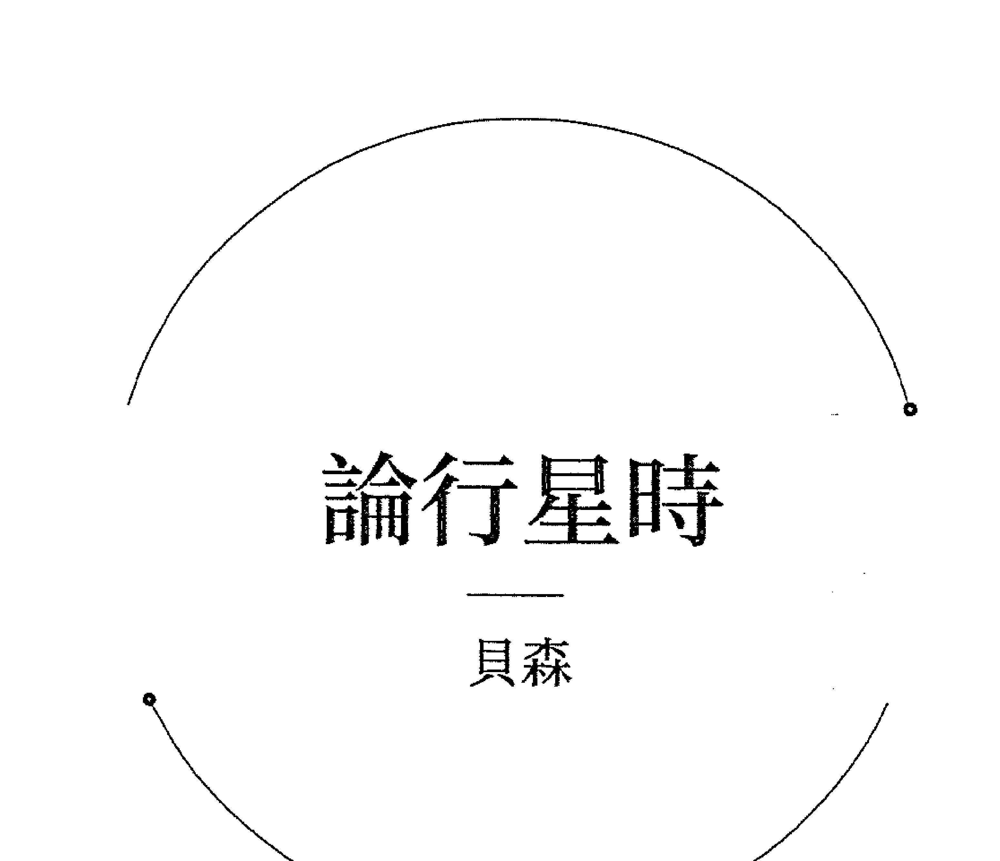

### [§1 行星时]

#### ——论土星时——

若正值土星时，则适宜购买沉重的物品，像铁、锡、铅及所有金属，以及石头、黑色织物；开始给花园翻地，设计圈套以对抗敌人。此时不利于放血、服药，不利于与权威谈话，也不利于与教士、僧侣、小丑或者渔夫谈话，也不利于与猎人或任何朋友谈话、筑墙；除此之外，此时不利于与人开始任何事项、建立任何合作关系，也不利于娶妻（因为他们将无法和谐相处）、裁剪新衣或是穿新衣。

#### ——论木星时——

木星时适宜购买和兑换银，以及处理一切与银有关的事项，有利于买卖天蓝色的织物，与桥梁、用于祷告的房屋有关之事，此外还有利于因老师，甚至是商业而动身去旅行；此时适宜航海旅行、服药、放血，以及谈论和平与友好关系、权力、购买栗色的马，并且适宜购买某种武器(arms of azaro)，开始用织布机工作，耕作田地、播种、打井、筑墙：简而言之（可以说），木星时适宜开始任何有益之事。

#### ——论火星时——

火星时适宜购买武器，为马（及所有战马）钉马掌，武装军舰，出征（无论藉由陆路还是海路），购买任何红色织物；但是不宜服药、放血，或是因商业交易而动身去旅行。此外，此时有利于开始一切与火有关的事情，例如与火有关的手工艺、烹调、烘焙和烧制砖瓦。而且与土星时类似，不利于开始合作或订婚、结婚。

#### ——论太阳时——

太阳时适宜购买黄金以及任何金色的物品、金色的马。此时与国王或其他任何有权力之人谈话最为有利，且有利于当权者出征或开战；此时适宜买卖橘黄色的织物。但对于服药、放血、商业旅行、娶妻、参与合作或订立合约而言，既无好处也无坏处。

#### ——论金星时——

金星时适宜购买女人、珍珠和所有女性饰物、金戒指，欣然接受任何女性物品，订婚，而且对于娶妻来说是最完美的时间，还有购买白色马匹与白色服装，服药和放血，并有利于与王后或是贵族女性谈话。

#### ——论水星时——

水星时适宜购买所有绘画或写作的用品，小麦、粟、谷子和一切绚色又美丽的服装、丝绸、[其他丝绸]、中国丝绸以及一切与之有关之物。在此时做出决定最为有利，还有娶妻、建立合作关系，甚至服药和放血、商业旅行、购买头部或马蹄有白色印记的马匹和两种颜色的武器（橘黄色和金色），以及绿色服装；并且有利于开始用织布机工作。

#### ——论月亮时——

月亮时适宜购买蜂蜜、橄榄油、无花果、板栗、坚果、杏仁、毛织物、亚麻布、麻、大麦、猪和其他动物的肉，但羊肉除外；还有利于购买与交易有关的禽鸟和供屠宰的牲畜。亦有利于行窃和欺骗、背信、施诡计以及做任何机敏之事。此外，不利于开始那些期待能够稳定之事，但有利于开始那些想要快速进行之事。

## [§ 2 三方星座，当落于上升位置时]

#### ——论上升星座的三方，首先论第一组三方星座——

若上升星座为牡羊座、狮子座、射手座的火象星座，适宜开始那些与火有关之事：例如烧窑，给金、银、铅、锡和黄铜着色，以及从事其他手工制作。此外此时适宜开始任何你想要快速完成之事：航海、赛马、送信、扬帆、凿井、寻找宝藏，以及其他事项不胜枚举。

#### ——论第二组三方星座——

若上升星座为金牛座、处女座、摩羯座的土象星座，适宜从事任何与土地有关之事：例如耕作、购买土地与房屋、测量土地、发放衣物、购买用于造船或建筑的木材，以及做任何你期待能够稳定、持久、坚韧之事。

#### ——论第三组三方星座——

但若是风象星座双子座、天秤座或水瓶座落在上升位置，适宜从事与风有关之事：例如给船安装桅杆、升起桅杆、准备并且展开桁端和帆。此时还适宜开始与船有关之事，赛马或赛船，以及旅行。

#### ——论第四组三方星座——

但若是水象星座巨蟹座、天蝎座或双鱼座落在上升位置，因此适宜在此时从事任何与水有关之事：例如撒网、以各种形式捕鱼、沐浴、修建浴池、制作水车、引导水流，以及其他不胜枚举之事。

### [§3 四正星座，据萨尔《择日书》]

有关星座属性的知识。首先是启动星座。众所周知，启动星座代表事物是易变、快速的，让任何事物都无法延续，时间也不长久。但是它们有利于播种、购买、出售、与女人订婚（所有这些事项在启动星座都会成功）、虚弱之人将迅速摆脱疾病；而启动星座也使争执无法持续，逃犯也将迅速返回，甚至对于异国旅行也是有益的；若是有人在此时许下承诺，则承诺之事将无法推进。此时的宣言、梦境与传言都是虚假的；医生不应在此时治疗，也不应在此时栽种植物、为建筑物奠基，因为这是不利的。此外，你在此时开始的任何事（若你期待它稳定）都将不稳定；然而若你要做任何易变（或紧迫）之事，则须在此时开始。最快的启动星座是牡羊座和巨蟹座，因为它们更为扭曲且更为易变。但天秤座和摩羯座更为坚定且更为平衡。

其次，固定星座适宜任何想要稳定及持久延续之事。它们有利于建造建筑物，以及举行婚礼——于启动星座之下订立婚约之后。若是女人在此时离婚，她将不会再回到丈夫身边。然而对于此时进行的判断和开始来说，后续发展却没有把握，除非同时存在多个吉象。若是有人在此时被俘获，他的监禁将被延长；若是有人在此时燃起怒火，他将无法迅速恢复平静。不过此时对于签订合约及发表声明是有益的，而且也有利于建造建筑物或是为建筑物奠基。但天蝎座比其他固定程度更轻，狮子座更固定一些；水瓶座是更缓慢、更严重的，但是金牛座却更平均。

双元星座对于合作关系与手足情谊是有益的，此时开始的事项将被重复。但它们对于买东西和庆祝婚礼而言并没有益处，且预示着耍花招和欺骗；此时遭到指控之人，将会逃脱并免于对他的指控。入狱之人将不会被固定于同一地点（双鱼座除外，鉴于它十分罕见）；出狱之人会再次入狱；而逃走的犯人，被抓回后将再次逃走；若在此时进行判断，则无法得到确定的看法或决断。任何人不应在此时登船去旅行，因为登船之人将从一条船换到另一条船。此时许下的承诺将无法兑现且其中的某些事项无法完成；患病之人将可痊愈，随后疾病将复发。因而在此时，所有发生于某人身上的好事与坏事都会翻倍；若有人在此时死亡，随后在那个地方还将有一个与他接近之人死去。此外变更、洗头发和胡须、炼金或炼银、送男孩子们去学习文字在此时都是适宜的。

### §4 一般性说明和行星征象，引自萨尔《择日书》^[35]

（§18）若^[36]你想要开始某一件我所说之事，则要将月亮和上升位置置于与你所愿相符的星座^[37]，让月亮与吉星相连接并让吉星容纳[她]。此外对于在白天进行的事项而言，日间星座更为有力；将上升星座置于日间星座[并且让月亮落在日间星座中]^[38]。

（§19a）风象星座^[39]与陆上及水上狩猎有关；皇家星座与国王有关；有声星座与管乐演奏和唱小曲的人有关^[40]；火象星座代表所有与火有关之事；（§19b）等分星座（在这些星座中昼夜被均分）^[41]与真相、说真话以及做出衡量的人有关；改变星座^[42]（也就是那些以昼夜相对而改变的星座）与改变以及想要从一件事转换到另一件事有关。

（§20）此外针对任何你想要开始的事项，要考虑^[43]环绕在天空之^[44]上星座的属性；令月亮和上升主星与其本质相契合；并且将那根本属性及其美德都置于^[45]事项开始的时刻。（§21a）若你所想开始之事与下述人等有关^[46]——君主、王子、伟人、管辖城市之人、引人注目之人^[47]、格斗高手及富有之人^[48]——则你要藉由太阳[来实现]；（§21b）与高尚之人有关的事项，要藉由木星[来实现]；与农民或地位低下之人有关的事项，要藉由土星[来实现]；与将军或格斗的高手有关的事项，藉由火星[来实现]；与女人有关的事项，则藉由金星[来实现]。（§21c）而[49]购买、售卖、辩论、书写、商人与水星有关；此外，关于女人，涉及王后以及探寻与她们相关之事，藉由月亮实现。

### §5 论土星时与上升位置为土星守护的星座

这必须十分认真地加以处理：若正值土星时，以及上升星座为土星所守护的情况下，去做任何土星时所提及之事都是极好的；其他所有行星时和星座也照此推断。且若你能够做到，就让行星时与星座相契合，如此最佳。关于其他行星，依我们对土星所作之论述如法炮制。

### 《行星判断技法》VII.100：论行星时的含义

里贾尔

这些含义源自本·赛义德的著作[1]与阿布·马谢的《自然之书》[2]。我谨将它们收录于此，以使本书不遗漏任何先贤的论述。

在行星时之后，我还将阐述依据月宿进行择时[3]，因为大部分阿拉伯人都运用它们，而且[它们的]源头也为印度人所吸收（即来源于[4]都勒斯的著作）。尽管如此，依行星时及月宿择时，并不如我们之前所述使用行星位置和状态择时那般有效[5]，不过我们仍可藉由参考它们而受益。

##### 注释
1. Ablabeç filii çaed (1551版本：Abablez filii Zaëd)。见绪论部分里贾尔的资料来源。
2. 或为Kitāb al-Tabāi'（塞兹金p. 149，#28）。
3. 见本书第一部《行星判断技法》VII.101。
4. 此处省略了冗余的文字acceptae sunt de ipsis。
5. 即《行星判断技法》VII的其余部分，论述了完善的择时（收录于本书第三部中）。

#### ——论太阳时——

太阳时除觐见国王之外，诸事不宜[7]；尽管如此，你不应在日落时分去觐见他，也不应在此时穿新衣、放[血]、进行资产交易、从事制造；不应开始建造任何建筑、购买牲畜；尽管如此，你可在此时求贤、执政及教学；但不应与女人同房。然而你可在此时购买武器，骑乘马匹，以及离开你的土地去狩猎（但若你正在[国土]之外则不应回家）。

此时有利于接受官职，从事与国王或统治者有关之事，藉由未曾为自己[8]谋求过的资源而获得安全感（译注：阿拉伯文版本作“选择资产及收益的托管人”。），以及赚取利润。若你在此时给出资金[9]，接受之人将会死亡，且他[10]将失去资金。此时染病之人将高烧不退，且多次濒临死亡，在某种程度上这将对他造成伤害。

#### ——论金星时——

此时适宜骑乘马匹，但不宜登船；宜寻求执政，宜参与玩笑和舒适之事、下象棋、与女人享乐，也可离家外出（但若已出门在外，则不宜回家）。此外，你可与女人订立婚约，也适宜服用药物[11]。但不应放血或拔罐，种植任何树木或播下任何种子，打你的男奴隶和女奴隶，不[12]应裁剪衣服，也不应在可以避免[睡觉]时睡觉。

若有人在此时开始旅行，将因女人的指点而受益，或诸如此类。此时有利于进行与女人有关之事，[穿着]任何彩色和美丽的衣服，与大胆并令人舒适的[13]女人同房。若有人获得资金，将因女人、恶习或作乐而散财。若有人在此时染病，乃是因焦虑或某些错误发生在他身上，或是受女人作恶伤害而致，或诸如此类。

#### ——论水星时——

此时可骑乘任何牲畜、骡子和驴；写文章及派遣使者，你可将你的资产拿去交易，亦可去借任何想借的东西，能够得到应得的。服用药物，种植树木，觐见国王。尽管如此，不应与女人结婚，也不应购买房产或土地，若你出门在外则不应回家，不应购买奴隶，不应从一个地方换到另一个地方居住，也不应把任何人从监狱里带走。但你可开始建造任何建筑物，打井及挖水渠，但不应从他人处寻找东西。

这[14]将有利于出发去旅行，由此可获得好处和利益；你应送男孩去接受任何形式的教育，例如书写及诸如此类。亦将有利于从事商业活动、派遣使者、作出法律声明、施或受。接受资金之人，将顺利偿清；借出之人，则将对此及偿还之人感到满意。

#### ——论月亮时——

你不应在此时开始建造任何建筑，购买任何用于治疗的药物，裁剪织物，购买牛、猪或诸如此类。可砍伐树木、购买农产品，打井或挖水渠，骑乘马匹，向女性致敬，送你的孩子去学习认字和书写。你应追赶你的敌人，离开国土外出（但不要回归国土[若正出门在外]）。

据说在月亮时去旅行之人将在旅伴死亡时获益；尽管如此，若月亮在土象星座则不适用于此判断。在此时给出资金之人，收回[资金]将十分辛劳，直至他对此感到绝望；随后他将收回，但并非[给出的]全部。

#### ——论土星时——

你不应在此时服用药物，裁剪或穿着新衣，剃光头或修剪[15]头发，你也不应登船。但可离家外出，若你想在当天返回的话。你可搜寻你的敌人及逃犯，购买武器，[但]不可购买男奴隶和女奴隶。可召集你的同夥，还可写文章，骑乘骡子和驴；不应非难或嘲讽[16]他人、杀人（译注：或指为复仇而杀人。）、与任何人立约、放血或拔罐。可买下任何租用的东西[17]以及任何粮食，亦可收礼。

将要外出旅行之人，会面临入狱的危险或被焦虑所困扰，或耗时漫长。若是乘船去旅行，他将遭遇许多风浪且风向多变，将被抛到他所知的其他地方。这有利于租借土地，挖水渠和耕作。接受资金之人将失去这笔钱，也许他将会死亡，或是资金的所有者将他杀死；生病之人疾病将久延不愈，随后死去。

#### ——论木星时——

在此时向国王致敬，或与女人订立婚约。你不应打男奴隶和女奴隶；[但]在此时你可裁剪织物，骑乘[你的]坐骑。不应服用有害的药剂(drugs)[18]，[但]你可离开自己的土地外出。不应购买武器，应留心火烛及其火焰。不应挖水渠，[但]可播下种子、种植树木、建造建筑。获取成功以使你与国王坐在一起。不应购买牲畜但可购买禽鸟，不应登船，也不应非难任何人[19]。可与国王谈话；不应放血或拔罐。

即将外出旅行之人，会从资产与商业交易中获利颇丰，或从未曾期待过的方向获得助益，并感到满意。这有利于觐见国王、地方行政官和法官。给出资产之人将由此获利，且关爱他的生意伙伴[或]合伙人；生病之人将迅速痊愈。

#### ——论火星时——

火星时应回避一切事项、一切开始和行动[20]。

## 134——选择与开始

## PART III
完善的择时
COMPLETE ELECTIONS

## 择日书

### 萨尔·宾·毕雪

#### ——[应为何人择时]——

（§1）众公认择时是无力的，除了为国王们[所做的择时]之外。因这些人(即便他们的择时盘是无力的)有所谓的“根本盘”——即本命盘——它在这一过程中强化了每一颗虚弱无力的行星[1]。

（§2）但你不应为任何低贱之人、商人及那些诸如此类[社会地位]之人择时，除非[建立]在他们的本命盘、那些年的太阳回归盘和他们子女的本命盘之上。

（§3a）然而[2]，[对于]那些对上述信息一无所知之人[3]，则须为他们进行卜卦，由此可得知事项的结果——再依此为他们择时[4]。

（§ 3b）若有人向你询问他自己的事项，鉴于询问者就是他本人[5]，其本命盘（换言之，此人前来询问的时刻）就已显示了吉凶。

（§ 3c）此外若当事人所求之事无法实现，或问事之人（即将奔赴战场）将要死亡，则应避免此类择时[6]。（§ 4）因他的根本盘已被毁坏，尤其再加上他所仰赖的最初的开始（first beginning）和原来的根本盘（old root）[也已被毁坏]，这种情况如何才能为这个人择时呢[7]？

（§ 5a）因此，要避免为本命盘或卜卦盘预示着可怕之事的人择时。（§ 5b）[因为]倘若定要为之时[8]，[即使]将吉星全部置于尖轴[9]，且将凶星及任何与他的上升主星不合之行星置于果宫[10]，也无济于事，（§ 5c）尤其对于那些中层或底层之人：因为你不了解所择之时的上升位置及行星在他的根本盘中是否有害，抑或其根本盘中是否有凶星与择时盘的上升位置落在同一星座。

#### ——[根本盘的重要性]——

（§ 6a）事实上，这是为了告诫[11]那些同时出发去航海或去异国旅行（有共同的目的地）的人：他们当中有些人遭遇海难，有些人得以幸免，而有些人因此获得财富（但有些人一无所获）。因为一些人的情况[12]与另一些人是无法相提并论的。（§ 6b）我[13]已验证多次，一群人同时出发去同一个目的地并同时抵达，然而其中有些人能够迅速地满载而归，有些却要花更久的时间，还有一些则客死他乡。之所以如此，归因于本命盘以及那些年的配置（distribution）[14]。

（§ 7）我们甚至会看到有的人在令人畏惧的坏日子里（即多有阻碍[的日子]）纵酒欢庆，却在值得称道的好日子里争吵不断。（§ 8）或许还会看到征象星[15]通过四分相或对分相与凶星连接在一起（或是两者在同一星座中）却能从中获益：这种情况不会发生，除非凶星为最初的上升主星（first lord of the Ascendant）[16]、配置主星或当年太阳回归盘的上升主星。

（§ 9）若所做的择时是以下卦盘或一张已知的本命盘的上升位置，或上升（即当年小限星座）主星[为依据]，那么更有价值，因你了解什么（行星）与它更匹配[17]以及此人的上升位置是什么。故须小心谨慎，并让你的所作所为[18]如同择时一样。

#### ——[更多关于择时的理论：属性及吉星／凶星]——

（§10a）全能至高者以四种属性——即四元素——创造万物（亦即世界和一切），又将大地安入其位，并使大地之上的万物（理智的与非理智的，可移动的与不可移动的）环绕四周[19]；祂于其间置入智者所知的微妙之物，（§10b）类似祂置于磁石与铁、父亲与儿子、进食者与食物之间的微妙因果[20]。须知晓并领会这些。

（§11a）因此，自两种本质（即高层与低层）之间的和谐中，物质被适当地结合起来；而它们被逆境所破坏[21]。吉星是均衡的[22]（即拥有平和的属性），而凶星的属性乃是带有害的（故它们想要去阻碍）[23]；（§11b）若凶星被容纳[24]，其[有害的]本质与失衡的恶意[25]并不会完全消失；他们就像窃贼、恶民，制造灾难与不和、变动与混乱。须领会这些。

### §12a 择时中的上升星座及其中的一切 [26]
#### ——[四正星座][27]——

有关星座属性的知识[28]。首先是启动星座。众所周知，启动星座代表事物是易变、快速的[等]，让任何事物都无法延续，时间也不长久。但是它们有利于播种、购买、出售、与女人订婚[29]（所有这些事项在启动星座都会成功)[30]、（ § 12b ）虚弱之人将迅速摆脱疾病；而启动星座也使争执无法持续，逃犯也将迅速返回，甚至对于异国旅行也是有益的；若是有人在此时许下承诺，则承诺之事将无法推进[31]。此时的宣言、梦境与传言都是虚假的；医生不应在此时治疗，也不应在此时栽种植物、为建筑物奠基，因为这是不利的。（ § 12c ）此外，你在此时开始的任何事（若你期待它稳定）都将不稳定；然而若你要做任何易变（或紧迫）之事，则须在此时开始。（ § 13 ）最快的启动星座是牡羊座和巨蟹座，因为它们更为扭曲且更为易变。但天秤座和摩羯座更为坚定且更为平衡[32]。

##### 注释
1. 也就是说，即便是一张糟糕的择时盘也能够对一张强而有力本命盘加以利用，甚至让这张强有力本命盘中无力的行星发挥很好的作用。
2. 萨尔在本段进行了进一步的论述。通常我们把客户的本命盘视为根本盘，因为依据它可以对客户想要采取的行动是否会成功做出大致的判断。但如果我们不知道本命盘，可以卜卦询问事项是否能够成功，用卜卦盘来代替本命盘：因为一张显示行动能够成功的卜卦盘间接地确认了行动与本命盘是不冲突的。所以本命盘是最佳的根本盘，而一张有效的、成功的卜卦盘是次佳的根本盘。实际上此处拉丁文版本比阿拉伯文版本更加清晰（至少克罗夫茨的翻译是如此）：在阿拉伯文版本中，此处暗示不应费心为需要起卜卦盘的人做择时，尽管在下文 §5a中，萨尔明确地接受依据卜卦盘进行择时。
3. 即不知道自己本命盘的人。
4. 即对于本命盘未知者，我们可以起一张卜卦盘来代替本命盘。
5. Quia ipse est qui te interrogavit，删去了附加的 et est。
6. 也就是说，如果询问者的本命盘未知，而卜卦盘又显示了糟糕的结果，那么应就此结束而不要再继续进行择时。
7. 拉丁文文献的内容似乎是仍在谈论为位阶低下的客户择时，其本命盘（最初的、原来的根本盘）很糟糕，而替代的根本盘（卜卦盘）也很糟或是“被毁坏”。但在更为简练的克罗夫茨版本中，到底将本命盘还是卜卦盘视为根本盘并不明确。但无论哪种，都不应该为其择时。
8. 即你被迫要为这样的人择时。
9. 阿拉伯文 watad（单数形式），也指“帐篷的支柱”或插入地面之物。拉丁文通常指的是“角”（“角落”，拉丁文 anguli），不过既然这部文献使用阿拉伯文，我便采用了一个更好的译法。它源自希腊文 kentron（“轴”及其他一些含义），指的是尖轴。不过有时，萨尔和其他阿拉伯作者到底指的是整宫的尖轴（上升星座、第十个星座、第七个星座、第四个星座）还是依据四轴度数计算的有力或活跃的区块（例如中天到第十一宫宫始点之间的区域）并不明确。这一问题涉及宫位制系统，并且指向了在理解和中世纪实践方面更多的基础性问题和议题。
10. 此处依据的是克罗夫茨的解读，因为拉丁文内容更蹩脚：“且将凶星置于对于它们而言的果宫，这对他无济于事；此外任何与他的上升主星不合的行星都不会令他受益。”
11. 这里阐述的是，如果你为一群人择时，其中一些人的本命盘会与择时盘有更好或更糟的关联，这是不可避免的；因此他们会在旅途中有不同的经历。
12. Esse。
13. 事实上可能是马谢阿拉：见绪论。
14. 即以本命盘中某一点推进通过不同的界来代表不同的时间主星时期。我并不确定萨尔所说的配置法/向运法使用的是本命盘的寿命释放星（longevity releaser）、上升位置还是其他。不过关键在于，如果本命预测方法已经显示了个案在某个特定时期的吉凶，那么它可能要比一张为一群人做出的笼统的择时盘更为重要。
15. 这里可能指的是月亮，她在卜卦文献（见《判断九书》通篇）中常常被称为“征象星”或“指示者”（the indicator）。
16. 阿拉伯文版本（此处及此句其余各处）为单数形式。萨尔指的可能是本命盘的上升主星，正如他在 § 4当中将本命盘称为“第一开始”和“原来的根本盘”一样。
17. （参阅阿拉伯文版本）eis 应作 ei。
18. Species。
19. 这个标题是后来的编者或译者补充的。在克罗夫茨的版本中，这一章节的标题实际上就是下文第一句话（克罗夫茨版本为：“关于星座属性的学问。”）。
20. 关于四正星座部分的内容，参见《占星诗集》V.3-4。
21. 自此至 § 20c ，参见里贾尔VII.3.1。
22. Firmare。
23. 这是译者或后来的编者插入的评论。
24. 也就是说，无法成功或者兑现（proficiet）。阿拉伯文版本说承诺无法被遵守。
25. 此处及下文，应从每个星座的赤经上升时间来考量。扭曲星座（crooked signs）赤经上升时间较短，所以经过上升位置较为快速；直行星座（straight signs）赤经上升时间较长，因此上升速度较慢。在北半球，双鱼座与牡羊座赤经上升时间相等且最短，随着向两侧呈扇形展开，星座的赤经上升时间逐渐变长：水瓶座与金牛座时间相等，比牡羊座与双鱼座长一些；同样，摩羯座与双子座赤经上升时间相等，射手座—巨蟹座、天蝎座—狮子座也是如此，直到处女座与天秤座赤经上升时间最长。在南半球，双鱼座—牡羊座是赤经上升时间最长的且最为垂直的，而处女座—天秤座是赤经上升时间最短且最为扭曲。萨尔所说即是如此。启动星座虽被认为是最快速的，但是根据赤经上升时间不同，它们实际的快慢也有不同：更长的赤经上升时间甚至可以消弭平衡启动星座的迅速。所以在启动星座里，牡羊座是最快速的扭曲星座，巨蟹座是最快速的直行星座（因此它更像是扭曲星座）；而天秤座是时间最长的直行星座，摩羯座是时间最长的扭曲星座，所以它们较长的赤经上升时间抵消了其启动星座的特质。但是萨尔可能还考虑了守护关系（正如他后文所写固定星座的内容那样）。
26. 克罗夫茨认为是“水象”，但里贾尔VII.3和常规占星逻辑认为是风象星座。
27. 省略了 cum crudo et voci alhool。该短语与自然状态下演奏和歌唱有关，但与阿拉伯文却不对应（且似乎不完整），并且阿拉伯化的词汇 alhool 与任何阿拉伯文都不相关。克罗夫茨写道，“代表吹奏纳伊（nay）的人以及琵琶演奏和唱歌”。
28. 分点星座（equinoctial signs），牡羊座与天秤座。
29. 至点星座（tropical signs），巨蟹座与摩羯座。
30. 参见《占星诗集》V.30。
31. 即天体运行的圆圈：见里贾尔VII.3。
32. 克罗夫茨认为是“伴随那本质的根源与力量……”。拉丁文版本与阿拉伯文版本均作出了重复的说明。
33. Ex parte。我采纳了克罗夫茨的翻译。这里指的是为这些人采取的行动，或是为仅仅与他们有关的事情择时：例如说，当王子想要采取行动，或者本身是低位阶的当事人想要去见王子，这两种情况都要强化太阳。
34. 后文每一部分的第一段均来源于本·赛义德，第二段来源于阿布·马谢。在《行星判断技法》VII.74中，里贾尔称一段有关土星时乘船去旅行的论述来源于阿布·马谢，这表明第二段与阿布·马谢有关。
35. infortuna 一词应为 infortunata。
36. 关于 tibi 一词暂作此解读。
37. 此处及下文“资金”（“capital”，拉丁文 capital）指的是借出的钱。
38. 可能指给出资金的人。
39. 字面意思是剪成“圆圈”。
40. 换句话说，不要陷入争吵。
41. Conductum。这可能来源于前面的观点，即不应在此时立约。换句话说，对于任何事物而言，你都应该尽量完全拥有。
42. 不应服用有害的药剂(drugs)。
43. 也就是说，不要非难或指责任何人。

### 擇時中自上升星座起算的第二個星座及其中的一切

#### 借入與借出

若為借出錢財擇時，讓月亮落於獅子座、雙魚座、天蠍座、射手座或是水瓶座，並使她減光，讓兩顆吉星也減光且與月亮或上升星座形成相位。

此外，使水星不受火星影響，並使月亮與木星或水星合相；注意避免月亮受剋於凶星；不要讓水星與它們以合相或四分相連接；也不要讓吉星落於果宮。

因為若月亮與火星落於一處，此人將陷於勞苦、憂慮、不利的交易、惡劣的狀況或爭執之中。若月亮受剋於土星，此人將陷於某些拖延、推遲的境況，而在經歷痛苦與勞累之後，才得以從中解脫。

然而若想暗中借出錢財而不被人發現，則須讓月亮在獲取或尋求的過程中在光束下，且在離開太陽之後與吉星相連結：因為對於擇時盤的主人而言會更為順利，也讓此事更為隱秘不會被公開。

若月亮脫離焦傷並與火星會合，此事將被公開並陷入眾人的議論之中，尤其是那些你不想讓他們知曉此事的人。

此外注意避免使月亮落在黃道上沒有黃緯度數，即位於北交點或南交點或燃燒途徑中，否則後果不堪設想。

都勒斯還說，當月亮落於獅子座、雙子座和射手座的第一度，或這些星座位於上升位置時，不應接受別人借給你的東西，也不應借東西給任何人：這是避之唯恐不及的，尤其對於借貸而言。須知曉這些。

#### 商業合夥

與他人進行資產或事務方面的合作，須為月亮清除凶星的影響並使她與吉星相連結，將她置於雙元星座以便於倍增，否則須置於獅子座或金牛座。

應避免使月亮落於較低的星座，其中天秤座比其他星座更糟，因燃燒途徑位於其中；同樣要避開水瓶座。

讓月亮以三分相或六分相被容納，如此合夥雙方好聚好散：因為四分相或對分相預示著他們之間會發生口舌，換言之，在爭吵中散夥，尊敬的相位也象徵著他們在分開時充滿善意或真誠，彼此之間充滿忠誠與友好。

此外謹防凶星落於尖軸，因上升星座對應合夥關係的發起者，或是年紀較輕者；而第七個星座對應著合夥關係中的另一方；第十個星座象徵著他們之間的一切及財富的多寡；第四個可知事項之結果。

須注意避免上升主星與上升星座無相位，或月亮與其定位星無相位：否則其中一方將欺騙合夥人，而事項會在他們分開時變得更糟。

#### 投資謀利

若想撥出資產以尋求財富，須使月亮、水星、財帛宮的主星處於適當的狀態，更不必說信任之宮度數的主星了。

然後讓月亮與水星有連結，盡你所能使火星落在相對前兩者而言的果宮之中；還要使水星處於適當的狀態並清除他的缺陷。

若水星逆行，則讓月亮與信任之宮的度數處於適當的狀態，並使水星落於相對火星光線的果宮之中；且不應使水星落於相對金星與第十一宮主星而言的果宮之中。

此外在撥出資產並尋求財富方面，須始終依賴水星、月亮、信任之宮以及它們的主星，並使火星及其光線都落在相對水星和月亮的果宮之中。

#### 售賣與購買

若想為購買擇時，須使幸運點處於適當的狀態，並讓它落於木星主管的宮位，與吉星相連結：因為相比賣方而言，這對買方更為有利。

若月亮落於直行星座，增光且行進速度增快，並與吉星相連結，則此時無論購買任何物品，其所有者必將因它受損：相比買方而言，這對賣方更為有利。

此外須使火星落於相對月亮與水星而言的果宮之中，因火星阻礙售賣與購買，象徵了勞苦與爭執。

南交點也如此——故尤其要將它置於相對月亮而言的果宮之中，就凶性來說它在火星之下。

而你若想要售賣，將月亮置於她入旺或三分性之處，離相位於吉星，且與凶星形成相位，但不要讓她與它們有連結。

#### 煉金術操作

若想進行煉金術操作，或開始希望能夠重複的事項，則須趁月亮落於雙元星座之時，清除凶星對她的影響，上升星座也應如此——讓它處於適當的狀態。此外，若操作與金有關，須在開始之時強化太陽並使他處於適當的狀態。

### (§42) 擇時中的第三個星座及其中的一切

擇時中與第三個星座有關的一切，一部分放在第九個星座中，另一部分在朋友之宮：若主允許，我們將隨後闡述。

### (§43) 擇時中的第四個星座及其中的一切

#### 建造房屋

若想建造房屋，須讓月亮及其主星、上升星座及其主星、幸運點和水星處於適當的狀態。

並使火星落於相對上述這些徵象星而言的果宮之中，且絕不應讓他在與建造房屋有關的事項中扮演任何角色。

倘若他不可避免地扮演了某個角色，須使金星強有力地落於自己的宮位之中，且賦予她的力量在火星之上，並讓二者以三分相或六分相連結：因為，鑒於她對他超乎尋常的情誼，火星不會阻礙金星的事務。

須盡你所能將土星置於相對金星而言的果宮之中，考慮到他的敵意，與火星及月亮相連結，倘若它們之間能形成懷有敬意的相位。

此外使月亮增光且行進速度增快，以四分相與木星相連結，因這比對分相更佳：預示房屋的美觀與完善。

還須避免讓月亮與土星或南交點落於一處，謹防土星落在上升星座或第四宮之中：因這預示建造過程中的緩慢與束縛，且將無法完工；

抑或即便完工、入住，居住之人也將一直擔驚受怕，或患病、遭遇盜賊、死亡，建築將會開裂甚至倒塌。

而若火星與月亮形成相位，且它是上升的於遠地點或近地點所在軌道，則恐建築將被焚或倒塌；另外須使月亮處於增光的狀態，如此將有利於建築的主人。

並且使月亮的廟主星與她形成相位，如上升主星與上升星座形成相位一樣且應不受任何凶星干擾：倘若它們沒有形成相位，主人將不會在此居住。

#### ——[拆毁房屋]——

（§47a）而[115]若想摧毁一幢房屋，须趁月亮在其轨道上处于下降的位置，且离相位于凶星并与吉星相连接；还要使吉星本身东出或直行上升（译註：ascending。在赫菲斯提欧的著作中，上升[ascending]与下降[descending]都是就纬度而言的。因此，纬度上升指在北黄纬上升。），（§47b）或使月亮与她的庙主星形成怀有敬意的相位（即三分相或六分相），以便使拆除过程较为顺利；但若是四分相或对分相，拆除过程则较为艰难。

#### ——[购买及占领土地]——

（§48）若想购买土地并与他人一道进入[116]，或拥有土地以便从他人之处获得所产生的利益[117]，使土星落于入旺、三分性或界之处，并使木星自尖轴与他形成相位[118]或与他形成三分相，且使火星落于相对他们而言的果宫之中。（§49a）此外令月亮于[太阴]月的开端与土星形成尊敬相位，行进速度增快，且与木星形成相位：这预示土地及其所提供之物日益增加。（§49b）倘若你无法使月亮同时与土星、木星形成相位，则可以金星替代木星，使水象星座呈现吉象：若使吉星落入其中呈现吉象，则比风象星座更为有利。（§49c）还要使月亮落于入旺之处或是中天，与上升主星形成相位；亦须使月亮与上升星座不受凶星干扰并摆脱缺陷。

#### ——[挖掘河道与水井]——

（§50a）若为河流改道[119]或挖掘水井，土星须东出，且月亮落于地平线下第三宫或第五宫，不受凶星影响，呈现吉象且被容纳；（§50b）此外注意避免凶星落于中天：此令人畏惧，恐怕水井将坍塌、河水会流光[120]。（§50c）使土星落于自上升星座起算的第十一个星座，并让月亮与落于固定星座且在轨道上上升[121]的吉星相连接。（§50d）最佳的吉星是木星。倘若无法依此照做，则将木星[122]置于中天，如此河流将更为持久，水井将更加坚固。

#### ——[种植]——

（§51）若想种植棕榈树、无花果树或者其他树木，月亮须落于固定星座，且她的庙主星应自水象星座与她形成相位。（§52a）此外让固定星座或双元星座落于上升位置，使上升主星上升并东出[123]。（§52b）因为倘若它上升而没有东出，则树木虽然生长迅速，却会延迟结出果实；（§52c）若它东出、下降，树木将生长缓慢却迅速结出果实（若它东出、上升，则树木生长、结果都会迅速）；（§52d）若是西入、下降，两个[过程]：即生长与结果都会放慢。（§53）还须上升主星及月亮的庙主星与它们形成相位[124]，并使它们摆脱凶星和焦伤。

- 119 | Deducere·克罗夫茨写作「使河水流出」。
- 120 | 或者说「干涸」(克罗夫茨)。
- 121 | 克罗夫茨作「让吉星与落在上升于固定星座的月亮相连接」。
- 122 | 删去了(fortunas, id est)·我的理解与克罗夫茨一致。
- 123 | 很难分辨此处所说的东出/西入指哪种概念。里贾尔VII.25引用了哈亚特的版本，特别提到了纬度(「纬度上升」)，但伊朗尼的版本中同一内容(II.5.4)仅仅写道「上升东出」。当然如果不是确确实实在太阳前面升起的话，上升主星应该是脱离太阳光束的。
- 124 | 也就是说，月亮的庙主星与月亮形成相位，并且上升主星与上升星座也形成相位。

#### ——[播种]——

（§54）若想种下种子（或[不愿损失的]事物）[125]，使上升位置落于双元星座，且主星落于启动星座，与它的主星形成相位，并令它[126]摆脱凶星：若有凶星与它形成相位，则种子本身将遭逢阻碍。（§55a）故须使月亮增光且行进速度增快，若月亮在光束下且行进速度减慢，种子将会消失，不会长出任何东西。（§55b）若如前面所说，同时月亮行进速度增快，相对于播种的数量来说，发芽的种子较为稀少。

### （§56）择时中的第五个星座及其中的一切

#### ——[怀孕]——

若为同房择时，换言之为生育男孩，同房之时上升星座及其主星、月亮、子女之宫的主星落于阳性星座或是大圈中的阳性部分（译註：见《古典占星介绍》§ I.11。）；且不宜将任何非阳性的行星置于上升星座或子女的星座。（§57a）若想生女孩，则须使这些征象星落于阴性星座及大圈上的阴性部分。（§57b）倘若你无法依此照做且这些征象星互不相同（换言之，其中一些落在阳性星座而另一些落在阴性星座），须将时主星和月亮的意向接收星（译註：即月亮入相位的行星。）一并纳入，以使更多证据指向阳性星座及星盘中的阳性部分。孩子的性别将依此而定。

## ## ——[流产]——

（§58a）[127]若想将胎死腹中的孩子取出，须趁月亮减光之时，自[带状区域向南]下降[128]，与吉星形成三分相或四分相，同时与火星形成相位。（§58b）若月亮与上升位置落于阴性星座，且为直行上升星座而不是扭曲星座，则比前述情况更胜一筹。

## ## ——[教育子女]——

（§59a）若想将孩子交托去训练，或送其去某处学习职业技能[129]或算术[130]，须如此择时：让月亮与水星形成相位，且使他们摆脱凶星。（§59b）此外将双子座或处女座置于上升位置，使水星东出、上升——不要下降或逆行，（或处于第一次停滞期）[131]，下降阶段，也不要让他受剋——水星所在星座之主星也如此。（§59c）不应使月亮下降、减光，这会让训练变得缓慢；还要使他们与所落宫位的主星形成相位。

### （§60a）择时中的第六个星座及其中的一切

#### ——[驱魔]——

若[132]某个地方或某幢房屋恶灵横行，或某些恐怖之事与他（即居住者）如影相随，或有幻象显现，而想藉由吟唱[133]、乞求[134]或法术令它离开此地或此人，（§60b）须避免使月亮或上升位置落于以下任何一个星座：狮子座、巨蟹座、天蝎座、水瓶座。让月亮落于除此之外的其他星座当中，离相位于凶星且与吉星相连接。

#### ——[针对肠道与消化问题服药]——

（§61a）[135]为[肠道]服药[136]，即为患有[肠道]痉挛的人，或针对腹痛而服药、制作膏药择时，须月亮[或]其与上升位置落于天秤座或天蝎座，与吉星相连接。不可将任何凶星置于相对月亮而言的尖轴位置[137]。（§61b）倘若无法避免这种情况发生，则须形成一个三分相或六分相，同时不存在对分相，也不存在两道光线投射[138]或进入[太阳]光束下：否则造成痛苦与阻碍。

- 132 | 参见《占星诗集》V.37。
- 133 | 采用克罗夫茨的说法，或者更像是念咒语。亦即驱魔。
- 134 | 关于 inquisitione（寻找、询问）一词，参阅了克罗夫茨的解读。
- 135 | 参见《占星诗集》V.38.2。§§61a-63阐述了身体三个部分中的第一部分，§§65a-d阐述第二部分， §§66a-b阐述第三部分。关于这一主题的更多内容见伊朗尼 I.2.9。
- 136 | Ad eos qui mali fuerint 参阅克罗夫茨解读。《占星诗集》包括处理腹泻和使用灌肠剂。
- 137 | 即在月亮的整星座尖轴。
- 138 | 克罗夫茨认为这与行星的容许度有关，但我不认为如此。这可能与围攻 (besieging) 有关。

## ## ——[各个身体部位用药]——

（§62a）若[139]针对头部及此处的排出物(如口中冒出泡沫含漱和呕吐)进行治疗，令上升位置[140]及月亮落于牡羊座或金牛座，[月亮]灭光并与吉星相连接。鉴于太阳的高温，须谨防与之形成四分相或对分相，特别是在牡羊座。

（§62b）对于藉由投入鼻孔的方式（比如熏蒸消毒[141]及喷嚏粉等）进行治疗而言，须上升于巨蟹座、狮子座或处女座，月亮与吉星相连接；不要让月亮与凶星以及逆行或是受剋的行星相连接。

（§63）若想对身体（手和脚）进行治疗，将摩羯座、水瓶座或双鱼座置于上升位置，并让月亮落于其中，与吉星相连接。

## ## ——[治疗旧疾]——

（§64a）若治疗某些旧疾，让月亮落于她的三分性星座（金牛座更佳，因这是土元素所代表的疾病）[142]。且使月亮摆脱凶星，并使吉星落于月亮金牛座的尖轴，如此更佳更有力。（§64b）[此外要小心] 为使旧疾痊癒且不再复发，尤其须避免月亮与预示疾病久延不癒的土星相连接。

- 139 | 此段参见《占星诗集》V.38.1。
- 140 | 删去了多余的牡羊座。
- 141 | 即通过鼻子吸入烟雾或其他气味（如同吸入桉树烟雾以清洁鼻窦）。克罗夫茨作「吸入」。
- 142 | 此处我采纳克罗夫茨的翻译，即萨尔希望是水象或土象三方星座（因月亮是它们的三分性主星），且土象三方星座（金牛座即为其中一员）更佳。

#### ——[月亮所在星座、区域象征肢体部位]——

（§65a）马谢阿拉说：有关你想要对身体虚弱之处实施的所有治疗：若为头部、喉咙或胸部，趁月亮落在牡羊座、金牛座或双子座（身体上部）时治疗；（§65b）而为腹部、耻骨部位或肚脐，趁月亮落在巨蟹座、狮子座或处女座（身体中部）时治疗；（§65c）但若疾病位于下部，即肛门或身体较低的部位，趁月亮落在天秤座、天蝎座或射手座时治疗，并且使月亮增光且行进速度增快，与吉星相连接。（§65d）若疾病位于膝盖以下至双脚，趁月亮落在摩羯座、水瓶座或双鱼座时治疗。

（§66a）有人更进一步认为[143]，治疗从头部到肚脐的所有疼痛，须趁月亮在大地之轴（译註：指天底。）与中天之间，向上穿越轨道的上升部分之时：即所谓「轨道的上部」。（§66b）而至于肚脐到双脚，趁月亮在第十宫与大地之轴之间——即所谓「轨道的下部」——下降之时治疗。（§66c）此外，使吉星落在上升星座：患者将被治癒并日渐强健。

#### ——[眼睛、用铁器处理、拔罐、放血]——

（§67a）[144]若眼睛出现水疱[145]或某些情况，有必要用铁器处理或划开，又或它被覆盖住[146]，或身体其他部位有必要用铁器处理（比如切开静脉），则使月亮增光且行进速度增快，（§67b）但通过拔罐吸出[液体]除外：此时须使月亮减光且行进速度减慢，与吉星相连接。此外，令木星位于地平线上方，落在上升星座、第十一宫、第十宫或第九宫内[147]；若月亮增光且行进速度增快，须谨防[她]与火星会合。（§67c）然而若你无法将木星置于上述宫位之中，则使其与上升星座形成相位。谨防月亮及上升位置落于土象星座，并避免月亮交点[148]与火星相互混合(be commingled with Mars)(亦即与火星存在某些交融)；（§67d）注意月亮[离开光束]现身之时——亦即当月亮经过太阳12°的时候；妨碍(prevention，译註：指日月对衝。)也是同样的；或是[医生]切除的时候火星落于上升位置；同样还有土星，除非正值[太阴]月的开端且月亮增光、行进速度增快的时刻。（§68a）因为从身体上切下某物或被刺破，伤口将会化脓腐烂，对病患而言毫无益处。（§68b）月亮落于启动星座或双元星座，被凶星覆盖(亦即相互混合)[149]不宜切开静脉或拔牙，除非月亮不受凶星影响或与一颗有力的吉星落于一处，或以三分相或六分相与它[150]相连接。

（§69a）对于眼睛的不适——如炎症、白色物[151]及其他需要使用铁器治疗的疾病而言，如[前]所述，让月亮增光且行进速度增快。（§69b）尤其在治疗眼疾时，须为[月亮]清除火星的影响，若与他形成相位，则请医生暂缓进行[152]。若与土星形成相位，如果正值[太阴]月的开始，月亮行进速度增快且增光，则阻碍较少。（§69c）然而若月亮远离妨碍[153]，则让她与火星形成三分相，并与吉星相连接。此外，在任何针对眼部的治疗中，鉴于智者们忌惮火星对此事项的阻碍，切勿强化火星。（§69d）他们还说[154]：任何以铁器治疗的疾病，检视患病处属于身体的哪个部分[155]，不可将月亮或上升位置置于此星座，也不可将月亮置于双元星座或启动星座。

- 143 | 即马谢阿拉（由里贾尔VII.44可确认）：源于其翻译的都勒斯资料（见《占星诗集》V.27.26）。
- 144 | 此系列主题参见《占星诗集》V.39-40。特别是《占星诗集》V. 40.1 §§67a-c。
- 145 | Vesica。或脓包（克罗夫茨）、囊肿。
- 146 | Coopertorium。克罗夫茨作「薄层」。可能指的是白内障。
- 147 | 即在月亮的整星座尖轴。
- 148 | 克罗夫茨认为这与行星的容许度有关，但我不认为如此。这可能与围攻 (besieging) 有关。

#### ——[去除毛发]——

（§70a）若想以nūrah[156]剃掉毛发（用某种治疗去除毛发），诸如此类，须趁月亮减光且落于阴性星座。（§70b）若无法为之，则勿将她落于多毛星座（如牡羊座、狮子座和其余兽性星座），且使上升主星自中天向大地之轴[157]下降。

#### ——[购买奴隶]——

（§71a）[158]购买奴隶时谨防月亮与凶星相连接，或有凶星落于地平线下，也不要让月亮落在启动星座：（§71b）此预示奴隶将不忠于[他的]主人，且不会安分守己；而若月亮离相位于凶星则预示奴隶会逃走（除了对此有利的天秤座）。（§72）若落在固定星座，奴隶耐劳且有助益，并尊敬主人——天蝎座除外，在此会是一个告密者、控告者，或不善言辞；落在狮子座则充满欲望[160]，且会由于暴食导致腹痛；他亦是一个盗贼。（§73）此外使月亮落于双元星座十分有利（双鱼座除外，因背叛的想法将萦绕于他的脑海，他不会忠于主人，或无故缺勤）。月亮与凶星会合也令人忧虑，与凶星相连接预示奴隶将被卖出。

（§74）若想[从奴隶身上有所获得][161]，如都勒斯著作第五卷所言，注意月亮在十二星座[162]的表现。

#### ——[释放奴隶]——

（§75a）给予奴隶自由（自由民）要趁月亮毫无缺陷之时，月亮增光且行进速度增快，并与吉星相连接。（§75b）此外使吉星东出、增加[163]；若西入[且]增加，虽然奴隶能寻到好处，但痛苦却会降临，无法摆脱潦倒[164]直至死去。（§75c）然而在月亮增光之时，他将身强体健；行进速度增快则意味着寻获资产。（§76a）为太阳和中天[165]的星座清除凶星的影响：因若它们受剋，则将视星座属性不同导致主人遇到不同的阻碍。（§76b）且在释放之时令发光体彼此形成三分相或六分相，以使奴隶与主人彼此和睦、相互尊重，主人还将受益于奴隶：（§77a）四分相是中等的，对分相则预示奴隶会与主人

- 159 | Susurro一词理解为susurrator。
- 160 | 或野心。克罗夫茨解释为「贪婪」。
- 161 | 拉丁文版本为「释放奴隶」，在此依据克罗夫茨作出解读。阿拉伯文版本作「若你想要依月亮落于十二星座的表现来从奴隶身上有所获得，参见都勒斯著作第五卷」。
- 162 | 拉丁文版本作「第十二个星座」，在此依据克罗夫茨作出解读。
- 163 | 可能是纬度增加，如同 §§51f（据里贾尔VII.25）。
- 164 | Deficere，这个词大意为匮乏、失败、短缺、虚弱。
- 165 | 克罗夫茨写作「落在中天的星座」（粗体是我为了强调而标出的）。这应该指的是中天的度数所落的星座，因为星座会穿越子午线。

### （§78a）择时中的第七个星座及其中的一切

#### ——[婚姻]^[167]——

为婚礼择时须谨防月亮落在第十二宫，且避免落于不利于此事的星座（即牡羊座、巨蟹座、摩羯座、水瓶座）。（§78b）若与女人订婚，还要当心凶星与南交点所落的星座。还须使月亮落于启动星座——其中天秤座比其余星座更胜一筹——与吉星相连接。
（§79a）订婚应注意避免月亮落于固定星座。
（§79b）^[168]在[性]结合时（换言之，当某人进入妻子使她供己所用时），须避免月亮落于启动或双元星座：而要让月亮落于固定星座^[169]；（§79c）狮子座与金牛座更佳（天蝎座与水瓶座对女方不利）。（§80a）金牛座的中间比开端和末端更佳；双子座的前半部分更糟，而末端是有利的；此外，牡羊座和巨蟹座是不利的，但狮子座是值得赞许的（除了双方会不断消耗对方财产之外）。（§80b）处女座对于曾有过婚姻的女人而言是有利的，但不利于处女；天秤座亦不利；天蝎座的开端是有利的，但末端预示他们的婚姻无法持久，故而不利。
（§80c）此外，射手座是不利的，摩羯座的开端也一样（它的中间和末端是有利的）；水瓶座和双鱼座也是不利的。

（§81a）[170]金星与凶星形成相位无益于婚礼。须使金星落于吉星主管之宫和界，与她的庙主星相连接。（§81b）然而若她的庙主星为凶星，须离相位于它，并使木星凌驾于[171]她之上，或以三分相相连接；（§81c）且使月亮、木星、金星彼此形成三分相或六分相，其中以三分相为佳（尤其在水象三方星座）。（§81d）此外[172]须使月亮增光且行运速度增快，摆脱凶星，金星落于入庙、入旺或三分性之处、或喜乐宫、或与木星相连接、或与呈现吉象且有力的水星相连接。

（§82a）同样[173]，如前所述般使太阳处于适当的状态，因为由太阳和上升星座可知男方[174]的状况；而由金星、月亮和第七个星座可知女方的状况。（§82b）因此谨防凶星与它们形成合相、四分相或对分相。

（§83a）[175]女人结婚须让月亮落于双元星座并依照此前所述行事。使结合时[176]的上升位置和月亮落于此前所言之星座中。（§83b）且不应将任何凶星置于上升星座之中，也不应让凶星与它形成带有敌意的相位；此外须让一颗吉星落于中天[177]。

（§84）都勒斯说[178]，「如此一来，在他们结合的同年就会有小孩；若中天的度数位于[水象星座][179]，女方在第一次结合时便怀孕」。

## ## —— [开战] ——

（§85）有关外出作战时刻的学问[180]，必须使上升位置落于较高的行星所主管的星座之中，其中火星主管的宫位与上升星座形成三分相或六分相更为强而有力。（§86a）并令上升主星落于上升星座、第十一宫或第十宫之中[181]；避免落于第四宫、第七宫和第八宫，不可被焦伤、落在果宫之中，也不可与落在果宫之中且与不容纳它的行星相连接[182]。（§86b）此外使第七宫的主星与上升主星相连接，或将它置于上升星座或第二宫之中。（§87a）若要他们参战，[则]置火星于[183]尖轴，使双方彼此对抗、开战。令吉星在上升星座中扮演针对火星的角色，如此可为上升星座阻挡火星。（§87b）除非火星与上升主星形成友好的相位，或作为上升主星[184]且强而有力，落于有利位置且不受剋，未被焦伤且落于直行上升星座之中，否则不宜开战。（§87c）勿将火星置于上升星座场域（domain）[185]之外的[任何地方]，如此方可帮助被派遣参战之人和派兵参战之人因主的安排得以保全[186]。（§88a）还要使第二宫及其主星——代表[战争]发起者的军

| 编号 | 内容 |
| :--- | :--- |
| 180 | 关于此主题，参见《判断九书》中萨尔 §§7.160及7.167。 |
| 181 | 阿拉伯文版本没有「第十宫」。 |
| 182 | 克罗夫茨把此处写得看起来像是仅当上升主星处于这些不利状况时应避免第四宫、第七宫和第八宫。但这与通常的占星实践以及后文诸如§88a的逻辑相悖。 |
| 183 | 参考阿拉伯文版本理解。拉丁文版本含混不清，前一句说将火星与第七宫主星放在一起，这一句说让第七宫主星与上升主星于尖轴。里贾尔VII.55证实了这一理解。 |
| 184 | 克罗夫茨理解为「仅当火星以他的方式指挥时，才可以成为上升主星」，其余条件相同。（不过，使火星与上升主星形成好相位也是一个好想法。）伊朗尼II.1.8与萨尔的拉丁文版本这一内容相近，而里贾尔VII.55则与克罗夫茨契合。 |
| 185 | 阿拉伯文hayyiz。即火星应落于上升星座的场域中。这一词汇在中世纪占星有几种应用方式。阿拉伯文献中它与「区分」（sect）有时是同义词，但在其他情况下它指的是一种特殊的与区分有关的喜乐状态（《古典占星介绍》III.2）：日间行星白天落于地平线上或夜间落于地平线下，且在阳性星座（或夜间行星白天落于地平线下或夜晚落于地平线上，且在阴性星座）。然而这里使用的hayyiz可能仅指火星应位于星盘的东侧或东半球：注意后文关于火星帮助开战一方（由上升星座代表）的描述，以及里贾尔提到了上升星座「一侧」（pars）。 |
| 186 | 「解脱」（「freed」）一词参阅克罗夫茨的理解。 |

隊[187]，以及第八宮及其主星——代表敵人的軍隊，處於適當的狀態；且不應將第八宮主星置於第八宮及第七宮之中，應置於第二宮之中。

（§88b）此外將幸運點及其主星置於上升星座或第二宮，切勿將它們置於第八宮或第七宮之中。（§88c）作為發起者，不可令上升位置及其主星受剋；月亮第十二分部的尊貴（dignity）也如此[188]。

（§89a）對戰爭一事而言，有必要令戰爭之星（即火星與水星），還有月亮及其主星處於適當的狀態。注意，切勿忽略使它們處於適當的狀態這一點（切勿拋諸腦後）。

（§90a）要知道，若雙方都明智地出戰[189]，如前述，獲勝者為出生於夜晚且火星在本命盤中扮演某個角色之人[190]：因火星乃戰爭之主，戰事取決於他。（§90b）此外，（若雙方出征去參戰之時都有利[191]）也許會議和訂約或放棄戰爭。

#### 軍事行為：購買武器、摧毀堡壘和武器、結束戰爭

（§91）購買武器和軍事裝備須趁[太陰]月之末，火星入廟、入旺或是位在三分性之時：智者們謹慎地避開月亮與火星合相於[太陰]月初的時間（而在月末更為有利）[192]。

187 | 即發起行動之人的支持者（而第八宮代表敵人的支持者）。見克羅夫茨「支持者」。
188 | 這可能指的是月亮第十二分部所在的星座及其主星，應處於好的狀態之下且沒有凶星落入。
189 | Prodixeris。
190 | 此處拉丁文版本比阿拉伯文版本更加詳細，阿拉伯文版本寫道：「本命盤中擁有火星之人。」里賈爾VII.55闡述為出生於夜晚之人或本命盤中火星「位置更佳」之人。一張擁有強力火星的夜生盤顯然會入選，因為火星屬於夜區分而且在此屬於掌權的區分。薩爾應該是建議我們關注其他有利的區分狀況、守護關係和宮位：如夜生盤，天蠍座上升且火星落在第十一宮（且在陽性星座）。
191 | 克羅夫茨理解為，「若雙方出征時的星盤都是有利的」。依照里賈爾的理解（VII.55），這裡指的是一張對衝突雙方都有利的星盤。
192 | 薩爾暗示了月亮應與火星相連結，這恰恰正是里賈爾在VII.56所提到的（儘管他與薩爾在某些細節上並不一致）。

- （§92）攻克堡壘[193] 須趁月亮受剋且無力量之時採取行動。
- （§93）摧毀某些軍事裝備[194] 須趁水星受剋且無力量之時。
- （§94）毀掉戰爭[195] 則須趁火星受剋且無力量之時。

#### 摧毀村莊、偶像和邪惡之處

- （§95）[196] 摧毀村莊須趁月亮受剋且無力量之時。
- （§96）若你想要摧毀某一偶像的住所或用於向魔鬼而非神祈禱之處，則須趁金星受剋且無力量之時。

### （§97a）擇時中的第八個星座及其中的一切

若[197] 立遺囑，切勿在上升位置和月亮落於啟動星座之時開始，因這預示[198] 遺囑的委託[199] 將被更改。（§97b）而要趁月亮行進速度減慢並增光之時[訂立]，且不可與在光束下的行星相連結 (因這預示死亡將很快到來)。（§98）比這更詭譎的[200] 是，若月亮與火星形成合相、四分相、對分相，或火星落在上升星座，或與上升星座形成帶有敵意的相位：預示委託將不會更改，病人將死於同樣的疾病，且死後委託將不被執行 [或被盜走][201] 。（§99）而若土星相對於月亮和上升星座[的位置][類似火星那樣]，此人的生命將得以持久延續，且死後委託將被執行，無論在他生前還是死後都不會被更改。（§100）換作金星和木星落在相對於月亮和上升星座的類似位置，委託人將更為長壽並更改遺囑[202]。

### （§101）擇時中的第九個星座及其中的一切

#### 異國旅行概説

[203]建議一群人去異國旅行，不可忽視須建立在本命盤的基礎之上（亦即以每個人本命盤的上升位置[204]及尖軸為基礎）。（§102a）使月亮落於上升位置或中天；使所求事項之主星、年主星、根本盤以及此年之上升主星[205]處於適當的狀態。（§102b）若不知曉前述提及之事[206]，則看（來訪者）所問事項之主星相對於上升主星的位置[207]。（§103a）隨後，為他指明適合其本命盤或卜卦盤的時刻（換言之，在出發的擇時盤中，不可將卜卦盤的上升星座及其主星置於相對上升星座而言的果宮之中）。（§103b）此外，若為謀求一片領地，則以下卦盤或本命盤中上升星座起算的第十個[星座]作為出發時的上升星座；若為謀求一樁生意，則以下卦盤中上升星座起算的第十一個[星座]充當；以此類推，選擇所謀求事項相應的星座作為上升星座。（§104a）若月亮未受凶星影響，則令她落於尖軸或續宮中，並與上升星座形成相位。若她受剋，則令她落於相對上升位置而言的果宮中。（§104b）此外使上升主星與月亮的廟主星落於尖軸，並讓月亮與其廟主星形成相位。（§105a）須謹防月亮與凶星形成合相或四分相、對分相，凶星哪怕與上升星座形成相位也比與月亮形成相位要好[208]——（§105b）尤其對於異國旅行而言，[太陰]月之初月亮與火星會合預示遭遇強盜、國王[209]或火災。（§106）須時刻小心避免將月亮置於第四宮，應將她置於第五宮（若她在此處呈現吉象，則旅途中不會心神不寧，所求之事獲益更多，成就更大，身體不適的情形[210]更少，旅程更為輕鬆，與他同行之人也更為安全）。（§107）令人恐懼的是當旅行之人抵達和動身之時見到月亮出現於上升星座之中，預示他將在異鄉為疾病所困擾，或承受繁重的勞動。

#### 會見特定之人的旅行

（§108a）若旅行的目的乃是覲見國王，則令月亮以三分相或六分相與太陽或中天主星相連結，且太陽位在上升星座、第十一宮或第十宮等吉宮中；（§108b）若太陽位在果宮之中，則他無法得益於他[211]；若太陽落於第九宮、第三宮或第五宮之中，則預示了辛勞與中等的成功。相似地，西方尖軸與第四[尖軸]預示了獲利寥寥，並伴隨勞苦與遲緩。（§109）若為求見貴族、法官或教派領袖（亦即主教等），則令月亮與落於尖軸或相對上升位置的吉宮之中的木星會合。（§110）若動身參見戰爭統帥，則令月亮與火星形成三分相或六分相，且謹防與他會合及落於他的尖軸[212]；並使火星落於緊隨尖軸之處[213]。（§111）若動身去見年長或出身低微之人，則使她與土星友善地會合，並讓土星落於相對尖軸的續宮之中。（§112）但動身去見女人，則令月亮與金星相連結，且使金星落在陽性星座；若[能夠]同時使她（譯註：月亮。）落於我前面所說宮位之中（譯註：此處薩爾的手稿可能有誤，另見里賈爾VII.70.4中相似的句子。），那麼就如此去做。（§113a）若為見作家、商人及智者，則與水星會合。且避免水星在光束下、逆行、與凶星形成相位：（§113b）若[214]與月亮相連結的行星、或與上升位置會合[215]的行星、第七宮主星運行慢速或受剋，往往預示相應的困難與威脅。

#### 海上旅行

（§114a）若[216]乘船去異國旅行，須使月亮落於水象星座，並謹防她與落於尖軸的土星會合。還須當心土星[的惡意]，他不宜落於水象星座，還應避免將他放在出發時刻的上升位置[217]，或與月亮落於一處。（§114b）若無法依此照做，則使月亮與他相連結的同時，與一顆有力的吉星落在一處（或在它的[218]相位之中）——藉由三分相、六分相或落於尖軸的形式，如此可帶走船難、阻礙、暴風雨等土星的惡意。

（§115a）對於[219]航海而言，不可讓發光體受剋，若它們處於適當的狀態並免於凶星的威脅，且未[220]藉由吉星而得到吉象，則預示安全與成功。（§115b）但若它們受剋，此人將在旅途中死亡或失蹤。不可於新舊月交替（the Moon is between the old Moon and the new）[221]之時出海，否則後果不堪設想。（§115c）若[222]因商業事務而出海，則尤其須使水星和月亮處於適當的狀態，且讓它[223]與落於巨蟹座或雙魚座的木星形成相位：（§115d）對於航海而言，天蠍座是令人畏懼的，原因在於它乃是火星主管的星座，對航海者懷有敵意。（§115e）在航海中應避免凶星的界——所以相比出海而言，沿岸航行[或翻山越嶺去旅行][224]面臨的阻礙更少。

#### 陸路旅行與海路旅行

（§116）[225]若藉由陸路到異國去旅行，則月亮不可落於水象星座或受凶星影響。在藉由陸路[226]去往異國旅行時，還須謹防與火星形成相位，正如我曾警告過在出海時應提防土星一樣。而當月亮落於天蠍座之時，應避免任何形式的旅行。（§117a）對於想要藉由陸路旅行之人而言，土象星座是最佳的，而對於想要藉由海路旅行之人來說，則水象星座最佳。對於航海而言，土星的阻礙更大，且若未與木星形成相位，則阻力更甚。（§117b）藉由陸路或海路去往異國旅行時，還應謹防月亮落於天秤座最後的像[227]之中。（須知曉所有這一切。）

#### 進入某地

（§118）必須知曉[228]若（希望）即將進入之處於適當的狀態，則使自上升位置起算的第二宮處於適當的狀態：如此便使那個地方處於適當的狀態了。（§119a）此外，還應使上升位置及其主星、月亮和第二宮主星處於適當的狀態；故應以吉星充當且令它落於地平線上方第九宮、第十宮或第十一宮之中；（§119b）絕不可將它置於地平線下方（亦即第四宮、第五宮或第六宮），因這會為異國旅行和在當地所謀求之事帶來不堪設想的後果；無論它是吉星還是凶星，都應落於地平線上方。（§120a）此外力求使月亮的廟主星與第二宮主星合相於地平線上方，不可讓他落於地平線之下，因為這並非值得稱道的（除非想要隱瞞在當地謀求之事，如此它便不會顯現直到事情完成為止）。（§120b）那麼[229]使月亮落於距太陽12°到15°之間——而月亮3°後脫離太陽光束時呈現吉象，則更為妥當。就隱瞞而言，這一點勝過其他一切你所需[230]。（§121）若為尋求那個地方的統治權，則使中天及其主星處於適當的狀態，如同自上升位置起算的第二宮和月亮一樣。

#### 月亮落在各個星座時的旅行

（§122a）此後[231]，注意在去往異國旅行時（依據都勒斯對水路旅行的論斷）月亮所落的星座。若她落於牡羊座第一個外觀，與行星形成相位（或沒有形成相位），則預示所求之事毫不費力；（§122b）若她落於金牛座，對她而言火星的阻礙會減弱，然而若與土星形成相位，將阻礙[客戶]並使其遭遇海難[232]；落於雙子座的第二個外觀，則預示了遲緩，[但]可保此後平安；落於巨蟹座之中，則可化險為夷；（§122c）落於獅子座象徵著受阻——若與凶星形成相位則更甚；而落於處女座象徵著成功、遲緩和返回[233]；而落於天秤座且超出10°之外，則無論藉由陸路還是海路[234]去往異國旅行都不可以；而落於天蠍座象徵著不幸；（§122d）落於射手座象徵著他將於中途折返[235]；落於摩羯座的開端會有些許好處；落於水瓶座象徵遲緩與平安；落於雙魚座則象徵著阻礙與艱難。（§122e）若與一顆凶星形成相位，造成的損害更甚；但若與一顆吉星形成相位，則阻礙將有所減弱且吉象將有所增強。（須知曉這些。）

### （§123a）擇時中的第十個星座及其中的一切

#### 與國王或王子一同旅行

若與國王或王子一同動身前往某個他們統治的地方，須趁木星落於上升位置或第七宮[236]之時，因這預示他將從旅行之中獲得好處與愉悅，且所見會令其欣喜。（§123b）而你應避免將木星置於第四宮之中，這是令人畏懼的；且須使月亮和金星自某一尖軸為他作證（譯註：見詞彙表「證據」。）。還須避免土星與火星[237]落於上升或其尖軸。（§123c）不應將月亮置於光束下；並謹防她與南交點或凶星落於一處，因這毫無益處：若前往異國旅行，則有去無回；若患病則必將死去；若奔赴疆場將戰死或戰敗。

#### 獲得尊貴

（§124）若想被提升並遷移至某一王國之中[238]，須趁獅子座上升之時[239]，太陽落於金牛座中天且月亮落於上升位置，與吉星或中天主星相連結。

236 | 拉丁文版本補充了「或在第九宮之中」。
237 | 依據阿拉伯文版本刪去了金星。
238 | 克羅夫茨作「提高你在統治者心中的聲譽」。拉丁文版本則明確地認為提高聲望的目的是為了獲得官職。
239 | 亦即應以獅子座作為上升星座。

#### 登基

（§125a）若為國王登基擇時，須使上升位置與第四宮[240]落於固定星座，（§125b）並使中天主星擺脫凶星，上升主星落於吉宮之中，被容納，且第十宮主星不可與第十一宮形成帶有敵意的相位。（§126a）還須使月亮與她的廟主星形成友善的相位；另外第四個星座的主星應與吉星形成相位。（§126b）若無法依此為之，則讓月亮被容納且第四宮主星落於有力之處，與吉星形成相位。（§126c）若無法做到，就讓它[241]落於相對上升位置及其相位而言的果宮之中，且使吉星與第四個星座及中天形成相位。

#### 特定的尊貴

（§127）為管理稅收而擇時[242]則要趁[太陰]月初之時，讓月亮與土星建立友善的連結，且使她落於土星主管的宮位並與吉星形成相位：這預示著穩定（且差事將可持久）；中天落於固定星座之中，如此事項將一次即可完成。（§128a）若想保護[軍]旗[243]，則令月亮落於火星主管的宮位呈現吉象，並讓她與火星形成懷有敬意的相位，與吉星一起，於[太陰]月末，[使她]與它們相連結。（§128b）對於那些國王之下[244]的旗幟而言，為月亮清除[凶星的影響]並使她不落於凶星主管的宮位、也不落於巨蟹座之中，乃是更有價值的，（§128c）而戰爭之主的旗幟另當別論：要使她落於火星主管的宮位（天蠍座更佳，因火星在此有力又穩定）。

#### 與國王為敵

（§129a）若懷有敵意欲與國王為敵，須趁月亮增光且使月亮與上升位置均清除凶星的影響，（§129b）並使上升主星落於相對上升位置而言最佳的宮位之中，擁有某種尊貴，順行且未受凶星傷害（無論主星是吉星還是凶星）。（§129c）此外將第七宮主星置於相對上升位置而言的凶宮之中，不要與吉星或發光體形成相位。

#### 接近懷有敵意的國王

（§130）若國王發怒，不宜出現在他面前，除非月亮減光，且使[上升位置及其主星、月亮均受剋；並使]⁽²⁴⁵⁾第七宮主星呈現吉象，落於相對上升位置的吉宮之中，如此自己的事項方占優勢。

### （§131a）擇時中的第十一個星座及其中的一切

#### 建立友誼

若你想要與某人建立友誼，勿使月亮落於凶星的尖軸，且令第十一宮主星與上升位置形成友善的相位。（§131b）此外[246]使月亮與代表你所求之事相應的行星相連結：比如金星代表女人，水星代表作家，各界人士由相應事物代表[247]。

#### ——[謀求希冀之物]——

（§132a）[248]若想從他人處謀求某事，則使上升主星與上升位置形成友善的相位，上升位置落於固定星座或雙元星座；並讓月亮落於[上升星座][249]，或其三方星座[250]，或形成四分相之處（譯註：即上升的四尖軸。）；（§132b）但要謹防對分相，也不要讓[月亮]與凶星相連結，要讓月亮與她的廟主星形成相位。無論如何，若月亮與她的廟主星沒有形成相位，事情無法被完善。（§132c）因此，始終要趁月亮光線增加且行進速度增快、上升主星順行、月亮與吉星相連結之時去謀求事情；若吉星順行且月亮與行進速度增加的吉星相連結，則預示事情增進。（§132）避免水星處於不利狀態：若他受剋且被容納，則預示麻煩與強迫，以及謀求過程之中的再度返回[251]。

（§134）令月亮與代表所求之事的行星相連結：比如太陽代表國王，火星代表將軍或發動戰爭之人（其餘各界人士的代表主星也依此類推）。

## （ § 135）擇時中的第十二個星座及其中的一切

#### ——[購買牲畜]——

若 ^[252] 購買大牲畜，將月亮與順行、東出、上升的吉星相連結；避免會合凶星，不然牲畜將是令人畏懼的。（§136a）若牲畜已被馴服並曾經被騎乘過，則趁上升位置落於雙元星座且月亮落於固定星座（水瓶座、天蠍座除外）之時購買。（§136b）還要讓與她相連結的行星順行[且]上升，以使牲畜的體型增大、價格提高：若它逆行上升，則牲畜的體型會縮小但價格會提高；若它順行但下降，則牲畜的體型雖會增長但價格與之不相稱。（§137）若牲畜尚未被馴服，換言之，還未被騎乘過，則令上升位置落於雙元星座，月亮落於啟動星座，與吉星相連結；隨後，照我在第一個標題中所說的去做 ^[253]。

#### ——[狩獵和捕魚]——

（§138a）外出狩獵要在上升位於雙元星座時動身，並使第七宮主星有缺陷（defective） ^[254] 且下降，落在尖軸的續宮：若它落於果宮，則預示獵人捕獲的獵物將會逃脫。（§138b）在每一次動身前去狩獵之時，都須讓月亮離相位於火星，落於相對上升位置的吉宮之中呈現吉象。而若月亮位於星座的末端，或空虛，或落於啟動星座，則

**252 |**《占星詩集》V.12是有關購買牲畜的簡短章節，但與此段幾乎沒有相似之處。在我看來此處的擇時有些含混不明，因為它建議與月亮入相位的行星上升（可能在它的本輪或遠地點），這樣可使價格提高。但價格會讓賣方受益，而不是買方。
**253 |** 此處指的應該是這一章的第一句話，即§135，使用同樣的關於上升、下降等的標準。
**254 |** 克羅夫茨認為是「行進速度減慢」（decreasing）。

不應外出狩獵。（§ 138c）此外須謹防月亮的廟主星與她沒有相位的狀況發生：因若它與她形成相位，則預示所求之事會順利。

（§ 139a）於水上狩獵時須為水星清除凶星；於山中打獵則讓月亮落於牡羊座或它的三方星座之中；（§ 139b）若是捕鳥，則須讓月亮落於雙子座或它的三方星座之中，與水星相連結，若水星下降，則使月亮離相位於他：因這更為有利。

（§ 140a）在海上捕獵時，使上升位置落於雙元星座，其主星落於水象星座；須避免上升位置落於火象星座。還要讓月亮與她的廟主星形成相位。（§ 140b）此外須知曉，對於海上捕獵而言，月亮受剋於火星更為不利，所獲更加寥寥無幾：故要謹防來自火星的阻礙（而在陸上捕獵時須謹防來自土星的阻礙）。（§ 140c）另外，海上的捕獵應使金星與月亮處於適當的狀態，且不受火星阻礙，那麼所捕獲之物將（因主人）[255]而倍增，主人將獲得最多的財富，捕獵也將依靠主人而取得成功：（§ 140d）故讓月亮與金星相連結，並使水星與她落於一處；水星受剋於土星不會妨礙此事。此外須小心避免火星落在水象星座，且與月亮或是金星相連結。

#### ——[逃走或採取秘密行動]——

（§ 141a）若[256]想逃走或採取秘密行動，或[幫助]任何想要逃走或藏匿之人：須趁月離相位於凶星並與吉星相連結之時。此外讓月亮在光束下與土星相連結，且使她在離開光束下之時與吉星相連結[257]。

> > 255 | 也就是開始行動之人。阿拉伯作者在卜卦和擇時資料中頻繁稱客戶為「主人」。

> > 256 | 參見《占星詩集》V.5.3-4。

> > 257 | 在克羅夫茨版本中，後面一條論斷是針對土星而不是月亮：「當他走出光束下之時與吉星相連結。」不過我認為這條論述更像是針對月亮。該內容曾在§30a-b被提及，而且特指月亮。

（§141b）若發光體出現於某事項之上[258]，它們將令其揭露並顯現：故同樣須謹防與它們形成相位。

#### ——[追捕逃犯]——

（§142）[259]若想搜尋逃犯，須趁月亮與凶星相連結或她走出光束下之時：且在她[自光束下]走出之，使她以四分相、對分相或合相[260]與一顆凶星相會；切不可將月亮或月亮的意向接收星（the planetary receiver of the diposition）[261]置於第四宮之中。

### （§143）與十二星座無關的擇時

[262]寫信時須讓月亮與水星相連結，並清除凶星的影響；使水星有力且呈現吉象，不逆行，不受剋，還要使他與月亮不受凶星的影響。

薩爾·賓·畢雪《擇日書》終

258 | Orta fuerint。見里賈爾VII.73對此的闡述。這應與下述概念有關，（《論卜卦》§7.13及《占星詩集》V.35）即發光體落在某些重要宮位或與之形成相位顯示小偷被發現或物品復得。
259 | 參見《判斷九書》§7.72（《論卜卦》§7.10）中薩爾的內容。這或許源於馬謝阿拉翻譯的《占星詩集》，因哈亞特和「都勒斯」都有相似的內容（分別見《判斷九書》§§7.77和7.78）。
260 | 阿拉伯文版本沒有合相。
261 | 即她（或其他行星）入相位的行星。
262 | 參見《占星詩集》V.15。

# 执擇之書

伊朗尼

## [序]

以主之名。阿里·本·艾哈邁德·伊朗尼雲：至愛之人，你曾請求我為你著書，論述占星師為開始每一事項挑選時間的方法。故我編著此書，它較古人所贊同的那些更勝一籌[1]。書中包含兩篇論述。

第一篇論述探討擇時的益處、應如何為本命盤未知之人擇時、[應]如何依卜卦盤[擇時]，以及所開始的事項何時完成[2]。

第二篇論述探討特定的擇時，如進入及離開城市[3]，或開始旅行，諸如此類。我已按照明確的順序將其整理，以便我們查找所需。

+   1 | Convenerint。本書自始至終，伊朗尼都突出了以往作者之間的分歧（或至少是多樣的觀點）。
2 | 即預測：見下文I.5。
3 | Villas。

此書（換言之，擇時）不同於論述本命的著作：在[本命]中，我們能夠推遲[某些話題]直至查閱[我們的]書籍^{[4]}。但在這一學科中，選擇[時間]常常過於急迫，以至於不允許查閱書籍。而我相信以此種方法處理[該學科]將令你一目瞭然並感到甚為滿意。

> 4 | In quibus differe possumus donec libros revolvamus。此句要與下一句結合來理解。伊朗尼指的是似乎是，在本命中，一些主題與當下並沒有關聯，或者要查閱許多觀點，我們可以稍後再針對某些人生領域為客戶提供建議；但在擇時中，客戶的需求往往十分緊迫，我們必須能夠快速給出清晰的指導。

# 論述一

第一篇論述包含五部分[5]：第一，擇時是否有助益；第二，論所有事項的擇時；第三，論為本命盤未知之人擇時；第四，論所問事項結果的吉凶，及卜卦之後的擇時；第五，所開始的事項將於何時完成。

### 1.1.0：擇時是否有助益

托勒密曾以清晰的推理論證[6]，依據行星進行判斷一事千真萬確。而在引述托勒密所言的同時，我又於書中增補了一些證據。因此，若我們承認這一事實，那麼這種智慧的一部分（即擇時）也必然是有助益的。故由此我們一致認為，倘若已知某個女人或動物的受孕時間，便可以藉此得知胚胎至接納氣息[7]之前會發生何事，至脫離子宮之前[會發生]何事，至死亡之前又會發生何事，正如他在[他的]占星著作中所言：但占星師們並沒有依[此方法]進行本命判斷，因為他們很難獲知確切的受孕時間。然而，托勒密稱，出生的時刻意味著第二個^{[8]}開始。有鑒於此，當我們依據本命書籍的判斷法則為受孕擇時時，好事將會降臨於此人身上——占星師已根據本命書籍對此做出預測；當我們談到植樹、播種、建造城市以及任何一個開始的時候，皆同此理。

#### ——[I.1.1：我們應為何人擇時]——

所有占星師^{[9]}公認，不應為本命盤未知者擇時——對此我不敢苟同^{[10]}。儘管依據本命盤擇時是有益的，然而當有兩個好的選項，即便你無法踐行最佳的那一個，也不應忽視另一個可能踐行的選項。忽視的人^{[11]}譬如一個旅行者，儘管他本可以騎馬前往，但由於他不能乘坐黃金轎子，或不能[擁有]一頂為他遮蔽炎炎烈日的帳篷，就愚蠢地放棄騎馬而[徒步]踏上了旅程。同樣的[道理]，你須對擇時一事充滿信心——無論為本命盤未知之人，還是本命盤已知之人，除非某些事項必須要檢視本命盤才能確認。

#### ——[I.1.2：擇時的普遍性因子]——

此外^{[12]}每一個[種類]所必需的基礎——也是讓我們在開始行動的當下充滿信心的基礎，乃是我們必須確保普遍性的因子處於適當的狀態：亦即，[1]月亮（她對於任何開始、地點、時間並且對任何人而言都有意義）、[2]太陽（他掌管著天體，如同國王）[13]、[3]象徵我們想要開始的行動的行星（如金星象徵訂婚，木星象徵財產），同樣還有[4]象徵我們想要開始的行動屬性的星座，因此若我們想要出海，則須讓水象星座處於適當的狀態（換言之，若[此星座]沒有凶星落入，也沒有與它們形成相位，則將它作為上升星座，或讓月亮或上升主星落於其中，其他事項亦如此）。

然而[14]，有些因素並非十分必要（但也要視情況而定）——無論對於已知本命盤還是未知[本命盤]的人而言——即我們應選擇陽性星座進行陽性事項，陰性星座進行陰性事項，諸如此類。

#### ——[I.1.3：擇時的特殊性因子]——

而在適當地放置[15]這些普適性因子（即太陽、月亮以及與想要開始事項的自然徵象星）之後，我們還須讓特殊性因子處於適當的狀態。

首先我們應適當地放置所求事項的宮位。對於已知本命盤的人而言，須使本命盤與擇時盤中代表此事项的宮位均處於適當的狀態[16]。但對於未知本命盤的人而言，我們須使擇時盤中代表此事项的宮位處於適當的狀態。

然而[還須]適當放置上升星座、第四宮及它們的主星[17]：與其說可使事項達成，不如說可讓靈魂、身體和最終的結果都是適當的——無論本命盤已知與否。

但在擇時盤與本命盤之中，[事項]由何宮^[18]象徵並不具有普遍性，舉例而言：此時此地，自上升星座起算的第二個星座象徵財產；此時彼地，它可能代表兄弟手足；而彼時此地，同一星座則象徵了旅行或其他事項。但木星在任何時間、任何地方都象徵財產，[還有]金星[象徵]女人。此外，星座象徵的事項與它們的守護星相同，其他一切皆同此理。

#### ——[I.1.4：基於未知本命盤的兩點異議]——

[1]有智者對此提出異議：「或許一張未知的^[19]本命盤是由一顆凶[星]所主宰的，而[倘若]我們總是將凶星置於果宮及凶宮，那麼不幸將降臨於擇時盤的主人身上。」

我們回應[智者]道：「對你所言，我們不敢苟同。因為另一方面，也可能是由吉星主宰的。若我們[反而][同時]強化擇時盤中的吉星和凶星^[20]，則將助長惡行，為他帶來死亡和不幸。」

「此外，本命盤由凶星主宰的人為數不多，因吉星有五顆，但凶星[僅]有兩顆^[21]。」

「看：許多人^[22]一同出海^[23]，他們曾詢問過占星師，因此他可以為他們擇時。而鑒於前述原因[24]，占星師拒絕為他們提供建議，[以致]一千人等全部置身險境，如此拒絕提供建議之人乃是他們死亡的肇因：或許若他為他們擇時的話，他們將可倖免於難。因主在創造災禍之時已給出解決之道：祂阻止我們向死亡屈服[25]。

[2]對於[26]那些否認擇時有助益之人，我們要說：「若有人請你為他擇時，但從各方面而言那個時間是最差的，而你知道如果推遲一兩個小時或者更多的時間，便能夠為他挑選出一個無可置疑的吉時，於是妳對他說，『我們用不著選擇那個未來的時間（那個無可置疑的吉時），你可在此時動身，因為或許它對你無害。』這裡的謬誤顯而易見。因為倘若他們[對自己]說，「或許它是無害的」，那麼它究竟是好是壞就存在疑問。換言之，毫無疑問，擇時對所有人而言都是安全且有助益的[27]。

這正如有人被問及兩條路中的哪一條更安全，其中一條路經常有狼，但他不確定另一條路是否有狼。他對詢問者說[應]選擇經常有狼的那條路。他說道：「從這條路走，因為或許你不會遇到狼。」我們反對這種做法，原因在於我們贊同他們的另一句話[28]：毋庸置疑，壞的時間永遠是壞的時間。

然而在所選擇的時刻之中，有些堪稱完美，有些卻不盡如人意，有些會帶來十足的益處，有些只會帶來中等程度的益處[29]。倘若我們為某人選擇了能使事項達成的時刻開始行動，而他的本命盤也有此跡象，同時他此年的回歸盤也顯示了好運，那麼將事事如意。另一方面倘若本命盤或回歸盤（或兩者皆有）不支持此事，擇時盤或許足夠強大，令他得以完全摧毀凶象，如同解毒劑[30]能夠化解所有毒藥一般；它或許可以減輕災禍，如同[藥用]糖漿一般；又或許既沒有好事也沒有壞事發生在他身上（這取決於[他的]本命盤的強力程度）。最後，儘管如此，不論多好的擇時盤都無法完全消除災禍，僅能減少些許凶象。

若我們知曉他的本命盤和回歸盤，知道情況對他不利，而他又完全無法避免即將發生之事，則我們最好為他選擇一個吉時，正如我們為某些病人提供藥物那樣：若不能使病人受益，[至少]它不會造成傷害。

倘若他所求之事在本命盤和回歸盤中都呈現吉象，但他卻在一個糟糕的時刻開始行動，則或許這個時刻是如此的不利，以至於本命盤和回歸盤中的吉象完全被它破壞，也可能被它減損，或者他無法得到任何益處。

因此綜合上述內容，很明顯一個良好的擇時不會造成阻礙，同樣地，一個糟糕的擇時也無法帶來助益。由此可知，蒙主庇佑，我們千萬不可忽視一個良好的擇時。

### ### 1.2.0：論為所有人擇時的一般性步驟

擇時即是行動的開始，它並非在行動之後：如建造房屋開始於奠基或進行測量的時刻[31]。擇時以出身、地位、時間、地點、年齡為依據，也要以所求事項本身為依據。為國王擇時與為商人擇時不可相提並論，為拳擊手擇時與為抄寫員擇時不可相提並論，為建築工擇時與為農民擇時亦不可相提並論；若有人想要在冬天播種，我們不會為他擇時在三月，但如果此人要在山上播種，三月是可行的。同樣的道理，你無法藉由擇時讓垂暮之人生育子嗣，也無法藉由擇時讓不育之人或[太過]年輕之人生育[子嗣]，對於老婦或諸如此類的人而言亦如此。因為除非事項是有意義的，否則支持[32]的效果不會顯現。

而對開始任何事項的擇時而言，須適當放置：[1]上升位置、[2]第四宮及[3-4]它們的主星，[5]月亮及[6]其主星，[7]太陽亦如此，[8]幸運點及[9]其主星，[10]擇[時]所求事項的自然徵象星，[11]代表事項[33]的宮位及[12]其主星。然而若你想要破壞某事，則破壞其徵象星便等同於破壞了這一事項，正如下文所述。

[1]上升位置及[3]其主星、[5]月亮和[8]幸運點象徵了我們所開始事項的樣貌；而上升位置及其主星尤其象徵著採取[行動]之人的身體與靈魂[34]。故所開始事項的徵象如同我們所言：亦即，上升位置及其主星是吉是凶，它們的狀態起決定作用，此外要參考月亮、幸運點的狀態。倘若上升位置及其主星對於吉星或凶星而言是空虛的[35]，而上升主星又介於二者之間（即介於有力和無力之間），則徵象將視月亮而定——根據吉星與凶星對她的影響，此外還要參考幸運點。但若月亮如同上升位置一樣空虛[36]，則徵象將視幸運點而定——根據所有的徵象[37]。且依我之見，（上文提示的）所有徵象往往是混雜的，而其中我們應以何者為優先並使[它們]呈現吉象，正如我們在提示中所闡述的那樣。

此外[7]太陽代表國王、貴族及可持續之事，且我們尤其應關注在這些事項之中，他是否處於適當的狀態及有力與否。[10]代表擇時所求事項的行星將依自身狀態主導該事項——[11]事項宮位及[12]其主星亦如此。

### —— [I.2.1：主要徵象星——據哈亞特]——

占星師哈亞特言道[38]：「須考量上升主星及月亮：我們以其中強而有力者作為開始的徵象星。我們應斟酌這一觀點及由此帶來的後果[39]。因倘若上升主星無力卻呈現吉象，並與吉星會合，而月亮有力卻未呈現吉象，並與凶星相連結，則我將以月亮作為徵象星[40]並且判斷事項將是不利的。」

但這是錯誤的。原因在於，我們理應判斷事項是有利的、成功的，而月亮的參與是有限的。若此時上升位置是有力的，則我們完全不必觀察月亮。故就追捕（hunting）[逃犯]^[41]而言，我們傾向於讓月亮會合凶星，並且使上升主星呈現吉象^[42]。

#### ——[I.2.2：主要徵象星——據阿布·馬謝]——

阿布·馬謝稱，代表事項結果的徵象有五：其一[1]第四宮主星；其二，[2]月亮所在星座的主星；其三，[3]月亮在當下星座之中最後入相位的行星^[43]；其四，[4]幸運點所在星座的主星；其五，[5]月亮所落星座起算的第四個星座。（而今某人^[44]認為還須添加幸運點所在宮位起算的第四宮之主星。）

然而倘若上升位置代表擇時之事項（藉由我們已闡明的方式），則事項結果的徵象星為[1]自上升位置起算的第四宮主星，且它須與第四宮形成相位；否則[2]月亮所在星座之主星象徵著結果，且它須與月亮形成相位。若兩者皆非，則結果之徵象星為[3]月亮於所在星座中最後連結的行星。但若月亮空虛，徵象星則為[4]幸運點的主星，且它須與月亮形成相位。但若它未與[她]形成相位，則取[自月亮起算]^[45]第四個星座之主星，且它須與月亮形成相位。否則[2]月亮所在星座之主星象徵著結果，並且我們會將它與所有其他代表結果的徵象星合併在一起。

> 41 | 括號中的內容是我補充的，因為有關狩獵（hunting）的內容並未提及使月亮無力——但追捕逃犯的內容確實提到了這一點（見II.13.2-3和薩爾§142），伊朗尼自己在後文的論述二序中重申了此點。
42 | 在此處伊朗尼或許過於輕率。他實際上認為月亮十分重要，但她並不是客戶或行動的主要徵象星。然而由於哈亞特正是如此對待月亮的，如果上升主星有力的話，他甚至可能根本不會去觀察月亮。相反，伊朗尼認為月亮代表事件的過程本身，因此在某些情況下我們要讓她無力或有力，不論上升主星如何。
43 | 換句話說，在她離開目前所在的星座之前。在與那顆行星相連結之後，月亮便空虛了。
44 | 目前未知此人的身份。
45 | 我按照上一段的邏輯進行了補充，因為我們已經提到了第四宮主星。

而倘若如前文所述[46]，月亮為擇時事項的徵象星，則事項結果之徵象星為月亮所在星座之主星，且它須與她形成相位；若未形成相位，我們將依前述順序繼續[3-5]。

而倘若以幸運點為徵象星，幸運點主星則代表事項之結果，且它須與月亮形成相位。[此外]徵象往往會返回月亮所在星座之主星身上。

不過鑒於有人欲以自幸運點所在宮位起算的第四宮主星作為徵象星，我們應將其列入，置於幸運點主星之後。

此外，若月亮在當前星座中與任何一顆形成正相位會合（conjoined to any planet，degree by degree），則此行星即為結果之徵象星，列於月亮所在星座主星之前。

#### [I.2.3：主要徵象星——據金迪]

此外金迪稱[47]，須適當放置上升位置及其主星、[主星所在]星座之主星、月亮及她的主星、她的主星所在星座之主星，同樣還有幸運點所在星座、代表擇時事項的星座及它們的主星、主星之主星。

他認為[48]上升位置代表詢問者開始的狀態，而其主星[代表]過程，它的主星為事項的結果。

此外[49]依同樣的方式，他慣於以代表事項的特殊點作為徵象星。

他[50]甚至常常以落在某些位置上更強有力的行星作為徵象星——例如，配置法的釋放[者]，即太陽、月亮、幸運點、上升、（出生前）會合或妨礙的位置（譯註：指出生前的朔望月位置。）。他習慣於以那顆行星作為所問事項的徵象星。

他[51]還慣於使用事項宮位中更強而有力的行星作為事項的徵象星。

有時[52]他甚至習慣於以上升度數的主星作為所問事項的徵象星。

#### [I.2.4：主要徵象星——據烏瑪·塔巴里]

但烏瑪·塔巴里[53]的判斷卻不如金迪和阿布·馬謝細緻。原因在於，他習慣適當放置我們在前文所提到的因子，並且將[它們全部]作為徵象星[54]。不過他特別以第四宮及其主星作為事項結果的徵象，還有月亮所在星座——對此大多數談及擇時的占星師都認同。無論如何，我們無法依照[所有的]觀點讓因子均處於適當的狀態。故我們應盡力而為——在適當地放置那些必要因子之後。

阿布·馬謝說[55]，對於我們而言，讓十二個宮位均處於適當的狀態絕無可能，原因在於你無法令凶星從天空中消失；然而我們須使上升度數及其主星處於適當的狀態，每一個發光體所在度數也同樣如此。因倘若它們受剋，則一切都將無法挽救。

故由此看來[56]，在適當放置前述因子之後，使代表事項結果之宮位處於適當的狀態是十分必要的，其次為中天[57]，再次為幸運點（它們代表當事人的具體狀況）；但為使事項得以完成，還須適當放置象徵事項的行星[58]、宮位及其主星。

51 | 《四十章》Ch. 3.1。
52 | 這一點似乎是顯然的；我無法確定伊朗尼指的是《四十章》的哪個章節。
53 | 資料來源不明。
54 | 補充了括號和粗體強調的部分，以闡明伊朗尼的觀點：烏瑪僅僅簡單地認為要使用全部的因子。
55 | 資料來源不明。
56 | 此段看起來是伊朗尼對上一段阿布·馬謝的內容的思考。
57 | 但他此前從未提及這一點，這裡可能是錯誤的。另一方面，伊朗尼也可能想要強調的是使中天落於第十個星座的重要性。

#### [I.2.5：論星座的適當狀態]

同樣，所謂星座的適當狀態（當它的狀態不差且遠離所有阻礙之時）即星座擺脫凶星[59]及它們的相位（四分相與對分相），亦未遭受兩顆凶星的圍攻（也就是說應有一顆吉星落於其中或與之形成三分相或六分相）[60]：如此將會增加吉象。而隨吉星數量增加，獲益亦將更多（除此之外，即便星座位於相對尖軸而言的果宮之中，抑或遭受兩顆凶星圍攻，它亦可安然無恙或[僅]受到些許傷害）。而若吉星與之形成四分相或對分相，則無濟於事（尤其是對分相）。但倘若吉星和凶星同時與之形成相位，我們將比較它們的徵象，其中更為強有力者勝出。而若雙方勢均力敵，則視同此星座與吉星、凶星都未形成相位。此外，若與星座形成相位之行星擁有尊貴，則更佳。

此外亦應適當放置星座的主星，因它具有雙重意義：即它所落宮位的意義和它原本的意義[61]。

58 | 就一般性徵象而言，例如木星代表財富，金星代表戀愛。
59 | 換言之凶星沒有落在此星座中。
60 | 圍攻可藉由度數或星座而產生（見《古典占星介紹》IV.4.2）。在此，伊朗尼指的是某一星座因兩側落有凶星且與吉星不合意而遭到圍攻；但如果有吉星與星座形成三合或六合相位則可以解救。見（圖12）。
61 | 我並不認為這是通常所說的行星的自然徵象（例如木星代表財富，金星代表愛情）：我認為伊朗尼指的是行星主管我們所關心的宮位。如果是這樣，那麼行星的雙重含義就是：它所落的宮位和它主管的宮位。這兩點通常是描述一顆行星的關鍵，超越了行星的一般性含義。但或許拉丁文版本有些欠妥，而伊朗尼確實指的是行星的自然徵象和所落宮位。

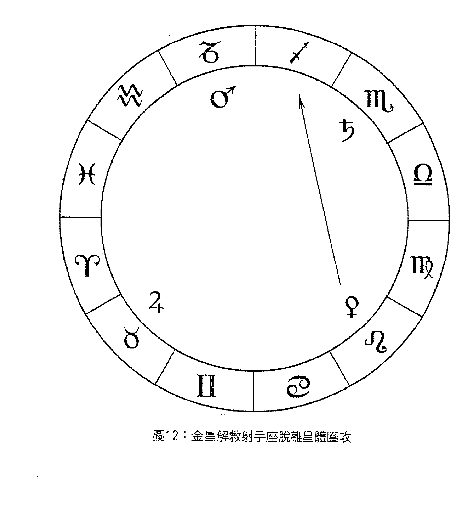

#### [I.2.6：論行星的適當狀態]^[62]——

所謂行星的適當狀態即它的狀態不差，[且]遠離所有阻礙：它未受凶星影響、順行，且不可無力，亦不可落於果宮或受剋的星座之中。倘若它不僅未受凶星影響[還]呈現吉象^[63]，則無論如何，結果之宮位都不會阻礙它^[64]；也不應認為它落於凶宮之中就為凶，因有吉星相助於它。若它未受凶星影響並呈現吉象，且有力，又落於吉宮之中，則它幾乎堪稱完美。但若有其他吉星相助於它，則其獲益將更多；若與吉星形成的相位朝向右方，則更有價值且更佳（類似地，與凶星形成右方相位 [right aspect] 則更為不妙）^[65]^。

因此若我們已將星座及徵象星置於前文所述的適當狀態，則所擇時刻將與此相呼應，是有利的且可令人得償所願。

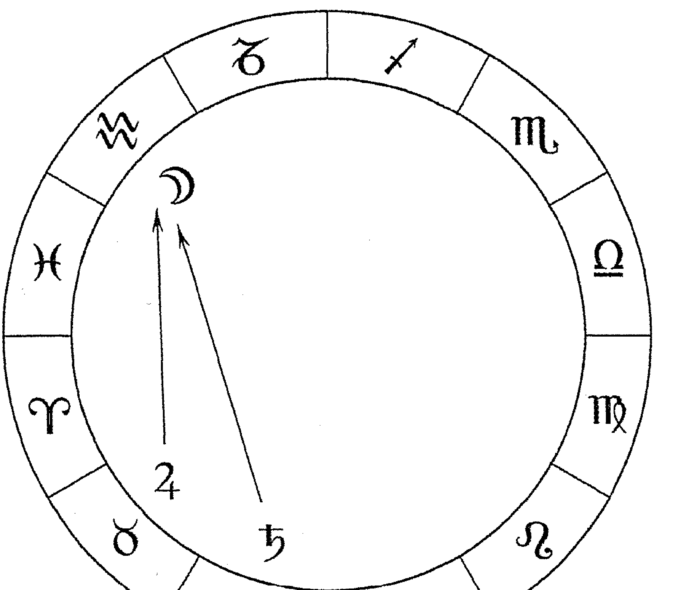

65 | 右方相位（也稱「右旋」[dexter]）即行星向更早前度數的黃道位置——在我們來看是朝向它的右方——投射光線所形成的相位。左方相位（也稱「左旋」[sinister]）即行星向更靠後的黃道位置——在我們來看是向它的左側——投射光線形成的相位。所以，假設月亮在摩羯座，火星在天蠍座，那麼相對火星而言，月亮在他左方形成六分相，而如果金星落在金牛座，那麼相對金星而言，月亮在她右方形成三分相。右方相位通常被認為更加有力，因此伊朗尼指出與吉星形成右方相位比左方相位助益更大，而與凶星形成右方相位比左方相位傷害更大。

#### [I.2.7：增強適當的狀態]^[66]^

有一些因素能夠增強或削弱適當的狀態。使開始之時的星座與擇時所為事項的本質相合則可起增強作用：即與水有關的擇時則選取水象星座，與土地有關的擇時則選取土象星座（其餘[元素]以此類推）；而我們想要快速開展的事項則選取啟動星座，與四足之物有關的事項則選取四足星座——即便^[67]^我們無法嚴格依此照做（所謂嚴格依此照做，即為四足[動物]選取爪子數目一致的星座，等等）。

同樣地，特定的星座適用於國王與權貴，如牡羊座、獅子座[和]射手座（但尤其是獅子座）。故我們若想要為國王擇時，則應將獅子座置於上升位置或第十宮。若無法做到，則可返回此一類星座當中，將獅子座、牡羊座或射手座放置於此位置。並且，月亮的位置、上升主星的位置、代表事項之宮位主星的位置、事項之自然徵象星的位置均須依此方法照做。我們應選取本質相合者，若無法做到，則從那一類中選取^[68]^。

行星的星座與它們的主星象徵意義一致：金星的星座^[69]^如同金星一樣象徵娶妻與婚禮，余者皆同此理。

如此亦可增添吉象：即令事項宮位之主星與宮位或其本質相合^[70]^；若無法為[之]，則令它與上升星座及其主星相合^[71]^；並且它們之間應形成友善的相位；同樣，上升星座及其主星，或它們全部，都應如此——或[至少]其中的一部分應如此。另外還須避免使此兩者與另兩者之間產生任何分歧，抑或使上升星座與其主星之間、事項宮位與其主星之間存在任何矛盾。

令上升星座符合當時的區分亦可增添吉象[72]，徵象星所落星座亦如此。行星應當落於與其陰陽相符且其他性質亦相合的星座之中。

而[73]若想要使[事項]有力而持久，則令上升位置落於固定星座；同樣，將月亮[74]也置於這些星座當中。若想要使事項快速完成，不要長期持續，則令上升位置落於啟動星座，並將徵象星（即月亮）也置於上述星座當中。而雙元星座介於啟動星座與固定星座之間，它們象徵交替與更改。

而[75]對於任何想要適當處置之事，須讓上升位置落於直行上升的星座之中，如此我們可明瞭真相與公正：且這些可令事項的調查過程十分順利。若月亮與其他徵象星亦落於其中，將是有利的。

應使一顆在徵象星所落位置擁有尊貴的行星與徵象星形成吉相位。倘若其他主星未形成相位，則至少使界主星與之形成相位，並且尤其[使一顆與]太陽[形成相位]：因一顆在它所落位置擁有尊貴的行星與太陽形成相位是有利的。

此外讓幸運點和它的主星——或二者之一——落於代表事項的宮位、上升星座、第十宮或第十一宮之中。

然而尖軸應是固定的[76]，不應是遠離的（特別是針對那些我們想要持續的事項）。但倘若尖軸是遠離的，且每一個尖軸（即中天度數所落星座和上升度數所落星座）的主星彼此形成相位，則它將是有益且值得稱道的，尤其當它們又與上升位置形成相位之時；並且若這些相位來自尖軸，則預示著拔擢與顯赫的名聲。而若它們的主星未形成相位，則可綜合判斷兩個星座的征象。

此外被視為吉星、擁有吉星屬性的恆星落於上升度數、中天度數或代表事項之宮位亦可增強適當的狀態，尤其當它與代表事項的行星本質相合之時[77]。

阿布·馬謝稱，若你為某人選擇了某一時刻——無論[是]異國旅行抑或其他事項[78]，而你發現它的主星或[它的]旺主星所落的星座強而有力[79]，則不必為此處憂慮；抑或，倘若太陽或月亮落在那裡，或它容納太陽或月亮，則勝於其他一無所有的[星座]。他還說，落於其中的行星若為凶星，則須使它擁有某種尊貴；若為吉星，則無須考慮它是否擁有尊貴。不過容納[80]月亮時，上升星座不可為月亮落陷或入弱之處，容納太陽亦同此理。

> 66 | 這一章節是伊朗尼自己對於《四十章》Ch. 4內容（里賈爾將它收錄在VII.2.1中）的闡述版本。前兩段論述的就是金迪所謂的「相似」或「相合」。第三段論述的是金迪所谓的使徵象星「呈現吉象」的内容。

> 67 | Ita tamen si.

> 68 | 伊朗尼似乎指的是他有關皇家星座的例子：如果不能選取最佳最貼切的星座（「本質相合者」，proprietas），那至少要從它的同類星座中選擇一個。

> 69 | 即金星的廟宮：金牛座與天秤座象徵婚禮，因為它們由金星主管。伊朗尼可能並不是說它們直接象徵婚禮，但這類事項包含在它們所象徵的典型事項之中。如果金牛座落在第十二宮，那麼首先它代表與土地有關的事項，因為它是土象星座；但它也代表了敵人，因為它落在第十二宮。婚禮是其他可能的象徵意義之一，因為它由金星主管。

> 70 | 我認為伊朗尼指的是：如果為婚禮擇時，就讓金星（愛情的自然徵象星）主管第七宮，或者對於覲見國王而言，讓太陽主管第十宮。

> 71 | 我不清楚這句話的含義是什麼。

#### [I.2.8：月亮落於上升位置]^[81]^

金迪稱^[82]^不可將月亮置於上升位置，因上升位置與她相悖，而太陽卻不與上升位置相悖，他使事項得以發生並顯現，亦可為受限之事紓困^[83]^。

但阿布·馬謝更認同托勒密的觀點^[84]^：因據[托勒密]稱，月亮性熱且為吉星，如金星一般——阿布·馬謝在談及異國旅行時即如是說^[85]^。

然而馬謝阿拉和他的支持者^[86]^稱，若論異國旅行，則不應將月亮置於上升位置：而阿布·馬謝不贊成此觀點。[且]他本人曾言道^[87]^：月亮性冷且濕，而上升位置性熱——故它們^[88]^不一致。

她亦象徵著一切事項的開始，尤其是異國旅行的開始：有鑒於此，她應被置於適宜的位置，除此之外她亦可令上升位置呈現吉象。

他們稱太陽落於上升位置是不利的，因他在會合與妨礙之中為一顆凶星^[89]^：眾人對此看法不一。

81 | 這一章節必須連同里賈爾VII.2.3的內容一起閱讀。段落的順序是雜亂無章的，但伊朗尼的論述（還有里賈爾的回應）可歸結為六點。(1) 馬謝阿拉和金迪（還有烏瑪：見伊朗尼II.13.2）認同月亮不應落在上升位置，尤其對於旅行來說，因為月亮的資料與上升位置的資料（熱）是相反的。金迪還補充說太陽落在上升位置是沒有問題的。(2) 而阿布·馬謝不同意關於旅行的說法，但他的觀點是前後矛盾的，因為一方面，他在自己的著作中論述旅行時，似乎支持將月亮置於上升位置，並且認同托勒密廣為人知的觀點（來源於《四書》I.4）即月亮是暖的；這就是說月亮的資料並非與上升位置的資料相反，因此她不應被禁止放置在這裡。但問題在於，在其他地方（例如《古典占星介紹》V.7中引述的內容）他又認為月亮是冷的，不是暖的。(3) 不僅如此（里賈爾補充），當談及本命盤判斷方法時，他還說月亮是一顆「切斷」的行星，她會奪走生命（可能當上升位置推進到月亮時）：這又顯示出它們的資料是相反的。因此阿布·馬謝的觀點是自相矛盾的。(4) 正是因為他的自相矛盾，所以里賈爾認同其他人的觀點，即月亮不應被放置在這裡。(5) 但伊朗尼和里賈爾卻由這些內容得到不同的結論，或者至少里賈爾曲解了伊朗尼的說法。(5a) 伊朗尼推斷，由於月亮象徵所有事項的開始並且她為上升位置帶來吉象，因此她可以被放置在這裡——他稱之為「適宜的位置」。(5b) 然而里賈爾以幾乎一樣的話，先談到月亮象徵「鮮少」旅行（或許他指的是「短暫的」旅行），無論她在其他開始中具有什麼象徵意義，並且具體指出她「適宜的位置」是與上升星座形成相位的位置。(6) 最後，伊朗尼和里賈爾都僅僅指出，對於太陽在上升星座中扮演何種角色存在爭議（金迪也提到這點），但他們沒有再作進一步論述。

82 | 《四十章》§147。
83 | 關於「分割合為一體的事項」參閱里賈爾VII.2.1作解讀。兩本翻譯的金迪著作稱太陽將消除延遲，而羅伯特（Robert）版本稱他將揭露隱藏的事物。
84 | 在《四書》I.4中，托勒密稱月亮在某種程度上是熱的，但主要是濕的。
85 | 資料來源不明。
86 | 見《擇日書》§23a關於一般性阻礙的內容，以及107關於阻礙旅行的內容。
87 | 見《古典占星介紹》V.7，其中包含了阿布·馬謝的兩部著作《簡明占星學介紹》（The Abbreviation of the Introduction to Astrology）及《占星學全介紹》（Great Introduction to the Knowledge of the Judgments of the Stars）之中的觀點。
88 | 如果我們遵照拉丁文版本，那麼這裡有兩處不一致。首先，由於上升位置是熱的，而阿布·馬謝在後一句說月亮是冷的，因此它們的資料是不一致的。此外阿布·馬謝自己的觀點也是不一致的：他在其中一處認同托勒密，認為月亮是熱的，而另一處又說月亮是冷的。
89 | 關於巴黎16204的內容「他在會合與妨礙之中擁有力量」，參閱馬德里版本作解讀，因馬德里版本與里賈爾VII.2.3相關段落的闡述一致。而我注意到巴黎7413-I看起來與馬德里版本相似。

#### [I.2.9：烏瑪·塔巴里論吉星落於上升位置]

若某吉星落於上升位置，未受剋，且強旺，將十分有利。令烏瑪·塔巴里讚許有加的^[90]^乃是吉星落於上升星座的第一個三分之一部分之中：因他認為如此可使事項加速。然則依我之見，若它落於上升度數，或緊隨上升度數之後上升（因它朝上升位置推進）則更佳，且可為上升位置增添吉象。

#### [I.2.10：擇時前的會合與妨礙]^[91]^

若^[92]^所擇時刻之前的會合與妨礙^[93]^未受凶星影響並呈現吉象，則更可增添吉象；會合或妨礙之主星所落位置亦如此。（但[94]妨礙的位置乃是位於地平線之上的發光體所在位置。若其中一個落於上升度數而另一個落於下降度數，則妨礙位於上升度數。）

由於金迪稱會合象徵一切於妨礙之前發生之事，而妨礙則代表自妨礙至會合之間發生之事。有鑒於此，在任何開始或本命盤中，都有必要仔細檢視與會合和妨礙有關的全部因子，知曉它位於始宮、續宮抑或果宮之中，會合和妨礙度數之上或星座之中落有哪顆吉星抑或凶星，是否與它們形成相位；它與何者形成正相位或其他相位[95]；同樣還有會合或妨礙之主星，即它是否在光束下或在自己的光線之中[96]。因倘若它們受剋，所開始之事將是無力或不穩定的。而倘若相反[它們]未受剋，則預示事項得以完成且令人受益。

且[97]當月亮離開會合或妨礙之時，須謹防她與凶星相連結（而若她與吉星相連結則是有益的）。

此外[98]令會合或妨礙的位置落於尖軸，會合吉星，且月亮應入相位於吉星：因如此則預示了提升與十足的好運，乃至值得稱讚的結果。

但若會合或妨礙的位置呈現我們所說的[吉象]，而月亮（當她離開會合或妨礙時）卻與凶星相連結，則預示事項開始是順利的，結果卻是不利的。

若會合或妨礙的位置（如我們所說）與凶星相連結，而月亮（當她離開會合或妨礙時）卻與吉星相連結，則開始是不順利的，結果卻是好的。

若會合或妨礙的位置（如我們所說）與凶星相連結，[且]月亮（當她離開會合或妨礙時）亦與凶星相連結，則事項自始至終都是不利的。

若，會合或妨礙發生之時，其主星[99]東出[100]，且落於自己的廟宮、旺宮或三分性之位，則開始行動之人將是聰慧[且]謹慎的，而藉由聰慧和謹慎，他將得以倖免於前述災禍。因會合或妨礙之主星象徵於其間所開始之事的本質[101]，若會合之主星與之相悖，則適得其反[102]。

若會合或妨礙的位置落於續宮之中，則我們所說的聰慧與謹慎將於事項結束之時顯現於事項的主人身上。

若會合或妨礙的位置落於相對尖軸的而言的果宮之中[103]，其間發生之事將是不利的，無法取得令人滿意的結果。此乃金迪所言。

而[104]若我們僅依字面含義理解他所言，則於同一會合或妨礙之中開始的事項，其發展過程相同，結果的吉凶亦相同：事實卻並非如此。因同一天開始兩件相同類型之事，結果卻不盡相同：其中一件有好的結局，另一件卻相反。但正如本章節開篇所言，我們應從他的話

90 | 資料來源不明。
91 | 參見里賈爾VII.2.4。
92 | 從這裡開始直到引述阿布·馬謝的內容為止，伊朗尼似乎對金迪在《四十章》§§478-79、483、488-89、494、95a及536中偏離主題的闡述進行了整理和補充。
93 | 伊朗尼（更確切地說是金迪）指的是在所選擇的時間之前發生的最近的新月（會合）或滿月（對分，或稱妨礙）。
94 | 我依巴黎16204解讀此段，但馬德里版本還包含了「是月亮位置」(est locus lunaris)這句話。傳統上對於滿月(妨礙)使用哪個位置有兩種觀點。一種觀點認為我們要始終使用月亮的位置(在《心之所向》附錄F中，伊本·伊茲拉將此觀點歸於馬謝阿拉、印度和一些穆斯林占星家)。而另一種觀點(見《四書》III.3，烏瑪·塔巴里在《本命三書》中也對此觀點表示贊同)就是這裡所提及的，儘管托勒密並沒有談到如果妨礙恰好發生在地平線的位置要如何處理。
95 | 這句話似乎承認與會合/妨礙的星座形成的整星座相位可被納入考量，而不僅僅是正相位。
96 | 即它距離太陽足夠遠而可以被看見。
97 | 以下幾段參見《四十章》 §§ 483及495a。金迪所闡述的內容與為挖水渠和造船擇時有關，但他可能認同在許多不同類型的擇時中，要觀察會合或妨礙是否處於適當的狀態。
98 | 現在伊朗尼分析會合/妨礙與月亮的人相位的四種組合：吉一吉、吉一凶、凶一吉和凶一凶。
99 | 發生時所在星座的主星。
100 | 我採納巴黎16204而不是馬德里版本，選用了「東出」一詞，因為最後一段也提到了會合/妨礙的主星東出——儘管是在擇時中所選的時刻。
101 | 關於馬德里版本中distantiam，參閱巴黎16204理解為substantiam。
102 | 參閱馬德里版本解讀，因巴黎16204馬上跳躍到隨後的段落中，並把兩者混合在一起。
103 | 里賈爾VII.2.4認為這裡指的是相對於擇時盤上升位置而言的果宮，前面關於始宮和續宮的闡述也同樣如此。
104 | 在此伊朗尼先對金迪所言提出異議，隨後又進行了反駁。異議是，既然會合或妨礙影響大約兩周，那麼它會使這段時間里任何人開始的任何行動都得到相同吉凶的結果（這顯然很荒謬）。他對此的解釋是，擇時並不能絕對地讓某事發生，而它僅僅能夠起到增強或減弱的作用。

倘若事項之擇時盤呈現吉象（連金迪所提及的那些因子亦呈現吉象），則吉象將得以累加並迅速顯現，不會延遲。若擇時盤呈現凶象，金迪所提及的因子卻呈現吉象，則吉象將減弱。若兩者（即擇時盤和金迪所說的）都不利，則凶象將倍增且迅速顯現。

在任何一張擇時盤中，我們應適當放置當年當季之主星，正如處理會合或妨礙一般，如此可增添吉象。但相較當年當季的主星而言，適當放置會合或妨礙更具獨特性；相較世運的年主星而言，適當放置當年當季之主星更具獨特性。然而，若我們能夠適當放置全部，則更佳。

阿布·馬謝稱，若擇時盤主星即為此年回歸盤中月亮所落星座之主星或此年的上升主星，並且它在回歸盤與擇時盤中都呈現吉象，則顯示開始事項之人將獲得更多榮耀，事項的結果亦值得稱道。他還稱，倘若此年上升主星、發光體的位置及中天的位置均不能作證，則情況會得到略微改善。

塔巴里稱，若會合或妨礙的度數及它們主星所落位置可嘉，則事項亦將穩固且值得讚許，而若在那時出生、被任命或執掌某些要職亦是如此。他還闡述了開始之時的可嘉位置，而我認為此觀點承襲自古人。

金迪稱，若發生於所擇時刻之前的會合或妨礙的主星在擇時盤中東出，落於自己的廟宮或與之形成三合的相位，則它預示著對事件有影響；若它沒有形成相位，則是無用的。

#### I.2.11：其他判斷法則

此外他們還以會合或妨礙之時月亮的三分性主星為依據（判斷想要進行的事項是否順利），因它們是本命盤及一切開始的護衛者：若它們在擇時盤中得到容納並呈現吉象，則為吉；反之，則凶。

使擇時盤上升位置落於此年回歸盤中呈現吉象的星座之中亦可增添助益。並且使那呈現吉象的星座落於任何一個尖軸（尤其是上升星座或第十宮），或使它落於緊隨尖軸之處，或落於事項的代表宮位之中。

使徵象星落於與它們相合的吉宮之中。且讓它們在所擇時刻是強力的：所謂行星強力即它們上升於北方（而有時，它們必須上升於南方）。若我們想要事物增長，則使月亮落於尖軸，增光且快速，若所求相反則反之。若我們想要快速完成事項，則徵象星應快速運行且均等，且行經吉星之下、凶星之上。

令事項的徵象星月亮落於地平線上（在我們想要展現的任何事項中）；若落於地平線之下——代表在我們想要隱藏的任何事項中。

上升主星應東出，我們應盡力使其他徵象星亦如此。
且令月亮與吉星相連結：因這預示所開始之事的未來。
金迪稱，若發光體彼此形成值得稱讚的相位，則預示那時開始之事強而有力，尤其若月亮「位於她喜樂的開端」——亦即龍首所在星座。

馬謝阿拉稱，當行星相對月亮西入時是強力的，正如它們相對太陽東出時一樣；且月亮主宰夜晚，正如太陽主宰白晝。

塔巴里稱，若我們無法同時使月亮與上升位置均處於適當的狀態，而擇時又在白天，則須首先適當放置上升位置，尤其當月亮落於地平線下之時。然則若擇時在夜晚，須首先適當放置月亮，尤其當月亮落於地平線上之時。倘若我們能夠將開始由白天推遲至夜晚（或相反），則須考慮適當放置何者為佳——換言之，適當放置月亮抑或上升位置——擇其最有利者為之。此外月亮於白天落於地平線上，或於夜晚落於地平線下，是十全十美的，且提升了上升位置的力量。而若我們必須為某人擇時，卻又無法使月亮處於適當的狀態，則我們應將木星或金星置於上升位置或第十宮之中，因如此適當的狀態可帶來與之相應的良好開始。

有一位先賢稱：若我們想要讓所開始之事長久持續，則必須如此行事。然而對於我們想要長久持續之事（如婚姻、建造城市，諸如此類），須優先使月亮處於適當的狀態。若月亮無力，則須將她從尖軸或緊隨尖軸之處移開，若無法將她從尖軸移開，則勿使她與上升位置、上升主星及事項主星形成相位。若上述相位無法全部避免，則我們應盡力而為。

金迪稱，若我們無法使全部徵象星都處於適當的狀態，則適當放置月亮足矣，儘管這無法確保那些與破壞有關的事項。此外，相較適當放置月亮而言，他更偏適當地放置徵象星。

而塔巴里慣於偏好適當地放置事項主星，而非月亮、上升主星或是其他徵象星。但他所言僅對此有助益，即我們所開始之事將會如願以償；然而，相較完成事項而言，保護身體與靈魂乃是更有益的。

若月亮慢速，即少於12°（如同土星的行進一般），則預示著事項緩慢與困難。

哈亞特稱，當月亮處境不佳卻不得不進行擇時，若令她陷於不佳狀況的凶星可用且狀態可嘉，則以此行星作為上升主星；且若它容納月亮則更佳。他又言道，若吉星落於上升位置則是有利的。

#### I.2.12：须谨慎的情况

不過，請允許我說明那些須謹慎的情況，如此我的闡述方可更加完善。

你須謹防與凶星相連結——避免這樣的連線存在於任何一顆徵象星身上，無論是在同一星座抑或以對分相、四分相的形式。以三分相或六分相連結尚可，尤其當它們之間存在容納關係之時。倘若如此，據馬謝阿拉所言，它們即呈現吉象。而我會告訴你，它們並未受剋。

且謹防凶星落於我們選取徵象星的宮位之中（亦不可在第四個宮位、相對的宮位或是它們的尖軸），徵象星也不應落於果宮或無力。

此外你應當心蝕點，尤其謹防它落於開始行動之人本命盤中發光體所在的星座。

月亮亦不應在太陽光束下，且應為她徹底清除一切傷害。

且謹防擁有凶星屬性的恆星落於上升位置或中天，或擇時所為事項的代表宮位之中。

勿使徵象星與太陽相連結（或使太陽與它相連結）。還須當心與太陽形成四分相或對分相。然而若它們之間存在容納關係，則略好。此外，對分相總是帶來爭吵與對立。

不應使凶星落於始宮，尤其不可落於上升星座或第十宮，特別當凶星為凶宮（如第六宮、第八宮）主星之時：此時它們代表其宮位之事項。

不應選取同年太陽回歸盤中，其主星即將被焦傷的星座作為上升星座，也不應選取回歸盤中受剋之星座作為上升星座。

對於我們想要迅速完成的任何事項，亦應提防月亮慢速或減速（當她行進少於12°時），因如此她將令事項延遲，為其帶來困難，除非有諸多徵象星。

且對於任何我們想要穩定、持久之事，都應避開啟動星座。同樣的道理，對於任何我們想要了結之事，都應避開固定星座；而對於任何想要如他所期待的那樣發生之事，須避免雙元星座：因它們會為任何發生於其間之事帶來困難。

不利的情況是，尖軸是遠離的、落於遠離之處：即依次序為第十宮，依星座計數為第九宮。一些人亦稱之為「退縮」。但上升的退縮是有益且值得嘉許的，尤其對於那些我們想要長久持續的事項而言——所謂上升的退縮，即依次序計數的第十宮，落於依星座計數的第十一宮當中。

甚至須小心上升主星、事項宮位主星、事項的自然徵象星、月亮所在星座主星及月亮入相位之行星「處於衰老狀態」：即於黃昏時分靠近沈落的太陽，因如此預示事項是不潔的。倘若我們無法令前述因子悉數免於此情況，則至少讓上升主星和事項主星避免此情況。此外若一顆行星處於衰老狀態，沈落於黃昏且遠離太陽，則並非不利的，但它預示事項的影響會滯後或姍姍來遲。

然而若必須於前述值得嘉許的時刻開始某一事項，而月亮卻與火星或土星相連結，且所開始之事由吉星象徵（如水星象徵貿易與買賣），則可於此時開始，因為它將得以完成：但那顆凶星的某些屬性將混合其中。而若凶星得到容納則是較好的狀況，若它們凶惡則為最壞的狀況。

若上升星座及其主星與太陽形成相位，且太陽是有益的、與上升星座形成良好的相位（月亮亦如此），而發光體彼此之間亦形成良好的相位，則事項將被公開（甚至傳至國王處）。若它代表逃犯，則他將被俘獲。但若形成不利的相位，則它將以原本不應有的方式被發現。若徵象星落於地平線上方或落於中天，則它將被發現，且事項會變得顯而易見。
而若上升主星或月亮位於太陽光束下，或發光體落於相對上升星座的果宮、未與彼此形成相位，或月亮及徵象星落於地平線下方（尤其落於第四宮之中），則預示事項非但不會被發現，還將被隱匿。若上升主星為凶星，災禍將隨著它被隱匿而發生，尤其當兩顆發光體受剋之時。而若它們呈現吉象，則他將倖免於前述災禍。

#### I.2.13：有關適當性和根本因子的其他建議

但我們前述全部論斷，包括好的與壞的，須在我們適當放置此論述開篇所提及的根本因子之後方可考慮：

- 若前述根本因子由吉星主宰，則不需考慮那些伴隨因子，即便它們是不利的。
- 而若吉星強而有力且它們是主宰，則我們不需察看那些伴隨因子，即便它們是有利的。
- 若每一項都是有利的，則吉象將倍增。
- 若根本因子不利，但伴隨因子是有益的，則它們的助益不多；而若伴隨因子亦不利，則它們將增添災禍。
- 此外若有必要開始某一事項，而凶星卻主宰那一時刻，則須適當放置伴隨因子：如此它們將使災禍得以減輕——即便僅是略微地。且須小心避免使伴隨因子處於不利狀態。

若某人請求占星師為他即將開始的事項擇時，而占星師卻不確知該事項由何行星、何宮位象徵，則須令上升星座及其主星處於適當的狀態，兩顆發光體亦如此，象徵事項結果的宮位及其主星亦如此，以保護開始行動之人的身體和靈魂，以及事項之結果——無論它是否有效果。而當某人不願向占星師透露擇時所為何事時，亦須如此照做。對於此類事項而言，開始於木星、金星或太陽主管的時刻是有利的，因如此則無論事項為何，皆可適得其所。

然而若詢問者的本命盤已知，且有必要削弱某一徵象星（如當我們想要狩獵或徵戰時，即為第七宮主星，諸如此類），則不可削弱任何在本命盤中具顯著代表性的行星，尤其本命盤之勝利星（及擁有充分證據顯示其不可被削弱）：這些對於任何開始而言都是適用的。

而對某些人，應當如下行事，對另一些人，則不必如此。對於為國王所做的擇時，應適當放置太陽、第十宮及其主星；且在為國王所做的擇時中，這不應被視為伴隨因子，而應被視為必要和根本因。

但對於抄寫員而言，則無論想要開始何種事項，都應適當放置水星。而對於火星所象徵之人——如拳擊手、鐵匠、廚師而言，應適當放置火星。對於法官和商人而言，應適當放置木星，而對於女人和令人愉悅之人而言，則為金星。對於農民、老者、寡婦而言，則為土星。大體上，要適當放置與他的民族、國家、派系、職業以及年齡相應的行星，乃至星座和小時（如女人對應陰性星座和夜晚的小時；男人對應陽性星座和白天的小時）；且對於任何人而言，星座都象徵他的民族與國家：如牡羊座對應 Accumuedi 和 Alcordi，天蠍座對應阿拉伯人。

有時甚至會發生須適當放置數個宮位的狀況：例如，若想要購買奴隸或牲畜，則要適當放置代表此事項的宮位（在此例中為第六宮），還要適當放置代表資產的第二宮，因奴隸和牲畜被計入資產之中。也正是因為如此，可以為同一事項適當地放置數顆行星：正如當我們為將織物染成紅色而擇時，須令火星（象徵紅色）處於適當的狀態，且要使他與月亮、上升位置及其主星形成友善的相位。而倘若這是供女人所用的織物，則還須適當放置金星；若供斯拉夫人或奴隸所用，則為土星；若與戰爭有關（如軍旗）或增加戰爭，則為火星；而若它供所有人使用，應使儘可能多的行星處於適當的狀態。

---

**註釋**

105 | 此處伊朗尼指的是擇時盤與金迪提出的代表因子在吉凶方面的四種組合，然而手稿中似乎只列出了三種，且羅列順序也不一樣。不過金迪想要闡述的內容是顯而易見的。

106 | 在此段中，伊朗尼指出理想的擇時盤應考慮到世運占星中該年與季的始入盤（但為什麼不是本命盤此年的小限主星，或回歸盤的上升主星呢？），如同金迪在氣候預測中建議的那樣（《判斷九書》§ Z.8、《四十章》Ch. 38）。

107 | Proprius。

108 | 可能是擇時盤的上升主星。

109 | 略去了馬德里版本中的：「亦即，它既不在擇時盤的上升位置，也沒有與之形成相位。」

110 | 這裡我們或許應參照馬德里版本更為清晰的闡述，即它不落於擇時盤的上升位置，也未與後者形成相位。

111 | Subtiles。里賈爾的措辭更為激烈，他說事項的品質會是低劣的並且令人憎惡。

112 | Pars。

113 | Praepositurae。這一中世紀詞彙指的是許多有權力的職位，從教師到修道士、僧侶、副主教、皇家執行官等等。

114 | 可能是上升位置、中天及第十一宮。

115 | 確切來源不明，但它與《四十章》§§483及495a中的觀點相似。梵蒂岡與慕尼黑版本並未將此觀點歸於任何人。

116 | 來源不明，但可參見《占星詩集》V.5.30。

117 | 即續宮；伊朗尼可能想的是第十一宮，它緊隨著第十宮。

118 | 即在北方的黃道經度上。

119 | 此例見伊朗尼II.2.10和里賈爾VII.9.2。

120 | Quantitate。

121 | Aequo。我不確定伊朗尼在此指的是什麼。

122 | 此處可能指應使吉星以優勢刑剋支配它們，而它們應以優勢刑剋支配凶星。

123 | 換句話說，她應落在星盤中與這些類型的事項相對應的半球。

124 | 這裡可能指的是，在停滯轉逆行之前，先於太陽升起且脫離光束下。

125 | 參見《占星詩集》V.28.4。

126 | 來源不明，但在此處及下文，巴黎7413-I寫作Alchimenides或Alchimemdes，而在拉丁文版本里買爾的著作中寫作Alaçmin，即一個類似烏茲曼（‘Uthman）的人名。

127 | 這可能是金迪/Alaçmin或他的資料來源中的一個特殊說法。月亮落在那個星座顯示她正行經或者將要行徑黃緯北緯的度數。

128 | 來源不明。

129 | 這與古代護衛星的定義有關（《古典占星介紹》III.28）。馬謝阿拉指的是行星星體應落在黃道上相對太陽而言靠前的度數（這樣它們藉由周日運動先於太陽升起），但它們應落於相對月亮而言靠後的度數（這樣她藉由行星運行或在黃道上的行進而走向它們）。

130 | 前兩句源於《占星詩集》V.5.32-33。

131 | 這句話與區分喜樂狀態——即halb（古波斯文的區分之意，《古典占星介紹》III.2）——的思想相衝突。後者認為夜間行星總要落在與太陽相對的半球之中。

132 | 這句話以《占星詩集》V.5.10-11為依據。

133 | 可能指的是塔巴里的上述觀點。

134 | 這裡可能指以容許度計算的相位，因為如果她落在尖軸，那麼顯然她會與上升星座形成相位。

135 | 見前一段「金迪」所述內容的註解。

136 | 參閱巴黎7413-I進行解讀，因為它更符合里賈爾的內容（特別因為它提到了月亮）。巴黎16204寫作，「充分地適當放置是有利的，但它無法給予我們保證，除非事項應被破壞」。

137 | 依據巴黎7413-I補充了這句話。

138 | 本段參閱巴黎7413-I進行解讀，因為它的篇幅更長，也與里賈爾VII.2.5的內容更加吻合。

139 | 依據巴黎7413-I補充了這段話。

140 | 參見《擇日書》§28，其說法是不同的。這句話在I.3、里賈爾VII.1和VII.2.5當中也出現了不同形式的表達。

141 | 我根據《擇日書》§28及里賈爾VII.3.5進行補充。見本書緒論對此段落的討論。

142 | 原文為「et」，此處按上下文意譯。

143 | 本節大部分內容與《占星詩集》V.5章節相符。

144 | 原文為「tu」，此處按上下文意譯。

145 | 見《占星詩集》V.5.8。

146 | 即與這些宮位形成對分相。

147 | 原文為「nativitatis」，此處按上下文意譯。

148 | 我認為這實際上指的是月亮（阿拉伯資料有時稱之為「徵象星」）。這一小段文字可能來源於《占星詩集》V.5.5和V.43.6。

149 | 括號中的內容參閱了慕尼黑版本作解讀。兩者的區別顯然在於分別描述的是內行星和外行星。

150 | 參見《占星詩集》V.5.6-7、《擇日書》§22f和《五十個判斷》#13。

151 | 關於calidior一詞，參閱巴黎7413-I作解讀。

152 | 參閱巴黎7413-I解讀為nisi。或許此處指的是其他預示快速的徵象星可以抵消月亮慢速的影響。

153 | 參見《五十個判斷》#36，尤其因為關於雙元星座的論述與此處的意思相近：也就是說，事項中事情會橫生枝節（而不是按照客戶想要的樣子發展）。

154 | 即沒有任何更改、重複或橫生枝節。

155 | 手稿此處似乎寫作dominus enim 或domini（不清晰）（慕尼黑版本），不過看起來有誤。

156 | 關於remotione cadenti一詞作此解讀。見我在緒論中對這一主題說明。遺憾的是，拉丁文版本在此處的概念表述上相當混亂。

157 | 關於recedentem一詞，參閱巴黎7413-I和慕尼黑版本作解讀。

158 | 即象限制第十宮為第九個星座。

159 | 關於馬德里版本中「前進」(advancing)一詞，參閱巴黎16204作解讀。伊朗尼可能指的是金迪，見《四十章》 §§ 477、485、490。

160 | 也就是說，如果它在太陽之後沈落並且與太陽十分接近。對於外行星而言，意味著它們會合週期的末端，出現在太陽光束附近，同時太陽即將與它們會合。對於內行星而言則意味著逆行，這樣它們才能進入光束下。

161 | Procul。

162 | 參見《五十個判斷》#25和《擇日書》§ 11b。

163 | 參見《占星詩集》V.36.51。在手稿中月亮為主格，也就是說她也與上升星座形成相位；但《占星詩集》作「太陽與上升星座和她形成相位」。

164 | 參見《占星詩集》V.35.8。

165 | 在手稿中看起來像是 non poterit/potius/potus的變體。

166 | 參見《占星詩集》V.35.2-3。

167 | 原文為「se」，指代發光體。

168 | 原文為「et」，此處按上下文意譯。

169 | 即上升主星是凶星。

170 | 即太陽和月亮。

171 | 即次要因子。

172 | 原文為「et」，此處按上下文意譯，意指吉星本身是主宰性的。

173 | 針對其他手稿中的 fuerint 一詞，參閱馬德里版本作 praefuerint，如果依照前者，這句話即為「而那一時刻存在凶星」。

174 | 這裡事實上可能指的是「本命盤」。

175 | 據馬德里版本補充「與靈魂」。

176 | 這裡似乎是說，如果我們不知道確切的宮位或自然徵象星，那麼我們所能做的最好的事就是保護客戶的身體健康並防止在事件中發生災禍，哪怕最終他並沒有得到想要的結果。

177 | 中世紀判斷勝利星的方法參見《心之所向》。

178 | 即應適當放置太陽。

179 | 原文為「et」，此處按上下文意譯。

180 | 即黨派或派系。

181 | 可能是指部落或民族名稱。

182 | 原文為「Arabes」。

183 | 原文為「belli」。

適當的狀態，且尤其是象徵[其]色彩的行星。

在此論述開篇，我們提及若需削弱某一徵象星，則應以正確的方式削弱它：如在搜捕逃犯時，意在破壞逃犯和他的敵人的狀態，因此要使月亮無力且受剋於凶星——鑒於她象徵著所有的開始[184]。

而對於服用瀉藥[185]之人，[使]月亮受剋的狀況與此事項相契合：即應將月亮置於她自身下降之處[186]：由此使[身體的]下部鬆弛以便有害的體液（我們服藥的目的是想要祛除它們）通過。且月亮不可受剋於凶星，以免體液與藥劑受阻無法達至其應去往之處，服藥者亦將受到傷害：因土星會將其緊壓在一起並阻止其離開，[而]火星則會以過度劇烈的方式將它驅除——我認為此二者將傷害服藥之人。此種受剋方式就是如此作用於這些事項。

然則上升位置及其他徵象星不應以任何方式受剋於凶星，且須盡力使上升主星處於適當的狀態；若月亮於所擇之時受剋，則我們要盡己所能令它們呈現吉象。而若上升主星呈現吉象，即便[187]上升位置位於燃燒途徑之中（或無論上升星座為何），也不會形成阻礙。

而正因為如此，當出征或狩獵時，應使第七宮主星受剋。這是擇時的一個普適性觀點，對於本命盤已知或未知之人皆如此。有鑒於此，本書將介紹一些有關特定類型擇時的例子，以進一步闡明上述內容。我們將此放在隨後的論述之中。此外，在每一種擇時中，任何[關於擇時的普適性]因子，將不再被重複提及。許多人都慣於做出巨細靡遺的論述，但我們在每一章節中僅闡述必要的事項[188]。

184 | 採納馬德里版本。巴黎16204作「意在破壞他的狀態及使[逃犯]虛弱：要使月亮受剋於凶星，因她象徵著所有的開始」。不過正如波那提在評論這一段落時（《天文書》Tr. 7，Part 1，Ch. 12）所指出的，受剋或呈現凶象不等同於無力。

185 | Catarticam。伊朗尼在此似乎指一種瀉藥。

186 | 因馬德里版本過於簡略，此句剩餘部分依巴黎16204解讀。例見下文II.2.10。

187 | 關於馬德里版本中et si及巴黎16204中et non，理解為etsi。

188 | 也就是說，他不會再重複所有關於吉星、凶星等等的一般性觀點，而僅僅闡述每一類擇時所特有的觀點。

且我們將回溯前述的五條判斷[189]（如為服瀉藥擇時一例）：因此上升位置和月亮[有時][190]應位於燃燒途徑之中，月亮於南方下降亦值得稱道。同樣的道理，應當心某些[此前]被認為有利的狀況，正如我們談及服用瀉藥時所說：因此應避免與凶星形成相位，無論是何種類型的相位。而之前曾說與它們形成三分相或六分相並不壞，尤其當它們得到容納時[191]。但若你被問及為何會如此，[則]你不難藉由前述內容知曉答案——不使用此知識的人例外[192]。

本書已省略了諸多畫蛇添足的因素[193]，而它們的理由[194]亦不充分。因為若將它們納入考量，則良辰吉時如此之稀少，以至我們無法為任何人擇時，除非在長久的等待之後：例如印度人所謂「灼傷」的小時[195]，以及航海者和埃及人所謂「水減少之日」[196]，還有阿布·馬謝在他的擇時著作中提到藉由[月]宿擇時的內容（他的論述亦太過冗長）[197]。

我們亦省略了其他人在擇時著作中所闡述的諸多因素：如固定星座、雙元星座和啟動星座；乃至直行星座和扭曲星座，以及諸多其他屬於導論而非擇時的內容[198]。

- 189 | 可能指的是這一章節開頭我標明序號的條目。
- 190 | 伊朗尼在這一段闡述的是，有時候特定的擇時需要讓行星落在那些以普遍性法則來看不利的位置。
- 191 | 參見《五十個判斷》#2和25。
- 192 | 即對於雖然學習了這些法則，卻並未花心思把知識活學活用的人。
- 193 | Nimia。伊朗尼的意思是，無論它們的用處是什麼，要求人們加入考慮都是過分的。
- 194 | Ratio。
- 195 | 即半日時或「燃燒的小時」。來自金迪的標準說法以及它的梵文詞源，見里賈爾VII.57.2。在《古典占星介紹》VIII.4中，卡畢希提出了另一種不同說法。另見馬謝阿拉《亞里士多德之書》II.4（《波斯本命占星I》）及本書附錄D。
- 196 | 我不清楚這些是什麼。
- 197 | 關於使用月宿擇時——或許是或許不是來源於阿布·馬謝的著作——見本書第一部，摘錄自里賈爾VII.101。
- 198 | 里賈爾在此顯然與伊朗尼存在分歧，他在自己的著作中摘錄了《擇日書》的相關段落：例見里賈爾VII.3.1。

若將占星學書籍類比物理（physic）[199] 書籍，則本書便如同一部關於用藥的著作，而此篇論述如同一部指導執業醫者針對病症使用何種藥物、如何使用及用量多少的著作。而本書的第二篇論述如同一部涵蓋藥劑（如丸藥、舐劑等 [200]）等內容的著作。在占星書籍中，處理固定星座、雙元星座和啟動星座的內容，就如同物理書籍中處理簡單藥物的內容，但在行醫之前，醫者首先應該瞭解這些知識。

### 1.3：論為本命盤已知之人擇時

在此情況下，須考慮的根本因子有三：

- [1] 應檢視本命盤的勝利星 [201]，且應將它置於始宮或續宮之中；若它落於地平線上方 [202]，擺脫凶星且與吉星相連結 [203] 則更佳。然而若勝利星為凶星，則應將其置於續宮之中以遠離尖軸：因或許它將令事項遭到破壞，且破壞來自事項的主人 [204]。但伴隨於此根本盤且可增加適當狀態的是，將當年太陽回歸盤的主星以前述本命盤勝利星一樣的方式處置，根本盤 [205] 與回歸盤中幸運點的主星亦如此。此外依某些占星師所言，[應適當放置] 小限主星 [206]，及圓環主星（lord of the orb）[207]。

- [2] 第二個根本因子乃是以根本盤的上升位置（或中天）作為擇時盤的上升位置——倘若它未受凶星影響。若有吉星落於其中，或與其形成友善的相位，則更佳。而若根本盤的上升位置或中天無法作為擇時盤的上升位置或[其]中天，則令它落於第十一宮之中。然而倘若[無法做到]，則以小限星座、根本盤中幸運點所落星座或太陽回歸盤中幸運點所落星座代之——若它們未受凶星影響（如前所述）。

哈亞特說，你應以本命盤中代表事項之宮位作為擇時盤的上升位置；且若月亮未與凶星形成相位，則可令她與上升位置形成相位[208]。但若她與某凶星形成相位，此凶星卻為本命盤之主星[209]，則不會阻礙於[她]。且擇時盤之上升星座絕不可為本命盤的疾病之宮、死亡之宮及敵人之宮[210]。擇時盤之上升位置應為本命盤之吉宮，且若太陽回歸盤的上升位置、小限星座、本命盤中幸運點所落位置與太陽回歸盤中[幸運點]所落位置亦如此，則是有利的。但若無法為之，則盡可能多地[適當放置]它們，尤其本命盤中的幸運點[211]。此外，徵象星的力量、與吉星形成相位可減免災禍。

而後[212]，若能夠將（本命盤、太陽回歸盤或小限[213]中）事項的主星置於擇時盤或太陽回歸盤的上升位置，擺脫凶星，則將使事項得以順利促成。若除此之外，它還未受凶星影響、有力且呈現吉象，則此事項將較[其他]同類事項更為完美。而若根本盤、擇時盤或太陽回歸盤的上升主星，落於本命盤或擇時盤或太陽回歸盤中代表事項的宮位，則顯示完成事項會伴隨著辛勞，且應主動謀求此事：若它有力且[214]擺脫凶星，則會如此。而若無法依之前所言[放置]行星，但它們與事項星座形成友善的相位，則亦有利；若前述兩個宮位的主星彼此形成友善的相位，則亦有利。

208 | 參見《擇日書》§28，其內容可能啟發了這一說法。
209 | 這可能應為本命盤的「勝利星」，如伊朗尼在前文所述。
210 | 即本命盤的第六宮、第八宮和第十二宮。
211 | 這似乎是說，本命盤中幸運點所落的星座，應位於擇時盤的吉宮之中。
212 | 這段話涉及卜卦的一條基本法則，即如果事項主星落在上升位置，那麼事項將會來到詢問者（或此處所說的客戶）身上；但如果上升主星落在事項的宮位，那麼客戶必須更加努力讓事項發生。例見《判斷九書》§10.1。
213 | 關於馬德里版本中electionis一詞，參閱巴黎16204解讀為profectionis。
214 | 巴黎16204作「或」。

## [3] 第三個根本因子乃是應檢視本命盤，它顯示了他當年的災禍[215]：此年你不應開始任何重大事項，尤其是與它顯示的災禍有關的事項。然而若此事不可避免，則須令象徵[災禍]的行星位於果宮，且應盡所能適當放置上升位置——同樣還有事項結果之主星，以及它們的主星。甚至還須將一顆吉星置於那顆凶星在本命盤中所落之處，或[將本命盤中那一位置]置於吉星的光線之內。若無法為之，則應清除所有凶星[216]，且特別是引發當下災禍的凶星。

然而若[217][總體而言]本命盤並未顯示當年會發生災禍，但此一年[218]顯示，想要開始之事將遭逢破壞，則應使本命盤及太陽回歸盤、擇時盤中事項之自然徵象星所落星座以及它們的主星處於適當的狀態——尤其它在[本命]盤和擇時盤中所落星座。

而若本命盤顯示此事在那一年[219]是順利的，則不需付出太多辛勞即可令事項如願以償：因事項將會完成，且它不會受阻，即便擇時盤並不完美。

215 | 伊朗尼似乎是說，在卜卦中，本命盤 (通過小限或太陽回歸盤) 顯示了災禍大致的狀況，例如有一顆狀態糟糕的凶星落在小限星座之中。他並沒有說它會特別為擇時的事項帶來麻煩——對此請參閱下一段內容。
216 | 這裡或許指的是：「使擇時盤中的凶星不合意於關鍵的宮位。」
217 | 依據巴黎16204解讀這段內容，因為它更為清晰並且在結尾處有附加內容。此處，伊朗尼似乎論述關於特定事項本身狀況不佳的情況：例如，如果為子女之事做擇時，但太陽回歸盤的第五宮卻有一顆狀態很差的凶星。
218 | 關於 hora (「hour」時刻) 一詞，理解為 anno。
219 | 關於 hora (「hour」時刻) 一詞，理解為 anno。

此外，須在適當放置之前章節[220]提出的全部因子之後，方可考慮於此章節中所說的一切——因前者乃是不容忽略的。

然而，有一些時刻對於開始任何事項而言都是不宜的，如蝕發生之時，尤其當蝕發生於[本命]盤上升星座或其三方星座[221]之中，或與它形成四分相之時。

烏瑪認為，第七宮的相位[222]對應土星，因它的星座與發光體的星座對分。而依此類推，則三分相對應木星，四分相對應火星，六分相對應金星。但若其中一顆[行星]在本命盤中受剋，則在擇時盤中，我們不應讓月亮與任何行星形成[那顆]受剋行星所對應的相位（無論它是吉星抑或凶星）——例如：若金星（對應六分相）在本命盤中受剋，則在擇時盤中，月亮不應與木星或[任何]其他行星形成六分相。不過令我甚為滿意的[223]，乃是將此判斷應用於凶星：我認為此判斷不適用於吉星；事實上，它或許會減少獲益，但應用於凶星時，它[減少的災禍]更多[224]。

且須注意，若想要阻礙任何徵象星（如第七宮主星——在外征戰或狩獵時），切不可阻礙任何在本命盤中強而有力的因子，尤其是本命盤的勝利星。但若我們將自己換做其他[225]，且若我們不會削弱太陽回歸盤中的任何徵象星，則是有利的。

### 1.4：論卜卦之後的擇時——無論事項能否完成[226]

某些占星師[227]欲為某人擇時，慣於以當事人之名義為將要開始之事起一張卜卦盤；而他們往往視[228]卜卦盤的上升位置如同本命盤的上升位置，主管[卜卦盤]的行星及它的主星[229]如同本命盤的主星，幸運點亦如此——然後，他們往往如同為已知本命盤之人擇時一般行事。但若他們藉由卜卦盤察覺事項無法達成，或他們對某些不利情況感到擔憂，他們便不會進行擇時。而若事項勢在必行無法推脫，則他們為他擇時時，往往如同本命盤示現凶象時一般行事。若卜卦盤顯示事項能夠達成，則他們為他擇時時，往往如同本命盤示現吉象時——如我們之前所說——一般行事。

哈亞特在他的一部著作中寫道，不可為任何本命盤未知者擇時，亦不可藉由卜卦盤進行擇時。對此觀點，所有人似乎都不贊同，但亦未無端[反對]。因眾多有智慧的占星師往往會為所有的人擇時；然而假使其中一位不願在沒有卜卦盤的情況下為人擇時，那麼原因乃是他慣於使用卜卦盤以令擇時更加完美——並非因為它在任何[230]擇時中都是必不可少的。

所有占星師都認為，本命盤中所示現的災禍，有時可藉由好的擇時盤得以轉變，或得以消除，有鑒於此，我們又如何能（因卜卦盤未曾顯示便）否認事項將得以完成呢？[231] 故有必要檢視本命盤。因若將它排除[232]，則判斷的書籍將毫無用處，托勒密在《四書》[233]第一卷第二章中對此做出了完善的闡述。再者，確立[234]卜卦判斷與本命判斷乃是不同的。因本命盤是自然的事物，[但]卜卦盤是類似自然的事物[235]。

而那些追捧此觀點[236]之人，雖並未否認根本盤，但他們限制了操作[237]：其中一例便是，他們考慮當年世運太陽回歸盤的上升星座，以及卜卦盤的上升星座：檢視吉星、凶星在兩張星盤中分別落於何處，他們以當年世運太陽回歸盤和卜卦盤中均有吉星落入的星座作為擇時盤的上升星座。而對本命盤已知之人，我們使用本命盤的上升星座，而非卜卦盤的上升星座。對[本命盤]未知之人，我們則可仰賴當年的[世運]太陽回歸盤的上升星座。我們不必太過焦慮，以至於去考慮那些沒有助益的因子——雖然考慮它們並不會造成傷害[238]。

且依他們所言，須使同樣時刻的上升星座呈現吉象，而發生於太陽回歸、卜卦與所擇時刻之前的會合或妨礙盤的上升星座亦不受剋。此外他們還認為，倘若當年太陽回歸盤之主星在卜卦盤中得到證據，則你應使它在擇時盤的上升星座之中扮演某一角色，且以卜卦盤的中天作為擇時盤的上升星座或所求事項的宮位：因這可令事項迅速完成。

而對於那些本命盤未知之人，他們往往檢視是否有某些重大事項（無論是吉是凶）即將發生在他們身上 [239]，例如他們是否會加官進爵 [240]，尤其是首次或接掌他們從未管理過的事項，或他們[是否]會遭逢厄運，如囚禁或船難：此外他們還會檢視那一時刻的上升星座，將其視為本命盤的上升星座：他們依卜卦盤推演當事人的流年，並且由此做出判斷，如同判斷本命盤那樣——而這與事實亦大致吻合。

此外，若我們證實，（當某行星強而有力時）某人處於有利的狀態，而（當同樣的行星受剋時）他處於不利的狀態，則可推測此行星在某種程度上主管著他的本命盤，對於星座而言亦是如此。故若某一星座呈現吉象時[為他]帶來相應的順境（抑或當它受剋時，使他陷入逆境），我們應推測它即為本命盤的上升星座，且我們將在為他所做的一切擇時中適當放置此行星和此星座，如同我們處理本命盤一樣。但不可依賴於它 [241]。

而依此方法，占星先賢們得以判斷哪顆行星或哪個星座主管氣候與城市 [242]。

### 1.5.0：所開始之事何時得以完成

如前文[金迪]所述 [243]，當徵象星落於始宮或續宮之中，且與發光體（尤其是主宰那一時刻的發光體[244]）形成吉相位，並與主管其所落宮位之行星[245]形成良好的相位之時，若你想要所開始之事項持久，則會如願以償。金迪稱[246]，若我們想要開始之事項迅速結束，則須將代表事件結果的徵象星置於果[宮]之中——當它們呈現吉象時。因適當的宮位與它們相悖[247]。

然而[248]知曉事項結束的時間與速度快慢，須藉由星座及它們的宮位，還須藉由行星及它們的意義與屬性。但此處所謂的快與慢，乃是相對於[249]我們所開始之事本身而言：如某些事項於一個月後完成被視為迅速的，而某些事項於同樣期限完成卻被視為緩慢的。而我們應以代表事項的宮位所落的星座、上升星座或某些落於上升星座中預示時間的[行星]為依據。我們亦以星座的屬性為依據，如啟動星座預示迅速，固定星座預示延遲與緩慢，[而]雙元星座介於兩者之間（且它們顯示事項虛弱，而它們所代表的事物既不太有力又不安全）。若上升星座為直行星座，則預示緩慢；扭曲星座[預示]迅速。火象星座最為迅速，其次為風象星座，土象星座[最為]緩慢，其次為水象星座[250]。

但[251][亦]以星座所落宮位為依據：如上升星座與第十宮代表快速（即天或小時）；第七宮，不太緩慢（如月）；第四宮則使事項延緩，可能代表年。而續宮與它們所靠近的始宮含義相同，不過它們在令所開始之事延緩方面，較[始宮]更溫和。然而，第七宮比第四宮令事項延緩更甚。果宮[代表]緩慢。大體而言，相較落於地平線之下，任何落於地平線之上的事物都象徵著更快的速度。

此外，東方象限（自上升位置至中天）預示快速；南方象限（[自中天至第七宮]），中等的快速。西方象限（自第七宮至第四宮）預示中等的慢速；北方象限（[自第四宮至上升位置]），慢速。且若某象徵快速的星座落於第四宮，則預示事項是快速的；而若某啟動星座落於上升位置或第十宮，則最為迅速。

#### ——[I.5.1：作為依據的徵象星]——

但我們判斷應期所依據的行星乃是上升主星與事項主星——當它們形成相位時。若它們未形成相位，則依據月亮——若她未落於果宮之中。若她落於果宮之中，應依據月亮入相位之行星。而若不存在[這樣的行星]，則依據太陽。

我認為，兩顆發光體在應期判斷中的作用不可小覷。而某些人則認為，應檢視前文所述全部行星；找出上升位置及事項宮位的勝利星，而後以此作為判斷應期的依據。

與慢速行星相比，快速行星預示更快。若一顆行星以較快的速度前進，則預示快速；而若它以平均速度運行，則預示中速；以慢速[運行]，則慢速。

若恰逢徵象星均為從各個角度而言都象徵快速的行星，[且]落於從各個角度而言都象徵快速的宮位之中，則此種情況將是所有同類中最快結束的。

220 | 指前一章節（1.3節）。
221 | 即與上升星座成四分相的星座。
222 | 指與第七宮主星形成相位的行星。
223 | Satisfacit。
224 | 即應用此法則於凶星時，減少的災禍比吉星減少的獲益更多。
225 | 指換用其他星盤（如太陽回歸盤）。
226 | 這一章節闡述如何在擇時中使用一張成功的卜卦盤中的細節：例如，以下卜卦盤中上升位置作為擇時盤中的上升位置。對於用卜卦盤中成功的結果讓占星師對擇時感到安心，伊朗尼沒有異議，但他不願以下卜卦盤中的細節作為根本。而看來哈亞特也贊同這一點。
227 | 即薩爾，見《擇日書》§§3a-5a。
228 | Ponebant。
229 | 伊朗尼在這裡並非說的是兩顆行星：他指的是「主管[卜卦盤]的行星」和「[卜卦盤]的主星」。
230 | 粗體字是我強調的內容。
231. 伊朗尼在這裡似乎指的是：擇時理論認為，擇時盤可以強化或消除本命盤中的徵象。但那些在擇時中使用卜卦並適當放置卜卦盤徵象的人，等於引入了一張外來的星盤——即卜卦盤——這與擇時理論是矛盾的。相反地，我們應依賴於本命盤而不是這第三張星盤。
232. 即沒有本命盤的話。
233. Alharhaha（巴黎16204）或Alarbaa（馬德里版本），即 Quadripartitum。伊朗尼似乎指托勒密的因果及自然占星論：托勒密認為，未來發生於當事人生命中的事件，是出生後外部原因和內部原因影響的結果。內部原因由元素的交互作用引起，而它們又由本命盤的行星配置決定。
234. Rata。也有「定、確定」的含義。
235. 這個觀點很有趣，但僅對於相信自然占星論的人具有說服力。
236. 即那些認為可以使用卜卦盤作為根本盤的人。
237. Constringunt opus。我不清楚此觀點的限制是什麼。
238. 針對 nec tam nos（梵蒂岡版本和慕尼黑版本），參閱馬德里版本與巴黎版本解讀為 nec tamen nocet。換句話說，此處認為：卜卦盤根本沒有幫助，但它們不一定會造成傷害——不過還是不應以它們代替本命盤。
239 | 即在他們的生命中即將發生的事件。
240 | 即獲得更高的職位。
241 | 即不可依賴這種推測出來的本命盤。
242 | 即判斷某顆行星或星座對某個特定地點或區域具有影響力。
243 | 見《四十章》§132。
244 | 即區分內發光體（日間盤為太陽，夜間盤為月亮）。
245 | 也就是它們的主星。
246 | 《四十章》 § 133。
247 | 針對「相悖的宮位適合它們」一句，參閱馬德里版本和慕尼黑版本作解讀。也就是說通常所謂適當的宮位（始宮、續宮）與果宮是相對立的。
248 | 這段內容似乎廣泛建立在《四十章》 § 134-35內容之上。
249 | Relata ad。
250 | 參見里賈爾VII.102.6中哈桑·本·薩爾的內容及馬謝阿拉《論天空的運動》§3。
251 | 參見《論應期》§2。

### I.5.2：應期的長度——據薩爾《論應期》§3

此外我們已獲知諸多辨別應期的方法，其中第一種乃是，應觀察一顆應期徵象星與它正在毗連的另一顆應期徵象星之間的度數。而後我們以此數字作為小時或日或月或年的數量——依據宮位所象徵的快慢，或徵象星運行速度快慢的象徵，以及其他於前文所闡述的因素，並且還依據所開始之事的屬性（它是否屬於可在數小時內完成的事項，還是數日內，抑或更久），而藉由度數所計算的一切都會照此顯現。在此舉一例：以月亮為徵象星，她落於牡羊座第四個度數，即將與太陽（落於獅子座第十個度數）相連結。將其間相差的六度視為小時或日或月的數量。

- 在此之後是：當一顆行星即將與另一顆行星相連結時，我們應觀察它何時於所落星座精確行至與慢速行星所在度數一致之處，這一時刻即為所求之應期。例如太陽與月亮所落位置如前文所述，則應觀察月亮何時行至牡羊座第十個度數（因太陽落於獅子座第十個度數）。我們發現月亮將於約12小時之後行至此處，則會判斷事項於那時完成——倘若事項能夠在如此之短的時間內完成。

- 在此之後是：應觀察快速行星和它即將連結的行星之間的距離——即以星座和星座的分數而論。而後將此度數作為完成事項所需的小時或日或月的數量——依據前文所述的方法。在月亮與太陽相連結的例子當中，兩者相距126°，將它視為小時或日或月——依事項自身的需求而定。

- 在此之後是：應觀察何時連結得以完成，這一時刻即為應期。在同樣的例子當中，我們得到約6.5小時，此即為藉由度數和分數完成連結的時刻。

- 在此之後是：若象徵開始的行星與它即將連結的行星之間存在容納關係，則應觀察前者主管的年數：而後如同前文所述一樣，將此數值視為年或月或日或小時。並且依據行星的力量，將其與較大或較小或中等的年數相對應。

- 有時，上升位置與意向接收星所在位置之間的每一度象徵一天：而照此方法，每一個星座象徵一個月。

- 再者，若獲取它們之間意向的行星藉由星體或光線將它傳遞給另一顆行星，則取它們之間的度數並將此度數視為日或月。

- 此外，若獲取它們之間意向的行星（藉由星體或相位）抵達並將它傳遞至另一顆行星，則我們可依據後者所在星座的赤經上升，將兩者之間的度數視為月或日。

### I.5.3：進一步論代表應期的行星

在任何事項中，月亮都代表應期，尤其在那些進展快速的事項之中。太陽亦如此，但尤其在那些進展慢速的事項之中。然而，若上升主星與事項主星相連結，則意味著事項將得以快速完成。而若其他情況被證實，尤其當上升主星是慢速行星時……

而若月亮下來到上升星座或代表事項的宮位之中，或她與它們之一形成相位（且尤其是四分相或對分相），則它將代表應期的小時或天數。而若太陽與之前所述月亮的狀況一樣，則他在此判斷中比月亮更有力。同樣，月亮到達徵象星所在位置的時刻即為應期。

此外或許可將開始的勝利星作為應期的徵象星，觀察它和事項宮位的勝利星狀態。

而我們發現有人如同處理本命盤一般從事項之中擷取一顆釋放星，他們將它的度數推進至吉星或凶星的位置，然後依據事項的屬性，以赤經上升的一度作為一年或一個月。而若它抵達一顆吉星（即，在一顆凶星之前），事項將得以順利完成；但若它抵達凶星在先，則相反。然而火星象徵迅速，換言之，一些軍事因素會混入事項當中。依照同樣的方法，他們將上升度數和事項宮位的度數推進至吉星或凶星。而有時他們將事項宮位的度數推進至上升度數。

但他們寄望於幸運點，並且如同釋放星一般推進幸運點；而後他們將徵象星綜合。

而有時他們旋轉擇時盤的上升位置，如同旋轉本命盤的上升位置那樣。

（腳注匯總：268. 見里賈爾VII.102.3 行星年數表。269. 關於馬德里版本中quinque（「五」）一詞，依巴黎版本作quandoque。270. 即「管理」接收星、入相位的行星。此段的另一個版本允許以兩種方式計算，即從行星到上升位置，或從上升位置到行星。271. 這一條和下文#8都涉及光線傳遞；#7與過運的真實應期和使用黃道度數計算的象徵應期有關，而#8以赤經上升度數計算同樣的距離。272. 這似乎是一個不完整的觀點，一些內容應該在拉丁文手稿中遺失了。273. 這一段似乎是《論應期》§3最後一段內容的粗略版本；另見《心之所向》II.5.2。274. 即「落於」。275. 即宮位。276. 巴黎16204遺漏了關於太陽更「有力」的部分。在馬德里版本中，這種力量似乎指的是，太陽代表較長的時間，或許有更重要的意義。277. 這個觀點十分常見，它可能出自任何一個來源。278. 例如金迪，見《四十章》Ch. 3.3。279. 後面的內容參照慕尼黑版本作解讀。280. 《四十章》§141；赫曼在《心之所向》II.5.1中也提到這一點。281. 這可能與《論應期》§12（源於馬謝阿拉）提到為事件盤起太陽回歸盤有關聯。）

## 論述二

## 前言

我們已在之前的章節中闡述了擇時的普適法則，而今應牢記前述內容，以便於使用。倘若有必要選取某些法則，抑或無法仔細核對之前所述的每一條法則，則此篇論述將提供解決之道。

首先，我們已闡明，（對於任何事項而言，）一個成功的擇時需要適當放置上升位置和第四宮及它們的主星、月亮及她的主星、太陽和幸運點及它們的主星、代表所求事項的自然徵象星、事項代表宮位，且它的主星應落於擇時盤的上升星座之中。

另外，若一顆行星乃是開始行動之人本命盤上升位置（若他的本命盤已知）的有力代表——尤其若為它的勝利星，則切不可將其作為在行動中削弱的徵象星，亦不可將回歸盤的徵象星作為被削弱的行星。

這些乃是在擇時盤中尤其應適當放置的根本因子。當然，對於一些事項而言（會在下文它們對應的宮位處提示你），也許所謂適當放置是要削弱它們當中的一員——正如在搜尋逃犯時須削弱月亮，因我們不想讓他處於適當的狀態。

本書含13章，其中有64節。而在其中的任何一個章節中，都不必疑惑是否要回憶其他章節的內容。因為屬於一個類別的事項並不屬於其他類別。且此為主所讚美的萬物之數。

### II.1.0：為權貴擇時

第一章乃是針對那些專屬於國王及王子之事的解決方法（就大部分而言）。第一節論尊貴身份的確立；第二，論尊貴身份的免除；第三，論建造城市與要塞；第四，論建造房屋及城市或要塞中的其餘建築；第五，論摧毀敵人的建築；第六，論河流及泉水的改道；第七，論為擊敗敵人而建造船隻；第八，論外出征戰或其他；第九，論與敵人和解；第十，論返回；第十一，論狩獵；第十二，論賽馬；第十三，論遊戲。

### 論開始有關國王及王子之事項

在國王或王子採取的任何行動或為他們而採取的任何行動之中，須在開始之時使太陽、第十宮及其主星處於適當的狀態。依都勒斯及他人所言，太陽不可與凶星會合，亦不可落於與它形成四分相或對分相之處，而他應與吉星形成相位，落於始宮或續宮之中，或他應落於自己的星座之中，或應使一顆在他所落之處擁有尊貴的行星與他形成相位（但不可形成對分相或四分相），且它不應與太陽落於同一星座之中。此外，他應落於陽性象限及陽性星座之中，且若他落於他擁有尊貴之處，則更佳。而他不可落於此年即將發生蝕的星座之中。

且每一顆發光體都應落於吉星的界內，彼此形成良好的相位。甚至連它們的界主星亦應擁有某種尊貴，且與發光體形成相位。總而言之，應從力量與吉凶的角度考量，盡可能地適當放置它們。

而若會合或妨礙呈現凶象，則切不可開始任何與權貴之人有關的事項，除非於15天之後：且此後，應依照之前所述適當地進行擇時。

### II.1.1：論確立尊貴身份

首先，須適當放置在之前關於皇家行動的章節中所述全部因子。

故讓我們從任命戰爭統帥開始。須以火星主管的星座之一作為上升星座，且使火星呈現吉象，與上升星座或其主星形成三分相。

但若任命與戰爭無關，則須以木星主管的星座之一作為上升星座（這甚至對勇士而言亦是有益的）。並且使木星與上升星座或其主星形成良好的相位。

且須知，為想要長久持續的事項擇時，相較啟動星座而言，固定星座（及雙元星座）更值得稱道且更為有利。月亮與太陽藉由相位相連結，且太陽友好地注視著木星，亦是有利的。而若太陽落於牡羊座的三方星座之中，則是有利的。

此外，為國王們和他們的孩子擇時，或為任何想要長久持續的重大事項擇時，也須依此行事。

但若想要任命書寫官員，則須使水星與上升星座及其主星形成友好的相位，如此可令他忠於職守。而若任命財務官員，則須適當放置第二宮及其主星，且它不可受剋。

### II.1.2：論免除尊貴身份

若想要將那些曾經任命的人免職，且考慮到他們的作用，意圖在免職之後再為他們恢復同樣的尊貴地位，則應將月亮置於雙體星座，且置於始宮之中。同樣，還須使上升位置及其主星和月亮所落星座之主星落於雙體星座之中。但應使月亮及其主星增光且增速，並且它們應上升於北方；並在此注意曾闡述的關於等級的內容。

但若你不想在免除他的職權時受阻，則須使月亮呈現凶象，被焦傷，落於第六宮或第十二宮，落於固定星座，落於吉星擁有尊貴之處，且上升星座及其主星狀態良好。並使它們呈現吉象，等等。

你不應認為上述說明與第一部書中所言相悖，在其中我們曾說月亮乃是詢問之事的象徵星，因她對上升星座而言並不具象徵意義。在本章中，因已確保上升位置是安全的，且呈現吉象，故月亮將代表想要適當處理或破壞的事項本身。因她乃是所有行動的象徵星：且須依此方法理解即將在此書闡述的內容。

### II.1.3：論建造城市與要塞

若你想要建造城市或要塞，須將上升位置置於固定星座、土象星座，同時月亮與上升主星所落星座亦如此。此外月亮應增光且增速，即將進入她自己的旺宮位置，並與一顆落在自己旺宮或月亮旺宮的吉星相連結，且得到容納。然而，倘若它落於水象星座之中，亦不認為是不利的。她上升於北赤緯是有益的。此外須讓她漸盈，露出一半以上的光芒。

> 塔巴里認為，她應落於扭曲星座，因它們象徵擴大。

> 金迪認為幸運點應落於任意一個始宮之中，且尖軸不應是遠離的。龍尾應落於第十二宮，但會合或妨礙的主星應快速運行，落於自身擁有尊貴之處。此觀點乃是有益的，並且具有權威性。

然而有時無法使所有因子都處於適當的狀態。我們讚賞的是，月亮落於地平線下方，且正與一顆出現在地平線上方的行星相連結。亦應適當放置土星，將它視為一顆徵象星，代表城市中的建築與土地上的人口：而若它與徵象星形成三分相並存在容納關係，則更加值得稱道。此外，應適當放置上升星座的旺宮主星及月亮所落星座的旺宮主星。

烏瑪·法魯罕（'Umar al-Farrukhān）塔巴里稱，當興建建築或任何立於地上之物時，旺宮主星勝於廟宮主星。此觀點乃是有益的。

我們須努力適當放置之前論等級的章節中列出的全部因子。然而倘若建築物屬於地位低下之人，則在適當放置擇時的根本因子之後，應盡己所能讓更多因子處於適當的狀態。

### II.1.4：論建造房屋及城市或要塞中的其餘建築

若它是一座用於飲酒、遊戲或其他行樂事項的建築，則須讓金星與上升位置形成值得讚美的相位，她應呈現吉象，處於良好狀態。若它是一座用於學習的建築，則須以水星替代金星。若它是一座監獄，則以土星替代她。

### II.1.5：論摧毀敵人的建築

須注意摧毀與興建相反：故須反其道而行之。應以火象星座或風象星座為上升星座，並使月亮及上升主星亦落於這些星座之中。

塔巴里稱，上升星座應為直行星座，且上升主星西入，上升於上升位置之後，進程縮減，與處於同樣狀態的另一顆行星相連結。且它應朝向它下落的星座和度數行進；它不應慢速或逆行；且它應落於相對尖軸而言的果宮之中。

月亮不應西入，且她應落於相對尖軸而言的果宮之中，進程和光線均縮減，與一顆落在果宮的行星相連結，並且它正朝向它的弱宮度數或月亮的弱宮度數行進。

但若她在地平線上方，她應與一顆落在果宮的且位於地平線下方的行星相連結，且她應位於赤緯和黃緯的南緯，她不應與逆行的行星相連結，上升主星亦不應逆行。此外該行動應開始於太陰月最後四分之一的階段，不應使月亮與她的主星形成相位，亦不應與太陽形成相位。

此擇時的目的在於摧毀那些不想重建的建築。但若意不在此，則操作更為簡便。此外在任何情況下，都須適當放置此前所闡述的根本因子。

（腳注匯總：321. 本章節參見里賈爾VII.58。322. 見上文II.1.3-4。323. 目前我不確定下文內容究竟有多少出自塔巴里。324. 這可能指它應即將「沈入」太陽光束下。在阿拉伯文與拉丁文中，「西入」與「沈入」是同一個詞。325. Minuens，也可指「減少」。326. 即入弱，這裡和下文都如此。327. 或可參見《占星詩集》V.7.1。328. 即在太陽之後升起：因為這樣一來她就是漸盈的，漸盈代表增長而不是破壞。329. Sitque作sit。330. 或者也許是「與一顆落在[即，位於]地平線下方的行星相連結」，里賈爾著作的拉丁文版本便是這樣解讀的。331. 巴黎16204作volumus，此處參閱馬德里版本作nolumus。）

### II.1.6：論河流及泉水的改道

在此事項中，須使土星東出，上升主星亦如此，擺脫凶星影響。但月亮應位於地平線下方，即落於第三宮或第五宮之中，位於固定星座；而若她位於地平線上方，則令她落於第十一宮；甚至土星落於第十一宮亦是有利的，但他不應以星體與月亮相連結。此外應使木星處於適當的狀態，且不應有凶星位於中天。

金迪稱，月亮應處於第一個四分之一太陽週期中，呈現吉象，增速，落於始宮；尖軸不應是遠離的。且上升主星應東出且擁有尊貴，落於始宮或續宮之中，而上升星座為水象星座，藉由一顆強而有力的吉星呈現吉象（月亮亦如此）。還須適當放置幸運點以及會合或妨礙的度數。

### II.1.7：論為擊敗敵人而建造船隻

須令上升位置落於固定星座，且若所有尖軸均位於固定星座則更佳。但月亮及上升主星應落於尖軸；然而，應將一顆強大的吉星置於中天，且令它有力（換言之，令它東出且擁有尊貴，並快速運行）。此外使月亮以其較快的速度運行。

### II.1.8：論外出征戰或其他

適當放置火星是必要的，且要使他與上升位置形成三分相。之後，他應在其中擁有最高的尊貴（且若它為他的廟宮則更佳），他亦應與上升主星形成良好的相位。並且須令第七宮主星無力，呈現凶象，位於果宮。而倘若令它呈現凶象的行星為第一宮主星，則更佳。

此外，使上升主星東出，朝向尖軸移動，擁有尊貴，凌駕於第七宮主星之上——从自它起算的第十個星座。若上升主星為一顆凶星，即將越過第七宮主星，亦是有益的。若上升主星位於地平線上方，而第七宮主星位於地平线下方，則是有利的。且若第七宮主星因上升主星而呈現凶象，則我們確信，在主的幫助之下，叛軍的國王將被俘虜。

且應適當放置第二宮及其主星，以使財產和盟友處於適當的狀態。此外中天主星與上升位置形成相位，並在此擁有尊貴（即入廟、入旺或其他）亦是有利的；而它不應與第七宮的度數形成相位，亦不應在那裡擁有任何尊貴。倘若無法為之，則須使它在上升位置擁有比在第七宮更高的尊貴。

且須依照處理上升主星的方式處理月亮。

金迪稱，當月亮呈現吉象時，叛軍所反抗的王子不與他們開戰是有利的；但在她呈現凶象時需要開戰，則他不應逃跑。

此外，所謂「燃燒的」小時亦應為參戰者所忌。且須在已適當放置擇時盤的根本因子和其餘此前在此章節所列的因子之後，考慮這一因素。

#### ——論一切與戰爭無關的旅行——

而這必然優先於為出征擇時：若旅行藉由陸路，則上升星座為土象星座是有利的。但若藉由水路，則為水象星座。還須使月亮位於地平線上方，朝尖軸移動。且藉由陸路須提防火星，藉由水路須提防土星。此外應使第九宮和它的主星處於適當的狀態。

哈西卜稱，第三宮和它的主星應如第九宮及其主星一樣被適當放置。

阿布·馬謝稱適當放置陸路旅行出發時刻的時主星。

塔巴里和另一個人說，上升星座及其主星象徵某人離開之處，而第七宮及其主星象徵他前往之處。然而，中天及其主星象徵旅行和它的狀況，且以大地之軸象徵結果。故須適當放置尖軸和它們的主星，尤其是第七宮（它是事項的宮位）和第四宮（結果的宮位）。

而月亮應增光且增速，她不應落於相對上升位置的果宮。但月亮所落位置的主星和上升主星不在太陽光束下，並且是「啟動的」——而所謂「啟動的行星」指它落於始宮或續宮之中。月亮速度的增加預示旅行者將快速抵達他去往之處。水星脫離焦傷、與吉星相同樣為我們所讚美：因這對於那些以購買或售賣為目的的出行是有利的——鑒於水星代表道路與商品。

哈亞特稱，月亮與代表事項的行星相連結或者她落在它的宮位之中，是有利的：因此若出行覲見國王，則她要與太陽相連結；若見軍人，則與火星相連結；其餘皆同此理。最後，每一個（即月亮和代表事項的行星）都不應受到傷害。此觀點乃是有益的。

馬謝阿拉稱，若有一顆凶星落於第二宮之中，而它又得不到任何證據，則象徵他留下的那些事項將會帶有那顆凶星性質的障礙。而若它得到容納，則障礙將有所消減；但若它未得到容納，抑或它位於自身入弱之處，則障礙將有所增加，尤其若它是逆行的。而對於吉星亦須依此方法論斷。此外若第七宮主星落於上升位置，則顯示障礙會在路途之中發生於他身上；而若月亮與一顆妨礙她的逆行行星相連結，亦是如此。

伊本·哈西卜稱，但凡月亮落於天秤座的第二個外觀之中，就必須推遲行程。

哈亞特稱，凶星與上升位置形成相位，要比與月亮形成相位有所緩和。因月亮被賦予旅行的意義，亦因她尤其象徵著一切開始。故她在旅行中有雙重意義，因此更具影響力。但若旅行者的本命盤是已知的，則以本命盤的第十宮作為旅行的上升星座，使月亮落在本命盤的第九宮之中，增光且增速，抑或使她與來自第九宮或第三宮的吉星相連結。而若他的旅行目的是覲見國王，則使本命盤的第十宮置於上升位置，且月亮與太陽相連結；然而，若他前去參戰，則使月亮與火星相連結；其餘皆同此理。但若月亮受剋，而無法推遲行程，則使月亮落於相對上升位置的果宮之中，妨礙她的行星亦是如此，且應適當處理進入他前往的地區，並且關注於此。

塔巴里稱，無論何人想要迅速且成功地返回，應將金星和木星置於與太陽和月亮呈四分相之處，且讓月亮落於兩顆吉星之間，離相位其中一顆並與另一顆相連結。此外須使月亮增光且增速。

且大體而言，若太陽與吉星形成對分相，則預示迅速返回。而凶星會延緩回程，它們會造成最大的阻礙。若吉星與它們在一起，則成功將會相隨。若月亮落於第四宮之中，則預示長久的停留。

### II.1.9：論與敵人和解

鑒於提及戰爭之後就應提及和解，讓我們依此照做。於是，須使第七宮主星無力且呈現吉象，並使它與上升主星以三分相或六分相相連結，抑或與上升星座形成良好的相位。

亦須使第十二宮主星無力並位於果宮；而若第十二宮自身受剋，亦是有利的。還應適當放置第十一宮及其主星，並且第十二宮及其主星須照第七宮及其主星一樣處理。

且上升主星應落於中天，抑或朝向它移動；盡我們所能使上升星座及其主星更為有力並呈現更多吉象。

然而若第十二宮主星對上升主星友善抑或與它形成友好的相位，則更佳。且若上升度數與第十二宮的度數強度相等（換言之，其中一個的天數與另一個天數相等，抑或它們的赤經上升時間相等），則是最為適當的狀態。

而若達成和解者乃是國王，應適當放置那些在此章節開始所列因子，並且使上升主星正在越過第十二宮主星。若代表因子的星座為固定星座或直行上升星座，則更佳。

然而若和解乃是藉由各方使節會晤或書信所達成，則應適當放置水星。但若藉由戰鬥的各方會晤而達成，應適當放置木星。且上升主星應落於命令星座，而第七宮主星和第十二宮主星落於服從星座。

塔巴里稱，若你想要藉由誘騙或計謀將敵人從他們自己的地方引出，則使月亮和上升位置落於牡羊座、金牛座、雙子座、處女座、射手座、摩羯座或雙魚座；須使月亮與一顆吉星相連結，或應有一顆吉星落於上升星座之中。且上升主星不應落於相對尖軸的果宮，並應與上升星座形成友好的相位——還須使它與吉星形成相位。此外第十二宮主星無力是有益的。

### II.1.10：論返回

在談論從衝突中退出之後，須提及返程。這時須適當放置第二宮和它的主星。

當然，所謂王子或任何統治那一城市的人抵達時刻即為他進入城門之時；而那些擁有較低尊貴地位之人抵達的時刻，即為各自進入自己的宮殿大門之時，或進入受他約束的人向他表示尊敬的地方之時。然而就任何經過城市的異國旅行者而言，他們的抵達性質不同於此，因他們在這裡既無權力也無尊貴地位。

阿布·馬謝稱，國王抵達一座城市的時刻乃是他首次進入其中之時。然而若他隨後退出並再次返回，則我們不會將他的返回作為普適性因素處理，而是作為次要因素處理。因這正如本命盤的一張太陽回歸盤：無論本命盤是好是壞，太陽回歸盤都僅能夠略微增加或減損那種狀況。

故對於任何抵達而言，在適當放置擇時盤的根本因子之後，須使第二宮和它的主星處於適當的狀態，如此足矣。且若第二宮主星落於上升位置，未受損害且呈現吉象，則更佳；而若它未落於上升位置，則使它落於第十宮或信任之宮當中，切不可將它置於地平線下方。但若月亮恰巧即將與第二宮主星會合，同時她又呈現吉象，則更佳。還須將上升位置置於固定星座，並使中天主星遠離凶星，亦不應使它與第十一宮形成不友好的相位。但須使第四宮位於固定星座。而若無法使月亮處於適當的狀態，則要將她驅離上升星座，並讓吉星與象徵事項結果之宮位及中天形成相位。且須留意第二宮主星，謹防它將自身的管理權交予第六、第十二、第四或第八宮主星；而最為不利的是，它即將由這些位置把自身的管理權交予它們的主星，且若這些位置在此年世運太陽回歸盤中是不吉的。而月亮增光且增速是有利的。

而若你想要抵達之人帶著成功與獲利迅速離開，則應使第八宮主星東出且快速行進、增速，月亮亦如此。亦須使與月亮相連結的行星以較快速度行進。

### II.1.11：論搜尋和狩獵

對於任何搜尋及狩獵而言，使第七宮位於與獵物相關的星座乃是有利的。換言之，倘若想要捕獵陸地上的四足之物，則令其位於土象星座；若為飛翔之物，則位於風象星座；而若為海中之物，則位於水象星座。我們甚至認為，第七宮主星落於相對應的星座是有利的，且上升主星應強而有力並呈現吉象，而第七宮主星則應無力並呈現凶象。且若令它呈現凶象的乃是上升主星或火星，則是有利的。然而正與月亮分離的行星應和她正在連結的行星形成相位。此外應使太陽處於適當的狀態，因他象徵狩獵。亦須適當放置此前論戰爭的章節中提及的所有因子。而若在河流中捕獵，則上升星座應為雙體星座。且須以各種方式使第七宮主星被減損、下降、落在果宮、遠離。

哈亞特認為，第七宮主星應落於續宮之中：因若它遠離，則獵物會從獵人手中逃脫。但若第七宮主星與上升星座未形成相位，則恐無法尋到獵物。且月亮應增光，且與她相連結的行星應落於果宮。但上升主星應凌駕於與月亮相連結的行星之上。

### II.1.12：論賽馬

某人曾說，開始此事之人應於時主星出現在上升位置之時離家，如此是有利的。且這也是金迪的忠告。

由此，第一時主星將居所有領先者之冠。而若它位於中天，馬匹將位居第二。然而若它落在第七宮，則以此類推他將獲得第三。最後，若它出現在第四宮之中，則將使他獲得最後一名。且須避免它落在入弱之處，否則尤其須為他擔憂。

他還稱月亮應落於射手座或天秤座的中間。

### II.1.13：論遊戲

某人曾說，欲行此事之人應在啟動星座之時離家，因固定星座毫無益處。依他所言，似乎雙元星座介於兩者之間。而若月亮以三分相與火星相連結，則是有利的，此外應提防土星。且他認為客戶的面部和胸部應對著月亮。月亮應落於地平線上方——這是他所讚賞的。

### II.2.1：論以上升位置為代表因子的事項，首先論哺乳

乳母開始哺乳男孩之時，必要使月亮與金星以星體相連結，且每一個都未受傷害；且若金星正在下降，則更佳。此外我們所提及的一切都是對的，因此首先要適當放置根本因子。

### II.2.2：論使男孩離乳

若月亮遠離太陽並與她自己所在星座的主星相連結，是有利的。且上升位置應落於吉星主管的星座，即便金星主管的星座為某些人所不喜，因他們往往擔憂孩子的母親將會不讓另一個男孩離乳。且某人曾說，若在月亮位於al-Sarfah——第十二個月宿（它位於獅子座）之時將男孩與乳母分離，則男孩將不會介意由另一個人照顧。

但另一些人認為，須使月亮和上升主星落在種子星座（如處女座、金牛座、摩羯座），如此男孩便會想要吃穀物和植物。

### II.2.3：論剪指甲

須使月亮增光且增速，落於始宮或果宮之中，且她不應位於雙子座或射手座，亦不應與它們的主星相連結——因恐它們無法恢復生長。然而須使她落在金星或火星主管的星座，或落在巨蟹座、獅子座。

### II.2.4：論修剪頭部或身體的毛髮

須使月亮和上升位置落在雙體星座。然而，某些人推薦處女座，他們亦未指責牡羊座或天秤座，亦未推崇摩羯座或金牛座。而若月亮和上升位置未受傷害且落在種子星座，則生長會加速。
且應提防土星的相位，尤其是他懷有敵意的相位，因恐蠕蟲將隨之而來。而若與火星形成不利相位，則恐他將會被剃刀割傷或出現膿腫，諸如此類。

### II.2.5：論入浴

月亮落在火星主管的星座，並以三分相或六分相與太陽、金星或## II.2.6：论治疗疾病

开始此事时，若月亮未与第六宫主星或第八宫主星——即使它们是吉星——形成对分相，则是有利的。但若它们为凶星，则她不可与它们形成任何相位。而若无法为[之]，则勿与它们形成不利的相位，月亮亦不应下降。还须适当放置代表患病之处的行星（如水星代表耳朵）；而上升位置象征整个身体。

### II.2.7：论与手术相关的治疗

哈亚特认为，月亮应增光且增速，并使她藉由金星和木星呈现吉象。

然而，须谨防一切与火星的相位。因当月亮增光之时，她受到来自火星的阻碍会加剧。而若她减光，则受到来自土星的阻碍会加剧。

405 | 参照马德里版本作解读，并对比《择日书》§ 70a。这里各手稿的差别很大，可能因为 iunctio、iuncta (joining、joined，会合) 与 unctio (anointing，涂油) 相似。但注意《择日书》对此的阐述十分不同。
406 | 可能指在黄纬，但也可能指在赤纬。
407 | 部分内容参见里贾尔VII.46。这一章节是来自哈亚特的杂乱无章的内容，大致上与《择日书》 §§ 67a-b和d、69a和d。
408 | 参见《择日书》 §§ 67a-d，源于《占星诗集》V.39-40。

### II.2.8：论藉由静脉或拔罐放血

月亮减光，落在阳性星座，并与火星相联结，乃是有利的；不应惧怕火星，除非他的纬度上升并位于其远地点的轨道中。而月亮所在星座的主星应与他形成值得赞许的相位。

而某人曾言道，在此事项中须避免金牛座和狮子座，且他证实无需惧怕双体星座（尤其有吉星落于其中之时）。他还认为，若有必要仅放出少量血液，则要让月亮落在天秤座或天蝎座，且月亮不应与水星或土星相联结；且摩羯座、处女座和双鱼座为他们所忌。而他们往往使月亮减光，自月亮所落星座起算的第二个星座之中亦不应有凶星落入。启动星座亦为他们所忌，除非它们与吉星形成相位。

阿布·马谢称，火星在任何事项中都是不吉的，但与血液、切开静脉和藉由拔罐放血有关的事项或治疗疾病除外。

金迪称，必要使月亮和上升位置落于风象星座或火象星座之中，它们的主星亦如此。且你不可触碰任何上升主星所落星座象征的身体部位。中天主星为吉星，与月亮或上升主星形成相位，且上升主星落于上升位置或中天是不利的。

星和月亮未落于第四宫之中，亦为我们所赞许。而在妨碍发生之后拔罐更佳。此外，在月初放血更为人们所称道。还须避免月亮与第八宫主星相联结。

409 | 部分内容参见里贾尔VII.46。这一章节是来自哈亚特的杂乱无章的内容，大致上与《择日书》 §§ 67a-b和d、69a和d。
410 | 显然是阿布·马谢：见本书第一部里贾尔VII.100。
411 | 参见《择日书》 §§ 67a-d，源于《占星诗集》V.39-40。
412 | Aerea一词参照金迪进行解读。金迪认为以空气吸力为基础的拔罐操作最好在满月之后进行，而通过静脉放血最好在新月之后进行。
413 | 参见里贾尔VII.33。
414 | 可能指支配（见词汇表）。
415 | Ascendentis 作 ascendens。
416 | 里贾尔此处似乎作：火星不应落于尖轴，亦不应落于上升位置（这里是冗赘的）。
417 | 即通过口服给泻药。但它或许也涉及通过结肠或栓剂给药的药物。这一章几乎完全取自《四十章》Ch. 34，另参见里贾尔VII.47。
418 | 前四段，参见《四十章》Ch. 34；第一段也见《择日书》§§61a和65c-d。
419 | 删去了马德里版本中的 quia ista significant anima[m]。

### II.2.9：论男孩的割礼

月亮应凌驾于金星之上，且与木星相联结。此外，须留意上升位置及其主星、金星、月亮和土星，谨防[土星]与[它们当中的]任何一颗形成不利的相位，尤其是上升位置及月亮。因土星预示着重复切开、污染和腐烂。上升主星应上升，然而月亮及其主星位于北方（译注：北黄纬。），朝向尖轴移动。且火星不应落于尖轴；而上升位置和月亮不应落于天蝎座之中。

### II.2.10：论给泻药

若我们欲行此事，则月亮位于天秤座后半部或天蝎座开端是有利的，且须使她的主星呈现吉象并有力，上升主星亦如此。上升位置落在这些星座之中也是有利的，抑或落于较低的星座之中：换言之，天秤座及随后那些星座，即[天蝎座]、射手座、摩羯座、水瓶座、双鱼座——它们象征着较低的[身体部位]。月亮落于它们之中亦是有利的。

且须使[月亮]落在象征那个肢体部位的星座之中，呈现吉象且有力。

而若想要用那种药物加热、冷却、干燥或润湿，则须使月亮落在相应的星座之中(即热、冷、干或湿的星座)。

且应谨防征象星或上升位置落在反刍星座之中，因这些预示呕吐。

且须永远使月亮上升于南方。

而某人曾言道，反刍星座之中，惟忌摩羯座。

此外[金迪]禁止月亮与凶星——即火星与土星——形成任何相位。(因土星使药物凝固，而火星则将它引至流动的血液中。且对于砥剂而言，亦须如此照做，只是无论上升星座为何，若它呈现吉象，则它不会受到如此程度的伤害——上升主星及月亮所落星座亦如此。)还须小心第八宫主星。

420 | Fortuna作fortunata。
421 | 这并非来源于金迪的资料。我认为它指的是上升在南黄纬。
422 | 目前来源未知，但里贾尔VII.47认为，给泻药可以使用金牛座和处女座。
423 | 关于马德里版本中的Scorpius，参照巴黎16204解读。
424 | 这里又回到金迪 §638的内容，括号中的说明是伊朗尼所写。
425 | Constipantes。即止泻或帮助保留水分的药物，与泻药作用相反。
426 | 本段参见里贾尔VII.47。

### II.2.11：论起凝固作用的药物

若它们属于易引发某些人呕吐的药物[——即使它们起凝固作用]，则应小心所谓“反刍星座”。但若它不会引发呕吐，则不需在意反刍[星座]。然而，无论如何，都须小心金牛座。

且我们应尽力适当放置象征用药肢体部位的星座。
此外，使月亮以她自身的平均速度行进，位于北方，并应谨防与火星形成相位。而若她落于金牛座第一个三度之内，则是有利的，且若上升主星即将进入它自己的旺宫亦如此。

427 | 参见里贾尔VII.47。
428 | Ascendentis 作 ascendens。

### II.2.12：论致喷嚏的[药物]及藉由药水或其他[方法]含漱、呕吐

若有人想要使用其中之一，则使上升位置、月亮和征象星位于反刍星座乃是有利的，其他一切如此前在论用泻药时所言。
而塔巴里称，须使月亮减光且减速，上升于[她的]远地点轨道中。
哈亚特称，须使月亮和上升主星落在巨蟹座、狮子座或处女座。

429 | 部分内容参见里贾尔VII.46。这一章节是来自哈亚特的杂乱无章的内容，大致上与《择日书》 §§ 67a-b和d、69a和d。
430 | 参见《择日书》 §§ 67a-d，源于《占星诗集》V.39-40。
431 | 参见《择日书》 §§ 67a-d，源于《占星诗集》V.39-40。

### II.2.13：论穿着新祭服

本章节与前述章节有关，因它涉及身体。
月亮与上升位置位于启动星座乃是有利的，位于双体星座亦不坏。而固定星座之中，须谨防狮子座，除非它乃是与战争有关的祭服。
须使太阳位于中天，且月亮增光乃是有利的。
且适当放置第三宫和它的主星亦是有利的，尤其在购买及裁剪祭服之时。

432 | 参见里贾尔VII.33。
433 | 参见《择日书》 §§ 67a-d，源于《占星诗集》V.39-40。

### II.3.1：论与第二宫有关的择时，首先论归还或收回借款

——[财务事项的普适性代表因子]——

在涉及财产、收益或任何想要从中获利的事项中，优先考虑某些普适性因子乃是正确的。故，必要适当放置第二宫及其主星；还有木星，因他是财产的自然征象星。

而若你希望收益源源不断，则使上升位置和征象星落在固定星座之中，且尖轴亦不应是远离的。但若你想要出售某物，则在适当放置择时盘的根本因子后，反之而行。

——[偿还贷款或收回自己的钱财]——

故，若想要收回或归还钱财，须使上升星座及其主星处于适当的状态，木星亦如此，且使火星落于相对月亮、上升星座、幸运点和资产点 (Lot of assets) (据相信特殊点的人所言)而言的果宫之中。甚至还须使火星落在相对第二宫、上述全部因子的主星而言的果宫之中。同样，在接受钱财时，交换星座 (即全部风象星座) 被视为有利的 (译注：萨尔在其本命占星著作中曾提及风象星座会花费或给出金钱，所以此处伊朗尼或许认为使用风象星座可以)。

434 | 本段和下一段，参见里贾尔VII.9。
435 | 里贾尔还补充了幸运点。
436 | 这可能包括使用双元（甚至还有启动）星座。
437 | 本段和下一段参见里贾尔VII.10。
438 | 日间盘和夜间的资产点或金钱点、物质点 (Lot of assets or money or substance) 是将第二宫主星到第二宫的距离，再从上升点投射出去而得：见《古典占星介绍》VI.2.4。
439 | 这一评注显示，伊朗尼除幸运点之外并不特别偏好使用其他特殊点。
440 | 这也涉及命令/服从、看/听星座：见《古典占星介绍》I.9中有 关于此的不同说法。

让他人给出金钱。）。
而若想要归还食物，须谨防上升星座或月亮落在大食量星座（牡羊座、金牛座、狮子座、射手座后半部、摩羯座和双鱼座）。亦不应使上升星座或月亮与土星会合（in the conjunction of Saturn）。

### II.3.2：论购买

在此，须使月亮落于某阴性象限，上升主星亦如此，减速（译注：指月亮减速，也可能指月亮、上升主星都减速。）。但中天主星和水星应未受伤害。而若月亮与水星相会合，则是有益的。若水星行进较少，则是有利的。

乌玛·塔巴里称，扭曲星座对买方有利，甚至似乎亦有助于卖方。而若月亮落于[在赤纬]上升的星座之中、增速，则购买的任何物品都是昂贵的——反之则反。

而某人曾言道，太阴月的第一个四分之一对于购买和售卖都有利；但第二个四分之一更有利于卖方；然而，第三个四分之一对[买方]最为有利；但第四个，相反，据称对于买方非常有利。
此外某些人不认为月亮应与土星形成相位。

441 | 本章节参见里贾尔VII.11.2的内容及图表。
442 | 关于（巴黎16204中）“星座”一词，参考马德里版本和里贾尔VII.11.2的内容解读。
443 | 或“缩小”（minuens）。
444 | 这可能指的是他运行非常缓慢。
445 | 《占星诗集》V.43.2并没有说它有利于买方，虽然她位于赤纬南纬、从摩羯座到双鱼座的位置或许更有利的。见里贾尔VII.11.2。
446 | 删去“直行”，因就占星学的角度而言，这是不合理的，并且与它所源自的《占星诗集》V.43.2中的语句相悖。
447 | 参见《占星诗集》V.43.4-8及里贾尔VII.11.2。
448 | 参阅《占星诗集》V.43.7作解读。尽管拉丁文版本认为它也对卖方更有利。
449 | 或许伊朗尼认为，在太阴月最后一个四分之一，价格将大幅下跌，但《占星诗集》（以及里贾尔VII.11.2、《古典占星介绍》V.7、卡毕希）中的普遍性观点认为，最后一个四分之一对于买方略好一点，但对双方都是公平的。

### II.3.3：论出售种子、其他与田地有关之物及任何待售之物

须选择太阴月中第一个四分之一阶段，且使月亮增速，落在增加星座之中（即扭曲星座）。

且使她落在上升星座，位于两个上涨象限（即阳性象限）之一，且使上升主星也落在这些位置之一。此外，中天和它的主星[应]摆脱凶星。

月亮甚至[应]与水星会合，且他东出、快速、摆脱凶星。

450 | 本段参见里贾尔 VII.11.2 的图示及内容。
451 | 参见里贾尔 VII.11.2，特别是《占星诗集》V.43.2、5。月亮周期的第一个四分之一带来公平的价格和获利，在赤纬增加的星座中快速移动对卖方和获利是有益的。
452 | 扭曲星座（在北半球，自摩羯座的开端到双子座的末端。）的赤经上升时间较短，但它们同时也是在赤纬上向北移动的星座——从最低的（摩羯座）到最高的（双子座）。见里贾尔 VII.11.2。
453 | 参见里贾尔 VII.11.2。
454 | 关于马德里版本中的 a.b，参阅巴黎 16204 作解读。

### II.3.4：论借出金钱

上升星座和它的主星代表借方，而第七宫与它的主星代表他所欠之人（亦即借出[钱财]的人）。水星和月亮代表债务本身。

故若上升主星与第七宫主星彼此和谐，且月亮和水星位于上升星座或与它的主星会合、呈现吉象，则事项可顺利达成。

但若月亮在太阳光束下，则太阳将取代月亮象征钱财本身。

455 | 本章节很多内容建立在《占星诗集》V.20 和《择日书》§§29b-31 的基础上。
456 | 参见《判断九书》§2.14 中哈亚特的内容，间接源于《占星诗集》V.20。不像伊朗尼这样，《占星诗集》（和里贾尔 VII.13）以上升星座作为贷方或资产所有者，以第七宫作为借方。但哈亚特认为，客户以上升星座代表，无论他在交易中扮演什么角色。
457 | 但《占星诗集》还认为，此现象不是资产受到损害（对于公开的借贷而言），而是事项是隐秘的。

且若月亮位于燃烧途径或下降于南方，或落在狮子座、双子座、射手座三个星座的第一度，或倘若这些度数本身正在上升，则不利于贷方，但有益于借方。

而某人曾言道，我们认为，在土星时或太阳时借出，绝非有益的。

458 | 参见《择日书》§§30c-31及《占星诗集》V.20.6。
459 | 或许是在南黄纬（依据里贾尔，他明确地这样说）；但依据月亮与价格关系的赤纬模型来看（尤其见里贾尔VII.11.2），这也许指落在赤纬南纬的星座中。
460 | 显然是阿布·马谢：见本书第一部里贾尔VII.100。

### II.3.5：论举起手[接受金钱]

须注意这与之前所述章节相反，因对于借出之物的接收方而言，值月亮落在狮子座、天秤座、水瓶座、天蝎座或射手座之时接收是有利的。且须使月亮减光，与木星、金星和水星形成相位。上升位置亦应落在上述星座之中。同样，上升主星与第七宫主星应未受伤害且[彼此]和谐。

而某些人忌讳火星时和太阳时。

461 | 参见里贾尔VII.14。
462 | 本段参见《择日书》§§29a-b及《占星诗集》V.20.7。
463 | 见里贾尔VII.100中阿布·马谢的内容，不过里贾尔认为火星时对于任何事情都是不利的。

### II.3.6：论更换寄宿地

此事与第二宫象征之事及其状况有关，诸如旅行者进城市。已于本书第一章论述了此类择时。

464 | 参见里贾尔VII.15。
465 | 可能是II.1.10。

然而，在此须稍作补充，即第四宫应位于金牛座或狮子座：因这些意味着房屋将是洁净的、令人愉悦的且少有动物（即老鼠、臭虫、虫子和跳蚤）妨碍。天蝎座象征匍匐的有毒之物，且尤其若它与土星形成相位——故忌之。亦不应有任何凶星落于第四宫之中，或与它形成怀有敌意的相位。金星应落于第四宫，这甚至是值得称道的。

466 | 巴黎16204中没有狮子座。

### II.4.1：论与第三宫有关的择时，首先论与手足和解

此事须于适当放置根本因子之后，使第三宫及其主星处于适当的状态。不过，第三宫主星应与上升主星以三分相或六分相会合，并具有容纳关系，且[第三宫主星]应与上升星座形成友好的相位。此外，上升主星落在第十宫或第十一宫，以及月亮与两者均形成相位，都是有益的。

且若意在安抚兄长们，则应使土星处于适当的状态，令他与第十宫或第十一宫形成具有容纳关系的良好相位。而若意在中间的兄弟们，则以火星替代土星；但若与弟弟们有关，则为水星。对于姐妹而言，应适当放置金星——无论针对何种类型：年长的、年幼的抑或中间的。

此外，为父亲与子女和解而择时时，你亦须采取此法，只是须适当放置第四宫而非第三宫。同样还有子女宫——若想要让他们与父亲和好。

467 | 参见里贾尔VII.17。
468 | 即以容许度计算的相位链接，而不是聚集在同一星座中。
469 | 依马德里版本，但其他手稿（及里贾尔VII.17）都没有提及应与土星形成相位。如果这是后来补充的，那么抄录者应假设上升主星位于第十宫或第十一宫，正如上一段建议的那样。
470 | 此句其余部分参阅巴黎16204。马德里版本省略了火星及年幼的兄弟，并错误地将水星归于中间的兄弟。

### II.4.2：说明那些与忠诚于神有关之事

适当放置第三宫及其主星、木星及每一颗发光体乃是有益的；且使上升星座位于木星的庙宫之一。（若想要以精细的方式进行择时，还须适当放置水星。）此外，须使这些行星彼此形成良好的相位。同样，尽你所能使它们每一个都与对方主管之星座形成相位。

471 | Cultum dei。

### II.4.3：论遣使

使月亮与我们遣[使]去面见之人的代表行星相联结。故若为国王，则使她与太阳相联结，且它们不可落在果宫。若为法官或商人，则为木星；余者皆同此理。且须让与月亮相联结的行星摆脱[凶星]。

472 | 参见里贾尔VII.36。

### II.5.1：论与第四宫有关之事，首先论购买土地

在所有这些当中，都应使第四宫处于适当的状态——在适当放置前述与买方有关的因子之后。

473 | 参见里贾尔VII.22。

——[购买土地用于建造]——

若想要于此居住，则须使月亮落在她自己的庙宫或旺宫，或位于中天，与上升主星形成相位。避免火星的一切相位。且让第四宫落于固定星座。还[应]使尖轴的主星东出，行进速度增加，上升于北方。

474 | 参见《择日书》§49c。
475 | 参见《四十章》§475。
476 | 可能指在北黄纬上升，但也可能是赤纬。

——[购买土地用于耕种]——

然而购买任何土地，都须使拥有尊贵的吉星落在尖轴，尤其是上升星座和第四宫。并使每一颗发光体都与上升星座和第四宫形成友好的相位。不应有任何逆行的行星落于尖轴，[尖轴]的主星亦不可逆行。

金迪称，凶星不可落于第九宫、第十一宫或第五宫。第四宫不可为火象星座，亦不应有火象行星落于其中，尤其若它们相对于吉星而言落在果宫。并且，若第四宫为水象星座，则不可使土星与之形成相位。而若中天主星为凶星，则是不利的。

上升星座及其主星亦象征土地本身及它的[新]所有者、它的效用和住所。而中天及其主星象征一切土地长出之物，诸如树木等。第七宫及其主星代表它的耕种者。(此外某些人甚至认为，它们象征药草及其余萌芽于[土地]之物。)第四宫及其主星象征它的

477 | 这类择时的大部分内容都以《四十章》Ch. 14.1为基础。
478 | 参见金迪 §469。
479 | 参见《四十章》 §§472-73，另见我在里贾尔VII.22中对他的观点所作的评注。
480 | 即“不合意”。
481 | 参见《四十章》§470及里贾尔VII.22。在下面两张图中，粗体字是金迪与“马谢阿拉的传承”(以及《占星诗集》V.10.1)不一致的观点。
482 | Utilitatem，或许指它的价值或收益。
483 | 将 habitationem 解读为 habitationes。
484 | 这是伊朗尼插入的内容：他指出“马谢阿拉的传承”(《判断九书》4.5、4.8和4.9中萨尔、哈亚特和“都勒斯”)在购买土地的卜卦中作此阐述。“马谢阿拉的传承”与《占星诗集》V.10.1的看法是一致的。

品质和一切拥有之物——就种子而言。故，这些之中无论哪一个呈现吉象，都可依据它的象征预言有利之事。

塔巴里称[485]，木星和与月亮离相位的行星代表买方。与月亮相连接的行星代表事项的结果以及[售卖或耕种]将产生的结果。

### II.5.2：论开始开垦土地 [486]

月亮被吉星容纳乃是有利的，但她及容纳她的行星应落在始宫或续宫之中。还须使上升主星处于同月亮一样的状态。甚至还须尽力使吉星落在资产之宫当中，摆脱[凶星]，且幸运点主星[亦落于此]。金迪还说：或资产点[落于此处]。他甚至认为会合或妨碍的度数应位于尖轴。

> > [当月亮离开会合或妨碍，她应入相位于一颗吉星，后者须落在]

### II.5.3：论造磨[488]

将月亮或上升位置置于牡羊座或天秤座，抑或处女座及双鱼座的后半部。甚至还须避免月亮落在巨蟹座或摩羯座，因它们与均等是相悖的（译注：因为这两个星座为夏至与冬至星座，是日夜时间最不均等之时。）：鉴于它们的白天和夜晚是[最]不平均的。而若月亮和上升主星落于其他星座[489]之中，未与凶星形成相位，则是有利的。

此外，若磨悬挂于船上，除须在开始造磨时适当放置上述因子外，亦须按照之前对开始造船一事的论述[490]开始建造船只：因船的起源乃是最初的开始[491]。

### II.5.4：论植树、播种及当年（即在它自己的季节）收获的一切[492]

须使月亮落于启动星座之中；且若她位于摩羯座、巨蟹座[493]或处女座，则是有利的。并使月亮增速。甚至若她落于双鱼座，亦是好的。

对于树木而言，须使月亮落于固定星座之中，尤其金牛座或水瓶座。并使土星顺行，落于续[宫]之中，甚至要落在他拥有尊贵或证据之处，或落于上升星座之中。且须以上述星座之一作为上升星座。而要使木星位于拥有某些证据之处，与土星形成值得称道的相位。显然，必须提防火星。在植树时，某些人甚至偏爱旺宫主星甚于庙宫主星。

哈亚特称[494]，使月亮所落星座的主星自水象星座与月亮形成相位；而若上升位置未落于固定星座，则使月亮及她的主星[纬度][495]上升，东出。

### II.5.5：论缔约[耕种]土地[496]

须适当放置上升星座及其主星。并使上升主星朝向尖轴移动且落在土象星座（月亮亦如此），或使它落在大地之轴。然而月亮离相位之行星应未受伤害，因它代表土地。且应以吉星作为第七宫主星，并[497]尽你所能[让它]与上升主星相一致；且[使]月亮相连接之行星与她离相位之行星相一致。

为河流或开垦土地择时缔约亦同此理。

但上升星座及其主星、月亮离相位之行星象征它们的所有者；第四宫象征[土地]本身，而[第七宫]代表承接方，同样还有第七宫主星和与月亮相连接的行星。亦应适当放置须被适当放置的一切。

## 11.5.6：论出租房屋和生产[498]

上升星座象征居住之处[499]，第七宫为居住者[500]。而中天[象征]出租价格。大地之轴[象征]事项的结果。所有这些都必须被适当放置。

[戴克修订版本：]上升星座象征居住者，第七宫象征居住之处。而中天[象征]出租价格。大地之轴[象征]事项的结果。所有这些都必须被适当放置。

因若上升星座呈现凶象，则住所的所有者乃是不诚实的。若第七宫如此，则居住者将会说谎。

[戴克修订版本：]因若上升星座呈现凶象，则居住者乃是不诚实的。若第七宫如此，则住所的所有者将会说谎。

与月亮相连接的行星象征租借[土地耕种]者，亦即价格的接受者[501]；而月亮离相位的行星[象征]开价者[502]。同样，月亮所落星座的主星象征结果。

[戴克修订版本：]与月亮相连接的行星象征开价者；而月亮离相位的行星象征租借[土地耕种]者。月亮所落星座的主星象征结果。

相位的行星[象征]租借[土地耕种]者，亦即价格的接受者。同样，月亮所落星座的主星象征结果。

塔巴里称[503]，应适当放置木星和土星，且使它们彼此形成值得称道的相位。

### II.6.1：论与第五宫有关之事，首先论孕育子嗣[504]

在此类择时中，上升星座为阳性星座、直行上升星座乃是对有利的，而尖轴为固定星座且不为远离的[505]亦是有利的。上升主星[应]落于上升星座、中天或第十一宫之中，且藉由自身行进[506]最先到达上升度数的行星应为一颗吉星。须注意，在前述那些因子当中，适当放置每一颗发光体乃是必要的，且尤其必要的是适当放置时间之主（即在白天为太阳，在夜晚为月亮）。尖轴不应有凶星落入，而[仅]可见吉星，它应摆脱凶星且强而有力。

此外[507]关注上升主星乃是对有益的，且谨防上升主星于第九个月受剋，因通常在[那个月]生产。甚至（倘若可能的话）在第七个和第十个[月]防范同样的事情亦是值得赞许的：因生产的确往往在此时发生。[故]此时上升主星应强而有力，且呈现吉象，发光体[亦]如此。

且必须保持警惕，以免第六宫或第八宫主星（若为凶星）以任何方式与任何代表因子混合在一起；总体而言，应避免本命书籍提及的一切不利之事，而须奉行它们认可之事，同时符合择时的根本条件。

哈亚特称[508]，我们认为月亮落于上升星座之中，与太阳形成三分相最为有利。他还说，要小心燃烧途径，并应适当放置金星。因若金星受克，则栽培[509]（即女人）已被损坏。但若月亮[受克]，则种子已被损坏。此外，须使第五宫及其主星处于适当的状态。

某些人还认为受孕应于奇数的小时进行（换言之在第一、第三或第五个小时等）。

若正值上升星座为天秤座（它是人性星座），且天秤座及其主星未受[凶星]影响，则是有利的：因如此则巨蟹座（它是多子女星座）位于中天。此外须使其余代表因子落在阳性星座之中：为了能够怀上男胎。

而还要做好身体相关准备：换言之，应避免使她醉酒，或子宫变形，或虚弱。因星盘中征象的实现，取决于[它们]所代表之事对这些征象的接纳程度[510]。

### II.6.2：论礼物[511]

送[512]礼物给他人或接受礼物时，须适当放置第五宫及其主星。

在送礼时，须适当放置在借出资产一章（即第三[章]）中提及的全部因子[513]。

而收礼时，须考虑在那一论述开始[514]提及的全部因子。
此外，应使上升主星处于适当的状态，并使他上升于第七宫主星之上[515]，同时符合择时的其他根本条件。

### II.7.1：论第六宫，首先论购买俘虏

#### ——[金迪的观点]——

须使[516]上升位置与月亮落在直行上升的固定星座，且落在驯养星座（不是野性星座），上升主星亦如此。还应使第六宫及其主星处于适当的状态，且应使它与上升主星藉由友善的相位相连接，并具有容纳关系；月亮及月亮的主星亦如此[517]。金迪称，俘虏与奴隶点[518]的主星亦应[藉由友善的相位与上升主星相连接，并具有容纳关系]，且它[519]应使上升星座与月亮呈现吉象。

而切勿使上升位置、月亮或第六宫主星落在狮子座。但若它落在金牛座或射手座末端，则为我们所赞赏。

#### ——[其他人的观点]——

阿布·马谢称[520]，须使月亮及上升位置落于具有男人形象的星座之中，或与吉星一起落于其他星座（牡羊座、天蝎座、摩羯座、双鱼座除外）之中。并使第六宫及其主星与上升星座及其主星相和谐。
某些人还认为[521]，俘虏将符合星座的本质，符合那种动物的特点：如双鱼座象征鲁莽之人，会冲动行事[522]，而狮子座象征骄傲，[这样的]奴隶不会服从他的主人。此观点是值得称道的。
而某人[523]证实，若凶星位于地平线之下，则奴隶不忠。
若射手座上升，象征奴隶是自由人[524]。

### II.7.2：论释放俘虏、囚徒及驯养马匹[525]

在[526]标题所列出的所有这些事项中，必要适当放置上升星座及其主星。因上升星座代表释放俘虏之人，而第七宫代表被释放之人；中天为他被释放的[原因]；第四宫，释放的结果及将发生之事。故若月亮在第七宫呈现凶象，则恐他将再度回到囚禁之处或监狱中[527]。

### II.7.3：论购买动物[528]

上升位置[529]及月亮落在动物星座乃是有利的，或者尤其是对应那种动物的星座，藉由此星座主星或其他（若她未被容纳）呈现吉象；而若此星座主星并非一颗吉星，但形成友善且具有容纳关系的相位，则不会造成阻碍。

而[530]若动物为雄性，须[尽可能]让更多的征象星落在阳性星座，但若是雌性，则相反。

然而，若有必要使肢体受伤或病弱的动物康复[531]，则须将月亮置于象征那一肢体部位的星座之中，并呈现吉象。

且应使那种动物的特质或与之相似的特质处于适当的状态。而若动物并非供骑乘之用，则须适当放置狮子座，或射手座的末端[532]。

此外无论如何，都应适当放置第六宫及其主星，不应将之弃而不顾。

### II.7.4：论购买狩猎使用的动物

须使月亮落在双子座或它的三方星座，或落在射手座，或落在摩羯座的前半部分——因这半部分乃是鹰的居所[533]。而同时，使第六宫和它的主星，以及所有择时根本因子处于适当的状态。

此外，就购买飞[禽用于]狩猎而言，塔巴里认为：月亮落在双子座的后半部分、狮子座或射手座（因此处有一匹狼[534]，而它是掠食动物，正如狩猎使用的飞禽一样）对此最为有利。购买猎狗等亦如此。

而另一个人认为，月亮应位于巨蟹座（他之所以这样说似乎因为这是月亮的庙宫），且月亮是[535]满月（此时行进速度最快，因此狗也会是快速的）。

### II.8.1：论第七宫

无论何时[536]任何发生在两个人之间的事项，通常以上升星座作为发起[行动]者，而第七宫为受邀者；但中天[对应]在双方之间作决定者（而若是战争，它代表获胜方）；第四宫，事项的结果。月亮甚至可代表[他们之间的]往来：月亮离相位者，[象征]发起方，而与她相连接者，为受邀方。而月亮所在星座的主星代表事项的结果。故，中天主星将藉由尊贵或相位支持的一方——若为上升星座、第七宫或月亮——将更强大。

### II.8.2：论合伙[537]

须使上升位置位于双体星座，同样还须使月亮落在双体星座，或让太阳落在狮子座（因太阳及他的星座与合伙相符）。

### II.8.3：论购买和售卖

塔巴里称[538]，上升星座及其主星代表卖方，第七宫及其主星代表买方。而中天及其主星[代表]价格，第四宫及其主星代表售卖之物。甚至离相位于月亮的行星[为]卖方，月亮自身代表售卖之物，而与她相连接的行星代表买方。

哈亚特称，对于买卖而言，月亮落在上升星座并不坏。而他不喜旅行时月亮落于此处[539]。

### II.8.4：论与女人订婚

须使[540]上升位置落在固定星座，且（如哈亚特所证实）金牛座与狮子座乃是最佳的。

而[541]上升位置及其主星代表男人，第七宫代表女人。甚至以太阳、月亮离相位的行星代表男人；而以金星、与月亮相连接的行星代表女人。而中天显示双方的未来；第四宫，结果（嫁妆——因它让某些人欢喜）。

而若男人和女人的征象星都位于阳性星座，则对于男人更为有利；反之，则对于女人更有利。若男人的征象星落在阳性星座，但女人的征象星落在阴性星座，则双方都会越来越好。

某人[542]甚至以月亮离相位的行星代表发起方，而与她相连接的行星代表另一方，以月亮自身作为双方的[征象星]。但他们往往以水星代表子女，并且月亮落在人性星座为他们所忌。

而[543]若以交合[544]为目的购买女俘，则择时操作与此相同。但因其他目的购买女俘时，不作此考量。

### II.9：论第八宫，首先论适当地继承[545]

以木星或金星守护的星座之一作为第八宫，且免于伤害，乃是必要的；此外须使它的主星落在续宫之中。若它落于第二宫，将是有利的，但同时它要拥有良好状态（译注：尽管它在第二宫是落陷的，但或许它拥有其他尊贵，或者与吉星形成相位。），而[第八][546]宫及它的主星亦如此。

而若恰好第八宫的度数[547]落于木星或金星的界之中，则是有利的。须适当放置月亮，使她与第八宫主星形成值得赞许的相位；此外亦应适当放置择时的其余根本因子。

### II.10.1：论第九宫，首先论道德教育[548]

须使月亮及上升星座位于人性星座，且中天[549]主星落在中天或向它移动。此外须使中天及其主星与上升主星和谐一致，月亮与水星相会合，或以友善的相位与他相连接。

此外须使水星处于良好状态，呈现吉象且强力。我们亦赞赏水星与上升主星形成相位，而月亮不宜缩减[她的]进程，也不宜自远地点下降。

且须适当放置第九宫及其主星。然而在传授书写时，(除全部这些之外还) 须使第十宫处于适当的状态 (它象征工作)：因书写既是学问也是工作。

在这一章节中，我们甚至领会了在论一当中提到的方法 [550]。

### II.10.2：论传授歌唱及愉悦之事 [551]

对此，须适当放置金星，且使她落于自身拥有尊贵之处，水星亦如此。并须令他与她相连接。还须使月亮落于自身拥有尊贵之处，或落于双鱼座，出相位于水星，并与金星相连接。

此外须以金星拥有尊贵的星座作为上升星座。甚至，若上升度数为金星或水星拥有尊贵之处 [552]，将是有利的。

金星、水星、月亮均不宜落于果宫。而若月亮落在第九宫 (即知识之宫)，呈现吉象且有力 [553] (译注：可能中天也落在第九个星座，因此月亮是有利的象限位置。)，将是有利的：因这预示事项如愿以偿。还须使其他因子呈现吉象。

然而若上升主星落于第九宫，呈现吉象且有力，将是有利的。

某人曾言道，弹奏七弦琴时，使月亮落在摩羯座乃是必要的；但对于击打铃鼓 [554] (一种木质乐器，尤其为撒拉逊人在游戏中使用) 等而言，须使她落在狮子座末端。然而对于吹奏喇叭而言，须使她落在声音匮乏的星座。然而，有声星座在择时中有利于唱歌和演奏[555]，尤其是双子座和处女座。

而在此类事项中，应适当放置第九宫和它的主星。且若你的意图与工作有关，则使第十宫处于适当的状态乃是有利的，这也在一切事项的开始中我们都赞同的。

### II.11.1：论第十宫，首先论传授游泳[556]

须使月亮及上升星座位于水象星座，且使上升主星落在中天或朝向它移动，强有力且呈现吉象。甚至要使月亮上升于北方[557]，落在她自己拥有尊贵之处，巨蟹座更佳。

### II.11.2：论教授战斗[558]

使月亮及上升星座落在牡羊座三方星座乃是必要的，且须使火星拥有良好的状态。此外月亮不应落在她入弱之处，尤其在军事教学中。而若月亮位于自己的旺宫，则是有利的，上升主星亦如此。而若无法为之，须使它[559]落在中天或朝向它移动。

而某些人认为，在传授摔跤时，须使月亮落在双子座。

### II.11.3：论其他职业教学 [560]

须适当放置第十宫（它代表工作）和它的主星；还有月亮。且应将那工作的自然征象星置于它拥有尊贵之处，使它呈现吉象且有力：如火星代表工匠和屠夫，而太阳代表货币兑换商和金匠。

且应使水星与它相连接，因他也与工作相关联，尤其那些藉由敏锐思维完成之事，如绘画、构图或制造观象仪。此外，使水星处于良好的状态。然而必要将月亮置于她拥有尊贵之处，与代表事项的行星形成带有容纳关系的友好相位。而若它落在代表此工作的行星主管的星座中，将是有利的，尤其落在与它有关的星座之中。

此外，使上升星座及月亮即将落在[561]与事项相对应的星座，如土象星座对应那些与土地有关的工作，水象星座对应那些与水有关的工作。

### II.12.1：论第十一宫，首先论与获得好名声和信誉有关之事 [562]

开始此类事项时，适当放置第十一宫及其主星乃是有利的。且以木星主管的星座作为上升星座，且倘若有可能，就将他置于第十一宫或上升星座，或使他与它们形成良好的相位，这将是有益的。木星强力且未受伤害更加有利。然而若第十一宫主星落在上升星座，将是有利的，反之亦然。

甚至须使太阳摆脱伤害，落在第十宫，而应使月亮以三分相或六分相与他相连接；此外若她离相位于第十一宫主星或木星，则更佳：如此事項更為公開並獲得更多讚譽。

總體而言，要使所有這些代表因子相互形成良好的相位，尤其兩顆發光體與上升星座、第十一宮。並使它們全部或盡可能多地得到容納——與其他擇時根本因子一起。

### II.12.2：論謀求某事，承諾方與謀求方 [563]

對此須使第十一宮及其主星處於適當的狀態，還有資產點[564]及其主星，並使它們中的每一個（或其中的一個）與上升星座形成良好的相位。

此外，使上升主星、月亮以及事項的徵象星被第十一宮主星容納[565]。

此時，上升星座及其主星代表謀求財富的一方。第七宮及其主星為財富來源方。而有鑒於此，有必要使第七宮擺脫凶星；如若不能，則訴求將空。月亮則代表事情本身。

但[566] 倘若向年長之人或任何由土星象徵之人提出訴求，則須使第十一宮的度數[567]落在土星的某種尊貴之處。但若向抄寫員提出，則須落在水星的[尊貴之處]：即廟宮，或旺宮，或界。且應使那顆行星處於適當的狀態：亦即，若向年長之人提出訴求，應適當放置土星；餘者皆同此理。

哈亞特稱[568]，須使水星與木星或金星相連結，但中天主星應朝向上升主星移動。

563 | 參見里賈爾VII.95。
564 | 里賈爾作「幸運點」，可能是正確的。
565 | 巴黎16204似乎讀作上升主星和月亮還應被事項的自然徵象星容納。梵蒂岡版本則創造了一個單獨的條款，似乎認為事項的自然徵象星應上升。
566 | 本段參見《占星詩集》V.14.6-7。
567 | 這再次顯示伊朗尼或他的資料來源至少有時使用的是象限宮位制。
568 | 目前來源未知。

而 [569] 若謀求錢財，則應適當放置第二宮和它的主星，以及前述因子；並使資產之宮的主星與上升主星形成相位，且不可有凶星從中切斷 [570]。同時，第十一宮主星及幸運點主星應與它 [571] 形成有利相位。

此外，若事項與女人或婚禮有關，[適當放置] 第七宮及其主星——如對於第二宮及其主星的論述一樣，其餘皆同此理。

### II.12.3：論尋求愛與友誼 [572]

須使月亮（同時第十一宮及其主星應處於適當狀態）被金星以三分相容納；且她藉由廟宮或旺宮被容納更佳。而若無法為之，則使[金星]被月亮以三分相容納，而她自身應被木星或她所落星座的主星容納。而若連這也無法做到，則使月亮落在金星擁有尊貴之處，且未受傷害。

而若某人乃是因想要獲利而尋求，則使幸運點落在上升星座或它的三方星座之中。若乃是因不動產或土地而謀求，則使[幸運點]落於第四宮，餘者皆同此理。

### II.13.1：論第十二宮，首先論阻擋敵人或國王抓捕敵人及權力較小之人 [573]

令第十二宮呈現凶象，並使其主星亦呈現凶象且無力。且若它因上升主星而呈現凶象，則值得稱道。但若在旅程開始之時並非如此，

-   569 | 我目前不確定這是否仍來源於哈亞特。
-   570 | 不同形式的「切斷」(cutting) 見《古典占星介紹》III.23。
-   571 | 我不確定這裡「它」指的是什麼。
-   572 | 整個這部分擇時以《四十章》Ch. 22 §§ 546-49 為基礎。文獻之間存在某些差異，因此應加以比較。參見里賈爾VII.96的版本。
-   573 | 此標題後半部分參閱里賈爾1551版本作解讀。參見里賈爾VII.99。

則令月亮因太陽而呈現凶象，且太陽落於有利之處。若她因另一顆並非太陽的行星而呈現凶象，則更佳[574]。

### II.13.2：論搜尋逃犯[575]

然而若是王子或其他人想要阻礙他治下之人，塔巴里認為，須使月亮位於會合或妨礙之處，或位於燃燒途徑，或會合龍首或龍尾，或落於上升星座(因依據他的觀點，上升星座與月亮相悖)[576]，或她應與凶星形成相位，或她應在月蝕前後三天之內。此外，太陽應未受傷害且擺脫[凶星]，並落在中天，強而有力。而月亮受剋有多麼嚴重，對他們想要阻礙之人就有多麼不利：因月亮代表普通人和非官方人士。

### II.13.3：論搜尋逃犯[577]

這屬於之前所述的那些有關敵人之事。若搜捕意在殺死逃犯，則使第十二宮及其主星，還有月亮，如同之前所述那樣入弱和無力。但若並非想要置於死地，則須照如下所述進行擇時：

> 哈亞特稱[578]，須使月亮與凶星相連結，不可將月亮或與月亮相連結的行星置於第四宮之中。

> 而馬謝阿拉稱[579]，有必要使上升主星與第七宮主星相連結。他還認為，若月亮與一顆落在第十二宮的行星相連結，則他將無法尋得逃犯。

### II.13.4：論使盜賊或看守 [580] 揭露所求 [581]

阿布·馬謝稱，須使月亮及與她相連結的行星落在具有人形的人性星座之中。此觀點值得稱讚。

此外，必須在適當放置擇時根本因子和伴隨它們的因子之後，再依照第二部書中所述行事。且必須提防此前所述應避免和注意的一切。

而鑑於我們認為第十二宮象徵著動物，因此在購買它們的擇時中 [582]，適當放置第十二宮及其主星乃是有利的。然而我沒有提及為何我未發現古人對此的論證 [583]。

阿里·本·艾哈邁德·伊朗尼《論擇時》全書終，於巴塞羅那城，由亞伯拉罕、一位名叫薩爾瓦科達 (Salvacorda) 的西班牙猶太人（他是口譯者）自阿拉伯文譯成拉丁文。他的翻譯完成於星期一，九月二十五日 (the 7th of the calends of October)，太陰月 Dhū al-Qa’dah [584] 的第二十四天，[午後]第三個小時，水瓶座上升，主曆1133年，亞歷山大曆1444年，阿拉伯曆527年。太陽位於天秤座9°10'，月亮位於獅子座第七度，土星位於射手座第五度五十五分；木星位於牡羊座第十七度二十四分，逆行；火星位於處女座第十度二十分；金星位於處女座第二十三度十五分；水星位於天秤座第十一度，逆行；龍首位於水瓶座第十九度十七分，故龍尾（它的最低點）位於同樣的度數，若蒙主應允。[585]

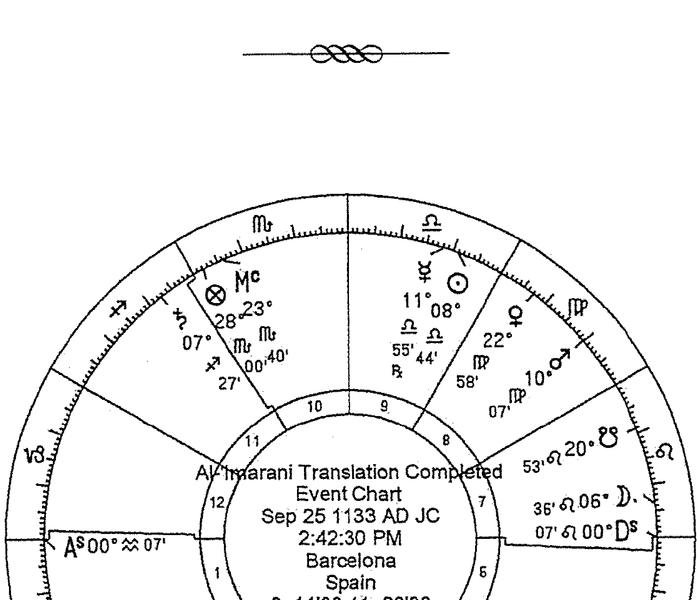

## 圖16：伊朗尼著作翻譯完成時近似的星盤

> 585 | 卡莫迪（Carmody）有関阿拉伯文占星學資料的拉丁文翻譯方面的經典著作，即將由大衛·朱斯特更新出版，我按照朱斯特的評註對最後一段進行了調整。手稿中所述日期、時間與星盤大相徑庭，但朱斯特合理地論證了這個日期和時間是正確的（見星盤）。

# 《行星判斷技法》VII：論擇時

里賈爾

## 本書序

> 阿里·本·阿比·里賈爾雲：「再次讚美與感恩主——恩賜、智慧與科學之主；祂創造萬物，祂的意志主宰萬物；祂是一切的開端和時間的改變者：祂以己之力上抬並開闢天空，下壓並固定大地[1]；祂創造一切生命且通曉所有秘密；祂孕育萬物並賜予它們結局，故祂應受讚美與祝福，祂的偉大與崇高相稱。」

## 作者序[2]

我於此書中收集了全部行星擇時與事項開始的內容，且我已盡我所能和理解力所及進行了應用與實證。

須知曉先賢們對擇時這一作法意見不一，一些人對擇時及其助益給予肯定，而[另]一些人則對擇時及其助益和判斷予以否認[3]。我已於本書開篇（第一部[關於]卜卦）[4]將這些不同意見分類並羅列——在那裡，我所言勝過所知[5]。而在此我要說，我相信他們所言是真實且正確的。我將由此開始，蒙主庇佑。

我現論及擇時。毋庸置疑，其中一些是有助益的（蒙主庇佑），而[它們的]成功與益處顯而易見。另一些效用則未顯現，抑或它們所象徵之事並未獲得成功。例如，某人的本命盤有明確徵象顯示他不會有子女（或即便他有子女，亦無法成活或被養大），因他的子女宮及代表因子受剋；抑或在他的本命盤中婚姻宮及代表因子受剋（如金星及其他代表因子被焦傷，或落在它們自己弱宮或凶宮之中、遠離命主星的一切相位[6]）；抑或凶星主管本命盤的旅行宮，且此宮的徵象星對命主星造成傷害——如此，假使這些之中的任何一個（即子女、婚姻、旅行[的代表因子]）在本命盤中受剋——當你欲為受孕、成婚或旅行擇時，成功都不會顯現，因擇時盤的力量不夠強大，無法消除[那些]行星在本命盤中的徵象。而若其呈現吉象時，則相反。

然而，擇時確有效果，且有人從中獲益——他們的本命盤顯示能夠生育子女，或代表因子綜合在一起[7]的狀態是中等或良好的。因若擇時盤是良好的，而根本盤中的代表因子是中等狀態（或受剋不甚嚴重），則擇時盤能夠引導事項朝好的方向發展。而若代表因子和擇時盤都是好的，則吉象得以確定，且將壯大，並在更大的程度上支持他，因擇時盤對根本盤中的徵象有所助益——鑒於根本盤中的代表因子有利且強力象徵著好的結果。同樣若擇時盤強力、有利並呈現吉象，事項將得以發展：變得強大、確定、幸運，且盡可能地顯現一切吉象。而此觀點正是有效擇時的依據之一——由托勒密所言亦可確認此觀點[8]，他於[他的]《金言百則》[9]中寫道：「建立在出生時刻基礎上的擇時可起到促進作用。但若相反[10]，則無法獲得成功——無論結果看起來可能有多麼的美好。」我認為這是真實不虛的，我贊同此觀點並以此作為實踐的依據。

### ——[未知本命盤者的擇時——據薩爾]——

我[11]告誡你，避免為未知本命盤之人擇時：因當你為已知本命盤及當年回歸盤之人擇時時，（藉由主的祝福）將對他產生良好且顯著的作用。而若你為未知本命盤（及當年回歸盤）之人擇時（甚至連他的卜卦盤上升位置亦未知），將帶來危險，因為你或許會迅速選一個與本命盤相悖且對其不利的上升位置：事實上，你可能因此為他選了本命盤的第十二、第八或第六[宮]作為上升星座，而他的敵人力量得以增強，或許他們將毀滅或殺死他，你會將傷害帶[給]他，而你為他匯集的吉象並不足以阻擋災禍；又或許吉星與他的本命盤相悖且對其不利，或它們是有害的、不利的宮位之主星；或被你放在擇時盤中的果宮、弱化的凶星是根本盤的主星及徵象星——而你亦不知情[12]。(同樣，你須避免為邪惡之人及敵人擇時，除非你能知道他們的本命盤。)

考慮到[13]那些海路或陸路旅行之人，你便可領會：當他們一起出發，或他們於同一天同一時刻去往一座城，而其中一些人迅速地滿載而歸，平安又順遂，另一些人卻要花更久的時間，還有一些人會患病返回；一些人在旅行中一無所獲，而另一些人會失去他們所擁有之物，還有一些人在旅行中迷路並死亡。那些同一時刻登船之人也是如此：有人或許會被殺害，其他人卻得以倖存。抑或所有人同一時刻動身前往同一地點——而其中一些人將帶著收穫返回家鄉，另一些人卻空手而歸，還有一些人在旅途中迷路永無歸期：發生這種情況的唯一原因在於，他們的本命盤具有不一致性，於某日某時動身無法令他們都受益[14]。

同樣[15]，有人在不吉的日子動身去旅行，卻安然無恙並有所收穫；而有人在挑選的良辰吉日動身卻受到阻礙、遭受損失：而發生這種情況的唯一原因便是他們的本命盤具有不一致性[16]。對於其中一些人而言，吉星帶來吉祥與助益，凶星帶來災禍與損失，但對於另一些人而言，凶星帶來吉祥與助益，吉星帶來災禍與損失：而這一切藉由至高之主的意願與力量顯現，應讚美主。

須知曉[17]，主——祂的名字應受讚美——以四種屬性創造萬物，祂將地上、世間生長和腐朽的所有（理性的和沈默的，移動的和固定的）與天空相連結；祂為它們設下因緣與微妙的比例——這是此學科的智者們所領會並通曉的；而其他通曉自然及哲學的賢者瞭解祂在磁石與鐵之間、父與子之間、愛人者與被愛者之間設下的因緣與微妙的比例——故你應領會[這一點]並將它記在心間。此外你應知曉，物質被兩種特性（高層與低層）之間的和諧一致所調和並驅動向前，而物質被這兩種特性之間的不合與分歧所傷害、破壞。

須知曉[18]吉星具有平和、吉祥的性質，但凶星具有扭曲、凶險的性質：即便[凶星]容納(receive)[19]，它們也無法確保[成功]，原因在於它們凶惡的本質：如同盜賊與惡民一般。

### ——[資料來源論述]——

須知曉擇時著作雖數量眾多，但其中的早期資料源於都勒斯與瓦倫斯，及其他一些在本書第一部論述智者們的不同觀點時提及的作者[20]。每一位摩爾人（Moors。譯註：中世紀生活在伊比利亞半島及西北非的穆斯林。）智者都遵循、讚賞先賢的方法，而摒棄另一種方法——依自己的才智與思考判斷什麼是真實且正確的，進而作出取捨。我即為他們中的一員，因我遵從我認為真實且合理的方法，而摒棄其他：我已研究了全部擇時及採納在我看來真實且正確的論述、我所見能夠被理論與經驗所證實。時興的擇時著作的作者有：馬謝阿拉、Abimegest[21]、托馬斯之子西奧菲勒斯、哈亞特和金迪。這些是其中較為知名且在論述及事項歸類方面都更勝一籌的作者。而阿布·沙伊巴尼[22]、薩爾·賓·畢雪、阿布·馬謝、阿里·本·艾哈邁德·伊朗尼[23]、哈桑·本·薩爾[24]的論述較他人有所不及。不過我採納了他們每個人較好的方法，並補充了我認為真實與正確的內容。祈求主引我走向真理之路。

## VII.1：擇時所必需且不可迴避的法則與基礎

烏圖魯克西斯稱[25]，當月亮呈現凶象卻不得不進行擇時時，讓那凶星作為上升主星。

若你無法適當放置擇時盤的全部代表因子，應始終使上升主星處於恰當的狀態。

若[26]吉星落於尖軸（尤其落於中天），你大可不必擔心其他。

當那年的回歸盤呈現凶象時，擇時盤所帶來的助益不大（而[對於好的回歸盤而言]正相反）。

火星[27]不會對水路旅行造成傷害，正如土星不會對陸路旅行[造成]多大傷害。

就旅行[28]而言，固定星座是不吉的，啟動星座則是值得讚賞的。

當[29]凶星遠離尖軸且為外來的，又落在與其屬性不調和、損害其屬性的星座時，則無法阻擋它所帶來的傷害，除非[藉由]主。

-   23 | Haly filius Hamet Benbrany。里賈爾把薩爾和伊朗尼放在次要位置讓人感到意外，因為《行星判斷技法》VII中有很多內容直接引用他們的資料。
-   24 | Alohaç filius Zaet。我將這一拉丁文名字譯為哈桑·本·薩爾還有待推敲，因為在其他地方拉丁文作Alhasen filius zahel或Alhaçen filius zabel，這似乎更合理。
-   25 | 據下文哈亞特VII.2.5。另見伊朗尼I.2.11。見我在緒論中對這一段內容的論述。
-   26 | 參見《占星詩集》V.5.11。
-   27 | 也就是說，火星會給陸路旅行帶來困難，而土星會為水路旅行帶來困難（儘管對於狩獵和捕魚而言並非如此）。見《擇日書》§116；伊朗尼II.1.8也如此認為。
-   28 | 參見里賈爾VII.71。
-   29 | 參見《五十個判斷》#21、26、37。

金星及月亮落在南方象限十分有力，而落在東方象限是虛弱無力的[30]。

當 [31]一顆凶星容納一顆吉星，則凶星不會對吉星造成嚴重傷害，尤其當它擺脫敵意的相位時。

當 [32]行星位於疏遠的[33]位置時，其所帶來的不幸大為增加。

對於攻打一座城而言，若徵象星為當年世運回歸盤上升主星，則不宜與之作戰。

在一切開始中，都應使天空與代表因子本質相一致，並[使]代表因子和那些與之有交集的因子相一致。

當日間行星東出於太陽並落在陽性星座、夜間行星西入於月亮並落在陰性星座[34]時，擇時盤更為有利，呈現更多吉象，且更為成功。

忌月亮自金星的廟宮入相位於火星、自水星的廟宮入相位於木星或自土星廟宮入相位於太陽[35]。

若自上升位置起算的第十一宮主星、自月亮起算的第十一宮主星以及自幸運點起算的第十一宮主星，落在它們的場域內[36]或呈現吉象，則大為有利。

若恰好行動開始前的會合或妨礙之界主星呈現吉象，則事項將是幸運的且能夠達成。

-   - **30**: 里買爾實際上可能指的是她們與太陽的關係：如果在太陽之前升起（因此在黎明位於東方象限），那麼她們將因為位於東方（譯註：eastern，詳見詞彙表。）或者說是日間的位置，並且向太陽移動而變得虛弱無力；但如果在太陽之後降落（因此在夜晚位於南方象限向西方行進），那麼她們將因為位於西方或者說是夜間的位置，並且越來越遠離太陽而變得強力。
-   **31**: 參見《五十個判斷》#2。
-   **32**: 參見《五十個判斷》#26、28、29、41。
-   **33**: 即「外來的」（拉丁文 extraneous）。
-   **34**: 這是一種場域（《古典占星介紹》III.2）與護衛星核心概念（《古典占星介紹》III.28）的組合，兩者都源於日 夜區分。里買爾所說東出於太陽，即落在更靠前的黃道度數上（因此比太陽早升起）；而西入於月亮，指落在更靠後的黃道度數上（因此在月亮之後西降，她沿著黃道朝它前進）。可能他還傾向於在日間擇時盤中使日間行星有此配置，在夜間擇時中使夜間行星有此配置。
-   **35**: 更確切地說，自太陽廟宮入相位於土星。這些情況被視為「門戶洞開」（「opening of the doors」），傳統上是下雨的徵兆：見《判斷九書》§ §Z.4-6。
-   **36**: 也稱為 hayyiz 或 haiz，《古典占星介紹》III.2（拉丁文 haiç）。

若行動開始[前]的會合或妨礙之界主星落在吉宮、狀態良好、落在自己的廟宮，且其本質與事項本質相一致，則事項將能夠延續，穩固且持久。

## VII.2.0：論行動的原則

### ——[VII.2.1：金迪]^[37]——

在行動開始之時，宜適當放置上升星座及其主星，使其位於[相似之處並]^[38]呈現吉象。相似^[39]即：就性質(Quality)與緣由(Reason)^[40]而言，上升星座具備與事項相似且契合的屬性。所謂「性質」如同為旅行選擇^[41]我們想要的：想要迅速完成^[42]並易於遷移^[43]，或是尋求裁決^[44]或國王授予榮譽時選擇火象星座。所謂「緣由」正如在爭端中選擇火星主管的星座。[再者]，你有必要適當放置事項代表宮位、宮主星以及宮主星的主星：因宮位代表象徵事項開始時的狀況，宮主星象徵中間的狀況，而宮主星的主星象徵最後的狀況。同樣，上升星座象徵採取行動之人開始時的狀況，上升主星象徵中間的狀況，而上升主星的主星象徵採取行動之人最後的狀況。同樣，你應查看幸運點及其主星，以及它的主星的主星：因若你能夠使它們全部的得到增強並呈現吉象，則整個事項將得以圓滿完成。

且你應使它們呈現吉象^[45]——藉由吉星與它們形成相位或入相位^[46]，亦藉由使本質相一致，且你應將凶星阻擋於這些位置之外。你應謹防上升主星逆行，因它的逆行預示著阻礙、禁止與緩慢。即便全部代表因子有利且預示事項能夠達成，只要上升主星逆行，則首先事項存在失信，且遲緩，除非付出辛勞否則無法完成。

你應避免任何一顆發光體（在它們會合或對分時）與龍尾落在一起，亦不應使發光體落在[它的]會合或對分之處^[47]。還須謹防龍尾落在上升位置或事項代表宮位之中，或與事項的特殊點落在一處：因它會藉由廉價、管理不善^[48]和辛勞令事項受到損害。

而注意將一顆吉星置於上升位置，或事項代表宮位之中，或尖軸。須知曉主要吉星^[49]在任何事項、任何想要改善之事中都具有影響力；而次要吉星^[50]在所有遊戲、喜悅、墮落、粉飾^[51]、友誼及諸如此類之事中都具有影響力。

在一切事項中，你都應避免將月亮置於上升星座之中，因她與上升星座相抵觸；但太陽與上升星座不相悖，而他令事項顯露出展現出來，他亦可為受限之事紓困。

你應盡力避免使凶星落於上升位置或任何尖軸——尤其若它且是凶宮之主星：因若凶星為第八宮主星，則預示因死亡、敵人的盟友或長期的監禁而受苦。而若它為第六宮主星，則預示來自敵人、奴隸、疾病、斷肢、短期監禁或四足動物的傷害。而若它為第十二宮主星，則預示來自辛勞、不信任、敵人或中期監禁的傷害。而若它為第二宮主星，則預示因資產、盟友、飲食而引發[52]狀況。故你應盡力避免。

注意[53]在白天，上升星座應為日間星座，而在夜晚，上升星座應為夜間星座；且它應為直行星座而非扭曲星座；此外若你能夠做到，應使發光體也落在此類星座之中，且使前述位置的主星強而有力，正如之前所言。

而[54]有力的狀態可分為兩種：一種為自然的，另一種為偶然的。所謂自然的，即一顆行星東出、不在光束下，在自己的廟、旺、界、三分性或外觀之處、向北行進或位於北緯、順行。而所謂偶然的，即一顆行星與吉星會合或形成三分相、四分相、對分相、六分相而得以強化，且不與凶星形成任何相位而免於傷害，由此呈現吉象。

### ——[VII.2.2：阿布·馬謝論結果的代表因子]——

一些智者[56]認為，為了使事項的結果呈現吉象，須查看五個代表因子：其一，第四宮主星；其二，月亮所在星座之主星；其三，月亮於當前所在星座中即將入相位的最後[57]一顆行星；其四，幸運點所在星座之主星；其五，第四個星座及月亮所落星座[58]。

### ——[VII.2.3：月亮落在上升位置][59]——

馬謝阿拉和他的支持者稱，月亮落在上升位置是不利的且為人所忌[60]，而金迪[61]亦如是說。他們認為，因她性冷且濕（儘管她是一顆吉星）[62]，而上升位置性熱——[故它們性質]不調。

但阿布·馬謝並不忌諱月亮落在上升位置[63]，他似乎堅持托勒密所言，她性熱且濕[64]：有鑒於此，他不認為她與上升位置相悖。

然而我認為，她在此是不利的且為人所忌，而我亦不贊同阿布·馬謝所言——因他所言自相矛盾：當他談及釋放星的主限向運 [65] 與切斷者 (cutters) [66] 時，稱月亮在上升星座起切斷 (cutting) 作用，並將生命帶走，但[他之前所述內容之中]他卻並不忌諱她。這是矛盾的，難以自圓其說。

除此之外，她亦不利於旅行，因她象徵鮮少旅行 [67] ——無論在其他擇時事項中她象徵的是什麼。故宜將她置於與她相合之處，因她可藉由相位使上升位置呈現吉象。

一些人忌諱太陽落在上升位置 [68] 或事項的代表宮位，他們認為太陽在會合與對分中會成為一顆凶星，而並非所有人都對此都贊同。

### ——[VII.2.4：擇時前的會合與對分]——

你 [70] 應知曉，有一事可極大地增加開始的吉象，且令事項獲得顯著改善與巨大的好運 [71]，本命盤及一切擇時盤都是如此——即會合發生的位置（若開始是會合的），或對分發生的位置（若開始是對分的）[72] 擺脫凶星並呈現吉象；會合或對分所在星座之主星亦如此。（而你應知曉，對分所在星座乃是位於地平線上方的發光體所在的星座。若其中一顆發光體在東方尖軸而另一顆在西方尖軸，則為位於東方尖軸的發光體所在位置。）[73]

當[74]月亮離開[與太陽]會合或對分的位置朝凶星行進，應避免一切行動，因如此一來任何開始都是不利且為人所忌的：若會合或對分之處呈現凶象，則預示事項的開始是不利的；當月亮離開與太陽的會合或對分朝凶星行進時，預示那開始事項的結果將是不利的，且為人所忌[75]。

[令會合或妨礙位於某一尖軸，且月亮應入相位吉星：因此預示了提升與十足的好運，而它們的結果將是值得稱讚的。][76]

其次，若會合或妨礙的位置良好且呈現吉象，而月亮自那裡離開後入相位於凶星，則預示事項的開始是順利的，結果卻是不利的。

若會合與妨礙的位置呈現凶象，而月亮（自那裡離開後）入相位於吉星，則預示事項的開始是不順利的，結果卻是好的。

若會合與妨礙的位置呈現吉象，且月亮（自那裡離開後）入相位於吉星，則預示事項的開始和結果都是順利的。

而若會合與妨礙的位置呈現凶象，月亮（自那裡離開後）又入相位於凶星，則預示事項的開始與結果都是不順利的，且為人所忌。

若會合或妨礙（或其主星）位於續宮，則預示獲益與提升將出現於事項結束、完成之時；若位於相對上升位置的果宮（此論述與上升位置作為事項、擇時或本命的開始有關），則預示事項將遭受譴責且毫無益處：此為金迪所言，而我亦確認如此。

而在一切開始中，你都應注意改善此前發生會合或妨礙的位置及其所在星座之主星。

你^[77]應知曉，相較那年的季主星（the lord of the quarters of the year）而言，會合或妨礙所在星座的主星更具獨特性^[78]，而相較年主星而言，季主星更具獨特性。而若你將它們全部加以改善，將更為有利且更為確定。

阿布·馬謝稱，若擇時盤主星^[79]為當年世運的太陽回歸盤中月亮^[80]所在星座之主星，或[為]當年之年主星或上升主星，且它在回歸盤與擇時盤中都呈現吉象，則預示所開始之事及他的一切作為都是崇高與高貴的。他還稱，若當年世運的上升主星在[事項的]開始、發光體所在位置或中天沒有得到任何證據，則事項將是低劣、被人藐視的。

塔巴里稱^[81]，若會合或妨礙的位置(及其主星)均位於吉星的界內並且位於吉宮，則事項將穩固而持久——在那之後出生之人以及確立某種尊貴地位之人亦是如此，或者依此人的上升位置而定。

金迪稱，若[行動]開始之前的會合或妨礙所在星座的主星於開始之時東出，且它落在自己的星座之中，或與自己的[星座]形成三分相或六分相，則預示事項獲得提升與好運；而若它未形成相位，則無法獲益。

### ——[VII.2.5：其他判斷法則]^{[82]}——

此外你應盡力[使用]會合或妨礙時月亮的三分性主星來改善開始，因它們對於本命盤和開始都具有影響力。因此，若它們在開始的時刻得到容納並呈現吉象，則象徵順利。而若在開始的時刻它們處於與此不同的狀態，則象徵不利。

而擇時盤上升位置為當年回歸盤中吉星所落的星座，且有吉星落於尖軸（尤其落在上升位置或中天）、續宮或事項代表宮位之中，能夠對事項有所助益並增添吉象。

Alaçmin^{[83]}稱，若兩顆發光體彼此形成吉相位，則預示所開始的任何事項都將進展順利，尤其若月亮「位於她喜樂的開端」——亦即龍首所在的星座之中^{[84]}。

馬謝阿拉稱^{[85]}，當行星相對月亮西入時，自身力量得以加強，正如當它們相對太陽東出時，自身力量得以加強一樣^{[86]}；月亮乃是夜晚的主宰，正如太陽乃是白晝的主宰。

塔巴里稱^{[87]}，若無法在開始時同時增強上升位置與月亮，[且]擇時在白天應先增強上升位置（且尤其，若月亮落在地平線下方，不必在意她）；而若擇時在夜晚，則應先增強月亮（且尤其，若她落在地平線上方，便不必在意上升位置）。若有選擇的餘地[88]，應盡力從各方面增強兩者（即上升星座和月亮）。若月亮在白天落在地平線下方，而在夜晚落在地平線上，則上升星座的影響力與吉象將得以提升。而[89]若擇時迫在眉睫，亦需無餘地增強月亮，則須將木星或金星置於上升星座或中天，因為它們將為事項帶來巨大改善。

先賢們稱，對於[諸如]不[打算]長久持續之事可如此[90]行事。然而，對於他們欲長久持續之事（諸如婚姻、建築等等），則有必要增強月亮。若她受到傷害，你應設法將她置於相對尖軸的果宮或續宮之中；而若你無法[做到]自尖軸[91]，則尤其[須使]月亮不與上升位置及其主星[92]、事項代表宮位之主星、她自己所落星座之主星、事項本質與屬性的自然徵象星[93]形成相位。若你無法讓她遠離上述所有位置，則應盡力而為。

Alaçmin稱[94]，相比將月亮置於龍首以增強她[95]，增強徵象星更為有利。

[但]塔巴里認為，增強[事項代表]宮位的主星比增強月亮、上升星座或其他位置更有利——而我對此並不認同，伊朗尼[96]（在[我][97]之前的人）亦不認同：毫無疑問，相較完成事項而言，[伊朗尼]寧願保護[那人的]靈魂與身體，因生命優先於事項[98]。

若 [99] 月亮的行進速度像土星一樣慢（即當她一晝夜行進少於12°時），則預示事項緩慢、複雜且存在阻力。

哈亞特稱 [100]，若擇時迫在眉睫，而月亮卻入相位於一顆凶星，則宜以此凶星作為上升主星；若 [此凶星] 未受傷害且狀態良好，則更佳；若它從上升星座容納 [月亮]，亦更佳。

### ——[VII.2.6：須避免的情況]——

你 [102] 應避免徵象星以對分相或四分相入相位於凶星；然而若以三分相或六分相入相位，則並非不利，尤其具備容納關係 [103]。[因] 馬謝阿拉說，與凶星形成三分相或六分相是有利的——我對此並不贊同 [104]。相反，我認為此類相位不會帶來好運，亦不會帶來厄運，也不會阻止災禍與它的傷害。

此外你應避免與太陽會合，因這十分不利且應被譴責 [105]。而一些人認為在核心內 [106] 是有利的，對此我並不贊同：相反，我認為這更糟且傷害更大。還應避免與他形成四分相或對分相，而若存在容納關係，他所造成的不幸與傷害將減輕。

且你應謹防上升位置落在當年回歸盤中凶星落入或呈現凶象的星座之中。

## VII.2.7：行星与发光体一同落在上升位置

忌太阳落在上升位置，除非他位于狮子座或牡羊座；且与土星同时落于上升位置时，他会令事项受到伤害且不允许事项被完成，除非历经千辛万苦；对海上旅行而言，显然日土位于上升位置为人所忌。土星与月亮一起落在上升位置预示想法、重大的疾病、死亡、因国王而损失、失去财产、血亲或合伙关系的决裂，亦象徵一次不长久的旅行。

若木星与太阳一同落在上升位置，则预示悲伤、想法、少量的获利以及从一个地方换至另一个地方。而若他与月亮一同落在上升位置，则预示大量的水、青年、妾、婚姻及荣誉。

若火星与太阳一同落在上升位置，则预示悲伤、焦虑、敌人造成的痛苦、友谊难以增进、损失、因铁器或火造成突然的死亡。而若火星与月亮一同落在上升位置，则预示血亲反目，同时他象徵著藉由欺骗与损耗而获得胜利与权力。

若金星与太阳一同落在上升位置，则预示懒惰、倦怠、寻求虚妄的信任、朋友或血亲的指责，还代表过程中有肮脏之事以及女人所求。而若她与月亮一同落在上升位置，则预示良好的健康状况、改善、来自女人的助益，但中间存在不洁与猜忌。

若水星与太阳一同落在上升位置，则预示悲伤与痛苦。而若他与月亮一同落在上升位置，则预示诸多有利之事，只是血亲与朋友之间的关系经营不善。

若月亮与太阳一同落在上升位置，则预示艰难、猜疑、花费与破坏，以及眼睛的疼痛。

## VII.2.8：四正与赤经上升

若欲事项稳固而持久，则应避免启动星座。同样，欲事项迅速完成，应避免固定星座。

同样，若不欲事项长久持续、欲迅速完成，应避免直行星座。而若欲事项得以直接、公平地达成，则你应避免扭曲星座——因这些星座在任何行动与询问中都象徵著困难。

## VII.3.0：论星座及其象徵

### VII.3.1：四正星座

众所周知，启动星座代表事物是易变的，且在任何形式下，它们的徵象都得不到巩固，也无法延续。它们有利于播种、购买、出售与订婚。若有人于此时患病，将迅速痊癒（或死亡）；此时的[法律]案件不会持久；逃亡之人将迅速返回；它们对于异国旅行也是有益的；此时许下的承诺将无法兑现；而此时的梦境与恐惧都是虚假的。且你须避免在此时种植任何植物，亦不应进行建造，因这是不利的。且在此时开始任何你期待能够持续之事，都无法持续；但是，可于此时开始任何你想要在[规定]期限内完成之事，因这是有利的。而牡羊座和巨蟹座是较轻的启动星座，因为它们更为扭曲且改变更为迅速；但天秤座和摩羯座更为坚定且更为平衡。

固定星座对于一切想要延续及持久之事都是适宜且有利的。它们有利于建造建筑物，建立婚姻(在于启动星座之下订立婚约之后)；若女人在此时被丈夫抛弃，她将不会再回到丈夫身边；而在此时旅行、争吵及开始都不会是有利的，除非同时存在多个吉象。若有人在此时被俘获，他的监禁将被延长；若某人被他的愤怒所支配，则他将无法被他的爱所支配；而此时签订协议是有利的；奠基及建造亦是有利的。但天蝎座是最轻的固定星座，而狮子座更固定；水瓶座最极端，而金牛座更均衡。

双元星座对于合作、友谊与手足情谊都是有益的，且此时开始的事项将被重复；此时购买或结婚不会持久，且此时会产生欺骗。此时遭到指控之人（由此而受到[惩罚]），将从中脱身（双鱼座除外，因它[仅有]短暂的出现）。此时出狱之人会再次入狱。而此时逃脱之物将被捕获，但还将再次逃脱。此时在律师或法官前辩论之人，无法得到确定判决。且你不应在此时登船，因若你登船，将从那条船换到另一条船。而此时许下的承诺，将无法兑现。此时接受礼物，[转而]将它们赠出。此时患病之人将被治癒，但随后会复发。且此时发生于某人身上的一切（包括好事与坏事），都会再度发生。而若有人在此时死亡，则在他死後数日之内同一处将有另一人死去；洗头、炼金或炼银、送男孩子们[去学习]阅读或接受其他教育在此时都是有利的，[借贷]资产亦如此。

当你欲开始某事（即之前所提及的事项），你应使月亮与上升位置落于与你所求之事相合的星座之中，并使月亮入相位于吉星，且具备容纳关系；此外，日间星座更有利于白天的事项，夜间星座更有利于夜晚的事项，你应使月亮与上升位置落于此当中。

### VII.3.2：星座的其他分类

- 飞行星座有利于在陆地或海上狩猎之人。
- 皇家星座有利于国王。
- 有声星座有利于号手、歌手及乐器演奏者。
- 火象星座有利于[与火有关之事]。
- [分点星座有利于]真相、法律、公正[以及那些使用天平之人]。
- 分歧星座——即昼夜差异显著的星座——有利于从一幢房子搬迁至另一幢。

### VII.3.3：择时中的属性说明

随后，查看（你欲开始之）事项的属性，以及天空中哪一星座与该属性相合，并使月亮、上升主星与之相关联——而你应尽力在开始的时刻增强、巩固这一属性。

当你欲向国王、有权势之人、一城之主、受人们尊敬的有影响力之人寻求某事物，则应与太阳关联。而若向贵族寻求，则应与木星关联。若向劳动者或下层人寻求，应与土星关联。若向决断者（译註：judges，此处指将军。）、军人或拥有兵器之人寻求，则应与火星关联。若向女人寻求，则应与金星关联。若向作家、商人寻求，或与购买、售卖、[法律]案件有关，则应与水星关联。而若向女性统治者寻求，则应与月亮关联。

## VII.3.4：论月亮受剋

随后，若你欲开始某事，应增强上升星座及其主星、月亮及其主星——同时，正如都勒斯和其他智者所言，任何开始、任何行动都须警惕月亮的不良状态。有十种[不良]状态：

- 第一，当她在太阳之前或之后12°内被焦伤时；但位于太阳之后凶性减低。
- 第二，当她落在自己的弱宫度数时（译註：这里给出的是最不利的情况，实际上整个弱宫星座都是不利的。）。
- 第三，当她与太阳呈现对分相时。
- 第四，当她与凶星聚集，或形成四分相、对分相时。
- 第五，当她在12°之内会合龙首或龙尾时（此为蚀发生的分界线）。
- 第六，当她落在星座的最后几度——即凶星的界时。
- 第七，当她落在相对尖轴的果宫时，或位于燃烧途径（天秤座末端和天蝎座开端）——这是所有月亮受剋情况中最严重的，尤其对于婚姻、一切与女人有关之事、购买与售卖、旅行而言。
- 第八，当月亮的十二分部与凶星会合，或当她落在自己的星座对面，或她未与自己的星座形成任何相位时。
- 第九，当她以慢速行进（即智者们所谓[类似于]土星的行进）：即她一昼夜行进12°以内。
- 第十，马谢阿拉（及他之后的其他人）认为是她空虚之时。

### VII.3.5：其他说明

随后，尽你所能增强月亮，且绝不可将她置于上升位置，因她在此处是不利的，预示痛苦降临于身体——除非月亮得吉星相助、远离凶星而呈现明显的吉象：如此一来，对于购买与售卖而言，她落在上升星座之中并非不利。且使月亮及上升主星与上升星座形成相位：因当一颗行星与其主管星座无相位时，犹如一个人处在无法完成有益[之事]的地方，亦无法使[他的家]免于伤害。而当一颗行星与其主管星座有相位时，则犹如一个人在自己的家中且保卫著它，盗窃之人畏惧他，外人亦不敢入内。

而若上升主星为凶星，则使它与上升星座形成三分相或六分相。还须避免使上升主星或月亮所落星座的主星（当它们为凶星时）自尖轴与月亮形成相位，亦不可将它们置于任何尖轴，尽管它们要与她形成相位。

在某些开始或行动中，不应将幸运点置于果宫，亦不应远离与月亮形成相位或会合之处；也不必关注幸运点的主星及它与月亮的相位。你应尽力将上升主星与幸运点置于一处，因这对于事项有极大助力，令[事项]获益倍增。而你绝不可将月亮置于自幸运点起算的第二宫、第六宫、第八宫或第十二宫之中，这是为人所忌的。

无论任何开始，始终将上升位置置于直行星座之中，因以直行星座作为上升星座预示事项将获得成功。

自上升位置起算的第四宫及它的主星，代表所开始之事的结果。

然后考虑吉星与凶星，以及它们的状态是有力或无力。

都勒斯说，若你见到月亮受剋，而事项紧迫无法推迟，则你不应让月亮在上升星座中扮演任何角色，并且宜将她置于相对于上升星座及其尖轴的果宫内。然后将吉星置于上升星座，并尽你所能加强上升星座及其主星。

且在任何择时中，你都不应忽略时主星，因它在择时中有显著的力量与象徵意义。

## 第一宫

## VII.4：论第一宫及其择时

我列入此宫的择时有：入浴、剪发、放血、拔罐及剪指甲。

## VII.5：论入浴

多数占星师认为，为此择时应使月亮[落在]火星所主管的星座之一，不可入相位于土星或金星。

而若月亮未落在火星所主管的星座，则须使她落在木星或太阳所主管的星座，或她自己主管的星座——而她不宜落在金星或水星所主管的星座。

然而我认为，月亮落在水象星座对入浴而言更佳。若她落在巨蟹座，则令她入相位于木星；而若她落在天蝎座，则令她入相位于金星。

对于想要沐浴较长时间之人，则宜将她置于巨蟹座，以三分相或六分相入相位于木星或金星——因对入浴者而言，入相位于金星预示著美、清爽或使外貌更佳。而对于想要快速离开之人，则须将月亮置于启动星座。

湿症或麻痹[之人]：如此，则她以三分相或六分相入相位于太阳或火星乃是有益的。而若你欲以沐浴润滑身体，则应选择与此相反的星座及行星。

然而，若你入浴是为了以气味芬芳的油涂抹身体，则月亮位于光束下（且离相位于太阳）并入相位于吉星乃是有利之时。且若她落在木星、火星、太阳或她自己主管的[星座]之中是有利的。

### VII.6：论剪发

在此，月亮落在天秤座、射手座、水瓶座或双鱼座，入相位于木星或金星较为有利。且在此金星更佳，因她象徵更完美的[髮]型，并且生长更缓慢。

而若[月亮]入相位于火星或土星，则不吉。当火星落在上升星座时，你应谨防[理发师]以铁触及你的头部，月亮亦如此，她不可与土星或火星形成入相位——尤其自尖轴：因她入相位于土星预示剪发之人将为[烦恼]的思绪与悲伤所苦，直到头髮长[回来]；而入相位于火星预示某些因铁造成的伤害或错误的修剪。

## VII.7：论放血和拔罐

### VII.7.1：金迪的建议

在此，最佳做法是使上升星座[主星]及月亮落在风象星座或火象星座，均呈现吉象且得到容纳，同时显现于他们自身的光之中（他们的主星亦如此）。

注意月亮所落星座及上升主星所落星座象徵的身体部位，应避免用铁碰触那一部位（或将[铁]放置[其上]）。

而若要放[静脉血]之人的体质接近血液质，则土象星座对他有利；若属于黄胆汁质，水象星座对他有利；而若属于黏液质，火象星座对他有利；若为黑胆汁质，风象星座对他有利。

谨防第八宫主星与月亮、上升主星及它们的主星有任何交集，亦不可让其落于尖轴。且注意以吉星作为中天主星，并与月亮或上升主星形成相位。此外避免使月亮落在第四宫（上升主星亦不可[落于此]）。

但是，拔罐与藉由静脉放血的不同之处在于，当你想要以拔罐吸出血液时，在[太阳和月亮]对分之后、[太阴]月的後半月进行是有利的。而若你想要藉由静脉放血，则前半月更有利，而在两种[情况]下均还须考量之前所述之星群和吉星。

### VII.7.2：其他建议

我认为月亮在双元星座时不可放血，因它预示为他放血之人将刺他不止一次，或他有必要在短时间内再次放血。

同样，在月亮以对分相或任何四分相趋近火星时放血也是不利的（而对分相更加不利），因这可能预示静脉会受伤，或出血比原本应当的量更多，以至于他们无法[止]血。不过以三分相或六分相入相位并不坏。月亮入相位土星星体（或以四分相、对分相入相位土星）同样为人所忌，因为这预示血液可能无法流出、或它可能凝固、或静脉将会收缩，抽血者将怀有忧郁和不愉快的想法。

而若月亮位于牡羊座或天秤座，入相位于金星或木星（或两者），预示放血之人将不会对放血心怀恐惧或[烦恼]，且对此感到放松，而这对他是有利的，从他身上抽取的血会得到填补，[尽管]经历时间较长，且放血之後缓慢恢复对他并无坏处。坏血离开他的身体，而他将重新获得好[血]。

同样，若月亮入相位于火星或上升主星，则预示放血之後，黄胆汁将得以祛除。而若她入相位于土星，黑胆汁将得以祛除。而若月亮空虚，黏液将得以祛除。

此外，在静脉放血中，须避免月亮落在上升星座且上升星座为双子座；而在拔罐放血时，避免她落在上升星座且为金牛座。

## VII.8：论剪指甲

在此，最佳的做法乃是，使月亮增光、增速、得到容纳，并且使她不落在双子座或双鱼座，这两个星座也不是上升星座。

且须避免使月亮及上升主星与这些星座的主星（即木星和水星）形成相位，因这对于剪指甲而言是最不利的，它们预示当指甲长出来的时候，剪掉指甲的人将陷入[烦恼]与忧虑。

而你可将月亮置于金星、火星主管的星座之一，或巨蟹座、狮子座，它们对于剪指甲而言是适宜的。

## 第二宫

### VII.9：论第二宫及其择时

涉及此宫的择时有：委托资产[给他人]、谋求资产与举债、购买与售卖、售卖产品、给予钱财、接受钱财、从一幢房子搬迁至另一幢、炼金术操作。

——[财务事项的普遍性代表因子]——

在我看来你要知晓，大体而言，对于一切与钱财有关的事项，因其归于交易、购买、售卖的能力，故宜令第二宫及其主星、木星、幸运点(因[幸运点]是重要且有力的代表因子)处于适当的状态。

然而，若某人想要保持收入，则有必要使上升位置及其它尖轴落在固定星座，且尖轴不应是远离的(如之前所言)，故而星盘是正的，每个宫位都在自己的星座之中。而若某人想要购买、售卖或进行商业交易，则应反之而为，同时强化择时盘的根本因子，并依之前所言，藉由木星令它们呈现吉象。

107 | 里贾尔此意似乎指的是伊朗尼；见我对伊朗尼资料中的段落所作的注解。
108 | 参考伊朗尼和萨尔（《论卜卦》§1.7、《判断九书》§1.1），undecimam（「第十一」）一词作nonam。里贾尔或译者似乎理解成了相反的意思：伊朗尼的意思是，象限第十宫（以中天为标志）不应落在第九个星座。
109 | In antea。伊朗尼的拉丁文译本将此理解为「上升的」。
110 | 或anasamantum。这可能源于阿拉伯文对希腊文anaphora的音译，这个词指的是提起来或拎起来（bring or carry up），它与续宫有关（这里指第十一宫）。
111 | Semifesso。
112 | 目前来源未知。但可参见《古典占星介绍》I.11、《亚里士多德之书》II.13及亚历山大的保罗（Paulus Alexandrinus）的Ch. 7。
113 | Dono（「礼物」）一词作domo。不过我不明白里贾尔在这里所说是什么意思。
114 | Cogitatus。这似乎更像是「忧郁的想法」，或思虑过度而不是无忧无虑。
115 | 参见上文VII.2.5关于木星与太阳合相的论述。
116 | 原文作「难以增进友谊」，但阿拉伯文资料有不同版本：「难以获得朋友」或「朋友带来的痛苦」。
117 | 指火星。
118 | 原文作「寻求信任」，但根据阿拉伯文资料，可能意指「寻求不存在的或虚妄的信任」。
119 | 原文作「女人所求」，可能指「来自女人的请求或要求」。
120 | 本节内容源自萨尔《择日书》§§8-11a，但顺序有所调整。
121 | 本章节由里贾尔逐句抄录自萨尔《择日书》§§12a-22a。
122 | 参见《择日书》§§12a-18。
123 | 萨尔本人没有提到死亡。
124 | Temperata·如何使用这些星座参见《择日书》相关章节。
125 | 即在启动星座订婚以求快速成婚，但在固定星座结婚以求婚姻持久。
126 | 萨尔《择日书》 §14b的(卜卦)判断，而不是旅行和争吵。但里贾尔的说法是合理的。
127 | 萨尔的说法认为愤怒无法被控制（或者，在阿拉伯文版本中为有人难以控制地对当事人发怒）。
128 | 里贾尔（或许还有萨尔——尽管克罗夫茨的阿拉伯文版本中没有出现）的意思是，双鱼座是赤经上升时间最短的双元星座（在北半球），因此它穿越地平线的速度非常快。
129 | 萨尔这里写作逃犯，但里贾尔拉丁文译本显然包括动物。
130 | 依据萨尔的资料，「事」(thing)应作「船」。
131 | 萨尔的资料没有这一内容，不过这是合理的。
132 | 萨尔的资料没有关于借贷这部分，但这是合理的。
133 | 即月亮与上升点同星座。
134 | 参见《择日书》§§19-21。
135 | 皇家星座：原文作Mundane，意指「世界的」或「与俗世有关的」，此处根据上下文意译。
136 | 指白羊座、狮子座、射手座。
137 | 分点星座：指春分点、秋分点所在的星座，即天秤座和白羊座。
138 | 分歧星座：指昼夜长度差异显著的星座，在北半球，通常指从巨蟹座到摩羯座的星座。
139 | 原文作「房子」，但可能指「地方」或「住所」。
140 | 参见《择日书》§22。
141 | Quibus 作quem。
142 | 里贾尔拉丁文译本将购买、售卖和法律案件与金星相关联，但《择日书》明确地将它们归于水星。我调整了相关语句。
143 | 除最后一句之外，这一章节几乎是由里贾尔逐字逐句地抄录自《择日书》§§22a-f。
144 | Duodenaria。
145 | 萨尔资料的阿拉伯文版本作「与凶星一起落在十二分部」。但这表明是在同一星座或度数聚集，而上文已经提到此内容。里贾尔在此处指的是月亮的十二分部所在星座有凶星落入，而这恰恰与亚历山大的保罗所述一致（参考保罗的著作Ch. 22，及奥林匹奥多罗斯[Olympiodorus]的案例评註）。此外，《占星诗集》V.5.5有：月亮落在凶星的十二分部星座——这也是保罗所描述的类型。我认为应使用保罗或里贾尔关于十二分部的解读，而不是拉丁文译本使用的「第十二个星座」。
146 | 即她落陷（在摩羯座）。
147 | 即她不合意于巨蟹座。
148 | 按照萨尔的资料补充。
149 | 这半句话源于萨尔，他将此归于马谢阿拉和不知名的「当今的智者们」。
150 | 本章节除最后一句之外的所有内容参见《择日书》§§23a-28。
151 | 萨尔称不可将渐盈的月亮置于上升星座。
152 | Occasiones 作occidentes。
153 | 即幸运点与月亮形成相位或合相。
154 | 这些是财务相关的凶宫。
155 | 参见《择日书》§29。
156 | 参见《择日书》§30a。
157 | 指《择日书》。
158 | 或许指使用热且干燥的空气，例如桑拿。
159 | 这里指湿润皮肤以使它柔软。
160 | 本段参见伊朗尼 II.2.4。
161 | 使用某些方法拔罐时，会将皮肤划开或切开，这样罐可以将血液经由切口吸出：因此里贾尔及其他人都认为放血和拔罐有紧密关联。
162 | 这一节摘录自《四十章》Ch. 32（但某些段落未按照顺序编入）。
163 | 依据金迪的内容进行补充。
164 | 金迪认为他们应位于始宫或续宫，并未提到容纳。
165 | 在此，所谓在「他们自身的光」之中指的是没有在太阳的光束下。
166 | 即各种相位。
167 | 参见《择日书》§30c。
168 | 参见《择日书》§30b。
169 | 指进行放血操作的人。
170 | 指放血者。
171 | 根据体液学说，放血被认为可以清除多余的体液。
172 | 参见《择日书》§30d。
173 | 这两个星座与木星和水星相关联。
174 | 即指甲的生长可能带来问题。
175 | 参见《择日书》§31。
176 | 即保持现有财富或收入稳定。
177 | 指尖轴星座没有被其他行星占据或影响。
178 | 即进行交易。
179 | 指第二宫及其主星等因子。

## VII.10：论经营、谋求资产及举债

在此，如之前所述，你宜令第二宫及其主星、月亮及其主星、木星、幸运点与资产点呈现吉象；并藉由将火星置于相对这些代表因子而言的果宫之中，清除火星对它们的影响：因火星令财产损失巨大，南交点亦如此；而土星造成损失较小。且你应将代表因子置于交换星座，因它们在此是有利的。

然而，若你想要经营餐饮，须将月亮置于上升星座为大食量星座（即牡羊座、金牛座、狮子座、射手座后半部、摩羯座和双鱼座）之中，此外勿使月亮及上升星座落于土星的位置。

## VII.11.0：论购买与售卖

### ——[VII.11.1：购买与售卖——萨尔]——

须知晓，上升星座及其主星、月亮入相位之行星象征买方；第七宫及其主星、月亮离相位之行星象征卖方。第十宫及其主星象征价格，第四宫及其主星象征售卖之物。月亮亦为价格之征象星。故在购买与售卖中，你改善其中哪一个，[它代表的] 事项就会得到改善。而你伤害哪一个，[它代表的] 事项就会受到伤害。

> 180 | Gubernando。
181 | 本章节参见伊朗尼II.3.1。我认为此类择时与当事人归还债务以及他人将借走的钱归还给当事人都有关。
182 | 我将damnum译为「损失」(loss)而不是「伤害」(harm，我通常使用这个词)，因为damnum一词有特别的含义，指因罚款或其他原因损失钱财。
183 | 据伊朗尼，这指的是风象星座。
184 | 据伊朗尼，此处或许应理解为与土星「会合」(conjunction)。
185 | 本段参见《择日书》§§34-5(及更相近的《占星诗集》V.9.5-7)。在伊朗尼II.8.3当中，塔巴里假设客户是卖方，而第七宫是买方。

而若你欲购买某物，须使幸运点处于适当的状态并将它置于木星主管的星座，且入相位于吉星：因在此情况下，购买比售卖更为有利。而若月亮落在直行上升星座，增光且增速，并入相位于吉星，则[择时盘的]主人将失去此时购买之物，相比买方而言，此时对卖方更有利。有必要使火星落在相对于水星和月亮而言的果宫之中，因在购买、售卖及债务事项中，火星将带来恐惧、争吵和争夺——龙尾亦如此。故你尤其有必要为月亮清除掉[龙尾]；不过，[龙尾]作恶不如火星那样多。

而若你欲售卖，将月亮置于她自己的旺宫或她具备三分性尊贵之处，同时离相位于吉星并与凶星形成相位（[但]不是入相位于它们）。

Nufil认为，若你欲购买某物，则须将幸运点置于木星主管的星座，并入相位于[吉星]，因买方将由此受益。而若你欲售卖，则须将月亮置于她自己的旺宫或拥有三分性之处，位于相对凶星而言的果宫而不与它们形成相位，并远离吉星：如此一来售卖将依你的意愿完成。

> 186 | 本段参见《择日书》§§39a-d。萨尔再次假定客户（上升位置）想要购买。
187 | 幸运点无法入相位于任何行星；萨尔作「链接」。
188 | 注意这句话与伊朗尼II.3.2中塔巴里的内容有相似之处。
189 | 这意味着价格是高的（因为月亮增光、增速），且交涉会拖延（因为直行上升星座）。
190 | Placita。
191 | 本段参见《择日书》§40。
192 | 也就是说，她应形成整星座相位而不是以度数入相位。
193 | 作者不详，不过注意，这实际上与上文萨尔的观点是一致的。但重要的区别在于：在售卖中，萨尔让月亮离相位于吉星并与凶星形成整星座相位（但不是度数上入相位）；但Nufil似乎认为月亮应不合意于凶星同时又不合意于吉星，或者是与吉星离相位。里贾尔重复收录累赘的资料并且是一个明显混乱的版本，这在我看来很奇怪。

### —[VII.11.2：月亮周期]—

若你欲以公平的价格购买某物，你应趁月亮第二次与太阳四分且落在缩减星座时，且她自身减光并减速，与水星相连接，且[两者均]摆脱凶星。而若她未与水星相连接，则须令水星免于凶星伤害。

于月亮第一次四分太阳时所购买之物，其价格是公道的（物有所值），且此时采取的任何行动，都是诚实而公正的。而若木星与月亮形成相位（且月亮现身于此处），售卖货物将幸运又公道。

而当她越过这一四分相后，她即将形成对分相，这对于卖方、谋求竞争或[法律]诉讼者——即发起方——都是有利的。

当她离开对分相的位置、即将第二次四分太阳之时，对于买方是有利的。

而当她离开这个四分之一周期朝会合行进时，对于买方是有利的，[尤其是]秘密进行的或欲隐瞒、不愿让他人知晓之事——且尤其她被吉星所见。

此外若她位于两个西方象限（即从第十宫到第七宫、从第四宫到上升位置）（译注：托勒密多使用此划分方法，即ASC-MC与DSC-IC属于阳性象限、东方象限、日间象限，其余两个象限为阴性象限、西方象限、夜间象限。），且上升主星自身行进减速，中天主星未受凶星伤害，则对于以公道价格购买货物而言最为有利。

> 194 | 同样参见伊朗尼II.3.2与II.3.3。
195 | Bono foro。
196 | 自巨蟹座开端至射手座末端的星座，此时月亮在赤纬向南方移动：见《占星诗集》V.43.1-3以及下文图表。
197 | 即对于原告更有利（见《古典占星介绍》V.7中卡里希的观点）。
198 | 我对此作了补充，因为里贾尔把在伊朗尼II.3.2、《占星诗集》V.43.4-8及卡里希（《古典占星介绍》V.7）这些资料中分开列出两条合并在了一起。当月亮位于最后四分之一周期时，大体来说对每个人（包括买方）都是有利的，因为价格是公道的，但当她进入太阳光束下时，对于隐秘的行动是有利的。
199 | Prospecta。这可能指的就是形成相位。

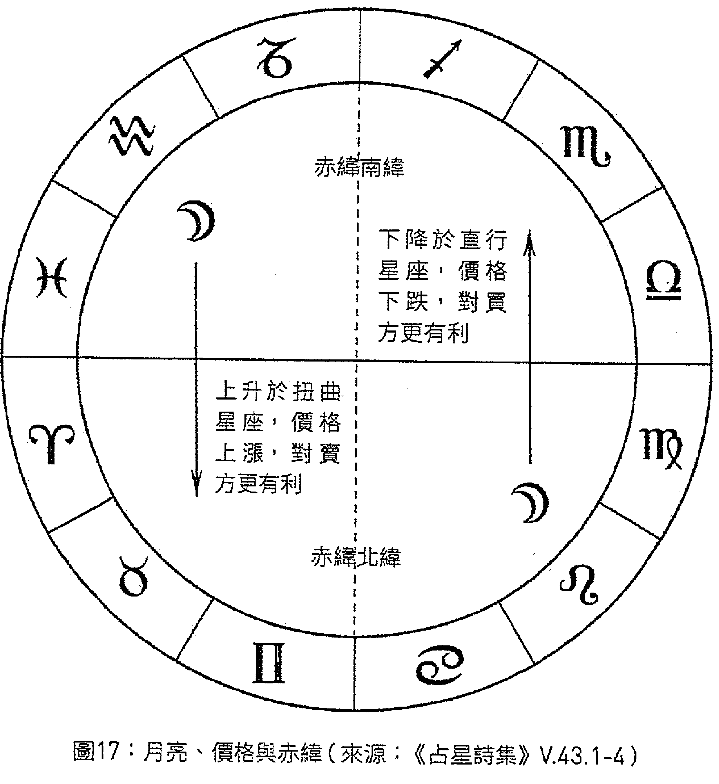

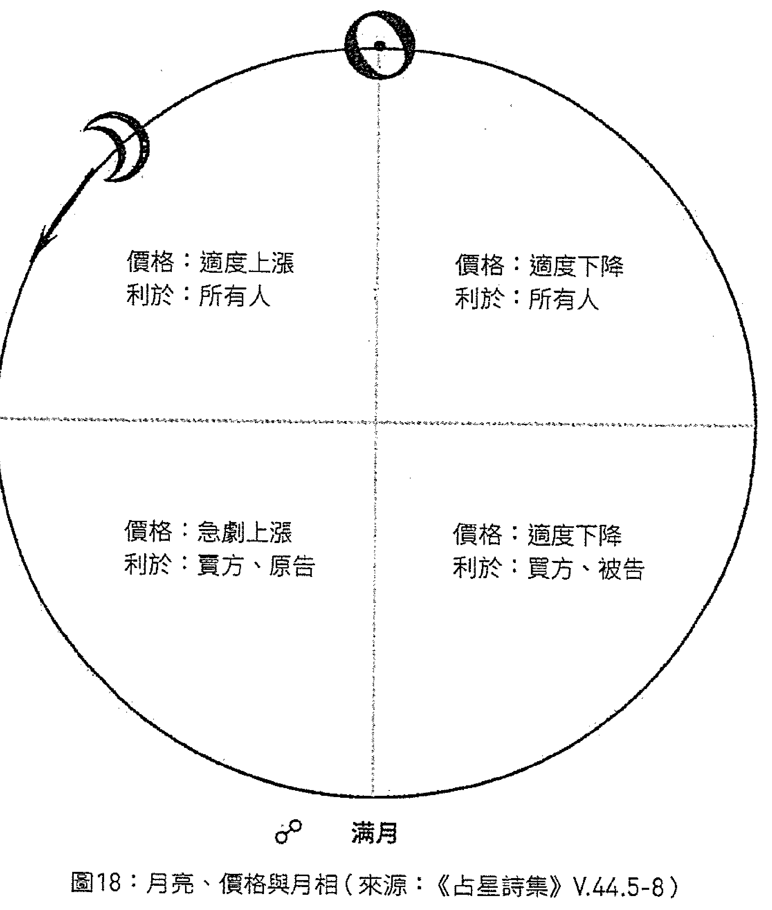

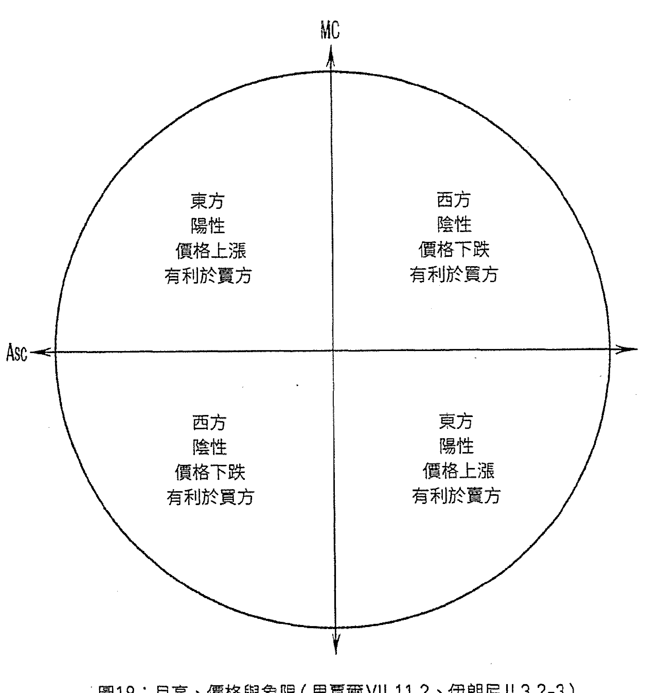

图19：月亮、价格与象限（里贾尔VII.11.2、伊朗尼II.3.2-3）

### —[VII.11.3：投资]—

若你欲拨出你的财产从中获利，须适当放置月亮和水星，或资产之宫的主星及信任之宫的度数，还须留意它们的主星位于何处，并令水星扮演其中之一的角色将其强化，且让月亮与吉星产生一些交集，尽力为它们清除火星的影响，且使水星顺行，落在他自己的庙宫、旺宫或喜乐的位置，脱离太阳光束，同时使他与火星、土星无交集；亦不可使他落在自己的弱宫或凶星的界内（即星座的末端）。

而若你急于拨出财富或资产，水星却逆行，你无法等待他顺行，

> 200 | 本段和下一段内容源于《择日书》 §§ 36-38。
201 | Mittere，按照阿拉伯文及拉丁文《择日书》。
202 | 第二宫。
203 | 第十一宫。

则尤其须避免他被火星伤害，且令他与木星或金星聚集并入相位它们。还须使月亮处于适当的状态，因水星逆行时你不可忽视他；且以吉星作为信任之宫的度数之界主星或信任之宫的主星，与水星形成相位，勿使他落在相对[那颗吉星]而言的果宫中，而吉星亦不应落在相对他而言的果宫中。

而瓦伦斯与Cadoros认为，若你希望拨出钱财以获利，你应适当放置水星且使他顺行，并适当放置幸运点度数、信任之宫的度数，且应避免火星与它们产生任何交集。

## VII.12：论出售产品

你要在[太阴]月的第二个四分之一阶段采取行动，并使月亮增速且落于增长星座(它们为扭曲星座)，此外须使她位于图中两个上升象限（即阳性象限）之一，而上升主星亦落于这些位置之一；且中天及中天主星未受伤害；而月亮亦未受伤害，会合水星，且快速。

## VII.13：论提供资本

你须知晓，上升星座及其主星象征资产所有者，即提供资本之人。而第七宫及其主星象征接受之人。月亮与水星[为]资本的征象星。

而若上升主星与第七宫主星达成一致，且月亮、水星落在第四宫或与第四宫主星落于一处，呈现吉象，事项将顺利完成。

若月亮位于太阳光束下，则资产受到损害，因太阳（[此刻]为资产的征象星）焦伤了月亮。此外若月亮位于燃烧途径，或朝南方的纬度行进，或落于狮子座、双子座、射手座这三个星座的第一度内，或上升于这些度数——所有这些情况均不利于提供者，但有利于接受者。

有一些智者认为，于土星时或太阳时提供资产是不利的。

且你应知晓，太阳象征提供资产之人，月亮象征接受之人：因月亮从太阳接收[光]。

## VII.14：论接受资本

须知晓这与之前所言之事相反：因欲接受资本之人应乐见月亮落在狮子座、处女座、天蝎座、射手座或水瓶座，且减光并与金星、木星或水星形成相位；且上升星座为前述星座之一，而上升主星与第七宫主星摆脱凶星，且它们——即一方与另一方（译注：指上升主星与第七宫主星。）达成一致。

而在此，火星时与太阳时为一些智者所忌。

> 211 | 例如三分相、具有容纳关系的困难相位（如四分相）、光线传递等等。
212 | 更确切地说（如《占星诗集》所言），资产将因为有人想要将事项公开而受损；但或许有利于想要保密之人。
213 | 参见《择日书》 §§30c-31及《占星诗集》V.20.6。
214 | 伊朗尼作：这些度数上升。
215 | 显然是阿布·马谢：见本书第二部中里贾尔VII.100的内容。
216 | 参见伊朗尼II.3.5。
217 | 本段参见《择日书》 §§29a-b及《占星诗集》V.20.7。
218 | 见里贾尔VII.100中阿布·马谢的内容，但里贾尔在任何事项中都不喜火星时。

## VII.15：论搬遷

当从一幢房屋变换至另一幢房屋时，需要检视的代表因子与旅行者进入城市时所需检视的代表因子相同。

在搬迁时更为必要的是，将金牛座或狮子座置于第四宫，因这象征洁净、吉祥之所，且没有爬行之物。然而若天蝎座位于此处，则意味着有许多爬行之物在此，且有毒，尤其若土星或火星与此形成相位。此外你应避免将凶星置于第四宫，亦不可使其与第四宫形成怀有敌意的相位。且在此，金星落在第四宫更有利。

但为搬迁择时的基础是：勿使上升星座与第七宫被凶星所伤，月亮亦如此，且月亮入相位于吉星，而此吉星上升于北方且增速，月亮增光又增速，第八宫主星与第二宫主星亦未受凶星伤害，第二宫主星落在上升星座、第四宫或信任之宫：因这对此事最为有利，蒙主庇佑。

## VII.16：论炼金术操作

若你欲进行炼金术操作或其他与火有关之事，或你希望重复之事，则令月亮落在双元星座，避免被凶星伤害，上升星座亦如此，且在此（若操作与金有关），则尽力适当放置太阳最为有利，而象征其他金属的行星亦是如此。

## 第三宫

## VII.17：论第三宫及其择时

涉及此宫的择时有：与兄弟[和]血亲建立友好关系，以及教授法律。

### ——[亲戚之间友好关系]——

关于兄弟，适当的做法是，使第三宫及其主星处于适当的状态，且事先检视择时盘的基础，而此宫主星应以三分相或六分相入相位于上升主星，且具有容纳关系；此外它须与上升星座形成吉相位。而在此，宜令上升主星落于第十宫或第十一宫且使月亮与它们形成相位。

而若事项与兄长们有关，宜适当放置土星并让他与那里形成有容纳关系的吉相位。若与中间的兄弟们有关，则你应以与土星相同的方式检视火星；若与弟弟们有关，则以与土星相同的方式[检视]水星；若与姐妹们有关，则依所述的这种方法适当放置金星。

当欲与父母建立良好关系时，亦应依此择时，使用之前所言处理第三宫的方法来处理第四宫；欲与子女建立良好关系亦是如此，使用之前所言处理第三宫的方法来处理第十一宫。

### VII.18：论开始说明法律的学问

在此，宜适当放置第三宫及其主星、木星和两颗发光体（若他们落在木星主管的星座更佳）。若你还想要学习细节与原则，则亦须适当放置水星，并使所提及的代表因子彼此形成吉相位。同样，你还应尽可能使它们与彼此主管的星座形成吉相位。

## 第四宫

### VII.19：论第四宫及其择时

涉及此宫的择时有：着手建造城市以及要塞与房屋、关于[从井中]抽水、与河道有关的事项、挖掘土地、购买土地、开垦[土地]、造磨、播种与种植树木、取得土地耕种以获报酬、以房屋换取报酬，为房屋驱魔。

### VII.20：论建造城市与房屋

#### ——[VII.20.1：建造城市]——

须知晓建造城市和大型建筑仅限于国王与权贵：故若你欲为此事作出良好的择时，则要考虑他们想要在何处建造，属于何气候区，该气候区由何行星主管，此地位于何星座的分区之中，该星座由何行星主管，是吉星抑或凶星，是否有同伴（译注：partner，可能指与其形成相位或会合的其他行星。），该星座的三分性主星属于何种类型及其分区位于何处。

然后，若恰巧该地点的主星为土星，你莫担心：于工程开始之时，使木星与他聚集，或将他置于[土星]的任一尖轴。将月亮与木星置于一处，且增光，或与金星置于一处，或落在它们中间，并离相位于土星；且使土星在建城盘中对中天与上升位置都形成支持。

你应尽量以木星主管的星座作为上升星座。而若你无法为之，仍应[使它]避免被火星所伤。使火星落在果宫之中，远离月亮、上升位置、开始时刻的主星、上升位置的界主星；而上升位置的界主星应为吉星，顺行且增加（译注：可能指增速。）。你应谨防它逆行，且上升主星应位于自己的旺宫或喜乐之处，太阳应位于较轻的星座并且位于直行星座（译注：较轻的星座可能指由较快速的行星主管的星座。快速的并为直行的星座应为巨蟹座、处女座、天秤座，可能还包括太阳自己主管的狮子座。）。

须使幸运点及其主星落在吉星主管的星座，且幸运点与月亮形成相位：因从幸运点及其主星、月亮的状态及此相位，可获知城市的繁育力、统治者与居民的德行、城市中的财富与好处、由交易带来的利润与成功。此外须为幸运点清除火星。

此外尽你所能适当放置土星：因若土星为星座分区的主星（如前所述），则如前所言，藉由会合木星或他的吉相位来增强土星，则预示城市坚固持久，并拥有诸多民族及众多定居者，他们之间和平且和睦，人口亦不会减少。

而城市的繁育力取决于木星、月亮与太阳的力量：因若木星得到支持且两颗发光体[被]增强，则土星在此不但不会对木星造成伤害，反而象征城市长久延续，居民世代承袭。

在建造城市时，须尽你所能留意火星，因所有智者都认为：若他与城市所在地之主星有某种联合关系，或他为该地的主管行星之一，而他与木星或开始建城之时的发光体融合，则预示此城障碍重重，它和其中的民族总是受限制与围困。若火星入相位于幸运点及其主星，或[它们]之间形成相位或有某些交集，则预示繁育力的匮乏与降低，且[城市]之主永远对百姓作恶。

Bericos（及与他同时期的其他先贤们）称，他们发现有一座城在开始建造之时火星与木星、金星聚集，落在自上升位置起算的续宫之中：故火星藉此伤害该城的国王，并使他变得邪恶、令人愤怒、多行不义并对城中的百姓敲诈勒索。

故须注意，在开始建城之时，你应尽己所能将火星置于果宫；若无法[为之]，则应将他削弱，并使木星比他更加强大，同时增强两颗发光体和幸运点：因倘若他被削弱，且木星比他更强大，两颗发光体和幸运点亦得到加强，则城市不会受到严重伤害。尽管如此，争端与劳苦依然会出现在城中。

此外你应尽力争取使月亮的十二分部落在吉星的界内，或落在吉宫，或与吉星相连接：因这对于开始建造城市而言是好兆头。

法德勒·本·萨尔认为，在为开始建造城市（或其他事项）择时时，更为有利的做法是，使月亮避免凶星的伤害，远离会合或对分[太阳]的位置，避免焦伤，远离燃烧途径，且月亮不可空虚，亦不应下降于南纬，不可位于星座的末端，亦不可位于星座的初度数，不可位于她自己的弱宫，亦不可位于井度数（welled degree，译注：详见词汇表。），不应使她所在星座的主星不与她形成相位，亦不应使她落在第六宫、第十二宫或两个交点处（即没有纬度）。而要使她增光且增速，纬度向北上升，且她应位于自己的旺宫或木星（译注：阿拉伯版本为「太阳」。）的旺宫，此外使木星或金星顺行且与她落在一处，落在相对开始之时上升位置的尖轴（尤其在上升星座或第十宫之中），且拥有尊贵，并位于自己的场域。上升位置与月亮落在土象星座是有利的，尤其是金牛座与处女座。

同样，若龙首与木星会合于上升位置，且那一时刻的发光体位于中天，则预示城市长久延续，在其中的各民族发展且得到好的结果。

> 229 | 拉丁文原文是以土地换取报酬、取得用来工作的房屋以获得报酬。我对它们进行了调整，这样更符合下文VII.26-7的内容。
230 | 因此伊朗尼在II.1.3中将这种择时归入为国王和权贵择时一类。
231 | 里贾尔的意思是，因为城市以及有格局之人的房屋在整个地区扮演政治角色，因此应适当放置对那一地区具有世运象征意义的行星和星座。更多有关行星与星座的地理区域分配见《四书》II、《古典占星介绍》I、《萨尔与马谢阿拉著作集》（Works of Sahl & Māshā’allāh）中的世运部分、《天文书》Tr .8以及我即将出版的世运系列《世界占星》（Astrology of the World）。
232 | 阿拉伯历中的日期对应西元762年7月31日（见霍登[Holden]2003年的出版著作）。木星落在上升位置，但确切上升度数不详。据比鲁尼（《年谱》p. 262）称，这张星盘的时间是由波斯人诺巴赫特（Nawbakht）负责挑选的。曼苏尔王（al-Mansūr）为此团队而雇用的成员还包括马谢阿拉和乌玛·塔巴里。霍登指出这些占星师使用的是「与回归黄道有大约4度之差的固定黄道」。
233 | Partitionem解解读为partem。
234 | 原文为「Et si non sit aliud [aliquid?], tamen salvum a Marte」。
237 | 我不太清楚这是什么意思。或许里贾尔的拉丁文译本把「落在吉星的界」与「有一颗吉星落在月亮的十二分部所在星座」混为一谈了？
238 | 换句话说，她所落星座的主星应与她形成相位。
239 | 本句参见《择日书》§45a。
240 | 见《古典占星介绍》III.2。

而若上升星座为双元星座，则预示那里生活着拥有不同习俗的诸多民族，尤其若有许多行星与上升位置和月亮形成相位时。若开始建城时恰逢水星会合龙尾，则预示此处谎言遍布，充斥欺诈与争辩。而若木星会合龙尾，则有损城中贵族。若太阳会合龙尾，则有损统治者地位。若金星会合龙尾，有损女人。若土星会合龙尾，则有损年长之人及奴隶。[241]若火星与之会合，则有损所有军人。若月亮会合龙尾，则有损城中百姓。而若在开始建城之时，恰逢上述行星中的一颗得到增强，落在吉宫且拥有良好状态，则依之前所述[242]，与它相对应的事物将获得好运与成功。

### VII.20.2：宫位的世运象征意义

你须知晓，城市的上升星座代表其中的百姓；第二宫代表资产、援助[243]、维持生计之道[244]；第三宫，法律；第四宫代表事项的结果，它的状况[245]会导致什么，城市的隐蔽之处（如财宝等）；第五宫代表城中居民的子女；第六宫，城中的奴隶，居民的疫病；第七宫代表他们的婚姻与[法律]案件；第八宫，城中较大的房屋和他们的援助者；第九宫代表他们的道德习俗与旅行；第十宫代表职业、工作及他们的主人；第十一宫，朋友与同盟者；第十二宫代表野兽、军队以及他们的敌人。

故凶星所落宫位或主星呈现凶象的宫位，断定其所代表之事不吉且有害；而从(开始建城之时)吉星所落宫位或主星呈现吉象的宫位，断定其所代表之事吉祥且有力。若土星位于城市的某一尖轴，藉由自身[246]离相位[于其他行星]，则预示事项及城市行动的延迟。若火星位于那里，则预示恶行、掠夺[247]、损失与燥热的空气。若土星和木星在开始建城之时东出，彼此形成吉相位，且位于吉宫并得到强化，则预示城市拥有长久的稳固与繁荣。

### VII.20.3：其他权威观点

胡拉扎德称[248]，在一张较为有利的建筑择时盘中，上升位置及其主星应落在土象星座或水象星座，月亮增光（自第七天至第十四天），快速且增速，于黄纬、赤纬向北方上升，甚至还自她的弱宫向旺宫行进，入相位于一颗落在自己旺宫或月亮旺宫的吉星，[且]它东出又未受凶星伤害；此外，在夜晚令月亮落于地平线上方，在白天落于地平线下方[249]，入相位于落在上升位置右侧的吉星（译注：通常指东方象限。在北半球，当你面向东方时，右侧的一切都是朝中天方向上升的。）；且她[250]应位于长上升星座（即自巨蟹座至射手座末端）[251]：若你能做到上述全部，最佳；否则，你应尽力而为。

此外[252]你应避免月亮位于自龙尾起90°的位置，因这对她而言最为不利，如此一来她的纬度向南方下降[253]；而当她处于这种状况且在处女座至天秤座时是最低的，因她的赤纬亦是下降的[254]。除此之外若她还减光且慢速，则更为不利：若月亮集上述全部状态于一身，则所受伤害甚。

同样，你应小心避免凶星落在上升星座或第四宫：因若它们位于此处，则预示建筑建成后会因水、雨、水流[255]而受到损害；若土星为损害者，预示在工程开始之时会伴有拖延与劳苦；若火星为损害者，则预示建筑将被火焚、拆毁或被敌人破坏。

Nufil称[256]，据他之前的其他智者们说：若你欲为自己及子孙建造一幢房屋，应适当放置月亮、上升位置及其主星、幸运点（因这些对于财富、竣工、房屋的耐久性而言是更为必要的代表因子），亦须适当放置水星。且应尽己所能为所有这些代表因子清除火星。若你无法为之，则确保金星落在吉宫，使金星强过火星，并与他形成三分相或六分相；或她应落在尖轴，被抬高在他之上[257]。且尽你所能为她清除土星，因火星与金星相伴[仅仅]造成适度的伤害，鉴于他们在一起总是感到喜悦和快乐——当他与月亮形成吉相位时亦如此。然而当土星与金星有交集时，土星的伤害将加剧，当其自强力位置及拥有尊贵之处形成相位时亦如此。此外确保月亮增光且快速，与木星、金星聚集，或形成三分相、六分相、四分相，为她清除土星及火星：因土星代表专心[258]工作、良好的秩序及耐久力、结束，而这预示行动将被拖延，疲劳日渐增长。火星预示将开裂、被焚或遭盗贼、恶人损害。在这些论述及此类择时中，Nufil对胡拉扎德[上述观点][259]表示赞同。

## VII.21：论藉由挖掘及从河流、小溪[260]引流取水[261]

对此有利的择时为[262]：月亮位于地平线下方[263]，落在固定星座且落在自上升星座起算的第三宫或第五宫；上升星座及其主星摆脱凶星并呈现吉象；且土星东出。若月亮落在地平线上方，须使她落在第十一宫。若土星落在第十一宫，则是有利的，但他不可与月亮以星体相连接。此外，适当放置木星，使凶星不落在中天。

若[264]月亮处于第一次四分太阳的阶段则有利；并且尽你所能使月亮呈现吉象、落在始宫并被容纳，而尖轴在星盘中不可落在远离的位置（如之前所述）[265]；且上升主星东出并落在拥有尊贵之处，位于尖轴或朝向尖轴移动；上升位置落于水象星座，藉由吉星增强而呈现吉象。月亮与幸运点亦应具备上述特征。此外，适当放置事项开始前的会合或对分之处。

## VII.22：论购买土地[266]

在所有此类事项中，藉由适当放置之前所述因子[267]，使土地之宫（即自上升位置起算的第四宫）处于适当的状态乃是，有利的。

### VII.22.1：购买土地用于建筑

若[268]土地用于居住（如房屋等），须使月亮落在自己的庙宫或旺宫，或中天的位置，同时与上升主星形成相位，并从她的相位将火星清除。且[269]使第四宫位于固定星座；使各尖轴的主星东出，快速并向北方上升[270]。

### VII.22.2：购买土地用于耕种[271]

而[272]购买任何土地都应使拥有尊贵的吉星落在尖轴，尤其落在上升位置和第四宫，且两颗发光体与上升位置、第四宫形成吉相位。不可使逆行的行星落在尖轴，亦不可使尖轴的主星逆行。

金迪称[273]，第四宫不可为火象星座，亦不[应使其一]置于第九宫、第五宫或第十一宫，亦不可使火象行星位于[第四宫]，尤其若凶星在此被强化[274]。且若第四宫为水象星座，则勿使土星与其形成相位。若中天呈现凶象则不吉。

你应[275]知晓，上升位置及其主星象征事项、买方及由此所得收益、住所；中天及其主星象征地上植根之物（如树木等）。第七宫[276]及其主星象征土地、居民及为土地的主人服务之人。（而[有人]认为它们象征药草与植物。）[277]第四宫[278]及其主星象征土地的产出及播下的种子。故若这些代表因子中的某一个受剋，则预示相应事项受到损害；而若它们中的某一个得到增强，则预示相应事项得到改善。

> > [乌玛·]塔巴里称：木星、与月亮离相位的行星代表购买土地之人；而月亮入相位的行星代表结果，以及土地和售卖将会如何。

## VII.23：论在土地上定居[279]

在此，宜使月亮被吉星容纳，且该吉星位于始宫或续宫，同时上升位置及月亮所落星座的主星状态良好。注意使吉星落在资产之宫当中，且它未受凶星伤害，而幸运点亦落在其中。金迪称资产点应落在此处，并使会合或妨碍的位置落在尖轴。

此外，月亮（当她离开会合或妨碍后）入相位于一颗强力的、落在始宫或朝始宫移动的吉星，且会合或妨碍的主星应为吉星；月亮所在星座[的主星]与第四宫主星亦如此。

## VII.24：论造磨[280]

在此，乐见上升位置及月亮落在牡羊座、天秤座、处女座末端；并谨防月亮落在巨蟹座或摩羯座（因它们是日夜差异[最大]的星座）[281]且若月亮及上升主星落在前述星座之中，未与凶星形成相位，则是对此有利的择时。

而若为建造另一种类型的磨[282]择时，你亦应采用这种方法。

## VII.25：论播种与种植树木[283]

若你为欲在当年收获的作物（如蔬菜、小麦等）择时种植，且这些作物都适合此季节，则须使月亮落在启动星座。若她位于摩羯座、巨蟹座或处女座，则是有利的。使月亮增速；落在双鱼座亦有利。

而若你为种植树木择时，则使月亮落在固定星座，尤其位于金牛座或水瓶座；且令土星处于良好的状态，或落在续宫，或落在拥有尊贵之处，且他在上升位置具有相应的证据；上升星座为之前所提及的星座之一；且木星自其具有尊贵之处与土星形成吉相位。此外，在所有这一切当中，你应提防火星。且在种植树木时，旺宫主星比庙宫主星更具影响力。

哈亚特称[284]，使月亮所在星座的主星落在水象星座，与月亮形成相位。而若上升星座并非固定星座，则以双元星座代之，且其主星须东出，纬度上升。

## VII.26：论租赁土地[285]

在此，宜使上升星座及其主星呈现吉象，上升主星须朝向尖轴移动且位于土象星座（月亮亦如此），或落在大地之轴；并且使月亮离相位于一颗未受凶星伤害的吉星，因它是土地所有者的征象星；而第七宫主星应为吉星，且你应[安排]它与上升[主星]和谐一致。同样，月亮入相位之行星亦应与它离相位之行星和谐一致。

这种择时亦可用于租赁溪流及开垦[286]土地。

你须知晓：上升星座及其主星、月亮离相位之行星象征土地的所有者；第四宫及其主星象征土地本身；第七宫及其主星、月亮入相位之行星象征承接土地以获取报酬之人。故，注意适当放置你欲增强的代表因子。

## VII.27：论出租房屋与为获报酬而生产[287]

你须知晓，上升位置为房屋所有者的代表因子，第七宫为[土地]上居留者的代表因子，中天为价格[288]的代表因子，而第四宫为事项的结果。故，适当放置你欲增强的代表因子。

> > [戴克修订版本：] 你须知晓，上升位置为[土地]上居留者的代表因子，而第七宫为房屋所有者的代表因子，中天为价格的代表因子，而第四宫为事项的结果。故，适当放置你欲增强的代表因子。

现若上升位置呈现凶象，则预示房屋所有者将毁约。而若第七宫呈现凶象，则预示为获报酬而持有[土地]者将毁约。

> > [戴克修订版本：] 现若上升位置呈现凶象，则预示为获报酬而持有[土地]者将毁约。而若第七宫呈现凶象，则预示房屋所有者将毁约。

月亮入相位之征为[那个人，即][289]租住者的征象星。而她离相位的行星为接收租住者之人[290]的征象星。月亮所在星座的主星[为]事项结果的征象星。

> > [戴克修订版本：] 月亮入相位之征为接收租住者之人的征象星。而她离相位的行星为[那个人，即]租住者的征象星。月亮所在星座的主星[为]事项结果的征象星。

> > [乌玛·]塔巴里称[291]，在此宜适当放置木星及土星，且使二者彼此形成吉相位。

## VII.28：论为房屋驱除幽灵[292]

若在某房屋中或其他地方出现某些令人们惊恐之物，抑或一些凶兆[293]将人们从家中吓跑或令居住者感到烦恼，而你欲藉由咒语或其他手段，或某种神力[294]将其从房屋中驱除（或[使它]离开那个[地方]），则你应避免使月亮落在上升星座，不应使上升位置位于狮子座、巨蟹座、天蝎座及水瓶座；亦不应使月亮落于这些星座，须使她落在其他星座之中，并离相位于凶星[且]入相位于吉星。

### 第五宫

## VII.29：论第五宫及其择时

涉及此宫的择时有：与女人同房以使她怀孕、为婴儿哺乳、使其离[乳]、施洗、行割礼、穿着新衣、关于礼物、派遣使者、以寄出为目的进行写作、关于食物和酒、关于气味美好之物、放飞鸽子以吸引其他鸽子、从母亲腹中取出死[胎][295]。

## VII.30：论与女人同房以使她怀上男孩[296]

关于此事，适当的择时乃是：你应使上升位置落于固定星座、直行上升星座之中，且[使]尖轴落于固定星座[297]，[置]上升主星于上升星座、中天或第十一宫；且第一个跨越上升度数至地平线之上[298]的行星应为吉星。并在此择时中尽力适当放置每一颗发光体（尤其那一时刻的发光体）[299]，且不可有凶星落于任何一个尖轴——然而须让未受伤害并强而有力的吉星落于此处。

且在此[300]，检视上升主星并保护它乃是适当的，避免让它在孕期的第九个月呈现凶象：因那将是分娩之时。而若你能够保护它在孕期的第七个月、或第十个月避免呈现凶象，则更佳：鉴于可能在这三个时间分娩，因此有必要在这些时间令它呈现吉象，且有力，两颗发光体亦如此。

且你应当心第六宫[301]主星或第八宫主星：若它们呈现凶象，则不可与前述代表因子有任何混合。且还须提防凶星及龙尾。

而哈亚特称，月亮落于上升星座之中、与太阳形成三分相乃对此事最为有利。他还说，你应小心燃烧途径，并让金星处于适当的状态：因若金星受剋，母亲将受到伤害。而若月亮受剋，形成的[胎儿]将受到伤害。且须使第五宫及其主星处于适当的状态。

此外，于白天及夜晚的奇数小时（如第一、第三或第五个小时等）开始此事乃是适当的。

若正值上升星座为天秤座，且未受剋，同时其主星亦未受剋，则是有利的，因它是人性星座；如此则中天位于巨蟹座，它是多子女星座。此外须使[其他]代表因子位于[302]阳性星座之中，因这预示胎儿为男性。

且你应充分利用源于物理的自然事实，并集合其中有利此事的因素——这是必要的：因上天的允诺得以实现取决于自然物质接受了什么[303]。

而[304]你应知晓东方的行星被视为阳性的，当它们位于西方时，则为阴性的；且那些落在两个阳性象限的行星，将其视为阳性的，而那些落在阴性象限的行星，为阴性的。

## VII.31：论为婴儿哺乳[305]

在此，你应乐见月亮与金星聚集，且两者均未受伤害。而若金星在纬度下降，则更佳。
此外我们曾提及完备之道，应适当采纳此前所述择时的根本盘。还须适当放置月亮且保护她免受凶星伤害及焦伤，并使她入相位于吉星。

## VII.32：论使婴儿离乳[306]

在此，你应乐见月亮远离太阳，入相位于她所在星座之主星，且上升星座为吉星所主管。但金星所主管的星座为一些智者所忌。
另一位智者说，若婴儿离乳时，正值月亮位于名为al-Sarfah[307]的月宿之中，则婴儿不会因离乳而感到痛苦，也不会再寻找母乳。
另一些人认为，当上升主星与月亮落在象征发芽植物的星座[308]时，婴儿将会热切盼望发芽之物，而将不会在意乳房。

## VII.33：论行割礼与施洗[309]

月亮凌驾于金星之上[310]，且金星入相位于木星，对此更为有利。
且你应保护上升星座及其主星、金星、月亮，避免与土星形成任何相位，尤其[311]月亮与上升星座：因土星象征囤积许多毒物，应于其他时间切割较好。此外，须值上升主星纬度上升且月亮及其主星落于北方星座及续宫时为之。且你应小心避免火星落于尖轴或上升星座之中，亦不可使月亮落于天蝎座[312]。

## VII.34：论裁剪新衣与穿着新衣[313]

在此，月亮落在启动星座，呈现吉象，更为有利；而若它落在双元星座亦不坏。

你应谨防月亮与太阳会合或对分，太阳亦不可落于上升星座或与它对分的位置。

而[314]在开始裁剪时，你还应留心固定星座，除非它是用来抵御武器的服装：在这种情况下，固定星座还不坏。

此外，将太阳置于中天，且令月亮增光。

适当放置购买或裁剪织物之时、乃至穿着它们之时的宫位[315]及其主星。

而你应于启动星座下穿着它们。且在所有固定星座之中，狮子座最为不利。

## VII.35：论赠送礼物[316]

在此，适当的做法是，你应使第五宫、它的主星以及你想要赠送礼物的时刻处于适当的状态。接收礼物时亦如此。
在赠送礼物时，你应参照给予资产的章节[317]中所述内容。
而在接收礼物时，[应考虑之前在处理此事项的开篇所提出的所有因子][318]。
[此外，]上升主星凌驾于[319]第七宫主星之上是有利的。

## VII.36：论派遣使者[320]

在此，你应乐见月亮入相位于你欲遣使面见之人的代表行星：故若为国王，入相位太阳；若为法官或商人，则入相位木星——余者皆同此理。此外，不可使月亮及那颗行星落在相对于尖轴的果宫之中，且他们应摆脱凶星。

## VII.37：论写作[321]

你欲写作之时，须令月亮入相位于水星，使她免于凶星伤害；且水星强而有力，未呈现凶象，不逆行亦未受伤害；且上升星座及其主星未受凶星及其光线的伤害。

## VII.38：论食物

此章节及随后两个章节的内容多与国王、权贵、富裕之人和闲暇之人有关，对于其他藉由每日劳作维持生计之人而言，则不需要此类法则。

故，那些因饮食过度而承受重压之人，若看到月亮落在金牛座，入相位于金星，则食用牛肉是无害的。

若她落在双鱼座，入相位木星，则食用鲜鱼和腌制的鱼是无害的。

若她落在天秤座或水瓶座，被容纳，则牛奶及其所有制品都是无害的。

若她落在处女座，被火星伤害，则食用熟的或生的卷心菜都是有害的。

若她以三分相入相位于火星或太阳，则食用各种宴会食物都是无害的。而若她入相位土星，应避免食用时间久的肉或腌制的肉。而若她入相位金星，则食用各类水果是无害的。

而若她落在牡羊座或摩羯座，入相位木星，则食用各种阉割过的动物以及小或大的山羊都是无害的。若她四分、对分或会合土星，则不利于食用任何腐肉。

此外，若她落在狮子座，则不利于食用任何猎物的肉。

此外，若她落在处女座，并入相位于火星，则以任何方式食用卷心菜都是无害的。

而若她落在双子座及其三方星座，入相位于水星，则食用性热的鸟肉（译注：古典医学认为，不同的肉类具有不同的冷、热、干、湿属性。）是不利的。

若她落在狮子座，且入相位土星，则不利于食用任何冷的食物。若她入相位火星，食用任何热的食物都是有害的。

## VII.39：论酒

当你想要以葡萄或葡萄干酿酒时，须见月亮落在双鱼座或金牛座，入相位于金星：因这预示酒是美味的且饮用时伴随愉悦、喜乐与好运。而你应谨防凶星与月亮形成相位：因若土星与她形成相位，酒将受到损害并变酸，而当饮用时，味道将是不佳的，抑或饮用时会伴随悲伤、烦恼的思绪或痛苦。而若火星与她形成相位，则预示水汽会进入酒中，盛酒的容器亦将被打破，而饮用时亦会伴随争吵与辛劳。与木星或水星形成相位对此是有益的，与太阳形成相位（若是三分相或六分相）亦如此。

（想必这里仅仅指与火星形成好的相位，有别于上文的阐述。）

（或许这里也应为「是无害的」。）

（Potationibus，实际上与酒宴有关，不是酿酒和发酵。不过鉴于古代的葡萄酒需要事先添加香料并稀释，这一择时也可能用于为宴会准备酒。参见《论卜卦》§ 13.17。）

（Acetosum。）

## VII.40：论制作气味美好之物

在此，乐见月亮落在牡羊座、狮子座、射手座，或上升星座为其中之一，且金星落在上升星座，月亮落在第十宫，入相位于金星：因这象征调制之物气味宜人，且调制之人也因此而喜悦。

然而，当你尤其想要进行熏蒸操作时，使月亮得到火星或太阳的容纳是有益的，因它须藉由火完成。

若你制作气味美好之物，而月亮落在双子座并入相位于水星，则预示事项会顺利完成。

## VII.41：论放飞鸽子以使它们招引其他鸽子

当你欲放飞鸽子以使它们吸引其他鸽子并回归它们的巢中时，乐见月亮入相位于一颗不会迅速被焦伤的行星：因这预示它们会平安并返回。且须避免月亮入相位于水星，因他的沉落（译注：setting，见词汇表「东方/西方」）很多，且焦伤与逆行也经常发生在他身上：而当这种情况发生时，鸽子既不会平安亦无法逃脱抓捕。

而当你放飞鸟之时，月亮落在水象星座且入相位于金星乃是有利的，而金星应落在直行上升星座：因这预示它们不会误入歧途，亦不会耗尽水分。而若你在月亮入相位于火星时将它们放飞，它们将感到疲惫并返回——尤其落在风象星座时。而若月亮入相位于土星，它们将误入歧途并因口渴或类似原因而失散。

某些智者称，他们曾观察到，在月亮回归那一星座之日或她于彼时再次入相位于那颗行星之际，鸟返回它们的巢中。

## VII.42：论从母亲腹中取出［胎儿］

当你欲行此事时，乐见月亮减光，于黄纬和赤纬（或其中之一）向南下降，且月亮落在上升星座，上升主星与木星和金星形成相位。对此事更为有利的星座乃是阴性星座与直行上升星座。

## 第六宫

### VII.43：论第六宫及其择时

涉及此宫的择时有：治疗疾病、注射操作、治疗眼睛、用泻药、用止泻药、[通过鼻子]用药、含漱、催吐、购买俘虏和奴隶、给予奴隶和俘虏法律、驯马、购买大型与小型牲畜。

### VII.44：论治疗疾病

当你欲治疗旧疾，宜将月亮置于金牛座或它的三方星座之中（然而金牛座更佳，因它代表类似土元素的疾病）。且使月亮摆脱凶星，落在相对上升星座的尖轴，由此月亮将更加有力，且更可确保患者在病愈后不会复发。而你应谨防月亮入相位于土星，这往往预示事项耗时长久与拖延。

马谢阿拉称，查看疾病位于身体的哪个部位：若疾病位于头部、喉咙或胸部，你应趁月亮位于牡羊座、金牛座或双子座之时开始——因它们属于身体的上部；若疾病位于腹部至悬挂之物，趁月亮位于巨蟹座、狮子座或处女座之时开始——因它们属于身体的中部；若疾病位于身体的下部，趁月亮位于天秤座、天蝎座或射手座之时开始。[然而若疾病源于膝盖以下，须使她位于]摩羯座、水瓶座或双鱼座。此外无论位于哪个位置，都须使月亮入相位于吉星，增光且增速。

他还说：治疗从头部到悬挂之物的所有疾病与疼痛，都须趁月亮自大地之轴朝第十宫的尖轴移动、穿越上升的天空之时——[此]谓之「向上升起的」部分。而若治疗位于自悬挂之物至双足的疾病，则须趁月亮自中天向大地之轴下降之时——此谓之「被向下按压的」部分。且宜将吉星置于上升位置，因这预示受益与改善。

而若你欲治疗着魔或中巫蛊之人，须使水星位于他自己的界中。且若欲治疗被鬼附体之人，亦须如此照做。

### VII.45：论使用注射器治疗

若你欲使用注射器，将月亮置于天秤座或天蝎座更佳；上升主星不应与第六宫主星形成任何相位，且月亮应入相位于金星。这一系列状况预示此事有助益且将得到好结果。

### VII.46：论治疗眼睛

若你欲治疗眼疾（如视力减退、眼睛发白、需要用铁器切割表面的肉或其他疾病），乐见月亮增光且增速，摆脱凶星，尤其应摆脱火星（因他充满恶意且为眼睛带来巨大的伤害）——特别是在月亮增光且增速之时；然而若土星在月初月亮增光且增速之时与她形成相位，则不会对她造成伤害。

而当她离开[与太阳]对分的位置时，若与火星形成三分相，且入相位于一颗吉星，则火星不会对她造成严重伤害。[然而切勿强化火星]于任何治疗当中：因智者们一致认为，火星将对头部的所有器官造成巨大伤害。

他们还说，在任何必须使用铁器改善健康状况的操作中，须查看星座对应的肢体部位，[当月亮]或上升位置落在某星座时，勿以铁器触碰相应部位。同样，当月亮出现在双元星座或启动星座时，亦应谨防用铁器触碰某些部位。

### VII.47：论用泻药

关于用泻药，智者们意见不一：

- 1. 托勒密认为，若月亮位于湿润的三方星座（即巨蟹座、天蝎座及双鱼座）则为吉时。较他更早的赫密斯（Hermes）亦如是说。

- 2. 然而瓦伦斯、Feytimus及（当今的）塔巴里认为金牛座、处女座、天蝎座与双鱼座对此事有利。马谢阿拉、哈亚特、Minegeth及诸多当今的占星师亦赞同此观点。

然而，金迪的观点是我所赞同的，尽管之前提及的其他人所言亦是适当的且并未误入歧途：因那些指出水象星座的人所言是适当的，它们有利于在没有痛苦和疾病的状态下保护身体、清除过多的体液。而那些更改这些星座的人认为，它们分别有利于祛除体内的疾病与阻碍之物，以及缓和体液过多的状况。

然而，金迪的观点（即我所赞同的）是，月亮应落在天秤座后半部或天蝎座前半部，且[她所在]星座的主星须有力、呈现吉象、东出并落在尖轴；且应有一颗行星呈现吉象，同样落在尖轴并东出；上升主星亦应处于同样状态。且首先应为月亮清除凶星，上升位置、尖轴亦如此。（此外使月亮入相位于金星，因金星对此事更有利，比木星更有助于成功，且她预示缓泻效果更明显，服药之人将心情愉悦——因木星强化精神且会造成阻碍，以致缓泻效果不明显。）且使月亮得到吉星容纳；而若她的主星为凶星，则使其以三分相或六分相容纳她。

若你欲单独对身体的某一部位进行清除，则应保护之前所提及的这些因子，除此之外须将吉星置于象征该部位的星座之中，并尽力强化此星座。亦应适当放置第四宫主星。

而若你欲冷却、加热、润湿或干燥，将月亮及上升主星置于与你所想要达到的效果性质一致的星座之中，并永远使它呈现吉象。

且你应避免任何一个征象星或上升位置落在反躬星座之中，因这预示服药者在药物作用之前就会将药物吐出。

（而我认为，若用药目的在于清除黑胆汁，则使月亮入相位木星是有利的；若在于清除黄胆汁，则使她入相位于金星；若清除黏液质，则使月亮入相位于太阳。且你须避免月亮及上升主星入相位于一颗逆行的行星，因这同样预示药物将被吐出。药物若为药水，则于天蝎座更有利；若为舐剂，则于巨蟹座更有利；若为锭剂，则于双鱼座更有利。而若用药之时月亮位于上升星座，则象征脓肿。且你应避免使月亮及上升主星落在第四宫，因这象征毁灭——落在第八宫亦如此。此外，当从静脉放血时，你亦应注意这一系列[代表因子]。）

若你希望他得以自下和自上清除，则须将代表因子置于反躬星座之中，永远使星座与代表因子呈现吉象——如同之前所言。

且你应尽量小心，以免代表因子落在果宫或呈现凶象，亦不应是一颗被强化的凶星：因这象征巨大的罪恶。你还应尽力避免死亡之宫的主星落在尖轴，它亦不应与代表因子有任何交集，也不应是强而有力的；而当你全部做到时，药物将发挥你预期的作用。

### VII.48：论用止泻药

在此，月亮位于自己的旺宫度数，与木星以星体相连接或入相位于他是有利的；且月亮及她入相位的行星行进慢速（没有[实际]逆行）是有利的。

若月亮及她入相位的行星、上升主星均向北方上升，则对此更为有利且是极好的。而在此须小心火星与金星。

### VII.49：论藉由鼻子给药及催吐、含漱

对此有利的择时为：上升位置、月亮及代表因子都落在反刍星座，同时注意组合和之前所述关于服药的择时。

塔巴里认为，月亮减光、落在金牛座且纬度下降乃是是有利的。

哈亚特认为，月亮与上升主星落在巨蟹座、狮子座或处女座，且月亮入相位于吉星，乃是有利的；她亦不应入相位于一颗受克的行星。

其他人认为，月亮落在牡羊座或金牛座、减光、入相位于吉星，乃是有利的。且你应完全避免与木星的相位，尤其木星位于牡羊座：因他将被太阳的焰热所伤。

## VII.50.0：论购买奴隶

### ——VII.50.1：金迪的观点——

若你欲购买奴隶用于服务，则你要查看与此服务相契合的外观，且你应使它呈现吉象并将它置于上升位置或月亮所落之处。若为服劳役者，则将它们置于下层星座（low-class signs。译注：据萨尔的资料，下层星座指土象星座。阿拉伯文版本与《四十章》在此特别提到了金牛座，或许因为金牛座与家畜有关，且可承担体力劳动，并且由吉星金星主管。）或位于射手座后部（译注：或许因为射手座后部与家畜有关，且由吉星木星主管。）或双子座，且使它们呈现吉象；位于水瓶座亦是有利的，只不过这象征或许奴隶将会说谎并且明晓生活之道。

若奴隶为男人，则将征象星与星座置于阳性位置；若为女人，则将它们置于阴性位置。若你欲与女奴同房或使她为你生育子女，则你尤其应将处女座置于[那些位置]，清除凶星及其光线并以吉星及其光线强化它们。

若你欲改善身体的某个部位，则将月亮置于象征该部位的星座之中，使其藉由吉星的光线而呈现吉象。

而其他人认为：对于购买奴隶而言，宜使上升位置与月亮落在固定星座之中，且它们应直行上升并为驯养之星座（译注：即牡羊座、金牛座、摩羯座，如果在北方更佳。）——上升主星亦如此。此外使第六宫及其主星处于适当的状态，使其入相位于上升主星，且形成具备容纳关系的吉相位；亦须使月亮及其主星处于适当的状态，奴隶之宫的主星亦如此。

此外须谨防上升位置、月亮及第六宫的主星落在狮子座。其中更为有利的星座为金牛座及射手座的末端。

### ——VII.50.2：其他人的观点——

而其他人认为，月亮与上升主星应落于人性星座或其他呈现吉象的星座之中——牡羊座、天蝎座、摩羯座除外；且第六宫及其主星应赞同上升星座及其主星。

另一些人认为，奴隶将符合星座及被指定的动物的特质：如双鱼座象征力量；其他皆同此理；此结论是有益的。

且他们认为，当凶星位于地平线下方时，奴隶将是虚伪的。

此外，射手座尤其象征奴隶将善良而守法。

## VII.51.0：论给予奴隶和俘虏法律以及驯马

### ——VII.51.1：《占星诗集》的观点——

对此有利的择时为：适当放置上升位置及其主星（因上升位置代表主人）；第七宫代表主人给予法令或法律之人；中天象征主人给予那人法令或法律的缘由；第四宫象征[新的]法律地位的结果，及他会居于何种地位。故若月亮与第七宫呈现凶象，则预示或许他会如从前一样沦为奴隶。

### ——VII.51.2：萨尔的观点——

萨尔·宾·毕雪称，在此宜使月亮摆脱一切伤害，增光且增速，入相位于吉星，且那颗吉星东出、增速：因若那吉星增速、西入，则预示他虽会获益，但痛苦与疾病将降临于他，伴他直到死去。而月亮增光象征良好的健康状况，增速象征获利源源不绝。

且在此太阳与中天星座未受凶星伤害乃是有力的。而若它们呈现凶象，则象征那星座性质的纠纷将降临主人身上。

此外，在给予奴隶等级或法律之时，宜使两颗发光体彼此形成三合或六合的相位，因这预示奴隶与主人之间存有爱意，奴隶亦将受益于主人；然而，四分相在此是中等的，而对分相则象征奴隶将与主人发生争执，或对主人进行[法律]控诉。

而在给予任何奴隶或俘虏自由的法律地位时，若月亮呈现凶象，则受奴役对他而言会更好。此外，将月亮置于固定星座对此事更有利。

## VII.52.0：购买大型牲畜与小型牲畜

### ——VII.52.1：萨尔的观点——

当你欲购买牲畜时，无论大型抑或小型，你应使月亮入相位于顺行、东出、纬度上升的吉星。而你应避免与凶星的入相位，因它们象征牲畜的损失。

而若你欲购买的牲畜已被驯服或被骑乘过，则你应于上升位置落在双元星座、月亮落在固定星座（水瓶座和天蝎座例外）之时购买。若月亮入相位之行星顺行、纬度上升，则预示牲畜的体型增大、价格上涨；然而若它逆行上升，则牲畜身上带伤；然而，大体上他仍将从中获益。而若它顺行且下降，则预示牲畜的身体完整而健全，但物非所值。

若你欲购买小型牲畜，并非用于骑乘，则使上升位置落在双元星座，而月亮落在启动星座，入相位于吉星。且你应保护在第一章所提及的择时盘的基础。

### VII.52.2：金迪的观点^[400]^

而其他人认为^[401]^：在此宜使上升位置及月亮落在与欲购买的动物相似的星座之中，无论它为供骑乘的动物、牛、羊抑或猪，抑或其他；或落在与此动物属性最相近的星座之中；且须藉由那星座的主星而呈现吉象，或藉由其他（若月亮未得到容纳）；若那星座之主星并非吉星，但当形成具备容纳关系的友善相位时，它亦不会作恶。

而^[402]^若牲畜为雄性，则将代表因子置于阳性星座及度数；若为雌性，则置于阴性星座及度数。

并且须适当放置第六宫及其主星。

上升位置及代表因子落在狮子座或射手座末端是有利的。若牲畜为牛，则应增强金牛座。若为羊，牡羊座；若为山羊，摩羯座；黄道上的其他动物亦如此。

此外对于任何宫位而言，都须适当放置与它相似者，且藉由吉星使它呈现吉象，并清除凶星。

### VII.52.3：其他观点

而你应知晓，当月亮离相位于吉星、入相位于凶星，且那凶星落在由吉星^[403]^所主管的星座之中时，牲畜将是有害的，会咬人或攻击人。而若凶星落在人性星座之中，则牲畜可能会恐慌或不受控制。而若月亮入相位于凶星，在购买之后将发生相应的麻烦。

*   400 | 参见伊朗尼II.7.3。
*   401 | 《四十章》§578。
*   402 | 参见《四十章》§§580、582-83及《占星诗集》V.12.4。
*   403 | 应作「凶星」。

## 第七宫

## VII.53：论第七宫及其择时

涉及此宫的择时有：婚姻、争端、为战争购买武器与巧妙装置[404]、对抗他人、与敌人议和、拆毁要塞与城市、为战争制造器械、合作及一切两人之间的事项、搜寻逃犯、使盗贼坦白真相、陆上及海上狩猎、下象棋及进行棋盘游戏、[与女人同房][405]，诸如此类。

## VII.54：论婚姻[406]

你[407]应知晓：上升位置及其主星与太阳为男人的代表因子；第七宫及其主星与金星为女方的代表因子；中天及其主星象征他们未来的吉凶；而第四宫及其主星象征结果。月亮离相位的行星象征男人，入相位的行星象征女人。
且[408]月亮本身象征由双方状况的好或坏所造成的未来之吉凶[409]。
而水星象征他们生育的子女，[若它与吉星会合或形成相位][410]。
此外^[411]^ 当月亮与金星均落在启动星座时，则预示他们的恩爱无法持久。若女方为寡妇，则代表她欺骗了前任丈夫。

为^[412]^ 大多数智者所认同的[月亮所落]星座对此事的吉凶影响：

牡羊座的任何位置都不利。

金牛座自第一度至第二十度有利，其余不利。^[413]^

双子座前半部分有利，后半部分不利。^[414]^

[当月亮位于巨蟹座时，须避免结婚。]^[415]^

狮子座是有利的，只不过它象征在财产方面其中一方将欺骗另一方。

处女座有利于[男人]与寡妇订立[婚约]，但[在女人选择婚姻的情况下]则不利于男人，这预示她将很快失去第一任丈夫。

天秤座对于订婚有利，对于结婚不利。

天蝎座前半部分有利同处女结婚^[416]^，此象征妻子将顺从丈夫，善良且正直；但其后半部分是不利的，此象征他们的恩爱不会持久，女方可能会与仆人私通。

月亮落在射手座有利婚姻，只不过女方将深谙生活之道。^[417]^

月亮落在摩羯座的开端是不利的，落在中间和末端则有利：且它象征女人将顺从丈夫；相较处女而言，对寡妇更有利，只不过这预示子嗣稀少。
月亮落在水瓶座不利婚姻，此象征女方对男人欲望强烈。
月亮落在双鱼座是有利的，此象征女方善良且正直，只不过也象征她会讲空话[418]，丈夫因此而忌恨她。
我们所说的一切是结婚之时月亮落在上升位置、这些星座时的状况。

你[419]应知晓，金星对于婚姻最具影响力，当金星会合凶星或与它们形成相位时，抑或她落在自己入弱的位置、相对尖轴的果宫、逆行或逢焦伤时，婚姻无法美满。

月亮落在吉星主管的星座且落在吉星的界内，而木星与金星、月亮形成相位，对此事更为有利。

最有利婚姻的吉时为：木星以右侧四分相凌驾于金星之上（位于自金星起算的第十个星座）[420]，且此时金星亦应上升于月亮之上，落在自月亮起算的第十个星座（故而月亮将与木星形成对分相）。择时盘呈现如此状况极为有利，预示着蒙主祝福多子多福。

木星、金星及月亮彼此形成三分相亦为有利婚姻的吉时：而多子女星座在此亦有利。

而[421]成婚之时若恰有金星位于阳性星座且木星位于阴性星座，则预示相较女方而言，此婚姻对男方更有利；反之则相反。此外，月亮增光且增速对此事有利。

对婚姻而言，宜查看男方与女方的本命盘——若你拥有它们。若你见到吉星位于他们本命盘的中天，则预示他们将于成婚第一年孕育后代。而若中天之主星位于中天之后，则预示她不会在成婚第一个月受孕。若你见到同一颗吉星位于两者本命盘（女方的本命盘和男方的本命盘）的同一位置，则预示双方相敬如宾。而你亦可为两张男人的本命盘做出同样的判断，[若同一颗吉星落在相同的星座]。[422]

而[423]若你欲知晓他们当中哪一方更强势，则要查看其中一方的第十二宫[424]与另一方的月亮：月亮[落在对方十二宫位]者较对方更为强势。[425]

而[426]对婚姻有利的组合为：吉星位于上升位置，或与之形成相位。当凶星出现在上升位置时不利婚姻，它亦不应与之形成相位。月亮增速有利婚姻。
在婚姻中，若月亮与凶星相结合位于上升位置，则预示男方与女方将永远陷于争吵、对立与猜忌之中。当这样的组合出现在他们的本命盘之中时亦是如此：即有此组合的一方将被征服，并将得到另一方的支持[427]。

## VII.55：论为争端择时

> ——[据萨尔][429]——

在此，你宜将上升位置置于三个较高的行星主管的星座之中，其中火星的星座得到支持更多；且火星应与上升位置形成六分相或三分相；而上升主星应位于上升星座、第十一宫或第十宫，且须避免落于第四宫之中，亦不可落于第七宫或第八宫之中。此外你应避免它遭逢焦伤，或落于相对尖轴的果宫，或入相位落于相对尖轴的果宫之中的行星，亦不应使它容纳它[430]；且使第七宫主星入相位于上升主星，或落在上升位置或自上升位置起算的第二宫之中。

若你想要他们彼此对抗、加入[冲突]、发生战争，则置火星于尖轴，你還应使他入相位于上升位置有尊贵的吉星，且它具备上升位置的属性。你决不可开战，除非火星为此争端的主管行星，他应为上升主星、强力、位于吉宫、未受伤害或质疑[431]，亦未遭逢焦伤，且他应落在直行上升星座之中。你决不可将他置于除上升位置一侧[432]之外的[任何地方]，如此他才能帮助开战的一方、他的盟友和军队，他们将得以保全并获胜，蒙主庇佑。

且你应使代表开战者军队的第二宫及其主星呈现吉象，而第八宫及其主星为敌方军队；且你不可将第二宫主星置于第七宫或第八宫，而应将第八宫主星置于第二宫；且将幸运点及其主星置于上升位置或第二宫，并将它们自第七宫与第八宫移除。此外你应谨防月亮及她所落星座的主星于事项开始前受到伤害。

同样，你亦应保护月亮十二分部的尊贵。在一切战争之中，有必要适当放置象征战争的行星（即火星、水星、月亮及月亮所落星座的主星）：你应考虑并适当放置它们，切勿将战争的根本因子抛诸脑后。

而你应知晓，若双方军队均于之前所述的时刻或组合下出动，相互交战，则获胜者为生于夜晚之人或本命盘火星位置更佳之人：因火星为战争的征象星、战争之主；抑或或许他们将握手言和，这取决于双方出征之时的良好组合。

以上内容源于萨尔·宾·毕雪，他的论述充分且正确。

伊本·赫贝泰兹称[433]，若你欲为争端择时，须查看上升位置及争端点（Lot of dispute）——即取火星至月亮的距离，再自太阳投射[434]。而你应避免此特殊点及其主星落在第四宫或第七宫之中：因若此特殊点落在此两宫位之一时，则预示敌人将获胜。原因在于第四宫象征被压制，而第七宫象征阻碍。你亦应谨防它落在第八宫之中，因此处象征虚弱及延迟。

同样，查看胜利点（Lot of victory）——即取太阳至火星的距离，再自上升位置投射[435]。而你应避免此特殊点及其主星落自(from)[436]上述任何位置。

而当月亮位于金牛座[同时]与火星有交集时，你应避免同敌人开战，因对于采取行动之人而言此乃不吉之兆。然而，当月亮位于双子座或巨蟹座时，且置于与火星形成三分相之处，使两颗吉星均与她形成相位，则可与敌人开战，或提起法律诉讼，因在此组合下，开始行动之人将获胜。

你亦应谨防土星与月亮一起落于上述任何一个星座之中。

而若有人欲袭击他的敌人或对其作恶，或欲夺走其权力据为己有，则当你为此择时时，应使月亮免受凶星伤害，并使其与吉星形成相位：因这预示采取[行动]的一方将战胜另一方，且将夺走敌人的权力，而开始行动之人将得以延续并得到巩固。

而[437] 当你欲发动战争，须使上升位置落于高层行星主管的星座，且[置]其主星于上升星座、第十宫或第十一宫之中，并谨防它落在第七宫或第八宫，亦不可遭逢焦伤，不可入相位于果宫又[未]容纳它的行星，或正进入焦伤范围的行星。此外[438]使两颗发光体之一(或全部)入相位于上升主星，因这预示择时盘的主人将获胜。星座，且那吉星东出，落于上升位置、中天或第十一宫，而时主星与它或另一颗吉星落在一处。

而若有吉星落于上升位置，则预示争战之人平安且有所收获；若吉星与月亮聚集，则预示喜悦。若吉星入相位于增光的月亮，则象征灵活的旅行以及相关事项的好运，尤其当上升位置与月亮位于直行上升星座时——这些星座为都勒斯及巴比伦的智者们所确认，他们认为扭曲上升星座预示辛劳，尤其其中的启动星座，它们会为当事人想要向前推进之事带来劳苦与毁灭。[440]

若在此类择时中，太阳位于上升位置，则象征魄力、强大的权力及事项的达成，只不过不利于[从]事项中获利、受益，因或许他归来时将身无分文，尤其若他落在阴性星座或自己入弱之处，或与凶星形成相位。而若择时盘为一张夜间盘，月亮位于上升位置或中天，入相位于吉星，未受凶星伤害，则预示提升与强大的权力，尤其当她位于自己入旺之处，或她的旺宫主星未遭逢焦伤亦未逆行。

而我认为[441]，宜将上升位置置于固定星座，尤其是直行上升星座，且上升主星应落在上升位置、第十宫或第十一宫，上升星座不应为双元星座，除非择时迫在眉睫：因若[双元星座]落于此处，则预示开始[行动]之人将为争端感到后悔。它亦不应为启动星座，因这预示开始[行动]之人将无法完成他的心愿。

且你应将幸运点置于开始[行动]之人的势力之内——即上升位置、第二宫、第十宫及第十一宫；应谨防它落在敌人的势力之内（及第七宫、第八宫、第四宫及第五宫）。幸运点的主星亦是如此，因它落在哪方势力之内，哪方就会获胜。此外在一切争端中，你都应避免启动星座，尤其牡羊座与天秤座[442]——我认为此观点是有助益的。

你应知晓，当第七宫主星被削弱，且你使它呈现凶象，则你将削弱你的敌人及其军队，并将摧毁他们的旅行[443]。而若你增强这些位置，则将增强你的敌人和他们的帮手。两颗凶星中凶性较小的是火星，尤其当金星落在上升位置、入相位于他并向他交付她的力量[444]时。

而若上升位置位于巨蟹座，则对于开始[行动]之人十分不利，因它是启动的，且上升主星为月亮，低于所有[其他行星]，而第七宫主星为土星，高于所有[其他行星]；且月亮变化多端，受克亦甚多。而以摩羯座作为上升星座好于所有[其他]启动[星座]，尤其当你将月亮置于第二宫（即水瓶座）之时。若你无法将她置于那里，则须将她置于射手座，令其呈现凶象，并向土星交付她的力量[445]。

我还认为，若第七宫主星为凶星，则位于上升星座乃是不利的，因这是不安全的，除非它在入弱之处[446]或被焦伤。

若[447]敌人出动袭击你的时刻，你见到上升主星位于尖轴且得到加强，则看来他将会获胜，将你的择时盘交与欲抵抗之人吧；[使]上升位置落在启动星座，且上升主星落在固定星座或双元星座，并得到容纳，还须使第七宫主星及月亮入相位的行星落在相对尖轴的果宫之中。

而若第七宫主星为凶星，且顺行，或东出，或拥有尊贵，则须使月亮离相位于它。且谨防上升主星位于第七宫之中。

## VII.56：论为战争购买武器[448]

在此，宜于[太阴]月末，使月亮落在自己的庙宫、旺宫或拥有三分性之处，与火星会合：因所有智者们都认为月初的月亮与火星落在一起是不吉的，在月末与土星落在一起亦如此；故应避免她处于这些状态。

## VII.57.0：论在战争中对抗[他人]及议和

### ——[VII.57.1：作战——据金迪][449]——

此调整[450]涉及应对冲突[451]或战争，针对那些反叛者及反抗主人之人。[452]

金迪称，对于国王（或造反者所反叛之人）而言，在月亮呈现吉象时不宜与造反者相争；因月亮及上升主星往往代表造反者。对于反叛者而言，在月亮呈现凶象时应避免争斗，而应在月亮呈现吉象时发起战争（尤其若上升主星同样呈现吉象并落于上升星座之时）。且当上升主星或上升位置呈现凶象时，应避免争斗。

若反叛者朝东方行进，则对他而言，宜在月亮出现于西方时开战；若他向西方行进，则应将月亮置于东方；若向南方行进，则应将她置于北方；而若向北方行进，则应将她置于南方。[453]

若想要攻击反叛者，宜于火星位于天空的东方部分（即自金牛座第十度至狮子座第十度、自天蝎座第十度至水瓶座第十度）之时发起攻击；若反叛者自东方进攻，你可依此行事。然而，若进攻来自西方，则于火星位于天空的西方部分（自狮子座10°至天蝎座第十度、自水瓶座10°至金牛座第十度）之时对反叛者发起攻击。

### ——[VII.57.2：燃烧或灼伤的小时——据金迪]^[455]^——

而无论位于哪个方向，都应谨防在不利的、「燃烧的」小时采取行动：它们自月亮与太阳会合于同一分之时起算，直至她经过12个小时：因这些小时为一切光明磊落之事所忌。同样，84个小时^[456]^之后的12个小时——长达12小时[以上]——亦为「灼伤的」；同样还有192个小时之后的12个小时，第一组12个小时之后[尚有介于84与]96[之间的另一组]。你可照此继续，直至完成[太阴]月的所有小时。

例如，假定太阳与月亮会合发生于星期天白天的第一个小时，同时太阳的中心位于上升位置，且这些小时应按照不均等的季节时计算：故星期天白天的全部小时^[457]^都是燃烧的；而在月亮日[之前]的夜晚的小时是「未燃烧的」；且自那夜晚开始的小时、星期一整个白天及夜晚、星期二及随后的夜晚、星期三整个白天的小时都是有利的。随后，燃烧的小时始于星期三白天之后夜晚的第一个小时^[458]^，直至星期四^[459]^早晨，而在星期五的白天及夜晚、星期六的白天及夜晚之后，燃烧的小时又开始于星期天的早晨，并占据整个白天直至夜晚降临为止。同样，你要自星期一[之前]的夜晚开始，依上述方法继续，直至将一整月全部填满、下一个会合开始为止。而你要自会合发生的小时开始（无论它发生于何时），依此方法找出燃烧的小时。若有争端始于这些小时，则象征争端的发起者将被歼灭，他的身体会出现障碍，盟友、同党将背叛他。若他于第一个十二小时中的[头]四个小时开始行动，他将被歼灭；而若在随后的四个[小时]，他的身体将出现障碍；而若他于最后四个小时采取行动，将失去同党或盟友。

| 日 | 小时 | 灼伤/燃烧 |
| :--- | :--- | :--- |
| 1 - 星期天 | 白天 0-12 | 灼伤 |
|  | 夜晚 12-24 | 未灼伤 |
| 2 - 星期一 | 白天24-36 | 未灼伤 |
|  | 夜晚 36-48 | 未灼伤 |
| 3 - 星期二 | 白天 48-60 | 未灼伤 |
|  | 夜晚 60-72 | 未灼伤 |
| 4 - 星期三 | 白天 72-84 | 未灼伤 |
|  | 夜晚 84-96 | 灼伤 |
| 5 - 星期四 | 白天 96-108 | 未灼伤 |
|  | 夜晚 108-120 | 未灼伤 |
| 6 - 星期五 | 白天 120-132 | 未灼伤 |
|  | 夜晚 132-144 | 未灼伤 |
| 7 - 星期六 | 白天 144-156 | 未灼伤 |
|  | 夜晚 156-168 | 未灼伤 |
| 8 - 星期天 | 白天 168-180 | 灼伤 |
|  | 夜晚 180-192 | 未灼伤 |

图24：基于时间的灼伤区间表——按新月发生在星期天早晨计算戴克評註：這種基於時間的灼傷（或燃燒、焦傷）區間計算方法與疾運盤確定危機時間的方法十分接近，事實上可能與它們有關。

這種方法以季節時（如同計算行星時時所採用的一樣）計算灼傷的小時，而不是按照由60分鐘構成的標準小時計算：日出與日落之間的時間被平均劃分為12份，日落與下一個日出之間的時間也是如此。由於全年實際白晝長度是變化的，夏季的12個「小時」或白晝等份會持續較長的時間，而夜晚等份較短；但在冬季，12個白晝等份會更短，夜晚等份則更長——更何況根據緯度的不同，實際的長度還會變化並且變得更加極端。

例如，假設金迪所說的新月發生在北半球冬季後期，這時白天很短而夜晚漫長：在這個例子裡，12個灼傷的小時自星期天日出直至日落，那麼其持續時間遠遠短於自星期天日落直至星期一日出的12個灼傷的小時。相應地，前者月亮實際行經的距離更短，而後者更長。同樣，如果新月發生在白天的某一時刻，那麼灼傷的小時將由較短的小時和較長的小時組成，因為它們是由幾個白天和幾個夜晚小時相加而得到12個小時。

在理想的情況下60分鐘為1小時，如果使用這種小時及月亮每日的平均速度（13°10′36″），那麼月亮在其中一些時間完成她理想化的四分之一週期或八分之一週期。因為在每兩個灼傷區間的開端之間，她大約要行進45°。例如，假設灼傷的小時開始於星期天黎明時分，它們將結束於日落時分，這時月亮已行進6°35′18″（而她仍被焦傷，在太陽光束下）。下一個區間將開始於星期四黎明時分，此時月亮已從她的初始位置行進了大約45°；隨後的灼傷小時區間將開始於她從初始位置行進大約90°的時候（亦即月亮理想化的第一個四分之一週期）；依此類推。然而，由於季節時是不均等的，而且太陽也會移動，這些灼傷的小時並不總是與真實的四分之一及八分之一週期完全重合：比如说当月亮距离初始位置270°（理想化的四分之三周期）的时候，太阳也已经移动大约21°，因此月亮还没有达到真实四分之三周期所对应的位置。这意味着计算真实的灼伤小时较为复杂，因为无法单纯地通过观察月亮来判断它们何时开始、何时结束：的确需要日出和日落时间表或具备行星时列表的占星软件。

基于距离的灼伤小时的说法见于马谢阿拉的著作《亚里士多德之书》II.4（收录于《波斯本命占星I》）^{[460]}。在那里，灼伤的区间被定义为12°这一月亮所行进的距离（接近她的日均行进距离），而非12个季节时。这一说法更为合理，如果记得月亮通常在距离太阳12°时走出太阳光束的话。假设我们在定义未灼伤小时以84°这一行进距离代替84个小时，那么灼伤小时开始时，月亮的位置几乎精准地与她的四分之一周期重合：下一个灼伤区间将发生在她距离初始位置大约96°的时候，但由于太阳同时也已移动了大约7°，因此它们几乎恰好相距90°，即真实的第一个四分之一周期。下一个区间将开始于她距离初始位置192°的时候，但由于太阳同时也已移动了大约14°，因此她几乎恰好与他相距180°，即满月。其餘依此類推。

所以，基于时间的灼伤区间理想化地将黄道等分为八份，使用了四分之一以及八分之一周期，计算更为复杂。基于距离的灼伤区间只使用真实的四分之一周期，计算相对简便（很多时候可以仅凭眼睛观察做到）。

### ——VII.57.3：论与敌人议和——[据金迪]^{[461]}——

> > 金迪称：查看是否见到上升主星与第七宫主星落在同一星座中，以及是否有吉星介於二者之間：這象徵會有人從中斡旋。而若那行星落在自身有尊貴之處，象徵那是眾所周知之人，亦是那座城市土生土長之人。

他的身份取決於那顆行星所落位置的狀態，即東方抑或西方、逆行抑或順行[462]：依此判斷那人的地位及權力。若那行星相對所落位置而言是異客[463]，則象徵那人相對那個地方而言是陌生人（而所謂行星的異域僅僅是相對廟宮、旺宮而言的）[464]。而若它擁有三分性、界或外觀尊貴，則象徵那人雖生於那裡，但祖籍並非那裡。

而若你欲知曉他在雙方當中更尊重哪一方，則查看那行星在哪個星座擁有更多尊貴（在上升星座抑或第七宮所在星座）：它在其中擁有尊貴的一方，代表他更傾向、更尊重的一方。

若你欲知曉那人的職務，則查看位於兩顆徵象星之間的吉星之屬性。若它為木星，可判斷他與法律、正義、智慧相關。若它為金星，則與聖潔（譯註：此處據阿拉伯文版本校訂。因這一阿拉伯文詞彙來源於「禁忌」一詞，故拉丁文版本譯為「vice」罪行。）、名譽、潔淨[465]之人相關。再把它與有交集的行星之屬性相結合，如之前在本書中多次提及的。故若為土星，他會是年長者或諸如此類；而若為木星，他會是與法律相關之人，法官、辯護律師或受尊敬之人，諸如此類；若為火星，他會是尚武之人；若為太陽，他會是國王或身居高位者；若為金星，他會是先知或潔淨之人；若為水星，他會是商人或作家；而若為月亮，他會是喋喋不休之人、講述故事之人[466]。

然後，你應查看[與]之形成更顯著、更佳的相位之星座，依據其屬性作出判斷：故若它與上升星座形成相位，且在上升星座處擁有尊貴，則此人可能為爭端發起者的血親[或]關係密切之人，或據信為[開始它]的那個人。而若在第二宮有[尊貴和相位]，則為他自己的盟友；若在第三宮，則為他自己的血親或朋友；若在第四宮，則為父母、祖父母或諸如此類；若在第五宮，則為子女或與子女相似者；若在第六宮，則為不及他之人、他自己的奴隸或諸如此類；若在第七宮，則來自他的對手；若在第八宮，則為他的敵人之盟友或他的批評者之盟友；若在第九宮，則為法律相關之人或曾與他一同旅行之人；若在第十宮，則為國王；若在第十一宮，則為國王的盟友及他的朋友；而若在第十二宮，則是他自己的敵人。

同樣，你應查看位於上升主星和第七宮主星之間充當調解者的行星是否為凶星：它預示介入反叛者與另一方中間之人會處置失當、搖擺不定並造成傷害。若為土星，他會是年長者或欺詐者，[且]城府甚深。若為火星，他會是易怒之人、殺手、背信棄義之人以及與火星屬性有關之人。且須將它們與落在自己的廟宮、與它們形成較好相位的行星之屬性相結合。

## VII.58：論折毁敵人的要塞與城市[467]

你為摧毀敵人要塞所作擇時應與[此前]所述開始興建建築恰恰相反[468]。你應使上升位置落於風象星座或火象星座之中，月亮、上升主星亦如此。

467 | 參見伊朗尼II.1.5。
468 | 參見上文VII.20.3及伊朗尼II.1.3-4。

塔巴里称^{[469]}，上升星座应为直行星座，且上升主星应西入^{[470]}，上升于上升位置之后^{[471]}，减速，并入相位于一颗处于同样状态的行星，同时它[本身]向[自己的]入弱之处行进，且[它应是]远离尖轴的（但不应是逆行的）。

然而宜使月亮东出、减速且减光、远离尖轴，并入相位于一颗同样是远离的、甚至朝它自己入弱之处或月亮入弱之处行进的行星。

而若月亮位于地平线上方，须使她入相位于一颗落在地平线下方的行星，亦不可使上升主星逆行。且此行动应开始于[太阴]月的最后四分之一阶段，而月亮不应与她所落星座之主星或太阳形成相位。

此择时意在敌人的要塞，且采用这样的择时会令你相对要塞变得更强，并将得以摧毁它。但若意在摧毁其他建筑，或以其他方式，则可藉由查看并增强择时盘的基础进行简易择时，正如之前在所有事项中所述一样^{[472]}。

## VII.59：论制造武器与克敌的巧妙装置——即战舰及其他船隻^{[473]}

在此，宜使上升位置落于固定星座；若四尖轴全部落于固定星座、直行星座，则更为有利。此外，月亮及上升主星位于尖轴，且有一颗强有力的、东出的吉星落在中天，其拥有尊贵并快速行进，则亦是有利的；且月亮须以较快速度行进。

+   469 | 目前我不确定下文内容究竟有多少出自塔巴里。
470 | 这可能指它应即将“沉入”太阳光束下。在拉丁文与阿拉伯文中，“西入”(western)与“沉入”(sinking)是同一个词。
471 | 关于“上升位置随第一颗行星之后上升”参阅伊明的资料作解讀。
472 | 里贾尔所指可能即伊明的评论，也就是说所有这些对于永久性地摧毁一个要塞而言是重要的。但如果不想按照所有这些麻烦的步骤作一个有难度的择时，那么可以按照一般性的法则进行简单择时。
473 | 参见伊明 II.1.7，尽管这里大部分内容来自《四十章》Ch. 17。

亦須盡你所能適當放置火星。

同樣，須適當放置行動開始前發生的會合或妨礙的主星；且應使月亮在離開會合或妨礙之後首先入相位於一顆吉星。

而若上升主星正進入始宮，則有利。且它宜與第四宮形成相位，因第四宮代表船隻所在之處等：故宜增強第四宮並將其置於固定星座[474]。

另一些智者[475]認為，月亮宜落在金牛座或雙子座，因河流的形態呈現於這些星座之中[476]。

且月亮位於地平線上方乃是有力的[477]。

而當你欲將這些船隻置於水中時，操作參見其他擇時[478]。

## VII.60：论合作及一切两人之間的事項

大體而言[479]，一切兩人之間的事項由上升位置代表事項發起者，第七宮代表另一方；第十宮代表雙方之間發生之事（而在爭端當中，為勝利的代表因子）；第四宮代表事項的結果。同樣月亮亦象徵雙方之間發生之事，而月亮離相位之行星象徵發起者，月亮入相位之行星[為]另一方。第四宮之主星[為]結果的象徵星。而你應查看哪一個（即[哪一個]宮位）——上升星座抑或第七宮——與中天主星形成更多、更佳的相位，且中天主星在那兩個宮位的哪一個之中擁有更強的尊貴，則判斷那一方在事項中將得到更多支援。

然而[480]，在合作或結盟時，上升位置位於雙元星座且月亮亦位於雙元星座是有利的。獅子座也對此事有益，因太陽及其星座利於結盟，鑒於太陽將自身的部分光芒給予月亮和其他行星。

在此，月亮落在上升位置且落在啟動星座或固定星座是不利的，摩羯座、獅子座除外（因它們對此有利）。

切忌月亮或上升主星入相位於[凶星][481]，尤其是火星。

## ## VII.61：論搜尋逃犯[482]

為搜尋逃犯而擇時相似於針對敵人所作的擇時。故，若[逃犯]為曾經造反之人，你應如[之前]所述那樣進行擇時：藉由削弱第七宮及其主星與月亮，並使它們位於果宮——依據之前所述組合[483]。然而若逃犯屬於其他類型的敵人[484]，則應根據第十二宮及其主星擇時。而若逃犯不屬於這兩種類型，應依之前所述那樣進行操作。

哈亞特稱[485]，月亮應入相位於凶星，而不應將她以及她入相位的行星置於第四宮。

馬謝阿拉[486]贊同上升主星與第七宮主星彼此形成入相位；他還認為，若月亮入相位於一顆落在第十二宮或第六宮的行星，則預示逃犯將被殺死或失蹤（譯註：並非逃脫。）。

## VII.62：論使盜賊揭露［所求］[487]

阿布·馬謝稱，宜使月亮及其入相位的行星位於具備人形的人性星座；在此他所言是適當的，且此觀點是有助益的。

而我認為，這些以及上升位置落在直行上升星座中亦是有利的，由此他們可供認真相而非其他。

## VII.63：論陸上及水上狩獵[488]

當你欲為此擇時時，應將月亮置於金牛座或它的三方星座之中。

——［獵取走獸］——

智者們稱，欲在陸地上狩獵之人，宜將月亮置於牡羊座、獅子座或射手座，使其帶著容納關係以三分相或六分相入相位於火星：因這預示他將在狩獵中捕獲一切所想要的獵物；且他捕獵所使用的獵犬及其他動物（在一切類型的狩獵中）將變得更強。

而當你欲［在陸地上］狩獵時，宜使月亮入相位於吉星，且你須將一顆吉星[489]置於上升位置，［而］將凶星置於第七宮，這顆凶星應為火星，因他象徵血光；然而若此凶星為土星，則預示他們將發現獵物卻無法捕獲它。

然而在水上狩獵時，應注意使月亮位於中天，入相位於落在第七宮的金星：因這預示他們將可捕獲一切所想要的獵物。

而若你意欲獵取有爪之獸，如狐狸、狼[490]及諸如此類之物，須趁月亮得到火星容納且二者之一位於中天之時為之。

若你意欲獵取小走獸，如野兔、野豬及諸如此類之物，你應盡力避免使火星落在任何一個尖軸，因位於此處他將危及獵手安全，而上這小走獸將對他作惡。

此外，上升位置位於四足星座（即牡羊座、獅子座和射手座）時對此最為不利，因這預示小走獸將殺死捕獵之人的騎手。而若月亮落在上升位置並因火星而呈現凶象，亦象徵同樣的事情（我已經歷多次）。我亦未見獵手於金牛座、雙子座或天蠍座上升之時捕獲任何獵物，即便他擁有得力的獵犬或其他動物，亦是出色的獵手。我所見一切於金牛座上升之時前去狩獵之人，無一例外會進入latorinas[491]或高處的荒地，並無法在此類地方捕獲獵物。而我所見一切於摩羯座上升之時前去狩獵之人，獵物會在sarcialibus[492]或荒地隱蔽，因此他們無法捕獲它。

——[獵取飛禽]——

迄今我們所言一切都意在捕獵野獸，尤其是走獸。然而若你意欲獵取飛禽，則對此有利的擇時為：月亮位於風象星座（即雙子座、天秤座和水瓶座），且入相位於水星，而水星須強力並容納月亮：因這預示他將可捕獲一切所想要的飛禽。

然而對於鵓鴣與大鷓鴣而言，尤為適宜使月亮同時入相位於水星及金星。對於其他飛禽而言，使月亮入相位兩者之一足矣（即入相位

490 | 我將此處的lepores（「野兔」）一詞與下文的lupi（「狼」）交換，因為相對野兔而言，狼與狐狸更相似，而且狼並不是小走獸。

491 | 不詳，但可能是lapicidinas「採石場」（因為金牛座是土象星座，所以這是合理的）一詞的誤讀。

492 | 不詳。但這可能於sario有關，這一中世紀詞彙指灌木叢生的未經開墾的開闊土地。

水星或者金星），同時月亮應位於風象星座，正如之前所述。當月亮位於這些星座之中且入相位於土星時，獵手無法捕獲想要的獵物，但或許可以捕獲到貓頭鷹或毫無用處的害鳥。當獵取aygrovuum[493]與astardam[494]時，水星與火星落於一處最為有利。

對於獵取鴨子與其他水鳥而言，宜使月亮落在風象星座，入相位於在水象星座的行星，因這對此事而言乃是吉時，預示你將捕獲任何你想要的獵物。

然而，在使用鷹捕獵時，應使月亮落在雙子座。而在使用雀鷹或siverilis[495]捕獵時，應使月亮落在水瓶座，以三分相或六分相入相位於火星。

——[捕魚]——

然而，在海上捕獵時，月亮在巨蟹座並入相位於在雙魚座的木星更佳：對於海上捕獵而言此乃最佳吉時，因這預示所獲甚多。而若木星東出，他將捕獲小魚；若西入，則為肥厚的魚。且在一切水上狩獵中，樂見月亮入相位於金星，因這亦對此事多有助益。

——[訓練動物捕獵]——

若你欲馴犬捕獵，則應使月亮位於牡羊座，會合火星：因這象徵它們能夠很好地掌握如何捕獵並殺死獵物；但若未與木星形成相位，

則預示犬將損害獵物，若與木星形成相位，它們將可保全獵物。

若你欲馴豹，則月亮應位於獅子座，入相位於落在牡羊座的火星：這是最佳吉時，預示著豹在狩獵及保全獵物時十分得力。而若月亮位於獅子座，入相位於落在天蠍座的火星，則預示豹捕獲獵物的過程伴隨有諸多痛苦與辛勞，且無法保全獵物。

若你欲馴鷹、雀鷹或隼，則應樂見月亮位於水瓶座，入相位於落在天蠍座的火星：這對此是更有利、更強力的擇時。

——[其他建議]——

若在狩獵時，月亮入相位於一顆逆行的行星，則預示獵手將空手而歸，狩獵過程亦伴隨有痛苦與辛勞。若月亮位於上升位置，則象徵狩獵時身手十分敏捷。而若火星位於中天，則預示捕獵所使用的飛禽或走獸將[丟失][496]。若月亮位於中天，並因火星而呈現凶象，則預示獵手將失去鷹並將去尋找它。

對於欲使用鷹捕獵之人，尤其適宜使月亮位於牡羊座，入相位於落在摩羯座的火星，因月亮象徵他將可藉由陸地及空中捕獵儘可能多地獲取他想要的。

總體而言，在任何狩獵中，都宜使上升位置落在啟動星座，且月亮位於中天並藉由木星呈現吉象，而木星位於上升位置，火星位於第七宮，且土星位於果宮（或不與上升位置形成相位）；而金星應位於上升位置或中天，並與月亮形成入相位：在此組合下騎馬去打獵之人，他的騎手將變得更強，與他一同捕獵的動物將是愉悅的，且他能

夠捕獲任何他想要的，這不會令他煩惱，他及他的騎手、夥伴不會精疲力竭，他將平安又歡喜地歸來，不會疲憊不堪，亦無[任何]惱怒。

## ## VII.64：論棋盤遊戲、下象棋、擲骰子等

若你意欲在遊戲開始時即快速終止 [497]，則要使上升位置落在啟動星座，且將月亮也[置於]啟動星座。而若你意欲遊戲延續，則須使上升位置落在固定星座，且將月亮也[置於]固定星座。

而若月亮入相位於吉星，則在遊戲中第一個採取行動之人將從中獲利；若入相位於吉星之後又入相位於凶星，則預示第一個採取行動之人先從中獲利，而後蒙受損失；而若先入相位於凶星，隨後入相位於吉星，第一個採取行動之人將在開始時蒙受損失，隨後獲利。

對於下象棋而言，尤其宜使月亮入相位於水星，隨後再入相位於火星（他代表象棋中一種不同的形式）[498]，且兩者均須容納月亮。若上升星座為雙元星座，則預示任何一方都不會獲利。

而若有吉星位於上升位置，則開始遊戲之人將獲利；除此之外若還有凶星位於第七宮，則對方將損失更多。

若上升主星位於中天，則開始遊戲之人將獲利；而若上升主星與第七宮主星形成對分相，則一方將對另一方行竊（譯註：指兩人之間將產生問題。）。若月亮離相位於水星並入相位於上升主星，則有人向開始遊戲之人透露信息（譯註：阿拉伯文版本為：有人幫助客戶作弊以獲勝。）；而若月亮離相位於水星並入相位於第七宮主星，則有人向另一方透露信息。

## 384——選擇與開始

若上升主星逆行，則預示開始之人從中使詐。而若上升主星與第七宮主星均位於中天且均得到增強，則預示雙方將平等地離開遊戲 [499]。

而若水星位於上升位置且月亮與他落在一處，則預示他們對遊戲言語及討論甚多。若火星落在上升位置，則預示遊戲中有諸多謊言。若土星落在上升位置，則一方無法從另一方獲利，他們將會心不在焉、感到無聊。若木星落在上升位置，則他們彼此分離時將伴有憤怒 [500]。若金星落在上升位置，則他們彼此分離時將是愉悅的且懷有善意。若月亮落在上升位置，則預示理應獲利的一方會迅速獲利。而若你在月亮落於上升位置時參與遊戲，則應避免成為開始遊戲之人，因他們將從你身上迅速獲利。

而若上升星座為雙元星座，且上升主星亦落在雙元星座，則預示那遊戲結束之後，其他人將參與同樣的遊戲 [501]。

馬謝阿拉稱 [502]，當你欲參與遊戲，須查看月亮是位於東方、西方、南方抑或北方，而你應坐在與月亮面對 [503]面的位置，如此你將獲利。且你應知曉，東方援助北方，而西方 [援助] 南方。同樣，若欲知曉二人遊戲當中的哪一方將獲利，則可觀察哪一方面對月亮：此方將獲利。

然而 [504]，在「木瓦」(shingles) [505] 遊戲或前述其他任何遊戲中，你應使月亮落在啟動星座，避免落在金牛座或雙元星座。且月亮入相

+   499 | 我認為這指的是雙方的輸贏大致是相等的。
500 | Cum ira。不過這可能應作「沒有憤怒」。
501 | 注意此處遵循 VII.3.1——源於《擇日書》§ 16aff——之中有關雙元星座的描述。
502 | 目前來源不詳。但可對比上文 VII.57.1 關於叛亂的內容。
503 | Contra。換句話說，你應坐在月亮對面，面向她。
504 | 本段參見伊朗尼 II.1.13。
505 | Scindulae。這可能指類似多米諾骨牌遊戲，將瓦片放在桌面上進行遊戲。

位吉星乃是有利的。若月亮自火星擁有三分性之處入相位於火星，亦是有利的。另外，應避免使土星與月亮產生任何交集。

而當你想要獲勝時，須按照我關於擲骰子所言行事，且面向月亮。而當你離家前去參加遊戲時，使上升主星入相位於吉星，且使上升主星位於中天或第十一宮，除此之外還應將上升主星置於地平線上並擺脫凶星及焦傷：若你如此為之，則可獲利。

## VII.65：論與女人同房

當你欲與女人同房時，應查看那些樂於此事的星座，即：牡羊座、摩羯座、獅子座與天秤座，因它們在此象徵巨大的動力，它們將不會中止。

且若除此之外月亮還入相位於金星和火星，則更佳，因金星象徵他們彼此之間的喜樂及令人愉悅的方式，而火星象徵大量精子。你應避免月亮入相位於象徵冷淡、乏味及對此事憎惡的土星。而若月亮入相位於太陽，且具備容納關係，則象徵極大的快樂以及雙方的契合。此外你應避免月亮落在雙魚座，因其預示將發生疾病。而若月亮落在雙子座、天秤座或水瓶座（即人性星座），則對此有利，因這象徵愉悅與喜樂。若月亮入相位於木星，則預示女人會以法律為由作防衛避免此事。

而若你欲與女人同房卻不使她懷孕，則須將月亮置於雙子座、獅子座或處女座，使她入相位於金星，但勿入相位於木星，且須小心避免月亮落在巨蟹座、天蠍座或雙魚座（這些是多子女星座）。而若月亮與火星形成相位，則孕育子女之事將被阻止。

若金星落在上升位置，位於天秤座或雙魚座，則他將獲得諸多喜樂與愉悅。若土星位於第七宮，他們將無法和諧。

## 第八宮

### VII.66：論第八宮及其擇時

涉及此宮的擇時有：死亡之約以及查看遺產狀況。

## VII.67：論遺囑

欲立遺囑之人不宜於上升位置及月亮落在啟動星座時行事，因這預示遺囑無法被執行。

在此，宜使月亮減速（譯註：deficient in number，指速度減慢或以慢速行進。）但增光，且她不應入相位於光束下的行星：因這預示欲立遺囑之人將很快死亡。

而若月亮與火星會合（或四分相、對分相）尤為不利。火星不應落在上升位置，亦不應與其形成凶相位：因這預示此人不會更改遺囑，且將因此疾病而死；遺囑無法被執行，或將丟失或被盜。然而，若土星與上升位置及月亮形成如同火星那樣的組合，則預示此人生命長久，在他生前和死後遺囑都將得到保護和執行。

而若木星或金星與月亮及上升主星形成如此組合，則預示立遺囑之人生命長久，且隨後他將另立遺囑。

而欲使遺囑穩固，宜使上升位置及其主星、月亮落在牢靠的固定星座，因這象徵遺囑不會改變。

## VII.68：論亡故之人的遺留

在此，宜將金星或木星主管的星座置於第八宮，且避免此宮位及其主星為凶星所傷害，而第八宮主星應位於續宮之中。若它位於第二宮，同時如之前所述，第八宮及其主星未受傷害，則更佳。

而第八宮的度數位於木星或金星界內是有利的，若你能如此為之，且月亮應與第八宮主星形成吉相位。

# 第九宮

## VII.69：論第九宮及其擇時

涉及此宮的擇時有：
- 為旅行及為運輸貨物而旅行所做的擇時
- 關於欲迅速返回的旅行
- 從事秘密之事的旅行
- 水上旅行
- 購買船隻與登船及使其移動
- 將船隻置於水中
- 傳授科學與專業技能
- 傳授歌唱與笑話
- 以及旅行之人進入城市。

## VII.70：論為旅行擇時

### ——VII.70.1：旅行——據薩爾——

對於任何人而言，除非動身之時以他本命盤及當年的太陽回歸盤為依據，或以他的卜卦盤上升位置（若其本命盤未知）為依據，否則都不應去旅行。由此，須適當放置月亮及本命盤的上升位置，抑或回歸盤或卜卦盤的上升位置，且須使他所求事項的宮位處於適當的狀態。

且你應小心避免他的上升位置落在相對動身之時上升位置的果宮之中。而若他旅行意在覲見國王，則以他本命盤的第十宮作為動身之時的上升位置。若意在商業交易，則以他本命盤的第十一宮作為動身之時的上升位置。其餘皆同此理。你應以他所求事項對應之宮位作為其動身之時的上升位置。
而月亮位於第十宮或第五宮並與她所落星座的主星形成相位乃是有利的。且你應謹防月亮呈現凶象，她亦不應與凶星形成相位。還應藉由強力的吉星令月亮呈現吉象。
且使月亮增速，並使水星脫離光束並避免凶星傷害。你亦應謹防月亮落在第六宮或第十二宮之中，因這預示傷害及旅行的延遲。而若月亮增光，則預示他將迅速到達目的地，且安然無恙。若月亮與土星雙雙落在上升位置或者第七宮，或其中之一落在上升位置、另一個落在第七宮，則疾病（尤其是爭吵、殺害及損失）在旅途中或他所去往之處降臨於他。

### ——VII.70.2：動身時的上升位置——據印度人——

印度的智者們稱，對於欲動身旅行之人而言，若動身之時上升星座為牡羊座，則強盜將阻撓他，但若他打擊他們，則可戰勝他們。且若動身前去圍攻要塞或城市，則他可將其佔領。

而若動身之時上升星座為金牛座，他將獲得牛、山羊、豬、鹿等以及寶石。

於上升位置落在雙子座之時出發之人，將獲得武器或通曉各類專業技能的奴隸。

若為巨蟹座上升，在他所求之事及一切行動中都將平安、健康且幸運。

若為獅子座上升，他將可獲勝並得利，災禍將發生於他人而非其本人身上。

若為處女座上升，他將精力充沛且獲得奴隸。

若為天秤座上升，他將介於吉與凶中間。

若為天蠍座上升，他將勞作且無法獲得所求，而悲痛將降臨於他；隨後他將略有所獲。

若為射手座上升，他將獲得所求，並將獲得馬匹和武器，所做之事將令其收入頗豐。

若為摩羯座上升，他將疲憊且惱怒，無法獲得所求，他會犯下錯誤或被敵人激怒。

水瓶座佚失

而為雙魚座上升，他將獲得寶石及所欲擁有之物，且身體健康。

### ——VII.70.3：進一步的建議——

札拉達斯特稱，一個人動身去旅行的上升位置以他離開住所的那一刻為準，而旅行者進入的上升位置以他目光落在或看見他住所為準。

哈桑·本·薩爾稱，對於開始旅行而言更佳的吉時為：月亮增光且增速，擺脫凶星，她亦不應落在第二宮、第八宮、第六宮或第十二宮；且月亮應與吉星形成相位，而水星應脫離焦傷並擺脫凶星；

且上升主星亦不應被焦傷或呈現兇象，並須使其落在吉宮之中；此外應使一顆吉星落在上升位置或某一尖軸：因此擇時盤象徵平安、機智，或愉悅的旅行、良好的信任以及獲得旅行者所求之物。

若你無法全部照做，你應使月亮和上升主星與上升位置形成相位，且它們都應避免兇星傷害。若月亮與木星或金星聚集，或形成三分相、六分相，則最佳。

托勒密稱，當月亮離開與太陽會合的度數，立即與土星形成三分相或六分相，隨後又與吉星形成相位，則預示彼時所開始之事將得以完成且長期延續，主人亦因此而歡喜，而其持續時間將是與月亮的小年數相等的年、月或日。若此時期已過去，則其持續時間將為土星的小年數（同樣對應年、月或日）：因月亮在月初會入相位於土星。

### ——VII.70.4：薩爾的其他資料——

而你應知曉，上升位置象徵旅行之人出發時的城市，第七宮象徵他去往的地方，第十宮象徵他從自己住所離開的道途或旅程，而第四宮象徵回程。故若這些位置之一得到增強，相應之事將受益；而若其中之一受剋，則相應之事將受損。

且你應謹防月亮與凶星聚集，或形成四分相、對分相——凶星與上升位置形成的相位所造成的傷害小於它們與月亮形成的相位。且在旅行中尤甚如此，因在太陰月之初，月亮與火星形成相位預示著盜賊出沒，以及損害國王。

你亦須避免將月亮置於第四宮，因她在此處較為不利；而你應將她置於第五宮，因此處預示運氣極佳，旅行之人將迅速返回並獲得其所求；此外還可功成名就，獲得豐厚的收益，並且身體安康、行事機敏。同樣，忌月亮落在上升位置，無論入城之時抑或出發之時，都預示旅途中將患病且十分辛勞。

若你欲見國王，應使月亮入相位於太陽，且使太陽位於吉宮（即上升位置、第十宮或第十一宮）：因若太陽位於果宮，將無法獲益。同樣若太陽位於第七宮或第五宮，則預示少許的益處與大量、長期的辛勞。若你欲見貴族、律師、法官或與法律有關人士，你應使月亮入相位於落在尖軸或吉宮的木星，正如之前所述太陽一樣。而若你欲見被委任之人、軍人或爭執之人，則可使月亮以三分相或六分相入相位於火星：然而應避免與火星會合，亦不應將他置於尖軸，而應置他於續宮。若你欲見年長者或出身卑微者，應使月亮以三分相或六分相入相位於土星，亦應置土星於續宮之中而不可置其於尖軸。若你欲見女人，你可使月亮入相位於落在陽性星座的金星；且若你能做到，將月亮（譯註：據阿拉伯文版本，也可以是金星。）置於木星所落宮位之中。而若你欲見作家、商人或智者，你可使月亮入相位於水星，且水星不可在光束下或逆行，亦不可與凶星形成相位：

因當月亮入相位之行星、與上升位置形成相位之行星或第七宮主星慢速、逆行或呈現凶象，則預示旅程艱辛且令人懊悔。

## VII.71：論以漫遊為目的的旅行

對於欲四處走動旅行之人，你應使月亮離相位於一顆吉星亦入相位於一顆吉星：因這乃是有利的，預示他與邂逅之人相聚甚歡，亦不會因離別而傷感。

而若恰逢月亮位於中天，則他會在旅途中受到尊崇，且感到欣喜，他所抵達之處與經過之處無不令他喜悅。

若動身之時月亮空虛，而月亮離開那星座進入下一星座之後，入相位於金星或與之會合，則預示他雖動身去遊歷或玩耍，卻無法從遊歷或玩耍中尋得樂趣，而當他抵達並擁有夥伴和玩笑之人後方可快活地消遣。

而若，當他去往不同於尋常且知名的地方時，值月亮與上升位置均落在雙元星座，且月亮入相位於吉星，亦有吉星落在上升位置，則預示所前往之處將令他喜悅，且還將由那裡前往另一個令他喜悅的地方，並且相比在第一個地方遊歷更多。

若漫遊之人動身前去遊歷時，值月亮落在土象星座且入相位於金星，上升位置亦落在土象星座，且月亮與金星均與上升位置形成相位，則他將感到十分舒適，遊歷許多地方且看到好風景。而若上升位置落在固定星座，則他將飽覽美景與宮殿，且遊歷將擁有美好的結局。

若動身之時月亮與火星聚集，或以凶相位入相位於他，則他在旅途中將會絆倒或跌落，且會途經高地和村莊。

在此，無論月亮以任何方式與土星形成相位，對動身前去漫遊者而言都是最糟糕的，因這預示他將孤獨而悲傷。且若月亮離相位於吉星卻入相位於凶星，則亦不利，因這預示相較他所去往之地，離開之地才是讓其獲得更多快樂之處。

對於欲藉由水路漫遊之人，你宜將其入水之時的上升位置置於水象星座，且金星應位於上升位置或中天。而若你欲停留於水上或長時間藉由水路而行，則應使上升位置落在固定星座，且使月亮位於中天，因這預示能夠長時間持續在水上，快速前行且有風助益。而若月亮入相位於落在雙元星座的金星，則他們將與一起旅行之人相處甚歡。而若你不欲行程拖延，亦不願長時間在水上，則應將上升位置置於啟動星座，且使吉星落入其中，並謹防凶星落入：因若有吉星在此，則象徵他們自那裡離開將健康且愉快；而若有凶星在此，則象徵他們自那裡離開將心懷恐懼。且若火星位於上升位置，則將帶來憤怒，且其中一人對另一人的意願並不純粹。

而對於欲藉由陸路漫遊之人，你應將上升位置置於土象星座，並使吉星落入其中。若你欲持續旅行，則須將上升位置置於啟動星座，因這更有利於移動；然而，若欲在那裡停留、休息，則尤其應將上升位置置於固定星座：這對於維持以及範圍廣闊的遊歷都有利。

若希望旅行足夠持久，健康且平安，則應將木星置於上升位置或中天，因為木星是慢速行星且象徵停留、安全、吉祥與幸運。而對於希望旅行擁有諸多喜樂、遠離痛苦與疲憊之人，應將金星置於上升位置或中天。

若某人動身去漫遊之時，上升位置落於水象星座，且月亮落於上升位置、金星落於中天，則必將因雨或水而受阻。而對漫遊最為有利的乃是，月亮離相位於金星並且空虛，不再形成入相位，除非進入下一星座，且隨後亦入相位於金星：如此則象徵旅行延長、稱心如意、喜悅與墜落。當其結束此趟旅行進入另一個地方時，他將因女人或諸如此類之事而感到舒適、喜樂，他會享受於此，蒙主應允。

## VII.72：為欲迅速返回的旅行者

若你欲如此，將木星置於與太陽形成四分相之處，且將金星置於與它形成六分相或會合之處（譯註：在里賈爾阿拉伯文版本中，「它」指太陽，這是合理的，因為金星與太陽僅能形成這兩個相位。）。你還應將月亮置於兩顆吉星之間，離相位於其中一顆並入相位於另一顆。且月亮應增光且增速：因這預示他會迅速返回，平安並有所收穫。

## VII.73：論秘密旅行

托勒密稱，在此類事項中，應將月亮置於太陽光束之下，離相位於太陽且入相位於吉星，並擺脫凶星——尤其不可使它們落在她的尖軸：因它們會為她帶來更多傷害。

Nimagest稱，當你欲私下做某事且永遠不會被揭發或顯現，應於月亮落在天蠍座且位於地平線下方之時採取行動。

而其他人認為，月亮位於太陽光束下對此事乃是有利的；然而若月亮離開太陽光束下——正如托勒密所言，則須使她入相位於吉星，且擺脫凶星。

哈桑·本·薩爾稱，當你欲使所做之事不為人知，應將月亮或上升主星置於太陽光束下，但不可被焦傷，且遠離太陽，並呈現吉象且擺脫凶星。此外月亮、太陽均不可與上升位置形成相位，而它們彼此亦不應形成任何相位。

而若你欲在事項中確保平安，則須使上升主星與月亮呈現吉象，且均位於光束下，並使它們之一與吉星形成相位。而若欲行惡事，則應使它們呈現凶象。

此外，月亮及事項徵象星位於大地之軸或地平線下方始終象徵秘密之事。

## VII.74：論藉由水路旅行

你應知曉，對於進入水中、藉由水路旅行及保管船隻而言，多方考慮、遵循擇時的基本原則且考慮此事項的原理乃是必要的。此事無法瞞過懂得此門科學的智者，海上旅行更重要的根本為開始建造船隻之時的上升位置（因它預示船隻應可維持多久、安全如何以及將有誰乘坐）。

而我從所相信之人那裡獲知，並且我曾親眼所見，有些船隻航行十年以上未曾發生任何事故（乘船之人亦如此），亦未曾遇到任何險情。而我亦曾見過，有些船隻事故不斷，由於反向的風、遭遇敵人或發生其他海上事故。且我亦見過有些船隻遭毀壞、沈沒，乘坐它們的人亦如此。故此前關於開始建造船隻所言為第一根本，第二根本為購買船隻的時刻，第三根本為船隻被置於水中的時刻（且此乃強力的根本），第四根本為乘船者登船之時，第五根本為船隻移動之時，所有這些根本均須給予關注。

而我曾見有人在月亮比以往任何時候都呈現更多吉象之時登船，即她與木星聚集於雙魚座（即水象星座），且與金星形成吉相位，而凶星位於相對它們而言的果宮；然而船卻紋絲未動，因為沒有風。但數日後風起，乘船之人動身於星期三白天第三個小時，月亮位於天蠍座，且上升位置落於其中，各行星配置依下圖星盤所示。

我曾於《自然之書》第二部（闡述關於小時的判斷）看到，於土星時出海之人將死亡或失蹤，抑或大海會將其拋向陸地或遠方的島嶼，而由主作證，那艘船所發生之事與書中描述一致。故任何欲為海上旅行擇時的占星師都應首先查看造船的擇時盤，其次是購買它的時刻，再次是它被置於水中的時刻，而後為他們登船的時刻，最後是它移動的時刻。然而若你無法獲得這些擇時盤，則不應為那艘船做任何擇時，原因在於這可能鑄成大錯：因我於土星時見到之前提及的那艘船，我告訴友人（他也懂得此門科學）「此一行人休矣」：片刻之後，他們全部喪命。

## VII.75：論購買船隻、登船以及移動船隻

我們已於第五十九章闡述了關於造船的擇時；現欲對購買船隻、登船及移動船隻的擇時進行說明。而所有這些都是相似的且彼此相聯結。

### ——VII.75.1：購買或建造船隻——

都勒斯稱，若你欲購買或建造船隻，須在木星與金星位於大地之軸、落於水象星座或具備木星或金星屬性的星座之時開始。而月亮落在金牛座、雙子座、巨蟹座開端、處女座、射手座或摩羯座末端（因摩羯座開端屬土象，末端屬水象）對此事有利。而若月亮或上升位置落在雙魚座，則最佳。然而，所有星座之中金牛座對此最為有利，次之為雙魚座，再次之為雙子座，再次之為摩羯座末端。

### VII.75.2：建造船隻^{[561]}

而後，宜使太陽與吉星形成三分相，且使月亮增速、快速、增光、緯度增加且與吉星形成相位。

且你應謹防火星與上升位置或月亮形成相位，因當火星對其中之一造成傷害時，預示船隻因失火、遭遇海盜或諸如此類之事而帶來不幸的結局。

若船隻開始建造之時，月亮位於水瓶座，火星及太陽與她聚集或形成四分相、對分相，則預示此船會將貨物丟棄水中以求讓人們死裡逃生，或於白天被焚，或將遭遇極大的危害或恐懼。

然而，若月亮未落在水瓶座，而落在水象星座，與火星及太陽形成之前所述相位，則預示此船將會沉沒，每一個登船之人都將被溺死並沉入地底。

若月亮未落在水象星座，而落在乾燥星座，且與火星及太陽形成之前所述相位，則預示船隻航行於海上[之時]將因觸礁或諸如此類原因而損壞，且將沉沒^{[562]}，船上大多數物品亦將丟失。

而若月亮未落在乾燥星座，而落在人性星座，且與火星及太陽形成前述相位，則預示船隻將遭遇強盜或敵人，他們會殺死船上之人，而船隻亦將沉沒。

### VII.76：論將船隻置於水中

### VII.76.1：藉由月亮星座擇時[563]

- 若船隻被置於水中之時，月亮位於牡羊座或牡羊座開端，與吉星形成相位而未與凶星形成相位，則預示航行順利且毫不費力。
- 而若月亮位於金牛座，如之前所言，預示他們在海上遭遇諸多風浪；而若有凶星與其形成相位，則預示船將沉沒。
- 若月亮位於雙子座，且經過8°[564]，則吉，因這預示有效與順利的旅行，只是旅途耗時長久且返回緩慢。
- 若月亮位於巨蟹座，預示他們幾乎不會遇到風浪，旅行順利、成功且可獲利。
- 若月亮位於獅子座，預示他們將在海上蒙受損失；而若有凶星與其形成相位，則預示各種各樣的損失。
- 若月亮位於處女座，則他們返回緩慢。
- 若月亮位於天秤座，且經過10°，則不利，因這對於海上旅行和路上旅行而言都具有不祥之兆。
- 若月亮位於天蠍座，則預示他們旅行順利，不過恐懼將降臨於他們。
- 若月亮位於射手座，則預示他們因風浪而遭受傷害。
- 若月亮位於摩羯座，經過9°，則吉，預示順利，但辛勞將伴隨他們。
- 若月亮位於水瓶座，則旅行將出現延遲且伴隨勞苦，但結果是好的。
- 而若月亮位於雙魚座，則預示傷害與焦慮。

以上所述為月亮位於各個星座、不與任何吉星或凶星形成相位時的徵象[565]。

### VII.76.2：土星和月亮，與地平線的關聯[566]

若月亮與凶星或吉星會合於地平線下方，則不利：因當月亮位於地平線之下，且土星（即慢速行星）與其會合，則預示巨大的傷害與勞苦將降臨於乘船之人，他們將遭遇大風和巨浪，水灌入船中，他們將因此而死亡並沉沒。而若月亮位於地平線下方，且土星停滯、與她形成三分相，則預示為求脫離[危險][567]船上的大部分物品都將被拋入水中，而在經歷諸多痛苦與辛勞之後乘船者將得以解脫。而若月亮位於地平線下方，土星如之前所述與其形成三分相，但未停滯，同樣象徵他們經歷諸多辛勞、焦慮與危險之後將得以解脫——但較前述[情況]輕微，因當土星停滯時，其相位更為不利。然而若組合如之前所述，且水星會合土星，則傷害將得以減輕或削弱。同樣，若吉星與土星形成相位，土星的惡行與傷害將減輕，尤其若吉星位於吉宮、獲得支持並與土星形成相位。

且你應知曉，當船隻入水之時，若土星並未落在前述組合中[並]如我們所言對月亮造成傷害，卻恰恰落在乘船者本命盤中土星所在的星座（或落在與那一星座形成四分相、對分相、三分相之處），則同樣預示不幸與傷害。

而若火星恰如之前關於土星所言一樣，且他位於地平線下方，而月亮位於地平線上方並受到火星傷害，則預示焦慮將降臨於船上，[以及]惡行與風浪帶來的危險，正如之前關於土星所述——且[較之]更甚：乘船者之間將發生爭吵、殺戮且心懷惡意，而他們亦將受敵人打擊；且它預示血光之災，及諸如此類之事。

而若水星與土星落在一處，兩者均與月亮形成相位，且月亮位於地平線下方，則這些徵象將更嚴重且更多地伴隨於它[568]：因如此組合象徵無人能夠倖免的傷害。而當火星與水星落在一處時亦是如此。然而，若土星與火星其中之一與太陽形成相位，另一個與月亮形成相位，同樣預示勞苦與巨大的危險；若所形成的相位為對分相，則更為不利。

### VII.76.3：發光體與吉星

或者，若太陽與月亮未受凶星傷害，而木星與月亮形成四分相，船隻於此時入水有利，因這預示機敏、信任、成功與獲利。而若太陽亦與木星、月亮或金星形成相位，且木星如之前所述與月亮形成相位，則更佳且更有利於成功。而在任何情況下，當月亮與一顆行星會合或形成相位(無論此行星為吉星抑或凶星)，水星都將增強它的徵象。

而若月亮位於地平線上方且金星單獨與其形成相位[570]，則象徵平安與順利、獲利與成功，且旅途好運相伴；然而，風浪亦將帶來辛勞與痛苦，因單獨與金星形成相位，不同於與金星、木星兩者都形成相位（因金星自身是虛弱的）。若月亮與木星均位於地平線上方，而金星在光束下，則預示旅途中既無風浪也無勞苦，船隻將一路平安且他會如願以償。而若金星與木星同太陽與月亮形成相位，且水星與它們之一會合，則乃船隻入水的絕佳組合，無出其右。

### VII.76.4：月亮、吉星與凶星的更多相關內容[571]

若凶星位於上升位置而吉星與月亮在一起，或吉星位於上升位置而凶星與月亮在一起，則預示危險與勞苦將出現於旅途之中，但乘船者將可擺脫他們。而若月亮未與吉星形成相位，亦未與凶星形成相位，且她位於尖軸並落在此章開端所述有利的星座之中，則此時有利船隻入水。同樣，若上升位置位於上述月亮[落於其中]有利的星座，且相對於吉星與凶星都是空虛的，則亦有益。

### VII.76.5：擇時盤的時刻[572]

對於將船隻入水而言，須查看的時刻是人們釋放它的時刻[573]。而一個人開始旅行的時刻為他的腳踏上船的那一刻。而[574]開始移動[離岸]的時刻為，船隻準備就緒[並]已裝載一切必需物品，且開始移動並啟航的時刻：乘船者的旅行應自此時起算。

### VII.76.6：陸上旅行與海上旅行擇時對比[575]

當你欲借由海路及陸路旅行時：若借由陸路，且月亮未落在乾燥星座，而凶星位於固定星座或對乾燥星座造成傷害，則是不吉的，你應退出旅行。若你欲借由水路旅行，而月亮未落在水象星座亦未落在像水一樣的星座，且有凶星落在水象星座，則旅行亦是不吉的，因這預示勞苦與傷害。

而若月亮與凶星形成相位，並落在濕潤或乾燥的星座之中，與吉星形成相位，則象徵旅行並不會帶來傷害，因除非完成了他的時日[576]，否則那人不會死亡，他將返回自己的家中。

在此，對於凶星而言，最不利的是它們處於停滯的狀態：且火星對於陸上[旅行]是有害的，而土星對水上[旅行是有害的]。而若木星未與它們形成相位，則更為不利。[最不利的情況是，月亮落在凶星的界或外觀，並且與凶星形成對分相或四分相，而木星與金星（其中之一或兩者一起）未與月亮形成相位。][577]

### VII.77：論學習科學與傳授[578]

在此，宜使上升位置落在人性星座，而月亮亦位於人性星座，且上升主星落在中天或正在進入中天；此外使中天主星與上升主星相一致[579]，並使月亮以吉相位入相位於水星或與之會合。

而水星應具備良好的狀態，呈現吉象且有力。而在此，水星與上升主星形成相位是有利的，且月亮不可減光，亦不可在緯度[580]下降。

並且須盡你所能適當放置第九宮——然而，對於學習如何書寫而言，除之前所言之外，還須查看更多：因[同樣]須適當放置第十宮，由於此宮乃是專業技能的代表因子，書寫既是知識亦是一種運用專業技能的工作，故科學與技能都不應將它排除在外。

### VII.78：論學習歌唱及令人愉悅之事[581]

在此宜適當放置月亮、金星及水星，因它們為此事項的基礎；且金星位於其自身擁有某種尊貴之處，而水星亦應入相位於她。同樣，月亮亦應位於其自身擁有某種尊貴之處或雙魚座，或離相位於水星、入相位於金星。

且上升星座應為與此事項相合的星座，而金星應在其中擁有尊貴。而若金星與水星同時在上升度數擁有尊貴（例如其中之一為廟主星，另一個為界主星），則最佳；金星、月亮與水星均不可遠離尖軸，除非月亮落在第九宮（此為知識之宮）且呈現吉象並有力——對此事項而言，這並非預示不幸與傷害，當其他代表因子如之前所述呈現吉象且得到增強時，這反而象徵著事項的完成。

同樣，若上升主星落在第九宮，呈現吉象且有力，則最佳。

一些智者稱，月亮落在摩羯座有利於學習 oud[582] 等弦樂器。而月亮落在獅子座末端有利於學習鈴鼓[583]等打擊樂器。月亮落在無聲星座或沈默星座則有利於學習喇叭及其他用嘴演奏的樂器。而月亮落在有聲星座，尤其雙子座與處女座，有利於學習唱誦音符[584]或[朗]讀。

且凡此類事項，均須適當放置第九宮及其主星。若目的在於掌握專業技能[585]，則還須適當放置第十宮及其主星，因這對於一切專業技能的開始都是有利的。

### VII.79：論旅行之人進入城市[586]

你應注意，此類事項的思路[在於]適當放置第二宮及其主星：你應將吉星置於其中，且使其主星落在地平線上方，並使月亮落在第三宮、第五宮或第十一宮，入相位於容納她的行星（吉星或凶星均可）。

此外忌使月亮落在大地之軸、第八宮、第六宮或第十二宮。而若將月亮置於第二宮，使其得到容納並呈現吉象，則並非不利的。

而若進入者意欲長期停留在那裡，則須將第二宮主星與月亮置於尖軸。若月亮與土星形成吉相位並具備容納關係，則對此事有利。若進入者欲迅速離開城市，則將月亮置於第三宮或第四宮，並得到容納：因這預示他將帶著自己想要之物迅速離開那裡。而若你將第二宮主星置於上升位置，是有利的，上升主星落在第二宮亦有利。若進入者欲從國王處獲取某物，則你宜適當放置中天。若進入者欲借由合法貿易採購或獲取某物，則須適當放置第十一宮與第二宮。

大體而言，我認為對於一切進入（無論它們是何種類型），你都應查看第二宮及其主星，以使它們免於凶星傷害、脫離[太陽]光束且未落在[它們]入弱之處。而若第二宮主星焦傷，則預示那人將在進入城市之時死亡。若第二宮主星落在第七宮亦是不利的，且當它為凶星時尤甚：因這象徵進入者的身體與資產將受損、其反對者與[起訴]者眾多、爭執以及他在資產與合作方面都處於不利狀況。

且若月亮落於大地之軸，則預示進入城市者將於離開那裡之前死亡。

對於進入而言，所能找到的最佳擇時為，木星為第二宮主星，落在第十一宮或第二宮，與月亮形成入相位：因如此擇時對進入之後發生之事最為有利。

此外你不應忽略幸運點，應將其置於尖軸、第十一宮或第五宮之中，因這些宮位對於良好的健康、資產與進入者而言是最佳的徵象，他所求之事將因此而[變得]毫不費力。且幸運點與月亮所在星座主星形成入相位是有利的，基於[事項的]結果而言，這亦是吉兆。

# 第十宮

## VII.80：論第十宮及其擇時

涉及此宮的擇時有：接受與脫離尊貴身份[587]、就任行政官[588]、關於做出裁判或審判、關於收稅[589]或使[某人]成為監督者[590]、與國王一同出行、即位、向國王陳詞、關於學習專業技能、學習作戰及學習游泳。

## VII.81.0：關於接受尊貴身份

### VII.81.1：普遍性建議

> > 哈亞特稱[591]：在此，你應留意發光體，為它們清除凶星，並使它們在所落之處得到容納；且應將吉星置於上升位置及其尖軸，而吉星應順行（其中以木星為佳），且太陽位於他自己的廟宮，擺脫凶星。而若凶星較吉星更加強而有力，未逆行，且吉星受剋，則藉由凶星操作，因在此這不會造成傷害。

此外[592]若無火星參與，則不應接受與爭辯和武力有關之職：此類職務需火星得到支持並處於良好的狀態，或為上升主星且並未受剋。而你應避免火星援助上升位置之外的任何[其他]宮位，亦不可使他在其他宮位中扮演任何角色。

哈桑·本·薩爾稱：若你希望任職順利，須適當放置月亮及其所在星座的主星，將月亮置於相對上升位置的吉宮之中，而上升主星亦落於星盤的吉宮之中，且位於火星或木星主管的星座之一；此外使木星以三分相或六分相與上升位置形成相位，並避免使第七宮主星逆行、焦傷或受到凶星傷害：這樣的擇時盤預示接受職位之人強而有力、守法且誠實。

法德勒·本·薩爾稱[593]，加冕、接管王國及重大統治權的吉時為：月亮應未受剋且不落在凶星主管的星座之中：因若月亮位於那裡，則預示掌權者雖強而有力，卻會行不義之事並作惡。而她亦不應位於巨蟹座，因這也預示傷害與不公；與此相比更為不利的是上升主星位於巨蟹座或凶星主管的星座之一。

而[594]若上升位置落在固定星座，且月亮位於星盤中的吉宮，落在始宮或續宮，[且]她呈現吉象，則預示王國或統治將長久延續——尤其若月亮落在獅子座及它的三方星座之中。

### 落於上升位置的行星

若有吉星落於上升位置，則預示國王仁慈，具有良好的習慣及行為。而若有凶星落於此處，則不吉：因火星象徵狡詐、持久的憤怒以及欺騙；而土星在此處象徵低級之事、卑鄙之事以及行動遲緩。

若太陽落於上升位置，則預示眾多的軍隊與盟友，極高的威望，他將長久在位，以及強大的政權與強盛的王國。

若木星落於上升位置，則預示他是誠實的且具有正直的道德觀，正義的旅行及裁決，熱愛善行與法律之人，勝利者，且他將擁有眾多朋友。

若水星落在那裡，則預示他將會站在一旁^{[595]}，因舒適並非他所求，且他將是智慧的並擁有美德，他還知曉如何藉由道德、睿智的哲思及自身的巨大價值^{[596]}做好自己的事情。

若金星落在那裡，則預示他將得意洋洋且擁有諸多愉悅、歡鬧與喜樂，他將是快樂而敏捷的。

若月亮落在那裡，則預示勇敢與好名聲。而若龍首位於那裡，則預示地位、權力之高以及戰勝敵人，尤其當它與幸運點會合時。

### VII.81.2：三顆外行星

對於征服以及強大的權力而言，最佳的徵象乃是，木星自皇家星座凌駕於太陽之上（即落在自太陽起算的第十宮），或凌駕於月亮之上，或凌駕於上升星座之上，以及太陽落在皇家星座。而對於擁有名聲與良好的聲望而言，使木星位於之前所述組合且落在啟動星座之中更佳：因啟動星座為行星的旺宮，且它們象徵著聞名於世[597]。而若木星位於雙元星座，則預示他的目標與行為將發生改變與反覆。若位於固定星座，則預示持續、穩定以及長久。而若木星位於相對太陽的果宮，月亮亦位於相對上升位置的[果宮]，且在[他的]統治開始之時它[598]未與它們形成相位，則預示災禍。

而若在統治開始之時，火星位於星盤中的吉宮，或位於木星主管的星座並被木星容納，則預示他將膽大而虛榮，他希望他的命令得以推進，在他所參與的戰爭與爭論中獲勝，捍衛理想與他自己的事情，尤其若開始之時正值白天且太陽自尖軸或有力的位置與他形成相位。

若土星所位於的組合如同之前關於火星所述的組合一樣，且狀態亦相同，則預示國王將擴充城市，並且勇敢又強大。而若他得到如之前所述的增強[599]與容納，且位於第十一宮，幸運點與它們（譯註：指火星與土星。）會合，或果敢點(Lot of boldness)[600]與它們會合，則更佳；若以此方式[放置]火星則更勝一籌，因這預示極大的榮耀、權力與益處。

### VII.81.3：從各個方面得到提升的行星

若恰有一顆吉星位於自上升位置起算的第十宮，或位於自那一時刻的發光體[601]起算的第十宮，且這兩個宮位的主星均落在星盤中的吉宮，並落在它們自己的場域[602]以及擁有尊貴之處，且位於它們自己的旺宮，或東出、得到支持，則預示權力、美德、好運與提升[603]，以及長久。而若它們在統治開始時刻之前的會合或對分之處擁有某種尊貴，或被抬升於它們所在角度（譯註：阿拉伯文版本作被抬升於遠地點。），緯度向北方上升、行進速度增加，且與它們形成相位的行星[以及]讚同它們的行星（譯註：或許指其他預示好運的行星。）亦未處於縮減的狀態、未落在井度數或暗黑度數（dark degrees）[604]，則象徵至高無上的權力與極大的益處。

### VII.81.4：尊貴身份的自然徵象星

你應對照尊貴身份與行星的屬性、特質，觀察那一尊貴身份由哪顆行星代表[605]：若它為王位，則為太陽；而若它為行政長官或法官，則為木星；若它為軍隊將領[606]或駐守邊疆之職，則為火星；而若它為掌管土地或法律的官員，則為土星；若它為使者或書記員，則為水星；而若它為與百姓有關之職，則為月亮。

### VII.81.5：與本命盤對照

你還應查那行星[607]在接受尊貴身份之人的本命盤中及他接受尊貴身份的時刻具有何種主管關係或力量：若在接受尊貴身份之時，恰逢那行星位於其遠地點的頂點，或朝向它上升，並且在其本輪中上升、緯度亦向北上升、速度增加，則預示接受尊貴身份之人將擁有強大的權力，且尤其預示榮耀與讚美，而他將打敗一切敵人，幾乎不可戰勝，他所言與命令亦不會被反駁。因如之前所述，所有行星都將聽命於處於如此狀態之下的行星，並向它交付它們的美德——無論它是高層行星抑或低層[行星]。

而若它東出，則預示他的尊貴身份是有益的且是穩固的，沒有遺憾[608]。若它被焦傷，則預示諸多勞苦與驚惶。若它為吉星抑或呈現吉象，則預示接受尊貴身份之人將秉持公正之心，亦將惠及百姓。而若它為凶星抑或呈現凶象，則預示他乃是奸詐之人與作惡者，亦將禍害百姓。

若你知曉他的本命盤，且發現那行星在本命盤中具有主管關係，或落在他的第十宮，或它主管他統治的城市或氣候區，則這些徵象將更加穩固並更加強而有力。

若在中天的位置有吉星落入，且位於太陽、月亮或木星的旺宮，則預示諸多善舉、榮耀、地位與讚美。若兩顆發光體（或其中之一）位於光亮度數（bright degrees），而兩顆凶星位於第十宮，且木星、金星、水星、龍首（或其中之一）亦落在那裡，其他行星也與那裡形成相位，且它為吉星的廟宮，則預示權力與好運，且他與他的子、姪的尊貴身份將得以穩固並延續，尤其若它為木星或水星的廟宮，且它們與它形成相位（因這些是子與姪的象徵）。（譯註：「第十宮」在阿拉伯文版本中作「第十一宮」。里賈爾的意思是：若中天狀態良好，象徵名望與權力等，而如果第十一宮也狀態良好，則預示會長久延續，因為續宮代表「接下來會發生什麼」。他試圖囊括所有有利可能，不過表達有些混亂。）

若此事開始於白天，且土星入旺於第十一宮，木星藉由會合或相位與土星產生交集，則預示長久受益，且他將擴充城市與領土，他的統治強而有力；然而，他體弱多病。而若此事開始於夜晚，且火星入旺於第十一宮，與木星藉由會合或相位產生交集，則預示強大的權力、勝利、聲名遠播，且他具備智慧與好運、手握重兵，亦象徵爭辯、王國與統治權。而若幸運點與火星落在一處，則預示更加強大的權力與更加無所顧忌的殺戮，且他熱衷於武器、馬匹、士兵以及旅行。

同樣，你應查看幸運點與尊貴點（Lot of nobility）（白天取自太陽所落度數至他的旺宮度數的距離，再自上升位置投射；夜晚取自月亮所落度數至她的旺宮度數的距離，再自上升位置投射。）[609]。你亦應查看王國與勝利點（Lot of a kingdom and victory），白天及夜晚均取自太陽所落度數至月亮所落度數的距離，再自中天度數投射[610]。若這些特殊點位於吉宮且會合吉星，則預示那主人享有極高的尊貴與榮耀。

隨後，你應一一查看十二個宮位：若你見有吉星落入某一宮當中，則論斷此宮所象徵之事項——如資產、兄弟、子女、奴隸，諸如此類——是有利且幸運的。同樣，你見凶星所落之處，亦可依此方法論斷。而第七宮象徵他的對手及訴訟當事人，落在那裡的行星亦象徵同樣事項。第四宮及落在那裡的行星象徵父母與祖先、他的種族、他所來自的土地與城市以及他所管轄之地。而若有凶星位於果宮，且尤其落在地平線下方，則預示敵人虛弱無力並受到壓制與藐視；在此情況下，若上升主星與第十宮主星均落在尖軸則更佳。

且你不可將他的釋放星及它所贊同的行星——居所之主（house-master）[611]置之不理；而若你見它落於尖軸[612]或第十宮、第十一宮、第五宮，則預示他將在那行星的小年之內持續統治。若它並未落在上述位置，而是落於續宮之中，則那一數值對應月。而若它落於果宮，但[仍]與上升位置形成相位[613]，則數值同樣對應月。而若它落在相對上升位置、尖軸及它們相位的果宮，則[那一]數值對應日。且亦須查看與它形成相位的行星——亦即那些為它加上一個數值或減去[一個數值]的行星，並依照你計算壽命的方法進行處理[614]。此外，將釋放星度數向運至[615]吉星、凶星的星體及它們的光線。你亦可[對]中天度數進行同樣操作，且應明瞭何種光線將落在那裡，並依此判斷好運與厄運將在何時降臨於他。

另一些智者們稱[616]，當你欲接受將領之職時，須將月亮置於火星主管的星座之一，並使火星與她形成三分相或六分相，且同樣使吉星與她形成相位，並將上升位置置於固定星座。

若為國王加冕，則須將月亮置於木星主管的星座之一，或使她落在太陽[主管的星座]、呈現吉象；上升位置亦依此照做，且你應避免使上升主星及月亮所落星座之主星逆行：因逆行將有損他的權力及聲望。

## VII.82：論為與土地有關的尊貴、徵稅或法律擇時

在此[617]，須將月亮置於土星主管的星座之一，並以三分相或六分相入相位於土星，且須值[太陰]月初之時，並使吉星與她形成相位：因這預示事項好運相隨，且它將長期持續。

而你可藉由這些行星的界獲知其持續的時間：若兩者均位於吉星的界，且兩顆行星均呈現吉象，則對應它們（年數中的）小年。

若此時中天位於固定星座，則預示只要他持續留任，他的尊貴地位（或官職）便是令人滿意的。而若那星座為雙元星座、呈現吉象[618]，且有吉星如之前所述與它形成相位，則預示他將擔任兩項官職，或他將由一項官職轉任另一項。若它位於啟動星座，悲傷與勞苦將數次降臨於他。但它們不會妨礙或傷害他——當中天因有吉星落入或與吉星形成相位而得以增強並呈現吉象時（正如之前所言）。

## VII.83：論就任行政長官[619]

對於就任行政長官或法官之職而言，宜使月亮落在木星主管的星座之一，[且使木星]與月亮形成三分相或六分相，藉由金星使兩者均呈現吉象。

## VII.84：論就任宰相或大臣

在此[620]，你應將月亮置於水星主管的星座，且水星應與月亮形成三分相或六分相，且兩顆吉星均自固定星座與它們（以及中天的度數）形成相位，且中天亦應位於固定星座。

若事項開始之時，恰逢金星位於其北方緯度的末端，或行進較為快速，或位於自身較有力的位置，則任何與她形成相位的行星（無論外行星抑或內行星）都將服從於他[621]；在此情況下，對於當事人而言，就任此職位將伴隨好運[622]，[並且]獲得極大的榮耀與權力，眾人將俯首聽命於他，且尤其若那人來自西方（因金星乃是西方及其國王的象徵）。而無論就任何職位，若彼時恰逢有行星位於[它的]遠地點的頂點或旺宮度數，則意味著那顆行星將較其他行星更出名且獲得更多支持。若此情形發生於夜晚，且月亮入相位於此行星，則眾星（[即]其他夜間行星）將聽命於它。而若此情形發生於白天，且太陽入相位於此行星，則眾星（[即]其他日間行星）將聽命於它。

在此，關於「眾星」聽命，他所指的是「具備那些行星屬性之人」及「具備行星美德之人」（譯註：據阿拉伯文版本，即行星主管之人。）將對那位主人倍加順從。

而若（在就任之時處於如此狀態的）那顆行星在當事人本命盤中擁有證據且強而有力，則事項將更加穩固持久。此外若它在當年的世運太陽回歸盤中擁有證據，則此徵象將成倍增加，且[它的]權力及重要性亦將得到確認。

## VII.85：論自相同之人中挑選領導者及更強[之人][623]

此章節對於所有人都十分必要，尤其對於國王，當他們檢視他們忠誠的[追隨者]、他們所統治之人及他們的總管。

### ——[VIII.85.1：上升星座的三分性主星][624]——

當你被問及[特定]的一群人當中（國王欲派遣他們去作戰或從事其他事項）哪一個更強、更守法且更誠實，則須查看上升位置及其三分性主星：將它們與那些人一一對應——按照詢問者對你說出他們名字的順序：換言之，第一顆[三分性主星]對應第一個人，第二顆對應第二個人，第三顆對應第三個人。再查看其中哪一顆在其所在位置更有力、擁有更多尊貴，是吉星抑或凶星。若它為凶星，且為火星，而月亮呈現凶象且未與吉星[形成相位][625]，另兩顆三分性主星在它們所落位置上又虛弱無力，則判斷火星代表之人更強、更守法且在[客戶]所關心之事上表現更佳；然而，這預示他們挑選他去辦理的[事項]無法成功，[他]亦[不會][執行]他們的命令[626]。而若那顆凶星為土星，則預示挑選他去辦理的事項耗時長久且拖延。隨後，你應[觀察]是否有吉星與作為三分性主星之一的那顆凶星形成相位，以及那顆凶星在所在位置擁有何種力量，並且[查看]與它形成相位的吉星在自己所落的界內擁有何種力量或尊貴：依此方法，據你所見作出論斷。

而若三顆三分性主星在各自所落位置上的力量、優劣及吉凶不相上下，則論斷第一顆優於第二顆，第二顆[優於]第三顆。若三分性主星中更有力的行星為吉星，且它未呈現凶象，則預示他將在所參加的戰爭中獲勝，或可在在他被委派之事中獲得成功，且將守法、服從命令並忠誠於委派他的人。而若它為凶星，且狀態[優於]其他同伴，則預示那人將不受主人命令控制，且所作所為不會遵照主人的意願。而若有吉星自有力量、良好且適宜的位置與[此凶星]形成相位，則預示他將獲勝並完成[他的]使命，然而須藉由暴力與惡行。若那行星為一顆吉星，且凶星均落在相對它而言的果宮之中[627]，且它位於吉宮、有力位置，則預示他將藉由良好的方法獲勝並輕而易舉地完成[他的使命]，他將聽命於主人並完成他的心願。

你應知曉，若火星與三分性主星形成相位，而[那顆三分性主星]代表之人被委派之事與戰爭及殺戮有關[628]，且所形成的相位為三分相或六分相，則無礙。若月亮與之（譯註：三分性主星。）形成此類相位亦是如此。

而若第一三分性主星與第二三分性主星均為凶星（譯註：實際上不會產生第一與第二三分性主星均為凶星的狀況，應該是配置不佳的三分性主星。）且得到增強，並有吉星自尖軸與它們形成相位，則論斷它們所代表之人是優秀的，且對於戰爭而言火星更為強而有力。

### ——[VII.85.2：自多種可能性中選擇][629]——

若備選之人多於三個，則你應如之前所言查看上升位置，首先選取在上升位置擁有最強尊貴的行星，隨後是在尊貴方面僅次於它的行星，以此類推直至你依序全部找出這些行星；而後你應將它們與三顆三分性主星一起考慮，思考它們在各自所處狀況下的屬性，依你所見對它們的力量、[吉]凶進行判斷，並據此按照之前關於三分性主星所言作出論斷。

### ——[VII.85.3：藉由月亮的入相位進行選擇][630]——

在此你亦應觀察月亮的入相位：因若她入相位於落在果宮的行星，且[631]它受剋，則論斷第一個備選之人是不適合的。而若在此之後她入相位於一顆遠離上升尖軸[632]的行星，則論斷第二個備選之人對此事無害，但此人能力弱又無名氣。而若她入相位於一顆落在尖軸的行星，則預示它所象徵之人是優秀的且得到支持，他將完成委派之事。

## VII.86：為欲與國王或其他統治者一同旅行之人 [633]

當你欲與國王或其他統治者一同穿越他的領地，則須將木星置於上升位置或第七宮，因這預示此段旅行是有利的，且他將使他感到滿意。且你應謹防將木星置於第四宮，因在此事項中這是為人所忌的。且月亮應自尖軸與他形成相位，而金星亦[應如此]。
而你應小心避免使土星及火星（或其中之一）落在上升星座或任何一個尖軸，或與金星落在一處，月亮不應在光束下，亦不應與龍尾或凶星落在一處：因這是不利的組合，在此[組合]下動身旅行之人將無法返回；他將於旅途中患病、死亡；前去參戰之人將被殺或被打敗。

## VII.87：論將國王送往他的統治之所 [634]

當你欲將國王送往他的統治之所，應使上升位置落在固定星座，且結果之宮 [635] 同樣落在固定星座，並為中天主星清除凶星，且使上升主星位於吉宮、得到容納；而第十宮主星不可與第十一宮主星形成懷有敵意的相位，且月亮應與她所落星座主星形成友善的相位，此外第四宮主星應與吉星形成相位。若你無法兼顧這一切，則使月亮得到容納，並使第四宮主星位於吉宮並與吉星形成相位——若非如此，你應避免使它 [636] 落在上升位置或與之形成相位，並確保吉星與代表結果的星座 [637] 及中天形成相位。如此足矣，蒙主應允。

## VII.88：為欲在國王面前陳詞之人[638]

在此，你應以獅子座作為上升星座，並使太陽落在中天，且使月亮落在上升位置，入相位於吉星與中天主星。

## VII.89：論尋求國王的保護[639]

若你意欲藉由國王打擊[640]其他人[641]，則須使月亮增光，並使她與上升位置避免受到凶星傷害，且上升主星落在吉宮，位於相對上升星座的有利位置（譯註：此處是前面內容的重複。），擁有某種尊貴，順行並免於凶星傷害（無論它是吉星抑或凶星）。而你應將第七宮主星置於相對上升位置而言的凶宮，且不可使吉星或任何一顆發光體與它形成相位。

而若其他人欲藉由國王打擊你[642]，而你欲在國王面前評定[643]此事以便陳述你的觀點，則應使月亮減光，並使上升位置及其主星、月亮均呈現凶象[644]，你還應使第七宮主星呈現吉象，位於相對上升位置的吉宮之中，且得到支持：由此你的論證將更加強而有力。

## VII.90：論學習專業技能 [645]

當你為學習任何專業技能擇時時，須適當放置第十宮（即專業技能的代表因子）及其主星與月亮；且你應將代表那項專業技能的行星——藉由自身屬性與適當特質——置於它擁有尊貴之處並得到支持：如火星代表工匠、邊界的護衛者 [646]，而太陽代表一切與提煉純金、銀等有關的專業技能；余者皆同此[理]。

而無論如何，都應使水星扮演某個角色，並形成入相位，因它是所有專業技能的主要代表因子，尤其是精巧之事，如製作觀象儀、為珍珠鑽孔、繪畫：故有必要使他處於良好的狀態，且月亮應位於她自身擁有尊貴之處，以吉相位入相位於工作的徵象星，並形成容納關係。而若她恰落於象徵那專業技能的行星所主管的星座，則更佳。除此之外，若她位於依據星座象徵而代表那技能的星座之中，則亦更佳。

且你應將上升位置置於與那一專業技能相合的星座。而若那技能有關土地之事，則將月亮置於土象星座；若它有關水之事 [647]，則應將她置於水象星座；余者皆同此理。

## VII.91：論學習作戰 [648]

在此，宜使上升位置與月亮均落在牡羊座的三方星座，且火星應處於適當的狀態，月亮應落在她自己入弱之處，尤其學習騎行作戰時。而若月亮在此落於她自己入旺的星座，則更佳。且上升主星同樣落於它自己入旺之處，則最佳。而若你無法將它置於那裡，則須使它落在中天或正在進入中天的位置。

> 一些智者認為，在學習摔跤時，月亮落在雙子座尤其有利[649]。

## VII.92：論學習游泳[650]

在此，宜將月亮置於水象星座，且使上升主星落在中天或正在進入中天之處，並呈現吉象；此外，使月亮上升於北方[651]並落在她自己擁有某種尊貴之處（在此巨蟹座更佳）。

## 第十一宮

## VII.93：論第十一宮及其擇時

以下為涉及此宮的擇時：開始意在獲得好名聲與信譽之事、提出某些請求、履行承諾以及尋求愛與友誼。

## VII.94：論意在獲得好名聲與信譽之事 [652]

在開始之時 [653]，你宜適當放置第十一宮及其主星，且你應將上升位置置於木星主管的星座之一。而若你能夠將木星置於第十一宮或上升位置，或與它們形成吉相位，則更佳。此外還應使木星得到增強並免於凶星傷害。而若第十一宮主星落在上升位置，或上升主星落在第十一宮，則亦是有利的。

而太陽未受凶星傷害且落在第十宮，月亮以三分相或六分相入相位於他，乃是有利的。若除此之外，月亮離相位於第十一宮主星或木星，則更佳，因這預示此事項將是出名的、引人注目的，且能夠完成。

甚至在所有 [這些] 當中，宜使代表因子彼此形成吉相位，尤其與發光體、上升位置及第十一宮 [654] [形成相位]，且它們應得到容納。

## VII.95：論履行承諾及提出請求[655]

在此[656]，你宜適當地放置第十一宮及其主星、幸運點及其主星，它們（或它們之一）應與上升位置形成相位，且上升主星與月亮應被第十一宮主星及代表所求事項的行星容納。

此時，以上升位置及其主星代表索求者，第七宮及其主星代表被索求之人：故宜使第七宮免於傷害，否則訴求將落空。而月亮代表所求之事。

而後[657]，若向年長者或任何具有土星屬性之人提出訴求，應使第十一宮的度數位於土星擁有尊貴之處。而若向抄寫員或具有水星屬性[之人]提出訴求，應使第十一宮的度數位於水星擁有尊貴之處（即[他的]旺宮、廟宮或界）。須適當地放置被索求之人的自然徵象星：故，若他為年長者，則適當地放置土星，餘者依此類推。

塔巴里稱[658]，在此，宜使水星入相位於木星與金星，且使中天主星與上升主星相一致。

而若意在謀求錢財，須適當地放置第二宮及上升主星，[以]使第二宮主星與上升主星之間形成友好的入相位，且無凶星切斷它們之間的[光線][659]，且第十一宮主星即幸運點主星亦應與它[660]形成吉相位。

而若所求之事與女人或婚姻有關，則須按照我們關於第二宮及其主星所述處理第七宮及其主星。餘者皆同此理。

## VII.96：論尋求愛與友誼 [661]

對於尋求愛與友誼而言，宜使月亮處於適當的狀態，第十一宮及其主星亦如此，且二者均以三分相得到金星的容納。而若金星為它們的廟主星或旺主星，則容納更為有利。若非如此，則須形成三分相，且月亮應被木星或她所落星座主星容納。而若月亮並非如此，亦未落於金星擁有任何尊貴之處，則須避免使她受到傷害。

而若為獲取資產而建立友誼，則使幸運點落在上升位置；若為房地產，則使其落在第四宮之中；餘者皆同此理。

# 第十二宮

## VII.97：論第十二宮及其擇時
涉及此宮的擇時有：在賽馬中勝出、[以及]國王或其他人抓捕權力小於他的敵人的時刻。

## VII.98：論賽馬[662]
一位智者[663]言道，欲在賽馬時勝出者，應於時主星落在上升位置時離家[前去比賽]。
金迪稱[664]，除此之外，他可藉由關注擇時盤的基礎而始終獲勝。而若時主星位於第十宮，[那匹馬]將位列領先的[一群馬匹]與落後的一群馬匹之間；若它位於第七宮，[那匹馬]屬於落後的一群。若它位於大地之軸，[那匹馬]將屬於落後的一群，且在其中亦是落後的。此外你應謹防時主星入弱，因這預示馬匹會跌倒。
金迪亦稱[665]，月亮位於射手座或天秤座中部對此事有利。

662 | 本章節參見伊朗尼II.1.12。
663 | 伊朗尼將此內容歸於金迪，另見我在那裡所作註解。
664 | 這其實並非來自金迪，而是薩爾（並且或許歸根結底源於馬謝阿拉）《論卜卦》§ 12.1（《判斷九書》§ 12.1）的說法。伊朗尼自己的阿拉伯文版本應該有些含混不清，並且還錯誤地提到了金迪，因為里賈爾認為從這裡開始到結尾所有內容都源於金迪：我對於伊朗尼拉丁文譯本的解讀顯示，他確認上一句話是一個不知姓名的人與金迪所說，而里賈爾誤以為這指的是本段所有內容的來源。
665 | 這並非來源於《四十章》，而是某個不知姓名的人，可能就是上文所說的「智者」，在伊朗尼II.1.12中被稱為「某人」。

## VII.99：論國王抓捕敵人或權力較小之人的時刻[666]
若你欲擇時以使國王能夠抓獲他的敵人，則須令第十二宮呈現凶象，並使其主星亦呈現凶象且無力。若它的凶象[來自於]上升主星，則更佳。若[在]旅程開始之時並非如此[667]，則令月亮因太陽而呈現凶象，且太陽位於吉宮。若她因其他並非太陽的[行星]而呈現凶象，則更佳[668]。
塔巴里稱，若國王或其他人意欲抓捕權力在他之下的敵人，則須使月亮位於會合或對分之處，或位於燃燒途徑，或會合龍首或龍尾，或她應位於上升星座 (原因在於上升星座對她不利，她與[它的]屬性相悖)[669]，或她應與凶星形成相位或位於月蝕之前三天，且太陽應未受傷害並擺脫凶星，而吉星應落在中天。
此外，月亮呈現凶象愈多，對敵人而言愈不利、傷害愈嚴重：因月亮象徵普通人、身份較低之人及奴隸。
依據十二個宮位進行擇時的內容至此完結；
讚美並感恩主。

666 | 參見伊朗尼 II.13.1-2。我按照里賈爾1551譯本解讀這一章節的最後一部分，因為它更為清晰。
667 | 關於 principium intrandi iter 參照伊朗尼作解讀。
668 | 這可能指的是，如果有凶星使她呈現凶象則更好，如同《占星詩集》 V.36.16-18所說那樣。
669 | 見里賈爾 VII.2.3 的論述。

## VII.100：論行星時的含義 [670]

## VII.101：依據月亮所在月宿擇時 [671]

## VII.102：論[某人的]訴求得以實現的應期 [672]
你應知曉，在決定事項的應期時，會因判斷的事項不同而產生差異——故，一些事項與機運的顯現不會超過一天的時間；而另一些事項與機運將顯現於數日之後，不會更久；還有一些事項與機運將顯現於數月之後；而事項於數年之後顯現是其中較長的一類。
此外，對於決定應期而言，在占星學方面具備深入的理解與敏銳的辨識力乃是必要的，因明瞭行星的屬性與吉凶、問題的構成與本質均對你有利，你宜將它們適當分配並依照你的意圖運用辨識力下決斷。我將根據我本人所理解和領會的處理方法對此進行說明 [673]。

### [VII.102.1：應期的長度——據薩爾《論應期》§3及「都勒斯/托勒密」]
+   都勒斯稱 [674]，獲取應期有七種方法：
第一，取自兩顆徵象星之間的[距離]。
+   第二，取自兩顆徵象星藉由[過運]而聚集[675]的時間。
第三，取自其中一顆徵象星向運[676]至另一顆徵象星所在位置的時間。
第四，取自徵象星至所問事項之宮位的[距離]。
第五，取自保留行星饋贈的因子以及加上或減去因子[677]。
第六，取自徵象星與所問事項之宮位的聚集[678]時間。
第七，為行星向運[679]至符合事項本質之宮位。
然而，其他人（托勒密除外）[680]認為，有五種方法可以決定應期，而另有人[681]稱有四種方法——原因在於他們的理解、認識與觀點各不相同。

### ——[VII.102.2：里賈爾的觀點——以維替斯·瓦倫斯為依據][682]——
而在此，我將依我的理解對我認為更佳的觀點進行闡述（並願主指引我）。依我之見，事項的顯現與本命盤中行星所代表的（吉、凶）徵象的應期為，[1]那一顆行星在配置法[683]中具備主管關係之時，或[2]它的（小、中或大）行星年所對應的數值，或[3]可藉由它所在星座的赤經上升判斷——根據它在天空中所在位置的赤經上升，以每一度對應一年[684]。
之後，若恰巧在本命盤中預示吉祥或災禍的那顆行星為當年的應用主星 (lord of the application of the year) [685]，且那一年又是它的三類行星年之一，或符合它所在星座的赤經上升數值，則它在本命盤中所示現的 (吉、凶) 徵象將得以顯現並被強化。
若有兩顆或三顆行星聯合象徵某一事項——它們或位於同一星座之中，或位於彼此形成相位的星座之中，預示同一徵象——則你可預期此徵象顯現的應期將為它們的行星小年之和。
且其中兩者的小年之和[亦]可能是事項的應期。
而其中每一顆行星小年亦可單獨作為應期。
此外其中單獨一顆行星小年與赤經上升[之和]亦可作為應期。
將星座的赤經上升與兩或三顆行星的行星年相結合，亦可作為應期。
(以上所有方法皆使用行星小年，而非其他。) [686]
而若將象徵事項的兩顆或三顆行星的行星年相加求和，取和的一半亦可作為應期。若將此和的一半與星座的赤經上升相加，亦可作為應期。
古代的智者們藉由上述所有方法進行計算與判斷應期：且行星依據它們於所落位置呈現出的優劣[而]顯現其徵象。而星座的赤經上升 (譯註：所對應的時間。) 取決於一顆行星所落位置是始宮抑或是其他宮位，正如之前在本書中所言 [687]。
且日常實踐[688]已證實，徵象取決於所落位置上更強而有力的行星，亦取決於它自身特有的吉凶性質；隨後是力量在它之後的行星，余者依此類推。
最後，當兩顆具有某些belenie[689]屬性的行星之一為本命盤的配置法[690]主星、或為所應用的星座[691]之主星、或為法達主星之時，便是其徵象顯現的應期；且這兩顆行星之中所落宮位及自身較有力者，其徵象亦將更具影響力。

675 | Convenientiis，即其中一顆行星過運到另一顆行星星體的真實時間（見緒論）。
676 | Athaçir（阿拉伯文tasyīr），即以赤經上升推進。
677 | 即其行星年的數值（不論是大抑或是小），依據事項把它與時間單位（日、月等等）相匹配。
678 | Convenientia，或者是「到達」，即行星始入事項代表宮位的真實時間。
679 | 同樣也是主限向運，這與#6相似，但以向運替代過運。
680 | 即《金言百則》#81。
681 | 例如哈桑·本·薩爾，見下文。
682 | 這一子章節顯示里賈爾至少獲得了瓦倫斯《占星選集》VII.2-3及6當中計算應期的基本方法，正像下一個子章節揭示了《占星選集》III.12-13的殘存內容一樣。
683 | Divisione，在這裡可能特指小限法（見本段後半部分），但它原本指任何時間主星(time-lord)體系，包括真正的配置法（將某個點推進經過不同的界）。
684 | 見我在www.bendykes.com網站所列赤經上升表；赤經上升也可通過占星軟體Delphic Oracle計算。
685 | 看起來像是小限法，但無疑也可以是配置法 (其中，那顆行星為界主星或某個向運點的配置星)。換句話說，如果某一行星是當年的年主星，而同時這段時期對應它的一系列行星年之一，或者符合它所在星座的赤經上升，那麼此時的影響會尤其明顯。
686 | 也就是說，使用的不是行星的大年或中年。
687 | 我目前不確定里賈爾曾在哪裡闡述過這一內容，但他所說的正是瓦倫斯著作中的內容 (II.28 及 VII.2)，其中認為始宮與續宮的行星在它們的整個週期期滿時產生結果，而果宮的行星經歷的時間卻比較短，所經過的度數的比例相較於整個星座是較少的。
688 | 原文為praxi，解讀為praxis。
689 | 原文為belenie，可能為阿拉伯文“balniyā”的轉寫，意指“配置”或“相位應用”。
690 | 即小限法或時間主星體系。
691 | 即行星入某星座。
692 | 這可能是瓦倫斯《占星選集》第三卷第十二章的標題或內容的阿拉伯文轉寫。
693 | 這可能是瓦倫斯《占星選集》第三卷第十二章的標題或內容的阿拉伯文轉寫。
694 | 以下內容主要依據瓦倫斯《占星選集》III.12。
695 | 換句話說，以幸運點所在位置作為第一個星座，與它形成相位的行星位於為自己衍生的第幾個星座或宮位，即為年數。
696 | 此處及下文，瓦倫斯並未將這種結果局限於具有相似白天時間或上升時間的星座。但可以理解為何波斯評註者會補充這點，因為按理說緊鄰的某一星座的行星與它是不合意的；但一些作者允許使用替代星座關係，用來避開不合意。在施密特(Schmidt)2009年的出版著作，pp. 275-78中可見希臘時期有關於此的一段描述；中世紀時期的相關內容見《古典占星介紹》III.25(我的評註)。因此在末尾，里賈爾引用他們所說，認為這是一種「應用」(或關聯)，但不是「自然的」。
697 | 事實上瓦倫斯對此的描述是模糊的。他說如果凶星與它有「連接」(sunaphē) 將為每兩年，這意味著凶星落在下一個星座 (也就是挨著幸運點所在星座的星座) 之中；然而瓦倫斯在第一句 (III.12.1) 中提到的落在幸運點上的凶星呢？人們可能猜想這是一種「連接」，但這樣一來，為何它對應兩年的時間而相鄰的星座卻沒有便令人費解。
698 | 《占星選集》III.12。同樣，瓦倫斯僅在有關危機年份的內容之中對此作了論述。年數的分配邏輯是建立在日夜區分、三分性、旺宮以及行星小年基礎上的，不過我沒有完全理解它。首先，每個星座的年數分配以三分性為基礎：例如，金星和月亮是土象星座的三分性主星，它們的行星年就被賦予所有土象星座。但我不清楚為何特定的行星對應某個特定的星座。有時，看起來與星座日夜區分相符的三分性主星分配到一個星座，而另一個三分性主星得到兩個星座 (因此，太陽是火象星座的日間三分性主星，他得到他自己的旺宮星座，而木星得到其他的；月亮是土象星座的夜間三分性主星，她得到其中一個而金星得到兩個。)；不過對於風象星座和水象星座來說，情況卻相反：與星座日夜區分相符的三分性主星獲得兩個星座，另一個三分性主星得到一個星座：因此，火星是水象星座的三分性主星，而他得到兩個星座——被分配給第三個星座的行星是月亮，但應該是金星。所以理解這些分配的原因還需要更多的思考。
699 | 原文為「15」，此處根據瓦倫斯的資料翻譯，並根據瓦倫斯的內容補充了雙子座和巨蟹座。
700 | 這應該是8，據瓦倫斯。我們在下文會看到里賈爾試圖對50這一數值作出解釋。

### [VII.102.3：波斯的Endemadeyg (Endemadeyg of the Persians) ] [692]
波斯的Endemadeyg[693]一書寫道[694]：本命盤中幸運點與吉星或凶星在一起象徵吉祥或災禍，而你想要知曉徵象會在何時顯現，須觀察與它形成相位的行星（那行星使它具備特定的徵象），看那行星從何位置與幸運點形成相位：若它與[幸運點]形成對分相，則判斷徵象將在約7年後顯現；若它自右側與它形成三分相，則約9年後顯現；而若自左側形成三分相，約5年；若自右側形成四分相，約10年；而若自左側形成四分相，約4年；若自右側形成六分相，約11年；而若自左側形成六分相，約3年[695]。若一顆行星落在自幸運點起算的第十二個星座中，且兩者位於白天相等或赤經上升相等的度數，則徵象將在約12年後顯現[696]。若一顆行星落在自幸運點起算的第二個星座中[697]，且同樣它們位於前述度數，則徵象將在第二年出現，鑒於位於這些度數的代表因子[是]白天相等或赤經上升相等的，因此他們說：他們有一種應用，但不是自然的。以白天相等的度數為例，若其中一個代表因子位於雙子座第二十個度數，另一個則位於巨蟹座第十個度數：因這兩個度數（以及其他相應的度數）擁有相等的白天時間或相等的赤經上升。
他們甚至認為 [698]，若本命盤中幸運點落在牡羊座（呈現吉象或凶象），則吉象或凶象將在約19年後顯現；而若落在金牛座，約25年 [699]；[若落在雙子座，約20年；而若落在巨蟹座，約25年]；若落在獅子座，約12年；而若落在處女座，約8年；若落在天秤座，約30年；而若落在天蠍座，約15年；[若落在射手座，約12年]；而若落在摩羯座，約50年 [700]；若落在水瓶座，約30年；而若落在雙魚座，約15年。
而徵象顯現及好事或壞事發生的方式，可 [依據] 星座的屬性和它所落宮位代表的事項得知。
伊拉克^{[701]} 的智者們稱，他們之所以將這些年數分配給各個星座，乃是因為若一個星座的主星於某個太陽月的任何一天中，落在某個星座的任何一個度數上，則它將不會再於那一個月的同一天以平均速度 (average course)、順行 (direct motion) 回歸至同樣的度數，除非在若干年之後——而年數源自星座的行星小年^{[702]}。
行星小^{[703]} 年的來由是：若一顆行星與太陽在同一度數會合，則它不會再與太陽會合於同樣的度數，除非經過與行星小年相等的年數之後。行星大年源於在所有星座中，那顆行星所主管的界包含的度數。而行星中年為大 [年] 與小年的平均數：除兩顆發光體之外的五顆行星都如此。
而他^{[704]} 所說 (即若幸運點落在摩羯座，則象徵50年) 的緣由 [是]，他將土星的兩個回歸週期相加 ([等於] 60年)，再從中減去太陽的法達年數 (即10年) ——因太陽是幸運點的根本因子之一，且他的旺宮和弱宮與摩羯座形成四分相^{[705]}。
而我認為，當行星落在前述自幸運點起算的位置，令[幸運點]呈現吉象或凶象時，幸運或不幸[706]會降臨於當事人身上。且若幸運點主星落在某一星座，呈現吉象或凶象，則它的徵象顯現時間依前述每個星座對應年數而定，而徵象如何顯現取決於它的狀態。這便是寫下波斯的Endemadeyg一書之人所言。

701 | Layrac一詞，解讀為alyrac或alayrac。
702 | 這段開始對行星小年進行闡述 (他在下一段繼續進行闡述)，而不是闡述為何在瓦倫斯的表格中每個星座會獲得特定的年。行星小年與完成週期 (completion of cycles) 有關。據埃文斯 (Evans) pp. 304-05，外行星 (火星、木星、土星) 的小年由 (1) 經過的回歸週期 (即一顆行星完全回歸所耗費的平均時間) 次數和 (2) 經過的朔望週期 (synodic cycles)，(即兩次逆行之間的時間) 次數加總而來。舉個例子，在1965年和1985年，火星與太陽的對分相大約發生於同一天，火星已經完成8次回歸和7個朔望週期：8+7=15。太陽和月亮的小年則來源於他們週期之間的關係和彼此的相對位置。太陽的年數來源於默冬週期 (metonic cycle)，即19年後 (365.25天的公曆年) 太陽和月亮將在同一天各自回歸至黃道上相同的位置 (埃文斯，p. 185)。水星和金星的小年來源於他們回歸週期的次數，即在那麼多年之後他們將在同一天回歸至同樣的度數，並完成了那麼多次的回歸。對於月亮而言，在25年之後 (理想化的365天的埃及年) 她相對於太陽呈現同樣的相位關係：在我們的曆法中，比25年整大約少6天。
703 | 關於malorum (1485譯本) 和maiorum (1551 譯本)，解讀為minorum。
704 | 或許指Endemadeyg的作者。
705 | 太陽入旺在牡羊座，入弱在天秤座。當然，50年是個錯誤，這個數字應該是8 (金星的小年)，正如瓦倫斯的著作所寫的那樣。
706 | Infortuna一詞解讀為infortunium。

### ——[VII.102.4：蝕——據托勒密]——
蝕的徵象影響的時間段以如下方法計算：若為月蝕，則[蝕]持續多少個小時，便是多少個月；而若為日蝕，則須將[蝕]每一小時對應一年[707]。
而若蝕位於上升位置，則它預示之事將立即開始。若位於中天，則它所預示之事將開始於既定應期段的中間。而若它位於西方，則它所預示之事將開始於既定[應期段]的末端。若它出現於上升位置到第十宮之間，則須先計算蝕持續多少個小時，再查看蝕的位置與上升位置相距多少均等的度數並計算此數值相對於180的比例，你可按此比例截取蝕的小時數。若為月蝕，你應此小時數對應月，而若為日蝕，則對應年：蝕的徵象將於那時顯現。若蝕發生於中天與西方之間，你可同樣依比例截取蝕的小時數，並將它與既定[應期段]數值的一半相加：應期段為月，它對應月；應期段為年，它對應年。(無論屬於何種情況，)徵象將在那一數值對應的時間顯現，且強而有力。

707 | 即，對於全蝕（而非偏蝕或環蝕等）而言。托勒密（《四書》II.6）告訴我們使用晝夜平分日的（或標準的60分鐘的）小時。日蝕過程開始於太陽與月亮最初產生接觸之時，直到它們完全分開。月蝕過程開始於最初的暗色階段，終止於最後的暗色階段結束之時。例如，發生在2011年12月的月全蝕持續時長3小時32分16秒，其影響的時間段約三個半月。

### ——[VII.102.5 : 烏瑪·塔巴里論本命盤的應期]——
烏瑪·塔巴里稱[708]，倘若一顆造成傷害的凶星落在一張良好的本命盤之尖軸（尤其是日間盤中的火星或夜間盤中的土星），且位於上升位置或第十宮，則它將阻礙或延遲當事人的[好]運，使其生活於苦難之中直至度過那顆行星的小年之後，或度過它所落星座的赤經上升數值對應的時間之後。而若此兩者均已過去，當事人的[好]運卻並未出現，則將行星小年與所落星座的赤經上升數值相加亦可能為應期。而若在一張不佳的本命盤之中，有一顆吉星落於上述兩個位置，則當事人將擁有與[它的]屬性相應的好運與財富，持續時間為它的小年，或它所落星座的赤經上升數值，或兩者相加之和。
然而，論及本命盤中的應期與[壽命]釋放星的向運[709]，以及向運所至度數，我們已在[本書關於判斷]本命盤的第一部分論釋放星與居所之主[710]的章節中作出闡述。而他的[711]一種方法為，取[向運的釋放星]與吉星的星體或它的光線相遇之時，或它進入吉星的界之時：因如此預示著與那吉星屬性及特質相應的好運；同樣，當它與凶星的星體或它的光線相遇之時，或它進入凶星的界之時：預示著與那凶星屬性及特質相應的厄運。而當它與切斷者[712]相遇之時，則代表生命與應期被切斷——上述所有情況，均以赤經上升的每一度對應一年，並以[赤經上升的]每五分對應一個月[713]。

708 | 參見伊朗尼II.13.2。
709 | 即釋放點的主限向運。
710 | 即本命盤中釋放點的主星。
711 | 即烏瑪·塔巴里。
712 | 即切斷點的主星。
713 | 1分=60秒，1五分=5秒。此處意指向運至某度數時，該度數對應一年，而該度數之內的五分（5秒弧度）對應一個月。

### 圖表
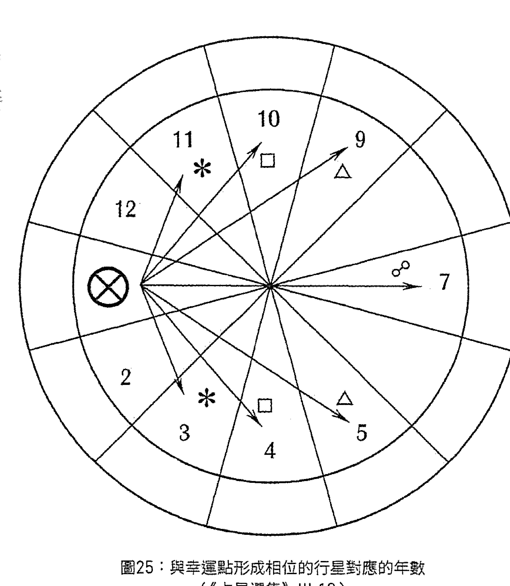

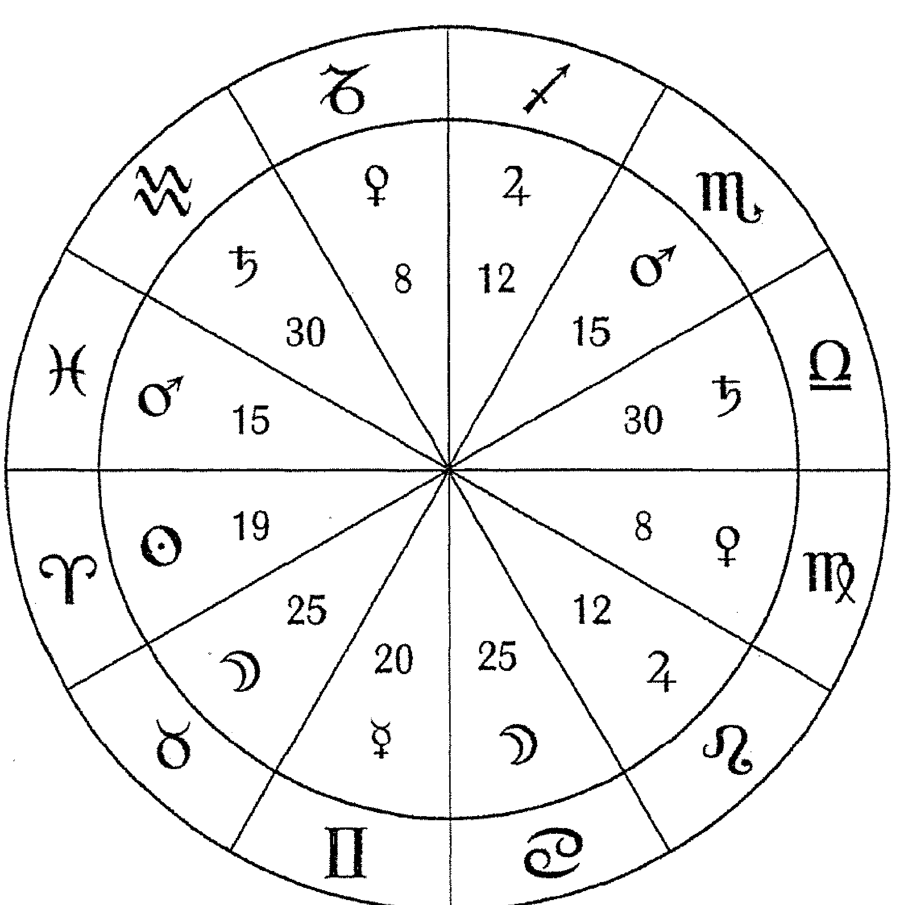

**圖26：幸運點落在各個星座分配的年數(源於行星小年)(《占星選集》Ⅲ1.12)**

**圖27：行星年表**

|       | 小   | 中     | 大   | 最大   |
|-------|------|--------|------|--------|
| 土星  | 30   | 43.5   | 57   | 265    |
| 木星  | 12   | 45.5   | 79   | 427    |
| 火星  | 15   | 40.5   | 66   | 284    |
| 太陽  | 19   | 69.5   | 120  | 1,461  |
| 金星  | 8    | 45     | 82   | 1,151  |
| 水星  | 20   | 48     | 76   | 480    |
| 月亮  | 25   | 66.5   | 108  | 520    |## [VII.102.6：哈桑·本·薩爾論快速徵象星與慢速徵象星]

哈桑·本·薩爾稱[714]應期有四種形式：小時、日、月、年；而星座有四種屬性：火象、風象、土象、水象。其中，較輕者為火象星座（譯註：輕者為快速，重者為慢速。），風象星座次之，水象星座再次之，土象星座又次之[715]。而在它們當中，較輕者為啟動星座，雙元星座次之，固定星座再次之。類似地，陽性星座較輕，而陰性星座較重。

此外[716]，自上升位置至中天是輕的，具有小時的性質；而自中天至西方較重，具有日的性質；自西方至大地之軸更重，具有月的性質；而自大地之軸至上升位置則更重許多，具有年的性質。

而[717]月亮——鑒於她輕且快——與小時的性質相符；水星與金星與日的性質相符；太陽與火星與月的性質相符；木星與土星與年的性質相符。

且[718]月亮以及其他行星東出之時速度最快；而它們西入之時速度最慢且最重。

-   714 | 這一節中的許多內容都與伊朗尼I.5.0-1及《論應期》相似。
-   715 | 這是典型的亞里士多德式的元素「自然位置」排序。
-   716 | 這一段源於薩爾的《論應期》§3，而且與約翰或赫曼的譯本（《心之所向》II.5.2）相比，它在應期與象限的關聯方面更連貫一致。
-   717 | 這與托勒密《四書》IV.10中關於過運的內容相似，不過托勒密認為月亮代表日，水星、金星、太陽與火星代表月。
-   718 | 本段源於薩爾《論應期》§3。但它也與托勒密《四書》III.5關於東出與西入的本命解讀吻合。

### [VII.102.7：應期的長度——據薩爾《論應期》§3]^{[719]}

對於任何一個判斷而言，應期都有五種計算方法：

-   其一，查看行星與它所入相位（無論是藉由星體抑或光線）的行星之間的度數，依據它們在星盤中的宮位及星座，以有關輕與重的排序，將這一數值作為年、月、日或小時的數量。
-   其二，查看行星何時到達它所入相位的行星所在的度與分^{[720]}。
-   其三，查看兩顆行星之間相距多少均等的度數（而不是赤經上升^{[721]}），以此數字對應日。
-   其四，查看行星何時離開它所入相位的行星所在的度與分^{[722]}。
-   其五，查看盤主星以及在其中擁有更顯著影響的行星的小年數值，依據有關輕與重的排序，以此作為日、月或年的數量。

你應依據行星的輕重、星座的輕重以及星盤中宮位的輕重判斷徵象的存在與顯現；而你應將它們相結合，依你所見確定對應日、月抑或年，且你將獲得主的認可。

此外^{[723]}，若交付行星（giving planet）與接收行星（receving planet）均位於自上升位置至中天的象限之中，且均東出，而彼此之間亦存在容納關係，則你應以它們之間的每一度對應一小時或一日。

而若它們位於中天與西方之間，則你應以一個月或一年^{[724]}對應每一度。[725] 而若它們位於第四宮與上升位置之間，則它們在任何情況下[726]都對應年。

而若行星自身束出卻位於星盤的西方[727]，則星盤中的度數將對應日或月。

且如之前所述，在確定應期時，星座亦具有影響力；你可確定年、月或日[728]。同樣，若星座位於星盤中不同的象限，則依據那種說法[729]象徵輕或重，以及小時、日、月或年。

智者們稱[730]，若你判斷某些行星以[它們的]度數象徵日，則你不可試圖將[計量單位]轉換為月，直至經過一次月亮回歸（即一個[太陰]月）之後，因或許[731]一顆行星將離相位於另一顆行星，而月亮也將到達事項的代表宮位或上升主星所在位置，抑或上升主星將入相位於上升位置或事項的代表宮位，則事項與徵象將於那一天顯現，蒙主應允。

而另一些人稱[732]：須藉由事項代表因子獲取應期，因它藉由自身的行進、入相位與離相位預示事項的發展，故當它入相位於具有影響力的位置時[733]便是應期。

-   1. 725 | 此處缺少關於行星位於下降點至IC之間的闡述，它至少對應月，但也可能對應年。
-   2. 726 | Modis。
-   3. 727 | 例如，它們在太陽之前升起(相對太陽的星相是束出的)卻位於「西方」象限(落在中天與下降點之間)。
-   4. 728 | 這可能引用了《論應期》§2的內容，它認為由快速行星主管的星座是輕的，而那些由慢速行星主管的星座是重的。
-   5. 729 | 這看起來指的是前面的段落。里賈爾的意思似乎是，如果由慢速行星主管的星座(例如水瓶座)位於星盤中象徵快速的象限(例如上升星座與中天之間)，那麼時間單位更可能是日或月，而不是月到年。
-   6. 730 | 即薩爾在《論應期》§3所說，不過赫爾墨在《心之所向》II.5.2中將此觀點歸於薩爾與烏瑪。在這裡，薩爾提醒我們兩點：第一，在一個太陰月之內，月亮對每一顆行星、每一個位置的過運涵蓋了所有的可能：因此在我們放棄使用日作為時間單位之前，應該保持耐心，因為她可能通過過運的方式在長達一個月的時間裡指示應期。(里賈爾在下文明確地提醒我們這一點。)第二，即便在一個太陰月之內，也有其他行星可能通過它們的過運指示了應期。
-   7. 731 | 即「或許在一整個太陰月結束之前」。
-   8. 732 | 目前來源不詳。
-   9. 733 | 這可能指的是對星盤尖軸度數的過運。

### [VII.102.8：其他觀點]

哈桑·本·薩爾稱：我們觀察並期待智者們所言的應期，並且還發現另一種計算應期的方法，它應與其他方法一起觀察使用：即行星的屬性。若欲得到與國王或世運回歸盤中的君主有關的應期，或者氣候變化的應期，則應藉由太陽來確定，因他象徵國王，且季節藉由他產生變換，而在季節中甚至行星的狀態[734]。月亮則藉由她的快速與輕盈，以及自身狀態的變化，象徵旅行、使者、改變以及一切徹底變化與移動之事物。同樣，其他行星亦象徵與它們的屬性、特質相符之事，且它們當中的每一個都與具備它們的象徵意義之事物相匹配[735]。故當你欲為某些判斷確定應期時，應明瞭那事項的屬性及它的徵象星為何，你可由單獨[736]具備那事項屬性的行星獲取應期，且你可依我們之前關於宮位、星座與度數的性質所言，確定應期對應小時、日、月抑或年。

且你應知曉，當吉星與徵象星形成相位之時，將縮短應期並令徵象加速顯現；而若凶星與它形成相位，則將延長應期並令徵象延緩顯現。同樣，當凶星與象徵災難與厄運的徵象星形成相位之時，它們將縮短應期並令徵象加速顯現；而若吉星與它形成相位，則它們將拖延並推遲那厄運。

若一顆快速行星——藉由其自身屬性與所落位置判斷——逆行，則預示緩慢。而一顆慢速行星——藉由其自身屬性與所落位置判斷——逆行，則預示快速。

-   734 | Et in temporibus status etiam planetarum。含義尚不明確。
-   735 | 遵照1551譯本將trahit se ad解讀為trahit ad se，儘管這看起來是冗贅的。
-   736 | Separatim。但這可能是specialiter（「尤其」）。

而^{[737]}若你被問及某一必將發生之事將於何時顯現，則取自時主星至中天所在度數或上升主星[的距離]，查看它們相距的度數是多少，再依如下方法將每一度與一日、一月或一年相對應：即若時主星與中天主星均位於啟動星座，則這些度數代表日；若位於雙元星座，則代表月；若位於固定星座，則代表年。

而^{[738]}若你被問及某事，你判斷此事將會發生並欲知曉何時發生，則須查看象徵即將發生之事的行星，當月亮與它形成入相位之時：若它^{[739]}位於固定星座且落在始宮或續宮，則你須以它們之間的每一度對應一年；而若它位於雙元[星座]且落在續宮，則以它們之間的每10°對應一年^{[740]}；而若它位於雙元[星座]且落在相對尖軸的果宮，則以每2°30′對應一年；而若它位於啟動星座且落在續宮，則以每2°30′對應一個月；而若它位於啟動星座且落在相對尖軸的果宮，則以每2°30′對應一日。

### [VII.102.9：統治與尊貴身份的應期]

而若你被問及國王或擁有尊貴身份之人將於何時失去王位或被免除那尊貴身份，則須查看徵象星。若你見它落於中天或它的旺宮，則判斷其地位的延續將取決於徵象星之小年的數值，且對於國王而言，你不可對小年做任何添加，而應依徵象星所落宮位、所落位置有力抑或無力、自身有力抑或無力對其進行削減：或許你可依據徽象星之狀態，將小年數值與月或日相對應。

然而[741]，若你欲知曉擁有尊貴身份之人何時被免去那身分，則你應將中天所在度數按照赤經上升度數進行向運[742]。當你見它入相位於一顆凶星的星體或其光線，且它未與吉星產生任何交集，而恰逢此時中天主星亦呈現凶象[743]，則[尊貴身份]將中斷。且當月亮藉由行進入相位於那一度數以及入相位於那顆凶星（[即，]中天所在度數藉由向運入相位的凶星）所在位置或其光線之時，則論斷[尊貴身份]將於當日被免除。而若木星或金星與那一位置形成任何相位，則可將事件消除、延緩直至離相位之時。此外還有另一種方法：即計算中天度數至凶星相距多少均等的度數[744]，再（依據星座的輕或重）以每一度對應一年、一月或一日。

此外我[745]曾多次見到，當上升位置的旺主星、月亮所落星座主星或幸運點主星與上升位置形成相位或為該星盤的某一主管行星時，它便代表應期，其所落宮位與尊貴決定尊貴身份延續的時間。而中天度數的界主星亦如此[746]。

且[747]除非在當年的回歸盤中太陽位於始宮而月亮位於第六宮或第二宮，否則國王絕不會失去王位。

-   741 | 本段內容引用自烏瑪的資料（見《判斷九書》 § 10.14），他將此觀點歸於瓦倫斯。烏瑪隨後在《本命三書》II.3中複述了相似的觀點。
-   742 | Athaçir。
-   743 | 我將此理解為「在向運指示的時刻，中天主星在過運中呈現凶象」。
-   744 | 即黃道度數。但《判斷九書》清楚地說明使用赤經上升度數——這是更為合理的。
-   745 | 即里賈爾。
-   746 | 這看起來像是一種把中天推進經過不同的界的配置法，但里賈爾可能指主星所在位置及它的過運，如同其他行星那樣。
-   747 | 目前來源未知，而且我也不清楚它的占星學邏輯是什麼：Et nunquam regnum fuit amissum nisi fuerit in revolutione illius anni Sol in angulo et Luna in sexta vel in secunda domo。

同樣[748]，若第十宮主星入相位於第四宮主星，則國王將失去王位。而若第十宮主星入相位於上升主星，則國王的統治將延續。若第十宮主星或上升主星入相位於它的弱宮主星，則預示國土四分五裂。

同樣[749]，須查看事項的徵象星落於哪一星座、哪一象限之中，並以星座的赤經上升數值對應日、月或年——遵循之前所述方法依據行星狀態與所落宮位、星座確定。而或許應以它的小年、大年或中年的數值對應日或月。

同樣，事項與應期取決於徵象星的形態：若它東出，則[應期為]它轉變為西入之時；而若它西入，則為當它轉變為東出之時；若它逆行，則為當它轉而順行之時；而若它順行，則為當它轉而逆行之時；若它遭逢焦傷，則為當它顯現且東出之時。以上全部均為徵象顯現的應期。

### [VII.102.10：烏瑪·塔巴里論應期]

烏瑪·塔巴里稱[750]，若徵象星將被焦傷，則徵象將於那時顯現。

而月亮抵達上升位置之時同樣亦為應期；若她為某一宮位的某一主管行星，則相應的事項便會在此時顯現。

若兩顆吉星將會合於上升位置的某一尖軸，則此同樣亦為應期。

而若太陽為事項的某一尊貴主星或某一分子，當他抵達上升位置時，事項將有所變化，這便是應期之一——若兩顆吉星在象徵事項的宮位中會合，同樣亦是應期。

而你藉由所有這些方法得到的應期，都取自赤經上升度數與均等的度數[751]，自它們之中較小者開始[752]。而若它已過去[753]，則你可另取其他。

同樣，若月亮或上升主星入相位於一顆與事項屬性相似的吉星時[754]，此入相位即為事項顯現的應期。而兩者之間相距的度數同樣亦為應期[755]。

當月亮為事項的主管行星之一時，能夠賦予她的最長應期為一個月，因在這樣長的[時間]里，她將會運經過所有的屬性（譯註：natures，阿拉伯文版本為「元素」[elements]，即她會經過整個黃道和所有元素。），亦會經過她的廟宮、她所在星座的主星、上升位置及其主星、吉星以及凶星。

而當事項代表宮位主星入相位於一顆吉星之時，同樣亦為應期。而當月亮入相位於一顆吉星之時，同樣亦為應期。

且[756]預示事項將立刻、迅速[發生]的徵象為，事項之徵象星位於輕象限之一，位於太陽的東方，自身以快速行進且未受凶星傷害：因當上述全部徵象相結合時，它們預示事項將快速實現。而當缺少其中[一些徵象]時，則事項發生的速度將減緩，且它將推遲直至數年之後[757]。

而[758]或許應期的天數為徵象星至上升度數之間的度數——以每一度對應一天；抑或許應期為，當太陽藉由他自身的行進到達上升位置或事項代表宮位之時。

無論太陽所落星座的主星是快速行星抑或慢速行星，當太陽位於續宮時，這[759]都是得到確定和驗證的。對於國王以及適宜長久延續之事而言，這亦是得到驗證的。然而對於那些並非長久持續之事（例如疾病或盜竊行為等）而言，當[太陽所落]星座之主星為慢速行星時，這未能得到驗證。

而瓦倫斯稱[760]：若你被問及某事的應期、它將於何時發生，則須查看提問之時太陽的位置：若你見他落在始宮，則判斷所期待發生之事項將於他到達中天之時[發生]。而若他落在續宮，則查看他所在星座之主星，當[那行星]入相位於中天之時，事項將會顯現。

阿里·本·里賈爾之全書第七部終

## 附錄 A

## 主管關係

| 星座 | 廟 | 旺 | 陷 | 弱 |
| :---: | :---: | :---: | :---: | :---: |
| ♈ | ♂ | ☉ | ♃ | ♄ |
| ♉ | ♀ | ☽ | ♂ | |
| ♊ | ☿ | | ♃ | |
| ♋ | ☽ | ♃ | ♄ | ♂ |
| ♌ | ☉ | | ♄ | |
| ♍ | ☿ | ☿ | ♃ | ♀ |
| ♎ | ♀ | ♄ | ♂ | ☉ |
| ♏ | ♂ | | ♀ | ☽ |
| ♐ | ♃ | | ♃ | |
| ♑ | ♄ | ♂ | ☽ | ♃ |
| ♒ | ♄ | | ☉ | |
| ♓ | ♃ | ♀ | ♃ | ♀ |

圖28：主要的尊貴與反尊貴

| 三方星座 | 日間 | 夜間 | 伴星 |
| :---: | :---: | :---: | :---: |
| 火象星座 | ☉ | ♃ | ♄ |
| 風象星座 | ♄ | ☿ | ♃ |
| 水象星座 | ♀ | ♂ | ☽ |
| 土象星座 | ♀ | ☽ | ♂ |

圖29：三分性主星

## 圖30: 埃及界

| 星座 | 度數範圍1 | 度數範圍2 | 度數範圍3 | 度數範圍4 | 度數範圍5 |
| :---: | :---: | :---: | :---: | :---: | :---: |
| ♈ | 0°-5°59' | 6°-11°59' | 12°-19°59' | 20°-24°59' | 25°-29°59' |
| ♉ | 0°-7°59' | 8°-13°59' | 14°-21°59' | 22°-26°59' | 27°-29°59' |
| ♊ | 0°-5°59' | 6°-11°59' | 12°-16°59' | 17°-23°59' | 24°-29°59' |
| ♋ | 0°-6°59' | 7°-12°59' | 13°-18°59' | 19°-25°59' | 26°-29°59' |
| ♌ | 0°-5°59' | 6°-10°59' | 11°-17°59' | 18°-23°59' | 24°-29°59' |
| ♍ | 0°-6°59' | 7°-16°59' | 17°-20°59' | 21°-27°59' | 28°-29°59' |
| ♎ | 0°-5°59' | 6°-13°59' | 14°-20°59' | 21°-27°59' | 28°-29°59' |
| ♏ | 0°-6°59' | 7°-10°59' | 11°-18°59' | 19°-23°59' | 24°-29°59' |
| ♐ | 0°-11°59' | 12°-16°59' | 17°-20°59' | 21°-25°59' | 26°-29°59' |
| ♑ | 0°-6°59' | 7°-13°59' | 14°-21°59' | 22°-25°59' | 26°-29°59' |
| ♒ | 0°-6°59' | 7°-12°59' | 13°-19°59' | 20°-24°59' | 25°-29°59' |
| ♓ | 0°-11°59' | 12°-15°59' | 16°-18°59' | 19°-27°59' | 28°-29°59' |

## 圖31: 「迦勒底」外觀/外表

| 星座 | 0°-9°59' | 10°-19°59' | 20°-29°59' |
| :---: | :---: | :---: | :---: |
| ♈ | ♂ | ☉ | ♀ |
| ♉ | ♀ | ☽ | ♃ |
| ♊ | ♃ | ♂ | ☉ |
| ♋ | ♀ | ☿ | ☽ |
| ♌ | ♃ | ♀ | ♂ |
| ♍ | ☉ | ♀ | ☿ |
| ♎ | ☽ | ♃ | ♃ |
| ♏ | ♂ | ☉ | ♀ |
| ♐ | ☿ | ☽ | ♃ |
| ♑ | ♃ | ♂ | ☉ |
| ♒ | ♀ | ☿ | ☽ |
| ♓ | ♃ | ♃ | ♂ |附錄 B
星座的分類

以下特別的星座分類來源於本書及其他中世紀作者。其中一些分類（例如多子女星座）得到了普遍的認同，而對於另一些分類，古典名家們則有不同的看法。其他的分類方法參見註釋中提到的資料來源。

生育與生長：
- 多子女星座 (many children)：巨蟹座、天蠍座、雙魚座
- 無子女（不育）星座 (no children [sterile])：雙子座、獅子座、處女座
- 種子/發芽星座 (seeds/sprouting)⁽¹⁾：牡羊座⁽²⁾、金牛座、處女座、摩羯座

理性與激情：
- 理性星座 (rational)：雙子座、天秤座、水瓶座
- 人性星座 (human)⁽³⁾：雙子座、處女座、天秤座、射手座前半部、水瓶座

> 1 | 伊朗尼II.2.2、里買爾VII.32。
> 2 | 據《古典占星介紹》I.3中阿布·馬謝的資料（可能是因為春天始於太陽位於牡羊座的時候）。
> 3 | 比魯尼《占星元素說明》§352。

完全發聲星座 (fully voiced) [4]：雙子座、處女座、天秤座
- 不完全發聲星座 (partly-voiced) [5]：牡羊座、金牛座、獅子座、射手座、摩羯座、水瓶座
- 無聲星座 (mute) [6]：巨蟹座、天蠍座、雙魚座
- 大食量星座 (much eating) [7]：牡羊座、金牛座、獅子座、射手座後半部、摩羯座、雙魚座
- 放蕩/不雅星座 (licentious/indecent) [8]：牡羊座、金牛座、摩羯座、一部分天秤座、雙魚座
- 好色星座 (lecherous) [9]：牡羊座、金牛座、獅子座、天秤座、一部分摩羯座、雙魚座
- 以性為樂的星座 (delighting in sex) [10]：牡羊座、摩羯座、獅子座、天秤座

其他：
- 反芻星座 (chewing the cud) [11]：金牛座、摩羯座(以及其他？)
- 四足星座 (four-footed) [12]：牡羊座、金牛座、獅子座、射手座後半部、摩羯座
- 皇家星座 (royal)：牡羊座、獅子座、射手座

附錄 C
金迪關於擇時的一般性說明

以下簡短的段落與章節摘錄自金迪的著作《四十章》（2011年出版），其中提出了關於擇時的一般性判斷法則。

§ 81. [1]但是，若行星會合與它相似的特殊點（或與[特殊點]形成相位），它在此方面的影響力將得以加強：例如木星與金錢點（Lot of money）[2]會合或與之形成相位[3]。

§ 153. 因此，須（以前文所述衡量力量的方法判斷）上升位置的力量以及月亮離相位的行星之力量[4]，在上升位置與所問事項的屬性相似[5]的情況下，若它藉由吉星（即有吉星落入或與吉星形成相位）或某些舉止（bearing）而呈現吉象[6]，甚至月亮也[呈現]吉象且有利[7]，則它們象徵事項將會成功，發起行動之人可功成名就——尤其見到第七宮以及月亮入相位的行星無力並呈現凶象時。

> 1 | 這一段僅見於羅伯特的版本。
> 2 | 金錢點（資產點[assets]、物質點[substance]、資源點[resources]）的計算方法是將第二宮主星至第二宮始點的距離自上升位置投射，白天盤與夜間盤都是如此。更多相關信息詳見《古典占星介紹》VI.2.4。
> 3 | 相似內容另見 § 141。我認為需形成整星座相位，而無需形成容許度計算的相位，不過以容許度計算的相位肯定更有益。
> 4 | 見 § 139結尾部分、§§ 63-72、§§ 77-78及《古典占星介紹》IV.2。
> 5 | 見 § 142。
> 6 | 見 § 144。
> 7 | 特別參見《古典占星介紹》IV.5。

§ 550. [8]但在所有這些事項中，幸運點及其主星應位於有力的宮位，或者得到具備容納關係的吉星的祝福。此外，在條件允許的情況下，盡可能地使那行星（事項與此行星的象徵意義有關）[9]關注(regard)、協助、容納上升主星、月亮、幸運點及金錢點。

§ 552. 因此，當被問及某些宮位所象徵的事項時，須使此宮位的主星具備容納關係，亦即[使宮主星容納][10]月亮、上升主星、幸運點及金錢點；此外，你應為月亮的主星（乃至上升主星、第四宮主星）清除凶星並使它強而有力。因這些象徵所問之事的結果。

## 4：論開始行動[11]

§ 142. 首先，上升位置及其主星應具備某種[1]相似[12]與可見的[2]吉象[13]。

當上升位置自身具備所問事項的屬性，或在特徵及方式上與所問事項之屬性相仿，便稱為[1]相似。而當詢問者期待事項可以快速得到確定的結果，或者所問事項與尊貴身份或王國有關時，注意事項的[1a]特徵，應安排火象星座；同樣，也須注意[1b]方式，如被問及戰爭時，我們應考慮火星主管的星座。

§ 143. 此外[14]，[3]詢問的宮位（更確切地說是詢問事項的宮位）及其主星必須予以關注。因為詢問事項的宮位象徵事項或事件的開始，它的主星掌管中間階段，而主星的主星決定整個事項的結果。同樣，上升位置亦按照這一順序象徵著詢問者所問之事。甚至還有詢問事項的特殊點及其主星，以及主星的主星[15]，亦以同樣順序象徵著詢問者所問之事。

§ 144. 一旦這些因子按照上述順序被確定，則藉由行星落在自己的宮位，或與自己的宮位形成相位的位置，或具備友誼關係的位置，並且將凶星驅離這些位置，可使[2]吉象增強。還須避免上升主星或詢問事項的主星逆行：因即使一切都能夠兌現，事項達成也需經歷諸多勞苦與長久的絕望，並伴隨眾多不利的障礙。

§ 145. 我認為還須避免龍尾與太陽、月亮為伴（即與它們聚集或對分），或與它們之一為伴（它們沒有落在聚集或對分的位置）[16]，此外謹防它落在上升[星座]、詢問事項宮位及事項的特殊點所在[星座]。因[龍尾]象徵事項因低位階之人而遭到破壞，換言之，它將被無知之人奪走[17]。

§ 146. 另一方面，樂見吉星落在上升位置、詢問事項的宮位或尖軸。因大吉星[18]可令一切你所欲達成之事得到加強；而小吉星[19]可確保並促進與玩笑、女人、慾望、服飾、黃金與寶石、愛相關之事及諸如此類之事。

§ 147. 再者，我們告誡你，在一切事項中都須謹防月亮位於上升位置，因落在此處的月亮總是與事項對抗。但落在此處的太陽不會如此：反之，他使事項發生並可消除延誤。

§ 148.
此外，你應千萬小心，謹防凶星盤踞（hold onto）於上升位置及尖軸，特別是當[那些凶星]主管不幸的[宮位]：即第六宮、第十二宮與第八宮時。若凶星主管第八宮，則死亡的危險、敵人的協助者、嚴酷的監禁將威脅於[他]。同樣，若為第六宮主星，須謹防來自敵人、奴隸、長期的疾病、短期的監禁甚至四足動物的威脅。若[凶星]主管第十二宮，則預示懲罰、因絕望與勞苦而倍受折磨，以及敵人[與]中期的監禁。若為第二宮主星，他將因金錢、朋友，甚至婚姻[或]飲酒而蒙受損失[20]。

§ 149.
我們[21]還令你時刻注意，在日間[盤]使用日間且直行的星座作為上升星座，在夜間盤使用夜間且直行的星座作為上升星座[22]。太陽與月亮亦如此[23]。切記確保此前所述那些主星在所提及的任何事項中都得到加強。此外，毫無疑問，行星之計劃以及星座之獲益的實現均取決於[它們的]狀態與自然象徵意義。

> 1. 此處羅列的第二宮象徵的事物可通過整星座尖軸宮來解釋：金錢（第二宮本身）、朋友（第十一宮）、婚姻中的財務事項（第八宮，也就是第七宮起算的第二宮）、飲酒或聚會（第五宮）。
> 2. 參見《占星詩集》V.4.5。
> 3. 此處雨果的句子並不連貫，因而參照羅伯特的版本翻譯，這裡假設採取行動的人希望事項或結果長期延續，因為直行上升星座使事項長久持續。
> 4. 這可能指區分內的發光體應位於具有適當性別/區分的星座之中，並位於直行上升星座。

## 附錄 D

### 有關半日時的三種說法

以下內容摘錄自《古典占星介紹》VIII.4及《亞里士多德之書》II.4，它們闡述了關於半日時（buht）或「灼傷」、「燃燒」、「焦傷」的小時三種說法，可作為里賈爾VII.57.2內容——摘錄自金迪《四十章》Ch. 11.7——的補充。（1）第一種說法來源於印度人，它以滿月之後的每12個小時為一個區間，按照行星次序，將這些區間分配給不同的行星；此法還將每個區間一分為三，分別由三顆三分性主星掌管。（2）第二種說法見於金迪和里賈爾的著作，即將新月之後不均等的季節時分為灼傷/燃燒的小時與未灼傷/未燃燒的小時（這些時段又被分為與擇時有關的區間）。我在里賈爾VII.57.2對此方法做出了較長篇幅的評註。（3）第三種方法見於馬謝阿拉的著作《亞里士多德之書》II.4（收錄於《波斯本命占星I》），即以距離而非時間為基礎。關於這些方法的討論，詳見我所作《緒論》。

> > [（1）卡畢希IV.23：]印度人十分習慣於觀察半日時[1]。他們將[太陽與月亮]會合之後的12個小時分配給太陽，並將這12個屬於太陽場域[2]的小時等分為三個區間，每4小時為一個區間，然後依據太陽在發生會合時的三顆三分性主星對每個區間做出判斷。而後他們將太陽的12個小時之後的12個小時分配給金星，依然將它們等分為三個區間，並依據金星在會合時的三顆三分性主星對每個區間做出判斷。接下來水星以及其餘行星也依此照做，直至84個小時之後重新回到太陽，他們會持續這種做法直至下一個會合發生。

> > ［（2）卡畢希Ⅳ.24：］而有人認為半日時為：會合發生之後的12個不均等的小時[3]，即所謂「燃燒」的小時，在這段時間開始某些事項是不利的；這12個小時之後是72個「未燃燒」的小時，在這段時間開始事項是有利的；在這72個未燃燒的小時之後，又是12個燃燒的小時[4]，以此類推直至下一個會合。他們進一步將這12個小時等分為三個區間，並稱在第一個4小時區間內發動戰爭的人恐將喪失他的靈魂；而在第二個4小時區間發動戰爭的人雖不會喪失靈魂但其身體恐將損壞；在最後4小時區間發動戰爭的人恐將損失財及同伴。

> > ［（3）《亞里士多德之書》Ⅱ.4：］然而半日時(buht)[5]這一外語詞彙指的是月亮晝夜的行進。例如，當月亮跨越太陽邊界直至相距12°時即為月亮一晝夜的進程，其中的要點，在都勒斯[的]第五部著作[6]中羅列得十分清楚。

## 附錄 E

### 中世紀占星精華系列

中世紀占星精華叢書規劃為一系列重新界定古典占星學輪廓的著作。主要由波斯、阿拉伯占星家的譯著組成，涵蓋占星學的各個主要領域，也包含哲學論述與魔法。一方面，此系列收錄了一些介紹性的著作及閱讀資料彙編，另一方面也收錄了獨立的專著與廣論類型的著作（包含中世紀後期與文藝復興時期的拉丁西方著作）。未來此系列還將補充希臘系列與文藝復興系列。

#### I. 基礎介紹
- *Traditional Astrology for Today: An Introduction* (2011)
- *Introductions to Astrology: Abū Ma’s̲har & al-Qabīsī* (2010)
- *Abū Ma’s̲har, Great Introduction to the Knowledge of the Judgments of the Stars* (2014)
- *Basic Readings in Traditional Astrology* (2013-14)

#### II. 本命占星
- *Persian Nativities I: Māshā’allāh’s The Book of Aristotle, Abū ‘Alī al-Khayyāt’s On the Judgments of Nativities* (2009)
- *Persian Nativities II: ‘Umar al-Tabarī’s Three Books on Nativities, Abū Bakr’s On the Nativities* (2010)
- *Persian Nativities III: On Solar Revolutions* (2010)

#### III. 卜卦占星
- Hermann of Carinthia, *The Search of the Heart* (2011)
- Al-Kindī, *The Forty Chapters* (2011)
- Various, *The Book of the Nine Judges* (2011)

#### IV. 擇時占星
- *Choices & Inceptions: Traditional Electional Astrology* (2012)

#### V. 世運占星
- *Astrology of the World* (多卷) : Abū Ma'shar's *On the Revolutions of the Years of the World*, *Book of Religions and Dynasties*, and *Flowers*; Sahl bin Bishr's *Prophetic Sayings*; 較少針對價格與氣候的著作 (2012-2013)

#### VI. 其他著作
- Bonatti, Guido, *The Book of Astronomy* (2007)
- Works of Sahl & Māshā'allāh (2008)
- Firmicus Maternus, *Mathesis* (TBA)
- Al-Rijāl, *The Book of the Skilled* (TBA)
- *Astrological Magic* (TBA)
- *The Latin Hermes* (TBA)
- *A Course in Traditional Astrology* (TBA)

## 詞彙表

導言以下詞彙表由我的另一本著作《古典占星介紹》的詞彙表擴展而來，增補了一些在《判斷九書》中出現的術語。在大部分定義的後面標註的是《古典占星介紹》中相關的章節與附錄（也包括我所作緒論[Introduction]）——而並非本書的附錄——以供延伸閱讀。

| 詞彙 | 定義 |
| :--- | :--- |
| 進程增加 (Adding in course) | 詳見進程 (Course)。 |
| 前進的 (Advancing) | 行星落在始宮 (Angle) 或續宮。詳見《古典占星介紹》III.3及Introduction § 6。 |
| 吉宮 (Advantageous places) | 兩種宮位 (Houses) 系統中的一種，它顯示出某些特定宮位中的行星或宮位所主管事項在星盤中更忙碌或更有益 (III.4)。第一種是七吉宮系統，以《蒂邁歐篇》為基礎並記載於《占星詩集》中，它僅僅包括那些與上升星座 (Ascendant) 形成整星座 (Whole-sign)相位(Aspect)的星座，並因為與上升星座形成相位，認為這些位置對當事人有益。而第二種是八吉宮系統，它來源於尼切普索 (Nechepso) (III.4)，包括所有的始宮 (Angular) 和續宮 (Succedent)，指出了對於行星本身而言活躍並且有益的位置。 |
| 生命時期 (Ages of man) | 托勒密將標準的人的一生劃分為數段生命歷程時期，每段時期由不同的時間主星 (time lords) 主管。詳見VII.3。 |
| 友誼星座 (Agreeing signs) | 將星座分成幾組，組內的星座相互之間具有某種和諧的性質。詳見I.9.5-6。 |
| 壽命主 (Alcochoden) | 拉丁文對Kadukhudhāh的直譯。 |
| 異鄉人 (Alien) | 拉丁文 alienus。詳見外來的 (Peregrine)。 |
| 最強主星 (Almuten) | 從拉丁文 mubtazz 翻譯而來，詳見勝利星 (Victor)。 |
| 始宮 (Angles)、續宮 (succeedents)、果宮 (cadents) | 將宮位分為三種類別，以此判斷行星在這些類別中呈現的力量與直接表現的能力。始宮為第一、十、七、四宮，續宮為第二、十一、八、五宮，果宮為第十二、九、六、三宮（詳見下文果宮[cadent]）。但是在卜卦中，確切的宮位位置取決於判斷時使用整星座宮位制（whole sign）還是象限宮位制（quadrant houses），以及如何使用它們，尤其當古典文獻提到始宮或尖軸（pivot，希臘文kentron，阿拉伯文watad）的時候指的是（1）整星座宮位制的上升星座（Ascendant）以及其他尖軸星座，或是（2）ASC-MC兩軸線所在度數，或是（3）以尖軸度數所計算的象限宮位制的始宮位置。詳見I.12-13、III.3-4及Introduction § 6。 |
| 映點（Antiscia，單數形式為antiscion） | 意思為「陰影投射」，就是指以摩羯座0°至巨蟹座0°為軸線，所產生的反射度數位置，例如巨蟹座10°的映點反射位置為雙子座20°。詳見I.9.2。 |
| 遠地點（Apogee） | 一般而言，就是行星在其均輪（deferent）的軌道上與地球相距最遠的位置。詳見II.0-1。 |
| 入相位（Applying，application） | 意指行星處於連結（Connection）的狀態下，持續運行以精確的完成連結。當行星聚集（Assembled）在同一星座或是以整個星座形成相位（aspect），卻未形成緊密度數的相位連結關係時，僅是「想要」去連結。 |
| 上升（Arisings） | 詳見赤經上升（Ascensions）。 |
| 上升位置（Ascendant） | 通常是指整個上升星座，但也經常會特別指上升位置的度數，在象限宮位制（quadrant houses）中，也指從上升度數至第二宮始點的區域。 |
| 赤經上升（Ascensions） | 係指天球赤道上的度數，用來衡量一個星座或是一個界（bound）（或其他黃道度數間距）通過地平線時，在子午線上會經過多少度數。這經常會使用在以赤經上升時間作預測的技巧上，以計算向運（directions）的近似值。詳見附錄E。 |
| 相位/關注（Aspect/regard） | 係指一行星與另一行星以星座所相距的位置形成六分（sextile）、四分（square）、三分（trine）或對分（opposition）相位或關注關係，詳見III.6與整星座宮位制（Whole signs）。連結係指以較為緊密度數或容許度所形成的相位關係。 |
| 聚集（Assembly） | 係指兩顆以上的行星落在同一星座中，並且若相距在15°以內則作用更為強烈。詳見III.5。 |
| 不合意（Aversion） | 係指從某個星座位置起算的第二、第六、第八、第十二個星座位置。例如，由巨蟹座起算時，行星落在雙子座，為巨蟹座起算的第十二個星座，即行星落在不合意於巨蟹座的位置。這些位置之所以不合意，是因為它們無法與之形成古典相位（aspect）關係。詳見III.6.1。 |
| Azamene | 同「慢性疾病度數」（Chronic illness）。 |
| 凶星（Bad ones） | 見吉星／凶星（Benefic/malefic）。 |
| 禁止（Barring） | 見阻礙（Blocking）。 |
| 舉止（Bearing） | 拉丁文habitude，舊譯：感受（《當代古典占星研究》）。源於雨果的術語，係指任何可能的行星狀態與相互關係。這些內容可以在III與IV中找到。 |
| 吉星／凶星（Benefic/malefic） | 係指將行星分成幾個群組，即代表一般所認知的「好事」的行星（木星、金星，通常還有太陽與月亮）與代表「壞事」的行星（火星、土星），水星的性質則視狀況而定。詳見V.9。 |
| 善意的（Benevolents） | 見吉星／凶星（Benefic/malefic）。 |
| 圍攻（Besieging） | 同包圍（Enclosure）。 |
| 雙體星座（Bicorporeal signs） | 同「雙元」星座（common signs）。詳見四正星座（Quadruplicity）。 |
| 阻礙（Blocking，有時稱「禁止」[prohibition]） | 行星以自己的星體或光線阻礙另一顆行星完成某一連結（connection）。詳見III.14。 |

- 護衛星 (Bodyguarding)：在行星的相互關係中，某些行星能保護其他行星，應用在決定社會地位與顯耀度上。詳見III.28。
- 界 (Bounds)：係指在每個星座上分成不均等的五個區塊，每個界分別由五個非發光體 (non-luminaries) 行星所主管。有時候也稱為「terms」。界也是五種尊貴 (Dignities) 之一。詳見VII.4。
- 光亮度數、煙霧度數、空白度數、暗黑度數 (Bright, smoky, empty, dark degrees)：黃道上特定的度數會使行星或ASC的代表事項變得顯著或不明顯。詳見VII.7。
- 燃燒 (Burned up)：有時也稱為「焦傷」(Combust)。一般而言係指行星位於距離太陽1°-7.5°的位置。詳見II.9-10與在核心 (In the heart)。
- 燃燒途徑 (Burnt path)：拉丁為via combusta。係指當行星（特別指月亮）落在天秤座至天蠍座的一段區域，會傷害其代表事項或使其無法發揮能力。有些占星家定義這個區域系從天秤座15°至天蠍座15°；另一些占星家則認為位於太陽的弱宮 (Fall) 度數——即天秤座19°，至月亮的弱宮度數——即天蠍座3°之間。詳見IV.3。
- 半日時 (Bust)：係指從新月開始計算的特定小時。在擇時 (Election) 或採取行動時，一些時間被視為有利的，而另一些時間則是不利的。詳見VIII.4。
- 忙碌的宮位 (Busy places)：同吉宮 (Advantageous places)。
- 果宮 (Cadent)：拉丁文cadens，即「下落的」。通常有兩種含義：1) 一顆行星或一個宮位位於相對尖軸的果宮（即位於第三宮、第六宮、第九宮或第十二宮），或2) 相對於上升位置 (Ascendant) 的果宮（即不合意 [aversion]於上升位置，落在第十二宮、第八宮、第六宮或第二宮）。詳見I.12、III.4及III.6.1。
- 基本星座 (Cardinal)：同「啟動」星座 (movable signs)。詳見四正星座 (Quadruplicity)。

- 核心內 (Cazimi)：詳見在核心 (In the heart)。
- 天球赤道 (Celestial equator)：係指地球赤道投射至天空的一個大圈，為天球三種主要的坐標系統之一。
- 膽汁質 (Choleric)：詳見體液 (Humor)。
- 慢性疾病度數 (Chronic illness [degree of])：某些特定度數因為與特定的恆星有關，會顯示慢性疾病的徵象。詳見VII.10。
- 清除 (Cleansed)：通常係指一顆行星沒有與凶星 (malefic) 聚集 (assembly) 或形成四分相 (Square)、對分相 (opposition)，但也可能指沒有與凶星形成任何的相位 (aspect)。
- 沾染 (Clothed)：等同一顆行星與其他行星聚集 (Assembly) 或形成相位 (Aspect/regard)，從而享有了另一顆行星的特質。
- 光線集中 (Collection)：係指兩顆行星已形成整個星座相位 (Aspect) 關係，卻無法形成入相位的連結 (connection)，而有第三顆行星與兩者均形成入相位關係。詳見III.12。
- 焦傷 (Combust)：詳見燃燒 (Burned up)。
- 命令/服從 (Commanding/obeying)：係一種星座的分類方式，分為命令或服從星座。(有時會應用在配對盤[synastry]上)，詳見I.9。
- 雙元星座 (Common signs)：詳見四正星座 (Quadruplicity)。
- 授予 (Confer)：詳見推進 (Pushing)。
- 相位形態 (Configured)：形成整星座相位 (Aspect) 的關係，無需形成以度數計算的相位關係。
- 行星會合 (Conjunction [of planets])：詳見聚集 (Assembly) 與連結 (Connection)。
- 會合/妨礙 (Conjunction/prevention)：係指在本命盤 (Nativity) 或其他星盤中，最接近出生時刻或星盤時刻的新月 (會合) 或滿月 (妨礙) 時月亮所在位置。以妨礙為例，有些占星家會使用月亮的度數，而另一些占星家則使用妨礙發生時落在地平線上的發光體所在度數。詳見VIII.1.2。

- 連結 (Connection)：當行星入相位至另一顆行星（在同一星座以星體靠近，或是以光線形成整星座的相位[Aspect]關係），從相距特定的度數開始直到形成精準相位。詳見III.7。
- 轉變星座 (Convertible)：同「啟動星座」。詳見四正星座 (Quadruplicity)。但有時行星（特別是水星）被稱為可轉變的，因為它們的性別 (Gender) 會受到它們在星盤中所落位置的影響。
- 傳遞 (Convey)：詳見推進 (Pushing)。
- 敗壞 (Corruption)：通常指行星受剋（詳見IV.3-4），例如與凶星 (malefic) 形成四分相 (square)。但有時等同於入陷 (Detriment)。
- 建議 (Counsel)：拉丁文consilium。雨果和其他拉丁譯者使用的術語，即「管理」（III.18）。係指一顆行星通過入相位 (Apply) 將它的建議或管理推進 (Push)、贈予或授予另一顆行星，而得到另一顆行星的容納 (Receives) 或收集。
- 進程增加/減少 (Course，increasing/decreasing in)：在應用上，係指一顆行星的運行比平均速度更快。但在天文學中，這與行星本輪 (epicycle) 的中心位於均輪 (deferent) 上的哪個扇形區 (sector或nitaq) 有關。（行星位於本輪上的四個扇形區中的哪一個也會影響它的視速度[apparent speed]。）在緊鄰行星近地點 (perigee) 的兩個扇形區中，行星看上去以更快的速度移動；而在緊鄰遠地點 (apogee) 的兩個扇形區中，行星會看上去以較慢的速度移動。詳見II.0-1。
- 扭曲/直行星座 (Crooked/straight)：係為一項星座分類方式，有些星座升起較快速，較為平行於地平線（扭曲的）；另一些星座上升較為慢速，且接近於地平線的垂直位置（直行的或筆直的）。在北半球，從摩羯座到雙子座為扭曲星座（但在南半球，它們是直行星座）；從巨蟹座到射手座為直行星座（但在南半球，它們是扭曲星座）。
- 跨越 (Crossing over)：當行星從精準連結 (Connection) 的位置，開始變成離相位 (Separate)。詳見III.7-8。
- 光線切斷 (Cutting of light)：係指三種狀況阻斷了行星產生連結 (Connection)，分別為由後面星座出現的阻擋 (Obstruction)、在同一星座的逃逸 (Escape)、禁止 (Barring)。詳見III.23。
- Darījān：係指印度人所提出另一種不同的外觀 (Face) 系統。詳見VII.6。
- 外表 (Decan)：同「外觀」 (Face)。
- 赤緯 (Declination)：等同於地球上的緯度相對於天球赤道 (Equator) 的位置。位於北赤緯的星座（自牡羊座至處女座）在黃道 (ecliptic) 上向北延伸，而位於南赤緯的星座（自天秤座至雙魚座）向南延伸。
- 均輪 (Deferent)：係行星自身的本輪 (epicycle) 運行的軌道。詳見II.0-1。
- 下降 (Descension)：同「入弱」 (Fall)。
- 入陷 (Detriment)：或阿拉伯文「敗壞」 (corruption)、「不良的」 (unhealthiness)、「損害」 (harm)。它泛指行星處於任何受損害或運作受到阻撓（例如受到燃燒[Burned up]）的狀態（如同「敗壞」一樣）。但它也特指行星落在其主管星座 (Domicile) 對面的星座（如同「損害」一樣），例如火星在天秤座為入陷。詳見I.6與I.8。
- 右旋 (Dexter，「右方」[Right])：詳見右方/左方 (Right/left)。
- 直徑 (Diameter)：同「對分相」 (Opposition)。
- 尊貴 (Dignity)：拉丁文「有價值」 (worthiness)。阿拉伯文ḥazz，代表「好運、分配 (allotment)」。係指黃道上的位置以五種方式被分配給行星（有時也包含南北交點[Node]）主管與負責，通常會以以下順序排列：廟 (Domicile)、旺 (Exaltation)、三分性 (Triplicity)、界 (Bound)、外觀 (Face/decan)。每項尊貴都有它自己的意義、作用及應用方式，並且其中兩種尊貴擁有對立面：與廟相對的是陷 (Detriment)，與旺相對的是弱 (Fall)。其配置狀況詳見I.3、I.4、I.6-7、VII.4；類比徵象的描繪詳見I.8；應用廟與界作推運預測的方法詳見VIII.2.1、VIII.2.2f。

- 向運法 (Directions)：係一種預測推運的方法，托勒密定義此方法係依照半弧的比例推算，較使用赤經上升 (Ascensions)（譯註：為希臘時期一種較為粗糙的向運法。）更為精準。但此方法在推進的方式上仍有些紊亂，原因在於推進的天文計算方式與占星師對星盤的觀察之間存在差異：就天文角度來說，在星盤上的一個點（即徵象星[the significator]）被認為是靜止的，而其他行星（允星[promittors]）及它們以度數計算的相位（或者是界[Bound]）會被放出，就好像是天體以主限運動 (Primary motion) 持續運轉一樣，直至它們抵達徵象星的位置。而徵象星與允星之間相距的度數則會被轉換為生命的年歲；但從星盤觀察時，看起來像是徵象星沿著黃道的逆時針順序被釋放 (Released) 了，因此它可以經過不同的界的配置 (Distributes)，或與允星聚集或形成相位關係。以赤經上升 (Ascensions) 推進採用的即為後一種觀點，儘管結果是一樣的。後世有些占星師認為，在古典的「順行」 (direct) 推進之外，也可以使用逆向 (converse) 推進來計算徵象星/釋放星到允星間的距離。詳見VIII.2.2、附錄E與甘斯登 (Gansten) 的著作。
- 忽視 (Disregard)：同「離相位」 (Separation)。
- 配置法 (Distribution)：係指釋放星 (Releaser，經常就是指上升位置[Ascendant]的度數) 推進 (direction) 經過不同的界 (Bound)。配置的界主星 (Lord) 稱為「配置星」 (distributor)，而釋放星 (Releaser) 以星體或光線遇到的任何行星則被稱為「搭檔星」 (Partner)。詳見 VIII.2.2f 與《波斯本命占星III》。

- 配置星 (Distributor)：係指由釋放星 (Releaser) 推進 (directed) 所至位置的界主星 (Bound Lord)。詳見配置法 (Distribution)。
- 日間 (Diurnal)：詳見區分 (Sect)。
- 場域 (Domain)：係指建立在區分與陰陽性 (Gender) 基礎上行星狀態。詳見 III.2。
- 廟 (Domicile)：係指五種尊貴 (Dignities) 之一。黃道上的每個星座皆有其主管的行星，例如牡羊座由火星主管，因此火星就是牡羊座的廟主星 (Lord)。詳見 I.6。
- 衛星 (Doryphory)：希臘文 doruphoria，同護衛星 (Bodyguarding)。
- 雙體星座 (Double-bodied)：同「雙元星座」。詳見四正星座 (Quadruplicity)。
- 龍首尾 (Dragon)：詳見南北交點 (Node)。
- 後退的 (Drawn back)：拉丁文 reductus。等同於落在相對尖軸 (angle) 的果宮 (Cadent) 之中。
- Dodecametorion：同「十二分部」 (Twelfth-part)。
- 十二體分 (Duodecima)：同「十二分部」 (Twelfth-part)。
- Dustūriyyah.：同「護衛星」 (Bodyguarding)。
- 東方 (East)：拉丁文 oriens。即上升位置，通常是上升的星座，但有時指的就是上升點的度數。
- 東方/西方 (Eastern/Western)：係指太陽的相對位置，通常稱為「東出」 (oriental) 與「西入」 (occidental)。主要有兩種含義：（1）行星位於太陽之前的度數從而先於太陽升起（東出），或行星位於太陽之後的度數從而晚於太陽降落（西入）。但在古代的語言當中，這些詞彙也指「升起」 (arising) 或「沈落」 (setting/sinking)，以類比太陽升起和沈落：因此有時它們指的是 (2) 一顆行星脫離太陽光束 (Sun's rays) 而出現，或是隱沒沈入太陽光束之中，無論它位於相對太陽的哪一側（在我的一些譯著當中將此稱為「與升起有關的」[pertaining to arising]或「與沈落有關的」[pertaining to sinking]）。占星作者們並不總是對它的含義加以澄清，而且對於東西方的確切位置，不同的天文學家和占星家也有不同的定義。詳見 II.10。

- 黃道 (Ecliptic)：係指由太陽沿著黃道帶運行的軌道，此軌道也被定義為黃緯0°的位置。在回歸黃道占星學中，黃道（以及黃道帶星座）的開端位於黃道與天球赤道交會處。
- 擇時 (Election)：字面含義為「選擇」 (choice)。為採取某個行動或避免某些事情，而刻意選擇一個適當的起始時間。但占星師通常指的是所選擇的時間的星盤。
- 元素 (Element)：一組四種基本性質（火、風、水、土）。用來描繪物質與能量的運作方式，也用來描繪行星與星座的徵象與運作型態。它們通常由另一組四種基本性質（熱、冷、濕、乾）中的兩種來描繪。例如牡羊座是火象星座，性質是熱與乾的；水星通常被視為擁有冷與乾的（土象）的性質。詳見 I.3、I.7和 Book V。
- 空虛 (Emptiness of the course)：中世紀的定義是，當行星無法在它當下的星座內完成連結 (Connection)。希臘占星的定義是，當行星無法在接下來的30°內完成連結。詳見 III.9。
- 包圍 (Enclosure)：係指行星兩邊都有凶星 (Malefic)（或相反地，皆為吉星[Benefics]）的星體或光線形成容許度內的相位或整星座相位。詳見 IV.4.2。
- 本輪 (Epicycle)：係指行星在均輪 (Deferent) 上所運行的圓形軌跡。詳見 II.0-1。

- 等分圓 (Equant)：係指用來衡量行星平均移行位置的圓形軌跡。詳見 II.0-1。
- 天球赤道 (Equator [celestial])：地球赤道投射到天空中的大圈。緯度的投影稱為赤緯 (Declination)，經度的投影稱為赤經 (right ascension)（自天赤道與黃道 [Ecliptic] 的交會點——牡羊座開始起算）。
- 逃逸 (Escape)：當一顆行星想要與第二顆行星連結 (Connect)，但是在連結未完成時，第二顆行星已經移行至下一個星座，所以第一顆行星便轉而與另一顆不相關的行星連結 (Connection)。詳見 III.22。
- 必然/偶然〔尊貴〕 (Essential/accidental)：一種常見的區分行星狀態的方式，通常依據必然〔尊貴〕 (Essential，詳見 I.2) 高低與其他狀態，例如相位 (aspect)（偶然尊貴）。多種偶然尊貴狀態詳見 IV.1-5。
- 旺 (Exaltation)：五種尊貴 (Dignities) 之一。行星（或者也包含南北交點[Node]）在此星座位置時，其所象徵的事物將特別具有權威與提升，入旺有時專指落在此星座的某個特定度數。詳見 I.6。
- 外觀 (Face)：五種尊貴 (Dignities) 之一，係從牡羊座為起點，以10°為一個單位，將黃道分為36個區間。詳見 I.5。
- 照面 (Facing)：係指行星與發光體 (Luminary) 之間的一種關係，當它們各自所在的星座之間的距離與它們的主管星座 (Domiciles) 之間的距離相等時，例如獅子座（太陽所主管的星座）在天秤座（金星所主管的星座）右側 (Right)，若金星西入 (Western) 且相距太陽兩個星座的位置，則稱金星與太陽照面。詳見 II.11。
- 弱 (Fall)：係指在行星入旺 (Exaltation) 星座對面的星座。詳見 I.6。
- 熟悉的 (Familiar)：拉丁文familiaris。這是一個很難定義的術語，它指的是一種歸屬感與緊密的關係。（1）有時它與外來的 (peregrine) 相反，一顆熟悉的行星即為某個度數或宮位的主星 (Lord)（換句話說，它在那個位置擁有尊貴[dignity]）：因為尊貴代表歸屬。（2）有時它指一種熟悉的相位 (Aspect)（特別是六分相[Sextile]或三分相[Trine]）：在星盤中所有熟悉的宮位都與上升位置 (Ascendant) 形成整星座 (whole-sign) 相位。

- 陰性 (Feminine)：詳見性別 (Gender)。
- 野生的 (Feral)：同「野性的」 (Wildness)。
- 圖形 (Figure)：由一個相位 (Aspect) 所暗示的多邊形。例如，一顆落在牡羊座的行星與一顆落在摩羯座的行星雖然沒有真正形成四分相 (Square)，但它們暗示了一個圖形，因為牡羊座、摩羯座與天秤座、巨蟹座一起形成了一個正方形。詳見III.8。
- 法達運程法 (Firdārīyyah，複數形式為firdārīyyāt)：為一種時間主星 (Time lord) 法，以每個行星主管不同的人生時期，每段時期再細分為幾個次時期。
- 堅定 (Firm)：當指星座時，即固定 (Fixed) 星座，詳見四正星座 (Quadruplicity)。當指宮位時，同「始宮」 (Angles)。
- 固定星座 (Fixed)：詳見四正星座 (Quadruplicity)。
- 外國的 (Foreign)：拉丁文extraneus。通常等同於「外來的」 (Peregrine)。
- 吉象 (Fortunate)：通常係指一顆行星的狀態通過IV中所述的某一種舉止 (Bearing) 而變得更好。
- 吉星 (Fortunes)：詳見吉星/凶星 (Benefic/malefic)。
- 擺脫 (Free)：有時指清除 (Cleansed) 凶星 (Malefics)；也有時指脫離太陽光束 (Sun’s rays)。
- 性別 (Gender)：係指將星座、度數、行星與小時分為陽性和陰性兩個類別。詳見I.3、V.10、V.14、V.8。

- 慷慨與吉星 (Generosity and benefits)：係指星座與行星之間的好關係，詳見III.26中的定義。
- 吉星 (Good ones)：詳見吉星/凶星 (Benefic/malefic)。
- 有利的宮位 (Good places)：同「吉宮」(Advantageous places)。
- 大年、中年、小年 (Greater, middle, lesser years)：詳見行星年 (Planetary years)。
- Halb：可能是區分 (Sect) 的波斯文，但是通常是指喜樂的狀態 (rejoicing condition)。詳見III.2。
- Hayyiz：場域 (Domain) 的阿拉伯文，通常是加上陰陽性區分狀態的 Halb。詳見III.2。
- 六角位 (Hexagon)：同「六分相」(Sextile)。
- Hilāj：「釋放星」的波斯文，同「釋放星」(Releaser)。
- 盤踞 (Hold onto)：雨果使用這個詞形容一顆行星落在一個星座 (Sign) 或在一個星座內過運 (Transit)。
- 卜卦占星 (Horary astrology)：即卜卦 (Questions) 在歷史上較晚時期的名稱。
- 行星時 (Hours [planetary])：係指將白天與夜晚的小時分配給行星主管。白天（夜晚也是一樣）被劃分為十二個小時，每一個白天或夜晚都由當天的日主星主管第一個小時，然後再以行星次序依次主管隨後的每個小時。例如，星期天由太陽主管日出後的第一個行星時，再來依次為金星、水星、月亮、土星等等。詳見V.13。
- 宮位 (House)：將星盤劃分為十二個區塊，其中每一個宮位象徵一個或多個人生領域。有兩種基本的宮位體系：(1) 整星座宮位制 (Whole-sign)，即一個星座為一個宮位；(2) 象限宮位制 (Quadrant house)。但在涉及尊貴力量和主管關係時，「宮位」等同於「廟宮」(Domicile)。
- 居所之主 (House-master)：在拉丁文献中通常称为寿命主 (alcochoden)，來源於波斯文kadukhūdhāh，即寿命释放星 (releaser) 的主星之一，最好是界主星 (Bound Lord)。详见 VIII.1.3。但这个词的希腊文同义词 (oikodespotēs) 在希腊占星文献中有多重应用，有时指庙 (Domicile) 主星 (Lord)，有时指前面提到的寿命行星，也有时指整张本命盘 (Nativity) 的胜利星 (Victor)。
- 體液 (Humor)：係指身体内的四种液体 (来自古代医学之定义)，依据液体的平衡决定身体健康与否以及气质 (Temperament) (包含外观与能量的均衡)。胆汁质 (choler) 或黄胆汁质 (yellow bile) 与火象星座及易怒气质 (choleric temperament) 有关；血液质 (blood) 与风象星座及乐观气质 (sanguine temperament) 有关；黏液质 (phlegm) 则与水象星座及迟钝气质 (phlegmatic temperament) 有关；黑胆汁 (black bile) 与土象星座及忧郁气质 (melancholic temperament) 有关。详见 I.3。
- 在核心 (In the heart)：通常在英文文献称为cazimi，源于阿拉伯文 kas̲mīmī。
- 指示者 (Indicator)：当出生时间不确定时，某个度数可用来指出本命上升位置 (Ascendant) 的近似位置。详见VIII.1.2。
- 内行星 (Inferior)：係指在地球至太阳轨道间的行星：金星、水星、月亮。
- 凶星 (Infortunes)：详见吉星/凶星 (Benefic/malefic)。
- Ittiṣāl：同「连接」(Connection)。
- 喜乐 (Joys)：係指行星落在「欢喜」(rejoice) 的地方，可以有所表现或是表现它们的自然象征意义。喜乐宫位详见I.16，喜乐星座详见I.10.7。
- Jārbakhtār：係源于「时间的配置者」(distributor of time) 的波斯文，同配置星 (Distributor)。详见配置法 (Distribution)。
- Kadukbudhah：係源於「居所之主」(house-master) 的波斯文，在拉丁文中通常譯為壽命主 (alcochoden)。詳見「居所之主」(House-master)。
- Kasṃīmī：詳見「在核心」(In the heart)。
- 王國 (Kingdom)：同「旺」(Exaltation)。
- 賜賜與償還 (Largesse and recompense)：係指行星間的交互關係，當行星在其入弱 (Fall) 或在井 (Well) 中的位置而被另一顆行星解救，隨後當後者入弱或在井中時，前者回報以恩惠。詳見III.24。
- 帶領主星 (Leader)：拉丁文 dux，等同於某個主題的徵象星。阿拉伯文的「徵象星」(Significator) 的意義是，以指出通往某事物的道路來指示某事物：因此某一主題或事項的徵象星「帶領」占星師去找出答案。該詞彙為比較小眾的拉丁譯者所使用(例如雨果和赫曼)。
- 逗留 (Linger in)：拉丁文 commoror。雨果將這個詞形容一顆行星落在一個星座 (Sign) 或在一個星座內過運 (Transit)。
- 寄宿之處 (Lodging-place)：拉丁文 hospitium。雨果使用它作為宮位 (house) 的同義詞，特別指佔據宮位的星座 (Sign)。
- 年主星 (Lord of the Year)：係指小限 (Profection) 的廟主星 (Domicile Lord)。依據波斯的學說，太陽與月亮不會成為主要的年主星。詳見 VIII.2.1、VIII.3.2 及附錄 F。
- 主星 (Lord)：係指定一顆行星主管某項尊貴 (Dignity)，但有時直接用這個詞代表廟主星 (Domicile Lord)。例如，火星是牡羊座的主星。
- 詢問主星 (Lord of the question)：在卜卦盤中，詢問事項 (Quaesited) 的宮位 (House) 之主星。但有時它指的是客戶或提出問題的詢問者 (Querent)。
- 特殊點 (Lot)：有時會稱為「特殊部位」(Parts)。係以星盤中三個組成部分的位置計算出的比例所對應的位置（通常以整個星座去看待這一位置）。一般來說，會按照黃道順序計算其中兩個組成部分位置的間距，然後再以第三個組成部分的位置（通常是ASC）為起始點，將這個間距向前投射，即得到所計算的特殊點的位置。特殊點既可以用在星盤的解讀中，也可以用在預測中。詳見Book VI。
- 幸運的/不幸的 (Lucky/unlucky)：詳見吉星 / 凶星 (Benefic/malefic)。
- 發光體 (Luminary)：係指太陽與月亮。
- 凶星 (Malefic)：詳見吉星 / 凶星 (Benefic/malefic)。
- 惡意的 (Malevolents)：詳見吉星 / 凶星 (Benefic/malefic)。
- 陽性 (Masculine)：詳見性別 (Gender)。
- 憂鬱質 (Melancholic)：詳見體液 (Humor)。
- 中天 (Midheaven)：係指由上升星座 (Ascendant) 起算的第十個星座，也指天球子午線 (celestial meridian) 所在的黃道度數。
- 啟動星座 (Movable signs)：詳見四正星座 (Quadruplicity)。
- Mubtazz：詳見勝利星 (Victor)。
- 變動星座 (Mutable signs)：同「雙元」星座 (common signs)。詳見四正星座 (Quadruplicity)。
- Namūdār：同「指示者」(Indicator)。
- 當事人 (Native)：係指出生星盤的所有者。
- 本命盤 (Nativity)：確切的詞義就是出生，但占星師用來稱呼以出生時刻所繪制的星盤。
- 九分部 (Ninth-parts)：係指將每個星座分為九等份，每個等份為3°20'，每個等份由一顆行星主管。有些占星師會在週期盤 (Revolution) 判斷中加入此方法做預測。詳見VII.5。
- Nitaq：詳見扇形區 (Sector)。
- 貴族 (Nobility)：同「旺」(Exaltation)。
- 夜間 (Nocturnal)：詳見區分 (Sect)。
- 南北交點 (Node)：係指行星向北緯運行時與黃道的交會點（稱為北交點 [North Node] 或龍首 [Head of the Dragon]），以及向南緯運行時與黃道的交會點（稱為南交點 [South Node] 或龍尾 [Tail of the Dragon]）。通常只考慮月亮的南北交點。詳見II.5與V.8。
- 北方/南方 (Northern/southern)：係指行星位於黃道帶的南北緯上（相對於黃道位置），或是指行星位於南北赤緯（相對於天球赤道）。詳見I.10.1。
- 不容納 (Not-reception)：係指一顆行星入相位 (Applying) 至所在位置的弱宮 (Fall) 主星。
- 斜上升 (Oblique ascensions)：通常用於赤經上升 (Ascensions) 時間或主限向運法 (Directions) 的預測推算。
- 阻擋 (Obstruction)：係指當一顆行星前移至第二顆行星（想要與其完成連結 [Connection]），但落在較後面度數的第三顆行星卻因逆行 (Retrograde) 而與第二顆行星先完成連結，再與第一顆行星完成連結。詳見VIII.3.4。
- 西入 (Occidental)：詳見東方/西方 (Eastern/Western)。
- 門戶洞開 (Opening of the portals/doors)：係指天氣變化或下雨的時間，可由特定的過運法 (Transit) 來判斷。詳見VIII.3.4。
- 對分相 (Opposition)：係指以整星座宮位制 (Whole Sign) 或以度數計算的一種相位 (Aspect)，形成此相位的兩顆行星彼此落在相距180°的星座上：例如，落在牡羊座的行星與落在天秤座的行星形成對分相。
- 最優宮位 (Optimal place)：也稱為「好的」或「最好的」宮位。可能是吉宮 (Advantageous places) 中的一組宮位，並且也許僅指與上升位置 (Ascendant) 形成相位 (Aspect) 的宮位。可以確定它們包括上升位置、第十宮及第十一宮，但或許也包括第九宮。可能僅限於位於地平線上方的宮位。
- 容許度/星體 (Orbs/bodies)：拉丁文稱「容許度」(orb)，阿拉伯文稱「星體」(body，阿拉伯文 jirm)。係指每個行星在星體或其位置兩側產生能量或影響力的範圍，以此決定不同行星間交互影響的強度。詳見II.6。
- 東出 (Oriental)：詳見東方/西方 (Eastern/Western)。
- 支配 (Overcoming)：係指一顆行星落在自另一顆行星起算的第十一、第十、第九個星座（也就是在優勢的六分相 [Sextile]、四分相 [Square] 或三分相 [Trine] 的位置），然而落在第十個星座被視為更具支配力或更具優勢的位置。詳見IV.4.1及《波斯本命占星III》Introduction、§15。
- 擁有光 (Own light)：係指 (1) 一顆行星為星盤中區分 (Sect) 內的行星 (見 V.9)，或者 (2) 一顆行星脫離太陽光束 (Sun's rays) 並且尚未與其他行星產生連結 (Connection)，因此它閃耀著自己的光芒，沒有被其他行星沾染 (Clothed) 影響。
- 特殊部位 (Part)：詳見特殊點 (Lot)。
- 搭檔星 (Partner)：係當推進的釋放星 (directed releaser) 配置 (distributed) 經過不同的界 (Bound) 時，其星體或光線遇到的行星。但在某些源於阿拉伯文的譯作中，指某位置的任何一顆主星 (Lords)。
- 外來的 (Peregrine)：係指行星在所落位置不具有五種尊貴 (Dignities) 中的任何一種。詳見I.9。
- 近地點 (Perigee)：行星均輪 (Deferent) 上最接近地球的位置；與遠地點 (Apogee) 相對。詳見II.0-1。
- 不當的 (Perverse)：拉丁文 perversus。雨果偶爾使用這一詞彙指代 (1) 凶星 (Malefic) 以及 (2) 在整星座宮位制 (Whole-sign) 下不合意 (Aversion) 於上升位置 (Ascendant) 的宮位 (Places)：確切地說是第十二宮和第六宮，或許還有第八宮，也可能還有第二宮。
- 黏液質 (Phlegmatic)：詳見體液 (Humor)。
- 缺陷度數 (Pitted degrees)：同「井度數」(Welled degrees)。
- 尖軸 (Pivot)：同「始宮」(Angle)。
- 宮位 (Place)：同「宮位」(House)，且更為常見（也更為古老）的說法是指整星座宮位制 (Whole-sign) 宮位，即星座 (sign)。
- 行星年 (Planetary years)：行星在不同的條件下，象徵著不同的年數。
- 佔有 (Possess)：雨果使用這個詞形容一顆行星落在一個星座 (Sign) 或在一個星座內過運 (Transit)。
- 妨礙 (Prevention)：詳見會合/妨礙 (Conjunction/prevention)。
- 主限向運法 (Primary directions)：詳見向運法 (Directions)。
- 主限運動 (Primary motion)：係指天體以順時針方向自東向西運動。
- 小限法 (Profection)：拉丁文 profectio，即「前進」(advancement)、出發 (set out)。為流年預測的一種方法，以星盤的某個位置（通常是上升位置 [Ascendant]）為始點，每前進一個星座或30°，即代表人生的一年。詳見VIII.2.1、VIII.3.2及附錄F。
- 禁止 (Prohibition)：同「阻礙」(Blocking)。
- 允星 (Promittor)：字面含義是某事物被「向前發射出去」。係指推進 (Directed) 至徵象星 (Significator) 的某個點，或徵象星釋放 (Released) 或推進所到達的某個點（取決於觀察推進的角度）。
- 推進 (Pushing)：係指一顆行星以入相位 (Appling) 去連結 (Connection) 另一顆容納 (Receiving) 它的行星。詳見III.15-18。
- Qasim/qismah：為配置星 (Distributor) 與配置法 (Distribution) 的阿拉伯文術語。
- 象限宮位制 (Quadrant houses)：係指將天宮圖劃分為十二個區間，它們與十二星座交疊，並被賦予不同的人生主題，也以此衡量力量（例如普菲力制 [Porphyry]、阿拉—恰比提爾斯的半弧制 [Alchabitus Semi-Arcs] 或雷格蒙塔納斯制 [Regiomontanus]）。舉例來說，如果中天 (MC) 落在第十一個星座，從中天至上升位置的空間便被分隔成幾個區間，這些區間會與星座有重疊的部分，但兩者的起始位置卻不相同。詳見I.12與Introduction §6。
- 四正星座 (Quadruplicity)：係指一種星座的分類方式，以四個 (fourfold) 具有共同行為模式的星座作為一組。啟動 (movable，或基本 [cardinal]，或轉變 [convertible]) 星座的共同特質為快速形成新的狀態（包括季節），這些星座為牡羊座、巨蟹座、天秤座、摩羯座。固定 (fixed，有時也稱堅定 [firm]) 星座的共同特質是事物會穩定且持續，這些星座為金牛座、獅子座、天蠍座、水瓶座。雙元 (common，或變動 [mutable]，或雙體 [bicorporeal]) 星座的共同特質就是轉變，且同時具備快速變化及固定的特質，這些星座為雙子座、處女座、射手座、雙魚座。詳見I.10.5。
- 詢問事項 (Quaesited/quesited)：係指卜卦占星 (Horary) 中，所詢問的事項。
- 詢問者 (Querent)：係指在卜卦占星 (Horary) 中，提出問題的人（或代表提問者的那個人）。
- 卜卦 (Questions)：占星學的一個分支，針對所詢問的單獨的事項起星盤作答。
- 容納 (Reception)：當A行星推進 (Push) B行星或入相位 (Apply) 於B行星時，B行星的狀態即為容納，尤其是當它們之間有尊貴 (Dignity) 的關聯，或是來自不同形態的友誼星座 (Agreeing sign) 形成三分相 (Trine) 或六分相 (Sextile)。例如，如果月亮入相位於火星，火星就會獲得或容納她的入相位。詳見III.15-18及III.25。
- 反射 (Reflection)：當兩顆行星彼此為不合意 (Aversion) 的關係，但有第三顆行星可集中 (Collect) 或傳遞 (Transfer) 它們的光線。如果它將光線集中，那麼就向別處反射了光線。詳見III.13。
- 限制 (Refrenation)：見撤回 (Revoking)。
- 關注 (Regard)：見相位 (Aspect)。
- 釋放星 (Releaser)：係為向運法 (Direction) 的關鍵點。當判斷壽命時，會固定觀察幾個位置所具備的特性，釋放星即為其中之一 (詳見VIII.1.3)。判斷流年時，會以壽命釋放星，或特定主題的其中一個相關位置，或上升度數，作為預設的釋放星去推進或配置 (Distribute)。許多占星師在週期盤 (Revolution) 的判斷上，係以上升 (Ascendant) 度數作為釋放星去推進。
- 遠離的 (Remote)：拉丁文為 remotus。同「果宮」(Cadent)。詳見始宮 (Angle)。但另《判斷九書》§7.73中，烏瑪 (或是雨果) 闡述了「在果宮」與「遠離的」兩者之區別。
- 提交 (Render)：係指一顆行星推進 (Push) 另一顆行星或位置。
- 退縮的 (Retreating)：係指行星落在果宮的位置。詳見III.4、Introduction §6及始宮 (Angle)。
- 逆行 (Retrograde)：係指行星相對星座與恆星而言，看起來是後退或是順時針方向移動的。詳見II.8及II.10。
- 太陽回歸盤/月亮回歸盤 (Return, Solar/Lunar)：同「週期盤」(Revolution)。
- 反覆 (Returning)：受燃燒 (Burned up) 或逆行 (Retrograde) 的行星受到另一顆行星推進 (Push) 時會呈現的狀態。詳見III.19。
- 撤回 (Revoking)：當行星欲以入相位連結 (Connection) 時卻停滯或即將轉為逆行 (Retrograde)，因此無法完成連結。詳見III.20。

## 参考文献

### I. 翻译文献来源：

- Al-Kindī: The Choices of Days
Wiedemann, Eilhard, “Über einen astrologischen Traktat von al Kindi,” *Archiv für die Geschichte der Naturwissenschaften und der Technik, v. 3/3, April 1911, pp. 224-26.*

- Bethen: On the Hours of the Planets
Bethen, *De horis planetarum* (Prague, APH, M. CVI 1466, 205f-06v)
Bethen, *De horis planetarum* (Basel: Iohannes Hervagius 1533, Part II, pp. 110-12)

- Sahl bin Bishr: On Elections
Crofts, Carole Mary, “Kitāb al-Iktiyārāt ‘alā l-buyūt al-itnai ‘asar, by Sahl ibn Bišr al-Isra’ili, with its Latin Translation *De Electionibus* (Ph.D. diss., Glasgow University, 1985)

- Al-’Imrānī: The Book of Choices
Paris, BNF lat. 16204, 13th Cent., 507-534
Madrid, BN 10,009, 13th Cent., 23v-38v
Paris, BNF, lat. 7413-I, 13th Cent., 45ra-57rb
Munich, BSB, Clm 11067, 15th Cent., 123ra-134vb
Vatican, BAV, Reg. lat. 1452, 14th Cent., 46ra-57vb

- Al-Rijāl: The Book of the Skilled
*De Iudiciis Astrorum* (Venice: Erhard Ratdolt, 1485)
*De Iudiciis Astrorum* (Basel: Henrichus Petrus, 1551)

### II. 一般性參考文獻：

| 作者 | 书名/文献 | 出版信息 |
| :--- | :--- | :--- |
| Abū Bakr. | *On Nativities* | in Dykes, PN 2 (2010) |
| Al-Bīrūnī, Muhammad ibn Ahmad | *The Book of Instruction in the Elements of the Art of Astrology* | trans. R. Ramsay Wright (London: Luzac & Co., 1934) |
| Al-Bīrūnī, Muhammad ibn Ahmad | *The Chronology of Ancient Nations* | (Lahore: Hijra International Publishers, 1983) |
| Al-Bīrūnī, Muhammad ibn Ahmad | *Al-Bīrūnī's India* | trans. Edward C. Sachau (New Delhi: Rupa & Co., 2002) |
| Al-Qabīsī | *The Introduction to Astrology* | eds. Charles Burnett, Keiji Yamamoto, Michio Yano (London and Turin: The Warburg Institute, 2004) |
| Al-Tabarī, ‘Umar | *Three Books on Nativities* | in Dykes, PN 2 (2010) |
| Bonatti, Guido | *The Book of Astronomy* | trans. and ed. Benjamin N. Dykes (Golden Valley, MN: The Cazimi Press, 2007) |
| Bos, Gerrit and Charles Burnett | *Scientific Weather Forecasting in the Middle Ages: The Writings of al-Kindī* | (London and New York: Kegan Paul International, 2000) |
| Burnett, Charles | “Al-Kindī on Judicial Astrology: ‘The Forty Chapters’,” | in *Arabic Sciences and Philosophy*, v. 3 (1993), pp. 77-117. |
| De Fouw, Hart, and Robert Svoboda | *Light on Life: An Introduction to the Astrology of India* | (Twin Lakes, WI: Lotus Press, 2003) |
| Dorotheus of Sidon | *Carmen Astrologicum* | trans. and ed. David Pingree (Leipzig: B.G. Teubner Verlagsgesellschaft, 1976) |
| Dorotheus of Sidon | *Carmen Astrologicum* | trans. David Pingree (Abingdon, MD: The Astrology Center of America, 2005) |
| Dykes, Benjamin trans. and ed. | *Works of Sahl & Māshā’allāh* | (Golden Valley, MN: The Cazimi Press, 2008) |
| Dykes, Benjamin trans. and ed. | *Persian Nativities vols. I-III* | (Minneapolis, MN: The Cazimi Press, 2009-10) |
| Dykes, Benjamin trans. and ed. | *Introductions to Traditional Astrology: Abū Ma’shar & al-Qabīsī* | (Minneapolis, MN: The Cazimi Press, 2010) |
| Dykes, Benjamin trans. and ed. | *The Book of the Nine Judges* | (Minneapolis, MN: The Cazimi Press, 2011) |
| Dykes, Benjamin trans. and ed. | *The Forty Chapters of al-Kindī* | (Minneapolis, MN: The Cazimi Press, 2011) |
| Evans, James | *The History and Practice of Ancient Astronomy* | (New York and Oxford: Oxford University Press, 1998) |
| Hephaistio of Thebes | *Apotelesmaticorum Libri Tres* | ed. David Pingree, vols. I-II (Leipzig: Teubner Verlagsgesellschaft, 1973) |
| Hermann of Carinthia, Benjamin Dykes trans. and ed. | *The Search of the Heart* | (Minneapolis, MN: The Cazimi Press, 2011) |
| Holden, James H. | "The Foundation Chart of Baghdad," | *Today’s Astrologer*, Vol. 65, No. 3 (March 2, 2003), pp. 9-10, 29. |
| Holden, James H. | *A History of Horoscopic Astrology* | (Tempe, AZ: American Federation of Astrologers, Inc., 2006) |
| Holden, James H. | *Five Medieval Astrologers* | (Tempe, AZ: American Federation of Astrologers, Inc., 2008) |
| Kunitzsch, Paul, Tim Smart | *A Dictionary of Modern Star Names* | (Cambridge, MA: Sky Publishing, 2006) |
| Māshā’allāh bin Atharī | *The Book of Aristotle* | trans. and ed. Benjamin N. Dykes, in Dykes, PN 1 (2009) |

- Niermeyer, J.F. ed., *Mediae Latinitatis Lexicon Minus* (Leiden: E.J. Brill, 1993)

- Paulus Alexandrinus, *Late Classical Astrology: Paulus Alexandrinus and Olympiodorus*, trans. Dorian Gieseler Greenbaum, ed. Robert Hand (Reston, VA: ARHAT Publications, 2001)

- Pingree, David, trans. and ed., *The Yavanajātaka of Sphujidhvaja* vols. I-II (Cambridge, MA and London: Harvard University Press, 1978)

- Pingree, David, *From Astral Omens to Astrology: From Babylon to Bīkīner* (Rome: Istituto italiano per L’Africa e L’Oriente, 1997)

- Pseudo-Ptolemy, *Centiloquium*, in *Liber Quadripartitus* (Venice: Bonetus Locatellus, 1493)

- Pseudo-Ptolemy, *Centiloquium*, ed. Georgius Trapezuntius, in Bonatti (1550)

- Ptolemy, Claudius, *Tetrabiblos*, trans. F.E. Robbins (Cambridge and London: Harvard University Press, 1940)

- Ptolemy, Claudius, *Tetrabiblos* vols. 1, 2, 4, trans. Robert Schmidt, ed. Robert Hand (Berkeley Springs, WV: The Golden Hind Press, 1994-98)

- Rhetorius of Egypt, *Astrological Compendium*, James H. Holden trans. and ed. (Tempe, AZ: American Federation of Astrologers, Inc., 2009)

- Robson, Vivian, *The Fixed Stars & Constellations in Astrology* (Abingdon, MD: Astrology Classics, 2003)

- Sachau, Edward C. trans. and ed., *Albērūnī’s India* (New Delhi: Rupert & Co., 2002)

- Sahl bin Bishr, *Introduction*, in Benjamin Dykes, *WSM* (The Cazimi Press, 2008)

- Sahl bin Bishr, *On Questions*, in Benjamin Dykes, *WSM* (The Cazimi Press, 2008)

- Sahl bin Bishr, *On Times*, in Benjamin Dykes, *WSM* (The Cazimi Press, 2008)

- Sahl bin Bishr, *The Fifty Judgments*, in Benjamin Dykes, *WSM* (The Cazimi Press, 2008)

- Sarton, George, “Notes & Correspondence,” in *Isis* vol. 14 (1950), pp. 420-22.

- Sezgin, Fuat, *Geschichte des Arabischen Schrifttums* vol.7 (Leiden: E.J.Brill, 1979)

- Weinstock, Stefan, “Lunar Mansions and Early Calendars,” *The Journal of Hellenic Studies*, v. 69 (1949), pp. 48-69.

- Valens, Vettius, *The Anthology*, vols. I-VII, ed. Robert Hand, trans. Robert Schmidt (Berkeley Springs, WV: The Golden Hind Press, 1993-2001)

國家圖書館出版品預行編目 (CIP) 資料
選擇與開始：古典擇時占星 / 班傑明·戴克 [Benjamin N. Dykes] 著；邰捷譯. -- 初版. -- 臺南市：星空凝視古典占星學院文化事業, 2019.04
面：公分
譯自：Choices & inceptions : traditional electional astrology
ISBN 978-986-94923-2-4(平裝)
1. 占星術  292.22  108002513

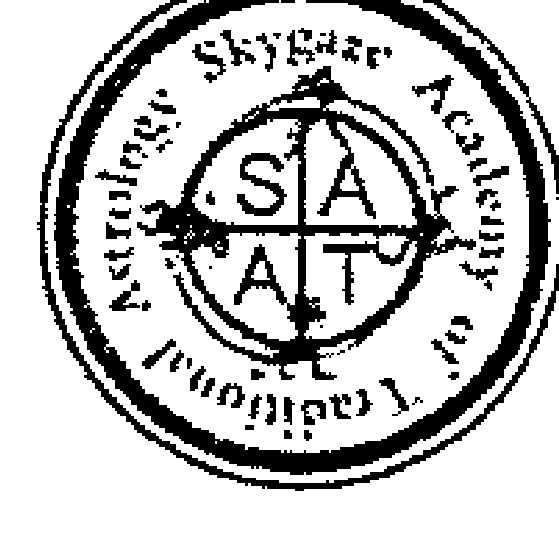

# 選擇與開始

# Choices & Inceptions: Traditional Electional Astrology

| 項目 | 內容 |
| :--- | :--- |
| 作者 | 班傑明·戴克 (Benjamin N. Dykes) |
| 翻 譯 | 邰捷 |
| 翻 譯 | 陳紅穎、韓琦瑩 |
| 責任編輯 | 賴彩燕 |
| 版 權 | 李姐昀 |
| 行銷企劃 | 李姐昀、梁穎聰 |
| 總 編 輯 | 韓琦瑩 |
| 發 行 人 | 韓琦瑩 |
| 出 版 | 星空凝視古典占星學院 文化事業 |
| 發 行 | 星空凝視古典占星學院 文化事業 |
| 銀行帳號 | (臺灣)玉山銀行 0462979082056 戶名：韓琦瑩 (中國)富邦華一銀行 623565 5566600030948 戶名：韓琦瑩 |
| 訂購服務 | skygaze.sata@gmail.com |
| 地 址 | 70450台南市民德路76號 |
| 服務信箱 | skygaze.sata@gmail.com |
| 美術設計 | 敘事narrative.tw |
| 印 刷 | 佳信印刷有限公司 |
| 總 經 銷 | 星空凝視古典占星學院 文化事業 |
| 初 版 | 2019年4月 |
| 定 價 | 900元 |

ISBN 978-986-94923-2-4

有著作權·翻印必究