# DEViant MOON TAROT

BY PATRICK VALENZA

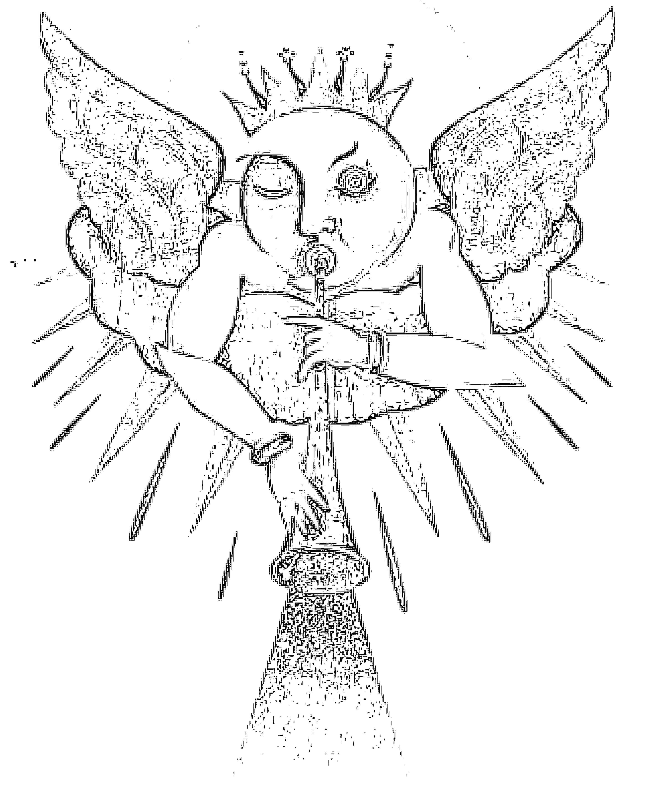

Published by
U.S. GAMES SYSTEMS, INC.

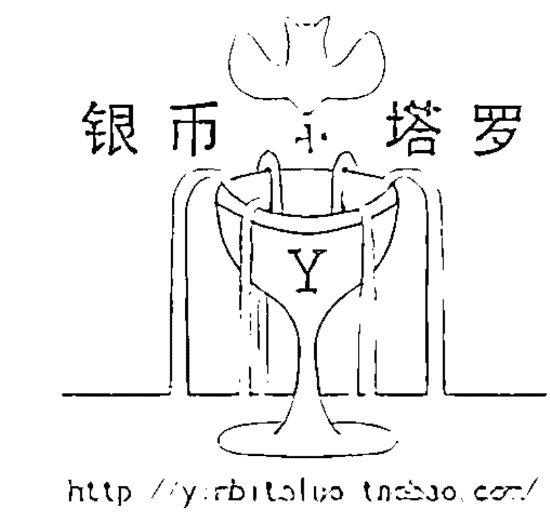

## 邪月塔罗牌

塔罗是一种通过图案传递讯息的工具，我们可以从纸牌的图画中读出信息。它在静默中诉说预言，没人知道它的起源。

有人说塔罗起源于埃及，还有人说它来自印度。不过传统塔罗的图案都在描绘欧洲的场景，所以我们通常认为它源于西方。

最初，塔罗可能不用于占卜，而是作为游戏出现。后来，它被用于教导小孩学习社会礼仪。随着时间的流逝，塔罗慢慢形成了自己的系统，并最终成为一种神秘学工具。

塔罗经常被用作预言未来的工具，人们试图通过它来把握未知。但这并不是一副牌最好的用法（或意义），因为时间流动，未来总在改变，你可以用自己的力量去创造新生。举个例子来说，一副牌可以告诉你过去的症结所在，究竟是何种阻碍控制干扰到你，让你如今止步不前；你也可以通过占卜认清目前的状况，从而为未来提前准备；你还可以预见未来的困难，如果你能改变现在，这困难或许会消失殆尽。简单来说，你可用一副牌调整现在，从而改变未来。

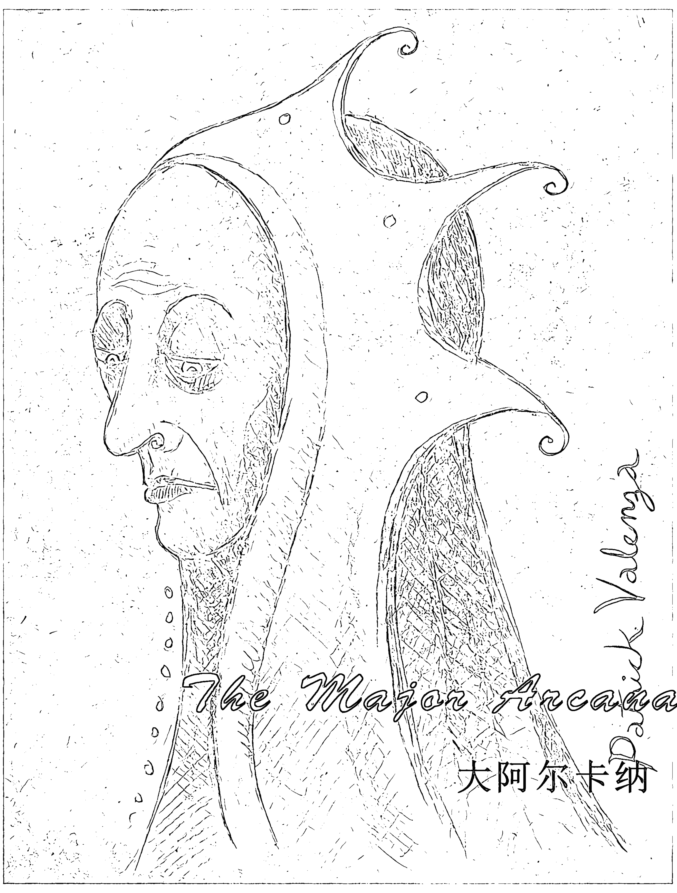

# The Hermit

# The Major Arcana

## 大阿尔卡纳

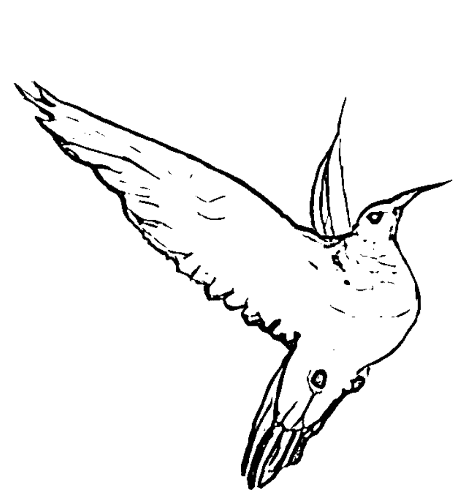

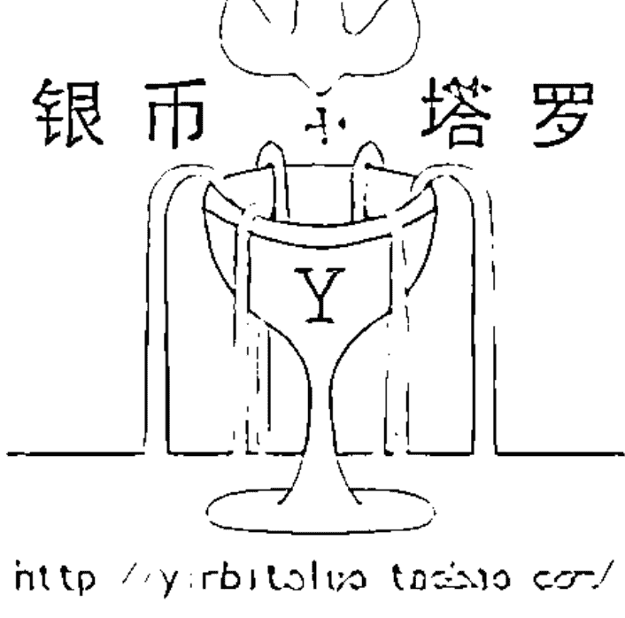

## 大阿尔卡纳

大阿尔卡纳就像它的名字一样，呈现出广阔的情景。这是78张牌的核心，隐含着你人生中重要的秘密。

22张大阿尔卡纳牌中既有男性，也有女性。他们有时会具有性别象征，有时则不会。还有些时候，阴阳的力量会同时出现在一个人身上。

我们可以将其视为一种人生旅程：愚人之旅。从0号愚者，到21号世界，万物循环往返，周而复始。出现在塔罗牌上的图案与牌意相连，可引领精神与灵性到达清明之境。

### 0 愚者

愚者在河道中游荡，眼中没有身外景象。生命之于他，未曾交界，亦无知无畏。

正位：旅程的开始、年轻人、天真、荒唐、做事没脑子、无限可能

逆位：错失机会、没把握地行动、不确定

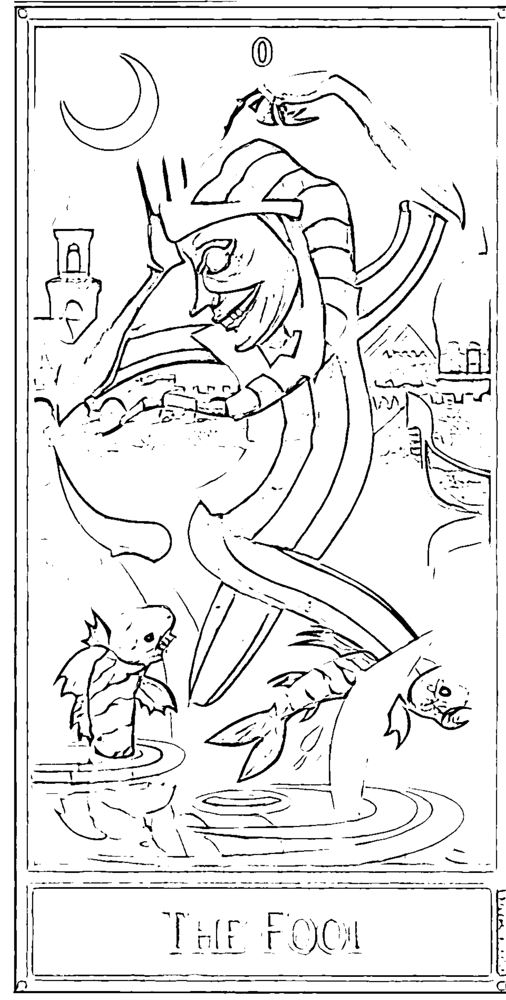

### 1 魔术师

依仗他无以伦比的天赋，魔术师展现出惊人的技能。初入其门，便得灵光闪现。

正位：运用创造力、激发潜能、灵活的手法、巧手、显露天赋

逆位：滥用天赋、丧失想象力、混乱、能量失调、无法学习新技能

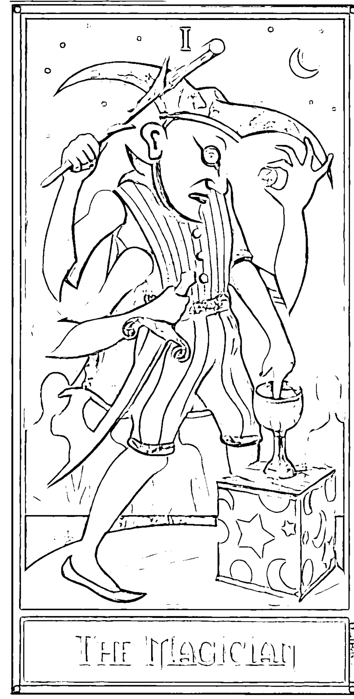

### 2 女祭司

女祭司背生双翼，守护着城市。她护卫着内在的知识，智慧成长必经生命试炼。

正位：顶级学识、直觉、拥有超乎年龄智慧的女性、道德高尚、渊博

逆位：无知、缺乏洞见、禁锢情感

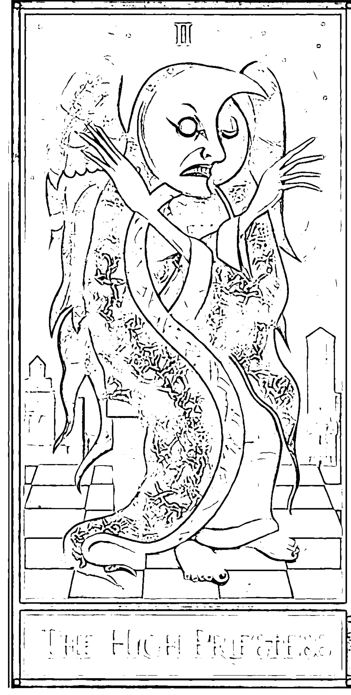

### 3 女皇

女皇坐在花园里的王座上，手握身体中生出的花朵。她是丰饶多产的女神，本体即自然。

正位：女性象征典型、丰饶、与母亲相关的

逆位：不忠、家庭不和、少产

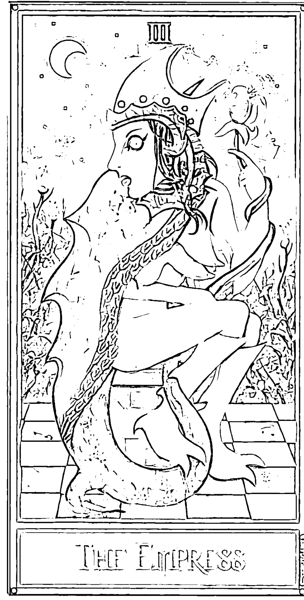

### 5 教皇

教皇为城市的魂灵祷告，他的身姿比精神更引人注目，信仰让人类成为口袋中的玩偶。

正位：灵光闪现、宽恕、精神控制、保持一致

逆位：异端邪说、性无能、蹩脚的建议

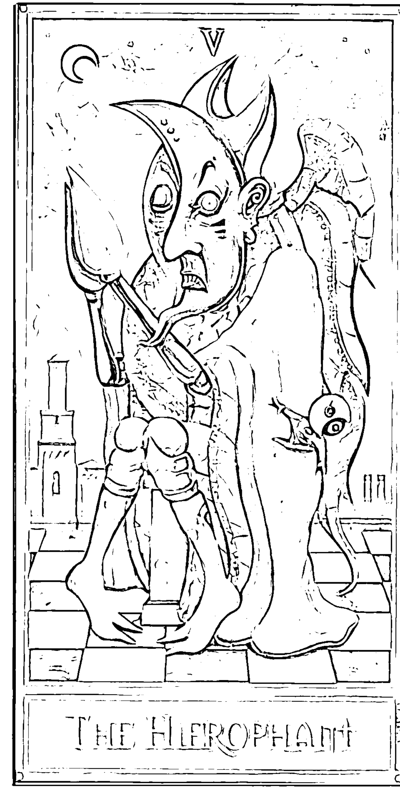

### 6 恋人

沙漠湖畔，恋人焦渴相拥。月光泼洒下魅影，脚畔毒蛇吐信，恶毒凝望。

正位：爱、欲念、浪漫、和谐、联合

逆位：分离、割裂、争端

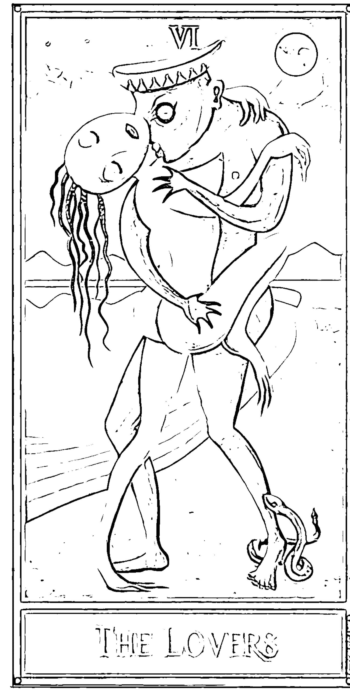

### 7 战车

战车即将冲出城镇，开始冒险之旅。他已战胜过往逆境，前往全新征程。

正位：开拓新领域、去陌生的地方旅行、面对未知敢于冒险前行

逆位：失败的计划、拙劣的对策

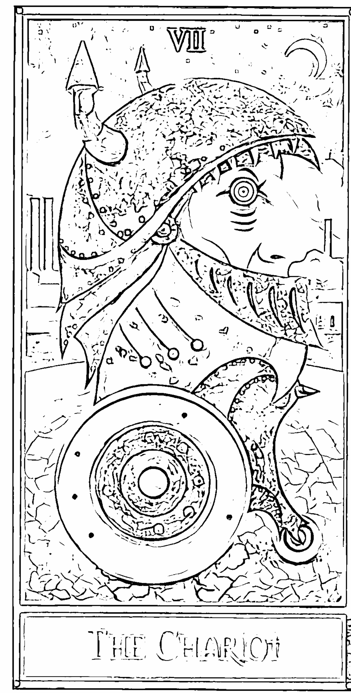

### 9 隐者

隐者藏身小窟，躲避世界。他尽力将自己隔绝，却从不孤寂。脚下鱼骨醒目——无论如何，我们都躲不开自己。

正位：独处、放逐、试图隔离自己的人、被遗忘者、秘闻、秘事

逆位：合群、分享信息、身处某种集体

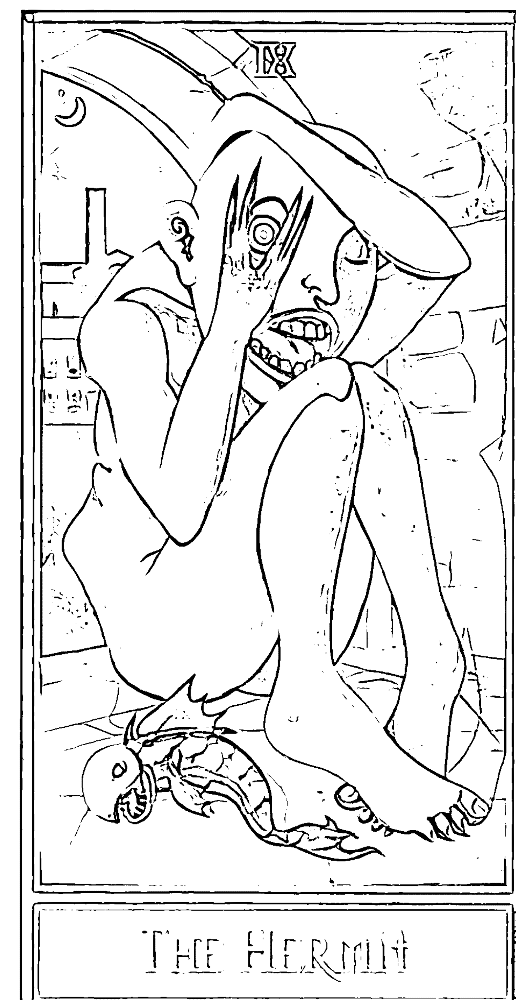

### 11 力量

男子孔武有力，强令野兽于股掌。需知蛮力不可永恒，反噬之日必将来临。

正位：强权能力、内在的力量、忍耐力

逆位：挫败、屈服

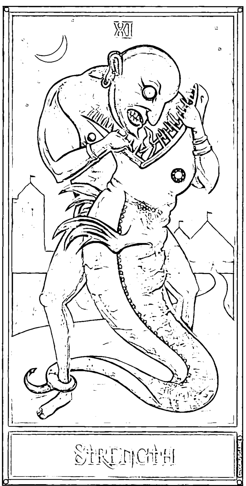

### 13 死神

在肮脏的河岸上，站着母子两具尸体。孩子挣扎着想重回子宫，却被母亲制止。那其中已有新生孕育，即将诞生——与死亡相伴的，永远是再生。

正位：改变、蜕变、失去、终途

逆位：暴动、糟糕的境况

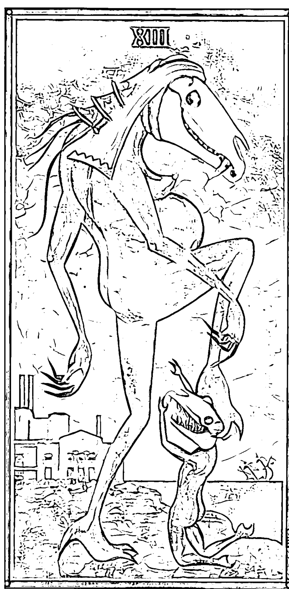

### 14 节制

天使矗立泉边，耐心倾注水流。不同形状的容器，融合出和谐甜美的药剂。

正位：耐性、平和、改变能量形态（治愈）、融合产生新貌

逆位：冲突、糟糕的组合、纷争、过度

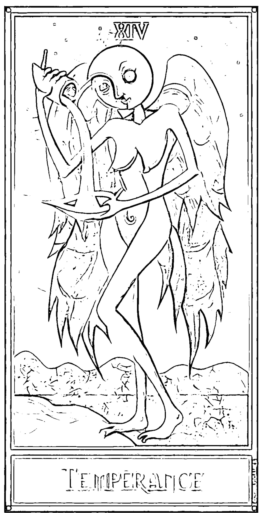

### 17 星星

少女跪坐湖畔，湖水波光闪闪。她将手中清泉倾入湖泊，身后七星闪耀，预示希望再临。

正位：希望、吉兆、恢复信仰、好事终临

逆位：疑心他人能力、创造力枯竭

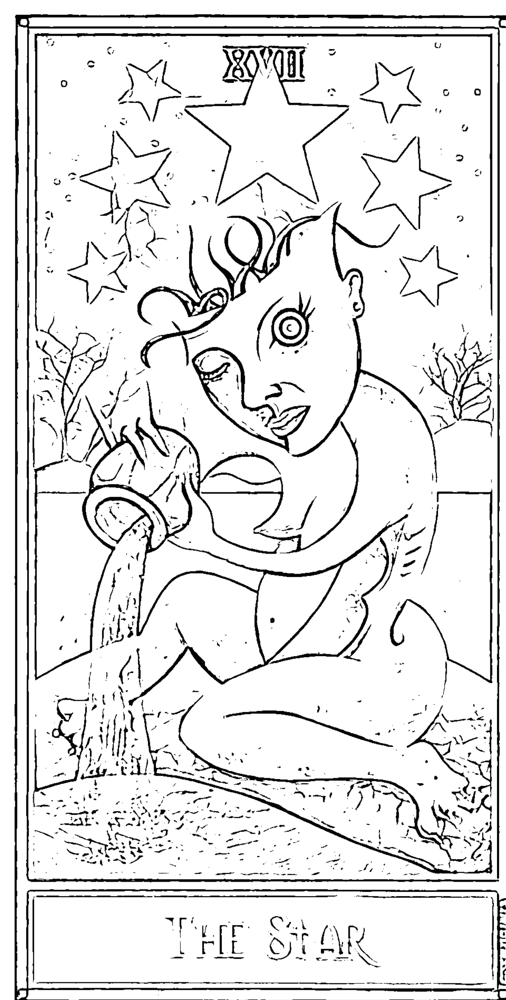

### 18 月亮

异月闪烁，纵人魂魄。

正位：洗脑、受到黑暗面的影响、欺骗、迷幻、潜意识中的恍惚

逆位：逃避现实、异常之力、妄想、谎言与绝望

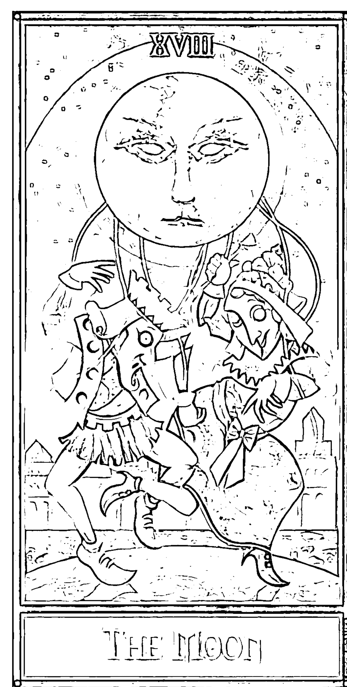

### 19 太阳

双生子在城墙上相遇。他们以个体而来，却因阳光感召，重归一个灵魂。

正位：成功的社会关系、友情、订婚、欢乐时光、纯粹的喜悦

逆位：孤独、易变的关系、分离

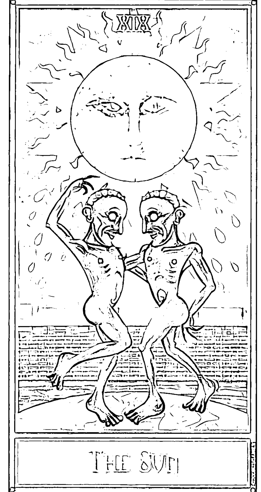

### 20 审判

天使吹响号角，尸体自坟墓中起身。审判之日来临，一切救赎将得报偿。

正位：需为所行之事负责、新开始、觉醒

逆位：惧怕死亡、罪恶感、担忧、延误

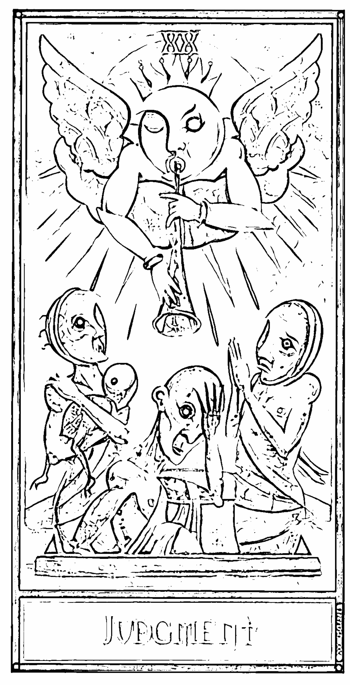

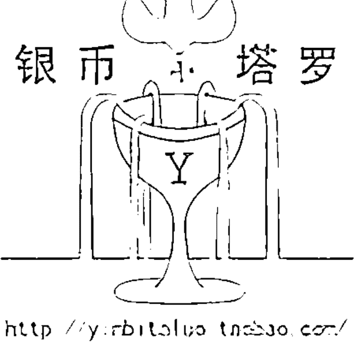

## 宫廷牌

大阿尔卡纳象征精神层面或生命中的重要事件，小阿尔卡纳代表日常生活中的细节。而穿越在这些事态其中的人，就是形形色色的宫廷牌。

他们象征你生活中遇到的人，也象征着你自身的某些部分。

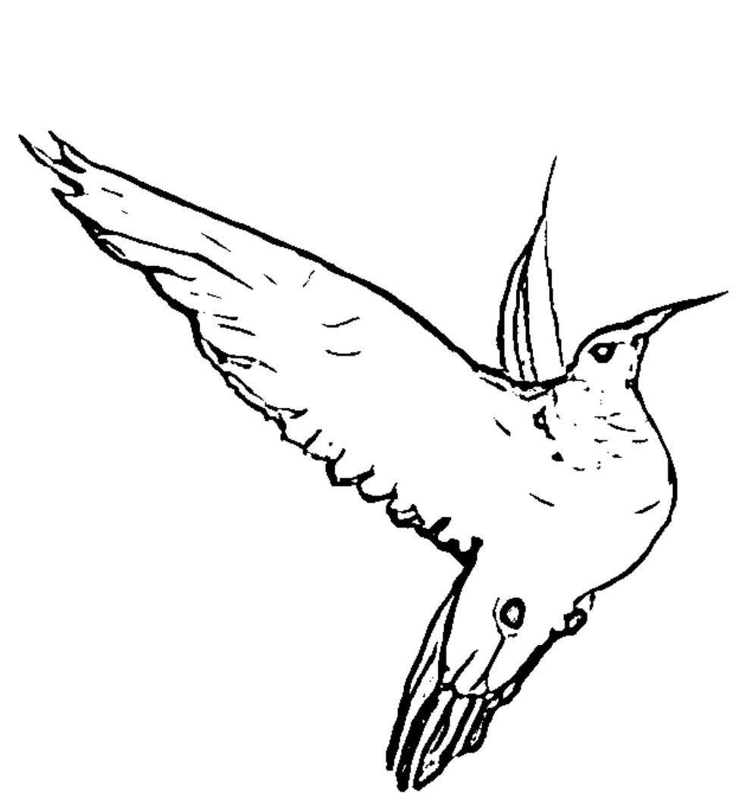

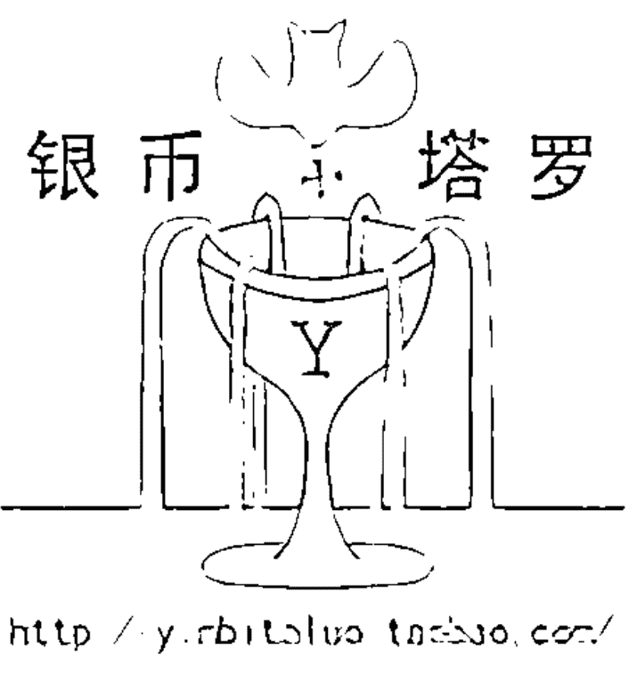

## 四牌组与四元素

### 宝剑牌组：风元素

风元素是心智的源泉，是思维的开创和破空之刃。心智能开出绚烂的火花，也能给人们带来伤害。宝剑牌组能带来清晰的计划和前景。

宝剑象征风元素，这组牌也代表着风一样的情感模式。

### 权杖牌组：火元素

火元素是精力的源泉，是身体的行动与渴望。火元素带来创造力和思想的火花，带来缪斯女神的祝福。火元素非常自豪，当它愤怒的时候，会燃起熊熊怒火。

权杖象征火元素，代表着自我与世界的碰撞。

## 四牌组与四元素

### 圣杯牌组：水元素

水元素是情感的源泉，是心灵的丰沛之地和灵性花园。爱是最强的力量，带来无穷无尽的影响。只有爱能引领我们前进，也只有爱能让我们恐慌。

圣杯象征水元素，代表人际关系与交往。

### 星币牌组：土元素

土元素是物质的源泉，掌管着我们的身体和物质世界。星币牌组也叫紧闭牌组，显然它和很多金钱与财富的事务相关。星币象征我们的实际生活。

星币牌组象征土元素，代表获取、失去与商业利益。

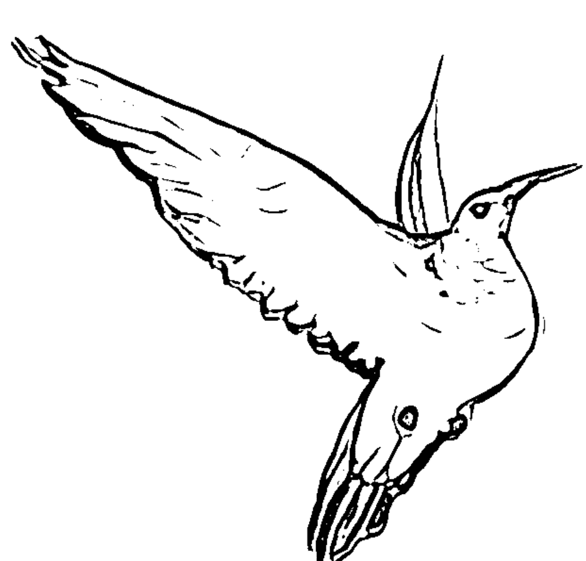

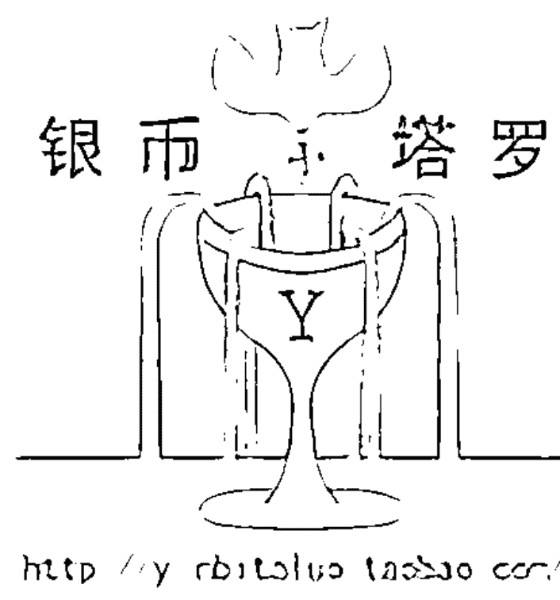

## 宫廷牌与星座

| | 侍卫 | 骑士 | 女王 | 国王 |
|---|---|---|---|---|
| 元素 | 土元素 | 火元素 | 水元素 | 风元素 |
| 权杖 | 火元素 | 狮子座 | 射手座 | 白羊座 |
| 圣杯 | 水元素 | 天蝎座 | 双鱼座 | 巨蟹座 |
| 宝剑 | 风元素 | 水瓶座 | 双子座 | 天平座 |
| 星币 | 土元素 | 金牛座 | 处女座 | 摩羯座 |

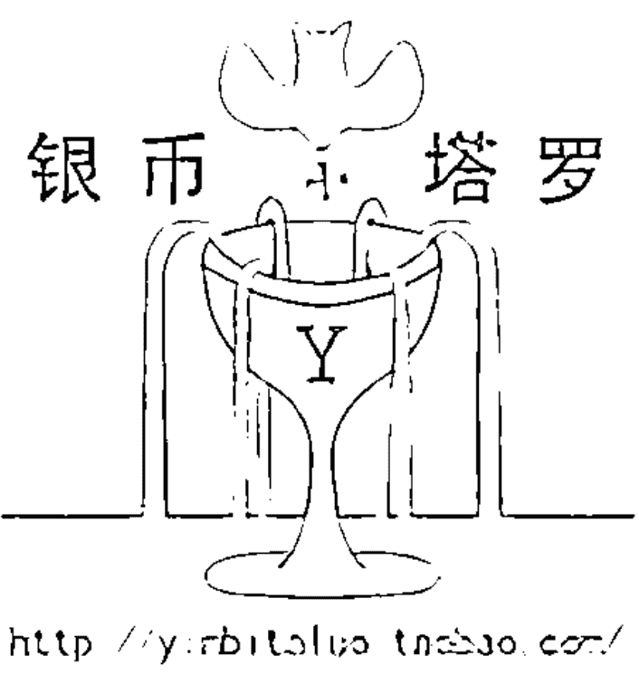

## 塔罗数字

数字1：本源和开创，一切的起始。

数字2：缔结联盟、爱侣、母亲和父亲。2可以带来和谐，也会发生争端，它带来机会，也带来选择。

数字3：丰收的果实，母亲父亲和孩子，三口之家，艺术的创造，生活的欢愉。

数字4：成家立业，建立房产，事情初步完成，虽需继续努力但可小作休息。

数字5：产生冲突。4的稳固需要新力量突破，5带来了纷争，也带来了新鲜血液。

数字6：新计划。6由2个3组成，形成两个新组合，以求新的发展方向。

### 宝剑国王

国王强悍，战士有力。果决和严厉是他的手腕，听者只需臣服天威。

正位：以意志力掌控事态、铁腕领导、决心、训诫、立法人员、逻辑严谨

逆位：蛮横、裁决不公、自私

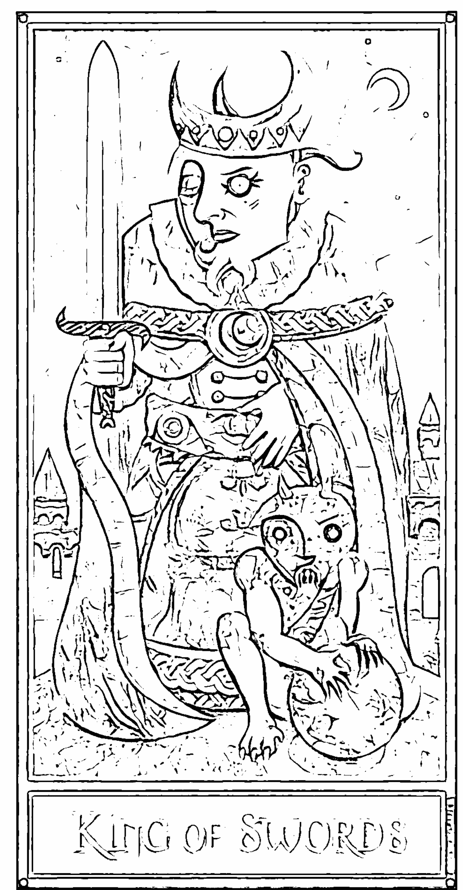

### 宝剑王后

王后独步丛林，黯然神伤。即使手握强权，依然于心无补。剑刃鲜血滴落，就像周围带给她的伤害。

正位：孤寂、焦虑、悲伤、寡妇、背负重担的人

逆位：残酷又虚伪、坏脾气

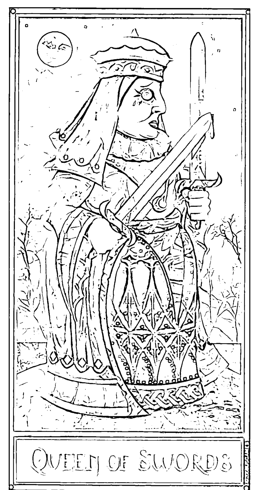

### 宝剑侍卫

年轻侍卫在城中漫步，他双眼机敏，双耳伶俐。别被他年轻的外表蒙蔽，他会发现隐藏的真相和秘密。

正位：洞察力、敏锐、直觉、拥有秘密的人

逆位：谎言、骗子、虚伪的朋友

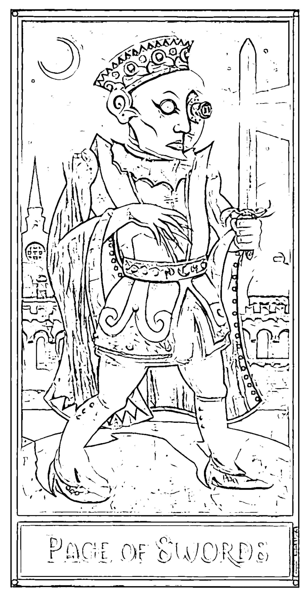

### 宝剑8

异月照耀，游荡者自梦中惊醒。窗下宝剑让她惊恐难安，所幸黑夜将近，白天渐临。

正位：束缚、受外力所迫、监察、限制

逆位：自由、能为自身考虑衡量、独立自主

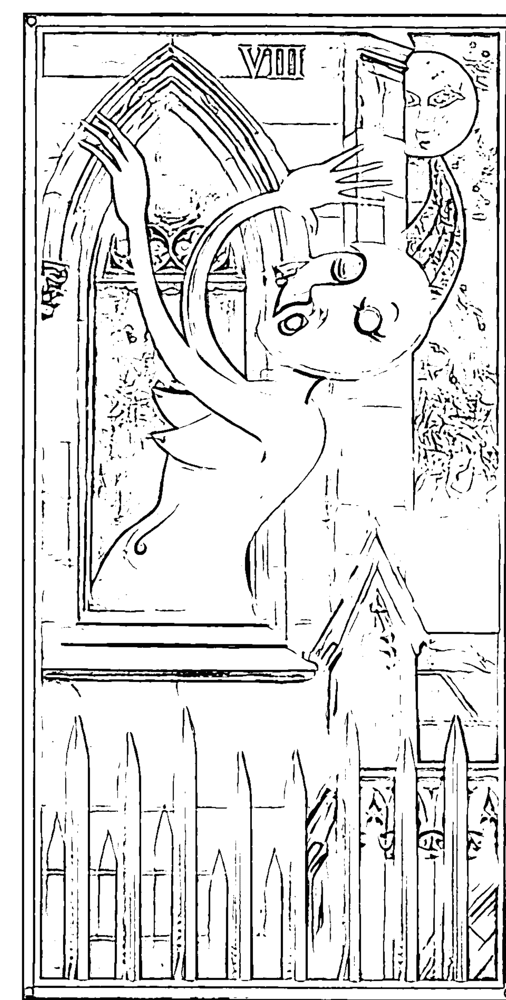

### 宝剑6

城镇骚动，暴乱频生。一人正飞越海岸，寻找和平。六把宝剑撑起了气球，助他逃生。

正位：一段旅程、自厄境逃往顺境

逆位：无力挣脱困境、陷入泥沼

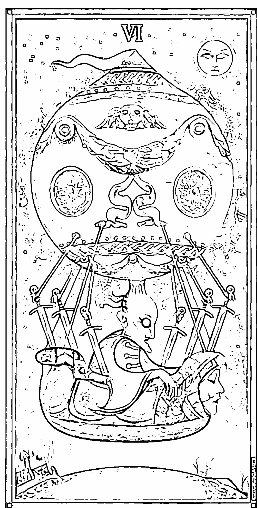

### 宝剑5

陌生的士兵侵入城镇，他蔑视国王，武力相胁。他来历强大，不可阻挡，暂时无法与之对抗。士兵得胜环顾，并捡起5把宝剑抗在身上。

正位：骗子、无耻的胜利、阴招、吹嘘者

逆位：揭穿朋友的假面具、反败为胜

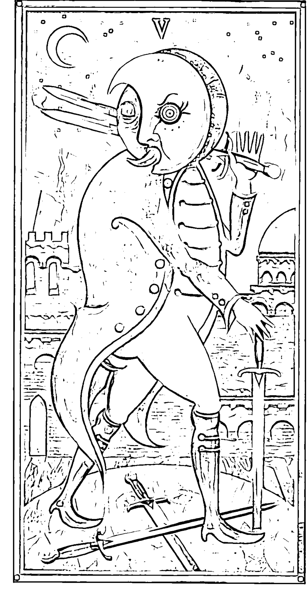

### 宝剑4

地下的女孩又开始做梦了——她的梦境在坟墓中弥漫，生出四朵玫瑰花。地面上的三把宝剑指出位置，还有一把常伴身旁。

正位：重新充电、退隐、休整、放逐、逆向思维

逆位：恢复活力、回归生活、重操事业、精力充沛

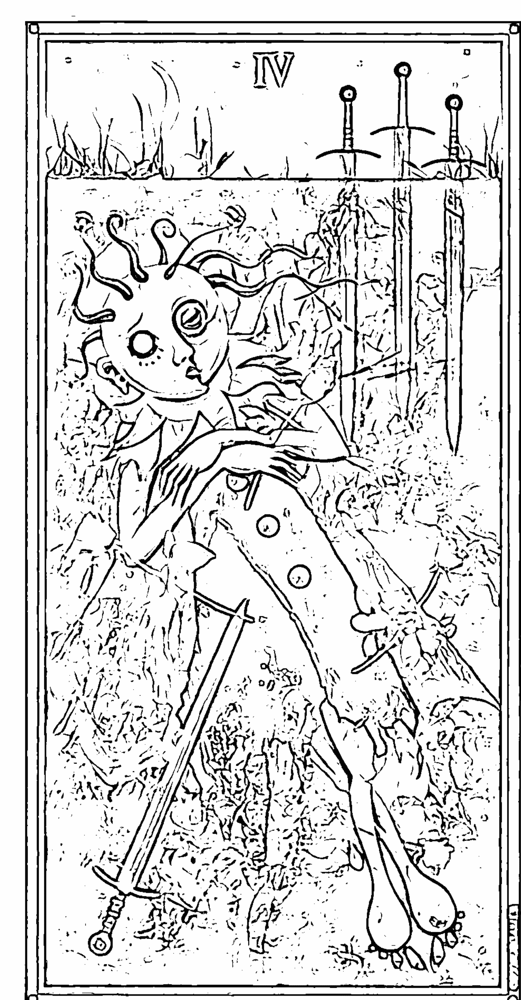

### 宝剑3

悲伤的女人站在房中，不远处隐隐传来骚动。她心中的利刃来自背叛，用手指划过剑锋，看看是真是梦。

正位：心碎、分离、动荡的关系、渴望不可得的爱恋

逆位：极端的痛苦、失去至爱、情感上的痛苦

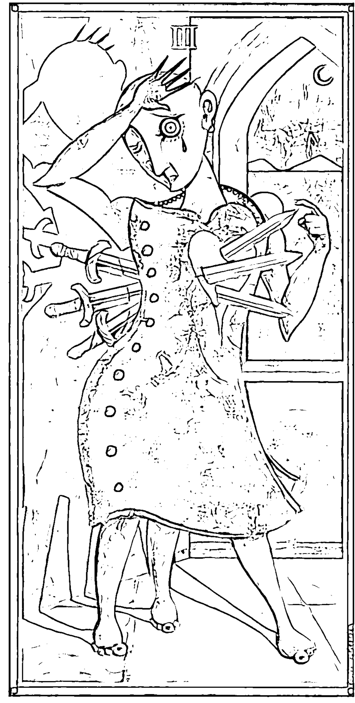

### 宝剑2

两名男子陷入僵局，他们力量相当，剑术相持。现在是暴风雨前的喘息，结局前的静寂。

正位：僵局、权力平衡、难以移动的障碍、在行动前暂停休整

逆位：谎言、骗局、背叛

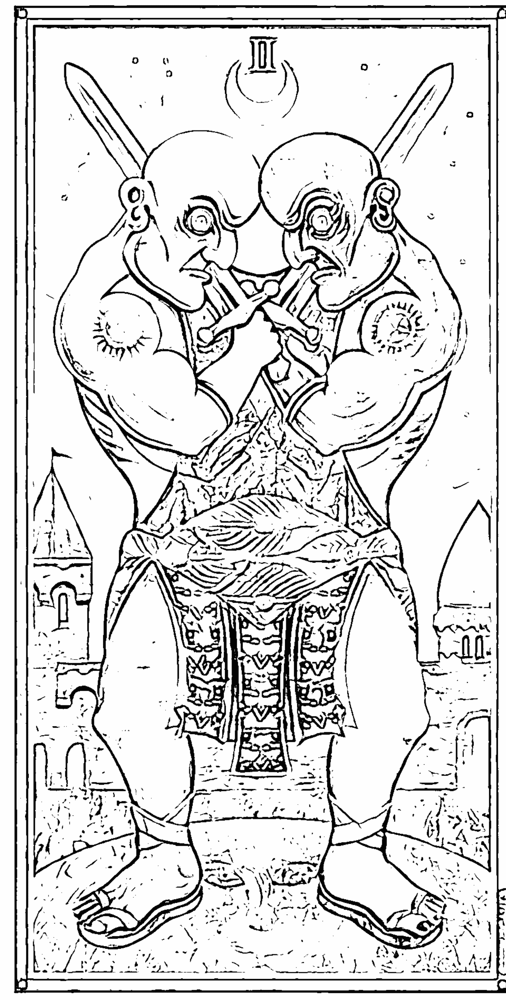

### 宝剑1

大天使用一把宝剑守护自己。虽然宝剑利刃不再，缠绕荆棘，但她自身神威足以施展力量，进而斩获胜利。

正位：权力、高位的内在力量、通往胜利的光景、决心、勇气

逆位：滥用权威、专横、破坏

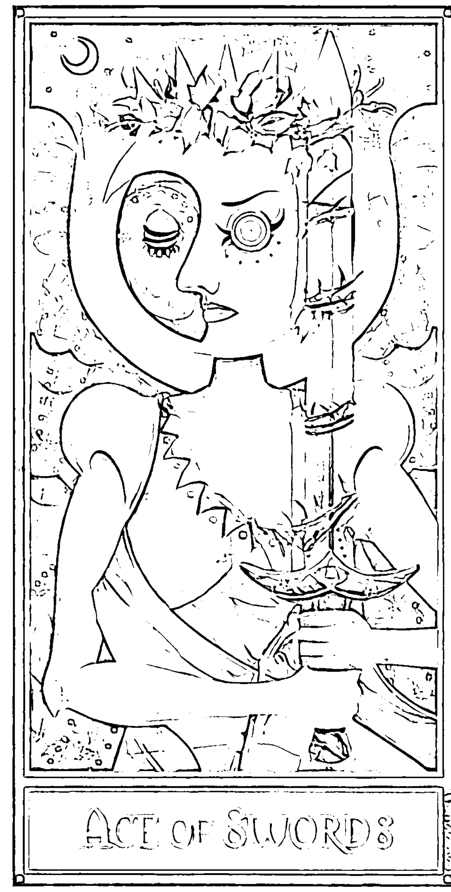

### 权杖国王

国王正带领着他的子民穿越丛林。这是激动人心的冒险时刻，子民欢腾追随，因之言传身教，引领有方。

正位：父亲、父亲般慈爱的特质、已婚男人、有智慧的领导、

逆位：脾气粗暴、缺乏怜悯、偏执、严厉冷酷的父母

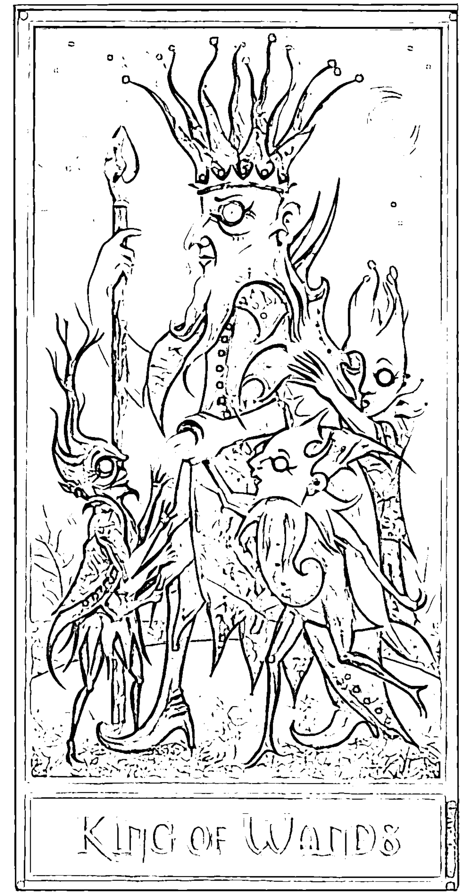

### 权杖骑士

英勇的骑士正穿越一片绿野，面对困难，也迎头而上。他肆意冲撞，却没能发现——遭受的冲突与矛盾，都来自内心的鲁莽。

正位：草率的决定、突发的旅行、冲动的行为

逆位：意外的崩溃、计划突变、中止、延误

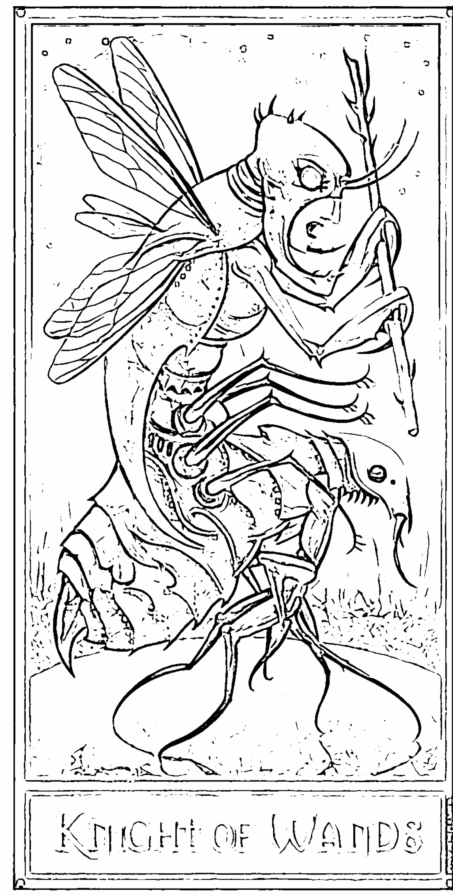

### 权杖10

在一日漫长的劳作后，工人慢慢向家走去。他负重累累，疲惫不堪。尽管他拼尽全力，却依然难以负力。

正位：压迫、责任重大却无力负担、无法承受的压力

逆位：损失、无力维持、背叛

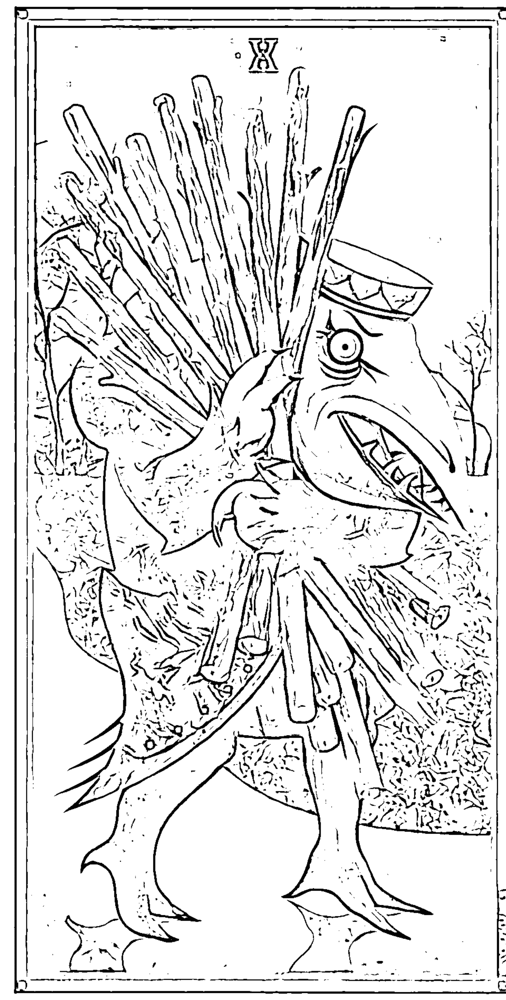

### 权杖9

戴面具的年轻人困在地下迷宫，无论怎样也找不到出路。他坐在台阶上，思考这似乎无解的困境。8根权杖指明了出路，点燃的第9根权杖为他唤回信心。

正位：挑战来临时停止反复思考、暂停、聚集意愿继续抗争、保持希望

逆位：延误、无法克服的障碍、放弃、缺乏动机或毅力

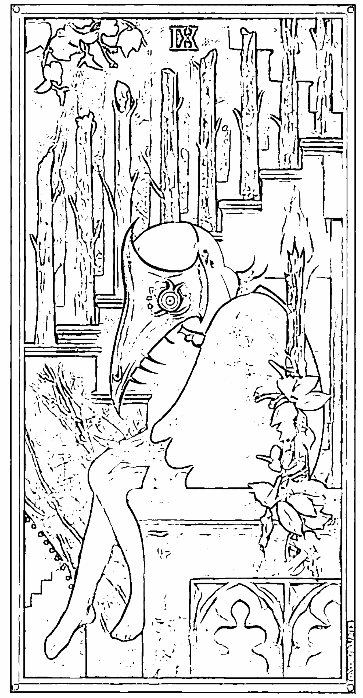

### 权杖8

田里长出了权杖，农妇正试图拔光。她手中的权杖化为镰刀，帮她砍伐对抗。画面上方有一只乌鸦，它带来了远方的消息。

正位：迅速的行动、匆忙的决定、重要的消息、航空旅行

逆位：生活不景气、遭遇困境、羡慕、猜忌

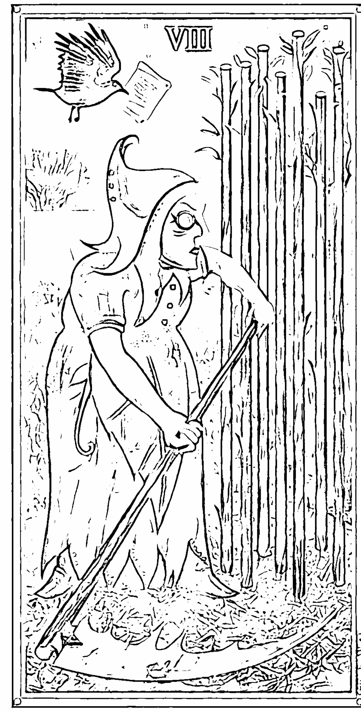

### 权杖6

今夜，森林中摆下盛宴。伟大的变革开始了！月光照耀的花床上，奇迹正在诞生。5根权杖竖起，荣耀神圣时刻；1根花杖供奉，赐予生灵好运。

正位：新的领袖、变革、蜕变、新兴好于过往、胜利

逆位：延误、没有结果的努力、不能适应形势

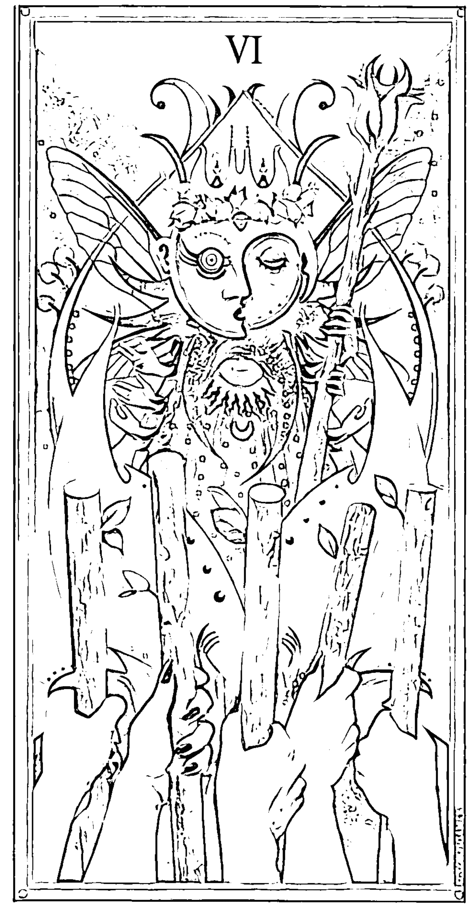

### 权杖5

冲突出现了！人们从各处赶来，纷纷加入对抗。人们拿起权杖，用棍棒说话。没有谁先放下武器，没有和平，没有协商。

正位：竞争、不和、拼搏、法律纠纷、与邻居争执

逆位：谈判、寻找解决方法、利用差异获取优势

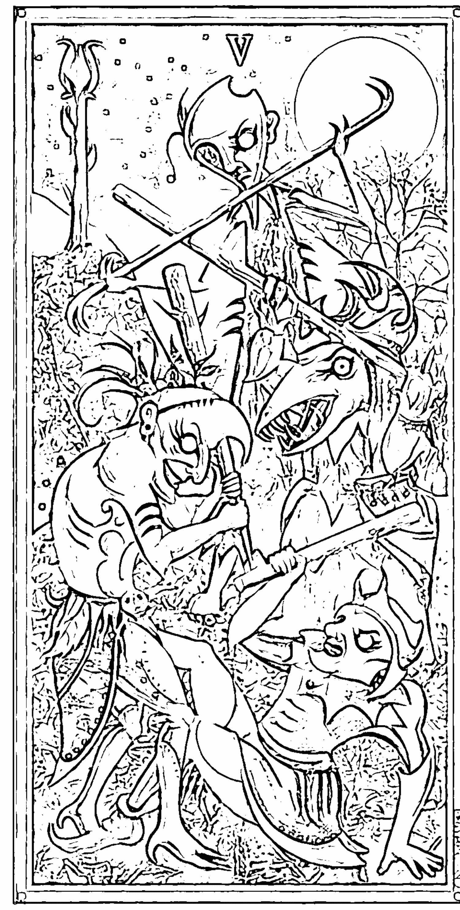

### 权杖4

一对夫妇正手拉手走向婚房，新居建在四根结实的权杖上。新居四平八稳，他们的生活也基础稳固。

正位：稳定、坚固、基础、婚姻、家庭生活

逆位：家庭生活动不安、同伴关系动荡、离婚

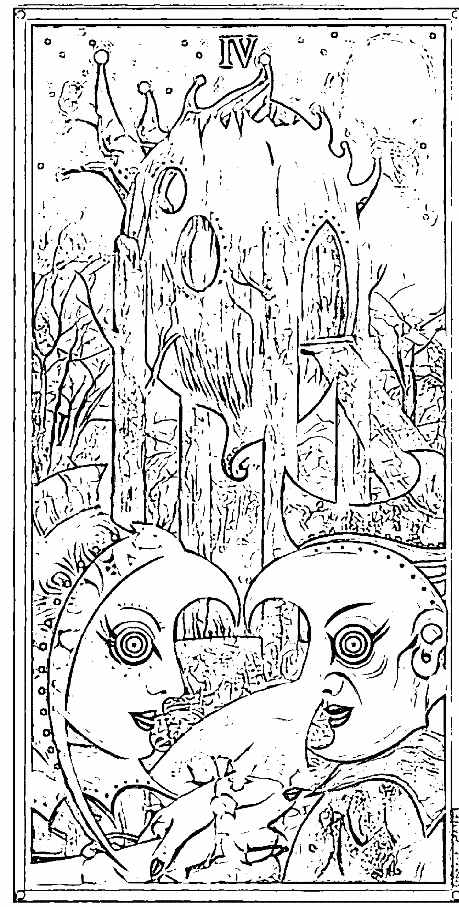

### 权杖3

在绿色山丘上有位母亲，耐心地等待权杖开花。她带着期待，边将能量输送进崭新的生命，边回忆将她带来见证的神奇旅程。遥远夜空，异月浮现，撒下一片孕育的银光。

正位：热切地期待劳动成果、努力迎来收获

逆位：精力无法集中、糟糕的建议、犯错

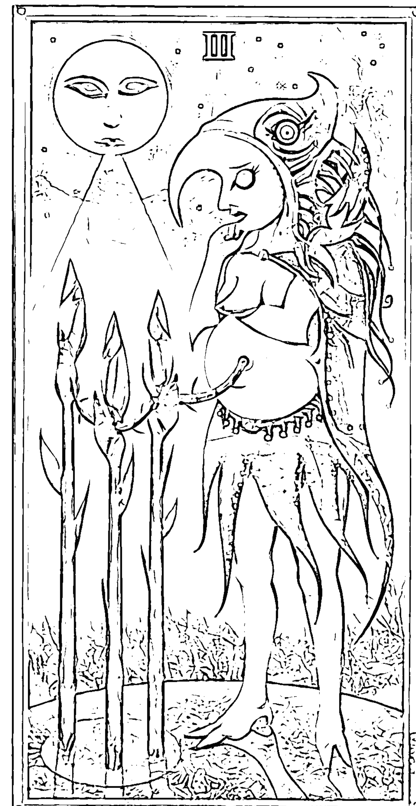

### 权杖2

农夫开始耕种。他将两根权杖的力量汇聚到一处，化为神奇的工具，迎接春耕。

正位：创造性地运用能量、汇集思路、聚焦同一点、为共同目标努力、统一力量

逆位：无法创造性地思考、注意力分散、分离、机能障碍

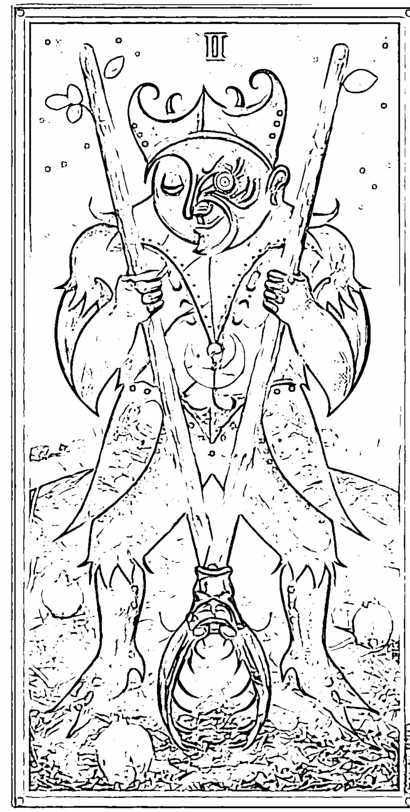

### 圣杯王后

圣杯王后仁和慈爱，她沿着海岸前行，小心翼翼守护手中圣水。远方灯塔闪烁，仿若指引前行。

正位：友善体贴的人、献身精神、幻想家、个体指引

逆位：不可信赖、不可靠、优柔寡断

### 圣杯骑士

高贵的骑士找到了希望，他将希望送给世界。漫长的追寻，引领他来到无尽之海。他的盔甲幻化成海马，预示着他的洗涤与改变。

正位：浪漫、带来新鲜想法的人、提供新机会

逆位：为人虚伪、谎言、骗局

### 圣杯侍卫

侍卫来到海岸，小心碰着手中的圣杯。杯中一尾小小鱼儿，感谢她帮忙找到回家的路。

正位：经常思考的人、喜欢幻想的人、同情、感激

逆位：自私的人、喜欢保密、骗子或懒鬼

### 圣杯10

受伤的士兵自战场归来，包围在家人的拥抱中。空中挂起满月，欢庆重聚时刻。

正位：家庭生活、团聚、家庭奉献、充满爱与宁静的环境

逆位：家庭纠纷、友谊解体、秩序分崩

### 圣杯9

年轻人目瞪口呆，看眼前出现鬼怪。鬼怪许下承诺，愿望可得实现。图中9个圣杯腾空而起，结成了魔法力环。

正位：物质上的成功、万事幸福、乐趣充盈、选择

逆位：财政忧虑、缺点、自负

### 圣杯8

红衣女子从旧路退出，调转方向。生命前行，旧路无可依靠。她一身轻松，踏上新途。

正位：改变计划、停止个人努力、放弃旧有方式、寻找更好的途径（东西）

逆位：看穿、不屈不挠、冒险

### 圣杯6

很久很久以前，广场上的木偶剧是孩子的大戏。时光流逝，今日人们依旧怀念。圣杯浮雕象征回忆，看似可及，实难触及。

正位：孩提时期的回忆、怀旧之情、过往、往事已矣

逆位：未来事件、即将出现的状况

### 圣杯5

杯子倒了三个，丈夫被悍妇骂了；玫瑰掉了一支，曾经的浪漫没了；杯子还有两个，竖在两人中间—爱情悄悄地活着。

正位：有缺憾的关系、婚姻中的失望、懊悔、损失

逆位：新关系、旧友重逢

### 圣杯4

异月升起，一位少女凭栏而依。她对生活诸多不满，冷漠而立，将金杯推进海里。

正位：成功却不欣喜、冷漠、对某人的生活感到失望、厌倦

逆位：感受生活的光明前景、产生新希望，新梦想

### 圣杯2

夜幕降临，死神游荡，相爱之人签下契约。他们举杯庆贺，契约成立。

正位：爱、和谐的关系、合二为一

逆位：虚假的爱、关系破裂、利益冲突

### 圣杯1

天使怀抱金色圣杯，她的温和灵性为杯中液体赋予能量，吸引月光，前来吸吮。

正位：满溢的乐趣、丰富的心灵、生命中的美好时光

逆位：突如其来的不幸和变化、失去所爱、停滞

### 星币王后

星币王后生性慷慨，度日奢华、纵情狂欢。不过她只为自己，不顾臣民、他人。她把星币给玩具娃娃看上一看，就觉得这种慈善可以荣耀臣民。

正位：奢华、富足、亲切的女主人、慷慨布施

逆位：依靠他人金钱支撑、靠不住、缺乏社交礼仪

### 星币骑士

骑士一脸漠然，慢慢巡视庭院。日复一日的任务，永远不觉疲倦。星币骑士的生活，就是一刻不差，一颗不变。

正位：持续、系统、平凡、秩序

逆位：不负责任、缺少动力、反复无常

### 星币9

一位富有女子在城中闲逛，可爱的宠物跟在身旁。空中9枚星币落下，聚集四周，闪耀光芒。

正位：前景富庶、富有而自主的女性、爱宠物的人

逆位：财物危机、失去财产、偷盗某人

### 星币8

繁忙的工厂中，劳动者打造出8枚星币。他的手艺炉火纯青，绝不容忍半点瑕疵，务求尽善尽美。

正位：能工巧匠、关注细节、以某作品自豪

逆位：草率、做工马虎、怠慢

### 星币7

年轻的女巫在机械花园中练习咒语，魔杖抵住生锈的树干，检验技艺。瞧，毫无生机的树枝上，开出了7枚星币。

正位：发展技能、锻炼能力、稍作等候，观察所学

逆位：性急、怀疑某人能力、进展微小

### 星币6

富人来到墓地，被极度穷困的景象吸引。一名老妇渴望求生，富人慷慨地赠与她一枚星币。

正位：施舍、礼物、分享财富、在物质方面慷慨大方

逆位：自私、囤积财富、财物处理不当

### 星币5

一位声名狼藉的妇人沿着街道走来。她赤身裸体，期望寻到一片屋檐遮风避雨。现在，她在教堂的星币彩窗下，找到了蜗居之地。

正位：物质艰难、无家可归、贫穷、精神无依

逆位：前景改善、时局好转、就业

### 星币4

灾祸突然临头。守财奴被恶魔押解，前往地狱之火受惩。回望身后，他抓起4枚星币，作为和现世财富的链接。

正位：吝啬鬼、贪婪、自私、金钱至上、守财奴

逆位：物质受阻、商道维艰

### 星币3

三名艺术家在工作，即使他们同心协作，个性显露依然源源不断。3枚星币，分别代表独特的个体。

正位：艺术才能、在充满创造力的环境中与他人协作、技巧与技能、合作

逆位：平庸、手工粗糙、品质低劣

### 星币2

肚皮舞者在异月下狂欢，挥舞两枚银币，回应天空华彩。她的舞姿看似轻松灵动，实际需要艰辛的揣摩与练习。

正位：平衡精力、协调能量、同时处理多种情况

逆位：无法保持生命中的平衡、不分主次

### 星币1

巨龙紧抓神秘的星币，仿佛整个宇宙都抓在手里。他是至真至纯的生物，在物质与精神世界之间维持和谐。

正位：完美、在物欲与精神间保持平衡、富足、意欲成功

逆位：虚假的幸福、获利却不幸、挥霍财富

## 逆位解读方法

### 一、负面意义法

这是逆位最早的主流解释，到现在为止仍有很多人使用。基本上，每张塔罗牌都会有正面意义，同时也会有负面意义。这种解释方法，就是把比较正面的意义作为正位使用，把比较负面的意义作为逆位使用。

- 1. 逆位是正位牌意的误用
例如魔术师正位代表聪明又自信的人，逆位可能代表狡猾而自以为是的人。

- 2. 逆位是正位牌意的过度或不足
例如正义正位通常表示理性或法律规则，逆位则表示过度严苛不近人情。

- 3. 逆位会减弱正面牌意
例如太阳正位代表圆满成功，逆位则可能让这种成功减弱，虽然整体状况朝向正面，但也许会遇到一些问题和麻烦。

### 三、调整改进法

这种解读方法强调从另一个角度看待正面牌意，将逆位视为一种反常现象。通过一些调整的方法，让这张牌可以转正，回复到正常和充足的状况。

- 1. **反常表现法**
将逆位视为一种反常现象，代表我们需要特别注意或小心的地方。

- 2. **能量隐蔽法**
正位视为能量运行正常，逆位则表示能量不足、过早或过迟，也可以视为正位因而未现的部分。

- 3. **前位反省法**
视逆位为尚未精通前一张牌的正位，应回头去思索上一张牌的牌意，寻找问题真正的解答。