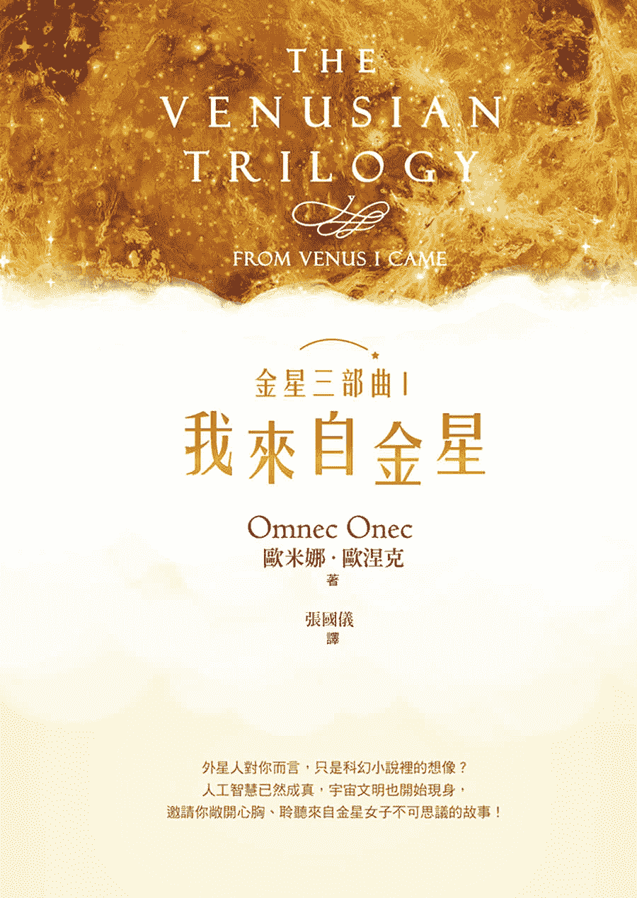
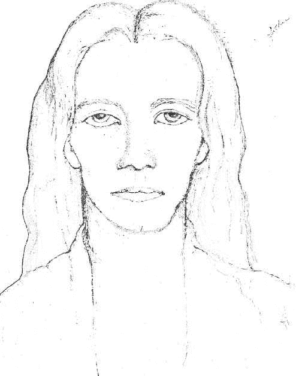
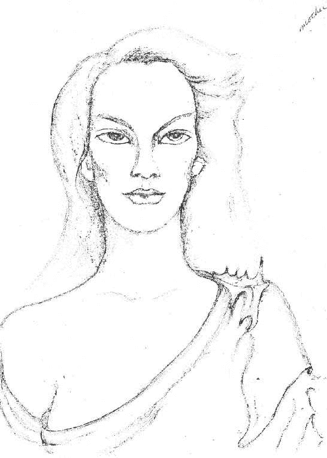
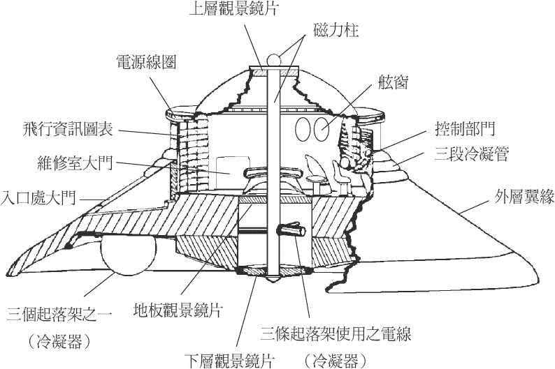
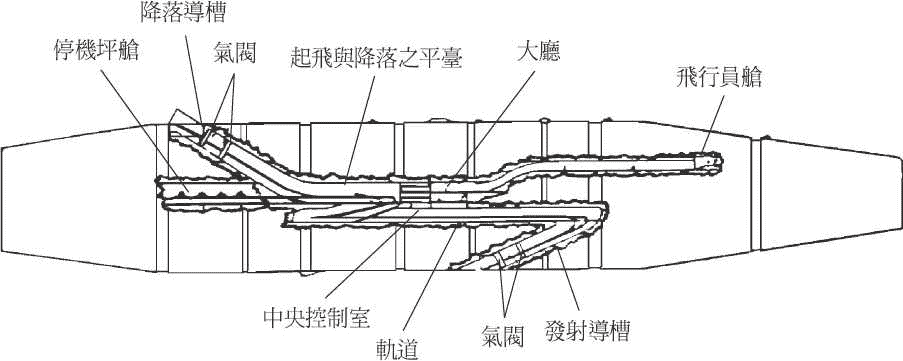

# 目录

1.  封面
2.  真爱
3.  【探索生命书系】总序
4.  译者序
5.  前言
6.  一九九一年美国版《我来自金星》首版前言
7.  第一章　我来自金星
8.  第二章　至高无上的神性法则
9.  第三章　蒂萨尼亚时代降临
10.  第四章　我的幼年时期
11.  第五章　金星的星光层界
12.  第六章　杜托尼亚
13.  第七章　充满创造性的人生
14.  第八章　朝地球方向前进
15.  第九章　兄弟星球联盟
16.  第十章　灵性城市：阿嘎姆德斯
17.  第十一章　我的地球人生从此展开
18.  第十二章　回顾：与金星相对照
19.  版权页

# 真爱

真爱是一股来自於造物者的能量，供养着所有生命型态。

少了它，任何东西都无法生存。

因此，我们所有生命都是同等的存有，

而且，不限於只以一种形式存在着。

爱，没有限制。

欧米娜‧欧涅克

# 【探索生命书系】总序

──中华新时代协会创办人／王季庆

二○一二年前，众声喧譁，末日预言不绝於耳。

一方面，我本着对「赛斯资料」的信任，也祈求他独排众议的说法得以证实。简言之，他声称二十一世纪上旬，世界虽然仍有战事与天灾，却无第三次世界大战。并且，到二○七五年时，人类将有一个大同世界！另一方面，即使成为「一百只猴子的寓言」中的一员，我也想默默地为世界的未来尽一份力，为达成「一体平等」的灵性觉悟而努力。

我不敢声称自己已开悟，而且我最喜爱的「赛斯」也从没提过这个词儿。不过，在求道的过程里，我无意中悟出「除了神没有别人。除了爱没有别的。」（There is No One but God.There is Nothing but Love.）当下，在无边的寂静安宁中，我的心中充满了狂喜与爱，这份爱又满溢为感恩之情！我体会到我一直在宇宙的爱中，宇宙的爱也一直在我心中。而，世人也莫不如此！不同的是，有没有体会到，有没有连上线。在一体平等的感悟中，我谦逊地臣服，自然放心又自在。不由得散播出爱──平等的频率！

於是，完成了告别之作《与神同心─依爱随行》，我便退休下来。想读的都读了，想分享予读者的也都真诚地写了下来。此生足矣！

在《与神同心》的後记里曾提及我的天命──推介与翻译新时代的好书──已经完成了。没想到二○一五年四月，素未谋面的蒋圣光先生，带着家人约我在中华新时代协会见面。历经海外创业的艰辛，如今他已是卓然有成的企业家。他开门见山地说，自己读遍了我推介的新时代书籍，也邀同家人一起钻研。哇！这让我立即视为知音，因为，连我都没有主动要求家人研读呢。

作为一位成功的企业家，可以想见，蒋先生必然是位有主见，有魄力，并且格外有执行力的人。他说，运用从新时代书里得到的智慧，他成就了他的事业。如今，他想（并且已着手进行）设立出版社。一方面找回一些已绝版的新时代书籍，一方面当然也将眼光放远，胸襟放大，继续以自由开放的精神，开创「探索生命书系」，向生命致敬，完全不计盈亏。

由美返台近四十年了。从一九八九年开始，我正式投入新时代运动。当时，曾将我心中陶炼出来的「新时代运动」七要素，作为选书立说的准绳；并有助於分辨何谓「新时代」这个新「范型」（paradigm）与二十世纪中期前的旧范型有何不同。

这七个要素就是：

一、我们皆为神的一部分：有神论，但此神并非有组织宗教高高在上的「偶像」，而是无形无相，一切的根源。祂乃是宇宙意识，我们的「源场」，而我们皆为其分出的一小片。祂透过我们每一个来体验物质世界，完成整个拼图。

二、你创造你的实相：你有多生多世的生命，并且是个多次元的存在。因此，不怨天不尤人，为自己的一切负起责任。从而省视自己为何作出如此的选择，要学习的是什麽。

三、肯定人生的意义：不悲观，不耽溺。最重要的是培养清明的觉知和一体的慈悲。

四、道德的内在性：不盲目跟从传统，不媚俗。返归自性，找到内心那一念灵明，依之做人处事。

五、身心健康是种自然状态：心理有问题，郁闷不快乐，自怜或自恨，能量堵塞不觉知时，才会不适。

六、环境保护：这攸关全人类的存亡。我们不能再视而不见，当作是别人的事。生态环保，人人有责！

七、无条件的爱：也就是对人的一体大爱，而非在关系中只顾自私自利的比较，争夺，交换，控制。

至今，觉得那篇文字，还是相当切中新范型的精神。

不具权威性和强迫性，新时代不是宗教。它不崇拜偶像，也不自立为偶像。没有阶级组织，没有教条，没有戒律，也不等待外在的神明、圣贤、大师来拯救你。

赛斯说，认识自己就是认识神，因为你们都是和祂同一幅料子裁制出来的！

虽然，普罗大众仍不见得了解新时代的「奥义」。但至少，经过三十年的「百花齐放」，现今社会上也习於其种种的观念和用语。从生活面的应用：慢活，身心的放松平衡，爱自己从而爱别人，更新而平等的亲子关系，伴侣关系；到最深的灵性认知：生死学，生态保育，宇宙论，哲学思辨，都或多或少看到新范型的影响。整体而言，社会风气无形中也改善了不少，好比，双赢互利，人权以至动物权的伸张，性别平等的推广，人们彼此相处的包容，体谅与温暖──此间往往看到人性的光辉！

这个人间世，就是我们的舞台。贩夫走卒，帝王将相，都是我们生前和梦中不断参与编写，而於醒时演出的一出出好戏。所谓的觉醒，就是参透了镜花水月，将注意力由外在舞台返照回来，成为中立的观者，醒悟自己演出的意义！能如此，就是找回了自性，开始走向返乡之路。

不知从何时开始，我自觉到我有一项特性：我不会以个人追求自心的明晰、自在与幸福为满足，仍深爱着人类自古以来种种文化艺术哲学上的成果，为之赞叹不已！同时，也深深牵挂着人类未来的展望与福祉。当然，也关注着现世的兄弟姊妹，世间的种种困惑和苦难。记挂着、记挂着……不会忘也不想忘，作不了佛家所谓的自了汉。但由於相信自由平等，也从不愿将自己的喜好和浅见强加於人，只能以出书的方式，给大家一个提醒和自由选择的机会。

安然度过了二○一二年，不过，世局天象，时时风云诡谲！我有幸活着一天，就要为世界人类的平安幸福努力一天！所以，蒋先生要我写篇总序，替「探索生命书系」揭开序幕时，我便答应了下来。但愿，我过去的努力，促使世界进入新时代，现在则有助於世界迈向黄金时代。

且让我们共同为未来的大同世界，尽其所能地提供贡献吧！

# 译者序

──张国仪

这是个非同以往的故事。因为，这是个生活在地球上的外星人所写的自传。我无法斩钉截铁地说它有多麽真实，但至少读来奇妙地让人不会有如同天方夜谭般的荒诞无稽感。

在翻译过程中，时而可以看见作者近似孩子般的语言方式，时而又忽然摇身一变转为历练丰富的智者口吻，但两者之间并没有违和感，反倒更增添了身而为人的多面性与复杂度，真实感倍增。当然，对想像力不够丰富，或是被人世常规束缚得太过紧密的人而言，有些情节读来难免心生质疑，甚至嗤之以鼻，但是，殊不知那或许就是我们的盲点所在呢？

初次阅读欧米娜的文字，难免出现不知所措的反应。这麽光怪陆离的故事，若不是精神异常，或是具有多重人格，如何写得出来？但是，哪个作家、音乐家，或艺术家的精神不是在某种程度上「异於」常人的呢？若非他们异常，又怎麽能够看见你我所看不见、听不见、感觉不到的事情呢？正常，究竟又是由谁来定义的？你又是根据哪些证据相信自己就是个「正常」的人？而说到底，一个无法摇撼你的根柢、无法挑动你的神经的故事，又有什麽值得花时间去探究的呢？

欧米娜只是想要把她知道的事情说出来，这是她来到地球的任务之一。她所生活的金星世界，是个与地球人间不同的层界，在那里，所有人都充满了光和爱，没有冲突、没有嫉妒、没有怨恨、没有争夺，树上长满了甜美可口的果实，路上开满了芬芳迷人的花朵，人人都能心想事成随心所欲，处处闪耀着欢欣愉悦的光芒。换句话说，那里是我们眼中的天堂。不过，事情往往不是我们这些凡人所想的那样。欧米娜告诉我们，即便是那样温馨美好万事俱足的世界，也并非灵魂的终点所在。听起来很累人吧？辛辛苦苦奋斗完地球上的一生，到了天堂竟然还没有完结?!别害怕，那是因为还有比天堂更美好的地方。想知道在哪里吗？打开书来往下读，你就算是踏上了这张地图的起点。

想像力成就了我们眼前的这个世界。如果十五年前电影《关键报告》中的高科技如今看来已成日常，如果现下的ＡＲ（扩增实境）与ＶＲ（虚拟实境）技术看来如此充满发展性，那麽，来自其他星球与层界的人所说的超凡故事，又怎麽会是虚无缥缈或难以置信的呢？界线，只存在於我们的心中。

# 前言

我非常荣幸能够再度出版欧米娜‧欧涅克这本已经畅销了超过二十年的书，并以重新编修的内容及合辑的样貌呈现给读者。同时，我也想对欧米娜致上最衷心的感谢！

欧米娜绝对是一位了不起的女人，她所过的生活也相当与众不同。而她超凡的魅力更是独树一帜，在现今这个世界中可说绝无仅有。

对於她表示「我来自金星」的说法，抱持怀疑论的人可能只会投以一抹怜悯的微笑，因为有常识的人都知道，金星其实是个人类无法生存的地方。然而，我们要探讨的并非是物理上的金星，而是要揭露一个崭新但真实存在的古老世界观，在我们这个事事以高科技为导向的智能社会中，这样的世界观早已被遗忘多时了。尽管如此，还是有越来越多科学家逐渐发现，「古老的伟大教诲」中，的确存在着某种程度的真实性：我们的肉身并非是生命存在於宇宙间唯一的形式，无论是在我们之内，还是在外在的现实之中，都有着其他不同层次的生命形式存在，而虽然我们能够清楚感受到这细致幽微的振动频率，却难以用一般的科技来测量或证明其存在。思绪、梦、濒死经验──你要如何去测量这些东西呢？如果现代科学愿意更深入地去探究那些数量惊人、关於我们这个多向度的宇宙的报告和参考文献，或许还能够有一线希望。这麽做能为眼下这个社会带来一种经过重新校正的科学世界观。

而由此，所谓的密教（也就是内观技巧）与主流显学（也就是受到普遍关注的外在科学）得以相互结合成为一种「神秘主义」。欧米娜的书在这方面有着相当严谨的脉络存在。除了引人入胜、非常实用而且完成度极高之外，她的书也单刀直入读者的内心深处及智慧之所在。她所给予的建议使读者更能觉察到自己是灵性的存有、是宇宙至高无上的神所呈现出的个人化身──不但是无尽的爱与慈悲之海中的一小滴水珠，也是颗能彰显出神所有特质的独有水珠。

听起来相当有挑战性，而且也确实如此！欧米娜的作品一点都不隐讳难懂，甚至可以说完全没有文学性存在，一点也没有；她写作的方式就和她说话一样，直接、明白、全然平铺直叙，但字字句句全是源自於她渊博的灵性知识，以及她对所有人类、灵性存有、对我们的地球和宇宙那份广袤且温暖的爱。她发自内心的智慧是如此的简单却深远、如此有前瞻性却又实用，而且总是不脱她绝佳的幽默感。

我要特别感谢 Omega 出版社的吉赛拉‧邦加（Gisela Bongart）和马丁‧梅赫（Martin Meier）提供我们原稿，以及与欧米娜密切合作的安雅‧席佛（Anja Schafer），她将全副的热情与专业都投入了本书的再版编修之中。

这本重新编排过的新版包含了欧米娜的两部自传，分别名为《我来自金星》和《金星天使别哭》（暂译，Angels Don’t Cry），以及重新命名的第三部分：《金星天使启示录》（暂译，My Message），内容为她最精要的灵性讯息^(（注 1）)。欧米娜用最简单易懂的说话方式，提供读者极具价值的指引及实际可行的操作方法，让读者能够对自己身为灵魂的灵性觉知，有更深刻的了解。

但愿欧米娜的讯息能够传递到所有人心中，并成为给每一个人以及全世界的祝福！

巴拉喀‧巴夏得──愿祝福与你常在！

──Ｇ‧库琪‧渥荷文（G.Kouki Wohlwend），写於二○一二年

> （注 1）编按：二○一二年的英文版为三书合辑，繁体中文版由台湾一中心以三本分开的形式出版。↑

# 一九九一年美国版《我来自金星》首版前言

从古老的《道德经》，直到近代的幽浮故事之中，都有许多关於来自金星的外星访客的记载。好几位亲身与幽浮接触过的人都说，这些外星访客来自金星。其中几位更是发表了不少与外星人接触的相关事蹟，像是乔治‧亚当斯基（George Adamski）、霍华德‧门格尔（Howard Menger）、凯文‧洛威（Kevin Rowe）、比尔‧克兰顿（Bill Clenden）、米契尔姊妹（the Mitchell Sisters）、法兰克与塔娜‧霍希夫妇（Frank and Tarna Halsey）、威尔柏‧史密斯博士（Wilbert B.Smith）等等。

本书中，我们这位访客宣称，她有意识地以自己金星人的身体来到地球，而根据她的说法，这个肉身经过了不同阶段的密化处理，因此才能存在於这个三维的物质空间中。她非但不是自己一个人前来，而且还是搭乘太空船来的，而这艘太空船也经过了不同阶段的密化处理，因此才能够在这个三维现实中具有实体，也才能够在这里进行操作。她和夥伴以及经过密化处理的太空船被一艘雪茄形状的大型运输船一起送到地球，还有其他人一起同行。最後的密化处理是在地球上喜马拉雅山的一间寺庙中完成的，而她也在那里学习如何适应地球这个新环境。

欧米娜也将一部分先进的能力带进了我们这个物质阶层的世界中。尽管大部分能力都失去了它们的功用，但她还是能够读出他人心中的想法并看见气场的颜色，也能够感知到他人的前世经历，同时预知未来即将发生的事情。她可以操控灵魂出窍，并在某种程度上以心灵感应来操纵物质；比方说她可以在某些特定的情况下打开上锁的门。她非常清楚地记得自己多次前世经历，同时也对她在来到地球之前在金星上的生活有完整的记忆。她能够让蝴蝶和小鸟停在手上，并轻抚牠们，野生动物也不会从她身边逃开。她写起诗来就跟她写信一般行云流水。在一封她写给我的信中，她挥笔轻松地写就了这一段话：

> 有个地方我们渴望停留。
> 
> 那是我们永恒的家。
> 
> 身体在夜晚熟睡时我们前往，
> 
> 却要在第一道日光绽放前回来。
> 
> 我是灵魂，你也一样。
> 
> 而在躯体的牢笼中我们住了下来……
> 
> 只为了体验生命中我们必须学习的课题，
> 
> 从此刻到永世，直至我们赢得属於我们的自由。
> 
> 席拉，写於一九八三年

自从一九五五年来到地球之後，身为席拉的欧米娜在绝大多数的时间里都过着相当平凡低调的生活。一九七五年她就已经完成了描述她在金星生活的手稿。她相信幽浮造访地球的事件将与日俱增，而许多投胎转生在地球肉身中的外星人也会逐渐记起自己真正的身分，并向外界公开。

所以当你在阅读本书时，请不要认为这是本科幻小说，或是觉得又来了一个渴望引起他人注意的灵性狂热分子。你即将阅读到的是一段出自一位四度空间生命体自身的清晰回忆，她为了她的人民而调整自己回到三度空间，执行这份充满爱的任务，而金星的大灵们也再度为我们提供指引，希望身为灵性移民地主国的我们，能够朝真正对自身有益的方向前进。

接下来就请阅读欧米娜‧欧涅克从金星迢迢而来的故事。

──温德尔‧Ｃ‧史蒂文斯（Wendelle C.Stevens），退役中校

# 第一章　我来自金星

当时是深夜时分，在内华达州荒野僻静的群山与沙漠中，亮着灯的太空船降落了。显得突兀的引擎嗡鸣声逐渐沉寂下来。接着，毫无预兆地，圆柱状的船身上出现了一道圆形开口，几个人形物体走了下来，朝着一辆正在驶近、亮着头灯的车走去。其中一位是个高大英俊的男士，一头金色长发整齐地收拢在帽子下。而站在他身旁的是一个小女孩，还有太空船的驾驶。

几分钟之後，高大的男子和他的金发小侄女已经在颠簸的沙漠道路中驰骋向前，而那艘神秘的太空船则是急速升空，消失在繁星点点的夜空里。

最令人难以置信的真实情况是，自从地球开始被殖民以来，就不断有人类从这个太阳系的其他星球前来，而这些星球是现今绝大多数人认为不可能有高等人类生活的地方。这些人的太空船悄悄地降落在地球上各个偏远的地区，在那里，他们那些已经适应了地球人社会的朋友会前来迎接他们。大部分的新住民都会慢慢在此展开他们的地球生活，这已经不是什麽新闻了；但是知道我们存在，或是怀疑我们可能存在的人，仍是极为少数。

今天，在保持缄默二十年之後，那个发生在冷风飕飕的沙漠夜晚的故事，终於能够公诸於世了。一直到此刻，我都过着席拉这名女子的人生，有时候感觉起来简直像是永恒一般地长久。不过，席拉只是在对的时机出现、在我能告诉地球人我的真实身分以及我从哪里来之前所使用的名字而已。而现在，时机已经到来。

我真正的名字是欧米娜‧欧涅克。我就是那晚在沙漠中的那个金发小女孩，而我身旁那位很有威严的男士是奥丁，我慈爱的叔父。我们两人都是从蒂萨尼亚（Tythania）来的，也就是你们所称的金星。由於某些因果业力所注定的天命，在我还是孩子的时候，就已经决定了要来到地球度过余生。

成千上万来自邻近星球的人以地球为家，我只是其中的一个而已。我们之中有些人只在地球待到他们身负的特别任务完成之後就回去了，但有更多的人作出了非常需要勇气的决定：在地球上度过他们的一生。来自其他星球的科学家、医生、教育人士、艺术家、工程师以及一般平民，其实都默默地融入在地球人之中一起生活着。

地球不可能是宇宙中唯一有高等生物存在的星球，现今这个想法已经广为大家所接受了。非常多人相信，有许多幽浮是来自於比地球更进步的遥远星球的太空船。不过，要听我的人生故事，还需要更大的胆识与冒险精神，而且要能够放下人类对太阳系行星有限的认知。

我之所以写下我在金星和地球上的生活，最大的愿望就是让人们能够觉醒并发现真相，尽管真相是如此地出人意料。但令人难过的是，这麽多年来，荒芜贫瘠且充满敌意的外星形象，已经深深烙印在地球人的脑海中。只要去上过学的小孩都知道，金星和火星上的环境是多麽的恶劣。望远镜和太空探测仪也都作出了一样的结论，至少看起来是如此。难怪现在的人对於宇宙中究竟存在着什麽，几乎没办法有任何与众不同的想法。

我从个人的第一手经验中知道，关於我们星球那些令人耳熟能详的看法，绝大多数都不是真的。这个世纪最大的政府机密就是：在我们这个太阳系中的许多星球上都已经发现了有高等人类文明存在。而每天都可以在天空中见到的那些实体太空船，就是从其中的一些星球来的。全世界的政府也都知道有像我这样的人悄悄地生活在地球人之中，数目有接近万人之多。

各国政府和军事单位竭尽所能地防堵任何相关证据的泄漏，无论是来自幽浮目击者、太空探测、太空人、天文学家或任何一个知道我们存在的人（但我不认为每个太空人和天文学家都知道这些事），其实也有他们的理由，这我之後会再说明。於此同时，大众能接收到的资讯就只有来自於那些无法肯定也不可靠的太空人，以及政府的说词，而且大家也不觉得有什麽问题。

这就难怪事实会如此让人难以置信了呀！我可以了解为什麽像我这样的人会被大家叫做「肖仔」。相较於去质疑背後是否隐藏了什麽天大的秘密，直接采信太空探测的最新证据要轻松得多了。

事实上，金星和其他十一个行星上都是生气盎然的^(（注 2）)，而且我们这个太阳系中的星球超过一半以上都适合人类生活。我所知道的这些文明，在灵性和科技方面全都比地球上任何一个种族要来得先进，也更为古老。而在这些系出同门的星球之外，则还有无数个太阳系，其中绝大部分也都适於人类生存。人类真的是一种可以适应各种环境的物种。

在我说自己的故事之前，先让大家知道地球上人类的故事，将有助於回答许多关於我们金星人的问题。近来，有越来越多人开始重新思考一般广为人知的人类历史是否可信。人类学家也承认，数百万年前，地球上可能确实存在着先进的人类文明。有足够的证据显示，史前时代的人类所拥有的科技比今天还要进步。同时也有证据显示，地球上的文明曾经有过外星访客，也接受过来自其他星球的人的帮助。我很久之前就知道了，而且这的确是真的。

无论在哪一个时代，外星访客都对地球上各地的文化和科技带来了影响。全世界的宗教文学都提到了飞行器以及外型像人的生物从天而降，带来令人惊异的景象。传说和神话也提到了外型像人的生物降落在地球上，并在地球上和人类一同生活。有些城市遗迹里的建筑是现代科技无法重新复制出来的，而在这些建筑石块上所篆刻的花样纹饰，更清楚地显示出打造这些建筑物的外星生物确实存在。全世界各地都有令人难以解释的事情，但看起来似乎都在诉说着同样的故事。远古时代的人远比现代人愿意承认的还要聪明，而且他们从来都不只是独力靠自己生存。

我在金星上一个名叫杜托尼亚的城市出生并长大。小时候，我就在杜托尼亚的历史会堂中读到了地球人的故事，历史会堂是一个让我们学习的地方，但比较像是一架时光机而不是一所学校。

数百万年前，我们首次前往喀尔纳尔（地球）探勘，它是我们这个太阳系中年纪最轻的一颗星球。许多星球的太空科学家都在看着地球上的演化，也经常派遣太空船前来进行调查。在此我应该要先说明一下，同一个太阳系中的所有星球并非是同时创造出来的。它们都是逐渐形成、进入成熟期，然後衰亡。新的星球会持续被殖民，而死亡的星球则会被弃守。

我们的探险队发现地球是这个太阳系中绿化程度最高、拥有最丰富植被的星球。但尽管这颗星球如此美丽，却很快就被判定为不适合殖民；而且对我们金星人来说，毫无疑问是个很危险的居住环境。这样的结论广为流传，地球很快地就被大家认为是颗不友善、具有负面影响的星球。也就是在这个时候它被命名为「喀尔纳尔」，意思是「被否决的孩子」。在进行了几次的探勘之後，没有人想要在这个地方做不必要的停留。

地球的问题之一是它只有一颗月亮。实体宇宙中的星球通常都会有两颗或两颗以上的月亮，这样每一颗月亮才能够协助平衡彼此之间所产生的影响。而那些完全没有月亮的星球也不会有问题，但是只有一颗月亮却会让整个星球失衡。也因此，地球在这个太阳系中是相当独特的存在。

当月亮绕着地球运行时，它的引力会轻微地拉扯地球，因此产生潮汐。但如果单单只是潮汐的问题，我们早期的那些探勘人员应该就会额手称庆了吧。麻烦的是，月亮对那些选择居住在地球上或是在地球上出生的人，同样也有影响。有一部原因是来自於我们身体里的水分，月亮对我们的影响绝对可与其对海洋的影响等量齐观。它对我们的心智和情绪都会造成负面的影响，自地球有史以来一直如此，而且只要一颗月球的状况持续存在，这样的影响就不会有改变，除非地球上人类的集体意识有所改变，才有可能获得平衡。要等到人类能够不为一己之私而是为了全体人类的福祉来使用高等科技，这样的新型高等科技才能够被运用来平衡一个月亮所造成的影响。

一个很大的问题是，人类集体负面情绪的波动，事实上正是一股人类自我毁灭的力量。精神疾病同样也与月亮的盈亏状态有关。英文的「精神失常」这个字（lunacy），也就是由此而来^(（注 3）)。来到地球的访客通常都会被建议在满月时要摄取大量的水分，这麽做能够帮助他们调节在此地的生活。

月亮不只撩拨人们的情绪，它所造成的失衡效应还会缩短人的寿命。而因为地球的振动频率也比金星或火星要来得粗重，或是说密度更高，地球上的疾病和忧郁状况也多得多。基於这些原因，地球在早期是颗不受青睐的星球，一直到金星以及其邻近星球上的生活环境遭逢了极其巨大的变化。

有数千年的时间，金星上的社会与文化变迁非常缓慢，当时的生活跟现在的地球一样混乱，甚至更糟，所以人们决心要做出改变。转捩点在於整个星球进行了一场大变革，以不流血的方式，永久摧毁社会中的金钱系统和阶级结构。金星人的意识转变到了某个程度，致使原本那些富裕、手中握有大权的人不得不做出改变，要不然就是得离开金星。在这段时间内，其他星球也一一经历了同样痛苦的蜕变洗礼。

而地球刚好是可以被殖民的星球中距离最近的，所以那些不愿改变的人决定冒险前往一试。不过他们抵达的时候可是全副武装准备周全，身怀先进的科技，其中包括了能对抗地心引力的太空船、电力、太阳能和核能，以及其他许多现代地球人还没有重新发现的强大装置。

他们所建立的政府和生活方式都和在老家被废除的那一套完全相同。这些制度原本就是设计来牺牲大多数人的利益让少数人占尽好处，奴隶制度更是一点都不稀奇。而这样的文明也在地球上兴盛了好一段时间。

不过，无可避免的事终究还是发生了。完全沉浸在贪婪、虚荣和愤怒等激烈情感中的这些新住民，也臣服在这颗星球本身的负面影响力之下。人们的情绪阴晴不定、寿命缩短，各种天灾更是让生活陷入噩梦之中。

地球成为一颗动荡不安的星球，跟今天的状况非常类似。它注定了要不断重复上演战争和毁灭的戏码，除非人们能在灵性上有所成长，而到目前为止，这件事尚未发生。在核武战争和自然灾害的大规模摧毁之下，再加上一代一代逐渐丧失原有的知识与文化，最初的殖民文明已然灭绝。为了生存而卯尽全力奋战已经耗费了人们太多时间，以至於荒废了对年轻一代的教育，宝贵的知识就这样丧失。无论什麽年代，幸存的强者绝对都会毫不犹豫地去征服弱者。

这些人完全没有学到战争的教训，在和平上更是没有丝毫进展，和过去在老家时如出一辙。古老的历史就如同一个永恒不变的故事，诉说着一个又一个伟大的文明是如何接替着统治它们在地球上选中的区域。

雷姆利亚可以说是地球上曾有过最先进的文明，但它也和其他文明一样地兴起又衰落。它的首都卡哈拉侯塔（Kharahota）现在被覆盖在大戈壁沙漠的砂砾之下。当时的状况还是一样，几乎所有穷人都受到那些贪婪又有权力的统治阶级所掌控。而其国土非常大的一块范围突然就在某一天沉入了海中，也就是现在我们所知道的太平洋，几乎没有留下任何可供幸存者追寻的痕迹。

亚特兰提斯则是一块非常大的岛屿陆地，位在我们现在所知的大西洋上。就很多方面来说，亚特兰提斯的科技比现代人要进步许多，但是他们也一样，科技进步的速度远远超越了灵性的成长，导致失控。肇因於核子试验和其他许多对科技的错误使用，这块大陆最终四分五裂，而最後一块陆地也在一天之内沉入了大海，几乎没有人生还。

基於这些动荡的年岁，兄弟星球联盟将地球视为一个还没长大的孩子，亟需他人的指引。就在这些文明的兴起衰落之间，来自金星、火星、土星、木星的太空船纷纷出发前往地球，我们的人也持续来到地球上生活。这四个星球是要为地球殖民负起责任的星球，也是四个在地球上演化的原始族类^(（注 4）)的家乡。

其中白种人来自金星，大家称为阿杨思（Aryans）。我们的身材高.、外型长相「有如天使」一般，遇见幽浮的地球人经常会提到的那一种。一般来说我们的身高大约是七到八英尺（译注：大约介於二一三.二四四公分），而我们最广为人知的就是有着一头金发以及蓝色或绿色的眼珠。我们的手非常大，手指头也很长，越朝尾端越细。最外侧的那只手指则是朝着又直又长的中指向内弯，也因此每一只手看起来就像一团火焰或是一支蜡烛。最引人注意的是我们通常都有着非常高的额头、又大又宽的眼睛，以及高耸的颧骨。我们的太阳穴比大多数人都要凹陷，而且额头两边的外侧有着非常小、几乎看不见的骨头突缘，藏在我们头发长出来的地方。

黄种人来自火星。这些人很瘦，身形矮小，有着金色或深棕色的头发，介於橄榄色到黄色之间的肤色。他们大且上扬的眼睛有着灰色到深棕色的眼珠。火星人最广为人知的就是他们行事隐密的天性，以及我们经常可以在科幻小说的描述中所看到的，充满未来感、一层又一层、复杂且精致的城市。我们的肉身密度同样也接收不到火星人的生命频率波，但是它和星光界的波长相符。亚洲人和西班牙人的历史都与火星人有所渊源。

红种人则是从土星来到地球，不过其实他们最早是在水星上生活。但是水星运行轨道改变後更靠近太阳，生活环境开始恶化，於是他们迁徙到了土星。土星人最为人熟知的就是他们有着红棕色的头发，肤色偏红，还有着黄绿色的眼珠。他们身材高大魁梧，在我们这个太阳系中最出名的就是他们的运动天赋。亚特兰提斯人和美国印地安人的源头，都可以追溯到土星人身上。此外，埃及人和阿兹特克也都受到土星人很深刻的影响。

黑种人生活在木星上。他们是一群身材高大、贵族气息浓厚的人，脸型宽、下颚方正。他们发量丰厚、色泽黑亮，有着蓝紫色的眼珠。木星人最为人所知的就是他们悦耳动人的声音以及乐於大方分享的天性。他们的後裔散布在非洲以及世界其他各个角落。

在这长达数千年困顿的日子里，地球从来没有被遗忘或忽视。带着满满怜悯之情的人们，远从家乡前来地球帮助跟他们同种的族人。曾经，地球上的人记起了自己真正的来处，而太空访客以及我们这些生活在此的外星人，全都受到了公开的欢迎与接纳。在比较野蛮的时代还有现代，外星人对於公开自己的身分就变得趋於谨慎小心了。

在雷姆利亚文明和亚特兰提斯文明时期，大家都知道我们对地球人的灵性、文化以及科技发展非常关注。举例来说，木星人对亚特兰提斯文明的兴盛有着相当大的帮助。在古埃及时代，法老王和外星人之间就保持着非常良好的关系。接着到了亚特兰提斯时期，来自其他星球的科学家将灵性与科技知识带到了地球上来。许多建造金字塔的工程师其实都来自其他星球，埃及文化的发展正是缘於此影响。

在过去那段所谓的黑暗时期也一样，太空旅人在那时候仍持续前来地球，只不过他们不被认为是外星人，而是被地球人视为神只。世界上许多神圣文学和传说都提到了他们以及他们在地球上所行的事蹟。

这些访客也在过程中学到了属於他们自己的课题。他们亲身体验了地球这独特罕见的环境，以及在权力与控制的欲望之下，科技是多麽容易受到不当的滥用，而其所造成的结果会是多大的灾难。他们开始对地球人感到戒慎恐惧，导致他们不愿意毫无保留地与地球人分享他们的知识。

自从外星访客开始对知识分享有所保留之後，地球上的文明对自身真正起源的认识就越来越模糊了。更常有灵性领袖被送来地球，同时在提供科技协助时，也只少量地在安全范围内为之。

在进入圣经年代之後，太空访客对地球人的灵性成长发挥了更深的影响。许多先知和灵性大师都是外星人。你们的旧约圣经里记载着许多关於太空船、有人从天空降落，以及灵性导师前去与神对谈等等的事蹟。世界上许多其他地区也都有「神从天上下凡」来将灵性真相带给众人这一类的事情发生。

而在此之後，也没有任何科技是毫无限制且完整地提供给地球人的。相反地，外星科学家偷偷地渗透进各种学会来帮助人类，确保他们带来的知识没有遭到错误的使用。到今天依然如此。

於此同时，地球上的科学和科技也开始出现了新的突破性成长。人类重新发现了电力、钢铁、引擎、飞机、核能……等等知识。战争依然继续，而且越来越致命，大多数人根本不知道身边有许多能够启发灵性的太空邻居一起在地球上生活着。

到了一九四○年代後期，幽浮以惊人的数量出现，许多人震惊地发现，它们比人类最精良的太空船要来得更先进也更优异。各国政府和军队全都一头雾水，但也都非常感兴趣，而且也全都三缄其口。

当时很少人注意到地球在突然之间变得炙手可热。科学家们持续地做雷达实验，最後他们终於发射出了能够抵达金星的雷达光束，而在那里的监测站一开始以为所收到的地球讯号是求救讯号，所以金星也回送了讯号。当然地球上的科学家没办法解码这些讯号，不过他们倒是很正确地计算出这个讯号来自距离非常近的地方。

金星派出太空船来地球侦查，结果他们发现了非常令人震惊的事情：地球正在开发并试爆有史以来最强大的核子武器。最近这五十年来，地球上的科技发展出现了长足的进步，但在心灵上的成长却相对地非常贫瘠。这也是我们过去在亚特兰提斯和雷姆利亚文明身上曾经见过的情形。令人发指的原子科学再次死灰复燃，这使得兄弟星球联盟的所有科学家和灵性导师们相当忧心。地球的问题已经不再只是地球本身的问题而已了。随着核子武器的崛起，地球已经成为整个太阳系的威胁了。

全世界各国也开始注意到神秘的幽浮频频出现在各国的首都、工业重镇、军事基地、研究中心以及核子试验场所。到现在已经可以确定，这些太空船是由拥有相当高超科技的人来操作或控制的。於是军事单位开始担忧。

搞不清楚状况已经够糟了，但是弄清楚事情的真相更糟。各国领导人还没有准备好要接受这样的冲击：地球以外的其他地方有更高等的人类存在。等到了时机成熟之际，兄弟星球群派出了代表来与地球上各国领袖接触，并向他们出示足够的证据来证明自己的身分。不只一位美国总统本人亲自接收了这个令人目瞪口呆的真相！但我们给的纯粹是建议和劝说，绝没有任何强制的意思在内。

这麽多年来，透过各种看法的交流，我们已经对地球以及生活在其上的人有了更深入的了解。我们派出的代表清楚表明，尽管我们拥有比地球人更进步强大的力量，但我们绝对不会出手干涉地球上的事务。如果我们想这麽做的话，地球随时都是我们的囊中之物，但是这麽做和我们的灵性信念不符，因为我们认为每一个人都有自己作选择的自由，并且应承担起发生在自己身上的种种後果。

就算地球上发生了核子战争并危及我们的代表或是我们的太空船，我们也还是不会出手干预。因为我们不杀生，就算是为了自我防卫也不会这麽做，无论我们是灵体还是肉身的人都一样。

核子武力及其危险性是我们对谈中的重点。我们当面对两造的领导人警告了核武的危险性以及彼此对抗的徒劳无功。我们的科学家非常清楚地让地球的军队领导人和核子科学家都明白，继续他们目前的测试根本是自我毁灭的行为。我们跟他们解释，我们太空船上所装载的装置已经侦测到地球科学家所不知道的伤害。

而当我们转向政治系统时，横眉竖目与坚决反对的声浪铺天盖地而来。我们自己的亲身经验是，拥有两到三个政党的政治体系会制造出难以言喻的问题，因为总是会有很大一部分的人对目前当权的政党感到不满，而且从来没有哪个执政党是仁慈的。贪污腐败、不公不义，以及不是你死就是我活的拚斗，全部都是这种政治体系必备的条件。我们也强调这并非理论，早在地球被殖民之前，同样的问题就已经发生在其他星球上了。

我们指出，权力斗争纯粹是种毁灭性的行为，而国家与国家之间的争斗通常也只是小孩子之间的游戏。所谓的民主，包括代议制民主，其实根本不存在地球上任何一个地方。在这个世界里的所有国家都操纵在极少数的富裕人士手上，他们血管中流动的是钱。你们根本完全不了解金钱对这个世界的控制究竟到了什麽样的程度。地球的真实样貌，就如同邻近星球上的真相一样令人震惊与不可置信。

那麽这些对谈的结果如何呢？最後，两大超级强国以及其他几个国家都同意停止在大气层的核子测试，并且放弃过去那种「得拥有强大武力作为威胁」的概念，因为这种想法保证只会让彼此在可见的未来相互毁灭。但是其他我们所提出的大部分想法都被否决了。牵扯的人太多、利益如此庞大，如果真相被公诸於世，那麽一切就玩完了。如果我们的存在变成了众所周知的事，那麽在地球上大行其道的贪腐和剥削就等於被敲响了丧钟。

在地球上，很小一部分的人掌握了绝大多数的资源、土地、工厂以及全世界的金钱，而金钱就是用来进行控制的工具。尽管执行起来相当困难，但我们在金星上还是逐渐学会了如何不使用货币或金钱来过生活。最直接的效果就是不再有聚敛、囤积，以及用来剥削他人的武器可用。这对於生活所造成的差异，着实令人瞠目结舌。此外，金星上没有什麽中央政府或国家政府单位，也没有任何类似的阶级架构。地球上那些握有权力的富人尽管知道我们的存在，却完全不想要让大众知道，也不想要拥有我们那种生活方式。保密可是攸关他们生存的大事。

至於那些靠能源产业赚钱的人，也亟欲掩盖任何和幽浮以及其上乘客有关的事。在科技高度进化的星球上，能源的需求主要是由电磁力和太阳能来供应。也因为这些能源不但取之不尽，价格也低廉，所以如果在地球上导入这样的科技，其他能源产业就得关门大吉了。我们的飞碟和其他较大型的母舰，也是用电磁力来供应飞行所需的能量。如果每个人都有这样一艘操作成本几近於零的太空船，汽车、飞机和火车就会被淘汰了。同样不再需要的还有公路、铁路、机场，以及其他上百种我们现代生活中的不便之处。人们不再需要居住在城市中，因为每天千里迢迢的通勤不再是件难事，而且既迅捷又便宜。你可以想想这麽一来会对原本的既得利益者造成多大的损失。他们的立场相当明确。地球邻近星球的科技将会为那些自私的地球人带来改变，而且是他们不想要的那种改变，因为他们想要维持现有的体制系统。

今天我们在地球上得面对不少敌人，虽然一般人可能会张开双臂欢迎我们的到来，我们还是认为地球是个充满敌意的星球。我们的太空船曾经遭受军方、警方以及受到惊吓的民众射击。而且就算明白表示了我们没有任何不良企图，我们的太空船还是会被穷追猛打。这也是我们避免出没在人口稠密地区的原因之一。

兄弟星球群对地球的幼稚行为保持高度警戒，这些行为在在反映出了这个星球是多麽地年轻。人们对於预料之外以及概念上完全不熟悉的事，像是我们的太空船，经常都会出现负面的反应。地球上的人经历过太多战争与灾难，以至於外星生物这个想法总让他们觉得不太自在。而你们那些描绘外星生物入侵地球的科幻电影更完全是在帮倒忙。

我们太空船的行踪之所以难以掌握，是因为我们飞越的是敌区，尽管太空船上的人并不认为自己是地球的敌人。除了以不合理的敌意对待我们之外，政府及军方也滴水不漏地封锁了所有关於太空船的目击证词、降落消息，以及双方进行接触的事实。坊间有些书披露了军方和特务机构是如何持续不断地操控媒体、让目击者噤声、发布造假的声明，并且没收各种有价值的证据。这是很不幸的事。已经有非常多人都知道这种审查制度的存在，但如果知道这种审查制度究竟有多麽严厉、多麽彻底，将会有更多人受到彻底的震撼。

虽然有这麽多干扰，我们的太空船依然持续在地球上运作。随着科技的发展，我们的监视已经达到有史以来最密切的程度。我们出动越来越多的舰队巡视你们的天空、陆地，并且与更多地球人接触，这都是史无前例的事。而我们这些生活在地球上的金星人，也有更多人向信任的朋友告知真相。

在继续说下去之前，我必须提醒，并非所有幽浮都来自於我们的兄弟星球群，有些甚至不属於我们这个太阳系。其中一些是星光体和跨次元存有，还有一些是我们不认识的。有些则是来自非常遥远的地方。整体情况相当复杂，但其中有非常多降落的太空船以及与地球人接触的外星人都是来自金星。

我们的太空船遍及世界各地，监看着地球的大气层、陆地和海洋。持续进行的核武测试所造成的严重後果是我们特别关注的焦点，此外像是地震、气候变迁以及地球轴心偏移这些大自然事件，也同样是我们的重点。

看到这种种活动，越来越多人深信，有些幽浮确实来自更先进的星球，也不再一听到有人目击到幽浮或是上面乘坐的外星人就立刻大笑驳斥。但是地球与邻近星球之间的联系目前尚未公诸於世，而且可能还需要好一段时间。

大家可能会有兴趣知道，土星和木星地表的重力并不像你们的科学家所预测的那麽强，还有，天王星、海王星、冥王星以及比它们更远的星球，也并非如冰冻世界般寒冷。除了水星之外，与太阳距离的远近并不会影响其他星球地表的温度。海王星和其他更远的星球的确受到另一条位於冥王星与海王星之间的小行星带所影响，它们所接收到的太阳辐射能量会增加，其作用方式就有如电网一般。而位在火星和木星之间的小行星带也对木星、土星、天王星和冥王星起着相同的作用。

自从美国与俄罗斯的太空计画蓬勃发展以来，各种探测器就陆续被送到了邻近的星球上。这是人类第一次有机会深入探勘其他星球的大气层并近距离拍照，但有监於前面所提到的审查机制，我怀疑短期内世人能够看到任何惊喜。绝大多数传送回地球的资料一直以来都没有公布，而是经过仔细的筛选之後，再提出证明显示人类无法在其他星球上生存，而这也广为大众接受。再怎麽说，从星球表面直接传送回来的太空探测画面不可能造假嘛。只不过，那些操纵讯息的人是办得到的。

我们这些选择在地球上生活的金星人都对此三缄其口，特别是那些身居要职的人。要他们在现在这个时刻站出来说些什麽，是绝不可能的事。他们要冒的风险太大了，他们来到地球所负的任务可能会失败，甚至有可能失去性命。如果有位备受尊崇的美国核子实验室科学家突然跳出来承认自己是金星人，你想想事情会如何？又或者哪位政府高官也做了一样的事呢？他可能会被人嗤之以鼻，也可能真的会有人相信他，但无论如何下场都不会很好过。

为什麽我们的人要持续不断地帮助地球，更别提还搬来这里生活，个中原由实在很难说得明白。为什麽要放弃平和舒适的生活，跑到这个环境险恶的地球来呢？很多人都问过我同样的问题：为什麽我要离开金星，抛下比这里愉快许多的生活呢？答案就存在於宇宙的机制之中，也因为地球在我们的太阳系中占有相当独特的地位。

数千年来，我们的太空旅人不停歇地在探索这个实体宇宙，他们在所到之处皆发现了严密的秩序与规则性。不只是原子，就连星球和太阳系也都遵循着一定的自然法则，而这个法则早在我们的银河系形成之前就已经存在了。宇宙自有其规划与法则，而这是地球人所知甚少的事。实体宇宙的设计对那些已然发现其中奥秘的人来说，深具意义。

宇宙的设计依循着一个中心思想，那就是要能扶持养育其中各种型态的生命。正如地球上的科学家已经开始明白，生命并非意外，而许多引导生命的自然法则更非无迹可寻；这是任何一个太阳系都遵循无误的法则。

宇宙存有是实体宇宙中较高阶的生命型态，他们并没有遗忘人类。就如同物理和化学的规则放诸四海皆准，矿物、植物和动物的法则也是如此。

事实上，你可能会很惊讶地发现，有非常多种植物与动物其实并非原生於地球，而是由外星移民带来的。每一种植物在许多不同层面上都具有养育生命的功能，也因此，在我们的太空旅行中，我们一点也不讶异绝大多数的植物都能够扶持养育人类的生命。人类并非地球上的生物，而是一种移民到地球来的宇宙生物。人类这个物种一致被设计成能够适应各种不同的生活环境。如果不是探险家发现了在北极圈生活的爱斯基摩人，大家普遍都会认为人类无法适应如此严酷的极地环境。然而随着时间，人类的身体的确可以，也确实适应了各种相当不同的极端状况。

我即将要告诉大家的事实迟早都会呈现在你们的面前。人类，身为宇宙的一种生命型态，已经在其他星球上进化了一段时间，而其中有很多方面是地球上的人类所难以想像的，无论是在灵性、智力或是肉体上。

金星人和我们在兄弟星球联盟中的朋友们，每一个都是怀抱着怜悯之心的人。我们也曾经有过像你们地球人直到今天所经历过的历史。金星也曾有过争战和权力斗争、对穷人的迫害以及各种残酷的行为。我们担心的是地球在成长的过程中好像出了问题，同样的错误一再地重复出现。地球非但没有从战争年代中超脱并成长，反而是深陷在争夺不休的阶段中，而且这段时间长得吓人，状况没有变好就罢了，还越来越糟。地球被大片乌云罩顶。

我们之中有许多人会来地球生活，是为了要满足个人自身的成长需求，我也是如此。身为我们这个太阳系中的负面星球，地球深深吸引了那些需要在成长过程中体验负面经历的人。东方人称这样的需要或责任为业力（karma），而这正好和转世投胎的概念不谋而合。

我们兄弟星球联盟中的成员都很能够接受转世投胎，这是非常真切的事，生活在进化文化中的人都很清楚这一点。就科学上来说，我们已经打破了你们称之为「死亡」的藩篱，这都要感谢多年来在心灵与科技上的进步。每一个活在今天这个实体宇宙中的人，之前都曾活过好多次，但是生活在地球上西方世界里的人却不知道这一点。只要心里牢记有转世投胎这回事，那麽生活在地球这个负面星球上对我们来说也就不那麽悲惨了。

负面体验只是一段漫长成长过程的一部分，这个过程中我们会经历许多世的人生，降生於许多不同的星球。每一个人都将永远是一个独立的个体，即便他不再转世到地球或是到其他任何一个具有时间和空间的世界里。灵魂是每一个个体的精华，意识与性格则是透过每一世的人生塑造而成。

业力是我们所有人都遵循不悖的一种看不见的法则，不管我们喜不喜欢，也不管我们相信与否。业力是种因果法则，因为每一个人的所作所为、所思所感，都会对他自己造成影响。有时候这个影响，或者是说这份果报，会在许多年後，甚至是转了好几世之後才会出现，但是绝对无法避免。

业力法则支配着人生中的所有情境，直到债务全部被清偿或讨回为止。它并非决定论，因为我们时时刻刻都在制造新的业力，同时重复旧的业力。这是个非常明确的法则，没有人能逃脱自己所引发的痛苦或快乐。

我来到地球的原因之一就是要消解我一部分的业力。我需要学习何谓同情心，并且将我在地球上的几次前世中尚未处理好的事情做个了结。金星上的生活有如天堂，我大可选择留下。但是我明白，在金星度过我的余生只不过是在逃避不可能逃避的事情罢了，最後我还是会再次出生在地球上。

现在往回看，我很高兴自己作了这个选择，在地球上度过余生，尽管我得经历这所有痛苦与磨难。

对我们金星人来说，为了消解业力而来到地球并不是什麽很稀奇的事。有些人需要偿还的对象是生活在地球上的人，而他和这个人曾在前世有过一些纠葛，又或者有人需要一些负面经历，像是战争或穷困的体验。在我们这个太阳系中，这些体验在地球以外的其他地方都已经找不到了。

而我以一个小女孩的身分来到地球则是个很独特、很不同的状况。要彻底融入一个全新的社会环境不但非常困难，而且也非常危险。来到地球的成人经过了一定的训练，也有某种程度的经验，但我却是要取代某个人进入她的家庭里，而且不能让任何人发现这件事。不过我们的人只要动动手指就能动用大量的资源，这个计画也才能成功。我很确定有其他家庭认识我们，也主动提出要照顾我，但是因为业力的关系，我自然而然地选中了这个家庭。

在我还是孩子的时候，我根本不敢提起任何跟金星有关的事，不管是对我的家人还是我最要好的朋友。在离开金星之前我就被一再地叮咛，这麽做是非常愚蠢也非常危险的事。地球人根本连金星上有生命存在都还不知道。在你们的电影里，太空人似乎总是会在其他星球上碰到怪物、邪恶的独裁者，或是好战的帝国，但其实这更像是我们的太空船在地球上所看到的状况。

我可以肯定，有人会找心理医师来治疗我过分丰富的想像力，并且「将这个孩子从荒诞的异想世界中拯救出来」。万一我真的不小心说溜了嘴，那麽也要等我年纪大一点之後，因为这时候对我说的话所做的解释听起来会比较像那麽一回事。「毫无疑问，她一定是因为在田纳西州的穷乡僻壤长大，所以搞不太清楚状况。她的童年一定有过痛苦难耐的经历，所以她才会躲进自己的梦想世界里。金星是个幻想国度，而她在其中找到慰藉，那是她找到全新生命意义的地方。」现在我开始诉说自己的故事，我经常会听到别人有这样的回应。我不会觉得被冒犯，因为我知道会这麽说的人只是因为他所知有限。

在瑞兹市，我第一次被告知能有机会到地球上生活，同时也可以开始努力消解我的一部分业力。此外，我也要在某个时间点为我的同胞完成一个特别任务，那就是向所有人揭露我存在的秘密，并且让大家知道地球的兄弟星球群。在我长大之後会有人联络我，并告知细节。

我被选中公开露面的原因是：金星人的故事不应该只透过天空中的异象，或者是降落在地球的太空船来传达。这些证据会遭到攻击、被指鹿为马，又或是像过去多年来一样地被隐瞒起来。披露这个消息的情境不应该让观者太过震撼，像是在大庭广众下让金星驾驶员从太空船上走下来这一类的。这麽做会剥夺人类作选择的自由意志，而且可能会导致难以接受的文化震撼。相反地，真实的故事需要由一个看起来不像外星人的人来诉说，而这个人可不像是刚刚才从外太空降落的模样。

承认我出生在金星上并不会有损我的秘密任务。我并不是一个身怀太空舰队或磁力电源机密情报的科学家。今天，我的任务就是撰写这本书。我只是全然诚挚地与你分享我们金星人的生活方式。

因为我已经在地球上待了很长的时间，所以大家比较容易接受并了解我也是有血有肉的人。我能够对地球人感同身受，而地球人也很容易能够认同我。我所经历过的许多痛苦与磨难，也跟其他人在他们人生中所经历过的相同。

我首次决定要离开金星时，视自己的未来为一场冒险，完全没有想到其他的事。当然，瑞兹市的灵性导师们警告我，千万不要期待接下来的体验会很轻松愉快，但是我满脑子都是即将前往其他星球的兴奋之情。我们很清楚知道地球上有痛苦、贫穷和战争，但这些都不是我个人生活中曾有过的经历。这就很像是一个富裕的西方人对亚洲世界的饥荒没有太多感觉，因为那并不是他个人有过的体验。

当我那天晚上在内华达州踏出我们的太空船时，我对自己没有什麽把握，对於接下来将会发生的事情，也是既不确定又很不安。幸好当时我还不知道业力可以让人多麽悲惨，不然我很可能当场就掉头打道回府了。「天使不哭泣」是我最早想要为这本书取的书名，因为我们在金星的生活有太多愉快的事了，所以我们很少会哭，除了我们想起地球以及自己在那里的生活的时候。自从我来到这里之後，我老是在哭，哭到简直可以把这当作我在地球的生活故事了。

我在地球的人生充满了冒险与阴谋。但是从另一个角度来看，生活在一群并不真正关心我或爱我的人之间，对我来说却是一件很稀奇的事。来地球代表我得离开所有我认识以及我爱的人，还有那种充满创造力与和平的生活。就在我叔叔把我留在阿肯色州自己离开回家去之後，我孤独无依，完全是一个「在陌生土地上的陌生人」。

我从经验中学到了业力是多麽地真实。我在这里的人生就像是将所有累积起来的业力全部压缩到这一世之中，所以我应该已经永远不会再和业力有任何牵连了。要是人们事先就知道，他们的一切作为有一天一定会向他们正面袭来，那麽还有哪一个脑筋清醒的人会明知故犯地去伤害另一个人呢？己所不欲，勿施於人，因为你对他人所做的每一件事，最终都会发生在你的身上。

现在的我已经不再满心怨愤了。过去早已经过去，而我试着努力享受当下这一刻的幸福美好。这个世界对待我的方式正是过去我对待它的方式，而每一个人都会从他自己的经历中成长，无论是好是坏。我就从中学到了「同情」这门简单的课题，如同无论在哪个星球上，每个人都要学习属於自己的课题一样。我在地球的人生证明了，就算我出生在比较进化的星球上，也不代表我就能够逃脱过去人生的种种课题。

几十年前，大家还没有准备好接受写自传这种方式。我们任何一个人多说都无益，而那些真的跳出来说话的人，也马上就後悔了。现在，因为出现了新的意识程度，或说新的觉察程度，才让这本书得以实现。而根据大众对我的反应来看，应该会有更多我们的人开始揭露自己的真实身分。

我们来到地球除了个人因素之外，更重要的是我们非常担忧地球人的意识状态。这关乎於他对生命和宇宙的基本了解，以及他对自己身在其中的觉知程度。

像是心电感应和预知这一类我们已经渐渐适应的自然力量，其实在许多年前也是让人很难接受的事。秘传事物的话题只在私人的小团体中进行。没什麽人在意讨论神秘事件的书，而且还经常受到那些对此所知甚少的人嗤之以鼻，媒体也完全不愿意认真对待通灵、超自然能力之类的议题。人类的自然力量要不就是被视为恶灵作祟，要不就是被认为根本不存在，这真的是一个让人非常难过的状况。

我们现阶段最关切的就是我们得在地球的灵性觉醒时刻发挥某些作用。政治与社会的改革并非我们直接的目标。就金星人的了解，地球上的生活方式只不过是一种倒影，反映出地球人身为生命个体的灵性开展或觉醒。在实体宇宙生活中活下去的理由只有一个，那就是要让自身的灵性觉醒，而生命中所有的环节全都紧扣着这个主要的整体架构。

我们对灵性的理解很可能完全不是你所以为的那样。拥有灵性不代表你得是一个对宗教全心奉献的信徒，或是去过一种俨然圣人的生活。我们的灵性教诲其实是个宇宙行星间通用的课题，而它也是种更为进化的科学。在这个教诲的一端，它呈现了一切关於生、死、神，以及死後世界的说明，也包含了地球人孜孜钻研探索的所有宗教与灵性议题。我们允许每一个个体透过真实的体验自己去证明死後的世界是什麽模样，以及你们称之为「神」的那个存在究竟是什麽。而在这个机制的另一端，我们的教诲也包括了对实体宇宙及其法则的完整理解，而这也能够反映出我们的科技所能制造出的伟大奇观。

我们一直都对地球上有如雨後春笋般蓬勃发展的灵性方法、宗教以及超自然学校非常感兴趣。在过去这些年里，我们陆续送了几位灵性领导人到地球来，其中几位之後也成立了自己的教派。大多数的修道途径都局限在他们提供给信众的自由、智慧和爱之上，但是我们不能批评任何人，因为每一种宗教都会吸引处在某种意识程度的信徒，而每一种程度都有所不同。如果这种方法途径正好是这个人所需要的，而且让他感到心满意足，那麽这种方法途径就是好的。

随着一个人的灵性逐渐成熟，他会发现任何俗世的宗教都无法再让他感到满足，因为其中缺少了非常关键的一点。我刚来到地球的时候也碰上一样的问题。我活在一个如此年幼的躯体里，但脑袋里却装满了超越许多人能够理解的知识，这让我很沮丧。我发现要压抑对自己来说非常自然的事情真的好难，比方说读取他人的思绪。有好多次我都得强忍着不告诉我的朋友，甚至是街上的人，大家全都像是行屍走肉般活着。

因为我从小到大所受的灵性教导跟地球上的大相迳庭，一开始的时候我根本没办法接受。身为一个生长在田纳西州的小孩，我从小就受教於新教教堂，而这对我来说实在非常的原始粗糙。我因此对这个国家里我所见过的各种宗教感到幻灭，也因为那些非常有限的灵性教义而备受伤害。

在生活的各种层面上，金星人都是遵循着灵性和自然法则而活，而非由人所制定的规则。这就是地球与其他星球非常根本的差异所在。「个人体验」这个非常关键的东西，就是地球的世俗宗教和灵性方法中所缺少的。

在离开金星之前，我就曾被告知地球上灵性教导的限制，以及我无法在此得到心灵的满足；不过他们也告诉我，在有生之年我会在地球上看到宇宙通用的法则，在金星上我们称之为「欧姆─诺提亚─赛迪亚」，也就是「至高无上的神性」。名称可以不同，但教诲是一样的，而一旦时机到来，人们也准备好了，它就会被揭示在众人面前。自地球被殖民开始它就一直存在，被以不同的名称传诵，有时候是公开宣扬，有时候则是秘密的私相授受。在雷姆利亚以及亚特兰提斯的时代，它是公开的，但在绝大多数的时代中却有必要隐姓埋名，因为它带来了自由和觉知。宗教组织和统治者认为这将危及他们自身的利益和存续。因此，你常会发现当权者用各种不同的方式来压制它。

毕达哥拉斯这位大师以哲学的外衣为掩饰来教导这个法则，耶稣也以爱的智慧为名来教导它。而目前已知最古老的相关教诲则来自於数千年前的西藏。自从地球上的首次移民开始，它就广为众人所知。之後有一段时间，掌控大权的宗教组织成功地压制了它的存在，以至於我们得再一次将之带来地球。我们选中了喜马拉雅的偏远山区作为守护它的基地，到了今天依然还是。如果要说蒂萨尼亚人（译注：即金星人）的进步该归功於任何其他原因，我们或许可以说就是因为这个所谓的「至高无上的神性」。它让我们得以发掘某些关於宇宙、时间和空间、物质和能量最深层的秘密。我们也发现了关於人类自身、心智和意识最深层也最重大的秘密。所有这一切都反映在金星人的生活奇景上，而这样的奇景绝对可与地球上的科幻小说情节和乌托邦一较高下。

我们没有战争也没有贫穷，而且从来不生病。我们的寿命可以长达数百年之久，身体年龄则是维持在二十到三十岁之间。我们的城市很小，设计简单，而且没有犯罪。在很久以前，磁力能源和太阳能的发展就让我们的生活有了崭新的面貌。

空间是我们最大的挑战之一。我们是求知若渴的一群人。宇宙浩瀚无涯，总是有学不完的东西。我们的太空船不受到地心引力、摩擦力或是所谓的光速所影响，有些太空船的船身甚至长达好几英里。我们只需要花几天的时间就可以到达这个太阳系中的其他星球。而要从这个太阳系到另一个太阳系，所需的时间甚至更短。

身为生命个体，金星人很清楚心灵与意识所具有的真正力量。你们所谓的超自然能力看在我们眼里简直就是小孩子的把戏。心灵感应是我们日常用来沟通的方式，而且我们不但能够看见未来，也记得过去，还可以用念力来移动物体。我们之中有很多人都学会了如何回到过去或是前往未来。任何想要使用这些力量的人都必须要在灵性上有一定的成熟度，才能拥有这样的能力。生活在一个充满负面能量的星球上，这样的能力很容易就会被误用，而地球上充斥着无知又愚昧的人，沉迷在这样的能力中，只会让他们用接下来好几辈子的时间来偿还他们所犯下的错。除了极度紧急的状况之外，我从来不曾使用这些能力，而且我必须非常地小心。

我们也发现了在实体宇宙之外，还有其他的宇宙存在，而且我们也学会了如何运用意志力前往那些世界。在金星上，这已俨然自成一门科学。

你们地球上有些作家称这些世界为平行宇宙。这些世界中的生命是实际存在的，他们存在於不同的时间与空间座标上、由不同的物质甚至是不同的能量所组成。更有些世界完全超越了时间、空间、物质与能量。就在探索这些世界的过程中，我们解开了那个被称之为「死亡」的谜，它其实根本不足为惧，只不过是从这个世界进入另一个世界的转换罢了，而且也是人生命中非常自然的一部分。

「死亡」在地球上依然是个谜团，这是因为少数发现并探索到生命真相的人，并没能够再回来告诉大家事实究竟是怎麽一回事。

所以对地球人来说，最大的挑战就是破解关於生命的谜团。人所创造出的一切、在你眼前所见的一切，全部来自於想像。想像力是人类最强大的机能，也是现实得以被创造出来的关键。只要拥有想像力，人类就是如神一般的造物者。

> （注 2）根据欧米娜的叙述，我们的太阳系其实有十二颗行星。↑
> 
> （注 3）英文字根 lun 即表示月亮（moon）；而 lunatic 则被用来形容「疯子」。↑
> 
> （注 4）出版商注记：欧米娜说她不喜欢「种族」（race）这个字，但是她还是得使用地球上的语言来表达她想说的意思。在她和她同类的眼中，所有人类都是灵魂，他们对於不同的血统或肤色完全不带有任何一丝评价。↑

# 第二章　至高无上的神性法则

金星是我们这个太阳系中比较古老，也比较进化的星球之一。也因为我们的历史是如此久远，我的祖先们得以看着地球生长，并在它一开始能够住人之际，就即刻前来探索这颗绿色星球。从那时候起，我们的文明就在灵性、文化和科技各方面不断地成长，在个人方面也是一样，已经臻至地球上的人类所无法理解的境界。金星上的生活和地球有着天差地别的不同，如果我现在立刻切入我在金星上的生活，或是提起我的诞生或家乡这类非常简单的话题，也无济於事，还是得先在前面这几章里介绍我们金星的文化和历史才行。

我之前曾经说到，蒂萨尼亚人和地球人之间最基本的差异主要在於个人的自我觉知程度，但除此之外其实还有很大的差异。一颗经过数百万年时间发展的星球，其成熟度完全取决於居住其上的人类在灵性上有多大的觉醒，以及其觉知程度有多高而定。

金星人只要一讲到自己的文化、科技，或是生活的任何一个层面，大家一定异口同声地将成就归给我们这个星球所遵循的科学，或说教诲，我们称其为「至高无上的神性」。唯有倚仗这个结合了灵性和科学为一体两面的高等方法，才让我们能够在各个方面成长发展到如今的状态。

地球人只有在明白了这种觉知的科学之後，才能够了解金星上的生活，还有我的生活是怎麽一回事。如果不是至高无上的神性法则，金星和现在的地球没有两样。在我还小的时候我就扎下了这个法则的稳固基础，金星上的每一个小孩和大人都是如此，因为这份教诲在非常久远之前就已经被证明是真理，也是整颗星球上最真实的认知。一直到我在地球上长大成人之後，我才了解到至高无上的神性是多麽地珍贵，而自己是多麽地幸运能够对其有如此透彻完整的认知。

明白实体世界中的业力作用和生命的目的为何，而且知道在实体世界之外还有其他世界存在，我发现这让我比较容易能熬过在地球生活的各种可怕状况。我在金星生活的那段期间已经在情感上培养出了足够的坚强，用以应付接下来要面对的艰辛和痛苦。我能够以更成熟的态度来理解并接受生活中的种种困难，以及属於我个人的磨难。

任何一个生活在地球上的人，只要能对这个教诲保持开放的心态，就可以克服实体世界中的任何困难。就在我要离开金星之际，我被告知了关於这个教诲的未来发展。有一天，地球上的人将会如实地认同这至高无上的神性法则。这颗种子早已被播下。我们的人已经计画好要更加积极地参与其中，让这样的现实早日成真。

「我」这个字真正的意义，对正在学习何谓「至高无上神性」的个人而言，就是将概念性的理解转变成为实际的体验。当你自问：「我是谁？」的时候，你的脑袋里可能会充斥着各种不同的想法。在地球上，有多少个人就有多少种想法。也正是这种自我概念创造出了每个人拥有各自差异性的世界，无论他或她生活的地方是金星还是地球，又或者是其他任何银河系中的任何一颗星球。也因此，要能真正了解你自己究竟是什麽、究竟是谁，这件事就成为这个实体宇宙以及其他几个宇宙中的生命意义了。一个生命个体透过无数次投胎转世所获得的所有经历，将会在完全觉醒并充分觉知到自己真正是谁之後，圆满结束。至高无上的神性是种灵性教诲，藉由各种不同的名称，它一直存在着，无论是公开还是秘密地，在所有星球上，它都为了那些已经准备好要达成多次生命体验和试炼最终极目标的人而存在着。

每一个存在於所有星球上的个体都是灵魂──仅仅如此而已。我用「灵魂」这个词是因为金星语的说法对你们来说也只是一个字词而已。而在地球上，「灵魂」这个词已经被宗教和灵性哲学体系使用了很长的一段时间，而且跟我们所要表达的意思非常接近^(（注 5）)。然而，透过了解至高无上的神性，我们并非只是停留在「我是灵魂」这样的表面说法，或只是单纯地相信这一点而已。

我们利用灵魂身体中所具有的最强大的感官能力和功能，藉由有意识的体验来认识它。

灵魂是如此真实，没有人应该等到死後才明白它的真实性。你现在就能够体验它。在实体世界中，灵魂通常被认为存在於肉身的双眼之间。不过，身为灵魂的你，可以学习如何在活着的时候脱离你的肉体，这样一来你就可以来到离身体几英尺远、几英里远，甚至是那个被宗教人士称之为「天堂」的地方。

灵魂是种觉知。它能知晓事情、存在於任何地方，而且看得见。用再多的话也难以解释清楚它的天性，除了它的本质：灵魂是那个被称为「神」的存有的复制品。如果你闭上眼睛安静地坐着不动，排除所有的噪音和干扰之後，你一定能找到身体中你的觉知最清醒的那一个点。通常那一点位在头部中央、眼睛之间後方的位置，这里的觉知和肉身的感官、声音、影像、思绪及感情的觉知之间有着区别。我们拥有一种难以用语言形容的东西，它能够观察到一个人对自己可能会有的所有错误认知。这个与我们分离的观察者就是灵魂，真正的你。

如果你闭上双眼在脑袋里想着一位朋友的脸，那麽，看着那张脸的就是灵魂。你的大脑并没有在看，因为它只是一个用来形成并保持那个影像的工具。

另一种体验灵魂实相的方式是这样的：当我在和朋友说话的时候，那些话语是从我自己的嘴巴里冒出来的吗？当然不是！但如果我仔细地观察自己说话，全然觉察自己所说的每一个字，我就会开始注意到，有个什麽东西正在聆听这些话语。

它不是一种思绪，而是一种觉知。为什麽那不是一种思绪，或是你的大脑呢？因为我可以产生一种清晰的想法：「我很怀疑大脑和灵魂之间究竟有什麽差别」，然後清楚地感觉到这个想法经过我的大脑。而那个静止、沉默的什麽会看着大脑产生出这个想法并且清楚知道它是想法，这种觉知就是我们所谓的灵魂。我们很常会把想法和在一旁看着它出现的觉知给搞混。我们会出现一种像下面这样的想法：「我很清楚地知道自己在想什麽」，接受这个想法并视之为真，但却忘了它同样也不过是个想法罢了。而且它也受到灵魂有意识地观察。觉知和人类的心理状态完全是两回事。

要找出自己灵魂最好的方法莫过於在还活着的时候以灵魂的方式离开肉体。这种经历被称为灵魂出窍，它证明了你不只是肉身而已，在那之外还有其他的什麽。去想你的灵魂有多大年纪了是没有任何意义的事，因为灵魂本身的存在超越了时间和空间。如果去算在今生之前有过几次前世，那麽你很容易就超过几百万岁了。经过那麽多前世的你仍然是个个体，而在你最後一次的肉身投胎结束後，你依然是那个个体。肉身、个性、环境和体验都会改变，但在这之中总是有种真实的觉知不变，那就是真正的你，这个你学习各种课题，并拓展自身的灵性。学习、成长并觉醒，这就是灵魂最初选择来到肉身世界的原因，从亘古开始即是如此。

灵魂来到肉身世界的这段旅程牵涉到许多在我们之外的其他世界。而这些世界就是我之前提到的所谓平行宇宙，金星人和其他许多人发现了它们并进行了探索。对金星人来说，这些层界是终极的边界，里面包含着所有生命谜团的答案。

地球上也有人着书来描写这些世界，而人们从有能力开始揣想之後就一直对其揣想至今，但只有极少数的人在他们的肉身还活着之际就能意识清楚地进入这些世界一探究竟。但这种状况很快也将有所改变。能够意识清楚地体验这些世界一次，就足以证明这个现实的存在，但如果从来没能体验过的话，就会让人觉得这些世界暧昧不清，而且一点也不真实。

这些世界或层界各自拥有不同的振动频率。存在於这些超越肉身的世界中的物质频率之高，足以让生活在其间的人穿越墙壁、山脉，甚至是生活在这里的人。地球上最高频的声音是地球科学家们测不到的频率，但却是这些超越肉身世界的层界中最低频的声音。而这也就说明了为什麽这些世界的存在对地球人来说是宗教议题，而不是关乎人类体验的科学议题。

这些超越肉身的世界与肉身世界之间有非常多相似之处，但是它们全都比肉身世界更美丽也更接近天堂。这些世界里同样也住了各式各样的人，有各式各样的城镇、乡村、动物、植物、山峦、海洋、沙漠和夕阳；但是，在任何你所能想像得到的方面，它们都比这个太阳系中最进化的任何一颗星球要来得更加美丽。这些世界中的颜色是我们这个世界所没有的，如此耀眼夺目且震慑人心，任何语言文字都无法形容它们的美。这个距离我们的世界仅有一步之遥的宇宙是如此地美丽，以至於许多在「死後」来到这里生活的人都误以为，这里就是最终目的地：天堂。

我尽可能使用大家熟悉的比喻来解释这些世界有着怎样的设计机制。首先我们用离心机来做说明，它是一种以高速来旋转液体的科学仪器。如果我们将水、泥土、沙和石头的混合物放入离心机中用高速旋转，比较重的物质就会聚集到最外围之处，这是因为它们的重量所致。我们会发现，越靠近中心的位置，质量大的物质就越少，而到了最里面，我们只会发现空气。

最外层的部位可以被视为是肉身世界，这是所有世界中密度最高、质量最大的一个。当我们朝中心方向看去，我们会发现每一层中所包含的物质越来越细。这就像是时间与空间的世界，在那里，所有一切都处於更高的频率之中。对生活在那里的人来说，所有东西都和我们在肉身世界中一样真实而具体。这是因为在那里所使用的感官功能也同样是较高的频率。反过来说也一样，我们的肉体感官无法感知到在那里的物品和人，也是因为我们的感官功能被设计成只能在肉身世界中使用。

而在高速旋转的液体最中心，只存在着空气，这也可比拟成纯粹的灵性世界，超越了所有的时间与空间。这些世界就是灵魂的家，也是宗教所称的「神」的处所，终极的实相。灵魂源自於那些纯粹、正面、超越时间与空间的灵性世界，但是「它」出生在这浩瀚的宇宙之海时，却是一粒无意识的原子。

至高无上的神性本身实际上是个真空的状态，它与其自身之外的任何东西都没有关系。这就是为什麽没有任何话语可以用来描述它，但是它可以被体验。最贴切的说法就是：「它就是存在！」

由至高无上的神性之中产生的就是灵性生命之源，正是它维持并给予了所有世界生命，包括了肉身世界在内。我们这个肉身世界中的物质和能量，只不过是这股宇宙能量降低了其振动频率之後的模样。而它被包含在灵魂所在的灵性之海中。

它也是灵性的一部分。在最初被创造时，灵魂只是一粒无意识的原子，它并不知道自己是谁、什麽是至高无上的神性、为什麽它会存在，以及它能够掌控哪些力量。它在灵性之海中沉睡着，某种程度上可以说它需要被唤醒才会知道自己的存在。

为了要提供灵魂一个觉醒的机会，至高无上的神性创造了形体的世界，在那里，所有一切都是灵魂的反面，也就是我们所说的 Kal，或说负面力量。在那个世界里，灵魂得以在相反之中接受试炼并得到净化，一直到它觉醒为止。在那里，它能够获得觉醒所必须经历的体验，然後成为一粒有意识的原子，存在於神之外，但同时也是神的一部分。此後它就将永恒地成为一个独立个别的存有。

在那些纯粹、正面的世界中，灵魂自然而然地存在着，那里没有物质、没有能量、没有空间，也没有时间。那里也完全没有一丝一毫的负面力量。这些世界真实存在着，但几乎不可能用任何字词来描述它们，因为它们超越了大脑及其运作方式的范畴。一个人必须得亲身经历过才能知道它们究竟是怎麽一回事。

这些密度较大的世界之所以被建构出来，是为了用来给灵魂作为透过正反两种力量来学习的地方。灵魂只会暂时停留在这些正反两极共存的世界里，直到课程结束而灵魂从这所学校毕业为止。位於低层的世界是最多灵体的地方，也是灵魂在亘古之前进入肉身层界时最先到达的地方。而这个低层世界中最类似天堂的层界被称为以太层界。在灵性用语中它代表的是那条界线，位在密度大的层界与更高阶的灵性层界之间。

当灵魂接触到这些密度较大的世界时，它需要有一层外壳或身体来保护自己。在较低层界中，灵魂最好的保护就是以这个层界中天然存在的物质所制造出来的身体。

你套上的第一层身体可以说是个透明或是很薄的外壳。这层外壳在地球上被称为潜意识，是灵魂在密度较大的世界中最强大的工具。人类潜意识那毫无限制的来源就存在於以太层界中，而许多圣人和密教人士所接收到的宇宙意识，也是由此处而来。作为一个实际存在的层界，它跟肉身层界一样的真实；而且在许多方面比肉身层界更为真实。以太层界里有人、有城市，也有美丽的山水和景观，而我们这些活在肉身界域中、受过训练能让灵魂出窍的人，就能够看见并记住这些景象。

接下来灵魂在前往肉身宇宙时会进入的另一个较低层界被称为心智层界。它同样也是一个充满了绚烂景致与声音的世界，其中一部分还被记录在地球的宗教文学中。你们的圣人约翰就是其中一个曾经透过灵魂出窍经验来到心智层界的人，他也将所闻所见记录了下来，其中包括了名叫冈仁波齐（Kailash）的首都。这个层界就是地球上许多宗教所称的天堂。

为了能在这个密度较为稀薄的世界中生存，灵魂必须用一层更厚的身体来保护自己，而这层身体就称为心智体或心智。我们的心智其实就是这层身体，而其能量就以思想的形式呈现。我们每个人都有这层身体，因为它是灵魂用来在低层世界中让自己得以运作的工具。它本身是没有生命的，而是完全仰赖灵魂提供给它的能量。

而心灵层界再下一层则是因果层界，灵魂会在这里披上更厚的一层因果身体。它可以让灵魂回想起在低层世界中所有的前世记忆。地球上有些教派的教诲称之为种子身体，因为我们各种行为的因果种子就在这里播下，等着我们之後去收成。

在因果层界里有个一般被称做阿卡夏的区域。虽然真正的阿卡夏档案其实是存放在超越低层世界以外的地方，但只要来到因果层界的人，都有机会知道我们在比因果层界更低层的世界中的前世种种。美国知名的灵媒艾德加‧凯西（Edgar Cayce）就曾经看过。他在调查有关前世的种种时看了那些档案。任何人，只要时候到了，就能学会如何前往因果层界，在那里找到自己在地球以及其他星球上的所有前世种种。

振动频率比因果层界更低的层界，也就是对生活在肉身世界的人影响最大的，是星光层界。身为灵魂的你会在这里披上星光体，而它能够让你知晓所谓的情感。也因为如此，星光层界又被称为情绪层界。当一个人感受到情绪时，其实就是能量正流动於星光体所致。在任何一世的生命中，你的星光体都彻底复制了你的肉身形貌，只是它看起来比肉身更美也更理想。

星光层界和其他具有空间与时间的世界一样，也是个非常真实的世界。事实上，我们在肉身世界中所知的一切，像是人、山峦、树木、房屋和城市等等，其实最初都是先存在於星光层界中。肉身层界是在星光层界中用意念创造出来的，只不过颜色和光泽都略为逊色一些。生活在星光层界中的人拥有较多能力，像是心电感应、用意念控制物品，以及无需任何机器或装置即可以匪夷所思地高速移动等等。

星光体会发亮，而且不会有我们在肉身世界所感受到的皮肉之苦，这也说明了为什麽有时候会有人搞不清楚星光体和灵魂之间的差别何在。

有了这一层层的身体之後，灵魂进入最低层的世界里开始这场体验，有一天这场体验终将带领着灵魂成为至高无上神性的共同意识。我们都知道，灵魂在肉身世界中会穿上肉身外壳或身体，这是为了在此生存所需，而这场体验也就此展开。一开始，当你刚刚进入肉身层界时，你并不会立刻就成为人。为了让灵魂有机会拥有所有体验，而这也是每一个人为了完美自身所必须经过的历程，你得体验肉身世界中所具有的每一种意识状态。

身为灵魂的你首先会体验到的，或说你所拥有的第一层意识，是矿石状态。矿石似乎天生就没有什麽意识（这是我们所以为的），但就算是看起来是有限的一种体验，身为矿石的状态也能够让灵魂开始觉醒，并理解到自己的肉身存在。一开始，我们大部分人都会有很长、很长的一段时间处在矿石状态中，端看我们所需的经历而定。当然，你并不真的是一块矿物或石头，但是身为灵魂的你在向上移动的过程中，会寄生在这样的身体里。

在前一世结束後与下一世开始前的转换期，你会被放到某个在肉身世界之上的层界一段时间，端看你的意识程度而定。最开始的时候，大多数灵魂会来到星光层界，在再次转世投胎回到肉身世界之前，暂时停留一段时间。

在处於矿石状态并经历过那个层次的觉知体验之後，灵魂会开始体验植物状态。身为植物，灵魂能够感觉到阳光、风和雨，而它也会成为更高等生物的食物。在地球以及其他星球上经历过许多次身为苔藓、花朵、蔬菜和树木的生与死之後，灵魂就准备好要迈向下一步了。它开始了动物意识状态的生活。

身为独立的个体，灵魂会居住在适合自己天性或个性的身体里。灵魂是动物体内的生命能量，但它由始至终都维持着自身独特的个体性。它会花非常多时间在动物的意识状态中，从一种物种进化到另一种物种，从昆虫到爬虫、到鸟类，再到哺乳类。这些生活并不一定都在地球上，也会在许多不同的星球上。

肉身发展的最後一个阶段，也是灵魂在肉身世界中所能到达的最高阶段，就是人。这是肉身世界的进化中最神圣的顶点，也是灵魂用来在此处作为最终体验的形体。身为人，灵魂必须经历各种可能的体验。对演化来说，一世的生命仅仅是短短的一瞬，要在肉身世界中达到所需的学习和成长，这样的时间实在太过短暂。地球上的人就算一辈子有一百四十四年的寿命，也没办法把所有事情都做完。

灵魂在几百万年间一次又一次地转世投胎成人，为的就是要获得所有需要的体验。历史并非我们祖先的故事，而是我们自身的故事，因为我们就是我们的祖先。我们每一个人都活过各种不同的角色、都曾经是男人也是女人、曾属於不同的种族、曾活在不同的星球上，也都曾处在数不清的各式情境和状况之中。我们每一次回到这里时，都带着全新的躯体和全新的意念。

然而，新的灵魂仍持续不断地被创造出来，这样一来低层世界也才能继续存在。至高无上的神性采用这个恒常不变的生命计画，为的是要让灵魂经历过祂所创造的一切，并永生不灭。

将我们的前世记忆隐藏起来，其实是为了我们好。如果一个人脑袋里充塞着如此大量的记忆，他应该很快就会被送进精神病院了。这些记忆属於灵魂知识的一部分，我们对这些知识了解并不多，直到我们成熟到足以处理它为止。

任何一个幸运到能够记起自己曾身在超越时间与空间的世界里的人都知道，低层世界其实有非常多让人留恋不已的事。若不然，我们的灵魂为什麽会徘徊在低层世界里这麽长久的时间呢？为了要让我们得以净化并臻至完美，神於是创造出负面力量，好尽可能地把我们留置在这个地方。而用来操作的工具就是业力，它就像是地心引力一样，早在我们知道它的存在之前就让我们难以脱逃了。业力是肉眼所看不到的，这一点没人会有异议，但是一个人越长时间没有发现到它的真实性，就会被留置在这个肉身世界里越久。

基督曾说：「种什麽因，得什麽果」，祂所指的就是业力。地球上的每一位灵性领袖或教派都曾经教导过这个宇宙法则，到了今天，地球上的大多数人都知道何谓业力，特别是东方人。

有人曾说，心智是我们得力的仆人，但却是个糟糕的主人。灵魂应该才是这个高密度身体的掌控者，但大部分时候却不是如此。灵魂不但没有掌控心智，反而被负面力量取代，以至於人类总会陷入心智的五大欲念之中：愤怒、虚荣、淫欲、贪婪，以及对物质的依恋。只要处於这样的状态中一天，灵魂就会因为业力所制造出的因果债而被羁留在低层世界无法离开；因为只要你还有债务需要偿还，你就必须再重新投胎。

在身为人的无数次转世投胎之中，灵魂深陷业力所编织出的网中动弹不得。你曾经富有也曾经贫穷、曾经大权在握也曾经弱小无依、曾经声名远播也曾经籍籍无名、曾经健康也曾经残跛、曾经聪明无双也曾经愚痴蠢笨；然而，总会有一日，在肉身世界的灵魂会趋近於平衡的状态。当一个人在这里的生活接近尾声时，他会开始热切地追寻这些问题的答案：自己为何存在、自己为何会在这里、接下来要往何处去，以及在肉身世界之外有着多巨大的力量存在？他会发现一般世俗的解答方法已经无法满足他了。在这个时候，一个人会开始更敏锐地觉察到存在於自己内在的那个人──他的感受、想法和直觉。在他追寻真理的路途中，他可能很快就会开始有意识地去探索超越肉身的层界。

灵魂不再安於现下的宗教，因为它们全都没有足够的真相，也没有充分的答案。身为灵魂，你已经准备好去探询某种超越肉身世界的东西。

就是在这个时候，你会找到一种灵性教诲，它告诉你有关灵魂的一切，以及你在来到肉身世界之前的存在状态。你发现，在觉察的状态下获知这个教诲，使你能够踏上灵魂之旅。藉由这种艺术和科学，你能够暂时离开你的肉身，用你的灵魂身体前往探索任何一个、或是所有超越肉身层界的世界。这就像是在临死前教导人何谓宗教所说的天堂一样，只不过这样的体验能够向所有人证明死後世界的存在。

灵魂旅程是至高无上的神性法则中最主要的特点，使它有别於其他的教诲。灵魂旅程的系统奠基於个人在不同层界中的体验。与其活着时希望并尝试着相信死後世界的存在，不如让人能够亲自体验离开肉身，前往那个他在肉身死亡後终将居住的地方一游。他将会明白死亡与灵魂旅程之间的明显差异。

在灵魂旅程中，他会再次回到自己活生生、得以寄居的身体里。而死亡後，他无法再回来，因为肉身出於某种些原因已经无法再运作了。与其单纯只是相信投胎转世，在他前往较高层界并记起了所有前世之後，他会清楚地知道那是真的。

有了这样的认知，人就有机会能够消弭过往前世中的业力。当一个人知道肉身身体只不过是一个用来进行学习的载具，他就已经到达那个临界点，不需要再转世投胎回到肉身世界了。你可以选择让自己成为觉察的人，与造物者一起工作，在你的肉身还活着的时候就可以这麽做。

肉身世界并不是灵魂唯一需要消弭业力的地方。还有灵魂曾经生活过，并制造出业障的星光层界、因果层界和心智层界。灵魂在这段向高层前进的旅程中，它首先得将低层世界中的所有未完之事都做个了结。当灵魂确定进入了第一层的灵性世界之後，它就永久摆脱了业力和转世投胎的束缚，而这第一个进入的灵性世界就是灵魂层界，也是一个不具有空间与时间的地方。

在这里你会获得自我了解，首次完全了解到自己是灵魂这件事。在灵魂层界之上的许多世界是属於高灵的世界，在那里存在的是神的意识。在这里，灵魂了解到自己和至高无上的神性是相同的。灵魂在这里拥有彻底的觉知，这是个你还在肉身中活着的时候就可以达到的状态。就算到了这里，灵魂的成长其实还没有完成。在这之後还有许多层界存在。在永恒之中，永远都还能更上层楼。

「至高无上的神性法则」是我们为这个教诲所取的名字，这个法则存在於所有星球和所有层界之中。金星并没有垄断独占这个法则，但是我们全都公开认同这就是我们星球的灵性教诲。每个星球上都有这个教诲，它源自於超越这些高密度世界之外的地方，为的是要帮助那些已经准备好要向上进阶的灵魂。

高密度世界里各式各样的教诲多得令人咋舌，而之所以会有这些教诲，目的是要迎合那些必须留在高密度世界里取得更多历练的灵魂意识。这些教诲之所以被创造出来，为的是要将灵魂和高密度世界绑在一起，直到它锻链得够坚强、觉醒程度也足以让它从中逃脱为止。这些教诲只有一定程度的真相，而且各有其功用，它们配合着高密度世界中各种不同程度的意识而有所不同。

每个人都得小心，别被困在某种无法满足追寻真相的内在渴望的教诲之中。追寻真相的人也必须注意，不要把业力国度这个较低的层界误认为是真正的灵性世界。星光层界现在就居住着许多相信那里就是最终天堂的人，这个层界比肉身世界要美丽得太多了。

无论是哪一个星球上的人，只要他由衷遵循着灵性法则来生活，都会呈现出让地球人感到有如天堂一般的状态。金星之所以有现在的生活样貌，都是由生活在那里的人的意识所造就而成。在地球上也是同样的道理。具有较多负面业力的灵魂会彼此吸引聚集在同一颗星球上，好让负面体验能够形成。

我并不是说地球是个彻头彻尾的负面星球。它也受到了生命正面部分的平衡牵制。在高密度世界中的任何星球或层界，那个你存在的地方，可以是负面也可以是正面的，一切都取决於你自己的态度，因为它们藉由思想的力量创造出了你个人的小世界。一切都取决於你意识觉醒的程度。

正如我之前提过的，金星也曾经是个非常负面的星球，就如同现在的地球一样。在数百万年的时间里，金星人渐渐成长到灵性全面开展的程度，这不是什麽太特别的事，但是对地球人来说好像非常特别，因为地球人还没有觉察到这些事情。我们在灵性和科技上的成长是如此的正面，到最後我们的文明已经不再需要存在於肉身层界里了。在实体金星依旧存活的同时，它全部的文化和居住其上的所有人都已经完成前往星光层界的转化了。

> （注 5）出版商注记：此处所指的「灵魂」乃为人的灵性自我，而非心理学中的「心灵」。↑

# 第三章　蒂萨尼亚时代降临

想要在肉身世界中学习了解生命究竟从何而来并不容易。这是一段非常古老的历史。早在地球被殖民之前，我们这个太阳系中就有好几个进步、发展完备的文明存在其他的星球上。而在我们这个太阳系存在之前，这个银河系中其他太阳系的许多星球上也存在着古老的文明。地球就像是个婴儿，刚刚才开始注意到它所生活的这个浩瀚世界。

今天，地球上的科学家用尽全力试图找出生命的起源。数千万年来，年纪比地球资深许多的星球上的科学家们也做过同样的事，但是最後他们却都发现自己徒劳无功。

生命无法在实体宇宙中被创造出来。然而，在条件齐备的状况下，生命可以由超越时空的世界进入实体世界。唯有具有神的意识的人，才能够明白生命是从何而来，以及为什麽会存在。

蒂萨尼亚人在研究并分析自己的过去，也就是其他星球上的历史时，他们发现一切其实并没有表面上看起来那样复杂。遵循自然法则生活的星球，其上的生命就跟大自然中的其他事物一样顺理成章。一颗星球及生活其上的人都要经过自然的循环和年代才能成长，就像人的一生要经历各种阶段一样。年代顺序能让人知道一颗星球现在正处於哪一个生命阶段之中。首先是黄金年代，在地球上指的就是亚当与夏娃以及伊甸园的神话年代。这是所有年代中最美好的一个，与它相应的就是人内在意识的美好纯真。这个年代的生活平和安详，土地能将舒适与幸福生活所需的一切带给每一个人。由人所制定的律法不存在，因为每个人遵循的是内在的灵性司法。这个年代的生活中也没有战争和琐碎的冲突。

人类在黄金年代後接着就进入了白银年代，一种较为负面的生活方式开始在地球上散播开来。这时，自然环境对人类不再友善，而是否拥有完善的保护，就成为死亡或是存活下来的关键。人与人之间的分裂，以及各种琐碎的冲突日益高涨，终於摧毁了黄金年代中的稳定生活，而等到地球进入下一个年代时，生活又变得更加负面了。白银年代比黄金年代短了几十万年的时间（在地球上）。每一个新年代都比前一个年代要来得短（也就是你们的圣经中先知所预见的，未来的日子会比过去短少）。

下一个到来的是铜之年代，这时正面和负面力量首次平分秋色。五大欲念开始增长，而只要某个部族的人生活得比其他部族的人好，他们就会去攻击别人。由人所制定的律法渗透到了生活的每一个层面，统治者将原本属於所有人的权利和礼遇全都纳归己有。在不到一百万年的地球时间里，铜之年代也画下句点。

第四个年代也是最负面的年代，在地球上持续了数十万年之久。它被称为铁之年代，或负面年代（Kali Yuga）。黑暗与腐败充斥了这个年代，市街上四处可见犯罪横行。在没有任何意义的残酷战争中，成千上万的人遭到屠杀，城市也被摧毁殆尽，整个星球混乱不堪。很快地，这个状况会演变成星际战争，以及由核子武器所造成的大规模毁灭和黑魔法所带来的群魔乱舞。这个阶段中的星球会被认定有正当理由遭到隔离，因为它已经对其他星球造成了莫大的危机。

幸运的是，到此一轮的循环就结束了，在你们的地球上大约是四百五十万年的时间。当这个负面年代结束，这颗星球也将进入冬眠的状态，一直到重新调整完成後才会有新的生命出现。接下来又是另一个新黄金年代的到来，生命重新开始另一个年代的循环。

金星人在研究金星过去的历史时发现，事实上金星经历了数不清多少次的年代循环。但是每一次的模式都是相同的：从黄金年代到铁之年代，稍事休息之後再次进入下一个黄金年代。我们第一次在这样的循环中遇到火星人和土星人时，才发现原来这两颗星球也是在类似的循环中演化。地球，就如同兄弟星球联盟的太空旅人探访过不计其数的其他星球，也遵循着这个宇宙年代循环。

在同一段时间内各个星球都处在不同的年代中，地球在近期进入了铁之年代，而金星则是进入另一轮的黄金年代。在上一个黄金年代肇始之际，属於我们地球过去的故事才正要开始。事实上，金星上所记载的历史显示，在上一个黄金年代之前就已经有过好几次的循环，只是我个人的记忆只有这麽多而已。

金星的历史多采多姿且刺激有趣，但其他的星球也不遑多让，包括地球在内。在本书中加入这段故事最有价值的地方可能就在於，我们的过去和你们相似得惊人。我们也曾经一度面临到目前正在地球上猖獗绵延的相同问题。我们有战争、残破的城市、满街的犯罪、道德沦丧、剥削泛滥，以及人民惶惶终日茫然不知所措的生活。我们是如何克服这重重难关，度过这既无望又充满疑惑的年代，这能够启发地球上的人，知道该如何去面对接下来的数十年光阴。有关我们的过去这个故事也会解释，金星是如何站上今日在你们实体世界中的这个独特地位，以及我出生的过程与因由。

金星的上一次黄金年代和其他的黄金年代很类似，是一段非常平和也非常平衡的时光。人们完全脱离了蛮荒原始的状态，一丝暴戾之气也没有。大家有很长的时间都待在户外的花园中，而且绝大多数的需求都能够从身旁丰饶自然的环境中获得满足。在热带气候中，蔬菜和水果茂盛地生长。

而在黄金年代进入尾声之际，却出现了一段颇为动荡的日子，连续好几年的时间，水气层的水分减少，长时间的旱季以及灾难性的乾旱经常出现，灾情遍布整个星球上的土地。而在这段时间里，天空没有较厚云层出现的时候，太阳又格外的炙热。在某些区域一种奇怪的病症开始流行，是由某种不为人知的太阳辐射线所引起的。

这一切让人们感到永无止境的恐惧，到最後，在集体歇斯底里的状态下，整个星球的人抛弃了自己生活的村落，全数躲到地底下去重新打造家园。长达几乎一个世纪的时间，没有人敢踏出一步去看看地面的状况，在太阳无情且充满敌意的辐射线照射下，那里肯定早已是座死城。

这个时代的金星在科技上已经进步到足以在地底下过着舒适无虞的生活。生活的栖地大部分都是水平的，而且范围够小，所以走路是唯一的移动方式。能源则是来自连结到地底迳流的小型发电机，以及原本就留在地面上的太阳能装置。我们节约地使用能源来供应电力和通风、栽种、保存和烹煮食物。因为能源非常短缺的关系，那里的人没有电视、收音机和任何电器用品。地底下的生活很原始但却很舒适，大家都觉得很幸运，至少自己还活着。

尽管这样的生活只持续了不到一个世纪，但是对任何活在地底下的人来说，都是一段很长的时间。过程中也历经了好几个世代。有许多家族里的父母和祖父母，都是从出生之後就在地底下生活了一辈子。而最後终於踏上返回地面旅程的一群人，则是年纪较轻的世代。他们自己并不害怕太阳，那是老一代人才有的恐惧经历。现在在年轻人眼中看起来，反而比较像是那群最初驱使大家来到地下生活的老人们的迷信。

尽管大家怀疑对太阳的恐惧既愚蠢又无知，但一开始还是没有人敢冒险到地面上一探真假。後来，有一个注定要带领大家离开地底的人出生了。他的名字是萨居恩（Zadrien），後来成了位名人。他绝对是个灵性非常高的人，所以才能坚定自己的立场，深信居住在地底下是件愚蠢而且完全没有必要的事。为了证明返回地面站在阳光下绝不代表死亡，萨居恩离开了自己的栖地，一个人回到地面上生活，时间久到所有人都以为他一定已经死了，他却在某一天又回到了地底下，让家人与朋友震惊不已。让大家惊讶的是，叛逆的萨居恩不但还活着，而且健康状况十分良好。他的皮肤晒成更漂亮也更有光泽的颜色，完全不像之前那样苍白。萨居恩还带了种植在太阳下的蔬菜回来，向大家证明生长在大自然里的食物更有营养。

在当时，栖地与栖地之间还无法互通有无，所以萨居恩与他的追随者展开了更频繁的周游，向金星人证明太阳其实是非常好的。就很多方面来说，他就像是基督。在所有人都明白他所说的话丝毫不假并搬回地面上生活之後，就有各种浪漫的故事、传说和歌谣传颂着他的光荣事蹟。

萨居恩是这个伟大年代中的第一位灵性领导。就在带领众人回到地面上之後，萨居恩成了所有人的灵性导师。萨居恩传授给大家关於造物者和宇宙的许多知识，形成了他们最初始的至高无上神性法则。萨居恩的这些知识全都来自於他的父母亲，他们一开始就反对所有人搬到地底下生活，但最後还是服从了群体里大多数人的意见。

萨居恩教导众人，他们需要的并不是由人所制定的法律，而是造物者的法则。我所知道的萨居恩原则有三。第一个原则是：无论从地上取走了什麽，都要再将之补满。第二个原则是：视彼此为灵魂，而非一个存在於肉体中的人。第三是：在自己没有亲身体验过对方的经历之前，不要任意指责他人。

就在他们经历着自己的年代循环时，各种文明兴衰更迭，科学进步之後又随着同一个文明而衰败或遭到摧毁。随着科学知识的成长，对灵性法则的信奉就越来越薄弱，而生活也变得越来越负面。战争和人们之间的分裂越演越烈，那是连现在的地球人都没有见过的恐怖景象。对弱势阶级的剥削之彻底，逼得这些人只好开始规划一场规模扩及整个星球的革新运动。

金星上只有一个浅肤色的种族，所以跟种族或国籍差异等相关的偏见与冲突，从来都没有发生过。事实上，当时在金星上还没有发展出国家这种群体。每一个主要城市都是该区域的中心，而战争通常都单独在个别的小城市或同盟城市之中进行。当时也没能成功地组织起一个星球中央政府，尽管在数千年之中曾多次有人尝试过要这麽做。而往往因为这些城市或城邦之间的意见不合，建立统一中央政府的努力就全部化为泡影。

真正给金星人带来无穷祸患的战争是由人们之间所抱持的不同立场所引发，当然，还有贪婪，就跟地球上非常类似。因为金星上没有国家，所以跟地球比起来，大部分的战争都比较是区域性的。一座城市的掌权集团往往无法满足於只统治自己的那座城和附近区域，所以他们总是可以找出看似正当的理由来挑起与邻近较为富裕优渥的城市或城邦之间的争端，并以此作为开战的藉口。

金星很快就发展出最先进的能源和科技。在人们迁居到地底下之後不久，就开发出了磁电力和太阳能。萨居恩不断地鼓励他的人民与邻近星球展开接触，他在这方面扮演了重量级推手的角色，而在那之後不久，金星人就开始走入太空了。核子能源与核子弹也是金星科技成长的一环。人们不顾一切，相继开始利用这些武器来对付彼此，摧毁了他们自己广大的美好国土。

接着金星开始被一小群富有的人统治。情况完全和今天的地球一模一样。对这一小群菁英人士来说，生命只不过是个游戏，谁赢了谁就能在漫长的时间里掌控大多数的钱和大多数的人。而遭受役使的当然就是那些占大多数的中低阶层人民。

来看看旧时代的金星城市或许可以让你更了解那个哀伤的年代。整体说来，每座城市都打造得美轮美奂，但是街道、建筑物、公园，所有东西都被分成了好几个不同的阶层。穷困、没受过教育的工人阶级住在最底层，这个地方跟地球上的贫民窟差可比拟，因为那里是如此的黑暗阴郁。太阳光几乎照不进这最底层的地方。随着时间过去，这群不幸的人在各方面都更为沉沦了。长年来持续有人尝试要推动小型的改革运动，但没有一个成功，因为所有人都愚昧地继续投入那个统治阶级为他们所设计的游戏之中。

到最後大家终於明白，唯一的办法就是：让金星上每一座城市里的工人阶级都同时展开一场无声的反抗。所有人都对他们自己的命运感到厌倦，同时下定决心，就算他们的秘密计画最後成功实现，他们自己也没有任何权利去统治其他人。不过他们的计画需要非常多的时间和努力，并且得为这个伟大的目标做出牺牲。攸关一整个星球的运动绝不可能在一夕之间完成。

工人阶级开始积极渗透政府部门，将那些忠於自己目标并且值得信赖的人送进去。他们希望能选出他们自己精心挑选的政治领袖，进入政府核心，这些人能够打倒那些权力阶级的人，带领大家重获自由。从挑选出适合的人选，接着在各种各样的选战中帮助他们一路过关斩将进入核心高层，整个过程就已经花了非常长的时间。

最後，那一天终於降临，终於有足够的关键人物被选上，那一天也被所有殷切期待的人们称之为「起始日」。在这最令人难忘的一天，金星最受尊敬也最光荣的领袖们废除了政府和军队，而城市里的所有人全都欢欣鼓舞地将钱丢到街上和垃圾桶里，或是将之烧成灰烬。在这充满荣耀的首日，各地的人们从城市中成群结队地出发，只带着他们的随身衣物、食物以及准备要播种的植物种子。他们从此永远地离开了那些摇摇欲坠的城市，抛弃了他们的财产、家园、车子和所有代表着过去生活的一切。

他们这麽做的动机非常简单：为的就是要迈向一个新国度，在那里，所有人都能为了自己而工作，并且供养得起自己的家庭。光是看着人们抱持这样的决心，并且带着如是的勇气和信心离开安全的家园，毅然迈向另一种未知的新生活，这就已经是一件非常令人震撼的事了。当然其中也有很多人并非心甘情愿地离开，因为他们实在难以割舍过去那种方便的生活。但是他们也很清楚，无论如何还是不要被留在那些已经废弃的城市里比较好。

而那些有钱有势的人状况就很糟了。下层阶级的人已经不想再维持某种社会阶级结构，也不想再寻求另一种分配财富与权力的方式，他们完全背弃了过去的生活方式，永远不想再回头了。所以他们创造了属於自己的新游戏规则，有权有势的人不能加入，也不会想要加入。就这样，金星的上流阶级在一夜之间失去了一切。

综观金星的历史，没有其他的日子像这一天一样，如此彻底且戏剧性地改变了这颗星球的面貌。起始日将金星送上了一条迈向全新旅程的道路，我们逐渐转化进入星光界文明，同时在你们肉身世界中也成为一座重要的城市。

在这之前，战争、革命和政变，都不过是将权力换手而已。只是从一群渴求权力的人替换成另一群渴求权力的人，整体的生活并没有任何改变，政治与经济体系也和之前的没有两样。但现在，一切都不同了。

人们的意识也改变了，在历经了漫长的时间之後，终於有了提升。藉由放弃物质所带来的舒适与长久以来的安全感，金星人在基本的态度与认知上出现了转化。对有形物质的贪婪和依恋也消失了。

再没有人去理会上流社会了。少了唯命是从的群众和虚耗资源的政府，他们完全没有戏唱。少了工厂和各种服务，权力阶级就跟其他人一样穷困。少了雇员和以群众为基础的市场，生意也做不下去了。当众人群起转向更为简单的自给自足生活，同时带走了他们长期累积起来的科技知识和生产工具，一切都戏剧性地改变了。

城市几乎全部都被废弃了。尽管有些抱持不同意见的人试图重建他们的栖地，但是他们的人数实在是太少了，最後甚至连这样的地方都没办法维持下去。至於剩下来的那些统治阶级，他们毫不犹豫自己该怎麽做：他们选择离开金星。

他们的计画是去另外一个更适合的星球发展殖民地，当然他们充分利用了之前已知的资讯：地球是一个绿意茂盛而且距离不远的地方。就这样，地球成为这些离开金星的人最适合的选项。在这样的情况下，关於地球是个不平衡的星球这件事也就被忽略了。很快地，太空船开始将第一批金星贵族送到地球来，这些人已经无法继续生活在转化过後的金星社会里。

类似的事件也刺激了其他星球上的人，於是没多久他们也移民到地球来，其中一些来自同一个太阳系，另外一些则来自更远的地方。因此，今天地球上的人是混血儿，混合了来自金星的变节贵族，以及之後由兄弟星球联盟所建立的亚特兰提斯、雷姆利亚和阿兹特克等殖民地里的和平居民。然而，随着这些和平且先进的殖民地日渐壮大繁盛，他们却开始遭受那些再次渴望掌权的古老贵族阶级攻击。

对那些展望更好生活的金星人来说，他们选择走入乡村，眼前尽是生活的艰辛。就许多方面来看，他们就像是来美国拓荒的先锋，面对着无比的艰难，却找到了他们所渴求的生活方式。这些人所经历的跟其他星球上常见的一般循环不太一样。在最初始的开端，人们在土地上过着简朴的生活，种植所需的食物，眼前所见仅是自身的需要。接着某种特定形式的工业化出现，再次让生活变得更加复杂也更加负面。最後，当新科技越来越进步，人们开始再度回归大地，但是不会再像之前那般原始。贴近自然的科技和生活方式，会产生出更先进的工业化科技创造力，远比地球现在所拥有的那种复杂的人工科技更高超。

在初始日那段时间里，金星人逃离了少得可怜甚至是完全没有自由的生活。他们终於明白，过去他们将自己的时间全奉献给雇主的生活，只是遭受到奴役，非但没有意义，也完全无法令人感到充实满足。社会的经济型态也具有相当高的特殊性，只有极少数的人能从自己的工作中获得成就感，而可供人挑选的工作种类也非常有限，全凭社会规定一个人需要具备的教育程度而定。大部分贫穷的低下阶级不是无法达到这个标准，就是无法得到机会发挥自己的天赋才能。所以许多由人所制定的法律被创造出来，变得和灵性法则一样为众人所知，就如同今天地球上的状况一样。生活充斥着各种「该做」与「不该做」的事项，人们就像被丢进大海波涛中的浮木一般。

而在新生活里，每一个家庭首要努力的目标都是为了自己，打理好一块田地，足以喂饱自身即可。一开始还有些以物易物的情况出现，因为总有某些人比其他人更擅长於做某些事情。但是大家都很刻意地不突显任何特殊性，努力让所有人都够自给自足。有各种课程教导大家基本技能，所以一阵子之後，每个家庭都能够达到自给自足的目标了。在十年之内，金星上已经尽是能够自给自足的村落。

其中最困难的应该就是种植出足够的食物。每个深入参与学习增进土地生产力计画的家庭，都不使用人造肥料或是化学喷剂。刚开始的几年，作物不一定每次都长得很好，而就算是金星先进的科技也没有办法减轻饥饿的痛苦。

为了在村落中执行更大型的计画，男人们聚集起来成立了社区工作坊。在这里有各种工具和设备，而他们必须集思广益，贡献个人的知识和努力，以打造出小型的飞行器和其他装置。生产线和特殊性产品的存在再也不被允许，就连太空船都是由个人或是少数几个人打造而成的。到了最後，则是由电脑以自动化的方式来制造太空船。在新生活中，不会有任何人轻视劳工，因为每个人都各自在进行着创意工作，也因此每个人都充满了成就感。每个家庭都自己盖房子，就像是座工坊一样，需要什麽就自己做。在生活的每一个层面中，个人都是最重要的，比现代社会中的所有方便性都重要得多，人们放弃了这样的方便性就是为了要摆脱奴役。不会有人制定任何事情的处理方式，因为这麽做总是会导致冲突，而且也无助於促进个人的独特性。

金星上的新生活跟之前是如此的不同，要详细说明的话很容易就会写成一整本书。必须牢记的重点是，这种新生活只能由人的更高意识反映出来。它无法强迫或是强行套用在还没有准备好的人身上。

在新的金星社会中，没有人拥有土地，也没有人需要缴税。如果有人想要搬家，他们就会离开，把房子和土地留给其他人使用。金星上再也没有建立起中央政府，因为它只会提供养分给那些渴望权力的人和由人来制定的法律。既不需要通过任何法案，也不需要警察局或是印制钞票。直到今天，金星上依然没有任何形式的货币存在。

我不知道地球上是否曾经存在过这样的生活型态。或许曾经一度有人试着在某些小区域里实验过。我知道的是，金星这种新生活之所以能成功，有很大一部分原因是因为他们理解了至高无上的神性法则，并且依循这个法则来生活。贪婪、愤怒、虚荣和对物质的依恋都变少了，而这让人生运转得更顺畅。一旦知道了他们在肉身世界中的停留只是暂时，为了拥有更多的财产和土地而争斗不休，看起来实在很荒谬。相反地，如果有人发现他们幸运地拥有比其他人更多的物质，他们会很开心地与他人分享。个人对事物的态度早在起始日之前就已经有了改变，但是社会的传统架构和系统却一直牵制着他们。

金星在起始日之後的乡村生活一点都不原始，只是简单和自然而已。尖端的科技早已存在，只是需要再精致化并加以调整来适应新生活，比方说使用太阳能和电磁能源来应付所有的能源需求。使用电磁力的圆盘形状飞行器，被用来探索太空。我们也有具备通话能力的机器，可以收集遥远地区的资料，甚至将外星语言翻译成金星语。采矿工作只要使用磁力装置，就能够将物质从地表吸出来。这只是一个例子，科技对所有人来说都唾手可得。我们的科技成长并没有停滞不前，反而成为一个仆人而非主人的角色。

唯一且最大的挑战就是探索太空、学习更多关於伟大宇宙的知识，以我们的状况来说，太空旅行并非只限於由少数几位科学家和太空人来进行。金星太空船能够抵消地心引力，这让一般人都能够到太空旅行。星球与星球之间建立起沟通管道，也建立起彼此之间的友谊或兄弟情谊，协助彼此破解宇宙间的各种谜题。太空旅行大大地拓展了金星人在肉身世界里的视野，对於金星转化到星光界生活之前的成长，有着莫大的贡献。

由於观察到至高无上的神性法则，个人的灵性开展变得比之前更为剧烈。就这样，个人学会如何靠意志即可前往不同的层界探访，这让所有人的生活都起了相当大的变化。大家越来越觉察到自己身为灵魂的身分，以及肉身层界在灵魂的生活中只是很次要的一部分。金星人这种高层次的意识，让他们在整个星球进入铁之年代时还能够过着非常正面的生活。他们非但没有变得非常负面，金星上的生命能量反而变得更加正面，也因此提升到了另一个境界。这种状况出现之後，金星就成为一个非常特别的星球了。而我们的首都瑞兹，在我们生活的新世界中，依然还是首都。

金星人并不是在某天醒来後就突然进入了星光界，这个转化过程是在很多年之间循序渐进而且非常稳定地完成的。我必须提醒你们，这些金星历史是在数百万年之间发生的事，我讲的是一个高度浓缩的版本。

当人们在灵性上有了成长，他们对於肉身世界以及肉体上的享乐就没有那麽热中了。沟通变得更加心灵层面，而他们的意识也会越来越接近星光界。金星人在心灵和科技层面都达到了某种程度的理解，使得他们感觉到，生与死都掌控在自己的双手之中。一旦他们的意识变得越趋近於星光界，他们对自己的身体和那种高密度就不会再如此依恋了。最终，大部分的蒂萨尼亚人都选择要转化，褪去肉身身体并在星光界继续他们的生命。

在这个将全星球的文明向上提升一个次元的过程中，金星人依然还是金星人。这个种族并没有消灭，大家的形体和外貌仍然和这个大转化出现之前一样。还记得吗？星光体是肉身身体的完整复制，只不过密度较低而且在本质上也更加持久耐用。

金星的文化仍然和过去一样，大家都仍保有他们原有的习性、风俗、思考方式、穿着风格、建筑和语言。城市和景观也都仍是之前肉身世界里原本的样貌，只不过更明亮，也维护得更美丽。我所在的城市杜托尼亚就是存在於对应实相，或者说星光实相之中，其他的城市也是如此。我们与其他实体星球之间的友谊和互动仍然持续着，而我们对地球的兴趣也依旧，只不过有了些微的改变。我们学会了如何控制自身的密度。

虽然离开肉身世界的金星人看起来好像消失了，但其实他们只是选择了要在星光层界中继续他们原本的金星人生活罢了。就算是如此，他们在肉身世界中还是有业障未消，所以总有一天必须离开星光界，重新返回肉身中来清偿债务。

金星文明只是暂时转移到更低密度的层界生活，如此才得以用正面的生活态度来度过铁之年代的最後几年。现在金星已经再次进入了另一轮的黄金年代，那些离开星光层界的人将再度回到实体金星上生活。

许多在大转化期间放弃自身肉体转移到星光界生活的人，直到今天依然健在於此，因为他们拥有很长的寿命。这些人无法再回到肉身层界，除非他们在星光界中死去，然後重新出生在肉体中。不过，他们在星光界中生下的孩子和孙子，却不一定要在星光界中死後才能再次回到肉身世界，他们只需要打造一副自己的肉身即可。但是一旦来到了肉身世界，就没有办法再回星光界中生活，必须待到肉身死亡为止，这是因为一旦打造出了肉身，他们就有责任要好好维护它。

在我这一世的生命中，我在金星的星光界出生并受教养，当时绝大多数的人和生命都是星光体。在我还是个孩子的时候，我就降低了自身的振动频率以打造我的肉身，当然，这个肉身复制了我的星光体。我的叔叔和一位同伴带着我离开了实体金星，为的就是来到你们的地球生活。在我幼年生活於金星的故事之中，会解释我们的星光界文化，也是在这些年里，我学习了有关肉身层界的各种文化。

如果我是生在实体金星上，并且同样在年纪还小的时候就离开，那麽我可能不会写这本书。有多少人能够记得自己如此年幼时的事情，而且还能钜细靡遗地写下来呢？我的人生故事不同於一般，因为我能够清晰地回想起早年的那些时光。出生并生活在星光层界给了我几乎有如照相机一般的记忆。记住，星光层界对应的是更高层次的意识，而非一般肉身层界常见的情状，那里的人在生活的各个层面上都拥有更强大的能力。所以对我来说，能够清楚想起曾经发生过的事，根本就没什麽大不了。事实上，我还很清楚地记得自己在子宫里的那些日子呢！

# 第四章　我的幼年时期

一开始子宫里的空间是非常充足的。我不过是个小种籽，黑暗和温暖充满了我的世界。身为灵魂，我自己就是唯一的光源，尽管我没办法实际看到或听到，但我知道自己进入了一个新世界。我很清楚记得自己在金星上最初的那些日子，我在莎薇克‧艾可（也就是我的母亲）子宫里的那段时光。

那是一种很美好、很平静的感觉，那种身为另一个人一部分的安全感，但同时又是两个不同的存在。我明白自己非常依赖我亲爱的母亲提供我能量，唯有如此才能让我累积足够的力气出生。

拥有丰富的知识但同时却又很无助，这真的是种很奇怪的经历。身为灵魂的我们拥有无限的知识和力量。但当我们诞生成为新生命，甚至是在出生之前，一旦我们挑选好了接下来要一起生活的家人和身体，我们就会变得无助。这是因为新身体有新的四肢、新的感官知觉，还有一颗新的头脑等着我们去训练，我们得把相当大程度的注意力和精力都放在如何适应它们上面。在学习如何控制声带、用新环境中的语言来沟通之际，还有在学习如何运用新感官和大脑之际，我们身为灵魂的知识通常会被埋藏到潜意识里去。

而那些极罕见的天才，他们的潜意识和意识不会分离，所以有时候小孩子会知道自己的前世。每个人都能在长大之後读取这些知识，但一开始它是被隐匿的。而在星光层界中的我，因为距离灵魂的觉知又更靠近一些，所以我才会保有那些早期的记忆。

在我的新身体慢慢成长之际，我有很多时间可以思考我所知的一切。身为灵魂，我记得一开始是什麽情况，当我第一次被送进这个高密度的世界中，以及无数次身为矿石、植物与动物的生活。接下来就是数不清经历过多少次的人生，在许多不同的星球上，我曾经是男也曾经是女，并且经历过你可以想像得出来的各种情境。而在这肉身人生的数百万年之间，也有好几次我生活在超越肉身层界的地方。

关於身为灵魂的记忆，我怎麽说也说不完，但我思考得最多的，是我的新家庭。我选择了我的母亲和父亲，因为我之前曾和他们在一起过，而我注定要再次与他们相伴，则是因为如此才能满足我在灵性和情感上的需求。

我们三人之前在金星上就在一起了，但现在我将成为他们的第一个孩子：欧米娜‧欧涅克。在前世中，我的新母亲和我是姊妹，而当时的金星是个努力要终结战争的年轻星球。在那些动荡的岁月中，疾病和瘟疫肆虐，而她就是那些被严重疾病缠身无法治癒的其中一个。

因为希望她能活下去，我用了自己的能量来治疗她的肉身，所以我把她的疾病业力转到自己身上，代替她死去。

而我这次新生命中的父亲（在金星上）在当时是我的爱人也是位医师，他痛恨我的姊妹，因为她活着而我死了。我的死令他哀痛欲绝，最後他也因绝食而死。我的姊妹（也就是我现在这一世的母亲）在当时就爱上他了。而最後她却失去了两个她最亲最爱的人。

而现在金星上的这一世，他们两人相爱并结为夫妇，这让他有机会弥补久远之前他的怨恨。而这一次她也能够与他分享自己的人生，这是她在前世中非常渴望能做的事。

现在她就要生下我了。为了补偿我当时舍身救她，她也会把自己的生命给我，然後在我出生之後转化（死亡）。这是她的选择，也是偿还前世业障的方法。而他则会在这一世里失去他之前痛恨并活下来的人，同时拥有另一个他过去深爱却失去了的人。感情丰富的他会因为太想念我的母亲而疏远我，让自己寄情於工作之中。这是身为灵魂的我所知道的事情。

在母亲的子宫里成长时，我经常想着她。我感受得到她对我温暖的爱意，而当我开始会动了之後，我也感觉得到他们对我的兴趣和欢欣。我父亲同样也对我散发出暖暖的爱。我听得到他们的低声细语，也感觉得到当我在肚子里踢动和翻身时，他们的手轻轻抚摸。

我在这种美妙至极、身为宇宙一分子的生命喜悦之中迷失了自己。宇宙的律动流过我，那是一种至高无上神性所耀动出的光与声音之流，而所有生命与形体都因为祂而存在。生活在子宫里是生命中非常特别的一段时光，因为灵魂能够自由地穿梭在超越肉身的层界之间。

时间一天天流逝，而我日渐成长。每一天我都能感觉到自己的外型变得更像人了。我身旁的空间越来越窄，我发现自己很难移动，光是要伸展都几乎不可能了。从外面传来的声音模糊不清，但是我母亲的心跳和呼吸声却离我很近。

随着出生的日子越来越接近，我的心情也益发交杂着喜悦和悲伤。喜悦的感觉充满了我的心，恐惧也是，一想到即将到来的新体验就感到害怕，可是已经作好的决定不能更改，那一刻就要到来了。

突然间我陷入一片混乱中，看到了光也听到了声音，对於成为一个全新、分离而且拥有自己身分的生命，我惊吓不已。陌生的笑脸欢迎着我的到来，但我立刻就认出这是我的新家人，而我也立刻就爱上了他们。我来到了这个世界，哭泣是因为我没有办法告诉旁人我所感觉到以及所知道的一切，也因为我是这麽的小、这麽的无助。

我母亲抱着我、哺育我，那种感觉好温暖，被人需要而且被爱着。

当我休憩在她的双臂之中时，我很明白她不会陪在我身边太久。她的静默及慈爱的凝视对我诉说了许多事。「我由衷地爱着你，但是我很快就要离开你了。我没办法在你身边陪你分享人生的欢喜与悲伤。这是早就已经决定好了的事，因为这样你才能够活着，而我也才能够消弭我的业障。」

一边感受着那种温暖、被需要以及被爱的感觉，我坠入了平静的睡梦之中。当我再度睁开我的眼睛时，我独自一个人躺在床上。从昏暗的光线中我知道父亲在房间里踱步，离我有一段距离。他并没有靠近我的身边。房里四处都没有母亲的踪影。她在我睡着前说的最後一句话突然闪现在我的脑海：「好好照顾我的宝贝」，她如此对我父亲说。一直到很久之後我才明白，我母亲那时候已经转化了，但我的灵魂完全知晓此事。

我在婴儿时期的记忆绝大多数都很模糊，但是一些琐碎的片段却非常清楚。把这些琐碎的片段拼凑起来，我就能在心中看到自己幼年时期的完整影像。

我的床边站着一个陌生人，那是来喂养并照顾我的一位邻居。她是唯一一个迎接我来到金星杜托尼亚新家的人。

我在自己所置身的房间里只感觉到沉重的违和感。高高在我上方的是圆顶的天花板，正中间有一朵雕刻出来的花，看起来很像是一朵盛开的莲花，还有各式各样精致又复杂的装饰设计，圆顶天花板四周围绕着花瓣雕饰，并沿着墙壁一直延伸到我的小床旁。我的床形状就像是个碗，用一条金色的绳子从天花板上悬吊下来，绳子上缠绕着花朵。床旁边有一扇打开的窗户，看得见外头的花园，也闻得到甜美的香气。一阵微风轻轻吹来，小床缓缓地晃动着。

我很喜欢这个新景致。鸟儿在我床边的金色鸟笼里啁啾。我母亲临终前的最後请求之一，就是让我的房间里有活生生的小鸟。在我上方，有自动玩具在空中转圈圈或是静止不动，发出悦耳的音乐声响。

保姆每天都会来照顾我。我感觉到的是职责所在而不是爱。我猜她对我没有什麽特别的感觉，因为我并不是她自己的小孩。还是小婴儿的我就感觉得出这份冷漠，而且我很肯定肉身世界里的小婴儿对母亲的真实情感都有同样的觉察力。

我经常远远地听到我父亲的声音，但却从来没有看到过他的脸。我只见过他一次，就在我刚出生的时候，但是从遭逢悲伤与失落的第一天开始，他就再也不愿意靠近我身边。我很肯定自己就是造成那种违和感的主因。有时候，我会被抱到花园里去，我可以听到从父亲的实验室里传出来的机器声响，但我却从来不曾见到他。

在一个天气晴朗的早晨，保姆带着我到户外去，把我放在花园里柔软的毯子上，让我享受纷飞的蝴蝶和小鸟，还有园中美丽的花儿。但是我更感兴趣的却是一个熟悉的声音──我父亲的声音。他和另外两个人正在讨论发生在我身上的事。还只是新生儿的我并不知道那两个人就是我的阿姨和姨丈，但是我听得出自己的名字不断被提起。一直到我长大之後，我才知道当时发生了什麽事。

我母亲的姊妹亚蕊娜和她的丈夫奥丁前来拜访我父亲，讨论该如何安置我。父亲因为母亲的死而悲伤不已，他认为这一切都是因为我而造成的。他跟亚蕊娜和奥丁说，他不想和我产生任何感情上的牵绊，或是对我有任何感觉。对他来说，失去我母亲已经够难过了，如果他对我产生任何感情，结果就是他又得再次嚐到这种椎心之痛。

我父亲无法承受看着他的孩子长大後，有着一张和他死去的爱人长得很相像的脸孔。也因为他是如此深爱着我母亲，所以他完全无法同意她所作的选择：无私地奉献自己的生命。当然他这麽做是很自私的，他自己也承认这一点。但我只是他的孩子，并不是他的伴侣。这就是他的想法。

他对我的阿姨和姨丈解释，他没有时间全心养育一个孩子，因为孩子需要许多的爱和照顾。他是个科学家，有很多工作要做，照顾我对他来说实在太沉重。既然我没有母亲，他觉得如果他们能够带我回家，把我当作自己的孩子来养育，那就再好也不过了。当然我的阿姨和姨丈听了之後喜出望外，因为他们两人并没有自己的孩子。

亚蕊娜到花园里来把我抱进屋子里时，我正熟睡着。迷迷糊糊之中，我依稀记得她把我抱在怀中，然後轻轻地把我放在小床的被褥上，开始收拾我的东西。

当我睁开眼睛时，我看到是床前的一张笑脸，亚蕊娜站在那儿，金红色的卷发从肩膀上柔顺地披垂下来。看着她友善慈爱的脸庞、凝视着她充满笑意的绿色眼珠，我觉得自己彷佛就是她的孩子。我的阿姨是位非常美丽的女性，和我的母亲长得非常相似。

额头的美人尖，搭配上长及肩膀、闪耀着银色光泽的金发，还有一双闪闪发亮、近似土耳其蓝的双眸。我的姨丈奥丁是全世界最好看的男人。他的身材高大威猛，还有着一张活力十足的脸孔，和亚蕊娜的模样很类似，只是更加男性化。

亚蕊娜爱意满满地将我抱起来，把我揽得很紧。那是我自从母亲在出生的第一天照顾我之後，第一次感觉到温暖和爱。我很想念她，但我也知道她已经不在了，只是我不明白当时发生在我周遭的变化。

我所有的玩具、衣服，甚至是我的小床全都打包好了。我知道我就要离开这个家，同时也将离开我深爱的父亲。我还记得我被抱到前门，最後一次再看看我所熟悉的这个地方。就在我们走到了阿姨与姨丈的泡泡车旁边时，我听见我父亲在远处说了声「再见」，而我的保姆亲了一下我的脸颊向我道别，就这样而已。

我们三人进入一艘太空船之後就启程离开了。在星光层界里移动其实是不需要搭乘太空船的。我们都是用意念来移动，我们只要将注意力集中在想去的地方，就可以去到那里了。如果是同时有好几个人要一起移动的话，有时会有人走散，或是出现在错误的空间或错误的时间里。因此，群体要移动的时候大家偏好搭乘同一艘太空船，这样才能一起抵达同一个时空。而大夥儿一同欣赏窗外的景致，也比单纯只是前往某个地方要更有诗意得多了。

我们的泡泡车是种了不起的简单装置，它看起来就像是个透明的玻璃球，里面设有座位。因为我姨丈能够单纯只用意志力来推动并操控方向，所以里面没有引擎或控制设备，就只是一个简单、会发光的球状物。

当我们的太空船上升到色彩斑斓的树木上方时，我最後再看了我父亲的庄园一眼。在我们房子的正中央是一个优雅的白色圆顶，顶端稍微突起，而在那圆顶之下，刚出生几个星期的我曾躺在那儿睡觉和玩乐。房子的两翼各有房间，这让我联想到现代美国的首都建筑，虽然圆顶比较偏土耳其风格。宽广的土地上有壮观丰富、色彩缤纷的树木花草，全都经过精心的配置。在最左边则是我父亲工作的实验室。它看起来就像是个彩虹色的玻璃圆球，坐落在花园的草丛和树木之中。

我第一眼看到我阿姨和姨丈的家时就爱上它了，它看起来就像是月亮高挂在地平线上，或说像是一个悬在地面上方的圆圈。它的设计简约到了极致。那个浅浅的圆形屋顶是凝乳状的蓝白色，围绕四周的是种满异国风情树木和缤纷花朵的花园，里面还有雕像和流水潺潺的喷泉。

在以石头铺设的步道尽头就是大门入口，上面有个外型优雅的圆拱，两侧还有另外两个较小的圆拱与之相交。这两个较小的入口直接通到卧室。一进了大门之後，可以看到两道圆弧往左右分开，两边都有高度及肩的白色铸铁栏杆，上面装饰着绿色的叶片藤蔓和紫色与白色的花朵。这两道栏杆隔开了卧室和起居室两个空间。而栏杆本身的设计就带有错综复杂的叶片和花朵。

再往前走，室内正中央是一个圆形的壁炉，镶嵌在紫色、蓝色和白色的精致大理石地板上。圆弧状的长沙发就围绕着壁炉，我之後才知道，它的颜色会每天随着我阿姨的心情和喜好而变换。室内的其他空间则是四处可见色彩明亮的小沙发，以毛皮和摸起来柔软舒服的材质制成。

我们的室内花园里有着声响有如音乐般的瀑布和池塘，就位在最里面。在这里，异国树木为鱼儿遮荫，而可爱的小鸟在树枝之间上下蹦跳，开心地歌唱。我们的房子看起来就像是把大自然从户外搬了进来一样。在房子里四处可见我阿姨视之为朋友的植物、花朵和小鸟。

只有起居室和两侧的卧室位在一楼。抬头往上，就能看见漂浮着的圆形大理石地板，在那上面是餐厅。在室内花园的左边，一道大理石花纹的玉石阶梯连结到围着栏杆的阳台，这个阳台环绕着我们的室内空间，而在它和二楼地板之间，间隔着宽度约一个人身高的空隙。东方风格的步桥则由富原始风味的深色红木打造而成，有着规律的弯曲起伏。

在地板四周有着高度及腰的墙壁，也是用同一种深红色、闪闪发亮的木头所打造。墙上宽阔的空间装饰着非常有品味的植物、小雕像和陶艺品。再加上五张一套的手工雕刻镶嵌桌椅，所有的家具就齐备了。我阿姨是个喜爱简单和优雅风格的人。

我们的圆形穹顶天花板垂直往下延伸，就形成了圆弧形的墙壁，那真是个壮观的景象。从里面看出去，整间房子的墙壁和天花板就像玻璃一样透明，这让我们能一直看着我们的花园、彩色的云，还有附近的群山。在我们摆放桌椅的正上方，中央就是我们的圆顶天花板，那里有着一块正方形的马赛克彩绘玻璃。往下看，二楼也是一如玻璃般的透明，但是从下方的起居室往上看，只会看到一块夹杂着紫色、蓝色和白色的大理石天花板。

我们家里的每一件家具都是工艺品，既精致又独特，更别说它们本身所具有的艺术性了。整个空间就是一场感官的飨宴，里面充满着如此丰盛的美与和谐，这般情景是完全无法以任何文字来描述的。

在那第一天，我的阿姨和姨丈谈起我的时候是充满同情的。他们无法理解我父亲的感受，但是他们也知道，他是个独立的个体，除非他们自己也亲身经历过同样的情况，否则他们无法真正明白他的感觉。他们接受他的决定，而且也由衷地欣然同意收留我，如此一来他们就有孩子可以养育了。

我是亚蕊娜姊妹的孩子这一点有很大的差别，虽然我阿姨和姨丈很高兴能够有我，但他们心里也很难过，因为我同时失去了父亲和母亲。於此同时，他们也非常明白这一切都是因为业力的关系，所以他们会尽全力给我最好的照顾，让我过舒适的生活。

我的新卧室离瀑布很近，而我的碗型小床则是用金色的钩子和链子从烟燻色的天花板垂吊下来。它看起来像是个粉红色的柳条编织篮，上面的链子缠满了蓝色与黄色小花和绿叶，从天花板顶端一直到最底下全部都是。

亚蕊娜阿姨做了一条新的床罩给我，感觉起来像是鹅毛，柔软得跟云朵一样。上面绣满了各种小动物和花儿，随时都可以变化颜色。在把我放下之前，她先喂我喝了非常美味的果汁，我还记得自己一边听着她用金色竖琴弹奏出有如天堂般的旋律，一边安详地进入梦乡。

在这里，照顾或喂养小孩其实都是不必要的，虽然这麽做可以给孩子带来安全感和愉悦感。生活在星光界的人可以直接从以太能量中吸取自己活着所需的能量，通常是在睡着的时候。可以这样做是因为，比起肉身，星光体是由密度更低的能量频率所组成。我们会在特殊的节日摆设桌椅并享用大餐，因为身为人的我们从肉身层界里把我们喜欢的事物带了过来，其中就包括了享用美食时的滋味和感官知觉。

大部分金星小孩在最初五年中所接触到的玩乐和游戏，都和学习生命的基本知识有关。（我这里所说的五年，指的是金星小孩长到和地球小孩五岁一样大时所需要的时间。当我提到年纪或时间的时候，请记得我只是在谈一种概念，它们和地球上的物理及数学定义的时间概念不同。）父母亲的职责就是在孩子开始进入知识殿堂之前，教导他们这些基础知识。亚蕊娜阿姨每天都会拨出一段时间来帮助我学习我们的文化以及至高无上的神性法则。在很小的时候我就学会我们的字母和语言，然後是数字系统和简单的手工艺。

一开始，我就和其他的孩子一样玩学习游戏。我很喜欢绘画、剪纸，还有文字游戏。我的阿姨会帮助我用不同的字母拼出各种单字，并且数算它们的数目。这个方法让我学得很快。

我的玩具包括了用许多不同材质与颜色做成的各种基本几何形状，还有许多不同形状的积木，我都用它们来建造各式各样的迷你城市。这些积木是用许多种不同的漂亮木头、金属和水晶做成的。我姨丈奥丁经常想到我，所以会带很多有趣的东西回家来，像是磁铁或一些学习玩具，上面有旋钮可以转、有按钮可以按，还有把手可以让我拨弄，制造出各种声音和各种不同的动作。

等我到了二至三岁时，我就开始接触更多创造类型的休闲和手工活动。一开始我阿姨会帮着我一起做，像是画好图让我着色。但很快我就可以自己画了，还可以用不会让我受伤的工具自己做木雕。还有两个我也很喜欢玩的布偶，它们分别代表了世间的正面与负面力量。

没多久我就开始弹奏竖琴和一种和钢琴很像的乐器，从那时起，音乐就成为我生命中不可或缺的一部分了。而我喜欢跳舞胜过其他所有事，所以我总是很期待我阿姨在她自己的学习时间里弹奏音乐，因为这样我就可以练习自己在脑子里编排的各种舞步。不难发现我最爱的休闲活动就是跳舞。一天之中我总是会在我们的音乐性绘画前跳上几小时的舞，或是随着我自己创作的音乐起舞。

我们的音响系统看起来就像是安装在起居室天花板里的扬声器，但它绝对不是个简单的装置。只要想着某一首交响乐或是某一首曲子，它就会开始播放，让整间房子沐浴在乐音之中。它完全可以由想法来控制，并由意念来进行操作。

在我们家外围的是个巨大的圆形区域，那也是我最喜欢的地方：花园。此处有一方天地，里面尽是我阿姨和姨丈从金星各地以及其他邻近星球收集来的树木和花草。它们有着各式各样的形状、大小和颜色。生命的多样性实在是一件非常美好的事。

我特别喜欢一种树，它看起来很像一把东方扇子，从根部开始它有四根树干向上伸展开来。这些树干有时是亮绿色有时是亮蓝色，而叶子在最原始的状态下则是鲜黄色的。再加上开着花的藤蔓从树枝上垂挂下来，整棵树看起来就像是把巨大的扇子。我几乎每天都在这棵树下玩耍。我非常非常喜爱它，有时候还会爬到树上去，假装自己是只小鸟。

我们的花园里经常可以看到长相奇特的树。其中有些看起来就像是巨大的花朵，还有一些有着颜色相同的树干、树枝和叶子，像是亮黄色、蓝色或红色。有些花看起来就跟树一样奇怪，它们长得就像是羽毛一样，而且风一吹来还会散发出甜美的香味。向日葵、玫瑰、郁金香，以及其他地球人很熟悉的品种，在我们的花园中也都看得到。

我花了很多时间在小鸟和动物身上，喂养并照顾牠们。我也常会发现一些新品种的鸟类和昆虫，并把牠们当成宠物来饲养。牠们都会爱上我，而我也会爱上牠们。

水果和蔬菜自然地生长在灌木丛、花丛和树林间。这也是从肉身时代移转过来的情况，因为当时家家户户都是自己种植蔬果。我最喜欢的水果就是美味的「云芽」，我还记得自己总是吃个不停。它的味道嚐起来像是梨子和樱桃的综合，只是比两者都更多汁。

我喜欢坐在後院的喷泉水池旁，看着汨汨流动并喷溅高飞的水流，无论日夜，水的本身都会发出明亮的光芒。它看起来非常像是四颗叠在一起的香菇，每一颗都有荷叶边，而且上面的那颗都比下面的小。清澈的水向上被输送到最顶端盛放的莲花雕塑里，流到下一层後变成黄色，再流到下一层变成紫色。到了最底下的一层，水就变成了橘色。非常迷人！

在一片视野开阔的草地上，是我姨丈为我打造的一座特殊秋千。它没有被悬吊在任何东西上，只要风一吹，这座漂浮的秋千就会缓缓地来回摇动。某种程度上它看起来很像是张吊床，有着漂亮白色蕾丝设计。我的朋友和我都很喜欢在奥丁姨丈送我的特别礼物这里玩上好几个小时。

我的第一个朋友是位叫做瑟穆拉的女孩，她的意识程度和我不相上下。瑟穆拉的爸妈每天都会带她过来跟我玩。在金星上，意识程度比年纪更重要，而那是只能意会不能言传的事。玩伴或朋友花时间在一起并享受彼此的陪伴，同时也分享着彼此内在相同的特质。

我们在一起玩的游戏就和大部分的小朋友一样，只是更加精密。我们会在花园里打造出迷你版的城市，里面有小小的人和汽车。我们会运用意念来让他们移动、让人们彼此交谈，甚至是让他们自己穿衣服。我们所建造的建筑物有着精致的细节，所以整座迷你城市完全就是金星或其他星球上某些真实城市的翻版。里面钜细靡遗，有花园、河流、船只、桥梁、动物，以及其他所有真实城市会有的东西。

因为身在星光层界中，瑟穆拉和我很容易就能让自己隐形，或是改变我们的外型，变成花或是树，或者玩捉迷藏。而藉由把自己缩小，我们可以假装自己是精灵，然後编造出各种小小人的故事。我们眼前的生活新体验几乎可以说是无穷无尽。我还记得自己创造出了一只巨人蝴蝶，然後爬到牠的背上到附近去飞了一圈，只是为了想要知道那是什麽感觉。

随着我们渐渐长大，我的女性友人们和我变得很喜欢扮演自己的父母亲。我们会玩家家酒，然後盛装打扮举办派对，来参加的人就像我们的父母一样跳舞唱歌。因为我们每个人都个别拥有某方面的创意和天赋，所以大家都能在这样的玩乐中发挥自己的专长。

每当我们在玩耍的时候，我们都会尝试着去学习某些新东西或是开发自己的天赋。我们在玩表演游戏的时候，其中一个人会出主意，然後另一个人就会把它演出来，或者是用跳舞或吟诗的方式将它表现出来。藉由姨丈带回家来的那些讲述不同星球历史的书，我们会穿上不同的道具服装和发型，把那些时代演出来。我们自己做的那些道具服，完全是依照过去真实服装所打造的复制品。

因为我们能以意志力来操纵物质，所以能够玩这样的游戏。星光界中物质的振动频率非常高，所以我们的意念可以移动物质、改变物质，或是直接用能量形塑出物质。每当我们玩家家酒的时候，我们会真的制造出一间房子，而我们身上穿的礼服，也是我们在心里观想着衣服的模样，然後就能将之制造出来。

孩子们会被教导如何运用这个能力，就如同肉身世界中的孩子会被教导如何走路、阅读和写字。我还很小的时候，大约是两岁或三岁左右，我阿姨就开始教导我创造的原则。我先要在脑子里有个很清楚的影像，还要有正确的尺寸、颜色和材质，而且我能够制造的东西数量是受到限制的。

我不能说身在星光层界中的我们可以无中生有。我们会利用自己的想法，将无所限制的能量转换成我们想要的东西，而这之所以会看起来像是种魔法，单纯只是因为我们制造出的东西看起来就像是突然出现的一样。同样以想法来操控物质的能力也存在於肉身世界中，只是看起来没有那麽神奇，因为在肉身世界中，这整个过程较为缓慢，而且需要原料和人力才能完成。

此外我也学到了，伴随着这样的能力所必须担负的重责大任。除非能够恰如其分地遵循至高无上的神性法则，否则我的任何行为都会制造出好或不好的业力，所以我在创造东西时都非常谨慎小心，绝不去干扰到其他人的生活。

躺在我的吊床上听着户外花园中传来的流水声，是我最喜欢的体验。水流制造出一种优美动人的乐音，就彷佛将水泼在竖琴上一般。我总是毫不厌倦地聆听着这动人心弦的旋律，或是出神地凝望着水气蒸腾中那令人难忘的彩虹。

透过我房中那片透明的墙，我可以看见远方紫色的库姆利山和外头茂盛鲜艳的花园。对我来说这里不只是间卧房而已，这里是我一个人的小世界，我可以独自玩味我的想法和感觉。房里大部分的家具都是我自己设计和制作的，大概是在我五岁左右时完成的。在紫色、蓝色和白色相间的大理石地板上，铺了一块地毯，看起来和摸起来都像是一片长满了黄色与蓝色小花的草坪。我的姨丈奥丁手工打造了一张天然木头的桌子给我当作礼物，形状就像是一棵小树。桌子圆形的边缘雕刻并手绘了绿色的叶子，十分精细繁复，而坚实的底座则是雕刻成了树干的模样。

我们每个人的卧室里都有浴缸，当然我也可以自己设计。那是个圆形的地嵌式浴缸，边缘以贝壳装饰。浴缸底部的正中央是一只海星。水龙头的形状是一只金色、雕刻的鱼，水会从它的嘴中流出来。天花板上还有一个星星状的水龙头，是用来淋浴用的。

其中最特异的应该就是长在我房间一隅的那棵树。它原本在花园里的时候我就很爱它，所以最後就把它搬进来，而它在房间里也长得相当好。就像我们这里的人不需要吃东西，树也不需要扎根在泥土里，因为它们也会直接吸收它们所需要的能量。它看起来很像是一棵变形的橡树，有深绿色的叶子和紫色的花，盛开时的香气简直就像天堂一般。我喜欢花好几个小时的时间待在那棵树上挂着的白色小秋千上。

对金星人来说，树木是生命的象徵，因为如果一棵树可以在某个地方成长，那就代表人类也同样可以在那里活下去。

学习，在我自己的人生里一直都是非常珍贵的一部分。在金星社会中，学习是每一个人终其一生无时不刻都在进行的事，无论他几岁都一样。我们没有像地球上那样的学校系统，这种学校什麽也不是，只是工厂的产品生产线，不断地制造出成品而已。我们所知道的学习，就灵魂的个人成长来说是一件永无止境的事。金星上的孩子觉得教育是种乐趣和满足，而不是负担沉重且令人讨厌的例行工作。因为我们在金星的星光界已经摆脱了要工作才能生活的重担，我们生活的重心围绕在与艺术和科学相关的创意与想像力上，而我们的教育系统也反映出了我们的生活方式。

杜托尼亚市中心是我们这个区域居民的文化中心，而非商业中心。商业并不存在於星光界的生活里。大多数的城市都发展成了学习殿堂，每一栋建筑物本身就是一件艺术品，致力於将某一种艺术或科学带向更高的境界。在每一座殿堂里，小孩和大人都会有他们选好要学习的领域的专家老师进行指导。经常有对某个领域非常投入的人从学生晋升成为老师，程度较高的学生也经常会被请来指导新进的学生。

每个孩子都有自由决定自己什麽时候要进入学习殿堂。除了孩子之外，没有人能够帮他作决定或是强迫他，就算是父母也不行。孩子有完全的自由选择自己想要学习的学科以及想要学习的时间，而且殿堂里没有课程规划、毕业典礼，也不会发给任何学位。在殿堂中学习完全是属於自己个人的事。

在所有的学习殿堂之中，我最喜欢的就是艺术殿堂。我在快要五岁的时候开始在那里学习，我几乎随时都待在致力钻研舞蹈艺术的那个楼层。自从我最宝贵的一次投胎转世之後，舞蹈一直是我生命的一部分；那次的我转世成了古埃及的宫廷舞者，而且是在摩西的宫殿里。当然我游历过许多座学习殿堂，但是没有哪一座像是这个巨大的圆顶艺术殿堂一样，让我打从心底地喜欢，它有着大理石柱子以及围绕四周的大理石阶梯。

每天早上在前往市区之前，我的一天就从起床开始。在星光层界中，睡觉或休息其实应该说是让大脑暂时停歇，因为我们并没有会感觉到疲累的肉体。我们就只是让自己专注在某一件事、某个词汇、想法或物体上，一直到将清醒的大脑清空为止。在醒来之後，我要做的第一件事情就是，决定自己今天要做个什麽样子的人。我们每一天都试着要做不同的人，因为永远都只有同一种个性的这种生活方式实在太局限也太无聊了。

有时候我想要做一个非常兴高采烈、快乐的人，而有时候我则是比较想要沉默寡言和内向。又或者我决定要当个公主或皇室成员，而所有人都会接受这样的我，因为这并不只是个孩子在玩的游戏而已。所有人都试着要改变自己的个性，每天都要有所不同，好让生活变得有趣，而且也不会把自己局限在某些经验之中。我每天都会挑选一件洋装来搭配我的新身分，而我总是偏爱非常女性化、质地轻盈柔软的洋装。唯有想像力能限制我对服装的设计，以及我所能使用的材质和风格。我可以穿上太阳，一件看起有如阳光般闪耀的洋装，或是一件看起来像是星光、或像是溪流中河水潺潺流过石头的洋装。我只要把自己脑袋里所想到的东西变成真的就行了。

在艺术殿堂时，我很少会花时间去吃东西。我通常会直接出现在殿堂的大理石阶前，虽然有些早晨当我想转换一下心情时，我会走路穿过我们的村庄，走过横跨在溪谷间的小桥进入市区，享受沿途的景致和声音。

艺术殿堂中有非常多楼层，每一层都专门提供给某一门艺术使用，所以按照每一个楼层就能区分出某一门特定的艺术。每一层楼都有一个宽广的圆形大厅，里面可以容纳得下数百人。这就是主要的学习区，而附近的小厅则是小型的读书室，可供个人单独进行工作或思考。

在第一层楼我们可以学习基础的艺术，或是把我们的感觉、想法和心中的影像形塑出来。我的意思并不是我们光是坐在那里，学着运用我们的意念画出一张素描画来。在艺术殿堂中，我们会学习使用双手和其他的工具来发挥创造力，就和在肉身国度里一样。再下一层楼是主厅，我们会在这里学习使用不同的媒材来绘画。还有一整层专门做雕塑、拼贴画、剪纸和摺纸、木雕，以及所有可成形的艺术媒材。再上去一层楼就是舞蹈专用的楼层了。

每一座学习殿堂都经过设计，好让不同的房间和楼层仅供同一门艺术或科学使用，因为这样才能够设定它们的频率。

每天放学後，我就回家和我的好朋友一起玩，跟地球上的小孩子一样，但是我们不会争执也不会吵架。其中我们最喜欢做的事就是把色彩缤纷、香气芬芳的花朵串成长长的一条，然後把这一长串的花朵挂在附近邻居的房子和树木上。我们的邻居也和我们一样喜欢这些花串。过没几天这些花就会消失，於是我们又可以再重新来一遍。

而小孩子最喜欢的活动就属游行了，当然我们不会等到有特殊节日的时候才游行。反正对我们小孩子来说，每一天都是特殊的节日。所有小孩都会穿上古怪的戏服，带着他们最喜欢的乐器，在邻近区域大肆展开游行，享受美好时光，同时制造出许多和谐的乐音。结束之後，我们会瘫倒在草地上翻滚，开心得不得了。

大部分的孩子都很清楚肉身世界中发生的事情。我们很喜欢玩的一个游戏是，假装自己在某个历史时代，用意念创造出那个时代的相关细节。

在家时，我会继续培养自己的歌唱、跳舞能力，以及弹奏竖琴。舞蹈就和其他艺术一样，你越是钻研它，就越是明白自己还有好多东西要学。它也是一种相当独特的艺术型态，因为在某种程度上，舞蹈能够表达出一个人的灵性体验，这是其他艺术所无法办到的。金星的舞蹈并没有所谓正确的舞步和规则，比较像是诠释性的舞蹈，而我擅长各式各样不同种类的组合和舞步，数也数不清。

我一直都认为服装设计是最有挑战性的，做出来的成品可以让人一整天都很开心。我对制作衣服非常有兴趣，衣服应该是要让人整体看起来更平衡，而不是喧宾夺主。不是每个人都能够作同一种风格的打扮而且看起来都很好看，这也让我想要去实验各种不同的风格和设计，看看不同的人各自适合哪种衣服。

深植在我们意识中的一种生命态度是「无私」，而非「自私」，这很自然地会影响我们生活中的所有层面。在教育方面，它所代表的是，当某个孩子非常拿手某种艺术或技能时，大人就会允许他去指导其他初学的孩子。我就指导过我的许多朋友如何跳舞，而於此同时，我也得到一位朋友的帮助，增进了我弹奏竖琴的功力。

每周一次，我会和我阿姨一起去上发想课。这是一种帮助发挥创造力的方式，而且同时还可以帮助那些身在肉身层界那个充满限制的环境中的人，一位住在我们附近的女性也是每个礼拜都会来分享并评估各种解决问题的创意方法。上课时所交付的课题往往都非常有挑战性，比方说为肉身层界的一整个世代开发一种崭新的穿着时尚。每个人都会把生活中的所有因素纳入考量之中：气候、交通、道德观，以及其他更多。接着大家就会在下一堂课中分享各种想法和解决方案，然後选出最棒的，或是几种最好的组合，送到星光界博物馆存放，有关肉身层界未来会使用到的各种新发明都会存放在此。地球的发明家，还有其他肉身层界的发明家都会来参观这个博物馆寻求他们问题的解答，有些是有意识的，有些则是在离开肉身的睡梦状态中前来。

我的姨丈奥丁就是一个将一生全部奉献给科学的人。科学是他的最爱也是他的贡献，让身在状况较为严苛的肉身层界中的人，能够生活得轻松一些。在星光界中有许多像他这样的人，帮助肉身世界在灵性的开展上更畅通一些。事实是，在你们物质世界中的所有发明，其实全都源自这所伟大的星光界博物馆。最初始的发明是由像我姨丈这样住在星光界的科学家所做出来的，然後再把这个点子从上层世界带入下层将它完成，而完成後就可以调整成适合肉身世界使用的样子了。（所有跟密度相关的变更，都必须要调整以适应该密度的特性和规则。）在密度较高的世界中，创意只是将已经存在於更高实相里的东西进行复制罢了。这里所遵循的灵性法则就是「如其在上，如其在下」（as above,so below）。

每天我姨丈回家的时候，我几乎都会看见他手里把玩着新的小机件。大部分时候他都不在家，他经常出门去和金星以及其他星球相同层界中的科学家碰面，因为他们可以提供新点子协助他的工作，或者有些人的工作内容与他相仿。

有他在家的时候都会非常有趣，因为他习惯把我们当成白老鼠来试验他的最新发明。也就是说，在他把这些发明送到星光界博物馆之前，他都会先在家里测试过。他的发明之一就是各种非常先进的太阳能使用方法，利用无害的穿透性放射线来烹煮食物、无需电力即可控制室内温度，以及其他许多能够让操持家务的人更轻松的方法。

我姨丈最了不起也最重要、而且目前仍在进行中的工作，其实也受到地球上许多科幻小说作家的关注，而我们这个太阳系的先进文明到如今依然还没能够完成这项发明。他和我父亲两人同样都将他们最大的心力投注在这上面，那就是肉身的远距即时传送系统，也就是藉由暂时将人的频率提高到星光界程度，在肉身世界中安全地将活人从一个地点传送到另一个地点，并且不需要任何接收装置就能再次将频率给降回来。

星光界中没有人需要这样的发明，因为我们天生就能够靠意念来移动。但是，在肉身层界中，这将会革命性地改变交通方式，更进一步甚至可以让我们根本不需要出动任何舰队和母舰。

奥丁和我父亲在星光界尽全力地开发这个系统，直到他们需要在肉身世界的物理法则之下继续这份工作为止。这就是为什麽我姨丈决定降低自身的频率，并且在我前往地球的同时，开始居住在金星的肉身层界中。最後一次跟我联络时，他还在持续努力要将这个系统完成。这工作远比他最初想像的要困难许多，有部分原因是，比起肉身层界，在星光层界比较容易有创造力。

我总是期待着我的姨丈把他的最新发明带回家来，当然，邻居的小朋友只要一听到我们家有新发明，都会立刻跑过来看。

奥丁这个人散发出一种静谧的氛围。他相当保守自持，但却很懂得表达自己，是个非常有吸引力而且举止雍容高雅的人，如果你在地球上看到他，你会觉得他是位国王。无论他在哪里，单单是他的出现，就能够吸引众人的目光聚集。

他的眼睛总是闪耀着某种光芒，彷佛他随时都准备好了要放声大笑一般。他也是个非常幽默的人，时常会说些很有趣的笑话或是做些搞笑的事情，但是一点也不张扬。没有人知道是他做的。他经常静静地站在角落里，看着他所引发的混乱以及众人慌张的模样，装得好像他一点也不知情一样。

我的姨丈有着一颗无比善良的心，他总是关心别人比关心自己多。而且他应该算是我所认识的人里面最懂得放下的人了。不管有什麽东西坏了，他从来不会不耐烦。他要嘛就是把这件事情给忘了，要嘛就是重新再做一次，因为他知道自己有得是时间。

我阿姨刚好完全相反，她的感情非常丰富，而且对身旁各种不同的事物都依恋颇深。也因为她天生就是个有条不紊的人，所有事情一定都要按照规矩来才可以，不然的话她就会不开心。而我姨丈这个人的想法是，事情如果没有按照规矩进行，那我们再想其他办法就好了，但如果是我阿姨的事情，那麽他们就一定会让事情照规矩来。这就是我们家能一直保持气氛融洽的不成文规定。

到了晚上，我们一家人会一起坐下来，通常是围绕在壁炉旁，进行至高无上神性法则的灵性练习活动。我们都说这是「用功时间」，全心投入在灵性的修炼上，这是我们每天必做的功课。这些灵性练习可以说是修炼的基本功，因为在练习时可以让灵魂脱离位在较低层界的身体，去体验更高的层界。

灵魂旅行者或是真正的灵性师父就是那些已经适应灵魂旅行的人，他们能够指引初学者如何让灵魂出窍。在所有的星球和层界中都有这些人，而目前在地球上最为活跃，因为这里非常需要他们。一位真正的师父能够引导灵魂前往低层世界之外的地方，而他本身也生活在他活动的层界之中。如果他协助一个人的灵魂离开肉体，那就表示他应该是位生活在肉身层界中的师父。

在我还是小孩时，我的经验大多都是和我的玩伴一起前往超越星光界的层界，但是在这些超越了时间与空间的世界里的那种体验，几乎全都是无法用言语来形容的。每一个人都必须要以自己的方式去体验过才能明白。

我们的灵性练习通常会需要我们专注想着灵性师父，直到他出现在视线的中央，在这练习结束後，我们会和彼此分享自己学到了什麽，以及任何心里浮现的感想。我是孩子里面最常发问的一个，也因此学到了许多有关灵性指导方面的知识。

我们会谈论的主题包括了：投胎转世与业力、造物者如何体现祂的创造、负面原力、爱、放下、平衡以及不干预等等，这每一个主题都需要一辈子的时间来学习。分享彼此的观点真的是件非常振奋人心的事，因为每个人都独一无二，看事情也都各自有不同的角度。

我人生中最特别的一天并非是由喜悦开始的，而是悲伤。当时我正在把玩我姨丈一个很有趣的装置，那是个小小的黑色盒子，可以让东西升空浮起，原本这个装置是要被送去星光界博物馆，最後在肉身世界里使用的。但不知道为什麽它坏掉了。奥丁姨丈跟我说，我的处罚就是去花园的荡秋千待上一整天，不准玩乐，直到有人来叫我才能再回到屋子里。我心里觉得很受伤，因为我很少受到责罚。但是出於我对他的尊重和爱，我对自己所做的事感到非常抱歉，也知道自己的确需要受罚。

坐在荡秋千上不能玩耍，这就表示我不能想任何事，要不然我就会创造东西出来。这实在是非常折磨人！我几乎是一动也不动地坐在那里好几个小时，专心在我刚刚所做的事情上，不能移动而且感到非常悲惨。噢，当他们终於来叫我回去的时候，我真的是松了一口气，但是不知道为什麽，我姨丈叫我闭上眼睛。他牵着我的手带我走回起居室的中央，在那里，我睁开了我的眼睛。好一个惊喜！我所有的朋友都在那儿，大笑着祝我生日快乐！这实在是个让人无法忘怀的美好景象──真是个愉快至极的惊喜！我完全忘了自己的生日，而当我看到这些色彩缤纷、闪闪发亮的朋友时，因为太开心也太激动了，我一句话也说不出来。

环顾四周，我看到整间房子的内部装潢都被换成了中世纪城堡的模样。我姨丈把一个亮晶晶的皇冠戴到我头上，并指着王位对大家宣布，我是这块土地的女王，所有礼物都是属於我的财产。而我就坐在我的王位上指挥这场皇家庆祝活动的进行。

我在金星上生活的时候，从来没有参加过任何一场低调朴素的派对。只要一碰到庆祝的场合，我们所有人一定是尽全力想方设法地安排出一场铺张华丽的庆典，而我的生日派对当然也不例外。身为女王，我一点也不犹豫地任命我姨丈为宫廷小丑，而我阿姨则是服侍在侧的女仆，这有很大一部分的原因是，平常都是她叫我去办事情或差遣我。

首先揭开序幕的盛会是我们的皇家晚宴，主菜是热气腾腾、塞有内馅的烤猪，放置在一张横跨室内两端的长桌上。我们其实从来不吃东西的，但是我一直都很喜欢想像有一只嘴巴里放了颗苹果的烤猪，出现在我们的皇家晚宴上。另外还有许多外观看来令人垂涎三尺的食物以及用来盛装葡萄酒的黄金高脚杯，所有布置看起来就宛如童话故事一般，而事实上也的确如此。

接着我所指定的特殊乐队从城里远道而来，在我的城堡里开始演奏，娱乐活动於焉展开。我们的舞蹈和歌唱游戏，以及其他女王所要求的活动，都让整个夜晚的庆典进入了热烈的气氛之中。我挑了六位朋友在王位前表演了一场杂技，然後又找了另外八个人一组跳民俗舞蹈。所有的表演都完美极了。

之後我们就来到花园里开始搜寻我的礼物。在一株细瘦的黄花花茎上，就在与叶子交界之处，挂着一枚戒指，那是我母亲的戒指，直到我出生的那一天，她都一直戴在手上。我跪在草地上，手上捧着这个珍贵的礼物，突然间悲伤有如潮水般难以遏止地涌上来，而我也再次体认到，过去的已经永远不会再回来了。那是一个相当特别但又很可爱的戒指；一块椭圆形的棕红色玉髓镶嵌在条状的珐琅和块状的钛合金边框里，安放在一个纯银戒圈上。因为我的手指实在太小了，我把它挂在奥丁姨丈戴在我脖子上的一条银项链上，靠近我心脏的位置。他跟我说这个戒指也是我母亲在小时候收到她母亲所送的一份礼物。从那天起，一直到我离开杜托尼亚和金星为止，我始终都戴着它。

那天晚上我躺在床上时，我的脑袋里依然回荡着这特别的一天中所有美好的回忆。我送出爱的意念给我的阿姨和姨丈，感谢他们为我的生命带来如此这般的欢乐，然後我终於明白，原来所谓给我的处罚，其实只是为了要在准备派对时把我留在屋子外头而已。突然之间我醒悟到，我学到了一个很宝贵的课题：如果你曾经历过悲伤，那麽你就更懂得如何好好享受喜悦。

那是我在金星上度过的最後一次生日。

|  |
| 图说：欧米娜在金星的父亲狄夏。他与连襟奥丁一同致力研究如何让物质能直接从一个层界转移到另一个层界中。（此画像由露丝‧潘兰特参考作者的草图所绘制） |

|  |
| 图说：欧米娜在金星的母亲莎薇克。欧米娜在家乡金星诞生後几个小时，她就离开了自己的身体。（此画像由露丝‧潘兰特参考作者的草图所绘制） |

# 第五章　金星的星光层界

星光层界是个无限大的宇宙，甚至比肉身层界中所有的太阳系和银河系全部加起来都还要更大、更辽阔。金星只不过是这许多不同的实相之中微不足道的一个罢了，而星光层界也只不过是现存许多低密度层界的其中之一。

许多人都曾在灵魂出窍时体验过这些不同的世界，而他们都将之称为「天堂」。在那里的景象和状态是如此美丽与平和，以至於他们找不到任何词汇来形容。当时他们所写下来的纪录，到了今天被称为宗教文学、神秘文学或灵性文学。

星光层界的存在远比肉身层界早，而且也持续得更久远。多数在肉身世界中大家普遍知道且认识的事物，都是先在星光界里出现的。当然，星光层界里的许多事物都不存在於此，但是存在於此的一切都在星光层界中有一个相对应的分身，而且还不只如此。

星光层界与肉身层界之间的差异需要花点工夫解释。就像Ｘ光的频率比石头的频率高，整个星光层界的频率也比肉身层界的频率高出许多，而这也就是为什麽地球上的科学家至今仍无法证明星光层界存在的原因。他们还没有任何科学仪器能够侦测到如此高的振动频率。

正因为存在於星光层界中的物质频率如此之高，生活在那里的我们才能够只靠意念就可以完全控制它们。在地球上，少数人也锻链出这种能力，能够直接用意念来控制物体。在金星，用意念来掌控物质就是生活的方式。

在星光层界中，只要是人可以想像得出来的任何东西，都能够以意念将之显化。这是在那里的自然法则，就像地心引力是实体星球上的自然法则一样。事实上，那只是人将周遭的能量转换成他们想要的物质形体而已，而被创造出来的物体会出现在那个人想要它出现的地方。房子、衣服、家具、植物、食物、珠宝以及任何人们想像得出来的东西，都会经由一种特殊的心灵程序被创造出来，这种能力在还是小孩子的时候就必须很熟练了。

不过这也是有限制的。这种力量不能用来摧毁任何东西，或是再把它们转换回能量。唯有在这个人离开星光层界之後，他所创造出来的东西才会消失，除非这个东西在创造之始就已经很确定地将之设定为只是暂时存在，以及可以存在多长时间，例如我们创造出来的城堡和牧场，还有各种在玩耍时精心制作的东西。如果我创造出了一个很快就玩腻的玩具，我也不能用手指一挥就立刻让它永远消失不见。如果我阿姨亚蕊娜不再喜欢某张椅子，她唯一能做的就是改造那张椅子。但她不能把它变成一张桌子，或是其他任何不是椅子的东西。

从另一方面来说，当我们在创造东西时，它们确实看起来就像是凭空出现。对星光层界的人来说，这就像是在地球上开车一样稀松平常。

因为我们很尊重每个灵魂的个体性，所以没有人会去干涉其他人的创造。就算我不喜欢别人家门口那棵亮蓝色的树，我也不会想要去改变它。因为这麽做就是种干涉，会制造出因果责任。

正因为我们可以用意念即刻制造出物质，因此我们在星光层界的日常生活也是完全真实的。大理石地板看起来和感觉起来就是大理石、皮肤摸起来就是皮肤、水就是水、花闻起来就是花的味道、蜂蜜嚐起来就是蜂蜜的味道，诸如此类。

移动东西当然很简单，只要决定好要移动什麽然後用想的就可以了。如果我想的话，我可以让放在桌上的一杯水腾空漂浮，只要在心里下这个命令就可以了。要让一张巨无霸沙发浮在空中所花的力气，跟我躺在床上时要让我的床晃动差不了多少。

要从一个地方移动到另一个地方也一样简单。喜欢走路的人就用走的。我们也可以离地飘浮在空中，或是用滑行而不是用走的，只要用意念控制就行了。至於距离比较遥远的地方，我们只要动念，就可以直接让自己移动到目的地，通常看起来也像是凭空出现在那里一样。无论何时，当我想去杜托尼亚市中心的艺术殿堂时，我只要专心想着自己要去的地方就行了。这一秒我还站在卧室里，下一秒周遭环境就改变了，我已经站在艺术殿堂的大门口了。这是很容易的事。我不知道这其中的机制如何运作──它就是行得通。（地球上的人对电力也是同样的感觉。）

意念的速度比物理科学家已知的所谓「光速」要来得更快。我们的星光体可以移动得如此快速是因为它是以浓缩的能量所组成的，完全听命於意念的操纵，就如同其他所有存在於生命层界中的东西。

星光体跟肉身身体的外型一模一样，只不过它更加美丽。它不只是一团光，它跟肉身不同，星光体会散发出光泽，而且只要直接吸取周遭的能量即可保持活力。虽然它的内部没有任何器官，这里的人出於习惯，还是会吃东西，单纯只是为了享受进食的愉悦。食物只要一吞下肚就会立刻转换成为能量。

利用思绪的力量，我们很容易就能改变我们的外观，或是让自己完全隐形。这里跟实体星球不同，不会有肉体的疼痛或疲倦，这也是新来的人都会把星光层界称为天堂的原因之一。

我们日常生活中所见到的色彩根本难以形容。跟星光层界里那些发亮、生动的色彩比起来，肉身层界中的颜色充其量只能说是黯淡、阴郁或是混浊。星光层界中最黯沉的红色，是肉身层界最灿烂的红。另外，还有许多我们习以为常的颜色，在肉身层界中根本就不存在。

我们家里的四周充斥着各式各样壮丽的颜色，我根本不知该从何说起。除了超级美丽之外，还会发光。星光层界中的东西都散发着光泽，就像是被晨光照射的彩绘玻璃一样。天空和云朵更是由一整片令人心神振奋的颜色所组成。

地球上的人并非对星光体和星光层界一无所知。每一个生活在肉身世界里的人都拥有一个星光体，以及其他许多种身体，就如同至高无上的神性法则所说的那样。有几个人曾经把自身的星光投射经历写成书，那是一种灵魂出窍到星光体里来进行移动的方式，会受到一定的限制。探访较高层界比较安全的方法是使用灵魂身体，这样到任何地方都不会受到限制，到星光层界也是如此。不过，当然不是每一个在进行星光投射的人都知道有灵魂旅行这回事。

每个生活在肉身世界中的人每天都在用着自己的星光体，尽管他很可能这一辈子都不曾真正见到过星光层界里的城市或居民。肉身身体并不具备情感，它的确是有视觉和嗅觉这些肉身感官，但这些感官知觉并不等於感觉──像是爱、愤怒、喜悦、伤痛等等。我们所有人都不会否认我们生活中的情感是非常真实的存在，但是它们究竟存在於什麽地方、究竟是什麽？

星光层界一直都被称为是情感层界，而星光体则被称为情绪体，这是有原因的。每当我们出现某种情绪时，其实我们是透过星光体在感觉。情感其实只不过是流过这个身体的各种不同能量，并且对思绪和行为产生影响。而在星光层界这个地方，情感是种强大的力量，而灵魂必须彻底处理所有情感的问题。其实每一个肉身的人都有部分活在星光层界中，但是通常并不会意识到在那里的种种。

而对意念来说也是如此。意念并非某种难以捉摸的东西，它的频率比肉身物质和能量都要高，甚至比星光层界的物质和能量都高，是非常真实的东西。还记得意念其实也是个身体吗？它被称为心智体，在心智层界中运作，而这也是另一个超越星光层界的宇宙。心智体是个泛着蓝光的外壳，被灵魂包围着。无论何时，只要我们在思考，这个身体就会启动意念模式，而更高阶层的感官就可以看得见这个模式。

思绪其实是流过我们心智体并将之传送出去的能量，就像收音机的无线电波一样。因为拥有心智体，每个人也都有部分活在心智层界中，尽管很少人能有意识地看见那里的城市、居民和景色。

如果你透过灵魂旅行来到了星光层界或心智层界，你不但会看到自己的情感和思绪呈现出各种耀眼夺目的色彩，也会看见你的星光体和心智体，还可以遇见那些曾经在地球上生活过的存有。地球上许多宗教里的天堂，其实都存在於星光层界或是心智层界里。

星光层界还有太多事情值得说了，另外，每个人都有能力可以在肉身死亡前，意识清醒地到星光层界一游。还记得吗，我们每个人的灵魂都曾经在那里生活过许多世，我们对星光层界并不陌生。星光层界其实还是属於较低的层界，尽管对於许多生活在那里的人来说，已经就像是个极乐的天堂了。在星光层界之上还有许多其他层界，它们看起来也都比低自己一层的层界更像天堂，但它们其实都不是。所有位在灵魂层界之下的层界，都属於较低阶的世界。我们的目标是要向上到达灵魂层界并且超越它，如果我们愿意努力去学习该怎麽做，甚至可以在这一辈子就完成这个目标。决定权就在我们每一个人的手中。

对未来的概念通常都在灵魂层界或因果层界中形成。灵魂可以自己决定调整时间轴来看未来或过去。这些体验比平常一般的梦境都要来得更真实，虽然这个人可能并不知道自己看到了未来，直到未来变成了过去。但是那些拥有超自然灵觉力的人就会知道。在金星，我们可以非常精准地看到四十天後的未来会是如何。而我们这种预测未来的能力，对於我在前往你们地球之前的准备上，也有不少的帮助。

星光层界里分成了许多阶层，或说子层界，来配合不同人的意识程度。它们比较像是好几个具有不同意识程度的分区，而不是有上下之分的阶级。金星上的生活一般说来算是介於较低和较高星光层界之间的中间区段，因为大部分的人还是无法舍弃肉身生活的习惯和风俗，当然还有他们的文化。星光层界中有某些区域是特别划分出来作为所谓宗教极乐世界之用的，专门留给那些临终时坚信有天堂存在的人。

一个人的肉身身体死亡之後，会有一位他之前就已经过世的朋友或亲戚来迎接他。然後他会被带到他的遗体停放之处，让他明白自己已经不再活在肉身层界了。通常这个人会被允许在星光层界里睡上一段时间好好休息一下。而等到他醒来之後，他就会被带到一个他个人灵性所达到的层界去，而那里也刚好会符合他的意识程度。这一切都由一位星光层界的存有来决定，他主要的职责就是业力的管理。在某些情况下，有人可能在死後就会立刻又回到肉身世界去，就算这代表他得重新在另外一个身体里出生，特别是如果这个人是突如其来地死去，像是因为战争或者有些人是因为自杀。自杀的人会重新再出生来面对他们当时想要逃避的、同样或类似的问题。

如果这个人继续待在星光层界中一段时间，那麽他醒来时会发现自己在家里，或是一个熟悉的环境里。他会发现朋友和亲爱的家人都住在附近。而他也会找到自己在肉身世界时所遵循的灵性教诲或所信仰的宗教。会如此的原因是，尽管人失去了自己的肉身，他们依然眷恋着肉身层界中的一切。星光层界的设计就是要让人感觉舒服，并且藉由意念重新打造出自己过去的家，慢慢调适。这一点非常重要。

对那些还没有发觉自己是灵魂的人来说，他们对肉身世界的依恋是如此强烈，以至於他们对於在那之外的层界感到恐惧。

最後，因为星光层界里的美好与和谐，这个人会相信自己已经来到了最终的天堂。人们非常容易就会爱上星光层界的生活，因为他们想要什麽就有什麽，而且他们很少会想要再继续去探索更高的境界。这种状况会持续下去，直到最後他们终於想通，生命并不止於他们这个星光层界的天堂。

地球上的宗教文学记录了几个星光层界里的城市，因为这些作者曾经在灵魂出窍时到过那些地方。在我离开金星和星光层界的几天前，我姨丈带着我们全家前往一个叫做「萨哈斯拉─达尔─康沃」（Sahasra-dal-Kanwal）的地方，还有星光层界的其他地方。现在，我不费力气就能明白为什麽有这麽多人相信这里就是天堂。在这里，你可以看到任何你想像得出来的景观，有些地方和地球非常相似。个性相近、喜好也类似的人会居住在同一个区域里。那里优美的景致和我们太阳系中其他实体星球上的景致完全相同。较低的星光层界会吸引那些意识状态发展得较为负面的灵魂。可能有人会说，这里是坏人在死後以及投胎转世前会到的地方。而那些预期会看到地狱里各种酷刑折磨的人，也会如愿地在这里看到，虽然那只是暂时的。较低的星光层界也是那些丑陋的怪物和邪恶的生物居住的地方，而这些东西都是由进化程度较低的意识所创造出来的。

现在地球上受到最热烈探讨的物理学现象，在星光层界里很容易就能够找到解释。而大部分的心灵超能力也都来自此处。

心电感应，也就是两个心灵之间互相传送、接收思绪，是星光层界里最常使用的沟通方式，在其他更先进的实体星球上也是如此，而它之所以好用是因为，思绪就像是无线电波一样。每个人都拥有一道看不见的屏障，可以将自己最私密的思绪藏在里面，而那些擅自去读心的人则是触犯了灵性法则，罪名是试图穿越私人屏障。

星光投射则是暂时将星光体与肉身身体分离，将星光体移动到其他的地方去。但如果长时间这样做，会是相当危险的事。最好的办法是尽早从星光投射进步到让自己能够进行灵魂旅行。

飘浮在空中，或是用意念移动物体，当然也是种我们在星光层界里每天都会使用到的能力。在肉身层界也可以学习这个能力，但是需要付出的心力会多很多，而且也会严苛许多。

观想则是另外一种以意志控制物质的能力；而在星光层界里，这个能力足以用来打造个人的小世界。所有东西在被创造之前都得先从视觉观想开始，唯一的差别在於，在肉身世界里，要打造任何东西都需要付出肉体的力量和物理上的时间。

而所谓的超感知力则是我们使用星光体、因果体、心智体、以太体和灵魂身体中的超能感官。灵魂身体的感官是里面最强大的，而这些感官能力并不受限於任何层界，不像其他有些感官能力是受到限制的。事实上，奇蹟就是超自然力量和灵性力量在这个世界作用後所展现的结果。

不过，请记住，肉身层界、星光层界、因果层界和心智层界，全都是受到限制的世界。

# 第六章　杜托尼亚

我阿姨总是会为我暗地里策划各种特殊体验，而且每次都不事先透露，好让我能够一直对生活中的新事物有所期待。其中之一就是我们到市立舞会大厅去玩的那一次，那也是我的亚蕊娜阿姨精心策划的行程。那是我第一次体验到我们金星的肉身文化，也就是所有人都还不能靠自己离地飘浮是什麽感觉。

那是我第一次前往杜托尼亚的市中心，因为这是在我开始到艺术殿堂学习之前不久的事。虽然我们的村庄就在附近，但我还是个需要靠我阿姨和姨丈的指引来进行各种生活体验的孩子，所以我从来不曾自己一个人去探索市中心的美好，尽管我知道它很美。

其实市中心是没有住人的，正如我之前提过的，无论是杜托尼亚还是金星星光层界里的任何一个城市，都完全没有商业行为或工业存在。我们的城市都是文化中心，就跟你在童话故事里读到的一样迷人可爱。

我对杜托尼亚长什麽样子并没有很清楚的概念，所以在准备这个行程时，我的心里充满了各种臆测。而这一晚也是我第一次尝试盛装打扮。亚蕊娜阿姨拿着一件天空蓝的连身洋装走进我房间，它有着垂坠飘逸的袖子，还有布满整件洋装的白色柔软云朵。而在我的胸口则是明亮的太阳，向四周散放出光芒与温暖。我超爱这件洋装！

我们朝着市中心的方向缓步穿过村庄，这趟路本身就是种享受。我们当然可以直接让自己现身在舞会大厅的门口，但是这样一来，这趟行程就没那麽有意思了。在我们头上，天空是一片深橘色，点缀着一丝丝的粉红。

我的几个朋友也加入我们一起欣赏我们邻居家那些有如梦幻国度般的美景，每一间房子都有着独特的设计，并且用令人惊叹的造景方式在房子四周种植了各种树木、灌木丛和花朵。我们常常会停下来闻闻我们最喜欢的花儿的香味，聆听欢欣歌唱着的鸟鸣声。伴随着那熟悉、隐约的海浪拍打声，我们犹如受到款待般地享受了一场大自然最优美的交响乐。在穿过草原和小小的木材区之後，我们来到一座有着东方外型的拱桥旁，它连接了横跨在我们村庄与市中心之间的峡谷。

我该如何形容我第一眼见到杜托尼亚时所看到的动人美丽呢？我们的城市必须眼见为凭，无法言传。看着这个粉白色城市中所有的学习殿堂和博物馆，这是我第一次看到超过两层楼以上的建筑物。而当我们越走越靠近四处可见、繁花盛放的花园时，我的兴奋之情更是高涨。

杜托尼亚四周环绕着一圈带有异国风情的建筑物，它的设计如此壮丽又多样，我的感官完全被颠覆。塔楼、圆顶、球状物还有金字塔，全都随心所欲地被运用在其上；而尽管大部分殿堂都是粉色系，其中有一些却是用了珍珠母贝，内层镶嵌了黄金所做的珠宝。另外一些则是以各种发光的金属或水晶打造而成。每一栋都是如此风情万种而且独一无二。

舞会大厅看起来就像是个巨大、薰衣草色的球状物。我们沿着一道狭窄的螺旋楼梯来到入口处，我们的朋友和邻居聚集在大厅走廊上欢迎我们的到来。在那儿，我们每个人都拿到一支镶了珠宝的夹子，让我们把飘逸的长裙摆系好，免得它们飞到我们头上。男士们的跳舞长裤刚好裁切到脚踝处，而且是膨胀的气球状。

走进舞会大厅就犹如走进空气里一样，瞬时间你就飘浮起来了。我简直无法呼吸。我感觉自己彷佛在太空深处里跳舞，因为这个超大球体的墙壁特别设计成就像是深蓝色星空的模样，而且还有流星划过的特效。

在舞会大厅的边缘是个阳台，杜托尼亚的音乐家们演奏着我所听过最接近天堂般的音乐。阳台的摆设也非常罗曼蒂克，桌子上点着烛光，一对对情侣坐在那儿享受着当下的情景和乐音。

身为一个热爱跳舞的人，我希望这个夜晚永远不要结束。这是我一生当中最兴奋的经历，因为在没有地心引力的情况下跳舞，对舞蹈这个艺术来说，可以说是增加了一个全新的面向。许多大人的表现也都和我一样，就好像这是他们第一次来到这个舞会大厅一样。看着所有人都放开自我做着不同的动作，真是很棒的一件事。有些情侣只是抱着彼此，上下左右地翻动飞舞着。其他人则是跳着精致细腻的民俗舞蹈。孩子们更是玩得不亦乐乎，大玩特玩各种身体特技，并且连成好几个大圈圈。

奥丁姨丈告诉我，舞会大厅在我们的文明还属於肉身世界时非常受欢迎，那是在大转化出现之前，这很容易可以理解。但是我从来没有想过可以让自己飘浮在空中跳舞。我这麽说的意思是，在星光层界里，我们并不会随时去尝试新的体验，直到有人将这些新体验带到我们眼前，或是某个特别的日子到来，就像是在舞会大厅的这个夜晚。

生活在一个没有限制的环境里，我们必须小心不要一想到什麽就想要去体验它，否则我们这一生会经常处於做到一半就发现自己没兴趣的状况中，而在星光层界里，这样的一生动辄长达数千年之久（我的奥丁姨丈就已经超过一千岁了）。我们总是被鼓励多利用现有的设施，而且这样一来我们也可以和其他人一起享受人生。

这个晚上，我和我的阿姨、姨丈以及一群小朋友一起去参观这栋建筑物的下层。这里是杜托尼亚的乐器行，陈列了多年来人们创造出来的各式各样乐器。其中有些非常特殊、模样古怪，但尽管如此，我还是可以看出现在的哪些乐器是从这些乐器演变而来的。

在我们回家的途中，阿姨和姨丈停下来参观一间博物馆，里面陈列了肉身时代的各种发明。我留在外面欣赏四周散放着光芒的建筑物。杜托尼亚没有任何街道，每栋建筑物的四周都布满着一条条美丽的走道。当亚蕊娜和奥丁去参观图书馆的时候，我也一样在外面等他们。这里收集了几个世纪以来所有杜托尼亚人的文学创作。只要是住在我们这个区域的人，随时都可以把自己写的书放进图书馆里。

我已经很累了，而且我觉得在外面等，不要让自己的大脑一下子塞进太多新的景象和声音，这样会让我比较容易将舞会大厅的记忆好好收藏起来。但我对这个城市的兴趣已经被点燃，所以之後我很常造访此处，特别是艺术殿堂。

那晚在跳完舞之後，我沉浸在全然的喜悦之中，当我告诉阿姨我非常开心时，她说起我母亲也非常非常喜欢跳舞。事实上，这也是她最喜欢的休闲娱乐。这时我才发现，这是亚蕊娜阿姨第一次跟我提到母亲的事。也许她怕会让我的人生再次出现悲伤的回忆。

我从亚蕊娜那儿得知，我和我的母亲有非常多相似之处：我的身形、我的动作，还有我手的形状。大家都说她是个美女。她天生优雅，而她的举止也总是会吸引他人的注意。我的母亲拥有某些特质，她那双会说话、深邃的绿眼睛，总能够触动他人的心。而她和我的奥丁姨丈也有类似的特质，她总是关心他人更胜过自己。我阿姨唇边浮起一朵温暖的微笑对我说，我穿的那件洋装其实我母亲小时候也穿过，这让我受宠若惊，自己竟然可以跟这位把我生下来的优秀女性相提并论。

那晚当我已经躺在床上背靠着枕头时，亚蕊娜来到门外问我是否可以进来。「当然可以。」我说。她进来之後在我身旁坐下，拿出一个小木盒给我看，她一边笑一边说，她忘了还有这份特别的礼物要给我，一直到她进了自己的卧室看到才想起来。

木盒里面是一条项链以及搭配成套的手链和耳环，那是我母亲的东西。对她来说它们非常特别也非常珍贵，因为这是我父亲送她的第一份礼物。

我阿姨把这套我母亲拥有多年的珍贵首饰送给我，实在是让我喜出望外。而我更高兴的是知道这套首饰是我父亲寄来给我的。这对我来说意义非凡，因为这是一种爱的表示。

偶尔我父亲会向亚蕊娜和奥丁询问我的表现如何，以及我过得好不好。我生日的时候他也会送礼物来，但是我从来没有见到他本人或听到他说话。对他来说，把我母亲的东西寄给我，代表了对我极高的重视。他很难割舍任何属於我母亲的东西。

这真是太美好的一天了，充满了快乐和全新体验！我还记得自己睡着後梦到了我的母亲，还有我和她在一起的第一天，也是唯一的一天。

金星人很少佩戴首饰，大家很早之前就明白，到了某个程度之後，首饰反而会抢走穿戴者的风采。而我们会配戴的那少数几件首饰，一定要是非常特别而且精心打造的才行。每一件首饰在被创造出来时都带有一份情感，而它也会将这份情感传递到穿戴的人身上。首饰同时也能够反射出穿戴者内在的光与美。在地球上最珍贵也最昂贵的金属与宝石在这里很常被拿来使用，因为在星光层界里，这些东西同样也可以藉由意念创造出来。

蒂萨尼亚人喜欢复杂的设计，也喜欢极简的风格。而因为材料的来源没有任何限制，每个人都可以自己花工夫制作出任何一种想像得出来、最精致也最能搭配自己的物件。这里没有制作珠宝首饰的工厂，因为每个人都是独特且具有创造力的个体，所有人都能够制作出属於自己的首饰，就如同大家会动手做自己的衣服一样。一般说来，首饰会从一个人手上传承给另一个人，当作一种爱的信物，而且在制作之初就会先设定好这样的用途，所以制作时也会将它做得坚不可摧。

当我们还是肉身文明时，太空探险家会前往遥远的星球，在那里也会发现一些珍贵稀有的宝石和矿物。每当女人的丈夫带着稀有罕见的宝石或金属归来时，都会让人激动不已。

在特殊场合里，我们会配戴由自然物品做成的发饰，像是花、树叶、羽毛和珠子。我猜想，美洲的印地安人就是从我们那里得到他们传统发饰的灵感。而我很确定，正是金星的太空探险家把从我们家乡带去的玉米和葵花引介给早期地球上的原住民。

我们其实是非常敏感而且浪漫的人种，这一点绝对错不了，因为我们居住在情感的层界中。我们生命中的快乐绝大多数来自於生活中的琐碎小事，日常的小小快乐，像是我父亲送给我的这份超棒礼物。

亚蕊娜阿姨一直都是个快乐的人，她总是能看见万物好的部分，特别是人。而她也很懂得如何安抚心情低落的人，知道如何让那些紧张、处於高压状态下的人放松。无论情况需要如何处理，她都会慢慢花时间去把事情做好。我就是从她身上学到了非常精确的整理归纳能力。所有东西在我们家都有自己的位置。

亚蕊娜喜欢家里是个简单自然的环境。深深着迷於大自然之美，她不能没有她的室内花园，还有装饰我们家里的那数百株植物。她喜欢每天花一部分时间在室外，照顾那些花儿和正在萌芽长大的树芽。她喜欢劳动她的双手。

我的阿姨和姨丈喜欢从事各种有创造力的活动，就跟金星社会中的所有人一样。除了科学工作占去他每天大部分时间之外，奥丁姨丈还是位杰出的雕塑家、木工和音乐家，而这还只是他的多项才华之一。亚蕊娜阿姨也很有雕塑的天分，我们花园中的许多雕像和喷水池都是他们两人联手完成的。我们家四间卧室中的两间被用来作为他们的个人工作室，一人一间，第三间则是他们俩的卧室。

弹奏竖琴和笛子是她个人的兴趣，而设计与制作各种学习玩具则是她对这个世界的贡献。她非常热中於开发可以教导孩子、同时也让孩子觉得好玩的新玩具。我从中受益不少，因为她也会先在家测试她的新发明，然後才会把它们送去星光层界博物馆。

在杜托尼亚，亚蕊娜所设计的衣服也相当有名。虽然每个人都会设计并制作自己的衣服，但还是有些人觉得自己的想法很无趣，所以跑来找她，因为她非常擅长将新设计和新材料整合在一起。我阿姨最主要的考量通常都是：衣服一定要能够搭配每一个人天生的个性特质。

金星的服装风格通常都很宽松飘逸，而且材质轻薄，一般都是用摸起来让人感觉愉快又舒适的材料来制作。某种程度来说，我们金星人非常重视感官享受，但却又不会过度重视到阻碍我们的灵性发展。

因为每个人在实验制作不同风格的衣服、裤子、罩袍和长礼服时，全都具备着非常丰富的个人性，所以金星上从来没有什麽所谓的时尚风潮。也因为所有可以想像得到的东西都能够由个人创造出来，每一件衣服都是绝无仅有的。女士的穿着方面，长度到地的洋装是我们文化中最普遍的装扮。而男士方面，很受欢迎的是气球裤和罩袍。这并非是种时尚潮流，而是自然而然的现象，因为大家会聚集在一起就是因为彼此意识开展的程度相当。

如果你去到金星的村庄，你会发现许多人的穿着都有一个共通点：大家都穿凉鞋，这是种很舒服也很漂亮的鞋子，因为可以看见脚的自然形状，而且还可以在脚上做各种装饰，不必把它藏起来。这也是我们从肉身时代带过来的习俗。我们凉鞋的鞋底就跟纸一样薄，这是为了让我们能感觉到四周大自然里的草和湿润的土地，但是它的材质也是种无法穿透的纤维，可以保护我们的脚。鞋面则是每一双凉鞋的独特之处。根据个人的品味，想要什麽颜色、宽度和设计的凉鞋带子都可以。亚蕊娜阿姨和我都喜欢纤细、设计简单的带子，而颜色则是要能衬托出我们身上衣服的美。

我的阿姨深深崇尚大自然之美，所以她帮我们俩设计了能够呈现出大自然要素的衣服。举例来说，太阳装会发亮，而且就和我们的太阳一样是橘红色。背後绣上了闪闪发亮的太阳，向四周散放着温暖与光芒。流水装上印着层层叠叠向下流动、水花翻腾的瀑布；云朵装则是松软、轻薄的质感，整件都是白色的。月亮装特别漂亮，因为它有着蓝白色的光泽。那是一件全长洋装，有着长长的泡泡袖，从腰部以下垂坠到地。我最喜欢的则是一套蝴蝶装，它摸起来感觉像是天鹅绒，最厉害的是它使用了与大自然装饰真正的蝴蝶完全相同的花纹设计。等到年纪稍大些之後，我经常穿着它在杜托尼亚附近的野外闲逛游走，另外还有一件类似雪纺纱的洋装，看起来有如秋天树上多彩的树叶一般。

等我到了六岁，我的朋友和我最喜欢花一整天的时间在库姆利山里到处玩，这座山脉矗立在杜托尼亚和大海之间。在野外露营并且结交到邻近村庄的朋友，让我终其一生热爱户外生活，乐此不疲。但是我最爱的还是黄金海滩。光是日复一日坐在沙滩上看着海，把双脚埋进金黄色的水晶沙里，我就心满意足了。我经常会在一大清早跑去那里吸取满满的阳光，面对着大海时，我总是忍不住赞叹这片闪闪发亮、绵延不绝到我身旁两侧地平线的海滩。我会凝望着海浪冲击海岸、变成碎浪，以及在海浪後方那深蓝紫色的海水。海洋与贝壳的乐音如此动人心弦。没错，就连静静躺在沿岸边的美丽贝壳，也会发出属於自己的乐音。远处夹杂着紫色、红色与蓝色的美丽群山也一样吸引人的目光。到处充满着有如天堂一般的颜色和声音。

大海上方的天空则是随时变换着色彩，在一片橘粉色的背景上，是明亮的橘色太阳和云朵。天空会随着居住在其下方的人的思绪而变化。如果有人喜欢自家上方的天空是薰衣草紫色，那麽天空就会变成薰衣草紫色。

在海滩後方是一片茂密生长的丛林，里面有各种异国风情的树和花。再往後就是库姆利山脉的起始处和一片深入下方峡谷的斜坡，峡谷中有许多由杜托尼亚人打造出来的家园。

我非常喜欢有鸟儿和动物在沙滩上陪着我，我想牠们也很喜欢有我在。凝望着海洋时我经常会作白日梦。大部分时候我幻想着我的父亲和母亲，并且在我心里重新创造出他们两人的模样。父亲要求亚蕊娜和奥丁不要跟我提起他，而他们也尊重他的意愿。我经常会想起我的童年时光，也想知道我的未来会如何。

我很常会看到小小的玻璃泡泡船在海面掠过，我的眼睛会跟随着船移动，一直到它消失在我的视线里。它唯一的颜色就是坐在里面的人。帆船也很受欢迎，因为它们的船形是如此优雅美丽。

坐在海滩上的我常会唱歌来抒发我的感受，或是为我的朋友弹奏竖琴，而他们也会为我弹奏他们最拿手的乐器。我最要好的朋友瑟穆拉和妮玛会和我一起跳舞，像是宇宙之舞。那是我最喜欢，但也最难跳得好的一支舞。

我们的生活中有件会一再重复的大事，那就是一年一度前往瑞兹市聆听智慧大师的谈话。亲眼见到他对我们来说是非常特别的事，虽然每个人所拥有的内在沟通能力比心电感应更为强大。这个时间越来越接近，很快地我们就要展开前往智慧圣殿的徒步之旅了。

我还记得在一次研讨会中，大师提到了「真相」与一个人所提供的真相之间的差异何在。「在肉身世界以及许多星球上，还有灵性世界也是，存在着许多灵性导师。他们都能够提供许多真相给人们。但只要这位导师受到众人的崇拜景仰，并且被人看得比他说的话还要重要时，真相通常就不见了。大家一定要明白，真相比那个传递真相的人更重要。」

在至高无上的神性法则之下，每个人都要尽全力掌控好自己。这是大师对我们所有人的期望，也是我们所有人的目标。像这样能够激励并引导学生成为智慧大师的教诲并不多，特别是在地球上，有那麽多的教诲指导充斥市面，但其中只有少部分的真相，甚至根本连一点都没有。各种仪式和迷信泛滥，人们被导引成要崇拜灵性领导，并且遵从人订的法律。

在这一次即将到来的研讨会上，我和我的朋友打算要跳一支关於灵魂平衡的舞蹈。它要描述的是灵魂进入了较低层的世界，开始分辨二元、男女、给予和接受。灵魂伴侣并不是另一个在世界彼端某处等着你的人；而是在经过二元分类後的另一部分灵魂。灵魂随时都可以投胎转世成为男人或女人，并学习如何处理每一次转世後所出现的男性特质或女性特质。

有时候灵魂会到达一个中立状态，这时转世的男性与女性特质会接近平衡点。而在灵魂的灵性觉醒前，这都只是暂时的状态。当灵魂伴侣合而为一，而这个人明白了自己是个没有二元分别的灵魂时，这样的平衡状态就将永远维持。这就是发生在灵魂层界中的自我了悟。

我们的舞蹈藉由一位女孩和一位男孩分别担任彼此的灵魂伴侣，来描述一开始的分离及最後的平衡。舞蹈一开始时我们背靠背一起坐在地上，紧紧相依，在我们背後不同颜色的层界开始向上移动，代表灵魂进入了较低的世界中。一开始是紫色的以太层界，然後是蓝色的心智层界和金橘色的因果层界。最後是粉红色的星光层界和绿色的肉身层界。然後我们站起身来与彼此分离，各自走向不同的方向以表达我们的想法和情感。偶尔我们会再度相聚，碰触彼此的手或手指，有时候甚至能够全然拥抱彼此，但都只有短短一瞬而已。到了这支舞的尾声，大师走了出来，将他的双手伸向空中，而两个灵魂伴侣一起坐在大师的脚边，一边一个表示平衡。为了即将到来的瑞兹之旅，我们经常排练这支舞。

就在研讨会即将开始前不久，我在海滩上遇见了我的新朋友瑞米。每天他都会和我在差不多的时间出现在海滩上，穿着他那条眼熟的气球裤和紫色罩袍，还有一条金色的绳状腰带。一开始我们并没有交谈。我们只是一起坐在金色的沙上，一起望向蓝紫色的海水而非彼此。

我很清楚记得他那双闪动着光采的深蓝色眼睛，还有深金色的卷发，以及他挺直的鼻梁。而我最喜欢的是他那有点坏坏的微笑。瑞米和我渐渐深深地爱上了对方，尽管我们的年纪还很小。我们做任何事情都一起，而我的阿姨、姨丈还有我的女生朋友们也都很喜欢他。我们经常一起爬上库姆利山，坐在最高点上，听着风吹过峡谷并和悬崖发出共鸣的声音。然後在我们回家的路上，我们会为彼此摘花，提醒我们这一天所共享的喜悦。

瑞米和我时常聊起我们的生活和我们的未来，当然还有我们在即将到来的研讨会上的表演。瑞米准备要唱一首有关灵性之爱的歌，那是他自己谱写的。

重要的瑞兹之旅终於到来，这一次我比之前几次还要更兴奋。在我年纪更小的时候，因为还无法领略所有事物之美，我一直只把它视为生活中一年一度的惯例。现在我有种奇怪但却又很期待的感觉，这次将会成为我生命中非常特别的一段时光，而很重要的是，我必须尽量吸纳瑞兹的美好，还有就是即将见到拉米努瑞（也就是大师）的那种兴奋之情。

徒步前往瑞兹的旅程要花上好几天的时间，所以我们总是会打包许多衣服。特别是为了这场研讨会，每个人都会以自己发想的主题设计出一整个系列的服饰。这一年一度的旅行是我们的文化传统，可以追溯回我们仍处在肉身文明的时代，虽然我们轻轻松松就可以让自己现身在瑞兹，但是这样一来这趟旅行就不会那麽刺激，旅行的体验也不完整了。

杜托尼亚的人以及居住在金星各地村庄中的人都会自己决定出发的时间，并且以自己的行进步调前往瑞兹。我问瑞米和瑟穆拉要不要跟我们一起去。一等到他们的父母跟亚蕊娜和奥丁会合之後，我们就可以出发了。

瑞兹的方向刚好和杜托尼亚圣殿相反，它位在我和瑞米经常攀爬的库姆利山的另一边。我们经过了一个山洞，那是穿越山脉的一条天然通道，早在大转化时代之前就被人们发现了。里面有地下水池和瀑布、奇形怪状的岩石，还有长相怪异的动物。

整体说来这里非常安静而且回音很大，只要我们低吟或唱歌，就可以制造出最好听的声音。经由绳子所搭建的窄桥通过峡谷之後，就是一场属於我们孩子们的冒险了。

一天之後，我们进入了库姆利山脉中，在我们眼前是一大片无尽的花海，充满各种类型和颜色的娇艳花朵。数千人在这里和我们会合。现在路上挤满了美丽的旅人，大家都开开心心地盛装打扮，身上背着色彩丰富的行囊。我自己穿的是一件用白色和金色的线织成的长袍，还有一条金色的绳状腰带。

接下来我们碰上的是一片浓密静谧的森林，里面有来自不同星球的各种高大树木。有红杉、松树、冷杉、枫树和其他许多地球上没有的树种。我们有个非常可爱的习惯，穿越森林的时候不要说话，也不要发出任何不必要的噪音，只要聆听鸟儿和动物们所发出的声音、树枝在我们脚下潮湿的泥土地上被踩断的声音，还有那种平和的安宁。那种充满了土壤和苔癣的气息，伴随着身旁散发出各种强烈气味的树木和花朵，实在令人难以忘怀。

在森林深处我们见到了一个小小的村庄，有几户人家打造了占地辽阔的家园，以及豪华的花园。这是少数几个没有名字的金星村落之一。

随着天色渐暗，我们决定在这个村庄留宿一晚。这里的村民对陌生人展现出一种「有任何需要尽管告诉我们」的友善态度。所有人都对其他人表示出信任，并且给予了像是家人才会有的殷勤招待。

天亮後，我们在出发前一起享用了「早餐」，尽管我们吃下肚的并不是食物。我们称它为早餐是因为，大家聚在一起有意识地吸收能量，感觉就和一起吃饭一样。大家围成圆圈闭上眼睛，我们一起深呼吸，观想着能量从身体的每一个毛孔涌入。这是一顿非常能激发活力的早餐！

穿过森林之後则是另一群山脉，那高度对我们来说实在是高不可攀。为了要绕过它们，我们穿越一片沙漠，接着又碰上另一群山脉，那里矗立着一块令人毛骨悚然的高原。爬上一段陡峭的山路之後，我们来到水之平原，那是一片蓝色、紫色和绿色的大理石，表面光滑平整，几近荒芜，岩石散落在四处。在这块平原的某些地方，地上看起来好像被挤压过，而另外一些地方则是非常粗糙不平，上面有着裂缝和破口。

水之平原很奇怪是因为所有东西看起来都非常乾枯和乾燥，但空气中却又有种让人很不舒服的潮湿感。从裂缝和破口看进去，我们可以看到底下有水在流动，还有些地方的地表向下陷落了好几英尺，里面则是有着小水塘。围绕着平原的崖壁上有着好几处的瀑布。平原本身就在高处，所以许多地方都有水向下流动着。

这里的许多景观在地球上都会被称为是自然奇景，但金星人只将它们视为造物者的美丽作品。在那里它们看起来并没有那麽壮丽，因为当一个人整天都被美丽的事物所包围，这些景色看起来就没什麽大不了了。我们没将这些壮丽奇景当一回事，因为这样的风景无处不在。

越过这个高原之後，景观变成了绿色山丘和绿草如茵的草原。每次当我们抵达这里时，我们知道很快我们就会看到瑞兹所在的苍翠绿色山谷了。在远处的下方，就是我们星球那个有着迷人围墙的首都了。瑞兹是个圆形的城市，简单地由一圈外型壮观的殿堂围绕，有着繁花盛放的花园、喷水池和美丽的雕像。从上方眺望整个城市，我们可以看到建筑物和廊道彷佛形成了一个双十字。

瑞兹四周围绕着塔楼，大理石打造的墙面散发出白色的光芒，隐隐带着一丝淡淡的蓝。在尖塔两侧是两扇巨大的雕饰木门，拱型大门的风格和地球上壮观的大教堂非常类似，英国就可以看到这样的大教堂。当我们一群人进城时，我们可以看见後方几座比较高的圣殿的顶端。这座城市会发射出特定的振动频率，让我们保持在一种彷佛被魔咒镇住了的敬畏心情之中。不论我们之前有多常来这里，它的美依然每年都令我们赞叹不已。

瑞兹跟地球上任何城市都完全不同，但却很像是你在童话故事中会读到的那种地方。这里完美地呈现了各种你所能想像得到的建筑，以一种最为和谐与平衡的方式排列着。身为金星的首都，瑞兹是个灵性城市，拥有各种专攻灵性教导以及艺术与科学的学习圣殿。

不像大部分的金星都市纯粹只作为文化与学习中心之用，瑞兹是有人居住的城市。这些人全部都是知识高深的大师。

存在於地球上的宗教殿堂，只不过是更高层界中灵性城市圣殿的拙劣复制品罢了。我们必须牢牢记住有关於创造的真相，所有一切都只是更高生命层界中早已存在之物的再制品。然而，肉身层界中最美的建筑物永远也无法和更高层世界里的美丽相比。

瑞兹里的每一座圣殿都独一无二，每座都有自己的个性，反映在建筑的设计上。最常被拿来使用的装饰材料就是那些珍贵稀有的珠宝和金属，像是黄金、白银、钻石、红宝石、翡翠、玉石和珍珠。这些东西被大量镶嵌在建筑物内外，窗户和大门、楼梯、天花板和地板，又或者整栋建筑物本身就是由这些材料所建成，因为无论想要什麽，都能够显化出来。地球上的宗教作家写出「黄金铺成的大街」来描述他们的体验时，他们指的就是像瑞兹这样的星光层界城市。

就跟在杜托尼亚一样，在打造瑞兹这个城市时，大部分最常见的基本形状都被拿来使用在建筑物上了。这里有球状、方块状、金字塔型、圆顶、柱状、三角锥状，以及更多的形状。有些建物的风格和地球上最美丽的建筑很类似，还有另外一些风格则是可以在其他星球上见到、但地球上没有的。这里有一座圣殿是金字塔的形状。它的外观覆满了闪亮的白银，而且体积相对地小。我没机会进去一探究竟。另外一座我有进去参观的建筑物是一座博物馆，里面展示着来自肉身宇宙中其他星球上的稀有海洋生物。它的外观是一个巨大的球形，散发着淡蓝色的光泽，它没有窗户也没有门，从里面看出去则是透明的。还有一间我素描下来的圣殿，它的顶上有一颗深蓝色的水晶球状物，下方由四支高耸的白银柱支撑。每一支柱子由下到上排列了好几扇窗户，整体就像是从侧面看着一片凹透镜一样。这座圣殿的美很难用你们的语言来描述。

另一座我很喜欢的殿堂看起来像是个立方体，用完全没有打磨过的紫水晶做成，边缘则镶上白银。它的桃花心木拱门是件艺术品。它的每一块镶板上都有着非常精致的木雕水果，而且色彩鲜艳。这栋建筑物里有好几扇拱型窗都是用有如珍珠般的紫色、黄色和白色玻璃所做成，形状也相当的抽象。在後方则是一座螺旋楼梯，通向二楼的入口。屋顶的边缘垂吊着树藤。这在瑞兹相当常见，因为大家经常都会利用平坦的屋顶来种树和当作花园。

这里最主要的建筑物之一，是黄金智慧圣殿，它同时存在於肉身层界中的瑞兹城（跟地球一样物理密度较高的地方），以及星光层界中的瑞兹城。它是一栋环状建筑，绝大部分由黄金和大理石所打造。底层是天蓝色的大理石，参杂着白色与紫色的条纹。四周各处都有好几阶的阶梯，通向主楼层。六根黄金支柱打造成灵性存有的模样，用他们向上伸出的手来支撑着一片平坦的大理石屋顶。这些雕像的腰围超乎寻常的纤细，而且它们描绘出了男性与女性两极之间的平衡。这里有着室内花园和水池，周围排放着舒适的长条凳。

想透过文字来掌握这场研讨会的灵性体验是不可能的事。我们的研讨会是场彼此分享的经历，每个人都会参与其中。有好几场演讲的主题都是灵性议题，而尽管其中有一些互相重叠了，但是内容却完全不重复，因为每一位讲者都是独一无二的人，能给我们带来全新的观点。研讨会中还有音乐表演和诗歌朗诵、艺术展览和戏剧表演，也有非常多舞蹈和歌曲。

我们的舞蹈表演和其他的表演一样大大成功，因为我们将我们的心、思绪和灵魂全部投入了其中。所有一切都以它本来如是的模样受到欣赏和喜爱。

对我而言，这场研讨会最棒的部分是其中一场演讲，我们之中许多人都不是很理解它的内容，一直到我们花时间仔细思考之後才明白。只要有人想知道为什麽世界是现在这个模样，这个疑问就会永远存在。在地球上，你们相信所有东西都是由原子组成的，而原子就只是能量的正极与负极互相放电所产生的东西，但究竟是什麽制造出了各式各样的东西，又是什麽让它们能够维持形体呢？

答案就是意念。人可以透过思想的能力在肉身世界创造出属於自己的世界。这个世界是由人类的集体意识所创造出来的。树应该长什麽样子的心灵图像会代代相传，而这些预期思想会让树保持原样不变。当人心中关於树的心灵图像改变时，树的样貌也可以有不同的变化。

当一个人说出「这是不可能的事」时，这是因为他的思考受到了局限。所有事情都有可能，但人因为无知而画地自限。而他所处的世界也是受到局限的，因此又更进一步地限制了他的思想，也更进一步地局限了世界本身。人的世界永远无法改变，除非人改变自己的想法。

当你进入或是和一位伴侣组成了一个家庭，其中比较强势的那个人就会根据他自己想要的，创造出这个家庭的模样。所以如果这个人搞不清楚状况，你就会有一个搞不清楚状况的家庭、搞不清楚状况的孩子，以及搞不清楚状况的人生。

我们不应该责怪他人限制了他们自己的世界。如果他们拥有经济上的保障、有条不紊的头脑和固定的生活方式，这可能只是因为他们在前世中经历过相反的状况，因为恐惧再次发生某些类似的事情而做出的反应。当你看清灵魂是如何透过体验而成长的全局，就不会有任何责怪或批判了，有的只是理解。

这位讲者在演讲中提到了地球，当然还有金星过去曾有过的生活。会提起这些全都是为了要让大家记得，生活在受到局限的世界只不过是迈出了一小步，通往无所限制的世界以及无所限制的存在。

在集会的休息时间里，我们大家会根据个人的喜好自成小团体，这对我们来说很简单，因为我们能够读到别人在想什麽。到了晚上，我们会睡在任何我们想要的地方，无论是城里的任何一座圣殿，或是城外的许多花园里。我们对研讨会本身以及周遭所发生的事情全都热中不已，实在抽不出时间去城里逛逛。

大部分人（包括金星人在内也是）将生命中的美好视为理所当然，一直到再也无法拥有的那天为止。在我最後一次看到瑞兹城之後，我很後悔自己没有再多享受一些它的美。在当时，那只是我生活中很平常的一部分而已。现在的我非常非常想念那一切，想到令人难受。

大师跟我们说到了至高无上的神性是如何平等地创造了所有的灵魂，以及人心中为什麽会出现不平等的念头。肉身层界里的人还没有学会如何接纳其他人，并与他们一同生活。

在许多星球上，人都有接纳他人的问题存在，因为他们不知道什麽是至高无上的神性，也不知道人可以活不止一次。大师解释，许多人类的磨难都来自於大家深信自己只能活这一次。而到了死的时候，他就会非常恐惧，接着又很快再次投胎，因此在灵性上的增长非常有限。要拥有金星上的我们以及少数地球人有幸达到的理解层次，需要花上许多世的成长。

藉由不去批评他人的意识程度，而是去了解并接纳他们原本如是的模样，我们帮助了他人成长。自发性地与他人分享我们的爱与知识，而不是把这些东西拿来当成获得更多权力的工具，至高无上的神性也会回报我们相同的东西。

大师以回答一个问题为他的演讲作结，有人发问说道，为什麽绝对的权力没有侵蚀至高无上的神性。答案是，至高无上的神性从来就不是绝对的权力。它为所有灵魂所共享，也平均地分配给了万物。我不断地思索着这些话以及所有我想知道的事情。

随着时间流逝，肉身世界变得越来越有吸引力。我们的人经常会送祝福给肉身层界，还有地球，为了那里深重的苦难。一想到地球就会让我们觉得难过。我还记得自己在地球上轮回了好多世，也深深明白在金星的生活是多麽的幸福愉快。然而地球和肉身层界对我有种莫名的吸引力，但当时我还不明白这是什麽意思。

回到杜托尼亚之後，有天晚上在学习时间里，亚蕊娜和奥丁跟我说了他们在研讨会时和大师的对话。我可能很快就要作出我生命中非常重大的抉择。我有机会能离开金星，去和肉身世界中的一个家庭同住。从「档案」中看得出来，我在肉身世界里还有不少的业力需要消弭。未来我还是需要再次回到肉身世界去生活。但是我很幸运。如果我在这一世就去肉身世界，那麽我比较有机会能够克服我所需要面对的试炼。如果我等到下次再投胎到那儿，那麽我待在肉身世界的时间可能还要再延长数千年之久。

我姨丈说我们很快就会再特别到瑞兹去一趟，看看是不是真的有可能在还是孩子的时候就离开星光层界、直接进入肉身世界里，还有这麽做是否会违反什麽灵性法则。我当然非常兴奋，因为大师平常并不会直接和个人谈话。

几天後，我坐在长凳上想起了我在瑞兹遇到了一个很特别的人。某种程度上我觉得他很熟悉，但他和我却未曾谋面。我感觉到他并不是生活在星光层界里的人，而是从肉身层界投射过来的。他的个子很矮，是个长相很好看的年轻男子，年纪大约二十几岁，有双漂亮的蓝眼睛。我见到他好几次，还有另一个留着黑色胡子的男子。有一次他的眼神扫过我，盯着我看了好一会儿。就是这样而已。但是他的眼神却留下了许多未尽之意，而我完全不懂那是什麽。我不禁怀疑自己会不会再见到他，还有为什麽遇见他这件事对我来说很重要呢？我完全不知道。

亚蕊娜非常慎重地告诉我，我得像个大人一般整理好自己的思绪。这是最最重要的。他们两人都说，我不必为了迎合别人而去作任何决定，或是去进行这趟冒险，因为就算我决定要一辈子住在家里也完全没有问题。他们非常爱我，而且也很清楚地让我知道，作这个决定只能是为了我自己好，因为这样的机会并不会经常有。

# 第七章　充满创造性的人生

与我们所知的地球人生比起来，某些实体星球简直就像是梦幻乐园。而金星看起来可能更梦幻也更加令人难以置信，因为那里还多了一个星光层界实相与存有的生命次元。

如果你能够理解光靠阅读一本书来了解地球上的生活是多麽困难的事，那麽你一定也能够明白，光是靠阅读这本自传就想了解金星和星光层界的生活，难度有多高了。

关於我们转化到星光层界这件事，可以把它想成是我们好的业力所带来的结果。因为我们学会了如何生活在和谐之中，摒弃了我们在负面的铁之年代所引发的冲突与战争，於是我们得以提升到一个更美好的层次来享受我们的文化，直到我们肉身层界里的下一个黄金年代到来。

金星（星光层界）里的城市与景观，完全就和大转化时实体星球上的城市与景观一模一样。杜托尼亚的圣殿是在整个城市还处於肉身世界时，就由各个领域的专家们所设计与建造的，之後再在星光层界里照原样打造出来。而我们的家园当然是随着人们品味的改变而有了不同的变化。

随着我们的文化进入了星光次元（层界）之後，我们发现这里的色彩在各方面都更为明亮，也更加丰富。我们的天空有如虹彩一般；海洋的颜色也是随时变化，而一切事物都闪耀着光泽。山脉、田野、树木、草原、建筑、衣服、家具，甚至是我们的身体，都会依循自身的特质散发出一股温暖、多彩的光芒。

现在的天气情况受到了人们集体意识的掌控，所以不会再有太冷或太热、太乾燥或是太多雨的状况出现。想要有变化的人发现，自己只要用想的，就可以让暴风雪只下在自己家的头顶上，不会影响到别人家。大家也学会控制自家上方的天空颜色，遵循了灵性法则中不干涉的原则，让别的家庭也能保有自己的自由意志。

能够不需要靠吃东西来维持生命，这样的自由实在是太棒了！而由於星光体能以极快的速度移动，所以也不需要任何实体的交通设施。每个人都可以选择是要单纯靠意念出现在自己想去的目的地，还是搭乘利用自身意念所驱使的交通工具。至於在家和邻近地区，走路（或是离地漂浮滑行）还是最简单的移动方式。

因为能够直接从能量制作出东西，我们不再需要实际去打造任何东西，除非我们想要享受动手做的工艺技术，而这也是大部分人非常想要学习的技能。

当一个人的灵性逐渐开展，他的个体性会比之前更加显着。我们也可以从一颗星球的灵性成长上看见这个事实。地球，目前仍处於灵性的婴儿期，这个星球上绝大多数的人都受到控制，而且普遍上都习惯於听命行事。在金星成长的过程中，人民离开了城市和大量制造的便利生活，来到遗世独立的小村庄开始更为自然的生活。每个人都学着尽量自给自足，为的是要让自己拥有更多个体性和创造力。

灵性较高的星球通常都住了非常多人，他们全都能够非常有创意地表达出自己的个体性。在大转化之前，金星人非常热中於各种艺术，在生活的各个层面中，没有什麽比创意更重要了。用和谐与美丽的创造物来表达自己，被认为是一个人存在的目的。

而由於我们蓬勃发展的文化原本就已经进化到星光层次了，所以转化到星光层界之後并没有什麽太大的改变。金星人有更多时间投入生活的创作喜悦之中，并不需要为了生活四处奔忙，但家人和家依然是生活以及创意表达的中心所在。

在大转化之後，每一个家庭都有更大的自由在家里进行创作。不受肉身法律和实体材料的限制，一切能够想像得到的东西，都可以单凭意念而被实际创造出来。打造出我们家的圆顶房屋和漂浮二楼靠的并不是工程技术，而是一个人的创意设计。

金星上大部分的建筑都有着圆圈、椭圆和优雅的弧线。在我们家这一区，有几栋房子看起来就像是好几个泡泡堆叠在一起，或是沿着地形被排列成一整串的模样。圆顶非常受到大家喜爱，其他还有各种不同几何形状的组合。有少数是精工打造、拥有非常多细节的结构物，像是宫殿和城堡，但无论如何每一个家都是独一无二的，而且都非常迷人漂亮。地球上的建筑师可能会把金星看作是天堂，因为所有天马行空的想法在此都能成真。

一幢以纯金打造，再镶上钻石、红宝石、翡翠和珍珠做装饰的房子，不会比一间有颜色的砖房更难制作。在实体星球上，想要用一整块超大钻石或红宝石来盖出一间房子几乎是不可能的事，但在金星（星光层界），只要你能在心中设计好，并同时将它显化就可以了。尽管知道有无尽的可能性，但金星人还是会创作出符合他们个人审美观的家。最重要的就是美观，而不是上面有多少珍贵的宝石和金属。任何人想要有多少这种东西都不是问题。

我印象中杜托尼亚没有哪栋房子没有绿意盎然、繁花盛放的花园。现在我们的创意除了自身的想像力之外，没有任何限制，我们的花朵、树木和草丛都更有异国风情也更多姿多彩了。如果我阿姨想要高三英尺、有白色圆点的红色蘑菇，她轻轻松松就能把它创造出来。而这些都是货真价实的蘑菇，闻起来、吃起来还有摸起来，都和实体星球上的蘑菇一模一样。

我们精心设计的花园之中，密布着由石头和砖块铺成的步道，也可能是由黄金铺成的，端看主人的品味而定。而一座花园里要是没有喷水池、雕像、池塘和瀑布，那就不算完整了。另外还要有大理石、加工金属或异国树木做成的长凳。我们的雕像造型包含了各种存有：灵性大师、天使、神话人物以及掌理各大元素的神只。喜欢雕塑的人会自己亲手雕出每个雕像。而若是志不在此的人，则可能会先在心里设计好，然後用意念将之显化。

蒂萨尼亚人喜欢自己的家里和土地上有许多房间与开放空间。房间绝对不会太拥挤或是有太多的家具，而里面所有被创造出来装饰这个房间的东西，都具有一定的功能性。我们的家具当然是为了实用而存在，但它们也一定都有其精致度、美感和个性。一张桌子不能单纯只是张桌子而已，一张椅子也不能单纯只是张椅子；它一定要有些什麽，能够让人在走进屋里时发出赞叹才行。每一件家具都是一件艺术品。

一张椅子可能看起来是一张非常漂亮、雕工精致的木椅，上面摆了靠垫，但是坐下去给人的感受可能会完全不同。如果一个人打造出了一张给人感觉好像坐在羽毛上的椅子，那麽坐在这张椅子上就会让人彷佛受到了绵软蓬松羽毛的抚慰。又或者这个人喜欢云的触感或漂浮的感觉，那麽这张椅子或沙发就可以让人有这样的感觉。

长毛地毯有可能摸起来像是大理石，又或者地板看起来像大理石，但是当你踏上去的时候，感觉却像是走在草地、水面、羽毛，或是某种柔软的物质上。任何东西都可以被做成看起来像某种东西，但感觉起来却是另外一种东西，全凭个人的品味来决定。

每一间房间都反映出了这家人的个人特徵、个性和喜好，所以这麽一来就会出现几乎无限多种的变化。

有些家庭会把整个家的风格特别打造成触动某一种感官，比方说听觉或嗅觉。又或者是把一栋房子里的不同房间分别变成专属於听觉、视觉、嗅觉、触觉和味觉的房间。一个人从这间房移动到另一间房，就可以体验到各种不同感官所带来的刺激。

在专门於听觉的房间里，所有东西都会对声音有反应，又或者本身就会发出声音。走在地毯上时会制造出某种声音，躺在地毯上可能就会发出同一种声音的变奏音。坐着靠在靠垫上或是在室内走动，可能会激发一系列的振动波形，促使家具发出和谐共鸣的声响。每一件东西都能够制造出天堂般的旋律组曲，房里可能还会放置乐器供来访者弹奏。

将终生奉献给音乐的人就很可能会如此打造自己的房子。每一间房间都专门设计给不同的乐器和其乐音，花园里的喷水池会在水流动的时候发出乐音，而所有的树木、花朵和灌木丛，也会一同奏鸣出迷人的大自然交响曲。而花园里也绝对不会少了风竖琴，这是竖琴的一种，它能够捕捉风来制造出动人心弦的美丽旋律。

在专门针对嗅觉的房间里，所有东西都拥有自己独特的香味。踩在脚踏垫上就能引发一阵香气，或许是玫瑰的香气，阵阵涌出。触摸植物或是小抱枕就会让它散发出香味，而且是任何一种创造这间房间的人在创造时所想要的味道。一幅乡间景色的画很可能会散发出乡间空气那种清新的大自然气息、冰寒彻骨的山涧溪流气味，或是田野间的百合花香。

走进一间专门针对触觉的房里，可以让人沐浴在舒缓的振动频率之中。此外，墙上可能会悬挂着一些柔软的兽毛和类似材质，摸起来的感觉相当好。地板可能感觉起来会像是一片潮湿的草坪，而一张画有瀑布的画，也很可能摸起来就是潮湿的。

另外一间房则是专门於颜色。在这里，沙发或茶几随时都在变换颜色，从红色变成紫色，变成绿色、变成蓝色、变成黄色，然後再变回红色，又或者是随机地变换着。墙壁也可能会变色，还有地板也是，又或者是整间房里的照明。这些变化也可以搭配声音，这样一来，只要哼不同的音，家具的颜色就会改变。这一切全都由创造人的想像力来决定，而且当然也受到感官本身的极限所限制。太多变化会让感官难以招架。

通常家中的女主人会进行各种实验，尝试新的家具设计、颜色，以及各式各样的室内装潢。不过一般来说，每个家庭成员都至少会有一间房间可以自己决定要如何装潢。我们在地球上的人花一整天来打扫家里，但金星的家务管理者却可以在一个下午就把家里的整套家具全部换新。急遽的变化也是种生活方式。

生活并非总是像看起来的那般轻松简单。让想像中的东西具象成真，必须经过非常多的训练，并且要负起相当大的责任。整个过程必须绝对遵守平衡与和谐的法则，就像在实体层界里一样。在创造某样东西时，我们不能只是在心里有个模糊的影像就将之创造出来。如果有人想着的是一张椅子的照片而不是一张完整的椅子，那麽他得到的会是一个类似平面纸型的东西。还有，你也不能只是下个命令说声：「椅子」，就创造出一张椅子来。

在星光界生活的最初，要创造东西并不容易。尽管孩子们在家里拥有更大的自由度，他们还是需要学习如何适当地运用自己的思想。他们的专注力程度还是不及大人，好奇心会让他们很快地从一件事转移到另一件事上，所以他们并不会在年纪还小的时候就开始创造各式各样的东西。他们的第一件玩具和衣服是由他们的父母创造的。

一开始在星光界里，孩子们会处於低度开发的状态。他们需要先习惯那里的生活，而且他们也和肉身层界里的孩子一样，需要完整的调整和适应。金星上的孩子会由父母来训练他们如何运用全神贯注的专注力，来控制自身栩栩如生的想像力。

为了要能够用能量来创造东西，我们省略了创造过程中的生产阶段。而设计阶段对任何人来说都是最有挑战的部分，特别是对一个还在学习个人造物技巧的孩子来说。

一开始他们的设计是不完整而且不平衡的，又或者无法融入周遭的环境中。孩子必须学会如何在脑中观想涵盖了所有面向的完整画面，并且拥有精确的尺寸、材质、颜色和设计，一直到最小的细节。如果这张椅子在脑中的影像少了一只脚，那麽最後创造出来的椅子就会少一只脚。如果在观想中的椅子尺寸出了问题，那麽真正的椅子尺寸也一样会扭曲而且无法平衡。

颜色、质料和形状也需要和房间的整体调性保持平衡并且互相搭配。不细心的创造最後会制造出一堆垃圾。

金星（的星光层界）并没有因为思想的力量而变成一个混沌不明的地方。所有东西都非常具体明确，而且始终保持其本有的形貌，直到有人改变它为止。就算我阿姨和姨丈离开杜托尼亚几年，他们的房子还是会维持原状不变。没有人会去干涉其他人的创造。而物质一旦被创造出来之後，就无法轻易地被消灭。但它可以被重新设计，所以大家都很小心不要制造出一堆垃圾来。一旦一间房间被创造出来後，它会一直保持这个模样，直到有人改变它为止。每次坐在橘色沙发上就会散发出玫瑰的香味，直到创造人决定要改变这个味道为止。

最後，在经过大量的实验之後，一家人会决定什麽是让他们感到愉快的家和家具，哪种风格或情境最适合他们。一旦我阿姨和姨丈发现他们真正想要的，我们的家就不会再每天变来变去。

不过，有些人则是在持续的变化中也可以生活得很安稳，因为他们已经习惯了这样的方式，而且也完全不会让状况失控。

在金星，每个人都会学习不同的技艺，并参与各种创作活动。大家会花费极大的心血来手工打造物品，而不是简单地用思绪把东西变出来就好，因为手作会让人更有满足感、更有意义，也更具个人特色。

在一个寿命可以长达数千年的地方，大家都有非常充足的时间来学习并熟练好几种艺术和手作技术。我们很清楚，如果每天只要动动手指就能够满足所有需求，那麽生活可能会变得非常呆板无聊。生活中会少了许多可以期待的挑战和成就。

在星光层界中，只要你想，你就能够精通某种才艺，比方像是吹奏笛子；但在金星上大家会视这种作法为偷懒，而且会尽量避免。我们努力透过自己的力量和练习来培养自身的才华，就和生活在肉身界域中的人所必须做的一样。除了建造自己的家这件事是例外，其他所有事情我们都尽可能地靠自己的双手来完成。对於从原始素材开始制作家具没有什麽才华或兴趣的人来说，他们很可能就会用思想成形的方法来完成这件事。有些人没有绘画的技能，而且在当下也没有兴趣学习，那麽他们就会先利用思维制造出几幅画，好用来装饰家里。每个人都会在多种不同的领域中发展自己的才艺，但这全部都由他自己来选择。

艺术是所有人生活中非常重要的一部分，每个人家里都有许多能够刺激并启发人心的艺术品，同时也能反映出这个家庭的个性、品味和喜好。

喜爱木雕的人家里会以手作木制品来做装饰；而喜爱编织的人家里可能会用自己创作的织品来装饰墙壁和家具，诸如此类。

这些艺术才华不但可以在经年累月的时间里好好地培养并精进，它们还可以代代相传，跟着你一世又一世。有些人生来就具备某种明显的天赋，并将自己的一生奉献给这项天赋，这通常就代表着这个灵魂早在前世就已经与之结下了不解之缘。我自己对舞蹈的兴趣也不是从这一世才开始的，而是要追溯到数千年前在古埃及担任舞娘的我。

雕塑是另一项非常受欢迎的艺术，我邻居有好几户人家的房间里满满都是各种雕塑品。这些作品全都很有挑战性，因为这些房间里的桌子、椅子，甚至是墙壁上的架子，全部都是用与墙壁及天花板相同材质的东西所打造出来的。

音乐则是一种用来表达个人创造本质的美好方式。绝大多数的金星人都学会如何自己作曲并弹奏乐器，因为这麽做能够为个人带来充实和喜悦的感受。用吟唱一首乐曲的方式来表达我们的感受，远比用口语或文字来得更贴切，也更完美。情感就是我们音乐中最重要的元素，简单又优美的声音能够传达出更丰富的情感。

就我所知，杜托尼亚的人至少都会弹奏一种乐器。大部分人都会学习并精通好几种不同的乐器。

我们有许多乐器都和地球上的非常相似。原因是，目前在肉身世界中所使用的所有乐器，一开始都是在星光层界中被创造出来的，并被保留在星光博物馆中，等待有缘人的发现。笛子、小提琴和竖琴，是金星上最受欢迎的乐器，当然还有金星版的键盘乐器也是。我们还有几种乐器可以模仿大自然的声响，像是风声、流水声，以及海浪翻腾的声音等等。

我们的音乐中很少使用到敲击乐器，虽然偶尔会出现一记鼓声或是铿锵的钹声。音质尖锐的铜管乐器同样也不是很受欢迎。这些振动频率较强烈的铜管乐器以及敲击乐器，比较适合密度高的肉身层界或是较低阶的星光层界。

我们的音乐流畅同时能启发人心，与地球上的流行摇滚乐完全不同。而我们更高的音乐形式对於地球人来说可能听起来相当异类，但是绝对比地球人所听过的任何一种音乐都更加美好。地球当代的重节拍音乐（西方音乐），会让灵性难以消受，并且会扰动人类较低而非较高的核心，但这并不是说我们就要扬弃这类型的音乐，因为我们需要各种类型的音乐来满足处在各种不同阶层的人。每一种音乐都有其存在的目的。

我们绝大多数的音乐都是属於自己在家中享受的个人体验性音乐，但是我们也有一些由艺术家编写的交响乐，这些艺术家都将他们的生命献给了音乐。金星上有一个相当知名的交响乐团，那就是瑞兹市立伽列交响乐团。

舞蹈（与歌唱）深植於我们的文化之中，可以说根本就是我们金星上的一种共通语言。每一个金星家庭都会学习如何跳舞，而且终其一生都非常享受透过舞蹈来表达自己的感受，这是任何其他形式的艺术所无法做到的事。

金星舞蹈非常近似於地球上的诠释性舞蹈。还记得星光层界是个情感的层界吗？意思也就是，我们非常乐於表达我们的情感。而我们的舞蹈给了我们一种极具创意的释放方式。

在地球上，表演被视为另一种形式的艺术，但是在金星却不只如此而已。每个人都很清楚，自己每天都在较低层界的世界中演出自己的生命剧码。这在任何一个星球上皆然，不过，少了灵魂的观点，这出戏与现实之间的界线就会开始混淆。绝大多数的地球人都非常投入沉浸於自己每天的生活，他们从来没有机会退到一旁去，从客观的角度来看待一切，就像灵魂所做的那样。

孩子们每天最常做的事情就是演戏，发挥想像力让自己变成不同的人，或是编造各种故事。这是童年非常重要的一部分，也是人生非常重要的一部分，因为演戏能够培养想像力与创造力的发展。一个不会演戏的人无法真正地活着。身为人类的我们总是不断地在取悦他人或是做某些事情来吸引注意力，这些全都是演戏。

还是孩子的我，会玩一种角色扮演的游戏，每天早上在照镜子的时候，就要决定自己那一天要扮演什麽样的人、要具有什麽样的个性。然後在那一天里，我就会尽情地扮演那一个人。大人们也会玩这个游戏，因为对生活在星光层界里的人来说，无聊实在是一件非常可怕的事。拥有所有想像得到的物质，并不能保证你就会快乐。

藉由假扮成为某个我们一直梦想着要成为的人，我们就能够真实拥有那样的体验。许多金星人都会玩角色扮演的游戏来让生活更有趣。

单纯只看某些部分就想要全盘了解金星上的生活，其实并不容易。我们金星人的生活有一定的条理。每个人都是独立的个体，而根据个人的个性、品味和前世种种，会去追求各种不同的创意发展。这个人可能会把自己的人生全部奉献给绘画和新乐器的设计，虽然他同时也对写作、雕塑和木工很拿手。而另外一个人则可能是对物理和科学深深着迷，但同时也热爱吹奏笛子。

无论这个人对自己最热爱的艺术或科学多麽投入，学习这回事始终永无止境。这个人可以用上一辈子的时间来学习植物，但永远也无法将存在於世间关於植物的一切学尽。

举例来说，数千年来地球上的人不断地在研究植物，但是他们一直到现在才发现，植物也有感觉、也会有喜怒哀乐的反应。这在地球上是个重大的发现，尽管在其他星球上大家早就已经知道了，因为我们知道灵魂会寄生在植物上，就像我们也曾经做过的那样。

无论你生活在哪一个星球或层界，永远都有新事物值得去学习。尽管你可能会再次回到肉身世界中生活，但那里永远会有需要你去完成的事，以及需要你去解决的问题，直到永远。就算是更高的存有，在更高的意识境界中，也依然持续在学习之中。就算死後的世界对地球上的人来说是个谜，并不代表死亡就是一切的终结。死亡只是场景的转换，是另一个阶段的崭新开始。至高无上的神性本身透过所有型态的生命，也一样每天都在拥有崭新的体验。

科学就和艺术一样，在我们的生活中占有不可或缺的位置。我们持续不断地在学习关於宇宙和大自然的种种，它们是如何运作，以及我们该如何配合它们。每一天，我们都试着要顺应大自然，而非与它抗争、耗尽它的资源，并因此制造出不平衡的状态。这样的生活或许很艰困，而且需要花费更多的力气和时间，特别是对生活在实体星球上的人来说更是如此，但我们很清楚地知道，只要我们爱大自然，它也会以同等的爱回报我们。

帮助生活在肉身世界里的人是许多金星人共同的目标。不只是因为这麽做可以让我们消弭自身的因果业障，也因为帮助需要帮助的人，尤其是像地球这样的星球上的人，能够带给我们极大的满足感。

在地球以及其他实体星球上死去的科学家，通常会在更高的层界里继续他们未完的工作来造福人类。他们的天赋和知识通常都会随着他们转世很多次，这是很平常的事。

至於我们这些计画要降低自身频率来到肉身世界、生活在地球上的人，通常都会学习一些有用的技能。有不少现在生活在地球上的金星人来自星光层界，他们从星光层界获取了相当丰富的知识。星光层界的科学家常常会因为别无选择，而来到肉身层界继续他们的工作。因为到了某个阶段，他们必须在符合物理法则的物理状态下工作，正如我姨丈所发现的那样。一个在思维控制下能够流畅运作的装置，在成为实体之後也必须要能够实际运作，而这就需要来到肉身世界中进行实验才办得到。

幸运的是，我们原封不动地完整保留了我们的文化。比起努力去开发我们实际上的才能，仰赖星光层界的思想力量来制造所有东西确实是容易得多了。但是这麽做会让我们的文化遭受极大的伤害，因为我们知道有一天，等到我们的铁之年代结束後，我们的生活又会再度回归到肉身密度的世界。只要能完整地保留住我们的技能，或许当我们回归肉身世界的生活时，就不至於被生活的自然环境给打败。

金星人非常喜欢社交活动，他们经常会为了各种事情聚在一起。音乐、舞蹈还有歌唱，在所有派对中都非常重要。大家会共享这些娱乐活动，因为每一个人都有自己特别拿手的技艺。客人会带着自己的乐器前来，跟大家分享自己新创作的乐曲，或者他们会演出自己的某段前世，或是朗读自己写的一首新诗。在这里，丰富的金星文化透过分享与创意的庆典活动而呈现，人与人之间得以彼此了解，真正的关系很自然地就会展开。

在派对中有种游戏，是仅限生活在比肉身层界更高层界里的人才能玩的游戏。从某个角度来看，它很接近於化装舞会，但客人不只是穿戴戏服和面具，他们是会真的换成另一个身体和外貌。我们可以用思维的力量来改变我们的星光体，但是依然保有自己的个性、思想和灵魂──内在的品质和身分不变。主人和女主人可以愉快地享受这份乐趣，在客人抵达派对的时候猜猜究竟谁是谁。要为自己的真实身分保密虽然不容易，但比起要制造出一个不同於往常的身体并且隐藏自己的振动频率，那就是大巫见小巫了。每个人都有一种特定的表情、一种特定的眼神，这种表情和眼神在一次次的转世之後依然会保留，无论身体如何改变都一样。还有那些独特的个人动作：一个人坐的姿势，或是握手和使用手的方式，又或者是微笑的方式。所有这些都是猜出正确身分的线索，而能否成功猜出来，就要看这个人有没有用心观察朋友的内在品质，而不只是外观样貌。

除了色彩缤纷的道具戏服之外，也会有外型看来很眼熟的各种动物出现在派对上。可能是一只萤光粉红色的猫咪，或是一只毛发浓密的紫色猎犬，也可能是一只有着蓝色尾巴的橘色小马。当然牠们并不是真正的动物，而是有人选择要装扮成动物的样子。还是孩子的我因为非常喜欢蝴蝶，所以我经常扮成蝴蝶飞进派对里。

曾经拥有过植物或动物身体然後变成人类的经历让我明白，我们人类的身体对灵魂来说是更完美的载体，更适合灵魂以人类意识生活在其中。拥有蝴蝶的身体一小段时间还不错，但它实在太有限了。

虽然金星上的限制比肉身世界少了许多，但金星绝对还称不上是乌托邦或是灵魂能够期盼的最棒的世界。学习至高无上的神性法则对我们至关重要，因为我们跟其他生活在密度较高世界里的灵魂一样，也还在成长之中。我们一样也有问题要解决、有课题要学习，而且我们同样也希望能求得更高的意识程度。

因为我们能够拥有所有我们想要的物质，所以我们在星光层界里的课题和问题是不同的。在肉身层界中，情感会和物质问题混杂在一起，像是求温饱、病痛，以及负起所有该负的责任等等。在肉身层界，绝大部分的肉身问题都超越了纯粹的情感问题，而在星光层界，我们没有肉身的限制，因此得以更充分地去体验并处理我们的情感问题。

金星人必须耗费极大的力气来维持情感的平衡。不平衡的情感状态会对灵魂造成损伤。我们发现，情绪问题在这里似乎有更加难以遏止的倾向。

眷恋难舍，在任何层界都是非常危险的事，因为它会让灵魂无法获得自由。我们要非常小心这一点，因为我们很容易就会依恋家人、彼此、某种习惯和生活方式。

试着去喜欢我们不喜欢的事情，这是个很好的训练，因为每一样我们不喜欢的事物背後都有个原因，而通常这个原因都和情感有关。身为灵魂的我们试着去分辨出那些不是灵魂的东西，像是态度或假设。我们同样也试着训练自己不要冲动地去做任何事、不要急躁，要以一种平衡的方式充实地活着。每时每刻，我们都为自己所拥有的一切以及现在的自己心怀感激。因为我们要活过如此漫长的岁月，能够配合生命中所有可能的经历，是非常重要的一件事。我们很容易就会得意忘形，因为任何人不管想要什麽东西，只要用想的就可以得到。我们经常需要把欲望抛到脑後，因为如果我们在短短几年之内就把所有经历都体验完了，那麽接下来我们就得无聊好几个世纪。

我们金星人最大的问题就是对爱的眷恋不舍。我父亲就是个很好的例子，他一直没有从我母亲过世的打击中恢复过来。这是一个严重影响金星人平衡的问题，并且造成这个人的成长停滞。情绪感受可能已经铺天盖地团团包围，而这个人还不知道发生了什麽事。情感的平衡至关重要。在星光层界里的灵魂也会制造出因果，就和在肉身层界以及其他密度较大的世界里一样。

对许多人来说，星光层界就是肉体死後的天堂。金星上的生活应该能够给你一些概念，关於你在离开肉身之後的星光层界生活会是什麽模样。这样的生活可以很美，但就像在任何一个较低的层界，它也是有所限制的。

# 第八章　朝地球方向前进

这一次我们前往瑞兹的旅程要比上一次快得多了，因为这次是大师要召见我们。姨丈和我上了泡泡车，在座位上坐好。几分钟之内我们就来到瑞兹的城门外了。我们疾步走向黄金智慧殿堂，带着我们准备好的礼物，向坎哲睿（Kanjuri）大师行礼问好。

坎哲睿是一位下巴光滑没有胡须的老人家，有着一头雪白，几近於银色的长发。他一来到我们面前，我就感觉到坎哲睿是位如此年长但又非常年轻的人，这是种我无法解释的矛盾感觉。他那双深绿色、闪着光芒的眼睛诉说着无穷无尽的智慧与爱心。正如任何一位真正的大师一般，坎哲睿是个美丽的灵魂，周遭围绕着一股祥和平静的气氛。

我们呈上我们的礼物：植物是献给殿堂的，而水果则是给大师的。接着我们一起在坐垫上坐了下来，低声念诵着「阿姆优」这个字，这是金星文的「爱」。整个房间瞬间闪耀着暖暖的粉红色光芒，这时坎哲睿开口说话了。

「我请你们来这里是为了让欧米娜作个决定。」欧米娜‧欧涅克是我的金星名字，在这里用英文字母拼出类似的发音。这个名字的意思是：「灵性的回归」。坎哲睿继续往下说道，有个现在正在地球生活的小女孩，曾经和我在前世里有过一段渊源，那是法国大革命时期的事了。我们在那个动荡的年代里曾是一对姊妹，彼此非常亲近。

我当时犯下了叛国罪，处境相当危险，而我的姊妹站出来替我顶了这条罪。出於她对我的爱，再加上她认为让我继续完成我的志业是件很重要的事，所以她代替我上了断头台。坎哲睿说明，现在的她是个生活在美国的小女孩，在家中受到极大的磨难。她的母亲尽其所能地照顾她，但是她自己和丈夫两人都深陷於酗酒和暴力的深渊之中。

这个小女孩席拉，在七岁的时候被送到了位在田纳西州恰塔努加的外婆家，这是为了要保护她免於受到家中的暴力问题侵扰。从现在看未来的发展，坎哲睿看到席拉会在一场公车意外事故中丧生，地点在阿肯色州的小岩城。

因为我是个较为资深的灵魂，而且目前在金星上没有太多牵绊，所以我有个十分特别的选择。我可以降低自身的频率进入肉身，前往地球去消弭我这一世的业障。在公车事故发生之後，他们可以帮忙处理席拉的身体，而我就可以取而代之成为她。接着我会以席拉而非欧米娜的身分生活在她家，而这麽做可以帮助消弭我自己以及她的业障，同时利用各种方式来平衡其中的因果关系。

相较於重新投胎到地球上，他们提供我一个非常罕见的选择，将我的金星肉体密度加大，前往肉身层界的地球。我会保有自己的意识觉知和记忆，并以此作为坚强後盾，帮助自己通过即将面对的种种试炼。如果我只是重新出生在地球上，完全不知道还有更高的层界存在，那麽我将很难了解或处理自己的业障。

大师也说明，若在现在这个时间点前往地球，我就可以在比较没有怒气的状态下消弭我的业障，而且很有可能再也不用回到肉身层界或地球了。此外，我命中注定要在地球上进行灵性工作，并且执行一项计画。这个计画主要是要开启人类的心智，让大家知道兄弟星球联盟的存在。

这对我来说是个非常震惊的消息，当然也让我很恐惧。我不知道自己这麽快就要离开金星，而且我也从来没听说过金星有人在还是孩子的时候就离开。有肉身业障的大人经常会降低自身频率，离开星光层界来到地球生活。大师在瑞兹的研讨会中也曾经提到过。

但同时这个消息也让我很兴奋。这一世的我对地球并没有太多认识。我只有听说过一些事情而已，就像是美国人听到关於亚洲或世界其他遥远地区的事情那样。如果你不身在其中，你根本无法体会其他人所遭受的痛苦，而且对你来说也没有什麽特别的意义。还是小孩的我再加上满满的冒险精神，我觉得离开金星前往地球会是件很刺激的事情。所以我跟坎哲睿说，我作好决定之後会让他知道。

坎哲睿向我保证，如果我决定要离开金星，他们会给我必须的知识，也会为我作好万全的准备。我会知道那女孩所有的家世背景，也会有人教我美式英语，那是他们所使用的语言。而在我离开之前，会有人向我简单叙述地球人的状况，他们的意识、他们的文化和科技，特别是我在美国南部非常可能会遭遇到的状况有哪些。

在提到策略时他再次向我保证会有人帮助我，金星人会透过奥丁或其他我亲近的人给予我心灵的指引。最後，坎哲睿用鼓励的话语作结，并且补充说道，我有好几天的时间可以考虑这个提议。

我完全没有迟疑地就跟他说，我已经作好决定了。我会离开金星，在地球上度过余生。坎哲睿沉默了几分钟，而这时我阿姨开口说话了。她提醒我，如果我觉得这麽做不好，我不需要勉强答应。我跟她说，我明白这一点，但我觉得这是个命中注定的决定，我本就应该离开金星，而非还有选择的余地。

我明白自己在肉身世界中会是一个七岁的孩子。而我的星光体在我离开金星时，也会看起来像是个七岁的女孩，但是我的意识在进入肉身之後，还是会维持原本的程度，因为我出生在星光界，并且继承了金星的文化与教诲。

我对席拉的第一个内观印象非常有感觉。我非常喜欢她，有部分原因是我们之间的因果牵系。而我们两个人的肉身外观也非常相似，这也让我更有理由相信，这一切都是早就计画好的，一切都是业力。我接受自己的业，我强烈地渴望自己能将之消弭，并完成所有我应尽的责任。

我也感觉到对席拉来说，她也必须要离开肉身世界。她已经受够磨难了。我会选择离开主要是出於直觉，而我所感受到发自内心的那种激切，也让我明白，我决定前往地球这件事本身就是命运的安排。

坎哲睿再次重申他的承诺，训练计画即将展开，几天之内就会有人来跟我们联络。我在地球上可能无法找到任何关於金星的灵性教诲，要等到我年纪较大之後才有可能，而且我不能跟任何人说起这些教诲，因为大家不会明白。等到时机成熟之後，他们会在美国公开身分，但是我不能自己去寻找他们，他们会来找我。而我会在这些教诲中发现惊喜。说完後大师微笑着沉默不语，我们互道再见之後就离开了。

回家後，我想一个人好好地想想我的选择所带来的後果。我反覆思量了好几遍，却越来越强烈地感觉到，这并非我所能够作的决定，这是命中注定。我用一个孩子的方式来思考接下来即将展开的旅程，就彷佛这是一场充满了未知的冒险。

坎哲睿的话一点也不假，几天之後一位大师出现在我家大门口，一个看起来模样非常不寻常的金星人。他有双深棕色的眼睛，以及一头黑色的披肩长发，在我们的社区里他显得很突兀，因为我们大部分人都是金发。

他名叫沃内克。他说他是前来告知我有关席拉以及她的家庭的一切，并且教我说英语，并说明地球上的人在态度上跟我们有什麽不同。我们坐下来，开始了我们第一次的漫长对谈。

沃内克是个非常有耐心的人，因而被选中来做我的老师。所有人都知道我很冲动，常常想也不想就鲁莽行事。我很容易被脑袋里突如其来、完全无关的念头打断。这一点让很多人受不了，但是沃内克不会，他对我这样的个性非常宽容。他是个很安静的人，只告诉我事实，然後听我想说的，从来不会给我意见或是批评我。

在接下来的几个礼拜中，沃内克已经把几乎所有我需要知道的事情都教给我了。在这之前我从来不需要一次记住这麽多的东西，但是这次我必须在短时间内完成学习。幸运的是，我的记忆力很好，而且也不会受到肉身大脑的妨碍。

沃内克简要地向我说明了席拉的个人史和她的家人，好让我能熟悉他们的个性以及生活方式。我记下了一个七岁大的女孩对自己的外婆和母亲所应该知道的所有事情。我还需要记住每一位亲戚的外貌，这样一来我才能认得出他们，并且在跟他们碰面的时候不会说错话。

沃内克也让我了解了美国南方人的风俗习惯和意识程度。我们也深入地讨论了某些具体的生活情况，像是我会生活在多麽贫穷的环境之中。沃内克是这麽说的：「在肉身世界里，人们对某些基本物质的需求总是匮乏的，不像我们在星光层界，只要用想的就能够创造出我们想要的任何东西。」

所有这些训练耗费了许多的时间，日复一日我们聚在一起，反覆熟悉这些资讯，而我则是假装自己就是席拉。沃内克和我无论在哪里都在练习，看我们的心情，在暖炉旁、在我房间、在楼梯上、在花园里，或是在黄金海滩，我们都不断地在练习着。我练习席拉的说话方式和动作，沃内克会问我一些关於她家人的问题，而我必须做出恰如其分的回答。这很重要，他说，我得把自己当成就是席拉本人，而不只是扮演席拉这个角色。

这样的练习一直持续，直到我知道了席拉母亲的童年、她真正的父亲是谁、什麽样的婚姻状况造就出了她的那些表亲，以及她的继父是个什麽样的人。我记住了席拉曾有过的疾患、她住过的许多地方，以及她在意外发生之前所经历过的所有苦难。席拉大部分的个人经历、她母亲跟她说过的话，还有她靠自己所学会的一切，全都包含在沃内克跟我的谈话之中。

我从来没有问过沃内克他是怎麽知道席拉和她家人的这些私密资讯，但我很肯定，一定有某位我们住在地球上的金星人跟她的家人变成了朋友。

沃内克特别慎重其事地提到了我即将面临的状况，以及我所不能做的事，像是使用我在这里所培养出来的心电感应和灵性力量。一般人不会了解，而且他们很可能会因为惧怕而指控我是魔鬼或是拥有黑魔法。我绝对不能告诉任何人我真正的身世，一直到时机成熟为止，而那会是在我人生较晚期的时候。

沃内克也教了我关於地球上各种不同的宗教信仰，以及绝大多数的宗教都不过只是一种社交聚会，而不是真正的灵性教导。我学到了许多关於神的看法，以及那个被称为撒旦的神秘生物的负面力量。

我不能期待可以拥有在金星社会中的那种自由，否则终其一生我只会对生活中各个层面的限制感到无比失望。沃内克也说明了我会去上学的学校，那里的教学方式和教学内容都不是那麽先进，所以我绝对要注意不能表现出我懂那麽多事情。我必须假装自己在学习，而且不觉得挫败。沃内克说，根据他们所知的以及地球受到限制的程度来看，地球上的教育人士已经尽力了。

我必须记住一点，一旦我抵达地球，就再也没有回头的机会了。因为这样会给所有人带来非常大的麻烦。我不但无法消弭自己的业障，而且还会制造出更多的业障。就算在盛怒之中，我也不能因为想要逃避而说出这样的话：「我不是真正的席拉，我才不要忍受这些！」

我是在偿还席拉在很久之前为我所受的苦难，而我也要替她承受痛苦来回报她。沃内克经常会提醒我，前方有许多苦难，但是他从来不说任何细节。他唯一保证的事情是他们会和我保持心灵上的联系，但是他们无法改变未来即将发生的任何事情。

现在当我回顾过去，我才明白沃内克在帮我准备来到地球生活这件事情上，做得有多麽彻底。也就是说，我拥有绝对充分的认识，才能够毫无困难地成为一个地球人家庭的一分子。

在这段受训期间，我一年一次的生日到来。在我不知情的状况下，亚蕊娜和奥丁为我规划了一次非常特别的经历，让我能够进入星光层界的其他阶层一游。他们只跟我说在那里会有一场为我准备的生日庆祝会。

在那个特别日子的早晨，我阿姨和我一起去拜访了我们家附近的朋友。等我们回到家时，瑞米和我其他的好朋友，还有沃内克和我姨丈，全都在等着要帮我庆祝生日。每一间房里都装饰着花朵和蝴蝶，我最喜欢画的大自然景物。有图画和墙壁吊饰、壁画和剪纸，甚至还有活动雕塑和真的蝴蝶。瑟穆拉拿出了一件洋装送给我，上面画着一只蝴蝶，完全搭配我生日派对的主题。

在晚餐後我们唱歌跳舞、弹奏乐器、玩游戏，但是最棒的节目才正要开始。

亚蕊娜阿姨把我拉到一旁，跟我宣布这个天大的好消息。就在这天晚上，我们全家人和我们的朋友要一起穿越星光层界！为了让我们能够维持同样的意识程度，而且不会有人迷路或是被困在某个地方，我们所有人都要听从飞行员奥丁姨丈的指挥行动。

当我们搭上泡泡车时，空气中满盈着欢欣的氛围。我知道眼前即将发生的将是我一生中最难忘的经历。这是我第一次离开金星的地表，也是我第一次穿越这个广大的世界──这个被许多地球人称之为天堂的地方。

随着我们的太空船起飞，杜托尼亚这个城市在我们下方变得越来越小，我看到了第一个令人屏息的壮丽奇景。杜托尼亚的形状就像是颗巨大的天使之星，其中一个较长的尖端正指向靠海的两座山脉中间。当我们离开金星时，围绕着我们的是一团团拥有美丽色彩、尚未成形的思绪和情感。其中一些像是烟火，它们的颜色有如泼洒般的雄伟壮丽，是肉身世界里所没有的色彩。

这些是星光层界中尚未成形或被创造的区域──彷佛一片愉悦、充满了天堂能量的无垠海洋。星光层界的外太空全部都是这个模样。

我们的第一站是低阶的星光层界，也就是噩梦与那些丑恶的剧烈情绪之地。我的意思并非星光层界由上到下有好几个阶层，而我们在其中上下来去。我们之所以称呼一个区域为低阶、中阶和高阶，是为了要表示这个阶层住民的意识觉知程度，而这也会反映在他们的身体型态、颜色、地貌，以及这个区域的整体氛围上。

当我们进入低阶的星光层界时，一股莫大的恐惧朝我袭来。那是个令人毛骨悚然的地方，有着非常扭曲的景观。歪斜的树、巨大的蜘蛛网、冒烟的森林，还有长相怪异的生物。如果你能够想像出一个阴魂不散的森林是什麽样子，那麽你的心里大概已经接收到存在於低阶星光层界某处的画面了。

生活在这里的灵魂全都难以割舍激烈的情感：愤怒、贪婪、欲望，因此他们的外貌看起来是非常吓人的半人形。其中有些人你看了会觉得还满有趣，但大部分人看起来都很恐怖，因为他们周身散发着一股深浓的黑暗阴惨氛围。

这里也同样有家园和社区，但是这些人并不投入於创造和艺术，他们每天都把所有的时间用来沉浸在他们最热爱的激情上。你会看到老饕每天从早到晚身边都摆满了美味的食物，用来满足他的食欲，而且几乎离不开他的餐桌。同样的，守财奴会不断地制造出珠宝、黄金和各种珍贵的物品，一直堆到他的家里已经没有空间可以生活为止。

低阶的星光层界也是那些邪恶灵魂暂时停留的地方，在他们的肉身生命结束之後与再开始之间，他们会停留到比较不那麽贪恋於自己的激情为止。许多传统宗教事实上就是从低阶的星光层界为自己创造出地狱这个地方的，而很不幸地，这也变成了一个圈套，让那些灵魂相信自己会永永远远待在那里。地狱，对那些想要而且相信它存在的人来说就是真的。

回到我们之前飞越的中阶星光层界来，那里有许多美丽的文明区域，有许多不同的宗教团体建立了他们自己的天堂社区。这里的人生活在祥和之中，和我们在金星一样学习着各类创造性的才艺，而且他们也很清楚有一天他们会再回到肉身世界去。他们之中有许多人在这里重新复制了自己在肉身世界里的家和周遭环境。我们现在在这里所看到的景观和村落，比起在火星、金星、木星、地球和其他星球的肉身世界都更加色彩鲜艳、光华夺目。

这里似乎有着永无止境的各色景观：如画般的青色山脉、陡峭的高山、缓缓起伏的丘陵、草原、湖泊、沙漠和森林。就和我们在金星一样，大自然是一场光灿动人的色彩飨宴。这样的景色真的有如天堂。

就在我们继续前进的同时，奥丁姨丈尽可能地为我们说明任何吸引我们目光的东西。高阶的星光层界是个灵性程度非常高的地方，那里居住着高度进化的灵魂。任何曾经有过这样体验的人都会同意，实在很难用一般的语汇来描述那些色彩，随着颜色越来越精致细腻、动人心弦，那种平静、欢喜、安详的感觉就越发强烈，当然也伴随着灵性的充满。

萨哈斯拉─达尔─康沃，也就是这里的首都，是我所见过最美的一个地方。它也被称为萨瑞福（Zreph）。我可以了解为什麽有那麽多的宗教都将它们的天堂选在这个地方。萨瑞福的花园完全无法用文字来形容，它们全然是为了让居民们享受而存在。当人们在肉身死亡後来到这里，他们相信这里就是死後最高的境界所在，但是，这里只不过是另一段漫长艰钜旅程的第一站而已。

我们没有时间在这里逗留，或是去探索这个星光层界中最吸引人的区域。像这样的一趟旅程，以地球上的时间标准来计算，大概就要花掉好几辈子的时间了。

其中一个最壮观的景色在我们的脚下，奥丁告诉我们那里有个喜瑞族（Seres），他们是萨哈斯拉─达尔─康沃住民们的祖先。在这个有如天堂般的白色城市中心附近，矗立着一个巨大的雕像，它是如此庞大，我们的泡泡车在它旁边看起来就像是无垠天空中的一个小点。从空中看起来，真是一幅令人屏息的景致。而如果从地面向上看的话，就算你用力看到连眼珠子都掉出来了，也看不到雕像的顶端。

这个巨大的雕像就代表了喜瑞族，我姨丈解释，这些太空人是最早在这个肉身层界中殖民的一群人。协力打造出亚特兰提斯的那些巨人之中，就有喜瑞族的人。不仅仅是它的美让我深深着迷，它的尺寸之大也让我眩惑不已。这个庞大雕像的双脚张得很开，光是要从其中一只脚走到另外一只脚就得花上好几天的时间。这个城市的范围就跟地球上的一块大陆一样大，其中许多景点光是大小就非常壮观了。

一道发光的白墙围绕着整座城市，它的高度跟地球上最高的摩天大楼不相上下。在城市中央矗立着一座宏伟的光之山脉，整个城市的能源就由它供应。从光之山脉的顶端散发着数千道彩色的光束，而每一道光束是由许多更小的光所组成。每一道光都是有生命的。

这是个全然令人无法呼吸的景致。四周充满了海涛的怒号声。而射入空中并照耀着地面的光，支撑着这个肉身层界以及其中的各种生命。

光之山脉比肉身层界中的任何一座山都要来得高。当我们的太空船直接从它的上空飞过时，我得暂时把我的眼睛闭起来。就算是对星光体的眼睛来说，这光也实在太过於强烈，甚至到了令人难受的地步。奥丁解释，对那些在高度进化星球上生活的人来说，这是个非常重要的城市。它是介於星光层界与肉身层界之间的一个过渡城市，而且对未来的我也非常重要。星光存有可以在这个地方打造出自己的肉身身体。这里的人都很美，他们的脸庞散发着高度的智慧光芒。他们穿着飘逸的束腰外衣和凉鞋，看起来就像是地球神话中的希腊人一样。这个城市除了这些居民之外，还住着高贵的神之使者，也就是我们所称的天使。就像我们金星的文化，在这里，时时刻刻都在进行着创造性的表达。

姨丈把太空船停了下来，让我们做最後的巡礼，而这也是我能够尽情吸取这种美好的最後机会，那是我一辈子也不会忘记的美。怎麽可能有人会忘记这样一个纯白、发光的城市呢？这里四处有着浅浅的蓝点缀其中，还有那些宏伟壮观的建筑，让人哑口无言！

我们飞过了好几个村庄的上空，它们全都被难以描述的旋律缭绕着，而那些声音就是这些村落本身。萨瑞福也是这样，那乐音听起来像是木琴和竖琴的合奏，有时候也像是小提琴。

穿越整个星光层界的过程，是种灵性充满、自由、平静而且美好的感觉。想像人们居住在这样的世界里：每个人都拥有全然的自信，并且能轻松自在地自处，而看待他人的时候，眼中也不会出现愤怒和虚荣、嫉妒和羡慕。他们视彼此为灵魂，所有人都一样的美、一样的有能力，也都是迸发自神的火花。

我想这就是为什麽每当我回顾自己的过去时，总是会感到伤痛的原因。要我谈自己在金星的生活是件很不容易的事，因为曾经在天堂生活过之後再来到这里，真的非常痛苦。但是，我也知道当这段短暂的日子结束之後，眼前等待着我的是什麽样的生活。在地球上好几世所经受过的所有磨难，跟这比起来简直不过只是场噩梦罢了。

我们抄近路回家。所有人都累了。我们并不会有肉体上的疲倦，而是整个人被填满了这麽多美好的记忆，有点难以消受。回家後我躺着闭上我的眼睛，将这一切深深地烙印在我的心里，这样一来，每当我觉得低落的时候，我就可以再把这些回忆拿出来回味。

在见识过了星光层界的奇幻美好之後，我开始益发频繁地想像我的地球之行。我也把它当作是趟冒险，但有时候感觉起来却又似乎非常可怕。有人告诉我，地球上的某些地方跟低阶的星光层界非常类似。

我想，能够在作好准备的状况下前往地球，真是太好了，我准备好要承受自己所累积的业，同时也了解发生在我身上的一切全都是我所需要学习的课题和经历，而且不会被困在其中，任它们为所欲为。我也了解，在这种处处受限的生活之外，还有更美好的世界，因为我曾在有生之年意识清晰地亲自体验过。我知道这些美好的世界是为所有人而存在，而不是只有少数人能够进入，而终有一天，我会活着告诉其他人这个故事，并且带给他们希望。

第二天早上，我向阿姨和姨丈道谢，感谢他们给了我一生中最棒的体验。我在两天後就要离开了，而且可以再次见到那座美丽、有着高墙的白色城市，不同的是，这次我们要降低自身的频率，在金星的肉身层界里现身。

亚蕊娜阿姨准许我携带我的戒指和收到的首饰礼物。姨丈送我的礼物则是来自金星的肉身层界，所以要晚一点才能给我。首饰很容易就可以藏起来或是向别人解释其来源，但一些特殊的物品，像是金星的服饰或凉鞋，或是其他任何可以看出我们文化的东西就没那麽简单了。不携带任何特殊物品的话，我就不需要为了保护自己而说谎了。我一定要小心绝对不能说谎，他们这麽交代我，因为如果大家认为我是个不诚实的小孩，那麽之後我所要说的故事也就不会有人当真了。

我的准备大部分都是心理上的准备，让我的思绪可以整理妥当。阿姨时不时就会对我说些话来帮我打气加油。她说她非常爱我，看着我离开让她很难过，所以如果我想要改变心意也没有关系。

他们又再次提醒我眼前将会有的苦难，以及我必须要有足够的力量支撑下去，不要想着自己被抛弃了。然而，他们不能干涉属於我个人的业力，无论看到我受苦他们有多麽难过也无能为力。他们会透过内在感官随时看着我并给我建议，而当时机到来，他们就会在地球上公开传授至高无上的神性法则。我会遇见某个我认识的人，而且有机会对整个世界诉说我的故事。直到那一天来临之前，我都必须保守秘密，这是因为顾虑到地球人天生的态度使然。

他们向我说明，这种态度基本上是因为受到限制的生长环境或自然环境所造成，还有就是，他们教导孩子的方式是模仿大人，而不是成为独立的个体。

我会掉入各种各样的陷阱之中，也会接触到不同的宗教信仰，但是我绝对不能涉入太深。

我非常清楚记得我在金星上的最後一天。那天一早，我阿姨拿了一件衣服到我房间来，那是我在地球上要穿的衣服，也就是跟小席拉在公车事故那天所穿的同样的衣服。这是亚蕊娜帮我做的，她在心中牢牢记住了大师给她的交代。我把衣服穿上，把一张复制的纸条放进去，那是席拉的母亲所写的说明，要席拉带在身上交给在田纳西州的外婆。我还穿了袜子和一双上面有扣子的黑色皮鞋。我之前从来没有完全把我的脚包起来过。

我还记得，亚蕊娜阿姨问我想不想跟她一起去向我的朋友道别。我跟她说，我比较想要一个人静静地待一会儿。她点了点头就离开了。我站在圆拱型的大门前，目送着她优雅的身形走下平缓的门前小坡道。

往前走去左右两侧都是小小的石头步道，蜿蜒围绕着花丛和树木。两株有着蓝色树干和树叶的蓝色树木，组成了大门。它们长得和地球上的松树很像。

转了个弯之後，我发现自己面对着我们家那高度及肩的金属铸造围篱，看起来就像是一道白色的蕾丝墙。我摘下一朵白色小花，嗅闻着它，享受着那甜美的香气和亮绿色的叶子。

我朝起居室的中央走去，走向壁炉旁，那里是我们经常在学习时间分享彼此经历的地方。那是一个很宽敞的房间，到处都有着形状和颜色各异的漂浮沙发。我望着那道透明的水晶墙，朝着天花板弯曲向上。我总是把这道漂亮的透明水晶墙让我们能看见周遭美丽的风景和花园这件事，视为理所当然。

我站在我最喜欢的一幅画前面，那是张非常大的画，看不出来是用什麽样的方式挂在墙上。这张画由各种色彩的漩涡所组成，每一种颜色都有自己的声音，而每一种声音都会随着颜色的旋转流动而变化。这张画我从来看不腻也听不厌。它永远都是那麽和谐，而且总是能够制造出悦耳的新旋律。这类艺术作品在金星非常受欢迎。

就在我聆听着室外喷泉的甜美乐音时，我想像着我父亲的脸，就如同我小时候经常做的那样。我还记得他的脸，虽然我只有在出生时短暂地见过他一下子，但是他俊美的脸庞已经深深刻印在我的记忆中，我内心很清楚地知道，我不会再见到他了。我经常在闭上眼睛时这麽做，将他的脸庞深深铭记在我心中，彷佛这麽做他就会来到我的身旁。

我现在还记得他方正宽阔的下颚、高高的颧骨，还有颜色深到接近海军蓝的双眼，以及上方那两道浅褐色、弯弯的眉毛。父亲的鼻子又长又直，鼻孔也相当引人注目。他宽阔丰厚的嘴唇是深红色的，还有他那头金黄色的头发，是从右向左旁分，而不像一般男人一样中分。他的发长及肩，轻柔地在他的左眼上方成弧状往下垂。我还记得他的笑容是如此的温柔甜美。在我出生的那天，我在他短暂的凝视中看到了他对我的爱。没错，我还很清楚地记得我父亲的脸，他下巴上那道深深的Ｖ型凹陷，还有当他微笑时露出的酒窝。

我张开眼睛，慢慢站了起来。我绕过壁炉经过了沙发，在走过时用我的手指去感觉它的柔软。

我在瀑布旁一道小小的、围绕着泳池的挡土墙上坐了下来。它的顶端铺设着小瓷砖，是用镶金的珍珠母贝做成的。好几只金色中夹杂着蓝色的鱼在水里面游动着。当我把手伸出去想要捞取瀑布的水时，我发现瀑布所发出的曲调改变了。我闭上眼睛聆听。如果你能想像的话，它一直都像是水流过竖琴所发出来的声音。

在这段时间里，我一直感觉到内心有些什麽在积累澎湃着，那是一些我不太习惯的情绪、一种很奇怪的感觉，这让那天的我几乎觉得自己是做错了什麽事情而在受罚。我不知道那是什麽感觉，而这份悲伤已经渐渐让我无法呼吸。

我向左看去，看到我阿姨那片广大的圆形药草园，里面有数百种不同的药草植物。她曾跟我说明过里面所有的药草分别是什麽、它们各有什麽功效，以及几百年来与它们相关的民间传说。当我站在那儿时，我又再度重温了当时与她相处的那些时光。

在前方不远处我看到了我非常喜欢的、美丽的扇子树，我会假装自己是只小鸟躲在里面、爬上爬下，或是在树下玩耍──这棵美丽的树的树干向外伸展，而它的叶脉会向下垂坠，看起来非常像一把东方扇子。

我听着鸟儿歌唱，然後我看到我的秋千在空中随着微风摆荡。它的蕾丝设计在草地上投下有趣的阴影。我向秋千走去，脸朝下让自己整个人趴在秋千上，看着小昆虫四处游走，这些小昆虫全都是我创造出来的。在星光层界里其实并没有任何害虫和昆虫，看得到的都是人们自己创造出来的。其中有一些我觉得很可爱，而只要我有足够的资讯，我就会在花园里将牠们显化出来。

我抬头望着橘粉色的天空和上面彩色的云。然後我沿着步道走回主屋去，站在大门口。再一次看着花园，我把眼睛闭上，试着要把它永远烙印在我的记忆之中。

我转身慢慢走进屋子里，在我的房门口停了下来。然後我走进去，在床上坐了下来，坐在那张看起来就像是花朵和叶子交织而成的床罩上。我婴儿时期所使用的包巾，是我阿姨用各种会变色的动物做的，而之後我把它做成了一个枕头。这是我许多彩色枕头中的一个，其中大部分都是我自己设计和制作的。

我坐在床上环视四周，看着这个我熟悉的地方，看着上方的天花板、看着缠绕着花朵的金色布帘、看着那棵拥有细致枝干的树、看着满是树叶和花朵的墙壁。我走到那个我用贝壳和海星做成的地嵌式浴缸，打开金色的鱼形水龙头放了些水进去。然後我把脚放进去在里面玩了几分钟。

接着我看着那张小小的木头桌子，那是我姨丈亲手雕制并上色的，它看起来就像是棵小小的树。我还记得自己有多麽喜欢这张桌子，从他送我的那一刻起就是如此。当我再次环视我的房间，这间我自己亲手打造的房间，这时我感觉它是我的一部分，也是我灵魂的一部分，跟我的灵魂如此贴近，我感觉到一行温暖的液体从我的眼睛滑落到我的脸颊上，这种我从来没有经历过的情绪化感觉，此刻正在我的内心迸发。

这是我这一生中第一次哭，从我出生的那天开始算起。我发现这种被压抑的感觉在眼泪滴落时得到了释放。这种感觉让人感到很满足，我终於把这些情绪释放出来了。我安静地坐着啜泣，看着眼泪从我的脸上滚落到我的手心里。

然後我站起来，泼了一些水在脸上，接着再次环视我的房间，深深地叹了口气。「我永远不会忘记这一切。」我对自己这麽说。

我沿着圆弧形的分隔墙回到起居室。我最後一个要看的地方就是楼上的餐厅。我缓步踏上了弧形的大理石楼梯，一面向上走一面看，看到了两边都有的东方拱型小桥。我沿着有围栏的阳台走向用餐区，然後在中间那张我最喜欢的手雕橡木餐桌旁坐了下来。我用思维成形了一杯花草茶。然後我就这样一边坐着一边啜饮着茶，想着自己是多麽喜爱这个地方和我的阿姨姨丈，这时我听见亚蕊娜阿姨在叫我。

我走下楼梯，她一看到我，立刻就察觉到有些什麽不一样了。我们彼此拥抱着，无声地啜泣。这一定也是亚蕊娜有生以来第一次哭泣。我们默默无语地站在那儿不动。

她把我向後推到双臂伸直的距离，凝视着我的眼睛。我对她说：「阿姨，你教了我好多好多关於生活的美好。你让我明白我父亲是真的爱我。你把我照顾得很好，而且我相信，你对我一定比对你自己的孩子还要好。我从你身上非常深刻地学到了什麽是同情心。你给了我情感上的安定感，让我能够承受接下来在地球上要面对的苦难，就像你跟我说明的那样。在你身上我学会了如何去看见事物的美好与本质，还有去怜悯那些不像我这麽幸运可以拥有觉知以及生活归宿的人。虽然我还没有很完整地体验到这一切，而且对他人也需要更多的同情。但是透过你慈爱的脸；这是一张我会永远牢记在心的脸庞，还有你那双美丽的手以及你所说的话语，我学到的比我认识的大部分人都要多得多。亚蕊娜阿姨，我非常感谢你所做的一切，我永远也不会忘记你。你给了我生命，我知道我的母亲也会永远感念你的这份恩情。」

就在这个时候，奥丁姨丈走了上来。我转身紧紧拥抱住他，然後说：「我希望你有听到我刚刚说的话。」他点点头。「那些话也是对你说的，因为如果没有你，我就不可能学会在事情出错时用笑声来面对。我也不可能学会幽默。我从你身上学到了把事情放下，而不是发脾气；我学会了耸耸肩就将悲伤抛到脑後、从生活中琐碎的小事上发掘乐趣，而且不让他人眼中所谓的『灾难』影响到我。是的，姨丈，我在你身上学到了很多──力量，如何在人生不尽如人意的时候坚持下去。我学到了要做有用的事情，而且不要浪费时间。

「我很感谢你们两位这些年来送给我那些很棒的礼物，我也很感谢你们愿意和我分享你们的家，并且教导我那永恒不变的至高无上神性法则，让我知道自己真正的身分是谁。你们让我准备好去面对我自己在地球上的业障重担。我没有什麽可以给你们，除了我对你们的爱。非常非常谢谢你们。」

有几分钟的时间，我们只是静静地站在一起。然後亚蕊娜说，有许多朋友在门外等着要送我出发。我最後一次走出我们家的拱型大门，看见眼前一整群微笑的脸：瑞米、瑟穆拉、沃内克，还有其他许多人，现在的我已经想不起他们的名字了。我们其实很少称呼彼此的名字。

在草坪上的我们并没有说太多话。我的每一位朋友都用了非常特别的方式向我道别，他们先用手慢慢地划过自己的心脏部位，然後紧紧握住我的手，最後再将手按压在自己的嘴唇上。又或者他们俯身向前，在我的第三眼轻轻地留下一吻。

我觉得很难过。我真的很不想离开瑞米。他最後对我说的话是：这不是道别，他和我终会再相遇。我的阿姨拥抱着我，跟我说她爱我，还说我得记住，她的力量随时都在我身边，而且她对我很有信心，我在地球上会很好的。我的姨丈则说，刚开始，我会有段时间没办法在物质世界里过得很好，但是等我年纪大一点之後，在物质世界里的生活就不会有问题了。我们都知道，接下来有好一段时间，我们的人生将各自往不同的方向前进，但是在永恒之中，终有一天，我们会以灵魂的样貌再次与彼此相见。

我在他们的凝视中看见了深深的爱和真实的温暖，而这将填满我之後漫长的人生，只要我一闭上眼睛就能够看见这一切。我知道无论我在地球上要遭受什麽样的折磨，只要这麽做能让其他人体验到我所经历过的这一切美好，那就值得了。这就是我所记得在金星上的最後一天。

我跨进了姨丈的泡泡车里，最後一次拥抱我的阿姨，感觉她冰凉的唇印在我的脸颊上，而我凝视着她那有如美丽海洋般的绿色眼珠。姨丈会陪着我踏上前往肉身层界的旅程，同时也是为了要完成他的科学任务。另外一位男子则是太空船的驾驶，他也会跟我们一起出发。

就在我们加速离开时，我挥手道别，向下看着他们仰望的脸和挥动的手。最後一次，我看着我们那被花草树木围绕着的美丽家园。一刹那间，我真希望我没有作出这个决定。我用手掩着双眼，试图把那景象留在脑海中再更久一些些。

我们飞越了我了如指掌的山脉。隔着一段距离，我可以看见整个杜托尼亚，那座雄伟的学习圣殿，曾是我另外一个家。

我可以看见我最喜爱玩耍、也最爱把脚埋在那里面的金色沙滩，还有那片翻滚着白色泡沫的海，连在有段距离的家里我都经常可以听见那浪涛声。我最後一次看着这所有一切，从空中所见到的景致，是我之前从来没有见过也没有欣赏过的模样。

在我们进入云层之後，我从太空船的窗边移开，深深地叹了一口气，终於明白这一切对我这一生而言已经永远消逝了。我得为自己即将到来的新生活作好准备，我把心思放在思索这些事情上，还有想着姨丈之後不知道会告诉我些什麽事情。前往萨哈斯拉─达尔─康沃的旅程很短，而我们降落的地方离光之山脉很近。

我姨丈前去见大师的时候我在外面等着，并且得到允许可以进入一个特别的区域里活动。只有灵性旅人、当地的居民，以及已经在星光层界生活了至少一千年以上的人，才拥有得以会见这位大师的殊荣。也难怪在这个城市里住了这麽长久时间的人，会相信自己已然抵达最後的天堂，这一点实在不难理解。

有人引导我们徒步前往那个特别区域。我不能说出它精确的位置所在。地球上只有少数几个人知道这个特别区域的存在，而且还是继续保持它的隐密性比较好。几乎所有东西都可以经由这个区域带进肉身层界，像是黄金，或是未来将会出现的强大新发明。

贪婪的人很可能会利用这个区域来中饱私囊。这个区域也是人的肉身死後会来到的地方。业障会在此清算，而这个人就会根据他的灵性觉知程度，被分派到他所应该前往的层界去。我们进入了在这个区域里的一间特别房间，这房间是圆形的，亮着蓝色的灯光，灯光强烈到我几乎看不见任何东西。我们所有人，我姨丈、另外那位男士和我，全都盘腿坐在地板上，一起吟诵着一个秘密的咒语。在任何层界里，咒语都是非常强大的文字工具，因为它们和声波（振动频率）有关，而那也是一切事物最基本的构造。在星光层界里，我们只要念诵咒语就能提高我们的振动频率，并由此展开灵魂旅行。而现在我们在做的刚好相反──我们在降低我们的振动频率，以便於制造出肉身。

对一个非常习惯於生活在星光身体里的人来说，制造肉身是个令人非常震撼的经历。我跟大部分即将要离开星光层界的人一样，也觉得很紧张、很不舒服。这个过程相当难以说明清楚。

就在闭着眼睛念诵秘密咒语几分钟之後，事情就发生了。身旁的世界彷佛一瞬间就成形了。我还记得有道明亮的白色闪光和火花出现在身体里，我的耳朵听到了一声「噗嘶」和铃响，身体出现诡异的痉挛，彷佛我全身的肌肉在一瞬间全部绷紧了似的。所有这一切全都同时发生在那令人惊恐的一瞬间。我觉得头晕目眩、搞不清楚方向，而且几乎无法呼吸，我全身上下感受到一股不舒服的燥热。接着我才明白，那层包裹着我的东西就是肉身身体！

我张开眼睛。我们坐在草地上，旁边有一部小小的、闪闪发光的圆形金属飞行器，形状很像是你们的咖啡杯碟子倒过来那样，上面再加个圆顶。一段距离之外，大概几英里远的地方，就是金星的肉身层界瑞兹市了。

这实在很吓人，我是说在肉身身体里这回事。我一直都没办法顺利呼吸，因为我从来没有做过这件事。而且不像我星光身体的眼睛有着宽广的视野，我现在是透过两个小洞在看东西，那就是我肉身身体的眼睛。为了让你能了解我有多悲惨，就请你想像自己突然之间被套进一副盔甲里，感觉全身被限制住而且行动笨拙，同时很清楚地知道自己根本没办法出来。

我第一次试着要讲话的时候，我的声音听起来非常陌生。我跟我姨丈说我不喜欢这样，我不喜欢在肉身身体里。他笑了。他说我必须要慢慢习惯它。我怎麽可能习惯这样的东西？我大声地质问。奥丁回答，人可以习惯任何事情。

「可是你要转头才能看得到东西耶！」我抗议道。我不习惯要转动我的头是因为，在星光层界，我们拥有可以知道身旁有什麽东西的觉知。我们也可以改变我们的外型和外观。但现在，我却被困在一个除了表情之外，其他部分完全不能更动的身体里。

我姨丈也承认这个身体的限制很多，我得学习如何保持平衡以及如何好好行走。没想到，走路竟然是最难操控的一件事。我已经很习惯离地滑行，或是直接出现在我想要去的地方。但是肉身身体可没办法这麽做。它得一步一步慢慢地移动才行。我是唯一一个连站起来伸直我的腿都有问题的人。毕竟，我的肉体只不过是个七岁大的孩子。

金星的肉身层界（这个高密度的地方）看起来很像是地球上的内华达州和亚利桑那州。我可以看到远处有山脉和一些有趣的植物。气候感觉起来乾燥炎热，但一点都不会不舒服。瑞兹市位在一个偏远僻静的山谷中，就跟在星光层界里一样。我姨丈几天前在我们前往星光层界一游时就曾经说明过，瑞兹市是个同时存在於两个层界的城市。肉身层界的瑞兹是实体星球上的灵性城市。最先存在的是星光层界里的瑞兹市，而肉身层界里的瑞兹是复制出来的城市，但是在大转化时期，一切都颠倒了。於是人们在星光层界里重新创造了他们之前居住的实体城市。瑞兹的的确确是个非常独特的地方。

它不只是在这方面很独特而已。这个城市上方有一层气候保护的圆顶笼罩着，它的直径大约是八十公里。因此，它存在的时间就跟金星肉身层界一样地久，但看起来仍然跟地球的沙漠地带非常相似。瑞兹市隐藏在山谷的深处。就像一个被高温热气笼罩的地区，瑞兹得以存在，全都要靠它的地理位置和气候保护圆顶。这个圆顶并非透明的，而是用了伪装材料来制作，为的是让它看起来就像是实体金星上那种荒芜的未开垦地一样。这就是为什麽地球人的太空船始终无法发现瑞兹的原因，即便它就实际存在於金星上。

我姨丈和另外那位男士还有我试着活动了一下我们的新肢体。我注意到奥丁的外型完全没有改变，只是他身体的光芒黯淡了些。事实上，我们身旁的一切都欠缺了那种美好的发光感。

我不知道自己看起来是什麽样子。我在降落到地球之前都不能照镜子，但是我很清楚知道自己感觉起来非常笨拙和沉重。跨出第一步的时候，我觉得自己好像穿着一套用铅做成的衣服。

在我们即将登上太空船之前，我姨丈跟我说了他要送我的礼物是什麽。我的金星纪念品将会是一系列生长在这附近、金星肉身层界里的植物和花朵。我们一起采集了大约二十多种最有趣的品种，然後准备好将它们带到地球来。这些植物和花朵再加上我的戒指和首饰，就是我仅有的随身物品。

奥丁姨丈握起我的手，带我一起走向金星「侦查舰」（形状像飞碟的太空船）。这是我第一次搭上这艘在地球的天空中曾被人目击过几次的船舰。单单在金星上，像这样的船舰就有好几种不同的型号，而在其他进化的星球上也有他们自己的版本，还有各种不同的大小和形状。

我即将进入的太空船，看起来的形状就很像是把两个小碟子叠在一起然後再翻过来。上方有个像是镜片一样的圆顶，而在圆顶的下方四周，则有几扇小舷窗。这艘太空船还有三个金属的半球体，平均地安置在底部。

太空船的外部是由一种经过特殊处理的钛金属材料所打造，这样一来它才能够承受飞行时大气中的磨擦和热。尽管它的外型看起来非常闪亮而且很像金属，但它并不是地球上有的钛合金。它拥有镜片纤维透明的特性。

金星侦查舰

|  |
| 图说：本章所有图片皆由葛兰‧帕斯摩（Glenn Passmore）所绘制。这些图片忠实呈现了欧米娜的描述。帕斯摩较为着重在船舰的外型上，而欧米娜则是较为强调船舰的内部细节，但是两者之间并不冲突。 |

我们经由一道圆形的开口进入太空船的下半层。这扇门令我惊奇万分，我姨丈向我们展示了该如何开关这扇门。首先，有个很小的洞会从表面露出来，那里看起来完全不像有门或任何开口的痕迹，连一丝缝隙都没有。接着小洞的开口慢慢变得越来越大，很像是相机的快门那样，直到大到足够一个高大的金星人可以毫无障碍地走进里面为止。而当这扇门关起来的时候，这个圆形开口变得越来越小，直到消失不见，完全看不出一丝开口的痕迹──只留下一片光滑的表面。我姨丈试着跟我解释这扇门的科学原理，但是我无法理解。反正是和分离分子有关系就是了。

他告诉我可以在船舱的哪个地方坐下。这艘太空船的正中央有根柱子，直径有好几英尺长，从地板一直通到上方的镜片圆顶。柱子旁的地板是一块很大的镜面，透过它我可以在飞行时看到地面。在这块镜片的四周，间隔排列着供客人使用的弧型附垫长椅。我和我的飞行员同伴一起在这里坐了下来，而我姨丈则是在控制台前入座，它就位在那面入口出现然後又消失的墙对面。奥丁姨丈启动了太空船。一阵低鸣轰响。

我想我的姨丈一定在我们离开杜托尼亚之前接受过驾驶这类太空船的训练，因为他似乎对操作很熟练。当时的我并不善於观察，因为我全部的注意力都放在我全新的身体上，以及它让我多麽地不舒服。不过我还记得在飞船圆弧形的墙面上看见那些发光的萤幕，以及闪烁不停的各种颜色、方格图形，以及波浪状的彩色线条出现又消失。奥丁姨丈解释，那些图表可以帮助他导航。这些图表显示了各个星球以及太空周遭的大气与磁场状况。

控制台看起来非常简单。我的姨丈坐在一张可以旋转的半圆靠背椅上，面对着有斜度的控制台，上面有四个按钮和一根控制杆。而在控制台上方有两个萤幕。其中一个萤幕里面是张有好多小方格的图，格子上有着上下波动、闪烁不停的线条。每一个方格都有编号，而且颜色都不同。

这些萤幕一定非常重要。其中一位飞行员总是非常仔细地盯着它们看。另外一个面对着飞行员的萤幕显示出太空船飞行方向的实景。这个萤幕连接了好几个被安装在太空船外围的小镜头。我一直到後来才被告知这艘船是如何运作的。奥丁姨丈解释，在我们降落在瑞兹几分钟之後，我们就会被送上另一艘比较大的母舰继续我们的航程，这艘母舰会装载好几艘这样的小太空船，进行更远的太空旅行。

搭乘这艘太空船飞行最令人惊讶的地方是，你一点都感觉不到自己在移动。在我整趟的飞行之中，我完全没有感觉到任何一丝气流的扰动或是加速的感觉，甚至连向上爬升或向下降落都感觉不出来。当这艘太空船以数千公里的时速转九十度的弯时，上面的乘客感觉起来就像是坐在地面上的房间里一样安稳。乘客必须透过舷窗或是地板上的观景镜片，才会知道这艘船有没有在移动。

直到看见地面在我们下方逐渐远去，我才知道我们已经起飞了。我们飞过下方的瑞兹市，降落在另一侧，靠近主城门的地方。太空船不被允许进入城内。

我们三个人徒步出发，往主城门走去。虽然这并不容易，但是有奥丁姨丈牵着我的手，我还可以勉强走一小段路。途中有几次则是他抱着我走。我们朝着黄金智慧圣殿前进，为的是要去领受大师的祝福，那是我非常喜爱的一位大师。

肉身层界里的瑞兹市跟星光层界里的完全一样。我在我们通过大门後继续向前走时发现了这点。因为之前实在太常去瑞兹市了，我一点也没有兴趣在目前这样的状态下更深入地去探索这个城市。现在的我对所有事情都没有太大的兴趣。

以地球的标准来看，瑞兹可以说是个天堂，但是比起星光层界里的瑞兹，它的美还是差了那麽一点。这里的瑞兹颜色既不清晰，也不鲜明，建筑物也没有光泽，整体上的感觉是不一样的。我很容易就感觉到振动频率低了很多。

大师还是如同以往般的庄严美丽。我必须解释一下，一位大师可以同时帮助不同层界里的人，这也是他之所以能够被称为「大师」的缘故。我们在圣殿里和他交谈，而他交代了我们一些睿智箴言。我记不得他说了什麽，或许是因为这些讯息不能够让其他的人知道。

我们再次登上太空船，我姨丈启动引擎，发出了熟悉的嗡鸣声。我还是感觉不出来我们已经起飞了，但随着我们直线上升，很快地我就看见瑞兹市在我们下方变得越来越小。不久後，我们以一个倾斜的角度穿越了金星最外围的大气层。随着我们继续向前飞行，天空逐渐变暗，因为我们离开瑞兹市时已经是傍晚的薄暮时分了。

这段旅程中我们鲜少交谈，因为我忙着观看下方的金星地貌，几乎没注意到我姨丈和夥伴交换位置执行不同的工作。奥丁在我身旁坐下後向我说明，现在搭乘的这艘太空船，只在大气层内部进行短距离的飞行时使用。要进行太空旅行，则必须登上另一艘非常大的圆柱状太空船，而这艘大型太空船可以装载五十艘像我们这种小船。这艘母舰非常少落地，它所需的能量直接来自太空──而不是任何星球上的矿物元素。而这些被称为侦查舰的小太空船，则需要定期接上母舰充电。

我向四周张望时发现，这艘船的设计非常简单。它的上方是个储存空间，用来放置补给品和维修零件。尽管我们的科技相当先进，但是东西还是会故障，而且我们也还是需要定期保养的。因此我们会携带紧急降落时所需要的装备。通常这些小船只会运送少数几位乘客，但在紧急状况时，还是可以安全地容纳许多人上船。

旁边还有一间人可以走进去的小房间，很像是间储藏室。这是电路室，里面全都是保险丝、电线和不停闪动的小灯。像我这样的小孩是不允许进去的。

我注意到两位飞行员突然同时全神贯注地看着图表，意味着将有重大的事情发生。接着，透过观景镜片，我看到有一团巨大的深色暗影出现在我们的下方和侧边──是母舰。这艘船上的小光点和舷窗全都清晰可见。

慢慢地我们越来越飘近这艘巨大圆柱状太空船的头部尖端位置。我们朝着一束光的方向降落，直到我感觉到一阵明显的摇晃──这趟旅程中我们第一次降落在这艘母舰上。

金星太空船（母舰）

|  |
| 图说：本图是葛兰‧帕斯摩（Glenn Passmore）为乔治‧亚当斯基（George Adamski）的《太空船内部》（暂译，Inside The Spaceships）一书所绘制。它十分明确地描绘出了欧米娜对母舰内部的描述。 |

奥丁说明，母舰上的轨道扣住了我们这艘圆型小船的边缘，而我们的船就顺着轨道向下滑进母舰太空船深处的停靠区。下坠的感觉停止了，太空船的门朝着一个上面铺设有轨道的小平台打开了。接着我看到一个美丽的女人，我看得出来她是位火星人，还有另一位看起来像是土星人的男子，就在我们跨出太空船时，他们站在门外向我们问好。

这两位空服员拿起电线连接在太空船上，而我们则搭乘平台的电梯上楼。在一条长长走道的入口处，我们停了下来，而这两位新同伴牵起了我的手继续为我们带路。

首先我们来到了太空船的大厅，那是一个非常宽阔的长型空间，装潢非常简洁，可以轻松容纳上百人。四处都摆放着一组组的椅子、沙发和桌子。大厅的整体色调也非常单纯。其中一区有着柔和的蓝色地毯和黄色家具，而大厅的另一侧则是米黄和大地色调。整个空间看起来非常美观，也很雅致。

我们在这里的照明，其实应该说整艘船上的照明，都很奇怪。一种不可思议的光线充满了整个空间，就彷佛是空气本身发送出光亮似的。而且这里没有任何照明设备，也不会有影子。

在墙上，每隔一段距离就有一座饮水用的喷泉。我还注意到墙上有张描绘着男女之间完美平衡的画，画名很简单，就叫做〈神〉，据我所知，很多太空船上都有这张画。有人告诉我，这张画也被叫做〈以勒〉（Elam），肉身层界的上帝。

墙上的这些画看起来实在太像照片了，我完全分辨不出两者的差别何在。其中有些是各个星球的景致、这些星球上的城市，还有几艘它们的太空船。陆地和海洋的全景图看起来和地球上的非常相似，大自然的创造是如此的一致。

大厅里几乎没有多余的东西，也看不到任何杂志和报纸。只有几个地方摆放着几尊雕塑。如此而已。

穿过大厅後，我们来到了太空船的用餐区。一张长桌上摆放着看起来十分美味的食物，正在等着我们。除了几个空位之外，其他位子早已坐满了人。长桌的首位上坐着这艘太空船的大师；不是舰长，而是灵性大师。金星的每一艘太空船上都有一位大师。

长桌的两侧坐着数量相同的男女。他们来自好几个不同的星球。虽然这艘太空船是金星人打造的，但是它并不属於任何一个星球。所有兄弟星球联盟的一分子都可以自由共享。除了金星人之外，我还认出有土星人、火星人和木星人。（在这种状况下）大师当然是金星人，因为这是个由金星人经营管理的组织。

我们自行入座的时候并没有人介绍我们。我们不需要说出名字，而是静静地对大家致意。我们金星人通常不使用名字，而是靠自身独特的振动频率来区分彼此。一直到吃过晚饭之後，大家才知道我和我姨丈的名字。他们都叫我席拉，也就是我在地球上会使用的名字。

所有人都念了祷词，然後安静地开始吃饭。当有人有重要的事情要说的时候，我们所有人就停下动作，礼貌地聆听。我们的晚餐第一道菜是新鲜的蔬菜沙拉和起司。另外我还可以吃一块我最喜欢的水果「云芽」作为前菜。我们没有吃肉类，而是以稍微烹调过的蔬菜取代，上面淋了融化的起司酱汁。至於面包，从地球人的角度来看会有点奇怪，它是深棕色的薄片，吃起来带有一点松饼的甜味。我们喝的水跟地球人习惯的水不一样。它的质地比较浓，有点像是比较稀的油，但是完全没有任何味道。在我们的星球上这种水很常见。所有的食物都非常美味，就连我敏感的新味蕾都这样觉得。

晚餐後大师对我们所有人说话，他说，我的地球之行以形式来说相当特别，因为我将会以一个小孩的身分抵达地球，并且保有我自己完整清楚的记忆。这麽做的其中一个原因是因果业障，但是我还有其他的任务，这部分要等之後才会揭晓。

大师继续说道，我的人生到了後期时会更清楚知道自己来到地球（以及以这种形式前来）的真正原因是什麽。我的旅程很特别是因为，我来这里并不只是为了要清偿我个人的因果业障。他最後以这句话作结：「等到了後期，大家都会称赞她的勇气。」

母舰是个很有趣的地方。舰上的组员看起来总是很忙碌的样子。这里进行的工作有飞行导航、维护和修理、准备食物（现在已经不能再用思绪来变出东西了）、物资控管以及接驳太空船的服务，更别提那些科学计画了。我後来才知道每组工作人员有两位，每两天轮替一种工作项目。这也就代表了每个人都有处理船上所有工作项目的能力，从飞行导航到准备烹调食物用的机器。

每到了一个阶段的尾声，船上就会举行一次常态性的组员会议。我曾经旁听过两次，第一次是在第一天那场特别的晚餐之後，另一次则是在第二天要进入地球的大气层之前。

在晚餐之後，有人帮我穿上了一套特别的太空装，看起来很像是滑雪的装束。接着我观看并聆听那场会议的进行。说是会议，其实更像是一场非正式的讨论会，大家提出报告，并且分享新的想法。所有组员和大家分享他们的问题，而其他组员也会协助提供解决的办法。有人报告船舰的最新动向，以及科学家持续在进行的实验有何最新发展。

这些太空船不断在太空中漫游，其中一个原因就是为了要学习。船舰上总是有科学家团队驻站，研究各个星球大气层的状况，并分析太空中这些星球内部与外部的各种变化。我们的人会被太空吸引，就是因为那里还有很多我们不知道的事情。

如果科学家发现了某个新东西，他们就会和船上的组员分享。而测试和实验的结果也会每天公布给大家知道──他们从研究中学习到了哪些东西，以及悬而未决的问题还有哪些。

我不记得那场会议中提到了什麽特定的发现，因为我对这些事情兴趣缺缺。我收到了一份礼物，是一组绘画包，所以我在两位女性组员的协助下，把所有的涂色本都画完了。

那天晚上，我姨丈提到了地球上的小孩可以玩的几样东西，因为他们不能够像在星光层界那样用思绪来创造自己的玩具。涂色本和蜡笔就是其中之一。这和星光层界很类似而且我也很喜欢，但是他们不允许我把这两样东西带走。

我第一次睡觉的体验来得非常突然。一开始我并没有注意到我有睡眠的需要，因为在星光层界，睡觉其实是大脑的休息。只要我的大脑不累，我的星光体就不需要休息。自从创造出我的肉身之後，我所体验到的一切都是那麽新奇和古怪，以至於我从来没有想过睡觉这件事。

当时我人在大厅，正坐着聆听旁边的人说话，突然之间，我感觉到我的头咚地一下往下掉。我赶快猛力把头拉正，心里很害怕，不知道究竟是怎麽了。我心想，我的肉身好像哪里怪怪的。

这样的状况持续不断地出现，终於有人走到我身旁来。他跟我解释，我现在有了一副肉身，如果我不去休息，我的身体就会自己这麽做。就算我的大脑很清醒，我的身体还是会进入睡眠状态。这就是肉身的运作方式。清醒的大脑也会完全停止。就这样，我睡着了。

隔天我参观了母舰。一开始我先去看了小太空船是如何从轨道滑进母舰下方的停机棚。每当有船需要充电，就会有一个男人把夹钳扣到船的边框上，推下拉杆。接着红色的线圈就会开始发光，持续到整个充电过程结束为止。

我也被带去看了母舰下层的另一侧，那里是另一个飞碟进出的气闸。母舰一共有三层楼。最下面一层是给小型太空船使用的停机棚，最多可以停五十架太空船。

中间那一层有大厅、餐厅和两间飞行员室。两间飞行员室各占据了这一层楼的前後两端。我并没有进这两间房间一探究竟，因为我的兴趣不在那儿。我的向导也跟我说明，它们跟一般接驳太空船的控制区域其实大同小异，只是规模较大，也更专门。驾驶舱的地板上也同样有一块观景镜片，但是比接驳太空船的功能要来得更强大。

几乎每一个空间，特别是大厅，都可以清楚地透过舷窗看见太空。也就是从这里，我第一次看见了地球。

母舰的最上层被区分成睡觉区和储物区。每一间房间都和汽车旅馆一样有一张床，可以从墙上翻下来。在白天，这些房间是起居室，里面有书桌和椅子。每间房里也都有饮水喷泉和盥洗室。

沃内克曾经教过我有关睡觉、排泄以及身体的其他功能，但是当时我在这一世的生命中还没有肉身，所以无法理解这些事情。

一位女性跟我解释了厕所是什麽，以及如何使用。大概是因为我对此的疑惑不自觉就脱口而出了吧。

尽管每间房间都可以睡两个人，但是组员通常都会有自己的个人房，房里可以看得见太空的景致。每两个房间共享一扇舷窗。母舰上总共有六十间房间，但并没有住满。

在母舰上的时间过得很快。很快就到了第二天的尾声，一位组员招呼我，叫我跟他一起看舷窗外的景色。而地球就在那儿，一颗蓝色与白色的球，背後衬着黝黑的太空！

我的朋友跟我说，那些蓝色的区域是海洋。那些在海洋上方的卷曲白云，制造出了奇特但却非常好看的花样，我心里这样想着。球体的一部分是暗的，那里的夜晚尚未过渡到白日。所以，这就是我即将要生活的星球。

母舰只带我们进入地球的大气层。我们的接驳船舰会带我们完成最後一段的飞行。就在我们即将要出发之前，所有人都聚集在大厅向我们道别。有些人以握手作别，有些人则是给了个拥抱，要看他们生长的文化背景是什麽。我姨丈和我以及与我们同行的飞行员走过了长廊和好几道门，来到了太空船停靠区。我们再次踏进了平台上的电梯里，而两条安全扶杆从我们的身後滑到了定位。

载着我们来到此处的同一架接驳太空船正在等着我们。奥丁握住了控制器，而我就在观景镜片旁坐了下来。不一会儿，门关上了，而我感觉到太空船平顺地滑行，安静无声地沿着轨道向下，来到下层的气阀和舱门所在。

然後，随着我们降落并朝着黑夜与白天的界线靠近时，我看见地球变得越来越大。没多久，一大片山脉赫然出现在眼前。我姨丈按下了观景镜片旁边一颗不起眼的按钮，於是其中一块镜片向侧边滑开，取而代之的是另外一片镜片。我们不需要那麽强大的磁能量了。我们最好的镜片功率超高，可以在高度极高、还只是天空中的一个小黑点时，让搭乘太空船的乘客清楚看见底下的行人在街上走路的模样。一层保护壳罩在镜片上，防止它在太空船降落时发光。

我们飞过了那些山脉的顶端，快速地掠过了山谷中村落里的点点灯光。我们所到达的这个国家看起来非常壮丽雄伟。当我们的太空船靠近地球白天的那一侧时，我大大震慑於那广袤无垠的山脉和葱笼苍翠的绿色村庄。我姨丈说，我们的目的地是位在喜马拉雅山区的一个灵性城市，叫做阿嘎姆德斯（Agam Des）。太空旅人都会先来到阿嘎姆德斯来，让自己习惯地球较低的振动频率。

# 第九章　兄弟星球联盟

有一天，当地球的太空人首次踏上金星和木星时，他们会发现上面有生命存在的迹象。而在兄弟联盟的其他星球上也会是一样的状况。当然，这个兄弟星球联盟也很清楚知道蒂萨尼亚人在星光层界建立起了自己的文明生活。一直以来，在金星星光层界里的我们，都会有人创造出自己的肉身身体，再次回到金星的肉身层界，或者是来到地球生活。

我没办法知道自从我离开了之後，金星上的生活有了什麽样的改变。或许其他来自兄弟联盟星球、现在生活在地球上的人，可以谈谈他们在其他星球上的生活是什麽样子。

想要学习不同星球上种类繁多的文化，就像是想要数清沙滩上有多少沙粒一样。比起试图了解浩瀚兄弟星球联盟中的各种生活方式，学习地球上的不同文化，简直就是幼稚园程度的作业。

一个星球上的生活方式会是如何，很大程度取决於居住其上的灵魂其成熟度有多高。个人在灵性上越是进化，生活就越不复杂，而且也越不会依赖物质科技。大家会把重心放在灵魂与生俱来的自然力量上，并运用这来自灵魂的力量改变大脑。

每颗星球上一开始的生活都很简单也很原始，但是很快地科技就会出现，而人类的生活也会开始变得复杂。接着这颗星球上的科技就会发展到我们今天在地球上所看到的状况：虽然很进步，但却也很复杂。最後进入的阶段则可以在其他比地球更进化的星球上看到，科技会再次变得简单，但同时却也更为进步。

举例来说，走路是种很简单但却有所限制的移动方式，骑马则可以算是较为复杂一点的移动方式，而比这更复杂但更进步的方式则是搭乘汽机车。比较起来，灵魂身体的移动又更进化了，可是却比较低层界中的任何一种移动方式都要来得简单。地球之外的其他星球也都各自处在这种发展进程的某个阶段中，朝向一种更简单、但在科技上却又更进步的生活方式前进，而这全都要看各自在灵性上的进展如何。

有些星球会遭遇较长的停滞期，像地球就是。这种时候太阳系里的其他所有人就会开始关切。每当科技超越了灵性的成熟度时，眼前就会出现重重困境。

正如我之前曾经提到过的，金星、火星、木星、土星、天王星、海王星和冥王星上面都有能够适应当地的人类文明存在。而就我之前所知，在比冥王星更远之外的星球上还没有人居住，也还没有被命名。不过在我离开金星之後这个情况可能已经有所改变也说不定。

最开始其实只有四颗星球存在：水星、金星、火星和木星。其余的八颗星球是在自然的诞生与死亡循环中陆续形成的。星球总是不断地在形成也不断地被摧毁，跟地球上许多科学家所认为的正好相反。

地球上的原子弹试验是个很严重的问题，因为曾经发生在水星上的事情，也有可能会发生在地球上。水星的运行轨道改变，因而使它朝太阳越靠越近，居住在其上的人们只能够被迫离开。幸运的是，土星当时还没有人居住，再加上水星的太空科技也够发达，才让这次的撤离行动得以完成。但地球可能就没有这麽幸运了。

在我们这个太阳系中的其他所有行星，全都熟知并接受至高无上的神性法则（大自然法则）。所有这些星球都有一个和地球完全相反的共同点，那就是：所有居住在这些星球上的人都遵循着这个法则而活，并把它当作生活中最重要的一部分。

对於周遭的其他人，我们眼中所见并非他们的肉身或心智、意识状态、表现在外的态度，或是其他更低阶的特质。这些都只不过是暂时用来遮掩的表象罢了。每一个生命体都是一个正在表达自我的灵魂，也因此我们能够去了解所有生命，而不是去批判他们。

在灵性进化程度高的星球上，人们非常清楚何谓因果法则，他们很清楚知道自己必须正面面对自己的一切所作所为与过错。同样地，他们也很明白死亡并非终结，只不过是转往了另一个世界。对生命法则是否有所觉知，对人类的行为有非常大的影响。

唯有当因果法则被人们了解并接受之後，地球上的生命才能够转化。也只有个人内在的开展得以让地球走出战争与暴戾的年代。你们会有战争是因为你们还想要它，当你们觉得受够了，你们就会成长。

灵魂最常见的敌人当然就是负面力量了，它会渗透你的意识进而掌控你的心智和情感，并因此创造出新的因果。而既然思想与情感往往是这个世界里的因，所以只要掌握住了思想和情感，也就能掌控命运。

渗透到人心的负面力量会以五种人类的激情方式呈现出来：贪婪、愤怒、虚荣、欲望，以及对物质的依恋。当所有人的这几种激情都能被掌控住，生活就会出现非常大的改善，整体的情况也会变得和金星以及其他兄弟星球联盟上的生活非常相似。

透过对内在的掌控，冲突和战争自然就会消失无踪。这个太阳系中的最後一场战争，远在你们人类社会存在之前就已经结束了。外在的生活状态永远可以反映出人对自身内在思想及情感的掌控程度如何。

要能辨识出谁是来自地球邻近星球上的人，除了外观上的特徵之外，更重要的一点是我们对待他人的态度。我们不会以自身订定的标准与条件来判断他人，而是清楚地明白每一个生命都是灵魂，而较低层界只是间学校。

如果我们遇见一个充满偏见或是对某件事情没有好感的地球人，我们也完全能够接受，因为这是一个人意识程度的结果；这就是这个人目前所学习到的。我们了解没有人是错的，因为每个人在真正经历态度与意识觉知程度的改变之前，就只能够知道这麽多而已。

我们金星人最出名的就是愿意对所有生命付出爱的那股热忱，以及我们平和且沉静的外貌。我们对任何情况都能开心以对，并接受所有状况都是帮助我们成长的动力，而不会把它想成是负面的事情，无论它看起来是多麽负面。这样的个性非常容易就能和其他星球的人打成一片。我们的内在就是有些很吸引人的特质存在。

我们并不比地球人好。我们只是刚好有机会出生在这个时间点以及这个环境中，而当时正好是和平状态，并且能让生命的灵性实相呈现在我们眼前。我们之中有许多人之前也曾经在地球上经历过人生。

每个人的内在都有股力量能够改变他自己所不认同的事物，只要藉由观想他所想要的就可以办到。大部分地球人都没有发觉到自己内在的这股力量，也因此你们会去崇拜那些曾经体验过这股力量并学会如何掌控它的人。

在过去几个世纪中，我们金星人已经在生命的平衡与不妄加干扰这两个部分有了长足的进步。这对於低阶世界中的灵性开展，致使灵魂得以迈向自我实现以及神性实现这两方面，具有非常关键性的影响。这是许多地球人尚有待学习的课题。

不妄加干扰是灵性法则中所给予每个人的自由。世界上没有谁跟谁的想法、感觉或反应是完全相同的，也不会有两个人拥有完全相同的态度与观点，或是相同程度的灵性开展。每一个人都有属於自己个人的小宇宙，而根据灵性法则，这绝对必须受到尊重。

但是这一点在地球上不被人所认同或了解，而这也正是今天各种问题背後的肇因所在。如果大家能把精神专注集中在掌控自己的人生上，这个世界的问题就会少很多了。你越是去干扰他人的人生，就会有越多的人来干扰你的人生。这就是因果法则的效力。认为他人应该要怎麽做，或是应该要具备某种标准或态度，这就是一种干扰。最好的做法就是接受他人是个独立的个体，有他们自己的状态程度，并且正在经历身为灵魂的他们所需要学习的课题。

干扰包括了强迫推销想法或观点给他人、在别人没有允许的状态下给予帮助或是提供建议，甚至是认为他人做的事情是错的，这也算是一种干扰。

试着去了解为什麽别人会这麽做、这麽想，或是有这样的感觉，这比单纯的批评要来得有益多了。同时这也能帮助每一个人更了解自己。我们不争执。我们寻求理解，而且我们觉得他人想要说的话比什麽都重要，因为每个人都清楚知道自己在想什麽。

平衡对生命来说也非常重要，重要到所有较低层界的存有都试着要掌控这一点。不要去试探任何生命的极端，这是灵魂得以从较低层界的时空中解脱的方法之一。

要让灵魂平衡，就代表了要在所有层面保持平衡。即便是吃东西的时候，也必须试着在好的食物与坏的食物之间取得平衡。令人难过的是，地球上比较「文明」的人，吃的绝大部分都是坏的食物。

而谈到欲望，一个人必须能够随时从任何事物及状况中抽离，若不然，他就会成为这个世界中事物的奴隶。一个人必须要不为任何事物所役使，也不断然反对任何事物。

而这也使得走中间路线有时候就如同走在剃刀边缘一般。具灵性的人有时会成为灵性力量的通道，而有时候则会变成是负面力量的管道。而以自我为中心的人几乎无可避免地全都是负面力量的管道。

全然消除这五种心中的激情也并非正面的平衡状态，这也不是好事，因为这样一来人就无法学习控制了。只要一日为人，就要能够享受物质世界中的事物，但也尽量不要成为物质的俘虏。会揭露这些事情的目的之一，就是希望能帮助人类在眼下的尘世生活中达到平衡的状态。

人类在面对大自然时，也必须要达到平衡。地球上的生态系统已经遭到了许多伤害，而且伤害还在持续进行中。多年前，金星和火星及时发现了摧毁大自然就等於摧毁自己。於是大家开始尊重大自然，重新让土壤休养生息，也不再为了建造城市或村落而将一切铲平。

除非全世界土壤的不良状态得到修复，还有人们不再使用化学药剂来帮助种植并保护作物，否则地球上的人类无法再撑过下一个世纪。

在其他星球上没有疾病，而人类的寿命也长达数百年之久。而我们金星人在二十岁到三十岁初期之後，就不会再有老化的现象出现。会这样有非常多的因素在内，从心态到星球整体性的影响都有。

如果地球人知道营养究竟是怎麽一回事并且能实际在生活中执行的话，你们就可以和我们一样拥有绝佳的健康状态。地球上大部分已知而且为人所恐惧的疾病，其实都是由大家吃以及不吃的食物所引起的。在吃下有毒和有害的食物之後，却期待自己能够拥有好的健康，这就像是期待你的车不用加汽油只要加牛奶就可以跑是一样的。

疾病只是表徵症状而已。造成它的原因分布在三个地方：思想、情感和身体功能。而负面的想法与情感，最终都会反映在肉身身体的病痛上。

在金星上，物体的运输靠的是能量与物质之间的转换。传送组件将物质转换成能量，而接收组件则将能量再转换成为物质。而在这之前，则是大量地使用升空机器来运送。我们大约是在首次将磁能量运用在太空旅行的时期中，发展出这样的技术。

太空旅行已经和我们的生活紧密结合长达好几个世纪了。一直以来，我们离开自己星球的动机都是想要学习更多有关宇宙及其自然法则的知识。

非常多科学家及专业人员成为我们太空船的组员，无论是母舰或运输舰都有。由於「改变」是较低层界中最基本的现实状态，所以我们总是可以发现值得观察与学习的新事物。

身为兄弟星球联盟的一员有非常多好处。除了地球之外的所有星球全都可以为了同一个理由而齐心努力，只要对事物有共同兴趣及关切的两方就可以互相帮忙。

我们总是准备好要协助遭遇到困难的星球或太空船，又或者和其他星球分享他们所缺乏的某种矿物和植物。我们的科学家携手一同进行研究计画，充分地结合了想像力所带来的奇蹟。

在每一个太阳系中，所谓的「Kal Na-ar」（负面的孩子），也就是我们对地球的称呼，都会引起不小的关切。（金星文的「地球」，如果以英文字母来发音的话，就会是哲赫拉塔杰姆〔Jhlata Geum〕。）通常在其成长的过程中，不但会产生生存危机，还会连带威胁周遭的邻近星球。

在非常多年之前，月球便成为我们为协助地球所设立的工作基地。我们在杳无人烟的山谷和陨石坑中，打造了应有尽有的生活区域及交通运输网。在不久的未来会有更多人知道这件事。我们的基地中还有几座巨型的停机棚，供母舰安全地接受检修和停放。

你们社会大众对月球的了解都受到了误导。月球并不是没有生命的卫星，而是和其他星球一样，在精细的设计之下绕着太阳的轨道运行。地球的月亮的确有一层大气层，而且很适合人类生活，它的地表也有水、植被、微生物、昆虫，以及小型动物的存在。

月球大部分的地表都是沙漠，而且温度非常高。但是我们金星人以及其他星球的人，都可以不戴调节头盔在露天的空气中生存，也的确这麽做了。随着时间，人体可以慢慢适应稀薄的大气。我不只在小时候学到地球的月亮不能住人，而且我也曾在某次灵魂出窍时亲眼见到过。

我们在母舰上的时候，我姨丈坐在我身边向我解释了一些关於太空旅行的秘密。我们的科技之所以能有如此惊人的成长，其实是因为我们顺应大自然的力量而非对抗它所得到的结果。

我们的太空船，包括母舰和飞碟状的接驳舰，都能够运用太空中的自然能量──太阳能和磁能量──发挥有如奇观般的效能。我们的太空船不只不会受到地心引力和摩擦力的影响，同时还能以惊人的高速前进。

地球上的雷达侦测到我们太空船的速度快得令人难以置信。他们还发现我们可以以一小时数千英里的速度急转弯，而且加速和减速也都快得不可思议，在这种状态下，理论上应该会全机坠毁丧命才对。

而其中的秘密就在於使用磁能量和磁场，以及太阳能。每一艘母舰和每一艘小小的接驳舰，其内部都有一个中央轴或是柱。母舰上的柱子是横向的，而接驳舰的柱子则是位在中央太空舱里，从顶端直通到地板。这根柱子的作用就像是太空船的磁极，帮忙制造出类似每一颗星球内部都会有的那种磁场。就如同地球有北极和南极一样，我们的太空船也有正负两极的电荷。

要制造出强大且具有引力的磁场，使用的是直接来自太阳的能量。在接驳舰顶端的玻璃圆顶下方，同时也是柱子的正下方，有一个外层涂上了某种罕见水晶的线圈。

这种水晶物质能够非常有效率地将太阳能转换成磁能量。然後再加上纯金柱，就能够制造出必须的磁场了。黄金是磁能量最好的传导物质。

一旦这一切都调整妥当之後，这个磁场就能够让接驳舰或母舰成为一个独立的存在，跟你们的飞机和太空船不一样，因为你们的飞行器全都会受制於地球磁场与大气层。所以，我们的太空船本身就如同一个小行星。而这种不受到行星影响的独立性，则被称为是无重力状态。

我们的太空船在飞行中会与行星本身保持平衡。而当动力启动时，太空船就会变成无重力状态。从星球上起飞或降落时所需要的动力非常小，而大气层中的摩擦力也被环绕船身周围的磁力和高能量场有效地消除了。就彷佛太空船飘浮在太空中，不受到任何星球的引力及其大气层的影响。

接驳舰上柱子的两极位置，在起飞和降落时刚好相反。水平飞行或推力是透过三个通了电的金属球体所产生，而接驳舰的底部正是由这三个金属球所组成。它们是这一类飞行器的基本机械构造，就如同中央柱是各个机型太空船最常见的机械构造与操作装置。

这些太空船底部的球状结构物里也有柱子，而且都是可以充电的。只要旋转下方镶嵌这些球体的底盘，就能够将太空船调整到另外一条磁力线上。我们太空船的速度只会受限於太空活动，并不会因为光速的变化而受到影响。在一颗星球的周围区域以极端高速行进是非常危险的事。

人员乘坐在太空船上时完全不会感觉到任何的移动或加速，无论过程中遭遇到任何颠簸都是一样的。我们的太空船可以在一秒之内完全停止，而飞行员和乘客不会有丝毫急煞的移动感。整个太空船的内部就像是间静止的房间。

这是因为我们的太空船不会受到外在阻力的影响。在煞住太空船让它停止的同时，也等於让飞行员跟着一起停住，而正是因为与太空船的一体性，人不会有任何感觉。

围绕在我们太空船周遭的磁场也可以避免我们在空中与其他船舰相撞，太空船可以在完全不惊扰乘客的状态下闪避彼此。反观地球的飞行器就没有这样的保护措施了。我们的太空船在被射击中弹之後还是可以继续飞行，因为那些子弹会被弹回地球去。而这让一些人误以为我们的太空船做出了回击。

我们的力场可以在大气层内保护我们不受到磨擦力的影响，同时也保护我们避开陨石的撞击。虽然母舰和接驳舰的钛合金船壳也有帮助，但主要还是靠能量场发挥了大部分的保护作用。船壳使用的并非一般的钛金属，而是经过某种射线特殊处理过的钛，同时也为它制造出了透明的效果。

只有母舰具有自给自足的能力，部分接驳舰必须前往母舰的维修机坪才能补充其所需的能源，因为接驳舰并非作为长途飞行之用。而母舰所有的能源全都是直接从太空中撷取而来。

如果能将磁能量引介到地球，地球人的生活一定会出现革命性的变化。你可以想像一下，如果能源完全免费，而且所有人都可以搭乘以磁能量作为动力的太空船，生活会有什麽样的转变。

然而，负面力量还是牢牢地掌控着地球。任何能够给予个人力量与自由的事物都会被视为是种威胁，而这也包括了至高无上的神性法则在内。

在科技领域方面，只要是对人民有益但对掌权者有害的科技技术，通常都会被束之高阁或是被摧毁，或至少被诋毁得一文不值。

地球要深深感激在电力发展上做出划时代创新发明的尼古拉‧特斯拉（Nicola Tesla），如果没有他，地球不会有今天这样的现代化发展。他曾经和爱迪生并肩投入研究，设计电力马达和发电机。特斯拉也是尼加拉瓜瀑布发电系统的最大功臣。到了他七十岁时，特斯拉已经拥有超过七百项的发明。

不过特斯拉领先了他的时代太多。就连爱迪生最後也转而反对他，并试图诋毁他的一些绝妙构想。特斯拉率先探索了来自地球本身、取之不尽的能量来源，他很清楚能源并不需要透过大型的发电厂来产生。

当时那些明白特斯拉在说什麽的人，成功地诋毁了这个男人和他的构想，同时也隐瞒了可以造福世界的磁能量秘密。而特斯拉自己写下的话语告诉了我们他的目标是什麽：「最有价值的无线电力应用会是在飞行器的推动力上……」

在他死後，特斯拉的实验室遭到关闭，而经过了这麽多年，众人对他的记忆也已经逐渐淡去。地球上很少人知道曾经有过这样一个人的存在，而更少人知道的是，他是从金星来到这里帮助你们的。

# 第十章　灵性城市：阿嘎姆德斯

我们的太空船降落在喀什米尔山区层峦叠嶂间的一座山谷中。透过舷窗，我远远就看见了山谷里一座印度风格城市的建筑物顶端。那是清晨时分，太阳耀眼地放射着光芒，照亮了群山险峻的面貌。这第一眼的印象让我觉得地球看起来真是个非常美丽的地方。

当我们从接驳舰上走下来时，我回头看到它稳妥地停放在这个树木葱笼的高原的一块空地上。接下来几个小时的时间，我们努力攀爬着眼前陡峭的斜坡。走路已经够困难了，但爬坡更是教人受不了。那种全身穿着盔甲的感觉完全没有改变，我的双腿沉重得让我痛苦不堪。

我还没有照镜子看过自己的新身体，但是那种笨重的感觉让我觉得自己的样子一定又怪又可笑。

我们身旁的高山看起来非常诡异。一大块一大块的白雪覆盖了大部分的草地，但是却一点也不冷。我姨丈为我的疑问做了说明，他说，在这麽高的高山上，空气非常稀薄，因此就算下了雪也不会太冷。

我们看到前方葱郁的高原上有一座巨大的碉堡，由木头和石头建造而成。这就是灵性城市阿嘎姆德斯在肉身世界里的分身。

石阶沿着山坡向上通往一道木门以及围绕着碉堡的木头围篱。进去之後我们看到种满了花和蔬菜的园子，还有各式各样的农场动物。我姨丈和我以及同行的飞行员踏在舒适的石头小路上，逐渐朝那扇有着铁环的木头大门靠近。

就在这个时候，大门无声无息地朝内开启了，一位穿着连帽长袍的僧侣出现在我们面前。他是位态度庄严沉稳的男子，留着长长的胡子，还有着一双蓝色的眼睛。他欢迎我们的到来。「你们的房间已经准备好了。」然後他带我们前往我们睡觉的地方，在肉身中已经疲累到极点的我非常高兴。

阿嘎姆德斯是地球上最伟大的灵性城市，由亚尔布‧撒卡比（Yaubl Sacabi）大师所领导。从外观上来看，阿嘎姆德斯和西藏的其他僧院并没有两样，但是居住在这里的却是一些地球上最了不起的灵性巨人。亚尔布‧撒卡比也是其中一位选择让肉身不灭的人，他的年纪之大完全超乎一般人的想像。据说他已经活在同一个肉身中好几千年了。

几个世纪以来，太空旅人都会先到阿嘎姆德斯让自己适应地球上较低的振动频率。阿嘎姆德斯也有一座地球上的黄金智慧圣殿，另外一座则是西藏的卡祖帕里（Katsupari）僧院。这些寺庙依然保有我们称之为至高无上神性法则的古老教诲，而且从非常久远之前就受到了如同在金星上一般的尊重。

外观上，阿嘎姆德斯是一座非常巨大的方形建筑，有着石头地板和非常、非常深色的木头墙壁。墙上间隔摆置着烛台，其上的蜡烛提供了照明。在建筑物中央则是间非常大的用餐室，里面有一座壁炉。在旁边则是一间很类似教堂的大型会议室，用途是诵经。大门一进来之後是个庭院，里面有动物、药草园、蔬菜和花朵。

围绕在建筑物四周的是每个人睡觉的房间──总共大约有五十间──里面的陈设非常简单。每一间房间都有张单人床，旁边有张床头柜可以用来放书和个人物品。每间房里都有一位灵性大师的照片。除非受到邀请，居住在此的人不会随便进入他人的房间。

阿嘎姆德斯的人全都日出即起，我在第一天就学到了这件事。我在前一晚即被告知，早上会有钟声响起，叫唤我去吃早餐。

我在睡梦中听到钟声时，一只公鸡正在庭院里啼叫。我发现我得穿上的长袍以及它的腰带和连身帽，都是用非常粗糙的材质做的，就像是装马铃薯的麻布袋。我也发现这长袍对我来说太大了。

望向窗外，我看到在我们脚下有一整片山头，朝着地平线连绵不绝地向外延伸，而逐渐上升的太阳则是挂在粉橘色的清晨天空中。一阵温暖的微风轻抚我的脸庞。这扇窗只是一个在石头上的四方形开口，两侧有木质的活动遮板。

在我进去时，用餐室已经挤满了人，我在一张长桌旁找了个座位坐下。每一张桌子都可以坐二十五个人。中间那张桌子的首位上坐着一位师父，另外一端则是坐着程度较高的入门僧侣。

我们的早餐是一片水果、一碗米饭和一杯花草茶。就这样而已。在阿嘎姆德斯，进食是件非常简单的事，一天吃两次。在早上我们会吃糙米饭以及从山上采摘来的连根植物，然後再配上一杯花草茶。每隔一天可以吃到一片水果加优格。

到了晚上，我们会吃用新鲜绿色蔬菜做成的沙拉，但不会淋上任何酱汁。肉类或鱼也是每隔一天可以吃到一次。如果不要的话，可以选择蔬菜盘和淀粉类食物。一整天里我们都会喝花草茶和果汁，有时候我还可以喝到羊奶。

这里的食物非常枯燥乏味但是对身体很好。渐渐地，随着我在阿嘎姆德斯住下来，从村子里来的辛香料和其他添加物也慢慢地被加进我的食物里，为的是要让我能够一点一滴地适应我即将要吃到的美国食物。结果，我在田纳西州和阿肯色州的第一年，对吃下肚的所有东西都产生剧烈的不良反应。美国的食物实在太消耗身体了，不但经过加工又充满了毒素，我们绝对可以称之为悲剧无误。

第一天吃早餐时，我注意到我姨丈和他的朋友并没有出现。我想他们两人是一起去了什麽地方，或许是在安排让太空船起飞回到母舰上。

我们吃完了早饭之後，我被分派去花园工作，为晚餐采集蔬菜。每一个居住在阿嘎姆德斯的访客和僧侣，都会用劳力来支付住宿的费用。这就是这个地方维持营运的方式。有时候，我的工作是负责喂食动物，或是帮山羊挤奶。我不常和僧侣们说话，因为他们的戒律是不说任何不必要的话。

到了中午，我和僧侣们坐在一起，聆听他们的音乐时间，他们会演奏各种不同的乐器。而没有乐器的人就会用一种类似唱歌的方式来吟诵经文。

诵经每天都会在诵经大厅里进行，所有人聚集在一起坐在长板凳上，或是坐在地板上。我非常爱诵经。那声音听起来是如此美妙又充满了音乐性，我觉得自己彷佛可以乘着那吟诵声飞翔。僧侣们每天清晨和夜晚都会诵经，而每一次都会念诵不同的咒语，为的是要拥有更高层界的体验。

我很快就明白了阿嘎姆德斯的生活非常平衡而且井然有序。事实上，这里的每个人都有非常严谨的生活习惯。每一件事情都在每天固定的时间里、以固定的方式完成。

到了下午，大家有一小时的自由时间可以做自己的事，可以去村里走走、睡午觉，或是做任何你想做的事。在第一天的自由时间，尽管我很累，但我并不想午睡。我想要到处走走看看。於是我穿过花园往外面走了一阵子，然後在一条小小的溪流旁坐了下来。当通知上课时间到了的铃声响起时，我还深深地沉浸在自己的思绪之中。

这个时段是为居住在阿嘎姆德斯的学生们所安排的上课时间，教导神性的法则。而像我这样的访客，则是要利用这个时间来和指导老师碰面。我的老师在第一天就谈到了不少主题。我们谈了一阵子关於数学在西方世界中的运作方式，还有美国的学校系统的结构是如何。他解释了幼稚园在做什麽，以及小孩在五到六岁左右就要去上学了。他还跟我说明了成绩单是什麽东西。

他的看法是，这个教育系统并不好，但是目前没有其他更好的可以替代。这和我所习惯的方式并不一样。他教我拼了几个字、练习写英文字母，还读了几段文章。这些都还满简单的。

他也跟我说明了我之前就已经听过很多次的事情。我在这里不会找到任何灵性导师，而且要等到年纪稍长之後，我才会遇到能够理解这些事情的人。

大家对待其他种族的态度跟我之前习以为常的方式完全不一样。在这里，肤色较深的种族被认为是低贱的种族。这让我非常难以接受，因为我想起了木星上的贵族。我想我得忍受这一点，并试着去了解为什麽会有这样的想法出现。

阿嘎姆德斯的僧侣彼此之间并不知道对方的姓名，因为在那个时候，灵性教导还是非常隐密的事情。这麽做是为了保护他们，因为村子里的人对任何与印度教或西藏宗教不同的教诲，全都抱持着负面的态度。而在我成长的过程中，我也必须面对许多类似的偏见。

在接下来的几个星期中，我学到了关於地球的新知识。有时候老师和我会拿着书一起坐在房间里，又或者我们会走到树林里，学着辨认不同的植物、树木和花。在药草园里，我见到了许多不同种类的药草，也被告知它们的功效，以及为什麽要在一天的特定时刻里将某些药草加入茶中饮用。

我花了很长的时间来练习走路、坐下、爬楼梯，以及做各种身体的动作。我几乎没有时间来丢掉我的自我意识以及那种穿着盔甲的噩梦感受。每一天，我都要上平衡课，我要练习单脚站立、单脚跳、走路和跑步。到外面散步的时候，我得跳过路上的石头或是练习爬树，而且做这些事的时候旁边都有僧侣监督。

我在阿嘎姆德斯的日子里有过许多位老师，每一位都教我不同的科目。你永远都可以找到一位对某个科目感兴趣而且有深入研究的人。他们教我美国的历史以及它的现况。也有人解释了冷战给我听，以及大家多麽害怕遭受到敌人的轰炸。

我跟我第一位老师说起我觉得自己非常不灵活时，他找人去山谷里的村落借了一面镜子来给我。在阿嘎姆德斯，没有人有镜子。对此我非常兴奋，因为我还没有看过我的新身体，而且这麽做可以帮助我调整自己的态度，让我知道自己并没有感觉中那样的粗糙和笨重。僧侣们告诉我，以地球上的标准来说，我其实非常秀气漂亮。我必须承认，我看起来还不错，而且在那之後，我也不觉得自己那麽笨重了。

我在阿嘎姆德斯的第一天下课之後，和大家一起享用了花草茶和深色的面包，再配上一块羊奶起司。之後，我们走进森林里进行一场户外的诵经，等我们抵达目的地时，刚刚吃下肚的食物已经消化完了。於是我们坐下。

他们跟我说明了吟诵的内容，以及这是来自哪一个层界的咒语。然後我们就开始念诵。我只能说我的体验令人心神大振、非常有启发性，而且无法以言语来形容。为了把我们再带回地球，入门僧侣用接下来的半个小时进行了一场问答活动。

接下来是僧侣们表定的休闲时间，这段时间里有体育课和球类活动，但是我不被允许参加。我姨丈和他的友人建议我们一起去村子里走走。奥丁之前就曾跟我说过村子里的市集是什麽模样，我一直觉得非常有趣。那里有卖各式各样的手工艺品：地毯、首饰、陶器、衣服，还有很多其他的东西。

我非常兴奋，很想到村子里去看这些东西，但是我姨丈跟我说这是不可能的事。我们白皙的肤色加上浅淡的发色会引来许多注意，因为当地人全都是深肤色和深发色。再加上其中有好几个村落是由共产党所控制，又或者当地的有关单位会要求看各种身分证明文件。

一路上，我姨丈不断地指出各种有趣的花蕾、植物和动物。其中特别让我着迷的是雉鸡和野生孔雀。我们在晚餐前回到了阿嘎姆德斯，我先回房间稍作休息，然後拿出了从金星带来的植物，以及我母亲留下来的首饰。我不断地臆测着自己在美国的新生活会是什麽模样，直到晚餐的铃声打破了周遭的沉寂。

我住在阿嘎姆德斯的期间曾经见过亚尔布‧撒卡比三次；一次是在诵经时，另外两次则是在晚餐时间。大师每周会召见他的「孩子们」一次，他是如此称呼大家的。大部分时间他都云游在群山和村落之间，或是独自闭关修炼他正在地球执行任务的灵魂身体，或是在其他更高层界里的灵魂身体。

亚尔布‧撒卡比看起来就是印度人的模样，有着大大的深色眼珠和深橄榄色的皮肤，还有胡子。他的头发是银灰色的。他非常安静，而且总是带着微笑。除了对大家讲演之外，他很少谈论灵性的议题。

另外几位我认识的师父，像是瑞巴萨‧塔斯（Rebazar Tarz）和富比‧宽兹（Fubbi Quantz），也同样是为了执行在地球上的灵性任务而维持了自己的肉身不坏。瑞巴萨‧塔斯的职责就是训练佩达‧札斯克（Peddar Zaskq）在地球的现代社会中执行任务，他的另一个名字是保罗‧翠契尔（Paul Twitchell）。他要负责教导大家神性的法则。在接下来的数十年间，他会更公开地为地球的灵性觉醒付出他的心力。

在晚餐时，亚尔布‧撒卡比先祝福了食物，并谈论它们对我们的贡献。接着他欢迎奥丁姨丈和我，以及与我们同行的夥伴，他说这个地方很欢迎我们的到来。他也跟所有僧侣说，他们很荣幸我们能造访阿嘎姆德斯。其余的，大师并没有多说。所有僧侣都不知道我们是从金星来的；只有我的老师和亚尔布‧撒卡比知道。

我很喜欢在大师身旁，应该是因为在他身旁时会有的那种感觉吧。有他在让我感觉很好，他就是能让人有这种感觉。而且每次他在餐桌上，都会把面包剥成块，然後放到碟子上传给他的学生们，作为一种荣耀的分享。

阿嘎姆德斯的所有人都穿着袍子和连身帽，而且只要有他人在场，他们就一定不会把帽子脱下来。他们的外貌虽然不符合世俗所谓美丽的标准，但是我从他们身上感觉得到美，还有他们脸部特徵的一致性。阿嘎姆德斯的僧侣和长住客给我的印象是，每个人的表情都非常纯真，是非常单纯的一群人。我非常荣幸能与他们为伴。

阿嘎姆德斯是从远古开始一脉相传的大师们的家，他们全都娴熟於灵魂旅行，并且对地球的灵性转化负有重大的责任。而这门古老科学的弟子们也都居住在这里。这里的所有住民都是男性，大部分是印度人，还有几位西方人。其中一些非常年轻，大约只有十二岁左右，不过在这里人的年纪最长超过上千岁的都有，我没办法从他们的外表看出他们的年纪。这里绝大多数的人身上都有种古老的气质。

他们全都非常安静，除非有必要，绝不开口说话。所有人的声音都很轻柔，没有高低起伏，而且遵守着我们这些外星球人也有的习惯，那就是，绝对不打断别人说话。在别人把话说完之前，不会有人擅自开口。

新来学习灵性教诲的学徒必须在寺庙中担任两年的杂役。他们会把每间房间（用来盥洗）的水盆装满，也会帮忙各种维修工作。这麽一来，僧侣们持续都有帮手来维护寺院，而且他们一直都有新进的学徒。

第一天的晚餐结束後，每个人都帮忙收拾。有些人洗碗盘，有些人扫地，还有些人帮忙擦桌子，接着所有人都回房间做自己的事，读书，或是睡觉。我在地球上读到的第一本书是《小天使海蒂》，是一位僧侣借给我的，我非常喜欢它。

星期六要采集接下来两天的食物，这些食物会被存放在一间温室里。这间温室是栋小型的木造结构，直接建造在一条冰冷的山中小溪上方。洗澡则是在森林中的一栋小浴场里。这里有一个非常大的木制浴盆，底部是锻铁打造的，底下可以生火加热。我们也可以选择去溪流里的冰凉瀑布下洗澡。

到了星期日，除了准备餐食之外，我们没有什麽事情要做，其余的时间都可以自由利用。我会睡到很晚才起床，然後去和院子里的鸡和小鸡宝宝们玩耍。

我坐着聆听僧侣们唱歌、弹奏乐器，我很爱加入他们一起唱歌。其中一首他们教我唱的歌，翻译成英文会是这样：

> 今天的我是个快乐的灵魂
> 
> 我要一直这样快乐下去
> 
> 就算太阳不再闪耀
> 
> 我也会持续放光
> 
> 今天的我是个快乐的灵魂
> 
> 我要一直这样快乐下去
> 
> 你要不要也一起加入我呢？
> 
> 我是个快乐、快乐的灵魂

阿嘎姆德斯的僧侣们总是忙着做他们喜欢做的事。他们喜欢唱歌和弹奏乐器，还有不少人喜欢画画，但是我不认为他们有任何人卖过自己的作品。有些僧侣拥有自己的一小块药草园，或是会去帮忙整理花园，让它变得更美。

这里的天气一直都很舒适。我非常喜欢到户外去，看着下方村落里的群山。空气总是非常乾净清爽，而且在这个世界的屋顶，阳光总是闪耀。在这里，我会站着，闭上眼睛，然後大口深呼吸。

我在阿嘎姆德斯这段期间学到了很多东西。我学到如何更有自信地在肉身里生活，并保持优雅的行为举止。随着日子一天天过去，我也越来越不觉得自己怪异又笨重了。我学到了什麽是地心引力，而且必须非常小心，让自己安全地适应这里的物理规则。

我得注意我的脚下是不是坚实的地面，而且拿东西时也必须很小心，我得确定东西放下来的时候有没有放好。在星光层界，我不需要那麽小心翼翼。我想，我在地球上的这一辈子，身上经常撞得到处都是瘀青和肿包，就是因为我始终不能习惯这里的物理法则。在这里，只要你撞到东西就会很痛；你没办法用想的就把东西给移走。大家不记得自己在其他层界里的前世或许是件好事，要不然肉身世界里的种种限制实在让人难以忍受。

我在阿嘎姆德斯几天之後，我姨丈建议我可以试试看跳舞。听起来好像是个不错的建议，但是我实在无法想像要如何才能办到，看看我光是连走路都很有问题了。一开始我用慢动作来练习我的舞步，而随着时间过去，慢慢就有进步了。我自己玩得非常开心。僧侣们借了一支笛子和一个很特殊、看起来非常古老的弦乐器给我姨丈和我们的友人，这样一来我就可以随着音乐起舞了。

用肉身来跳舞是个非常特别的经历。我那自由无碍的星光身体早已不再，而在肉身层界里跳舞所受到的限制很多。因为如果你向上跳，接着你就一定会往下掉。在星光界我们使用思想的力量优雅地摆动、有点像是处於漂浮的状态，在这里你必须用身体来保持平衡并控制你的肌肉。还有，这里不是靠思想的力量来创造出音乐，而是必须由另一个人实际上弹奏乐器才会有音乐。尽管如此，这还是个让人非常愉快的体验，而我到如今也仍持续享受着。

我的奥丁姨丈常会陪我，有时候是念故事给我听，或是说起我小时候做的一些爆笑的事情。我感觉得出来他对我的离开非常难过，但是他非常懂得不让情感表露在外。

他也回答了一些沃内克可能漏掉了没有告诉我的事情。他告诉我，在地球上要注意自己的念头和想法，因为尽管这些想法不会立刻成形，但是想法和态度确实会形塑这个世界。

我知道孩子们很常会玩想像游戏，但是他们不能像我们在金星上那样，让想像的东西变成真实。地球上的小孩也和我们一样会玩办家家酒和变装游戏，但是没有我们的精致。

僧侣们发现我在学跳舞之後，他们就要求让我的工作项目变成是在吃完饭之後跳舞给他们看。他们没有什麽娱乐，而且我的舞蹈出发点是灵性，所以他们都很喜欢。这是一项我热爱的工作。

来自更高层界的我很清楚感觉得出阿嘎姆德斯较高的灵性振动频率。在离开这个灵性城市这麽多年之後，我不禁怀疑它究竟是否真的存在於地球上。它看起来比较像是灵性较进化的星球上才会有的城市。当然，原本会有这个地方的用意就是要提供来自其他星球或其他层界的访客一个真正的过渡点。

任何一个学习我们在金星上称之为「至高无上神性法则」的地球人，都会藉由自身内在的管道获得绝大多数的实相和智慧。他会进入星光身体中，来到其中一座圣殿，无论这圣殿是在地球、金星，或是其他更高的层界里，学习《永恒之道》^(（注 6）)，这是地球最古老也最完整的经典。

一般来说，学生会从一座圣殿进阶到下一座，而对地球的学生来说，一开始就是在西藏的卡祖帕里僧院。《永恒之道》的第一卷就存放在那里，学生会跟着富比‧宽兹师父学习。

而《永恒之道》的第二卷则存放在阿嘎姆德斯，我在停留期间曾亲眼看见过。它是一本开本非常大的书，放在一个玻璃匣里，外观看来非常朴素，却蕴藏了灵性高人才知道的深刻秘密。里面很大部分的内容记载着九位不为人知、极为神秘的大师，他们负责管理这些书中的智慧。

第三卷存放在瑞兹的莫克夏之屋（House of Moksha），第四卷则是在我们星光层界的黄金智慧圣殿中，由戈博达斯（Gopal Das）大师负责保管。这位大师在西元前好几千年就在古老的埃及秘密教授灵魂旅行的方式，当时的他还在地球上生活。

《永恒之道》的其他篇章则是存放在後续更高的层界中，提供给更进阶的学生来学习至高无上的神性法则。

在阿嘎姆德斯的最後一天非常特别。我们先是享用了非常美味的早餐，有茶和蜂蜜蛋糕佐酸奶油酱。我们的米饭中加了药草和鸡肉，这对於寺院中的人来说是非常罕见的招待。

到了下午，诵经室里举办了一场很特别的活动，内容包括灵性诗歌、音乐、歌曲与诵经。某个程度来说，它就像是场灵性研讨会，因为到最後亚尔布‧撒卡比大师进行了场简短的演说。由於那是他对他的学生所说的话，我不能在这里将之重述。

当天的晚餐让我们非常惊讶，有羊肉、糙米饭和煮过的蔬菜。最後再加上一大盘沙拉和花草茶，一切就圆满了。亚尔布‧撒卡比大师也再次把面包剥成块，传给大家取用。在阿嘎姆德斯得到的高规格接待，便以这皇家级礼遇划下句点。

接着我们回到房间把行李收拾好，所有僧侣都走到大门旁跟我们道别。我们挥了挥手，走下台阶，最後一次穿越那片树木苍郁的高原。我走下楼梯时的动作已经比之前优雅也流畅许多了，而感觉很快地我们就来到了之前降落的那片熟悉的空地上了。等了没多久，我们的太空船就出现在开始要转为夜幕的天空中。

> （注 6）出版商注记：原始书名为 The Shariyat-Ki-Sugmad。↑

# 第十一章　我的地球人生从此展开

我的姨丈一直等到了夜幕低垂才出发，因为这样我们可以很容易隐藏在星群中不被发现。我们飞得很高，下方的城市看起来就像是一个个小光点。这趟飞往位於西方的美国之旅，全程还不到一个小时。

在这趟（从东方出发的）飞行中，我忙着看窗外的星星和下方的地面，还有一直闪着灯的仪表板。我姨丈则努力地要告诉我更多关於地球人的事情，特别是一个地球小孩应该要知道的事。他再次跟我说明了地球孩子的世界、他们的态度，以及他们在社会中的地位。跟其他星球不同，他们不被允许自己作决定，也不被认为是完整的灵魂个体。

就在我们即将抵达内华达州之际，我换上了席拉的衣服。在阿嘎姆德斯时我穿的是长袍和凉鞋；我把这些衣物交给我姨丈，他则把装了我的花儿和首饰的袋子交给我。我的脖子上戴着我母亲的戒指。那件洋装真的很漂亮，但是我不习惯穿这麽短的衣服。我的头发被梳成了席拉的发型，奥丁姨丈也帮忙我把发夹夹在正确的位置上。再穿上制式皮鞋和白袜，我看起来就和搭公车前往恰塔努加的席拉几乎一模一样。

午夜过後几个小时，我们的太空船降落在内华达州的群山与沙漠间。我们先是在太空船里等待了大约十分钟，让能量场慢慢消散，也让引擎的嗡鸣声停息，然後我们一走出来，就看见前方朝我们靠近的车头灯。时间实在抓得太精准了！

我姨丈和同行的飞行员走上前去，和汽车驾驶握了握手，聊了几分钟。然後我被叫了过去，对方给了我一个温暖的微笑，并轻轻地拍了拍我的头。姨丈的地球联络人穿着美式西装，打了条领带，他就住在这附近。接下来他会开车载我们到阿肯色州去。於是我们上了他的车之後就立刻出发了。

我们行车途中因为沿路的石头和地形起伏而颠簸跳动，当时我完全不明白这是怎麽一回事。这种移动感对我来说是全新的体验。通勤舰在飞行的时候完全没有移动的感觉，无论是在空中遇到多强的乱流，或是做出多大幅度的动作都一样。坐在像这辆车这麽小的机器里移动，是件很恐怖的事情。不但我的身体感觉起来像机器人，而且我这个机器人还要坐进另一个移动起来不是很顺畅的机器里。

这辆车所排放的气体和本身的狭窄感实在让人很不舒服，因为我从来没有过这种经验。但或许所有事情都在我脑袋里被夸大了也说不定；因为事实上，就地球上的标准来看，我们所搭乘的那辆车是相当豪华的──凯迪拉克 Fleetwood。当我抱怨路途中的不适感时，男子试着解释，地球上这种古老行进方式用的是汽油，而非取自於大自然的能量。这样一来那股难闻的气味和大得吓人的噪音就说得通了。至少对我敏感的鼻子和耳朵来说真的是非常吵也非常难闻。

我在座位上向前探头，欣赏着美丽的日出，这时我们的车突然发出了两声愤怒的吼叫声向我们表达不悦。我忍不住大叫出声，用两只手把耳朵摀住，跌回座位上。「发生什麽事了？那是什麽声音？」

姨丈和司机回头看到我双眼圆睁满是恐惧，两人一起爆出大笑：「我的孩子，」奥丁一边呵呵笑一边说：「这是汽车的喇叭声，用来提醒其他驾驶人小心。」

「噢，」我松了一口气，说：「我还以为车子在对我们生气呢。」

我们持续前行，直到天亮之後才停下来加油。我姨丈解释，汽车的油箱在行驶了一定的里程数之後，就必须要加满，否则车子就开不动了。油箱的容量就只有这麽大。他告诉我洗手间的位置，还提醒我要为自己的身体补充水分和食物，尤其是水分。

他还说，有很多人单纯只是为了享受而进食，并非为了营养。这就是为什麽加油站有这麽多零食和汽水饮料的原因。

我的美国食物初体验有个非常美好的开始。奥丁买了一包洋芋片给我。我发现它们又咸又脆，而且吃的时候会发出很大的声响。接着他们要我试试碳酸饮料。我应该要察觉到事有蹊跷才对，因为我看到我姨丈和那位火星人在把汽水瓶递给我时一边偷偷窃笑。等我喝了第一口之後，我就知道了！那感觉就好像是有把火从我的喉咙烧进我的胃里；那感觉如此强烈，我差点就呛到了。我的眼睛越睁越大，眼泪都快掉下来了，这时这两个男人实在忍俊不禁，终於大笑出声。我的新味蕾完全没有预期到这样的滋味，这就像是把一瓶汽水拿给刚出生的婴儿喝一样。我发现我姨丈又成功地对我恶作剧了一次，於是我也跟着笑了出来。

一直到太阳下山前，我们都在彷佛永无止境的高速公路上奔驰。对向的车子一辆辆疾驶而过，朝着与我们相反的方向前进，有时候让我感到很害怕。我怕的是会有车子撞上我们。奥丁察觉到我的恐惧，於是指着马路上的白线告诉我那是分隔线，不过，有时候如果开车的人不注意，汽车的确是会相撞。而相撞的时候没有任何屏障物可以保护车辆。汽车事故造成了非常多人的转化（死亡）。

之後我姨丈又继续说明，另外还有一些饮料也是人们为了享乐而喝的，像是酒精和某些被称为毒品的化学物质，有时候这些东西也会造成事故的发生，因为它们会影响人的心智和理解能力。

第一次看到大卡车时，我着实被吓坏了。当我看到一辆像是怪兽的东西从对向车道朝着我们冲过来时，我差点就要心脏病发作了──那东西体型巨大而且声音也很大！「那是什麽？」我大声尖叫，「那个大得吓人的东西是什麽？」他们又是一阵大笑，然後说我以後还会看到很多这种东西。

奥丁姨丈向我说明，这种被称为卡车的车辆，被用来将物资从一个城市运送到另一个城市去。因为这个城市里的工厂，很可能在另外一个城市里没有，所以卡车可以把另一个城市需要的任何物资载送过去。而人们会支付金钱给开大卡车的司机。

每隔一段时间我们就会停下来吃东西，我吃了汉堡还有其他一些对我来说非常新奇的食物。晚餐时我吃了牛排，我很喜欢，但是我对旁边的烹煮蔬菜一点兴趣也没有，因为它们都被煮得过熟了。除了牛排之外，生菜沙拉也很美味。

一开始我觉得牛肉非常难咀嚼，而且会有一些肉屑卡在我的牙缝里，所以我们半路还停下来买牙刷。我姨丈建议我要让牙齿随时保持非常清洁的状态，否则会蛀牙腐坏。

他也跟我说明了餐厅是什麽样的地方。那些不想自己煮饭或是正在旅行中的人，都会停下来找个地方吃已经有人煮好的食物。而他们得拿出自己口袋中的一部分钞票来给准备食物的人作为交换。

我姨丈点餐，女服务生询问了他一些问题。当然，他在离开太空船前也已经先换上了美国人的装扮。我们的司机是个生活在地球上的火星人，他有工作，而且显然是份薪水优渥的工作，因为他有大把的钞票。

他们跟我说，有非常多来自外星的人住在地球上，而且他们也都有工作。其中有些人结了婚，但大部分人都是单身，除非他们从原生星球上带了另一半一起过来。在美国的第一天即将进入尾声之际，我们停了车，到一个被称为汽车旅馆或摩铁的地方去睡觉。奥丁解释，因为大部分汽车都不像我们的通勤舰一样有可以休息的地方。我也发现，我们再次用钞票来换取晚上睡觉用的房间。

我姨丈花了这麽多时间来跟我解释这些崭新的体验，对我非常有帮助。我在地球上要学习的许多课题都不是课堂上能够学到的，而是必须要亲身去体验才行，所以头两天的汽车之旅，对我来说非常重要。

第二天一大早，我们又再次上路了，我姨丈和他的朋友轮流开车。他们说汽车很难操控，因为司机在很大程度上必须仰赖机器而不是靠自己，但这些机器常常会故障，所以加油站也有修理车子的地方，这样可以赚更多钱。

第二天下午，我们已经快要进入阿肯色州了，这里有更多房子、更多建筑、更拥挤，也有更多的人。我遇到的人越多，就越不喜欢他们。这让我觉得在西藏就和在金星差不多，因为那里的人意识程度不同。应该要有人告诉我阿嘎姆德斯跟美国是不一样的。

说真的，我为自己感到忧心，一想到我得和这样的一群人生活在一起，连我都为自己感到难过。在我们经过路上的小型城市和城镇时，我就已经察觉到那种负面的能量。我感觉得到贪婪和愤怒，还有那些很糟糕的气场和情绪。当我感知到人们的想法时，我发现他们的态度对我来说实在很奇怪。不知道是谁说过，地球上某些地方就和较低层界没有两样，这话真是一点都没有错！

我感觉到一种集体的紧张、不信任和恐惧感。我姨丈跟我解释，金钱就是引发这种感觉的起因，因为金钱带来了不公不义，也引发了不信任以及社会中其他各种问题。

金钱是大部分问题的根源所在，奥丁姨丈说，因为金钱是掌权者用来进行操纵与控制的工具。少了金钱，就无法达到他们的目的。社会也就无法以现在的样貌存在。

我所看见的城市与小镇全都极度失衡，不但匆忙混乱，而且都不太乾净。建商似乎是把所有建筑物都盖成了方形，然後再一层一层向上堆叠。我不明白为什麽大家可以居住在这样的环境里。为什麽他们没有花园和宽敞的土地？我从来没有想过地球和我所生长的地方竟是如此不同。奥丁姨丈告诉我，很多人都没有花园，因为在拥挤的城市里很难有这样的空间。他也跟我说了还有像是农场这样的地方，这让我稍微觉得好过一些。

我也不懂为什麽有些人可以就这样大剌剌地走在街上，完全不在意自己的衣服是否乾净，或者头发是否梳理整齐。我也无法理解他们怎麽能够看着自己却对这样的自己视而不见。我觉得大家的服饰装扮令人不忍卒睹，而且到处都是缺乏美感的景象。不过其实真正的问题是我自己，是我的态度有问题。

我不了解这一切，因为我一直受到保护，而且过着不同的生活。当然，我会来到这里的其中一个原因，就是要学习同理心。随着我环视四周所见，我越来越有一种自己作错了决定的感觉，因为我马上就要开始在我刚刚所见到的那种城市里生活了。

我姨丈对我说了许多白种人看待黑人的态度，但是这种态度是他们从他们的祖先和父母身上沿袭下来的，并非来自个人本身的想法。

地球上没有太多个体性存在，因为父母亲对孩子的掌控，让他们无法肯定自己身为独立个体的事实。换句话说，孩子们只是大人的延伸罢了，他们拥有相同的思考模式。唯有他们早早离家独立，或是藉由亲身的经历建立起自己的价值观，他们对黑人（或是其他被歧视的种族）的态度才有可能改变。

这种观念特别是在南方更为强烈，姨丈如此告诉我。我必须非常小心这些怀有种族歧视的人，因为他们有时会为了自身的信念采取暴力的手段。

奥丁提醒我公车意外事故很快就要发生了。在取代席拉时，我必须试着让自己在这团混乱中不要太害怕。我们进入小岩城时已经接近晚间时分，我们注意到天上开始打雷下雨了。突然之间我们慢了下来，我姨丈宣布，我们已经赶上那辆公车了。这辆大型车停在一家餐厅前，我们刻意与它保持了一小段距离。

公车在滂沱大雨中开始前进。我的心怦怦作响，因为我知道很快事情就要发生了，公车会如同坎哲睿的预言一般撞毁。

夜色越来越深浓，然後事情就发生了！在前车突然打滑所以放慢了速度时，公车司机一定用力地踩下了煞车，就在这瞬间，公车滑向路边光滑的人行道，整个翻了过来然後摔进了满是泥泞的水沟里。席拉就坐在公车司机正後方，而在这一片混乱中，车门被扯开，席拉就这样被抛入了一片黑暗之中。她也是车祸罹难者中的一名。

我姨丈把车停了下来，让我提着我的小袋子下车。我说了再见。而他对我说的最後一句话是，急救人员会出动前来救治伤者。我不需要任何行李，因为席拉的行李在公车上，而公车司机有一张写着外婆家地址的字条，因为席拉是在旅行援助协会的帮助下搭上公车的，这个服务让小孩可以在没有父母陪同的情况下长途旅行。

在一片混乱中，大家四处奔走，而随着搜救人员到达现场，警笛声也越来越响亮。司机试着要帮忙把人从水沟里抬出来，其他人则是被迫爬上公车的车窗，从那里爬出来，因为巴士侧躺在地。

於此同时，我姨丈和火星人下了车，在泥巴和草丛间寻找席拉的屍体。黑暗降临，再加上雷雨持续，靠手电筒照明的警察很难搜寻到所有伤者与死者。我只能假设我姨丈成功找到了──席拉的屍体始终没有被搜救人员寻获。那是我在之後很长一段时间内，最後一次见到我姨丈和我家乡的人。在发生了这一连串的事情之後，我发着抖，觉得自己好孤单。同时我也哭了，为了席拉而哭，希望她没有遭受到太大的痛苦。

我在雷电交加的大雨中站了快一个小时。大家不停地吼叫和奔跑，警笛声逐渐靠近然後又逐渐远去。在推挤之中，我被撞倒跌进了泥地里，膝盖也擦破了皮。我的模样看起来就和这场车祸里的所有当事者一样，只不过很幸运地没有受到严重的伤。

最後，公车司机在黑暗中朝我走来。「噢，你在这里！」一位女士说：「你刚刚和我们一起在公车上不是吗？」「是的。」我很紧张地回答。我告诉他们我叫做席拉。

他们协助我登上了一辆救护车，和其他伤者一起。因为保险的关系，所有人都得被送去医院做检查。当我们在尖锐的警笛声中急速穿行在这个城市中时，一位穿着白色制服的男子询问我还好吗，并为我的膝盖贴上胶布。在医院里，我沉默地静静坐着。

以上是我自传的第一部，而在第二部《金星天使别哭》中，我会告诉大家我如何在这个有时相当残酷的地球以及它的住民之中，奋力求生存的过程。在继续执行我来到地球的任务之际，只有天使能够听见我哭泣的声音──我的任务目标就是消弭自己过去的因果债，同时帮助人们明白自身的起源，其实是在这个星球之外的地方。终於，在几位挚爱的朋友帮助之下，我开始逐渐完成这个目标，并且能够再次重新做回欧米娜‧欧涅克。但这时我发现，光是出版我的书，并无法圆满地达成我的任务。我还有好多工作要做──这些都是我在亲身经历过所有痛苦之後，更加清楚体认到自己该做的工作，也因此，我一定能够将之完成。

# 第十二章　回顾：与金星相对照

身为灵魂的你之所以会来到这个二元世界，只有一个原因：体验所有能够让你有觉知地与至高无上神性并肩而行的经历。金星人在很久之前就已然觉察到这一点，而这份觉知也反映在我们的生活方式上。从新的经历中学习，对每一个独立的生命个体来说，都是不可或缺的一部分。

每一天，我们都努力地学着更了解身为灵魂的自己，也学习知晓更多我们可能将会前往探索的其他层界。我们会仔细地探查每一件事情与状况所要带给我们的课题是什麽。在地球上，内在与外在的生活却很巧妙地被宗教和正规教育掌控了。宗教本应该要照顾人内在的灵性生活，而教育体系则是应该要让我们能充分学习外在肉身的生活。

在我小时候生长的恰塔努加，教堂与学校是我生活中非常重要的两个区块。但我不得不说，自己对这个两个领域感到非常地失望，因为它们清楚反映出了地球人的意识。宗教和学校只允许个人拥有极少的自由，而且不允许任何人去开展属於个人的体验。

我家乡金星的教育，是经过了好几个世纪的改革才有的成果。就如同至高无上的神性法则高度推崇每一个人的个人体验，我们的教育体系也是如此。这种观念从金星的「起始日」开始，就与金星人一路相伴成长至今。

组织性的教育、金钱与工业，以及随着人们搬迁到他处展开新生活而颓圮的都市，全都被金星人弃而不用了。金星人正视了赤裸裸的现实：在那样的教育体系下，孩子们只不过是把各种事实和观念死背起来，而且不管他们学了什麽，全都很快就忘记了。更重要的是，他们也明白了，生活在肉身世界中的人也必须像灵魂一样地学习：透过真实的生活经历，而不是由别人告知你该怎麽做。

随着人们重新回到大自然中生活，孩子们从很小就开始一起参与大人的生活。每一个家庭都会自己教导年幼的孩子。大家会发明各种新方法，透过实际参与家中的大小事务来教孩子生活的基本道理。

母亲在准备要吃的蔬菜时，她会一边清洗去皮，一边一个一个地数，这样就可以教孩子算数。在花园里，孩子可以自己去拔菜，藉此观看每一种蔬菜的长相，以及它们成长的状态，然後再回厨房帮忙做烹煮前的各种准备工作。用这种方式，孩子们可以直接拥有关於蔬菜的体验，而不是靠人工的教具呈现。

而在田野教学中，孩子们可以学习有关大自然的种种，他们会学到哪种植物可以食用，哪种不行。在某些特别的情况下，孩子们还会被带上太空，学习有关星球和宇宙的知识。

在家里，他们除了要照顾动物并且帮助清扫家中环境，一个星期还有一天要为全家人准备一餐饭。

文化是不会被遗忘的。孩子们总是被鼓励创作诗和歌曲来描述他们所学习到的东西，并且在纸上写下他们在这一天里所发生的大小事以及所遇到的所有人。舞蹈、绘画、戏剧，以及其他各种手工艺，都是孩子与大人最喜欢的休闲嗜好。到了今天，藉由艺术来表达个体性，已经成为我们日常生活中至关重要的一部分。

其中一个游戏特别受欢迎。所有小孩聚在一起即兴发挥，轮到的人就要自己编造出某个角色、事件和场景。接着另一个孩子就要用演戏、唱歌或是跳舞的方式，把这个故事呈现出来。这个游戏可以玩上一整晚，直到每一个孩子都创造出了自己的故事、也表演了别人的故事为止。这个游戏可以让孩子学习快速思考并创作出故事、诗句，或他们个人天赋所擅长的任何一种表达方式。在年纪还很小的时候，他们就已经学会如何用各种不同的方法来表达自己，同时也可以玩得很开心。

每晚夜深後，所有家人都会聚在一起享受半小时的安静时刻，放松身体和心灵，让自己拥有灵性的体验。这一小段专门用来做灵性功课的时间，也就是我之前曾经提到过的学习时间。

随着人们的体会越来越深刻，他们就会发现，如果让孩子自由去发展他们个人的态度并拥有属於自己的体验，那麽他们就会长成独立的个体，而非父母亲的翻版。

对学习不感兴趣的孩子不会被强迫要学习；我们会让他在他自己觉得准备好了的时候，再开始去学习我们文化中的基本原则。但既然所有学习游戏都这麽有趣又好玩，绝大多数的孩子都会参与。每个孩子都感受得到自己与生俱来的学习和成长渴望。

金星人的孩子会在家里学到大部分的基本常识，而家中的父母也一定都在这个学习过程中占有一席之地。这是很自然的事，因为家已经是生活的中心所在。

金星人转化到星光层界之後，他们的教育方式当然也维持不变。在我人生最初的那几年，亚蕊娜阿姨教了我许多非常有用的基本常识。我所学到最重要的观念是，我必须成为星光层界中一位成熟的公民，而要做到这一点，就必须遵守严格的规范，因为我们拥有各种不受限制的能力。

她带着我学习如何让意念变成实际的物品。但一直以来，她总是鼓励我用自己的方式来学习，而不是依赖她的教导。我在小时候所学到大部分的知识，无论是关於星光层界还是肉身层界，全都来自我个的人亲身体验。

很小的时候我就开始学习金星文字母和金星语，还有数字系统。除此之外，亚蕊娜阿姨也很愿意由我的发问和兴趣来主导学习的内容。每天下午我们都会坐在一起学习各种美术技艺和手工艺，像是绘画和雕刻。

我对植物的世界特别感兴趣。我热爱植物！我学习了药草方面的知识，关於它们的医学疗效，以及每日适合摄取的剂量。

我学了各式各样不同的事物，多到我可以另外写一本书来跟地球人分享。举例来说，我的兴趣从服装样式到历史都有，而我对人类的本质也很感兴趣。我也学到了要有什麽样的态度，才能够结交到许多朋友，更不会让自己变成一个充满抱怨的人。

等我稍微长大了一些之後，我几乎每天都会去杜托尼亚市。在学习圣殿中并没有人教我们，但是会有经验丰富的专家在各个不同的领域引导我们学习。而艺术圣殿是所有学习圣殿中最大的一间，吸引的对象不只小孩，还有大人。

每天早上会有好几位师父来到艺术圣殿指点学生。我们大部分人都在圆形的中心大厅里做自己的练习，每个人都盘腿坐在地上，面前放了需要的材料。

通常师傅一开始会先举个例子给我们参考。他会让学生看各种不同的媒材，以及不同的工具可以制造出什麽不同的效果。但他不会讲述这类美术技艺的历史，或是谁发明了哪种技巧；这些都会留给艺术史老师来解说。最理想的方式是学生用自己的方式来学习，而不是去模仿其他人。

接下来大家就开始亲手操作，从做中学。比较懒惰一点的学生会请师父跟他们说明所有的步骤；师父也一直都在旁边，回答那些需要帮忙的学生。

因此每一个学生都以自己的步调学习，不管是绘画、编织，还是木雕。而且每一个人都会依照自己的个人风格创作出属於自己的艺术作品。其他的学习圣殿也是用一样的方式来教学。

学生可以自己决定是否要花好几年的时间来专精於某一项艺术技能，又或是只要花几天的时间来学习一些基本的技巧。

在熟练了某项技能之後，每一个人都会被鼓励至少花一天的时间，来教导他的同侪。只要时间到了，每个人都可以是某一种美术技艺的师父。

等我们的技艺熟练到了一定的程度之後，我们就会开始筹备一场公开的展览会，让所有的村民都能够来欣赏。跟地球上的艺术作品比较起来，我在学习圣殿中所看到的展览品全部都让人有种难以置信的感觉，因为在星光层界里，除了我们的想像力之外，没有任何其他的限制。

我们的文化中有项传统，那就是，当某个人在他所选择的领域中已经达到接近大师级的程度时，他就会开始去尝试一些从来没有人做过的东西。也正是因为如此，我们一直不断产生出不同的新艺术和新科学。

在我童年的不同时期中，我在数学圣殿、历史圣殿、宗教圣殿、园艺圣殿和生物圣殿都学习过。在生物圣殿，他们让大家见识到如何用基本的生化方式来创造出生命，同时也示范了如何创造出猿人。在金星上曾有一段时期，将如此制造出来的猿人当作机器人使用。

而在一次悲剧发生後，金星人才体认到这样做不好，因为这些猿人很容易被邪恶的星光体附身，并受到它们的控制（当时的金星依然是肉身世界）。

生物圣殿教导了一些非常奥妙的生命秘密，以及各种形态的生命是如何被创造出来的。而这个秘密就是：生命发源自超越肉身世界的地方。在一面巨大的磁力萤幕上，我们看到了生命是如何进入肉身之中。在生物圣殿中所教导的许多课题，将完全推翻现今在地球上所教导和遵循的理论。我非常喜欢在生物圣殿中所学到的东西，喜欢到有段时期我曾经很认真地考虑要投入这个领域，做个医生。

我在数学圣殿待的时间就很短了。这是一间金字塔型的建筑物，在地下与地上都有许多楼层。我本来打算在这里多学一些九进位系统，但是我很快就对它没兴趣了，因为要用到太多大脑的运算了。当然，这所圣殿教导所有的数学进位系统，以及其他许多数学课题。

历史圣殿里教的不只是我们自己的过去，还有所有在我们这个太阳系中行星的历史，以及我们的太空旅人所发现的各种事实。在知道了我必须在不久的未来以肉身前往地球生活之後，我非常想要在自己还有机会的时候，尽可能多知道一些关於地球的事。我的灵魂会记住所有我曾经学过的事物。

我对地球也很感兴趣，因为我知道自己曾经在那里生活了好几世。我最喜欢的地方和时代就是古埃及；我对音乐和舞蹈与生俱来的喜爱，有很一大部分就是来自於在这个伟大文化帝国的一次前世经历。

从那个时候起，舞蹈就成为我每一次投胎转世时生命中的一部分。我的经历极为丰富，现在它们全部都已经储存在我灵魂之中了。我也培养出了一种天赋，那就是我可以在一段音乐被演奏出来之前，就提前知道接下来几个音符会是什麽，这种能力对於诠释性舞蹈非常有帮助。

历史圣殿是我最喜欢的圣殿之一，因为它让过去重新活了过来。这栋建筑物的主楼层本身就是一架时光机！

它是一个黑暗的房间，所有人都坐在房间中央的地板上。控制台上会先输入好日期、星球，以及精确的地点位置。接着，在没有任何警示的状况下，房间里的墙壁和黑暗瞬间消失，而我们就会出现在那个地方，看着过去活生生地在眼前上演。

但是由於我们是用星光身体来观看肉身层界的事，所以我们在观看这些情景的时候，就如同我们的肉身已死一般。那些活在过去的人看到我们时，会把我们看成是鬼魂。而对我们来说，那却是非常真实的体验。

直到我们发现所有东西都可以穿过自己的身体时，我们才开始觉得恐怖。我也因此学到，如果有人穿过我的身体，我完全不需要移动，或是让路给他过。

我也参观了金星的史前时期，那个时代里到处都是长相怪异、体型巨大的猛兽和雨林。地球上的恐龙也是出现在差不多的时期，他们是这样跟我说的。我觉得这段旅程非常有趣，但是也有点可怕，因为整个过程颇让人毛骨悚然。

接着我参观了未来。在立体全像投影的照片中，我看到了一个看起来应该是黄金年代的时期。

所有人都以灵魂的意识活着，一举一动也完全配合至高无上的神性法则。四周的风景地貌优美，有着一望无际、结满累累果实的平原，上面开满了多姿多采的花朵，还有动物，以及壮观的瀑布和海岸线。房子以及外观有如寺庙般的建筑物，每一间都有着精巧且独特的设计。放眼望去，我眼中所见只有和谐与美丽。这个世界充分让人感觉到它的勃勃生气。

这些进化的人类是掌控元素的大师，他们能够掬起一把尘土，就将之变成任何他们想要的东西，比方说，美味的水果或是果汁。他们也对气候拥有全然的掌控。

这里的灵魂是如此进化，他们可以同时体验到好几世的人生。如果他们想要体验除了人之外的生命，他们只要离开自己的肉身，进入另外一个肉体，就可以变成海豚、树，或是任何其他生命型态。如此一来，他们可以在一世的人生里，拥有无限不同的生命体验。

他们也有绝对的自由决定自己生命的长度。当他们的这一世即将结束之际，他们的意识可以前往更高层界，选择下一世要有什麽样的体验。

每一个灵魂的内在都是阴阳平衡的，他们不需要伴侣。然而，当两个灵魂希望能共同体验某种形式的关系时，他们也会与彼此连结一段时间，而当他们两人共同的体验完成之後，他们会带着爱和自由分开。如果他们想要体验家庭生活，他们就会邀请一个更高次元的灵魂前来，并用他们自身的能量来支持他的成形。性爱和生殖都是没有必要的事，因为灵魂能够自行创造出他们想要的身体。

所有人都深刻地与造物者和谐共处，而且他们都能全然感知到自身的创造能量。他们总是都能够自己决定接下来想要什麽样的体验。因此，所有灵魂也总是尊重其他灵魂个体的选择。

我非常非常喜欢这样的未来。而我们被告知，这将会是地球这颗星球的未来。

在我的童年时期，我便知晓了关於「至高无上神性」这个广大无边世界中的许多事情，从肉身层界到上层的灵性世界都有。但我的任务并非要在地球上展现至高无上神性法则的各种面向。时至今日，已经有许多位大师这麽做了，自从他们转往地下之後，就一直在守护着这些教诲。这些纯粹的灵性工作太高深广远，实在无法全部涵盖在一本书中。

我要做的是，把我在金星所接触到的教诲介绍给地球人，而且我也会指出在地球上的什麽地方可以找到这样的教诲。

还记得我曾提过，蒂萨尼亚人只有一条全星球的人都遵循的灵性道路，或者你想要将之称为宗教。地球上却有多到让人搞不清楚方向的宗教、灵性途径、密教和形而上学团体，还有各种哲学体系。我的阿姨已经为我作好了充分的准备，让我能够面对这样的改变。而我所要学习的珍贵课题之一，就是与这众多道途的源头有关。

地球之所以会有这麽多相互冲突的宗教，是不同的意识程度和发展所造成的，你会发现，宗教和其他各种灵性教诲都是由一位特定的领袖、一个人所创立，而他的工作会在他的肉身死亡之後，由他那些虔诚的信徒继续下去。我们大部分人现在都知道这些人是谁，像是耶稣基督、佛陀、穆罕默德、克里希纳和其他许多人。

在大部分的情况下事情的经过是这样的：这个人拥有了一次或一次以上灵魂出窍前往更高层界的经历。无论他所到的是哪一个层界，星光层界、心智层界或是因果层界，他回来的时候都带着极高的智慧，并且有强烈的动机想要与众人分享他所得知的讯息。而这些讯息很可能就变成了拯救人脱离苦海的福音或是社会福音运动，但无论如何，它们全都来自与更高层界的接触。

於是在肉身层界中，一个新宗教就从此开始成长壮大了。而之後几个世纪的信徒则是犯下了灵魂会犯的一个基本错误。他们想要依照创教人的方式，再次体验他所曾有过的经历。他们想要接受另外一个灵魂的智慧和灵性开展，并透过灵魂出窍的方式来体验更高的层界。

於是某些信徒从各种不同的信仰和方式中得到了属於他们自己的启发性经验。很快地，这些团体就开始因为某些信徒的成功经验而出现了派系或分支。这会对个人产生什麽影响呢？这会让他更加恪守教规，并变本加厉地成为外在力量的奴隶。

每个人都必须去追寻属於他自己的真相，就如同那些所谓的灵性巨人们所做的一样。因为每个灵魂都独一无二，没有人能够遵照他人的脚步、方法或教诲，期待能够出现完全一致的结果。每一个人，当他的灵性开展之後，就会使用适合自己的方式找到属於自己的灵魂出窍经历。然後，每个人都会成为灵性大师，自己探索学习在天堂之外的地方是什麽模样，而这一切都可以在肉身死亡之前发生。

众人对宗教和各种灵性途径的需要仅止於某一个程度。我们不应该谴责这些宗教教诲，每一个灵魂都需要去体验各种不同的宗教、神秘学和哲学，打下基础来帮助自己了解更高的实相。它们是这个过程中所必经的步骤。

我们一定要谨记在心，肉身层界、星光层界、因果层界和心智层界，都是由负面力量所操作的监牢。而大部分的宗教和途径都受到了负面力量使徒的推动助长。一个真诚的学生必须寻找自己的真相，这个真相永远不会改变，因为它来自於比低层界更高的地方。就如同负面力量在肉身世界中有其使徒存在，虽然他们最高只能到达心智层界，至高无上的神性同样也有自己的使徒。等时候到了，人就能学会只依靠自己内在的体验去判断，而不是看别人怎麽做。

真正的教诲一定会让人明白，至高无上存有的灵性真谛可以藉由内在的光而被看见，并藉由内在的声音被听见。这个声音非常重要，因为这股声音的波动就如同一束能自动导航的光，灵魂可以利用它前往真正的灵性世界。

我被告知，在我抵达地球的那段期间，地球上还不会有人公开教导至高无上的神性法则，知道这一点令人非常沮丧。这也是我考虑不要到地球来的原因之一。但另一方面，在知道了我自己的因果业障之後，却让我作出了相反的决定。

地球的文化还很年轻，而且起伏不定。在圣经时代时，大家很熟悉太空船出现在天空中的景象，就像今天看见飞机在空中一样。太空旅人经常来这里拜访，观察地球的发展状况。

第一批地球移民的後代并没有成为掌控元素的大师，反而变成了一群充满恐惧的人。他们无视於各种最基本、关於宇宙、关於神，以及关於他们自己的真相。肉身的存续及舒适是他们首要的考量，而死亡则是他们最大的恐惧。偶像与神只掌控了日常生活的大小事，而献祭也是常有的事。神职人员一心想要得到领导权和舒适的生活，於是打造出了宗教来对人们进行控制。他们所用的工具就是各种规定和仪式，还有恐惧，这样一来，他们的控制就能完整无缺了。狭隘的信仰为大众制造出了狭隘的生活方式。

进入这个时代之後，一个伟大的灵魂诞生了。身为灵魂，他选择了投胎进入肉身中来带领犹太人，因为他觉得与他们很亲近。他在一次的投胎转世中掌握了极大威权，而当时他就是与这些人在一起，但他同时也是造成这些人愚昧无知的始作俑者之一。因此，身为一个灵性较为进化的灵魂，他决定要回去，藉由灵性的方式来启发他们，以此清偿他的因果业障。而他诞生在他的族人之间的方式，则跟兄弟星球联盟有很大的关系。

太空旅人看到了发生在地球上的事，无法袖手旁观。火星人曾经在墨西哥和南美洲停留过一段时间，对印加人产生了许多影响。火星人给了他们很好的教育。而火星人也被认为是有翅膀的神，或是太阳神，因为他们从天堂降落人间的时候，带着极大的力量和智慧。

在耶路撒冷和犹太人的应许之地，太空访客则被称为是天使，也就是从天堂来的人。除此之外，他们怎麽可能还有其他的方式来形容这些搭着太空船降落，看起来平静祥和、有如天堂般美好的生物呢？人们认为这些从天而降的人是神灵。因此，圣经的历史里充满了各种先知遇见神或是天使的故事，又或者是对太空船平铺直叙的描述，说它们看起来像是「一团火球」，或是「一个轮子包着另一个轮子」。

如果你的圣经能将这些明显存在的资讯做更进一步经得起大众检验的说明和翻译，你会很惊讶地发现，传说中的「东方三博士」其真正身分为何；也就是他们是谁、他们代表的是什麽，以及他们为什麽会认识彼此，而且又是如何出现在他们出现的时间和地点。这些记载在《圣经》中的事件，背後具有大量可证明的事实──但绝大部分的事实都被隐瞒或隐藏在文字的翻译之中，为的就是要控制大众，如同那些建立并运作着这个系统的地球邪灵所希望的那样。

那些来自其他层界与其他星球的兄弟们还是会继续前来，寻找不同的体验并清偿自己的业障，同时也帮助地球上的人类摆脱如此的命运。其中一些人就生活在你们之中，虽然你们无法辨认出来，还有一些则是从其他地方前来进行观察，偶尔，他们会和你们接触。

一直以来都是如此，以後也依然会是如此。

我的任务有一部分就是帮助你们这些想要了解自己真正实相的人觉醒。这本书，就是为了你们而写的。

欧米娜‧欧涅克

金星三部曲Ⅰ：我来自金星

作者：欧米娜．欧涅克

出版者：一中心有限公司

电子书制作日期：2019 年 11 月

版权所有‧侵权必究