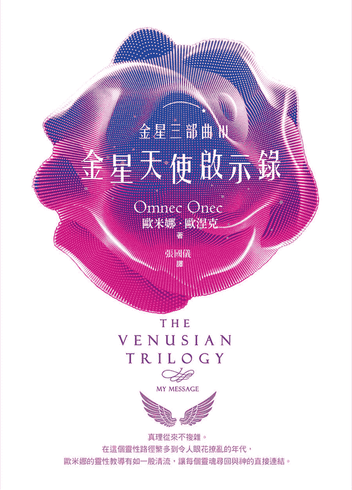

# 金星三部曲3：金星天使启示录

# 何谓现实？

什麽叫做现实？

现实，只不过是某个人或某件事的一种面向或观点罢了。

为了了解现实，你必须改变自己看待事物的方式，同时也要接受，每个人都有自己对现实的认定或看法。

欧米娜‧欧涅克

# 【探索生命书系】总序

──中华新时代协会创办人／王季庆

二○一二年前，众声喧譁，末日预言不绝於耳。

一方面，我本着对「赛斯资料」的信任，也祈求他独排众议的说法得以证实。简言之，他声称二十一世纪上旬，世界虽然仍有战事与天灾，却无第三次世界大战。并且，到二○七五年时，人类将有一个大同世界！另一方面，即使成为「一百只猴子的寓言」中的一员，我也想默默地为世界的未来尽一份力，为达成「一体平等」的灵性觉悟而努力。

我不敢声称自己已开悟，而且我最喜爱的「赛斯」也从没提过这个词儿。不过，在求道的过程里，我无意中悟出「除了神没有别人。除了爱没有别的。」（There is No One but God.There is Nothing but Love.）当下，在无边的寂静安宁中，我的心中充满了狂喜与爱，这份爱又满溢为感恩之情！我体会到我一直在宇宙的爱中，宇宙的爱也一直在我心中。而，世人也莫不如此！不同的是，有没有体会到，有没有连上线。在一体平等的感悟中，我谦逊地臣服，自然放心又自在。不由得散播出爱—平等的频率！

於是，完成了告别之作《与神同心—依爱随行》，我便退休下来。想读的都读了，想分享予读者的也都真诚地写了下来。此生足矣！

在《与神同心》的後记里曾提及我的天命──推介与翻译新时代的好书──已经完成了。没想到二○一五年四月，素未谋面的蒋圣光先生，带着家人约我在中华新时代协会见面。历经海外创业的艰辛，如今他已是卓然有成的企业家。他开门见山地说，自己读遍了我推介的新时代书籍，也邀同家人一起钻研。哇！这让我立即视为知音，因为，连我都没有主动要求家人研读呢。

作为一位成功的企业家，可以想见，蒋先生必然是位有主见，有魄力，并且格外有执行力的人。他说，运用从新时代书里得到的智慧，他成就了他的事业。如今，他想（并且已着手进行）设立出版社。一方面找回一些已绝版的新时代书籍，一方面当然也将眼光放远，胸襟放大，继续以自由开放的精神，开创「探索生命书系」，向生命致敬，完全不计盈亏。

由美返台近四十年了。从一九八九年开始，我正式投入新时代运动。当时，曾将我心中陶炼出来的「新时代运动」七要素，作为选书立说的准绳；并有助於分辨何谓「新时代」这个新「范型」（paradigm）与二十世纪中期前的旧范型有何不同。

这七个要素就是：

一、我们皆为神的一部分：有神论，但此神并非有组织宗教高高在上的「偶像」，而是无形无相，一切的根源。祂乃是宇宙意识，我们的「源场」，而我们皆为其分出的一小片。祂透过我们每一个来体验物质世界，完成整个拼图。

二、你创造你的实相：你有多生多世的生命，并且是个多次元的存在。因此，不怨天不尤人，为自己的一切负起责任。从而省视自己为何作出如此的选择，要学习的是什麽。

三、肯定人生的意义：不悲观，不耽溺。最重要的是培养清明的觉知和一体的慈悲。

四、道德的内在性：不盲目跟从传统，不媚俗。返归自性，找到内心那一念灵明，依之做人处事。

五、身心健康是种自然状态：心理有问题，郁闷不快乐，自怜或自恨，能量堵塞不觉知时，才会不适。

六、环境保护：这攸关全人类的存亡。我们不能再视而不见，当作是别人的事。生态环保，人人有责！

七、无条件的爱：也就是对人的一体大爱，而非在关系中只顾自私自利的比较，争夺，交换，控制。

至今，觉得那篇文字，还是相当切中新范型的精神。

不具权威性和强迫性，新时代不是宗教。它不崇拜偶像，也不自立为偶像。没有阶级组织，没有教条，没有戒律，也不等待外在的神明、圣贤、大师来拯救你。

赛斯说，认识自己就是认识神，因为你们都是和祂同一幅料子裁制出来的！

虽然，普罗大众仍不见得了解新时代的「奥义」。但至少，经过三十年的「百花齐放」，现今社会上也习於其种种的观念和用语。从生活面的应用：慢活，身心的放松平衡，爱自己从而爱别人，更新而平等的亲子关系，伴侣关系；到最深的灵性认知：生死学，生态保育，宇宙论，哲学思辨，都或多或少看到新范型的影响。整体而言，社会风气无形中也改善了不少，好比，双赢互利，人权以至动物权的伸张，性别平等的推广，人们彼此相处的包容，体谅与温暖──此间往往看到人性的光辉！

这个人间世，就是我们的舞台。贩夫走卒，帝王将相，都是我们生前和梦中不断参与编写，而於醒时演出的一出出好戏。所谓的觉醒，就是参透了镜花水月，将注意力由外在舞台返照回来，成为中立的观者，醒悟自己演出的意义！能如此，就是找回了自性，开始走向返乡之路。

不知从何时开始，我自觉到我有一项特性：我不会以个人追求自心的明晰、自在与幸福为满足，仍深爱着人类自古以来种种文化艺术哲学上的成果，为之赞叹不已！同时，也深深牵挂着人类未来的展望与福祉。当然，也关注着现世的兄弟姊妹，世间的种种困惑和苦难。记挂着、记挂着……不会忘也不想忘，作不了佛家所谓的自了汉。但由於相信自由平等，也从不愿将自己的喜好和浅见强加於人，只能以出书的方式，给大家一个提醒和自由选择的机会。

安然度过了二○一二年，不过，世局天象，时时风云诡谲！我有幸活着一天，就要为世界人类的平安幸福努力一天！所以，蒋先生要我写篇总序，替「探索生命书系」揭开序幕时，我便答应了下来。但愿，我过去的努力，促使世界进入新时代，现在则有助於世界迈向黄金时代。

且让我们共同为未来的大同世界，尽其所能地提供贡献吧！

# 前言

接下来，我会更深入说明金星人根据至高无上神性法则所发展出来的灵性概念──也是所有金星人所遵循的教诲，在这些观点中，灵性与科学是一体的两面，也因此，我们在各方面都有了长足的进展。

在此，我会从灵魂的角度来描述金星人对於自身与周遭世界之间关联的认知，以及在我们所处世界之上或之下的各个不同层界，或说我们所想要了解的周遭一切事物，藉此表达出我们金星人对所有生命体的看法。

这些资讯不仅能帮助你更了解生命以及你自己，它还能够帮助你平衡内在不同的生命体。我会一步一步解析我们的观念，告诉你如何妥适地照料肉身、星光体、因果体、心智体、以太体以及你的灵魂。

这些资讯主要来自於我个人在地球生活的体验，以及一些我从金星带过来的观念。但绝大部分是我在地球上遭遇到人际关系难题时所需的解决方法，特别是我在与媒体打交道以及开设工作坊的过程中所得到的体认。我的人生对我个人来说是一段超乎寻常的学习历程，而在我学到了这些课题後，我试着尽力与每一个人分享。

打从一进入肉身身体开始，当然我很快就发现在这个物质世界中会遭遇到许多限制，就如同在其他层界也一样会有限制。每一个生命状态的层界中都有其灵性法则，它们界定我们在这一个生命状态或层界中可以经历的范围。

接下来所要介绍的原则能够帮助你用最好的方式来了解并吸收以下的资讯：首先，耐心非常重要，因为所有事情都需要时间来发展。同样地，灵性身体也需要时间来适应新的体验，而时间的长短要视每个人个别的状况而定。并非每一种经历都会有感官知觉，有时候反而是些非常细腻而微妙的体验。我们一定要学着让自己变得敏锐，才能觉察到这些细致幽微的体验。

想要将本书中的教诲学好，另一个更需要准备的是幽默感。我发现，在这个你无法掌控什麽时候会发生什麽事情或出现何种状况的肉身世界中，你可以试着幽默以对。这麽做帮助我度过了许许多多的试炼。学着嘲笑自己，这麽一来，当别人嘲笑你的时候就不会那麽难受了。毕竟，我们都还不完美呀！

当我在接下来的文章中用到像是「必须」或「应该」这些字眼的时候，请不要误会我的意思。身为独立个体的你，当然绝对拥有你要或不要去做某件事的自由。不要把这些字眼当作是我的命令，如果你真的想要有所改变的话，就把它们看成是你给自己的指示。

第一部分要谈的是如何保养和照顾你的肉身。我知道这听起来很无聊，但不管怎麽说，毕竟我们现在都还在这个臭皮囊里呀！既然我们生活在这个肉身中，至少我们必须要了解它，因为光容忍是不够的。容忍充其量只是接受，并非是真正的照顾──而我们一定得要好好照顾全部的自己才行。

我们需要这个身体才能够存在、沟通和四处移动。你会学到它有多麽美好。我自己是用很惨痛的方式才学会的，所以我试着要让你能够学得轻松一些。身体是灵魂的载具：灵魂是驾驶，身体是汽车。好啦，谁会想要开一辆又脏又旧、生满铁锈又破烂不堪的车呢？

# 1　了解肉身

在金星社会中，我们所谓的灵性是：自身在各方面的平衡。

你一定要照顾好肉身，让它既健康又平衡。我们必须能够在肉身的各种限制之下顺畅地运行，接受这所有限制，并好好地利用它们的优势。

首先必须要做的是，接受自己是独特且个别的存在。看见真正的自己，并理解身为独立的个体，我们一定要建立起自己的准则，而非接受别人替我们规范好的标准。这麽做并不表示我们是完美的，不需要再努力让自己有所进步。这麽做的意思是，我们需要去找出哪些是适合我们自己的方式。

你所采取的方式必须是你自己喜欢的，否则很快你就会失去兴趣。我热爱舞蹈，而我将之视为让自己维持身材的方法。我个子娇小又很瘦弱，要不是因为我喜爱走路，我的身材很快就走样了。我经常散步，而且距离都很长，因为我喜欢大自然。你必须找到适合自己生命本质的生活方式。性爱也是很健康的一种活动（当然如果有固定的伴侣会更好）。

饮食习惯也非常重要。坊间有非常多关於饮食的书籍。不过，吃得均衡固然非常重要，但也不要特别狂热执着於任何一种饮食方式，这样你反而会破坏身体本身的平衡。同样地，你也得再次选择哪些是能让你感到舒服的饮食方式。如果你选择不吃肉是因为你认为所有有生命的东西都是灵魂，而且有一天会进化成为人，但其实所有植物、矿物和动物都是灵魂，它／牠们只是投胎进入不同的存在状态中体验不同的经历。如果它／牠们完成了存在於该阶段中的终极目的，就会离开实体肉身，重新进入另一个更高的存在状态中。

所以我们必须选择的是：吃什麽对我们有益，而不是去担心我们是否毁坏了什麽东西。也因此，无论吃下了什麽，我们都要心存感激。灵魂会投胎无数次，为的是达成身为矿物、植物或动物等等的不同目的，比方说，成为我们的食物。因此，为我们吃下肚的食物祝祷并心存感激，是非常重要的事。所以，不要为你所吃的东西心怀愧疚，而是要更了解其中的意义，并记得，在成为人之前，你自己也曾经做过同样的贡献。在我们成为人这种型态的存有之前，我们都曾经是上述各种不同的生命型态。

过度摄取任何东西都会破坏你的身体。你必须注意自己身体对不同食物的感觉和反应，因为我们每个人都不同。

吃素很好，但是完全不吃肉类、起司、蛋、鱼却是没必要的事。要记得，均衡很重要。不要因为自己的饮食方式而有优越感，你无法透过饮食获得灵性上的圆满。但是，你可以在学习过程中维持均衡的健康，同时完全不去批判他人。

找到最适合你的饮食和运动，好好地持续。如果你偶尔偷懒怠惰一下，也不需要有罪恶感，好好享受暂时的空档，但一定要回到原本的规律上。

别忘了我们都是寄居在肉身中的美好灵魂。我们一定要在能力所及的范围内，试着让我们的肉身外表反映出这一点。

穿着打扮或清洁习惯至关重要。我们一定要注意自己的服装仪容。如果你感觉自己很美，你的自信也会大增。我的意思并不是你得看起来像个明星，但好好地打扮并维持整齐清洁，是非常重要的事──这麽做也是为了那些和你最亲近的人着想！

你绝对不能说外表不重要。外表当然很重要！如果你一直以来老是穿着一身黑，难道你不觉得可以让自己的形象明亮一点吗？去找一些穿着舒适且能吸引人目光的衣服。多尝试几种不同的颜色，让自己改头换面焕然一新。破除过往的老习惯，发掘出隐藏的自己。不要害怕去尝试新事物，你随时都能改变。但最重要的一点就是要维持乾净。

你是不是觉得打扫家里是件讨厌的工作？其实事情并不一定要如此。播放你最爱的音乐，开始打扫吧！很快地你就会发现，身处在一个整齐清洁的环境中，对你和你的客人是多麽放松的事，而且随时都能找到你要找的东西，那种感觉也很棒。在这个肉身世界中，学会丢弃不需要的东西也是件必须的事。我们的身体能够照顾自己，但是好好打理我们的家却是我们的责任，但也不要太超过就是了。这些都是生活在这个次元的一部分。一旦我们能够接受这些事情是肉身体验中很自然的部分，我们的生活就能变得更愉快了。

生活在肉身中另一个很重要的关键是，要有创意。它能够帮助刺激那股持续在我们身体中流动的能量。遗憾的是，很多人都不认为自己有创意。有创意并不代表你一定得是个了不起的艺术家，而是找到一种能够表达你自己以及你的感受的方法。

如果你能从云朵中看出形状，你就是有创意的；如果你能替别人丢弃不用的东西发掘出其他的用途，又或者你可以在有需要的时候用线或胶带把东西修理好，这都是创意。人类创造出的一切都是因为有需要。他们需要某样东西所以创造！因为我们和造物者的心意相通，同时我们也是那股创造出我们的能量的一部分，所以在本质上我们也是造物者！我们创造出家庭、社会、交通工具和沟通方式。延伸发挥这样的能力，专注在能够让你更有创意的方法上。别忘了，你越是运用你的创造能量，这股能量就会越加源源不绝地在你体内流动。

# 2　学会处理情绪

我们许多情绪感受并不单只是源自於此刻当下的状态，也有些是来自於前世，这些情绪留存在我们的灵魂中，以记忆或感觉的形式被带入了今生。

情绪是生命中不可或缺的部分。它们和我们存在的每一个层面息息相关──我们对自己的相貌和内在有何感觉、我们的大脑如何运作、乃至於我们应对周遭所有人事物的能力，都在此列。情绪比其他任何功能都还要容易失衡，因为情绪总是持续在运作或使用中。

人生，是一辆由情绪所操控的云霄飞车，持续不断地随着我们的经历而起伏变化。情绪，带着我们从现下这个状态，上升到另外一个状态。控制并提供情绪体的层界是星光界。存在於星光界仰赖的是感觉和体验，并且生活在一种随时觉知各种情绪的状态下。如果你是以情绪体生存在星光界的话，这麽做不会有任何问题。然而，在肉身世界就很难单单仰赖情绪来生活了。

从一出生起，我们就会受到触觉、味觉、视觉、听觉、甚至嗅觉的影响。这些感官知觉提供了我们在生命中最初的情绪模式。最基本的情绪模式就是对我们身边的事物会产生反应或回应，比方说当我们感到满足时会微笑或大笑，感到不舒服或害怕的时候就会哭。最後，我们会从基本的情绪行为慢慢发展，开始对人或某种慰藉产生连结或牵系。

随着年岁渐长，我们会遭遇到情绪危机，并在每天的日常生活人际关系中，制造出各种情绪上的冲突。人甚至有可能会对某种行为或慰藉物──或是另一个人──出现情感上的耽溺。接着，情绪就会开始失衡。同样地，当我们无法控制自己的情绪时，我们也会失衡。有时候这种状况则是因为身体内部的化学成分不平衡而引起。

情绪与自信有极大的关联。许多人发现，由於某种深刻的情感创伤，使得他们在面临造成这种创伤的类似状况时完全不知所措。许多人大半生都在避免这类的状况发生，努力从遭遇这些经历的可能性中逃开。有时候，这样的行为变成是种习惯，使得这个人完全没有意识到自己正背负着不必要的情绪包袱。有些人则是转向药物、酒精或其他刺激性的活动，当作是种逃避。还有些人则是被送进精神病院接受治疗，导致他们从头到尾都无法了解情绪是怎麽一回事，或是根本无法处理任何情绪上的问题。但这些人还是有救的。

正因为情绪体是一项主要且重要的功能，我们更应该要尽全力维持健康与平衡的情绪状态。错误的资讯、错误的治疗方式，以及浮滥的各类情绪调整方法，要为这许许多多精神状况出问题的人负起直接的责任。

不要被你刚刚读到的这些文字吓得直接跑去预约精神科医生，或是立刻去为自己做精神分析。要让自己拥有快乐平衡的情绪，第一步就是了解为什麽你会有这样的感觉。这或许只是因为你发现了自己是个寄居在肉身中的灵魂，而能够如此看待自己就表示你已经跨出了非常大的一步！

所有的情绪通常都是正常的反应。然而，我们绝对不能让自己太过情绪化，否则我们就会失控。变得情绪化或是耽溺於某种情绪中是很容易的事。而在了解自己的情绪这件事情上，你就是自己最好的判断者。有时候，当处在情绪性的冲突中时，我们应该要让自己暂停一下，退一步检视一下眼前的状况。当我们觉得自己变得太过情绪化时，我们就得学着控制自己的感情。造成冲突最大的原因就在於我们试着要控制对方，或是强迫他们明白我们的感受，甚至是和我们有一样的感觉。要明白，每一个人都有权利拥有自己的感受和想法，这麽一来，许多冲突的情况就会变得可以体谅和接受了。常常问自己为什麽会有这样的情绪反应，你可能会很惊讶原来其中有非常多都只是习惯，或许你会发现其实自己真正的感受是不一样的。

有一个很好的情绪练习是：列出那些让你恼怒烦躁的事情，接着列出那些你害怕的事情，然後再列出让你感到舒服、快乐和悲伤的事。试着了解这些感受，以及为什麽你会对某种特定体验产生某种特定感觉。记住你是个永恒不灭的灵魂，还有这世间的一切都是相对的，试着克服你的恐惧。试着了解愤怒，并想像用微笑而非怒气来面对。

把那个曾经深深伤害过你的情感创伤状况写下来，这会很有帮助。写下来之後，你也就把它放下了。接着再找个人分享，某个你信任的人。你会很惊讶自己的感觉变得多麽轻松。

我们一定要有个情绪的出口，或是某件我们很享受、让我们可以放松的事。适时地抚慰自己也是很好的事──比方说好好地做个按摩，这对身体和情绪来说都非常疗癒。我自己则是喜欢点着蜡烛和线香，一边听音乐一边泡个香氛澡。当然冥想也对情绪非常好。我在谈到因果的那一章里也写了一个特殊的冥想程序。

你会发现，一旦你可以控制自己的情绪，在社交上你就会运作得比较好，而且对你的事业也会产生神奇的功效。当然啦，了解你的情绪如何运作，也会对你个人的人际关系产生奇妙的效用。

与家人、好友或伴侣之间的关系是否成功，端看你能不能对自己的感觉诚实，以及你如何处理不受控的情绪所引发的冲突，不让这些情绪累积到超载，最後在盛怒之下爆发。如果有人说了或是做了伤害你或是让你气愤难过的事，这时你更应该要冷静地在当下说出你的感受。让他人知道你有什麽感觉是很重要的事。如果你曾经和某位家人或以前的好朋友在很恶劣的情绪下闹翻，那麽，你一定要重新联络他们、写信或主动找他们说话来化解僵局。如果因为对方已经过世而不可能再这麽做了，你还是可以用想像的方式来进行。如果你不这麽做，这份冲突会一直留在你心里，并制造出不必要的因果债或纠缠。

身为一个有觉知的人，你要为自己的行为和状况负责。一切端看你是否愿意跨出第一步去澄清误会并化解冲突。这麽做，你就能让自己从中解脱。就算另一方拒绝接受，或者不想和你讨论或原谅你，你还是能够解脱，因为你已经负起了自己这一方面的责任，做出了努力。接下来那就是他们的问题了，因为你已经把与自己有关的部分处理好了。你已经让自己从那不必要的情绪包袱中释放了出来，并解决了你的问题。你只能为自己负责，也只能去做就你所知对你是正确又健康的事。你无须为他们的反应或他们的无法体谅而负责。每一个人都只能为自己负责。他们一定要选择用自己的方式，去找出属於自己的真理。我们一定要接受他人的方式，而他们也必须要接受我们的方式──不带任何批判。因为，只要有批判，就不算是让他们自己作选择。

你永远无法强迫另一个人用你的方式来看事情。身为独立的个体，我们每个人都有自己的观点和感受。没有任何一个灵魂是相同的；也没有任何一个人是一样的。我们一定要学着去接受并明白这个道理。你只能改变那些在你自己身上发挥效用的观点。然而，你随时都可以和其他人分享你的体认，而你也应该这麽做。或许你可以学习用不同的角度来看事情。如果双方因为意见不同而引起争端，你也可以想想，或许两方的意见都是对的，只不过因为是不同的人，才会有不同的看法。

我们应该要了解种族无分贵贱，人也是；没有更优越的知识、更优越的宗教、更优越的国家或世界，我们所有人都因为一个相同的理由而来到这里，为的是要在这个肉身世界中尽可能地去体验和学习，好让我们可以前往其他的层界去学习我们在这里学不到的东西；当我们能够接受他人有权利拥有属於自己的感受、情绪和特质，我们才有可能开始让自己拥有情绪上的平衡。

很重要的一点是要能够分辨不同的情绪：愤怒、恐惧、欢愉、对立、痛苦。它们全都很重要。你一定要能够全部拥有并接受，不要让自己受到太大的影响，导致你的灵魂失去掌控的能力。你随时都有可能过度耽溺──也就是处於不平衡的状态──但是唯有身为个人的你才知道自己的极限何在。只有你自己可以控制情绪。你一定要找到属於自己的平衡点。

有些人暴食、酗酒、吸菸过度，甚至是过度放纵自己到了对某件事情上瘾的程度，比方说性爱。也有人会因为习惯而对彼此或某种情境上瘾，其实他们本身并没有真的那麽想要，却会利用它来补偿自身所欠缺或所需要的某种情感。这是很危险的事。但只要我们学会了解自己的情绪之後，我们就能够看清自己是否正在利用某样事物来弥补空虚，或是出於情感上的依赖而过度放纵自己。能够看清自己的缺失，是非常重要的事。

所以，好好坐下来问几个关於自己行为上的问题吧：你是否因为出於习惯而有某些情绪反应，又或者你是真的这样感觉？你是否太过放纵自己了呢？你能不能察觉到自己失控的时刻呢？

另外找一张纸，在上面写下这些问题的答案。同时也写下你对「爱」的定义为何。尽你所能写下你所有的感受。你所做的事是因为你自己喜欢，还是因为别人期望你这麽做？看着镜子问你自己：我是谁？我是自己认识的那个人，还是根据别人的想法所创造出来的我？不要让他人控制你的人生。订立你自己的标准。不要想去和别人比较，或变成不是你的你，或你不想要的自己。你有权利用可以让你的人生比较轻松和快乐的方式来感觉和行动。当你认同并接受自己所有的感觉都是自己的一部分，你就会觉得轻松很多了！

学着让自己像个婴儿。他们能在不自觉的状态下表达出自己的感受，有时甚至非常理直气壮，不管他们是不舒服还是很开心。两者都是人生的一部分。婴儿爱自己身体的每一个部分和每一个过程，他们不担心自己这样做会不会被喜爱或是自己看起来如何。他们只会去爱同时也想要被爱。因为你所给出的东西，都会回到你身上！

# 3　因果会带来什麽影响

因果层界会以直接和间接的方式影响我们的生活。你在过去曾有的转世投胎纪录，全都存放在因果层界里。那些灵性已经转化而且程度进阶的人，可以读取这些纪录，这些纪录也被称为阿卡夏档案（Akashic records）。每一个灵魂都能够达到这个意识阶层。事实上，有很多个人和灵性团体都会进行前世疗法以及判读，而且还有很多人会在这个过程中经历到前世再现。有时候，藉由了解前世的经历能够对一个人在今生的体验和人际关系有所帮助，因为前世种种能给他们一个清楚的概念，让他们明白当下正在发生的经历和关系是由何而来，也因此能够判断究竟这是业障，又或者只是一个自己制造出来、不必要的经历。

身为独立个体的你创造并选择了你自己的人生和体验，尽管你本身并不记得这一回事。没有任何事情是巧合。每一个灵魂在投胎之前，都会根据他们之前与其他灵魂之间的关联，以及自己本身所需要精进的特定体验，来选择他们要过什麽样的人生。

所有这些过去的选择、人生和体验，都储存在因果层界的因果体之中，而因果体也是组成所有灵魂的一部分。有时候心理学家将之称为「潜意识」。

如果灵魂选择了一种生命体验，但却没有从中学习到东西，也没有任何进步，那麽就会产生不必要的重复。很遗憾的是，这种状况太常发生了──这都是因为在人类社会中关於这方面的教诲非常有限。如果你不知道自己是灵魂，也没有意识到有其他的层界存在，你就不会知道是你自己选择了当下这个体验，而这也就让学习变得更为困难。因此你会花非常多的时间痛苦挣扎、感觉困惑，更无法明白为什麽你会在这儿。

一旦你学着接受是你自己选择要来到这里、一旦你停止与眼前的经历对抗，明白它们是为了让你成长而存在，那麽你就能大步向前，不再被困在这些经历中动弹不得了。当你缺乏了解，你就很容易会有情绪上的波动，心理压力也会大增──而通常这只会为你自己制造出更多的因果业障！有句话说，没有杀死你的事情只会让你更强大，说得一点都没错！

学着去接受每一段经历都是一个学习的机会，这是让人生更容易理解的重大一步。

对个人来说，储存在因果层界里的纪录有着许多重大关键。每一个灵魂都有能力阅读自己的过去。我非常鼓励这个方法，因为每个人的前世都和他现在所处的状态与地点有关！

身为灵魂，你有能力前往我在这里所提到的所有层界。灵魂没有任何限制，除了你为自己所制造的限制之外。灵魂可以凭着意志离开肉身，前往任何一个层界。在每一个层界里你都有一个可供灵魂使用的身体。这个身体会和那个特定层界的频率共振，保护灵魂不受伤害。所以说，灵魂在每一个层界中都可以、也都会有一个载具。

在〈咒语及其功效〉一章中，我为你罗列了这些层界以及与之相关的咒语。这些咒语能改变灵魂的振动频率，让灵魂能够体验并前往这个咒语所代表的层界。当然，这时你一定要请求自己的守护灵为你确保肉身不会受到不好的邪灵侵扰。同时也要告知你的意识，让它记得你即将看见、听见和体验到的一切。有时候，心智会拒绝接受那些不在原本设定之中，或是不被肉身世界认可为有逻辑或可以相信的事物。为了重新与因果体做有意识的连结，你必须坚持自己一定要记得这过程。为什麽？因为心智是用来创造和记录的工具。灵魂才是主宰。太多人以为心智掌控了一切，实在是大错特错！不过，这是因为那些想要掌控他人的人希望大部分的人都相信如此。然而，一旦我们开始学到真相是什麽，我们就能够掌控一切，而不再受控於他人！这麽一来，我们就不会再轻易相信其他人跟我们说的话了，我们知道的比他们更多。你一定要真正知道，而不是相信。相信，是可以改变的。但真正的知晓，却是坚定不移的。

如果你规律地练习冥想，慢慢地你就能够开始进行灵魂旅行（在〈灵魂旅行的技巧〉一章中将有更细节的介绍）。如果你希望心智能记住某段经历，你就要让因果体与心智重新连结。你也要把完整的掌控权交给灵魂，而且本应如此，因为你就是灵魂。

你得了解自身所有的经历，无论是过去还是现在，如此你才能完整。人必须接受自己曾经做过的事，以及曾经所是的自己，这些全都是自己的一部分。每一段经历，无论它被归类为好或是坏，全都是深具价值的，因为灵魂需要这些经历才能够在这个肉身世界中臻至完美。接下来灵魂将进阶到位在肉身层界之外的其他层界去学习，而那是眼下这副肉身和大脑所无法领会的地方。

如果我们能在这副肉身中重新连结所有的自己──肉身、情绪体、心智体、因果体和以太体──并且明白所有经历和所有这些自己都是灵魂体验的一部分，那麽我们就能开始明白，自己所处的宇宙是多麽地广袤无边、我们所有人是多麽地伟大、能够与万物相互连结并成为造物者的一部分，是多麽美好的事！所以，接受因果是所有灵魂很重要的一部分，因为它握有通往我们的过去与现在的钥匙。如此一来，我们便能真正知晓那身为灵魂的真实自己。

# 4　心智的运作方式

心智的运作方式是一种根据你所学习的东西来进行记录和记忆的程序，其功能是让你得以在这个肉身世界中生存。而在星光层界中，则是根据情感来作为心智的基础。

心智和大脑其实与电脑非常相似，它们都需要被设定，或者说需要先输入资讯──通常是语言、数学和逻辑。大部分资讯的基础都来自於那些被认定为是事实的概念。有许多科学家、医师和教师都将心力投注在学习的心智过程上，一个人如果变得太过理智，那麽任何不合逻辑的事情他都不会接受。因此我们必须了解并好好利用心智运作的方式，同时不过度受到它的影响，以致於让自己无法接受任何超越肉身生命的概念。

过去绝大多数伟大的科学家和发明家都是深怀远见的人。他们愿意接受那些超过逻辑可以理解，或尚未被认为是真实的可能性存在。他们不但是了不起的思想家，同时也懂得从更高的层次──像是直觉──来学习，并从中获得了关於所谓现实的重要洞察。

爱因斯坦就是其中一位。他允许自己克服并超越众人所认定的事实逻辑去思考，或许在这个大家所理解的肉身世界之外，还有另外的存在方式。他明白时间和空间不过是人类自己想出来的概念。

尼古拉‧特斯拉则是超前了众人所认定的能量概念，找出了尚未被发掘，或者说尚未被目前的科学家所理解的新能量来源。

令人遗憾的是，大部分人只在现实有限的框架中学习，而且必须在自己并没有真正以独立个体去思考的状态下重复许多课程。他们终其一生都在接收别人教他们的东西，而且无法相信其他的，跟机器人差不了多少。他们不断重复着写好给他们的程式，从老师、父母、教会、文化和社会领袖身上学习。他们接受自己是白人、黑人、黄种人、印地安人，新教徒、天主教徒、犹太人等等，又或者他们是欧洲人、美国人、亚洲人。然後他们是社会主义者、民主党员、共和党员，或是左翼人士，却从来没有问过自己是否真的相信这些身分，只是不断重复他们所听到的，最後就真的认为那是自己的想法了。甚至连偏见也都是学习而来的。

心智，或说思考的运作，其实应该是被用来作为学习和创造的工具。然而，它却被我们的社会操弄，被用来当成控制人民的方式；社会不允许大家自主思考，而是要将所有人程式化，以符合那些控制者所设定好的规则框架和组织架构。他们成功了，因为大部分人都落入陷阱之中。这个陷阱就是：你没有选择，只能相信他们所说的，而且为了要能融入社会并被身边的人接受，你必须要有一定的行为举止表现。你相信自己是某些情境的受害者，所以你需要这些控制机构的存在。某种程度上或许这是真的──这是因为你正如控制者所想要的，用他们希望你思考的方式来看事情，而你的想法成就并支持着现在的这个世界！

那麽你该如何克服这个困境呢？其实非常简单：问问自己你真正相信的是什麽。你真的认为那些寄居在有色人种肉身里的灵魂比较低劣吗？他们所信仰的宗教真的让他们变得比较优秀或比较差劲吗？如果他们也是自身社会程式化後的产物，那麽他们不也是受害者吗？唯有当你把他们的事实当作是自己的，你才是受害者。不要让自己成为习惯的动物，终其一生有如机器人般重复着设定好的讯息来生活，活像一部答录机。醒醒吧！找到你自己的立场。改变你的看法！允许自己真正去思考你相信的是什麽。你们地球人和我们金星人之间真正的差异在於，我们不相信什麽事情是真的。我们知道什麽是真的，而且明白其背後的道理为何。

何谓现实？现实不过是某个人或某件事的其中一个面向或观点罢了。为了了解这一点，你必须能够改变自己的观点，去接受每个人都有属於自己对於现实的观点或看法。

举例来说：你看着一张椅子，觉得它的大小刚好够让我们人类坐在上面。但是对一只昆虫来说，这张椅子非常大，牠要花非常多的时间才能从椅脚爬上座位！对我们来说，这张椅子是实心的，但是对光子来说，它不过就是一堆原子的组合，而且光子可以直接穿透它！对我们来说，椅子看起来静止不动，或说是个静物。但如果你从外太空的太空船里看，这张椅子其实跟着地球在转动！对其他国家的人来说，它甚至看起来根本不像是张椅子！然而，它却存在於你的现实之中。所以你对椅子的看法其实只是你自己的看法。那是属於你的现实，但却不是唯一的现实！

所以我们一定要学着去接受他人对於现实的看法，并允许自己用看起来似乎不那麽有逻辑的方式去思考。我们不能够去挑战他人对於现实的概念，只能接受那是他们的看法。我们都只能够经历属於自己的现实观点，每一个独立个体都有权利拥有属於自己的观点和体验。现在你就能明白，我们可以如何学着去改变我们的看法或观点。

接下来我们必须学着去克服我们所学到的各种限制。学习是个永无止境的过程，就算眼前这个短暂的生命循环结束了，你也还是会在另外的意识阶层中学习，而那样的阶层超越了你目前有限的人类概念。

记住，没有所谓更优越的人种、文化、宗教，只有我们自己作出的选择。或许你曾被教导某个宗教、种族或国家比其他的优秀，但这些都只是心智上的概念，并不存在於现实之中。当我看见或遇到一个人的时候，我看到的并不是一个黑人基督徒或白人天主教徒之类的，我看见的是一个寄居在肉身中的灵魂。许多人被困在对於自身的概念中。我们都在学习的过程中，而许多你所想的都是别人的观念，并非你自己的。然而，你们许多人都会接受别人的想法成为自己的想法。

同样也别忘了，如果你相信并接受这些概念，认为的确有所谓的优越存在，那麽你就为自己的人生制造出了压力和冲突。为了要成为优越的存在，你必须去找出他人身上的缺失，这样才能说他们比较差劲。冲突於焉而生，争论也将凌驾於信仰之上。然而，当你从灵魂的角度来看，你就会知道这些都是误谬的想法，并非真相。真相是，无论个人选择要学习什麽或是如何满足他们的需求，对他们来说都是好的，他们有权为自己作选择，就如同你一样。

地球上存在着许多教诲，因为有许多不同程度的意识存在於地球上。每个人都只能根据自己的意识程度，去找与自己相互呼应或是能够理解的教诲！因此，对他们来说那就是对的。不过，你可以改变自己的意识，那麽你就会发现，许多你以前学到的东西都再也无法满足你了。这就是进步！

当你开展了你的意识，你就会开始为新的问题寻求新的解答。不过，还是有许多人无法进步；他们只相信别人告诉他们的事，终其一生被困在由父母、老师和社会所赋予的程式设定之中。

改变思考的方式是有可能的。如果你希望自己能成为造物者所创造出的模样，你一定要愿意改变并成长！要知道，如果你做得到，那麽你所思考或想像出来的，就是现实。如果你所想的事物还不存在於肉身世界中，那麽它一定已经存在於某个更高的层界里。

我们现在正在经历的现实是你的祖父母们所无法理解的，比方说电脑、有线电视、卫星、太空旅行。曾有一度这些东西仅仅是单纯的可能性而已。然而，有人很清楚这些东西的确可以实现，也因为他们这麽想，并发想出了各种概念，这些东西才能成为现实。

所以，改变世界的力量存在於每个人之中，只是需要大家有动力让改变成真。也就是说，未来操之在你，以及你型塑想法的能力。别忘了，你的注意力所在之处，就有能量流动。所以如果你专注在负面的事情上，你就会用自己的能量将之强化。因此，你一定要尽力有意识地将你的能量和念头集中在你真正想要的事物上。

大部分人都被设定成无意识地专注在负面事物上，这就是为什麽地球上的社会有这麽多的问题。你们一定要改变思考的方式，重新设定自己，将能量运用在有建设性的正面事物上。

我们有许多被闲置不用的能力，因为从来没有人知道要去激发或使用它们。心电感应是每个人都可能做到的事，不过在你们的社会里，这被视为是种罕见的天赋，而非普通的能力；大部分人认为只有少数人拥有这样的力量。事实上，你生来就具备了许多能力，但是只有等到你知道自己拥有这些力量之後，你才能够去使用。

现在问题来了：我该如何停止「相信」并学着去「知道」呢？我在本章最後附上了一组程式，用来替换眼下的主流程式。不过，要记得，它需要意志力才能发挥功效。无论你接收到的资讯有多重要，如果你无法在日常生活中拿来活用，那麽它就是无效的资讯。好啦，现在得由你自己作决定了：要继续当个机器人，还是一个能够思考并创造自身现实的真正独立个体？

##### 「如何活在当下」的程式设定

我存在

於当下──此刻

一切都很完美、圆满且平衡。

我不相信旧有的限制和匮乏。

我不评断，只接受和理解。

我就是造物者创造我时的模样──完美且圆满。

我不受过去的束缚，它无法控制我，只能教我从中学习。

我向智慧全面开展自己，这份智慧来自创造我的造物者、我的一部分，并存在於我之内。

我朝向崭新而行，目标是释放陈规旧习。

我放下的憎恨越多，我所收到以及付出的爱就越多。

我用自己希望被爱的方式去爱一切所有。我视自己为个体──独一无二、无与伦比。

我所有的经历形成了「我」这块独特宝石的不同面向，让我与众不同。

我知道自己是灵魂，肉身只是我在这个世界所使用的载具。

我是造物者与能量的一部分，他们创造了我。

每一天，我都是自己选择要成为的人，而我脑中所想只有那些创造出这些选择的念头。同时，我也允许世间万物皆是自己所选的样态。

我在自己的行事作为中获得平衡。

我不是任何情境或任何人评价中的受害者，而是我自身命运的主宰。我是圆满的。我体现了自身原本如是的美好。

# 5　以太体的功能

以太是灵魂离开纯粹灵性层界後第一个进入的次元。它是个处於非物质（或说纯粹能量）与物质次元之间的地带。这是灵魂所拥有的第一个身体，能保护灵魂不受到较低物质世界、层界或次元的伤害。也正是以太这个次元，掌控着我们对「神圣存有」的信仰，比方说神。它直接影响着我们能否知道自己是灵魂的能力，并让我们了解自己与造物者之间的神圣连结。

所有圣人、灵性导师和大师都是从以太取得他们的能量，所有灵魂都能直接透过以太与灵性相连，它让我们知道并相信神的存在，它也是我们灵性发展关键且必要的连结点。从以太我们获得了充足的信心和极致的灵性力量，相信并知道神的大能，并能够感觉到这股力量，以此来说服其他人。以太是灵魂与更高的神之世界间的连结所在！创造出灵魂与世间万物的所有的灵性能量都在此流动。它是我们与造物者间的神圣连结。我们在这个次元中努力，希望能在回到我们启程出发之处前，尽可能地在这些较低的层界中达到灵性的完整。

打从我们被创造出来那一刻起，我们就展开了这段旅程，我们不知道自己即将经历千百万次的转世投胎，也不知道自己是造物者的一部分，但是我们确实知道、也明白有个什麽创造出了一切，而我们的目标就是要成为祂的一部分，同时也让自己成为创造者。

一旦我们带着新的心智进入新的肉身中，这大部分的知识就丧失了，於是我们必须花上很长的一段时间慢慢再度熟悉它并学着使用它，同时理解所有发生在自己身上的新经历。也因此，有大部分的知识都储存在我们的潜意识里，我们的潜意识大都以灵魂之姿在非物质世界中活动，而我们有意识的心智对这方面的知识知道得非常少，所以不断地在追寻着其实早已存在於我们之内的东西。

少数一些灵魂能在转世时完整无缺地带着所有的知识和经历，完整、丝毫没有遗漏，而且很清楚一切是怎麽回事。这些是已经不需要再回到肉身世界的灵魂，但是他们却选择要回来，与那些保持心态开放并渴望知道一切的人分享，把我们之所以存在的真相告诉他们。

当然，也有很多人嘲笑这些人并对他们嗤之以鼻，要克服这些困境是很不容易的事。这一切需要坚忍不拔的态度和力量，因为在掌控较低世界的负面力量与那些带来真相和光明的人之间，始终相互拉扯、僵持不下。然而，在所有人心底深处，大家都知道，我们带来的是真相。这就是以太体正在试着要将所有真实的自我经历与寄居在此的肉身重新连结起来！

曾有过许多伟大的灵性存有来了又走，而他们也将继续这麽做，一直到所有灵魂都受到启发，而地球终於变成它原本就该是的神圣所在为止──所有在这里的生命都理解并接受彼此是灵魂，同时放弃那些控制力量所制造出来的分裂，如同「时间」就是人类制造出来的概念，用来区分在这里生活的岁月。事实上，时间并不存在。你们在此所度过的一生就如同一颗沙粒，因为灵魂是永恒不灭的，而且永远都是如此。

所以，与以太连结对你来说是至关重要的事，克服所谓的潜意识自我，连结起你内在所有的自己，好让分裂不再。

# 6　灵魂──真正的我

在前面几章中，我已经清楚地指出了「你就是灵魂」这件事。

对那些不了解灵魂是如何被创造出来的人，在此我会提供一个简单易懂的概念。我一直试着帮助你了解你所知道关於自己的所有部分：肉体、情绪体、心智体、因果体、以太体，现在到了灵魂这部分，也就是真正的你。以上这些全部都是身为人类所必须要有的，如此你才能够正常运作。而灵魂是其中的精华，它始终维持调节有度，并且永远不会改变，生生世世如此。尽管你与所有生命体都有连结，但你被创造时就是个独立的个体，且永远如是，因为每一个灵魂都有属於自己的经历，任何其他灵魂都不会有相同的体验！

当我们学着要改变自己的立场和观点，用灵魂的角度来看待人生、自身经历和他人时，从灵魂的角度来说，我们拥有强大的力量得以视万物为一体，彼此之间不分你我，灵魂不会用情绪、心智或个人的生命经历来看事情，而是带着对自身更深层的理解，以及对其他身为独立个体的灵魂的体谅与接受，不带任何评判或憎恨，只是接受与爱──而一切本就该如是。

创造的概念大致如下：

找一台以高速旋转物体的离心机。然後你在这台离心机里放进石头、沙和水，接着你会看见物体开始分离。其中最重的物体石头会飞到离心机的最外围，而如果这时你去看离心机的中央，你会发现那里几乎没有任何物质存在──由外到内依序是沙，然後是水，而中央只剩下空气。

这就像是各个不同层界。我们这个肉身世界可以比喻为石头，被抛到了最外围，而其他物体则依照其轻重，分别代表了在肉身世界之上或超越肉身世界的其他层界。在中央部位的空气，则代表了纯粹的灵性或非物质层界。我们可以说它是神的层界，或是创造之始的所在！

所有能量都以一种类似螺旋状的结构在流动着，就连银河也是如此。这就是创造的秘密，所有能量在一切具生命的物体周遭形成了一股涡流，为其创造出自己的磁场。所以，所有具生命的活物就如同一颗行星一般，拥有属於自己的能量涡流。

造物者并不是一种存有，而是由最强大的能量所组成的一股智慧质量，同时具有难以想像的浩瀚知识。为了确保祂永远不会消灭，於是祂从自身创造出了宇宙、银河、生命型态以及灵魂，用以维持进化及创造的循环永不止息。

身为灵魂的我们是这个计画的一部分，目的是创建、成长，并持续获得知识与力量，同时也永无止境地呈现出万物一体的力量和形貌，而灵魂的创造或进化一样也是永无止境的。我们永远都该以螺旋状盘旋流动，追随那创造出我们的能量涡流，学习、成长，变得更有力量，最终带着我们在被创造之初所缺少的知识与经历，回到并再次成为那股创造出我们的能量。所以我们要让自己始终是那创造出我们的能量的一部分，而这也是为什麽我们最终必须学会如何创造出我们所想要的──这一切都是为了要让我们所属的那股能量更好。

当灵魂一开始被创造出来时，它只是一股纯粹的能量、一道光，它并不知道自己存在。所以它会从创造的中心点开始向下展开一段旅程，通过以太层界、因果层界、心智层界、星光层界，而它停下的第一站就是肉身层界。

别忘了：以太体能让灵魂记得并感觉到自身的灵性连结，因果体能将灵魂所有的经历储存在所有次元中，心智体让灵魂能够思考、记录并进行沟通，星光体让灵魂能有感觉，而肉身能够去体验这所有功能，从每一次的投胎转世中学习。

所以灵魂在它的旅程中是披着外壳并受到保护的，在前面所提到的每一个层界中都有一个相对应的「身体」。这是多麽美好又多麽了不起的事情呀！

当灵魂首次进入肉身世界时，并不会拥有人类的形体。噢，不好意思，让你失望了。但所有具生命的活物都必须遵守一定的进化程序。就如同你可能已经在我的着作《金星三部曲 I：我来自金星》之中读到的，连星球也得遵循一定的进化程序！

所以当灵魂在无论哪个太阳系的哪个星球上初次进入肉身世界时，它最先体验到的存在状态都是矿物──没错，矿物，以矿物的型态存在。灵魂必须在所有太阳系中的所有星球上以各种矿物的状态存在过，并达成每一次的存在所需完成的目标，如此才能进化到下一阶段。我可以听见你倒抽一口冷气并回应「你说什麽？」，自己竟然是一块卑微的石头，这对自我是多麽大的冲击啊！没办法，灵魂必须要体验过一切才能了解一切！

经历，是唯一真正的老师。所以，好好善用你的想像力。一块石头能有怎样的经历？一块石头会有什麽样的生命目标？这麽说吧，有些石头存在於水中，有为了植物而存在的石头，也有为了动物、人类而存在的石头。还有那些用来打造我们的家园、工具和珠宝的岩石呢？哇，我们忽略了自己成为现在这个伟大人类之前的许多可能性！所以，灵魂会花上数千年的时间，一次又一次地投胎转世成为不同的石头，等着那个能够让自己奉献的机会到来，因为它的存在必须要有意义。我知道这一方面听起来很吓人，但另一方面却又让人觉得很好玩。事实上，这是一件大有好处的事。

最後，当身为灵魂的你将矿物的所有可能性都用尽了之後，你就可以结业，然後进入植物的状态。这时，你会再次经历相同的程序，把所有植物的经历都体验过，在所有星球的每一个角落上达成植物的所有可能性，或其应尽的责任。举例来说，你可以是一棵大树，提供让人盖房子所用的木材，或是一株成为其他生物食物的蔬菜，又或者是一朵美丽的花儿。发现我们真实的过去经历，可能不是件很愉快的事吧！

就在你把所有植物类的选项都用完了之後，你就会投胎转世成为动物！真是太开心了！当然，你会成为野生动物，也会成为家庭畜养的宠物，你会变成食物，或是被制成乐器，或纯粹玩赏用。但是你一定会经历所有一切──在所有已知与未知的宇宙或太阳系之中，成为家禽、鱼类、鸟类和哺乳类，就跟之前一样。

最後，你终於得以成为美好的人类──或许有时候并不那麽美好。跟之前一样，你必须当过所有人，包括各种种族、性别、心智状态，或心神丧失的状态。意思也就是说，你会变成邪恶的人、杀人凶手、智障、天才、音乐家等等；只要你想得到的角色，你都曾经扮演或即将扮演。你把所有能想的都想到了吗？

好吧，不要沮丧。到了现在，你们大部分人都已经在过去体验了大多数的经历，否则你也不会进化到在这里阅读这本书，或至少对此感兴趣。这有没有让你感觉好一些呢？我希望有，因为无论你曾经历过了些什麽或曾经是个什麽样的人，你依然还是那个独一无二的灵魂。

在这些折腾心智的千百次人生之间，在灵魂重新投胎进入另一个自己选择的崭新命运轮回之前，它会在星光层界的一个特殊区域里有一段休息的时间，这个区域由一些老灵魂负责照管，他们在自己的肉身轮回结束之後，选择了这个特殊的任务。这些像是天使一般的存有照顾并帮助灵魂选择并调整他们接下来将展开的新人生。这里就像是灵魂的照护之家，灵魂在这里平复上一段人生的种种，并为下一次的人生作准备。这是个复元和重生的地方，由那些特殊照护者的爱与奉献所打造。

现在我已经把这个地方带到这里来了，好让你能更轻松一些，因为你学到的越多，你所需要经历的就越少！

现在你已经学到，身为人类是更为复杂的事，因为你会组成家庭，有时候还会有各种你根本不想要的人际关系──无论是私人或工作上的。然而，你不能怨怪任何人，因为你有自由意志和选择，只不过遗憾的是，很多时候这些抉择是在困惑或是觉得自己应该要这麽做的状况下所作出来的，而且绝大多数是因为你没有获得充分的资讯，或者你得到的是错误的资讯，真是很不幸。

这也就是为什麽我要写这本书来帮助你。如果你的大脑现在正不停地在转动，休息一下，去静坐冥想，或是喝杯饮料、散个步，或是做任何能够让你放松的事。

现在你已经知道身为灵魂是怎麽一回事了，就如同我们大家一样。很重要的是永远别忘了这一点，一直到你在此的生命终结为止，都要牢牢记住。这让你有机会进步得更快速。我希望这也能够帮助你了解各个层面的自己，而这本来就是应该的事，如此一来你就能够拥有更开阔的观点，帮助自己创造个人存在的意义，同时也给予这个世界力量，让它成为本该如是的样貌：具备更大的空间来接纳所有型态的所有灵魂。发现我们自己也曾经是这些不同的生命型态，难道我们不该对这一切有更大的同理心和爱吗？难道我们不该去爱、去接受所有灵魂，对他们为了生存所经历的种种磨难而表示尊敬吗？难道我们不该试着去帮助那些被自己所接收的资讯所困惑的人吗？身为知道得较多的人，难道我们没有责任去分享，并帮助那些四处游荡、对他人做出糟糕行为的人吗？你一定要明白，拥有知识就得负起接下来该如何继续的责任！因为我们知道得越多，我们就应该变得越好。世间没有好人或坏人，只有视而不见的人。

然而，拥有这些知识并不是要让你觉得自己高人一等，而是用来启发他人，并且随时对我们的造物者怀抱感恩之心，感谢祂让我们知道何谓真实与正确。而那就是，做真正的你，灵魂。

# 7　至高无上的神性法则

至高无上的神性有七条基本法则，以及七条神圣法则。

七条基本法则如下：

一、知道自己是造物者的一部分。

二、对於能体验存在一事，心怀感激。

三、接受，不评断任何一种生命。

四、知道我们曾以各种生命型态存在过。

五、在每一次的生命轮回中完成我们的责任。

六、遵守我们生活之处的自然法则以及社会规范。

七、从错误中学习，好让自己不再重蹈覆辙。

七条神圣法则如下：

一、爱所有有生命之物。

二、用我们的能量支持我们生活的世界。

三、分享知识与智慧。

四、明白所有灵魂皆为平等。

五、绝不使用自身的力量来操弄或控制他人。

六、知道灵魂是永生不灭的。

七、每天都要向那神圣的存有表达感谢之意。

这些法则从万物被创造之初就存在了。如果你知道、记住，并依照这至高无上的神性法则来生活，那麽你就有可能克服许多因果业障，并且看见自身与所有万物之间的关联。不像人类制定的规范，这些法则不限於某些教派或社会，而是适用於所有存在的生命，而且它们和任何社会信念或宗教信仰都没有抵触。

这些法则允许个人拥有选择和自由，无论灵魂所在之处为何，所有时刻皆然。灵魂还是可以遵循任何自己所选择的灵性道路或社会规范。

至高无上的神性法则也能帮助你在不评断、全然接受其他生命体的态度之下，逐步进展；让你从灵魂的角度更了解他们，就如同造物者计划并允许我们存在一般！

# 8　关於业力

大家经常会误解业力是什麽。许多人认为业力是对於过去或当下所做所为的惩罚。事实上，业力可以是种正面的体验，或是种困难的体验。业力也可以是正面行为的奖励。这一切全都取决於这个灵魂自身──端看每一个特定灵魂的意识程度、经历及责任为何。

一个人的意识程度越高、对自己行为及关系的责任感越重，会对自身所累积的业力数量（无论是正面或负面的）产生非常大的影响。这也就是为什麽我会在本书中一再重复强调，并在与人面对面时反覆耳提面命，我们要认清自己在家人、爱人以及熟人之间的纷争和牵扯中扮演了什麽角色，这是非常重要的事。我们越是能够把自身的关系处理得明确、和谐，并维持平衡，我们就越不容易与其他灵魂产生纠葛和牵连。这样就能够减少不必要的业障或课题。我们现在能够注意的事情越多，我们就能够进步得越快，因为这样一来我们就不用一再重复那些我们尚未学习到的课题，或是对什麽事情负责。

基本的业力不只会在肉身世界中积累，在其他层界中也会。对於所有灵魂自身的发展以及与其他灵魂的互动，这是必须的。所以说，我们身上之所以背负着基本的业力，都是为了让我们能够学习并达成目标。

不必要的业力和基本的业力不同。它之所以会产生，是由於在过去和现在的生活中的情爱纠葛，以及我们不了解自己必须在每一世完结之前就把所有业障清偿的重要性。任何尚未了结的事都不会随着肉身的消亡而结束，在任何一世都一样。要清除这些业力，必须透过再次转世投胎和对方一起进入肉身，或是在另外的层界中，与当初和你有未了情事的灵魂（或灵魂们）再次相遇。

此外也有善业，无私地关怀他人以及各种善行，都能让人得到这样的收获。好的业力可以透过自我牺牲而来，无论是情感的、心智的或肉身的都算。但绝对不能是为了要获得奖赏才去做这些事，而是要真正无私的举动。如果这个人的生命循环已经结束，那麽他可以在其他层界或是未来再次的转世中收到或体验到好的业力。

最困难的部分在於：一个人该如何一直维持自身关系的平衡，并且避免各种令人伤痛、无法了结的情境，同时不要对他人和物质财富太过依恋，或是太过自我本位，总是觉得自己比他人优秀。所有的经历都是为了让我们变得更好、让我们能够学习，而不是要让我们看不起别人或是去控制别人。事实上，从灵魂的角度来看，事情根本没有好与坏之分。所有经历都是相对的，而且对於灵魂的平衡和完美来说全都非常重要。

我以基本的业力为例（善业与恶业），帮助你了解业力并不是种惩罚，而应该说是你在个人生活中所作的选择，以及你从被创造之始到进入肉身的这个过程中，与其他灵魂之间的牵连所带来的结果。就算你已经离开了肉身层界，在其他层界中业力还是具有同样的效力。不过，一切都操之在你──端看你的选择是什麽以及你学到了多少、达成了多少──你愿意在这些生命循环和经历中承担起多少责任。

所以说，业力只是因与果的呈现罢了。而你一定要时时注意「因」，而不是「果」。

我所经历的许多事情并不是源於我个人的业力，而是身为一个与我继父和母亲有着因果关系的小女孩所造成的影响。我有很强烈的冲动想要保护我的母亲，我应该保护她不受到一个暴力男子的伤害。我被安排在这样的情境之中，为的是要学习大家都会经历到的情绪压力。尽管有非常多的痛苦折磨，但我们都从这个伤痛的经历中学到很多。它让我们能够对遭遇类似状况的他人怀有同理心。

你不需要终此一生都当个受害者。试着去评估看看，某个持续出现的状况对你学习某个课题来说是否有其必要、你可以从中学到什麽，以及该如何打破这样的循环。一个一再反覆出现的问题就是你需要去解决的业力。而且它会不断地出现，一直到你真正学会了为止。谨慎地评估它存在的必要性，并拒绝一切不需要的状况再次发生。一旦你停止对抗某个困难的处境并接受它，视它为有价值的学习经验，人生就会变得好过许多。

在倒数第二章里你会读到「灵性旅程」，这是一个观想练习，可以帮助你从旁观者的角度来看你的问题，而如果它是不必要的，你就能把它放下。

# 9　灵性与宗教

宗教^(（注 1）)就像是通往神的阶梯。我了解并尊重所有的宗教，而我也相信，它们在社会中具有非常重要的地位。

参与建立於我们这个社会中的宗教，是个人学习历程与成长的一部分。所有宗教都提供了目的以及对更高力量的信念给它们的信徒。基本上，所有宗教都教人要做好事、要仁慈、体谅。也因此它们都非常有价值，因为宗教指导人们该如何做个好人。

年轻的灵魂确实需要某些方针的指引，帮助它厘清何谓好与正确。要是没有这种外在的指引，灵魂就会缺少必要的手段来调整自己生命的方向。宗教有可能终其一生都是定位的方式，而重视心智的人则是在科学中找到属於自己的指引和解答。他们只相信可以用科学来证明、并且符合他们自身逻辑概念的事情。他们不接受奇蹟，也不相信有灵性世界的存在。剩下的其他人则是信仰这个有限的物质世界，而他们所需要的灵性智慧也同样非常有限。许多人认为死亡就是终点。

随着灵魂成长到一定的程度，它会开始接受并吸收更广泛的资讯。在这些转变期，灵魂的成长会加速，而许多阴暗面也会开始浮现。会出现这样的状况是因为，比之前更大量的光与爱正降临在地球上。这个转变过程的影响之一是，许多人会对现有的宗教失去信心，同时变得非常焦虑。他们有越来越多的问题是宗教无法回答的。

根据我对造物者（或说神）的了解，祂最初的想法是要让人类拥有自由意志去选择自己的经历。而许多教堂和宗教用自创的规定、律法和架构来限制这样的自由意志。它们剥夺了个人的自由意志，不让他自行决定什麽才是正确的。从至高无上神性的角度来看，万事万物皆无所谓好坏，因为一切都是为了让灵魂体验并成长而存在──而无论如何，也不存在任何批判评断。

灵性与宗教不同。宗教通常是在限制你什麽可以做、什麽不可以做，并且叫你要相信。但灵性却是更宽广的，因为你会学到如何运用自身的能量，做一个独立、自由的个体。只要你仍受到某个宗教的吸引并遵循它的规定，你就无法如此自由。

如果你下定决心要开放自己去接受更开阔的灵性资讯，如同我这本书中所披露的内容，那麽这些资讯只会强化你在过去信仰的宗教教诲中所学习到的一切。所有你从经验中学到的东西都很有价值，因为这些东西现在都成了你个人的经验谈，你可以与他人分享。分享是身而为人非常重要的一件事，同时也能够保持灵魂的平衡。

> （注 1）「宗教」的英文可以回溯到拉丁文，意即「重新连结」，也可以被解读为「与神的重新连结」。根据作者所述，她的灵性名字「欧米娜‧欧涅克」的意思就是「灵性的回归」之意。我们也可以说，欧米娜传达了自己本身的灵性资讯，也提供了在人们能够理解范围之内的内容，希望能够藉此触发每个人与自我内在那个真正、神圣的自己──灵魂──之间的重新连结。与此相比，许多宗教都具有较明确的结构，并与外在的形式和信仰的规范紧密关联。↑

# 10　冥想与默观

在今天这个时代，一提到冥想，大家经常都会将之与秘教以及新时代思想相提并论。反之亦然。冥想源自远古时代并广为人知，它是最古老的法门，在过去主流宗教组织持续压制它的情况下，现在更需要被重新导入。过去大家认为只有非基督教的异教徒以及信奉超自然主义的人才会冥想，事实上，它的用途一直都是让人专注於个人内心，并且利用这个方式来观看其他非肉身层界的次元。

冥想让人连接到给予万物生命的那个能量源头，让自己察觉到它的存在、成为它的一部分，并得以指挥和控制这些早已存在於我们内在的力量。

我们并不是生活的受害者，如同那些想要控制我们的人希望我们相信的那样。我们有选择能够去开创自己的命运。身为灵魂的我们拥有自由意志，可以选择要在这许许多多次的投胎转世旅程中，所有我们想要经历和遭遇的人事物。所以，不要让自己成为生命情状的受害者，而是要当自己命运的主宰！

##### 冥想技巧

冥想有非常多的方式。身为独一无二的个体，你一定要亲身去实验，并找出对你最有帮助、同时你也能够接受的方式。

苏菲教徒会不停地快速旋转，直到肉身瘫软倒地，他们相信这时灵魂会因为旋转而被抛出身体之外！而有些瑜伽士则是会采用一种特殊的盘腿坐姿。你可以平躺下来，或舒服地坐在一张椅子上。我认为最重要的是尽可能让自己觉得舒服，这样你就不会在中途抽筋或是让身体的任何一个部位感到不适。你的背要挺直但不要太僵硬。双手合拢，或是手指头相扣，两手大姆指轻触相抵。双脚也要彼此接触，但如果你是躺着，那就双脚交叉。这样能够制造出一个渠道，指引能量在其中流动。能量会从顶轮^(（注 2）)开始，向下移动到双脚，然後经由双手通过全身。藉由这些部位与能量的触碰，全身上下会产生一股涡旋。当然如果你想要的话，你可以专注在某一个特定的脉轮上。

你应该让注意力集中在双眼之间的位置，就彷佛那里有个萤幕似的。用你的心来看，而不是你的眼睛。你应该每次都要先做净化的深呼吸三次，释放所有压力，并让身体排掉负面的能量。

在覆诵三次你所挑选的咒语之後，可以播放轻柔的音乐，会帮助让你更加专注（请见〈咒语及其功效〉）。市面上有许多专供冥想使用的音乐ＣＤ。

每天找一段不会被打扰、可以安静度过的时间，十到三十分钟即可。戴耳塞也是个不错的选择。你可以在任何你想要的时间里冥想，甚至是在躺下准备要睡觉之时。如果你在过程中睡着了也没关系，因为我们绝大多数人都会在睡梦中前往其他层界学习。

##### 默观

默观的意思是，你有意识地反覆思考着某一特定的议题或事情。你可以默观一个问题或任何一件萦绕你心头的事，方法就是深入自己的内心去观看。如果你正在进行一项工作上的计画，你可以以它为题来默观，专注地去思量这项计画。默观是种积极主动的心智活动，能够帮助你开展自身的灵性体验。

在默观时，保持你的注意力在单一一个方向，并且全方面的吸收你所专注的主题或是你所选定的焦点，无论是肉体、情感、心智或灵性各方面都可以。你也可以注视着一颗星星、一根蜡烛、一块水晶、一条河流、天空，甚至是另外一个人。学着单纯地存在於当下，让自己尽可能自由地去体验一切。

##### 冥想或默观的体验

冥想或默观的体验是很幽微精妙的，你必须先调整好你的感官来应对，也要先设定好你的意识心态。想要藉由肉身、心智和感情来进行体验，你一定要不断地反覆对自己交代，你想要记住自己所经历、看见或听见的东西。同时你也要请你的守护灵或是指导灵在身边确保你是安全的，让你不会受到不好的灵体侵扰。

留意任何光线、纹路、声音或感觉上的变化。不要预期什麽，只要学着去体验并接受。放轻松好好享受，记得不要拿别人的体验来和自己的做比较。你是个独立的个体，一定会拥有属於你个人的体验。保持一颗冒险的心，尝试不同的技巧。说不定你可以创造出自己的方法！

有些人觉得看着大自然就是种灵感的来源，也是冥想的一种方式。也有些人觉得跳舞是种冥想。你一定得学着去认识自己，并找出真正能够启发你的方式。

> （注 2）〈咒语及其功效〉一章中将介绍更多有关脉轮的资讯。↑

# 11　灵魂旅行的技巧

所谓的「星光体投射」带来的体验被限制在星光界内，但是灵魂旅行却可以让人的灵魂暂时离开活着的肉身。星光体投射的意思是让星光体离开肉身身体，并以一条银色的光索保持跟肉体连结。而灵魂旅行这个方法的不同之处是：它能让你离开肉身身体，却不需要连结着那条银色光索。你会跟着光和声音移动，并且可以前往任何你想去的次元，任何你可以获得知识或是对灵魂有益的体验的地方，而与此同时你仍然活在肉身之中。

我会在下一章提供你在每一个次元（包括肉身层界）中可以使用的咒语。实际上每一个次元都有许多区块，全部都得花上好几年的时间去探索才有可能理解并有所体认，而光是这些我就可以再写一本书了。艾康卡学派（Eckankar）的创始者保罗‧翠契尔（Paul Twitchell）就曾经在许多次的私人课程中对学生描述过这些地方。你可以在市面上找到翠契尔的书^(（注 3）)。

为了方便大家，我把各个部分浓缩简化以符合当下这种忙碌的生活方式，但仍保留了其精华。千百年来，这些秘密的教诲都是由许多被选中的灵性大师来传授给众人，他们分别来自许多不同的层界和文化。这些教诲非常古老；比地球还古老。它们被带到地球来，受到远古灵性大师们的保护，好让它们能够永久留存并且不会落入那些具有强烈控制慾的人手上，这些人可能会操弄这些教诲，或是会因为个人利益而将它们私藏，不让一般人有机会接触。

在一九四○和一九五○年代早期，其实原本已经计画好要让这些教诲公诸於世，因为当时已经可以看出人们的意识正在改变，而新时代也正在展开。现在这依然是我和其他许多导师们的任务，好让真相得以战胜那以恐惧作为控制工具的负面力量。至少每个灵魂都能够再次拥有选择的机会！

当然，首先第一步就是要先认知到你是灵魂，而不是你的肉身或心智。第二步则是知道有不同的层界存在，并且通晓每一个层界的咒语。第三步是每天练习冥想。不过最重要的是必须要有一颗无畏、渴望体验的心！

当然，你一定得要找一段你不会被打扰的时间，至少要有二十分钟，让自己不会受到噪音的骚扰或被人打断。闭上你的双眼，让自己保持一个舒服的姿势；背打直坐在椅子或地板上，也可以放松地躺在床上。你一定要让自己心无杂念，专注在自己的内在。注意心跳的速度，有规律地缓慢呼吸。全身放松、释放你的压力──无论是心智、情感或身体上的压力。

闭上眼睛，看见自己把所有的压力集合在一起，把它们朝一片光之海丢去。它们有可能会再回来，如果是也无妨。如果你可以在一个灯光较为昏暗或黑暗的房间里会比较好，这样房间内部的影像就不会对你产生干扰。你必须先决定你想要去哪里以及为什麽要去，然後选择适合那个层界的咒语（见下一章）。大声地重复念诵咒语六到九次，吸气，然後在吐气时吟诵或唱念出咒语，尽量拉长吐气的时间，让念诵的声音将你包围。

向你的指导灵要求保护。寻找你可能看见的蓝白光。同时也要注意看看是否有其他任何颜色或影像，让自己进入你所观想到的任何情景之中。注意是否有高频的声音，像是哨音或低鸣，或是任何尖锐的声音出现在耳朵里。注意任何轻微的动作或感觉。有时候你会觉得头顶的部分或是第三眼的位置好像被打开了。跟随你所看见的任何光亮或影像，专注於其上，让自己成为它的一部分。一开始的时候感觉可能会很微弱，但只要每天练习就会逐渐加强。

如果你回来的时候记得任何事情，无论看起来是多麽微小的事情，你都要把它写下来。如果你觉得自己好像失去意识或睡着了，这也是很正常的事。当你还没准备好要在意识清醒的状态下接受这样的体验，就会出现这样的情形，但等到你开始练习并且习惯了之後，情况就会改变了。到了最後，潜意识会重新与清醒的心智连结，而这样的连结会一直保持下去。这情况就像是一台被放在一旁积满了灰尘的电器一样，因为太久没有使用，所以必须要重新连结。做法就是要先让它的连结头烧坏，这样才能够换新的电路板。所以每个人内在的连接方式也是一样的！它会随着勤加使用而有所改善──千万不要气馁。毅力与耐心一定会有回报！

「休伊」（HU，是远古时期神的名称，念诵的时候会拉长音，听起来就像是「休伊」）这个咒语在任何地方都可以使用，因为它很强大，而且可以涵盖所有层界。你也可以在睡前练习这个咒语。祝你好运，旅途愉快！

##### 为灵魂旅行作准备的放松方法

###### 深呼吸

●用你的鼻子深吸一口气，然後张大嘴巴把气吐出来。慢慢地做六次，然後回到正常的呼吸。

●按照顺序用力绷紧全身的肌肉，然後放松。从脚开始，然後是腿、肚子、肩膀、手臂、手、脖子、脸，特别是下颚和眼皮。膝关节和肘关节则是需要特别照顾。确认全身是否都放松了。

###### 观想的技巧

幻想旅程：

●你正从你的身体向外漂浮、飞行，或是边振动边脱离你的身体。

●你像火箭一样从你的身体向外发射。

●你像飞行伞一样漂浮在村庄、海洋、山峦和平原上。

●向後退一步，看着你的後脑勺，心里想着：「那不是我，只不过是我的躯壳罢了。」

溜溜球：

●观想溜溜球上上下下的动作。

●用你的第三眼来控制它的行动。

●把它向外甩出去再收回来。

●让自己成为那颗溜溜球。这颗溜溜球是灵魂，真正的你。

振动：

●聆听一股轻柔的低鸣声。让那声音变大，直到那振动将灵魂从身体中拉升出来。

规律地交互练习这些技巧。不断重复它们，一直到你能看见更清楚的画面。你也可以开发属於自己的技巧。

练习这些技巧能够增强你在意识清醒的状态下进行灵魂之旅的能力。

> （注 3）如欲购买保罗‧翠契尔与现今仍在世的艾康卡大师哈洛‧克兰普（Harold Klemp）的着作，欧洲地区可直接透过 DAS GUTE BUCH 的网站：www.dasgutebuch.net；非欧洲地区购买网址：www.eckankar.org。↑

# 12　咒语及其功效

在这里要介绍的是金星人对这些不同次元的理解和认知，它们相对应的颜色、声音，以及代表每个不同次元振动频率的咒语，还有它们对我们这些生活在肉身国度中的人有什麽好处。很重要的一点就是一定要练习我在前一章所提到的灵魂旅行。

下面列出了每一个次元的特徵、方向，以及每个次元对生活在此的大家有什麽样的益处。我自己认为对我很有帮助。我希望你们喜欢而且能够加以练习！

##### 咒语及脉轮的意义

咒语是非常特殊的古老文字或声音，由那些肉身及非肉身界域的灵性扬升大师们所筛选出来。它们是具有非常强大力量的文字或声音。藉由特别的呼吸技巧反覆念诵，并专注在灵性自我上，这些咒语具有产生特定次元相关能量的力量。

咒语能够将灵魂转换到非肉身次元中，藉此获取内在的经历。它们同时也对身体、情绪和心理具有很好的效用，因为咒语能帮助肉体超越其自身的存在，并将困惑转换为平静、和平与理解。所以你在吟唱或诵念咒语时会感觉好多了，那是因为灵性界域是灵魂真正的家，也是灵魂的出生地。藉由将这些体验带回肉身界域，你就能对自身及所经历的事，拥有更清晰也更平衡的认知。一般来说，咒语念诵是冥想的一部分，而且需要全心专注地吟唱。

脉轮则是位在身体各个不同部位的能量点。它们与其他次元的能量相互关联，由这些次元传送能量到身体各个相对应的部位。脉轮点同时也是内分泌腺体的所在。能量不只是经由脉轮流入身体，同时也担任阀门的角色，将已然衰竭的能量排除在体外。这也就是为什麽非肉身的灵体能够回应冥想时所发生的事，或是其他具有刺激性的状况。脉轮让我们得以有意识地或下意识地和其他次元保持联系。冥想能帮助我们对在这些部位流动的能量更为敏锐，并且有意识地操控它流动的方向。

##### 肉身次元的咒语

「阿拉亚」（ALAYA）这句咒语代表的是肉身次元，并且在灵性上与肉身层次特定的振动频率保持和谐的状态。它的发音是：「Ah-lah-ya」，缓慢地重复念诵至少三次，一边观想着绿色，因为绿色代表的是身体。与其相对应的声音是雷声和鼓声。这些都代表了肉身最基本的振动频率。

##### 星光次元的咒语

「卡拉」（KALA）这句咒语代表的是星光次元。大声地吟唱这句咒语能够帮助你体验星光次元。它的发音是：「Kah-lah」，缓慢地重复念诵至少四次，同时观想粉红色，这是星光界的颜色。

代表星光界的声音是海洋的声音。这句咒语对於平衡和调和情绪非常有帮助。当你处在非常紧绷的情绪状态中，或是很难控制自己的情绪时，这句咒语能够为每个人带来不同的效用，要看当时个人的感觉为何。它可能会让你哭泣或是觉得开心──两者都对平衡你的感受有很大的帮助。

##### 因果次元的咒语

「阿欧姆」（AUM）是因果次元的咒语，灵魂所有的经历全都储存在这个次元之中。所以诵念这个咒语有助於让一个人潜意识中的前世生命记忆再次浮现。它的发音是：「A-oh-m」，每次都应缓慢地重复诵念至少五次。因果次元的颜色是金橘色，而它的声音则是铃铛的叮当声。

##### 心智次元的咒语

「玛那」（MANA）是心智次元的咒语。它的发音是：「Mah-nah」。念诵时应该要缓慢地重复至少六次，同时观想着它的代表色蓝色。它的声音是流动的水声。这个咒语对於刺激思考很有帮助，特别是对那些使用电脑、打字或是教科学的人很有用。它能够平衡并调和思考的过程，它也可以消除与心灵因素相关的困惑和压力。

##### 以太次元的咒语

「巴诸」（BAJU）是以太次元的咒语。这是灵魂被创造出来後披上的第一层外壳，或说穿上的第一个身体，从这里灵魂开始进行一场回旋向下的旅程，前往较低的次元以及它们的附属分部──负面与正面的界域或是次元。这个咒语能够帮助启发灵感或创意工作；这是与灵魂最接近的咒语。它的发音是：「Bah-ju」。诵念时应缓慢重复至少七次，同时应该观想紫罗兰色，因为这是以太次元的代表色。这个次元的声音是低鸣声或是蜂鸣声，也可以是一种很深沉的鸣叫声。这个咒语能刺激一个人内在的创意能量。

##### 灵魂次元的咒语

「香缇」（SHANTI）是这个次元的咒语。它的发音是：「Shan-tee」。每次应该缓慢地重复念诵至少八次。灵魂次元的颜色是浅黄色。声音则是荒野里的风声。这个咒语对於协调前面所提到的每一层灵魂身体很有用，而且也能够创造出非常平和的满足感。同时它对疗癒肉体上的伤、感情上的哀伤、心理疾病、忧郁和困境也都很有功效。

##### 阿那米洛克（Anami-Lok）──（神）次元的咒语

「休伊」（HU）是这个次元的咒语，这个次元被称为是创造的空间，创造了万物以及所有灵魂的能量，就来自於此。这是创造的中心。它的发音是：「Hyoo」。诵念时应该重复至少九次。相对应的颜色是白色，相对应的声音则是宇宙之音，这是一种无法以文字来描述的声音。这个咒语有助於灵性的启迪，能够帮助提升意识并改变个人看事情的角度观点。这是我们生命开始的地方，也是我们应该努力回归追寻所有知识的处所。

以上的每一个咒语都能够提升灵魂的振动频率到达其相对应的次元，并让人能够在该处展开学习。

下面你可以看到一张对照表，其中列出每一个次元以及与其相对应的咒语、声音和颜色。

| 次元 | 咒语 | 声音 | 颜色 |
| 阿那米洛克（神） | 休伊（HU） | 宇宙之音 （无法以文字描述） | 白色 |
| 灵魂 | 香缇（SHANTI） | 荒野中的风声 | 黄色 |
| 以太 | 巴诸（BAJU） | 蜂鸣声 | 紫罗兰色 |
| 心智 | 玛那（MANA） | 流动的水声 | 蓝色 |
| 因果 | 阿欧姆（AUM） | 小铃铛的叮当声 | 金橘色 |
| 星光 | 卡拉（KALA） | 海洋微风 | 玫瑰红／粉红 |
| 肉身 | 阿拉亚（ALAYA） | 雷雨声 | 绿色 |

你可以从网路上下载对照表的彩色插图版（仅提供英文版）：http://omnec-onec.com/illustration-the-godworlds/。

不同次元的密度，以及它们振动的光和声音都各有不同。

在灵性世界中，我们在肉身国度所感觉到的那种因为时间与空间而造成的分离感，都完全不存在。在此刻，所有这些阶层的次元都同时存在於你之内，或者说，都同时存在於你的灵魂意识之内。当有意识地吟唱起咒语来连结其中某一个次元时，你也会同时牵动到其他所有次元的意识。特别是诵念「休伊」这个咒语的时候（发音为「Hyoo」），因为它涵盖了所有次元。

无论你是在心里暗自诵念或大声吟唱出这些咒语，只要经过练习，你的体验就会变得更加宽广，而你的整体灵性意识也会有所成长。

##### 《灵魂旅程》ＣＤ

我出版的冥想引导ＣＤ《灵魂旅程》^(（注 4）)，是和音乐制作人沃夫‧韦明杰（Wulf Wemmje）以及许多位才华洋溢的音乐家一起合作完成的，他们非常热心地协助投入这张ＣＤ的企划和录制。对他们来说这是一份爱的礼物，而我对ＣＤ中那些美好的乐音以及他们所给予的启发，更是充满了感谢。少了他们，这张ＣＤ就不会是现在的样貌。

这张非常特别的ＣＤ花了好几年的时间才录制完成，因为音乐家们都是在不同的时间点来到录音室，再加上收录大自然的声音需要更多的耐心。举例来说，为了以太层界，我得追着一只在花园里飞的蜜蜂跑，才能用麦克风把牠的嗡嗡声给录下来。接着沃夫在录音室里把这嗡嗡声强化，结果才呈现出那种温暖、美好的声音，听起来完全就是典型的以太层界。

这张ＣＤ包含了这七个较为人知的层界中最具代表性的声音。它们能帮助你藉由观想该层界的代表色、吟唱该层界的咒语并享受其中的乐音，来进行灵魂旅行。这张冥想导引ＣＤ在各个层面都非常丰富，你会发现自己每次练习时都会有不同的体验，绝对不会感到无聊！

偶尔会有些人聚在一起进行灵魂旅行，并在之後分享他们的经历。我也曾听说教导灵性课程的人会使用这张ＣＤ来强化团体的能量，帮助他们更快进入平常他们在做的灵性工作之中。

祝福你有段愉快的旅程！

> （注 4）如欲取得这张ＣＤ以及其他欧米娜‧欧涅克所出版的ＣＤ，可直接向出版商 DAS GUTE BUCH 购买：www.dasgutebuch.net。↑

# 13　如何进行疗癒及自我疗癒

你必须要知道，身为神圣的存有，你拥有疗癒自己的力量。而自我疗癒又比你试图去疗癒他人要好得多。我们应该随时能够去爱他人并给予他人抚慰，但是，我们一定要在拥有许可的状况下才能这麽做，同时也要明白，对这个灵魂来说，有时候是他的业力在发生作用，或者是他正在经历某个他所需要学习的课题。所以，在疗癒他人之前一定要特别小心，不要违反了自然法则。同时你也必须注意，他们有可能是刻意将疾病引来，好让这股必须要转移到他处的能量有地方可去。因此很重要的一点是，我们并没有作这个决定的权利。至高无上的神性法则中规定，一个人所要体验的所有经历，都必须是由这个独立个体在这一世开始之前就先决定好的。

如果你很担心某个你非常在意的人身怀病痛，以下是你必须要遵守的步骤，用以确保你自己能受到保护，而且没有剥夺他人必要的经历。要记住，这一世的生命只是短暂的停留，而灵魂是永恒不灭的。通常最痛苦与最艰难的经历也是最有学习价值的经历。如果你想要帮助他人，首先你必须要先和他们谈过，确认这麽做没有违背他们本身的信仰。你不能干涉别人自己作的选择。接着你一定要告诉他们，能否痊癒，一切端看更高的力量如何决定。如果他们痊癒了，那就表示这场病痛并非必要的体验，而如果他们没有痊癒，那就表示这场经历中有他们必要学习的课题存在。

整个过程中他们可以在场，也可以在完全不同的地方。时间与距离并不会影响神圣力量的效力。如果当事人在现场，那麽可以让他们躺下，双脚脚掌互相碰触或是双腿交叉，闭上双眼专注在第三眼的部位，心里想着在他们的脑袋里有一面电视萤幕。他们应该先深呼吸三次，然後放松。你则是背打直坐在他们身旁的椅子上，双脚互触、双手轻握。你也先深呼吸三次，然後专注在第三眼的位置。

现在你开始观想这个人的脸在一颗雪球中。然後你观想自己拿着这颗雪球，把它丢进充满了爱与慈悲的海洋中。那里有一道蓝白色的能量流，由进化的灵魂和扬升大师们的能量所组成。它从神的中心向外流，流经所有层界及宇宙。你想像这颗雪球被吸进这道能量流之中，化作它的一部分。这时你说：

「以神圣造物者之名，如果可以，我请求将这疾病带走。我们接受祢神圣的决定，无论结果是什麽。我感谢所有一切。巴拉喀‧巴夏得（Baraka Bashad）。」

这样就可以结束了。你可以在相隔千里之外的地方进行，只要你事前先和对方讨论过。你也可以晚上临睡前躺在床上进行。只要事先让对方知道你会这麽做就好，这样他们就能够在那个时候放轻松并作好接收的准备，因为他们自身能否吸取能量也是非常重要的事。我们必须明白自己可能会用到这股属於自身的能量，但其实我们并没有在做疗癒这件事。我们得知道自己的确有能力指挥这股能量，也可能真的做到了。但如果自我开始浮现，而这个人开始觉得一切都是自己的功劳，那麽这就很危险了，因为这麽做其实某种程度上算是在操弄神圣的能量来源。我们一定要时时刻刻感恩那生出能量的伟大源头，并对自己能够使用、指挥这股能量而心怀感谢，而不是嚷嚷着说我们在疗癒他人。

而要疗癒自己，你也得遵循同样的步骤，只不过观想时雪球中的脸变成是自己。躺着是非常好的姿势，因为这样比较放松也比较能专注。

另一个步骤是看着对方或你自己的脸时，用一股纯净的蓝白能量将之环绕，请求保护对方或是你自己，同时持续送爱给那个人，并且看见自己也被相同的光和能量所包围并受到保护。试着在那温暖的能量流遍你全身时，好好地去感受它。你越是专注其上，它的能量就会越强。不过，你必须对它没有任何怀疑。

在冥想或进行疗癒前，最好先召唤你个人的指导灵来保护你，避免你遭受到不好的灵体入侵，让它们利用你的身体来迳行其事。许多人目击过这类事件，而且也被记录了下来，也就是俗称的邪灵附身。这些不幸的事件会发生，通常都是有人想要去验证某些超自然或灵异现象，但自己却没有足够的了解或适当的保护。这种事情一旦发生，就算没有毁天灭地，也足以让人身心大受影响，甚至可能造成这个人原本已经规划好的生命经历戛然而止，使得他不得不再次投胎，重新再经历一次那些不必要的课题。

许多寻求灵性启发的人都会掉入这样的陷阱，就因为想要验证这类危险的经历。然而，我们大部分人都已经经历过这些严峻的考验，并且懂得回避这类事情，因为从过去得来的经验让我们感到深深的恐惧，同时也知道自己早已体验过，很清楚我们没有这种能力或欲望想要再次遭遇同样的事情。一旦灵魂体验过或学习过某个课题，出於记忆以及不想再次重复同样的事，它就会避免这样的经历再次发生。不过有时候人类还是会因为没有注意，同时忽略了自己所发出的警告讯号而掉入陷阱。

一定要花时间问自己为什麽想要去疗癒他人或自己，检验你的理由，确保一切都是出於爱以及一颗想要助人的心，而不是因为你需要得到他人的认同或是想要获得成就感。要记得让自己活得和谐又平衡；能够好好面对你人生中的个人责任已经是非常大的成就了。要注意这类的能量，用适当的方式来使用它，不要打破自然法则或是让自己或他人陷入危险之中，这是非常重要的事，也是一种成就。

爱他人和自己就如同造物者的一部分，也如同造物者是因为爱才创造出你来，这对於你在生命的体悟上，是非常大的一步。

# 14　能量──日常的感受方式与使用方式

所有存在的一切都是由不同振动频率的能量所组成。在物质世界中，能量移动得较为缓慢，而且也变得较为浓密或结实。你所进入的层界越是高於肉身层界，能量的振动频率就愈快。这就是为什麽我们的肉身很难感知到这些能量，它们通常都是超越我们人类的肉眼和耳朵所能接收到的频率，唯有当我们是灵魂的时候才能感觉到它们的存在。无论何时，只要你听见耳朵里传出高频或是哔哔声、飕飕声，那就是从其他层界透过脉轮传进来的声音，而你的内在是听得见的。而这中间的连结则是由与每个层界相对应的灵性身体所建立。

举例来说，当你冥想时重复念诵着某个层界的咒语，并专注在代表该层界的颜色和声音上，你就会透过身体听见那个层界的声音，无论是星光层界、因果层界、心智层界、以太层界或是灵魂层界。

在你的肉身之中存在着灵魂从被创造开始一路上所披戴的身体。灵魂在跨越这些层界或次元时，会披上一层保护壳或是身体来保护自己。身为纯粹能量的灵魂，若是少了与那个层界能量相对应的身体，就无法在较低层界中生存。所以肉身身体中存在着好几个不同的能量身体。

肉身身体也是由同样的能量所组成，就如同肉身世界中的其他所有东西一样。所以说，肉身是灵魂以及其他能量身体的载具和保护壳。当灵魂离开肉身时，它会把肉身抛下或遗留在肉身层界中，而在它前往更高层界移动时，同样地，它也会把属於每一个层界的外壳或身体留下。它只有在再次进入这些层界时，才有需要披戴上这些身体。

当你在启动马达提供动力前，看着螺旋桨或电扇的叶片，你会觉得它们看起来是有形状的实体，但是随着它们转动的速度开始增加，越来越快之後，你就看不见叶片了。也就是说，当能量增加之後，它就会以另外一种型态存在。

好了，就大部分人所知，提供并支援所有生命的能量就是造物者或说是神。身为灵魂的我们，既是造物者的一部分，也是祂所创造出来的。我们所有人的生命全都有着神圣的开端与目的，我们被送进肉身层界来学习并体验灵魂所能够学习和体验的一切。从一开始不了解或不知道我们自己是灵魂的状态，我们成长，知道了自己是灵魂，然後让自己也成为造物者。我们要做的，就是创造自己的命运。

我们在进入肉身之前，就已经选择好了自己的人生，接着我们花了许多时间在自己必须学习的课题中苦苦挣扎。当一个人学会了接受，并能够泰然面对所发生的一切，那麽这个人的学习速度已然加快，并且对自己和生命也有了更深的体认。

到了这个程度，要能够感觉并指挥能量是很简单的事。就如同所有事情一样，只要多加练习就熟能生巧。背挺直坐好，双脚相互触碰，制造出你的身体与地球以及它的能量之间最佳的连结状态，这麽一来，就能让宇宙的能量开始流动。

每次开始前，一定都要先进行三次深呼吸，放松你紧绷的肌肉。这麽做的时候不要闭上眼睛。将你双手的手掌心合拢，成祈祷的姿势，距离身体约三英寸，位置则是在胸前的正中央。

掌心用力相抵，直到你感觉到暖意。你也可以摩擦双掌大约七次，直到它们变暖。等到你感觉双手都已经变暖了之後，缓缓地将两手分开大约四英寸的距离，然後让手指头朝彼此弯曲，就像是有一颗看不见的球漂浮在两手中间。你可以拉远再拉近，感受一下距离，但是不要让两手互相触碰。把你的注意力放在你的手上，注意它们之间所产生的微微电流刺激感，在指尖之间来回地跳动着。现在慢慢地放下一只手，接着再放下另一只手。交互地举起然後再放下你的手，如此你就感觉到能量的转变。

你也可以试试和朋友一起做。就在你们两人都把手掌心分开之後，先感觉自己的能量，然後再去感受另外一个人的，期间两人的手都要维持在分开的状态。不要碰触到另一人的指头，至少要保持一到一点五英寸的距离。慢慢地将双手拉远，然後去感受能量在你再次把双手推近时变强的感觉。现在这股能量流进我们的身体里，并在全身流动，而如果我们的脉轮是打开的，它流入的量就会更多。当然，觉察能力在这里扮演了一个重要的角色。能量就在那儿，但是它的动作是难以察觉的。要想运用能量，关键就在於知道它的存在，并且用你的念头来指挥它。你越常使用能量，它就会变得越强大。有时候你可能会觉得自己变得很热，这时你就知道有股强大的能量正在流过。

当你冥想时，你也是在用意志力将能量吸取进来，而当你覆诵咒语时，你就是在扰动它的流向。冥想是一种灵性的清扫工作，当能量流经遭到污染的区域时，它就能洁净所有的内在身体，与此同时，使用过的能量也会流出体外，重新再生。

每一个生命都有属於自己的能量场。当你身在大自然中时，试着用你的双手来建立能量场，让你的手靠近树木、岩石和植物。看看你能不能感觉到能量的存在。同样地，你也可以把鞋子脱掉，让地球强大的能量重新灌注到你的体内。你是否曾在满月时沐浴在月光之下？这同样也能够产生非常特殊的能量。

受过训练或是天生敏感的人，可以看得见能量或气的光环。找一位朋友坐在椅子上，背景是一片什麽都没有的白墙。现在，让眼睛不要聚焦，用散视的方法望着他。同时也要把旁边的白墙看进去，如此你就会看见能量模糊的轮廓。你越常练习，它就会变得越清楚，甚至还会有颜色跑出来呢！

尝试着去做做看，并将注意力集中在正面的事情上，不要用你的能量去强化负面的东西，这对你来说是非常重要的一点。别忘了，你的注意力所在之处，就会有能量流动。所以，不要将注意力放在困扰你或是让你有情绪压力的事情上。专注在好的体验以及有建设性的事情上。如果你担心自己会生病、担心会有战争或其他事情，你就是在强化它，而且还有可能会真的引发它。持续祝福那些发生战乱的地区。始终都要很清楚地知道，好的意念将会战胜一切，同时不要在心里预想毁灭和负面的状况。我也知道，如果有件事情正在烦扰我，我就会把注意力放在上面，然後它似乎就会变得更糟，但如果我把注意力转移到其他地方去，这件事就不会影响我了。所以你只要把自己的注意力和能量移开就好。这麽一来，你就会把你的能量用在有建设性、正面的事物上，而这麽做，你就是在善尽责任，为自己以及他人创造一个更美好的世界！

##### 启动和平计画

接下来我要告诉你一个例子，让所有想要这麽做的人，都可以将他的能量用在能够正面影响地球上发生不同灾难的各个地方。这个想法是我的灵性师父们以及兄弟星球联盟建议我做的。这个方法让每一个人都能与他人在同时一起运用他们的能量，因此创造出一股团结、强大的力量。在一九九五年的研讨会中，来自欧洲各地的与会者，包括小孩子在内，共同选择了在周三来进行这件事。从此之後，我在所有的研讨会中都会向大家介绍启动和平计画。

我诚挚地邀请你参加启动和平计画，集中你个人的能量，与其他各种不同信仰的人团结在一起，创造出一股合一的灵性力量。我们所有人的身体里都有着一个超级能量来源，我们是导引宇宙源头能量的通道。每一个人以自己以及所有人联合起来所形成的力量，可以让我们将战乱转化成为和平，并且在一个完整、没有分裂的世界中分享一切。当我们专注地把能量放在这个目标上，我们也能够获得灵性高层以及兄弟星球联盟的携手合作。

任何想要将光散播出去、成为启动和平计画一分子的人都可以加入，在每周三发送自身的能量，任何时段都可以，用冥想、祈祷，或是自己独有的方式来进行。学着专注在这股力量上，运用它来疗癒地球。让大家成为合一的力量──为了同一个目的、同一个想法：让这个美丽的星球上能有更和谐的生活！

以下有几个练习能够帮助你增加你的能量，本书的最後两章还有更多介绍。

##### 每日的能量补给

你一定要站在窗前面对着光。闭上双眼，然後深呼吸。吐气时就彷佛把你内在所有的负面能量全部都给吐出来。

然後你再深呼吸一次，吸气时，你观想一道具有能量的光被吸进你的身体里，穿过所有脉轮，特别是顶轮。

你感觉到那股能量的强大。那就是你的生命力量，使你能与所有具生命的造物相连结，而他们都是由一个无限的力量源头所创造。它没有限量，所以尽情吸收吧，你一定要能看见它们流入你的身体，并流遍全身。

在你身体的中央，也就是太阳神经丛的位置，观想有个红色的警示按钮。想像这股能量启动了这个按钮。它开始发光，接着很快地你也开始发光，全身上下充满了能量。

冲劲已经开始启动了！现在你可以完成任何你想做的事，并成为周遭的人的榜样。

现在，张开你的双眼，感谢生命以及它所给予的一切，让自己成为合一的一股强大力量。

##### 甜美梦境版

在你准备要睡觉之前，闭上双眼对自己说：

「我被光包围着，我被光保护着，我行走在光里。神就是光，我就是光。」

然後你观想这道光环绕并保护着你所爱的每一个人。有了这道温暖的光围绕并存在於你之内，你怀抱着愉快的美梦平静入睡。

# 15　爱与关系

真正的爱并不是一种感情或一种表达方式──它深植於你我真实的存在之中，因为，爱是创造的源头。造物者出於祂对万物的爱而创造了我们。真正的爱是来自於造物者的一种能量，供养着所有生命型态。少了它，没有任何东西能够存在。因此，我们全都是相同的存有，不受限於单一的生命。爱，没有极限。

爱，丰饶且自由，是我们生命中最重要的东西。爱永远不会消退，你也永远不必担心。

我们全都是独立的个体，彼此不同且独一无二。但是这差异并不需要成为冲突的理由，反而应该更能让我们去欣赏且理解彼此的独特性。

每一段你所体验的经历，无论是好是坏，对你个人的发展来说都是非常重要的。有时候，你必须接受发生在你身上的事，不要有任何抗拒。往後退一步，看看这段经历想要告诉你什麽？它为你带来了什麽？你从中学到了什麽？这麽做是绝对必要的。不要把它看作是种惩罚或是没有必要的事，因为每一件事情之所以会发生，都有其特定的原因。

更重要的是，你要把自己看作是一件珍贵、特别的珠宝──一件独一无二的珠宝，因为你所有的经历都是只有你才能拥有的。而这所有经历以及所有能力，都型塑了这件特别珠宝的不同面向，而那就是你。这麽一来你就会觉得自己很棒，因为你已经成为了某件美好事物的通道。

每个人都有能力成为良好的通道。每一个人身上都有能量在流通。你只要让自己察觉到它，藉由小心自己的想法并专注於其上来控制它。为了从造物者身上流向你的爱与善，试着送出爱与祝福给世间万物，让自己成为一股正面的力量。

##### 灵魂伴侣

早在投胎之前，灵魂就已经选择好自己想要在男性或女性的身体里生活。

灵魂伴侣是灵魂的一部分，而非自己以外的另一个人。其实他就是你自己的一部分。一旦你了解自己就算没有另外一个人陪伴也是完整的，那麽你就不会再继续寻找那个人了，这麽一来你就达成了灵魂程度的自我理解。寻找自外於己身的灵魂伴侣，是种假象。

灵魂可以决定自己要生在哪个性别的身体里，它可以选择要连续投胎成为男性或女性。靠着自己的身体，灵魂学习到更多关於男性或女性的特质。如果灵魂选择下次投胎回到人世时要变成相反的性别，拥有自己所不熟悉的身体，只因为他／她想要学着去接受这个性别，那麽他／她就很有可能会受到同性的人所吸引。这和灵魂的前世记忆与目前的肉身身体不一致有关。这麽说吧，灵魂虽然是住在一个女性身体里，但它依然保有前世强烈的男性记忆。

最後，灵魂终将明白这一切根本无关紧要，它知道自己本身即拥有男女两种特质。

所有灵魂都会拥有身为人的体验。一旦你知道自己是灵魂，并且了解自己内在同时存在男女两种能量，你就找到了平衡点。

##### 肉身世界中的爱与关系

身为人的我们会经历相当复杂的人际关系，并且制造出与他人之间的因果关系。在创造灵魂时，同时间会有成千上万的灵魂一起被创造出来。所有这些灵魂都会一起前往各个不同的层界，享有共同的经历和关系，一直到它们进入肉身层界为止。这个状况在灵魂的存在状态中将持续不变──也就是说，它会一次又一次地和同样的一群灵魂一起转世投胎，彼此之间产生关系，并与之一同进化成长。

爱，对每个人说都不同。爱可以是肉身感官中最强烈的一种，也可以非常细腻微妙。爱可以被用来创造或用来毁灭、用来操弄和控制，或是毫不限制地给予。

在肉身世界中，爱是最强大的情感，它能以数不清的方式来表达，特别是在我们与伴侣的关系之中。

有一种关系是，伴侣之间既不沟通也不分享，并且在彼此周围建立起高墙。他们是为了彼此的外貌、其他的外在情况，或是某种恐惧而在一起。他们忍受彼此，却渐行渐远。

另外一种结合则是两人无法接受彼此想要的东西，或是无法原谅彼此之间的误会或曾犯下的错。这种类型的结合一定会有争执或暴力行为的发泄，因为在彼此用言语或是行动伤害了对方之後所产生的道歉和罪恶感，会让两人再次如胶似漆，密不可分。

最後一种类型是最好也最稳固的一种。伴侣之间会分享一切、彼此接受对方的个人性，并且会尝试着去实现对方的想望。这需要信任、诚实，以及分享的意愿，因为两人都能了解并原谅彼此所犯的错。沟通非常重要。

一旦身为灵魂的你体验过所有形式的爱之後，你就已经准备好知道什麽是真实、无条件的爱。无条件的爱能够包含一切、接受一切。无条件地去爱，意思也就是，用造物者的方式去爱，并让爱以最纯粹的方式流动。

# 16　金星人的死亡观

跟你们地球人不同，我们金星人将你们所谓的死亡视为一种生命型态的转换，或是提升到另一种更高的境界。所以死亡对我们来说比较像是件充满喜悦的事，就像是一种结业式，从有限的生命型态前往另一种比较没那麽有限的生命型态。

另外跟地球人不同的是，金星人知道他们自身的命运为何，也都已经准备好等时候到了，就要离开这个他们曾经生活的地方。

金星人和肉身的存有不同，并不会遭遇到老化这种状况。我们在肉身层界中打造出身体之後，可以存活等同於地球时间五百年的长度，而在金星上，则是可以达数千年之久。如果你可以打破地球上狭隘的时间概念，其实这并不如你所想像的长。因为灵魂是不灭的，我们其实可以活到永远，所以几千年又算什麽！以此来看，也就是说永恒并非是一段非常、非常长的时间，而是「没有时间」──永远存在於此处与当下。

这样一来你也能够明白，我们的时间观念就如同我们的死亡观念一样，是和地球人不同的。死亡後，唯一改变的就是你接下来存在的地点，而这个地点何在，端看你在前一次的生命状态中学到了什麽。接着，身为灵魂的你会根据你接下来该学、以及之前已经学到或完成的，打造出该有的形体。而由於我们都是货真价实的独立个体，所以这个地方何在会因灵魂而异，任何一个我们可以存在的宇宙、星球或层界都有可能！

我们金星人不会将死去看作是件悲伤的事，或觉得失去了什麽，因为身为灵魂的我们知道，死去的人们依然存在，而我们与他们的关系会随着每一世生命而有所变化。当你了解并知道这些事情之後，你们就比较不会对彼此、动物或物品产生强烈的情爱。我们知道自己什麽都不拥有，我们只使用我们需要的东西，一切都属於至高无上的神。唯一存在的，就是灵魂──而那也是我们唯一能够掌控的。

如果你受到他人或某些情况的控制，通常这都是因为某一次前世的影响，你接受了当时你所在的世界所赋予的情境、观念和信仰。这种情况会发生是因为，一旦你进入了肉身世界，你就会拥有一具肉身身体和一副崭新的头脑，而在学习适应的过程中，你丧失了关於自己从何而来的记忆。如果你身边的同侪并没有灵性上的觉知，同时也跟你一样被困在当下的情境中什麽也不记得，那状况就只有更雪上加霜了。想要打破这样的循环，并让大家有心理准备明白自己其实是灵魂，坊间有许多书籍，也有许多人努力想要告诉大家他们共同的起源何在，这都是很好的方式。

现在，金星上的人以及其他生活在高於肉身层界之处的人，都有了重大的进展。因为我们不需要去处理用肉身打造的新身体和大脑，或是去面对在肉身中出生时所受到的惊吓，前世的记忆和经历并不会对我们造成太大的影响，而我们的记忆也不像投胎到肉身中的灵魂一样，被深埋在潜意识之中。因此，比起拥有肉身的人，我们在适应新环境的时候能够少掉许多痛苦挣扎。

然而，你不但要适应肉身身体，还要学习新语言，同时要面对各种情感上的冲突。这就是为什麽肉身生命如此有价值──更何况身为灵魂的你已经在这里度过了千百万次的人生。这是必要的准备工作。当我们学着去克服所有的情境，并且能够看穿它们，发展出灵魂层次的见解，那麽你就已经来到了投胎於肉身的尾声了，你已经准备好要进入更高的层界中学习。因此，我们必须努力学习我们能学的一切，并且知道我们永远也学不完！

##### 金星的层界过渡仪式

接下来要说明的仪式是在心里完成的，作用於星光界，因为我们并不需要实体的语言。我将之转换为适合你们的语言，好让你们能够明白并获得基本的概念。

在金星时，我年纪还太小，并没有参与过这样的仪式。我之後才从奥丁姨丈那里学到，并且获得许可将之公诸於世。

金星上有个专为举行仪式使用的特殊庙宇，它看起来就像是一块闪闪发光的水晶。进入大门前有三阶台阶，代表的是人类意识的三个阶段。第一阶，也就是最底下的那一阶代表的是人的因果，第二阶是心智，而第三阶则是灵性发展，有时候也被称为试炼。接着是三条拱型的廊道──正中间的那一道是给要前往另一个世界的人，左边的是给所有希望参与这个仪式的金星人，而右边那道则是给灵性导师和更高层次的大师。

你一走进去就会发现光芒非常耀眼，得花点时间才能让眼睛适应。接着中间有个高起的方形平台，从下面上去要走七阶台阶。这七阶台阶代表的是至高无上神性的七条神圣法则，你必须要能按照这七条法则生活，才有足够的成熟度得以参与这个仪式。

在平台周围有个非常大的圆圈环绕着，它的周长大约有五十英尺。这个圆圈是用闪闪发亮的红色纯水晶所打造，周围包着用金子做成的饰边，而每两条大约一英尺长的金饰边之间，则是一条大约两英尺长的纯白水晶带。这个圆圈被三排木头长椅所围绕，每一排都有四个座位。你可以在金色饰边外围看到所有的星座符号，有些是地球人所熟悉的，有些则是非常古老的符号。

在平台上有个圆拱形的天花板，上面有着一整圈大型的圆形水晶灯，每一盏的颜色都不一样，各自代表着金星上不同的星座符号。金星上的星座有十三个，地球则是十二个。每一个星球的星座数量都不同。跟地球不同，我们的符号并不用动物来做代表，而是使用控制并支持着我们星球的不同能量。

这个平台是黄金做成的，通往其上的七阶台阶也是。金星人进入此处时不会发出任何声响。大家坐下，进入深层的冥想中，专注地将他们的能量集中在登上平台的那一位身上。接着你会听到若隐若现的歌唱声传来，并感觉到能量开始增强。你会发现那十三盏水晶灯开始发光，在方型的平台上方闪闪发亮。你也会看到围绕着平台坐成一圈的金星人身上开始有光芒散放出来。这是因为他们正在专注地用能量为离开的人打开通道。

随着愉快的乐音越来越大声，平台上方的彩色光线也越来越强，你会看见各种颜色的火焰出现在平台上。直到这火焰升高到大约十英尺时，你就会看见那位即将要晋升到更高层界去的人出现。他或她缓慢地靠近台阶，既优雅又庄严地走进了火焰之中。

慢慢地，火焰和闪动的光随着乐音渐渐止息。在场的金星人静静地起身走出圣殿，他们的脸上带着喜悦的满足并深受启发。仪式到此就完成了。每当有人从金星的星光界高昇到其他层界时，我们就会为这个人进行相同的仪式。

# 17　何谓生命计画

我们在每一世的生命开始之前就先作好了选择，我们知道自己的寿命有多长、我们的人生目标是什麽，也知道我们与其他灵魂之间有着如何的因果关联。对所有灵魂来说皆如是──就算是出生在肉身层界的灵魂也一样。然而，在肉身层界中的种种痛苦磨难，再加上必须遭遇到强烈的情感冲击，以及肉身世界复杂的学习过程，许多关於前世的记忆和我们自己所作的各种决定、人生的种种细节、生命的长度以及最後将会如何结束，几乎全都被我们忘光了。

如果我们在此处的父母亲或是监护人能提醒我们自己是灵魂这件事，以及我们是为了什麽原因而来到这里，我们就比较容易能够唤醒这些记忆，并知道眼前将会遭遇到些什麽。

我曾经听过一个案例，一位年轻的女孩清楚记得她的生命计画。有部电视纪录片描述了一个故事，关於住在加州的一家人，这家人的成员有母亲、父亲和他们的两个女儿。大女儿在大约十三岁左右时，开始对天使非常着迷。也就是从这个时候开始，她常会跟家人说自己能跟他们在地球上相处的时间并不长！当然她的家人不愿意相信她说的话。但是，这女孩仍是继续这样告诉他们，并坚持要他们作好准备。

这对父母并没有太担心这件事，因为她看起来并没有忧郁的症状，也没有显示出任何自杀的倾向。然而，她开始研读深奥的书籍，并收集各种有关天使的故事、书籍和月历，还有各式各样的天使图片和塑像。她甚至还会在圣诞节烤一些非常特殊的饼乾：天使饼乾。而她的容貌也慢慢开始变得像天使一般，并且非常热中於帮助那些忧郁或不开心的人。她达成了她来此地的任务。她以荣誉学生的成绩毕业，参加了学校和教堂的唱诗班。每当有人问她想要进哪所大学或是从事哪个行业，她就会说：「那个时候我已经不在这里了。」对方会反问：「你怎麽能这麽说呢？」而她的答案是：「因为我知道我只选择了要在这里待一小段时间而已。」

当她十八岁那年，毕业舞会来临──毕业舞会是高中毕业时的一场庆祝舞会，也是年轻人第一场正式的社交活动，每个女孩子都非常期待，因为她们可以穿得像公主一样去参加舞会。她如愿地参加了舞会，不但有个非常帅气的男伴，也玩得非常开心！但是，在舞会结束搭车回家的路上却发生了车祸，车里的六个人之中只有她一个人丧生。

她的家人哀痛逾恒。在她的房间里整理遗物时，他们找到了一封信，写信的日期就在她过世的前一天：

> 亲爱的妈咪、爹地和我的家人们：
> 
> 不要为我哭泣。我很好，只是我在这里的时间已经结束，我得先离开了。我的精神将会始终与你们同在，等到你们在地球上的时间也到了，我们就能再次重聚。我有非常美好的一生──有朋友、美好的家以及可爱的家人。对此我满心感激。我们每个人都选择了自己的家人和想要停留的时间。爱没有界线或限制，我们永远都能感受到爱、体验到爱。请帮我好好照顾我的天使收藏。
> 
> 爱你们的安琪拉

读完信，全家人都哭了，他们紧紧拥抱着彼此。而等他们回到楼下厨房时，竟然发现有一盘刚烤好的天使饼乾──而且还是热的！他们知道这是她给他们的信号，让他们知道她就在附近。为了纪念她，他们开了一家贩售各种与天使相关物品的商店。

尽管如此，像这样的故事并不常见。常见的是，任何记忆或是记忆的能力，甚至是与非实体朋友沟通的行为，都不被鼓励，或者只会被看作是小孩子的幻想，轻松地就被打发掉了。尽管是个灵魂，但大人都期望眼前的这个小孩要懂得尊敬父母和长辈，他开始怀疑、或者被禁止讨论或分享这些经历，因为这里大部分的人都缺乏了解，或是恐惧被人嘲笑或孤立、不被他人所接受。所以这些记忆就模糊了，或是被埋藏在潜意识之中。

每一个灵魂所拥有的智慧和知识是如此的丰富，如果能够重新唤醒这些记忆将会是非常美好的事情。而这就是我和其他人来到这里的目的：改变人们的意识和认知，并让每一个灵魂都能够体验到更多的真相和过去的前世经历，这样一来，或许大家就能够接受彼此共同的命运！比起过去，现在已经有更多意识到这一点的父母亲，他们接受自己的孩子其实是一个托付给他们照顾的灵魂，他们愿意帮助孩子在与他们共同生活时，能够保有这些体验和知识。这，就是地球新时代的开端。

在金星上，以及我曾经说过的每一个高於肉身层界的次元中，这些灵魂的记忆都会牢牢被记住，并且在灵魂进入新的生命循环时，持续受到滋养。因为灵魂转世到了一个更高、觉知更清楚的层次，在那里没有分别心、也不会有像是你在地球或其他宇宙中类似地球的星球上会碰到的多元文化所造成的多重意识程度差异。别忘了，每一个太阳系或宇宙之中都必须要有一个肉身层界，在那里有着分别心，以及充满困惑并受到误导的生命存在。这是必要的，因为当我们苦苦挣扎、冲破层层迷雾之後，我们才能够完成并克服我们在那里所必须要体验的经历。於是，最终，每个灵魂都能大声地说：是的，我也曾经经历过；是的，我也曾经那样做过！然後，他就能开始没有分别心地去看待事物，并学会不去批判他人，同时克服困惑、恐惧和愤怒，学会接受并且去爱生命，以及它所提供的一切；也不再害怕死亡，而是将之视为一个克服限制的机会，也是前往更高学习殿堂之前的结业式。

因为在金星上结业的我们不会经历到暴力冲击、恐惧以及许许多多痛苦折磨，所以我们可以超越这些经历。我们不会遭遇到意外或是极尽痛苦的死亡状况。当然我们也会爱并照顾我们的家人和生活圈里的众人，也会和他人产生相互的情感依恋。我们也知道，每一世中的每一次分离──无论是肉体的分离或是其他的──都只是暂时的，因为我们是不灭的存在，且永远如是。

所以在灵魂前往更高层界时，我们会满心喜悦地协助他们步上旅程，我们知道自己将会想念他们，因为我们曾经一同分享彼此的生活，但我们会将对他们鲜活的记忆保存在我们的灵魂深处，期待在他处再次与他们重逢，就如同我在地球上所经历的一样。遇见生活在新身体和新状况中的灵魂老朋友，而有时候他们也能认出我来，这是件多麽愉快的事啊！因此我才知道，我在这地球上并非是个全然的陌生人，而是个老朋友，来到这里与我所有的灵魂老夥伴们一同分享、偶遇并重新聚首！等到我们在这里的人生结束，我们就能够一同欢庆，很开心地知道我们完成了一些非常困难的课题，并分享了许多欢乐与美好。同时心中清楚知道，这并非生命的终点，而是另一个新生命的开端！

举例来说，我在金星的母亲莎薇克一开始就知道，在我出生之际她在杜托尼亚的人生就将终结，她与我以及她家人之间的关系也将就此划下句点。我父亲狄夏无法接受这一点，但是他也清楚自己非得接受不可。他也知道自己会继续完成他的工作，所以没有时间给予我所需要的照顾。我的父母在我出生之前一起共度了非常长的人生。而当时我还太小，无法参与我母亲的离世仪式。但是每一个灵魂在自己出生前，就已经选定并很清楚自己的一生会是如何了。

一般来说，在分离时还是会有一股隐隐难言的悲伤，但这是很自然的，毕竟我们与他人之间彼此都有着情感的牵系。我们要学着去克服这一点，在好处之中找到足以慰藉的喜乐，参与我们所爱的人前往更高层界的过程，别因为我们想要留住他们的那份私心，而让已然往生的灵魂更不舍离开。

如同我所说，无论灵魂存在於哪一个层界，都还是有要学习的课题以及要克服的困难。就算灵魂在一个和肉身层界比起来已经看似是天堂或童话故事的地方，还是会有各种不同的困境需要去克服！

当你对某个情境感到愉快的时候，通常就是因为那与你的生命计画相符。就算过程中充满困难与障碍，但觉得这件事情「对了」的那种自然感觉，就是来自你的灵魂，因为你受到了真正的自己所指引。但是当你不确定某个决定时，或者是你感到悲伤、疑虑或恐惧，这就代表了事情有什麽地方不对劲。

当然，有时候也会有超乎预期的状况出现。每件事的发生都有其合理的原因、时间和条件。你随时都在学习，尽管你的心智无法每次都马上理解这个课题是什麽。练习用爱和接受来代替批判与评断吧！

身为灵魂的你知道什麽对自己是正确的，以及你需要什麽样的经历。如果你感觉到自己需要去完成某件事，或是你真的很想要达成某个目标，并且在知道自己办到了之後感到开心无比，那麽这件事就是你的灵魂所选择要做的事。当然，会有来自反对立场的影响让你很难做到，也会大大考验你的耐心。然而，藉由冥想并做一些灵性练习，你就能够与自己内在的导引──灵魂──连结，有意识地为你的生命带来平静与平衡。永远别忘了：在爱与慈悲这片海洋的永恒沙滩上，这场人生只不过是颗微小的沙粒而已。真相是，你是永恒。

# 18　灵性旅程

这场灵性旅程能够帮助你唤醒对自身真正存在状态的合一感，以及对高我的记忆。

如何准备这场旅程：在一间安静的暗室中躺下。播放适合冥想的音乐会很有帮助，点线香也是。

闭上你的眼睛，想像你自己呼吸着一股清新、乾净的空气。观想着空气从你左边的鼻孔进入，想像它滤净了你的大脑、你所有的思绪念头，然後再穿越你的全身上下，将所有黑暗与负面、全身所有不洁之物全部带走。观想黑暗经由你右边的鼻孔被带走，纯洁清净的空气从你左边的鼻孔进来，然後从你右边的鼻孔出去。

想像从你右边鼻孔出来的空气一开始是黑暗的，然後随着你整个人被净化之後，渐渐变得明亮，情感上和实际上皆然。随着持续缓慢且规律的呼吸，这空气也开始逐渐变得乾净。

吸入乾净的空气再吐出乾净的空气，形成一个循环，一次又一次，进出的规律於焉形成。继续这麽呼吸大约十分钟的时间。

现在，想像你自己开始踏上你的灵性旅程，被包围在一道纯净闪亮、保护着你的白光之中。慢慢地开始行走，毫不犹豫地通过一座令人心醉神迷的森林。你循着一道金色的光向前走，而你正踏上一条小径，路旁尽是各个品种、类型和大小的美丽树木。

去看那些树木的树枝。它们垂得很低，低到你伸手就可以触碰到它们。你可以在触碰它们时依然走在小径上，不会偏离了这条宽两英尺、可以带领你穿越森林的道路。

看看这些树的树皮，虽然其中有些树皮的外层非常粗糙，但你还是能够看见它内里柔软的芯正闪闪发光，那就是生命能量的所在。

继续向前走，望向你的左边。在小径旁有只狸猫，牠很友善也很想跟你玩。於是你伸出手去摸摸牠，看到牠做出非常可爱的回应。

跟着那道金色的光继续向前走。前方有座非常美丽的湖，盛满了闪亮、洁净的水，这些水来自山上的溪流。这座湖泊养育了多彩、活蹦乱跳的鱼儿，牠一跃而起，跳进了生命之洋。

当你站在那脉动着的生命之洋前时，拿起那个摆放在你心上的水杯──你的杯子。

拿起它朝向天际，并在心里大声喊（如果你比较喜欢实际喊出声音的话也可以）：「爱、爱、爱！」

当你看着头顶上的天空，你会看见美丽的爱的振动，从天堂的四个角落朝中央聚拢。一道明亮的光线从北方而来，另一道从南方而来，还有一道从东方来，一道从西方来。

它们相遇、融合，形成了一道亮得几乎让人睁不开眼睛的白色光束。

这道光束满载着天堂的爱，由天使传送到你的身上，熠熠生辉。它被泼溅到你的杯中，盛满了你的杯子，此时它由光转换成了呈现乳粉红色的琼浆玉液。

它流入你的杯中，一直到从杯缘满溢出来，沾满了你全身。

现在，把杯子向下移到你的唇边，喝下这琼浆玉液。将它一饮而尽。喝下这美味无比的天堂之爱，它的滋味就像是杏桃一般。感觉它温暖了你身体的每一个地方，并且让你发出光芒。

看着你的杯子，看着它如何变化。彻底地把它的内外都看过一遍，看看它是如何转化成为能够盛装天堂之爱的容器。然後把你的杯子再放回你的心中，好好享受你全身上下的那股暖意。

这是你通往觉知的第一步。接下来你会感觉到自己开始漂浮。你不断向上爬升，越来越高。

当你抬起头，你看见一片巨大、发亮的云正从上方往下降，准备来迎接你。这是朵镶着金边的白云。你继续向上升高，而云朵也越靠越近。当你终於可以碰触到它时，你顺势爬了上去，然後你爬升得比之前还要高。

你漂浮在地球之上。你上升到了云朵之中。你往上升得愈来愈高。

你已经移动到看不到地球的地方了，你超越了星辰、超越了这个次元，一路经过了非常多不同颜色的阶层，然後来到了天空中一座美丽的水晶之城。

从云朵上走下来，在你眼前是一条水晶河，里面流动着的是洁净、庄严的圣水。这具有疗癒功效的圣水能够清洁一个人的内在与外在。它能除去所有伤疤、疼痛、痛苦、悔恨、负担，让你清净无瑕。

把你自己清洗乾净。让全身浸泡在这水中。它的温度恰好适中，而它的高度只到你的心脏部位。

看着那些惹人烦忧讨厌的习惯、瘾头和问题全部随着水流漂走。然後带着乾净纯洁的身体从水里出来，走向对岸。

以下是第二步。

这是你作出永不後悔的决定的时候了。如果你有希望能够解决的问题、必须作的决定，让它们也随着水流而逝。

当你站在对岸时，看着这些事情变成水面上的一颗颗泡沫。现在，你面对着这些问题，你已经抽离、已经与它们分开。你已经斩断了与它们之间的情感牵绊。面对着这些问题，你说：

「以神之名，如果是为我好的，或是为了能让我有所得的，就请浮上来吧！以神之名，如果不是，那就让它沉到水底吧！」

如果问题重新浮现在水面上，你就从空气中抓住它，把它放进你的胸口。这是为了你好，也是为了让你能有所得。

你可以随时用同样的方式来测试这些问题，看看你是否必须继续担负着它。

如果问题沉到了水底消失不见，那就让它去吧。它不是你的问题，因为你已经下了决定，而且也通过了测验。你必须要转身离开这条河，爬上眼前那座绿油油的山脉。

当你爬到了山顶，用正面的态度来设定你自己的心态。诚心地为自己在改进自我这件事情上的努力而骄傲。立下誓约，从此以後要让自己远离负面、不好的习惯。

现在，爬到山顶的你看见了一个美丽的高脚杯，上头镶嵌着珠宝。这个巨大的高脚杯里装满了金黄色的东西。那是最高等级的爱──无条件的爱。这份爱将会转化你，因为这份爱甚至比天堂之爱还要更高深。它直接来自万物的源头。

天使所给予的天堂之爱充满了你，而你也用水晶之河的水清洁过自己的内在与外在。你已经在神的帮助之下作了必要的决定。现在，饮下高脚杯中的造物者之爱，一滴不剩地全部喝光。发誓从此刻起，你自己也要成为无条件的爱的源头。

无论何时，每当你与有生命的活物互动时，想想自己被他们的爱充满，这份爱从你流向其他人、动物、植物。它从你的头顶流出，源源不绝。它永远不会枯竭。

在你将高脚杯一饮而尽之後，把它放下，朝前方的地平线望去。看到那里有一座水晶之城，而在那隐约可见的金色尖塔之间，可以看到一座黄金殿堂。你快步朝着那圣殿而去。现在你已经准备好要进入它的振动频率之中了。

你会看见一扇巨大，高达九英尺、宽达三英尺的门。它是敞开的。走进去之後你会发现三种最高频率的振动：爱、智慧与知识。

在那儿等着你的是你的高我、守护天使、指导灵和大师。你会知道你来到地球的目的是什麽，你会记起自己的任务。如果前世的记忆和现在的生活之间有所关连，你也会在那里知道这一切。

你所学习的一切都是为了你好，也是你的收获。这些会让你准备好在星辰之间诞生。这就是你的星体诞生。

现在，你可以在充实与准备好的状态下回去了。

# 19　新至高无上的神性或萨格玛无限开展之光

我接收到灵性领导高层赋予我一项任务，要与大家分享以下这段来自罗勃‧史考特‧蓝瑞尔（Robert Scott Lemriel）所提供的资讯，作为这本书最重要的结语：

> 「我们正要进入一个灵性的黄金年代。就在二十一世纪开始的此刻，一座创意的喷泉也被开启了，将有越来越多人能够实现更高世界中的情状。」
> 
> ──哈洛‧克兰普
> 
> 《艾康卡的智慧神殿、灵性城市与指引—简史》

我们一定要能利用自己的洞察力，将以上这段话想像成是一个进入默观状态的入口，或是次元与次元之间的门户，而且我们可以运用自己那充满好奇心的想像力与冒险的天性，前去一探究竟。

下文所述的是我之前提过的默观种子（contemplation seed），以及更多其他资讯：

只要启动灵魂（或称为艾特玛 Atma）内在最真实的想像力，就能想像一座在灵魂界域中的喷泉，这是个离所有像是地球这样的肉身世界既高又远的第五界域。这座喷泉位在一座大城堡的美丽花园之中。这座喷泉有个十五英尺高的雕像，那是灵魂界域的统治者或说帝王，他的名字是萨南（SAT NAM）。他站在一个非常宽的大理石盅里。这个曲线优美的盅被放置在一块精雕细琢的坚硬白色大理石柱上，离绿油油的草地有四英尺高。

萨南的雕像看起来是个秃头，但其实他的年纪是永远不会老去的中壮年，古铜色的皮肤搭配着两只手臂上各戴有一支的金色臂环，他穿着一件白色长裙，从腰部直曳至脚踝和赤裸的双脚。他的双手垂在他的两侧，手心朝向前方张开。从他的手掌心流泻出一道闪闪发光的白金色甘露，或说液体，流入那曲线优美的盅里，甘露在盅里满溢後，沿着整个盅的边缘，像是一张平滑的纸一样，优雅地流到地面，然後消失在附近一张圆形的大理石椅之後。这张圆形的大理石椅离地有几英尺高，下方有十二只雕工精美且弯曲的大理石椅脚。那些发现了因为这座新喷泉而闪闪发亮的地方的人，可以坐在这张大理石椅上，聆听那来自喷泉甘露──或说那道像水一样的发光液体──所发出超乎寻常、甜美高昂，但又舒缓人心的新声音。

十二个非常漂亮且金光闪闪的杯子就挂在盅边缘的金色挂钩上。如果你有灵魂的冒险勇气──那种可以在你内在无限扩张的新觉醒意识，现在这意识更散放自灵魂界域的觉知以及比那更高远的境界──你可以把杯子放进发亮的液体或说甘露之中，舀一杯起来品饮。

这闪亮的液体并不是地球上所知道的水；它只是看起来很像是水的质地。它是一道光芒，来自太古之神、至高无上的神性、ＨＵ，或是任何你想要用来称呼这个充满创造力的实相的名字──它远远超越了这个实相，也在背後支持着这个实相。

上述文字概括了默观种子的内容，但你可以从那里开始无限扩展下去，一旦你开始走上这条神圣且动人心弦的觉醒之路，就没有什麽东西可以阻挡得了你了；因为一直到几年前，这道光芒才开始出现在太古之神或是至高无上神性的集合之中。它具有独特的目的性──移除人类潜意识中被植入的资讯、记忆痕迹和心理异常的程式等等，把这些东西置换成一股纯净的白色透明能量球体，放置於个人之上，好让他们可以第一次客观同时主观地看见自己，不受到任何负面力量的影响。

人们原始、真实的内在神性觉知就此慢慢浮现，他们就这样记起也明白了他们有机会能将那些在潜意识中经过负面设定的东西永久根除，回归到最简单最纯净的能量。如果有人想要把在夜晚的梦中出现的恶魔（这一类的东西）给消除，那麽这个无限扩展的萨南觉知就会将它永久消除；但经历所带来的智慧会留下，而结果就是一个觉醒的生命，现在可以接受训练并以极快的速度了解到：这里存在着一个真正能与之共同创造的神，其意识状态堪与太古之神、萨格玛、萨南、玛汉塔（Mahanta），甚至是更伟大神秘的沉默之神（Silent One）相比拟。

一开始这可能很难以理解，但是这座喷泉是为了特定目的被打造出来的，那就是让在生命中被称之为邪恶的东西永远消失影踪。能够做到这一点是因为，有种比过去优异太多太多的力量终於被创造了出来，而邪恶或恐惧原来是为了训练灵魂而存在，在现在这个新觉醒的萨格玛无限扩展之光中，已经不再有这个需要了。

过去这个旧系统已经存在了数千亿年之久（在上层与下层世界皆是如此），它还是会继续存在，主要是为了行政管理的目的。然而，充满崭新可能的一股烈焰现在已然在上层世界的所有存有之间燃起，而这股新光芒现在已经透过每个界域中的统治人（或说菩庐萨 Purusha），照射在所有既存的万物上。

这座喷泉与围绕着它的金色金字塔形成了一个网络，在每一个界域之中都存在着，隐形驻扎在海底深处、在行星之间的太空之中，也在不同的银河系之间。尽管它们是由一种不属於双重或多重意识世界的物质所构成，但它们可以存在这些世界之中，并能够不受到任何东西、力量、能量、武器或存有的影响，一旦它们被发现了就会被启动，无论透过任何方式都无法改变它们的目的。这是个不可逆的程序。

技术上来说，依据之前的灵性法则，生活在低层世界中受保护的灵性城市或金色智慧神殿区域之外的人，要拥有上层世界那种赋予概念形体的能力是不可能的（特别是在像地球这样的星球上，这种能力早已经被刻意地破坏和压制了），这是因为低层界域中的统治者所拥有的负面天性所致。之所以会有这种天性，是为了要让被困在下层世界中的灵魂能够看见他们自己真正的神性本质，这种本质其实是种能与至高无上的神、ＨＵ或萨格玛共同创造的性格特徵，具有尚未被开发的无穷潜力。

下层世界的统治者已经开始转化，在此刻，原本由内到外都充满了毁灭意念的天性已经开始转变，而当这一切完成後，下层世界的万物，这些原本生活在现有的二元概念、善与恶的对立体系中的生命，就能生活在与神界有如镜像般相同的界域之中。

在这个过程中，「恐惧」或「邪恶」都将被移除，这是一种人工打造出来的仿真情绪，已经存在下层世界灵魂的潜意识中不知道有多少年的时间了。现在已经找到一种方法能够释放同时启发灵魂，让他们带着有如一个旅人般的灵性热情与热烈的勇气，受到如孩子般的好奇心激励，成为一个能与更高、更纯净的正向次元以及存在所有生命背後的能量源头一同创造的生命。

从统计数据上来看，过去这种老方法对於启发人们对神或对自由的了解，一直都没有什麽太大的效果。然而，这种新的至高无上的神性，或说萨格玛无限扩展之光，已经经过测试而且被证明为真实、必要而且仁慈，同时已经被使用在从最高的高层世界到最低的低层世界中了。

而至高无上的神性（或说萨格玛无限扩展之光）碰上的最大问题，就是如何去瓦解下层世界的系统。有很大一部分的困难在於：个别灵魂（或称为艾特玛）都在低层世界的法则规范下，没有意识地过完他们的一生，而这个法则是在非常、非常久远以前所制定的，这些灵魂都还没有回到家。每一个灵魂最深处都继承着一个指令，那就是要回到最初前来的那个家；但是低层世界的菩庐萨或统治者所拥有的负面天性就是欺瞒、耍诈、说谎、拖延、防止，在潜意识中植入想法并误导灵魂，让他们无法去执行那个在远古时代就已经传承给他们的指令。这就是「邪恶」或「恐惧」的旧方法，而我们都该记住，「恐惧」并不是永久存在的，它最终，或快或慢，都是可以从灵魂的经历中被消除的。而喜悦满载、充实提升、能让意识扩展或启发经历的一切，都永远不会被抹消。

只要稍微练习一下想像那座位在灵魂觉知界域的新喷泉的技巧，并学会将它转换成你在地球上的觉知，如此所能带来的觉醒，将达到超越美妙的程度。你将会很自然地运用自己独特的方式来这麽做，醒悟到灵魂真正的目的就是成为一个自由、充满爱与信任，能够与至高无上的神并肩而行的创造者。你自然就会知道、看到并了解到更多接下来会发生的事，以及你自己在这个动能满满、沐浴在至高无上神性无限扩展之光的转化过程中，充满创造性地担任着什麽样的角色。

这个崭新的至高无上神性或ＨＵ的觉醒和扩展，每隔几千亿年才会发生一次。你会发现自己和我们现在正一起身在它的起点，而它将会安全、不带来任何破坏地永远转化并提升过去那些负面的预言学（Eck-Vidya）所带来的有关地球毁灭的影像，同时强而有力地提升那些潜意识不幸遭到强烈压抑的人，成为这个美妙新世界的一份子。然後地球将会被接纳成为「银河系跨次元自由世界联盟」的成员。地球接下来的未来命运绝对不是任何人所想像的那样。

现在我们一定要勇敢地说出来，少了疑惧的阴影之後，每一个现在生活在地球上的男人、女人和小孩很快就会知道，有非常多灵性高度进化、和蔼慈善的外星人类以及其他友爱的生命，存在於这个老地球之外。

地球上的人类是否是宇宙间唯一存在的生命这个大问题，很快就将会得到一劳永逸的解答。

我本着真理、事物的必然性，以及绝对真诚的善意，祝福大家万事顺利。

> 罗勃‧史考特‧蓝瑞尔，写於二○一一年

# 致谢

我要感谢罗勃‧史考特‧蓝瑞尔整理了这份非常特别的讯息纪录，以及史丹利‧舒尔兹用手写的方式将之转传给我，他从一九六○年代开始就不断支持着我，同时也是我四个孩子中的两个：托比和赞达的父亲。我也要特别感谢我的出版商库琪‧渥荷文（Kouki Wohlwend）愿意出版如此重要的资讯，并重新修订我的自传和灵性讯息。

我还要感谢安雅‧席佛，她总是谨慎小心并努力不懈地工作着，并将本书的文字翻译成德文。

希望这些讯息中的文字能够触动你的心，并启发你的创造力和想像力，深深地吸收来自灵魂层次的能量，并再次有意识地与造物者及万物合为一体。未来即在此刻与当下！

献上我的爱与最深的谢忱──巴拉喀‧巴夏得！愿祝福与你同在！

> 欧米娜‧欧涅克，写於二○一二年

# 词汇表

本词汇表中亦收录了出现於《金星三部曲 I：我来自金星》及《金星三部曲 II：金星天使别哭》的词汇，将以１　２　３表示词汇出处。

##### 心智次元（Mental dimension）３

掌管心智、符号、科学、思想、智能的层界，同时也是个属於意识觉醒人类的层界。

##### 戈博‧达斯（Gopal Das）　１　　２

入世的艾康卡大师、领导人，也是法老统治古埃及时期神秘学院的创办人。

##### 以太次元（Etheric dimension）　３

二元意识世界中的最高层界，也是透过直觉即能汲取的知识源头，这个层界属於开悟的人类，也是无条件的爱与无垠智慧的根源所在。

##### 卡祖帕里僧院（Katsupari Monastery）　１

一所艾康卡僧院，同时也是黄金智慧圣殿，位於西藏北方的布伊卡玛嘎纳山脉（Buika Magna Mountains）中。该僧院的住持即是艾康卡大师富比‧宽兹。

##### 肉身次元（Physical dimension）　３

物质宇宙的层界，拥有时间与空间，以及一切可见的外貌和形体，这里是属於矿物的王国。

##### 因果次元（Cusal dimension）　３

掌管记忆、模式的层界，同时也储存了灵魂在累世中，以各种不同生命型态所体验的各种不同经历，而这一切全都记录在阿卡夏档案中，包含了过去、现在和未来。发明家会在这里看见他们的发明物，但绝大多是都是在睡梦中。这里是属於动物的王国。

##### 艾康卡（Eckankar）　２　３

一门与灵魂旅行有关的古老科学（网站：www.eckankar.org）。

##### 杜托尼亚（Teutonia）　１　２　３

金星星光界中的一个城市，欧米娜・欧涅克在此诞生，并居住了大约一百四十年（人类时间），直到她自愿在肉身层界的地球上度过余生，并以灵性导师的身分发挥影响力。

##### 阿嘎姆德斯（Agam Des）　１　２

地球上的一座灵性城市，位於西藏北边的兴都库什山脉中；是噬神者（God Eaters，依靠宇宙能量而活的大师，虽然他们有肉身，但可以活得远比人类平均寿命来得久）的家乡，其灵性领导人是艾康卡大师亚尔布‧撒卡比。阿嘎姆德斯位在超越肉体的层界中，唯有以灵魂体的形式方可造访。

##### 拉米‧努尼（Rami Nuri）　１　２　３

艾康卡大师，也是《永恒之道》这本圣书的守护者。

##### 亚尔布‧撒卡比（Yaubl Sacabi）　１

在灵性城市阿嘎姆德斯守护艾康卡圣书《永恒之道》（Shariyat-Ki-Sugmad）的艾康卡大师；这本书在金星星光界瑞兹市的黄金智慧圣殿中。在希腊的迈锡尼文明时期（西元前二○○○—一七○○年），他是入世的艾康卡大师及玛汉塔。

##### 星光次元（Astral dimension）　３

掌管感觉、情绪、飞碟、灵体的层界，这里是属於植物的王国。

##### 哈洛‧克兰普（Klemp,Harold）　２　３

目前仍在世的艾康卡大师、领导人（自一九八一年开始），他的灵性名字是「瓦赐」（Waah-Zee）或是「赐」（Zee）。

##### 保罗‧翠契尔（Twitchell,Paul）　２　３

直到在一九七一年转化到更高层界之前，他是玛汉塔，也是入世的艾康卡大师；他将艾康卡这个直到近代为止都被当作秘密保守的教诲介绍给世人，并藉由出版书籍与举办演讲及研讨会的方式来传播。他为人类开辟了一个崭新的时代，让人们对自己以及他们所生活的地球，得以拥有全新的想法。

##### 气场（Aura）　１　２

包围一个人的磁场，呈现各种颜色例如白色（真实的灵性）、黄色（灵魂意识）、靛蓝或紫罗兰色（直觉）、蓝色（智慧）、橘色（健康）、红色（生命力量）、绿色（能量）。

##### 扬升大师（Ascended Master）　２

与神有密切关系的大师，他们在肉身国度之上的界域中发挥其能力，是神的工作夥伴。

##### 富比‧宽兹（Fubbi Quantz）　１　２

艾康卡大师之一，来自西藏北方布伊卡玛嘎纳山脉的卡祖帕里僧院。

##### 业力（Karma）　１　２　３

因果法则，是灵魂发展其意识程度的动力来源。

##### 瑞巴萨‧塔斯（Rebazar Tarzs）　１　２

艾康卡大师，也是调教出多位艾康卡大师的老师，其中包括了佩达‧札斯克（保罗‧翠契尔）。瑞巴萨居住在兴都库什山的一间小茅屋里，但他能够幻化成任何形体前往任何地方；他同时也是入世的艾康卡大师及玛汉塔。

##### 瑞兹（Retz）　１　２

金星星光界的首都。

##### 玛汉塔（Mahanta）　２　３

最高意识的持有者与显在，是萨格玛（神）投胎的肉身、是至高无上的神性，也是入世的艾康卡大师。

##### 萨南（SAT NAM）　３

神在灵魂次元的第一个化身，祂是所有高低层界的主。力量、光明与声音，祂是所有一切的造物主。

##### 萨格玛（SUGMAD）　３

至高无上的神性、爱与慈悲之海、救世主、全能的主、一切万有、神，或任何用来指称「祂」的名词。

##### 灵魂次元（Soul dimension）　３

呈现灵魂意识的层界，其中的所有存有都明白自己是灵魂。
