# 制作说明：

本书由《天使神秘学院》出重金从台湾购入的原版书籍扫描制作完成。为达到最好阅读效果，特地把书全部切开后，再经由专业扫描设备高精度扫描完成，并经过一张张的PS后期处理最终成书，其间花费大量的人力、物力以及时间，只为能给大家提供经济并优质的神秘学学习资料而努力。

本学院强力谴责某些机构和个人，把本学院花心血制作完成的电子书籍，包装后直接放在自家网上低价倾销的行为，以谋取不劳而获的经济利益。如果长此以往最终将无人愿意再为大家花心思制作电子书，那以后可能大家再无新书可读。

为让大家以后能够读到更多的好书，也为了本学院的良性发展。本学院恳请大家尽量做到如下几点：

-   一、尽量在天使神秘学院的官方网站购买电子书籍。
    官网访问地址：http://www.ac2011.cn
    短网址：ac2011.cn
    网址含义：(Archangel College 成立时间：2011年)

-   二、在收到电子书后小范围传阅即可，千万不要公开传播，更别挂到网上低价销售。

同时为答谢广大支持者，学院电子书将做如下调整：

-   一、学院会把一些早已收回制作成本的电子书折价销售。
-   二、最新制作的电子书籍会开放打印功能，大家购买后有条件的可自行打印成书。

天使神秘学院
2021年3月

## 問道中醫

名醫李時珍第十六代嫡傳胡塗醫
貫通古今中西的80堂醫道課

The Celestial Secrets
of
Real TCM

Kevin Hu
胡塗醫 —— 著

获取更多好书，请加微信号：strcdts

官网：http://www.ac2011.cn

# Foreword ①

## 道醫橫空出世

胡塗醫於中國大陸讀完大學以後留學歐美，具有顯赫的學歷，目前是瑞士某金融集團的執行長，年紀才四十多歲，很難想像一個出身數學財經尖端領域的年輕博士有這麼深厚的中醫背景，或者該說有這麼深厚的「道醫」背景。

道醫與一般中醫不同之處就是除了熟讀《黃帝內經》等經典之外，他們多了一種內證的功夫，也就是他們從小學習了由靜坐從內觀察經絡運作真氣循環的本事，這是一般中醫所沒有的訓練，而這種訓練基本上已經在歷史長河中隱沒入民間而很少外傳，只有在少數中醫名家的後代，或是不出世的道家門派訓練徒弟的傳承中會顯現。我有幸在三十年從事氣功與特異功能的研究中能夠遇到這兩種人，見識到古傳道醫的驚人威力，胡塗醫少年有些坎坷經歷，屬於前者。

現代一般人一生病第一反應就想到去看西醫，因為大部分人會認為中醫比較不科學，只有慢性病西醫治不好了才會想到去看中醫。中醫診斷的方法是「望聞問切」，前面三個「望聞問」方面由於西醫診斷的技術儀器突飛猛進，比中醫有過之而無不及，只有「切」也就是把脈是中醫獨步於世界的診斷方法，經過王唯工教授三十年發展的理論與測量儀器的精進，已經成為可靠科學的診病方法，也證實古傳中醫是確實有科學根據的。至於中醫治病的方法是用針刺或艾草灸經絡上的穴道，並用基於陰陽五行相生相剋的中藥，但是經絡的實質到現在還是不很清楚，甚至很多人懷疑經絡到底存不存在。

胡塗醫在本書中揭露了許多古傳中醫的秘密，原來許多我們認為中醫不科學的部分，如經絡、氣行經絡、五行相生相剋的現象，都是《黃帝內經·素問》第一篇〈上古天真論〉所講的至人、真人在打坐時內證所獲得的知識，因此中醫不是不科學，而是涉及超過現代科學儀器所能測量的範圍。

胡塗醫文筆風趣流暢，常常讓我看得哈哈大笑，古傳中醫神祕不解的部分在他眼中「大道至簡」，答案信手拈來像是讀千年來謎題未解的偵探小說，答案卻清晰可解，主題涉及氣功、辟穀、中醫、經絡、陰陽五行、千里治病等等，你可以想像，或無法想像的人體神祕現象都有解答，讀完後只能大呼過癮，隱沒民間古傳中醫終於有一個中醫名家後人願意出書分享家族的秘密，請讀者不要錯過這千百年難得的機運，好好享受古傳中醫的大道。

李嗣涔
臺大前校長

# Foreword ②

## 瞭解中醫的診治之道

我在認識胡先生之前就已經對中醫略有耳聞，不過我從沒有怎麼關注過這個領域。當胡先生三言兩語把中醫的道理給我解釋一番之後，尤其當他給我展示了一番頗為神奇的看病能力之後，我開始覺得中醫也頗有道理。

胡先生在他早年的生涯裡便獲得中醫明師的指點並在醫道上頗具造詣，他在寫這本書的時候，卻不是一位中醫從業人員，而是一位在另一個完全不同的領域取得成功的職場人士。胡先生旅居歐洲，在這裡，中醫似乎正在獲得人們越來越多的關注。

胡先生是我在蘇黎世聯邦理工大學（ETH）的一名學生，從他入學的第一天起，我就發現他對其在金融行業以及 ETH 學業以外的其他領域也有廣泛的興趣。最近我才發現，原來他還是中醫領域裡的明白人。這也讓我明白了為何他總是對他的同學和朋友充滿熱情和好奇。他的禮貌、細心和耐心等特質，原來正與中醫的理念相吻合。

我希望本書的讀者能夠從胡先生對中醫診治疾病的理法所進行的深入淺出的解釋中獲益，同時也祝願胡先生繼續在他職業生涯上獲得成功的同時依然保持對醫道的赤子之心。

斯蒂芬·瓦格納 博士
2013年7月3日於瑞士蘇黎世
蘇黎世聯邦理工大學知名教授
兼任該校科技、工業和供應鏈管理學院院長

# For Mr. Hu's book “The Celestial Secrets of Real TCM”

While I have heard about the merits of Traditional Chinese Medicine (TCM) before I met Mr. Hu, I never paid much attention to it. However, when Mr. Hu explained some of the basics of real TCM to me, it made quite sense and his demonstrations were fairly surprising.

Mr. Hu was trained in and became an expert in TCM in his early years, and wrote this book while actively and successfully pursuing a totally different profession. Also, he has lived in Europe, where TCM seems to generate increasing attention in the population. As one of my executive students at the Swiss Federal Institute of Technology Zurich (ETH Zurich), I realized from day one that he is interested in matters outside his finance profession and his studies he was pursuing. Now, after having learnt about his TCM endeavors, his curiosity in his classmates' and peers' lives is very logical. His politeness, thoughtfulness, and patience nicely match with TCM beliefs.

I hope that the readers of Mr. Hu's book will greatly benefit from his elaborate explanations on diagnostics and healing with TCM and wish that Hr.Hu successfully continues his professional career as well as passion about TCM.

Stephan M. Wagner, PhD
Zurich, July 3, 2013
Professor and Chair of Logistics Management
Eidgenössische Technische Hochschule, Zürich

# 實踐「天人合一」的上古哲學

作為一名在西方醫學院工作的科研教育者，我懷著極大的興趣拜讀了胡先生關於古傳中醫的文章。我就讀於生物醫學工程，一個旨在用工程的方法解決生物和醫學問題的交叉學科。雖然在西方科學醫學領域內工作，我一直對中醫有著強烈的興趣。但我對於中醫的理解卻限於中藥和針灸。胡先生關於古傳中醫的精彩論述讓我大開眼界，並且瞭解到作為上古絕學一部分的古傳中醫遠遠不止如此。而和胡先生進一步的深入交流，更讓我漸漸理解到「天人合一」不僅僅是中國上古哲學，也是一種可以實現的體驗。達到自然大宇宙和人體小宇宙的和諧，「因天之序，合道而行」是古傳中醫的基本法則，也是健康養生和治療疾病的不二法門。

毫無疑問，借助現代生物科學技術，西醫在過去的幾十年裡取得了長足發展，尤其在分子生物的層面上。然而，在病發後單獨地治療某個器官而不考慮其與整體系統（人體及環境）的作用，「頭痛治頭，腳痛醫腳」，似乎在很多情況下顯得束手無策。人，作為一個有機的整體，時時刻刻和周圍環境相互作用並具極大個體差異，而治病的最好方法就是「治未病」。這些認識是幾千年來中醫的基本理念。近年來，西醫中一些領域，包括整體醫學、個人醫學／精確醫學、預防醫學，開始接受實施這些理念，並得到越來越多的重視。中西醫結合也越來越成為一個熱門話題。迄今為止的嘗試包括中醫治療西醫檢測，或者西醫治療中醫減少副作用不適症狀。這些嘗試固然有益，卻還停留在很淺的層面。真正互補的結合治療方法必須建立在對中西醫區別與相通的深入理解之上。

胡先生書中關於古傳中醫和現代物理學的討論也讓人歎為觀止。這些討論為尋求西方科學和東方玄學的關係提供了很多新的思考。書中關於《易經》及《黃帝內經》中數理模型的解讀，讓人瞭解到所謂東方玄學並非只是「神秘」。相反，它是建立在上古先賢對宇宙及人體的精微觀察、體證之上，以及從觀察中抽象出來的智慧結晶。「它可以為最現代的物理學提供一個一致完美的哲學及理論框架」——Fritjof Capra 博士。「科學家千辛萬苦爬到山頂時，佛學大師已經在此等候多時了」——朱清時院士。希望終有一天，隨著科學的不斷進步，科學與玄學終能完美統一。

由此，希望本書的讀者如我一樣，一方面從書中學到古傳中醫的理論以及實修方法養生治病；另一方面能夠更多地思考西方科學與東方智慧、物質與精神的關係，而最終推進對人體、生命、自然的瞭解與認識。

李曉娟 博士
2014年 5月 18日於美國舊金山
柏克萊加州大學博士
舊金山加州大學，柏克萊加州大學副教授

As a researcher and teacher in a Western medical school, I read Dr. Hu's blog and book on real traditional Chinese medicine (TCM) with the greatest interest. I was trained in a multi-disciplinary field called biomedical engineering, or bioengineering, which aims to resolve problems in biology and medicine using engineering methods. Despite working in a field that largely champions a traditional Western approach to science and medicine, I have had a long-standing interest in TCM. My understanding about TCM, however, was limited primarily to Chinese herb and acupuncture, until Dr. Hu's insightful discussion on the real TCM opened my eyes to this lost knowledge from ancient China. Furthermore, through personal communication with Dr. Hu, I began to appreciate that the Unity of Nature and Humanity is not only an ancient Chinese philosophy but is also something that can be experienced technically. To achieve the harmony between the universe macrocosm and the human microcosm is the core principle of real TCM, which provides the essential vital force for leading a healthy life and treating diseases.

There is no doubt that, thanks to quintessential advances in engineering and biology, Western medicine has made significant progresses for decades, especially on the molecular level. However, it seems to hit a bottleneck in many situations because one of the fundamental premises it's based on involves treating the immediate problem and not considering it in context of the entire system (in relation to the rest of the body and also the outside environment). The human body, as an integral system, interacts with the environment constantly with much variability among individuals. The best treatment is to 'treat' the disease before it starts by keeping balance of the body function. These are in fact among the intrinsic elements of real TCM. Certain fields in Western medicine, including holistic, personalized/precision and preventative medicine, have begun to adopt this style of thinking, and have drawn much attention these days. There are also increasing efforts in combining Western medicine and Chinese medicine (Eastern medicine in general). The most common experiments so far include either treating diseases with Chinese medicine and evaluating/quantifying treatment responses using modern Western medicine techniques, or treating diseases with Western medicine and reducing side effects/symptoms using Chinese medicine. Such 'combination', unfortunately, is just scratching the surface (admittedly better than doing nothing), and the true complementary treatment, if possible at all, has to lie in profound understanding of the similarities as well as differences between these two methodologies.

I was quite intrigued by the thoughtful discussion in Dr. Hu's book on connecting the mysteries in real TCM with modern physics. It shed new light on the exploration of parallels between Western scientific knowledge and Eastern mystic wisdom. The explanation of numbers and models in the Book of Changes (I Ching or Yijing) and Yellow Emperor's Inner Canon (Huangdi Neijing) suggested that the Eastern mysticism is not necessarily containing only mysteries. Rather, it is wisdom based on meticulous observations (to the universe and inside oneself) and experience, as well as abstraction from these observations.

> “Eastern mysticism provides a consistent and beautiful philosophical and theoretical framework which can accommodate our most advanced theories of the physical world” (by Dr. Fritjof Capra). “When scientists reach the summit after all efforts, Buddha sages have already waited over there for a long time” (by Dr. Zhu, Qingshi).

Hopefully, one day, the science and mysticism may finally merge into one with advancement in human scientific capability.

As such, it is my hope that the readers, as myself, will find on the

## 醫中有道，道中有醫

嗟呼，醫道之不傳亦久矣！先賢常言：「真傳一句話，假傳萬卷書。」時下庸醫均熱衷著書立說，真才實學者多不屑吹噓，以致網上網下，邪說充斥，四海內外，狐禪遍野。此醫道之悲也。

吾幼體弱，研醫家之祕傳寶典，修明師之醫道妙法，薄有所得。每感正統醫道，醫中有道，道中有醫，實可感而遂通，無有可言說者。人人皆可自成良醫，何須他人饒舌？故有親朋問醫求藥，常緘言不懂藥理，無法予藥。蓋因萬物皆可疾，萬物皆可醫，應病予藥，恰如以手指月，掛一漏萬，醫道學人所弗為也。

有同事傅小姐者，臺灣人氏，銀行界之名家也。嘗告吾臺灣有書曰《一藥治一病》。吾未讀該書，不敢妄評。但按醫理，藥有君臣佐使，物有五行生剋，一藥治一病，多半為取寵而嘩眾。況是藥三分毒，若無君臣搭配，或無五行制約，恐極不妥。傅氏勸吾另著新說，吾決無此能耐，既然「真傳一句話」，何來一卷書？

近日與傅重聚，再及此事，吾本胡塗醫，只懂治糊塗病，遂承諾開此博客，以「胡塗醫治糊塗病」名之。願以醫道未學一家之說，拋磚引玉，請教於醫道高士。若有對正統中醫毫無認識一塌糊塗者，希冀略有所得，治得糊塗病，學得糊塗醫，法於陰陽，不妄作勞，盡終天年，則吾願足矣。

是為序。

胡塗醫
2010年元月

## 目錄

- 〈推薦序 1〉道醫橫空出世——李嗣涔 博士………………………………………… 2
- 〈推薦序 2〉瞭解中醫的診治之道——斯蒂芬·瓦格納 博士……………… 4
- 〈推薦序 3〉實踐「天人合一」的上古哲學——李曉娟 博士……………… 7
- 〈自序〉醫中有道，道中有醫…………………………………………………………… 12

## 第一篇｜提挈天地，把握陰陽｜—— 古傳中醫掃盲

- 你也可掌握些醫道……………………………………………………………………… 22
- 陰虛 VS 陽虛……………………………………………………………………………… 29
- 不論陰虛、陽虛，根源都是正氣不足……………………………………… 34
- 「陰陽」他說………………………………………………………………………………… 41
- 陰陽，異名而同類……………………………………………………………………… 51
- 「腎」VS「精」…………………………………………………………………………… 59
- 談談「心」…………………………………………………………………………………… 67
- 略說「精、氣、神」…………………………………………………………………… 72
- 略說「雙盤」……………………………………………………………………………… 79
- 略說「丹田」……………………………………………………………………………… 87
- 略說河圖洛書…………………………………………………………………………… 93
- 胎息、打坐及辟穀…………………………………………………………………… 102
- 慎用六味地黃丸……………………………………………………………………… 114
- 自學中醫——明師就在經典中………………………………………………… 124
- 學習中醫——四診八綱一把「明師」……………………………………… 131
- 道醫的「鐵指標」……………………………………………………………………… 135

## 第二篇 | 法於陰陽，和於術數 | —— 中醫本質探微

- 從糊塗醫治糊塗腸炎說起——真氣運行有規律 ………… 142
- 糊塗醫治糊塗腫瘤——聚則成形，散則為氣 ………… 152
- 糊塗醫治糊塗氣管炎——應季而治 ………… 164
- 法於陰陽，和於術數 ………… 176
- 自古醫道不分家 ………… 188
- 大道無形本相通 ………… 194
- 醫道之至極 ………… 207
- 全憑心意用功夫 ………… 212
- 略說「因果病」 ………… 220
- 如何用「數」來治病 ………… 236

## 第三篇 | 決死生，處百病 | —— 經絡旁通

- 傳統中醫對經絡的認識 ………… 254
- 古人如何發現經絡？ ………… 259
- 什麼人能看到經絡？ ………… 265
- 經絡走勢和類型 ………… 273
- 你是什麼經絡類型？ ………… 282
- 如何判斷經絡類型？ ………… 288
- 經絡運行的規律 ………… 292
- 「經絡」是將錯就錯的東西……………………………………………… 304
- 經絡本來就是「通」的………………………………………………… 314
- 最後幾張窗戶紙……………………………………………………… 321
- 略說《行氣玉佩銘》………………………………………………… 332
- 一法通全身氣路……………………………………………………… 336
- 一分鐘測試經絡類型………………………………………………… 352

## 第四篇｜至道之宗，奉生之始｜——《黃帝內經》點滴

- 德全不危……………………………………………………………… 356
- 人有多種……………………………………………………………… 362
- 略說「象數」 ………………………………………………………… 369
- 和以所宜……………………………………………………………… 375
- 辨列星辰……………………………………………………………… 380
- 象似日月……………………………………………………………… 387
- 獨立守神……………………………………………………………… 395
- 呼吸定息……………………………………………………………… 402
- 神機氣立……………………………………………………………… 407

## 第五篇 | 因天之序，合道而行 | —— 古傳中醫養生

- 二十四小時如何過——寅時養「肺經」 ……………………………… 414
- 二十四小時如何過——卯時養「大腸經」 …………………………… 422
- 二十四小時如何過——辰時養「胃經」 ……………………………… 427
- 二十四小時如何過——巳時養「脾經」 ……………………………… 433
- 二十四小時如何過——午時養「心經」 ……………………………… 438
- 二十四小時如何過——未時養「小腸經」 …………………………… 446
- 二十四小時如何過——申時養「膀胱經」 …………………………… 454
- 二十四小時如何過——酉時養「腎經」 ……………………………… 463
- 二十四小時如何過——戌時養「心包經」 …………………………… 469
- 二十四小時如何過——亥時養「三焦經」 …………………………… 476
- 二十四小時如何過——子時養「膽經」 ……………………………… 483
- 二十四小時如何過——丑時養「肝經」 ……………………………… 496
- 夏季養生，無厭於日 …………………………………………………… 509
- 秋季養生，無外其志 …………………………………………………… 517
- 冬季養生，無擾乎陽 …………………………………………………… 526
- 春季養生，以使志生 …………………………………………………… 537
- 秋養肺陰好安眠 ………………………………………………………… 546

## 第六篇 | 返觀內照，千里診病 | —— 古傳中醫祕傳

- 說說千里診病 ……………………………………………………………… 556
- 治神與養身——說說古傳中醫的「五知」 …………………………… 564
- 人體有個拒絕病毒的開關 ……………………………………………… 568
- 人體有個糾正頸椎、腰椎毛病的開關 ……………………………… 574
- 人體有條退燒、止咳通道 ……………………………………………… 581
- 教你如何少做夢 ………………………………………………………… 585
- 治療「抑鬱症」妙法 …………………………………………………… 602
- 保護肝膽的妙法 ………………………………………………………… 614
- 「玄關」VS「先天一炁」 ……………………………………………… 628
- 正身、內省、止息——且說醫家如何用功 …………………………… 630
- 根治前列腺炎祕法 ……………………………………………………… 637
- 成人如何採陰補陽 ……………………………………………………… 641
- 重感冒九針療法 ………………………………………………………… 651
- 你也有「過目不忘」的記憶力 ………………………………………… 659
- 對治緊張、壓力的方法 ………………………………………………… 665

## 附錄｜古傳中醫答疑｜

- 千里診病案例………………………………………………… 680
- 關於名字………………………………………………………… 689
- 關於拍打、拉筋、牽引……………………………………… 693
- 關於針灸、拔罐、放血……………………………………… 700
- 關於腸胃病…………………………………………………… 702
- 關於癌症、腫瘤……………………………………………… 705
- 關於腰腿、脊椎病…………………………………………… 706
- 關於腎病、牙病、脫髮……………………………………… 709
- 關於眼病、耳病、鼻病……………………………………… 714
- 關於婦科疾病、懷孕、避孕………………………………… 720
- 小兒問診、老人問診……………………………………… 728
- 關於肛癰、皮膚病、痘痕、濕疹…………………………… 749
- 關於心理病…………………………………………………… 755
- 關於佛家、道家……………………………………………… 758
- 談禪論道……………………………………………………… 765

〈後記〉醫道至簡至易，知行合一，至道無艱矣！…………………………… 780

〈養生方法索引〉………………………………………………………………… 782

# 第一篇

# 提挈天地，把握陰陽

# ——古傳中醫掃盲

> 余聞上古有真人者，
> 提挈天地，把握陰陽，呼吸精氣，
> 獨立守神，肌肉若一，
> 故能壽敝天地，無有終時，此其道生。
> ——《黃帝內經·素問·上古天真論》

## 你也可掌握些醫道

寫下這個標題，我知道很多學院派的中醫專家學者會詰難：中醫學院有的是專家學者，他們也不一定能教出一名良醫。一個不上中醫學院的普通人，怎麼可能掌握些醫道呢？

是的，任何一個普通人，只要得真傳，人人皆有機會！

那麼什麼樣的東西是「真傳」呢？回答這個問題前，我們以診法為例，先來看看所謂的「真傳」學什麼，順便談談中醫的學法。

### ◇ 先鍛鍊心性再學診法

古代的「診法」，指的是望、聞、問、切。其基本原理是建立在天人合一的整體觀念的基礎上，是陰陽五行、藏象經絡、病因病機等中醫理論的具體運用。醫家教徒弟，有兩種教法：第一種，也就是普通拜師學醫的，學的就是這些基本原理，原理貫通以後，方法就很簡單了，一般把把脈、看看舌，基本就可下診斷結論。這要學多長時間？一般需要一年至三年的時間，這一至三年，還不是從早到晚學，而是白天幫師父家幹點雜活，洗藥拖地，端茶倒水，晚上幫忙泡泡藥甚至倒洗腳水，如果師父開心，就講一兩句，不開心就啥也別想得到。師父為什麼這麼「壞」？除了家裡多個免費「工人」的經濟因素，就是古代師道尊嚴的原因，而且上古沒有「中醫」的觀念，醫道不分家，傳醫就是傳道，寧可失傳也不誤傳，師父必須對徒弟進行所謂「磨性」的訓練，把你的心性磨平了，真東西才能教給你。讓你幹粗活甚至無故責罵你，就是為了磨平你的心性，學了出去，才不至於辱沒師門。

古代的學字怎麼寫？「學」，上半部分是兩隻手，捧著一個「爻」，爻是什麼？《易經·繫辭》說「道有變動，故曰爻」，說的是手中要掌握變動之道，下半部分就是屋子底下一個「子」，你首先得處於低位，在家裡好好做人子弟，師父的大道之理才能從上往下灌給你！磨你、用你是為了「灌」給你。等到一段時間的磨練、考察，覺得你適合做自己衣缽傳人的，用的就是第二種教學方法：不談理論，直接就在身體上訓練出望、聞、問、切的本事來。這要花多長時間？一般一個晚上就可全會！是的，一個晚上的教學，便可教會你古傳「診法」。只是這一個晚上能做到的事兒，明師們往往要磨練你 N 個晚上。

很多人會說，這怎麼可能？簡直是天方夜譚，太過玄妙，不可能！聖人說，「大道至簡」，越是真理應該越簡單明瞭，越是高深的醫道應該越簡單。所以古人才常常說「真傳一句話，假傳萬卷書」。好的東西歷來都不「多」。

中醫這一行，本來就是很玄妙的。你看中醫的「醫」字，在殷商甲骨文裡寫作「毉」，其部首為「矢」為「殳」，《說文解字》說「矢，弓弩矢也」，而「殳」也是古代的兵器，《考工記·廬人》賈公彥疏：「殳長丈二而無刃，可以擊打人。」兩個都是可致命的利器，表示破壞力大，遇到「巫」了，就得「醫」，有得救了。那麼「巫」是什麼？《說文解字》說：「巫，祝也。女能事無形，以舞降神者也。」後世很多學者都因此而認為「巫」就是裝神弄鬼的人，其實，歷史上乃至現在農村社會裡確有不少裝神弄鬼的「巫」，那是假「巫」，真「巫」是「能事無形」，即通達無形之事理的人，以簡單的「舞」技練習就能讓你安下心神的人。在民智未開的時代，這類人容易被神化，而擁有崇高的社會地位，因此假巫跑出來濫竽充數混飯吃也就不奇怪了，以至於後來的醫學名家，不得不痛斥「巫」。最早出來罵巫的中醫界大佬是神醫扁鵲，《史記·扁鵲倉公列傳》裡就有他「信巫不信醫，六不治也」的怒吼。這也就解釋了為什麼「毉」字後來演變成了「醫」，不用「巫」，用「酉」（即藥酒）了。現今簡體字的「醫」則乾脆啥意義也沒有了，中國古文字已經被我們折磨得奄奄一息了。

中醫的玄妙之處，正是它的「巫」的方面鮮為人知！事實上，中醫最神奇的精髓，全在這上面。

### 古字釋義

◇ 最左邊為「學」，中間為「毉」，最右邊為「醫」。

「巫」的方面是什麼？就是古人探索天地、自然、生命三大領域的方法論。方法論解決了，「理通法自明」，治病方法就可以自己回家編去！「道有變動」才是「學」，回家去給人治病是「習」。孔夫子說「學而時習之，不亦說乎」，孔夫子的本意是學了就要會變通並且經常實踐它，這樣才會使學問、技術不斷提高而自己也因此而快樂，而不是說學習了以後經常複習就很快樂了。

所以在古代，學中醫，其實就是學「道」學方法，先從自個兒身上開始，把自己的身體折騰通了，就能一通百通。所以我才說，您也可以成為名中醫。只要方法得當，智商正常，不需要多長時間，人人皆可以自學掌握一定程度的醫道，慧根、悟性好的，保不定還能成良醫！如果您還不信，就請想一想歷史上那些光輝燦爛的名字——鬼谷子、華佗、張仲景、孫思邈、李時珍……他們誰也沒有上過什麼中醫學院。

那麼究竟怎麼樣，才能讓你進入醫道之門呢？它的訓練方法、必學內容、需要時間，作為一個普通人該從何入手，我們以後的文章再談。

## 中醫解惑 Q & A

**土豆絲：**「巫」與方法論。做「巫」之人，都是精通方法論的嗎？有一朋友拜訪過一位農村「巫」，她能說出發生在朋友身上過去的事，並幫朋友化解，這樣的「巫」算是真的嗎？

**胡塗醫：**現在做「巫」之人，基本都不通方法論！您所說的農村的這種人事頗多，他們不是真「巫」，但他們的本事是真的，只不過多數不是自己的本事。

**大象：**那他們的本事是從哪裡來的呢？是人體本身天生所帶有的，還是後天有人傳授的？為什麼農村每個地方都會出現這些人呢？

**胡塗醫：**您找柯雲路先生所寫的《人類神秘現象破譯》來看看就明白了。

**行者：**胡先生，您寫了「中醫本質探微」、「中醫養生」等極品系列，可是開博之作「中醫蠡測」系列至今只有一篇，這句「那麼究竟怎麼樣，才能讓你進入醫道之門呢？它的訓練方法、必學內容、需要時間，作為一個普通人該從何入手，我們以後的文章再談」，讓我日夜盼望，只為了家人朋友有恙時不至於為庸醫所誤，能為當今社會奉獻微薄之力。

**念心經：**試答「行者」，我的理解這是開篇的文章，後面寫的都是入門方法、必學內容，都寫了啊，只是不見得是「書面答案」，得自己「合成」，亂說一氣，眾博友勿怪。

**胡塗醫：**正解！

**liuxfch：**看了這帖，我開始懷疑所謂的大醫。據說孫思邈、張仲景等大醫都是心繫天下蒼生，所以傳下《傷寒》、《千金》，卻不想他們根本就是在假傳，真傳不留，怪不得中醫衰敗啊。

**胡塗醫：**他們福澤蒼生，功德無量。只是有些東西可以顯傳，有些東西必須秘傳。但他們絕對不會是在假傳！年輕人不要信口開河！

**王莽：**胡老先生能否解釋下「道有變動才是學」呢？

**胡塗醫：**這相當於要我解釋為什麼媽媽是女人。

**電熱餅：**末學僅是感慨我們中醫、武術、道術等以往的教學方式，很多師父都不願將秘訣全部說出，甚至有些老師父還怕徒弟全學成了，不圖思恩，總要留一手防他。這樣徒弟沒法學全。如果每個師父都這麼留一手，總共 108 招，傳到 108 個就沒得傳了！當然，末學絲毫沒對胡前輩有任何不敬之心！胡前輩在這裡傳播中醫文化知識，末學十分欽佩！只是想我們大家若都像胡前輩這樣胸懷寬廣、樂施善教，何愁諸事不興！

**胡塗醫：**您這是外行人說外行話！就算核子物理學、基因工程、金融工程等等現代學問，也只能是人群中的少數人「能」學。中國很多傳統文化的東西，其「尖端」程度，恐怕不比這類現代科學差，所以能學的（可以被傳授的）人也不會太多，這一點其實也不難理解。要求師父「將秘訣全部說出」，這個願望也不錯，可是師父要真說出了，缺心眼、少悟性的人也照樣聽不進去。您說，給您說一堆金融工程的「秘訣」，您能懂多少呢？傳統文化的很多東西，是要實證的，你不到某個程度，學了無益。再說，你得問問自己何德何能，為何人家非得「將秘訣全部」說給你聽？至於您比方說「如果每個師父都這麼留一手，總共 108 招，傳到 108 個就沒得傳了」，這也是外行話！有招有式的東西，留不留都沒啥意義，真正高明的「學問」，哪有啥招式！

若有心學習，希望諸事能興，最該做的，恐怕是丟掉幻想，躬身踐行，不埋怨、不挑剔，多用心、多用功。畢竟，中華文明的復興，不能靠那些好吃懶做、空談道理、不思實修實證的假冒偽劣衛道者！

不弦：1. 首先感謝老胡先生的祝福。「內外明淨」給我很大啟示，以前覺得對自己為人處世要求很高的，現在反省下來，似乎是存了「功利心」的，是節制而不是發自內心的，內心還是太多「自我」，所以內外不能統一。謝先生提示。
2. 近來重看《西遊記》，發現孫悟空學藝就是在師父家挑水打柴六年後，師父半夜裡傳了一個口訣就學了一身本事，不由得想起老胡說的正統的醫家教徒弟「一個晚上全會」，原來不只是神話啊。孫悟空可是我打小的偶像啊，有意思。

胡塗醫：1. 內外明淨，出自藥師如來的十二大願（「第二大願。願我來世得菩提時，身如琉璃，內外清淨，無復瑕垢……」），願大家過得身心健康，內外明淨。
2. 醫家秘傳的許多東西，真的可以是「一個晚上全會」的。但是這一個晚上，要在考察、磨練N個晚上之後才會有。事實上，明師們哪怕有能力讓門人弟子們「速成」，也不願意輕易那樣做，因為他們深知「速成」並非好事！沒有經過養深積厚、韜光養晦，一下子有了這些神奇的中醫能力，除了能增加傲慢心，對人對事沒有多大幫助。耐得住寂寞、有恆心的人，才有望為往聖繼絕學。古德有言：「飯未煮熟，不能強自一開；蛋未孵熟，不要妄自一啄。」這些道理，我們現代人因為沒有「內外明淨」，已經沒有耐心去踐行了……

## 陰虛 VS 陽虛

網友Q說他看了不少中醫，有的說他是陰虛，有的說他是陽虛，所以拿到的藥也是五花八門，讓他莫衷一是，所以來問問我他究竟是陰虛還是陽虛。

按照「糊塗醫治糊塗病」的觀點，陰虛與陽虛其實是一個將錯就錯的說法。我想我這種說法會讓許多中醫名人們抓狂，但得古傳中醫真傳的人會明白，陰陽之說並不是大家平常聽到的那回事。但我還是得對大家做一下中醫掃盲，先來說說大家平常聽到的觀點，再來點一下古傳中醫如何詮釋陰陽。

### ◇ 從太極圖解讀陰陽消長

我們先來看看陰陽學說是怎麼來的。

按學界目前的說法，陰陽的概念，起源於老祖宗對自然萬物的觀察。「陰」原來是指山坡背著太陽光的陰影部分，而「陽」則是指山坡對著太陽光的光明部分，後來這一概念就被用來描述帶有「相反」性質的事物。比如日夜、動靜、男女、雌雄、涼熱等等。道家更是把太上在《道德經》裡說的「道生一，一生二」的「二」，認為就是「一」生出了「陰」和「陽」，並演繹出一系列陰陽理論。自陳摶老祖把太極圖傳世之後，道士們便喜歡在自己的衣服上或帽子上畫個太極圖，表示那是他們對宇宙萬物透徹理解的標誌。因為這篇文章是在掃盲，我乾脆也解釋一下大家常見的這個太極圖的意思。

先從陳摶老祖說起吧。為什麼稱他為「老祖」呢？因為他在「人生七十古來稀」的古代硬是活到 118 歲才羽化而去（西元 871—989 年），而且他老人家常常一睡就是幾個月，「冬眠」起來沒完沒了，「老」睡覺，我在〈教你如何少做夢〉裡提到的「睡仙大法」，其「法脈」便可以追溯到這位愛睡覺的祖師爺。陳摶老祖把太極圖傳給了他的徒弟種放先生，種放先生把太極圖傳給了他的學生周敦頤，這位周老爺子大家都很熟悉——中國理學的開山祖師、寫《愛蓮說》的哥們兒。就是這哥們兒把太極圖公之於眾的。《宋史·道學傳》說他「出於舂陵，乃得聖賢不傳之學」，說的就是他繼承了陳摶老祖睡覺的功夫和太極圖等絕學。

為什麼說太極圖是絕學呢？因為它隱藏了太多的宇宙秘密了！

大家看，一個大 S 把一個大圓分成了兩半，它說的就是，由「道生一」的「一」化生出了「陰」和「陽」這兩種東西，用兩個「魚」來表達，黑的叫「陰魚」，白的叫「陽魚」。陰魚頭有一個陽魚「眼」，這就表示「陰中有陽」、「孤陰不生」；同理，陽魚頭的陰魚「眼」表示「陽中有陰」、「獨陽不長」。陰魚頭，即陰最旺盛的地方，一點點陽的尾巴開始升起（一陽來復），這就叫「陰極生陽」；同理，陽魚頭的盡頭接著陰魚的尾巴，就叫「陽極生陰」——這說的是「物極必反」的大道之理。陰魚與陽魚互相依存，這就是「一陰一陽謂之道」，能真正把握陰陽的人，就是真正得道的人！現在中醫界也好，養生界乃至各種修煉界也罷，很多名氣很大的人，也未必知道這些秘密，我今天簡單點一下，供養大家！以後大家聽說這個大師那個大師的，你就看他能否把握陰陽，就知道他是不是悟道了，免得跟著他盲修瞎修。

前些天有位朋友說她遇到過神仙，我很好奇，除了對神仙的敬仰，就是想知道她所遇到的人是否真能把握陰陽。

把握陰陽是把握些啥呢？簡單說，就是能否跑得比光還快。這裡面的道理三天三夜講不完，但這是大實話呢！物理學得不好的同志們可以惡補一下量子物理學，實在沒那個精力的朋友們也可以找幾本書看看，比如霍金（Stephen Hawking）的《時間簡史》（A Brief History of Time），或者比《時間簡史》還要通俗易懂的《物理之舞》（The Dancing WuLi Masters，作者Gary Zukav，能用英文讀最好，不行就找臺灣廖世德翻譯的中文版本），把這兩本書結合《道德經》來讀，太極圖的學問才容易做通。這方面的學問做通了，古傳中醫的「能力」和「知識」便是手到擒來的事兒。至少，在人生觀念上也會有一個比較可觀的改變，看待事物再不會那麼狹隘。當然，這只是胡塗醫一家之說，歡迎大家討論。

順便說一下，為什麼飽讀詩書的毛澤東、周恩來、朱德和當年的知識分子能夠接受馬克思主義理論？在國內上過大學的人都知道，馬克思主義的主要理論來源是辯證法和唯物論。我們從小就被告知，它是繼承和發展了德國的古典哲學、英國的古典政治經濟學、空想社會主義理論。但我們沒有被告知的是，整個理論的基石，即馬克思主義哲學的十八個規律，什麼矛盾統一規律、否定之否定規律、螺旋規律等等，其實來自英國傳教士對《道德經》的翻譯——「陰陽」被翻譯成了「矛盾」，「玄之又玄」被翻譯成了「否定之否定」，「物極必反」被翻譯成了「普遍性與特殊性」……太多了！有興趣的朋友，不妨做一番比較，就慢慢明白為什麼中國人接受起馬克思主義來比較容易。

這是題外話，言歸正傳。大家平時聽到的陰虛、陽虛是怎麼回事呢？

按一般的說法，陰虛的症候是形體消瘦、嘴唇色赤、兩顴發紅、潮熱骨蒸、眩暈耳鳴、少睡多夢、盜汗遺精、手足心熱、煩躁不安、脈搏微細、舌頭瘦小、舌紅少苔等等。陽虛的症候是面色蒼白、嘴唇淡白、特愛睡覺、身倦乏力、尿色清白頻繁、大便溏薄、四肢畏冷、少氣喘促、陽痿早洩、女士帶下清稀等等。

## 中醫解惑 Q & A

紫蓮：是不是人越老通常是陰氣越重、陽氣越少，到陽氣沒有的時候，就 game over 了？

胡塗醫：中醫還有「亡陽」、「亡陰」之說。古人說亡陽的特徵是「氣息微弱，脈微欲絕」，但還是可以救的。但如果陽氣全沒了，那還真的得 game over 了。

## 不管陰虛、陽虛，根源都是正氣不足

有些網友把上一篇我談到的症候往自己身上一對照，感覺自己既是陰虛又是陽虛，這說明什麼呢？表示各位朋友們都可以出去當中醫了，許多中醫學院出來的人就這個水準啊！

所謂的「虛」究竟是什麼？要回答這個問題，我們得在原理上弄清楚，才不會如盲人騎瞎馬。

「虛」當然是相對於「實」來說的。「虛實」與「陰陽」的概念，在中醫裡面是砣與秤的關係，中醫診斷學裡的「八綱」，陰陽虛實占了四綱。真要探究原理也沒有大家想像的複雜，「虛」就是指正氣不足，從而導致臟腑的功能衰弱。那麼「實」呢？還是正氣不足！要不我怎麼會說陰虛和陽虛根本就是將錯就錯的說法呢。

真正意義上的「實」，是因為體內正氣不足，導致邪氣過盛，臟腑的活動亢盛。歸根究柢四個字：正氣不足，就這麼簡單！所以大家以後不用擔心自己究竟是陰虛還是陽虛，是實症還是虛症，一概理解為「正氣不足」就好了，明白這個大道理後，對治策略是什麼？便是補正氣。

怎麼補正氣呢？方法有很多種，這次我先講最上乘的，最上乘當然也是最簡單的。大家先別高興得太早，以為不用再閱讀下面的文字、再聽我嘮叨了。事實上，如果你不是最上乘根性的人，知道了也沒啥大用。大道至私，就因為大道無私。為什麼明師們要把《黃帝內經》第七卷秘藏起來乃至最後「據說」失傳了？多半就因為裡面的方法太簡單了，簡單到讓人覺得「這可能嗎」的程度！

這個最上乘方法，就是《黃帝內經》的這句話——正氣內存，邪不可干，大家可把它當「咒語」般來看待，外加一個「金剛印」，百邪不侵！日常生活中要長養自己的浩然正氣，我在寫丑時養生的文章時有提到，肝臟是人體的大將軍，如果一個人能長養浩然正氣，他的肝臟就能得到舒張，真正把肝經練「通」了的人，多表現得堅定鎮靜、遇事不懼、正直大器。提醒以後大家出去拜師學藝，不要光看大師是如何聲名鵲起、如何聲名顯赫，應先要看他是否有正氣。

再來講講上乘的補氣法，也是醫家秘傳的補元大法，需與上述方法相配套，也很簡單（大家記住了，凡是大法都簡單得不得了，複雜的「功法」一般是勞你筋骨餓你體膚的假貨，磨一下心性用的），只是不便公開，想學的朋友我有空來個「因材施教」。這不是故弄玄虛，而是因為它太高級太簡單了！不鄭重其事，教了您也不會珍惜。真傳都是一句，假傳才教萬卷書。

接著說說下乘的方法，這時「虛」與「實」就有分別了，即「陰虛滋陰，陽虛溫陽」。為什麼陰虛和陽虛這種將錯就錯的說法如此有「市場」？就是因為學問沒全盤理解的人太多，加上西醫和現代科學的「細分」習慣，人們已經習慣了很微觀地來看問題。所以我們現在就來 closely（仔細地）看看，其中陰虛與血虛可以歸成一類，陽虛與氣虛則歸在另一類，如下表所示：

### 如何分辨陰虛、陽虛？

| 分類 | 共同症候 | 不同症候 |
| :--- | :--- | :--- |
| 陽虛 | 1. 面色蒼白，神疲自汗，聲低懶言 2. 納食不化，舌質淡胖 3. 脈軟無力 | 1. 嘴唇淡白，特愛睡覺，身倦乏力，尿色清白頻繁 2. 大便溏薄，四肢畏冷，少氣喘促 3. 男性陽痿、早洩，女性帶下清稀 |
| 氣虛 | 1. 面色蒼白，神疲自汗，聲低懶言 2. 納食不化，舌質淡胖 3. 脈軟無力 | 1. 氣短懶言，動則氣急 2. 小便淋瀝或閉尿 |
| 陰虛 | 1. 面色無華，消瘦乏力，眩暈眼花 2. 少苔脈細 | 1. 嘴唇色赤，兩顴發紅，潮熱骨蒸 2. 眩暈耳鳴，少睡多夢，盜汗遺精 3. 手足心熱，煩躁不安 |
| 血虛 | 1. 面色無華，消瘦乏力，眩暈眼花 2. 少苔脈細 | 1. 面色淡白，爪甲不榮，手足麻木 2. 舌淡脈虛 |

從上表可以看出，陽虛與氣虛共同的表現是面色蒼白、神疲、飲食減少等，但氣虛與陽虛還是有區別：氣虛沒有寒象，陽虛者則見寒象。這是什麼原因造成的呢？即陽氣不足！所以調理的方法就要從溫陽、益氣著手，最終方能達到補足正氣。

而陰虛與血虛也有相同之處，如形體消瘦、眩暈眼花等，但陰虛有「熱」象，血虛無熱象。這又是什麼原因造成？是陰血不足的關係，但其深層原因還是正氣不足，這時的調理就要透過養血、滋陰來培養正氣。

那麼，有沒有一種可能，就像網友所說的，既是陰虛又是陽虛呢？答案是有的。氣虛和血虛會同時出現，但不用害怕，如同上面所說，它們都是因「正氣不足」造成。不管是陰虛還是陽虛，都是正氣不足，記住這一點就夠了！

### ◇ 養氣法

這裡有一個「養氣法」，大家可以多練習補補正氣。做法很簡單，而且站、坐、臥都行。首先把眼神收回來，先注視鼻尖一會兒，然後目光下移至肚臍和小腹處，兩眼微垂，把心思意念都放在肚臍和小腹處，久而久之就能養好正氣。女士們在月事期間就把心念放在胸口或心窩處。平時會議場合比較多的朋友們，開會時如果不需要你發言，就是練功的好時刻，學生上課的時候也好做這個事兒。這時，你就全身放鬆、面帶微笑，眼睛當然不能閉起來（開會、上課怎麼閉眼呀），但要學會「往裡看」，看著演講者或老師的時候，也就是眼睛雖是看著前方，神卻要往裡收，平時看書看電腦也如此，讓東西跑進你的眼睛，不要讓眼睛跑進東西裡去。

無論「虛」、「實」、「陰」、「陽」，大家要堅信自己的身體，只要做足了內養的功夫，人體這台機器就能不斷得到 update（更新）甚至 upgrade（升級）。

## 中醫解惑 Q & A

**dorisvip**：從胡塗醫這裡才知道「真傳都是一句話，假傳才教萬卷書」，這麼簡單，幾乎不相信自己的耳朵了。我練呼氣時，把注意力集中在心窩後，感覺到自己的氣都凝聚在一起。過去三年多的時間，我覺得整個人是散的，您教的這些方法該不會就是凝聚正氣、給自己力量吧？

**胡塗醫**：好好用功！您會慢慢發現自己的中氣越來越足，加油！

**mini**：您的養氣法可以使人精神內守，如果同時舌抵上顎，效果是否會更好？

**胡塗醫**：很多人都是持「舌抵上顎」這樣的觀點，那是因為他們沒有徹底搞通經絡的本質，真氣若沒有舌頭去承接，難道就無法往下走了？

**太極生清**：本人愚鈍，練習養氣法時，兩眼之間酸脹得很，很是不舒服，兩眼之間的鼻梁還不時跳動，盼先生給予幫助解惑。先謝謝先生了，祝先生幸福安康！

**胡塗醫**：阿彌陀佛。這既是好事也是壞事，因無法當面討論，我就當壞事處理好了，可試試以下方法：

- 1. 用右手劍指叩擊山根（即發脹、跳動處）9次。
- 2. 劍指從山根往鼻尖引導氣往下行。
- 3. 停止練習養氣法等靜態練功方式，改成有動作的練習。
- 4. 練習心腎相交法。

祝好！

**太極生清**：謝謝先生對我因練習養氣法出現問題的回覆！其實對於養氣法出現的問題，我沒有焦慮，只是兩眼之間的鼻梁一直跳，跳了一整天，頭也跟著漲了一整天，頭昏腦脹的，現在決定再練，然後用先生教的方法來解決出現的問題。以前，在《武林》雜誌上看到過萬籟聲老先生介紹過少林童子功，和您說的心腎相交法是一樣的，但我當時嫌太簡單所以沒練。看到您的回覆後便決定進行練習，一般都在睡前或醒來後練，甚至每當陳伯伯（晨勃）來找我時，我就練習心腎相交法然後一整天都會精神很好，不覺得累。

**胡塗醫**：若前面說的不舒服「症狀」沒有解除，建議您還是別再練習養氣法了。

**lq2005zxd**：這幾天當我靜坐或看書時，只需幾十秒時間，大椎處就會升起一股熱氣，沿脖子後側像波浪一樣升到頭上；大概到兩耳尖連線處，移動就會變慢，然後到達頭頂，大部分氣流圍繞百會處流轉，最後大約百會處溫熱會向上冒氣。我練養氣法時也出現類似狀況，但冒氣至百會處是涼涼的，停練以後，氣流流轉和冒氣現象仍會持續一段時間。

**胡塗醫**：順其自然就好，別去管它，這是正常的反應。

**xyzjl**：我練習養氣法有一段時間了，但後背和腰經常感覺很熱，這是有效果的意思嗎？另外，我每天總是在半夜三點多醒來，就再也睡不著了，該怎麼辦？

**胡塗醫**：生熱是練習養氣法的必然階段，順其自然就好。經常半夜三點醒來，那就是肺的肅降功能變差了，需要調調肺經。參閱一下我其他文章吧！當然，氣養足了五臟六腑都會好的。

小玄子：先生所說的養氣法，此「氣」和彼「炁」（先天一炁）一樣嗎？

胡塗醫：其實古人用的就是「炁」字，無區別。

冬天：先生好，孟浩然有篇文章說「吾善養吾之浩然正氣」，是不是他老人家也可能是個神醫？

胡塗醫：沒文化，真可怕。《孟子·公孫丑章句上》中，公孫丑問：「敢問夫子惡乎長？」曰：「我知言，我善養吾浩然之氣。」「敢問何謂浩然之氣？」曰：「難言也。其為氣也，至大至剛，以直養而無害，則塞於天地之間。其為氣也，配義與道；無是，餒也。」

癡迷中醫：最近持續練習養氣法，感到每次只需一兩分鐘左右，小腹處就會出現收緊的感覺，而且這種感覺會維持到練習結束。另外，有時候我練著練著就睡著了，不知有沒有影響呢？

胡塗醫：沒啥影響。

癡迷中醫：在下還是有問題請教：最近用眼頗多，練習先生的「養肝妙法」的確非常有幫助。不過先生曾提到過用眼是要學會「往裡看」——眼看著東西，神卻要往裡收……讓東西跑進你的眼睛，不要讓眼睛跑進東西裡面。在下仔細體悟，可是眼睛還是跑到東西裡面去了。怎樣才能做到「往裡看」呢？

胡塗醫：這就是所謂的「功夫」呀！需要時間的。以前趙朴初老居士在與星雲大師會談的時候，談得很開心。趙老身邊的人很奇怪，趙老平時耳朵很重，怎麼一跟星雲大師聊起來耳朵卻好像全沒問題。趙老身邊的人問趙老箇中原因，他輕輕說了一句：我這個耳朵只聽我想聽的，不聽我不想聽的。這句話給我巨大的震撼！什麼是佛法？這就是佛法！

## 「陰陽」他說

寫〈陰虛 VS 陽虛〉的時候，我就知道，這個話題沒完沒了，因為陰陽這個概念，本來就可深可淺，「掃盲」要掃徹底，就不能不長篇累牘，不掃徹底，總覺得有些想說的話沒法說完。今天就來談談陰陽，有位朋友說她理想中的男人是「還知道自己啥也不懂的人」（He knows that he knows nothing），我今天就當大家啥也不知道，那些已經懂傳統中醫陰陽學說的人也請節哀順變，我要給您洗洗腦，說些大家可能從來沒聽說的。

陰陽，在傳統中醫裡，是辨明疾病的總綱，說到底，是個「診病」的學問，坦白說，歷代太多人診病水準不高，可以說是受這個學問所「害」，古傳中醫裡，在千山萬水之外做的診病，哪用得著什麼陰陽虛實表裡寒熱！這說明什麼？陰陽學說錯了嗎？還是因為我們學問沒有做通，老因我們已知的那點兒可憐的陰陽知識，阻礙著我們去認識我們未知的大道之理呢？回答這些問題，我們不能不來看看大家平時聽到的中醫陰陽學說究竟說什麼。

### ◇ 陰陽一體

早在《黃帝內經·素問》裡就有一章叫「陰陽應象大論」的論述，說善於診病的人察色號脈的話，會先辨別疾病是陰症還是陽症（「善診者，察色按脈，先別陰陽」）。《類經·陰陽類》也說，人的疾病一定有個根本的得病原因，有的是陰的原因，有的是陽的問題（「人之疾病，……必有所本，或本於陰，或本於陽，其本則一」）。後代的中醫們，就因為這兩句話，慢慢把這個宏觀的陰陽概念「發展」成今天大家常常聽到的，各類似是而非的陰陽之說。但大家似乎都忽略了一點，《黃帝內經》的這句話，說的也就是「善診者」號脈時做些啥，而《類經》裡的這句話，最重要的其實是最後四個字——「其本則一」——不管是陰症還是陽症，它們最最根本的因「則一」，都是因為什麼？就是我在前面的文章裡說的「正氣不足」！

為什麼說陰陽是辨明疾病的總綱呢？主張這個最徹底的是明代醫學家張景岳先生，他說凡是診脈施治，必須先弄清楚疾病是陰症還是陽症，這是做中醫的人必懂的綱領（《景嶽全書·傳忠錄》：「凡診脈施治，必須先審陰陽，乃為醫道綱領」）。用老張的話說，陰陽已經是被用來統括其餘六綱（寒熱、表裡、虛實），因為表裡、寒熱、虛實也可以用陰陽的概念來區分。在中國傳統文化裡，「陽」是指熱的、陽光的、表面的、實際的，所以熱症、表症、實症可以歸為「陽症」，而「陰」是指寒冷的、內裡的、虛無的，所以寒症、裡症和虛症都可以歸入「陰症」。許多人不知道，事實上表裡寒熱虛實之間在人身上是相互聯繫交織在一起的，壓根兒不能截然分清，陰症和陽症之間也就不是絕對分開的。我在前面的文章裡講到太極圖時已經提到過了，「陰中有陽」、「陽中有陰」，這恐怕才接近真理。

舉個簡單的例子，「表」本來屬於「陽」，「寒」本來屬於

## 從四診區分陰症與陽症

| 四診 | 陰症 | 陽症 |
| :--- | :--- | :--- |
| 望 | 1. 面色蒼白或暗淡無光 2. 看上去精神萎靡不振，倦怠乏力 3. 舌淡苔滑 | 1. 面色潮紅或「滿面紅光」 2. 喜歡貪涼，看上去狂躁不安 3. 嘴唇燥裂，舌紅苔黃（更糟的甚至舌黑而有芒刺） |
| 聞 | 1. 聲音低微，靜而少言 2. 呼吸氣短、弱 | 1. 聲音壯厲 2. 煩而多言，呼吸粗，喘促痰鳴 3. 常狂言，愛叫罵（所以「說好話」很重要） |
| 問 | 1. 大便腥臭 2. 飲食減少，口淡無味，不煩不渴，愛喝熱飲 3. 小便清長或短少 | 1. 大便乾結或有奇臭 2. 口乾，感覺吃不下飯，煩渴欲飲，愛喝冷飲（老外很多是這樣） 3. 小便短赤 |
| 切 | 1. 腹疼喜按 2. 身寒足冷 3. 脈象沉、微、細、澀、弱、無力 | 1. 腹痛怕按 2. 身熱足暖 3. 脈象浮、洪、數、大、實而有力 |

「陰」，「表寒症」就是典型的陰陽互根嘛。大家別忘了，上面提到的《黃帝內經》和《類經》說的「陰陽」，只是「善診者」的診斷「方法」或「思路」而已！如果可以不需如此診斷，陰症陽症簡直可以不去區分！這就是「糊塗醫治糊塗病」的思維方法，要不怎麼說「陰虛 VS 陽虛」是將錯就錯的說法。

下面我們來看看傳統的中醫對陽症和陰症的認識，繼續掃盲。一般來說，凡屬於慢性的、虛弱的、抑制的、安靜的、功能低下、功能減退的、無熱畏寒的，都是陰症。反之，凡屬於急性的、亢盛的、動態的、實強的、代謝旺盛的、進行的、興奮的，都屬於陽症。套用傳統的望、聞、問、切的診斷方法，給大家列個表格看看：

習慣上，歷代中醫們喜歡用陰陽來廣泛地概括脈、症、表、裡、上、下、寒、熱、虛、實、氣、血、動、靜等等，用它們來劃分一般的陰症和陽症，但如果病到了緊要關頭，則喜歡直接用陰陽直接命名，比如「真陰不足」、「真陽不足」，甚至還有「亡陰」和「亡陽」。

因為有網友問到「亡陽」，也列個表來鑑別鑑別：

## 亡陰、亡陽的主要症狀

| | 症狀 | 汗液 | 四肢 | 舌頭 | 脈象 |
|---|---|---|---|---|---|
| 亡陰 | 身體發熱，愛喝冷飲，氣粗 | 汗是熱的，而且有點黏 | 溫熱 | 紅、乾 | 浮、細 |
| 亡陽 | （與上相反） | 汗冷清稀 | 厥冷 | 白、潤 | 脈微欲絕 |

說完這些大家可能從你們的中醫那裡聽到的東西，再來看看真正的陰陽是說啥。

古傳中醫，稱陰陽為「二氣」，「氣」是什麼？物質！馬克思主義的「辯證唯物主義」的思想其實就來自咱們的老祖宗，所以說中醫是「偽科學」的人，是反馬列主義的。

傳統的陰陽學說，來自太上的《道德經》，講的都是大道之理，後來各家在它的基礎上，闡發、總結了非常多「道」的規律，比如大家常聽到的「陰極生陽、陽極生陰」，「孤陰不生、獨陽不長」（被英國傳教士理雅各翻譯到黑格爾他們那裡，就成了後來的辯證法），還有「陰中有陽、陽中有陰」，「陰平陽秘」，「陰陽轉化、交變」等規律。

既然陰陽是「物質」，反映在人體上的「真氣」自然也是物質，那麼問題就來了，人體的真氣是由「誰」來駕馭的呢？大腦？小腦？神經？用古傳中醫的話來說，就是由「神」——精神魂魄——來駕馭！

換句話說，我們的精神，也是一種「物質」！那麼人類歷史上持續了幾千年的唯心唯物的爭論，是不是可以畫上句號了？

## ◇ 陽性物質與陰性物質，一可見一不可見

在中國的聖賢看來，物質有兩種，一種是陽的，大家都能看得見摸得著的；一種是陰的，看不見摸不著，但又確實存在的。現在講這個問題大家都好理解了，就像大家現在都懂的「無線上網」，雖然沒有「線」，但上網的「信號」還是存在的。你不能因為自己看不見摸不著就以為「無線上網」不存在！更不能因為你自己家裡沒有無線上網，就斷定別人家也沒有，對吧？前不久，當我亮出古傳中醫傳說中的千里診病❸的時候，有位資深中醫名人說這東西「太玄了，沒聽說」，擔心「會把中醫引入偽科學」，還用偽科學來嚇唬我。好在哥們兒腎氣足，不怕嚇，也還受過點兒現代科學的教育，我們今天就講講「科學的」陰陽，這裡的「科學」，在「翻譯」上可以與咱們老胡家的胡錦濤提出來的「科學發展觀」，相對照著來翻譯。

❸ 千里診病，請見 556 頁。

下面我們就引進一下現代科學的術語來看看聖賢們所說的陰陽，看看陰陽兩種物質各自的特徵。在講陰陽兩種物質的特徵之前，還得做一回小小的現代科學掃盲，解釋什麼叫「維層」，什麼叫「二、三、四維空間」乃至「多維」等概念。

「維」是「方向」，「層」是層次，「維層」簡單來說就是指人們對世界認識的方向和層次。比如說，由一個方向確立的空間模式是一維空間，一維空間呈現直線性，只被長的一個方向確立；由兩個方向（長和寬）確立的空間模式是二維空間；三維空間則是由長、寬，加上「高」三個方向構成，或者說是由前後、上下、左右所構成的空間。怎麼理解呢？包餃子大家都知道吧！？把餃子皮擀平了，可以理解為「二維」；包上餡，就是「三維」。那麼四維空間呢？就是三維空間加進一維時間的概念，指的是古典物理學的三維空間加上時間，跟數學的「四維空間」的意義完全不同。除非能超過光速，否則人類不可能超越時空。

> ◇ 《尸子》：「上下四方曰宇，往古來今日宙。」

自從愛因斯坦在「廣義相對論」和「狹義相對論」中提出了四維時空的概念之後，四維空間這個「科學」概念便為大家所熟知。大家平時看電視或讀一些煽情文章，總能聽到諸如「穿越時空的交會」，「打破時空限制，運用多維思考」之類的鬼話，那才是「偽科學」呢！現代科學還遠遠不能穿越時間，否則就真能發明時間機器旅行到「過去」或「將來」了。現代科學能認知的萬事萬物都是在「現在」（present）這個時間點，「過去」（past）與「未來」(future)，科學目前還沒辦法呢，用現在的科學思維與方法，可能永遠也認識不到。為什麼呢？因為我們大家都是生活在長寬高（三維空間）裡的，大家的認知極限的空間是由長、寬、高所確立的、看得見摸得著的世界，並佔據「現在」這個時間點，「過去」與「未來」只能通過「推理」、「思考」來揣測。也就是說，我們生活在四維的「境界」裡，到目前為止，人們認識的物理世界只是四維。更不客氣些解釋，我們還太「低等」，低等的生命無法理解高等生命的「境界」。比如「螞蟻」，雖然也在我們這個三維空間下面生存，它們卻無法理解我們所生活的這個三維空間。螞蟻只懂得前後左右移動，「螞蟻上樹」不是因為它懂得上下的概念，而是因為它跟著氣味爬。現代微觀物理學提到的高維空間，目前也只探討到其數學意義呢。儘管如此，愛因斯坦為現代科學揭示的四維時空的物理定律，已經比三維定律要完美得多，至少比牛頓力學要完美得多。在老愛的眼裡，時間與空間是一個不可分割的整體——四維時空，能量與動量也是一個不可分割的整體——四維動量。他闡述了自然界一些看似毫不相干的量之間，可能存在著深刻的聯繫。根據他的探索，現代科學目前馬馬虎虎探尋到十八維。

我們知道，物理學有兩大分野，一是以牛頓學說為主體的古典物理學，另一個就是愛因斯坦學說以來的現代物理學。在牛頓的世界裡，物理學的定律都在三維空間裡，物質不滅、光呈直線運動、時間一去不返、一個人不能兩次踏入同一條河流。在大家的日常生活當中，牛頓的古典物理學就夠用了，這也是我們多數人的思維習慣。在古典物理學範圍內，古傳中醫的「千里診病」是不合理的「偽科學」。

自愛因斯坦開始，到了今天的霍金（他的《時間簡史》大家找來看了嗎？），現代物理學已經表現得可圈可點。在三維空間加時間的基礎上，現代物理學認為物質有滅，光可做曲線運動，時間甚至可以倒流。1996年5月24日，美國《科學》雜誌（Science, 24 May 1996）上發表了美國科學家Dr. C. Monroe、Dr. M. Meekhof等人的論文《A “Schrödinger Cat” Superposition State of an Atom》，在論文裡，他使同一個原子在兩個不同的地方同時存在的人工重複實驗解決了同時是死的和活的薛丁格貓（Schrödinger's cat）的量子物理學的一大課題。在古典物理學看來，這種事情只有上帝才能做到。從現代物理學看，這卻是完全可能的，完全正常和合理的。

為什麼要解釋這麼多「科學界」的東西呢？因為我們的老祖宗所領悟到的陰陽，早已「超科學」——遠遠超出現代科學所觀察到的範圍！

> ❾ 薛丁格貓，是奧地利物理學者埃爾溫·薛丁格於1935年提出的一個實驗。薛丁格指出了應用量子力學的哥本哈根詮釋宏觀物體時會產生的問題，以及這問題與物理常識之間的矛盾。在這實驗裡，由於先前發生事件的隨機性質，貓會處於生存與死亡的疊加狀態。

## 中醫解惑 Q & A

中道 chs：今天讀《難經》，突然有所悟，人體的正氣是沒有陰陽之分的，先天的元氣不陰不陽、不正不邪的，心念一動的時候，就有陰陽了。陰陽者，對立也，有對立，當然就不究竟了，不究竟就不完美，就有缺陷，為病矣。
所以先生說的陰虛和陽虛都是正氣不足，也就可以理解了，治病先治本，先要讓不正常的心念回歸到自然的正道，然後才可調陰陽，使陰平陽秘、精神合一、不顯陰陽，是謂無病。
陰陽只是工具而已，並無實相，先別陰陽，是為了論病的方便而已，因為人體存在著陰陽的症狀，就說明人的心念有對立、有矛盾、有不和諧的現象，中醫的責任是把這些對立的現象找到糾正過來，從而影響人的心理。所以中醫治病是心理和生理一起治療的，使人從內而外地達到和諧，大醫者治心。
說得太多了，請先生莫怪，不對之處煩請指教，不勝感激，阿彌陀佛。

胡塗醫：先生所言甚是。嚴格來說，陰陽確無實相（天下又有什麼東西有實相呢？）。但是陰陽這兩種物質在三維空間裡還是有區別的。
先天一炁，確無陰陽，但可化生陰陽。人類的所有身體問題，差不多就在這裡面。所以不是毒蛇，也不是蘋果，「原罪」就是從天地分陰陽開始。

古典主義：《黃帝內經·四氣調神大論篇第二》中說道：「從陰陽則生，逆之則死，從之則治，逆之則亂」，然後又說道：「反順為逆，是為內格。」恭請解惑，後面這八個字如何解釋？這篇卻無問對之語，也不知是岐伯之言，還是黃帝之言。

胡塗醫：張介賓先生的解釋就很好：「陰陽即道，道即陰陽，從道則生，何者不治？逆道則死，何者不亂？若反順為逆，則陰陽內外，皆相格拒。內格者，逆天者也。世有逆天而能生者，吾未之見也。」

上善若水的水：一位朋友委託我問問先生，胰臟是陰陽中的轉換器嗎？

胡塗醫：不是。

## 陰陽，異名而同類

上回講到了一點兒科學名相，引來不少「討伐」，這回得分解分解，爭取把這個「陰陽」怪氣的話題說完。

有些朋友可能不理解，為什麼要講那麼多科學道理？古傳中醫在古代，也沒有那麼多科學道理嘛！其實，講科學，是為了「與時俱進」，中醫不與時俱進，路會越走越窄，中醫院的醫生們老拿病人用西醫儀器檢查出來的結果來「對症下藥」，真讓人啼笑皆非！把「沒落」當「進步」了，讓人心疼。且別說扁鵲、華佗、孫思邈、李時珍等光輝燦爛的名字，就算今天沒有得多少真傳的老中醫們，也用不上那麼一大堆儀器嘛！我不是反對中西醫結合，任何醫學都是人類感悟自然與生命，乃至是與疾病做長期鬥爭的結果，都飽含多少代人前赴後繼的不懈努力和犧牲奉獻，中西醫之間互相學習與合作，對人類健康無疑是大有益處的。

很多人學問沒做通，以為歷史上古傳中醫的傳人們沒啥科學知識。事實上，自古醫道不分家（東晉的葛洪、南朝的陶弘景、唐代的孫思邈和孟詵、五代的日華子先生等人，都是聲望卓著的醫學大家，又是大名鼎鼎的道家高人），中國有很多科學技術都是那些亦道亦醫的高人們研發的！英國的「名譽道士」李約瑟（Joseph Needham）先生便一度指出「道家思想和技藝在自然知識和技術控制發展方面，在許多世紀中曾經起著主導作用」。所以我們今天談點兒現代科學知識，可以說是頗符合古傳中醫的「門風」。

那麼，如何認識陰陽這兩種物質呢？下面我就把前面的文章裡沒說完的陰陽物質特徵給說一說，沒有理工科背景的朋友要委屈一下，相關科學名詞請自行查閱做「科普」。

## 陽性物質的特徵：

陽性物質是以粒子或粒子的組合態的方式存在，呈顯性徵狀，一般能被肉眼或儀器「看」到，因為是「粒子」狀態，所以它需要一個空間（space）。陽性物質運行在牛頓的經典物理學世界裡，它最高速度是光速。在陽性物質的世界裡，時間一去不復返。

## 陰性物質的特徵：

陰性物質是以波或波群的形式存在，呈隱性徵狀，不能被肉眼或儀器觀察到。它不佔有空間、不受空間限制，從這個意義上說，古傳中醫的千里診病，就像面對面診病一樣，沒啥了不起。陰性物質運行在愛因斯坦和霍金的物理世界裡，甚至比他們兩位所探索到的還要多維的世界裡，那裡最低的速度就是光速。它一「動身」，就比光跑得快，時間可以「倒流」，從這個意義上說，它不受「時間」的限制。

陰陽兩種物質，最重要的區別很顯然就是運行速度的差異。目前物理學界還無法證明超光速的存在（儘管十年前美國華人科學家王力軍先生的超光速實驗曾被公開），根據愛因斯坦的相對論，要想達到光速，就需要有無限的能量。問題是，在我們這個陽性物質的世界裡，哪裡去找無限的能量？所以超光速或說超極限速度，一直被科學家們認定為「不可能」。而且，根據愛因斯坦的相對論，時間是相對的，不同的參照系中的人看時間是不同的（呵呵，我們的老祖宗早就說了，「天上一日，人間一年」），如果能超越光速，那麼時間就可以倒流。所以霍金經常在他的著作裡「質疑」上帝老人家，在創造宇宙「之前」站在哪裡，在幹些啥。

講陰陽物質的特徵，對我們學習中醫有什麼指導意義呢？如果您只想學八綱四診的中醫的話，沒有任何指導意義。但如果要學古傳中醫乃至天人性命之學，這方面的認知就有利於我們破除，從小學到的「科學知識」所帶來的根深蒂固的「所知障」。我曾經說過，要學會古傳中醫的「千里診病」法，二十分鐘有二十分鐘的學法，二十年有二十年的學法，真傳的一句話有時候還真得在假傳萬卷書之後學的人才能接受，所以古來聖賢多寂寞。

那麼，人體內的陰氣、陽氣，陰虛、陽虛究竟是怎麼回事呢？為什麼說它們是將錯就錯的說法呢？

人體內的真氣，目前還不被西醫所承認，儘管近十幾二十年來有不少大德高人與科學家們做過實驗，但由於眾所周知的原因，在我們的國家很難被「正名」；國外這方面的研究，據我所知已經遠遠領先。按照古傳中醫的觀點，人體真氣是確實存在，不需要實驗證明的，它看不見摸不著，以「隱性」徵狀存在，我們可以把所謂的陰氣、陽氣一律劃入「陰性物質」的範疇，它以「氣」（波或波群）的狀態存在於人體內，這樣講大家能接受嗎？傳統中醫對它們的細分，以明朝醫學家張景岳這哥們兒最熱躍，根據老張他們的方法，做診病治病當然也有效果。但我們可以斷定，張景岳同志自己用不著這樣診病！《黃帝內經·靈樞·邪氣臟腑病形》其實就說過：「陰之與陽也，異名同類。」陰陽在最早期的中醫裡，其實就被當「同類」看嘛。

大道至簡，先天一炁哪分什麼陰陽！人體就是靠那麼一點兒先天一炁活著！不治已病治未病說的，不僅僅是日常的養生保健，而是養那點兒本來就未病的先天真元！這是古傳中醫的千古大秘密！先天一炁，就像霍金老兄在他著作裡常常提到的，為上帝所憎恨的那個叫「裸奇點」的東西，霍金有句名言叫「上帝憎恨裸奇點」（God abhors a naked singularity），得之者，合於道。

有網友在我上一篇文章〈陰陽他說〉裡評論說：

> 「今天讀《難經》，突然有所悟，人體的正氣是沒有陰陽之分的，先天的元氣不陰不陽、不正不邪的，心念一動的時候，就有陰陽了。陰陽者，對立也，有對立，當然就不究竟了，不究竟就不完美，就有缺陷，為病矣。
>
> 所以先生說的陰虛和陽虛都是正氣不足，也就可以理解了，治病先治本，先要讓不正常的心念回歸到自然的正道，然後才可調陰陽，使陰平陽秘、精神合一、不顯陰陽，是謂無病。
>
> 陰陽只是工具而已，並無實相，先別陰陽，是為了論病的方便而已，因為人體存在著陰陽的症狀，就說明人的心念有對立、有矛盾、有不和諧的現象，中醫的責任是把這些對立的現象找到糾正過來，從而影響人的心理。所以中醫治病是心理和生理一起治療的，使人從內而外地達到和諧，大醫者治心。說得太多了，請先生莫怪，不對之處煩請指教，不勝感激，阿彌陀佛。」

這真是英雄所見！所以我在回覆時開玩笑說，不是毒蛇，也不是蘋果，「原罪」就是從天地分陰陽開始。

那些過度強調四診八綱的人正在一步步把中醫折磨得奄奄一息，不客氣地說，如果您覺得自己既是陰虛又是陽虛，那都是他們「害」的。我希望有識之士能從學道開始，重新審視、學習中醫。這是這幾篇「掃盲」文章的「歹意」所在，歡迎大家批評！

## 延伸閱讀：

補充幾句，算是題外話吧。

-   1. 按照宇宙大爆炸學說，宇宙起源於一個「奇點」。這個「奇點」實際上是密度無限大、時空曲率無限大，其體積被坍縮成無限小的那個宇宙。當宇宙大爆炸，即「奇點」大爆炸後，進入時間最小（短）單位，即普朗克單位 10⁻⁴³ 秒時，此時的宇宙半徑只有 10⁻³⁸ 公分大小。比最小的長度單位，即普朗克長度單位 10⁻³³ 公分還要小五個數量級。

-   2. 超越了光速（如果最後能被證明真的存在），我們就「看不到光明」，因為比光還快嘛，所以說，黑暗裡才有無量的光明。太上在《道德經》裡說的「有」和「無」是「同出而異名」的，佛學裡的「真空生妙有」，古傳中醫裡還有「無中生有」的空中取藥法等等，如果不懂陰性物質的超光速特性便解釋不通……順便說一下，如果您閉上眼睛，眼前一片黑暗，那麼恭喜您，您還是處於「無明」狀態。閉上眼睛，眼前是黑的，這是無「性光」，看不見自性的光明。目前中醫界與修煉界名人很多，懂行的人都知道，他們很多人都還「無明」得緊呢。醫道的「明師」是什麼？起碼要能看到自性的光明！所以我在前面的文章裡才說，真正得道的人，必定能夠跑得比光還快，說的就是他們能夠把握光速。把握光速就是古傳中醫說的「把握陰陽」，離開這個，不用奢談成仙得道！現在有些人動不動管自己的門人弟子叫「仙友」，出於尊稱可以，如果要通過稱他們為仙友來暗示自己是神仙的話，那真讓人聽了為他汗顏。修行是老老實實的嘛！很多神話或電影描述神仙出現，總是在光中出現、在光中消失，而我們小時候看的動畫片嶗山道士「穿牆」穿到一半停了下來，那就是他本來可以超光速的（讓一部分「體積」消失），但因為有貪念、心不純，結果身體有一半被降到光速以下，恢復了「粒子」狀態，被卡牆裡了。再如，傳說中的飛碟（UFO）如果真有其事，那可以肯定駕駛飛碟的「人」可以把握光速，他們想讓你看的時候，就降到光速以下，呈顯性存在，讓大家看到他們的工具是個「飛碟」。許多報導都說當戰鬥機升空去追他們時，常常「突然之間」發現飛碟無影無蹤，那就是因為他們能在 10⁻⁴³ 秒的時間內「加速」到光速以上，所以一片光之後就呈波的陰性物質狀態，自然就啥也看不到了。

-   3. 很多人想學最上乘的醫家祕傳補元大法，如果您還處於「無明」狀態，那還是好好修心養性，用心做人吧。太上說「大道似水」，水總是把自己的位置放得最低，並永不停息向前奔湧，有心學的人，學學「水」的品格再說吧。

## 中醫解惑 Q & A

廣緣：莊子說：「已而不知其然，謂之道。」「故知止其所不知，至矣。孰知不言之辯，不道之道？」「夫大道不稱，大辯不言，大仁不仁，大廉不嗛，大勇不忮，道昭而不道，言辯而不及，仁常而不周，廉清而不信，勇忮而不成。五者圓而幾向方矣。」博主知至矣，何患「討伐」而辯之！

胡塗醫：知之，亦應與人知之。否則，佛陀四十九年說法，要來做甚？太上騎青牛西去即可，又為何多此一舉留《道德經》？

wkchxl：看到先生所寫，「太上在《道德經》裡說的『有』和『無』是『同出而異名』的」，忽然覺得正是印證了佛經裡的話「非空非有」，空也不對、有也不對。正該如此好好用功。

胡塗醫：真空中就有妙有。

大火焰2525：胡塗醫好！看了您以前寫的這篇文章就來求教您了，您在博客中寫的「先天一炁不分陰陽」，它「不陰不陽，不正不邪」。我想求教您，太極與先天一炁是同樣的概念嗎，先天一炁是太極概念體現在醫道中的一個「象」嗎？我自己想應當是的。原因是，我以前看央視《百家講壇》臺灣曾仕強老師講《易經》時，說太極是「亦一亦二」的這麼一個東西，不是一也不是二，非一非二，這恰好和先天一炁概念相仿。太極動而生陽、靜而生陰，這也和您在博文裡說的心念動而生陰陽相仿。所以我認為應該是的，太極和先天一炁只是名字不同，本質相同罷了。先天一炁，既不是陰也不是陽，但它既可化成陰也可化成陽。胡塗醫，您說我的理解對嗎？謝謝您指教，阿彌陀佛！

胡塗醫：不是的。先天一炁是道氣，在「太極」之先！

三無東東：我上禮拜被四診八綱裡的陰陽弄得神魂顛倒，氣得我對我的師兄們說，我就不明白為什麼要分陰陽，對我來說六綱就夠了！

胡塗醫：應該明白「欲棄先得」的道理，不能因為自己搞不明白「陰陽」就說其他六綱就夠了！要棄囉哩囉嗦的中醫理論，必須在完全弄懂它、實證驗證過它之後才有資格談！

## 「腎」VS「精」

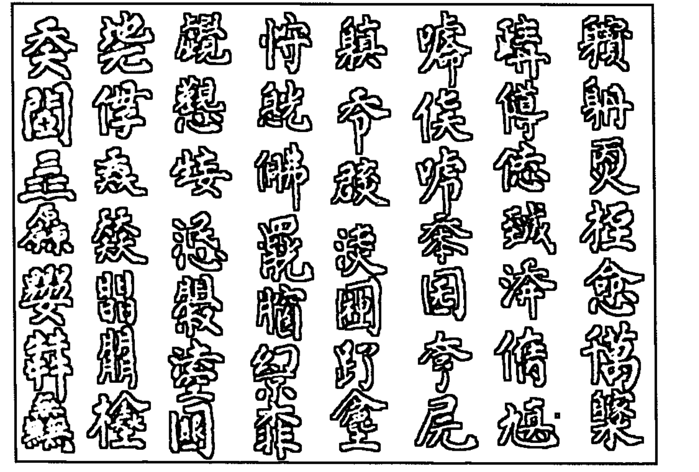

上圖中的文字，是聖人傳下來的，叫作「太上老君碑文」。前些年曾有「專家」認為這是古人做的文字遊戲，沒有意義，這真是外行看熱鬧。其實這些字都是有意義的，比如第一個字「身寶」，說的就是「人體自身就有寶」，這個寶就是「精氣神」這人身三寶；第二個字「身丹」，說的就是「全身無處不丹田」！而第一行的最後一個字「自家水」，就是「藥」，這個字很多人都懂。這篇文章就談談人身三寶之一的「精」以及生精的「腎」！

### ◇ 中醫的「腎」是一個系統，與西醫的「腎」不同

要談「精」，就不能不先談談中醫所說的「腎」。
說到腎，我們得先簡單掃掃盲。我們知道，腎有兩個，「掛」於腹後脊椎兩側，在古傳中醫裡，左邊的腎叫作腎，右邊的腎叫「命門」（從《難經》開始，命門便被作為一個單獨的臟器來看待。歷代對命門的位置均有紛爭，胡塗醫傾向於認為，右腎就是命門。這也是為什麼後來的中醫號脈口訣說「左手心肝腎，右手肺脾命」），腎、命門、生殖器、前列腺和精囊加在一起才是完整的「腎」，腎、前列腺、精囊和命門叫「內腎」（在體內嘛）；生殖器在外，叫「外腎」。

此外，古傳中醫認為腎主骨、生髓、通於腦，所以我們平常說的能「補腎」的東西，很多其實補的都是腦！補腎一定要補腦才補得進去！在古傳中醫裡，腎、命門、生殖器與腦是連在一起的。古傳中醫有一個「不死法門」，練的就是這些部位。督脈真正「通」了之後，腎上腺與腦垂體兩大腺體之間互相激惹互相補益，腎腦之間的生理關係更加協調旺盛，人就可以由衰返壯。所以古人才說「要得不老，還精補腦」。國內很多男人都有前列腺的問題，幾乎可以肯定，他們在外面「不老實」，老實本分的人，不容易得這方面的病，原因就是邪淫的果報在腎和耳，前列腺是「腎」的一部分，這個地方比較容易顯現出來，老天爺公平得很。

《黃帝內經·素問·上古天真論》說：「腎者主水，受五臟六腑之精而藏之。」腎在五行中屬水，主人體五液以維持水液代謝的平衡。我在前面的文章裡介紹了一個「養氣法」，習練有素者，到了一定時候（如果每天練一小時，未婚者一個月，已婚者三個月左右），丹田真氣充足，腎氣旺盛起來，兩腎會有如湯煎之熱，古人管這叫「命門相火」。這裡所說的命門，與經絡圖上說的命門穴是兩碼事。《難經》上說，命門是精氣神的房舍，男人藏精、女人繫胞的地方，命門之氣與腎相通（「諸神精之所舍，元氣之所繫……男子以藏精，女子以繫胞，其氣與腎通」）。中醫認為，腎與膀胱相表裡，「腎主藏精」，為生殖、發育之源，是「先天之本」。腎氣旺盛則精盈髓足，聰明機敏。所以《黃帝內經·素問·靈蘭秘典論》上才說：腎是精力旺盛的源泉，沒有它，智慧和技巧都得不到發揮（腎者作強之官，伎巧出焉）。

以上談的是腎，現在談談「精」。

我在多年前看過一篇現代醫學研究，說一個正常男人，在相當時間內正常排出精液對身體有益無害。因為現代醫學對精液的成分化驗，得出的結論為精液主要是蛋白質和水，由性腺內分泌的化合物產生精蟲和卵子，是生理的自然現象，不需要去壓制、節欲。而傳統中醫則認為精是人體之寶，能不漏就不漏。究竟哪家對呢？

科學畢竟也在不斷向真理邁進，目前的科學認識，未必就都是終極真理！

### ◇ 先天之精與後天之精

我們且來看看中醫所說的「精」係何物，為何古人如此主張節欲保精。

古傳中醫所說的「精」，並不單指男性排泄出來的那個精，那是後天之精所轉化。古傳中醫認為精有兩種——後天之精和先天之精。後天之精很好理解，就是交媾之精、血、津、液等。所謂先天之精，則是「元精」，就是本文剛開始時提到的「自家水」，它是人體的「真藥」。我在文章裡提到過「活子時」的概念，其實人體在「活子時⑩」時所產生的「精」，就是先天之精。先天之精，可以藏於人體的每一個角落，換句話說是「全身無處不藏精」，但主要藏納於丹田及內外腎，當然，五臟六腑皆有先天之精。元精無形，寓於元氣之中，受外感則與元氣分別，成為後天凡精。佛家在這方面也談得很明白，但是普通經典裡沒有提到，藏在律部的經典裡，佛陀提到男人的精有七種顏色（白、黃、青、赤、黑、酪色和酪漿色），佛陀說的，就是古傳中醫所說的「元精」！元精可以在煉養中獲得，古人講的「煉精化氣」就是指煉先天元精而言。縱欲過度可以導致後天之精血耗損，從而耗泄先天元精。元精耗泄是人體衰老的主因，所以醫道兩家都很注重節欲保精，並編出了許多煉精、補精、固精的方法讓門人弟子去練習。佛家則乾脆讓人戒邪淫乃至斷淫欲，我們現代人有家有室的，恐怕很難做到。那就要懂得彌補和控制了。最好能從根本上明白精和命的關係，並掌握一定的保精、固精、補精的方法，否則無論怎樣空談道德都難免違背人性之常。

### ◇ 積精保命之道

古人講「積精保命」，人若懂得保精，就不自損天年，不自損天年的人，才能「盡終其天年」，乃至如莊子所說能「與天地精神相往來」！成語「聚精會神」，本來說的就是這麼回事兒。古傳中醫認為，聚精會神之道以「寡欲」為先，並提出五個具體思路：「寡欲」、「節勞」、「息怒」、「戒漏」和「慎味」。翻譯成現代語言，就是欲望不要過多、不要過度勞累、不要動不動就發脾氣、要避免過多洩漏、飲食要以清淡為主。

那麼現代人該怎麼保精、固精、補精呢？

其實方法不外這五個方面：「寡欲」、「節勞」、「息怒」、「戒漏」和「慎味」。當然，首先要明白精的重要，防淫戒漏，特別不要在夫妻關係以外瞎搞，這是最重要的方法！自損天年最嚴重的就是縱欲過多，邪淫無度！

具體點講，年輕體壯的人精盈氣盛，要盡量避免遺精、漏精。簡單方法是：睡覺要側臥（因為仰臥容易遺精），蓋薄點兒的被子，內褲不要太緊，喝酒後、長途旅行後、太勞累之後等不要行房。此外，性生活要有節制，每次射精後要及時進行補氣、養氣，具體可以習練我文章裡提到的「心腎相交法」和「養氣法」。

中年以後的人，身體已經「破」了，除了上面說的節欲保精、心腎相交和養氣法等之外，還應該以「不漏」為功夫。古傳中醫認為，但凡男女交接必擾其腎，腎動則氣必隨之而漏。那麼什麼是不漏的功夫呢？不漏有「外不漏」和「內不漏」。所謂外不漏，就是指交合之精不漏、呼吸之氣不漏、思慮之神不用，古人管這叫「固外藥」。而內不漏，則是指先天之藥不漏、先天之氣不傷、先天之神不用，古人管這叫「固內藥」。這功夫聽起來特別難，其實也就一句話：「靜處煉命，動處煉性。」

簡單來說，靜處煉命，就是在無事獨處的時候時時返觀內照，微微意照丹田，內心保持暢快爽朗。動處煉性，就是把用功放之於日常生活中，在待人接物中做到中規中矩、合情合理、如理如法，考驗自己的心性，而不是脫離實際地空談道德。

要強調一點，先後天之精是可以互相轉化的。無形的先天之精在性欲衝動時就可以轉變為有形的精液流出來，其實後天的精液、經血，也可以通過特定的方法轉化為先天之精。那些由於房事、遺精等耗損過多而精衰的人，可以通過「靜處煉命，動處煉性」的功夫補精，此外，還可以適當服食藥補，古傳中醫有培元補氣的方子用來泡酒喝，這不便公開。大家平時多食用黑豆、枸杞之類的東西，多採氣、補氣就行了。

## 中醫解惑 Q & A

了凡：「腎、命門、生殖器、前列腺和精囊加在一起才是完整的『腎』」，這句話是否能理解為骨頭也是腎的一部分？
胡塗醫：不是。

宗鏡花雨：胡塗醫你好！請問男人做了節育手術，會對人體腎臟有傷害嗎？或者這樣說，會對人的身體有傷害嗎？
胡塗醫：一般來說是不如不做，但既然做了就做了，不必掛礙。

小玄子：請問先生，那為什麼佛陀提到的精分七種顏色，有什麼區別呢？在哪部經典裡呢？先生是否可以明示下？
胡塗醫：看來您跟律藏有緣，乾脆這樣，我賣個關子，好讓您發心把律藏給通讀一遍吧。阿彌陀佛。
小玄子：敢問先生，不是有在家人不讀律藏的說法嗎？那我可以讀嗎？
胡塗醫：那個說法不對。佛經誰都可以讀的，佛祖難道還隱瞞什麼！您大膽去讀吧。您不妨找找佛光山版本的《佛光大藏經》，那花了佛光山十多年的光陰。

虛吳：頂禮胡塗醫仁兄。「古傳中醫認為腎主骨、生髓、通於腦，所以我們平常說的能『補腎』的東西，很多其實補的都是腦！補腎一定要補腦才補得進去！」何止補腎一定要補腦才補得進去！「補氣」、「補血」、「補脾」……一切說要「補」的，也一定要補腦才補得進去！

胡塗醫：頂禮您！其實最該補的是我們的「心」。

虛吳：補腦有個硬指標「有好覺睡」，請教胡塗醫，不知對否？

胡塗醫：不全對。

痴迷中醫：回饋一下，我練習心腎相交法已經有大約三個多月了，直接的感受就是睡眠大為改善、口水充盈。練習晨起拍打胃經大約四個多月，胃口很好，吃飯特別香，但是體重仍然是正常水準。養氣法也練習，不過不是每天練，但是也感覺到身體內正氣比以前充足了。所以先生所說「紙上得來終覺淺，須知此事要躬行」，在下是略有體會。現在準備向著先生所說的「靜處煉命，動處煉性」的方向去，要在實際生活中煉性。到時候再回饋進展和體會。

胡塗醫：其實性命雙修才對的，也不能絕對地分開，非得靜處煉啥動處煉啥。

ii_e：先生的文裡藏了好多東西啊，這篇聖人傳的文字看了多時，臨過，猜「觀心」、「自性光明」、「神內守」、「生妄意」……實在愚鈍，還請先生閒時為大家逐一解字。一大群不老實之人以後要老實兒點，前列腺那哥們兒可誠實得很哪，呵呵！看來女生要好很多！要養心補氣，做並且堅持做啊，與博友共勉！

胡塗醫：女生若不老實，也會得類似的毛病啊。因果不爽！

qiqi_ge：女生月經前後兩天半是生「精」時間，這個時間不要被「採」了去，免得流於濁對嗎？

胡塗醫：阿彌陀佛。事實上，任何時候都是生精、耗精的時間。

## 談談「心」

三國魏詩人阮籍先生是當年的「竹林七賢」之一，崇奉老莊之學。其《詠懷》八十二首，冠絕當時。而阮公其實是易學名家，深通易理、樂理，著有《通易論》、《樂論》等書，後世多只知其詩文之名，而少知其易、樂之學。當代「最後的通儒」——著名國學大師饒宗頤老先生——評介阮公「蓋以《易》為詩者也」。饒老先生在和阮籍《詠懷》第五十三首中寫道：

> 小人計其功，君子道其常。
> 不見風中松，卓立不易方。
> 誰明憂患故，而具此剛腸。
> 詩心與易通，百世資稻粱。
> 至人安所歸，萱草樹芝房。
> 炎丘已火流，群虱猶在傍。

饒老的這首詩，毫不客氣地批評了那些急功近利的人為「小人」，因為「君子道其常」。所謂「君子」，用《易經》的話來說，就是「君子終日乾乾」。一直自強不息的人，彷彿寒風中的松柏，巍然聳立，不輕易為外境所改變。饒老用「道其常」來形容「君子」，這真是大家手筆！太上曰：「道常無名」，自強不息的人，反而願意抱樸、無名。誰能洞明憂患的因果，而具備剛直不阿、直心向道之心呢？饒老一句「詩心與易通，百世資稻粱」，把詩、心、易三者（或者說詩心與易學兩者）貫通，可資以未來百世的精神食糧，那才是「至人」所嚮往的境界、地方——萱草茂盛、靈芝仙草成長的山清水秀，心無雜染之地。只可惜時下鄉間，民眾還是水深火熱，那些寄生蟲還依附在其一旁，饒老這首詩，讓人一詠三歎！有心學習古傳中醫者，應該學習「君子道其常」的品行，才可望有朝一日「詩心與易通」，諸般學問皆通達無礙。

### ◇ 血脈與氣血的關係

說起「心」，《黃帝內經·素問·靈蘭秘典論》稱之為「君主之官」。此外還說它是五臟六腑的大老闆，是精神的家園（《黃帝內經·靈樞·邪客》：「心者，五臟六腑之大主也，精神之所舍也」）。在中醫的世界裡，「心」的功能主要有兩個方面：主血脈和主神志。

古人所說的「心主血脈」，是指心主血和主脈。全身的血液都在脈中運行，依賴於心臟的搏動而輸送到全身來發揮其濡養的君主之功。而心臟的搏動，古人則認為主要依賴於「氣」——心氣！心氣旺盛，血液才能在脈內周流不息，營養全身；心氣不足，則會引起心血管系統的諸多病變。至於「脈」，其生理功能有兩方面：一是氣血運行的通道，即血脈對血的運行有一定的約束力，使之循著一定方向、一定路徑而循環貫注，流行不止；二是借助脾、肺的功用，運載水穀精微，以布散周身，滋養臟腑組織器官。這就是「心主血脈」。

所謂「心主神志」，指心分別主「神」和主「志」，包括了人類的所有精神、意識、思維等活動。《黃帝內經·素問·靈蘭秘典論》說「心者，君主之官，神明出焉」，就是說的這個內容。心氣足時，心主神明的生理功能才正常。心主神明的生理功能正常，其直接結果就是神志清晰、思維敏捷、精力充沛；反之，則可見反應遲鈍、精神萎靡、神志不寧、譫狂健忘等問題。明白「心」的功用，治起病來才能得「心」應「手」。

事實上，我們現代人，很多人對我們的「心」的功用瞭解還很有限。我在上面說了，心所主神志，包括了人類的所有精神、意識、思維等活動。換句話說，我們的所有七情六欲，都起於心。這方面，許多人只知道佛家論述最多，其實醫家早有論斷。《類經》便說：「心為五臟六腑之大主，而總統魂魄，兼該意志，故憂動於心則肺應，思動於心則脾應，怒動於心則肝應，恐動於心則腎應，此所以五志唯心所使也。」可見「唯心」之說，醫家與佛家都頗有「共識」。當然，佛家對「心」的論述，的確是最徹底的，「即心即佛」嘛。

學習古傳中醫，要時時勤向心地用功夫，能夠認識「心」的本質，實修用功起來才容易得力。五祖大師對慧能六祖說過「不識本心，學法無益」，這真是千載難遇的明師訓示！不知道大家在實修過程中，有哪一時刻，看住了自己的本心？

中醫所說的「心」，不僅僅指父母所生的「肉團心」，還指那個主宰著我們一切精神、意識、思維等活動的「心」，佛門把這個主宰著我們一切精神、意識、思維等活動的「心」分析得非常透澈，大家不妨去找找相關的經典來讀讀。這裡簡單介紹一下，希望對大家日後的實修實證有所幫助。

先說「緣慮心」。這是「緣」於外境而起思「慮」之心，所以又稱作慮知心、了別心，是指我們的第六意識攀緣六塵（色、聲、香、味、觸、法）外境的妄心。在「心」的所有情志活動中，這個「緣慮」老兄最為活躍，它不斷向外攀緣，思慮、思考事物，一會兒想這、一會兒想那，從沒消停過，它隨塵觸境、起滅無常。這個「緣慮心」就像大海的波浪，本來並不存在，有風則有波浪，無風則「風平浪靜」，它沒有「自性」，不過是隨「別人」（風）起滅而已。我們看很多人寫的實修體會，都能看到那一顆顆「緣慮心」在隨風起舞。

另外有一個「思量心」。這是指第七意識（佛學稱作末那識）的作用，此心是人世間所有紛爭的根源！人生種種看不破、放不下的執著煩惱，都是因為它老兄而起。饒老那句罵人的詩「小人計其功」，就是這顆「思量心」在作怪！其「特徵」是，執著有個「我」存在，由此帶來「我的愛」、「我的恨」、「我的如來我的卿」等等（與此相關的佛學名相很多，比如「我癡」、「我見」、「我愛」、「我慢」、「人見」、「眾生見」、「壽者見」等等）。

還有一個「積聚心」。這是指我們的第八識（佛學稱作阿賴耶識），我在〈你也有「過目不忘」的記憶力〉中會談到，這個「心」就像電腦的超級大硬碟，它儲存著我們無始以來所思所想、所造所作的各種「記憶」——不管是「善」還是「惡」，一律記錄在硬碟裡。這個「心」是真心和假意糅合在一起，是真如與無明和合而成。因此「積聚心」具有真妄「兩面性」，換句話說，「積聚心」就是指的真心和妄心。真心，是那個自性清淨、恆常不變的心，這就是饒老的詩「君子道其常」。所以太上曰：「知常曰明。」妄心，則是指雜染虛妄、生滅變異的心。佛學的「真妄同源」就是說的這顆「積聚心」。所以太上曰：「域中有四大，而王居其一焉。」哎，醫家、道家、佛家，說的都是同一個東西呀！

最後一個稱作「真如心」。它老兄就是我們的「本來面目」，它是我們本來就有、真實不虛的清淨心，元朝中峰明本大師讚歎它「混千差而不亂，曆三際以靡遷，炳然獨照，卓爾不群，在聖不增，在凡不減」。

我們的「心」，需要專門拿出點兒時間來實修來滋潤。實修實證，也希望大家多多用「心」。祝福大家「詩心與易通，百世資稻粱」，早日洞悉那個「處生死流，驪珠獨耀於滄海；居涅槃岸，桂輪孤朗於中天」的東西！

## 略說「精、氣、神」

參加過古傳中醫網路實修的人，多半都覺得自己精氣神比較足。我在「糊塗醫治糊塗病」博客裡，多次談及精氣神。這篇文章，胡塗醫再簡單談談古傳中醫所說的人身三寶——精、氣、神，希望這方面的知識對大家日後的實修有所幫助。

精、氣、神是生命三大要素，古來煉養大家都特別注重積精全神。翁象川先生在注釋《悟真篇》時說：「養生之士，先寶其精，精滿則氣壯，氣壯則神旺，神旺則身健，身健則少病。內則五臟敷華，外則肌膚潤澤，容顏光彩，耳目聰明。」我們現代人精氣神耗得早、耗得多，而沒有幾個人懂得好好煉養，所以亞健康的人特別多。

一般談論精氣神這個問題，都是從「精」開始，再談「氣」和「神」。在醫家真傳裡，卻正好倒過來，總先談「神」，因為「神」與「心」兩個概念太相近！學習古傳中醫或者走養生修道的路，如果不明白「心」與「神」，終將如盲人騎瞎馬！各家各派，說到底都是在想方設法明心、見性。北宋張伯端真人在《悟真篇》自序裡說：「欲體至道，莫若明乎本心。心者，道之樞。」這真是明師之言！《黃帝內經》多次論及「心」與「神」，我在不少文章裡，尤其是〈談談「心」〉裡提到了一些。這裡隨便撿幾句重溫一下：

## ◇ 萬病由心起，治病必治心

《黃帝內經·靈樞·邪客》：「心者，五臟六腑之大主也，精神之所舍也。」

《黃帝內經·素問·靈蘭秘典論》：「心者，君主之官，神明出焉。」

《黃帝內經·素問·六節藏象論》：「心者，生之本，神之變也。」

《黃帝內經·靈樞·本神》：「所以任物者謂之心，心有所憶謂之意。」

按照古傳中醫的觀點，萬病由心起，治病必治心。心是最根本的，神是由心而生。古傳中醫認為心的本體是無為的、靜寂的、不動的，是「普遍如此」、「本來如此」、「必然如此」的（這與佛家講的三法印是何等相似！）。很多人都知道中醫經典裡常說「心藏神」，卻少有人知道心與神的主次。古傳中醫有一句千古不傳的秘訣，叫「寂然不動為心，感而遂通為神」。

「心」她老人家亘古長存、如如不動，她生成萬物而不佔有萬物！太上在《道德經》裡說：「少則得，多則惑。」為什麼「少」反而能「得」，「多」反而就迷「惑」呢？這說的不就是別耗那麼多神，胡思亂想越少越容易「明心」嗎？所以太上教導我們說，那些已經從此岸到達了彼岸的聖人，懂得「抱一為天下式」。啥叫「抱一」？我在〈獨立守神〉一文裡講「獨立守神」的方法時引用了這句話，「抱一」就是為了將「心」專注於「一」處，達到獨立守神、收心止念的目的！

整個古傳中醫的修習過程，說到底，就是修心和煉命。修心之說，與佛家的說法如出一轍！煉命，則是分階段將精、氣、神三寶凝化。所以「精」和「氣」這兩寶也就特別重要了。

同樣先說「氣」。古傳中醫所說的「氣」，是有不同層次的。對於一般的人，明師們往往只說「呼吸之氣」，對於門人弟子，則說「內氣」、「真氣」甚至「先天一炁」。

在20世紀八九十年代曾經興過氣功熱，當年的不少「大師」，忽悠來忽悠去其實都在「呼吸之氣」上折騰，讓內行人笑掉大牙。古傳中醫在收心止念開始時就用正呼吸進行調息，叫作「調真息」，到了神、氣、精漸漸合凝、合煉時，此時之「氣」叫作「真氣」，古字寫作「炁」。這個炁的運行，與祖氣相連，如磁吸鐵。不像我們普通的人呼吸，只從口鼻隨咽喉而下至中脘而回。所以莊子在《莊子·大宗師》裡說：「真人之息以踵，眾人之息以喉。」（請見〈玄關 VS 先天一炁〉一文）

如何做到「真息」呢？真息即無息。《道藏·洞真部·玉訣類》說：「心不動念，無來無去，不出不入，自然常住」，這些話，多麼像佛家的話呀，這就是方法！

最後說說「精」。

我在前面的文章〈「腎」VS「精」〉裡說過這段話，大家不妨重溫一下：

⑫ 請見〈獨立守神〉，395頁。

⑬ 請見〈玄關 VS 先天一炁〉，628頁。

古傳中醫所說的「精」，並不單指男性排泄出來的那個精，那是後天之精所轉化。古傳中醫認為精有兩種——後天之精和先天之精。後天之精很好理解，就是交媾之精、血、津、液等。所謂先天之精，則是「元精」，就是本文剛開始時提到的「自家水」，它是人體的「真藥」。我在文章裡提到過「活子時」的概念，其實人體在「活子時」時所產生的精，就是先天之精。先天之精，可以藏於人體的每一個角落，換句話說是「全身無處不藏精」，但主要藏納於丹田及內外腎，當然，五臟六腑皆有先天之精。元精無形，寓於元氣之中，受外感則與元氣分別，成為後天凡精。

在古傳中醫的真傳裡，有個說法是，精在先天時藏於五臟六腑，氤氳而成形，後天念頭一動就成為後天之精（所以要時時正身、內省、止息）。古傳中醫所說的「精」，是人體大藥，是神和氣用來凝煉內丹的原材料。在人體靜到極點，微覺有動而非動，純而明心、氣足源清、可「以神煉之」的東西。這就是呂洞賓真人說的那個東西——「息精息氣養精神，精養丹田氣養身」。

精、氣、神三者，古傳中醫認為應該以神為主。神、氣、精常常「相戀」，六世達賴的很多「情詩」，在內行看來，都是寫的這回事兒，與男女情愛無關。

真有實修實證的人看到以上文字多半會豁然開朗，看不懂的，就在以後的實修歷程中多問問自己這些問題：

- 「神」守住了嗎？
- 「心」靜到極點了嗎？
- 平時有注意節欲保精嗎？
- 那個呼吸之氣「以踵」了嗎？
- 念頭越來越少了嗎？
- 日子越過越簡單了嗎？
- 今天比昨天輕安、快樂了嗎？

如果以上都沒有，拜託不要到處說自己在修行學佛啥的，都是自欺欺人！最後引用一首陸放翁的詩結束本文：存神止慮自長年，黃老遺書漢尚傳。妙語雖傳人不省，卻從丹灶覓神仙。祝福大家身心輕安。

## 中醫解惑 Q & A

篤行：學習，實證之，把心量擴大。一著急，心就亂，手忙腳亂的，情商就低了。

胡塗醫：這正是因為「心主神明」呀！

纏小蝦：先生好，我雖未報名與大家一起實修，但我在家也一個人練習了好幾天，現在比較忙沒練習了，渾身不舒服啊。一天不站樁好像缺了什麼，享受站久了那種心的寧靜，自由的呼吸。我這是第幾心呢？

胡塗醫：第 3.2 心。

hattie：先生，關於這句話——「真人之息以踵，眾人之息以喉」，我在您的〈呼吸定息〉裡找到了一些解釋。請問這個「以踵」對大家目前來講，是不是指呼吸要深、細、長，呼長吸短或呼短吸長，而且是緩緩地接踵而至？好像我在「獨立守神」時有一點感覺，很自然地去這樣呼吸了，但是不知道有幾分相似，也不清楚呼吸有多深。所以想問問您，我需要刻意去調息嗎，還是說久而久之，功夫就自然成了？如果需要調息的話，吸氣時要有多深？又或者說僅觀呼吸就好，「拴繫此心」就算是將「心」（實際上是指神吧？）專注於「一」處的一個方法了？我不免也想「從丹灶覓神仙」，所以就有了這些問題，也不知道我說清楚了嗎？

P.S.「抱一」是每天過日子做事的方法，不僅僅是在「獨立守神」站樁之時，雖然明白，卻要真真切切克服自己的懶惰，「勤而行之」！感謝先生苦口婆心一遍一遍去喚醒我們那迷惑煩亂的心！

胡塗醫：對莊子所說的「真人之息以踵」，千百年來眾說紛紜。這個問題歷來都是口傳心授，我不便在此公開回答，見諒。至於初學者，不要刻意追求呼吸的「深、細、長」，須知大道自然。隨著呼吸功夫的深入，會自然達到細、柔、慢、長、勻，再隨著功夫的深入，入靜極深時，會慢慢達到念住、息住、脈住。所以修行得老老實實、一步一個腳印、勤勤懇懇來。這是要拿出「專門的」時間來身體力行的。當然，也要注意積累很多的福德因緣。總之，沒下過狠功夫是出不了啥功夫的，更別妄想啥成佛作祖了脫生死（有一些學佛的、修道的、練功的人常大言不慚自己在學佛修道啥的，總讓人敬重有加卻無可奈何）。P.S. 我絕不會「苦口婆心一遍一遍去喚醒」誰「那迷惑煩亂的心」，大家已經夠迷惑了，還喚醒來添迷惑？

遠帆：博主您好，很感謝您的回覆。我們自己在瞎折騰，怎麼知道「差不多」呢？我自己看書，瞎看亂練（當然都是省事兒的，也沒有堅持），比如說，練腹式呼吸，我吸氣時感覺不深，呼氣時倒經常感到腳後跟的氣往上走（也就是呼出去了）。我看別人解釋「真人呼吸至踵」說是這裡那裡的，我就不明白了，呼吸時腳後跟有感覺，不就是「至踵」嗎？糊塗死我了。

胡塗醫：「真人呼吸至踵」，有人解釋是呼吸到腳跟，這是望文生義。不要去聽大師們的。折騰到什麼時候算差不多呢？到您覺得差不多的時候；如果沒有這種感覺，就還沒「差不多」。

## 略說「雙盤」

有位朋友問起「雙盤」，說一位老道長不太主張。之前也有朋友提起說有位內家拳名家也公開反對過雙盤，問胡塗醫的看法。如果反對「雙盤」的人能每天輕鬆地盤上兩三個時辰並堅持三年的話，他們是絕不會這麼說的。如果雙盤沒必要，我們還遭那個罪整啥「搖山晃海」網路實修？

先簡單掃盲一下。「雙盤」，就是把兩條腿子都盤起來靜坐。自古以來佛道醫儒武各家各派幾乎都知道要雙盤。雙盤怎麼「盤」呢？一般來說有兩種雙盤法。其一是先將左腳掌置於右大腿上，再將右腳掌置於左大腿上。另外一個是反過來，先將右腳掌置於左大腿上，再將左腳掌置於右大腿上（佛門管前者叫「吉祥坐」，後者叫「降魔坐」或「金剛坐」）。盤法不一樣，「痛快」卻一樣！

## ◇ 雙盤的妙處

在醫家看來，「雙盤」並不是可有可無的，而是修習醫道的必經途徑！不主張「雙盤」的人，幾乎可以肯定沒有得啥真傳。醫家認為，雙盤有諸多不可思議的好處，我隨便列舉幾個於下：

1. 從雙盤的姿勢看，腳踝壓住了大腿內側的大動脈，為了打通動脈，心臟會加大力量泵血，因而能打通腿部血脈。
2. 而在打通腿部血脈之前，由於雙腿動脈不過血，因此全身血液都集中在上半身，而此時心臟又在加大供血力量，因此，五臟六腑會得到大量的供血，氣隨血行，這能迅速改善五臟六腑的機能，同時促進大腦供血。
3. 雙盤不僅打開腿部經絡血脈，而且會打開胯關節。
4. 雙盤坐姿可以根治腰疼、補足腎氣，腎氣足了，就算你想弓著腰坐都不可能，充足的腎氣會把腰部、脊背自然頂得直直的。
5. 除此之外，醫家祕傳裡還說，「雙盤」可以防漏精、止漏精、暖足心，清除「精」中的濁火，去除體內頑固的濕氣，可以大幅度地刺激「精脈」，使人體產生大藥！
6. 簡言之，練雙盤可以生精、化氣、養神。

瞧不起雙盤的人，可能就像會殺豬的看不起會造飛機的，看上去雖然都是「技術活」，層次還是不一樣的。儘管殺豬的看上去常常紅光滿面，強壯得很。

雙盤這個活兒，說起來容易，做起來難。因為它初練習起來太痛苦，很多人無法堅持。有些大師主張「條條大路通羅馬」，何必一定練雙盤呢？這對人群中的絕少數人也許適應，但是對大多數的人，如果連「降伏其腿」也做不到，就別再去奢談什麼「降伏其心」。

那麼鍛鍊雙盤的方法是什麼呢？方法就在我的文章〈對治緊張、壓力的方法〉裡，那個「搖山晃海」的練習，久久行之，就可以自然練出雙盤的功夫來。

對於想速成的人呢，還有兩個方法：一是明師啟動法，遇到明師，讓明師敲敲打打腰骨，一兩分鐘之內就能盤上；二是「痛滾床底法」，這個很好辦，拿根繩子讓家裡人把自己按照雙盤的坐姿死死捆起來，然後讓家裡人馬上鎖起門來出外，不到時間（比如一個小時或兩個小時）不能回家來「救」你。等到家裡人回來時，往往開門進來在家裡找不到你了——痛到滾床底去了！這個方法最快速、有效！有自信、不怕痛，甚至有點兒「人生自古誰無死」勇氣的人，都不妨整一回，誰整誰知道，特管用。

## 女性注意：

女同胞在生理期間可以靜坐，但盡量避免過長時間雙盤，以免出血量過多。

## 中醫解惑 Q & A

一葉知秋：我看過那位老道長打坐的照片，應該也是雙盤！老道長說盤腿的原話是這個：「打坐，是你的神在打坐，不是你的肉體，很多人打坐的樣子很好看，可是他的神不知道到哪一個國家去了，你的主人都不在，那還叫打坐嗎？打坐要的是神思不動，神不離身就會長保健康。」「如果雙盤腿能盤成神仙，那我早把自己的腿用繩子綁起來了。」應該是理解不同吧！

胡塗醫：這樣說的話就對了。

地外文明接觸：這幾年會陰穴附近有濕疹現象，感覺起來似乎身體裡有某種濕氣濁氣流到那附近，然後就奇癢無比，久不見好。最近發現在雙盤靜坐的時候，這種濁氣流動聚集發癢的現象更加明顯，以至於不敢再盤，改做站樁了。我想請教一下，你說雙盤可以祛濕，會不會造成濕氣淤積在會陰而加重濕疹現象呢？感謝。

胡塗醫：不會。

thym9_小草：記得曾經試過雙盤，可不久便出現持續膝蓋疼，據說沒做熱身之故。也許，每次應該先做晃海再盤吧。晃海＝熱身？

胡塗醫：晃海＝熱身。

颺鼠飲河：先生，請問上班時單盤到座位上可以嗎？不過這種情況心不能啥都不想。看過關於雙盤的說法，跟先生說的很相近啊，說是痛是在消業，越痛說明業越多。

胡塗醫：上班時單盤到座位上是否可以，得問問您的老闆呀！

恒河沙：與各位暫時只能單盤的同修們分享一個小法子：在床上或瑜伽墊上不用坐墊單盤，以髖為軸，上身保持正直，前傾下壓，如此盡量壓到最低，盡量保持。然後換腿壓。每天壓個十來分鐘到半小時，能盡快拉開髖關節。只是不知此法會不會像瑜伽那樣對身體造成傷害，還請先生指正。

胡塗醫：很好，「傷心總是難免的」。

行者：先生好！實修前雙盤是金剛坐，一次能堅持 50 分鐘，從 4 月開始實修後，右腿胯、膝、踝非常痛，不知為什麼？（晃海時都是散盤兩腿交替在上）「吉祥坐」和「金剛坐」兩種方法有區別，功效不一樣，那我們該練哪一種？

胡塗醫：該練雙盤。

大象：先生，別人說學游泳的時候，把人推下游泳池，然後研究、擺弄幾下就學會了，那麼打坐的時候，如果沒有明師指點，自己研究行不行呢？我就是自己研究的，也不數息意守之類。以前，打坐到半小時的時候，腿會麻、酸之類，現在到了一小時，感覺就非常舒服了。

胡塗醫：打坐最好能有明師指點，自己研究容易出問題。

恬淡虛無：我每天打坐，雙盤最長 50 分鐘，再多堅持 1 分鐘都困難，而且雜念不斷，我這樣自己打坐，沒有老師指點有危險嗎？辛苦先生。

胡塗醫：雙盤 50 分鐘已經很難得了！若想坐得更久，就要徹底放鬆，把胯骨、腿骨、腿上的肌肉、筋脈全放鬆下來。對於自學能力強的人，打坐也可以自學。當然，能有明師指點最好。盤坐是生精的好方法，但是也不是說非靜坐不可。

淨心不二：1. 對於練習者來說，盤坐最適合的時辰是子時嗎？2. 還是任何時間都可以？3. 如果練習時辰有區別，初學者該從什麼時辰開始入手？4. 雙「盤」上一段時間以後，能「盤緊」的時候是否要盡量緊一些？5. 將腳踝儘量貼向胯骨？但是看見一些佛像上好像腳的位置也可以不用緊靠胯骨的。

胡塗醫：1. 因人而異。2. 因人而異。3. 因人而異。4. 因人而異。5. 因人而異。

上善若水：請問先生，骨盆偏移、脊柱各關節代償性紊亂，雙盤靜坐時雙腳位置不是很對稱，對於身體能量恢復影響有多大？通督脈是否遙遙無期呢？

胡塗醫：那就別雙盤，改做不需要盤坐的練習。其實您不妨去找正骨醫生看看，先正正脊椎再說。

一清：今晨金剛坐85分鐘，下座後口舌乾燥。這個問題一直很讓我困惑，求先生指點。叩謝！

胡塗醫：舌頭抵住上顎就好。

那天那水：非常非常地想問一下胡塗醫列出雙盤好處的第四條「雙盤坐姿可以根治腰疼、補足腎氣，腎氣足了，就算你想弓著腰坐都不可能，充足的腎氣會把腰部、脊背自然『頂』得直直的」，那反過來如果刻意讓自己的腰部、脊背整天都「頂」得直直的，這樣能讓自己的腎氣充足起來嗎？

胡塗醫：試試就知道了。

妖精：代我父親請問一下，父親練打坐有兩個多月了，從一開始不怎麼能單邊盤腿，到現在能堅持半個多小時，而且感覺小腹有股氣團。最近他說雙腳總是像有電流一樣從腳心往上躥，像是順著肝經，到了胸口像火燒的感覺，而且心跳加速，他也說不清是什麼感覺。因為是第一次碰到，而且他心臟不好，他還想是不是自己快不行了，還去住院要動手術。後來醫生說這個應該是他心理的原因，他才想會不會因為打坐久了，造成體內真氣變強了造成，然後再碰到這種情況，他就想辦法轉移注意力，比如用頭寫字、在手心寫字，慢慢的火燒的感覺退了，但電流似乎又轉到後背進攻他，也是上躥到背部與胸腔對應的位置，像火燒一樣。所以特來請教先生，父親這個屬於什麼情況呢？是好是壞？要怎麼樣控制？還能繼續打坐嗎？謝謝。

**胡塗醫**：這是非常非常好的情況！讓他繼續用功吧。

**妖精**：「這是非常非常好的情況！讓他繼續用功吧。」看到先生這句話真是開心！可以讓父親安心了。請問父親若再遇到這樣的情況應該怎樣做呢？是要用意念控制它，還是轉移注意力？假若這個情況再上升到另外一個程度，要把注意力放在哪裡呢？（這麼問是想提前知道會出現怎樣的情況，這樣萬一父親遇到了就不會那麼慌。）謝謝先生。

**胡塗醫**：一切順其自然，千萬別人為去控制。

**光腳丫**：話說我前幾天嘗試了把自己捆上三個小時的雙盤，痛苦。但是痛苦過後是真痛快啊，淚中都是喜悅……問題是我現在盤不住了，我不知道該怎麼辦了，總是掙扎掙扎就放棄了，再沒盤過三個小時……您能給我點意見或者建議嗎？

**胡塗醫**：繼續捆上三個小時唄。

**放飛心情**：請問先生，患有風濕關節炎腿疼還有點變形的人能不能練雙盤？

胡淦醫：放飛心情，好好練吧，沒事兒的。

上善若水：先生，如何檢驗腰部的氣通沒通？青島附近的高人您熟悉嗎？

胡淦醫：方法很多，比如，腿盤不上，或盤上就容易痛，都是腰部氣血不通！我不認識高人。

Belinda：我能請教先生一個問題嗎？前一階段查出腰椎間盤出了問題，腰2～4是局限性突出，腰4、5是膨出，腰5到骶1是脫出並髓核游離，壓迫雙側隱窩，左側神經頭被壓。家人都懷疑我是打坐打出來的，先生您覺得是打坐姿勢不正確導致的嗎？會不會終生都治癒不了了呢？謝謝！

胡淦醫：打坐不會導致脊椎這麼多毛病的。打坐姿勢不正確，會出現一種「柱病」，古人叫禪病。您的這些問題很好治療的，建議找個正骨專家整一下就好。您照的是核磁共振嗎？似乎腰2～4不是突出。

Belinda：感謝先生這麼快給予回覆！照的是核磁共振，結論腰2～4是局限性突出。找了一位醫生，治療了一段時間。發病有一個半月了，腳部局部無知覺症狀沒有恢復，另外腰部也沒有完全恢復。擔心變成永久性問題，故而請教先生的。再次感謝！

胡淦醫：核磁共振應該不會錯，但是我還是覺得不是突出。您找湖北胡新明大師去看看。

努力向前進：先生您好！我跑步兩年有餘，最近赤腳跑步，請問這樣好嗎？先生整個略說「跑步」也好，哈！

胡淦醫：這樣好。

## 略說「丹田」

「丹田」這個詞，隨便問一個學中醫的，尤其是學針灸的人士，都知道是一個重要穴位，就連唱歌的，都懂得要用「丹田氣」。按普通醫書上的說法，丹田的位置莫衷一是，一般都認為在「臍下三寸」或「臍下一寸三分」處。所以普通學中醫的、懂針灸的，都懂得往肚臍以下三寸的地方下針。這究竟對不對呢？如果不對，怎麼也會有效果呢？正確的丹田位置應該在什麼地方呢？丹田究竟有什麼作用呢？如何用它來對治疾病，養生延年呢？

回答這類問題之前，我們先得搞清楚啥叫「丹」，啥叫「田」。弄明白了一些基本概念，很多問題就可迎刃而解了。

所謂「丹」，古人往往說得十分隱諱和神秘。「丹」的作用，被古代名家推崇備至，晉代的葛洪先生甚至就說，誰要用九轉之丹服用個三兩天，保准可以成仙（《抱朴子·金丹》：「九轉之丹服之三日得仙」）。在古代，「丹」被認為是長生不死藥。古代有不少皇帝，因為誤服「丹藥」，不僅不能成仙長命百歲，反而早早駕崩。雖然死了不少皇帝，但是各個朝代總有一些達官貴人或皇帝老兒相信這玩意兒。難道他們都傻嗎？也很難說！但有一點毫無疑問，他們都「誤服」了「丹」！在古傳中醫來說，「丹」就是「不死藥」，所以古聖才說「一粒金丹吞入腹，始知我命不由天」。當然，這裡所說的「不死藥」，並不是真的說人人得之皆可不死，但健康長壽是肯定沒問題的。

## ◇ 內丹

那麼「丹」究竟是啥玩意兒呢？用現代語言來說，丹就是人體內的核子反應爐（nuclear reactor）。這一點，我在後面章節裡〈最後幾張窗戶紙〉一文裡會再提到，這裡先說明一下：丹就是人體精氣神三寶（參閱〈略說「精、氣、神」〉 ❶）凝煉出來的人體核反應爐，擁有了它，就像擁有了私人核力量，任何疾病在它面前都不堪一擊！真正醫道的成就，非擁有它不可！歷代真正的大醫，無一不深諳個中三昧！所以太上在《道德經》裡不無感嘆地說：「吾何以知眾甫之狀哉？以此！」

所謂「田」，就是「生長」、凝結「丹」的田野、地方。一般來說，有三個這樣的地方：上丹田（眉心附近區域）、中丹田（兩乳連線中點膻中附近區域）和下丹田（歷代對其位置莫衷一是）。一般中醫典籍上說的「丹田」，是指「下丹田」。下丹田的具體位置，歷代都有爭議，一般都說在「臍下一寸三分」處。如果從今天的解剖結果看，這個地方是動脈、靜脈、微血管交接，血液轉換封閉循環的地方。往這個地方扎針、艾灸、養氣折騰自然有一定的養生延年的效果。按照古傳中醫的千古真傳，下丹田的精確位置，的確是在「臍下一寸三分」處，只是這個「下」，是人體平躺著，肚臍在「上」，它在「下」！也就是說，它在肚臍「裡面」（inside）一寸三分處，與腎相對！假如從「踵」部算起，假設有一條管子通到頭頂的話，這個點剛好在人體的「黃金分割點」上，即身高乘以0.618的地方（裡面）。這個地方，古傳中醫的秘笈常說它是「百脈之樞紐，生命之根源」，它是收納神氣、內煉歸爐的地方。簡單來說，它主藏精，養精蓄銳就靠它。很多不治之症，都是因為精氣神這人身三寶嚴重虧缺所致。往此處下手，或靜室端坐，或獨立守神，行返觀內照，虛心凝神之功，久久養氣，便可重新煥發機。

## ◆ 纏綿若存，知而不守

那麼，具體如何往下丹田處養精蓄銳呢？我前面的文章〈不論陰虛、陽虛，都是正氣不足〉裡提到的「養氣法」、〈獨立守神〉裡提到的「獨立守神」等方法都可以。不管用何種方法，要能做到「綿綿若存，用之不勤」。古聖有詩句曰：「真意往來無間斷，知而不守是功夫。」又有詩曰：「著意頭頭錯，無為又落空。」這些詩句都是收心煉己的口訣。

如何知道自己是否守好了下丹田呢？這裡再公開一個千古秘傳的檢驗標準：心息相依，以虛空為藏心之所。神氣活現，以恍然為息妄之鄉。

以上談的，主要是下丹田。事實上，人體像下丹田這樣的「秘竅」還有很多。古傳中醫有一句話叫「全身無處不丹田」！可見，人體的潛能實在有無限的可能。

補充一句：對於有心修習醫道的人，不能因為知道丹田的準確位置之後就一味妄加注守丹田，用意不能過重，尤其是女同胞們在生理期間。一味地專注於丹田，若無明師指點，最後容易引起腎臟、性腺、大腸等的「不良」反應，不利於打通帶脈。當然，丹田氣充足了，對於普通人來講，就會身體健康、精力旺盛。

喝茶去！不忽悠了，大家看懂多少算多少吧，這些在過去可都是千載不輕傳的呢！

祝福大家早日補漏，煥發青春活力！

❶ 請見〈略說「精、氣、神」〉，72頁。

## 中醫解惑 Q & A

今寧：原來平時我們認識的丹田是錯誤的。
胡塗醫：不能這樣說！不同的「認識」有不同的「作用」。

小舟：丹田＝人體的核反應爐，如此比喻，通俗易懂，絕妙！
胡塗醫：丹田應該像是核電站或核武庫，丹才是核反應爐。

理行：我看過別人寫的關於「漏身」之說，一直不太明白。有的人說童身是不用「補漏」的；有的則說每個人身體狀況不一樣，跟童身沒關係。
胡塗醫：跟童身絕對有關係，怎麼可能沒關係！童身基本上不必補漏。

緣來定緣：再請教先生一個問題！打個比方，如果結婚（世俗），又生了一個小孩子，從今以後即刻拒絕再同房，修身養性，是否能補漏呢？
胡塗醫：既然在婚姻中，還是不能如此自私「拒絕再同房」，如此自私，哪能修成啥東西來！只要「破身」，哪怕從此絕欲，也還是有漏之軀，非行補漏之法不可，這沒得商量的。雞蛋打破了，還能孵小雞嗎？

jueen：先生，我有一點困惑。在此文中，您提到：「往此處下手，或靜室端坐，或獨立守神，行返觀內照，虛心凝神之功，久久養氣，便可重新煥發生機。」所以獨立守神也需意守丹田？但在〈獨立守神〉一篇中您曾提到：「意念活動：別做任何『意念』，讓其自然入靜。誠如晉代孫綽先生在《喻道論》裡說的：『耳絕淫聲，口忘甘苦，意放休戚，心去於累，胸中抱一。』望先生指點。

**胡塗醫**：指點啥？兩者是同一個意思啊，沒區別。

**jueen**：沒區別？完了，以我這悟性，我還是不能明白！需要指點的是：意守丹田，不算是意念？

**胡塗醫**：『真意往來無間斷，知而不守是功夫。』『著意頭頭錯，無為又落空。』

## 略說河圖洛書

唐代孫思邈真人曾說過「不知易，不足以言太醫」，明朝張景岳先生也說「醫不可無易，易不可無醫」，可見醫、易之理不通，無法成為真正的中醫。學習古傳中醫，大易之理更是不可不通。而要通達這部被認為是「群經之首」的《易經》卻談何容易！很多人窮其一生也無大成，除了自己悟性、慧解不足，多半就是沒有得到完整的傳承。醫家在易理的授學上，有一套完整的傳承。在「事」上必須身體力行，行返觀內察之功；在「理」上則須從河圖、洛書入手，根據老祖宗留傳下來的「口訣」，指導門人弟子去尋找破解天、地、人三者的密碼，才可言「萬物皆可疾，萬物皆可醫」。河圖洛書之理一旦通達，大易之理立即冰釋！不僅如此，古聖前賢的諸多經典也才能真正讀懂。河圖和洛書可以說是中華文明的源頭的源頭，這樣的絕學用《周易參同契》的話來說，是「可以口訣，難以書傳」，要說清楚它殊為不易。這篇文章就略略說之，大家在文字以外看看有無一悟吧。

## ◇ 河圖和洛書再現於世

河圖和洛書，先秦諸子多有提及。在那個聖賢輩出、風起雲湧的時代，我們的古聖先賢幾乎都相信這個美麗的「傳說」：中華民族的始祖伏羲在得了天下之後，黃河裡躍出一匹龍馬，龍馬的背上負有一幅圖（也許是馬身上的旋毛長似星點，排列有序吧），這幅圖就是「河圖」。

而「洛書」則是在大禹治水的時候，從洛水裡浮出了一隻神龜，龜背上馱著擺列奇特的斑點，彷彿一本天「書」，是為「洛書」。大禹照著神龜身上的「書」，悟達治國安邦和治水的九大方略，史稱「洪範九籌」（見《尚書·洪範》）。我們高明的現代人多半是不相信有龍馬神龜這回事兒的，但不管你信不信，反正古人是信了。

《周易·繫辭》便說：「河出圖，洛出書，聖人則之。」《管子·小臣》也說：「河出圖，洛出書，地出乘黃。」連從來「不語怪力亂神」的孔夫子也在晚年頗有感嘆地說：「鳳鳥不至，河不出圖，吾已矣夫。」（請見《論語·子罕》）

傳說歸傳說，咱們可以不去理會其真假，但是河圖和洛書這兩門絕學，從伏羲到大禹，一直到今天，都在中華民族的高人之間默默傳承著，得其真諦者，如《陰符經》所說，「知之修煉，謂之聖人」。

河圖和洛書究竟是啥學問？千古以來說法不一。孔夫子、管子他們是否親自見過河圖和洛書也不得而知。從先秦到唐代，總有人在揣測河圖和洛書是否真的存在。直到五代末宋代初，人們才得以窺見河圖和洛書的真面目。將河圖和洛書公之於世的，就是那位常年沉睡於華山的陳摶老祖——希夷先生。希夷先生是中華文明的集大成者，他老人家一生閱人無數，通天達人，把黃老清淨無為之學、醫道兩家煉養方術、儒家修身之術、佛家禪定正觀等彙聚一爐，融會貫通。大家熟悉的太極圖、丹道逆煉的先天圖都是出之老祖之手。河圖和洛書便是由希夷先生在其劃時代巨著《龍圖序》、《龍圖易》裡傳出來的。希夷先生「以數衍圖，以圖表數」，發揚光大了象數易學。希夷先生開啟的圖數之學，經過其門人弟子的傳播，逐漸成為宋明理學的重要組成部分，尤其是後來的朱熹在《周易本義》中闡發之後，希夷先生的「聲望」也跟著朱子的「聖人」地位而水漲船高，本來是醫道兩家的文化，被儒家老實不客氣地「吸收」，終於成為宋明的「官方學問」。當然，中華文明人人有份，反正是咱們老祖宗的東西，誰愛據為己有就據為己有吧。希夷先生所闡述的河圖和洛書的「文化」，對中華民族後世的醫學、兵法、丹道乃至數學等的影響極為深遠。只是一個人修學到「一覽眾山小」的境界時，在任何時代都是難覓知音的。每次讀到希夷先生的詩「白雲高臥，世無知音」，總難免讓人心有戚戚焉。胡塗醫常常暗自慶幸自己沒啥文化，有的是朋友兄弟，不怕世上無知音。

## ◇ 蘊含陰陽與五行之理的「河圖」

那麼河圖和洛書說的究竟是什麼呢？先看河圖，請見下頁：
圖中白點1、3、5、7、9為奇數，為「陽」；黑點2、4、6、8、10為偶數，為「陰」。陰陽奇偶，互相交感，便是宇宙萬物的生化之道。1、2、3、4、5是所謂的「生數」，表示宇宙萬物的生發之機，先居於內；6、7、8、9、10是「成數」，表示宇宙萬物的成長，後居於外。可見，宇宙萬物莫不由「內」而「外」，修行之道必從返觀內察開始，此其一。其二，生數和成數分為奇偶，即陰陽，生數和成數本身也分陰陽，可見「一陰一陽之謂道」，養生修道要成功，必從把握陰陽開始。

如果從河圖各數的五行來看，可知：

- 1是天，居北而「生」水；6是地，居北而「成」之。
- 2是地，居南而「生」火；7是天，居南而「成」之。
- 3是天，居東而「生」木；8是地，居東而「成」之。
- 4是地，居西而「生」金；9是天，居西而「成」之。

顯然，這裡表達的意思是，「陽」或「天」雖是「生數」，但不能脫離「陰」或「地」而生長。而「陰」或「地」雖能生長萬物，但必須順應「陽」或「天」才能得生長之功用。所以，河圖簡單來說，是在表達人體內外、天地陰陽相戀相依而不相捨，「孤陰不生，獨陽不長」的生成關係以及天、人、萬物合一的思想。

而如果從北方天一生水起朝順時針旋轉，可知：
- 北方水生東方木，在人體來說，就是腎為母，肝為子。
- 東方木生南方火，在人體來說，就是肝為母，心為子。
- 南方火生中央土，在人體來說，就是心為母，脾為子。
- 中央土生西方金，在人體來說，就是脾為母，肺為子。
- 西方金生北方水，在人體來說，就是肺為母，腎為子。
如此循環不已、生化不息。

再看內層：

東三木和南二火，相加為五，木火一家。這就是《陰符經》說的「火生於木，禍發必克」。西四金和北一水，相加也是五。中宮土一家獨為五。

這三個「五」相加等於十五，正是洛書（見下頁圖）的九宮數之和。如果從數學上去探究，可以推論出勾股定律、複變函數、笛卡爾坐標系等東西來，我們且不去談它。在古傳中醫的千年秘傳裡，這三個五是有特別涵義的。今天就簡單講講：

- 東三木和南二火相加的第一個五，說的是人的「元神」。
- 西四金和北一水相加的第二個五，說的是人的「元精」。
- 中宮土一家獨為五是第三個五，說的是人的「真意」。真意獨處中宮，負責調和水火。

修煉的最大秘密，就是把這三家調和，使其凝煉合一而歸於太極，而其理法盡在這個河圖中！只是不得真師傅口訣，就算再聰明的人也猜不到。所以古人才說：「饒君聰慧過顏閔，不遇真師莫強猜。」北宋張伯端真人的詩「三五一都三個字，古今明者實然稀」說的就是這回事兒。

## ◆ 源自九宮之數的「洛書」

下面說說洛書。請看圖：

如果把這幅洛書想像是在第 91 頁的龜背上，古人有一個「口訣」來記憶其「佈局」：戴九履一，左三右七，二四為肩，六八為足，五居其中。

從洛書看，前後左右中，分別是九、一、三、七、五，都是奇數，屬「陽」，用白點表示。左右「肩膀」是「四」和「二」，後邊兩足為六和八，都是偶數，屬「陰」，用黑點表示。

洛書與河圖的陰陽奇偶、五行方位稍有改變：

相同：水還是在北，木還是在東。

不同：洛書的內層，生數居於正位。外層的成數移位至西北和東北角。西金四的內層生數移於東南，九的外層成數移於正南，南火二的內層生數移於西南，七的外層成數移於正西。

這不同之處是在表達什麼意思呢？如果逆時針向右旋轉就一目了然：

- 北一六水剋西二七火。
- 西二七火剋南四九金。
- 南四九金剋東三八木。

如果把洛書的黑白點換成數字，就是九宮圖：

| 4 | 9 | 2 |
|---|---|---|
| 3 | 5 | 7 |
| 8 | 1 | 6 |

這個九宮圖，不管是縱向還是橫向錯向如何相加都是十五，這就是《周易參同契》說的「三五既和諧，八面定綱紀」。至此，河圖和洛書的內外生成之數、前後左右上下中，縱橫交錯的數理模型昭然若揭，子午易位、水火既濟、神精合凝、返情歸性的金丹大道——醫道的最高成就矣。有心學習者，當速求真師口訣破之。

因為本文只想粗略說說，不去具體從數學的角度去解讀河圖和洛書。而且養生修道，不懂數學也可以修好。所以胡塗醫只是掃盲式的忽悠一下而已。中華民族的很多絕學，往往如老子所說「知者不博，博者不知」——公開說的死活不懂，懂的死活不說。胡塗醫用白紙黑字寫下這麼多，也是「死活不懂」在胡說而已，大家別太認真。

## 胎息、打坐及辟穀

據說方舟子先生揭偽揭到一位道長展示的「胎息」功夫，本來揭偽的和作偽的，有時就像《紅與黑》裡的紅巫與黑巫，作為局外人，讓他們各打五十大板即可，不需去做過多回應，但是事情發生期間不斷有網友找我，希望我談談胎息，也有好幾位老問及打坐的事情，這篇文章就簡單談談。

## ◇ 胎息

先說「胎息」。胎息是什麼東西？
胎息就是公開說的人肯定不懂，懂的人絕對不公開說的東西，就算是葛洪、孫思邈兩位大師也是欲言又止。葛真人在《抱朴子·釋滯》也只是提一提煉成胎息後的情狀——「得胎息者，能不以口鼻呼吸，如在胞胎中」，孫真人也一樣，含含糊糊地說「胎息者，不以口鼻呼吸者也」（出自《道樞·枕中篇》）。
胎息就是會的人不去公開演示，公開演示的人肯定不會的東西。以後大家別給那些公開演示胎息的大師朦了，大師們做得到，劉謙們也就做得到。
古傳中醫關於胎息的一句話：胎息是指在修習醫道的過程中，有了「醫道之胎」才有的一種內呼吸。用道家的話來說，就是有了道胎之後才自然產生的內呼吸。那些「類似」胎息的呼吸，不是胎息！類似胎息的表演，不是胎息！

大家若有心學習古傳中醫，就要紮紮實實用功，紮紮實實做學問，別被反偽鬥士們唬住，也別聽「公開演示」的大師們忽悠。

勉強再說一句：胎是聖胎，乃先天真元所結，息是真息，真息即無息。

## ◇ 打坐

再說「打坐」。

只要知道中國字怎麼寫，就差不多可以知道打坐如何打。「打」字怎麼寫？「提手旁」加一個「丁」字！用雙手提起一把先天丁火方為「打」——這句話是說給內行人聽的。簡單來說，提手就是結手印，「丁火」是用先天之數（非後天的「丙火」）。

「坐」字呢，則是兩個「人」坐於後天脾土上。為什麼你一個人打坐偏要說「兩個人」？兩層意思：其一，打坐最好有明師帶著，一個已經到了彼岸的人帶著一個還在此岸的人，師徒兩人心心相印踏踏實實用功。其二，一個人坐著就是兩個人坐著，一個四大假合的假我，一個如如不動的真我；一個雜亂心，一個清淨心；一個「惡」，一個「善」，此消彼長，直到善惡兩不思量了，才是真打坐。

打坐不是靜坐，靜坐不是打坐，否則石頭都在打坐了。那麼打坐具體如何打呢？可以從靜靜坐著開始。

王重陽真人有詩雲：「棄了惺惺學得癡，到無為處無不為。眼前世事只如此，耳畔風雷過不知。兩腳任從行處去，一靈常與氣相隨。有時四大醺醺醉，借問青天我是誰？」

## ◇ 辟穀

最後說說辟穀。辟穀有多種，有真辟穀，有假辟穀，有主動辟穀，有被動辟穀。

什麼是真辟穀？胎息出現之後，自然而然的「氣足不思飯」為真辟穀。

什麼是假辟穀？參加學習班的那些辟穀。

什麼是主動辟穀？為了治療某些疾病或者印證生命奧妙而進行的辟穀「訓練」。

什麼是被動辟穀？為了適應自然環境的劇變，或者被明師們「逼迫」著進入辟穀狀態的辟穀。換句話說，遇到明師，他們有辦法讓你「自然」產生辟穀，聽起來有點玄，但應是非常簡單的事兒。

假辟穀不難，稍事訓練即可辟穀。辟的時候好玩，多年後往往會樂極生悲——尤其是回谷沒有回好的人。

修習醫道，要紮紮實實用功，不要去好高騖遠、投機取巧。幾千年前建的都江堰抵得住大地震，近些年建的教學樓卻是豆腐渣，都是急功近利、投機取巧惹的禍。

## 中醫解惑 Q & A

沒囊沒氣：胎息應該是三維空間以外的呼吸吧，不是不呼吸，而是三維空間裡的人看不到。您說對嗎？
胡塗醫：不對。
沒囊沒氣：那就是全身無處不呼吸了？
胡塗醫：不是。
靜悟：像媽媽肚子裡的小娃娃那樣的呼吸。
胡塗醫：所以當一個人「恢復」了胎息，會覺得十分熟悉，彷彿什麼時候「會過」。

偶然：先生說的這三樣，太高了。本人只怕是一樣都修不到啊。眼睛盯著一字一句地讀完了，又產生一些稀奇古怪的想法：

1. 修到不以口鼻呼吸那一步，還要肺做什麼？
2. 胎息有無時間長短上的極限（是主食還是點心）？
3. 「丁火」到底是什麼火，類比一下：是柴火（燒起來煙霧騰騰，灰頭土臉）？還是煤炭火（方便但有毒，污染環境）？還是煤氣火（燃燒不盡也有毒）？還是天然氣火（清潔高效）？類似被動辟穀的說法，似乎小時候聽過人們常說，懶人窮得吃不起飯了，只有喝西北風去。不好意思，又胡言亂語了。阿彌陀佛！

胡塗醫：1. 修到不以口鼻呼吸那一步，肺還是用來呼吸。
2. 是主食，也是點心。
3. 丁火是先天火，其數「二」——這個是說給內行聽的，得懂易理、河圖、洛書、術數等等才能明白。

太極之風：「修到不以口鼻呼吸那一步，肺還是用來呼吸。」言多必失，肺與皮膚互為裡表，博主体驗過用皮膚呼吸嗎？

胡塗醫：先生批評很對！我的確多言了。不過按中醫的觀點，「肺與大腸相表裡」，儘管肺的確主氣、主皮膚。我沒有體驗用皮膚呼吸，我只懂用肺和鼻子嘴巴呼吸。請先生多多賜教！

太極之風：肺與大腸皆為腑如何去「相表裡」，書本上的東東有不少是錯的，要多多實證啊。

胡塗醫：謝謝提點，不知先生認為《黃帝內經》哪個地方錯了？

一泓：哈哈，終於有人在胡塗醫先生的地盤上唱唱反調了，還是個內行！可喜可賀呀！「外行看熱鬧」，我這個外行看了熱鬧，索性再湊一把熱鬧：我估摸著「用皮膚呼吸」，正常人都能做到，只不過不自知罷了。否則為什麼我們喜歡穿透氣一些的面料做的衣服，而裹層塑膠在身上會覺得不舒服、不透氣？不過若因為皮膚和肺都能呼吸，一個在表，一個在裡，就說「肺與皮膚相表裡」，該沒啥醫理可言，這話跟說「用嘴吃飯」在醫學上是同一個效果。肺與大腸據說是有些關係，肺氣肅降正常，則大腸傳導如常，大便通暢；若肺失肅降，津液不能下達，則大便秘結；反之，若大腸實熱，腑氣不通，也可影響肺氣不利而咳喘。至於為什麼說它們「相表裡」，難道是因為手太陰肺經和手陽明大腸經分別位於手臂表裡兩側對應位置？「肺與大腸相表裡」這話究竟對不對，我這個外行就不清楚了，也不懂如何去實證。與這個相似的表述好像還有什麼「心與小腸相表裡」、「腎與膀胱相表裡」？

胡塗醫：如果有人認為「相表裡」就應該是內在的臟腑和外表皮毛的關係，那麼豈不是五臟六腑都要和皮膚啊、頭髮啊、什麼的相表裡了？這樣的人多半連最基本的醫理都不懂。當然，如果他/她認為《黃帝內經》都是錯的，那就更無話可說了。勇於提出質疑無疑是一種應有的治學態度，但自己學問沒做

## 慎用六味地黄丸

有位网友引荐了一位大师关于「六味地黄丸」的推介，我着实为她的网友们捏了一把汗，六味地黄丸并不像大师所说的老小咸宜、天天能服用。本来对于大师们，胡涂医不喜欢过多去评说，毕竟中医的复兴有赖各路大师去传播。但不是真通医道的人一旦「被大师化」，难免会「不知医道强说医」，不懂「道」的人强行说道，最后难免变成胡说八道。不客气地说，大师关于六味地黄丸的说法就是胡说八道！有人甚至问胡涂医可否用这个药来「补肾壮阳」，真是让我哭笑不得。不得已，专门写篇文章说一说。

一句话：六味地黄丸，一定要慎用！

我们先来看看六味地黄丸是怎么整出来的。

### ◇ 六味地黄丸原方是治疗小儿发育迟缓的

在说这个问题之前，得先介绍一位了不起的中医先贤——钱乙先生。据《宋史》记载，钱老爷子出生于古传中医世家，可惜他的父亲大人太爱美酒和旅游，在他3岁的时候便「东之海上不反」，出东海旅游一去不复返（估计是去了日本）。他的母亲早逝，他的姑姑「哀而收养之」，并传他家传绝学，等他长大成人，告知他的家世，钱乙先生哭得死去活来，前后八九次外出寻找父亲，经过三十年，终于找回这位「嗜酒喜游」的老父。读《宋史·钱乙传》，让人感慨万千！原文摘录：「……乙方三岁，母前死，姑嫁吕氏，哀而收养之，长诲之医，乃告以家世。即泣，请往迹寻，凡八九反。积数岁，遂迎父以归，时已三十年矣。」哎，可见医家历代不缺贪玩的人啊，好在他有一位好姑姑好姑丈！

钱乙先生从小精进好学，认真钻研医经，尤其是家传《内经》和《神农本草经》，对于再奇异的药物，他都能将该药物从「出生本末」到「物色、名貌差别」信手拈来，让人叹服。可见他老人家是得古传中医真传的，叩问医经万卷，不但能知其然，而且知其所以然，对药物自然更是清楚明白、没有不「通」的！他自己身上也常带三分病，据《宋史》记载，钱老爷子生病的时候，总喜欢用「意念」来治疗（《宋史》：「乙本有羸疾，每自以意治之」），这是典型的道医特征——「人体自身有大药，全凭心意用功夫」，哪里需要用什么草药！他老人家活到82岁，借用佛教的话来说，是能够「预知时至」，知道何时要走，所以临往生前喊来亲戚朋友话别，换好衣服，潇洒而去（「召亲戚诀别，易衣待尽，遂卒，年八十二」），可见老爷子的内证功夫是相当不凡的。

可能因为从小没爹没娘，钱先生特别关心小孩子的病痛，数十年如一日，专研哑科（古代对儿科的称呼，因为婴幼儿无法说清楚病痛）。说起古代的儿科，还要扯到又一本据说「失传」了的医书——胡涂医不相信天下有那么多「失传」！按照《史记》的说法，神医扁鹊应是第一位儿科医生，他曾「为小儿医」。东汉的大医卫汛，据说是神医的后代传人，写了一部医家秘传经典叫《颅囟经》，这就是据说失传了的医书。但是到了宋代，钱老爷子却拜读了这本书，至于这本经书是如何得来的，史书语焉不详，有人说是当时的人假借古代巫师所作的《颅囟经》。但是如果是假的，以钱老爷子「专一为业，垂四十年」的认真严谨治学精神，不可能看不出来！如果按照金庸古龙们的思路，他的父亲大人可能不是真的「嗜酒喜游」，而是以此为借口，外出寻找这本《颅囟经》去了。我们且不去管他家为何有这本「失传」了的《颅囟经》，总之，钱老爷子对这本书反复研究，「以身证之」，终于功夫大成，活人无数。《四库全书·目录提要》对此大有溢美之词，说钱乙先生在宣和年间，用古代巫师方氏传下的《颅囟经》上的方法治好了很多小孩子，名声特牛（《四库全书·目录提要》：「乙在宣和间以巫方氏颅囟经治小儿，甚著于时。」）最牛的治疗案例是给宋神宗的孩子治病，老爷子信手抓一把黄土就把皇子的病（抽风）治好了，这不是我瞎忽悠，《宋史》上白纸黑字写的「皇子病瘈疭，乙进黄土汤而愈。神宗召问黄土所以愈疾状……帝悦，擢太医丞，赐金紫」。什么是真正的中医？这才是真正的中医！《四库全书》称钱乙先生为「幼科之鼻祖，后人得其绪论，往往有回生之功」！

我们说六味地黄丸，为什么说到钱老爷子身上去呢？因为六味地黄丸便是这位儿科祖师爷用来治疗小孩子发育迟缓的药！大家明白了胡涂医为啥要忽悠这段宋史了吧？小儿脏腑柔弱、成而未全、全而未壮，况且小儿是纯阳之体，成人浑身阴渣，六味地黄丸哪是人人都能长期服用的？大师真是「无知者无畏」啊！

钱老爷子在《小儿药证直诀》里清清楚楚地写着，这个六味地黄丸是用来治疗小孩子「肾怯失音，囟门不合，神不足，目中白睛多」的方子。

什么叫「肾怯失音」呢？古人管「肾怯失音」又叫「病后瘖」，一般中医人士的理解就是生过病后「失声」、声音突然嘶哑。《小儿药证直诀》提到小孩子生病吐泻及大病后，虽然有声音，但不能说话；虽然不能说话，但是还能咽得下药，这不算真正的「失音」，而是因为「肾怯」，肾阴之气接不上肾阳，所以才用这个方子里的药来补肾（「病吐泻及大病后，虽有声而不能言，又能咽药，此非失音，为肾怯不能上接于阳故也，当补肾」）。事实上，这里所说的「补肾」，跟「补肾壮阳」八竿子打不着！按照古传中医的说法，「失音」其实指的是「失阴」——这是医家大秘密！具体症状就是诸如声音嘶哑、喉咙冒烟、口干舌燥、手足心烦热、腰酸膝软、头晕目眩、感觉脑袋空空耳朵轰鸣。如果一个人（且别说成年人）没有这些症状，能天天服用这个药吗？大师的推介令真懂医道的人为他汗颜！他们名声越大，危害也越大。胡涂医希望有志学中医的朋友们尽量别听大师们忽悠，尽管忽悠是大师的本职工作。

当然，六味地黄丸也不是钱老爷子原创，这个方子是从张仲景夫子的八味肾气丸化裁而来的。仲景夫子最初用这个八味丸来治什么病呢？据《金匮要略·卷上·血痹虚劳病脉并治第六》的说法，是用来治疗「虚劳腰痛，小腹拘急，小便不利者」，而《金匮要略·卷下·妇人杂病脉证并治第二十二》则说它可以用来治疗「妇人病，饮食如故，烦热不得卧，而反倚息者」，妇女这种饮食如常、烦热不得卧的毛病，仲景夫子认为「但利小便则愈」，把小便调好了，就可以治好。

后来钱乙老爷子便把这个八味丸的方子减裁成六味，除了用来治疗上述「失阴」，还用来治疗小儿先天不足、发育迟缓（所谓「五迟」——语迟、立迟、行迟、发迟、齿迟）。很多庸医于是以为，连小孩子都能吃的药，大人更能吃，这真是让商家欢呼雀跃、让行家哭笑不得！试想现在的成年人，尤其是比较有钱的中老年人，哪有小孩子从未泄漏的肾阳正气？如果真要像大师建议的每日一服，那是嫌命长！

### ◇ 不当服用六味地黄丸的副作用

仲景夫子的八味丸是哪八味呢？
乾地黄八两、薯蓣四两、山茱萸四两、泽泻三两、茯苓三两、牡丹皮三两、桂枝一两、附子（炮）一两。

很明显，这个方子里，君药是「乾地黄」，其余皆是佐药。古代的乾地黄就是今天的生地黄（古代的生地黄则是指新鲜挖出来的地黄）。生地黄归入肾经，山茱萸主心下泄气、寒热温中、归肝入肾，茯苓、牡丹皮也都是入肾之药，附子是浮中带沉、无所不至、通诸经的引用药，有内证体验的人会察觉到这个药走而不守，而桂枝正好反过来，守而不走。在这个方子里，桂枝是用来补下焦相火不足、增强膀胱气化、以利小便，同时起到对应附子的走而不守。茯苓主伐肾邪，泽泻是泻肾之药，同时起到接引桂附两药入右肾（即命门，请见〈「肾」VS「精」❬❬〉一文）的作用。医圣用方，深合阴平阳秘之至理，精契生克制化之妙谛，令人叹为观止！医圣的这个八味丸，阴中求阳，大师们不懂行，以为这是一个补肾壮阳药（商家自然也会这样「宣传」），其实这个八味丸从其「历史出身」看，压根儿不是用来补肾壮阳的嘛！不客气地说，这个八味丸，对于现代人中那些真正阳气虚弱的人，简直全无效果！而钱老爷子呢，则干脆把桂附这两味大热强阳之药裁去，大有笔削春秋的气概。虽然只去掉了两味药，但整个方子发生了极大的变化，不可不察！

钱老爷子以熟地黄代替乾地黄；熟地黄、山茱萸、山药「三补」为主，滋养肝、肾、脾；以茯苓、丹皮、泽泻「三泄」为佐。如此三补三泄，滋阴潜阳，但其功在滋阴，对儿童和有「妇人病」的患者颇为有效。现代的中老年男人，一个个脾胃负担「超重」，大量的人还是如古人所说的「痰湿」体质，如果再接受大师建议，每天服用这个六味地黄丸，会增加脾胃负担，尤其是那些体形偏胖、肾阳亏损、腰膝酸冷、喜暖畏寒的人，更是万万不可接受大师建议去服用六味地黄丸，否则必定导致脾胃滞碍、脾受湿困，别的疾病，哪怕是表症，会被服用成里症！六味地黄丸总体来说，虽然有补有泄，以补为主，但是现在大药厂制作的这个地黄，已经不可能像古人那样通过九蒸九泡了，它是个偏阴寒的药，乱服六味地黄丸的人，会轻松浪漫地把「表症」服成「里症」，偷鸡不成蚀把米！胡涂医在〈人体有个纠正颈椎、腰椎毛病的开关〉一文里也会提到。

⑯ 请见〈「肾」VS「精」〉，59页。

### ◇ 脾肾阳气两衰者、肝火过旺者，慎用六味地黄丸

那么，什么人适合服用这个商家热卖的六味地黄丸呢？

还是先说一个原则：没病不要乱吃药，「是药三分毒」这句话没有骗人。药物多少都有毒性，人服药，可以说是通过药物的毒性来纠正人体真气运行的偏失，仅此而已！与其依赖药物，不如养好正气，正身内省，恬淡虚无，真气从之，精神内守。舍此，皆是舍本逐末！

一般来说，手脚心烦热（注意这个词——「烦热」，仲景夫子说的妇人病），口燥咽干、梦遗早泄、潮热盗汗的人，可以服用这个六味地黄丸，但症状消失时就应该停药。许多庸医都照着书本来给病人开这个药，但是谁会按照书上所写来生病啊？所以就算你有这些症状，还是尽量别照书乱服药，是为至要。

当然，也有不少人长期服用六味地黄丸，而「自我感觉」良好的，其中也不乏中医、中药行业里的人。如果不是真正对症下药，我倒要劝他们别拿自己的五脏六腑开玩笑。长年吸烟的人多半也是「自我感觉」良好呢。

再次提醒：六味地黄丸，一定要慎用！尤其是那些脾肾阳气两虚、肝火过旺的同志，千万别服用这个药！

补充说一下，历代很多人不敢相信钱老爷子能够一把黄土治好皇子的抽风，那是因为他们没有得真传！对于真正得医道真传的人来说，就像胡涂医在〈道医的铁指标〉里说的：诊治疾病，谈笑用兵，懂得以「无」为「有」。就像圣人说的「常无，欲以观其妙」。这里的「无」有多重意思，可以简单理解为「无药」，若非要他们下药，都如临深渊如履薄冰，尽量不用草药。实在非用药不可，他们也随方就圆，不落窠臼、自然而然，甚至可以「信手抓来一把草就能治病」。信手抓把黄土就能治病，并不是什么天方夜谭的事儿，只是没有得真传的大师，就算把他放到黄土高坡上去也没用。历来人们都认为钱老爷子用的就是仲景夫子在《金匮要略》里提到的黄土汤方子，但仲景夫子的方子是用来治疗由于中焦脾胃虚寒所引起的大便出血。而且那个黄土是中药「灶心土」（现在这东西很难找了）。当然，钱老爷子肯定是非常熟悉医圣方略的人，他无疑熟知医圣的那个「黄土汤」，但从「神宗召问黄土所以愈疾状」这句话来看，皇帝也很好奇，想知道为什么普普通通的一把黄土竟然也能够治病（而且显然是原来宫中太医们治不好的病），胡涂医偏向于认为，钱老爷子用的就是一把普通的黄土，要不皇帝也不用如此好奇，还被写进正史中，而且从钱老爷子回答宋神宗的话，也可以看出他的确是用了一把黄土：「我用的是五行生克制化的原理，因为土能克水，黄土下肚子，补充了脾胃的『土』，肝木的气机得以平衡，所以体内的风就不乱抽了。」（《宋史·钱乙传》：「以土胜水，木得其平，则风自止。」）此其一。其二，对于有道医「能力」（而不是「知识」）的人来说，很多治病的方法本来就可以简单到让人觉得「这可能吗」的程度，用一把黄土来治病也没啥奇怪的。

千言万语一句话，如果你不是同仁堂等公司的股东，「六味地黄丸」还是少买、慎用！

## 中醫解惑 Q & A

一泓：黃土能治病，除了含有醫師本人的「心意」，是不是還有別的醫理呢？還據說家鄉的泥土可以治療一些遠客思家的人得的一些怪病，是這樣嗎？

胡塗醫：的確如此，我當年出國，老媽就給我備了一包家鄉的泥土。醫理當然有啊，五臟中胃是後天之本，五行屬土，五色屬黃，「以土勝水，木得其平，則風自止」。

長風一嘯：先生，近二十年的高血壓，練五六年太極養生，讀先生博文方知，我之病有高血壓，更有六味地黃丸之災，服用六味約十餘年，而且年年查體，越來越重，到大病前兩次血栓，人消瘦且血壓居高不下。目前，腦溢血後遺症康復期左腿沉重，左腳大趾和四、五趾麻得厲害，腳後跟麻木，腦左耳部伴有麻脹，倒也是天天按摩、泡腳，近幾日感到腰部疼痛（腰右部）。懇求先生，指點消除痛苦之法。叩謝！

胡塗醫：建議您就近找中醫調理調理。如果附近沒有好的大夫，您可以站站樁。

知緣惜緣：先生，您好，我婆婆足跟痛喝了十盒六味地黃丸後，不痛了。我父親患糖尿病約有三年了，現在也是足跟痛，不能喝吧？懇請您指點。

胡塗醫：我不建議喝六味地黃丸。真正的六味地黃丸中，每一味藥都要經過九蒸九曬，蒸的時候還要根據患者的體質、病情來進行配料，比如地黃；如果患者先天腎氣不足，就要加黑芝麻、黑豆等蒸九次，其間還不能遇到陰天，非常不容易呢。現在大藥廠批量生產的地黃丸，怎麼可能有這樣的「工藝」？

scorion：我爸爸就是有嚴重的腎虛症狀：聽力衰退、盜汗、腰膝酸軟、瞌睡、小便不利等。早年間服了一段時間的六味地黃丸，去年我讓他服金匱腎氣丸，有些症狀有所緩解，所以堅持在服用，受先生的惠，我開始讓他堅持按先生博客裡的補腎功法練習，希望能得到好的效果。希望先生指點，不勝感激。

胡塗醫：繼續做補腎的練習就好。老年人最好每天泡泡腳。

scorion：謝謝先生的兩次回覆，因為與父母分開，所以爸爸的養腎功只能靠打電話監督著鍛鍊。倒是婆婆的申時功⑰，是每天必問的了。近幾日，她感覺腳心腎的位置癢得越發頻繁，腿的痛點也在逐漸往下轉移，這該是好轉的表現了。兩位老人家的泡腳倒是每晚堅持在做。再次誠心感謝先生。

胡塗醫：的確是好轉的表現，恭喜了！不必感謝我，堅持做的是你們啊！

陳振平老師：我就是因為耳鳴中醫師要我吃六味地黃丸，還買最貴的同仁堂的！這下才發現不是那麼一回事，受教了！感恩！

胡塗醫：我只說「慎用」，沒有說一定不能用。如果是有上文陰虛症狀的，還是可以適當服用的。

⑰ 申時功，請見 454 頁。

## 自學中醫——明師就在經典中

不斷有朋友問如果自學中醫需要看哪些書，我實在不懂。中醫這東西如果光從書本學，自然也有收穫，但很容易學成庸醫（本人認為，中醫只有三種：神醫、良醫和庸醫），真要把這個學問做到「感而遂通」，恐怕要以身證道，把中醫當道去體悟。下面就列些本人認為可以在茶餘飯後讀一讀的書，排名按朝代次序，因我本來就糊塗，歡迎大家拍磚、補充。

1. 不用說了，《黃帝內經》，從封面讀到封底。還有王冰注釋的版本也從 cover（封面）讀到 cover（封底）。
2. 《道德經》，背下來吧，不是很長。
3. 《易經》，但不要晚上讀，否則睡不著別怪我（「夜坐小窗讀周易，不知春去幾多時」啊）。
4. 先秦諸子的其他著作，哈哈，讀完了您就不想讀現代人寫的東西了。
5. 《周易參同契》，太難懂了，我是沒有讀懂。
6. 《史記·扁鵲倉公列傳》。
7. 《性命圭旨》。
8. 《神農本草經》，以及陶弘景的《神農本草經集注》。
9. 《八十一難經》，文義難解才叫作難經，古文不好的朋友們可就得提高點兒古文水準了。
10. 《傷寒論》，以及宋朝成無己先生的《注解傷寒論十卷》、許叔微的《傷寒百症歌》。
11. 《金匱要略》。
12. 《針灸經》，也叫《黃帝甲乙經十二卷》。
13. 《金匱藥方》，也稱作《玉函方》。
14. 《劉涓子鬼遺方》，（外科）。
15. 《小兒藥證直訣》（兒科，宋代兒科專家錢乙是位古傳中醫高人）。
16. 《仙授理傷續斷秘方》，中醫的「傷科」書。
17. 《千金方》，媽媽們可以讀裡面的「十月懷胎法」。
18. 《諸病源候論》。
19. 《千金要方》。
20. 《外台祕要》，不是臺灣人寫的哦，作者王燾，是我國醫學家中最早重視傳染病的人，也是世界上最早的「營養學家」。
21. 《太平聖惠方》，王懷隱等編著。
22. 《聖濟總錄》，全書兩百多卷，每症必先論病因、病理，次列方藥治療，內容豐富，有理論有經驗，「內科」在宋代成就最大的明證。
23. 《太平惠民和劑局方》，北宋朝廷命宗元、師文兩位老兄主編，想瞭解藥物炮製法和藥劑調法的可以讀讀。
24. 《傷寒總廣論》，北宋江湖郎中龐安時先生的作品，對小兒傷寒、妊娠傷寒、斑痘等有很好的發揮。
25. 《十產論》，宋代楊子建先生著，婦科必看。
26. 《婦人良方大全》，宋代陳自明先生這二十四卷書徹底論述了正常月經、婦科常見病，研究不孕不育者必讀。
27. 《洗冤錄》，宋慈的偉大「法醫」著作，比義大利的法醫著作早了300年，呵呵，讀一讀，自豪一把。
28. 接著就是「金元四子」的所有著作了。

「金元四子」有多種說法，本人認為應該是這四位：劉完素，張從正，李東垣，朱震亨。

劉完素是「寒涼派」祖師爺，著述頗豐，比較值得一讀的有《宣明論方》（十五卷）、《傷寒直格方》（三卷）、《傷寒標本心法精華》（二卷）、《素問要旨》（八卷）。

張從正是位悟性奇佳的良醫，雖然本人不太贊同他的學術論點，但是他的《儒門事親》（十五卷）獨出心裁，讓人不忍釋卷。老張主張「實則應攻，虛則用補，有邪應先攻邪」，後世稱他為「攻下派」祖師爺。

李東垣是「溫補派」的祖師爺，文筆好得很，他的基本著作都值得讀一讀：《脾胃論》、《醫學發明》、《內外傷辨惑論》。

朱震亨就是大家可能很熟悉的「朱丹溪」老爺子（因為他的家鄉有溪流叫「丹溪」），創立「陽常有餘，陰常不足」的理論，後世稱他是「滋陰派」祖師爺，《丹溪心法》值得讀一讀，不過我總覺得朱老爺子沒有得真傳。

29. 李時珍老爺子的《本草綱目》，從封面拜讀到封底吧！可以配合趙學敏的《本草綱目拾遺》一起讀。
30. 喜歡針灸的人，可以下下功夫讀讀楊繼洲先生的《針灸大成》，如果能夠搞到楊老爺子的家傳秘笈《針灸玄機秘要》讀讀那更不錯。
31. 《古今醫統大全》，徐春甫著，一百卷。
32. 張介賓老爺子的《景岳全書》，張景岳同志的丹經讀得比較多。

暫時想起這麼多。清朝以後的中醫書，哎，不去讀也沒有太多損失。阿彌陀佛！

## 中醫解惑 Q & A

清一：正在想給我博客的讀者推薦「學醫書單」，就因為網友的推薦看了您的博客，找到了這篇文章。正好偷懶了，直接「偷走」了。很贊同您開的書單，特別贊同您把清朝以後的醫書「略去」。正本清源，很好。唯一有一點點不同的看法：個人認為，李時珍的《本草綱目》，已經失去了正統中醫的宗旨和方向，開始了與西方醫學類似的思路——「經驗主義和實證科學」接軌的思路。這也是明清之後中醫走上歧途的重要思維方式上的原因。不過，我本外行，對醫研究不深。這個意見，僅僅是一種參考。您當然會有更深的考慮。

胡塗醫：您果然是「外行」！這不能怪您。李老爺子的《本草綱目》是一部中華傳統文化的巨著！把它當成藥物學巨著，那是外行。李老爺子的真傳遠遠不只是藥物學、中醫學！先賢曾稱該書「上自墳典、下至傳奇，凡有相關，靡不收採，雖命醫書，實該物理」。是外行不可怕，外行有個人看法也不可怕，可怕的是在自己「對醫研究不深」的時候，妄下結論，誤導後學，望先生慎之、戒之！

清一：呵呵，感謝先生直言，我會更謹慎地注意自己言論的，防止誤人誤己。如果一個人要把某種食物全部吃完，才能夠對它的味道發表意見的話，估計世界上就沒有人有資格說話了，包括您在內。我非醫生，當然是外行說醫，不足一笑；關於李老爺子的「集大成」成果，明朝的某些名醫對其就很不認同。今天我知道的某些很有水準的臺灣中醫世家，對他也很不認同，看來不僅僅是我這種「對醫研究不深」的人才對他有意見。我只是從醫學思維方式上來看《本草綱目》的可能缺陷罷了。至於要把它拔高到「非藥物學，中醫學」之外「傳統文化集大成者」的境界，雖然我知道有可能「以醫入道」，既然「通大道」，自然無所不知，但是本人愚鈍，還是無法讀出《本草綱目》藥物學、醫學之外的精髓。還是老老實實地當我的外行吧。

老子言：大道至簡。從《內經》幾乎不講藥物，到《神農本草》開始研究運用藥物，已經是「極大豐富」了中醫的內容，再到《本草綱目》的集大成，更是「全面發展了」了中醫。但是，這是不是更符合中醫的「道」呢，還是離道更遠？

不過，我以為無論推崇《本草綱目》也好，不認同它也好，不能說誰對誰錯，只是對中醫學的理解不同罷了。我尊重您對李老爺子的尊重，也尊重您捍衛自己醫學觀點的言行。其實我很喜歡您這種直言不諱的立場，所謂的「直心是道場」，我相信您在醫與道上，都會有更深的造詣。

與此同時我也願意保留我的外行立場，直到有一天我能夠理解和認同您的李派觀點為止。

胡塗醫：哈哈，您懂得謹慎注意自己言論，這是大丈夫行徑！

您說，「如果一個人要把某種食物全部吃完，才能夠對它的味道發表意見的話，估計世界上就沒有人有資格說話了」，實不相瞞，醫家有比「吃」一切中草藥厲害得多的方法呢。本人年輕時被迫遍「嘗百草」，若要說資格，我恐怕是現今世上最有資格評說《本草綱目》的人了！

您這位「外行」和中醫世家「內行」們自然可以有自己的觀點，好比對待疾病，庸醫有庸醫的觀點，良醫有良醫的觀點，不足為怪。畢竟歷代標新立異的人多了去了，但真正能整出一本傳世巨著的人卻歷來不多。就像人人都可以對《紅樓夢》評頭品足，但卻不是人人都會寫《紅樓夢》，所以先生能「老老實實」當外行，是不錯的。李老爺子並沒有什麼「李派觀點」，我拜閱過老爺子的後人筆記多部，其言其理皆實證所得，與醫與道均契機契理。當然，對於沒緣深入醫家法寶的廣大「內行」及「外行」，任何觀點都是可以理解的。所以儘管我不認同您的說法，卻堅決支持您深入去思索。祝願您終有所得！

## 學習中醫——四診八綱一把「明師」

我在〈自學中醫——明師就在經典中〉列出了一串長長的自學清單，對於有自學能力的人來說，明師就在經典中。好比《黃帝內經》，真要讀懂了它，古人返觀內照、順天應時的理和法盡在其中。前陣子回國，有兩位見到我的網友被我「狠狠」修理了一番，他們誤把我當明師了，真是不應該。下面胡塗醫就用中醫「四診八綱」的方法來給好為人師者把把脈——有人會覺得本文含沙射影、指桑罵槐，這是缺心眼少悟性，本文正是要力求清楚明白地讓大家看清師之真偽，尤其是偽師們的真面目，你覺得被影射被罵了，說的就正是你！

### ◇ 四診：望聞問切

先為大家掃盲——四診是：望聞問切。八綱是：寒熱、表裡、虛實、陰陽。先說「四診」。

1. 望：明師一望就是平常人，有喜怒哀樂，要吃喝拉撒睡，沒有神奇怪異，他們老老實實用功。偽師卻不同，他們給人的感覺就是大師名人，彷彿是「仙友」，裝模作樣、裝神弄鬼，愛誇誇其談道法啦外星技術啦等等鬼話。
2. 聞：明師不見得是「名」師，他們往往避名如避仇，他們「潤物細無聲」，畏因知果，明師教人持戒修德，時時處處身體力行。偽師卻多半是「名」師，愛攀龍附鳳，天下沒有他們治不好的病，他們漠視因果，更以為自己的一術一技可以不怕因果，偽師也教人持戒修德，他們在人前是有德之士，在人後卻有另一套。
3. 問：明師不畏學生提問，任何問題都會認真傾聽，直指人心給出答案，該棒喝棒喝，該喝茶喝茶，隨方就圓；如果叩問醫書萬卷，他們不但知其然還知其所以然；明師教人深入經藏去獲得如海智慧；明師能把深奧難懂的醫理，用最通俗易懂的方法講清楚；明師所講的也許不是真理，但一定會力求易懂、客觀、坦誠。偽師也喜歡學生提問，但偽師的軟肋就是沒有紮紮實實用過功夫，對醫家經典不深入體證（不屑一顧或無暇一顧），理不圓通，妄論修真，會像盲人騎瞎馬，把學生帶進黑暗無知的深淵；偽師喜歡把簡單問題弄複雜，明明有古聖先賢的內證和經典他們不去看不去參，偏偏要整出什麼上天入地、玄之又玄乃至外星文明等鬼東西，以便讓你放棄原來的認知、判斷，去接受他們瞎編的虛幻世界、理論。
4. 切：明師雖然也說一夜可以成就很多「厲害」的本事，但會強調那是要N夜（十年、二十年）的紮實用功、磨練、考察之後才有的「一夜」！明師教人紮紮實實用功，只要肯「依教奉行」踏實用功，就會一步有一步的驗證，絕不來虛的；明師會要求學生正身、內省、止息妄念，通過自己的返觀內照，回歸於「無」；明師是自己找徒弟，明師不僅自己找徒弟、考察徒弟，也讓徒弟考察明師自己，互相「磨合」（所謂看「因緣」）。偽師則不同，偽師更多的是一夕即會的許諾，在偽師那裡，不須紮實用功，要見面先得準備白花花的銀子若干，美其名曰「不平輩交往」，等你交上銀子、叩頭拜師，裝模作樣傳個步法手法啥的，就告訴你「有」本事，強調的是「速成」，萬一你回家後發現速成不了，就會怪罪你自己「心不誠」。

### ◇ 八綱：寒熱、表裡、虛實、陰陽

再說「八綱」。

1. **寒**：明師該冷冰冰時就冷冰冰，不會趨炎附勢，懂得處下、處柔，若診病治病效果很好，會歸功於病人的敏感、配合。偽師也該冷冰冰的時候冷冰冰，他們的「冰點」在發現你沒多少油水可撈的時候出現。
2. **熱**：明師一定是有內證的人，他們會是充滿智慧的熱心人，其身上也有一股熱情、大氣磅礴的精神力量，能循循善誘，很自然地產生一種心無所住的「說服力」。偽師有的是燥熱，因為沒下過真功夫所表現出來的「心有所住」的煩熱。
3. **表**：明師表裡如一，獨處亦如處眾，「暗室不欺」，嬉笑怒罵、舉目揚眉一任自然。偽師表裡不一，口中有時說不收錢，心裡巴不得你多給他些錢，試驗他們最好的試金石是真的不給錢！那時他們絕不會忘記給你一個匯款帳號。
4. **裡**：（同上，表裡如一）
5. **虛**：明師虛懷若谷，天然的謙虛有禮，懂得合道而行，把自己的位置放低，他們懂得人體本身有大藥，也有本事調出這個藥。偽師因無真才實學而內心空虛，所以也只能玩虛的，他們若要教你「空中取藥」，你一定取不到藥！
6. **實**：明師實實在在，基本功紮紮實實；文的通佛道醫儒各家經典，武的能站樁、盤坐、針灸、草藥乃至內力，實事求是，不敢為天下先，但他們「公是公非」，對就是對，錯就是錯，了了分明。偽師正好相反，漠視佛道醫儒各家經典，但若遇有一家被「打壓」，他們卻裝作義憤填膺的樣子，比如某個道長要是被打壓了，他們會在「事後」聲稱這是外來宗教打壓中國本土宗教，甚至文化侵略等等偏激語言，而在事發「當時」，他們連喘口大氣也不敢，甚至還會落井下石。
7. **陰**：明師懂得「知其白，守其黑」，明師教人「放下」，教人「回歸」自然，與道合真，明師一定上通天文下明地理，深通易理，契合大道，明師們知道，自己僅僅是那隻指向月亮的「手指」，自己本身絕不是月亮；明師若顯露功夫，多是迫不得已或短期行為。偽師則不同，偽師唯恐天下不知其「能耐」，不懂醫易諸理卻好言別人哪裡哪裡出問題，忽悠人是其長期本職工作。
8. **陽**：明師們懂得「師古而不泥古」，他們會與時俱進，學習其所處年代的最新知識（乃至科學技術），把晦澀難懂的古法變得有個下手之處，可操作、可理解；明師往往不以行醫作為自己的「謀生」手段；明師教人煉盡陰渣得純陽之體，形神俱妙。偽師正好相反。

## 道醫的鐵指標

最近幾年，常聽說這個是道醫，那個是道醫。我在文章裡反覆提到過「自古醫道不分家」的觀點，這說的是「醫道同源」，不是說每個學中醫的人就是「道醫」，也不是說道長們的醫術就都是道醫。當然，自古有個說法，叫作「十道九醫」，意思是說十個道士中有九個懂醫，所以一般人會認為道長們的醫術就是道醫。但事實上，古傳中醫關於「道醫」有自己的「定義」，有諸多「鐵指標」。我下面簡單介紹一下「道醫」的一些鐵指標，方便大家在這個魚龍混雜的領域裡做個明白人。

那麼道醫有些什麼鐵指標呢？

回答這個問題之前，我們得先來看看什麼是道醫。

### ◇ 道醫才是中醫的「本來面目」

道醫就是得中醫大道真傳的醫者！這些醫者可以是在家人，也可以是出家人，尤其是道家的道長們，不管他們是什麼身份，他們所研究、體證的醫療、養生方法，也被叫作「道醫」。當然，如果碰巧這個人是「道士」，那就更加「名正言順」是道醫了。

所謂道醫，就是我在本書中反覆提到的古傳中醫，它不是什麼道家的秘傳學問，它其實就是唐代王冰先生在注釋《黃帝內經》時所說的「雖復年移代革，而授學猶存」的被「師氏藏之」的古傳中醫，包括傳說中「失傳」了的《黃帝內經》第七卷等祕典絕學。可以說，道醫這一脈是更加古老的、更加少為人知（因而有點兒神祕）的東西，是中醫的「本來面目」！這聽起來可能有點「玄」，但在中國，被隱藏起來的東西何止道醫！事實上，中國原本沒「中醫」的說法，中醫這個詞也只是因為西方的醫學傳到了中國，為了區別於西方醫學，才把咱們中國人的醫學叫中醫。可以說，目前大家所知道的中醫，只是中醫的一部分內容！

說道醫才是中醫的「本來面目」，是為了有別於日常所說的中醫，讓大家知道中國的老祖宗還留傳有更加「有效」的中醫！

道醫，或者說古傳中醫，是以山林式的師承教學為主；而日常所說的中醫，是以顯傳的、院校的普通教學為主。道醫，可以理解為是太上在《道德經》裡所闡述的「道」在養生、袪病以及道醫教學方面的生命科學領域的應用，這也就是《黃帝內經》一開始所講的那些「其知道者」的「上古之人」所掌握的東西。

道醫的最大特點，就是「以身證道」，通過「返觀內察」，回歸生命的本源，從而使人具備頗為神奇的診病、治病能力！從這個意義上說，古傳中醫壓根兒就不同於今天大家熟知的顯傳中醫，它是更加簡單、更加直接的天人之學、人體科學的一部分。

### ◇ 判別古傳中醫的 8 個指標

道醫的教學方法，與一般中醫的教學方法大相逕庭。一般來說，明師們不會像現在中醫學院那樣讓你學上三五年，學到很多中醫「知識」，卻沒有多少中醫「能力」。我在前面的文章裡反覆強調，要深入經藏去尋找明師，這是常理（我總不能讓大家啥醫典都不讀吧），因為對於有自學能力的人來說，明師的確就在經典中。但說實話，如果您有緣遇到真正的古傳中醫傳人，他們還怕您醫典讀太多呢！好比人家要求您用歐元的信用卡付帳，您卡裡存的全是人民幣，還要花工夫給您兌換呢。我在前面的文章裡提到過，古傳中醫的那些遠在四診八綱之上的診病能力，一個晚上就能教會（不是「學會」，是「教會」！儘管這「一個晚上」聽起來容易，明師們往往要考察你很多很多晚上）。有位網友提到說，細讀我前面的文章，發現學中醫也沒有捷徑，這個說法也對也不對。遇到明師之前都沒有捷徑可言，到了明師那裡，就是一兩句的問題。真傳就是那麼一句話，這句話一聽就會、一用就靈。否則歷代熟讀經書藥典的中醫那麼多，怎麼神醫那麼少？捷徑是肯定有的，只是這個捷徑需要非常嚴格的心傳口授，明師們就像王冰所說的「懼非其人，而時有所隱」，但一旦真的對你進行心傳口授，不用多長時間，甚至一到三天，就能讓你變個人！所謂「士別三日，當刮目相看」說的就是這麼回事兒！好比我提到的測試經絡類型的方法⑱，沒有任何基礎的「門外漢」得了那句話也照樣可以會。這才是古傳中醫！這才是道醫！

所以說，一個真正的道醫，必定有以下「鐵指標」，若無法達到這些「指標」，便是沒「達標」——沒有得真傳，更不是真正意

⑱ 測試經絡類型的方法，請見 352 頁。

義上的道醫：

1. 能夠讓完全不懂中醫的人，不用多長時間便掌握「真正的」診病「能力」（遠非中醫院校裡教出來的「四診」、「八綱」水準）；至於診病的「知識」，學生們愛學再自己找經典去看（這個時候「明師就在經典中」）。
2. 能夠讓完全不懂治病的人，在很短時間內「恢復」其先天本能，使其「精神乃治」，甚至使他們「恢復」幫別人治病的「能力」。
3. 能在醫道之理上明白圓通，叩問醫經萬卷，均知其然，且知其所以然，就像您能背誦的英語課文，裡面的句子您一定聽得懂。
4. 診治疾病談笑用兵，懂得以「無」為「有」，就像老子說的「常無，欲以觀其妙」。這裡的「無」有多重意思，可以簡單理解為「無藥」，若非要他們下藥，都如臨深淵如履薄冰，盡量不用草藥。實在非用藥不可，他們也隨方就圓，不落窠臼、自然而然，甚至可以「信手抓來一把草就能治病」。
5. 看人看事，必定洞若觀火，知道誰能學、誰不能學，誰能學這個、誰不能學那個，「微妙玄通」。
6. 飽讀經書、虛懷若谷、心性似水、處低處柔、處下處深，「善利萬物而不爭」，沒有表現得神奇怪異，自然而然。
7. 「不敢為天下先」，常被明師們要求低調做人，不以行醫為職業。
8. 在修證上不會是無性光、無胎息、無結丹的「三無人員」。

大家以後聽說這個大師那個大師，這個道醫那個道醫，就用以上標準去衡量吧。

有一點必須澄清，有些朋友認定我就是道醫，我必須重申——請大家不要認為我就是道醫，我還在「業餘」學習中呢，既沒「道」，也無「醫」！

現在有些人在著書立說闡述「道醫學」，如果不是他們自己在「發明」，便是沒得真傳的人在根據一些蛛絲馬跡在做著探索。事實上還不能說有「道醫」這麼一門「學問」，如果硬要把它歸類入「學問」，它可以說是歷史上中醫秘傳著的那部分，也就是說，這一部分的中醫加上現在顯傳的中醫，才是完整的中醫全貌。畢竟「道醫」還不能說是一個完整的、整體的醫學體系。當然，「大道至簡」，也沒有多大必要有這種「體系」或「學」。中國人常說「知者不言，言者不知」，拼命往自己臉上貼金的人，多半不是什麼實實在在做學問、悟道的人。這個道理相信大家都懂。

在中國歷代明師大醫中，有許多人本身就是修道的人，比如大家熟知的孫真人孫思邈、葛洪、陶弘景、華佗、李時珍等大家本身就都是修道的人！在中國社會裡，道家的出家人同時擁有道家思想、中醫知識乃至一點兒神醫絕學，這是常見的，在今天的道長們身上，我們也能窺見到一些。但我們不能因此就混淆了道家修真求道和中醫診治疾病的本質區別，儘管養生這部分的內容大同小異！

當然，有一點可以肯定，如果說，學中醫就是學道，那麼在學道悟道的過程中，一定會有「中醫能力」的出現，否則就是沒有得醫道真傳，沒有以身證道！

把本來簡單易學的中醫「發揮」成一門艱深難懂的「道醫學」或「中醫學」的人，多半如聖人所說「其出愈遠，其知愈少」。越是真理一定越簡單明瞭，越是真傳絕學，肯定越簡單。聖人說的「大音希聲」、「大象無形」的道理，大家要懂。

當然，以上只是胡塗醫的糊塗言論，未必就對，若誤導了大家，向大家懺悔！阿彌陀佛！

# 第二篇

## 法於陰陽，和於術數
——中醫本質探微

> 上古之人，其知道者，
> 法於陰陽，和於術數，食飲有節，起居有常，
> 不妄作勞，故能形與神俱，
> 而盡終其天年，度百歲乃去。
> ——《黃帝內經·素問·上古天真論》

## 從糊塗醫治糊塗腸炎說起
——真氣運行有規律

我在加拿大念書時，住在一位女士J家。J有一個毛病，長年拉肚子，而且多是在清早5點多，看了很多年醫生都沒有根治。J的醫生告訴她，這個不是病，每天早上才拉一次稀很正常，可是她卻不勝其煩。

有一天她跟我說起想要去看中醫，那時年輕氣盛，我就告訴她，乾脆看我好了，加拿大不會有比我更懂中醫的中醫，但是我在加拿大沒有 license（執照），不能給她開藥。J似乎很有經驗，伸出手腕就要我給她把脈，我笑言男女授受不親，我看病不需碰到她也可切脈。事實上，我在她家住了兩個星期，如果連房東有個啥毛病也看不出來，那豈不是開中醫的玩笑！她畏寒、時有咳嗽，所謂「精足不畏寒」，很明顯嘛，她這個病真正病根在於腎氣不足、命門火衰、不能薰蒸五穀、肺氣虛弱、體內陰寒。找到病根，才能對症下藥。

### ◇ 古傳中醫，講究整體論治

古代中醫所講的「對症下藥」，是找出真正的病因，然後才「下藥」。注意，是「下藥」，不是「用藥」。現在的中醫學院教出來的醫生們有一個特點，一定要弄清楚是個什麼病才會來個「對症下藥」。J 被西醫診斷為慢性腸炎，可是按照西醫的方法，症是腸炎，下的也是消炎的藥，但卻多年治療不好。我有一些做中醫生的朋友，也常常喜歡「問」病人得的是什麼病，病人多半是給個西醫的病名，比如慢性腸胃炎、冠心病什麼的，於是這些中醫就想用教科書裡的藥方去治療西醫定義下的病。這樣治療，能有好效果才怪呢！

古代的中醫，主張糊塗醫治糊塗病①。啥意思？

這是一種中醫的整體思想，「大事清楚，小事糊塗」，好比中國人說「牛肉」，牛身上的哪一塊肉都叫「牛肉」，外國人卻必須分得很清楚，什麼 entrecôte、filet de beuf 等許多名稱。古代名醫們才不懂什麼叫冠心病、什麼叫冠狀動脈粥樣硬化呢！不管你的心臟出了什麼問題，一律糊糊塗塗馬馬虎虎叫心臟有毛病，然後就根據五行生克的關係來調理。所以，對於 J 的腸炎，我壓根兒不用去知道是慢性還是急性，是啥毛病，我只要知道她拉肚子。這個「犯罪事實」就定罪量刑，把病抓起來處決了。

清晨 5 點多喜歡拉肚子，這在古代就叫作「雞鳴瀉」。意思是這個病就喜歡發生在清晨公雞打鳴的時候。這是為什麼呢？因為雞鳴卯正是大腸做人體 CEO 的時辰。如果我們腎氣不足、命門火衰，肺氣必虛，肺與大腸相表裡，排便就在情理中。

探究這個問題，我們就不能不談談中醫的本質。學習中醫，必須抓住這個本質，才能養生延年、妙手回春。這個本質就是——真氣與天地萬物的運行同步！人體的真氣是遵循著大自然的規律而運行的，順之者昌，逆之者損！《黃帝內經·靈樞·衛氣行篇》開篇便講「歲有十二月，日有十二辰，子午為經，卯酉為緯。天周二十八宿，而一面七星，四七二十八星。房昴為緯，虛張為經。是故房至畢為陽，昴至心為陰。陽主晝，陰主夜。故衛氣之行，一日一夜五十周於身，晝日行於陽二十五周，夜行於陰二十五周，周於五藏」，說的就是人體真氣運行與天地時間運行息息相關。

① 所謂「糊塗」，是指不必注意細節，而應整體把握，是古傳中醫的整體觀、系統論。

### ◇ 人體真氣時時刻刻都在運行

現在不少寫中醫養生類書籍的「名家」都說人體的真氣於子時開始運行，這是錯誤的。

人體真氣時時刻刻都在運行，要不還能活命嗎？只是每個時辰走哪條「路」，由哪個臟腑當人體 CEO 而已。人體十分「民主」，實行的是比美國還民主的「五權分立」，五臟六腑輪著來，「任期」都是兩個小時。

如果硬要說從哪個時候開始，卻不是子時，而是寅時。寅時，即凌晨 3 ～ 5 點，人體真氣從手太陰肺經開始，此時肺當 CEO，這個時候人體的真氣開始在肺會師，然後由這個 CEO 下調到下面的其他臟腑（肺在身體主幹的最高點）。年輕人睡得最沉的時間就是寅時，尤其是秋天的時候，為什麼？因為這個時候肺氣要下降，身體的陽氣要往下、往裡調度運輸，古代中醫管這叫「肅降」，用英文比較容易理解，氣要 seriously heading down。年輕人肺氣足，所以最容易睡得沉；年紀大的人或者身體虛弱，尤其是肺有毛病的，這個時候反而非要醒來不可，因為長者和體弱者體內真氣已經不強大，沒有太多力量去「肅降」了。尤其是秋天，因為秋天屬金，氣主肅殺，其相應的臟腑是肺。所以中國人才喜歡「秋後算帳」。以後發現自己這個時辰老是醒來，那麼恭喜你，你可以開始學習中醫養生了。順便說一下，中國的命書上常說寅時出生的人是操志持雄、背井離鄉之命，這樣看來說得通，寅主肺，金氣能操志持雄，從肺一路下，自然遠離「家鄉」了。

卯時，即早晨5～7點。人體真氣注入手陽明大腸經，這時人體的CEO是大腸。古代醫書上常講「肺與大腸相表裡」，說的就是上一任CEO剛下台、新一任剛上班，他們得互相有個協調。上面所說J的拉肚子病，為什麼老發生在清早5點多？就是這個道理！肺氣虛弱導致大腸的排便功能不全，在清早5點多寅卯之交，正是肺與大腸交接CEO工作的時候，真氣從肺經注入大腸經，大腸在生理上自然「情不自禁」了。悟通了這一點，反過來治療便秘便不在話下了。所以說，學中醫其實很容易，理通法自明，明理之後方法就可以自己編。

### ◇ 止瀉法和通便法

我後來沒有給J開藥，治這個病一般是用補骨脂、肉豆蔻、五味子、吳茱萸等四味藥，我歷來反對動不動就吃藥，只讓她喝點薑棗湯，並教會她一個動作，讓她練習疏通肺和大腸經脈的小方法：自然站立，兩手從身體兩側自然平舉（手心向上），像鳥兒展開翅膀準備飛起來一樣，慢慢抬起，當兩手臂與肩膀成一直線時，在意念上以大拇指、食指和小指頭為軸，拉動整個手腕使兩手手心往下「扣」，彷彿蓋醬油瓶蓋一樣，反覆做十次八次就好。J連續做了三天，就不再拉肚子了，至今都沒有再復發。

為什麼這麼簡單的動作，能「事無形」把病治好呢？

很簡單，左右兩手臂上都有三條陰脈、三條陽脈，這個動作的目的就是拉動手上的這些經脈，來調理身體肺、腸、腎等臟腑。這是「糊塗醫治糊塗病」的方法，如果非要詳細解釋，那麼就是手太陰肺經呼氣由胸走手，出大拇指之端，而手陽明大腸經由食指走頭。你這麼一折騰，就相當於給這兩條主要道路開綠燈，讓真氣不堵車，相應的臟腑（司機？）就爽了。這個動作在做的時候，最好加個「補」的想法，即每當手腕往下扣的時候，就想一下「補」，原理我們以後的文章再談。

聰明的讀者，如果不是拉肚子而是便秘怎麼辦？反過來唄！把動作反過來就行，不信你可以馬上試試：兩手平舉與肩成一直線，手心向下，由大拇指、食指和小指帶動往上翻掌，使掌心向上，並想一下「瀉」，折騰十下八下，看看是不是很想上廁所。

> 《黃帝內經·靈樞·經脈篇》說「經脈者，所以決死生，處百病，調虛實，不可不通」，正常人的經脈其實本來就是通的，這是千古醫家的大秘密。它們不僅是通的，而且真氣還按照一定的時辰在不同的經脈上運行。這就是中醫的本來面目。

所以，抓住了中醫的這個本質，學中醫才能入門。因時制宜，事半功倍。

### ◇ 子午流注規律

順便提一下，每天子午兩個時辰（即 23 點至凌晨 1 點，中午 11 點至 13 點）真氣會沿著任、督二脈循環一圈。這就是著名的「子午流注」規律。

子時，人體的真氣還注入於足少陽膽經，所以子時是個少陽之氣開始發動、萬物開始滋生，生命力非常強勁的時刻。這個時候最好能放下萬緣，靜坐養氣，古人叫「練子時功」，如果不懂靜坐，那就好好睡覺養神，讓身體放鬆下來，使真氣更加容易通過這兩條主管全身陰陽經脈的骨幹。

午時，人體真氣還注於手少陰心經，以後如果你看到報導說有睡午覺習慣的人不容易得心臟病，你就知道為什麼了。午時最好也能睡睡覺，可惜現在的白領，尤其是在外企工作的人們，已經沒有睡午覺的福分了。如果這兩個時辰，你由於工作關係實在不能睡覺，那就拜託把後背坐直，含胸拔背❷，盡可能看點輕鬆的資料，盡可能放鬆吧。

❷ 含胸拔背，指的是坐在椅子，身體放鬆，雙手放在腿上時，胸部是往裡收的，這就是含胸；背部是自然往外凸的，形成圓弧狀，這就是拔背。

## 中醫解惑 Q & A

**huashengdun：** 請教博主：「以大拇指、食指和小指頭為軸，拉動整個手腕使兩手手心往下『扣』，彷彿蓋醬油瓶蓋一樣，反覆做十次八次就好」中，「以大拇指、食指和小指頭為軸」如何理解？是這三個指頭的指尖聚攏，轉動手腕嗎？另外，「反覆做十次八次」是手臂自體側平舉至與肩平，然後手心往下「扣」，兩臂放回體側算一次，還是手臂平舉至與肩平後，胳膊不放下，只手腕轉動「扣」十次八次？如蒙撥冗賜覆，不勝感激。

**胡塗醫：** 應該是在「意念上」以大拇指、食指和小指頭為軸，其實手掌是張開的，不能聚攏指尖，但手腕是要動的。「反覆做十次八次」，是重複多做的意思。兩手臂保持平舉著做這個「扣」醬油瓶的動作，可以止瀉。別做反了，反著做，可以治療便秘（記憶：蓋醬油瓶子——治瀉；翻開醬油瓶子——治便秘）。祝好！

**疏影：** 博主的文章簡潔明瞭，很吸引人。但本人愚笨，看不明白，怎麼以三個手指為軸？怎麼「扣」？若不反過來怎麼做下一個？

**胡塗醫：** 這樣，您就以尾指為「軸」——以尾指做由「牽引力」，拉動其他指頭和手掌心逆時針方向往右、往裡、往下「翻掌」，明白了嗎？

**疏影：** 謝謝博主的答覆。最主要是手腕動嗎？唉！要是有視頻就好了。

**胡塗醫：** 手指帶動手腕動，您找個看得懂以上解釋的人做給您看吧。對不起，我不夠智慧解釋讓您明白！

**張量量：** 先生，治瀉的扣法，當兩手側平舉後，手心是向上的，這時逆時針翻掌180度，使手心向下，但掌與手臂還是在同一水平線上，這樣為一次對嗎？第二次時是將向下的手心翻回向上，但不用意念（自然也就不必使用一點兒暗力了），然後再重複下翻（帶意念，使點暗勁），這樣理解對嗎？

**胡塗醫：** 對。

**sunras：** 有一問題還是不懂，還請賜教：「反覆做十次八次就好」是不是每次扣的動作做好後放下手，然後重新開始？

**胡塗醫：** 不用放下手，動手腕、手指就行。

**紫峰散人：** 請教先生，脫肛到第二三度時是否可使用此方法？

**胡塗醫：** 不可以。

**一小：** 先生好，我想請教下，心跳50次左右、血壓低、心臟不舒服時，受涼後會多次拉肚；另外，其冬天要戴口罩，可用此法嗎？另一病人是食物中毒後，眉棱骨痛、腹瀉很厲害，可用此方嗎？

**胡塗醫：** 可以。

**疏影：** 再次從頭細讀每篇博文。「這個動作的目的就是拉動手上的這些經脈，來調理身體肺、腸、腎等臟腑。」腎經不是在腿上嗎？

**胡塗醫：** 拉動小指頭也可以調理腎的。

**幸福心緣：** 先生好！老公和孩子都幾乎是長年乾燥的，三歲的女兒便便粗得驚人，還常成黑球狀。煩勞先生，小孩子不懂意念

## 瀉法有效否？

**胡塗醫：** 有效。

**靜心：** 想問一下先生這個治便秘的方法，孕婦是否可以練？有一朋友有此苦惱，望先生解答。謝謝！

**胡塗醫：** 可以。您可以教她多叩齒咽津③。

**新浪網友：** 這個翻瓶動作堪稱速效劑，很有用，至少對我是有用的，因為我試過。我平常都是7點、8點多吃完早餐才大大的，有一天早上憋尿醒了，大概5點半，我尿完以後想起這個就試試看靈不靈，向前伸直雙手（今天再看文章才發現是向兩側伸）翻了十來次，沒反應，當時就想是不是不靈或者要多試幾天才有用？又爬上床繼續睡，躺下不到一分鐘肚子就開始咕咕響，馬上去廁所。後來又試了幾次都成功。經驗是大腸經運行的時候做這個動作效果明顯，如果是睡懶覺到7點多再做就沒那麼明顯，如廁的時候也可以做這個動作，有幫助。

貪心地向胡塗醫先生請教一下，有沒有治陰囊濕疹的簡單有效的方法，先謝過了。

**胡塗醫：** 簡單有效的方法：少思寡欲。

**morningbirdfly：** 非常感謝胡先生，謝謝您無私的分享。我連續使用了好幾天，只要在5點到7點大腸經工作時做這個動作肯定有效。真是太感謝您了

**胡塗醫：** 很好！不用感謝我，這是古聖先賢的智慧，並不是我的功勞！

**藏劍書生：** 請教老師，我的體會是肚臍下方裡面好像有一汪水似的，然後往下繞著跟屁股眼轉了一圈，後來從臀部出來了，另外從會陰那兒沿著脊柱往上，如果描述感覺的話是「熱呼呼的清涼」像河水似的，反而沒有「一圈圈」動態的那種轉圈，請問這樣的再怎麼練啊？

**胡塗醫：** 順其自然就好。

**臺階：** 先生您好！有個問題想請教，古人的子午流注裡經絡運行的時辰好像是用真太陽時，我們現在用的是北京時間，會有一些誤差，那以哪個時間為準呢？像我在海南，這個時間就差了一個小時多一點了，請先生指點！

**胡塗醫：** 為圖方便，就按北京時間吧。

③ 叩齒咽津，「叩齒」是指上下排牙齒輕輕叩擊，以堅固牙齒；「咽津」是將口中的唾液隨時嚥下，以增強脾胃功能。

## 糊塗醫治糊塗腫瘤
——聚則成形，散則為氣

今天我談談多年前治癒一例糊塗腫瘤的故事。希望拋磚引玉，以期春滿中醫學界的百花園，讓更多醫道高人出來談談他們無藥治病的經驗，啟發後學。

1995年暑假，我破例應邀在G市的一個養生培訓學校講課。那是一個小型班，二十來人。學員中有一位老先生T，脖子上長了一顆半個雞蛋大小的腫瘤，儘管他在G市最好的中山醫院檢查的結果是良性腫瘤，但心裡還是忐忑不安。T老先生在我的班上很認真，我講課歷來不許別人記筆記或錄音，要聽我的課必須恭恭敬敬坐端正（我在前面的文章裡談過「磨性」，這其實就是「改進了的磨性」），可是老爺子年齡可以做我的父親或爺爺，他要做筆記我也不好阻止，但他還是坐得特別端正。那時我講著講著來了興致，就告訴大家凡是按照我說的做的學員，我會讓他們身上的毛病重的變輕、大的化小、小的化了，還有一個前提，就是他們得有一搭沒一搭地想著自己的病灶。一下子大夥兒都來了精神，T老先生特別有悟性，馬上把紙和筆扔地上，靜靜地坐著，期待著我給他來個妙手回春。

### ◇ 人體之大藥，就是「先天真氣」

學院派的中醫們會覺得這不可能，不開方、不吃藥、不針灸，這麼大個腫瘤就能消於無形？

他們覺得不可能，那是因為他們沒有得真傳，不懂得中醫的千古之秘——人體本身有大藥！這是中醫的另一個本質。

只要方法得當，有個適當的「藥引」，人體自身的大藥就會產生中子撞擊原子核的作用，爆發巨大的自我康復能力！「大道無形」、「大音希聲」的道理，這些中醫們多半沒有體悟。他們學的是中醫的「知識」(knowledge)，而不是真正的中醫的「能力」(capability)。

我們往往會因為自己原來的「知識」，阻礙著我們去認識、接受未知的知識。所以聖人才說「五色令人目盲，五音令人耳聾」，看得多了，聽得多了，反而使人變成盲人聾子，混混沌沌、糊裡糊塗，才能明白醫道真理。自古醫、道不分家，學中醫一點兒也不難，只要你把它當道來悟，把自己的身體與大自然的關係搞清楚了，就會一通百通。

那麼，什麼叫「人體本身有大藥」呢？

這個藥，就是我們體內的「先天真氣」！《黃帝內經·靈樞·刺節真邪論》說，黃帝曰：「余聞氣者，有真氣，有正氣，有邪氣。何謂真氣？」岐伯曰：「真氣者，所受於天，與穀氣並而充身也。」現代的讀者們看到「所受於天」，可能會認為是封建迷信。事實上，這裡的「天」，可以理解為「先天」。胎兒在母親體內不能吃不能喝，為什麼十月懷胎會長出個「人」來？因為小baby用的是「先天」的生命方式，通過臍帶從母親體內吸收營養，先天真氣主要集中於任督二脈，周而復始，推動著小寶寶生長發育。等出生後，在母體內的「胎息」方式變成了外呼吸，後天的生命方式代替了先天的生命方式，於是開始了外感風、寒、暑、濕、燥、火等六淫，內傷喜、怒、憂、思、悲、恐、驚等七情。好比原本通暢的高速公路被設置了障礙物，先天真氣運行的道路逐漸滯塞，我們身體這部車子便從好車開成破車，高速公路也被開成鄉下山路。所以《黃帝內經·素問·上古天真論》才說：「真氣從之，精神內守，病安從來？」只要「真氣從之，精神內守」便可無病。「真氣」就是大藥！其「服藥辦法」就是「從之」加「精神內守」。聰明的讀者，您現在明白了嗎？我為什麼要求 T 老先生他們「有一搭沒一搭地想著自己的病灶」呢？就是要他們「精神內守」呀！哎，這些東西說破了，以後很多賣中藥的朋友就得失業了。

### ◇ 藥補不如氣補，藥治不如氣治

那麼先天真氣究竟是什麼東西呢？簡單來說，就是與生俱來的，從父母精血相交的那一瞬間，父母的精血外加當時、當地的天體運轉、環境磁場等等能量疊加而來。順便說一下，算過命的讀者都知道，算命時要給算命先生「生辰八字」，那麼問題就來了，世界上那麼多同年同月同日同時生的人，難道他們的命運都一樣？為什麼有的算命先生算得「準」，有的算不準呢？因為如果光用「八字」，會有太多其他因素被忽略了。

真氣不僅有先天真氣，而且還有後天真氣。先天真氣上面已經說了，它在父母生我們之前就得到了，發源於腎、藏之於丹田，並借上、中、下三焦之道通達全身，推動我們的五臟六腑的一切活動。那麼後天的真氣是什麼呢？後天真氣包括天氣和地氣，天氣主要指我們空氣中的氧氣，由鼻入肺；地氣主要指我們每天三餐所攝入的五穀之氣，由口入胃。天地兩氣進入人體並在我們身體內的組織間隙、細胞間運行，起到攝入、氧化產生熱量的作用。真氣在身體的不同部位運行時有不同的功用，因此古人給它們命名了不同的名字。比如我們平時形容一個人講話「中氣充足」，說的就是他的中焦部位的氣足，所以聲音洪亮有力。事實上，養生治病的策略就是，讓身體的有病的部位真氣充足起來，就可以緩解疼痛，甚至治癒疾病。我那天給 T 老先生治療的方法就是用的這個原理。我不知道大家是否有留意到一個現象，做雷射治近視的眼科大夫，多數都是戴眼鏡的，而且他們的孩子若近視，也多半不去做雷射治療。這是什麼道理？我不懂這個雷射治近視的科技，但是醫者一般都很謹慎，這個技術還沒有經過幾十年的臨床驗證，醫生們哪敢往自己或自己的孩子身上試啊？所以我常常開身邊一些西醫朋友們的玩笑，說他們是醫匠，不是醫師。「醫者，父母心」，現代很多醫生多缺這一點德行。與現代的醫生不同，醫家的傳人們一般都不主張急於用藥，那是因為他們對人體有比較透徹的認識，非到萬不得已，不願意拿自己或病人的身體來做各種藥物互相廝殺的戰場，不管是「一藥治一病」，還是多藥治一病，他們都習慣如臨深淵、如履薄冰、小心翼翼。古人說「藥補不如氣補」也就是這個道理！

如果上面這些話聽起來還太「玄」，那麼我可以舉一個簡單常識來打破我們很多人認識上的障礙。現代的解剖學告訴我們，人體每一平方公釐的肌肉橫切面上，有超過兩千條微血管，在平常靜態下，只有五條微血管有血液通過；當人體運動時，則有兩百多條打開來使用。這就是說，人體內經常有超過 90% 的微血管處於「失業」狀態。一個 165 公分高、68 公斤重的人，全身微血管連接起來，長度約 15 萬公里！這樣一個龐大無比的「網路」，如果按照一定的方法，讓它們有節奏地啟閉運行，這對生命的作用不是不言而喻嗎？

明白了以上的道理，我們還得瞭解腫瘤是如何形成的，然後看看能否「反」著腫瘤成因的方向來，如果能，就可以叫腫瘤不翼而飛！這就好比中國目前的房價。很多經濟學家都持有泡沫說，認為這個泡沫一定會破。我是不敢苟同的。很明顯，中國的房價瘋漲，不外四個主要原因：

1. 人們口袋裡的錢多了——不管這些錢是紅色的還是灰色的收入，百姓口袋裡錢多了，收入增加，才有買房子的想法或能力。
2. 中國人傳統「居者有其屋」的文化觀念，推動一些不怎麼有購買力的人因為結婚等種種原因，不管如何也要擁有自己的房子。
3. 名義上國家擁有土地，實際上是地方政府（甚至是地方政府裡的少數幾個人）擁有土地，高價拍出地價是他們利益所在。他們的「政績」、往上爬的資本，主要來源都在土地和房地產商身上，地方的財政、稅收太依賴地產了，這是房價瘋漲的主因。
4. 城市化進程加快。

如果房價要大幅度下跌，必須「反」著這四個原因來。那麼，老百姓（尤其是公務員、官員、老闆們）的收入必須降下來、口袋裡的錢必須少下來，這可能嗎？另外，傳統的「居者有其屋」的觀念必須改掉，從此大家都租房。第三，地方政府及各既得利益階層得變「好人」，這可能嗎？最後，城市化進程得變慢或反過來大夥兒到農村去過日子，這可能嗎？所以房價不會真的降下來！且不說與港臺相比，目前中國主要城市的房價還是偏低的。但你看政府目前的做法，對二手屋增稅，提高買地支付期限和額度，這多麼像歷史上的庸醫啊，治標不治本嘛！我舉這個例子，不是為高房價辯護，而是希望讀者朋友能舉一反三。因為中醫必須這樣學才能有長進！你要治療腫瘤，就必須知道腫瘤的成因，然後想辦法「反」其道而行。所以古人才說，「順為凡，逆為仙，中間陰陽顛倒顛」。那麼在中醫看來，腫瘤是什麼東西呢？高明的中醫不相信腫瘤之說！Surprised（這很意外、奇怪嗎）？在得真傳的醫道人士看來，一點兒也不奇怪，那就是一個「氣化物」！

## ◇ 腫瘤形成的機理：聚則成形

是的，腫瘤是體內的「氣」變的！中醫的整體觀認為，人體就是一個渾然天成的整體，它是一個小宇宙，大宇宙有的，小宇宙就有。比如太陽系裡有九大行星，人體內就有九大穴位，人體真氣沿著這九個大穴，繞著任督二脈轉一圈，就是一個小周天。人體又好比一台最精密、最完整的生物儀器。這台機器就像世間的任何機器一樣，總有它的薄弱環節，當我們受了委屈、受了打壓，遭受不好事情的時候，體內的「氣」就往這個薄弱環節上聚集。如果你小時候吹過氣球就會明白，氣球哪個地方薄弱，往裡吹氣時，哪個地方就會鼓起來。同樣的道理，你身體上哪個地方薄弱，當你遭受不爽時，「氣」就容易在這個地方聚集，一「鼓」起來就是所謂的腫瘤、結石、硬塊了。古人說「聚則成形，散則為氣」，再準確不過了！為什麼西醫切掉、打掉的腫瘤或結石很容易重新長回來？就是因為西醫還沒有認識到人體的薄弱環節，以及氣聚成形的真理。用外求法來解決身體內部的問題，終究不是最完美的。

順便說一下，為什麼現在很多女人容易得子宮肌瘤、乳腺增生、卵巢癌？問題往往就出在她們的男人身上！女人身體的薄弱環節容易是這些部位，老公對她們不好或婆媳關係不好的時候，她們心中的怒氣、委屈、煩惱之氣無法宣洩，就會往這些部位聚集，於是就極容易得這類病！讀到這篇文章的女士們有福了，您要避開或治療這些「氣化物」，就必須「反」著來，改變自己的思維方式和行為習慣，並學習一點簡單的動作，把體內的煩惱之氣排出體外，就健康有望。我經常說不喜歡給人開藥，並不是說生了病不能用藥，而是提倡病人不能被動地只把自己的小命全然交在醫生的手裡。學會主動尋找自己得病的根源，在源頭上斬斷得病的「因」，才能控制住、轉化病情這個「果」。在「戰略」上，要藐視疾病，糊塗點看待它，樹立必勝的信心！在「戰術」上，要重視它，調動祛病健身的真氣，培養浩然正氣。總之，千萬不能把自己當病人，要相信自己的生命本身就可以創造奇蹟，因為您體內本來就有「大藥」，喚醒自己生命的自我康復能力，比求醫問藥重要！如果要介紹一個簡單的鍛鍊方法，那就是這句話：「恬淡虛無，真氣從之，精神內守」，平時尤其是治病期間的待人處事，對人對物的方法要變得比較「恬淡虛無」；然後每天抽空，定時定點跟病灶「談判」，讓「真氣從之」，在病灶處凝聚真氣；「精神內守」一段時間。再配合醫生的治療，會有事半功倍的療效。

## ◇ 治療腫瘤的方法：散則為氣

真正明白了腫瘤的成因是因為氣聚成形，治療方法就是讓它散則為氣。你要做的就是氣化還原的工作而已。我那天就是這樣治 T 老先生的。講課講著講著，我趁他一不留神，狠拍一下講課的桌子，他脖子上的腫瘤便隨著一聲巨響不翼而飛。T 老先生高興得像個孩子，課堂上也一下子像炸開了鍋，大家圍過來七嘴八舌說個不停，彷彿我是神醫再世。其實這絕不是因為我有什麼特殊本領，而是在深明腫瘤成因的基礎上的一次糊塗醫療罷了。我今天把老底也端出來了吧，如果您還沒有看懂，那我就再饒舌幾句：

第一，老 T 先生處於放鬆的狀態，鬆則易通，而且他當時在「有一搭沒一搭地想著病灶」，這也是很關鍵的。想太多了不行，反而放鬆不了，不想也不行，氣不往那裡攻過去。太上說「恍兮惚兮，其中有物。窈兮冥兮，其中有精，其精甚真，其中有信」，妙處就在這裡。

第二，老 T 先生是一個經絡比較敏感的人，給這類人治病，我是從來不需動手的，更不需要抓藥、針灸。

第三，老 T 先生當時十分虔誠，他聽說我的一些治療故事，而且知道我很快就要出國了，機會難得，所以十分誠心。

所謂「心誠則靈」是有道理的。心誠，相當於把他的那台生物儀器的接收裝置打開，並且放到最低位。現代物理學告訴我們，能量既不會憑空產生，也不會憑空消失，它只能從一種形式轉化為別的形式，或者從一個物體轉移到別的物體，在轉化或轉移的過程中其總量不變，這就是著名的「能量守恆定律」。人體真氣也遵循這一定律，而且會從能量高的地方往能量低的地方「流」，就像水往低處流。得醫道真傳的人都懂得如何引導這股能量往病人的病患部位「流」，如果病人處於一個低位，就很容易辦到。這也是千古以來高明的名醫決計不輕易上病人家看病的原因！對方求醫越心切，千里迢迢跑你家裡來，治療效果就越好！以前人們總以為「心誠則靈」是迷信，如果用現代的生物儀器原理解釋，其實很能說明問題。你若非常「心誠」，就又好比你非常認真地對電視機的頻道進行細細的微調，一定能調到一個圖像清晰、聲音良好的電視台來看。

第四，也有點兒「玄」，那就是醫家說的，「病治有緣人」，他跟你有緣，這個病就容易好在你手裡。所以我們平時就要注意廣結善緣，時時處處提醒自己不與人結怨，多與人結緣。

我知道很多人會罵我迷信，或把中醫引向偽科學。誠如太上所言：「上士聞道，勤而行之；中士聞道，若存若亡；下士聞道，大笑之，不笑不足以為道。」我將上下而求索。

## 中醫解惑 Q & A

新浪網友：真的假的，腫瘤一拍就沒了？變小還差不多……
胡塗醫：能變小就能變沒啊，差的只是「功力」大小了。

蓮花緣生：「只要方法得當，有個適當的『藥引』，人體自身的大藥就會產生中子撞擊原子核的作用，爆發巨大的自我康復能力！『大道無形』、『大音希聲』的道理，這些中醫們多半沒有體悟。他們學的是中醫『知識』(knowledge)，而不是真正的中醫『能力』(capability)。」先生您好，這個「藥引」是什麼？怎樣理解？謝謝您。
胡塗醫：這個藥引，可以是任何東西。萬物皆可醫！

新浪網友：先生您好，讀您的文章讓我這個中醫的門外人都覺得是一種享受。有一點不懂：這個腫瘤變成了氣，肯定是邪氣，它跑到人體的哪個地方了？
胡塗醫：它為什麼非得跑到人體的某個地方呢？
艾心：我也好奇，長成腫瘤就由氣成為一個形，成為實體，一瞬間的工夫，這個實體去哪兒了呢？邪氣轉移去哪兒了呢？
胡塗醫：陰陽轉化了，「色即是空」。

羽1825：太神奇，砰一聲大響，便消失了。那個包生成也要血肉成形，假以時日長成，一下子煙消雲散，眼不見難以為信。
胡塗醫：歡迎存疑。

金安農耕牛：那女子的卵巢畸胎瘤成因又是什麼呢？怎麼處理？同樣嗎？
胡塗醫：相同。

痴迷中醫：先生所言「人體真氣也遵循這一定律，而且會從能量高的地方往能量低的地方『流』，就像水往低處流。得醫道真傳的人都懂得如何引導這股能量往病人的病患部位『流』，如果病人處於一個低位，就很容易辦到」中的「這股能量」是來自術者的真氣嗎？如果是的話，那根據這一定律，術者的真氣不是就越來越少了？或者得到真傳的人能夠有其他的方法，補自己失去的「這股能量」？

胡塗醫：1. 能量不全是真氣。
2. 得古傳中醫真傳的醫者，真氣會越來越多，所以越給人治病，能力越強。
3. 如果理解起來還有困難，可以複習一下物理學上的「能量守恆定律」：能量既不會憑空產生，也不會憑空消滅，它只能從一種形式轉化為其他形式，或者從一個物體轉移到另一個物體，在轉化或轉移的過程中，能量的總量不變。某種形式的能減少，一定有其他形式的能增加，且減少量和增加量一定相等；某個物體的能量減少，一定存在其他物體的能量增加，且減少量和增加量一定相等。
4.「醫者，父母心」，這句話最好牢記在心。您給您的孩子治病，會不會考慮自己真氣丟失無法補？

痴迷中醫：對了，突然想起先生曾答覆過——「灌」過去的東西是全息能，這個要有傳承才能體驗到。此外，全息能這東西，「不生不滅、不垢不淨、不增不減……」大概這股能量就是全息能吧。

胡塗醫：也可以這麼說。若真的想徹底理解全息能理論，需要找諾貝爾物理學獎獲得者丹尼斯·蓋博（Dennis Gabor）關於全息理論（holography）的一些論述，物理學不好的就別折騰了。當年Dennis提出來的時候，由於雷射還沒有被發明，一直等到1960年以後人們才理解他的理論。而我們的老祖宗早就知道了這個東西。

## 糊塗醫治糊塗氣管炎
——應季而治

「先天下之憂而憂，後天下之樂而樂」這句話，應該是中國文化人心中的共同密碼，好比蘇東坡的《赤壁賦》、諸葛亮的《出師表》，稍微讀過點兒書的人都能一點即通，知道其中的哪一句出自哪個名篇。沒錯，在《岳陽樓記》裡大呼這句傳誦千古名言的老兄，就是大家都耳熟能詳的北宋名臣——文學大家范仲淹先生。可很少人知道，這位官至參政知事（相當於現在中國的國務院副總理）的文學家，還是位能打硬仗的軍事家，督兵打仗、攻城掠地，全不在話下。他幹得最漂亮的一仗就是北宋慶曆二年，即西元1042年三月「偷襲西夏軍，搶奪馬埔寨」，並在短短十天之內，築起一座新城——北宋歷史上著名的宋夏夾界間的孤城——大順城。更少人知道的是，這位范文正公還熱衷醫道，「不為良相，便為良醫」這句千古名言，便是他在浙江寧波任刺史時說的（有興趣的讀者朋友，可以參閱宋人吳曾的《能改齋漫錄·卷十三·文正公願為良醫》）。只是這哥兒們做了「良相」、「良將」之後，便「沒空」去做「良醫」罷了。我相信范文正先生一定受《左傳》裡神醫的影響：「上醫治國，中醫治人，下醫治病。」治病救人的「下醫」小事儿，他老兄多半只能自個兒在「居廟堂之高，處江湖之遠」時私下裡玩玩過把癮，誰讓他那個時代沒有 internet 不能寫博客呢？

## ◇ 「天人相應」與「應季而治」

我常常跟你們提這樣一個觀點，古代很多的文化人都多少懂些醫道，有的甚至有很高深的造詣，只是由於他們在社會上已經有一份不錯的職業（比如國務院副總理）而不去行醫罷了。朋友們大多不信，總以今天讀書人的下下愚，去揣測古代讀書人的上上智。所以我們很有學習一點醫道的必要，否則枉為這個時代的讀書人了，這也是我寫這個博客的一個目的，讓普天下的讀書人都來學點兒古中醫，「為往聖繼絕學，為萬世開太平」。

范仲淹為什麼要在「三月」突然發動偷襲？《黃帝內經·素問·四季調神大論》開篇便說：「春三月，此為發陳。」春天氣轉暖，溫熱毒邪開始發陳，春回大地時，人的情緒容易隨之活躍，這就是古代中醫講的「天人相應」。今天的讀者，可能會認為「天人相應」是迷信，那你就想想，天氣陰沉，人的精神是不是容易沮喪、抑鬱？天氣晴朗，人的精神是不是容易興奮、欣喜？這就是「天人相應」！事實上，范仲淹正是深明這一點，才在北方人——西夏軍的心臟病發病高峰期的農曆三月突然出擊！

這就是古傳醫道的又一個千古之秘——天人相應又一個中醫的本質！

久治不癒的病，運用這個「天人相應」的原理來「應季而治」，往往能夠不藥而痊癒！學中醫，就得徹底領悟這個「天人相應」的原理，才能順天應時，做到「不治已病治未病，不治已亂治未亂」。

## ◇ 求醫要心誠，學醫也要心誠

1996年，我剛到 S 國，在 G 市探望一位剛出國沒多久的朋友 M，M 的父親是國內某省的國土廳老大，我在國內時他經朋友介紹找我看過病，所以吩咐我要多去關心他的寶貝兒子。M 的老闆是一位越南籍華僑 H 女士，H 女士的兒子從一歲開始就得了小兒支氣管炎，到當時 6 歲了，試驗過西醫、中醫、蒙醫和藏醫，一直沒有治好。H 女士聽 M 提起過我，得知我到 G 市，非得請我去她家裡吃飯。我有過多年的「江湖郎中」經驗，自然知道那是「鴻門宴」，吃飯是假，求醫是真，所以就婉拒了。H 很堅持，在電話裡告訴我，他們家是洪秀全的後代，希望我能去她家做客，還是被我婉拒了！說實話，我也很想見識見識洪秀全的後代長啥樣，可是病人若要求醫，最好上醫生家的門，這是「古例」，我不能破。讀過我上一篇文章的讀者朋友就明白，「心誠則靈」是有道理的。病人求醫越心切，他的生物儀器就打得越開，接收裝置的位置越低，好比電視的微調越認真，接收信號就越好，得「醫」的機會就越多，醫道明師（注意，不是「名」師）身上的全息能資訊就容易「灌」過去給他，所以自古醫家傳道授業解惑時，總要對門人弟子進行「磨性」的道理就在這裡，佛門密宗的「灌頂」多半也是這個道理。真正高深的學問是非常簡單的，有時簡單到讓人覺得「這可能嗎」的程度，沒有經過長期的磨性訓練，你教給他一個「簡單的」方法，他就不容易把它當衣缽去繼承。你哪怕給的是金子，他也會丟了，因為得來太簡單太容易，他不會珍惜。

醫道聖人常會告誡他的門人弟子，要去學習大海的品行，把自己的位置放低，才能承納千川百流。學中醫就要學習這種品行，目的也是把自己生物儀器的接收開關徹底打開；求中醫也應該如此，以開放、接受的狀態來求醫，往往能立竿見影！前兩天F小姐本來想介紹我給她的臺灣朋友看病，因為F人很好，我才樂於幫她的朋友，可是那位在臺灣的朋友卻據說害怕我太「靈」，不想跟我通話，哈哈，這也算我學醫道多年來的一個趣事。我知道，就算堅持給那個人看了，效果也不一定好，為什麼？那位在臺灣的朋友的生物儀器已經處於一種封閉、保守的狀態，而不是處於一種開放、吸收、準備接受的狀態，那她有啥毛病就讓她抱著啥毛病好了，我答應電話給她遙診，這在醫道上已經是很「破例」了呢！以後若有機緣，就給她開些名貴中藥，加幾味特別難煲的，讓她「用心」去調服好了。這不是小人之心想報復她，而是醫理如此，箇中玄妙，讀者可以根據我前面文章所說的生物儀器說去領悟。事實上，如果人人都能把自己放低，這個社會就容易和諧，這就是中醫說的「陰平陽秘，精神乃治」。

H女士在我的堅持下，終於冒著大風雪，帶著她的寶貝兒子來M家見我。小孩子叫A，一進門就往M的床上躺，沒有一點陽氣。我用古傳「望」法，一看便知他肺陰虧耗、肺氣不足、脾腎虛弱，而且有點兒潮熱盜汗。這樣的症候一般要開一些諸如知母、杏仁、枇杷葉、前胡、紫菀、烏梅、百部、沙參等一大堆藥來調理，但是我當時沒有在S國開方的執照，不敢給他們開藥。做業餘醫生的，在這樣的社會裡要學會點風險管理，否則你把人家治好了，人家頂多一句謝謝你；治不好，可就得吃不了兜著走了，何況他們家還有太平天國起義的歷史？

## ◇ 下丹田補氣法

這種病，根據天人相應的原理，應該在長夏與入秋之間來治療，所謂「冬病夏治」，效果更好。為什麼呢？因為這個季節可壯脾之土氣、養肺之金氣，特別是他肺陰虧耗嚴重，更應該如此。但是我這人心腸軟，見不得小孩子受苦，所以還是忍不住當天就給他施治了。小 A 體質弱，經絡非常敏感，我就用古傳的補氣方法往他的下丹田補氣，這個方法非常「簡單」（記住，以後凡是我說「簡單」的東西，你最好馬上記下來），人人可以做：用手心對著小孩子的肚臍順時針劃圈，劃幾圈？《黃帝內經》常喜歡用七七之數，那我們就依樣畫葫蘆，劃個 49 圈，劃的時候想著給孩子補氣，小孩子就會感覺氣往肚子裡轉進去，你有時候還會聽到他的小肚子咕嚕咕嚕響（其實對著大人劃，效果也差不多，只是小孩子敏感些而已）。然後把他翻過來趴在床上，給他數脊椎，沿著大椎骨一節兒一節兒數到尾椎骨，小朋友會很高興陪你數數字，「一、二、三……」來回數三遍（注意保暖），最後整一杯溫開水給他喝下去，症狀馬上緩解。我教 H 女士回家後照做，幾天後就痊癒了，現在小 A 已經是個身強體壯的小夥子，在 S 國服兵役了。

這是什麼道理呢？還是天人相應的道理。我們的人體小宇宙，與天體大宇宙是「相應」的。在肚臍處、下丹田劃圈，如果你小時候比較調皮，玩過在一桶靜止的水裡用小手去劃圈轉動桶裡的水，現在就比較好懂。人體內的真氣在肚臍這個部位，處於相對靜止的狀態，你在體外這個部位一劃圈，周圍大宇宙的真氣就會被「劃」進丹田這個漩渦中心點，從而起到快速補氣的作用，此其

## 大椎、命門、尾閭穴位

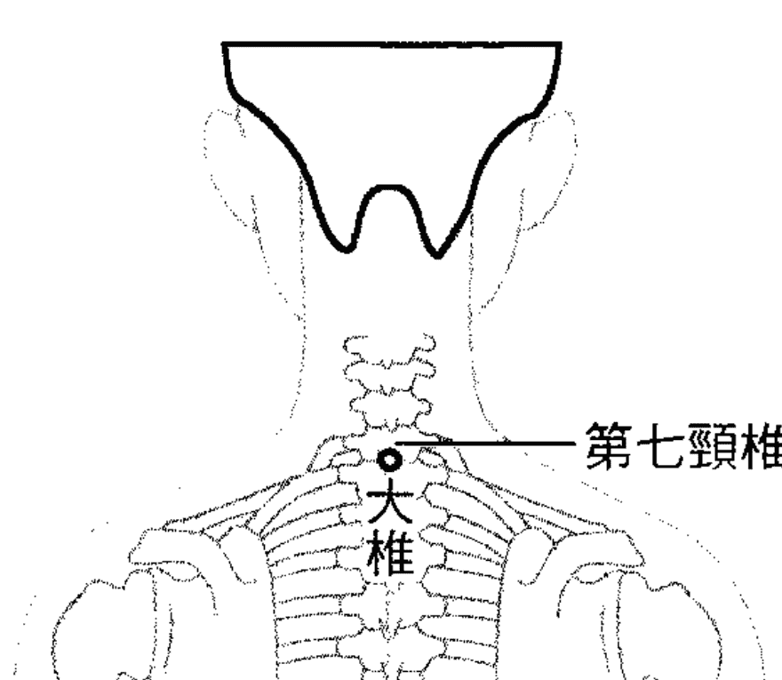

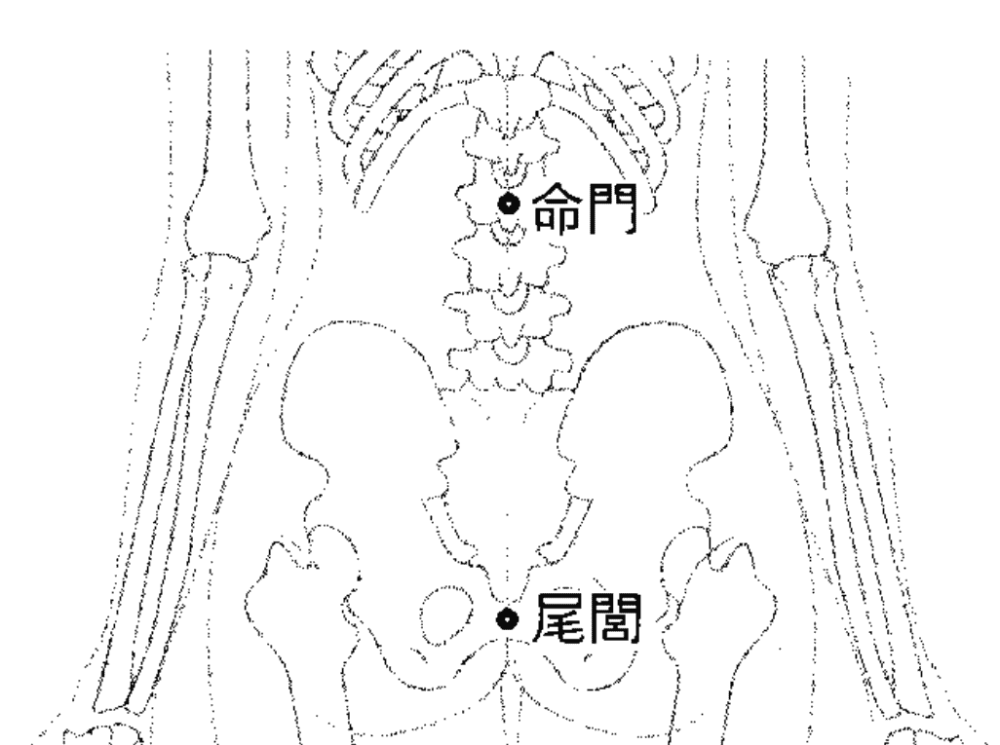

◆ 大椎：頸部下端，第七頸椎凸出點下方凹陷處中。

◆ 命門：在脊柱上，肚臍的正後方。

◆ 尾閭：位於尾骨尖端與肛門中點。

其一，其二，我在前面的文章說過，人體有九個大穴位對應著天地的九大行星，這九個大穴位分布在任、督二脈上，數脊椎會數到其中的三個大穴：大椎、命門、尾閭；大椎可以治療呼吸系統的病，防止風寒入侵肺部，養肺陰。對應太陽系的金星，可補肺部的金氣，現代坐辦公室的人很多都覺得大椎附近肌肉太硬，事實就是長期沒活動大椎，壓迫肺氣之故，常做「仙鶴點水」的動作便可解決：坐直之後，以下巴帶動頭部前後劃圈，好像仙鶴喝水一樣就行。命門主強腎，尾閭是喚醒海底靈能的要穴，可激發生命真火，以發長夏之氣。捏脊椎，其實就是疏通這條主管全身陽脈之海的督脈以使陽氣上升、陰氣下降，讓人體小宇宙與天體大宇宙同步運行。捏的時候注意不要太用力，以免調動太多小孩子的元氣。關鍵不在手指用力，而在用「心」力。

學中醫，要學一顆父母心，學一顆柔軟心，學一顆天人相應的開放、接受的心，這樣才能入門。

## 中醫解惑 Q & A

紫峰散人：請教先生，用意念給自己或者別人劃，是否效果相同？請指點。

胡塗醫：效果可能相同、可能不同，取決於很多因素，諸如：
1. 你的意念力大小，
2. 對方的經絡敏感程度，
3. 你施治時的身心狀態，
4. 對方的「求醫」意願等等。

靜悟：正要問胡塗醫，在肚臍上劃圈圈是自己劃和別人劃都一樣，還是別人劃才有用？

胡塗醫：自己劃有用沒用，您試試不就知道了？肯定是有用的。至於「別人」，那要看他/她的生物場強弱、當時的狀態等等因素。

癡迷中醫：請教先生，
1. 在小孩子的肚臍劃圈時，是手心貼著肚臍還是隔空操作？抑或是只要意念到即可，隔空或貼著都不重要？
2. 從先生的文章來看，捏脊時直接捏的督脈，我在學習小兒推拿捏脊時多強調捏夾脊穴，而且操作的方向上好像也有所不同，有這樣的說法——由下往上捏是補，相反是瀉，先生操作則是來回三遍。是否有不同的功效呢？
3. 另，先生所說「醫道明師（在下還差N個級別）身上的全息能資訊就容易灌過去給病人」，那這些資訊直接憑意念「灌」過去嗎？
4. 如何才能在治療時確保醫師自身的全息能資訊不會越灌越少，同時又能抵禦病氣的入侵呢？
先生所說的「學中醫，要學一顆父母心，學一顆柔軟心，學一顆天人相應的開放、接受的心」在下學習了，並謹記在心！

胡塗醫：
1. 貼著肚臍和隔空都可以。明師們應該可以「全憑心意用功夫」。
2. 捏脊的方向不重要，不要總生活在有「分別」的意識中。
3. 「灌」過去的東西是全息能，這個要有傳承才能體驗到。此外，全息能這東西「不生不滅、不垢不淨、不增不減……」
4. 不需去想辦法「抵禦」病氣，正氣足時，病氣自然進不來；正氣不足，抵禦也沒用。

梅蘭竹菊：請問胡塗醫，來回三遍是一下一上為一遍嗎？還是就從上到下為一遍？非常謝謝！

胡塗醫：都可以，「一下一上為一遍」固然可以，「從上到下為一遍」也無不可，這才是「糊塗醫治糊塗病」啊。

履真悟空：先生在講補氣法時說「用手心對著小孩子的肚臍順時針劃圈」，請問順時針是從大人方向看，還是從小孩的方向看？或者，實際具體操作方向並不重要，只需意念上用「順時針」劃圈去「補」即可？謝謝！

胡塗醫：從大人方向看是順時針。

芹菜：看到對補氣法的形容讓我想到一個天氣系統「反氣旋」，如果原理一樣的話，那南半球國家的人要練習補氣法就得逆時針劃圈？呵呵，純屬聯想猜測。

胡塗醫：有些道理呀，不過在南半球也要順時針來。

kunfunan：指壓臍眼並把意念守在臍眼會感到臍眼跳動，這一招能否和用手心對著肚臍順時針劃圈功效一樣？請教先生。

胡塗醫：功效差不多。也可以用艾草薰。

簡儷：敢問先生，平時用手按摩臍部或眉心部，是不是也能起到補氣的作用？

胡塗醫：按摩臍部多半有補氣作用，按摩眉心恐怕就有頭暈的作用了。

野之秋：從三伏天進入秋爽正美著呢，不料邪風寒氣入侵，感冒突至，咳嗽有痰，把自己放平氣管鳴響，尤其寅時氣管比較難受。趕緊回來複習，幾遍下來沒悟出現成招數。汗顏啊！一曰肚臍劃圈補氣，二曰捏脊通督，三曰調理大椎，打算試一下一、三，捏脊卻是個人無法操作。不知可否進行肺俞拔罐、艾灸？亂試一下，準備。

胡塗醫：養正氣可以代替捏脊。

hxwind：重溫先生的補氣法，想起以前自己實踐按摩時，直接將手心捂在肚臍上，並沒有轉圈，時間比較久，心很靜，意念也時不時集中在那裡，肚臍下面反應很大，感覺有幾次像炸開了的鍋似的響動。不知道這算不算也補到氣了？

胡塗醫：是補氣。

太極alm：向先生彙報一下，同時請教：小兒2歲3個多月，比同齡小孩瘦小，食量大。我這裡的中醫大夫說是脾虛，已經中藥調理半年多，好了一些，但還是感覺身體比較弱。看到您博客後，堅持肚臍劃圈一個月了，最明顯的變化是，孩子嗓門大了很多，情緒體力也見好。因孩子不老實躺著，所以大部分時間都是他站著時給他肚子劃圈，想著給孩子補氣，不知這樣與躺著劃效果會有差距嗎？還有我是立春後才開始給他捏脊柱，但是一觸摸身體他就笑和亂動，又不敢使大勁捏怕傷到陽氣，結果幾乎成了隔著衣服撫摸脊柱了。不知這樣會有作用嗎？捏脊柱時如何用意呢？從大椎向下時想著「降」，向上時想「升」可以嗎？盼望先生指點。謝謝！

胡塗醫：
1. 效果差不多吧。
2. 有作用。
3. 捏脊就別胡思亂想了吧。

netnn：春節期間，通過山藥社區找到了先生的博客，當時小外孫正發燒、咳喘，天天帶他跑兒童醫院，輸了五天液，同時還吃中藥。看了先生的博客後，我就每天給他劃圈補氣、數脊柱骨，孩子咳喘一天比一天減輕，恢復得比以往快。現在，我仍然每天給他劃圈補氣、捏脊。想請教先生：補氣可不可以劃多個49圈？

胡塗醫：可以。

太極胖子：先生您好！感謝您提供了古傳中醫理念和療法，使我獲益良多！更要感恩您的慈悲，使我在您的博客裡感受到佛法的召喚，走進佛學，並且體會到了學佛是人生最大的享受！
我的孩子3歲了，非常瘦弱，中醫診斷是脾胃虛寒，中藥調理一年多了，現在總是在脾虛和胃熱之間搖擺，不過比以前好些了。想請教您幾個問題，如果您有時間請看一下。謝謝！
1. 用劃圈補氣法給他補氣一年了，明顯感到有效，精神、體力、嗓門均見好。學佛後，我感覺劃圈時如果念佛似乎比數數雜念更少。請問如果以後給他劃圈補氣時，用念佛號代替數數可以嗎？效果會好些嗎？是否我這樣想已經太執著了呢？
2. 孩子经常舌苔中后部白厚，舌体偏红，上面还有很多红色的小点，像一粒粒细细的红泡泡，舌尖更红；大便常干，有时会引起发烧。这里的中医说是胃热，舌尖很红时，就得停补脾的药，用几天去胃热的药，往往会拉点稀，舌体舌尖一般就不太红了。最近两个月用了去胃热的药，拉了稀，舌体舌尖还是比较红，导致吃不了几天补脾的药又快发烧了。我思考孩子是否心火、相火不降导致舌红不退，就给他按摩胸腹和整条胆经、胃经，似乎有点效果，但是不明显。您能否给些建议呢？
3. 孩子消化能力也较差，我每早给他喝粥养胃，也很注意不吃不易消化的食物，您还能给一些增强脾胃能力的建议吗？
感谢您！阿弥陀佛！

**胡涂医：** 您可以外加每天睡前给他补脾土、补肾水，方法：用大人的大拇指肚顺时针轻揉他的大拇指肚、小指肚各333下。

**jonee0609：** 请教先生，「捏的时候注意不要太用力，以免调动太多小孩子的元气」，前天给孩子「摇小船」，就是躺在垫子上，屈膝，手抱住小腿，然后左右前后摇，这两天他汗特别多，特别是运动出汗后手脚冰凉，四肢也是不温的，是不是调动了太多的元气通过肚脐眼划圈可以补救吗？小儿是2006年出生，有鼻炎、经常咳嗽、脾强胃弱，请问如何调理？先谢过先生。

**胡涂医：** 有可能是耗了真气。通过肚脐眼划圈，如果做得到位，可以补气。

**似水：** 谢谢先生！孩子喜欢捏脊，可以在捏脊之外，在她的左手无名指和拇指面顺时针按摩以补脾肾吗？（在看小儿推拿的书，不同的书在补和清的手法写的不一样）

**胡涂医：** 可以。补和清，关键在心法，不在手法。

痴迷中醫：這個心法，在下的理解就是醫者的父母心，希望寶寶盡快康復的善心愛心，還有推拿時的專注心、投入心、清淨心、醫者和寶寶心心相印的心……當然這些只是在下個人的理解，僅供您參考，仍是以胡塗醫先生的說法為準。

胡塗醫：差不多就這樣。

常在：我老媽85歲了，氣管不好總是有痰，不知道這個方法適合她嗎？

胡塗醫：應該有幫助，祝好！

## 法於陰陽，和於術數

《黃帝內經·素問·上古天真論》有這麼一句大家耳熟能詳的話：「上古之人，其知道者，法於陰陽，和於術數，食飲有節，起居有常，不妄作勞，故能形與神俱，而盡終其天年，度百歲乃去。」

這句話常常只被理解了一大半，以致人們往往只知道要注意飲食、起居，不過度勞累，而對「法於陰陽，和於術數」卻所知不多。其實這段話，點睛之筆正是「法於陰陽，和於術數」，有了這個前提，節飲食、常起居、不妄作勞才有神效。

那麼，上古時候的人，尤其是那些悟通了大道之理的人，是如何「法於陰陽，和於術數」的呢？

### ◇ 天地陰陽變化與人體真氣運行的關係

先賢們懂得效法天地陰陽變化，並根據它來調整、平衡自身的陰陽。他們知道人體真氣的運行與天地的運行變化息息相關，懂得使自己的煉養合乎天地運行的規律，並根據這些規律來調整飲食和作息，不過度勞累，所以能做到讓身體與精神都合於道來生活。胡塗醫相信，那些徹悟了的先賢們，一定能做到形神俱足、諸事圓滿、生命完全自控，從而想活多少歲就活多少歲，如果他們願意的話，能夠活到人類本應活到的壽數，比如活個百來歲之後，想走了再瀟灑離開人世。我這樣講，或許會招來批評、謾罵，請大家看看2008年3月《羊城晚報》採訪本煥老和尚的一段對話：

> 羊城晚報：「本老102歲了，怎麼看待生死？」
> 本煥長老：「我不想走，誰也拿我沒辦法；我想走，誰也攔不住。」
> 羊城晚報：「什麼意思呢？」
> 印順法師：「意思是他可以來去自由。」

我在〈「陰陽」他說〉裡說過，陰陽是兩種不同的物質，它們是一體的兩面，是實實在在存在的東西，儘管許多「陰」的東西我們肉眼無法看見。當然，說陰陽是兩種「物質」，這也只是權宜之計，說它們是兩氣，甚至兩種精神，是一半一半的思維亦無不可。不知道有沒有人留意到，胡塗醫曾在博客文章（請見本書〈秋季養生，無外其志〉❹一文）說過這樣一句話：「善惡兩不思量，虛空粉碎，還有啥四季？還分啥陰陽？」很少人讀懂這句話。陰陽在那些已經從此岸到彼岸的人那裡，多半還是存在的，只是他們已經不必去「分別」了。不去分別，並不代表他們就沒有「陰陽」，他們更會遵循天地陰陽法則的演變去生活，只是他們不「住」於陰陽的境界中罷了，就像佛陀在《金剛經》裡說的「無所住而生其心」。那麼我們這些還在「此岸」的人呢？恐怕還是得老老實實「法於陰陽，和於術數」。怎樣去「法」去「和」呢？

那就涉及中醫的另一個本質觀念——十二消息卦與天地陰陽變化和人體真氣運行息息相關。

十二消息卦當然出自《易經》，關於易學的話題，要忽悠得人們雲裡霧裡實在太容易，要簡單明快做掃盲卻不容易，胡塗醫掃到哪兒就哪兒吧。

我們知道，《易經》為群經之首，按司馬遷的說法，伏羲畫八卦，周文王做《繫辭》，孔夫子做《十翼》，始成完整的《易經》。我們目前看到的《易經》也叫《周易》，因為它是周文王在坐牢的時候演繫辭，推演、完善的（司馬遷《報任安書》：「文王拘而演周易，仲尼厄而作春秋」）。此外還有神農的《連山易》、黃帝的《歸藏易》，史稱「三易」。可惜《連山》與《歸藏》據說已經「失傳」了，所以我們現在基本上把《易經》等同於《周易》，《周易》一直以來都被稱為經典裡的經典、哲學裡的哲學。關於易學本身，醫家的易和道家的易相近，與宋明理學家們的易則相去甚遠，所以胡塗醫才在文章裡反覆強調「自古醫道不分家」！醫家對於易，雖然也以陰陽兩元氣論來闡述人體和自然萬象，但更重視陰陽未分之前，或將為陰柔、或將為陽剛的變化流通的根源，醫家認為這一根源是主宰我們人體生老病死的規律，把握了它❺，生死便不由閻王爺管，而是自己可以做生命的主人！

醫家認為，人秉天地之氣而生，陰陽的流通變化無時無刻不在支配著人體的身心活動。《易經》以十二消息卦示人以天機，教人效法陰陽變化之道、數理和合之機，以養天年、度百歲。

什麼是十二消息卦呢？要理解十二消息卦，還得做一番基本的掃盲。

孫思邈真人曾經說過，不懂易理的人，不足以被稱為大醫（「不知易，不足以言太醫」）。有心學習古傳中醫的同志們，床頭應常放本《易經》，真通醫道的人，必定亦通易理，《黃帝內經》與《易經》必須參照著讀才容易理解聖人本意。歷史上真正的明師，無一不是易理精熟的。胡塗醫在〈經絡本來就是「通」的〉❻一文中略有提及。

我們先來弄明白啥叫「卦」。《說文解字》說「卦，筮也」，筮就是古人用來占卜的蓍草（即蚰蜒草），這裡我們可以把「卦」理解為「一種東西」，「一種掛在外面的東西」。伏羲畫八卦，就是用八種不同的東西——大家都能看到的、簡單的、彷彿就像掛在門口的蓍草的符號，來作為「文字」，表達宇宙八大類事物——萬事萬物。所以《康熙字典》在注釋「卦」字的時候，說「卦」就是「掛」，天地萬象都「掛」在這上面了（「卦之為言掛也，掛萬象於上也」）。所以可以這樣理解，「卦」就是一個有象徵意義的符號！卦以陰爻（--）、陽爻（—）相配合，每卦三爻。換句話說，每三爻可以合成一卦，共可以組成八個經卦（就是我們平時聽到的「八卦」），每兩卦（即共六爻）合成一卦，可得八八六十四卦（也叫「別卦」），六十四卦能完整描述天地萬物的陰陽演變之理。一般所說的「八卦」，即八個經卦，用一句口訣便可記住它們的「長相」：乾三連，坤六斷，震仰盂，艮覆碗，離中虛，坎中滿，兌上缺，巽下斷。請大家看看這張八卦圖，很好記的。

## 八卦圖

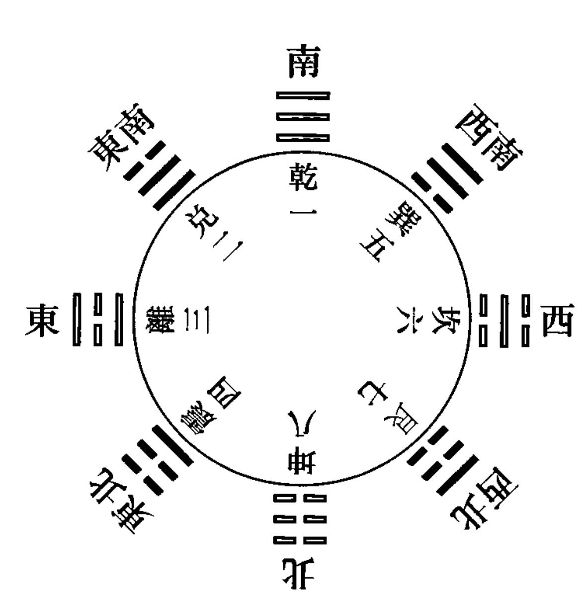

◇ 每三爻可以合成一卦，共可以組成八個經卦，每兩卦（即共六爻）合成一卦，可得八八六十四卦。

明白了八卦，十二消息卦就比較好懂了。所謂十二消息卦，就是八卦裡的乾坤兩卦，外加復、臨、泰、大壯、夬、姤、遯、否、觀、剝卦。這十二個消息卦也可以用一句口訣來背誦：「復臨泰壯夬乾姤，遯否觀剝坤二六。」不知大家是否留意到，這十二個消息卦除了乾、坤兩卦，各由純陽、純陰爻表示外，其他十卦均同時由陰陽爻組成？這就是「消息」的道理！「消」是指陽去而陰來，即陽爻去陰爻來；「息」則指陰去陽來，即陰爻去陽爻來。所以十二消息卦描述的是天地與人體陰陽二氣來去演變的道理，所以《黃帝內經·素問·陰陽應象大論》才說：陰陽，是天地之道，宇宙的普遍規律，是萬物的起源，變化的父母，是萬物生長、毀滅的根本，是人體精神活動的大本營，治病必定要從法於陰陽開始（《黃帝內經·素問·陰陽應象大論》：「陰陽者，天地之道也，萬物之綱紀，變化之父母，生殺之本始，神明之府也，治病必求於本」）。

陰陽兩氣究竟是什麼關係呢？《黃帝內經·素問·陰陽應象大論》對此有很精練的總結：「陽化氣，陰成形。」陽主萬物氣化，陰主萬物的形體。

《黃帝內經·素問·陰陽應象大論》在得出這個結論之前，說了一句「狠話」——「陽生陰長，陽殺陰藏」。

要弄懂「陽生陰長，陽殺陰藏」，得把《黃帝內經》與《周易》一起看才行。大家看十二消息卦的圖，這十二個卦配十二「地支」（子、丑、寅、卯、辰、巳、午、未、申、酉、戌、亥）。按照易理，冬至所在的月份就是「子月」（即農曆十一月），因為「冬至一陽生」，與一日之中的子時「一陽來復」一樣，天地與人體的陰陽變化在此時開始（其實「開始」也只是權宜之說，天地、人體的陰陽變化是無時不在進行的），在卦象上看，就是「復卦」（參閱〈二十四小時如何過——子時養「膽經」〉 ⑦）。以一年十二個月來說，立春開始於寅月，一般是農曆正月，此時天地交泰，為「泰卦」，一直到夏至，陽氣不斷生長，這就是「陽生」，講的其實是上半年，即春夏兩季。所以中醫養生才講究「春夏養陽」，說的就是因應這個天地陰陽變化的道理。懂了「陽生」的道理，「陰長」就好懂了，回過頭看《黃帝內經·素問·陰陽應象大論》的描述「陽化氣，陰成形」就能理解了。春夏陽氣生發、生長，屬於「陰」的萬物因應著天地陽氣的生發、生長而繁榮，這就是「陰長」！弄懂了「陽生陰長」講的是春夏之間天地陰陽變化的道理，「陽殺陰藏」的道理也就能夠融會貫通了，所以中醫其實很好學，前提是要通易理。

再嘮叨一句，「陽殺陰藏」，講的是下半年，秋冬兩季天地陽氣開始減弱，從否卦到剝卦，陽爻在減少，表示天地陽氣開始被「殺」少了，屬於「陰」的萬物開始進入收斂、養藏。

中醫的本質，就是要讓人體真氣的運行，與天地陰陽的變化相因應，在春夏養陽，在秋冬養陰，這就是「法於陰陽」！具體怎麼養呢？胡塗醫在古傳中醫養生系列文章裡列出了許多方法。需要指出的是，天地雖分陰陽，萬物也分陰陽，氣自然也分陰陽，但是我們不應該去糾結於自己究竟是缺陽氣還是缺陰氣，是陽虛還是陰虛，就像胡塗醫在〈陰虛 VS 陽虛〉裡說的：「大家以後不用擔心自己究竟是陰虛還是陽虛，是實症還是虛症，一概理解為『正氣不足』就好了。」

以上談的，是「法於陰陽」在一年之中的「法」，一般懂得做些學問的中醫都能懂。下面我就談點醫家秘傳的內容。

### ◇ 十二消息卦與人的生長發育的對應關係

我們知道，嬰兒在母體內，靠母體供給營養、能量（所以佛陀才說父母恩重難報，天下的父母恩哪裡報得完！），以內呼吸——胎息的呼吸方式發育生長（「胎息」之說請參閱〈胎息、打坐及辟穀〉❽），十月胎圓的時候，後天的生命還沒有開始，本身的呼吸、神經等系統的開關尚未打開啟用，在卦上來看就是「坤」卦——純陰。隨著臍帶被剪斷，天地之氣進入肺中，肺自然應激，將氣排出，催動聲帶，「哇」的一聲開始了外呼吸，此時心火下降而補腎陽，吸氣時腎水上潮以濟心火，如此心腎相交，在卦上看就是水火既濟卦，通過人生的第一次呼吸，啟動了後天的各個開關，「生命在呼吸間」！所以胡塗醫傳出的心腎相交法，正是基於這樣的易理，該法太簡單太一般了，然而其調養心腎、固本培元、煉精化氣的功效卻非同一般！

從十二消息卦看，人從呱呱墜地開始，每經過32個月，腎中增加一陽，到了16歲的時候，人體從原來的純陰坤卦變為純陽的乾卦，這個時候陽氣最盛，心火極容易動，七情六欲開始明顯呈露，腎氣開始暗暗損耗，如果能夠在此時便懂得用醫家秘傳之心腎相交法調養，則可葆真、可持滿、可御神，則聰明智慧遠非常人可比。根據易理，人體每8年，腎中增加一陰；到64歲，陽氣基本上耗盡了，此時變成了什麼卦呢？純陰的坤卦！所以男人一上64歲（很多人甚至更年輕的時候）會變得婆婆媽媽，有些女性更年期特徵，此時的男人，生命之機其實已經用完了，如果還不懂得節欲保精，進行添油續命，那就真的「人生七十古來稀」了。

## ◇ 「術數」之實質

那麼「和於術數」是怎麼「和」法呢？清代名醫張隱庵先生在《內經集注》中說：「術數者，調養精氣之法也。」至於這是個什麼「法」，老張卻語焉不詳，所以胡塗醫才勸網友們「清朝以後的醫書，不讀也罷」。現代很多人更把這個術數之法理解為導引、按摩等技術方法，大家到書店去買《黃帝內經》白話版，幾乎都是這樣翻譯。其實術數，就是用易理來知道天地陰陽變化，趨吉避凶的各種方術！包括「巫」方面的技術，乃至天文、曆法、地理諸學。過去古傳中醫世家教徒弟，前一二十年，除了醫典、藥理，教的全是這些東西，等到這些西嚇退了一批人、累倒了一批人、逼走了一批人之後，留下來的一兩個，明師們才會最後給他們「真傳一句話」，把一層層的窗戶紙用一句句的真傳，給一一捅破。

所以說學真東西要有耐心、恆心！不要缺心眼、少悟性。比如有「新浪網友」留言說：「正氣內存，邪不可干……真氣從之，精神內守，病安從來，相信學過中醫、有點悟性的都會把這幾句話聯繫在一起，問題是方法呢？」真是外行人說外行話！其實《黃帝內經》裡的這些東西本身就是「方法」！把這些方法當成「純理論」甚至幾句可以隨便「聯繫」起來的「話」，本身就是缺心眼少悟性的！很多人自作聰明，到處尋求秘法，學了這個方法又想學那個方法，卻無法制心一處，好好踐行用功。這樣學法，中醫知識可能會增加，中醫能力卻不見得會有提高。須知「有」招「有」式，你永遠學不完，制心一處默默用功，養深積厚，才有豁然開朗從而達到「無」招「無」式的一天。否則就算把所有聖賢書都讀了，把各種方法都學了，不去踐行，又有什麼用呢！其實「正氣內存，邪不可干」、「真氣從之，精神內守」這些話本來就是理法兼備、理中寓法、法中寓理的，這些聖人之言本身才是整個中醫的「本」，現在人們反而追逐「末」枝「末」節、一招一式，這真是捨本逐末！再說，胡塗醫講了那麼多醫家秘傳，用心踐行的人自然會明白箇中三昧。整天抱著有求之心，而不願落到實處去踐行，那樣學到頭別說無法成就醫道，養生延年都難以做到。大家慎之、戒之！

## 中醫解惑 Q & A

**太極生清**：小子一直在練習先生所傳的心腎相交法，比以前有氣感了，再次練習太極拳，似乎更有感覺了，關於鼻梁跳動的問題，只要不練養氣法就沒事了，再次謝謝先生了。對於先生文章中有糊塗的地方：先生說小兒剛生下時是純陰坤卦，到了16歲的時候，人體才從原來的純陰坤卦，變為純陽的乾卦，但是為什麼很多人還要說小孩子是純陽之體呢？

**胡塗醫**：這個問題問得好！小兒純陽之說最早源自《顱囟經》，錢乙老爺子也在《小兒藥證直訣》中說：「小兒純陽，無煩益火。」其實這說的是小兒生長發育旺盛，從純陰之體生發一陽，陽氣生發，生機蓬勃！這個「陽」與體內的「陰」相比更有「發展潛力」。事實上，從卦象上看，小孩子還是「稚陽未充，稚陰未長」的狀態。現在的人多不通易理，自然少不了以訛傳訛。再通俗點說，小孩子在幼兒時期，是不是很難一眼看出是男孩女孩呀？男孩沒有男孩的特徵，為什麼呢？

**太極生清**：謝謝先生替我解惑小兒是「純陽」之說，先生的回覆，我是看了又看，欣喜非常，都很想手舞足蹈一番來舒解心中的歡喜！從先生的回覆裡面我看後理解是：一陽生於極陰之地，一陽生合於復卦，所以小孩是純陽之體就不對了。至於後面提到的這句話，「其實『正氣內存，邪不可干』，『真氣從之，精神內守』這話本來就是理法兼備、理中寓法、法中寓理的」，個人認為先生所傳功法的心腎相交法和養氣法是代表，心腎相交法來煉精化氣，產生身體的正氣，養氣法則是教人以精神不外越，這樣自然真氣能從之，邪不可干了。不知道理解得對不對，望先生指正。

**胡塗醫**：正解！

**太極palm**：請問先生，小孩16歲之前可以用心腎相交法調養嗎？還有《黃帝內經》講男子8年一變、女子則是7年，與十二消息卦的推演有什麼不同嗎？

**胡塗醫**：可以的。沒有不同。

**fishermanw**：寅那格是泰卦嗎？另外請教先生，大壯卦是四陽爻兩陰爻嗎？還有啊，先生，中國的方位都是左東右西，真的跟左青龍右白虎相關的嗎？這個問題比較無聊哈，先生得了空再跟我閒扯吧，呵呵。

**胡塗醫**：寅那格是泰卦，在月份就是「正月」，所以才有「正月建寅」之說。大壯卦也叫「雷天大壯」，上震下乾，是四陽爻二陰爻沒錯。其他的您自己找書看吧。

**太極生清**：fishermanw 網友，我來替先生回答你的問題吧，望先生見諒。我們老祖宗都是面南背北來確定方位的，現在我們看地圖的左西右東，其實是從南半球傳過來的方法，所以我們老祖宗把東面也叫左、西面也叫右，南北自然是前後了，其實看八卦圖的時候不一定非要平鋪在地上看的，可以豎起來，應該看作是立體的。這樣再看先生發的先天八卦圖，就可以跟天象地理對應起來了。不知道說得對不對，望先生指正。

**胡塗醫**：很好。

**小王**：曾有人對早上（12點以前）做針灸治療很是反對，我以為然，可一直說不清所以。看了先生對陰陽的解釋，尤其是對「陽生陰長，陽殺陰藏」的解釋，我覺得這就是根據，不知對否？想問一下「人從呱呱墜地開始，每經過32個月，腎中增加一陽」，為什麼是32個月？

**胡塗醫**：為什麼是32個月，這個就是「術數」了，2^5=32。

## 自古醫道不分家

胡塗醫應網友們的提問，在〈自學中醫——明師就在經典中〉列出了一系列的醫書，胡塗醫建議大家把《道德經》背下來，在回答一些網友問題時，也提到要讓《道德經》、《黃帝內經》和《周易參同契》爛熟於胸，學習古傳中醫，才有望登堂入室。為什麼呢？因為自古醫道不分家！古傳中醫最精髓的東西，是要把中醫當成「道」去領悟、去體證，才有望豁然開朗、融會貫通的！而要把中醫當成道去悟，就非得熟通這些經典不可，尤其是《道德經》。咱們接下來就聊聊《道德經》。在這裡要先向各界研究《道德經》（也叫《老子》）的專家、行家們致歉，胡塗醫在這裡可能只是胡說八道，觀點若與各位的不同，請多多包涵！

我們以《道德經》第一章的第一句話為例，來談談為何「自古醫道不分家」——這是中醫的又一本質。我們先看原文：

> 道可道，非常道。名可名，非常名。無，名天地之始。有，名萬物之母。故常無，欲以觀其妙。常有，欲以觀其徼。此兩者，同出而異名，同謂之玄。玄之又玄，眾妙之門。

一般認為，這幾句話開始了《道德經》全文，我讀過《老子》祖本，是把「德」經放在前面，「道」經放在後面。咱們不管了，按現在世上流行的版本來吹吹牛。

我在大學時代旁聽過一位主講先秦諸子的教授講課，他把「道可道，非常道」解釋為「道是可以說的，但它不是一般平常的道理」。持有這一見解的人，社會上還真不少！其實如果真是如此解釋，老子恐怕要笑掉他老人家的白鬍子了！不懂道的人強行說道，難免要變成胡說八道——就像本人現在在這裡瞎說的一樣！在先秦的語言中，表達「說」是用「曰」，我們常讀到的「子曰」什麼什麼，就是孔夫子老人家說了什麼什麼。「道」用來表示「說」的意思，要等到唐朝末年呢！那麼聖人的本意是什麼呢？恐怕要親見老子，問問他老人家，才不至錯得太離譜。我們且以凡心，來妄測一下聖意。

老子這第一章，如果用大乘佛教的話來說，恐怕說的就是「諸佛密意」了。大道必須向內去求，如果不是向內求「道」、求「般若」，不在自己身上實踐「道」、實踐「般若」，那只是空談大道，於人於己毫無益處，於自己的醫道修習，斷無助益！否則千經萬典讀下來，經是經，你是你，兩者毫不相干，又有何益？

## ◇ 汝若返照，密在汝邊；道中有醫，醫中有道

我們且來看一個佛教故事。

據《六祖法寶壇經》記載，當年五祖弘忍大師把衣缽傳給六祖慧能以後，知道大眾不能理解，要搶六祖衣缽，於是他要慧能六祖連夜離開。六祖離開黃梅以後，有很多人為了衣缽追逐而來，惠明一馬當先，趕上慧能六祖之後就要搶他的衣缽。六祖便把衣缽往路邊石頭上一放，說：「衣缽是法的象徵，豈可用暴力來爭奪？要就拿去吧。」說完隱身草叢裡。當惠明拿衣缽時，無論怎麼使勁也拿不動衣缽，知道六祖那裡真有「道」，於是心生慚愧，就請求六祖為他開示。慧能六祖就教他：「不思善、不思惡，制心一處而無妄念，沒有妄念，就是般若，就是道。就能看到你的本來面目。」惠明又問：「除了這個，還有沒有其他的密意呢？」六祖告訴他：「如果能說出來的話，就不是密意了。假如你一定要探求密意的話，要從你自己的自性裡面去探求，密意就在你自己那裡。」

真正的密意，是「心行處滅，言語道斷」的。宇宙大道，就在我們的自性裡，在我們的心裡！領會了大道之理，我們還要落實到吃喝拉撒睡，落實到衣食住行，落實到日常的每一件小事中去活用應變，如此雖然同樣是吃喝拉撒睡，同樣的衣食住行，同樣的小事，因為有了「道」，生活就會有「禪」味，就能在每一個當下心開脈解，得大自在。好比《金剛經》裡，佛陀同樣地著衣、持缽，同樣地入舍衛城乞食，與大家一樣，吃完飯，自己收衣缽，洗腳、靜坐，與大眾無異，但是解空第一的須菩提尊者，卻看到了這裡面的「道」，這裡面的「般若」，所以忍不住起來讚歎「稀有」世尊。得道的聖者，雖然也有凡夫的衣食住行，但是卻在衣食住行處一一解脫。同樣的日子，卻有完全不同的般若風光！這正如古人所說，「尋常一樣窗前月，才有梅花便不同」。心裡有了「道」這朵「梅花」，尋常一樣的日子，便大大的不同了，身上有了「道」這朵「梅花」，治起病來，自然與庸醫們不一樣。

所以聖人才開篇便說「道可道，非常道」！大道是隨緣自在的道，是可變通之道，大道在每一個人的自性裡，大道並非常住不變之道。

咱們學中醫的，也「應作如是觀」！學古傳中醫，首先要解決的，就是思維方式的問題！要用「道」去思維，才能深得醫道三昧！如此才能像胡塗醫在序文裡說的「醫中有道，道中有醫，實可感而遂通」，人人自成良醫。比如，古傳中醫是這樣思維的：是誰「規定」了看病非得把脈看舌？非得分陰陽虛實寒熱表裡？是誰「規定」了針灸非得用銀針？是誰「規定」了用藥非得往外採？是誰「規定」了用藥必談什麼經方？上古時候的神醫們如果也需要這麼折騰，怎麼能叫神醫！

把中醫當成道去悟，才有豁然開朗、化腐朽為神奇的一天！祝福大家，在每一個當下，心開脈解，得「非常道」！

## 中醫解惑 Q & A

**小牛靈靈**：由道入手，探本尋源。很高興能有機會學習醫道，而非醫術。最近半年，經常誦讀《道德經》，差不多已經能背了。感覺心態確實有了很大變化，受益匪淺。讚嘆祖先的大智慧！近期和一些志願者，準備在上海發起一個集體閉關誦讀一周《道德經》的活動，希望更多人能從中受益！順便問一下，先生讀的是哪個版本的《道德經》？帛書版的？

**胡塗醫**：聚集幾位好友一起誦讀《道德經》，這真是件好事！但且別輕易「閉關」。古德雲：「不破本參不住山，不破重關不閉關。」不知道從哪位「大師」開始，國內刮起了一陣「閉關」風，許多人別說破本參與重關，連悟道的邊也摸不著，動不動就教人「閉關」，這會障礙大家未來的法身慧命與修持。若是不懂的人隨便說說還好，如果有心修行，閉關的話不要輕易去說，閉關的「大眾」學習班不要輕易去湊熱鬧！

**小牛靈靈**：謝謝先生的開示！只是現在大多數人的心太浮躁，生活節奏又太快，若不是有個相對封閉、清靜的環境，強制關手機、關電腦，恐怕連播種的機會都沒了。但此後的修行肯定要在實際生活中的，否則就像托爾斯泰筆下的資本家了：教堂裡一套，教堂外一套了。這樣理解是否正確？請先生指點。

**胡塗醫**：對，那就是封閉式學習不是閉關，儘管看上去類同。

**新浪網友**：請教博主，《道德經》注者相當多，觀點歧義也比較大，您覺得誰注解的最適合？河上公？王弼？我覺得比較迷茫。能介紹一下嗎？不勝感激！

**胡塗醫**：有一句話叫「焚書書在，注經經亡」，歷代注解經典的人很多把經典折磨得奄奄一息。建議您把《道德經》背下來，「書讀百遍，其義自見」。現代人把《道德經》講得最好的有兩位，一位是南師懷瑾公，還有一位就是我在文章裡提到的江西山裡的那位老先生。在遇明師之前，自己好好用功吧！

## 大道無形本相通

太史公在《史記》裡講到神醫扁鵲的時候，講了一段頗為神奇的故事。他說扁鵲秦越人同志年輕時在酒店打工，有位客人叫長桑君，扁鵲見他老人家氣度不凡，似非尋常之人，便常常很恭謹地服侍他，長桑君也看得出扁鵲這小夥子不錯，非常有慧根。來來回回考察了十多年，有一天長桑君找扁鵲私談，不經意地告訴他說：「我有古傳中醫秘不外傳的方法，現在年紀大了，想傳給你，不過你可別輕易外傳出去。」扁鵲恭恭敬敬地承諾老人家一定保守秘密。老人家於是從懷裡抓出一把藥給扁鵲，並告訴他：「這個藥，你要用清淨的水來沖服，連續服用三十天後，就可以透視、了知一切事物了。」然後把他秘藏著的醫書秘方全搬出來交給了扁鵲，忽然就不見人了。太史公於是感嘆說，長桑君可不是凡人啊。扁鵲同志規規矩矩「依教奉行」了三十天，果然可以看得見隔壁的人，他用這個本事來看病，盡見五臟六腑的癥結，但對外還是聲稱自己是在「診脈」而已。司馬遷《史記・卷一百五・扁鵲倉公列傳》原文說道：

> 扁鵲者，勃海郡鄭人也，姓秦氏，名越人。少時為人舍長。舍客長桑君過，扁鵲獨奇之，常謹遇之。長桑君亦知扁鵲非常人也。出入十餘年，乃呼扁鵲私坐，閒與語曰：「我有禁方，年老，欲傳與公，公毋泄。」扁鵲曰：「敬諾。」乃出其懷中藥予扁鵲：「飲是以上池之水，三十日當知物矣。」乃悉取其禁方書盡與扁鵲。忽然不見，殆非人也。扁鵲以其言飲藥三十日，視見垣一方人。以此視病，盡見五藏癥結，特以診脈為名耳。為醫或在齊，或在趙。在趙者名扁鵲。

## ◆ 有無相生

每次翻閱這段歷史，都讓人感慨不已！自古以來，高明的東西都是師父找徒弟，而且一考察就是十多年。這個漫長的考察、磨性期滿，真要傳本事時，卻是如此容易。關於長桑君真人「出其懷中藥予扁鵲」，千百年來人們的理解就是長桑君從懷裡掏出了一包藥給扁鵲，胡塗醫在上面故意翻譯成「從懷裡抓出一把藥給扁鵲」。為什麼這樣「翻譯」呢？因為古傳中醫一直秘傳著一個如此教徒弟的方法，比如教「千里診病」之前，往往要「抓」一把藥給徒弟吃下去，這個藥，是憑空產生的，並不是先前藏在懷裡的！我知道我們現代人很難相信有這種事，但是太上在《道德經》裡說過「有無相生，難易相成」，我們平常所說的「有」和「無」其實是可以「相生」的，一旦有無可以相生，看上去很難的事也就很容易了。那麼「有」與「無」是怎麼相生的呢？它們本來就是道體的顯化！用佛教「因緣觀」的道理來解釋，比較好懂。「有」是因緣「聚」，「無」是因緣「散」。比如你把五根手指握成一個拳頭，這時是「有」拳頭，是五個因緣聚會，使一個拳頭產生；當你把手指一根根散開，拳頭就「無」了，手還是原來那只手。很多人讀《心經》老讀不懂「色不異空，空不異色」的道理，這樣理解就好辦些了。聖人說「大道無形」，醫家的這種「憑空產生」的藥，就是從「無」到「有」，從無形到有形。佛門中其實也有這個法門。有人按照《佛說藥師如來本願功德經》裡的方法，也能修出個「空中取藥」的本事來，南師在《藥師經的濟世觀》裡有提及。當然，「空中取藥」是很耗能的活兒，歷代明師們都不輕易去做。古聖前賢「大道無形」之言沒有騙人，真空中確實可以生出妙有！醫家、道家、佛家的道理都是相通的！（古傳中醫這種「無中生有」的取藥法的原理，胡塗醫在文章裡多次解釋過，請參閱〈「陰陽」他說〉❾及〈陰陽，異名而同類〉❿。）

其實在《道德經》裡，太上所說的東西，都是可以與醫家、佛家的理論互相印證、互相解釋的，太上之言本來就可以實證，可以演示，更可以應用於生活中的，所以古時醫家用它、丹家用它，連政治家們也用它。胡塗醫在前面的文章《自古醫道不分家》裡解釋「道可道，非常道」時說「大道是隨緣自在的道，是可變通之道，大道在每一個人的自性裡，大道並非常住不變之道」，這樣的「道」，自然無形無相。

## ◇ 深入經典，依法奉行，落在實處，方不迷途

再給大家講個「大道無形」的故事。胡塗醫年輕時常在寺廟掛單，有時早上輪值，要我起來「打板」（佛教叢林中，於齋食、開浴、普請、上堂等集會時敲擊木板，發出聲響來告示大眾）。有一次「剎板」到用完早餐才讓我去「跪香」（相當於「罰跪」），那時年輕，有點不服氣，師父輕輕說了一句：「你打板的時候還好，剎板的時候就沒有佛了。」真是阿彌陀佛，本來打板的時候，我還算心手一如，在心裡念著佛的，剎板的時候平時會在心裡默念「十方三世一切佛……阿彌陀佛……佛……佛……佛」等佛號，那次沒「念」，被師父「聽」出來了！這就是聖人所說「大道無形」的道理。

在古傳中醫裡，許多診病治病的方法幾乎都是無形（不須四診八綱）無相（不須動手用藥）的，其理不僅與道理通，與佛理亦通，醫、道、佛，三家之理互通！

當然了，上古時候的聖人們，證悟的大道之理都是一樣的，只是各自要渡化的人群不同罷了。歷史上真正的明師，都是三家圓通，沒有偏執、掛礙的，更不去妖言惑眾。前段時間經一個朋友「推薦」，去看了一下一個網友的博客，裡面充斥法輪功的歪理邪說，也許是為了遮人耳目，他們居然把李洪志先生直接稱呼為「佛陀」，這樣故意混淆視聽、誤導不懂佛理的人們，實在讓明白人無語！更糟糕的是，他們表面上是在講佛陀（釋迦牟尼佛）的故事，實際上則是在宣揚當年李先生的邪說。他們如此下作，如此折磨佛道醫各家理論，我不能不駁斥一下他們，以正視聽。茲摘錄一段該部落格講佛教的話於下：

❾ 請見〈「陰陽」他說〉，41 頁。
❿ 請見〈陰陽，異名而同類〉，51 頁。

什么叫开功开悟呢。其实就是在那一刹那间，他记起了他从极高的宇宙转生到人间之前所拥有的全部智慧。他把这些智慧用来开启人类的思维，为众生指引一条通向幸福彼岸的道路，这就是佛法的真实来历。释迦牟尼在世间开功开悟之后，并不是一下子就达到最高境界，而是不断开悟，不断提升自己的层次，最后才达到如来这个层次的，如来是佛层次的标志。释迦牟尼佛在49年的传法过程中发现，许多他过去讲的法都是错的，再提升层次之后，发现刚刚讲过的法又是错的，怎么会出现这种情况呢？他发现原来每个层次有不同的法，法在每个层次有不同的展现，在这个层次适用的法，在另一个层次就不适用了。

佛法的「真实来历」在他们笔下，居然是「记起了从极高的宇宙转生到人间之前所拥有的全部智慧」，而不是佛陀在人间修行、证道、传道……佛陀在菩提树下、金刚座上，证悟的是宇宙人生的真理，那一刻，他就是佛陀，无上正等正觉的如来佛！哪有什么到「最后才达到如来这个层次」的！不懂道的人强行说道，固然是胡说八道，像他们这种不懂佛的人胡乱说佛，更是胡说八道！他们甚至不惜公开造释迦牟尼佛的谣，说什么「释迦牟尼佛在49年的传法过程中发现，过去讲的法都是错的」。李先生没读多少佛经，咱们可以理解，毕竟人家只是初中文化程度的「大师」嘛，但许多受过高等教育的人，居然也不去阅读佛教经典来印证，而是去偏信李「大师」的胡说八道，这就真是魔障太重了，可怜可叹也！他们自己沉迷其中已经够可怜了，拼命拉别人去加入他们的行列，不断谤佛，把李先生说成佛陀，那就更可恶了。

其實佛陀在世時，每一次說法都有不同的因緣，面對不同的人群，因不同的事情而說，且別說佛陀是「真語者，實語者」（《金剛經》語），佛陀每一次說法，無不是觀機逗教，直接解決大眾的疑惑和難題，哪有說後來說的才是對的，前面都錯了！？三藏十二部藏經，哪一部經典是錯的？倒是佛陀在《楞嚴經》裡徹底講了這些附佛的邪教會出現呢！奉勸有志於了生脫死、修習佛法的人，要去深入經藏，拜讀佛教原典，落實在生活中，用心轉境、利樂有情、應世自在，方是正途，而不是在網上聽大師小師們瞎忽悠。

同樣的，學道的人，道家的經典也應該拜讀原典，不要去瞎看這些年冒出來的大師神人們的「注解」或「畫說」。古人說「書讀百遍，其義自見」，把《道德經》、《黃帝內經》、《陰符經》、《周易參同契》讀得滾瓜爛熟並按其理法來以身證之，才是正道！真正的明白人，無不希望自己的門人弟子能博採眾家之長，以便未來能幫助更多不同背景的人，邪教才要人如加入嚴密組織般去忽悠別人盲修瞎煉。在這個魚龍混雜的世道，大家還是要老老實實讀聖賢書，老老實實過好每一天，在每一個當下，對事對人，不住不執，讓你所學的，為自己和他人減少煩惱、增加快樂，那才是古聖先賢的本懷，別去聽大師們忽悠啥宇宙啊外星人啊地球是宇宙垃圾站等鬼話。

阿彌陀佛，祈願古聖前賢、諸佛菩薩慈光加被，讓人們迷途知返，開心快樂！

## 中醫解惑 Q & A

**xrzhuang**：請教先生一個問題，我大姨在氣功特別火的時候練過菩提功（狄玉明），後來在氣功班上遇見一個有特異功能的阿婆，也十分迷信她，我一提到佛法什麼的，大姨馬上會搬出他們。但是後來接觸了正信的佛教，回頭再看這個大師的自我宣稱，覺得特別不對勁，像是邪魔外道的，而且我覺得大姨也受了很多不良影響。不知道先生對狄玉明瞭解多少，想在此詢問一下。

**胡塗醫**：抱歉！不認識狄先生，無法置評。
學佛要紮紮實實從發無上心、深入經藏、服務大眾等著手，不要追求什麼神功異能。
那些自稱大師活佛的人，要盡量遠離他們。
真正悟道的人應該像水「善利萬物」、處低處柔，他們「不貴難得之貨」，更不會去忽悠學生供養錢財的。深入經藏，智慧如海！

**微笑**：先生這篇文章給我們敲了警鐘，您提到的那個博客我也看了，開始還真的挺認真在看，但漸漸感覺不是很好，也就不去了。現在接觸了佛法，但我真是太愚鈍了，雖說現在每天背誦大悲咒、心經、準提神咒是我的功課，也以為自己心態好多了，但是真的遇到事情，仍是不開智慧，心情煩亂。如果人生真是不斷地轉世而來，那看來我前世一定也修得不好，以至於這一世仍然深陷紅塵煩惱，不能自拔……

**胡塗醫**：誦經持咒很好，但要能與生活融為一體，不要學到經咒是經咒，我是我。佛說的、人要的、善美的、能增進人生幸福的，就是我們要去學的佛法。

**紫蓮**：「誦經持咒很好，但要能與生活融為一體，不要學到經咒是經咒，我是我。佛說的、人要的、善美的、能增進人生幸福的，就是我們要去學的佛法。」
讚嘆讚嘆！簡直就是及時雨呀。我不明白，經咒如果不是經咒，我如果不是我，那我就是經咒了嗎？怎麼樣與生活融為一體呢？如果是已經善美的，也增進人生幸福的，那還要誦經持咒嗎？

**胡塗醫**：如果糧食、陽光都是善美的，也能夠增進人生幸福的，還需不需要糧食和陽光？

**翠竹**：又見先生，激動！由於媒體引導，現在周圍好多人對中醫、養生之類大為不屑，更別提修身養性、參悟佛道之類了！只有深入其中之人才知其中好處。既然才疏學淺無力與之相辯，那就閉口不言，如啞巴吃蜜，自得其樂吧！

**胡塗醫**：好好練自己的。前兩天回覆過一泓同志的博客，我說了這番話：
少貪，自然淡定，少嗔，自然平和，少癡，自然覺醒。多發願，把自己往菩提道上引，自然會往正道上走。求道的路不好走，也很好走，看您有何願力，作何行持。「任何事情，都跳脫開一點」是對的，「不要太投入」卻不一定對。
有慈悲，就會有定力。有智慧，就會有一雙明亮的眼睛。

**翠竹**：我兒子總是頭疼頭暈，胃口也差，本市中西醫檢查治療都沒什麼效果，我為他按摩三焦經、心包經什麼的總是很疼，效果也不明顯，私下為他念過《地藏經》、《金剛經》、解冤咒，施食，可是總好不了，不知哪裡做得不得法，請先生教教我！

**胡塗醫**：要做得得法，恐怕要先知道問題在哪裡。
健康有健康的因果，不是說「念過《地藏經》、《金剛經》、解冤咒、施食」就能百病消除，那還要醫生和醫院幹什麼呢，對吧？祝好！

**uehuahrbin**：先生，我小時候是跟姥姥長大的，跟姥姥感情很好，現在姥姥身體很差，簡單說就是吃什麼都上火，又有心臟病、顏面神經麻痺，血壓不穩定，高壓高、低壓低。我現在跟姥姥不在一個城市，讓姥姥練功我不在跟前，不能教。我看了您的博客很長時間了，看到您有向其他人說念藥師佛灌頂真言，我不求姥姥的病可以完全好，只求能讓老人每天晚上可以踏踏實實睡覺，我想問您，我替姥姥念會有用嗎？如果可以，請您指點一下如何念好嗎？我知道自己的要求可能有點過分，不吃藥、不練功，難為您了。

**胡塗醫**：1. 按理是可以替她念的，只是如果有功德，七分功德您得六分，她得一分。
2. 如何念？開心時高高興興地念，傷心時悲悲戚戚地念，生氣時惡狠狠地念，依此類推。

**天堂可尋**：您好，先生，非常冒昧想請教您一個問題：佛教和道教哪個層次更高呢？究竟是殊途同歸，還是有所分別呢？看一些佛教的書籍都說道教是不出六道，層次只是相當佛教的欲界天。究竟該怎麼理解這其中的問題呢？應該修佛還是修道呢？我非常困惑，請您指點一二，非常感謝。阿彌陀佛。

**胡塗醫**：建議您把《道藏》和《大藏經》都通讀一遍，自己去找答案。
在您找到答案之前，我就多說兩句：說道教不出六道的人多半是把普通道教和道家混淆了！太上對宇宙起源、萬物變化、證入大道的論述簡練精深，在我看來，在釋迦牟尼佛之上，而釋尊對因緣果報、空性、般若、四聖諦十二因緣等的論述，則遠非太上所能比擬。
我不建議初學者去執著於這些問題，所謂「佛佛道同」，哪個人證道了之後，其「道」都是一樣的，「等無差別」。
修佛就是修道，修道就是修佛。當然，這只是個人觀點，未必就對。希望沒有誤導您！阿彌陀佛。

**hq123**：麻煩胡塗醫：好友頸部皮疹奇癢，晚上總會不自主抓破，西醫切下一片皮也未查出啥問題。我建議她呼氣時意念想病氣從病處似劍般射出，49或81次，一日數次、堅持數日，同時每天燙腳（心裡沒底，不知泡腳湯方①是否僅適用於冬天）。發現我把您的幾個方法混在一起給建議出去了，不會「差之千里」吧？還是門外漢，卻總想幫人……哎！

**胡塗醫**：讓您的朋友找 Shampoo Antimycosique 來洗頸部皮膚，然後再擦擦萬金油什麼的試試。
您教她的呼氣和意念都可以。泡腳一年四季都可以做。
常有人問起是否可以幾個方法一起做，以下是「標準」答案：
1. 你讀《紅樓夢》能否同時讀《西遊記》、《水滸傳》？學數學的同時能否學物理和化學？
2. 看一個人的時間和需要「補課」的地方。

**常思**：阿彌陀佛，胡塗醫先生您好，看您博客已大約半年了，從您教的退燒止咳通道到心腎相交助安眠，再到今天的大道無形本相通，真是受益匪淺，暗暗慶幸自己能有如此緣分！
佛法難聞，人身難得，今生幸遇佛法，願生生世世不離佛法，生生世世勤學靜修，以身證道，常隨佛學！願我佛慈悲加持，遠離外道，得聞正法，修清淨心。
我父親兩年前去世了，從發現到去世只有一週多時間，是肺癌腦轉移。可能是我常年在外，也可能是父親在世時我尚不知報父母重恩的緣故，那時倒沒覺得母親身體有什麼問題，可近來母親睡眠不好、高血壓，最重要的是胃口很差，經常胃不好，胃痛、胃脹、胃不舒服、消化差，身體狀況不好，我十分擔憂。心腎相交和睡仙大法已經列印了給母親練，我不在她身邊估計實施得大概不好，因為心腎相交我一直在練，效果很好。懇請您能指點調理胃的方法，不勝感謝。先生吉祥，合十，阿彌陀佛。

① 泡腳湯方，請見 531 頁。

**胡塗醫**：練習呼氣注意心窩部就好。阿彌陀佛。

**常思**：感謝先生的回覆，「練習呼氣注意心窩部就好」，我的理解是練習心腎相交法呼氣時，除了感覺呼出之氣從鼻呼至雙腳，還要意守心窩部，不知對否？我一定讓母親堅持做，謝謝，先生慈悲，阿彌陀佛。

**胡塗醫**：不對！以後有問題請回去原文裡尋找答案。

**蘇蘇**：To「常思」網友：先生說的「呼氣時注意心窩部」，是一個單獨的練習法，個人認為不應該和心腎相交法混在一起練習。在下練習呼氣注意心窩部一段時間，發覺此法對胃寒、消化不良已起效。應該說對脾胃病見效快，最好每天定量練習，個人經驗，僅供參考。有不正之處，請先生指正。

**胡塗醫**：正確！吃麵條的時候，最好別同時吃霜淇淋嘛！

**不弦**：蘇蘇說得是，先生說的「呼氣時注意心窩部」，是一個單獨的練習法。在〈二十四小時如何過——丑時養「肝經」〉和〈最後幾張窗戶紙〉都有提到，我不如蘇蘇用功，沒有完成定額任務，想起時就注意一會兒，不知道什麼時候注意力就跑了。現在呼氣的時候，熱氣又跑到後腰那裡去了（原來因為氣息過重，在後背），怎麼老是在後面呢？也請先生指正。

**胡塗醫**：謝謝！人體真氣愛跑哪兒跑哪兒，「全身無處不氣路」，大器點，順其自然吧，別人為束縛它。

**蘇蘇**：To「不弦」網友：呼氣注意心窩部，您比我練得成功啊！氣都已經到後腰，應該是命門那處吧？恭喜恭喜，我雖然每天都練，但是估計體弱多病，氣先去修理身體了（個人猜測）。有時候心窩熱得很快，有時候找不到感覺，我的體會，早上起來練習，心窩熱得最快。剛才練習的時候，後背從下往上慢慢發熱，停練一會兒了還有暖暖的感覺，這還是頭次背部發熱。我猜測氣會跑後面去，應該是必然結果吧，「伸則下，下則定，定則固，固則萌」。我的疑問是：如果體內的氣有限，怎麼從體外補充進來呢？先生在〈正身、內省、止息——且說醫家如何用功〉文章中有提到，但是以我的學知，還理解不了。「煉精化氣」的精又是什麼東東呢？在下還在摸索階段，希望多與您探討。

**胡塗醫**：老祖宗提出的「天人合一」的觀念很了不起，太上在《道德經》裡也教導我們要「人法地……道法自然」，這不僅是「講」大道之理，而且是教「證」道的法。如果我們能讓自己與天地合一，則體內真一之子氣，可以得大道的虛無之先天一炁相合，體內的氣自然得到補充壯大，甚至還會出現近乎神性的各種能力。關於「精」，前面文章論述過，回去看看吧。

**ahan**：謝謝胡塗醫先生！可否請您講一講「一門深入」和「廣採眾長」的關係。謝謝！

**胡塗醫**：一門深入，在剛開始的前五至十年，要一門深入用功，之後才博採眾長。

⑫ 睡仙大法，請見 590 頁。

我接触过很高明的藏区人士，他们一般要先下十年功夫做「加行」，之后才能多方涉猎。

**kungfunan**：胡先生，古传中医有没有使智力快速提高的方法？
**胡涂医**：要是有，胡涂医也不至于如此糊涂了。
精气神养足了，能得定之后，智慧自然就增长了……

**秋水**：先生，功夫不高的人是不是不适合为人诊病，反而会染病气？或者这也是「一句话」可以解决的问题？
**胡涂医**：不懂功夫，无法回答您。「染病气」之说没有道理！

## 醫道之至極

「古傳中醫」這個詞，在我「胡塗醫治糊塗病」的博客裡被多次提及。有些常來這個博客的朋友們，也喜歡給自己的博文加一個「古傳中醫」的標籤，這是很好的事，我希望越來越多的有緣人能夠瞭解古傳中醫這一有別於中醫學院裡所傳授的叫「中醫」的東西。事實上，胡塗醫在〈道醫的鐵指標〉裡已經講得很明白了，我這裡所說的古傳中醫就是道醫。它就是唐代王冰先生在注解《黃帝內經》時所說的「雖復年移代革，而授學猶存」的，被「師氏藏之」上古傳承的真正中醫，包括傳說中「失傳」了的《黃帝內經》第七卷等秘典絕學，它是我們的老祖宗在參天究地、返觀內察的天人之學研究、證悟之後的產物。

普通的中醫，做一輩子學問也無法做到千里診病，更別提空中取藥、無刀手術等神乎其技的中醫能力了，原因何在呢？就是因為他們沒有得到真傳！而真傳的內容，包括學習中醫的方法論——古傳中醫的理論、特殊的訓練以及上古的天人之學之至極——金丹大道！前不久我留意到有不少人在寫金丹大道的文章，書出了一本又一本，他們「宣傳」金丹大道的熱忱是值得肯定的，可惜他們寫的與真正的金丹大道相差何止十萬八千里，我真為他們以及其追隨者們的法身慧命捏一把汗。不明金丹大道的人硬要去大張旗鼓「宣傳」金丹大道，在明白人看來，那真是胡說八道。須知金丹大道是

## 上古天人之學之至極，是醫道之至極！

## ◆ 得醫道之至極者，必有道醫能力

得醫道之至極者，必有道醫能力的呈現。那些金丹大道的「理論家」、「文字工作者」、「醫道愛好者」，打著「金丹大道」的旗幟大肆「宣傳」他們的金丹大道，這幾年似乎追隨者頗多，胡塗醫如果再不說幾句，恐怕古傳中醫——上古傳承下來的醫道之至極——終將清白難保。

醫道之至極，須先把自己「空」掉。許多人一聽到要把自己空掉會覺得害怕，自己空了，那「我」在哪兒？其實空並不是什麼都沒有。

前些天有網友問我如何找到回家的路（找回那個真正的「我」），我給了他一句話：「須淨其意如虛空」，其實這句話就是傳說中的「真傳一句話」，只是這「一句話」太普通，你如果不是下過十年八年苦功，它也只是一句普普通通的「話」而已。「虛空」就是「空」，太上在《道德經》裡開篇便說「無，名天地之始」，這個「無」就是「空」，它並不是「沒有」，而是天地萬物的本源。如果用佛家的話來說，它就是「法性」——是諸法的自性，所以佛陀在《心經》裡告訴舍利弗尊者說「是諸法空相」。空並不是「沒有」了之後才「空」，而是「有」的時候就「空」，換句話說，「空」並不破壞「有」，怎麼理解呢？如果你的茶杯不「空」，它就沒法「有」茶；如果錢包不「空」，它就無法「有」空間裝錢；人的五臟六腑四肢百骸如果不「空」，就無法「有」真氣通暢充盈，就會百病叢生，更加談不上擁有神乎其技的各種古傳中醫的能力了。那麼如何才能把自己空掉呢？

《黃帝內經·素問·上古天真論》有這麼一句話：

> 志閒而少欲，心安而不懼，形勞而不倦，氣從以順，各從其欲，皆得所願。

「志閒而少欲」，讓自己的心「空」閒下來，使情志得到舒緩。我們知道，腎主志，腎精不動，心就安閒下來，如《金剛經》所說「過去心不可得，現在心不可得，未來心不可得」，過去的已經過去，未來的還沒到來，現在的心雜念紛飛念念不停，一概「不可得」，乾脆讓它們都「志閒」下來，把它們都「空」掉，就能「不懼」而自然，合於宇宙大道，人體自然也就「氣從以順」，診病治病自然能夠隨心所欲「皆得所願」了。這是對上上根器的人說的，對於我們這些糊塗的現代人，恐怕還是要老老實實，以「恬淡虛無」為旨，行「真氣從之，精神內守」之功，讓自己「志閒」、「心安」，則先天一炁自然從虛無中來。這看上去平淡無奇的理法（載於《黃帝內經》卷首），久久用功，遇到明白人一傳一帶，一個晚上便可具備古傳中醫「空中取藥」的能力（當然，這「一個晚上」的時間，明師們往往要磨練你N年頭，天下沒有那麼便宜的事兒），個別貪玩的，還可以表演一下諸如意念開鎖、突破空間障礙等雜耍。

須知道尚且遠遠未到「金丹大道」，而只是在「得一」階段呢！難怪太上在《道德經》裡感嘆說「神得一以靈」！我們的心神只要一得到這先天一炁的滋潤便可靈通萬物。不知那些賣力宣傳「金丹大道」的大師們，有幾個擁有這些古傳中醫的能力——這些還不是所謂的神通呢！很多大師現在都學會了一句話叫「慧而不用」，如果說用與不用要看「心情」，那麼能用與不能用就是能力問題了。如果大師們沒有這些能力，那別說金丹大道，就連「得一」是啥也講不清！如果他們只是出來混碗飯吃，是有點兒缺德，畢竟誤人子弟不是有德之事，奉勸他們幹點正經事兒，中國社會發乾淨財的機會還是不少的嘛，如果真的以為自己得了金丹大道，那是把自己也騙了，著實可憐，希望「大師」們懸崖勒馬，回過頭好好深入醫家、道家、儒家甚至佛家的經典尋找智慧甘露，別再盲人騎瞎馬，以盲帶盲了。

再次強調一下，《黃帝內經》講的「恬淡虛無，真氣從之，精神內守」，既是原理，也是方法。後世道家整出的虛無納氣、三光陸沉之功，便是這種功夫。胡塗醫相信，據說「失傳」了的第七卷，多半就是在「落實」這些大家耳熟能詳的話而已，只是每句話都帶有歷代先賢的傳承力，「人得餌之，立躋聖位」，故明師們不敢輕傳。

得醫道之至極者，必最終走上天人之學的求道之路，以求身心徹底的「解放」。就像上面所說的，把自己先「空」掉之後，道醫的能力自然一步步呈現，這就是真空裡生出妙有，就像太上在《道德經》第一章說的「常無，欲以觀其妙，常有，欲以觀其徼」，在「無」與「有」之間，觀心自在，因為能把自己先「空」掉的人，就慢慢可以用心轉境，「無刀手術」、「無藥治病」的能力就一定會出現，他們也就會進一步去用功去「空」，佛教的《大智度論》提到空有十八種之多，先把自己「空」掉的「空」，還只是「空而不空」，要真真正正「畢竟空」，那是「言語道斷」的，用佛家的話來說就是「不可說、不可說」的境界，非趣入大乘不可，那時候追尋的是虛空粉碎，能所兩忘，哪會去寫什麼勞什子金丹大道忽悠讀者呢！

## 全憑心意用功夫

> 達摩西來一字無，全憑心意用功夫。
若要紙上尋佛法，筆尖蘸乾洞庭湖。

這是一首廣為傳誦的佛門偈頌，極言返觀內照觀心自在，即心即佛的般若風光，說的是佛性就在我們心頭，不假外求，而且佛法不是光用來紙上談兵的，是完全可以用來實踐、應世的。我在前面的文章〈大道無形本相通〉裡提到「醫、道、佛三家之理互通」，這首偈頌的道理，與古傳中醫諸多頗為神奇的診病治病方法之理完全相同，中醫「知識」不是用來紙上談兵的，它必須轉化為中醫「能力」才有用！真正的中醫在上古時期，診病治病都是「全憑心意用功夫」的。能否做到「全憑心意用功夫」，過去是古傳中醫世家衡量一個人是否可以「出徒」的標準。換句話說，若還做不到「全憑心意用功夫」，那就別出去丟人現眼了，老老實實在門內繼續用功。有些憋不住的，跑出去也能混成個「大師」，八九十年代有好幾位「大師」就是這樣出來的呢！

那麼「全憑心意用功夫」究竟是怎麼回事呢？這句話是中醫的終極本質！

要弄明白這句話，我們得來談談「心」。

## ◇ 認識你的「心」

中醫認為「心屬火」、「心藏神」、「心主神明」，千百年來，這十個字總被中醫師們掛在口上，卻少人真正懂箇中要妙！中國的老祖宗實在太了不起了，我們的古聖先賢用這簡簡單單的十個字便描述了「心」不僅是「物質的」，而且還是「精神的」！更重要的是，物質與精神被統一在一「心」！物質與精神是「一」不是「二」！這正是中醫最大的本質，也是中西醫最大的區別！

物質的心，當然是指我們的心臟（包括中醫認為在「替君受過」的心包絡），它是父母血氣所生。而精神的心，則含義太廣！古聖說它「其大無外，其小無內」，太上在《道德經》裡說「迎之不見其首，隨之不見其後」，它如虛空，我們的肉團心、身體壞掉了，它都還在！用佛家的話來說，它是「能生萬法」的自性，它才是我們的「真心」！我們天天抱著它睡覺，卻對它所知無多，更談不上讓它出來「用功夫」了。

順便說一下，現在許多大師名人奢談金丹大道，他們實在是無知者無畏！真要得了金丹大道，必能窺見自性真心。其一大鐵指標就是顯發傳說中的古傳中醫種種診病治病的非凡能力！且別說得至道者能夠做到「步日月而無影，貫金石而無礙」了。目前在國內，我也只在山裡見過一位接近這個境界的老劍仙，幾年前見他時他已經白髮轉黑、落牙重生、碧眼方瞳、真氣渾圓、內力充沛，為人卻十分謙虛，言談間老人家還客氣地要我這個後生晚輩「批評指正」，令我恨不得地裡有縫可以鑽進去，汗顏莫名也！老先生的這些特徵正符合古傳中醫對獲得「小還丹」水準的人的描述，這種

## 中醫解惑 Q & A

**無待魚**：心開脈解是說心開則脈解嗎？會是什麼狀況呢？第一次聽說，感覺中醫真是很神奇，願聞其詳。謝謝胡塗醫。
**胡塗醫**：1. 是。2. 如人飲水，冷暖自知。

**xrzhuang**：真是大道無形本相通。記得以前用各種心理療法試圖解決自己焦慮症的問題，最後發現還是吸收佛家和道家的日本森田療法最有效，後來接觸了佛法，發現一些從心理疾患走過來的人，他們不但自己的心理問題消失了，對於人生的很多問題，他們不讀佛經，說出來的很多經驗都是相同的，真是讓我很感慨。記得森田療法的中心原則就八個字「順其自然，為所當為」，但是真正瞭解做到順其自然，對於我這個完美主義者來說不是件容易的事，這麼多年才慢慢領悟到真正的順其自然，是先要把頭腦裡這個一心想要順其自然的執念放下才會出現，腦子裡一直存著這個概念就永遠也無法順其自然，無求而自得，我想這個道理也可以用到其他所有的問題上吧。理論和知識多了未必是件好事呢。
**胡塗醫**：您小小年紀能明白這個道理真不容易！阿彌陀佛。

**天鵝**：老劍仙白髮轉黑、落牙重生、碧眼方瞳、真氣渾圓、內力充沛……
**胡塗醫**：這還只是小還丹的境界而已，其功夫足以傲視當今功夫界了，但人家就是喜山樂水，不出來當大師。

## 略說「因果病」

「因果」也能致病，這是中醫的一個本質觀念。「因果病」過去是醫家諱莫如深的話題，但這也是個避不過去的話題，畢竟因果無處不在。在健康領域，自然也有與「因果」相關的疾病。我留意到最近些年，人們在探索這個問題時，往往把醫生們無法診斷出來的，而「病人」確實又感覺到有病的，那一類說不清道不明的疾病籠統地稱為「因果病」。事實上，這的確是古傳中醫所說的因果病的內容，但醫家對因果病還有更深入的論述。這篇文章我們就簡單談談幾個大類的因果病。

在談因果病之前，我們必須先對「因果」這回事做一次簡單的掃盲。

### ◇ 佛家有「三世」因果之說

一提起因果，人們往往以為那只是一個宗教或者玄學的概念，或者是傳統文化「勸人向善」的一個說教。其實因果律是人間的實相，是客觀存在的宇宙萬有的規律。我們上古的人類，在探究天人之學的時候早早地認識了這個規律，並用它來指導人生，以求得身心徹底解放。中國人常說「天理難容」，這個「天理」就是「因果律」！「天理」，或者說「因果」，約束著宇宙萬有（包括我們人生）的一切，它不是任何生命所能更易、違抗的規律。只不過我們糊塗的現代人，已經沒有了太上在《道德經》裡說的「人法地，地法天，天法道，道法自然」的能力，對因果的認識，往往會想當然。如果我們肯放下心來觀察周遭的事物，就會發現人間的一切皆有因果。比如肚子餓了要吃飯，有了吃飯這個「因」，才有肚子飽這個「果」；再如累了要睡覺，有了睡覺這個「因」，才有不再累這個「果」。天冷要穿衣；有了穿衣這個「因」，也才有溫暖這個「果」，衣食住行處處有因有果！人間沒有無因之果，也不會有無果之因，也不會有異因之果或異果之因。吃飯這個因，它的果就是不餓，而不是不累；穿衣這個因，它的果就是不冷，而不是不餓。衣食住行固然如此，貧賤富貴、生命長短、容貌美醜、禍福生死等等等等，概莫能外！

當然，理解衣食住行的「因果」很容易，理解貧賤富貴、生命長短、容貌美醜、禍福生死等的因果可就不容易了。畢竟我們普通人無法返觀內察去感知天地，也沒有時間機器可以讓我們回到過去或者跑到未來，但如果真放下心來進行取象類比，還是可以窺見因果的規律的。比如你如果早年沒有用功背英語，這樣一個因，自然「註定」後來托福要考不好、英語文章要看不懂；你過去沒有積蓄錢財，現在也沒有儲蓄的習慣，未來自然容易捉襟見肘。我們知道，中國古代的文化和後來傳入的佛家文化，都認為有前世來生。我們所說的因果律，用佛家的話來說，它是「橫窮三世（過去世、現在世、未來世），豎遍十方」的。因果律的這個「時空性」特徵，可以解釋很多人們平時疑惑不解的問題。比如，我們常常聽到有人這樣抱怨：「張三老人家一輩子吃素念佛、修橋鋪路，做了那麼多好事，可是一生坎坷，老天爺沒眼啊。而李四這個壞蛋幹盡壞事，早該遭天譴才對，卻一輩子過得風風光光，老天沒眼……」這樣的問題，必須懂得因果律的「時空性」才能回答。其實，一個人的功德就像銀行存款。你（比如這個李四兄弟）「過去」（前世或現世）存入的足夠多，哪怕這輩子老在支取（幹壞事），因為「存款」實在太多，這輩子老花不完，所以還能「風風光光」。你（比如張三）過去存入的少，甚至還欠下「銀行」一身債，這輩子雖然也在拼命掙錢，可就是「資不抵債」，照樣要你好好還。聖人說「大道無私」就是因為「大道至私」——因果的規律不會「偏袒」任何人，而且它萬分「精密」，絕對不會算錯賬。好比你存的是歐元，取的就是歐元；存的是人民幣，取的就是人民幣；存的如果是假幣，等待你的自然是手銬和牢房。

所以胡塗醫在〈二十四小時如何過——巳時養「脾經」〉裡提到，要大家每天都多多「存好心，說好話，做好事」，就是希望大家不斷往自家的銀行裡存入善的、美的、真的、好的功德，愛惜福報，別浪費、揮霍了它，往後長長的生命長河裡，才不斷有得花！古德常常教導我們要「未成龍象，先做牛馬」，好比早年的共產黨講究「吃苦在前，享受在後」，這樣的政黨才有前途。同樣的，如果要養生益The request was rejected because it was considered high risk

胡塗醫：「你想野地裡的百合花，怎麼長起來。」（出自《馬太福音》六章28節）

一滴水_聰媽：老公未到40歲就開始有輕微的白內障，聽一位心理老師說他潛意識裡不想看見什麼，一直納悶究竟是怎麼回事，沒想到在您這裡得到了解釋，給老公看了這篇文章，他也信服。近年來他在單位裡的人際關係不太好，有點自視太高，自認為受到排擠、打壓。不過自從他參加了一些心靈成長的課程，意識到了自己的問題，正在檢視內心、調整自己。聽他說自從調整自己的心態以來，眼睛的不舒服也有所緩解。只是不知道除了調整自身之外，還需要做什麼樣的功課，請先生指教。

胡塗醫：除了調整自身之外，還需要做時時存好心、說好話、做好事。

面朝大海春暖花開：胡先生，想請教一個問題：對於疑難雜症，通過常規治療不見效，如何判斷其是否屬於因果宿業病？

胡塗醫：「常規治療不見效」是醫生的問題，還是患者的問題？若都不是，就可能是因果病。

面朝大海春暖花開：想請教一種西醫名叫「平山病」的肌肉萎縮症，中醫裡的萎縮症似乎還沒有治癒的案例，您覺得這是不是一種因果病？非常感謝！

胡塗醫：也許是，也許不是，很難說。

ssou：簡單說一下我的問題，麻煩先生解答，這幾天為什麼無法做到呼氣時注意心窩等這樣靜養的方法？只要我靜靜呼吸時，會突然血往頭部湧、手心出汗發涼發麻。我現在在用多成，症狀稍稍好一點，只希望先生能指点一下，因先生說每種病都有因果，我一直搞不清，這個因是什么呢？我也努力在做先生說的存好心，說好話，做好事。

胡涂医：可能我没讲清楚，如果说每种病都有因果，那也对。世间无事不有个前因后果。比如，近视的因，就是没有正确用眼；蛀牙的因，就是没有正确使用牙齿等等。

正义之神：请教先生，我十几岁正值发育期的时候，不知道什么原因，得了「青春期综合症」，一到晚上浮想联翩，白天也是经常性幻想，以至于全天24小时异常燥热、大汗淋漓、身上有异味、精神抑郁等一系列症状，还好挺过来那段时间了，真是一场噩梦啊，人生最美好的青春期我就是这么度过的，对我的人生影响之大实在是不可想像，唉……这是因果病还是心智与身体发育失衡啊？

胡涂医：这其实很正常的，您没啥问题，别担心。如果觉得不舒服，可以跟父母讲讲，或者再放心点儿，请他们带您去看看中医。祝好！

shary：感谢胡涂医供养妙法，学而时习之，不亦说乎，有法自胡医学，不亦乐乎！胡涂医能不能给众生讲解一下「磨牙」、「梦呓」、「打鼾」、「狐臭」等这些奇怪「症状」的因果和化解之法啊？自从去年叩读先生的博文后，我对目前社会、市场上流行的那些认知、解释均持怀疑态度啊。呵呵……

胡涂医：您这是给我难堪啊！不可以说因为读了我的博文，就对别人的理念起怀疑！我说的也不一定就对，一家之说，不希望误导了大家。罪过罪过！

快樂大根：我覺得，為果去種因，為下德（按《道德經》裡有些人對道與可道，德與下德的解法），感覺自己是個狹隘的人，一直做不到先生所說的善惡兩不思量。有時心裡不平了，但又不想說壞話做壞事，只好沉默，但始終心結沒開。不求果，只單純地懷好心、說好話、做好事，這才是上德。很想改變自己的這種狹隘，但感覺這需要某種機緣，就像以前戒煙，一直戒不了，後來因為兩件事，突然之間就戒掉了，這就是機緣吧。請問先生，機緣只能等待的嗎？

胡塗醫：說得很好。機緣沒有等待之說，眾緣成熟了就行。

大頭娃娃：存好心，說好話，做好事！人人都能從我做起，家庭就和諧了，社會也就和諧了，但現在很多年輕人連起碼的禮貌都不懂，真讓人不可理解，前兩天早上在操場打拳，一個20多歲的小夥子就從我們的隊伍中間穿過去，老人們都在說他，他一點感覺也沒有，過了一會兒，一個30多歲的大男人又這樣從隊伍中間過，我真的很奇怪，別人都用那樣的眼光在看他、在指責他，他卻無動於衷，好像跟他沒關係，看來還是我們的教育出了問題，真是無知者無畏啊！阿彌陀佛！

胡塗醫：傳統文化教育的缺失，現代文明教育的缺失，使很多國人傲慢自大不知道自己「失禮」，從我做起吧……

心如止水：是啊，也不知道啥時候能「教改」成功，成功之前，就家裡一套、學校一套吧，那可別把孩子給搞糊塗了。

胡塗醫：教孩子正直、善良、吃點虧，這在哪個時代、哪個社會都不怕沒朋友。

知足知止：胡塗醫說因果，清晰、入理。雖然有人對《現代因果報應錄》和《壽命是自己一點一滴努力來的》有其他看法，但我對幾位作者是肅然起敬，感激不盡的。以前混沌無知，但讀完這幾本書，對因果有了深深的敬畏，反省自己的過往，感覺實在是恐怖。

這顛倒的20多年，是抹不去的，《地藏經》上寫得驚心動魄，就照著誠心懺悔吧。有時覺得已經夠坦白了，可是某一天做夢，竟然夢到自己小時候做過的、早被忘到腦後的罪行……即便是吃素食，存善念，良言善行，晚上一回想，白天竟然又造了孽。

要做到所思、所言、所行皆圓融無礙，是真的要做到外空色相，內除我執才行吧。看自己現在，搖頭一歎：難呢！

胡塗醫：如果無法直下承擔，那就慢慢來吧。一點一滴積累，總有水到渠成的時候。

鳴謙：「其實，一個人的功德就像銀行存款。你（比如這個『李四』兄弟）『過去』（前世或現世）存入的足夠多，哪怕這輩子老在支取（幹壞事），因為『存款』實在太多，這輩子老花不完，所以還能『風風光光』。」既然前世或多世「存款」豐厚，那為什麼現世的善根沒有留住呢？只是感覺眾生在「無明」中渾渾噩噩地輪迴有點小「冤」。

胡塗醫：原來「存」的是洪福，沒有存「智慧」，現在就容易收穫洪福（比如富貴功名）。好比你原來種的是番茄，自然收的是番茄；原來種的是桃子，現在收的才是桃子。所以要福慧都存，相當於不要只存現金，還應該買點不動產。

小愚悟道：那些上輩子行善的人，得了福報；這輩子做了大官或者財主，又開始造孽，這也算因果嗎？

胡塗醫：「上輩子行善的人，得了福報」——這就是因果。這輩子又開始造孽，這是在為這輩子或下輩子或往後的輩子種下不好的「因」。

小愚悟道：如果靈魂可以脫離肉體存在，那麽還要肉體幹什麽？給靈魂一個肉身，難道就是爲了讓它受苦嗎？

胡塗醫：這個您得讀讀佛經才能懂了。

新浪網友：如果光看現世的報應，有人作惡多端，依然能得善終；有人爲人善良，卻仍可能孤苦伶仃乃至不得好死。如果沒有往生來世，沒有「因果」，那將會有多少死不瞑目的生命。然而，如果有六道輪迴，這個秩序是由誰來設計安排的呢？

胡塗醫：「諸法因緣生，諸法因緣滅。」

新浪網友：因果報應在前生後世的事情，怎麽才能令人信服，不是我不信，而是如何去面對朋友的疑問。

胡塗醫：好好讀讀佛經，深入經藏，自然智慧如海。

zina73：不久前剛剛看完釋淨空法師的《了凡四訓》視頻。我相信因果，也正在努力踐行。我還告訴我的親人、朋友，可惜有些人還會笑話我愚癡。阿彌陀佛，願佛保佑他們早日醒悟。

胡塗醫：自覺，可以覺他。自度，可以度人。

艾心：先生說得極是！我也相信因果。那人的投胎轉世是怎麽回事兒呢？最近準備要寶寶，對此很感興趣。現代人生育顯得很困難，周圍很多同齡人都遇到很多問題，懷不上啊、意外流產啊，真是讓人很傷心。希望先生能寫寫關於此的文章。

胡塗醫：去看看《佛說父母恩重難報經》吧！

新浪網友：本來是想強身健體，學些基本醫學知識，企保親朋平安、順利，沒承想越學越愧，似乎背離常人的生活方式了，而面對眾多的疑問與無奈，又無從解起，生活中的不如意與錯誤都可以歸結為沒善因嗎，又是哪世的因？又報到哪世？佛法浩大無邊，從哪裡起讀？盼望胡塗醫能有所開示。

胡塗醫：不見得都是前世的因，這輩子做人做事不圓滿也無法成事啊。因果的問題到此為止，這裡只講古傳中醫。佛經可以從《阿含經》開始讀起。

紫蓮：言歸正傳，笨人感悟。先生此文，威力震懾！紫蓮備受啟發，且不管之前的種種因果，只是以後就要盡量不種因不得惡果。那幹嘛呢？多種菜種瓜種花，呵呵，我怎麼又嘻哈了呢？

胡塗醫：老沒正經，會得別的因果病哦。

召南：今日又重讀一遍，收益良多！我還有個問題想請教，不知先生能否看到。我自小經常碰上「邪病」，不是故去的先人就是狐仙呀什麼的，我的老姥姥、姥姥、大姨就會看這些病，我們北方叫「香門」，多是有修行的狐仙借助人來積累功德以便修行。我大多情況下打個電話給大姨，她告訴我如何如何……如此這般……燒些紙錢買些供品，睡一覺，第二天就一身輕鬆，當真神奇。可是這些病揮之不去，張三走了李四來，搞得我好痛苦。我想問：1. 我該怎麼辦好呢？讓我遠離這些邪病。2. 總找大姨看，對她是不是也不好呀？

胡塗醫：您就近找找懂「治邪」的人給治治吧，這事要找對了人，是舉手之勞；找不對人，還真難辦。

蓮花緣生：請教先生一個問題。我的孩子23歲，常年扁桃腺發炎、腫大，鼻炎不通氣，吃了不少藥，效果一般，我們很擔心，因為他上學長年不在家，希望得到先生指點，不勝感激，謝謝了。

胡滏醫：真是可憐天下父母心！讓他別抽菸，多尊重老師，別老太「神氣」，少熬夜多運動。

蓮花緣生：謝謝先生了，孩子他不抽煙。有時候，晚上扁桃體堵得出氣都困難，醫生早就讓做手術，我想不出來什麼辦法，求教高人。

胡滏醫：我不是高人，幫不上您。您不妨讓他用功做做「呼氣注意心窩」的功課，沒事時念念「呵」字。

癡迷中醫：致「蓮花緣生」網友：其實先生的回覆可真是字字珠璣，句句箴言，值得好好琢磨的！而且先生其實已經說明白了治療的辦法呀！您再看看。

胡滏醫：天下由來輕兩臂。

## 如何用「數」來治病

我在前面的文章〈法於陰陽，和於術數〉裡說：「其實術數，就是用易理來知道天地陰陽變化，趨吉避凶的各種方術！」在該文中，我並沒有深入談如何用「術數」來治病。本文就簡單介紹一下古傳中醫如何用「數」來治病。這些幾乎都是千古不傳之秘，希望大家有收穫。

在講用「數」來治病之前，我們還是再溫習一下《黃帝內經·素問·上古天真論》裡的這句大家非常熟悉的話吧：

> 上古之人，其知道者，法於陰陽，和於術數，食飲有節，起居有常，不妄作勞，故能形與神俱，而盡終其天年，度百歲乃去。

我們的老祖宗非常了不起，他們早就知道，不同的「數」有不同的養生、治病效果！關於這一點，胡塗醫要先跟現代的中醫專家學者們道歉，上古傳承下來的用「數」來治病防病的學問，現行中醫教材裡是看不到的，請大家原諒我的胡說八道！當然，看不到的東西，並不就一定不存在，好比你看不到 CCTV 的電磁波，可是它確確實實存在。至於被「師氏藏之」的《黃帝內經》第七卷的內容，多半就有神奇的關於「數」的論述。

### ◇ 不同的「數」，有不同的養生治病效果

這裡所說的「數」，是指0、1、2、3、4、5、6、7、8、9這十個數。當然，我們老祖宗當時並不使用阿拉伯數字，為了方便起見，胡塗醫就用大家熟悉的阿拉伯數字來表述。

古人是如何發現不同的「數」有不同的養生、治病效果的呢？經常讀胡塗醫文章的朋友們應該有答案了，就是用返觀內證的方法，讓身心回歸「零」的狀態！進入甚深定境觀察，可見每一個數位都含有不同的能量、資訊，包括顏色。比如，數字「0」在返觀內察中，它是純金黃色，怪不得古傳中醫及古代的天人之學，動不動就說「金丹大道」。為了避免大家追問其他九個數字的「顏色」，胡塗醫乾脆先把每個數字的顏色列於下，先「給點顏色」大家看看：

- 1：淺藍色。
- 2：淺紅色。
- 3：淺綠色。
- 4：褐色。
- 5：淺黃色。
- 6：深黃色。
- 7：深綠色。
- 8：深紫色。
- 9：深紅色。

為什麼要先談「顏色」呢？因為顏色其實就是數本身的一個本質屬性，許多人都知道中醫有「五行對應五色」之說，但誰也講不清楚為什麼，其實全部的秘密就在這裡——在返觀內察中，每個數都是有顏色的，每個數都可以按五行來分類的，就這麼簡單！沒有經過返觀內察的「返還」之功，是不可能講清楚這些東西的。

我在文章裡反覆提到，中醫的一大本質就是「天人合一」，天人如何合一呢？這個問題可以寫成長長的一本書！本文就從「數」的角度來解釋天人如何合一。

按照古傳中醫的內證觀察，人體與天地時時刻刻都在交換著資訊和能量，這些「資訊」，可以理解為是以一種「生物脈衝」形式，向天地發出、從天地間接受、與天地萬物交換，其運行的速度，最低速度是光速（因其一起步就是光速，一剎那就超越光速，所以無形、無相）。這些「生物脈衝」，古人用陰爻（--）和陽爻（—）來表示，人體發出的「人體脈衝」，如果是健康的人，是「—、--、—、--、—、--、—、--」；如果「翻譯」成現代的二進制數碼，就是「1010101010」；轉換成十進位，用阿拉伯數字來表達就是「170」。而不健康的人，其病灶處的脈衝也有不同的「生物脈衝」之「數」，其排列就是無序化的。

「數」不僅有顏色，而且都有「動態」的能量含義。以下內容，是古傳中醫世代秘傳著的東西，我不便將其全部公開細談，擇其奧要，供養大家，看各人悟性，大家能悟多少就多少吧——這可是歷代秘傳、被明師們「藏之」的內容呢！看仔細了：

- 0：含有「通達無礙」的資訊能量，主「疏通經絡」。
- 1：在易理上是平平之數，含有「平衡陰陽」的資訊能量，當然主「陰陽平衡」。
- 2：寫成「二」大家就明白了，有「平行」的動態含義，主「顫動、波動、波起」。
- 3：寫成「三」就好理解了，「乾」卦嘛！所謂「大哉乾元」，「3」主「生發，所以太上曰「三生萬物」。
- 4：不是咱們老中迷信，「4」的確主「大型波動」，用古傳中醫的返觀內察法細細觀察，可見「4」的脈衝速度極快，衝擊波特別大，所以容易使事物變壞。當然，也可能「變好」。
- 5：含有「化」的資訊能量，所以我們老祖宗才有一套「五」行生剋制「化」的理論。「5」這個數字主「緩慢、濕潤、運化」。
- 6：我們中國人常常說「六六大順」，這是有道理的。「6」字在返觀內察中，可見其資訊能量比「4」還要更大的動力，其資訊能量為「順變」。當然，可以「順變」好，也可以順變「壞」，但以「順」（好）為主，這個數主「突變、激動、交替」。
- 7：這個數在易理上表「轉折」，其資訊能量主「轉折、激發、突出、破裂」。
- 8：這個數在易理上表「成功」，所以咱們老中愛「8」也不能全說是「迷信」嘛！返觀內察其資訊能量，主「還原、回溯、完成」。
- 9：這在易理上表「轉變」，「9是變數，古人有『逢九必變』之說」，這個「9」所含的資訊能量就是「轉變、向上、突破」。

給大家一個「說話算數」的特殊的組合，有病治病、無病強身，有空的時候就可以念念「0011999」，最好每一次念「99」次。

最後說一句：若執著於某個「數」的好壞，這本身就不合於「道」。不偏、不執，自覺地「和於術數」，便是合道而行。其實，日日是好日，數數是好數！關鍵在於「心」好、事好、話好，人自然好。

祝福大家都能「和於術數」、合道而行、諸事圓滿！

## 補充：

有人問到具體的治療子宮肌瘤和乳腺增生兩種病的「數」，因這的確是現代女同胞容易患的兩個常見病，故特別列明於下。以後不對具體病症專門回答這類問題，疾病太多，一個一個「數」去講，講到猴年馬月也講不完，請見諒！

- 1. 子宮肌瘤：可以念「35000」，66遍。而且最好躺著的時候念，仰臥即可，雙手環抱於胸前、頭朝正南。每次不超過35分鐘。
- 2. 乳腺增生：可以每天花19分鐘念66遍「19010」，生過孩子的面向正南，靜坐著念；沒生過孩子的，怎麼念都行。

## 中醫解惑 Q & A

新浪網友：請問用英文和其他文字念有效嗎？

胡塗醫：這個問題很好！用自己的「母語」念最有效！

小愚悟道：默念行嗎？

胡塗醫：可以啊，那條法律規定了不能「默念」東西了？

新浪網友：請問先生，默念和出聲念有區別麼，哪種好？還有發音問題，0是念「零」還是念「洞」，一是念「壹」還是念「么」？用不同的方言念效果會一樣麼？懇請先生回覆，非常感謝！

胡塗醫：頭上安頭，效果一定不好！按您的母語念，效果就最好。

戒色：搭車的時候默念了幾次，感覺心會自動在那裡念，打盹的時候也在那兒自動默念，呵呵，都不知道念了幾遍，請問先生超過99遍是不是就沒有99遍的效果了？念完後感覺肚子好餓呀。開心。

胡塗醫：99遍效果最好（可以念多個99遍）。

金正鈺：萬物都有定數！「有空的時候就可以念念『0011999』，最好每一次念『99』次。」如何念？發聲還是不發聲，上述十個數要如何發音，這老胡都沒講！合十。

胡塗醫：我完全可以忽悠大家非得怎麼怎麼念，其實不用的，開心的時候高高興興地念，傷心的時候悲悲戚戚地念，生氣的時候惡狠狠地念。用自己的母語念或用自己最熟悉的語言念，發聲念或不發聲念，都可以！

城子：念數要不要想著這個數的顏色？

胡塗醫：別想那麼多。

愛寶寶：先生，孩子也能念嗎？

胡塗醫：孩子可以念，但不能「逼」他們。

我想學中醫：我教老奶奶改念這個可以麼？每天念幾次較好呢？望博主回覆！

胡塗醫：可以，量力而行。

我想學中醫：再次煩請博主回覆，奶奶中風恢復良好，但是經常胃不舒服、想吐，吃東西也不行！我只每天要求她做養氣法，不知道還有什麼方法可以讓她身體恢復起來，85歲。萬望博主回覆，萬分感謝！

胡塗醫：85歲了，很難那麼快恢復，這要實事求是。教老人家念念佛吧。

梁寬：先生好！請教先生，前幾天晚上 10 點鐘我站著念了 99 次六字大明咒＋臥著念了 99 次 0011999，然後把「氣」運到下丹田，又中丹田，最後握金剛印用護肝膽法調整肝膽（本人有膽結石），請問可以這樣練習嗎？練習時的現象：念大明咒到四五十次時，發覺胸口兩邊內側發熱（難道是我鼻炎的原因？我小學就開始有鼻炎了），念 0011999 大概也是這時發熱，眉頭與鼻梁之間也感覺一股力量要衝出來一樣，後面全身充滿「氣」的感覺，雙手握固做了上面的動作，放拳後右手掌的筋骨難以伸直；這一次出來的能量比第一次只念 0011999 時強了 2～3 倍，本次還流了不少汗，尿道也有一點熱的感覺。

胡塗醫：這樣也可以，但不如拿這個時間來做一件事，比如念六字大明咒一項。

一泓：念「0011999」，感覺且不說了，倒是提醒了我「計數」對於初修煉者的重要性：我念佛從來不計數，首先是懶，其次是不確定計數有啥作用，結果就是佛照念，思緒照飛。昨晚打坐的時候試著念「0011999」，發覺計數真是制止走神的好辦法，因為只要一走神就會計錯，就得從頭開始。看來以後真不能太偷懶了，否則就是事倍功半。認識到這麼一個再簡單不過的道理，還得感謝先生呢。

胡塗醫：念數正是為了一心不亂。

好芳：先生好！昨日下午躺在床上念完第三遍0011999後，雙手麻麻的，全身有震顫感，因我身上寒氣太重，特別是下肢從膝蓋到腿天天冷疼，剛開始雙腿冷疼得厲害，後來念的遍數多了，慢慢腿變得暖和了，最後左腹部也很暖和，差不多念了一個多小時吧。雖然沒其他人那麼敏感，但我想我會堅持練下去的。我站樁時也會念，沒影響吧？

胡塗醫：站樁時就別念了，老實站樁就好！

綠葉：馬上實踐念了一下「0011999」。電腦桌上正好有十幾根小棍子，我數了十根，念一次移過來一根，念99遍。念的過程中，身上似乎有能量產生，暖融融的，類似於氣感，很舒服。我將繼續實踐之，謝謝先生！

胡塗醫：看看哪天能否不動手，讓小棍子自己移動過去。

綠葉：我今晚上又念了「0011999」99遍，從腳底有一股熱量升上來一直到小腿，腳底下好像踩著一個溫暖的火爐一樣，念完了我都不捨得動我的腿。呵呵。

胡塗醫：那就繼續念下去呀！

浪漫：練了第一遍，身上有發熱的感覺，後來練第二遍，後背有一點發麻，繼續體會。
胡塗醫：還真有點「浪漫」。

fy991231：剛才用佛珠加迴紋針計數「依教奉行」念了，念到90的時候，右後背靠下腎的位置一陣陣發麻發涼……
胡塗醫：很好。

大象：剛才念了一遍，有一條大蟒蛇向我吐火啊。身上發熱了，看了鏡子，舌頭黑了。簡直不可思議。
胡塗醫：這倒是有點「炫」。

荷葉露珠：先生好。開始念第一個99遍的時候，有點輕微的震動，頭暈、胸悶，後腦勺與兩隻耳朵之間的地方發脹。念完就好了。第二個99遍的時候，剛開始念0就開始暈，念別的數字沒有。前30遍暈得我閉上眼睛念。再往後念慢慢不暈了。這是怎麼回事？可別告訴我說我不能念呀。祝先生一切如意。
胡塗醫：這是怎麼回事？就是：「開始念第一個99遍的時候，有點輕微的震動，頭暈、胸悶，後腦勺與兩隻耳朵之間的地方發脹。念完就好了。第二個99遍的時候，剛開始念0就開始暈，念別的數字沒有。前30遍暈得我閉上眼睛念。再往後念慢慢不暈了。」可以繼續念。
荷葉露珠：先生好。今天晚上念的時候繼續頭暈、太陽穴脹痛，左耳上方頭部刺疼了一陣子。後來暈得我坐不住，乾脆閉上眼睛念。念完了以後還在暈。先生這正常嗎？繼續念？祝先生一切如意。

胡淦醫：也許正常，也許不正常。可以繼續念，也可以不繼續念。祝好！

千江月：先生，今天來彙報我念的效果。我是屬於穴位很敏感的人。昨天閉著眼睛，念第一個99遍，左側頸椎和左側大腦，感覺很強烈一股能量在往上衝擊（去年左側有發生過急性耳鳴，現在聽力基本恢復，偶爾還有點）。第二個99遍，感覺右側腿部外側的從上往下的能量流動。今天的第一個99遍，感覺頭有點暈，左側手腕部開始發熱，慢慢也有能量衝擊感。腳腕部也有發熱的感覺，應該是在腳腕部的膽經穴位，腳心開始發熱。今天白天在辦公室念和在回家路上念的效果，不如在家安靜地念效果明顯。萬分驚喜的同時，心生感激之情！

胡淦醫：謝謝分享！阿彌陀佛。

履真悟空：我也來彙報一下感覺。我念的時候覺得脖子後面和兩個肩膀有冷氣冒出，可能是經常長時間在電腦前不動，頸椎和肩關節有問題，「0011999」在調節它們。同時，胸腹部有暖流在緩緩流動，兩腎發熱，很舒服。昨晚，老婆頭暈得厲害，我讓她念「0011999」，念完就好了。感恩老祖宗傳下妙法，感謝胡先生無私分享這不傳之秘！

胡淦醫：阿彌陀佛。謝謝分享！

五角星：念了N個99遍「0011999」終於把重感冒念好了，只是還愛「哭鼻子」聲音變「穩重」了。看來光「抱佛腳」還不行，要一股傻勁鑽「牛角尖」才奏效。嘻嘻！

胡淦醫：您還真該多念念佛。

若水：先生，念 19010念了 19分鐘，中間有記錯的時候，念到最後心窩處有點暖和的感覺，請教先生這種感覺正常嗎？
胡塗醫：一切感覺皆正常。

相對冷門：怎麼這麼多人念這個都有感覺啊，我念了兩次 99遍咋啥感覺都沒啊？看來我比較遲鈍……
胡塗醫：別急，您「相對冷門」嘛。

小紅棗：為什麼多次讀 0011999後沒太明顯感覺？
胡塗醫：可能是沒有做到一心一意吧。

liam.li：你好，先生。昨晚睡前，躺著默念了這段數字 99遍，念完後開始睡覺，本來以前要翻來覆去折騰很久才睡得著，這次只是躺了一會兒，眼前貌視有光（又好像是一股能量），然後感覺我很順暢地就進去了（有點被吸進去的感覺），接著就睡著了。早上醒來回憶了下，整晚都做夢，不過也可能是我不記得。請問先生，這段數字還有治療失眠的效果？還是類似「養氣法」？
補充：我又想了想，昨晚能夠快速入眠，會不會是因為我昨天一整天的「正身」有關（按照您講「正身、內省、止息」那篇博文做的）？
胡塗醫：都有可能吧。您以後就記住這種入睡的狀態，下次躺下就這樣入睡。

佳佳 0013：先生好！昨晚看了文章，睡前靜坐時就閉目念 0011999，沒記遍數，感覺盤著的腿在前後晃，實則沒有，只是一種感覺，然後十來分鐘左右，左上角出現一點紫光、右下角白光，以前静坐一般都是眼前有白光，今天有点特别，刚才回来重读文章，才发现1是代表淡蓝色，9是红色，红＋蓝＝紫，呵呵，真有趣。

另，刚才电话我一位叔叔，才知因甲亢心跳过速、食不下、休息不好，住院了9天，想起先生这个法子可强身，就嘱咐他闲时多念，放下电话才想起昨晚自己念后的感觉，有点担心会不会加速他的心跳过速症状？恳请先生赐教，我叔叔能念这个数字组合吗？

胡涂医：这个组合人人可念，就像念阿弥陀佛一样。

懿莹：问先生好！昨天睡前开始念0011999，可还没念够次数就睡着了。刚刚看到您为女同胞提供的两种病的「数」，其实颈椎病也是非常普遍的，所以冒昧地请求您可以提供一个治疗颈椎病的数吗？因为忙论文，我的颈椎病有些重了，谢谢先生！

胡涂医：颈椎最好还是用「仙鹤点水」的方法：坐直、上半身不动，用下巴带动颈部、头部前后划圈，仿佛仙鹤在喝水，每次做7下。平时多按按后溪穴。祝好！

懿莹：问先生好！谢谢先生的回复。我有个问题请教您，我去年和我妈妈嬉闹时，因为哈哈大笑，下巴脱臼了，我自己又给托上了，但从那以后，就时不时地酸疼，还特别容易发生脱臼。为此我还到医院去看了，医生告诉我没治，只能小心点。练「仙鹤点水」，要用下巴带动，所以有点怕发生脱臼。请您再指点我。

胡涂医：没事！

mini：向先生汇报一下我上午实践的结果。读第一个99遍「0011999」，五脏六腑都是空的感觉；第二个99遍，肚子有肠鸣和水声，身体有寒气冒出；第三个99遍，能感觉到整个身体气的变化，两肾和阴跷在跳动；和大自然的交换很明显。
叩谢先生！阿弥陀佛！
胡涂医：太好了！您可以用这个结合茶道、古琴啥的一起练练。

姚江子：先生，我实在是搞不明白——每天花19分钟念66遍「19010」，是在19分钟之内念完66遍的19010吗？那得多慢啊！请先生明言！
胡涂医：1. 放慢点儿念。2. 念一遍，停留一会儿，再接着念。要调整到「刚好」19分钟66遍。明白吗？

静心ping：按照先生给「姚江子」网友的回覆类推：念「35000」，66遍，每次不超过35分钟，也是放慢点儿念；念一遍，停留一会儿，再接着念，要调整到「刚好」35分钟66遍吗？再问：月经期可以念吗？念0011999和35000，间隔有要求吗？
胡涂医：是的，依此类推好了。
啥时候都可以念，间隔没要求。谢谢！

在长白云之乡：请教先生，「乳腺增生：可以每天花19分钟念66遍『19010』，生过孩子的，面向正南、静坐着念」，如身在南半球，是「面向正南」还是「面向正北」呢？谢谢！
胡涂医：还是正南！

棒棒糖馨园：感谢先生的秘方。请问先生，面向正南，是不是要用指南针对准方向呢？还是只要是家里的南面就可以？
胡涂医：若有指南针就用，若无，家里的南面就行。

sophie：最近一直照先生所教在练习 19010，因为我乳腺增生还有腺瘤。昨天发现右乳靠乳晕向上的位置长了一硬肿块，按上去有点痛。我每天都有按摩，觉得这是一天之内就肿起来了。不知有什么办法能让新肿块消下去，请教胡医。不胜感激。

胡涂医：您可以搓热双手，把左手心放在硬块上，想着让硬块气化还原。

sophie：阿弥陀佛！太感谢胡医了。昨天我自己情急之下也是这样做的，今天早上发现肿块变软变小了。当然，我还练了先生教的护肝大法，以后我不偷懒了，要坚持，再来向先生汇报。心肾相交法我是一直坚持的（这个方法对懒人较合适），基本上每次还没练完就要睡着了，对我不好的睡眠很有帮助。再次感谢胡医！

胡涂医：阿弥陀佛，祝好！

sophie：念 19010 有两个多月了，非常有感觉。每次念的时候都觉得全身毛孔张开有清凉感。右边的乳房肿块已消，整个乳房变软。但是左乳还有待改善，肿块又开始肿痛，感觉是与我左胁下胀痛关联在一起的。上来汇报一下，继续努力。胡医还有妙法？阿弥陀佛！

胡涂医：阿弥陀佛。初见成效，恭喜您！还有「妙法」就是——继续努力。其实加练保肝护胆的方法就很好。

新浪网友：我的恋人五年前卵巢癌，前段时间脑转移，已经手术，我拒绝了化疗的要求，只做预防性质的放疗。一直关注先生的文章，只是自己愚钝，无法开示，请先生就她的情况指点一二，不胜感激。

胡涂医：理解您的心情。建议每天念诵「药师灌顶真言」108 遍后再念「80500」77 遍。可以躺着念，头朝正南。祝好！阿弥陀佛。

新浪网友：胡先生，您好！请问孕妇犯脚气病奇痒难忍，晚上特严重，怀孕前没有脚气的，很多药都是孕妇禁、慎用，痒的面积较大，怕影响胎儿，不知先生可有好法治一治。打扰先生了。阿弥陀佛！

胡涂医：这样，您如果不用上班的话，每天下午15点至17点之间的任何时间，在家里比较「不明亮」的地方，双手十指交叉抱拳（好像基督教祈祷那样）坐着，默念800800，360遍。尝试几天，给我说一下疗效。

1395luoyi：胡先生，您好！我是前面说有脚气（香港脚）的孕妇。先谢谢您教的治疗法。按您教的方法练了11天。您让我练几天就回复您效果如何，因一直未见好转迹象，都不敢来回复您。想到您记挂着，还是先来报告一下才好。另外，我是怀上一个孩子约8个月开始犯病的，奇痒难忍。白天还好，晚上特严重，必须抓到痛得不能碰才能睡。如果半夜醒来还得抓。直到现在都如此，医生都说是脚气。因一直实行母乳喂养，不敢用药，现在又怀孕了，更不敢用了，这些之前没有一并向您说明，实在对不起！
不知我练到现在还没效果，是与这病情长短有关，还是我练的时间太短，功夫没到家？我是用国语念800800为一遍，语速较快，睁眼盯着「1～100」的数字数遍数（怕数错），360遍为一次，开始的两天每天只念一次，之后加到每天2～4次不等。如果到孩子出生还没好的话，我还能继续练吗？坐在孩子旁边练是否对孩子有不好的影响？恳请胡先生指点迷津。害先生伤神！罪过！罪过！阿弥陀佛！

胡涂医：继续练。

光阴的故事：先生，我首先汇报一下 800800 治疗脚气的实证情况，我念了一天，大概 10 分钟，另外换了五指袜穿，第二天就好了，真的很神奇。另外因为出生仅 40 多天的孩子因患颅内出血住院，目前情况稳定，我想问先生是否知道中医对预防和治疗婴儿脑损伤的办法，您知道哪个大夫这方面是专家吗？我在北京，麻烦先生了。

胡涂医：不知道，抱歉！祝您的孩子早日康复！阿弥陀佛。

金 ---：阿弥陀佛！胡涂医生，家父患病瘫痪在床，身体僵直，但是很健饭，上唇燥常有皮，舌僵直不能咀嚼，语言含糊不清，只能吃流食，喉咙有痰、不能咳出，鼻翼有红血丝，家父虚岁 66 岁，请胡涂医生救家父，三拜双手合十，「阿弥陀佛」。

胡涂医：阿弥陀佛。隔这么十万八千里的，胡涂医也没办法。惭愧惭愧！阿弥陀佛。实在不行，您就让他没事就念「0515011」吧。

苏苏：感谢先生又供养了宝贝！看完马上就念了 99 遍 0011999，胸腹暖暖的，很舒服。先生曾言鱼鳞病可用古传中医的术数治疗，应该就在这十个数字的变化之中吧？

胡涂医：是的。

zhuizhuiankan：先生出新作真快。鱼鳞病真的如「苏苏」网友所说能用数来治吗？请先生指点。

胡涂医：这个要结合手印念，必须面授机宜才行。

若散：既然五脏六腑都有对应的数位，那生病时只要多念念对应的数位就可以了？例如我舅舅得肝癌了，应该多念念对应肝胆和脾胃的数字吧？（是绿色和黄色的数字？）也是每天99遍？还是不管什么情况，都念0011999？现在先推荐他读《道德经》了。

胡涂医：可以这么说。

若敝：先生我问的是选择题呀，应该选对症的还是通用的？要不我让舅舅先试试0011999吧。

胡涂医：选择太多了嘛！还是看医生去好些，作为辅助疗法，可以念这组数。

拾趣：先生，请教肾结石念什么数？

胡涂医：0011999。

沧海一笑：惭愧，这段时间没「依教而行」，心又跑别地方了。硬着头皮问一下先生，我母亲吃了不宜消化的东西以后胃不舒服、腹胀，这几天吃东西就吐，已输液三天不见效。明天准备去镇医院住院。自己身在远方不能尽孝。着急啊！先生能否帮忙诊断一下，或教个「数」念念。我担心她的身体……

胡涂医：理解您的心情，我已经停止网上给陌生人诊病，抱歉！您母亲多半是急性胃炎，这类病用不着术数治疗，既然上了医院，把炎症消下来多半就好，别太担心！阿弥陀佛。

偶然：《内经》里面只说了数字5至9对应五脏，那么0至4对应的是六腑？《内经》里的数和先生说的「数」是同样的数？

胡涂医：正解。

# 第三篇

# 決死生，處百病

# ——經絡旁通

> 經脈者，
所以能決生死，處百病，調虛實，
不可不通。
——《黃帝內經·靈樞·經脈》

## 傳統中醫對經絡的認識

經絡學說，是人體生理活動和病理變化及其相互關係的學說。在中醫的理論體系裡，經絡被認為是溝通人體上下表裡、聯繫五臟六腑的系統。《黃帝內經》說，人體的十二條經脈，主管著我們的生老病死（《黃帝內經·靈樞·經別篇》：「夫十二經脈者，人之可以生，病之可以成，人之所以治，病之所以起」），甚至還說經脈是決定生死、調理百病、調整人體虛實的東西，不可以不通（《黃帝內經·靈樞·經脈篇》：「經脈者，所以決死生，處百病，調虛實，不可不通」）。可見從《黃帝內經》的成書年代開始，經絡就已經成為醫家診斷治療、防治疾病、循經取穴乃至藥物歸經的重要指導思想。古人說學中醫的人如果不深明經絡的學問，就像人行走在黑燈瞎火的夜裡（醫者不明經絡，猶人夜行無燭）。可見經絡學說對我們學中醫的人來說有多麼重要！

### ◇ 經絡是真氣運行的通道

經絡究竟是什麼東西呢？它們是如何組成的？古人是如何發現的？現在人們熟知的經絡，就是經絡學說的全部內容了嗎？為什麼古人能發現經絡而現在沒聽說過哪一位中醫名家能照察到經絡？我們目前對經絡的認識，是否僅僅是古傳中醫的一小部分內容呢？

我們先來看看傳統中醫對經絡的認識。

首先必須搞清最基本的一點——如果說人體是一台機器，真氣就相當於這台機器賴以運行的能量（想像成電或汽油吧），經絡則是這些能量的運行軌道。按明朝醫家皇甫中老爺子的說法，直行運輸的叫作「經」，旁行的叫作「絡」（見皇甫中《明醫指掌》）。也就是說，「經」是縱行的骨幹，指十二條大的經隧（具體請參閱我第五篇的養生系列文章〈二十四小時如何過〉❶）；「絡」可以糊糊塗塗理解為「聯絡」的意思，是「經」的分支，聯繫陰陽十二條經脈。現代研究經絡的專家們居然把經絡描述成「比神經系統低級的傳導系統」，這樣的偉大發現真是比較「業餘」，他們忽略了這最基本的一點——經絡其實就是人體真氣運行的通路！

經絡是如何「組成」的呢？用現代人能理解的話來說，經絡就是由人體各個組織間大小不同的「隧道」構成的，經絡在《黃帝內經》裡也叫作「經隧」。人體這台機器之所以能夠活動，就是依靠「經隧」中的真氣運行來賦予這台機器的各個部件能量，才能使這台機器能夠有節律地運轉。我在其他文章裡提到過❷，藥物其實不能治病，藥物最多只能起到調整體內真氣的作用，從而使人體這台機器恢復其「本來的」功能。現代人常常食飲無節、起居無常，不良生活習慣一大堆，卻奢望用昂貴的「補藥」來滋養身體，這真是捨本逐末！正確的做法應該是，培養體內浩然正氣、通經活絡，各項生理功能才能得到恢復和增強。順便說一下，經絡上佈滿穴道，經穴的周圍有不同的組織器官。做過針灸的人應該都知道，當針刺經穴時觸動某一組織，該組織就會發出酸、麻、脹、痛等各種「針感」，比如麻麻的觸電感，就是刺到或壓迫到了神經幹。很多人以為針灸或按摩到痛和脹就是最好的，這是「業餘」的說法，真正好的「感覺」，應該是沉穩的充氣感，那才是人體真氣旺盛起來的感覺，當然，沒有「內證」的人，很難體察到這種微妙的感覺。

❶ 請見〈二十四小時如何過〉系列文章，414 頁。
❷ 請見〈慎用六味地黃丸〉，114 頁，以及和〈人體有個糾正頸椎、腰椎毛病的開關〉，574 頁。

### ◇ 大周天與小周天

我在十二時辰養生的文章裡，附帶著介紹了十二條正經，這十二條經脈首尾相連，人體真氣在這十二條經脈裡其實是做著「縱橢圓形」的運行，古人常用四個字來形容：「如環無端」，多麼精練啊！除了這十二條正經，還有另外八條奇經：任脈、督脈、衝脈、帶脈、陰維、陽維、陰蹺、陽蹺，統稱「奇經八脈」。如果說十二正經是長江、黃河等大江大河，奇經八脈就是洞庭湖、鄱陽湖等大湖。大江大河的盛衰，靠大湖大澤來調節與平衡，這八個大湖中，最重要的是任脈和督脈。人體真氣如果沿著任脈和督脈走一圈，就是走了一個「小周天」，如果沿著十二正經奇經八脈都走一圈，就是走了一個「大周天」。

為什麼叫「周天」呢？這就得跟大家惡補一下古代天文學的知識。古代的天文學認為，天體這個大宇宙是圓環形的，中間有一條黃道帶（「黃道吉日」大家聽說過吧？），古代天文學家沿著這條黃道帶把天體劃為 365 份，二十八星宿便排列在這條黃道帶上，北斗七星的斗柄沿著天體這個大圓環轉一圈，就叫作一個「周天」。老祖宗把人體當作一個小宇宙，「等同」於天體這個大宇宙，人體上半身的「黃道帶」便是任督二脈，所以如果真氣沿著任督轉一小圈就叫轉「小周天」，小周天上有九個大的穴位（上、中、下丹田、會陰、尾閭、命門、大椎、玉枕、百會）正好對應著太陽系裡的九大行星，身體上的 365 個主要穴位，也正好與黃道帶的 365 份相對應，如果人體真氣沿著這 365 個穴位（即十二正經和奇經八脈）都走一大圈，就是一個「大周天」，這個理論基本是這樣來的。大家現在明白了沒有？為什麼子時和午時特別重要？因為真氣在這兩個時辰要經過「小周天」！

那麼古人是如何發現經絡的呢？

## 中醫解惑 Q & A

**癡迷中醫**：難道平時我們被標準經絡圖灌輸的穴位觀念有問題？
玉枕穴屬膀胱經？抑或屬小周天？再請教先生，下丹田應是關元穴吧，但是上、中丹田應該是對應哪兩個穴位呢？

**胡塗醫**：並不能說標準經絡圖有問題，但是那是顯傳的東西，遠非其本來面目……玉枕是小周天上的要穴，相當難通的地方，春風不度玉門關。
丹田的說法也似是而非，哎，太多了。丹田的位置歷來有爭論，尤其是下丹田，有多個「版本」。按一般說法，中丹田指膻中穴（兩乳連線的中點，按下去有緊痛感的地方）。

**scritman**：胡先生您說：「該組織就會發出酸、麻、脹、痛等各種『針感』，比如麻麻的觸電感，就是刺到或壓迫到了神經幹。」那麼我聯想這跟佛家的八觸又有什麼關係，為什麼站樁或靜坐中氣機的發動會有這樣的感覺，這個問題已經困擾我很久了！能否簡單地解釋一下？

**胡塗醫**：這就是「八觸」的反應，事實上，人體對真氣的觸感又何止八觸！至於站樁或靜坐中為什麼有這種感覺，就是因為氣機發動。氣機發動有不同的層次，但不離麻、熱、脹等感覺。其道理您得簡單學習點兒熱力學。

**小丫**：先生，那經絡學為什麼東方人發現而西方人沒有呢？是不是和大陸板塊有關呢？

**胡塗醫**：與內證方法有關，與大陸板塊無關。

## 古人如何發現經絡？

話接上回經絡問題，欲知古人如何發現經絡，請看這回分解。以前看過（中國央視）的紀錄片，說經絡是古代的「廣大勞動人民在生產生活過程中不斷實踐總結的結果」，讓我樂了好一陣子。電視媒體的胡說八道是大家司空見慣的，本不必去當真，只是咱們這些現代的勞動人民怎麼就沒在生產生活過程中發現或「總結」出經絡來呢？如果經絡不是「廣大勞動人民」通過勞動生產總結出來的，那又是誰，通過什麼途徑描繪出來的呢？

無需繞彎了，就是上古時期，那些活得自然、純粹、質樸的先民，他們就是黃帝在《內經》裡提到的能夠「度百歲乃去」的「上古之人」！他們因為活得自然純粹，合於大道，自然對人體、生命、宇宙萬事萬物洞若觀火。區區經絡，又是什麼難事了！

可以毫不誇張地說，中醫的源頭，就在先民們對經絡的認識「方法」那裡！方法論沒有解決，中醫就無法與時俱進。現在大家學習的經絡學說也好，陰陽五行學說也罷，都是老祖宗通過「特定的方法」得到的「結果」（finding）。問題是，這些「結果」，我們幾千年來都在相信（或懷疑），老祖宗得到「結果」的「方法」卻已不為人知！如果說發現經絡是先民們「科學實驗」的結果，按照現代科學的方法，其觀測儀器、資料統計、實驗步驟和實驗方法我們卻一無所知，那麼實驗便不能被我們無限次任意重複，自然「結論」便顯得「不科學」了。有志於學中醫的人，不要光在和反中醫的人鬥嘴，那不是本事，要拿出點兒理論研究的膽魄來，好好做學問，身體力行，把自己訓練到可以「看到」經絡，把不相信的人也能訓練到讓他們看到經絡，看看他們還懷疑不懷疑經絡學說！如果做不到，退而求其次，就應盡量有理有據，用現代人能接受的「科學理論」來解釋中醫，如此中醫才有希望！我的一個心願，是找一個山清水秀的地方，找一些耐得住寂寞、有定性的人，包他們衣食住行，把歷代秘藏著的東西，默默傳承下去。

## ◇ 如何察知經絡？致虛極，守靜篤，返觀內察

那麼，老祖宗是用什麼「科學方法」發現經絡的呢？現代人是否也可以擁有同樣的洞悉經絡的能力呢？

老祖宗的方法與現代的科學方法不同，他們不借助觀測儀器，他們用的是「人體」這台精密無比的生物儀器！統計資料呢？應該是通過多次、多人的身體力行驗證，大家的發現都接近，慢慢就畫成了今天的經絡圖。那麼他們的實驗步驟和方法是什麼呢？

這是醫家千古大秘密！

我在前面的文章裡提到過，古人秘藏《黃帝內經》第七卷，多半就是因為裡面的方法都太簡單，因為太簡單，人們固然不容易相信，騙子們也更加有機可乘將簡單的方法編複雜去朦人，壞人還可以用它去害人。古聖先賢立下來的規矩不能破，但今天我還是要把這個方法的原理簡單點出來，目的是做一下中醫理論的正本清源，好讓悟性好的人自己去領悟。悟性不好的人怎麼辦？好好放下心來用心做人做事，自己準備好了，就遲早會遇到明師！其實明師固然難找，「明徒」更難找呢，要不怎麼說「古來聖賢皆寂寞」，說不定現在就有一兩個明師正急得像熱鍋上的螞蟻到處找傳人呢——我有一個老哥們兒是數學教授，退休後最擔心的是一身絕學沒有傳人，每次通電話都問我能不能幫他物色一個徒弟。遇到明師的話，一個晚上可能就全學會！這聽起來有點玄，但根據以往的經驗，任何一個得真傳的人，不用多久便可以觀察到經絡，3% 的成年人甚至可以經過三個小時的訓練就能看到，古人感嘆「欲向人間留秘訣，未逢一個是知音」，但是又有「不得其人便不說」的古訓，使得這個方面的學問幾成絕學。所以同志們要把自己的心先擺正了，好好用功，才能「為往聖繼絕學」。您自己若未準備好，就算與明師們相遇，也只會有擦肩而過的緣分。這「一個晚上可能就全學會」的事兒，明師們往往要磨練、考察你一二十年才肯傳授。

老祖宗的實驗步驟和方法很簡單——致虛極，守靜篤，返觀內察。李時珍老爺子在《奇經八脈考》裡印證北宋得道高人紫陽真人的觀點說，人體的經絡穴位啊，只要懂得返觀內照的人就可以體察到，並強調這樣的說法真實不虛（「紫陽《八脈經》所載經脈，稍與醫家之說不同，然內景隧道，唯返觀者能照察之，其言必不謬也」）。這說明什麼？說明李老爺子自己就懂「返觀照察」到人體的經絡穴位，否則便無「其言必不謬」的論斷。

那麼李時珍老爺子他們是用什麼去返觀內照到「內景隧道」的呢？眼睛！只不過不是我們的肉眼。有位朋友總冤枉我有「千里眼」，那也太小看我了，其實千里眼並不是什麼了不起的東西，只不過再好的千里眼也不如現在的 internet 視頻，再厲害的「千里耳」也比不上今天最差勁的雜牌手機。學中醫和修道不要去追求這類東西，但也必須弄明白其機理機制，才對得起祖宗們傳下來的性命之學天人之學！

## ◇ 松果體，古稱「泥丸宮」，現稱「第三隻眼」

這隻眼睛是什麼呢，它在人體的哪個部位呢？這隻眼睛就是《封神榜》和《西遊記》裡那位楊二郎眉心的那一隻眼睛，只不過它不是豎起來的，也沒有那麼大的體積，從外表也看不出來。不過它的「顯像管」位置，的確就在二郎神那只眼睛的位置附近。至於它的「成像」位置則可以無處不在，好比您的投影機（beamer）放在這個桌子上，影像卻可以在任何一面牆上出現。也就是說，不一定非得用「額頭」那個地方來「看」，可以用耳朵，可以用手乃至身上任何一個地方，觀音菩薩的千手千眼，應該就是任何一個地方都可以是他的影像顯示牆。

要講清楚這個問題，就不能不跟大家惡補一下現代解剖學的知識。現代解剖學發現，在我們的前額內有一個東西叫「松果體」（因為它的形狀就像一個倒掛的松樹果子），英文叫作 Pineal Gland（也叫 pinealbody、epiphysiscerebri、epiphysis）的東西，如下頁圖。醫學家們發現，松果體雖然小得像泥丸（約 7×4 平方公釐大小，120 ～ 200毫克），可是它有三個了不起的作用：第一，壓抑性成熟（這在 1909年為德國醫學家所發現）；第二，分泌褪黑激素，是人體內的「生理時鐘」調控中心；第三，有退化的視網膜。現代解剖學的這三點發現就為我們的老祖宗的「內景隧道」照察提供了現代依據，尤其是第三點發現——松果體有退化的視網膜——意味著松果體有過「成像」能力，就像我們的雙眼一樣！

## 松果體位置

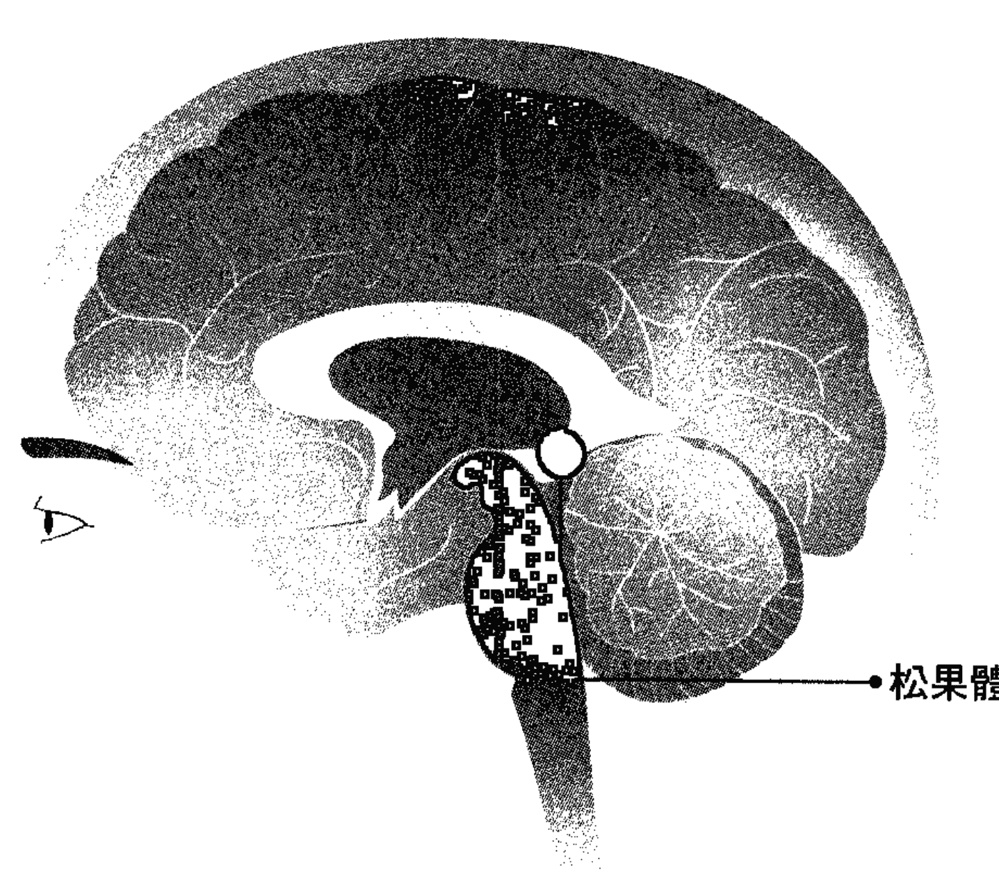

◆ 松果體有退化的視網膜，意味著松果體有過「成像」能力，就像我們的雙眼一樣。

中國的古人管松果體叫什麼呢？就叫「泥丸」！多麼形象啊！古傳中醫把這個「泥丸宮」的位置描述得更加清楚：眉心往上一寸往裡，兩個耳朵尖往上一寸往裡，這三點的連線的交界處就叫「泥丸宮」。大家自豪自豪吧，我們的老祖宗不用去解剖也知道確切位置！順便說一下，各家各派都有一些方法往泥丸宮那個部位折騰，道家也管這個泥丸宮叫「明堂宮」，明堂明堂，一聽就知道搞什麼名堂——「照明、光明的殿堂」，說的也是這麼回事兒——人類的確可以通過「松果體」來實現對人體進行「內照」，經絡就是通過它發現的。至於看清楚五臟六腑，那更是簡單得不得了。《史記·扁鵲倉公列傳》裡說扁鵲「以此視病，盡見五臟癥結」，也是以這個松果體的成像能力來看。知道了這個地方，剩下來就是如何把退化的視網膜重新啟動的技術性問題了。這不是本文所探討的內容，我可以簡單點一下：讓身體恢復到本來的時間為「零」的狀態，也就是我在前面文章裡提到的能夠超過光速的「把握陰陽」的狀態。關於老祖宗如何發現經絡，我這樣講，大家能接受嗎？

接下來的問題是，經絡學說對嗎？全面嗎？古傳中醫傳下來只是經絡圖那點東西嗎？

欲知後事如何，有空我再分解。

## 什麼人能看到經絡？

有很多朋友希望我教教怎樣看經絡。其實古人發現經絡的方法，我在上一篇文章裡已經談了，實在要我再「總結」一下，就是這句話：讓身心回歸「零」的狀態，返觀內察。那麼什麼人能夠比較快容易「看」到經絡呢？當然就是那些容易返回「零態」的人！

## 容易看到經絡的人是這些！

這類人有什麼特徵呢？我勉強列一些在下面供大家參考：

- 1. 性成熟比較晚的人。記得我們在上一篇文章裡說到松果體有壓抑性成熟的作用嗎？
- 2. 好奇心比較重，成年後還多少保留些「童心」的比較「單純」的人。
- 3. 眼睛有近視的人。呵呵，第一次聽說近視還有如此「優勢」吧？
- 4. 從小數理化讀不好的人，邏輯推理能力比較弱的人。還是「笨」點兒好啊！
- 5. 從小數理化超級強的人，有超強的空間推理能力、強大邏輯思維的人。實在不「笨」就只能特「聰明」了。
- 6. 肝功能不是很強的人。為什麼呢？大家猜猜。
- 7. 身體不是很強壯的人。古傳中醫常有「學醫當帶三分病」的道理在這裡呢！
- 8. 經絡比較敏感的人。這個好理解。
- 9. 閉上眼睛眼前不是一片漆黑的人。都「無明」了拿啥東西返觀內察？
- 10. 晚上睡覺不做夢，做夢就做彩色夢的人。
- 11. 小時候經常被父母罵「睜眼瞎說」的孩子。
- 12. 能夠長時間放鬆入靜的人。「久坐必有禪」。
- 13. 從來沒有去過一個地方，到了那兒後感覺自己「好像什麼時候來過」的人。

以上這些，並非都得具備，只要有那麼一兩條就很好辦了。同志們不必灰心，一般來說，有那麼幾條的人，一個晚上就可以被訓練出返觀內景隧道的「望診」能力來。那時候您就知道古人沒有吹牛，十二正經、奇經八脈甚至三脈七輪，都是確實存在的。當然，這「一個晚上」必定是明師們對你考察、磨練了大半輩子之後才有的事！

## ◇ 人體其實是一台精密儀器，存在發射接收位置

有網友略帶「抗議」地說古傳中醫不輕傳「外人」，就像古代皇帝只把皇位傳自家兒孫一樣，是為了「家族保護」。這個說法不大對！家族保護意識畢竟是人之常情，但是這裡面還有更深的「理」。我在前面的文章裡說過，人體就像一台精密無比的生物儀器，它的「發射裝置」每時每刻都在向外發射著信號，這種信號運行的速度比光要快 N 倍（所以我們普通人看不到），而人體的「接收裝置」卻基本上一直處於關閉狀態，它只在特定的時間、場合「開啟」，而且經常是「無意識」的。如果你的接收裝置的「開關」被你死死關著，你自己沒有 ready，就算明醫們願意把一生所學都傳你，也是很困難的事情，此其一。其二，醫家的傳人也經常不是自家人。歷史上這樣的故事很多，如宋濂在《故丹溪先生朱公石表辭》中記述：

> 時方盛行陳師文、裴宗元所定大觀二百九十七方，先生獨疑之，曰：「用藥如持衡，隨物重輕而為前卻，古方新證，安能相值乎？」於是尋師而訂其說，渡濤江走吳，又走宛陵，走建業，皆不能得，復回武林。有以羅司徒知悌為告者，知悌字子敬，宋寶祐中寺人，精於醫，得金士劉完素之學而旁參於李杲、張從正二家，然性倨甚。先生謁焉，十往返不能通。先生志益堅，日拱立於其門，大風雨不易。或告羅曰：「此朱彥修也。君居江南而失此士，人將議君後矣。」羅遽修容見之，一見如故交。

戴良《丹溪翁傳》亦載：

> ……翁往謁焉，凡數往返，不與接。已而求見愈篤，羅乃進之，曰：「子非朱彥修乎？」時翁已有醫名，羅故知之。翁既得見，遂北面再拜以謁，受其所教。羅遇翁亦甚歡，即授以丹溪「日拱立於其門，大風雨不易」，「求見愈篤」，其求師之誠、矢志之堅，終於打動羅子敬，「盡得其學以歸」。

為什麼說這個故事呢？是想告訴大家，這種真誠待人肝膽相照的品格是想學古傳中醫神技必不可少的品格！否則的話，就算遇到明師，也多半是結個善緣而已。

人體的生物儀器，它發出的生物波，其波長波段、頻譜頻率如果無法協調一致，就算明師們願意教，您也未必「接」得下。我這樣講，大家可以理解嗎？

如果還不理解，我再舉三個簡單的例子來幫幫大家理解。比如有些人離家在外，突然覺得心裡發堵，非得趕回家，回到家才知道家裡出事了（比如瓦斯沒關）。又比如，您不知道為什麼會「突然」想起多年不見的某個哥們兒，過沒多久就接到他的電話或乾脆在街上「無意中」碰到他。再如，你們一幫朋友在聚會，突然有人會說「要是某某在就好了」，話還沒說完，某某就進來了（老百姓管這叫「說曹操曹操到」）凡此種種，正如聖人說的「百姓日用而不知」！這些「巧合」，就是因為我們的「接收裝置」在特定的時空點「無意中」被開啟，與外面的「信號」接上了，才出現諸如此類的「偶然」與「巧合」。當然，真正高明的明醫們，應該都懂得如何創造這種「巧合」。

為什麼強調這個呢？我在文章裡反覆提到過，越是高級的東西一定越簡單，比如神乎其神的「千里診病」，真要教，一個晚上便可全會！簡單到讓人覺得「這可能嗎」的程度！大家想想，明師們是如何做到一個晚上就教會這些看上去很神奇的診病能力的呢，問題的關鍵在哪裡？

關鍵就在讓門人弟子們學會「打開」這個「接收裝置」！

而打開這個接收裝置之前，一般是有很多功課要做的。歷代明醫們一般要先對門人弟子進行足夠的磨性訓練，把他們的心徹底磨平了，其「接收裝置」才能容易打開！

打開這個接收開關之後，接下來就是如何「調台」，把師生兩個機器的生物波的波長、波段、頻譜、頻率調到一致，就可以引爆人體內的「大藥」，使人一下子學會諸如千里診病、看到經絡等能力，坦白說，一個晚上就可以學會中醫的「真正的」望聞問切！

如果大家覺得這樣的「教學法」太玄乎，可以比照現代的手機傳輸資訊（相信大家都玩過用手機傳照片之類的資訊）來理解。真正的明師們懂得如何把自己的「手機」裡的資訊「過」給學生的手機，只要把各自的「藍牙」或紅外線打開就可以一下子完成「傳輸」。可以說，現代社會的任何機器和技術，都是在「模仿」人體本身就有的部件和能力！藍牙、紅外線我們都「看不到」，但它們都存在，古傳中醫的能力傳承也可以依此類推。

所以，不是醫家吝嗇或單純出於家族保護，而是這東西的「教」與「學」是一套有很多非常「科學」講究的系統，尤其講究師生之間的「同頻共振」！所以古傳中醫總感嘆好的老師不容易找，好的學生苗子更難找！我上一篇文章裡提到的那位數學老師，就在發愁找不到一個能與他「同頻共振」的人。有網友祝願我早日找到傳人，也有網友提醒我不要輕易傳人，我感謝這些朋友們的美意，謝謝了！請大家放心，我既沒本事去教學生，也多半不會看走眼一個人。

還有很多人希望拜我為師學這個，看來我還得趕緊聲明一下：

- 1. 我無德無能，不敢為人師，更加不可能在網上瞎教別人。所以懇請大家不要以「師」字稱呼我，也不要管我叫「胡醫」，直接叫我「胡塗醫」就好。以後凡是用帶「師」字稱我的一概不回覆！謝謝理解！
- 2. 學任何東西都不如先學做人重要，先做個心存好念、口說好話、手做好事的「三好」人。只有您立志做個高尚的人，做個脫離低級趣味的人，做個戒驕戒躁、謙虛謹慎的人（呵呵，像背毛主席語錄），他日您若有緣遇到明師，就算您沒有上面列的任何特徵，我想他們也多半有足夠的辦法能讓您見證生命的神奇！
- 3. 大家能夠海闊天空去感悟自然是好事，但古人說「饒君聰慧過顏閔，不遇真師莫強猜」，想必很多真傳的東西，還是需要真正明白的人來指點的。當然，對於自學能力好的人，明師就在經典中，顯傳的東西在經典中都能學到。所以大家還是應該靜下心來學習經典（儘管那些紙上的東西很少聽說能培養出半個神醫）。

順便說一下，返觀內察的能力雖然頗為有趣（特別是在剛剛學會的時候很「振奮人心」），但它也有一定的「副作用」。心性不好的人，學會了反而傷元氣，有害無益！所以這樣的東西，明師們怎敢隨便傳？就算在一個家庭裡，往往也只能教給眾多孩子中的一個兩個呢。

學中醫，要先紮紮實實學做好人，這些「技術性」的東西不重要，二十分鐘能學會的東西，有時還真得考察你兩年甚至二十年才可以教，這個道理要懂。

我把這個老底全「招」了，更多的道理大家自個兒去領悟吧。

## 中醫解惑 Q & A

痴迷中醫：先生所說「讓身心回歸『零』的狀態，返觀內察」，聽起來簡單，做起來可不容易呢。不過我感覺，這種狀態是否就是「恬淡虛無，真氣從之，精神內守」的狀態呢？

胡塗醫：做起來不容易是因為心裡「有」東西。「真氣從之」還有一個「真氣」。「精神內守」還有一個「精神」。「有」還不行，「無」才行。

新浪網友：「從來沒有去過一個地方，到了那兒後感覺自己『好像什麼時候來過』的人」，先生，我真的經常有這種感覺，我弟弟也是，而且一個場景，總是彷彿經歷過似的，望賜教。

胡塗醫：這個現象法國人特別多，法語裡有一個專門的詞叫作 Déjàvu (deja vu)，翻譯成英文就是 already seen，「已見過」而事實上「沒有見過」。請參考我前面的文章〈陰陽，異名而同類〉❸裡關於超光速的解釋。光速以上時間「不存在」，所以「未來」和「現在」都是「同時」存在的。具體請找霍金的《時間簡史》讀讀，好嗎？

❸ 請見〈陰陽，異名而同類〉，51頁。

## 經絡走勢和類型

前面幾篇與經絡有關的文章出來之後，很多朋友提了各種各樣的問題，有一些問題我已回覆了，這篇文章盡量回答那些我還沒來得及回答的問題。

關於經絡呼吸走勢、時辰等問題。我專門做了一個表格，方便大家瞭解，如下表。

### 十二經絡養生表

| 十二正經 | 經脈 | 時辰 | 臟腑 | 五行 | 呼吸 | 走勢 | 真氣動向 | 記憶法 |
| :--- | :--- | :--- | :--- | :--- | :--- | :--- | :--- | :--- |
| 手三陰 | 手太陰肺經 | 寅 | 肺 | 金氣肅降 | 呼 | 由胸走手 | 由上而下 | 在手內側，屬裡，為「陰」 |
| | 手少陰心經 | 午 | 心 | 心火下降 | 呼 | | | |
| | 手厥陰心包經 | 戌 | 心包 | 心火下降 | 呼 | | | |
| 手三陽 | 手陽明大腸經 | 卯 | 大腸 | 金氣收斂 | 呼 | 由手走頭 | 由下而上 | 在手外側，屬表，為「陽」 |
| | 手太陽小腸經 | 未 | 小腸 | 火氣煊通 | 吸 | | | |
| | 手少陽三焦經 | 亥 | 三焦 | 相火燔灼 | 吸 | | | |
| 足三陰 | 足太陰脾經 | 巳 | 脾 | 土氣運化 | 吸 | 由足走腹 | 由下而上 | 在腿內側，屬裡，為「陰」 |
| | 足少陰腎經 | 酉 | 腎 | 水氣封藏 | 吸 | | | |
| | 足厥陰肝經 | 丑 | 肝 | 木氣疏洩 | 吸 | | | |
| 足三陽 | 足太陽膀胱經 | 申 | 膀胱 | 水氣封藏 | 呼 | 由頭走足 | 由上而下 | 在腿外側，屬表，為「陽」 |
| | 足陽明胃經 | 辰 | 胃 | 土氣運化 | 呼 | | | |
| | 足少陽膽經 | 子 | 膽 | 木氣疏洩 | 呼 | | | |

至於為何某條經絡是呼氣的時候由此走彼，還是吸氣的時候由彼走此，學界目前還沒有讓人信服的說法。不用再解釋了，這是古聖先賢在做到「返觀內察」之後得出的結果！

## ◇ 4大經絡類型和診病特色

關於經絡的類型問題。有網友問，人類的經絡是不是每個人都一樣？人體的經絡的確有不同的類型，或者說，人體對真氣的感應、反應、敏感程度有不同的類型。一般來說，可以分為四大類。

### 1. 經絡極敏感型

這類人非常有「福」。得古傳中醫真傳的人，給這類人治病，一般一下兩下就能解決問題（不管問題聽起來多嚴重），好比內家拳高手，練到「全身發力如彈簧，硬打硬拼無遮攔」的時候，哪裡需要什麼 108 式？所以老百姓說一個人真會治病或武功，都是說「這個人有兩下子」，沒說「這個人有很多下」的。

想出名的人，找這樣幾個經絡極敏感的病人來治治，一個晚上就可以聲名在外，可以有「資本」出去忽悠別人了。

我前面的文章〈糊塗醫治糊塗腫瘤〉裡提到的一巴掌拍掉一顆半個雞蛋大的腫瘤的故事，不是因為我有何了不起的水準，而是因為那位老 T 先生就是這種了不起的經絡極敏感類型的人。我當時在文章裡提到「老 T 先生是一個經絡比較敏感的人，給這類人治病，我是從來不需動手的，更不需要抓藥、針灸」，很多人不理解，我答應過要揭開這個問題的老底，「老底」就在這裡——經絡極為敏感的人，對真氣、能、光、聲、電等有天生的「接收」能力，並且能夠在很短的時間內把接收到的資訊變級放大，從而產生類似核爆炸般的能量。用愛因斯坦的著名公式：E=mc²來看，「光速的平方」乘以「病人自身的品質」，是個什麼概念的能量？而人體的真氣，其運行速度比光要快 N 倍呢（關於超光速的概念，請見我前面的文章〈陰陽，異名而同類〉），區區一個腫瘤，還不說化就化！

知道這個類型的道理，對我們學中醫有何幫助呢？

可以幫我們偷懶！對付這個類型的病人，壓根兒就不需要動手，更不需要針灸、下藥！談笑用兵可也。萬一有一天，您也不幸「被」成為「大師」，找您治病的人絡繹不絕，您除了節哀順變當您的「大師」外，就是好好運用這個理論！對人群中的極敏感者，集中放到一起，三下兩下把這群人一股腦打發了，既顯得有點兒「大師」，又省得花大家的時間和氣力。

人群中，這種類型的人有多少呢？大約 5% ～ 10% ！

如何判斷自己是否經絡極敏感的人呢？我得繼續忽悠一番再說，這是古傳中醫「門風」，大家繼續往下看。

### 2. 經絡敏感型

這個類型的人，比上一種類型的人要「不敏感」一些。不敏感「多少」？如果從時間上來說，經絡極敏感的人是幾乎「即時」接收資訊，那麼這個敏感型的人就有一個 buffering 的時間，最少有二三十秒之差。別看這區區二三十秒，差別可大了，所謂「差之毫釐，失之千里」，再精確不過了！如果大家無法理解，就想想現在用寬頻上網，以前用電話線上網，看看那個差別再舉一反三吧。

經絡敏感的人，「針灸之所及也」，給這類人治病還是需要動動手的，實在不行，還可以針刺艾灸一塊兒上。這類人在人群裡約佔 40%。所以同志們不必灰心，如果您不是極敏感型，有 40% 的可能是敏感型的呢。

這個類型的人，比較適合進行「返觀內察」的訓練，包括前面文章裡提到的「小周天」運行，也適合他們。箇中道理，歡迎大家討論。

### 3. 經絡不敏感型

這個類型的人，對人體真氣沒啥感覺。這類人在人群中特別多，以前認為也佔 40% 左右，但據我的觀察，在現代人中基本過半都是不敏感型的。這類人對人體真氣基本沒有感覺，如果要給這類人治病，還是老老實實給他們開些藥，或者教些方法，讓他們把自身經絡折騰得敏感一些了再說。

### 4. 經絡超不敏感型，或者稱作「經絡遲鈍型」

這類人在人群中佔 5% ～ 10%。他們哪怕被針扎一下，也沒太大感覺，更何況對人體真氣！給這類人治病，您就得老老實實，該下猛藥下猛藥，該勸他們看西醫勸他們去看西醫，除非他們願意「以身證道」跟您走，否則少對他們「裝」內行。可以客客氣氣跟他們說：「您這個病，我怕治不好。您層次高，用西醫的高科技比較快。」

各種類型的人都有些什麼特徵呢？如何判斷自己是哪個類型的人呢？

是不是一旦「定型」就無法改變了？有沒有什麼辦法可以 upgrade（升級）我們的經絡類型呢？

## 中醫解惑 Q & A

**krjzz**：先天的差異是否不是很大？如同小孩都喜歡金剛印，都有這個本能，而後天的生活習性啊環境啊，產生了這種差異？
**胡塗醫**：先天還是有些差異的。也不是每個小嬰兒都常握金剛印的，對吧？後天的生活習慣和生存環境的確加大了這種差異。當然，嚴格來說，每個人「本來」都是一樣的。

**宣傳中醫**：經絡遲鈍的人經絡不是很暢通，經絡敏感的人平常經絡是很通暢的。經常鍛鍊經絡、打通經絡就會使遲鈍的經絡變成敏感的經絡，方法很多，中醫所有的方法都是為了打通經絡。還是隨先生學些大道至簡的方法好些。
**胡塗醫**：也對也不對。
人體的經絡本來就是「通」的！只是比較敏感的人「更容易」感覺到真氣運行而已。

**wenie**：先天也許差不多。後天由於每個人的心受外界的干擾程度不同，對太執著於外相的人，自身自然敏感度差，心靜內求性空的人，可能自身敏感度就強些，但過於追求結果的人，可能會走火入魔。
**胡塗醫**：有道理！
只是「走火入魔」聽起來有點兒嚇人。天底下沒幾個真正「能」走火入魔的人。千古聖人不傳「火」，如果我們連「火」都不知道，走啥火呢？所以大家不用擔心，您多半還「不足以」走火！

開始懂了：經絡敏感型的人比較怕疼吧，會害怕打針吧？是不是一旦「定型」就無法改變了？不是吧，好像可以改變吧，當身體生病的時候，相對而言，以前較敏感的經絡會變得遲鈍一些。我小時候特怕打針，後來生病了，當初也怕打針，但病了沒辦法也必須打（那時對中醫並不瞭解）。後來感覺打針打麻木了，但其實心裡每次還是懼怕。由於害怕打針，轉到中醫改吃中藥了，呵呵。好像生病以後，有點點改變了經絡的敏感度，但天生的體質應該屬於敏感型經絡，不知道什麼時候身體又再次能回到最初那樣，哎……

胡塗醫：不是一「定型」就無法改變，要不豈不是很悲觀？
至於經絡敏感與痛感的關係，相關性應該不高。也有經絡特別敏感的人不怕痛的。

元緩：斗膽，經絡敏感的過程，是一個向內的自我回歸過程。
（個人認為如此，呵呵）
胡塗醫：是這樣！

wenie：看了先生給大家的回覆，有一不懂，為什麼「意志薄弱的人多數經絡比較敏感」？如網友「元緩」所講，「經絡敏感的過程，是一個向內的自我回歸過程」，這是不是只指肉體的一個向內的自我回歸過程，而不包括精神的向內的自我回歸過程？如果精神也向內自我回歸的話，人就不會意志薄弱了？

胡塗醫：謝謝先生提問。
您的三個問題我都簡單回答一下吧：

- 1. 意志薄弱的人往往在情志上比較「敏感」，反映在身體上，就容易對經絡敏感。
- 2. 當然包括精神的內向自我回歸過程。不應該把「身」與「心」徹底分開！
- 3. 要看您如何「回歸」法，有針對性訓練的話，是可以精神內練出金剛勇猛的意志來的。要不學中醫幹嘛，對嗎？

kunfunan：我就是一個意志力很薄弱的人，容易受到感動、容易流眼淚、身體底子比較差的人！不知是否是經絡敏感人？
胡塗醫：也不是說意志力薄弱的人就「一定」是經絡敏感型的人，否則中醫乾脆管經絡敏感說成意志薄弱就拉倒，對嗎？

大頭娃娃：有個問題想請教一下，經絡敏感和身體敏感是一回事吧？我原來不愛出汗，受涼也不會打噴嚏，經過這兩年多的折騰，我發現自己夏天愛出汗了，身體稍微一受涼就打噴嚏。剛開始站樁和靜坐的時候也沒啥氣感，現在兩手的手指只要對起來就有氣感，剛開始打太極的時候也是沒啥感覺，現在都會有氣在手中流動的感覺。所以我想，敏感和不敏感是可以相互轉換的，如果不每天加強鍛鍊，敏感也會變成不敏感，是嗎？
胡塗醫：娃娃正解！人體的經絡是可以通過鍛鍊變得更敏感的。

中道 chs：呼出心與肺、吸入腎與肝，看先生的這個表，發現人體需要排出的多，而吸氣時經絡運行的只有五條經脈，也就是說養生治病首先應該先把人體的毒素排出，排得越乾淨，身體越健康；先補漏，再進補，方能祛病養生。呼出的是體內的廢氣毒素以及陰邪六淫，這些排得越多，身體越清淨，吸入的宇宙陽能越多。早上3點到7點是人體排毒最活躍的時期，這時期應早起、排泄，飲水排毒會得到事半功倍的效果，養生之氣在早上最強。如果肝腎吸入的陽能不足，就會腎虛水泛肝失調達，這些都是陽氣的缺乏導致的氣化不利呢！
胡塗醫：先生說的很對！

foretmenot6413：請問呼吸與經絡的關係，是不是跟「脾主吸氣，腎主納氣，肺主呼氣」有關係呀？多謝。

胡塗醫：有關係。準確來說，肺主「行氣」。

## 你是什么经络类型？

上一篇文章出来后，朋友们各抒己见做了不少探讨，很不错。这个文章接着回答与经络有关的问题，力争「把经络说清楚」！

先回答大家最关心的问题：经络一旦「定型」是否就不能改了？答案是：可以改！要不学中医岂不是很没希望？

只是世上任何「改变」都不容易，哪怕改个名字改个房产证都要些手续呢，对吧？有网友觉得他是「迟钝型」，怯怯地问我能否帮他「改成经络极敏感型」，这真是太抬举胡涂医了，我又不是神仙！就算能遇到神仙，这么一个急功近利只想索取不想付出（努力）的态度，神仙多半也不肯帮忙。

那么如何「改」呢？一般来说，这有一个过程，就像悟道的人有一个从渐悟到顿悟的漫长过程。人体经络的敏感程度，受许多因素影响，比如，与生俱来的先天因素（这没啥好办法改变，除非您顿悟），后天的职业、行为、心理习惯等等。简单来说，通过锻炼（体育运动、经络拍打、瑜伽、内家拳训练等等），可以慢慢提高经络的敏感度。此外，在情志上变得更加开朗、通达，也有利于经络的「开」与「通」。

还得说明一下，也不是说经络越敏感就越好。尽管极敏感的人更有「福」被神医们一下子治好，但是这类人往往是那些意志比较薄弱的人，孰好孰坏，见仁见智。

## ◇ 經絡最敏感者 VS 經絡最不敏感者的特徵

那麼，如何判斷自己的經絡類型呢？

一般來說，經絡極敏感的人多有如下特徵：

- 1. 如果是黃種人，頭髮比較柔，有的頭髮微微有點兒自然發黃（不是染髮的原因）。
- 2. 講話的時候，手勢（gesture language）比較多。
- 3. 愛說不合乎常理的東西。
- 4. 對人對事常常比較敏感。
- 5. 往往意志比較薄弱，比較不懂控制自己的感情、情緒。
- 6. 比較不長於邏輯推理。
- 7. 生物能量場比較強的人一接近他們，他們比較容易「有感覺」，比如起雞皮疙瘩。
- 8. 站樁的時候常會不自覺地動起來。
- 9. 比較喜歡別人安排好工作讓他去完成，沒啥領導欲望。
- 10. 職業：各個行業的勞工模範類型的人。

經絡超級不敏感、經絡遲鈍的人常有如下的特徵：

- 1. 往往頭髮特別硬。
- 2. 做事一板一眼，喜歡尋根問底。
- 3. 邏輯思維、推理能力特別強。
- 4. 控制欲、占有欲、征服欲特強。
- 5. 個性比較「硬」，比較固執。
- 6. 非常「講道理」的人，「講理」的人最可怕，他們總覺得他們自己「有理」。
- 7. 喜歡安排事情讓別人做，有「官癮」的人。
- 8. 職業：多數是老總、領導者、記者、法官、員警、國內的律師、國內的銀行家等。國內的「成功人士」的經絡常超不敏感。

以上談的，是最敏感和最不敏感的人，中間的兩種類型，大家請按照這個思路去舉一反三就好！中醫如何學？得如此宏觀地學思路、思維方法，而不是去學一招一式、一個穴位一條經絡一個藥方，學中醫的人要大器磅礴，千萬別學得小裡小氣！

補充說明：以上「特徵」只是普遍情況，也有特殊情況的。

## 中醫解惑 Q & A

**krzz**：對照下來，我應是中間一塊。請教先生，最近幾個月身體左邊，有的時候是腳、有的時候是手臂，總會一跳一跳，感覺有東西在竄。是否春天肝氣旺，身體在調整了呢？

**胡塗醫**：那要看情況而定。比如您是否在做真氣方面的鍛鍊，若是，「跳」就是一個正常反應。其實，學中醫也好，學養生也罷，千萬別學得「疑神疑鬼」，大器些，別怕！

**癡迷中醫**：學中醫的人要大器磅礴——太贊成了！畢竟中醫講究的是天人合一，人體與大自然同步運行，自然應該是宏觀大器。可是實際在操作時，卻不免落入很多細節的海洋裡。怎樣才能做到像先生這樣高屋建瓴式的「糊糊塗塗」呢？

**胡塗醫**：高屋建瓴談不上，糊糊塗塗倒是如假包換。等哪一天您明白了什麼是「雲在青山水在瓶」之後，就無所謂細節了。

**瘋狂大花神**：所以說呢，中醫理論裡的五行陰陽學說其實就是個方法論，以此來指導你的學習，不就糊塗起來啦？

**胡塗醫**：花神說的對。

**癡迷中醫**：回花神姐姐：謝謝指點！以前重點看十二時辰和經絡，從今天開始要轉移到先生的「五行陰陽說」了，看是否能夠快點糊塗起來哦！

**胡塗醫**：不要追求糊塗，學問要做得明白。另，五行陰陽說也不是我的私家貨，不敢有個定語「先生的」。

**靜悟**：哈哈，對照來，覺得兩個都有！求助先生，我這段時間每天凌晨3到5點眼睛乾澀很厲害，手和腳發熱，還會醒來，5點過了後這些症狀都會減弱，又能睡去！自己按過太衝，敲膽經，還有後溪，折騰了好長時間；也吃過綠豆湯、烏梅湯，只差用桑椹煮粥沒吃呢！總不感覺好轉！也許如先生所說「學中醫的人要大器磅礴，千萬別學得小裡小氣」，我就是學得小裡小氣吧，總悟不明白！所以求助先生給我支一招！期待著！

**胡塗醫：**按常理，這是寅時肺氣肅降的時辰。這個時辰應該是睡得最死的時候，以便肺在人體深度睡眠之時完成一身氣血的分配。您這個時候醒來，就說明氣血不足，肺的肅降能力變差了，而且您手腳發熱，多半是陰不戀陽、腎精不足、收斂功能下降，導致肺只有宣發而乏力肅降，眼睛乾澀的原因也在此（腎水不足，肝木難養，肝開竅於目）。
您也別擔心，也許您還沒有「老」到這個地步。
支一招可以，但我可不能替您練啊。每天睡前醒後練那個「心腎相交法」就好。綠豆湯、烏梅湯等就免了吧。

**doriswan2007：**胡塗醫好！我是半月板損傷患者，因為這個東西太特殊太重要了，所以不敢糊塗對待它，一直在尋求它是否能自癒的答案！請問：西醫給半月板損傷判了死刑，認為血液達不到那裡，所以它一旦受傷無法自癒。我堅持了5個月沒手術，但這麼久也沒完全康復，只是步步慢慢地好轉。那麼，中醫的經絡說能貫穿到半月板那裡嗎？能給它滋養促其自癒嗎？有沒有什麼方法能助它一臂之力呢？渴盼您的回音！謝謝！

**胡塗醫：**謝謝提問！經絡學說只是一個「學說」，怎麼可以「貫穿」什麼部位啊！若您問的是人體真氣，那毫無疑問！真氣的運行速度比光快N倍，這世上還沒有它貫穿不過的！若要滋養並促其自癒，您得自己進行真氣的訓練、培育體內正氣，或者請明白人幫您一把。祝您早日康復！阿彌陀佛。

antony：感覺我屬於經絡敏感型的，大多條件符合。特別是站樁一過半小時後全身都動，卻感覺不到內臟在動！
胡塗醫：有可能。不過也可能是您上實下虛，也有可能是站的樁位不太對。

藍色魔法師：博主好，有個問題想請教一下，我練太極拳半年左右，最近感覺左手中指背側在走路或者練拳時會突然很熱，但是又不至於灼燒感覺，這是什麼原因呢？同時在一個月前發現，腳內側有時有一條熱流流到腳底，很暖和的樣子，這個怎麼解釋？這個症狀是好是壞呢？
胡塗醫：我不懂太極拳，但是這應該不是什麼症狀，多半是真氣在經絡運行加速了。

幸會胡塗醫：謝謝胡塗醫！我以前對這些一竅不通，這幾個月為了我那自閉症的孩子自學按摩，自己感覺身上越來越敏感了。請教您一個疑問：我感覺給孩子按摩病氣會過到自己身上，您的看法？
胡塗醫：不會。

## 如何判斷經絡類型？

前兩篇文章出來後，朋友們頗為熱烈的討論，讓我學到很多東西。我非常慶幸我不是「老師」，否則沒好日子過。為什麼呢？因為我列出了個大概思路，大家就能沿著這個思路各抒己見，做出有益的探討。這樣學下去，老師的日子就不好過了。聖人說「大道至簡」，老師那裡的東西，如果是「真傳」，就肯定「不多」！那麼一點兒東西經大家這麼一討論，「老底」遲早就都得給端出來，以後老師還拿啥去唬學生呢？

古傳中醫強調師承的「山林」教育與入世的「社會」教育相結合。希望越來越多的老師們不斷鼓勵學生去探索、質疑、體證，這樣他們才會逐漸往學者型、知識型、實用型、以身證道型過渡，才不至於一輩子停留在號號脈、看看舌、辨辨陰陽虛實的「八綱」水準。學中醫要想學通，非得把它當道來悟不可！聖賢說的「大疑大悟，小疑小悟，不疑不悟」是有深刻道理的。所以胡塗醫歡迎大家質疑、拍磚和賜教！

學中醫的人，要提倡這種勇於認錯，直下承擔的「吾愛吾師，吾更愛真理」的精神！有一位朋友聊及某位美籍華人中醫「大師」，問我對該大師的看法，我就順便說一下。我對該「大師」以及類似的大師們都沒有啥看法！畢竟咱自己不是大師，不敢妄測大師們的道德學問。

按常理，一個有道之人，若不能如聖人所說「戰戰兢兢」、「如臨深淵」怕說錯話誤導人，若不能「虛懷若谷」、「勤而行之」做學問，至少也不會自封「大師」，對吧？學中醫的，應該提倡毛主席說的「雙百方針」——百家爭鳴、百花齊放，並時時謹記互相讚美互通有無，用一顆寬容、謙和的心去看待同行讚美同行，中醫才能興旺。容得下別人，自己才能進步。今日國內的中醫界、養生界，「大師」輩出，人才濟濟，往好處看，似乎中醫在「復興」；往壞處看，這會最終「害」了中醫。懂行的人多半清楚，目前簡直可以說是狐禪遍野邪說紛呈！千百年來，中醫為什麼沒落了？誰「戕害」了中醫？還不是中醫界的人自己！有心學中醫，真的要發大心願，學「真」的，不要給中醫「抹黑」！不要去浪費時間精力在江湖騙子們身上，更不應該去借中醫養生界目前的混亂大撈一把。沒有一顆父母心，很難得真傳，耐不住寂寞、坐不了冷板凳的人，終難有大成。奉勸大家，把學中醫當成學道去體悟，因天之序，合道而行，才有望「為往聖繼絕學」。

## ◇ 知道經絡類型，對我們的作用

言歸正傳。今天繼續爭取「把經絡說清楚」。知道經絡的類型，對我們有什麼指導作用？
對於學中醫的人來說，除了我前面提到的可以偷懶、提高效率外，知道了這個道理，還可以使大家先瞭解瞭解自己的「斤兩」，對自己的身體進行有的放矢的折騰，讓自己從超級不敏感慢慢過渡到相對敏感。此外，道家和醫家都強調要把全身的經絡打通，我前面說到的「小周天」（請參見〈傳統中醫對經絡的認識〉一文❹），經絡「超級不敏感」和「不敏感」的人，是很難在短期內練出啥感覺的。換句話說，這兩類人就算把小周天練「通」了也不知道自己已經「通」了！如果您明白經絡類型的大道之理，就會「化悲痛為力量」，把心安下來，好好用功！古傳中醫常常要求門人弟子「只問耕耘，不問收穫」，教了你方法，你就傻練，原因就在這裡。萬一碰上這兩種類型的學生，不如此要求，他們沒信心跟你學下去。現代社會「培養」了很多浮躁的人，學三天沒感覺就跑的人比比皆是。以後大家遇到有人發牢騷，說醫道兩家在騙人，因為據他們「實證」練習小周天沒感覺，您就要懂行，這些人多半自己經絡類型不敏感！順便強調一下：就算經絡超級不敏感的人，也不是不能接受中醫治療，只是給他們治病比較費勁而已。

如何判知他人的經絡是哪一類型？這個問題還真不好回答。為什麼呢？

因為答案太簡單！怕說出來大家不信，「輕慢」了中醫大道。

古人常說「寧給一寸金，不給一句話」，就是這個原因。我可沒有那麼多「金」可以給大家，實在有興趣知道的人，請「私下裡」問我吧，若您有緣分得，我會把這句話告訴您。聽起來有點兒神秘，但不如此「鄭重其事」，這類教學很難完成，大家以後「往裡走」就會理解。

祝大家心開脈解、通經活絡！

❹ 請見〈傳統中醫對經絡的認識〉，254頁。

## 中醫解惑 Q & A

宣傳中醫：請問同一個人中有沒有一部分經絡敏感，而另一部分經絡遲鈍的呢？我的估計是有的，盼指點。
胡塗醫：敏感與否，在「同一時間」內是區分得清楚的，不會「同時「敏感」又「不敏感」。當然，身體某個部位相對於別的部位敏感，這卻是有的。

渴望醫理真諦：「心開脈解、通經活絡！」就是心開。
胡塗醫：心開了脈就解！

癡迷中醫：先生所言「有心學中醫，真的要發大心願，學『真』的，不要給中醫『抹黑』！沒有一顆父母心，很難得真傳，耐不住寂寞、坐不了冷板凳的人，終難有大成。奉勸大家，把學中醫當成學道去體悟，因天之序，合道而行，才有望『為往聖繼承絕學』』，在下深以為是！而且最近細讀精讀先生博文並領悟到，中醫實際是要靠自己用功用心勤勉專注，並未有傳說中的捷徑可言。還是自己好好用功吧！到時自然會「理通法自明」。
胡塗醫：「用心勤勉專注」是做任何學問必需的，哪怕學外語也如此，「新東方」的托福培訓雖然考起試來厲害，但是出了國照樣沒戲，人家俞敏洪老師可是在北大坐過冷板凳的。
「捷徑」還是有的，在您背了相當數量的書之後，被中醫行內的「新東方」點一下，多半會突飛猛進。馬克思主義是對的，量變引起質變。

## 經絡運行的規律

關於經絡學說，要「說清楚」真是談何容易。這一系列文章寫下來，我總覺得有些意猶未盡。我深知，繼續寫將下去，會把經絡學說的秘密給一個個端出來，埋藏幾千年的秘密一旦被道破，以經絡學說研究「為生」的人怎麼辦？考慮了一些天，我還是決定繼續忽悠下去，爭取繼續「把經絡說清楚」。

### ◇ 經絡的運行規律

經絡的運行有何規律？
我在前面的文章裡說過了，經絡就是人體真氣運行的通路。在第五篇〈二十四小時如何過〉的系列文章裡，我會提到人體的真氣，寅時從手太陰肺經開始，卯時到了手陽明大腸經、辰時到足陽明胃經、巳時到足太陰脾經、午時到手少陰心經、未時到手太陽小腸經、申時到足太陽膀胱經、酉時到足少陰腎經、戌時到手厥陰心包經、亥時到手少陽三焦經、子時一陽來復到足少陽膽經、丑時到足厥陰肝經，寅時又從肝經到肺經，一天二十四小時周行不殆，是一個「如環無端」的縱圓形結構。
初學的朋友，多半會被手足各自的三陰三陽的「走勢」弄得很糾結。醫家在教這個的時候，一般是先教會你自己返觀內察到經絡，自己看得到了，它們如何「走」就一目了然了。對於現代看不到經絡的人們，可以這樣記：

- 從寅時到丑時這十二時辰裡，每兩個時辰從手到足真氣輪流著走。
- 手三陰，胸走手。手三陽，手走胸。足三陰，足走腹。足三陽，頭走足。

以上是十二正經的走法。那麼奇經八脈如何走呢？

我在前面的文章裡說到，如果說十二正經是長江、黃河，奇經八脈就是洞庭湖、鄱陽湖等大湖。這是什麼意思呢？十二正經的真氣充足，就會如長江、黃河的水量充足般會「溢」到奇經八脈這八個大湖裡儲藏起來。

有養生名人主張十二正經的真氣不充足，才有利於「流通」，這是錯誤的。大江大河的水量不足，湖泊就不會有足夠的儲水量，大自然如此，人體也如此。如果奇經八脈沒有足夠的真氣，人體可就容易生大病了。奇經八脈如果傷著了，是非常難治的，因為很少有藥物可以直接進入奇經八脈。奇經八脈為什麼叫「奇經八脈」？因為十二正經是手三陰對手三陽、足三陰對足三陽，都是成「對」的，奇經八脈則都是獨立的，所以叫「奇」。

有朋友問及不孕不育的事，這是現代社會常見病，我順便說一下。不孕不育、自然流產一類的病，若要深究其因，一定是傷著奇經八脈了，尤其是任、督、衝三條經脈。任脈主血，是全身的「陰脈之海」，任何婦科疾病，都必須調理任脈。現代女性喜歡剖腹產，剖腹產最容易傷到任脈了，所以剖腹產過後，一般要恢復兩三年後再生孩子。《黃帝內經·素問·上古天真論》上說，任脈如果虛了，而衝脈也衰弱氣少，女性生殖機能的月經就會枯竭，這條通道不通，就不能懷孕（「女子七七，任脈虛，太衝脈衰少，天癸盡，地道不通，故形壞而無子」）。儘管這說的是 49 歲以上的女性，但是其理是相通的，任脈這條陰脈之海對女性尤其重要。督脈主氣，總督全身陽脈，所以叫「陽脈之海」。陰陽相合才能生育，所以讓任督二脈暢通無阻，是陰陽和合的關鍵，也是養生祛病必須打「通」的通道，所以古人才編排出「小周天」之類的方法，去折騰這兩條分管人體陰陽兩氣的主要經脈。道家甚至認為任督二脈這個小周天一通行無阻，就是人中之仙，所以通小周天的方法，也被稱為「人仙功」。所以想要孩子的人，最保險的方法就是訓練小周天，把小周天打「通」。

### ◇ 任脈，統管身體諸陰脈

任脈，主管全身的陰脈，這條陰脈之海，一般醫書都是這樣描述它的起止路線：「起於中極之下，以上毛際，循腹裡，上關元，至咽喉，上頤，循面，入目。」事實上，能看到經絡的人會發現，任脈常常是隨著我們的呼氣下降，從兩目到人中到咽喉一路往下到會陰穴，當然，它也可以「倒」過來，從中極（肚臍下約四指處）向會陰下行再上毛際一路往上。這條經脈有三個小周天訓練的大穴：膻中、關元、會陰（即中丹田、下丹田和會陰穴所在區域），這三個大穴如果「通」了，連成一線，小周天就算「通」了一半了。

任脈上還有三個重要穴位：人中、肚臍和頤。「人中」顧名思義，一般急救，人們都懂得掐掐「人中」，暈倒的人就會醒來。古傳中醫有一個急救祕法，對剛剛暈死過去的人，往心臟的方向用力揉按魚際（手掌裡面，拇指根部至腕關節中那塊肌肉隆起的外側肌群），同時用力掐人中，剛剛暈死過去的人就能活回來。

算命的書上常說，人中長而深的人會生男孩，算命先生多說不出個所以然，其實箇中道理，就是因為人中是任督二脈的交匯地。人中深而長，是精氣、陽氣充足的表現，與「男性」相應。肚臍呢，是我們出生前連著母體的關口，隨著臍帶的剪斷，我們從先天到了後天，歷代道、醫兩家，都有丹田位置的爭論，公說公有理婆說婆有理，但是所有的「爭議」都是圍繞著「肚臍」來，不管是「臍下三寸」還是「臍下四指」還是「前三後七」，無不是圍繞肚臍來說事兒，可見肚臍的位置，對醫、道兩家都特別重要。其實，宏觀點看，把丹田的位置理解為「肚臍周圍」就行。中醫常教人用艾草薰肚臍，道理就在這兒——培育壯大丹田之氣。那麼任脈上的「頤」又是什麼地方呢？醫書上少見記載。這個「頤」就是我們微笑的時候臉上「動」的地方！古傳中醫在教門人弟子用功時，總要求對方「眉心舒展，面帶微笑」，這個「動作」是個「不法之法」，可以讓「頤」這個部位放鬆，從而使任脈放鬆下來！所以大家以後多微笑吧，尤其是要生孩子的人，要養成微笑的習慣。別整天哭喪著臉，把孩子都給嚇跑了。

### ◇ 督脈，調節陽經氣血

督脈，總督全身的陽脈。為什麼身體前方的任脈反而是「陰」，後背的督脈卻是「陽」呢？用達爾文的猴子變人論來看比較好理解，爬行動物都是背部對著太陽的，正對著太陽的地方，自然是「陽」；背著太陽的，就是「陰」。當然，達爾文未必正確，大家也可以理解為人在田地裡勞動時，是「面朝黃土背朝天」，背部對著太陽，所以脊椎骨的這條經脈——督脈，是全身的「陽脈之海」。醫書一般這樣描述督脈的起止：「起於下極之輸，並於脊裡，上至風府入腦，上巔，循額至鼻柱。」如果小周天「通」了，返觀內察便可見督脈隨著我們的吸氣上升。於一呼一吸之間，吸氣督脈的真氣由下而上，沿著脊椎骨上行到頭頂，接著往下行至人中；呼氣，人體中氣從人中一路往下一路至會陰。按古傳中醫的說法，督脈上有小周天上的六大穴位：尾閭、命門、大椎、玉枕、百會、上丹田。這六個大穴道如果「通」了，連成一線，就是督脈「通」了。這就是為什麼古人管「通」周天叫作「通督」，畢竟督脈上的大穴比任脈多了一倍。《莊子·養生主》中有句話叫「緣督以為經，可以保身，可以全生，可以養親，可以盡年」，歷代注釋《莊子》多是亂注一通，其實莊子說的就是這條督脈，有點類似西醫所說的中樞神經。我們從小就知道「人和動物的根本區別是直立行走和能夠用手勞動」，古傳中醫則認為，人和動物的根本區別在於這條督脈是直立的，人體的脊椎骨是直立的，上面左右兩側掛滿了五臟六腑，前後循行著任督二脈，如果能保證真氣在這條督脈上通行無阻，可以直接強腎、補腦，使人得以頤養天年。那麼這條督脈確切位置在哪裡呢？千古以來很少人說得清楚。甚至那些能「返觀內察」的人，也有不同意見。但總不離脊椎這條人體中樞，我比較認同的督脈位置，是在脊椎骨的骨髓中間那條比頭髮還細的「線」——這是普通人的督脈，經絡極敏感的人督脈相對寬、粗些，而修行有素、精氣很足的人則更寬大些。

現代男孩子似乎越來越女性化，就是因為終日不見太陽，整天對著電腦電視，加上腎精過早精過早洩漏、虧損，使這條經脈陽氣太弱，那些「娘娘腔」的男人也是同樣的問題。對治的方法就是回歸生命的本源，盡量多在太陽底下工作、生活，經常讓陽光照射到背部。所以男孩子要「賤」點兒養，別讓他們太過養尊處優，多趕出去外面「日曬雨淋」，另外別讓他們太「聰明」，太早交女朋友。

### ◇ 衝脈，主導人體生殖機能

衝脈，是我們五臟六腑十二正經的海，我們的五臟六腑都領受著這條經脈的氣血濡養。返觀內察這條經脈，可見其隨我們的吸氣上升。起於小腹，下出於會陰，向上行於脊椎之內，其外行者經氣沖於足少陰腎經交會，沿腹部兩側，女人到胸部就散開（所以女人胸大與否就看這裡真氣是否充足），男人則繼續上行達咽喉，環繞口唇。女人胸部大小、男人髭髯多寡，都取決於這條經脈！如果女子胸部小，往往會長「髭子」，就是這條衝脈（也叫太衝脈）不夠通暢。

女人若要隆胸，有兩次機會，一次當然是在發育期間，調理調理這條太衝脈；另外就是懷孕生育的時候，胸部小的女子、哺乳期沒有乳汁的女士們，如果能「狠心」點，不急於讓嬰兒喝奶粉，逼著嗷嗷待哺的嬰兒嘗試吮吸兩三天（結合些催乳食物），就能迫使身體恢復其先天本能和母性，最後也有隆胸的效果。所以老百姓說，月子坐得好，可以是女人的第二次發育，道理就在這條太衝脈上。男子氣血足的，鬍子就多，為什麼呢？因為氣血足，這條太衝脈上行過喉嚨後環繞於口唇的力量就強。金庸在《笑傲江湖》裡刻畫的東方不敗，愛拿繡花針、不長鬍子，原因就是他為了練《葵花寶典》上的武功而揮刀自宮了，為什麼揮刀自宮後就不長鬍子呢？因為任脈、督脈、足厥陰肝經三條大經都經過陰部，把這個宗筋給切了，等於把任督肝的陰陽、氣、血一併傷了。氣血傷了，太衝脈就無力，所以就不能長鬍子，喉結也會變細。這麼一個人，居然天下無敵，金庸的玩笑實在開大了。

在西方社會，光頭、禿頂的男子越來越多，有一天我跟一位同事開玩笑說每週早會，只要你坐在最後一排，一定可以看到前面一個又一個的光腦袋或半光腦袋。為什麼呢？因為頭髮是血之餘（中藥「血餘炭」其實就是頭髮），是腎之華。所以頭髮的「枯榮」，跟肝、腎、脾息息相關，如果頭髮乾枯、發白，就是肝血不足，長期熬夜的人容易熬白頭，就是因為熬夜傷肝。如果頭髮掉得快而多，就是腎的收斂功能變弱、脾的運化過度。西方人多較早「懂事」，腎精虧損過早，且愛食重口味的鹹食，又喜甜品（如巧克力），鹹入腎、甜入脾，攝入過量，兩敗俱傷，自然光頭來得早來得猛了。所以要對治掉頭髮，平時要注意少吃巧克力等甜品，飲食清淡些，同時注意保護好元氣。國內有位養生名人說禿頂的男性慾強，這是很誤導人的。應該反過來說，性事過多的人容易禿頂，因為精華、氣血耗得多！

### ◇ 奇經八脈，各有所司

奇經八脈還有五條：

- 陰維脈：隨吸氣上升，起於小腿內側，沿著大腿內側上行到腹部，與足太陰脾經相合，過胸部與任脈相會於頸部。
- 陽維脈：隨吸氣上升。起於足跟外側，向上經過外踝，沿著足少陽膽經上行髖關節部位，經肋後側，從腋窩後上肩膀，行至前額，再到項後合於督脈。陰陽維兩條經脈負責聯繫與調節六條陰經和六條陽經，因而有調節氣血盛衰的作用。
- 陰蹻脈：隨吸氣上升，起於足舟骨的後方，上行內踝的上面，向上直行至大腿內側，經過陰部向上沿著胸部內側，進入鎖骨上窩，上經人迎的前面，過頷部，到目內角，與足太陽膀胱經和陽蹻脈相會合。
- 陽蹻脈：隨吸氣上升，起於足跟外側，經外踝上行腓骨後緣，沿著股部外側和肋後上肩膀，過頸部上挾口角，進入目內角，與陰蹻脈會合。這兩條經脈共同主管眼睛的開合和下肢的運動。所以這兩條經脈「通」了，也可以治療失眠和下肢不靈活。
- 帶脈：這條經脈最有特色，其他經脈都是「縱」向的，只有這條帶脈是「橫」的，它的具體位置差不多就是我們穿褲子繫皮帶的那一圈。它起於季肋部的下面，斜向下到五樞、帶脈、維道穴，這三個穴位剛好「壓」在膽經上。帶脈「橫」著繞身一周，起到「約束」全身其他經脈的作用。這條經脈對女子尤其重要，差不多可以說凡是婦科病，都與任、衝、帶脈有關。古人常用帶脈來調經止帶、疏通肝氣、化解淤積。現代從事中醫、養生的人，提起帶脈，多著墨不多，一言帶過。古傳中醫有專門的祕法理「通」這條帶脈，前段時間有網友提到他的小孫子有水疝，敲打帶脈有利於消除小腹肥肉、防治婦科疾病和對治小兒疝氣。方法很簡單：把皮帶抽了，自然站立，兩手握空心拳，用後溪穴（關於後溪穴請參閱〈人體有個糾正頸椎、腰椎毛病的開關〉❺）沿著腰帶來回捶打108下。

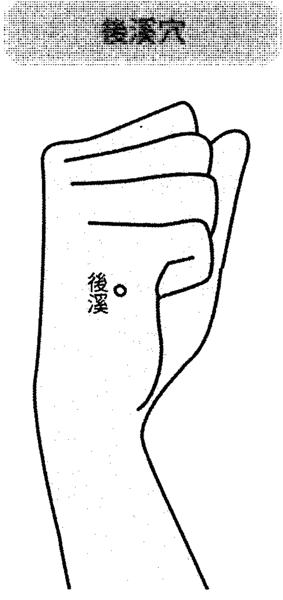

◇ 後溪：將手握拳，掌指關節橫紋的盡頭就是該穴。

❺ 請見〈人體有個糾正頸椎、腰椎毛病的開關〉，574頁。

## 中醫解惑 Q & A

江濤：我孫有左鞘膜積液，有雞蛋大，已一年多了，各種方案都實踐過，就是不願手術治療，有法治嗎？

胡淦醫：江先生好！謝謝您的信任。我一般只診病不治病。
按古傳中醫的觀點看，鞘膜積液不管有多大，就是一個氣化物，肯定是有法治的。但是您的孫子要碰上「真正明白」的人才行。而真正明白的人在國內似乎不多見，所以建議您還是就近看醫生，聽從醫生的意見，不要延誤病情。
祝您孫子早日康復！阿彌陀佛。

江濤：我孫才3歲10個月，我在網上已查看一年有餘，總想用祖國中醫來治，我多少懂一點，每天都在按摩對應點，都未有最佳效果，我也不灰心，進一步找最佳方案，為祖國中醫探索出鞘膜積液治療的方案。鞘膜積液就是一個氣化物，按大師的方案一定有一個開關，只要找到這開關，氣一定能消，我要就近看醫生，就等於把健康交給西醫解體。望大師進一步指點。

胡淦醫：本來我已經聲明過凡是用帶有「師」字稱呼的一概不回，但您對中醫的堅持讓人感動，我就回覆一下。請先生千萬不要管我叫「大師」，我無德無能，連庸醫也不算，怎會是大師呢！慚愧得很！
學習中醫、熱愛中醫是好事，但不應該排斥西醫。任何醫學都是人類與疾病不斷鬥爭的過程中學習到的學問。多些寬宏和包容，讓中西醫一起為人類服務，這是值得提倡的。
您的「一定有一個開關」的「方案」，不知出於哪一位「大師」。我本人的觀點，只是說它是一個「氣化物」。要讓它「氣化還原」，需要真正明白的人才行。古人說，「不遇真師莫強猜」，如果先生不是「真正明白」的人，硬要去摸索這個「開關」（不見得真有這麼個開關），恐怕不妥。若您那裡沒有真正懂的人，沒有高明的中醫，還是建議先生的孫子去看西醫，以免延誤最佳治療時機。按照一些西醫朋友的觀點，鞘膜積液如不及時治療，恐會影響小孩子睾丸發育。當然，這只是個人意見，僅供參考！

既然先生這麼相信中醫，我就再補充一點，感覺您的小孫子是脾臟虛弱、腎氣不足，後天脾臟的運化功能不強，先天的腎氣不足，再受寒濕之邪，就有了這麼個「水蛋」，您可以先找老中醫看看（盡量別找那些很出名的「大師」級人物）能不能給他診治診治，實在不行，該看西醫還得去看。好嗎？

江濤：「前段時間有網友提到小孫子有水疝，敲打帶脈有利於消除小腹肥肉、防治婦科疾病和對治小兒疝氣。」我一定照辦。

胡塗醫：也不一定對每一個人都有效，但是帶脈的確是治療一切疝氣的常用經脈。

靜悟：打通小周天以前在中裡先生的書裡，也看到他寫的那四種方法，可沒用心當回事，因為看的那麼多武俠小說裡，那些武功高強的人打通小周天都很難，感覺離我這個凡人遙不可及，看來又被誤導了。今天看了先生寫的當回事練去！

胡塗醫：可別盲修瞎練啊。記住一點：凡是好的方法，一定是非常簡單的。如果是複雜的，您就別去練了。

雲中嶽：阿彌陀佛！才學疏淺，不敢隨便發言。依胡塗醫所言勤修，反應很大，見對網友解惑，心中釋然。感恩！唯經絡一事不解，恩師公武當山祝華英道長所言經絡是：左右陰陽正負運動。思考多日還是請教。頂禮！

胡塗醫：說經絡是「左右陰陽正負運動」這句話的人自己肯定看不見經絡！我很少這麼「絕對」地講話。

大頭娃娃：還有幾個問題想請教一下先生，现在很多女性都容易長子宮肌瘤和卵巢囊腫，年齡稍微大一些的為了怕病變，就乾脆把子宮和卵巢切除，這樣好嗎？切除以後就沒有生理期了，人是不是就容易老了呢？由於動手術傷了任脈，還能恢復嗎？望先生答疑，先謝謝了。阿彌陀佛！

胡塗醫：切除身體的臟器當然不是什麼好事情，但如果已經切了那就坦然接受吧，畢竟天下也沒有後悔藥。傷了任脈還是可以恢復的，但是要內氣很足才行。所以養好真氣是必須的。

網友：請教您一個問題：我雙手比較怕沾水，無論冷水熱水，手伸進去最多不到一分鐘就會感覺後腰酸疼僵直，時間長了直不起腰來，是寒？是濕？不知道如何調理。

胡塗醫：不是寒，不是濕。補好腎就好。

## 「經絡」是將錯就錯的東西

我多次用「將錯就錯」來評說中醫的概念，這當然只是胡塗醫的一家之說，未必就對，大家閱讀時「將錯就錯」看看就好，不要太認真。這篇文章的標題不是為了嘩眾取寵，而是傳統經絡學說的古傳中醫版本。為什麼說經絡學說是將錯就錯的東西呢？不是說那些能夠返觀內察的人可以看到經絡如何運行嗎？怎麼能說經絡是將錯就錯的東西呢？

我在前面的文章裡說過，經絡，就是人體真氣運行的通路。中醫常用「如環無端」來形容經絡「路線」，這沒錯，真氣在人體的確是這樣運行。問題是，真氣「只能」這樣運行嗎？千古以來，人們只知道人體真氣總是沿著十二正經、奇經八脈在運行，彷彿經絡「學說」就是「真理」。問題是，為什麼上古的人類，只有中國人的老祖宗「發現」了經絡學說，而別的民族卻沒有？別的國家且不說，四大文明古國中也只有咱們中國人發現了經絡，難道別的民族的先民們就沒有發現經絡？

有網友質疑過我的「真傳一句話」沒有直接說出來，其實我已經說了太多句了，這是關於經絡學說的一句話真傳，大家看清楚了：經絡學說只是中醫「真理」的一部分，人體真氣可以完全不按現在大家所熟知的經絡路線來運行！

古印度的先民們，沒有發現經絡，但他們照樣瞭解人體、生命的秘密。比如古印度醫學、人體科學中的「脈輪學說」，至今仍為印度瑜伽、藏傳佛教等學派所應用。我國西藏地區的高僧活佛們，用脈輪學說作指導，也能治療疾病、養生延年，甚至探知人體、生命乃至自然的秘密和規律。

關於脈輪學說，因為與我們中醫的大道之理關係不大，不展開論述，簡單掃盲一下。見下圖：

### 三輪七脈位置圖

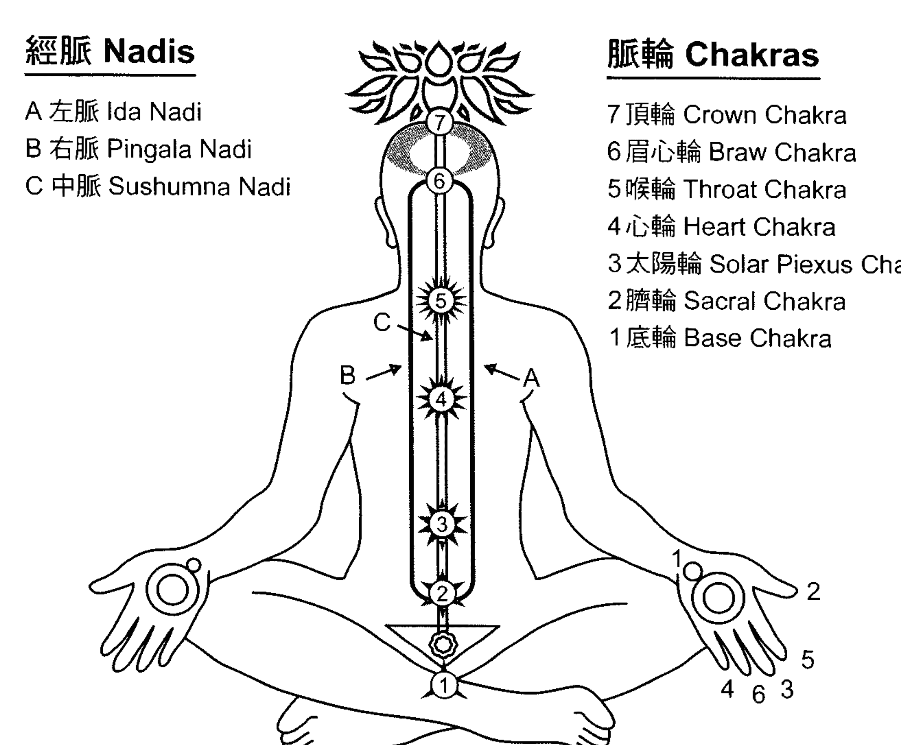

◆ 脈輪是把人體分成主要七大「車輪」區，而「脈」則是指經過左中右三條直線的經脈。

古印度和今天的西藏佛教，都認為人體的真氣運行方式是像車輪一樣，做「橫圓形」運動，脈輪學說把人體劃成七個主要大「車輪」區，梵語叫 Chakras，就是 wheel（輪）的意思，這是「輪」；而「脈」則是指左、中、右三條直行的經脈，在藏傳佛教裡，三脈七輪全「通」了，就是大成就者，尤其是中脈真正「通」了的，簡直就是「活佛」了。所以前一陣子有位加拿大的網友提到她的老師說她七輪全「通」了，我才有些訝異，追問之下，才知道她只是「通了百分之九十」，而且是在老師摸摸頭頂十來分鐘之後「通」的。這年頭中醫、養生、修煉領域裡「一瓶不滿半瓶晃蕩」的大師們太多了。為了便於大家加深理解經絡學說和脈輪學說，我列了一個表格稍做比較，大家可以舉一反三。

### 中國經絡學說 VS 印度脈輪學說

| | 中國的經絡學說 | 印度的脈輪學說 |
|---|---|---|
| 真氣通路 | 12 正經 8 條奇經 | 7 個大輪 3 條大脈 |
| 真氣走向 | 除「帶脈」外，其他全「縱」行 「如環無端」 | 除左、中、右三脈，其他全「橫」行 「如環無端」 |
| 主要不同 | 1. 「縱」行為主 2. 不同時辰由不同經絡「負責」 3. 每條經脈上都有些重要穴位，常用穴 365 個 4. 「中脈」秘不外傳，通常以「衝脈」搪塞 | 1. 「橫」行為主 2. 不同的輪子「負責」不同的生命功能 3. 每個「輪」附近都有重要的氣脈、神經叢 4. 中脈最難「通」 |
| 主要相同 | 1. 都是「圓形」運動 2. 都有「例外」走向的經脈都被用來養生治病，修身證道 3. 後人都認為自己老祖宗發明的才是「真理」並都為之沾沾自喜如享太牢 |

看出端倪來了嗎？這兩個學說哪個對？一個豎著走、一個橫著行，有相同的、也有不同的，怎麼回事兒呢？

學中醫應像做任何學問一樣，不能固守教科書上的「公式」，凡事要多問個為什麼，「師古而不泥古」，如此不斷積累小悟，最後才有豁然開朗融會貫通的一天。

不需再去繞彎了——經絡學說與脈輪學說都對，都不全面！——換句話說，它們都是將錯就錯的說法。

經絡學說裡常說人體的真氣「如環無端」，又是手三陰手三陽，又是足三陰足三陽，搞出那麼多條「如環無端」的通路給真氣「過」，千年來人們都認為這理所當然，原因就是真正能「返觀內察」看到經絡的人不多，好比注釋《傷寒論》的人多如牛毛，真正弄懂《傷寒》的人卻不多，今天拉《傷寒》大旗當虎皮的大師們，許多更是連《傷寒》的門也沒摸著，如此學下去，哪有真正頓悟中醫大道之理的一天！

不知道大家留意到沒有，那些缺胳膊少腿的殘障人士，他們的手足經脈沒有了「迴路」，怎麼還能活命，有的甚至活得比四肢皆全的人還健康得多？這說明什麼？

說明經絡學說將錯就錯，還不是中醫經絡學說的全部內容！

那麼經絡學說的「全部」內容究竟是什麼呢？

大家不要以為是長篇累牘的一大串學問，「大道至簡」，就是一句話！這句話是古傳中醫的千古大秘密，大家看好了——「全身無處不氣路」！

人體任何地方，都可以是真氣的「通路」，絕不僅僅是那麼十二條正經、八條奇經、七個輪三條脈！好比中醫裡的「阿是穴」，按下去「啊」一聲的地方，只要能治病都是「穴」。

說得再明白一點，您想真氣往哪裡走，它就往哪裡走；您想它怎麼走，它就怎麼走！說到底，還是需要您自己真氣充足！大家反覆念念這句話：「真氣從之，精神內守」，看看能悟出些什麼來。

## 中醫解惑 Q & A

江濤：中國走十二正經、八條奇經，印度走七個輪三條脈，是不是與各自處的地磁場有關，地理位置有關？
胡塗醫：應該不是這個原因。
夜未央：「中國走十二正經、八條奇經，印度走七個輪、三條脈，是不是與各自處的地磁場有關，地理位置有關？」我估計，在印度也可以用經絡思想指導治病，在中國也能以七輪三脈思想指導治病，所以應該不是與磁場或地理位置有關。
胡塗醫：很對。

靜悟：似乎有點明白，但好像又什麼都沒懂！正經、奇經八脈或三脈、七輪都是一個概念，把身體視作地球，經脈（或者叫真氣）當作水，如果地球濕潤、水源充足，每個大溝小溝細溝，低窪都會充滿水；如果乾旱，就會哪裡都沒水。在身體上理解就是真氣足的話，哪裡都有經脈！可以發明個三輪九脈，二十四經八脈！胡言亂語的，等著胡塗醫批評！
胡塗醫：您的理解沒錯，但「發明」錯了。經絡與脈輪是客觀存在的，只是不「全面」而已。

夜未央：「全身無處不氣路！」不論殘疾或健全，人身就是渾圓一體，對嗎（個人理解）？
胡塗醫：可以這樣說。但是「渾圓一體」卻是難得的境界，人體若到此境界，則全身處處皆氣路，全身觸處皆彈簧。簡單說，就是您輕輕碰他一下，您就會被「扔」出去，有點像金庸他們描寫的「沾衣十八跌」。

一粒微塵：先生所講的正是我之前有些疑問的地方，前幾天看你的一篇文章裡講督脈比頭髮絲還細，就想同南懷瑾講的佛家的三脈的描述相似，就在想道、佛講的一些東西是不是相通呢。內觀出的結果不同，是不是受不同的思想影響，而被導引著去看到的結果呢？
「精神內守」就是內觀，就是達到虛空。「人神好清，而心擾之，人心好靜，而欲牽之」，心靜後，真氣會自己去尋找病灶區運行的，所謂外靜而內動。方法主要就是靜功、打坐。
「您想真氣往哪裡走，它就往哪裡走，您想它怎麼走，它就怎麼走」這句話裡「你」應該不是那個顯意識或是潛意識的你吧？應該是元神值班、識神休息。
胡說一些，還請先生指教！

胡塗醫：內觀出的結果不同，得問內觀的人，這方面如人飲水冷暖自知。但可以肯定，不是受不同思想影響，否則豈不「迷信」？好比 CCTV 發出來的電視資訊，它是客觀存在的，用黑白電視收看，它是黑白的；用高清電視看與用舊的普通電視看，效果是有差別的。明白嗎？
「您想真氣往哪裡走，它就往哪裡走，您想它怎麼走，它就怎麼走」，這句話很明白，不需過度解讀，這是很老實、平淡、明白的大實話。不要去用元神識神的概念去瞎猜。
順便說一下，普通人怎麼可能用「元神」呢！先生不要聽「大師」們亂講了。元神要在督脈真正「通」了之後，從後天返回先天，才會蓄力孕育，成語「脫胎換骨」其實說的就是這麼一個過程。

清心：先生好！不是您沒講明白，是我資質愚蠢，沒看明白，先生是高人，大家都很佩服的。凡大道至簡，這道理我也明白，但是悟性不夠，先生說的「真氣從之，精神內守」，「正氣內存，邪不可干」的語句，每天多念幾遍自己的身體是不是就可以強壯啊？再就是怎樣才能讓別人的身體健康啊？真希望能得到先生的明示，得到先生更多的真傳，似乎有些貪婪，但是當我看到現在相當一部分人的身體狀況、現在的醫療模式、激素抗生素對人體的嚴重危害，就會有些慘不忍睹。學生迂腐，希望盡自己的一份力量服務於民。拜謝！

胡塗醫：身體要強壯與否，好比銀行帳戶裡錢多少，取決於您是存得多，還是取得多。人的福報也如此，一個人過去「存」得多，現在就更有得花；存得少，現在就捉襟見肘，所以我們要多存少取、整存零取。
光念句子沒用，要給自己些功課，休歇六根，止息妄念。
自己發達了，才能兼善天下，有幫助別人之心是對的，但是要自己好好用功，才有能力去幫別人。天下的道理是相通的。對嗎？好好用功吧。

痴迷中醫：「真氣從之，精神內守」讓我想到先生之前說過的「人體本身有大藥」。文中提及「真氣」就是大藥，其服藥辦法就是「從之」加「精神內守」。那現在這個方法其實就是要練習充足人體的真氣吧？
胡塗醫：是的。

水中蓮：我很想進入「恬淡虛無」、「致虛極，守靜篤」的狀態，但是有時無法控制自己的情緒，甚至突然會因為一件小事而緊張焦慮，為什麼會這樣啊？我該怎麼辦？
胡塗醫：「很想」與「達到」是兩回事，中間有一個不斷精進的過程。
無法控制自己的情緒，是定力不足。怎麼辦？凡事看破放下。當然，這不容易做到，慢慢來吧。

東方青龍：「說得再明白一點，您想真氣往哪裡走，它就往哪裡走；您想它怎麼走，它就怎麼走！」呵呵，你試試呢，經絡的運行不亂才怪。一些練習氣功的人就是這樣出的問題。
胡塗醫：您自己試過了嗎？出啥問題了？我自己和身邊的人試了多年也沒有問題啊。

新浪網友：先生在表格中提到，「中脈」秘而不傳，通常以「衝脈」搪塞，不知此「中脈」與南師在「南禪七日」中所講的「中脈」有無關聯？
胡塗醫：這是個大問題，我不敢隨便講。南師說的中脈是真正的中脈。

宣傳中醫：小疑小悟，大疑大悟，師古不泥古。學了！請教先生，近來子時靜坐，意守胸部陳傷處，有兩個晚上感覺傷處像塗了清涼油般涼涼的，其他越守隱痛比平時明顯，昨天用艾條灸過，是否應百日築基，望指點。
胡塗醫：可能是氣沖病灶，也可能不是。如果有發麻、發熱、發脹的感覺，就是正氣與邪氣短兵相接的時候，麻熱脹過後，才是氣沖完病灶並「完勝」。

新浪網友：胡塗醫你好，我認為你的解釋很有意思。我從來沒在這個角度考慮過這些問題。老師講過，幫人調整時全心放空效果最好。看來還是世界大同這話不是說說而已的。我也試過幫人遙遠治病，相信的效果很好，這些是有緣人。不信的就像有一堵牆，能量無法進入。我感到很幸運看到你的博客，因為很少人會像胡塗醫你這樣寫出這種類型的心得，我對你的文章每篇都很認真地看，並加以實踐。在看到你的博客之前，我有幫我父親調理身體一段時間（有用過放血、拍打、艾灸、中藥等），他的身體好了很多，他自己也有做八段錦健身。但有一個問題我始終無法解決，就是他每天三餐後半小時會心痛，要吃藥才好，我6月又回國幫他調理一下，你能給我點建議從哪下手比較好？先謝了。我父親83歲了，是退休老師。

胡塗醫：您會不會針灸？若不會，可以嘗試往他的第五節脊椎附近給他補補氣，注意不要用意過猛，若有若無，就像聖人說的「綿綿若存，用之不勤」。祝好！

## 經絡本來就是「通」的

上一篇文章用了比較「重」的話說經絡是將錯就錯的說法，這篇文章要為經絡「正名」，聖人說「玄之又玄，眾妙之門」，看來要把經絡說清楚，還得「否定之否定」一番，才能讓大家看出箇中之妙來。這篇文章裡談的，都是些過去「祕不外傳」的內容，有心學習的人，請放慢點去閱讀。

我要再度強調一下，說「經絡是將錯就錯的東西」，並不是說經絡就「錯」了，而是說大家所熟知的經絡學說不夠全面。

### ◇ 經絡通則不痛，痛則不通

很多人可能受武俠小說影響，認為要打通任督二脈這個小周天，是件非常困難之事。道家的一些道長們和醫家的一些前輩們還常常提出一個觀點，就是小周天要練「通」，必須經過嚴格的訓練。先是「百日築基」，即一百天內不能有男女之事，把下丹田的地基給打好養好精氣，然後再「積氣衝關」，把督脈上的三個大難關一個一個地攻克，經過漫長的訓練（三個月甚至一年），把任督二脈打「通」。

事實上，古傳中醫認為，任督二脈本來就是「通」的！全身的經脈本來都是「通」的！全身的氣路都是「通」的！

中醫有句廣為人知的「行話」，叫作「通則不痛，痛則不通」，如果哪條經脈不通或者說哪個地方氣路不通，哪個地方就「痛」就有毛病。這說明什麼？——您哪有毛病哪兒才不通，只要沒有毛病的地方，經絡、氣路都是「通」的！

經絡極敏感的人的經絡固然是「通」的，經絡極不敏感的人的經絡也是「通」的，若不通，就會「痛」，就會有疾病。

這是經絡學說的又一層窗戶紙，一捅就破。但千百年來，人們總在經絡學說上兜圈。事實上，如果大家細心閱讀我前面寫的文章，說到通經絡的問題，我都特別在「通」字加上引號，原因就在這裡，經絡本來就是通的！如果經絡本來不是通的，一天十二個時辰，哪有可能真氣往特定的經絡裡走呢？必須是通的才行，不是嗎？這就是「真傳一句話」。

只是，這個本來的「通」，因為我們普通人體內真氣太過微弱，我們的身體對體內的真氣太不「熟悉」（以致不夠敏感），所以我們竟然終日與之為伍而毫無所知！怪不得聖人在《周易·繫辭》裡大呼「百姓日用而不知」呢！

現在問題來了，既然經絡本來就是「通」的，那麼古人為什麼還要折騰出小周天（任督二脈）、大周天（十二正經和奇經八脈）讓人練？印度瑜伽和西藏密宗的先賢們還要折騰門人弟子去練三脈七輪？

我上面說了，「我們普通人體內真氣太過微弱」，雖然經絡本來是「通」的，但我們感覺不到，更無法運用它，因此不能夠變被動為主動，從後天返先天。

可以說，普通人的經絡「本」通，與醫家、道家專門去「練」通，是有本質區別的。比如，沒「練」通的人，雖然他們的經絡的確也是「通」的，但他們感覺不到非常微弱的真氣在細如髮絲的經脈裡「無力」地運行，更不能用它來治病，而那些「練」通的人，卻可以用它來從後天返先天，從而達到祛病健身、延年益壽的效果。這裡面最大的不同，說到底，就是四個字——真氣強弱！可以說，整個中醫的最重要本質，就是「真氣」（而不是「中藥」）！所以大家以後多在培養真氣、正氣上做文章，才是以身證道。我比較不贊同每個人都去拉筋，道理就在這裡，您銀行裡的錢不多，卻硬拉朋友出去請他們吃飯，短期爽是爽了，長期下去「信用」要出問題的，正確的做法是不斷往銀行裡存錢。

現在社會上傳出小周天練法的人很多，方法也五花八門，為了讓大家少走點彎路，提供些思路供大家參考：

- 凡是複雜的方法，盡量不要去練它。大道至簡，越是高級的東西一定越簡單。
- 凡是能夠「速成」的，盡量不要去信它。沒有足夠的真氣，何來速成？並不是每個人都可以遇到真正的明師的（得真傳的明師們的確有辦法讓您快速「充氣」，但這樣的人國內、社會上實在不多，且他們也不輕易教人）。
- 凡是要用「意念」去導引，讓您「感覺」出來的，盡量不要去練它。您體內沒有足夠的真氣，用意念去「想」，這是空想社會主義的中醫版，古人痛斥這是「空轉河車」，對身體有害無益。

那麼，什麼樣的通周天方法比較靠譜呢？靠譜的人教的方法！
周天方面靠譜的明師必定有如下「特徵」：

- 通達陰陽、五行、術數之理。
- 《黃帝內經》、《道德經》、《陰符經》爛熟於胸。
- 易理精熟，因為真正的周天火候需懂「據爻摘星」，才能用卦爻來表示（所以歷代的大醫都懂《易》而不算命）。
- 懂星相之理，不懂星相，能摘何「星」？（現代懂星相的人實在不多了）
- 深明「天人合一」的大道之理，不只講「人身」，還講天和地。周天周天，環天一周才是真周天。

所以大家下次遇到這樣那樣的大師，在交學費之前，先要考察考察，看看大師是否有以上學養，若沒有，大家還是把學費節約起來做好事。

最後一個問題：生活在這樣一個忙碌繁雜的現代社會，怎樣培養強大的真氣？

## 中醫解惑 Q & A

以醫入道：學習學習！讀《道德經》可以長功夫的。
胡塗醫：仁兄是明白人！練內家拳若不懂《道德經》，功夫再好也有限。

痴迷中醫：先生在早期的博文中曾說過人體十二正經和奇經八脈上共有 365 個主要穴位，正好與黃道帶的 365 份相對應。我仔細核對過目前的標準經絡圖，單是十二正經和任督二脈就有 361 個穴位（《針灸大成》上則只有 359 個穴位），如果再加上奇經八脈中的其他六條經脈，穴位數豈止 365 個！抑或是我的理解有誤？望先生明示為盼。
胡塗醫：365 個穴位也是權宜之說，是比較常用的穴位。事實上，人身無處不丹田，連丹田都處處有，何況別的穴位。

行者：「所以大家以後多在培養真氣、正氣上做文章，才是以身證道。」我原來理解真氣是道家的稱呼，正氣是儒家的浩然之氣，應該指的是同樣的氣，稱謂不同而已，可是老胡您把它們分開說，看來還有區別，請您釋疑為盼！
胡塗醫：真氣的「真」是對人體先天稟賦的表達。《靈樞·刺節真邪》所說的「真氣者，所受於天，與穀氣並而充身者也」。真氣、元氣都是指人體內的，由稟受於父母的先天之精所化生之氣。一般稱為先天之氣，但必須得到後天之氣的資助才能充盛並發揮作用。真氣是一身之氣的重要組成部分，也是正氣的主要成分。

雲淡風輕：又長知識了！期待先生繼續教我們如何培養真氣的方法！先生辛苦了，阿彌陀佛！

胡塗醫：其實已經講過了，心腎相交法、養氣法都公開了啊。問題是，練了嗎？

雲淡風輕：先生好，您那天說過後，我一直在做呢。而且家裡專門整理了一個房間供全家練習靜坐用。正好想問您呢，自按您說的調理後，這幾天先是頸椎疼得厲害（主要在左側），後來又竄到左後背冒涼風，然後這股風又竄到胳膊處，感覺整個左側身體（特別是上半身）是涼、酸、脹、疼，不知道是否是正常反應。還有我現在每天泡完腳後就為自己做足底按摩（不知是否可行？），主要是做腎上腺、腎、尿道和膀胱反射區（感覺在做腎上腺及腎反射區時很脹疼）。第一天做完後就感覺左腎有隱隱的痛感，不知道這是怎麼回事？還有我的體質做這個可以嗎？謝謝先生，麻煩您了！辛苦！阿彌陀佛！

胡塗醫：1. 涼、酸、脹、疼屬正常反應，說明行之有效呢，別擔心，也別高興。
2. 泡腳與做足底按摩不衝突，可行！
3. 感覺左腎有痛感是對的，您左腎虛，左腎右側疑似有結石狀的東西。

渴望醫理真諦：酉時「冬蟲夏草」養腎法、午時養生法、申時膀胱經排毒法、亥時「嘻」字訣和「仰托一度理三焦」法、戌時「甩煩惱心經密法」以及「心腎相交法」等等，總之一句話——「二十四小時如何過」，只要能夠堅持練，就是在培養強大的真氣！不知對不對？

胡塗醫：可以這麼說，但不全是。

當歸：恬淡虛無，真氣從之。

胡塗醫：這是句老實的真話，可惜今天的大師們不怎麼提。

doriswan2007：胡塗醫曾強調我若碰到明白人，膝蓋半月板也能迅速好起來，大概就是說明白人能很快助我體內「充氣」，使得真氣強大可以去療我的傷吧？無望啊！最近練心腎相交法，雖然總有雜念冒出，但好像腿通到腳底還是會有種麻麻的感覺，不知道那是不是加強了氣的貫通呢？可是我的右腿就不太有感覺，是不是就是右膝半月板受傷，阻止了氣的運行啊？而且我的右胳膊、右腿內側拍痧也容易出，而且多，是否都和同側半月板受傷有關呢？怎麼辦啊？如何快些把它打通？胡塗醫遙斷病痛，實在是讓人歎為觀止！

胡塗醫：1. 明白人自有明白人的方法。不見得需要給您體內「充氣」。但這樣的人可遇不可求，您也不需「無望」。自己把體內真氣養足就好。
2. 腳底有麻感是好的反應，是氣到了的一種表現。
3. 右腿不太有感覺，多半跟右膝蓋受傷有關，不需擔心。
4. 拍痧？我不懂，不敢亂說。但不排除與您的傷有關。該看醫生就去看，不要延誤病情。
5. 如何快速把它打通？它本來就是通的，您要做的恐怕是養好氣。要力戒性格裡的毛躁。
6. 胡塗醫沒啥了不起，遙斷病痛，得到真傳的人一個晚上就能學會。

## 最後幾張窗戶紙

寫完上一篇文章〈經絡本來就是「通」的〉，關於「經絡」，我該講的話都講了。今天回頭看看大家的諸多提問，覺得還是送佛送到西，把本來不太該講的話也講出來，把經絡學說的最後幾層窗戶紙也捅破，就作為這個「經絡旁通」系列文章的總結吧。

1. 經絡雖然是將錯就錯的東西，但是它的確存在，三脈七輪也如此。只是當你體內真氣充足的時候，真氣完全可以在經絡「以外」的地方「走出另外的經絡」來，所有這些經絡，就是「氣路」。那麼體內真氣不充足的人，情況如何呢？也是全身無處不氣路！只是這些真氣運行的道路，在經絡圖上沒有被標示出來而已。「全身無處不氣路」，推導下去，便是「全身無處不丹田」，甚至「全身無處不藏神」！古傳中醫對經絡的這個「認識」，是治病、養生乃至感悟生命的密中之密，它有「劃時代」意義。懂行的人會明白，這句話簡直會令人如接天梯。舉例：這個道理不明，大小周天的訓練就要經過漫長而艱辛的歲月，有了這個原理作為「理論依據」，明白人便能夠讓你在極短的時間裡打通全身大小周天。只是這樣的明白人國內並不多見，而且有這種學養的人，多半用不著以此為生，所以我才提醒大家不要輕易向社會上號稱能周天「速成」的大師們交學費。

2. 大小周天也是將錯就錯的東西！真正的「通」有三層：表層的皮膚通，深層的組織肌肉層通，最深層的骨髓也通。若能全身「三通」，人體會自然而然的「陰平陽秘」，同時稍一激發，便可出現種種神乎其技的能力。人體如此這般的「脫胎換骨」，有跡可循的特徵是：頭髮會黑了白、白了黑，牙齒會掉了生、生了掉，愚癡固執的人一到這種人身邊會被「一觸即化」般「感化」。大家以後又多了一些尋找明師的標準，同時也明白周天「通」的次第，「大師」們可能沒那麼容易忽悠您了。這類明白人雖然不多見，但還是存在的，大家不要失去信心，你準備好了，自然有機緣遇到他們（我說過，也許他們在急於找您呢）。我去年在國內的一個山莊裡就拜會過這樣一位老人，與老人家長談下來，他謙卑地笑笑說社會上的「大小周天很好笑」。

3. 全身無處不丹田。小周天訓練的丹田一般指眉心附近區域的上丹田、兩乳連線中點膻中附近區域的中丹田，以及肚臍和臍下三四寸附近區域的下丹田。關於下丹田的爭論千百年來沒有停止過，古傳中醫則同時「肯定」和「否定」了這一點，認為全身無處不丹田。那麼「丹田」究竟是什麼呢？目前的中醫、針灸學沒有弄清楚這一點。丹田，說白了就是結丹的地方。什麼是「丹」呢？「丹」就是人體內的「核反應爐」，很小很小的東西卻隱藏著極大極大的能量，簡單來說，它是真氣凝聚而成，聚則有形，散則無形。能否長生久視，就看能否成「丹」。

4. 通經活絡的簡易方法。我文章裡提到的「顫抖功」就是！大家練了嗎？原理大家自己去悟吧。顫抖是動的，如果要靜練，還有一個簡單方法，一句話：呼氣的時候把注意力集中在心窩處。箇中原理大家可以參考戰國時期的《行氣玉佩銘》上的 45 個字：

## 中醫解惑 Q & A

小牛靈靈：注意心窩，是指心臟的位置？還是膻中穴的位置呢？
胡塗醫：都不是。在胸骨劍突下一寸五分處，若實在不懂，就想成是胃部就好。

xrf99：請教先生，意守心窩和意守丹田對身體的作用有何區別？哪個作用更好？謝謝先生！
胡塗醫：區別：意守下丹田用的是「文火」（不管呼吸），呼氣注意心窩用的是「武火」（呼氣「注意」），所以其作用也不同。簡單說，呼氣注意心窩，適合每一個人，尤其是女性。意守下丹田並不適合每一個人，比如經期中的女性，比如血壓太低的人……至於作用，簡單來說，呼氣注意心窩，可以把心火降下脾土，見效較快。意守下丹田很難意守出個所以然。至於哪個作用更好，實在不好說，因人而異。不要急功近利，好好用功，自己體會就會知道。好嗎？

新浪網友：「呼氣的時候把注意力集中在心窩處」，李少波真氣運行法第一步就是這樣要求的，我今天早上練了 50 分鐘，不容易做到啊，因為我以前練瑜伽的時候注意吸氣呼氣，現在光注意呼氣，吸氣忽略做不到啊，不知道吸氣時注意哪裡了，就在那裡糾正徬徨……請問先生怎麼處理這個問題？
胡塗醫：李老是令人敬仰的百歲老中醫，他那裡有些真傳，大家要學趕緊去蘭州找他，他都 101 歲了 ⑦。
如何處理這個問題？不處理它！吸氣忽略做不到就悠著點，慢慢訓練到自己的心可以被降伏，需要時間，不著急。

doriswan2007：突然有一「悟」：丹田有上中下丹田之分，是不是意守其中任一處皆可而並無實質性區別啊？
胡塗醫：有區別。您找份解剖圖看看就明白。

f991231：胡塗醫，我做了幾次呼氣注意心窩處後，就覺得胃部那裡熱熱的，嘴巴裡莫名多了點唾液了，要緊嗎？我是女的。
胡塗醫：這是好現象！

子非湖：請問一下先生，呼氣注意心窩用不了多久會有噁心的感覺，不知哪裡做錯了。謝謝。
胡塗醫：那多半因為您胃不好，繼續用功一段時間看看。
子非湖：先生真厲害。我的確胃不好，而且很不好。佩服！冒昧問一下，可否有什麼辦法弄好這個胃？謝謝！
胡塗醫：就用「呼氣注意心窩部」！

夢中可知身是客：先生好，先生講全身無處不氣路，那麼有些人講練岔了，出現氣結是怎麼回事呢？先生講腫瘤是因為情志不開，受委屈、想不開，導致氣聚，那麼，如果拋去情志抑鬱關係，有沒有練岔了出現「氣結」的可能呢？按照先生講的，很清楚不應該出現這種狀況，不過末學愚鈍，勞煩先生指點一下，心安一點。阿彌陀佛。
胡塗醫：我這裡的方法，只要依教奉行，沒有「練岔」的可能。

兵馬俑：先生好！一直踐行先生一些秘法，昨天開始腰眼下一片感覺麻、熱，今天中午午休時「呼氣注意心窩部」，心窩部有熱感，半小時起來後，正身，開始注意心窩，後來注意小腹20分鐘，感覺從心窩至小腹一路發熱發燙，有時外腎都有點感覺。之後一下午都感覺腰部麻熱，輕些；小腹熱，重些。想請教，我這情況正常嗎？該怎麼做呢？謝謝先生！阿彌陀佛！
胡塗醫：如果認為不正常，會是什麼不正常呢，身上沒少塊肉嘛！以後出現一切情況皆正常！

楓劍：先生，是不是剛開始從心窩練起，然後慢慢意念下焦，對嗎？請教。
胡塗醫：不對。

靜悟：先生好，請問呼氣注意心窩能不能練成呼吸的常態，就是啥時候呼氣都注意心窩？
胡塗醫：您試試就知道了。

蓮花緣生：先生，平時吸氣時想著吸入「丹田」，呼氣注意心窩，可以這樣嗎？謝謝。
胡塗醫：千萬不可以自作聰明！只管呼氣就好！

xingyan：看到呼氣注意心窩時，我想起先生文章裡的「行氣銘」，已注意呼氣了一段時間，請教先生，我呼氣注意心窩時，心窩處會發熱，另呼過後有時好像不會呼吸了，有點憋的感覺，是不是沒放鬆？人要是有個師父在身邊該是多麼幸福的一件事啊。
胡塗醫：是沒放鬆。

新浪網友：請問先生，我今年49歲，正值更年期，現在讓我苦惱的是潮熱現象，不定時的渾身呼的一下熱起來，持續1分鐘左右，顏面發紅，然後就出了一些汗（不多），還請先生指教，多謝。
胡塗醫：您可以練練：1. 心腎相交法。2. 呼氣注意心窩。

unchuan：敢問先生，似我媳婦這樣有宮寒症身子又虛的，痛經而經血色暗，在調養時需要特別注意哪些方面？或者從古傳中醫的角度是否有什麼治療方法？阿彌陀佛！
胡塗醫：注意：別亂服藥，找高明的中醫開藥可以，別聽網上的人瞎說。古傳中醫的治療方法很多，如果她比較能自律，就這句話：呼氣注意心窩處。如果不能，那就泡泡腳吧。祝好！

微笑：先生，我發現我雖然在練「心腎相交法」的時候，尿管沒有感覺，但是腳底也會麻麻的，現在發現就是不練功，我只要想到腳底，腳底就會發麻；想到手，手就發麻；想頭頂，頭頂發麻！這種現象，難道是我無意中用意念把氣「想」到了那些部位嗎？
胡塗醫：這就是「全身無處不氣路」的道理，您想到哪兒，真氣就到哪兒。

雲淡風輕：與樓上「微笑」那位博友差不多，我也有同感，這幾天我每天下午在膀胱經當令時，在外面撞撞大樹（或是在家撞門框），然後熱水泡腳（還沒來得及去買先生說的細辛等呢，只是用白水泡的），之後大約到腎經當令的時候，就接著做足底按摩（主要做腎上腺、腎、尿道、膀胱區），連續做了幾天，感覺很好：
1. 無論是白天還是晚上的睡眠都非常充實。
2. 手腳有溫熱感了。
3. 三餐前有飢餓感了，心情好了。
4. 隨時都感覺腳底湧泉穴那兒有麻麻的、氣動的感覺。
不知道我這感覺是心理作用還是怎麼的？家人說我剛練幾天就有感覺，說我心理作用，呵呵！請問先生是這樣嗎？謝謝先生！阿彌陀佛！

胡塗醫：您覺得呢？要對自己有信心！
人家說是「心理作用」就心理作用唄，關鍵是「有沒有作用」，有作用，愛說啥說啥。好吧？

大頭娃娃：一直以來就沒有搞清楚什麼是「丹」，也不好意思問別人，今天終於明白了。還有就是「通」，一直以為自己的經絡就是不「通」，起碼不「全通」，今天才知道都是「通」的，只是層次不同而已，一定爭取更深層次的「通」，謝謝先生透徹的解說。無量壽福！

胡塗醫：結丹其實挺不容易的，不會像韓金英女士他們描述的由呂祖「給」她——那是鬼話！這裡面其實需要扎扎實實專門下過一番狠功夫才有望成功，而且必須精熟易理、術數、星象、天文以及《道德經》、《陰符經》、《黃帝內經》、《周易參同契》、《悟真篇》諸多經典等等。不遇明師，不下苦功，不可能成功。現代公開談論金丹的，幾乎無一例外沒有結丹！

ssyou：想問個問題，我剛剛生完小孩半年，之前一直照先生的方法做呼氣時注意心窩處，很舒服，但前兩天早上醒來突然頭暈，脖子轉一下會暈一下，然後就覺得胸悶無力，講話的力氣也沒有，因為之前有過類似情況，查過心臟肺部都沒有問題，吸吸氧就好了。這次去醫院吸氧時，我依然做先生的呼氣注意心窩處，突然就覺得血全部湧向頭部，手心出冷汗發麻、手冰涼，無法做到靜靜地呼吸。然後當晚睡覺時該情況出現幾次，早上醒來坐起，馬上大汗淋漓，說話多了就暈暈的。之前小孩3個月的時候，也發生過半夜起來餵奶眼前一黑突然暈倒，然後就是躺下會暈，起來正常，當時3天就好了。想問先生是什麼原因，該如何做呢？現在已經斷奶了。不知是否與餵奶有關？還是腎氣不足？真心覺得先生說的古傳中醫會給大家帶來健康，阿彌陀佛！

胡塗醫：這與呼氣注意心窩部位無關，與餵奶無關，與腎氣不足也幾乎無關。至於原因，您就近看看中醫好了。祝早日康復。

不弦：請教胡塗醫先生及其他同樣練習的網友，練習「保護肝膽的妙法」和「呼氣注意心窩」還有「心腎相交法」好幾天了，也剛開始泡腳，這幾天午時睡覺是練著「呼氣注意心窩」，心窩處熱呼呼地睡著了，可是醒來後覺得上半身好燥熱啊，尤其是後背的上半部熱得很，手心也熱。量了體溫也不發燒，要好長時間這感覺才慢慢退去。請教先生可需要解決這個問題嗎？很燥熱呢。叨擾了。

胡塗醫：本來如果是自然產生的，是正常的好現象。但我細細看了一下，您是用意過重，氣息偏重造成了氣機有點兒紊亂，此外，您還有點兒腳氣吧？

可以做做以下的練習：
1. 滋陰的練習：叩齒36下，攪舌頭（沿著上下牙齦）12圈，用津液「漱口」並分3口嚥下，想著津液送入肚臍以內。
2. 睡覺前按摩腳底湧泉穴，若圖省事，用右掌打左腳36下，再用左掌打右腳36下。
3. 如果實在太燥熱，再做做這個動作：兩臂自然從身體兩側抬起，手心向上，至與肩平，再翻掌，收到胸前，然後往下按，按的同時發出「哈」音，連續幾次，背上熱度會馬上減輕。

蘇蘇：先生，我在練習「三調」前練了一陣子呼氣注意心窩部，現在感覺呼氣時心窩部有熱感，連著膻中穴那一塊也有熱感。但是我的右腹部，好像是肝臟那一塊吧，總感覺有個氣團在那裡。所以，注意心窩部的時候，老被那個氣團吸引過去，變成呼氣注意右腹部了，請問先生，我是肝氣鬱結嗎？怎麼樣才能消除那個氣團呢？

胡塗醫：不是肝氣鬱結，別理它，繼續用功就好。

蘇蘇：先生，我彙報練習呼氣注意心窩部的感受，感覺如果深呼吸的話，心窩熱得很快，但是上半身也會熱起來，鼻子感覺要冒汗（我以前冬天的時候，稍一運動鼻子就出汗），我感覺可能是意念過重，就減輕了呼吸，慢慢地，有一陣子就自主呼吸了，但是，心窩也不熱了，找不到心窩！不知道把注意力放在哪裡好了。請問先生，在練習這個功法的時候，怎麼調整呼吸好呢？我現在每天盡量早中晚各練習半小時，靜坐練習，平常偶爾會想想心窩。任何一個功法只有深入練習，才能體會箇中滋味，妙不可言！感謝先生，願您一切安好！

胡塗醫：呼氣注意心窩，生熱是正常的！事實上，「生熱」幾乎是一切方法的根本！熱氣積蓄夠了，它會自動往下走，有些人走到肝臟，有些人走到胃部或別的地方，當然，大多數人還是會走到下丹田。您回過頭去看看〈最後幾張窗戶紙〉，看看是否能明白過來。怎麼調整呼吸？只注意呼氣！

不弦：我也有類似的感受，我還能找到心窩，不同的是之前用意過重的時候，是心窩處一大片熱呼呼。現在熱的面積小了，但是熱呼的感覺似乎往下延伸了……我還自以為是「行氣，深則蓄，蓄則伸，伸則下」呢。我想得挺美吧，呵呵。

胡塗醫：阿彌陀佛！其實是好現象。的確如《行氣玉佩銘》上的那45個字：「行氣，深則蓄，蓄則伸，伸則下，下則定，定則固，固則萌，萌則長，長則退，退則天。天幾春在上；地幾春在下。順則生，逆則死。」

krzz：採氣光應該是說大自然的陽光和空氣吧。不知這個有沒有固定的時辰呢，還是只要身體感覺舒服，隨時隨地呢？

胡塗醫：沒有固定時辰，但是一般上午 12 點前採氣為好；採光沒有時間限制。

## 略說《行氣玉佩銘》

古聖云：「上藥三品：精、氣、神。」作為「上藥」之一的「氣」該如何「行」，我們普通人知道的並不多。胡塗醫在前面〈最後幾張窗戶紙〉一文中提到古代的《行氣玉佩銘》，雖然只有短短 45 個字，卻把人體真氣的運行講得一清二楚。

此銘大約刻製於西元前 380 年，距老子騎青牛西去約 150 年。銘文內容與醫家秘傳一脈相承。

我們且看《行氣玉佩銘》全文：

> 行氣，深則蓄，蓄則伸，伸則下，下則定，定則固，固則萌，萌則長，長則退，退則天。天幾春在上；地幾春在下。順則生，逆則死。

顯然，「行氣」之要，在於「深」。何謂深？不少人把這個「深」理解為「深呼吸」的深，不能說全錯，但卻沒多少道理。這裡的「深」字含義頗廣，第一個意思就是「歷時久」、久久用功之意，誠如《周易》所說「聖人所以極深而研己」。

久久用功之後，真氣就可以「蓄」——積蓄、積聚起來。英國近代生物化學家和科學技術史專家，有「名譽道士」之稱的李約瑟（Joseph Needham）博士把這個「深」字解釋為「穩定」，聞一多先生也主張將「深」字訓詁為「居」字以表達其穩定之意（見聞一多《神話與詩》）。這兩位大學者的理解的確非常接近銘文的原意！因為整篇《行氣玉佩銘》講的都是煉氣養氣結丹之法，白玉蟾祖師有云「煉丹口訣，第一是聚氣凝神」。久久用功真氣積蓄起來，這是行「聚氣凝神」之功！氣聚而神凝，自然就「穩定」，身心穩固安定了，故「深」字的第二個意思就是「穩定」。唐玄奘法師在翻譯《心經》時用了「行深般若」的「深」字，是否出典於此，不得而知，但其意思似乎是相通的。

聚氣凝神積蓄能量之後，人體真氣就會「蓄則伸」。啥叫「伸」？歷代名家多解釋為「擴張」或「運行」，有一定的道理，但顯然沒得真傳。這裡的「伸」其實就是「信」。許慎先生在《說文解字》中說：「伸，古經皆作信。」那麼什麼是「信」呢？「信」就是老子在《道德經》裡說的「其中有信」。在一番「窈兮冥兮，其中有精」的久久用功、真氣積蓄圓滿之後，「信」就產生！所以說，古傳中醫非得自己實修實證不可，沒有一番實修實證的用功踐行，再怎麼研讀經典，也不會明白古聖的本意。但「麻煩」之處就在於，過來人可以告訴你，你自己必須去踐行才能印證、才能獲益。好比吃飯，再怎麼告訴你飯菜的味道和「功效」，都不能代替你自己去吃飯。不像現代科學，一個藥物或設備研發出來，後來的科學家可以在其基礎上做進一步的探索或改進，使其終至完善。而古聖前賢流傳下來的中華絕學卻不能這樣踩在前人的肩膀上前進，每個人總得從零開始，而且要走這條路的話，還要你不斷「歸零」——放下很多吃喝玩樂和人世間的諸多欲望……所以這真的非大丈夫不能為也！

言歸正傳。「伸則下」呢，則是指有了「信」之後，人體真氣下降丹田！人體真氣下降丹田才能真正做到凝神入靜、入定，所以說「下則定」。也只有真正做到入靜、入定了，才能使人體真氣凝固起來，故說「定則固」！這就是古傳中醫世家所說的聚氣凝固的第二步功夫，也就是魏伯陽真人在《周易參同契》中說的「先液而後凝」。

人體真氣高度凝固之後，即「定則固」之後，它自然要「固則萌」。這個「萌」字也難倒了許多名家。郭沫若先生雖然被魯迅先生罵為「流氓」，但他在解釋這個「萌」字時卻盡顯其才子水準。郭老說其「如草木之萌芽」（見郭沫若《奴隸制時代》），這是很確切的！但恐怕郭老也是只知其一不知其二。

這裡的「萌」雖然「如草木之萌芽」，但卻是古傳中醫及丹家所說的「大藥將成」的隱語——「黃芽」。也就是《周易參同契》所說的「玄含黃芽，五金之主」的那個東西，可以理解為內氣凝煉的「結果」，所以古聖才說「丹頭本是先天氣，煉作黃芽發玉英」。行功至此，「黃芽」漸長，故說「萌則長」。發芽、長大之後，為什麼說「長則退」呢？「長」難道不應該是往前「進」嗎，為何又「退」了呢？所以說要背誦經典！太上在《道德經》裡說：「反者，道之動」，《周易參同契》說「反者道之驗」。「退步原來是向前」的道理就在這裡！當然，歷代名家多把它理解為此是真氣打通了任督二脈，氣從丹田往後「退」，經過督脈上了頭頂。郭沫若先生也持此觀點說，呼出與吸入時的「路徑相反而退，退到絕頂」，這樣理解也無不可，因為後面所說的「退則天」的確可以理解為真氣自然在體內進行河車運轉，通過三關穴而上升至頭頂泥丸宮。我曾於2008年專程赴蘭州參訪著名老中醫李少波老教授，李老的女兒及傳人李天曉女士特別點明這是李老實證出來的認識。一個現代人，在沒有多少傳承的情況下，摸通了這條路，真讓人欽佩！

接下來的銘文比較不好理解。啥叫「天幾春在上，地幾春在下」呢？聞一多先生曾經把「幾」按照篆文讀為「其」，而郭沫若先生則主張讀作「機」。清代段玉裁先生在《說文解字注》中說「幾俗作機」。胡塗醫比較認同郭老的說法。

「天幾春在上」的「天幾」，可以理解為「天機」。那麼天機「春在上」又是什麼意思呢？《說文解字》說「春，搗粟也」，為什麼「天機」要「在上」如春搗粟米一樣呢？同樣，為什麼「地機」又要「在下」如春搗粟米一樣呢？如果不熟讀古聖經典且沒有內證功夫，這兩句話就如天書般不可解。李約瑟博士認為這裡的「春」應該為「椿」，是「四肢」的意思，郭老則認為「天機朝上動，地機朝下動」。顯然郭老比李約瑟更接近正確答案。

在古傳中醫的千年祕傳裡，真氣內煉的祕法以天為鼎、以地為爐，以泥丸宮為鼎、以下丹田為爐。「天機春在上」，意指人體真氣在經過久久用功、積蓄圓滿、精滿生信、萌芽發展之後，這個時候的這股「氣」或能量叫「外藥」。當「外藥」沿著周天循環到了泥丸宮，還要進行一番「春搗」來去穀存粟、去礦存金，提煉為真正的藥物，再讓外藥回爐到下丹田，使其結丹——成為人體內的真正大藥或者說核反應爐！順此行之可得長生久視，逆此行之則無法長生久視而老死。故說「順則生，逆則死」。

當然，以上談的，也只是胡塗醫的一家之說，不一定對。

## 一法通全身氣路

我在前面的「經絡旁通」系列文章裡反覆說過，經絡是將錯就錯的說法，人體的經絡「本來」就是「通」的。但普通人由於真氣、正氣不足，本來就「通」的經絡、氣路，彷彿江河湖泊因為缺水而乾涸而給「堵」住了，要想真正獲得健康，還是得從補足真氣入手，真氣充足，經絡氣路自然暢通。所以《黃帝內經》開篇便教導我們要「真氣從之，精神內守」！要說最上乘的理法，「真氣從之，精神內守」便是，其他皆是末技！

當然，最上乘並不大眾化，高級的東西往往並不適合根器不高的人。所以古人就想出了比較適合普通大眾的方法。諸如針灸、按摩、導引等方法來使經絡、氣路暢通，從而保證真氣運行流暢，確保真氣在體內如環無端運行，慢慢發展壯大，達到祛病、健身、養生的效果。各家各派都有自己的通經活絡的方法，比較有代表性的有華佗五禽戲、達摩易筋經、八段錦等。這些方法如果能夠持之以恆地實修，一定可以重獲健康。今天胡塗醫再介紹一個醫家秘傳的簡單方法，過去叫作「醫家正椎法」，我後來接觸了藏傳佛教的大德之後才知道，醫家的這個正椎法與佛家密教裡的大禮拜幾乎一模一樣。不同的是，醫家從醫學的角度闡發，密教卻多加了宗教修持的內容。其共同點是，習之得法，脊柱正直，身體健康。這個方法簡直可以完治一切亞健康——儘管其真正功效遠不止於此！

「行氣，深則蓄，蓄則伸，伸則下，下則定，定則固，固則萌，萌則長，長則退，退則天。天幾春在上，地幾春在下。順則生，逆則死。」這個《行氣玉佩銘》，多半就是《黃帝內經》被「師氏藏之」的「第七一卷」的部分內容。它把人體真氣的運行理法講得一清二楚，讓人不能不驚嘆老祖宗的無邊智慧！做中國人真幸運啊。

5. 經絡穴位的真氣充足與否，還跟人的情志、行為息息相關。這幾句話大家多琢磨琢磨：
- 真氣從之，精神內守
- 正氣內存，邪不可干
- 節精保精，返觀內察
- 心存好念，口說好話，手做好事
- 不斷修正自己的行為
- 三分煉，七分養
- 光靜養不夠，還要採氣光和蓄能
- 處柔處低，處下處軟

經絡的東西，就忽悠到這裡吧，大家若有問題和想法，請多多討論、探討。阿彌陀佛。

❻ 顫抖功，請見 459 頁。

⑦ 真氣運行學創始人李少波大師已於 2011 年 9 月 28 日逝。

按照古傳中醫的觀點，人體要重獲健康乃至獲得醫道的「能力」（而不是「知識」），必須如太上所說的「復歸於嬰兒」。人類在嬰幼兒時期，脊柱都是平直的，隨著年齡的增長和各種勞動，尤其是不正確的體態（行走坐臥），很多人的脊柱都變成 S 形的曲線。尤其是整天坐辦公室的白領，如果不注意「正身」，每天八個小時坐辦公室，不用幾年，人人腰背正中都呈現為一道豎鉤，或者乾脆就腰椎間盤突出，很多人頭痛、頭暈、腰腿乏力等等所謂亞健康症狀，說到底，幾乎都因為脊柱不正！脊柱不正，任督二脈這兩條總督全身陰陽氣血的經脈，必定難以保持暢通，如果還不養養真氣，不生病才怪！

我在〈獨立守神〉裡引用了《黃帝內經·上古天真論》裡的這四個字——「把握陰陽」。這四個字可不簡單（參閱〈陰陽〉他說系列文章❽）！如果從講脊柱的角度來說，腰腹和四肢內側為陰，脊柱和四肢外側為陽，把握陰陽就是要使陰陽能夠互相轉化！如何互相轉化？必須把整條脊柱重新調回嬰兒的狀態，直而不僵、柔而有力、陰鬆陽緊。練習內家拳的人，如果能夠做到脊柱正直，腰背部肌肉達成一個彈性極強的表面（而不是一條豎鉤）才有可能會「全身發力如彈簧」，而習練咱們這個「醫家正椎法」，日久功深也有相似的效果——至少，身體健康是有保證的。胡塗醫在此奉勸廣大中醫大師和中醫愛好者，學中醫、講中醫，說千道萬都行，但請別把身體搞垮！如果您是一位口若懸河的中醫演講大師，但不想活不過一隻學舌的鸚鵡，那麼拜託您還是先回家把脊柱練直了再出來忽悠，免得名氣大了卻來個「英年早逝」，讓人們對中醫失望！

❽ 請見（「陰陽」他說），41 頁。

言歸正傳。「醫家正椎法」要怎麼練呢？這個方法還真不好解釋。

## ◇ 醫家正椎法

預備：

- 1. 手套。
- 2. 擦汗毛巾、待換內衣。

體態、運動形式：

先分舉雙手，高出於頭頂。隨即合掌住於頭頂上，然後移合掌於喉間，稍停，繼續合掌向下住胸前，稍停。然後俯身分開兩手，以手著地，向前直推出雙手。此時五體均已至地，又再合掌於頂，然後起身立正。如此算1次或1個。

呼吸方式：自然呼吸。

意念活動：儘量啥都別想。

氣的運行軌跡：不管。

功效：

- 1. 對治亞健康，尤其對腰椎間盤突出、脊椎骨的相關疾病，有顯著的輔助療效。
- 2. 打開全身經絡、氣路。
- 3. 練者自知。
- 4. 有利於家裡地板衛生。

## 適合的人：

- 1. 長期坐辦公室的亞健康白領。
- 2. 只有「知識」而無「能力」的中醫學者、專家。
- 3. 普通人。

### 注意事項：

- 1. 不要加入任何與宗教有關的想法、意念、觀想。
- 2. 不要畫蛇添足（比如練習過程不要念誦任何經典、咒語）。
- 3. 高血壓、心臟病、體質太弱者，動作宜緩慢，盡可能不要一起床就練習。
- 4. 太饑太飽均不宜練習。
- 5. 練習後出汗要及時擦乾、換衣。
- 6. 注意不要弄傷，比如磕頭時不要太大力，免得功夫未成，先弄得頭破血流，另外，盡量在木地板上或其他平滑的地板上練習，要防止割傷雙手（可以戴手套）。
- 7. 孕婦及哺乳期女士不能練習。
- 8. 其他注意事項自己在實修過程中留意。

## 中醫解惑 Q & A

尤不弦：啊，這麼說上學時候老師講的正常的「生理彎曲」，其實是不正常的脊柱啦？
胡塗醫：如果 99% 的人都有「生理彎曲」，也很難說不正常了。但在醫家來看，就是不正常！

胡桃甲子：覺得這篇和先生那篇關於「正身」的文章，連在一起，既可以糾正以前彎了的，又可以繼續正下去。
胡塗醫：正解！

ppeng：初學者一次做多少個為宜呢？
胡塗醫：因人而異，看各人體質。亞健康者可以從幾十個做起，逐日增加。

行者：感恩先生。獨立守神時小腹有氣團向上衝，脊柱有響聲，和這個方法是一理嗎？
胡塗醫：也許是，也許不是。

陽光老貓：這不就是藏傳佛教中叩拜的姿勢嗎？學習了，謝謝胡塗醫！
胡塗醫：大同小異吧。我真不知道文成公主當年是否帶了這個功法入藏……

人蟲：如果這個法子有用，那藏區人民都很健康了，他們都這樣朝聖的。
胡塗醫：任何法子都不能保證「全體」人民都健康，畢竟健康有健康的因果。但藏區人民「亞健康」的的確很少！

雙雙：問候先生！每次做完，雖然數量不多，200個，但是出好多汗，尤其後背和頭上，停下來還是一層一層地出汗，不敢用吹風機，只能毛巾擦擦、自然乾，現在感冒了，不知道是出汗受涼了，還是本身我身上寒氣重，在排毒呀？還有各位在練習後如何使汗快點乾？似乎是擦不完呀！
胡塗醫：一定要及時擦乾汗水！

恬淡：請教先生，練習結束後，需要像練習「獨立守神」那樣的注意事項，半小時不能接觸冷水或洗澡嗎？
胡塗醫：需要！

fishermanwy：真的不能喝水嗎？我每次期間都喝好幾次呢，實在太渴了，受不了。
胡塗醫：實在太渴就喝熱水，不能喝冷的。

木棉花：請教，用一塊大地毯會不會阻礙接地氣？跪瓷磚膝蓋會很疼啊。
胡塗醫：您家如果在地球上，就阻礙不了地氣。

沉舟：看先生要求光滑地面或木地板似乎是針對防割傷，不是要求硬度。家裡鋪的防滑地板磚，沒有木地板，卻有10公分厚的海綿一塊，大小合適，鋪上床單也很光滑，不知可以用作練習醫家正椎法嗎？
胡塗醫：是針對防割傷。

漠顏：先生好！還是有關「精神病史」的事情。我和老公結婚時，公公早已去世多年，平時也很少聊到公公，偶爾一句半句的未曾放在心上。今看到您給光丫的回覆忽然心中一驚，跟大嫂聯繫確認「文革」期間公公受到衝擊患病，確診為精神分裂，在醫院還住了好久。

問題：

- 1. 家中四哥習武是有站樁、練功的，且公公患病前後也是。
- 2. 胖兒1996年出生，按中醫大夫的話講，小時候寒涼進食太多（我檢討），屬災難深重型，不健康。兒子看我在家搖山晃海的他也練，尤其最近幾乎沒有中斷，練得精神狀態好還瘦了幾斤，他自己也很開心。是否沒的條件可講（比如只是當作運動）必須停練，且獨立守神、醫家正椎法都不能練啊？

真心希望四哥各方面都好好的。真心希望兒子能夠條件，依教奉行身心健康。

胡塗醫：這個可以練，但要注意觀察，若有不好的精神傾向就要制止。

特特：先生在博文中並未提及家族有精神病史者不能練習，於是按照以往慣例理解為沒提的就是不必在意的。可是看到前面有位朋友的明確回覆，又去拜訪了那位博友的博客，發現了這個問題。怯怯地問一下：這個家庭有精神病史的可以練習嗎？（本想自己尋找到答案的，可是找了半天還是沒找到明確的，只好麻煩先生。感謝！）

胡塗醫：因人而異，沒人指導，最好別自行習練。

Happyangels：先生，關於家族有 psychiatric history（精神病史）的人能不能練習正椎法，你回覆有些可以，有些不可以，那可以煩請先生幫我看看我能不能練習正椎法嗎？我是30歲小白領。如果我不能練習這個，那你建議我堅持練習哪個呢？
胡塗醫：的確是有些人可以，有些人不可以。您的情況我不清楚。要不您自己折騰一段時間看看，若無不適就可以，好嗎？

784663362：昨天做了 10 分鐘，下去的時候腳繃直、推出雙手，五體投地很順利，起來的時候手要移動幾次才能起身直立，繼續堅持。請問胡塗醫，經期可以練嗎？謝謝。
胡塗醫：因人而異，不累就好。

小宇：先生您好，我完了一周多的生理期，這兩天又有重新來過的意思。我不用管它繼續用功？還是該怎樣應對？自己不知道了！祈請先生百忙中指點。小宇拜謝！
胡塗醫：順其自然。

一葉望北辰：Mr. Hu，If women are in the nursing baby's period，the「醫家正椎法」will influence their breast and body or not? Can they keep doing it? Thanks a lot!
胡塗醫：One should avoid doing such exercises when she is nursing.

雁渡寒潭：胡塗醫，您好！可以請教幾個關於本博文的問題嗎？
我今天去參加放生了，然後專程去請教了其中一個藏傳法師，他所傳授的大禮拜確實和您的「醫家正椎法」略有不同。我權且把它當成是「密教卻多加了宗教修持的內容」，不知自己理解對不對？若能得到您的指正，不勝感激！

- 1. 雙腳始終併攏（您的文章裡沒有講）。
- 2. 下去的時候要跪，起身時不用（您文章裡沒有講到要跪的動作）。
- 3. 合掌的時候，兩手心不能相互緊貼，要合成寶瓶狀（就是手捧寶貝供養諸佛的意思），那個藏傳法師說漢佛教是合成蓮花狀。我把它當成「多加了宗教修持的內容」。您的「醫家正椎法」，兩手隨便合攏嗎？
- 4. 五體投地後，密教不是立即合掌拜佛，而是兩手心朝上（由觸地翻為朝上接引佛光/福智等？），藏傳法師說拜不拜這個動作都可以。您這文章裡似乎也沒有講拜的動作，但是文章最後您又說：「通過合掌、觸地、跪拜、抬頭、挺腰等動作」，又有跪又有拜的動作，我搞糊塗了哦。
- 5. 整個過程不能閉眼睛，否則見不到/引不進什麼景象（難道是佛光/福智等？），這屬不屬於密教「多加了宗教修持的內容」？

叩謝！祝平安愉快！

胡塗醫：我實在不太願意回答這些問題。社會上各種各樣的教法太多，一般原則就是，跟誰學的就聽誰的。這東西包含了一種叫「傳承」的東西，有傳承就有力量，改不得的。

醫家的正椎法，與密教的大禮拜異曲同工。密教要求先得灌頂才能修習，醫家純粹從醫學的角度來練習。一般情況下，醫家的老師們不會當面做給學生看，都是老師說了，學生（病人）自己去比劃，在達到一定數量（比如總共10萬個或55萬個）之後，再來「糾正」（其實在這漫長的10萬至55萬個的過程中，學生/病人早就得摸索出「正確」的方法來了）。現代人太急功近利，其實反而無法獲得該得的東西……現代科技發達，各種影音資料多了，不見得是好事。許多該經歷的無法經歷，啥都拿現成，很難磨練出真正的東西來。

您的問題簡答於下：

- 1. 因人而異，一般是雙腳的「腳跟兩側」挨著較好。
- 2. 跪不跪各有用處，在「漫長」練習過程中自然會體會到。
- 3. 在醫家來說，怎麼合掌都行。
- 4. 關鍵在筋骨的伸展。
- 5. 要看功夫深淺。

阿彌陀佛。

haina：昨晚我強忍著做了 20 個禮拜後，馬上站樁，站了 10 分鐘就堅持不住了，停下來後馬上進入打坐，打坐就坐了 25 分鐘，雙膝疼得就堅持不住了，搓熱雙手乾搓臉 72 下後，馬上進入晃海，晃海只做了 200 個就再也堅持不下來了，今天我的雙腿、雙腳沒有感到一點點的疼痛，只是雙手十指發脹，繼續努力！

胡塗醫：這樣練法不行，還不如把所有時間拿來專練一個，一門深入。

hattie：連著練了 3 天，每天做了 40 多個。感覺這個方法對我這樣不愛動的懶人很有益呢，尤其在連衣服都晾不乾的濕熱天氣，能全身活動汗流浹背地出些汗真是舒爽許多，謝謝先生。戴了雙長手套，不會覺著雙手摩擦疼。我動作快了，又不協調，於是手腕有點蹩著了（好笨呀，大家引以為鑑吧）。我又想起先生寫的〈人體有個糾正頸椎、腰椎毛病的開關〉（後溪穴那篇），突然有個問題想問先生：大家平時是不是要盡量睡硬板床和枕矮枕頭，枕頭該是硬點兒還是軟點兒？先謝謝您。

胡塗醫：「若有條件」，還是睡硬板床好。枕頭也是硬點兒好。不過現代人都不太習慣了。有時 old fashion（老派）未必是壞事。

VC 小門徒：昨天早上做了 18 個，到晚上時覺得肚皮有些痛，今早醒來，發現從肋骨到肚皮都很酸痛，想來是體質太弱了吧，請問先生，痛的程度是表示經絡不通的程度嗎？
胡塗醫：不是。

木易石：本來想做49個，結果做著做著就做到108個，全身大汗，從頭到腳，通暢呀……
先生，不過在做的過程中有幾個問題還是不解：
1. 起身時，腳尖發力才能起來，這個導致我的左腳的地筋昨天很疼，走路刺痛感覺強烈，是不是我的肝經很不好，做這個功法能直接刺激到了？
2. 著地時，胃部先著地了，不知道對不對？每次做完起來胸口這裡紅撲撲的，這個是不是也可以鍛鍊胃了？呵呵。
胡塗醫：這個方法的確對腸胃有好處！

琴韻：先生，這個方法是不是對心臟有好處啊？
胡塗醫：不知道。要不您試試？

花瓣：先生好！站樁20分鐘，到下午6點和凌晨6點左右出現流鼻血，正椎法才做到8個馬上就流鼻血，並且都在左邊鼻孔，從中醫的角度來說應該是什麼原因呢？期望得到先生的指點，謝謝啦！
胡塗醫：您就嘗試啥也不做，看看是否還流鼻血吧。

篤行：先生好，改成標準版正椎法後，下午做完不知道怎麼回事，右胸下肋的位置，一深呼吸就疼，像岔氣似的。請問先生怎麼能調整一下？
胡塗醫：習慣就好。

曉雨：胡塗醫，您好。我是從5月3日開始練習「醫家正椎法」的，感覺這幾天便血的情況稍好了點，但這兩天我的右腿腫脹得相當厲害，連腳面都腫了。上個月試過跑步了幾天後也是這樣，後來停止跑步後消了些。以前有醫生曾經說過我的右下肢水腫，是因為手術後淋巴回流不暢造成的，那是不是運動會讓回流更不暢才會更腫？還是這次僅僅是正邪兩氣相互鬥爭的結果？我還能繼續把「醫家正椎法」練下去嗎？
這個週末又得去輸血了，這次維持了兩個月，也是從胡塗醫您這裡學到了一些調理方法有關，先謝謝胡塗醫了。真希望能快點擺脫掉「吸血蟲」的「雅號」，也希望右下肢的水腫能有朝一日消除掉……

胡塗醫：您就做搖山晃海好了。

向上生長的葉子：請問先生，我這幾天右手手背發出一個疹子，尤其是半夜特別癢，這是不是因為練習了大禮拜而通過手在排除病氣的表現？

胡塗醫：多半不是。

艾香：先生我每次做108個後就會頭暈，分開兩次做就不會頭暈，是不是我的氣血太差了啊？

胡塗醫：您去量量血壓看看正不正常吧。

艾香：先生我量了血壓有些偏低，我就每次少做幾個正椎，慢慢調理吧。

胡塗醫：果然是血壓偏低！沒關係，繼續用功吧。

行勝於言：先生吉祥！我於2011年12月31日與您博客結緣。上月下旬開始實修「醫家正椎法」，每天堅持400個以上，不斷練習，不斷看您的方法說明，不斷調整動作，到現在身體的酸疼感已完全消失，對您提到的功效體會越來越多，越來越好。真的是練者自知。感恩先生的妙法！但有一事還望先生指引：頭10天左右由於初練，身體酸疼，所以睡覺不好。現在身體酸疼感已經完全消失，可睡覺還是不如以前好。

胡塗醫：慢慢來吧，堅持100天再看看好嗎？

齊飛：先生好，踐行「醫家正椎法」46天，左肘尖內側起了個大包，用手揉這幾天擴散出紅腫青紫一大片，疼痛。是否排體內毒素？感謝。

胡塗醫：也許是，也許不是。

花瓣：先生好！一阿姨患骨質增生很痛苦，去醫院也解決不了問題，請問先生，做這個動作對她身體有幫助嗎？

胡塗醫：那要看她練不練呀！練了就有幫助，不練就沒幫助。

mishally：先生，我知道在這裡向你發問可能很不合適，但是我沒有辦法，遇到了很難以選擇的問題。我1979年生，育有一個兩歲的孩子。最近檢查出乳房有不良腫塊，醫院建議不論這是良性還是惡性都要切除。我的問題是，如果再檢查出來是惡性是否意味著一定要做手術？我知道切了一邊，另一邊很有可能也會再長，我真的非常不想用這種方法處理，但是我卻不知道我能怎麼去徹底治好它。我非常希望能用不手術的方法治好它，並發願如果能如願，我將大力發揚這種好理念方法。感恩先生！

胡塗醫：那就好好做做正椎法吧，做足10萬個再去看看醫生怎麼說。祝好！

茉莉：先生慈悲大德！我女兒10歲，一個半月前做前空翻時窩到脖子，症狀：脖子痛、噁心、眼睛疼、頭暈、喉部偶有堵塞感。拍片顯示：寰樞關節旋轉不穩。現一直在新醫正骨馮天有的弟子陳醫生那裡做正骨調理，他說頸椎第一、二節稍有錯位。已經調治三周，她自己感覺有好轉。她可以用這個醫家正椎法做鍛鍊和矯正嗎？如果可以，是現在就開始還是等過一段再做呢？做多少為適？向先生叩頭！阿彌陀佛！

胡佛！

胡塗醫：馮天有將軍得雙橋老太太真傳，他的弟子應該也不差，您就請教請教他吧。
建議治癒之後再練習這個正椎法。祝好！

暖暖光：知道先生不在網上看病，不過還是厚著臉皮請先生幫忙問個診。前天夜裡睡覺被左胸後的疼痛驚醒，以為只是我睡姿不好抽筋了，昨天白天疼痛也不明顯，只是笑的時候特別疼，是從內疼到外的那種。前天還有練搖山晃海，昨天怕疼就停了，改做了正椎法20個（前幾天做了幾十個覺得肩膀都不緊了，後背也很舒服，所以昨晚就想做正椎法看看後背上的疼能不能減少），後來也讓我老公幫忙艾灸了三四分鐘，在左側膈關穴附近一小圈。結果睡覺的時候疼痛更嚴重了，一整晚都沒睡好，只能側睡，隨便動動都痛，不能仰睡，心會不自覺地跳，然後一陣劇痛……睡不著醒了坐會兒又去睡，幸好睡著了，疼痛減少了。只是一醒來還是照樣痛，痛是一直持續的，深呼吸，用力的時候會特別痛。其他症狀也沒有，沒有發燒咳嗽什麼的，上網查了好像說是胸壁什麼炎症，沒去看西醫，一來不知道又會被冠上什麼亂七八糟的病，二來我跟我老公的學生醫保也不能cover多少的醫療費……唉，還是不好意思，來麻煩先生。先生，這個不知名的病會自癒嗎？怎樣才能治好呀？這樣練功會有幫助嗎？還是不要練了？

胡塗醫：1. 可能會自癒，可能不會。
2. 可以嘗試用這個正椎法。
3. 有幫助。
4. 練就是比不練強。

詹飛：先生早上好！我老婆今年24歲，這幾個月一直堅持泡腳，以前每個月月經都比較正常，時間也比較規律。但這個月不知道是什麼原因，她月經期間肚子一直喊疼，問她呢，回答說是餓了感到腸子疼那種感覺。另外她還有個小毛病就是一直說她的耳朵裡面很癢，去醫院檢查了，也不知道是什麼原因導致的！麻煩先生幫忙看看，有什麼方法可以根治呢？感恩！
胡塗醫：試試「醫家正椎法」吧！

小蛋黃：向先生彙報：由於這幾個月來，左側的脖子腫得厲害，我本人知道左側身體有一處經絡阻塞或都是本人身體的正氣不足，昨天做了108個正椎，今早也做了108個正椎，做完後左側的脖子腫脹的程度就好很多了，今天工作時發覺自己的小腹總是咕咕作響，意念集中在下丹田補氣的感覺一樣。
胡塗醫：「左側的脖子」——您右側也有脖子？有兩個「脖子」的「小蛋黃」多半叫「雙黃」吧。
不要追求啥感覺！如果「脖子左側」腫，可以揉按揉按脖子右側以及肩胛骨下的肌肉看看效果。
小蛋黃：先生真幽默，我被先生幽了一把，不過，剛剛才試了下，真神，按了一陣子，脖子的左側舒服很多，腫也好了些。繼續按，不過有點想不通這法子的原理。
胡塗醫：想不通就別想，好了就好。
小蛋黃：先生，彙報情況，今天單位體檢，去年檢查還有乳腺增生，今天醫生反覆檢都說沒有了，我都覺得奇怪了，醫生說你想有乳腺增生呀。我除了做先生教的正椎功法，没做别的，除了走点路，每天没有做别的运动哟，我想是先生的正椎功在起作用。继续练，废话少说。

胡涂医：没有了就是好了，有啥好奇怪的？如果您还想要，我可以马上让它长回来。

## 一分鐘測試經絡類型

聖人說：「大道至簡」！越是高級的東西一定越簡單，越是真理必定越明瞭。太多人問胡塗醫如何測試經絡類型，其實測試經絡類型太簡單了，就因為太簡單，如果輕易說出去，人們不珍惜，會輕慢了醫道，所以我才一直隱忍不把這些簡單方法公開。再說，現在網上的「樑上君子」也實在不少，所以有些秘法實在不便太公開，免得教出一些騙人的傢伙。據一位道長告訴胡塗醫，北京有位「老師」上課就直接拿我的文章去講，還不告訴他的學員那不是他自己的東西，如此「推廣」中醫，還不讓反中醫人士有話說？不管如何，今兒我就偷個懶，把測試經絡的秘法公開。

古傳中醫的很多內容，都是一兩句話的事兒，「真傳一句話，假傳萬卷書」嘛！我在前面的文章裡提到，被「師氏藏之」的《黃帝內經》的「第七一卷」，雖然歷代「授學猶存」，但明師們還是慎之又慎。那多半就因為第七卷裡沒有廢話，每一句話都十分「厲害」吧。

測試經絡類型的「一句話」如下：
伸出左手，右手握成劍指，在離左手掌心約10公分的地方對著左手掌劃圈。

判斷的標準呢，基本如下：

## 劍指

一比劃就有感覺的，是極敏感型。
比劃一會兒才有感覺的，是敏感型。
比劃一分鐘還沒感覺的，是不敏感型。
怎麼比劃都沒有感覺的，是超不敏感型（遲鈍型）。
再結合我前面的文章〈如何判斷經絡類型〉 ❻，就可以基本判斷出您的經絡類型了。
阿彌陀佛！

> ❻ 請見〈如何判斷經絡類型〉，288頁。

获取更多好书，请加微信号：strcdts

官网：http://www.ac2011.cn

# 第四篇

# 至道之宗，奉生之始
——《黄帝内经》点滴

> 然而其文简，其意博，其理奥，
其趣深，天地之象分，阴阳之候列，
变化之由表，死生之兆彰，不谋而遐迩自同，
勿约而幽明斯契，稽其言有征，验之事不忒，
诚可谓至道之宗，奉生之始矣。
——王冰《重广补注黄帝内经素问序》

## 德全不危

與一位畢業於耶魯的音樂家吃飯，她問及 2012年是否真的有大災難。我笑說我只偶爾診治一下人體疾病，不會去理會地球的事兒。朋友據理力爭，因為胡塗醫在序文裡就說過「萬物皆可疾，萬物皆可醫」，地球是否有「疾病」——災難，應該也「可醫」，可以診斷出來，所以她非要我給起個卦啥的來說說。我告訴她，自古醫家傳人，雖然都要深通易理，但古傳中醫家學《易經》可不是用來占卜的！再說，「善易者不卜」，誠如太上所言「善數不用籌策」，若得醫道之至極者，何須起卦、籌策？若不得醫道之至極，起卦、籌策又有何用？我勸她不要杞人憂天，但也告訴她在 2012年的某個時間段不要去某些地方——不是因為我會「算」，而是因為我深知，如果不整出一點類似算命先生的話來，她是無法安心的，為了消除她對 2012的「疑心病」，只好如此這般了，這就是「糊塗醫治糊塗病」。

事實上，與其去擔心會有什麼災難發生，不如好好過日子，在每個當下活得明明白白，活得人我無爭！

從 2011年開始，便陸陸續續有朋友問胡塗醫，萬一 2012年真有災難，醫家有何妙招可以自救？我常讓他們去讀《黃帝內經》第一篇，因為妙招就在裡面。可是朋友們一遍又一遍地讀經，就是找不到這個妙招。沒辦法，我只能給他們一句南師懷瑾老人的著名「咒語」——管他媽的！南師曾經戲言，「管他媽的」這個咒語，也「是無上咒、是無等等咒，能除一切苦，真實不虛」呢（見南懷瑾先生講述的《維摩詰的花雨滿天》）！

「管他媽的」，就是在每個當下，活得明明白白、灑灑脫脫，有了「管他媽的」的胸懷，可以少去許多人我紛爭，與人無爭的世界，自然少災少難！每每重溫南老先生的這句話，我常嘆服明師教育徒眾的不拘一格，詼諧之中藏至理，棒喝之處醒人心，前輩智慧令人為之心折。「管他媽的」，是把世事「想當然」而已，一切自然而然，榮的讓它榮，枯的由它枯，不去掛懷，不去擔憂。誠如《心經》所云：「心無掛礙，無掛礙故，無有恐怖，遠離顛倒夢想」，自然能得自在。當然，「管他媽的」是一種心態、一種「修養」，大家可別亂學亂喊，到處去嚷嚷，要不就不是「咒語」而是「咒罵」了，慎之！

那麼，醫家是如何規避災難的呢？

《黃帝內經·素問·上古天真論》有這麼四個字：「德全不危」！這就是趨吉避凶的無上妙招。這四個字，源自天師岐伯回答黃帝的一段話，全文如下：

> 是以志閒而少欲，心安而不懼，形勞而不倦，氣從以順，各從其欲，皆得所願。故美其食，任其服，樂其俗，高下不相慕，其民故曰樸。是以嗜欲不能勞其目，淫邪不能惑其心，愚智賢不肖，不懼於物，故合於道。所以能年皆度百歲而動作不衰者，以其德全不危也。

「德全不危」，至簡至易，這就是咱們老祖宗的智慧！只是咱們後代子孫就像太上在《道德經》裡說的，「信不足焉，有不信焉」而已。太上用天地之理，感嘆「同於德者，德亦樂得之」。得「德」而「全」，就合於至道，那時還有何危難、欠缺？

那麼這個「德」是什麼？現在注解《道德經》的大師很多，卻很少有人把「德」講清楚，他們往往把「德」理解為我們平時所說的「道德」（morality），所以往往見大師們下筆千言，離道萬里。試想，各個時代有各個時代的道德標準，不同國家也有不同國家的道德規範，把「德」簡單地理解為現代漢語裡的社會意識形態、行為準則與規範，那怎麼可能「同於德」而合於道？

我們且來看看《黃帝內經·素問·上古天真論》的這段話，我在〈醫道之至極〉裡解釋了前一部分，這裡再接著忽悠一下。

所謂「志閒而少欲」，就是說的讓自己的心志空閒下來，別去瞎擔憂，一切順其自然（或「管他媽的」），心不隨外境所動，內心深處一片輕安、平安、祥和，如此情志可以得到舒展，心安神寧。按照中醫的說法，心安、神寧，則氣自足，氣足則肝膽不虛，肝膽不虛，自然不驚不懼，所以說「心安而不懼」。

「形勞而不倦」呢，許多人把它注解、理解成「形體辛勞而不倦怠」，這是不太對的。其實這裡說的是形體、身體要適當地勞作、運動，但不要過量。這就是孫思邈真人說的修心養性之道，應該常常稍事活動身體、勞動鍛鍊，但不要使自己太過疲勞，或者超負荷消耗自己的體力（見孫思邈《千金要方·道林養性》：「養性之道，常欲小勞，但莫大疲及強所不能堪耳」）。

「氣從以順」，說的是身心空閒下來，就像太上在《道德經》裡說的，「致虛極，守靜篤」，在至靜至虛處，先天一炁從虛空中來，其氣機不可逆，應該如《內經》開篇所說，「真氣從之，精神內守」，使體內真氣和順，它愛怎麼走就怎麼走，「各從其欲」，如此才能「皆得所願」，得到自由解放。

有了如此解脫、放下、「管他媽的」胸懷，「故美其食」，不管吃的食物是粗是精，是中餐還是西餐，都能甘之如飴。「任其服」，衣服是名牌也好，是雜牌也罷，一任自然，不迎不拒。

「樂其俗」，這句話也常被注解成「喜歡自己的風俗習慣」。沒文化，真可怕。這裡的「俗」，是指自己的世俗生活狀態，該怎麼樣就怎麼樣，在什麼位置上就認了，而且快快樂樂安住在那上面。所以才有後面的「高下不相慕」，不論各自的社會地位高低，都不要羨慕忌妒恨。「其民故曰樸」，這樣的人才能說是心神恬淡、見素抱樸，活出自己本色的人！

「是以嗜欲不能勞其目」，這樣的人才能對各種嗜好、欲望「視如不見」，如太上在《道德經》裡說的，「不見可欲，使民心不亂」。

「淫邪不能惑其心」，各種淫邪、乖謬、突發之事，都不能迷惑、擾亂他們的心——因為他們已經志閒、心安如虛空呀！

「愚智賢不肖，不懼於物」，千古以來，這句話注解得最好的是明朝大醫張景岳先生，因為他老人家幾乎不加注解，照抄原文於其《類經》中，哈哈！（見張景岳《類經》：「無論愚智賢不肖，但有養於中，則無懼於物。」）這不是開老張的玩笑，所謂「焚經經在，注經經亡」，古聖先賢的經典不去注解，可能還不至於因為自己的「誤解」誤導後來人，使後世眾生亡失原經真義。

《黃帝內經》的這句話，其實與太上《道德經》裡的話一脈相承：「不尚賢，使民不爭，不貴難得之貨，使民不為盜，不見可欲，使民心不亂。」這句話是說，志閒、心安了，愚與智、賢與不肖，各種分別心安閒、泯滅了，不去分別了，就不會再為物驚懼、恐怖、震撼了。這也就是佛門的《心經》說的「無掛礙故，無有恐怖」，這樣才能合於道，所以說「故合於道」。

「所以能年皆度百歲而動作不衰者」，能夠合於道者，道恆生之。如太上在《道德經》裡說的「故道生之，德畜之，長之育之」，有老子這句話，活一百歲自然不成問題，即使活個百來歲，也不會老態龍鍾。

「以其德全不危也」，因為他們「德全不危」。

德者，道之用。太上在《道德經》裡說「孔德之容，惟道是從」。德全則合於至道，合於至道，則無危、無缺，吉祥圓滿！

所以，2012，或者以後任何一年，規避災難，還是這四個字——「德全不危」！至於如何全其德，本文已經天機洩盡了，各人自悟吧！實在無法悟通，那就謹記「三好」——存好心、說好話、做好事，自能消災免難。

補充一句，南師口裡的「管他媽的」，是一種心態、一種「修養」，大家可別亂學亂喊，到處去嚷嚷，連評論博客也大言不慚罵罵咧咧，那就是「咒罵」，不是「咒語」了，別以一己之淺薄無知，辜負前輩大德的良言美意，慎之！

## 中醫解惑 Q & A

龍的心：不知市場上誰編譯的《黃帝內經》最正宗？想買本自學，請博主推薦，多謝。

胡塗醫：唐太僕令啟玄子王冰先生注解的最好。

## 人有多種

「人有多種」，這句話是我們在家裡互相揶揄的習慣用語，一般是用來表示「異議」或對周遭一些不合理的事兒表示「理解」。每每遇到不合己意的事，我們往往會異口同聲來一句「人有多種」，大家哈哈一笑，省去很多不必要的爭吵。事實上，「人有多種」這句話，考據起來，應該出典於《黃帝內經》第一篇《上古天真論》的末尾。從這一篇開始，廣成子和黃帝師徒兩人便把人分成多種，有真人、至人、聖人、賢人等。

說起黃帝和廣成子，就不能不提一下《莊子》。在《莊子·在宥》中，莊子說黃帝做了十九年天子，政治上十分有成就，詔令下來，天下通通執行，威望如日中天。黃帝聽說廣成子先生在崆峒山上修道，便前往拜見他，向他請教宇宙大道之理。大名鼎鼎的黃帝，卻被廣成子老先生劈頭蓋臉狠罵一通回去。廣成子老先生罵黃帝這位賢明的君主是壞人、心理不健康的人，他說對你黃帝這樣的人，我老人家怎麼能說大道之理呢？（佞人之心翦翦者，又奚足以語至道？）黃帝被罵得如此難聽，不但不動怒，反而虛心懺悔，暫棄王位，搭個茅房，把自己隔離起來，閉關三個月，反省懺悔，返觀內照之後再去拜會廣成子。（黃帝退，捐天下，築特室，席白茅，閒居三月，復往邀之。）今天的各級官員，要是也有如此胸懷，何愁中華民族不復興？呵呵。

沒想到黃帝此時再去，廣成子還是理都不理他，只管自己呼呼大睡（「廣成子南首而臥」）。沒辦法，黃帝只好恭恭敬敬，從他睡的腳下低頭跪著爬過去叩頭請教（「順下風膝行而進」）。這次不敢再請教大道之理，只敢問問如何讓這個肉身活得長久（「治身奈何而可以長久？」）。這時廣成子老先生才蹶然而起，說你小子還算會拐個彎來問問題，我老人家這就給你講講「至道」！（「善哉問乎！來！吾語女至道。」）每次讀這篇《在宥》，我都感慨萬千。貴為天子的黃帝，求道還如此謙卑，而明師們考察傳人也從來都是老實不客氣，該罵就罵，不留情面。要不是有黃帝如此謙恭下問，中華民族幾千年來也不可能靠著一本《黃帝內經》祛病延年了。當然，後代的讀者總說《黃帝內經》成書於春秋戰國時代，小時候讀歷史，教科書上還說是廣大人民群眾的集體智慧，說《黃帝內經》是假託黃帝之名而作。倒是北宋熙寧年間醫名大著的朝廷高官林億先生說的一句公道話頗合我的胃口，他說若非大聖上智，怎麼可能如此通達大道？戰國那些人有啥子本事？並說《黃帝內經》這麼厲害殊勝的經典，最應該出自遠古的得道高人！（「皇甫謐《針灸甲乙經·林序》：「非大聖上智，孰能為之？戰國之人何與焉？大哉《黃帝內經》……最出遠古。」）

那麼《黃帝內經》是如何分別「人有多種」的呢？且看《黃帝內經·上古天真論》第一篇原文：

> 黃帝曰：余聞上古有真人者，提挈天地，把握陰陽，呼吸精氣，獨立守神，肌肉若一。故能壽敝天地，無有終時，此其道生。

中古之時，有至人者，淳德全道，和於陰陽，調於四時，去世離俗，積精全神，遊行天地之間，視聽八達之外，此蓋益其壽命而強者也，亦歸於真人。

其次有聖人者，處天地之和，從八風之理，適嗜欲於世俗之間，無恚嗔之心，行不欲離於世被服章，舉不欲觀於俗，外不勞形於事，內無思想之患，以恬愉為務，以自得為功，形體不敝，精神不散，亦可以百數。

其次有賢人者，法則天地，象似日月，辨列星辰，逆從陰陽，分別四時，將從上古合同於道，亦可使益壽而有極時。

胡塗醫同樣把上面這些話給串講一下。

### ◇ 真人

「黃帝曰：余聞上古有真人者」，黃帝說的「上古」，恐怕不是我們現在歷史學上的時間了，黃帝距今大約四千多年，他講的「上古」和「中古」，少說也離我們現在幾萬年。他說上古的時候，那些得道的高人們，他們才是真正的人，我們現在似乎都是「假人」了。黃帝說的，類似佛學的「真我」與「假我」。這些「真人」們，能夠「提挈天地」。所謂「提挈天地」，就是《陰符經》裡說的「宇宙在乎手，萬化生乎身」，天地彷彿在我一掌中，萬物變化也像生於自身。「真人」能夠把天地萬物握在手裡、心裡。「把握陰陽，呼吸精氣」，他們洞悉自然界的規律，掌握著天地陰陽變化的機理，能夠把握光速（參見〈陰陽，異名而同類〉②），懂得呼吸整個天地間的精華之氣。

「獨立守神，肌肉若一」，千百年來人們總把這句話注解為真人們能夠超然獨處以保持精神內守，其實「獨立守神，肌肉若一」，恐怕說的不只是「獨處」，真人們固然能夠獨處，他們更能夠處眾而超然！「獨立守神」其實是用功、修行的方法，是指生活中，尤其是練功時超然獨立（比如站樁），心裡的念頭永遠專一，類似於佛學說的「不動定」，心如明鏡不動，清淨明朗。這樣才能夠「肌肉若一」，全身肌肉骨骼都彷彿與大宇宙渾然一體，精力、內力綿綿不絕。

「故能壽敝天地，無有終時」，所以才能夠與天地同壽，長生不老，永無終結！

「此其道生」，得道的真人們，必定可以有此徵候，有可以與天地同壽的「特徵」產生。

### ◇ 至人

「中古之時，有至人者」，中古的時候（反正是距今好幾萬年前的事兒了），比真人稍為差一等的，就是「至人」。

「淳德全道」，他們德、行都十分合道，所以他們「德全不危」（參見〈德全不危〉③）。

「和於陰陽，調於四時」，他們一切行為深合陰陽大道，總跟天地陰陽、春夏秋冬四季相調和。

「去世離俗，積精全神」，他們懂得擁有一顆出離心，離開世俗紛擾，不去糾纏男女情懷，這樣才能夠「積精全神」，養好自己的精、氣、神這人身三寶，專門去養精蓄銳、去修持。

「遊行天地之間，視聽八達之外」，如此修持成功之後，他們可以不買飛機票不坐太空船，而遊行於天地之間，時間、空間也對他們沒有任何制約，可以聽到一切、看到一切，類似於佛門所說的擁有了五眼六神通，尤其是「神足通」、「天眼通」及「天耳通」，看來神通非究竟，早在佛法傳來中國之前，中國的老祖宗就在《黃帝內經》裡說了，他們只是「至人」而已，還沒有成佛、成真人。

「此蓋益其壽命而強者也」，黃帝在這裡再次強調，這是由修道、練功而獲得的。

「亦歸於真人」，這類人遲早也會歸入到「真人」的行列中去，只是還要好好的修持才行。

### ◇ 聖人

「其次有聖人者，處天地之和，從八風之理」，其次就是比較「普通」的「聖人」了，他們看上去不修道，也不練功，只是自然而然地在天地間安適、祥和地生活，他們懂得注意冷暖天氣的調整，注意衛生及身體乃至周圍環境的調節、保養。

「適嗜欲於世俗之間，無恚嗔之心」，即使是世俗間的吃喝玩樂，他們也能夠隨緣自在，該住五星級酒店就住，該乘坐商務艙就乘坐，當仁不讓。但值得一提的是，他們不管世俗之事如何，均無恚嗔之心，世俗之事在他們心裡不起漣漪。

「行不欲離於世被服章」，所以他們既沒有表現得神奇怪異，也沒有非要去出家修行，同普通人一樣穿衣吃飯。

「舉不欲觀於俗」，當然，他們的行為舉止也與普通人不太一樣，人們拼命去賺錢去當官，他們能避則避，盡量不受世俗牽制，不看人臉色行事。

「外不勞形於事，內無思想之患」，他們不會使身體因為外在的俗事而辛勞，生活其實過得很簡單、恬淡、清淨。他們也不會使心內有壓力、仇恨、怨尤等負面情緒。

「以恬愉為務，以自得為功」，他們以恬淡、快樂作為生活要務，以自然、自由自在的生活為滿足。

「形體不敝，精神不散，亦可以百數」，因為具備了這些修養，他們身體不容易衰疲，精、氣、神都很足，精神不會散亂，這樣也可以活個百來歲。

### ◇ 賢人

「其次有賢人者」，再其次呢，比「聖人」更差一等的，就是頗有修為的「賢人」了。

「法則天地」，賢人懂得因天之序，合道而行，不像我們現代人這樣日夜顛倒。

「象似日月，辨列星辰」，他們上通天文，下達地理。賢人懂得觀察日月星辰的運行與人體氣機進行取象比類，懂得分辨星辰的位置以及其運行狀況對人體的影響。他們的生活跟從太陽和月亮，晝夜分明，該睡則睡，該起則起，該練功就練功，該幹啥幹啥，從不亂來。

「逆從陰陽，分別四時」，賢人懂得如何對付天地陰陽的消長，懂得在一年二十四個節氣以及春夏秋冬四個季節，分別應該如何「過」。如何適應節氣、四季、氣候的變化，來吃喝玩樂、行住坐臥等等都搞得清清楚楚，並依此合理安排自己的生活。

「將從上古合同於道，亦可使益壽而有極時」，他們努力將自己的方方面面生活，安排得合乎上古時代的做法，追隨上古真人，力求使生活合於上古之人，合於自然之道，合於修道的真人們，這樣壽命可以很長，甚至可以自己把握壽命到極致的年齡。

可見，「真人」最牛！他們能與天地同壽，長生不老。「至人」次之，但也可以算是半個「真人」，他們能遊行天地之間，視聽八達之外，懂得如何增益、延長自己的壽命。再其次是「聖人」，他們看上去不修道，也不做功夫，但是活得恬淡自然。最「差」的是「賢人」，也能夠做到「我命在我不在天」，讓自己活到極致的年齡。我們現代人呢？在養生修道方面比老祖宗們差得太遠了！但老祖宗留下來的經典，卻給了我們上求醫道、大道的無比信心。

祝福大家生活快樂，做個好人！

## 略說「象數」

在我寫了〈如何用「數」來治病〉之後，常常有朋友問起「象數」方面的問題。這些問題五花八門，有想找胡塗醫給「算命」的、有找胡塗醫給「看風水」的，還有找胡塗醫給小孩子「起名字」的。承蒙大家看得起，以為胡塗醫會幹這些活兒。其實，「象數」還真不是如此低層次。真正的象數是老祖宗們上觀天文、下察地理、遠觀諸物、近察己身，最後取「象」比「類」——將觀察到的這些現象進行歸納整理並用一定的「數」理模型（比如易卦、河圖、洛書等）表達出來的大道之理。在《黃帝內經》裡，老祖宗們就是用這些玄之又玄的象數理論，來對我們這些不懂得天文地理，不懂得返觀內察的人們進行諄諄教誨。

《黃帝內經·素問·陰陽離合論》有這麼一段話：

> 陰陽者，數之可十，推之可百，數之可千，推之可萬，萬之大不可勝數，然其數一也。

我曾看過國內某個著名中醫學院的學者把這句話注解為：天地陰陽的範疇很廣，在實際運用中，經過進一步推演，可以由十推到百，由百推到千，由千推到萬，甚至一直演繹下去，無窮無盡，但其原則終歸只有一個，那就是對立統一。

這樣的注解，雖然也不能說完全錯了，但說了等於沒說。比如，為什麼「陰陽」是「數之可十」？然後又如何「推之可百」、「推之可萬」？全不清楚。

事實上，上面這段話正是醫家的千古不傳之秘，它道出了學習古傳中醫的諸多大秘密。同樣的話，在《素問·五運行大論》中，岐伯又對黃帝說了一遍：

> 夫陰陽者，數之可十，推之可百，數之可千，推之可萬，天地陰陽者，不以數推，以象之謂也。

類似的話，在《黃帝內經》中多有提及。比如在《素問·靈蘭秘典論》中，岐伯對黃帝說：

> 恍惚之數，生於毫釐；毫釐之數，起於度量；千之萬之，可以益大；推之大之，其形乃制。

黃帝甚至在聽了這番話之後，鄭而重之，選個良辰吉日，沐浴齋戒之後，把這些話記錄下來，珍藏於靈台蘭室內，留傳後世（這也是「靈蘭秘典」的由來）。

古人有句話叫「依文解義，三世佛冤」，意思是說，如果你看佛經，自作聰明去按照文字表面上的意義解釋佛法，那麼恐怕過去世、現在世、未來世的所有佛祖都要大喊「冤枉」了，因為佛的原意可不是你解釋的那樣。若上面這些話真如專家學者們那樣注解，恐怕黃帝和岐伯也要喊冤了。

如同我在後面〈「玄關」VS「先天一炁」〉一文中所說「玄關就是區別一個人是真懂《道德》、《陰符》、《參同契》三經，還是只一知半解的一關」，這句話其實透露了一個醫家大秘密——象數之理一旦通達，《道德經》、《陰符經》、《周易參同契》三部經書就可冰釋，用之「破解」《黃帝內經》，則可得醫道之至極，成就道醫的種種不可思議能力。

## ◇「象」與「形」，「數」與「理」

那麼，象數具體指什麼東西呢？就是《周易·繫辭》裡說的，老祖宗們在「仰則觀象於天，俯則觀法於地」，「近取諸身，遠取諸物」，最後取「象」比「類」出來的大道之理的數理模型。如果簡單點說，「象」可以理解為「形」——形狀、情形，而「數」可以理解為「數理」以及根據數理模型推斷出來的「必然性」。比如普通所說的望、聞、問、切，其實就常要用到象數。中醫常講脈象，脈象其實就是「象」的一種，根據某種脈象、情形，有經驗的中醫師就可推斷出病人的各種疾病。《紅樓夢》中，曹雪芹先生借太醫們之口對林黛玉、秦可卿、尤二姐等諸多人物的相關「脈象」的描寫，令人歎為觀止。可見中國古代真正的讀書人，幾乎都是通才！當然，曹雪芹先生只寫了「脈象」，古傳中醫則認為，人體的任何一個器官、任何一個部位，乃至任何一個細胞，都有一個相關的「象」，都包含著人體的「全部」資訊！那些得真傳的人，懂得通過窺天鑒地、洞陰悉陽，自然可以根據哪怕最細微的「象」來獲取想要獲取的資訊。醫家頗為神奇的「千里診病」原理（參見〈說說千里病〉❹），其實可以在「象數」上找到解釋。

把「象數」解釋得比較好懂又文字優美的，千古以來應首推唐太宗李世民了。李世民的《大唐三藏聖教序》，經過懷仁法師收集「書聖」王羲之先生的墨寶刻成碑文，流芳千古！在《大唐三藏聖教序》中，唐太宗對「象數」這樣解釋：

> 四時無形，潛寒暑以化物。是以窺天鑒地，庸愚皆識其端。明陰洞陽，賢哲罕窮其數。然而，天地苞乎陰陽，而易識者，以其有象也！陰陽處乎天地而難窮者，以其無形也。故知，象顯可徵。

唐太宗不愧為一代明君，寥寥數語，極其精闢地論述了「象」與「數」的關係。

那麼，《黃帝內經》上的這些多次重複的話，究竟說的是什麼呢？下面我就以第一段為例，簡單講講。

什麼叫「陰陽者，數之可十」呢？千百年來，人們的注解莫衷一是，雲裡霧裡，大家都在猜，懂的人卻由於種種原因不會公開說。今天胡塗醫就來簡略地忽悠一下。

其實，這裡的「陰陽」就是指「道」。《易經》說：「一陰一陽之謂道。」至於「數之可十」，則是一個數學問題。早在黃帝、廣成子時期，我們的老祖宗就已經懂得了「對數」的運用。「數之可十」就是指數到冪的轉換問題。所以這整句話「陰陽者，數之可十，推之可百，數之可千，推之可萬，萬之大不可勝數，然其數一也」，說的就是，道，就是一！如果用象數模型來表達，則是：

10⁰=1（陰陽者，數之可十）
10²=100（推之可百）
10³=1000（數之可千）
10⁴=10000（推之可萬）
10ⁿ= ∞（萬之大不可勝數）
n⁰=1（n ≠ 0，然其數一也）

這其實與太上在《道德經》裡說的一脈相承：「道生一，一生二，二生三，三生萬物。」即「道」為「無」，為「天地之母」，故可用象數來表示為「十的零次冪」，即 10⁰。它等於「一」（我們知道，任何非零實數的零次冪都等於一），故「道」為「一」。由這個「100」的「道」開始，其象數模型為：

10⁰→道
10¹→道生一
10²→一生二
10³→二生三
10⁴→三生萬物

太上直接把指數「三」和數字「萬」結合，成了「三」（10³）生「萬」（10⁴）物。老子的「三生萬物」的「三」，其實也等於「五」，即我們耳熟能詳的「五行」，五行就包含了天地萬物！

❹ 請見〈說說千里病〉，556 頁。

當然，以上順便忽悠的，也只是「象數」大海的點滴而已，不一定對。而更精妙的理法，恐怕就要大家去尋得明師才能得真傳了。比如，為什麼古人知道是「十」的多少次冪而不是其他數字？為什麼黃帝一聽廣成子如此說就恍然大悟，乃至鄭重珍藏於靈台蘭室？是否可能感而遂通這一切？等等。

《周易參同契》云：「如是應四時，五行得其理」，得了真傳之後，自可頓悟大道，應合四季，逆用五行，使衰老病死的過程逆轉，歸根覆命，獲得身心的高度自由解放。

## 和以所宜

前些日子本來自告奮勇，要友情客串一下「風水佬」，去朋友公司——一家跨國大銀行，講講風水及養生。但因為「行有行規」，為了避免未來可能有的麻煩，我們還是就此打住。用醫家的行話來說，自告奮勇友情援助叫「佐以所利」，為避麻煩而不做，就叫「和以所宜」。做與不做，都合乎醫道。

「佐以所利，和以所宜」，有所必為、有所不為，正是醫家本色。這八個字謹記在心，人生就不會太寂寞，不會缺少朋友，人人存這八個字，社會自然和諧。這八個字典出《黃帝內經》。

在《黃帝內經·素問·至真要大論篇》裡，黃帝向岐伯老先生請教如何治療疾病時，岐伯的回答請看原文：

> 岐伯曰：高者抑之，下者舉之，有餘折之，不足補之，佐以所利，和以所宜。

這句話在目前通行的中醫院校的書上常被翻譯成：對於氣向上逆行的疾病，用抑制降逆法治療；對於氣下陷的疾病，用舉陷升提法治療；對於氣有餘的疾病，用折減法治療；對於氣不足的疾病，用補益法治療。輔助藥物用所利之品，並用所宜之物調和。

這樣的翻譯當然也似乎說得過去，但是對《黃帝內經》若只是如此教如此學，教的人固然遠非良醫，學的也多半終成庸醫。現代人學中醫，往往把人體與大自然對立、分離開來看待，更慘的是把「醫」與「藥」幾乎等同起來。把人身、萬物、萬事都分離開來，這樣的教學法當然只能出庸醫。學習中醫，一定要謹記「天人合一」這個中醫的本質！這一點，我在文章裡多有提及，請參閱〈你也可掌握些醫道〉、〈經絡本來就是「通」的〉、〈如何用「數」來治病〉、〈春季養生，以使志生〉。我們的老祖宗是把人體與國家、人體與宇宙完全「等同」起來，非常宏觀地看待的。古人常有「治氣如治軍」、「御心如御政」的訓誡。既然能治病、能治身，就一定能治業、能治國。當然，「治國」並不是每個人都有興趣和福報去幹的，但最少治企業總該會嘛。

## ◇ 學醫之道，在大氣、宏觀

《黃帝內經·素問·至真要大論篇》裡的這句話，其實不只是一種對治疾病的「治療方法」。用現代的話來說，它是一種思路，一種思維方式，一種大氣磅礴的宏觀調控理念。學古傳中醫，就是要學這樣的思路，這樣的思維方式才能都豁然開朗，否則一招一式一方一藥，學到驢年也學不成良醫，更別說成為神醫了。

類似的話，或者說理念，在《黃帝內經》裡多有提及。比如，《黃帝內經·素問·氣交變大論篇》也說：

> 高者抑之，下者舉之，化者應之，變者復之，此生長化成之理，氣之常也。

這句話是岐伯向黃帝講解五運之氣（木、火、土、金、水）太過和不及所引起的氣候變化以及其對生態的影響、對人體生理病理產生作用的一個總結。順便說一下，很多人都在談論 2012年是否有大災難，胡塗醫是不在乎不管它的，「德全不危」嘛，管它幹啥呢！但因很多人都挺關心這個話題，尤其是從小語文沒學好的人，硬是看不懂我前面寫的〈德全不危〉篇，我就再說幾句。按照《黃帝內經·素問·氣交變大論篇》的理論來看，2012年是「歲木太過」之年。木運太過的年分，風氣流行，木勝則剋土，脾土容易受邪發病。脾胃虛弱的人容易有飧泄、食慾不振、肢體沉重、煩悶抑鬱、腸中鳴響、腹部脹滿等毛病。這是土衰，化氣不能布政於萬物，木氣獨勝的年份。這種年份往往在東南方向容易有「地氣」震動，上半年的金融行業表現會見好，下半年會一塌糊塗……

我常提醒大家，一定要讓《道德經》爛熟於胸。《黃帝內經》與《道德經》是一脈相承的。像上面這些話，太上在《道德經》裡也說過：

> 天之道，其猶張弓歟？高者抑之，下者舉之，有餘者損之，不足者補之。（《道德經·七十七章》）

古聖先賢的經典裡，本來處處有學問，可惜我們的教育缺失了這一塊。胡塗醫真誠呼籲大家，不管是否能遇到明師，都請深入經典去學習。

魏伯陽真人在《周易參同契》裡不無感嘆地說：「文字鄭重說，世人不熟思。世人好小術，不審道深淺。」信然！

## 中醫解惑 Q & A

**古典主義：** 恭請先生解惑：
1. 文中所講東南，是以何地為中？
2. 化者應之，變者復之，化與變作何解釋？

**胡塗醫：** 問得好！
1. 我只講了東南方，其實還有不少方位，不想被人做過度解讀。至於以何地為中心，我不便說，見諒。
2. 化者運化，變者交變。

**四爪白：** 請教先生，木運太過之年，木對應的是肝，是不是也容易得情志病啊？我理解假如當情緒波動時，脾氣暴躁時——「高者抑之」，鬱悶消沉時——「下者舉之」，遇事包容淡定、心存善心，讓肝氣疏泄，通達，如此才能「和以所宜」地來養生。春天了，正是養肝的好時節啊。

**胡塗醫：** 可以這麼說，尤其是農曆二月底。

**行者：** 老胡，請教您「歲木太過」之年，應該是多練習養肝之功法，疏理肝氣，還是應該多練習養肺之功法以金剋木呢？

**胡塗醫：** 多養正氣！

**木易石：** 我兒子5歲，上週三發燒了，我自己給他開了服大青龍湯，當天中午才喝的，睡覺前喝了3次，第二天就退燒好了。可是下午他爺爺帶他出去，結果晚上又開始發燒了，我今天早上給他抓了服小柴胡，燒好像是不燒了，但是還是鬧脾氣。看了先生今天的文章，我這孩子也是脾胃虛弱，看來先生說的「煩悶抑鬱、腸中鳴響」，今天也發現了，今天肚子也是一會兒咕咕咕咕地叫個不停的，都被先生說中了。關於發燒，其實他剛開始我也是退六腑，清天河水，清肺金，但是不是很管用，還是很燒，但是絕不出汗。他夏天也不怎麼出汗的……煩請先生出手一下。另外明天還有一服小柴胡要不要給他喝？

**胡塗醫：** 我不太主張給孩子那麼多藥喝。求醫問藥，您就近請教醫生好嗎？

**木易石：** 先生，小孩這樣半夜不斷地囈語、腸鳴，能幫忙指點一下嗎？實在心焦。

**胡塗醫：** 可憐天下父母心。別太擔心，小孩子讓他們受些罪也好，從小不要太順。可以嘗試搓熱雙手，給他捂著肚臍和命門。平時可以教他念念 0011999 或者藥師咒。祝好！

## 辨列星辰

我在〈人有多種〉中解釋「象似日月，辨列星辰」時，只是簡單地把這句話解釋為：上古的賢人們上通天文、下達地理，懂得觀察日月星辰的運行與人體氣機進行取象比類，分辨星辰位置及其運行狀況對人體的影響。他們的生活跟從太陽和月亮，晝夜分明，該睡則睡，該起則起，該練功就練功，該幹啥幹啥，從不亂來。

事實上，我們的老祖宗們如何通過「辨列星辰」來養生，這對現代人來說已經是非常難懂的東西了。有朋友抱怨胡塗醫寫的東西很難懂，其實我談的也只是《黃帝內經》智慧大海裡的「點滴」而已。古傳中醫的學問，不經過一番身心完全投入去「體證」，永遠會「紙上得來終覺淺」。我只是希望通過這一點一滴的介紹，能夠使大家放下心來，深入經典並用自己的身心去體證我們老祖宗留下來的經典，最終獲得身心高層次自由解放。有人不懂行，以為歷代明師們祕傳著的「授學猶存」的那部分絕學，在現在這個人心浮躁的時代就應該公開拿出來濟世，這個想法固然很好，但這真是外行人說外行話。須知如此上古傳承下來的天人之學，福德智慧不夠的人，就算明師們願意教，你也未必學得會、學得好，有時甚至教你一個祕法，反而害了你一生，這真的不是危言聳聽。胡塗醫深信，身懷這些絕學的明師們一定會慎之又慎，因地因人因時施教。他們也許默默無聞，但是一定會在各自的領域裡「潤物細無聲」，造福一方的。言歸正傳。在《黃帝內經·素問·五運行大論》裡有這麼一段話：

> 丹天之氣，經於牛女戊分；黅天之氣，經於心尾己分；蒼天之氣，經於危室柳鬼；素天之氣，經於亢氐昴畢；玄天之氣，經於張翼婁胃。所謂戊己分者，奎壁角軫，則天之門戶也。夫候之所始，道之所生，不可不通也。

因為咱們現代教育缺少了對老祖宗的天文學傳承，所以這段話特別不好懂。胡塗醫得先簡單掃盲一回。我們的老祖宗認為，「人」與「天」是同體共生的、可以互相感應的一個「整體」。這就是「天人合一」的中醫本質觀念，也是咱們整個中華文明的根！上古之人養生修道，一定要懂得這一點。所以那些擁有超高智慧的老祖宗們，由人及天，由天及人，通過返觀內察，與天地互相感應，在沒有任何現代科學儀器的遙遠的古代，洞悉到我們用今天的科技也未必完全瞭解得到的浩瀚星空。

## ◇ 人體是一小宇宙

我們的老祖宗從自身開始，觀察了以地球為參照物的天體運動，認為天體是地球的擴大，地球則是天體的縮小。而人體，則是整個宇宙天地的縮影！老祖宗們認為，天球的南北極所形成的天軸與地球南北極所形成的地軸處在同一條直線上，無論地球運行到公轉軌道上的哪一個點，地軸與黃道平面的傾斜方向始終保持不變，北極總是指向北極星附近。而地球南北兩極的大磁場，分別與天體兩大磁極發生磁感應，所以天地的軸心傾向相同，在一條直線上。這就是老祖宗們發現的「天地感應」！天與地感應，人體也與天地相互感應，這就是天地人合一，簡稱「天人合一」。古傳中醫的所有傳承，都建立在這個基礎上。所以我才在〈學習中醫——四診八綱一把「明師」〉中說：「明師一定上通天文下明地理，深通易理，契合大道」。中醫所說的「五運六氣」，其實就是天、地、人的相互感應、交感適應。而這種感應性、這種磁力，都屬於無形的能量，我們的老祖宗籠統地管它叫「氣」。

在《史記·天官書》中，司馬遷把天球分為三垣二十八宿。又把二十八宿歸為東南西北「四象」，每一象為七宿：北方玄武七宿（鬥、牛、女、虛、危、室、壁）、南方朱雀七宿（井、鬼、柳、星、張、翼、軫）、東方青龍七宿（角、亢、氐、房、心、尾、箕）、西方白虎七宿（奎、婁、胃、昴、畢、觜、參）。這「四象」就是後代的風水師們嘴裡經常念叨的話。

所謂「丹天之氣」，說的是宇宙天體間形成的「丹」朱色、赤色的「氣」。

「經於牛女戊分」，從這句話開始就不好懂了。這裡的「牛女」——「牛宿」和「女宿」，同是北方玄武七宿的星宿。而「戊分」呢，則是奎、壁兩宿所處的方位。那麼為什麼《黃帝內經》不乾脆說「經於牛女壁奎」呢？這正是老祖宗的高明之處！這要通過自身的返觀內察，與天體一起進行磁場對練才能「言之有物」。有返觀內察、天人合一能力的人，可以清楚地察覺到，這股能量是在西方七宿與北方七宿「鬥轉星移」般從立秋到冬至之間進行「換崗輪值」時產生的能量。它從「奎宿」搬運到「壁宿」，再到「牛宿」和「女宿」之間。過去醫家有一張祕圖叫《太始天元冊五運圖》，準確地描繪了這一天文現象。從下圖可知，「戊分」便是西北方的奎、壁二宿所在。

「黅天之氣，經於心尾己分」，有了這份祕圖，這句話就很直觀了——一股黃色的宇宙能量聚集在「心宿」和「尾宿」之間。心、尾二宿同屬東方青龍七宿，「己分」是指東南方的角、軫二宿。這是一股土氣氤氳的能量，有內證能力的人，可以在夏秋之交時體察到。

「蒼天之氣，經於危室柳鬼」，這股天地間的能量橫亙於危宿、室宿、柳宿和鬼宿之間。「危宿」和「室宿」同屬北方玄武七宿，「柳宿」和「鬼宿」則皆屬南方朱雀七宿。從十天干的角度看，這股宇宙能量處於丁壬的方位。用醫家秘傳的體感能力察之，是一股天青色的宇宙能量，其性為木，可見於從冬季到春季的轉換間。

「素天之氣，經於亢氐昴畢」，這是一股白色的宇宙能量，徘徊於亢、氐二宿和昴、畢二宿之間。亢、氐二宿屬於東方青龍七宿，昴、畢二宿屬於西方白虎七宿，在天干上位處乙庚。這股能量表現出五行中「金」的性質。

「玄天之氣，經於張翼婁胃」，是一股深黑色的宇宙能量。它橫亙在張、翼二宿和婁、胃二宿之間。張、翼二宿同屬南方朱雀七宿，婁、胃二宿同屬西方白虎七宿。天干位居丙辛。其性若水。

「所謂戊己分者，奎壁角軫，則天之門戶也。」這裡岐伯慈悲點明，「戊」就是奎、壁二宿所在的方位，「己」則是角、軫二宿所在的方位。奎、壁正當秋分時，日漸短、氣漸寒。角、軫正當春分時，日漸長，氣漸暖，所以是天地陰陽變化的時刻——「天地門戶」——天門地戶開啟的時刻。

「夫候之所始，道之所生，不可不通也。」這就是用功的火候、時令推算的第一步，是道之所生，不可不通。

明白以上的「天文地理」，對我們養生修道有何指導意義呢？以後有機會再忽悠。

## 中醫解惑 Q & A

**雁渡寒潭：** 胡塗醫，您好！我曾經道聽塗說，說人睡覺的床應該南北方向擺放，如果東西方向放置，地磁場就會切割人體生物磁場。可是咱們中國最好的房子不是坐北朝南的嗎？這樣的話，房間裡床的擺放，好像一般是東西方向的吧？很文盲的提問，見笑了！

**胡塗醫：** 坐北朝南是對的。床的擺放順其自然就好，其實也不必去糾結這些問題，「管他媽的」。

**老陽兒下曬曬：** 太好了，又能讀先生的博文了。雖也不斷讀書，還抄了遍《楞嚴經》，但智與慧都不夠，終還是糊塗。「神」字的偏旁不用說祭天的都用，而「申」字中的那一豎是否是您講到的天與地的軸？日晷的玄黑的一豎，懂得了就是神。「諸風掉眩，皆屬於肝」，從初十開始的每次躺下或起床時如暈船般地暈，吃了十服名醫堂專家的中藥也沒用。在這個春季，不知該如何與天氣對應。或者，管他媽的去！

**胡塗醫：** 練練「嘘」字訣或保肝護膽的方法吧。

**兵馬俑：** 先生好！有幾個問題想請教先生：
1. 敦煌遺書陶弘景《輔行訣臟腑用藥法要》是真書還是偽書？
2. 如是真書，「味辛皆屬木，味鹹皆屬火，味甘皆屬土，味酸皆屬金，味苦皆屬水」的論述，與《黃帝內經》「東方青色，入通於肝，其味酸，其類草木，肝色青。南方赤色，入通於心，其味苦，其類火，心色赤。中央黃色，入通於脾，其味甘，其類土，脾色黃。西方白色，入通於肺，其味辛，其類金，肺色白。北方黑色，入通於腎，其味鹹，其類水，腎色黑」的五行歸屬論述不符，我們初學者該怎麼理解？
3.《輔行訣》的五臟補瀉法則論述與《素問·臟氣法時論》的論述有較大出入，誰的準確？是否《黃帝內經》有錯簡或傳抄之誤？還是其他原因？拜謝先生！

**胡塗醫：** 初中學數學，任何數的平方都大於或等於零，到了高中，老師開始說虛數「i」的平方等於 -1。

## 象似日月

既然寫了辨列星辰，乾脆也寫寫「象似日月」。在前一篇文章〈辨列星辰〉裡，我只是把「辨列星辰」結合五運氣交理論、二十八宿的天文知識粗略地做了一下介紹。很多人反映沒有看懂，這也真難為大家了，我們現在的教育缺失了這些傳統文化的東西，胡塗醫也挺慚愧自己不夠智慧去把這些難懂的東西解釋得更明白。這篇文章要講「日月」，恐怕也非得「講到天上去」不可，大家委屈一下，慢慢看吧。有心學習古傳中醫的人，這些是非懂不可的。

先簡單掃盲一下。
1. **朔月**：《說文解字》說：「朔，月一日始蘇也。」這說的是「朔」為咱們的農曆每月初一。這一天月亮在軌道上繞行到太陽和地球之間，月亮的陰暗的一面對著地球。咱們的老祖宗管這時的月相叫「朔月」或「新月」。
2. **上弦**：到了農曆初八左右，從地球上看，月亮已移到太陽以東 90° 角。這時我們可以看到月亮西邊明亮的半面，這時的月相叫「上弦」。上弦月只能在前半夜看到，半夜時分便沒入西方。
3. **望月**：到了農曆十五、十六時，月亮在天球上運行到太陽的正對面，日、月相距 180°，即地球位於太陽和月亮之間，從地球上看去，月亮的整個光亮面對著地球，這時的月相叫「望月」或「滿月」。黃昏時滿月由東邊升起，黎明時向西邊沉落。

## 4. 下弦：農曆每月二十二、二十三日只能看到月亮東邊的半圓，這種月相叫「下弦」，老祖宗們管這時的月亮稱為「下弦月」。對應上弦月，其月相盈虧狀一樣，但它們出現的時間、位置及亮面的朝向不同。

上弦月出現在前半夜的西邊天空，它們的「臉」是朝西的，即西半邊亮；下弦月出現在後半夜的東邊天空，它們的「臉」是朝東的，即東半邊亮。在古人寫的諸多經典裡，有時候把上半月的娥眉月籠統地稱為上弦月，即農曆初二到初八、初九。上半月娥眉月有時也被稱為新月。大家閱讀古人經典的時候要留意辨別。

我們知道月亮是地球的衛星，它圍繞著地球公轉一周需要花27日7小時43分11.47秒，現代科學管這叫作「恆星月」（Sidereal months）。月亮繞地球旋轉，地球又繞著太陽旋轉，三者之間有規律地相對位移，使月亮表現出月廓空、月始生、月滿、月始虛等形象，老祖宗們把這四種情況分別稱為：朔、上弦、望、下弦。每次從「朔」到「望」的反復循環一周，間隔時間為29日12小時44分2.78秒，這就叫「朔望月」（Synodic months）。

古人認為太陽發出的光是金黃的，故把太陽在視天球運動的區域叫作「黃道」，而月亮本身不發光（這也是中國人最早知道的），它只是「轉播」了太陽的光輝，月亮反射出來的光是白色的，所以把月亮在視天球上運動的區域叫作「白道」。

## 黃道位置

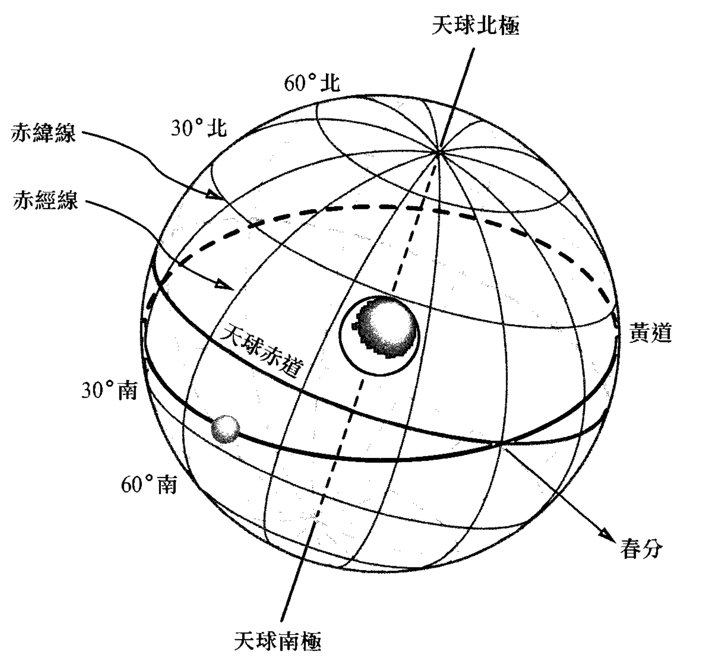

◆ 黃道是太陽在天球表面上圍繞地球運行的軌跡。

## ◆ 黃道與白道對應人體任督二脈

為什麼要明白這些呢？古傳中醫認為，人體與宇宙並沒有任何不同。用現代語言來說，人體資訊和宇宙資訊是「一」不是「二」。這一點醫家、道家、佛家都有高度共識。《黃帝內經》多次提到「一」，《道德經》更是不厭其煩地多次說到「一」，佛教叢林的山門一般都有個「不二門」，「不二」就是「一」。

日月是人們最容易見到的，人體的「資訊」、真氣、能量等卻不是我們凡夫俗子所能隨時「見」到。所以我們那些擁有超高智慧的老祖宗，只能通過「象似日月」的「取類比象」教化後代子孫。

《周易參同契》說：「懸象著明，莫大乎日月。」魏伯陽真人在講天人之學的時候就直接用日月來類比。上面所說的「黃道」和「白道」，與人體任督二脈的運行規律相吻合。所以魏伯陽真人在《周易參同契》裡說：「天地之雌雄兮，徘徊子與午」！我在前面的文章〈經絡本來就是「通」的〉裡說，人體的任督二脈本來就是通的，它不僅是通的，而且還跟隨天地的氣息運行，在子、午兩個時辰各有真氣「通過」這條通道。只不過五臟六腑不夠健康的人，這條氣路比較窄、比較容易「塞車」而已！我反覆提到的給小孩子捏脊椎，其實就是加快這條通道的氣血流通的方法，孩子是純陽之體，督脈總督全身的陽脈、陽氣，所以常捏脊椎可以幫助小孩子防止、「延緩」督脈塞車，從而保持任督二脈暢通（參見〈經絡運行的規律〉❺），如此自然容易把營衛之氣養好，保持正氣旺盛、祛病健身。學習古傳中醫呢，則要時時保持這條通道暢通無阻！所以平時要「以身證道」，養足正氣，讓這條通道「出入終復始」。

大家閱讀古代醫家、道家經典，提及「日月」的地方很多，一定要注意，有些時候古人講的「好像是」天上的日月，其實說的是人體的任督二脈甚至是左右兩隻眼睛。而有些時候看上去說的好像是人體，卻偏偏說的是天文。

《黃帝內經·素問·六節藏象論》有這麼一段話：

天度者，所以制日月之行也；氣數者，所以紀化生之用也。天為陽，地為陰，日為陽，月為陰，行有分紀，周有道理，日行一度，月行十三度而有奇焉，故大小月三百六十五日而成歲，積氣餘而盈閏矣。立端於始，表正於中，推餘於終，而天度畢矣。

這段話的意思很明白。「天度者」就是天體運行的「度」，可以理解為天文學。「所以制日月之行也」，古代天文學就是研究日月運行的，用的是十進位（參見〈略說「象數」〉 ❻）。「氣數者，所以紀化生之用也」，氣數呢，則是研究日月運行對人體真氣影響的學問，用的是普通的二進位。「天度」與「氣數」，是從不同的角度，用不同的數理方法，研究同一個問題——日月的運行及其對人體的影響。醫道的至極，也是天人之學的至極，所以歷代真有傳承的醫家、道家甚至包括佛家的學人，無一不是上通天文下達地理的。佛門最有代表性的人物，應該是唐朝的神僧一行和尚。他老人家把釋迦牟尼佛傳下來的密教徹底「本土化」，這就是著名的佛教唐密。一行大師在修煉之餘，還「票友」了一把天文學和科學測量，他第一個測算出地球子午線的長度。他老人家一生頗多神蹟，為歷代史家所津津樂道。一行大師的智慧如日月，拜讀他的著作，總有一種日月在他手中的感覺。

「天為陽，地為陰，日為陽，月為陰」，這個就不解釋了吧。
「行有分紀，周有道理」，天地、日月、陰陽的運行有其特定的綱紀、規律，其循環反覆的圓周運動，更是吻合大道之理。

❺ 請見〈經絡運行的規律〉，292 頁。
❻ 請見〈略說「象數」〉，369 頁。

「日行一度，月行十三度而有奇焉」，這就是本文開頭說的了。月亮繞地球運動，表現為它在星座間自西向東移動，一個恆星月移動一周，「平均」每天向東移 13度，所以說「月行十三度而有奇焉」。而「日行一度」，其實我們知道，太陽是恆星，它本身並沒轉動，是地球在繞著太陽公轉，其軌道是一個橢圓，太陽位於這個橢圓的一個焦點上，每年 1月 3日前後，地球離太陽最近，現代名詞叫「近日點」。在近日點附近，受到太陽引力最大，公轉速度最快，所以冬季的一個節氣的時間略短。每年的 7月 4日前後，地球離太陽最遠，現代名詞叫「遠日點」。在遠日點附近，受到太陽引力最小，公轉速度最慢，夏季一個節氣的時間也略長。地球公轉週期為 365日 6小時 9分 9.5秒（這就是現代說的一個「恆星年」的長度）。地球公轉兩次經過春分點的週期，現代名詞叫「回歸年」，一個回歸年為 365日 5小時 48分 45.6秒。雖有微小的差別，但也是 365日，所以說「故大小月三百六十五日而成歲」。老祖宗們的智慧，真不是我們現代子孫所能測度的。

「積氣餘而盈閏矣」，這個對咱們中國人來說就好理解了，這就是我們大家熟悉的「閏月」，閏月是月大月小的積餘，反映在人體上，則是氣機的「氣餘而盈」。

「立端於始，表正於中，推餘於終，而天度畢矣。」通過觀察日月運行的所謂「視運動」，我們就可以確定一年第一個節氣的開端，也可以用圭表來測量勘正一年的中氣，從而推斷出年終的氣機運行，這就是岐伯對黃帝說的天文學原理。

一般學習《黃帝內經》，理解到上面這一層次，已經很了不起了。而醫家的真傳，卻遠不止這些！簡而言之，就是人身自身是一個小宇宙。這聽起來可能像一句再普通不過的話，但是它在整部《黃帝內經》裡被反覆提及，是一句提醒人們回歸自然的理和法。《黃帝內經·素問·咳論》說：「人與天地相參」，至於如何「相參」，這就要放下身心去與道合真了。

再捅破一層窗戶紙：日月者，光明也。養生修道，先要謹記做個光明磊落的人！而日精月華，願君多採擷，此物最「象似」。

是謂「象似日月」！

魏伯陽真人在《周易參同契》中說：「別序斯四象，以曉後生盲。」希望這次掃盲能讓大家提起深入古籍經典的興趣。

## 延伸閱讀：

- 1. 視天球：天球是研究天體的位置和運動而引進的一個假想圓球，並不是真的存在這麼一個球體。根據所選取的天球中心不同，有站心天球、日心天球、地心天球等，各個天體同地球上的觀測者的距離都不相同。天體和觀察者間的距離與觀測者隨地球在空間移動的距離相比要大得多，人的肉眼分辨不出天體的遠近，所以看上去天體似乎都離我們一樣遠，彷彿散佈在以觀測者為中心的一個圓球的球面上（站心天球）。實際上我們看到的，是天體在這個巨大的圓球的球面上的投影位置，這個圓球就稱為天球。
- 2. 一行禪師道影傳贊：
一行
一行禪師。鉅鹿人。姓張氏。卯歲不群。博洽記誦。讀書不再覽。初從嵩山普寂禪師。乃悟世幻。遂禮出家。剃染受具。嘗傳密教於金剛無畏。結集毗盧遮那經疏。登壇灌頂。受瑜伽五部法。又尋究於陰陽讖緯之書。訪演算法於天臺國清寺異僧。盡得其蘊。自此聲名藉甚。開元三年。詔入見。諮出世道。及安國撫民之法。對稱旨。號稱天師。以國為問。答曰。鑾輿有萬里之行。社稷終吉。以金盒進曰。至萬里即開視。乃當歸少許耳。後祿山作亂。上幸成都。至萬里橋。悟當歸之讖。灑然忘憂。終吉者。至昭宗而絕。昭宗曾封吉王也。開元九年。朝廷以曆不驗。詔師改撰新曆。師推大衍曆書五十二卷。入唐書律曆志。先是有邢和璞者。道術人也。謂尹愔曰。一行和尚。真聖人也。漢洛下閎造曆時云。八百年差一日。當有聖人定之。大衍曆出。閎言驗矣。開元十一年。師制水渾天儀成。古未之有也。師嗣北宗普寂。又以學灌頂故。為密宗五祖。贊曰：

> 顯密之宗，讖緯之故。
大衍一成，陰陽合度。
世出世法，靡不該練。
五地之行，於師乃見。

## 獨立守神

一直有人抱怨2012年的文章開始變得很难懂，有一位朋友甚至懷疑這是胡塗醫要在這個「特殊的年份」過濾掉一些文化水準不高的網友。其實，從《黃帝內經》及《周易》的道理來看，2012年也不會有啥大災難。大家不要被電影或大師們騙了，更不要被胡塗醫忽悠了，2012年是正常的一年，只是從醫道的角度看，木運過盛而已（參見〈德全不危〉），大家謹記德全不危就好。這篇文章，咱就講點至簡至易的。

大家再來複習一下《黃帝內經·上古天真論》裡的這段話：

> 黃帝曰：余聞上古有真人者，提挈天地，把握陰陽，呼吸精氣，獨立守神，肌肉若一。故能壽敝天地，無有終時，此其道生。

我在前面的文章〈人有多種〉裡把這段話解釋了一番，今天再簡單講講。這就好比大家年輕時學物理，初中學力學，到了高中也講力學，大學物理還講力學，每個階段都講力學，但講的深度顯然不一樣。

請見〈德全不危〉，356頁。

今天我們就重點講其中的四個字：「獨立守神」！

過去醫家教徒弟，光這四個字就要講個一年半載。很多人盼望遇到明師，真要遇到明師，你得問問自己，如果有人拿四個字跟你講半年，你還能不能謙恭有禮、求「教」若渴一如最初？一個徒弟如果不能時時刻刻不忘初心，怎堪承受上古絕學傳承？一個明師如果不能誨人不倦啟人智慧，不厭其煩「治」人愚癡，如何能調教出經天緯地之才？所以想拜師的，想當老師的，舉凡好為人徒及好為人師的閒雜人等，最好掂量掂量自己的斤兩，免得貽笑大方。

「獨立守神」這四個字，我在前面的文章〈人有多種〉裡解釋時說過這句話，可惜沒幾個人看進去：「獨立守神」其實是用功、修行的方法，是指生活中尤其是練功時超然獨立（比如站樁），心裡的念頭永遠專一，類似於佛學說的「不動定」，心如明鏡不動，清淨明朗。

在醫家千年祕傳裡，「獨立守神」就是一個專門的用功方法。明師們用這個方法來對門人弟子進行「磨性」訓練。凡是練習一年半載以上的，身體一定非常健壯！這個方法是醫家諸多治病能力的基礎。比如醫家祕傳的「神針大法」，給人隨便扎一針，多年的沉痾往往能不翼而飛，其「內力」就來源於這個「獨立守神」的訓練。沒有三五年的「獨立守神」傻站，就算把患者給扎成刺蝟，也很難見效。所以在醫家來說，出來混，是遲早要「站」的。

## ◇ 獨立守神練功法

體態形式：

- 1. 站立：兩腳分開與肩同寬，腳尖向前，兩足在兩條平行線上（有別於不少樁法，不內八字也不外八字），兩腳平吸。兩膝微曲，站好之後，兩手從自然下垂的最低位起來做「抱一」。
- 2. 抱一：兩手像要往外拉似的抱圓於胸前，手心向內。太上曰：「是以聖人抱一為天下式。」

要點：

- 1. 整個過程脊柱正直。
- 2. 頭部：像眼鏡蛇似的，往上頂，下頜微收，彷彿要把喉嚨給「藏」起來似的。面帶微笑。
- 3. 上肢：肩膀略高於上肘部，肘部略高於手，肩膀放鬆。
- 4. 手：如上所說，兩手「抱一」於胸前，指尖相對，指尖相距約自己的一個拳頭大的距離，手心朝內。
- 5. 腿：兩腿微曲，彷彿坐於高凳上，會陰要放鬆。肩膀和會陰放鬆，這兩點做到了，全身就都鬆下來了。
- 6. 膝蓋：略彎曲，彷彿坐在高凳上，體會那種「坐著但要站起來」的感覺。

呼吸方式：自然呼吸，盡量做到吸氣微微、呼氣綿綿。

意念活動：別做任何「意念」，讓其自然入靜。誠如晉代孫綽先生在《喻道論》裡說的：「耳絕淫聲，口忘甘苦，意放休戚，心去於累，胸中抱一。」

功效：提挈天地，把握陰陽，呼吸精氣，獨立守神，肌肉若一。故能壽敝天地，無有終時，此其道生。

**適用對象**：不懶惰、能堅持的男女老少。

**不適用對象**：偷奸耍滑、無恆心的人，家族有精神病史的人。

**注意事項**：

- 1. 練習結束後，要擦乾汗水，尤其是大椎處的汗要擦乾，夏天不能立即去洗澡（最少要等半小時）。
- 2. 盡量避免在電風扇下和空調房裡練習這個方法，易感風寒。
- 3. 練習結束後最少半小時內不可以接觸冷水，尤其是在夏天，要盡量避免在此期間喝水和洗澡等，而且最好不要在練習結束後半小時內大小便。所以最好是在正式練習前喝水、排便！
- 4. 練習期間最好減少或者避免房事，切忌練習結束後立即進行房事！
- 5. 初學者應盡量避開颱風、下雨、雷鳴時練習。
- 6. 心臟病人不可過度練習。
- 7. 此法沒有「收式」，站完平緩走動就好。也可以搓熱雙手，撫摸撫摸膝蓋，甩甩手臂等。

關於此法，若有任何疑問，請自行參閱其他的系列文章及問題回覆，尤其是〈正身、內省、止息—且說醫家如何用功〉⑧一文。

## 中醫解惑 Q & A

小茶：胡塗醫先生，我有幾個問題：
1.「初學者應盡量避開颱風、下雨、雷鳴時練習」，這個是什麼原因呢？最近上海一直下雨，真的很想站站。
2. 我比較怕冷，有時候就開著空調，把風速調節到最低來站樁，這樣可以嗎？
3. 因為是上班族，沒有很多的時間，我通常是下班後，晚上6點半至8點半用來站樁，然後9點半以後簡單吃一點，長期這樣，會有問題嗎？我目前堅持了一個多月，好像沒有太大問題……

胡塗醫：1. 因為是初學者呀。
2. 盡量避免。
3. 晚餐不應該那麼晚才吃。

面朝大海春暖花開：先生，問個傻問題，站樁是損耗性還是補益性的功法，能代替睡眠嗎？另外發現我兩個鎖骨不對稱、有些偏移，站樁時右臂感覺不通暢，可以堅持站下去嗎？謝謝！

胡塗醫：吃飯能代替喝水嗎？如果不能，站樁就不能代替睡眠。可否堅持站下去，要看您自己的感覺。以不累為度吧。

sophie：能否找張得真傳的圖讓咱開開眼？身體抖是虛得厲害？我大概站個10分鐘腿也會抖，但身體會自動有細微的調節，然後就不抖了。目前只能站二十幾分鐘。

胡塗醫：不能。醫家傳這個獨立守神法時都是「守身如玉」的，學的人聽著自己比劃去，教的人不做給他們看的。為什麼呢？身體抖是自然的事，一般因為：1. 經絡比較敏感。2. 平時思慮過多。3. 身體陰陽不平衡，上實下虛（這最嚴重也最常見）。4. 古人說的「體自申束」。5. 其他原因。

夢中可知身是客：請先生解惑，以前靜坐，雖然時間不長，那時也無人指點，只是看了幾篇文章覺得挺好的，就自己瞎練起來，逐漸擺脫一些靜坐時及靜坐後出現的稀奇古怪的反應後，一靜坐就出現極其真實的幻境，定力極差，佛號經文也擺脫不掉，後來一位修行者講我不適合靜坐，應該活動起來。此後也幾乎沒有連續一段時間靜坐了。

胡塗醫：您這種情況是絕對不可以自己練習靜坐的！您應該多做運動，多曬太陽。

希夷微：另外，對於這個功法，還有幾個問題想向先生請教，請先生不吝賜教：

- 1. 每次站樁的時間是否根據個人的情況，盡量越長越好？比如能達到一個小時最佳，然後逐步延長時間？
- 2. 在不同的時間段，站樁功效是否有差別？比如早上站比晚上站效果好，又如，睡前飯後站樁有沒有注意事項？
- 3. 適應人群的問題，孕婦是否可以長時間站樁，小孩子7歲前是否能練習？這些問題可能過於瑣碎，成大器者應不拘小節，不過像我這樣的初學者，起步時形成好的觀念並養成好習慣，可能會事半功倍。多謝您了！

胡塗醫：1. 正確。
2. 不同時間段站效果多半不同，但關鍵在「用心」與否，時與地都問題不大。睡前飯後均可站，當然，如果吃撐了，還是要飯後1小時才站好些。
3. 孕婦應該盡量避免，若要站，也應以不累為度。小孩7歲前就讓他們玩兒吧，別折磨他們了。

如一：站了不到20分鐘的樁，便感覺左臂如負重百十斤，怎麼也抬不起來了。先生，這是否表明我左臂經絡不通呢？
胡塗醫：如一開始就這樣，就是肩膀沒放鬆！

sophie：問一下胡塗醫，站樁一段時間，右膝蓋感覺疼是姿勢沒站對嗎？
胡塗醫：也許是，也許不是。
記得膝蓋不要超過腳尖。您嘗試每次站後搓熱雙手，「安撫」一下膝蓋。

xyzjl：先生，唉，昨天下午站了半小時吧，感覺不是很累。然後晚上又遺精了，人真的很虛弱，怎麼辦啊？
胡塗醫：可憐的孩子！堅持站下去就好，這方法可治療遺精。

sophie：有事請教胡先生，前幾天有問題沒敢問。實修這幾天裡，獨立守神後上火嚴重，而且眼睛都腫了，幾天之後右眼流淚要舒服些了，可左眼這眼淚有就是不流出來，所以還是腫脹得難受，是否站得有點不得法？
胡塗醫：眼球要放鬆，站的時候盡量不要睜大眼睛，站完做3分鐘午睡的「山寨版」⑨。

⑨ 午睡的「山寨版」請見〈二十四小時如何過——午時養「心經」〉，438頁。

## 呼吸定息

《黃帝內經·素問·平人氣象論》有這麼一句話：

> 人一呼脈再動，一吸脈亦再動，呼吸定息脈五動，閏以太息，命曰平人。平人者不病也。

一般學中醫的，總把這篇「氣象論」當作只是說明平人的脈息至數與其變化，及各種疾病的脈象和診察方法。事實上，這段話是岐伯在教育黃帝具體的「呼吸」理法，遠非脈象診斷層面上的東西！今天胡塗醫就拿這段話來忽悠一下大家。

「人一呼脈再動」，人呼一次氣，經脈、脈搏運動、跳動兩次。「一吸脈亦再動」，人吸一次氣，經脈、脈搏也會運動、跳動兩次。

「呼吸定息脈五動」，人體一呼一吸叫作一息，在這一呼一吸之間，經脈、脈搏又運動了一次，所以說「呼吸定息脈五動」，一呼（2次）、一吸（2次）、呼吸之間（1次），加起來經脈、脈搏剛好動了五次。

「閏以太息」，這句話不好理解，明朝名醫張景岳先生做了這樣的解釋：閏，就是餘，與閏月的道理相同，這說的是平人、身心健康的人在正常呼吸之外，間或有一次呼吸特別長些，這就叫作「閏以太息」（見張景嶽《類經》：「閏，餘也，猶閏月之謂。言平人常息之外，間有一息甚長者，是謂閏乙太息」）。老張的這個解釋，幾百年來似乎都沒人懷疑過。現在學中醫的，更把「太息」理解為「深呼吸」。這樣理解當然也有道理（我們總難以相信張景岳老先生也會解釋錯《黃帝內經》），但卻不是醫家之真傳！試想，如果「太息」就是「深呼吸」，那這樣的「平人」怎麼可能是「不病」——不會生病的人呢？

那麼什麼是「命曰平人」呢？平人，其實就是已經從此岸到達彼岸的人！正如《黃帝內經·素問·生氣通天論》裡說的「陰平陽秘，乃治」，懂得把握陰陽、轉化陰陽的人！這樣的人，才是岐伯對黃帝說的，「平人者不病也」，那些從此岸到達了彼岸的人，懂得把握陰陽、轉化陰陽的人，就是不會生病、身心完全健康的人！

所以，「閏以太息」裡的「太息」，其實就是「胎息」！關於胎息，請參閱我《胎息、打坐及辟穀》。胎息，簡單來說就是一種「內呼吸」，是修習醫道——古傳中醫——的必經之路！所以魏伯陽真人在《周易參同契》中說：「呼吸相含育，佇息為夫婦。」張景岳老爺子說的「一息甚長者」，多少也說得過去，只是沒有胎息這樣的內呼吸能力的人，無法明白這個「甚長者」有多長。

呼吸，在古傳中醫的真傳裡，概括為三種：天地呼吸、人身呼吸和醫道呼吸。

天地呼吸，就是說天地也在呼吸，這是「天機」！古人說「天機不可洩露」，在天地為「天地的呼吸」，在人體為一陽來復的氣機，這是醫家千古不傳的大秘密！一陽來復的真元，不應該外洩，而應該養藏、煉化，這就是「天機不可洩露」！並不是大家以為的什麼算命的不能說破。關於「一陽來復」，請參閱〈冬季養生，無擾乎陽〉⑩和〈二十四小時如何過——子時養「膽經」⑪〉。

那麼什麼是「天地呼吸」呢？宋朝易學大家（事實上也是宋朝以來的易學第一大家，未來三五千年內恐怕也沒人能超過他）邵雍先生在《皇極經世》中說：「冬至之後為呼，夏至之後為吸，此天地一歲之呼吸也。」

人身呼吸，一呼一吸為一息，如果能做到與天地呼吸「息息相關」，便可以天人合一！

## ◇ 命在呼吸間

我們無時無刻不在呼吸，卻對自己的呼吸所知不多，這真是現代人的悲哀，正如現代的許多人，一有毛病就把小命交給醫生去處理，很少懂得返觀自身去尋找解決的方法，誠可歎也！胡塗醫真誠地希望大家在看了這篇文章之後，能夠開始關注自己的一呼一吸，這對養生、健康，乃至修道悟道都大有裨益。我們的老祖宗們，對這一呼一吸，瞭解得無比透徹！《難經》云：「呼出心與肺，吸入腎與肝，呼吸之間，脾受穀氣也。」老子、莊子都深入談過呼吸（《老子》：「綿綿若存，用之不勤」；《莊子》：「真人之息以踵」）。佛陀也在很多經典裡都談到了呼吸，有興趣者可以從拜讀《佛說大安般守意經》開始。

人的心神，多用於認識身外事物，一旦離境就不能自立，所以要用調息——調整呼吸的方法，拴繫此心，使心息相依，久而久之便無息可調，唯「綿綿若存」而已。所以張三豐祖師在《大道指要》中說：「後天呼吸起微風，引起真人呼吸功。」

呼吸之功如何做呢？

大道至簡，「差額」就行！一句話，就是不要像平時那樣呼吸，要有意識地呼長吸短，或呼短吸長！

呼長吸短，古人叫「降陰」，呼短吸長，古人叫「升陽」。降陰與升陽，如席慕蓉的那棵開花的樹，總會長在修習醫道者必經的路旁，學習古傳中醫者，不應該無視地走過。

一般來說，中醫所說的陽性病（不管是太陽病還是少陽病），比如發燒、臉紅，乃至高血壓、高血糖，就用呼長吸短來對治。如果是陰性病，不管是厥陰還是少陰，諸如怕冷、臉色蒼白、低血壓等，就用呼短吸長。基本原則就這麼簡單，剩下的就是各自用功實證了！

過去醫家秘傳有四個所謂「不死大法」，其中有一個就是呼吸法，醫家認為達到真息之後，生命可以「不死」。當然，這個「不死」大家不妨理解為生死不由閻王管！要走誰也攔不住，不走誰也奈何不了你。這是中國文化才有的潑墨豪情！

再強調一下，這句「差額」呼吸方法，有心學習古傳中醫的人不要等閒視之！魏伯陽真人在《周易參同契》裡說：「世間多學士，高妙負良才，邂逅不遭遇，耗火亡貨財。據案依文說，妄以意為之，端緒無因緣，度量失操持。」聞者珍之、勉之、持之！

⑩ 請見〈冬季養生，無擾乎陽〉，526頁。

⑪ 請見〈二十四小時如何過——子時養「膽經」〉，483頁。

## 中醫解惑 Q & A

**ppeng**：呼，吸。再呼，再吸。呼短，吸長。一下子好像心靜下來了。謝謝胡先生。

**胡塗醫**：我們總做自己「心」的奴隸，要學會做身心的主人。思考問題的主體並不是您自己，懂嗎？不懂就站樁去！

................................................................................................................

**木棉樹**：鬧了半天這還沒學會呼吸呢，該學該練的太多了，慢慢學，抓緊練。感恩先生。

**胡塗醫**：呼吸至關重要。佛陀曾教導過弟子，明白了「生命在呼吸間」的道理才算知「道」。

> 《四十二章經》云：「佛問沙門：人命在幾間？對曰：數日間。佛言：子未聞道。復問一沙門：人命在幾間？對曰：飯食間。佛言：子未聞道。復問一沙門：人命在幾間？對曰：呼吸間。佛言：善哉，子知道矣！」

## 神機氣立

恩格斯在《勞動在由猿到人的轉變中的作用》文章中有這麼一段話：

> 我們不要過分陶醉於我們人類對自然界的勝利。對於每一次這樣的勝利，自然界都對我們進行報復。每一次勝利，起初確實取得了我們預期的結果，但是往後和再往後卻發生完全不同的、出乎預料的影響，常常把最初的結果又消除了。（出自《馬克思恩格斯選集》第 4 卷，人民出版社 1995 年版第 383 頁）

恩格斯的這番話，與中國傳統文化何其相似！醫家、道家歷來主張天人合一，不要妄想「人定勝天」，要按自然規律辦事，順其自然。當然，醫道兩家提出「我命在我不在天」的豪言壯語，也是建立在這個基礎上，明白了不能「勝」天，但也要不「由」天，自己做生命的主人，但前提是要懂得把握、順應天機。

天機即是《黃帝內經》說的「神機」。在《黃帝內經·素問·五常政大論》中有這麼一段話：

> 岐伯曰：根於中者，命曰神機，神去則機息。根於外者，命曰氣立，氣止則化絕。故各有制、各有勝、各有生、各有成！故曰：不知年之所加，氣之同異，不足以言生化，此之謂也。
> 帝曰：氣始而生化，氣散而有形，氣布而蕃育，氣終而象變，其致一也。

上面這段話，學中醫的人最好爛熟於胸。下面我就簡單講講。

「岐伯曰：根於中者，命曰神機。」岐伯說「根於中者，命曰神機」，這句不翻譯成現代漢語最好，但是不翻譯它，現代人卻少有人懂。現代的中醫專家一般把這句話理解為，人體乃至一切生命體的生命，其根源藏於內的叫作神機。這樣的注釋也不能說全錯。王冰真人在注釋這段話時說：生命源於天，其一動一靜，都是神機所主宰，所以它的所作所為，潛藏著神機的生命體本身是察覺不到的，也正是因為這個原因，神機一旦離開人體，那麼氣機發動就會停止，言下之意，生命體也就死亡了。（王冰：「生源繫天，其所動靜，皆神氣為機發之主，故其所為也，物莫之知。是以神捨去則機發動用之道息矣。」）

張景岳先生在注釋這句話時也說，生命乃至萬物的根源來自「中」，是以神為主，而其知覺運動，就是神機發出的，生命乃至萬物的根源來自「外」，必須假借外在的氣機才行，而其生、長、收、藏，就是氣機的生化所為。（張景嶽《類經》：「物之根於中者，以神為主，而其知覺運動，即神機之所發也；物之根於外者，必假外氣以成立，而其生長收藏，即氣化之所立也。」）

「根於中者，命曰神機」的「中」若搞不清楚，這句話怎麼理解都不好懂。其實這裡的「中」，與太上在《道德經》裡說的一脈相承：「多言數窮，不如守中。」這個「中」，在天為「中道」，在人為人體的「中脈」。在佛教的密教裡，一般修煉至中脈「通」了的，就會被認為是成佛了。而這條「中脈」，既在人體「中」，又在天地之「中」——這是醫家真傳的大秘密！所以王冰真人才說「生源於天」。

「神去則機息」，這個神機一旦離開人體，則生化的機能就會停止。

「根於外者，命曰氣立，氣止則化絕」，其根源藏於天地之「中」（而非人體之「中」）的那一部分，就叫作「氣立」。如果這樣的氣立歇止了，則生化也會隨之絕斷。

可以這樣簡單理解，「神機」是生命存在的根本，是主宰調控生命活動的機制。而「氣立」則是生命得以維持的條件。這兩者相輔相成，共同維持著生命體的一切生命活動。但它們又「各有制」。

「故各有制、各有勝、各有生、各有成」，所以神機與氣立演化出來的五運各有制約和相生，各有生和成。

「故曰：不知年之所加，氣之同異，不足以言生化，此之謂也」，所以岐伯告訴黃帝說，假如您不懂得天道，不知道某一年的歲運與神機氣立的加臨，不瞭解氣機的異同，就不要去胡說八道什麼生化，這個道理您要懂！

「帝曰：氣始而生化，氣散而有形，氣布而蕃育，氣終而象變，其致一也。」岐伯的這一聲棒喝，讓黃帝頗有感悟地說，生命源頭的那股能量、氣機，看來是從一開始就能生化，這股能量、氣機一「散發」開，一流動，一運動，就能造就有形的萬物，氣如果能布散開，就能使萬物生機勃勃。而這股能量、氣機一旦離去、停下來，萬物、物體的形象就馬上改觀（生的變死，壯的變弱），這一切，看來就是先天一炁的功用！關於「先天一炁」，請參閱〈玄關 VS 先天一炁〉⑫。

魏伯陽真人在《周易參同契》裡說：「審思後末，當慮其先。人所秉軀，體本一無，元精流布，因氣托出。」也是這個道理。

講完了，「神機」何在？恐怕有人還是一頭霧水。我就再嘮叨一句：在《黃帝陰符經》裡，有這麼一句話：「天性，人也。人心，機也。」又說：「機在目。」這兩句話其實就已經把天機說盡，我不再贅述了。

本文開頭引用的恩格斯的那段話，最好也熟記在心。宇宙年齡約 150 億年，人類年齡最多也就 600 來萬年。如果把宇宙年齡壓縮成一天 24 小時的話，則人類的出現，是在最後 35 秒的事。出現在最後半分多鐘裡的人類，如何能「認知」一天 1440 分鐘的全部宇宙生化？那些從此岸到了彼岸的古聖先賢的話，我們是否該「虛其心，實其腹」去學習、接受、踐行？我們是否該好好想想是否該敬天尊賢、愛護自然、保護環境？

這個《黃帝內經》點滴系列就到此為止吧，該說的都說了。

⑫ 請見〈玄關 VS 先天一炁〉，628 頁。

## 中醫解惑 Q & A

**自在人生**：感覺這個「機在目」的「目」，並不是指眼睛。天目什麼的，可能是那個「心」？
**胡塗醫**：就是「目」。

................................................................................................................

**枚暖**：先生，你裡面提到的「中」是指肚臍那裡嗎？
**胡塗醫**：不是。

................................................................................................................

**戶外工作者**：胡塗醫，您好，我覺得「中脈」就是任督兩脈「運行」的路徑，打通任督二脈就是打通「中脈」，對嗎？
**胡塗醫**：您這麼說如果對的話，那「戶外工作者」也就是戶內工作者了！

# 第五篇

# 因天之序，合道而行

# ——古傳中醫養生

> 夫四時陰陽者，萬物之根本也。
> 所以聖人春夏養陽，秋冬養陰，
> 以從其根，故與萬物沈浮於生長之門。
> 逆其根則伐其本，壞其真矣。
> ——《黃帝內經·四氣調神大論》

## 二十四小時如何過
——寅時養「肺經」

不少讀者「投訴」我用了太多中醫術語，有位北京的大姐更是說我像個老學究，引經據典太多。因為人們上網不就是圖個樂子，順便學點東西嗎？為了不讓中醫高深的大道之理最後變得曲高和寡，我想我應該盡量做一些「中醫掃盲」，把道理講得簡單些。

今天就談談中醫的另一個本質——一天十二時辰，即二十四小時，人體的氣血如何運行。我們如何根據這個規律來祛病養生。

首先從寅時講起。為什麼從這個時辰講起，請參閱〈從糊塗醫治糊塗腸炎說起〉。

寅時，即早晨3～5點，心法藥方：謹防小偷，不要在這個時間段熬夜或鍛鍊。

這是一個我們大多數人睡得最香的時辰，也是廣大小偷朋友們最喜歡作案的時間。人體真氣和新鮮血液注入肺部，並從我們的肺部開始，一路向下流轉輸布至全身。古傳中醫有一個詞兒，叫作「肅降」，啥意思呢？我在前面的文章裡說過，肺在上半身主幹的最上端，好比社會上身居高位者都有一股肅殺之氣，肺這哥們兒也一樣，不管你高不高興，他老兄就是要往下「壓」你，所以我們才容易進入深度睡眠，因為我們睡得香，小偷自然喜歡這個時間來偷東西。明白了這個道理，你就懂得為什麼西醫治療失眠總治療不好，因為他們不懂得從肺部做文章。一個人要睡得好，秋天的時候就要對肺進行鍛鍊、進補，這樣一年四季才有好覺睡。等秋天到了，我再專文講這個⑪。

需要值夜班的朋友們，一夜之中最難熬的時間肯定是這個時間段，如果老硬撐著不睡覺，就等於跟你的老闆——肺——頂著幹，你體內的真氣就會不斷從身體各個地方被硬是往肺部上調，這就違背了人體氣血在這個時間段向下的運行規律。好比你老是違背老闆的意思，遲早要被炒魷魚！

肺一般會「炒」出什麼「魷魚」呢？如果你秋天不好好拍他馬屁，寅時也不好好讓他睡覺，那他就會對你進行「秋後算帳」：讓你皮膚變得容易乾燥，容易手腳冰冷、容易得痔瘡、臉無光澤、麻痺、咽喉乾、氣喘咳嗽，肩背酸痛。如果有這類「被算帳」的症候，就要多吃梨子、豆腐、豆漿、白菜。年齡大的人，這個時間點最容易醒來，原因就是他們體內的「真陽」不足，精氣耗損，沒有足夠的真氣讓肺部來進行肅降的工作。老年人這個時候睡不著怎麼辦呢？乖乖在床上右側臥躺著，呼氣的時候注意一下胃部，就做這個事兒，對養生健康非常有好處。為什麼呢？肺在五行中屬金，胃在五行中屬土，而土生金，胃是肺的老媽子，當肺的力量不足時，就回家讓媽媽疼一疼唄。這個事兒對肺、胃、心臟都特別管用，可別小看了這個簡單的「事兒」喲！

子時快到了，我睡覺去囉。有空再繼續嘮叨幾句。給大家看看

⑪ 請見〈秋養肺陰好安眠〉，546頁。

## 十二時辰養生法

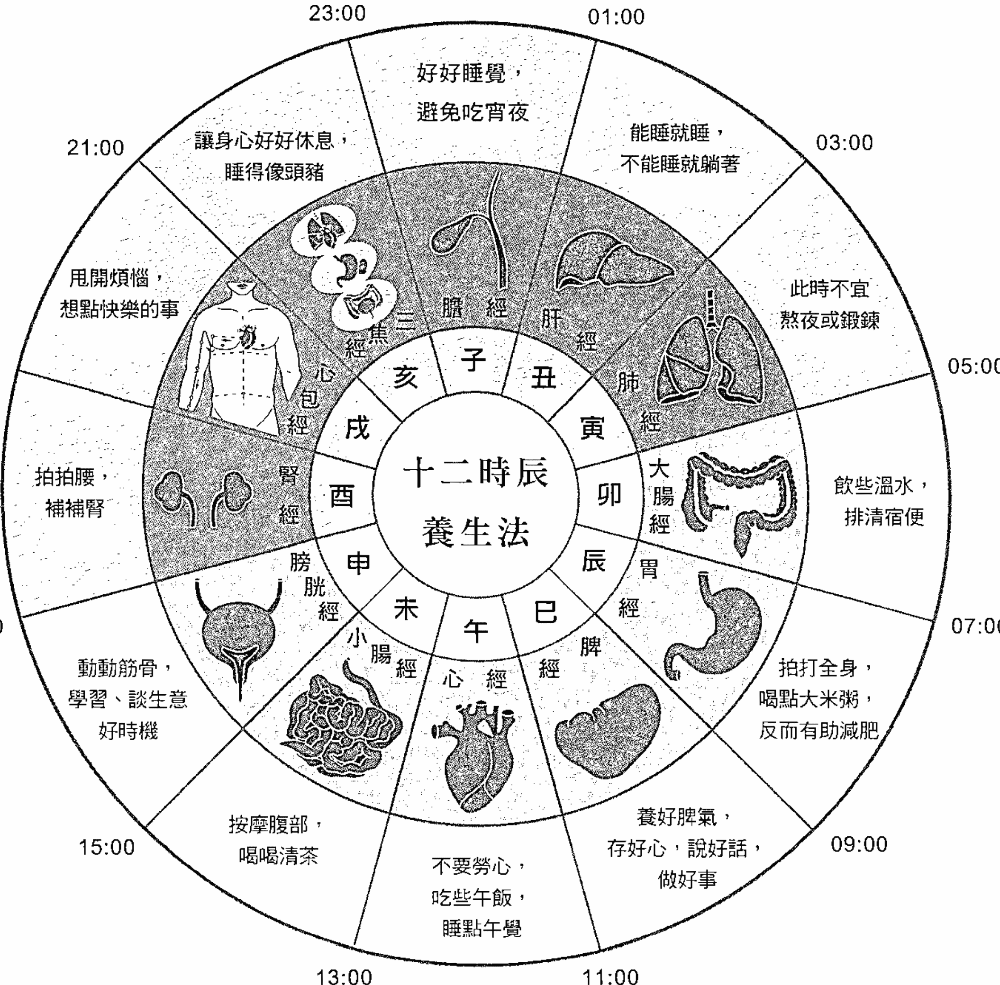

## 手太陰肺經

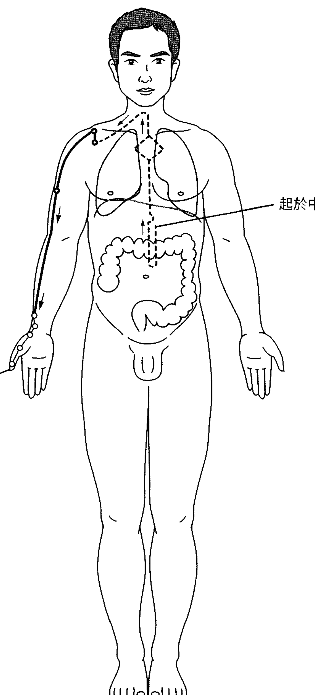

◇ 寅時人體真氣自手太陰肺經開始走，隨著呼氣由胸走手。它起於中焦，下絡大腸，上膈抵肺，從肺系橫出腋下，出大拇指之端。

寅時真氣如何自手太陰肺經開始走，這條經脈隨我們的呼氣由胸走手，它起於中焦下絡大腸，還循胃口，上膈屬肺，從肺系橫出腋下……最後循魚際，出大拇指之端（請見 417 頁手太陰肺經圖）。

順便提一下，給大傢伙多一個 Tip：古傳中醫常叫人大便時要「咬牙」、「握固」、「便不能言」，為什麼呢？「握固」就是握緊拳頭，「不言」即是大便時候不要講話（大陸男士很多喜歡躲廁所裡打電話，這絕對傷身體），就是為了讓肺氣肅降，所以小孩子大便的時候才需要「憋紅了臉」，把肺氣充實起來。因為「肺與大腸相表裡」。因此，拉不出大便，讀了這個文章，一定知道問題在肺，肺氣足時，大便就粗；肺氣不足時，體內就容易積毒素。子時到，擱筆！

## 中醫解惑 Q & A

**車在旅途：** 您好。您說的養生的時間在所有地方都一樣嗎？以前在西安覺得這些很吻合，但是在新疆哈密日照時間比內地多兩小時（天空是亮得早黑得晚），忽而覺得不太適合。
**胡塗醫：** 應以您當地時間為準，比如新疆用烏魯木齊時間會比用北京時間準確。

**sophie：** 還想請教先生，養生要順應節氣，可是如果在北美比如多倫多，陽曆3月還在下雪，4月份樹木才開始發芽，這個節氣也按照中國農曆來看嗎？
**胡塗醫：** 一般來說，應按照當地的時間來。簡單來講，就是中國農曆在當地的時間。

**ay- yang：** 很想問您，經常在南北半球之間飛的人，該如何順應時節來保養身體呢？這南北的季節完全是相反的。父母過來後這邊兒是春、夏天，而回國後（那邊）又快到夏天了。
**胡塗醫：** 這個的確是現代國際旅行者的常見問題，人體有一個自動調控裝置，它懂得「入鄉隨俗」，到了哪裡身體會自動調整的，只要按照當地的季節來養生就好。

**scorion：** 多吃梨子、豆腐、豆漿、白菜養肺，也是取白色入肺的道理吧？我家寶寶脾胃先天不好，是不是也是她們長得比較慢的主要原因呀？
**胡塗醫：** 中醫就像經濟學，怎麼理解怎麼有道理。脾胃本身是「後天」之本，脾胃虛弱，還是「先天」之本的腎氣虛的原因。

此外，古傳中醫還認為，父母的行為也會影響孩子的脾胃呢。

**新浪網友：** 請教先生，有的練功人寅時打坐，這個時辰打坐是否合適呢？多謝。

**胡塗醫：** 我不懂練功，這個時辰最應該做的事情是睡覺，但歷代都有人在這個時辰專門用功。

**f991231：** 胡先生，請問「婦人手少陰脈動甚者，妊子也」（《素問·平人氣象論》），這句話中的手少陰就是您文章圖畫中的手少陰路線嗎？能說說這句如何理解嗎？

**胡塗醫：** 王冰真人在注釋《黃帝內經》時說：「手少陰脈，謂掌後陷中者，當小指動而應手者也。」歷代對此不時有不同的看法，但本人傾向於相信王真人的注釋，這裡的手少陰，指的是小指內側手少陰心經，這裡說的具體位置是神門穴處之動脈。不過這個地方的動脈，不得真傳者很難測知，深通打脈的人會知道，此處指下有應，亦極微弱，常在似有似無之間，若能返觀內察內境隧道者，必定相信王真人之說。

這句話就是說，婦女的神門穴處之動脈若指下分明，清晰可辨，便是懷孕了！這是古人的「驗孕」秘法，我年輕時教同學用這個方法去驗證他們的女朋友，百發百中。

其實，患有嚴重神經衰弱的人，心血虛耗、心陽亢盛的人，也可見神門脈動，但沒有妊娠脈緩滑沖和、轉展流利之象，所以是「病脈」。當然，對於真正得診法真傳者，壓根兒不需要去搭脈的。

**hutaomu：** 一年十二個月也是從寅開始的，正月建寅。只是不明白其中的道理，可否賜教？

**胡塗醫：** 我們的祖宗在返觀內視參天究地的證道過程中體悟到天人合一，「人法地，地法天，天法道，道法自然」。人體與天地是「相應」的。這個認識過程，可能也經歷過漫長的時間。在夏、殷、周，每年把哪個月定為「正月」是不一樣的，周代是十一月（稱「建子」），殷代是十二月（稱「建丑」），夏代才是一月（稱「建寅」），現在的農曆沿用夏曆，所以就是「建寅」。真正要學古傳中醫，天文、占星都要懂。估計「失傳了」的《黃帝內經》第七卷就有這方面的厲害知識。

## 二十四小時如何過
——卯時養「大腸經」

卯時，即早晨 5 ～ 7 點，心法藥方：喝喝小酒，排排大便，採採陽光，不要在這個時辰吵架。

這是白居易最喜歡喝酒的一個時辰（當然，這哥們兒似乎一天到晚都喝酒），他寫過一首《卯時酒》：

> 佛法贊醍醐，仙方誇沆瀣。
> 未如卯時酒，神速功力倍。
> 一杯置掌上，三咽入腹內。
> 煦若春貫腸，暄如日炙背。
> 豈獨肢體暢，仍加志氣大。
> 當時遺形骸，竟日忘冠帶。
> 似遊華胥國，疑反混元代。
> 一性既完全，萬機皆破碎。
> 半醒思往來，往來籲可怪。
> 寵辱憂喜間，惶惶二十載。
> 前年辭紫闥，今歲拋皂蓋。
> 去矣魚返泉，超然蟬蛻。
> 是非莫分別，行止無疑礙。
> 浩氣貯胸中，青雲委身外。
> 捫心私自語，自語誰能會。
> 五十年來心，未如今日泰。
> 況茲杯中物，行坐長相對。

在現今浙江省的平湖市一帶，過去便有一種吃「卯時酒」的習俗，估計便是受白居易這首詩的影響，在早晨 5 ～ 7 點，睡得早起得早的人們（過去沒有電視也沒有 internet，生活習慣更接近自然），步行到鄉鎮上，喝上三五口熱酒，嘮上三幾句家常，便開始了一天的幸福生活。那麼「卯時酒」為何能使白居易覺得「神速功力倍」，「煦若春貫腸，暄如日炙背」呢？

因為這哥們兒愛喝酒——而且胃腸偏寒。

正如我在前面的文章裡說過的，寅時，人體的 CEO 是肺。卯時，主管人體的老總是「大腸」。這個時辰是天門初開的時候，古傳中醫在教徒弟練「望」法的時候，必定在這個時辰讓孩子起床，洗漱排便後，要求其面向太陽，看著太陽慢慢從海面升起，吞服太陽的精華，叫作「採日精」。

在上一個時辰（寅時），肺氣肅降下來輸布全身之後，這個時辰（卯時），人體真氣注於手陽明大腸經，氣血開始由大腸主導輸布。手陽明大腸經起於大指次指之端，循指上廉，出合谷兩骨間，上入兩筋之間，循臂上廉……一路上絡肺部，下入缺盆，下膈屬大腸。其支者，從缺盆上頸貫頰，入下齒中，還出挾口，交人中，上挾鼻孔。隨我們的呼氣由手走頭（請見 424 頁手陽明大腸經圖）。

## 手陽明大腸經

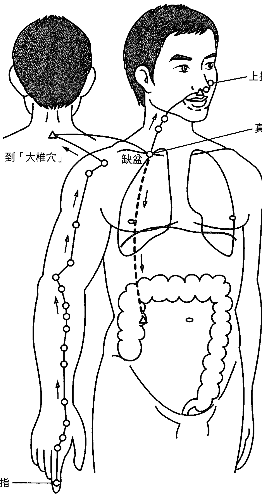

◆ 卯時真氣注於手陽明大腸經，隨呼氣由手走頭。它起於食指，上絡肺部，下入缺盆抵大腸。支流從缺盆上頸貫頰，上挾鼻孔。

中醫講「肺與大腸相表裡」，所以肺氣不足，大腸必有毛病，反之亦然。肺氣足的人，大便必定既粗又長；肺氣弱的人，大便就細就稀，很多人一上了年紀，大便變得又細又稀，那就是肺氣虛弱的表現了。不管您肺氣強弱，這個時辰最應該幹的事就是大便！把身上調整了一夜的廢物、廢氣、疲勞、煩惱全排出體外，開始嶄新的一天。然後，會喝酒的人不妨喝上三小口溫酒，不會喝酒的人，喝一大杯溫開水。實在沒酒喝也沒水喝，就閉嘴、上下叩擊牙齒（36下或N下），等到口內生津後，把口內津液咽下。總之，得有點東西下肚，溫潤大腸。在中醫裡，大腸的主要工作之一，就是「津液」進出體內。如果平時感到口乾舌燥，而且有失眠、多夢、眨眼，很多中醫生認為是「肝火旺」，事實上，真正的問題出在大腸上，所以這類「肝火旺」的人才常有便秘或熱痢。調理的方法很簡單，寅時好好睡覺，卯時好好大便，清早飲點兒小酒或溫開水，平時多吃竹筍、香蕉、柚子、番薯、海帶及粗糧就好。

另外，為什麼這個時辰最好別吵架呢？因為吵架浪費「口水」，就是津液！這個時辰人體的「老闆」是大腸，而大腸的主要工作就是主管津液異常所導致的疾病。如果「津液」不足，大腸要花的力氣就大，所以大便就乾燥、就容易便秘。有便秘的讀者，建議養成在這個時辰排大便的習慣，並經常沿著手陽明大腸經拍打手臂；另外參考我前面的文章〈從糊塗醫治糊塗腸炎說起〉裡講的簡單方法。

古人還特別強調要在這個時辰裡靜坐練功，稱為「卯時功」。歷代大醫很多都身懷絕技，這都是練出來的。

祝大家新年天天有好酒喝，天天吐舊納新。

## 中醫解惑 Q & A

**lanhai**：我卯時不大便，總是吃飯之後才會，這個要怎麼調理好呢？也按時睡覺的啊。
**胡塗醫**：訓練自己 11 天左右就好了。

................................................................................................................

**dhyejing**：我自己一直想不明白，我自己這些年來一直都是在中午 12 點半至 1 點半之間才便，卯時倒可醒來但沒便意，也拉不出來！我兒子呢，老是在晚上 7 點前後才拉。
**胡塗醫**：排便時間可以稍加「訓練」調整過來的。實在不行，順其自然就好。

## 二十四小時如何過
——辰時養「胃經」

辰時，即早上7～9點。心法藥方：拍打全身以通胃經，喝大米粥以防長胖。

這個時辰人體的真氣注於足陽明胃經。人體的CEO是胃，就像天下所有的老闆一樣，你不好好款待它，它就可以讓你工作起來很不順。如何款待呢？我們得先來看看這條經脈怎麼走。

卯時的時候，真氣注於手陽明大腸經，該經脈隨著我們呼氣由手走頭。而這條足陽明胃經正好倒過來，呼氣由頭走到足（請見428頁足陽明胃經圖）。

現在的上班一族，經常要在7點前後就急急忙忙從家裡出發，那麼你大可改變一下作息，早一點起床，悠著點出發。中醫養生，不是頭痛醫頭腳痛醫腳，它講究一種整體的思維觀和行為習慣，講究身心並治。藥物事實上並不能治病，它最多只是幫你調整五臟六腑，使真氣恢復其「本來的」運行方式不受阻礙，從而使人覺得病痛減輕或消除，嚴格講，人體本來是沒病的，或者說，人體本來就可以自我調理疾病，只要我們因天之序，合道而行就行。太上說「人法地，地法天，天法道，道法自然」，再精確不過了！話說回來，上班一族早上7點的時候，建議用空心掌沿著這條足陽明胃經，從頭到腳，把身體拍打個三五遍，然後吃上一碗大米粥，一天的能量就差不多夠了。

## 足陽明胃經

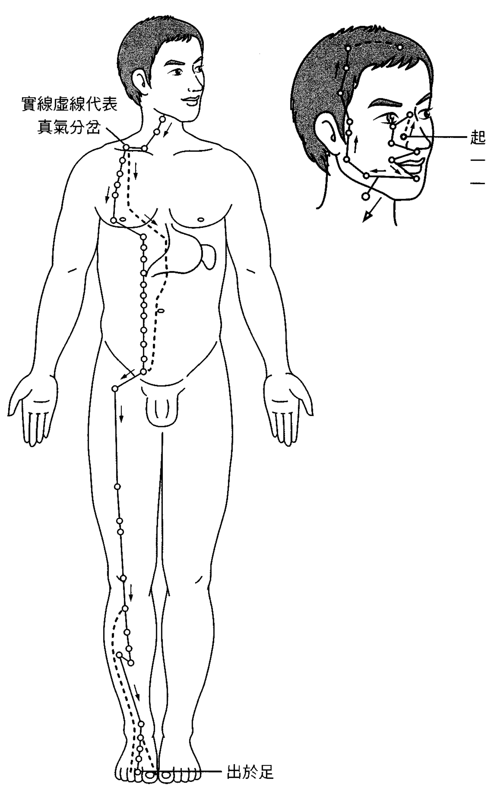

◆ 辰時真氣注於足陽明胃經，隨呼氣由頭走到足。它起於鼻側，一條上行，一條下行，出於足。

沿著經絡拍打，古傳中醫叫「循經拍打」。其目的十分明顯，就是借助拍打的力量，使氣血循環加快、經絡暢通。在特定的時辰拍打特定的經絡，這就是「因天之序」。在辰時拍打足陽明胃經，使這個時辰的老闆「胃」覺得爽，你才有好日子過。天下的烏鴉一般黑嘛。

順便提一下，這條經脈是非常重要的大脈，古傳中醫把胃稱為「倉廩之官」，說的是胃接受了食物之後並不是自己「享用」，而是還要向外疏散，你看這條胃經，從頭走腳，經過鼻、面、喉、乳中、胃……一直到腳。凡是胃經所經過的地方有毛病，都可以通過拍打這條經脈來治呢。比如現代女性容易犯的乳腺增生，問題其實就出在胃上，不從胃經治起，哪怕動過手術也容易復發。所以《黃帝內經》對胃推崇備至，說「胃者，五臟六腑之海也」。歷代名醫，無不對胃經讚歎有加，神醫華佗在《中藏經》中所說：「胃者，人之根本也，胃氣壯則五臟六腑皆壯也。」張介賓亦指出：「凡平人之常，受氣於穀，穀入於胃，五臟六腑皆以受氣，故胃為臟腑之本。」在《景嶽全書·論脾胃》中亦指出：「凡欲治病者，必須常顧胃氣。胃氣無損，諸可無慮。」可見古聖先賢對「胃氣」的重視。

對付胃，最好的賄賂就是食物。所以這個時辰一定要吃早餐！道理就這麼簡單。

當然，您也可以這樣理解，寅時肺氣肅降，卯時大腸輸布，忙乎了四個小時，也該餓了。而且到了辰時，太陽徹底從海平面升起，大地陽光普照、陽氣充足，這時就要給點「陰」性的东西，以平衡體內的陰陽。而大米粥屬陰，非常「應時」。那麼問題就來了，北方人或老外不喝粥怎麼辦？很好辦，「因天之序」說的是要因時、因地制宜。你那地方、那季節盛產什麼，你就吃什麼。醫家訓子弟，總有一句金玉良言——「什麼東西便宜吃什麼」！天地在什麼季節盛產什麼東西，這些東西對人體就最有益！因為「盛產」，必定容易導致供過於求，按照經濟學的基本原理，供過於求，商品的價格必定便宜。所以我在北美念書時，有位經濟學教授說中國人是跟著西方人才學到經濟學，我立馬反對他的說法，中國文化最了不起的地方在於她融合了天、地、人的整體哲學思辨。我們的先輩雖然沒有發明西方經濟學，但是看看先秦諸子的智慧，哪一位不比現代的諾貝爾經濟學獎強？《管子》中就有很多「現代」經濟學思想呢。古代的大學問家往往都通醫道，就是因為中國文化可以讓人一通百通。大家以後到超市裡看到正在打折賣的東西（只要是新鮮的），都可以買回來放開肚皮吃。昂貴的、反季節的蔬菜水果，要盡量避免。比如冬天就不應該吃西瓜，而應該多吃白蘿蔔，夏天就應該多吃生薑。

為什麼辰時喝大米粥反而不會長胖，甚至可以減肥呢？下次再聊。

## 中醫解惑 Q & A

**Zorro**：「比如冬天就不應該吃西瓜，而應該多吃白蘿蔔，夏天就應該多吃生薑。」白蘿蔔不是寒性的嗎，吃多了不太好吧？
**胡塗醫**：我在前面的文章裡有解釋，您再去看看好嗎？
簡單來說，冬天，人體氣機順應大自然，閉藏起來，在體內就有一種「內熱」的格局，寒性的白蘿蔔正好宣開體內的內熱和滋膩。

................................................................................................................

**瘋狂大花神**：在此向胡醫請教一個問題，望胡醫給予解惑，好像是題外話哦。中醫理論認為，陽明無死症。不知這該怎麼去理解呢？
**胡塗醫**：「陽明無死症」的觀點，源於《傷寒論》，清朝醫家陸九芝先生把它發揚光大。具體請參閱他的著作《傷寒論陽明病釋》。陸先生是位博覽群書的醫家，是晚清難得的良醫之一。所謂「陽明無死症」，說的就是如果病入陽明經，就像小偷被員警追進了死胡同，一定可以被捉拿歸案被治好、跑不掉，所以說「不死」。但陸先生這一派的學問，也有很多反對的聲音。這位陸老爺子最可愛之處是推崇復古精神，他甚至打擊溫病學派，認為「傷寒」就包括了溫病。可見中醫就像經濟學，誰都可以另立一說。
「陽明無死症」的觀點，對現代婦女常見病如乳腺增生一類的疾病還是很有指導意義的。比如，有些女性乳房有硬塊，西醫多數會比較緊張，甚至動不動就切片，那會被折騰出大病來。根據「陽明無死症」的觀點，如果這些女同胞的乳頭沒有陷進去，就是病在「陽明」，因為足陽明胃經經過乳頭，這個時候就可以用中醫的方法來調理，很容易就解決問題。

不過對於像您這樣可以自己看病的人來說，不管是陽明還是厥陰，都是些似是而非的說法。傷寒也好，溫熱也罷，其實就是「診病」和「辨病」的理論。如果直接就「知道」問題出在哪裡，要這些理論幹嘛？好比用手指月，看到月亮才重要，看手指沒大用。

## 二十四小時如何過
——巳時養「脾經」

巳時，即上午9～11點。此時的心法藥方：存好心，說好話，做好事。

這個時辰人體的老闆是脾臟。巳時，人體真氣注於足太陰脾經。這條經脈隨著我們的吸氣由足部走向腹部，它起於大腳趾之端，循指內側白肉際，過核骨後，一路入腹，屬脾絡胃，上膈挾咽，連舌，散於舌下，其支流再從胃往上走，注於心臟（請見434頁足太陰脾經圖）。

我們都喜歡「脾氣好」的人，不喜歡「脾氣不好」的人。在中醫看來，「脾氣不好」就是一種病態，說明你的脾出了問題。脾出問題，五臟六腑都要出問題，因為「脾為後天之本」，不能不慎重。中醫養生非常講究情志調理，脾氣不好的人，在這個時辰就要多注意存好心、說好話、做好事，一天下來才會快樂，五臟六腑才能和諧。現代人總會在這個時間忙碌於生意公務，許多人會說做不到這「三好」。其實這個時辰如果你多注意，心存善念、口說好話、手做好事，不僅你的脾氣會改觀，人緣也會自然變好。所以我給這個時辰開出的藥方就是存好心、說好話、做好事，做個三好學生、三好員工、三好老闆、三好朋友……三好 everybody。這可以從生活中的一點一滴小事做起，比如，你的員工幹了蠢事，你本能地要收拾他，這個時候你就要提醒自己：「這一刀下去可能是錯的，遲些再說他。」這對自己的脾氣有益，對事業也有益。

## 足太陰脾經

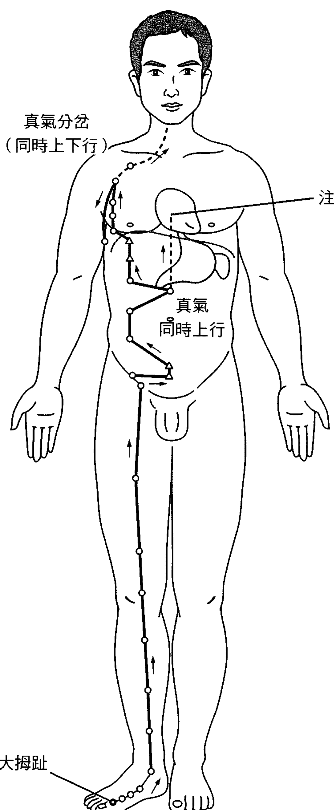

◇ 巳時真氣注於足太陰脾經，隨吸氣由足走向腹。它起於大拇趾，一路入腹經過脾胃，上膈散於舌下。支流從胃往上注於心臟。

因為脾主運化，你的「氣不順」，它運化起來就不舒暢。脾臟這位老兄本事說大不大，說小不小。「脾」字的一大半是「卑」，它處於心臟和肺部之下，自然要十分「謙卑」，生活中有好脾氣的人也多半是謙和的人。人體在辰時通過胃接受食物之後，巳時就由脾來負責幫胃「運化」五穀，所以古人說「脾者，裨也，裨助胃氣以化穀」，胃主受納水穀，脾主運化精微。《黃帝內經·素問·刺法補遺篇》有一句很有意思的話論述脾臟說：「脾者，諫議之官，知周出焉。」在中國文化中，由下而上提建議才叫「諫」，你看，足太陰脾經不也是由下往上走嗎？脾臟是位謙卑的哥們兒，它在身體的中央，從經脈走勢看，它要對心臟和肺部進行「諫議」——協助心神決定意志，而且全身上下下的大小問題，這哥們兒都能知道並明白問題的原因所在（「知周出焉」），所以脾是位很能「待人處事」的好兄弟。這麼好的哥們兒，難道不值得我們用「好脾氣」對待他嗎？

那麼脾是如何做到「諫議」和「知周」的呢？通過勤勤懇懇的工作做到的——在上午9～11點這兩個小時，它不斷運化水穀精微！所以那些為了減肥而不吃早餐的白領，反而會長胖，這種虛胖就是因為你早上7～9點不吃大米粥，現在脾要開始運化，而你體內沒有東西給它運化，你老讓脾處於空運狀態，脾臟自然受損。你越想減肥，它越讓你長胖，因為脾氣受損，必然散漫，一散漫，就會虛胖。所以有志於減肥的同志們，早上上班前一定要記得喝一大碗大米粥。

現在很多人吃飯不香，尤其是老外，總得往食物裡加很多鹽或調料，原因就是脾臟被他們折磨得夠嗆了。脾臟的運化功能不強時，吃東西就不香。所以檢驗您的脾臟是否有問題，就看您「尚能飯否」。

此外，脾還主肌肉，人體肌肉方面的問題，幾乎都可以歸根到脾臟的運化功能上來。而且，脾在情志方面主思，憂思傷脾，所以我才建議大家存好心、說好話、做好事，只要做到這三好，就能輕輕鬆鬆、開開心心，從而達到健脾和胃，養生祛病的效果。

順便說一下，很多人傷心哭過一夜之後，第二天眼皮準是腫的。為什麼呢？就是因為：

1. 脾主肌肉，哪怕小到眼皮，也由它管（所以經常眼皮跳的人，要注意脾臟）。
2. 憂思傷脾。兩個加在一起，脾陽不振，濕邪難化，自然眼皮要腫了。所以有志於做「美眉」的人，要常保持開朗、樂觀，眼皮才不容易耷拉下來，才不容易顯老。

希望看到這篇文章的讀者，不僅在巳時做個存好心、說好話、做好事的三好人，在一天二十四小時中都能因天之序，做個合道而行的好人！

## 中醫解惑 Q & A

**yxpo**：請問先生，壞脾氣到底是病態還是性格的問題？奉行「三好」能改變嗎？「三好」之說好話有點難度。
**胡塗醫**：在醫家看來，壞脾氣就算不是病態，也是病因。

**天瑞**：老胡，脾虛練什麼功？我舌頭有齒輪邊，中間有縱縫，舌胖淡。
**胡塗醫**：脾虛練細嚼慢嚥吃飯神功。

## 二十四小時如何過
——午時養「心經」

午時，即中午 11 ～ 13 點。心法藥方：吃點兒午飯，睡一會兒覺，練練午時功。

這個時辰非常重要，是陰陽相交的時辰。《說文解字注》中說：「午者，陰陽交……陰氣從下上，與陽氣相忤逆。」這說的就是中醫的道理了。中國文字很有意思，一個字裡就包含我們的先輩對宇宙、自然、人體的感悟，英語的 noon 雖然也表示「午」，卻全然沒有這個意義。

午時，人體的老闆是我們的「心」！在這個時辰裡，人體真氣注於手少陰心經。這條經脈隨我們的呼氣由胸走手，它起於心中，出屬心系，下膈，絡小腸，其支流從心系，上挾咽，系目系，從心系上肺，從腋下出，後循臑內後廉，行太陰心主之後下肘內，最後循小指端出（請見 439 頁手少陰心經圖）。

我們的「心」在五臟中的地位最尊貴。《孟子·告子上》說：「心之官則思」，認為「心」是我們所有思維活動的「官」，而《黃帝內經·素問·靈蘭秘典論》則說得更乾脆：「心者，君主之官，神明出焉。」直接把「心」當「君主」來看。君主就是皇帝，人體之內，它的權力範圍最大，這位皇上最喜歡在午時行使其至高無上的權力。古代的皇帝處決亂臣，總喜歡讓人把犯人拉出「午門」去問斬，而且斬首喜歡選在「午時三刻」，原因就是因為「午」含「忤逆」之意，對付忤逆皇上的人，自然必須在午時「被解決」。因此我們就要學乖點兒，在午時千萬別激怒皇上，那怎麼辦？

洗洗睡唄！午時要韜光養晦，不與「心」正面衝突，不要去勞「心」，讓這位皇上按照它的意願去辦事，你睡你的，它忙它的！

心不但主宰人體的心理活動，而且主宰著形體官竅、五臟六腑的所有生理活動，當我們入睡或入靜的時候，它就能更好地發揮它「君主」之威德。中醫講「心藏神」，在你高度入靜或入睡時，心神便能最大程度地完成它的主宰和協調功能，人體的各部分功能才容易被協調一致並相互合作，從而使人體這個小宇宙風調雨順，使我們全身安泰。所以午睡，哪怕是只有一小會兒，也能夠讓人身心安泰。現在時不時可以看到一些調查報告說午睡使人健康長壽，道理就在這裡。公務員多半還有午睡的時間，在外企、私企工作的白領們就沒那麼好的福報了。

## ◇ 午時養心功——午睡「山寨版」

醫家秘傳有兩個簡單方法，可以說是午睡的「山寨版」。

要求：

1. 你閉目養神三分鐘的話，你的老闆不炒你魷魚。
2. 你這九分鐘內不會被別人打擾。

## 做法：

1. 搓熱雙手，用空心掌「罩」住雙眼，心裡啥也不想（我知道這超級難），三分鐘。
2. 再搓熱雙手後，十指交叉，抱著玉枕穴，含胸拔背坐直了，如此閉目養神三分鐘。玉枕穴大家可以找個穴位圖看看在哪裡，如果實在找不到，就糊糊塗塗抱著後腦勺好了。
3. 再重複第一個做法，搓熱手捂眼睛三分鐘。

## 玉枕穴

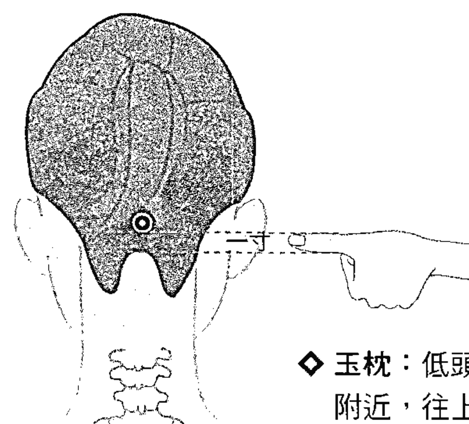

◆ 玉枕：低頭時位於後腦勺中央髮際附近，往上1大拇指寬的位置。

這九分鐘做下來，看看你是否神清氣爽！如果真的睡著了，被老闆炒魷魚可別說是我教的。

大家不要小看了這個山寨版午睡方法！所謂「真傳一句話，假傳萬卷書」，好的東西歷來都是「簡單」的。大家好好珍惜這個方法，它的道理很深呢。古人說「午時一刻，乃一陰之生」，午時對應著「子時」的「一陽之生」，人體是一個小天地，天地之氣和人體之氣是相應的，這個簡單的方法，事實上暗含著古傳中醫注重時間條件，以自然界週期現象，與人體氣血周流的情況相配合的思維方法。

有些人可能會問，如何知道三分鐘到了？做多了或做少了是否有問題？做不夠九分鐘怎麼辦？都不要緊！糊塗醫治糊塗病，說的就是一種「大事清楚，小事糊塗」的思維方法，不要去斤斤計較。這個方法的目的就是要你放鬆入靜那麼一會兒，讓您的心神履行天子的權力。

天子雖然高高在上，但是他還受制於「天」，天子天子，說的就是皇帝的老爹就是天嘛。也就是說，「心」雖然在人體內的地位最尊貴，但還有人管著他呢！誰呢？

天——我們的先天元氣——受之於父母的與生俱來的真氣！

人體的元氣藏之於腎。很多中醫都知道這一點，可是很少人知道古傳中醫所說的「腎」的概念與西醫的腎大大不同，比如，人體元氣便不完全是在西醫概念裡的「腎」的位置，準確地說，是在下丹田。午時睡覺有利於使心腎相交，子時睡覺也如此！所以歷代養生家都講究練子時功和午時功。心臟的病，根源必定在腎，所以好的中醫治心臟病，都懂得從腎治起。「腎為先天之本」，它凝聚收藏，心則主疏通流布。

順便提一下，我在前面的文章〈糊塗醫治糊塗腫瘤〉提到過，腫瘤、結石、腫塊等的成因，就是「氣」在人體上凝聚的結果。大家留意到沒有？很少聽說過有人心長腫瘤的，對不對？為什麼呢？就因為心主疏通流布，它無時無刻不在「動」，就算有病，病氣也不會凝聚成塊。明白了這個道理，我們是否有理由相信，據說「失傳」了的《黃帝內經》第七卷，也有這類高明的方法，來讓別的臟腑也「動」起來，從而使人們獲得長生久視呢？

## 中醫解惑 Q & A

**凌波**：心不長腫瘤是否也與心屬火有關？
**胡塗醫**：主要是因心主疏通流布，當然您的理解也不無道理。

**學習學習**：先生好，我想問一下先生，十指交叉，抱著玉枕穴，含胸拔背坐直了，如此閉目養神3分鐘，是否可以隨時做？
**胡塗醫**：可以隨時做。

**新浪網友**：先生，玉枕穴跟腰腹相通嗎？怎麼練午時功的時候朦朧有這個感覺？
**胡塗醫**：全身的經脈都是「相通」的。
**新浪網友**：悟性太低，沒看懂，請教糊塗，心臟有問題是不是心經也有問題？但為什麼能聯繫到與心經沒有關係的部位呢？
**胡塗醫**：可以這麼說。
五臟六腑哪一個出問題，都會「牽連」到其他臟腑的。

**癡迷中醫**：再請教先生，您的博文很多時候都談到了真氣運行，恕在下愚鈍未能理解真氣、精氣、元氣（您曾提到小兒捏脊不能太大力否則會傷元氣等）、正氣等的不同。既然有中氣（文中為中焦之氣，如中氣十足），那會不會還有上氣、下氣呢？——是不是常說的「上氣不接下氣」？同時身體中的病氣、邪毒等和自然界的六淫及人的七情有什麼必然的聯繫嗎？
如能撥冗指點，感激不盡！
**胡塗醫**：「上氣不接下氣」說的恐怕是「上一口氣」接不上「下一口氣」，形容呼吸短促，與中醫的「氣」沒太大關係。
身體中的病氣、邪毒等和自然界的六淫及人的七情有聯繫，身體中的病氣、邪毒等和自然界的六淫及人的七情有聯繫，身體中的病氣、邪毒等和自然界的六淫及人的七情有聯繫。體的病氣由「心」生。邪毒和六淫都是因為體內正氣不足；七情（喜、怒、憂、思、悲、恐、驚）如果是突然地、強烈地或者長時間持久地刺激，並超過人體所能承受的臨界點，就會導致五臟六腑的真氣運行軌跡變化。我們熟悉的范進中舉的故事，他那個就是典型的七情傷臟。一聽中舉，暴喜一場，傷了「心」，因為「心藏神」，「神」藏不住，癲狂也就不奇怪了。所以學中醫的人，要學習心態平和安樂自在。

滄海雲雨：博主：您好！《黃帝內經》中的《靈樞經·本藏》說道：「心小則安，邪弗能傷，易傷以憂；心大則憂不能傷，易傷於邪……」又說道：「赤色小理者，心小；粗理者，心大……」小時候聽大人說，人的心大小與左手握拳的大小差不多，這裡《靈樞經》所談的心「大」和「小」是指形狀大小嗎？如何理解上面的言語啊？「赤色小理」的「理」指的是什麼？能通過普通肉眼看得出來嗎？
當然，《靈樞經·本藏》還談到了肺、肝、脾、腎。我是一名業餘中醫愛好者，自己覺得《內經》這篇文章應該是古人「以身證道」得出來的結論，如果理解錯誤希望博主見諒！盼望先生能在百忙之中予以指點一二！謝謝！

胡塗醫：「窘乎哉問也」。

1. 是指臟器大小。
2. 這樣理解：心臟小的人，容易神氣內斂，因而情緒容易安定，邪氣就不容易侵害他，但這樣的人容易憂愁傷感，從而傷於憂愁。心臟大的人呢，則反之。
3.「赤色小理」是說一個人的膚色紅，紋理細的人，心臟往往偏小。可以通過肉眼看得出，當然這看各人「經驗」。
4.《黃帝內經》沒有一句話不是古聖先賢以身證道得來，這一點不需懷疑。

醫海探秘：我目前在讀《黃帝內經》，有些問題不明白，很想請教先生：

1. 在《金匱真言論》中：心開竅於「耳」，腎開竅於「二陰」；而在《陰陽應象大論》中：心開竅於「舌」，腎開竅於「耳」。不知道以哪個為準？
2. 在《陰陽應象大論》中，五變動：握、憂、噦、咳、栗，應該都是屬於相對應病情的動作，而「憂」屬於情志類的，想像不出是什麼樣的動作……

胡塗醫：1.《金匱真言論》說到這句話的原文：「南方赤色入通於心，開竅於耳，藏於心，故病在五臟」這裡說的是「南方赤色」的宇宙能量進入人體，與「心」氣相通，該能量開竅於耳，這與其文後面所說「其數七」可資印證。舉一反三，便可明白「開竅於二陰」所指為何了。所以心開竅於舌，腎開竅於耳之說為準，沒錯的。2. 憂是情志，不是某一具體動作。

醫海探秘：謝謝先生回覆！但本人愚笨，還是不很明白，請原諒，還望先生再指教。

1. 按說人只有九竅：眼、鼻、耳各二竅，再加口和二陰共為九竅，舌不算竅啊？
2. 我問的意思是說「握、噦、咳、栗」都是相對應病情的動作，而「憂」不是！所以可能有錯，心的「變動」應該是另一個詞，而我現在看書還太少，所以請教先生。

麻煩先生再次指教，非常感謝！

胡塗醫：事實上無變動也是「心路歷程」，不見得非有動作不可。當然，人生氣的時候喜歡揮舞拳頭，這是因為肝氣變動為「握」之故，但也有人生氣了不握拳的。舉一反三，憂也是「心志」的「動作」，動作可以有形，也可以無形。
您治學嚴謹，這是很好的習慣，值得讚揚！

## 二十四小時如何過
——未時養「小腸經」

未時，即下午 13 ～ 15 點。心法藥方：摸摸腹部，吞吞口水，喝喝清茶。

這是一個小腸當人體老闆的時辰。在這個時辰裡，人體真氣注於手太陽小腸經。這條經脈在我們吸氣的時候由手走頭。這是一條非常重要的經脈，它起於小指之端，循手外側上腕，一路向上，絡心臟，循咽，下膈，抵胃，屬小腸，其支流則循頸，上頰，至目，入耳，絡顴（請見 447 頁手太陽小腸經圖）。

小腸是身體裡的「共產黨員」，它徹底奉行毛澤東「取其精華，棄其糟粕」的理念。王冰在注《黃帝內經》時說它「承奉胃司，受盛糟粕，受已復化，傳入大腸」，小腸總是受納來自胃的水穀，把食物中能消化的精華毫不客氣地接納，把剩下的糟粕甩給大腸。簡單來說就是將食物中的精華部分，包括飲料化生的津液和食物化生的精微，進行吸收，再通過脾之升清散精的作用，上輸心肺，輸布全身，供給營養。《黃帝內經·素問·靈蘭秘典論》稱小腸為「受盛之官，化物出焉」，張景嶽也說：「小腸居胃之下，受盛胃中水穀而分清濁，水液由此而滲入前，糟粕由此而歸於後，脾氣化而上升，小腸化而下降，故曰化物出焉」。小腸接受、盛載食物的時候，對水穀進行「化物」、運化。最後運化成了什麼東西呢？後天之「精」，它可做人體內的「藥」。小腸是位好同志，它吸收來的水穀精華，「取之於民，用之於民」，把精微交給脾去運化於人體各個部位，把「精」交給腎這位「先天之本」。那麼，又是「誰」讓小腸如此「聽話」來完成這份「共產黨」工作呢？

心！在上一篇文章裡，我們談到心為「君主」，它主神志，「心與小腸相表裡」，心的陽氣下降於小腸，幫助小腸分清泌濁。如果心火過旺，便會移熱於小腸，反過來，如果小腸過熱，也會導致心火亢盛，許多人「習慣性」口舌生瘡，買了很多西瓜霜噴也沒用，問題就出在這裡。要根治它，就必須從「摸小腸、降心火」做起。尤其在未時，要多摸摸腹部，做到「腹宜常摸」，並常念「呵」字以降心火。此外，小便短赤、尿道灼熱甚至尿血，也是因為心火太大，移熱小腸所致，因為「心與小腸相表裡」。所以心臟有毛病，小腸就得多幹活。現在大家明白為什麼中國有個詞語叫「心腹大患」了吧？

日常生活中我們常聽說某某孩子的吸收能力差，吸收能力差，就是指小腸的「運化」能力不強。如果是成年人，吸收能力不好，就容易在體內堆積垃圾，體內垃圾堆積多了，身體就容易百病叢生，好比官員公款吃喝多了就容易貪污腐敗。現在很多年輕人臉上長老人斑，問題就出在小腸吸收不好上。所以古傳中醫在治療臉上長斑時就從小腸治療起。醫家及道家高人會特別訓練徒弟們時不時進行「服氣辟穀」（這是聽起來很難，其實人人都可以很快學會的「功夫」，以後有機會我再另文專述），目的就是為了減輕小腸的負擔，同時有利於排出體內「積蓄」多年的垃圾宿便。現代人吃得太好、太精，對小腸反而是一個傷害。

小腸除了負責吸收食物精華，還要負責把食物殘渣向大腸輸送，在吸收五穀精微的同時，也吸收大量水液，並將剩餘的水分經腎臟氣化作用滲入膀胱、形成尿液，經尿道排出體外，所以中醫理論說「小腸主液」。道家和醫家在打坐結束的時候，都要把口裡的唾液嚥下並用意念送入下丹田，這叫「玉液還丹」，可以治療很多現代病，所以我給這個時辰開的藥方才有「吞吞口水」。若無口水怎麼辦？有個簡單的方法可以馬上產生口水，想想吃青梅就好了，如果想了青梅還沒口水，可以上下叩擊牙齒36下，再用舌頭在口內從上到下轉上9圈就有了，把口水分三次吞下去就好！這個簡單方法可以治療牙齒病、口腔病、便秘、脾胃病等等。大家在未時多多做吧！此外，這個時辰也適合喝上兩杯功夫茶，尤其是那些中午飯吃太多吃太好的人，這個時候最想睡，兩杯清茶有利於提神、解渴、生津、促消化。

順便提一下，「液」對臟腑、筋脈非常重要，它是一種具有滋養作用的精微物質，臟腑和筋脈通過「液」來得到滋養、滋潤。坐辦公室的白領經常有人抱怨腰酸背痛，就是「液」的濡養不足，導致筋脈不能發揮它們柔韌舒張的特性。喜歡喝上一兩杯咖啡的小資更容易有這個問題，就是因為咖啡使人脫水，使體內「液」不足。在歐洲，好的咖啡廳在給你端上一杯咖啡的時候，會給你一小杯白水，這是國內小資們需要學習的，喝咖啡可以，但要補足水！現代人所謂「三高」症其實也可以歸根到「液」不足上來。三高症的主因是虛火旺，虛火旺了，臟腑裡的液就收不住，臟腑的液都往外排，就容易導致血糖、血脂、血壓「三高」。所以大家別小看了未時的這個藥方：摸摸腹部，吞吞口水，喝喝清茶！

## 中醫解惑 Q & A

**癡迷中醫：** 請教先生，在下雖然堅持練習未時叩齒法20多天，鬆動的牙齒也略略堅固了一些，但是每次叩齒後牙齦都會出血，現在仍然如此。所以叩齒後的津液雖多，卻有一絲絲的腥味。這是否也是在量變的過程中呢？謝謝先生先！

**胡塗醫：** 是正常反應。

**流雲隨風：** 先生，有時候叩齒舌頭口中轉並不都是津液，半津液，更多的是一種似泡非泡，似沫非沫的。「液體」？這個是什麼原理啊？也是跟腎水不足有關係嗎？

**胡塗醫：** 一般是脾、腎兩虛。

**新浪網友：** 胡塗醫老師好！最近發現自己牙齦萎縮得很厲害，還有結石，請問胡塗醫老師有沒有好方法治療？

**胡塗醫：** 問題在腎，還有，您是不是比較愛憂慮？嗓子是不是經常不好？可以早晚叩齒36次，然後用舌頭順時針頂著牙齦劃9圈，把口水小口小口吞下。堅持一段時間就會好。

**舉杯向月：** 先生好！女兒讓我向你求一治療教師咽炎及聲帶受損的藥方或一簡單練功方法。謝謝！

**胡塗醫：** 好的。您讓那位老師每天早晚叩齒咽津練習一段時間看看好嗎？

**llpemily：** 心腎相交法練了後，髮質變好了，腎氣足了吧。比以前常打噴嚏了。呵呵，我可能比較笨，只能從外在變化來看效果了。最近也開始做保肝的功法，真的助睡眠啊。我經常做著做著就想睡了，睡眠品質提高了，哈哈，一定會堅持下去的。謝謝先生！

另外，先生泡腳的方子對治療慢性咽炎有幫助嗎？一直被這個折騰著……

**胡塗醫：謝謝分享！**

泡腳對慢性咽炎應該有幫助，但來得較慢。對治慢性咽炎，建議早晚叩齒36遍，用舌頭沿著牙齦順逆時針各攪9圈，然後把口水分3口吞下，想著口水吞到肚臍內。祝好！

**閱讀者：先生好！現有一困惑自己多年的事請教：我有一小疾——口腔潰瘍，十餘年了，曾經吃數月中藥仍無好轉。還望先生指點迷津！**

**夢中可知身是客：** 關於口腔潰瘍，先生在〈二十四小時如何過——未時（小腸）〉這篇文章清楚地講過。你也可以先用生薑煮點水漱口，也可以把薑弄碎敷在患處，一般晚上做，早上就幾乎不影響吃飯了，試過，不過最關鍵還是看先生的文章，將病根去了，不然去得快，來得更快，早上好了，下午就復發。另外建議將文章中的玉液還丹法每天盡量能做7次，咽下21口。

**胡塗醫：謝謝！**

**振豪 ZHENHAO：** 先生您好。2011年2月9日的《中華醫藥》節目裡面講了四位國醫大師的日常養生之道，最後講的李濟仁國醫大師的養生茶配方：「黃耆10～15克、枸杞6～10克、西洋參3～5克、黃精10克，用開水浸泡5～10分鐘即可服用，喝完再續，直至無味食之。」李老的這個配方應該是有針對性的，不是任何時候都適合任何人的。想請先生能不能給我們一個養生茶的配方，我們日常也隨時隨地可以天天喝以養氣血。感謝先生，阿彌陀佛！

胡塗醫：幾乎沒有一種中藥是適合每一個人的（冬蟲夏草似乎還行），哪怕大米飯也不是能餐餐吃的嘛，謹慎點好。古傳中醫世家秘傳的養生茶就叫「飲刀圭」，就是四個字：叩齒咽津。

靜心：請教先生，高血壓症在這個時辰按心法藥方多練，補足「液」就可以治好吧？謝謝先生！

胡塗醫：高血壓可以通過意守腳底心湧泉穴來調理。

f01：先生您好，想問問先生鼻子部位和腦後的玉枕穴有什麼關係嗎？我最近鼻子部位不舒服，意念集中到鼻子部位的時候，玉枕穴後腦那個部位就會有感覺。請先生指點！拜謝！

胡塗醫：意念不要輕易集中在鼻子上，尤其是高血壓的人千萬不能這樣，否則血壓會馬上升高。

水中蓮：尊敬的胡先生，最近我感覺不舒服，你可以幫我診斷一下嗎？

胡塗醫：看來您是「考」我千里診病來了，那我就試說說吧。您最近風邪外襲，肝膽之火上逆，引起耳鳴。此外，這兩天是不是右膝蓋撞了一下？

水中蓮：對，年前理髮頭髮未乾，出門受涼感冒、耳鳴，最近兩天耳朵轟鳴嚴重，我該怎麼辦？很擔心。

胡塗醫：不用擔心，小毛病而已。「風邪外襲」，把風邪趕走就行，「肝膽之火上逆」，把火放下就好。在當地找個中醫看看就好。如果當地沒有好中醫，編一些方法供參考：

1. 買個全新的舊式熱水瓶（不是後來改進的按壓式那種），裡面裝花椒和茉莉花茶，裝半瓶或八成就好。裝上後蓋緊放著。
2. 在下午17～19點，打開熱水瓶，把耳朵湊到暖水瓶口「聽」，聽完一個耳朵換一個。
3. 睡覺前，平躺或端坐，舌抵上顎，口微閉，兩手食指塞住耳朵，不用太緊，以不透氣為度，聽自己的「呼氣」，長長地呼出三口氣，想著把氣呼到腳底板。然後就不要理會它，過一會兒後「猛」地拔出手指。平時也可以做，以睡覺前為佳。

**jxgh**：請教一下，這個茉莉花茶和花椒裝半瓶左右，那要加開水嗎？這一瓶東西大概用多久要更換呢？聽多少時間？

**胡塗醫**：沒說要加開水啊！

## 二十四小時如何過
——申時養「膀胱經」

申時，即下午 15 ～ 17 點。心法藥方：抖抖身、排排毒，談談生意。

申時，人體的老闆是膀胱，這個時辰人體真氣注於足太陽膀胱經。這條經脈呼氣由頭走足。它起於目內皆，上額交會於頭頂百會穴，並從頭頂入腦、下行項後，沿肩胛部內側，挾脊柱，到達腰部，從脊旁肌肉進入體腔，聯絡腎臟，屬於膀胱。其支者從腰下脊貫臀；另一支者，循髀外下，出外踝至小趾。因為這條經脈流經頭、項、目、背、腰、下肢，所以這些部位的病都可以通過它來治療（請見 455 頁足太陽膀胱經圖）。

申時的「申」字，在甲骨文裡「畫」成這樣：

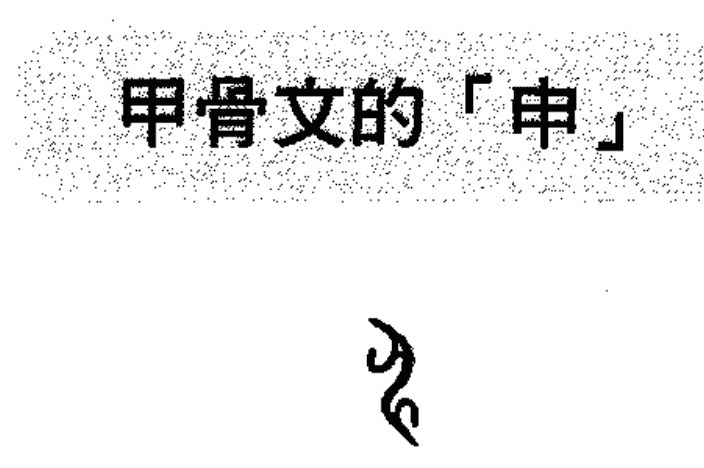

臺灣有位古文字學者認為這是古人表達「閃電」的意思，不無道理。上古的人認為電閃雷鳴等自然現象都是鬼神作祟，所以「申」字通「神」，許慎在《說文解字》裡說：「申，神也。七月陰氣成，體自申束。從臼，自持也。」可是清代大學者段玉裁在注《說文解字》時卻頗不以為然，這位段老兄說「神不可通，當是本作申。」在古文字上，我是個門外漢，但許慎的觀點似乎已經很清楚明白了，「體自申束」，身體自我伸縮，就是動動筋骨，鍛鍊鍛鍊嘛。「自持」，就是自我把持，即保持身體的平衡，像一個人兩手叉腰站著。好比未被我們折磨之前的「學」字寫作「學」，它的上半部就是一雙手捧著「爻」才是學習的開始，「申」字就是兩手叉腰，您站起來兩手叉腰看看，自己是不是像個「申」字？

### ◇ 申時學習、工作效率高

依我看，這個「申」字不僅可以解釋為閃電，而且還可以解釋為一個人在練功。申字的甲骨文寫法就像一個人在那裡「抱圓守一」站樁呢，或者也可以看作是人在跳舞，有點像今天中國農村還存在的巫婆神漢的「跳大神」，目的就是讓「體自申束」，身體得到鍛鍊，至於能不能通神或通電，那多半要看功夫的深淺吧。許慎在《說文解字》裡還說「申旦政也」，古代的官吏一般選擇在申時處理政務，這在中醫看來，是因為申時陽之氣從頭頂流注入腦部，工作和學習的效率自然就高，所以我給這個時辰開的藥方才有「談談生意」，在頭腦最高效的時候去做談判。《母儀傳·魯季敬薑》說博達知禮的莒女敬薑教導她的兒子文伯時說：「士朝而受業，晝而講隸，夕而習復，夜而討過，無憾，而後即安。」就是強調早晨學完東西，到下午申時一定要好好複習並付諸實踐，到了夜裡，再檢討一天有無過失，不要把遺憾帶到床上，才能安心入眠。同樣的道理，學中醫，如果只是「學」而不能「習」，那也沒有多大用處。有些網友表示要好好學習中醫，這很好，但是我希望大家學了能「習」之，不是複習，而是「實習」、「實踐」，用到實處。

學而不能致用，何樂之有？學中醫的人如果不能做到自己養生，也不能給人診病，不能為人解除病苦，學的只是中醫的「知識」而不是「能力」，那就好比練武的人只懂花拳繡腿而無法做簡單的防身，一個練武的人如果總被不會武功的歹徒追著打，豈不是笑話？如果說武術本來就是「打人」的技術，那麼中醫本來就應該是「治人」的東西，在此我也奉勸那些不能診病治病的中「醫生」們趕緊轉行，該種地種地，該經商經商，別到處去談養生、講穴位，中醫界目前講養生的一大群，真能診病、治病的卻沒幾個，能夠隨便從一個網路名字也能在千山萬水之外做診斷的就更少，這些不具備「中醫能力」的人去大講特講中醫養生，遲早給中醫丟臉！

### ◇ 申時宜多伸展筋骨，疏通膀胱經

言歸正傳。申時還要盡可能多伸展筋骨。有些人建議 15 ～ 17 時這段時間內最好能做運動到出汗為止，我堅決捍衛他們言論自由的權利，但卻願意給出更切合實際的建議！《黃帝內經》開篇便教人要「獨立守神，精神內守」，沒有要你去運動出汗嘛，而且對於現代人，尤其是上班族，你叫他們在辦公時間整出一身臭汗來，恐怕也沒這個條件，畢竟這個時辰中大多數的人都還要老老實實地上班上學。既然這個時辰是膀胱當人體的老闆，比較符合邏輯的做法是，有的放矢，服侍好這條足太陽膀胱經！所以醫家秘傳有一個簡單方法，能在這個時辰快速疏通膀胱經。古傳中醫的明師們在教這個方法之前，總得先講一通中醫的大道之理，把徒弟們忽悠得「恍然大悟」之後，方法便讓他們自己去編，「理通法自明」嘛。有一位網友問我，他學的「退六腑」方法是從肘關節推向手腕橫紋，怎麼我卻教大家從手腕橫紋推向肘關節，他懷疑是門派不同所以手法各異。我告訴他，往哪個方向推其實問題不大，關鍵是治病者的心念，是否有一顆治病救人的心、一顆讓病人好起來的父母心才重要呢，往上推或者往下推，不外就是要通經活絡排出病氣嘛，「糊糊塗塗」就行，不必太較真，要較真的是有沒有一顆醫者的慈悲心、父母心！你給人治病時的心念如何，對治療效果是有影響的。我也得學學先賢們先來忽悠一下大家，再讓大家去悟這個方法。我們先來看看膀胱經這哥們兒的葫蘆裡賣什麼藥。毒藥！沒錯，這哥們兒賣的是毒藥。

膀胱經是人體的排毒骨幹！人體內的邪毒總是歸到膀胱經來排出去，尤其是申時，膀胱經當令，排毒的功用更強大。很多人都有這樣的體驗，被人在後背和大腿按按捏捏敲敲打打之後會覺得渾身輕鬆，這主要就是因為膀胱經流經背部和大腿（當然，還有其他經絡），它所經之處被人折騰一番之後加快了氣血的運行，排毒更快更徹底，自然覺得舒服受用。問題是，這種舒服和受用的感覺無法持久，很快又是該疲勞疲勞該煩惱煩惱，這又是什麼原因呢？

問題就出在腎上了——腎與膀胱相表裡，又與膀胱相通。膀胱的排毒功用是通過「氣化」來實現的，《黃帝內經·素問·靈蘭秘典論》說：「膀胱者，州都之官，津液藏焉，氣化則能出矣。」「州都之官」是用來比喻膀胱的生理功能特點的。歷代各大注家在解釋這個「州都之官」時莫衷一是，或以膀胱「位當孤腑」（王冰等），或以膀胱為「三焦水液所歸」，或以膀胱是「同都會之地」（張介賓等），或以州、都分別通「洲」、「渚」二字，而解為水液積聚之處來解釋「州都之官」，公說公有理，婆說婆有理，怪不得有位老科學家一再警告我說中醫不科學，是一種廣泛的「包」（潮州話，「猜測」的意思）。事實上，這些大注家們都沒有得真傳，我知道這句話一說出去會招來不少謾罵，但我說的這不是開玩笑的話。得真傳的人不會在「州都之官」上浪費時間。這句話說的就是，我們體內的邪毒、雜物在膀胱的氣化作用下才能源源不斷排出體外，「津液藏焉」是指膀胱經在排毒時把對人體有用的「津」和「液」藏起來儲存在人體內了。而「氣化則能出」，是說因為體內真氣的作用而使津液能發揮作用。道家講究打坐所產生的津液為「金津玉液」，必須把它們吞下去，可見津液之重要。膀胱「氣化」的「動力來源」就在於腎氣的蒸騰。腎有毛病就容易導致膀胱的氣化失司，引起尿量、排尿次數及排尿時間的異常。腎氣不足，膀胱經氣化的力量就不足，道理就這麼簡單！

### ◇ 顫抖功：通膀胱功法

明白了這一層道理，我們要做的，就是「幫助」這條膀胱經排毒，同時溫養腎的力量。
如何做呢？民間一般用刮痧或拔火罐的方法，這是一條無可奈何的不歸路，依靠外力，永遠是「外求法」，我一直強調，學中醫就是學道，而學道的方法，非向內求不可！對於上上根器的人，內求法的精髓就是真傳一句話——「全憑心意用功夫」，您就在申時的這兩個小時內，找個時間讓自己靜下來，「用心意」把這條膀胱經給「觀想出來」並有意無意地「聽」著體內的病氣邪毒從頭到腳源源不斷往下排，經絡敏感的人，渾身都有麻麻熱熱脹脹的感受，就對了。那麼不敏感，根器不高的人怎麼辦呢？那就只能自己編些方法了。先賢編了一個顫抖功，法簡而效宏，方法如下：

1. 好好看甲骨文的「申」字寫法，你就站成那樣就行。兩腿微曲，略寬於肩膀（身體好能站得穩的人，兩腿可與肩膀同寬），這樣身體上下就是一個長長的三角形，我們知道三角形有穩定性，這樣站著比較穩。
2. 站穩之後，全身放鬆，身體上下自然顫抖、抖動，雜念比較多的人，這個時候可以想像著自己彷彿騎著一匹寶馬奔跑在草原上。顫抖時間自定，以不覺得累為度，可以是3分鐘、6分鐘、9分鐘、15分鐘……自己定。
3. 抖完自然站立，閉目「聆聽」身體的氣血從頭到腳往下奔流的「聲音」（感覺），可以想著體內的病氣、邪毒之氣等您不要的東西，源源不斷從頭到腳往地下排。時間自定。
4. 最後，兩手撫腰，體會氣從手掌心注入兩腎、氣在兩個腎間動的感覺。

這個簡單的方法可以治療很多毛病，比如神經衰弱、失眠、腰腿痛、頭痛，等等，同時還能美容呢。大家每天都做一做吧。事實上，申時做最好，別的時辰也可以做的，特別是睡覺前，抖一抖，睡得好。

## 中醫解惑 Q & A

**癡迷中醫**：我實踐了一次，感覺很特別：才抖了不到一分鐘（估計），雙手就在身上背上等到處拍打起來了，後來兩隻手臂像風車一樣輪轉，雙手強烈發脹發麻，之後又繼續拍打一會兒，估計這樣做了大約10分鐘才停下來。最後就按照您說的意念想像那些東西往下排，馬上就感到腳底湧泉處發涼。不過做完了非常舒服！感謝博主的「真傳」，我準備連續實踐10天，再來回饋感受！

**胡塗醫**：這就是「體自申束」，恭喜。
這些東西最好實踐一輩子，10天不夠的。

**癡迷中醫**：我最近練習申時排毒法後，有三個地方出現了反應，呈現淤塊狀和梅花狀的小黑點，而且這三個地方都是我曾經受過傷和目前正感到不適之處。不知是否與排毒功法有關？因為我同時還在練習亥時功以及未時叩齒功。

**胡塗醫**：這是對的。體內的正氣與邪氣在互相「較勁」，邪氣可能正處「劣勢」，所以被「表」了出來，繼續用功吧。

**癡迷中醫**：我昨天又練了申時排毒功法，結果雙手手背上都是紅色大大小小的血點，因手臂轉了太多圈，血液都跑到手上去了。效果很好。感謝感謝！ 將繼續實踐下去。

**胡塗醫**：練完後不要馬上接觸涼水。

**舉杯向月**：請問先生，做完顫抖功結束後，是否也是最少半小時內不可以接觸冷水，或不要在練習結束後半小時內大小便？

**胡塗醫**：不用。但最好也等幾分鐘後。

**yanzi**：想請教先生一個問題，氣動多久為宜呢？
**胡塗醫**：氣動多久為宜？以舒服、輕安為度。

**新浪網友**：先生您好。讀您的文字有一個多月了，堅持做了你說的那個治大便的功法，我是反過來做，因為我是便秘，但不乾，黏，就是不往下走，練這個功法也一個多月了，還是三四天一次，費勁不順利，總覺得沒便完。為了這個便秘，我什麼方法都試過，真是無語了，有時真想買些拉肚子藥來個痛快。請教先生我這到底是哪的問題？還有我月經一直量很少，兩天就完了，間隔時間每個月都往後拖，這次更糟，兩個月沒來了。請先生指點。

**胡塗醫**：如果實在難受，可以找些補中益氣丸混合一點瀉藥來吃。您的問題籠統點說就是氣血兩虛，把氣血補足了就好。您右側卵巢有一塊0.63公分大小的瘀血塊。多做做顫抖功就好。

## 二十四小時如何過
——酉時養「腎經」

酉時，即下午 17 ～ 19 點。心法藥方：拍拍腰、補補腎，不要在這個時辰抽煙。

酉時，「腎」當人體的老闆。這個時辰，人體真氣注於足少陰腎經。這條經脈隨著我們的吸氣由足走腹。它起於小腳趾之下，斜行向腳底心湧泉穴，出於舟骨粗隆之下，經然谷穴、照海穴、水泉穴，沿內踝之後的太溪穴，別入腳跟中，上向小腿內，出膕窩內側，上大腿內後側，通向脊柱，屬於腎，散絡膀胱。其支流有二，向上行的一支，從腎向上，通過肝、膈，進入肺中，沿著喉嚨，夾舌根旁。而胸部的一支，從肺出來，散絡於心，流注於胸中（接手厥陰心包經）（請見 464 頁足少陰腎經圖）。

這是一個非常重要的時辰，古傳中醫和道家的先賢們都非常注重順天應時，尤其注重子、午、卯和酉時進行養生修煉，先賢們專門編排了一些諸如「子午抽添，卯酉沐浴」的功課，讓門人弟子在這四個時辰進行訓練。酉時的修煉被認為可以「收內藥」，為什麼呢？因為經過上個時辰「申」時的「排毒」，酉時就該把人體內的「藥」收回，負責藥物回收的「老闆」，便是這條足少陰腎經。

為了幫助大家更好地理解這個時辰和這條經脈，我給大家講個小故事。

## 足少陰腎經

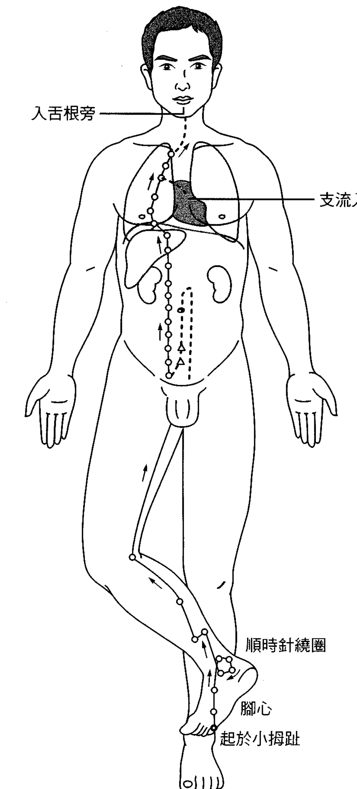

◇ 酉時真氣注於足少陰腎經，隨吸氣由足走腹。起於小拇趾，沿踝上小腿大腿內側通向脊柱屬於腎。支流從腎向上進肺沿咽夾舌根旁。另支流從肺入心。

前不久我到昆明看望一位老友，因為時間十分匆促，老友知道我來一趟太多人想找我，便問能否幫忙看看他們家的一位親戚 Z，但明言這位親戚 Z 先生是一位房地產老總，理工科出身，對中醫不怎麼相信。吃飯間我笑問 Z 是否最近一到下午 17 至 19 點便兩顴呈紅、手足心發熱。他大驚，這是最近才發現的，連他老婆也不知道，問我何以知之。我告訴 Z 這並不需要太多神醫奇術，我一眼看出他肺和腎都有毛病，就可以知道這點兒「隱私」了。在中醫看來，Z 是典型的陰不戀陽，水虧火越的現象。道理何在呢？就是因為在酉時，即 17 至 19 點，人體真氣傳注於足少陰腎經時，因為這位老兄肺有毛病且長期吸菸，消耗了人體太多陰液，他腎氣也虛，腎在五行中屬水，而肺屬金，按五行生剋制化的道理看，金生水，肺為腎的上源，經過長期消耗，老闆（腎經）來收「藥」的時候交不出「貨」自然要跟他「臉紅耳赤」爭論一番了。至於手腳發熱，也是因為足少陰腎經隨著人體吸氣由足上行入丹田與衝脈合併，挾肚臍上行至胸部，注入心包經與心氣相交，古人管這叫「腎水上潮以濟心火」，而這位 Z 先生腎水不足，心火無法合理得「濟」而必定火旺，所以手足心發熱也便在情理之中了。當然，這是基於中醫理論進行「推理」得到，好比學《周易》的人通過搖銅錢起卦。古傳中醫還有比這簡單得多的方法呢，可以隨時隨地、當面或不見面，診斷出一個人最近是否手足心發熱！好比宋朝大儒邵康節先生，他老人家占卜哪裡用得著起卦！

因為 Z 不信中醫，我故意再唬一唬他以示「勸誡」，問他是不是沒有趕上 2009 年房地產瘋升的末班車，他更是驚訝，問我怎麼知道。我在前面的文章裡說過，「萬物皆可疾，萬物皆可醫」，如果說上醫連國都能治，我這種胡塗醫起碼也應該能看出一個人的事業順不順，才不愧對光輝燦爛的中國古傳醫家文化！我一直強調，學中醫要用學道的精神來學才能通，因為只有你用以身證道的精神來學習與領悟，才有從漸悟到頓悟的一天，中國文化是一通百通的，哪怕是懂得讀《說文解字》，也能悟到修成「神醫」的方法呢。那麼我是如何知道 Z 錯過了房地產熱潮的呢？

## ◇ 酉時養腎：冬蟲夏草法

還是這條經脈告訴我的！足少陰腎經異常變動，在 Z 上就表現為腎氣虛。腎氣虛，人就容易發生恐懼，有些人甚至會心慌得好像有人要來追捕他，所以腎氣足的人就有臨危不懼的精神（比如小嬰兒啥也不怕，就是因為他們是純陽之體，腎氣足，而且他們在「意念」上也不懂得需要怕）。經過 2008 年的金融風暴，腎氣虛的企業家就容易成為驚弓之鳥，不敢在 2009 年初低價拿地，因為與 Z 是第一次見面，我不好意思直接下「診斷結果」，所以才「問」他（這才是真正的望聞問切呢），給自己留點兒餘地，也給他一個思索的時間和面子。後來昆明的老友告訴我，Z 現在特信中醫。

這個小故事給我們什麼啟示呢？
最大的啟示就是，要養好腎氣，尤其是酉時！該如何才能養好腎氣呢？
那就要因天之序，合道而行了。按我給這個時辰開出的藥方做就好：拍拍腰、補補腎，不要在這個時辰抽菸。

### 方法：

1. 兩腿跨開，挺直，彎腰，用兩手手心拍打兩臀，劈裡啪啦打個 49 下或 N 下。
2. 身體慢慢直立，注意要先起臀部，後抬頭，尤其是有血壓病的人更要注意這樣。
3. 自然站立（兩腿與肩同寬），兩手叉腰，體會臀間氣動的感覺。以上方法對臀的作用不比冬蟲夏草差，可以叫作「冬蟲夏草法」。有空再專門論述臀的功用。

## 中醫解惑 Q & A

**阿黎**：先生，你好，我想問一下，我按湧泉穴的時候，感到兩腎處發熱，不知這樣好不好？望先生解答，謝謝。
**胡塗醫**：很好。古人講「兩腎煎燙」，是生精的表現。

**烙印**：「兩腿跨開，挺直，彎腰，用兩手手心拍打兩腎，劈裡啪啦打個49下或N下。」拍打兩腎，是指拍打後腰還是拍打前面的丹田兩旁呢？
**胡塗醫**：後腰。

**笨人**：拍打之後，按摩太溪、復溜穴等腎經穴位可以嗎？
**胡塗醫**：可以。

**塵緣如夢**：對了，請教胡塗醫，因為剛看完〈如何用「數」來治病〉才知道這個「數」的重要性。那麼這個「冬蟲夏草法」的49下和「甩煩惱心經密法」的108下，是左右兩隻手的和？還是左右各「拍」49下或左右手各甩108下？或者不需要這麼「斤斤計較」？謝謝！
**胡塗醫**：左右手「一起」算一下。

**風雨送春歸699**：胡醫好！請教您，「冬蟲夏草法」彎腰彎到何種程度呢？
**胡塗醫**：彎到不能彎的程度。

## 二十四小時如何過
——戌時養「心包經」

戌時，即晚上 19 ～ 21 點。心法藥方：心裡陽光點，想點兒快樂的事，把煩惱甩掉，不要在這個時間尋愁覓恨。

戌時，人體的老闆是心包。這個時辰人體的真氣傳注於手厥陰心包經。這條經脈隨著我們的呼氣由胸走手。它起於胸中，出屬心包絡，向下通膈，從胸至腹依次聯絡上、中、下三焦。其支脈循胸出脅肋至腋下，一路行至腋窩中，沿上臂內行於手太陰和手少陰經之間，經肘窩下行於前臂中間進入掌中，循中指端出，掌中支脈從掌心分出，沿無名指到指端，與手少陽三焦經相接（請見 470 頁手厥陰心包經圖）。

現在許多人認為心包是一包裹心臟及出入心臟大血管根部的囊樣結構，但在古傳中醫裡認為心包是無形但又確實存在的，好比數學裡的虛數，它是一個「虛存在」，《難經》就持有這樣的觀點。後世的學者認為它是有形的，「脂膜之外，有細筋膜如絲，與心肺相連者，心包也」。但是這個「有形」的東西，據我自己的體證，也可以說是無形的，它就是道家和醫家所說的「中丹田」所在地——膻中穴及其周圍。現在中醫所說的膻中穴是在兩個乳頭連線的中點，古傳中醫卻「糊糊塗塗」地認為是「膻中穴及其周圍」這塊地方，包括我們平常說的「心窩」，這個說法更加「宏觀」。

## 手厥陰心包經

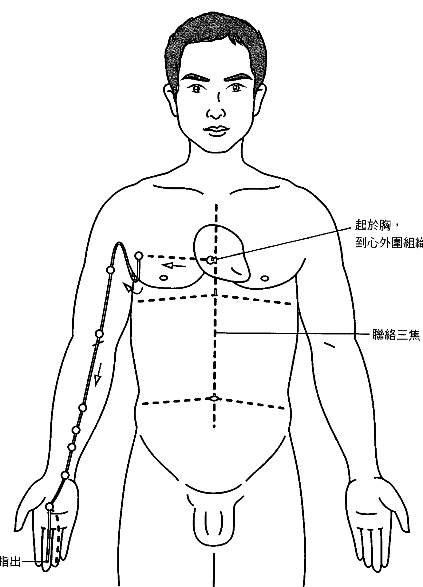

◇ 戌時真氣注於手厥陰心包經，隨呼氣由胸走手。它起於胸，到心外圍組織，向下從胸至腹聯絡上中下三焦。支流循胸一路沿上臂進掌，循中指出。

不管心包是有形的還是無形的，我們都可以糊糊塗塗地理解為它是位把心「包」起來的保護神，它的主要工作是保護心臟正常履行天子的使命。既然說心為君主，那麼就可以說心包為御林軍，《黃帝內經》說心這個君主「其臟堅固，邪弗能容」，邪氣攻擊不了堅固之「心」，自然就要攻擊它的週邊，所以心包是個代替心臟受邪的中南海保鏢。如果邪氣攻擊了心，人就會死亡。這是我們的老祖宗在數千年前就白紙黑字寫下來的。《黃帝內經》講得很清楚，邪氣若為心臟所「容許」的話，藏於心的神就會離去，神一離去，人就死亡（「容之則心傷，心傷則神去，神去則死矣」）。所以，要養生長壽，就不能不養心，要養心，就不能不養護好這位代君受邪的中南海保鏢！

如何養護呢？

還是要順天應時，因天之序善待這條經脈。古傳中醫有專門的方法訓練它。下面我們按慣例，先來談談心包經的大道之理，方法放最後。

戌時，晚上7點開始，太陽已經徹底下山了，天地陰氣正盛，人體這個小宇宙需要一點兒喜慶之氣來平衡一下過重的陰氣。所以這個時辰，順天應時的做法，就是讓自己快樂起來，畢竟這個時辰主事的老闆是心包，它的主要「發源地」就是我們上面所說的中丹田——膻中及其周圍，這位老闆喜歡快樂（誰不喜歡呢！）。《黃帝內經·素問·靈蘭秘典論》說：「膻中者，臣使之官，喜樂出焉。」歷代有不少人拍這句話的馬屁，解釋什麼「喜笑心火所司，喜樂之意，正與心應也」。說的就是膻中是喜歡快樂的保鏢，它的喜樂與它的後臺老闆心臟正好相應。

怎樣讓自己快樂起來呢？現在有一些養生名人主張這個時辰應該讓男女在一起……這是胡說八道，可見他們不懂得「順為凡，逆為仙」的道理。現代人的生活，在這個時間段倒是十分「正與心應」的，每次回大陸出差，總能看到一些朋友們喜歡在晚上這個時間段（戌時）出去 happy 一下，但是他們耗的太多。正確的做法是，盡可能找點能讓自己放鬆、感覺輕鬆的事兒來做，比如聽聽相聲看看小品，沏壺好茶看本好書，跟家裡人、身邊的人好好談談心。在「心法」上，要讓自己陽光一點，凡事往正面上想（positive thinking），此時陰氣盛，心裡陽光點，就是最好的「陰平陽秘」，而不是找個男人或女人去行男女之事。此外，平時待人處事，要多給人讚美、多給人鼓勵，給別人快樂的人，自己也會快樂，這是一個回報率特高的投資，何樂而不為呢？尤其是聽演講的時候不要吝嗇自己的掌聲，我們鼓掌的時候，要拍打到這條心包經呢。

## ◇ 甩煩惱心經密法

好了，傳個方法給大家在這個時辰練練吧，叫「甩煩惱心經密法」。

做法：

1. 兩腳略寬於肩站立，曲腿 52 度或 90 度（總之，腿得彎著點兒，想減肥的就彎成 90 度）。兩腳的腳趾「抓」地。
2. 兩手從體側自然舉至胸前，兩手十指自然鬆開，手心向地。
3. 然後想著中指、無名指好像要扯下一塊窗簾似的，往下、往後甩手，把手一直甩到不能再甩。

如此做個 108 次（也可做更多次）就可以停下來。如果能夠每天堅持做，49 天後，很多人會發現手上、手指上出現黑青黑青的顏色，不要害怕，那是身體在排毒和自我調節，尤其是心、肺不健康的人，會更加明顯。

如果不能站立、身體較虛、不能做激烈運動的人或者比較懶的人怎麼辦呢？

很好辦，坐在椅子上，兩手從自然下垂的最低位「立掌」——手心向地下，慢慢地把手拉上來，拉到不能再拉為止，拉的同時長長地吸氣，呼氣的時候配合著把手往地上放，同時發出鼻音「嗯——」，這個方法可以治療很多與心肺口舌鼻有關的毛病，先賢管這叫作「以音助氣立掌法」。一併供養大家。

那麼非常忙碌的都市人，沒有練功的「閒情逸致」的人，這個時辰做些什麼呢？哎，實在沒辦法，就打打麻將吧，既動手又動腦。要不就去卡拉 OK 唱唱歌，娛樂娛樂。更精進的人，就做個「健康」人，上慈下孝，做個好爸爸好媽媽好兒子好女兒，在這個時辰要著意去營造一個健康的家庭關係，一家人其樂融融最有利健康。

## 中醫解惑 Q & A

**友厘頭**：我比較愚笨不懂啥叫「立掌」，手掌怎麼個立起來法啊？「坐在椅子上，兩手從自然下垂的最低位『立掌』——手心向地下，慢慢地把手拉上來，拉到不能再拉為止……」這個拉上來是從身體前面往後拉呢，還是手臂往兩側拉呢，望您指點啊，謝謝。

**胡塗醫**：1. 立掌，相當於讓手掌與手腕垂直，成 90 度。在這個練習裡，是兩手自然下垂，手指頭從向下下垂的位置「立」向前方（雙臂仍然在體側）。
2. 拉上來，就是彎曲肘關節，彷彿雙手提重物般向上拉、垂直拉，不向前、不向後，就在自然下垂的基礎上直線往上（往肩膀的方向）拉。

**妖精**：我散步的時候也做類似的動作，就是聳肩（站立著做立掌）。做的時候我也是覺得，如果雙手是平放的，指尖就沒什麼氣感，但是如果手掌立起來氣感就很明顯。另外想問一下，先生說要堅持 49 天，如果中間間斷一兩天可以嗎？或者如果這個時辰練不了，換別的時辰練可以嗎？

**胡塗醫**：可以中斷。別的時辰練當然也可以。要「大氣」些看待，不要太拘泥於一格。

**沒名兒**：我太粗心了，「甩煩惱心經密法」已經練了 50 來天了，今天才發現我一直直著腿練的。晚上重新來過。

**胡塗醫**：沒有關係的，站著也沒問題。

**零點**：請教先生，甩手是一直彎曲著腿連續甩，還是甩一次站起來，再曲腿，再甩呢？
**胡塗醫**：一直彎曲著腿連續甩。

## 二十四小時如何過
——亥時養「三焦經」

亥時，即晚上 21 ～ 23 點。心法藥方：笑嘻嘻像中彩票，zzz 睡得像頭豬，盡量不要在這個時辰尤其是 22 點後行房。

亥時，人體的老闆是三焦。這個時辰人體的真氣傳注於手少陽三焦經。這條經脈隨著我們的吸氣，由手走頭。它起於小指次指末端，上行小指與無名指間，沿手背出小臂後側兩骨間上行，過肘尖，沿上臂後側向上過肩部，交出足少陽膽經後入缺盆，分布於膻中、散絡於心包，通過膈肌廣泛遍屬於上、中、下三焦。其支流，從膻中一路上項，繫耳朵後直上，繞耳後直上，出耳上角，屈下臉頰，再有分支從耳後入耳中，走出耳前至目（請見右頁手少陽三焦經圖）。

三焦的「名分」比心包好，但其「形狀」千百年來卻被爭論不休（所以學中醫千萬要博覽群書，不能偏信一人，包括本「胡塗醫」）。張景嶽在《類經·臟象類》便說三焦是實實在在存在的（「三焦者，確有一腑」）。可是有些攻擊中醫的人還是喜歡拿三焦來說事，因為西醫的解剖形態沒有三焦，這真是強人所難，中醫的臟腑概念與解剖學的臟器概念本來就不同。對三焦解剖形態的認識，歷來有「有名無形」和「有名有形」之爭。即使是形論者，對三焦實質的爭論，也無統一看法。用糊塗醫治糊塗病的思維方式看，只需要對三焦生理功能的認識一致就行，沒有必要做無益的爭論。

## 手少陽三焦經

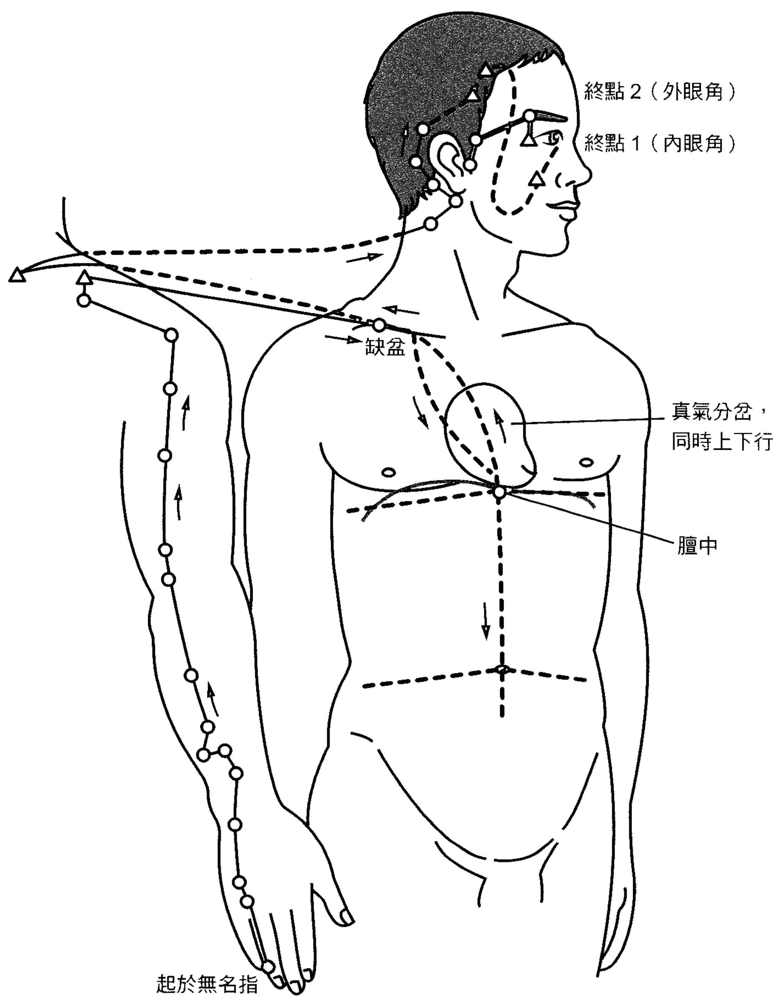

◇ 亥時真氣注於手少陽三焦經，隨吸氣由手走頭。它起於無名指沿上臂過肩，後入缺盆經過心，抵三焦。支流從膻中上項，繞耳下頰，再有分支從耳走目。

三焦是哪三焦呢？它們有何特徵呢？下面我就簡單介紹這上、中、下三焦：

1. 上焦：為膈以上的部位，包括心、肺；《黃帝內經·靈樞·營衛生會篇》說「上焦如霧」，因為肺司呼吸、心主血脈，心肺一起將飲食物所化生的水穀精氣輸布全身，如霧露一樣可以滋養全身臟腑組織。上焦若有「火」，表現出來就是口唇乾燥、口中生瘡、目赤腫痛、耳鳴等。
2. 中焦：為膈以下、臍以上的部位，包括脾、胃；「中焦如漚」，因為我們知道，脾胃負責腐熟水穀，運化精微，以化氣血（「漚」是飲食水穀腐熟時的泡沫浮游狀態）。中焦若有「火」，表現出來就是舌面生瘡，食不知飽，呃氣上逆，脘腹脹滿，不思飲食，口臭、口苦。
3. 下焦：為臍以下部位，包括腎、膀胱、大小腸等。「下焦如瀆」，因為膀胱和大小腸等是負責分清別濁和排泄大小便的（「瀆」指溝渠）。下焦若有「火」，表現出來就是大便乾結、小便短少、尿色黃赤、混濁味重。

三焦為什麼這麼容易火旺呢？大家別忘了，這條經脈叫作「手少陽三焦經」！所謂「少陽」就是小小的火、溫度，它保證了人體內部有一個相對恆溫的狀態，這個溫度如果過低或過高都不行，必須是「少陽」才剛剛好。因為人們難以順天應時做到「食飲有節，起居有常」，容易導致三焦失調、上火。《黃帝內經·素問·靈蘭秘典論》說三焦是人體的「水液運行」的通道（「三焦者，決瀆之官，水道出焉」）。濆之官，水道出焉」），這條「水液運行」的通道不暢通，人體還容易出汗，很多家長都抱怨自己的小孩子睡覺時出汗太多，有些小孩子流汗能把整個枕頭流濕掉，問題就出在三焦經上，所以這類孩子經常會口臭口苦，火氣較大。其實這個問題很好處理，父母在他們睡覺前，用手心從小孩子的心窩一直往下推到小腹49下，再給孩子捏捏手臂，平時多有意識地讓孩子發出「嘻嘻嘻」的讀音，也有幫助。中國字的「嘻」字一發音，就能調理三焦，洋鬼子可就沒這麼好的福報了。三焦經也被叫作「耳脈」，原因是這條經脈繞了耳朵半圈，人老了，耳朵不靈光，除了因為腎氣虛（腎開竅於耳），就是因為這條三焦經不通。現在的中年人尤其是更年期婦女非常容易出現耳鳴、突發性耳聾或聽力減退，很多是同樣的原因。

## ◇ 通三焦功法

三焦要如何調理以保證其暢通無阻呢？有兩個簡單的方法，在亥時可以做：

### 1. 「嘻」字訣

各家各派有不同的練法。教大家個簡單的：練之前想像自己剛剛中了大獎，發自內心地發出「嘻嘻」聲，不用去管呼吸。但以呼氣時念「嘻」為佳。很多父母在幫小孩子把尿的時候都會自發地長長地念「嘻」字訣，那個狀態就很好，「水道出焉」。

### 2. 一段錦

從宋代開始，醫家便流傳著「八段錦」，其第一段便是「仰托一度理三焦」，就是用來調理三焦的。這一小段，最適合在亥時做，方法：

- 1. 兩腳與肩同寬站立。
- 2. 兩臂自然鬆垂身側，然後徐徐自左右側方上舉至頭頂，兩手手指相叉，翻掌，掌心朝上如托天狀，同時順勢踮兩腳跟，再將兩臂放下復原，同時兩腳跟輕輕著地。如此反覆多遍。若配合呼吸，則上托時深吸氣，復原時深呼氣。

這個「仰托一度」的動作可以很有效地調理三焦。其道理何在呢？我們得從亥時的「亥」字說起。

《說文解字》在解釋「亥」字時說亥是「微陽起，接盛陰」，並說亥字「從二，二，古文上字。一人男，一人女也」。現在有些搞養生的人於是得出結論，這個時辰應該是男女行房的最佳時刻，西方人也認為晚上 10 點半是做愛的最佳時間。西方人這樣說就算了，畢竟他們不懂！如果搞中醫的也這麼說，那就真的太「業餘」了。亥時，人體隨著地球旋轉到背向太陽的一面，進入一天之中的「嚴冬」，在一天十二個時辰中，這是最後一個時辰，人體處於極陰階段，「陰極生陽」，好比太極圖裡，陰魚頭最大的地方（即最多陰的地方）有一個陽魚眼，也就是「微陽起，接盛陰」的道理，並不是說這個時候微微有點陽氣起來了，就得去找個女人行男女之事。現代的「養生家」們，大家還是少相信點兒吧，甚至從現在算起，倒推到 180 年前，這近 200 年的時間裡，中醫生們的話，大家以後馬馬虎虎參考參考就拉倒。在亂世中得真傳的太少了，與其跟著一班盲人去騎瞎馬，不如老老實實做人更能「養生」！如果大家對陰陽的概念不大熟悉，總該聽說「秋收冬藏」的道理吧？冬天是萬物應該閉藏的時間，人體到此時也應該閉藏，亥時是「微陽」，到了下一個時辰（子時），是「一陽來復」，陽氣開始真正地萌生、滋長，就更加要避免男歡女愛。社會上甚至有人在胡說能教人什麼「採陰補陽」，那真是騙人的鬼話，真有內證功夫的人，腎氣必足；腎氣足的人，壓根兒就可以不去想男女之事。

那麼這個「仰托一度」與「亥」字有啥關係呢？

對不起，一點關係也沒有！這個動作與「亥」字沒有關係，但與「亥時」有關係。我們上面說了，亥時，人體真氣傳注於手少陽三焦是調腎用的。在這個時辰裡做，既通三焦又強腎，最「應時」！僅此而已！

順便提一下，亥時對應著十二生肖中的豬，古人有「亥即豕」之說，豕就是豬，豬吃飽飯就睡覺，這個時辰最好能睡得像頭豬。

總之，要保持心境平靜，讓身心得到休息。實在睡不著，可以看看經書、寫寫日記、做做功夫。

對於那些晚上應酬和飯局實在推不開的人，可以把應酬的時間控制在 9 點多 10 點鐘之前，然後盡量避免把這個時辰消耗在卡拉 OK 和夜總會等喧囂不堪的場所，這對養生實在是大有裨益的。現在很多人一面耗著自己的元氣，一面卻又迷信市場上各種補腎補血的藥，實在是捨本逐末。

## 中醫解惑 Q & A

**在長白雲之鄉**：胡塗醫好，小兒4歲，睡覺時頭背全是汗，我用先生所教之方法每晚用手心給他從心窩一直往下推到小腹49下，再捏手臂，已經兩個月了，不見改善？另外他三四天才大便一次。他還有一個很不好的習慣就是老去摸他的小雞雞，有大半年了，勸導、責罵均阻止不了，我問他為啥要摸，他說「小雞雞很大」，難道這麼小就手淫？懇請先生指點，叩謝。

**胡塗醫**：1. 您做的方法不對，您用力太重，要輕撫著推。
2. 下次發現他去摸的時候，裝作沒看見，不要去勸導更不能責罵，在家裡內外也別提，一發現就馬上分散他注意力，讓他去做他平時最喜歡的事。
3. 平時多多有意無意，念佛給他聽。

**似水**：5歲小孩子容易大便乾結，尿液黃，家長給洗外陰時有油膩的感覺，是否尿液營養太豐富了（不愛喝水）？是否下焦有火？也可以練「仰托一度」嗎？

**胡塗醫**：不是尿液營養太豐富了，多半是脾腎兩虛。給她捏捏脊椎吧。

## 二十四小時如何過
——子時養「膽經」

子時，即晚上 23 點至凌晨 1 點。心法藥方：睡覺、「練」子時功，千萬不要在這個時間行房！

關於子時養生，可以說的東西太多了，我們這裡簡單談談。

子時，人體的老闆是膽，這個時辰人體真氣傳注於足少陽膽經。這條經脈隨著我們的呼氣由頭走足，它非常複雜。《靈樞·經脈》：「膽足少陽之脈，起於目銳皆，上抵頭角，下耳後，循頸，行手少陽之前，至肩上，卻交出手少陽之後，入缺盆。其支者，從耳後入耳中，出走耳前，至目銳皆後。其支者，別銳皆，下大迎，合於手少陽，抵於頰，下加頰車，下頸，合缺盆，以下胸中，貫膈，絡肝，屬膽，循脅肋裡，出氣衝，繞毛際，橫入髀厭中；其直者，從缺盆下腋，循胸，過季脅，下合髀厭中，以下循髀陽，出膝外廉，下外輔骨之前，直下抵絕骨之端，下出外踝之前，循足跗上，入小趾次趾之間。其支者，別跗上，入大趾之間，循大趾歧骨內，出其端，還貫爪甲，出三毛。」（請見 484 頁足少陽膽經圖。）

人秉天地之氣而生，天地陰陽流通演變，支配著人體的生理活動。子時正是天地陰陽演變的關鍵時刻，這個時候的養生就至關重要，不可不慎！

## 足少陽膽經

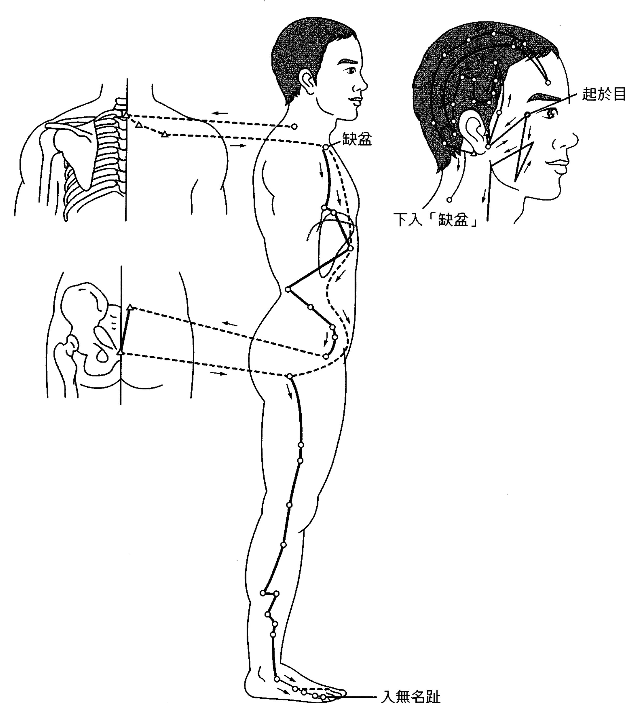

子時真氣注於足少陽膽經，隨呼氣由頭走足。它起於目，上抵頭下耳後，循頸至肩入缺盆，下腋，循腿骨出膝下踝入無名趾。支流下頸，合於缺盆，下胸貫膈，經過肝膽，繞陰部毛際，進入髖部。

國內現在有些養生名人說人體的生發之機是從子時開始的，這不能說不對，但是不太正確。我在上一篇文章裡談到，從亥時開始已經有「微陽起」，生發之機在亥時尾已經微微開始了，這就是「陰極生陽」的道理。事實上，一天二十四小時，時時刻刻都有生發之氣，否則我們還能活命？只是到了子時，陽氣已經開始重新到來（復來），古人叫作「一陽來復」。宋朝大儒邵康節先生有句千古名言「一陽初動處，萬物未生時」，說的就是一陽來復，在一年中是指冬至，在一天中就是亥時尾、子時初。因為此時天地陰極生陽，開始了一陽。所以這個時間如果不能靜坐用功，起碼應該處於睡眠狀態，才能偷得天地之先機，讓人身體與天地同步，進行陰陽大交換，接受天地間的「一陽來復」，培養元氣，守護先天真氣。

要解釋子時的「一陽來復」，就不能不解釋一下八卦中的「復」卦。復卦是《易經》六十四卦的第二十四卦，卻是十二辟卦之首。這個復卦坤上震下，畫成這樣：

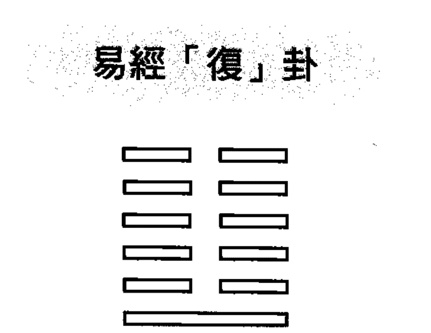

《易經》中的陰陽概念，在卦象上通過「爻」來表達，中斷的爻是陰爻，爻是陰爻（斷開的），最下面的一爻是陽爻，「一陽來復」就是說的這個卦象，陽爻這一「橫」，代表了生命的一個陽能，代表一個生命生發的力量，子時，天地和人體都從極陰處生起一陽。聖人說「道生一」，這個時辰就是「一」陽的開始。古傳中醫和道家都要求門人弟子在這個時辰練子時功，目的就是為了在這個時辰「奪天地之造化，侵日月之先機」，學古傳中醫的，甚至許多練內家拳的，這個時辰必定是用功的寶貴時間。對於一般現代人，這時間最應該做的事情是睡覺！同時避免吃宵夜、行房！

復卦在《周易》中的地位特別重要。古代明醫、大儒或道家的大師們，在教徒弟學《易》時，多從這個復卦開始教起，著名理學家朱熹的師父劉子翬先生在他的《聖傳論·顏子》中就指出，復卦是《周易》的門戶，學習《易經》應該從復卦這個門戶開始（「復卦易之門戶也，入室者必自戶始，學易者必自復始」）。現代著名學者馮友蘭教授指出：「一切事物皆始於復。《易傳》認此為宇宙之秘密。」這個秘密是什麼，馮教授沒說，我今天把窗戶紙點破了，就是一陽來復，生命生發之氣在這裡發展走向壯大！東漢末年的經學大師鄭玄老先生，是我十分崇拜的大師，他一生遍注儒家經典，以畢生精力整理古代文化遺產，我們今天的所謂「讀書人」跟他老人家比起來，真是羞愧無地！從他注釋「復卦」看，他是位真正懂行的人，他認為「復」就是「回來」，一天二十四小時天地運行到最後，因為陰氣侵陽，陽氣的地位丟失，直到這個時辰陽氣才回來，所以這個時辰非常重要（「復：反也，還也。陰氣侵陽，陽失其位，至此始還反」）。復卦的這一陽爻，實際上象徵陽氣回復，此一陽雖微，然而依據自然之理上行（陽氣升發），生命能量的復興之勢不可阻擋它，所以這個時辰的養生要點是千萬別損耗真陽。如果不懂練子時功，就應該進入深度睡眠，千萬別在這個「一陽來復」的時辰行房，消耗生命裡的那一點純陽，是要折「陽壽」的。不是我嚇唬大家，明朝著名道醫冷謙道長說得更狠呢：「切忌子後行房，陽方生而頓滅之，一度傷於百度……獨犯陰陽禁忌，不惟父母受傷，生子亦不仁不孝。」

這個時辰的子時功怎麼練呢？所謂「真傳一句話，假傳萬卷書」，我今天就給大家一句話：把自己的心念平息下來，聽其自然，念頭空了，「一陽來復」，進入虛無態，先天一氣自然來（這個「氣」，正確的寫法其實應該是「炁」）！

先天一炁是什麼？這是一個大問題。千古聖賢不輕傳！

你要等到心念止息下去才能體悟到。心念止息之後，心神也隨之進入恍惚窈冥的狀態，這個狀態下才能體察到。

為什麼呢？因為心念止息了，神才能凝住，神凝則氣聚，氣聚了就是「復卦」，一陽來復，生命就發展、升騰，身體自然就往健康長壽的路上走了，「道自虛無生一氣，便從一氣產陰陽」。現在很多養生名人都認為先天之氣是無法「補」的，那是因為他們沒有得真傳！先天之氣雖然無法通過「藥」補或「食」補來獲得，但是卻可以通過特定的方法訓練（比如練子時功）來「奪天地之造化，侵日月之先機」，培養、壯大這股能賦予萬物生命能力與活力的能量。

## ◆ 人體的活子時

以上說的是一天之中天地間的「子時」，其實，人體也有「子時」！而且人的身體，一天可以有多次「子時」呢，這是千古不傳之秘！

人體的多次「子時」，古傳中醫和道家高人叫作「活子時」。活子時是什麼時候呢？小小男嬰睡覺睡著睡著，小生殖器會翹起來，或者父母早上給他換尿片，他的小雞雞也會翹起來，小嬰兒可不懂得男女欲望，這「無欲而剛」的瞬間就是人體的「活子時」。這就是太上在《道德經》裡闡述的道理，小小嬰兒最飽含道德，最合於道，毒蟲猛獸惡鳥都不傷害他們；他們雖然筋骨柔弱，但懂得時時掐金剛印❷（關於「金剛印」請參閱〈人體有個拒絕病毒的開關〉）；未懂得男女欲望的事兒而能讓小生殖器剛硬起來，是因為先天之精氣到了，他們終日號哭聲音也不沙啞，也是因為這個原因。

在有些養生名人動不動就拿「凡十一臟取決於膽」來說事兒，但總不見他們說出個所以然，這不怪他們，他們的「學問」是從教科書上學來，不是「以身證道」得來的，自然說不明白。其實不僅現代的這些所謂的名家們說不明白，古代很多人也說不明白呢。可見學習中醫就像學習經濟學，很好「渾水摸魚」，不懂的人也可以儘管忽悠大家，真正懂的人多半沒時間去瞎忽悠。今天的養生名人動不動就上電視上媒體忽悠大家，大家馬馬虎虎聽聽就拉倒，不要太當真，請記住法國天才經濟學家提霍勒（Jean Tirole）的一句名言，以作提醒：一流的經濟學家都在埋頭苦幹做實業，二流的經濟學家都在大學裡帶學生，不入流的經濟學家才有時間上電視去瞎說。大家可以舉一反三，把提霍勒先生話中的「經濟學家」改為「現代養生名人」就行了。

我呼籲大家，學中醫要有一種「哥學的不是中醫，哥學的是道」的意志。要學，咱就學真傳的中醫，要把學中醫當成學道，去悟去實證，才有可能「為生民立命，為往聖繼絕學」！

## ◇ 凡十一臟取決於膽

自《黃帝內經·素問·六節藏象論》提出「凡十一臟取決於膽」的理論以來，千百年來也眾說紛紜，莫衷一是。膽的功能固然重要，但我們在前面的文章裡已經知道，「心為五臟六腑之君主」，而腎為先天之本，脾為後天之本，肺為相傳而主一身之氣，為何十一臟均不由其取決？現代養生家們如果不懂復卦、沒有實證的功夫，就無法說清楚。

我們知道，復卦是「一陽來復」，應在人體就是子時，我在前一篇文章裡說過，亥時是人體的「嚴冬」，子時則是人體的「初春」。初春是什麼？按照《黃帝內經》的話來說，春天是「天地俱生，萬物以榮」（「春三月，此謂發陳，天地俱生，萬物以榮」）的季節，初春是「少陽」，子時人體的老闆正是膽，這條經脈叫「足少陽膽經」。膽正是少陽春生之氣，它是「一陽來復」的開端，復卦的初爻（即第一爻，最底下那條）。正如「一年之計在於春」，春氣生則萬物安，膽氣於一天中的「初春」生，自然萬分重要了，這就是「凡十一臟取決於膽」的道理，並不是說身上的五臟六腑都得聽膽的！

當然，膽在子時這麼重要的時辰當老闆，它還是得有兩下子的。古傳中醫認為「肝與膽相連，附於肝之短葉間」，與今天西醫解剖出來的膽囊的概念基本相同，但是古傳中醫所說的「膽」，遠遠不只是膽囊。相同的我們就不去談了，下面我就簡單談兩點古傳中醫對膽的更深層認識：第一，膽主決斷、分勇怯。中國話裡的詞語諸如「膽量」、「膽識」，說的就是膽的「決斷」功能。而「膽大」、「大膽」、「膽小」、「膽怯」等等，說的就是膽的「分勇怯」功能。《黃帝內經·素問·六節藏象論》說膽是居中得正的官兒，任何決斷都是這哥們兒來做（「膽者，中正之官，決斷出焉」）。很明顯，中醫對膽的這個認識，已經不是西醫解剖學意義上的膽囊所能相比的了，中國的老祖宗對生命的認識，早已上升到精神領域的深層次上了。所以罵中醫的中國人實在該好好看看老祖宗的東西，懂的人不罵，罵的人不懂。順便說一下，中國人常常說「被嚇到睡不著覺」，就是因為膽氣虛弱，什麼人最容易長期失眠？終日「提心吊膽」的人！什麼人能一碰到床就睡？多半是膽氣足的人。電視劇《長征》裡敵人的飛機在屋頂上飛，警衛員緊張得不得了大呼敵機來了，毛澤東卻滿不在乎說「不還沒炸嘛」，蒙起頭來就想繼續呼呼大睡，這是何等的膽識過人！

第二，膽與肝是一個戰壕裡的兄弟，肝膽解剖位置毗鄰，兩者的關係比僅通過經脈互相絡屬的臟腑更為密切。膽與肝這兩兄弟互相協調，哥們兒之間的關係十分清淨。肝像個將軍，負責謀慮；膽是善於歸納總結而且比較中正的官兒，負責做決定。《素問·靈蘭秘典論》中有關肝膽的調控神志功能有這麼一句話：「肝者，將軍之官，謀慮出焉。膽者，中正之官，決斷出焉。」所以中國話裡的「肝膽相照」，說的就是這個道理（在國外待了這麼多年，我一直找不到合適的外文來準確表達「肝膽相照」的意思）。中醫認為，大小腸、胃、三焦和膀胱裡裝的都是「濁」的髒東西，只有膽裝的是清淨的膽液。明朝大醫張景嶽說膽是位中正的官兒，它貯藏清淨的膽液，所以說它是清淨之府（「膽為中正之官，藏清淨之液，故曰中清之府」）。當然，這不是老張的獨家發明，《黃帝內經·靈樞》早就說過膽是「中精之府」，《難經》也說膽是「清淨之府」。不過我似乎至今還沒聽誰能清楚解釋為什麼膽液是清淨的。道理很簡單，膽液（即我們平常說的膽汁）的狀態就是膽腑的狀態，它本身的特點是「藏而不瀉」，負責協助肝來做決斷。決斷不僅有情志上的決斷，而且有生理上的決斷，主要是協助肝主疏泄促進消化飲食，運化水穀精微，只有清淨的膽液才不致聚液成濕成痰，而且，膽液的氣味是苦的（要不然勾踐也不會「臥薪嚐膽」了），它沒有其他體液的腥臭之味。當然，這是胡塗醫的糊塗解釋，不一定對，歡迎行家賜教！

順便提一下，有人平時看上去面目乃至全身發黃，或者常常口中發苦，常口吐大氣、大聲歎息，甚至嘔吐苦水，一定是膽火上逆，若有條件可在自家的花園裡栽些山梔子花。

順便教大家一個非常「簡單」的醫家祕傳動作修理膽經，對於需要上夜班、子時不能睡覺的人非常有幫助。

**方法：** 把左腳搬到右腿內側（筋骨太硬的人不用搬太近右腿內側），左手握空心拳，從臀部沿著大腿外側敲打大腿，一直敲到膝蓋，甚至連小腿也可以一併敲下去，敲打個3分鐘後，再把右腳搬到左大腿內側，依樣畫葫蘆也敲上3分鐘。

以上方法「嚴重」適合現代白領階層，在辦公室裡時不時敲它幾分鐘，尤其是中午的時候，可以多敲打敲打。大家別小看了這個簡單的方法，它可以治療很多毛病，同時能減掉大腿的肥肉呢。

## 中醫解惑 Q & A

**癡迷中醫**：男嬰有顯著的特徵表明人體活子時，那女嬰如何呢？特請先生指點！

**胡塗醫**：一陽初生來自何方，還是要有自我體證才能知道。舉男嬰的例子，只是為了說明一陽來復。事實上，男嬰在8歲以前，女嬰在7歲以前，都是八卦中的乾卦。

**初入杏林不知返**：先生好。先生回答「癡迷中醫」的提問時說過：事實上，男嬰在8歲以前，女嬰在7歲以前，都是八卦中的乾卦，但是在〈法於陰陽，和於術數〉的正文中，卻說「從十二消息卦看，人從呱呱墜地開始，每經過32個月，腎中增加一陽，到了16歲的時候，人體從原來的純陰坤卦，變為純陽的乾卦」，似乎有些矛盾之處。是我理解得不對嗎？煩請先生指點。

**胡塗醫**：沒有矛盾。一個是從身體的氣機看，一個是從十二消息卦看。

**瘋狂大花神**：如果子、午、卯、酉就是活子時，那就不活啦！我給點一下吧，望胡醫指正。你是否有某個時候忽然感到全身有種酥酥的，很舒服的，充滿了真氣的感覺呢？甚至會出現想人間好事的情形？可能練過氣功的人體會較深，這時候要抓緊時間把氣引到丹田或你想讓它所歸的地方。

**胡塗醫**：哈哈，還是花神厲害！「活」就因為不是「死」的。不能再泄天機了。

**中意還是中醫**：如胡先生所說，人體既是一個小宇宙，那一陽來復應該來自體內，其餘還是沉默的好，個人拙見，呵呵。

**胡塗醫**：既然您這麼好奇，我就再說明白點，聽好了：不來自體內，不來自體外。

**新浪網友**：會陰？

**胡塗醫**：的確有人認為是會陰，藏傳佛教中也有人認為是海底輪。總之，都對都不對啊。

**如水幽蘭**：「活子時」是否就是子時時分？心靜向東，自有「紫氣東來，心悟自取」，自造化陽氣。但子時卻是應該深度睡眠才好。不得瞎猜，用心體證為上。見笑。

**胡塗醫**：相差不止十萬八千里。

**夜未央**：「一陽欲動子時活」，慢慢悟吧。

**胡塗醫**：這句話有水準。

**相心泥巴**：先生好，如果子時深度睡眠算不算進入虛空狀態，先天之炁會到來嗎？還有此時的先天之炁是天地之氣嗎？

**胡塗醫**：這個問題問得好！但問題就在「深度睡眠」！此時人無知覺。不過已經很「像」那個虛無狀態了……

**育化**：前幾天在校園內散步，心裡想著修煉的事情，想起了：心有靈山莫遠求，須向靈山塔下修，這時也不知從哪裡來了一股氣突然充滿了小腹，小腹就像一個充滿氣的氣球，我心裡想難道這就是氣從虛無一處生嗎？心裡想著保持那種狀態，心念一動那股氣也就沒了。請教先生，這能算是您前面文章裡提到的先天之氣從虛無中來的那種氣嗎？謝謝先生，阿彌陀佛。

胡塗醫：不是。驗證是否先天一炁很簡單，看看能否把家裡的鎖頭用「意念」打開，或者能否把不鏽鋼的勺子想彎。如果能，那就是；如果不能，就不是。

## 二十四小時如何過
——丑時養「肝經」

丑時，即凌晨1～3點。心法藥方：能睡就睡，不能睡就躺著！不要熬夜、熬血。

丑時，人體的老闆是肝。這個時辰人體的真氣傳注於足厥陰肝經，這條經脈隨我們的吸氣由足走腹。它起於大腳趾叢毛之際，上循足背內側一路上行至大腿內側，再沿著大腿內側，分布於陰毛部位，繞過陰器，到達小腹，挾著胃的旁邊，屬肝、絡膽，再向上貫穿膈肌，分布在脅肋部，沿著喉嚨的後邊，向上進入鼻咽部，聯繫眼與腦相連的組織，上出額部，與督脈在頭頂會師。其支流從肝分出，貫穿膈肌，進入肺中，另外一支流不會於巔頂，但從目下面頰裡環唇內（請見497頁足厥陰肝經圖）。

中醫對於肝的認識，常常被西醫及反中醫人士攻擊，這篇文章我們就來做做「平反」，並惡補一下中國傳統文化。

我們知道，子時，人體「一陽來復」，陽氣開始在體內生發。中國文化講究的是一個「中」字，凡事不要太「過」，怎麼講？在一陽來復的時候，我們要睡覺來讓人体真氣跟天地一起生發，而不要去行房、熬夜，耗費了它。到了丑時，陽氣已經生長起來了，我們還要「潛龍勿用」，繼續睡覺，不讓陽氣散發掉，這樣才能養好氣血。肝氣主生發，在它生發的時候，我們最好啥也不幹，讓它放鬆了去生發，所以才要睡大覺，好讓肝完成非常微妙的禦侮抗邪、情志調節的工作。古傳中醫說肝是大將軍，可抵禦外敵（「肝者將軍之官，其氣剛強，故能捍禦」），這講的就是，肝是人體的化工廠，負責對體內的各種物質進行分解合成、解毒和排泄。

肝的解剖位置在右肋下，這是反中醫人士攻擊中醫的一大話題。因為中醫有「左肝右肺」的說法。在解釋這個說法之前，我們得惡補一下五行的知識。

我們的老祖宗把人體當作一個小宇宙來看，人體這個小宇宙與天地這個大宇宙相對應。人體內的五臟六腑、五體五官，對應著自然界的五方（東西南北中）、五味、五色、五音和四季等等。所謂五行，是老祖宗在對宇宙萬物進行宏觀分類、歸納、組合並表述它們之間相互聯繫，生剋制化、循環運行的五大類物質。這五大類物質就是大家耳熟能詳的五行——木火土金水。太上在《道德經》裡說「道生一，一生二，二生三，三生萬物」，說的就是宇宙未生之前，已經有了一個現代天體物理學所說的「混沌蛋」（能量團），聖人說的「有物渾成，先天地生」就是這東西，這是「道生一」；這個能量團「周行不殆」地運行，能量高度集中時產生了現代物理學所說的宇宙大爆炸，清陽上升、濁陰下降，這就是「一生二」；之後由於天地陰陽交媾而產生萬物，這就是「三生萬物」，而這個「三生萬物」的「萬物」，其實就是五行。

為什麼是這五種物質呢？中國文化的一個最大特點是，根據事物的特性對萬事萬物進行取象類比，這五種物質就是老祖宗對宇宙萬物取象類比的結果。簡單來說，樹木有向上生長和向外舒展的「象」，凡是具有生發、條達、舒暢和伸展等屬性的事物，都歸屬到「木」類。而火有溫暖、上升的「象」，凡是具有溫熱、升騰、活動、上升屬性的事物，都歸屬到「火」。土有孕育、滋養的「象」，是大地萬物生長的基礎，凡是具有承載、受納、孕育、生化屬性的事物，都歸屬到「土」。金有沉重、沉降、收斂和穩定的「象」，凡是具有清潔、肅降、收斂等屬性的事物，都歸屬到「金」。水有滋潤、向下、寒涼的「象」，凡是具有寒涼、滋潤、向下運行屬性的事物，都歸屬到「水」。

## ◇ 五行生剋是為了達成平衡

五行對應在五臟上，就是肝屬木，心屬火，脾屬土，肺屬金，腎屬水。它們之間逐一相生，隔一相剋，相互依存，同時又會相互制約。

## 五行生剋關係圖

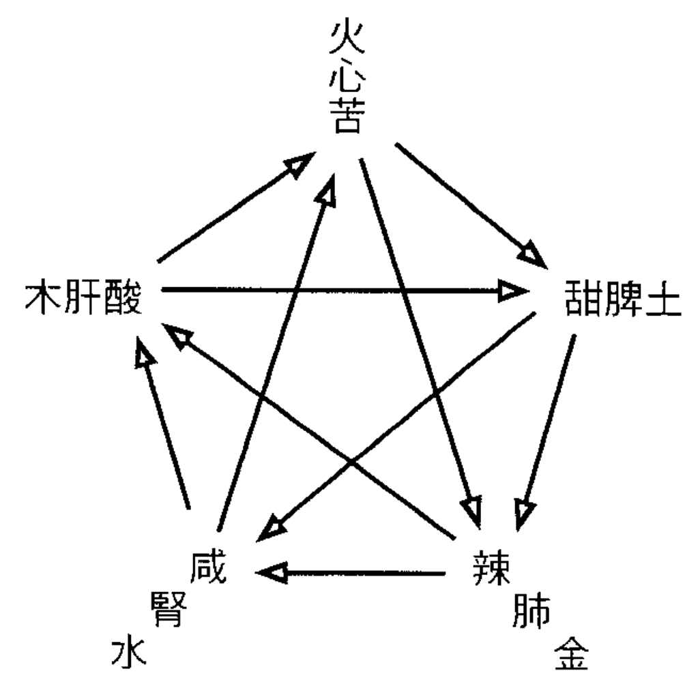

◇ 五行對應五臟。五行間的相生關係是：木生火，火生土，土生金，金生水，水生木。

五行間的相生關係是：木生火，火生土，土生金，金生水，水生木。如何記住這個相生關係呢？可以這樣理解，木頭可以生火，火燒後就會有灰燼最後變成泥土，大地泥土底下孕育埋藏著各種金屬礦藏，在五臟上就是：肝生心、心生脾、脾生肺、肺生腎、腎生肝，相生關係使得各臟器能得到其他臟器對它的滋養，從而可以發揮出最佳的功能狀態。凡是「生」的就是「母」，被生的當然是「子」。母旺則子盈，母虛則子虧，好比父母有錢，子女不窮。算命的常說，某個人適合在某個行業發展，就是根據該行業的五行與這個人的五行屬性是否相生來判斷的。有些網友給我「說中」了一些事情後非常震驚，其實我壓根兒不是啥大師，只是略懂一點陰陽五行的道理而已。古人能夠「不出戶，知天下」，就是因為先賢們學通了中國文化。

五行間的相剋關係是：水剋火、火剋金、金剋木、木剋土、土剋水。這個也不難理解，水能滅火，金屬做的刀鋸可以伐木，樹木要從泥土裡吸收營養，水來土掩，做一番這樣的取象類比就可以記住了。對應在五臟上，就是腎剋心、心剋肺、肺剋肝、肝剋脾、脾剋腎。所謂相剋，是指一事物對另一事物的生長和功能具有抑制和制約作用。現在談論五行相生相剋的人多，能說出個所以然的不多。其實相生中也有相剋，相剋中也有相生，知道這個道理的人不多。事實上，相剋有時是為了更平衡地相生，好比父母責罵孩子是剋，這個剋就是為了生，在家庭上是這樣，在治病上也同理，學中醫就要這樣學才能「通」。所以說「上醫治國」是不無道理的！大道之理悠然，天下的道理都是相通的。

那麼為什麼中醫說「左肝右肺」呢？往學理上說，原因就出在「肝屬木」上，木有生發舒展的特性，應在五方就是東方，古人看地球，是左為東方，右為西方。東方在風水學上是青龍之位，所謂「左青龍，右白虎」，所以中醫才會說「左手心肝腎，右手肺脾命」。而且中醫所說的肝，是指肝經、肝氣，肝經不僅身體右邊有一條，身體左邊也有一條，而肝氣主要行於肝經，那麼說肝在右邊固然是對的，說肝在左邊也無不可。基於文化習慣，說肝在左邊就在情理之中了！所以那些用這一點攻擊中醫的人，顯然對中國傳統文化瞭解太少，咱不怪他們。

以上談的是五行，現在接著談談肝。肝有主藏血為體陰，行疏泄而用陽的生理特點，肝與膽相表裡，「肝膽相照」。

## ◇ 肝屬木、主血，所以熬夜容易血虛

肝的這種疏通開滯、舒利條達、喜歡向上向外伸張的特性如樹木，古人把肝歸入「木」類顯然是高明的。肝在人體內主血。血液化生後貯藏於肝臟，根據人體需要向全身輸布，以維持各個臟腑功能及全身筋骨運動。在這個肝當人體老總的丑時，我們最應該做的事情是躺下睡覺，哪怕不睡也最好躺著休息。為什麼呢？因為人躺下來的時候，血就歸於肝臟，血歸於肝臟，眼睛、手腳、全身臟腑和筋骨才能得到血的滋養，這一點《黃帝內經·素問·五臟生成論》在幾千年前就說得很清楚了（「故人臥血歸於肝。肝受血而能視，足受血而能步，掌受血而能握，指受血而能攝」）。我們知道，人一動，氣血就加快，所以如果受傷出血，一般都不能亂動，古人說「人動則血運於諸經，人靜則血歸於肝臟」。現代人尤其是坐辦公室的高薪白領們，很多人面有菜色，一看就是氣滯血虛，這是因為他們經常熬夜，血沒藏養好，血藏不住就會血虛甚至失血。可以說，熬夜就是在熬血！尤其是丑時，如果不睡大覺，就是在跟自己的肝、血過不去！我有一個愛喝茅臺酒的朋友告訴我，貴州茅臺鎮得肝癌的人口比率為全國最低，因為「茅臺酒喝得多」。這多半是愛喝茅臺酒的人給自己編的擋箭牌，如果茅臺鎮的人得肝癌的人比全國其他鎮的人少，那只能說明他們比全國其他鎮的人睡得早、酒喝得少喝得好（至少假茅臺少些），過量喝酒絕對是傷肝的。

要養肝，就得順著它老人家的性子來。肝喜歡條達舒暢，討厭抑鬱遏制，你就得往這方面做文章才行！怎麼做呢？

一方面是在情志上調，另一方面是根據五行的道理來養！

## ◇ 肝氣過亢易怒，肝氣不足易恐

在情志上，要注意培養柔和舒暢的品格，避免「大動肝火」的暴怒，避免抑鬱，這樣就能在「精神上」支持肝去行使其疏通宣洩的功用。大怒雖然要避免，但我們畢竟是凡夫俗子，生活中難免遇到非要我們發脾氣不可的時候，如果是這樣，那也不要硬憋著。因為憋著就是「遏制」，遏制是肝所不喜歡的，反而傷肝。當然，最好能懂得時時在心中有個「回轉」，把不好的想成好的，讓心去轉境而不要老讓外境來影響我們的心情，這需要不斷「修行」。如果您身邊有人在一段時間內總愛莫名其妙發脾氣，稍微有點兒不爽的事就大發雷霆，那您要明白，這哥們兒是傷著肝了，他多半只是因為工作壓力太大、熬夜太多。那時您就不要跟他過不去，用一顆柔軟的心去對待他，讓他盡量舒暢心情，同時鼓勵他在丑時一定要躺下來休息。自古良醫都講究身心並治，這就是身心並治！

順便說一下，肝喜歡條達舒暢的秉性與春天生發之氣相應，我們不應該壓抑其生發的氣機，但也不宜過亢。肝陽過亢的人，性格必定急躁易怒；肝氣不足的人則不敢承擔，容易膽怯恐懼。也正因為肝在四季應春，很多人容易發生肝陽上亢，如果您身邊有人常常頭暈目眩、眼目紅腫、兩肋脹痛、性情煩躁，就是典型的肝陽上亢的症候。您可以教他沒事就念「噓——呵——吹」三個字，念的時候最好別出聲，吐氣加上口型就行了，很適合在辦公室裡練。

「噓」字可以平肝氣，「呵」字能夠去心火（心屬火，肝屬木，木生火，「實則瀉其子」），「吹」字潤腎（腎屬水，水生木，腎為肝母，「虛則補其母」）。春季正是養肝的黃金季節，這個季節一定要保證丑時有好覺睡，而且最好能少用眼，平時上班對著電腦是沒辦法的事，連續劇就一定不要追看了，博客也少寫些。因為肝開竅於目，眼睛看得多了，就傷肝，因此在春天要經常閉目養神，我在前面文章裡（午時養生）提到的「午睡山寨版」中的熨眼睛方法，其實就是養肝的妙法。

從五行上看，肝屬木，肝這棵樹木要得到滋養，必須擁有足夠的腎水和不多不少的優質脾土，這樣肝木才能茁壯成長！也就是說，養肝要從補腎、健脾做起。這絕不同於西醫的頭痛治頭腳痛治腳。大家可能經常聽到「被某某氣到吃不下飯」，為什麼人生氣了容易吃不下飯呢？生氣傷肝，肝木過旺就要過度地剋制脾土，從而影響脾的運化功用，自然容易氣到吃不消了。這就是五行的道理！

那麽從五行的道理來看，如何補肝呢？對不起，肝損了就損了，它只能養不能補。肝為將軍，大將都是可殺不可辱、寧死不屈的，所以大家以後不要折磨肝了，丑時好好睡覺，平時好好調養情志。順便提一下，大家以後如果聽說什麼什麼補品可以補肝，就不必再花冤枉錢了，天下沒有補肝的藥！最簡單的養肝方法，就是少喝酒多睡眠，少用眼多養神。那麼平時應酬多、工作忙，要常加夜班的現代人怎麼辦呢？很好辦，我教大家一個簡單方法，在辦公室裡就可以做。

## ◇ 踩太衝穴養肝法

要求：

- 1. 你沒有腳氣，不會薰倒同事。
- 2. 你脫掉鞋子，不會「不雅」。

方法：把皮鞋脫了，用右腳跟去蹭去踩左腳背，從腳脖子沿著大腳趾蹭過去，到了大腳趾頭與第二腳趾之間的地方狠狠踩下去。折騰三五下之後再換腳做。

這個簡單的方法可以非常好地養肝，而且能養個好脾氣呢！很想發脾氣的時候這樣磨蹭一下就發不了脾氣了。發完大火也可以這樣「補救」一下。為什麼呢？道理太深了，簡單講，肝經起於大腳趾，我們一路踩下去會打通太衝穴，它是我們肝氣衝動的開關！古傳中醫認為「肝主身之筋膜」，肝氣表達於腳和手，肝經的變動為握，所以人一生氣才很容易握緊拳頭，我們這樣蹭一蹭、踩一踩，就是要「踩平」肝氣！這個方法對廣大女白領更加重要，建議女同胞們每天在辦公室裡多這樣蹭踩幾回。道理很簡單，肝經與衝任二脈相通，肝的疏洩功能是通過衝脈和任脈來進行的。衝脈為血海，任脈為胞胎，女子的毛病基本都能從肝經及任衝二脈上找到原因。比如現代女性常見的乳腺增生，就是鬱造成的，一鬱悶就肝鬱氣滯；肝鬱氣滯，衝任二脈就無法履行肝經交給它們的疏洩任務，就會在乳房形成增生。所以治療乳腺增生，非調肝經不可，我們這個小方法能非常有效地防治這個毛病。事實上，在發育的時候如果能懂得這個蹭踩方法，長大了就不用去做隆胸手術了。古代文學作品中描述婦女「月經不調」時，會很文雅地說「衝任失調」，說的也是這回事兒。古傳中醫有「女子以養肝為先天」之說，是有深刻的道理的。

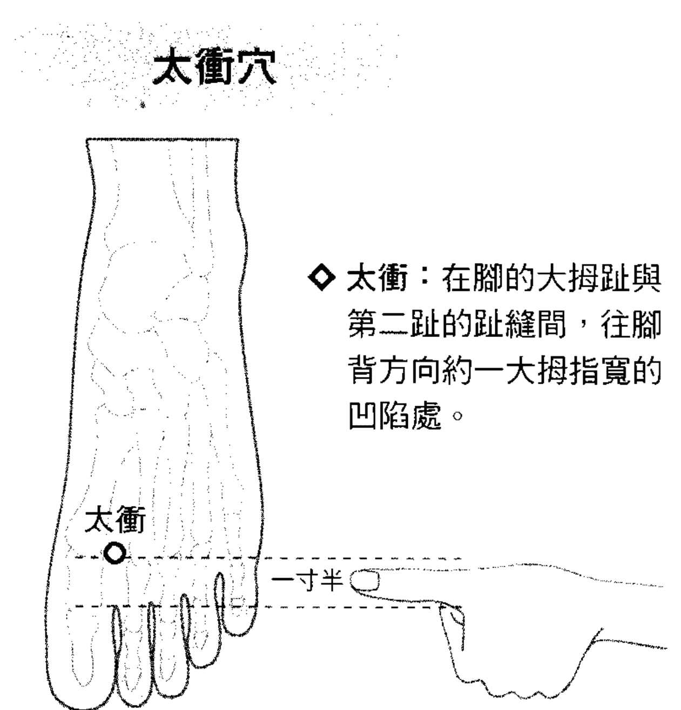

差點兒忘了，有一位網友催我寫這篇文章，想瞭解皮膚搔癢是否與肝風有關。順便談談肝風。自從《黃帝內經》說「諸風掉眩，皆屬於肝」之後，幾千年來的中醫們便「發展」了一系列肝風內動之說，把本來很大氣很宏觀的中醫發展得既微觀又小氣，我一直對這個觀點不以為然。皮膚搔癢如果伴有肢體麻木、關節拘急，一般認為是血虛生風引起。血虛，當然是肝經、衝任的問題了。調理的思路應該是息風補血，建議這位網友這些天多些躺著養肝血，同時配合靜坐，呼氣的時候把注意力集中在心窩，累積用功10個小時試試。至於箇中道理，大家可以討論討論。

此外，還可以多按摩太衝穴（在足背，當第一、二蹠骨結合部前方凹陷處），它是足厥陰肝經的原穴，有疏肝利膽、息風寧神、通經活絡的作用。

**補充說明：** 丑時尾，人體真氣開始準備傳注於手太陰肺經。這一股從子時的「一陽來復」生發起來的生命陽氣，到丑時的生長伸展，至寅時，即從凌晨3點開始，已經頗具規模的了，所以我們這一系列文章才從寅時開始寫起。因為我特別提到要避免或杜絕在亥時和子時這兩個時辰行房，有幾位網友問一天之中什麼時辰行房最好。這個方面我是外行，不敢亂說。按學理，子午卯酉四個時辰和亥時尾（晚上22點後）是應該盡量避免房事的，尤其是正子時，要徹底杜絕。但對於現代人，一天下班回到家，忙乎完吃飯、孩子、家裡人，一天都快過去了，如果這幾個時辰都不能行房，限制就大了。怎麼辦呢？我只能說個大原則，如果是想要孩子的年輕夫婦，可以選在週末，在亥時入睡、丑時醒來進行，以保證有足夠的時間休息。為什麼丑時比較適合呢？古人講房事最好在「夜半後，雞鳴前」，古人睡得早，到了子時已經睡了快一半了，所以夜半後雞鳴前也應該是丑時開始之後。大家看看丑時肝經的走向，左右兩條肝經繞著陰部走了一圈，而且肝是將軍之官，有耐力持久之象。古聖先賢認為，女子月事後的15天半（也有認為3天半後）的丑時受孕的孩子會健康長壽、孝順正直，在學理上也說得通。總之，不邪淫（不在夫婦以外行淫）、不縱欲，無疑是正確的。

## 中醫解惑 Q & A

小王：認真學習了，謝謝！文中「說肝在右邊固然是對的，說肝在左邊也無不可」，能理解為左邊也有一個無形的肝嗎？假如是的話，會不會出現肝病在左腹也會出現疼痛的現象？

胡塗醫：的確如此！肝陽上亢的人，兩肋都會脹痛，就是因為肝氣也走左邊。我們老家那邊一些學內家拳的有一招制敵的絕招，就是攻擊「左肝」的，可見肝在左邊的道理也被運用在武術上呢。

友厘頭：學習啦，謝謝老胡。我讀完後還沒完全消化，還有疑問就是：沒事就念「噓——呵——吹」三個字，前面兩個字都蠻好理解的，因為發音後能比較直接地出氣，但就最後這個「吹」讀 chui，這個音是繞彎的哦，似乎感覺那氣也並沒怎麼發出啊，你說的那個「吹」字到底是讀音是 chui，還是嘴巴吹氣發出輕輕的「呼」聲呢？另感覺那五行圖片當中那個辣，是不是和辛有點點區別呢……請老胡指點，謝謝啊！

胡塗醫：要的就是 chui 這個音的口型啊，經絡敏感的人能夠體會到腎在動。

痴迷中醫：針對先生文章中的圖示，我還有一個一直不解的問題：例如肝，味酸，那酸味的食物到底是傷肝還是養肝呢？

胡塗醫：謝謝提問！酸味的食物可以傷肝，也可以養肝，就看怎麼用了。中醫確有「酸入肝，苦入心，甘入脾，辛入肺，鹹入腎」之說，但中國文化就是講究一個「中」字，不能偏勝。時下的一些養生名人學問沒做通，總鼓勵肝有毛病的人多吃酸的東西，這是錯的。大醫李時珍老先生在《本草綱目·五味偏勝》裡說得很明白：「酸先入肝……久而增氣，物化之常；氣增而久，天之由也……氣增不已，則臟氣偏勝，必有偏絕；臟有偏絕，必有暴天。」

所以真正深入醫道的人，不敢輕易給人治病、用藥，好比內家拳練得好的人輕易不敢跟人打架。我認識一位元內家拳高手，在北京中日友好醫院附近遇到小流氓搶單車，「灰溜溜」交出單車就走人，我撫掌大笑，只有絕頂高手才有這樣的量度。

現在是春季，萬物發陳，酸主收斂，所以春天要適當避免吃太多酸的東西，到了秋天則可以多吃點兒酸的東西。

## 夏季養生，無厭於日

有位網友問我，如何理解「夏三月，此謂蕃秀，天地氣交，萬物華實，夜臥早起，無厭於日」。

這句話講的是夏季如何養生。這篇文章就談談古傳中醫對夏季如何養生的看法。

上面這句話的原文出自於《黃帝內經·素問·四氣調神大論》，完整的句子如下：

> 夏三月，此謂蕃秀，天地氣交，萬物華實，夜臥早起，無厭於日，使志無怒，使華英成秀，使氣得泄，若所愛在外，此夏氣之應，養長之道也。逆之則傷心，秋為痎瘧，奉收者少，冬至重病。

下面是胡塗醫版的白話文翻譯，歡迎大家批評指正：

## ◇ 夏季養生採足陽氣，不貪涼，不怕熱

夏季這幾個月（古時是指農曆四、五、六這三個月，事實上現在的夏季要稍微長些了）是天地「蕃秀」之時。「蕃」是繁榮茂盛，「秀」是精氣外達，怎麼知道呢？因為此時天地之氣相交，陰陽相交，天氣垂降，地氣升騰，萬物該開花的開花，該結果的結果。因天之序，合道而行的做法是，不要貪圖陰涼，多採天地之間陰陽相交的能量與陽氣。如果不懂得怎麼做，那麼簡單來講，就不要睡那麼早（古人沒有電視電腦，早早就洗洗睡了），以便採足陽氣；早上起早點兒，別睡懶覺，這樣就是「無厭於日」——不白白浪費夏日好時光。把陽氣採足，使心裡陽光燦爛，不要使真氣運行不暢、鬱結，要像夏季這幾個月期間天地的繁榮蓬勃一樣，讓身心生氣條達，也要像萬物開花結果一樣，讓生生不息之真氣四通八達；不要壓抑著它，讓陰陽兩氣在體內聚能結丹，通靈頓悟。同時，夏天還應該盡量讓體內的病氣濁氣疲勞之氣排出體外，該文學文學，該出汗出汗。

普通老百姓該如何做到不貪涼，不怕熱呢？那就想像著您有貴重之物在外面放著，您就只好早出晚歸，盡量出去採足陽氣，別整天躲在陰涼的家裡貪涼，盡量少用空調（當然，那個年代沒有空調）。這樣才能使人體真氣與夏季之氣相應，這樣才暗合養生益智之道。不這樣去合道而行，則會傷著我們的身心，到了秋天啊，身體就容易有寒熱往來之病，秋天之金氣肅降就會乏力。夏秋之交，很多人都會咳嗽甚至上吐下瀉的，就是夏天貪涼惹的禍，出來混，遲早是要還的嘛！到時若還不懂得調理，冬天一來，病情就會加重。歷來冬至前後病死的人較多，其根源就是夏天貪涼沒注意養生，秋天沒啥東西讓肺部的金氣收斂氣機，當冬天來臨，身體氣機需要在您自身元氣收斂後轉而生發起的時候，「一陽來復」來不了，冬至自然就病重去見阿彌陀佛了。

很明顯，上面這些話說的是夏天的養生之道。其關鍵之處就是：1. 順天應時，採足陽氣。2. 不貪涼。3. 秋冬之病，可以在夏天調理。

治之。

下面我就侧重讲讲「夏不贪凉」。因为别的都好理解，现代人最贪凉，许多人没有空调简直没法活，不来点冰镇饮料、冰淇淋之类的东西仿佛夏天就无法过。

## ◇ 夏不贪凉，特别注意不贪冷饮、冷气

我们知道，夏天在五行中属「火」，在五脏中，「心」属「火」，所以夏季对应在人体的五脏，就是「心」。火旺自然就要「烧」掉一些「水」，水是哪一个脏腑呢？没错，「肾」！所以古传中医认为，夏季心火旺、肾水衰，哪怕是大热天，也应尽量避免吃冰冷的东西。全真七子之一的丘处机道长甚至规定门人弟子，不许在夏天吃凉粉、凉粥呢，这哥们儿在《摄生消息论》里这样说，夏天不宜吃冷淘冰雪、蜜冰、凉粉、凉粥，理由是「饱腹受寒，必起霍乱」。可见自古医道不分家！比丘处机道长早些年的北宋医学家陈直先生更彻底，这位医家大孝子甚至连搧风取凉、屋檐下纳凉都禁止了，他老兄在《养老奉亲书》里说，夏月暑热，不宜在屋檐下、过道处乘凉，露天躺在外面看星星数月亮的浪漫之举更是使不得，至于睡着让人搧扇取凉，更容易招致邪气入病（「不得于星月下露卧，兼使睡着，使人扇风取凉」）。如果夏天贪凉，逞一时之快，容易让邪风进入组织肌肉甚至骨髓里，轻则恶寒头痛、肌肤发热、关节酸痛，重则诱发中风、偏瘫等严重病症（「一时虽快，风入腠理，其患最深，贪凉兼汗身当风而卧，多风痹，手足不仁，语言謇涩，四肢瘫痪」）。

这听起来似乎相当严重，现代人是不大愿意相信的。有人甚至会反驳古人的说法，认为现在人人用空调，个个吃雪糕，不也没事吗？有那么严重吗？

如果按照医道学理来看，古人多半是对的。古传中医认为夏季「阳气外发，伏阴在内」。夏季这几个月，阳气具发于表，内里（比如脾胃）因此反而是寒凉的。如果您再不断地进食寒凉的食物，人体就需要动用太多的阳气来对付这些寒凉的东西，那样就不是顺天应时，而是违背自然之举，会消耗太多元气。有一句话叫「冬吃萝卜夏吃姜，不用医生开药方」，夏天为什么要吃生姜呢？道理就在这里！夏三月，人体的阳气溢于体表，体内阴寒，吃点姜可以温热散寒。举一反三，冬天主收藏，热气全蜷缩在体内，吃点儿理气的萝卜，可以把体内结滞的热气驱散开。所以夏天在饮食方面，要记得多往饭菜里放点姜。此外，由于夏天气血运行旺盛，阳气活跃于肌体表面，皮肤毛孔开泄而使汗液外排，这才是自然反应。过多的空调和风扇，人体通过出汗来调节体温的功能就会被抑制，不生病才怪呢！有好几位网友提及小孩有下肢溃疡、脘腹胀满、食欲不振、脚气或皮炎加剧诸症，这其实就是贪凉导致湿邪之气入侵。古传中医有一个观点，认为长夏的主气就是「湿」，尤其在南中国，炎热多雨，空气湿度大，加之贪凉伤阳，阴遏气机，导致湿邪伤脾阳，脾阳不能遏制湿邪，自然导致脾气不能正常运化水谷精微，自然气机不畅，出现脘腹胀满、食欲不振诸症便在情理之中了。湿邪之气的形成往往与地气上蒸有关，故其伤人多从下部开始，所以下肢溃疡、脚气乃至皮炎加剧当然与湿邪有关了。

讲了这么多，目的就是要大家不去贪凉。那么是不是就从此不用空调不开风扇了呢？恐怕也不现实，尤其对于那些坐办公室的白领们，「中央空调」也不是他们的错。怎么办？

那就要注意调情志，调饮食，强体魄了。

调情志，要做到精神饱满。夏季属火，属心，而心主血藏神，所以夏季最宜「养神」。养神如何养？想想「闭目养神」吧，多闭目、少用眼，这是「技术上」（technical）的养法。战略上的养神，就是要注意对自己的性格进行陶冶，多多检查自己是否活得脱腔走板，独处常思己过，处众常谈他好。即便生活对您不够大度，您对生活也要足够豁达，用一颗柔软心对待不称心如意的人和事，活得阳光些，「无厌于日」！

调饮食，目前谈饮食的大师太多了，大家上网找找吧，我就不多啰嗦了。有个大原则，就是要补充水、无机盐、维生素，多吃清热利湿的食物，菜里汤里多放点儿姜。

强体魄，简单来说就是养正气！这在我前面的文章里多次提过了，大家举一反三可也。大的指导思想就是本文开头的那几句话——「夜卧早起」，以顺应大自然的阳盛阴虚；穿衣要注意衣料能透气散热，以浅色衣服为佳；居家环境宜用淡绿色、浅蓝色、乳白色，来装饰窗帘、沙发、墙壁；如果非要开空调或风扇，记得不要让风直接吹到自己。

## 中医解惑 Q & A

紫阳：不是不想「夜卧早起」，现代人你要他多夜卧都可以，但要早起来真是件难事啊，睡了8小时起来还是晕晕的，我想是种病态吧。胡涂医，请问怎么提高睡眠品质？谢谢。
胡涂医：真正的休息是「休歇六根，息止妄念」。如此用功，睡眠品质自然好。

一泓：先生说得很好，拜读了。其实，夏天能不能做到「无厌于日」、「不贪凉」，还跟身体状况有关系，我见过身体好到冬夏盖同样厚的被子的人，而体弱的人气温高一点，可能就会有中暑症状，这样的人没法不贪凉，而贪凉的结果呢，自然是身体更弱——我曾经就是这样的反面教材。因此，对体弱的人来说，如何实施干预，破坏掉这种恶性循环最关键。如何干预呢？我觉得就是养神，也就是先生所说的「调情志」，这是最根本的强身健体之道。
好像有点跑了「夏季养生」的题了，我想说的是，任何季节的养生，关键都在养神……我们普通人有时候没办法一举一动都做到与经典一致，定要拘泥，一定与环境格格不入，由此招致的负反馈反而不利于养生，还是随顺他人些比较好。所以，还是那两个字——养神。在先生的地盘上胡说一通，还请见谅！

胡涂医：很对！因为您是明白人，我还是「反驳」一下。
养生也不是叫人「一举一动都做到与经典一致」。应该是学习「精神」，然后随方就圆，此其一；其二，就算真按经典去做，也不见得就会「与环境格格不入」，若能「和其光同其尘」，不见得就会「招致负反馈」。当然，这是一种心地的功夫，普通人还是应该学会老老实实养生的。

关键的关键，就是养神与养心。
您讲的很好，请多多来批评指正！

善心一生：马上到了冬病夏治的三伏天了，博主能不能谈谈三伏贴适合哪些人？
胡涂医：一般适合那些虚寒证的支气管哮喘、慢性支气管炎、肺气肿、慢性咳嗽、慢性鼻炎等多种「肺系」疾病。

寻找：先生你好，黏贴个方子，请先生点评一下，好吗？时至长夏，对于养生的人来说，此方如何呢？也请先生说说方义，多谢先生！
如无特殊情况，小暑（7月7日）到立秋（8月7日）期间（六月初一开始亦可）可饮生化汤补气生精：黄耆3克、党参3克、白术3克、茯苓3克、炙甘草3克，上下午开水泡代茶饮。期间如咳喘有痰可加陈皮、杏仁各2克；如失眠多梦可加枣仁、莲子各2克；舌尖红可加麦冬2克、五味子1克；如胃寒腹胀足下凉可加干姜2克、黑附子1克；如腿软无力可加菟丝子、枸杞子各2克；如虚烦多汗可加侧柏叶、浮小麦各2克；如受风感冒可加防风、苏叶各2克。以上加味症状消除即可去之。饮生化汤期间可每餐食粥（大米小米同煮为佳），饮食尽量清淡（作者：三七生）。

胡涂医：本来不想公开评论这个所谓的「生化汤」的，但既然您问起，我就说两句吧。
中医认为「瘀血不去，新血不生」，您所说的这个「生化汤」有点儿欺世盗名。真正的生化汤源于《景岳全书·卷之六十一长集妇人规古方》，到了清代，傅青主在《傅青主女科》里将景岳先生的原方随症加减，用来治疗妇女产后血虚，寒邪凝滞诸症，而且一般是用童便或黄酒煎服。现在的「大师」居然把这个方子做了不合药理的「革新」，您要我怎么「说说方义」呢？拜托以后别拿这类方子来找我了！谢谢！这次就例外。药有君臣佐使，这个「大师革新版」的所谓生化汤，每味药都一样的量，把能补气益血的草药呼啦子放一块，我真不想去评论它。

比如黄耆佐人参，的确有补气益中的作用，有内证经验的人会知道，黄耆因其味轻，专于气，分而达表，故景岳先生用其来固气止血治劳伤。「大师」用等量的黄耆配党参，估计是为了「包」进「补气益中」之效吧！

白术虽有健脾益气之效，但景岳先生用白术，是取其燥湿利水、止汗安胎之功效，「大师」这样配置给男女老少「代茶饮」，是何「方义」，还请您自己问大师吧！

此外，茯苓性甘味淡，通过内证体验，可察其入心、肺、脾经，渗湿利水，但茯苓的「利水」是通过健运脾肺功能而达到的，与其他直接利水的中药不同，而且也不是每个人都能服用的，《本草经疏》说「病人肾虚，小水自利或不禁或虚寒精清滑，皆不得服」。

炙甘草汤是用来治动悸、气虚血少的。医圣张仲景在《伤寒论》里说「伤寒，脉结代，心动悸，炙甘草汤主之」，但胃肠虚弱、脉细数者，也不宜使用。

以后请真的别再拿这类方子来找我「说说方义」！

善意提醒：黑附子有毒，绝不能「开水泡代茶饮」，尤其是肾脏不好的人，这样「水泡代茶饮」会把肾饮坏掉。今天的黑附子可不比古代的黑附子，那时没工业污染没农药……

## 秋季养生，无外其志

写完〈夏季养生，无厌于日〉，我就知道偷懒不得，还得写写秋季养生。有位网友催促我说：「立秋将至，先生可否给众博友介绍些秋季养生的妙招」，妙招胡涂医是没有的，秋季养生倒是可以谈谈。

关于秋季养生，《黄帝内经·素问·四气调神大论》有这么一段话：

> 秋三月，此谓容平，天气以急，地气以明，早卧早起，与鸡俱兴，使志安宁，以缓秋刑，收敛神气，使秋气平，无外其志，使肺气清，此秋气之应，养收之道也。逆之则伤肺，冬为飧泄，奉藏者少。

这段话的意思明白不过，为了便于大家理解，我还是来个胡涂医版的翻译吧，欢迎大家拍砖。

秋季这三个月（古时指农历七、八、九三个月），天地万物都处于包容、容纳、饱满、平定的待收纳状态。天上的气机比较「急」，什么叫「急」呢？就是说，秋天的气机比较「急躁」、「干燥」、「收敛」，天上的阳气迫不及待要收敛，地上的阴气也停止蒸腾而开始收藏，所以天地之间既有一股肃杀之金气；又有一种越往高处走越觉得神清气爽的容纳、平和之气，成语「秋高气爽」说的就是这回事儿。我们普通老百姓呢，则要顺天应时，早睡早起。睡多早起多早呢？最好晚上 10 点半前就洗洗睡，清晨公鸡打鸣的时候就起来，对于上班一族可打个折扣，晚上 11 点睡，早上 6 点半起来吧。现代人要多晚睡都可以，要早起就不容易了，为什么古人的理论老跟咱现代人「过不去」呢？因为我们现代人活得荒腔走板违反天时呗！

## ◆ 秋季养生要心志安宁，以安肾精

早睡早起，尤其在秋天，可以使肾的元精不妄动，中医认为，肾藏志，肾精不妄动，「志」才能得安宁！那些终日杂念纷飞、神志不安的人，问题都出在肾精妄动上。现代人的「抑郁症」更是如此，古传中医管这叫「情志病」，都是肾精妄动惹的祸。这种病的治疗不能用药物，而应该在秋天气机肃杀的时节用「欢喜心」来对治，让这类人多听些欢快的曲子，尤其是以「2」为主音的「商」调式音乐，或到电影院看看喜剧片（千万别看冯小刚的《唐山大地震》）或像白云、黑土两位东北老人一样跳跳二人转，活动四肢百骸；实在没有欢乐的文娱活动，就干点儿粗活、体力活，远离琴棋书画，尤其是那些悲悲戚戚的诗词歌赋更要远离。文人骚客们写得最好的「悲歌」肯定是在秋天作的，原因就是古时文人多为男人，男人的阳气在秋天与天地的阳气肃降相应。秋天是一个花果飘香、硕果累累的季节，许多文人往往事业没啥成就，睹物思人，由物及己，反差大了，难免要慷慨激昂「悲秋」一番的。所以古时的明君都懂得在秋天征兵，把男人们快被肃降的阳气集合在一起，用秋天的肃杀之气来激发他们的杀气。毛泽东那首著名的《西江月·秋收起义》有这样的句子：「秋收时节暮云沉，霹雳一声暴动」，何等传神。

如果能够不妄动肾精，使心志安宁，身体被「秋后算帐」的机会就不大了，所以不要过度消耗自己（房事要尽量减少、避免），就可以减缓秋天的「刑罚」。为什么说秋天有「刑罚」呢？因为秋季的气机总体上是收敛而不生发，是把生机回收（withdraw），这就相当于「杀生」，好比银行开始收回贷款，你兜里空虚资不抵债，自然要受刑罚了。秋天的生气被回收，杀气便重，所以历代统治者都懂得要「秋后问斩」以顺天应时，政客们也喜欢「秋后算帐」。人体就更应该要收敛神气，不要外散精气神，这就是「无外其志」。使自己的元精、元气、元神得以安宁、收敛，才是最好的秋季养生！

## ◇ 秋养肺

秋天的气机与肺的肃降之气相应（请参阅我前面的文章〈二十四时如何过——寅时养「肺经」〉 ❸），秋天要顺应天地「收敛」、「待收」的气机，不去外散肾精所藏之志，「无外其志」就可以「使肺气清」。肺气清润了，秋天固然好过，冬天也不容易患肠道疾病（肺与大肠相表里）。所以秋天养生，要养好肺的肃降、宣泄的功能，在饮食上，要多食用润肺、生津、滋阴的，诸如雪梨、芝麻、蜂蜜、银耳等东西；着装上要注意在早秋时不穿太厚的衣服，所谓「春捂秋冻」，尤其是小孩子，刚入秋时别急着给他们加衣服，以激发其机体逐渐适应寒凉的本能，入深秋后就要注意别着凉。当然，这些都不重要，最重要的还是上面那句话：「无外其志」，使自己的元精、元气、元神得以安宁、收敛，才是最好的秋季养生！

❸ 请见〈二十四时如何过——寅时养「肺经」〉，414页。

顺应秋天的收敛之机，才是养、收之道。违背它、冲撞它，必定受到大自然的惩罚！首先肺气先受伤，秋天没有好好收敛、积蓄，到了冬天，你拿什么来过冬呢？

以上算是对《黄帝内经·素问·四气调神大论》里关于秋季养生这段话的「翻译」。事实上，这也只是一个「大论」——大概理论，整部《黄帝内经》其实都是在告诉我们一个大道理、大原则，并没有跟我们讲具体的方药、讲治病的技术。人们历来有「秋季进补」之说，尤其是广东人秋天一到就马上开补，事实上不是每个人都适合，我们不应该去迷信什么补药，顺天应时合道而行才是正道。现在很多人都在讲《黄帝内经》，都在用《黄帝内经·素问·四气调神大论》讲四季养生，这是好事，但是很多人不懂，《黄帝内经·素问·四气调神大论》最重要的「大论」，不是春夏秋冬的养生原则，而是末尾一段话。原文如下：

> 夫四时阴阳者，万物之根本也。所以圣人春夏养阳，秋冬养阴，以从其根，故与万物沉浮于生长之门，逆其根则伐其本，坏其真矣。故阴阳四时者，万物之终始也，生死之本也，逆之则灾害生，从之则苛疾不起，是谓得道。

> 道者圣人行之，愚者佩之。从阴阳则生，逆之则死；从之则治，逆之则乱。

> 反顺为逆，是谓内格。是故圣人不治已病，治未病，不治已乱，治未乱，此之谓也。夫病已成而后药之，乱已成而后治之，譬犹渴而穿井，斗而铸锥，不亦晚乎？

一年四季好比天堂地狱，虽分「四」季，实则只有阴阳「两」个，或者说「冷热」两个东西，相信那些已经从此岸到了彼岸的人，压根儿就没有这种区别！巨赞大法师晚年驻锡北京，寒来暑往，只着一件薄薄的僧衣，北京的冬天有多冷不用我说了，大法师的这种「单衣过冬」的功夫，其实就是没有了寒热的「分别」。十多年前，我在郑州见过他的再传弟子，大热的夏天穿着厚厚的棉袄，身上还有淡淡的香味，颇为震撼！为什么说一年四季好比天堂与地狱呢？引用一则禅宗故事供大家思考。

有一位武士向白隐禅师问道。
武士问白隐禅师：天堂和地狱有什么区别？
白隐禅师反问：你乃何人？
武士答：我是一名武士。
白隐禅师听后笑道：就凭你粗鲁之人也配向我问道？
武士勃然大怒，随手抽出佩剑，朝白隐砍去：看我宰了你！
眼看佩剑就要落在白隐头上，白隐禅师却不慌不忙轻声说：此乃地狱。

武士猛然一惊，然后若有所悟，连忙丢弃佩剑拜倒：多谢师父指点，请原谅我刚才的鲁莽。

白隐禅师又微微说道：此乃天堂。

一念恶是地狱，一念善是天堂，善恶两不思量，虚空粉碎，还有啥四季？还分啥阴阳？

天堂与地狱，我们一天之中不知来回转悠了几趟，春夏秋冬，寒来暑往，我们一天之中也经历了几回，这个道理很多「养生大家」就不懂了。你从炎热的大街走进空调开得很猛的办公室，这就是从暑到寒、从夏到冬呀！

## ◆ 春夏养阳，秋冬养阴

按照医道学理来讲，一年四季确实就是阴阳两季，我在前面的文章里多次提到过，「冬至一阳生」，人体也在活子时「一阳来复」，而「夏季一阴生」，这些都是大自然的真相。在农村生活过的人多半有这种经验，夏天再怎么炎热，水井深处的水也是凉的；冬天再怎么寒冷，水井里的水也是温暖的。我们人体也一样，在「阳」的季节，人体的阳气散发于体表，内里的胃却是寒凉的；在「阴」的季节里，人体阴气散发体表，阳气藏于内，胃是热的，所以才有「冬吃萝卜夏吃姜」之说。夏天一到，很多人没啥胃口，这就是因为胃里阳气不足；到了冬天，什么麻辣火锅、滋补食品皆可下肚，就是因为胃的阳气足，消化得了，就是这个道理。所以养生当养「把握阴阳」。这就是为什么《黄帝内经·素问·四气调神大论》要在末尾点明：「春夏养阳，秋冬养阴，以从其根。」

最后把上面这段话也翻译一下，清末民初的大学者严复（1854 ～ 1921年）先生提出翻译要做到「信、达、雅」，下面的翻译是为了那些从小语文没学好的朋友，所以没有什么「达」和「雅」可言了，若有点「信」，胡涂医就安心了：

四时阴阳，是万物生长的根本。所以圣人春夏懂得养阳，秋冬则懂得养阴，日子过得顺天应时，从根本上维护了身体健康。如果你们违反了这个根本，自然会摧残本元，损坏体内真气。所以说四时阴阳，是万物的终始、死生的本源。违反它，就会生病；顺应它，就获健康。懂得这个道理，才可以说是得到了养生的真谛，才可以说是得医道。

医道这东西啊，圣人与上上根器的人，能够勤而行之——依据「道」的法则来生活。愚痴的人和下下根器的人，则顶多只是记在心里，像一个佩玉一样挂着而已。要知道，顺应阴阳则生，逆背阴阳则死。顺从则得以使体内真气阴平阳秘，逆反则会使体内气机紊乱。经常违反四时阴阳变化的规律来生活，就是在慢性自杀，从自身内部开始破坏健康的堡垒！所以圣人对待疾病，从不去等到得病之后再治疗，而是重视未病之前的预防，好比贤明的政治家治国一样，不去等老百姓从全国各地到北京去「上访」的时候再去抓他们，而是让各个地方政通人和，使老百姓用不着一级一级去「上访」，那才是「和谐社会」！天下大乱的时候再去平定天下，那不是什么高明的政治家，能够使国家社会不用平定而永远不乱，那才是贤明的政治大家啊！圣人说「治大国如烹小鲜」，治国与修身的道理是相通的，病已经形成了再去治疗，动乱已经发生再去治理，就好比口渴了才掘井，南京大爆炸了再去救援，临阵大战时再去铸造兵器，美韩的核航母都开到黄海了才去「抗议」，岂不是太晚了吗？

## 补充说明：

有位网友看了这篇文章后问胡涂医：「无外其志，是不是秋天也最好别谈恋爱？如果是，赶紧告诉我妹妹，暂时停止谈恋爱。」恋爱不是请客吃饭不是做文章，马虎不得，不得已，我就再唠叨几句。

秋天其实是比较适合谈婚论嫁的。我在上面说了，秋天的气机肃杀，男子容易在秋天抒发悲情，「为赋新词强说愁」就是发生在「天凉好个秋」的季节！秋气急而燥，容易使男子烦躁焦虑，从而引发心、肺方面的疾病。古传中医把这类病归入「情志病」，治疗都是不用药，而用「欢喜心」来对治。古人常常在秋天的时候给男子订婚，古人没有现代人那么开放，结婚前没啥机会与心仪女子卿卿我我，一旦订婚，男子就会有欢乐、幸福等期盼，这样能把「悲秋」转化为「喜秋」。当然，现代人哪个季节都能郎情妾意，哪个季节都开放得很，订婚与否似没多大差别，订婚是否为一件愉快的事，也就难说得很了。

奉劝这位网友，情情爱爱是别人的因缘果报，不要去多管闲事，更不要在秋天去棒打鸳鸯。

## 中醫解惑 Q & A

大頭娃娃：現代都市人很少有早睡早起的，特別是年輕人，晚上不睡、早上不起，覺得睡夠8小時就行，豈知「謬之毫釐，差之千里」。不到身體出問題，絕不悔改，但真出問題時，恐怕連改正的機會都沒有了。現在大部分人都只有一個孩子，二三十歲突然病故，讓做父母的痛徹心扉，這真是大不孝啊！我們這一代不求孩子能為我們做什麼，只求他們平平安安，開心快樂就好。我把先生的博客推薦給兒子了，但願他能認真研讀，收穫多多。無量壽福！

胡塗醫：很多人黑白顛倒，遲早身體要付出代價的。聖人說：「人法地，地法天，天法道，道法自然。」人必須效法天地，順應自然規律來生活才行。

## 冬季養生，無擾乎陽

我在前一篇文章〈秋季養生，無外其志〉的末尾把《黃帝內經·素問·四氣調神大論》的最後一段話做了介紹，有了那段話，本來是不必再去寫冬季養生了，但有幾位加拿大網友，希望胡塗醫還是談談冬季如何養生，這篇文章就簡單談談。

在《黃帝內經·素問·四氣調神大論》裡，每一個季節如何養生養啥生，都講得很清楚，比如春天就是養的「生發之氣」，夏天則是養「生長之氣」，秋天養的是「收斂之氣」，到了冬天則應該養「閉藏之氣」。關於冬季如何養生，《黃帝內經·素問·四氣調神大論》有這麼一段話：

> 冬三月，此為閉藏。水冰地坼，無擾乎陽，早臥晚起，必待日光，使志若伏若匿，若有私意，若已有得，去寒就溫，無泄皮膚，使氣亟奪。此冬氣之應，養藏之道也。逆之則傷腎，春為痿厥，奉生者少。

我還是照樣來個胡塗醫版的翻譯，順便串講一番吧。

### ◇ 冬要收藏，節欲保精

冬天這三個月（加拿大等北國冬天不止三個月），如何養生呢？很簡單，順天應時，學習大自然把生機全閉藏起來，關閉所有能讓我們的身體元氣開洩的開關。聖人說「大道似水」，你看到了冬天，極似大道的水都結冰了，所謂「水無常形，兵無常勢」，連水這種本來沒有「常形」，本來就很「散」的東西，都懂得要結成冰以發揮它的收藏之機，你怎敢還耗費生命呢？大地底下本來是閉藏萬物的，到了冬天，人們都可以看到地面上的裂痕，那是為什麼呢？不是說要閉藏嗎，怎麼土地還裂開了呢？你就理解為那是因為大地把閉藏發揮到了極致吧，閉藏太厲害，把地表都「撐破」了！冬天來臨，天地之間的陽氣也在冬至之時「一陽來復」，這個時候，我們千萬不可擾亂它的到來，不可揮霍、扼殺了它，否則來年春天，必定要有麻煩。這究竟說的是啥呢？

簡單來說，如果就人體來說，冬天的「一陽來復」，正是好好用功的時候，應該做到精不離宮，及時採煉，把這點天地陽氣閉藏起來。所謂「冬不藏精，春必溫病」，冬天沒有藏好精，春天就容易得溫病，你看看周圍的人，很多人到了春天總是毛病不斷，病因就是冬天不藏精種下的！那麼對於大自然來說呢？亦復如是！冬天，萬物應該閉藏以養天地的陽氣，不可「打擾」它，所以春天常常「春雷滾滾」，冬天卻不應該有雷聲轟鳴，如果哪一年的冬天某個地方突然有很多電閃雷鳴，來年的春天多半就會有瘟疫橫行。為什麼呢？因為本來「冬三月」是應該「無擾乎陽」的，雷電一來，就把天地的一點真陽給「擾」了，萬物自然就要遭殃的。所以歷代大醫必定懂星象和天文，以預測來年是否有瘟疫。2002年冬天，有位廣東的朋友在電話裡說大冬天的，怎麼會連續幾天都電閃雷鳴，我當時就開玩笑說，從天象上看來年可能有瘟疫，讓他趕緊移民加拿大，沒想到2003年廣東地區還真爆發出「非典」來，朋友於是再不敢找我「談天說地」了。大家不妨多留意一下，禽流感豬流感等瘟疫的前一年冬天，是不是常可聽見雷聲。

言歸正傳，冬季如何養生呢？除了節欲保精「無擾乎陽」，還要做到每天晚上早早睡，每天早上遲遲醒，「早臥晚起」。睡多早起多晚呢？如果是在古代，日落就睡覺，日出才起來。現代人自然做不到「日入而息日出而作」，那就盡量在子時前睡覺，在太陽升起來之後才起床吧。為什麼非要「必待日光」，非要等到太陽升起來再起床呢？因為天地的陽氣在太陽升起來之時是閉藏的，如果你起太早，那就是「擾乎陽」，違反了「無擾乎陽」的原則，就是違背養生之道。聖人說「人法地，地法天，天法道，道法自然」，就是這麼回事兒！

### ◇ 冬天洗澡水不宜太熱

順便說一下，有些養生大師說冬天不宜洗澡，這雖然聽起來「節水環保」，但是不現實，對於有條件的現代人，冬天還是應及時清潔皮膚，以免影響氣血運行。當然，冬天要盡量避免皮膚出汗，避免用太多熱水洗澡，洗澡水不能太熱，因為太熱的洗澡水的確容易讓皮膚開洩，不符合冬天閉藏之道。我們上面說了，冬天要節欲保精，可是要現代人「節欲保精」簡直無異於「與虎謀皮」，冬天如何做到節欲保精呢？這就要在「情志」方面對自己進行「再教育」了。如何調養情志從而保精節欲，《黃帝內經·素問·四氣調神大論》上面這段話用了一個很漂亮的詞語——「若伏若匿」。我們知道，中醫認為「腎藏志」，這個「使志若伏若匿」講的，其實是使冬天「一陽來復」的這一點藏之於腎宮的真陽好像「來復」——動了起來，但實際上讓它好像自然埋伏在那兒，又好像埋伏不住要再匿藏起來。怎麼理解呢？就是要讓腎的那點兒真陽真精真元，保持在兩腎之間，停留在動與不動、伏與不伏之間。好比剛動情的青少年男女，有點兒美滋滋的快感般「若有私意」、「若已有得」。這其實就類似是「活子時」的採煉，當然，它還不是活子時呢。「一陽來復」，真陽已經動了，不得真傳的人，萬劫也不可能知道如何控制住，如何追得上，所以只能叫大家「無擾乎陽」，不去打擾它了。我在前面的文章〈二十四小時如何過——申時（膀胱）〉裡教過大家，申時排毒的練法裡，最後有一句話：「兩手撫腰，體會氣從手掌心注入兩腎、氣在兩個腎間動的感覺。」在〈二十四小時如何過——酉時（腎）〉裡介紹「冬蟲夏草法」時也有這句話：「兩手叉腰，體會腎間氣動的感覺。」大家現在明白是用來幹什麼的了嗎？這些千古大秘密，點破了竟然如此「簡單」。

精氣保住了，就能夠「去寒就溫」，古人說「精足不畏寒」，精足之人必定能夠去寒就溫。有些養生大師不懂行，把這句話理解為「別凍著，天氣寒冷了就多穿幾件衣服」，實在讓人哭笑不得。當然，把去寒就溫理解為避寒就溫也無不可，畢竟到了冬天，人體的陽氣全「閉藏」起來放在精宮和丹田裡，全部內斂了，體表的氣血全回歸了體內，所以我們就要多吃點兒蘿蔔（這就是「冬吃蘿蔔夏吃薑」的道理），多吃些甘肥滋補的東西，讓體內的陽氣去宣開滋膩，使人體陰平陽秘。以前巨贊老法師在北京的冬天總是著一件薄薄的僧衣，就因為老法師身體的陰陽徹底平衡了，把全身都「練」得像眉心一樣不怕冷，這才是真正的「去寒就溫」！

弄懂了「去寒就溫」，「無泄皮膚，使氣亟奪」就不難理解了。中醫所講的「皮膚」，並不是我們現在所說的皮膚（skin），而是指「皮毛」。皮主收斂，毛主宣洩，冬天到了，皮當然是收斂的，這裡的關鍵是「毛」不宣洩。我們黃種人相對來說毛少，即宣散的少，收斂的多。這也是為什麼東方人往往比較內斂，西方人比較開放。話說回來，皮毛由「誰」管？肺！沒錯，肺主皮毛。所以肺的功能主要有兩個，一個是肅降、內斂，一個是宣發，主要還是肅降和收斂。那麼冬天不是主「腎」嗎，為啥要勞駕肺來「無泄皮膚」呢？因為冬屬水，主腎，而肺屬金，生水。冬天到了，要讓肺的肅降和內斂功能發揮得更好，才有利於「金生水」，才有利於養好精氣！這樣才能不「使氣亟奪」，正氣內存，外邪不甘！

不過分「開泄皮膚」，冬天的「一陽來復」才能養得住！這才叫「冬氣之應，養藏之道」。如果沒有對「冬氣之應」進行養藏，就會「逆之則傷腎」，所以說到底，冬天傷了腎，來年春天就會容易手腳抽筋、四肢冰冷，從而得各種各樣的疾病。冬天沒有養藏好，春天生發之氣就無法徹底，好比種玫瑰或蘭花，冬天的時候，就要把枯枝剪掉，來年春天鮮花才能開到末梢。很多人春天睡覺，極容易抽筋或厥冷，就是因為冬天沒有做好收斂養藏，氣不到末梢。

### ◇ 泡脚法

冬天用什么方法来温养最好呢？每晚睡觉前用汤药泡脚最好。附上一个古传中医的泡脚方子供大家参考（前阵子批评过一位网友不该提及我私下里告诉她的古传中医泡脚方法，现在想来还是要感谢她提起，要不我还真不想公开这个方子呢）。

**准备**：用绿茶（家里喝茶喝剩的茶叶渣就好）、新鲜姜片、花椒、白米醋各2两，放进「适量」的水里煎开（所谓适量，就看你家里的洗脚盆大小了，以能没到脚踝为准），过滤掉「药」渣（可以留着第二天再次使用，节约些）备用。

**方法**：

- 1. 把滚烫的药水倒进洗脚盆，双脚在盆上熏蒸个几分钟，至水温可以忍受的程度，把双脚泡热水里浸泡。如果水太热就抽出脚来别烫着。泡的时候时不时用脚跟去踩另一只脚的脚背，常发脾气的人、肝不好的人，多踩太冲穴。
- 2. 泡至水温大减至已不怎么温热的时候把脚抽出。用右掌心狠狠击打左脚心9×N下（总之必须是9的倍数），再用左掌心击打右脚心9×N下，记得两边击打数量要保持一致。
- 3. 打完就静坐最少15分钟。
- 4. 睡觉。

**注意**：别烫着。别冻着。在打一只脚的时候，另外一只脚要注意别着凉。

**适用对象**：所有人，尤其是阴阳不调、虚实不调、高血压、高血糖、高胆固醇、糖尿病、不孕不育诸症等人群。

效果：練者自知，堅持 100天不間斷者到時候來分享經驗！

古傳中醫的這個泡腳法有何道理呢？原來祕傳的方子中有其他兩味中藥——桂枝和細辛，被我改掉了。古傳中醫講究的是「取象類比」，醫聖張仲景在著名的「桂枝湯」裡「頗不經意」地用小字註明桂枝要「去皮」，這是取其伸展開洩之意，並不適合冬天「養藏」之氣，因而用綠茶代替；細辛因為有較大的毒性，被改成了花椒，更加安全。撇開藥理不說（胡塗醫歷來比較不喜歡用藥），泡腳有什麼好處呢？有認真讀過我前面寫的「二十四小時如何過」系列文章的讀者會明白，足三陰、足三陽，六條正經都走「腳」！如果對比針灸圖，可以看到大約六十來個穴位集中在腳部。冬天泡腳可以使兩腎和丹田得到溫養，用這個方子泡腳的人，常常會覺得小腹部暖暖的，就是這個原因。泡腳後用掌心擊打腳心，其實也是起到「心腎相交」的作用，我們知道十指連心，腎經走足底，腳心湧泉穴正是腎經的穴位。

順便提一下，泡腳或擊打腳心的時候，如果發現腳面疼痛，那就是胃經在調整；如果大腳趾外側疼痛，那就是脾經在調整；如果是小腳趾外側疼痛，那就是膀胱經在調整；如果第二、第三腳趾疼痛，那就是肝經在調整。換句話說，足三陰足三陽走到的地方哪裡有痛點，就說明你哪個相應的臟腑有問題，而且還在「雙向」調理，這是這個簡單方子的「厲害」之處。當然，如果您哪個臟腑有問題，也可以在相應的地方多踩踩、多按按。總之，「勤而行之」的人才會知道個中三昧！

冬天的「養藏」，其實也不是不能有「生發」，須知陰極生陽物極必反的道理。如何煉養生發之氣呢？有空再說吧。

## 中醫解惑 Q & A

新浪網友：請問先生，花椒＋薑＋綠茶＋白醋泡腳的方法是每次煮的時候都放醋嗎？
胡塗醫：是的。

江濤：一般食用醋行嗎？
胡塗醫：就是一般食用的白醋！您看上面方子哪個不是「一般食用」的東西？

瘋狂大花神：花椒用量不少呢，已經收藏了大紅袍花椒的淘寶網址了，買來冬天用。先生說的我都要照著去實踐。哈哈，若能練出個天山童姥來那多好！
胡塗醫：普通的花椒就好，越便宜的越好。

llpemily：先生，我想問一下泡腳用的花椒，可以用其他椒來代替嗎？我之前買錯了，買成了 malagueta（allspice），而且也沒找到花椒。後來在中國城看到很小包的花椒都要 4～5 美金，好貴啊……最近在用你教的方法來養生，感覺蠻好的。謝謝！有個問題就是後腰，腎附近偶爾會感覺到裡面神經觸動了下，有點痛。不明白是什麼原因呀。
胡塗醫：花椒可以用中藥細辛（10克）代替。
腎附近的神經觸動，應是正常反應。觀察一段時間看看。

morningbirdfly：謝謝胡先生無私分享。請問這個泡腳的方法是否也適合做過心臟搭橋的人？
胡塗醫：適合所有人！

lice：請問胡塗醫先生，這秘方不是冬季能用嗎？另外在廣州天熱時間長、天冷時間短的地方，四季養生是按每季三個月算還是按天氣的溫度算，謝謝先生。
胡塗醫：一年四季都能用，以冬季最佳。

xingyan：胡塗醫先生，我從書上看到艾灸關元養生，不適合在冬季吧？最佳季節是7月底到9月中，這指的是北方。
胡塗醫：現在中醫養生界狐禪遍野胡說八道的人太多了。不必如此事無鉅細，大氣些，想艾灸關元就艾灸，哪個季節都行！東南西北、一年四季都可以。把一招一式學得這麼死，何時才能學完？

dorisvi：現在想問先生，懷孕了也可以泡腳吧？不過先生我的濕疹又犯了，是不是與我前段時間用一些激素的藥有關呢？並且孕早期頭暈噁心嘔吐，整天沒有食慾。
胡塗醫：懷孕了就別泡了吧。激素還是盡量別用！

竹影清風：先生，我是來問病的。最近幾個月我的胃一直不舒服，吃過西藥，中藥也吃過，一直不見好。吃過飯之後胃一直脹疼，而且感覺中脘部位隨心跳而跳，按下去疼，感覺裡面有東西。而且頭也不舒服，也一直濛濛的感覺。舌質發紫，舌苔發白。請問先生有什麼好功法能幫助恢復的嗎？
胡塗醫：您可以用一個大木桶，讓泡腳的熱水泡到膝蓋下足三里處。堅持一段時間看看。

妖精：先生您好！我堅持泡腳有一段時間了，兩個手的無名指和尾指經常脫皮，我查了手部的保健圖，無名指指尖對應的是肺部，是不是反映出我肺不好？
另外，我右腳腳丫處一直長水泡，很癢很癢，之前泡腳它脫皮好了，我可高興了！可是沒過幾天又冒出一堆，就這樣不停地重複，一直到現在泡腳那麼久都沒好。請問先生，這究竟是什麼原因呢？有什麼治療的方法嗎？

胡塗醫：泡腳也不是包治百病呀！
您多半是肝陽過旺，思慮過多，脾濕。
治療方法：1. 堅持泡腳法。2. 做做保肝護膽的練習。
祝早日康復！

xzl：來麻煩胡塗醫了，奶奶因為中風，我就用您教的泡腳法泡半小時和按摩腳上肝腎經的穴位一個小時，堅持一個多月吧！情況有好轉，可以走路了，儘管有些不穩。現在的問題是她的左手會不由自主地亂動，是氣機紊亂嗎？還一直生氣，病情有惡化的趨勢。我自己心很亂，有點無力感啊！請問先生有什麼辦法？能否給個建議？先謝謝了！

胡塗醫：像老人家這種「手不由自主地亂動」，不是什麼「氣機紊亂」，而是腦血管有堵塞。建議：
1. 要及時治療。
2. 堅持泡腳，平時多做乾梳頭、空心掌輕拍頭部的動作。
祝好！

凍幹：先生請您先賜教個治老母親失眠的方子，已失眠十來年了，屬於嚴重失眠，現在老母親已有自殺的念頭，吃了許多西藥，治失眠的、精神抑鬱的都不管用，在此跪謝了，謝謝！

胡塗醫：就那個泡腳的方法就好。

手心海洋：阿彌陀佛，博主您好，母親因腦梗塞先後住院兩次，這次又因有復發症狀，不得不放棄在外工作回家照顧，心裡亂了，不知您能不能幫忙看一下。

胡塗醫：阿彌陀佛。您真孝順！

最省錢的方法：

- 1. 每晚泡腳，擊打湧泉穴（參照〈冬季養生，無擾乎陽〉）。
- 2. 經常搓熱雙手，給老人家捂著腦袋。

祝好！

## 春季養生，以使志生

既然前面寫了夏、秋、冬三季如何養生，乾脆把春季養生也寫寫吧。關於春季如何養生，《黃帝內經·素問·四氣調神大論篇》裡有這麼一段話：

> 春三月，此謂發陳，天地俱生，萬物以榮。夜臥早起，廣步於庭，被髮緩形，以使志生，生而勿殺，予而勿奪，賞而勿罰。此春氣之應，養生之道也。逆之則傷肝，夏為寒變，奉長者少。

這段話看似簡單，但並不好懂。我同樣來個胡塗醫版的翻譯，希望能幫助大家弄懂春季如何養生。

春季三個月，是指農曆的正月、二月和三月，從立春開始，到立夏結束。拿 2011 年來說，就是從陽曆的 2 月 4 日午時（具體時間是中午 12 點 33 分）開始，到 5 月 6 日寅時（具體時間是早上 4 點 23 分）結束。這三個月可以說是「發陳」——陳舊的發散了，變成新鮮的、有生機的，所以這三個月，天地的生機、生氣都一起逐漸生發起來了。這個「陳舊的」的「陳」，就是胡塗醫在前面文章〈冬季養生，無擾乎陽〉裡說的，「冬天沒有養藏好，春天生發之氣就無法徹底」的那個東西，一個人如果冬天沒有養藏、積累、儲蓄好精氣神，春天的生發就乏力。為什麼呢？因為我們的身體，與天地的氣機是相匹配的，這就是「天人合一」的真諦。我們中華文化最了不起的地方，就是「天人合一」的哲學觀、生命觀！我們的老祖宗在參天究地、返觀內視的生命實踐中，認識到人體是個小天地，它與整個宇宙的大天地息息相關，所以古聖先賢才敢提出來，我們人類的生命可以「與天地同休，與日月同壽」，這是西方文明所不敢吹、不懂吹的牛皮。當然，這裡的「陳」，也包括陳舊的「老病根」，所謂「百草回芽，百病發作」，說的就是春季容易舊病復發，尤其是偏頭疼、哮喘、咽炎、高血壓等病，若冬天沒有養藏好，春天也不注意的話，就特別容易「發陳」——舊病復發。

### ◇ 春季首先要做到「夜臥早起」

春季的特點，是天地的「陽氣」開始生發，萬物復甦，天地之間呈現一派欣欣向榮的新氣象。根據「天人合一」的原理，人體的陽氣也順應天地，向上、向外「發芽」舒展。因此春季養生的要點是讓春之氣機向上、向外舒張，不斷充實、壯大人體的陽氣，盡量避免耗傷、阻礙陽氣的生發。

具體怎麼做呢？首先要做到「夜臥早起」。有些養生名人把「夜臥」理解為「晚睡、少睡」，認為春天應該睡少點，晚上晚睡、早上早起，這是沒有完全理解聖人本意！早上早起是對的，因為早晨草木釋放的是氧氣，早上起來進行有氧運動，「廣步於庭」，在栽有草木的庭院裡或林子裡大踏步行走，輕鬆灑脫地順應春天的生發之氣。而「夜臥」呢，則是指到了晚上，花草樹木釋放二氧化碳了，要盡量在屋裡靜養，別去外面運動、耗陽了。晚上別一上床就睡去，要先練練臥功——養肝護膽的睡功（請參閱〈保護肝膽的妙法〉），而不是說讓你晚睡、熬夜或少睡。早起之後呢，則要「被髮緩形，以使志生」。這是啥意思呢？

「被髮」，就是把頭髮散開。古人的頭髮一般都是綁束起來的，春天到了，則最好把頭髮散開，讓它去自然生長。在春天裡還要多多梳頭，沒有譚木匠的可以做做「梳頭功」，即用自己十指尖從額頭往後腦勺「梳頭」。這有宣發意志、舒暢氣血，使陽氣舒展條達的功用，與春氣相應！因為春季是自然之氣萌生的生發季節，人體的陽氣順應自然向上向外舒展，毛孔向外舒展，循環系統加強，代謝旺盛，生長就快。春天多做梳頭的功課，可以使頭部得到滋養，還能緩解春天的老病根「偏頭痛」等毛病；梳頭還可以散風濕，使頭髮烏黑，同時可以起到舒緩腦血管硬化，健腦提神、解除疲勞、延緩衰老的作用。

「緩形」，就是要放鬆身心。比如穿寬鬆的衣服，做輕柔舒緩的運動。春季在穿衣上要注意遵循「春捂秋凍」的原則，因為春季是風氣主令，風為百病之長，在引起疾病的外感因素中，「虛邪賊風」是主要的致病因素，所以春天要「捂」好以「避之有時」（《黃帝內經·素問·上古天真論》：「虛邪賊風，避之有時」）。春季養生的關鍵就是防風，尤其是早晚用功靜坐的人，更加要注意防風，靜坐時要注意腰部和膝蓋、腳心保暖。特別是早上用功，要注意把大椎穴附近的汗水及時擦乾，因為春季天氣轉暖，溫熱毒邪容易侵襲人體。邪也開始「發陳」，大椎處最易為風邪熱毒入侵。以前醫家常要求門人弟子們「避風如避劍」，尤其立春之日，用九宮八卦推算，風應該從東北方向吹來才是順令之風，其他非順令之風一概要退避三舍（《針灸大成・卷二》：「立春一日起艮，名曰天雷宮，風從東北來為順」），大椎一出汗，就要立即擦乾，千萬別讓不順令的風吹著，是為至要！

## ◇ 春天要生發快樂向上的情志

不論是「被髮」還是「緩形」，說到底，都是為了順應天時，在春天裡讓身體輕鬆自在，讓體內陽氣向上向外舒展開來。夜臥、早起、廣步、被髮、緩形，這五件事，都是順應春季的生發之氣，其目的就是「以使志生」——使自己的意識、情志精神煥發，如春季萬物般「俱榮」起來，而不是像上一個季節冬季那樣「使志若伏若匿」。我們知道，中醫認為志藏於腎，一個人的意志、志向的大小乃至事業的成功與否，幾乎可以說都是取決於其腎精的充足與否，冬天裡藏納的腎精，到了春天就要讓它復甦、生發起來。過去醫家、丹家教徒弟，這個季節是「抽坎填離」、生發生命真元的最佳季節，原因就在這裡！所謂「一年之計在於春」，春季是「以使志生」的黃金季節，冬天沒有養藏好的人，如果春季能夠盡快做到「以使志生」，比如生發起健康、快樂的情志，春季就不容易得病。好比一個人在青少年時期如果已經懂得立志做好人、好事，一生就容易有善緣、好運！養生、修身、治國的道理，都是相通的。

春天萬事萬物都在生發，人體這個小宇宙與大自然大宇宙相應也在生發，所以這個季節不能動殺生的念頭。殺生是任何聖人之教所不允許的，尤其在春季，更要「生而不殺」！在春天裡，二六時中❻心法意念都應時時謹記像春天的氣機那樣，在心裡多多培養欣欣向榮的生發氣機，善護念周圍萬物。哪怕是一朵春天的花兒，也不要輕易去採摘，而應該盡可能去澆水、保護，秋天才能夠收穫累累碩果，同時也能培養自己的慈悲心。「不殺生」說到底就是「不侵犯」，不僅指不去侵害眾生的生命，還指不去侵犯別人的信心與希望。所謂「公堂之上好修行」，對於身處高位的人，春季是「養生」——養護生命力最好的季節，對下屬要多多鼓勵，盡量不要輕易炒人魷魚，周圍一團和氣，有利於事業，也有益於健康。這看起來似乎與養生沒多大關係，其實細細品味，還是可以領悟個中三昧的。多年前我的一位老師曾開示過胡塗醫這樣一句話：「養狗與治國，看似風馬牛不相及，但箇中道理，非悟至道者無法理解。」春季的養生心法與養生效果亦如「養狗與治國」，非悟至道者不明也！在春季裡，對於身邊的人要盡量溫言慰語，讓人感覺「如沐春風」，多多給人信心、歡喜，處處給人方便、希望，讓周圍的人和物都從你這裡得益，這就是「予而勿奪」。生活自然和諧，身心也就放鬆下來了，不至肝氣鬱積。如此才是真正的養生。

❻ 二六時中一詞出自佛教用語，指整天、時時刻刻。

## ◇ 宜練「嘘」字訣以養肝

在春天裡，如果懂得常常給人讚美、讚賞，尤其對家裡的小孩子、自己的門人弟子，他們就像春天一樣處於生長、舒展的季節，要常常讚歎、鼓舞、栽培他們，如此人生的春季才不會白白度過，這就是「賞而勿罰」的道理。這個道理明白了，勤而行之，就是最自然的養生之道了。如此這般，才是「春氣之應」，與春天的氣機相應，也才是養生益智之道啊！如果不這樣做，就容易在春天裡傷了肝氣，所以才說「逆之則傷肝」。為什麼是「傷肝」而不是傷別的臟器呢？因為春天屬木，肝在五行中屬木，季節屬肝，肝氣應於春季，所以在春季最適合練習「嘘」字訣以養肝，具體請參閱胡塗醫的文章〈保護肝膽的妙法〉。嘘字訣可以早晚各練一遍，對於沒時間的上班族，平時對著電腦，也不妨扭頭離開電腦一會兒，怒目圓睜，做做「嘘」的口型，這也大有裨益，可以起到清肝明目的作用。春天要是傷著了肝氣，肝木受傷，就不足以生火；而夏天屬火，所以說春天如不養好肝氣，就會導致「夏為寒變」，夏天怎麼會「寒變」呢？就是因為春天肝木的生發之氣沒有養足嘛，這個生發之氣不足，必定導致夏天養「長」之氣缺少，因此才說奉獻給夏季的養長之氣缺乏——「奉長者少」。可見養生是一個系統工程，一環扣一環，無法偷工減料。

我在這個四季養生系列的文章裡提到，夏季養「長」，秋季養「收」，冬季養「藏」，春天則是養「生」，前面夏、秋、冬三季養好了，春季也就自然「養生」了。

以上談的，是春天養生的「心法」、原理和技術（嘘字訣養肝護膽秘法）。我在前面的系列文章裡幾乎都沒有談到飲食方面的調養，但留意到有不少名人在談及春季飲食方面時錯漏百出，乾脆也說一說春季飲食如何調養，以正視聽。

## ◇ 春季飲食以補陽為要

春季在飲食方面要注意遵循「養陽」的原則，適當進食一些「補陽」的食物。許多講養生的人都以為「酸入肝」，春天屬肝，主張多吃酸味，這是錯誤的！酸味的確入肝，但酸味有收斂之性，有悖於春季「生發」而不「收斂」之氣機，所以春季不應該進食酸味食品。相反，春季陽氣初生，適宜進食辛甘之品以補陽氣。什麼食物比較「補陽」呢？根據醫家「什麼最便宜吃什麼」的訓示，春季裡最便宜的食物，一般都是補陽的理想食物。因為當季的時令食物，應春季的氣機生長出來的，必定產量大。根據經濟學的基本原理，供過於求，價格必降，所以這個季節越便宜的食物往往越適合人體需要，比如韭菜、蔥、蒜（吃素的人這些都不能吃）、芹菜、薺菜、蒿菜等。立春當天還比較適合吃南瓜，中國北方有些地方有「打春吃南瓜，活到八十八」之說。此外，還可以多吃大棗、香菜、花生、豆豉等。有慢性病的人，春天要注意少吃辛發的食物，比如香菇、公雞等。醫家還秘傳著立春之日的食療方，因為要吃到保護動物，就不提倡了。春季還可以多喝明前茶（清明前採摘的茶），常飲春茶可以生津、提神、解毒，尤其是常常面對電腦的人，明前茶含有豐富的脂多糖物質，對造血功能有明顯的保護作用，能提高白細胞，有很好的抵抗輻射危害的功能。

祝福大家春天生機勃勃，健康發財！

> 「萬里春風吹佛面，一輪紅日照禪心」！

## 中醫解惑 Q & A

**scorpion**：談到春的生發之機，我就想到我家的兩丫頭，在冬天時她們早上能睡到8點才醒，但一過春節兩人每天6點多就鬧著要起床，看看日曆才恍然大悟，原來立春了呀，是到了晚睡早起的時候。看來小孩子對天氣之氣的感應應該是最敏感的了。還有，我打算把她倆睡前的捏脊改到早上進行，是否也算是順應了春天的氣機呢？是否能更助於氣機的生長哩？更有利於夏天的長個頭。
**胡塗醫**：捏脊其實在晚上進行就好。

**小玄子**：看到先生給別人的回覆是說晚上給孩子捏脊比較好，為何早上不好呢？
**胡塗醫**：早上也沒不好。

**倒提壺**：請教先生，我母親開始泡腳頭三天，感到腳背很痛，血壓下降很多，繼續泡又回到原來的狀態。泡腳之後，我已為她停了所有治療高血壓的藥，只服用治療支氣管炎的藥。春天來了，我想增加一些方法給母親練，不知用哪幾種好？不能治好母親的病，是我學醫以來最感愧疚的事。有勞先生。
**胡塗醫**：做顫抖功、養氣法就好。

**2595651**：請問先生，春季和夏季都是「夜臥早起」，為什麼含義卻不一樣呢？
**胡塗醫**：這個問題問得很好！那您就理解為一樣的含義好了。

**不弦**：請教胡塗醫，可能是因為精氣神太差了，在春天很容易犯睏（晚上已經按時睡覺啦），尤其是出門回家的時候，是不是有條件的話可以睏了就隨時睡，一直睡到自然醒呢，還是白天的時候要克制一下？

**胡塗醫**：古人說「玉人春困倚東風」，如果您是「玉人」，可能要「倚東風」了。
春天裡容易春困的人不應該「睏了就隨時睡」，尤其是肝功能欠佳的人，應該多一些到田野裡去走走（城裡人沒這個福氣了，就到公園或松柏林裡去吧），讓肝氣得到舒展條達。
建議喝喝春茶、游游泳、做做運動，實在沒條件，就在家顫抖一把也好。

## 秋養肺陰好安眠

我在〈二十四小時如何過——寅時養「肺經」〉裡講過這句話：「一個人要睡得好，秋天的時候就要對肺進行鍛鍊、進補，這樣一年四季才有好覺睡。等秋天到了，我再專文講這個。」既然秋天已經到了，現在正是胡塗醫兌現「承諾」的時候，免得被人們「秋後算帳」。

人要睡得安穩，肺氣要養足了才行。肺氣足了，它的「肅降」功能才能得到更好的發揮，人們才容易進入深度睡眠，尤其是在肺經當令的寅時。熬夜的人都懂，晚上十一二點甚至一兩點都好熬，甚至越熬夜越有精神，很多人寫文章或做決策，非得在這個時間段不可。因為此時人體真氣由肝膽主導，主決斷，常常可以想出些好主意，寫出好文章。而到了凌晨3點，便很容易開始熬不過，就是因為肺在此時當令，全身氣血要自上往下「肅降」，人體要順應自然進入深度睡眠。相反，那些年紀大的人，則容易在這個時間段醒來，因為他們已經肺氣虛弱，肺的肅降功能變差了。因此，對治失眠實在應該從養肺氣治起。

## 失眠應從養肺氣治起

中醫認為，肺在五行中屬「金」，對應「秋季」。所以秋季養肺，是對治失眠的好時節！秋天如何養肺，其實我在前面的文章《秋季養生，無外其志》裡已經談過了。這篇文章公開一點兒醫家秘傳的簡單方法。

以往醫家教徒弟，總會先忽悠一番大道之理，然後才傳授秘法。養肺的大道理請大家參考我前面的文章，我這裡再忽悠一點你從現在的中醫教科書上多半看不到的道理。

什麼人最容易睡不著睡不安穩呢？

心事多的人？煩惱多的人？雜念多的人？整日勾心鬥角、斤斤計較的人？身體不好的人？答案很多，大家自己就能找到很多原因。什麼叫以身證道？這就是以身證道！自己找原因，自己對自己開刀，不要讓那個「我」給騙了，勇敢面對自己、解剖自己，很多病因就能找到。病因找到了，才能「辨證施治」！

還是同一個問題，換另外一種問法：什麼人最容易睡得安穩呢？趙本山、宋丹丹他們在《昨天、今天、明天》的小品裡說了：「沒心沒肺的人都睡得好！」這句話還真的有道理！心底無私、胸懷坦蕩的人，以及「比較簡單」的人，都最能睡。所以，治療失眠的最根本大法，就是做個簡單的人，做個心底無私、胸懷坦蕩的人！

這樣說來，失眠似乎是精神、心理上的原因，與肺氣充足與否無關。這種說法對不對呢？在古傳中醫看來，精神與物質其實是可以互相影響、互相轉化的。早在幾千年前，古傳中醫就認識到過度審慎思慮會傷神，神被傷了，人就會患得患失、驚恐畏懼，五臟六腑的真氣就會流散不止，使神亂無度。神亂了，就會傷魄；魄傷了，就會使人「行為失常」，該睡的時間睡不著！我們知道，中醫認為「肺藏魄」。肺主一身的氣，而魄居氣中，肺氣虛弱了，魄就無承載之力。我們常常說一個人「很有魄力」，或者說一個人「沒有魄力」，按古傳中醫的觀點看，就是說這個人肺氣很足，或者肺氣不足。肺氣足的人，往往會有過人的膽魄，肺氣弱的人則相反！失戀或事業失敗的人，很多時候會表現得毫無魄力，皮膚枯燥、毛髮憔悴，甚至容顏枯槁，就是傷著了「魄」，傷著了肺的真氣！這方面西醫講不清楚，在中醫看來卻很簡單：肺藏魄，肺主皮毛。《黃帝內經》就說：「魄傷則狂，狂者意不存人，皮革焦，毛悴色天」。

說到底，要睡好覺，先得做個簡單快樂、坦蕩開朗的人，尤其在秋季，要注意讓自己別多愁善感去「悲秋」，別「殫精竭慮」去傷人。下面我就介紹一下秋天如何養肺陰，好讓自己一年四季睡好覺的方法。須知任何方法都是「技術」層面的東西，真正改變一個人的，除了技術，還是「精神」、心理、心靈層面上的改變！如果你一邊練著這些古傳中醫秘法，一邊偷雞摸狗，就算你能睡得著，身體還是會受「制裁」的。「大道無私」就是因為「大道至私」，不會偏袒任何人！

## ◇ 養肺法

方法有兩種：早上站著練，晚上躺著練。
先講早上如何站著練：

1. 早上起來，在空氣清新處，兩腳分立與肩同寬，兩手高舉過頭以使肺部盡量擴張。
2. 然後，先口呼後鼻吸。呼氣時，舌尖輕抵牙齒根部，默念「咽」（念成「四」就好）字吐氣，同時小腹回收。當呼氣盡時再用鼻子吸氣，吸氣時閉口，輕叩齒，丹田隨吸氣自然鼓脹，吸到盡頭就再呼「咽」字訣。

以上反覆進行，每次練個 30 分鐘。再講晚上如何躺著練：

1. 仰臥，全身放鬆，兩腳分開，雙手自然放於身體兩側。
2. 用鼻子呼吸。吸氣時兩手緊握「金剛印」，同時兩腳十趾往腳心方向扣，彷彿也要握「拳」一樣收緊。呼氣時，手、腳「同時」放鬆。

以上反覆，一吸一呼算一次。一邊做一邊數，做 49 次，然後靜靜體會心安神靈，無牽無掛的感覺，接著就可以睡去。有人練習幾天就能睡得很好了，有人則需要練一整個秋天。總之，不要急躁，才不上秋天的「當」。

順便說一下，古傳中醫還有一個很「驚人」的觀點，認為人的一切行為都會引起身體的變化。比如說，「遮師光明得肺鼻果」，就是說肺部和鼻子的問題，尤其是絕症，幾乎都可以歸根到「遮師光明」上來。那些不尊重師父、遮蓋老師光明、偷老師的東西出來蒙人、忘恩負義、背叛師友的人，容易得「肺鼻果」。現在得鼻炎的青少年比以前多，很多人都認為是環境污染的原因，如果按照古傳中醫的觀點來看，問題出在對上不孝、對師不敬上！如果不懂得從尊師重道、敬師重義上「調理」自己的行為，很難「根」治！

> 孫思邈真人有句詩：「安神當悅樂，借氣保和純。壽天休論命，修行在本人。」

補充一下，有網友問及秋天是不是應該多吃酸的。因為肺屬金，應於秋氣。肺氣容易盛燥於秋季，少吃辛味才能防止肺氣太盛。我們知道，肝臟屬木，而「金剋木」，肺氣太盛可能損傷肝的功能。所以秋天的確要「增酸」，多吃酸的東西，以增加肝臟的功能來抑制過盛的肺氣。養足肺氣並不是說養「盛」肺氣，而是養足肺的「正氣」、「真氣」。

祝願大家過個快樂的秋天，收穫身心健康、財富！

## 中醫解惑 Q & A

**求悟**：請問先生，這兩種方法和早晚時辰有關係嗎？
**胡塗醫**：有點兒關係。您不用管它。

**雁落平沙**：請教先生問題，我在練你教的養肺的功法：早上起來，在空氣清新處，兩腳分立與肩同寬，兩手高舉過頭以使肺部盡量擴張……我現在練完的感覺是胸部又癢又脹的，但比較舒暢，想問：
1. 頭部的動作是怎樣的，自然地平視嗎？
2. 有收式的動作嗎？
**胡塗醫**：自然平視就好。沒有收式。

**雨花**：兩腳十趾往腳心方向扣，昨天做的時候左腿和腳有點抽筋，做了幾次好一些了。請問胡塗醫這是怎麼回事呢？原來早上醒了伸懶腰的時候，左腿也會抽筋。謝謝先生！
**胡塗醫**：這正常，肝的反應為「握」，說明您本來肝這個將軍較弱，腎也虛。

**新浪網友**：胡塗醫先生，請教幾個問題。
1. 做完保護肝膽的方法，可以馬上做養肺陰嗎？前一個動作是斜躺，後一個是平躺。
2. 11歲的小孩可以做養肺陰動作嗎？
謝謝！
**胡塗醫**：可以。

**沒名兒**：謝謝先生！春夏秋冬息息相關呀，當下每日的養肺法可不能馬虎。順便請教，我每天早上練完養肺法後，緊接來一遍養氣法，沒問題吧？阿彌陀佛。

**胡塗醫**：您早上賺了錢，緊接著能不能再賺點錢？

**anzi**：兩手高舉過頭30分鐘？呵呵，多半人都堅持不到吧，先生真會折騰人，不過我會去實踐的，嗯，加晚上的也一起練了吧，努力去做個簡單開朗的人。先生有很多功法都是適合晚上練的，到底哪個睡前練最好，睡仙大法？

**胡塗醫**：看您自己情況，若有失眠就練，若肺部、呼吸系統有問題就練。

**新浪網友**：有點糊塗了，秋天肺氣盛，肺氣盛不是肺正氣足，那是邪氣盛嗎？或者是肺氣太盛五臟生剋不平衡了？那麼四季的變化也是人致病因素之一嗎？還有秋天到沒到是看立秋節氣還是看溫度呢？我們這兒天天39度也算是秋了嗎？比夏至還熱呢，好苦啊。

**胡塗醫**：肺氣容易「盛燥」於秋季——盛燥不是正氣足。「肺氣太盛五臟生剋不平衡」的理解比較對。四季的變化不是人致病因素，但是如果不順應變化來生活，那就是致病的因素了。

**xingyan**：肺氣盛是不是表現在燥氣向上走，形成口鼻乾燥感；而肺氣足是氣下沉，說話沉穩，不浮躁？謝謝先生。

**胡塗醫**：可以這麼說吧。

**清澈小溪**：我近幾年一到秋天就對一些花粉過敏引發哮喘，以至於此間不得不離開本市，到異地就好。請教先生有什麼方法可以治療嗎？

**胡塗醫**：花粉症很好治的，就近找個大夫做幾次針灸就好。如果自己鍛鍊，每天按摩迎香穴3遍，每遍按摩64次，再配合這個「呬」字訣就好。

**eric**：不知先生有啥方法可治花粉熱（Hay Fever），十年前在紐約患過，沒想到十年後在倫敦又再度發生。感恩，阿彌陀佛。

**胡塗醫**：在歐洲長住的人很喜歡得這個病，西醫沒啥好辦法。其實中醫的整體針法治療這個那叫一治一個準。建議您就近找個中醫診所，請大夫扎扎針。如果大夫這方面經驗不夠，您就告訴他在這些穴位上扎上針：印堂、太陽、迎香、曲池、合谷、太衝和足三里，自己也可以多揉按這些穴位。此外，還可以早晚往 Evian（礦泉水）中放些海鹽，按住一個鼻孔，用另外一個鼻孔「吸水」，從口裡吐出，再換鼻孔如法操作。祝好！

**1788814415**：我三年前由於母親病重，自己既要帶她去看病，又要在醫院照顧她，還得上班，精神十分焦慮，開始要服安眠藥睡覺，結果量越吃越大，藥性越吃越強，看了好多中西醫，都無法戒掉，現在已經出現了頭暈、腳無力等副作用，十分痛苦。懇請先生能指一條明路，幫我戒掉安眠藥，感激萬分！

**胡塗醫**：您受苦了！請先試試我上面介紹的躺著的練法一個月再看看效果如何，好嗎？

**1788814415**：萬分感激胡塗醫先生給我關於戒掉安眠藥的回覆，看到「您受苦了」幾個字，我感激得眼淚都掉出來了，先生真是菩薩心腸，我一定按先生的方法去做，並到時把效果回饋給先生，祝先生吉祥如意！

**胡塗醫**：先生真是性情中人！不用感激我，我啥也沒做。除了上面介紹的方法，也請您參考我的文章〈教你如何少做夢〉中的方法。祝早日有好覺睡！

獲取更多好書，請加微信號：strcdts

官網：http://www.ac2011.cn

# 第六篇

# 返觀內照，千里診病

# ——古傳中醫祕傳

> 然內景隧道，惟返觀者能照察之，
其言必不謬也。
——李時珍《奇經八脈考》

## 說說千里診病

F 是我在加拿大念書時的鄰居好友，這段時間他們一家子回了昆明，今天電話裡聊起她媽媽前幾天因為心臟問題住了院，我就在電話裡隨口說了她媽媽還有幾個問題：腸胃不好，脊柱的第六、第七節都有問題，左耳朵偏上的左半腦有幾根血管不太通，右手時有不能控制的手顫，兩腳板皮膚乾裂，而且牙齒尤其是右邊的牙齒，幾乎全壞了。「基本都對了！」F 驚呆了！我一邊下診斷，結果她一邊給我確認西醫的病名。我沒有見過她媽媽，也沒有跟她媽媽通過話，怎麼把她媽媽的情況說得這麼準？她在電話裡笑稱我不是「胡塗醫」而是「胡半仙」了，我說還好是有個「半」字，要不可就成「狐仙」（胡仙）了。

其實，這才是真正的中醫「診法」！只是目前得這個診法真傳者不多而已，能夠神乎其技者也少，大家少見多怪罷了，没啥了不起。我知道，反偽鬥士們會指摘這是「偽科學」，因為就算國內現在的名中醫們，也多半做不來這樣的診病方法。

現在的中醫，言必稱「望、聞、問、切」。他們只是面對面看看舌頭、臉色、指甲等，以為那就是診法中的「望」，這也怪不得他們，因為他們的老師教授們也不懂。有網友給我留言，問我敢不敢單挑中國最權威的中醫大學。（留言原文：「但得一席談，入道無遺憾。先生可有單挑中國中醫科學院的信心？」）我早說過，

學中醫就是學道。聖人說「大道似水」，因為「水善利萬物而不爭」，一個有道的「明醫」，應該有起碼的「不爭」品性。你懂醫道，你就去善利大眾唄，何必去爭一時之長短呢？再說，拿自己的長處去跟別人的短處相比，有意思嗎？就算要爭，也不能讓我一個人去「單挑」呀。那是打賭、擺擂臺，不是科學研究的方法。如果我也去單挑，你也去單挑，那豈不是與近些年那些反偽科學的所謂「專家」成一丘之貉了？近些年，把中醫斥為「偽科學」的幾名「鬥士」——於光遠、司馬南、何祚庥等，他們反「偽科學」的方法便是打賭、擺擂臺，而不是科學方法！我這麼說，很多人會驚訝，他們不都是「科學家」嗎？難道他們也不用科學方法？

沒錯，他們幾個人用的都不是科學方法（且不說他們除了何祚庥懂物理學，其他的都不是啥科學家）。因為得到任何科學技術結論之前，都得有個基本前提，那就是——觀察分析的樣本數量（quantity）必須滿足一定要求，手段和儀器必須可靠（reliable measures and devices），有觀察步驟和統計數字的記錄，還要提供論證和反證。可是這些年來，這幾位「鬥士」的大作和報告，恰恰連這個基本前提的影子也沒有。他們既沒有使用科學技術來做資料統計，也沒有用科學儀器來做檢測記錄，他們的有關記錄基本上都是自己的肉眼觀察，司馬南這哥們兒的專業特長是新聞記者（於光遠的專業特長是馬克思主義社會科學），這位司馬老兄乾脆就用魔術表演，表演後告訴大家，我做的是假的，所以他們的也是假的。這是哪門子邏輯？難道你手中的人民幣是假的，別人手中的人民幣也一定是假的？你不能一拳把人打趴下去，你怎麼知道別人也不能？你不能在千山萬水之外給人診病，怎麼知道別人也不能？就基本統計原理來說，就算觀察了一億次，只要有一次觀察到了某個事物的存在，儘管成功率只有可憐的億分之一，我們也必須承認該事物的存在，而不能因為失敗次數多就說那是偽科學。如果那樣，那麼今天的 iPhone 也是「偽科學」了，因為在推出市場之前，iPhone 經過多次測試失敗。司馬南等老兄們可好了，既沒拿出科學實驗報告，又缺乏分析論證，卻用打賭和擺擂臺的方法來代替科學研究，以魔術表演失敗次數作為否定結論的依據，把他們自己不會的東西都戴上「偽科學」的帽子，這樣的非科學方法，我們怎麼能學習他們呢？所以我不會去「單挑」中國的任何一家醫學院，學中醫的人應該提倡的是一種互通有無、百花齊放、百家爭鳴的學術氛圍，容得了別人，自己才能進步。

## ◇ 道理容易懂，功夫卻非十年二十年練不出

那麼我是如何給 F 的媽媽作出如此精確的診斷的呢？有些讀者可能會說不夠「精確」，因為我沒法說出「西醫的病名」。這是一種「胡塗醫」的醫學觀，宏觀上知道個七七八八就可以了。至於我如何診斷，我只能說，這就是傳說中的「千里診病」法。

解釋這個診病法的原理之前，有必要給大家複習一下《扁鵲見蔡桓公》的故事。本來想引用古文原文，有讀者建議我寫得通俗些，喜歡讀文言文的朋友們請委屈一下：

扁鵲進見蔡桓公，在蔡桓公面前站著看了一會兒，扁鵲說：「您有小病在皮膚的紋理中，不醫治恐怕要加重。」桓侯說：「我沒有病。」扁鵲退出以後，桓侯說：「醫生喜歡給沒有病的人治病，把治好『病』作為自己的功勞！」過了十天，扁鵲又進見桓侯，說：「您的病在肌肉和皮膚裡面了，不及時醫治恐將更加嚴重。」桓侯又不理睬。扁鵲退出後，桓侯又不高興。又過了十天，扁鵲又進見桓侯，說：「您的病在腸胃裡了，不及時治療將要更加嚴重。」桓侯又沒有理睬。扁鵲退出後，桓侯又不高興。又過了十天，扁鵲遠遠看見桓侯就轉身跑了。桓侯特意派人問扁鵲為什麼轉身就跑，扁鵲說：「小病在皮膚的紋理中，是湯熨的力量能達到的部位；病在肌肉和皮膚裡面，是針灸的力量能達到的部位；病在腸胃裡，是火劑湯藥的力量能達到的部位；病在骨髓裡，那是司命管轄的部位，醫藥已經沒有辦法了。現在病在骨髓裡面，我因此不問了。」又過了五天，桓侯身體疼痛，派人尋找扁鵲，扁鵲已經逃到秦國了。桓侯就病死了。

這個故事出自《韓非子》，神醫扁鵲因為韓非子的廣告而為國人所熟悉。但大家都把它當「故事」聽聽就過去了，很少人去想一想，神醫扁鵲也沒有像我們今天的中醫那樣「望、聞、問、切」，他是如何知道蔡桓公的病幾時到了皮膚、肌肉、腸胃、骨髓的？更厲害的是，他最後居然是「遠遠看見桓侯」就知道桓侯不可醫，轉身溜了！

你可能會說，人家是「神醫」嘛，神醫自然不同凡人了！因為你以為那是「神醫」才有的能力。

其實，這就是古傳中醫診法中真正的「望」的內容！根據我們醫家的經驗，人群中百分之七十五的人——是的，普通人——若得真傳，一個晚上便可學會這個能力，而且不僅僅是能「遠遠看」，遠隔千山萬水也照樣可以！

那麼這是什麼原理呢？這就涉及中醫的諸多「本質」（或者說特有理念）——天人相應、真氣運行、陰陽五行、人我一如等等與「道」相關的觀念。我當年學這個的時候，被告知「二十年有二十年的學法，二十分鐘有二十分鐘的學法」，真的是「真傳一句話」的問題。我前面的文章說過，醫家教徒弟，有一至三年的教法，也有一個晚上讓你全會的教法。這些「本質」可以全職地講上三五年也講不完，就像在中醫學院學習一樣，三五年聽下來，理論是理論，能力是能力，兩者毫不相干。好比你學了一大堆金融知識，炒起股票來卻血本無歸，而那些比較「業餘」的股民，反而賺得盆滿缽滿。

我就用現代人能接受的方法，簡單講講千里診病的機理機制：

第一，中醫認為人體是一個完整的小宇宙，用現代的話來說，人體是一部精密得不能再精密的生物儀器，它裡面所有的現代儀器都有，你可以理解為，人體內有iPhone，有X光，有超音波，有殺毒機，有音響，有攝像機，有接收開關……總之，人間有的，體內都有。只是「人間」的儀器是有形的，體內的是無形的，用中醫的行話，外面的是「陽」的，體內的是「陰」的。所以，我們體內有一個「千里診病機」，或者理解為，有一個這樣的「開關」，你一打開就能用，彷彿電視機的遙控器，你一按就能接收到遠在千里之外的電視臺信號。

第二，我們身體這台機器，與別人的機器是互相可以進行信號聯繫的。好比你的手機和我的手機可以互相通話一樣，儘管我用的移動，你用的是聯通。關鍵就是開關有沒有開，裡面有沒有電，號碼撥對了沒有而已。

聖賢講「理通法自明」，明白了以上的道理，有些悟性好的讀者可能也會千里診病了，恭喜你，但還請別把那一句話輕易傳出去。能診病與能治好病是兩回事，我不想在網路上教出一些騙錢的傢伙。

## 中醫解惑 Q & A

小Y：想問先生，古傳中醫真的可以不用看人治病嗎？也不用藥嗎？無論什麼病和什麼人？我知道人體有大藥，可是在我病得最重的時候，我覺得只有藥才能平衡陰陽了。難道我錯了嗎？希望先生能指點。

胡塗醫：千里診病是確實存在的。以前在這個博客裡玩過一百天。古傳中醫治病，乃至任何一門醫學治病，不可能對任何病人任何病都不用藥。畢竟每個人的經絡類型不同，個體的差異是客觀事實。
當然，如果可以通過自己學習古傳中醫的方法，堅持自我鍛鍊、養生，慢慢減少自己吃藥的機會，這倒是可以肯定的。

艾米：胡塗醫你好，我最近躺在床上經常有想上廁所的感覺，昨晚還夢到了，但是一去到廁所，甚至一站起來就完全沒有了，要坐很久，然後是一個球一個球的便便，一天要去兩三次。我3月做了個腹腔鏡手術，帶有術後腸沾黏，3月還很正常，這個情況就是開始上班的一週才有的。真的很苦惱，睡覺都睡不好。想問您一下，是不是腸子有什麼問題了？麻煩您了！

胡塗醫：這是手術後氣虛所致，您腸子的確還是有點兒問題，大腸上有四個米粒大小的白色斑點，小腸有一節有輕微炎症。就近找個中醫開點健脾和胃的藥吧。祝好！

新浪網友：我上大號時總是不乾淨，雖然每天有兩次，而且晚上十一二點還要蹲廁所，總是要蹲上半個多小時才會出來一些，每次都要蹲到腿酸腳麻，而且還耽誤了早睡。可是不蹲，總覺得腸道裡有便便，也很難受。您也能幫我千里遙診一下嗎？

胡塗醫：不用診了，您揉按一下肚臍往上一寸的地方，看看是不是疼痛難忍？多揉揉那兒就好。

## 治神與養身
——說說古傳中醫的「五知」

這兩天因為回覆一位網友的評論讓胡塗醫來了興致，於是便搞了一次「千里診病」，隨後又做了一個網路調查，想看看大家對千里診病的看法。從調查的情況看，大部分人還是相信有千里診病這回事兒的，也有人坦言這玩意兒是「偽科學」。

千里診病的理法，我在前面〈說說千里診病〉一文裡談到了。這種在千山萬水之外診斷疾病的能力，就是古傳中醫的「入門」診法。這種瀕臨失傳的診法，其背後的理法在醫家的經典裡其實多有論述，它們恐怕才是中醫的本來面目！我知道這種說法會引起人們，尤其是中醫界的專家學者們的質疑。畢竟專家學者們就算別的本事不大，讀書鑽故紙堆的本事應該還是有的，要不如何一篇篇發表論文呢？當然，要專家們相信他們自己不會的或沒聽說過的東西，恐怕也不是件容易的事兒。

那麼，這種神乎其技的診病方法，在公開的醫家經典裡有沒有提到呢？我們來看看《黃帝內經·素問·八正神明論》怎麼說：

> 帝曰：何謂神？
岐伯曰：請言神。神乎神，耳不聞，目明心開而志先，慧然獨悟。口弗能言，俱視獨見，適若昏，昭然獨明，若風吹雲，故曰神。

上面這番話，千百年來都被人們理解成是岐伯在向黃帝解釋什麼是「神」。其實人們似乎忘記了，作為中華民族的始祖之一，黃帝在得天下之前就已經「且戰且學仙」，啥是「神」恐怕不是他這裡要請教的。而且岐伯回答的，也並非神是啥！黃帝老人家這個時候問道於岐伯的「何謂神」，其實問的就是：如何才是神奇的診病方法！所以才有了岐伯的這番珍貴開示：

既然黃帝您問起了如何才算神奇的診病方法，那麼就請讓我老人家告訴您吧！神乎其神的診法，就是那種不需要望聞問切的診法！耳朵雖然善聽但卻不用去聽，眼睛雖然明亮但也不用去看，而診病的人卻心開脈解，所以其精神意志能夠從後天返回先天。因此才能慧然獨悟，哪怕病人在千山萬水之外不能開口跟你說話，你也能洞若觀火，全部病情病因都俱視獨見，盡收眼底。在給人千里診病的時候，你看上去彷彿昏昏默默、窈窈冥冥，其實你內心雪亮，一點靈光昭然獨明，其內心彷彿大風吹散了白雲般乾坤朗朗，宇宙萬物就像一個大圓鏡般展示在你眼前……這樣的診法才算是神奇的診病方法。

如果自己不能做或未見識過千里診病的古傳中醫能力，就很難正確理解上述這番話。經典之中處處有明師，只是沒有明師給你點破，縱然把經典讀爛也未必見真章。所以專家庸醫們無法讀出這層意思也就不奇怪了，畢竟古聖有云「饒君聰慧過顏閔，不遇真師莫強猜」。

事實上，在古傳中醫來說，具備千里診病的能力，只能算是「入門技術」。在古代，一個真正好的中醫，必須具備五個「基本」條件——古傳中醫的「五知」。

是哪五知呢？請看《黃帝內經·素問·寶命全行論篇》中，岐伯是如何教導黃帝的：

> 一曰知治神，二曰知養身，三曰知毒藥之偽真，四曰知砭石之小大，五曰知臟腑血氣之診。

千百年來庸醫們習慣把這「五知」當作針灸的要領去看，可見庸醫們也是「沒文化，真可怕」！第一個條件「知治神」，這裡的「治」字，是老子所說「治大國若烹小鮮」的「治」，是說一個明道的中醫，首先要懂得駕馭、管理自己的「神」（就先理解為精神意志吧），使其從後天返回先天以呈現其近乎神性的能力。只有這樣才能真正做到「知養身」，知道用功的方法，知道如何先把自己的身體折騰「通」。如果沒有從後天返回先天的返觀內證的能力，就不可能真正把自己的身體折騰通達，缺少這兩個首要條件，那麼「知毒藥之偽真」——一眼看穿毒藥之真偽的能力就絕無可能了（古傳中醫有非常神奇的辨別中草藥藥性、歸經的方法，古傳所謂「神農嘗百草」的功夫就是「知毒藥之偽真」）。同樣，「知砭石之小大」（各種不同砭石的功效大小及其相關適用病症等）和「知臟腑氣血」如何運行，知五臟六腑乃至經絡氣血哪裡出問題等等古傳中醫的診法，沒有前兩個條件也壓根兒不可能！

所以，說到底，「五知」的前兩個「知」——「治神」和「養身」最重要！一個人如果連自己的精神意志也無法駕馭好，連自己的身體也無法折騰健康，再怎麼吹牛也不會是真正的明白人！所以大家以後又多了一條判斷明師的標準，以免被大師們似是而非的「理論」忽悠。千里診病和古傳中醫的各種能力之所以神，全在「治神」和「養身」。誠如《陰符經》所言：「人知其神之所以神，不知不神而所以神。」

有心學習古傳中醫的人，應該在「治神」與「養身」上下功夫。這兩個做好了，其他三個就是邊角料了。所以請眾多網友們不必再打想跟胡塗醫學習千里診病的主意了，這玩意兒只有在你治神和養身的功夫做足了以後才可能真正有因緣被教會。

## 人體有個拒絕病毒的開關

中醫本來沒有「病毒」(virus)之說，《黃帝內經》也只是說「虛邪賊風，避之有時」。人體內本身就有一個避虛邪賊風——拒絕病毒的開關。這個開關，我們在嬰兒時期就運用純熟了，這是醫家祕傳的內容。

我在前面的文章裡說過，中醫的一大本質就是「人體本身有大藥」。事實上，人體的奧妙正是古傳中醫的精華所指，只是得真傳者不多而已。現在自學中醫的，都知道要學《黃帝內經》，卻少人知道還有一部《黃帝外經》！兩千多年來，中醫界的人都知道《黃帝內經》第七卷失傳了，而《黃帝外經》乾脆整本都失傳了。至於神醫扁鵲的《扁鵲內經》、《扁鵲外經》等更是失傳得不能再失傳了。古聖先賢傳下來的東西，怎麼說失傳就失傳了呢？那麼重要的學問怎麼就這麼容易消失於歷史的長河中了呢？我們現在所知道的中醫，是否只是古傳中醫的一部分內容而已呢？

這些問題留給研究中醫史的人士去慢慢回答吧。

我可以肯定地告訴大家，傳說中的古中醫，幾千年來一直在民間默默流傳著，只是他們的後人，不一定在「從醫」而已。如果你的第一反應是，「怎麼沒聽說過？」那麼恭喜你，你現在可以聽個明白了。班固在《漢書·藝文志》中說：「《黃帝內經》十八卷，《素問》即其經之九卷也，兼《靈樞》九卷，乃其數焉。」唐朝寶應元年，即西元 762年，王冰注釋《黃帝內經》時便提到：「雖復年移代革，而授學猶存，懼非其人，而時有所隱，故第七一卷，師氏藏之，今之奉行惟八卷爾。」可見在唐朝的時候，《黃帝內經》第七卷不但沒有失傳，而且還「授學猶存」呢，只是怕誤傳了壞人，才「時有所隱」——明師們把它秘藏起來了！

大家想想，這第七卷究竟是啥厲害東西啊？連講究醫德的歷代大師們也要把它藏起來，害怕被壞人學了去？是不是學會了可以拿去「害人」？我今天就公開一個不「害人」的簡單方法：拒絕病邪毒氣進入體內的方法。學了這個方法，什麼 H1N1、SARS 以及未來可能出現的病毒都會被你擋於身外。

醫家在正式傳這個方法之前，都要先講一番大道理，讓你明白個子丑寅卯，方法你就自己會了。我也得簡單講講。

中醫認為，人的神志活動包括五神（即神、魂、魄、意、志）和五志（即喜、怒、思、憂、恐），這五神和五志的所有精神意識活動都依靠五臟的功能調節，而且由「心」主導。前段時間看到一個新聞，說一個人做了心臟移植手術之後，發現性格與心臟原來的那個主人變得很像，西醫們於是是非常震驚，覺得心臟可能有「記憶」。早在幾千年前，中國人就知道了，心臟不僅有記憶，而且還是我們「神」的「房子」呢。《黃帝內經》就有「心藏神，肺藏魄，肝藏魂，脾藏意，腎藏志」之說。而虛邪賊風最容易在我們「失魂落魄」的時候侵犯我們。

這是什麼意思？大家回憶一下，在你的朋友圈中，是不是經常有這樣一部分人，他們一聽說有個什麼病毒，就被嚇到了，馬上全副武裝，把自己保護起來，而「中招」的往往就是他們，那些無所畏懼不怕病毒的人，反而沒啥事。在非典（SARS）期間，最多的病人是成年人，甲流也多成年病人，很小的小嬰兒得病的不多。當然，你可以用西醫的方法來解釋，因為成年人接觸人多，所以得病的概率就大嘛。這也有道理，我歷來認為中醫西醫各有所長，各有所短，不可以己之所長，攻人之所短，而應該知己之不足，學人之所長。但如果有人別有用心，想把中醫說成「偽科學」，我們則必須予以反擊！從古傳中醫的角度看，嬰兒才是大丈夫！他們有「泰山崩於前而色不變」的丈夫本色！太上在《道德經》裡說：「專氣致柔，能嬰兒乎？」嬰兒的真氣專而不散，所以無所畏懼。當然，你也可以說，他們不害怕，因為他們不懂。可是天下不懂而害怕的人多了去呢，別說人，連小狗都懂得害怕。其實真正的原因，在於嬰兒們還掌握著人體抗病毒、禦外邪的開關！所以我常常驚嘆，古傳的中醫說的就是人體自身的學問，簡直是人人都可以掌握的東西。

### ◇ 金剛印妙用

這個開關在哪裡呢？我得先問問大家，你們留意到沒有——小寶寶最有耐心做什麼動作？

兩手握拳！而且還喜歡把小手握得緊緊的。帶過孩子的人都知道，很多小寶寶都會把大拇指掐在掌心裡，如果你把他的小手掰開，他的大拇指往往正好掐在無名指的指根下面。小寶寶正是因為這麼握拳，才不會「害怕」！這是什麼道理呢？我們前面講過「心藏神，肝藏魂」，無名指的指根正是肝魂所藏身之處的「門戶」！

我接觸過一位藏傳佛教的高人，他把這個叫作「金剛印」，意思是什麼東西都無法破壞它，我哈哈大笑，這不就是我們小小嬰兒會的東西嘛！這就是「真傳一句話」，很多東西窗戶紙一捅破就沒啥秘密可言了。

小嬰兒肝膽之氣很足，所以就會握拳握得很緊、很自然，大人消耗大，就要很不自然地用力握了。大家看電影、人死的時候，本來握緊親人的手就一下子鬆開了，為什麼呢？因為魂魄走了！我們中國人形容一個人去世，會用什麼成語呢？「撒手人寰」！就這個道理！

中醫其實很容易學，把中國文化中的整體、宏觀的學道思想掌握好了，中醫的道理就可以通了。

算了，好人做到底，我把這張窗戶紙徹底點破了吧。下次大家遇到什麼急難之事，就掐一下這個小baby的「金剛印」，經常做可以恢復處亂不驚、臨危不懼的嬰兒「本能」。比如當你知道老闆要對你開罵的時候，你就掐一下；考托福雅思GRE的時候，你就掐一下；你怕老婆的時候，也掐一下；去醫院裡看望得傳染病的朋友時，也掐一下；坐長途飛機前，還是掐一下……更多用法，你就自個兒發明去吧。

① 甲型 H1N1 流行性感冒的簡稱，屬急性呼吸道傳染病的一種。

## 中醫解惑 Q & A

一小：請指教，無名指不是肺金所在嗎，其根部難道不是魄的門戶嗎？我在理解上哪裡有錯，請指正！謝謝！
胡塗醫：先生理解正確！無名指確是肺金所在，但其根部確是藏的肝魂。

scorpion：科學是層窗戶紙，一捅就破，讀出點意思了。但我的兩個女兒生下來後，手都是散著的，我一直在懷疑是不是因為早產的緣故，她倆的手都不像其他孩子樣緊握。如此說來，我應該給她們按揉一下藏魂的所在了，即刻實踐。
胡塗醫：她們生下來不愛握固，脾胃肯定比較虛。

野之秋：臨時抱佛腳，又拜讀胡塗醫〈人體有個拒絕病毒的開關〉及〈秋養肺陰好安眠〉，以養正氣。試握「金剛印」，如果要握緊還挺費勁的呢。
胡塗醫：那是因為您的肝肺功能不太好，多練習吧，等「拿捏」自如了，內臟也就調理得差不多了。

unchuan：我和妻子一直都在看先生的博客，感到受益匪淺！練習金剛印功也已經有近兩個月了，最開始整個手掌都疼，現在是大拇指指根位置疼得厲害，不知道是不是正常現象？
胡塗醫：金剛印不需要「練習」，掐一下就行！成年人不能老緊緊掐著，小寶寶才自然掐的。

新浪網友：胡塗醫，您好，我是一名尿毒症患者，2009年10月底開始做的透析。看到您寫的金剛印，聯想到前年出院後發生的事情，好奇怪。2009年11月初出院後，每次睡醒我都發現自己睡得像個嬰兒，兩手握拳舉在肩膀兩側，握的就是您說的金剛印。那時我以為是肝腎太虛了，所以手指伸不直，因為試圖伸直的話覺得很費勁，這樣大概過了半年多後，睡覺不再結金剛印了，手指也不那麼彎曲了，不過下半年有幾天又這樣過。看過您這篇文章後，我猜想是不是那時魂魄有點游離，在睡著的時候身體本能反應結金剛印以握住魂魄？這是我好奇瞎猜的，嘿嘿。

我的左手臂內側開有瘻管，這是我們尿毒症患者的生命線，您說的幾個功法，比如心腎相交法和冬蟲夏草法都不太適宜練，因為拍打造成的震動對瘻管有影響，這瘻管可是我們尿毒症患者生命的保障呢，所以能不能請胡塗醫幫忙稍稍改動一下手法呢，或者左右兩邊都用右手拍？

我從記事起就被吸不上來氣困擾，所以還請胡塗醫能告訴我那個快速養元法……

**胡塗醫：** 1. 握金剛印應該是身體本能反應。
2. 您自己改手法吧，用意不用力。
3. 請參考〈正身、內省、止息——且說醫家如何用功〉一文。
另外，平時閒著沒事，多念「吹」牛的「吹」字。

**小三毛8210：** 有緣看了先生的博客，受益良多，有一事相求，先生對於尿毒症可有良方？

**胡塗醫：** 除了靜養內練外，幾乎沒有「良方」。

## 人體有個糾正頸椎、腰椎毛病的開關

今天朋友 S 來家裡喝茶，因為他快回國工作了，大家天南海北聊了一通，十分痛快，臨走時我讓他注意一下身體的一些問題，他十分驚訝，問我怎麼「什麼也不用做」就能說出他的身體情況。我哈哈大笑，因為我是中醫唄。好的中醫，應該像好的將帥，懂得談笑用兵，哪用得著那麼多的檢查儀器或「望聞問切」。聖人常說「大道至簡」，越是高級的東西肯定越簡單，好比一張瑞士銀行的信用卡，用起來就是要比一疊現金簡單方便才對。朋友邊穿大衣邊問：「有沒有什麼辦法呢？」我笑言，我們的時間太短了。他沒有繼續往下問，我也就不再解釋了。這就叫「醫亦有道」，彷彿禪者的機鋒，要「當機」才好談，畢竟「病治有緣人」，緣分到了，病才能好在你的手裡。所以歷代良醫都懂得營造針對病人的最佳的醫療良「機」。這聽起來有點兒迷信，但我年輕的時候試驗過 N 次，常常用一種「以身證道」的治學態度來想法破除這種「迷信」，到現在還沒有成功。說不得，這世間的萬事萬物，或許的確離不開一個「機」字。我們的身體，便有很多這樣的「機關」。我今天就公開一個醫家秘傳的「機關」，這個機關一打通，身體上很多毛病就會得到治療和改善。

這是一個糾正頸椎、腰椎毛病的開關。

醫家在傳授這類「秘傳」之前，總是非要講點兒大道理不可。

我年輕時頗厭其煩，年齡大些的時候也就漸漸理解這樣的教學方法。中醫與西醫的一個重要不同點，或者說東方文明與西方文明的不同點，就是其賴以立足的方法論的不同，從而導致各自人才的培養方法大相逕庭，其「成品」——醫生的能力也就不一樣。一個是從宏觀上去看待人與自然，一個是從微觀上去分析，西方科學分門別類越來越多、越來越細，「專家」（只懂自己專長，其他多半不懂的人）越來越多，疾病越分越多種。現在的中醫慢慢也落入西醫的「陷阱」，科目一步步細分，這多半會把中醫研究引入死胡同。今天西醫培養出來的心臟病專家往往不懂治頭痛，皮膚病專家不懂治掉頭屑；而中醫卻不同，你身上的大小毛病，他們似乎都敢給你抓點兒草藥調理調理。古傳中醫更神，盡量用糊塗醫治糊塗病的方法論看待人體，把不通的機關疏通，把虧損的氣給你補上，把「多餘的」的氣給你泄掉，問題就解決了。

我在前面的文章裡說過，古傳中醫是把人體這個小宇宙等同於天體大宇宙的，地球上有大江大河，人體裡也有；地球上有高速公路，人體裡也有。人體的「海陸空」運輸線路，就是大家都聽說過的經絡。經絡，相當於我們身體的基礎設施（infrastructure），經絡學說是研究人體這部機器的運行活動、機器故障變化以及各個部件、螺絲間相互關係的學說。身體哪個地方出毛病，就是相關的螺絲沒擰好，比如說，頸椎、腰椎的問題，便是某個螺絲沒被擰得太緊，某個螺絲被擰鬆了。所以我們只需要知道問題出在哪個螺絲，擰一擰它就好了。我不知道這樣解釋是否夠「通俗易懂」，要把中醫的道理講得高深莫測太容易，要把高深莫測的中醫道理講得通俗易懂才難。我有個朋友，一直求著我教他點中醫，這哥們兒喜歡買各種中醫書籍來看，也喜歡聽各種養生講座，有一次我問他：「演講好不好？演講的人水準如何？」他說：「演講很好，演講者太牛了。」我問他好在哪裡、有多牛，他說：「好在哪裡我不知道，他講的東西我都聽不懂，太牛了。」我說我的媽呀，聽不懂的怎麼會是好東西？人家講到你聽不懂，你還花那個錢去聽啊？

## ◇ 中藥，是通過調整臟腑起作用的

那麼什麼是經？什麼是絡呢？明朝皇甫中在《明醫指掌》中說：「直行者，謂之經，旁行者，謂之絡也。」經一般是指十二條直行的高速公路，這十二條高速公路在古代醫書裡被叫作「正經」，所以中國人罵人「不正經」，就是罵你身體裡的這些本來應該直走的高速公路被你走歪了，所以只有「正經」通的人才比較靠譜。這十二條正經首尾相接，人體真氣運行期間，如環無端。你看北京城的路，不也是一環一環的嗎？那就是中國文化的精華所在呢，大家可以放長線看，北京目前是修到六環，按醫理得修多六環才夠「正經」。所以有志買房子投資的讀者，大可以在北京郊區買房，現在的郊區過些年就是十二環內的「市中心」了。

除了十二條正經，還有八條奇經，中醫術語叫「奇經八脈」，因為奇經共有八條。金庸的武俠小說最喜歡提到的「任督二脈」就是其中兩條，還有六條是衝脈、帶脈、陰維、陽維、陰蹺、陽蹺。明朝張介賓在《類經》中說：「經即大地之江河，絡猶原野之百川也。」也就是說，如果說十二正經是身體上的大江大河，奇經八脈就是身體裡的湖澤。它們互相協調，有條不紊地在人體內進行運輸工作。如果你順應它們的運作規律生活，就叫養生，如果你逆著它們，或者衝撞它們，對不起，它們可不好欺負，馬上會罷工，讓你難受難受，好讓你警醒。所以古人才講「學醫要帶三分病」，當醫生的最好自己時不時病一病，可以更好地感受病人的痛苦，生起救苦救難的菩薩心腸，也可以警惕生命之易逝，不斷做好防護。所以當你身體哪個地方不舒服，千萬別病急亂投醫，那只是你的身體在提醒你說：「喂！哥們兒，別折磨我了。」停下來照顧照顧它，就不會出大問題。不要動不動一有點兒小毛病就到處找些藥物來「治」它。

順便說一下，很多人誤以為中藥能夠治病，其實中藥是不能「治」病的，它們最多只是起到調整臟腑的作用而已。比如大家經常聽說的一味中藥叫「地黃」，北京同仁堂賣得最多的一個藥就是「六味地黃丸」，我實地考察過這個藥的包裝盒上白紙黑字寫著「滋陰補腎」，於是在全民K歌全民腎虛的年代，很多有錢男人都在吃這個藥。事實上，這是一個陰寒的藥，地黃一下肚，馬上會引發全身的正邪兩氣奔向體內屬於「陰」的經絡臟腑。而我們的腎在中醫裡方位在「北」，屬於「極北苦寒」之地，是五臟六腑中的陰中之陰，而現在的人多數是因為縱欲過度、腎精不足，陽虛而引起腎病。吃了地黃，把本來是「表症」的病吃成了「裡症」，邪氣全部入腎裡，偷雞不成蝕把米。

## ◆ 擰後溪穴可緩解、預防腰椎頸椎病

又快子時了，我得趕緊把話說完。好東西總得留到最後才說，這也是醫家風格，要不如何淘汰一些沒耐心的學生？

奇經八脈有個鮮為人知的總交匯點，叫作「後溪穴」（請見300頁），它是小腸經上面的一個穴位。這個穴位可是位「能人」，它老兄負責對我們身體這台機器進行降火和壯陽，同時還能調整頸椎和脊椎，古傳中醫秘笈上記載，它能「瀉心火，壯陽氣，調頸椎，正脊椎」。它在哪裡呢？

握拳，它就在你的「感情線」的末梢，握拳之後，小指頭下面是小有一個小小的尖尖的地方？如果感情線是一條小溪，它在後面，就叫「後溪」，這樣總該記住了吧？

怎麼用它呢？把螺絲擰緊唄。用大拇指按摩它，想像著你的大拇指是螺絲刀，你就是在擰這個螺絲這個螺絲釘就行。擰對了的一個表徵就是覺得全身彷彿熱呼呼的不怎麼怕冷，擰不對也沒關係，反正就在附近，有些人的經絡不敏感，就不一定有熱呼呼的感覺。

特別關照一下坐辦公室的上班族，當你面對著電腦太長時間時，花三五分鐘停下來，雙手握拳放於辦公桌上搖動，用手腕帶動這個拳頭搖動，最好是空心拳（以便掌心勞宮穴放鬆），虎口朝天花板（大拇指在上，小指頭在下），讓這個「後溪」兄弟與辦公桌親密接觸。這個「簡單的」動作可以緩解和預防肩膀、頸椎、脊椎的毛病，還能夠使眼睛不容易乾燥（想想人家可是「後溪的水」哪）。

## 中醫解惑 Q & A

**癡迷中醫**：以前只知道對小孩子眼睛的「麥粒腫」可以艾灸後溪穴治療，今日方知原理是這樣的！按壓後溪穴我嘗試了一個簡便的辦法——直接用兩隻手的後溪處相接觸按壓，很快就會發熱，效果也不錯。

**胡塗醫**：您的方法生熱容易，但刺激穴位使其產生好的治療效果，恐怕就不易。當然，這也不絕對。

謝謝分享！

**凡音**：多謝胡塗大哥，分享了這麼多寶貝！請教您這個擰螺絲的力道：我照前面一位說的，正 108、反 108，腳底確實熱呼呼，但擰的地方立刻出了個水泡，指甲來回來去掐皮膚的地方——這是正常的嗎，還是我用力過大了？看到還有一位也和我一樣。水泡要不要挑破？謝謝！

**胡塗醫**：您會做飯嗎？這個力度就像做某道菜時要求的「加鹽少許」。

**剩痘士**：您好，拜讀了您的文章，感覺很多問題都通透了。但是有個疑問，為什麼後溪穴既能瀉心火，又能壯陽氣？謝謝！

**胡塗醫**：瀉心火與壯陽氣不衝突啊。

**水煮魚**：請問我寶寶要 2 歲了，晚上老是睡不好，弄得我也很疲憊，同事說找個老太太收魂，我還沒去，這兩天還有點起口瘡，我覺得是不是心火降不下來的原因，昨天按摩了天河水、三關，補脾、腎，清心、肝經，但是孩子鬧得更早了，以前是2點以後鬧，昨天 12點左右就開始鬧了。以前我一直以為是心經的問題，因為寶寶以前雖然睡不好，但有一次我為了盜汗給她按摩了心經的陰郗穴，汗倒是不出了，可睡得好像更不好了。看了你的這篇文章，那我是不是應該按一按後溪了？

**胡塗醫**：小孩子的氣血就那麼多，不要一下子整太多。還是要給孩子補補正氣。

**咖咖吉吉**：先生，愛長口瘡的，還有乾眼病，是不是按壓後溪穴也有作用啊？

**胡塗醫**：效果不如叩齒咽津明顯。

**一盞燈**：老母親這幾天腿痛得行走不便，到醫院做了 CT 說是椎間盤突出所致。讓她也試試這個方法，期望有效果為她老人家減輕疼痛。謝謝先生！

**胡塗醫**：椎間盤突出很好治的，您帶老人家去找這方面的中醫生看看，別擔心！這個後溪穴有輔助療效，但不是最對症的對治方法。找不到好的醫生就堅持睡硬板床！

**棒棒糖馨園**：請問先生，按穴位是越用力越好嗎？

**胡塗醫**：不是。

## 人體有條退燒、止咳通道

首先聲明一下：發燒最快的治法是到醫院打退燒針，尤其是發高燒。但是如果在條件不允許，尤其是缺醫少藥的情況下，知道如何打通人體的退燒止咳通道，無疑是有益的。有網友給我留言：「胡塗醫：您好！我兒子今年 11 週歲了，總是愛嗓子疼，然後就發燒、咳嗽，昨天又開始了，您說這病怎麼治呢？懇請指點，不勝感激！」

在回答這個問題之前，我必須重申，中醫與道相通，要用中醫養生祛病，必須要有以身證道的理念才行。什麼是以身證道？讓自己的行為習慣與大道「吻合」，因天之序，合道而行！

在對付孩子的這類小毛病時，就請家長不用太擔心，糊糊塗塗應付就好。我知道很多人不同意這樣的觀點，但是人體確實有自動恢復的能力，尤其是小孩子，「長大了就好」，不必過分擔心！

## ◇ 「清天河水、退六腑、清肺經」的退燒止咳法

如果勉強要治療，把人體的退燒通道打通就好！此外還可以根據天地和人體氣血運行的規律來適當「進補」。

先講退燒通道，這條通道的骨幹其實就是我們的前臂中線。古傳中醫有「清天河水、退六腑、清肺經」的退燒和止咳方法。我下面講具體做法，大家對照著找這條通道及其支流。

1. 左手握住孩子的右手腕偏上一點點的地方，右手食指和中指的指腹沿著孩子的右前臂內側正中——自腕橫紋推至肘橫紋，連推49下或81下。古人管這叫「清天河水」，這個簡單的方法能很快退燒。
2. 再用食指和中指的指面沿著孩子左手前臂尺側，自腕紋尺側推向肘關節，連推49下或81下。注意次數與剛才推右手臂的次數最好一樣，古人管這叫「退六腑」。
3. 左手握住孩子的任何一隻手，讓他的手心向上，您用右手大拇指的螺紋面，從孩子的無名指第二指間關節橫紋推向指尖，也推49或81下，古人管這叫「清肺經」。力度不要太大，如果孩子皮膚太嫩，可以用雞蛋清薄薄塗一下孩子的手臂再推。平時不發燒不咳嗽時也可以如此做一做，但是次數不用太多，以7或9的倍數為佳。為什麼非得是7或9的倍數呢？

> 《黃帝內經》講「法於陰陽，和於術數」，說明「數」對人體有深刻的影響。7是轉折之數，病了是不是期望有轉機啊？9是變數，古人有「逢九必變」之說。

## 中醫解惑 Q & A

**人蟲**：讀到前面博主有關論述發高燒時，說急性高燒找西醫的說法，有點驚詫，好像不應從您的嘴裡說出來。因為歷來中醫對發燒也有自己獨到之處，很多中醫對西醫的治法也是不太感冒的。你應該是中醫這派的吧？卻……？

**胡塗醫**：西醫退燒的確比中醫省力，中醫退燒的方法我幾乎都試驗過，就是不如西醫的退燒針！任何醫學都是人類與疾病「鬥爭」的智慧結晶，哪個效果好就應該用哪一個，學中醫不應該排斥西醫！

**人蟲**：胡塗醫，很奇怪您既然推崇古中醫學，道醫可以通過自身的力量去病，為什麼時不時地建議人到醫院找醫生打針呢？還有中醫用藥治病的根據是什麼呢？畢竟人都是吃藥好的。

**胡塗醫**：很多人排斥西醫，是因為西醫不能徹底解決問題。但是面對很多疾病，普通中醫卻也沒啥更好的辦法。在沒能遇到「真懂」中醫的人之前，還是要走西醫治療這條路的，總不能有病不治吧？

中醫最大的特點其實是「治未病」！等到哪天全民都學會養生了，中醫可能才有真正的话语權。那時就可以建議大家盡量別看醫生，自己在家調理了！

**人蟲**：呵呵，中醫不僅僅是治未病吧？要這樣說的話，應該除了絕症外都是未病。因為整部《黃帝內經》中不僅有養生，也確立了整個中醫治病的基礎，如針灸、用藥、立方等，再經後來的醫聖張仲景、孫思邈及幾千年來的名醫實踐，他們用他們悲天憫人的胸懷、精湛的醫術來治「已病」的，這是事實存在的。所以說中醫治病還是大有可為的。我也同意胡塗醫說的真正的中醫難得，所以建議他們盡快找西醫是可以理解的，但不能因為良醫難得就否定中醫治病的效能。我只是希望胡塗醫除了能在「道醫」養生傳道上努力外，也傳一些中醫藥治病的道，讓我們老百姓多掌握一些治病的途徑不更好嗎？

**胡塗醫**：您說得對！「中醫不僅僅是治未病」。儘管「治未病」的層次遠在治「已病」之上。普通人只知道華佗、張仲景、孫思邈、李時珍等古聖前賢均擅長治已病，事實上，他們更擅長治未病！華佗親自編創五禽戲，孫真人留下六字訣，李時珍老爺子更有諸多絕學秘傳，所有這些都與「治未病」有關。只有自己懂得治未病，才能更好地治療已病。一個真正好的中醫，如果連自己的身體也搞不好，就是不懂得治未病，防患於未然。如果連自己得病了也還是治不好，無法治自己的已病，叫人們怎麼相信他們真能濟世活人，叫人們怎麼相信中醫？真正的中醫是一門要求以身證道的學問，自己沒有折騰通，不可能真成良醫。換句話說，若要自成良醫，其實也有可能，甚至是人人皆有可能！得醫道真傳把自己折騰通就可以了。誰都不應「否定中醫治病的效能」，但中醫治病絕不等同於「中藥」治病。一個人若想多掌握一些治病的途徑，懂得中藥治病無疑是有幫助且應該的。我祝願您早日多掌握一些這樣的知識。

**人蟲**：有個感覺，您所說的「道醫」好像都不太願意出世救人，只喜歡自我修行，應該叫「道人」才對，如何理解「道不輕傳」，能益眾生的道為什麼不傳？醫者父母心，芸芸眾生畢竟開智者少，大眾靠的還是中醫。

**胡塗醫**：那是您的個人感覺，他們在默默應化萬方的時候您未必看得見！「道不輕傳」是因為道不必傳，人人本具的東西何須傳？大道至簡至易，正因為其太簡太易，若不鄭重其事，聽聞了也難免有人要大笑之！

## 教你如何少做夢

有網友問我有何方法減少做夢，另一位網友也提有關夢的問題，之前也有人問過類似的問題。我這就一併回答了吧：如何讓您少做夢！

在解釋這個問題之前，我們得看看人為什麼會做各種各樣的「夢」。然後「反」著夢的成因來，問題就解決了。

中醫關於夢的解釋，最早見於《黃帝內經·靈樞·淫邪發夢》，原文如下（這段話有不同版本，我收錄比較能為大家接受的版本，翻譯則一起翻了——古文不好的同志們不用害怕，後面有白話文翻譯）：

> 黃帝曰：願聞淫邪泮衍奈何？岐伯曰：正邪從外襲內，而未有定舍，反淫於藏，不得定處，與營衛俱行，而與魂魄飛揚，使人臥不得安而喜夢。氣淫於府，則有餘於外，不足於內；氣淫於藏，則有餘於內，不足於外。黃帝曰：有餘不足有形乎？岐伯曰：陰氣盛則夢涉大水而恐懼，陽氣盛則夢大火而燔炳，陰陽俱盛則夢相殺。上盛則夢飛，下盛則夢墮，甚飢則夢取，甚飽則夢予。肝氣盛則夢怒，肺氣盛則夢恐懼、哭泣、飛揚，心氣盛則夢善笑恐畏，脾氣盛則夢歌樂、身體重不舉，腎氣盛則夢腰脊兩解不屬。凡此十二盛者，至而瀉之，立已。

厥氣客於心，則夢見丘山煙火。客於肺，則夢飛揚，見金鐵之奇物。客於肝，則夢山林樹木。客於脾，則夢見丘陵大澤，壞屋風雨。客於腎，則夢臨淵，沒居於水中。客於膀胱，則夢遊行。客於胃，則夢飲食。客於大腸，則夢田野。客於小腸，則夢聚邑沖密。客於膽，則夢鬥訟自剴。客於陰器，則夢接內。客於項，則夢斬首。客於腳，則夢行走而不能前，及居深地窌苑中。客於股肱，則夢禮節拜起。客於胞殖，則夢溲便（有一臺灣版本作「客於胞腦，則夢泛使」）。凡此十五不足者，至而補之，立已也。

現在寫書的人，常常把《黃帝內經》那麼漂亮的文言文翻譯得醜陋不堪，尤其是上面這段話，常被翻譯得慘不忍「讀」，不得已，我只能來個胡塗醫版白話文翻譯，歡迎大家拍磚。

## ◇ 《黃帝內經》解夢——夢象與疾病的關係

黃帝問岐伯：我很想知道淫邪陰陽逆亂之氣，是如何導致我們在睡覺時夢境紛至遝來的？請先生為我解答。

岐伯回答說：真正的邪氣從體外襲擊人體的時候，從來不講套路，沒有固定攻擊身體某部位的說法。邪氣一入身體，反而會藏得更深，它不會那麼傻，在身體內部找個固定的地方躲起來。我們知道身體有營氣（即行於脈中之氣）和衛氣（行於脈外之氣），入侵的邪氣會很狡猾地與營衛兩氣一同運行於經脈內外，由於它的入侵，我們的魂魄就會飛揚不穩，這樣就會使人睡得不安穩，夢境紛至遝來。比如說，如果邪氣攻擊我們的六腑（膽、胃、大腸、小腸、三焦、膀胱），就會導致體內陽有餘而陰不足；如果邪氣攻擊的是我們的五臟（心、肝、脾、肺、腎），則會導致我們體內陰有餘而陽不足。

黃帝接著問：這跟夢有啥關係呢？請先生明示。

岐伯回答說：關係可大了！簡單來說，陰陽二氣的盛衰，反映在夢境上就非常有得說了。總結起來呢，有這麼十二種情況：

1. 陰氣盛，就會夢見跋涉大川，或者夢中有恐懼感。
2. 陽氣盛就會夢見大火燒房子、燒屋等事件。
3. 陰陽都很旺盛，就會夢見相互廝殺或爭鬥事件。
4. 上焦盛則夢見飛跑事件。
5. 下焦盛則夢見跳樓、下墜事件。
6. 食不飽則夢見取要東西。
7. 吃太飽就會夢見給別人東西。
8. 肝氣太盛就容易夢見自己著急發怒。
9. 肺氣太盛就容易夢到恐懼、哭泣和飛揚、奔跑。
10. 心氣過盛就會多夢，而且夢裡多嬉笑和害怕。
11. 脾臟的氣過盛就會夢見唱歌、跳舞或運動，但是感覺身重動不得。
12. 腎氣過盛則容易夢見腰和脊樑不適。

我所說的這十二種現象，只要糊糊塗塗疏通宣洩一下就能痊癒。如果您還不太明白，我就再嘮叨幾句吧。

1. 這個淫邪陰陽逆亂之氣啊，如果它進入五臟中的「心」，就會夢見山丘有煙火。因為心在五行中屬火。
2. 如果邪氣入「肺」，就會夢到會飛，或者看到很奇特的金屬器具。

屬。因為肺在五行中屬金。

3. 如果邪氣入「肝」，則會夢到山林樹木。因為肝在五行之中屬木。
4. 如果邪氣入「脾」，就會夢到丘陵大澤、颶風下雨、屋子的泥土掉下來，因為脾在五行中屬土。
5. 如果邪氣入「腎」，就會夢到如臨深淵般驚恐，或夢見大水，被水所淹，因為腎在五行中屬水，且腎主「恐」。
6. 如果邪氣入「膀胱」，就會夢到去旅行，因為膀胱為州都之官，行太陽之職，主氣化和水道，到處旅行。
7. 如果邪氣入「胃」，很明顯，夢見飲食。
8. 如果邪氣入「大腸」，就會夢見田野。
9. 如果邪氣入「小腸」，就會夢見都市人群密集。
10. 如果邪氣入「膽」，就會夢見惹上官司或打官司。
11. 如果邪氣入「陰部」，則會做春夢。
12. 如果邪氣入「頸椎脖子」，就會夢到斬首。
13. 如果邪氣入「腳」，也會夢到需要走路跑步卻走不動跑不動，或者夢見身居寺廟、道觀、教堂等幽靜之地（呵呵，那個年代還沒有教堂）。
14. 如果邪氣入「四肢」，就會夢到禮拜叩頭之類的封建迷信活動，或親朋戚友來往。
15. 如果邪氣入「膀胱、直腸」，則會夢到大小便。如果邪氣入「大腦」，則容易夢到神仙、天使、外星人。

以上這十五種情況，是上述各部位真氣不足的原因引起的，怎麼辦呢？糊糊塗塗補補氣就好！

事實上，把上面黃帝和岐伯這段對話翻譯完，各種夢的成因就很清楚了，如何讓您少做夢，答案就在裡面了。大家如果還沒有明白，我只好編些方法給您去練練了。

古傳中醫世家，在教任何方法之前，總得把門人弟子忽悠個七葷八素再傳法，我可能還得繼續忽悠一番。

西方人常常非常驕傲，總認為他們是真正從科學角度上去探究生命現象。佛洛伊德（Sigmund Freud）在 1900年發表了一本書，叫作 Interpretation of Dreams（中文譯作《夢的釋義》，張燕雲翻譯的版本比較接近原著精神）。這本書被西方人認為是「人類歷史上第一次以科學的方法來分析和研究夢的著作」，這實在太過傲慢和自大，咱們老祖宗早在幾千年前就非常科學地解釋了夢的成因，並提出解決多夢的方法了！依照佛洛德的解釋，夢的形成和作用主要有象徵作用、偽裝作用、檢查作用，同時夢還是一種心理補償。他唯一比較正確的推論是，認為經常做夢的人是欲求和顧慮較多的人，除此之外，這本書不讀也罷。佛洛德所謂「尋求著心理補償也即平衡」的解釋似是而非，比如夢見火災或掉進深淵，按佛洛德的理論，是哪門子「心理補償」？他就沒有說清楚。西方文化、現代科學，妄圖通過「外求法」來說明玄妙的人體內在規律，永遠也不可能把生命說清楚！

只有通過「內求法」，向內求才能有解脫的一天。這個內求法，就要求你用以身證道的態度去勤而行之了。

## ◇ 少做夢方法：心腎相交法與睡仙大法

言歸正傳，少做夢的方法。以下這兩個方法都是醫家不傳之秘，十分稀有難得，今天一併供養大家，請好好珍視！

### 1. 心腎相交法

適用對象：
任何人！尤其是心、腎有問題的人，特別是 49 歲以上的女人和 64 歲以上的男人，尤其是欲望比較多的飲食男女和那些元氣已經虧損的色男色女！

做法：
躺在床上，舌抵上顎（即把舌頭放在上門牙後的那個坑坑窪窪的地方），把兩手的食指塞兩耳朵（鬆緊以不透氣為度），調勻呼吸之後，用「心」去「聽」您的呼氣，聽著這股氣一直被呼到您的兩個腳底板，這樣「聽」兩三口「呼」氣後，很多人就會感覺輸精管、尿管有收縮感，口內有口水。吞下口水，睡覺！整個過程三五分鐘就好。千萬別多做！

功效：
a. 強心補腎，可以使身體水火既濟，從而調整五臟六腑，減少做夢。
b. 煉精化氣。
c. 其他功效實踐的人會知道。

### 2. 睡仙大法

做法：
a. 右側臥（就像寺廟裡的臥佛那樣，左手手心向下自然搭在左胯上，右手放在枕頭上或右耳下），躺好後，默念這首詩：「真人本無夢，一夢則遊仙。至人亦無睡，睡則浮雲煙。」

b. 默念完就全身放鬆，做體呼吸 20 次。如何做呢？吸氣的時候想著全身毛細孔都打開，把好的氣給吸納進下丹田（肚臍下小腹那個「區域」，不是一個「點」），呼氣的時候則想著全身的病邪之氣從全身毛細孔射出體外，彷彿射箭一樣射透天邊。如此一吸一「射」算一次，不要超過 20 次（如果吸射幾次就已經睡著了，那就不用非做到 20 次不可，我本人是一吸一射就睡得一塌糊塗）。做完這 20 次呼吸，就好好睡。

注意事項：

a. 這個睡仙功，體呼吸不宜多多做，否則越做越精神，睡不著我可不管。

b. 有人（可能萬分之一吧）睡著睡著會感覺自己真的「浮雲煙」，飄起來了，不要害怕，也不要心中暗喜，順其自然，「它」（您的身體）會自動飄回您睡覺的地方。如果您真出現這種情況，一定別忘了告訴我哦！

功效：

功效太多了，練者自知。

最後與大家分享一副對聯（廣州光孝寺臥佛聯）：

似睡非睡色是空空是色

真醒假醒天連水水連天

祝大家有好覺睡，美夢成真！

## 中醫解惑 Q & A

阿陌：有一事不明想請教一下先生，您文中說練這個心腎相交法的時候，「聽」兩三口「呼」氣後，很多人就會感覺輸精管、尿管有收縮感，口內有口水。吞下口水，睡覺。又說整個過程要三五分鐘，可是呼吸兩三次都用不了一分鐘啊，這個時間是怎麼算的呢？

胡塗醫：整個過程三五分鐘不需要都在「聽」氣，而是「聽」那麼兩三口，就順其自然。過一小會兒再「聽」呼氣。

隔岸觀花：我的理解，不能超過三五分鐘，但不是整個過程都「聽」氣呼到腳底板，只是開始的時候「聽」氣呼到腳底板，「聽」呼兩三次，接著自然呼吸，過一會兒再「聽」呼兩三次，再自然呼吸！不知理解得對不對，請先生答覆。

胡塗醫：對。

有道：請問胡先生，心腎相交法千萬別多做，每天只做一次？還是每次別多做，就做 3～5 分鐘？

胡塗醫：一天可做多次，一次不可以做太久。

中醫迷：胡先生您好，我報告下我練心腎相交法的感受和疑問吧。練此功法有幾天了，因為之前有接觸過氣功，所以練起來感覺上手很快，多個用食指塞住耳朵的步驟，這個步驟應該是重點。我練的時候，呼氣時意識是那股氣由胸部往下一直到腳底，其實沒到腳底，個人感覺是我心和腎這條連接線上有淤堵，因為每次練的時候，肚子裡有反應，有時會有點類似上廁所的感覺，所以我現在練這功時呼氣是在衝擊這淤堵？如果長期練習會使心腎相交氣傳腳底，先生，請問我這種說法對不對？另外我是否隨時可以練，練的時間也可加長？

**胡塗醫：** 隨時習練可以，但加長千萬不可！切記！最多不超過8分鐘。

**渴望醫理真諦：** 近一個星期睡覺前一直在練先生的「心腎相交法」，每天到早晨5點左右就醒了（以前很少），但頭腦清醒、人精神（以前睡眠也好，要到6點多鐘才醒）。今天3點50分醒來，繼續練「心腎相交法」，練—睡—醒—練，多次，其間一次右腎部顫抽了五六下。早晨起床後感覺大腿內側酸脹，第一次，可能練多了。

**胡塗醫：** 練多了不好！「大道至簡」，哪用那麼囉嗦。

**jfung88：** 先生，我想請問一下採用腹式呼吸和逆腹式呼吸在做心腎相交法，或者其他需要注意呼氣的功法時，有沒有什麼區別？因為我現在習慣用腹式呼吸，然後在注意呼氣時，不知道怎麼感知那股氣。謝過先生。

**胡塗醫：** 人家怎麼教，您怎麼學，「依教奉行」就好，別亂改呼吸方法，以免出問題。至於「怎麼感知那股氣」，不需要去感知。順其自然即可。

**jfung88：** 謝謝先生的回覆，以後不敢妄自更改，再次謝過。

**胡塗醫：** 古法不可妄改，但到一定程度後，也要「師古而不泥古」，才有進步。在沒有登堂入室前，還是「依教奉行」為妙。

**長青：** 胡塗醫博主，請教一下，用心聽呼吸如何做到？不得要領，請指點，謝謝。

胡塗醫：就是「用心聽呼吸」。平時我們都不去注意自己的呼吸，現在就注意一下，去「聽聽」呼吸聲。

有道：請問胡先生，練心腎相交法期間可以要寶寶嗎，對精子品質有沒有影響？

胡塗醫：這是哪跟哪呀？心腎相交法沒有練成太監的效果呀！只會生更加健康的寶寶！

tsadv：試問胡醫，心腎相交法和睡仙大法可以同時練習嗎？抑或一次只能練一種？

胡塗醫：可以兩個都練。

xiangwangzhongyi：胡先生您好，我想問一下關於這個睡仙大法，「呼氣的時候，則想著全身的病邪之氣從全身毛細孔射出體外，彷彿射箭一樣射透天邊」，這樣會不會把自己不好的病邪之氣傳給身邊的人？

胡塗醫：不會。

微笑：先生，我這幾天練習您說的心腎相交法，本人愚鈍，沒有體會到您說的那種口水充盈、尿管緊迫的感覺。倒是練習睡仙大法，體呼吸幾次就不知不覺睡著了，好像每次都數不到 10 就睡著了，只是還是做夢……

胡塗醫：口水不充盈，尿管沒有往裡收的感覺，說明腎已經比較虛了。可以先叩齒 36 下再做。

逆風行者：先生您好。我在「聽著這股氣一直被呼到兩個腳底板」的過程中會感覺到腿很麻，這是什麼原因呢？

胡塗醫：「麻」是氣的主要反應之一，正常。

蘭州耳鳴：先生好，最近心腎相交時，發現一會兒右食指就麻木了，不知道什麼地方出問題了。

胡塗醫：「右食指就麻木了」——就這個地方出問題。別擔心，慢慢就正常。

希夷微：有心腎相交法的問題請教先生，我練心腎相交法到現在大概200天了，幾乎沒有間斷過……下丹田部分會有「躁動」，像過電一樣地跳動。請問先生，是否需要引導這「躁動」，或者繼續練，不理不管就好？

胡塗醫：千萬別去引導！繼續用功，莫問前程。

希夷微：請問先生，如果從古傳中醫的角度來看，身體的基礎和這些性格是否有直接聯繫？有沒有可以增強定性和恆心的方法？是不是經過一段時間的鍛鍊，氣足精滿以後性格也會有改觀？先謝過！

胡塗醫：當然有直接關係啊，萬病由心造嘛！其他自悟吧。

紫蓮：我昨天晚上實踐了兩種方法。第一種心腎相交法沒有效果，估計是我腎太虛，又或者是方法不對，尤其是在呼氣的時候，我的舌頭總不能抵住上顎，因此做了4分鐘，也沒有唾液生成。於是實踐第二種方法，倒是還沒有呼吸幾次就睡著了（不過我平時睡覺也很快），但是被電話吵醒了，不過又很快接著睡著了。晚上還是做夢了，是我白天思考的問題的夢。不過可能少了？

記得讀先生的文章，一篇中講到如果你總是在晚上3～5點醒來，說明你的肺有問題了。前段時間我真的是很準時地在3點醒來，上廁所，不過然後能接著睡。按照先生說的，我應該學習中醫養生了。這兩天好點，因為睡得晚，所以沒有夜起。

我總覺得學中醫需要一定的慧根。五行的相生與相剋，記住容易，然而真的要用到實踐中，就很難下手了。先生可否指教如何才能踏入中醫的門？

**胡塗醫：** 謝謝！您再堅持一段時間，看看是否夢越來越少。中醫入門，傳統的方法是從《黃帝內經》、《傷寒論》等入手，但那樣學只能學到知識，不能學到「能力」，就像時下的庸醫們一樣。所以說，真要入門，除了看這兩本書，還要「以身證道」，從訓練自己的精、氣、神開始，可以學學靜坐、站樁什麼的。遇到明師，就是一兩句話的問題了。

**迷戀中醫：** 幾天來把先生的博文全部看了一遍（囫圇吞棗），裡邊許多觀點可以說聞所未聞！在震撼之餘，也有很多感悟，在此多謝先生！先生的「心腎相交法」很有特點，準備從今晚開始練習。有一小小疑問，請教先生：此法為何以雙手食指塞耳朵？以前學習的心腎相交都是用中指。

**胡塗醫：** 您以前也學過「心腎相交法」？不太可能吧？如果您學過的是我上面介紹的方法，一定是用食指！至於為什麼，先不解釋。阿彌陀佛。

**today：** 請教一個病歷：一個7個月前做了橫切剖腹產的美國朋友學了您的心腎相交法，體力心力恢復很快，我們倆都有點驚詫她的恢復程度和速度。她是心胸夜裡出汗，腹痛，腰直不起，邁不開步。做心腎法之後，一天一個樣，兩週後，上述症狀全沒了。昨天聊天才發現，她後來把心腎法給改良了。她是用心把氣呼到刀口，而不是到腳心了。她說呼到刀口處的時候，氣感明顯，於是她就停在刀口處用功了，不往腳心走了。您說應該鼓勵她繼續這個改良練法，還是建議她回到最初的老祖宗的原本練法？我其實已經告訴她回原法練了，但還是想問一下胡塗醫，有些病人知道自己的身體，是不是可以因人制宜，「糊塗」一些？另外，真的就在病灶區多做一會兒功，或直接把氣接到病灶，是否有事半功倍的效果？謝謝。

胡塗醫：在一個人跡罕至的地方，有一個小茅棚，裡面住著一個老太太。她把觀音菩薩的六字大明咒「嗡嘛呢叭咪吽」的咒音，念成「嗡嘛呢叭咪牛」，虔誠專一持誦了30多年。有一天，一位修行人經過此地，見小茅棚四周大放光明，料定這茅棚中住著得了道的高人，於是便想參訪它的主人。

等來到茅棚，便問老太婆修的是什麼法門。老太婆說：「我持誦觀音菩薩的六字大明咒『嗡嘛呢叭咪牛』。」修行人哈哈大笑，糾正老太太說：「您念錯了一個字！不是『牛』，是『吽』！」老太婆一聽，心中十分懊悔，說：「哎！我30年的功夫白修了，還好現在遇著您告訴了我，不然豈不一路錯到底嗎？」於是她便如法改念，重新起修。

修行人告辭上路，走了一段時間，回頭再看茅棚所在，竟不見先前的赫赫光明，很感驚訝，馬上意識到問題所在，趕緊回到茅棚，告訴老太婆說：「我剛才教你念嗡嘛呢叭咪『吽』是玩笑話。」老太婆說：「哎，您為何要騙我呢？」修行人說：「我只是試試您誠不誠心而已，而您真的毫不懷疑，照我的話做，非常可貴。其實您原先所念的才是對的，以後就照原先的念法，念嗡嘛呢叭咪『牛』就好！」老太太聽了十分高興說：「還好，謝天謝地，我30年的功夫不是白做了。」於是便繼續嗡嘛呢叭咪「牛」念下去。修行人重新上路，回頭一看，原先的赫赫光明又再度籠罩著破茅棚……

夏月兒：先生好，我是一名中醫愛好者，一直關注先生的博客，現受耳鳴困擾月餘，耳中之聲有如蟬鳴，西醫診斷為神經性耳鳴。針灸5天症狀沒有減輕，現在吃六味地黃丸，只吃兩天有上火症狀，煩請先生百忙之中能給予指點，拜謝了。我33歲，女性。

胡塗醫：您還是先別吃六味地黃丸（如果您不是同仁堂大股東的話）。建議您練習「心腎相交法」，那玩意兒對耳鳴特別有效。

不懂：春節後，偶入胡塗醫博客，大開眼界，至今日方把先生博文和評論流覽一遍，受益匪淺！我母親去年冬至前後，突然全身水腫，臥床不起半個多月，西醫檢查說是腎炎。這一個多月以來，住院吃藥，中醫西醫都試了，還是沒有辦法消腫。我母親戊戌年臘月十九出生。母親操勞過度，患糖尿病十多年，這次大病我們都束手無策。懇望先生指點！

胡塗醫：阿彌陀佛。祝願您母親早日康復！在古傳中醫看來，沒有「腎炎」一說，別讓老人家太操勞，多靜養。試試心腎相交和冬蟲夏草法吧，應該有幫助的。

不懂：多謝先生！前兩天就讓母親開始練習心腎相交法了。但是「冬蟲夏草法」有一些細節還沒弄懂。

1. 「兩腿跨開，挺直，彎腰，用兩手手心拍打兩腎，劈裡啪啦打個49下或N下」。這裡彎腰多少度為好？還是覺得舒服的角度就行？

2.「身體慢慢直立，注意要先起臀部，後抬頭，尤其是有血壓病的人更要注意這樣」。這裡慢慢直立時先起臀部是先直腰的意思嗎？直腰後再抬頭？因為母親有高血壓，我自己又沒辦法先嘗試，所以想問清楚一點。麻煩先生了。

胡塗醫：1. 彎腰以彎到不能彎、舒服為度。2. 先起臀部，腰部自然跟著起。

不懂：我受傷高位截癱、臥床多年，「心腎相交法」可以練，但是「冬蟲夏草法」沒有辦法嘗試。請問先生，您前面說的這些方法裡，後溪穴按摩和養氣法是不是對脊髓神經損傷恢復有幫助？西醫認為的脊髓中樞完全性損傷不能恢復，古傳中醫認為可以恢復嗎？先生前面說過藥物很難進入奇經八脈，那督脈的問題，請教古傳中醫有沒有什麼方法呢？向先生攀緣了，阿彌陀佛！

胡塗醫：阿彌陀佛。對不起，我之前沒想到您受傷了。若無法站著練習「冬蟲夏草法」，躺著也是可以的，全憑心意用功夫！對脊髓神經損傷，最好的方法是站樁，當然，若無法站著，躺著「站」也行，還是那句話——全憑心意用功夫。藥物的確難以進入奇經八脈，督脈的問題，最好是習練養氣、通督之法。

不懂：站樁沒瞭解過，得去找找資料，站樁需要配合什麼心法嗎？「全憑心意用功夫」需要把姿勢也觀想出來嗎？還是只用去感受氣機？通督之法是指內功嗎？外在的按摩薰灸對通督會有幫助嗎？晚生愚鈍，問題多，有勞先生了。

胡塗醫：躺著體會全身麻、熱、脹等感覺就好，不必過度觀想。通督之法，我之前有點到的：養氣法、呼氣注意心窩，一路練下去就能自然通督。當然，督脈本來就是通的！關鍵還是養氣聚能！外在的按摩薰灸對通督不會有大的幫助。

小莫：謝謝先生，一下就指出我是先天不足，氣血兼虛。我老爸是個半桶水的「工」，給我開的藥都是固表的，北芪等補氣的不知吃了多少……熟附、細辛這大熱的藥，十幾二十克我吃下去都沒問題……練了幾晚心腎相交法，塞著耳朵、感受呼氣的同時，能感覺到有一道熱流從腹部直到腳心，但就是舌頭頂著門牙內，閉嘴呼氣感覺氣不足，呼氣困難，練完5分鐘後睡覺，身體很暖，到早上起來時發現嘴開著，嘴唇很乾，估計是晚上睡覺用嘴呼吸了。

胡塗醫：建議別服那些藥了，心腎相交法比那些藥管用。

小莫：最近細細研讀了下《養性延命錄》、《修習止觀坐禪法要》、《千金要方》、《黃庭內景五臟六府圖》、《太上玉軸六字氣訣》和《服氣經》中所述的六氣訣，私以為六氣順序應為呵、呼、咽、噓、嘻、吹，先以叩齒，舌左右攪動，引清水至腹，先生說我先天不足，氣血兩虛，可否用此法？先生建議我使用心腎相交法，已堅持一個月有餘，並輔以冬蟲夏草法，除左腎和右命門時有熱感外，吾身尚無他感，應堅持下去或是應有所改變？

胡塗醫：可以用此法。建議堅持下去。

中醫迷：胡老師新年快樂。終於等到您冬藏完了。想請您給診下，先自我介紹下，男，1989年冬月生人，從小感覺自己思維不敏捷，上初中有手淫現象，後交女友。現在感覺身體非常不行，沒有一天是正常的，神經衰弱、耳鳴、記憶差、氣血不足，時而皮膚很乾燥，現在禁欲也沒用，長時間不排泄反而不舒服和遺精。

胡塗醫：不用診了，您的問題自己都說了嘛。練習心腎相交法和泡腳吧，會好的。

荒野大河：感謝胡塗醫的指點，想請教一個問題，平時「陽舉」的時候是否可以直接堵上耳朵練「心腎相交法」把它「降下去」？還是呼兩三口嗎？

胡塗醫：可以。如人飲水，冷暖自知。

揚海長風：先生，咱問句沒出息的事啊，這個平息淫欲，有沒有什麼簡單易行的方法啊？我知道「精足不思淫」，補腎固精才是根本，澄心遣欲才能消滅三毒六欲，可這些畢竟都是個漸進的活，遠水不解近渴啊，有沒有什麼法子可以立馬治標啊。不幸養成 SY 習慣，幾天不發洩就感到淫心日熾，身心煎熬，很影響工作學習啊。

胡塗醫：經云：「眾生顛倒，以苦為樂。」要認識到這是苦，知苦就離。一時做不到，也不要有壓力，慢慢來。可以嘗試用那個心腎相交法。

## 治療「抑鬱症」妙法

一直以來都有人問胡塗醫，古傳中醫有沒有治療「抑鬱症」的良方？古傳中醫的確有治療抑鬱症的妙法，但是因為它太簡單，其療法甚至還有點「搞笑」，怕難為高明的現代人所接受，胡塗醫遲遲不敢公開這個妙法。最近又有朋友提及此事，不得已，還是寫篇文章談談這個現代社會的常見病，希望能給抑鬱症患者和其家人帶去福音。

醫家在傳授這類「古怪」的妙法之前，往往要先忽悠一番大道理，胡塗醫也不能例外，咱們隨便忽悠到哪兒算哪兒吧。

我們先來看看抑鬱症是怎麼一回事。

抑鬱症是現代社會常見的「精神科」疾病，其主要表現為：情緒低落、灰心喪氣、興趣缺缺、自責自罪、自暴自棄、思維遲緩、食睡兩差、不喜陽光、消極避世，甚至常有自殺念頭，以及思慮過多——擔心自己患各種疾病甚至感到全身不適等。如果按照古傳中醫的觀點來看，所有這些都可以歸入「情志病」，屬於古人所說的「鬱症」範疇。

關於「鬱」的說法，《黃帝內經》及後代醫家都有諸多論述。歸納起來，主要有以下兩種：## 1. 情志及五臟致「鬱」

所謂「情志」，是七情（喜、怒、憂、思、悲、恐、驚）和五志（喜、怒、憂、思、恐）的合稱。七情看似「包含」了五志，其實七情和五志是不一樣的！七情是表現於「外」的「情緒」，五志是隱藏於「內」的「志意」。當然，它們也有共同點——都是五臟功能的「化生」。具體是：心—喜、肝—怒、肺—憂、脾—思、腎—恐。

胡塗醫回覆大家的評論時說過「人不要去活在情緒中」，這句話很少人真正看懂。其實一個人在生活中，如果能做到少去活在情緒中，人緣自然會很好，同時對養生益智也是大有裨益的，所以大家要學會在情緒「來」時，於自己心裡要馬上有一個「回轉」——把不好的情緒「轉化」成好的念頭。比如，你發現出門堵車，本來該焦躁、著急的，要把這些轉化成好的念頭其實也不難，告訴自己堵車也很好，正好可以在車上休息休息。再如，出門遇到大雨，發現自己沒帶雨傘，很多人會很懊惱，甚至罵老天爺，其實你懊惱也好，怨天咒地也罷，雨該下還是要下的，何不在心裡來個「回轉」，告訴自己：「阿彌陀佛，真好啊，下雨了，空氣好多了！」世間的廣狹都是自己所造，執著於某個境界，就會在那個境界的當下苦海無邊，人間的淨土其實就在每一個當下的覺悟中。「不怕妄念起，但怕覺照遲」，說的就是如何在生活中用功。常常能這樣轉壞為好，便是防治抑鬱症的最上乘妙法！

關於「志意」，《黃帝內經》說：人的志意，能夠統禦精神，收攝魂魄，適應氣候寒熱的變化，調節情緒……志意專注，則人的精神容易集中，思維會很敏捷，魂魄會很安定，不產生懊悔、憤怒等負面情緒，因而五臟也就不會受到邪氣的攻擊（《黃帝內經·靈樞·本藏》：「志意者，所以禦精神，收魂魄，適寒溫，和喜怒者也……志意和則精神專直，魂魄不散，悔怒不起，五臟不受邪矣」）——這也是胡塗醫反覆強調要大家平時多多存好心、說好話、做好事的原因。

情志，其實是五臟的正常反應，情志在一定範圍內其實都很正常，如果發覺其偏激，那就是反常，這時就要立馬行「轉化」之功，讓自己當下就離苦得樂。很多人愛問古傳中醫如何學，古傳中醫就這樣學！情志過激，其實也是致病的一大原因，《黃帝內經》有一句千古名言叫「生病起於過用」，再精確不過了！

情志致「鬱」，雖說是「精神層面」的東西，但也有其「物質」因素。五志的生剋關係與五臟的生剋關係，算得上是一體的兩面。要善自養護，「防心離過」。

以上說的是情志致鬱，五臟致鬱其實還是與情志有關。古傳中醫認為，心藏神，驚恐或思慮過度則傷「神」，神被傷了，心就會感到恐懼而降低調節自身的能力，時間久了，身上很多地方的肌肉（比如肘、膝、髀部）就會無力，肌肉消瘦，毛髮憔悴失去光澤，所以更想整天窩在家裡，這是抑鬱症患者的一大特徵。

脾藏意，如果憂慮過度而又不懂得「轉化」，就會傷「意」，意被傷了，就會胸中憋悶，有人甚至會手足都不能或懶得去舉動，皮色枯槁沒有光澤，使人興致缺缺、灰心失意，這又是抑鬱症的典型症狀。

肝藏魂，如果悲傷太重，影響到了內臟，就會傷「魂」，魂被傷了，就容易忘事而不精明，有的男人還會導致陰囊收縮，筋脈拘攣，兩邊肋骨無力上舉，毛髮枯槁，給人感覺總是失「魂」落「魄」。

腎藏志，如果大怒不停，就會傷「志」，志被傷了，記憶力就會下降，甚至常常忘記自己從前說過的話；腰椎轉動也會有困難，甚至不能俯仰屈伸；進一步也會毛髮憔悴，顏色枯槁；幹啥也提不起勁，不思進取，消極避世甚至有輕生厭世的念頭，這更是嚴重抑鬱症之狀。過度恐懼而不懂轉化的，就會傷「精」，精被傷了，就會出現骨節酸痛、痿弱、厥冷、遺精等症狀。

西醫對抑鬱症在免疫、生化、分子生物學上做了深入的研究，但對其病因病機仍然不能明確，不客氣地說，目前西醫對抑鬱症的研究還只是停留在現象學描述的初級階段，而咱們的老祖宗卻能夠從人的情志及其與精、神、魂、魄的得失存亡關係，到身體各項「功能」的運行情況進行觀察，體現了極為高超的系統論思想，而且不僅指出其病因病機，更是具有理中有法，法中寓理的可操作性，作為受過不少現代教育的人，胡塗醫常常為我們老祖宗的高超智慧夙夜興嘆，做中國人還真幸運！

順便說一下，家中若有抑鬱症的親人，要多多開導他們，拉他們出去曬太陽，幹體力活或做運動，使其情志變得陽光、開朗，常常與人或物接觸，平衡五志，這樣有利於康復。

## 2. 體質與外邪致「鬱」

五臟化生的情志雖然可以致「鬱」，但也不是每個人都會因情志而得抑鬱症。胡塗醫在〈略說「因果病」〉裡提到過有一種「因果病」叫「情志病」，但並不是說所有抑鬱症都是因果病，這一點得重新強調一下，如是因必有如是果，如是果未必是如是因引起！古傳中醫認為，抑鬱症其實與一個人的體質和先天稟賦有密切的關係。在《黃帝內經》裡，岐伯把「先師之秘」的木、火、水、金、土五種類型的人的體質和先天稟賦做了「慎之慎之」的描述，認為「木形之人」、「少陽之人」，用今天的話來說，比較容易得抑鬱症。說木形之人一般容易面色蒼白，頭部相對於身體其他部位來說較小，而且臉比較長，肩膀比較大，背直身小，手足比較好，有才氣；但比較勞心、操心，體力一般，這個類型的人比較容易憂愁，或者說，更容易得抑鬱症，尤其是秋冬兩季（關於「悲秋」之說，請參見〈秋季養生，無外其志〉❷）。如果從「體型」和「心性」來說，這就是體質與先天稟賦，比較「無可奈何」，所以大家以後面對這類抑鬱症患者，千萬不要看不起他們或認為他們活該，要學會用一顆父母心對待這類人。（《黃帝內經·靈樞·陰陽二十五人》：「其為人蒼色，小頭，長面，大肩，背直，身小，手足好。有才，勞心，少力，多憂，勞於事，能春夏不能秋冬，感而病生。」）此外，五臟六腑如果生來大小不正常，加上頸椎、腰椎不正常，也容易得抑鬱症。前幾天給一位遠在國內的陌生人做了一下千里診病，我診出他的脾臟比正常人的略大，而且其頸椎、腰椎都有不輕的毛病，他果然有頗嚴重的抑鬱症，除了情志方面的因素，「體質」的確是很「客觀」的原因。

根據胡塗醫的糊塗經驗，天生脾臟偏大、心臟偏小的人，比較容易得抑鬱症。這個其實也不難從醫家經典裡找到「理論根據」，畢竟「脾藏志」，脾臟有問題，情志容易出問題！而心臟為五臟六腑之君主，統帥一個人全身的魂魄和意志（參見〈二十四小時如何過——午時養「心經」〉❸），心臟有問題，這個「藏神」主「神明」的「君主之官」如果偏小或不健康，人也容易如《黃帝內經·素問·藏氣法篇》說的「心氣始衰，若憂悲」。明代張景岳先生在《類經·疾病類》裡說：「憂動於心則肺應，思動於心則脾應，恐動於心則腎應，此所以五志唯心所使也。」此外，少陽型的人也容易得抑鬱症。少陽類型的人比較沒有規矩，愛偷懶（參見〈成人如何採陰補陽〉❹），這類人雖然容易洋洋得意，但是物極必反，他們也常常容易自責致鬱，《黃帝內經·靈樞·通天》說少陽類型的人，洋洋得意之外，內心容易自責，哪怕只有一點成就當個芝麻官，也愛顯擺，覺得自個兒了不起，其實內裡空虛，難免自責，日久自然容易得抑鬱症了（「少陽之人，諦好自責，有小小官，則高自宜，好為外交，而不內附」）。所以奉勸大家，平時要多多「正身」，坐有坐相，站有站相。現代得抑鬱症的人這麼多，恐怕跟現代人不懂正身也有很大的關係，這就留待專家學者們去研究吧！平時要努力做到「陰平陽秘」、陰陽平衡，性格平穩，否則空談養生修道，斷不會有大的成就！

以上說的是「體質」致「鬱」，而「外邪」致「鬱」呢，則是指外部環境、能量對人的影響，也容易使以上體質的人抑鬱。比如「虛邪賊風」，在人體正氣不足的時候就容易侵犯我們的五臟六腑，影響我們的情志。所以《黃帝內經》有「風者，百病之長」的說法。至於環境，確實跟很多人的住宅風水不無關係，例如我們周圍有一對年輕的夫妻，他們三四年前搬進一個房子後，兩個人雙雙都得了抑鬱症。他們是高薪白領，身體各方面機能都很好，看上去特別健壯，尤其是男的，肌肉發達，怎麼看也不像個病人（別看很多老外看上去牛高馬大，其實很多人虛得很），西醫對此毫無辦法。後來一問，果然他們新搬進去的房子沒有一個房間是正正方方的，睡房的屋頂也是尖的，這從「風水」學的角度看，對情志是極為不利的！其他的，這裡就不詳述了。

❷ 請見〈秋季養生，無外其志〉，517頁。
❸ 請見〈二十四小時如何過——午時養「心經」〉，439頁。
❹ 請見〈成人如何採陰補陽〉，641頁。

## ◇ 對治抑鬱症：情志調理、夜行太保法

忽悠完上面一堆大道理之後，得總結一下治療抑鬱症的方法：

1. 在生活中學會「轉念」，把一切事情都往好處去想，時時存好心、說好話、做好事，為人講道義、講仁義、講恩義。這能防治一切情志病！
2. 身體的健康，非得五臟六腑都健康不可。五臟六腑的健康之道，最少要全身表皮層、組織肌肉層經絡、氣路暢通，這就離不開充足的真氣、正氣！培育、壯大正氣的心法，不外乎因天之序、合道而行，食飲有節，起居有常，不妄作勞。其「技術」本書多有論述，大家針對自己的體質，選擇適合自己的方法多多實證就好。此外，作為輔助療法，白天多出去曬太陽，多多在太陽底下幹體力活（城裡人就鍛鍊、運動吧），讓身體多出汗！
3. 最後，就是醫家秘傳的治療「抑鬱症」的妙法了！這個方法簡單、有效，但是有點「古怪」，醫家稱之為「夜行太保」法，今天供養大家。

具體方法：每天睡覺前一小時（最好是晚飯後兩三個小時），脫掉鞋襪，赤腳在牆邊（背靠著牆就好）蹲9分鐘，然後站起來，慢慢走出家門（赤腳！），出家門後，可以加快腳步，漫無目的地走，想往左就往左，想往右就往右，最好能走到田地裡——有「泥土」的地方（實在沒有，沙子也行；再不濟，水泥地也湊合，但沒有泥土地效果好；如果踐踏草地不會不道德的話，草地上走也行），一路走，最少走45分鐘，快回到家時放慢腳步，回到家後不跟任何人打招呼，不可以洗掉腳上的泥土（頂多用布輕輕抹一下），不可以洗澡。總之，一回家啥也不管（可以上廁所）就上床睡覺。一般49天內就好！

這個方法主治一切情志病！對高血壓、糖尿病、脂肪肝等也有很好的療效。慢慢走著走著會「上癮」，以後健步如飛，走多久的山路也不累，頗為神奇！下面是注意事項，對於閱讀能力不高的人，實在抱歉，胡塗醫不夠智慧寫得更通俗易懂，關於此法的任何問題不回答，自己慢慢閱讀、揣摩吧，對不起了！

注意事項：

1. 抑鬱症嚴重的人，最好有親人在旁邊跟著。千萬注意安全，尤其是生活在大城市的人，要注意交通安全。
2. 從出發到回來，不可以和任何人說話（手機就別帶了）。記得不可以洗腳（陪走的人可以洗腳），如果出汗多，可以擦乾汗，換睡衣。
3. 此法適合在天氣較好的夏天習練，天冷時不適合。「若要用功正此時」！

祝福大家身心健康，妙心吉祥！

## 中醫解惑 Q & A

謝青葫：感恩先生的供養。弱弱地問一句，這 49 天必須是不間斷的嗎？如果逢下雨天是不是得重新計 49 天呢？
雁渡寒潭：樓上的同學，前面的評論裡已經有這樣的答案：下雨天就打傘或穿雨衣，49 天必須連續。
胡塗醫：謝謝。

小傑克：謝謝胡塗醫分享！關於夜行太保法，有個疑問，俗話說寒從腳起，不知赤腳在地上蹲和行走那麼長時間，對於體質較差寒氣較重的現代人來說，會不會有加重寒氣的可能？是否可以循序漸進，從短時間開始做呢？
胡塗醫：要麼練習，要麼不練習，不許討價還價！

木棉花：太好了。我很喜歡赤腳呀。可是有些醫生說寒從腳入，我這些年體質偏寒，所以忍痛割愛很久了，夏天在家都不敢光腳了，很痛苦啊。偏寒體質可以常常赤腳嗎？
胡塗醫：夏天普通人也可行這個夜行太保法的，赤腳行就好，夏天多赤腳走走，寒性體質就能調過來。

大頭娃娃：請問先生，用這個方法糖尿病能治癒嗎？如果糖尿病本人不相信呢？強迫別人去做恐怕沒效果，真是一個難題，有好方法，卻無法讓病人去做，真是很遺憾的事。阿彌陀佛！
胡塗醫：可以。本人不信也可以，古傳中醫的東西，信則靈，不信也照樣靈，否則豈不是不科學？關鍵是不信的人自己要去踐行，沒有不靈的！

希夷微：先生，我有個問題向您請教：先生分享的古傳中醫妙法，我試過一些，只有其中一兩種在長期堅持。這回有緣實踐治療「抑鬱症」的妙法後發現在這些練習中途，都會經歷一個「舊病復發」的過程，以前的舊疾包括情緒上的失衡，甚至外界環境，都會被「複製」出來，再折騰一遍。不過就是程度輕些，範圍小些。真希望這些毛病折騰完後，就這樣一去不復返了。我也知道有些大毛病肯定沒那麼容易被「降服」。不知道這是特例，還是正常？有好辦法快點折騰過「關」嗎？先謝過先生！

胡淦醫：舊病復發是很正常的，正邪兩氣在鬥爭，有一個「不平衡—平衡—不平衡—再平衡」的過程。繼續用功就好。

小舟：小舟經歷了親人抑鬱、煩悶、焦躁、自虐到自毀的整個過程。人這一生該經歷的躲不過，隨時準備迎接「考試」。早知其法，也未見得能行。因為那時的狀態，整個人坐立不安，更別說蹲得住了。對症狀輕者，會有很大幫助吧。感恩先生！一曲慈經，妙不可言……

胡淦醫：阿彌陀佛。
知其法者，多半可行，不知者則與此法無緣。

xingyan：前一段時間有個朋友打電話說她姐患上了抑鬱症，現在不想活了，想自殺，那個「夜行太保」的方法我告訴她了，可她說她姐沒法用，因為她姐晚上根本不敢出門，她姐夫陪著也不行。

胡淦醫：那就太陽下山前出門吧。

xingyan：聽先生說可以在太陽下山前出門，姐倆高興極了，準備實踐。她們真是有福人，願患者早日康復！感謝先生指點！有進步時，我會隨時回饋，以增進別的患者的信心。

胡塗醫：阿彌陀佛。關鍵的關鍵，是要腳心踩到泥土。

xingyan：我朋友的姐姐已堅持完了 49 天的夜行太保法，今天朋友打電話很高興地說效果不錯，非常感謝先生！就是下午或晚上有時偶爾還會害怕，心裡發抖一下，請先生能否再指點一二？謝謝！

胡塗醫：很好！正常的，請她別擔心。繼續訓練多一個 49 天吧。

反諸己身：為一位同事孩子求助，2009 年生，重度自閉，從去年 10 月起在四川成都治療，費用昂貴，收效甚微。其父家已經提要求希望孩子母親重新生一個，但孩子母親不願意。不知這個可憐的孩子和可憐的母親與先生能否結緣，早得脫離苦海。

胡塗醫：孩子還小，不用太著急。您讓他父母讀誦《藥師經》吧。祝好！

梁麗 19791016：多日來一直拜讀先生的博客，獲益很多，謝謝。我是一名護士，1998 年參加工作後，一直倒夜班。2003 年開始睡眠品質下降，甚至懼怕睡覺。2006 年經確診為雙相情感抑鬱，斷續服用西藥。2008 年 2 月復發，從而開始了為期 3 年不間斷的西藥治療，在公司照顧下調整到後勤崗位，期間恢復得比較好，所以 2011 年 7 月開始停藥至今。2011 年 10 月有幸懷孕，無奈身體素質較差，導致自然流產，遂尋求中醫，目前每天早晚喝中藥和大棗黃耆水調整氣血，並誦讀《心經》，至上個月見先生的博客後，開始堅持泡腳已持續 20 多天，以往雙腳冰涼的情況已經明顯改善，但睡眠時好時壞，有時需要借助氣硝西泮，大便近半年多不成形，情緒時高時低。見先生博客諸多方法：心腎相交、睡仙大法、顫抖法、肝膽法、腹瀉治療法、養氣法，竟稍許有些盲目，不知哪些方法最為對症。知先生結緣期已過，考慮再三，還是留言於此，望能被先生看到，加以指點。謝謝。

胡塗醫：您的問題不嚴重！堅持泡腳的方法吧。睡覺前可以加練心腎相交法。此外，本文中提到的夜行太保，等天氣暖和，地上沒那麼涼的時候，可以練習。有一個大的原則：您宜動不宜靜，宜多多曬太陽，幹體力活，出汗。祝早日康復！

## 保護肝膽的妙法

有好幾位 B 型肝炎患者多次問胡塗醫，古傳中醫有沒有對治 B 型肝炎的妙法，妙法的確有，但這個方法不能太輕易公開。以前醫家教徒弟總會講「寧給一寸金，不給一句話」，你要問師父或老爹要一點金子銀子花花可以，要那一句話真傳，可就不容易了。可見明師們不是真的吝嗇，而是有很深的「理」在裡面，最淺顯的一層道理就是，這些妙法太神妙，輕輕易易給出去，人們得來太容易，反而不珍惜。最近有一位網友一家三口都病倒了，「主犯」是 B 型肝炎，而且這些天有朋友在山東做生意，在孔孟之鄉天天被熱情好客的山東人灌倒，追問我保護肝膽的方法，我就想著把這個秘法公開出來，在觀音菩薩成道日拿出來供養大家。希望那些經常來我博客不告而取轉載或剽竊我的文章的朋友們高抬貴手，這次實在要轉載，請經得胡塗醫書面同意，千萬別掐頭去尾、胡改亂編，以免害人，須知古傳中醫的真傳，差之毫釐，失之千里！

過去古傳中醫世家總會教門人弟子們一個挺有趣的「睡」法，專門用來保護肝膽。這個方法我教過幾位 B 型肝炎患者，以及我念大學時一位犯膽囊炎的同學，都在 100 天內痊癒。平時喝酒應酬多的人也可練，用它來保肝護膽。當然，這個方法是給你指出一條康復的高速公路，能不能到終點，就看你自己能不能開好車了。

方法如下：

1. 準備：一堆被子枕頭什麼的，或者其他可以用來靠背的東西，不能太硬，也不能太軟。
2. 動作：基本沒有動作，但要使腰背呈大約 52 度角斜斜靠在上面「準備」的被子枕頭等東西上，右手抱左手背，輕輕「放」在右肋肝膽部位。
3. 練法：兩眼平視片刻，漸漸縮小視覺範圍，眼觀鼻，鼻觀心，慢慢目光下移至肝膽部位，「想像」肝膽的形狀（不懂的人先找解剖圖看看），想像出來肝膽形狀後，閉目養神。開始做呼吸。
4. 呼吸：用鼻子吸氣，吸氣的時候，彷彿全身的皮膚都在往肝膽區域吸氣，呼氣用嘴巴，呼氣的時候嘴形像念「噓」字般張開，把氣「呼」出來，同時想著肝膽的病濁之氣從兩腳排出去。如此一呼一吸 24 次，然後靜靜斜躺著，想像肝膽恢復晶瑩透亮，如此靜養大約一刻鐘。然後重複以上「動作」，但是要用左手抱右手，放在左肋上（與肝「對面」的區域），做同樣的呼吸 24 次，同樣靜養 15 分鐘。

做完就睡著，能斜躺著睡著也好，不能就正常姿勢睡覺。

堅持不間斷練習 100 天後再去查查肝膽功能，若徹底好轉，記得來分享一下「戰果」。

練習期間若有問題，請在胡塗醫博客裡提問，方便大家交流。

補充說明：有人不理解 52 度究竟怎樣躺，那就這樣理解：您平躺了是 180 度，現在用被子枕頭把頭背「撐」起 52 度——實際上您躺成了 128 度。

## 中醫解惑 Q & A

中意還是中醫：今天練習這個方法時，遇到一個問題，當第二次24次呼吸時，此時雙手在左邊，那意念是仍然想著右邊肝區啊？還是想像左邊也有肝啊？另外，做時頭部在呼吸和靜養過程中是隨身體52度躺著？還是直著啊？還請胡塗醫指點！感謝了！

胡塗醫：還是右邊肝區，左邊有肝氣，沒肝臟。一直52度躺著。

瘋狂大花神：昨天我就在琢磨著，怎麼能夠整準那52度呢？沒有量角器，不知大致的度數能行不？

胡塗醫：這個，以前醫家都有專門一個東西用來「睡這個覺」的，實在不行就專門做一個吧。若真的自己做這麼一張「床」，盡可能精確到52度55分。如果沒功夫造床，大致度數就好。

翠竹：再請教先生，是向左側位躺著還是右側位？

胡塗醫：平躺（仰臥的52度版）。

莫非：先生你好，我已開始照你這個方法練習，但有幾個問題想跟你請教，望能答覆：

1. 這個52度不太容易掌握，很難精確到這個度數，是否大致上是52度就行了呢？
2. 是否一定要躺在床上做，背靠著椅子呈52度是否可行？
3. 閉眼靜養的階段，頭腦很容易昏沉，此時念頭就開始渙散，難以集中想像肝膽恢復晶瑩透亮，該怎麼辦呢？

## 「玄關」VS「先天一氣」

有位網友怯怯地問：有位「畫」《道德經》的女士撰文大談「玄關」和「先天一氣」，希望我講講。這個話題讓我哭笑不得。先別說「先天一氣」，就「玄關」這東西，宋朝的大家薛道光老前輩說它是「思之不得，議之則非，不可言象，不可畫圖」的東西啊，怎麼畫師們有這麼多話說！玄關一竅是醫家、道家千古不傳的東西，怎麼可能在網上、紙上傳人！既然有人問到了，我也就簡單說幾句，免得大家走彎路。

玄關是什麼？

玄關就是「欲進玄門，先過此關」的那一關。此關一過，「革命的面目煥然一新」！所以玄關就是，只有此關過了，才有資格棄舟登岸的一關。所以聖人說，「玄牝之門，是謂天地根」。

玄關就是「名師」們喜歡拿出來唬人，「明師」們寧可失傳也決不誤傳的一關。所以玄關就是知道的人打死也不公開說，公開說的人死活都不可能知道的那一關。

玄關就是即使有人知道了，但沒有明師教你怎麼去採煉怎麼運用，知道了也等於不知道的一關。所以玄關就是你「以為」你知道了，其實你最該「不遇真師莫強猜」的一關。

玄關就是被「師氏藏之」，不經過多年嚴格考察，不經過足夠的磨性訓練，就一定不會得到「傳承」的一關。所以玄關就是大師們不管是寫出來畫出來還是講出來，都一定「不是」的一關。

玄關就是區別一個人是得醫道真傳，還是只學到醫道皮毛的一關。玄關就是區別一個人是真懂《道德經》、《陰符經》、《參同契》三經，還是只一知半解的一關。

玄關為啥叫玄關？元初李道純老先生說：難以用筆墨形容，難以用言語描述，就算能表述得出，他老人家也不敢公開說的一關（見李道純老先生《中和集》：「難行筆舌，亦說不得，故曰玄關」）。所以此關正好如成語說的，「一夫當關，萬夫莫開」。

大家都不用瞎猜！也不用去聽任何大師名人瞎忽悠，更不用好高騖遠想去學。這東西絕對是師父找徒弟（儘管教你之前得經過長期的、嚴苛的考驗和磨性訓練，當然也少不了三跪九叩行拜師大禮），你去找師父是找不到的。

胡塗醫寫這篇文章，實在只是因為不忍心看大家被那些不斷賣書或開班的大師們的歪理邪說忽悠了！連呂祖也只是很隱諱地說：「玄牝玄牝真玄牝，不在心兮不在腎，竊取生身受氣初，莫怪天機都洩盡。」

先天一氣是什麼？

這個「氣」字原來的寫法是「炁」！這個先天一炁也不好說，如果非要說它是什麼，只能說它是一股生命最原始的能量，這股能量是賦予萬物生機與活力的生命真元，萬物得之者生，哪怕是再嚴重的病人，也能起死回生！萬物失之者死，哪怕再強壯的人，也能立即致死！——這麼厲害的東西，哪有人隨便傳的？也怪不得王冰先生在注釋《黃帝內經》時有如此宣示：「雖復年移代革，而授學猶存；懼非其人，而時有所隱」！

## 正身、內省、止息
——且說醫家如何用功

胡塗醫在初秋的時候說過要「秋收冬藏」的，秋天是「收」斂了一個秋天，冬天到了，這篇本來是寫信給一位朋友的文字乾脆拿出來，給懂行的有緣人珍「藏」去，冬天的時候更好地用功。在此順祝大家冬安！

自從我在《不論陰虛、陽虛，都是正氣不足》裡介紹「養氣法」時提到醫家秘傳的補元大法以來，很多網友問我這個方法，我說過會「因材施教」，所以對於不同的人的提問，我就給不同的答案，尤其是那些一點禮貌也不講的人，胡塗醫更是「因材施教」了一把。這些天有一位朋友再次問起打坐、用功的問題，我想還是把這個醫家秘傳的補元大法的理法給講講。所謂「大法」，一定是簡單的、有效的、理中寓法法中寓理的！說其簡單有效，是因為大道至簡，越是高級的東西一定越簡單，越是真理一定越明瞭，不會有那麼多複雜的東西，而這類東西，把道理搞清楚了，方法自然也就悟開了。

### ◇ 醫家秘傳的補元大法

那麼醫家秘傳的補元大法是什麼呢？就是醫家如何用功的方法，如何內證的方法，如何訓練出醫道「能力」而不只是「知識」的方法。其理法就是這六個字：正身、內省、止息。如此，則浩然正氣自然養成，先天之氣自然從虛空中來！所以對大多數人，我基本上只是輕描淡寫地告訴他們，醫家秘傳的補元大法就是那個養氣法，好好練就是，這也沒有錯。

先說「正身」。在醫家來說，有兩層含義。在醫道上的含義是堂堂正正做人，在醫術修習上就是調整人體的體態形式——用功時的姿勢要「正」。「堂堂正正做人」本來是非常簡單的事，在現代社會裡卻變得如此稀有難得，堂堂正正用功，於是就不容易了。古聖先賢總結每一句話都可以使人如接天梯，所以知道這一句半句話的人，絕不輕易傳人，「懼非其人，而時有所隱」，說的就是這類話。我今天也不敢將這些話在網上傳人，只能透露三個綱要，讓有緣人知道努力的方向，知道該在身體上的哪些地方去用功。

### 1. 正身的第一要：正腳心

正身的第一個綱要是正腳心。這句話不告訴你，你想破頭皮也不會想到居然第一綱要是腳心。

人體的精氣神，絕不單單是從一日三餐中獲得！聖人說，「人法地，地法天」。人體還在時時刻刻接受「地氣」、「天氣」和「人氣」！腳心「正」，則可以「開」人身上的三大「竅」，這三竅一開，人體就能自然地接通「地氣」並排除身上的病氣。這三大竅是哪三個地方呢？我不便公開講，但是如果把腳心正了，這三個竅會慢慢自動展開！

那麼如何「正」腳心呢？

4. 靜養階段，一刻鐘的時間不太好把握，對於這個時間，若是不到一刻鐘（例如10分鐘），是否可以在知道不足一刻鐘之後接著閉目靜養呢？

5. 若每天有打坐的功課，那麼可以在打坐之後再進行這一練習嗎？這兩者有沒有衝突，或有沒有先後次序的影響呢？

感激不盡！

胡塗醫：1. 最好精確些。

2. 躺哪兒都行，只要是52度就好。

3. 這個很重要，練習練習就會了。

4. 不要討價還價，這個時間是有些說法的，但是實在相差幾分鐘也沒多大問題。

5. 可以，這兩種方法沒有衝突。您讀完《西遊記》再讀《水滸傳》也行嘛。

枚暖：我又有問題了，那個保肝功做完要靜坐15分鐘，我可以就在那兒默想那個「咒語」嗎？「正氣內存，邪不可干」。還有哦，要是想教外國人念這個「咒語」，是不是要翻譯成他們的母語呀？還有哦，你教幾個功法，可以在同個時間段一起做了嗎？應該不會有啥不良反應吧？我早上敲完胃經就直接敲帶脈了……好像別人有說過練不同部位的功法，時間要分開。

胡塗醫：習練保肝護膽的方法時，按照原來講的做就好，別「加料」。教老外，還是教六字訣吧（吹、噓、呵、呼、嘻、呬），保險些。哎，「中土難生」啊。

關於最後一個問題，這樣去找答案吧：如果您同時學幾種不同的外語，在同一時間能一起練習嗎？

敲胃經、帶脈，應該有點像學西班牙語和葡萄牙語，一個通了，另一個就跟著通。

枚暖：先生，我練保肝功差不多一個月了，效果不錯。脾氣變好了，嘿嘿，不好意思，我是壞脾氣的主……還有，好像視力也變好了，這個，有這功效嗎？某天我看黑板，突然發現，沒戴眼鏡也看得到字了……
還有你教的叩齒咽津，我也有堅持做哦，現在春天了，喉嚨沒有痰了也不難受了，哈哈，真是太幸福了！謝謝先生！
之前練的功法也一直堅持著，每天坐公車上偶爾也念念「咒語」，感覺自己變強大了，哈哈！
對了，我還有個問題，我眼睛長年都有血絲，所以眼睛看上去不清澈。嗯，可能有十多年了，以前沒在意過……這個，是肺氣不足嗎？練那個你在秋季養生裡介紹的功法有幫助嗎？會不會跟我是早產兒有關哦？

胡塗醫：中醫認為肝開竅於目，肺開竅於鼻，眼睛的問題一般都認為是肝臟、肝氣的問題。

笑紅塵：既是腰背和床板之間成52度夾角，那又怎麼才能眼觀鼻、鼻觀心，最後目光移至肝的部位呢？先生要是能畫個示意圖，那就最好了！

胡塗醫：全憑心意用功夫。

新浪網友：「噓」字是發音ㄒㄩ，還是按南懷瑾的讀成「河威」的發音呀？

胡塗醫：哈哈，這可難倒我了！我學的是發音「ㄒㄩ」，不過反正我普通話說不好，發音也不準，做一做這個「噓」字發音的「嘴形」就行了。其實，這類東西，誰教您的，就按他/她教的念就行。

tao0328：請問先生是深呼吸，還是正常呼吸？
胡塗醫：吸氣微微，呼氣綿綿。

謝謝胡塗醫：請問，一呼一吸24次是呼 + 吸 = 24次（一呼一吸作為1次），還是呼 + 吸 = 48次（一呼一吸作為2次）？
胡塗醫：呼 + 吸 = 24次（一呼一吸作為1次）。

向日葵：先生好，請教這個一天做幾次比較合適呢？
胡塗醫：您一天睡幾次就做幾次好了。實在沒空，一次就好。

伯昱軒：又要打擾先生了，請教先生，護肝膽法除過晚上睡前其他時間能練嗎？如早上睡來時、午休時等，先謝過先生。
胡塗醫：可以可以，隨時隨地可練，只要不怕被老闆炒魷魚，在辦公室都可以練習。
以後提這類問題，要學會點兒「取象類比」，問問自己：早上能讀報紙嗎？晚上能讀報紙嗎？中午能讀報紙嗎？等等等等，就能自己找到答案。

且隨風吟：胡塗醫，我想請問：
1. 如果肝功能不好，正在接受西醫治療，再練此法可有衝突？
2. 右手握左手手背？再放到肝區？
3. 肝臟的位置是在右肋下緣靠右邊包裹的大部分吧？那左邊是對應的位置嗎？
胡塗醫：1. 無衝突。2和3理解正確。

林海雪原：如果旁邊有小兒入睡，練習此功會不會對他產生負面影響？

胡塗醫：不會有負面影響，只會有正面影響。一個人正氣足了，對全家都有好處。

相對冷門：胡先生好，向您請教下，我做臥陽功的時間一長，屁股就容易發麻，能中途停下來揉揉，然後繼續嗎？還有靜臥的時間我都沒15分鐘的，不知道行不行的？麻煩您了，謝謝！
胡塗醫：您多半沒有做到「52」度。
依教奉行就好，其他都不好。

三千：請問先生，如果我再加練真氣運行法會不會有衝突？因為我覺得它們的呼吸方法有區別，我也想能早日康復。
胡塗醫：要分開來。

在長白雲之鄉：請問先生，甲狀腺的問題與哪條經絡或哪個臟腑有關呢？
胡塗醫：甲狀腺多因為肝鬱火伏，激動肝火，或內傷情志，鬱結肝氣所引發。所以粗略地說，與肝膽關係較大，與肝經、膽經有關。

相對冷門：先生，向您請教下，像我這種頭髮出油出得特厲害，以及身上很多痘痘的有啥好方法麼？謝謝啊！
胡塗醫：其實做做「保肝護膽」的方法對這些問題有幫助，您多半是肝旺脾虛。
此外，可以嘗試用茶水洗頭。

新浪網友：先生好，前幾日才發現先生的博客。練這個剛剛3天，每晚睡覺前練一次。我有小三陽多年，肝內多發囊腫，練時腳底有點發麻。我半夜三四點鐘會醒，隔很久才能睡著。我的手長年脫皮，估計與肝不好有很大關係。希望自己通過堅持練功能把這些老毛病練沒了。對了，前列腺有鈣化能通過練什麼功練好呢，先生能否介紹一下？謝謝。補充一下：我在練功的這3天中，不想吃肉，只想吃些清淡的。這是好事嗎？

胡塗醫：「練時腳底有點發麻」是好現象！請繼續用功。
前列腺有問題，先好好檢點一下自己吧。
「練功的這3天中，不想吃肉，只想吃些清淡的」，這也許是好事。

曉龍：現在按照先生的「保肝膽方法」練習……第一次練習發現在呼和出氣1分鐘左右全身發熱（我個人認為是背後的棉被造成的），在靜想過程中出現心悶、噁心、煩躁等現象，當時就停止，第二天練習還是這樣，請先生指導！急迫等待中！

胡塗醫：這是正常反應，別擔心！您看著辦，如果反應太激烈，就暫停。

fung：今天體檢，做超音波的醫生說我肝部有個小腫瘤，明天找另外一家醫院複查。後悔沒按胡塗先生的養生方法練習，養生之道貴在堅持啊。

胡塗醫：是在右側肝葉上吧，約0.47公分，不是腫瘤，練習保肝護膽法，100天內應可恢復，別擔心。

fung：是的，跟檢查結果一致：超音波複檢結果約7×6公釐，血管瘤。感謝，我會堅持練習並注意飲食。

胡塗醫：阿彌陀佛。祝您早日康復！
不要自己嚇唬自己，讓肝氣得到舒展，多鍛鍊吧，會好的。
好長時間沒給陌生人做千里診病了，看來咱們有緣，您好好用功吧，有問題隨時提出來。祝好！

whf9065：胡塗先生好！練保護肝膽方法近30天（每天中午和晚上各練1次），效果：

- 1. 入睡快，睡眠品質明顯好轉。
- 2. 大便成形。
- 3. 右臉部原來有一小塊斑，現在明顯變淡。
- 4. 我原來性子非常急，現在變得沉得住氣了。
- 5. 明白了一些如何做人的道理。

感謝先生的無私奉獻。

小紅棗：今天練肝膽功時，膽區發出「砰砰」巨響，這種情況有好幾次了……（我基本每天做3次，有膽結石息肉）。

胡塗醫：好事！祝好！

八正道：先生，我B型肝炎小三陽已經有20個年頭了，在練這個保肝膽的功法時，能感到肝區有聲響，腳底發涼。這幾天突然在左耳的肝脾反應區上腫起個硬包，捏著有點痛，請問這現象正常嗎？祝您安好！

胡塗醫：正常！

桂林：練護肝法，右腳掌長了類似腳氣的小紅點，這正常嗎？

胡塗醫：正常得很，這是排毒，有些人會有這個反應。

臺階：先生你好！從3月初我一直堅持早飯前拍打胃經、心腎相交和保護肝膽法，從3月底開始，手和手臂上陸續起小疙瘩，現在是左手合谷穴朝上邊一點有一小片，偶爾癢，右手小臂孔最穴的位置有一大片，向手的方向延伸，又紅又癢，有時候控制不住會撓破，而且範圍越來越大，已經將近一個月，不見好轉，不知何故，懇請先生指點！多謝先生！

胡塗醫：這可能是排毒。

jfung：先生，您好。做了「保護肝膽的妙法」半個多月，發現了一個很奇怪的現象，每次做完，右腳經常很冷很冰，左腳就有點暖，不知是我做得不對，還是有什麼問題。然後還想請問先生，胃口不好和消化不好能怎麼調理嗎？謝謝先生。

胡塗醫：1. 沒問題。其實我這個博客裡講的東西都不會出問題的。
2. 胃口不好和消化不好很好辦：叩齒、攪舌頭，吞口水。

光明音：我練了3天，第三天練完後突然發現嘴巴不吃東西時沒感覺，一吃東西嘴巴就很苦很苦，這是啥子情況呢，是不是在調節膽呢？

胡塗醫：是在調節肝膽。

人淡如菊：有緣來到先生博客。雖每年體檢按照西醫指標肝臟沒有問題，但感覺自己似乎肝經不通，且臉上多斑。看到這篇博文試做了兩天，因為上床較晚，每次都不能堅持做完，只右側做不過幾次就睡著了，而且次數也數著就忘記了。其他的沒感覺什麼，只是兩眼流淚，兩天都是右眼流三滴熱淚，左眼流一滴不熱的淚，流淚是在排毒？為什麼兩眼還不一樣呢？特來回饋，並希望得到先生解疑。

胡塗醫：肝開竅於目，流淚正常，可理解為排毒。

新浪網友：先生好，有個問題想向您請教下，就是關於保養肝膽的，我按您的方法開始練習後的第二天吧，感覺右邊肝區開始有疼痛感，以至於從第三天的白天開始不間斷地疼，就是那種有點疼，又不是非常疼的感覺，有點迷惑所以沒敢繼續練習下去，自間斷練習後那個部位就不疼了，很奇怪，請先生看看這是為何呢？另外，我練習時手撫的地方就是最下面的肋骨區，練習時意想肝區有時會分神想了別的，實在難以完全集中啊。先謝謝您了！

胡塗醫：這多半說明練習有效，真氣在衝擊病氣，打起架來了。

大頭娃娃：開始堅持練保護肝膽妙法已經快兩個月了，現在向先生彙報一下，自己明顯感覺精氣神好很多，每天都沒有累的感覺。開始還不知道，前兩天出去植樹，跑了一天也沒有感覺累。昨天又到公園轉了一圈，回到家開始寫毛筆字，別人都累得不行了，我跟沒事一樣。當然，我除了練這個方法，每天都按先生寫的「因天之序，合道而行」地去生活，我覺得堅持最重要。

想請問先生，夏天馬上就要到了，這個功法是不是一年四季都可以練，上次好像在哪看到先生說，女人最好多練這個功法，是不是因為女人心眼小？愛生氣？還愛生悶氣？所以要多練這個功法，免得得病，我理解的對嗎？哈哈！

胡塗醫：謝謝分享，繼續用功！女同胞練習這個有利於保肝護膽，疏通任、衝兩脈，防治婦科病。

today：從接觸胡塗醫網站的第一天就開始練肝膽法，天天堅持，至少一次，已近倆月了吧？現在有兩個問題請教胡塗醫：

- 1. 左肋下悶悶的感覺已好大半兒，雙肋下有柔軟、通透的感覺，於是呼吸的時候就可以深，周圍肌肉／骨架（ribcae）會跟著動。以前的時候只是靜靜地呼吸。我的問題是，應該繼續不動地靜呼吸，還是隨其自然，想怎麼呼吸就怎麼呼吸？
- 2. 現在晚上做完肝膽功反而睡不著了。一般是11點多開始打坐半小時左右，然後開始做肝膽功，開始的時候，沒數完24下就睡著了，半夜醒來繼續做。練一週後可以做完又做一遍，睡眠之深沉是從來沒有的。近來打完坐有睡意了，做完肝膽功反而又清醒了，到3點左右才能入睡。是因為呼吸深造成的呢，還是……？
謝胡塗醫，非常感恩您供養的這些簡單有效的古法。

胡塗醫：1. 繼續原來的呼吸。
2. 不問，傻練就行。
3. 不用謝。

sophie：練習了這個方法有一個月了，最明顯的感覺是雙腳發燙。但有個現象一直沒有改善，就是每當把手挪到左邊開始同樣的練習時，左脅下總有脹痛的感覺，感覺有氣堵在那兒，有時會打嗝或是排氣，但是這種酸脹氣堵的感覺還是存在。而右邊則沒有這種感覺。請教胡醫，應如何做才能改善這種感覺呢？阿彌陀佛！

胡塗醫：順其自然就好，啥感覺都別去追求。

默默無聞：最近眼睛看東西雙影，練了先生的肝膽功一週後視力好些了，謝謝先生的好文章，阿彌陀佛。另外我本人有血小板增多症，很想用先生的功法根治，真心希望先生給提個建議，謝謝。

胡塗醫：繼續練習保肝護膽的睡法就好。

小愚悟道：先生，我的肝臟血管瘤已經從前年的6公分長到現在的8.5公分了，好怕怕啊。結緣先生博客已年餘，按照先生的教誨，經常練練養氣法和保肝護膽功，平時沒事就念藥師灌頂真言，也注意行走坐臥的姿勢，精力明顯比以前充沛了，性格明顯比以前柔和了，受益匪淺。只是不知，這肝臟血管瘤怎麼反而越長越大？是練得不夠標準勤奮，還是血管瘤吸收了真氣後瘋長？

胡塗醫：這個問題不能拖，要聽聽醫生的意見，同時找個老中醫看看。這個保肝護膽的方法可以作為輔助（當然，也可能通過這個方法治好肝膽的毛病）。

張量量：先生，您以前教的幾個人，是「兩對半」轉陰了？還是只是肝功能正常了？
胡塗醫：轉陰了。

xn0099：您好，常來看您博客，看到這麼多朋友的留言都有回覆，對您一片赤誠非常感動，也忍不住冒昧地留個言，不知是否有緣得您隻言片語點撥？
第一，要謝謝您。上次看了您奉獻的肝膽保護法之後我就記在心裡了。我一直有腹脘脹痛的問題，說起來可能是一年多前服用了半年的中藥所致。今夏特別厲害，一到下午五六點鐘出門散步的時候就隱隱作痛，可過半個小時就會好一些。可前幾天晚上，吃飯後腹脘部就不太舒服，一直到半夜還是如此。我就想起您說的這個肝膽保護法了。我心想既然可以治肝，那可不可以治我的毛病呢？於是我半臥著，深呼吸，吸氣時意想天地精氣進入體內，附著於痛處，張嘴呼氣時意想病氣從全身毛孔射出。因為不知道該用什麼字音，所以隨意呼出。可沒想到呼吸十來次，竟然不疼了，感覺腹部輕鬆很多。這就是您說的「精神內守，真氣從之」吧！非常感謝您的指教。
第二，是想問問您，我瞎琢磨出來的辦法終究是野狐禪，不知道您有沒有更「專業」的辦法呢？
第三，是想談談感受。我自己也練八段錦，頗有收穫。也知道您說的肝膽保護法其實就是六字訣。平時也好讀書，自認聰明，也想學學道。可那天看您的博客，談到「一片赤誠肝膽相照」，頓時背生冷汗。雖然我為人不錯，可也不敢自認「一片赤誠肝膽相照」。頓時明白，還是先做好人，再談其他吧！話多了，勿怪！

胡塗醫：第一，您不用謝我，我啥也沒有做，是您自己練功練好了的。
第二，您琢磨出來的東西不見得就是「野狐禪」，我沒有更加專業的辦法，您自己悟到的方法才是您自己的。用禪宗的語言來說，就要當下承擔了它！
第三，的確是六字訣的「噓」字訣，但卻遠不只是六字訣。
我看得出您是個好人，好好做人吧，只要別當上大師就比啥都強了。

designer：感謝先生，不知該說什麼……從今年立春到春分（沒到100天），只是每天晚上睡前堅持練習。今天下午拿到的體檢報告，晚上拆開看後，激動得哭了。好了，真的徹底好了，心裡幾乎10年多的石頭，終於扔掉了。今後唯有堅持實證實修，做個有正能量來影響別人的人，來感謝先生和先生提供的妙法。拜謝先生！

胡塗醫：很為您高興！恭喜您。

❺ 為禪宗對一些妄稱開悟而流入邪僻者的譏刺語，用以形容沒有真正悟達禪境卻自以為因果者。

## 正身的三要

回答這個問題之前，先想想你有多長時間沒有「腳踏實地」過日子了？你是不是常常喜歡蹺二郎腿？是不是總喜歡交叉著腿或腳而坐？站著的時候是不是常常重心只放在某只腳？走路的時候是否總是深一腳淺一腳？……凡此種種，都可歸到「道」上來，就是因為你做人已經不夠正派！所以自然無法「人法地」，地氣採不上，病氣排不出！

所以正腳心，就是指「腳踏實地」！比如坐著吃飯、開會、上學、上班等等，總是讓自己雙腳的腳心充分舒展，親密地與大地接觸。

古傳中醫祕傳的「正腳心法」只有三個字：「腳平吸」。真是大道至簡！修習醫道要常常讓兩腳心像吸盤一樣吸住地，這樣既可通過腳心把病氣排入地下，又能從腳心把地氣吸上來。古人說「百練不如一站」，是有道理的。

有網友問及現在大家一般都是住在高樓上，這樣是否對地氣的吸收有影響。其實也沒多大影響，只要還在這個地球上混，地球的引力還是避不開的。

### 2. 正身的第二要：正腰部

正身的第二個綱要是正腰部。腰部，尤其是命門往下的部位要「直」，這個地方一直，生命能量便會得到加強！經常有意識訓練自己「挺直腰桿做人」，天地不會虧待你！

腰部挺直，直而不僵，走起路來便會如有一股力量在拉著你往前奔，古人叫「走如風」，長期練習的人總能健步如飛，上了年紀之後爬樓梯登山，都不會比年輕人差。

### 3. 正身的第三要：正鼻子

第三個綱要是正鼻子。又沒想到吧？鼻子正了，脊椎、頭部、頸部都會正！鼻子怎麼樣才叫「正」呢？不翹鼻子就叫「正」，鼻子不前伸就叫「正」，鼻子正就叫正——這個不大好理解。不知大家留意到沒有？任何佛菩薩像，鼻子都是正的。我們如果頭往前伸，鼻子就會往外翹，鼻子一翹，軀幹和頭部就不太協調。平時要養成鼻子不前伸而微微往裡收的習慣，最好收到與肚臍垂直，彷彿鼻子與肚臍之間有一條垂直線，如此用功，還會練出一個好脾氣。醫家秘傳有一個不生氣的法門，可以立馬把肝火降下來，方法很簡單，就是「收下頜，鼻拉臍」，想發脾氣時，就把下頜輕輕往裡收（如此後腦自然就往上「頂」），想著鼻子有一根線拉下肚臍，火氣就沒了！這個秘法的道理挺深的，有興趣探理求真的人自個兒悟去吧。

## ◇ 止息就是止六根、息妄念

再說「內省」。內省也有兩層含義。其一是大家耳熟能詳的「日三省吾身」的內省，其二是胡塗醫在前面的文章裡反覆提到的「返觀內照」和「收視返聽」。

在技術上，內省與正身密不可分！那一句話真傳是：內省必正身，正身必內省。

正身要認認真真去「正」，「正」的時候就要不斷「內省」，收視返聽，去「看看」自己做得正不正。而內省的時候，也要修正自己的體態形式。

最後說說「止息」，止息就是「止六根，息妄念」。止歇眼、耳、鼻、舌、身、意，息滅心中的妄念，慢慢「知止而後能定」，終至呼吸微微甚至停止，進入胎息，後天返先天……這就是為什麼我在〈道醫的鐵指標〉裡補充說了這句話：真正意義上的道醫……在修證上不會是無性光、無胎息、無結丹的「三無人員」。

「止息」了，學古傳中醫才剛剛「上路」（注意這句話，如果不能做到「止息」，你永遠在門外徘徊，還是老老實實做回庸醫吧），所以那些公開「表演」胎息的，肯定無法做到「止息」——真正的胎息！下次若還有人出來表演胎息，你就繞道吧，真懂行的人都明白，這個時候用功才剛剛開始，有啥好炫耀的？

止息的訓練，要遇到明白人心傳口授才行，這實在要看各人的因緣，這裡就不贅述了。

以上談的，是醫家如何用功的基本理法。這些都是過去醫家秘不外傳的內容，懂行的人自然懂，看不懂的也沒關係，「惠及來生正此時」。

阿彌陀佛！

## 中醫解惑 Q & A

**新浪網友：** 為什麼有人會喜歡蹺二郎腿？又為什麼總喜歡交叉著腿或腳而坐？為什麼站著的時候常常重心只放在某隻腳？為什麼走路的時候總是深一腳淺一腳？那些並不是本能，隨著年齡的增長，為什麼會變成這樣呢？

**胡塗醫：** 精氣神不足，與天地人的溝通「堵」了。

**雲淡風輕：** 請問先生，腳平吸是要腳趾用力抓地嗎？

**胡塗醫：** 上廁所的時候，要用腳趾抓地，咬牙。其他時候「有意識」地讓腳與地板「吸」在一起即可，至於如何吸，只可意會不可言傳。

**敦敏：** 先生，腰部挺直，直而不僵，這個還是摸不著邊，我一挺直，就覺得不容易鬆下來。收下頜、鼻拉臍，想發脾氣時就把下頜輕輕往裡收（如此後腦自然就往上頂），這個後腦勺這個地方是不是就是您「山寨版午睡法」中的雙手抱的玉枕呢？做到背部挺直，收下頜後，我感覺整個背部，尤其是肩胛骨中央塊感覺很熱，很緊繃，鬆不下來！也體會不到脖子的鬆！

**胡塗醫：** 直而不僵，體會不到鬆，都要花點兒時間慢慢體會。後腦勺是雙手抱的玉枕部位。

**jfung：** 先生，現在大家一般都是住在高樓上，這樣是否對地氣的吸收有所影響？還有想請教先生，最近胃部在呼吸時，總是發出「咕嚕咕嚕」的響聲，感覺有股氣在裡面，不知這是什麼問題？

**胡塗醫：** 看來我得加一句：這個「地氣」的「地」是指地球上的任何一個地方。胃部咕嚕響很正常，不是問題。

**xingyan：** 我把先生這篇文章實踐為兩字：放鬆。從頭到腳也就是從鼻子到腰到腳心都放鬆，在放鬆中腳自然微微吸地，下頜自然內收，而腰會漸漸挺直，也許我做得不對，見笑了，請指正，謝謝胡塗醫先生！

**胡塗醫：** 您歸納得很對，的確就是放鬆。

**天堂女：** 「正身內省止息」——個人體會就是打坐的次第，前四個字可以自己做到，而「止息」好像需要老師點撥。另外，請教先生：「正身」有個人感覺與旁人觀感未必一致的情況，自學者可以只管「糊塗去坐」嗎？

**胡塗醫：** 1. 正身不僅僅是「坐」，而是「行走坐臥，不離這個」。2. 您靜坐的時候還去理會旁人觀感幹啥？

**hrq162：** 胡塗醫您好，我的後背發麻，差不多半年了，我記得讀高一時出現過，2005年捐血過後也出現過後背發麻，不過就是一兩個星期就無事，這次實在太久，是不是我的血氣不足，肝有問題呢？望先生結緣幫我看一看。阿彌陀佛。

**胡塗醫：** 多半是平時沒注意做到坐有坐相，脊椎骨尤其是頸椎有問題。當然，氣血不足也說得通，您不妨參考談正身、內省的文章。

## 根治前列腺炎秘法

前陣子跟深圳的一位哥們兒吹牛，他戲說大會小會上都不發「言」，只有前列腺才發「炎」，身高事業都不「突出」，只有「腰椎間盤突出」。對疾病如此樂觀，還真是不容易！這篇文章胡塗醫就談談古傳中醫防治前列腺炎的簡單方法，希望大家在大會小會上都踴躍發「言」，在前列腺上都別發「炎」！

關於前列腺炎，胡塗醫曾經在前面的文章〈「腎」VS「精」〉裡說了這樣一句話：「國內很多男人都有前列腺的問題，幾乎可以肯定，他們在外面『不老實』，老實本分的人不容易得這方面的病，原因就是邪淫的果報在腎和耳，前列腺是『腎』的一部分，這個地方比較容易顯現出來，老天爺公平得很。」

這句話恐怕讓不少有前列腺炎的先生們「百口莫辯」，我只是根據學理就事論事，如果哪位先生實在沒有在行為上「不老實」，那多半還是在心理上不老實了，總之，因果昭彰，冤枉不了的。

當然，酗酒、長期縱欲、嗜食辛辣酸冷等刺激性食物，或經常受寒冷潮濕等的刺激，也容易誘發前列腺充血，慢慢引發慢性前列腺病——所以廣大女同胞們也不要擰著丈夫們的耳朵責問他們這個病哪兒來的。

前列腺炎如果是急性的，西醫治療效果比較明顯，所以如果是急性的前列腺炎，還是趕緊找西醫治療去。中西醫都是人類與疾病鬥爭中總結出來的智慧，不要因為學習了中醫養生就不相信西醫，更不要變得諱疾忌醫。慢性前列腺炎絕大多數不是從急性前列腺炎轉變而來（「冤有頭債有主」嘛）。下面就介紹古傳中醫裡對治前列腺炎的簡單方法：

### 1. 其一是簡單的「和於術數」的「九九還陽術」

口訣：一兜二兜，左右換手。九九之數，真元不走。

具體方法：右手放於肚臍順時針揉圈，左手托起陰囊並摩、揉會陰 81 次。換手再做 81 次（同樣順時針）。

此法對前列腺的一切毛病都有幫助，沒前列腺毛病的男士也可練習。功效卓著，練者自知。（關於此法的任何問題，胡塗醫不作回覆，見諒！）

### 2. 其二是稍微複雜點的「呼吸導引術」

具體做法：站坐臥均可，全身放鬆，安神，左手貼著肚臍，右手貼在左手背上，自然呼吸，想著肚臍內有一溫熱的「氣」，這股氣在手掌帶動下順時針轉 24 圈，再逆時針轉 24 圈，這樣順、逆各 24 圈後，引氣入會陰穴，等到會陰有溫熱、跳動等氣感時，再把氣收回肚臍。

最後還是要忠告廣大男同胞，「出來混，遲早是要還的」！心地清淨，老實點，這個病才能徹底好！

阿彌陀佛。

## 中醫解惑 Q & A

**小子受教：** 先生，第二種方法中我把熱氣想像成一團火，不知可以嗎？

**胡塗醫：** 可以。

**快樂大根：** 另外想請教先生，我原來每次洗澡都習慣按摩會陰200次，但只是單純地按會陰，沒按肚。現在學先生這方法，只按81次，總感覺沒按過癮，想請問先生，這方法多按一會兒行不行？然後我打算每次小便完、沖涼的時候、起床睡覺的時候都練這方法，不知道這樣行不行呢？

**胡塗醫：** 如果是我介紹的這個九九還陽術，多做就不行！

**禪舞者：** 我的理解是下腹的器官鬆弛了。這裡當然包括人的精神作用使之長期興奮，過於擴張。用藥就是收斂它。根據這個思路療效還是很好的。

**胡塗醫：** 正解！

**野醫西愛西：** 不排除個別遺傳性的？

**胡塗醫：** 幾乎與遺傳無關。事實上，很多的「遺傳」，只是由於子女的生活方式、思維模式與父母的相同，往往帶來相同的健康問題……

**新浪網友：** 「引氣入會陰穴」——先生，怎樣引氣啊？網上查意念引氣，還是不會。還望明示！有時我晚上躺在床上，逆腹式呼吸，過一會兒就感覺腰部發熱，就像有一個暖水袋放在腰上。這是「氣」嗎？如果要把它引入會陰，可以嗎？

**胡塗醫：** 已經明示了，無法再明示！就近請教中學語文老師吧。可能是氣，不要亂引氣。

**smzcg：** 我按照先生的第一種方法，即簡單的「和於術數」的「九九還陽術」，堅持了兩個月，每天早晚各一次，得到了意外的效果，其一是把我困擾多年的痔瘡給治好了，其二對男人有絕對的好處。

**胡塗醫：** 謝謝分享！嘘——小聲點兒，免得教壞很多男人。

## 成人如何採陰補陽

有位朋友有點兒不好意思地問胡塗醫，醫家秘傳有沒有「採陰補陽」的內容？我大大方方回答說：「有啊，不僅有採陰補陽，還有採陽補陰呢，想學嗎？」當然，我是最沒有資格做老師的，但是答應過這位朋友要寫寫「採陰補陽」的文章，也不能食言，就嘮嘮這個話題。

「採陰補陽」，聽起來似乎十分 sexy（性感），但這真是一個被人們以訛傳訛上千年的話題。這個話題的「始作俑者」還是一位大神仙——晉代的葛洪同志。因為從這位葛神仙開始，人們便誤以為中國從古代開始，便已經有了「採陰補陽」的房中術，真是冤哉枉也！自古至今，還真有不少人以此為「理念」，為自己的胡作非為找「理論根據」，其實千古以來的男人們，都有意無意誤解了葛神仙的意思，甚至有些以此為誘餌的「傳道者」到處宣揚這等歪理邪說，為歷代正道人士所不齒。在這篇文章裡，胡塗醫要說一說醫家真傳的「採陰補陽」之法，請喜歡來胡塗醫博客「不告而取」轉載的人別胡亂轉載，更不要在轉載時「加料」、斷章取義、胡改亂撰！阿彌陀佛！

我們且來看看葛神仙怎麼說的。在《抱朴子》中，葛神仙說過這樣一段話：房中術有十來種，有的用來補救傷損，有的用來攻治疾病，有的用來採陰益陽，有的用來延年益壽（《抱朴子·內篇·卷八・釋滯》：「房中之法十餘家，或以補救傷損，或以攻治眾病，或以採陰益陽，或以增年延壽」）。這段話似乎「坐實」了人們對「採陰補陽」作為房中術的「神仙級」認可，加上西藏喇嘛教有所謂「歡喜佛」的說法，更是讓人覺得彷彿真能「便宜行事」。其實人們不知是有意還是無意，總把葛真人在這番話後面的一段總結性的話給「忽略」了：那些搞養生修道的人，有些竟去專門搞這個房中術，以為這樣就可以成神仙，卻不去修正統的金丹大道，這也未免太蠢了（「一途之道士，或欲專守交接之術，以規神仙，而不作金丹之大藥，此愚之甚矣」）——從這些話看，葛真人只是指出房中術的十餘家中，的確有一家是以「採陰益陽」為目的的（至於能否真達到「目的」尚且沒說），但他也批評說這些都是「愚之甚矣」的。後世的所謂「採陰補陽」，多是望文生義，搞出了很多缺德的事情。

## ◇ 採天地之陰涼氣機，修補人體過亢的陽氣

那麼，有沒有「採陰補陽」這回事呢？醫家的確秘傳著「採陰補陽」的方法！

其理法就是這四個字：「法於陰陽」！

很多人處處求秘法，其實《黃帝內經》處處有秘法，它們一點都不神秘，幾乎每一句話都是一個秘法呢，你「依教奉行」了，久久行之，這就是最大的秘法！

那麼什麼是「採陰補陽」呢？

所謂的「採陰補陽」，便是「採」陰涼之氣機來「糾正」、「修補」自己身體的陽氣過於亢盛。

所以「採陰補陽」並不適合所有的人！也並不只是「男士專用」。

真要這樣去「採補」，就得明白自己究竟是何種類型的人，這樣才能更好「法於陰陽」。當然，胡塗醫相信，真正的「法於陰陽」，就是培養浩然正氣，正氣足，則陰陽自然平衡！

那麼如何判斷自己是哪個「陰陽類型」呢？古傳中醫不主張去很「下作」地分陰陽，畢竟說到底，「罪魁禍首」都是這四個字：「正氣不足」！胡塗醫在前面有關經絡的系列文章〈經絡走勢和類型〉裡提到人體的經絡有四種不同的類型。事實上，普通人的「陰陽類型」也有四種。下面我就簡單介紹各類型的基本特徵：

- 1. 太陽型：
    性格特徵：陽剛、驕強、好勝、誇張。
    身體特徵：身長、腿短，往往臀部下墜。

- 2. 少陽型：
    性格特徵：容易洋洋得意、喜動厭靜、沒有規矩、坐無坐相（總愛左倚右靠或喜搖腿）、比較會偷懶（能坐不站，能躺不坐）。
    身體特徵：陽多陰少——容易皮下出血，微血管組織比較突出、脆弱。

- 3. 太陰型：
    性格特徵：「冷冷的」，常給人一種壓抑感。
    身體特徵：身體「段感」明顯（腿長身短），且往往皮膚偏黑、偏厚而不細膩。古傳中醫說這類人「血慢氣濁」，用今天的話來說就是血液循環較慢、血液濃度偏高、陽氣不順，手和腳的血管特別浮起。

- 4. 少陰型：
    性格特徵：哎，多數是經絡極敏感型（所以之前胡塗醫常「暗示」經絡遲鈍些也有好處）。這類人小動作比較多，有時給人手足無措的感覺，走路容易彎腰弓背，急躁而不容易入靜。不過常給人「乾淨」、整潔之感。
    身體特徵：一般胃小、腸大。這類人容易有腸胃病，小時候容易被驚嚇、流鼻血、長口瘡，長大容易耳鳴、眼睛發黃發癢。

明白了這四種類型，對我們的「採陰補陽」大業有啥指導作用呢？很明顯，只有太陽型和少陽型兩種人能進行採陰補陽。胡塗醫〈法於陰陽，和於術數〉裡只談了具體的「理」，沒有點明可操作的「法」。當然，對於悟性好的人，「理通法自明」，但大量的朋友們還是要知道點具體如何「法於陰陽」的「技術」、招式。今天借這個本來有點「曖昧」的話題，把醫家秘傳的「法於陰陽」的內容給簡單講講。

## ◇ 採陰補陽大法

先說如何「採陰補陽」。那些看到「成人版」便迫不及待點擊的朋友們聽好了：只有太陽、少陽型的人才可以這樣做。

醫家秘傳的具體理法就是這一句話：「太陽採子月，少陽採辰光。」

怎麼講呢？太陽型的人，應該多於子時採月亮的精華；少陽型的人呢，則應該多採上半夜的星辰和月亮的光華。

現在就把醫家秘傳的「採陰補陽」大法——「採星精月華大法」——供養大家。大家別忘了，凡是大法，都是簡單的，絕不會是法輪邪教宣傳的一套一套宇宙啊地球啊外星人啊的鬼話，因為越是真理越明瞭，越是高級的東西一定越簡單！

方法：

體態：站著為好，實在不能站，坐著也好，然後面對明月，眼睛看著明月。

呼吸：

- 1. 鼻吸——閉氣——鼻呼。
- 2. 自然呼吸。

心法：

- 1. 吸氣時張開口，想著把整個明月從鼻子裡吸進去，吸到頭頂，然後閉氣（能閉多久閉多久），閉氣的時候可以想著「吸」到了頭頂，皎潔的月亮光華把腦海照得通明透亮，然後呼氣，想著把月亮呼下下丹田（肚臍附近）。
- 2. 不配合呼吸，輕鬆地想著皎潔的月華（星精）如雨水滲地，從頭頂穿過大腦，把腦海照得通明透亮，慢慢沉入下丹田。

時間：因天之序，於每月農曆十五、十六，月亮最圓的時候，太陽型的人要在子時，採足最少一個小時。

地點：古人一般在「房中」練（哎，房中術）、在自家院子內練習，以免被人影響。現代人在自家陽臺，可以看到星月的窗前、陽臺都可以。

### 功效：

- 1. 採陰補陽！「採」宇宙間的陰能，修「補」自己的陽氣過盛。
- 2. 功效非凡，練者自知。

## 備忘：

- 1. 可以先做半小時「鼻吸—閉氣—鼻呼」配合呼吸，再做半小時自然呼吸，也可以任選一個。
- 2. 關於此法的任何提問，不作回答。不懂的人請反覆看、揣摩以上文字。

那麼，太陰、少陰型的人呢，就要「採陽補陰」了。方法同上，把月亮星辰改成「太陽」就好！瞪著太陽採的話，時間上一般只在旭日初升的時候，如果不瞪著太陽採陽的話，最晚不能遲過中午 12 點，即在中午 12 點前，太陽光才可以採。

寫完以上文字，我還是得跟因為「成人版」三個字點擊進來的朋友們道個歉，真正的「採陰補陽」其實也是個「成人」問題，小孩子最好別做！祝福大家做第五種類型的人——「陰陽平衡」！

阿彌陀佛。

## 中醫解惑 Q & A

**中意還是中醫：** 老胡啊，如果採陽的話，眼睛看著太陽？呵呵，這個有點厲害。

**胡塗醫：** 哈哈，所以我出門總戴著眼鏡。一般只盯著早上剛「出來」的太陽看，日久功深，就真的能看正午的太陽了（但不要硬來、強試），以後目光精光四射，到後來就悠遠幽深，最後看上去與常人無異。

**希夷微：** 原來眼睛也能透露用功的階段資訊！以前覺得如果看人修行如何，看眼睛至少可以看出 70% 以上，眼睛至少要目光清澈明亮、眸黑如漆。修出「精光四射」和「悠遠幽深」的階段的人暫時還沒見過。看來真正的「高」人，真可以做到「和其光，同其塵」，表面與常人無異。咱現在目光清澈都還算不上，只有努力用功了，呵呵。

**胡塗醫：** 真人不露相嘛。

**fishermanwy：** 今早試了下採陽，早上八九點的太陽已經晃得人不敢直視咯，看來是得從初升的太陽練起。只是一週只有三四天早上七八點鐘得空，希望這三四天每天有太陽讓我望！出門戴眼鏡採陽……嗯……眼鏡還有這功能，明天我也把眼鏡找出來戴著去打望太陽……嘿嘿，多謝先生又傳授一個方法。

**胡塗醫：** 我的眼鏡是「特製」的，您可別模仿！

**北窗伏龍：** 胡先生，那近視眼是戴眼鏡採還是脫了眼鏡採？度數有點大呢，500度。

**胡塗醫：** 摘下眼鏡採。

**我醉欲眠：** 胡先生，您好！請問採陽時是用順式呼吸還是逆式呼吸好，先前練國家健身氣功時可能習慣了起吸落呼、開吸合呼，而且一般氣是往腹部吸，往鼻子裡呼，現在反過來，總是有些不順暢，似乎有氣緊的感覺。您能賜教嗎？

**胡塗醫：** 自然呼吸。

**有道：** 〈成人如何採陰補陽〉裡，「吸氣時，張開口，想著把整個明月從鼻子裡吸進去」，我想確認一下鼻子裡吸進去是否正確。

**胡塗醫：** 正確。

**倒提壺：** 這是一片神奇的淨土，要想尋得真諦而不被邪見執蔽，不來這裡還真不行！請問先生：雲亂月昏之夜是不是不宜採練呢？

**胡塗醫：** 一般來說，是不主張在風雨、雷電之夜用功，沒明師指點，「雲亂月昏之夜」就別採了吧。

**希夷微：** 另外請問先生，關於採光時間的問題。採陽的時候是採太陽從早到午不斷上升的「陽」而不完全是「光」？

**胡塗醫：** 採光的確沒有時間限制，但是如果是基於「採陽補陰」為目的，還是12點前為好。

**初一：** 我練那個「採陽」的方法，意外的收穫是我的視力明顯變好了……

**胡塗醫：** 這是對的，「慧日破諸暗」嘛，採陽肯定能提高視力的。

荷葉露珠：先生好。今天犯了個錯誤。中午11點半的時候，在公司院子裡閒著沒事就看了太陽了，結果眼睛就麻煩了。回到屋裡看東西的時候老有個大大的黃色圓點，看藍色就會有一塊拇指大的圓的綠色，看黃色就有塊粉紅色，看大紅色就有塊紅玫瑰色，看白色有時有黃色，有時有粉紅色，看同事的臉都變成桃紅色的了……是眼睛受傷了嗎？很害怕。請問先生，該怎麼解決呢？

胡塗醫：是傷到眼睛了，不用怕，若有問題，去看眼科醫生。

大郭：當我在早晨6點半左右開始看太陽的時候，經過三四次呼吸之後，太陽在我眼裡就像一枚白色的五子棋棋子掛在天上，邊緣有一點紅色在泛動，沒有任何光芒，我的周圍也非常暗淡。大約半小時後，我閉上眼睛稍微等待了一會兒，當我睜開眼睛的時候，太陽依舊光芒四射，耀得我不敢睜眼。我在想，差別怎麼會這麼大呢？謝謝先生，阿彌陀佛！

胡塗醫：別想了，差別讓它差別，相同讓它相同。

紫煙：仔細對照了一下，真是不看不知道，一看嚇一跳。自己真的是純太陰型的，我的媽呀。怪不得泡了腳後不到一個小時，腳就會慢慢變得冰涼冰涼的，以前沒泡那個泡腳配方之前，冬天對我來說真的是極其痛苦的……除了採陽以外，飲食上有什麼可以借助的嗎，胡塗醫？三七粉是否可以吃一點？對自己是否適用？敬請胡塗醫指點。謝謝。

胡塗醫：可以多食用含豐富食物纖維的食品。三七其實是中藥，不知是誰「發明」了要「吃」三七粉的，它是血症患者用藥，古人說它「和營止血，通脈行瘀……一切瘀血皆破……一切新血皆止」（黃元禦《玉楸藥解》）沒事別亂服藥！

大象：胡塗醫，家族遺傳性高血壓、糖尿病除了堅持泡腳外，當然還注意飲食等，還有什麼古中醫方法可以預防啊？

胡塗醫：預防是吧？下輩子投胎到別人家去。
說到底，還是自己正氣要足，好好檢討家族裡、長輩們的生活、行為、思維等方式有沒有問題，自己盡量別有那些「習慣」，那麼「被遺傳」的可能性就低。

小紅爐：請問先生，站樁以及養肝法、心腎相交法等等功法，女性生理期是否不能練？如果能練，需要做些小調整嗎？看某派形意傳的站樁，說是生理期不能練，容易充血。

胡塗醫：凡是這個博客（本書）裡講的方法，除非特別說明，否則都可以在任何生理期練習。別人講的方法，就應按他們的要求做。

## 重感冒九針療法

有網友要我談談如何治療感冒的問題，其實對於感冒，我歷來不主張去治，這與國外不少西醫的意見還真不謀而合。比如我原來有一位做醫生的鄰居 M，他是德國人，他的女朋友 R 是西班牙人，有一次 R 得了重感冒問他開點藥，M 死活不肯，兩人因此還吵了一架。我把他們請到家裡吃飯，席間 M 醫生告訴 R 女友，感冒吃藥的話，七天能好；不吃藥，一個星期就好，我對 M 兄此論大為讚歎。普通的感冒的確是這樣，多多喝水、注意休息，幾天就好。事實上，古傳中醫確有一個治療重感冒的秘法——「九針療法」。這個聽起來很難的東西，其實也很簡單，畢竟越是真理越明瞭，越是高級的方法肯定越簡單，是為「大道至簡」。

下面胡塗醫就講具體的方法。

### 預備：

一次性的針灸用針、消毒棉花。

### 方法：

- 第一、第二針：在兩手少商穴上各扎一針，扎出少許血來。
- 第三、第四針：在兩手商陽穴上各扎一針，同樣要出少許血。
- 第五、第六針：扎在左右手的合谷穴，不出血。要同時留針9分鐘，男的先扎左合谷，扎進去後留針，接著扎右合谷，同樣要留針；女的則先扎右合谷，其他同。
- 第七、第八針：扎兩手中商穴，同樣要出少許血。
- 第九針：扎人中，留針3分鐘。

### 注意事項：

1. 若重感冒發生在月虧之時，不能夠出血太多。若在月圓之時（如農曆十五、十六）則可以多出點血。
2. 經絡極敏感的人，留針時間可以縮短；經絡遲鈍型的，可以適當延長留針時間。
3. 若非重感冒不要去用這個九針法。

## 備忘：

1. 少商穴：在大拇指端橈側，距指甲角約一分處。
2. 商陽穴：位於食指尖端橈側指甲旁。
3. 合谷穴：拇指、食指張開，以另一手的拇指關節橫紋放在虎口上，拇指下壓處就是合谷穴。
4. 「人中」不用說了，這個「中商穴」其實是個將錯就錯的穴位，是醫家在實踐中「編」出來的穴位，它居於少商穴和老商穴下方中間，找法：拇指甲正中根部下一分許處。

## 重感冒九針療法穴位圖

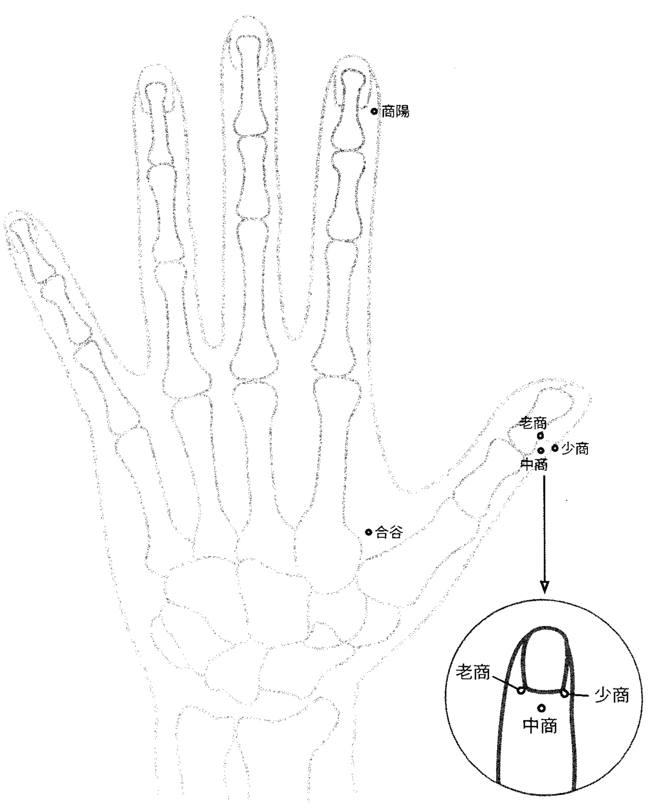

◆ 中商：在少商和老商下方中間，指甲正中根部下約一分處。

祝福大家少得感冒，健康吉祥！

## 中醫解惑 Q & A

金正鈺：「意針 ❻」可以嗎？
胡塗醫：意針不容易出血呢！

疏影殘梧：我有個問題啊，這法子平常人能自己弄嗎，怎麼掌握出血與不出血啊？
胡塗醫：扎到血管就出血，扎不到血管就不出血。

以樂為樂：「重感冒的症狀是渾身酸疼、四肢無力、吃東西無味。重感冒和感冒的區別：1. 重感冒一般持續時間長，有的甚至長達兩個月之久，而普通感冒持續時間很短，一般幾天就可以康復；2. 重感冒除了發燒咳嗽之外還伴有頭痛、肌肉疼痛等症狀，而普通感冒沒有此症狀；3. 重感冒嚴重的可以危及生命，例如流行性感冒，普通感冒不會危及生命」，百度的，可以參考。
胡塗醫：糊糊塗塗知道是重感冒就好，別去理會那麼多「症狀」。

hq123：這麼簡單的辦法，就能助己助人，太感謝先生了！可惜那麼多年竟無從知曉（未讀經典之過吧）。有個小疑問，西醫把感冒分為流感和病毒感冒，而且前些天有朋友病毒感冒鬧騰了三個星期才好，那麼中醫是否就不細分感冒的名堂了呢？只要感冒即九針？當然真正中醫會號脈，可那不是我等一時半會兒能學會的了。
胡塗醫：古傳中醫其實沒有「感冒」的說法，用「糊塗醫治糊塗病」的思路，大概知道是重感冒就扎針，別管是啥重感冒；不重的普通感冒用不著扎九針。

相對冷門：看來還得去學習針灸才行……
胡塗醫：這個九針法沒學過針灸的人也能做。

wybpopo999：請教博主針灸我一點不會，要扎出血倒好辦，可是這留針該怎麼辦就沒招了
胡塗醫：您這麼理解好了，留針就是針扎下去暫不拔出來。

紫煙：先生，我針刺少商穴幾乎不出血，以前針的也是一樣，大概有三分之一芝麻的出血量，以前商陽穴也出的少，但是昨天針的出的血量還可以，是不是我的肺有問題呢？能不能每天刺激一下？
胡塗醫：與肺無關，沒事別亂刺嘛。

清澈小溪：還說感冒，一週前我兒高熱39.6度，我給他耳尖放血，10分鐘後體溫稍降，過後又升上去了，最後吃了退燒藥體溫降了下來。但是第二天出現了血尿、蛋白尿，這幾天盡跑醫院了。西醫說像腎炎，但要確診就要做腎穿，因怕腎穿對腎的損害沒同意做。現在家觀察，就要高考了挺鬧心的。煩請先生看看他到底哪兒出了問題，用什麼方法調理。
胡塗醫：盡量別做腎穿，那玩意兒傷害太大！
他是急性的炎症，就近找醫生把炎症消下來就行。若能找到新鮮的魚腥草、車前草，抓一把來煲水當茶喝。

❻ 意針，意念集中在某些較敏感的穴位上，產生針氣感，達到針刺同樣的效果。

foenix：請教，像春天氣候變化無常的時候，我經常會感到頭痛，特別是傍晚的時候，以為要感冒了，但是又沒有感冒起來，第二天又會好起來。而且，今年春天的症狀是，早上開始是喝米粥，中午還不到的時候就會很餓，甚至腳軟心慌，快速吃點飯進去，又會感覺好點。不知道是哪裡出了問題，有沒有針灸方又或者是別的中藥呢？我現在還是哺乳期，因為考慮母乳餵養好處多，小孩18個月還沒有斷奶。我在猶豫是不是該斷，感覺自己有點吃不消，睡眠和精力很不好。煩勞先生了。

胡塗醫：這是典型的氣血虛弱，建議先給孩子斷奶，平時多揉按耳尖，飲食上多吃些補中益氣的東西。祝好！

貴子：少商穴的確很有用，平時喉嚨一有點不舒服我就掐那裡，百試百用。但體寒長痘的毛病一直都未調理好，懇請先生建議，謝謝！阿彌陀佛！

胡塗醫：若懂針灸，可以自己扎駟馬穴，左右腿上各扎3針，留針18分鐘，同時在照溪穴上也扎上一針。隔天扎一兩次，一段時間就能好。

still.cl：請問先生我頭皮多怎麼辦呢？困擾我很多年了，用過去屑的彩樂、海飛絲、硫黃皂，反正各種去屑的產品差不多都用過，但頭皮還是很多。我屬於脂溢性頭皮，頭皮多時用手指甲都能摳下來，頭部很癢，頭屑有時是很大一塊，困擾我多年，十分頑固，請先生此良方！本人性別男，23歲，萬分感謝！

胡塗醫：看來是歪打正著了。針刺少商、中商、老商三穴對多頭皮有特效！

小玄子：請教先生，「針刺少商、中商、老商」對頭皮多的人，多久扎一次合適呢？每次也要出血嗎？
胡塗醫：一天扎一次可也，不必出血。

善心一生：兒子最近一次感冒，症狀是開始流鼻涕加咳嗽，然後不流鼻涕，開始發燒加咳嗽。我找了中醫，中醫給開的羚羊角粉，讓一天吃兩次、一次一克。給孩子吃了一天，不見好轉。正好網購的老蜂巢到貨，據說蜂巢可以治鼻炎，有消炎殺菌功效。試著給兒子吃了一小塊蜂巢。一個多小時後，兒子就退燒了。還給他喝了一起買來的枇杷蜜。第二天感冒就好了，只剩下偶爾的咳嗽了。先生了解羚羊角粉和蜂巢嗎？這些給孩子吃不會有副作用吧？

胡塗醫：生病固然應該吃藥，但也不能亂服藥，尤其是孩子！
古傳中醫有專門的方法訓練人了解、辨識一切中草藥藥性，您說我是否了解羚羊角粉和蜂巢？任何藥物對男女老少都多少有些副作用。比如羚羊角，古人用它來息風止痙、清解肝熱的，如果一個熱沒有肝風、肝熱，亂用羚羊角就難免會有副作用。

元覺：學習，我對針灸感興趣，也在自己身上試針，有些粗淺的認識。請問先生，重感冒可否在大椎穴刺血拔罐治療呢？前些日子給妻子治感冒用的這個方法，拔了半小時後，她身上出些汗，感覺不適症狀緩解了。

胡塗醫：治感冒各家有各家的治法，大椎穴刺血拔罐不太好，一般來說，風寒最容易從大椎處攻入人體，感冒初期用手心搓熱大椎會有幫助，平時注意把大椎的汗擦乾、搓熱，就可以防治感冒。

2125501433：胡博，非常認同你的九針療法，現在的兒童醫院就會給孩子打點滴，感冒好了，體質更差了。我現在帶孩子看老中醫，也是用你說的那種方法，在穴位扎兩針，放兩滴血，再拔下火罐就好了！

**胡塗醫：** 刮痧可以，拔火罐要謹慎，尤其是小孩子，有些部位不能拔。

**上善若水的水：** 天！請教先生，小孩的哪些部位不能拔？拔了以後會怎麼樣？有補救的辦法嗎？孩子三四歲時候，有點不舒服就給她拔了後背，是氣罐，後來這兩年才免遭「茶毒」。還請先生明示，謝謝！

**胡塗醫：** 如果是正規的中醫，一般都知道哪裡不能拔。如果是去什麼養生館按摩院之類的，那就不好說。所以還是去找老中醫拔罐靠譜些。如果是自己給孩子拔火罐，最好別拔肩胛骨及其以上地方。

## 你也有「過目不忘」的記憶力

第一次在維也納金色音樂大廳（Der Musikverein）聽莫札特交響樂，我對身邊的人笑稱，莫札特的音樂在藝術家們的完美演繹下，徹底地清洗了一遍我骯髒的靈魂，我要把每一個音符都帶走。這聽起來可能有點兒誇張，但是這麼美的音樂，「過耳不忘」才不至於暴殄天物。事實上，「把每一個音符都帶走」是有可能的，人類不僅有「過耳不忘」的能力，還有「過目不忘」的能力，乃至「過」鼻、舌、身、意等都「不忘」也是人人本有的能力！前些天在回覆一位博友的評論時，胡塗醫開玩笑問這位朋友要不要學學這個過目不忘的能力，結果引來好幾位湊熱鬧的。為了滿足一下大家的好奇心，乾脆專門寫篇文章談談。當然，對「記憶力」的深入瞭解，是修習古傳中醫的必經之路，不可不察。

要弄明白「記憶力」是怎麼回事，就得搞懂煩惱是如何來的。所以說，深入認識記憶力的作用，可以幫助我們減少煩惱，而減少煩惱正是修習古傳中醫的必經之路！古傳中醫與世傳中醫的一大不同之處，就是古傳中醫越學越少煩惱，「學而時習之，不亦樂乎」——這才是正統中國文化的學法！世傳中醫則像其他醫學，往往讓人越學問題越多。

那麼煩惱是如何來的呢？相信大家每天都或多或少有些煩惱，想過這個問題嗎？煩惱是誰給你的？或許每個人都會有自己的答案，專家們也有許許多多的說法。熟讀我前面的文章，尤其是那篇〈全憑心意用功夫〉的讀者，應該悟到了，煩惱與快樂，均來自我們的心念！所以胡塗醫在〈治療「抑鬱症」妙法〉一文中才鄭重其事地提醒大家要學會「轉念」，把一切事情往好處去想，其實這是提高記憶力的好方法呢！

問題是，很多人雖然也想著要「不起煩惱」，可就是「煩惱不斷」！比如常常有朋友問我，平時還好，一到了要用功靜坐或站樁的時候，越不想去想事情，越是念頭紛飛，各種念頭紛至遝來，煩惱不堪。考試前越是想去記住一些公式或單詞，越是記不住，這是怎麼回事呢？

## ◇ 記憶亦是「心意」

還是「心意」！我們時時刻刻均跟我們的「心意」廝混在一起，卻對他老人家所知不多，這就好比我們口袋裡揣滿瑞士銀行的各種信用卡，卻天天發愁沒錢吃飯。

心意，或者說念頭，都是依靠眼、耳、鼻、舌、身、意這「六根」的作用，才能對色、聲、香、味、觸、法這「六塵」加以分別。對於我們喜歡的，起「貪愛」；對我們厭惡的，起「嗔恨」、「厭惡」、「排斥」。這些貪愛或嗔恨，一天到晚，隨著六根門頭死纏爛打，攝取外面的六塵的境界，不斷起分別、染著、愛嗔……比如，這個東西好吃，這個味道不好，這首歌好聽，那首歌難聽，張三美麗，李四醜陋，等等。我們的心意就像孫猴子，一蹦十萬八千里，就是沒有辦法靜止下來。除了六根對六塵的境界所生起的分別、染著、愛憎之外，我們常常會「自然」地生起對於六塵中的某一塵的愛恨情仇，比如，有人「天生」愛喝茶，有人打死不喝茶；有人喜歡粉紅色，有人最怕粉紅色；有人愛小動物，有人怕小動物……凡此種種，都是我們心意的「種子」或者叫「習氣」使然！不用我多說大家想必也已明白，這一切都障礙著我們去把心安下來！心若安不下來，怎能「過目不忘」呢？

以上說的，是一番道理，悟性好的人可以領悟出增強記憶力的方法了。不過光明白這一點，還難以弄明白記憶力是怎麼回事兒。其實我們所經歷過的每一件事，不論好壞，凡是眼、耳、鼻、舌、身、意六根「經歷」過的任何事，都會成為我們「記憶力」的一部分。從佛家的唯識學角度來看，心念的這些行為、動作、言語，就是我們的「有表業」。現行的「有表業」回熏到我們記憶的「大硬碟」——第八意識（即「阿賴耶識」），成為這個有無量無邊「存量」的大硬碟、大倉庫的一部分，儲存起來後「永不消失」！換句話說，我們所作所為、所思所想、所聽所說……一切的一切「經歷」，其實都是「過目不忘」的！不僅「過目不忘」，過「耳」也「不忘」，過「鼻」也「不忘」，過六根中的任何一根都不忘！所以我才在之前給一些博友的回覆裡說，「過目不忘」的能力人人都有，無人無之！

## 第八識：藏識、種子識，為一切萬有緣起的根本

我們的這個「大硬碟」中，記下哪一類的東西最多，哪一類的東西就會經常顯現出來！比如我們平時常說的哪一類話、常做的哪一類事比較多，在「大硬碟」裡的記憶力就比較強，就比較「印象深刻」（藏傳佛教叫「銘印」）。這類「印象深刻」，如果是針對某個人，我們就喜歡常常去找這個人或想起這個人（情情愛愛都是這樣）；如果是針對某件事，就喜歡常常做某件事（比如打電腦遊戲）；如果是針對食物，就常常喜歡吃某種食物（比如毛主席對紅燒肉）；如果是針對衣服，就喜歡常常穿那類衣服……總之，過去的「印象深刻」會「不由自主」地驅使著我們去做各種各樣的事，許多人有時明明知道是顛倒夢想，還是一條路走到黑，所以佛陀不無感慨地說「眾生顛倒，以苦為樂」。

說到這裡，就不能不掃盲一下傳統文化裡的一個名詞——「相應」。這個詞對一般讀者可能還很陌生，在古傳中醫裡，弟子如果要從明師們那裡得到那句「真傳一句話」，就必須與師父「相應」，才能完成理、法、能力等的「傳承」，否則就算得了任何一句秘訣也沒啥大用，也還得辛辛苦苦去熏習、去訓練！「相應」用現代語言來說，就是師徒之間的「發射與接收裝置」微調到擁有完全一致的波長、波段、頻譜、頻率，「傳」和「承」才能完成！當然，這個「微調」的過程，在以前的醫家是很考驗人的，師父會狠狠地磨你很多年，磨性多年、傳承完成之後，才「苦盡甘來」。這說的是醫家的「相應」，多年前我在鄭州拜會上巨下贊老和尚的再傳弟子（前面的文章裡提到的可以「單衣過冬」的那位），他就透露過其師門真傳的方法就叫「上師相應法」，可見醫道與佛道之理是相通的。順便提一下，常有朋友問，為什麼中醫和道家說的是經絡，佛家說的卻是脈輪？理解了「相應」，您是否也理解了為什麼古中國的醫道兩家「看到」的是「經絡」，古印度和西藏看到的卻是「脈輪」？「傳承」不同，「相應」就不同！人身無處不氣路！

「相應」這個詞有助於我們理解記憶力。我們的「大硬碟」阿賴耶識裡儲存了我們曾經做過的一切事，當我們見到（遇到）現前的外境時就自動地把這些外境（即色、聲、香、味、觸、法）吸收進來，並飛速地在大硬碟裡「掃描」，如果我們過去曾經經歷過相同的、類似的東西，那就「相應」！遇到「相應」，心理就起「波瀾」。好比賈寶玉遇到林黛玉，一眼望去就覺得「這個妹妹很面善」，似曾相識，覺得投緣。順便說一下，緣分說到底，還是與過去（比如說前世——假如你相信有前世的話）留下「深刻印象」的人事相關！所以大家要多多廣結善緣，結善緣、不攀緣，往後的路才多些助緣少些障礙。

我們不斷地透過眼、耳、鼻、舌、身、意去吸收色、聲、香、味、觸、法的「境界」回來，再跟原來儲存在大硬碟阿賴耶識裡的記憶作比對，「相應」的就歡喜、染著、貪愛，不「相應」的就排斥、打壓、討厭甚至破壞，從而不斷地製造各種各樣的「煩惱」——身、口、意的貪、嗔、癡行為，這些行為又馬上被大硬碟儲存變成「記憶力」，成為阿賴耶識的又一部分，一直到這輩子結束了，我們平時做得最多、最強大的那部分「記憶力」，那個巨大的力量再牽引我們去開始下一回生命……沒有休止地輪轉下去。想想都覺得人生如火宅，得趕緊積累功德出離苦海，所以「沒文化，真可怕」也不全是說著玩兒的。

忽悠了這麼多，不知大家對哪些東西「印象深刻」？還要不要學「過目不忘」的能力？

> 「頻呼小玉原無事，只要檀郎認得聲」。

## 中醫解惑 Q & A

**sjy.w20298**：看來我記性不好是好事，減少牽引力。
**胡塗醫**：錯了！記性好不好，大硬碟照記不誤。

**不言**：感謝先生點撥。恍恍惚惚似乎又明白了一些東西。斗膽問先生，我們的「大硬碟」能「快速格式化」嗎？如果能的話，有那「真傳一句話」嗎？如果有的話，先生能點解一二，給個方向嗎？再行謝過。

**胡塗醫**：我不知道您的硬碟是哪個牌子、什麼配置的，無法回答您。也許上上根器牌，有慈悲喜捨、正知正見等配置的硬碟，都能夠快速格式化的。

## 對治緊張、壓力的方法

在古代，人們生活比較簡單，各種緊張壓力相對較少，古人總體上「洪福」少、「清福」多，日子比較清淨。我們現代人正好相反，物質文明高度發達，「洪福」是多了，享「清福」的日子反而不多。當然，只要是「人」，無論在哪個年代，都有各種各樣的「苦」，各種各樣的煩惱、緊張、壓力。如何對治緊張壓力，世界各國都有各種學說、方法，目前似乎都被歸到西方的心理學範疇。每每翻閱一些現代心理學、心靈學的著作，胡塗醫常深以自己是中國人而自豪，西方心理學的那套東西，咱們的老祖宗在幾千年前就有過深入細緻的論述了！我們的老祖宗不僅明其理，而且知其法，不能不讓人讚嘆古聖前賢的無邊智慧！

緊張壓力在古代醫家被歸入「情志失調」，老祖宗認為「情志失調」會導致五臟六腑的各種疾病，我在〈治療「抑鬱症」妙法〉裡對這一點已談過，不再重複。而五臟六腑的各種疾病，同樣也會導致一個人的「情志失調」。比如肝膽氣虛的人，容易膽怯、恐懼；肝氣過實，則容易發脾氣、動怒。又如，心氣虛了，人就會產生悲哀之感；心氣旺盛，人就會笑而不止。（《黃帝內經·靈樞·本神》：「肝藏血，血舍魂，肝氣虛則恐，實則怒…… 心氣虛則悲，實則笑不休。」）五臟六腑、全身氣血的不調和，都會導致一個人情志上出問題。所以一個人如果要真正獲得健康，必須從身、心兩方面同時著手，而身心並治正是古傳中醫的「強項」！

在具體介紹對治緊張壓力的方法之前，我們必須重溫一下「煩惱是如何來的」。我在〈你也有「過目不忘」的記憶力〉裡提到「煩惱與快樂，均來自我們的心念」，這句話不知道大家聽進去了沒有？我們知道，六根（眼、耳、鼻、舌、身、意）對著六塵（色、聲、香、味、觸、法）產生了六識的分別作用，就會一刻不停地「製造」各種煩惱、緊張、壓力。比如「觸」，有「可意觸」和「不可意觸」，即「合自己心意」和「不合自己心意」兩種（當六根接觸六塵境界，就產生「觸」），這些「觸」都是與無明「相應」的。怎麼理解呢？就是我們的內心「大硬碟」裡潛伏、儲存著一種自我的思想、念頭、執著，一接觸之後，合自己心意的，就產生一種「樂受」（快樂的感受）；不合自己心意的，就產生一種「苦受」。

## ◇ 不要讓欲望變成行為

毋庸諱言，快樂的感受，我們就想佔有、延長擁有、染著它（不管它是「人」還是「物」還是「情」）；苦受則自然想排除、打擊、破壞乃至消滅它。總之，「觸」之後產生「受」，感「受」以後由於念頭加深、「銘印」加深，情志隨著加強，自然而然就會產生身體上、言語上的各種行為。情志、心意的不斷加強，必然對「樂受」念念不忘（專業名詞叫「可愛境」），想了再想，這個「階段」就是「愛」，內心就對「可愛境」產生染著心，黏住了放不下，整天一有空就想個不停，「才下眉頭卻上心頭」。在這個狀態裡，有了「愛」的力量來不斷加強這個意念，就容易產生更加強烈的染著，自然就會產生各種各樣的身體、言語的「業」——行為（佛學叫「現行」）。這個「現行」出現，人就會採取進一步的行動（所以佛學叫「取」），採取行動之後，就會留下更深的「銘印」，留下一股大到可以帶去下一輪生命的「記憶力」（習氣）！各種記憶力的不同，會帶我們去投在不同的「方向」。所以說，我們要時時刻刻記住多說好話、多做好事、多存好心，以後的生命歷程裡才能擁有多一些善美！未來「命運」的好壞，其實取決於我們此時此刻的「運命」是否得當！「愛」和「取」，一定要本著「不侵犯」的恭敬心、慈悲心為原則，所以佛道醫儒武各家各派均有各自的戒律、規矩要受持。現在許多高明的現代人在批評孔夫子，其實他們哪裡懂得聖人的胸襟與情懷！夫子「己所不欲，勿施於人」、「克己復禮」等教導，不就是持戒、不侵犯、慈悲心嗎？

要想降伏緊張壓力，就得從「規範」上面所說的「愛」和「取」上來下功夫！因為「愛」跟「取」如果形成動作，在心意上就是「意業」，在身體上就是「身業」，在言語上就是「口業」。一旦身、口、意的「動作」、行為完成，變成了過去式，就如成語「覆水難收」，無明、煩惱、緊張、壓力等等就遲早要來！好比高鐵建設的徇私舞弊，鐵道部的厚顏無恥，必定導致災禍不斷，真相不明，躲不掉的。因此，持戒、遵紀守法、克己復禮等等，可以在行為方面不讓「愛」起「現行」——變成行為！因為行為要產生作用之前，都會在心中醞釀一段時間，所以我們要在這個過程中抓緊時機控制它。當六根接觸六塵的時候，如果能在「當下」有一種力量來讓自己心裡保持明明白白，在「當下」就能克制自己的衝動，那麼我們就能從煩惱、緊張、壓力中解脫出來，終得大自在！那麼這一種力量是什麼呢？定力！

## ◇ 定力訓練是降服煩惱、緊張、壓力的不二法門

定力，可以通過生活閱歷「被動」獲得，經過很多苦痛悲歡的人，容易比沒閱歷的人更有定力。定力主動獲得，則可通過特定的訓練而來。

一般人遇到煩惱緊張壓力的時候，會找親友談談心，或者去KTV唱唱歌，跟朋友喝喝酒，這些雖然能短暫緩解煩惱壓力，但是只能治標，不能治本。醫家秘傳的降伏緊張壓力的方法，則是訓練我們這顆雜亂心，讓它恢復原來的定力，在接觸到外界種種人事務的時候，不要迷糊，心裡明明白白清清楚楚。功夫深時，對於任何一個行動，不管是吃飯、喝茶、穿衣、走路乃至炒股票等等的時候，心裡都有朗朗乾坤，沒有雜亂，清楚明白。這一切，都有賴於平時對自己進行「定力訓練」！可以這麼說，「定力訓練」是降伏煩惱、緊張、壓力的不二法門，除此別無聖法！

您可能會覺得，自己似乎也沒啥特別的煩惱、緊張和壓力，不須訓練自己的定力。事實上，除了開悟了的聖者，我們普通人，人人都有或多或少的緊張壓力。尤其是活在高房價、高通膨、低福利和安全係數如此低的社會裡，隨便出去街上轉轉，少見有眉心舒展面帶微笑的成年人，這真是時代的悲哀！如果下面幾個問題，你的答案有一個以上是肯定的，那麼緊張壓力就已經在損害到你的身心健康了：

## 第六篇 / 返觀內照，千里診病

1. 最近您是不是發現自己食慾不振，或者變得十分貪吃？
2. 您是不是已經容易失眠，或失眠很久了？
3. 您是不是血壓不穩，或者血壓已經容易升高了？
4. 您是不是覺得做任何事情都提不起勁，甚至對自己越來越沒有信心？
5. 您是不是覺得自己的自尊心也在慢慢喪失？
6. 您是不是常常擔憂未來？甚至懷有不知名的恐懼？
7. 您是不是發現記憶力和注意力正在減弱？常常忘記事情？
8. 您是不是常常一件事情還沒有做完，就急著要做下面另一件事情？
9. 您是不是變得很容易煩躁、生氣？
10. 您是不是常常覺得自己很孤獨？或者做事變得優柔寡斷，難以做出決定？
11. 您是不是發現自己已經不太容易集中精神做事或思考？
12. 您隨便用一隻手捏一把另一側的肩膀（肩井穴），是不是有一條硬硬的筋？
13. 您隨便捏一捏大椎及頸部，是不是覺得酸酸的，蠻受用？
14. 您沿著大腿外側隨便敲敲，是不是覺得有兩條硬硬的「筋」？
15. 您的肩胛骨以下，脊椎骨兩側肌肉是不是硬硬的，彷彿有兩條筋？
16. 您單腿站，閉上眼睛，是不是立馬要倒下？

有以上問題不可怕，現在開始訓練定力，可以標本兼治，身心並治。怎麼訓練呢？

## ◆ 定力訓練法注意事項

訓練前的準備：

1. 時間：不要在剛下班、很疲憊的時候訓練，最好選擇自己精神還好的時候做，可以早上早點起床，抽出5分鐘、10分鐘以上時間來練習。
2. 衣服：以寬鬆舒適為宜，同時解除手錶、戒指、耳環等「身外物」。
3. 環境：剛開始的時候以安靜、空氣清新、無人打擾為宜。
4. 器具：
   a. 如果採用坐式，要準備一條大毛巾或毯子，用來蓋在膝蓋上。同時準備一個坐墊，以便坐下時臀部稍高。
   b. 如果採用其他姿勢（站或臥），準備乾毛巾，練習結束時擦汗用。
5. 其他：練習前排清大小便。

訓練後的注意事項：

1. 練習結束後，要擦乾淚水和汗水，尤其是大椎處的汗要擦乾，夏天不能立即去洗澡（最少要等半小時）。
2. 盡量避免在電風扇下和空調房裡練習這個方法，易感風寒。
3. 練習結束後最少半小時內不可以接觸冷水，尤其是在夏天，要盡量避免在此期間喝水和洗澡等，而且最好不要在練習結束後半小時內大小便。所以最好是在正式練習前喝水，排便！
4. 練習期間最好減少或避免房事，切忌練習結束立即房事！
5. 初學者應盡量避開颱風、下雨、雷鳴時練習。

## 訓練得法的初步效果：

1. 全身舒舒鬆鬆，肌肉彷彿彈棉花般彈開，皮膚變得有光澤。
2. 覺得走路兩腿有力，更能夠腳踏實地做事情。
3. 不容易發脾氣，情緒容易在自己掌控之下，克己復禮。
4. 身心健康在100天內就有明顯改善，感覺自己整個精神都煥然一新。

下面介紹訓練方法，先講大原則：

## 訓練原則：

1. 體態形式：站、坐、臥均可，但以坐式為最佳。如果是坐式，可以正襟危坐於椅子上（參考〈不論陰虛、陽虛，都是正氣不足〉裡的「養氣法」），也可以採用盤坐的方法——盤坐效果最好。如果是盤坐，可以雙盤、單盤或散盤，總之，體態形式必須做到「正身」（參考前面的文章〈正身、內省、止息——且說醫家如何用功〉）。
2. 呼吸方式：自然呼吸，而且只管「呼」氣，不管「吸」氣！
3. 意念活動：隨著呼氣，把意念集中在身體內。

> 7 養氣法，37頁。
> 8 請見〈正身、內省、止息——且說醫家如何用功〉，630頁。

## ◇ 定力訓練法 1：搖山晃海功

再講具體訓練方法。以坐式為例，共分兩個部分：
第一部分，古人叫「加行」：搖山晃海身體好。

方法：

1. 盤腿坐好之後（盡量把腰坐直），兩手臂「盡量」向後伸直（彷彿小時候很多人玩過的「飛機」）。
2. 由腰部帶動上身，從左到右「劃圈」，記住臀部盡量別離開坐墊，再從右往左劃圈。劃圈要放慢，從左到右算一圈，從右到左也算一圈，剛開始練習可以各劃36圈。如果轉著太舒服，想繼續轉下去也可以（剛開始搖晃，很多人都會覺得特「受罪」）。

備忘：

1. 這部分的「熱身」練習，古人叫「搖山晃海」（簡稱「晃海」），可以強壯五臟六腑和腰腿，也是明師們用來對徒弟進行「磨性」的方法。長年習練，雙腿會變得柔軟，慢慢就可雙盤了。
2. 不要自作聰明，「改編」這個方法。另外，此法與其他人傳授的可能也不一樣，不要練混了，要麼按此法練，要麼按別人傳授的練。若按此法練，有問題參閱前面的文章〈正身、內省、止息——且說醫家如何用功〉即可。
3. 此法可單獨作為一個養生方法來習練。

## ◇ 定力訓練法 2：收視返聽

第二部分，古人叫「正行」：收視返聽正氣足。

方法：

1. 做完以上「晃海」之後，很多人都會氣喘吁吁滿頭大汗了，如果出汗了，可以先用乾毛巾擦乾，接著做下面的「正行」部分。繼續盤腿坐好，右手在下，左手在上，手心向上，疊放於小腹前，兩拇指輕輕挨著。舌頭輕輕抵在上齒齦內，如讀英文字母「L」般，若口水太多，可慢慢咽下。
2. 正行內容：
   a. 把遠處的聲音收入耳底，兩眼垂簾或輕閉雙眼，開始「聽」自己的「呼」氣。
   b. 呼氣時可以「算」呼氣的次數，從一數到十，再從一數到十，周而復始（不要自作聰明從一數到超過十）。
   c. 數「呼」氣時，可以讓意念微微集中在小腹處或心窩處。女同胞在生理期時則只可以把意念微微集中在心窩處。
   d. 當發現自己心念不能集中，訓練枯燥無味的時候，可以從頭到腳觀想自己全身的肌肉、骨頭全部放鬆下來，慢慢心情平穩下來後，繼續數呼氣。
   e. 練習時間長短因人而異，隨著功夫加深，會自然延長時間，急不來。

## 備忘：

a. 這個方法太簡單了，但是卻不容易堅持到底。希望大家都能大智若愚去傻練！久久用功，將練出非凡的定力，緊張、煩惱、壓力將越來越少，輕安、喜樂、幸福感將越來越多。若得明師指點，根器好的人還能得「定」而出智慧……
b. 正行結束，下座動作要輕柔，因為身心從靜態恢復到動態有個過程，不可魯莽行事！宜輕搓熱雙掌，乾洗臉並輕撫膝蓋，輕敲打大腿，輕按雙腳，然後再慢慢起身。
c. 家族有精神病史的，不可以自學，必須在明師指導下修習。

其他事項請參閱上面的「訓練後的注意事項」。

阿彌陀佛。

## 中醫解惑 Q & A

**蒼狼：** 請問胡塗醫，晃海部分伏身吸氣還是呼氣？
**胡塗醫：** 自然呼吸就好，就算要管呼吸，也只管「呼」氣。

**大火焰2525：** 胡塗醫好！有個問題一直想請教：練習晃海的時候，您講到「兩手臂『盡量』向後伸直」，那麼，是手心朝上還是手背朝上呢？效果是否有不同？我記得您在剛開博客時講到給一位外籍女士治療腸炎的時候，手向下翻和向上翻效果是不一樣的。練習晃海時，手的朝向是否與此相同呢？謝謝，阿彌陀佛！
**胡塗醫：** 晃海是手心朝上，其實手心相對也好。

**一呼有道：** 晃海時候我是手心相對握拳。
**胡塗醫：** 最好別握拳。

**心緣蝶夢：** 「從左到右算一圈，從右到左也算一圈，剛開始練習，可以各劃36圈。」在背後只能劃半圈，請問這就算一圈是吧？
**胡塗醫：** 算吧！

**netnn：** 關於劃圈的方法還是沒弄明白，「從左到右算一圈，從右到左也算一圈」，我是順時針從左到右，逆時針從右到左，這樣只是向前劃了半圈。不知道是不是做錯，懇請先生指教。
**胡塗醫：** 怎麼劃都行，沒錯的。

**雁渡寒潭：** 請教胡塗醫，劃圈的幅度是不是不能太大？否則好像無法保證「腰坐直」。謝謝！
**胡塗醫：** 那就坐直了「壓」低了劃呀！

**雁渡寒潭：** 這個，我理解為整個脊柱和水平面必須垂直，明天好好體會一下您指導的意思。謝謝胡塗醫！
**胡塗醫：** 可以嘗試保持脊柱是「直」的，不要彎，將身體前傾來劃圈。

**lisasali：** 請問胡塗醫先生，我常年低血壓90/60左右，且經常頭暈，靜坐的時候也是只注意呼氣嗎？謝謝！
**胡塗醫：** 別靜坐了，做搖山晃海就好。以後類似的問題都是這個答案。

**綠漠2011：** 這個方法我原來用過，不過不一樣，站著上身做搖山晃海，好像和瑜伽的風吹樹一樣，後面就是打坐了。這個好像把兩個結合了。晚上打坐前試試。不知這樣理解對否？
**胡塗醫：** 最好還是坐著練，否則就不能叫晃海。

**琴韻：** 請教先生，搖山晃海法是必須盤腿做，還是坐在椅子上也可以？
**胡塗醫：** 最好盤腿。

**圓明道童：** 如果故意拉長吸氣和呼氣時間以及中間停頓的時間，可以嗎？
**胡塗醫：** 不可以！吸氣微微，呼氣綿綿，才是正確呼吸方法。

**悶倫：** 請問胡塗醫，我打坐時總是關注呼吸，然後呼吸不暢、胸悶，您能給我點建議嗎？
**胡塗醫：** 建議：別再關注呼吸。

**sophie：** 我也是這樣，只要是觀息或數息，呼吸就會不暢，有點上氣不接下氣的感覺，是不是和自身的身體狀況有關？
**胡塗醫：** 其實初學者注意呼氣就好，每次呼10次應該不難，不要刻意去管它多少。太上曰：「事無事」。

**titi99666：** 先生，有幾個問題想請教一下您的：

1. 在練正行呼氣的過程中，滿口的口水是要等到數完呼氣到十的時候才能吞下嗎？
2. 左腳腳趾從泡腳一個多月的時候開始長水泡，現在到右腳都開始長了，反反覆覆癢得很難受啊，請問這是在排毒嗎？
3. 肝血管瘤3公分左右可以通過練肝膽保護法恢復起來嗎？有點擔心它會繼續生長。

謝謝先生！

**胡塗醫：** 1. 不用，有口水就慢慢吞下。
2. 可能是皮膚有問題，請就近看看皮膚醫生。
3. 您相信可以，就可以！別擔心。祝好！

获取更多好书，请加微信号：strcdts

官网：http://www.ac2011.cn

# 附錄

# ｜古傳中醫答疑｜

> 饒君聰慧過顏閔，不遇真師莫強猜。
> 只為丹經無口訣，教君何處結靈胎。
> ——張伯端真人
> 《悟真篇・七言絕句六十四首・第五十九》

## 千里診病案例

**四爪白：** 胡塗醫先生您好，一直在關注您的博客，知道您已不在網上為陌生人診病，但是家父病情十分嚴重，做女兒的很是心焦，懇請先生幫助，指點一二。父親自春節開始就拉肚子，開始沒太當回事，沒想到越來越嚴重，幾乎每隔1～2小時就要腹瀉一次，大便裡有血膿和黏液，西醫診斷為「潰瘍性結腸炎」，在醫院裡連著4天來，每天高燒不退，所有藥物都看似沒有任何效果。懇請您的幫助，如何才能止住腹瀉，或是退燒呢？代家父先在這裡謝謝您了。父親68歲。感恩！

**胡塗醫：** 西醫診斷正確。不過他老人家真正的問題在肝和肺。您家在三個月內是否有過火災呢？要不就是一年半前他老人家在廣西一帶被人綁架過，從此嚇到了肝膽。

**四爪白：** 先感謝您的回覆，讓我有了方向。您說的都太對了，從心底裡特別欽佩您，您是不是有千里眼啊？父親在2010年9月被以前公司同事騙到廣西南寧附近的一個小縣城，強迫他加入黑直銷老鼠會，不交錢買產品不放人，父親被扣了幾天後，找個機會才逃回來。這件事的確是受到了驚嚇和非常生氣。沒想到卻埋下了病根。今天醫院打來電話，說看這情況要上激素了，激素副作用太大，我們從心裡是真不想上啊，但是現在止不住便血，也只能如此了。
再次請教先生，我為父親做「清天河」水去退燒和做「蓋醬油瓶蓋」來止瀉對他這種重型和暴發型結腸炎來說能起作用嗎？或有什麼別的方法嗎？懇請先生示之。合十感恩！

**胡塗醫：** 我沒有千里眼，但是把原因給徹底查出來正是古傳中醫的拿手好戲。您給他編個故事，告訴他那夥騙他傳銷的人已經被繩之以法。同時讓他泡腳、拍打腳心等。當然，要結合西醫治療，不能大意。祝好！

**雲皈三寶：** 有事向先生求教，犬子11歲，從五六歲時開始常夜間腿疼，自稱是骨頭疼，拍片、檢查都沒什麼異常，不知是什麼問題及如何應對？若顯得有點貪心和冒失，還請先生諒解！

**胡塗醫：** 您家祖墳左上側是不是曾經有一棵樹給砍了？

**雲皈三寶：** 祖墳左上側是不是曾經有一棵樹被砍了，這的確搞不清楚了。但背對我父母合葬之墳的左上側確有一棵大柏樹幾年前自己倒掉了。

**胡塗醫：** 那就對了！我說的就是您父母墳上的左上側那棵樹。你們想辦法重新種一棵，孩子就會好！

**雲皈三寶：** 非常感謝！已安排辦理中……那棵倒掉的大柏樹據說是成百上千年了，幾年前倒掉後一直沒人敢動它，不知先生以為應當如何處理呢？

**胡塗醫：** 我不便說，見諒！

**梁春98：** 謝謝先生的回覆，只要有機會上網，我總是先報到這裡。雖只留言一次，先生不忘回覆，感謝的同時也策自己做事得嚴謹。年前看了先生洗腳一記，動員公司員工過年回家給父母洗腳，公司員工63人，37人洗了，13人購了泡腳盆給父母。我大年初一在家也給父母洗了一次腳，感嘆頗多，父母真的老了。在這之前我從未想過他們老了，總想年輕著呢，能自個照顧自個。在這兒我特想得到您的指教，我父親1939年生，一生清貧教書，正義豁達樸素節儉。小時就知他有下肢搔癢，嚴重時用辣椒敷。現在仍下肢搔癢，大便急而稀不成形，小便急而次數多數量少，每日下午四至六七點頭如鐵箍，血壓150／80，長年咳嗽。叩謝！

**胡塗醫：** 謝謝分享，您做得很好，讚歎！問問令尊大人43歲時是否打死過一條大蛇或別的什麼有靈性的動物？

**梁春98：** 叩謝先生的回覆，我們家是江西贛南農村的，在我有記憶時，一是父親為我們小孩四個增加營養，二是父親聽說蛇膽能治怪病（搔癢）。父親經常打蛇自己生水吞吃蛇膽，蛇肉燉湯我們吃，我們知道後不肯吃，他便用蛇肉喂雞讓雞多產蛋。但有一蛇大到我們全族人都有記憶（剛電問了媽，姐都記得），確定是我父親拿帶尖刀長竹竿戳我爺爺屋簷上的大蟒蛇，但我們也記得清晰，沒弄死，只是不知不覺中便不見了，那時正是爺爺病危的時候。中午時我電話父親問一下回覆先生。

**胡塗醫：** 阿彌陀佛。

**梁春98：** 先生好，問過家父了，我們是山區裡的，蛇特多，六七十年代家境貧寒，他也像大夥一樣打蛇、野雞、小鳥之類給家小孩補充營養，其他有沒有打過有靈性的生命，沒有特別記憶……希望得到先生指點，叩謝先生。

**胡塗醫：** 沒關係的，我只是隨口問問而已。祝願令尊大人健康長壽！您可以去幫他放生一些蛇、龜什麼的。

**小丫：** 先生，那像我經前的那些症狀，除了練功外，是否還應該食療，如多吃些黑豆和枸杞呢？

**胡塗醫：** 您這是逼我給您診病嘛！不知道您的身體情況，亂給建議豈不是庸醫？
好吧，我簡單給您看看，因為沒有您的具體資訊，這個網名診病有點費勁，我簡單說說：籠統地說，您是典型的氣血兩虛，而且體內濕氣太重。往細裡說，您腹部似有兩條半刀痕（若只動過一次手術，就還要多挨一刀，跑不掉的），右邊的卵巢似乎還有一個約 1.15x2.21 公釐的囊腫／陰影。左膝蓋寒涼，若不是受過外傷，就是平時常在有輻射的環境生活。右邊的腳板皮膚特乾燥。脾臟上有 4 個小米大小的白色的斑點，這是濕氣重的主要原因了，脾臟運化不了水穀精微。右腎略小、略向上，有一個小小的囊腫，小到我無法「目測」出來。衝脈、任脈都傷到了。好好綜合治理一下吧。

順便提一下：下次誰要想「僥倖」找我做千里診病，最好學乖點，把姓名給寫上，免得我萬一來了興致想診一下也資訊太少——當然，除非興之所至，我是不再網上給陌生人診病了的，別再跟我耍小聰明。

小丫：忘了說了，我是做了一次手術，但挨了兩刀，因為主任醫師太「愛」我了，所以給了我兩刀。哈！

一小：先生好！我想為我公公問一下病，右肩膀一陣一陣地麻，右手發麻，且尾骨有些疼痛，右腿有浮腫現象（很多年了）。我公公 1941 年出生，謝謝！

胡塗醫：很有孝心，讚歎！
除了您說的症狀，他似乎消化系統比較差，十二指腸有些潰瘍，小腸疑似有一個半公分大的腫瘤或硬塊，脾臟挺虛的。頭頂左側若沒有受過外傷，該處的血管有點兒硬化。

一小：先生，真的謝謝您！你說得非常的準，只是我公公傷到過頭，每天中午必須睡覺到 2 點！我雖在自學中醫，但才接觸，自己沒有信心給他老人家治療，請您給指點一下，如何才能把他的病治好，他是個好人應該長壽的，謝謝您！另外，我給他泡了周公百歲酒，常喝可否？

胡塗醫：謝謝回饋！
要把他的病治好，可以找您當地的明白人，或者到醫院去看專業的醫生，也可以自己鍛鍊。

好人也不見得就長壽，要不雷鋒、焦裕祿他們不都得活到一百歲？長壽有長壽的因果。多多慈愛生命（比如愛護生物、放生等），學會養生，才是長壽的「因」。

我不懂什麼是周公百歲酒，無法回答您。印象中清代梁章鉅先生在《歸田瑣記》裡提到過一個周公酒，不知是否這個？

一小：先生，謝謝！我查了一下資料，周公酒真如您所說是清代梁章鉅先生在《歸田瑣記》裡記載的，我看了一下內容，感覺能夠調理一下我公公的身體！另外「好人應該長壽」只是我對他老人家的一種願望，我知道人命天定，不是一個願望就可化解得了的，先生教訓得極是，謝謝！

胡塗醫：謝謝您！我不敢「教訓」人的。我後來也查閱了一下，有一位姓武的老師公開過這個方子，我看了其配方，君臣佐使都合理，少量服用應無壞處。

雲淡風輕：您好，想請教您，因我氣血雙虧，大夫說我是腎陽虛，長年手腳冰涼，近一年一直在每晚用熱水泡腳，並且從今年年初開始站樁、靜坐等自然法。感覺好多了，但還是怕冷，尤其是手腳。近一年一直吃補腎陽的保健品，感覺好多了，最近一個月我開始於每頓飯後吃一小勺當歸粉，並伴著喝黃耆大棗水，剛開始感覺很明顯，吃過沒多一會兒手腳就很溫熱，很舒服，一點沒有上火感覺。但是近一周左右，吃過後溫熱感覺不明顯了，我想問您這是補進去了，還是沒補進去。我這樣補行嗎？是否還繼續吃？請診斷一下，謝謝！無量壽福！

胡塗醫：沒補進。這樣補不行。要請我診斷，請給出您的姓名、職業之類的。我不太喜歡用網名來診斷了。

雲淡風輕：先生您好，我的職業是教師，做過財務出納，於2008年因身體辭職在家調養。

胡塗醫：您好！您身上的氣機似乎比較亂，是不是經常拉筋啊？
您的確是腎不太好。是不是1998年（或前後）生過孩子？當時可能自己沒有調養好，傷了腎。此外，您的頸椎、小腸、膀胱都不是很好（但不能說有啥大病）。

建議：
1. 停止拉筋，您不適合拉筋。硬去拉它，津液不足以濡養它，反而傷脾、傷腎。拍打倒是可以。
2. 停止進補。不要亂用藥。
3. 盡量避免喝酒（過年是不是放開喝了？）。
4. 每天早晚做幾分鐘的心腎相交法。每天專門靜坐養氣。
5. 熱水泡腳可以加些生薑、花椒、桂枝、細辛之類的東西。

祝好！

雲淡風輕：阿彌陀佛！感謝先生！你說的的確一點沒錯，比坐在眼前切脈的大夫看得還準呢，真靈啊！崇拜！這裡除了感謝外，還有兩個請求：
一是，心腎相交法，如何做，您的博客裡有嗎？二是，先生能把郵箱告訴我嗎？我想詳細跟你說下我的身體狀況及近兩年來的調養情況。請先生指教！非常感謝，阿彌陀佛！

胡塗醫：我也是胡亂說說，誤打誤撞而已。怎麼用「靈」來形容中醫啊？心腎相交法我在前面文章裡提到過。您的身體狀況我若想知道多半會清楚，不勞您發郵件了。建議您把我前面的文章通讀一遍，看看有沒有幫助吧。阿彌陀佛。

新浪網友：我沒有註冊，就用的「微笑」這個名字，想請您幫我診斷一下：我42歲，最近月經不太正常，一直後延，看過中醫，說我脾虛、痰濕重，吃了一個月的中藥，不太見效。您能給我支支招嗎？還需要我什麼資訊？

胡塗醫：「微笑」您好！有「微笑」就夠了，不需要什麼資訊。

您的胃是有點兒問題，疑似胃酸過多，在「拐彎」的地方有點兒輕微的炎症。最近是否頭頂有種緊、脹感？左腿似乎受過傷或小時候被開水燙過。右邊的卵巢有疑似汙血的東西。眼睛似乎也不太好，頸椎很緊。女性月經的問題，說到底都是任衝二脈不調。調理應該從這兩條經脈下手。您可以參考我前面文章裡提到的「養氣」方法。

**新浪網友：** 胡塗醫你太神了！我前段時間剛發過急性胃炎，就因為這個才去看的中醫，小時候和20多歲的時候兩次燙傷了左腿！近視眼，頸椎不好，都讓您說對了，您說的右邊卵巢有疑似汙血的東西，就在剛才給您發評論前，右邊卵巢隱隱地刺痛！是不是有什麼問題啊？還是跟月經有關？我的體質真是屬於敏感型的，以前聽說女人在排卵期間，卵巢會有異樣的感覺，但因為輕微，一般人都感覺不到，我是每個月都有感覺，而且是這個月左邊，下個月就是右邊，微微的脹痛。我這就去再仔細看看您前面的文章。（微笑）

**胡塗醫：** 這不是什麼了不起的東西。得古傳中醫的診法真傳的人都可以做到。您得告訴我您的真實姓名、職業等，卵巢的問題才告訴您。

**中道 chs：** 胡先生，希望您在百忙中為我岳母的身體給查一下吧，年齡：70 歲，您給看一下，現在的身體狀況，她打電話說腰疼、腹脹。

**胡塗醫：** 您好！對不起，這些天比較忙，讓您久等了！
您岳母還算健康，若勉強要說，她似乎盲腸有一段不太好，是否做過盲腸手術呢（該處似乎有個傷疤），胃的濁氣無法下降（腹脹的原因在這兒）。
您可以給她拍拍胃經，老人家血壓似乎有點不穩定（現在偏低），她左胸（左肺）處疑似有個 1.75cm² 的陰影，右膝蓋、右小腿處若無外傷，就是陰寒、濕氣盛。
我羅列這麼多，聽起來「可怕」，事實上不嚴重，因為知道您自己學醫，我就往細裡說。未必對，請批評指正！祝好！您真是位孝順的女婿，了不起，讚嘆！

纏小蝦：先生好，打攪了。我也想請先生幫忙看一下我母親，她每天起早貪黑，凌晨3點多就要起床了，辛辛苦苦了20多年，休息時間很少，病痛很多，老說腰腿痛，上廁所時間很久。最近這麼熱的天氣她的頸椎和四肢都很冰冷，苦不堪言。我準備叫她退休了，休養身體。現在我們三姐弟都長大了，可以自力更生了，看到母親這麼痛苦，心痛，求先生幫忙診斷一下。

胡塗醫：本來說過不再網上為陌生人診病的。今天破例診一下吧。您母親的健康狀況的確欠佳。她的腸胃都不太好，大腸上有一節積熱嚴重，疑似有個1.5x1.2cm的腫塊，腰肢勞損，右邊的腎在右上側有一個小小的囊腫，淋巴上有6個白色的斑點。建議就近看看中醫。
作為輔助治療和調養，最好能夠堅持每天做泡腳法 ❷。另外，若有可能，可以在家做「醫家正椎法」 ❸。祝老人家早日重復健康！

kaka021106：胡塗醫，您好！我從小是個體弱多病的人，大病沒有，小病不斷，身體也很瘦弱，我一直希望自己能胖起來，但因為體質原因一直都很瘦。不知道是天生的體質原因，還是業力所致。我今年30歲，小孩5歲，生孩子在冬天，腰部受寒了，現在腰部經常覺得酸疼，主要是晚上睡覺時候，還有大腿根關節也疼，嚴重時走路都受影響。從小還有尿頻的毛病，10多歲時比較嚴重，現在好多了，但有時晚上睡前也會上個五六次廁所，尿不多，但總有尿感。心臟小時候也有些問題，現在好多了，不過現在偶爾會在臨睡著前有心悸的現象。還麻煩胡塗醫幫我看看！感謝！

**胡塗醫**：好吧，給您看看。您的胃不好，在賁門稍微往下的地方有輕微的炎症，胃酸也過多。小腸積熱，左邊的卵巢有一小塊2.2x1.13mm 的腫塊或瘀血塊。心臟的確有點兒問題，左心房稍稍有點兒偏大，此外嗓子不太好，有輕微炎症。您可以從泡腳的方法開始，可以調理好的，別擔心！祝好！阿彌陀佛。

**kaka021106**：阿彌陀佛！胡塗醫，您好！我簡直太佩服您了，說得太準確了。您說我的胃不好，這兩年來確實感覺胃不適，主要是消化不好，但我不知道是胃酸過多；您說我小腸積熱，所以我感覺大便不順暢，不過最近我吃了資生丸後消化和大便的情況好多了，看來今後飲食還是要素主葷輔，這樣應該會有緩解。嗓子也是這兩年確實有點炎症。我會慢慢根據您寫的文章調理，但是您說我卵巢有腫塊或瘀血塊，這個我該怎麼去消除呢，另外左心室稍偏大的話，這個可能無法糾正了吧？胡塗醫，其實我一直很佩服您，還說想讓我兒子跟您學習醫術呢，但我知道這是我的一廂情願，哈哈！因為您說過您不收徒弟。其實我兒子除了調皮得有點過頭外我個人認為他還是蠻聰明的。呵呵，扯遠了。不過我相信緣分！

**胡塗醫**：我不可能教您兒子醫術的，讓他上中醫學院去吧，那裡有的是醫術。
1. 心腎相交法，請見 590 頁。
2. 泡腳法，請見 531 頁。
3. 醫家正椎法，請見 338 頁。

## 關於名字

**jyk_sfbs**：久讀先生文章，受益匪淺。今有小女尚在月中，發現有先天性心臟病，偶有面部發青，名字叫金涵玥，請教有何強心妙方，請先生觀小女先天和後天有何虧欠，做父親給孩子帶來這樣的身體深感愧疚。急求補救之方，待胡塗先生指導。

**胡塗醫**：我結緣期滿，不再給陌生人在網上診病，見諒。請就近找懂《周易》的人給小孩改個名字吧，這個名字對心臟沒好處（是出生前就起好的吧？）。
可以搓暖手掌，在小孩的後背心俞穴處輕輕愛撫，越輕越好。
此外，念念「藥師灌頂真言」吧。

**jyk_sfbs**：先生說的對，孩子的名字是在出生前一個月就起好了，原來對起名字比較忽視，不知道還有這麼大的影響。準備明天找一個研究《周易》的朋友給孩子重新起個名字，能得到先生的指導真是非常高興。至於按摩心俞穴和念藥師灌頂真言會用心做的。真心感謝能如此迅速得到先生的指引，祝先生一切安好吉祥如意。另外我對《周易》起名不瞭解，一般的研究《周易》的能達到先生說的水準嗎？這一點還請先生賜教。

**胡塗醫**：姓名的確對很多人有影響，但是也沒那麼嚴重。
一般研究《周易》的，要看其真實水準啊，不過《周易》這東西，就像經濟學，可深可淺，全看各人悟性和用功程度。

**心領神會**：先生好！看到先生評一學友的孩子的名字取得不好，我也想把心底久已有的困惑說出來。不知先生可否解疑？女兒初中前可以說非常稱我心滿我意！心靈小小，善解人意！比如：她一歲兩個月入幼稚園我跟她商量，她說：好的！就這麼簡單。我親眼見到很多剛入園的孩子會哭天喊地，我的女兒沒有。我弟弟的孩子被父母要求入園的時候，甚至哭喊著發狠說要把父母用釘子掛到牆上去……

還有一次：她被姐姐的朋友帶出去玩，我找了幾個地方才找到她。那時她三四歲。當時我一下沒忍住哭啦（因為還是忍著，怎麼說也並不是哭得多麼厲害）。她問我：怎麼啦？我解釋：媽媽找你找急了。她卻說：但是，我看你這個樣子不像是單為這一件事？（當時我心裡起碼還有另外兩件事！）

但是初中後，她居然變得心很粗，脾氣還硬……有時是醉死不認這壺酒錢，有時候，即使心悅誠服了，但是，毛病還是屢犯……而且不生慚愧。其成長的變化，我真是百思不得其解！

女兒叫「張小奕」，初中轉學時，遷戶口被戶籍管理人員把名字誤填成「張曉奕」。雖然她對此很生氣，但是因為改戶口麻煩，還牽扯到學籍用名，就一直沒更正過來。最後的糾結成了：女兒年齡在長，情智居然會不如前，不會是與此有關吧？

望先生百忙中回覆一二。感恩萬分！

胡塗醫：可能還真有點影響。「張」是南方朱雀七宿之一，「曉」字按《說文解字》的說法：「俗雲天曉是也」，應在東方好些。當然，咱不是專業幹算命起名的，可能說得不對，若有可能，還是改回「小」好些。若改不了，就讓她以後簽名一直用「小」不用「曉」。當然，小孩性格、情智等的養成，關鍵還在父母、師長和周圍朋友的影響。

心領神會：多謝胡塗醫先生的回覆！
我們也都比較喜歡用「小奕」。我也告訴過她非檔案用名或考試都用「小奕」。（但是，我發現她並沒有嚴守。這也是她的性情！真無奈何！）我不喜那個「曉」，望文生義，裡面有個偏旁「日」。因為她的性情本來就很容易急，脾氣甚或火爆。小的時候，她跟別人火，我只消看她一眼，她馬上覺悟，依順討好我。初中後，敢跟我火，「又急啦？」「我哪急啦？！」還配著副急躁的表情。奈何！

胡塗醫：那倒不會。很多人不懂，望文生義，以為漢字帶有某個偏旁就是五行屬什麼。其實老祖宗在造字的時候，每個字都有其自身的五行屬性。比如「洋」，看上去屬「水」，卻屬「火」。「曉」也是。

林林：不知道小兒晚上睡覺睡不踏實，有時還哼哼唧唧，是胃不和嗎？
因為書上說「胃不和則臥不安」。也不對呀，很長時間我都控制小兒的飲食，沒有晚上吃太多，何況他也不愛魚肉。只是每年三四月份小兒都睡不好，不知道先生能不能給些建議？小兒李星朔，2006年3月30日生，月底滿6歲了。

胡塗醫：這個名字命得太一般，找位算命先生，趁孩子小，趕緊改名吧。

林林：先生一句「趁孩子小趕緊改名」，這些天一直在找算命先生，真的好難找呀。同事給介紹一個，十五那天去，滿屋子的人算命的，求解表的，等到很晚。先生給起了一名兒「李官麒」，胡塗醫幫忙看看，這個名兒怎麼樣？

胡塗醫：這個名字不錯，就是中年有點兒辛苦，不過晚年隆昌，也好。

zichadoudou：胡先生，您好。一直在靜心讀您的文章，受益頗多，知道結緣期已過，本不該打擾，但是實在內心焦急，想聽聽先生的意見。小女趙心瑜，2007年4月24日生，體質一直不太好，特別容易發燒，快5歲了，基本每次感冒沒有任何別的症狀，就是發燒。2歲半有過一次高熱驚厥了，所以每逢她發燒就特別擔心害怕。今年元旦開始，到現在不到兩個月時間，發燒三次了，過年大年初一發燒到 39.6度，又第二次高熱驚厥了。前天又發熱了，我真是內心焦慮無比，自己推拿了下也不管用，用退熱藥也不見效，無法只好用的激素。平時都有摩腹、捏脊，但是體質一直不見長進。感覺她內熱比較大，睡覺經常磨牙、翻身、大便乾結，雖然每天都有。不知道先生有什麼平日保健的好建議？叩謝先生。

胡塗醫：她這個名字起得不好。改個名字可能就好些。

無憂：先生：您好，我懷孕了，但身體有一些疾病，可以練習您教的方法嗎？知道結緣期已過，如果您有空的話，能否幫我來個「千里診病」，我叫蔣運梅，現住廣州。謝謝！我有個提議：有些方法望先生標明是給大人練的或大人小孩都能練的。

胡塗醫：可以的。但要注意動作輕柔，同時注意別太累。我不再網上給陌生人診病，見諒。不過您的名字實在起得不好，找人把「梅」字改掉好些。謝謝建議！祝好。

## 關於拍打、拉筋、牽引

大頭娃娃：謝謝先生給了那麼多忠告，我一定勤而行之，一定去體證，現在還有一事想請教先生，想聽聽先生的看法，先生對醫行天下的拍打拉筋法有何看法？我原來一直很相信這種方法，因為對大多數人來說方法簡單有效（很多老人都有腰酸腿痛的毛病，還有慢性病，常年吃藥，他們沒有或者說無緣接觸真正的古傳中醫，長年生活在痛苦地問醫求藥之中，看著他們把藥當飯吃，我常常感到很難過，想幫他們又無能為力，看到醫行天下的方法，覺得對他們應該有用，就盡力去宣傳），但有幾個學中醫的朋友說，這種方法不好，後面還會出問題，搞得我不知該相信誰的，有點暈，我害怕誤導別人，給別人帶來傷害，想聽聽先生的見解，可以嗎？謝謝了。無量壽福！

胡塗醫：我之前回答過這個問題的。
人體的氣血總共就那麼多，「津」是滋潤「筋」的東西，「津」不足的人，拼命拉筋，恐怕會如汽車沒多少油卻要跑長途，如果途中有加油站，那就好辦，如果沒有，還是要加足油再啟程的。當然，一般亞健康的人，拉拉筋是有好處的，但如果是氣血兩虛的人，最好還是別去拉筋，或者別常拉筋。
您所說的老人們，體質稍好的，可以嘗試拉筋，體質實在差的，就不該常拉。當然，能夠動一動，總是好的。您有一顆菩提心，用這顆心去幫助別人，總是好的。
我說的不一定對，僅供參考。阿彌陀佛。

大頭娃娃：謝謝先生那麼及時的答覆，讓我心裡暖洋洋的，這兩天看先生的文章就感覺後腰暖暖的，真的很開心。過兩天要去參加醫行天下的培訓班，還是有一個問題想求教一下先生，先生已經說過拉筋的事，我也理解了，在培訓班有三天所謂的「辟穀」，每天只喝薑棗水，什麼都不吃，還要進行大力的拍打和拉筋，我現在的理解是：身體很好的人，氣血也充足的人，應該沒啥問題，但身體氣血不足，這樣會對身體造成傷害，我昨天給上次一起參加培訓班的一個姐姐打電話，她上次就是拍打得很厲害，渾身都拍出很多黑痧，當時感覺還不錯，可整個冬天身體都感覺不舒服（11月份的培訓班，冬天），整個人很瘦，氣色也不好，這讓我突然心裡沒底。

我心裡很擔心，倒不是為自己，我能把握自己，是為這次一起參加的朋友，也是一個大姐，手抖了很多年，頸椎的問題也很嚴重，一直看不好，是我介紹她們來參加培訓班的，我真擔心「聾子」治成「啞巴」，傷到她們，那就是我的罪過了，先生幫幫我，我該怎麼辦？謝謝了，無量壽福！

**胡塗醫：** 胡塗醫對「醫行天下」的培訓班不瞭解，不便過多去評論。但就您提出的具體問題，我願意從學理上提供一點看法供您參考。

任何培訓班的辟穀，我都會慎重——因為那是假辟穀！如此「辟穀」，其前、後、中三個階段，若沒有明白的過來人帶著，辟的時候還算好玩，過後往往會不好收拾。也就是說，如此這般辟穀「中」，如果還要「大力地拍打和拉筋」會打破身體原有的陰陽「常態」（且不說「平衡」），畢竟人體原有的氣血、津液等就那麼多，一下子「進」的少，「耗」的多，會調動太多「元氣」，一時的感覺會很清爽，但過後往往容易落下後遺症。所以過去醫家在教門人弟子體驗辟穀時有一句專門的口訣叫「辟穀前後中，凡事要慎重」。

至於您所說的那位大姐，如果單單是頸椎的問題倒無妨，但您得問問她是否頭部的血管（且別說氣路）都不通暢，心臟功能也弱（似乎有冠心病？），而且血糖偏高，若是，她就不太適合假辟穀，更不應該「進行大力的拍打和拉筋」。如果那位大姐已經報了名交了費，那還是去吧，出去走走散散心也挺應春天的氣機的，但就未必要真去參加三天的假辟穀了。若真去了，頸椎部位可以拉拉筋，大力拍打就盡量避免吧。當然，這只是胡塗醫的一家之說，未必對。也許開班的大師們總有超人的能耐，可以大面積地（不管學員是何底子是何經絡類型是何體質）創造生命奇蹟。

doriswang2007：先生您好，從 2010 年接觸博客以來，一直時常來讀一讀，讀您的話真的可以讓受世事煩擾的心清淨下來！另外，不知是否合理，想請教先生一下，我是 2010 年因膝蓋半月板受傷接觸您博客的，後來手術了，至今近 2 年過去了腿恢復得仍不好，更糟糕的是另一個腿也是同樣的問題，現在症狀越來越明顯了。所有醫生都會宣判手術。很絕望。借您的博客也得到過其他熱心網友的幫助和交流，但自己的情況還是沒有好轉。且聽說周圍有好多朋友受著這個病的痛苦折磨。我懷有一份奢侈的願望，不知古醫中是否有專門針對膝蓋疾病尤其是半月板位置（醫生都講這是與身體各處都不同的結構）的功法。因為見肝膽病及近視眼這些西醫同樣施以手術方能治療的病竟能幸運地有自然療法，所以一直心存這個奢望。望先生明示！我們諸多受此病困擾多年的學生必能重拾信心。謝謝先生！

胡塗醫：抱歉！這個沒有那麼神效的方法。

doriswang2007：胡塗醫好！我是前次向您提問的半月板病友，非常謝謝您的指點，可是我真的是很愚鈍，雖然對中醫很推崇，但卻是一無所知，請問您如何才能做到在體內培育真氣呢？（您的建議是培育真氣以促其自癒）我的周圍也沒有人能給我類似幫助和提點，也不敢去醫院，去了就是聽到說我遲早都是要動手術的，越遲對我的腿損傷越大類似的話，讓我更加喪失信心。我現在所能做的就是每天做幾次蕭宏慈先生推出的拉筋和拍打法，也不知道何時能見效！謝謝！

**胡塗醫**：拉筋並不適合每一個人！國內目前似乎拉筋之風甚盛，這種一陣熱的東西，還是謹慎些好。按古傳中醫的觀點看，筋為人體津液所主，涉及脾、腎的功能協調。硬去拉它，有短期效果，但是長期拉它容易出問題！

如果把人體比喻為汽車，您不給它汽油，把它拉伸拉伸修理修理，自然有點短期的「嶄新」，長期看，汽車沒油還是沒用！您不「修理」它可能還好，偶爾修理可能也好，但是「長期」修理，搞不好把好的零件弄丟了，就得不償失了。經常拉筋的人，很容易脾胃不好，很多人誤以為是在排毒，問題就出在這裡！當然，這只是一家之說，未必對！

**紫蓮**：先生的點評很重要也很有幫助。其實愚人也不是不想知道真理，只是不知道如何去判斷真理。我也不知道是應該還是不應該相信拉筋對自己有沒有幫助，但是先生說了，以身證道，所以經「癡迷中醫」提醒，我最近就去嘗試了，現在腳踝骨附近腫了，一按還有坑，附近肌肉完全沒有彈性了。不管自己的行為是對還是錯，希望並多謝先生指教。

**胡塗醫**：「癡迷中醫」網友讓您去嘗試拉筋，我可沒有讓您去嘗試拉筋啊。

我說的「以身證道」，是要人返觀內察，身體力行去實踐。不是去聽東聽西盲修瞎練。關於拉筋，我想我已經講清楚了！您再琢磨琢磨我上面的話就明白。中醫、養生界的「芙蓉姐姐④」太多，「宋祖德⑤」太少。

似是而非的邪說太多了！還是實實在在做人吧，記住這類話，就會少上當受騙：「恬淡虛無，真氣從之，精神內守」，「人法地，地法天，天法道，道法自然」……

krjzz：看到關於拉筋討論了很多，本人愚鈍，迷惑，望先生指點下。那通常練武之人壓腿、劈叉等等，和拉筋有本質區別嗎？（因為老媽在我的帶動下，在拉筋、拍打。）

胡塗醫：必須澄清一點：偶爾拉拉筋還是有幫助的，長期拉筋只適合一部分人（比如練武的人）。

新浪手機網友：熱盼老胡能講得再多一點，我們也可以更透一點。另外您前文講過拉筋有人適合有人不適合？能不能再給來個標準？我親身感覺拉筋還是有效果的，但我母親患腰椎間盤突出多年，年前惡化，經本地中醫院治療（說是中醫也就剩手法復位有那點中吧！），現在家靜養吃中藥，但還是腰腿疼痛，不能蹲起久站！讓做兒子的很心疼，所以我想讓母親試試拉筋緩解疼痛，又怕起反作用，真成莫大罪孽了！盼胡醫指點一下，還有沒有其他妙法，母親年齡五十九，盼覆，再謝！

胡塗醫：我是講過拉筋有人適合有人不適合。標準：

1. 真氣充足的人可以拉一拉，儘管他們用不著去拉。
2. 懶惰的人可以拉一拉，因為他們反正無法「堅持」。
3. 短期可以拉一拉，舒展一下筋骨並無不可（所以很多人有短期效果）。
4. 請教那位發明拉筋的老師吧。

您母親可以稍微拉一拉，看看有沒有辦法緩解疼痛，但要適可而止。您母親似乎肝氣鬱積得厲害，心裡有很多東西沒有宣洩出來，您多點陪她說說話吧，她睡眠品質較差，也與肝有關。此外，她似乎右小腿受過傷？
祝好！您是個孝順母親的孩子，向您致敬！

❹ 芙蓉姊姊，中國大陸網路紅人。
❺ 宋祖德，中國大陸著名的娛樂界評論家。

網友：前面討論到拉筋，本人望文生義地聯想到華佗五禽戲的拉伸動作，那麼，練五禽戲其實也是在「拉筋」了？因為每次練完五禽戲，都能感覺筋肉得到了拉伸鍛鍊。但若練多了，又會覺得很疲勞，會引發咳嗽，那麼是不是真氣不足的人不適合練五禽戲？

胡塗醫：古人強調要「三分練，七分養」。可見練養要三七開。所以如果您每天練30分鐘動作，最好能練70分鐘靜養。很多運動員其實比較短命，就是因為動得太多，養得太少。從這個意義上講，「生命在於運動」應該理解為30%的動態運動和70%的靜態運動。

沒名兒：感覺五禽戲的拉筋和現在流行的拉筋還是有區別的，現在流行的拉筋是實實在在的「乾拉」。阿彌陀佛！

胡塗醫：很有見地！阿彌陀佛。

舉杯向月：先生好！很慶幸自己有緣能看到你的博客，並開始「以身證道」。本不敢麻煩先生的，可女兒的身體一直困擾著我，希望先生能指點一二。我女兒自2009年開始來月經，一直以來都不規律。2010年帶她去看醫生，說是青春期月經不調屬正常，可兩年了還沒改善。後看到「醫行天下」說拍打拉筋能調理好月經不調，並有許多案例為證，因此去年暑假我帶著她去了深圳的訓練營，可女兒不能亦不願忍受拍打的痛苦，所以我們就只參加了兩天的班，回來後她在我苦口婆心的勸說下總算答應每天拉筋10分鐘。後來看到胡塗醫您的博客說不宜拉筋就讓她停了。我懷疑女兒的病是因為我在懷孕的時候吃太多的水果、牛奶及很多寒性食物造成的，且在她的成長過程中一直讓她多吃水果、牛奶，多喝水等等……我恐怕因我的無知而害得她身體不健康……懇請先生能幫幫忙，叩謝！

胡塗醫：不用擔心，您女兒壓根兒沒啥大問題。別治療別拉筋，免得真給整出毛病來。

zixingche370：先生，您好！由於上學期間看書加經常趴著睡覺，導致我的頸椎拉直，自然曲度消失，現在經常脖子肩膀處酸，牽引、推拿都試過了，但還是沒有恢復原來的自然曲度，不知先生有什麼方法沒有？在此拜謝先生了。

胡塗醫：牽引不知道是誰發明的，真是害人不淺！您找個正骨醫生看看吧，不是很難的。實在找不到，就學習仙鶴喝水的樣子：頸部豎直，用下巴前後劃圈7次。有空就做，尤其是伏案工作久了之後。堅持100天再來這裡問我方法。

## 關於針灸、拔罐、放血

新浪網友：有件事一直困擾我，跟您說說：我父親現在一直經受後背涼的折磨，有背冰的感覺，夏天熱時，後背也涼，冬天就更涼了，坐立不安，尤其睡不好覺，已經有十餘載，一直是我做女兒的一塊心病。父親開始生病時沒有這麼嚴重，就是胳膊感覺發涼，後來就找所謂的中醫治療，使用了針灸和拔罐治療，越來越嚴重了，都串到整個後背了，西醫檢查沒有風濕，有時貼膏藥、擦藥酒暫時緩解，也不管用。我父親1945年生，懇請胡先生診治，在這裡先叩謝胡先生！

胡塗醫：千萬別再做針灸和拔罐治療，尤其是拔罐不要輕易去做！很多人不懂，把針灸、拔罐當「萬金油」了，並不是每個人、每種病都適合針灸、拔罐的。
後背寒涼，多半是總督全身陽氣的督脈不通，最有效的方法就是練習通督脈的方法，另外要多多曬太陽。祝好！

上善若水：春節前因為閃腰，復位後做了一個療程針刺，倒是活動恢復了，而且把頸椎、胸椎、腰椎小關節錯位的都復位後，感覺後背肌肉沒有那麼酸痛了，脊柱是自己的了，腿的一些筋好像也得到放鬆了。但是因為針刺幾乎在命門和雙腎位置，大針刺入的時候感覺像扎出水來了，汩汩的，不知道傳導的路線是神經還是經絡，針刺後命門的位置感覺持續跳動很長時間，像往外冒氣。想請教先生：針刺是否為人為地集中制造創傷，引發肌體或者調動先天能量來自我修復？如是，很有些後怕，此種方式是否不適宜常做？我已恢復，年後還有兩個療程，是否有必要繼續做？謝謝先生！

胡淦醫：針刺的主要作用是傳導、疏通經絡、氣路，的確不適合常做。恢復了就別再做了。或者請教給您針刺的人。

上善若水：謝先生回覆！關於針刺，大夫說根據我的需要吧。針刺過程有一個意外收穫，就是左腿的經絡比以前疏通多了，以前盤腿時間到 40 分鐘有個點開始酸疼麻木得鬧心，現在增加到 1 個小時，有些麻了的腿過血後恢復感覺了，如果心能坐，腿還能坐的時間長一點。阿彌陀佛！

胡淦醫：很好。腿麻的真正原因在於腰部氣不通，與腿本身經絡通不通沒關係呢。好比信用卡刷不了經常與卡本身沒關係，關鍵在帳號裡有沒有足夠的錢。

xiangwangzhongyi：胡先生您好，我剛才在〈且說採陰補陽〉一篇的評論裡看到說血不能隨便亂放，想問問，這個有什麼後果啊？因為我家小孩兒從大約一年半以前開始，生病不去醫院吃藥打針了，因為當時覺得打那些抗生素的結果是體質越來越差，就改為找一個推拿的給處理，這派推拿的不讓吃藥，輕來輕去地就推推，發燒高了就會扎針放血，咳嗽重了也會放血，都扎過手指、耳尖、手臂彎位等。剛過去的這次發燒咳嗽很嚴重，還在後背的肝俞、心俞，再就是兩個腎俞吧，六個地方刺血拔罐，再加一個上面的，大椎吧，只拔了罐。接下來一天，又在腿彎處放血，放血說是退熱。先生，請問，放血治療有什麼後果啊？我小孩現在 5 歲。盼覆！謝謝！

胡淦醫：放血治療有什麼後果？如果對症，後果就是治好病。如果不對症，後果就是氣血更虛。

## 關於腸胃病

**wenyandyx825**：我2005年畢業，經常在外吃涼粉、麻辣粉之類，那是第一次得急性腸胃炎。後來在2008年一個冬天因為被褥單薄，晚上睡覺肚子受了涼氣，加之心情也不好，之後每年換季的時候就容易復發腸胃炎。大便時乾時稀，也不規律，總感覺拉不淨。秋冬天手掌和腳跟乾燥皸裂，怕冷，人也瘦，頭髮也少，睡眠不好，容易做夢，經常感覺渾身無力、疲倦，喜歡打嗝，只要一受涼或者吃得不乾淨，病情就會加重，這樣反覆了四五年了。

看過好多醫生，有說脾胃虛寒，有說腸胃功能不好，但是都沒有根治，不知道我這病該怎麼治療或者調養呢？望先生百忙之中賜教，不勝感激。

**zcszvs**：我介紹你一個按摩方法試試，我是自己親自驗證過的，根治了我的胃腸疾病，方法如下：

1. 仰臥床上，全身平躺，放鬆。
2. 將手掌放置肚臍之上，然後以順時針方向從中心開始揉搓，即從右向左轉動，先從小圈開始，慢慢擴大，直至擴至整個腹部為止。
3. 以反時針方向從大圈至小圈再轉動到中心肚臍處。轉動手掌時無需用力，只需輕輕緩慢摩擦即可。
4. 重複進行順時針和反時針摩擦運動，次數不限。

**胡淦醫**：謝謝分享！

........................................................................................................

**qzb17385**：先生您好！我是一中年男子，由於工作原因，一日三餐不能按時，因此腸胃不好。近年來總是上邊火氣大，下邊寒氣大，表現為時常口舌生瘡，但胃寒，飯菜都要熱一點的。每天早上六七點鐘胃腸「咕嚕咕嚕」作響，老覺著肚子涼，總想用雙手捂住肚臍，屁多。冬天尤其重。聽老年人說每天早上早飯前喝一碗水能調理，堅持做也無濟於事。若先生看到此帖，懇請先生指點調理方法。萬分感恩！

胡塗醫：注意節怒、寡欲。

新浪網友：1981年生，亞健康狀態，入睡困難多夢易醒，右腿後側一根筋走一會兒路就痛，冬天低溫時腿幾乎快癱了，最近開始靜坐，可是每次坐胃和頭都會很難受，不知為何。經常覺得氣不足，耳朵裡內壓比外壓大，很不舒服，盼望先生憐憫開示，告知癥結，不勝感激！

胡塗醫：您這哪裡是「亞健康」啊！去醫院檢查了嗎？如果沒有，去做個胃鏡吧，您胃裡有炎症，在靠右側處還有一個約0.17公分的息肉，肝臟似乎也有點問題。去查查看吧，祝好！

臺階：先生您好！我之前不知道胃裡問題這麼大，現在每天早晨空腹在喝醋蛋液，喝了不到一個月，白天在喝黃耆泡水，剛喝了一周，這兩樣我還能繼續喝嗎？請先生開示！多謝先生！

胡塗醫：也別自己嚇自己，胃鏡未必照得出來。我不主張「每天早晨空腹在喝醋蛋液」，您既然在海南，喝喝大米粥就好。黃耆也別老喝，是藥三分毒嘛。

新浪網友：請教胡塗醫，本人面部皮膚很油膩而小腿皮膚卻很乾燥（尤其冬天），是什麼原因？有什麼方法可以調理一下嗎？先謝了！

胡塗醫：原因：脾胃功能失常，水穀精微運化障礙，以致濕濁留滯，冬天痰濕容易泛於面部，面部皮膚便變得很油膩。感覺您膚色偏暗黃，有眼泡？
方法：就近找中醫看看。

小石頭：胡塗醫，您好！我的妻子有一些身體上的問題，我想請您給些建議，真的打擾您了！她有如下症狀：

1. 經常打飽嗝，而且出來的氣量很大，約一般人的 3 倍以上。
2. 腳底特別是腳後跟皮膚都裂了，腳底有嚴重的脫皮現象。
3. 四肢的皮膚比較乾燥，這些地方的皮膚幾乎不排汗，胸前和後背的皮膚排汗功能尚可。
4. 她人一著涼就容易嘔吐，而不是像別人那樣感冒。
5. 嘴唇上的汗毛較一般女性重一點。

胡塗醫：您讓她盡量不吃任何麵食三個月看看。

## 關於癌症、腫瘤

**303060460**：先生，您好，我想向您請教一個問題，我的爺爺不幸查出患有食道癌，現在正在第三次化療，但是他現在人精神很好，也可以吃得下飯，請問這樣的病症有什麼比較好的治療方法，可以給我們一些建議嗎？（另，網上所說的那種治療癌症的秘方，可信嗎？）非常感謝您的幫助！

**胡塗醫**：坦白說，沒有啥好辦法。化療期間，建議老人家多喝用下列東西煮的水：枸杞20粒，紅棗5粒，紅豆20粒，紅皮花生米20粒，紅糖2湯勺。用一個兩杯水大的陶罐，加蓋，放入水中煮，開後小火20分鐘即可。可以當茶喝。

**小蟲**：先生，請問您說的這個小方子健康人可以經常喝嗎？

**胡塗醫**：缺血的人可以。

........................................................................................................

**正義之神**：感恩先生，已經把您當成了我的良師益友，請教先生腦出血後遺症、喉癌患者吃「走馬芹」泡水可否？

**胡塗醫**：這是有劇毒的植物，不應該長期服用。

## 關於腰腿、脊椎病

一滴水_聽媽：先生的文章很好，我長了很多見識。令我驚訝的是您教的一些方法（如叩齒、身體抖動、按揉後腰等）是我大學體育老師每天早鍛鍊必做的，大學期間我跟那位老師學練太極劍。請教先生我經常腰酸脹，晚上睡覺時很嚴重，更換體位，平臥、側臥都不行，倒是起床後就減輕了。這些症狀是我生過孩子後才有的。自己一直懷疑是懷孕的時候睡了一張極軟的席夢思床墊造成的。您說是那個原因造成的腰椎損傷了嗎？

胡塗醫：這不奇怪！為了折騰「通」身體的經絡，各家各派都有些類似的方法。您的腰椎損傷多半跟生育孩子有關。嘗試：

1. 揉按後溪穴。
2. 每天晚上睡覺前，讓您愛人搓熱雙手「捂」在您的腰部。

祝好！

清風：心腎相交法我做了一段時間了，每次做完有口水，但是尿管沒有收縮的感覺。做申時的顫抖功，抖完後，我也體會不出氣的流動。我是經絡超級遲鈍型的，不知是這個原因呢，還是我沒有做對？望請先生指點，謝謝先生。

胡塗醫：您多半是氣滯血瘀吧，慢慢來。

清風：多謝先生解惑。我應該是氣滯血瘀，才得了腰間盤突出，已經10個月了症狀只減輕了些。先生的回覆總是很鼓舞人呀，這次一定一定要堅持練下去，把氣滯血瘀練掉。又要煩下先生了，我腰突可以練酉時的冬蟲夏草法嗎？

胡塗醫：啥突出都行，別腰間盤突出。千萬別去做手術。您不是腰椎間盤突出，只是第二節有點脫位。

小意達 hana：有個問題請教您，我有一個毛病是只要把腿蜷起來，腳心的地方就會抽筋，而且抽筋一直不會停，到後面甚至會抽到小腿，這個問題挺久了，倒也不是很困擾，就是一直不知道是什麼問題，挺好奇的。希望您看到這裡的話順手給個回覆指導吧！感恩！

胡塗醫：您這是典型的「肝旺脾虛」、「膀胱經氣虛」。建議去看看前面的系列養生文章，有針對性地鍛鍊一下。此外，平時可多吃吃山藥薏米粥之類的東西來健脾養血。

我心光明：先生，還是想請教問題，我的爸爸，今年 70 歲，雙腿膝蓋退行性病變，走路非常痛苦，有些醫生建議換人工膝關節，但是我們很猶豫，您能給我些建議嗎？

胡塗醫：看看能不能找找懂針灸的人整一下，這個病用不著換膝關節的。當然，還是要聽令尊本人以及醫生的意見。

渝渝：胡先生，又得來麻煩您了。我的左側腿，疼痛兩周多了，目前還找不出具體的病因。站立和走路，扯到大腿內側和外側的筋，很痛。彎腰就不會痛。照 X 光，腰椎沒問題，排除腰椎間盤突出引起的，也不是坐骨神經的症狀，醫生說有可能是梨狀肌綜合症，治療手段有推拿、按摩、針灸、放血，但是沒效果。現在不知道該怎麼辦，麻煩先生幫我看看，謝謝您！

胡塗醫：X 光恐怕不準，您腰椎第二、第三節的確有問題，再就近找正骨的醫生看看吧。祝好！

渝渝：謝謝您！胡先生。我再跟醫生說腰椎的問題。尤其晚上疼痛加劇，可能晚上陰氣，又接近肝經執行時間。我猜測的不知道有沒道理？

胡塗醫：跟醫生說也沒用啊，他如果只是普通醫生，也看不到您的腰椎第二節稍微往裡頭「歪」，第三節稍稍往右靠。核磁共振可能才能看到。

寧靜以致遠：胡塗醫，你好，我是廣西的一位鄉村老師，看了你的文章受益匪淺，在此向你道個謝。我有個堂弟虛歲17，罹患類似於前面的網友提到的「肌肉萎縮症」，從12歲開始右腳逐漸用不上力，拐著走路，現在左腳也沒什麼力了，不能自己走路了，要人用力扶或者背，下肢比同齡人的小些，肌肉現在還沒萎縮。幾年來，多方醫治無效，家庭經濟也困難。類似這種病很難治癒。雖然胡塗醫前面說過不再診病了，但我希望您能給點建議。但願我堂弟有福分結上這個緣。不勝感激！

胡塗醫：建議：學習站樁。

## 關於腎病、牙病、耳病、脫髮

網友：報告胡塗醫，這幾天咳嗽厲害，也不知道是吃錯了什麼東西，零食和飲料都沒沾過，飯菜和家裡人吃的一樣，10點睡，6點半起，也堅持打太極，也做心腎相交法、靜坐。就是莫名其妙地早起時咳嗽，飽飯後咳嗽，吃了枇杷也咳嗽，桑葚水喝了也無用，飯倒是照常能吃。手心燙得能把石頭捂熱。晚上老是夢見臥室裡有墳墓，昨晚恐懼得半夜不敢睡了，亮起檯燈才又睡著。唉，不知道是哪根經亂了，是腎虛的原因嗎？在飲食的方面該如何養生？本人愚魯，盼望得到您的指點！

胡塗醫：腎虛，陰不戀陽，所以手心燙，同時肺氣虛。

老實念佛：您好，請問腎虛該怎麼治療？
胡塗醫：老實念佛！

12345 猜猜後面：您好，我今年 21 歲，總是左邊扁桃體有點腫，會帶著會陰部比較脹，而且還有頻繁遺精的現象，看了好幾個中醫都治不好，而且精液是黃色的！這是什麼原因啊？
胡塗醫：原因：傷著：傷著腎了，腎精不固。

xyzjl：請問先生，恐懼害怕和焦慮不安是什麼原因引起的？練了補腎的功法挺長時間了，效果不好啊！！
胡塗醫：原因多種。效果不好就練到好為止！

新浪網友：博主您好，請問齲齒這種病是否也可按中醫調理？我只知道齒為骨之餘，腎主骨，那是不是腎調整好了，齲齒就會自己康復呢？不過我脾胃也不好，吃得多餓得快。估計要先補脾胃，腎才可以好吧。胡思亂想，希望不要見笑。

**胡塗醫：** 牙齒的任何問題基本上都可以歸根到腎上來，齲齒自然可以按中醫來調理。要不還學中醫來幹嘛？
腎的確必須通過脾胃來調。大家互通有無，多多交流吧。

**新浪網友：** 那您的意思我要先調理脾胃然後配合補腎，牙齒就會自然好了吧？具體該如何做呢？
自己從20多歲（現在30出頭）開始有容易疲勞的症狀，比如下班之後就很累想睡覺，出門逛街走不上半小時就累了想回家，另外餓得很快，吃了午飯有時不到三四點又餓。那時看過中醫說是腎氣虛弱。最近牙也開始不好，兩邊齲齒。您如果有空給點建議，多謝啦。

**胡塗醫：** 謝謝提問！若我的診斷沒錯，您應該在身體右下側（右小腹？）有個傷疤／刀痕，小時候得過盲腸炎，最近有點驚風，左邊的鼻孔內側有點不通。（本人或家裡有人膀胱結石）
你的真正問題是腸過熱、腎陽虧損，還年輕，可以通過飲食和鍛鍊來調理。至於牙齒，最快的方法是看牙醫。日常保養請多叩齒吞津，此外可以鍛鍊鍛鍊，實在沒地方運動，可以站樁、做大禮拜等等。

........................................................................................................

**llpemily：** 先生，那拔智齒會對腎有影響嗎？

**胡塗醫：** 這是哪跟哪啊！

**llpemily：** 哦，不是說腎主骨嘛，牙齒也是骨頭啊。我聽別人說拔智齒會把牙床弄鬆，但是就不知道對腎什麼的有沒有影響？
醫生一直叫我拔智齒拔了，我怕死，沒敢去……

**胡塗醫：** 智齒如果不痛、不影響「市容」，還是別拔了。腎的確主骨、牙齒，無故拔它不好。

習之：斗膽請教先生，是否有落齒重生的妙法？
胡塗醫：省力、高效的方法：找家牙科醫院植牙。
費力且可能不成功的方法：自己鍛鍊至小還丹水準時，可以有落牙重生的妙用。

完顏：先生，一直想向您請教，青少年白髮問題，不知是否能得到您的提示。
胡塗醫：提示：青少年白髮問題，應盡早補腎養肝。

艾草兒黃了：很喜歡先生的風格和才識。
我自小就體弱，偏頭疼，消化不良，頭髮幾乎全白了，現在通過中醫養生有點好轉，請問我的白髮還能變黑嗎？我1968年生，請先生指教。
胡塗醫：我去年在江西見到一位老先生，七十來歲了，白髮轉黑，落牙重生。說明人的身體，沒有什麼不可能。別灰心！您可以就近找找明白人，學學如何固本培元，增強腎氣。

okokjay：胡塗醫先生，您好！我是一名脂漏性脫髮的患者，1988年生，患了脂漏性脫髮多年了，未見好轉，生活甚是無奈，經常抑鬱，而且手腳在夏天也會發冷，而且頭髮的油脂特別多。今日遇到先生的博客，得知先生是一位樂於助人的大善人，請先生在百忙中抽時間搭救我一下。阿彌陀佛。
胡塗醫：請問，您可有如下症狀：頭髮乾枯，略有焦黃，均勻而稀疏脫落，搔之有白屑迭迭飛起，落之又生，自覺頭部烘熱，頭皮搔癢，口乾咽燥？
okokjay：回先生，我的頭髮確實是乾枯，而且焦黃，均勻地脫落，落之又生，自覺頭部烘熱，頭皮搔癢這些症狀都有，但是白屑卻不是很多，頭皮油得驚人，而且每每長出一些小小的頭髮，過了一段時間卻又不見了，老是不長！還有我不覺得口乾，反而不喜歡喝水，而且在空調房久了就會手腳發冷。

胡塗醫：從您說的情況看，應該是很好治療的，別擔心。請您就近找位老中醫開些涼血消風、潤燥護髮的中藥來調理。
另，您的脾胃似乎較多濕熱，循經上壅，請把前面養生系列文章好好看看，找些方法調理調理。
此外，感情上的事情，要看開些。
祝好！阿彌陀佛。

okokjay：非常感謝胡塗醫先生的點撥，不知道胡塗醫能否指導一下有什麼食療方是適合血熱風燥的呢？

胡塗醫：「食補不如藥補，藥補不如氣補」。
古傳中醫側重氣補。食療的東西，您就近請教營養學家或中醫大夫好嗎？其實您的問題，一般的稍微入流點的中醫都能治的。請他們開點兒藥並不難。
平時有空就常常「乾梳頭」，用十指尖當「梳子」來梳頭。
祝好！

藍色：胡塗醫你好，想請問您一個問題：我一直有脂漏性掉頭髮的毛病，就是頭髮油很多，同時身上也很多油，雖然不是很嚴重，但是每年頭髮都越來越少和細。我估計病源是跟幾年的自慰史有關。不過已經戒了將近兩年了，但是情況還是沒有見緩解。之前看過一篇研究對這個解釋說血氣中污濁成分過多，由於我個人對中國拳術有興趣，練的跟氣有關的，大概能夠做到清氣到腦袋，跟清泉洗腦那種感覺。但是對油髮沒什麼效果，不知道您對這個有什麼見解，估計這個問題很難回答，如果麻煩到您不好意思了，謝謝。

胡塗醫：這個問題之前回答過了的，您可能沒有通讀博客的評論回覆。您的胃腸功能紊亂，肝膽濕熱鬱積，薰蒸到頭面皮膚，皮膚功能紊亂，導致了脂漏性掉頭髮。建議就近找中醫調理。
此外，要注意早睡早起，吃飯不要狼吞虎嚥。

## 關於眼病、耳病、鼻病

常在：先生，請教一個小問題，為什麼我總是掉眼睫毛呢？我也沒有睫毛倒插，頭髮也不掉，因為睫毛掉完就不長了，著急呀！謝謝先生！

胡塗醫：您試試揉揉行間穴並經常用手指肚輕輕敲敲眉骨，過段時間就好。

常在：先生，使用了敲眉骨、按行間的方法，兩天下來眼毛一根沒掉，用我們北方話講倆字：賊好！

胡塗醫：好就好。

常在：先生好，好東西和大家分享一下吧。2月23日在這裡請教先生一個掉眼毛的問題（呵呵，這個問題真「小」），先生回「敲眉骨，按行間」，堅持兩天睫毛就不掉了，行間沒有繼續按。眉骨一路敲下來，現在已有4個月，奇蹟出現了，上下睫毛全部長長了，眼角周圍小細紋全部消失了，愛美人一試就知道了。

注意：我早晨起床前敲眉骨15分鐘（順便把0011999一起念了），晚上泡腳時敲20分鐘（也念0011999）。謝謝先生。

胡塗醫：謝謝分享，很好！

我想學中醫：你好，我想問下有沒有可以除皺的方法，特別是眼部皺紋明顯，30歲，拜謝。

胡塗醫：經常搓熱雙手，乾洗臉。

xiangwangzhongyi：胡先生您好，我在前面留過言，我兒4歲3個月，老搓眼，看點兒東西就流眼淚，包括電視（看得很少）、看書（原來還經常給他看書講故事，現在書也不大敢看了，看沒幾頁紙就看他眼睛欲流淚，搓眼）。先生建議讓他多到公園、樹林等地看綠色的東西，因平時大家都得上班，他也得上幼稚園，只能週末帶他出去，畢竟時間少，見效慢。所以懇切地盼望胡先生能佈施一個給小孩子調理眼睛的方法。萬分感謝。

胡塗醫：那就常常搓熱雙手，用手心去罩住雙眼「烤」吧。

萌娜：請教一個問題，小女最近眼皮總是跳，有什麼辦法？請您百忙中給我回覆和指教啊，再次謝謝您！

胡塗醫：可以搓熱雙手捂眼睛。

kingwa56：有個問題望先生能指點下，女兒眼皮上長了霰粒腫，就是眼皮裡面長小包，去兒科醫院看過，醫生給開了眼藥水和眼藥膏，讓用完了再去複查，說這東西很難好，實在不行就得做個小手術刮掉。現在眼藥水眼藥膏都用完了也沒見好，沒去複查，因為醫院的辦法也就是做手術。我自己從網上搜索了這個毛病，手術不能解決根本問題，刮掉後還會復發的，網上有介紹說飲食清淡，同時熱敷，讓這個囊腫自行破掉就好了，可還有說不能弄破，否則會感染。還有說這個不用治療，可以自癒。我不知道該怎麼辦，也很著急，畢竟這東西是長在孩子的眼睛上，馬虎不得，盼望先生能幫忙指點一下，多謝了！

胡塗醫：很多小孩子都有這個問題，別太擔心。有不少小孩子的霰粒腫會慢慢化去的。明代眼科名醫傅仁宇先生說：「此症乃睥外皮內，生顆如豆，堅而不疼。火重於痰者，其色紅紫，乃痰因火滯而結。此生於上睥者多，屢有不治自癒。」（見傅先生《審視瑤函·睥生痰核症》）

梵阿玲之戀：胡塗醫您好！我有一位朋友的孩子今年兩歲，近日發現一隻眼睛裡長了腫瘤，核磁共振檢查的結果是惡性，醫院說要保住性命很有可能要摘除那只眼球。我想請問一下這種病中醫能有辦法嗎？這麼小的孩子如果失去了一隻眼睛那他的一生就完了，而且即使摘除了也不能保證就能完全康復。急切期待您的指點，謝謝！

胡塗醫：古傳中醫的確有辦法。建議你們尋訪真正明白的醫道高人吧，這類疾病往往沒有西醫描述的那麼「可怕」。祝幸運！阿彌陀佛。

青青：請教先生，女兒天生視力不好，想盡一切辦法，四年的西醫矯正，吃了一年多的中藥，右眼的視力也只有 0.5，左眼 0.8，現在上小學一年級，我仔仔細細地讀了很多遍先生的博文，知道這可能就是因果病，懇請先生想個醫治女兒的法子好嗎？跪謝了！可憐的媽媽。

胡塗醫：對治這個病，最好的方法是全家念誦「藥師灌頂真言」滿 100 萬遍。

青青：感恩先生的回覆。請問念時有迴向嗎？還有什麼其他的要求呢？

胡塗醫：也可迴向給小孩。其他要求還真沒有，當然，不要一邊誦經持咒一邊幹壞事。

青青：感恩先生，不敢幹壞事，我這樣肯定是幹壞事幹多了，受懲罰了。不過我非常感恩和珍惜自己擁有的一切，也感恩上天賜給我的這個壞脾氣的女兒！

胡塗醫：很好！您也別這麼想，現在要想的是，盡可能光做功德。阿彌陀佛。

道法自然：自有幸應緣得見胡塗醫博客後，已將博客內今春節前所有博文包括博主回覆整理成冊、認真學習。
現練習甩手功、冬蟲夏草功、心腎相交法每日早晚各一次，每日晚打腳心（泡腳沒加那四種東西）、晃海、打坐（一般前20多分鐘誦經、咒，後20多分鐘修數息觀），再加睡仙功。如此已有一月半，身體狀況明顯大有改善。感恩胡塗醫！
不過讓我很困惑的是聽力基本沒怎麼改善（我2004年開始聽力下降，前年已到50分貝）。近兩年多時間內，基本處於節、禁欲狀態——最長間隔時間是11個月，最短的也有一個多月，一半都在三四個月左右。恭敬請教胡塗醫：

1. 像我這樣的聽力通過古傳中醫療法能不能恢復正常？（敬請胡塗醫告知，我目前因耳病辭職在家，未來生活一片迷茫，無從規劃。）
2. 除我上面按胡塗醫所提供的方法練外，還有什麼更有針對性的療法嗎？

胡塗醫：「一月半，身體狀況明顯大有改善」，那就再堅持一年半載看看吧。

千江月：請教先生一個問題，身邊好多人耳鳴，年輕人，中年人，老年人，而且多是左耳為多，為什麼是左耳多呢？我會時不時給臥床的母親做做心腎相交法，昨天給她做點按湧泉穴，她的耳朵有反應，出現短暫的耳鳴，一會兒就消失了。今天早上，她老人家向我報告，說是昨晚睡了一個很好的覺，10點多一直到早6點。中途4點多大便了一次，然後又能接著睡了。今後多給她做做。
昨天下午給她灌輸您的時辰養生法，講了三個時辰的，三個功法。現學現賣了。呵呵！多謝胡塗醫的美妙功法，讓我們受益。我還列印了一份給農村的親戚了，讓他們也學習學習。對農村的人來說，不生病就是發財啊。

胡淦醫：耳鳴一般是腎氣不足（尤其是那種蟬鳴）和膽經堵塞，再追究下去，就是男女欲望過多導致腎氣虛弱，精神壓力大使人變得優柔寡斷，加上高蛋白吃多了，弄堵了膽經。
耳鳴不可怕，堅持做強腎、通膽經的功課就好。具體請參閱我前面的文章，差不多都談到了。

蘭州耳鳴：先生，有沒有專門針對耳鳴耳聾方面的方法練習，耳鳴困擾本人20多年了，也希望能被先生「實驗」一次，有點貪心，阿彌陀佛。
以前吃中藥的大夫也針灸過，但沒效果，現在是24小時耳鳴不停，左耳有些聽力，右耳基本聽不見；耳鳴的變化比天氣預報預報的天氣還要準確。現在唯有念經和練習先生的方法了。阿彌陀佛！

胡淦醫：您在蘭州吧？可以去找找百歲老中醫李少波老教授，若不便找到他，就找他的女兒李天曉女士。

星火：胡淦醫，我請問一下，腦鳴與耳鳴是不是一回事，如果不是一回事的話，可不可以練習「心腎相交法」，謝謝。

胡淦醫：腦鳴和耳鳴應是同一回事，只是您主觀感覺的位置不同而已。

長風一嘯：依先生之「中醫本質探微」系列文章的啟發，回想去年秋初，因急於康復加緊鍛鍊，游泳、騎登山車等，入秋時左耳疼痛，隨後左腦側疼痛，入院治療診斷為中耳炎打針治療，而且連續三天，每天下午4時到9時發高燒至40度，因有腦溢後遺症，後來懷疑大腦存在問題。CT、磁共振檢查未見異常，當時我不太相信，因為我的耳朵不出水啊，至十餘天，症狀未能緩解，我要求出院，遂找中醫診斷看，認為是火氣太大顯在耳部，吃三服中藥見輕，再三服症狀緩解。花七千多的治療費沒有弄明白病因，六服中藥一百多元就解決了。對西醫心存懷疑越來越深。只是不明白，為什麼上火會顯現在耳部，往常上火，我總是嗓子疼，請先生指點迷津。

胡塗醫：您這多半是少陽症，醫生給您開的藥是不是有很多柴胡、黃芩？
您的問題應該是肝膽氣鬱不開，您看看肝膽的經絡圖就會明白為啥會在耳部顯現。

futianru123：胡塗醫，您好！我想問下，我睡覺入睡也快，但是就是打呼嚕，我知道這是身體病態的表現，能改善嗎？打呼嚕到底是什麼哪出了毛病？希望您能解答！

胡塗醫：打呼嚕也不見得都是壞事呢！醫家、丹家用功到一定時候有專門的打呼嚕訓練方法，有時極度疲勞，幾聲呼嚕一打就恢復體力。不過如果不是練功的人，打呼嚕就不是好事。改善的唯一方法，恐怕是調息練呼吸了。呼吸調到細、柔、慢、勻、長，呼嚕就銷聲匿跡了。

新浪網友：有緣看了先生的博客，我和老公就成了先生的「粉絲」，受益良多。謝謝先生！最近不知道哪裡出了問題，早晨起床後總愛流鼻血，盼先生回覆！

胡塗醫：您似乎還有口乾、頭疼吧？多半是風熱犯肺，經絡受損。還有，不要打老師的壞主意！

## 關於婦科疾病、懷孕、避孕

hoverinsky：緊急求助胡塗醫！胡塗醫您好！我母乳餵養第 29 天不小心得了乳腺炎，右側乳房下半部紅腫疼痛，發燒 39.2 度，當天外敷「如意金黃散」；第 30 天早上起發燒降至 38.2 度，依然紅腫、按壓時疼痛，繼續外敷「如意金黃散」，間雜熱敷、按摩，晚上吃了 3 克鹿角粉，兩碗黃花菜湯；第 31 天早上 6 點體溫降至 36.7，但依然紅、按壓時痛。一直沒有明顯感覺到有硬結或腫塊。期間一直繼續母乳餵養。
我看資料上說急性乳腺炎不快點治好的話，4～5 天會引起化膿，然後需要手術。我在美國，這邊的醫生治這個的辦法就是吃抗生素。我比較抗拒抗生素，更不想小寶寶這麼早就接觸抗生素（我還想堅持母乳餵養下去）。請問您可以用古傳中醫的辦法來幫助我嗎？非常感謝您！祝您吉祥如意、喜樂常在！

胡塗醫：建議您趕緊治療，先把炎症消了再說。同時注意休息，暫停右側乳房哺乳。
另，您家附近是不是能夠找到新鮮的蒲公英？若能找到，就出去摘 36 片蒲公英葉子，清洗乾淨後加入適量白米醋（或者茅臺酒）搗爛外敷。這個功效不亞於抗生素。祝好！

hoverinsky：這就去找蒲公英！開花與否不要緊吧？家裡正好有 10 多年沒開過瓶的茅臺。另外，臺灣工研的糯米醋或者 75.5 度的 Rum 酒（蘭姆酒）可以嗎？我之前看書上說沒化膿時可以繼續餵寶寶，而且要盡量讓寶寶多吸，所以前兩天還盡量讓寶寶吸右側，現在開始右邊就用吸奶器泵出來扔掉。

胡塗醫：用其嫩葉即可，我住的地方很少亞洲青菜，我一般是拿來當青菜吃。

hoverinsky：昨天白天敷了一次，晚上1點多敷了一次，半夜4點半又敷了一次。至今，按壓時的疼痛感還在，但是感覺有所好轉，沒再發燒，關鍵是心裡篤定了許多。
另外，胡塗醫先生，我還想請教您一下，下面哪樣我應該繼續下去：1. 排空奶，2. 熱敷，3. 按摩，4. 吃鹿角粉（一天3～5克），5. 吃金針花湯？
衷心感謝胡塗醫和蒲公英花魂的慈悲加持！南無阿彌陀佛！

胡塗醫：您就近請教自己的醫生吧。我不太建議用鹿角粉。

五角星：先生如此忙碌，本不該打擾，可被疼痛折磨數日，還是忍不住向先生訴苦。症狀：每月經期都會頭痛難忍（右側較為厲害，包括前額），短則一兩天，長則三四天，有試過用頭痛散止痛，當次有效，但幾乎每次還是會讓我難受一番。另：前兩天晚間左小腿又開始抽筋，已經很久沒試了，不知是不是因为空調的原因。比所有人怕冷，同事一出去，就馬上關掉空調，跟這個現代社會格格不入。

胡塗醫：阿彌陀佛。多拍打全身（震痛任脈、衝脈、帶脈以及肝經）。

五角星：先生，我需要敲打帶脈嗎？

胡塗醫：您可以敲敲。誰都可以敲敲的。

五角星：回饋一下，經過兩月實修，我的經期頭痛等諸多症狀已基本消失，辦公室也不再像「冰窟」，更能隨遇而安，我相信，只要堅持先生的任何一個方法，身體都會得到改善，向健康邁進。

胡塗醫：謝謝分享！

ay-yang：三年前流產後發現卵巢囊腫，在國內做的手術，現在澳洲居住。術後恢復一直不好，到現在肚子也總是鼓的，手術部位還很敏感，怕冷怕風。很想恢復到正常，然後要小孩（快40了）。不知先生是否可以點撥一二？萬分感謝！

胡塗醫：您可能得多做運動，比如游泳或慢跑，此外，有空常常用右手掌從胸口推摩到腹部，每次推，最少49次。

小蘇州：先生好，我右側卵巢囊腫，剛做完手術兩個月，也可以做運動，比如游泳或慢跑，此外有空常常用右手掌從胸口推摩到腹部，每次推最少49次嗎？感恩！

胡塗醫：是。

艾米：胡塗醫你好！我又來追問我的病了，實在不好意思。因為中午去了個社區衛生所，醫生說我六脈都很實。給我開了藥，說還可以調理我的囊腫，有效的話，再每次月經前吃10服，可以防止囊腫復發，我的藥方如下：當歸10克，柴胡12克，川芎6克，炒桃仁10克，紅花5克，白芍30克，桔梗10克，麩炒枳實6克，牛膝10克，酒大黃6克，沙苑子30克，甘草6克。全是小袋子的粉末那種。

可是我正在打西醫的調理月經的針，好像會停經半年。不知道是不是兩個藥相抵觸了呢？為什麼痛經和便秘一起治呢？

胡塗醫：從方子看，開藥的大夫的思路是要「活血調經，補肝益腎，逐瘀通經」。但他似乎少開了「熟地」、「益母草」和「荊芥穗」等幾味藥。當然，作為桃紅四物的加減方，少這幾味藥也說得通。建議您用中醫調理，或單用西藥調理，不要一起來。

一期一會：沒想到可以在這裡找到病友呢，那啥，病友見病友，兩眼淚汪汪啊。我也做過卵巢囊腫的手術，在2007年，手術後吃的是一種叫孕三烯酮膠囊的藥，也是停經半年，說明書上還有一堆副作用，看起來好嚇人。不過去年夏天複查，又有復發跡象，還是左右兩側的，醫生都說得等囊腫長大了再做手術。當時那個傷心啊！不過後來想通了，還是心態比較重要啊，也有缘得到了糊涂先生的「诊断」。从那时起就一直在做养肝法，虽然有些马马虎虎，先生勿骂。这个病有一个典型症状就是痛经，疼起来那叫一个要命啊！不知道从什么时候起我这个症状基本消失了……现在主要是经期还比较长，偶尔有瘀血。虽然没去医院复查，但现在的状况已经让我很知足啦！很少写这么长的留言，真的很感谢胡涂医分享的方法。

PS：手术后我也会有小腹胀气，有时候大便不净的感觉，有时候一天要上两三次厕所，果然还是手术伤了元气，身体虚弱的缘故吧。

另外，我这半年一直坚持在上午敲敲脾经，按三阴交，不知道这个穴位可否长期按呢？请先生和各位赐教，如果可以，艾米也可以试试，这个病要从肝肾脾三方面调理呢。

胡涂医：可长期按。

小玄子：先生，这次是烦请先生遥诊一下，我嫂子和哥哥结婚6年一直未孕，这次嫂子好容易怀上了却是宫外孕，清明节当天做的手术，被切掉了半边输卵管。这样该如何调理呢？是否有机会再次怀孕呢？

胡涂医：西医动不动就切人家的身体，真是阿弥陀佛！
半边输卵管切掉了还真不是好主意，就近找找高明的中医开些中药调调吧，应该还可以怀孕的，别担心！

新浪网友：先生好，前两天8个月的儿子咳嗽，从网上搜到您的博客，如获至宝，照您的清肺经手法已经治好了儿子的咳嗽，谢谢您。我很喜欢中医，希望多学点能把家人的身体弄明白、保护好。这两天儿子睡了我就在这块宝地学习（自己带孩子呢）。请教先生，小儿捏脊能天天进行吗？有的说冬天冬藏，尽量不要按摩，泄气呢。还有，呵呵，我是打算等国家政策允许了生二胎的，请教先生，孕育新生命前需要做哪些准备把身体调养到最佳，毕竟人的先天是父母给的，望赐教。

胡涂医：谢谢分享清肺经的效果！捏脊能天天进行。孕育新生命前最好寡欲、节怒、乐善、好施。

香香渔：请问先生，怀孕了这一系列的功法还有泡脚法都可以继续练吗？再问一句先生，过年前哥哥从新疆带了一张狐狸皮过来送我说是请朋友特别制作的，我放在家里还没拆包装，我对这些东西本来就不感兴趣，但哥哥一片好心我还是收下了，据说狐狸也是很有灵性的动物，这下我更不知怎么处理了，望先生能指点，感谢了！

胡涂医：怀孕了暂停吧，改念四书五经或佛经当胎教最好。既然是哥哥的心意，就收下吧。阿弥陀佛。

以身证道：研习胡涂先生博客数日，受教非浅。我妻怀孕 50 日，现在妊娠反应很大，不知先生有什么可以调理之术没？或者用前面的那些方法可以调理。主要反应是呕吐，乳房胀痛，有时小腹两侧有痛感等。先拜谢了。

胡涂医：您尝试连续 7 天念念《道德经》或《论语》、《金刚经》等给孩子做胎教试试？

清风醉：胡涂医好！我想问你个问题啊。我生完小孩半年了，为什么我的左脚后跟有点酸痛呢（是骨头酸痛，而不是肉痛）？就是被风吹到脚跟处就会很不舒服，尤其睡觉刚起床，或坐久了，起来的时间，脚会很酸痛，走一会儿又没事了。我现在每天晚上睡觉前用纯热水就泡脚，不过才泡几天。我想知道我的脚是什么问题呢？要注意点什么又或者要吃点什么东西呢？胡涂医谢谢你了（右脚也有点，但不明显。自己觉得正常）

胡涂医：您好！脚跟为肾的经脉所主，您生孩子时伤了点儿元气。氣，產後天氣寒涼沒保護好，腎的元氣不足又要從腳跟處往上抽調，這樣腳跟就更加容易為寒氣所侵。您是剖腹產吧？感覺您似乎傷著任脈了。
要注意吃點什麼？什麼東西便宜吃什麼！盡量避免寒涼的東西和反季節的蔬果。
要注意點什麼？注意保持開朗、開心，別老指責您先生。
既然您有熱水泡腳的經驗，下次泡的時候可用生薑、花椒、綠茶各適量放水裡煎開，等水溫差不多時拿來泡。祝好！

新浪網友：請教先生，腳後跟痛是什麼問題呢？有什麼方法治療嗎？謝謝先生！

胡塗醫：多半是腎經不通。補補腎氣吧。
醫家有一個秘法，如果實在痛得厲害，可以找一個醃製過的白蘿蔔放炭爐裡烤熱後把後腳跟「踩」上這個熱蘿蔔，忍著點，幾次就好。

荷葉露珠：先生您好，我很愛感冒，從深秋開始一直到春天末。嘴唇就乾燥爆皮。有時被我掙得出血，不知您有什麼好方法嗎？我的腳後跟經常疼，看了您給網友的回覆，也決定試一下，謝謝您。
先生，我練習「心腎相交法」快兩個月了，有效果，明顯的腰疼變輕。還有意守心窩。但是這幾天，身上的許多舊病都出來了，好多地方疼。其中胃疼難受，一陣好，一陣疼。請問先生，這是正常反應嗎？還是舊病復發？

胡塗醫：春天了，百草回芽的時節容易舊病重發，不要擔心，加強用功鍛鍊，正氣強時邪氣就弱。多養養正氣就好！祝健康、吉祥、平安！

美麗心情：看了小丫和胡塗醫的互動，我也終於鼓起勇氣（寫到此處，莫名哭泣兩次），備孕，是困擾我多年的問題了。誠心附上我和老公的個人資訊：
妻（本人）：1979年生，有主動墮胎、自然流產、空胚刮宮（最後一次2010年陽曆6月做的手術）的經歷。阿彌陀佛！每次懷孕都不到兩個月的時間。最後一次手術到現在1年8個月了，仍然未懷孕。
夫：1975年生，精子品質不太好。
希望先生有興致時，有緣的話，能得到指點！我們的問題（身體、精神上的）到底出在哪裡？

胡塗醫：問題多半在您身上，若要懷上小孩，先要好好懺悔之前墮胎、流產的事情！祝吉祥！

林潤空地：慚愧之極！同樣的問題一直沒勇氣向先生提出。不管與先生有無這個機緣，我今天都要把自己的傷痛坦承出來，直面不堪與不幸！我墮過胎，有過宮外孕，至今不孕。嘗試過中藥、點穴、試管嬰兒技術，近兩年學了重慶縉雲山的椿功，身心已有明顯好轉。但隨著年齡增長，我感到希望愈來愈渺茫……最近家人又介紹了廣州一位「金針何」，準備再做最後一次嘗試。若有緣能得到先生的點撥，真是三生有幸！大恩不言謝！若無緣亦無憾了。

胡塗醫：阿彌陀佛。您這種情況很難再懷孕，除非您將功補過，多做些功德。您不妨深入佛法瞭解一下。祝早生貴子！

豐雪心：先生您好！我去年1月份流產（懷孕4個多月），從去年5月份開始，小腹隔三差五的有時跳痛，有時隱痛，看過西醫，也看過中醫，中醫大夫講我腎虛，氣血不活，喝中藥調理半年多，也沒見好轉。看到先生博文中的養生健體的方法，顫抖法、冬蟲夏草法、心腎相交法、養氣法、晃海法、養肝護膽法、泡腳法，依教奉行，感覺身體有明顯改善，左手及脊柱左側有氣感。我和我愛人年齡都有點大了，父母也有點著急，希望能盡快調理好身體，準備懷孕。像我這樣，少腹時不時地痛一下，也不知是什麼原因，什麼方法針對性強些呢？望先生指點一下。多謝了！

胡塗醫：您乾脆念「觀音菩薩」聖號吧。

## 小兒問診、老人問診

翠竹：多對小孩子讚美，先生說得太好了。前段時間兒子睡不醒，最近又睡不著，總是頭疼頭暈的，因為醫院檢查沒問題，說生長快、學習緊張造成。所以我對他食療、按摩加上教他練您說的治失眠法。可是他總是不配合，很反感，於是我常發脾氣。也許機緣不到，他該受點苦，我該費心吧。「賞而勿罰」，學著多讚美、鼓勵他吧，最起碼我們心情都好些。

胡塗醫：小孩是要多給鼓勵讚美的。

心如止水：尊敬的翠竹網友，不知你的孩子多大？先生供養的呼氣時意念集中在胃部以及睡仙大法對治失眠很有效，孩子如果自己做不來，指頂腋窩也是一個很好的辦法，陪孩子一起睡，用你的大拇指頂住孩子的腋窩，意念集中在此處，孩子很快就能入睡，我是屢試不爽啊。按摩的話，如果孩子不配合，可以等孩子入睡後操作。這些都是經驗之談。希望對你的孩子有用，家長對孩子耐心耐心再耐心，孩子會給你一個意想不到的回報的，要在你「崩潰」前他先「崩潰」。呵呵！

胡塗醫：這個指頂腋窩的方法是誰教的呀？

心如止水：翠竹網友啊，我對不住你呀，希望其他人也不要上我的當了。那個「指頂腋窩」，你就不要用了，我有緣得到先生的指點：「頂住腋窩的確容易讓孩子睡著，可是卻容易傷到心、肝、膽。內家拳裡有專門打這個部位的……」原來我在無意中已經傷到了孩子的心、肝、膽。我已經用了很長時間了，汗顏啊……真是無知啊無知……我真是個罪人，嚴重懺悔中……看來一個小小的動作也要得到明師的指點方才能使用。謝謝先生的用心了，謝謝！

胡塗醫：「寶塔畢竟化為塵，一念淨心成正覺」。

蘇蘇：先生，您好，「指頂腋窩」對身體有傷害，是否身體其他重要穴位，也不可以隨意地按壓呢？我最近在按周爾晉老先生推薦的指壓肚臍和按摩百會穴，不知道對身體有無害處？

胡塗醫：那要看按壓的力度了，沒有內力，一般按不傷的，別擔心。周老先生有推薦指壓百會穴？百會穴是不能輕易按的……

蘇蘇：感謝先生的回覆，能得到先生的回覆，真是榮幸之至啊。周爾晉老先生把百會穴作為日常保險按摩穴位之一，治療陽氣不足，及頭部諸症。不過，現在可不敢隨便按摩了。

胡塗醫：醫家教徒弟，有三個穴位是明師們千叮萬囑不能輕易碰病人的，其中一個就是百會穴——當然，沒有內證功夫的人不懂個中奧妙，沒有內力的人按按百會也無大礙。

愛寶寶：先生好！孩子昨天出去玩時身上出了很多大疙瘩，很癢，可能是風疙瘩吧，麻煩先生出出主意吧。

胡塗醫：找些魚腥草煲水給孩子喝喝。

愛寶寶：還有一件事情麻煩先生。今天和老師交流才知道兒子在學校中午都是躺幾個小時不睡覺的，感覺孩子晚上睡得也很不踏實，時而會磨牙，有時感覺睡覺動動他後會打哈欠，就好像沒有完全睡著一樣。麻煩先生了，謝謝！

胡塗醫：他一天總共睡眠時間有幾個小時？

愛寶寶：謝謝先生回覆！他一般是晚上10點多睡覺，早上7點左右起床。就是以前我給他吃過附子理中丸的藥後孩子入睡很困難的，現在比以前還是好了一點。這幾天孩子拉肚子，也沒有腹痛等情況，我就糊裡糊塗的，也沒有怎麼管他，希望是把肚子裡的病拉出來吧。

胡塗醫：附子是走而不守的藥，服用多了，自然氣不歸元，怎能睡得安穩！多給孩子補補氣，捏捏脊，真氣足了就好。

愛寶寶：先生辛苦了，萬分感謝！我一定好好用心學習，多讀經典，修煉心性，把孩子身體調養得棒棒的，也希望有一天能有緣得見先生，阿彌陀佛，再次真心地感謝先生！

胡塗醫：阿彌陀佛。還有，如果夫妻關係不好，對小孩子成長也非好事。

愛寶寶：先生好！孩子這一段經常說肚子疼，說是肚臍眼和肚臍周圍都疼，這幾天有些流鼻涕，可能是感冒了。前一時拉肚子，不過沒說過肚子疼，我想孩子如果是自然排毒也好，所以也沒怎麼管。想請教先生可用補氣法治肚子疼嗎？

胡塗醫：可以給孩子艾灸一下足三里，別亂服藥，補氣可以。

---

mango：博主您好！雖然我知道我要的答案都在您的文章裡，可我還是忍不住要請您給我一些建議，是這樣的，我的女兒今年8歲，她一直都在身上撓啊撓的，都撓破了，主要是腹股溝處，兩側髂脊和後腰處，都有色素沉著了，全身皮膚很粗，不像小孩子的皮膚，我給她擦一些尿素軟膏時會好一些。還有她的睡眠好像沒有深睡眠，夜裡會翻來覆去的，還蹬被子，早上起來還是很累的樣子。最近從立春以來也一直斷斷續續地咳嗽，也吃了不少中藥了，可是還這樣。我真的很急，請您一定理解我！怎樣才能讓她好好睡一覺，身上不那麼癢了？看在孩子的面上，您給我指一條路吧！謝謝您。

胡塗醫：您可以試試找些葛根的「根」部（從泥土裡挖出來的那部分）洗乾淨，放水裡煲開後，等溫度適合時給孩子擦洗全身，堅持7天看看效果如何。

---

中軸線：胡塗醫你好，我女兒到今天剛好是兩周歲，2月27日凌晨無故發燒39.5度，第一次服用美贊臣的退燒藥水，兩小時後燒退，出現皮疹伴搔癢，給予撲爾敏片半粒服用，效果不理想，皮疹增多，胃口不佳。28號凌晨皮疹繼續增多，搔癢難受，驗了血常規和C反應蛋白，白細胞稍增多，血沉正常，C反應蛋白正常，建議轉皮膚科，初診急性蕁麻疹，給予甲強龍靜滴，酮替芬；氯雷他定糖漿。皮疹稍隱退，但精神不好。29日晚再次燒39.7度，急診兒科，考慮川崎病待查，給予退熱栓、甲強龍、頭孢呋辛、VB6、VC、利巴韋林，燒退，皮疹稍退，搔癢稍輕。3月1日複診高度懷疑川崎病，複查血常規提示白細胞比原先增高，C反應蛋白明顯增高，給予更改頭孢曲松（羅氏芬），餘同上繼續滴注。皮疹仍無消退，手腳仍感搔癢，口唇乾裂，口咽部很紅，精神差。不知是否有緣得胡塗醫診斷一下，萬分期盼先生能從中醫角度對病因和治療方法給予一些意見。

胡塗醫：無緣！西醫的診斷已經如此清楚，不需要找我診斷一下。若從中醫的角度看，孩子的問題就是因為你們做家長的太把她當寶貝，動不動就往醫院送，服了那麼多西藥，就算成年人也給吃壞了！
建議：1. 以後別如此折磨孩子。2. 把前面養生系列的文章都認真讀幾遍。

可樂蛋炒飯：先生您好，看了您的文章，覺得您寫的特別好，很想得到您的幫助。我女兒3歲了，今年因為出汗5月份到7月吃了兩個多月的中藥，身體症狀一點也沒減輕還加重了，讓我做媽媽的好是心疼，可是現如今又找不到好的中醫，實在是沒轍了啊，我把情況寫下來您幫我看看好嗎？非常感謝您啊！
孩子今年初因為久咳成肺炎在醫院吊點滴好了之後，因為我的無知，為了預防復發，在醫院開了幾大盒咳嗽貼（一種有中藥能自己發熱的貼，貼身柱穴和膻中穴）又貼了半個月後就開始中午睡午覺出汗，但夜裡睡覺並不出汗。後來找了一個醫生看了半個月，無效，甚至加重了。又換了個醫生吃了兩個多月的藥，還是加重了，變成白天出，夜裡睡覺也出，而且出汗是孩子喊好難受，說後背像針扎一樣，我覺得主要是以身柱穴那裡最難受。後來實在沒辦法，停了藥，反倒好一些了，出汗時說沒那麼難受了，但還是時好時壞。她現在舌頭嚴重時暗紅無苔，大便乾，小便卻清，尿也不頻，口渴，胃口大，我平時給她按摩，吃些沙參玉竹水，或者麥冬百合水，還有小兒清火的每伴之類的，還用肉桂吳茱萸粉貼湧泉穴，時好時壞，也不知是我按摩得有問題還是療不對，因為孩子還伴有身體發育遲緩、囟門未閉的情況，所以第二個醫生說我孩子是先天腎陰虛，適合吃六味地黃丸，我自己看了好些資料，給孩子吃了兩頓知柏地黃丸，結果症狀又加重了，我改成六味地黃丸吃了兩頓，還是沒減輕，我也不敢再給孩子吃了。後面該怎麼辦，我也不知道了，尋來尋去，尋不到明醫，可憐孩子這麼小這麼天真無辜卻要受病痛的折磨，做媽媽的一點也幫不到她，真的是心如刀絞啊，求您能給我指點一下嗎？如果資訊太少的話，我可以再寫得詳細些，先在這裡謝謝您啊——一個無助的媽媽。

胡塗醫：那麼小的孩子，別折騰她了吧！沒事兒的，「賤」點兒養就好，別聽庸醫們瞎說！

zsmzxzkl：我想請教您我兒子5歲半，身高體重都低，總是脾胃虛弱，這半年一直在看中醫，看後雖沒有明顯改變，但看到了效果。今天去看醫生，說是胃寒，脾胃不好，說扎四縫要扎10次，我一聽就有點害怕了，我知道可以扎3次左右，10次有點懸吧。請您幫忙分析一下，是否需要扎四縫，應該扎幾次。多謝您。

胡塗醫：您可能遇到了一個庸醫，扎四縫穴效果最好的是真正得了疳積的孩子，脾胃虛寒扎四縫幹啥？少給他吃太多肉，多吃粗菜淡飯，長大了好。

xrzhuang：請教先生，我妹妹才一歲多，但是脾氣很大很暴躁，耐心不夠。前幾周還上火流鼻血，嘴巴裡有異味。喜歡吃肉不喜歡吃菜（阿彌陀佛），而且飯量有點嚇人，今天剛吃了10個餃子！不知道怎樣讓她少吃點肉……
胡塗醫：這是肉和食過多，脾胃運化欠佳，多讓她「運動」——讓她「累」些，每天下午5點給她洗澡，試段時間看看。

我與飛翔：求助，胡先生好，我家剛出生的寶寶，經常脹肚子（三天兩頭就脹），去醫院看了，由於沒滿6個月又不敢用藥，每天看到寶寶那個痛苦的表情，心裡非常難受，請問先生這樣的情況有沒有什麼辦法幫助寶寶緩解和治療呢？
胡塗醫：找個中醫看看吧。這個問題不大。您可以嘗試搓熱雙手給他輕撫肚子看看能否緩解。

新浪網友：請問博主，孩子的腸胃不好，有什麼好方法調理？
胡塗醫：您好！脾胃乃後天之本，腎為先天之本。一般中醫認為這是孩子先天不足導致的。可以多幫孩子撫摸小腹和命門（肚臍眼正對著的腰部）。

敦敏：胡先生，我的小孩3歲了，消化不好，吃什麼拉出來就是什麼。我也晚上嘗試用一些按摩的手法按摩，但是效果不佳。可能消化吸收不好，個子偏矮。請先生指點一下，謝謝！
胡塗醫：這是典型的命門火衰，脾胃虛弱，不能薰蒸五穀之症。您幫他捏捏脊柱，經常搓熱雙手給他捂在命門（肚臍正對的後背）、兩腎。若有可能，把馬鈴薯磨成泥煮給他吃。祝好。

敦敏：晚上就做，勤而行之！可是，先生，有個疑問，馬鈴薯磨成泥煮給他吃，這個是先把生馬鈴薯打磨成泥，然後再煮嗎？如果是，這個怎麼煮，加水還是隔水，還是炒？要不要放鹽？囉嗦了，望先生見諒！

胡塗醫：這兒有廚師嗎？有的話教教大家。若沒有就用糊塗方法：將馬鈴薯削皮切塊，水煮。煮好用漏勺撈出，浸冷水，涼透了攪成泥。要吃的時候就熱來吃，可以加不同的口味。

悠然渡舟：一直關注博主的文章，博主勞動節辛苦了，無量壽福！希望博主能指導小女嚴重流口水的疾患。小女2009年出生，出生後吸奶能力差，引發肺炎，被西醫折騰了數月。之後身體雖漸漸恢復，但口水非常多，一年以來不見改善。另小女兩顎偏紅，嗓子容易呼嚕。望博主指導。

胡塗醫：您好！不必緊張，長大就不流了。
若勉強要說她的身體情況，她似是脾胃虛寒，所以不能收攝津液，加上肺的金氣力量不足，所以不夠力量肅降肺金所生之水入腎。此外，她小腸有點積熱，建議不要吃太多肉，平日的飲食要溫熱，忌寒涼，食物要細爛，這樣才容易消化，不增加脾胃的負擔。左耳似有堵塞（看看是否耳屎過多？），要多注意幫她清潔，以防止發炎。此外，您家裡是否有人患有乙肝（B型肝炎）之類的病？多注意些。

zhanyu2008：先生好，我女兒今年12歲，每次吃完東西後總是叫肚子痛不舒服，可是到醫院去檢查又看不出問題。記得還是女兒五六歲時，一年的夏天她吃了好多冰棒突然叫肚子痛，我們馬上帶她去醫院檢查，當時也沒查出什麼問題，醫生就給開了一些「四磨湯口服液」，吃後肚子不痛了。可是自從那以後每次吃完東西後總是叫肚子痛不舒服，現在每天早晨起床也會肚子不舒服，不知道是什麼原因，向先生請教，謝謝！祝先生好人一生平安！

胡塗醫：這多半是讓寒涼給傷了，以後任何冷的東西都別給她吃，任何庸醫開的藥都別給她服用，找有經驗的老中醫看看，開些暖胃補脾的草藥調調吧。

浪漫：胡塗醫你好，有緣看了你的文章後勤加練習，感覺好，就是有個問題想問問先生，我女兒10歲，特別怕熱，喜歡吃涼的東西，吹空調，我都不知道怎麼辦，但又沒法制止，感覺她身上寒又重，鼻子又老是不通，懇請先生指點，我該怎麼辦，阿彌陀佛。

胡塗醫：小孩子多是純陽體質，怕熱不怕冷，但不應該老給孩子涼的東西吃，也應該少吹空調，「沒法制止」是不對的，家長總該想想辦法嘛。此外，可以讓她喝一段時間淮山薏米粥。

上善若水：小女凌晨嘔吐的時間一般在3～5點，往往是食物沒有消化完，每次吐完接著睡，幾分鐘後好似「胃動力」攢夠了又接著吐，一般折騰到早上7點以後太陽出來了就不吐了。最近兩次是接近凌晨5點時間。我有胃寒的毛病，懷疑她遺傳了我的體質，往往感同身受。昨天給她用艾條灸了一會兒，明顯聽到胃裡的水聲咕嚕，吐完睡到9點多，起來喝點小米粥，因為不發燒給她加了一個雞蛋，中午有胃口吃番茄麵，說沒有力氣，觀察除了臉色黃其他表現正常，下午睡了4個小時，今天已經上幼稚園去了。
另有一參考資訊，孩子催產順產出生，第一天檢查心臟有雜音，第二天又沒有了，在幼稚園體檢也是聽到心臟有雜音，平時小手經常是涼的，唇色也不紅，小臉黃白的，請先生指點，我該為她做些什麼？怎麼做？阿彌陀佛！深謝！

胡塗醫：看來她是脾虛弱，肺亢奮，多給她喝喝山藥薏米粥，把脾胃調好了就好辦。

---

方圓：胡塗醫，您好，小女今年3歲半，鼻梁有紫色的筋，手腳經常是冰涼的，大便雖然每天一次但是比較粗，每天早晨起來可以聞到嘴裡有一股無法形容的氣味，膽子小，比較愛生氣，說話聲音也很小，舌苔中間是白厚的苔，有時是黃厚的苔，腺樣體肥大，扁桃體肥大，有好的調理方法嗎？

胡塗醫：令媛的問題多半是脾虛弱，肺亢奮，氣血兩虛。這要慢慢調。建議您就近找個好的老中醫，弄些中草藥製成膏調理一年半載看看。這個在老中醫那裡不是啥大毛病。祝好！

方圓：看到您的回覆，心裡激動不已，真的感謝您的回覆。作為父母我們何嘗不想找個好的中醫，可是您口中的好的中醫，作為普通工薪階級我們所知道的只有中醫院，也就是盲信中醫院我女兒才會越來越嚴重，懇請您能告知我們一些好的中醫的尋找方法嗎？阿彌陀佛，明知有點強人所難，為了女兒只要有一點希望也豁出去了，請您體諒一位母親的心。在中醫藥的那些中醫們，除了會開出西藥外，就是開出一大堆的中藥讓我女兒當實驗品，我真的怕了。

胡塗醫：謝謝信任！的確，好的中醫有時就像好的鑽石，可遇不可求。如果當地看中醫不行，那是否考慮找西醫治療呢？治病不要有中西醫的「門戶之見」，以免錯過治療的最佳時機。您平時不妨多帶孩子去運動，增強一下體質。自己先別慌，其實也不是什麼不治之症，慢慢調理，長大了就好。

蓮池頑童：先生好。我兒子最近半年經常咳嗽，每次都是沒好利索又開始更嚴重的咳嗽，春節前看過中醫，大夫說是陰陽俱虛，脾胃不好。吃她開的前幾服藥效果明顯，再吃第二次開的藥就沒有太大效果。後來每天早晚給孩子吃些香砂六君丸和止咳糖漿，也沒太大效果，到現在也沒徹底好，平時偶爾咳嗽一兩聲。這孩子晚上睡覺晚（一般9點半到10點睡著），而且睡著後還不踏實，亂踢亂蹬。請問先生：目前這種情況怎麼辦比較好呢？要不要繼續找那位中醫大夫呢？感恩先生！

胡塗醫：您小孩的確是脾虛弱，肺亢奮。找好的中醫調理調理就好。可以繼續找那位大夫看看。

蓮池頑童：多謝先生。孩子這些病一定是由於我們倆身體不好引起的。請問先生，除了找中醫調理外，還能給孩子吃香砂六君丸嗎？給孩子捏脊、摩腹、教他念念0011999或藥師咒，這些對孩子身體的恢復也有幫助吧？感恩先生。阿彌陀佛。

胡塗醫：不建議多服這個藥。香砂六君丸中的半夏，雖說製過，但恐怕現代工廠的製法不會真的按照古法來製，對容易患陰虛燥咳的小孩子並不適合。

---

善心一生：博主還記得我嗎？上次問過孩子咳嗽了2周不發燒，開了中藥吃了沒好。後來發燒了，到醫院打了3天青黴素，仍不退燒，胸片檢查，已經肺炎了。住院一周，檢查結果是黴漿菌性肺炎。用了頭孢後來改用阿奇黴素點滴5天，現在已經不發燒了，偶爾咳嗽一聲。想問下康復以後，吃些什麼可以增強抵抗力，預防復發。

胡塗醫：吃些便宜的當季的蔬果，多給他清肺經，捏脊椎，少服西藥，多半可以增強抵抗力。

---

林間空地：很幸運看到了先生的博文，準備學而時習之。尤其難得的是先生的菩薩心腸！在此我想冒昧地請教先生一事：我的小外甥1歲半時被診斷為嬰兒痙攣症（小兒癲癇一種），現在西醫治療無非是吃些藥，控制發作，據說很難徹底治癒，現在他的智力發育明顯落後。還有讓人傷心的是他的媽媽於同年10月因乳癌去世。先生能為這不幸的孩子給我們指點下什麼嗎？叩謝了！

胡塗醫：阿彌陀佛！可憐的孩子！若有可能，幫他誦誦《地藏經》吧。嬰兒痙攣症，多數是古傳中醫說的「心腎不經」，可能要慢慢調，如果他能平安無事活過5歲的話，慢慢可以調養好。大人們平時可多幫孩子揉按「靈道穴」（在掌橫紋下面一寸半的地方可以摸到一根筋，靈道穴在這條筋的外側，可以貼著這條筋向裡面揉）和「少海穴」（在肘橫紋邊，小指內側那條「線路」上）。這兩個穴位可以舒心志、降心火、止抽攣。祝好！阿彌陀佛。

1824337130：先生你好！請教一下，我女兒經常翻白眼，而且晚上睡覺有時抽搐，常有大腿抽筋、酸疼的症狀。女兒今年16歲，她常常感覺沒勁兒。請問先生，她這是不是癲癇，有什麼好辦法？盼覆！

胡塗醫：是癲癇，趕緊就醫。

1824337130：先生你好！我請教一下，癲癇病是看中醫好，還是看西醫好？我在網上諮詢過線上專家，對方說這種病不能去根，是這樣嗎？

胡塗醫：中醫對癲癇病的防治有悠久的歷史。《黃帝內經》對其病因、病機，臨床表現，治療及癒後各方面都有全面的論述。比如《黃帝內經·素問·大奇論》說：「心臟滿大，癇瘛筋攣。肝脈小急，癇瘛筋攣。」這說的就是癲癇病的病因病機。這個病，在遙遠的古代已經不是沒藥可醫，而是可以治療的。當然，在現代社會要遇到好的中醫，懂得正確辨證，而且不會為了獎金提成亂開抗癲癇藥，癲癇病是可以治癒的，別擔心！所以建議：盡量找好的中醫來看看，實在找不到，西醫也行，別耽擱了。

shiluo7281：先生您好！小女2003年霜降出生。5歲時曾有過一次高燒驚厥。3年前確診為失神癲癇，已服西藥德巴金3年，2010年8月份復檢正常，上周複查打算減藥或停藥的，但顯示異常。誠懇請教先生該病是否與季節有關，繼續服用西藥能否痊癒。雖然很惶恐，但可憐天下父母心，故懇請先生能否指示一下。感激涕零！南無阿彌陀佛！

胡塗醫：與季節多少有點兒關係。我不太贊成長期服用西藥，建議找找好的老中醫調理。祝令媛早日康復！阿彌陀佛。

balake911：真是個勤快的博主，我沒看過哪位博主會一一回覆的。打攪博主了，我家寶寶22個月，可是身上臉上都長了很多癬，吃飯大便正常的，這該如何調理呢？期待博主回覆。

胡塗醫：多半不是癬，你們是不是老是去親、蹭、摸寶寶的臉呢？少這些親暱舉動，少吃刺激性的東西，不用劣質面油，過段時間看看。若不行，就找中醫開些蟬衣、知母、苦參、胡麻等中草藥調理一下，問題不大。

baobei20030926：先生好！小兒2003年生，瘦弱，從小指甲就很多白點，長年不斷，近兩年每入秋至春季嘴唇老裂，而且爛嘴角，看著心疼，不知可否請先生指點指點？先謝謝啦！

胡塗醫：多半是懷他的時候沒懷好。他明顯是肝腎兩虛，上中下焦全不清。你們可以多帶他運動，晚上給他補氣、捏脊，堅持半年看看再來問我。

拾貝：問先生好，小兒8個來月，正是爬的時候，都說多爬爬有好處，我是鼓勵兒子多爬的，但家裡是瓷磚地面，也不是地暖，他也不可能規規矩矩只在爬行毯上面爬，我趴在瓷磚上都感覺好涼啊，老人跟我說不能在瓷磚上爬，太涼了，涼到骨頭，以後得關節炎，請問先生這說法有道理嗎？兒子能在瓷磚地面爬嗎？直接在戶外的地上草坪上爬行可以嗎？沾沾地氣有好處嗎？

胡塗醫：有道理。盡量別讓那麼小的寶寶在瓷磚上爬。戶外草坪，若不冰冷，倒是可以（如果草坪可以用來「爬」的話）。

越媽：請教先生，我兒子4歲，可能是受到我的影響，經常需要舒一口長長的氣，這種情況是不是說明他很有壓力？我該怎麼辦呢？

胡塗醫：不是。不須怎麼辦，您別再在小孩面前「舒一口長長的氣」就好。

初一：請問先生，我女兒近7歲，似乎對節氣交接比較敏感，比如小寒、春分夜裡醒來說「堵」得難受（平常睡眠還好），白天就說小腿後面酸。我一般給她按摩一下就好了。但往往過幾天她就會清嗓子，很頻繁地清嗓子，要很多天才好，這是飲食不當引起的問題還是身體裡氣的問題？我平常給她摩腹補氣和數脊椎，週六日上午都帶她去戶外玩，她每天跳繩一會兒，晚上9點前睡覺。我也在自我「修理」中。除此之外，這裡的練習方法，有沒有適合教她自己練的？謝謝。

胡塗醫：小孩子在5歲以前，很多人的先天功能都還保留著，只是父母不懂，不少小女孩在7歲之前也還保留著這些能力。孩子對節氣敏感也是好事，別去擔心她。7歲的孩子，多些鍛煉就好，不用特別訓練啥方法。

初一：忘記說了，女兒在清嗓子的同時還會很煩躁，做事情很容易走神。看她一個小小人兒那麼煩躁的樣子，總是很想幫幫她（最早學習一些簡單的「中醫知識」就是因為孩子，後來對朋友的孩子、鄰居的孩子都總是想「幫」……真希望小孩子們都能健健康康，開開心心）。授之以魚不如授之以漁，要是有一些方法能讓孩子們自己練練就好了，像我女兒這麼大、上了小學的，自己就比較懂事了。希望有緣能得到先生回覆。謝謝。

胡塗醫：孩子的煩躁都是跟大人學的，要先從改變自己開始。

心如止水：孩子日常保健是不是還有什麼好的祕法呢？呵呵，請原諒我的貪心哈，孩子小，感覺心法做不大來，多謝先生！

胡塗醫：好的祕法有啊，最好的祕法就是家庭和睦，對孩子「賞而勿罰」，把孩子「賤」點兒養。

邊城散月：小兒出生後就因黃疸住院一月餘，自幼體弱多病，各種各樣的病，4歲以前基本每月都至少跑一次醫院，現在5歲了，嚴重偏食，胃口也差，長得又瘦又小，為此當媽的我可沒少操心，但願有緣得到您在百忙中的指點，謝謝！

胡塗醫：小孩子多鍛鍊，多曬太陽，多吃大米飯，多吃青菜，睡夠覺就好。

jiangwayway：請教先生，小兒3歲，最近鼻塞得厲害，打呼嚕特別響，到醫院檢查，拍了X片，說是鼻上腺腫大，需要動手術，請問先生有什麼好辦法嗎？不到萬不得已，我們不想讓孩子動手術。謝謝先生的慈悲之心。

胡塗醫：找個老中醫針灸針灸，盡量別做手術。祝好！

一清：請問先生，剛出生的孩子在頭頂漩渦右邊3公分處有一個像和尚戒疤大小的紅痣，很圓很紅潤。此痣從健康角度來說應該沒問題吧？謝謝先生！

胡塗醫：如果是胎記，應該沒問題啊。

水中蓮：請教博主，孩子臉上痣該不該去掉？

胡塗醫：孩子臉上的痣該不該去掉，我沒有答案。建議就近諮詢當地醫生。古傳中醫確有去除斑、痣的方法，因其為秘傳內容，我不敢擅自在網上公開出來，不是怕被人學去，而是因為裡面有些弄法不好掌握，怕適得其反——目前西醫有雷射去痣，我不懂這個技術，但按常理，還是小心為上，據說如果痣有癌變可能的話，雷射去除反而容易促使其擴散。事實上，自己鍛煉，讓真氣在相應部位運行加快，是可以慢慢把痣「氣化還原」的。祝好！

K 線美如畫：胡塗醫先生，您好！我女兒8個月14天，在她右腋下三寸左右的皮膚上有一塊紅色的血管瘤，略高於表皮，有她半個手大小的面積，而且比剛出生的時候長大了一些。看了西醫說是要用雷射治療，但很痛。請問一下先生，中醫應該有更好的辦法治療這個病吧？我主要是擔心雷射會對小孩有不好的影響，先謝謝先生！

胡塗醫：如果遇到明白人，可以很快弄掉它，但是這種緣分可遇不可求。還請尊重當地醫生的意見——當然，如果可以暫不雷射就別雷射！

……………………………………………………………………………………

落花成泥：寶寶1歲10個多月，隱匿性陰莖，真是不好意思。醫生說3歲做手術，我真不想讓做手術，要全麻。一直在找非手術方法，未果。懇請胡塗醫指點一下。

胡塗醫：這個還是得手術治療。放在神醫華佗那裡多半也是要做這個手術的。別拖延時間。

飛龍在天：小兒胃部發熱已久（自去年8月開始，剛開始時是肚臍眼下部，後有時是胃部，有時是兩處一起發熱甚至發燙）。拜讀先生文章後，自己也用過劍指、捏脊等方法，但收效不大。看過中醫說是氣陰兩虛，要吃很長時間的中藥。因為對現在的中醫不是太相信所以就沒接著看。請先生指點一二，讓我有個努力的方向好嗎？現小兒也在練習金剛印、補氣法（但因學習緊張，斷斷續續，罪過呀）。還有什麼方法，先生能幫忙看看嗎？知道先生結緣期滿，所以只是希望先生能略說一下，行嗎？謝謝先生了！感恩！謝謝！謝謝！

胡塗醫：最好能就近找明白中醫給捋捋氣，很好「治」的。若找不到就到大點兒的醫院去看看吧。祝好！

飛龍在天：謝謝先生的回覆！我們是去大的中醫院看的，說得吃三個月的中藥。能不能每天睡前捏脊呢？只要正氣養好了，邪氣不就慢慢消了嗎？我是這樣想的，不知對不對。還有父母體弱，經常感冒，能否也經常捏脊？發燒能捏脊嗎？養氣法和金剛印小兒還需要練嗎？是不是有點「貪多」了呢？這個不算什麼病，沒什麼問題吧？心靜不了，心急啊！請先生諒解。

胡塗醫：
1. 可以每天睡前捏脊。
2. 正氣足，邪氣就不來。
3. 父母還是讓他們泡腳吧。
4. 發燒請參考我前面的文章。
5. 要不要練，看自己。

gao9p：年老氣不足時，經脈拍打可否做？

胡塗醫：適可而止。人的總體氣血就那麼多，別太折騰。年老氣不足，應該以養氣為主。

攬雀尾：我媽媽更年期，請問先生怎麼能緩解一下呢？
胡塗醫：我無法緩解女同胞們的「更年期」，人體與大自然的規律，沒人能緩解的。

浪漫：胡塗醫您好，麻煩可否給我姨媽看看，1962 年生，現有症狀：左手無名指、小指發麻，後腦有兩根血管沾黏，白血球減少，耳鳴，頭經常不由自主晃動，要用什麼方法調理，阿彌陀佛，不勝感激。
胡塗醫：不需看，她的症狀您都描述了。建議就近找醫生，別拖延錯過醫療良機。自己調理可以做做顫抖功、泡腳法。

蓋澆粥：胡先生您好，我媽 2004 年秋天因為勞累過度誘發輕微腦出血，康復後一直吃降壓藥至今，而且左半邊身子怕涼，很容易累。這兩年門牙開始鬆動了，您說是不是吃藥傷腎了？前年冬天路滑，下臺階單膝跪地摔了，照 X 光片說積水了，抽出後還會長，現在膝關節都變形了，還有治嗎？想請教我媽的身體如何調理？謝謝。
胡塗醫：還有治。您把前面養生系列的文章都好好看看，找些方法好嗎？

布達李：先生，您好，今天是否有好心情幫忙看下？我婆婆 1960 年出生，去年以來左手老是感覺麻痺，尤其是大拇指，碰冷水會更麻；心律不齊，而且會耳鳴，問這邊中醫說是上火引起的。請問是什麼原因，有何方法好調理？
胡塗醫：這不用看，是腎氣嚴重不足，心腎不交。讓老人家泡腳，練心腎相交就有望改善。

燭影搖紅：胡塗醫您好，我母親今年81歲，2月底因黃疸去醫院查出膽囊癌伴肝浸潤，可能只能活半年，醫生不建議手術。3月1日放置了膽管支架，現黃疸有所好轉，今天複查AFP又上升了100多微克。去南京軍區總院和中醫院看過，都說沒什麼好辦法，開了中藥服用（只是兩地的中醫用藥差別很大）。我們兄妹盡力服侍，每天幫母親按摩太衝、陽陵泉等穴。最近有幸看到您的博客，趕緊將保護肝膽的方法教與母親日日練習。從得知母親患病之日起，我沒睡過一夜好覺，感覺甚是絕望無助。知道您是大慈大悲之人，希望能得到您的幫助，不勝感激。

胡塗醫：我談不上大慈大悲。81歲的老人了，少點上醫院折騰吧，能不能讓她泡泡腳呢？請參閱前面的相關文章尤其是〈冬季養生，無外其志〉。

still.cl：先生您好，關注您的博客很久了，先生可否在百忙之中為我姥姥和父親看看病，在下感激不盡！我姥姥今年70多歲了，患有嚴重的失眠症，我姥姥現在牙都掉光了，頭髮花白，牙齒是腎之餘，我推測可能是由於腎功能衰弱導致心腎不交，所以失眠，請教先生有什麼辦法能治療我姥姥的失眠呢？
我父親今年52歲，有過腎結石，40多歲時患上了過敏性鼻炎，每年5月份到6月份發作，10月份左右又發作，症狀是打噴嚏、流鼻涕，眼角發癢，十分嚴重，吃過所有抗過敏的藥都不好使，也喝過玉屏風散沖劑，但也不起作用，每次看父親被此病折磨心裡十分難受，希望先生慈悲，指點怎樣能治癒此病！南無阿彌陀佛！

胡塗醫：
1. 就教老人家練練心腎相交法試試看。
2. 過敏性鼻炎很好治的，找個中醫針灸針灸，開點藥就會好。

豆子：冒昧請問胡先生，網上傳的偏方可信嗎？父親常年下地勞作，靜脈曲張很嚴重，在網上看到一個偏方：舊麻袋一兩、黑芝麻半兩，熬水。懇請胡先生指點一二，謝謝！

胡塗醫：有些偏方可信，有些偏方不可信。治療靜脈曲張，舊麻袋黑芝麻啥的恐怕不靈光。要從調脾胃開始，不如讓老人家每天泡腳，練習顫抖功什麼的吧。祝好！

以身證道：請教胡塗醫一個問題，是不是心臟不好，會造成手不由自主地抖動？記得先生遙診一位網友的母親，提到心臟不好，並且右手會不由自主地抖動。我的母親也是這種情況。出現這種情況是不是因為「心藏神」的原因？那帕金森症患者是不是也是因為心臟有問題才會那樣？請胡塗醫不吝賜教。

胡塗醫：手抖動，多半是頭部經絡堵塞氣血不通導致的。不過，您母親心臟的確不太好，似有冠心病之類的毛病。中醫沒有帕金森症這個詞！如果從西醫的定義來看，屬於中醫講的「肝風」、「震掉」、「痙病」等疾病範疇，其病因病機多是肝腎不足，風、火、痰、瘀所犯。其病機乃筋脈失養，風氣內動所致。因此要以滋補肝腎、鎮肝息風、滋陰降火、養血活絡、清熱化痰、活血化瘀等落手。

蘇蘇：我母親體弱多病，常感覺體內有股氣，氣在頭時頭暈，在胸時胸悶，在胃時胃痛。她年輕時，受過很多冤枉氣，是不是這股氣沒有消散掉，在體內作怪的緣故？近年來，一直發濕症，背部、腹部尤其多，一直靠塗西藥，但是沒什麼效果。另外，有一個問題比較冒昧，我母親信佛，念經，但是，出現過被附體現象，我看到過一次，很痛苦，她整個人好像被控制住了，請問先生，會出現這種現象是因為身體陽氣不足嗎？多曬太陽有用否？請先生幫助我母親，萬分感謝您。

胡塗醫：邪氣強，正氣弱之故。肯定是陽氣不足的。曬太陽有用。古傳中醫有「千里治邪」的方法，可惜我當時不肯學……

蘇蘇：感謝先生答覆，求醫治病真的講究緣分呢，看來我母親還沒具備這個緣，也許是平常種的善因還不夠，還需繼續積累。先讓母親多曬太陽。
這次回家，看到母親的濕疹又加重了，靠打針壓制，但是停針的話又會發作，塗的都是激素藥膏，對身體傷害太大了。請問先生古傳中醫有沒有什麼湯藥可以洗洗的，先解決燃眉之急？

胡塗醫：
1. 您母親在哪個地方呢？我剛好有一位老師最近從山裡出來，他治療附體蠻厲害的，如果碰巧在同一個地方，我來請老師給您母親看看。
2. 您母親的主要問題是後天太虛弱，脾胃不和，影響水穀精微運化，您可以教她每天用右手掌心從心窩處沿著任脈推到小腹處 108 下。此外，飲食方面一定要注意慎味，以清淡為主。此外，既然她拜佛，那就讓她找《梁皇寶懺》來拜吧。

祝好！

法喜：先生慈悲，感恩不盡！我度過了數十載病痛纏身的心路，7月27日幸遇先生博客，方知何謂真傳一句話，信心倍增。我偕老伴依先生教誨，練功至今逾百日。對於每種功法，老伴首次練習即顯奇效。我也日日長進，感覺病灶鬆動，感謝先生！我們感到養肺氣功非常有益，所以雖然秋季過後，繼續每天早上練30分鐘，我老伴還「自創」了練30分後繼續站30分鐘，享受真氣在五臟六腑流淌，有時感到整個身體都沒有了。雖然立冬了，我們晚上也還在練「抓手抓足」養肺氣功。這樣行嗎？

胡塗醫：聖人說「上士聞道，勤而行之」，您兩位真是「上士」，讓人欽佩！養肺氣可以繼續練。冬天到了，要注意不傷真陽，多養氣。

法喜：從2010年7月至今，先生慈悲供養的秘法成了我和老伴每日必修的功課。第一次練習護肝膽妙法，老伴多年沉屙頓時消失，第二次做雖復現不適（氣沖舊灶），第三次做即痊癒。這是多年求助於「正宗」的西醫和最「先進」的醫療儀器都未能解決的。感謝先生！

請問先生：
1. 每次做心腎相交，剛進入「接近勝利」階段，5分鐘時限到了，真想「宜將剩勇追窮寇」。能不能反覆多次做？比如每次做5分鐘，中間只休息2分鐘？
2. 做「呼吸導引術」時，感到雙手撫肚臍時，也在協助「追窮寇」，雙手能一直放在肚子上而沒有時間限制嗎？

胡塗醫：
1. 千萬不可多做！
2. 這個沒有時間限制。

## 關於肛癰、皮膚病、痘痕、濕疹

那份希望：胡塗醫先生，一直追隨你的文章，每次看完總是意猶未盡，因為自己也是有病痛的，馬上第二次開刀了，高位複雜肛癰，得這個毛病不是大事，但是很痛苦。希望給指點一二。不勝感謝。

胡塗醫：作為輔助治療方法，您可以做這個練習：吸氣時，有意識地提肛縮腎，意念想著把肛門和腎臟「提」到肚臍裡，呼氣的時候自由落體。如此一吸一呼算1次。每次練習，不要超過24次。一天可以練習多次。站、坐、臥均可。祝好！

豐雪心：先生您好！這個輔助治療方法，能否用於混合痔、內痔脫垂呢？

胡塗醫：能。

rui：請教先生：
1. 懷孕6個月的孕婦可以這樣練習嗎？我孕前就有痔瘡（每次大便時會掉出，方便完用完紙巾後需用水沖洗乾淨再塞回肛門內，自己摸到大概有2公分那樣直徑大小，當然是不規則的。真不好意思，說得比較噁心！），懷孕後似乎更嚴重了，經常覺得痔瘡有些痛。看到您賜的該方法，試練習，可是提肛時小腹也要用力收縮，考慮到在孕中，不敢大意，特上來請教先生。煩請先生指教！
2. 如果孕婦不可練習該法，厚著臉皮請先生賜教孕婦可以練習以防痔瘡的方法，如果有的話。先謝謝先生！阿彌陀佛。

胡塗醫：沒問題的。如果心理還是有障礙怕影響胎兒，那就只把意念做到就行，別用力。不妨多唸誦您所信仰的宗教的經典（不管是佛教還是道教還是基督教甚至共產主義理論）給胎兒聽。

抉明：我從去年9月份開始，皮膚出現過敏症狀，一旦撓抓，就出現大面積的水皰一樣的突起。我原來練瑜伽、氣功的，試圖通過打坐減輕，但是總是反覆。後來聽來德的朋友說，好像都有這種症狀，似乎是免疫系統紊亂的一種表現。我不太喜歡吃藥，就這麼忍著，癢了就放鬆。但是又怕，好像扁鵲見蔡桓公的時候，就是先是病在腠理，不治將恐深，現在可不就是病在腠理嗎？我想問問有什麼對症的方法嗎？

胡塗醫：您的皮膚問題就是古傳中醫所說的「稟賦不耐」。一般有風熱型、風寒型、胃腸濕熱型等幾種，但是說到底，還是氣血不足。您可能所在的地方花粉過多，皮膚不耐受。建議就地採（用當地產的，別的地方不行）車前草燒水洗澡，平時多注意別熬夜，養好肺陰。

兵馬俑：先生您好！本人男，35歲，起蕁麻疹近4月，懇請先生給些建議。謝謝先生！

胡塗醫：這麼長時間了？建議：趕緊上醫院看醫生去。

兵馬俑：感謝先生回覆！我去過幾次醫院，西醫開的西替利嗪等，停藥後還起，不治本。喝過幾個方子中藥，不見效，有的還加重。也不敢上醫院了，自己按壓耳穴，現在不太厲害，但局部晚上總起，早晨有時起。感覺勞累，睡眠不好時會厲害些。一直實踐先生的心腎相交法、九九還陽術等，感覺很好。想請教先生有什麼方法可以解決蕁麻疹嗎？感恩先生！

胡塗醫：《黃帝內經》上說：「少陰有餘，病皮痹隱疹」，《金匱要略》則說「邪氣中經，則身癢而癮疹」。肺主氣，外合皮毛，為水之上源，脾主肌肉，主運化水濕。建議就近找個老中醫開點清肺健脾的藥，實在不行，可以自己找中藥店開個「麻黃連翹赤小豆湯」來服用。祝好！

兵馬俑：先生您好！十分感謝您的幫助！並向您彙報一下我按先生方法治蕁麻疹情況，看了先生回覆，我理解我是脾濕肺氣弱，濕熱（邪氣）郁於表，先生開經方意在發汗祛濕治療。買藥費了點周折，讓人感嘆經方的沒落！我買了五服，方子如下：麻黃6克，生薑6克，生梓白皮15克，連翹6克，炙甘草6克，大棗30克，赤小豆30克，杏仁6克。也不知道藥量是否對，書上查的，找的醫院中醫科老中醫於經方不熟。我是晚上服，發汗，吃了九天，服藥中見輕，有時也起。吃完所有藥後隔一兩天左右會在手腕、肘、膝蓋後等地方起一兩個疙瘩，早晨居多，不嚴重也未吃藥。一直踐行先生所傳方法，尤其是默念0011999有感覺後，不知不覺已有三四天不起了。應該是好了吧。感恩先生！希望大家多踐行先生所傳秘法，以身證道，不負先生辛苦寫博的慈悲用心！共勉，阿彌陀佛！再次感謝先生，祝先生一切順利，安好！

胡塗醫：啥？「先生開經方」？我不開經方的，事實上，我非常不認同今天的經方大師。

兵馬俑：先生建議的「麻黃連翹赤小豆湯」出自《傷寒論·陽明病篇》，我理解是經方，才有「先生開經方」之言。吃藥及踐行先生方法後，身心改變很多！十分感激先生！知道先生博客中很少開方，先生的層次「全憑心意用功夫」，而且授人以漁，而非授人以魚。在道的層面，來教導大家學習古傳中醫。功莫大焉！現在世傳中醫療效堪憂，一些名老中醫都開大方（二三十味藥），而療效一般。能做到方簡、藥專、效宏的，真要看個人機緣，可遇而不可求了。過去經方有「一劑知，二劑已」的療效，先生說「我非常不認同今天的經方」，個中原因、道理能否教導我們一下？阿彌陀佛！謝謝先生！

胡塗醫：我當時想說的是我非常不認同今天的經方（大）師。

一清：先生您好，我的白癜風漸漸重了，內心的痛苦似乎與抑鬱症沒什麼區別了，巨大的壓力真的讓我快崩潰了！我要養家，但真的怕自己現在的危險心態。求先生指條明路！相信先生一定有辦法！求先生教我一個自治的方法吧！救先生大慈大悲賜個醫治法門！

胡塗醫：阿彌陀佛。建議您找個清靜的地方，好好靜下心來，每天站樁4小時以上。把內氣練足，慢慢就好。

雲中子：先生能不能講講牛皮癬、白癜風？今年28，正是找女朋友的年齡，苦惱中，3年多了，身上有18個白的，前兩年還有多幾個，用藥都沒用，很多都是激素類的藥，用了很多，有用過的都說以後復發更多。去年下半年到現在自己好了幾個，好了的地方我用了蕭宏慈先生的拍打法，不過我只是拍打患處，去年試了幾個地方，好了一個，今年繼續中，不過按要求越大力時間越長越好，我只是按自己能承受的力度來拍打，時間也不是很長。另外今年開始每天都練養氣法，時間大概每次20分鐘的樣子，每天一兩次，睡覺前後早上醒來的時候躺著練的，不過拍打法今年用得少了很多，今年有好幾個白白中都長出了數個黑點，正常皮膚的那種。現在開始拍打和養氣法，還有保護肝膽法一起用每天一次。要是能有專門的方法就好了。希望先生能幫忙解答，不勝感激。

胡塗醫：這個要堅持站樁才行，其他效果不明顯。祝好！

散兒：請問先生，小腿上的濕疹怎麼治？我的已經治了好久了都不好，反覆發作，很煩人。謝謝！

胡塗醫：找個中醫調調腸胃和脾臟。

洛神賦001：臉上起痘後留了很多坑，怎麼祛除呢？勞先生給個方法，不勝感激！

胡塗醫：每天搓熱雙手擦面。

summermond：不知是否有緣，請先生指點下。我本人，從小就很容易得皮膚方面的疾病。出生的時候就帶有濕疹。很多時候，特別是冬天會在脖子上出幾塊紅疹子，也不怎麼樣，春天來了就消失了。可是，右腳大拇指上的皮膚病，卻從我7歲開始就持續到現在。所以，夏天都不敢穿涼鞋。小時候治療了很多次，都會又復發。後來，覺得西醫也沒法根治，怕有副作用就乾脆不管了。結果，也沒有好轉，也沒有很惡化。我自己從3年前開始練習內家拳。覺得有好轉的狀況。彷彿覺得，這個病和我自己本身的陽氣有關。又有猜想，會不會是因果病。如果能得到先生的指點，真是非常感謝。了卻心頭的一樁事情。

胡塗醫：您問問您媽媽看她懷您的時候是否特愛吃貝類？如果是，您的這個濕疹很好治。練習內家拳肯定有幫助的。好好用功吧！

summermond：我媽媽很愛吃黃泥螺、螃蟹、黃鱔、蝦子海鮮之類的東西。懷我的時候肯定吃了不少。不知道是不是這個原因。先生知道怎麼能根除嗎？內家拳的確有很好的效果。以前頭髮掉得厲害，自從練習之後就不掉了，長得很茂盛。一定會好好練習的。其他各種好處，就只有練的人自己體會了，對每個人估計都不一樣。感恩先生的幫助。

胡淦醫：知道。

新浪網友：我有神經性皮炎很多年了，在胸口和背心上，天氣一乾就奇癢，久治不癒，有啥好辦法嗎？謝謝！

胡淦醫：謝謝提問！沒留意到，遲覆為歉！您的毛病還真不少啊：1. 牙齒不好，2. 有結石的症狀，3. 脾虛弱，肺亢奮。

## 關於心理病

**kungfunan**：請教胡醫生有關用經絡調節心理的方法，如何去除膽小怕事、急躁、做事求快、粗心大意、說話快（不能完整表達自己的想法）？

**胡塗醫**：那就要調理情志了。少吃肉、多看書，或者多練練書法等等。

**1234**：這麼多年我總覺得身體左半邊是沒有的，感覺就像被砍去了，請問先生這能治嗎？

**胡塗醫**：這是虛妄心，可以不斷告訴自己左邊的「存在」。

**誰教迷途不知返**：這段時間情緒低落、悲觀喪氣，總是被悲傷縈繞著，隨時隨地可以流下淚來，之前努力撐起來的堅強樂觀，潰不成軍，不知道活著為了什麼，出路在哪裡，這樣的痛苦，不知何時是個頭。

**胡塗醫**：多幹點體力活吧，沒活幹就去運動。出出汗就好。

**追尋**：先生您好，我是一名大二在校學生，一個月前在網上找自治近視法門時無意間搜到了您的博客，先生的大智慧令我敬佩不已。我相信，這是緣分，並且這份緣會一直保持下去。我自小對「平衡」這個詞有著特殊的感情，對自然、生命、玄學有著特殊的敬畏之感；就在前些日子，在收集了些資料、經歷了一些事後，我的世界觀發生了很大的變化，與此同時身體也有了「奇異」的變化：兩腿骨有強烈的收縮感，膝蓋下方出現骨節，筋肉也有強烈的銷蝕感等等，自那天起兩腿似乎像羽毛那樣輕盈，但卻不虛浮，心態也特別平和。和家人說家人都以為我在說胡話，但自己的身體有什麼變化自己最清楚，但因是自己瞎練，沒有高人指點，也不知道自己什麼對方對，什麼地方錯。還有不少細節在此一時也說不清，在看過先生博客後我堅信先生對「道」一定有深刻的認識，希望先生能為我指點迷津。—— 一位虔誠的學生致（如果您認為這個留言的存在有所不妥可以將其刪掉）

## 問道中醫

胡塗醫：您多打打籃球踢踢足球吧，少去糾結這些問題。祝好！

半碗茶：先生你好，有個問題想請教您。我的身體有的地方老是跳，眉心上面有時也跳並感覺很緊，太陽穴附近有時有種有東西往裡鑽的感覺，臉上有時感覺有氣動，弄得臉都癢，感覺氣多的時候晚上就會夢魘，頭頂有時就像被澆了涼水一樣發麻，從頭頂麻到周圍，請問這是什麼病？我應該有輕微的精神病，這是精神病的身體症狀嗎？會嚴重嗎？希望你可以解答，真的謝謝了。

胡塗醫：這都很正常啊，怎麼會懷疑到是精神疾病呢？別瞎想了，沒事！您多去運動多曬太陽多做好事吧，別疑神疑鬼的。

多多8668：胡先生，您好，我算過命，說我是女人身、男人心，您說我還有什麼辦法變回女人心嗎？

胡塗醫：您問這麼婆婆媽媽的問題還有啥男人心可言？別自找煩惱了！

多多8668：先生，謝謝您的答覆。您真的很會安慰人，可是如果我不是男人心的話，為什麼我總和我先生吵架呢？自從和他談話的第一天起，我們總是小吵大吵吵個沒停。現在有了小孩了，對她的成長很不好，已經當著她的面吵了很多次了，還打了幾次，不是我先動手。我想從《論語》、《易經》中找答案。我發現自己有很多缺點，做事很慢、沒計畫、不會搞飯菜、容易上當。最大的缺點是不孝順。謝謝您幫我。

**胡塗醫：** 阿彌陀佛。只要想改變，就一定能改變。世上很多事，沒有多少是你能不能夠，更多的只是你願不願意。

**skyfly886：** 我老是容易焦慮，腳上有個痣就怕是嚴重的病，路上怕有人跟蹤，公司有異性和我走得近，我就排斥他，其實我也知道這樣不好，心理的病應該是身體出了問題，請問我應該怎樣調整，謝謝。

**胡塗醫：** 您拼命去運動、曬太陽吧！祝好！

**xingyan：** skyfly886 博友，你這種情況叫「情志病」，屬於古人所說的「鬱症」範疇。胡塗醫先生在他的一篇博文裡專門有講述，你去看看吧：〈治療抑鬱症妙法〉。

**胡塗醫：** 誰讓您多嘴！庸醫。

**skyfly886：** 謝謝先生，我能不能再貪心地問一個問題，我這是什麼毛病呢？去年看了中醫，說我是氣血兩虧，還讓我檢查甲狀腺減退，結果不是，還有剛才看到嘴唇乾裂的情況，想起了我自己，一年有半年以上的時間都是嘴唇乾裂，尤其是冬天，不知什麼時候就裂得出血，即使是夏天的時候也不敢笑，一笑就感到嘴唇要裂開了。我知道有點過分了，請先生原諒。

**胡塗醫：** 還是玩命似的運動、曬太陽去吧，別動不動看醫生。

## 關於佛家、道家

**xingyan**：胡塗醫先生您好，我能否就《六祖壇經》中惠明大師向六祖求法的那段提個小小問題，可能我沒看懂您的意思，有冒昧之處敬請原諒，只是在南師的書上經常提到這段：「不思善，不思惡，正與麼時，那個是明上座本來面目？」「那哪個是明上座的本來面目？」這句話是問號。唐宋人說的「那個」，就是說「你這樣，你的本來面目在（哪裡）？」這個「哪個」是疑情，是問號。以為六祖說，你不思善，不思惡，正這個時候，「那個」就是你本來面目，這是錯的，這是第六意識分別妄想不起了，可這個清淨也只是心的一面啊，以為不思善不思惡，沒有妄想就是悟道了，完全錯誤，那是無記，無想。《圓覺經》曰：「居一切時，不起妄念；於諸妄心亦不息滅；住妄想境，不加了知；於無了知，不辨真實。」阿彌陀佛！

**胡塗醫**：這裡面是一步一驗證的功夫了，三言兩語講不完，若不是師徒之間「心心相印」，一下子「灌」過去，還真要長篇大論才行。您要我從何說起呢？我們凡夫俗子總把自己與諸佛菩薩硬生生「對立」起來，無法直下承擔「當下」那個就是我們的本來面目，與諸佛菩薩等無差別，好比我們硬是認為診病就得把脈看舌頭望聞問切，針灸就得用銀針，服藥就得跑藥店抓。您所說的「居一切時，不起妄念」，這是真正菩薩道的功夫，在日常生活中的一切時一切事，心地清淨，「不打閒岔」。如本煥老和尚8年沒打過閒岔，星雲老和尚一輩子沒斷過觀音菩薩聖號。所謂善惡兩不思量，不是息心除妄想，而是無事可思量，不是什麼「無記」！而「於諸妄心，亦不熄滅」，就是它來由它來，妄心起，覺照在，您能夠知道妄心的那個「知」那個「覺」，它老人家沒有動過（「居一切時不起妄念」嘛）。至於「住妄想境，不加了知」，說的也是一個道理，不去了知，住而無住，如《金剛經》所說的「應無所住而生其心」。佛陀怕我們聽不懂，補了這句「於無了知，不辨真實」，這與「道可道，非常道」之理相同！大道自然，隨方就圓，何必執著？何必瞎忙活？胡塗醫不懂佛學，亂講一氣，希望不會誤導您。以後有關佛學的東西，這裡不便討論。胡塗醫講中醫已經是很對不起專業的中醫界人士了，再講佛學，那要笑掉行家們的大牙的，罪過啊，阿彌陀佛。

**痴迷中医**：今天借到兩本書：《長阿含經》和宣化上人所著述《金剛般若波羅蜜經淺釋》。同時還非常幸運地請到了《六祖壇經》和《大佛頂首楞嚴經》。隨手翻閱便看到「握手成拳」的內容，合十讚嘆！

**胡涂醫**：佛經不能「隨手翻閱」，要恭恭敬敬！

**xrzhuang**：謝謝先生指點，以前念過藥師灌頂真言，後來犯懶，沒堅持下來，看來現在有必要踏踏實實地念了。

**胡涂醫**：念吧，念到大地沉淪人我皆無的時候看看還有啥毛病！

**痴迷中医**：哈哈，先生還是說出來了！在下雖初習佛法，不過對先生所說的「奉勸有志於了生脫死，修習佛法的人，要去深入經藏，拜讀佛教原典，落實在生活中，用心轉境，利樂有情，應世自在，方是正途」亦略有膚淺的感悟。在下正在學習背誦佛經中的真言和咒語，尋求多方之門。合十感恩！

胡塗醫：哈哈，「法門無量」，您慢慢學吧。

蘇蘇：最近看了《靈性的真相》，覺得人的靈魂就是那宇宙意識，對宇宙能量感興趣起來。今天看了先生的文章，猶如棒喝，「老老實實讀聖賢書，老老實實過好每一個當下」這才是正道啊！感謝先生！今天看完先生的文章，突然在腦海冒出這句話來：為利有情故願大覺成。

胡塗醫：不想去批評《靈性的真相》，這類東西參考參考就拉倒，還是讀古聖前賢的經典保險些。您能在那個當下發起「為利有情故願大覺成」，那就是菩提心。功德無量！

一清：胡塗醫，我父親十分崇拜你，他每天都看你的文章，頗有感受，每天除了看南懷瑾先生的文章，就是你的博客了。他今晚出差了，我便來看看，我的年齡還很小，是初二生，我每天總是覺得有點說不出來的壓抑，請問這是為什麼呢？謝謝！

胡塗醫：可能您要多做些運動、多曬太陽、少對著電腦，自然就會好的。別擔心！

一清：謝謝先生對小兒的教誨，其實不止孩子壓抑，我這做父親的也是身心俱病未曾安頓。熬腿覓心卻總在門外徘徊，今斗膽乞請先生教誨：這不生不滅無內無外的靈妙覺性當是念頭與色身的根本，相信念頭與色身是回家的途徑，卻總在途中糾結、妄想、執著、疑惑，諸夢無常，一覺即醒，無夢無想睡眠時它在哪裡？俯首乞請。

胡塗醫：先生客氣了！胡塗醫啥也不懂。要找到它，須淨其意如虛空。另，不知道先生對省庵大師的《勸發菩提心文》有何體悟？

一清：先生辛苦了，省庵大師的《勸發菩提心文》未曾得聞，稍後便去查閱。今晨，將醒時分，感覺一片清明不見物象，與夢不一樣，這時念起想看清身邊物象，清明頓失。這種情景之前也發生過幾次。乞請先生慈悲教誨。

**胡塗醫：** 建議先生從發心開始。至於先生猛醒之間的那一刻清明，不必去追逐。袁克文（袁世凱的二公子）先生有兩句詩供先生參考：「波飛太液心無住，雲起魔崖夢欲騰。」

**一清：** 謝謝博主，我深得教誨。今天我得到爸爸同意，來看看您的博客，很開心，我的生活習慣跟您說的也大致相同，呵呵。以後一定會去掉這些毛病，以後還得請您多多指教啦！還有粗心的毛病一直困擾著我，請問有什麼方法呢？麻煩您了。

**胡塗醫：** 學習專注地做一件事情，比如幫媽媽洗菜，幫爸爸洗腳。此外，可以每天禮拜觀世音菩薩。

**大象：** 「學習專注地做一件事情，比如幫媽媽洗菜，幫爸爸洗腳。此外，可以每天禮拜觀世音菩薩。」這個答覆真是非常適合年輕人啊。肯定能夠培養年輕人的專注和耐心。就像當年蘇格拉底對柏拉圖說堅持甩手的故事。又能感受父母恩情，一家人多好啊。感覺正是印證了佛家的一句話：「道從平常心來，不可起心求道。」真是經典的話啊。做好當下的每件事情，就是在求道了。要是每個人每天心中都拜一下觀世音，這個社會估計要正氣得多啊。胡塗醫的回覆都這麼值得思考啊。

**胡塗醫：** 很對！太上說「大道自然」。我年輕時見過不少功夫做得很好的大師，生活卻不能任運自然，一個個還是風塵僕僕，慷慨「就義」，依舊在生死中流轉……

**一清：** 先生明鑒，日前按先生指引拜讀了省庵大師的《勸發菩提心文》，深知「真發心」之重要。但心卻糾結於宿疾病相，難化難解，今時當春，萬物生髮，此病亦重，念念肅殺，悶悶不樂，人身難得，明醫難求。深信先生有好生之德，故寄託先生審察此身心之業患。能否化解此病患？請先生明言！好壞皆斷我上下求索之苦，若天憐我之病苦即賜我良藥，我即增發宏願報此恩：千生百劫生慈悲醫心，救病扶傷！若我妄言，先生棄之，復遭天譴！（生辰八字略）

**胡塗醫**：謝謝王先生信任！胡塗醫診病不需要生辰八字。順便說一下，生辰八字不要輕易公開為好。本來我想把這個博客停了的，被您這麼一問，看來還得寫寫如何治療身心不治之症的文章。《圓覺經》云：「發清淨心，遠離諸病。」說到底，還在發心啊！請連續 7 天把省庵大師的《勸發菩提心文》好好誦讀 108 遍。之後再找我。等我騰出時間再寫寫這一類文章吧，阿彌陀佛。

**一清**：先生：師資貴在有緣才能生信，信故而誠。我今以誠待之！目前我按網上傳的準提法持咒靜坐（南師版），每坐一小時（金剛坐），有時會便秘，疑似不如法？拜請先生指導。

**胡塗醫**：經云：「信為道源功德母，長養一切諸善根。」我們要信的是佛法僧，不是某一個人，不要執著於找一個「有緣」的「師資」。我不知道網上傳的準提法是咋回事兒，按理，學密一定得有上師灌頂、傳法等才可，不能盲修瞎練。

**空雲**：嘿嘿，向您請教個問題好嗎？自己總不知不覺升起傲慢心，怎麼辦？阿彌陀佛。

**胡塗醫**：去除傲慢心呀！別人的慢是佛慢，自己的慢是我慢。實在降伏不了傲慢心，就要常生慚愧心，常禮佛。

**細針密縫**：我父親身患重病，多方治療攻下後還會腫回來，真是無法理解。我現在很明白是因果的業力病，非要他自己悔過才能好。自己的業力誰也替不得。可是我是晚輩，我不能勸他悔過，而父親又沒有他信服的人，真是為難啊。請問先生可有好辦法嗎？

胡塗醫：「有佛法，就有辦法」，怎麼能沒方法？您可以自己先發願，好好做些功德給他，看看過些時日有沒有變化。

王莽：請胡老先生指點一下，人生到底什麼最重要呢？怎麼才能讓父母家人得到最大的幸福？望先生指點下，感激不盡，阿彌陀佛。

胡塗醫：阿彌陀佛。您的這些問題太大了。其實每個人都有自己「最重要」的東西。如果從佛教的角度說，人生最重要的可能就是眾生（當然包括自己）的法身慧命。至於讓父母家人得到最大的幸福的方法也因人而異，無固定公式，但基本的要素，諸如慚愧感恩、惜福結緣、尊重包容、同體共生等等大乘佛教的內容，無疑是不能缺少的。阿彌陀佛。

老色鬼：震撼！讀到一半就肅然起跪了！因果之說幾千年，從來沒有人說得這樣明白，這樣透徹，這樣細緻，真是鞭辟入裡，細緻入微啊！我也是進廟不燒香，見佛不磕頭的，但不是不敬，而是覺得佛是不受賄賂的，佛在心中，做好事就是佛了。今後不敢了，心敬，身也得敬！對以前的身不敬懺悔，罪過，罪過！佛祖慈悲，寬大為懷！阿彌陀佛！曾有算命高人說我是……

胡塗醫：阿彌陀佛，千萬別跪，受不起！古人說「善易者不卜」，佛陀也命令禁止弟子給人算命（所以正信的佛教道場是不會有解籤、算命之事的）。人的命不用算，自己好好積功累德，自然會往好的方向「發展」，《了凡四訓》講得很透。

已不再：替朋友問個問題，如未盡人道，馬陰藏相⑥後是否還能傳代？因為想傳代盡人道再修真道，讓父母放心，又想早入真道如釋迦如來放下一切，這問題他困惑了幾年。他是照網上守丹田的方法活子時採藥，現在已煉出潔白的內丹，已經馬陰藏相，不知怎樣才能重新恢復生育。

胡塗醫：馬陰藏相只是表象。若要生孩子可以生更加聰明智慧的孩子。煉出「潔白的內丹」是瘋話，快進精神病院了。

⑥ 馬陰藏相，佛教名詞。陰，即男根。佛陀的男根隱藏於腹中而不外現，故稱陰藏。似馬之陰，故稱馬陰藏。

## 談禪論道

雁渡寒潭：「調息」很難長時間進行，因為念頭很難「止」，心很難降服，神也就有大半時間沒守住的。站樁多半成了只完成「時間長度」指針，品質很差。離「守神」的要求，差很遠。路漫漫。

胡塗醫：「瓶添澗底休拈月，缽洗池中罷弄花。」（地藏王《送童子下山》）

林潤空地：先生回覆雁渡寒潭同學的詩好美，可惜沒怎麼明白。

胡塗醫：那是地藏王菩薩在九華山修行時寫給他的小徒弟的。當年地藏王菩薩在崇山峻嶺之間修行，人煙稀薄，只有一兩個童子跟他一起居住。有一天，幼小的童子住不慣深山想要下山去。地藏王送這童子下山，贈他一首詩曰：

> 空門寂寂汝思家，禮別雲房下九華。
> 愛向竹欄騎竹馬，懶於金地聚金沙。
> 瓶添澗底休拈月，缽洗池中罷弄花。
> 好去不須頻下淚，老僧相伴有煙霞。

「空門寂寂汝思家，禮別雲房下九華。」意思是說：佛門裡面太寂寞了，所以讓你想念家鄉。現在你告別了像雲一樣高的我們的居處，你要下九華山了。「愛向竹欄騎竹馬，懶於金地聚金沙。」意思是說：你這個小孩子啊，喜歡回去像其他孩子一樣地騎竹馬遊戲，不願在這裡黃金寶地聚沙成塔地修行做功德。「瓶添澗底休拈月，缽洗池中罷弄花。」意思是，你回去之後，拿著花瓶到有水的溪澗邊去換水的時候，不要去空撈那澗底的月影；拿著缽到池中洗滌的時候，不要去玩弄水中的花影。水上的明月。人間是虛幻不實的，你洗缽的時候，看到花花樹樹的倒影，也不要以為池塘裡面有一個真實的花花世界。
「好去不須頻下淚，老僧相伴有煙霞。」你好好去吧，不必頻頻掉眼淚，我住在九華山上自有陪伴我的人，你看天上的雲、天上的霞，那輕飛的煙，大自然不都是可以陪伴我的嗎？
從這些美麗的詩句間，我們看到了千年金地藏一顆菩薩心，他老人家多麼體諒人情，愛護幼小的少年，給予他安慰，所說的話，字字句句都滿含一顆菩薩心……
南無地藏王菩薩！

**雁渡寒潭**：胡塗醫居然用一首師父送徒弟下山的詩回覆我，冤枉啊，我可沒鬧著要下山。您老人家換首詩回覆我吧，否則我會哭死。

**胡塗醫**：好啊！古聖有詩曰：
不求大道出迷途，縱負賢才豈丈夫！
百歲光陰石火爍，一生身世水泡浮。
唯貪名利求榮顯，不顧形容暗悴枯。
試問堆金等山嶽，無常買得不來無。

**月曦**：心沉下來確實能夠坐的時間長一點！謝謝先生！知道鬼逼禪師名字由來的話，估計實施「痛滾床底法」的信心要足一點。前段時間，倒也對佛像雙盤的腳離胯骨較遠產生過疑問。因為我覺得離胯骨越近，腳背越不痛。是不是人家已經夠柔軟了，所以才那麼鬆的呢？

**胡塗醫**：鬼逼禪師，本來是個專門趕經懺的和尚，每每忙到三更半夜，才踩著月光歸去。有一晚，他剛趕完一堂經懺，回程中路過一戶人家，院子裡的狗不斷地向他咆哮著，他聽到屋子裡傳來女人的聲音：「快出去看看，是不是賊？」接著聽到屋子裡的男人說：「就是那個趕經懺鬼嘛！」

他聽了羞赧地想著：「怎麼給我這麼一個不好聽的名字呢？我為亡者念經祈福，他們卻把我叫作鬼！」這時候，正巧下著雨，他便跑到橋下避雨，順道也打打坐養養神，就雙盤而坐。這時真正來了兩個鬼，一個鬼說：「這裡怎會有一座金塔？」另一鬼說：「金塔內有佛舍利，我們快頂禮膜拜，以求超生善道！」於是二鬼便不停地頂禮。

這個出家人坐了一會兒，覺得腿痛，於是放下一條腿來，改成單盤。一個鬼就說：「怎麼金塔忽然變成銀塔呢？」另一鬼說：「不管是金塔、銀塔，皆有佛舍利在內，禮拜功德一樣是不可思議！」於是繼續膜拜。

過了一段時間，這位和尚感到腿痛難忍，於是把另一條腿也放下來，隨便散盤而坐。這時兩個鬼齊聲大叫：「怎麼銀塔變成土堆呢？竟敢戲弄我們，真是可惡！」

和尚聽到二鬼生氣了，立刻又把雙腿收起來，雙盤而坐。兩個鬼又叫：「土堆又變成了金塔，一定是佛在考驗我們的誠心，趕緊繼續叩頭啊！」

這時雨停了，這位和尚自忖：我結雙盤，就是金塔；結單盤，就是銀塔；隨便散盤坐，就變成了泥巴。這結跏趺禪坐修行的功德真是不可思議！

從此之後，他再也不趕經懺了，只管專心、精進修行，不久便智能大開，獲得神通，自號「鬼逼」，因為是鬼逼而成就自己的修行。

理行：順便摘下來一首：

第一最好是不相見，如此便可不至相戀。
第二最好是不相知，如此便可不用相思。
但曾相見便相知，相見何如不見時。
安得與君相決絕，免教辛苦作相思。

就是仍不明白「神、氣、精」在此詩句中分別擔任啥角色？

胡塗醫：如果這個您能弄明白了，也就不用來這裡瞎混了。

古聖有詩曰：

> 依他坤位生成體，
種向乾家交感宮。
一夫一婦成天地，
三男三女共始終。
藥在西南是本鄉，
蟾光終日照西川。

雁渡寒潭：大概、也許，您的「神、氣、精」和他的「神、氣、精」很吻合，所以產生了喜愛的感情，簡稱「愛情」。話說怎麼判定產生了「愛情」？估計就是「神、氣、精」有了某些變化。說完趕緊溜……

胡塗醫：尚採不死藥，茫然使心哀。（唐代李白的《古風·秦王掃六合》）

雁渡寒潭：弱弱地請教一下胡塗醫，道聽塗說中的「臍下三寸」，就是自己的食指到小指的4個指頭寬度，那麼「臍下一寸三分」，大概是自己兩個指頭寬度少一點？（古時候的人用的長度單位，為什麼沒有用「絕對」長度來表示呢？不過我倒覺得這樣很聰明，因為每個人的身高、體重不一樣，用自己的手指作為標準去丈量，應該更「準確」些）先謝謝胡塗醫。

胡塗醫：

古仙有詞一首曰：

> 天不高，地不大。惟有真心，物物俱含載。不用之時全體在。
用即拈來，萬象周沙界。虛無中，塵色內。盡是還丹，歷歷堪收採。這個鼎爐解不解。養就靈烏，飛出光明海。

木棉花：「心息相依，以虛空為藏心之所。神氣活現，以恍然為息妄之鄉。」先生所言之「虛空」，是否口鼻處的那個「虛空竅」？

胡塗醫：當然不是！這個「虛空」就是金碧峰禪師的偈裡說的那個「虛空」。

明朝五臺山碧山寺方丈金碧峰禪師自從證悟以後，能夠放下對其他諸緣的貪愛，唯獨對一個紫金缽愛不釋手，每次要用功之前，一定要先仔細地把紫金缽收好，然後才安心地進入禪定的境界。

有一次，閻羅王因為他的世壽已終，應該把業報還清，便差幾個小鬼要來捉拿他。但金碧峰禪師既然是已經證悟的人，自然能夠「預知時至」，他老人家想和閻羅王開個玩笑，就進入「甚深禪定」，想看看閻羅王有啥辦法。幾個小鬼左等右等就是等不到他（找不到他），無法捉拿調皮的金碧峰禪師。眼看沒有辦法向閻羅王交差，只好去請教當地的土地公，請他幫忙想個計謀，使金碧峰禪師出定。土地公告訴他們：「這位金碧峰禪師最喜歡他的紫金缽，假如你們能夠想辦法拿到他的缽，他心裡掛念，就會出定了。」小鬼們一聽，就趕快找到禪師的紫金缽，大聲敲它。禪師一聽到他的寶貝紫金缽被搖得砰砰響，心一急，趕快出定來搶救，小鬼見他出定，就拍手笑道：「好啦！現在請你跟我們去見閻羅王吧！」金碧峰禪師一聽，了知一時的貪愛幾乎毀了他千古慧命，立刻把缽打碎，留下一首偈瀟灑而去：

> 若人欲拿金碧峰，除非鐵鍊鎖虛空；
虛空若能鎖得住，再來拿我金碧峰。

懂了嗎？

有道：《道德經》沒有人真正讀懂它，但每一個讀它的人，都會受到某種影響，都能從中有所收穫。即使自己也是每讀一遍，都有不一樣的理解，每句話從哪個角度理解都有道理。

胡塗醫：古往今來，《道德經》還是有很多很多人真正讀懂的。

有道：頂禮！是不是得道了就很少說或者不說道了，沒得道的卻常常論道啊？

胡塗醫：哈哈。文益禪師有詩曰：

> 幽鳥語如篁，柳搖金線長。
煙收山谷靜，風送杏花香。
永日蕭然坐，澄心萬慮忘。
欲言言不及，林下好商量。

中道 chs：看著太陽去生活，讓內心也充滿陽光。今天我有一個饅頭吃，不會餓死，感恩這個世界，給了我一個饅頭，使我以活著，真好。今天沒有吃的，餓一天，感恩這個世界，因我沒吃到饅頭，而有一個人可以吃到這個饅頭不必餓死而活著，真好。

法於陰陽，和於數術。取法於對立，要讓自己的身心和於對立之間，就是中道了，陽來陰秘，陰來陽平，陰陽消長，我自在玄。妙妙妙。

大醫無痕跡，師法在陰陽。
糊塗走中道，自在世間忙。

胡塗醫：唐宋末年，呂洞賓三次應試都沒有中舉，偶然在長安的小旅館遇到了鍾離權，從鍾離權處學得陰陽、術數之後，呂洞賓真人歸隱山林。有一天他經過黃龍山，見山上紫雲覆蓋，知道山上有不凡之人，便上山拜訪，當時黃龍禪師擊鼓升堂準備開講佛法，呂洞賓混跡於聽眾之中。黃龍禪師自然知道呂洞賓「混」在裡面，大聲呵斥：「今天不講佛法了，此處有個盜法盜法賊！」

呂洞賓即從人群中挺身而出，質問黃龍禪師：「一粒米中藏世界，半升鍋裡煮山川。請說這是什麼？」
黃龍禪師指著呂洞賓罵：「你這個守屍鬼！」
呂洞賓反唇相譏：「你怎奈何得了我的不死藥！」
黃龍說：「就算你活千歲萬歲，終落空亡。」
呂洞賓聽了大驚，於是飛劍直刺黃龍，但劍卻刺不進去。呂洞賓當下跪倒請求開示。黃龍禪師說：「半升鍋裡煮山川我就不問了，什麼是一粒米中藏世界？」
呂洞賓言下大悟！當即做了一偈：「扔掉瓢囊摔碎琴，如今不戀水中金。自從一見黃龍後，始覺從前用錯心。」
中道 chs 兄還道糊塗走中道嗎？

履真悟空：空並不是「沒有」了之後才「空」，而是「有」的時候就「空」，換句話說，「空」並不破壞「有」——謝謝先生指點！

胡塗醫：欲明無為理，先從有事看。

悟之：道醫相通，由醫入道，先生指明的道路越來越清晰！竊以為，名的世界去道甚遠，概念符號所指很不可靠，只有把後天的思想觀念、思維方式、情感邏輯甚至個人經歷和苦痛、浮沉和榮辱都清空了，才有可能接近「無」、「空」的狀態，這又談何容易？

胡塗醫：這樣「猜測」似是而非，去道甚遠。
「慧能無伎倆，不斷百思想」（《六祖法寶壇經》）

客在門：百姓腰包裡那麼多錢，良家還有那麼多美女，讓心空了，怎一個了字使得！

胡塗醫：經云「寧可起有見如妙高山，不可起空見如芥子許」。
談「空」說「有」，最怕的是執著於「空」，星雲大師說過「寧可以不懂佛法、不懂空……也不可以生空見」。

我們寧可以起「有」的見解，有房有車有錢有地，有人有我，有佛法僧有天堂地獄，有美女有帥哥，有功名有富貴……「有見」就算如「妙高山」那麼高大也不可怕，如果我們只執著於空，偏執於空見，即使如「芥子許」，也很糟糕。為什麼呢？如果離開了「有」去執「空」，那就是「頑空」、「斷滅空」！古德「但願空諸所有，慎勿實諸所無」豈虛言哉！

**若敞：**這篇文章出得真是時候！在天災人禍面前，更需要「心安而不懼」。「有之以為利。無之以為用。」現在的人都被「有」套牢了，體會不到「無」的妙用了，真可惜！

**胡塗醫：**給您講個佛教故事吧。

佛陀十大弟子中，智慧第一的舍利弗和神通第一的目犍連原來都是婆羅門教的領袖，他們各自擁有很多的弟子，有一天舍利弗在路上看到一個出家人，功德巍巍寶相莊嚴，心想，我們這裡怎麼會有這樣的修行人？於是就過去問他姓甚名誰，師從何人，其師如何調教的他。這個出家人原來就是佛陀最初度化的五個人（史稱「出轉法輪」）之一的阿舍婆耆。他告訴舍利弗：「我叫阿舍婆耆，家師釋迦牟尼佛，常常跟我們說，諸法因緣生，諸法因緣滅。」

我們今天聽到這句「諸法因緣生，諸法因緣滅」可能沒啥感覺，可是當年舍利弗尊者一聽，「這可不得了！」他幾十年修行所追求、探索、迷惑不解的問題，頓時有了答案，迷妄、執著一下子被炸得粉碎，舍利弗當下就覺悟了（所以胡塗醫常常覺得，禪宗真正的起源，恐怕要從這裡算起）。

世間的萬法森羅是怎麼「有」的呢？——因緣而起！
世間的諸法又是怎麼「沒有」的呢？——因緣而滅！
佛陀的教育是圓通無礙的，佛陀的教育講究因緣和合。

舍利弗回去後就告訴目犍連：「我們哥倆可以找到真正的明師了！」目犍連哈哈大笑：「世上怎麼還會有人有資格當我們兩個人的老師？」舍利弗說：「有的，他就是釋迦牟尼佛，我還沒見到他，不過他的學生告訴我——諸法因緣生，諸法因緣滅。」

目犍連一聽這句話，二話不說，拉著舍利弗，並率領所有弟子，跑去找釋迦牟尼佛拜師學道。大家看佛經常常有一句話說佛陀「與大比丘眾千二百五十人」，其中大部分就是舍利弗和目犍連的徒弟們。

我一直非常遺憾，智慧第一的舍利弗尊者和神通第一的目犍連尊者雙雙先於佛陀入涅槃，要是他們兩個等佛陀涅槃了再走，佛教肯定不是今天這個樣子……這就是因緣吧，阿彌陀佛。

希夷微：請先生講講如何「全憑心意用功夫」吧。何時需要特別用「心」，何時又需要無「心」？或者「有意無意」的狀態是最好的？

胡塗醫：問題太大了，要我怎麼回答呢？：）

波斯匿王是佛陀的一位「朋友」，這哥們兒曾經因為一些小事要把他的御廚殺了，王后末利夫人當時正在修持八關齋戒（包括不飲酒、不著香花鬘、不歌舞倡伎等戒律），聽說此事，急忙梳妝打扮，穿戴得花枝招展，請求波斯匿王一起飲酒作樂，並指定由這名御廚親自料理。波斯匿王感到有點納悶，王后平時篤信三寶，持戒精嚴，滴酒不沾，今天又是持八關齋戒的日子，怎麼突然要我自己飲酒作樂，而且穿戴如此華麗，徹底破戒了呢？末利王后輕描淡寫地說，聽說御廚將被大王砍頭，如果今天不趕緊請他下廚，以後就沒有機會了。波斯匿王立馬赦免了御廚。

末利夫人不惜破戒，這是特別用心，還是不用心？這是需要有心，還是需要無心？她挽救了御廚，也挽救了丈夫的一念無明，這是有意還是無意？

我講「全憑心意用功夫」，並不就是指「功夫」呢！

沒囊沒氣：窮極才能到家呀！古雲：不是不歸家，家貧歸不得，幽谷深遠，無人能到。又雲：去年窮未是窮，今年窮始是窮。去年窮無卓錐之地，幾年窮，錐也無。若能如是，方知無舌人能解語，無手人能行拳。

胡塗醫：應是「今」年窮，錐也無。這是智閒禪師悟道後，他的師兄怕他沒真悟道，派了仰山禪師去「試法」，檢驗他時他所說的偈子：「去年貧，未是貧，今年貧，真是貧：去年貧，猶有立錐之地，今年貧，立錐之地也無。」

沒囊沒氣：謝謝先生！打錯了。不給糖吃，下手就沒譜了。和尚又說：莫道無心雲是道，無心猶隔一重關。且道隔哪一重關？一片白雲橫谷口，幾多歸鳥盡迷巢！

胡塗醫：確實如此！

石非魚：龍潭和尚估計是想跟德山禪師說，想要「光明」就自己去點。呵呵。

胡塗醫：「金鴨香消錦繡帷，笙歌叢裡醉扶歸。少年一段風流事，只許佳人獨自知。」（宋代圜悟克勤禪師）

希夷微：搜索出另一首：「一段風光畫不成，洞房深處惱予情。頻呼小玉原無事，只要檀郎認得聲。」

胡塗醫：這首香艷詩倒有一個著名的典故。我上面引用的那首是宋代臨濟宗楊岐派圜悟克勤禪師悟道後寫給他的師父印證的。圜悟克勤禪師自幼有「神童」之稱，更有「過目不忘」的能力（這幾天提起這個「能力」，有人想學，其實過目不忘人人都會）。

有一天，他到妙寂寺遊玩，看到案上的佛經，再三翻閱，愛不釋手，遂出家為僧——古德就是大根器啊！

他參訪過許多著名禪師，後來投到湖北黃梅五祖山的法演禪師門下。

數年之間，克勤精進不懈，時有所悟，並且將自己所寫的詩偈呈給法演禪師印證，但師父卻始終認為克勤還沒有見性。

後來，有一位在朝廷任職的陳姓提刑官，辭官返家途中，特來黃梅山向法演禪師問法：「什麼是祖師西來意？」

法演禪師回答：「提刑大人，你少年時代可曾讀過一首豔詩？」

提刑：「什麼豔詩？」

法演禪師：「『一段風光畫不成，洞房深處惱予情。頻呼小玉原無事，只要檀郎認得聲。』這四句中，後面兩句就和祖師西來意頗為相近。

古時候的男女，遵禮教要講究授受不親，一個女子是不能主動對男性表示愉悅之情的，縱然是洞房花燭之夜，新娘子也不能大聲呼叫自己的夫婿，只能枯坐洞房等待，自不免愁惱之情。她只能頻頻呼喚身邊丫鬟名字，藉以引起丈夫的注意。歷代的佛門祖師，就有點像這位用心良苦的新娘子，而眾生就是那位感覺遲鈍的『檀郎』。」

而祖師們的語錄公案，佛言經卷，就都是那頻呼小玉的弦外之聲。法演禪師引用這首豔詩，也是有其深意的，在於喚起這位提刑官的自性覺醒。

陳提刑聽了，口中頻頻稱是，滿意地下山去了。

不想這段對話，也讓隨侍一邊的克勤聽到了，就疑惑地問：

「剛剛聽到師父對提刑舉一首豔詩，不知提刑會也不會？」

法演禪師回答：「他識得聲音。」

克勤又問：「他既然識得聲音，卻為什麼不能見道呢？」

法演知他開悟的機緣已經成熟，遂迅雷不及掩耳地大喝一聲：「什麼是祖師西來意？庭前柏樹子呢！」克勤豁然開解，跑出方丈室外，看見一隻公雞飛上欄杆，正鼓翅引頸高啼，克勤笑道：「這不就是『只要檀郎認得聲』的『聲』啊！」於是將自己開悟的心得寫成一偈，呈給師父：「金鴨香爐錦繡帷，笙歌叢裡醉扶歸。少年一段風流事，只許佳人獨自知。」詩中意思是說，男女之間的情事，只有情事中的男女自家才能知道。其他外面的人，無論怎麼去想像，也是不知其趣其味的。證悟佛理禪道，也是這個道理，是只能「獨自知」的。五祖法演禪師見了這首偈，欣慰道：「我侍者參得禪也！」

新浪網友：哎，當今世上還有孫思邈嗎？沒有，都是空耍嘴皮，真有實學就算不傳道授課，也可以在世救人啊。黃口小兒，故弄玄虛啊。

癡迷中醫：胡塗醫先生有沒有故弄玄虛，這就靠個人自行判斷了！雖然網上言論自由，先生也主張「真理越辯越明」，但是您如何知道胡先生沒有在世救人呢？建議您先看完先生全部的博文，這樣也許能夠幫助您做出更客觀和全面的判斷。個人愚見，僅供您參考。

胡塗醫：昔日寒山問拾得曰：世間謗我、欺我、辱我、笑我、輕我、賤我、惡我、騙我、如何處治乎？
拾得雲：只是忍他、讓他、由他、避他、耐他、敬他，不要理他，再待幾年你且看他。
寒山雲：還有甚訣可以躲得？
拾得雲：我曾看過彌勒菩薩偈，你且聽我念偈曰：
有人罵老拙，老拙只說好；有人打老拙，老拙自睡倒。涕唾在面上，隨它自乾了，我也省氣力，他也無煩惱。這樣波羅密，便是妙中寶。若知這消息，何愁道不了？人弱心不弱，人貧道不貧，一心要修行，常在道中辦。世人愛榮華，我不爭場面；名利總成空，貪心無足厭。金銀積如山，難買無常限；古今多少人，那個活幾千。這個逞英雄，那個做好漢，看看兩發白，年年容顏變，日月像拋梭，光陰如射箭，不久病來侵，低頭暗嗟歎，自想年少時，不把修行辦，得病想回頭，閻王無轉限。馬上放下手，回頭未為晚；也不論是非，也不把家辦，也不爭人我，也不做好漢，罵著也不覺，問著如啞漢，打著也不理，推著混身轉，也不怕人笑，也不做臉面，幾年兒女債，拋開不再見。好個爭名利，轉眼荒郊伴。我看世上人，都是精扯淡。勸君即回頭，單把修行幹。做個大丈夫，一刀截兩段；跳出紅火坑，做個清涼漢。悟得真常理，日月為鄰伴。

三寶弟子：胡塗醫，您好，那我信佛後，吃素，放生，只是腦子的雜念和想法還是太多，一個雜念一個因，這個因也算嗎？那信佛前的因什麼時候能化沒呢？

胡塗醫：給您講個故事吧。

很久以前，有一位念佛婆婆，死後來到閻羅王面前，閻羅王看了老婆婆一眼就宣告：「到地獄去。」

老婆婆抗議說：「我在世時被人稱為念佛婆婆，我一生念佛，您居然叫我去地獄？您大概弄錯了吧？請您再查查看。」

閻羅王說：「我的判斷沒有錯，這樣，為了讓您心服口服，我讓小鬼們去查查。」

小鬼們將念佛婆婆累積的八大車佛號倒進畚箕上搖動，只聽見啪啪啪的碎裂聲，念佛婆婆的那八車佛號變成了渣滓。

閻羅王說：「看見了嗎？你生前念的佛號，沒什麼堅固的果實嘛！」

就在這時，有個小鬼喊道：「大王，還有一粒佛號。」

原來，僅存的一粒果實，是這位婆婆生前有一次到廟裡參拜時，遇到大雷雨，雷打中了念佛婆婆眼前的一棵杉樹，在那一剎那，婆婆心無雜念，心無所住，在那一剎那的那聲「南無阿彌陀佛」，成了果實，才免了婆婆地獄之苦。
懂了嗎？

翠竹：一下看到先生的三篇文章，真是過癮啊！有點疑問，先生講的好多都是7或9的倍數，為什麼〈保護肝膽的妙法〉卻是24次和52度呢？有什麼講究嗎？

胡塗醫：如果真好奇，建議好好學學《周易》、術數。若沒那個時間，就聽我講個故事：
有位在家居士問智藏禪師（百丈懷海大禪師的師弟）：「有沒有天堂地獄？」
智藏禪師答：「有！」
他接著問：「有沒有佛法僧三寶？」
智藏禪師答：「有！」
他繼續問：「那麽有沒有善惡因果報應和六道輪迴呢？」
智藏禪師答：「有！」
不管問什麼，智藏禪師都答：「有！」
這位在家居士開始懷疑起來，就說：「智藏禪師，您說錯了。」
智藏禪師問：「我哪裡說錯了呢？」
居士答：「我問徑山禪師，他都說『無』。」
智藏禪師追問：「徑山禪師怎麼說的『無』？」
居士說：「我問他有沒有因果報應，他說沒有；再問他有沒有佛菩薩，他說沒有；我問他有沒有天堂地獄，他說沒有。可是你怎麼卻都說有呢？」
智藏禪師哈哈大笑，問他說：「你有老婆嗎？」

「有。」
「你有兒女嗎？」
「有。」
「徑山禪師有老婆嗎？」
「沒有。」
「徑山禪師有兒女嗎？」
「也沒有。」
「所以徑山禪師對你說沒有，我跟你說有，誰叫我知道你有老婆和兒女呢！」

## Epilogue

## 醫道至簡至易，知行合一，至道無艱矣！

古聖云：「言多必有數短之處。」如此白紙黑字成書一卷，則其「短」必數矣。吾於書中屢言「真傳一句話，假傳萬卷書」。而今洋洋灑灑數十萬言，則其「假傳」之名亦難去也。然則未合至道者，必不能竊竊冥冥、昏昏默默。言愈多，則離道愈遠，此太上所謂「多言數窮」者也。吾本愚癡，文不足以載道，言不足以立信，今假新浪博客為文，就醫家之道大書特書，此所謂無知者無畏也。

書名曰《問道中醫》，蓋因吾之所傳，惟醫道而已。醫道者，實乃「師氏藏之」而歷代「授學猶存」之中華絕學，非世人所知之「中醫」也。昔黃帝聞廣成子竊竊冥冥之旨，嘆廣成子之若天也。帝退，尚有惑未解，乃問道於岐伯等諸聖賢，終有醫家之經典傳世。今世之人，若欲重獲身心健康，乃至體悟醫家之至道，須知古傳中醫之道至簡至易，毫無「深遠廣博」可言。故宜博觀而約取，應厚積而薄發。若能身體力行，知行合一，則至道無艱矣！

蓋聞善醫道者，臟腑之氣血陰陽、經絡之內景隧道，均可返觀內察而洞見。返觀內察之道，本書多有披露。讀者諸君苟能細細玩味，當明起理而知其法，勤而行之，必有所得。老子曰：「吾言甚易知，甚易行。天下莫能知，莫能行。」又曰：「信不足焉，有不信焉。」

本書因由博文編輯而成，非中醫學術專著，未免見笑於中醫界之專家學者，還請各位多多包涵為是！同時感謝為本書之付梓辛勤勞作之劉汝雯小姐、Sophie Tian 女士！感謝臺大前校長李嗣涔教授鼎力協助！感謝吾兄振翁，會吾期間，常與吾煮茶論道，使吾獲益良多。至於家師上人，更是銘感五內，非言語所能感謝也。

祝福天下人皆健康、平安、吉祥！

胡塗醫
庚子年六月

## 養生方法索引

| | 功法 | 功效 | 頁數 |
|---|---|---|---|
| 第一篇 | 養氣法 | 通督、補正氣。 | P.37 |
| 第二篇 | 雙盤法 | 生精、化氣、養神。 | P.79 |
| | 止瀉法、通便法 | 疏通肺經大腸經，治泄瀉、便秘。 | P.145 |
| | 補氣法 | 下丹田補氣，平喘強身。 | P.168 |
| | 治子宮脂瘤、乳腺增生、卵巢癌、腳氣的數字 | 治子宮脂瘤、乳腺增生、卵巢癌、腳氣。 | P.240 |
| | 仙鶴點水 | 理椎、通督、調氣。 | P.247 |
| 第三篇 | 暈倒急救祕法 | 暈倒急救。 | P.295 |
| | 敲帶脈 | 調經止帶，疏肝化瘀。 | P.300 |
| | 醫家正椎法 | 治亞健康，對腰椎間盤突出、脊椎相關疾病有顯著療效。 | P.338 |
| 第四篇 | 獨立守神樁法 | 呼吸精氣，健身磨性。 | P.396 |
| | 差額呼吸法 | 降陰升陽，治高血壓、低血壓等。 | P.405 |
| 第五篇 | 午時養心功 | 山寨版午睡法，養肝，養心神。 | P.440 |
| | 玉液還丹 | 叩齒咽津，可治療牙病、口腔病、便秘、脾胃病及諸多現代病。 | P.449 |
| | 顫抖功（通經活絡法） | 通膀胱經，排毒，溫養腎精。治神經衰弱、腰腳痛、頭痛，美容。 | P.459 |
| | 冬蟲夏草法 | 治腎氣虛，功同冬蟲夏草。 | P.466 |
| | 甩煩惱心經密法 | 排心肺毒氣，心情愉悅。 | P.472 |
| | 推腹法 | 治小兒睡覺多汗、口臭口苦。 | P.479 |
| | 嘻字訣 | 調理三焦。 | P.479 |
| | 仰托一度理三焦 | 調理三焦。 | P.480 |
| | 敲膽經 | 治膽火上逆，身黃、口苦等。 | P.492 |
| | 踩太衝穴養肝法 | 平肝氣，治女子乳腺增生、月經不調。 | P.504 |
| | 呼氣注意心窩（通督法、通經活絡法） | 通督、通經活絡。 | P.506 |
| | 泡腳法 | 冬季溫養之妙法，老少咸宜，四季可用。 | P.531 |
| | 養肺功法 | 有站功與臥功。養肺安神，可治皮膚枯燥、毛髮憔悴。 | P.548 |
| 第六篇 | 掐「金剛印」 | 處亂不驚、臨危不懼，抗病毒，禦外邪。 | P.570 |
| | 揉後溪 | 泄心火，壯陽氣調頸椎，正脊椎。 | P.578 |
| | 清天河水、退六腑、清肺經 | 退燒止咳。 | P.581 |
| | 心腎相交法 | 強心補腎，煉精化氣，少夢安眠。 | P.590 |
| | 睡仙大法 | 快速入睡，功效多多。 | P.590 |
| | 夜行太保法 | 治療抑鬱症、神經衰弱、糖尿病、高血壓、脂肪肝等等。 | P.608 |
| | 養肝護膽功 | 治療一切肝膽疾病。 | P.615 |
| | 九九還陽術 | 治前列腺炎、陽痿早洩。 | P.638 |
| | 採陰補陽大法（採陽補陰大法） | 採天地之氣，平衡人體之陰陽。 | P.644 |
| | 九針法 | 治重感冒。 | P.651 |
| | 搖山晃海法、收視返聽法（加行、正行修持） | 舒緩身心壓力，健體美容。 | P.672 |

國家圖書館出版品預行編目資料

問道中醫 : 名醫李時珍第十六代嫡傳胡塗醫，貫通古今中西的 80 堂醫道課 / 胡塗醫作. -- 臺北市 : 三采文化, 2020.07 面 ; 公分. -- (名人養生館 : 28)

ISBN 978-957-658-370-4 (軟精裝)

+   1. 中醫
413 109007799

名人養生館 28

## 問道中醫

名醫李時珍第十六代嫡傳胡塗醫，貫通古今中西的 80 堂醫道課

作者 | 胡塗醫 (Kevin Hu)

副總編輯 | 鄭微宣 責任編輯 | 劉汝雯 文字編輯 | 鄭碧君 校對 | Sophie Tian
美術主編 | 藍秀婷 封面設計 | 李蕙雲 行銷經理 | 張育珊 行銷企劃 | 呂佳玲
內頁排版 | 陳佩君 插畫 | 彭琇雯

發行人 | 張輝明 總編輯 | 曾雅青 發行所 | 三采文化股份有限公司
地址 | 台北市內湖區瑞光路 513 巷 33 號 8 樓
傳訊 | TEL:8797-1234 FAX:8797-1688 網址 | www.suncolor.com.tw
郵政劃撥 | 帳號 : 14319060 戶名 : 三采文化股份有限公司
本版發行 | 2020 年 7 月 3 日 定價 | NT$880

著作權所有，本圖文非經同意不得轉載。如發現書頁有裝訂錯誤或污損事情，請寄至本公司調換。All rights reserved.
本書所刊載之商品文字或圖片僅為說明輔助之用，非做為商標之使用，原商品商標之智慧財產權為原權利人所有。

获取更多好书，请加微信号：strcdts 官网：http://www.ac2011.cn