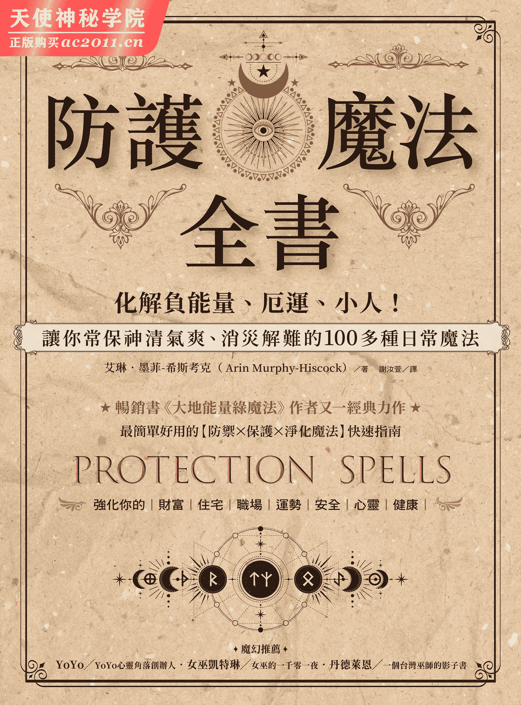

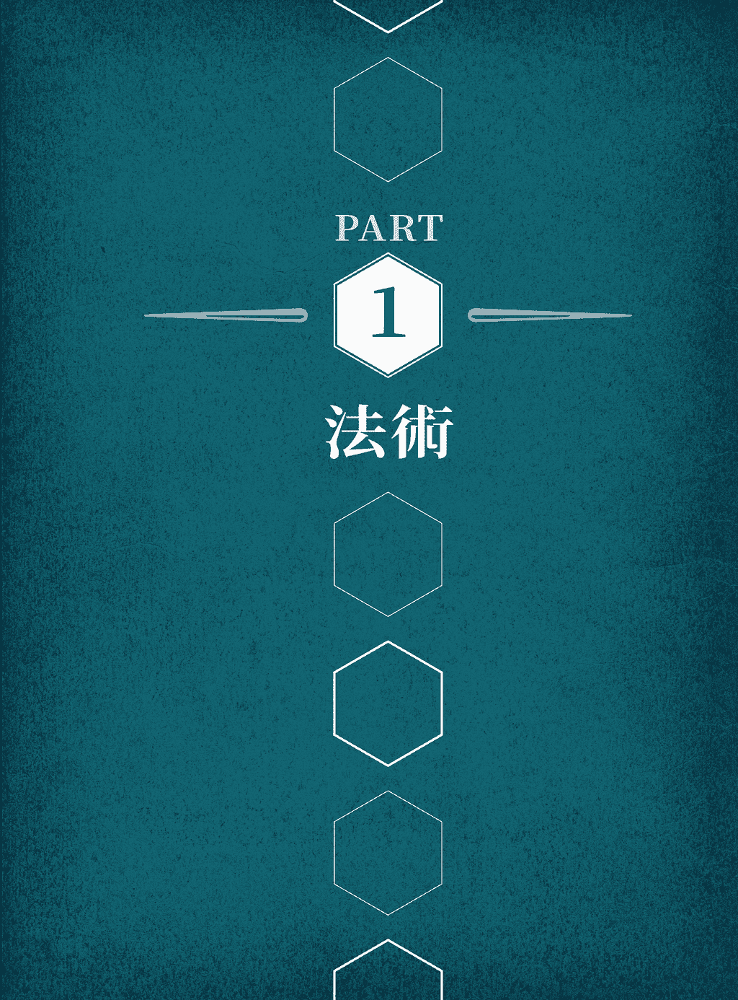

第一章

# 法术介绍

何谓法术（spellcraft）？法术是一种艺术，指的是你运用能量来调和你的世界，让自己与周围的能量同调，并与那些能量合力缔造出有益的成果。重要的是，施法不是宗教活动，反而是一种运用能量来启动某种改变的方法。施展魔法来保护并捍卫自己、你关心的人及生活中的各个领域，可以帮助你过着健全的生活。保护魔法有助于减少你平日必须处理的压力，以魔法维系能量也有利于你的情感与身体健康。法术不仅能协助你获得上述功效，还有更多好处。

## 何谓魔法？

魔法(spell)是你带着意念与觉知，在某个层次创造改变的行为，其运作原则是：万物都以能量连结。要施展魔法，就要在物理世界执行一连串象征动作，以启动不同层次的变化。魔法藉由引进新类型的能量，或重新分配既有的能量，而可望影响某个情况。

当施展魔法时，你发挥着促成变化的中介功能；你主动召唤资源聚集并指引能量。施展魔法时，也代表你承认自己的行动要为造成的变化负责。启动改变的是你的意图，无论后来的结果如何，都是你的责任所在（更多这方面的说明，请见本章的「伦理」一节）。

## 施法前的注意事项

法术的用意是改善你的生活。然而，如果你期待利用施法来避免外在劳动，那你就得要准备面对当头棒喝了。法术需要你付出心力、思维、能量、专注力。如果期待一弹指就能立刻产生改变，朝你心中的目标前进，这是天方夜谭。法术是一种转化过程，牵动着身为施法者的你，也牵动着你的目标与目标所在的环境。你的能量与努力必须画上等号，才显现得出成果。因此要达成目标，你还是要实际行动，只是你将更能掌控会发生哪些事，以及如何发生。

## 魔法如何运作？

世间万物都拥有某种能量，情势亦然。所有能量皆彼此连结，创造出网络般的关系。你希望以魔法影响某个情势时，会拧动那个地点的能量。那股拧动牵一发而动全身，整个网络都会为之振动，当每个魔法能量来到它欲修改的点时，能量场都会掀起若干涟漪。世界上充满了连接着每个人、每样事物的无数能量，这就是你能朝目标传送某些能量，或将某些能量拉向自己的原因。

你是魔法中至关紧要的一环

魔法是如何驱动的？魔法不同于化学与烹饪的地方在于，法术中有你、你的意志、你的意图存在。你是促成改变的中间代理人。你的行动刺激了能量。你的意志决定着能量的运动。你的意图引导它履行你所希望看见的变化。

魔法会当场见效吗？不会。施法以后，你要做的是保持信心，相信你渴望的转变已经展开，不久事情就会迎刃而解。接着你应该监督并留意变化。变化不一定在何时来到，很有可能在潜移默化中，有一天你会发现事情已经不同，却不确定是从何时开始的；它已经成为全新的常态。显而易见的戏剧性变化，其实少之又少。

## 防护魔法

在近十年的沉寂之后，近来人们对形而上的兴趣又重新升高。由于生活中不断受到新闻与信息的连番轰炸，压力与日俱增，人们开始设法让心平静下来，希望为捍卫世间的良善与正义尽一份心力。防护魔法就是你能尽这份心力的一个方法。

为何要使用防护魔法？

大体而言，人们寻求协助，是为了保护自己和所爱之人安全无虞地度过人生中种种波涛。保护与防御区域的魔法，也吸引着希望保护遭剥夺权利的社会活动团体或解决环保议题的社会工作者。

### 防御黑魔法？

防御怪物与黑魔法听起来戏剧性十足，但你在日常生活中其实不会频繁遇见这类情况。主动对你使用攻击性魔法或刻意施加灵力攻击的情况，其实极为罕见。

然而，世上确实有诸多负能量。仇恨、恐惧、愤怒——没有人躲得过。如果你对能量敏感，那股负能量确实会影响你，甚至对身体健康带来有害的效应使你生病。就算你对能量不敏感，那股负能量仍会影响你，吸走你的能量，让你感觉疲惫、暴躁、无来由地精疲力竭。

保护有几个面向。你可以保护某物不受大环境的负力影响。你可以保护某物或某人不受特定的危险侵袭。你可以防御刻意的或环境的攻击。你可以在人、地、物周围建立正能量场域，保护其不受负力影响，最重要的或许是，你可以持续维持一定程度的防御，因为预防是最好的药物。

### 何时需要防护？

每个人都能多下一些功夫进行防护，因为安全无比重要。但在感觉特别脆弱的时候，你也许更想加强防护。

你是否正体验着厄运当头的感觉？你是否正在无以名状的感受或不适下觉得心力交瘁？或是梦境特别栩栩如生，令人心神不宁？这些都是征兆，表示负力正在干扰你的个人能量或你运作的空间。

开始施展魔法时，你将更能意识到不同能量，这样的情形并不少见。毕竟，法术是关于运用能量，你愈常运用能量，就愈能感受、解读、移动能量。你的新觉知能让你感觉到自己的感官接受力全开，甚至令你不堪负荷。这时请不要以为自己遭到了某种攻击，你只是正在过滤自己收到的所有新信息。

以下的技巧能帮助你适应这种全新的觉知感受：

● 练习归于中心，使能量接地（见第二章）。

● 多待在户外。

● 多活动身体能协助你专注于自己的身体，平衡这种新的能量觉知。

● 照顾好自己。吃健康的食物、喝足量的水、获得充分的睡眠，还要冥想。

● 准备日志。写下你的一切体验，持续追踪法术的近况，观察事物之间有无任何关联性。

● 定期进行魔法仪式来净化自己及生活空间，降低能量的干扰。

● 对自己与所有过程保持耐心。

## 保持觉知

法术影响着施作者，也影响着施法术的对象。施展魔法能提升你对能量的感知与意识，促使你每日保持警觉。

有时法术只是提升你对潜在危险的觉知；那种觉察让你能探知所在环境的能量，提升你的专注力，让你在问题变得严重前察觉出来。这正是保护的关键所在：在问题尚在滋长阶段，还未酝酿成问题之前，便有所察觉。在问题尚在发展阶段时动手处理，要比大事不妙时再来处理要容易。

在日常生活中，对各种情况、环境、人的能量产生觉知，就是你的最佳防御之道。提升觉知能在情况有可能但尚未实际恶化之前给你警讯，协助你在负能量降临之前脱身，或祈求强力保护。

### 直觉

有时你就是有种莫名的感觉，彷彿有什么事不对劲。或你突然心血来潮，想走另一条路去上班，却说不出清楚的原因。那就是你的直觉在运作。

直觉是你的身或心收到信息时，在有意无意间产生的本能刺激。还记得前文提到的能量网络吗？能量带有信息，你就是因此而能以魔法影响另一处的情况。反之亦然：能量形式的信息也会由此来到你身边。你的意识心智通常会被不计其数的其他事物占据，因此解读这股能量往往是在潜意识进行。

信任你的直觉。它有助于保护你的安全。直觉是另一个层次的觉知，有助于为你的魔法带来相关能量。要记得，保护的根源多半是为了预防。聆听并信任你的直觉，能协助避开安全可能遭受威胁的情势。

## 伦理

伦理是施法时最需要考量的一个关键元素——尤其是你的魔法聚焦在他人身上的伦理问题。整体而言，要施加效应的人是你。你是拥有最多掌控力的人，也是允许自己施法的那个人。

如果你想以魔法改善的情况，牵涉到问题重重的某个人，那你要改变的仍应该是那个情况，而非那个人。那么运用魔法来进一步保护从事危险工作的配偶又该如何？再重复一次，你可以改善那个情况。但是，如果你就是特别想保护那个人呢？

如果没有对方的允许，你施加在对方身上的魔法是不会产生作用的。请开口询问！这不过是尊重的问题。你不会连问都不问，就径自为别人穿戴全套盔甲或曲棍球装备吧？魔法也是一样。如果你觉得很尴尬，可以简单地问：「嘿，我担心你〔某个特殊情况〕。你介意我稍微使用灵力，保护你的安全吗？」如果他们心胸开放，你们甚至可以讨论要采用哪种方法进行。比方说，他们喜欢身上带着能量石吗？

如果他们说不，你要怎么办？你可以多加说明；他们可能需要你提出更清楚的解释，才能了解你的提议为何。如果答案依旧，那你就面临了异常艰难的选项。你要不就是遵从他们的意愿……要不就是依照原订计划施展魔法。

此事非同小可，不能轻易下决定。如果你决定对不同意你施法的对象施展魔法，那你不仅要承担施法结果的责任，也要为你有违他人心意而决定施法负责。这个业力负担并不小。

你必须万分小心地权衡情况。你深怕友人性命不保吗？情况有严重到应该任你一意孤行吗？如果没有到那个地步，那你可能不应该涉身其中。

试试另一个方法

与其对某个特定的人施用法术，你可以施展全面性的魔法，未必要集中在个人身上，而是保护所有朋友与家人。或者你也可以对自己施法：以魔法协助自己在他人需要时，成为他们最好的朋友，提供一臂之力。

如果你是对某个区域（如房间）施法又如何？对区域施法在伦理上属于灰色地带。如果是你的房间，那无妨。不论是谁路经此地，都会与你进行个人互动，因为魔法不是施加在他们个人身上，所以应该不会有问题。但如果你需要或想要在某个公共区域（如职场的会议室）施法呢？首先你得仔细检视自己的动机。如果是施展魔法让开会者支持你，这么做一点也不酷。与其这么做，你不如加持一块石头带在身上，增加你的人缘，或改善你的沟通技巧，协助你清楚表达自己的观点。如此一来，你便是对自己施法；你就成了那个魔法的目标或对象。另一种情况是，你可能想对某个区域施法，促进正向力与效率，协助会议进展得更顺畅、焦点更集中。那么同样的，你并不是在未经个人允许的情况下施法，而是将有普遍好处、支援性的能量引进这个空间。

### 例外

伦理原则也有例外：你的孩子和宠物。尽管如此，这里仍有需要考量的伦理面。为人父母的你负有责任，你是孩子的法定监护人，要如何保护他们的安全、如何照顾他们，都由你来决定。话虽如此，如果他们年纪已经够大，还是征询过他们的同意，会较有礼貌、尊重。能够一起施展防护魔法的话就更好了！

与孩子一起施展魔法

和孩子一起设计新的魔法，是一件很有趣的事；他们会提出很有意思的类比和连结，能对他们有效产生作用。本书的许多魔法都可以转化给孩子使用。关键是要简化！更多关于孩童的魔法，请见第四章。

若是宠物又该如何呢？就和儿童一样，你是宠物的法定监护人，牠们的安危与照护由你来决定。然而，牠们也是有知有感的生物，如果牠们心胸开放，可以先征询牠们的同意。你会获得牠们觉得无妨的印象。如果牠们显得惶惶不安或显然不同意这个做法，你可以选择尊重牠们的意愿，或是以事态最佳发展的考量下迳行施法。

## 法术入门

开始施展魔法前，你必须知道几项基本要点。本节会介绍施法的空间和环境、事先计划与自然发生的魔法、自我防护（你需要魔法圈吗？）与其他相关事宜。

### 魔法圈是什么？你需要吗？

在施法过程中，魔法圈(circle)的功能是当成一种容器，将与你的目标产生共鸣的能量保留在内，其他能量则留在圈外。魔法圈对你也会产生心理效用。你费时建立魔法圈时，也是在心里对自己强调，你的施法区与日常生活区域是截然分开的。在魔法圈中的你和你施展的魔法，会将当前的现实与你渴望的现实连结起来。魔法圈能协助你聚焦于你的目标，并将你带向那个目标。

要在何时建立魔法圈？你可以先询问自己以下几个问题：

● 我现在身处于自己不熟悉的地方吗？

● 是否有容易让我分心的事物？

● 我的魔法复杂吗？

● 施法要花很多时间吗？

如果以上问题有超过两个答案是肯定的，那施法前先设立魔法圈或许会是个好主意。

### 设立基本魔法圈

在某些灵性道路上，修业者会以魔法圈辟出一块神圣空间来进行虔诚的礼敬。然而，魔法圈也是能量的容器，能避免你关注的事物受到不需要的能量分神或干扰。后面这点是施法时树立魔法圈的好处。

魔法圈的防护

基本魔法圈也能成为保护自己、用品、物件、空间的防护盾。更多关于这个概念下的魔法，请见 PART 2。

如果有帮助的话，你可以拿一条长绳在选定的地点实际围出一个空间，或在身边铺一圈贝壳或石块。魔法圈的大小因人而异；如果你是独自一人，没有打算四处移动，那直径 1.8 公尺左右的魔法圈就够了。请将双臂往两侧伸展，手指张开，感受一下你的基本魔法圈要多宽。如果想要舒适一点，那就让你的能量屏障稍微超出这个范围。如果你要在房间里四处移动，可以试着将魔法圈直接设在四面墙壁上。

请运用四个基本方位的能量及其相关元素来建立魔法圈。这需要你想象四个经典元素——土、水、风、火——如果你喜欢，也可以用一块石头、一小碟水、一根羽毛或薰香、一根小蜡烛来当成实体代表。将这些物品摆在其相应的方位——石头摆在北方，羽毛或薰香摆在东方，蜡烛摆在南方，水摆在西方——或在你的施法空间里就定位。

元素代表

如果你想在魔法圈中放置四大元素的代表，但不想占用太多空间，可以在一小碟水中放入一点盐代表土与水，用点燃的薰香棒或塔香来代表风与火。

##### ——─ 基本魔法圈 ——─

开始之前，请先用指南针或手机的指南针 app 来确定北方位置。

1\. 归于中心并接地（见第二章）。

2\. 面朝东站着，口中念道：「东方的能量，全新之光与颤动之风的能量，我在此召唤你们，协助我建立保护圈。」

3\. 转向南方，想象有一条能量线从东方射向南方。面向南方念道：「南方的能量，热情与明亮火焰的能量，我在此召唤你们，协助我建立保护圈。」

4\. 转向西方，想象能量线从南方射向西方。面向西方念道：「西方的能量，转化与流动之水的能量，我在此召唤你们，协助我建立保护圈。」

5\. 转向北方，想象能量线从西方延伸到北方。面向北方念道：「北方的能量，稳定与肥沃土地的能量，我在此召唤你们，协助我建立保护圈。」

6. 再度转向东方，想象那条能量线从北方来到这里，接上线的开端，形成一个完整的圈。观想能量从那条线升起，包围着你，在你的上方形成穹窿，接着想象脚下也形成同样的能量穹窿，直到你感觉自己受这颗能量球环绕为止。

7\. 口中念道：「魔法圈建立完毕；在土、风、火、水的力量下，我备受保护。」

8. 魔法圈设好后，就可以开始进行自己的工作了：施展魔法、冥想或任何必要的工作。

9. 上述工作完毕后，请再度站回魔法圈中央，双手高举过头。接着慢慢放下双手，观想你上方的能量穹窿打开、下降，退回那条能量线。再观想你脚下的另一半能量穹窿，以同样的方式逐渐融解。此时口中念道：「土、风、火、水，感谢你们今日给我的保护与协助。」

你施法的地方不宜点火吗？那请用别的东西来代表火，例如相片、图画，或一盏小 LED 蜡烛。

如果在施法期间，你基于某种原因必须跨出魔法圈怎么办？请花一分钟想象魔法圈的能量壁开出一条拱道，你可以从这里跨出魔法圈一会儿。回来时，再想象那条拱道逐渐消褪，最后回复到平滑、无缺口的能量墙。请注意，如果你要长时间离开，这就不是理想的做法；如果你要施展的魔法分成两部分，第一部分完成后要稍候片刻才进行第二部分，那就先完成第一部分后，撤掉魔法圈，稍晚再设立新的魔法圈来进行第二部分。

### 不使用魔法圈施法

施展魔法前，你不一定总是有时间或机会先设立魔法圈；有时你必须在危险或有时间压力的情形下迅速行动。有时则是因为你身处在安全、熟悉的地方，不需要设立任何屏障或保护。在上述情况下，或任何你感觉自己并不需要设立完整魔法圈的时候，你可以念以下的短咒语来保护自己施法：

在上的世界，在下的世界，

能量请过来，能量请流动，

保护之光围绕着我，

高山与天空，火焰与海洋。

还有一个更简单的方法：只要去观想有一道光围绕着你就行了。

## 何谓祭坛？你需要吗？

祭坛只是一个专门的工作空间，在宗教背景下是在敬拜仪式中使用。但本书中的魔法在任何地点皆可施展，你不需要特别在受到福佑、专门的空间施法术。

话说回来，如果你想要在专门的施法术空间，那也无妨，可以架一个小台子，或挪出边桌的一块空间来施法。有些人喜欢准备一条施法术用的专门布巾，随时可以拿出来铺成施法术的空间。

关键在于你感觉是否自在。有些人偏好每次都在同一个地点、在同样的环境下施法术，以触发自己进入施法状态。他们甚至可能每次都穿着同样的服装，或焚燃同一种薰香。你可以多加实验，找出对你有用的方法。

### 施法术

以下是施法术时要记得的几条基本事项：

● 每次施法术时，你都必须带着特定意图来执行每个动作并观想目标，这是一大重点。如此一来，才能加强你聚集的能量，使其依你的特定目标编定用途。要记得，单是把两株草与一颗宝石摆在一起，魔法是不会产生作用的；它会产生作用是因为你将那些物品与你的目标连结，协助激发你的意念与意图能量。

● 开始前，请先确定你的所需物品都已备齐。没有什么比施法到一半，必须起身去拿打火机或剪刀更会打断魔法与专注力的了。如果发生这类情形，请直接停下，稍后再全部重来。

● 请关手机，关好门，尽量减少会令你分心的事。如果有隔绝不了的环境音，可以戴上耳机听着轻音乐，让你进入施法所必要的心境。

● 请判定你需要的是一个确确实实的魔法圈，还是可以不设立魔法圈就施展魔法。

## 魔法的类型

在本书中，你会遇见各式各样的法术风格。以下先简短综观各种不同类型，这样你在它们出现时，心里会先有一点概念。

#### ｜护饰、护身符（Amulets）｜

护饰、护身符是你携带或穿戴在身上的被动型物件，能运用其力量来守护或保护你。如果你不戴上自己心爱的手镯、项鍊、坠饰、戒指等就会惶惶不安或没有安全感，那么那件首饰已经是某种护身符了：它定义着你一部分的能量，你也将它与你的自我觉知连结。

前述的首饰变成护身符，仅只是因为你时时携带或穿戴，于是它就成了你的一部分。如果你要特地创造一个护身符，可以根据物件的象征或传统联想、你对它的个人联想、物件的形状与色彩、它的材质等来进行选择。

#### ｜符袋（Charm Bags）｜

符袋是装有物件或材料的小袋子，这些物件或材料是依特定目的搜集来加持的。这类符袋也称为护符袋（talisman bags）、巫毒袋（gris-gris bags）、魔力袋（conjure bags）、咒袋（mojo bags）等，不一而足。美国原住民的药草袋也有同样目的。符袋中装有五花八门的物品，反映着个人的药方或能量，或弥补个人的能量在那当下的不平衡或弱点。

符袋可以做为支援整体能量的通用符袋，也可以依促进健康、消灾解厄等特定用途量身打造。它和提供防护屏障的护身符不同，符袋与魔符（talismans）会主动吸引能量到你身边。

#### ｜绳结魔法｜

很久以前，水手会将女巫做给他们的绳结带在身上。当要召唤需要的风时，他们会解开绳结，释放其中的魔法。绳结是事先施法的一个好方法，让魔法随时准备好在需要的时候释放。绳结也可以用来束缚东西，避免它四处移动伤害他人。

棉、丝、毛、麻都是可用的理想纤维。请避免尼龙与压克力等材质。当然，你使用的材质其实不一定要是绳子，也可以用毛线、绣线、刺绣用毛纱，以及条状材质来施法。任何一种使用绳线类制作的艺品都能归类为绳结魔法，所以无论是编结、钩织、针绣还是编织，各种技巧都能运用在绳结魔法中。

#### ｜蜡烛魔法｜

蜡烛魔法是最受欢迎的一种法术类型，原因不令人意外。蜡烛取得容易、使用方便，而且蜡烛魔法也非常有弹性，可以适应你不同的需求。当蜡烛逐渐燃尽时，你可以想象阻碍也逐步化解，或想象你所赋予的能量正在释出效能。你也可以将蜡烛缓缓融化的过程，看成是目标正逐步向你靠近。

任何一种蜡烛都能使用。茶蜡（小圆蜡烛）与生日蜡烛是很理想的材料，因为燃烧得快。请拿一根从未使用于特定用途的新蜡烛，以双手捧着，同时认真去想你的渴望或需要，接着点燃蜡烛。你必须确定自己的目标明确，心里要明白结果如何，不要拐弯抹角。观想的目标愈清晰，效果会愈好。要增添助力，可以选择与魔法效果有正面关联的蜡烛颜色（参考第七章的色彩及相关能量说明）。

加持与授能

加持（charge）与授能（empower）是指在施法时编定物件或材料的用途。基本上，这意味着以你的意志力为指引，运用你的个人能量，将你的目标清晰铭印到物品当中。以蜡烛魔法为例，你是以自己的需要或命令来为蜡烛授能。

#### ｜共感魔法｜

共感魔法与其说是一种技法，不如说是一种法术类别。共感魔法的原则是，无论代表人事物的东西发生什么事，同样的事就会发生在它所代表的人事物上。巫毒娃娃是共感魔法经典的例子。共感魔法也是一种模仿魔法，以所代表的情境与代表物本身的连结为依据。在保护魔法中，你想要保护的人或物将会成为代表的主体。

#### ｜接触魔法｜

接触魔法是另一种法术类别。人或物接触加持或魔化（enchant）过的物件以吸收其特性，便是接触魔法的体现。它也会以另一种方式发挥作用：任何东西一旦接触了人或物件，就会带有其能量的痕迹，日后可以用在魔法中施加影响力。脚印或一块布等就属于这一类范畴，拿头发或剪下来的指甲施法这类古老概念，也同样是接触魔法的例子。曾经是成群或成对的事物一旦分开，也能用来当成彼此的连结。如果你见过闺蜜项鍊（BFF necklace，分成两半的项鍊坠，你与闺蜜各戴一半）那也是另一种形式的接触魔法。各戴一半项鍊坠的两人会因此相连，就如同连结两人的友情。

#### ｜文字魔法与肯定语｜

文字魔法是一种十分直接的施法方式。最简单的做法是大声念出咒文，主动将魔法化为词语，将你所渴望的现实当成已经实现一般说出来。例如不说「我要变得勇敢」，而是说「我很勇敢」。

肯定语也能成为一种强而有力的文字魔法。反覆念诵是建立新现实的一个方法，不断重覆肯定语在改变对某个事物的态度上特别有效。

肯定语特别适合用来保护兴盛繁荣及财务状况、加强自尊与信心、拓展觉知、提升直觉，上述这些都能增进你的自我防御。

肯定语就如其他文字魔法一样，应以现在式及正面积极的词汇来陈述。「我很安全」对你的潜意识而言，意味着你此刻正受到保护，只是你需要去意识到；「我将会很安全」传达的讯息则不同，意味着保护永远要到某个未来的时刻才会出现，但都不是此刻。「我不怕」不如「我很勇敢」来得有力，主要是因为你的心念念不忘「恐惧」的关键概念，而不是关注在随之而来的负力。

书写是文字魔法的另一面。书写魔法做起来也很容易，只要拿出一张新的纸，尺寸随意，然后写下你的渴望或宣告即可。你可以将纸折起来．放在蜡烛下烧成灰，然后卷起纸灰，绑上带子，当成护身符带在身上，或是将纸折好，放进小盒子里。再拿一张色纸来添加一层能量，或使用彩色墨水或从工艺商店买来的图纹纸，其图纹要以支持你的法术目标为主。可能性是无穷尽的。

反覆写出一段文字是另一种实地加强思想能量的方法，就像大声念出文字。两者都是以身体动作来加强存在你脑海的概念。书写魔法也可以刻在蜡烛上，或将关键字写在纸条上，当成护身符或魔符带在身上，或是创作出一件魔法艺术品放在家里展示（第三章的「天堂信」是绝佳的范例）。

肯定正面结果

肯定语是正面的宣告，但创造新现实这一点，就负面宣告而言也是成立的。如果你时时对自己做出负面的评论，或相信他人对你的负面评语是真的，那就会创造出你并不乐见的现实。「肯定」这个词反映出了这项技巧的正面性质。你肯定或支持着自己渴望显化的新现实。

## 做记录

四处施展魔法没有什么不好，但要成为有效、成功的施法者，你就要特别留意哪些事会生效，哪些不会。如果有某项魔法功效不彰，你应该检视造成失败的潜在原因。记下你是在一周中的哪一天或一天中的哪个时间施法（在午餐时间施法可能经常会失败）。你使用了哪些材料╱用具（如果迷迭香的能量和你不对盘，那可能不适合当成你的药草）？你不需要浪费时间与能量在不会生效的魔法上，了解如何省时的唯一方法，就是追踪你的成败。

请拿一本笔记本，开始记下日期与时间、天气、你使用的原料╱用具╱元素、月相、你的心情、你的健康状况……等，把你能想到的一切统统记下来。写下你施展魔法当下的感受，以及结束之后的感受，也务必记下后来产生的效应，例如是否做了怪梦、出乎意料地疲倦，或是能量大幅提升等。请留下篇幅来记录结果，一有察觉到任何结果就记下来。这些所有信息都是可提供你日后回顾的大量知识，能让你深入了解你施法的强项与弱项。

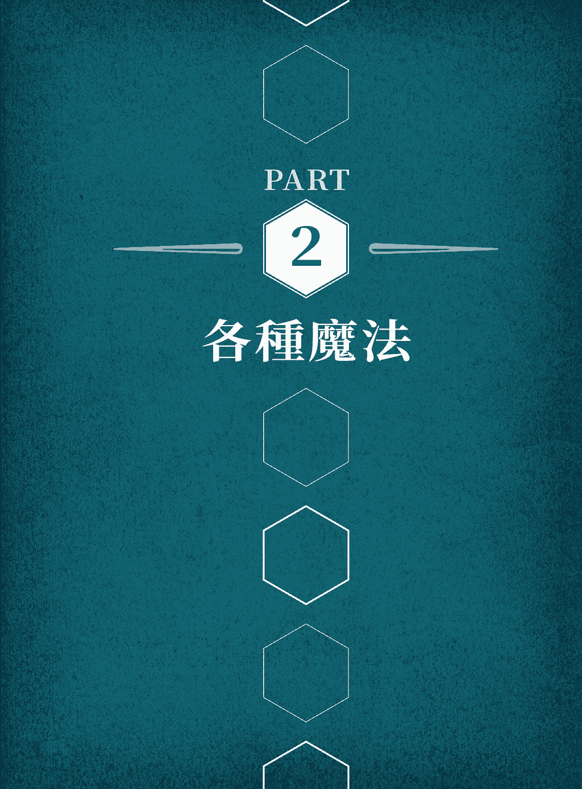

第二章

# 身体与心灵

保护的责任要从自身做起。在今日社会中，人们时时受负能量轰炸，环境负担、社会压力、忙于维持生活需求，人的身体、精神、情感都被这些所包围。保护自己不被击溃，就是处理所有这类压力的第一步。

精神与情感的疲劳衰竭会影响你的身体，这点不是祕密。这三个领域息息相关。因此，以下的魔法所聚焦的许多领域可能会有重叠。举例来说，如果你的同事有公主或王子病，他可能会在精神与情感上依赖你，对你的身体能量造成负面影响。在累积更丰富的施法经验以前，一开始请先个别处理每个议题，好帮助你真正聚焦于确切的目标，日后再将所有层面归入到同一个魔法中。

## 魔法帮助的是懂得自助的人

魔法不是问题的唯一解答。你可不能对家里施了保护魔法后，出门就不关窗也不锁门。在魔法之外，你还必须以其他行动来增加保护，那意味着在保护自己方面，你必须谨记以下几点：

● 运用常识。避开危险区域。不论何时，都要知道自己身在何方，事先熟悉所在地的空间规划与方向。让别人知道你要去哪里、何时会回来，并确定自己知道紧急时要打哪支电话求援。

● 如果你知道是哪些人让你的身体或能量不堪负荷，请减少与他们相处的时间。这些人的能量不平衡，所以只要可以就会到处汲取能量，自己却往往对此浑然不觉。有时你也可能有相反的问题，你感觉心力交瘁是因为某个外向的人一直在强力投射能量。他也许没有攻击的意思，只是活力充沛或真心喜欢你！然而，这些人也可能令你疲惫。

● 在恐惧的情况下，要保持冷静。如果你慌了，就会陷入自己的恐惧中动弹不得，要保护自己就更加困难。

● 要记得，刻意的灵力攻击极为罕见。自招厄运其实才是最常见的折磨，远较于别人倾注一切能量毁掉你的人生更常见。请别自欺欺人，以为有人对你进行灵力攻击，或被厄运缠身。这是你在实现自身的预言，你会因此而吸引负力，造成整个恶性循环。请以魔法来中断这种情况。

请试试这个练习

请去了解让你疲惫或无力的事物是什么，列出至少五个项目。思考自己在这些情况出现时，能用哪些魔法和非魔法的方式来处理。你也可以设法避开那类情况。

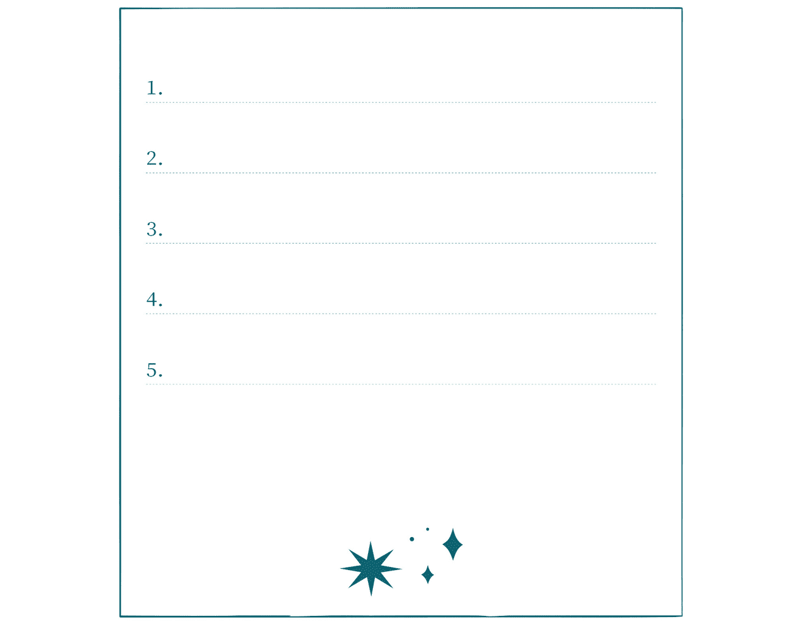

## 一般的自我防护

本节从最基本的防护技巧谈起。如果一只爱咬人的狗追着你跑，最安全的做法是关上门，把牠挡在门外，你则待在屋内。就魔法来说，这意味着为自己设立一道防护盾、一个保护区域，或是一个能量圈，将危险隔绝在外，你则待在内部。这股能量来自哪里？来自你的内心与周围环境。

本书的头几个魔法，相当于教你如何在煮面或煮蛋前先把水煮沸。这些是基本技巧，应该是你离家前必须先做的事，如果你是住在有些不安全的地方，这些甚至是你下床前要先做的事。

归于中心并接地

归于中心（centering）是指找到你的核心，静静专注于你内在的能量；这是一种正念的方式。接地（grounding）则是指将你的核心连结上大地的能量，让你能平衡自己的能量值。归于中心与接地在冥想与武术中也是常见的做法。

##### ——─ 归于中心并接地 ——─

最能竭尽自己所能的方法，就是运用所有能量来施法。藉由连上更大的能量来源，你允许那股能量流经你的身体，提升你的能量，同时为施法目标注入力量。每当你感觉惊吓或惊慌时，这项技巧也很重要。它能保卫你，让你感到安稳，更能平心静气地面对眼前发生的事。

1\. 以舒服的姿势坐或站着，闭上眼睛。深呼吸三次。

2. 观想一道光从你的身体核心升起。任何部位都可以是那道光的所在；大多数人会直觉观想那道光位在心脏或腹部。

3. 观想这道光的触须往下伸入大地，透过地面深入地球核心。请看着它接触、加入地球的能量。

4. 观想大地能量沿着触须往上为你的核心重新注入能量。感觉那股能量遍布全身，充满你的能量，弥补你能量不平衡的情况，为你带来稳定。你已与大地连结。

5. 你想维持这股连结多久，就维持多久，尽量享受这种能量的交流。结束的时候，请感谢大地分享能量给你，减少能量的流动，但不要完全切断大地与你核心之间的能量通道。让它与你保持一丝连结，你才能随意汲取能量，或在必要时将多余的能量分流到其他地方。

小提示

● 如果有帮助的话，可以想象自身的能量是一种色彩，大地的能量是另一种色彩。当你从下而上汲取大地能量来使自己接地时，可以想象大地能量的色彩与你自身能量的色彩融为一体。

如果你感觉自己的能量过于饱和时，也可以反其道而行。请观想自己连上大地核心的能量，但此时请不要从大地汲取能量，而是反过来观想你将多余的能量往下流入大地。

##### ——─ 基本防护盾 ——─

一旦你知道如何归于中心并接地之后，就可以运用大地的能量，在身体四周形成防护盾了。这非常类似第一章提到的「基本魔法圈」。你想把防护盾延伸多远就多远，只是要记得，防护盾愈大就愈难维持。要打造防护盾，请从手臂向两侧伸直后指尖触摸得到的泡泡做起。

1\. 归于中心并接地。汲取大地能量到你的核心。

2. 观想能量从你的核心向外扩展，如肥皂泡泡般包围全身。将那股能量延伸到你想要的范围。

3\. 为协助确立观想，你可以在这时说出关键短语，例如：「我召唤我的个人防护盾。在防护盾的保护下，没有任何危险或灾厄会降临在我身上。」

小提示

● 你会发现，个人防护盾会随着时间自然消褪。请时时检查，拓展你的觉知来感受防护盾是否有任何弱点。如果有，只要汲取更多大地能量来加强整张防护盾就可以了。

● 制作永久防护盾听起来是好主意，但其实不然。防护盾有可能就地锈坏，反而让你很难将能量导入和导出。请定期撤下防护盾，再制作一个新的防护盾，这样你就能在需要的时候，随时收放防护盾。

##### ——─ 进阶个人防护盾 ——─

一旦你熟谙了如何建立基本个人防护盾，就可以进行各种实验，找出真正能与你及你的需要产生共鸣的防护盾了。请试看看以下的镜子版本。

设立你的个人防护盾后，请想象防护盾肥皂泡泡般的表面转化成为一面镜子，镜面向外。它能将负力弹回去，使其无法近身。

请为你的防护盾多做其他表面的实验。何不试试让葡萄藤缠绕着你的防护盾？如果你观想防护盾是一颗冰球又如何？阳光呢？流水呢？请找出对你最有效的表面（可以每天都不一样，或依你所在的环境是哪一类而定）。

##### ——─ 渐盈月魔法 ——─

传统上，月相从亏到盈的前半部周期与吸引能量到你身边有关。健康的身体、健康的心灵、快乐的心、稳健的财务状况、专注力、恢复力……无论你需要什么，此时是将正能量引进生活中的理想时机。以下的版本以一般的保护为主。

需要物品：

白色小蜡烛，如茶蜡(小圆蜡烛)或生日蜡烛

烛台（使用生日蜡烛的话，插进一块黏土即可）

火柴或打火机

1\. 归于中心并接地。

2\. 将蜡烛放上烛台点燃，口中念道：「渐盈月啊渐盈月，请保护我不受任何意图伤害我。感谢你的诸多保佑。」

3\. 静待蜡烛燃烧完毕。

小提示

● 你可以把这当成特定魔法的基础，针对特定议题施以保护。只要将「不受任何意图伤害我」换成你的目标即可。

##### ——─ 渐亏月魔法 ——─

月相的后半周期是由盈转亏的时期，传统上会将此时与驱逐、逆转、摆脱事物等连结在一起。只要改变措辞，重述你的愿望，就能轻易将前一个魔法用于渐亏月期。

需要物品：

白色小蜡烛，如茶蜡(小圆蜡烛)或生日蜡烛

烛台（使用生日蜡烛的话，插进一块黏土即可）

火柴或打火机

1\. 归于中心并接地。

2\. 将蜡烛放上烛台点燃，口中念道：「渐亏月啊渐亏月，请将任何意图伤害我的力量从我的生活中驱逐。感谢你的诸多保佑。」

3\. 静待蜡烛燃烧完毕。

小提示

● 白蜡烛属于多用途。如果你更偏好使用黑色蜡烛，也找得到小蜡烛的话，在驱逐的版本中继续使用无妨。也可以使用任何其他让你联想到驱逐的颜色。

## 保护自己的身体

本章魔法大多是要用来保护你，但这里特别聚焦在你的身体，不论是保护你的身体不受伤，或是保护你的身体不受负能量影响。

##### ——─ 人偶娃娃魔法 ——─

人偶娃娃是用来当成施法焦点的小布偶或小人像。在这个魔法中，人偶娃娃代表着你的身体，是你能量的焦点。过去人偶娃娃（傀儡）是以木头刻制、以某种材质的碎片拼成，甚至以根茎或绳索捻制而成。这里的魔法使用的是不织布。你可以自行选用颜色，选自己偏爱的色彩或黑、红、蓝等与保护有关的颜色都好。如果你有姜饼人（或姜饼女）的饼干模具，也可以用来当成形状的样板。不然就是自行制作一个简单的人偶。在魔法的后半部会做一个盒子来储放娃娃。

需要物品：

两块方形不织布，约 15×15 公分

签字笔、定位珠针、剪刀、针线、纱线、布片（非必要）

6-12 颗棉球

你出生那一年发行的钱币或其他硬币

一撮盐、一撮迷迭香(Rosemary)、一撮芸香(Rue)

红碧玉(Red jasper)

1. 叠放两片不织布，以签字笔在上面画出人形。将不织布以珠针别在一起，剪下人形。

2\. 缝合两片人形不织布的边缘，头部留下开口。

3. 拿签字笔画出人的五官与身体特征。如果你身上有疤、胎记，或你总是戴着某个首饰，也请画下来。这里的要点是运用可辨别的关键元素，让娃娃看起来更像你。喜欢的话，可以用纱线做头发，或取旧衣的布条缝制娃娃的衣服。

4. 稍微抓松棉球后塞进娃娃内部。塞到一半时，放入硬币、盐、迷迭香、芸香、红碧玉。最后用剩下的棉球完成娃娃的填充。以珠针封住娃娃头部，再以针线缝合。

5. 归于中心并接地。将娃娃捧在手里，从地面汲取能量，使能量充满你的核心。让能量往下流入手臂，灌注到娃娃上。口中念道：「这个娃娃就是我，它的安全就是我的安全。」

小提示

● 如果你是随手画出人形，请不要画得太细腻，或是把手脚画得太长或太细，这样会不易填充棉球。画出大致轮廓即可。姜饼人的样子就是很正确的形状。

● 喜欢的话，可以在塞进上述物品时，把自己的一两撮头发或剪下来的指甲一并放入娃娃内。

##### ——─ 人偶娃娃盒 ——─

这个魔法是用来为你的娃娃创造一个安全的储放地点。

需要物品：

附盖子的木盒，大到放得下娃娃

黑色漆、画笔

白布，大到包裹得住娃娃

1\. 以黑色漆涂满盒子内部，别忘记盖子内侧也要涂满。等待漆干。

2\. 以白布包裹娃娃后放进盒子。盖上盖子。口中覆念：「只要这个娃娃安全，我就是安全的。」

3\. 将盒子放到安全的地方。

小提示

● 你可以选择在人偶娃娃盒外侧点缀些色彩，或任何你想要的装饰。可以考虑在顶端贴一面镜子回挡负能量以保护娃娃（也就是你）。

人偶娃娃盒也可以当成一般用途的绝佳魔法盒。本书中的诸多魔法都需要将某样东西放在安全的地方，魔法盒是储放这些物品的好点子。请制作一个通用的魔法盒来安全储存这些物品。

##### ——─ 防护性护饰 ——─

穿戴符合你信仰的保护象征物，是一种古老的做法。要制作防护性护身符，选用自己目前在戴的首饰，或特地找一件新首饰都可以。不论是哪一种，请先将首饰拿去过香净化之后再来施法，才能去除外来能量和任何累积在内的能量，使其能充分为新目标效力。

需要物品：

薰香或塔香（檀香或乳香）与香炉或香船

火柴或打火机、首饰

1\. 归于中心并接地。

2\. 点燃薰香。将首饰拿去过香，同时念道：「藉由香的净化之力，你先前的负能量已完全涤净。」

3. 将首饰拿在手里。闭上眼睛并从大地汲取能量，再感觉能量从手臂往下流入首饰。将能量导入首饰时，口中请念道：「我为你加持，〔物品名称〕，你自此成为我的防护盾，抵御伤害与危险。」

4\. 尽量常配戴这件首饰——每次出门当然更要戴在身上。

小提示

● 戴上首饰前，请先泡澡或沐浴净化，或先进行下文中的能量净化魔法来重新出发。

如果你没有能与保护连结的象征物，或不愿意公开戴上这件首饰，可以拿一件能戴出门的普通首饰来施法。不需要为选择哪件首饰大伤脑筋，随着品味、喜好改变，你也可以将本来的护饰改为俗用，另做一件新护饰。另一方面，护饰穿戴、使用得愈久，就会蓄积愈多力量，而使用首饰来当护饰的一个要点就是，你不会任意丢弃。柠檬净化法

你每晚都会固定洗脸和双手……所以何不也定期洗去累积了一天的负能量？你可以在沐浴或任何时候快速净化。柠檬是抵抗负能量的传统解药。

需要物品：

柠檬片

1. 请想象身上黏附着负能量，或有一股气聚集在后颈部。如果有帮助的话，可以观想它是黑色或浊褐色（可能会使你不舒服，但不须担心，等会你就能摆脱它了）。

2. 拿柠檬片擦拭后颈部，让它吸走所有负能量。如果有必要，想擦拭多久都无妨。

3. 将柠檬片丢入堆肥后将会分解，然后它从你身上移除的负能量也会随之转化。

小提示

● 如果感觉负能量聚集在后颈部令你浑身不舒服，可以改将负能量召唤到你的掌心，再用柠檬片去除。

##### ——─ 净化浴 ——─

有时你需要的不仅是应急的净化，这时净化浴就能帮助你放松。将盐、迷迭香、檀香混入水中，有助于去除附着在你身上的负能量，并且重新设定你的能量。

需要物品：

一杯镁盐（Epsom salt,也称为「泻盐」）

一茶匙迷迭香、三滴檀香精油

1\. 拿小碗混合所有原料。

2\. 放温度适中的洗澡水。将镁盐等混合物撒入水底。

3\. 泡澡，要泡多久都可以。

##### ——─ 烟燻净化法 ——─

烟燻在好几种文化中是传统的净化方法，通常会先点燃一捆干燥药草，待火焰熄灭，留下草料继续生烟。鼠尾草是一种传统的净化药草，也是你所能找到最常见的烟燻棒材料。

需要物品：

烟燻棒

火柴或打火机

隔热碗

1. 点燃烟燻棒的一端，等干燥药草点燃之后，轻轻吹熄火苗。你可以直接拿着烟燻棒点燃，或是将烟燻棒放进碗里，再拿着碗或把碗摆在旁边的桌上点燃。哪种方法简单就用哪种！

2. 轻轻将烟搧到全身上下。弓起手心做出洗的动作，让烟蔓延到手臂与腿部。在这同时，也请观想这道烟化解了所有附着在你身上的可厌能量。

你不需要用完整根烟燻棒。净化空间或能量的工作完成后，就可以在隔热碗或沙堆中将香捻熄。冷却后再以铝箔纸包住烟燻棒，留待下次有需要时使用。

##### ——─ 日光魔法 ——─

千万不要低估阳光的力量！在你遇到难关时，阳光是最快、最简单，也最直接的魔法。这种魔法在晴天最容易进行，但即使是阴天也能施展，因为阳光就在云层后面而已。

1\. 感觉焦虑、受威胁、不安稳时，请走到户外，置身于新鲜空气中。

2\. 抬起头面对太阳，闭上眼睛，口中念道：「太阳啊，请驱逐这股负能量，破除它对我的掌控吧。」

3. 感觉太阳温暖地照耀在脸和身上。缓缓地深呼吸，想象你每次吸气，阳光就流入体内。

4\. 口中念道：「我自由了。谢谢你，太阳。」

5. 回到原来的地方继续过完剩下的一天。如果工作已结束可以离开，那就移动到下一个地方。

小提示

● 最好在户外进行这个魔法，但必要时也可以走到窗边面对太阳，透过窗户将阳光的能量引到自己身上。

一定要大声念咒文不可吗？大声念咒文是有帮助的，因为话语是强调意图的一种身体动作，但如果眼前的情况要求你保持安静，那么你也可以在心中默念咒文。你也可以用嘴唇和声带来默读咒文，但不真的出声。

##### ——─ 大型女巫之梯 ——─

女巫之梯是一种使用绳结的施法技巧。以下的女巫之梯主要是为了保护所悬挂之地或目标对象的安全。这里制作的是大型辫子，可以挂在墙上或放入抽屉里。

需要物品：

三段（各 90 公分的）绳子、纱线、带子、毛线或绣线

串珠、羽毛、与保护有关的小坠饰护符

针线（非必要，请见以下指示）

1\. 将三段绳子的一端绑在一起

2\. 观想你的目标，缓缓开始将三条绳子编成辫子

3. 感觉到时机的时候，就停下来把串珠串进或将小护符套进其中一条绳子。如果你的绳子太粗，串珠或符物套不进去时，可以先将整段绳子编完打结，接着用针线将串珠与护符缝到辫子的不同位置上。将羽毛编入或缝到辫子上。

4. 将女巫之梯挂在你希望保护的区域。你可以连接两端形成一个环，像花圈一样悬挂，或是直接穿过绳结垂直悬挂。还有一个方法是折或卷起来，存放在一个小空间里。

小提示

● 请见第七章的说明，查看在各种情况下与保护有关的色彩与符号，以协助你选择要将哪些物品编入辫子中。与防御有关的盾牌、武器或动物的象征符号，也是制作女巫之梯的好点子。

● 在打结的一端系上重物，或用胶带黏在桌边，可能有助于编结。你也可以将绳结钉在枕头或是沙发靠垫上再开始编结。

绳结魔法是以编结或缠绕绳子的动作，将魔力与能量固定在绳结中。

##### ——─ 迷你女巫之梯 ——─

这是一种小型、个人尺寸的女巫之梯，可以放在口袋或皮夹里。最好以较轻的绳线、纱线、带子来制作。如同大型女巫之梯，如果你的绳子太粗，套不进串珠或护符，可以改缝在指定位置。

需要物品：

三段（各 30 公分长的）绳子、纱线、带子、毛线或绣线

三颗串珠，或与保护有关的小坠饰护符

1\. 将三段绳子的一端绑在一起。

2\. 将串珠或护符套进中间那股绳子，放在结的正下方。

3\. 观想你的目标，缓缓开始将三条绳子编成辫子。

4\. 快编完一半时，将另一个护符或串珠套进绳子，再继续编结。

5. 编到剩下两三公分的时候，将最后一颗串珠或护符套进绳子。末端打结。

6. 将女巫之梯带在身上。你可以将两端打结形成一个环、盘绕成圈，或是直接放进一个小空间亦可。

小提示

● 这类迷你女巫之梯是旅行时绝佳的行李保护符。下次出游前，请将女巫之梯塞进皮箱里吧！

##### ——─ 困缚负力之术 ——─

如果你出门在外，开始感觉侷促不安或不自在，或感觉受负面思想纠缠，可以试试这个应急的魔法。你可以使用鞋带的一端、背包背带未系紧的一端，或任何物品来进行。必要时甚至可使用衬衫下襬、围巾或提包带。

需要物品：

一条绳子，长度不拘。

1. 当怒气或恐惧从内心升起，或感觉身边有什么不对劲时，请观想负能量在你面前形成一颗球。以手指拉紧绳子，口中念道：「我命令你停下；我将你束缚在此地。你伤害不了我。」

2. 用绳子打出简单的活结，观想绳子绑住你面前的负能量球。拉紧绳子，深呼吸，然后呼气，让那股紧张离开你的身体。然后释放绳子使其恢复松弛。

3\. 离开到安全的地方时，打开绳结，让能量消散。

## 保护你的健康

健康是魔法支援的一大重点类别。这个主题不同于上文提到的基本保护或人身保护，因为本节的焦点是保持身体强健，或专门针对健康的相关事项施展魔法。健康是生活安康的整个拼图中的一块。守护你的健康，就是协助自己守护生活中的其他一切。

##### ——─ 医院官僚终结术 ——─

要保持健康，有一部分意味着要与医院组织周旋，有时还要面对医院的官僚作风。当自己或家人生病时，没有什么比在担心疾病、健康、财务状况的同时，还要与官僚纠缠更让人烦心的了。以下的魔法能协助你解开繁文缛节的束缚，让文书流程更顺畅。

需要物品：

空白纸张 10x10 公分、原子笔或铅笔、红线 20-25 公分长、剪刀

1\. 归于中心并接地。

2. 在纸上写下你必须进行的疗程，或请领保险的必须步骤。将纸折起来，以红线捆绑，愈多圈愈好。

3\. 口中念道：「走出官僚作风的迷障，走出繁文缛节的黑洞，来到大事告成的光辉下：一切阻碍就此消失！」

4\. 将红线剪成数段，使其短到不能打结为止。打开纸张并念道：「沟通无碍，水到渠成。」

5. 将剪断的红线丢入垃圾桶，纸张则保留下来，等疗程已经上轨道，或保险支付已经拨款下来后，再将纸烧掉，将纸灰撒到屋外。

小提示

● 你可能想多做这个魔法几次，因为过程中还可能出现新的阻碍。请每次都使用新的红线，但要重复折叠原来的纸张，直到整个情况确实解决为止。

##### ——─ 柑橘与丁香健康长寿魔法 ——─

这可能是你从小就熟悉的魔法，通常是在圣诞节前后施行。这里要召唤柑橘与健康有关的联想，以及丁香与麻醉、净化有关的联想。

需要物品：

小柳橙或柠檬、一罐全株丁香花(或称丁香原粒)

浅盘、细竹签或图钉（非必要，见以下指示）、小碟子

如何做：

1\. 归于中心并接地。

2\. 将水果拿在手里，口中念道：「〔水果名称〕啊，我召唤你的疗愈与强化能量。」

3. 拿着浅盘施作以免果汁滴落，开始将整株丁香逐一压进果皮内。如果果皮太硬或丁香太干，请先用竹签或图钉戳洞再塞入。

4. 以丁香覆满水果表面，愈多愈好。完成后，将水果拿在手里，口中念道：「请保护我的健康，柑橘与丁香。」

5. 将水果摆在小碟子里，放在通风良好处。每天都去翻一翻，让它均匀风干。如果开始发霉的话，就放进堆肥，重做一个（别担心，这和你的健康状态毫无关联，问题出在你所在地点的天气干湿状态）。

6. 风干后，只要你觉得有必要，就继续将镶满丁香的柑橘摆在小碟子里。不过请定期检查，确保它的状态良好；如果开始褪色、发霉或腐败，就放进堆肥，重做一个丁香柑橘。如果摆在能量频繁交会的地方，可以考虑每三到四个月做一个新的丁香柑橘。

小提示

● 如果希望的话，可以用丁香在柑橘上设计一个图案，而不是完全覆满。谨记一点：丁香愈少，柑橘的寿命就愈短。

● 柑橘风干后可以挂起来；拿一条丝带围成小环，用几根珠针把柑橘固定在环上。

##### ——─ 驱逐疾病或感染的盐魔法 ——─

盐能赶走负能量。你生病时可以施展这个魔法来协助你赶走体内的病魔。

需要物品：

盐、小碗

1\. 归于中心并接地。

2. 将盐放进碗里，再把碗摆到受疾病或伤痛折磨的身体区域或部位。请让碗留在那里至少三分钟，久一点更好，才能吸走聚集在该处的负能量。观想感染或伤痛是一道阴暗混浊的能量，从你的体内升起，被盐吸走。

3. 如果你是受病毒或一般感染侵袭，也可以换个方式，把碗放在嘴巴前，对着碗将气全部呼出。如此三回后，观想体内的疾病是一团混浊的云雾，而这团云雾正透过呼吸离开你的身体，进入盐中。

4\. 将盐冲入马桶处理掉。

小提示

● 如果拿碗不方便，可以改将盐倒进一次性╱可燃的小茶包使用。

##### ——─ 净化病房的盐魔法 ——─

你是否长卧病榻？这是一种简单的魔法，可以帮助你净化病房中不健康的能量。

需要物品：

盐、小碗

1\. 将盐倒进碗里，口中念道。：「盐啊，我召唤你吸走这间病房中的疾病与负能量。」

2\. 将盐碗摆在床下。每日更换，使用过的盐要冲入马桶处理掉。

##### ——─ 健康与疗愈的太阳魔法 ——─

多晒太阳！因为有时你缺乏更积极主动的能量。这个魔法是运用太阳的能量协助治疗你或保持健康的绝妙办法。你可以待在室内，坐在阳光洒进的窗边，如果气温宜人，也可以到户外晒太阳。

需要物品：

晴天

1. 在太阳下就定位。如果可能的话，让需要能量治疗的身体部位面对温暖的阳光；或者直接坐在阳光下。

2\. 大声念道（或默念）：「太阳啊，我召唤你的疗愈能量来辅助我。」如果你有某个特定的病痛希望太阳协助你疗愈，可以在咒文中讲出来。

3. 闭上眼睛，平缓地深呼吸。感受阳光落在皮肤上的暖意。观想阳光融入你的身体，想象它渗入你的细胞，从一个细胞穿过另一个细胞，散发健康的光辉。只要你愿意或觉得有需要，坐在阳光下多久都行。

小提示

● 如果你在施法过程中睡着了，别担心。睡眠也能带来疗愈。

##### ——─ 体力不透支魔法 ——─

体力透支是当代社会的常见问题。人们为了满足家庭、工作、家务的种种需要而不断自我施压，最后还要照顾好自己。你往往缺乏时间（或者遗憾的是，缺乏精力）重新充电。这个魔法能协助管理你的能量值，避免你体力透支。

需要物品：

一茶匙轻质油（如杏仁油、葵花油等）

一撮干燥薰衣草、一撮肉桂粉

褐碧玉（Brown jasper）、白水晶（Clear quartz）

小黑袋或包

1\. 归于中心并接地。

2\. 将干燥薰衣草与肉桂放进油中搅拌混合。

3\. 手里拿着褐碧玉，口中念道：「精力、耐力、坚忍：我已获得保护，不再筋疲力竭、体力透支。我永远有充分的能量。褐碧玉捍卫着我的精力；白水晶确保我总是有能量可汲取。此事已成！」

4. 手指沾一点泡药草的油，点涂在碧玉与水晶上。将碧玉与水晶放进小黑袋封好。

5\. 随身携带小黑袋。

小提示

● 要重新施展魔法，请每个月重述一遍同样的咒语。可以自行选择是否要重新涂油。

● 如果喜欢的话，可以将一撮干燥薰衣草和肉桂粉加进装着碧玉与水晶的黑袋中。

##### ——─ 能量不枯竭魔法 ——─

感觉能量被抽干时，最早的征兆通常会出现在身体上。疲劳、动作变迟缓、浑身提不起劲的感觉，显示出基本能量的流失，可能是被他人榨取，或能量整体的丧失。这个魔法可以帮助你守护能量不受干扰与损失。

需要物品：

石英水晶(Quartz)

1\. 从第七章选一种你偏好的方法清洁水晶。

2\. 归于中心并接地。

3. 手里拿着水晶，从地面汲取能量，让能量从手臂往下流入水晶。口中念道：「水晶啊，请以你取之不竭的力量与能量，支援我的能量；守护它不被窃取或流失。」

4\. 将水晶带在身上。

小提示

● 石英的首饰很容易取得。你可以把石英坠饰挂在钥匙圈，或皮夹、背包的拉鍊上——用哪种方法带在身上都可以。

##### ——─ 抗疲劳魔力袋 ——─

艾草(Mugwort)是一种用来抵抗疲劳的传统药草。这个迅速简单的魔力袋会运用艾草的能量来协助你抵抗疲倦与乏力。

需要物品：

艾草、小黑袋

如何做：

1\. 归于中心并接地。

2\. 双手交握艾草，口中念道：「大地的造物啊，我为你加持，请守护我，使我不精疲力竭，确保我的能量始终饱满，防止疲劳。」

3\. 将艾草放进小黑袋中绑紧。

4\. 将艾草袋带在身上。

要获得额外的活力，可以结合艾草魔法与上述的石英魔法来打造魔力袋，守护你的能量，防止筋疲力竭。在令人疲惫的职场环境中，这是很出色的搭配组合。

##### ——─ 保障疗程安全的魔法 ——─

有时尽管你相信医师，仍会觉得多了魔法来保障手术或生产等医疗流程的安全，更令人放心。这个魔法需要以盐水在身上画卢恩符文（更多关于卢恩符文的说明，请见第七章）。

需要物品：

小碟子、四分之一杯水(约 60ml)、一茶匙盐

1. 将水倒入碟中。手指沾盐搅入水里，从外圈开始制造漩涡，顺时针转入内圈，然后直接拿出手指。接着重复这个过程两次，总共三次。

2\. 每次制造漩涡时，从以下宣告中选一句来念：

我的医师很可靠。

我的医疗流程很顺畅。

我百分之百会康复。

3. 手指沾水，在额头、胸口、腹部画如下的卢恩符文「恩索兹」（Ansuz），每画一次都要重新沾水。

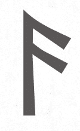

4. 手指再沾一次盐水，在即将成为疗程重点的身体部位，画「瑟伊萨兹」（Thurisaz）符号，即卢恩符文中代表保护与克服阻碍的符号。口中念道：「我的身体获得福佑；白光在我四周闪耀。我受到保护；我的安全获得保障。」

小提示

● 制作健康护饰/护身符（见本章前文）是搭配这个魔法的好主意。上医院时请将护饰带在身上。如果你在疗程中无法配戴在身上，可以在病房中放一张你的相片，然后把护饰摆在相片底下或旁边。

##### ——─ 防流产魔法 ——─

绳结魔法特别具有捆缚的功效，也是一种辅助孕期健康的卓越技巧。当你怀孕时可以自行施展这种魔法，或为他人施法。如果你无法待在他们身边，请拿一张对方的相片施法。

要注意！施展这个魔法时，记得不能遗漏最后一部分：将绳子的结打开，移除任何妨害生育的阻碍。请不要收好绳子后便就此遗忘，这样可能会造成分娩时的并发症！

需要物品：

白色绳子（15 到 25 公分左右）、小红袋

1\. 归于中心并接地。

2. 拿绳子靠近肚皮，或摆在孕妇的照片旁。接着，在绳子上打一个结，观想这个结能安胎，保障宝宝安全又健康。

3\. 口中念道：「保持安全，稳稳抓牢。让子宫守护你，直到将你安全带进世界的那一刻到来。」

4. 将绳子放进红袋，存放在安全的地方。如果怀孕期间出现任何并发症，可以用来做为进一步施展保护魔法的焦点。

5. 预产期（或决定生产的任何日子）前的两三个礼拜，请拿出红袋。归于中心并接地，然后将绳子从袋中拿出来。解开绳结，口中念道：「你的诞生时机已近，随时都能安稳地来到我们爱的怀抱，一切健康安好。」

有时尽管有各种支援，怀孕期间还是出现了问题。如果孕期中止，请将绳结打开，让孕妇不再受到任何不必要的情绪伤害或身体创伤。请感谢孩子的灵魂，带着敬意埋葬绳子。

小提示

● 若要进行额外保护，请将一两个子安贝(Cowrie shells，又称宝螺贝壳)放进装有绳子的红袋。子安贝一般来说与女性及生育力有关，尤其与怀孕有关。

##### ——─ 驱病术 ——─

如果你感觉自己的身体因故不适，或久病缠身，这是个将之驱逐的好魔法。

1\. 如果可以，请站着；不然就在床上坐直。

2\. 归于中心并接地。

3\. 透过你与大地能量的连结，从地面汲取能量，聚集在双手中。

4. 双手离身体皮肤 2.5 到 5 公分远，开始隔空抚摸全身，观想疾病正被能量冲走。同时口中念道：「走开吧，〔疾病名称〕，这里没有你的容身之处。滚到大海深处，滚到高山山巅；滚开吧。」

5. 完毕后跪在地上，双手贴住地板。让能量泄入地面。接着从地面重新汲取能量，弥补你在施法时可能引起的任何不平衡。

6. 清洗双手，或打开洗手台的水龙头，将手放在水流下，清除最后一点残余的能量效应。

流水是必要时甩掉负力的一个好方法。请将双手摆在水龙头下，观想负力随着水流走。

## 保护你的心灵健康

人类是脆弱的生物，恐惧、压力、自信心不足，都可能百般阻挠我们的思维过程。魔法可以帮助你厘清思路，提升自尊，加强你在今日的负力环境中相信自己能应付雷区的能力。

要注意！

法术不能代替医疗。它有助于加强疗程，但千万不能以此代替适当的医疗照护。如果有需要，请务必寻求或继续你的药物治疗或疗程。

##### ——─ 肯定魔法 ——─

肯定魔法是用来加强现实或补强弱点的正面宣告。以下是用来保护自尊的肯定语，你也可以写下自己的句子。

● 我很坚强，值得尊敬。

● 我已归于中心，而且一切平衡。我与周围环境相处和谐。

● 我的话值得人们听见。

1. 站正或坐直。放轻松，但不要左右摇晃。你的肯定魔法将带来力量；请拿出自信，但不要紧绷。

2\. 归于中心并接地。

3\. 闭上眼睛，缓慢地深呼吸三次，每次呼气都务求稳定。

4. 念出你选用的肯定语，最好大声一点。如果你是处在人群中，可以默念或坚定地想着那些字句。念的时候要拿出自信。至少念三次。

5. 感受周围升起的那股自信与力量的氛围，每次重复念出肯定的话语，那股自信与力量就变得更强。

6\. 张开眼睛，回到当下。

##### ——─ 思路清晰魔法 ——─

如果觉得自己脑袋打结，想不出如何解决某个问题的话，这个魔法能促进你厘清思路。它能帮助你走出迷障，保护你清晰思考的能力。

需要物品：

黄蜡烛与烛台、柠檬精油、火柴或打火机、黄水晶(Citrine)

1\. 归于中心并接地。

2\. 捧着蜡烛，口中念道：「黄蜡烛啊，请带来光明，除去迷雾。」以柠檬精油轻轻涂抹于蜡烛，再念道：「明亮的柠檬啊，请穿越黑暗。」将蜡烛插上烛台点燃。

3. 捧着黄水晶。观想自己正自信满满地处理一个问题，进行一个充满挑战的计划，自己的工作效率正受到众人称赞。将一滴柠檬精油抹在黄水晶上，口中念道：「黄水晶、亮柠檬，请带给我洞见。」

4\. 将黄水晶放在蜡烛底部，静待蜡烛燃烧完毕。

5\. 将水晶带在身上，获取其能量的益处。

##### ——─ 说「不」的魔法 ——─

要对某个人或某件事说「不」，有时难如登天。有时你是真心想帮忙，但碍于要务在身，所以不得不拒绝。有时你想拒绝却又觉得愧疚，彷彿你非答应不可。无论如何，不说「不」意味着你会揽太多事在身上，或得去处理你其实无意涉入的事。这个魔法能加强你的决心，帮助你和气、自信地说「不」。除了「我很抱歉，但我现在真的没办法」，你不欠任何人解释。

需要物品：

银色蜡烛与烛台、火柴或打火机

粉晶（Rose quartz）、碧玉（Jasper，建议绿碧玉或红碧玉）

黑色电气石（Black tourmaline)

一茶匙蜂蜜

1\. 归于中心并接地。

2\. 点燃蜡烛，口中念道：「我的时间有其价值。我的生命平衡有其价值．我的能量有其价值。」

3. 将各种宝石围着蜡烛形成三角形，粉晶摆在前方中央，其他两种宝石放在后方两侧。

4\. 手指沾一点蜂蜜触摸粉晶，口中念道：「我有权不为自己的抉择感到愧疚。我是自己的主人，有权做自己的决定。」

5\. 手指再沾一次蜂蜜触摸碧玉，口中念道：「我尽己所能平衡我的行动。我生活中的各个领域都有其地位，值得关注。我不剥夺任何一个领域的时间或能量来满足他人的期望。」

6\. 手指第三度沾蜂蜜，触摸黑色电气石，口中念道：「我的能量是自己的。它不属于任何人，只属于我所选定之人。在保护之下，任何人都窃取或滥用不了它。」

7\. 静待蜡烛燃烧完毕。

小提示

● 可以将宝石放入袋中，让你藉由它们的能量支持你的决心。先以白布或蓝布把宝石包起来可能较好，蜂蜜才不会在袋子里沾黏结块。

要为生活各个不同领域求取平衡，绿碧玉(Green jasper)是一种有效的宝石。红碧玉（Red jasper）也有助于平衡，还能加强界线。请在这个魔法中使用其中一种，或两者皆用。

##### ——─ 信任自己的魔法 ——─

心理操纵和否定（假装赞美实则挖苦的侮辱，用意是攻击你的自信）和其他针对你的自我价值的外来攻击，都在挑战着你的自信。如果你处在有人对你进行这类操纵的情势下，无论他是有意或无意，你都能用这个魔法来加强你的自信，提醒自己你值得正面肯定。任何尺寸的浅盘皆可使用，只要调整茶蜡(小圆蜡烛)的数量即可。

需要物品：

浅盘、茶蜡（数量要足以沿着浅盘内圈绕一圈）、火柴或打火机

粉晶(Rose quartz)、虎眼石(Tiger's eye)、黑曜石(Obsidian)

小黑袋

1\. 将茶蜡放上浅盘，沿内圈绕一圈。中央放三颗宝石。

2\. 点燃蜡烛。

3\. 口中念道：「我是平静、理性之人，关注应当关注之事。我明白自己的真相，也道出真相。」

4\. 将宝石留在原地，静待蜡烛燃尽。然后将宝石放入小黑袋随身携带。

虎眼石能加强勇气与精力，是这类魔法的理想元素。

## 保护自己避免精神疲劳

精神疲劳可不是有趣的事，直到彻底崩溃以前，你往往看不出自己正陷入这个境地。过度用功、必须在短时间内吸收过量信息、蜡烛两头烧等种种情况，都能用魔法来处理。请试试用以下魔法保护自己防止精神过劳。

##### ——─ 防止决策瘫痪魔法 ——─

决策瘫痪是指因为焦虑、疲劳或对情况过于多虑，导致无力做出决策。由于唯恐做出不正确的选择，反而会让自己陷入困境，动弹不得。这个魔法能帮助你拥有做出选择——任何选择——的个人力量。

需要物品：

白蜡烛、竹签、长钉子或冰凿、烛台、火柴或打火机

1\. 归于中心并接地。

2. 将蜡烛拿在手里。拿起竹签、钉子或冰凿，从蜡烛底部刮或凿出以下文字：「我的选择都由我来决定。」

3\. 将蜡烛放上烛台点燃，口中念道：「我已经接地。我的选择都是自己做下的。任何一个选择都不是在否定其他的选项。完美不是目标。重要的是我已向前迈进。」

4. 盯着蜡烛一会儿，深呼吸并感觉能量在你的核心搏动。想象自己自信满满地做出决定，事情朝正面发展。做一点白日梦，想象自己胸有成竹地下决策。当准备好时就重复念道：「完美不是目标。重要的是我已向前迈进。」

5\. 静待蜡烛燃烧完毕。

小提示

● 如果有帮助，可以将步骤 3 的肯定语写在一张小纸片或空白名片上，随身携带，时时阅读上面的文字。如果发现自己进入决策瘫痪的状态时，请闭上眼睛，反覆对自己大声念或默念这些文字，并记得任何抉择都不需要是完美的抉择，但你必须做出决定，才能继续前进。

##### ——─ 防止过度饱和魔法 ——─

在念书或吸收大量信息的情况下，很容易感觉不堪负荷。请用此魔法来加强自己抵抗信息轰炸的能力，甚至能记住其中的重要部分。太过用功或钻研太认真，有可能导致信息过量。这个魔法能帮助你加强自己的处理能力，保留你需要记得的讯息。褐碧玉(Brown jasper)与精力及长时间的耐力有关，正是你在这类情况中需要的能量。

需要物品：

褐碧玉

1\. 归于中心并接地。

2\. 捧着褐碧玉，口中念道：「褐碧玉啊，请加强我坚持下去的能力，促进我的耐力，赋予我成功所需的吸收能力，让我保留必要信息，释放其余部分。」

3. 当要用功或超时工作，或处于可能会被大量信息压得喘不过气的情况时，都请将碧玉带在身上。

##### ——─ 防止社交媒体过量魔法 ——─

社交媒体能造福人群，因为它可以协助你与朋友保持联络，并遇见来自世界各地的人，但事实的另一面是，你也会暴露在令人不安的新闻、争论、仇恨、事因中。除了减少使用社交媒体，或限制自己追踪的账号类型之外，你还可以试试这个魔法，保护自己不受社交媒体引起的情绪波及。

需要物品：

浅蓝色蜡烛与烛台、火柴或打火机、粉晶

1\. 归于中心并接地。

2\. 点燃浅蓝色蜡烛。盯着蜡烛，感受它的蓝色使你内心充满平静。

3\. 拿起粉晶，目光重新聚焦，透过粉晶盯着蜡烛。

4\. 口中念道：「粉晶啊，请帮助我过滤充斥于社交媒体的情绪。帮助我安全辨识要将时间与注意力投入在哪里，才能安全地浏览网络，不被恐惧、愤怒、痛苦所淹没。帮助我抵抗标题党、酸民、愧疚感。」

5. 将粉晶摆在蜡烛底部，静待蜡烛燃尽。将粉晶带在身上，或放在你最常上社交媒体的地方。

##### ——─ 防止过劳魔法 ——─

过劳是指身体、心理或情绪因为过度操劳而崩溃，导致人变得无感、疏离，无法享受以往喜好的事物。要从过劳的状态中复元并不容易。何不使用魔法来帮助你保护自己，防范这类情况的发生？这个魔法使用水的象征来协助你顺其自然，而不是奋力坚守原地却反而令自己元气大伤。

需要物品：

水、小碗或酒杯、浮水蜡烛、火柴或打火机

1\. 在小碗或酒杯中倒进七分满的水。

2\. 轻轻将浮水蜡烛放进水中点燃。

3\. 口中念道：「我很强大，我很平衡。我顺水而流。乘浪前进的我发出明亮的火光。我不会倒下。」

4\. 静待蜡烛燃烧完毕。丢掉残余的蜡烛屑，并将水倒至户外。

也请见本章的「说『不』的魔法」，能帮助你拒绝某些任务，进而加强你安排进度的能力。

## 保护自己的情绪

情绪健康就和身体健康一样重要。「心痛」不仅是一种诗意的装模作样。情绪对身体与心理健康皆有影响。保护你的情绪能量不枯竭，是魔法卫生学的基本一环。捍卫你的情绪能量不被他人榨取或流失也很重要。你愈能保卫自己的能量，就愈能在他人需要时伸出援手。

##### ——─ 摆脱过去阴影的魔法 ——─

无论你喜欢与否，你的过去定义你这个人。你的童年、青少年时期、甚至昨天发生的事，都影响着你的抉择与今日的你。然而，有些影响你的事并不健康、而且会阻碍你前进。生活在过去的阴影下会让你踌躇不前，使你无法尽情活在当下。请以这个魔法来释放这类负面事物，清除这些束缚着你、让你无法活出当下人生的不健康羁绊。

需要物品：

一条 25 公分长的绳线或带子、剪刀、蓝纹玛瑙(Blue lace agate)

1\. 归于中心并接地。

2\. 拿起绳子两端，在自己面前向左右拉紧。口中念道：「我不受过去的负力束缚。我将自己从过去的枷锁中释放。」

3\. 放开绳子一端，任其垂下。拿剪刀将绳子剪成两段。

4\. 拿起蓝纹玛瑙。先贴近额头，再贴近胸口。口中念道：「我释放你，拖垮我的重担。我释放你，恐惧与悲伤。我释放你，过去。我自由地向前迈进。」

5\. 将绳子埋在户外。把蓝纹玛瑙带在身上，或存放在安全的地方。

##### ——─ 心灵安康魔法 ——─

自我爱护具有无上的重要性。你的心值得好好保护！

需要物品：

粉晶、数片干燥玫瑰花瓣、小木盒

1\. 从第七章选一种你偏好的方法清洁粉晶。

2\. 归于中心并接地。

3\. 捧着粉晶，贴近你的胸口，口中念道：「这颗粉晶就是我的心。」

4\. 将玫瑰花瓣放进木盒中，粉晶放在花瓣上。口中念道：「我的心只属于我；它很安全，不受攻击、不受伤害、不受凌辱。」

5\. 将木盒存放到安全的地方。

有时你能在市面上找到心形粉晶，是上述魔法的理想材料。

##### ——─ 护心魔法 ——─

你必须守护心的能量，防止因他人而流失。即使你让别人进入你的心，但让他们耗损你的心的能量，对彼此的关系也是有害的。你需要健康地运作，才能让彼此的关系平等。当然，有时你们当中的一人必须坚强起来，支持陷入痛苦的另一半，但如果你的伴侣不为你的健康着想，频频耗损你的能量，你就必须采取行动来保卫自己。

需要物品：

粉晶晶柱、用于项鍊等的银鍊

1\. 归于中心并接地。

2\. 捧着水晶，口中念道：「这颗粉晶就是我的心，这颗粉晶就是我的精神。它蕴含无穷尽的能量。它是我的宝库，我的能量来源，需要时我随时能从中获得滋养。」

3\. 拿银鍊裹住粉晶，妥善绑好。口中念道：「我在此守住我的能量，我的精神。它属于我，没有人能在未获得我允许的情况下拿走。任何时候都没有人能耗损我的能量；这颗粉晶是我能量的深潭，永远取之不竭。没有其他人能取走这份能量。」

4\. 将银鍊裹住的粉晶存放在家里或房间等安全的地方。

水晶柱是长形而非圆形的水晶，通常一端较凹凸不平。如果条状水晶较容易取得，在这个魔法中也可以使用条状水晶。银鍊不需要是纯银的，象征性的就可以了。

##### ——─ 分手后的魔法 ——─

无论是大吵后与爱人分手，还是失去朋友，魔法都能帮助你安抚心痛，缓解痛苦。将这段关系放开能让你继续前进。这个魔法在分手过程中或分手后都可进行。

需要物品：

一把盐

1\. 前往有流水的地方，如湖泊、池塘、小溪、河流等。

2\. 归于中心并接地。

3. 将盐握在手里，将你对事情发展的种种情绪注入盐中：沮丧、愤怒、悲伤、困惑等。也将你在这场关系中希望释放的能量灌注到盐中。

4\. 口中念道：「我释放你」，并将盐抛进水里。

##### ——─ 情绪负力全面防御手环 ——─

这个魔法十分简单，每天都能进行。它能吸收你身边的情绪负力，并且减少穿过防御手环影响你的力量。

需要物品：

白棉线或轻量毛线、剪刀、隔热碟、火柴或打火机

1\. 归于中心并接地。

2\. 剪下一段 25 公分左右的棉线或毛线。将线打结成环，套进手腕中。

3\. 口中念道：「白棉线啊，请吸收我周围的负力，让我的情绪平衡不受丝毫影响。」

4. 将白棉线手环戴在手上一整天。入夜后拿下来，盘绕在隔热碟中。口中念道：「感谢你守护我的情绪健康。」以火柴或打火机点燃棉线，让其中的情绪负力焚烧成灰。

小提示

● 你可以使用缝纫线替代轻量毛线，只要确定它是纯棉即可，才能充分燃尽。

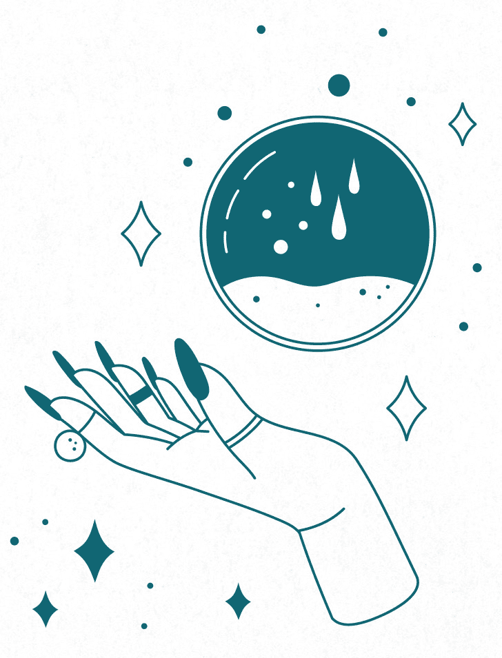

第三章

# 房屋与住家

你家的精神身分是由其自身（建筑、色彩、家具摆设等）的能量、居住在其中者（包括宠物等动物在内）的能量、所在的那片土地的能量、周围环境的能量等构成。尽量将这些能量维持正向，是再合理不过的事。你的家是你的避风港，或应该成为你的避风港！因此，请尽力将它变成纯粹、滋养身心的地方。

## 保护你的住家

为什么要守护你家的房屋？当然，是为了防止有人闯入，但也是为了不让负能量附着在屋里。那股负能量会发挥近似氧化的作用——让家里的能量明亮光滑的部分生锈。请擦去那层锈斑。更好的做法是定期刷洗那些光亮的部分，使其不生锈，让家里只剩下有助益、干净的能量，为屋里的每个人带来正面的效应。

要净化（有时是清洁）某物，意味着去除负面或不乐见的能量，或将之转化。「清洁」（cleanse）这个词较常用来描述物理层次的转化，「净化」（purify）则用来描述能量状态的转化；如果没有特别指明，本书会交替使用两者，因为物理状态也影响着物体或空间的能量（例如凌乱房间的能量，往往不同于整洁房间的能量）。清洁与福佑是所有保护型魔法的核心。负面或不受欢迎的能量一被清除，下一步就是特意以指定能量来充满这个地方或物体。这通常称作福佑（bless），亦即要求正能量围绕这个物体或空间。大自然是不喜真空的，所以没有召唤正能量的话，任何一种能量都可能进入这个空间或物体，取代先前的能量。如果你能掌控进入其中的是哪种能量，就能依你的需要或欲望微调家里的能量。

## 考虑事项

尝试保护住家时，有几点要谨记在心，大多是与伦理有关的事项。

施法守护住家时，必须考虑到伦理边界的问题。你确实必须考虑自身的安全与福祉，但同一个屋檐下往往还有其他人居住。如你在本书前文读到的，万物都有能量连结，如果你拧动一个元素的能量，那种变化产生的涟漪，会波及同一个区域的所有其他能量。换句话说，会影响到住在同一个家中的人。

PART1 提到身为父母与宠物主人的责任。基本上，身为家长或监护人，你要为自己照顾的未成年人负起法律责任，为其福利做出相关决策。你保护住家并以魔法维系其能量的决策，也影响着他们。理想上，你所做的每件事都要造福家里。

伦理上，重要的是要记得，你的举动都在影响着家人。你对其他成人不抱有相同的责任，但事实上，一般会认为替他人做决策是侵害对方的自由意志与自我决定的权利。改变住家的能量会影响他们及他们在其中生活的方式。在你以魔法清洁并保护住家时，请谨记这点，也请记得，你努力的目标是让家里成为安全、平衡、和谐的避风港。

多为住在同一个屋檐下的人着想

既然你的首要目标是去除负力，才不会吸引更多负力，就和拿拖把拖地一样，你的魔法一般来说应该要造福家人。如果你的魔法会大幅改变能量，带来实质的变化，请向住在同一个屋檐下的人提及这件事，甚至事先征询他们的意见，会是较体贴的做法。你可以简单地问：「嘿，我想做点事，处理一下我们没有人想走近的那个角落，因为那里令我们起鸡皮疙瘩。你们同意吗？」你甚至可以请他们伸出援手。

### 好邻居

好邻居不会试图干涉住在附近的人或造成他人不便。然而也有人说：「篱笆筑得牢，邻居自然好。」你在自家施法时，请务必让魔法在你家的地产边界止步。邻居的地属于他们自己，你无权干涉。

不幸的是，有些邻居不照规矩来，或他们没有那么体贴。噪音、负力和其他恼人的刺激会从他家飘到你家。不过要记得，你没有权利施法阻止他们；你拥有的是捍卫自己不受他们影响的权利。树起你的魔法篱笆吧！

更多信息

更多关于感受并运用能量的信息，请见我的著作《Power Spellcraft for Life》（给人生力量的魔法）。

## 维护魔法效力

你愈了解自家能量的基线在哪里，就愈懂得如何维持住宅健康。时时追踪微小的变化，能协助你在问题愈滚愈大之前先下手处理。要未雨绸缪，你必须变成评估家里能量的高手。要如何做到这一点？

感受能量的方法因人而异，对从未涉足过这类事物的你来说，观察人们最常用哪些方法会很有帮助。「感受」很能充分描述这种情形，因为这个词没有指出你是以哪个感官来感知或与能量互动。人们被问到这个问题时，大多会说他们「感觉」到能量，而「感觉」这个词仍然没有指明或限制你要以哪个感官来感觉能量。

以下是感受能量的一个简单练习。

##### ——─ 感受能量的练习 ——─

这项练习能帮助你探索要以哪种方法感受能量，这是你施法保护住家时的宝贵技巧。请拿出笔记本、原子笔或铅笔来做笔记；第一章曾提到，这是为了做施法纪录。

在本书大多数的魔法中，你可以随意选择要不要设立魔法圈，但在这个练习中，请务必设立一个魔法圈；它有助于你在专心感受手中物件的能量时，挡掉令你分心的其他能量。

需要物品：

一小碟盐、笔记本、原子笔╱铅笔、一小碟水、茶蜡

火柴或打火机、小树枝、小盆栽或盆花

白水晶、粉晶

1\. 洗净并擦干双手。

2\. 设立防护魔法圈（见第一章）。

3\. 归于中心并接地。

4\. 像要甩干水般甩手。深呼吸三次。

5. 双手在盐的上方轻轻交握。想象能量流经你的身体，向外接触到盐的能量。感觉起来如何？有实际感受吗？会令你想起任何事，或触动任何回忆吗？会改变你的情绪状态吗？还是感觉异样却说不出所以然？感觉是好还是坏呢？

6. 给自己一些时间，用双手的能量探索盐的能量，接着轻轻放低手，让手指确实碰到盐。你对盐能量的感受改变了吗？

7. 探索完盐的能量后，移开手轻轻刷一刷，再甩甩手，帮助手休息并恢复元气，摆脱任何附着的能量。花一分钟写下你对盐的能量有何印象。

8. 对水、蜡烛（将双手伸到蜡烛两侧而非上方，别碰触火焰）、小树枝、盆栽或盆花、白水晶、粉晶重复进行上述步骤。每次都做笔记并甩甩双手。如果任何时候你需要休息，就休息片刻。不过，要记得你的魔法圈还设立着，所以不要走出魔法圈外。如果你必须走出魔法圈，请像打开窗帘一样将魔法圈的能量墙打开再走出，然后让它在你身后关闭。重新回到魔法圈时，也重复这个步骤。

9. 完成练习后，花一分钟归于中心并接地。撤掉魔法圈，然后伸展手脚，让自己确实回到物理世界。喝一杯水或吃点东西。

探索两种水晶是为了试验你的感受能否区分这两种相近的宝石。这是两种在保护魔法和魔力维护中最常见的水晶。 ——─综观家中能量 ——─

在这项练习中，你将造访家里的每个房间，记下你的感受。你可以藉由这种方式熟悉目前的情况，日后查看时就能参考你的笔记，确认是否有任何需要留意的改变。如果你家很大，这个练习就会很长；必要的话中途休息一下，喝几口水或啃几口水果后再继续。如果你不习惯聚焦于能量，这项任务可能很累人，所以别把自己逼得太紧。

需要物品：

笔记本或魔法日志

原子笔或铅笔

1. 选择要从哪里开始。前门（或最常出入的门）是很好的起点。请翻到魔法日志新的一页，写下日期，然后写几句话说明练习意图。记下时间、天气，还有任何你希望追踪的事（当时有人在屋里吗？记下来可能会是好点子）。

2. 归于中心并接地。如果你目前设立着个人基本防护盾，请先撤下。如果你对完全撤掉有疑虑，那可以减少其强度。

3. 延伸一部分的个人能量到你所在的房间里。敞心接受从中获得的印象。这个房间给你什么感觉？有没有给你任何情绪影响？心理影响？还是某种身体反应？它是否令你想起某样事物或某个地方？请记在日志里。

4. 在房间内四处走动。能量是否有任何变化？是否感觉得到在某个地方特别强烈，而在其他地方较弱？房里的哪个区域特别令你感觉舒服或不自在？请记在日志里。别忘记向上看看天花板，向下看看各个角落。

5. 房间里是否少了些什么？是否感觉不太平衡？你觉得要如何协助弥补那种不平衡？也请把那些想法记下来。

6. 移到另一个房间重复相同过程，把一切感受或想法写下来。继续以这种方式巡视完每个房间。也别忘记浴室、阁楼、地下室、储藏室，以及任何其他你不定期造访的房间。

7\. 如果你家的廊道或走道很宽，请以个别房间看待。

8. 完毕后，归于中心并接地，接着伸展手脚。为自己泡一杯茶，或喝一点冷饮，吃点东西来帮助自己重新落定在物理世界中。接着温习你的笔记，为每个房间标出一两个关键字。

9\. 日后你想改变家里的能量时，这份研究将成为你的基本参考资料。

小提示

● 画出房间地图并标出不同能量区域，对你可能有帮助。你可以画出整栋屋子的平面图并做出同样的标示。

● 研读笔记能多了解各房间的性格或个性及显示出事物前所未见的一面，例如某元素能量在某个房间偏多（如火可能对创造力大有助益，但也可能激发对立与冲突），你也许想予以平衡（见本章下文）。

● 如果你要为整栋屋子进行大清洁╱福佑，用这个练习来准备再好不过，如此一来，你就能判别在清洁╱福佑过程中，是否需要对某些区域多加关注。仪式完成后，请等一天左右让能量就定位，然后再重新操作一遍，感受一下这个新常态。清洁并祝福屋子就和清洗黑板一样，能重新开始整顿能量。

前述感受能量的练习需要为自己设立魔法圈，但在这个练习中，因为你要四处走动，所以不容易设立魔法圈。你可以不立防护盾做完练习。然而，如果你居住的地方有许多负能量，请回顾第二章的「基本防护盾」。要记得，你在这里的用意不是要挡掉所有能量，因为你得去感受房间里的环境能量；请单纯地想象你的防护盾具有穿透性，至少要能让你「品尝」到四周的能量，但又不被完全淹没。换句话说，请减少防护盾的强度。

##### ——─ 魔化清洁用具的防护魔法 ——─

正如每年为你的车进行总检验与调整很重要，定期进行魔法清洁也是维护家中能量健全的一种负责方式。能量卫生良好的住家较不会吸引麻烦，只要一点预防，就能省去日后为矫正而必须付出的大量心力。为你的清洁用具编定魔法用途，是维系住家魔法能量最简单的方式。既然你也会定期清扫家里，那何不将魔法清扫的工作与实际的打扫工作结合在一起？

需要物品：

清洁用具（喷罐、去污剂、清洁刷、洗洁剂、破布等）

1\. 归于中心并接地。

2\. 双手捧着用具或在用具上方交握。口中念道：「〔用具名称〕啊，请成为我光明的烽火、良善的光辉。驱逐任何负力或邪恶的痕迹，保护这个地方。请成全！」

3\. 依制造商指示使用用具。

小提示

● 如果你偏好自行制作清洁用品，那一制作混合好就可立即授能。

● 一买下新的清洁用具带回家，就可以进行授能，使其随时待命。

● 你可以每年进行几次授能，或每次使用这个清洁产品就为之授能。自行决定即可，只要功效发挥到最大就好！

##### ——─ 维护检查 ——─

如果你必须更新或加强目前的保护与防卫，可以进行这项检查。何谓「定期」进行魔法清洁，意思因人而异。但如果你家里的互动频繁、陌生人多，或因为地点或房客个性的关系充满能量，那应该要更常加强目前的防护或重新加持。你可以设定要在哪些时候定期净化，或一有需要就这么做。这项检查能帮助你了解何时是净化的时机。

需要物品：

魔法日志

原子笔或铅笔

1. 温习你最早检查住家能量时所做的笔记，也回顾后来检查时所做的任何笔记。然后翻开新的一页，写下日期，记下时间、天气，以及你希望追踪的任何事项。

2. 归于中心并接地。如果此时你正设立着个人基本防护盾，请先撤下。如果你对完全撤下防护盾有疑虑，可以减少其强度。

3. 请从你第一次进行检查的起点开始，依序在屋内移动，沿着先前的练习感受每个房间的能量。要特别留意上次你记下有问题或异常的地点。有改变吗？是变糟还是变好呢？请逐一记录。

4. 每个房间的能量都感受过后，请再度归于中心并接地，喝一点饮料，吃一点零食。回顾你的笔记。如果一切都和上次一模一样，可能就不需要立即进行维护工作。如果事情未达到应有的基准，请评估有多少落差，以及要将事情带回基准必须进行哪些魔法或仪式（请参考本章下文说明）。

小提示

● 你愈常进行维护，就愈能感受到房间的能量，当家里某处出现不对劲时，即使不做正式的检查也能判别出问题。

如果情况较上次做完维护工作后好，那你要怎么做？什么也不用做！心怀感恩即可。这表示事情一帆风顺。

##### ——─ 能量的季节性维护 ——─

这个维护魔法要在每次满月时执行，但你可以依自己的需要更改时程表：春分、夏至、秋分、冬至也是好时机，或在每个月的第一天施法——只要对你有效就好。看日历安排固定时间，在每个月的同一天安排定期清洁工作，对你来说功效最好也不一定，这样有助于保持固定节奏。请选择一个最不会妨碍你日常行程、最不会造成麻烦的时间。重点是要能定期执行——依你的空间需要，在你的日常行程允许下，订出你的定期维护时间。

需要物品：

薰香（檀香、鼠尾草、乳香或其他选择）与香炉

火柴或打火机

一碟水

一茶匙盐

1\. 满月当天、前一天或后一天，将你需要的物品备齐。归于中心并接地。

2\. 口中念道：「负能量、黑暗、疑心、恐惧啊，我驱逐你们。在我的意志力量下，我将你们从此地送走。」

3. 拿着薰香以逆时针方向绕行屋子。走进每个房间，并以逆时针方向绕行，另一只手将烟挥入角落及大型家具周围。请将负力观想成一团浊雾，烟一进入雾中就将它驱散。如果你喜欢，在屋里四处移动时，可以反覆诵念上述文字。

4. 回到出发点时，放下香炉。将盐撒进水中，从地面汲取能量，感觉能量透过手臂向下流到手指，再进入水里，以手指搅拌。

5\. 口中念道：「安全、好运、健康、富足啊，我邀请你们来到此地。请以你们的诸多福气充满这个空间，保佑我们安好。」

6. 拿着盐水以顺时针方向绕行屋里。绕行各房间时，以手指沾水弹向空中。如果你喜欢，在屋里四处走动时，可以反覆诵念上述文字。

7\. 回到出发点时，放下盐水并念道：「此事已成。」

##### ——─ 房间烟燻魔法 ——─

如果你在维护检查时，发现家里有个区域特别寒冷，或是正有一位攻击性极强或带有负力的客人在，或是家里正发生一场大争执，以烟燻能有助于消除任何残存的负力。

需要物品：

烟燻棒

火柴或打火机

隔热碗

1. 点燃烟燻棒一端。干燥草药草点燃后，就轻轻将火吹熄。你可以将烟燻棒拿在手里点燃，把碗放在底下盛接灰烬，也可以将烟燻棒放在隔热碗里，拿着碗点燃烟燻棒。

2\. 口中念道：「负力啊，我驱逐你；这根鼠尾草烟燻棒的净化能量驱逐了你。请只让和谐与纯净留下。」

3\. 让烟飘荡在需要清除负能量的各处空间。然后捻熄烟燻棒。

4. 让烟停留在这个空间中几分钟，然后打开窗户或开抽风机让空气流通。观想负力随着鼠尾草的烟飘散。

小提示

● 焚烧鼠尾草会产生强烈的气味。你可能要事先确认房间的空气流通；烟燻棒也会产生大量浓烟。烟燻的时候，少量即可！

● 烟燻棒的类型五花八门。鼠尾草有很多不同种类（都能用来净化与清洁），也能与薰衣草、雪松等其他药草混合。请选择最吸引你的材料。

● 你不需要用完整根烟燻棒。施法结束后，在隔热碗或沙堆里捻熄烟燻棒，待其冷却后再以铝箔纸包裹起来，便可留待下次需要时使用。

● 这个魔法也可用甜草辫(sweetgrass braid)来进行。

烟燻是驱逐负能量，使失常恢复平衡的一个迅速、简单的方法。请参考第二章的烟燻净化说明。

##### ——─ 净化喷雾 ——─

水是非常实用的元素。我们经常以水清洗，而喷雾就是打破家中负力的一个简单的方法。

需要物品：

一茶匙干燥迷迭香

马克杯、四分之一杯沸水、咖啡滤纸或细筛、小喷雾罐

蒸馏水、三滴檀香精油、三滴柠檬精油（果汁亦可）、一撮盐

1. 将干燥迷迭香放进马克杯中，倒入沸水。等五分钟待其泡开，然后以滤纸或细筛将水过滤进喷罐。

2\. 以蒸馏水填满喷罐。

3\. 加入檀香精油、柠檬精油、盐。将瓶口旋紧摇一摇，混合所有原料。

4. 设定为细喷雾后，开始在房间中央喷洒。请不要直接喷在家具上，不然家具会浸湿或湿透。只要任细喷雾去散布能量即可。

5\. 依你的需要驱散负能量。

小提示

● 可将喷罐放进冰箱，以免发霉。需每个月更换一次溶液。

##### ——─ 福水 ——─

许多文化都有福水或圣水的概念。一般认为水是强大、具有转化威力的元素，加强其威力的民俗方法不胜枚举。举例来说，将纯银液体滴入一杯水中，就是给水赐福；如果要用圣水来疗愈，那有时会用金而非银，因为金与太阳有关。药草也是常见能增进水的力量的材料。以下的魔法是使用圣约翰草(St. John's wort)来同时福佑人与房屋。

需要物品：

四分之一杯蒸馏水、附盖的玻璃瓶

一茶匙圣约翰草、泡茶球或泡茶器

1\. 归于中心并接地。

2\. 将水倒进玻璃瓶中，圣约翰草放进泡茶球或泡茶器中，浸入水里。

3\. 双手在玻璃瓶上方交握，口中念道：「大地之草啊，请赐福于水的造物，让它享有你的保护与疗愈力。请成全。」

4. 将玻璃瓶放在窗台，接受日光或月光（或两者）的照耀，静置满二十四小时。

5\. 取出泡茶球或泡茶器，旋紧盖子。将玻璃瓶放进冰箱。

6. 喷福水在你想净化或保护的物体上，或当成涂抹自己的液体，洗澡时也可以加一点到洗澡水里。

小提示

● 陷入困境的时候，在水中加盐便是你所能制作最简单的福水。

● 实验看看以雨水或融化的雪水来制作福水的效应。

### 福水的用途

福水能当成扩大、加强魔法或药水功效的基础。你可以添加各种原料来调整或促进某些能量，或在施法时加入使用福水的额外步骤，使其进一步支持你的目标或目的（提醒一下，本书提到的福水皆不可饮用）。以下是几个建议：

● 制作福水时，请祈祷、诵念肯定语，并观想你制作福水的目的和目标，将特定意念注入福水当中。

● 将福水倒进银色的碗里（如铝碗或不锈钢碗），在满月之夜置于户外，吸收月光的能量。如果你担心水被户外动物喝掉，可以将碗留在室内窗台上。

● 将药草浸泡于福水中几天，就能作出药草水。请将制成的液体以咖啡滤纸或奶酪滤布滤到瓶子里，然后盖上盖子放进冰箱。要早点使用完毕，因为药草水的效期不长；每次只要制作少量即可。

● 可以加一点精油到福水中，如檀香、玫瑰、乳香、柠檬等。

● 将第七章列出的任何一种保护性矿石浸泡在福水中，就能制作出宝石水。

##### ——─ 四贼醋 ——─

四贼醋是传统花草醋，据说是中古世纪几名盗贼在黑死病流行期间使用的醋。他们被逮捕后，他们提出用维持健康的配方醋来交换自由。之后流传下来的配方有各种版本，以下是简易版。请用来擦拭病房或涂抹门窗，以防止病魔入侵。

需要物品：

附盖子的罐或瓶

两杯红酒或苹果醋

各两茶匙干燥的药草：迷迭香、鼠尾草、芸香、薰衣草、薄荷

九株丁香

1\. 归于中心并接地。

2\. 将醋倒入瓶罐，加入各种花草。盖上盖子并轻轻摇晃。

3\. 让醋浸泡在瓶罐里七天以上，每隔两三天轻轻摇晃几下。

4. 使用时，请将一些醋倒进一小桶温水里，用桶中的水拖地以去除负能量，或用布沾醋擦拭门与窗框。

小提示

● 你也可以用四贼醋涂抹保护或祛恶魔法所要使用的蜡烛。

##### ——─ 佛罗里达水 ——─

佛罗里达水(Florida Water)是美国版的法国古龙水，能缓解头痛、促进放松、提神醒脑，并为衣服与亚麻布品添加香味。佛罗里达水和大多数香水一样有酒精基底，并使用精油。

需要物品：

附盖或木塞的瓶子或玻璃罐、一杯伏特加或其他酒类

三茶匙橙花水、三滴柠檬精油

三滴迷迭香精油、三滴薰衣草精油、三滴玫瑰精油

两滴佛手柑精油、一滴鼠尾草精油、一滴橙花精油

1\. 归于中心并接地。

2\. 将酒倒进瓶罐中，加入橙花水与各种精油。

3\. 盖上盖子，轻轻摇晃瓶身混合。

4. 使用时，请加入几滴水，然后喷洒全身、沙发或床单。也可以倒进一桶温水中，以此水拖地或用布沾湿后擦拭家具（先在不显眼的地方试擦看看，确保不会使家具掉漆）。

小提示

● 可以加几滴佛罗里达水到福水中。

● 可以加几滴佛罗里达水到净化宝石的水里，洗去不乐见的能量。

● 在不愉快的邂逅或碰到负面的人之后，也能用佛罗里达水擦拭你的双手，去除身上令人不悦的能量。

## 一般居家保护

你家就是你的城堡，应该要好好守护。不过，没有护城河，没有弓箭手在城垛上戒备，也没有和善的龙在四周巡视是否有不友善的攻击者，你要如何保护你的城堡呢？

令人不悦但并非不好

请注意本书中有些地方会形容某些能量是令人不悦或不乐见的，但那并非负能量。有时能量是正面的，只是那个地方并不需要。例如，安抚并促进睡眠的能量是正面的能量，但在居家办公室却不乐见，因为你办公时可能希望保持警觉，做事有成效。

##### ——─ 天堂信 ——─

天堂信的德文原文「Himmelsbrief」，顾名思义是「来自天堂的信」，是一种祈求保护的书写信件。流传至今的天堂信有几个固定的版本，自行创造的天堂信含有出自你的意志、你的特定需要、你的能量的魔法，你可以使用图片装饰来支持你的目标。使用以下的魔法或自行写一封信皆可。书写魔法的关键是，在制作期间要专注在你的目标，才能充满你的能量与意图。

天堂信能使用在许多地方。房子兴建时会将信埋在其中，或裱框挂在墙上；有些版本甚至是写来直接保护人，而非由住家延伸到人身上。以下的版本是悬挂在墙上的版本。请发挥你的想象力：创造出一页剪贴、一份拼贴，或是使用绘布颜料……任由你的创意天马行空！

需要物品：

写草稿的废纸、空白纸张（至少 13×18 公分，颜色任选）

原子笔或铅笔、尺、颜料、麦克笔、色铅笔、贴纸、照片

图片（非必要；见以下指示）、信件框（配合纸张尺寸）

1. 用废纸为你的天堂信起草。你可以直接使用下面的书写魔法，或自行决定要写哪些内容、如何措辞、如何安排版面、如何绘制插图。

2. 归于中心并接地。由于制作需要一段时间，请你设立基本魔法圈（见第一章），在魔法圈中写天堂信。

3. 将完成的草稿誊入空白纸张。预留书写魔法的空间，写下以下文字（或你自行编写的魔法）：

以四周宇宙之力，

天空在上，大地在下，

让恶念或灾祸穿不透四壁，

让这栋房屋成为安全、舒适的避风港，

以受尊崇的元素之名，地、风、火、水。

4\. 依自己的意思画图或装饰纸张的剩余部分。

5\. 撤下魔法圈。

6\. 必要的话，请待纸张干透后再裱框，然后悬挂在适当的地方。

小提示

● 传统上，魔法工作都要亲手来，才能将那一天、那个时代的个人能量尽量灌注其中，但也没道理不能制作一封数位天堂信，再打印出来。你也可以用数位相框展示。请发挥你的想象力！

● 如果这个魔法吸引你，可以稍做变化，为家里的每个房间各制作一份保护或召唤的小型拼贴或艺术作品。

印度与伊斯兰文化也有类似的保护书信。将这类保护魔法融入住家的一个现代方法是先以计算机设计，印在绘布转印纸上，熨进布料，然后缝制成枕头或毯子。

##### ——─ 简易居家祝福 ——─

写有欢迎字样的门毡、木牌，印有「祝福这个家……」(Bless this house)的老派作品，都有为住家迎进正能量的用意。以下的魔法以照片、素描或其他艺术为福佑住家的主要基础（你会做针绣或刺绣作品吗？羊毛湿毡、布毡或针毡呢？你甚至可以编织或钩织一个小型的房子形状，再填入填充物！）不是非得要制作出精准的复制品来，所以不要把自己逼得太紧；请选几个你家的特色来设计图案，例如山形墙或门廊，以这些特色及外观色彩为制作焦点。

需要物品：

你家的图像

干燥玫瑰花瓣

干燥薰衣草

四个茶蜡

火柴或打火机

1\. 归于中心并接地。

2\. 将住家图像摆在施法区中央。四周撒些玫瑰花瓣，接着撒上薰衣草。

3. 在距离住家图像 5 公分左右的四个角落各摆一个茶蜡。点燃后口中念道：「我在此召唤北、东、南、西方的能量来福佑这栋房屋。让这栋房子只要还在，就充满着幸福、健康、好运。」

4. 静待茶蜡燃烧完毕（应该要三到四小时）。将住家图像摆在你选定的地方，请试着摆在家里人来人往最频繁的地方，例如客厅。

5. 收拾好干燥玫瑰花瓣与薰衣草。你可以撒到屋外，或保留下来做成保佑住家的香包。

你不需要创作精美的艺术作品。如果你是自行创造你家的图像，那就会带有你创造时的能量。如果你自认没有艺术天分，或不信任自己的工艺技巧，也可用自家的相片替代。

##### ——─ 使用共感魔法的住家防护魔法 ——─

共感魔法是使用小型代表物来代替你的施法对象，使用原则是，在模型上施行的魔法，也会实现在真人实物上。这个魔法使用的是你家的迷你模型。你可以自行打造模型，用黏土、冰棒棍、乐高积木，或任何你偏好的材料皆可。住家的实物材料则可取用油漆碎片、修房子留下的碎屑、外墙刮下的砖块屑，或是任何类似的碎屑。加入这些碎屑的用意是加强房子实体与代表物之间的连结。

需要物品：

制作房屋模型的材料、房屋的实体碎片或碎屑、黑色丝质袋子

一撮迷迭香、一撮肉桂

黑色电气石、紫水晶(Amethyst)

黑色丝带或绳线

1\. 备齐所有用具。

2. 归于中心并接地。由于制作时间较长，请树立一个魔法圈（见第一章）。

3\. 打造你的住家模型，过程中要设法将房屋的实物碎屑融入其中。

4\. 模型建好后，请捧在手里，口中念道：「这是我的房屋，这是我的家。」

5. 将模型放进黑色丝质袋子中，花草与宝石也放入。以丝带或绳线封紧袋口，口中念道：「我的房屋一切安全，我的家一切安全。」

6\. 把模型存放到安全的地方。

缝制黑色丝质袋子时，可拿一条长方形丝布来做，长是宽的两倍，对折后缝制左右两侧，留下开口，就是正方形的袋子。

##### ——─ 保险箱魔法 ——─

如果你有保险箱，就能进行这个保护住家的绝佳魔法！这也是一种共感魔法，以代表你家的物品为施法对象，效力会转移到较大的实体房屋上。

需要物品：

你家的相片或图画、原子笔或铅笔、保险箱

1\. 归于中心并接地。

2\. 将你家的相片或图画翻到背面，写下地址与所有家里成员的姓名。

3. 把相片或图画带到你租用保险箱的银行或机构。等只剩你和保险箱单独留下时，请两手拿着相片或图画，口中念道：「这张图像就是我的房屋，这张图像就是我的家；确实如此。」

4\. 将相片或图画放进保险箱。盖上盖子时，口中念道：「这份文件已获得保护，我的家也因此获得保护。」手指在保险箱盖子上画出代表继承、地产、家庭的卢恩符文「欧瑟拉（Othala）」（）。请先舔一下手指再画符文，以加强其中的能量。

5\. 请人员将保险箱放回原处。

小提示

● 这是与你的产权契约有关的绝佳魔法，如果你的房子是属于你所有，在这个例子中，你不须写下地址，事实上更改地址也不是好主意，因为契约是法律文件。请拿另一张纸写下讯息，包括施法要念的文字，然后把纸张夹在契约第一页。

● 如果你是租屋，请用你的租约来施法，完毕后摆进信封封好，或放进文件夹收进文件柜或其他安全的地方。

● 如果你没有向银行机构租用保险箱，也可以家用保险箱来施法。

##### ——─ 圣诞树干魔法 ——─

如果圣诞节时你会使用真正的树，可以用原木树干来进行住宅的年度保护魔法。松树(Pine)与净化和保护有关。购买时请商家将树干底部保留下来。我们家将这 2 到 5 公分的一圈木头称为圣诞树干(Yule log)。传统的圣诞树干与太阳复归有关，人们会在炉火燃尽木材前，将这段木头从壁炉中拿出来保留一年，做为防止健康恶化、厄运、危险的护身物。

需要物品：

乳香与香炉、火柴或打火机、树干底部（自行或请商家锯下）

柠檬或柑橘精油（果汁亦可）

1\. 归于中心并接地。

2\. 点燃薰香。

3\. 拿木头过香祈福。

4\. 手指沾一点柑橘精油，在树干的切面画一个太阳图形，口中念道：「圣诞树干啊，请赐予我们健康与福气，让我们安度一整年。此事已成。」

5. 再度拿圣诞树干过香。然后安全地放在靠近你家中央区域的地方一整年。

6. 来年带新的树干回家时，请带着感恩处理掉前一年的树干，你可以把它烧掉或当成肥料。然后为新的树干进行同样的魔法。

小提示

● 如果你没有树，也可以搜集干松针来进行这项魔法，修枝或剪枝做成花圈。

##### ——─ 马蹄铁 ——─

马蹄铁是常见的好运象征，其中的铁能逐退邪恶。如果你有马蹄铁，可以挂在屋内前门上方或正对面。

需要物品：

马蹄铁、钉子、铁锤

用钉子把马蹄铁钉在家里前门的上方。挂的时候要留意开口向上，才能接住并留住好运。如果开口向下，据说运气会流失。

小提示

● 有些传统文化对马蹄铁的方向有相反的解释，认为开口向下才能将运气注入你的房产。请自行判定哪种对你来说较有道理，并依此摆放马蹄铁。

铁匠通常是唯一能让马蹄铁开口向下悬挂的人，这样才能让好运注入他们的冶铁炉。

##### ——─ 扫帚魔法 ——─

在所有的魔法工具中，扫帚是最实用的魔法维护用具。没有其他工具能更简洁（请容许这里的双关）传达清扫的概念。或许是因此，扫帚在民俗中有不少相关用途。请使用自己的扫帚来保护住家。

需要物品：

薰香（乳香或檀香）及香炉、火柴或打火机、新扫帚、签字笔

1\. 归于中心并接地。

2\. 点燃薰香，拿扫帚过香，去除它带进家里的任何能量。

3\. 拿签字笔在扫帚握把上写下「我会扫走负力」（I sweep away negativity）或你选定的类似字句。请从接近扫帚毛的地方写起，绕着握把往上写。写完后念道：「此事已成。」

小提示

● 如果你喜欢，可以将字刻在扫帚的木制握把上，但刻字时记得有适当的安全预防措施。也可以把字烙在握把上。

● 如果到了必须丢掉扫帚的时候（例如握把断裂或扫帚毛掉光），请在丢弃前表示感恩。绝对不要将扫帚从一间屋子拿到另一间屋子使用。请丢掉旧扫帚，再买一把新扫帚。你不会希望把一个地方的负能量带到另一个地方。

● 借用别人家的扫帚也不好，因为有带来未知或不乐见能量的疑虑。

任何扫帚都能使用，但有木制握把与稻草扫帚毛的扫帚能带来较多的自然能量，对你的魔法更有助益。

##### ——─ 新年魔法 ——─

请在新年期间（盖尔人的萨温节〔Samhain〕或新历年皆可）用自家扫帚扫走负能量。这种民间传统也可见于数种不同文化，能让住家在新的一年重新出发，减少厄运或负力延续到新一年的机会。请在日落或午夜施展这项魔法。

需要物品：

扫帚

1\. 归于中心并接地。

2. 从前门开始清扫地板，同时观想过去一年的所有愤怒、压力、痛苦、悲伤都聚集到扫帚毛下。来回扫地，最后逐渐来到房子的后门。

3. 打扫完整栋房子来到后门时，打开后门，将厄运与旧能量扫出门外。甩一甩扫把。关上门，再回头打开前门，让正能量与新年的潜能流进你焕然一新的居家空间。口中念道：「欢迎你，新年。请为这个家带来你的福气与好运。请成全！」

小提示

● 喜欢的话，可以在这项大工程结束后，拿着扫帚穿过净化的烟再度过香。请见前一个魔法温习一下如何过香。

##### ——─ 早安快速魔法 ——─

这是一大早迅速更新家中能量的快捷方法。在泡咖啡或泡茶时，以此展开新的一天，是一件美好的事。

需要物品：

扫帚

拿扫帚打扫房子，观想腐败或负面的能量被你一扫而空，留下新鲜、闪闪发光的能量。喜欢的话，可以一边打扫一边念道：「我在此欢迎新的一天，但愿宇宙赐予我力量，保护我安全又健康。」

##### ——─ 清洁粉 ——─

在打扫前需要一点分解能量的东西吗？可以在打扫一个区域前洒上这种清洁粉，它会吸收并中和负力。

需要物品：

杵臼(研钵与研杵)、扫帚、畚箕

一把盐、一茶匙鼠尾草、一茶匙迷迭香、一茶匙肉桂

1\. 归于中心并接地。

2. 将所有配料放进研钵，以研杵磨细。不须完全磨成细粉，只要让药草变小即可。如果研钵不大，可能要分开研磨每种配料后再混合。

3\. 将研钵拿进要打扫的房间，将粉撒在地板上。

4\. 让粉留在地上至少一小时；隔夜会更理想。

5\. 用扫帚把粉扫进畚箕。打扫完毕后，将畚箕内的东西倒进马桶冲掉。

小提示

● 你也可以不使用研钵与研杵，改将所有配料放进搅拌机搅成粉状。

● 如果粉有剩下，可以储放到小容器里，留待下次使用。要记得贴标签说明内容物与制作日期。

##### ——─ 洋葱与柠檬净化法 ——─

有时家里可能只有某个地方需要你特别留意。以下是另一种简单的民俗清洁法。

需要物品：

半个柠檬或洋葱、小碗或浅碟

1\. 将柠檬或洋葱放进碗碟里，摆在想清除负力或不乐见能量的房间。

2\. 将柠檬或洋葱静置在那里三天，然后拿到你的产权外丢弃。

小提示

● 如果负力的情况很严重，请在房间的每个角落放半颗柠檬或洋葱。

● 如果你有宠物，请用柠檬就好。洋葱对狗猫有毒。

##### ——─ 宝石防护魔法 ——─

使用水晶或其他宝石来净化或维护一块区域的清洁，是维持房间或房屋能量的简易方法。

需要物品：

白水晶

1\. 从第七章选一种你偏好的方法来清洁宝石。

2\. 归于中心并接地。

3\. 将水晶拿在手里，口中念道：「水晶啊，请保护我不受负力侵扰。守护这个房间不受恶念、不幸、冲突侵袭。」

4. 将水晶置于房间中央或它最能「看见」整个房间的地方；书架高处的边缘可能是好地方。如果你的门框够深，也可以摆在门框上方的门楣处。

5\. 既然已经加持水晶，要让它抵挡负力，就要记得定期清洁这颗水晶。

小提示

● 如果某个房间需要进一步抵抗负力，请使用四颗水晶，在每个角落各摆一颗。

##### ——─ 玄关祝福魔法 ——─

《盖尔诗歌》（Carmina Gadelica）是 1860 至 1909 年间搜集的苏格兰民间祈祷文、咒文、祷告文与诗歌集。这是很精彩的口述传统选集，充满了能当成祈祷文或用于法术的文字。以下的魔法便是以其中一段文字当作书写魔法。

需要物品：

纸（索引卡亦可）、原子笔或铅笔、图钉（或其他钉在墙上的方法）

1\. 归于中心并接地。

2\. 在索引卡上写下《盖尔诗歌》的这段住家祈福文：

上天保佑这间屋子，从地皮到支柱，从栋梁到墙壁，

从这头到那头，从屋脊到地下室，从横梁到脊梁，

从地基到顶端，地基与顶端。

3\. 将卡片钉或固定在前门上方。

##### ——─ 门毯魔法 ——─

每个人进你家都要先经过门毯！门毯是魔法中保护住家的理想物品。更多关于其他保护象征的信息，请参见 PART 3。

需要物品：

门毯、签字笔

1\. 归于中心并接地。

2. 将门毯翻到背面，拿签字笔画出表示家庭与房地产的卢恩符文「欧瑟拉」（见第七章），以及任何其他你想使用的符号。

3\. 笔迹干了以后，将门毯翻回正面，摆在前门处，口中念道：「捍卫这个家；让意图伤害这个家的人难以进门。此事已成！」

小提示

● 喜欢的话，也可以将这个魔法改成祝福任何跨过门槛的人。

##### ——─ 房间守护神魔法 ——─

如果你感觉某个房间需要非常明确的魔法，请试着为它创造一个守护神。这个魔法会以和你有感应的动物、神话生物、圣人、神明等的实体代表为主，以其能量来守护你的空间。代表物可以是雕像、相片、绘画——任何事物皆可。更多说明可参见 PART 3 的信息。

需要物品：

乳香与香炉、火柴或打火机、你选定的守护神图像

四个茶蜡与烛台、龙血线香(Dragon's blood)与香炉

1\. 归于中心并接地。

2. 点燃乳香。将选来保护房间的守护神代表图像拿着过香，口中念道：「我在此净化这个图像，去除任何负力或不乐见的能量。」将图像放在施法区的中央。这时你可以捻熄乳香或前往下一个房间。

3\. 点燃四根茶蜡，摆在图像四周。点燃龙血线香。

4\. 双手在图像上方交握，口中念道：「〔图像名称〕啊，我邀请你赐福保护这个空间。但愿它在你的守护下，不受威胁与危险侵扰。但愿使用这个房间的人领会你的庇荫所带来的益处。」

5\. 静待线香与茶蜡燃烧完毕。

6\. 将图像摆放在适合的地方，如门边、书架上，或空间中央的桌上。

7. 务必定期感谢你的守护神。例如，你可以将这件事融入你定期维护房间能量的工作中。

你也可以不选定保护者的实体代表，改以冥想方式请宇宙显示哪位守护者愿意主动与你合作，守护你的房间。你也许会获得意想不到的答案，但结果却令你惊艳。

## 保护你的门窗

门窗是进出你家的活动通道与开口，有时需要特别保护。以魔法为门窗封印能为你带来心灵上的平静。

##### ——─ 魔法象征符号 ——─

直接在门窗表面或上方画上保护符号，是保护门窗最简便的方法。请拿白色蜡笔并参考第七章的保护符号，找出你最有感应的象征符号。你也可以自行设计；要记得，你投入的心力与能量愈多，魔力就愈强大。

需要物品：

白蜡笔

1\. 归于中心并接地。

2. 拿白蜡笔在窗户上方及门的表面或上方，画出你选定的象征符号。不要画得太细，这里的图像不需要清楚可见。

3\. 每画一个图像就念道：「我加持你来守护这个家；没有任何力量能打破〔这道门或这扇窗〕，没有任何包藏祸心的人能进入〔这道门或这扇窗〕。这道门〔或这扇窗〕不会失效或失败，它拥有巨墙般的耐力。此事已成！」

小提示

● 如果你喜欢，可以改画你认为与防御及保护有关的动物图像。

● 如果要重漆门框或窗框，记得要先刮掉旧图像，因为蜡会导致不易上漆。你可以等新漆干了以后再重画图像。

● 如果你不想用蜡笔，可以改用粉笔，选择能搭配油漆的颜色即可。

##### ——─ 窗户封印 ——─

窗户是清澈的，能容许光照射进屋里。然而，窗玻璃的穿透性与透明度意味着，在人们眼中，能量也很容易从这里进入，特别是负能量。清澈透明有其弱点。以下的魔法能以魔力为窗户封印，避免负能量从窗户进入屋内。

需要物品：

福水（见本章魔法）或圣水、尖细的小画笔（非必要）

1\. 归于中心并接地。

2. 以手指或画笔沾福水，在窗户中央画一个小圈，圈里打一个叉，同时口中念道：「这扇窗已封印；没有不乐见的能量能从这里进入，没有任何不幸能从这里穿过。这扇窗将邪恶隔绝在外，只有良善美好能从这里进入。此事已成！」

3\. 如果你的窗户有许多窗格，请在每个窗格中央各画一个符号。

小提示

● 如果与你有共鸣的话，可以在圆当中画一条从左上到右下的对角线，重现产品或标语上常见禁止某些行动或行为的「禁止」符号。

● 能量与意图是这里的重点，所以当你清洗窗户时，那层保护依旧存在。然而，如果你觉得洗完窗户后有必要重新施展魔法才能进行额外保护，那迳行无妨。

● 如果需要永久性的保护，可以加持指甲油，使其产生保护功效后，再用于窗户玻璃画你选定的符号。

##### ——─ 弹开负力的镜子魔法 ——─

几世纪以来，人们在魔法中以镜子与闪耀的反射表面来偏转、挡回不乐见的能量。以下的魔法会将镜子魔化，直接将负力从前门反弹回去。如果你为这个魔法买了新镜子，请务必先拿下所有标签与吊牌，从第七章选一个你偏好的方法净化过后，再拿来使用。

需要物品：

小装饰镜、软布、福水（见本章魔法）、签字笔

钩子或钉子、铁锤

1\. 归于中心并接地。

2\. 用软布擦拭镜子，使其一尘不染。将软布抖干净。

3\. 拿软布沾福水，擦拭镜子正面，口中念道：「明亮的镜子，强大的镜子，请给予这间屋子全天候的保护。强大的镜子，明亮的镜子，请保护这间屋子安度黑夜，直至天明。」

4\. 翻到镜子背面，写下「挡回负力」(Negativity reflects away)几个字（背面如果是黑色也别担心，文字仍会留下）。

5\. 拿铁锤在门附近你选定的地方钉上钩子或钉子，把镜子挂起来。

小提示

● 要获得额外力量，可在满月时将镜子留在月光下一整夜让镜子魔化。

在这个魔法中，你的观想必须极为精确。你要挡回去的是负力，不是正能量。

##### ——─ 门阶魔法 ——─

有时保护住家入口就是这么简单。你手边的任何一种烹饪用盐都能使用：食盐、海盐、粗盐或其他种类的盐。

需要物品：

一茶匙盐

1\. 弓起手掌盛装盐。闭上眼睛，想象从中射出一道白光。

2\. 口中念道：「盐啊，请守护着我。不要让任何厄运或负能量越过你。」

3\. 从门阶一侧到另一侧，撒一排盐巴。

小提示

● 不须担心撒下的盐线断断续续的，因为盐的能量仍会形成屏障。

● 这是你感觉心神不宁时施展的极佳魔法。

● 如果你觉得自己居住的区域有诸多负能量，想以这个魔法进行持久的保护，可以每月或每周施展一次。

##### ——─ 锁定魔法 ——─

你将保护家不受任何非法力量入侵的任务交托给了钥匙，因此添加一层魔力来加强这层机械性的保护也是合理的做法。肉桂与姜是添加能量或力量的好方法，葛缕子(Caraway)则拥有出色的防盗能量。

需要物品：

小碗、小瓶子或小罐子、一茶匙橄榄油、一撮肉桂粉、一撮姜粉

一撮葛缕子（粉状较理想，但种籽亦可）

1. 将油倒进碗里，加入草料并搅拌均匀。静置至少一小时，过一晚更理想。

2\. 要开始施法时，将碗拿到门边。归于中心并接地。

3\. 手指沾油在里外的锁头上画圆圈，口中念道：

锁啊，请施以强力的保护

抵抗任何未经许可强行进入的力量，

挡住意图伤害的人，锁啊，请施以强力的保护。

如果有人偷走钥匙，锁啊，请不要让他们过门。

锁啊，请施以强力的保护，锁啊，请守护这个家。

4\. 对户外的门锁进行同样的魔法，包括外屋(车库、仓库等)与大门。

小提示

● 你可以更改魔法，使拥有合法钥匙的人不会被挡在门外。

● 你也可以对车子的门和点火开关施以这个魔法。

## 保护个别房间

你可能会发现家里的某些房间对特定的技巧较有感应。无妨，你可以对想净化的房间施展对此处最有效的魔法。当你想净化整栋屋子时，要为不同房间施展不同魔法可能较费功夫，但长远来看，这是维护家里整体能量的最佳办法。重点是要尽量保持效率，改用不同技巧或许较费时，但这样能让家中更平顺和谐，进而惠及家里的一切活动。

##### ——─ 厨房保护魔法 ——─

公鸡或女巫的符号能为厨房吸引丰盛与好运，是很受欢迎符号。另一种常见物品是一串编织好的大蒜或洋葱串。使用这两种葱蒜类蔬菜不仅是为了装饰，也与保护息息相关。

需要物品：

一串洋葱或大蒜串（可从农夫市集购买）

钩子或钉子与铁锤（非必要，见以下指示）

1\. 归于中心并接地。

2\. 捧着大蒜或洋葱串，口中念道：「你已获得加持，请保护这间屋子不受伤害。请保佑这个厨房，让厄运不会降临在此处。但愿从这个厨房端出的食物皆有福气；但愿在这里烹饪与用餐的人，都拥有福气。此事已成！」

3. 将大蒜或洋葱串挂在你选定的区域；如果没有方便悬挂的地方，就自行钉钩子或钉子来悬挂。

4. 让大蒜或洋葱串挂在厨房一整年，再于下个收获时节拿下，感谢它一年来的付出。请把旧大蒜或洋葱放到堆肥中，然后再拿新的一串大蒜或洋葱来代替。

小提示

● 这个魔法使用的是现成编好的大蒜或洋葱串，可以在收获时节的农夫市集买到，但如果你想以自家种植或在别的地方收获的洋葱或大蒜编织制作成串，可以到以下网址找到简单的步骤：

www.theartofdoingstuff.com/how-to-braid-garlic-or-onionsphoto-video-tutorial

果你想以自家种植或在别 有时市面上也找得到一串串彩色辣椒。辣椒能弹回恶念到传送者身上，在这个魔法中同样有效。

警告：不要把用来施行保护魔法的蔬菜取下煮食！这些蔬菜的目的是吸收负能量，你可不希望把这类能量吃下肚。

##### ——─ 蜡烛保护魔法（一） ——─

蜡烛魔法施展起来很简单，材料也容易取得，过程安静不张扬，还可以与不知情的其他人共处时燃烧。决定蜡烛颜色时，请选择你觉得与保护最有关的颜色。这个魔法要拿有尖角的物体在烛身上刻字。其实有一种专门用来刻字的工具，叫做雕刻刀，但对你最方便的方法可能是厨房抽屉里的金属烤肉串或竹签。必要时你甚至能用便宜的圆珠笔来刻字。

需要物品：

蜡烛（白色或自行选择）、串签或长钉子、烛台、火柴或打火机

1\. 归于中心并接地。

2\. 从蜡烛底部开始，绕着烛身往上重覆写「这间房间已获得保护」(This room is protected)字样，直到顶端。你必须写完整个句子，所以绕着写到靠近烛芯的时候，可能必须变换角度挤下最后几个字（不需要写得很密，但需把烛身覆满字，大致绕一圈就好了）。

3\. 把蜡烛放上烛台。点燃蜡烛，口中念道：「蜡烛燃起，盾牌竖立。这个房间已获得保护。」

4\. 静待蜡烛燃烧完毕。

小提示

● 这个魔法是很好的万用魔法。你可以更动内容来保护任何你想保护的事物。

● 使用小蜡烛能缩短等候魔法完成的时间。

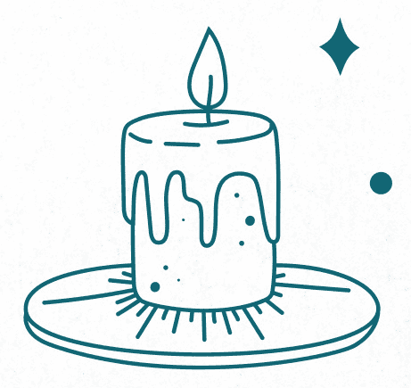

##### ——─ 避凶蜡烛魔法 ——─

这是调整魔法，改从另一个方向处理问题的好例子。黑色在这个魔法中是蜡烛颜色很好的选择。

需要物品：

蜡烛（黑色或自行选择）、串签或长钉子、烛台、火柴或打火机

1\. 归于中心并接地。

2\. 从蜡烛顶端开始，绕着烛身往下重覆写「凶险已去除」(The threat is removed)字样，直到最底端。你必须写完整个句子，所以绕着写到靠近底部的时候，可能必须变换角度挤下最后几个字（不需要写得很密，但需把烛身覆满字，大致绕一圈就好了）。

3\. 把蜡烛放上烛台。点燃蜡烛，口中念道：「蜡烛燃起，凶险减少。」

4\. 静待蜡烛燃烧完毕。

小提示

● 不要留下燃烧的蜡烛径自离开。如果蜡烛还未燃尽你就必须离开的话，请轻轻吹熄火苗，回来后再重新点燃，让蜡烛全部燃烧完毕。

##### ——─ 蜡烛保护魔法（二） ——─

这个稍微复杂一点的魔法会采用柠檬保护与净化特性，也会运用颜色与火焰。

需要物品：

小瓶子或小罐子、一茶匙橄榄油、三滴柠檬精油或柠檬汁

蜡烛（白色或自行选择）、烛台、火柴或打火机

1\. 在小瓶罐中混合橄榄油与柠檬精油或果汁。

2. 一手拿着蜡烛。另一只手的手指沾混合油，从烛芯开始往下涂抹蜡烛，直到底部。

3\. 整根蜡烛都覆满油后，请放上烛台，口中念道：「柠檬与火焰啊，请化解任何造成威胁的邪恶。请成全。」

4\. 点燃蜡烛，在房里安全的地方静待蜡烛燃烧完毕。

##### ——─ 保护薰香 ——─

这个薰香是由几种与保护有关的药草制成。焚燃这种薰香需要的碳饼(Charcoal tablet)，可以在民族特色商店、教会香铺、新世纪商店(new age shop)等买到。请确认你的药草是干燥的。建议在这个魔法中使用欧白芷(angelica)、肉桂、葛缕子、芸香、迷迭香、杜松果(Juniper berry)、雪松(cedar)、干燥柠檬皮屑，大多能在超市的香料柜上找到。

需要物品：

从以上的花草中选择三到五种，每种取一茶匙

研钵与研杵或砧板与刀、小罐子、碳饼、火柴或打火机

隔热碟或香炉，香炉中铺一层沙或土、隔热架或垫

1. 选择要使用的干燥药草。各取一茶匙放进研钵，以研杵研磨混合。如果你没有研钵与研杵，请将药草堆在砧板中央，以刀切碎混合。

2. 用勺子将粉末舀进小罐子中。捧着小罐，闭上眼睛。观想罐里的粉末发出防御能量的光芒。

3\. 将粉末拿到你希望保护的房间。在中央就定位。

4. 将碳饼放进隔热碟或香炉，置于隔热架上。将火点燃靠近碳饼，直到边缘出现红色火星。碳饼点燃后，红色火星会开始蔓延。当火星不再蔓延时，请多燃烧几分钟。

5\. 归于中心并接地。

6. 撒一点薰香粉到碳饼上。碳饼会开始生烟。以手将烟搧到房内各处，将烟从自己身上向外搧。口中念道：「香啊，我召唤你的保护力。请守护这个房间，将负力阻挡在外。」

小提示

● 如果你想使用的药草还未完全干燥，可以放进低温烤箱中，请见 PART 3 的指示说明。

● 可以在碟子或香炉里铺一点沙，吸走碳饼的热。也可以用细砂砾或非凝结型猫砂。请记得薰香用的碳饼与烤肉用的木炭不同。

##### ——─ 房间守护神魔法 ——─

这个魔法会制作一个重点物件来保护特定房间。你必须先做一点准备。请回顾本章的「维护检查」，先决定房间需要哪类能量。它需要更多爱的能量吗？它需要积极的保护吗？它需要促进和谐吗？一旦你决定好房间的需求，接着就必须选择最能与那项需求产生共鸣的焦点物品。以下的魔法是假设你有一个房间（如卧室）需要加强休息与恢复的能量。

需要物品：

一张纸、原子笔或铅笔、天鹅小雕像

一茶匙干燥薰衣草、一茶匙干燥洋甘菊(Chamomile)

1\. 归于中心并接地。

2. 请针对你希望为这个房间加强的能量，在纸上写下相关文字。在这个例子中，睡眠、平静、梦、疗愈等字眼都很实用。你可以重复每个字几遍。不要只是从上到下条列，可以转动纸张从不同角度写，让文字彼此交叉成网状。

3. 拿起天鹅雕像。闭上眼睛并缓缓深呼吸，彷彿你已入睡。放松身体，尽量释放体内的压力。观想天鹅长大，张开羽翼保护你。

4\. 口中念道：「天鹅啊，请守护这个房间，赐给这个房间和平、安宁、疗愈、平静。」

5. 将雕像放在纸上，在纸和雕像上撒干燥薰衣草及洋甘菊。静置一小时以上。

6. 将雕像放到房中某处，让它可以发挥保护与福佑的功能。将干燥药草折进纸中，拿去堆肥。

小提示

● 请善加搭配选择你用来作为房间重点的物件与支援目标的药草。举例来说，如果你想守护你工作的房间，可以使用埃及的写作与智慧之神托特（Thoth）的图像，搭配干燥薄荷与月桂叶，后两者都与动脑的工作及灵感有关。

##### ——─ 吸收负力的水魔法 ——─

某些文化或传统会使用水来吸收负力。以下是净化房间负力的一个简单的方法。

需要物品：

玻璃杯或碟子、水

1\. 将玻璃杯或碟装满水。

2. 归于中心并接地。捧着玻璃杯或碟子，观想从中散发出一道浅蓝色的光。口中念道：「让水吸走这个房间中的所有负力。水啊，我感谢你带来脱胎换骨的能量。」

3. 将碟子或杯子放在不会倾倒且近中央的地方，才能位在房间的能量之流中。水会吸走你不乐见的能量。

4. 如果这个房间属于低负力区域，可以每周更换一次，也可以每天更换以求最佳保护。

##### ——─ 盐饼干魔法 ——─

你小时候有没有自制面团做过东西？这个基本的盐饼干配方是很优秀的防护魔法护身符的基底。盐和迷迭香、鼠尾草、薰衣草一样，都有出色的保护力。请留意：不要拿时下流行的盐或大盐块来进行这项魔法，只要用平价的食盐即可。干燥药草可以研磨或碾碎使用，只要不是新鲜的药草即可。

需要物品：

半杯面粉、四分之一杯盐、用来混合的小碗、木汤匙

四分之一杯水、一茶匙迷迭香、一茶匙鼠尾草、一茶匙薰衣草

饼干模具（非必要）、铝箔派盘或铝箔纸与烤盘、筷子、绳线

1. 将面粉与盐放进小碗中，用木汤匙搅拌。加入干燥药草，再一点一点地缓缓加水搅拌（可能不需要把所有水都倒入）。

2\. 表面洒上一层薄薄的面粉，揉面团 8 到 10 分钟。

3\. 静置面团 30 分钟。

4\. 将烤箱预热到摄氏 120 度。

5. 将面团捏出直径 3.5 到 4 公分左右的小球，轻轻以手掌压扁到 0.6、0.7 公分的厚度。你也可以在铺有薄薄一层面粉的表面上将面团稍微擀平，以饼干模具切出形状。

6. 拿抹刀将饼干面团移到铝箔派盘或铺有铝箔的烤盘上。用筷子较粗的那一端将饼干打洞，方便烤好后悬挂。

7\. 想要的话，可以用筷子较细的那一端在面团上画象征保护的符号。

8. 将派盘或烤盘放进烤箱，烤四小时左右。烤两个小时后，可以为饼干翻面，让两面彻底烤干。如果你的饼干比 0.7 公分厚，可能要烤不只四小时，请时时留意并检查饼干的情况。

9. 从烤箱拿出饼干，待其冷却后，用绳线穿过小洞，挂在任何你觉得需要这个护符的地方。

小提示

● 如果你使用饼干模具，圆形和星形是理想的保护形状。

● 能做出多少饼干，要看模具的大小而定；自行捏小球的话，可以做出四到六个饼干。

## 保护你的地产

有时你的邻居不如你希望的好相处。有时可能因为住家附近人来人往或地点不佳，你希望住家周围有多一点防护。还有一些时候，你只是想要拥有更多隐私。无论你的理由是什么，保护确实属于你的地产是你的权利，如果你自认是某片土地的管家或管理人，那保护这片土地也是你的职责所在。如果你是租屋，那你还是可以保护你所在的这栋大楼附近的土地。以下的魔法重点在你家周围的户外区域。

##### ——─ 地产全面保护魔法 ——─

这个魔法的施展原则和基本个人防护盾（见第二章）相同，但这里你不须站在中央从地面汲取能量，再向外推出一个球体，而是实际在你家地产的范围中四处走动（尽你所能），走到哪里，就将能量线画到哪里。请从大门等你觉得最适合的地方走起。

1\. 归于中心并接地。

2. 持续从地面汲取能量，让能量从手臂往下流入双手。一手指着地面，开始沿着庭院边缘走动，同时观想大地的能量如一条丝带般流出。

3\. 边走口中边念道：「这片土地已获得保护。没有人能伤害它。没有任何邪恶能跨过这道屏障。」

4. 完成庭院的绕行。观想能量带回到起始点，连为一个完美无缺的环，围住庭院。

5\. 观想能量圈陷入地面之下。重复念道：「这片土地已获得保护。没有人能伤害它。没有任何邪恶能跨过这道屏障。此事已成。」

小提示

● 如果因为有篱笆或其他障碍，导致你无法走遍地产各处，可以分成前后两个阶段来完成（或更多阶段，如果有必要的话）。

● 如果有棚子或独立车库等障碍，使你无法实际走遍地产的各处边缘，可以举起手臂来投射能量，观想自己将能量送到障碍后方。

● 要进行额外的保护时，可以将净化并加持过的矿石埋在地产的四个角落（或四大基本方位）。孔雀石(Malachite)在这种魔法中是很实用的宝石，因为孔雀石与保护环境有关。

##### ——─ 击界碑 ——─

击界碑这个古老习俗据信起源于异教，至今在某些英国与威尔斯地区仍有人奉行。击界碑是指拿枝条击打或重击地产的边缘，以打破负能量，赐福于土地。这项练习也会画出并加强保护能量的边界，让你能仔细检查地产的实际状况。春天是施展这个魔法的理想季节。

需要物品：

一壶水、长枝条或棍棒

1\. 将水壶摆在起始点。

2\. 归于中心并接地。

3. 沿着地产边缘走动，开始前后挥舞枝条或棍棒击打地面。同时口中念道：「大地啊，请从睡梦中醒来！太阳照耀着，空气召唤着；请振作精神！但愿你接纳所有种下的种籽，但愿你的生长季让植物健康成长，但愿你的丰收期能收获丰硕。我驱逐威胁你的负能量；走开，不幸，永远不要回来。」

4. 结束周游时，放下枝条，拿起水壶。将水倒在你的起点暨终点的地面上，口中念道：「我感谢你，大地，感谢你赐予的诸多福气。」

小提示

● 如果因为要挥舞工具又要拿著书或纸张不方便，或是因为边走还要边留意方向不容易，当你觉得边走边念很难时，可以在行程开始前念一遍咒文，结束后再念一遍咒文。

## 保护你的花园

如果你是园丁，保护植物与收获永远是你关注的焦点。本节涵盖保卫庭院的魔法，以及运用庭院来保卫地产与住家的魔法。

##### ——─ 树木保护魔法 ——─

保护地产最有效的一种方式是种植新的灌木或树木。这是给土地的礼物，也是给整个环境的礼物。请调查你所在的城市或地区在世界地球日、植树节或其他类似节日，有没有免费赠送或低价贩售的树苗。请谨慎选择你用来种植树苗的区域；树苗不能离建筑物太近，以免树根破坏水管系统，或树枝干扰电线。你的城市也许有法律规定树木能离地界线多近。

下方栏框列出了一些树木与灌木的种类及其魔法特性。请从中选出一种，或参考其他建议。请调查那棵树的特性，并调整魔法来纳入那些特性。说到底，重要的是那棵树本身，而不是特定的魔法能量。树木代表着稳定与耐力，两者都与保护息息相关。

需要物品：

铲子、水晶、树苗、黑土、水管或水桶╱喷壶

1. 为树苗挖一个洞。购买树苗时，你应该会拿到一纸说明或须知，如果没有，可以上网研究并记下信息。洞要多大？一个好指引是使现有的树根在上下左右都拥有大量的伸展空间。洞的直径应该要有根球宽度的两到三倍，深度则略较根球高度深一点，根球顶端应该与地面齐平或仅略低于地表。

2\. 将水晶放入洞的底部，口中念道：「大地啊，请体恤人意，帮助这株树成长。保护它不受病虫害与危险侵扰，帮助它日后给予我们保护。」

3. 将树苗放进洞里。填土时请朋友把树苗扶直。请加入黑土为你移走的土带来焕然一新的活力。不要将土压实，因为树根需要空气，土松一点才有助于它适当成长，也能确保排水正常。

4. 用水管缓缓浇水，让水渗入这个区域至少两三个小时。每天都要为树浇水，至少持续一个月，期间要特别留意你所在地区的天气，依天气状况调整你的浇水量。

小提示

● 如果你没有足够的种树空间，何不改种水果？黑莓藤的魔力据说能将不乐见的能量隔绝在地产之外。

● 请一个帮手很有用。要不然，你也可以插一根竿子将树苗立直；必要的话请拿细绳小心绑紧。

以下是一些树木与灌木植物及其魔法特性：苹果（富足、健康）；梣树（保护）；桦树（儿童、净化、保护）；山楂（保护、快乐）；紫丁香（保护、爱、净化）；柏树（清洁、净化、保护）；玫瑰（爱、净化、祝福、正能量）；橡树（精力、保护）；松树（疗愈、净化）；花楸树（保护、祝福）；柳树（保护、疗愈）。

##### ——─ 卢恩石庭院魔法 ——─

规划新庭院并亲自掘土是件令人兴奋的事。这个魔法能为新建的庭院或刚铺好的花坛进行祝福与保护。

需要物品：

四颗圆滑的溪石或鹅卵石、长钉子、小铲子

装有福水（见下方框）的浇水壶

1\. 归于中心并接地。

2\. 用钉子为每颗石头刮出以下的卢恩符文：

|  | 欧瑟拉(Othala)：祖先，守护着这片土地与地产。 |
|  | 奥吉兹（Algiz）：但愿这座庭院获得防护。 |
|  | 英格兹（Ingwaz）：但愿这座庭院生生不息。 |
|  | 杰拉（Jera）：但愿这座庭院成功丰收。 |

3\. 拿铲子在花坛每个角落挖一个洞，各放入一颗石头，然后以土掩埋。

4\. 拿起浇水壶，口中念道：「福佑大地，但愿你获得守护，不受病虫害与贫瘠侵扰。但愿你结实累累，但愿你收获丰硕。此事已成！」以福水浇灌庭院。

用在庭院的福水或圣水不能以盐制作，因为盐不利于绿色植物生长。请试着改滴入纯银液体，将石英(Quartz)或孔雀石(Malachite)放入水中。请见本章前文了解如何制作福水。

## 公寓的特定魔法

如果你住的房子是暂时的，或是你并不拥有它，那你要如何保护那个住家？租屋、连栋住宅、公寓或分租大楼等，为魔法带来了挑战，因为你住的地方就紧邻着别人。前述关于伦理的章节也可套用在这里。如果你是住在分租大楼，就不得不考虑他人的权益。因此，你的魔法必须特别聚焦于你自己和你的个人空间。同样的，在你离开那栋建筑物或空间之前，也必须先解除你曾进行的永久性或持久性魔法。

##### ——─ 搬家魔法 ——─

居住在一个空间意味着你的能量会渗入墙壁。你在这里爱、大笑、哀悼，意味着你的能量会附着在这里，盘根错节地交织。如果你想有效、简单地修正你家的能量，那很轻松……但如果你要搬出去的话，麻烦就来了。这个魔法的用意是协助你从住处的能量脱身，让你和这个地方再度成为分开的实体。

需要物品：

薰香（乳香或檀香）与香炉

火柴或打火机

1\. 在住处的中央归于中心并接地。

2\. 点燃薰香。口中念道：「可敬的房子，感谢你多年来庇荫着我。请将属于我的能量释放给我，让我离开时能带走它们，不再烦扰你。我留下你的洁净，并准备好迎接你下一位房客。」

3. 闭上眼睛，伸出双臂。观想你缓缓从屋子各处引出能量，飘到你的手上，被你吸收进体内。请以手臂由下往上地吸收能量到你的核心，再从核心往下连接地面和大地的能量。

4\. 静待薰香燃烧完毕。

小提示

● 喜欢的话，可以使用鼠尾草烟燻棒来取代薰香。

这个魔法要你做的是接地的相反，不是从地面汲取能量上来，而是从别处汲取能量，然后往下分流入地面，这样你的体内才不会蓄积太多能量；你才能安全地平均分配能量，不会超过自己的负荷。

##### ——─ 居家守护神魔法 ——─

前一个魔法告诉我们，你当然可以将魔法与保护注入不属于你但你居住其中的住家墙壁中，只是离开时要记得收回、驱散或释放它们。不过，还有另一个将永久建筑物魔化的好方法，也就是将绘画、雕像或其他可移动的物件魔化，使其成为你家的保护者，无论位在何处。

需要物品：

孔雀石

茶晶(Smoky quartz)

虎眼石

焦点物品（如雕像、画作等）

一茶匙干燥迷迭香

一茶匙干燥鼠尾草

一茶匙盐

一个茶蜡

火柴或打火机

小蓝袋

1. 施展魔法前，请先依据你喜好的方法（见第七章）洗净宝石与你选定的焦点物品。

2\. 归于中心并接地。

3. 在施法区中央撒迷迭香、鼠尾草和盐，以手指画卢恩符文「爱瓦兹」（Eihwaz，见第七章）。将施法的焦点物品摆在卢恩符文上。

4. 将孔雀石摆在略偏焦点物品左后方的地方。茶晶则摆在略偏焦点物品右后方的地方。最后将虎眼石摆在前面，介于你和焦点物品之间。宝石应该要连成一个倒三角形，焦点物品位在三角形的中央。

5\. 将茶蜡放在虎眼石前面点燃。

6. 双手在三角形上方交握。从你的能量中枢往下接触大地，连接并向上汲取其能量。再让能量顺着手臂往下从双手散发，给予焦点物品能量。此时口中念道：「我召唤家之神灵。我召唤舒适与安全；我召唤平安与和谐；我召唤耐力与弹性。家的神灵啊，我将你收在这个焦点物品中。但愿在你照顾下生活的人发达兴旺；但愿他们健康、强壮、勇敢、稳定。请成全！」

7\. 往后站并甩掉手上多余的能量。记得要主动停止汲取大地能量的连结。

8. 静待蜡烛燃烧完毕。蜡烛烧尽后，请将药草与宝石收到小蓝袋中。将焦点物品与小蓝袋存放到家里的主卧室。

在这个魔法中选用的宝石，都是用来抵销多人住在同一个空间（如宿舍或校舍、公寓、连栋住宅等）的潜在负面效应。孔雀石能发挥舒缓环境压力的功效，虎眼石能给你精力，茶晶能吸收负能量。

第四章

# 家人与朋友

保护你亲近的人通常是魔法的主要焦点。本章探讨的就是如何保护家人与亲友。然而，保护他人也属于微妙的伦理灰色地带。如果你是为他们涉入的情况召唤善念或为之祈祷，那没有问题，迳行无妨。然而，很多时候事情并不是这么一清二楚。

如果你见到朋友有难，想以魔法协助时，最明显的做法是请他们允许你代表他施法。如果他们觉得无妨，那这件事就说定了。他们可能会想设下底线，或请你聚焦于某个方面，那是他们的权利。但如果他们拒绝你施法，或基于任何理由你无法征询他们同意，那你就必须斟酌了。

与其针对特定的人施法，你不如尝试改善他身处的情境，让改善的方式变得模糊，让能量自行做出决定。请考虑在魔法中添加一句话，允许那个人本身的能量可以拒绝你所激发的任何能量；这样他才有能动力，即使是潜意识的能动力。

这是个棘手的问题。只有你能决定怎么做才正确。不过你必须知道，无论你的决定为何，你都必须接受后果。

## 保护个人

魔法的一部分工作是在助人。有时协助的对象是自己，有时则是朋友。本章的魔法要协助的未必是家人，不过当然也可以用在家人身上。这里的重点是协助人们重拾对生活中各种事情的掌控力。这些魔法不是万灵丹，也不表示你比你的施法对象更清楚明白事态。不过要记得，如果你是为特定的人施法，最好先取得他们的同意。

##### ——─ 一般保护魔法 ——─

这个魔法的好处是人人有份——没有哪个人会被排除在外，也不会聚焦在某个特定的情况或议题上。这是一种雨露均霑型的正能量魔法，身为施法者的你也能感受得到诸多好处。这个世界可以多使用一些这类正能量，你不觉得吗？

需要物品：

蓝色蜡烛与烛台、粉晶、四颗黑曜石、火柴或打火机、一茶匙盐

1\. 归于中心并接地。

2. 将蓝色蜡烛放上烛台摆在施法区中央。把粉晶摆在蜡烛底部。想象蜡烛与粉晶周围形成一个方形区域，在四个角落各摆一颗黑曜石。

3\. 点燃蜡烛后，口中念道：「但愿我最亲近的人获得保护；但愿他们不受伤害、危险、不幸所侵扰。但愿祝福照亮他们生活中的每个部分。请成全。」

4\. 在整个区域外小心撒一圈盐。静待蜡烛燃烧完毕。

##### ——─ 冰魔法 ——─

有时朋友或心爱的人陷入水深火热时，你必须让事态发展慢下来或及时喊停。这个魔法有助于给人时间或空间思考出路或做计划。

需要物品：

纸片、原子笔或铅笔

附盖子的耐冷小容器、水、冰柜(冷冻库)

1\. 归于中心并接地。

2. 在纸片上写下要处理的情况。举例来说，如果你的另一半工作遭遇瓶颈，请写下「吉姆充满压力的职场环境」。

3\. 将纸折好放进容器中，倒入水，刚好能盖过纸片即可。盖上盖子。

4\. 将容器放进冰柜，等水结成冰。

5. 这个魔法最多能保留七到十天。结束的时候，请将容器拿出冰柜，等冰融化。

6\. 归于中心并接地。口中念道：「我在此释放这个情况。但愿决心长存，达到最佳成果。请成全。」

7\. 把水拿到户外倒掉。溼纸片放进堆肥或埋进土里。

小提示

● 可拿小夹链袋来取代容器。

● 对即将到来的事件或活动产生的焦虑，可以试着用此魔法来冻结。

这个魔法不是永久的，只能提供暂时的中止，仅此而已。一个礼拜左右以后，你就必须把容器从冰柜拿出来，让冰融解。如果你不这么做，那个情况仍会开始兴风作浪。对魔法的施展情况还是维持掌控较好。

##### ——─ 消除阻碍冰魔法 ——─

这是前一个魔法的逆转，将冰块当成某个阻碍的象征，让它不再阻挡某人。开始施法前，请先想好描述那个情况的短语，例如「凯西的保险给付遭到推诿而且悬而未决」。

需要物品：

碗、冰块

1\. 归于中心并接地。

2\. 把冰块放进碗中。拿着碗，口中念道：「我命名你为〔短语写出的情况〕。融化吧，融化吧，将过程解冻，找出解决之道。」

3\. 冰块融化时，请观想它释放出必要的能量，让情况迈向解决。

4\. 冰块融化后，口中念道：「此事已成。」然后把水倒向户外。

小提示

● 这个魔法也可以用来去除个人障碍，如遇到写作瓶颈，或对某个即将到来的事件产生的恐惧。

##### ——─ 闺蜜支援魔法 ——─

曾经将两人结合或成对的事物，可以用来当作分开后彼此的连结。假设两人都同意，你可以拿闺蜜项鍊当成以魔法保护彼此的基础。尤其是如果你们身处不同城市，不常见到彼此的话，这是让既有的友谊更深厚的好方法。这种方法能让你们即使不在彼此身边，也能关心、支持对方。

要小心：如果你的朋友正陷入困境，这个魔法会汲取你的能量来帮助他度过难关。它也能用来进行无声的沟通，会在友人需要支持或联络时提醒你，反之亦然。

需要物品：

朋友的相片或他的一样物品、两根蜡烛（白、蓝或金色）与烛台

闺蜜项鍊组、两颗白水晶、两颗粉晶、火柴或打火机

1. 将朋友的相片摆在施法区中央。两根蜡烛放上烛台，摆在相片后方。闺蜜项鍊则摆在相片下方，一侧放一颗白水晶与粉晶；另一颗白水晶与粉晶放在照片的另一侧。点燃蜡烛。

2\. 归于中心并接地。

3\. 双手在相片、项鍊与宝石上方交握。口中念道：

请成为我的力量，我也成为你的力量，

让我们的友谊支持彼此，在彼此有难时伸出援手，

我守护着你，你守护着我。

4\. 静待蜡烛燃烧完毕。

5\. 将一颗白水晶、一颗粉晶、坠饰的一半给朋友。另一半由你保留。

小提示

● 如果你不想把坠饰当成项鍊戴在身上，也可以挂在钥匙圈、手环或吊牌绳上当挂饰……你有很多选择！

请留意，这个魔法必须要两个人都同意以这种方式连结才能进行。

## 家人

家人是很特殊的例子。保护家人是一种代代相传的冲动，一种与生俱来的本能。你会从内心深处担心家人遭遇不测，深怕保护不了他们的念头甚至令你恐惧。

运用魔法来保护家人，并且支援你为了保持他们健康、安全、快乐所做的其他工作，如同一层额外的保障。它能为家人、也为你带来安慰。

##### ——─ 祖先保佑魔法 ——─

保护家人感情、加强家族关系，是守护你所爱亲人的关键成分。其中一种保护方法是尊崇祖先，请他们保佑后代子孙。要小心的是，施展这项魔法时，你也是在正式认可你的祖先及他们在你生活中的地位。往后如果你忽视他们，你的要求有可能得不到回应！

需要物品：

乳香或你偏好的薰香及香炉、火柴或打火机

白色柱蜡（或守夜蜡烛、其他玻璃罐装蜡烛）

1\. 归于中心并接地。

2\. 点燃薰香。花一两分钟深思，想想你的祖先。

3\. 点燃柱蜡，口中念道：

永远在我们心、身、灵中的可敬祖先们，

将我们带来人世的祖先们，

活过、爱过、笑过的祖先们，

为正义奋斗、守护无辜者的祖先们，

我们在此献上敬意。

我们感谢你们活过的一生，并请你们保佑我们。

守护我们的人生，保护我们不受任何恶人侵扰，请成全。

4\. 静待蜡烛燃烧到薰香燃尽为止。然后吹熄蜡烛，收放到安全处。

5. 每两周（或每个月，或任何你觉得适当的例行时程）重新点燃蜡烛，重复召唤你的祖先。

小提示

● 全家人一起进行会是一件很美好的事，可以请每个家庭成员轮流念祈祷文。

不同于本书中的其他魔法，这个魔法使用的是柱状蜡烛，因为要定期点燃来表示对祖先的敬意。

##### ——─ 居家空间安全魔法 ——─

魔法可以用来改善家人们互动的环境，进而促进家人感情。藉由创造安全的互动空间，可以提升住家的安全，以及家人之间的信任与亲密感。

需要物品：

一位家人一颗宝石╱水晶（见下方框）、小玻璃碗、家族相片

1\. 先从第七章选一种你偏好的方法来清洁宝石。

2\. 归于中心并接地。

3. 依次拿起宝石，脑海中想着宝石所代表的那名家族成员。接着将宝石放进碗里，口中念道：「我们的家位在安全、充满爱与支持的空间。家人沟通清楚无碍，心平气和。」如果你是与家人一起施法，那就请每个人拿着代表自己的宝石，在把宝石放进碗里时念出上述句子。

4\. 将家族相片放在最上方，口中念道：「此事已成。」如果你是与家人一起施法，可以请每个人一起说。

5\. 将碗放在家人最常聚集的地点中央，如餐厅或客厅。

小提示

● 迷你女巫之梯（见第二章）是这个魔法的绝佳帮手。请卷好女巫之梯后放进碗里，或结成一个环，将碗放进环中。

这个魔法会为每个家族成员使用一颗宝石。你可以请每位家人自行选择宝石，或根据你的观感，由你为他们选择宝石。

##### ——─ 家人沟通支援魔法 ——─

家人最常聚集的地方是餐桌。餐桌是分享食物、进行对话与计划、完成工作后的场所。为餐桌授能，赋予清晰无碍的沟通与爱，是为家族连结添加一层保护的妙方。

需要物品：

福水（见第三章）

干净的布

1\. 归于中心并接地。

2\. 以布沾福水擦拭桌子，口中念道：

让这张桌子成为安适之地，

但愿它成为学习、支持的地方，让家人彼此分享。

但愿在此的沟通清楚，彼此尊重，随时都充满爱，此事已成。

小提示

● 这个魔法可以定期施展，频率由你决定，或依据你感觉需要多常进行而定，如每周或每月一次。

##### ——─ 魔化厨房用具，促进安全健康的魔法 ——─

你希望家人健康快乐，这点毋庸置疑。除了确保你家的刀子锋利（减少意外发生）之外，以魔法支援厨房安全能为家人提供实际的保护。这个魔法聚焦于刀子，但也可以当成魔化其他工具的范例。

需要物品：

厨房菜刀或其他刀子

1\. 归于中心并接地。

2. 拿着刀子。从地面汲取能量，让能量经由手臂往下流入刀子。口中念道：「刀子啊，我手中的工具，请保持切割时的安全与利落。」

3\. 对其他刀子重复同样的步骤。

小提示

● 请用同样模式来祝福厨房里的其他工具。例如：「汤匙啊，我手中的工具，请保持搅拌顺畅均匀。」

##### ——─ 除夕魔法 ——─

如果你的家庭过去一年来过得不顺遂，而你不是那种会把每年的日历小心保留下来当纪念或纪录的人，那可以把旧日历烧掉，避免厄运延续到新的一年。如果你不想把日历烧掉，可以拿起日历逐页翻看，在纸上记下发生过哪些坏事（修车、急诊、争吵等）然后烧掉这张纸。

需要物品：

即将过去的那一年的日历、大的隔热容器（见下方框）

火柴或打火机、一桶沙或一壶水

1\. 归于中心并接地。

2\. 拿起日历，口中念道：「走开吧，负力！厄运与病痛，我命令你消失，过去的已经过去，不要再纠缠我们。此事已成！」

3. 将日历纸一页页撕下，丢进隔热容器。点燃几张日历纸的边缘，等火蔓延。依日历纸的材质种类不同，火可能生得很快，也可能要花一些工夫。请坚定信念！

4. 看着火烧完所有日历纸为止。直到仅剩下余烬或纸灰时，倒一些沙子或水将火完全熄灭。

小提示

● 开始使用新日历时，请同时准备一本小笔记本或从十元商店买一本行事历来记事，年末时一并烧掉。你可以在一年中的任何时候施展这项魔法，永远不嫌晚。

如果有的话，壁炉或户外火坑是这个魔法的理想工具。如果你没有壁炉或户外火坑，可以把大锅或铸铁荷兰锅放在砖块、铺石等隔热表面上使用。如果你使用的不是壁炉，请在户外进行这项魔法。

##### ——─ 新年日历魔法 ——─

这个魔法能为你的新日历授能，带来好运并吸引正能量。它的用意是为家里主要的日历施法，但你也可以用来施展在自己的随身行事历、手帐或学校行事历上。在除夕或新年当天施法效果最佳。

需要物品：

新日历、四个茶蜡、火柴或打火机

干燥罗勒叶、干燥玫瑰花瓣、干燥苜蓿花

砂金石(Aventurine，也称作东陵石或东菱石)

1\. 归于中心并接地。

2\. 将新日历放在施法区中央。

3. 将药草撒在日历上。日历中央放上砂金石。在距离日历 2.5 公分左右的四个角落，各放一个茶蜡。

4\. 点燃茶蜡后，口中念道：「让来年获得福气，拥有好运、健康、笑声、喜悦、成功。此事已成！」

5. 静待茶蜡燃烧完毕。烧完后，收拾药草（放入堆肥），移走砂金石，将新日历挂起来。

小提示

● 你不需要特别保留这颗砂金石。净化后放回你的盒子或宝石袋中，留待日后其他魔法使用即可。

##### ——─ 开学第一天魔法 ——─

这个魔法本来是用在开学第一天害怕上学的孩童，但也能调整后用在任何年纪的人在焦虑的事情发生的第一天施展。概念是召唤让你感觉坚强、成功的能量。如果你是为孩子施法，可以请他和你一起进行。孩子的参与是魔法成功的关键。请依他的喜好使用任何颜色。

需要物品：

纸、剪刀、原子笔、铅笔或蜡笔╱色铅笔

至少一样给你力量的事物（如动物或其他造物）

三个正向的词、卢恩符文或其他象征符号、小袋或束口袋

出生那一年发行的钱币（或那一年印制的其他硬币）

1\. 将纸剪成数张。信纸可以剪成四张（各 10×13 公分左右）。

2\. 在纸上画下至少一只让你感觉坚强而安全的动物或造物的图像。

3. 在另一张纸上写下三个词，描述你想在学校有何种感受。安全、快乐、勇敢、聪明、强壮等是很好的用词。如果你是与孩子一起施法，可以让他决定。

4. 选择一个与保护有关的象征符号（参见第七章保护性符号）画在另一张纸上。如果是与孩子一起制作，请让他选择要用哪种符号；对孩子有深刻意义的符号就可以了，不一定要传统符号。例如美国队长的盾牌、神力女超人的老鹰符号、变形金刚的符号……这些流行文化符号对孩子可能意义非凡。请顺着他的意思。

5. 将纸片折好放进小袋或束口袋，同时念出每种保护符号的名称。例如：「我已受狼及独角兽保护。在学校的我聪明、勇敢、坚强。」

6\. 将出生那一年发行的钱币放进袋中封好，口中念道：「有了这个袋子，我坚强又安全。」

7\. 当前往恐惧的活动地点或场合时，将袋子放在口袋中。

小提示

● 在日本文化中，人们能在神社买到称为「御守」的护身符。御守通常是布制品，看起来像标示牌或小袋子，有时里面放有祈祷文或祷告文。御守可以系在背包、书包或皮夹上，带给你好运与精神保护。上述魔法也有类似的功效。

● 不再需要这个魔力袋的时候，就将袋子打开，带着敬意与感谢处理掉内容物。

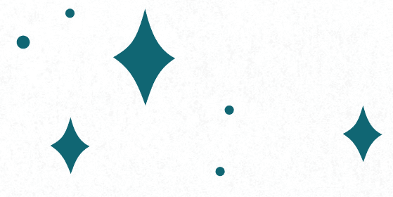

##### ——─ 分离焦虑魔法 ——─

这个魔法原本是用来施展在第一天上幼儿园，对离开父母会很紧张的孩子身上。但不论你年纪多大，如果你有社交焦虑，这也是一种绝佳的魔法。

需要物品：

两条成对的项鍊、坠饰或手环。

1\. 归于中心并接地。

2. 如果孩子也一起参与施法，你们可以各拿一个焦点物品在手里。如果他没有参与，那就请你将两个物品拿在手里。

3\. 口中念道：「今日我的爱与你同行。我只要看到它，就会想到你；当你看到它，也会想到我。无论是在一起还是分开，我们都坚强而勇敢。」

4. 将项鍊（或手环）分别戴上父母和孩子的脖子（或手腕），如果你是为自己施法，那就将其中一个戴起来，另一个套在代表安全与慰藉的象征，例如泰迪熊、显示你快乐有自信的相片，或是任何对你有效的事物，重点是摆在家里。

5. 每当你或孩子感到开始惊慌时，就将手摆在项鍊上或触摸手环，闭上眼睛。深呼吸三次，观想你所连结的另一条项鍊正安全、安稳地与你所爱的人在一起。提醒自己你在那里感觉有多安全，并将那种感觉引到自己身上，你就会变得勇敢了。

小提示

● 请先特别确认好孩子读的学校可以戴项鍊。有些学校和机构出于安全考量，并不允许戴首饰。如果是这样，请在你的手背和孩子的手背分别画上成对的象征符号。每天重画一遍。或是使用纹身贴纸。

如果是为孩子施法，请与孩子一同选择要使用哪些项鍊╱坠饰╱手环。孩子的参与很重要，如果他与戴在身上的焦点物品之间有个人连结，能量会产生共鸣，能量流动会更顺畅。

##### ——─ 恶梦远离魔法 ——─

照顾家人，有一部分意味着确保每个人都获得充分的优质睡眠。恶梦或失眠也可能成为问题。黄水晶(Citrine)这种黄色的水晶，有助于守护入睡的人不受恶梦侵袭，并舒缓身体压力。薰衣草对释放身体压力与安眠也有良好的功效。这两者是一夜好眠的优秀组合。

需要物品：

黄水晶、白色小束口袋或方巾及白纱线或丝带

一茶匙干燥薰衣草花

1\. 归于中心并接地。

2\. 拿着黄水晶，口中念道：「明亮的宝石啊，恶梦已被你的光芒驱逐。」将水晶放入袋子。

3\. 拿着薰衣草花，口中念道：「薰衣草啊，请带来安宁的睡眠，使睡眠平静而深沉。」将薰衣草花放入袋子。

4\. 束紧袋子，口中念道：「这道魔法已召来甜美的睡梦。」

5\. 将袋子塞进枕头，或挂在床柱上、置于床下。

## 为孩子及与孩童一起施展的魔法

可以的话，请让你的孩子一起参与魔法。他们需要对自己和环境有某种影响力和掌控感。他们的参与能让魔法变得强而有力。

释放压力

教孩子如何归于中心并接地，帮助他学到这项实用技能。他们能在过程中找到自身的立足点，重建自信，来面对令他们失衡的情况。这也是一种处理压力的好方法。

##### ——─ 面对恐惧的孩童魔法 ——─

请与孩子坐在一起设计魔法！这个魔法的核心是创造一个想象的朋友来保护孩子。由于他们对如何设计这个保护者握有掌控权，这个魔法对他们会特别有威力。

需要物品：

纸、蜡笔

1\. 归于中心并接地，也请引导孩子进行同样的过程。

2. 告诉孩子要由他来设计一位完美的保护者，请他说说他希望这个保护者做到哪些事。它是高大还是矮小？他是说话大声还是说话很温柔？他是沉默不语还是肉眼不可见？他有几条腿？他有尾巴吗？看到孩子受惊吓时，他会怎么做？他有毛、羽毛或鳞片吗？

3. 让孩子天马行空地想象。他可能会非常投入，设计出好几个保护者，也可能很不自在，根本不想设计。如果发生后面这种情况，请结束这个魔法，让他想个几天后再试一次。

4. 请孩子画出这个保护者并为他命名。提醒他，他紧张或受惊吓时，可以随时召唤这个保护者来帮忙他，他会随时候命。

小提示

● 如果孩子已经有了一个想象的朋友，可以此为基础设计魔法。

你是最能判断孩子个性的人，你明白要以哪种方式来设计这个魔法最为适当。请依需要来调整魔法。

##### ——─ 驱逐恐惧的短诗 ——─

念一段有韵律的文字能带来某种慰藉，特别是你觉得压力沉重的时候。它能创造出一种很好跟随的平稳节拍，熟记在心的小诗或小调也能让你的心稳定下来。这是一种文字魔法。如果以想象的朋友保护孩子的概念有效，那可以将前一个魔法结合这个魔法一起进行。如果无效，那单独施展这个魔法也无妨。

与孩子一起念出下列短诗：

一、二、三，伤害全退散

四、五、六，诡计消失囉

七、八、九，好事久久久，

数到十，一切都是善。

##### ——─ 反霸凌魔法 ——─

霸凌可能会造成孩子心灵上重大的阴影。恐吓是很难反抗的力量，当孩子担心自己是力量不均衡中弱势的那一方时，更是如此。给孩子魔力袋让他带在身上，帮助孩子加强他对自身力量的信心。

需要物品：

黑曜石(Obsidian)、虎眼石、红碧玉(Red jasper)

褐碧玉(Brown jasper)、蓝色蜡烛与烛台、火柴或打火机

蓝色提袋或小袋（也可以换成孩子喜欢的颜色）

1\. 从第七章选一种你偏好的方法来清洁宝石。

2\. 归于中心并接地。

3\. 点燃蜡烛。

4\. 拿起黑曜石，口中念道：「黑曜石啊，请施加保护，防范负力侵扰。」然后将黑曜石放入袋中。

5\. 拿起虎眼石，口中念道：「虎眼石啊，请施加保护，防范身体伤害，并加强勇气。」然后将虎眼石放入袋中。

6\. 拿起红碧玉，口中念道：「红碧玉啊，请支持正义，防范身体威胁。」然后将红碧玉放入袋中。

7\. 拿起褐碧玉，口中念道：「褐碧玉啊，请在长期压力的情境下确保安全。」然后将褐碧玉放入袋中。

8\. 封紧袋子，口中念道：「让力量不均衡的情况恢复正常。但愿真理早见天日。但愿正义获胜。」

9\. 将袋子放在蜡烛前面，静待蜡烛燃烧完毕。

10\. 把袋子交给感觉自己受到霸凌的人。

这个魔法的用意是支持；它不能取代实际行动！让孩子把霸凌的事告诉教职员或他信任的成人，比什么都重要，这样霸凌才能获得适当的处理。

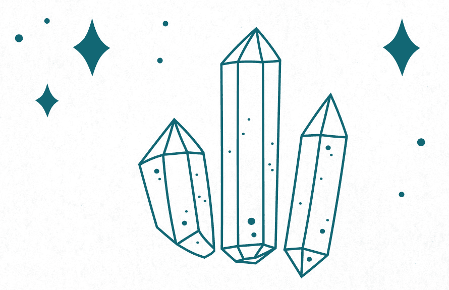

## 保护你的宠物

宠物就和家族的人类成员一样值得被保护与照顾。以下的魔法聚焦于有毛、羽毛或鳞片的家族成员。

##### ——─ 宠物项圈保护魔法 ——─

宠物要到户外，就要戴项圈。有些养在室外的动物也会戴项圈。这个魔法是使用项圈来当成保护魔法的施展重点。

需要物品：

宠物项圈

1\. 归于中心并接地。

2\. 捧着项圈，口中念道：

请成为这只动物的盾牌。保护牠不受伤害。

以爱与保护包围着牠，牠戴着项圈多久，就保护多久。

请成全。

3\. 为宠物扣上项圈。

小提示

● 喜欢的话，可以把倒数第二句改成：「牠在世多久，就保护多久」。

##### ——─ 平安归来魔法 ——─

这个魔法是要魔化宠物项圈的登记颈牌或预防针标示牌，协助牠安全返家。

需要物品：

一张纸、原子笔或铅笔

登记颈牌和╱或预防针标示牌（是否连着项圈皆无妨）

1\. 归于中心并接地。

2. 在纸上画出你家的图像，只要简单的形状或轮廓就可以了。请让图像大到包得住标示牌和╱或项圈。将你家地址写在图像内。

3\. 将标示牌和╱或项圈放在纸上的屋里，口中念道：

家，家，家，

回来，回来，回来，

安全，安全，安全。

4\. 将标示牌套进宠物项圈，或把整个项圈扣好后，再度重复上述咒文。

小提示

● 请在每年需要更新注记或打预防针的时候，重复施展这个魔法一次。有些标示牌会每年更新，有些则是永久的，只是档案更新而已。无论如何，这段更新的时期是提醒你重施魔法的好时机。

● 如果你的宠物真的走丢了，你可以用这个魔法为焦点，协助牠早日回家。请改将宠物的相片，而非标示牌╱项圈，放进房子的图像中。

##### ——─ 宠物健康魔法 ——─

这个魔法施展的对象是宠物的食用碗，用意是赋予使用碗的动物健康与精力。

需要物品：

宠物用碗（或水盆、水壶等）

1\. 清洗并擦干碗。

2\. 归于中心并接地。

3\. 双手在碗上方交握，口中念道：

但愿从这个碗饮食的动物

健康、快乐、喜悦。

请赐予牠们长寿与心满意足。

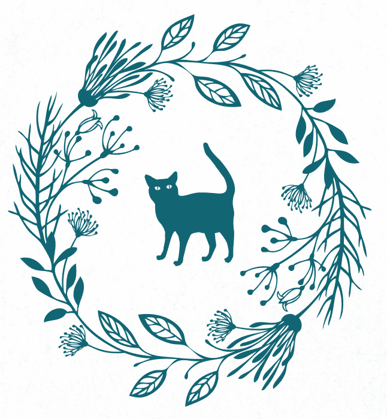

第五章

# 出门在外

保护住家是美好的事，但你出门在外，在办公室或学校等其他地方度过的时间也不少。本章是聚焦于住家外其他地点的魔法。

## 保护你避开危险

魔法无法神奇地去除你在公共区域受到的伤害。法术的保护是在魔法的层次上运作；换句话说，它的作用是加强给你的保护，减少负力被吸引到你身边或在你身边发生的机率，但它无法完全消除在公共场所发生暴力或冲突的可能。

不过，魔法有助于加强你的感知，让你能在情况变得太危险之前有所察觉并避开。你也可以藉由操作这种「别看我」的魔法，减少自己成为施暴对象的机会。在所有这类魔法中，你都必须凭直觉行事。如果你忽视觉知传达给你的警告，这些魔法就不管用了。

##### ——─ 加强你的防护盾 ——─

请回头参考第二章的基本防护盾魔法，再进行这个魔法。

1\. 归于中心并接地。

2. 请依据基本防护盾魔法，汲取大地能量，形成一道防护盾保护自己。别忘记头上和脚下都要形成穹窿。

3\. 聚焦在防护盾的能量，口中念道：「防护盾啊，我为你加持，请你留意危险。在我受到威胁时警告我，让我能从危险中脱身。」

##### ——─ 感官敏锐魔法 ——─

让你的感官更敏锐并微调你的感知，当置身于微妙情况时，能为你带来助力，让你在事情失控之前脱身。

1\. 归于中心并接地。

2. 专注在你对身体的觉知，然后向四面八方小心拓展你的觉知。请往每个方向拓展 1.2 到 1.5 公尺左右。

3\. 口中念道：

我有野兔的耳力，老鹰的眼力，猫头鹰的智慧。

当危险靠近时，我感觉得到，并能立刻采取行动。

4\. 留意你的感官所传送给你的讯息。

小提示

● 要记得，当你开始加强自己的感官时，可能会有一段适应期，在这段期间，你可能会感觉一切都太吵杂且不堪其扰。当你学会如何筛滤收到的新讯息后，就会慢慢适应，这段时期自然会过去。

##### ——─ 隐身魔法 ——─

这个魔法无法彻底抹消你的存在，但能使人对你视而不见，从而减少你成为焦点的可能。

1\. 归于中心并接地。

2. 想象从别人的目光来看自己。缓缓想象自己的轮廓逐渐模糊、消失，只剩下朦胧的外形轮廓。

3\. 口中念道：「请让他们的视线模糊，不会注意到我。请对我视而不见，视而不见。」

小提示

● 这个魔法不会将你从人们的感知中实际抹除。任何出乎意料、突然出现的动作或活动，都仍会被注意到。

● 动作放慢或顺着周围的人一起行动，有助于你融入周围环境，减少你被注意到的机会。

## 保护自己旅途平安

旅行是微妙的体验，既不是停留在此地，也不是停留在彼地，而是一种过渡性的经验。本节的魔法能保护你从一个地方到另一个地方通勤或短程旅行时的安全，也包括长途旅行。

当然，旅行时你也可以使用第二章的任何一种全面性保护魔法。那些属于万用的魔法，可以依旅行的特定目标调整。不过，本节包含的是特别与旅行有关的魔法。

##### ——─ 旅途平安的观想魔法 ——─

最简单的做法是观想旅途平安。只要花一分钟集中精神观想即可。这个魔法要请你专注于正面的结果，而非旅途。

1\. 归于中心并接地。

2. 观想自己一路顺风、逍遥自在地来到目的地。你看见自己到达后坐下歇脚，与你计划相见的人碰面。想象自己与他们对话，你笑着告诉他们，这趟旅程风平浪静。透过这种方式，能训练你的思考，期待旅途平安的正面结果。在某种连带效应下，你由此增加了自己旅途平安的机会。

##### ——─ 旅途平安钱币魔法 ——─

这是我们家一再运用的魔法。简单、直接、效果迅速。如果你没有钱币，可以使用个人出生那一年发行的任何硬币。

需要物品：

每个旅人出生那年发行的钱币

茶蜡与烛台

紫水晶

火柴或打火机

1\. 归于中心并接地。

2\. 先将钱币放上茶蜡的烛台，再放上茶蜡。把紫水晶放在蜡烛前方。

3\. 点燃蜡烛，口中念道：「路之神灵啊，请对我们微笑。赐予我们平安的旅途，让我们安全归来。」

4\. 等茶蜡燃烧到一半，然后吹熄。

5\. 旅途归来后，请重新点燃蜡烛，口中念道：「路之神灵啊，感谢你守护我们的旅途。」然后静待茶蜡完全烧尽。

##### ——─ 护照保护魔法 ——─

护照是你从自家到你想造访的世界各地之间自由行动的身分证明与保证。护照的安全对你而言应该无比重要。除了例行的预防措施（例如妥善收进房间或旅馆桌子里；把重要的那几页影印下来，一份留在家里，其他放进行李；把护照放进衣服下的藏钱腰带里等）之外，你还可以在出发前施展这个魔法，为你的护照多加一层保护。

需要物品：

护照、五颗水晶、月桂叶(Bay leaf)、原子笔或铅笔

金色蜡烛与烛台、火柴或打火机

1\. 归于中心并接地。

2\. 将护照摆在施法区中央，水晶放在四个角落。

3. 在月桂叶上画出卢恩符文「爱瓦兹」(Eihwaz，见第七章）。将月桂叶放在护照封面中央，再摆上最后一颗水晶。

4\. 将金色蜡烛放上烛台，摆在护照后方。点燃蜡烛，口中念道：

护照啊，你是我的旅途伙伴。请保护我的安全；防范窃盗。

但愿我们的旅途充满喜悦。在各地移动平静无波，一路顺风。

让我平安返家。请成全。

5\. 静待蜡烛燃烧完毕。

小提示

● 你无法将月桂叶带去旅行，但可以塞进护照中，直到出发前再取出，等你旅途归来后再放回去。

##### ——─ 旅行用佛罗里达水 ——─

佛罗里达水（见第三章）是你旅行时绝妙的万用辅助魔法。它涵盖几种不同需要，例如净化旅馆房间、让租来的车内部焕然一新、抹一些在手上协助你接地或清除负能量等。如果你是要搭飞机或是横渡边界，可能无法把佛罗里达水带在身上，但因为佛罗里达水很常见，所以也许可以在药房或药妆店买到现成的。如果你找不到或想自己制作，以下步骤能帮助你在旅途中自行制作出迅速、简单的替代品。做好后最好放进冰箱，否则持续不了多久。

需要物品：

小瓶装水、透明玻璃杯、一片柠檬、一片橘子、几粒盐

几滴酒或其他酒精

1\. 归于中心并接地。

2\. 打开瓶装水，倒进玻璃杯。

3\. 将柠檬片、橘子片放进玻璃杯，加入盐与酒或其他酒精。

4\. 轻轻摇晃，静置一小时以上，隔夜更好。

5. 取出柠檬片与橘子片。将水小心倒回瓶子，盖上盖子后旋转瓶子混合。可能的话请放进冰箱冷藏。四、五天后丢弃。

6. 依一般方式使用佛罗里达水：洒在各物品或区域、涂抹个人所有物、擦拭双手等。

## 保护你的车

汽车、机车或其他交通工具是一项大投资。尽管你可能是以脚踏车为主要的交通工具，但你确实投入了金钱，也很仰赖它。保护好你的车是明智之举。本节中的魔法特别聚焦于车辆的保护。

##### ——─ 车子观想魔法 ——─

当你坐进车子或坐上脚踏车后，第一件可以做的事是以创意观想的方式来保护自己。这种方法迅速、直接，别的都不需要，只要你施展大脑的力量就够了。

1\. 归于中心并接地。

2. 闭上眼睛，观想你四周的空气中闪烁着银雾。想象它形成一团闪闪发光的能量云雾，变大包围着你的车。当准备好上路时，观想它融入车子或是防护装备的外型。

小提示

● 搭公共交通工具如火车与飞机时，也可以使用这个魔法。

##### ——─ 一路平安护符 ——─

护符袋通常是带在身上或挂在门上，也可以放进车子的置物箱。如果护符袋够小，也能挂在后视镜下。

需要物品：

黑色小方巾（至少 15×15 公分）、三颗杜松果

一颗茶晶、一片月桂叶

红丝带或绳子（长 20-25 公分）

1\. 归于中心并接地。

2\. 将方巾在你的施法区平坦摊开。手放在布上，口中念道：「黑布啊，请保护我的车不受危险与邪恶侵袭；保持车子的行动力与警觉。」

3. 观想防护能量聚集的同时，将杜松果与月桂叶及水晶放在方巾中央，口中念道：「我将杜松果放进护符中，防范邪恶入侵。我将茶晶放入护符中，不让危险靠近。我将月桂放进护符中，在危险逼近时给我警示。」

4\. 将方巾边缘以红丝带束紧，口中念道：「保护的红丝带啊，请将护符袋束紧。」

5\. 袋口打三个结，观想这些结是挡住负能量的屏障。

6\. 将护符袋放进车子的置物箱，口中念道：「我的车很安全；我的车获得保护；坐这辆车的人都能平安来去。」

小提示

● 完成后的护符袋尺寸约 7-8 公分见方。如果对机车或脚踏车来说太大，可以尽量缩小。

##### ——─ 钥匙圈护符 ——─

你到哪里都会带着钥匙，无论是车子的钥匙、办公室的钥匙，还是家里的钥匙。担心弄丢钥匙是很常见的情绪。这个魔法的作用是加强路途中的保护，避免钥匙弄丢。

需要物品：

皮绳，长 25 公分左右、三颗串珠（见下方框）、茶蜡与烛台

火柴或打火机、你的钥匙

1\. 归于中心并接地。

2\. 串珠套进皮绳后，将皮绳结成环。

3\. 将环放在茶蜡前方。点燃蜡烛，口中念道：「护饰啊，我为你加持，请保护我的钥匙；但愿它们永远不会失散，永远不会放错地方。护饰啊，我为你加持，请保护这辆车；但愿它安全上路，但愿它保护车里的人。护饰啊，我为你加持，请完成以上的要求。请成全。」

4. 静待蜡烛燃烧完毕。然后将皮绳套进钥匙圈中，打平结（非十字结）绑紧较安稳。

小提示

● 环可以依喜好修剪多余的部分。

这个护饰是以三颗木或宝石珠构成。请到附近的工艺材料行寻找串珠，选用自己喜欢的颜色和图样。找直径 1.2、1.3 公分左右的串珠，串珠的洞务必大到穿得过你预计使用的皮绳。如果有意加入与保护有关的颜色，可以选用红、黑、蓝、白等色。

##### ——─ 新轮胎魔法 ——─

换新轮胎是施展魔法的好时机，来保护轮胎的安全与性能。更换轮胎位置或冬夏换轮胎时，也可以施展这个魔法。

需要物品：

轮胎、白色油性笔

1\. 归于中心并接地。

2. 拿白色油性笔，在轮框内侧的那一面，画下卢恩符文「莱多」与「奥吉兹」，口中念道：「请你坚固确实，安稳抓地，上路轻盈，必要时能迅速操作。请成全。」

3. 其他三个轮胎也依上述方式施法。如果你还有一个尺寸完整的备胎，也请如法炮制。

4\. 依平常的方式安装轮胎。

## 保护自己搭乘大众运输工具的安全

请回顾第二章「基本防护盾」与本章「隐身魔法」。两者都是搭乘大众运输工具的珍贵魔法。本章「车子观想魔法」也是你上公交车或进地铁与火车后，一坐下就可立即进行的理想魔法。

##### ——─ 储值车票魔法 ——─

这个魔法能将你的储值车票魔化，使你的路途顺畅无阻。

需要物品：

储值车票

1\. 归于中心并接地。

2\. 以手指画出卢恩符文「莱多」与「爱瓦兹」，保护你一路平安。

3\. 口中念道：

但愿我与你这一路上安全有收获，

但愿你永远不迷路，但愿搭乘你的我永远不迷路。

但愿我去哪里都能一路顺风，无所阻碍，

迅速而直接，永远不被误点，班次不会被取消。

请成全。

小提示

● 如果你有特别的理由，也可以在储值车票上实际画出卢恩符文「莱多」与「爱瓦兹」，保护你一路顺风。

## 在不熟悉的新地方保护自己

以下魔法能协助你在不熟悉的环境中保护自己，包括第一次到国外，甚至第一次到其他城镇或州县时都可以施展的保护魔法，前往你未曾造访的本镇地区时也能使用。

双倍保护

如果你要前往另一个国家旅游或出公差，也请参考本章的「护照保护魔法」。

##### ——─ 纸珠保护用护符 ——─

这个魔法使用自制的纸珠来打造可以套在钥匙、提袋、皮夹或行李的护符，让你随身携带。使用花纹纸就可以做出漂亮的管珠，只是务必要选其中一面是空白的纸张，才能在上面写字。

需要物品：

花纹纸（至少 10×15 公分）、尺、原子笔或铅笔、剪刀、白胶

竹签、万用拼贴彩绘胶（mod podge）或其他工艺亮光漆或釉料

画笔、绳子（黑、红、蓝较理想）

1. 将纸放在你的施法区，空白面朝上。拿尺及铅笔或原子笔任意画几个（或你觉得适当的数量）等腰三角形（底 3.8 公分，两边各 15 公分）。记得要让等腰三角形的顶点保持在中央。剪下等腰三角形。

2\. 写下自己设计的保护祈愿文，或使用以下字句：

我在日常生活中的食衣住行，都获得保护。

我走路、歌唱、工作、休息时，都获得保护。

我的安全获得保障。

3. 在三角形顶点沾一点白胶。将竹签沿着三角形底边摆放，开始滚动，用纸紧紧裹住竹签。最后黏上沾有白胶的顶端。如果黏不紧，请多沾一点白胶。

4\. 在管珠表面上一层薄薄的万用胶或其他工艺釉料，待其干透。

5\. 重复将剩下的管珠做完，或做到材料用尽为止。

6\. 管珠干透后，请小心从竹签上拿下。

7\. 将管珠套进 15 公分长的绳子，再将绳子绑在皮夹、背包或行李上。

小提示

● 你也可以不使用工艺釉料，改取一份白胶兑两份水使用。

● 如果希望纸珠的表面光滑一点，可以多上几层釉料，每上一层釉料就要等它干透再上下一层。

● 如果你喜欢，也可以用白纸自行设计管珠图样，其中一面以油性麦克笔上色（如果用水性麦克笔上色，上釉料时会掉色）。

● 你也可以将这些纸珠放进魔力袋或护符袋中。

##### ——─ 防迷路魔法 ——─

在陌生的地方迷路会给人不少压力。请用这种迅速、简单的魔法帮助自己返家。

1. 当你早上离开旅馆、Airbnb 或青年旅社时，请蹲下将手放在门槛上，用手指描绘出一只脚的形状。

2\. 起身将脚放进你描绘的形状中，口中念道：「无论我去哪里，我的脚都会安全、准时地回到此地。」

小提示

● 如果在你所在的地方，蹲在门口做这件事让你感觉有点不自在，你可以改在附近找一个地标做，例如喷水池或信箱。

##### ——─ 行走安全魔法 ——─

无论你是走路上班，还是在异国观光，徒步可能会令你多少感觉不安全。买新鞋的时候，就是绝佳的机会，可以做一些在日常生活中随时伴随你的防御性魔法。

需要物品：

一张纸（大到摆得下一双鞋）、一双鞋、盐、一碟福水

1\. 归于中心并接地。

2. 铺好纸张。将鞋子放到纸上，画一个圆包住鞋子（别担心画得不够圆，让鞋子四周有保护的屏障才是重点）

3\. 仔细沿着圆圈倒上盐，完成时口中念道：「这个圆包围着我的鞋，保护了鞋子的安全，盐也同样保护着这双鞋。请守护穿着这双鞋的我安全，避开危险。」

4\. 仔细将福水洒在鞋底。

小提示

● 如果你制作福水时使用了盐，涂抹福水在鞋底时要小心别沾到鞋子其他部分的面料。

● 拿冬天的靴子施法时，口中请念道：「给我耐磨的效果；保护我踏出的每一步都安全，维持我的尊严。但愿我的脚永远不会陷入融雪或雪堆中动弹不得。请保持我的脚温暖，不生冻疮。」

## 保护工作场域中的自己

无论是学校还是你发展职涯的地点，工作场域是很特殊的环境。它不是你家，但你会花费大量时间、投入大量精力在这里做事。本节的魔法聚焦于工作场域中，你必须注意的问题或情况。

##### ——─ 工作场域安全魔法 ——─

如果你处在有人身安危之虞的环境，可以每日进行这个魔法来加强你工作时的安全。

需要物品：

安全防护用具（如钢头工作靴、硬头盔、安全眼镜、背心等）

1\. 归于中心并接地。

2. 在你的安全用具上画卢恩符文「奥吉兹」、「爱瓦兹」、「提瓦兹」（Tiwaz）。

3\. 口中念道：「请好好保护我；我感谢你持久的防护。」

小提示

● 请每周重复施法一次，或每次穿戴用具前就施法一次。

● 在放用具的柜子或袋子里放一颗褐碧玉、一颗水晶，可以加强魔力。

##### ——─ 赶上期限的魔法 ——─

期限是工作中最有压力的事情之一。期限是必要之恶，因为能协助你安排分批完成的时间表，持续追踪其他部门的工作。有时可能还有一点讨价还价的空间，但不需要讨价还价岂不更好？这个魔法有助于释放部分压力。

需要物品：

可旋盖的透明小瓶或壶、轻质油（如杏仁油、葡萄籽油）

一撮干燥薄荷、一撮干燥洋甘菊、细亮粉（非必要）、水晶碎石

1\. 归于中心并接地。

2\. 在瓶或壶中装满四分之三的油

3. 加入干燥薄荷、洋甘菊、细亮粉（有准备的话）。放入一颗水晶碎石。旋紧盖子。

4. 将瓶子放在你的工作桌附近。当对期限忐忑不安的时候，就拿起瓶子，深呼吸三次。慢慢摇晃瓶身，看着瓶中的内容物移动，然后轻轻放回原处。口中念道：「这个计划完全在我的掌控当中。」

小提示

● 如果你有一颗小茶晶或茶晶碎石，也可以放进瓶中（油放少一点，以留出空间）。茶晶有助于减少焦虑。

这个魔法使用水晶碎石。如果所在的区域没有新世纪商店或宝石铺，也许可以在串珠店找到绳子串成的水晶碎石。身边有一些水晶碎石很方便；每个魔法几乎都能加入一块来添加力量。

##### ——─ 因应办公室政治的魔法 ——─

有人和你过不去吗？有人在破坏你的权威或戕害你的地位吗？有人向你的论文指导教授打小报告吗？谁这么做不重要。这个魔法会帮助你缓和情势。

需要物品：

可旋盖的透明小瓶或壶、蒸馏水、淡玉米糖浆、九株丁香、小茶晶

1\. 归于中心并接地。

2\. 将水与玉米糖浆倒入瓶中，口中念道：「糖浆使我周围的气氛变愉悦。」

3\. 将丁香放进液体中，口中念道：「好丁香阻止流言。」

4\. 加入茶晶，口中念道：「茶晶防范敌意。」

5\. 旋紧盖子，摇一摇混合所有东西。口中念道：「这个魔法守护我，让我抵抗和我作对的人。让我的沟通美好而正面。此事已成。」

6\. 把瓶子放进办公桌抽屉或柜子里。

小提示

● 参考第二章保护自己的情绪与心灵的魔法，为这个魔法提供助力。

液体的比例是一份糖浆兑两份水。请以你选用的容器来计算分量。要记得留出空间来添加其他成分。液体的总量不超过整个瓶子的七成较妥当。

##### ——─ 处理性骚扰魔法 ——─

近来关于性骚扰的新闻不少，浮上台面的理由也很充分，因为长久以来人们对性骚扰都太轻纵了。虽然说出来后果可能不堪设想，但为了维护一切良善，遇到这类事件，请通报人资部门。这个魔法能帮助你抵抗骚扰与心理操纵，带给你力量，让你有勇气说出自身遭遇。

需要物品：

龙血薰香与香炉

火柴或打火机

黑袋或束口袋

三株丁香

一茶匙刺荨麻(Stinging nettle)

粉晶

紫水晶

虎眼石

黑电气石

1\. 归于中心并接地。

2\. 点燃龙血薰香。口中念道：「我是个有价值的人。我的声音值得被倾听。」

3\. 将丁香与刺荨麻放进黑袋。

4\. 将紫水晶放入袋中，口中念道：「真相已大白。」

5\. 将虎眼石放进袋中，念道：「我的身体获得防护；危机已解决。」

6\. 将黑色电气石放进袋中，口中念道：「我会度过难关。」

7\. 将粉晶放进袋中，口中念道：「我值得被爱与尊重。所有针对我的负力都化暗为明。」

8\. 封紧袋子，过香三次，然后摆在香炉旁，静待薰香燃烧完毕。

9\. 工作时将袋子带在身边。

##### ——─ 工作与职涯保护魔法 ——─

外头的世界很严酷，许多工作逐渐遭淘汰，不少公司也缩减了规模。有工作是一件可贵的事，如果你的薪资是家里唯一收入的话，更是如此。薪资单、聘雇契约、保密协议——与你的工作有关的所有法律文件——都是这个魔法可以使用的好物品。

需要物品：

合约或与你的工作有关的法律文件

绿色蜡烛与烛台、金色蜡烛与烛台、火柴或打火机、蓝色袋或小包

一撮罗勒、一段肉桂棒、一点肉豆蔻(Nutmeg)

一点辣薄荷(Peppermint)、虎眼石

1\. 归于中心并接地。

2\. 将所有文件放在你的施法区中央。

3\. 将绿色与金色蜡烛摆在两边点燃，口中念道：「成功与长久雇用都属于我。」

4\. 将罗勒放进袋中，接着放入肉桂棒、肉豆蔻、辣薄荷。

5\. 将虎眼石放进袋中封紧，放在文件上，重复念道：「成功与长久雇用都属于我。我会在自己选择的领域中持续获得雇用，位于重视我的职位，以适当的薪酬运用我的技能。此事已成。」

小提示

● 这个魔法特别强调不以你目前的工作为你永久的归处，因为当你决定另谋高就或转换跑道时，可能会造成问题。

##### ——─ 用品保护魔法 ——─

你的工具是否经常不翼而飞？总是有人拿走你的笔？你是否频频去向采购部申请新的订书机，以至于他们认为你拿去变卖了？请确保你的用品能回到你身边。

需要物品：

你的办公室用品和╱或工具

1\. 归于中心并接地。

2. 以手指在桌上由外向内画一个漩涡，画到漩涡中央时，手指保持在原地，继续画一条向下的直线穿过漩涡下半部，末尾画一个箭头。

3\. 在你的每个工具或用品底部都画上同样的符号，口中念道：「回来吧，回来吧，回来吧」。

##### ——─ 计算机不失灵魔法 ——─

我们有充分的理由害怕计算机失灵。请在多个地方备份！使用 USB 随身碟、下班前将手边的工作进度以电子邮件寄给自己。然后定期施展这项魔法，减少你的计算机弄丢论文、报告或整个数位文件夹的机率。褐碧玉是进行长时间守护的好帮手，黑曜石擅长吸出毒素。两者相辅相成，有助于保护你的计算机不故障。卢恩符文「瑟伊萨兹」与工作中使用的工具有关。

需要物品：

褐碧玉、黑曜石

1\. 从第七章选一个方法来清洁宝石。

2. 捧着宝石，闭上眼睛，观想从中散发出一道光，向外扩展，笼罩你的计算机。

3.口中念道：

大地的造物，岩石的造物，请将你的能量交给我的意志运用。

守护这台机器，使其坚固耐用。

但愿它保持灵敏，直到我不再需要它为止。

4. 以手指在两颗宝石上画出卢恩符文「瑟伊萨兹」，也在你的计算机上画「瑟伊萨兹」符号。

5. 将宝石放在计算机顶端。如果做不到，那就放进小袋子挂在计算机附近，或用类似随意黏土的黏着剂贴在计算机侧面。如果这样也行不通，请将袋子放进附近的抽屉里。

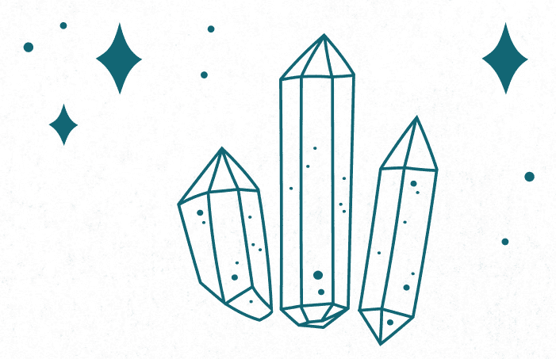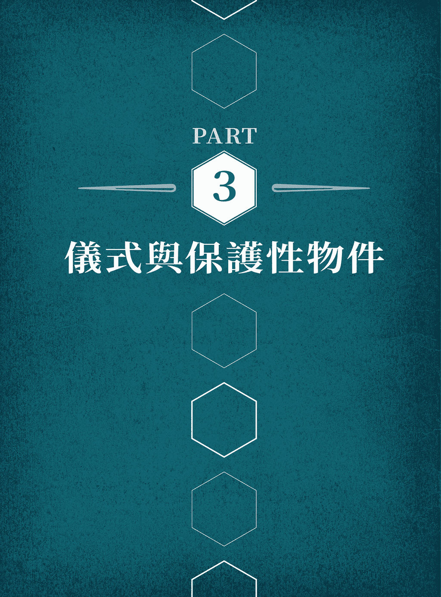

第六章

# 仪式

有时你需要的不只是魔法。本章的仪式较前面的魔法要来得长且细节多，需要的能量与专注力也较强。因此，它们提供的保护层面也较复杂。这些仪式是绝佳的基础，你可以在这之上施展多个魔法，添加更多层面的防护。

## 保护住家的仪式

这个仪式能为住家周围提供相对永久的防护。它从净化开始，将负力驱离，让你可以从头建立新的防御。接着它会竖立防护盾，运用这个地点附近的所有元素与能量进行防护。

要事先提出的一个警告是，你必须使用你的能量来指引这道防护盾的建立。你有责任维护它，不然它会逐渐消散。

这个仪式分成两部分，每一部分都分成几个步骤以利施行。不过，第二部分必须紧接在第一部分完成后立刻进行。

##### ——─ 住家保护仪式第一部分：驱逐 ——─

在进行这类较精细的仪式之前，要先净化或去除没有助益的能量。这看似仅是多花时间进行的额外步骤，其实能为后来的步骤提供良好、坚固的基础。传统上会以逆时针方向进行驱逐，推走不需要的能量。

需要物品：

扫帚、盘子、蜡烛与烛台、火柴或打火机

薰香与香炉、一碗或一杯水、一小碟盐

1. 打扫房子。将东西收拾好，该立直的立直，将墙上的手印、指痕等擦干净，各种台面也擦过一遍并吸尘。要先实际清除灰尘，把凌乱的东西整理好，才能为这个仪式提供最良好的基础，尽量使其成功。

2\. 归于中心并接地。

3\. 口中念道：「我驱逐这个空间中的所有负能量。」

4. 每个步骤都从前门做起，逆时针在屋里移动。进入房间后也以逆时针方向移动。

5. 拿起扫帚，开始以逆时针方向打扫地板，观想扫帚扫起了负能量。以扫帚打破负能量。打扫每个房间，最后来到前门。

6. 把摆上烛台的蜡烛、火柴或打火机、薰香与香炉、一碗或一杯水、一小碟盐等，统统放进盘中。点燃蜡烛与薰香。捏三撮盐到水中轻轻搅散。

7. 将盘子拿进第一个房间，置于地板中央或接近地板高度的平面。拿起香炉以逆时针方向在房内走动，将烟搧到各个角落，口中念道：「我以风净化你。」将香炉摆回盘中。接着拿起烛台，以逆时针方向在房里走动，口中念道：「我以火光净化你。」然后将烛台放回盘中。再拿起盐水，以逆时针方向在房里走动，手指沾盐水洒在各处，口中念道：「我以水与土净化你。」

8. 继续以逆时针方向走完整栋房子，净化每个房间。结束所有区域的净化后，请回到前门。

##### ——─ 住家保护仪式第二部分：保护 ——─

清除了空间中可能有违你目的的能量后，就可以来进行保护了。要将能量吸引到你身边，传统上是以顺时针的动作进行。

需要物品：

一小碟橄榄油、一撮迷迭香、一撮盐

第一部分使用的盘子、第一部分使用的蜡烛与烛台

第一部分使用的薰香与香炉、第一部分使用的那碗或那杯盐水

1\. 归于中心并接地。

2\. 口中念道：「我召唤保护能量来祝福这个空间。」

3\. 将迷迭香与盐放进橄榄油，轻轻搅拌混合。

4. 以顺时针方向在屋里移动，将盘子拿进每个房间。拿起香炉，在房里以顺时针方向走动，口中念道：「我以风祝福你。」接着拿起烛台，以顺时针方向在房里走动，口中念道：「我以火祝福你」。然后拿起盐水在房里走动，口中念道：「我以水与土祝福你。」

5. 祝福房间的步骤结束后，以手指浸入盛油的碗，在窗户或窗框画卢恩符文「奥吉兹」的符号。

6. 继续以顺时针方向走完整栋屋子，在每个房间重复相同的步骤。每扇门的外侧都画上「奥吉兹」的符号，每扇窗户也画上同样的符号。最后再度回到前门。

7. 站在前门，再度归于中心并接地，从地面汲取能量，让能量从手臂往下流入双手。接着再次以顺时针方向在屋里走动，以那股能量画出屏障。此时不需要进入每个房间，只要站在房门口投射能量即可。这里的目的是为外墙设立一道能量屏障。能量会穿墙而入，所以不用担心内墙，只要沿着外墙投射能量即可。

8. 完成整栋屋子的顺时针绕行，最后将能量与前一部分的屏障连起来，形成完整的圆（或椭圆、长方形，或你家的任何形状）。

9. 观想能量屏障往上升起，往下也形成弧形，两者接合为球体或蛋形，围住整栋屋子。

10. 在你完全放手之前，请如同你接地时的做法，先观想那道屏障从前门处伸出触须或管线深入地面，接通大地的能量。观想那些触须在大地能量中生根，永远与这个能量来源相连。

### 住家防线的维护

你必须定期检查上述的大型住家防线，看是否出现任何弱点。请参考第三章建议的维护程序，打开你的感官在屋里各处走动，感受一下哪里需要多一点能量来维护。

如同第三章的维护检查程序，安排定期检查能有效协助你留意能量的脉动及能量如何在家里发挥作用。

搬家以前要记得撤下屏障。如果没有撤掉，尽管与大地的能量相连，这道屏障仍会因为缺乏维护而日益消散。然而，这比较属于礼貌问题。不然下一位屋主或房客走进这个他人以魔法维护过的空间，可能会觉得彷彿被监视，或莫名感觉不自在。

## 保护物品

有时你想保护的是单一物品，而非对整个房间或整栋屋子施展保护魔法。又或许你是要将物品借给他人，或要把物品带出家门，而你担心它的能量会受到影响。也可能是你要把新物品带进家里，希望先进行净化与保护，才要为它引进家里的其他能量。无论是基于什么原因，这项仪式都能提供你净化与保护物品的方法。

##### ——─ 保护物品的完整仪式 ——─

这个保护物品的仪式是运用盐吸收能量的特性，来去除物品中不乐见的能量，再以水与保护性药草制成的药草水来涂抹。方法很简单，尽管是基本仪式，但对物品能量产生的影响不小。你可以使用普通的加碘食用盐，也可以使用粗盐、细海盐来进行。

需要物品：

要净化与保护的物品、干净的布、大到放得下物品的碗或盘

盐、小玻璃杯、水、一枝新鲜迷迭香、一枝新鲜罗勒

1\. 以干净的布擦拭物品。

2. 将盐倒进碗或盘中。碗盘不用很深，只要能在底部铺一层盐，让物品表面能尽量接触到盐即可。

3\. 将物品放到盐上，但不要埋进盐里。口中念道：「〔物品名称〕啊，你将接受盐的净化。盐会使你纯净。盐会去除附着在你上头的所有负能量。」

4. 将碗或盘放在不受打扰的地方。晒得到日光的地方是理想地点，因为日光会帮助驱逐负能量，但也不是一定要摆在有日光的地方。

5\. 把物品静置该处三天。

6. 到了第三天，请在玻璃杯中倒入水，放进新鲜迷迭香枝与罗勒枝，让两者浸泡三小时以上。

7\. 从盐中将物品取出。再度以干净的布彻底擦拭。

8. 从水中取出迷迭香与罗勒。将溼润的迷迭香枝与罗勒枝轻轻洒水在物品上，有必要的话就再度浸水，口中念道：「〔物品名称〕啊，你已受到这些药草保护，这些药草会让你获得防御，这些药草将会让你安全。」

9. 将盐处理掉，可以冲入马桶，或放在水龙头的冷水下，任其慢慢流入水管。将药草水倒到户外。迷迭香枝与罗勒枝放入堆肥，或连同水拿到户外丢弃。

小提示

● 要获得更多力量，可以在满月的前一天、当天、隔天都进行这个魔法。

● 许多杂货店会在农产品区贩售一束束的新鲜药草。但如果你找不到新鲜的迷迭香枝与罗勒枝，可以改将干燥迷迭香与干燥罗勒各拿一点放进水中，以手指为物品涂抹药草水。

## 保护他人

要记得，为没有征询到许可的人施展魔法，或施展魔法在他身上，意味着你同意接受施法的一切后果。有时你可能乐意接受这种业力负担——如朋友失联时。然而，最好还是先征询过他们的同意再进行。

这个仪式是运用共感魔法的概念来保护个人。共感魔法是假定，代表某人、事、物的物品发生什么事，同样的事就会发生在那个人、事、物上。在这个仪式中，因为你要保护的是人，所以你需要一样东西来代表那个人。

要以哪样东西为代表由你决定。你可以拿一张相片、画一张图、缝制一个简单的人偶娃娃（见第二章），甚至用乐高积木拼一个迷你人偶，或使用另一种玩具来代表。如果你是自行制作图像，请尽力做得神似你的仪式施展对象。外观愈相近，魔法就愈有效。如果那个人总是戴着某条项鍊，请在你的人偶上加上那条项鍊；请重现对方的独特发型或最爱穿的 T 恤、加上胎记……等诸如此类。

##### ——─ 保护他人的完整仪式 ——─

这个版本的仪式是使用乐高积木拼成的迷你人偶。在开始进行仪式之前，请尽量添加个人特征在迷你人偶上，喜欢的话，可以用油彩、黏土或其他造形土来增添细节。

需要物品：

六颗紫水晶、雪松薰香与香炉、火柴或打火机

白色丝质方巾或棉质手帕、小蓝袋或束口袋

一茶匙欧白芷、一茶匙刺荨麻

1\. 从第七章选一种你偏好的方法来清洁水晶及人偶。

2\. 归于中心并接地。

3\. 树立魔法圈（见第一章）。

4\. 点燃雪松薰香。

5\. 将丝巾铺在你的施法区。

6\. 拿着人偶，口中念道：「你就是〔仪式要保护的人名〕。」

7. 将人偶放在白色丝巾的中央，六颗紫水晶以椭圆形围绕着人偶。口中念道：「你的身体已获得保护。」

8\. 在人偶周围撒欧白芷，口中念道：「你的心已获得保护。」

9\. 在人偶周围撒刺荨麻，口中念道：「你的精神已获得保护。」

10. 小心卷起丝巾的边缘与四角，将人偶、紫水晶、药草包裹在内。将这一小包东西过香，口中念道：「你由此获得防御，不会遭受到攻击与不幸；你由此获得保护，不会遭遇邪恶与痛苦。此事已成。」

11. 小心将包裹好的人偶放进小蓝袋中封好。将袋子摆在香炉旁，静待香燃烧完毕。

12\. 将袋子收到安全的地方。

13. 日后待时机到来时，点燃另一根雪松薰香，虔诚地打开袋子。取出包裹住的人偶放在你的施法区，小心打开，口中念道：「支援魔法的效期已满。感谢你允许我协助保护你。需要帮助的话就再度召唤我。」去除迷你人偶的个人特征，以盐水清洗来帮助净化。仔细清洁紫水晶，药草料则拿去堆肥。

小提示

● 这不是永久性的魔法，会随着时间逐渐消褪。更重要的是，这也不该是永久性的魔法。虽然这个魔法能提供一段时间的魔力保护，但让人们自行找出解决之道也很重要。

第七章

# 保护属性的物品

万物皆有能量。本章提出列表与参考信息，关于药草、宝石、符号和其它能提供魔法能量来支援保护法术的物品。这些信息当然无法穷尽所有可能，只是选出特别与保护有关的常见实用例子。更多这类信息，值得各位进一步研究与阅读吸收，以协助微调你的防护魔法。举例来说，你想施法保护你的财物吗？请参阅特别与金钱或繁盛有关的药草与宝石，并与你已经在使用、蕴含保护能量的宝石及药草一起使用。

施展过本书的若干魔法后，你可能会想自行设计魔法。本章也能在这方面提供协助。更多关于自行制作魔法的信息与深入讨论，请参阅我的著作《Power Spellcraft for Life》。

## 与保护有关的色彩

要为你的生活添加保护能量，最简单的一种方法就是色彩。在你开始前，请先了解这个重要事实：每个人对色彩的反应因人而异。请先探索自己与某个色彩的关系，再运用于魔法，这点很重要。举例来说，如果你和我母亲一样，曾经有关于红色的恐怖童年经验，那用红色来施展要让你感觉安全、归于中心的魔法实在不是个好主意。请花时间仔细思考你要运用的色彩，记下你对这些色彩的情绪反应。你可能会发现，例如对你来说，黄色才是与保护能量感应最强的颜色。

思考你与魔法用具的关联

请务必思考你个人与各种魔法用具的关联。使用既有的魔法但不使用其中的某些用具，或已经知道其中一些用具对你无效，这类信息就是你避免失败的祕诀。没有必要再投入能量与时间在这类魔法中。你可以研究出一个替代魔法，或另找一个魔法来施展。

话虽如此，以下仍列出几个经常与保护或防御有关的色彩：

● 黑：驱逐负能量、吸收负力、击退邪恶

● 白：净化、舒缓、代表完整与新开始

● 蓝：清洁、净化负力、鼓励真相与沟通

● 红：力量、能量、遏止或去除某物

● 金：能量、成功、健康

其他能支持本书中某些领域魔法的色彩，包括：

● 黄：快乐与喜悦、明晰、沟通、旅途平安、居家幸福

● 绿：疗愈、宁静、财产╱所有财、财物

● 褐：转化、大地、财产

● 橘：富足、生涯、接纳、自尊、积极

### 如何将色彩纳入魔法？

除了使用以上色彩的蜡烛，你还能以哪种方式将与色彩有关的能量纳入魔法中？方法多不胜数！以下是一些建议：

● 以色铅笔、原子笔或马克笔写出魔法或其中的书写部分

● 在你的施法区铺一块有颜色的布

● 穿戴与你正在进行的魔法有关色彩的衣服或首饰

● 如果魔法要使用绳线，请用有颜色的绳线

● 如果魔法要使用瓶或壶，请用有颜色的瓶或壶

## 具保护功效的水晶与宝石

本节列出的诸多矿石，即是书中魔法使用的矿石。这份简便的矿石参考信息，是列出最常使用于保护魔法的矿石，以及如何准备、运用矿石的信息。

你可以从搜集基本矿石做起。除了被指定用在某个正在进行中的魔法，或装进魔力袋或护符袋之外，通常你不需要将使用过的矿石丢弃或报废，在许多时候，这些矿石是用来促进授能或加持的效果，但在那之后，它们仍可以重复使用。请从本章的程序中选一种方法来清洁矿石，再放回你的盒子或袋子中，以备日后施法使用。

以下的简便参考信息列出了最常使用于保护魔法的矿石。

#### ｜紫水晶 (Amethyst)｜

紫水晶是一种紫色的石英，是保护身心、成功、防御的理想用材，有助于揭示真理。据说紫水晶能防范酒醉及过度激动，让你保持脑袋清醒。它能防范出其不意的攻击、背叛，以及天气变化。

#### ｜黑色电气石 (Black Tourmaline)｜

黑色电气石有保护你不受破坏性能量侵袭的良好功效，还能提升你因应困境的自信与耐力。它能帮助你发现罪魁祸首在哪里，还能防止他人无止尽地吸走你的能量。黑色电气石不是只能挡回或使负能量转向，还能将负能量转化为可供使用的正能量。接地、净化、舒缓压力时皆可使用。

#### ｜白水晶 (Clear Quartz)｜

白水晶是用途极广的矿石，在保护魔法中是最基本的用材之一。它擅长保护身体、心智、心灵、精神不受负力干扰。这种多用途矿石在新世纪修行(New age practice)中广受欢迎，因为它能如电池般运作，提供另一个能量来源。水晶会乐意提供给你它的能量，它也确实蕴含着丰沛的能量。白水晶是提升任何一种魔法的良好矿石。如果你为白水晶补充能量，来吸收负力，它也能发挥这项功能；水晶对指定用途或以特定意图补充能量有很高的接受度。

#### ｜赤铁矿 (Hematite)｜

赤铁矿是一种暗银色矿石，有点像雾面镜。它也如同镜子，能有效挡回能量。赤铁矿能用来将负能量从你身边偏离，也有助于接通能量，所以当你觉得茫然或紧张的时候，可以使用赤铁矿来加强你的勇气、自信，使你更乐观专注。

#### ｜孔雀石 (Malachite)｜

孔雀石与自然环境有关。当出现不乐见的影响力时，孔雀石是这种情况下的良好用材，因为它能将那股能量转化为有益的能量。它能过滤污染、噪音和其他有害的环境效应，也能用来保护健康，加强疗愈，同时促进平衡。对于与大地和旅行相关的工作，孔雀石特别具有优异的保护功效。

#### ｜黑曜石 (Obsidian)｜

在受到惊吓或创伤后使用黑曜石，特别有助于保护脆弱的能量，防止治疗过程中受负力进一步干扰。它是一种防范负能量的基本矿石，能保护你不受悲伤、霸凌、幻觉（包括心理操纵与否定）侵扰，有助于使负力接地。它也能以这种方式支持你的自信与自尊。

雪花黑曜石(Snowflake obsidian)特别有助于保护避免产生毁灭性的思维，促使你脱胎换骨。这是一种有助于归于中心并接地的矿石，能善加保护你不遭受心智、情绪、身体攻击。它能帮助你释放人与空间的负力，还能去除能量的阻碍。

#### ｜碧玉 (Jasper)｜

碧玉有多种颜色，大多有加强勇气、保护不身陷险境的功效。碧玉通常是做为忘忧石之用，能协助你保持平衡，甚至缓和情绪。红碧玉特别着重于正义、毅力、稳定、耐力，能防范物理威胁。褐碧玉尤其擅长持久守护你的能量，让你在长期压力沉重的情况下保持安全。

#### ｜粉晶 (Rose Quartz)｜

粉晶是提升良好振动的终极矿石！它是一种美好的矿石，能吸引并加强正能量，同时驱除负力。它能用来促进爱、自尊、自我信任、安适。在多人场合中使用粉晶，有助于为所有参与者打造更好的缘分。这是适合为儿童与朋友施法的神奇矿石，也有助于疗愈曾历经情绪或精神创伤的情况，还能防范恶意的八卦。

#### ｜茶晶 (Smoky Quartz)｜

茶晶有吸收负能量、防范负面思维的良好功效，能纾解压力与惊慌，在你面对未知或危险情况时很有帮助。这是接地时的理想矿石，能帮助你重新聚焦，找回专注力。茶晶也如其他水晶般能吸收负能量，防范住家或车子遭窃，保护驾驶上路后不会碰到麻烦。它也擅长保护你在职场中不受敌意伤害，并能防范霸凌。

#### ｜虎眼石 (Tiger’s Eye)｜

虎眼石是与稳定、精力、接地有关的矿石，能保护你避开物理伤害与厄运，同时鼓励你坚强有自信。它也是保护你不受他人负面思维影响的好矿石。

## 准备与净化矿石

矿石是魔法中的实用元素，经过清洁并净化后便能重复使用。清洁与净化能将先前指定的能量和在施法过程中吸收的其他能量去除（别担心，这不会去除它本身的能量）。矿石一旦净化后，就能以焕然一新的姿态，随时准备为下一个魔法使用了。

净化矿石有几种方法，如下：

#### ｜盐｜

净化矿石的一个好方法，是将矿石埋进一小碟盐里一天以上，如果你觉得先前指定给那颗矿石的能量太强大，或它吸收了很多垃圾能量，那就埋在盐中久一点。

检查金属含量

警告：含铁量高的矿石对盐的反应很差，所以请你先检查铁含量。同样的，如果矿石上有任何金属，也请选择另一种方法清洁，因为盐会破坏金属。

你手边的任何一种盐都能使用。不过，你也许会想把较昂贵的盐用在实际的魔法中。

#### ｜土｜

请将矿石埋进一小碟土里三天以上。可以直接使用你家庭院的土，拿盆栽土来用也很好。你也可以埋进室内盆栽中，拿一根牙签做记号，时间到了就知道要从哪里挖出矿石。然而，如果矿石中含有大量负能量，请选用另一种方法，因为土会吸收那些负能量（以土净化矿石的要点在这里），但那些负能量会经由土壤被植物吸收。

#### ｜水｜

瓶装水倒到碟子里，把矿石放入水中。水是绝佳的净化剂。如果你加一点盐到水里，洗净力会更强大。然而，如果有金属附着或蕴含在矿石中，请跳过加盐的步骤，使用纯水就好。

#### ｜日光与月光｜

把矿石放在窗台上直接以日光或月光照射，就是最简单的净化技巧。请依你觉得矿石需要的净化程度来判定要摆在那里多久。把矿石摆在镜子上能加强效果。

## 神明、圣人与天使

魔法不受宗教束缚，信仰任何宗教的人都能施展魔法。话说回来，在法术中召唤精神人物的传统由来已久。本书没有这么做，是因为书中的魔法是要给各门各派的人使用的。如果你想召唤神明、圣人或天使来协助你的魔法，请迳行无妨。有时你仅需简单加上一句：「以〔宗教人物的名字〕之名，请成全」就好了。

以下的宗教人物清单绝非完整名单，但能为你在保护魔法中要召唤的人物提出建议。然而，一开始就召唤你不熟悉的人物，并不是理想做法。最好能多加了解这位人物再来召唤，所以在不假思索地邀请神明之前，请先进行一些阅读与研究。

#### ｜基督教人物｜

以下是施展保护魔法时，可以召唤来助一臂之力的基督教人物。

● 大天使米迦勒(Archangel Michael)：米迦勒与南方及火元素有关，通常描绘成穿盔甲、手持剑或权杖的形象。他是战士，与正义、忠诚、防御有关。

● 圣克里斯多福(Saint Christopher)：与好运及旅行有关。

● 圣妇李达(Saint Rita)：与孤单的人有关，她是受虐妇女、不幸婚姻、寡妇的守护圣人。

#### ｜神祇与女神｜

许多神祇会被人们请求提供特定领域的助力。以下简单列出不同文化中特别与防御及保护有关的神。

● 雅典娜(Athena)：（希腊）防御性战争、智慧、战略

● 贝罗纳(Bellona)：（罗马）防御、战争、成功

● 提尔(Tyr)：（古斯堪地那维亚）成功、战争、秩序、法律

● 吉祥天女拉克希米(Lakshmi)：（印度）好运、从困境中回复

● 毗湿奴(Vishnu)：（印度）保护、保存、秩序

● 伊西丝(Isis)：（埃及）妇女与儿童的保护者、疗愈

● 荷鲁斯(Horus)：（埃及）保护、疗愈

● 绿度母(Green Tara)：（佛教）和平、保护、使负能量转向

当你研究保护魔法中可以与哪位神合作时，请寻找与战争、和平、好运、健康或疗愈、和谐等有关的神祇。如果你的保护魔法聚焦于特定的议题，请研究与那个主题有关的神祇。举例来说，如果你想保护自身财物，请寻找与金钱有关的神。

## 动物

许多文化都有召唤强大动物的能量或力量的习俗。以下是几种与防御及保护有关的动物，施法时可以召唤牠们的支援。

也请思考你的偏好

如果你和某种动物特别有缘，请召唤那种动物的协助，尽管牠未必与保护明显有关。你与那种动物有某种渊源就够了。

● 狮：勇气、耐性、威力、精力；在许多文化中是守护的角色

● 龙：精力、勇气、威力、好运、财富、变化

● 鹰：挑战、勇气、恢复力、明晰、智慧

● 狼：结群、照顾他人、导师、自由、直觉

## 具保护功效的药草

药草是利用大自然能量来促进保护，且非常容易的方法。药草简单低调、功能多样，能带来许多乐趣。

你的香料架除了盐，可能早已摆有月桂、鼠尾草、迷迭香、丁香、肉桂等药草。荨麻、雪松、杜松等在户外就能找得到。欧白芷、芸香可能较难找，但都可以种植。其他植物则可能必须从药草店购买或网络上订购。

除非有特别指明，不然一般来说魔法使用的都是干燥的药草。如果你有新鲜药草枝，但魔法要使用的是能放进袋子的干燥药草，你可以将香药枝摆在铺有烤盘纸的烤盘上，放进烤箱以低温（不超过摄氏 80 度）烘烤 90 分钟至 4 小时，依其潮湿程度而定。请将烤箱门留一条缝，一小时后，每 15 分钟就检查情况一次。等到你的手指能捏碎叶子时取出烤盘，让药草静置冷却。轻盈或纤细的药草枝会比厚重或粗大的药草干得快。

等药草全干了以后，你可以整株放进密封罐里储藏，或从茎上把叶子取下压碎后，放进香料罐中。

魔法用的药草要分开储放吗？

有必要把烹饪用的药草与施法用的药草分开储放吗？由你决定即可。有些人会分开，有些人不会。如果你觉得从食物储藏室的香料罐取一勺迷迭香并无不妥，那就迳行无妨。反正还是会先净化过再使用。如果你觉得不自在，那也没关系，请为你的魔法另留一份药草。

以下是几种基本的保护性药草。

#### ｜欧白芷｜（Angelica，学名 Angelica archangelica）

欧白芷有强大的保护能量，能用来抵挡病痛、厄运、邪恶，保护住家，也能加强个人勇气，尤其是你的地位必须维持道德、正直的时候。欧白芷可以当成强力的保护护饰随身携带。种植在庭院里的欧白芷，则能将保护能量延伸到房屋与地产。

#### ｜月桂叶｜（Bay Leaves，学名 Laurus nobilis）

月桂树的叶子具有优异的保护功效，能加强智慧、去除负力、增添好运、招财。月桂也用来守护健康及祝贺胜利。

#### ｜雪松｜（Cedar，学名 Cedrus spp.）

雪松是强力净化剂，能清除负力，留下非常正面的能量。它有助于提供保护，隔绝不乐见的影响，驱逐邪恶，促进正力与善心，还能支援疗愈。磨碎的雪松木、干燥并切细的雪松叶，或是切碎的雪松树皮等都能使用。

#### ｜肉桂｜（Cinnamon，学名 Cinnamomum verum、Cinnamomum-cassia)

肉桂对保护、活动、能量、金钱、疗愈、爱等的魔法很有效。你可以在需要强力能量与行动的魔法中加一点肉桂。

#### ｜丁香｜（Clove，学名 Syzygiumaromaticum）

丁香是阻止谣言与八卦、保护名声避免遭到不公指控的出色用材。它能招来好运，促进繁荣与正面的财务往来，还具有疗愈的能量。

#### ｜大蒜｜（Garlic，学名 Allium sativum）

大蒜能加强决心，鼓励你勇敢，还能防范邪恶，改善并保护健康。随身携带大蒜能防止能量遭窃，无论是有意或无意的窃取。将编织成串的大蒜挂在家里，可以吸走负力与不幸。新鲜或干燥大蒜皆可使用。

#### ｜杜松｜（Juniper，学名 Juniperus communis）

杜松有强大的保护能量，能有效防范任何类型的窃盗及意外。杜松可招来好运、支援健康、减少焦虑，促进专注力与明晰度，及助于净化。你可以使用磨碎或切片的杜松木、切碎的树皮，或使用杜松果。

#### ｜柠檬｜（Lemon，学名 Citrus limon）

柠檬能净化、明晰，能加在追求喜悦与清晰沟通的魔法中。它能有效驱除浑浊或迟滞的能量，还能使负力转向。依你使用的魔法而定，你可以使用新鲜柠檬、柠檬汁或干柠檬皮。

#### ｜荨麻｜（Nettle，学名 Urtica dioica）

刺荨麻在防御性魔法中的功效一流，尤其是逆转并将能量送回源头的魔法。人们也用荨麻进行与疗愈、勇气、避免危险有关的魔法。使用新鲜荨麻时要戴手套，一般多使用干燥切碎的荨麻。

#### ｜洋葱｜（Onion，学名 Allium cepa）

洋葱能用来保护与除魔，还能驱逐病痛与负面影响力。洋葱吸收负能量的能力，使其成为防御型魔法的常见元素。

#### ｜迷迭香｜（Rosemary，学名 Rosmarinus officinalis）

迷迭香是进行保护、去除负能量、加强记性的良好用材。也请以迷迭香来加强正面思维，能为任何一种魔法带来好处！这种药草能加强自信、消除负力。

#### ｜芸香｜（Rue，学名 Ruta graveolens）

芸香又称臭芙蓉，自古以来便与保护、驱逐、防护有关。可以用芸香枝将福水或其他浸剂洒在人身上或空间，这种做法称为洒水礼。你也可以在门窗上悬挂芸香枝来驱逐病痛、不幸与负能量。

#### ｜鼠尾草｜（Sage，学名 Salvia spp.）

鼠尾草是任何净化方式的绝佳用材。传统的烟燻棒便是以鼠尾草制成，或以鼠尾草为基底添加其他净化药草。种植鼠尾草据说能延年益寿，因此在与疗愈或加强健康有关的魔法中特别有效。鼠尾草的静心功能也甚佳，还与兴旺、智慧、生意有关。事实上，罗马字「salvia」意指「保护、拯救或疗愈」。

任何形式的鼠尾草都能使用。最常见的种类是烹饪用鼠尾草。药用鼠尾草（学名 Salvia officianalis）在超市的香料架上很常见。在魔法用品店还找得到白鼠尾草（学名 Salvia apiana）、蓝鼠尾草（学名 Salvia clevelandii）、紫鼠尾草或薰衣鼠尾草（学名 Salvia leucophylla）、黑鼠尾草（学名 Salvia mellifera）等。不过，不是所有称为鼠尾草的都是鼠尾草属；购买前请先再三确认其拉丁文名称。

#### ｜盐｜

盐是进行保护魔法的必备原料。技术上来说，盐是一种矿物，但因为可食用、随处可见、使用方便，所以往往被归为药草类。

盐能吸收并束缚能量，尤其是负能量。在洗澡水中洒一点盐，有助于驱除附着于身体的负能量。将物品放进一碗或一碟盐中，能驱逐物品内的不纯能量。要吸走房间里不乐见的能量，只要将一碗盐放在房里即可。只要是曾用来进行清洁净化的盐，就不该再重复使用，要处理掉盐，可以慢慢倒进水槽任流水冲走。

黑盐(Black salt)传统上是普通的盐与铁混合制成，市面上也买得到这种盐。若要自行制作，可以从铸铁锅或平底锅锉下一点铁屑，或在盐里混入火炉燃剩的灰。夏威夷黑盐(Hawaiian black salt)是以夏威夷海盐混合粉状椰壳炭制成，被归类为食用等级，所以没有使用上的危险。你也可以使用喜玛拉雅玫瑰盐(Himalayan salt)，不过普通的盐功效都不下于上述的盐。

铺路盐(Road salt)仅能用来铺路

请不用使用道路防结冰用的盐。这种形式的矿盐不够纯净，往往混合了抗结冰剂或其他除冰用的化学药剂。也就是说，除非你是要保护人冬天时不会在你家车道、走道、阶梯上滑倒受伤，否则不应使用这种盐！

## 如何准备并使用药草

使用宝石前应先净化，药草亦然。然而，两者要净化的程度不同，因为宝石在积聚能量上扮演的角色不同。使用药草前，请先以下列步骤简单净化后再使用：

1\. 归于中心并接地。

2\. 双手在药草上方交握。

3\. 从大地汲取能量，让能量顺着手臂流下，从双手进入药草中。

4\. 口中念道：「这股能量已将你净化，洗净了任何不属于你的能量。」

5\. 这株药草已经可以使用了。

净化过的药草可以储藏起来，日后取出使用之前，还是可以先感受一下它的能量，看看是否需要再净化一遍。如果有疑虑，就再净化一次，反正过程迅速，且有益无害。

无论是施法时撒在焦点物品四周，还是放入魔力袋，本书中的各种魔法都是以药草来增加能量。不过，药草还有其他用途。

#### ｜浸泡与熬煮｜

你每回泡茶时，就是在制作浸剂。浸泡就是把药草浸入到够热的水中，只要一下子便能萃取出其精华。如果把药草放进水中煮，则是熬煮。浸泡或熬煮产生的液体，过滤后能进行各式各样的用途，如擦净物品、墙壁或地板；涂抹身体或头发；或是装进喷瓶喷洒。浸泡或熬煮出来的液体可以倒入密封瓶罐中，放进冰箱储存几天。

#### ｜浸泡药草油｜

药草油是将药草泡进橄榄油或葵花油等油中制成。制作药草油最简单的方法是把干燥药草切细，放进干净的罐子里，缓缓倒入充足的油来浸泡。请搅拌材料，确保药草完全浸入油中，然后旋紧盖子轻轻摇晃。将罐子放在阴凉的地方，每隔两三天就摇晃几下。三周后，检查浸泡的成果如何。药草总共要浸泡在油里六周，让油变得更浓稠，要等油萃取出花草精华需要一些时间。六周后，以奶酪滤布或其他滤布将油滤进干净的储藏瓶中，尽量挤压药草，让精华浸入油中。贴上标签并盖上储藏瓶的盖子。请在一年内使用完毕。这些油可以用来在门窗、墙壁或其他物品上画保护符号，或是涂抹身体，也能放入洗澡水中（肉桂有刺激性，要小心）。

#### ｜薰香｜

棒状或锥状的薰香是最方便取得的薰香，是由木材磨成粉后压制而成（棒状薰香是在细木棒上塑型），接着薰香棒或锥（塔香）会浸入混好的油中，浸泡出香气。

你可以用药草与树脂自行制作薰香，然后以新世纪商店、民族特色商店、教会香铺中随处可见的碳饼焚燃。你也可以直接以炭焚燃干燥药草，但味道通常很浓，也会很快变脆粉碎。将干燥药草料混合乳香等树脂粒，能让味道变甜，加强保护或净化的能量，也能焚燃得略久一些。乳香粒在新世纪商店和教会香铺都找得到，也能从网络上订购。你也可以在薰香中加几滴精油。请写下你混合的配方，以便日后调整或重复使用，如果你做出的分量较多足以储藏，请在储放薰香的罐子贴上清楚的标签。

#### ｜喷洒用粉｜

药草粉是干燥药草磨细而成，你可以拿研钵与研杵亲手捣细，或拿磨豆机来专门研磨药草（如果不是专门用来磨药草的话，你的药草会混进咖啡，咖啡也会混进药草！）。你可以把粉当成单一材料使用，先混合药草再磨细，或是磨细后再混合皆无妨。

喷洒用粉有助于净化空间。你可以把粉洒在地板上，让粉多停留片刻，待其发挥能量功效后，再扫起来丢到屋外。你也可以在要使用干燥药草的魔法中使用药草粉，或是洒在门阶，或用来保护你的户外地产。在细面粉或玉米粉中混入一撮（或更多）药草粉，可以当成爽身粉使用，还能用来掸床单的灰尘，或做为地毯除臭剂。

#### ｜百花香料｜

百花香料是指在碗或瓶里简单混合成的干燥药草料，有时再加上一两滴精油加强功效。你可以依魔法能量的特性或味道怡人与否来选择要混合哪些药草。举例来说，你可以混合气味芬芳的干燥玫瑰花瓣、檀香片、干燥康乃馨花瓣，然后加一撮肉桂、少量迷迭香、几片月桂叶来增添保护特性。

## 保护性符号

符号是一种速写，指定特定能量或关联性来创造多层意义的设计。就像书写文字会传达意义，符号也会传达意义。符号可以用来辨识，也能用来授能。

在魔法中，符号是用来祝福、驱逐、保护，还能吸引或驱逐特定能量。以下为不同文化所使用的符号，在某方面都与防御及保护有关。

### 卢恩符文

卢恩符文(Runes)是日耳曼符号，不完全是文字，有一部分是字母，一部分是天机，一部分是诗。每个卢恩符文除了具有语言学价值外，也能做为魔法符号与占卜之用。「卢恩」(Rune)这个词的意思是「祕密或隐藏的事物」，突显了其玄奥渊源。每个卢恩符文都体现了一首短诗中的不同精神奥祕，必须经过个人的研读与冥想，才能领悟其真义。我们很幸运拥有这样一套速写，数个世纪下来，每个卢恩符文都已累积了一组意义。

不同地方、不同年代的卢恩字母，有不同的相关含意，但彼此之间仍有惊人的相似性。最早，可能也是今日最常使用的卢恩符文，是使用于公元 150 至 800 年间的古弗萨克文（Elder Futhark）。

以下是六个古弗萨克的卢恩符文，可以使用在保护型魔法中。

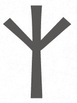

｜奥吉兹 (Algiz)｜

奥吉兹（有时又称艾华兹〔Elhaz〕）是古弗萨克文中与保护最有关的卢恩符文。它的形状据说代表紫杉(Yew tree)，紫杉与永恒、知识、防范邪恶侵袭有关。奥吉兹也代表宇宙的力量；神圣庇佑；给自己、家人及朋友的保护。换句话说，在保护魔法中，这是很棒的万用卢恩符文，能用来保卫你的健康，维护你的福利，加强你对压力与攻击的抵抗力。

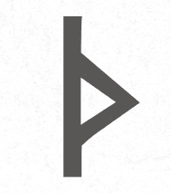

｜瑟伊萨兹 (Thurisaz)｜

瑟伊萨兹是代表力量的卢恩符文，在针对力量、争端、武力、防御、打破障碍等的魔法中效力超强。要抵抗对立势力，发挥战士的意志来保卫自己与我方势力时，这是很好的符号。

｜爱瓦兹 (Eihwaz)｜

爱瓦兹是代表稳定与力量的卢恩符文，可用在聚焦于耐力与持续的能量流动的魔法中。它与个人保护、保护个人权益息息相关。在长途旅行中使用，可以确保信息往来畅行无阻。它也与狩猎及求生有关。

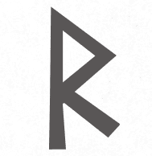

｜莱多 (Raidho)｜

莱多是与旅行、运动有关的卢恩符文，包括掌控你的旅途、常识、自信，以及采取行动而非保持被动，使其成为旅行相关魔法的良伴。

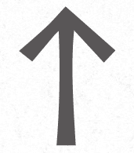

｜提瓦兹 (Tiwaz)｜

提瓦兹是代表正义，为正义而战的卢恩符文，试图以秩序来平衡浑沌混乱。它在与法律事务、正义、行动主义等有关的魔法中能发挥良好功效。使用这个卢恩符文，可以保护你避免在负面影响下动摇坚守个人道德的决心。在有人闯入家里、窃盗时你必须保卫自己不受侵扰或犯罪侵犯的情况下，它也能发挥良好功效。它还有助于你在混乱局势中保持自信。

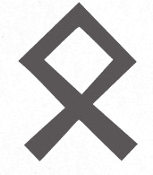

｜欧瑟拉 (Othala)｜

欧瑟拉是代表继承、地产、家庭的卢恩符文，是你想保护房屋与住家时的好选择。家人包括祖先，这表示你可以借祖先的力量与能量来保护家庭成员及住家，同时保护你的财产。

复合式卢恩符文

使用卢恩符文的历史有多长，使用复合式卢恩符文的历史可能就有多长。复合式卢恩符文是指沿同样的轴线或一次交叠两个以上的卢恩符文来形成单一符号。这样能结合每个符文表达的能量。例如：左图结合奥吉兹与莱多能创造出旅途平安的卢恩符文。

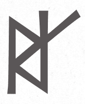

｜圆 (Circle)｜

圆是十分简单的形状，但有许多正面的联想。圆没有负能量能聚集的角落。圆可以做为屏障，将事物安全地保护在内，或避免攻击入侵。圆也象征着团结。

魔符（Hex signs）

美国宾州南方的兰开斯特县，自 19 世纪中期以来就有在屋子与谷仓外墙悬挂或绘制日耳曼魔符的做法。据说这类魔符是源自传统民间艺术，但其中潜藏着能量，通常做为保护符号或能吸引或驱逐某些能量的符号。早期的例子包括在圆圈中画星星，圆圈与星星都是保护符号；星星有五角、六角、八角等几种。

｜星星╱五角星 (Star/Pentacle)｜

五角星在许多魔法修行与基督教等信仰体系中是用来做为秘修符号。它是一种保护符号，五角据说代表着人体的头与四肢。异教传统认为下方的四个角代表地、风、火、水四大元素，顶端的角则代表凌驾四大元素的第五元素「空（Spirit）」。

｜太阳十字 (Solar Cross)｜

太阳十字是圆圈中有一个四边等长十字的符号，象征平衡、专注、冷静，适合在保护的封印魔法时使用的绝佳符号。

｜荷鲁斯之眼 (Eye of Horus)｜

荷鲁斯之眼是古埃及的保护与健康符号，据信能避凶挡恶，通常用来做为丧葬用的护饰，保护冥界中的法老，也会画在船身上帮助人们在海中安全航行并归港。你可以用来施展与旅途平安、保护物品、促进疗愈有关的魔法。

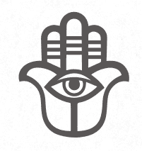

｜法蒂玛之手（幸运之手） (Hand of Fatima/Hamsa)｜

这类与力量、祝福、保护有关的护饰大多呈手形，中世纪时人们会当成首饰挂在身上，或挂在门窗上。幸运之手可以是非常简单的符号，也可以装饰得十分华丽。

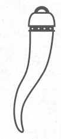

｜科尼赛洛╱科涅托╱科尔诺 (Cornicello/Cornetto/Corno)｜

科尼赛洛╱科涅托╱科尔诺在意大利文中的意思是「小角」，人们会佩戴这种护饰或护符来进行趋吉避凶的一般保护。在那不勒斯，这种护饰也称为科尼歇洛（Curniciello，有多种拼法）。这种护饰有时也称为意大利角(Italian horn)。

｜个人符号｜

你可以自行设计保护符号。请试着将字母结合你认为与保护有关的字词，将多余的线条删掉，最后留下你能调整来施法的形状。你可以自行涂绘，勾勒出你觉得实用的形状。请画一个圆圈在其中绘制符号，或进行第一章的保护仪式后再来绘制符号，以减少分心，改善你的施法专注力。

你可以先练习看看，针对本书探讨的领域设计自己的保护魔符或符号：身体与心灵、房屋与住家、家庭与朋友、出门在外等。一面沉思主题，一面涂绘符号。

参考书目

Alexander, Skye. The Everything Spells and Charms Book: Cast Spells That Will Bring You Love, Success, Good Health, and More. Avon, MA: Adams Media, 2008.

Aswynn, Freya. Northern Mysteries and Magick: Runes & Feminine Powers. Second edition. St. Paul, MN: Llewellyn Publications, 1998.

Beyerl, Paul. Compendium of Herbal Magick. Blaine, WA: Phoenix Publishing, 1998.

———. The Master Book of Herbalism. Blaine, WA: Phoenix Publishing, 1984.

Carmichael, Alexander. Carmina Gadelica: Hymns and Incantations (Ortha Nan Gaidheal). Volume I. Edinburgh: T. and A. Constable,1900. www.sacred-texts.com/neu/celt/cg1/index.htm.

Cunningham, Scott. Cunningham's Encyclopedia of Crystal, Gem, and Metal Magic. St. Paul, MN: Llewellyn Publications, 1988.

———. Cunningham's Encyclopedia of Magical Herbs. Second edition. St. Paul, MN: Llewellyn Publications, 2000.

———. Magical Herbalism: The Secret Craft of the Wise. St. Paul, MN: Llewellyn Publications, 1983.

Eason, Cassandra. Cassandra Eason's Healing Crystals: An Illustrated Guide to 150 Crystals and Gemstones. London: Collins & Brown, 2015.

Griffiths, Bill. Aspects of Anglo-Saxon Magic. Norfolk, UK: Anglo- Saxon Books, 2003.

Herr, Karl. Hex and Spellwork: The Magical Practices of the Pennsylvania Dutch. York Beach, ME: Red Wheel/Weiser, LLC, 2002.

Illes, Judika. The Element Encyclopedia of 5,000 Spells: The Ultimate Reference Book for the Magical Arts. London: Element Books, 2004.

Lecouteux, Claude. Traditional Magic Spells for Protection and Healing. Rochester, VT: Inner Traditions, 2017.

Melody. Love Is in the Earth: A Kaleidoscope of Crystals, Updated. Wheat Ridge, CO: Earth-Love Publishing House, 1995.

Murphy-Hiscock, Arin. Power Spellcraft for Life: The Art of Crafting and Casting for Positive Change. Avon, MA: Provenance Press, 2005.

———. The Way of the Green Witch: Rituals, Spells, and Practices to Bring You Back to Nature. Avon, MA: Provenance Press, 2006.

RavenWolf, Silver. American Folk Magick: Charms, Spells, and Herbals. Second edition. St. Paul, MN: Llewellyn Publications, 1999.

———. Silver's Spells for Protection. St. Paul, MN: Llewellyn Publications, 2000.

疗愈之光 Healing Light 02

防护魔法全书：化解负能量、厄运、小人！

让你常保神清气爽、消灾解难的 100 多种日常魔法

作者／艾琳．墨菲−希斯考克（Arin Murphy-Hiscock）

翻译／谢汝萱

总编辑／彭文富

编辑／王伟婷

内文设计／张慕怡

封面设计／比比司设计工作室

校对／12 舟

出版者／大树林出版社

营业地址／ 235 新北市中和区中山路二段 530 号 6 楼之 1

通讯地址／ 235 新北市中和区中正路 872 号 6 楼之 2

电话／ (02) 2222-7270 传真／ (02) 2222-1270

网站／www.gwclass.com

E–mail／notime.chung@msa.hinet.net

FB 粉丝团／[www.facebook.com/bigtreebook](https://www.facebook.com/bigtreebook)

发行人／彭文富

划拨账号／18749459 户名／大树林出版社

总经销／知远文化事业有限公司

地址／222 深坑区北深路三段 155 巷 25 号 5 楼

电话／(02)2664-8800 传真／(02)26648801

初版／ 2022 年 3 月

电子书出版日期／ 2022 年 4 月

PROTECTION SPELLS:Clear Negative Energy, Banish Unhealthy Influences, and Embrace

Your Power by Arin Murphy-Hiscock

Copyright © 2018 by Simon & Schuster, Inc.

Complex Chinese translation copyright ©2022 by BIG FOREST PUBLISHING CO., LTD.

Published by arrangement with Adams Media, an Imprint of Simon & Schuster, Inc.

Through Bardon-Chinese Media Agency

ALL RIGHTS RESERVED

ISBN ／9786269541379（EPUB） 版权所有，翻印必究

[`www.gwclass.com/`](https://www.gwclass.com/) 大树林学院官网

[`u.wechat.com/IDUqJea9Jco5DPpdOsx-Eu8`](https://u.wechat.com/IDUqJea9Jco5DPpdOsx-Eu8) 大树林学院微信

[`reurl.cc/Wk6YX5`](https://reurl.cc/Wk6YX5) 大树林芳疗咨询站 LINE