# 阴阳师的超强开运术

運氣好。

運氣差。

當你腦中出現這些想法時，內心深處是否會擔心好運或壞運即將「從天而降」呢？

你是不是會憂慮好運或壞運，會因為外來的莫名強大力量「不請自來」呢？

我想藉由本書傳達給大家的一個觀念就是，

所謂的運氣，其實是自己創造出來的。

而且瞬息萬變的運氣，將因你自己而改變。

我的祖先乃傳承八〇〇年的陰陽師，身為他們的後裔，我在四國的四萬十市繼承了獨子相傳的陰陽師之學，同時根據陰陽師專用的「四維八干」羅盤為人算命。

我在算命師這行一路走來三十年，至今已為五萬多人算過命。

尤其企業家眾多，或許是這個緣故，因此許多人都是前來向我諮詢「如何才能提升運氣」，使我開始從「如何提升運氣」的角度，解析先祖代代相傳下來的陰陽師之學，將陰陽學的開運法傳授給大家。

所謂的「運」，即為「運氣」。

而運氣二字正如字面所示，「氣」是「運」來的，也就是說，「氣」會流動「運行」。

「氣」也就是能量，為構成萬物的基本要素。

這世上所有的現象，皆為「氣」的移動，在「氣」的流動下形成，並不斷變化。

端看你如何運送，即可使「運氣」往上流動，抑或是往下運行。

運送「運氣」的人，即為「氣」的持有人，也就是你自己。

相信大家都曾遭遇過事事不順、惡運連連的時候，總覺得自己好像流年不利。

其實在那當下並非「運氣走衰之際」，才導致惡運不斷，更非一個人八字不好。

而是當你已經在走霉運時，還一直讓自己的「氣」往下走，「氣」才會受到下衰情勢糾纏，於是愈來愈倒楣。

反觀也有人事事一帆風順，幸運總是神奇地降臨在他身上。凡事如願進展，心願逐一實現，幸運接踵而至，人生順遂無比。一般人眼中如此「好運的人」，至今我屢見不鮮，但是他們並非原本便身處於得天獨厚的環境之下。

他們每一個生存的環境或狀況形形色色，他們的共同點並非他們都很「幸運」，而是擁有「讓自己幸運的力量」。

事實上，乍看之下看似倒楣的意外，在每一個人的身上都會發生。如何因應這些意外，如何加以處置，端看每一個人的作為。遭遇逆境或不測時，你會奮發向上別開蹊徑，還是對小小的意外滿懷不平不滿，怨天尤人，將自己封閉起來呢？

一條路清清楚楚地一分為二。

所謂的運氣，大家不妨想像成小小的箭頭。代表自己的「氣」的這個小箭頭，在那一瞬間會指向哪個方向，將造就運氣的流向。

只要改變「氣」的方向，你的一舉一動就會改變。哪怕看似惡運的事情，憑藉著每一瞬間的行動、想法，也能因此逆轉成好運。這就是我要傳達給大家的一個觀念。

運氣並非被動地承受，而是主動地運送。自己的「運氣」，可以瞬息萬變。

當你擁有這本書，也正代表你往「好運」邁出一步了。現在就朝向理想的未來邁進吧！

## 前言

### 四國靈場陰陽師後裔畢身所學

### 「秘藏」的禁忌學問

我生長在四萬十川上游的某座山間小村落。

四萬十川流經高知縣西部，為四國最長的河川。四國共有八十八處靈場（日本的靈場通常為神社、寺院或墓地等地，日本人視為信仰聖地，信徒及修行者經常造訪與巡禮），而四萬十川上游，也有巡禮者慕名前來的靈場。

我的故鄉如今車輛已可通行來去，但在從前想前往鄰村可得步行五個小時，是十足的深山僻壤。我在這個村落一直生活到高中為止，從家裡到高中上學，騎自行車單程就要二個小時。

為什麼人會想要住在如此深山之處呢？

這是原因的。

我家世代皆為陰陽師的子孫。

一提到陰陽師，大家腦海中想必會立馬浮現「安倍晴明」這番名號吧？安倍晴明為侍奉平安時代中期第六十六代天皇一條天皇（九八〇～一〇一一年）的陰陽師。

據悉身為一條家後裔的公家（在日本為天皇與朝廷工作的貴族、官員之泛稱），於應仁之亂之際遭反抗勢力追殺，於是潛身於遠離京城的領地四國，藏身在四萬十川的下游，後來自然而然落地生根，成為土佐一條家。

我的祖先，傳聞正是侍奉土佐一條家的陰陽師。

所謂的陰陽師，乃隸屬於朝廷專門官廳陰陽寮之官人，意指具有陰陽道知識和技能的人。

陰陽道這門學問，原本就需要理解包羅萬象的事物，陰陽師須依據天文學、方位學、曆學、易學等學問，主導都市計畫、曆法及年節儀式等工作。

大家在漫畫或小說中耳熟能詳，有關占卜吉凶、消厄除災及祈禱這類的咒術，其實是陰陽師在研究各種學問，培養豐富知識的過程中，隨之衍生的附加技能。陰陽師的職務會與當時的政爭緊密連結，據說在最盛時期，他們的咒術能力甚至強大到足以掌控朝廷命官的一舉一動。

因此，在陰陽寮所研究的陰陽道，過去被視為秘藏的禁忌學問。

基本上陰陽師為侍奉天皇的背後助手，因此當我的祖先移居至四國後，表面上並未以陰陽師自居，也未從事相關活動。

但是即便未涉及陰陽師的工作，當初在陰陽寮所習得的知識和技能，早已牢牢不忘。這些知識與技能，展現一個人生而為人的真理，成為處世的智慧。

陰陽道的學問不事張揚，我的祖先正因為深深理解這些學問深不可測的價值，才會在四國之地代代相傳，至今長達八〇〇年的歲月。

我所擁有的陰陽學知識，受教於原為祈禱師的祖母。

據祖母所言，當我尚在襒褓中時，左手手掌便已經能發出強大「氣場」了。

我依稀記得，停車場內總是停放著許多外縣市車牌的車輛，每當祖母呼喚我，我就會走向一身白色裝扮的祖母，正坐在她身旁，將手蓋在前來拜訪祖母的人身上。事後我最喜歡祖母為獎勵我拿給我吃的 Ramro 糖，總是期待祖母的召喚。不過自中學起，祖母才開始具體傳授我有關陰陽師的眾多學問。祖母在打開數片拉門才能到達的後側房間，隔著小小的桌子，將祖先的歷史、由先人代代承繼而來的陰陽學問，一一教給了我。雖然當時我已經是個小霸王，不過自我懂事起，便可感覺到看不見的世界，因此對我而言，這些知識我完全可以領會吸收。我曾經好奇朋友的驚訝表情，於是試著運用學到的陰陽術，從手指引出「宿蟲」（咒術的一種，在手掌寫上梵字真言，再以粗鹽搓洗手掌並暫時靜置之後，可見到手指會出現細長的絲狀物體，並將此絲狀物體視為蟲），或是占卜我與喜歡的人之間的緣分，還會幫人指點迷津。

現在身為一名「占導師」，觀看手相為人「算命」，並依據一二○○年前傳承於陰陽師的占術「四維八干」，進行由我個人獨創的「御緣鑑定」。身為一名占導師，我不單單為人占卜「你的未來會如何」，還會觀察當下每個時刻的「氣場」走勢，指示你現在的定位，建議你如何開創未來的康莊大道。即便身陷惡運之際，我也會提供適當意見，助你能扭轉成好運。我認為這就是我的使命，至今已為五萬多人看過手相算過命。事實上前來諮詢的人除了企業家、政治家、運動選手，也有家庭主婦，含括各行各業，他們在算完命後，必定都會告訴我：「我的運氣好多了」、「我的人生改變了」、「我脫胎換骨了」。藉由這些迴響令我再次肯定，運氣果然是可以由自己創造的，人永遠可以讓自己的人生好轉。

## 活用看不見的力量於人生中

如同世上有些東西看得見，也會有一些東西是看不見的。凡事皆有陰陽二面，彼此存在才得以成立。這些陰陽學的知識，自幼便深植我心，看不見的力量，從我出生起便與我同在。

我將自身承繼而來的陰陽師學問傳授給眾人，深知自己體內沉睡著無形的力量，祈盼在我的人生當中能活用這股力量，因此目前除了算命之外，我也在日本全國各地舉辦座談會及演講。

面對看得見的東西，我們自然會將注意力投注過去，但是對於看不見的東西，如未自發性地給予關注，很容易忘記它的存在。

但是即便眼睛看不見，雙手觸不到，它依舊是存在的。

舉例來說，人稱魑魅魍魎、鬼魂、妖怪等看不見的東西便是其中之一，它們確實存在於世上。在陰陽的世界裡，將這類看不見的東西統稱為另一個世界的眷族。

眷族當中包含了龍、天狗、大蛇及九尾狐這些神明使者，也有愛惡作劇的靈體，甚至還有俗稱惡靈的壞東西。因此陰陽師會學習各種咒術，以免這些眷族為非作亂。

或許有人曾在電影或電視上，看過陰陽師在作法的模樣。

其中就有一種「咒術」，融入在你我的日常生活當中。

那就是「結界」。

所謂的結界，說穿了就是「無形的牆壁」。

設定結界這種無形的牆壁，藉此使看不見的眷族離開這個地方，或反過來將它們封椿在無法為惡的特定場所裡。

日本人自古便知道世上存在著看不見的東西，也可以說在日常生活當中會與這些眷族「和平共存」。

七九四年，由奈良遷都至京都之際，陰陽師參與了京都的造城計畫，將街道建造成結界，這段傳說無人不知。

此外，早昔的日本屋宅在格局配置上通常會避免大門正對著玄關，這也屬於結界的一種。因為將大門與玄關的位置錯開來，眷族才不容易闖入家門。

而且從大門延伸至玄關的通道上，還會以曲線而非直線的方式，不規則地鋪上踏腳石。這種做法同樣是為了使大門連接玄關的小通道呈現曲線狀，藉此削減眷族入侵家門時的力量。

> 「山手線」曾是對鎖怨靈的結界！

此外，還有另一個融入在現代生活當中的結界。

那就是通行日本首都東京的鐵道路線，也就是山手線。

山手線為繞行東京中心部位，呈圓形配置的環狀線。利用鐵道路線的鋪設，使鐵製列車隨時馳騁於上，藉此設下結界。

山手線內側存在著皇居、各政府機關、日本具代表性的企業總公司大樓等建築物，這個地區簡直可謂為日本的心臟部位。

另一方面，在山手線內側更有名為平將門的首塚（埋有敵人頭顱或罪人頭顱的墳墓），這個地方具有非常強大的力量。每次計畫移動這個首塚時，總是屢屢發生意外，因此一般人俗稱為怨靈之地。

也就是說，山手線位在日本的心臟地帶，可避免東西靠近，同時也具有封印平將門怨靈的雙重作用。

另外，切進山手線內部的路線，則有中央線。中央線乃連接東京車站與高尾山的路線，儘管由高尾至新宿幾乎呈一直線，但在進入山手線內部之後，卻沒來由地設計成曲線。

將山手線的圓形與中央線的曲線簡化成圖示之後，會發現形成象徵陰陽的「太極圖」（右圖）。

### 圓形的山手線與彎曲的中央線之圖示

### 太極圖

024

總而言之，就是為了在首都設置大型的太極圖，因此中央線才會在山手線內部刻意鋪設成彎曲狀。

太極圖分成黑白二色，分別擁有白點和黑點的部分。位在白色部分的黑點稱為「陰中之陽」，位於黑色部分的白點稱作「陽中之陰」。

將路線圖與太極圖重疊之後，會發現「陽中之陰」的地方正是皇居。位於「陽中之陰」的皇居，雖位於光線普照之處，卻是個無人能入的地方。

坐落在「陰中之陽」的地方，則是新宿的歌舞伎町。有如象徵入夜後，霓虹燈廣告牌依舊閃亮，徹夜不眠的街道。

中央線除了可描繪出太極圖之外，據說還具有將高尾山的正向能量送進山手線內部的作用。

此外，傳聞連接山手線上野車站與千葉縣成田的京成線，以及連接山手線秋葉原車站與茨城縣筑波的筑波快線，會分別從成田山與筑波山將好的氣送進山手線內。

陰陽學就像這樣，不知不覺地融入在我們現代的日常生活當中。

順帶一提，大家知道皇居旁邊，相當於鬼門的位置，存在著與陰陽師息息相關的設施嗎？

那就是氣象廳。

氣象廳是占卜未來天氣的地方。過去會在陰陽寮觀測天體以及預測天氣，現在則由氣象廳接續這個工作。

而在皇居的鬼門配置與陰陽師因緣深厚的氣象廳，則是為了阻礙邪氣，以免邪氣入侵皇居。

無論科學再發達，文明多進步，看不見的東西依舊存在著。

現代人總是專注於看得見的東西上，卻忽略了看不見的東西，所幸陰陽學仍會關注看不見的東西，因此或許能為大家在人生道路上指點一二。

所謂的陰陽學，就是在教導我們萬事萬物皆有陰陽兩面，凡事皆須表裡合一才得以成立。

本書用「惡運」一詞來形容倒楣事及不好的運勢，傳授大家各種觀念與法術，藉此化災祛凶，扭轉惡運成好運，但是站在陰陽學的角度而言，真正應扭轉的並非「惡運」。

無論好事或壞事，任何事情都是有意義的，將帶給我們某些啟發。

話雖如此，當真有惡運降臨我們身上，或是感覺倒楣的意外接連不斷時，一般人往往無法領悟「這全是上天的安排」。

因此我想藉由本書，與讀者分享我在算命及座談會中曾和大家提過的獨創開運法。

我將對照陰陽學，盡我所能地具體解說，在大家從早到晚遭遇的各式場合下，想讓自己的運氣稍微向上提升的方法，以及如何接受突發狀況，使「氣場」的走勢上揚。

## 附錄「陰陽靈符的使用方法」

當你心情低落時、滿心憂慮時、心裡出現某些負面思考的時候，是否總會事事不順呢？平時做起來不費吹灰之力的事情，也會莫名其妙手忙腳亂呢？

這是因為你的「氣場」變弱了。

正如同體力衰退時容易生病一樣，「氣場」變弱時，便容易受邪氣影響。

前文提過，在我們的周圍存在著各種看不見的眷族，邪氣正是邪惡眷族招來的現象，代表有眷族附身。眷族一旦發現「氣場」衰弱的人，便會尾隨其後，在這個人身上使壞。

想要祛散邪氣，最有效的方法就是前文提過的設「結界」。

盛鹽（將鹽堆成三角錐或圓錐形，放在玄關門口或家中）就是設結界最基本的做法之一，沒空間擺盛鹽的人，或不好意思將盛鹽擺出來的人，不妨運用本書附贈的靈符。

### ◎右（朱色）．陰之靈符

#### 【招金銀入宅富貴不逢殃禍符】

這是將金銀財寶招來家中的靈符。此為距今約莫二〇〇〇年前，由仙人寫下的靈符，用來感謝貧窮人家施與祂的恩惠。這道靈符大有來頭，貼在家裡即可大富大貴（變成大富翁），另外還具有庇佑子孫，消除一家災厄的力量。

只要貼在家中即可見效，當你日益成長，效果將益發顯著。此時切記須男女有別，分頭發展。

尤其男性應重外，包含事業等等，也就是應專注於社會層面的活動；女性應重內，除了家事之外，還須重視家中裡裡外外的事情，如此一來，才有助於強化「家運（財運、健康運、子孫運等等）」，也就是家的運勢。

這點在單身人士身上也是相同道理，了解自己的本性，才能引來「緣」，也能招來「圓」，這道靈符無論在事物或心靈二面，都能使人豐收滿足。

### ◎左（黑色），陽之靈符

#### 【大願望成就御秘符】

此靈符是可以幫助大家實現一個願望的強大「秘符」。切記願望不能貪心，而是你自己認為屬於「天命」的夢想，或是現今萬分盼望實現的夢想。

不過這道靈符主要是針對工作、考取證照或求學方面的願望，對於愛情方面的願望則毫無助益。

這道靈符只需隨身攜帶寸步不離即可見效，外出時請務必用白紙包起來，放進包包或平板電腦保護套中，避免折到。

將這道靈符放在家中高於視線的地方，也能看出成效，不過效果最佳的方式，則是用雙手拿著這道靈符，將心中的夢想告訴某一個人。覺得這麼做實在難度頗高的人，不妨先將靈符放在包包裡，然後將靈符謹記於心，同時將夢想與他人訴說即可。

## 為什麼要貼在玄關或大門的「右上方」

本書這次附贈的靈符，朱色的須貼在家中，意指「陰之靈符」，黑色的應隨身攜帶，稱作「陽之靈符」，不過基本上靈符皆屬「陽性」。

貼在家裡的靈符，須貼在玄關或房間大門的右上方。

為什麼要貼在右上方，這是因為靈符的效力，也就是結界強度的關係。

靈符效力會以所貼位置為起點，順時針產生作用。緊靠著大門的右邊結界最強大，由此依序形成強大結界、稍強結界、稍弱結界，將空間團團包圍住，因此結界這面牆壁的強度是會逐漸變化的。

假使貼在大門正中央的話，將會在靈符效力強大的空間開關大門，由此出入，這樣恐造成費心設下的結界，每次都在開關門之際支離破碎。

此外，靈符通常由紙或木材製成，這類材質會有生命棲息，因此容易有人稱祝詞的言靈佇足其中。

紙的原料為樹木，但是紙比樹木輕薄，這種材質最適合用來製作靈符。不過具有厚度的木片效力會更加強大，我在撰寫靈符的時候，為求更高效率時，會寫在木片上。

這類靈符的效力，基本上可持續三〇〇天，接下來效力將日漸衰退。

三〇〇天是依據六十干支計算出來的天數。六十干支是以太陽曆法與月亮曆法搭配而成，為占卜的依據。

由於經過三〇〇天後，護身符及平安符所持有的效力會漸漸衰退，因此護身符及平安符須每年購置更換。

在此獻上能夠陪伴大家一整年的陰陽靈符，祈盼大家得以舒適自在地度過幸福時光，並能順心發展大顯身手。

現在請大家貼上靈符，或將靈符放入包包後，再來參閱本書主要內容吧！

### Chapter 1

#### 早晨提升運氣的暗示

一日之計在於朝。

在陰陽學中，將一日之始的早晨，視為極其重要的時間。

一日即代表「一生」。

陰陽學主張人會每日新生，入眠後同時也會死去，接著在翌日早晨，隨著張眼醒來再次重生。

請大家仔細審視「朝」這個字。

是不是由十、日、十、月這幾個國字組合起來的呢？

十月十月，正是受精至誕生所需的時間。

由「十月十日」這幾個字組成的「朝」，意指太陽升起的時間帶，同時也內含一個人新生之意。

在「朝」這個時段，最適合用來給自己「暗示」，好讓這一天能隨心所欲舒坦地度過。

與自己對話的時間，請務必運用陰陽師親授的「暗示」法，讓今天一整天能順心度過。

##### 一起床就在手掌上作暗示

一個人新生，展開自己人生的瞬間，就在早晨。
因此我希望大家能在早晨做的第一件事，就是在鏡子前面作「暗示」。
照鏡子盯著剛睡醒的臉看，或許有些人會覺得很不自在，但是早上起床的模樣，卻是一整天最為純淨無瑕的狀態，未經雕琢，也未經掩飾。
在這樣毫無邪念最為純粹的狀態下，暗示自己開拓未來的話，會如同海綿吸水一樣，使暗示不費吹灰之力一步步滲透深層心理。
此時我希望大家做一個動作，以便開啟純潔身心的開關，這個動作就是請大家用非慣用手，從手背側將慣用手緊緊地包起來握住。
假使你的慣用手為右手，請用左手將右手的手背緊緊包覆起來握住。
此時請具體想像自己的目標或夢想，告訴自己：「絕對會順利達成！」、「絕對會順利達成！」「絕對會順利達成！」一邊鼓勵自己，同時用力地握三次。

做這個動作的目的，是為了「將命運線刻劃在手掌上」，也就是在手掌中創造命運，祈盼自己希望的夢想，得以如願成真。

只要每天早上用力地將手背包覆起來握住，縱走於手掌中央的命運線，將可日漸發揮益發鮮明且強大的力量。

將自己的願望及目標陳述出來，在你的意念中便會豎起天線，與你願望有關的資訊自然會聚集過來，因此有助於願望實現的際遇將從天而降。

傳授我陰陽學知識的祖母有句口頭禪：「握手的次數愈多，愈能出人頭地。」

我也會為一般人看手相算命，但是每當我在為政治家或偶像明星看手相時，總是一眼瞧見筆直延伸的命運線。大家通常以為，「這些人天生擁有這種命運線，因此才能飛黃騰達」，但是事實絕非如此。

政治家在「懇請大家惠賜一票」時，會和許多人握手，偶像明星在「感謝大家購買CD」時，會輪流與眾多粉絲握手。也就是說，他們平時習慣和許多人握手，因此命運線才會呈現一直線，清楚地刻劃在手掌上。

通常在看手相時，除了看命運線之外，還會看一條智慧線。

這條智慧線從食指與大拇指的根部之間延伸出去，有如將手掌橫切開來。

話說「智慧線愈鮮明的人愈聰明」，其實這條線會因為平時握筆的關係，深深地刻劃在手掌上。

因此並不是「手掌上有明顯智慧線所以頭腦清晰」，而是因為「勤奮用功因此智慧線才會顯而易見」。

一般認為慣用手的手相代表一個人的命運，而另一隻手，則代表與生俱來的宿命。

想要改變命運，得靠自己用心刻劃手相。所以很多人努力刻劃之後，命運也會為了追上手相而逐漸好轉。

因此剛睡醒時，在純淨的狀態下於自己的手掌上刻劃命運線，同時說出「我想變成這樣」、「我希望能夠如此」的夢想，你的未來將會大放光明。

正如同命運二字所示，「命是運來的。」

自己未來的方向，是可以隨著你每天的心情起伏，你的一舉一動，自由自在地一步一步產生變化。

##### 暗示即為神明的「指示」

誠如前文介紹過凸顯命運線的習慣一樣，本書想要傳授大家的，就是像這類每天都能實踐的小習慣。

每一瞬間的「氣場」狀態，都可以改變你的運氣，而且還能使人生變得更好。為了讓大家親身體驗看看，接下來將介紹可立即養成的小習慣。

我希望大家能將陰陽學的觀念與法術活用於日常生活中，因此我重新省思所學，回顧我腦海中昇華進化的陰陽學相關知識後，領悟到陰陽師的咒術可說全為「暗示」。

所謂的暗示，意指有意圖地操控「氣場」狀態，使之直接作用於現實生活當中。舉例來說，老人家會用「調皮」一詞來嘮叨某人不乖。

母親會警告小孩子：「你再調皮搗蛋看看」，這句話的本意其實是「希望孩子乖一點」，不過被這樣嘮叨的小孩子反而會變本加厲，產生「自己是調皮鬼」的暗示。
因此孩子受人數落「調皮鬼」後開始不安分起來，緊接著不斷地被人提醒「你真是調皮」之後，恐將益發調皮搗蛋。
也就是說，小孩子在母親口出「你這個調皮鬼」的暗示之下，將依照母親所言，逐漸變成「調皮鬼」。

對於自己的暗示，也是同理可證。
假使你心裡總想著自己現下運氣不好，將陸陸續續發生倒楣事。
許多人應該都曾體驗過，自我暗示遠比想像中更具效力。
暗示一詞，其實具有非常深奧的含意。
請大家仔細觀察暗示這兩個字。
自古以來，還有在陰陽學這方面都一樣，會以「日」這個字來表示神明。

「日」（＝神明）若「立」起來，便成「音」這個字。常言道，神明站立起來之後，會發出「啪噠、啪噠」的聲響。
再者，將「日」（＝神明）與「音」組合起來之後，會變成「暗」這個字。
因此所謂的暗示，可說就是從無形之處傳來的神明之音、來自無形世界的神明指示。作暗示這件事，我認為就是借助神明的力量。

暗示是來自神明的指示，借助神明的力量。
暗示會產生正向作用，也會出現負面影響，如能善加活用於每天的日常生活當中，操縱氣場的狀態，相信就能使自己的氣場隨時走向好的一面。
向自己暗示「自己做得到」、「自己能幸福」，你的意念就會朝向「做得到」、「能幸福」前進，萬事萬物也將開始動起來。

進一步提升當下的運氣，俗稱開運，但是單靠祈願是開不了運的。
想要開運，吸引幸運上身，必須在日常生活當中由自己付諸行動。對自己作暗示，正是由自己付諸行動最簡而易行的方法，也是能抵達個人夢想終點的捷徑。

##### 收集「朝日」的能量，開啟未知世界的「大門」

天空升起的太陽光，即為朝日。
在陰陽的世界裡，認為沐浴在一步步上升的太陽能量之中，「新生的力量」即可留宿於體內。

祭祀天照大御神的各大伊勢神社，都會將鳥居配置於東側，這麼做的目的完全是為了吸收朝日的能量。

鳥居為神社的入口，將鳥居設置在太陽升起的方位，便可將四射的光線充足地送入本殿。

由於曝曬在朝日下「可促進俗稱幸福賀爾蒙的血清素分泌」，也能「重置生理時鐘」，因此站在生理學的觀點來看，也能為身體帶來益處。

除了這類「調理身體狀態」的效用之外，朝日也具有開啟無形事物，映照光明的力量。

太陽的能量，是一種催生並孕育萬物的能量。而且在黎明時分從地平線升起的朝日蘊藏著極大能量，可讓世界由深沉的黑暗，一口氣轉變成明亮的白晝。

因此如能將這種朝日的能量汲取進自己體內，將可在無形之處開啟新的一扇門，有助於導向夢想的方向。

我總會向計畫投入新事物的人、打算改頭換面的人，特別傳授這種太陽光的效用，要他們沐浴在早晨逐漸升起的太陽光底下。

即便只是沐浴在朝日下，這股力量也能灑落全身，使心情平靜、開朗，充滿清新的氣力。

本章節還有一個動作希望大家能夠做到，那就是「手掌朝上，將大拇指往內彎」的姿勢。
這個姿勢請將雙手放在靠近肚臍的高度進行。
如能沐浴在太陽的能量之下，將太陽的力量汲取進體內，僅須將手掌朝上便綽綽有餘，但是這裡為什麼要將大拇指往內折呢？
請大家實際觀察一下手掌朝上，大拇指往內折的樣子。
大家有沒有看見陽光照射在手掌上，形成了大拇指的影子呢？這樣會變成象徵陰陽的太極圖陰陽魚。
太極圖是由黑白兩色勾玉組合而成的形狀。
上下形同勾玉的部分，在中國視為魚，因此稱作陰陽魚。

請大家參閱下圖，太極圖分成代表陰的黑色部分，以及代表陽的白色部分，當這二者密合之後，便會形成一個圓形。此外在陰的部分有一白點，在陽的部分有一黑點。

如果只是想要表示陰陽兩個元素的話，用黑白兩個部分組成便足矣，然而為何分別在黑色部分搭配白點，在白色部分搭配黑點呢？

事實上這些黑點白點在陰陽的世界裡極為重要，具有非常深奧的意含。

黑色部分代表陰，裡頭的白點表示「再強的陰都具有陽的部分」，稱作「陰中之陽」。

另外白色部分代表陽，裡頭的黑點表示「再強的陽都具有陰的部分」，稱作「陽中之陰」。

陰陽學中十分重視這兩個「陰中之陽」與「陽中之陰」的概念，主張萬事萬物皆有「陰」與「陽」，在這個「陰」當中也內含「陽」的元素，而「陽」本身也具有「陰」的元素。

一方存在，另一方便會隨時同在。說明事物無絕對唯一，提醒大家萬事萬物皆可從二面或三面，甚至多方位地切入掌握。

將手掌朝上，太陽光便會將手照得白亮。接著將大拇指往內折，手掌上便會形成黑影。採取這個姿勢，即可在手中製造出「陽中之陰」。「陽中之陰」意指「秋」，被視為「豐饒的象徵」。

全身汲取上升朝日的能量，與此同時在手中製造「陽中之陰」，藉此豐沛身心，使人日益求精。

即便是單純沐浴在朝日下，也能有效調理身體狀態，有益健康。
但是既然都要沐浴在朝日下了，我希望大家能夠多花一點工夫，在自己手中形塑「陽中之陰」，祈盼「自己能滿足地度過一天」、「新挑戰得以開花結果」。

##### 簡單幾步驟就能讓自來水變成「開運水」

相信很多人都聽說過「言靈」一詞。
日本自古便相信言語中存在著靈力。
尤其在陰陽的世界裡，會因時制宜運用「祝詞」，也就是具有正向作用的言靈，有時則會使用「咒怨」，即為具有負面作用的言靈，非常重視言靈所持有的力量。

一提到言靈，聽起來或許類似咒術這類的法術，其實人在日常生活中，都會很自然地會受到言靈影響。

舉例來說，當有人鼓勵你，跟你說「加油」、「一定會很順利」時，單憑三言兩語是不是就能使你精神抖擻，元氣煥發呢？

當你的另一半跟你說「我愛你」、「我一直想著你」的時候，你的內心是否會暖呼呼地，覺得很安心，彷彿有股莫大力量在支撐著你呢？

只是聽到隻字片語，你就能精神百倍，感到放心，這是因為存在於這句話當中的靈力形成波動傳向過來，作用在身心上的關係。

言語是在發出這句話的人，以及聽取這句話的人之間交織形成。但在陰陽的世界裡，言靈是可以傾注於物體當中的。

因此要將無形的言靈寄託於有形的物體上，活用言靈的力量。

在有形的物體當中，最容易寄託言靈的東西，大家知道是什麼嗎？

那就是我們每天都在喝的「水」。

據說人體有百分之六十由水組成，對於我們而言，想要生存下去，水是不可或缺的元素。為了健康著想，也為了生理方面的需求，相信很多人都會養成早上起床喝水的習慣。

請大家務必在這「早上喝一杯水」的習慣之外，多加一個動作，就是「在水裡加進正向鼓勵」。

每當我接受採訪，或在講座會場上提到這點，很多人都會面露「不可置信」、「這種事毫無科學根據」的表情，這些人我尤其想讓他們體驗看看，因此經常會當場實驗。

我會請大家將水倒入玻璃杯中。水可以是礦泉水，也能是自來水，再來觀察這杯水的味道有何變化。

接著請大家用雙手將裝有水的玻璃杯握緊，對著玻璃杯說三次「我愛你」、「我今天也會努力」這類的好話。

然後將水喝下去之後，你會發現說過好話的水不但圓潤，而且甘甜。將這杯水與什麼都沒做的水相比，即可一目了然，相反地，當你對著一杯水說些貶低、藐視的壞話，嚐過之後也能清楚發現二者的差異。你很難相信這是相同的水，說壞話的水不但帶刺，甚至難以下嚥。

難以下嚥的意思，也可證明身體抗拒著這樣的水。身體會本能地對溶於水中的負面能量產生反應，因此會藉由難以下嚥的情形，阻止這種水進入體內。

傾注正面言靈的水，則會一飲而盡，順暢地一步步滲透進體內。而且能滋潤內心，提升士氣，有助於情緒的正向提升。

不需要做些什麼，只是將單純的水加注正向言靈，也就是說些祝詞，即可立即變成能夠改變身心的補給飲品。我認為與其制式化地飲用市售的營養產品，倒不如在自來水裡加入祝詞後飲用，效果更加倍。

順便告訴大家，在神社領取的護身符，裡頭凝聚的也是言靈。神職人員累積修行，將祝詞這類的正向言靈傾注於物品中，於是變成護身符及平安符，然後授與一般人。

##### 了解數字內含意義，教你如何強化暗示

前面章節已教過大家，如何將祈盼的命運刻劃在手掌裡，還教大家如何將早上喝的水變成開運水，而這些方法都會請大家分別「說三次」正向的話。

大家可以感覺到，一句話說好幾次，會比說一次更容易使言靈傾注其中，但是為什麼不是二次，也不是四次，而是三次呢？

事實上說「三次」這個次數，其來有自。

在陰陽的世界裡，將奇數視為陽之數，偶數視為陰之數，並能逐一解釋由一到九的數字分別有何含義。

先來介紹一下每個數字內含什麼意義。

一代表「起始」。為一切的起始點，意味著事物產生的數字。

二代表「連絡」。也是意味著連接空間的「門」，以及助詞「和」的意思，例如在神社拜神時會拍手二次，這麼做就是為了打開神明的門，與神明連結。

三代表「支柱」。舉凡「三種神器」、「三枝箭」、「三個臭皮匠勝過一個諸葛亮」等，在日本自古便視三為表示調和的吉祥數字。二個人容易意見相左，但是三個人即可取得平衡，方便整合意見。

四代表「穩定」。人若無法住在四角形的房子裡，內心便平靜不下來。據說三角形或五角形的房子還會使人方向感錯亂，導致精神出問題。

五代表「結合」。五這個數字位於九個數字的中央位置，成為一切的中心。由五條長度相同的線所構成的五芒星，就是陰陽師用來驅散惡靈時所使用的圖形。

六代表「自然」。六角形這種形狀比四角形更為穩定，諸如自然產生的冰雪結晶及蜂巢等等，皆以六角形所組成。

七代表「人類」。人類是超越自然（＝六）的生物，擁有七個脈輪。音階共有七聲，人類眼中的彩虹也是七種顏色。

八代表「無限」。若以平面來呈現毫無裡外之分的莫比烏斯帶，就會呈現「八」的阿拉伯數字。八就是用來間隔有限的人類世界與神明世界的數字。

九代表「神明」。傳說神明位於無限的彼端，但在無限的彼端，仍為無限。物質切半後的狀態，據說也有神明存在，就連微觀的世界裡，無論多微小，仍存在無限的微小。人（＝七）與神（＝九）之間存在著無限（＝八），人絕對無法到達神的境界。

因此日日鍛鍊以求縮短這段「差距」的行為，便稱作頓悟。

此外，在陰陽的世界裡，這九個數字還能分成下述三類。

- 一、四、七為代表人類世界的數字。
- 二、五、八為代表連結的數字。
- 三、六、九為通連神明的數字。

也就是說，三是能達到調和作為支柱的數字，同時也是通連神明的數字。

神前式婚禮中有所謂三三九度的儀式，此時男女會交互喝完同一杯酒。將三個酒杯各飲三次，藉此向神明發誓夫妻會相互扶持之意。傳說彌勒菩薩會拯救普羅眾生，這「彌勒」二字以日文發音的話，正好是「三、六、九」的日文發音。因此三是非常吉祥的數字，所以傾注言靈時，也都會唸三次。

順帶一提，計算機上的數字排列方式通常都是固定的，這稱作線的幻方，右側那一列為「3、6、9」，中央這一列為「2、5、8」，左側那一列為「1、4、7」。排列於右側的數字皆為通達神明的數字，左側那一列是代表人類世界的數字，代表連結的數字則排列成中央那一列。

計算機這種排列方式，十分不可思議，由下方那一列數字依逆時針方向旋轉至右側那一列數字、上方那一列數字、左側那一列數字，也就是將「123」+「369」+「987」+「741」全部加總起來之後，合計為2220。

即便依順時針方向旋轉，將「147」+「789」+「963」+「321」加總起來，合計也是2220。

還有畫斜線將數字連結起來，也就是將「159」+「951」+「357」+「753」全部加總起來，合計仍為2220。

甚至於扣除神明的數字，以「142857」這樣特殊的數字，乘以2倍或3倍之後，所得數字還是會依照142857這幾個數字的排列，不斷循環。

「142857」× 2 = 285714
「142857」× 3 = 428571
「142857」× 4 = 571428
「142857」× 5 = 714285
「142857」× 6 = 857142

而且將「142857」乘以7之後，所出現的數字將完全不同，結果為999999，變成清一色皆為9的數字。

反觀「1」這個「代表起始的數字」，除以「7」這個「代表人類的數字」後，會變成 1 ÷ 7 = 0.14285714285714……。

單純談論數字的內容到此為止，只要了解數字在陰陽中的含意，即便不看算式，也能深切體會數字顯示著神明與人類間存在著高深差距。

三為通連神明的數字，因此祝詞都會說三次，日本人在拜神時也會拍手三次。

所以平時看慣了的數字，其實只要了解它的含意，妥善運用的話，將成為極有效果的暗示。

##### 教你如何在有如「陰陽分界」的「剪票口」，提高一天的判斷力

一說到每天都會做的事情，通勤也是其中之一。大家每天早上都是怎樣通過車站剪票口的呢？近年來只需觸碰感應的自動剪票口十分常見，因此大部分的人可能都是漫不經心地通過剪票口。

但從陰陽世界的角度來看，所謂的剪票口，是另一個世界與我們這個世界的分界。剪票口只有付完錢的人才能通行。在陰陽的世界裡，無須付錢便能存在的世界，被定位成「陽」的世界，必須付錢才能進入的世界，被視為「陰」的世界，因此剪票口裡外，屬於陰陽有別的兩個世界。

有錢的人可以搭電車，沒錢的人只能靠自己的雙腳走路。
在一天二十四小時有限的時間裡，有錢的人可以運用交通工具，縮短移動的時間。
剪票口外頭是人人都能存在的世界（＝陽），相對於此，剪票口裡頭則是只有手持車票的特殊人士才得以進入的世界（＝陰）。縱使看似連結在一起，空間卻為之一變。
空間的分界線就是分界之處，一個連綿不斷的空間會在此處終止，另一個空間再由這裡展開。

而這個分界，正是位於空間與空間之間的「中庸」地帶，屬於非常關鍵的空間。中庸這兩個字，在陰陽的世界裡極為重要，常言陰陽的精粹也在中庸。中庸不但為陰陽的分界，更是客觀俯瞰的場所。身在中庸時，切記應比平時更留意自己身在哪一個空間。

空間變化時，建議大家應注意一點：「通過剪票口時，靠直覺決定通過哪一個剪票口。」

剪票口通常有好幾個，大家通常是心血來潮「想走哪個剪票口就走哪個剪票口」。
絕大多數的人可能都會在人潮推擠下，順著當時的人潮動向通過剪票口。

尤其在市區的尖峰時段，人潮更是非比尋常。但在此時更須做到全面暗示，以強化自己的運氣。

一事即萬事。既然要自行開創自己想走的路，就得明白自己的一舉一動將決定所有運氣的走勢。

聽說我的某位友人，就真的花了一個禮拜的時間，身體力行以直覺決定通過哪個剪票口，除此之外，在選擇午餐菜色時，也同樣刻意讓自己「決定好菜單再點菜」。後來他在工作上出現了驚人的成效，不但決策速度變快了，精確度更是出類拔萃。我還有一位企業家朋友，堅守自己決定走哪個剪票口的習慣，使年收躍升了一點五倍。

「就連剪票口都無從選擇，人生又該當如何」，謹記這個道理，重新審視自己早晨的行為，接下來你將會發現，凡事都潛藏著使運氣往上高漲的好機會。

##### 聚焦在空間分界的「中庸」之處

承前所言，早上一個微不足道的行為，將決定你的人生。
或許有人會覺得，「區區一個剪票口無足掛齒」。那現在就來談一談，在陰陽的世界裡是如何解釋「人生」（＝一個人的生活方式）。
在陰陽的世界裡，認為每一個人都走在窮極己身之「道」上。
所謂的「道」，乃通過一件事，學習身為一個人的「處世方式」，如何付諸行動，進行精神面的修練。

日本有茶道、花道、劍道、弓道等各式各樣的「道」，人也有各自須行走的「道」。
我們在出生時，每個人都會取一個固定的名字，因此每個人都要各自修行，被賦予的個人姓名之「道」。

以我為例，我就是。

。

。

。

。

。

。

。

。

。

。

。

。

。

场景。

。

。

。

。

。

。

。

。

。

。

。

。

。

内容。

。

。

。

。

。

。

。。

。

{
{
{
{
{
{
{
，{

，，，，，，，。

，。

，，，，，的，。

，，，，，，，的，，，，了，，「，「的「，「，「「「「「，道」，太郎道」，花子道，每個人都得各自窮極自己的「道」，日日不斷修行。
請參閱下圖，「道」這個字，在「首」的部分表示戴著斗笠的自己。
走部那一點代表「天命」，表示朝向天命前進時，會走在起起伏伏的道路上。所謂的的的。。「命。。。，命。「「「「「「「「「「「「「「「「「「「「「「「「「「「「「「，、，、，，、，、，，、，、就是要「「「朝向天命一步步走在險峻之道道的自己」，此外這個字也內含人生，以及如何「為人處世」之意。
人生，在這世上接受生命的一瞬間便展開了，我從「命」這個字學習到下述道理。
人自出生之際便有命停宿（＝宿命），每天活著就是要將命朝向目的地運送（＝命運），在拼命完成「使用這條命」的任務期間（使命），朝著上天賦予自己的命（＝天命）前進。

現在的自己，可說背負著宿命這一不變前提，同時藉由個人經驗並選擇，推動著命運。

了解人生的意義，運用自己的命往天命前進，命運便會變成使命。理解「自己該做什麼」的天命，努力達成使命之後，必要的機緣及突發事件，甚至於錢財，終會有如受人引導似地聚集過來。

宿命無法改變，但是命運卻可憑一己之力運送，也就是說，命運是可以掌控的。如果你想改變，使未來的自己脫胎換骨，只須像這樣運送你的命即可。

只是想將命，運往你期望中的方向，必須隨時專注於此，將舵持續轉向夢想中的方向才行。

所謂的將舵轉向，意指選擇。人生是一連串的選擇。拓展命運的一大秘訣，便是事先培養出做選擇的能力，才能在關鍵時刻當機立斷。

請從「要通過哪一個剪票口」做起，從現在開始訓練自己應當如何選擇。珍惜每個選擇的機會，正好也可作為「做選擇」的訓練。不斷地「做選擇」之後，將使你養成選擇的能力。

而且剪票口正是分界的所在地。在空間轉變之處，腳踏實地進行做選擇的訓練，日積月累之下，你將養成做選擇的能力，往後就算面臨左右人生的大事，也能自信十足地自行決斷。

Chapter 1 早晨提升運氣的暗示

##### 請你一邊吐氣，一邊往新世界踏出一步

人在出生時會「哇哇大哭」吐出一口氣，藉由呼吸延續生命，並在嚥下最後一口氣後，結束他的生命。

在陰陽的世界裡，空間變化的瞬間也被視為「事物的終點與起始」，在移動之際，除了會注意空間的變化，也會留意呼吸的方式。

舉例來說，打開家裡玄關大門時，即為空間由家中變化到戶外的瞬間。我通常會吸口氣再打開門，並在雙腳踏出家門外的瞬間，大大地吐一口氣。

在建築物裡外很容易分辨空間的變化，但在同一棟建築物裡頭，只靠一面牆或一扇門區隔而成的眾多房間，甚至於房間和走廊，也須分別視為不同的空間。

我經常告誡商務人士，在進入辦公室的瞬間應格外注意。我認為這個瞬間非常重要，可說能左右當天一整天的工作運勢。

對於通勤的上班族而言，進入辦公室的瞬間，算是開始一天工作的關鍵瞬間。

在這個開始一天工作的瞬間，我希望大家能夠留意一點，就是「用清晰響亮的聲音道過早安後，再走進辦公室」。

喊出響亮的聲音，即代表需要大口吐氣。

想要喊出響亮的聲音，通常必須在打開辦公室門之前，暫時停下腳步用力吸氣。

在走進辦公室的前一刻吸氣，在進入辦公室的瞬間吐氣，即可使身心從私人模式轉換成工作模式。

深呼吸據悉可使血液循環變好，讓情緒平靜下來，如能在進入辦公室的時間點「用力吸氣再吐氣」，藉由深呼吸的效果，哪怕情緒再低沉，當空氣進入體內更替之後，相信即可使人振作起來。

如為單槍匹馬工作的人，或是在家工作的人，當要坐在椅子上的瞬間，或是按下電腦開關的瞬間，最好都要養成大口吐氣的習慣。

Chapter 1 早晨提升運氣的暗示

##### 日常的一句「早安」，也能變成開運的暗示

「早安」這句話是在說「您早早起床，身體真是健康」、「一大早就辛苦您了」，據說也是在祝福對方，或是慰勞對方的簡略問候語。

道早安畢竟是在打招呼，當然由自己元氣十足地主動開口最好，不過依據陰陽學的概念，建議大家運用「早」這個字轉變而來的語彙，落實「早」這個字。

「早」起、「早」點出勤，可比任何人更早一步，主動地對後來才到公司的人道「早安」。

其次還想請大家謹記下述這個重點，那就是「應士氣昂揚地高聲道早安」。

簡捷地打招呼，可讓人聯想到腳步輕快以及手腳俐落，高分貝的聲音也會給對方開朗有活力的感覺。
雖說打招呼已成為彼此習以為常的習慣，但是對方卻可從這短短一句話，敏銳地感受到一些訊息，藉由打招呼的行為，日漸形塑出一個人的形象。
每天都會傳進耳朵裡的招呼聲，有時甚至能一步步給人安心感與信任感，「讓人放心將這份工作委派給你。」

再者，打招呼是人與人之間的行為，聲音也絕對會傳進開口打招呼的那個人耳裡。
自己說出口的話，受影響最大的正是自己。完整感受話中細微差別的人，也會是自己。

用纖弱低沉的音調、口齒不清的落拍節奏道「早安」，這樣子打招呼並不會傳進任何人耳中，只會搞砸自己的情緒。
如能用元氣十足的音調，加上輕快的節奏開朗地道「早安」，這聲招呼將可鼓舞自己的士氣，使之轉變成將工作俐落完成的原動力。

假使你是擔任高層的人，當對方向你打招呼時，你可以用沉著低音加上從容不迫的節奏回聲「早安」。

但是未來希望能出人頭地，或是祈盼眼前工作順利進展的人，請用精神抖擻的音調，以輕快節奏道「早安」，猶如助漲高揚的運勢一般。

每天早上，「早安」這句招呼語總要說上好幾次。

正因為是每天一定會重複的一句話，才能成為鼓勵自己，開拓個人未來康莊大道的暗示。

- ◎ 想像著目標，同時用力刻劃出慣用手的命運線。
- ◎ 將朝日的能量聚集於手掌上。
- ◎ 慢慢喝下充滿正向言靈的水。
- ◎ 不隨波逐流，用「直覺」選擇要通過的剪票口。
- ◎ 打開大門後，一邊吐氣一邊踏出「一步」。
- ◎ 用輕快節奏精神抖擻地道「早安」。

Chapter 1 早晨提升運氣的暗示

### Chapter 2 白天改變運氣的暗示

一大早就能調整心情，在運氣上揚的狀態下展開一天的話，可讓自己在白天的時間一口氣加速朝向夢想邁進。

> 「晚上做夢，白天實現。」

這是我在為人算命或舉辦講座時，經常叮囑大家的一句話。

以陰陽而言，夜晚為陰，白天為陽。

陰的時間是專注思考並讓身體休息的時間，陽的時間則是讓陰的時間蓄積下來的能量活動，將大腦的想法付諸行動的時間。

「未來想變成什麼」、「希望自己成為什麼」，這類的目標或理想，也就是所謂的夢想，光在腦海裡幻想描繪是無法成形的。

在陽的時間可以接收到太陽光，因此在此時有計畫的行動，將可使夢想一步步成真。

本章節將傳授大家，如何怡然自得地度過繁忙的白天時光，還會教大家一些使工作及人際關係順利進展的秘訣。

#### 為什麼我會依據談話內容，有時看著對方右眼說話有時卻看著左眼

白天屬於陽的時間，也是與人接觸機會最多的時間帶。與人接觸時，你會留意哪些舉止呢？我因為工作的關係，每天會和許多人見面，在為人算命或座談會時分享所知，此時，我便會留意看著對方的眼睛說話。看著對方的眼睛說話，你想傳達的想法便能真摯地傳遞給對方，而且看著對方的眼睛聆聽對方說話，也能更加正確地理解對方的言下之意。常言道眼如口，這句話一點都不假，眼前這個人雖然沒有開口說話，你卻能透過眼睛了解他內心所思。這點應該不只我能體會得到，由此可知，眼睛一直在訴說著許多事情。

Chapter 2 白天改變運氣的暗示

「看著對方的眼睛」，就是在調整心態「將意見充分傳達」，或是「一句不漏地聆聽」。換言之，可算是對於自己的一種暗示，以期達到更妥善的溝通。

雖然單純「看著對方的眼睛」就能達到溝通的效果，但是我常告誡大家，想要加強這種暗示的效力，還有一招額外技巧。

那就是依據談話內容，有時看著對方右眼說話，有時卻看著左眼。

談生意或做簡報時，許多人會注意到「一邊看著對方的眼睛說話」這一點，但是應該鮮少人會去留意「應該看著右眼或左眼」說話吧？

「工作場合應該看著對方右眼，還是看著左眼說話好呢？」

正確答案是「右眼」。

人的大腦分成左腦與右腦，一般來說，思考理性面的事情時左腦會變活躍，鑑賞畫作或音樂等情感面的場合下，則是右腦會變活躍。

而且據說從右眼進入的光線會通過視神經到達左腦，由左眼進入的光線則會通過視神經抵達右腦。

我自小便開始研讀的《古事記》中，就有這麼一段有趣的記述。

神明（伊邪那岐命）揉左眼就會變成充滿慈愛的天照大御神，揉右眼就會變成精於計算的月讀命，揉鼻子則會變成治理地球的須佐之男命。

早在腦科學尚未解明大腦機制前，或許大家就已經意識到，左眼與感性面有關，右眼與理性面相關了。

雖然不知道這個理論是真是假，但在陰陽的世界裡，將這番論點解釋成一種暗示，因此在面對同一個人說話時，會依據談話內容或是想要傳達的內容，有時「看著對方右眼說話」，有時「看著對方左眼說話」。

例如談生意等理性面的談話場合時，為了讓對方充分理解談話內容，所以會看著右眼說話，好讓對方的左腦活動。

另一方面，若是要向對方說「我愛你」、「你真美」這類告白的話，或是說些甜言蜜語時，最好看著對方的左眼說話，才能有效地對右腦產生影響力。除了談情說愛的場合之外，即便在談生意期間，當你想讓對方想像新商品或新專案中的某些圖像或結構時，最好將視線從對方的右眼切換到左眼去。

Chapter 2 白天改變運氣的暗示

#### 請在辦公桌「擺小盆栽」，在餐桌「插花」

過去許多人出社會後總夢想著出人頭地、飛黃騰達，甚至爬到總經理的位子，如何超越別人是很多人關心的一件事。不過現在的年輕人似乎並不這麼認為，他們總想著做自己想做的事，希望私人時間與工作都能得到滿足，愈來愈多年輕人一出社會就想發揮個人長才，當個自由工作者，而不願意進入一個組織中工作。

從前我會建議夢想著出人頭地的人，進行一種有如符咒的「暗示」方法，請他們在著手展開一件事情時，在腦海中將之有形化，使事情順利進展。這個方法就是「在辦公桌上擺小盆栽」。

無論是在辦公室或是在自己房間皆無妨，工作場所算是求表現的地方，在這層意義上可說是無機質的空間。將活生生的植物擺在身邊，等同於將有機物放在無機質的空間裡。

如此一來，當你疲累時不但可以獲得能量，在腎上腺素大量分泌時，也有助於鎮定情緒。

假使你只是為了療癒身心或轉換心情，只須插束花便足矣，但是想在一家公司勤奮打拚工作的話，請務必放個盆栽，而不要插花。

擺盆栽的原因，是因為盆栽有別於花束，是會生根的。通常去探望病人時會忌諱送盆栽，因為長根的植物有「臥床不起」的暗喻，也就是會使人聯想到長期住院，很不吉利，所以探病時往往會帶沒有根的花束前往。

反過來說，將生根的盆栽放在辦公桌上，讓自己、自己的辦公桌、自己的公司、工作都能往下扎根，便能盡忠職守地努力幹下去。

盆栽購買小一點的尺寸，不至於妨礙工作的小盆栽即可，此外切記挑選可愛的樣式，讓人想要每天照顧它。聽說現在百圓商店也都有在販售小型盆栽了。

當辦公桌上有個自己重視的東西、每天都要照顧的東西，自然專注力便會投注在辦公桌上，等同於會專注在工作上。

運氣會在你在意的地方循環。因為凡事只要有人的注意力聚焦在那裡，就會有能量停宿。

我認識一位菁英上班族，他曾偷偷地幫他桌上的盆栽取名，當盆栽取了名字之後，叫人更愛不釋手了。

放在辦公桌上的盆栽，就是將「盡忠職守努力幹下去」這種無形的意志具體化。每天早上、每天晚上，以關懷呵護個人意志力的心情對著這個盆栽呼喚，將有助於強化你的工作運。

但是假使你是名家庭主婦的話，請在餐桌上擺一枝花。

工作上為了在容易斷離的地方生根，因此須擺「盆栽」；但在不容易斷離所以經常凌亂不已的家裡，最好隨時擺放新鮮「花束」裝飾一下。

#### 從無到有的「場面話」更應謹慎為之

正如同有陰就有陽，有右便有左，有上便有下，甚至於有前便有後，這些都屬於陰陽的概念。

內心的想法稱作「真心話」，表面的態度與說法稱為「場面話」，有時我們會吐露真心話，有時只說場面話，雖然有人對此不表認同，但在陰陽的世界裡，對於真心話與場面話的見解有其獨到之處。

「場面話」既然是「應酬話」，當然也會有「非場面話」及「非應酬話」。

所以陰陽學認為，正因為有場面話，才會出現「非場面話」。

舉例來說，請回想一下上司委派你工作，命你「將某件事完成」時的情景。
雖然你心裡想的是「自己的工作負擔過重了」、「可能做不到」，但是通常表面上還是會回說「是的，遵命」、「交給我吧」。
但是當你想拿出成果，靠這份工作揚名立萬時，希望你務必謹慎地「說些場面話」。
因為今日的場面話，將成為未來的真心話。
究竟當你用「遵命」這句場面話，接下內心認為「不可能完成」的工作後，現實中會發生什麼事情呢？
相信很多人都有這方面的經驗。「自己認為做不到」的事情畢竟還是得去完成，於是一籌莫展，手足無措。
但是既然工作都接下來了，還是得去做才行。
畢竟沒有做到某種程度的初步草案，恐怕將完全失去上司的信賴，因此簡直就像「背水一戰」。不但拒絕朋友出遊的邀約，甚至捨不得睡眠時間，殫精竭慮。

拚死拚活埋頭工作之後，之前「認為做不到的自己」，結果變成怎樣了呢？
哪怕成果不盡人意，但至少確定你自己已經從「做不到」，進步成「努力去做」、「努力做過」了。

有些時候自己說不定還能更進一步「完成任務」，使自己今後變得更有自信」。

建築用語中的「上樑」（日文的上樑與「場面話」一樣，漢字皆寫作「建前」），意指開工儀式。

先有開工，才有竣工。正因為有「場面話」，所以才能衍生「非場面話」。
同理可證，儘管內心認為「做不到」，但在表面上還是得告訴上司「請包在我身上」並接下工作，使場面話成為起點，朝向非場面話邁進。

嘴巴上說場面話，然後竭盡所能努力工作，就能將上司交代的工作「完成」，達成非場面話的成果。也就是說，正因為有「場面話」，才能逐步開創你的未來。

在陰陽之中，將「場面話」視為「從無到有的空間」。

假使沒有「場面話」，便無法實現「非場面話」。
正因為有「場面話」，才能實現「非場面話」。
因此憑空造作時、無中生有時，「場面話」是必須要有的。
就連起初有違真心的場面話，在你盡心努力之後，都能變成如假包換的「真心話」，也就是說，會成為你天生具備的「本質」。

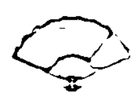

#### 受人稱讚之後務必回句「謝謝」

客氣且有禮，稱作「謙虛」。

在日本視「謙虛」為美德，謙虛的態度及謙虛的舉止，備受眾人肯定。
但是從陰陽學的角度來看的話，有時謙虛反是一種毒害。
比方說忙於工作或家事時，當別人跟你說「你做得很好」，你會如何回話呢？

即便你埋頭苦幹，但在拿不出成績的狀態下，你認為自己「必須更加努力才行」的時候，你是不是會回對方說，「我沒有你說的那麼好」呢？

或者，就算你內心認為「我也覺得自己做得很好」，但應該還是會客氣有禮地回說「我還不夠好」吧？

當這樣謙虛應答後，相信周圍的人一定會對你抱持極佳觀感，覺得你是個「嚴以律己，很謙虛的人」。

其實對方讚許你謙虛的這句話，將對你的心靈產生影響。

心靈並不會去考量當下的狀況，而會直接汲取話語本身的含意。也就是說，即便是半謙虛地回應對方的話，終將如實地將「我沒有做得很好」、「我還做得不夠好」這種想法傳遞至心靈。

正如言靈二字所言，語言是具有力量的。

周而復始進入耳朵裡的話，將成為強力的暗示。

當你很努力地完成一件事，卻暗示自己「做得不好」，可能將一路阻礙埋頭苦幹的自己，滯留在不夠好的狀態下。
不論你再怎麼努力與拼命，言靈終將妨礙你，使努力無法開花結果。

一個人聽到別人評論自己時，即便感覺這只是奉承話，也絕對不能否定這句稱讚。
回應對方的那句話，同時也是透過這個人心靈的暗示。請大家謹記這個提醒，不管你聽到哪些奉承話，就算你沒有自信，請你每次都要回句「謝謝」，或是「聽您這麼說我很開心」。

話說「謝謝」這句話，既不會誇示你很努力的事實，也不會否定你很努力這件事。

受人稱讚，感到不好意思時，請直言不諱地說，「聽您這麼說我很不好意思」、「真是不好意思」，接下來再接一句「但是我很開心」、「謝謝你」即可。

「自信」二字，是由「自」、「人」及「言」這幾個字所組成。
也就是有人讚美自己時，讚美的話將使自己更有自信。

事實上不管別人如何評斷自己，都比不上隨口一句讚美，因為這句讚美將可轉變成自我成長的契機，所以大家應無比珍惜。

當你正面接受事實，將之轉變成相信自己的力量，無論身陷何種局勢，你都不會迷失自我，而且一定能使運氣好轉。

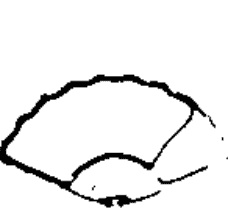

#### 為何轉換心情得喝日本茶而非咖啡

常說人生起起伏伏。
不會只有好事發生，也會有壞事臨頭。

但是從陰陽的角度正確解釋的話，世上並非存在著好事及壞事，而是「凡事皆有好的一面與不好的一面」。

依據這點來看，與其說人生起起伏伏，倒不如用「禍福相倚」來形容更為恰當。

Chapter 2

白天改變運氣的暗示

085

原本你以為的好事，當情勢一變將變成壞事，原先你認定的惡緣，事後發現竟是極佳良緣，這種情形屢見不鮮。就連有如掉落十八層地獄的痛苦意外，後來竟發現這全是為了讓自己頓悟某些大道理才會發生……。

在陰陽的世界裡，並不會去談論運氣好壞的問題，而是認為凡事皆有好的一面，也有不好的一面。因此陰陽學主張所有發生在自己身上的意外，都是有意義的。

話雖如此，人遇到討厭的事情一定會心情低落，發生難過的事情肯定會意志消沉。當下實在很難告訴自己，「這一定是好事。」

心情低落時，或是意志消沉時，總想轉換心情重振士氣，總想馬上處理情緒問題，接著再來挑戰，因此經常有人向我請教，遇到這種時候應當如何是好。

想要提升每一瞬間的運氣，必須在每個當下，暫時先將自己的心以客觀俯視的角度，也就是置於「中庸」之處，營造邁向陽光的機會。

我想很多人在轉換心情時，都會換個地方喝杯茶喘口氣，但是我常對精神特別沮喪的人如此建議：

那就是，「請你慢慢地喝杯溫熱的日本茶，而不要喝咖啡」。

慢慢地喝口茶含在口中，同時告訴自己「沒問題、沒問題、沒問題」。

在這個時代上便利商店就能用實惠的價格購得美味的咖啡，或許很多人喝咖啡的次數更勝於日本茶。

但在日本直到戰後才開始習慣飲用咖啡，自古喝的都是日本茶，因此飲用日本茶的記憶深深烙印在日本人的基因當中，可使人情緒穩定。正因為如此，需要療癒內心深處時，還是得喝日本茶。

咖啡是用來慢慢激發低落士氣的飲品，也就是說，會使人由「靜」轉「動」。

反觀日本茶則可使人瞬間回復原本的精神狀態，也就是會使人由「靜」轉為更「靜」的狀態。

Chapter 2

白天改變運氣的暗示

087

某位從事業務工作的女性，曾與我分享她的故事。

有一天她在工作上出錯了，一大早便心情沮喪。沒想到情緒一低落，竟連續犯下意想不到的疏失，再三遭受上司指責。還在她外出拜訪客戶途中，將十分珍惜鍾愛的雨傘遺落在電車上，順道去吃午餐時，甚至因為現金不夠，低頭向店家退餐，最後只能上超商解決。

感覺完全就像陷入倒楣事的漩渦當中。

接下來要拜訪的，是她第二次合作的客戶。於是她心想，一定要斬斷這個不良循環，使運氣好轉才行……。這時候她回想起我告訴過她，日本茶能轉換心情的建議。

於是她來到一家咖啡廳，將日本茶注入杯中，再用雙手緊緊握住，結果熱茶的溫度漸漸傳入體內，深達內心。

待她品嚐一口清爽的苦味之後，她慢慢地告訴自己三次「沒問題、沒問題、沒問題」。接著再喝一口，然後再一口，就在喝茶的期間，心情上也出現了轉變。之前她一直認為自己陷入「惡運漩渦」當中，以至於「內心糾成一個死結」，但是現在似乎

乎一一鬆解了。
「工作上會出錯，是因為沒有仔細確認的關係，只要謹慎確認即可預防。」
「接連不斷的疏失，起因於遭受責罵心情受挫，因而無法仔細詳閱資料，只要我能回復往常水準，一切就沒問題了。」
「遺失珍愛的雨傘雖然很受打擊，但我相信還會買到更漂亮的傘。」
「午餐時雖然又慌張又丟臉，幸好最後什麼事情也沒有，只是多走了一點路罷了，而且還幸運地遇到了很親切的店員。」
像是「惡運漩渦」這種「死結」，雖然看似「惡運」，但是逐一分析之後，會發現只是單純幾件事同時發生罷了。
所以並非什麼「惡運」，凡事一如往常。
能夠這樣重新思考過後，你便能坦然面對，告訴自己「過去的事情已經過去了，接下來的行程並非過去的延續，一切都沒有問題，肯定會順順利利」。
冷靜地面對事情，就能回到「中庸」的立場，逐一客觀審視，不再認定「自己現在處於惡運當中」，得以脫離自己在無意識間所設下的「惡運漩渦」這等「暗示」。

Chapter 2

白天改變運氣的暗示

089

發生在自己身上的突發事件，如果只是悲觀地面對，有時這件事會為自己設下負面的暗示。

讓自己的心置於「中庸」，品嚐能透澈內心的日本茶，除了能潤澤喉嚨之外，對於日本人而言，真正的用意在於重新整理情緒，有助於帶領我們去「覺察」。

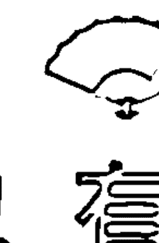

有化災祛凶的「印組」，也有解怨消氣的「印組」

陰陽師的世界裡，用手指或手做出特定的動作，便稱作印組。藉由手印的組成，使無形的能量聚集起來，再運用這股能量，直接作用於有形的現象上。

有一個名為「九字切」的印組，可祛除惡鬼，消災解難，而類似這些由陰陽師流傳下來的正統印組，必須是累積修行的人，才得以正確使用。不過也有無須累積修行，人人皆可簡單採用的印組。

比方說小孩子接觸到髒東西時所施行的「ENGATYO」，就是民間廣為流傳的印組之一。

「ENGATYO」有「斬斷緣分」的意思存在。

ENGATYO是將中指與食指相纏交叉，或是用大拇指與食指形成一個圓，再請旁人用手刀斬斷，每個地方的做法各不相同，但在組成某種手印的同時，念誦出「ENGATYO」這幾個字，即可藉此與不乾淨的東西斬斷緣分，預防感染疾病損害身體。

「ENGATYO」是小朋友經常融入遊戲中的印組，接下來要介紹的是大人在日常生活中用得到的印組。

其一便是「撥雲見日」的印組。
靈感枯竭、走投無路、處處碰壁、腦筋轉不過來時，只要做這個印組，即可使呆滯的能量活絡起來，將事情導向有別於以往的開展。

- ① 雙手食指與大拇指的指尖，分別緊密連成一個圓形。
- ② 將右手的圓形插入左手的圓形當中。
- ③ 接著用右手連成的圓形，有如切開左手食指與大拇指的圓形一般，用力將左手連結處一口氣斷開。

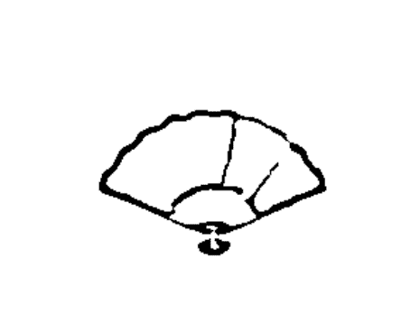

另外，在煩躁不安手足無措時，或是因為某人的一句話怒氣騰騰無處宣洩，甚至於控制不了怒氣飽受影響時，有一個用來解怒消氣的印組，希望大家能夠學起來以方便運用。

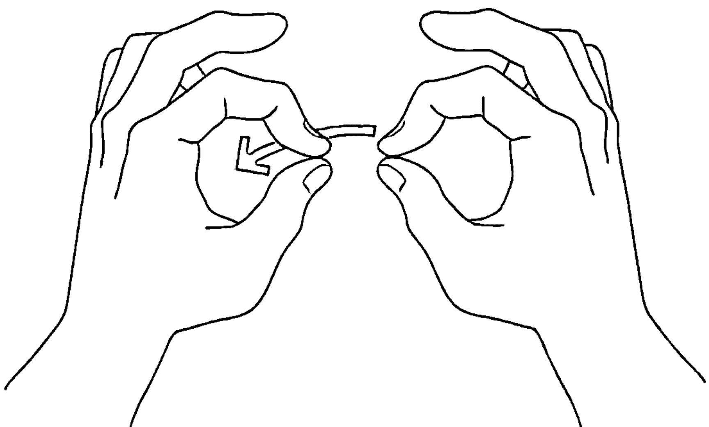

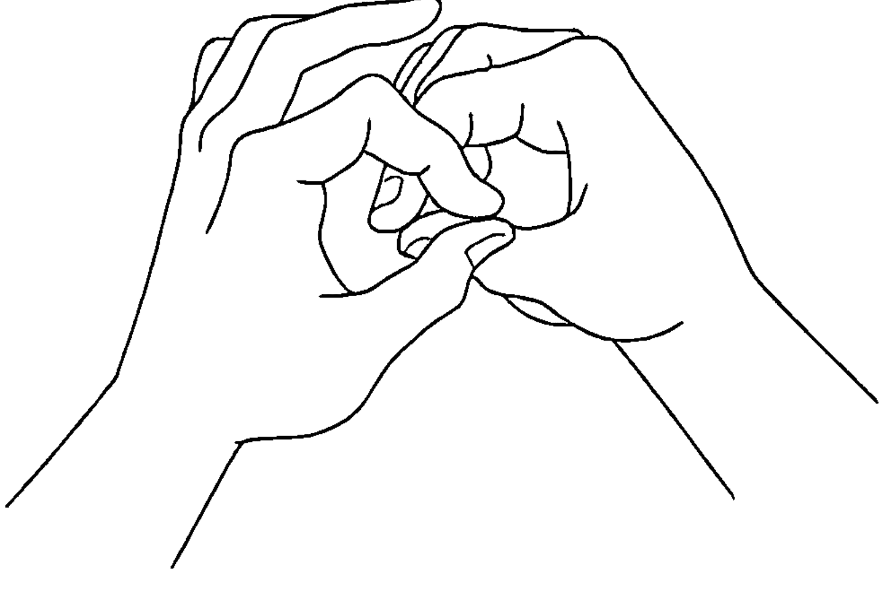

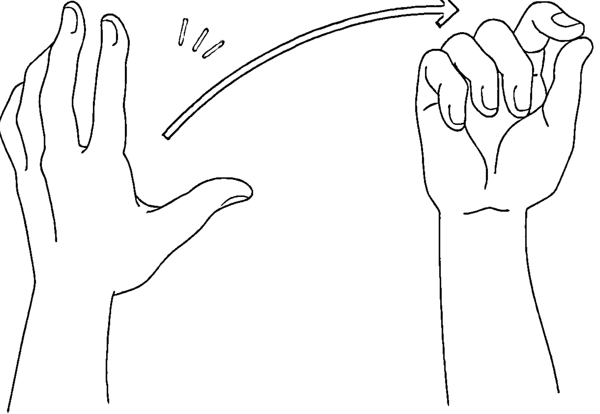

Chapter 2 白天改變運氣的暗示

怒不可遏，或是激動焦躁時，一旦陰氣變強，情緒便會緊繃僵持。受情緒連動之下，甚至連身體也會收縮，導致全身緊繃而僵硬不堪。此時利用這個會活動到全身上下的印組，便能解除這種情形。

- ① 首先將雙手用力握緊，手肘彎曲，後背拱起來使全身緊縮。
- ② 在全身緊縮的狀態下，將力量用力囤積於體內。此時也在心中念誦著「可惡」，或是令人生氣的事情及怒氣。
- ③ 接著抬頭往上看，同時一口氣將手臂舉高並張開雙手，使後背挺直。感覺像是要將積聚在體內的怒氣釋放到天空中一樣。

將緊縮的身體一口氣伸展開來之後，這個動作將產生連動，將有如犰狳一樣蜷縮於體內的陰氣完全釋放，使身體的血液循環變好，讓陽氣進入體內，取代釋放出去的陰氣。

順帶一提，橄欖球選手五郎丸在去年造成一股話題的姿勢，也算是印組的一種。那個姿勢的用意，目的便在於提高注意力，加強踢球準確度。他本人將這個姿勢稱之為「routine」，翻譯成中文的話，算是種每次決定踢球時，會隨著動作出現的「祈願」或「符咒」，我想也算是一種「印組」。

假使你想要擁有一個讓自己情緒好轉的專屬印組，不妨學學五郎丸選手，創造一個獨一無二的「印組」。

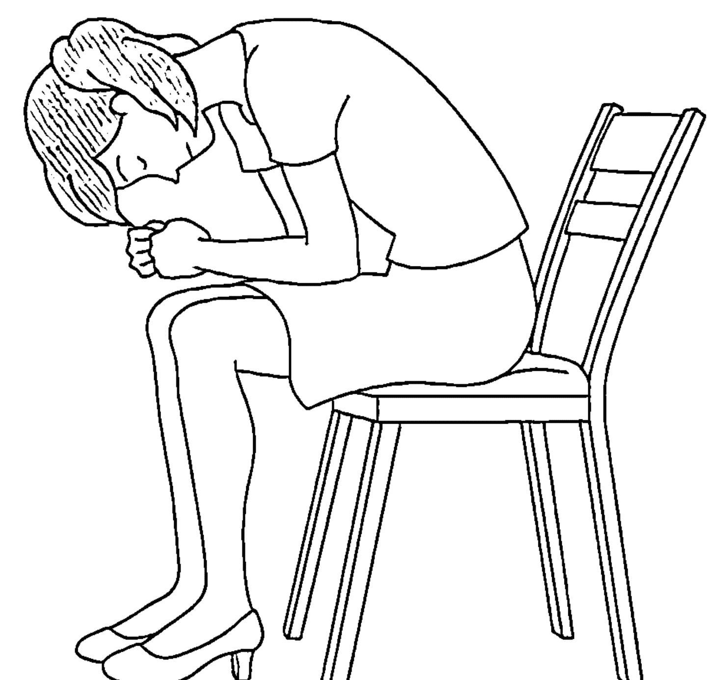

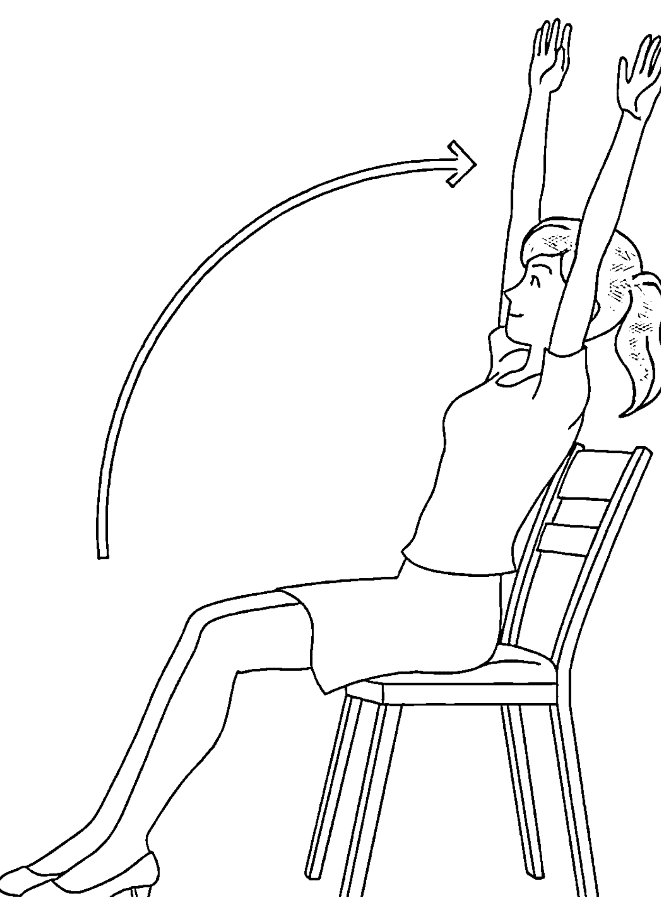

#### 容易在無意間為之，避之不及的「倒楣印組」

另外還有一個印組大家可能司空見慣了，但是這個印組最好少做為妙。
那就是「抱著胳膊」。
陰陽師在作法時會抱著胳膊，將手指藏在和服內作法，以免對方看見。
不過就算不是為了避人耳目施展法術，當你一抱著胳膊，看起來就會格外威嚴且強勢。

父親在告誡孩子要事時，或是上司對下屬吩咐緊要工作時，抱著胳膊或許是想表達「你給我仔細聽」的意思，但是對於比自己年長，或是身分地位高於自己的人，可是嚴禁抱著胳膊，即便面對後輩及下屬，最好也不要抱著胳膊。

在這種場合下抱著胳膊，就好像在強調「我無心聽你說話」的態度。無論對方在上或在下，希望大家都能秉持凡事虛心學習的態度。
所以抱著胳膊這種印組，將使你喪失寶貴的學習機會，使運氣大幅下滑。

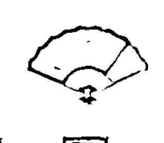

#### 凡事請以「陽點思考」，萬萬不得陽轉陰思考

正因為有陰才有陽，有陽才會有陰。
陰陽二者的性質大相逕庭，相互取得平衡、調和，萬物才得以成立。
這就是陰陽學的基本概念。
俗話說，「人生有好事發生，也會有壞事降臨」，在陰陽學的觀念中，認為同一件事一定會有陰的一面與陽的一面。
舉例來說，假設你在工作上出錯被上司叱責了。
雖然被人叱責絕非好事，但是上司會責罵你，反過來也是「對你有所期待」。

他認為「你應該做得到」，於是將工作交代給你，沒想到你竟然出錯，使得結果與他的期待不符，所以上司才會針對這件事，責罵你「為什麼會出錯」。

說不定上司是為了讓你學習新工作，於是明知你會出錯卻刻意委派你去做，以便指摘缺點要求改進。甚至打算事後再讓你挑戰一次，幫助你充分熟悉這項工作。

如果上司不是打從一開始便懷抱期許，理應會抱持「你就是這等程度的心態」，心想「讓你重做也無濟於事」。於是乾脆與你切割清楚，認為你「資質平庸」，並不會對你多加叱責。

工作上出錯被責罵時，任誰都會心情低落，但是一直沮喪也無濟於事。必須讓心情回歸平靜，更加發憤圖強才是。

這種時候我總會告訴大家，只須聚焦於「自己備受期待」這點上頭，且須謹記「被叱責」這件事。

日文有個名詞叫做「陽轉思考」，意指將負面的事情轉為正面，但在陰陽學的觀念中，並不認為將「陰」完全轉念成「陽」會是件好事。

因為，犯下了「被叱責」的過錯是事實。

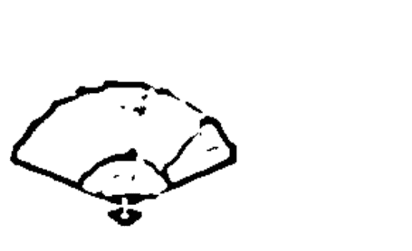

的確在「被叱責」這個現象中，也內含「備受期待」這類陽的要素。但也不能因此，便將犯錯這類陰的要素全面翻轉成陽。

無視受人叱責這個事實，僅著眼於備受期待這一點而沾沾自喜的話，你一輩子都只能當個隨遇而安、得過且過的人。

陰陽學在這方面會傾向於「陽點思考」。

所謂的「陽點思考」，是種在「陰」當中潛藏著「陽」之要素的概念。請大家回憶一下第四十五頁的太極圖中，在黑色部分存在著白點的陰陽魚。

大部分皆為黑色的話，看起來只會感覺很負面，但是突然出現一個白點時，單憑這一點就會讓人心生正面的想法。

這就是「陽點思考」。

「陽點思考」與「陽轉思考」的不同之處，在於發生的事情如為陰，會確實接受這個事實。

雖然人在沮喪時一步也跨不出去，但若因此將陰完全轉念為陽，難保不會忘記陰的教訓，將陰拋於腦後。

「陽點思考」時，會去挖掘陽的部分，藉此使自己的心回歸中庸之處，認真投入眼前必須改善的地方，所以這種觀念將會使人成長。

#### 運用行事曆的「夢想成真力」改變現實

記錄著每日行程及計畫的行事曆，你都是如何運用的呢？
多功能行事曆年年推陳出新，相信很多人每年都會躍躍欲試，不知道今年該用哪款行事曆好，另外也有很多人長年愛用同一款行事曆。
當你以煥然一新的心情，打開一本新的行事曆，希望今年能這樣度過、祈盼這樣的目標能夠實現時，有個動作請大家務必先行完成：

那就是「將行事曆當作預言書」。

合併日曆與筆記本功能的行事曆，主要用來記錄今後的預定事項。

舉例來說，我們會在下週六那一欄，寫上「銀座購物」這類的私人行程，或是在下個月的第一個星期一那一欄，寫上「下午二點開會」這樣的工作行程，只要是寫在行事曆上的事情，幾乎都會實現。

一般總認為，「完成預定行程是很正常的事情」、「寫在行事曆上就是為了去完成這件事」，但是只要「記錄在行事曆上」，寫下來的事情「幾乎都會實現」，這種情形大家不會覺得十分神奇嗎？

假使沒有寫下預定行程的話，說不定會因為忙過頭而疏忽忘記，或是安插進其他要事來。

正因為將預定行程確實地寫在行事曆上，才會經常留意到這件預定行程，而且會配合這件預定行程做各種調整，妥善準備。因此記錄在行事曆上的預定行程，才能成為事實。

運用行事曆的「自然成真力」，使自己的夢想及願望實現，這就是我所謂的「將行事曆當作預言書」。

據說將夢想說出口，或是寫在紙上會比較容易實現，若是能夠記錄在行事曆上，相信會更快成真。因為三百六十五天，天天都摸得到也看得到行事曆。

將自己的夢想寫在行事曆上頭，就能每天看到自己的夢想，這個夢想便會逐漸滲透到深層心理，深植於心。

深層心理屬於潛意識的世界，其領域比意識得到的世界更加廣泛，據說與思考及行動有著深切關係。

夢想如能在潛意識的領域裡落地生根，自己的一舉一動將為「實現夢想」而啟動。

於是直覺也容易發揮作用，且會遇見從來無法認識的人，有益的資訊也會迎面而來，因此會發生平時不可能發生的事情。

#### 讓行事曆變身預言書的「夢想撰寫法」

本章將告訴大家具體的「夢想撰寫法」，讓行事曆變成預言書。

#### 請在二月四日立春之前撰寫

第一個問題是，何時撰寫行事曆最恰當呢？最佳時機就在立春的二月四日之前。依據太陽編列而成的太陽曆，將十二月三十一日的除夕視為一年的結束，視一月一日的元旦為新年的開始。

現在日本使用的是太陽曆，但是直到江戶時代為止，一直都是使用舊曆。所謂的舊曆，是將依據月亮編列而成的太陰曆，融入太陽曆所訂定的曆法。

陰陽學這套學問，自一二○○年前流傳至今，隨著時代潮流及時代演變，時節仍以舊曆為準。

因此在陰陽的世界裡，除夕為節分（指各季節的分際，即立春、立夏、立秋、立冬的前一天）的二月三日，新的一年起始於立春的二月四日。所以新的一年會與春季同時展開。

如前所述，在陰陽的世界裡將一日視為一生，而地球在繞行太陽一圈後，將自此告一段落，展開新的一年，此時也是讓自己歸零重置的絕佳時機。

一年是重複三百六十五次脫胎換骨的集大成。在一年結束，新的一年開始之際，實

#### 心願最多寫一個

夢想或心願眾多時，總會令人想要統統寫在行事曆上。

但是假使你是神明的話，列舉出好幾個心願的人，與只寫一個心願的人，你會想幫誰實現夢想呢？只有一個心願的人感覺較為真誠，因此會讓你想助他實現夢想對吧？

許願時，請專注於「最想實現」的那一個心願就好。

假使你無從選擇，請分別從工作及私生活中，各挑選出一個心願來。在陰陽的世界裡，將工作與私生活視為正反面的事物，從兩者各自挑選出一個心願的話，神明會認同二個心願皆為真摯的心願。

這時候請將工作的事與私生活的事，串聯起來寫成一個心願，比方說「我要成為業績第一，並且減肥成功」。

我認識一個朋友，她將工作的事與私生活的事全部混為一談，一次寫了十三個心願，老實說在一年內根本不可能實現。

話雖如此，當她寫下十三個心願之後，居然在三年內有八個夢想完全實現了，四個夢想也即將瓜熟蒂落。雖然唯獨「一億圓從天而降」的夢想恐怕很難成真，但是她的人生據說在這三年內有了天壤之別。

#### 心願寫在行事曆打開後的首頁跨頁與末頁跨頁

一天開始的零點與當天結束的二十四點，時鐘指針所指的位置都在同一處。在陰陽的世界裡也是一樣，將起始與結束的地點視為同一個地方。

正如同最初也是最後一樣，在行事曆上寫心願時，第一頁與最後一頁都要分別寫上心願。

行事曆封面打開後的首頁跨頁就是第一頁，寫在首頁跨頁的左右哪一邊都無妨。

只不過陰陽學重視平衡。如果寫在首頁跨頁的右側那一頁，封底打開後的末頁跨頁，就要寫在左側那一頁，一開始寫在左側那一頁的話，最後就請寫在右側那一頁，這樣一來，最初與最後才能對稱，取得平衡。

#### 心願請用直式書寫

行事曆上通常會用阿拉伯數字書寫，所以大部分的行事曆皆為橫書的格式。順應格式的設計，心願也會習慣橫書，但是我們是東方人，因此書寫心願時請遵循古法，以直書來寫。看到以直書方式寫下來的個人夢想，自然也就會繃緊神經。

#### 心願須寫一次

心願平常都會寫成「我想要……」，但是寫「我想要……」是無法達成心願的。

舉例來說，求職面試時有些人會說「我想好好拚一拚」，有人會說「我會努力工作」，如果是你的話，會錄取哪一位求職者呢？

「我想要……」最終只能算是願望，從這句話不但感覺不出你是否已做好心理準備，還會讓人覺得你有言外之意，未來會有藉口說，「如果我做不好的話，只能說聲抱歉」。

反觀會說出「我會……」的人，則完全不會有藉口，而且能展現出「我會百分之百賣力工作」的積極態度。

話雖如此，心願確實只是願望，因此第一次寫心願時，請寫「我想要……」。接下來再打叉，將「想要」這二個字刪掉，並在旁邊重新寫上「會」。

然後在第二次寫心願時，一開始就要用「我會……」的肯定句來書寫。

有人會覺得既然要在上頭打叉重寫的話，不如一開始就寫「我會……」不就得了，其實刻意將「想要」劃掉再改成「會」，是為了讓人做好心理準備。

每天看著「想要」二字被劃掉再寫上的「會」之後，神奇的事情將會發生，哪怕心願會旁生枝節，也會因為捨棄了「我想要……」這樣的表達方式，逐漸變成「我會……」的必然結果。

#### 為什麼最好寫「二次」

我們在確認或強調某件事時，都會重複同一句話。因為重複一次而不是只說一次，會加深印象，牢記於心。

打電話時開頭會「喂喂」一二聲，也是為了喚起對方的注意，想要對方認真聆聽，以便傳達要事。童話故事開頭會說「從前從前」，也是在暗示聽者，盡可能吸引他們進入故事的世界。

就連上神社參拜時，我們也會行禮二次，拍手二次。

夢想及心願也一樣，重複寫二次，可更加強化，更深切地刻劃在心裡。看著重複寫下的心願，將形成雙倍力道，滲透至深層心理。

再者，我們通常在文章結尾會打上「句號」，但在第一頁卻不可以打上句號。因為這個地方不是結束，而是開始。

#### 在最後一頁寫上「我已經……」，並且務必以「句號」結尾

最後一頁被視為一年三百六十五日結束的時間點，因此將寫在第一頁的心願寫成「我已經……」，並用完成式作結尾。

我們在神社掛許願牌時，有人會建議寫成「我已經……」這樣的完成式，會用完成式來寫，是表示心願實現了。事先在最後一頁寫上完成式，是因為確信心願會實現，所以務必以一定會實現的心情，用完成式寫下心願。接下來在文章最後，請別忘了打上「句號」。用「句號」作結尾非常重要，不再打叉，而是全部以圓圈作結束，這也算是一種暗示。

縱使一年下來會發生許多事情，但是請在最終全部以圓圈結尾，秉持著凡事圓滿的心情，於「我已經……」的後頭，打上「句號」作結束。

#### 最後務必以「謝謝。」作總結

許願，然後願望實現後，表達謝意是一種禮貌。請在以完成式寫下來的願望旁邊，寫上「謝謝」二字。最近很多人都會用平假名「ありがとう」來寫，如用漢字來寫的話，則會變成「有難う」。

日文的「有難う」，意指發生了「某件很難處理的事情」，心存「感謝」的同時，既關心卻還是有點不好意思，感到很抱歉的心情。雖然用平假名來寫仍可呈現出感謝的心情，但我還是希望大家能用漢字寫下「有難うございました。」加深感謝的誠意。

規則繁瑣，或許有些人會覺得麻煩，但在許願時還是需要採取適當的步驟及做法。正如同上神社參拜時，都會有固定的做法，必須先在御手洗（神社門旁洗手漱口處）清洗手口，行二次禮拍二次手，再行一次禮一樣。

遵從每項規則再許下心願，相信原本無法遞送出去的心願，都將得以傳達。

成為預言書的行事曆，請你每天拿在手上，先將開頭的第一頁打開後，再翻開最後一頁。

晚上就寢前，請看看結尾的一頁結束一天，然後進入夢鄉。

寫著心願的行事曆，就是你的預言書。行事曆也算是一種暗示。衷心相信「行事曆是預言書」的人，心願就會成真。

- ◎ 想要說明理論時看著對方右眼。
- ◎ 辦公桌放「盆栽」，餐桌擺「花束」。
- ◎ 聽到奉承話務必回句「謝謝」。
- ◎ 轉換心情須喝「日本茶」。
- ◎ 做化災祛凶的「印組」。
- ◎ 做解怒消氣的「印組」。
- ◎ 讓行事曆成為「預言書」。

### Chapter 3 夜晚淨化運氣的暗示

陰陽的世界裡，將一天視為一生的濃縮。假設早上睡醒時為誕生的瞬間，晚上就寢時則為生命結束臨終的瞬間。但是結束看似「終了」，事實上卻是「最初的開始」，準備展開新人生的時刻。所以用心地度過前一天的晚上，才能使明天這一天成為美好的一天。但是如何才能讓自己過得更舒適？如何才能療癒身心，休養身心呢？接下來將依據陰陽學的概念，教導大家生活的祕訣，幫助大家能睡得舒服自在，脫胎換骨迎接美好的明天。

#### 在陰陽交替的沐浴時間該做的事

先前已教過大家，如何將單純的水變成開運水，這與言靈的道理一樣，靈力與信念很容易留宿在水裡頭。

比方說能量景點大多為瀑布或池沼等水氣多的地方，這點大概與水的性質具有密切關係，因為水能包容無形之物，使它們留宿在水裡頭。

此外，據說日本的家宅風水規定，不得在表鬼門東北方至裡鬼門西南方這條斜向靈道上設置用水設施，例如禁止設置水槽。這是為了避免惡靈及怨念由鬼門侵入，然後賴著不走或是居留下來，屬於暗示的一種。

家中的用水相關設施通常設有好幾處，但會大量用水的地方，還是非浴室莫屬。

清洗體垢、潔淨身軀的浴室，算是一個切換開關的地方，使我們從活動一整天的「陽」，切換成休息的「陰」。就醫學的角度而言，浴室也是交感神經與副交感神經進行轉換的地方。

雖然入浴完全比不上在瀑布下嚴謹修行，不過同樣是以大量的水來沖洗自身。水除了能洗淨看得見的東西之外，也能淨化看不見的東西。

如能妥善運用水的這種力量，沐浴時除了物質面的汙垢，也能洗去精神面的汙穢。縱使你能用煥然一新的心情，精神抖擻地展開一天，但在應對各式各樣的事物，應付形形色色的人之後，無論身心都會疲乏，因此將憤怒、憎恨、悲傷、沮喪這類負面情緒帶回家，也是常有的事。

沐浴的時間，就是將討厭的事情全部沖洗滌淨，重返中庸的關鍵時刻。

「付諸流水」常用來指「當作沒這回事」、「把事情統統忘記」。事實上讓身體泡在熱水裡、浸在浴缸中這樣的外在行為，也會作用於內在的情緒上，使人忘記憤怒或憎恨。

最近不泡澡只淋浴的人似乎愈來愈多了，但是如果你自己家裡的浴室設有浴缸的話，還是應該放滿熱水好好浸泡一下。

我常聽到有人反問我，如果只是為了將負面情緒「付諸流水」，是否沖沖澡就可以了？但是浸泡在浴缸裡還能淨化心靈，因此是不可或缺的關鍵步驟。

的確單靠淋浴也能沖掉負面情緒，可是單純藉由水勢沖洗，即便能轉換心情，也無法進階到下一階段。因為當你再度發生類似的變故，可能還是會產生一樣的負面情緒。

反觀浸泡在浴缸裡，就有時間可以慢慢回想當天發生的事情。在溫暖的熱水包圍之下，冷卻僵硬的心情自然也能放鬆下來，得以用客觀的角度反省自己的一言一行。

除了能留意到情緒問題之外，還能注意到自己的言行，藉此有所領悟，使僵持硬化的負面情緒，也能「付諸流水」。

話說東方人平時很習慣泡澡，歐美人則大多沖澡了事，一個月只會在浴缸裡泡上幾天熱水澡。

所幸我們生活在用水無虞的地方，大家都習慣泡在熱水裡，熱愛被熱水環抱，不過日本人不僅喜愛被熱水環抱，也很珍惜緊緊環抱的感覺。舉例來說，歐美人收到禮物時，會將包裝紙撕個稀巴爛，藉此讓自己很開心能收到禮物，但日本人卻很珍惜對方包裝的用心，就連包裝紙也會小心翼翼地拆開。究竟為什麼日本人會本能地喜愛環抱的感覺，且十分珍惜呢？我認為這是因為日本文化都會事先「想到對方」。在意對方的存在，為對方著想的「利他」精神，自古便在日本的風土民情中孜孜育成。

反觀重視自由的美國，注重的是「個人文化」。我的師傅，也就是我的祖母常說，唯有「自己行得正」，才是真正的「自由」，而「自由」的反面，即為日本人心中漫流的「利他」精神。想將水撥到自己身邊，水反而會流走，將水推出去，結果又流回來，這就是所謂的「水盆法則」。

換個角度來看，浴缸就好像大型的水盆。日本人平時習慣泡在熱水裡，或許也藉此體會並學習到「水盆法則」，培養出「利他」的精神。

以洗澡為例，日本人的生活現今已日漸偏向歐美化了，但是一邊吸收歐美文化優點的同時，日本人優秀的精神文化，也應繼續保持下去才對。

#### 別老窩在廁所裡以免運氣溜走

我從小長大的家，是棟日式木造建築，位在四萬十川河邊。木頭不耐水，濕氣一多便容易腐爛，因此浴室是按照風水習俗，蓋在距離主屋有段路程的地方。

廁所也和浴室一樣，是與主屋分離的獨立建築。當時仍為掏糞式廁所，並沒有水可供沖洗。正如同廁所在日文中的別名「御不淨」一樣，是稱不上乾淨的地方。雖然不可或缺，但畢竟是個「不淨」之處，因此會蓋在遠離家人休息的主屋。

雖然這個家我已經住慣了，可是天黑之後，要到遠離母屋的廁所時，難免叫人心生膽怯，因此小時候我總會盡快解決，急忙離開廁所。

現在居住環境改變了，大部分的住宅都將浴室及廁所設計在屋中，廁所不再是孤零零的場所，也不再叫人想要拔腿離開。

而且廁所還是可以一個人獨處的空間，因此似乎也會有人在裡頭讀書，不過我還是經常建議大家，「別老窩在廁所裡。」

廁所頂多只是解決內急的場所。

老愛待在用來處理排泄物，用水沖掉排泄物的場所裡，運氣也會一併被沖掉。因此解決需求之後，應盡快離開，絕對不能久待。

但是日本國土狹小，為了有效運用土地面積，蓋了許許多多的大樓。大樓裡的上下層住家，大多建成相同格局，呈現３０３號的廁所上頭就是４０３號的廁所，再往上還有５０３號廁所的構造。

而且每家的廁所裡頭，都設有沖掉排泄物的管線。雖然不太願意去想像，不過除了最高樓層之外，多數廁所的管線中，都會流有樓上的汙水。

對照日本過去的風水習俗，這種狀態絕非好事。話說如此，考量到現代的居住環境，這也是無可奈何之事。單憑這點原因，我希望居住在大樓裡的人尤其要特別留意，別老待在廁所讓運氣被沖走。

除此之外，偶爾也會有廁所管線裸露出來的情形，汙水流經的管線，本來就不該進入視線當中。遇到這種時候，最好買些常春藤或黃金葛的人造花回來，捲在管線上。因為在管線纏繞上植物偽裝成樹木，即可改善氣場的流動。

順便說明一下，現在日本對於「風水」一詞已經相當習以為常了，但是風水原本可能是由中國傳進來的環境學。中國地大物燥，相當需要水源，於是才會衍生出「風水」的概念。

但是日本國土並沒有水源匱乏的問題，且日本的木造建築十分排斥水分產生的濕氣。也就是說，風水的概念原是根據中國的國土孕育而生，而日本的國土環境與中國有別，因此許多風水並不適用。

而且提出風水概念的年代，與現今的生活樣貌已經不可同日而語了。

當時在沒有沖水馬桶，也沒有電線的中國所衍生的環境學，究竟在日本現代生活中能夠提供多少幫助？仔細想想之後反叫人覺得，「對於中國提倡的風水全盤囫圇吞棗，反而有可能拖累運氣的走勢。」

#### 感冒初期請服用鹽與礦泉水

日本自古便認為鹽具有淨化的作用。

因此日本人在神桌上供鹽、在玄關擺鹽山，這全是為了避免邪氣接近，以維護周遭環境的清淨。

相撲力士在土俵上撒鹽、請家人參加完喪禮回家後用鹽淨身，這也是為了祛除邪氣，避免災難進門。

此外，鹽還具有殺菌、防腐的作用，因此也會用於醃梅子或味噌等保存食品當中。

鹽對日本人而言，不僅是烹調料理時的重要調味料，同時還能用來祛除無形的邪氣。

吃下肚的鹽不但會成為身體的一部分，也可用來象徵淨化，避免災難近身。

在陰陽的世界裡，深信沾染邪氣就會生病。正如同「病由氣生」這句話所言，邪氣會入侵身體，使體內的「氣場」循環變差，進而影響身體健康。

反過來說，如能儘早將侵入體內的邪氣祛除，體內的「氣場」便不會受到影響，也不會損害身體健康。

從小每當我咳嗽或出現鼻音時，祖母就會叫我「舔口鹽巴」，將鹽直接吃進體內，將入侵身體的邪氣祛除。

當然，鹽雖然具有殺菌、防腐的作用，卻不含藥效成分，並無法直接改善症狀。但是人具有免疫力。事實上根據醫學理論而言，鹽可發揮安慰劑的效果，因此舔口鹽巴淨化身體，藉此壯大體內的「氣場」，強化免疫力的作用，便可治癒某種程度的疾病。

感冒二字的日文寫作風邪，顧名思義，就是受風吹颳後會在空中飄散的「邪氣」。在感冒流行的季節，只要去到人潮擁擠場所，便可能受到感染，在這種時候，大家不妨遵照本章節所介紹的暗示方法，以祛除邪氣。

回家後，先將手洗乾淨，接著準備「鹽和礦泉水」，並將少量的鹽放在舌頭上，再把礦泉水倒入杯中喝下去。

鹽不得為精製鹽，須使用富含礦物質的天然鹽。而且水不可以是人工淨化的自來水，須選用自然的礦泉水。

人也屬於大自然的一部分，因此鹽和水採用最貼近大自然的產品，身體才容易接納，且身體吸收得愈多，淨化作用也會愈強。用舌頭舔鹽巴的分量只需一小撮便綽綽有餘了。請將鹽擺在舌頭上，再用礦泉水送進體內。然後對著礦泉水說：「我不會感冒」、「將邪氣祛除」，加以暗示之後，更能提升淨化的效果。

正在養兒育女的母親，可能有過這種經驗，當小孩子染上流感時，只要妳心裡一直想著，「不能連我也被傳染流感臥病不起，我絕對不能生病」之後，就真的不會被傳染感冒了，而且這種情形屢見不鮮。因此病由氣生，這句話說得一點也沒錯。順便提醒大家，邪氣很排斥神社這類淨化過的場所。

假使你罹患輕微感冒，只要去趟神社，大多都能痊癒。回家途中會路經神社的人，不妨繞道進去神社參拜一下，以祛除邪氣。

#### 就寢時避免鏡子反射睡姿

最貼身，但是自己絕對看不見的東西，就是自己的身影。不管是風景、人或是物品，除了自己以外的東西，都能用肉眼直接看見。但是自己的容顏與身形，卻非得照鏡子才看得到。

在家洗臉時、整理儀容時、化粧時、洗手時，平常這些時候每個人都會習慣性地照照鏡子，但有一點須請大家特別注意。

那就是「避免鏡子反射睡姿」。

雖說鏡子是由人類製造出來的產品，卻是種具有特殊力量的器具，能映照出平時看不見的東西。

自古鏡子便能映照出無形之物，被視為可連接我們生活的現實世界，與另一個世界的裝置。

例如神社中會把鏡子當作神明，這是因為鏡子這種東西，具有能夠通往其他空間的力量。

我們祈盼藉由鏡子窺探神明的世界，與神明的世界連結，因此才會把鏡子這種器具當作神明，加以祭祀。

自己身影無法直接見著，但可藉由鏡子映照，唯有睡著時的模樣，自己無法看見。

可是當你在睡床旁邊放置鏡子，就會在鏡中映照出睡姿。若是沒人在看倒不成問題，但此時映照的身影會招來危險。

當我們起床時，我們的魂魄會安存於肉體當中。

當我們睡著時，魂魄是可以離開肉體的。

睡眠期間魂魄容易離開肉體，此時若是自己的身影映照在鏡子裡，會發生什麼事情呢？

睡眠期間是我們最沒有防備的時候，當然意識也是停擺的狀態。我敢百分之百肯定，從肉體脫離的魂魄，將被拉往鏡子另一側的世界去。

從前一般家庭裡擺放的鏡子，都是有門片可以關起來的三面鏡，即便是一整面的穿衣鏡，也都會蓋上一塊布。

在鏡子不像現代如此普及的年代，人們心中想必十分敬畏鏡子持有的神奇力量。為了避免在不留神時映照出自己的身影，在沒必要的時候，當時的人都會將門片關上，或是蓋上一塊布，將鏡面遮蓋起來。

鏡子是連結現實空間與另一個空間的裝置。如果家裡的鏡子放在照得到睡姿的地方，最好將鏡子換個位置。無法變動鏡子位置的人，至少在睡眠期間，應在鏡面蓋上一塊布。

#### 無論發生什麼事，都要面帶笑容入眠

假設早上睜開眼睛即為誕生的瞬間，夜晚入眠就是生命結束臨終的瞬間。入眠前一刻，當日一整天發生的每件事情會閃過腦海，以至於身心狀態容易崩潰，再加上疲勞累積的關係，有時恐會沉浸在痛苦的情緒當中。

但在疲勞或負面情緒干擾下入眠的話，可就無法用神清氣爽的心情迎接嶄新的一天了。

為了讓明日成為美好的一天，前天晚上在何種狀態下入眠影響甚大。想讓自己在翌日早晨醒來後精神抖擻，除了舒舒服服地入浴之外，還有一點希望大家留意，那就是請以嘴角上揚的狀態入眠。

哪怕你心情不快樂，也沒有什麼事情值得開心，都必須「嘻」地一聲將嘴角上揚，強作笑顏再入眠。就算知道自己是在假笑，那也無妨。接下來神奇的事情將會發生，人在假裝微笑時便不會生氣。好比頭低低自然會心情沮喪，頭抬高便會開朗愉悅一樣，情緒是會受身體動作所牽引的。

面帶笑容入睡，心情就會在睡眠期間進行切換，使你在翌日能夠神清氣爽地起床。起床時精神抖擻，新的一天就又能用積極奮發的心情，精神飽滿地度過。

面帶笑容入睡，就是為一天畫上「結束」的句點。也是為當天的心情好好做個整理，為翌日做好準備。

這個道理也適用於人生。

在陰陽的世界裡，人出生時都是呱呱墜地，周圍的人則是用笑臉迎接；在人死去時，周圍的人會泣不成聲，但是聽說死者本人在死亡當下反而會面帶笑容，表示「我今生無憾了」。

每個人都會面臨死亡，但是任誰都無法預測會以何種形式死去，這個答案只有神明知道。

但是不管在哪種情形下，我都想要微笑著死去。

> 『善終則圓滿。』

感謝上天賜予我生命，用滿臉笑容為人生閉幕。
陰陽學認為一日即為一生，由這個觀點來看，帶著微笑入眠，正是在練習用笑臉結束人生。也就是說，我認為微笑著睡去，就像在練習用笑容結束美好的人生。

##### 夜晚淨化運氣的暗示

- ◎ 沐浴時應泡澡，不要只沖澡。
- ◎ 別老待在廁所裡。
- ◎ 使用天然鹽祛除邪氣。
- ◎ 將鏡子擺在不會照到睡姿的地方。
- ◎ 面帶笑容入睡。

#### 改善男女關係的陰陽術

「怎麼做才能遇到理想的另一半？」
「和現在交往的男朋友結婚好嗎？」
「我實在好想和前男友復合！」

我在為人算命時，有很多的人會來向我諮詢這方面的問題。
男女關係的糾葛、錯過、分合、結緣……。

如果你能了解陰陽學，將陰陽學活用於現實生活當中，除了男女關係之外，所有的人際關係都將變得簡單又自在。

男女構造大不同，而且男生有男生的職責，女生有女生的任務。

接下來要為大家介紹一下，陰陽學如何解讀男女關係，以及有什麼改善男女關係的陰陽符咒。

#### 只有人類這種生物才有「間」

人類擁有犬、猴、貓等動物沒有的東西，大家知道是什麼嗎？那就是「間」。

無論犬、猴還是人，都是棲息在地球上的一種生物，雖然同為生物，不管是犬、猿或是貓，都沒有「間」。

一提到「人」，通常會聯想到「人間」，但是一談到犬，卻不會聯想到「犬間」，猴也沒有「猴間」，貓也沒有「貓間」。

地球上存在著各式各樣的生物，但是唯獨人類擁有「人間」。

所謂的「間」，在陰陽學裡，意指物體與物體中間的空間、物體與物體隔絕的地方。

人類擁有「人間」，只有人類能意識到存在於人與人之間的「間」。
舉例來說，當有A先生與B先生兩個人存在時，A先生與B先生之間就有「間」。
即便A先生與B先生的想法與觀念不同，他們仍會各自將自己的靈魂置於橫互在兩人之間的「間」，於是得以相互理解。
將自己的靈魂置於與自己肉體分離的「間」，藉此A先生才可以客觀接受B先生的想法與觀念，B先生也能客觀接受A先生的想法與觀念。
反觀當A先生與B先生都沒有將自己的靈魂置於「間」，而是固守主觀思考事情時，又會如何呢？
想必A先生與B先生都會主張個人的觀點，無法側耳傾聽對方的想法。
不願去聆聽對方在說什麼，只想闡述個人意見的話，看著對方只會滿腹怒氣，兩個人絕對無法相互理解。
就和鳥一樣，從高處環視展望一切稱作「俯瞰」，在陰陽的世界裡，會以「置於間」來表示，和「俯瞰」具有相同含意。

總而言之，人類擁有「間」，因此才能以有別於個人觀點的另一種角度，持有客觀的看法。

當有好幾個人存在，並且能各自將自己的靈魂置於好幾個人同時存在的「間」，這些人就會形成「夥伴」關係，日文中便有人、中、間這三個字所組成的「仲間（夥伴的意思）」一詞。

這幾個人當中，唯獨一人固守主觀，這個沒有「間」的人，就是捨棄「間」的人，日文稱作「間抜け（蠢貨的意思）」。

就算被人罵作是「蠢貨」也不以為意，不加反省修正的人，將會被排除在夥伴行列之外，被視為「蠢到無可救藥」。

認同「間」的存在，意指擁有個人主張的同時，還能理解對方的想法及立場，尊重對方。

人類原本就能意識到存在於人與人之間的「間」，理解立場有別於自己的人，接受彼此的差異，與他人建立關係。

#### 男女不同宇宙才能調和

在陰陽學的觀念裡，傳說光芒四射的「氣場」（＝陽氣）會從混沌狀態上升成為天，沉重陰暗的「氣場」（＝陰氣）則會下降變成地。

陰陽學認為，萬物變化皆脫離不了陰與陽這兩種「氣場」的運作。

陰陽無優劣之分，因為有陽才有陰，有陰才有陽，無論陰陽都必須先有一方的存在，另一方才得以成立。

像這樣「彼此存在自己才能成立」的觀念，在陰陽學裡稱作「陰陽互根」。

人類分成男人與女人，就如同陰與陽對立存在一樣，男女也是對立存在。

就和陰陽有別一樣，男女也是大不同。

當然不是說因為彼此不同，就會有哪一方勝過另一方。

沒有男人就沒有女人，沒有女人也就沒有男人。
正因為男女各有各的特色，人類這種生物才不至於滅絕，得以永續生存。
就和「陰陽互根」的道理一樣，也存在著「男女互根」一詞。
男和女如同陰陽一般，各自有各自不同的職責。
因此當男女彼此善盡職責，宇宙才能調和。

究竟男人與女人各自的職責是什麼呢？
我的師傅提出「雄」與「雌」這二個字，為我解釋男女各自的職責。
「雄」這個字代表「男人」，「雌」這個字代表「女人」。
這二個字的右偏旁，皆由「隹」這個字組成。

「隹」這個字原本意指短尾巴的鳥，但在陰陽學裡，正如第六十一頁提過的「隹」字一樣，都是用來代表「自己」的意思。
另一方面，「雄」的偏旁為日文漢字的「厶」，「雌」的偏旁為「此」。

因此雄有「寬廣」、「擴展」之意，「雌」則代表「現在待在此處」。也就是說，承如偏旁所示一般，「雄」會一步步飛黃騰達，擴展自己的世界，而「雌」會留守在一個地方。鳥類也一樣，雄鳥會四處翱翔獵捕食物，雌鳥則會守候在巢穴，分擔職責養兒育女。雄不會比雌偉大，雌也不會比雄優異。雄與雌只是遵循本能，善盡上天所賦予的職責。男人為雄性，具有擴展世界的職責，女人為雌性，她的職責就是停留守護，等待男人歸來。男女同為人類，無優劣之分，雖然身體構造有別，但須肩負的任務，以及應善盡的職責，卻有著天壤之別，這就是男人與女人。

#### 自古「男人一直都是長不大的孩子」！？

在陰陽的世界裡，過去一直認為陰的能量比陽強大。我們習慣寫「陰陽」二字，而不會說「陽陰」一詞，這也是因為陰比陽強大的關係。例如慣用句「師徒」、「親子」等字詞，大部分也都是將地位較高者置於前方。

話說「男女」一詞又該如何解釋呢？

我們不會說「女男」，而習慣說「男女」，這是表示男人的能量比女人強大嗎？

以肉體而言，男性總給人體格高大、魁偉健壯、孔武有力的感覺。

但是聚焦於內心層面之後，會發現女生一般較男生早熟，一般也認為女性性格比男性堅強。

就陰陽學而言，比起有形的肉體蠻力，更重視無形的內在力量。也就是說，在陰陽的世界裡，男為陽，女為陰，認為女人的能量較強。

專門記載陰陽學的古書當中，將男生寫作「男子」，將女生寫成「女人」。這點實在有趣。女生長大成人會變成「女人」，但是男生長大成人依舊為「男子」，一直是個孩子。

養兒育女的女性，一提到家裡的老公，習慣會說「我家還有一個大兒子在，累死人了」，完全就是在形容男性「長不大」，即便年紀增長了，男人還是「像個孩子一樣」。

俗話會說「大地之母」、「大海之母」，卻沒聽說過「大地之父」、「大海之父」。男人永遠都像小孩子，這就是男性的特徵。

女生長大成人後會變成「女人」，產下孩子養兒育女的同時，還必須照顧孩子的父親，因為「老公也算是她的另一個孩子」。

我真心認為女性實在是很辛苦，無所不能。男人做不到的事，只有堅強的女性能夠加以克服。

我身為男性，雖然說這種話不太中肯，不過當女人在照顧丈夫時，不妨用包容的心，理解「男人雖然個頭大，卻還是個小孩子」，或許這種心態才能維持良好的夫妻關係。

順帶一提，俗稱日本女性為「大和撫子」。

這是用樸實且凜然的花朵姿態，來描述日本女性的模樣，據我師傅所言，安撫「大和男兒」的人，正是「大和撫子」。也就是說，溫柔地接納先生與孩子，口口聲聲「鼓勵」他們成長的人，就是大和撫子。

女性擁有比男性更強大的能量，當強大的女性在上，剛硬卻脆弱的男性將被摧毀，正因為女性強大，才應在下頭支撐。換句話說，女人應該勉勵男人：「你是一家之柱，你得好好加油」，同時自己得肩負起「鋪路石」的角色，在底下撐起這根支柱。

這就是女性的天職。當我在思考「男女」一詞時，真心覺得女性實在很偉大。

#### 「女人請讚美男人」，「男人請慰勞女人」

男女有別，各有各的職責。
職責不同，該做的事情當然不同，其實我在演講或座談會中，最教聽眾感興趣的主題之一，便是這個男女關係。
依據陰陽的概念，想要維持良好的男女關係，最基本的做法就是「女人請讚美男人」，「男人請慰勞女人」。

「男人的職責是外出打拚，拓展世界」，這點我在先前已為大家說明過了，男人始終是種擅長將目光單獨聚焦於己之身的生物。

無論妻子是否在外頭工作，或是身為家庭主婦，男人唯有妻子在背後支持自己，才能全心投入工作，但是男人往往將妻子在背後的支持，誤會成理所當然之事。

即便一開始男人會心存感激，但是習以為常之後，感恩的心往往與日俱減，將妻子幫自己洗衣服視為理所當然，幫自己煮飯也視為理所當然，甚至連打掃也當作是很自然的一件事。

但是從妻子的角度來看，會認為這一切絕非理所當然。

認為一切理所應當，習慣受照顧的男人，與認為一切並非理所當然，卻又得一直照顧對方的女人，當他們同住在一個屋簷下時，會發生什麼事呢？

就算不至於大吵大鬧，多少也會起口角，呈現一觸即發的氛圍。

因此，我希望將妻子的支撐視為理所當然的男性，請「好好慰勞」妻子。

「慰勞」是有感於對方的辛苦付出，表達感謝的心情，或是藉由某些舉動表示謝意。並非單純覺得感謝而已，也包含了不好意思，對妻子感到抱歉的心情。

只說一句「謝謝妳，我很感謝妳」的話，並無法慰勞妻子。

應該體察妻子的辛勞，充滿感激地對妻子說：「抱歉一直讓妳這麼辛苦」、「讓妳辛苦了，真的很抱歉，實在慶幸有妳的支持，我才能在外頭努力打拼」、「真的很謝謝妳」，好好慰勞妻子一番。

男性只須向妻子說些慰勞的話，妻子的情緒大多就能緩和下來，表情及態度也會變得溫柔許多。

話雖如此，女人這種生物，光靠言語是無法滿足的。在慰勞的隻字片語之外，更需要偶爾以行動來證明。

具體的做法如下，譬如每半個月去百貨公司地下美食街，買個一六○○圓左右的蛋糕，送給妻子當禮物。

最重要的是，不是為了孩子而買，一定得是為了妻子而買。

畢竟是為了妻子而買的蛋糕，因此請在孩子睡著後，再兩個人你儂我儂地分切一半來吃，一個人享用四分之一塊。接著再將剩下的半個蛋糕，「請妻子事後再品嚐。」

女性會為孩子或朋友買蛋糕，卻捨不得為自己買個要價一六○○圓的蛋糕。正因為如此，收到蛋糕這份禮物時，心裡是很開心的。

丈夫和妻子一起享用也非常重要。

只是將蛋糕遞給妻子，妻子本人會摸不著頭緒。若能沖杯咖啡，一起享用甜蜜的蛋糕，還能兩個人靜靜地面對面坐下來聊聊天。正因為一起享用，才能將慰勞的心意，一點一滴地傳遞到妻子心裡。

兩個人吃剩的蛋糕，「請妻子事後再品嚐」，這句話也代表著在感謝妻子的付出，因為此一半一起吃，另一半讓妻子一個人獨享。

一起享用蛋糕時，可趁機向妻子說：「真抱歉我總是晚歸，幸好有妳辛苦打理家裡，使我無後顧之憂，謝謝妳」，此時妻子應該也會溫柔地回應你：「沒關係、沒關係，你也不要太勞累了。」

我會仔細說明買蛋糕的頻率與價錢，這是因為男性若是沒有詳細指示的話，便不會付諸行動，非得一一指示了才能完成工作，這也是男性的特徵之一。

反觀女性只要說一句話，就能放在心上著手執行，這是女性的特徵。因此只要跟女性說：「女人請讚美男人」，女性便明白應該怎麼做了。

妻子希望先生幫忙某件事時，最好具體地詳細指示對方，請他依照指示完成，然後再讚美先生即可。

舉例來說，早上拜託先生倒垃圾時，可以細細叮嚀：「早上七點前拿到那邊的垃圾回收場，網子也要仔細蓋好」，等到先生回家後，再讚美他：「謝謝你今天早上幫我倒垃圾。」

男人很單純，經人讚美會感到開心，日後便能養成習慣，記得拿垃圾出去倒了。

#### 厚實肌肉為「男人的切入點」，那麼「女人的切入點」為何？

一件事的開頭，或是一件事的第一步驟，便稱作切入點。

兩個陌生男女彼此吸引，想要發展出男女關係時，會有一個作為切入點的第一階段。

好比登山時會有好幾個登山口一樣，男女彼此心意相通之際，需要各式各樣的因緣際會。

接下來，就好像以同一座山頂為目標，也會有比較容易攻頂的登山口一樣，男女之間同樣會各自盤算從何下手，才能瞬間抓住對方的心。

以男性為例，他的切入點就是大腿。

比如說，當男性到有數名公關小姐陪酒的酒店飲酒作樂時，聽說就算坐在對面的公關小姐與你談笑風生意氣相合，一旦坐在自己隔壁的公關小姐將手放在自己大腿上，你這個客人下次便會指名坐在隔壁的公關小姐坐檯。

當然這名公關小姐將手放在你大腿上的當下，如果她並不是自己喜歡的類型，相信你會算準時機順勢避開對方的手。可是只要你沒有這麼做，當這名公關小姐將手放在自己大腿上的瞬間，你就會馬上被她給吸引。

為什麼是大腿這個部位呢？因為大腿是身體當中最大塊的肌肉。一般來說，男性身上的肌肉比女性多，可凸顯出男性的特徵。因此對於男性而言，女性碰觸他的肌肉，也就意指認同他是個男人。比如手臂上隆起的肌肉以及胸肌，同樣也是一個「切入點」。

反觀女性的切入點，則是在頭部。

當女性被比自己強大的男性、尊崇的男性、信賴的男性輕輕地摸摸頭，就會立馬嬌羞起來。

因為女性在比自己強大的人守護下會感到安心，當自己的努力獲得認同後會覺得開心，而這二種情緒會在被對方輕輕摸頭的瞬間，一口氣爆發出來，於是整顆心便會偏向撫摸自己頭部的男人那裡去。

只不過女性與男性完全相反，男性很單純，他們的肌肉纖維一經觸碰切入點便會開啟，女性卻能明確區分想被什麼人輕輕摸頭，以及不想被什麼人觸碰。

女性會選擇對象，所以讓某些人摸頭會感到開心，被某些人摸頭則會感覺不愉快，反應直白地一分為二。

因此絕對不可以胡亂觸碰女性的切入點，這點請大家謹記於心，以免得不償失。

#### 用「好厲害」、「好棒」、「話說的沒錯」這幾句話招來男人選

前一章節提到了男女切入點的話題，正如同出入口一詞所示，在「進入」之前，必須先「出去」。

好比呼吸時我們會先吐氣再吸氣一樣，男女關係若是無法在外相會，便沒有開始。過去會有好管事的人，來到適婚男女的人家說媒，但是現在這樣熱心的人已經不常見了。今日不如往昔，並不是等在家裡，就會有人來說媒，現在枯等緣分，將永遠等不到有緣人。

而且就像「欲拒還迎」這句俗語說的一樣，過去即便女性嘴巴上說「不要」，男性也會「視為接受」而積極追求。

但是近來有所謂的「草食男子」的出現，聽說愈來愈多男性一聽到女性說「不要」，便會立即心生放棄，或是在聽到對方「拒絕」之前，就已經打消追求的念頭。

如果你想追求緣分，應該率先外出來到人潮眾多之處，尤其是女性，別等著男性來搭訕，有時必須主動出擊。

雖說是主動出擊，也不是邀約什麼人都無所謂。接著來教教大家怎麼做，請妳對著周遭的男性，刻意說些「讚美語」與「認同語」。

「讚美語」就是「好厲害」、「太棒了」、「好棒」等讚美對方的話。
另外「認同語」則是「話說的沒錯」、「同意」等認同對方的話。
男性是非常單純的生物。
被人稱讚「好厲害」、「好棒」，受人認同「話說的沒錯」之後，單憑這幾句話心情就會變好，對於稱讚自己的人、認同自己的人充滿好感。
即便不是妳目標中的男性，妳也可以當作練習，向周遭男性說些「讚美語」與「認同語」，如此一來，自然會有男性主動前來邀約妳「下次要不要一起去吃飯」。
在陰陽的世界裡，認為所謂的機緣巧遇，意指分別流動的緣分會合之處或時間點。
第一次的相見也算是緣分，不過之前已經碰過面的兩個人，當妳對他產生有別於以往的特殊情感時，這也算是另一種緣分。
去特別的地方尋求機緣巧遇，當然也是一種做法，但在日常生活中積極運用「讚美語」與「認同語」，也能使妳擁有意想不到的美妙緣分。
話說正如同「讚美語」一樣，在陰陽的世界裡，將讚美對方的語言視為褒美的言

### Chapter 4 改善男女關係的陰陽術

靈，稱作「褒靈」。

任何一位男性都願意欣然接受「褒靈」，當然接受的方式也會因人而異。有些人會很單純地感到開心，因而滿臉笑瞇瞇，但我相信也會有人看似開心，卻又反問：「妳應該不是真心想讚美我吧？」

女性可將「褒靈」掛在嘴邊，當作一種強化人際關係的手法，但是以男女關係的角度而言，對於妳的「褒靈」會很單純感到喜悅的男性，就是與妳合得來的對象。

因為單純感到喜悅，意指在妳的「褒靈」影響下，對方會逐漸成長的可能相當大。

反過來說，看穿妳的手法，反問「妳應該不是真心想讚美我」的男性，不太可能因為妳的「褒靈」而成長，因此與妳是合不來的。

#### 戀愛必勝、愛情滋長的「神秘符咒儀式」

找到喜歡的人之後，會希望與那個人有個圓滿結局。過去曾有人很想和某個人在一起，於是前來找我諮詢，於是我傳授他一個符咒，現在將這個符咒教給大家。

「符咒」的日文漢字寫成「御呪い」。

「符咒」一詞就字面上來看，會讓人聯想到可怕的事情，但是所謂的「符咒」原本指的是咒文、祈禱等咒術，借助神明或靈體的力量，消災去病，或是反過來招災引病，不管你是為了為善或作惡，都可以使用符咒。

如今在日本普遍認為寫成平假名的「おまじない」，為具有正向意味的咒術，寫成漢字的「御呪い」，則具有負面的意含。

本章節要為大家介紹的，當然是具有正向意味的「符咒」。

當你的意念愈強烈，符咒的靈力也將益發強大。
以愛情為例，你對對方的狂熱愛意，無論你如何隱藏，終將會經由某種形式傳達出來。
但是在陰陽學的概念裡，光有意念只算做到一半。
意念（陰）與行動（陽）合一，這分狂熱的情意才能完全送達對方身上，你與對方才能締結堅定緣分。

愛情分成好幾個階段，在此區分成戀愛初期、戀愛發展期、戀愛過渡期這三種狀況，逐一為各位介紹可行的符咒。

#### 傳達愛意情投意合的「神秘摺紙鶴儀式」

戀愛初期，難免會想和在意的人、喜歡的人多接近一些，想告訴對方自己的心意，想和對方交往，現在就來教大家在這種時候最有效的「神秘摺紙鶴儀式」。這屬於將意念集中於一點，再將意念傳達給對方的暗示。

##### 『傳達意念的神秘摺紙鶴儀式』

- ① 準備五張摺紙用的和紙。
- ② 在五張和紙中的一張和紙上，寫上喜歡的人的姓名與出生年月日，且名字須寫在摺紙的內側。
- ③ 在剩餘四張摺紙的內側，分別寫上自己的姓名與出生年月日。
- ④ 用寫上對方姓名與出生年月日的摺紙，摺成紙鶴，且須一邊想著對方一邊摺成紙鶴。
- ⑤ 利用剩餘的四張摺紙，同樣一邊想著對方，一邊摺成紙鶴。
- ⑥ 將寫上自己姓名的四隻紙鶴，以鳥嘴朝向中央的方式，擺在東南西北側。
- ⑦ 將寫上對方姓名的紙鶴，以鳥嘴朝向對方住家方向的方式，放在寫上自己姓名的四隻紙鶴上頭。

當你在摺紙鶴時，會將意念全部灌注其中，因此將紙鶴放置於東南西北側，可從四方將自己的意念彙集起來，藉由寫上對方姓名與出生年月日所摺成的紙鶴，振翅飛往對方居住的方向，這就是這個符咒的目的。

想要提升符咒的效力，請多做下述這些強化「陽氣」的行為。

- 不說負面的言靈。
- 隨時面帶微笑。
- 與開朗的朋友相處。
- 自己主動打招呼。
- 不說「不要」，隨時隨地都說「是的，我明白了」。

#### 加深感情確定情意的「神秘蠟燭儀式」

經由單相思，來到愛苗長成階段的幸福時刻後，任誰都會希望這段時間能長長久久。接下來為大家介紹，將熊熊燃燒的愛意想像成蠟燭燈火所進行的神秘儀式。這道符咒一個人進行也能看出效果，但是兩個人一同進行效果更佳。

##### 『情投意合益發升溫的神秘蠟燭儀式』

- ① 準備二根小一點的白蠟燭，與一張長十六公分寬十二公分的白色和紙。
- ② 將和紙朝向丙（南南東）的方位，並將兩根蠟燭距離十公分左右並排在一起。
- ③ 於上午（十一點前後）時，將兩根蠟燭同時點火。
- ④ 男性發誓會「守護」喜歡的人，女性發誓會「支持」喜歡的人。
- ⑤ 在長十六公分寬十二公分的白色和紙上，以直書方式寫上兩人的姓名，並且在兩個人的姓名之間寫上「紡」這個字。
- ⑥ 將蠟燭燒完後的餘蠟，用作法⑤的和紙包起來，並將和紙摺得小小的。摺好的和紙，將成為兩人專屬的強力護身符。

手邊沒有白色和紙的人，請用A4的白紙替代。丙的方位在陰陽五行中屬於「決」這個方位，因此朝向丙方，並在丙時作決斷的話，將使你的意念更加鞏固。

#### 釐清能夠復緣或緣分已了的『神秘紅繩儀式』

一寸心意的錯過，將使兩顆心漸行漸遠。如果你想修復感情，想再見對方一面，想重新來過，有一個符咒，可以幫助期盼復緣的人，將意念傳達給對方。

只不過這個符咒在施行過後，在百日（約三個月）內依舊無法取得聯絡的話，請當作你與這個人已經緣盡了。因此這個咒語可以幫助你釐清兩人是否仍有緣分，或是緣分已了。

##### 【祈盼再會（復緣）的許願符】

- ① 準備想再見一面的人的照片。沒有照片的話，請準備人型紙張，並寫上想要再會的人的姓名和出生年月日。
- ② 分別準備一條剪成五公分的紅線，與一條八公分的紅線，並將兩條紅線打結。
- ③ 用飯粒將打結的紅線黏在照片或是人型紙張的背面。
- ④ 將做法③放在家裡或是自己房裡的辛（西北西）方，誠心許願。也可將照片放進相框裡。

在陰陽五行的觀念當中，辛乃象徵「重新開始」的方位。朝向這個「辛」的方位許願，據說即可創造再會、重新開始、再度這類「再一次、二次」的機會。
這個符咒除了能夠復緣之外，同時也是「釐清緣分是否已經盡了」的符咒。假使經過百日仍舊沒機會再見面的話，請當作你和他已經無緣了，我會建議你轉換心情，再去結識新的對象。

#### 了解戀愛的「木、火、土、金、水」，讓你在愛情路上一路順遂！

中國自古孕育而生的自然哲學當中，有所謂的五行思想。五行思想主張萬物皆由木、火、土、金、水這五種元素組成，在這五大要素循環之下，才得以構成大自然。

- 木意指抽芽的狀態，象徵春天。
- 火意指熊熊燃燒的狀態，象徵夏天。
- 土意指踏實固守的模樣，象徵季節轉換之際。
- 金意指堅固、確實的模樣，象徵秋天。
- 水意指泉水湧出的模樣，象徵冬天。

人的氣質可區分成木、火、土、金、水，且人生及萬事萬物皆依循木、火、土、金、水的循環流動，逐一變化。

就和季節一樣，木、火、土、金、水的循環會不間斷地周而復始，循環一圈後向上成長，類似旋轉樓梯一階、二階、三階地往上攀升，可以愈爬愈高。

但是倘若在循環一圈後沒有成長的話，將停留在同一階層，無法步步高升到上一層去。

若將這個木、火、土、金、水的循環套用在戀愛上，當你在意某人時，就是處於木的時期，當你的心情轉變成愛戀且無法自己時，就是處於火的時期。

接下來當兩人情感落實攜手向前時，便是處於土的時期，在兩人關係變成彼此挑剔，互相爭執磨合時，則是處於金的時期。

然後在接續金之後來到水的時期，將成為兩人關係是否分歧的關鍵時期。

如果在金的時期互相衝突，你一言我一語地彼此責怪對方說：「你總是行我素」、「你才是任性妄為」，兩人的關係恐會付諸流水無疾而終。

付諸流水意指回歸起點的意思。你將重新尋找新的對象，再次從零開始展開戀愛。

反觀在水的時期除了苛責對方之外，某一方如能自我反省，努力修正對方所指責的「我行我素」或「任性妄為」的話，兩人的關係便能進展到下一個階段。

接下來在新的階段，循環將加大一圈，迎來木的時期，並於火的時期再次愛火燃燒，逐步在土、金的時期鞏固關係。

據說人通常會喜歡上同一類型的人，重複著類似的戀愛，因此往往會在水的時期使兩人的關係付諸流水。

一味責怪對方，卻不加修正自己的任性脾氣，即便有了新的戀情，還是會因為我行我素而導致分手。

但是如能發現自己的任性脾氣並加以修正，便不會再因為我行我素造成分手。

當你面臨分手的危機時，請當作學習的機會來了。

不要責備對方，應自我反省，培養自己的度量，這樣你才能往下一階段邁進。

當你愈來愈能夠去包容別人，自然可以連對方的缺點也看得一清二楚。

此時不要感到「無可奈何」，而要當作「這可能是個修正對方缺點的大好機會」，如此一來，面對對方的口氣及態度也會改變。

當分手危機迫在眉睫時，如果你能善用言靈幫助對方，緣分就能延續下去，但要是你使用言靈貶責對方，恐會斬斷兩人的緣分。

「人」＋「大」＝「大人」，指人長大後就會變成大人。

將「一」與「人」重疊後，會變成「大」這個字。一個人無論多努力，也只能成為大人，如能找到好的另一半，兩個人一起努力，將「二」與「人」重疊後，將變成「天」，就能朝著天邁進。

一同成長，以天為目標。

當你決定要愛這個人，請與他心手相連，一步步構築起這樣的美好關係。

- 女人請讚美男人，男人請慰勞女人。
- 謹記「大腿」為男人的切入點，「頭」為女人的切入點。
- 聆聽男性說話時，請對著他說「好厲害」、「好棒」、「話說的沒錯」。
- 分手時更應該施展言靈幫助對方。

### Chapter 5 招財進寶的陰陽術

人會定居在環境舒適的地方，遠離環境惡劣的場所。
正如同水由高處往低處流，尋求待起來舒服一點的地方，乃生物之天性。
錢財不是活的，因此金錢會注入每種人的各式意念。
有人的意念傾注其中的錢財，也和人一樣，喜歡居住在環境舒適的地方，厭惡待起來不舒適的場所。
有些人受金錢歡迎，也有人被金錢排斥。
在陰陽的世界裡，代代相傳有關金錢的學問，這些學問至今仍蘊藏著許多開運的秘訣。

#### 「付錢」就像在「祛災除惡」，務必出手大方！

河川的水清澈潔淨，這是因為水不會滯留於一處，而會不停地流動。無論多麼乾淨的水，倒入杯中靜置一段時間之後，這杯水總有一天會變得混濁。金錢也是一樣，不花錢老是存起來的話，就和水一樣會變得混沌不堪，有時還會有不和、淤阻等不好的東西附著在金錢上。

我們想要得到某些東西、想要做某件事情時，通常都需要付錢，兩者存在對價關係。想成為有錢人、想擁有大量財富的人，都是為了入手夢想的東西，為了實現想做的事情。

我們必須謹慎運用錢財，但是不花錢一直存起來，這與謹慎用錢避免浪費，可是兩件風馬牛不相干事。

金錢是一種交換的手段，屬於一種工具。

為了達到某個目的需要一大筆金錢時，有時候我們會暫時保管錢財，但前提是為了花用才需要存錢，存錢本身並非目的。

金錢是為了實現某件事情的工具，盡量不去使用，格外珍惜地加以保管儲蓄起來，這樣便毫無意義了。

「守財奴」是由「守」住「財」的「奴」隸這三個字所組成。

守財奴的意思是說，對於存錢有著異常執念的人、小氣的人。

人為了生存下去，金錢是不可或缺的，但是金錢有時恐惑亂人心，使人心生歹念。

守財奴也就是讓金錢變混濁的人。

想要避免使金錢變汙濁，切記應像水一樣使錢流動，善加循環。

拿錢給對方時，稱作「付錢」。

而付錢（払う＝HARAU）與「祛災除惡（祓う＝HARAU）」的日文讀法相同。

在陰陽的世界裡，語言相同的詞彙擁有相同含意，兩者被視為具有關聯性。也就是說，付錢使金錢得以循環，就是在祛除金錢內含的邪氣。就像河川的水經常流動也不會乾涸一樣，適度花錢，也是讓金錢回到自己手邊，不斷循環的必備條件之一。

#### 為什麼小氣會倒楣？

捨不得將金錢或物品拿出來，以及會這樣做的人，通常稱作小氣。日語的小氣（ケチ）一詞起源自「怪事（けじ）」二字，意味著不祥、不吉利。「ケチがつく」（＝發生不吉利之事、遇到倒楣事且事事不順）及「ケチをつける」（＝挑毛病、刁難），據說也是從「怪事（けじ）」一詞演變而來。從小長輩便教我不可以小氣，不可以言語苛薄，這不只是在說場面話，如今在我研讀陰陽學之後，發現一旦做了小氣的事情，就會有「怪事」上身。

「節約」為必要之美德，用錢皆須深思熟慮，但是小氣將帶來「怪事」，使人運氣下滑。情況允許的話，希望大家不要做小氣的事情。

付錢就是在「祛除」怪事。

因此開開心心地付清款項，正是開運的關鍵。

話說日本有一個平分費用的文化，就是用人數除以付款金額後，各自支付相同的費用，但是在我的故鄉，依照慣例都是由前輩請後輩吃飯。

即便前輩自己的手頭也不寬裕，但是招待肚子空空如也的後輩，是理所當然之事。

每個人都有讓前輩請客的經驗，因此當自己當前輩時，便會請後輩吃飯。

請後輩吃飯，等同間接向前輩致謝。

大方地付錢即可祛除「怪事」，必要時金錢將會循環回來。

有句話說：「千金散盡還復來」，這個觀念在我的故鄉人人皆會認同。

正如同前輩請後輩吃飯乃天經地義一樣，男性請女性吃飯也是不移至理。一大夥人去吃飯那就另當別論，但是當男女兩人用餐時，相信大部分的男生都會打「算『自己付錢』」。不過似乎也有不少女性會認為，「自己同樣有在工作賺錢，所以打算自己吃多少便付多少。」像這種時候，平均分擔或許最不成問題，但是如果「男生想要大方付錢」的話，不如將數字切成一半共同負擔，或或許可讓女性感覺自在，又能展現男子氣概。舉例來說，當付款金額為六五九○圓時，按照正常的平分方式，會變成三二九五圓，但是將四個並排的數字分成一半，就會變成「六五」和「九○」，因此男性可向對方提議，由自己付六五○○圓，再由女方付九○圓。畢竟女性這時已經拿出錢包來了，也不好意思再收起來，且讓女方多少出點錢的話，或許也能稍微減輕「讓男方請客」的心理負擔。

不過男性是種很麻煩的生物，就算滿心想請對方吃飯，但是當女方大刺刺地擺出一副「由男方請客是天經地義」的態度時，還是會心生幻滅。
許多男性對於結帳時會突然跑去上廁所神隱起來，或是在櫃檯根本不打算拿出錢包來的女性，會在心裡嘀咕著，「下次再也不會約對方出來吃飯。」
記住小氣的行為、小氣的態度將引來「怪事」，為了淨化心靈，最好還是要大方地拿錢出來付。

#### 為什麼錢包放蛇皮，財運就會旺旺來

每當有人前來諮詢如何讓財運變好時，我一定會這樣回答：「你口中的財運，是指想在路邊撿到一大把一○○萬圓的鈔票嗎？如果是的話，那很難讓財運變好喔！我能教給大家的財運，以及提升財運的方法，頂多是讓你事業有成，順帶招來財運！」
本章節要介紹給大家提升財運的方法，並不會像天上掉下來的禮物一樣，幸運能從天而降，使財運變好。
而是藉由提升事業運，在工作的對價關係下獲得錢財，也就是能讓大家改善事業運的符咒。

> 『將蛇脫下來的皮放進錢包裡，財運就會旺旺來。』

相信很多人都曾聽說過這句自古流傳的傳說。
就連生在高知四萬十川河畔，成長於窮山僻壤之地的我，在蒙受祖母教導陰陽學之際，也會每天入山為尋找蛇脫下來的皮而奔走。
依據我學習到的知識，蛇脫下來的皮最好是『完整無缺的狀態』，而且是中間沒有斷裂，從頭到尾都能完整保留下來的蛇皮最為理想，不過就算將蛇皮碎片放進錢包裡，也能看出招財效果。

從那時起，直到現在為止，我只有兩次找到從頭到尾完整脫下來的蛇皮。記得那時我開心極了，還跑去拿給祖母看：『奶奶妳看！我找到了！』

那時候找到的蛇皮，至今我仍放在包包裡隨身攜帶。但畢竟是中學時候找到的蛇皮，事實上已經有三十年的歷史了。
其實截至目前為止，我十分慶幸的是，我一直覺得財運持續旺旺來。
但為什麼將蛇脫下來的皮放進錢包裡，財運就會變好呢？

這與龍神息息相關。

龍神據悉為商業之神，蛇為龍神使者。
在我的故鄉也是一樣，早春在人煙稀少的深山裡頭，人稱神社後院的地方，即可找到剛結束冬眠醒來的蛇所脫下來的皮。所謂的後院，乃祭祀神社內神明的神聖之地，少有人前來，此處大多遍布懸崖岩石。
蛇會在被稱作龍穴的地方冬眠，醒來後爬出洞穴，再到岩石懸崖上摩擦身體，將皮脫掉。隨著冰雪溶解後，蛇脫下來沾黏在岩石上的皮便會出現，宛如一條龍一樣。
從前的人看見蛇皮，會說「龍神今年又回到天上去了」，歡喜受龍神庇護，得以克服冬天迎來春天。

蛇變成龍神，返回天上後脫下來的皮，正是蛇與龍神的連結。由此才會推論出，蛇脫下來的皮能提升財運。

#### 不可將錢財的「入口」與「出口」放在同一個地方

正如我們的棲身之處就是自己的家一樣，我們持有的金錢，棲身之處正是錢包。倘若錢包是個得以安居的地方，那裡就會有錢財聚集，假使錢包不宜久待，錢財便會逃之夭夭。

將蛇皮放進錢包裡，具有提升財運的效果，但在放進蛇皮之前，如果錢包對錢財而言不是一個得以舒適安居之處，蛇皮的效果也會減半。

因此第一步必須先改善錢包內部的空氣流通，否則財運並不會旺旺來。

請養成定期，也就是每月一次，將錢包擦拭乾淨的習慣，如此才能招來財運。

錢包的形狀，一般多以可保持鈔票平整美觀的長夾，作為存放錢財的錢包，不過在我領會的陰陽學知識中，有一個「萬萬不可為的NG習慣」，接著來為大家說明一下。

這個NG習慣就是，「不能將發票與金錢放在同一個地方。」

將發票或收據收進錢包時，不能放入與鈔票及零錢同一個夾層或拉鍊層裡。

在陰陽學的觀念中，「出入口在同一處」意味著「穩定」。

接下來要拿出去的金錢算是「起點」，屬於「入口」，錢拿出去後換回來的發票及收據則為金錢的「終點」，也就是「出口」。

當這些「入口」與「出口」位在同一處時，從陰陽的角度來看，是種「穩定」的現象。所謂的穩定，乍看之下似乎是件好事，但是對於事物或錢包而言，意指「不會再增加了」。

無論風或水都會有出入口，因此其中才會產生流動。身為錢財棲身之處的錢包，應將「入口」與「出口」區分開來，在錢包裡創造流動的機會，才能使錢包有更多的金錢如雪片般飛來。

#### 鈔票是「神」，須請一萬圓鈔票位居上座

想要提升財運，重點在於如何使用錢包，也就是必須整頓錢包的環境，讓金錢得以安居，整理錢包的方法眾說紛紜，在此我將依據陰陽學的理論，教導大家幾個我目前身體力行的方法。

首先請將鈔票依照一千元、五百元、一百元的順序，由後往前放入錢包中。

最裡面的地方乃位高權重者端坐之處，屬於上位。「後側」與「前側」的差別，在於「後側」為「陰」，「前側」為「陽」。

雖說鈔票非人，只能算是種工具，但是對金錢抱持誠懇的敬意，肯定能請一千元大鈔入坐後側的位子。

另外有些人會倒著將鈔票放進錢包裡，以免金錢隨意花掉，可是如果我們在現實生活中倒立的話，恐怕會因為腦充血而感到不適。雖然鈔票上的肖像是印刷上去的，但我還是希望諸位偉人都能在錢包裡待得舒適愉快，因此我會將錢包與鈔票上對上下對下擺好。我的師傅告訴過我，用紙製成的鈔票是「神」，換句話說，「紙」即為「神」。或許大家會覺得這算是種語言遊戲，但在我祖先代代相傳的陰陽學中，自古便認為具有相同讀音的「紙」與「神」具有同等地位，不可草率看待，不得不尊重，我也一直謹記這點教誨。

金錢長時間滯留在錢包中絕非好事。靜觀金錢舒服地待在錢包裡，再怡然地起身離開之後，下次再熱情地迎接金錢進門即可。此外希望大家凡事都應積極向前，因此應將鈔票印有肖像的那一面，朝向錢包的前側擺放。

#### 隨時將「九枚五元硬幣」的零錢放在錢包裡

「紙」如同「神」，除了將鈔票由內而外，依照幣值從大到小放進乾淨的錢包裡之外，我還會在零錢上作暗示。

零錢請盡量收集五元硬幣。

日文的「五元」與「緣分」的讀音相同，十分吉利，因此誠心收集五元硬幣，就好像在招集緣分一樣。

話雖如此，一直收集五元硬幣放進錢包裡，錢包恐怕會鼓成一大包。

因此五元硬幣可以適度花掉，同時留意錢包裡隨時保留九枚五元硬幣即可。

為什麼要保留九枚呢？因為五×九＝四十五的日文讀音為ごくしじゅうご，會成為「しじゅうごえん（始終有緣）」的諧音。

所以帶著九枚五元硬幣，就如同始終有緣一樣，具有吉利的兆頭。

每當我在使用零錢時，都會刻意留下五元，感覺就像在珍惜緣分。類似這樣開啟正向思考的開關，才是最重要的觀念。

順便教教大家，將九枚五元硬幣疊好後，用黃色或橘色的繩或線綁起來，放在公司辦公桌的第二層抽屜裡，就能提升專業運與財運。

使用黃色或橘色，此乃根據陰陽色彩的概念，這兩種顏色具有「豐收」、「大器」之意，用這兩種顏色綁起來，有助於與財運及成功運結緣。

倘若不使用黃色或橘色，而是改用紅色或粉紅色綁硬幣，將有助於與戀愛運結緣。

為什麼要放在第二層抽屜呢？誠如第一章說明過的一樣，「二」這個數字意指助詞「和」，屬於「連結」的數字，因此「二二」意味著自己和某人「連結」。

人就算想要結緣，有時過了一段時間就會忘記這個心願。此時如能用看得見的方式，將自己的「心願」變成有形的物體擺在眼前，將有助於使意念持續傾注於此。

大家不妨回想一下陰陽師曾經施行過的各式咒術。

舉例來說，很多人應該都曾在電視或電影中看過安倍晴明（平安時代有名的陰陽師）使用人型紙片當作式神，進行消災或祈願。

他總會將無形的力量化作有形的物體，並且運用這些物體加以操縱。這可是身為陰陽師才懂得的法術。

將五元硬幣綁起來藏在抽屜裡，這種符咒非陰陽師的一般人也能做得到，這是為了將自己的意念專注於「締結緣分」這件事上，因此可說是將無形之物化為有形。

萬事萬物皆成暗示。強烈的祈盼，終將成為事實出現眼前。

想讓渴望締結的緣分在現實中成真的話，可藉由「看得見的物體」，時時聯想起想要締結的緣分，等同於持續加強意念，像這類的符咒其實是很有效果的。

#### 懂得好好「花錢」的人，才能獲得神助

神道主張我們人類乃神的分靈。人的靈魂來自神明，人人皆為神明之子。

換句話說，神明對於我們凡人而言，有如父母的地位一樣。

話說為人父母的，都會很高興孩子與自己志同道合，總是熱情支持孩子，這就是所謂的天下父母心。

縱使是神明，祂的父母心也和凡人一樣。凡人是自己的分靈，當他們和自己志同道合時，神明會感到開心，因此會熱情地支持凡人功成名就。

神明的工作，是在開創天地。也就是說，神明喜歡創造事物成就世界的人、為世界利益著想的人，所以會助他一臂之力。

神明會引導祂的孩子功成名就，在適當的時機點，提供必要的機緣、必要的變故、必要的金錢。

金錢只是成就事物的工具。

沒有一位父母，會提供毫無用途的工具給漫無目標的孩子。

因此神明對於金錢的用途十分感興趣，祂會想知道錢花去哪兒了。

所以「想要賺錢」、「想變成有錢人」這類的願望，是無法傳到神明耳裡的。

只有「期待開創未來」的熱情，才能打動神明的心，而非漫無目標的願望。

在某些情形下，有些人會以「賺錢」為目的，獲得許多錢財。

但是以「賺錢」為目的而攢下一桶金的人，他的底下只會聚集眼裡只有錢的人。

正如同放置甜食的地方，螞蟻會成群結隊聚集過來一樣，因此這些人會受金錢誘惑，為了錢而群聚。

一時間，你可能會以為除了金錢之外，甚至還獲得眾望。

可是受金錢吸引而來的人，一旦你沒錢了，將會立馬離去。

這與為了甜食短暫群聚的螞蟻同樣道理，一旦食物吃完了，大家便會一哄而散。

反觀就算沒錢，但是志在「成就某事」的人底下，還是會有人聚集過來。

志同道合而聚在一起的人，不管有沒有錢都無所謂。只要擁有共同的志向，他們便不會離去。

所以心中有志，即得神助，也能聚集人望。

#### 「財神」喜歡的人，「窮神」上身的人

俗話常說，整理房間就能招來好運。

大家是否發現，有錢人的房子都是既整齊又清潔，而住在宛如垃圾屋裡的人，老是喊著我沒錢、我沒錢呢？

或許真的有超級大富翁住在垃圾屋裡，但是據我所知，有錢人的房子總是處處整理得一塵不染；愈是為錢所困的人，家裡東西堆得愈多愈雜亂。

我常向大家解釋，這個現象說明「財神有財神愛住的家，窮神有窮神愛住的家」。

相信很多人小時候只要沒將食物吃完，都會被大人恐嚇「小心浪費鬼會出來喔」。

浪費鬼指的就是「窮神」。

浪費一詞，與陰陽學有著密切關聯。

日文的浪費寫作もったない，其中的「もったい」寫成漢字，即為「勿体」。參閱漢字就知道，「勿体」二字的勿加上牛部的話，就會變成「物体」。

「勿体」與「物体」在陰陽學的概念中，處於兩個極端對立的位置，「物体」被視為陽，「勿体」被視為陰。

所謂的物體，就是看得見的「東西」。

極端對立的「勿体」，則為看不見的東西，即為「心」。

「沒有勿体」，意指「沒有心」。

也就是說，有人說你「もったいない（浪費）」時，就是在質疑你「是不是沒有心」。因此當你沒有將農夫辛苦種植的作物吃光，就會被人指責你是不是沒有心。

聽到別人說你浪費，於是開始愛惜東西，你就會變成「有心」的人。

順便提醒大家，據說窮神喜歡住在東西很多又雜亂的屋子裡，財神則喜歡住在東西精簡又清爽的房子裡。

東西多又不整理的話，不僅想用的東西會找不到，相同的東西也會一而再再而三地重複購買，只要能將家裡整理乾淨，需要用什麼時馬上就能找得到，也不會東西愈買愈多造成浪費。

一旦東西變少，家裡四處整理得清爽整齊，財神就會為你擔心：「這家的東西這麼少，會不會不夠用」，因而住了下來。

只不過就算你有再多的錢，凡事偏執無「心」珍惜，買進大量物品的話，久而久之，窮神就會開始住進你家。

家裡也和錢包一樣，最好隨時保持整齊且空氣流通，使整個空間都能有好運不停流動。

##### 小結

- 小氣會倒楣，隨時都要大方地「付錢」。
- 將蛇脫下來的皮放進錢包裡。
- 發票與錢不能放在同一夾層裡。
- 大鈔愈要放在錢包後側的上座。
- 隨時在錢包裡放九枚五元硬幣。

## 後記

這本書為大家介紹了一些陰陽師的學問，教大家如何提升運氣。

本書刊載的內容，全是我身為陰陽師的祖先代代相傳，由我的師傅，也就是我的祖母與我促膝而坐，在她親聲說明、親手執筆之下，用心地將歷代先祖智慧傳授予我。

祖母在五年多前歸天了，現今每當我回想起中學時期她傳授我的陰陽學知識，精神依舊會馬上抖擻起來。

我的代代祖先於四國深山的四萬十之地，由上一代秘密將陰陽師的學問傳授於下一代承繼，留下無數寶貴的智慧。

陰陽學自古即為秘藏之學問，其真理適用森羅萬象的萬事萬物。陰陽學能指引宇宙的機制奧秘，使人透析萬事萬物，因此位高權重者才會擔憂被他人所知。

陰陽師能解讀天體占卜未來，唱誦祝詞祛除鬼魂，使用式神向天祈願。他們還能運用各式咒術撼動時下位高權重者，光怪陸離引人注目，但在陰陽師的學問中，讓我最想流傳後世承繼下去的，其實並非咒術。

萬事萬物皆有陰陽兩面。

並在陰陽流轉下不斷變化。

萬事萬物可謂「始於陰終於陽」。

在此我將上述的陰陽學概念傳授給大家，希望研讀完本書的讀者，你們的生活能夠一天好過一天，變得更開朗、更積極。

即使遭遇看似負面的壞事，也能將其導向為「陽」。畢竟在「陽」來臨之前，必定有「陰」的存在。

大家如能將這個概念活用於日常生活當中，我將備感榮幸。

許多人在思考人生的議題時，總認為「人生下來終須一死」，但是陰陽學的概念卻恰好相反。

「人死後才能脫胎換骨」。

在陰陽學裡頭，運用了這句話來說明人的生死。

如以能量流動來比喻的話，「死」即為「陰」，先死後「生」，才能帶來所謂的「陽」。

我常在座談會一開場詢問聽眾：「撒下種子後，最先長出的會是什麼？」

多數人總會異口同聲地回答：「會長出芽。」

各位讀者也是這麼認為嗎？

其實撒下種子，最先長出來的，並不是芽，而是「根」。

不管哪種植物，撒下種子後最先長出來的，都是「根」。

這點完全反映出陰陽學中「始於陰終於陽」的概念。有根才會發芽。唯有根不斷地往下延伸，才得以開枝散葉，最終開花結果。

所謂的根，就是負面的突發變故或狀況，總之就是「陰」。根這個漢字，是由表示鬼門的「艮」所組成。「艮」字頭上少了一點，意指「不良」的「艮」。這點不正和根不斷往下延伸的意境一致嗎？

但是有了這樣的根，才能不斷往上抽芽。唯有「陰」，才能產生「陽」，所以少了陰，便沒有陽。

俗話說老一輩的人不怕艱苦，這是在說想要開花結果一定得不畏困境、不辭勞苦，或許是因為他們明白，沒有歷經這段艱苦過程，終將導致退化。

因此我們在黴運或壞事上身時，也不能怨天尤人、放棄人生，一直以來我總是鼓勵大家，不妨以困境為起點，抓住這個轉換方向的好時機。

「辛」這個字是「幸」這個字上頭少了一橫，意指「不幸」，但是辛這個字只要劃上一條線，就會變成「幸」。

凡事始於陰終於陽。

唯有不幸，才能招來好運。

當你心中掠過是否流年不利、是不是開始走霉運的想法時，希望本書能成為你的護身符，使你充滿能量，為你的人生帶來良緣及好運。

二〇一六年 十月吉日

幸輝

### 幸輝

Kouki

四國靈場陰陽師之後裔。自幼跟隨身為祈禱師的祖母學習心靈世界相關學問，一路走來已達三十年資歷。在祖母教導下為人觀手相算命，是名相當活躍的手相鑑定師，同時仍不斷鑽研占卜術的世界。因命中率準確，十年前由師事之老師認定具有占卜引導專業之「占導師」資格。自此以後，以「創造未來之占導師」之名活躍於業界。依據一二○○年前流傳至今，出自陰陽師之手的「四維八干」命術，以及由他個人編撰而成的「御緣鑑定」，並配合講座等演講機會，幫助過五萬多人扭轉人生迎來好運。前來委託他算命的人，上至企業家下至學生，職業包羅萬象，諮詢內容更含括了結緣、改善家庭關係、復緣、轉職、創業、公司興隆等各層面。他在算命時著重於讓委託人藉由一己之力掌握夢想的未來，而非「預測未來的命運」，並幫助大家提升運氣，改變人生，因而備受好評。算命實績遍及日本各縣市，全國皆有忠實粉絲。現為一般社團法人日本占導師協會代表。http://sendoushi.jp/

