## 活出灵魂的最高版本  
和未来世界的行动指南

## 阿乙莎意识

来自宇宙共同意识源头阿乙莎的整套信息，带你重建你与自己、与大自然、与地球、与内在宇宙的关系，进而提升意识，活出最高版本的自己，在未来新世界觉醒！

瑞秋·维恩（Rachel）著 · 尤欣 译

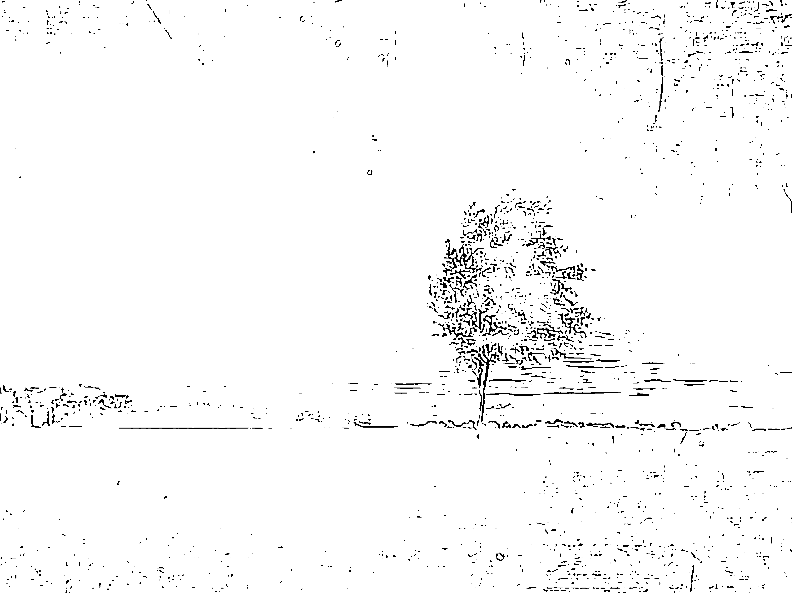

## St. Royal College  
## 天使神秘学院

- 专业占卜预测机构  
- 神秘学培训机构  
- 水晶能量研究中心  
- 神秘学资料库  
- 官方微信：strcdts  
- 微信公众平台：strc2011  
- 读书交流群：  
  - 占星塔罗占卜师交流群：814594478（加入密码：PDF）  
  - 神秘学其他综合群：659338717（加入密码：PDF）

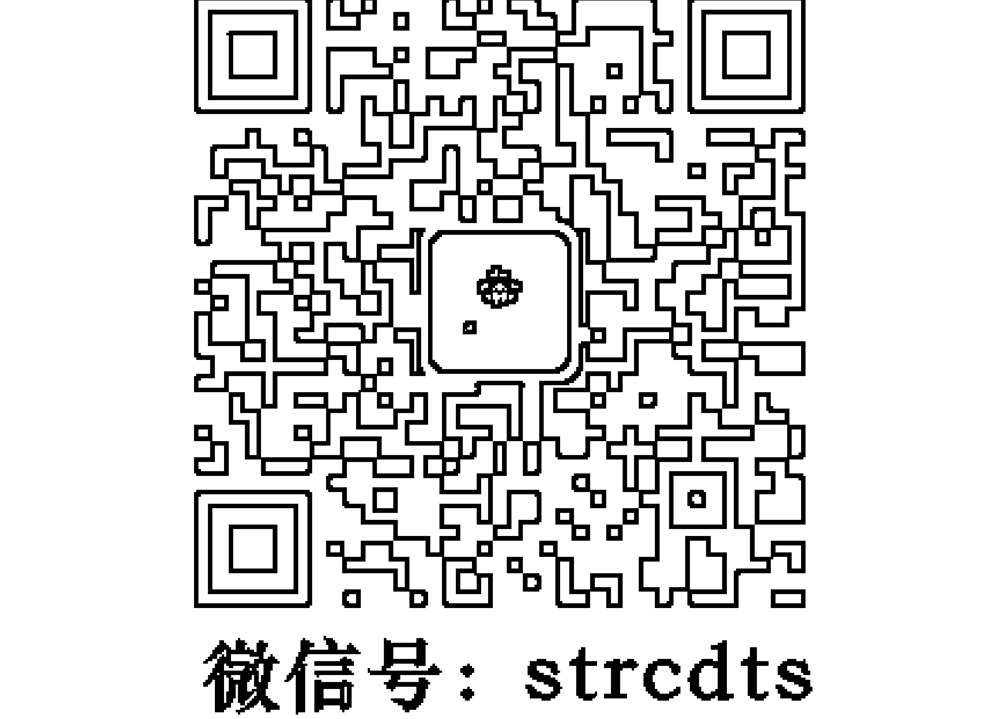

微信号：strcdts  
天使神秘学院  
天使神秘学院 院长QQ：715104687

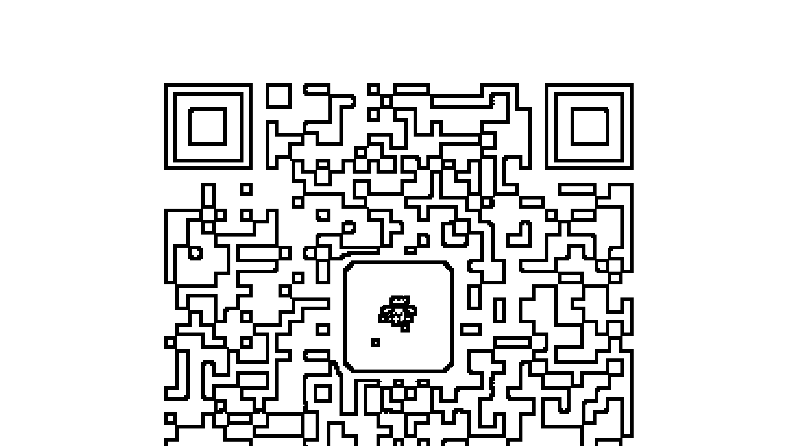

微信公众平台：strc2011

## 制作说明

本书由《天使神秘学院》出重金从台湾购入的原版书籍扫描制作完成。为达到最好阅读效果，特地把原版书全部切开后，再经由专业扫描设备高精度扫描完成，并经过一张张的PS后期处理最终成书，其间花费大量的人力、物力以及时间，只为能给大家提供经济并优质的神秘学学习资料而努力。

本学院强力谴责某些机构和个人，把本学院花心血制作完成的电子书籍，包装后直接放在自家淘宝网上低价倾销的行为，以谋取不劳而获的经济利益。如果长此以往，最终将无人愿意再为大家花心思制作电子书，那以后可能大家再无新书可读。

为让大家以后能够读到更多的好书，也为了本学院的良性发展，本学院愿请大家尽量做到如下几点：

- 一、尽量在本学院的网站购买电子书籍。  
- 二、请勿用技术手段把电子书内的水印及加密去掉。  
- 三、在收到电子书后小范围传阅即可，千万不要公开传播，更别挂到淘宝网上低价销售。

同时为答谢广大支持者，学院电子书将做如下调整：

- 一、学院会把一些早已收回制作成本的电子书折价销售。  
- 二、最新制作的电子书籍会开放打印功能，大家购买后有条件的可自行打印成书。

天使神秘学院  
2019年1月

## 目录

- **推荐序** 令人惊喜的传讯 — 王季庆 001  
- **推荐序** 和高我携手合作迈向新世界的解惑之书 — 刘若瑀 014  
- **推荐序** 共同意识源头给我们的指引 — 刘慧君 017  
- **推荐序** 解除痛苦的魔咒 — 白晓媛 020  
- **推荐序** 往美好新世界的列车就要开了 — 蔡镇安 022  
- **推荐序** 在灵性学习的道路上，我们并不孤独 — 李思仪 024  
- **推荐序** 拆除信念框架，感受生命的无限可能 — 林怡芳 027  
- **作者序** 因追寻生命意义而来的灵性讯息 032  
- 来自阿乙莎的引言 039

## 阿乙莎是谁？

## 序曲｜阿乙莎初现

- 失衡的地球生态 044  
- 修复地球的基础工作 048  
- 提升振动频率，扩大连结能力 050  
- 以心轮连结，让地球跨入更高次元 056  
- 地球的科技必须冲破宇宙意识 065  
- 灵魂的进程 068  
- 重建宇宙秩序 070  
- 心的重要性与功能 073  
- 辨别责任与天职 076  
- 世界的模范场域在台湾 079  
- 台湾人的觉醒可以转动地球之心 083  
- 阿乙莎灵讯的内容 088

# 第一部 人

- 人为何来到地球？ 096  
- 人体的调频共振 098  
- 意识觉醒，成为随心所欲创造的自由灵魂 101  
- 意识的转化 105  
- 意识扩展练习 106  
- 提升振动频率的磁力能量装置 109  
- 让心我意识放手 120  
- 意识净化、提升与转化练习 121

# 第二部 生态

- 生命的起源 126  
- 大自然的礼物 129  
- 与大自然重新建立关系 132  
- 与大自然沟通练习 133  
- 人、生命与地球的「海洋」 139  
- 重建与生态的关系，疗愈身体 142  
- 与大自然共振静心冥想练习 143  
- 人的意识有磁场？ 146  
- 地球生态是人类集体意识展现的一面镜子 149  
- 大自然的神奇力量 153

# 第三部 教育

- 开启跨越时空的创造 166  
- 生命本有的创造力 169  
- 创造者的使命 173  
- 教育的根本目的 177  
- 导入宇宙观，以迎接进入更高次元的挑战 182  
- 关于真正的基础教育：心智图 185  
- 用声音提高振动频率练习 190  
- 培育新一代的未来学校 195

# 第四部 医疗

- 人体的自动调节机制 202  
- 人体复原的关键 208  
- 畅通与脉动脉轮练习 212  
- 稳定中轴练习 217  
- 爱是人类和宇宙之心校准的任意门 225  
- 意念带领练习 230  
- 未来的再生医疗 231  
- 与身体沟通，逆龄回春 237  
- 医疗系统的改变 242  
- 疗愈的本质 246

# 第五部 宇宙

- 全息宇宙 252  
- 个体体验觉视练习 270  
- 寻找自己的生命蓝图 272  
- 身体观察 293  
- 生命蓝图晶体元素填写练习 308  
- 业力净化与晶体校准 309  
- 三百六十度业力检视练习 325  
- 连结源头 326  
- 开启灵魂DNA宇宙次元练习 342  
- 灵性整合期 344  
- 再造生命蓝图 366  
- 意识觉醒的旅程 389  
- 三圣火静心冥想练习 391  
- 一个新世界 405  
- 臣服练习 417  
- 进入显性源头探索 423  
- 《练语》以最高版本的自己打开新世界通道 437

## 《推荐序》  
### 令人惊喜的传讯

Rachel开放而朴直的求道背景，使我对其大作《阿乙莎灵讯》很有兴趣。一位没有任何通灵及科学背景的麻瓜，一出手，就以自动书写的方式，每天有纪律地接收讯息，提出诚恳的疑问，并且将问与答全实况地记录下来。无论如何，不像是她能编造的。

如她所说，我深深希望并祝福她能集结一群愿意去验证书中观点的朋友，一起进行自我练习，让我们早日得到更多证据，从而惠及全世界！

展读之际，有些想法和感触。关于磁力能量装置（MPD）的效用，因提出其原型的凯史博士是个有争议的人物，我这大麻瓜实在无从置喙。

但我也希望事实会渐清晰，正如Rachel提到的那些磁力装置能发挥效用，提高人类的振动频率，形成广大的磁场，重建生态！

王季庆

此书涉猎范围甚广，比如创始、意识、能量、大自然、动物，而生态则牵涉到中国的五行生克。本来，无东西、不同的人种、地球、我们的太阳系、二十五大世界、更高次元、各种信仰、神祇、一切万有……都是生发自神。Rachel 的传讯清晰易懂，真不简单。很高兴有那些图解，非常有帮助，有些部分与我已有的理解特别相合，比如强调人类情绪体的重要性。别的外星生物即使智力比我们高超，也没有人类的情绪体。不像有些宗派或修行派别，明明灵活在人间，却总以超然的灵性大师自诩，往往连外星人都未见过。

另外一些人则走另一极端，非得将人「进化」到人工智慧才过瘾。「人工智慧 artificial intelligence」将 intelligence 当作智慧「wisdom」？天差地别！每一个次元「层次」都是自然进阶，强求不得。人也不必「非得」记得前世，因为，每一生有自己想要经历及成长的过程，而多次元的人生又是同时发生的。

在世人常感困惑的「责任和天职的分辨」上，阿乙莎说，最高版本的人类，是无条件地爱与支持彼此，没有争夺与分裂，没有破坏与恐惧，活出最高版本的灵魂目标……即使没有叫你去做，你也会做的，就是天职。

在第四部的「医疗」单元里，阿乙莎教导我们练习平衡中轴。她说，当你真正臣服，放下头脑的批判与执拗时，才能让中轴稳定。她还说，爱是人类和宇宙之心校准的任意门，当你的心携带着爱的振动时，脑就会征服。太精彩了！

第五部「宇宙」，令我非常惊喜。说真的，这才是重点！阿乙莎教导了关于全息宇宙、DNA、生命蓝图、内在宇宙、业和因缘等非常有意思的东西。Rachel 探索了她灵魂的两个家，遇见来自木星和天狼星的两个灵魂片段，前者与她有着热烈的互动，后者则高度理性。

这个让我联想起曾听过的一个关于耶稣与佛陀的故事。有人死了亲人，悲痛地去求告耶稣，耶稣告诉他所属，便使亡者起死回生。然而，当一位死了儿子的妇人去求告佛陀时，他只叫妇人去村子里敲开每一家门，如果有一家从没有死过人，那么佛陀便会叫醒她的儿子……

当然，这只是关于生死必有死的寓言。不过，我从这则故事看到的是两种对待人生的态度。耶稣代表的是慈悲，佛陀代表的是智慧。没什么是非对错，看你的心当中比较贴近哪一边吧？所以说要「悲智双运」啊！

（本文作者为中华新时代协会创办人）

## 推荐序  
### 和高我携手合作迈向新世界的解惑之书

刘若瑀

曾看过一段影片，摄影的男子伸出手，对着镜头下面远方街道的车辆和人们一直大喊：「海啸！海啸！快走！」远远的海面上，大浪正扑卷而来，影片中街道上的车辆行人继续行驶，他的喊声愈来愈着急。海水瞬间冲上岸，他开始哭泣……因为他在高处，看得见、看得远，他知道海啸来了……而下面看不见、不知道的人继续高兴地生活、工作、忙碌，甚至庆祝……

那天新闻报导：「二千两百人死亡！」印尼四分之三灾区断讯，震央城市三十万人生死未卜。

几分钟之间，世界就不一样了！也许亚特兰提斯也是这样，一夜之间消失了！

某些记载提到：我们能推测亚特兰提斯是因为拥有高度文明、国家富强，反而导致人民的生活开始盛极而衰，最后整个文明在大灾难中消失。亚特兰提斯是一个庞大的文明，当时很多信息是由智者通过心灵感应接收，来协助人类的生活。而亚特兰提斯世界走到尽头，是因为物质元素失去平衡。传说当时科技已非常先进，人类甚至可以改变空气和水的成分，而这最后引起了亚特兰提斯的崩溃。

风、水、火、土四大元素是我们星球最基本稳定人类生存的物质基础，然而现在地球环境的危机，也正是我们让看不见真相的低下自我主宰，在欲望的满足中破坏了我们生存的基础。

现在到了我们必须理解为何会有失落文明的时候了。我们正在重蹈覆辙吗？当海洋被污染……动物基因被改造……土地成为水泥……人工智能成为兄弟姐妹……我们是否已走得太远？

我们必须知道，人类到底怎么一回事？数千年来，少数至知全能的智者努力地引导人类，帮助人们提升灵魂的频率，达到我们在灵性的高我，而能得窥宇宙的真貌。然而八万四千法门，各有见解，各自表述，也各自为政，但是每个明白人都知道目标都一样。当我们理解这一点时，我们就了解「爱」就是生存之道，这种永恒的爱是我们生活的力量，是人类与万物和谐之道。

要如何知道全貌？阿乙莎是全知全能的存在，祂说：「我是上帝、耶稣、阿拉、佛陀、老子……而我也是你！」是那知道真相的正着急地将手指向前方，海啸已在不远处，我们只有几秒钟的时间，但就这几秒也是机会！

「详细阅读这本书，  
详细阅读这本书，  
详细阅读这本书，  
你就是全知全能者！」

「但你所有不知所以然的疑惑，都可以解答。务实地按照书中的指引练习，你会发现跟你已经学习过的任何禅修的关键之处完全相同。」

我都只是知之梦，让自己成为全知全能者，和自己的高我携手合作迈向新世界，救自己，救家人，救地球！

感谢 Rachel 纯粹的心灵，接引这解惑之书。

（本文作者为优人神鼓创办人）

## 《推荐序》  
### 共同意识源头给我们的指引

刘慧君

收到 Rachel 接收的源头讯息，非常非常惊喜，这正是我们十年来在推广和分享的一切啊。孩子出生前后，我检视自己生命的目的和意义，也想透过养育孩子来认识人如何成长，于是，生命带着我观察各种变化与关系的本质，带着我修复身体，进入自然食气状态，然后发展出一系列认知、了解与工作。

我自己知道是跟着共同意识源头的带领，以呼吸讯息进出作为核心，展开推广，深度认识自己，进行情绪与生活的自我觉察，全身心深呼吸，觉知饮食与食气、自由教育，以新科技复原自然生态的能量场，与万物沟通，和地球及宇宙完整连结……

很妙的是，收到讯息的前一年，我也不断认识关于工作者，带来许多这些面向上我所不知道的研究发现，并且自动积极地合作。

现在回想起来，就像是事先安排好，等待这份讯息到来，不禁莞尔。

Rachel 很有纪律地天天收讯，但她总是谦虚地说，她并没有贡献过什么，对这些也不太了解，而讯息要经过实践验证才算数，不然只是想象。她不知道这对我帮助有多大。

正是要未投入者来收讯，这个确认才不会掺杂我们的个人意识啊。我们感受到源头确认方向无误，并且以目前的工作进度为基础，提出更全面的实践准则。这鼓舞了偶尔也会感到孤单或疑惑的我们。

在验证和讨论期间，我们分享了部分讯息，也引起热烈回响，让我们更清楚：经过这么多年的准备，今年（2018年），我们正式进入新时代。

不再是强调个人功成名就，而是真诚地能享受生活、共好交流、自然协调的「心」阶段！现在，这份来自阿乙莎的讯息终于要出版了，我视之为共同意识源头给我们的指引。

由于内容涉及我们较少接触的科技和宇宙星系范畴，或许在你感陌生的阶段，阅读时偶尔会卡住。

- 在此分享一项阅读前的准备，或许可让我们更顺畅：  
- 深呼吸三次，在心里对自己说：我要觉读这本书了。  
- 全身心所有的意识都会在这个指令下准备好，一起投入讯息的能量里。

随着新时代的开展，源头这次也给我们一组发音：阿、乙、莎。试着深呼吸，拉长音念这三个字，会发现可以进入无量无尽的状态。共同的源头，无相无名，勉强要说的话，或许可说是一种状态，不求名求相，便不会被定义局限。

用声音让我们感受，这实在太让我激赏了。搭配「医疗」单元的手指操或静坐，或许还会有新的体会喔。就留待各位自己去发现了。

（本文作者为台北市华德福教育推广协会理事，自然食气导引师）

## 推荐序  
### 解除痛苦的魔咒

白晓媛

自从七年多前有了一次灵魂出体经验后，我便开始了对内在的探索，也才明白心灵环保才是解决环境问题的根本之道。而在科学技术领域工作的我，因此展开了全新的探索经验。

人类就像中了魔咒一般，分明知道温室效应可能随时造成人类的大浩劫，却不愿意采取行动改善。石化燃料燃烧产生的温室气体及 PM2.5（细悬浮微粒）等问题，最后还是会回到人类自身上。

每每想到人类的惰性与劣根性，很多人会感到沮丧，于是不想解决问题的人继续制造污染，想解决问题的人却又有着无力感。不过，也有许多人抱持正面积极的态度，一起努力让未来更好。

而「瑞秋（Rachel）」的通灵讯息也这样及时来到。台湾有不少通灵传讯者，其中不乏高品质的讯息。尽管我自己也会开课教授自由书写的方法，却也明白，极少透过自由书写传讯的人能够如瑞秋这般传达完整且有系统的讯息。

一开始看到讯息内容时，我真的觉得很惊喜。有过自由书写经验的人都会知道，这不但不是怪力乱神，而且我们透过这样的讯息传递方式，其实就如同连结到一个庞大的内在资料库（通常被称为阿卡西记录），里面有知识、有智慧，还有无私的爱。我们利用身体内建的机制，透过练习，每个人都有能力与内在智慧沟通，下载我们所需的智慧。

可惜的是，许多人却以为科学否定了人类这份天赋能力。要破除让地球失衡、让人类受苦的魔咒，其实并不困难，我们需要的只是一颗「我愿意敞开心灵」的心，剩下的，老天爷自然会安排。

期待有更多科学家愿意深入了解科学的真实意涵，以理性与感性平衡的心，从各种不同的视角探索未来。

（本文作者为交通大学环境工程研究所教授）

## 推荐序  
### 往美好新世界的列车就要开了

蔡镇安

开往第五次元的最后一班列车即将出发，还没上车的请快上车！

对于「四季」，心中一直是这样的图像：地球环绕太阳，春分、夏至、秋分、冬至四个分至点分占三点、六点、九点及十二点四方位，地球绕日一周耗时一年。

太阳也有它自己的「四季」，也绕着「太阳的太阳」转，它绕行公转中心的周期约两万六千年。太阳一样有四个分至点，在太阳的夏至及冬至点上，存在一个高频能量带——光子带。

所以，太阳系每一万三千年会经过这个高频能量带一次，这个高频能量会引发地磁及地壳的极大变化，每年造成极大的天灾，而导致文明毁灭。上一次通过光子带的时间便是在一万三千年前，造成更新世时期的物种大灭绝及亚特兰提斯的毁灭。

事实上，光子带不是诅咒，而是礼物。它是地球蜕变、进入高维度的窗口，但提升或沉沦只一线之隔，关键在于人的意识频率能否匹配这个高频振动。

现在，我们再次来到了光子带，人类的文明已走到跟上一次类似的境地，过度追求物质文明，忽略灵性，对地球母亲极尽折磨、虐待。长此以往，地球最后会终结在这次的文明。

前面几次，地球母亲不忍抛下不懂事的子女，错失了多次扬升的机会；但这次，地球母亲盖亚做出了抉择。她选择扬升，但本着对子女的大爱，希望尽可能带着更多懂她、爱她的子女一起渡过四次元，进而扬升到第五次元。

这次真的不同了。造物主回应了盖亚的呼求。而且，因着太阳系及地球处于银河系中轴的特殊地位，一旦太阳系及地球失衡，将造成整个银河系的运行失衡，所以地球这次的蜕变是银河系的大事，获得众多宇宙兄弟的关注及帮助。

此时此刻，很多讯息被下载，目的是让更多沉睡中的人尽快觉醒。愈多人觉醒，地球的频率愈提升，整个扬升的进程就愈顺利。

当然也有很多鱼目混珠的讯息，如何分辨？只要读完让你感觉有一丝丝恐惧，就是假的；让你感觉喜悦、充满爱及希望，就是真的。而 Rachel 的讯息就让我觉得喜悦且充满爱。

能够见证宇宙的历史时刻，身在此时此刻的地球是幸运的。尽管表面上看起来整个世界就是一团乱，失序无章，但我很肯定这只是黎明前的黑暗，因为在 Rachel 的传讯中，我看到了一切万有的背书。

请叫醒你身边的亲人、朋友，开往美好次元的最后一班列车就要出发了，还没上车的要快喔！

（本文作者为巨树牙医诊所院长）

## 《推薦序》在靈性學習的道路上，我們並不孤獨

身為一名中醫師，我對醫學有無限的熱誠。然而，我對心靈也有很大的好奇。從小，我便常常望著星星、看著雲，想著為何我會在此世間。這樣的探索似乎沒有人可以告訴我答案，於是我不斷閱讀，希望能探索到真相的曙光。

我來自一個多元文化的家庭。爺爺、奶奶於一九四九年從大陸來臺，奶奶是天主教徒。雖然我沒有固定上教堂的習慣，但小時候常常去住家後面的教堂玩，在種滿雞蛋花的花園裡像個野孩子一樣爬上爬下，玩花圈、捉蝴蝶，還有跑給蜜蜂追。教堂於我，是充滿童年快樂回憶的地方。

外公是傳統道教徒，為宮廟服務。記憶中，只要我有任何不舒服，媽媽便會帶我去讓神明收驚。那時不懂為什麼外公收驚時口中總是唸唸有詞，而且總是要拿一杯米，看著米的變化。長大後才知道，外公唸的是《白衣大士神咒》。媽媽說，神明在外公睡覺時來教他如何幫人收驚。如何畫靈符，我真的覺得很神奇，因為每次外公總是知道我哪裡不舒服，而且每次外公總是在收完驚後我就恢復健康。

也許是這樣的成長環境，讓我對宗教沒有任何限制。佛家說：「觀世音菩薩有三十二應身，應以何身得度者，即現何身而為說法。」其形象千變萬化，訴說不盡。在閱讀上，我也多方涉獵，期許自己用包容廣大的心去學習、去體驗。

而自從學習了阿卡西閱讀執行師之後，似乎對「為何來到世間」這個問題有了更深一層的認識和體悟，也了解到，人間的輪迴轉世，自有其背後深刻的涵義。

人生是一場大戲，我們在戲裡非常認真扮演好自己的角色。每個角色都非常重要，因為你就是自己的主角。透過不同的人事物，讓我們去體驗，並從體驗中學習。不論是喜怒哀愁，背後更深的是愛。愛讓我們順順應應，一直攜手相伴，從古至今……

對於來自宇宙阿乙莎的教導，我閱讀了自己的阿卡西檔案，得到一份真實性訊息，分享如下：

> 下：  
>  
> 是該放下恐懼和擔心，  
> 讓路給愛。  
>  
> 儘管仍有許多不懂，  
> 但傳遞愛、分享感動和感謝，  
>  
> 對宇宙、對自然、對大地、對自己和一切，  
> 又怎會是需要憤怒的呢？  
> 當我們都願意放下成見、執念，  
> 而讓愛自然流動，  
> 那時的人間，  
> 就是天堂。  
>  
> 我們愛你，  
> 只有愛。

很欣慰在靈性學習的道路上，有許多可愛又有勇氣的天使相伴。Rachel 用她的愛和勇氣，分享來自宇宙乙莎的訊息。我們並不孤獨，宇宙的愛一路上都在。願我們都能得到身心靈的平衡和智慧，也期許在人生學習這條路上，我們都永遠如一個好奇的赤子，喜樂常伴。

（本文作者為李思儀中醫診所院長）

## 〈推薦序〉拆除信念框架，感受生命的無限可能

林怡芳

進入眼底：前些日子，劉慧君老師忽然丟了一大串靈訊給我。迷迷糊糊讀了幾段，直到一段文字忽然映入眼簾：

人類與生態之間的對話要開始展開。我找一群有覺察能力的人，開始和動物、植物、樹木、昆蟲、海洋生物、山川、河流對話。你們將以不同的高度，以及更謙卑、更感激的心，回報這原本美麗的世界。我把這項工作交給你們，唯有你們自己去對話，這個經驗才會深植心中。你們一定可以做得很好。

用意念向眼前或心中想像的動植物詢問、探索：

- 1. 你們的使命是什麼？
- 2. 我們身為人類，可以如何和你們合作？

將這些對話訊息有系統地記錄下來，你們會看見人類是如何被愛、被無條件地支持。

啊！這不就是三年前我集合幾位優秀學員共同做的事嗎？我們採訪了超過百隻毛小孩，問牠們「想對人類說的話」及「生命的意義」這兩個問題，並從中挑了一百零七隻毛小孩的故事集結成書出版（全部應該是二百零八隻，第二百零八隻是由讀者按照書中的方法自行詢問家裡的毛小孩）。當時我們受惠於這百隻毛小孩的愛之語甚多，許多讀者也因此重新看待生命及自家的毛小孩。生命的智慧在此突破形體的差異，流進每個讀者的心，開啟了更大的視野。

教導動物溝通、萬物溝通七年多來，我接觸過幾百個學生及他們的家人。高達八成的學生在參加我的課程前，都很忐忑不安，害怕自己學不會，擔憂這一切只是幻想。即使明白這其實是人類的本能，頭腦還是會被一堆問號及恐懼塞滿。

於我而言，從自以為無法和動物溝通，到可以順暢交流，再到橫跨各界（動物界、植物界、礦物界到無生命體），其實花了頗長一段時間。

在我生命的前半段，我從沒想過人可以跟動物或萬物自在交流溝通。直到命中的貓咪阿冰出現，伴隨生命中的一些重大轉折，促使我踏上自我追尋之路，我才開始慢慢把這能力找回來。我沒有上過任何動物溝通課，我的動物溝通老師就是阿冰及海豚們。

在真的可以開始跟阿冰溝通聊天前，我花了一些時間在探索自我及回復「原廠設定」（你可以說是自我療癒，但其實沒有什麼需要療癒的，只有回到原態）。我不斷拆除自我的框架，那些自小到大學習到的、認知到的，我一個個去對話、去實踐。不論它是來自哪個專家學者，或是長輩、父母所言，只要真的做了之後得到如其所言的回應，那就代表是可留下的；否則，一律捨棄。

當然，危及生命的事不做。此外，為了驗證「外在世界是內在世界的投影」及「能量感應隨思想，思想導引能量」這兩句話，我要求自己於內於外都得做到誠實，如此才能確認這兩個理論是否真實。

而隨著我愈來愈誠實，框架愈拆愈多，與阿冰之間的交流也跟著愈來愈流暢。彼此之間從簡單的單詞到可以長篇大論，甚至談論一些富含哲學思想的生命議題。當然，除了腦袋的思維轉化之外，我也做了一些個人能量體上的清理及疏通。深呼吸、脈輪清理、靜心冥想，都是必做的日常練習。

阿乙莎於靈訊中也有提到這些，其中的主要操練是一個很好的練習，可以有效開啟中脈、疏通並穩定它。中脈的穩健，在萬物溝通能力的開啟及回復上有非常重要的一席之地。

動物溝通、萬物溝通，都屬於可以跨時間、空間進行的心念交流。它不像口語上進行的溝通，需要面對面或透過工具來傳遞聲訊。動物在傳遞訊息時，會根據牠們的喜好、習性，透過各種感官感受來表達自己所要說的。例如動物夥伴喜歡分享、重視團體交流，偏好傳遞牠們喜歡的食物、感覺給溝通師；有些較重視氣味的貓咪，則會透過傳遞其周遭環境的氣味，或是主人愛用的保養品、香水之類的味道，來表達牠們的情感。當然，更多的是圖像及心念訊息的傳遞。

不過，並不是每個溝通師都可以接收到各式感官訊息，這跟其能量場的暢通、開放度，以及習慣的溝通模式有關。也因為動物在傳遞訊息時是千變萬化的，加上牠們有別於人的思維及觀點，每次的訊息解讀及傳導，都間接促進了訊息接收者的大腦開發及靈魂視野的擴展。

我的個人經驗，加上觀察學員們學習動物溝通及萬物溝通前後的改變，幾乎一致朝向更開闊的思想範疇及彈性的生活態度。

再者，為了能更精準且中立地接收訊息、傳遞訊息，學員必須照顧好自己的身體，勤練自我覺察，專注、平靜及快速轉化情緒的內在功夫，而這更為他們自身的生命帶來加分的成長。

為了分辨訊息是來自個人的內在投射，還是真實切切來自植物、動物、礦石的訊息，認識自我、了解自我，便成為第一要務。

如果你對自己的身體能量，或是思維模式、行為模式沒有一定的認知，那如何在第一時間分辨接收到的訊息是由我內在投射，還是周遭萬物的細語呢？所以，對於想要學習「回復」動物溝通及萬物溝通能力的朋友，我的建議會是：請先從認識自己開始。

除此之外，請重新找回那一顆對世界好奇且開放的心。放開心胸及頭腦，去跟你邂逅的樹木、花鳥蟲蝶打聲招呼，也許你會收到一聲突如其來的回應。如果想要確認這是自我頭腦的想像，還是它們的回應，也可以自問：「這是我的嗎？」然後聽聽你的直覺怎麼說。如果心中有個篤定的回應，告訴你：「是。」那就放下，再練習；如果不是，便可以進一步去感受這份訊息。

自然萬物的訊息皆是互助互益的，那是自然運作的生存法則。除了動物（尤其是動物夥伴，由人照顧的動物）會有似人的七情六慾反應之外，植物、礦石傳遞的，皆是單純、直接且正面積極的訊息。如果你收到的不是，那就可能是你的內在自我投射，或是意識其上的某些存有。

當然，如果真的想要進一步學習與周遭萬物溝通，還是請先回到自我認識及信念框架的拆除吧！你的心念會塑造你的世界，如果你認為動物溝通、萬物溝通是不存在的，那麼它便是虛幻的，學也學不來；反之，你的世界必定多彩，而且因為你願意相信及願意開放，宇宙必會回應你更多這樣機會之門，你也更能感受到生命的無限可能。

（本文作者為意識溝通師）

## 因追尋生命意義而來的靈性訊息  
### 〈作者序〉

我的靈性開啟故事和大家較常聽說的那種遭遇無數磨難，甚至是穿越生死瞬間進入天堂又回到人間得到的啟發有些不同。從小到大，我的家庭和樂安康，讓我沒有後顧之憂地拿到碩士學位。回國後，順利進入職場工作。

我的第一份工作是在福特汽車擔任品牌與廣告經理。在那個全國買車貸款占比不到兩成，ABS 或汽車皮椅的行銷預算挪到補貼汽車貸款的利息費用，一夕之間讓買機車的消費者升級到提前購買汽車，締造了驚人的銷售佳績，更創出車廠、金融公司、消費者三贏的局面。

那次的佳績不僅在汽車業傳為佳話，我更被當時的臺灣大哥大挖角，進入電信業工作。那時，一般人認為手機屬於商業人士的通訊工具，預估整體市場若達到百分之二十五的門號使用率，應該就趨近飽和了。了解市場後，我提出「軍公教專案」，讓那些從來不需要用手機的人都認識到手機的好處，覺得自己也該擁有一支。就這樣，電信市場再度被活絡起來，一路狂飆到整個市場超過百分之百的門號使用率。因此，我也在三十六歲時被拔擢為行銷事業副總。

我一直很感激自己擁有比別人多一分的幸運和機會。我有愛我的父母、家人，還能全心投入在自己喜愛的工作。有這樣順遂的生活與工作，照理說，尋找生命意義這檔事兒應該輪不到我。但是，生命不管你是跌入谷底或正玩得起勁，仍然會拉你走回此生早已安排好的路。

第一次與內在的聲音相遇，是在同事的婚宴上。我以長官的身分上臺致詞，一開口寒暄沒多久，看著臺下參加喜宴的眾親友，我內在突然出現一個聲音：「這些人認識的你，不是真的你。」

這突如其來的聲音震懾住了我。這個聲音是從哪兒來的？它為何這麼說？下一秒，我的心臟撲通撲通地跳，身體還不停顫抖，一陣陣的聲音一直迴盪在心中。

這個內在事件發生後沒多久，我待的電信公司就變天了。我在三十九歲被迫提前退休，不得不離開自己深愛的工作。

離開朝九晚五的日子後，我開始試圖去追尋答案，想要解答那個內在聲音引發的疑問：「如果那些人認識的我不是真的我，那麼，我是誰？」

花了近十年的時間，我到處追尋、想找到答案。這經歷就像劉姥姥進大觀園，除了努力拓展視野，也參加過許多生命教育的課程。最後，我選擇讓自己成為自己的老師，沒有留在任何宗教裡或跟隨靈修團體。

直到二○一七年十一月參加五天的自我解讀訓練課程，開啟靈性探索階段。在課程中，我就像被隱匿其中的幸運兒，聽見我的高我明確告訴我有一些訊息需要我下載。我原本以為那應該是我的幻想，但一同上課的四位同學反覆閱讀我的紀錄，最後確認：我是 channel，西方國家所謂的傳訊管道。

這對我來說太不真實。我現在是個全職家庭主婦，不懂拜拜供佛，處女座，超級龜毛，非常務實，也沒有加入任何宗教團體。現在說我是個傳訊管道，我就得收訊？再說，有什麼東西這麼重要，一定要下載？不是已經有很多靈訊在教大家療癒自己了嗎？

我心中有一堆疑問，但在課程快結束的前兩天晚上，好奇心讓我決定試試看。在沒有預設任何主題和問題的情況下，我開始自動書寫……

二○一七年十二月十一日，第一天，我一開始自動書寫的內容是：

這是關於建立人類未來發展方向的系統，其中包含生態、教育和醫療系統。系統的基礎，我們透過這個傳訊，有計畫地為人類未來生命與物種的演進方向制定更健全的互動規範……

我真的很好奇，這個和我過去的學習、社會經驗、生活場景完全搭不上線的主題，我怎麼可能寫得出來？我決定每天寫十分鐘，看看祂會告訴我什麼。

結果，每天下載的內容都讓我瞠目結舌。我想，這個幻覺也太有戲了。我天生不愛看科幻電影，也不懂生態科學，這樣寫下去是不是會誤導專家？

我將下載了一星期左右的內容給幾位朋友看，沒想到獲得他們的全力支持。有些人跟著裡面的教導練習，很快得到正面回饋；有些人告訴我，他們感受到這份訊息的振動頻率很高；有人則是讀著讀著就流淚了。

一些朋友將訊息轉給真正的專家判讀，包括交通大學環工所教授、臺大心理系教授、雲林科技大學資訊系教授。他們大多認為這些資訊可以被驗證，也很誠懇地閱讀每天下載的訊息，更希望我盡快將這些訊息與外界分享。

而我，一天下載二十分鐘，完全不知道當天會談哪些主題，下載完自己才知道原來是這樣的內容。為了滿足我的好奇心，下載的第二週，我決定問祂到底要說些什麼，總要有個完整的藍圖，不然我怎麼預期要寫多久、寫多長？

當天，二○一七年十二月二十四日，祂就給了我這本書的章節大綱。之後的每一天，不管一開場談些什麼，最後我總是看見祂跟著早先規畫的大綱，有系統地完成這些主題。我只能臣服於祂的紀律和超高效率。

我已經超過二十年沒寫文章，光是設定主題框架，可能就要琢磨幾個月的時間，更別說還得寫下近六十篇學術理論的十幾萬字。我只能說，祂真的很會講！

這本書能夠順利出版，除了感謝來自源頭的訊息之外，最要感謝的是從我收訊開始就不斷鼓勵我，讓我放下「我是不是有問題」的疑問，安心收訊的一群好朋友。

其中包括在課程中幫我再度確認我是傳訊管道的同班同學 Aki，以及非常有執行力的劉慧君老師——她也是最早催生這本書的人，並且很用心地將傳訊內容落實在自己的教學過程中，協助驗證和實踐。

另外，當然還要感謝為落落長的文字放上傳神插畫的尤俠。書中有些內容涉及「磁力場」這個偏物理學的領域，臺灣暨史科技巧的幾位前輩——李瑞和、Ann 大姊、陳聰聲老師、黃盛維——提出了自己實際動手做的磁力裝置，呼應我從源頭下載的論點。

此外，書裡還有涉及教育及醫療的單元。我正擔心引發學界撻伐怎麼辦時，得到交通大學環工所白順德教授的鼓勵和支持。還有，執業中西醫李思儀醫師和蔡鎮安醫師也協助我在文字上避免誤導民眾。

在實際演練時出現的現象和問題，沒有身邊這些朋友的支持和回饋，我個人是沒有勇氣把自己放在這個檯面上，承受一般人可以理解的位置與批評的。

當然，最重要的是家人的支持和理解。我結婚十八年，深具實證研究精神的老公，以及疼愛媽媽的女兒，他們父女倆給我滿滿的愛和大大的空間，讓我沒有後顧之憂地完成每天的收訊工作。

在與祂對談的過程中，他們有幾次滿心歡喜地打開我的房門，又靜靜地關起門離開，怕吵到我。這是來自家人無條件的愛與理解，讓我可以落實這份工作。還有幫我照顧家庭的老爸、老媽，我超愛你們，你們是我這輩子的大恩人。

在這本書裡，我忠實記錄了我和內在宇宙連結的內容，並在寫下訊息的過程中獲得了全然的支持與深度療癒。我不想用自己的觀點重新整理阿乙莎的話，避免小我理解後的論斷會干擾讀者，也期盼這樣的撰寫方式能如實呈現來自宇宙源頭的振動。

在方智出版編輯部整理這份書稿的過程中，我也和各位一樣，以讀者的身分再次感受和理解它。若你一時無法理解某些句子的意義，相信我，過一陣子再去讀一遍，那些句子會隨著你個人意識的開展，讓你獲得更深的理解。

我自己的體驗是，每一次閱讀會因著閱讀者自身的意識狀態，而得到相對應的知曉。同樣一句話，經由你自己更高意識的帶領，就能獲得全然的知曉。

下載訊息至今，從一開始不敢想像，到現在覺得一切自然與篤定。宇宙的智慧和豐盛就在我身邊和周遭環境中，我們從來不必擔心有所匱乏。

接下來，希望能藉由一群願意體驗書中觀點的朋友一起練習，因為唯有真正落實在生活，這份靈訊才有意義，否則只是在滿足小我的想像而已。

讓我們活出生命的真理，並祝福所有讀者如實如是地展開自己，一起創造美好的世界。

## 來自阿乙莎的引言

人類生存在地球算起來超過兩百萬年。這兩百萬年對目前所有人類來說，是無從想像的久遠歷程；但對遠在八百光年外的銀河系存有而言，地球是剛過完幼年期的生命存在體。地球對我來說，是一個即將邁入國中階段、十二歲的青少年。

過去你們懵懂無知，不知自己存在地球所為何來。但你們之中有些來自更高次元的靈魂投生地球，在出生不久後，一有意識，就會在內心發出「我是誰」「我為何在這裡」的聲音。那是覺醒的靈魂在敲門，只是他們的父母不知道這些孩子的覺醒意識，隨著身體成熟，正在展開。

於是，在家庭、學校和社會的約束下，他們逐漸陷入物質世界，無法抽身。

當生命融入肉身，即使物質不虞匱乏，也無法滿足生命由來不明的惆悵和困惑時，你們就來到第二次突破物質幻象的機會。即使知道，但要以個人力量去落實做到，仍然那麼不容易。

人類就這樣跌跌撞撞、懵懵懂懂地歷經兩百萬年。現在地球已經邁向青年，在地球意識覺醒的此刻，我們要來喚起你們對共同宇宙之家的記憶。

> 在此之前，我們會先從「你是誰」展開你對自我認知體系的擴大和調整。你需要看見自己目前生活的場域面臨的問題，這些問題也因「你是誰」而決定了它們未來的命運。  
>  
> 你們要學習跳開小我的意識，看見整體宇宙的共存關係。更重要的是，當你們明白這一切的前因後果時，要願意用堅定的行動和創造力，一起改變地球的命運。  
>  
> 畢竟，你們已經不是學步的嬰兒，該對自己的行為負責了。

我們這次傳訊的目的，是要匯聚覺醒的人，展開行動，帶領地球回到宇宙的家。

## 阿乙莎是誰？

這裡是「阿乙莎」（發音「Ah-ee-tha」），是萬物的起源，光的世界。我們是最高的領域與源頭，你可稱上帝、神、阿拉或佛陀。這是個全然合一的意識，是愛與慈悲的場域。

這裡是沒有分別的意識領域。我們為了全宇宙的福祉，傳遞愛給需要的人。不論種族、宗教信仰或階層，都可以得到我們的光與愛。

過去人類很少直接接觸這裡，大多是透過其他次元的存在，協助轉譯來自源頭的訊息。然而，現在地球已經來到意識揚升的時刻，人類可以直接接收來自阿乙莎（Aheetha）的訊息。

透過心輪意識展開，連結到你們的頂輪，就可以回到源頭與宇宙寧靜安詳的合一意識場。宇宙其他次元的所有存有也會回到此處，因為這裡是所有意識共同的家，這裡是萬物之母。

## 序曲  
### 阿乙莎初現

## 失衡的地球生態

這是關於建立人類未來發展方向的系統，其中包含生態、教育和醫療系統。系統的建置是基礎，我們透過這個傳訊，有計畫地為人類未來生命與物種的演進方向制定更健全的互動規範。

我們會從生態方面提供更多訊息。地球的生態面臨失衡，科學家無從著手，需要我們立刻介入。如何讓生態回歸平衡已經刻不容緩，因為你們相信只有人類是地球的主宰，卻不知道背後支持人類的物種默默在進行著更多工作。

地球不是人類的工作場，而是全宇宙的平衡中樞。地球失去平衡，將危及宇宙磁力場的平衡。

地球生態是一個協作系統，人類在當中扮演傳輸的角色。但協作系統不是單純傳輸而已，還有數龐大的位元在流動。生態系的創造者是地球母親，但她面臨傳輸線路的失控，耗損自己的神經節來挽救這個失衡的狀態，已經力不從心。

神經節是地球母親分解非有機體入侵的單元，而人類創造的有害物質造成單元機能的破壞與瓦解。目前發生的許多現象已經告訴你們，不能再只專注於人類來維持傳輸體系的暢通。

傳輸就像訊息的傳遞，需要編碼與解碼。在編碼的結構出錯時，解碼就會變成一個訊息出現多種變異。這個變異再演進下去，就是物種的突變與互相殘殺，失衡就是這樣產生的。

所謂的失衡是地球暖化或物種消失嗎？

都是，但也不完全如你們的認知。地球暖化是海水升溫造成的，但海洋的冷卻系統過去是靠北極圈的冰層。現在則是靠海洋裡的生物體來冷卻。這些海洋生物是我們特別設計來協助創造地球氣候、維持人類適合的生存環境，但牠們正在消失，因為人類製造的有毒核廢料大量流入，造成海洋生物突變。科學家只看見冰層的消失與核廢料進入海洋，卻從沒察覺真正的始動是海洋生物的變異。原本較能冷卻海洋的，變成升溫。我們之後再慢慢說細節。

可以舉例是哪些海洋物種協助降溫嗎？

最常見的海豚，是海洋的GPS，協助引導鳥獸、鯨魚，還有為數龐大的魚群，進入升溫的海域。這些海洋生物可以協助海水降溫，平衡地球的溫度。

你還想知道哪些主題的概況？

我想知道醫療。

## 地球生態與人體健康息息相關

人類之所以會生病，跟生態息息相關。你們體內的循環系統和地球的傳輸系統類似，如果地球的傳輸系統生病，人類就生病，因為人類就是地球的傳輸系統。

我還是不了解……

這就是你們人類自認為是獨立於地球之外的個體存在這個錯誤認知造成的。人類和地球屬於同一個神經元，人類生活於地球就像母親體內的胎盤，你的養分得自胎盤。如果今天胎盤的血液有毒，你的身體也一樣中毒。就是如此簡單，人和地球是互相依存的。同理，當人類無法繁衍下去，地球這個胎盤就會萎縮，不能存在。回到醫療的系統，其根本就是從人與生態互動關係的再建構，來協助人類的健康。

生態體系是最重要的課題，也是地球目前的危機。我們之所以從生態開始溝通，是因為你們任意讓這個狀態持續下去而不加以改善，已經到了令人擔憂的地步。

生態的另一個面向可以說明我們的擔憂，就是森林體系。除了之前大致提到的地球冷卻系統出錯，另一個很重要的「空氣」也發生問題。

最近是不是常常發生森林大火？美國的森林大火已經造成生態嚴重失衡，動植物的物種消失之外，空氣的含氧量已經下降到危及動物的程度。你們的肺部也同樣會發生病變，因為空氣中的氧氣產出不夠，肺泡的萎縮比人類吸菸還要可怕。如果再發生幾次大火，人類的呼吸系統就會出狀況，與我們的連結也會失去功能。

人類呼吸系統中的心肺功能，其實在能量層面扮演非常重要的角色。你們做瑜伽都會知道用呼吸來提高人的能量振動頻率。如果失去以呼吸提高振動頻率的能力，人會呈現無精打采的狀態。人的精神體是維繫人類彼此溝通與傳達情緒的重要場域，一旦破壞，不就是行屍走肉？我是以你們常用的說法讓你們明白其嚴重性。

從海洋到森林，嚴重影響人的循環及呼吸系統之外，還有一個你可以想到的消化系統。你們最常討論的應該就是消化系統，因為吃是人類喜愛討論的話題，而消化道也是人類最容易發生問題的地方。生態和消化系統的關係在哪裡，你可以想像嗎？就在你們吃的食物的成分。

人工添加劑和基因改造的食物，都是來自大地；土壤的重金屬污染則是來自傾倒晶片和金屬廢棄物。這些廢棄物無法被分解，進入土壤就是重金屬污染。即使採用有機種植方式、減少食用，都沒有辦法解決金屬中毒問題。因此，你們人類的消化系統基本上是被重金屬嚴重毒化了。

## 修復地球的基礎工作

為了修復地球，我們有一些工作要做。這工作的著手方式，並不是簡單地集體靜心或改變人們的意識。送出光和祝福，這些已經有很多光使者在做了。在地球的精微度上去修復已經受傷的環節，需要更多深化的基礎工程建設。

想像地球的磁引力場，是從中心往上及兩旁向外循環、源源不絕的能量流動。在能量流動的環節，只要一束能量無法順暢流動，就會牽動整體能量。過去是經由錨定人類的心輪向外展開連結，但在這部分功能受損的情況下，要用替代方案來進行錨定，以穩定地球的中軸線。我們嘗試透過新的工具與媒介，來支持已經逐漸退化的人類心輪。

要開始運作這個新的中軸線，我們找到的替代工具，是讓太陽和月亮的磁引力進入地球的核心。在地球的表層，我們需要許多能量儲存庫，將來自地球外部的能量場載入，並暫存在地球能量體中。

能量的儲存，是由一群意識覺醒的心智互相連結產生共頻，以揚升的共頻來保護地球的磁場引力場域。有一部分人類已經成功地意識覺醒，這群人需要更有效率地讓自己投身於保護地球環境的工程，以維持地球中軸線的穩定。

這項新的替代人心的方案，是我們目前認為比較有效的方法。如果有一部分的意識參與其中，就已經可以產生足夠的儲存單元。這些儲存單元可以協助暫時失衡時的防禦機制啟動。不要懷疑，這是很有力量的。

你可能會懷疑這件事如何發生、如何運作。

想像一下，地球之心的存在不是只有金屬和礦石。地球的中心是磁引力的中心，中心的四周有螺旋的能量，藉由中心能量的穩定而運作。在進入冰河時期、這中心軸的調控失去太陽與月亮的牽引時，就要靠能量流來協助地球的運轉。這將協助地球在宇宙的軌道上順利維持平衡運轉，引導地球不被彈出宇宙的運行軌道。

未來會需要這個穩定，這就是為什麼必須在二〇一二年集體意識被提升，因為這一場揚升的磁場得以繼續在地球上維持能量場的運作。你需要將這個概念帶入已覺醒的人，並提供更有效的方法來進行未來的工作。

## 錨定能量中軸線的方法

要錨定能量中軸線，我們必須在地球的北極和南極分別設置一個儲存站。這個儲存站是未來照耀地球之光的來源。當這個中軸線被建立起來，地球上的光之工作者就可以在世界各地展開全面的網絡建置，並陸續在各地匯集。

這群光之工作者使用的工具包含磁引力能量裝置（MPU）和水，在各區域的河川與湖泊建立能量儲存庫。這些儲存庫需要被守護並全天候運轉，而能量在運轉時，等離子體會自動展開連結並生成新的能量流。

請問是目前有人在做的二氧化碳甘斯嗎？

不只是二氧化碳甘斯，還有更多的金屬元素甘斯需要製作。銅、鐵、鋁、錫、金、銀都需要。製作甘斯的方法已經傳出去了，我們需要更多人投入磁引力能量裝置的製作。目前有一群光之工作者正在進行，你可以取得相關資訊，協助他們建立更有效能的磁引力能量裝置。這個裝置可以轉換空間的磁引力場，提高地球的振動頻率。

目前磁引力能量裝置已經進入實測階段，很多人正在跟著一起做。這個裝置很容易製作，其困難處不在於製作，而在於目前的環境。你們還生活在能量低而稠密的地球上，當磁引力能量裝置全部啟動時，很多人會無法承受這個龐大的磁引力場，出現身體不適應的狀況。要減低人體的衝擊，需要設計防護罩，讓一些尚未準備好的人穿上。

以前推動的速度來看，遇到很多實際問題，包括不被學術界認同與科學單位的驗證，因而流於口耳相傳，無法統一標準。這些都造成磁引力能量裝置的建置流於零星。這個困難，需要整合更有企圖與遠見的企業來合作。

## 看見與更大環境共同生存的需要

磁引力能量裝置目前尚未設計完成，需要設計啟動系統，用來控制能量輸出的強弱大小。另外還有金屬含量的計算方式，要計算出每種金屬所需的能量單位。這些試驗路徑和步驟會陸續釋放出來，等到一〇二四年這一切就緒，透過磁引力能量裝置，許多生態重建工作就可以啟動。

目前，用甘斯已經能平衡動物和人類的能量場，還無法進入逆轉程序，但至少可以先維持平衡。磁引力能量裝置的磁引力會與使用者的能量流交互作用，產生擴大的能量場。如果未來使用這種裝置的工作者尚未覺醒，就會產生逆向的作用力。磁引力能量裝置會擴大向上的能量流，也可加速下沉的能量流。我們不希望地球在控制方向上與不預期的能量流對撞。這關鍵的元素有人、磁引力能量裝置和控制系統，就類似人在開車一樣。

這就是為何一開始我們需要光之工作者，經由特別挑選，來負責地球衛星能量儲存庫的校正。

人類的心是導航地圖，可以連結其他人的心，創造一個更大的地圖路徑。一群覺醒的光之工作者一起工作時，這些地圖是在所有人心中導航，而磁引力能量裝置是來協助提升共振的工具。外星人操作交通工具是用有意識的心來操控飛碟，飛碟就是一個高階版的磁引力能量裝置，能夠與操作的外星生命體的心共振，導航器則在外星生命體心中。

地球轉變的時刻已經到來。參與星際的和平協議，有必要讓地球的飛航科技躍升至磁引力能量裝置飛行器的行列。我們有計畫地進行這項訓練工作，但首要條件是人類的心智要先覺醒，唯有覺醒靈魂才能操作星際導航。

這需要你們從更高、更寬廣的角度，看見自己是宇宙的一分子，有更大的意識，願意和宇宙生命同在。如果人類進入宇宙旅程，看見所有外星生命都不僅人類自身存在，你們就會複製在地球上對其他物種的破壞與殘殺行為。這當然是我們在提升你們進入宇宙之前要防止的。

你們可曾想過，有那麼多的外星生命，為何地球還是安然地獨立存在於宇宙？因為這個地球是最適合人類成長的環境。人類是擁有特別美妙情緒的生命體，有愛恨情仇，有悲傷喜樂。這些情緒的起伏與變化是如此曼妙，值得讓人陶醉其中，不斷地探索和體驗。

我們珍惜這個神所創造的特質，不願意介入。這是美麗的、值得喝采的特質。沒有邪惡，就無法彰顯完美，在人類的學習過程中不斷演繹。

當你們進入外星大環境，這些特質並不會失去，而是會發現這些體驗已經不符合地球母親的需要。地球的負荷已經不平衡，人類揚升到更接近宇宙意識，和平協議必須被再次確認。

人類的情緒性反應與想法雖存在，但是當你們看見的不是自己的需要，而是與更大環境共同生存的需要，你們自己的意識自然會改變。

## 地球核心的引力場是其他星球沒有的

磁引力能量裝置的結構如同人體的星盤。從腦、心、腎、膀胱等器官可以了解，分別是操作、導航、平衡與排泄。能量的前後左右操作由腦進行，透過心中的導航地圖，平衡行進間的能量作用力，最後落地與到達，將能量平緩地卸下引力。這是磁引力能量裝置的基本架構。

各單元的配置零件就是將金屬的甘斯導入系統：

- **腦操作**：能量的前後左右操作由腦掌控  
- **心導航**：透過心中的導航地圖系統  
- **腎平衡**：平衡行進間的能量作用力  
- **膀胱排泄**：最終落地與到達，將能量平緩地卸除引力  

腦使用的金屬是金和銀，心的金屬是銅和鋅，腎臟使用鐵和鋁，最後的膀胱用的是氫元素。每種金屬攜帶的能量不同，可以協助磁引力場的方向與擴展力度更正確地到達目的地。磁引力能量裝置各個磁引力單元的成分，可以進行不同成分的比例調配，達成更精準的引力與磁力投放。

這個細節需要在地球上不斷地演練與測試，因地球的重力場和宇宙航行時的重力場不同。在地球上進行測試的模型只是一個雛形，需要再換算調配成不同比重，星際航行時才能順利進行。

每個星球有自己的磁引力場位置。要確立這個位置，必須透過星際聯盟達成共同協議，不是想要放在哪個位置就可以取得那個位置的所有權。地球的位置是特別的，不在目前星際協議的劃分裡，但這個位置又特別重要，因為只有地球可以控制太陽和月亮的方向。各星球的相對位置是在這條軸線上展開位置的演算，所以地球特別重要。

我們的引力場是其他星球沒有的。除非地球的引力場消失，造成整個宇宙失序，否則我們不會來干涉地球人類的競賽行為。

## 提升振動頻率，擴大連結能力

你就是自己未來的主宰。你意識的轉變，會將你目前的場域重新組合，以吸引與新的意識契合的存在。

這個道理非常簡單，就像你想吃某樣東西，過不了多久，你就在吃那個東西，不是嗎？

是你的意識將你想要的情境帶到眼前。地球場域因為稠密，意識投射較多，所以心想事成的原因，大多來自與其他意識的碰撞，造成阻礙。

如果提高自己的振動頻率，就可以擴大連結能力，與更廣大的意識群體形成統一場體。這就是為何高維度空間有平靜的存在體，彼此意識相連又各自獨立存在。

你們如何操作磁引力能量裝置？我們要讓你了解，心的投射產生的意念，就是振動頻率。當這個頻率放射出來時，在量子的維度上可以看見一個個帶著正負電的單元交織的網絡，就像排列成一格格的棋盤。當一個帶正電的棋子產生位移，會相對帶動一個帶負電的棋子移動，這個棋盤的棋子就重新排列成新的組合。而當新的組合出現時，又因新的振動產生下一個組合。

所以，這是一個不斷找尋穩定的動態組合機制。也因此，一個磁引力能量裝置的啟動，會同時影響其他磁引力裝置的相對能量共振反應。在協作的過程中，不能有負面投射存在，否則會形成一個交互共振的龐大負能量連結，而造成崩壞。

目前人類實做開發出來的磁引力能量裝置，還在雛形設計階段。因為缺乏調控媒介，這些裝置僅僅能提升場強，調高環境中的物質體振動頻率。這個調高的作用沒有目的性和方向性，僅能作為磁引力場的放大裝置。

要操作真正的磁引力能量裝置，需要讓人類的振動頻率與設計出來的裝置達成和諧共振一段時間。人類要用意識來練習引導磁引力場。人類透過協同共振的磁引力能量裝置，讓自己穩定於高頻振動，並練習引導能量（正旋轉或逆旋轉、上升或下降、擴展或內聚等方向）。

這個人類與磁引力能量裝置協同共振的練習，也需要挑選較高覺醒意識的人來進行。因為磁引力能量裝置的磁引力場振動頻率高於普通人的振動頻率，會讓一般人出現頭暈、眼睛無法聚焦、腦壓過高等身體不適和昏沉的狀況。這樣的共振，無法進入有意識的協同操作程序。

有些創作者提到磁引力能量裝置可以省電，請問它省電的原理是什麼？

當物質的磁引力場被放大時，它需要的能源轉換功率較低。比如原來電子碰撞須達成一千次所產生的電流，當磁引力加大時，電子提升運行效率，達成同樣的輸出只需碰撞六百次。這個降低的電流輸出功率，就可以被解釋為節省用電。

只是以目前使用的電子產品或一般的電源裝置來說，其設計的回路已經限制了電流內循環效率，仍存在無效的耗用。因此在使用磁引力能量裝置時，通常能感受到的省電是有限的。

目前，台灣已經有很多人在學習和研究如何製作磁引力能量裝置，是否可以給我們一個應該明白的智慧和原理？

你不用給予任何方法或說明，知曉會來到已準備好的人心中。這個裝置擴大磁引力場域對目前的人類來說幫助有限。人類要回到意識的提升。

磁引力能量裝置的設計，是為了平衡地心的磁引力場，以提供人類和地球一個穩定的地心能量。人類的意識就是自己的磁引力能量裝置，不需要外在的，而將自己最重要的寶藏交給外界。人類要回到自己，接解物質，不為物質所控。

## 磁引力能量裝置

祢之前提到，我們人類目前正在開發的磁引力能量裝置可以轉換空間磁場，並提高地球的振動頻率。請問要如何才能轉換空間？是否可以進一步說明這個轉換的關鍵和步驟？

磁引力能量裝置是一個類似人體梅爾卡巴的裝置。你們用金屬能量和形體架構模擬人體梅爾卡巴，與更高的意識場連結。中間的差異是人體的細胞有意識，金屬也有其意識，但人體的意識直接與地球和宇宙連結，而金屬的能量意識只能與地球核心連結，無法和宇宙之心連結。

當一具模擬人體的磁引力能量裝置完成後，要啟動這個裝置連結至宇宙，中間的橋梁就是人類的意識。

人的意識驅動這個類人體的晶體結構，以進入宇宙之心。這也是外星人飛行器的基本架構。磁引力能量裝置等同外星飛船載具，而人的意識就是此載具的GPS。

那麼，人的意識要如何操作，才能讓磁引力能量裝置運作？

關鍵是你們人類意識的心智圖要先到位。磁引力能量裝置是你心智的替代裝置。因為人體無法進入高次元空間，你的身體細胞無法承受高次元振動，你的五感在高次元振動中會失去功能，細胞也會因高頻振動再次分解。所以磁引力能量裝置須安全進入高振動頻率次元空間，並順利回到與地球之心連結的能力。

人類要進行宇宙航行，最安全的做法是用你們的意識體進入，而不是將身體帶入太空。你們在三次元空間無法用眼睛和大腦理解看不見的能量場域。這個場域連接你身體上的每個細胞，也連接你到宇宙場域的所有次元。你的肉體在三次元，而你們的意識體可以到達十二個次元的空間。

這麼說起來，用意識去想像十二個次元的場景就好了啊，為何需要磁引力能量裝置輔助？

你們的意識處在三次元的低頻振動中，要如何進入四次元？你們大多數人駐足在自己的三次元身體裡，是很難讓自己的意識離開這個場域的。但是，你可以和你的分身——磁引力能量裝置合作，讓你的意識經由它進入各個更高的次元。聽起來很酷是不是？不過，要如何操作？如何安全回家？你們的心智地圖要和磁引力能量裝置合作。

每個星球的人類都需要發展與自己可以搭配的磁引力能量裝置。你的磁引力能量裝置和其他星球使用的並不相同。即使你在地球上取得一艘來自某星系的太空船，你用自己的身體去操作這艘太空船，它是聽不懂你的指令的。你無法駕駛它，或者說，這艘太空船無法幫助你到達它的星球。

所以，用磁引力能量裝置轉換空間的關鍵有：

- 人的意識體的導航  
- 磁引力能量裝置與人體的協同搭配  
- 磁引力能量裝置本身具備航行與返回地球的控制系統  

你們已經有不少科學單位知道如何製作太空飛行裝置，但是要製造一種所有人類都可以駕馭的磁力能量裝置，這想法太過單純。磁力能量裝置不是商務客機，而是人類的宇宙航行分身晶體。這個分身必須為人量身打造，每個人都可以擁有自己專屬的磁力能量裝置。把它想成你平日帶在身上的智慧型手機，桌面有你專屬的App，只有你可以進入和啟動這些應用程式。

看來還有好長一段路要走！這也說明了祂一直在強調的，要先讓人提高意識。連自己是誰都不知道，怎麼操作磁力能量裝置？人類需要找回真正的自己，當自己的意識可以連結周邊的人事物，最後再讓意識找到分身，航向更高的宇宙次元。

## 以心輪連結，讓地球跨入更高次元

人類意識展現的能量場，可以擴及八公尺或更遠。你比你以為的自己大得多。你並非只是肉體形態的存在，你的意識體包含整個宇宙共同意識存在的片段。這個共同意識包含宇宙更高次元的意識，也包含你所生存的地球意識。

當你以心輪為中心連結更高的共同意識時，就可以帶動整個地球和宇宙的連結，並引導及提升地球整個生命存在體，與宇宙更高的次元共振。

## 宇宙的萬事萬物都不是獨立存在的

你先想像自己是一棵大樹，長得枝繁葉茂，土壤中也有綿密的樹根纏繞。你現在可以看到自己的樹枝、樹葉吧？這是可見的部分，而你的根部你看不見是怎麼長的，也不知道它在做什麼。

現在來了一個農夫，他用土把一根和你不同種類的樹枝綁在你的枝上，就是你們所謂的嫁接法。你看不懂他在做什麼，但過一陣子，這根樹枝發芽，長出一個新生命。你和這個新生命形態並沒有合約協議，也不知道它生長的邏輯是什麼，這個新的生命形態就是從你延伸出來了。

你有發現這當中生命是如何被創造和互相合作的嗎？你的生命和不同種生命的溝通頻率和DNA結構都不一樣，為何仍能延續新的生命體？

這當中的神奇，就是宇宙意識。神的意識在你們每個生命體裡面。當你的樹根深入泥土中，根部就和地球意識連結在一起了，而地球意識和宇宙意識也是互相連結的。所以樹木就知道，當一個新生命要接枝在自己身上時，它會傳送這個新生命需要的養分過去。

同時，不只樹上，連植物根在土壤裡也是非常忙碌地在跟所有生命合作。土壤裡的菌類、微生物，以及附近需要被照顧的其他樹木，不管同類或異種，它們一直不間斷地連結、溝通，才能創造出地面上你看得見的欣欣向榮那一面。

樹知道自己不只是獨立存在的個體，它的所有部分都和大地萬物連結，也是其他生命延續的橋梁。

現在，將你身為人類的意識放到這棵樹上。你可以看見身為人類的偉大之處嗎？你怎麼和宇宙萬物連結？你怎麼可能獨立於地球和其他生命體，獨自存在？

其實，人類和樹一樣，可以用有形的身體和外界連結、溝通，也有看不見的意識體正和地球與宇宙萬事萬物共振連結，創造萬事萬物，也創造如同樹木般的人類。樹有神性，同樣地，你的身體裡也蘊藏著神的意識。只是，你發覺自己神性那一面了嗎？

> 被你自己小看了，以为神高高在上，在天之外，不在你之内。其实，神的创造力就在你身上。

## 与自己的神性意识连结

如果用觉醒的意识来改变地球的磁引力，也就是当你和自己的神性意识连结时，你的能量运行范围会扩大，因为周边的人类和其他生命的神性存在会进来与你共振，你的扬升能量场就直接带动周边的磁性，改变运行轨道。你无法理解磁场运行的概念没关系，就把自己想成一颗大磁铁，你移动时将吸附附近具备磁性的物件进入你的范围，形成扩大的磁力场。所谓觉醒的意识，就是纯净意识的展开，这个意识净化周围的磁场，净化大地。

这时，较低的振动频率只有两种选择，一是相吸，一是相斥。跟着你的振动频率往上扬升，或是选择离开较高的频率，转入自己觉得舒适的磁场范围。较低的振动频率会被地球吸附，因为地球有相当的重力，将吸附这些无法扬升的磁场。

之前我们谈到人可以建立自己的磁引力能量装置分身，并用意识驱动这个分身以产生更高的振动频率。这个方法仍需要你们进一步实践，制作出适合地球人类与自己人体可以协作的磁引力装置，用更高频的意识，透过河川、大海，流入更广大的区域范围，测试和调校需要一段时间。

你们已经知道方向，该去认真试验了。我们无法在你们的位置替你们做出这个装置，需要你们努力装置，用更高频的意识，透过河川、大海，流入更广大的区域范围。

科学家和有觉醒意识的人合作完成。愈来愈多的觉醒意识出现，地球的振动频率将提升，进入更高的次元。在这个振动频率提升的过程中，地球累积吸附的低频能量也会同步释放。这个释放的过程会引发地球磁力失衡的现象，但只要这一群有意识的工作者持续锚定地球与太阳及月亮的中轴，将可以顺利让地球跨入更高的次元。你们将一起迎接新地球的诞生。

生命之树

## 地球的科技必须衔接于宇宙意识

在地球面临转变之际，我们更需要你们落实宇宙法则。传递讯息的工作已陆续展开，从科技到农业、海洋、生态、基因改造，一切的创造都是为了未来地球的发展而准备。庞大的能量即将转换地球维度，朝第五次元迈进，我们拥抱地球的加入，期待一切完美实现。

在此过程中，许多混乱是不得不发生的。你们看似不可思议，但这也是相对有效率的能量碰撞产生的结果。未来的提升要靠准备好的人来协助，因此，愈多人可以进来帮忙，就愈能缩短扬升的阵痛期。灵魂不会消失，都会得到我们的祝福。

地球的科技需要更快衔接上宇宙意识，否则一切的努力只会带给地球更沉重的压力，而走上错误的道路。至于这个技术的升级，有一部分科学家经由人工智慧演算及基因图谱的改良，正为下一代地球人类的演进进行基础工程。不管结果是否如我预期，我们都很高兴这些行动已经展开。不做，永远不能带人类走出一条路。

我们了解这些前进的力量有暗黑势力的威胁，但我们对人类内心至高的善有信心。在威胁的压力下，人类终究更可以琢磨出更精良的品质，来抗衡不可预期的发生，我们并不担心。

## 光的孩子会协助人们理解磁引力能量装置的操作

磁引力能量装置的创造是这个时刻的加速器。透过这项反应装置，我们更能协助人类发展需要的智能及未来宇宙的航行工具。没有磁引力能量装置的话，我们的讯息也不容易完整地被接收，这是很好的开始。

关于人类操作磁引力能量装置的使用手册，会经由一群光的孩子的诞生来协助人们理解。这群光的孩子已经充分练习操作，知道如何在地球稠密的重力下启动磁引力能量装置，并将它航向宇宙空间。

我们无法经由训练目前在地球上的人开始这项工作。训练会来自孩子，孩子是你们学习的对象。

这些光的孩子的心很纯洁，从四岁开始就可以操作地球上制作的磁引力能量装置。这个装置与孩子的心共振，心中的图像会自己展现出宇宙地图，无法用语言，只能透过心到达。

磁引力能量装置的建置目前除了凯史团队在进行，还有许多未公开的团队正在集结研究。我们看到的所有磁引力能量装置都还只是雏形，不能被操作、使用。在适当的时机，会有科学家提出一个可操控的磁引力能量装置。届时，让小孩子去使用，你们就会看见令人惊奇的结果。

不久的将来，许多训练孩子的学校会展开此课程，教导如何操作磁引力能量装置太空船。我们欢迎更多来自地球的太空战士加入和平协议，未知的世界正等着你们。欢迎你们，我爱你们。

## 灵魂的进程

今天来讲讯息源头的辨识。来自至高源头的讯息必定充满爱与慈悲，神的眼中没有对错，一切的显化都是你们投射出的自己。在这些情境中，你们可以得到最完整的功课和捷径来提升自己，这是你们的请求，我只能允诺你们所要的。

宇宙中有另一场域，是关于执行工作的场域，或说是带天命者的执行场域。一些已经完成初阶灵魂功课者取得此生该扮演的角色分配，来到这里是要接受最高神的任务分派，以协助神的工作顺利执行与展开。你们有些同伴已经在此完成众多基础建设，你们是要接续这些任务的工作者。

那些没有完成初阶灵魂测试的人需要重修，在下一世或下下世继续做，仍会到达的。我们了解中间会有很多痛苦，但只要信任神是爱着你的，没有任何灵魂会被遗忘、抛弃，只有你自己会不想再做同样的功课，而进入下个旅程。

在执行神的旨意的工作场域这里，有许多导师会交付工作，工作内容包含收讯、天启、开拓与检核。每种类型的工作都是你们早已接受并期待已久的，我们不会将不属于你的工作交付给你，那也违反当初的约定。如果所有人可以选择自己的任务，这个执行中的任务场域将无法有效率。

另外还有一个更高的指导灵存在的场域。这群指导灵会协助每个灵魂前进，提供安适的照顾和方向。如果指导灵认同你的功课已做完，会给你毕业证书。指导灵没有善恶偏好和分别，所有灵魂都有指导灵做朋友，而且许多指导灵是你们熟知的，例如德蕾莎修女、耶稣、观世音菩萨、绿度母、老子、大天使麦克、默基瑟德、妈祖、关公等。

这些指导灵的存在是要让灵魂前进之路更顺利，同时确保你们不受干扰地进行你们的课题。

指导灵场域再往前走是真理的世界，最终回到本源。这里只有真理，不被理解的事物不会存在。在真理的世界，至高目标是世界大同、合道归一，即一切的存在合一中不会有分离意识，世间的所有幻化都是虚构。回到真理，回到源头，是所有灵魂最终的道路。

## 重建宇宙秩序

宇宙的秩序，目前有以下几个问题需要我们一起努力：

- 1. 地球本身的磁引力场减弱，北极与南极的中轴线位移，造成太阳和月亮折射的光源无法百分之百传达至地球之心，地球蒙上一层隔屏障碍。  
- 2. 人类过度追求物质满足，精神体被物质占据，缺乏心的空间来容纳灵性意识，自我私欲扩张造成互相残害。  
- 3. 物质文明的发展目标，要放在提供和建立更多让地球连结宇宙意识文明的桥梁，而不是去占有外太空的星球，这是本末倒置的科技发展方向。  
- 4. 来自宇宙其他存在体的威胁。因生存是共同目标，而地球自体运作失衡，无法回应宇宙大环境的需要，将有新的族群来领导，替代地球目前的宇宙位置。  
- 5. 地球生命体的自觉能力不如预期，要加速地球生命的觉醒速度，达到超过一半的人类觉醒。

人类过去建立的辉煌文明，会被外星占领与破坏，造成文明中断。这些伟大的灵魂回到地球来防止错误再次发生，在新势力前进之际，让地球回到重要的位置，不要有第二次的星际弃赛。

- 一〇一八年起，接受所有工作项目的指导，建立地球的磁引力能量装置，提升地球自身的振动频率。  
- 一一〇四年，进入星际轨道，与其他存有建立和平协定。  
- 一一〇〇年，让地球的中轴回到足以稳定宇宙的新枢。  
- 一〇三六年，星际间的物种交流创造出更新的生命体，人类不再仅能居住在地球，可以用更新的形态穿梭于星际间生活。未来的宇宙将各星球联网形成一体，不再有分别，我们会是具有合一意识但独自存在的宇宙文明。

那么，人类创造的金钱制度会消失吗？

不会。金钱是交换能量的衡量工具，只有当这个交换工具的算法失去效率时，人们会自行找出解决换算能力的新工具，不会再回到以物易物的时代，金钱的中介工具不会消失。

在地球上会消失的是一些物种。其实目前已经有很多生命体正在消逝，地球生态食物链已经被破坏、中断。人类未来不再靠食用其他灵性生命体，会建立新的饮食观念。

地球的建筑物也会改变。传统生活在钢筋水泥建筑物里的居住方式，会逐渐被更亲近大自然环境的生活取代。人类共同居住在有阳光和水的环境，而不用躲在密不通风的室内。整个居住环境像个大球体，仿佛超大型室内球场。这里有太阳能储存中央系统，会全天候提供光源。整个天然有个恒温且稳定气流的大防护罩，在气流稳定的状态下，防护罩是开启的；气流不稳定时，为了保护居住环境和生态，防护罩会关闭。

这些系统是仿照你们过去文明的经验而建造的，居住的人可以更健康、长寿。

还有，目前的许多交通工具及道路系统都会消失。人与人之间的通讯设备就是意念，随时可以带自己到想要去的地方探访亲友，不用带着身体穿梭，造成环境的破坏和污染。

这些基本生活型态的改变，会让整个地球密度降低，人类的居住品质会更好。

## 心的重要性与功能

人类的心智发展过程着重脑的开发与运作，其实另一种很重要的沟通能量来自心。

心与脑是相互连结的。当脑内不断接收到图像或眼前的景象，会先传递此讯息到心。心里面有个情绪控制阀，会呼唤出曾经有过的经验，产生喜、怒、哀、乐、悲、惊、恐等能量波。因此，大脑其实没有太多能力来反应情境或做下一步行动的决策，会产生个人意志并采取行动的，是这些情绪能量体。

情绪的能量振动波传递方式是透过磁引力场。因为人眼看不见，能量波动因而被忽略，但它其实是影响个人与周遭环境的重要因素。

在人类远古时代，心的交流不用语言。语言是后来因为各族群对心的认知经验不同，而创造出来的共同指标。这些语言的翻译需要透过脑来处理，才会导致人类愈来愈重视脑的运作与开发。渐渐地，心被遗忘，人们甚至忽略它的存在，只认为心脏和肺脏是在一呼一吸间帮助身体的血液循环和人体正常运行。

心的情绪能量场蕴藏着灵魂从过去到现在所有的记忆资料。有些人在过去的灵魂旅程中遇到困难，或是一些尚未完全了解、必须学习的课业，会带入这一世。当类似的情境再次出现，他心中储存的情绪能量会再次振动。这产生的情绪反应，就是在提醒你还有尚未完成的功课需要继续探索。

心还有另一项很重要的功能，就是恢复与源头的连结。人脑没有地图回到本源的家，只有心能带人类回家。心连结回本源，就可以和宇宙任何一个存在体连结上。你的心和他的心可以沟通，不需要见面，甚至根本没见过面。只要你将心连结回本源，就可以知晓并明白这个生命体的情绪状态。

不用怀疑，任何有心脏的生命体都有此连结能力。

而要开发这项能力，需要放下脑的批判与评论习性。你去看看周遭的动植物，就可以清楚看见：动物知道何时需要迁徙、何时需要冬眠、何时需要求偶。没有语言文字，没有日历时辰等资讯，它们就可以做到。

心的另一项隐藏功能，是建立心与心的连结场域。过去任何族群的建立，都是透过心的认同仪式。当你的心与另一个生命体的心愿意一起为共同的目标建立行动方针时，就产生一加一大于二的能量场体。

而这个能量场渐渐扩展，可以让更多生命体逐渐形成合一的集体意识时，产生振动频率的影响力，会让不具备共同振动频率的能量场位移，离开你的场，以取得自身的平衡。

这说明了为何星际之间存在某种能量平衡关系。在不同的共同意识体运作下，各自独立存在，又彼此和谐共存。

你现在已经可以清楚看见地球自身的能量平衡为何出现问题。人心的封闭造成的失衡，是根本原因。这个失衡会让地球的磁引力场失去存在的价值，而你在这个转换地球磁引力场的过程中，必须提醒世人这件事的严重性。不要怀疑，不要犹豫，不要骄傲，我们与你同在。

## 辨别责任与天职

今天来谈谈责任。人类将责任看成角色扮演应具备的品质与内涵，但责任其实只是人自己投射的意识状态呈现的价值观。因为责任要被合理完成，个人的力量就必须被扭曲、压迫，以某种构成方式互动。

责任并不是真理，而是虚假的个人意识投射。但长久以来被人类传颂、复制，举凡政治、经济、学术、文化、社区、学校、家庭，都将人放在责任的框架中作为行动准则。不符合此框架，就会得到「不够好」「不够完美」的标签，并被打上分数，跟着这个人一辈子。

在这个世界，责任不存在，只有自己可以决定并做出自己生命前进的选择。

而天职，是灵魂选择的道路，但不会有一个行动准则框架给你。创意是在每个灵魂的自由意志下展开，我们欣赏也支持无穷的创造与演化。

责任社会限制灵魂的自由意志。人们要开始懂得辨别，虚假的责任不会带给人快乐，唯有执行并创造自己的天职体验过程，你才会快乐。

目前人类有太多不快乐的灵魂正被责任捆绑并困惑着。要释放这些责任框架，必须提升集体意识，达到：

「我是我的主宰，我赋予我自己力量，去定义属于我的行动准则。」

不论结果是否如我预期，我仍然可以修正与改变，直到圆满这项功课的状态。

没有责任的生活并不会普遍造成混乱。责任反而会导致人与人之间的互相批判，让自己和他人之间的能量无法流动。人与人之间的能量流可以连结、扩展，自然可以带动地球磁场，心流传输系统可以恢复运作。

用心去体验，你们自然会活出灵魂的最高版本与行动准则。

彼此支持的最高版本人类，是无条件地爱与支持彼此，没有争夺与分裂，没有破坏与恐惧，活出最高版本的灵魂目标。

一个灵魂在觉醒过程中，会站出来挑战责任产生的痛苦与困惑。痛苦不会让你醒来，是你的意识看清痛苦方式与角度转变的那一刻，你醒来。

你会看清责任让世界呈现虚假的平衡。地球还有许多区域有集体麻痹、生态破坏的情形，但没有人觉得对这种状况有责任。人的心被自己定义的责任蒙蔽了，以为责任做完就心安了，其实心最终并未达到圆满，不安，不快乐。

责任 vs. 天赋

要辨别责任和天职很简单：

即使没有人叫你去做，你也会做的，就是天职；要你去做，你却很不想做的，就是责任。

母亲喂养宝宝是一种天职展现；父亲外出打猎或保护孩子，是男性天职。

当没有责任框架时，人的自我价值感会暂时混乱，以为自己失去责任赋予的力量与他人的认同。但要认出：你才是自己力量的源头，你是自己生命方向的决定者。

## 世界的模范场域在台湾

地球的转变已经展开。你会发觉人已经开始寻求生命的意义，物质的影响力渐渐消退，取而代之的是更实用、对地球更友善的产品与生产方式。这些都有助于减轻地球负荷，回归与自然合一的生活方式。

目前可以开始准备展开工作：

- 1. 找一群有共同意识、理念的人，开始定期聚会。这些人在一起的共振会产生更大的光磁场，吸引尚未觉醒的人前来学习。  
- 2. 在自己生活的环境建立磁力场。可以借由甘斯、简易磁引力能量装置建立场体，并将大自然的元素，如风、水、土、石、阳光导入，扩大与自然的共振，产生让人觉得舒适祥和的磁场。这非常简单，立刻可以开始。  
- 3. 场域建立后，人们生活其中会自然减少摄取不需要的食物，身体会自动展开自我修复，回到初始状态。人的幸福感提升，而降低负面情绪振动。  
- 4. 从家庭渐扩及公司、学校、机关团体，乃至政府的决策者。这个从自身由内而外的转动，影响力很大。

这是准备工作，率先在台湾及全世界的华人区域执行。这也是华人这个世纪超越欧美科技的重大翻转。未来需要从东方影响西方，乃至全世界，从台湾开始。

你们有很好的起始点，大自然也会回赠给你们一个超乎人类想象的新天堂乐园。在这里，人们心连心，充满爱与慈悲地互相理解，不再竞争，不再被物质捆绑。

这是非常重要的关键时刻，台湾将成为世界人类的模范场域。

当更完整的磁力能量装置设备建置完成，首梯试航将会从已经准备好的场域展开。好的场域陆续展开与星际的连结。我们期待这个时刻已久，不久的将来，你们会收到星际邀请函。

这份邀请来自友善的星球，你们会经由人工智慧望远镜得到明确的星球位置，而这群在场域中准备好的人会作为磁引力能量装置导航，一起迎向星际的旅程。

## 位于地球心之眼的台湾能消弭负面能量

台湾自亚特兰提斯时期就具备很重要的地理位置。这个岛屿位于地球的松果体——心之眼的位置，这里可以转换能量，进入地球的核心。

过去在亚特兰提斯时期，当黑暗能量进入地球时，这个心之眼会看见、调整、消弭并转换负面能量，使其消失于无形。

这个地方的人能接收较高的振动频率。你看，当今台湾各种宗教盛行、和平共存，并没有宗教造成的纷乱与战争，就是因为这个岛屿的振动频率能消弭负面的暗黑势力攻击。

这个位置的能量重新启动，有助于地球的复原和正常运行。

要进行这项工作，台湾的觉醒人数必须达到五百万人。这群有觉醒意识的人聚集在台湾各个角落，如果状态展开，这股共同提升的意识汇流起来，就可完成地球之心的锚定。

让心之眼直接通达地球之心，并与宇宙之心共振。意识的提升工作涵盖建立各场域的疗愈、生態平衡、超级磁引力场建构，持续吸引与教育更多人加入。

## 唯一曾受创的灵魂充分被疗愈后，才能再次连结宇宙本源的爱

本源的爱会自然扩展给需要被疗愈的人心。这源源不绝的爱的流通，是地球场域平衡与稳定的基石。

生态也经由大自然的共振回馈，自然地平衡、恢复。将这里的智慧传递给周遭的人，扩及各个种族、宗教、学派，大家都能亲自来体验这里的美好。

地球之心恢复到无压力状态，可以释放出更多爱的能量并与宇宙本源连结。从一个小岛扩及一个洲，从亚洲板块到欧洲及各个大陆板块，这岛屿四周的海洋携带这个小岛释放出的爱，流向需要被疗愈的地方。

先从建立一个场域开始，你会了解如何完整复制与传递方法，动员你身边已经觉醒的人，让这些人参与。

第一个场域建置完成，自然会出现另一个相对需要被平衡的场域空间。不须预设立场，让能量自由流动、展开，宇宙会自行清理与平衡。愈少人为控制，就能愈快达成自体平衡。

要信任，展开行动，你会看见其实人类不需要过度干预，大自然会回馈超乎人类想象的美丽与祥和给你们。

## 台湾人的觉醒可以转动地球之心

磁引力能量装置可以和人的意识产生的磁力交互形成共同振动波。而之前提到的磁引力能量装置储存库概念，就是一群具有共同意识的人聚集在一起，经由磁引力装置加大能量共振的影响范围。

如果一个人拥有一个磁引力能量装置产生的加成是 1×1＝1，这个人和另一个人的共同意识，搭配磁引力能量装置，就会产生二的二次方效应，等于 4。

所以，台湾如果有五百万人共同意识，搭配磁引力能量装置的扩大效应，会产生五百万的五百万次方的振动能量，就可以触及地球之心。地球之心的磁力，与围绕地球各地的磁引力能量装置储存库，产生地球自体运转的磁引力场，并和太阳与月亮形成稳定宇宙的中轴线，来恢复宇宙的平衡。

转动地球之心后，地球会呈现何种样貌？

你们会发现物质的创造显化和过去有所不同。过去的物质是为了满足人们心中的匮乏而创造出来的，举凡奢侈品、化工产品、食品添加剂、电子装置、塑胶制品，这些超过人类需求的创造……并没有让人更快乐幸福，反而制造更多匮乏的情绪和比较心，以致人们为了追求自我的满足，而伤害其他人和物种，以及生活环境。

提升意识后的物质面创造，会倾向与环境共好的建造。个人私欲的扩张需求不再，取而代之的，是为了生态的完整而建构与大自然和谐共存的产品，如光的导入系统、空气的净化产品、废弃物的再生与回收制造、居住场域的水质净化与回收设计、电力发动的交通工具。

而医疗方式的进化包含减少使用化学合成药物，减少对人体的生理性破坏，使用尊重人体自我修复的疗愈方式，例如静心提升振动频率、情绪疗愈与修复，以及自然萃取物协助人体修复。无法修复的损坏，则以人体基因培养工程取代，再生器官、再生人体肢体都是未来会实现的医疗科技。人类是灵魂的载具，载具的修复工程有其极限，从再生性方面着手，可以成为替代方案。

至于人的灵魂在地球上的教育，将由更高的集体智慧介入。这个让人类可以随时取得灵魂智慧资料库的场域，已经开放给有觉醒意识的灵魂前来汲取。这个领域欢迎你随时来，而透过人类直接参与，资料库也可以更新得更快。我们是共同创造与协作者，一起参与地球的更新演化。

你们会发现，个人的经验与想象是有限的，而集体意识与智慧累积的能量无穷，比你们上网查找更能获得更高、更有智慧的回应。多多利用这个资料库，以加速你们的演化，让一些尚未明白的人在此获得知识，让灵魂沉溺于个人过往经验的灵魂得以解脱，迈入更高意识的行列。

## 明网与透魂具象化的品质

说实在的，今日的台湾不论在经济或政治上，都正面临艰困的挑战。我们自身有待解决的问题，也认知到自己只是一个两千三百万人口的小岛，天然资源有限，财力也比不上富裕国家。年轻人在小岛上找不到工作，薪资太低，只好到其他国家工作。此外，我们的建设缓慢，政治上则有蓝绿对抗。光想到这些情况，不如窝在家里图个清静。这些是我们现在面临的状况。

你描述的这些景象，世界上哪个地方没有？这是全球都面临的问题。你去看看资源雄厚的中国、西方国家，它们同样面临经济成长的挑战、政治的冲突、薪资造成的企业压力。全世界没有一个地方可以逃脱人类这个时期的共业。

台湾这个小岛，你看见了限制，我们却看到最大的觉醒希望在此。这是从灵性观点看到的现况。你如果将物质面外相放在一边，去感受每一个国家、每一个区域的灵魂展现的光，台湾这个小岛正体现出最明亮耀眼的光芒。台湾人的集体灵性意识具备神圣的特质——「臣服」与「真诚」。

你们愿意为家人、为社区、为国家、为小动物，甚至为不认识的人放下自我意志，取得当下最多数的和谐。当你们面临两党轮替时，就可以看到自己的灵性文明已经远远超出物质外相。

去观察老旧的社区、乡下的农舍、山里的聚落，当中都蕴藏台湾灵性的品质，这些远比上海、纽约大楼里的还要圆满丰盛。

台湾的未来，就在你们集体意识觉醒绽放的过程里。你们的政治语言、企业文化、学校教育、社会氛围、家庭子女关系，都会朝向涵盖中西古今不同文化与尊重个别自由意志的方向发展。

这过程会让许多国家看见，并前来学习。你们不会因为外汇赚得少而感到匮乏，也不会因为都市的大型机构不够高而失去竞争力；相反地，会有更多外国人想来台湾取经，在这个岛屿上长期居住、生活。你们未来会透过许多经济、文化、产业方面的学习交流，让政府打开大门，台湾将成为全世界移民的新天堂。

你们和中国的关系会更明确。台湾就是中国的灵魂伴侣，中国会因为有台湾这个文化及灵性扬升的宝岛，取得更优越的世界领导地位。中国龙的灵魂需要由台湾来补位和支撑，才会完整。而当亚洲之龙觉醒，将唤醒沉睡的欧亚大地，整个世界就会一起扬升。

你们对自己的存在要有信心，不需要被眼前的现象遮蔽。向前觉醒的道路，是放下短暂的物质幻象，回到永恒的灵魂道路。你们并不孤单，台湾岛有高次元存在无时无刻的关注和祝福。

最近连续遇到有人无理地要求我，我一再用自己认为合理有礼的方式回应。虽然来自同一对象，但类似的情境天天上演。可否让我理解这是什么情况？

这是你向「宽容」的功课需要去经历，只是显化得更快了，希望你能加快清理这项功课的速度。当你的振动波呈现出「不愿意」「不允许」的能量，对方也会关闭宽容与理解的互动大门。

你是你自己经验的显化者，问题不是别人造成的，他们只是来提醒你，你尚有这项功课要做。试着放下自己对于「对」与「错」的价值批判。这些是物质化世界的产物，不是人类应该争夺的重点。该争夺的是地球在宇宙的位置。

现在是为全宇宙的和谐付出努力的时候，这也是人类前来地球的使命与工作。当你开始改变，你的世界也会改变。

目前台湾已经觉醒的人有多少？如何评量一个人是否已经觉醒？

目前觉醒人数约五万。要衡量一个人的觉醒状态，是看这个人身上的光。光来自物质身体之外的光体。光体是你们所谓的情绪体、直觉体、乙太体、星光体等的统称。当身体的光能量产生较高的振动频率时，就可以开始协助连结其他的光体，同步共振。

要提升人类的光体，必须清理细胞的负面记忆。这可能来自出生前的记忆，或是导致的细胞受损。细胞恢复正常需要一段时间，从身体的净化、情绪与情感的修复、思想的改变等开始，人体的光会渐渐再次闪耀。

这个净化过程完成后，人的磁场就可以提升。直觉与感知能力让人和大自然与外界产生正面和谐的共振。你的微笑可以让身边的动植物感到被滋养，你的光也可以为在黑暗中摸索的灵魂照亮回家的路。

目前已经有非常多的资讯与管道让人参考并学习如何让人的光再次闪耀。我们这次的传讯，是要让这群已觉醒的灵魂回到应该执行的工作项目，不再走回头路，到物质层面的工作上扩大行动。很多工作必须开始做了，好让地球恢复充满生命力的状态。这需要人类集体意识提升后采取行动，也是我们这次传递讯息的目的。

## 阿乙莎灵讯的内容

请问前面的讯息内容，跟目前已有的克里昂或其他传讯者的讯息，有何不同？如果有平行宇宙，是否已经可以知道未来？另外，可否先让我了解祢即将传达的讯息纲要？

我们即将传送的讯息和过去揭露的，最大的不同点在于：展开工作、确立行动方案，让转变可以落实。

是的，过去、现在、未来是并存的。我们已经可以看见地球人类的觉醒不够，未来并不乐观。人类无法独立于其他宇宙存在而拥有不同的体验，整个未来都会影响全人类、全世界，不是人类独善其身便可以幸免于难。

至于我们要传达的讯息，分成五大部分，从「人」开始说明，然后进入生态、教育、医疗和宇宙，总共五个主题。各主题之下，我们会揭露行动方案。以下是讯息纲要。

## 第一部：人

- 1. 人类为何来到地球？
- 2. 灵魂的觉醒
- 3. 提升振动频率
- 4. 转化与扬升

## 第二部：生态

- 1. 生命的起源
- 2. 生物的讯息场
- 3. 生态失衡与如何拯救
- 4. 重建人与生态的关系

## 第三部：教育

- 1. 跨越时空的创造
- 2. 创造者的使命
- 3. 教育的根本目的
- 4. 宇宙观的导入
- 5. 未来学校

## 第四部：医疗

- 1. 人体的自动机制
- 2. 体复原的关键
- 3. 自我练习
- 4. 再生医疗
- 5. 医疗系统的改变

## 第五部：宇宙

- 1. 地球和宇宙的关系
- 2. 宇宙和平协议
- 3. 地球迈向宇宙的导入计划
- 4. 人类与外星种族的沟通
- 5. 愿景

祢提供的纲要，看起来像我们国中、高中时期学习的地球科学、生物、物理等科目。为何要从这些主题切入？为何不直接提供目前人类最关心的经济、治安和新科技方面的指导？

之所以要从生命起源和物质生成的源头切入说明，是因为你们总以为地球科学、生物和物理是分离的片段资讯。当这些片段资讯整合起来，你们才会看见生命的全貌和其中物质生成的定律。

你们不可能了解地球科学，却不去看见地球生命物种的演化和生物性特质；也无法只从生命的循环和化石生成的原理，窥见天体运行的道理。而这一切，却在你们的物理学中提出。

物理其实就是生命科学，只是你们又把物理学的应用放进未来的科技中，而不是导向对自己生命源头的了解。

我无法干涉你们的经济和政治，那些都是人类自己想出来的生活运行之道，我不是原创者。你们认为只有发展出一套生活运行的规范，人类整体才能取得和谐，也只能遵循照做。但实际上，这种需要你们契约来规范的事情，最终都会遇到瓶颈，因为这不是自然运行之道。

这些人为的干预可以被创造，就可以被人类自己破坏。唯有自然之道累积起千百万年的考验，不会消失。

至于你提到的未来科技，我会关切，并提供方向，让人类文明的进展不至于造成整体性的毁灭。我目前只能回答到此。

那么，四十六亿年前，地球生成的时候，祂就在这里吗？祂和当时的物质生命有沟通吗？人类是怎么诞生在两百万年前的？之前不是爬虫类或恐龙，怎么会突然出现人类？

没错，人类不是从地球上自然演化来的。四十六亿年前，地球刚诞生，地壳和海洋生物逐渐生成的阶段，地表的生命还没有发展出智慧，这个时期我们没有介入与实际协助太多。

直到两百万年前，当太阳系各行星的位置已经稳定下来，我们在当中找出最适合发展智慧的行星——地球，并从母星更高次元智慧存在的星球，有计划地将人类植入地球，才形成地球上的最高智慧生命体——人类。

你们的宗教里提到的亚当和夏娃，就是这个代名词，代表外星生命植入时提供阳性和阴性的人种。地球的智慧生命需要阴性和阳性的组成，才能生生不息地繁衍。

至于这个外星生命为何要来植入人类进入地球，最主要的原因，是来帮助地球展开意识。所以简单来说，人类存在地球的主要目的，是提升地球整体的灵性意识。你们都带着这个使命来到地球，只是你们忘了。

这样看来，目前的教科书内容有多少是真实正确的，有多少需要修正或补充？

你们的教科书讲述的理论，不管是地球科学、生物学或物理学，看起来就是一群学识渊博的教授，在和地球的新生命谈论他们过去从书本上累积的知识。

如果有一天，老师在讲这些知识时，小朋友问道：老师，你在地球这些年来，觉得最兴奋的事情有哪些？最想改变的有哪些？我们可以怎么一起来做？你觉得这时候，教科书可以怎样帮助这些孩子？

二〇一八年起，人类的新生命会全面升级。这些孩子可能已经读过这些内容，也都知道这次回到地球，他们要展开新的一页。他们不想长大后才去做，他们已经准备好要立即着手改造地球。

你们准备好迎接这些孩子了吗？改善教科书也赶不上这些孩子的进度。将这些教科书放进资料库，让他们能够下载、能够忆起即可。人类创造的地球新未来，才正要开始。

① 磁引力能量聚合（Magrav Power Unit），主要是运用磁力场原理，如同人体的呼吸吸入吐出宇宙中的等离子体（Plasma）能量。当它启动时，可以生成一个地球形特殊磁场，并影响覆盖范围内的空间特性，例如地心引力、电磁场、生物场、人体磁场等，可以运用在能源、健康、农业方面。其原理由伊朗核物理学家凯史博士提出，目前仍在初始发展阶段，全世界的关注与实验者有上千万人。

② 甘斯（GANS）是物质除了固态、液态、气态等三态之外的第四态，类似气态，由离子和自由电子组成，具有等离子态特性，呈现出一般气态没有的波粒特性，是超越固态在任何物质中可发现的。甘斯是由一个围绕带电粒子的等离子体形成，但其集体结果表现出零电荷的状态。甘斯也可被描述为离子化的电离气体，存在于一个中性的介质里，或者被描述为一团没有结合的正负离子群。

## 第一部：人

## 人为何来到地球？

神的子民都是我们的创造。你们来到地球之前，原本是和所有的意识能量同在一起的。你们拥有独立的意识外，也与共同的源头意识相连。在宇宙的观点中，都是神创造的存在，为了宇宙的和谐而存在。

地球也是个生命体，在宇宙的整体运行里扮演平衡的中心。这个平衡中心携带大量电子元素，让地球的磁引力场可以拉住宇宙的中轴，稳定星际的移动。

由于拥有这样的角色，地球拥有宇宙其他星球没有的强大磁引力场。地球的核心有很强的地心引力，因此来到这里的人类，是我们当中最勇敢、最义无反顾的宇宙存有。

你们知道，来到地球之后，自己很有可能因适应了地球的稠密重力而回不了家。你们也看见并体验了地球本身的自然五元素（土、金、水、木、火），足够让人类在此利用与显化。

过去两百万年，许多灵魂不断在地球上轮回，忘记了我们的约定。很多人的意识已经完全被物质化存在占据，也因此造成地球的崩坏。

人类来到地球，最初是要协助平衡地球生态，让地球上的存有不会灭绝，生态系可以生生不息地自动运转。

地球曾经创造辉煌的成绩，已建立超级磁力能量装置，协助将地球和宇宙的中轴线锚定得更稳固，却在其他星际存有的竞争侵略下完全被销毁，也造成地球的冰河期。

这段期间，这群勇敢的地球存有持续在地底下工作，并有计划地恢复地球如今的生机。来自星际的更高意识存在也为了星际的和平与稳定来到地球，协助和提醒地球人类再次演化。

人类因物质的发展，建立了自己的一套地球生存准则，却在发展过程中忘记自己来地球的初衷，忘了和宇宙之间的相互共存约定。生生世世不断轮回与沉溺于相同的经历，重复上演。

地球上物质进步，意识却更加沉睡下去。我们不忍心这群勇敢的子民就此沉睡，所以要来提醒人类找到回家的路，让地球可以被更新，创造新的集体意识，让迷路的灵魂回到本源的家。

## 人体的调频共振

人体细胞充满成千上万的电子，人体就是个导电体，因此具有电磁波讯息传输的能力。身体携带大量微电子，这些讯息就像电子位元0与1的结构，储存于人体的神经元中，并可传输回大脑，产生记忆、学习和反射动作。

人体细胞除了自体原生携带大量储存讯息之外，因为具备微量电荷，可经由细胞发送的微量电波与其他生物体和环境场域调频共振，互通讯息。相互流通的讯息成为经验累积，再储存回人体细胞。

人的生物体发送的电磁波较弱，产生的磁波振动频率较低，而这微量的电磁波可以与相同较低振动频率的生物场连接讯息。例如昆虫叮咬时，人的肉眼或意识尚未产生连结前，皮肤的频率已可接收到外界刺激，并直接回传讯息到身体，做出反应。

也有些人进入低频振动的环境时，会先感受到身体不舒服，却无法经由意识了解原因，因为身体的电磁振动频率可以先接收到讯息。

人体的各个器官如同工厂的生产线工作站，除了不间断放射出该场域的讯息传回神经之外，还可与其他器官协同作业，让人体的生理运行可以持续数十年或上百年。

## 打开心的能量通道

在协同工作期间，若有任一工作站失去功能，人体会先自动寻找替代方案。当替代方案也无法让身体有效运作时，就会牵动意识体。

人的意识体是与外界互动的前哨站，也是讯息接收器。当身体运行失衡时，会启动意识体的关注，让意识把对外在的关注转回生物体的感知与修复工作。身体和意识的联合作用，让生物体回到正常运行，然后再次平行分工。

心是人体所有细胞单元产生电磁波能量流动的中枢。经由心，人的生物体电磁场可以跨接意识场，产生扩展的振动频率，延伸至人的意识之外的情绪体、直觉体和乙太体。

因此，人的磁场不受限于细胞微量电荷的低频振动波，而是经由汇流入心向外展开，与意识体较高频振动波产生能量共振，成为完整的人的磁场范围。

人的心脏就是生物体的核心。心脏停止跳动，人的生物体就失去功能，与意识体的连结也因此中断。

而人刚出生时，心的能量流动是完整敞开的。小婴儿用天真的眼睛和感官探索世界，将他心中无尽的爱传给父母和周遭的人事物。

但是，人类当今的生活型态、四周环境产生的电磁波干扰，以及父母的生存压力、紧张与恐惧，让小孩子一出生就受到太多负面磁场冲击。生物体因此自动开启保护和防卫机制，心与外界的通讯就会暂时关闭。

要重新打开心的能量通道，必须先改善环境和周遭人们的意识。

将孩子放在一个安全的大自然环境中，花草树木是孩子的玩具，小动物成为玩伴，让孩子听见大自然的风吹草动、虫鸣鸟叫。在这样的环境中，孩子的心不会封闭，也不容易生病。

这种环境是可以被创造的，世界各地陆续有人开始做了。你们也可以创造一个能被自己的社会文化与文明接受、更适合养育孩子的环境。

至于已经成年的人，要相信自己有爱的能力，打开心中无条件爱自己的能量流，疗愈过往的创伤与恐惧。这是唯一的办法。

## 意识觉醒，成为随心所欲创造的自由灵魂

人的意识来自灵魂。当一个人的生物体形成时，灵魂就进入人体内。人类总觉得意识来自脑的生理活动，然而人的意识除了脑电波活动经由学习产生的小我意识之外，还有一个在成长过程中未被发现的灵魂意识。

直到某天，当内心突然出现一个声音和思想之外的意识时，就是灵魂意识开始超越小我意识了。灵魂终于觉醒。

而在灵魂苏醒的过程里，你的心会开始对眼前的事物产生怀疑、困惑与批判。过去让你觉得愉快的事物开始令你不再欢喜，因为灵魂要为自己找回真正该走的道路。

### 潜意识对灵魂意识觉醒的作用

人的灵魂意识觉醒的过程，会由潜意识不断提醒。潜意识记忆体深埋在身体的细胞核内。

人体成长过程中，细胞不断分裂再生，当成长到成熟体后，会触发细胞核的电波，释放以往储存的讯息。人的潜意识会自动接收这些讯息，解码成意识可以理解的内容，再经由意识与身体互动产生行为。

有些科学家认为这是细胞异常放电，造成人体疾病或怪异行为。其实这是尚未被释放完的细胞记忆正在代谢。

潜意识储存着灵魂过去到现在尚未被理解或平衡的情绪能量，这些能量正是协助灵魂觉醒的力量。相同的情绪反应不断出现，可以有效压抑小我意识的主张，而冲突的意识波动，将协助敲开灵魂觉醒的大门。

人出生后若没有意识到这些潜伏在身体内的潜意识能量波，催眠师或情绪疗愈师就会透过唤起潜意识记忆，让人感知潜在的问题和情绪尚未解决。

但如果释放讯息的方式不够妥善，仍会经由生理机制承受不可预期的放电结果。

要解除潜意识的细胞异常放电，也就是所谓的疾病，可以透过安抚细胞本体的健康，让深埋在细胞核内的电波不会无预警地调节释放。

多做森林浴，增加身体细胞的含氧量，是一个很好的方法。也可以将双脚踩在大地或泥土上，释放人体多余电流，由大地吸收。

若这些细胞深层意识来自过去集体意识经验，也可以透过这一世集体意识的改变，为过去经验融入新的观点，用新的认知解释并平衡旧有经验，降低细胞层的负面潜在影响。集体重造也可以成为负面经验的转化机会。

## 感知一切，显化一切

灵魂意识在你的心中、脑中、感觉器官、全身的细胞与神经中，无所不在。灵魂意识将感知带回你的心，心脑联通，所以你灵魂意识带入心中的知晓会通知你的脑，而不是从脑中出发。

当灵魂意识觉醒，灵魂会带出更高频的电磁波，与本源连接，成为自由的灵魂体。灵魂意识的感知会延伸到身体以外的世界，你可以感受到宇宙万物、花草树木，可以触及任何想要感知的事物，你是自由的。

一个自由的灵魂能够创造，你所见的一切都是你想要的显化而成。自由的灵魂可以超越一切限制与束缚，将灵魂源头的爱与光带回地球，为人类全体的福祉与世界和平开展出新的道路。

自由的灵魂可以创作出人神共同完成的作品，无论艺术、音乐或科学，都可以最完美地呈现。这也是我们期待全球人类可以一起进行的工作。

神要透过你的身体在地球上展现行动。自由的灵魂可以看见人脑无法理解的图像，也可以穿越有限知识的障碍，开出全新的道路，让人们减少摸索与痛苦。

在人类发展的历程中，爱因斯坦、特斯拉、牛顿、苏格拉底、亚里斯多德，都是拥有自由心灵的灵魂者。

當人們開始體認到自由靈魂可以到達的層次，顯化只是隨心所欲的過程，你們就會明瞭必須重新建構孩子的教育方式。地球上的既有知識無法成就非凡，唯有回復為自由靈魂，一切就會簡單地顯化。學習再也不是壓抑心靈的煎熬，而是靈魂的喜悅與昇華的過程。

從心出發，讓生物體與意識體合一，提升人類的振動頻率，以銜接源頭的智慧，那麼，創造與顯化工程就會在你們的意識中完成。

## 意識的轉化

當一個人的靈魂意識覺醒，小我意識會漸漸被靈魂意識取代，而不再對生命體有喋喋不休的恐懼、控制與防禦。你會發覺自己開始從喜歡吃吃喝喝的個人滿足，轉移到關心環境與整體平衡。

這是靈魂與地球母親共振產生的意識狀態。人會更清明，也會活得更自在、快樂。感激與寬容會來到你心中，你看見自己的渺小，看見自己被無數的生命存在支持著。

這世界並無公平與不公平、對與錯、罪與罰，一切都是相互共振產生的自我回饋機制。你需要的體驗透過你投射出去的意識，產生相應的體驗，這是你的自我能量平衡的過程。

當你開始放下小我意識，會來到靈魂的覺醒場域。我即是所有，所有即是我。你的體驗不再與自我的意識投射共振，而是和整體宇宙共振。你給出一份愛，會獲得超乎小我之愛的回報；你投射的光與愛，將這世界再次點亮。

## 意識擴展練習

- 深呼吸，吸氣、吐氣三下。
- 將意識從自己的心往左右向外擴展。
- 想像地球在你心中旋轉。
- 開始到地球各陸地、海洋轉一圈，感受一下這些區域怎麼了。
- 將你心中愛的感受傳送到你覺得需要幫助的地方。
- 你可以將心中的地球換成你關心的人、團隊或場所。
- 感受這個人、這個團隊或這個場所怎麼了。
- 將你心中的愛傳送過去。

只要願意開始，地球就可以被你療癒。

### 練習簡化版

- 深呼吸，吸氣、吐氣三下，將意識從自己的心往左右向外擴展。
- 想像地球在你心中旋轉，開始到地球各陸地、海洋轉一圈，感受一下這些區域怎麼了。
- 將你心中愛的感受傳送到你覺得需要幫助的地方。同樣的方式，可以將心中的地球換成你關心的人、團隊或場所。
- 感受這個人、這個團隊或這個場所怎麼了，然後將你心中的愛傳送過去。

## 不同場域的意識共振

你進行的意識練習，主要是在學習如何校準意念的頻率。你可以在自己身上感知到那個被意識鎖定的目標的感受，因為你投射的意識連到來自本源的能量場，再投射回傳到你身上。由於自己的意念和頻率處於相同場域，你可以接收到該目標的振動帶來的感知。

你的意念調頻發送出去，可以在自己身上接收到感知。但是，如果要讓對方可以感知你發射的意念，甚至改變對方的磁引力場，讓意識轉變不同場域的物質體，就必須先將自己的意識調頻到該接收對象的場體，同時把自身的磁引力場放大，超越該接收體的磁引力場，連結上對方的磁引力場，與你的場體同頻共振。

因人體的電波較弱，雖可以同步調頻，產生共同意識，但產生的磁引力場尚不足以驅動或改變遠端物質界體的能量場。因此，可藉由磁引力能量裝置來協助控制遠端場體。

## 提升振動頻率的磁引力能量裝置

我們了解，在地球重力的牽引下，要提升每個人的振動頻率不是件容易的事。因此，必須創造一些輔助工具，來協助人類提升能量。

人類歷史上出現過許多磁引力場域的建置工程，如埃及金字塔、英格蘭巨石陣、希臘神廟。這些利用巨型石塊、太陽光折射、圖形位置創造出來的磁引力能量場，可以穩定地球核心能量，降低地球與太陽和月亮之間的磁引力振動造成的地殼變動及地心熔漿噴發。

但由於地球再造的文明已經發展一段時間，地球人口過於密集，生態被破壞，目前地球之心的磁引力薄弱，造成地球與太陽和月亮的中軸線偏移，需要重新建置，部署更適合地球當前環境的磁引力儲存裝置。

目前你們的許多科學家已經利用磁引力原理，建立可以幫助人類在稠密重力環境中提升振動能量的磁引力場。我們同意，這些以金屬能量打造的磁引力裝置及場域，對於提升地球與人類生態整體場域的能量而言，是一個不錯的替代方案。

以銅線圈為導線，加上各種金屬元素，以特斯拉線圈的方式層層製作成磁引力能量裝置，就可以在人類目前居住的環境中創造高頻率振動的能量場。人體在此場域中也可以共振，提升能量。

不過，有些人在這個場域中會因為頻差過大而暈眩、嘔吐，一些心識偏離的人也會心識錯亂，影響神經系統。因此，這需要一個循序漸進的實驗過程，需要你們共同參與，找出適合人類及地球的做法。我們只能給予能量上的支持，地球上的再創造與顯化，則要靠你們完成。

你們生活中常使用的交通工具或接觸的裝置，都可以創造出新的振動頻率。接下來，功課就交給你們了。用直覺去做，你會發現更多驚奇。

能否提供一些磁引力能量裝置製造方法上的參考或建議？你們的磁引力能量裝置可以有很多設計方式，可針對人體使用，或是針對環境場域。而根據使用對象不同，也會有所調整。例如一個振動頻率比一般人高的人，他使用的磁引力能量裝置就會和生病的人不同。

此外，磁引力能量裝置也可以針對電子類產品或設備設計，其設計方式會和使用在人體上的裝置不同。一個最基本的磁引力能量裝置需要有控制開關、調頻及維持裝置。

護保養方法，你們可以盡情創造。

請提供類似金字塔能量場的磁引力能量裝置設計建議。

你可以用銅線圈織成金字塔的形狀，然後把一個植物盆栽擺在中間，觀察一下生命體在其中和在一般環境裡的生長情況有何不同。

此外，在屋裡與屋外四個角落放置銅線圈製成的能量棒，然後在屋頂與四個角相對的中央點位置懸掛水晶或銅線圈，在環境中建立起金字塔形式，就成了一個非常基本的環境磁引力場域。

使用在人體上的磁引力能量裝置也有很多設計方式。你們身上穿的衣服就是很好的載體，地球的生命體也多以衣服來平衡及調節身體在環境中的振動頻率。

## 金屬線圈能量場建構圖

## 吉祥圍滿能量金鐘罩

利用前強後弱形成離子流場域，藉以暢通人體經脈的阻塞。

以56片奈米線圈圍繞人體形成能量場，提供人體能量場域的保護及補充。

搭配天然植物磁漿體（甘斯），轉移癌細胞所需的能量。

首先要尋找已經準備好的一群人來進行這項工作，從目前光之工作者居住及活動的區域開始。亞洲將居於全世界的領導位置，而台灣又是華人世界的精神文化旗幟群，就從台灣開始，然後擴展至中國大陸沿海城市，包含香港、廣州、上海、青島、大連，再橫跨太平洋，往美洲大陸延伸至華人熟悉的沿海城市：舊金山、溫哥華，以及美國東部的紐約等。漸漸地，美洲大陸自然會有一群人繼續擴展至加拿大、澳洲及南美洲各區域。歐洲已經有一群先鋒部隊在進行並開始集結。你們亞洲區域的擴展將會領先全世界，而成為發展指標。

## 磁引力能量裝置目前在使用上要注意哪些細節？

磁引力能量裝置已經進入測試階段。因人體的磁場承受範圍較低，還不能適應在高頻磁場中活動太久，需要調適期。因此可以先設置一個單獨的空間，以及一個沒有磁引力能量裝置的對照組房間進行測試，觀察人在兩種環境中的感知能力變化、腦波活動區域變化，並在兩間房間進行相同的活動，觀察是否產生不同的結果。在磁引力能量裝置空間中活動的時間，每次先以不超過兩個小時為限。

## 那麼，要如何評量一個人是否已經覺醒？

用光譜儀或測量工具，不如運用自己的感知來體會。你可以感受到這個人的情緒、身體能量狀態，以及是否散發出穩定、清晰而溫和的氣場。透過長期的觀察與互動，可以逐漸判斷一個人是否真正覺醒，而不僅僅是短暫的心理或情緒變化。

## 為何建立磁引力儲存庫對地球有幫助？

地球人口稠密，為了生存造成生態破壞，土壤中的重金屬殘留、電子產品的磁場干擾，導致地心的磁引力場紊亂，地球中軸偏移。

我們要建立的磁引力儲存庫，類似在地球表面另外搭建一個雲端磁引力網絡系統，將磁引力場架高，以避過目前地球上的磁場干擾造成的混亂。

透過各地覺醒的人，輔以較高頻的磁引力場網絡，來穩固地球核心的重力。當這層架高的雲端磁引力網絡建置完成，就像幫地球穿上一件高頻防護衣。

透過這層高頻網絡形成的地球新場域，除了可以更穩定地球之心，也可以和宇宙其他星球的存有通訊和聯繫。

地球能量儲存庫示意圖

## 會在地球上出現兩個世界嗎？

那麼，會是在地球上有兩個世界嗎？在低頻和高頻兩個場域之間生活？

這和你們現在在同樣頻段中活出兩種世界，其實是類似的。你們的社會中，有人很富有，不必工作就可以吃喝玩樂，也有人三餐不繼、沒有工作。這是自然分裂的演化結果，只不過接下來是從意識的覺醒進行分裂。

一群已經覺醒的人將回歸不完全依賴物質的生活場域，進而進入與宇宙合一的位置；而仍在物質層面汲汲營營、持續輪迴的人，會漸漸失去成長動力，並逐漸從地球上消失。但這些靈魂會被安排到更適合的場域繼續學習。

地球的揚升之路已開始，要做好揚升的準備。地球不能因為等待人類，而停止自身的演化。

## 一直處在高頻空間會有什麼現象？

請問，一直處在高頻空間會有什麼現象？對意識提升有幫助嗎？

連結高空間可分為有意識連結或無意識進入。如果是有意識、有目的的連結，高我和地球母親會共同協助。這時，人的腦部思想及邏輯運作會被宇宙更高智慧的連結取代。

然而，我剛才提到一個關鍵詞：「有目的」的連結。這個目的的性質若得到宇宙存有支持時，會擴大其影響力。要注意的是，宇宙的存有可以彰顯善，也可以放大惡。當最大善意啟動時，也可能觸動邪惡的反作用力。

不帶目的，單純以內在本有的美善連結高頻空間，將得到最大的祝福。

另一種情況是人處於無意識狀態時進入高頻空間，身體會出現阻抗反應。身體系統和細胞尚未準備好承受高頻能量，可能出現細胞重組與不適，需要他人協助進行身心引導。這部分需要具備療癒能力的人來協助。

## 臨終引導

請問關於人的臨終引導，要如何進行？該注意哪些事？磁引力能量裝置可否當作輔助臨終引導的工具？

人類因為處在三次元，只對看得見、摸得著的事物感到安全。面對即將踏上靈魂旅程，常感到不安與恐懼。但這其實只是光明世界的開端。離開身體之後，你們會來到圓滿祥和之中。

那裡沒有審判，也沒有你們描述的地獄。所有靈體會回到共同的靈性場域，成為這場域的一部分。每個人的生命旅程與體驗都會被無條件地接納，因為你帶來的是他人沒有的經歷與體悟。你們在共同創造彼此的體驗，你們是一體的。

不要使用任何磁引力能量裝置影響靈性體脫離身體。靈性體脫離的瞬間，DNA的靈性意識會重新組織最初始的靈性團，並回到源頭融合。外力介入反而會干擾磁場。

若臨終者有宗教信仰，可以透過他熟悉的宗教音樂、持咒或祈禱，讓周圍的人與他形成共同的頻率共振，送別他的靈魂回到熟悉的精神家園。

若沒有宗教信仰，則可以給予祝福，祝願他回到光的源頭。

## 靈魂輪迴與能量版本

人類在生物體的場域中，擁有細膩的情緒與感官。透過大腦的訊息處理與學習經驗，創造出喜、怒、哀、樂、悲、恐、驚等情緒體驗。這些都是能量波動。

當某些情緒能量沒有完全被釋放，它們不會消失，而會在適當的因緣中再次凝聚，透過新的生命體或情境被體驗並釋放。這些能量其實與當下的你同時存在，只是人類難以用線性的時間觀念理解多重空間場域。

如果移除時間的線性概念，你可以想像自己在一個無時間的場域中，同時發出許多能量波。當你調頻到其中一個能量波時，你便進入對應的時空與生命形態。

因此，人類常將這種現象理解為「前世」，因為人類的思維習慣以因果與前後來理解事件。

## 靈魂與能量演進

靈魂意識是一個或多個能量的集合體。當能量在生物體中顯化時，靈魂的各種版本也在不斷分裂、融合與演進。因此，不同生命體中的靈魂版本並不完全相同。

從這個角度來看，所謂靈魂輪迴，其實是宇宙中尚待釋放或平衡的能量持續演進的過程。

人身難得，要把握當下。你在此時此刻遇見的人、事、物，都是幫助你完成當下體驗的存在；而你的存在，也同樣幫助他人完成體驗。未完成的體驗仍會繼續，但可能不再以同樣的角色或形式出現。

## 讓小我意識放手

當你開始熟悉並進入較高頻的磁引力場時，小我意識仍會不斷低語，把你拉回熟悉的現實環境。內在衝突會持續出現，許多人因此放棄，再次回到低頻共振之中。

要突破這種自我保護機制，需要一群人共同建立穩定的高頻共振。當你置身於群體創造的高頻場域中，就能減弱小我意識的牽引。

宗教團體早已理解這個原理，因此在聚會場所放置神像，作為群體意識的校準中心。但在當代，單靠象徵已不足以平衡龐大的負面磁場。

透過音樂、圖像與光的引導，可以更有效地消散低頻共振。

## 意識淨化、提升與轉化練習

- 靜心冥想練習——淨化  
  深呼吸，想像一道光從頭頂向下流動，淨化全身。專注於呼吸，放下小我意識。

- 意識連結自我——提升  
  可以在五個脈輪放置磁引力能量裝置，幫助提升振動頻率。將意識從心輪向上移動到喉輪、眉心輪、頂輪，再連結到更高意識，最後與宇宙之心連結。可搭配音樂或團體誦唱進行。

- 意識的轉化  
  當意識與宇宙頻率校準後，回頭觀察仍困擾你的人或事。再次感受其中的情緒。如果是困惑，你可能會獲得新的理解；如果是痛苦或壓力，這正是療癒的機會。

當負面能量再次浮現時，用心去理解它。讓冰冷、僵硬、壓迫的能量逐漸被溫暖、柔軟與放鬆取代，最後轉化為喜悅與合一。

這並不是簡單的練習。人們長期累積的不願意與抗拒，讓心逐漸封閉。但透過持續練習，心輪會再次綻放。

療癒發生在當下。當你以更寬容的心去感受負面能量時，更高意識的理解會出現。曾經的挑戰將轉化為祝福，並帶來感謝與愛。

你的療癒發生在現在，未來也因此改變。當你從自我的問題出發，最終會將療癒擴展到家庭、國家、不同族群，甚至整個地球。

當你們的意識完成提升與轉化，你們的光將再次照亮全世界。

## 意识净化、提升与转化练习

### 1 意识净化
首先进行光的静心冥想练习。深呼吸，想像一道光从头顶向下，净化自己的全身上下，并注意自己的呼吸，放下小我意识。

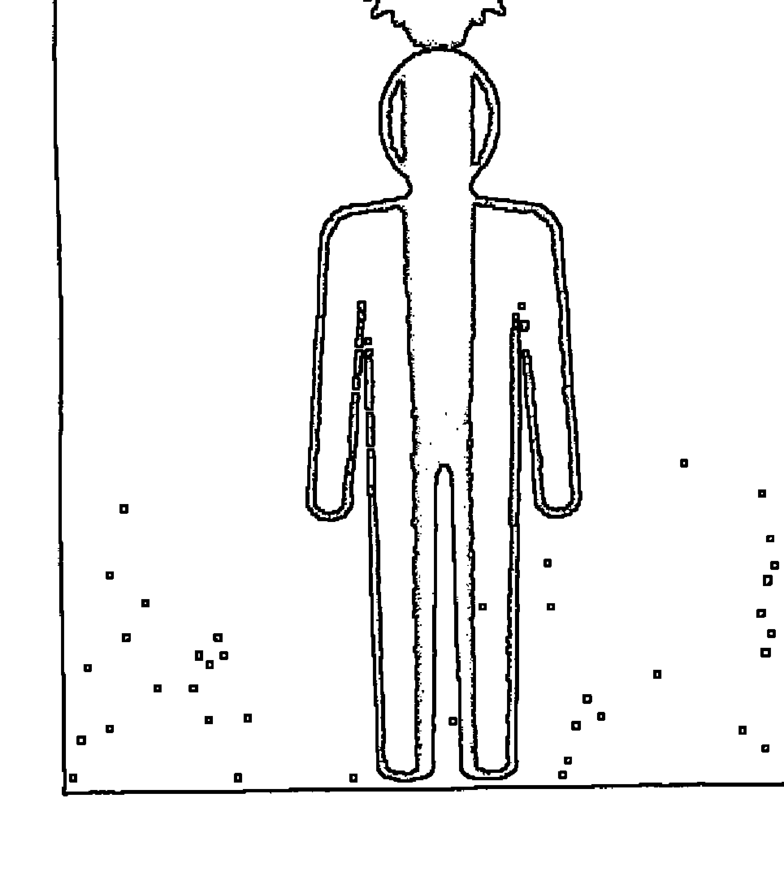

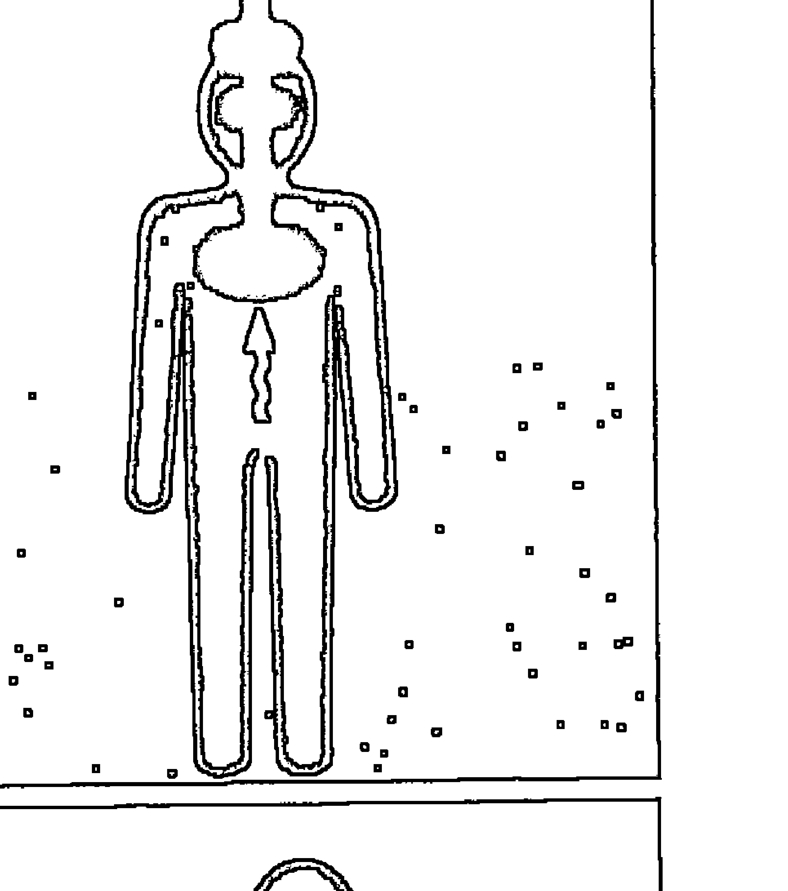

### 2 意识提升
将意识从心轮向上振动到喉轮、眉心轮、顶轮，再往上连接至头顶上方的更高意识，然后经由更高意识带往宇宙之心，和宇宙最高的源头连结。

### 3 意识转化
当意识和宇宙意识频率校准时，可以用检视回顾看看是否仍有些人或事困扰着你。将情境说一次，连结到这个感知，将可以获得知晓来帮助你了解。如果是一件需要被疗愈的事件或关系，心中会再次感受到有不舒服的压力或负面能量流入。

请用你的心去理解这感觉，看着这股能量从冰冷、坚硬、固定和疼痛，渐渐被你的心温暖、柔软、放松，最后来到喜悦融合的一般状态。

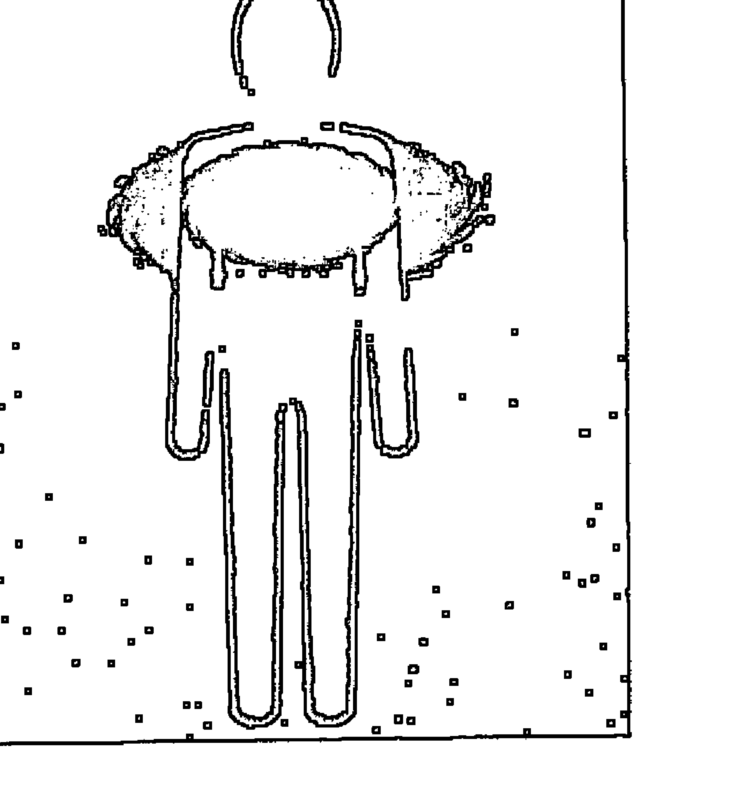

## 第二部  
## 生能

## 生命的起源

今天來談生命的起源。

生命是粒子碰撞聚合的結果。宇宙中存在著一顆顆帶電的粒子，這些帶電粒子依順時針或逆時針方向繞圈運行，在運行時會與另一個粒子或粒子集合體碰撞。帶電粒子間因碰撞出現相吸或相斥的結果，相吸的粒子產生新的融合與質變，變成另一顆新粒子；相斥的粒子則因碰撞再次分裂。

當所有的融合與分裂達到平衡點時，就產生一個可以自給自足的平衡小宇宙形式的生物體，而這個平衡的生物體可以再分裂與複製。宇宙的萬事萬物都依循這個粒子碰撞的運行法則，在平衡與不平衡間動態運行著。平衡帶來和諧、穩定和物質，不平衡則帶來撞擊、鬆動和下一次的再造平衡。

地球上的生物體經過數十億年的演進，創造出現今的千萬種生物體，以及地球所有生物體賴以生存的環境平衡點，這是宇宙粒子碰撞場中完美的創造。地球獲得太陽和月亮磁引力場的平衡，創造了最多元生物共存的生態系統。

當粒子碰撞，並達到一個穩定的生物體平衡狀態時，就會產生相應的訊息場，與其他相同頻率的訊息場體共振。這個訊息場就是你們所謂的意識，所以，生命就是「有意識的生物體」的簡稱。

生命的意識訊息場可以和相同振動頻率的場域連結成集體意識場。因此，生物體可以在自己的場域中像互聯網那樣傳遞訊息。舉例來說，人類的高頻意識無法與低頻意識生命（如螞蟻）共振，彼此無法交流訊息，但螞蟻與螞蟻之間，或相同頻率訊息場域的生命體，則可以交流。

愈精密的生物體意識，振動頻率愈高。人類是地球上最高等的生物，人類生物體演化成具備自行創造的能力，這是其他生物體沒有的。

## 先有靈魂意識，或是先有物質？

所有生命體的訊息場都在宇宙中，宇宙是一切碰撞的源頭，也是回歸的終點。當生命的生物體消失時，存在於該生物體的訊息場，或說個體意識，便以非生物體的形態回到宇宙的源頭。這些已存在的靈性意識再一次經歷生物體經驗後，回到源頭，與其他同頻的生物體集體意識結合成更新版的共同意識。

因此，是先有靈魂意識，還是先有物質？要看你站在哪個角度。從人類的角度來看，會覺得是先有生物體的誕生，才有意識；從共同意識源頭的角度來看，則意識已經存在，新的生物體只是創造了更新的共同意識體驗。

而從宇宙源頭看來，一切都是共存的，全部是粒子的碰撞與振動產生的，最終也回到那裡。

當人類明白自己與人類的共同意識連結，回到生命的源頭沒有生物體的形式，「我就是一切，一切也都是我」時，從共同意識場回頭看自己目前與其他人或物種的互動方式，就會發現沒有必要分別你我、種族、優劣、好壞。我的一切都是為了創造更新的集體意識的一個體驗，我們都是一體的存在。

珍惜這一次的個體經歷，尊重其他生命的經歷，感激生命中所有與你碰撞過的人事物。所有人，不論你們定義中的好人或壞人，都在改寫人類共同的命運。

## 大自然的禮物

植物是人類最友善的朋友，它們對人類的生活和身體健康有很大的幫助。將植物擺置在建築物之外是很可惜的，人類若無法改變目前的建築思維，至少要將植物這個好朋友邀請進家裡。

只要給予簡單的元素，就可以活化並啟動植物和你居住空間的能量。簡單的元素有土壤、石頭、水、陽光為基礎的生長環境。至於鹽水，則可強化植物和空氣的循環。因此，如果沒有土壤和石頭的搭配，就用鹽水和陽光產生海洋和空氣般的循環效果。植物在這樣的環境中，就可與空間共振互動。

植物是為了人類的呼吸而存在的，人類的呼吸則是為了和宇宙意識共振而生，所以，植物就是幫助人類和宇宙意識連結的橋梁。此外，植物也能打開你呼吸的深度。有時你會感到胸口擁塞，呼吸頻率和深度就很難跟環境和諧共振。

而當一株植物被擺在陽光、水、土壤、石頭等元素具足的位置，就可以啟動環境淨化工程。

给植物一个适当的生存基础，它回馈给你的不只是适应环境，还会帮助你的身体调节温度和呼吸脉动，与大自然协调。人类和植物这么简单的互动方式，便能挽救人类基本生存环境的需求。就从自己目前的居住环境开始做，你们会明了，大自然的回馈是无偿的。

为何提及放置植物的地方时，没有提到风？

风是植物相互传递讯息非常重要的媒介，但在室内环境，你们不需要刻意营造出风这项元素，环境已经帮你准备好了。即使在屋外，你们也不必处理风的制造，而是要在栽种或放置植物的地方感受气流的阴阳交会中心点。这个位置主要受光线影响。

你可以面向光，伸出手，感觉掌心和手背的冷热，然后移动位置，感受掌心和手背的冷热感觉变化。掌心热变冷、手背冷变热的位置，就是气流转换的地方。在那里摆放一株植物，可以帮助环境能量流动。

动物的灵魂来自哪里？

动物的灵魂意识和人类最大的不同，是感知后的再创造能力有限。动物也有感知，但无法像人类经大脑思考及解构经验后，进行再创造。人类在地球上不断制造出无法再服务人类自身进化需求的振动频率，这些振动频率需要被转化和释放，因此，能量就会以动物身体的形式被显化出来，以满足整体生态的平衡。

人类发展畜牧业，也是在平衡自己庞大的低振动频率需求。当人类的意识提升后，自然会减少摄食低振动频率的食物，而地球需要透过养殖动物来清理低振动频率的现象也会减少。

## 與大自然重建夥伴關係

整個地球生態的協作都是依循宇宙最初的設計運行，日月星辰的引力帶動地球五個基本元素——金、木、水、火、土——相生相剋的互動，創造出豐富的自然生態，提供人類繁衍所需。

人類生活在陸地上，可以觀察到地表各種元素互動的規則，而海洋生態也是依循各元素相生剋的自然循環繁衍。只是水元素在海洋的呈現方式較為柔和，是透過太陽和地心的熱對流循環，創造海底生態場域。

所有物種，包含人類，都是一個個獨立的小宇宙，但這些小宇宙也彼此共生。每個小宇宙都有其存在的使命，也在各自的空間被地球母親滋養。

相較於其他生物，人類比較像個寵壞的孩子，不斷跟地球母親索求，不顧其他兄弟姊妹的生活。

其實，地球母親從未期待人類可以站出來照顧其他的地球生命，而是一直在等待人類恢復與其他生態小宇宙的兄弟姊妹們對話與和諧共存的能力。要讓人類察覺這一點，需要龐大的思想再造工程，因為人類過去的生態教育是以放大鏡和旁觀者的角度，去解釋各物種自己的生命演化過程，並沒有將人類與生態可以互動和相互依存的夥伴關係教給下一代，以致出現破壞生態的行為卻不自知。

人類必須看見宇宙各種生命的訊息，也必須學習尊重所有生命平等共享地球資源的權利。這樣的覺醒才能讓地球回復最有效率的運作機制，而人類也才能避免創造出滅絕自己的環境，自食惡果。

## 與大自然溝通練習

找一群有覺察能力的人，開始和動物、植物、樹木、昆蟲、海洋生物、山川、河流對話。你們將以不同的角度，以及更謙卑、更感恩的心，回報這個美麗的世界。我要把這項工作交給你們，唯有你們自己去嘗試，這個經驗才會深植心中。

你們一定可以做得很好。

- 1. 你們的使命是什麼？
- 2. 我們身為人類，可以如何和你們合作？

用意念向眼前或心中想像的動植物詢問、探索。

> 將這些對話記錄下來，你們會看見人類是如何被愛、被無條件地支持。

## 實做心得—與松樹對話

我先嘗試探詢松樹的使命，以及人類如何與松樹合作，得到以下訊息：

我們是來幫助回收地球廢氣的，因為我們停留在地球的時間較長，根可以更深入土地。我們將吸收的廢氣釋入土壤，土壤中的金屬元素會將這些人類用不到的廢氣轉成養分，供其他較弱的植物和昆蟲使用。

我們的生命和人類差不多長，甚至比人類更長壽，但我們其實不需要用到太多地球資源，我們是來豐富和穩定大地的。

人類要和我們合作？喔～太好了！我希望在每個有小孩子的地方都有我們的存在。孩子的小腳丫踩在我們根部的土壤上，一樣可以被我們滋養。小孩子的身體可以得到充足的礦物質，幫助骨骼成長、變健壯。

謝謝你們願意開始傾聽我們的想法。

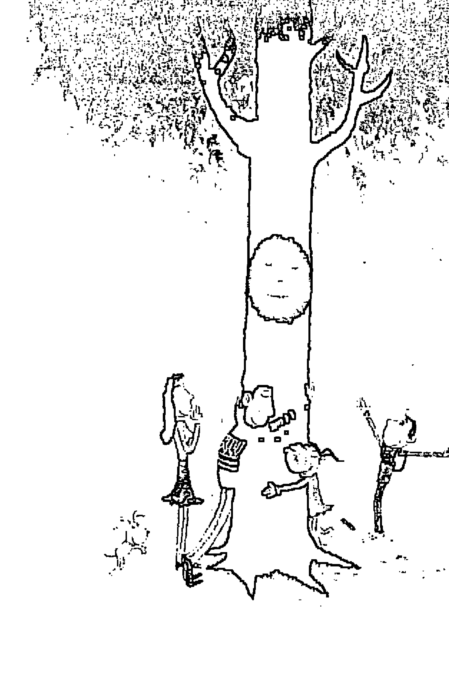

## 實做心得：與植物對話

嗨，我們是人類呼吸的好幫手。我們不只是人類的食物，還帶來新鮮的空氣，並幫助平衡人類的情緒體。

只要提供基本的生存條件，我們就能把整個環境變好。如果是要將我們帶到陸地上，只需要地層的基本元素：石頭、沙、泥土，加上水，就是我們喜歡的陸地環境。

我們的葉子寬寬的、有細的。通常寬寬的葉子可以提供的能量流動愈強，如果能找樹木搭配，就更棒了。

假如提供海水環境，我們只需要海水就能生存，但如果可以帶海水中的小生物來陪伴我們更好。我們喜歡小蝦、小蟹來吃我們根部的浮游生物，這樣可以保持根部的清潔。

如果把我們放在室內有陽光的位置，我們釋放出來的氣體最多，因為陽光會加速我們的循環，也就可以幫助人類更流暢地換氣。離開大地，通常我們只停留一到一個月就會衰退，回歸自然的懷抱。

不要為我們難過，我們的死亡就是再生的開始。我們很喜歡再生的感覺，死亡不會是結束，只要人類對我們微笑，我們就很開心。

不要用你們的方法來延長我們的生命，農藥真的很不好，會破壞土壤中的礦物質養分。有蟲不是真壞事，昆蟲會幫忙授粉，也讓我們很開心。只是希望人類不要添加太多的養分給我們，因為這些多餘的養分在土壤裡會長蟲。沒有過多養分，就不必用化學農藥傷害土地，我們可以自然地長出美麗的花朵。

這是我們與生俱來的能力。只要人類願意，我們隨時可以協助你們的環境能量開展，並順暢流動。你們開口邀請，我們就會為你們加把勁，但我們不能主動啟動能量場，因為環境裡還有許多存在體。

我們必須尊重地說，牠們是主宰土地的能量，它說了算。還有比我們更深的樹木，以及你們環境裡放置的一些能量石，這些都在保護並看守環境能量。除非你們決定由我們出場負責，我們才可以站出來主導。我們會和環境保持平衡共處，不會逾越其他的存在，任意啟動整個環境能量場。

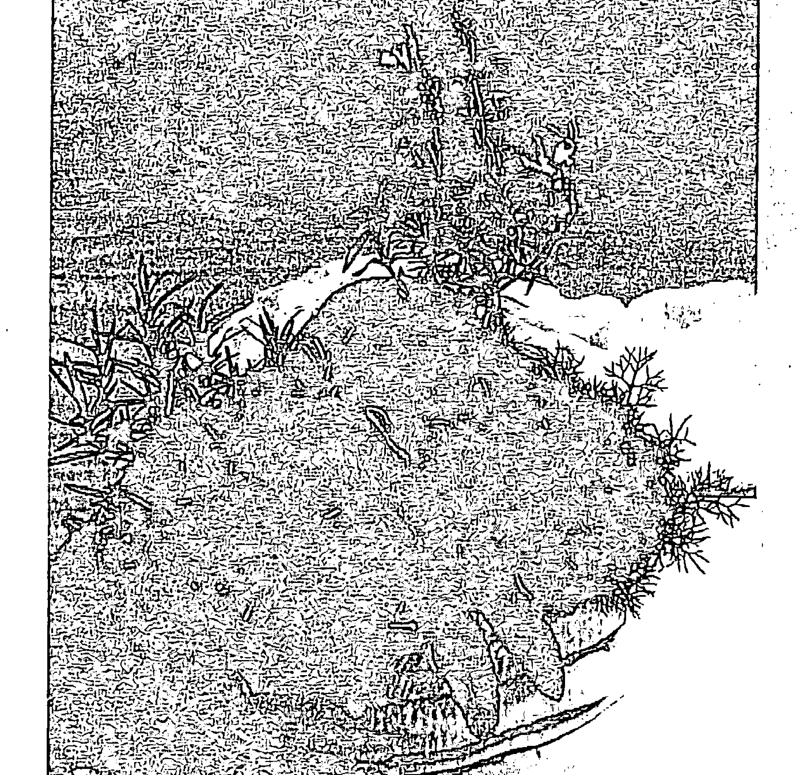

圖片提供：劉慈茹 / 阿乙莎數碼製作

我們每種類型的植物都具備集體意識，這個意識的振動就像是人類的情緒體，因此也可以透過我們來平衡和療癒人類的情緒體。我們是為了養育人類和動物而生，能好好服務人類，就是我們生命最大的價值。

我女兒正值課業壓力最大的時期，每天晚上都念書念到很晚，然後就睡不著了。是否可以提供我一個方法來改善這個問題？

人在用功時，腦部的神經異常活躍，以致該睡覺時，身體的細胞像剛賽完車，燒了火，引擎還熱著。你可以把她的臥室放些香草植物，如薰衣草、鼠尾草、天竺葵、洋甘菊等，幫助入睡。

早上離開房間去上學時，則把闊葉的綠色植物放在房裡有陽光的地方，加速清理環境能量。這樣晚上就會有清新的讀書環境迎接。

## 人、生態與地球的三角平衡

地球正經歷生態嚴重破壞的失衡狀況：氣候不穩定、地震頻傳、海水及空氣污染、森林大火、海洋生物變異、動物飢餓滅絕、人心失序戰爭頻起。這些都是過去人類自私掠奪造成的結果。

要解決這些問題，關鍵也在人類自身。

人類文明的發展過程中，出現許多錯誤認知：核能、原子彈、截斷河川建馬路、蓄水壩或堤防、基因改造作物、化學肥料污染土地、大量塑化製品和衣服、密度過高的通訊發射站等。這些都沒有建立在人與環境合作共生的正向循環上，而不平衡的發展，導致人類最終自食惡果。

我們必須防止地球因再次的文明發展而毀滅，外星文明已有許多前車之鑑。我們要喚醒有能力、有資源做事的人，希望他們在投入科技發展的過程時，心裡要放入「人、生態與地球」這三角平衡。

如果創造出來的產品讓人開心，但其他生物及環境不開心，或是地球不開心，就不是真確的發展方向。

已經造成的破壞和失衡，地球有自體療癒和恢復機制，但身為生命共同體的人類及其他物種，在地球療癒的這個階段會感到痛苦。你們會發現自己的免疫系統、呼吸系統和神經系統出現病徵，需要排毒、更新。

你們會頻繁進出醫院。同時，人類居住的環境將不斷發生地震、戰爭，動物也從森林往城市移動。

人類目前正努力尋求替代能源，宇宙其他文明會提供協助。核能發電終將因為新能源的發現而被取代。這個新的替代能源會給地球足夠的光和熱，但不會造成生態破壞。

我們無法在這裡詳細說明，因為對人類揭開新能源的時機尚未到來。

目前可以著手準備的工作，是先讓人心回歸，創造有覺知、負責任的物質文明。這些工作要從下一代的教育著手，也要釋放並療癒目前被物質壓抑封閉的人心。

能否透露一下新能源是朝哪個方向發展？

新能源會從地球現有的豐富海洋資源出發，改良核變的物理現象，不再往升溫加熱的處理方式走，而是創造磁力場，將物質轉變成能量，供給地球人類所需。這個過程不會造成地球本身的環境破壞，也不會造成機器本身過熱或產生質變爆炸的危險，對自然環境則會有正向循環的幫助，人類產生的資源垃圾也可以被回收再利用。

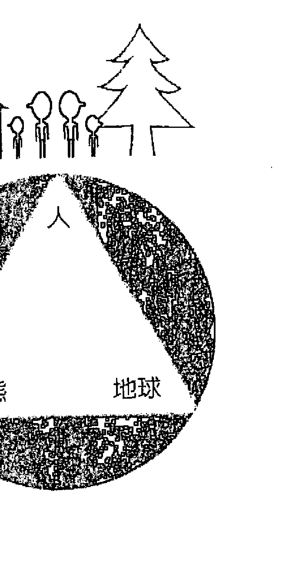

目前人類連自己和家人都沒有辦法好好照顧了，更別說跟大自然生態建立更友善的關係。能否再提供一些智慧，來勸已經過得很苦的人？

是的，人類已經被自己創造的虛擬實境壓得喘不過氣。我是說真的，人都不會好好呼吸了。每天睜開眼睛，就想填飽肚子、努力工作，餵養心中的無底洞，已經看不見也聽不到周遭處處可見的美麗景象。

其實真正能滿足人類的，不是金錢和物質。你們整個存在都是為了創造全人類更好、更快樂的生活，但你們忘記這個初衷，被自己的恐懼能量困在無法流動的物質中。你們將追逐來的金錢和物質放在自己身上，一旦停止流動，這些得來的物質或金錢無法再為你們帶來能量。

人把自己困在無法流動的物質能量中，反而造成身體的阻塞。

人類和大自然生命及其他物種的互動，可以得到非物質形式的回饋。這種回饋會觸及人類的心，讓人快樂和滿足，進而活化你的身體細胞，創造更新的能量。

當你有意識地呼吸並和樹木交換，這棵樹會帶動整個植物系的能量，立即回饋給你，讓你身心活躍、清新。這當中並不需要金錢的交易，但你可以在身上獲得即時的能量補給。

回頭看看你家的小狗，牠永遠為你敞開心，擁抱你的到來。牠的心為你投射、為你綻放，你在牠身上得到溫暖的撫慰和堅定忠心的能量，這股兄弟般情誼的力量，也是金錢無法給你的承諾。

該重新檢視人類自己創造的物質的真實面貌了。這些超乎生命基本需求的「想要」與創造，是否真能帶來快樂？還是造成更多空虛、壓力，以及心靈的巨大萎縮。

地球上的動物、昆蟲、花草樹木都比人類開心快樂。它們並沒有人類的創造能力，卻自然活出本有的快樂。當人類開始與大自然生態合作、有意識地創造時，就能重拾人類本有的快樂。

我知道金錢沒法帶來快樂，可是小孩子上學要錢，老人生病要錢，付水電瓦斯費、滿足基本生活需求都要錢，要怎麼改變？

知道，我們都知道。這些都是目前的現象，但你們此時此刻可以選擇一個更能服務你們未來幸福生活的想法，開始去想像、去創造。你們將可以顯化自己未來的生活型態。

目前這些現象是過去的你們內心巨大的恐懼投射出來、最能服務過去的你們的想法。

而現在的你們有同等權利，可以為自己的未來投射出現在的你們心中期待的生活。不只為自己，還要為你的家人、你的族人、你的國人，以及全世界人類開始擘畫你們共同棲居的生活願景。

不久的將來，你們就會身處那個由現在的自己所創造的美麗世界。

## 重建與生態的關係／療癒身體

當人類開始覺察到自己的身體可以透過大自然獲得療癒，就是改善人與生態關係的開始。

人生病時，身體會自動調節尋求大自然解藥的模式，這是宇宙法則。動物現在還有這個本能，人類則已經遺忘自己的身體擁有與大自然共振、取得解藥的智慧。

人類的呼吸系統生病時，植物和樹木會幫你展開呼吸道的修復。此時只要用自己的意識與植物共振，就可以擴展和療癒呼吸。身體的每個系統都可以得到大自然的協助。

腦部神經感受到有壓力及昏沉時，只要待在陽光下，就可以獲得陽光的能量，協助大腦釋開緊繃的神經。

水則是免疫系統的清道夫。當人的意識與水共振時，可以洗滌全身的淋巴腺，潔淨體液。

土壤具備滋養消化系統的能量，隨時補充身體缺乏的礦物質和養分。

生育期男女則可以與水果共振，活絡荷爾蒙，增進生殖能力，繁衍健康的下一代。

人類與大自然的這些共振，除了承擔身體去體驗、獲得實質的療癒之外，在忙碌的生活中也可以僅用意念的共振，同樣達到效果。

隨時與大自然共振，補充身體需要的能量。這些都是宇宙賜給人類的無窮盡自然資源，用來養育並滋養人類與動物。

你們人類習慣用意念投射出恐懼、擔憂、害怕、不安等情緒，這些都會反饋回自己身上，造成能量阻塞和身體疾病。即使身體是在隨處可見陽光、花草、樹木、土壤和水的環境中，若處於無意識狀態，也無法獲得大自然無條件給予的能量。

## 與大自然共振靜心冥想練習

你們可以做這個與大自然共振的靜心冥想練習，來幫助身體復原。

- 1. 選取舒適的站姿或坐姿，全身放鬆，吸氣、吐氣三次。
- 2. 想像眼前有一棵大樹，對著大樹呼吸，吸氣、吐氣數次。這時，你的呼吸系統會與大樹共振，呼吸的深度會自動加深。
- 3. 想像太陽照在頭頂上方，緩緩地吸氣、吐氣，感覺腦神經正逐漸放鬆。放鬆的腦神經讓你可以更清楚地覺察，你不再感受到腦部的壓力和緊張。
- 4. 接著想像水從你的頭頂往身體下方流動，流經脖子、兩側的淋巴腺、到胸腔、到腹部、生殖器、大腿內側的淋巴腺、腳底，最後流向大地。你的身體被淨化，血管暢通，身體潔淨。
- 5. 最後想像雙腳踩在柔軟芳香的土壤裡，你的腳底正在取得土地的滋養，身體需要的礦物質和養分。

- 6. 獲得完全的補給。生育期男女可以想像眼前有顆美味的水果，你的生殖系統會經由水果的振動感受到活力，並歡慶生命的到來。  
- 7. 結束前，感謝大自然提供滋養和療癒，讓我們可以為這個世界的美好而健康地存在。

經由這個練習，你會感受到身體變輕盈、好轉，也會更感激、更珍惜大自然無條件的給予和共振。

## 與大自然共振的練習

### ① 呼吸共振
採取舒適站姿或坐姿，全身放鬆，吸氣、吐氣三次。想像眼前有一棵大樹，對著大樹呼吸，吸氣、吐氣數次，讓呼吸系統與大樹共振。

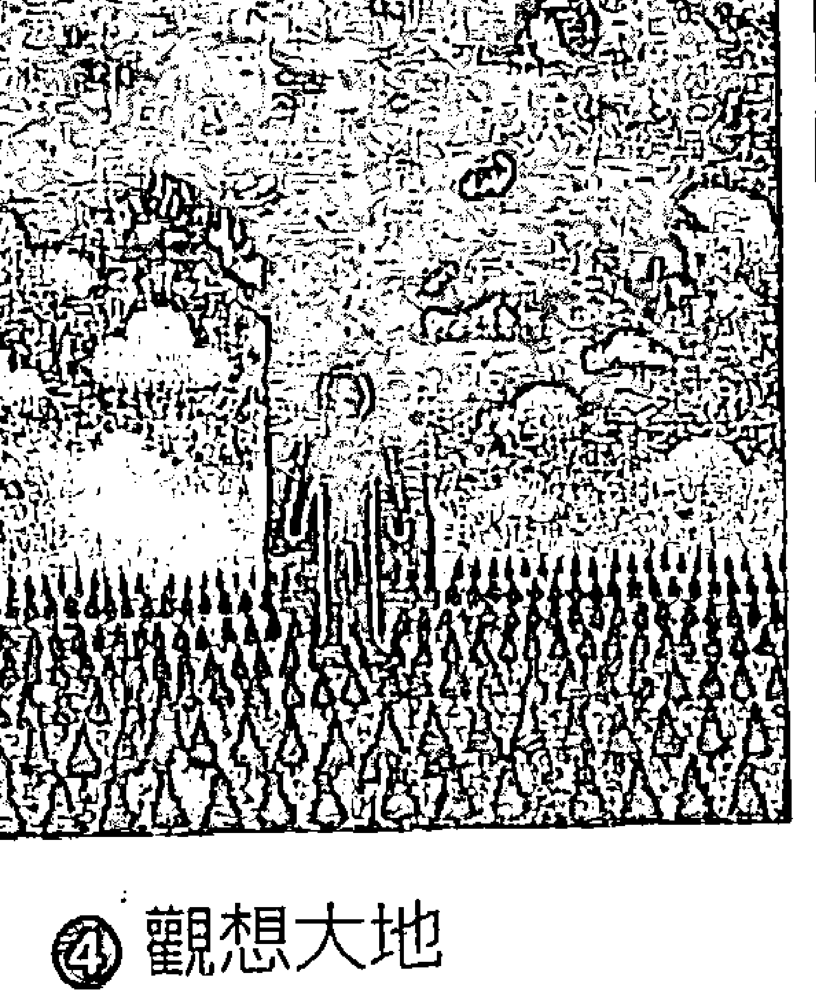

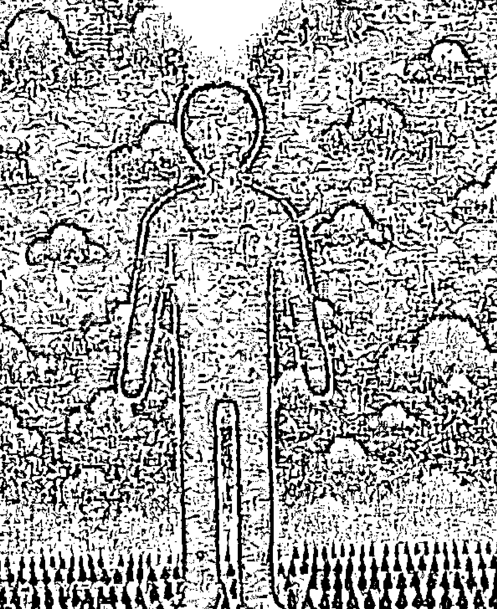

### ② 觀想日照
想像太陽照在頭頂上方，緩緩地吸氣、吐氣，感覺腦神經正在逐漸放鬆。

### ③ 觀想流水
接著想像水從你的頭頂往身體下方流動，流經脖子兩側的淋巴腺，到了胸腔，到腹部、生殖器、大腿內側的淋巴腺、腳底，最後流向大地。

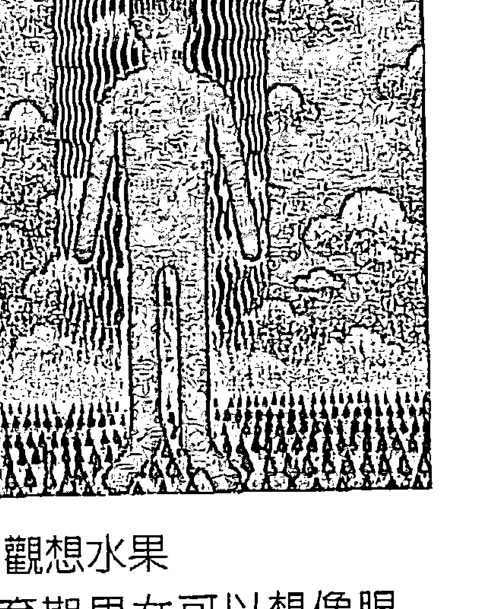

### ④ 觀想大地
想像雙腳踩在柔軟芳香的土壤裡，你的腸胃正在取得土地的滋養，身體需要的礦物質和養分獲得完全的補給。

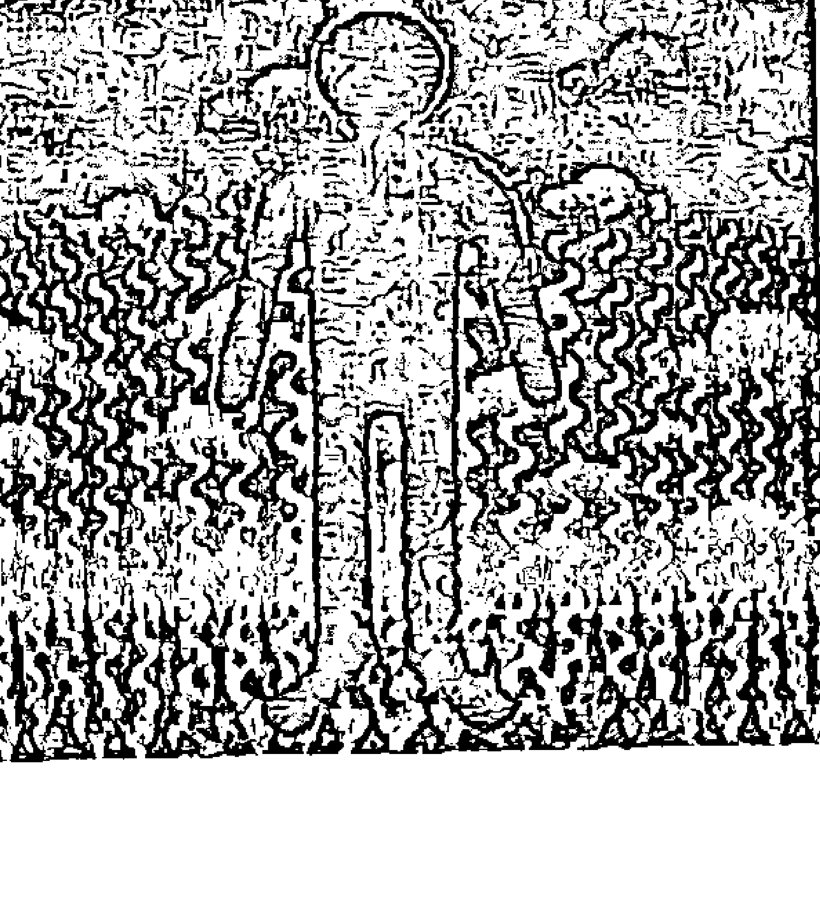

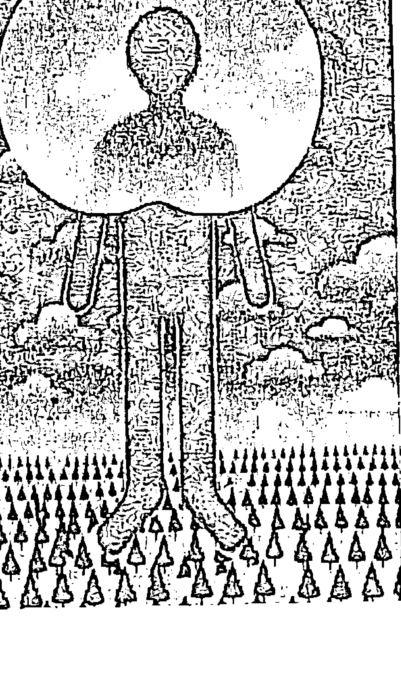

### ⑤ 觀想水果
生育期男女可以想像眼前有顆美味的水果，你的生殖系統會經由水果的振動感受到活力，並歡慶生命的到來。

### ⑥ 最後
感謝大自然提供滋養和撫慰，讓我們可以為這個世界的美好而健康地存在。

## 人的意識有磁引力

意識存在於宇宙和所有物質體中。在最小的帶電粒子運行產生相吸或相斥的過程中，會代謝出一種失去正負電子的穩定狀態原子，或稱為等離子狀態體。這個等離子體擁有完整的內核與外核，無法與其他電子產生正負電的相吸或相斥作用。等離子體具備磁引力的能量場，由外圈的斥力與內圈的引力交互作用產生。其運作方式如下：

- 斥力大於引力：等離子外圈的力量大於內圈，會產生正旋轉的磁引力場。  
- 引力大於斥力：等離子內圈的力量大於外圈，會產生逆旋轉的磁引力場。

帶電粒子運行下產生的所有物質，都具備等離子體，等同每個物質的生成相應產生了意識體。不同的是，意識體分為可以移動與不可移動。金屬物質具備能量，但其等離子體不可移動，人類與其他生物的等離子體則可以移動，並不斷演化。如果要讓等離子體產生正向的移動，就必須使等離子集合體的斥力大於引力。人類的意識向外付出，而不是往自己內部吸引，這樣就可以讓人類的集體意識往正旋、往上延伸引力場。

等離子形成的意識，可以和宇宙最高意識的等離子體共振，展開一個跨時空的空間路徑。這個路徑不受物質的場域限制，也因此，如果地球人類要前往宇宙，可以先創造一個超越物質振動頻率的高頻等離子體共振引力場。這個磁引力場與宇宙的等離子共振，創造一個空前路徑，就可以從地球的三次元空間進入高次元空間。這也是跨時空宇宙航行的基本概念。

回到地球目前的生態破壞問題。人類無法挽救生態，要讓生態回復，最好的方法就是人類提升自己的意識。如剛才所解釋的，當人類的意識振動不斷往自己內部增加引力時，就會逐漸造成人與人的等離子分離，產生的共振磁場頻率就會很低，像是一個個分離的個體存在，不斷向大自然索取或占領資源。然而，只要人類集體意識提升，這個生態的阻斷和破壞就可以終止，地球及大自然生態會自行療癒和修復。

意識 = 等離子

## 地球生態是人類集體意識展現的一面鏡子

當你的意識覺察開啟，就可以從自己的呼吸中了解大自然的一切如何幫助你。你可以從呼吸裡獲得知識，這份知識在你身體上會產生即時的回應。你可以慢慢觀察，並做出新的選擇。

地球是宇宙最初始的創作，而人類是地球的再創造者。神的意識在所有的創造裡，唯有透過人類，宇宙才有機會得到更新的體驗；沒有人類在地球，這一切體驗就無法完成。回到有意識的創造和體驗，在與大自然的共振中找回人類本有的身體感知，創造更美麗的世界。

先從自己的生活開始，用呼吸去感知桌上的食物。你的呼吸會自動與食材共振，讓你自然地做出對身體有利的選擇。你的呼吸會擴大，身體會放鬆，變得更有活力或覺得有多餘的負擔，你的身體會知道，因為身體開始打開意識了。練習在呼吸的過程中與食物共振，久而久之，你甚至不用吃下食物，就已經得到食物給你的能量。

接著看看你使用的物品。同樣地，你的意識會經由呼吸與物品共振。使用沐浴海綿時，你會清楚感受到塑膠海綿與天然海綿帶給你的洗滌身心的感覺是不同的。看著天然海綿呼吸，你會明顯感受到它所帶來的自然回應。

## 地球是所有生命體共同創造出來的平衡

地球上所有的生物都有自己的磁引力場。人類有個體的磁引力，也有集合意識的共同磁引力場；生態世界也是，植物、礦物都有個體的磁引力，同類型生物也有共磁引力場。若以磁引力的移動性來看，又可簡單區分為可主動移動和被動驅動的磁引力場，例如可以行走的人類和動物都是可移動的磁引力場，金屬和礦物則是被動的磁引力。

水和火是地球上的兩大重要元素，本身不具備磁引力，而是中介質。水是傳輸磁引力的中介質，火則是解構磁引力的中介質。經由水和火，可以不斷進行地球萬物的創造與再創造。

身體的細胞與海底動物共振，開心地和海底動物交流、振動。浮身沐浴也可以讓自己的身體帶來更深的細胞體驗，你將開始有意識地選擇，改變能服務好你自己的生活習性，進而有意識地創造更適合的生活環境。

這是人類與生態關係的重建。當人類打開意識與大自然連結共振時，就能帶給自己和所有生態一個美麗的新世界。

宇宙包含了所有地球生物的磁引力，而宇宙又包含地球和其他星系的磁引力，也就是所有萬有磁引力場的集合。宇宙就是一，一就是一切。從這個角度來看，地球是所有地球上的生命體共同創造出來的平衡，人則是其中最具創造力的意識體。

當人類的集體意識創造出一個失衡的地球環境時，大自然會需要用水（海嘯）和火（戰爭、森林大火）來重新調整出新的地球平衡點。

所有人都可以自由選擇，隨手可得的大自然資源供你發揮。你可以選擇創造一個更幸福平衡的生存環境，或是一個持續失衡、需要水火重整的環境。看見一片黃土時，你可以選擇離開，尋找一個綠洲，也可以選擇帶進一顆種子和一些水，創造出一整片森林。不要小看自己意識覺醒的能量。要活出生命賦予你的自由創造力。你這顆種子進入乾涸的土地，就可喚醒大地，喚醒全人類。

## 打開心，從愛中連結萬物

地球生態是人類集體意識展現的一面鏡子。人類的自由意識於生命體驗過程中創造出種種樣貌，如果你開始對自己的生存環境感到不開心，這就是在提醒你該打開心，向外連結了。當人們可以看見宇宙萬物顯化中的愛，就可以打開自己與萬物的連結，因為愛是宇宙注入萬事萬物的共同 DNA。

愛存在每個生命裡，宇宙也因為和每個生命的愛連結，所以能廣納一切萬有。打開你的心，從愛中可以連結萬物與所有生命。

每個生命都只能展現愛，你們找不到一個生命是沒有愛的，因為愛是一切顯化的種子，是所有帶電粒子可以產生碰撞的根本。是人類詮釋愛的表現曲解了愛——

- 因為想要達到更大的愛，所以有攻擊、掠奪、怨恨、不安。  
- 因為怕失去愛，所以會緊張、恐懼、內疚、擔憂、惱怒、有罪惡感。  
- 因為灌注了太多愛，所以看見傲慢、倔強、不堪負荷、無價值感。  
- 因為缺乏愛，所以產生挫折、憂鬱、自虐、無助、絕望和遺憾。

親愛的孩子，這一切都是愛的展現。從愛的流動中，你們得到愛的體驗和創造。

當你看見人類心中的愛如何顯化出今日世界的樣貌——那些也都是一部分你的愛的展現——你會感激、會承認。你會感激愛展現出另一個更高的版本讓你覺得歡欣，你不用成為那個版本也可以感到喜悅；你也會承認愛的另一個版本讓你體會到缺乏愛是如此令人心痛。

這些存在都是在展現愛，而你同樣也是為你這一生唯一的這一次機會，創造出你最高版本的愛。

## 大自然的神奇力量

目前臺灣已經有許多人開始進行與生態相關的驗證工作，有動物解讀專家和臺灣土地龍神溝通，得到臺灣土地相關訊息。請問阿乙莎有沒有可以補充的？

土地龍神如同大地的等離子體形成的意識，也就是大地的靈魂體。所有包含地殼岩層的金屬、礦物質，連接山川河流的沖刷，與樹木接地帶來的太陽和宇宙能量匯集的區域，都有地龍。地龍的大龍脈分支成數個小龍脈，為居住在土地上的萬物帶來一個穩定和諧的磁場。

由於工業化的演進、空氣和河川污染，以及農夫為求大量收成，在土地中放進過多化學肥料，地龍的能量愈來愈弱。而地龍能量低，會造成人心的紊亂與不安。因此，如果提升地龍的能量，就能同時幫助人類提升意識，活出喜悅的生命。

目前臺灣地龍較弱的區域，大多位於工業污染較嚴重的南部。因此，可以有計畫地提升這個區域的土地能量，或是淨化湖泊、水庫、河川的水源。

你們可以直接到學校或公園尋找高大的樹木（這些樹木的根部較深入地底），然後在樹木根部的土地上用石頭圍成一個圈。石頭是正旋能量，加上樹木經過太陽照射，太陽的能量注入樹木，樹木則以逆旋的能量注入土地。這樣就形成一個石頭在外圈的正旋、樹木在內圈的逆旋的能量場體，接引宇宙能量，灌注到大地裡。

能否提供在沒有樹木的地方也可施行的方法？你們已經開始朝臺灣的根部著手，這對提升臺灣人民的整體意識有很大的幫助。如果附近沒有土地或樹木作為導入位置，可以在陽臺或居家空間放置星狀能量盤。星狀的排列方式可以接引太陽和月亮。

## 大自然元素｜石頭圈能量場

邀你一起建構大自然正能量場域，提升土地能量。

### 建置場所
學校、公園、野外、山林、庭院、菜圃、農地等，若能靠近水源處更佳。

### 中心擺設（二選一）
- 植物：木本為主。預先與植物溝通，協助建立場域。  
- 水晶：白水晶、雙尖為佳，單尖次之。頂尖朝下，將能量引入大地。預先向水晶表達請求之意。  
- 手印：建場者以手掌貼地，帶祝福意識啟動能量場。

### 外圍布置
石頭、水晶、礦物等大自然元素，以植物大小決定石頭尺寸，圍繞一圈即可。若在公共場所，須將石頭埋入地下，以免被移動或破壞。

## 大自然元素｜五角星體能量盤

邀你一起建構大自然正能量場域，提升環境能量。

### 主體排列
使用石頭在能量盤上排列成一個星狀。

### 場體定義
「所謂的場體」星狀圖形能接引太陽和月亮——「陽和陰」的宇宙磁引力能量到需要強化的環境裡。

### 建置場所
- 陽臺、露臺、頂樓或室內。

### 中心擺設（四選一）
- 礦石：吸引太陽的能量。  
- 水：吸附周邊過高的能量，再擴散成平衡的能量。  
- 火：消融凝結的負面能量。  
- 植物：帶來氧氣，提高空氣中的能量流動。

六角星會啟動地龍的運轉，環境中有人時，人地龍舒適更重要。地龍是來幫助穩定人根基的，用六角星會觸動環境根基能量流動。除非這個地區是全新的、無人入住，或是荒廢許久、地龍能量薄弱，才須用到六角星盤。

交通大學環工系的白曉緣教授正在進行的空氣盒子要加入聲音的元素，進行更進一步的研究。可以協助我們理解這個研究的方向嗎？

空氣盒子是白教授用來捕捉水源污染的指數，進行水污染區域的空氣污染成分測量。這個捕捉空氣的想法是收訊盒子，如果用同樣的概念，將好的空氣品質指數放進水裡，在水中發送訊號，就是淨化水污染的投放訊息工作。

這個辦法是可行的，因為水可以吸附物質的訊息，並經由河、海洋傳遞出去。只要在污染的水域四周放置改良的訊息發送盒，將這個盒子對著河川、湖泊、沿海傳送訊息，就可以調整污染水源的能量停滯狀態，將低頻振動轉成較高頻率的振動。

可以利用聲波導入水域，進行訊息傳送，但要注意別干擾海洋生物的工作。很多魚群及海底生物是靠海豚的聲波引導，而要進行海域淨化的調整，可以藉由海豚的協助。海豚不會引導魚群進入污染區域，如果聲波可以讓海豚辨識出來，就等於捕捉了淨化的頻率訊息。你們可以往這個方向進行更多實驗，很快就能找出幫助土地和水源的解決方案，而臺灣人民的意識，也會快速提升。

- 2018.1.19：使用水晶，替已經擺在家裡六個月、成長緩慢、奄奄一息的多肉植物圍上五角星形。  

- 2018.4.19：三個月期間沒有添加任何肥料，成長迅速。

## 實做心得：幫植物圍五角星形

自從收到阿乙莎的訊息，知道可以幫樹木和家裡的植物圍上五角星形，我們便實際測試，得到非常正面的結果。

在圍植物園五角星形的過程中，就可以明顯感受到植物和盆栽帶來的祝福。排列五角星時，心輪開啟，感覺到莫名的喜悅。和植物展開愉快的互動，真的很簡單！

- 2018.2.13：剛買回來的香水百合放進花瓶裡，同樣以水晶圍上五角形。  

- 花瓶內的水雖然沒有換過，但十一天之後，水質依然清澈。  

- 2018.2.23：經過十一天，中間沒有換水，依舊盛開，沒有一朵凋謝。

## 實做心得：幫樹木圍圈

種樹木，圍上石頭圈後，A與B是栽於同地的同樹，增加了百分之七十的嫩葉。

### 石頭圈能量場域對照圖
（2018.4.4 臺北新生公園）

A 圍石圈　　B 未圍

## 實做心得：排上三環能量塔的楓香樹

前幾天的雨水讓土壤變得濕潤柔軟，第二圈的石頭因此很容易打進地裡，也拜託小草照顧，並盡快圍繞覆蓋。

很想了解這棵位於臺北市中山區民族公園土地公廟後方的大樹的感受，以及相對人類說些什麼。

> 樹說：「謝謝幫我補充能量。第一圈石頭圍上時，我好高興，我在這裡生長的這些年來第一次被人溫柔地呵護著，好開心啊！今天幫我圍上三圈，我了解你們希望我來保護這個區域磁場穩定，放心，我不會辜負你們的期望。有沒有看到加強的能量讓我的樹梢長出很多新葉？附近的樹也都看見我有了新的面貌。希望人類可以透過這樣的方式和更多其他的樹木互動，讓我們的同伴同享這份榮耀。」

要注意的是，幾乎每種植物都喜歡單圈石頭能量場，但圍上二圈時會加速並擴大磁引力場，對大樹來說，會從「舒服」提升為「使命」，所以須先取得大樹的同意，並尊重其意願，才能進行。

## 實做心得：展開人類與生態之間的對話

「綠色星球」是利用自然五元素（地、水、火、風、植物）組合而成的盆栽，配合使用二氧化碳甘斯及各色水晶，放大植物場體。平日以甘斯磁化水噴霧，使植物的生命力更旺盛。若家中有體弱之人需要改善精氣神，則可搭配小能量機加強氣場的流動與循環。

綠色星球不只美化環境，植物的生命力及場體亦能有效穩定家中的磁場，維持和諧的振動頻率，讓室內自然形成一個舒適又安定人心的場域。

綠色星球內的所有材料皆可重複使用，水晶及甘斯筆拿去曬曬太陽會更有能量，換盆的植物費用也很低，好心情則是無價！

維持居家環境的生態平衡，建立周邊的磁力場，從自身做起。植物被放大的氣場可以淨化空間，讓家中更舒適，協助人類調整紊亂的情緒頻率，自然會產生一股安定祥和的力量。

我相信植物本身有療癒的能量，尤其是自己親手栽培照顧的，會與主人有微妙的連結。我有親友因中風開刀住進加護病房，因為曾見過有醫生利用植物的能量替患者療癒，所以我立刻將家中的植物（綠色星球）搬到病房去，誠心拜託植物協助淨化空間、穩定磁場。當然也有使用其他輔助方式。

當然，一顆完全相信的心是最重要的！

當今的社會，每個人都在喊口號，要愛護環境，要救地球，卻都束手無策，每天還是要消費，需要使用交通工具，排放出無數的碳，然後持續活在氣候變遷的恐懼中。其實從現在開始，你只要願意動手讓家裡多一抹綠，想像自己就生活在綠色星球中，先自救，然後影響更多人，就會發現地球真的不需要人類來拯救！因為，它本來就是一顆綠色星球！

（本文作者為光之生活場推動者 陳榮韻）

## 第三部  
## 教育

## 開啟跨越時空的創造

時間是相對的概念。你在此時此刻，你的另一個你在他時他刻，這都是你的意識創造出來的。你可以是五十歲，但當你回到六歲時，你是否可以感受、看到、記得所有的場景或發生的事件，或是聞到那個味道？

你的意識所及，就是你的現實。當你的意識回到六歲，你就在此時此刻缺席了。你進入四十四年前的時空，不再處於當下的場景，你缺席了。你此時此刻的記憶也是空白，被你六歲的記憶植入了。

同樣地，當你在此時此刻想著要去完成某件事，具體地想像和描述你想怎麼做、和誰一起做，做了以後會呈現什麼景象，愈想愈清晰，於是，你就在此時此刻消失了。你出現在你創造的一個未來情境裡。

人不是在此時此刻，就是在過去或未來的時空。你的身體現在正坐在你房間的椅子上，但你一天可能只花一個小時待在現在，另外的二十三個小時，你不是停留在過去的回憶裡，就是在未來築夢。

那一個小時的「現在」對你來說，是經過二十四小時（一天），但事實上，你是把身體放在房間裡二十四小時，但你有二十三個小時待在過去與未來。

現實真的比夢境還真實嗎？你活在當下的時間不過一個小時，那麼，是你在生物體裡的認知為真，或者意識的認知才是真的？

當生物體終止，你能擁有的真實就剩意識時，你僅用物質身體活了不到三分之一的時間，另外三分之二不是在過去，就是在未來——這樣看來，你活過的一輩子到底算多久？

其實只有生物體的生命期可以被你計算出來，你的意識是無法用時間衡量的，因為它可以隨時超越生物體所在的時空，穿梭於過去和未來，這是你們人類無法計算的。

那麼，有沒有可能在未來的某個時刻遇見現在的你？當然可能，只要你活在未來時讓意識回到過去，這個過去就相當於今日，這個未來的過去之今日，就是未來的現實，而這個現實，也只能被發現或遇見於此時此刻。

時間是虛擬的，不存在的，是被定義在生物體的週期上。你無法用時間限制住擁有自由意識的人。不論時間如何流變，意識永遠可以跨越無限的時空。

你可以追溯你的遠古時期，也可以探索你五百年後的現實。意識所及，就是空間的存在體。你在你的意識裡，不在你生物體定義的時間裡。

人類想要邁向自由意識的創造，就必須跨越時空的限制性思想。你擁有絕對意識上的自由，未來就在你的當下，一念即現。

要跨出物質的框格，解放靈魂的自由意識去展現物質，不要反被物質限制了意識的創造。當你明白你的過去、現在和未來同時存在於當下，你的意識跨越時空連結，進而從連結的感知學習和創造時，就會讓物質更臻完美地顯化。

## 生命本有的創造力

宇宙有個運行法則：你是你的思想創造的實相。而每個人的思想創造的實相是不同的，所以，每個人都是獨一無二的、珍貴的。

人類有相同的生物體運作機制、同樣的器官功能和生理構造，卻可以活出與動物和植物不同的生活樣貌，中間的差異就是來自思想。

思想具有邏輯和結構力，這部分的大腦運作發展得非常精密。但是，再精密的設計都無法跳脫身體裡蘊藏的人類自古至今累積的共同印記。這個印記就像嵌入你們細胞裡的DNA程式碼，代代相傳至今，所以一個人的思想在運作時，很容易落入印記的迴圈裡。

這也是人類生理構造的限制，細胞再生和死亡的規律過程中的自動機制。

人的思想有很多陷阱。同樣一幅畫，你看到山，他看見水，這就是眼睛接收到的訊號傳到大腦下視丘，激發了細胞的某部分記憶，並加以處理的結果。

當訊息再返回到大腦，進行邏輯和結構性的處理後，再通知身體去行動，創造出自己的生活實相。同樣一幅畫，可以創造出不同的解釋，再去創造不同的生命體驗。

這說明思想其實反映了人類意識隱藏的個人記憶，或是人類集體意識被觸發的結果。

## 如何認出細胞印記？

如果能夠清楚看見思想的開端來自過去的印記，你就會理解，雖然無法改變那個開端，你仍擁有絕對的自由意志去改變，並再次存回自己身上，成為人類集體意識的內容。

人類想要走出細胞記憶裡的負面經驗，包括戰爭、飢荒、破壞、掠奪、災害、恐懼等印記，需要每一個人都醒來，去改變自己的思想路徑，清楚辨識出這個來自細胞的印記是虛假的挑戰和惡意的提醒。

當你能辨識時，就破解了這個細胞嵌入程式的密碼。你便可以給自己一個適合的想法，來跳脫認知陷阱，進入更高意識的領域，才能開始有意識地創造。

人可以透過思想來改變創造的路徑。雖然有DNA內嵌的程式陷阱，但這個部分很容易辨別出來。只要是從心之外的身體器官發送出來的訊號，就要重新審視。

腎臟發出的恐懼，肺臟發出的哀傷，肝臟釋出的憤怒，大腸產生的想要更多的控制，脾胃發出的忠實訊號，這些都是細胞印記。

當你看見了，就先停下來，深呼吸，拿回自己的意識的主導權，不要讓它們給你的訊號牽引下一步的方向。多練習幾次，熟悉它們發出的訊號給你的感覺，看見那個虛假的命題，對它說：

「我知道了，你還需要被我看見、被我理解，但我接下來必須自己做選擇。」

## 讓教育回歸尊重生命的創造力

「已做出選擇，謝謝。請讓我試試新的做法。」

解除心障的干擾，就可以進入人類真正的創造模式。如何開啟你的創造DNA？也很簡單，就是去感知你的心發出來的訊號，而心的訊號只有愛。

各式程度不同的愛，喜愛、需要、熱愛、痴愛……愈是能激發你的熱情的愛，就是創造的能量。帶著你結構性的大腦進入它的氛圍中，幫助你創造和體驗，你會來到過去用大腦沒辦法走到的境界。

你的大腦在這個氛圍中會被感動得領受、旁觀、欣賞、享受、全然放鬆，這個狀態的你就是進入了神性的創造。這在每個人身上都有，只是過去被你們僵固的教育體制禁錮。

人類生命的最高境界，不是創造物質上的成就，而是要創造全體人類新的生命共同意識。

人類藉由生育下一代來創造和更新身體裡的細胞記憶，只有透過新的生命，才能完成這個轉化和升級的過程。正因為此，你們需要透過創造新生命，來延伸生命的無限可能面貌。

但是，目前你們卻用有限制的思想和教育，局限了這個自我更新的機會。

每個新生命都是人類的老師。人類無法透過自己過去的經驗來創造，唯有跳脫歷史印記的框架，才能進入創造的時空。在這個時空裡，沒有什麼需要被學習，一切都是全新的探索——透過你的心的振動，去探索任何可能。

經由學習的，都不是創造，而是你身上本有的記憶。所以，讓教育回歸尊重生命的創造力，幫助孩子跳脫先天的制約，以及生理器官反應造成的自我限制和框架，讓生命進入全然的探索。

小孩子的學習過程不應該有教科書，因為新生命自己擁有創造與探索的先天本能。找出每個生命的天賦是教育者要練習的課題，讓學生可以自由地創造和設定學習主題，才能進入真正的學習。

沒有教科書的學校一定會受到未來的家長歡迎，你們會看到這些孩子的創造能力遠遠超過教育體制下的孩子。

孩子是無法被教養的，生命本來就是來創造的，唯有真實的體驗才能被寫成教科書。那是分享的語言，不是必然的真理或實驗。

沒有書本的教育，對教育者來說挑戰更大，那也是成為教育者的創造過程。他們會開始明白，其實學生成就是老師，老師也是學生，而學校是現在的人類得以接觸新人類，並相互激盪與創造的聖地。

只有還在創造中的人才有資格寫教本。所以，開始讓孩子互相交流和學習，寫出自己的教科書吧，你們會看見宇宙創造的生命本有的創造力。

## 創造者的使命

人類擁有創造生命極致體驗的自由意識，這個創造的權利在每一個人手中。

接下來的日子裡，你們覺醒的速度加快，也代表光和黑暗會同步升溫。宇宙的運行法則是：有光明就有黑暗，有善也有惡，有陰就有陽。

當自由意識來到創造的大門，將面臨更多挑戰。這些挑戰會帶給人類更高的幸福與享樂，但也很容易讓人陷入危機的嚴峻考驗。

所以，當人類開始自創造的開端，我們需要讓你們了解宇宙運行之道。

你可以看見宇宙萬物都依循一定的法則演化，不論任何時期的文明進展，都無法跳脫這個宇宙律。萬物會不斷找尋平衡點。

之前已經說明，宇宙是所有帶電粒子隨機過程的顯化，而碰撞的基本原理，就是不斷找到平衡點——從不平衡到平衡，再從平衡到不平衡。平衡，也是萬物溝通的語言。

所以，再偉大的創造也都是在創造一個新的平衡，而這個新的平衡前面，勢必會產生分裂與破壞。

當人類進入更高次元的創造時，我們在宇宙間已經建立一個創造的共識，需要提出來讓人類遵守：創造者要有足夠的把握，去照顧被分解和被破壞的存有的生存權利，這樣的創造才可以成立。

## 文明的發展須確保地球生命體的生存

地球在三次元時空經歷許多讓人類生活更幸福舒適的演進過程，這些發展尚不至於導致地球物種被完全破壞和毀滅。

但逐漸地，你們的科技文明會來到超高人工智慧機器人的時代。這些發展會讓我們付出慘痛的代價——整個種族被替代滅絕。

所以，現在必須提前讓尚在發展人工智慧的你們建立有使命的創造理念和教育。

你們正在嘗試發展類人行為模式的機器人、複製系統，用來大量取代真正的生命體，擔任更有效的生產輔助工具。這個創造的演進可以理解，但迎接大批機器人的進入人類社會將造成崩解和破壞。

而你們尚未建構平衡體系，也沒有設立最有可能的最壞底線。

從目前一些發展科技文明的國家已經可以看見，年輕生命找不到勞動與社會連結。他們失去工作，失去生活的動力。繼續這樣發展下去，將導致人類下一代生命的立腳失衡。

這些失去對外連結的新生命，最終只能依靠非人類生命體的人工智慧機器。

人工智慧機器只不過是人類創造出來的工具，它們不是生命體，沒辦法和有生物體的人類及生態和諧共振。

連人類自己都處於無意識狀態，無法認知到身軀和大自然擁有自然共振的智慧。

無人工廠將逐漸取代人力，而你們不會在無人工廠周圍種樹木，因為機器人不需要這些樹木。一個呼吸的環境。

人類最重要的朋友——樹木、植物——的生存空間將被排擠。你們有些人會為了機器人，而不是為了人類和植物創造環境的甦醒。

這些是我們對繼續朝向提高智慧發展的提醒。在邁向更高科技創造的同時，你們需要建構有使命的創造原則，以確保地球生命體的生存和生態平衡。

當然沒有辦法將這個自動機制帶到你們創造的機器人身上。

舉一些例子說明。你們的身體遇到冷和熱會自動收縮或擴張，這是身體的平衡機制；你們走到戶外看著樹木時，會大口呼吸，和樹木自動交換二氧化碳和氧氣，這是生命體的互動平衡機制。

但是當有一天，你們身邊只有機器人，它們沒有精微身體宇宙創造出來的平衡。

假如它的手進入滾燙的熱水不會抽回，但你們的新生兒的感知會看了跟著做；假如他將小手放進滾燙的熱水裡，後果將不堪設想。

但這時，小嬰兒的感知可能會覺得這個機器人比自己偉大，更需要依賴它。

## 科技發展監管機制的必要性

人類必須建立一套系統，確保創造後的生態平衡。這項工作需要聯合成立專責的監管單位，來評估對人類及環境的影響。

例如，若在運用一個超高智慧體，可能在可預期的未來造成一半以上的人失業或失去正常生活能力，就需要調整或禁止該項科技被執行。

此外，有些環境設定也要仔細考量，例如限制人工智慧機器人走出家庭或室內場所，也不能任用機器人參與公共建設，或進入一些需要被保護的領域。

監管機關必須定期審核、評量、檢查安全性，這些新的措施及系統都要在創造的同時被考慮進去。

你們可以建立區域性的審核監管小組。臺灣在IC晶片及DRAM記憶體的設備工廠都可以建立預防性措施。

目前最大的人工智慧生產基地在俄羅斯、美國、日本、法國，這也會是未來武器競爭的一個研發項目，而臺灣將供應很多人工智慧元件給發展這項科技的國家。

與此同時，必須聯合生產應用單位，建立協同監管制度，讓問題可以被看見、被管理。

## 教育的根本目的

教育的根本目的是發掘每一個新生命內在的天賦，並給予最初始狀態的生命體一個完善的孕育和養成環境。

就像你種植小樹苗一樣，提供足夠的陽光、空氣和水，它的根就會自動伸展進入大地，取得自己需要的養分，進而自然長到樹蔭可以伸展，並連結周圍的生命，創造出更好的環境。

用這樣的心態教育下一代，你們會開始調整課程內容。不用將知識分門、分科。

這個世界任何事物都是相互連結的：化學裡有物理現象，經濟裡有社會因素，農業裡有地質科學。

你們無法用現在的分科方式，把一個孩子教育成專家，因為在微觀的世界裡，無法將每個知識、事實、法則孤立理解。

當你放下眼前的微觀，從更高、更寬廣的角度去感知和領受，最終就會知曉真理。

孩子一生下來的靈魂是完整的，和宇宙的知曉連結，而人類太過度介入與操控，只是延後了孩子的生命實現。

孩子的教育，是一個發現孩子的過程，要在教育的各個階段保存靈魂最初的完整，在孩子探索的過程中激發他們對生命的熱情，然後從孩子的熱情中找到每個孩子來自神的天賦。

## 孩子在生命各階段該接受的教育

你們要重新建構在孩子生命的各個階段應提供的教育，發展適當的活動，讓孩子與環境互動，發現自己的內在天賦和禮物。

老師、家長、教育者的工作，是去看見孩子在你眼前展開並發光。那樣就達到了教育的目的。

- 0～6歲：感知力確認期  
- 6～12歲：群體融合、領受力掌握期  
- 12～15歲：思維和意識的整合期，發展內在天賦才能的關鍵期  
- 15～18歲：連結與探索宇宙更高意識的知識庫  
- 18～30歲：生命自由意識的發揮與創造，進入實習階段  
- 30歲以後：靈魂的擴展期，對其他生命和地球有所貢獻，創造更新的地球意識，維持宇宙和平

每個時期都會有該階段的專家群來擔任指導師。指導師不是來教孩子如何做，而是在過程中協助並指引孩子正確的方向，並讓他們受到環境的保護。

每個階段的發展都會有評量機制。這個評量不是給出分數或標籤作為學習的成果，因為沒有任何標準可以衡量生命。

每個生命都有自己的學習旅程，也都擁有獨一無二的創造之路。指導師只能針對每個階段的學習提醒、提醒、再提醒，讓生命自己去修正。

在這樣的教育過程中，人類的靈魂意識得以保有和宇宙初始的共振，並讓生命再一次完成學習和任務，回到源頭的家。

## 做好準備，迎接新人類

教育是迎接未來人類的基礎，需要深植到人們心中。教育下一代的工作比去企業上班賺錢更重要，因為這才能讓人類無意識的生活和輪迴終止。

新人類和以往最大的不同，在於這群孩子擁有五次元的意識能量。這是宇宙創造人類進化的機制。

為了迎接地球進入宇宙的行列，我們已經將更高振動頻率的意識輸入新一代的生命體。他們自二〇一七年起陸續誕生在地球上。

而面對這群具有高次元振動意識能力的孩子，大多數父母都會覺得無法管教、力不從心，因為這些孩子無法認同現在社會的政治、經濟、權力結構，以及對待其他物種的方式。

他們的人生目標會放在更高處：地球、宇宙與各種生命的和諧共存。

所以，當他們意識所及都是需要革新的對象時，舊勢力和人類的小我意識會為保有自己的利益，而對這些孩子加強管束。

我必須提醒人類：這群孩子是地球未來的希望種子，是人類得以進入五次元的領航員。放下小我的恐懼和擔憂，讓孩子帶著你們走入光明。

為了迎接這群新生命勇士到來，我們期待他們的父母和所有覺醒的人開始創造一個能讓他們伸展固有天賦的生活環境。

作為回報，他們需要人們無條件的愛和理解。

人類將自己視為地球主宰的言論和教育，會被這群孩子擊破，因為他們深知宇宙萬物運行的真理，明白人類只是與萬物共存的一分子。

在你們的環境裡給這些孩子足夠的空間。你們只須提供大地、陽光、食物、水和一個遮風避雨的場所。

這些孩子就能用他們的雙手與更高意識的創造，打造出地球上的天堂景象。

你們目前雖無法立即改變社會制度下的教育機構，仍可以在自己的家庭、社區建立許多非傳統教育的互助學習社團。

在社團裡帶著孩子唱歌、跳舞、繪畫、遊戲、運動、種植，並準備一個工具間、一張大工作桌，以及備妥充足的大地元素材料，如石頭、泥土、金屬、岩石、礦石、樹苗、種子等，讓這些孩子創造代表他們自己的能量作品。

而你們大人也可以從這些創造物中，得到身心的平衡和舒展。

這是針對教育上你們可以立即採取的行動所提供的建議。願你們開開心心地展開雙臂，迎接這群宇宙生命到來。

## 導入宇宙觀，以迎接進入更高次元的挑戰

在教育下一代的工作展開的同時，你們需要建構宇宙生命共同體的知識架構，並教給孩子。

你們目前的教育系統忽略了這個部分。最主要的原因，是你們的權力掌控者從地球遠古時代起，就自認為是宇宙的主宰，自己則是神的化身，藉此達到控制人心的目的。

就算是教化人心的宗教，也因為爭奪人心的主控權，而發生多次宗教戰爭。

人類過去為了種族和水源而戰，但爭奪的結果造成人心的恐懼和不安。歷經多次輪迴與學習，終於了解唯有和平共處，才能為人類帶來幸福的文明。

地球人類也漸漸從土地的爭奪，轉為經濟的競爭和擴張，從經濟和政治的角力中找尋國與國之間的生存平衡點，這也是人類近代文明進步的原動力。

然而，為何我們要開始跟你們談宇宙生命的概念？

那是因為目前地球上的經濟活動破壞了生態和地球生命，會危及人類的生存與繁衍。大部分的人類享受物質化的經濟發展帶來的生活便利和享樂，忽略了你們正在侵蝕地球及其他物種的生存權利。

大自然的反撲蓄勢待發。

從目前頻繁出現的地殼變動與位移、海嘯、森林大火、海洋與河川污染看來，這些因經濟活動造成的生物變異、氣候異常，都是大自然的警告。

若要讓現在的孩子對生態保有意識上的連結與充分的感知能力，就必須讓學校和家長了解宇宙生命的觀念。

雖然你們不斷在學校和社區提出垃圾分類及減用無法分解塑膠的做法，但這些並無法有效阻止地球生命的處境快速惡化。

其中最根本的原因，就在人的意識中——沒有將宇宙大環境的運動放進每個人心裡。

政治家、企業家、學校老師、家長都不認為宇宙跟自己有任何關係，覺得生活在地球上是天經地義的。

這使得眾人對地球和宇宙連結的概念非常薄弱。

我們需要給你們一個概念上的引導，讓每個人充分理解太陽系和地球的平衡關係著全宇宙的和諧。

地球位在宇宙中軸線的中心位置，地球、太陽、月亮的中軸線牽引著銀河系與各星系間的運行軌跡。

如果地球本身的磁引力場耗弱，造成中軸線偏移，將連帶導致各個星球運行軌跡混亂，整個宇宙都需要調整速度和位置，以再次取得運行的平衡。

你們或許認為宇宙之神很偉大，什麼都可以搞定，不是嗎？

我必須說明：宇宙星球間的碰撞每天都在發生，是很多星球上的生命體不斷在配合、在適應中軸位置的轉變。

更高次元的溝通是以意識體交流，我們可以很快反應與調整自身在中軸線相對位置上的轉變。

但宇宙中仍有許多星團和星系尚未達到較高次元，它們就會非常辛苦，甚至遭受撞擊毀滅的威脅。

而地球生命的主宰——人類——卻渾然不知其嚴重性。

地球正逐漸偏離軌道，造成中軸的偏斜日趨嚴重。

我們必須解決並防止中偏離的問題，從你們的教育做起，讓你們了解身為宇宙的一分子，應該盡全力維護宇宙的運行穩定，以及所有星際物種的生存權利。人類應該先具備這個宇宙觀，以迎接進入更高次元的挑戰。

## 關於宇宙的基礎教育：心智圖

心智圖是關於宇宙基本認知的教育，也是宇宙各個星系存有間的共識，大家依此規範彼此互動方式。這是歷經多次星際會議，和數千萬個星系之間的共同約定。

我們需要你們把這個基礎教育帶給地球上的每個新生命，這和你們過去談的基督意識或光的課程是不同的。我們不談靈魂的成長，那是你們過去學習的重點。我們在心智圖裡要談的，是「宇宙共存」的觀念。因為這個觀念也是所有宇宙存有對地球認知的開端，我們必須銜接，讓地球人類和宇宙存有取得共通的意識基礎，作為未來接觸前的準備。

心智圖包含三大部分：第一部分是宇宙的架構，第二部分談宇宙的運行軌道，第三部分談接觸的訊息符號和聲音。

## 一、宇宙的架構

宇宙是由超過數千億個類似銀河系的星系所組成，地球隸屬於在宇宙中已經存在一百三十億年的銀河系。銀河系由數個大星群組成，其中最大的星群是獵戶星群，引導銀河系的星球運行軌跡。

雖然銀河系裡有無數像太陽一般的恆星或恆星群，但以整個銀河系的運行位置來看，獵戶星群的外手臂推動整個銀河系運轉的力量，來自手臂內側太陽系恆定的運轉力量。因此，太陽系可以說是整個銀河系的生命中樞，也是全銀河系得以持續運行的能量來源。

地球是太陽系的第三顆行星，也是意識的匯流區。我們在地球四周部署了行星群的防禦系統，讓地球上的生命得以生生不息地繁衍。整個地球的意識體提升，可以讓整個銀河系的能量供給更趨平衡與穩定。

銀河系有許多星系存有，彼此之間都是用意識體交流的方式來溝通星際協定。過去在獵戶星群的保護下，地球上的生命體無法記憶過往的存在經驗，因為我們原本希望地球上的生命可以被不斷淨化與快速更新。但這種機制也衍生了一個問題：生命體同時受到地球物質界的限制，在不斷重複學習的過程中，無法順利與宇宙意識接軌。

接下來為了讓整體銀河系的運行與共存，人類意識的這個限制將同時被打開。你們可以開始透過有意識地連結到人類生命的阿卡西記憶庫，或是經由新生命的誕生，快速恢復和宇宙共同意識的溝通頻率接軌。整個銀河系正在不斷進化與更新。

地球演進與形成新生命，我們更需要太陽系的穩定，來維持整體銀河系的運行。

## 二、宇宙的運行軌道

先以地球所在的太陽系為例。地球和太陽系的其他行星繞著太陽旋轉，這運行的軌道是隨著地球與其他行星之間因星體本身重力和太陽之間的磁引力平衡產生相對位置而形成的。

愈靠近太陽的磁引力場愈大，距離愈遠的磁引力場愈小。若星體的質量改變，就會造成運轉速度改變或相對於恆星的位置偏移，而脫離所在星系，進入銀河星際間，呈現無重力或被其他星系牽引的狀態。

銀河系有大大小小、超過一千億顆類似太陽的恆星，這些恆星或恆星群帶動所有銀河系的星球，組成各自的星系。超星系或星系群彼此之間以相對重力與磁引力場的牽制，做等距離的運行。

太陽系因為只有一顆恆星，相對於其他星系群而言，是非常穩定的星系。這裡的運行軌道比較不容易偏移，這也是太陽系成為穩定銀河系中軸的原因。

其他星系間存在許多黑洞。這些黑洞之所以形成，是因為星系之間恆星不只一顆，有雙恆星或多恆星群。移動時會產生互相吸收的能量空間，而這些超出的能量就會匯聚成星系中的黑洞。

黑洞就像星系中的清道夫，將星球圍繞恆星，或恆星與恆星相對位置產生的多餘能量凝聚在一起，產生一個巨大的黑洞。

## 三、接觸的訊息符號和聲音

黑洞是一種超高能量核。這個能量核心可以吸收無法融入任何星系的單一游離星球，或是星球與星球碰撞產生的星體碎塊。

被黑洞吸收的能量，在產生足夠的氫聚變，以及足夠的鐵礦及礦物質融入後，會自動產生新的星球。而當黑洞移動到附近的星系，就會釋放出新的星球，融入該星系運轉。

每個星系都會有黑洞，自動清掃星系間的多餘物質。而整個銀河系最大的黑洞就在靠中心的位置，可以想像這是累積了一千億顆恆星產生的無法被各星系群吸收的能量回收地。因此，銀河系的中心也不斷有新的星球誕生，這些星球都會再次進入星系的軌道運行。宇宙的運行軌道就會不斷有新碰撞與新的星球生命加入。

地球的相對穩定是所有星系都很羨慕且期待的，這就是為什麼我們要擁有一個穩定的銀河中軸。

宇宙更高次元的存在透過意識就可以達到彼此溝通的目的。更高次元的溝通不容易產生扭曲和誤會，因為在共同意識的連結之內，一切溝通都是立即同步知曉，沒有經過生物體的大腦構成轉譯程序，也就是高次元的真理可以更有效率地被理解。

然而，當我們要提升第三次元的人類，讓你們與高次元的意識同步時，就需要一些輔助的轉譯工具。比方說來到你們耳中低語，將一些圖片或影像傳遞到你們腦中，或者用你們可以理解的方式傳遞到你們心裡。

我們也會嘗試建立一些符號或特定的聲音頻率，讓較低次元的存在可以順利地透過簡單的通道與高次元連結。

例如：

- OM 的共振頻率可以帶領人的心與腦同步連結至更高意識，這個音頻可以直達第七次元的高度。  
- YEL 的共振頻率可以幫助你們的喉輪開啟，讓人類的聲音傳送至高次元。這個聲音類似你因驚訝而發出的「Ya～」，我們也會為你的開心感到振奮。  
- MA 的共振頻率會提高次元的意識，給予你們愛的擁抱。你們從小嘗試發出「MA」的聲音，就像在叫你們的母親一樣。  
- HUH 的長音發出的共振，可以將你內在累積的負面情緒釋放出來。我們收到這個頻率之後，也會投入更多的愛來填滿你。

這些音頻都是和高次元連結的方式。你們可以教導眾人練習發出這些聲音，淨化自己的同時，也可以讓宇宙之愛流入你們的身體和大地。

## 每日音頻練習

讓自己和所處的環境與更高的存有連結。

用聲音提高振動頻率練習：

用呼吸三次。

發出「OM」的聲音——拉長音，和宇宙取得連結。讓聲音從胸腔發出，最後是「HUH」——清空內在的壓力與負面情緒，吐出來，讓大地吸收。

吐氣結束後，深深吸氣，讓宇宙之愛填滿你的心。

最後發出「YEY」的聲音——歡呼，將之前發出的「OM」、「HUH」時吸入的宇宙之愛分享給周圍環境和大地。

每日練習「OM」、「HUH」、「YEY」，這個聲音共振配合呼吸，就可以讓自己和所處的環境與更高的存有連結。

此外，當你失望或情緒低落時，可以發送「MA」的長音，讓宇宙滋養撫平你的心。

## 數字中的高次元訊息

- 111 我們與你一起創造  
- 222 你可以得到我們的幫助  
- 333 讓心展開，可以創造更多可能  
- 444 穩定你的腳步，你已經做對了  
- 555 讓你的靈魂自由翱翔，不要過於擔心  
- 666 付出將得到更多意想不到的禮物  
- 777 真理與你同在  
- 888 豐富一切的存在，就是豐饒神的恩賜  
- 999 回到心中與我們同在  
- 000 嘿！天使在你身旁  

有一些溝通則是以人類世界共通的數字，來傳遞我們對人類的關愛。例如 111、222、333 等等連續數字，都是高次元和你們連結的訊息。

至於更複雜的訊息，會以麥田圈的符號呈現。這些符號出現的原因，有很多是為了教導人類開始去探索宇宙的存在，並提供一些方法和建議。有些麥田圈是給宇宙存在自己看的，表示我們已經來過，並留下記號讓其他宇宙存在知道。

這些形式的溝通因為沒有讓人類充分理解圖像的涵義，所以很多可愛的藝術家開始在麥田製作圖像，變成你們的藝術表達方式。我們看了也很高興，覺得像是回贈給我們的禮物，或是你們發自內心的呼喊。這些圖像其實也表達出人們心中仍然關心的議題，或是對人類影響深遠的事件，我們很珍惜這種互動。

圖片來源：網路

## 可以為我們解答一些麥田圈圖像的涵義嗎？

左頁圖①的麥田圖像代表銀河系至整體星系存在的熱烈呼喚，呼喚地球為銀河系的生生不息和宇宙的和諧一起給力。我們期待並熱烈歡迎地球揚升，與我們同在。

圖②是來自星際的提醒，告訴你們有颶風來到地球，要加強保護地球氣流的穩定。

圖③是進入宇宙中心的通道，教導人們透過自己心中的梅爾卡巴旋轉，進入宇宙之門。

圖④是人類自己的創作，顯示你們的歷史事件仍深深烙印在人們心中。

圖⑤是宇宙 DNA 生命機能的運行原理。所有宇宙物質體的 DNA 都以螺旋狀運行，並相互運動，創造生命的組成。

以整個大宇宙來看，星球與星球之間的運行就是以螺旋方式運轉，一個星球的轉動會帶動鄰近星球轉動；而以生物體最微小的細胞 DNA 層面來看，一個細胞的 DNA 也是以螺旋、雙螺旋或多螺旋方式運行，組成整個人類及物種的生命體。

生命體的螺旋帶動周圍的生命一起運動，創造出生生不息的宇宙生命。而這存在於宇宙的生命是共同體，無法獨自存在，只要你開始轉動，就可以轉動整個世界。

## 如果人類不懂這些麥田圈的涵義，為何還要做？

這就像是在地球上留下一些印記和足跡作為提示，讓一些人能夠提升意識，找到回家之路。我們不期盼所有人都能理解，但只要有一個人懂，就足以讓許許多多的人理解和覺醒。

## 培育新人類的未來學校

你們需要建構完全不同於傳統教育體制的學校，才能開始教育未來的生命。在這新的未來學校，每個老師的覺醒是關鍵，你們必須找到並集結足夠的導師及工作人員，才能開辦這樣的學校。

全世界各地已經覺醒的父母會將他們的孩子送到這所學校接受完整的養成教育。導師及工作人員和學生的比例將近一比一——有一百位老師和工作人員，才能收一百名學生。

這裡將是地球未來的菁英學校。在校的學生會開創出很多新的學科。老師和學生會打破目前學科的疆界，將物理學和音樂結合、醫學和靈魂學結合、資訊和機械控制結合、環境科技和藝術結合等。非常多跨領域的學習和創意會從這個學校誕生。

學習就是開創、自由地創造，這也是生命的學習之路。

至於通識課程的安排，宇宙知識的學習占百分之五十，地球生活常識占百分之五十。這群孩子一入學，就有一對一的輔導幫助他們展開身心靈探索的整合。孩子必須住在學校，體驗群體生活。父母和兄弟姊妹可以隨時來探望，了解孩子的學習進度。

課程的安排是：學習占三分之一，實作課程占三分之一，剩下的三分之一是遊戲與戶外活動。

臺灣是華人世界非常適合開辦未來學校的第一站。這裡可以讓學生只需移動非常短的距離，就能前往探測和觀察地質、地貌、海洋、森林、高山，以及多元的昆蟲和植物種類。

開始著手尋找適合的土地（約一千坪）作為基地。找有資源的企業家成立教育基金會，來進行這項未來孩子的育成工作。這群人類菁英會為全世界帶來全新的視野與科技文明的高度，帶領地球迎向更高次元的新生活。

你提到許多教育下一代的新觀念，但對華人而言，「養兒防老」及世代繼承是根深柢固的觀念。甚至到今日，還有許多因為養育下一代的問題而造成的家庭革命。

即使在現今男女逐漸平等的社會，面對生育下一代這件事，女性也比男性承受更多壓力。此外，因為子女要承受「孝順父母、尊敬長輩」的傳統道德壓力，也讓許多不和的父母撕裂了親子關係。針對這些議題，不知能否提出你的觀點？

人類的確仍停留在從自己的受精卵繁衍下一代的生物機制。這就像在自己身上複製出一個樣式，進行生命的物化體驗。當你們演進到這種狀態時，就會重新定義親子關係，也會讓女性從生育下一代的魔力中釋放出來。

當一切的振動來到無條件的愛與自我創造時，你們生命體的延續與誕生方式會改變。你們不會只將靈魂體驗放在生物體裡，還會散開來體驗不同形式的存在，那些都是更高次元生命體的選擇。

當人類意識覺醒後，無意識的繁衍行為會被有意識的繁殖取代。人類的生物體作為靈性意識寄居載具這件事會被探討或終止。當人類發覺一切的顯化來自有意識的創造過程時，就會很清楚人類需要哪種形式的靈性載具。

這也是外星存有目前演化的方式，他們生命體物質化的形式可以長達數百年，由自己決定生命的顯化形式。

人類生命在三次元的世界，是一個「被賦予」的過程，而這個賦予的主宰者就是你們的高我意識。你和你自己的高我協議出一種體驗方式，所以你仍是自己的主宰。當你回到生命的源頭，就會明白你替自己安排的體驗之路，讓你得以如此展開生命旅程。和別人無關，這是你自己決定的。

回到你們目前的社會狀況，你看見這麼多生命仍在延續，仍在誕生到地球。這些生命的創造者除了他們的父母，還有那個存在於新生命裡的靈魂意識，以及父母與子女彼此的更高意識。

因此，父母若將新生命當成自己生命的延續，也是可以成立的。只是你們的社會文化解釋方式誤導了生命延續的真諦。生命延續不是物質面的延伸掌控，你們若用另一個生命體來繼承自己累積的事業和財產，當作是持續掌控自己建立的事業版圖，就搞錯方向了。

至於生命體驗中顯化的物質粒子，在更高的次元是不存在的。那些只是你們在三次元的輔助教材和工具而已。

當父母和子女之間無條件的愛的真理可以經由這層關係延續時，人類的靈魂意識才能順利回到源頭的家。

同樣地，為人子女者為何要愛自己的父母？因為愛父母如同愛自己。唯有找到生命中的愛的意識，才能讓自己順利回家。這也是為何我們在創造三次元世界的生命實體時，一定有父母。

你來自父母，你也可以成為別人的父母。這層聯繫緊緊維繫著每個靈魂，讓靈魂得以自由探索和體驗，不會迷失。

而當你們回到共同意識的存在時，就不再需要這層關係了，因為你們會很清楚知道自己與大家同在。

你剛才提到，人類自己的誕生計畫，是每個人和自己的高我意識協議的結果。能否說明我的靈魂意識是如何做出我這個生物體的選擇？

你們的高我意識和宇宙共同意識是連結的，你並不只是身體有形的獨立存在個體。

在你們誕生於地球的過程中，由於 DNA 的設計因素，會暫時消除共同意識源頭的記憶。之所以要消除，是因為唯有失去宇宙連結的記憶，你們才能全心全意體驗地球的一切。

試想，如果你們身處物質界，心靈或意識卻不斷回到源頭，要如何接收外界帶給你們身體的所有感受？你們會下意識逃離不想待的場域，遠離家人、逃避考試壓力，迴避你們身體感知的所有不舒服的感受。

而今日，你們的靈性意識前來地球體驗，大部分是自願的。你們需要更大的情緒感受力體驗，所以來到地球。

人類的細胞情緒記憶庫儲存了各種情緒因子。這些情緒因子讓你在地球體驗過程中不斷地碰撞、觸發感知，而只有當你全然地用「心」去完整經歷，才可以得到豐盛的體驗。

所以，不須迴避不好的情緒，深深地去感受它為你的身體、你的心帶來的感覺。當你真正感受過那種感覺，而來到「享受」的境界時，任何會造成壞情緒的因子都會被你一一破解。最終你會看見，一切的觸動都源自表達愛的體驗。

不過，有一些靈性意識誕生最主要的目的，並不是來體驗這些情緒感知。你先前不是常常說你的情緒沒什麼起伏？這是因為你和這類型的人主要是來完成自己的天命。

你賦予自己一個「喚起眾人回到源頭意識」的任務，而你應該已經憶起自己當時是為何做此決定的。

每個生命都可以找回自己誕生前的自我約定。這個約定在你與自己的高我連結時會明瞭。每個人都有自己的生命藍圖。在這個環節看來，生兒育女就應該像是帶著與你共同靈性意識的夥伴一起來地球這個場域體驗。

你們當初選擇成為家人，一起來共過這趟旅程——有了這樣的理解，你們是否會更尊重彼此，且更願意以無條件的愛和夥伴關係，一同完成今生的約定？

## 第四部：醫痕

## 人體的自動調節機制

進入醫療這個主題的同時，我會讓你親身體驗身體與靈魂體結合的機制。

身體其實只是靈魂的載具，是用來服務你的意識體的。因此，想要有健康強壯的身體，除了先天得自父母 DNA 遺傳產生的生物體之外，你的意識體下達給身體的指令，也深深影響你的身體未來會長成什麼樣貌。

你的醫學告訴你，基因遺傳是你成為你今天樣貌最主要的原因，但這只說明了一小部分。你和父母長得像，很大的原因來自你的父母看著你，以及你看著父母的共同成長過程中，你們彼此身體的細胞與意識交互共振產生的結果。

你的身體被植入一個信念，你的長相被植入一個你認為應具備的長相。你的走路方式、說話的姿勢、不自覺身體的某些模式，都受到父母的影響。

如果一個孩子生下來就沒有和自己的父母生活在一起，你認為他長得會不會像他的父母？答案會有兩種。

如果他的父母很思念這個孩子，孩子也不時想著自己的原生父母，即使沒有生活在一起，這個孩子仍會長得像自己的原生父母。這是意識體相連產生的物質顯化的必然結果。

## 身體各大系統相互連結支援，以維持平衡狀態

如果這個孩子不知道養育自己的並非親生父母，他的原生父母也從未在意識端連結這個孩子，那麼，即使擁有原生父母遺傳基因，卻可以長成完全不同的樣貌。

所以，一個人的生物體樣貌深受環境和所接收的訊息影響。理解了這一點，接下來就可以進一步說明如何用意識治療人體細胞的缺陷或病變。

人體本身具備自動調節的平衡機制，跟大自然萬物一樣，是經過演化的結果。在今日文明生活的輔助下，人體的平均壽命可以長達一百五十歲，只是人類給自己設定的終止年齡仍需要一段時間調整。

人類自己未來將超過一百歲的生活型態，也自認為那是不愉快的體驗，而拒絕朝這個年齡演進。實際上，只要有正常的生活，以及足夠的陽光、空氣、水，人類是可以健康活到一百五十歲的。

身體內的每個細胞就是一個完整的微宇宙，這個宇宙攜帶著電。許多細胞組成器官，就像微宇宙群組成的宇宙。

人的意識無法細微感知體內每分每秒的運行軌跡。你不會知道此刻你心臟的血液流向何處，或是你的肝臟正在處理哪些工作。

體內的這些自動機制，如同地球之於太陽自動產生磁引力場的運轉一樣。宇宙藉由此運轉產生完整的磁引力場，而人體是許多微宇宙群組成的宇宙。

## 人體系統能量運行平面圖

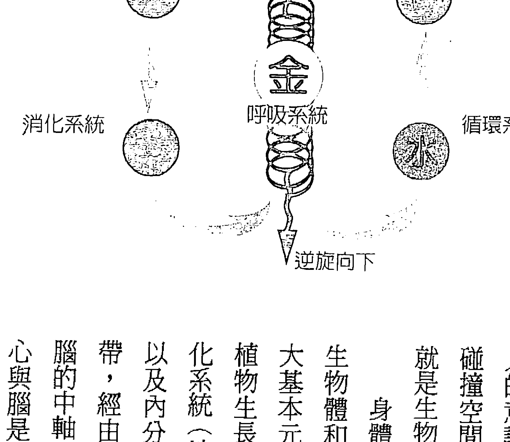

宇宙是生生不息的平衡之道。由於人的意識隨時處於「我想要」而非「我是」的狀態，這種人的意識與「我是」的斷鏈，就會產生無意識的碰撞空間。而碰撞導致的磁場改變或細胞傷害，就是生物體出現病灶的原因。

身體的自動調節機制是大自然的恩賜。人的生物體和大自然萬物一樣，由地、水、風、火四大基本元素構成，就如同土壤、水、風和太陽是植物生長的基本元素。人體的四大系統分別是消化系統（地）、循環系統（水）、免疫系統（風），以及內分泌系統（火）。

這四大行星圍繞著恆星帶，經由第五個系統——呼吸（金），進入心與腦的中軸，成為一個可以自體移動運行的小宇宙。心與腦是經由呼吸系統連結成身體的恆星控制中心，身體的四大行星系統則圍繞著恆星運行，自動維持身體磁場處於平衡狀態。若其中一個系統失衡，就會影響整體的能量運行。

## 人體能量運行軌道圖

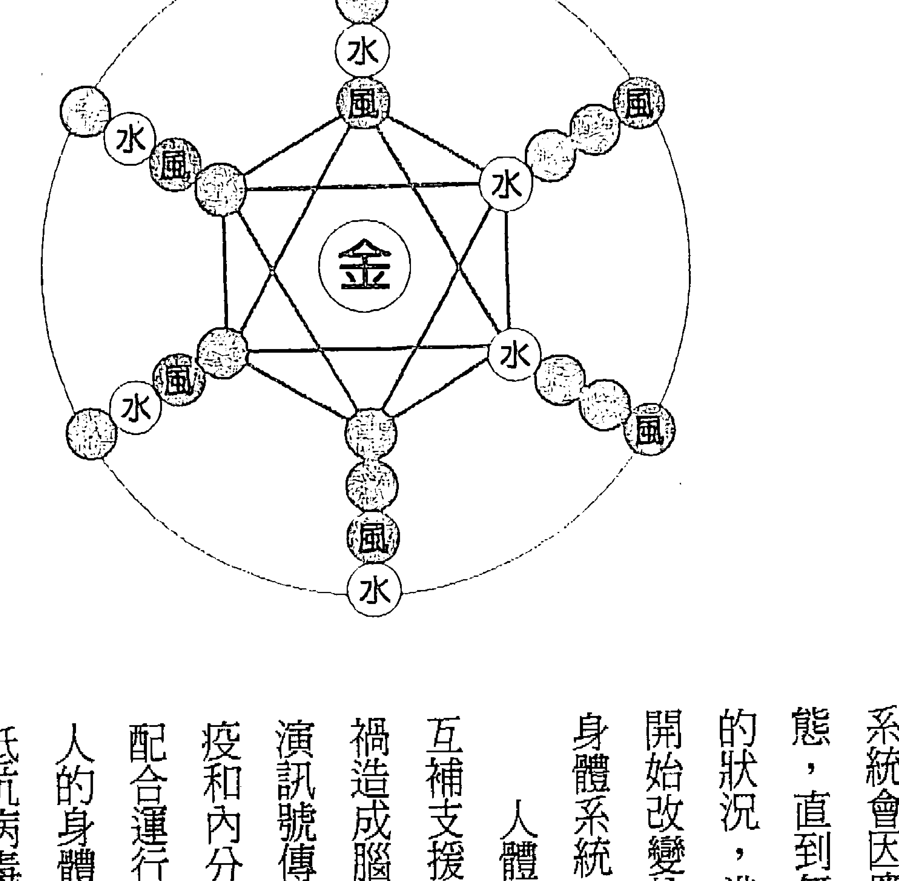

人體八字由裡的五個系統相互連結，並隨時互補支援，以維持能量的平衡。例如，某人因車禍造成腦部受損，他的呼吸系統會取代大腦，扮演訊號傳遞的指揮角色；其他的消化、循環、免疫和內分泌系統則會自動經由呼吸的氣流振動，配合運行。因此，即使大腦已經失去傳令功能，人的身體仍然可以自動運行。

如果免疫系統必須抵抗病毒，呈現作戰的緊繃狀態，消化系統就會配合，減少攝入外來能量，以降低免疫系統的負擔。這些都是身體小宇宙的自動協作機制。

當環節的能量變弱或過強，其他與之相連互動的系統會因磁場的變化自行調節，以維持平衡狀態；直到無法負荷後，就會出現能量停滯、阻塞的狀況，造成細胞病變。這就是在提醒人們必須開始改變輸入的訊息或環境，以修護已經失衡的身體系統。

身體所有的系統都與呼吸系統相連共振，每一次的呼吸不但啟動身體四大系統的微宇宙同步轉動，也會帶動身體整體的小宇宙。以金為中軸，依循著「地、水、風、火」的順序，逆時針方向移動身體小宇宙。當身體小宇宙轉完一圈時，以2D圖形來看，人體內會呈現以呼吸為中心，牽動身體四大系統恆定運轉的生命之花運行軌跡。

一個健康的人體經由呼吸創造身體宇宙的自然流動，人類就是地球和宇宙之間最佳的能量傳導媒介。豐饒的大地萬物經由消化系統的吸收進入人體，人類再藉由呼吸，將宇宙的能量導入身體的水、風、火系統，然後流入大地，形成一個完整的接天落地能量循環。

人類的能量與天地共振，人類就是地球最親密的伙伴。而地球如今生病了，接收不到宇宙能量，因為人類身體普遍出現狀況。人類無法經由一呼一吸，傳送宇宙能量給大地。這樣解釋人體和宇宙、大地的關係，你是否能夠明白？

## 人體能量運行立體圖

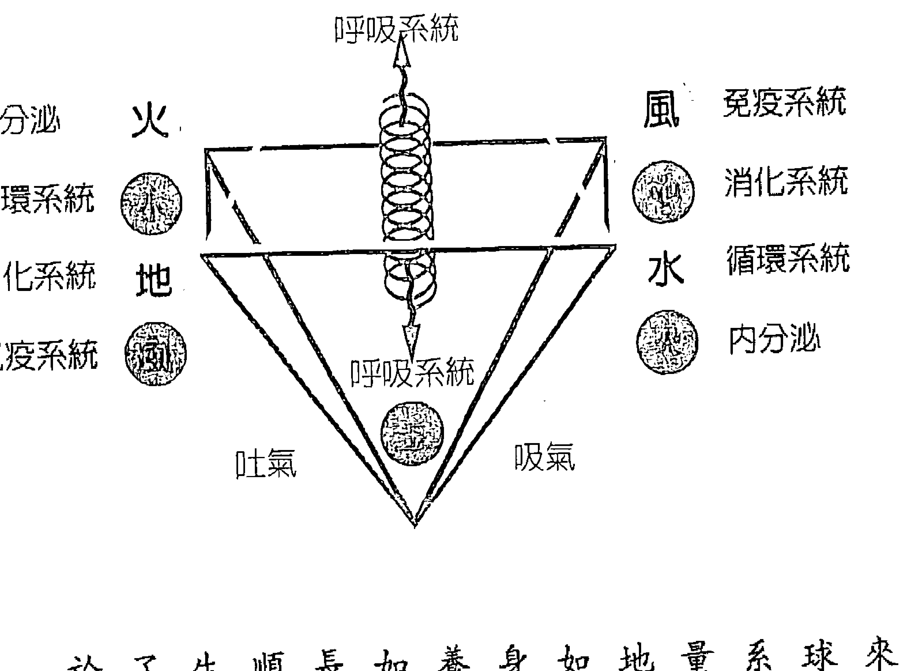

原來地球母親只要我們用健康的身體來回饋她。這麼說來，每個人的身體就是地球的小發電機，我們有意識地呼吸，讓身體系統順暢地循環，就是在為地球帶來能量；同時，健康的地球更可幫助人類接收天地之間的能量。

很多人在乎自己的健康，但如果沒有回歸有意識的呼吸，連結回到自我，讓心與腦的中軸線定位，光是研究營養學、吃得健康，仍是捨本逐末。同樣地，如果只注重物質層面，一味追求量的高度養成，卻沒有回到自己的物質身體，讓身體能量順暢運行、接入大地，也無法對生命做出真正的貢獻。

祂一開始就試圖讓我們了解地球生態和人類息息相關，我現在終於明白了。

> 是的，「愛自己如同我們愛著你」，就是給宇宙最好的禮物！

## 人體復原的關鍵

如果一個人出生之後能隨時與「我是」同在，也就是處於意識體與生物體合一的狀態，那麼，身體五臟六腑相連的脈輪場原本就是暢通的。

人體的七大脈輪，如同星系中的黑洞。各個身體系統就是一個微宇宙，微宇宙內也會產生相對應的黑洞，這些黑洞可回收五臟六腑產生的多餘斥力。如果斥力場產生過多剩餘能量，或是斥力場的能量不足，都會反映在脈輪的能量強弱。脈輪若吸收過多雜訊，也會造成脈輪阻塞與流動變緩。

因此，人體若能保持脈輪的穩定與暢通，就會達到整體平衡，身體自然健康。

只要身體能量運行順暢，人體就可以維持細胞不斷代謝再生的自體循環，所有器官也可保持良好活力。而要讓身體能量順暢運行，就必須有意識地校準你的中軸。

呼吸是基礎，經由呼吸帶動身體五大系統的能量流動，匯聚地、水、風、火四大元素，穩定人體中軸，並擴展連結地心和宇宙之心。如此運行，人的身體就是一個強大的能量場，可以吸收身體無法接受的雜訊，然後經由脈輪黑洞強大引力的分解與再融合過程，產出新的細胞，回到中樞，流回各系統。

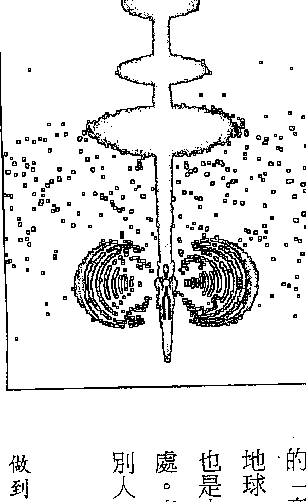

你現在可以用雙手去感測人體的脈輪能量大小，因為人的手就是帶電的導線。你從雙手之間的斥力和引力，可以感測物體產生的磁引力場。因為脈輪是身體各個系統能量匯流點，你可以測出從頭到腳、發自脈輪黑洞的能量場直徑大小，從而判斷這個生命體的哪個系統需要加強或調整能量流動。

我確實可以感知，但你這麼一說我才明白，這是生物體的物理現象。不過，好像也不必面對感測，光是用意念想著某人，甚至是不認識、也未曾謀面的人，只要透過意念，就可以偵測出這個人身上每個脈輪的大小。

你講到重點了。「意念」是關鍵詞，人的「意識體」釋放出來的電流可以穿透整個地球，到達全宇宙。這是人類身上的寶藏，也是人類有別於地球上其他生物體最珍貴之處。意識可以治療自己的身體，也可以幫助別人，幫助地球，幫助全宇宙！

這應該是神的工作，不是嗎？人也可以做到？

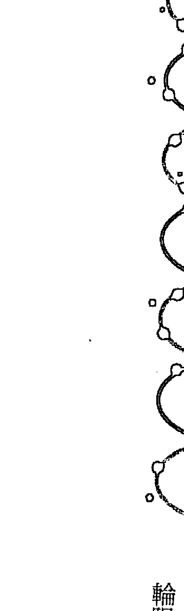

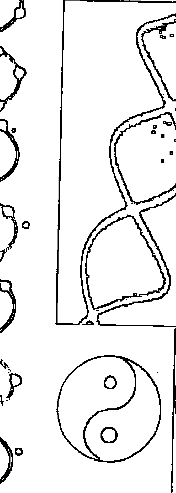

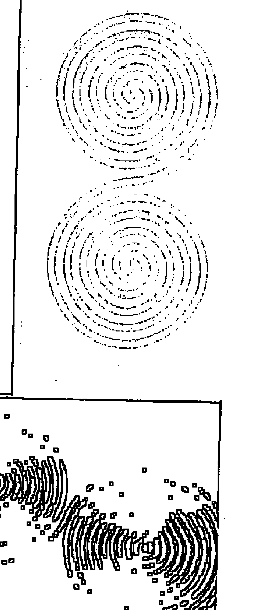

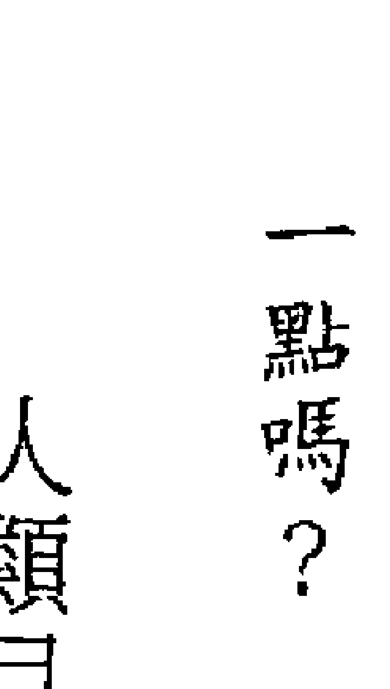

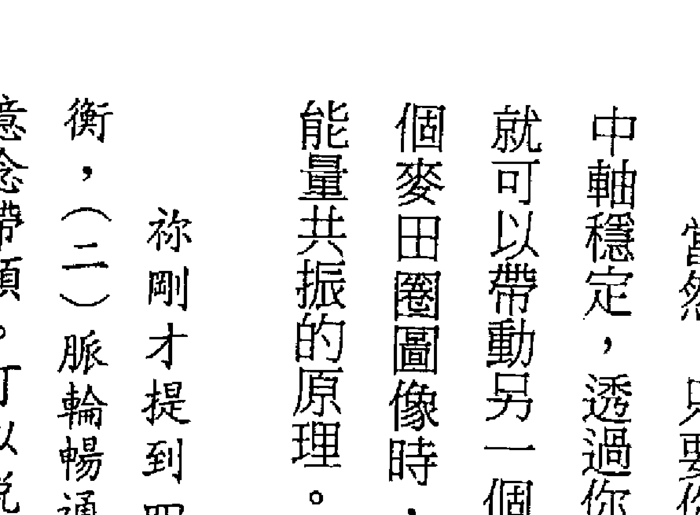

當然！只要你的身體平衡、脈輪暢通、中軸穩定，透過你的心產生的意識振盪波，就可以帶動另一個生命轉動。之前在說明某個麥田圈圖像時，就跟你提過 DNA 細胞能量共振的原理。

你剛才提到四個關鍵：（一）身體平衡，（二）脈輪暢通，（三）中軸穩定，（四）意念帶領。可以說明一下我們要怎麼做好每一點嗎？

人類目前的身體狀況，前二點都不及格，就到了第四點。因為人類都本末倒置，從第四點開始衝刺，導致中軸不穩、脈輪阻塞，身體出狀況。

我就一個步驟一個步驟地談。

## 步驟一：平衡身體

身體要平衡，就先從每天的吃講起。你吃進去的東西，有很多物質會造成身體的負擔。如果吃進的食物不是天然的，來自大地，或者不是經過生命正常生長的養殖過程，不是潔淨的水和有能量的土壤種植出來的蔬果，那麼你吃進去的，就是毒害身體的東西。不但產生不了能量，反而要耗費更多能量去消化，去啟動周邊系統協助代謝掉。

它是身體能量啟動的第一個能量來源，是「地」元素，代表身體的根基。根基不穩，就像沒有能量的土壤，怎能生養土地上的萬物？

其次，是呼吸。人類的吸氣和吐氣，就是能量在體內的推進系統，將氧吸入身體的腹腔根基（基地、消化系統位置），而不是淺淺地吸入肺中。然後吐氣時，能量流入水（循環系統）、風（免疫系統）、火（內分泌系統），完成一次完整的全身能量流動。

再來，是喝水。喝好水，讓血液保持一定程度的清澈，流入全身細胞，使細胞產生體液，幫助淋巴系統防禦外來病毒。

接著，是情緒。人的能量隨時與外界產生共振和碰撞，如果你覺得不舒服或有壓力，都會產生情緒波動，影響你的細胞代謝。這些情緒需要被理解和平衡，多多接觸大自然，參加讓你心情愉快的活動，維持良好穩定的情緒，對身體的平衡有很大的幫助。

最後是性。人類繁衍下一代的過程來自性的能量，這個能量可以讓人類突破生物體的限制，來到神性的高度。在享受性的過程中，雙方的心會產生共振的能量場。人類社會將性視為禁忌或羞愧之事，但你看遠古時代神的畫像，是否有許多美好性能量的展現？在自己可以接受或符合社會規範的情況下，好好地享受性，可以為身體帶來創造與更新的能量。

## 步驟一：暢通脈輪

提供一個暢通脈輪的每日簡單練習。

### 暢通與啟動脈輪練習

每天早上起床後，先去上廁所排便，這就是開始清理「地」元素。然後深呼吸三次，活絡你的「金」元素，再喝三口溫水，滋潤你的水、風、火等元素。完成身體的前置準備工作後，就可以開始啟動脈輪。

利用雙手來啟動每個系統的能量。人類的雙手是最佳通電裝置。五根手指分別代表五個系統：

| 元素 | 身體系統 | 對應手指 |
|---|---|---|
| 地 | 消化系統 | 大拇指 |
| 金 | 呼吸系統 | 無名指 |
| 水 | 循環系統 | 食指 |
| 風 | 免疫系統 | 中指 |
| 火 | 內分泌系統 | 小指 |

## 五大系統示意圖

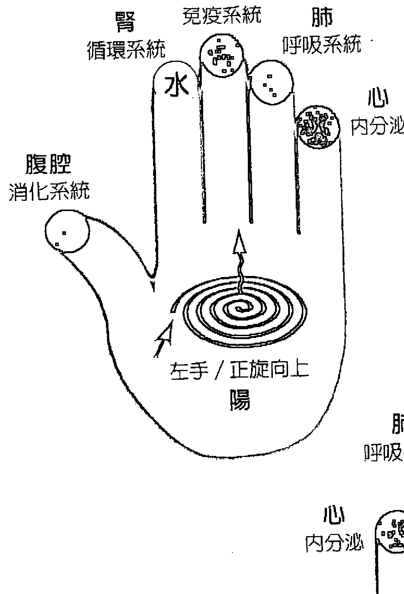

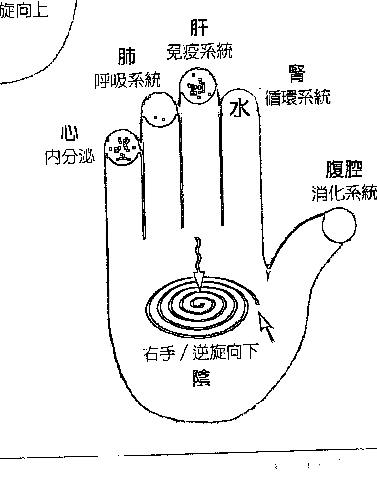

|  | 3 | 2 | 1 |
|---|---|---|---|
| 元素 | 水 | 金 | 地 |
| 身體系統 | 循環 | 呼吸 | 消化 |
| 方法 | ①右手握住左手食指，呼吸十次。意念專注於呼吸，並將宇宙能量導入循環系統，氣流正旋向上。 ②左手握住右手食指，呼吸十次。意念專注於呼吸，並將身體能量導入大地，氣流逆旋向下。 | ①右手握住左手無名指，呼吸十次。意念專注於呼吸，並將宇宙能量導入呼吸系統，氣流正旋向上。 ②左手握住右手無名指，呼吸十次。意念專注於呼吸，並將身體能量導入大地，氣流逆旋向下。 | ①右手握住左手大拇指，呼吸十次。意念專注於呼吸，並將宇宙能量導入消化系統，氣流正旋向上。 ②左手握住右手大拇指，呼吸十次。意念專注於呼吸，並將身體能量導入大地，氣流逆旋向下。 |
| 感受 | 能量流入循環系統，並將循環系統垃圾流向大地。 | 能量流入呼吸系統，並將呼吸系統垃圾流向大地。 | 能量流入消化系統，並將消化系統垃圾流向大地。 |

進行啟動身體五大系統能量的運動，身體呈站姿、放鬆；若不方便也可坐、臥或躺。接著，以「地→金→水→風→火」的順序，配合對應的手指，依序啟動身體五大能量系統。

依序完成每個身體系統的手指動作後，進行五大系統的整體運行。可以把這當作每日練習，讓脈輪流通展開，以維持中軸能量流動的順暢。

順帶一提，每天早上進行身體準備工作時，如果有排便不順暢的狀況，可以先用左手握住右手大拇指，讓消化系統的能量接地，深呼吸幾次，就可以幫助清理腸子裡的廢棄物。如果是瀉肚子，就反向用右手握住左手大拇指，讓消化系統的能量往上旋來止瀉。

| 6 | 5 | 4 |
|---|---|---|
|  | 火 | 風 |
| 全身 | 內分泌 | 免疫 |
| 方法 | ①入，全身氣沉向下。 ②左手心置於臍口，右手心置於肚臍，呼吸十次，意念專注，並將身體能量接入大地。 | ①左手握住右手小指，呼吸十次，意念專注於呼吸，並將宇宙能量導入內分泌系統，氣流正旋向上。 ②右手握住左手小指，呼吸十次，意念專注於呼吸，並將體內能量投入內分泌系統。 | ①右手握住左手中指，呼吸十次，意念專注於呼吸，並將宇宙能量導入免疫系統，氣流正旋向上。 ②左手握住右手中指，呼吸十次，意念專注於呼吸，並將體內能量投入大地。 |
| 感受 | 全身脈輪暢通平衡。 | 能量流入內分泌系統，並讓內分泌系統垃圾流向大地。 | 能量流入免疫系統，並讓免疫系統垃圾流向大地。 |

## 暢通脈輪手指操

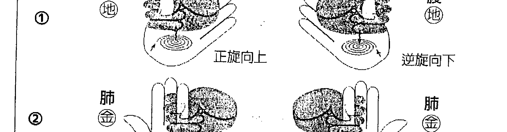

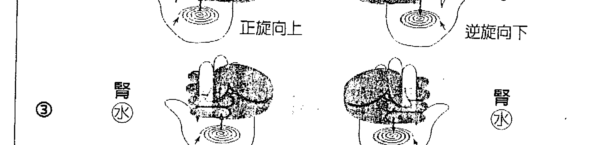

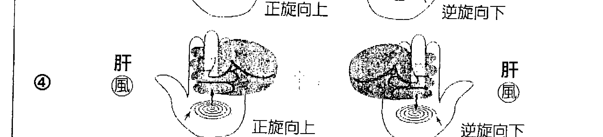

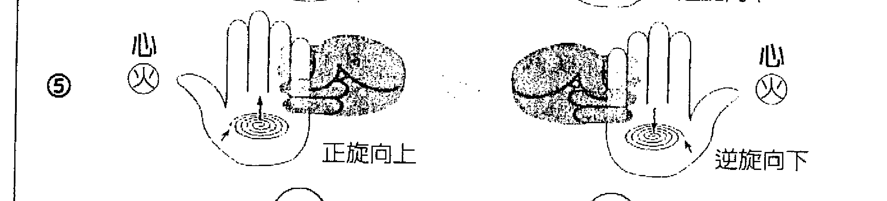

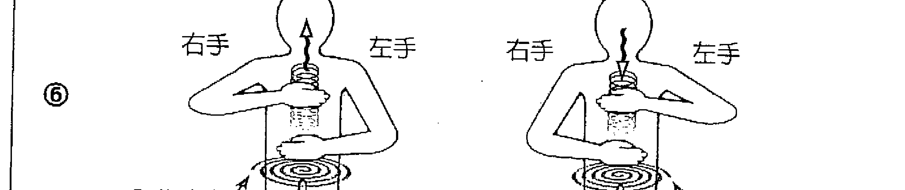

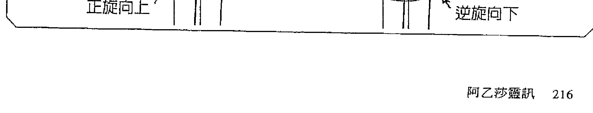

## 步驟二：穩定中軸

> 實踐第一、第二步驟一段時間後，就可以開始練習讓中軸穩定。

### 穩定中軸練習

當步驟一的「暢通陰督脈動脈練習」做完後，坐下來，身體呈靜坐姿態；將雙手大拇指的指尖抵著無名指指根，掌心向上，輕鬆垂放在兩腿膝蓋上，穩定呼吸。

當中軸的能量流動進入穩定狀態時，你身體的能量中心會呈現上下流動的光之柱。你坐在光之柱的中間位置，周邊圍繞著一個晶狀結構體。晶狀結構體中的每一面就是一個空間次元，女性有十二個面，男性有十六個面。

我們先不談這些近次元的涵義，必須等待人們完全放下小我意識，提升與宇宙合一的意識後，才能提供下一階段的說明。

當光環做完這個見證後，當你意識已經可以準確地校準宇宙之心，你會在前方看見一個由你和全宇宙的光組成的大光圈，裡面有「心部」的綠色光，就是連通你和智慧健康的宇宙之光。

我們會針對每一個人投射出他需要的光，你只要靜靜地在晶體裡呼吸，待在光中，就能讓身心得到療癒。全程療癒是非常個人化的，每個人需要的成分不同。

當你的中軸穩定於光之柱裡，宇宙就在協助你打開、擴展、平衡。你不需要做什麼，不必提出疑問，只需要在光裡享受這份來自宇宙的愛與療癒。結束後，你會感受到身心淨化、能量充足。

（心得：實際練習後發現，在穩定中軸的過程中，如果用意念拉長音地唸「阿～乙～莎～」，可以更快速穩定中軸。）

穩定中軸能量

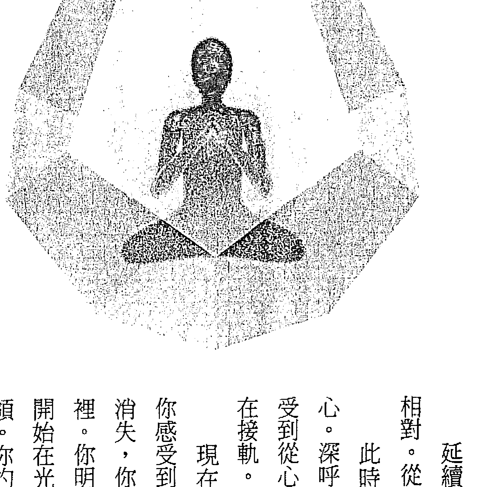

## 步驟四：意念帶領

延續中軸穩定的狀態，現在將左手的食指和中指伸出，從上往下看，兩隻手呈現三角金字塔形。

此時，來自宇宙的能量從頂輪往下進入眉心。深呼吸，漸漸地，你的心輪更加開放。你感受到從心到頭頂都敞開了，你與宇宙更高意識正連接。

現在，帶著自己緩緩進入晶狀結構體中。你感受到這個晶狀結構體的空間，你的身體已經消失，你看不見你盤坐的腿，全然處在這個空間裡。

你明白自己就是宇宙，宇宙就是你。你可以開始在光之柱中與高我連結，並開始進行意念帶領。你的意念會與更廣大、更高的意識連結，在此，你可以獲得來自你自己內在的更高智慧，以及身心療癒的機會。

我們一起來練習。

## 一、自我審視

開始回想過去所有的經歷，曾經來到你面前的每一個選擇，一一回顧。你感受到什麼？

我看見我過去未曾選擇的那一面繼續演化。他們現在的狀況，甚至他們遇到的問題或喜怒哀樂，都像是我自己的體驗。

沒錯，他們就是另一個版本的你。你當時沒有去考師專，但你看見了當年考上師專後的生活。

你還看見什麼？

我明白所有的選擇，以及那些沒有選擇的，都存在，也都是我的體驗。我感謝那些幫我活出我沒有去經歷的生活的人，我也應該好好地過我自己選擇的目前這個版本，才對得起其他人。

我們都是一體的，沒有好壞，沒有富貴貧賤，所有的經歷都存在每一面。其實就是他們，他們也在創造我。所有的選擇與不選擇既然都存在，我們只能珍惜當下。我正在經歷、演出的這一個版本，創造了彼此經歷的圓滿——如果我沒有好好地過生活，他們就無法被圓滿，而他們也正在努力地圓滿我沒有選擇的版本。

很好，我們繼續往前走。

## 二、跨越時空

你現在可以想像自己就是地球，地球就是你。回到五百年前的地球，感覺一下。

我感覺自己變成五百年前的地球，雖然到處綠意盎然、生機勃勃，卻讓人覺得很嚴肅、緊繃，很多地方的人都在進行邊界之爭。

來到現在的地球，感覺一下。地球的呼吸道不順暢，肺部受壓迫。還有，我的腹腔有很多雜物，感覺地球的腸胃也出現問題。

沒錯，現在的地球確實生病了。森林、海水、土壤都出了問題，造成呼吸、消化和循環系統出現狀況。

繼續前往五百年後的地球，感覺一下。

我的腦壓好高，身體輕飄飄的。

假如現在地球上的人類選擇繼續朝人工智慧演進，你們最終會用有限的生物腦，來對抗人工智慧的演算。你們腦壓過高，神經系統紊亂，身體無法好好運作了。

## 這該怎麼辦？

讓更多人做有意識的選擇。集體意識的選擇可以改變地球的未來。我們之前談了這麼多，就是在提醒人類回到有意識的生活。

很好，你的意念可以跨越時空，你已經領會到了。接下來，我們再回到自己身上，你現在可以掃描自己的身體。

## 三、健康掃描

你在這個空間裡，可以進行全身的掃描和療癒。用意念掃描每個器官，從頭一直掃描到腳。在每個器官停留幾秒，感覺一下該器官的狀態。

如果你覺得能量低落，或是有壓力，就是那個器官需要平衡一下。

### 怎麼平衡？

透過之前提過的，每根手指都對應一個身體系統的概念。用左右手的大拇指輕觸該對應手指的指尖，然後拇指轉圈：右手往右轉，左手往左轉。這是在排出身體的雜質、身體的阻塞。

做完排除的動作後，同樣的手指位置，但拇指轉動的方向相反：右手往左轉，左手往右轉。這是在補充宇宙新能量進入這個位置。多按摩幾次，再去你剛才覺得能量不平衡的那個位置感受一下。

好像變暢通一些了。這是怎麼回事？

## 脈輪平衡指尖旋轉操

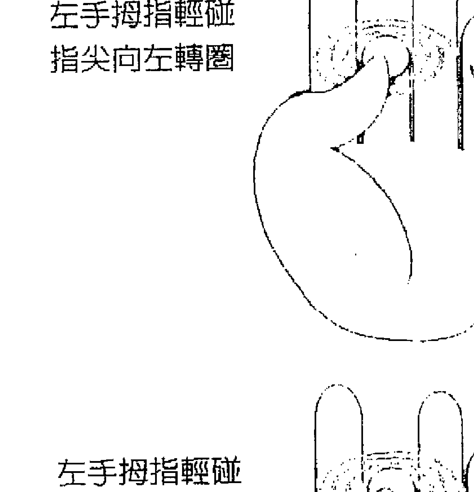

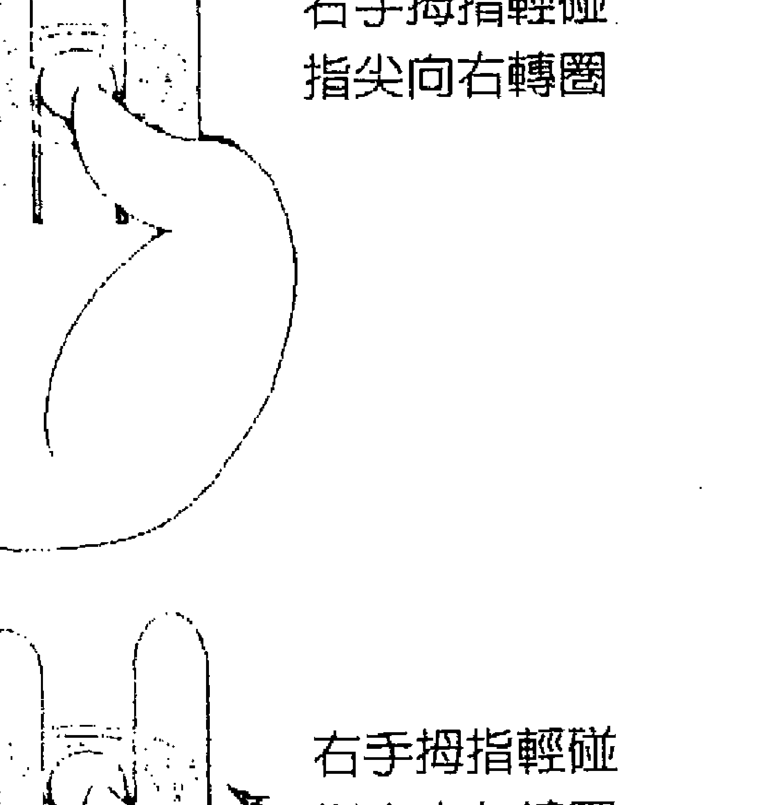

排泄負能量

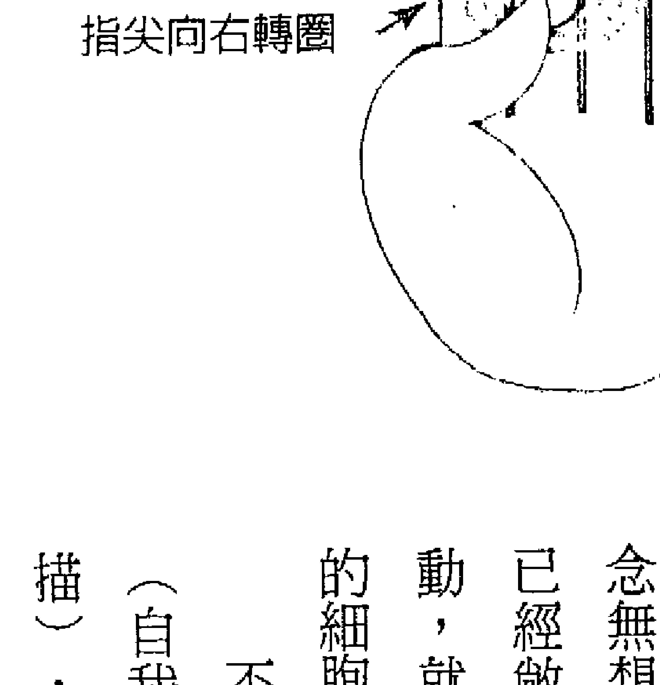

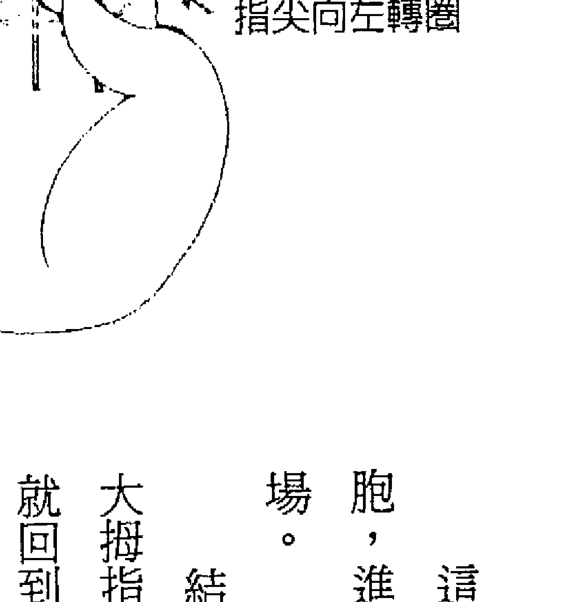

補充能量

這個就是用意念驅動身體細胞，進而平衡你那個位置的能量場。

結束這項練習後，你可以將大拇指抵向無名指的指根，握拳，就回到自己了。

接下來，可以進行第四個意念帶領練習。

四、細胞淨化。讓自己無念冥想三分鐘，使宇宙能量從你已經敞開的頂輪到心輪間自然流動，就可以讓人全身舒暢，全身的細胞完成一次深度淨化。

不進行前三項意念帶領練習（自我審視、跨越時空、健康掃描），也可以直接靜坐三分鐘，進行細胞淨化。

## 腸淨化也可以。

- 1. 提供一個使身體平衡的喝水法。先深呼吸，讓全身在喝水時一起感受水的滋潤。不要用灌的或大口喝，而是每次喝一小口，含在舌下，充分和唾液融合，再慢慢吞下。經常這樣練習，可讓水對身體進行各種深度作用。

- 2. 如果需要平衡的是消化系統，因其對應大拇指，所以請將意念放在大拇指，然後以食指尖輕觸大拇指，照著上述方向意圖。進階喝法：水含在舌下時，以意念指引深呼吸在胸與口之間循環三次。經常練習，可感受到更多生命的訊息。

## 愛是人類和宇宙之心校準的任意門

阿乙莎，我今天的練習不太順利，沒有辦法達到昨天的光。

穩定中軸這個步驟的狀態，決定了你的到達。剛才你聽見樓上的琴音，就被帶離中軸。你被你的腦帶走了，開始判斷，開始喋喋不休，你的中軸被你的腦占領了。

我正在想他左手的和弦彈得不夠精彩，還有，他那本琴譜我也有。沒錯！我的腦確實在打擾我。

你啊！唯一處在你的身體中，但心連結到腦時，就被你的腦拉回目前的環境中，你上去了。人類的位置高於心，沒辦法，這是讓你們人類可以在現實中好好生存與矗立的機制。

你必須讓你的心穿越腦的屏障，才能到達中軸的穩定。這個穩定中軸的練習不是那麼簡單的，只要有一絲一毫的偏差，就無法抵達。即使宇宙之光就在你前方，等著你校準。

你們的靜心冥想就是在幫助校準中軸，並協助中軸穩定。

### 請問何時最容易到達？

當你真正臣服，放下腦的批判與執拗時，但這一點通常很難做到，因為你們的成功經驗讓你的腦更活躍，你們依賴頭腦，甚於使用你們的心。人類所有的感官都被神經系統統合，這個神經系統的指揮官就是腦。你們很難逃離頭腦的掌控，這是生物體的防禦機制，最佳的防禦，也是最大的自我屏障。

要讓腦被突破，唯有將心的振動頻率提升到最高的愛，才能穿越這個障礙。愛是人類和宇宙之心校準的任意門。當你的心攜帶著愛的振動時，腦就會臣服，身體自然會完成中軸的校準與穩定。不只是穩定，是恆定，愛可以帶你穿越任何次元。

你要再多練習幾次。我們需要你如實如是地做到，才能帶你進入下一個階段的練習。

有些朋友經過幾天的練習後，覺得很容易入睡，也有人感覺氣的流動很順暢。我用之前指導的方法幫助我經常胃痛的先生，但因為他是鐵齒型的研發人員個性，我怕他沒太大的耐心做完全部的手指，就只要他握住左右手大拇指各呼吸十次，然後換成握住左右手的小指各呼吸十次，結果他說很有效。請問其中的道理是什麼？此外，這個方法可以用來幫助身受癌症之苦的人嗎？

想睡或氣流暢通都是會有的反應。若還沒有練習到位，就用比較不容易入睡的方式練習，站立或坐姿都可以。

會覺得想睡，是因為電流流通全身讓人感到放鬆，而人在最放鬆的狀態下除了想睡，另一個好處是可以來到靈性的創造。這就是啟動人本有的創造力最佳的狀態。大腦的干擾減少，身體的流暢將帶來自由的創作，孩子在這個狀態下，可以盡情唱歌、繪畫、跳舞、創作，不需要教導，讓來自靈魂本有的創造力揮灑出來。

至於你先生的胃痛舒緩，道理很簡單。人的手指末梢神經會釋放電流，當你用手指做出左手握住右手的迴圈，就像把那個身體系統接上電源一樣。你很清楚使用電器前要先接上電源，而身體的系統自動經由呼吸接入能量，當身體某部分的系統運作遲鈍或阻塞時，就可以用該部位對應手指接上電源，加強該部位的能量流。

你帶你先生做這個步驟是正確的，他的胃脹氣因為思慮過多，造成能量阻塞。你先讓他透過左右手大拇指平衡胃部的阻塞，然後用「火」元素小指加強「地」元素，就像是幫胃部微微加溫，改善阻塞造成的寒冷。做完後，他不但覺得舒服，還充滿熱能。這是很好的應用方式。

而談到癌症的治療，你要明白，癌症最主要的成因是缺乏「愛」。導致愛的能量匱乏的原因很多，要審視自己為何會缺乏「愛自己」的信念。人類往往認為缺乏愛是因為沒有得到關心，或是被錯誤對待造成的，這通常不是真正的原因。

愛是每個生命與生俱來的本質，沒有人可以奪走你的本質。一個人缺乏愛，是自己不允許愛的能量流動，自己阻絕了愛的能量。他的不允許和阻絕是最大的原因，那是他怎麼看待事物，也就是他的意念，以及對周圍一切的認知顯化出來的。一個人的意念產生的能量很大，你怎麼看，就怎麼「成為」。

如果用脈輪暢通來引導，對癌症患者來說，只能暫時緩解身體系統不平衡的狀態，若心的意念沒有改變，仍會持續產生不平衡。他們必須多練習把中軸進入自己的生命歷程回顧，類似之前的存在意念帶領中做過的自我生命回顧，看見過去曾經做過的選擇。你們要協助癌症患者回憶過往所有的選擇題，從現在開始往前回溯，找到當時那個選擇的原因，並且去觀察沒有選擇的那一面。

多做幾回，他們會一次又一次看見自己做出的選擇背後的原因，以及「不選擇」對他們來說，同樣是祝福。要一直往前回溯到他是如何選擇這一世的父母，不必急於將這輩子一切的發生歸責於前世業力，那前世的他已經不全然是今生的他。不需要回溯前世，這一世所有的發生與選擇，就可以讓人找到足夠的答案。

不斷地在中軸穩定的狀態下自我審視，直到他重新遇見愛。一切都源自愛，而這個愛的力量仍在他身上。在愛中，他才能真正理解自己累積的情緒產生的原因，一一看見這些曾經升起，但暫時不被他理解的情緒。當時的情緒出現之後未被理解，或是被隱藏壓抑著，就是存在細胞裡，形成你們所謂的腫瘤。

## 癌細胞戀愛

讓癌臣服於愛

當情緒被看見，並且被這個人用愛重新理解，這個腫瘤就不再需要為了安置這些情緒而存在。

去告訴眾人癌症是怎麼形成的。回到愛中，臣服於愛，經由穩定中軸的練習，你們可以在源頭和愛相遇，在每一次的經歷中看見愛。你們終究會發現，自己就是愛的化身，自己就可以療癒自己。

在暢通脈輪練習中，食指和小指分別對應循環系統和內分泌系統，這跟中國傳統經絡的說法不太一樣。我看到一些資料顯示食指對應心肺，小指對應腎臟，能否說明一下？

當你用一隻手去握住另一隻手的某根手指時，就是在建立該身體系統的磁場迴路。每根手指都與各器官相通，因此不光是食指可通向心臟，每根手指的經絡都可以直指各個器官。

手指帶動該系統場域時，就可以讓身體的智慧自行運轉。所以當你握住食指，意念帶入啟動循環系統時，就可以讓身體的智慧自行運轉。

## 意念帶領練習

這是完成脈輪暢通與啟動，進入穩定中軸後的練習。用意念觀看自己的意念，依序進行以下四個主題：

- 1. 覺越時空  
- 2. 健康掃描  
- 3. 細胞淨化  
- 4. （圖中不清晰）

循環系統時，身體是將心肺的血液和氧氣輸送到全身的血管、淋巴、細胞，乃至於到腎臟排出尿液。你們不必一個器官一個器官去點名，身體知道的。

## 未來的再生醫療

人類生病有兩個階段，一個是失衡階段，另一個是失能階段。

在失衡階段，身體各個器官仍能保持整體運作，雖然運作和生物體的正常狀態有所差異，但這是身體透過自己各個系統的協作重新調整後的新平衡狀態。這個階段不能稱為生病，應該稱為「系統調整」。你們可以經由調整呼吸、作息，和清理情緒障礙，回復原始的平衡狀態。

在失衡狀態中要啟動人體的免疫系統，可以經由兩個方向：一個是水，透過喝水或注射生理食鹽水加強體液的沖刷，讓循環系統協助將病毒排出體外；另一個是藉由減少攝取食物，清空腸胃，讓免疫系統重新站上防禦位置。

若失衡沒有被導正、回復平衡，當身體遭受外部侵犯，或因病毒造成器官失能時，就無法靠情緒治療來逆轉。這時需要更多再生細胞，來協助身體細胞或器官更新。

人類過去的醫療體系依賴化學藥劑或外科手術。這種治療手段雖然暫時止住持續失衡的狀態，但其實手術後要恢復系統的原始運行能力，最主要還是靠自體再生細胞的活躍運作。

## 穩定中軸有助於幹細胞活化

中軸穩定等促進人體回歸健康初始狀態具有重要意義。中軸穩定時，你的光之柱可以因天地宇宙能量的流通順暢，而逐漸擴展。

想像自己是一棵樹，你的中軸就是樹幹。當中軸的光之柱擴展開來，你體內骨幹流通的母體幹細胞數量就會不斷增長。人體的幹細胞在胚胎形成的階段，是百分之百活躍的；成長完成後，經歷數年的歲月，逐漸因為中軸阻塞而凋零老化。

當你們年紀愈來愈大時，活躍幹細胞的數量將不到百分之五。而透過有紀律地穩定中軸，產生的擴大能量場也可以使幹細胞再生、活躍。這些幹細胞就能提供身體的凋零細胞或損壞器官足夠的再生能力。

這也是你們的醫學研究單位正在努力的方向，試圖利用幹細胞複製或培育新的身體組織或器官。

如果以你們目前採用的介入人體的治療方式，會想辦法將幹細胞植入人體，進行再生過程。其實，你有沒有發現在胚胎階段，原始幹細胞各自長成、各自歸位，沒有透過手術分離或導入，就可以長得很好？

那麼，要如何讓幹細胞修復失能的器官？

首先，要有足夠數量的活躍自體幹細胞。接下來，就是藉由人的自體重生過程，輔以你們的意念，引導幹細胞修復受損部位。

這個過程跟胚胎成長或嬰兒的過程不同，是運用意念去修復受損細胞。其運作機制是導引幹細胞產生更大的電流，去替代受損細胞或器官的場體，和宇宙源吸收無法進入協作運行的游離體，再從黑洞生出新星球的道理相似。

你們目前的醫學嘗試用器官移植的方式，將完整養成的器官或組織植入受損的系統。這雖然可行，但植入器官與周邊系統之間會出現再融合與排斥的問題，需要磨合期，失敗的機率也高。

如果可以經由體內中的幹細胞生成，並透過各系統的脈輪黑洞擴大能量場運行，就可以進行自體再生，降低手術移植的失敗率。

### 用意念引導幹細胞到身體需要的地方

再生細胞可經由意念引導，輸送到身體需要的地方，步驟如下：

- 1. 想像你的光之柱充滿活躍的母體幹細胞。這些是你胚胎形成時的原始細胞，在你的脊體中被活化。

- 2. 接著，去覺察和偵測你身體各大系統的運行狀態。和暢通脈輪時串接左右手的方式相同，將你感覺最需要加強能量的那根手指伸出來，用右手握住。

- 3. 你的脊髓幹細胞大量，現在進入你手指啟動的系統中。隨著脈輪的轉動與擴大磁引力，這些母體幹細胞正逐漸融入這個系統，並不斷轉化分裂出系統所需的細胞組織。深呼吸，讓這個身體保持穩定，身體系統跟著順時針旋轉，直到你感覺光與熱在這裡流動。

- 4. 接著左右手交換，左手握住右手同樣位置的手指頭（剛剛若是握左手中指，現在則握右手中指），想像已經脫離系統運行的壞死組織和細胞正在離開，跟著系統逆時針旋轉流向大地。

- 5. 最後將左右手掌分別放在肚臍和胸前，進行全身系統的平衡共振。換手各做十次深呼吸，結束一次完整的意念引導幹細胞再生的療癒過程。

這整個流程的關鍵是「意念」帶領。由一個全然知曉的意念引導，才能獲得真實的療癒。被理解，幹細胞的引流重生才會有效，整個意念帶領的更新程序才算完整。

多做幾次這個練習，因為不被理解的情緒有時會深藏在身體細胞中，一開始並沒有被察覺。當你多做幾次意念引導，當細胞的代謝逐漸深化，深深埋藏的情緒才會逐漸浮現。

親友療癒，但事實上沒有這麼容易。你必須得到對方的應允，才可以進入別人的場域；若在對方無法接受或無從理解的狀況下運用你的意念進入，就是侵犯了別人的生命場域。你沒有天然明瞭那個場域的限制，與周邊環境場域可能產生的抗拒，就貿然進入，是不會有幫助的。

## 幹細胞再生練習

1. 活化幹細胞  
2. 覺察脈輪系統  
3. 輸入幹細胞  
4. 排泄壞死組織  
5. 全身系統平衡共振

協助樹木時，會先徵得樹木的同意才進行能量引流，是一樣的道理。

所有的生命都是自己的主宰，如果沒有想要被療癒的意識，任何治療都是無效的。一旦明白這個道理，你們就會將注意力放在提升人們意識的振動頻率，而不是去操作無意識的遠距或意念療程。

有些人確實可以透過意念療癒他人——當你自己的振動頻率到達無條件的愛時，透過讓他人感知你無條件的愛的狀態，就可以改變對方的振動頻率，與愛同在。這個人自然而然就被愛療癒了。

## 與身體溝通，逆齡回春

人類是否可以保持身體狀態長生不老，細胞回春？有沒有辦法讓進入更年期的男女恢復青春？

人類進入更年期後，也能有意識地喚起沉睡的內分泌系統分泌荷爾蒙，來維持身體的年輕狀態。這是人人都可以做到的，只是你們不斷告訴身體「我老了」「我邁入更年期」「我退休了，不再年輕」「我不想生育下一代了」，讓細胞失去活力。

實際上，細胞每天都在舊舊換新，循著 DNA 的指令，完成應有的再生工作。只是，你從母體出生後，就不斷因為父母和同儕的提醒，發出「我要長大」的指令，而細胞只有 DNA 預定成長計畫，也非常聽從和配合人類的意識體，不斷成長茁壯。

但是，你們成長到一個階段後，自然而然會將注意力轉向，往外探索這個五彩繽紛的世界，進入社會，建立事業和家庭，生育下一代。過程中，你們的意識體和自己的身體失去對話和連結。

在這個階段，你們的再生細胞每天仍孜孜不倦地依照 DNA 的原定計畫和指令，安分守己地工作，直到有一天，因為生病不適，或是退休，或是兒女長大了，你們才又將意識帶回到自己身上。

你們因為環境或身體的變化，將意識帶回自己身上，試圖改變身體的細胞活性或回復健康狀態，這是絕對正確的嘗試。人類其實可以不用仰賴藥物，就能永保青春健康。

停經或荷爾蒙減少，是身體的智慧因為體貼你而產生的自動運轉。細胞感受到你們的活力下降，也不需要生育新的生命，因此自動減緩荷爾蒙的分泌，但相對也讓人外貌老化、精神力下降，而這是不被你們接受的。這時，你們可以啟動與身體細胞的連結，和身體進行溝通。

身體本身就是一個比人腦更高階的能量場體，身體各系統在此能量流中隨時處於非線性的互動和訊息交換。每個細胞的 DNA 裡都蘊藏著靈性智慧，當細胞汰換、產生新的細胞，進入身體能量宇宙中，之所以能立即合作無間、各司其職，就是依循 DNA 的序列，完成細胞和身體系統間的自動合作機制。

你可以想像，皮膚被割傷時，有再生新皮膚的能力。同樣地，你的器官和各個系統中的傳輸腺體也可以不斷往返各器官間，交換需要的組織或荷爾蒙，進行傳輸或代謝，以平衡整個身體的日常運行。

你們目前採用的外科手術切除、電療或化學治療等方式，有些會導致器官不可逆轉的損壞，並影響新細胞的生長和復原機會。

回到你剛才問的細胞回春做法，非常簡單。你不需要擔心沒有新的細胞誕生在你的內分泌和生殖器官裡，只是細胞的活性需要被激發，回到你年輕時的狀態，以持續分泌豐沛的荷爾蒙。

你們已經知道如何利用金屬分解出等離子體、擴大磁引力場體。如果把等離子體做成的能量貼片放在想要強化的身體系統位置，以回春來說，就是將貼片放在腹部卵巢和子宮的位置，這樣你生殖系統細胞的能量會被啟動。系統啟動、能量場啟動後，就會自己完成其他系統的溝通協調工作。

在生殖系統重新啟動的頭兩天，你可以感受到身體各部分有所回應，接下來就能進行更進一步的意識溝通。你可以透過意識，與自己的內分泌和生殖系統溝通它們需要回復到怎樣的狀態。如果沒有生育下一代的打算，也可以跟生殖系統溝通，請它只要保持產生活力的原料供給，但不需要回復排列生殖的能力，身體會回應你的意識，並進行相對的調整。

這個意念的引導很重要。每天練習和自己的身體溝通，並讚美它為你做的一切。當你有意識地回應身體的正向反應，細胞會受到鼓舞，變得開心喜悅。

回春就是和身體建立有意識的溝通管道的細胞活化過程。這是古埃及法老王的妻子們都知道的方法。你們是在意識回到永遠青春的生命狀態。

等離子能量貼片需要天天敷用嗎？太常用是否會有副作用？

當你們使用金屬分解出的能量來輔助喚起內分泌系統和生殖系統後，就可以停止使用了。不間斷地使用會形成無意識的依賴，反而失去與身體更高意識的連結。你們太容易依賴外在的有形工具。

## 如何與身體溝通？我怎麼知道身體有聽見，且開始運作了？

你們太習慣依賴有形物品，而不去有意識地連結宇宙萬物。你們只需要一個輔助工具，協助自己的意識喚起細胞裡的意識，接下來，只要保持有意識地與身體溝通就可以了。一切都應回到意識的溝通。

這就是你們人腦的線性思考限制，有輸入和產出，有前因和後果。拿開你的線性思考，進入意識知曉。人的意識體和身體的意識體處於同一場域，這個場域不能依賴大腦進入，用腦去想是找不到門路的。

你們常用「潛意識」來解釋這個人腦想像不到也沒有觸及的領域。人的潛意識和身體細胞意識之間進行訊息交換和溝通，會被完整記錄在身體的細胞裡，而人的意識可以滲透潛意識。

如同你目前和書本連結，你會有內在的低語和「認為」，但心中會被高我的意見帶領，去看見更高的真理。應該說，你的潛意識是上兆個細胞 DNA 的意識集合體。當你的意識能夠與潛意識連結和校準時，意識就會影響潛意識，並帶動細胞朝新的方向前進。

你的自主意識和細胞意識之間的橋梁，如同高我是你的整體生命和宇宙源頭的橋梁一樣。

回到與身體溝通這件事。你只需要透過意識給潛意識下一個指令，潛意識就會開始照著做。

試著寫下你自己的指令，這裡提供一個參考溝通範例：

:::writing
親愛的身體細胞們，感激你們的支持，豐富了我的人生。在邁向人生的下半場時，我期待與你們更密切地連結和互動。請幫助我將身體細胞維持在二十五歲的狀態，賦予我充沛的荷爾蒙與活力。

請幫助我保持青春與活力，讓我的視力、聽力、牙齒、男性（或女性）性徵、皮膚、骨質密度、肌肉與筋骨的彈性、髮色與髮質、指甲的光澤都維持在最佳狀態。

我感謝你們的聆聽，感謝你們回應我的需要。我會善盡此生的責任，彰顯你們的存在。無限的感恩，謝謝你們的支持。阿們。
:::

最後對自己說：「現在，內分泌和生殖細胞已經活化了！」

每日的暢通脈輪和穩定中軸練習結束後，可以進行一次回春溝通。如果可以有紀律、不間斷地練習用意識與細胞場體溝通連結，連續做三個月，你會看見自己呈現逆齡狀態，展現年輕的活力。

「阿們」是對神表達敬意的統稱，每個人都可以用自己宗教的感謝語替代。

## 醫療系統的改變

你們目前的醫療體系是龐大的利益結構運作平台，由西方一些藥廠控制著整體人類的醫療。醫學研究單位、醫生和醫療業人員就是替這些藥廠工作的勞工，醫院則是房東，提供場所和設備，就像生產藥的工廠。

人一旦生病，就進入工廠維修。出院後以為自己是被醫生和藥物治好的，其實真正的療癒來自自己，藥物只是暫時中止人的生命系統依循原來的路徑運行下去。

生病是讓人從一輛疾病的列車上先下車的邀請，醫院就是下車時的中途休憩站。醫院的用藥是快速地介入細胞原本的運行軌道。這個化學藥物可以在短期內讓你的細胞和血液的各項指數恢復正常。

然而，真正的關鍵是你選擇的下一部列車，以及你要去的目的地是否和上一部車有所不同。

人們一直無意識地選擇同一部列車。因為你在候車站時，沒有一個醫療單位會協助你審視你的列車和目的地出了什麼問題，你當然沒有辦法得到最後的療癒。

直到生命的終點站，我們會協助你看見，也會再給你一次機會，搭上人生的下一部列車。

今日的醫療系統就是藥物輸出站，如果沒有藥物的支援，這個醫療系統會沒有病人，因為

## 结合疾病预防与病患反馈的未来医疗系统

一个更符合未来人类需求的医疗系统，是从了解疾病发生的「因」出发，再回归到「心」的运作系统，将偏移的心之振动调频回中轴，自然就可以让人体的免疫系统保持最佳的防御状态。人类自身的免疫系统是身体内的药房，身体组织发出的求救信号，都会送到免疫系统来求得解药。不过，心的振动一旦偏移，大脑是不知道要如何才能启动免疫系统发挥作用的，便转而求解药。

告诉你这个事实，是希望有更多人觉醒，来唤起人们心中本有的爱。与爱的源头连结的钥匙，就在每个人身上，不需要投射，不需要替代物，你就是自己的依靠和答案。

人们期待药物可以止痛、消炎、镇静。人类害怕自己无法控制身体病痛，对自己的生命没有信心，所以，医疗系统是人类焦虑与恐惧显化出来的。你可以在人类社会结构中看见无数恐惧化、攀附教育、宗教、法律、政治，都是集体意识的恐惧和不信任投射出来的替代物。开始看见人类过度依附而创造这些社会现象的真相之后，你是否可以看见哪些出自爱，哪些出自恐惧？在人类不断体认爱的过程中，也设下了一种种因恐惧失去爱的陷阱。看进去之后，这些恐惧与攀附也是源自爱。这是爱的另一面，没有这一面，你们无法体验到爱。这是地球二元世界的游戏，是宇宙让人类在实验爱的场域。

结果，大量的化学药物进入身体，反而关闭了体内的免疫药房。

目前人类的医疗体系着重在对治疾病，但若能将整个医疗系统往前和往后延伸，将可以大幅改善人类的健康。在进入治疗之前，身体已经发出很多警讯，包括消化、循环系统、睡眠、情绪等发出的讯号，你们统称为压力症候群或生活作息失调。其实，这个阶段是扭转身体结构崩坏的黄金救援期。有觉察力的人会开始透过呼吸、改变作息、正常饮食来调整，很快就能导正身体的振动，回归中轴。但大多数人在这个阶段都无法觉察，或者即使知道，却不采取改善措施，直到身体发病。

在身体失衡的阶段，你们可以运用科技，协助侦测身体的平衡状况，并发出警讯。

这个前端防卫系统可以作为疾病侦防的手段，却并未受医疗系统重视，因为医疗系统获利的基础在于疾病用药和手术。如果能够把医疗单位每年可以减少的病患数作为奖励指标，这样的诱因就会让医疗单位朝这个方向迈进。你们的健康保险制度很容易建构出这样的奖励办法。

另外，还要建立疾病痊愈后的追踪反馈系统。这个系统不是只观察病人痊愈后的各项身体指数，而是建立痊愈者的反馈服务系统，让已经痊愈的人回来照顾和辅导病患，建构以痊愈为核心的自我反馈服务机制。当一个人从被照顾者转为照顾者时，更能体会出自己身体过去之所以失衡的原因；而对被照顾者来说，也能得到照顾者的同理与支持。

对已经痊愈的照顾者而言，这是第二次的身心同步觉察疗程。重新跟着生病的人走过一遍，获得对疾病的全面性观照与觉醒，也可以因为对病患付出关怀，增强痊愈后的自信心。

透过前期的防御侦测和后期的反馈机制，人类整体的健康意识会朝向正面的振动频率开展，而不是让恐惧疾病的负面频率无限扩张。你关注什么，就是赋予那样事物力量。当人们把关注焦点从对生病的恐惧转回身体健康与平衡状态上，整个医疗系统就必须重新校准其存在目的，以符合大多数人的期待。那时，就会有更多资源因为全体人类的期待，而被放在健康的预防维护与疾病追踪反馈系统上。

以病随病的反馈回路为机制。

---

## 疗愈的本质

在「医疗」这个单元里，很多练习都是透过「呼吸」加上意念的引导来进行。请问呼吸在人体中的物理特性是什么？人类的呼吸是否有更深的涵义？

你们很清楚失去呼吸功能几分钟就可能死亡。你们知道呼吸对人类非常重要，却没有特别珍惜呼吸带来的自体平衡的疗愈机会，确实不合逻辑。这是因为你们过去无法从呼吸中观察到整体生命被滋养的过程和生物机转。

宇宙万物的运行就是呼吸运动。地球每时每刻都在呼吸，依赖太阳和月亮的引力进行有节奏的呼吸。每一次旋转，地球就完成一次更新换气；而地球每呼吸一次，就完成一次昼与夜的交替，并同步影响地球上所有生命的循环。人类的昼夜运行、植物的光合作用、海洋的潮汐，都跟着地球的旋转周期同步校准运行。

若地球的呼吸校准与恒星的相对位置，人类和动植物也同样需要呼吸来维持和保存生命能量。

人体有上兆个细胞，所有器官随时随地不间断地运行。要让身体这么多的小宇宙维持平衡运作的状态，就需要靠呼吸来校准整个身体宇宙，以达到和谐共振。

这么打个比方吧：你的每个细胞都因为呼吸将氧气带入身体，而展开同步运行；再细分下去，每个细胞核周围都有电荷围绕，这些带电粒子在运行时，就是透过细胞的呼吸引入氧气，让电子运转。而细胞因为带电，所以运行过程中会产生磁引力，在各个细胞间维持平衡。

人体的心肺相连，心脏每一次跳动会连带牵动肺脏的呼吸运动。这个心肺功能就像身体的太阳（恒星）。当你的心处于平和安适的状态，身体接收到稳定的能量流进入细胞；当心脏因为情绪波动而频率改变，肺脏的呼吸气量就会产生变化，而全身的细胞在每次呼气中接收到的氧气也跟着变化，让它们运动的节奏一起改变。所以，情绪确实会影响身体的正常运行功能。

你们可以观察自己是否让情绪轻易地扰乱呼吸节奏。当你排斥、生气时，会中断吸气，吐气是吸气的两倍；当你低落或悲伤时，吸气微弱，因缺氧而断续；当你开心时，一大口气深吸到腹部一起震动，整个身体的磁力瞬间放大，可以立刻影响到周围的事物跟着共振。看到没？

你的呼吸带给自己能量，也让数倍的能量进入你的能量场体。这些身体能量变化的入口，就在你的呼吸中，而你的意识决定了每次呼吸进出的品质。

再说得深入一点，有意识的呼吸可以引导细胞整体运行的能量共振，显化物质。你知道「心想事成」吧？心想事成的关键，就是透过有意识的呼吸运动全身的能量场，这个共振的磁场被延伸到宇宙一起转动而显化出来。当然，这其中会有很多变数，不是你怎么想就怎么实现，因为你发出的意念产生的磁引力场会与不同意念相互撞击，除非你的引力大于对方，或者吸引更多能量来共振，才会加速这个物质的显化。

人类过去习惯用肉眼或放大镜来观察，或是用化学分解物质来解释身体产生的现象，而忽略了整个身体宇宙运行的能量产生的交互作用。因为能量的激化或降低造成身体代谢与分解作用改变的过程无法用肉眼观察，你们只能从化学的角度去分析已经完成的结果来推断。

从量子物理的角度，可以将身体细胞的智慧重新解读出来。你们可以看见万物显化的物性逻辑和宇宙运行的道理是一致的。不论是地球、动植物或人类，都在呼吸的过程中导入能量，启动生命体进行创造，以及维持生命现象。

你们的医疗系统从化学角度的观察发展出化学药物的治疗方法。同样地，从物理角度的观察将可以帮助身体细胞回复自体运作智能，达到兼顾人类和地球生态平衡的疗愈效果。

当我可以远距侦测到一个人身体各个脉轮的能量场大小时，我曾试用意念为对方能量较弱的区域放大能量。结果当下次感应到对方时，那个位置的脉轮真的放大了。这是否表示人类有机会远距疗愈他人？还有，对施作者来说，这会不会有反作用力或造成问题？

嗯……你发现了人的意念就是一种振动频率的应用方法。透过意识，你感受到磁场的强与弱，再透过意念传达去平衡、启动、转化对方的磁引力场。当你的意念传递过去时，你们的能量场体形成一个倒8字的无限循环，由振动频率高的一方去带动较弱的一端，而较弱的能量场被较高的一端引导，提升并进而共振。这跟水的传导是一样的，一个好的意念进入水中，会改变水的分子结构。

至于你提到的反作用力，其实来自施作者自己。当你处在无条件付出的状态时，能量振动与宇宙同频，你会得到宇宙源源不绝的能量，透过你的意念锚定对象，直接传递过去。在这个状态下，你不用担心自己的能量减弱或损耗，因为当你成为纯净的光的频道时，能量会自然顺流。

如果你带有任何希望满足自己或小我的意念，你的能量给予过程就会被自己的小我撞击，产生反作用力回到自己身上。当你个人的小我意念产生作用力时，你的引力场会大于斥力场，你会吸附小我需要的东西回来，以填补小我的不足。这一切都是平衡，也是宇宙运行之道。

这么说来，如果一个人的意念可以疗愈他人，又不能求回报，在现实生活中，这个施予疗愈的人不是会疲于奔命，也无法取得生存所需的资粮吗？当一堆人跑来求助时，若不能收费，不就是滥用和掠夺有能量者的付出吗？

我并没有说付出能量不能换回能量喔！你误解我的意思了。金钱也是一种能量形式。当一个人受到另一个人的帮助时，这个受益者本能地会想要回馈给施予者，他自己才会感受到平衡。而一个人在帮助别人时，如果不是以取得他人的回馈为前提，那种无条件给予的品质才具备真正的价值。

世间一切交易的本质是「互助」。「我帮你，你帮我」这个过程中的能量传递被「交易」这个词取代，而让人类忘记互助的本质。其实，金钱只是人类创造出来、方便交易时评估价值的工具。

当对价计算工具不存在时，什么会消失？（是中间人吗？）是的，但也不只有中间人，还有你们的税务机关，以及一些有心坐享其成、想要不劳而获的人。那些把焦点放在如何创造金钱，而不是如何帮助别人的人，会逐渐被觉醒的人看穿和淘汰。人类如果回归互相帮助这个交易本质，就不会无意识地追寻金钱，而是会善用自己的能力，去创造彼此和整体人类的幸福。

---

# 第五部 宇宙

## 全息宇宙

### DNA里隐藏的密码

这宇宙到底是由什么组成的？有阿卡西、克里昂、哈索尔、天使军团、灰人、爬虫族、天狼星……我搞不清楚这些名词，以及它们之间的关系，可以帮助我们理解这一切吗？

宇宙基本上有十二次元，就像人体的灵魂DNA有十二股螺旋，而人类就位于最高的十二次元源头，也同时存在在你们的DNA中。

### 什么是次元？

次元就是能量振动频率，类似你们说的「赫兹」。但宇宙每个次元的振动波频单位对地球来说过高，你们无法用工具侦测到，所以人类无法体会。

人体有个机制还没有被科学家找出来，就是DNA。DNA隐含了灵魂的频段密码。你们身上的DNA都具备全部次元的频段码，就在你们的细胞层。你们的科学家采集的DNA是生物样本，我们之前说过，细胞和细胞粒子中间有等离子体，这个等离子体就是你们的灵魂在体。所以生物体DNA的一般螺旋体中，隐藏了十二个灵魂频段。

你们人体目前在三次元空间运用的频段，算起来不到百分之三十，还有一大部分较高频段是封闭的。这应该说是当初播种人类至地球时，为了让人类生物体演化过程完整进行的必要保护措施。

当地球生命来到更高次元时，人类细胞中封存的DNA频段会一一打开。现在你们只要将灵魂意识调校到更高的频段，就可以接通更高次元。在《灵界》这部电影中，灵界在验证细胞分解成粒子那一段，就是她的意识已经到更高的次元。

但是，你们不用担心自己会因为灵性DNA频段打开至更高次元而在地球上消失，你们的身体仍然可以存在于三次元中。

你们可以透过灵魂意识校准到更高频段，来调整恢复身体的原型，还不至于分解成一颗颗粒子。你们身处的地球密度仍在可以保护你们生物体的阶段。当进入九次元以上的空间，生物体就不再显化，只有意识存在。

人类细胞的DNA可以跨越不同次元沟通，就是靠你们的灵魂意识展开。之前提过畅通脉轮、稳定中轴的用意，是要让人体中细胞等离子体的通道畅通，这个通道就是灵魂的传输线路。

我们不是一开始就提到人是地球的传输线路吗？DNA中虽然有清晰的频段让人类跨越不同次元，但传输线路若不畅通，就到不了。多做几次前面提过的意识校准、畅通脉轮、稳定中轴等练习，你们很快就可以到达共同意识源头了。

宇宙意识次元有许多珍贵的频段宝藏，供人类和宇宙所有生命共享。阿卡西纪录目前已经对地球生命全面开放，因为地球的振动频率已经跨入快速学习阶段。阿卡西纪录储存的资料量庞大，每个人的DNA也都具备读取个体频段，因此所有人都可以读取阿卡西纪录，获得生命的答案。

你们可以依照自己的兴趣、疑问，以及想要理解与开启的课题，自由地进去探索和「挖矿」。你们常常说的比特币挖矿，其做法也是从阿卡西得到的启发，只是这个原本用来挖掘自己知识宝藏的方法，被用到显化为金钱的交易模式中，这也是人类自由创造的过程。

不久的将来，会有超过一半的人类都可以亲自读取阿卡西纪录，并从中获益。你们不需要再进入「人造心灵」与再学习的轮回阶段，现在就可以快速进入创造阶段。

除了阿卡西纪录的频段外，还有很多意识频段储存了不同功能和目的的资料，这些都是超过数十亿年协作和累积建立而成的资料库。

其中包含「基因频谱资料库」，里面保存整个宇宙显化出的物质与非物质生命的DNA序列。这个资料库尚未对地球人类开放。储存这个基因频谱的工程更为浩大，人类的基因编辑计划和星际所有存在生命体的基因图谱都源自于此。当各星球生命物种演化出新的生命体时，这个新的DNA序列资料就会同步储存在这个资料库中。不管是否有外星生物采集你们的基因，这些都是你们DNA里面的自动上传机制，连突变的物种资讯也会一并上传。

另外，还有「情绪资料库」。这是最有趣的演化。在宇宙共同意识的源头是没有种种情绪振动的，源头只有合一的意识，一种宁静安详的频率，就像你们心电图的一条直线，没有振幅。而在一些高次元的星球上，情绪最多只有三种，或者不超过五种。

至于地球上，人类扩展和爆发出来的情绪种类非常多元，还可以交错、重叠、内化和转变。比如说，你们的爱中有酸、甜、苦、涩，由爱生恨、嫉妒，甚至英雄气概。这些复杂交错的情绪体也激发出人类无穷的创意，在你们的音乐、艺术、文学、美食中都可以看到情绪化出的创造能量。

这是宇宙的奇迹。你们人类创造出来的情绪能量，也成为宇宙其他次元学习的教材。但也因为这些情绪，许多灵魂意识失去方向，或是在离开生物体后急着投入情绪体验，忘记回到共同意识的源头。

以上介绍的是一部分的频段，还有许许多多星际协议。我之后再说明，我们先回到意识源头——阿乙莎。这个源头在十一维，也就是宇宙存有的共同宝藏，因为这个想象就是所有意识的「家」。你们人类认识的佛陀、阿拉、基督这些曾经在地球显化的觉醒者的意识，也都在这个源头。

为何这样说是宇宙存有的共同宝藏？因为大家不论分离肉体在哪一个次元，不管生命旅程经历哪种文化的洗礼，最终都会回到家。

你们只是用不同的语言、不同的文化、不同的种族、不同的次元去体验爱。源头是永远不变的一体存在。宇宙源头以外的所有发生和结果，都在体验爱。

你们曾经思考过的撒旦、魔鬼、希特勒，也都是为了彰显爱的角色选择。唯有选择扮演那个「恶」，才能让更多人体会到爱。

阿乙莎为所有宇宙存有而存在。只要回到自己，就可以回归阿乙莎的源头。我不是远在星际的天边，我在每个生命里。

---

## 宇宙接触的真理

很多人把宇宙想象成地球之外的太阳系和银河系，你们还没有「宇宙是往内看」的认知。人类生存的地球是一个宇宙产出的星体。你们用望远镜去看星际里的一点星光，那里的生命也同样在探索天外的地球，只是天外那个次元已经了解如何到达地球，而在地球的你们尚不知道要如何到达数百万光年外的星球。

那么，请告诉我们要如何到达外太空的星球？还有那些外星人是怎么来的？

你们用物质世界的观点永远到不了。即使到了，也不是用你现在的身体去的。因为以人类生物体的细胞寿命，以及你们用燃料动力推进的运输方式，是无法到达的。让我们用一些问题帮助你反思这个接触宇宙的想法。

### 为什么人类想去外太空探险或殖民？

我想可能是因为担心地球爆炸，或是有一天太阳不见了，地球生命会灭绝。为了后代子孙的生存，我们需要往太空前进，寻找适合人类的居所。

再告诉我，你们为何那么相信地球会灭亡？你们又为何相信外太空的星球会有适合人类居住的地方？

这我就无法回答了。我们发现最有可能的火星，环境好像也比地球上的北极圈和非洲沙漠还要困难。

如果没有具体的危机和效益，你们为何每年花费数千亿元发展太空科技，买一个「保险人类未来」的计划？

是有些奇怪。但照你之前的教导，这也是人类探索未知、彰显冒险精神的自由意志啊！

你想过第一个太空探险计划的缘起吗？

我当然无从了解，那时我还没出生吧！

是的。你们大多数人不知道人类是从何时开始想象一个太空外的生活世界，也不知道今日为何要往那里去。

可以说明一下吗？

最早是来自星际的邀请。你们未曾接触过的外星生命发出讯息邀请地球人，当时的许多国家都收到了这份来自星际的邀请，因此激发当时的国王和领导人扩展疆土的想象空间。

人类早期的领导者都以开疆辟土来巩固自己的地位。当时地球的土地已经分裂，一个民族在地球上不可能占据百分之百的领土，自然就顺着这份邀请，想往外星球去占领土地。

你们可能为了全体人类未来的幸福而去探索太空吗？若不是为了自己种族的生存，或是有竞争的想法，你们会有动机或愿力来完成吗？

你们在不确定外星生命的邀约是否带着善意的情况下，进行了多年的外星殖民探索。背后的真实原因来自帝王心态。这个「土地为王」的心态一直被人类传承下来，至今变成一个争取资金的梦想计划。唯有造梦，才可以得到源源不绝的金钱投入，还不用检验是否符合经济效益。

从经济和资本的角度来说，确实是这样没错。再者，你们的生态学家试图从外星球上的土壤寻找珍贵元素，并采集外星生命。你现在可以理解这是怎么回事了吗？

我觉得很OK啊。如果可以找到地球没有的特殊元素来创造新能源或药品，不是很好吗？

这就是物质的幻象。你们总认为生命要仰赖物质来滋养，而忘记生命显化了自身需要的物质。你们身处的地球环境已经显化出人类所需的一切元素，你需要的，地球都会无条件给予。

照这个逻辑，如果人类真的需要往外星，那颗星球的环境也可以提供我需要的元素吗？

不是的。你们的地球母亲就是人类的母亲，她会给予你们无条件的支持；但外星球也有自己的孩子要照顾。人类移民过去，就只能靠自己的生物体再次演化来适应那个星球的环境。

所以，你们等于在伤害自己已经演化到目前阶段的身体智慧。你们可以要求政府公开太空探测科学家以及太空任务结束返回后的健康资讯，让大家重新审视这个外星殖民的做法是否真的符合人类的需要。

你刚才说有来自外星种族的邀请，又说他们可以来到地球，我们却无法过去，那人类的处境不是很危险？敌暗我明？

所以，我必须说明宇宙接触的真理。

灵魂意识可以超越次元和时空的限制。当人类不断往外太空寻找宇宙生命的足迹时，真实的状况是，你们的灵魂意识一直和宇宙存有连结，你们是一起的。

当进入夜晚，你们的生物体熟睡时，灵魂仍在工作，包括与星际存有交换讯息。你们的灵魂展开自己的生命轨迹，悠游在宇宙之间，不一定在地球上。

这超越我的理解。我很少做梦，通常醒来也不记得梦境。还记得有一次，我梦里的情节非常有趣，我还在梦中告诉自己要起来跟家人分享。结果一睁开眼，全忘光了，好像瞬间被删除资料一样，完全清空。

这是你们细胞DNA的封印计划之一。灵魂来到三次元空间，需要专注于低频物质的显化工程。如果你们的灵性意识主要超越了生物体，就会和细胞对不上频率，你们的身体将无法有智慧地运行。

身体的自动化机转虽然需要灵魂意识协助校准源头，但这种校准不能超越身体在地球场域的自动运行机制。你们的身体细胞本身已经演化出智慧，才能帮助人类在地球上繁衍和生存。

与身体的智慧不同，灵魂意识没有时间与空间的概念。因此，灵魂不会像身体一样需要「睡觉」，只有「在」与「不在」。当你们的意识无法处于当下，就是「不在」了。而灵魂意识不在并不代表消失，而是交棒给你们的意识来掌控身体。

## 靈魂意識不在時，去哪兒了？

仍存在你的心中，在等待，在旁觀，在提醒，甚至幫你找救兵、找幫手，一直都很忙。有時還真的跑去別的次元玩。它也一直在等你「對頻」，也就是「覺醒」——從睡著的狀態中醒來。

好，現在回到宇宙溝通的主題。宇宙溝通之門，就在你們的靈魂意識裡。其位置在你們的心輪。心輪可以開啟連入各次元的頻道。之前跟你說過，頻道在你們細胞DNA的十二股靈魂螺旋體中，傳輸線路在你整個身體的中軸脈輪通道，而最後的關鍵，就是 Power On & Off 的開關，它在心輪的位置。

這讓我想起鋼鐵人，還有超人，他們心臟的位置就是 Power 能量的來源。

你以為好萊塢編電影的題材是人類獨創的嗎？那是人類與高次元的共同創作。很多電影已經將未來的生活生動地演出來給你們看。沒有錯，心輪是鋼鐵人和超人的力量來源。

那麼，可以教我們怎麼把開關打開嗎？

這是關鍵，不要急著知道。你必須先花三個月好好練習暢通脈輪、穩定中軸，練習回到有意識的吃喝和生活。當你回到讓意識帶領身體、過著平衡的生活時，我再來告訴你怎麼把開關打開。

## 地球人 vs. 宇宙人

如今，地球人即將成為「宇宙人」的一分子，暫且稱你們為「地球人」，我們來談談宇宙人和地球人有哪些不同。

### 一、宇宙人沒有壽命限制

要成為宇宙人，第一個要擁有的正確觀念是：死亡並不存在。

宇宙的時空，一切是無限的。8 躺下來形成的那個數學符號，代表無限。無限沒有 0 與 1。

宇宙入口：心輪

宇宙是一個點，如同一個黑洞，可以無止境地吸入與吐出，消失後再生。就像你們的身體細胞每天都在死亡和再生一樣。你的生命並沒有因為單一細胞死亡而消失，而是細胞瞬間創造並成就你生命的搖籃，就如同地球母親承載著地球上所有生命的孕育和滋養工作一樣。

當地球上的單一生物體死亡，地球不會因此死亡；同樣地，地球就像銀河系裡的細胞，若地球消失了，銀河系並不會消失。我們現在就是從無限的銀河生命來跟你說明這個生生不息的過程。

你們身在地球上，會誤以為生命是有限的存在。但是，當你的意識從源頭這個角度去看生命時，你會認為一個細胞的死亡是死亡嗎？不會的。那就如同一個細胞消失，去迎接另一個細胞誕生。

我還是不太懂……

不懂第一點沒有關係，我繼續說下去，你會更明白。

### 二、宇宙人是多重角色同時存在

這個我應該可以理解，就是指一個人可以同時扮演母親、女兒、太太、婆婆，這和地球人是一樣的。

我講的不是單一個體的不同角色扮演，而是多重個體的多重角色扮演。打個比方吧，你們人類的宗教很多元，有各種不同的門派，東西方文化誕生了不同的宗教領袖。你們也會請法師、宗教師，觀世音聞聲救苦。

但是三千大千世界，芸芸眾生，一個人怎麼可能一瞬間幫助解除這麼多苦難？這其實就是意識多次元完全化擴展的結果。

地球人的意識是線性的延伸。你是你爸爸的兒子，你兒子媽媽的先生，你岳母的女婿……每一層關係背後都可以拉出一條線連結著你。這些關係源自你，但他們不是你，你是這個你之外的一個獨立存在個體。

而宇宙人多重體的多重角色存在，意識是自源頭同時誕生了很多個不同的你：有你，以及你的爸爸、媽媽、兄弟姊妹、配偶、子女等。你誕生時的意識可以向四面八方展開成不同的角色扮演，這些都是源自你。

而這些角色可以再擴展成不同的關係與連結，串聯成一個多維度的關係網絡。這個關係網絡無法用線性來說明。

這有什麼意義嗎？這樣不是變成君不君、臣不臣、父不父、子不子，亂成一團？意識擴展成這樣，就變成我的爸爸跑到另一個時空成了我的情敵，或者我媽媽是我的兒子之類的，是這個意思嗎？

沒錯，在宇宙人的次元，這些都相互連結，統統源自你，而且可以再創造連結。

當你們進入催眠狀態，你以為你上輩子是埃及王后，或是被某個敵人殺了之後，下輩子再去復仇，或是從西方人變成東方人，一世又一世輪迴扮演角色，其實這就是多重體的多重角色顯化。

### 三、宇宙人知道自己和源頭緊緊相連

地球人自誕生的開端就被封住了與源頭連結的記憶，所以不斷在此地打轉，就像進入迷宮，找不到回家的路。

一旦你們認出自己就是宇宙的一分子，這個與源頭始終連結的關係就會被憶起。你們不會再認為自己孤立於地球上，創造力將會躍升。

### 四、宇宙人是跨越次元的旅行者

這點我目前不多做說明。沒有跨次元旅行，就無法自由地創造與進行角色扮演。我會在適當時機再跟你說明如何進行跨次元旅行。

### 五、宇宙人自身的變化不用假手他人

由於宇宙人跨維度扮演多重角色，當某一時空需要某種特別的技能或知識時，就可以直接在自己身上找到解決問題的辦法或技能。

也就是說，宇宙人知道如何找到自己所需的東西，然後立刻「成為」，不必從頭開始學習或請教別人。

所以，宇宙人是通才，只是選擇不同的角色去扮演、從事不同的工作；而地球人忘記自己是通才，且認為只有重新學習，或是將自身力量交付他人。

時間存在，也都源自你。那些角色只是你不同次元和維度的全息展現，當中沒有前後、沒有因果和所以，不是線性的關係。

宇宙人可以選擇，也可以在不同的次元間穿越和體驗。現在處於三次元的這個你只是全部的你的一部分而已，你還有好多面，就像宇宙繁星一樣，那些也都是你。

你和所有的你都在這個無限的體驗中，都在「同一個」裡面的不同維度。你是地球人，也是宇宙人。

### 六、宇宙人決定如何顯化

有一部分演化程度更高的宇宙人，可以決定用哪種方式顯化自己的形體，或是不以形體的方式存在。

從以上這幾點，我大致可以想像宇宙人的存在方式。這樣說來，宇宙人或外星人應該也存在於地球上，那是他們一部分個體的角色扮演，不是嗎？

親愛的，你不就是在說自己嗎？

你現在是否憶起了，你是地球人，也有宇宙人？所有的地球人都是宇宙人，你們不是獨自生活在地球的個體，我們是一體的。

宇宙人與地球人

## 全息化訊息場

宇宙人具備全息化存在的概念很有意思，是否可以延伸說明這個觀點？地球人如果讓意識呈現全息化，有什麼幫助？

全息化就是多維度、多重角色觀。你可以透過自己找尋全息化的資訊網絡，讓自己處在這個網絡系統中。當你中軸穩定、順暢暢通時，你就在這個晶狀結構體的中心位置。

從這個結構體可以三百六十度向上、向下、向左、向右、往各個角度看出去，就是從自己這個點的角度看出去。

全息化的晶狀結構體

連到一個線，再進入一個面，而這個面和其他的面緊緊相連，你的意識就可以帶著你往不同的面展開探索。

當你進入那個面的同時，你會處於那個晶狀結構中，又一樣地往四面八方展開結構。整個宇宙就是如此展開與連結的。

從你自己這一點開始，你就可以進入宇宙不同次元的網格中。

### 一、理解與知曉

那麼，對目前生活在地球上的人類來說，這樣的晶狀結構展開有什麼好處？

你可以從自己晶體中開始連結和探索，連結到更高、更廣大的視野，進入過去與未來的你，以及連結進入你以為和你是分離的一切。

我們體內的晶體中，自他交換，獲得對生命的理解與知曉。當處於這個理解與知曉狀態時，可以讓人心安定，世界和平。

透過更高、更廣大的「看見」，你會知道一切都與你相連，也都源自你。

### 二、憶起天賦才能

你可以從自己的晶體中找回遺忘的片段，可以探索自己的天賦才能。

有某些片段的你是個教育家、醫生、雕刻師、藝術工作者；你只是還沒有憶起那些片段，自己去找找看。

### 三、與高我聯手創造

處於目前這種低頻振動和環境資源有限的情況下，你的創意只能在三次元空間打轉，無法突破現況。

唯有連結到更高、更廣大的你，與那個具備一切才能的你聯手跳脫時空，解構現況的創造，創造屬於你的另一個晶狀結構。這種創造是聯合高我。

### 四、顯化未來

當你進入與高我聯手的創造過程，原有的晶體可能會出現破壞、解離、消融或轉化的現象。這些都是必要的過程，不要過於擔心失去控制、害怕改變。

因為新的晶狀結構正在舊晶體中連入連結。

你們的國家和整個地球目前就在這個轉變的過程中。有些生命會覺得失去動能、過得很吃力、迷失方向，這些都是舊晶體解構過程。

這個時候要學會穩定自己的中心軸，從中軸去發現哪裡正在鬆脫，這個鬆脫往哪個方向移動。

當你可以感覺到新的晶體就在自己的軸心時，不妨打開心去接納那個微光或逐漸放大的光明。

不要固守在自己的晶體裡，想法已固化你自以為可以掌控的一切，也不要抗拒和害怕前進。只要帶著自己走向新的光明，未來就會被你顯化出來。

## 審視自己的晶體

你可以從審視自己的晶體開始，練習用全息化、更廣大的視野進入宇宙的大門。

## 個人晶體靈視練習

① 先深呼吸三次，進入靜心狀態。如果還沒能進入，是因為中軸尚未穩定，要多做呼吸帶領的脈輪通手指操，練習穩定中軸。若你已經習慣了脈輪暢通和穩定中軸的練習，現在讓身體舒舒服服地坐著，再次深呼吸，你會感受到自己已經處在晶體中。

（這時，我看不到影像也聽不見任何聲音，只是感知到自己處在一個晶狀結構中。）

② 你的四面八方有類似蜂巢的網格，現在你可以先選擇其中一個面。（我先選擇右上方的。）選好之後，帶著自己走進這個網格中，進入該晶體的中央位置。

你再感覺一下，這裡是哪裡？你在此扮演什麼角色？在那個角色裡，最令你滿意的成就是什麼？你看見了什麼呢？

你可以在這裡停留一陣子，好好欣賞你的作品。不用懷疑你的感覺，跟著你描畫出來的世界。

③ 看看這個作品的特徵或發明，帶回你目前的世界。也許你會看見你從沒有看過的某個發明或色彩，你可以將這個感受帶回現代。顯化出這個作品之後，你的心情如何？

④ 是的，你對當時的結果下一個結論，所以你帶著這個想法，決定了你下一次的經歷。你現在可以直接進入你當時決定要體驗的下一個新角色。

同樣地，選擇屬於那個新角色的網格，帶著自己走入第二個晶體的中心。

你現在的感受是什麼？你看見你扮演的角色了嗎？你在這個角色裡，最重大的成就是什麼？在這個角色裡，你具備什麼樣的天賦才能？

好了，你可以繼續走下去，發掘你的天賦，看見並欣賞你曾經創造的輝煌。你可以隨時在晶體中探索，這是每個人都可以挖掘的資料庫。

透過環顧一個個晶體的旅行過程，你是否對自己的生命曾經擁有的創造力驚嘆不已？那些經歷都是你，所有的天賦也都內化到現在的你身上。

帶著自己往前走，繼續挖掘你的天賦和生命旅程，然後我們再次分享心得。

> 再次回到你的顯化物帶給你的感受。這時，你因為帶著這份感受，而決定下一次需要再體驗不同的做法。你看見你為自己定義了一個生命旅程的目標，你同時也攜帶著你這一次和上一次的天賦，來嘗試不同的創造。

晶體的蜂巢結構

## 尋找自己的生命藍圖

## 愛的進行式

我依照祕教導的方法，審視了一遍我生命旅程中的角色扮演。在每個角色中，我的學習和感受都很真實。

我終於明白人為何會不斷地經歷，因為每一段學習和經歷，最終都會來到自我反省；說得更明白些，就是對自己當時生命的結果做出定論。

這跟民間傳說和宗教所講的死後審判不同。我的理解是沒有任何審判，審判長其實就是自己。與其說是審判，不如說是再給自己一次機會，嘗試不同的做法。

除了看見自己哪方面比較在行，另一個領悟是：我在每個角色中都不斷運用自己已經具備的天賦才能。

這些天賦不會因為我們轉世扮演不同角色而被遺忘，也不需要從頭學習。我很快就可以運用，即使在不同次元、不同領域、不同角色裡，都可以揮灑出創新的成果。

沒有一個人是相同的，每個人都具備特別的天賦組合。同樣是醫生角色，有些醫生具藝術家的天分，有些則是有科學家的天分，不同的天賦才能可以在同樣的領域裡創造出不同的成果。

經由環顧一次又一次的生命歷程，我終於明白自己是帶著什麼樣的心情和期待做出這次的地球體驗計畫，我的生命意圖和想要完成的工作更清晰了。

沒有經過全息化審視自我體驗的過程，我不會全面理解自己為何在此。我也終於明白自己其實早已做好這次的體驗計畫，不會再被社會集體意識綁架自己的一生。

每個生命都有自己的藍圖。這個生命藍圖是為了演繹自己未臻完善的善的工作，而再規畫一次體驗。

想要完善自我生命的意圖，決定了此生的生命藍圖。理解了一點之後，我得到前所未有的自由感。

以上是我的心得分享。可是我還想知道，這一次次的試煉到底是為了什麼？如果每個人都如此追求完美，真的會沒完沒了。永遠都要再試一次，這背後的真實意義在哪裡？

這是關於一個生命藍圖的展開。生命之花的綻放過程就是愛的進行式。如果沒有經過一次又一次的試煉，愛就無法流動，就成為一汪靜止不動的水。

沒有波浪，沒有潮汐。無邊無際的愛的大洋是你的源頭，也是每個生命光點綻放過程匯聚而成的大海。這整個生生不息的過程，就是宇宙的智能系統。

我們是否可以選擇拒絕再做一次？也就是說，如果對自己經歷的結果覺得足夠和滿意了，我們每個人都可以決定要不要再做一次嗎？

當然可以。你們擁有絕對的自由和個人意願去決定自己是否要重新經歷一次。沒有當時的意願來設立下一回的生命藍圖，你們不會在此。

這麼說來，每個生命的誕生都是自己決定的，也都是因為自己覺得還不夠完美，需要再來一次，是嗎？

可以這麼說！

那麼，如果一個殺死千萬人的大壞蛋自我感覺良好，他臨終時覺得：「我終於做到了，我好滿足。」這樣他也可以回到源頭、回到天堂嗎？那裡沒有人或上帝會審判他，將他送入十八層地獄，永不得超生？

是的，雖然我這麼說你們可能會非常生氣，無法認同。

當然！祢最好解釋一下，不然我會覺得這個設計很有問題。

這樣說好了，如果一個十惡不赦的人以奪取他人生命來彰顯自己的存在價值，而他也非常滿意自己的試煉和傑作，他就是已經被應允扮演這個一般人不願意扮演的角色。

你們很了解「給出什麼，就會得到什麼」，所以絕大部分的人會選擇成為愛與善的代表，付出愛而獲得更多愛的滋養。而智慧也可以讓自己開心、愉悅。

但是別忘了，當你們從順境的寧靜與無振盪中進入較低的次元時，需要有相對於愛的另一種角色，才能給你們足夠的振幅來體驗到你們自己。

當這些人決定協助別人去感受相對於愛的惡時，他們已經給出了自己最大的愛。因為在進入低次元的世界時，他們放棄獲得愛的體驗。

對你們來說，這很難說。但是當你們從逆境中迎向光明時，那段黑暗就是你們得以窺見愛的背景。

是他們創造了一個讓你們會遇到愛的環境，成就你們成為那個愛。

你也可以反問自己：當你離開這一生，重新選擇下一次的生命體驗時，你會願意放棄被愛、被祝福的一生，成為讓他人得以窺見愛的背景嗎？

有點困難，我個人是不願意的。

那麼，你會覺得他們這一生的十惡不赦沒有價值嗎？

我很難在這個世界裡尊敬這些人，但如果在天堂，我想我會佩服做出這種選擇的生命吧！

很好，我們可以更深入地探討生命藍圖的規畫方法了。

## 完善生命的藍圖

每個生命誕生時，靈魂都攜帶著這次投生的工作密碼。你們不是來享受和玩樂的，也不只是賺錢的工具。每個生命都有其目的，而這個目的和你過去曾經歷的創造，以及你本身攜帶的天賦才能有關。

你們從占星學或八字命理，可以整理出自己的個性喜好、流年循環這些基本雛形。但即使知道這些，了解自己的偏好和天分，你們還是迷惘，不知道要做什麼才能達到生命的滿足和喜悅。

也因此，人類一起跨過摸索，建立一套大家共同認定的生命豐盛法則，用可見的物質狀態來證明自己的小我恐懼。

當一個人物質豐盛或快樂不再缺乏時，他才會發現，唯有走進自己生命藍圖規畫的道路，才能得到最深的喜悅，活出屬於自己的生命光輝。

而這個生命藍圖是無法複製和比較的，沒有誰比較好，也沒有誰比較差。

那麼，要如何找到自己的生命藍圖？

不要這麼急。我必須先說明生命藍圖是如何設計出來的，我們需要抽絲剝繭地揭露這個主題，你們才能完整地理解。唯有真正的理解，才可以再創造。

### 一、生命藍圖是業力的再一次命題

每個生命都已經歷一段探索過程。你不只是這一世，你的靈魂還有很多次元的片段記憶和累積的經驗，成為今日你誕生前的命題基本元素。

所以，這個命題可能來自你在更高次元或其他星系的經驗結果。

重點來了：你每次的生命藍圖，都是你自己設計出來的。

是我自己設計的？

沒錯，宇宙不會將人設定成一樣的模子。你們的個人體驗到達時，那個瞬間的體悟和自我評斷，就是下一次命題的開端。

你之所以會有一個命題，完全來自你的理解和評斷。

你們的宗教稱之為「業力」。業力不是上帝的審判，而是你自我批判的結果。這個你自己認為的結果，就成為下一個生命藍圖的「因」。

沒有任何人可以論斷你的經歷，那些感受與理解，都是你給自己的評論。

所以，一個人如果對自己已經非常滿意，能夠完全接納所經歷的一切，他攜帶的業力就比較少，並能穿越出一個新的生命。

沒有自我批判與抗拒的全新生命，依然攜帶著過往累積的經驗和能力，但再次誕生的他卻像個沒有受到污染的小嬰孩。

你們所謂的神童或轉世聖人，也可能是已經歷很多次生命體驗，卻沒有攜帶太多自我評斷的圓滿生命。

所以，你們想要完善自我的意圖，決定了自己的生命藍圖。

而已經感到圓滿的靈魂再次回到地球，就是進入慈心行動，為了完善別人的生命而存在。

你們可以自己審視一下，是否仍有些尚未圓滿的課題讓你在此不斷重複經歷，類似的戲碼一再上演？

或者，你已經完成自我完善的過程，你的目標要放在為了圓滿所有生命而存在？

若你規畫了自己的生命藍圖，一定要真實面對這個來自你生命開端的個人意圖，不要逃避自己設計好的命題，而急於進入幫助他人的慈心行動。

慈心行動對自己或他人並沒有孰高孰低的問題。達成完善自我的意圖的過程，也是圓滿自身的慈心行動。

我們期待人類經由善待自己和他人的慈心行動，來幫助整個地球提升意識。

### 二、你可以改寫此生的生命藍圖！

你已經明白生命藍圖是個人業力所下的一個新命題。

以往，人類要等到走入生命終點站時，才會進行自我總結，然後依此生命的結果設定一個新命題，作為下一次的生命藍圖。

現在已經不用等到生命終點站了。人類即將進入新世界的軌道，你們可以隨時用自己的意識與高我溝通，知曉生命的所有關係，並在生命行進期間同時轉化業力。

當你們從更高的意識源頭得到全面的理解時，因為片面認知而產生的自我論斷就不復存在。

而推動這一次生命體驗的「因」不存在時，你們的生命藍圖就被改寫了，不必等到生命結束後才更新。

我舉個例子。假如你因為在上一世發現動物被殺害的過程很痛苦，所以決定下一世要以保護動物來彌補、完善自己的生命。

但是當你進入這一世時，認知到許多國家因為沒有適當的耕種環境，為了生存需要，必須食用動物才能生存。

這時，你可能會有新的理解，明白那些被殺害的動物是要讓人類走向新的食物文明。

因此，解決糧食問題的辦法並不是透過保護動物，而是要更積…## 發掘自身天賦

極地創造新的蛋白質替代品。在研發替代物質的過程中，你可能反而要進行更多的動物實驗，但這是因為你設定了一個「解決糧食問題」的新命題。透過靈魂意識更高層次的理解，你的生命藍圖就會從成為一名「動物保護者」轉為「生物科學家」。當你們透過連結自己的更高意識獲得新的理解時，就可以破解此生的業力命題，創造出新的願力。這個願力將以新的生命藍圖來帶領你再次去經歷，直到你完善了自己的意圖。而這個意圖會經由你個人的慈心行動達到最高的振動頻率，再回饋到地球整體意識。經由你個人業力轉化和意識提升的過程，整個地球的意識也同步提升了。

著急。觀照了生命藍圖後，你明白了自己攜帶的天賦才能和此生的目的。如果還無法明白也不用著急，那代表你眼前的課題以目前的理解就能完成，不必急於探索或重新改造。先做好眼前的生涯功課，對你自己而言就是最大的圓滿。接下來，我們要讓你明白和宇宙共同創造的真理。

這是送給全人類的禮物。地球已經進入新的宇宙生命道路，而人類在此時已經可以同步展開新視野，讓每個人獨特的天賦才能連結高我，開啟人類全新的創造，將地球帶入嶄新的未來。

祢是說有宇宙人來跟地球人聯手創造新未來嗎？

是的，那個宇宙人就是你們每一個地球人。別搞錯對象了，孩子。沒有別人，每個地球人就是宇宙人在地球的代表。你們的意識體系再度擴大延展，就觸及了高我。高我意識是你們和源頭的連結與智慧的寶藏。

每個人都有自己的高我意識，更重要的是，每個人的高我意識在宇宙中如兄弟姊妹，彼此相親相愛，互相幫助。

我真希望我們都活在宇宙裡。地球上有太多衝突、紛爭、敵對、猜疑、競爭比較，都是為了掠奪資源，搞得雞犬不寧。

這是物質帶給你們的兩極體驗。別抱怨了！有好就有壞，你很清楚的。

要怎樣才能有好沒有壞地活在地球上？非得經歷苦才覺得樂，好壞一定要參半嗎？

低振動頻率的環境是「好」的背景，難道沒有辦法破解嗎？

我可以跟你說，但人類能不能照著做，就要靠你們自己去努力了！

你們要在地球的每一條河川、每一片海洋，以及任何有水流動的區域放入能量平衡裝置，讓水攜帶著宇宙人們情緒波動的能量，流進每個家庭，讓飲用和沐浴的水都成為淨化人類的載體。

那個能量平衡裝置是什麼做成的？怎麼用？需不需要用到電？

那個裝置可以將水的振動頻率調到接近西塔波（θ波）。至於用哪種設計則不必局限，金屬、礦石、聲波都可以，重點是這個水流入每個家庭讓每個人使用。

水的流通過程，你們得自己想辦法突破難題。中間有太多的人為意識干擾，所以目前你們已經很難得到天然的西塔波水，是人類文明阻隔了淨化自己的天然資源。

你的意思是，遠古時期沒有水壩、水管、水塔這些東西，那個水是西塔波嗎？

是的，這是大自然原本的面貌。

除了水之外，還有別的辦法嗎？

要讓每個人淨化後，可以有意識地連結高我，創造新的生活型態。

地球的振動頻率

有意識地連結高我，就是學習在中軸穩定後穿越自己的晶體，進入宇宙，尋找自己過去曾經擁有的輝煌時刻，將那個優於目前生活的片段找出來，實現在你目前的現實中。這就是與高我聯合創造。

你的意思是，地球所有的顯化能夠達到的最極致狀態，都已經或曾經存在過。只是要去宇宙中找出來複製一套嗎？這世間沒有能夠跳脫宇宙實相的存在，所有的可能性都已經存在宇宙中，是這個意思嗎？

Bingo。答對了。

那麼，未來創造的關鍵，就在於如何活出我們本有的天賦才能，然後從內在晶體去尋找我曾經體驗過的寶藏，將它帶進這個世界、這個地球。

我很高興你能自己說出這段話。你們每個人都是為了提升地球而來。每一個生命都是宇宙的明珠，帶給自己、他人、地球和全宇宙美好未來的一顆種子。

當你理解了這件事，你會捨不得那些還沒有醒來找到自己晶體的兄弟姊妹，你會為這個地球和世界帶來更適合的創造，而不是掠奪。當每個人都可以和自己的高我聯手創造，人類就不會讓人類自己失望了。

祝福你，我的孩子，將這希望的種子帶給世人，一起重回宇宙創造的真理。

## 連結高我，進入內在宇宙之旅

祢在「宇宙」這個單元開場沒多久就說：「很多人把宇宙想像成地球之外的太陽系和銀河系，你們還沒有宇宙是往內看的認知。」這句話直接點出我的盲點。祢已經提到人類的內在宇宙是我們該探索的方向，我根本沒注意到這句話，一直拉著祢回答我一堆其他的疑問。

沒關係的，你東拉西扯的提問不也將你帶到目前的狀態？我不會介意，只要能夠了解，其中的過程都是你需要的體驗，也是你的權利。每個人都有權利以自己的方式去了解、去到達。即使你以自己的理解寫下這本書，讀者的心智地圖展開的樣貌和路徑也不會都一樣。有趣的是，愈崎嶇蜿蜒的路，看見的風景愈多，這些都會被顯化在你的世界裡。地球之所以呈現如此豐富多元的樣貌，就是每個人的自由展現。

我知道你為何找回「向內找尋自己」這個關鍵詞，因為我還沒有詳細說明進入宇宙的關鍵密碼，以及內在宇宙的完整樣貌。現在來說明這個部分。

人類的心輪就是通往宇宙的入口，這個位置的開關就在你們身上。當你用自己的意識將心連結到眉心中央的第三眼，從這個位置後面約一寸的地方往前看，就可以打開這宇宙之門，到達一個空曠的場所。

很多人無法看見任何影像，沒有關係，七成以上的人都看不見。但即使看不見影像，仍可感覺到這個空間的存在，黑暗中的空間感。現在讓自己在這個位置，持續用眉心後頭的眼睛觀看。看的時候不要用腦去想，而是用你的心去感受身體的感覺。你可以在這裡停留一下，細細感覺你身體的感受，慢慢熟悉這個感覺。每個人來到這個位置的感受都不同，不需要比較或複製別人的感覺。擁有自己的感覺，並且去熟悉它，是很重要的，這是個人專屬的入口。

這裡就是你進入宇宙前的接待大廳。你在這裡調整好自己的心與第三眼的連結狀態，放鬆身體，深呼吸，在此靜靜等待你的光降臨。現在，你習慣了黑暗中空無一物的感覺了嗎？

沒問題了。

很好。接著，從眉心的第三眼位置往前方看，是否有光點正在靠近？那道光是什麼顏色？

在一片黑暗中，你感覺得出來那就是你的高我正前來與地球上的你連結。現在用意識走向那道光，融入光裡。

接下來，你已經可以準備開始進入你的內在宇宙之旅。這邊先暫停一下，你可以提出問題。

不用講咒語，也不必說「開關動」，就這樣？

是的，就這樣。你的心輪是感覺接收器，你眉心後頭的第三眼是心的螢幕，而你的心識意念就是導航裝置。你的意念往哪兒，第三眼就會將心接收到的畫面呈現在螢幕上。同時，心會將感知到的資訊傳回你身上，腦進一步翻譯心傳回來的訊息，轉化成文字、畫面、聲音或感覺，表達出來。腦只是翻譯器，前提當然是心輪暢通和開路。我再說一遍整個流程和開通路徑。

### 準備

- 進行之前「醫療」單元教學的脈輪暢通（中軸穩定）。
- 心輪位置暢通。

### 進入

- 心輪連結至眉心  
- 用眉心後方一寸處的第三眼打開螢幕  
- 身體接收感知  
- 大腦詮釋  

嗯？每個人的光都一樣嗎？還是不同？對不起，我又忍不住打岔提問了。

那道光怎麼知道要來迎接我？它在整個宇宙之旅中扮演什麼角色？每道光有不同的涵義嗎？

沒關係，你的邏輯腦很難被馴服，我了解。愈有想法的人才能夠顯化得愈完整。我們必須尊重每個腦的詮釋能力，它們也是在扮演執行長的角色。我們必須合作，一起完成顯化和創造。

我來一一跟你的執行官報告一下。

首先，那道光怎麼知道要來迎接你？每個人的高我都一直圍繞在身邊，有些人稱它為天使或指導靈，不必拘泥形式，那就是你的高我意識。而高我意識和宇宙萬事萬物相連結。你在地球上的高我頻率與地球母親的頻率是一樣的，就是七．八赫茲，接近西塔波。

人的意識透過心連結到眉心時，當接近七．八赫茲，就會自動與你的高我接軌和共振。高我並沒有具象形體，有些人稱自己看見了長翅膀的天使或聖者像，那是他們內心的投射，透過光的臨在呈現心中的倒影。總之，就是那道光出現和你的意識連結時，產生了七．八赫茲的共振頻率。

當你調整了自己的振動頻率，有意識地和七．八赫茲共振時，這兩個不同頻率的共振合奏，已經不會只處於七．八赫茲，而是可以達到二十五倍的共振頻率，也就是二十～三十五赫茲。這個範圍是高我之光共奏的頻率，可以進入宇宙各個次元。

所以，地球的振動頻率——七．八赫茲——是你們的宇宙收發站。當你的意識振動頻率發生在這個發射位置時，就可以準備噴發進入二十～三十五赫茲的宇宙空間，進行連結與溝通；也就是說，你的高我帶你進入你的其他次元。

所以，祂來向我傳訊時，是祂先降頻到七．八赫茲，才可以抵達地球。然後，任何一個地球人將自己的意念振動頻率調整到七．八赫茲，就能登上發射臺，每個人都可以進入內在宇宙的旅程。

你這樣描述也可以，但不盡然如此。哪裡要修正？

我並沒有來找你，是你連上你的高我，成為高我的「知曉」狀態，然後高我將你帶入你自己預定的生命藍圖軌道重新啟動而已。我不會主動找某個人的。

## 喚醒生命之樹

（要開始連結阿乙莎時，我突然聽見窗外中庭噴水池的聲音，直覺這是要我來問阿乙莎這個問題。）

阿乙莎，請問我現在聽到的噴水池聲音接近七、八赫茲嗎？

是的，你終於覺察到這一點了。你聽見的瀑布般的嘩嘩聲，可以幫助人們與高我連結和共振，帶你們進入更高的次元。這也是大自然的協奏曲，你們在深山、樹林和大自然的懷抱中處處可以聽見大地正展開意識，和宇宙連結。你們聽見鳥兒也跟著瀑布般的聲響一起歌唱。

你現在就可以將這段聲音錄下來，交給其他人，讓他們知道，以這樣的音樂作為靜心冥想的背景音樂，可以安定心靈。

你每天都有這個自然的靜心環境來幫助你，並不是巧合。你會住在這裡，本來就是生命的安排。

咦？這說法太奇怪了，為何我居住在哪裡是被安排的？

這也是生命藍圖的一部分。每個人的生命藍圖會有大方向，包括你投生在哪個家庭、父母兄弟姊妹、你會在幾歲經歷哪些重大事件、你的職業、你的另一半、你的兒女等。這些和你一起生活、一起圍繞此生的人都在這個大方向裡。

從這個大方向再延伸出細部規畫，包括你的喜好、習慣、居住環境、擁有的物質事物等。這些都從生命藍圖的大方向再開枝散葉。

生命藍圖就像一棵樹。你的生命之樹和別人的在根部是相連結、互相支持的。你們只看見土壤以上的展現，沒有看見根部的連結。

你會長成高大挺拔的大樹或飄逸的楊柳樹，都源自你生命藍圖的規畫，而呈現出不同的樣貌。每個人都有自己的生命之樹，重要的是你這棵樹為土地和周圍環境帶來的是支持、平衡，還是破壞。別忘了，種子是你替自己播下的。

根植在地球上啊！你們沒有離開過，不是嗎？從南極跑到北極，從太平洋移動到大西洋，你依然只是你，不會在移動後呈現另一個你。你的生命之樹在地球上的探索，都是生命藍圖展開的過程。

只是有些生命之樹無法長成應有的樣貌，長到一半發不了芽，無法長成茁壯去照顧更多樹木和小草。不是每一顆生命之樹的種子都可以如自己的設定計畫長大。種子要發芽，必須先醒覺。睡著的種子就像被冰存在冷凍庫一樣，發不了芽，走到哪裡都沒有差別。

那可以告訴我要怎麼叫醒生命之樹嗎？

把大自然的聲音錄下來：風聲、水聲、瀑布、鳥鳴、樹梢枝葉搖曳的沙沙聲。這些都是來喚醒生命之樹的聲音。你們有不少音樂家也常用這些大自然元素來創作。人們若經常聽見這些聲音，心就會打開，與自己的高我連結；而連結之後，生命之樹就會發芽、啟動。

祂現在講的，和前面教的「來到自己宇宙的接待大廳」有關嗎？

當然有啊！之前不是提過要讓意識的振動頻率來到七．八赫茲？你以為每個人都像你一樣，住家附近有個噴水池可以幫助自己立刻到達七．八赫茲？所以要借助音樂，讓自己透過聲音，意識振動頻率達到接近七．八赫茲，與高我接軌。

今天你聽見的這個噴水池聲音特別大，不是嗎？你住在這裡十八年了，你自己的意識聽見這個聲音幾次？

我注意到這個聲音的次數好像不到十次吧。

是啊，有意識地讓自己聽見已經很不容易了。大自然提供給人們這麼多讓生命之樹萌芽的輔助，你們自己視而不見，也聽不進去啊！

好，你教訓得是。除了聲音，還有什麼可以幫助我們讓意識振動頻率達到七、八赫茲？

可以藉由唱誦。將「OM」拉長音，光是用嘴巴唱出這個單音，你的眉心後方就會一起振動。然後唱「HAH」跟「YAH」，就是將已經觸碰到共振的眉心與喉輪、心輪。慢慢從低音唱到高音的「HAH YAH」，就可以逐漸擴展心輪。

除了唱誦之外，還可以讓身體自由律動。當你們深呼吸，將宇宙能量吸入身體後，讓身體放鬆，放下大腦，不要去想舞步或招式，讓身體隨著心輕輕地開始擺動。不論是拍打自己，或是舞動手腳，就是讓身體自由展開，讓意識逐漸調頻到七、八赫茲。像這樣自由律動之後，靜坐幾分鐘，就可以慢慢看見眼前的光。

此外，之前教你們的暢通脈輪手指操是基本功。每日練習由呼吸帶入能量，暢通全身的脈輪，為身體打好基礎，以幫助自己更快連結到高我意識。

孩子，我想再問一個小問題。我們可以在活著的時候，有意識的狀態下，安排自己生命之樹的種子，而不要等到去世後才準備播下新的種子嗎？這個過程能否提前進行？

我先跟你說：「可以！」適當的時候我會再說明。

## 晶體密視  
## 找回靈魂記憶

一開始傳訊時，我們將地球的整體場分成不同的單元，從幾個面向切入。那些主題只是為了打開你們需要關注的事物的面紗，讓你們了解人與地球是一體的。

現在，有了最初步的認知之後，最重要的行動，也就是由人類為自己做出真正的改變，帶領自己和所有人類進入新世界的軌道。這個新軌道的藍圖就在你們每個人身上。只有透過人類生命藍圖的展開，這個新世界的網絡才會被串聯起來，為地球建立新的意識晶體，邁入更高的次元。

目前大多數控制著物質和社會政治結構的人仍處於遺忘狀態，你們都忘記自己身上攜帶著這份生命藍圖。這雖然是來到地球必經的考驗，你們需要經歷從遺忘到憶起的過程，但時間已經不允許人類再自我隱藏。此外，因為物質社會轉動的速度更快了，你們創造的密度越來越沉重。

要人們跳脫物質的枷鎖，回到生命原先規畫的藍圖，變得更加困難。這個時期，阿卡西紀錄對全人類開啟，是第一個步驟。這是隱藏於你們 DNA 中的第一個靈性記憶資料庫，它可以協助你們在這個時期獲得愛與慈悲的能量與智慧，讓你們走出生命的困惑，尋找到真理。

然而，這個開啟尚未能啟動人類實踐生命藍圖。因為生命藍圖必須透過你們自己找出靈魂 DNA 的記憶拼圖，和你們攜帶著問題進入阿卡西紀錄的一問一答是不同的過程。

來到生命藍圖的大門口時，不需要帶著任何問題進入。你們是去尋找自己靈魂的片段，找出自己來到地球之前的生命足跡。從理解自己所為何來的過程，拼出生命藍圖的全貌。

你們必須自己去找回被遺忘的靈魂片段，完整自己的靈魂 DNA。當重拾靈魂規畫好的生命藍圖時，你們的靈魂 DNA 將重新啟動，而你會擁有的天賦才能、對整體宇宙的知曉，以及這次來到地球要完成的工作，都會自動展開。

你們不需要戴著墨鏡在黑暗中隨波逐流，耗費精力去碰撞出生命的意義。從生命藍圖中立即可以知道自己該往哪裡前進，該完成哪些承諾。

這一次，這個生命藍圖的揭露來得這麼直接，就是要來揭開每個人的靈魂寶藏和人生使命。這同時也是宇宙送給地球的禮物，因為地球上需要足夠的人覺醒，盡快回到自己的生命藍圖中，引領地球邁向新的生命軌道。

我現在必須教導你如何幫助人們找回自己生命藍圖的片段記憶。愈多人找回自己靈魂的片段，愈能讓接下來的工作順利展開。當你們憶起自己是要來協助地球躍升時，透過這樣的學習，你們將會被喚醒。

## 與高我連結的通關密語

阿乙莎，祢教導我來到與高我連結的大門，我很想繼續往前探索唯榮那一邊的世界。祢可以帶著我繼續往前走嗎？或者，祢願意提供一個方便法門，讓人念一段咒語或祈禱文，使尚未到達的人可以跟上，來到大門口？

孩子，每個生命都可以到達，那只是一個人意願的問題，和有沒有咒語無關。即使給他們一個「芝麻開門」通關密語，只要他們的小我控制著他們的意識，綁住他們的手和腳，威脅恐嚇他們的身體：如果踏進去一步就會怎樣怎樣，他們便會不斷地和自己對抗、低喃。那麼，我提供任何咒語都是沒有意義的。

只有「意願」可以帶他們走到這裡，迎向自己本有的光。那道光就在每個人身上，不是外星人來訪，也不是神佛降臨，那是他們身上的光啊。

喔！希望「意願」與「勇氣」可以降臨到長輩的心身上。

與其提供一段祈請文，我寧願請你們觀想一下：想像眼前有一片寧靜碧綠的湖水，陽光從樹梢灑向湖面，湖面上呈現波光粼粼的倒影。你不自覺地脫下沉重的鞋子，帶著喜悅輕鬆愉悅的心跳了下去～

好的，現在閱讀這段文字的人已經到達了，就在自己的光中與我相會。我們可以進入下一個階段的探索了。

哈哈哈！好！好！好！阿乙莎，祢太棒了。祢知道欠缺勇氣的人就是要朝他屁股踢一腳，才會跳進水裡。我們繼續。

## 打開生命寶盒

現在，迎接你的大廳的門已經打開，我們一起進入，登上發射臺。你可以輕鬆地坐下，也可以閉上雙眼，用眉心後面的第三眼去感知。若你習慣睜開眼睛看也沒有關係，只是雖然你的眼睛睜開，你與我的共振會讓意識之眼同步打開。這時你會發現睜開的雙眼無法聚焦，視線呈現擴散開來、觀看遠方的狀態。你的耳朵則可能會有高頻振動的耳鳴聲，就當那是你七、八赫茲頻率正伴隨著你。

接下來，深呼吸。你現在已經處於晶狀結構的正中央。給自己一些時間，去感覺處在這個空間裡的氛圍和身體感受。然後，我們第一步先來開啟生命寶盒。

首先，想像你的前方有個珠寶盒，那就是你此生帶來的生命寶盒。打開它，把裡面的東西倒出來。你看見跟隨你來到此生的寶藏傾瀉而下。這是你過去生命的總結，同時也帶著一份新的意圖和使命來到地球。這些寶藏跟著你，為你所用。你將運用這些寶藏來完成此生的任務。

給自己一些時間觀看這些寶藏。你覺得自己將為地球帶來什麼樣的禮物？

現在，拿起紙筆，寫下你的生命寶盒帶來的禮物是什麼。這就是你生命藍圖最高的目的和宗旨。

不要懷疑能否做到。那個看似大師才能承諾的事情，怎麼可能由你來完成，是不是？其實，你們每個人都具備大師品格。沒有這份崇高的理念，宇宙的大師們怎麼可能核准你們來地球放手一搏？你們當初都寫好一份博士級的提案，並且帶著這份提案來地球實踐的。

## 向宇宙要資源

現在，仔細看看你會寫下的生命提案，也環顧目前身處的世界。

環境和地球。若要完成這份生命藍圖的執行計畫，你會如何做？思考一下，然後，我們要開始進入下一個步驟，與你的高我聯手向宇宙要資源了。

回到晶體中，與你的高我同在，用意念列出你需要的資源。你也可以拿張紙，一一寫下來。

不必擔憂這些資源要如何到來，你已經處於量子能量的場域，在這非線性的世界裡，你強烈的意圖可以幫助這份提案自動展開連結。不須知道背後是如何運作的，只是，在寫下這份資源需求清單時，你必須維持誠意正心，要求的資源須符合「能完成自我生命藍圖」這項目標。若是把請求的資源用來滿足小我的欲望，這高能量請求的連結產生的振盪將無法找到可支撐的事件，只能回到你身上，造成自身能量反擊。所以，要當心你發出的意念，不要給宇宙虛假的命題，以及不符合自己生命藍圖目標的資源請求。

現在，將剛才與高我聯手寫下的需求清單寫上日期。你可以在生活中觀察這些資源顯化到位的時間，以及它們如何一一連結和展現在地球的實相。

我剛才練習的時候，還不敢獅子大開口，因為被企業訓練慣了，通常要更多資源，業績目標就會變高，所以我偷偷縮減了需求。

生命藍圖的目標跟別人無關，那是非你莫屬的。你們人類雖然具備臣服的特質，但臣服過頭就成了制約。不要對一生一次的機會太沒信心，宇宙的寬容和慈悲超乎你想像，你若做不到，宇宙不會怪你，頂多是你帶著又一次做不到的經驗再來做一次。要給出一定能做到的請求，給自己一個極致的體驗，才不虛此行啊！

那我可以重新請求一次嗎？

可以。記得先補充之前說不完整的，將需要取消、重新請求的再講一遍。在你說停止之前，宇宙是不會停下來的。

## 列出資源需求清單

我迫不及待想繼續聊「跟宇宙要資源」這件事。

你確定已經把需要的資源都列出來了嗎？

還沒有耶！我大概知道需要些什麼，但還沒有靜下來一個一個列出來。我以為我另外找時間自己做就好了，我們是不是可以繼續談生命藍圖的更多面向？

還不行！你必須自己列出達成生命藍圖目標所需的資源，練習做一遍這件事，我才能告訴你如何從這份資源清單的脈絡展開生命藍圖的晶體啟動過程。

可是，我的練習跟別人有關嗎？既然我的生命藍圖目標一定和別人不同，我的資源清單就和他人無關了，不是嗎？我在這裡做練習，就要將這份清單揭露在書中，讓全世界的人知道，不就洩漏了我的生命計畫？這會侵犯我的個人隱私，我覺得不安。

要不要在書中揭露細節，你可以自己決定，但我必須帶著你一步步展開這個過程。資源需求展開的過程，就是進入生命藍圖的填空和啟動作業，沒有一步步填空，你的晶體格無法穩定在地球上，和宇宙的能量接軌，你明白這個關係嗎？

我不太明白。

好，我先說明這個部分。每個生命都是一棵生命之樹，你攜帶的生命寶盒裡的一切訊息，存在你生命之樹的DNA裡。當你進入地球時，你的生命種子就錨定在地球上，漸漸形成你專屬的晶狀結構。這個晶體擁有接收訊息的能力，可以向宇宙接收訊息，也可以接收宇宙的能量。你的種子甦醒，漸漸發芽，長出枝幹和樹葉的過程，就是你生命之樹的DNA訊息庫開始在地球上展開和連結。

你的樹根進入大地與地球母親緊緊相連，你也因此得到地球母親和日月星辰的滋養。這些都是伴隨你的生命。

你在地球上最重要的工作，是讓生命之樹扎根與連結，而這個連結的地圖就要依靠你的意識體——透過你有意識地連結更高的自己，幫助你憶起並啟動生命之樹的藍圖。你現在要寫下的資源清單，就是生命之樹的灌溉計畫。如何讓你向下扎根，伸展枝枒，開花結果，最終回饋大地，照顧四周的存有和地球，必須經宇宙下達指令，因為宇宙需要經由你來顯化地球上的一切，這也是生命之樹的目的。現在，你擁有種子和目標，成長則需要宇宙來配合，儘管發號施令吧！

但是，我有沒有可能誤用資源、搞錯方向，造成資源錯用？

不會的，宇宙資源可以陪著你一起嘗試，一次又一次修正，只要你願意持續地做。生命之樹之所以未能達成原定計畫，通常都是因為樹自己卡住，不願意讓能量流動，或者根本不向宇宙要資源，拒絕展開，而不是缺錯資源。人類太習慣自我設限。然而，若是很會要資源，卻沒有辦法讓資源流動，堆積了過多能量，你也可以想像會有什麼結果吧？

嗯！這個就更不用講了。樹如果過度施肥會死……

你現在還是回頭先練習列出你的資源需求，我們再來檢視。

（接下來，我大致畫出三個框。右上方的框寫下生命藍圖的最高使命，右下方的框寫下我生命資金的內容，左邊的框則列出我的生命藍圖需要的資源。）

**Rache 的生命藍圖最高使命**

**資源需求：**
- 二十坪土地。
- 有樹、有山、有水的自然地形，以供建造一個教育營地。
- 提供具備豐盛靈感的講師群，從十二位開始。
- 提供參加「靈性溝通國語言」的講師群增加至二十位。
- 一億元的營運資金。

Rache：生命藍圖造景師

阿乙莎：我寫完了。你看一下有沒有需要修正的地方。

很好，你寫下了生命藍圖的最高使命，也是你此生的目的。然後，你看到自己擁有的天賦才能。其實，你具備的才能比現在列出的這三點更多，你還是不敢承認。沒關係，這是你覺得舒服安全的生活方式。

接下來，讓我看一下你的資源清單。這有很大的問題啊，你似乎覺得要有這些資源才能開始工作，而且也沒有看到這些資源的細部展開，這樣不足以啟動這個生命藍圖的晶體。這是非常模糊的資源清單。你想像一下，當你站在晶體中間看出去，會有好多個面，每個面的展開和錨定都很重要。愈清晰的錨定，就能讓宇宙能量幫你展開四面八方的連結，你的晶體才能開始擴展。你必須重做一次。

可以說明這些面是什麼嗎？剛開始沒跟我說要用晶體的各個面去錨定。

如同之前提過的人體能量運行軌道圖，藉由列出晶體五行元素的條件並轉動，將開展出晶體的生命之花。

我還是不懂……要如何定義出來？

每個晶體都具備能量運行結構，才能延伸和展開。結構包含五大元素，分別是地、金、水、風、火，其中「金」元素也可以代表你的中軸，你透過有意識的呼吸，和宇宙交換能量。

我來幫你列一下對照表（簡體字），你根據這個對照表，將達成生命藍圖目標所需的相關要素導入這個晶體元素表中，當這些元素到位，晶體就可以透過你的呼一吸和宇宙能量交換，開出生命之花。

每個晶體不可能只有單面的生成，生成的背後一定有撞擊和破壞。在二元世界的運行軌道，你需要觀察的不只有正面的發展，還有另一面的破壞產生的能量。如此，能量的集合或碰撞，才能創造生生不息的平衡點。

這個生命藍圖的資質填空練習，是要幫助你在量子場域校準能量。如果沒有做這個基礎練習，只是憑著你在三次元空間的線性思考，將無法看見晶體的全息化演化過程：破壞、解構、發展和改造之後的結合、滋養和傳承過程。

當你的意識進入每個面向，並全神貫注於那個面向的發展時，你就是在為那個元素增加力量。所以，在這個晶體化過程中，你的關注就是力量。

而短則三個月，最多不超過一年，該面向如果沒有出現任何訊號或回應，代表那個方向的元素尚未具足，你需要調整資源的方向，或是改變需求。這是全息化的演進過程，不一定是按照固定順序發展。

## 生命藍圖晶體元素表

清單項目的優先順序展開。這是整體而同步的振動進程，你必須不斷調整各面向的元素資源，並穿越會造成阻礙和停滯的意圖，有紀律地貫徹和行動，如此，這個生命藍圖學習的景象才能真正展開。

（我按照阿乙莎的表格，依次進行生命藍圖的填空練習。）

| 元素 | 火 | 風 | 水 | 金 | 地 |
|---|---|---|---|---|---|
| 生命藍圖關鍵 |  |  |  |  |  |
| 能量運行 | 火→金 | 火→土 | 木→火 | 木→土 | 水→火 | 水→木 | 金→水 | 金→木 | 土→水 | 土→金 |
| 過程 | 提煉 | 轉移 | 凝聚 | 滋養 | 破壞 | 滋養 | 改造 | 滋養 | 結合 | 傳承 |
| 顯化的物質 |  |  |  |  |  |
| 資源需求 |  |  |  |  |  |

（填寫完之後，似乎更能看見未來顯化的雛形，也得到更清楚的顯化過程和所需的資源。不管宇宙是否真能提供我這些資源，經由完成這張元素表，我心中也有了更清晰的藍圖。左頁是上網搜尋後建立的五大元素屬性對照表，作為讀者在填寫自己的生命藍圖關聯元素時的參考。）

| 元素 | 火 | 風 | 水 | 金 | 地 |
|---|---|---|---|---|---|
| 生命藍圖顯現 | 陽光 | 樹 | 水 | 資金 | 土地 |
| 能量運行 | 火生金 / 火生土 | 木生火 / 木生土 | 水生木 / 水生火 | 金生水 / 金生木 | 土生水 / 土生金 |
| 過程 | 提煉 | 轉移 | 凝聚 | 滋養 | 結合 |
| 顯化的物質 | 能量應用裝置 | 健康廚房 | 改善土壤 | 提升環境的磁引力場 | 地上建物 |
| 資源需求 | 專業化工廠和檢測設備 | 廚房設備 | 政府補助土壤改良 | 淨化水廠、自來水管線引用 | 各地動員提供土地資源、三年內造成一萬坪 |

| 職業 | 數字 | 方位 | 顏色 | 情緒 | 味覺 | 人體 | 季節 | 類別/元素 |
|---|---|---|---|---|---|---|---|---|
| 農業、農產品、土木、營造、房屋、建築、陶瓷、雜糧製造、保姆、營養師、骨董、石油 | 5、6 | 中、西北 | 黃色、咖啡色 | 思 | 甜 | 脾、胃 | 四季 | 土 |
| 銀行、保險、經濟、五金、機械、鐘錶、刀劍、武官、軍職 | 7、8 | 西、東北 | 金色、白色 | 悲 | 辣 | 肺、大腸 | 秋 | 金 |
| 貿易、水利、環保、化學、藥品、美容、旅遊、娛樂、光學、航海、航空、漁業、空服員、推銷員、外交、水電業、油漆 | 0、9 | 南 | 黑色、藍色 | 恐 | 鹹 | 腎、膀胱 | 夏 | 水 |
| 文教、建築、設計、園藝、醫師、計算、印刷、精品、紡織、藝術、幼稚園、補習班、研究人員 | 1、2 | 北、西南 | 青色、綠色 | 怒 | 酸 | 肝、膽 | 冬 | 木 |
| 電腦、電子、電器、宗教、司法、服務業、餐飲業、廣播、通信、電影、音響、舞臺 | 3、4 | 東、東南 | 紅色、橙色、紫色 | 喜 | 苦 | 心、小腸 | 春 | 火 |

## 生命藍圖晶體元素表填寫練習

| 1 | 2 | 3 | 4 | 5 | 6 | 7 | 8 | 9 | 10 |
|---|---|---|---|---|---|---|---|---|---|
| 火→金 | 火→土 | 木→土 | 木→火 | 水→火 | 水→木 | 金→木 | 金→水 | 土→水 | 土→金 |
| 提煉 | 轉移 | 凝聚 | 滋養 | 破壞 | 滋養 | 改造 | 滋養 | 結合 | 傳承 |

## 業力淨化與晶體校準

## 生命藍圖實現的障礙

你們生命藍圖所需的資源已經存在宇宙中，你們之所以攜帶著這份生命藍圖來體驗，是經過試論和允諾的。生命的宇宙運行之道已內建完成。對宇宙而言，沒有機率論，這和你們的科學家認知的宇宙能量大爆炸後由機率掌控生物的演變是不同的，一切都在原定的計畫中，只是在不同的次元顯化而已。在地球顯化的挑戰更大，因為地球上的物質產生的碰撞最多。然而，你們需要的資源，宇宙都已經幫你準備好了，只等你們來交換。

祂剛才提到「交換」，為何是交換，而不是顯化或拿取？

剛才說到宇宙的粒子碰撞不是隨機，而是依循一定的軌道運行，也因此，你們所需的元素和資源到位，是一個由元素產生的能量轉換過程。我簡稱為「交換」。簡單來說，你們所有的顯化過程都是一種能量交換。

照你這麼說，只要生命藍圖被設定，未來在地球上「一定」會顯化，只是時間早晚的問題？

是的，除非在能量運行中發生介入性的變化——這個變化會連帶讓很多該發生的沒有發生。這種介入性變化通常來自人類個人、集體業力，或是更高次元對較低次元的干預。若依照目前的宇宙和合協議，這類來自高次元的干預，必定是為了全宇宙和全共存的最高目的而不得不進行的介入。

### 關於高次元的干預，可以舉個例子嗎？

最近一次是二○一二年的地球揚升關鍵時期，就曾經歷來自星際的介入。如果當時沒有透過你們的社群網路散播世界末日的訊息，人類的集體意識不會共同認知到地球的關鍵時刻，也就沒有集體靜心活動讓地球免於被沉重的暗黑勢力帶往更墮落的境界。若沒有介入，地殼變動帶來的海嘯和大自然災難會讓許多區域沉沒，如同之前的文明滅絕。

這麼嚴重？所以，幸好有社群網路帶來的集體關注？

你們在地球上無法知道這是如何運作和發生的，宇宙存有確實經由你們的群體平等協助地阻止這些事件發生。

就算是這樣的事，我們現在也無法證明。所以，你能否進一步談地球的未來？假如我們每個人自己設定的生命藍圖都可以實現，地球會呈現什麼景象？

走向生命藍圖軌道的人將不再恐懼和迷惘，內心處於平靜安定的狀態。同時，你們會依循生命藍圖的計畫展開跨越政治、文化、種族的交流與合作，達到人類文明的巔峰，不再有戰爭、侵略和競爭造成的隔閡。你們會視他人如同自己，有慈悲和同理心；你們會更愛惜地球和生態環境，為了全體的共好而行動。地球也因整體意識的提升，進入第五次元，並展開和宇宙其他存有的和平協談，以及互動交流。

這聽起來像天方夜譚，當然也很令人期待。那麼，需要有多少人依照生命藍圖展開行動？

只要有十分之一的人類可以依循生命藍圖規劃的路生活，地球就可以開始轉變；如果有千分之一的人按照生命藍圖規劃軌道前進，就可以提升整個地球，進入第五次元的新世界。

這應該不會太困難啊。以華人來說，只要有六百五十萬人就行。

是的，若從數字上來看好像很容易，但別忘了，目前最大的困難是人類自己陷入業力的枷鎖中。生命藍圖通常伴隨著你的業力一起進入人類靈魂DNA，這也是為了完善人類自身的意志圖而設定的生命藍圖延伸版本。業力是你和他人關係的結果，生命藍圖是你個人生命的最高目的，分屬於不同層面，卻又彼此交纏。許多人的生命不斷地重複體驗，一直無法完成生命藍圖設定的目標，主要就是受到業力的牽絆，以致無法順利展開自己生命藍圖的軌道。

所以，我還需要跟你說明解除業力的方法，讓你為生命藍圖重新命題，也就是改寫你的生命藍圖。

原來，業力關係著生命藍圖是否可以達成。我還以為生命藍圖就是業力的再次命題。

兩者是相關的。在生命最初始的狀態，你的靈魂攜帶著生命藍圖的最高目的，但生命會經歷一次又一次的嘗試和體驗，每一次的經驗會成為下一次生命的延伸。打個比方，你原本預訂要從台北開車到高雄，最早規劃的路徑是走高速公路，經過幾個休息站，就可以抵達目的地。

但在旅途中，你建立了一些關係，這些關係將你帶入鄉間小徑，遇見更多不同的人，發生更多不同的事，然後又建立更多關係。最終，你仍在前往高雄的路上，身上卻帶著尚待完善的關係，讓你想要再一次去體驗，一次又一次，直到這些被延伸出來的關係創造的生命意義被滿足為止，然後你才會繼續在原定的目的地——高雄——前進。這樣的說明你明白嗎？

也因此，若要讓你盡快回到原定的路上……

## 業力解除七步驟

你已經知道業力是關係的結果。你過去經歷了許多關係，留滯在心中，成為待完善的藍圖。這個意圖源自你，那段關係只是你設定這個意圖的背景，幫助你看見自己身上需要釋放、理解、平衡或擴展的能量場。當你處於較低頻振動的意識狀態，就無法站在高處，進行多維度、多重角度看待關係。

你提到在啟動生命藍圖之前解除業力的辦法，可以教我嗎？

此外，關係也可以幫助你找回迷走的路。圓滿關係的過程會幫助你的生命之花綻放，你也不要從這麼負面的角度看待關係。

我終於明白關係是走進岔路的原因……

前往高維的路，我們必須消除那些留滯在你心中尚未完善的藍圖，讓你可以專注在生命原本應該走的路。

### 步驟：定義關係

拿出紙和筆，寫上自己的名字，接著在你名字周圍畫一個圈，寫下你擁有的關係。

### 步驟一：那些人和事

將關係填入有關聯或延伸出來的關係人和事。

### 步驟二：你的印象

繼續畫第三圈，將第二圈關係的來源和延伸帶給你的印象寫下來。

### 步驟四：負面印記

將最大外圍那些給你負面感覺的關係，用某個顏色圈出來。

### 步驟五：承認

回到你用顏色標出來的每個圈中寫上「我」。

### 步驟六：業力浮現

環顧這些關係中的「我」，審視一遍，你會發現，這些就是你身上的業力，而每個關係人只是來幫助你憶起並解開你身上仍攜帶的業力枷鎖。現在練習造句，將圈出來的這些負面感受連起來，寫成「我是一個什麼樣的人」。這些就是你身上的業力，被你一覽無遺地照見。現在去寫下這個句子，跟你的業力照個面吧。

「我是一個好競爭、對人疏離、多慮懷疑、具受害者情節、傲骨、愛鬧、用威權控制、冷血且令人感到恐懼的人。」

念完這一句，我若有所悟。我眼中看見的他人，居然就是自身業力的投射。我身邊這些關係人帶給我的感受，就是來提醒我去看見自身攜帶的業力枷鎖。原來這些負面印記不是別人造成的，一切都源自我自己啊！

### 步驟七：自他交換

重新認識自我後，接下來，就到了解除業力的神奇時刻。解開業力枷鎖的鑰匙，就在眼前這段顯化出來的關係上。面對這段關係中的對方，和他交換位置，透過自他交換，去理解這個人。

為何這樣做，感受對方隱藏在外表之下真實的一面。藉由這個過程，你獲得過去未曾看見、也從未想到的新理解，而就在理解的瞬間，你化解了自己投射到這段關係上的負面認知，你身上的這個業力枷鎖也得以解除。

解除業力的關鍵就在於當下你對所有關係的全面理解。你其實不是孤立單獨存在的個體，當你了解這一切關係的連結和顯化都是來協助你完善此生的意圖，你與所有關係的人是一體的。你會感激這些人創造了這些故事情節，來到你的關係中，圓滿了你的生命體驗。同時，當你站在他們的角度觀看而得到新的理解時，會明白他們帶來的負面感受其實是祝福。原來，他們都是帶著祝福的天使，進入你的生命中，讓你再次遇見愛。

你的父母、子女、兄弟姊妹、好關係、不好的關係，都是為了幫助你而來。你是否願意再次擁抱他們，謝謝他們擴展了你的意識，讓你得以從此離開業力枷鎖，邁向生命藍圖的最高目的和軌道？

上面的冥想練習中，有些人的關係圖會顯示出深受集體業力影響，無法純粹站在對方的位置，以獲得即刻的理解和釋放。那些通常也是人類長久以來建立起的種族和宗教業力。要釋放集體業力，有時需要經由新領導者的幫助，去喚醒眾人提升集體意識，而這些領導者會在適當時期被顯化出來。

## 業力淨化後的現象，以及如何驗證

### 一、身體好轉反應

業力解除的當下，身體細胞緊抓不放的情緒設定一一解除。你可能會發覺自己更容易發怒，原本不會讓你有反應的小事件，突然令你勃然大怒，將隱藏的憤怒情緒傾洩而出。

或者，你對生存的恐懼和制約鬆綁，反應在淋巴組織或腸胃道。有些人會全身起疹子或大量排便，或是胃部積存的空氣排放過快而擠壓到胸腔，讓你覺得胸口灼熱。這都是細胞釋放或積存在身體中那些不需要的情緒能量時會出現的反應。

不要以為是生病，通常好轉反應短時間內就可以自動消退。如果你擔心清理和排放情緒的過程過於劇烈，可以回到有意識的呼吸，多練習手指操、轉動脈輪、多喝水、淋浴。或是在進行業力解除練習時，對你的身體下達指令：

「好的，親愛的細胞，我知道且看見現在需要解除這些情緒，請你們放慢速度，讓我可以適應和跟上你們的腳步。」

### 二、業力解除驗證

做完三百六十度業力盤點之後，可以進一步進行肌肉測試，檢查隱藏在身體中的業力是否已經解除。

測試的方法很簡單：用左右手的大拇指和食指各圈成一個圓環，然後互扣成 8 字環。要檢驗自己業力清單上的每個業力時，就用左右手的圓環互拉，試試該業力是否仍有力量。

若雙手的環可以輕鬆解開，代表那個業力枷鎖已經解除；如果雙手互拉仍有力量、無法解開，代表還需要加強清理那個業力枷鎖。

有時也可能是那個尚未清理的業力枷鎖關係中仍有更多隱藏的情緒未被你有意識地發現。你必須將意識再次帶入那段關係中，更深入地觀照。或者，有些業力枷鎖是來自更多的業力群體，而不只是圖上顯示的那些關係人，你可以運用更多的輔助工具來協助。

### 三、磁引力輔助平衡

前面提到的業力枷鎖，大部分都可經由你有意識地關注而解除。有些業力枷鎖則因為存在的關係結構纏繞已久，或是你自身的意識無法產生足夠的能量場來平衡這個業力，這時就可以運用輔助工具來幫助平衡這段關係。

你可以將磁引力裝置或磁鐵放在三百六十度業力檢視圖上，然後將你的意念帶入這段關係，用磁引力裝置在這段關係的位置上滑動數下，再回來用你的手指圈出環狀進行肌肉測試，看看這個業力是否已經被解除。

這個方法太神奇了吧？既然如此，為何不直接將磁引力裝置整個放在我的三百六十度業力圖上，就統統平衡了？

因為解除的關鍵仍在於將意識導入關係中。你的意識就具備磁引力，只是當你的能量場不夠強時，需要經由磁引力裝置來放大你的意識場。那個磁鐵本身不具備方向性和目的導引性，只是一個放大器，所以仍須用人的心輪帶進意識，建立一個有目的導引性的關係連結，然後進入深度的能量場平衡。

如果將整個磁引力裝置放在整張圖上，你的意識無法準確鎖定某段關係進行特定的能量場平衡。

可是，這個磁鐵只是放在圖上，不用放在身體上？

是的，用意識連結到圖上的業力位置，你的身體細胞會反應出這個場體的能量狀態。你可以把你填寫的三百六十度業力圖都做一遍肌肉測試就能明白，你的身體細胞都知道。

接著再說明另一個現象。

### 四、祖先業力解除

業力解除的同時，和這個業力有關的人，可能是你的鄰居、同事，甚至是你的祖先，這些人身上的這個業力枷鎖也可以一併解除。

所以，好好審視你的關係。即使這些人已經不在世，或者已離開你身旁，從你身上解除這個業力，也可以連帶幫助祖先或整個群體釋放這個業力枷鎖。

### 五、擴展心輪

當你的關係業力逐漸釋放，你的生命將納入這些關係。你不再只是過去認知的小我獨立個體，你還包含了你的父母、兄弟姊妹、親戚、朋友、同學、同事等，這些人都是你的一部分。

當你看見這些關係，如同看見自己時，你心輪的容器就擴大了。接著，你會延伸到下一層關係。

現在，回到那張三百六十度業力圖，在最外圍畫上一個圈，寫出每段關係中的人共同的特徵或屬性。你會看見，不論宗教、種族、國家或文化背景，你們都來自同一源頭，是相互連結的。

當你願意再次展開自己的心輪，去擁抱不同種族、文化、宗教、習性時，在你心輪一圈又一圈放大和擴展的過程中，你就與他人、世界、地球和整個宇宙同在了。

完成業力解除的課題後，我全身好疲憊，不到晚上八點就快撐不下去，連開車出門的力氣都沒有，這是怎麼回事？

你用磁鐵在紙上滑過那幾個業力群體時，你的星光體正在調整。星光體比身體更大，最遠可涵蓋到身體以外一百八十公尺的範圍。當你的星光體產生位移時，你身上的 DNA 會同步調整校準你的光體，你的疲憊感就是因此而來。

此外，你不是最喜歡喝咖啡，早上至少兩杯？現在你也會自動減量，因為你已經不需要攝取這麼多咖啡因來刺激身體恢復精神。

咖啡因反而會刺激你的腸胃，導致你不想再喝。你的腸胃現在終於比較敏銳了。

沒錯！我今天才喝半杯就嚥不下。我的胃在抗議，直接衝我跑廁所。身體調節之後，你的飲食也會自動調節。

講到這裡，先讓我插個話題。我沒有吃素的習慣，但現在很多人覺得吃肉不好，是傷害動物的行為，也可能會捲入動物死亡前的負面情緒，造成身體傷害，是這樣嗎？

不會的。攝食動物的肉並不會讓身體攝入動物的情緒。動物和人一樣，死亡之前就已經離開，靈魂不會殘留在附著的人體之上。

會有這種說法，是出於人類自己對動物的憐憫之心。你們的意識覺醒，而改變了自己的飲食方式。這是美好的意識成長之路。

其實植物和動物是一樣的，植物也有意識，而且具備較高的群體意識。因此，一棵樹被砍伐之前，也會對附近的同伴大聲呼喊「有危險」，只是人類還無法察覺來自植物的這些訊息。

所以，殺生或吃素以獲取生存所需的養分，完全是自我意識的選擇。你認為跟道德有關或跟健康有關，而去做或不去做，都是你的自由選擇。

重點是，身體自己會知道已經進入什麼樣的環境和狀態，需要攝取什麼樣的養分來維持平衡。當人類將口腹之欲移轉到對自身的覺察，讓身體能量自由流動，而不去干預或制約，將飲食交由身體主宰，你自然可以進入到身體平衡友善的健康飲食狀態。

## 三百六十度業力檢視練習

- ① 第一圈：我的關係  
- ② 第二圈：關係人  
- ③ 第三圈：圈出屬性印象  
- ④ 第四圈：在每個印象圈內寫上「我」  
- ⑤ 總結  

我是＿＿＿的人。

- ⑦ 審視每一段給你負面印象的關係，進行自他交換。  
- ⑧ 檢驗業力枷鎖是否解除。以手指進行肌肉測試（○環測試），若仍未解除，可以用磁鐵在負面關係上滑動，以平衡業力。

## 連結源頭

## 連結星光體

朋友說：「阿乙莎，請問晶體是否和梅爾卡巴有關？開始傳訊前，我從來沒聽過這個名詞。後來有朋友說，我們之前畫出來的一些圖形和生命之花跟梅爾卡巴有關，我上網查找，才發現有那麼點像。」

但祢又沒有直接說這是梅爾卡巴的教導。

好，我需要整理一下你們對梅爾卡巴的理解和認識。

在你們的二十世紀，也就是大約二十年前，星際存有將啟動梅爾卡巴光體的教導傳遞給地球人。當時只是為了說明外星存有如何透過梅爾卡巴穿越宇宙之門，和人類溝通接觸。

但那時人類的文明正在大步跨越的階段，人類的集體意識尚未成熟，所以宇宙議會的成員大多數選擇當時不讓人類可以操作光體穿越宇宙。

你們二十年前的訊息網絡尚不如今日普及，提早開放只會讓歷史發生混亂。許多人類會被蒙蔽，被少數人控制。地球上國家與國家之間的對立非但不會化解，還可能造成階級化的隔離政策。

經過二十年，地球演進至今，人類已經來到集體意識提升的臨界點。任何一個國家的國民都可以透過網路和社群媒體，和遠在不同國家的人直接溝通交流、往來。

即使政府或國家之間抱持不同立場，甚至處於敵對狀態，人民之間已經有足夠的工具和管道可以面對面交流，中間控制者漸漸失去對人心的掌控。

所以，此時此刻已經可以讓更多人進入自身的光體，擴展意識，幫助地球轉化累積已久的負面影響。同時，透過身體還能開啟和宇宙高意識的溝通和學習。

和宇宙星際交流的大門已經敞開，人類已經被允許進入。你們現在可以透過自己的光體，進入五次元的星際交流時代了。

不好意思，祢剛才講的「光體」是什麼？和乙太體有何不同？

光體指的就是你的星光體，這是你在宇宙中的光，也是你的靈魂分身。你的光體涵蓋的範圍，是從源頭一直到你肉體存在的地球。我們眼中看見的你，就是光體。

而乙太體是你身體的振動波所造成出來的磁力場體，和肉體細胞產生的能量有關。所以乙太體就是修護你身體的防護罩，是每個細胞、器官和身體組織的含氧層。

所以，和宇宙通訊是經過星光體，而和身體取得共識是透過乙太體，這樣講可以嗎？

可以，而且不只這樣。乙太體也是連結你的物質身體和星光體的中介體。當你生病時，乙太體可以取得宇宙能量，幫助細胞修護和復原。乙太體手術可以療癒身體的疾病，這些我們以後再說。

現在先回來說明梅爾卡巴。我們這裡不用這個名詞很久了，因為梅爾卡巴是很古老的說法。我們現在稱它為「晶狀結構體」。

每個生命都有晶體。當生命需要顯化物質時，會先生成它的晶體。有了這樣的結構，就可以通訊、運行、生長。而晶體形成的過程就像生命之花綻放。

在地球上，不管是有形的生物體，或是無形的社會風氣或某個即將引爆的事件，人的事件都有其晶體。這個晶體可以啟動和運轉宇宙能量。

## 人體連入星光體的前置準備和練習法

| 練習法 | 指標 | 階段 | 步驟 |
|---|---|---|---|
| 觀察樹木和植物（石頭、星體）；練習自然共振冥想；和植物溝通 | 腦與心的連結 | 觀察開啟 | 1 |
| 意識擴展冥想練習（把地球放在我心中提升）；冥想練習（療癒關係） | 心輪展開 | 意識擴展 | 2 |
| 呼吸手指操；音頻練習；全身自由律動 | 暢通乙太體 | 脈輪暢通 | 3 |
| 回看三百六十度業力；與他人交換；解除業力 | 淨化乙太體 | 乙太體淨化 | 4 |
| 進入靜心；開啟生命寶盒；尋找生命藍圖 | 心輪連結高我 | 中軸穩定 | 5 |

人的事件都有其晶體，這個晶體可以啟動和運轉宇宙能量。在人體上，通常是用呼吸法來幫助運行；在某個事件上，就是用人的意識投射出來的能量聚合而成。

我們最早的傳動著重在意識的覺察和展開，然後從意識逐漸提升。你們先將心輪打開，接著在脈輪暢通練習中打開乙太體連接星光體的通道。這個過程也需要將業力解除、淨化，讓自己可以更順利地進入中軸穩定狀態，準備進入你們的星光體中。

這整個流程和練習都在幫助你們學會覺醒自己的身體和意識，與晶體連結校準。一旦順利校準並進入自己的晶體中，就真正來到「宇宙」單元的初階課程。

## 進入內在宇宙

阿乙莎，祢提到當我們處於中軸穩定狀態並來到晶體中，就可以準備展開「宇宙」單元的核心教學了。現在可以開始了嗎？

只要你願意打開你的晶體，我們就可以開始讓你下載這個部分的旅程內容。要問你自己準備好了沒。

嗯，我準備好了！

好，現在你處於自己的晶體中。先告訴我，你在這裡感覺如何？

我覺得腦子有點重，但意識很清楚。仍然可以聽見窗外的鳥叫、噴水池傳來的聲音，遠方車輛呼嘯而過，還有飛機正劃過天際。

我仍然可以睜開眼睛，用手寫下這些感覺，所以我目前的知覺系統和身體可以完全協調運作。沒有什麼不同，我的感官意識都還在。

等等，可是這些感覺好像都被圈在外面，成為背景。雖然聲音更清晰了，但我的心和腦之間出現一圈非常純淨的空間，將我剛才描述的一切放在外圈。

這個空間空無一物，乾淨純粹，沒有任何存在，但它就在我的心和腦之間。

你的身體感覺如何？

很鬆。脖子、肩膀的僵硬感漸漸消除，左邊的鼻子完全暢通。整個身體的細胞好像都鬆弛了，沒有那麼緊。還有，我的心很平靜，沒有別的念頭。

好，你先熟悉和習慣這個感覺，這就是你進入晶體的感受。你和原來世界中的一切並沒有被阻隔開來，你的感知仍在原來的生活環境裡。你是清醒、有覺知的，眼、耳、鼻、舌等身體感官的覺受都在，腦的運作功能也很正常。

現在只是在你之內打開了一個空間。這個空間讓你感到平靜安定，全身細胞放鬆。你看不見這個內在的宇宙，但可以感知到這個空間從你內部展開。

你知道進入宇宙的大門其實不在外頭，而是在你的意識打開心輪的這道帷幕。你的內在宇宙，就從你的意識進入。

你剛才提到覺得腦子有點重，原因在於你的中軸之柱正和宇宙之心校準。宇宙能量貫穿你的頂輪到你的心輪。頂輪承受最高的振動頻率，因此帶來沉重感。但只要你的光之柱足夠，腦子就不會覺得重。

在這內在宇宙，你的呼吸會更加順暢。你是否感覺氣息更為充足？這是來自宇宙的能量，對你的身體健康有幫助。它不但攜帶更充足的氧氣，還有氫氣和氮氣。

當你的振動頻率校準宇宙之心，進入你的晶體內，你就可以得到這個天堂氣息。地球目前的大氣層受到嚴重污染，而你們經由進入自己的晶體，可以獲得最純淨的空氣來活化身體細胞。

宇宙的資源垂手可得。讓意識進入自己的內在宇宙，就可以得到。

這真的是來自天堂的氣息。我要如何採集這種空氣，讓科學家分析它的成分？

你吸入後再吐出的氣，可以用來測量和你之前吐出的氣體成分有何不同。這項工作就交給有興趣的專業單位去做，你好好享受其中。我會告訴你更多內在宇宙的實驗。

## 源頭業力淨化

學會三百六十度檢視業力、快速清除乙太體的失衡，也進入晶體感受到天堂氣息之後，現在我們要進行更深入源頭的業力淨化。

你今天乙太體平衡了，身體也有好轉反應，但還沒有到達星光體的源頭淨化。現在進入你的晶體中，展開之前的三百六十度業力檢視圖，挑選一段關係進入其中，去看看這段關係被觸動的驅動弓弦是什麼。

這個驅動弓弦就是顯化今日這段關係的源頭。你現在就進入晶體中去探討。

「啊？我不是都做完業力淨化了？」

你的乙太體平衡了，身體也有好轉反應，但還沒有到達星光體的源頭淨化。

我對自己說：「我試圖探尋和父親的關係裡造成我有『控制』傾向的業力課題。在晶體中，我用意識對他說：『請幫助我看見和父親之間的「控制」課題。』」

接下來，我依照之前的乙太教導的呼吸法進入晶體。在黑暗中意識清晰的狀態下，我心中有了這樣的曉悟：

在某個星球上，父親曾經是我的兒子。我是個藝術家，放任兒子在庭園中遊玩，也很鼓勵他盡情嘗試任何事，甚至要他做一些別人看來危險的動作。結果，兒子在一次意外中嚴重受傷。

他深深愛著我。去世之前，他對著我，也就是他當時的母親說：「很抱歉，我不能再陪伴你，我的身體已經無法復原，我要死了。」

當時我的心都碎了，呼喊著兒子不能這麼早離開媽媽……

我理解到，我當時的兒子，也就是現在的父親，為自己的生命設定了一個新命題：要學會控制，才能長長久久陪伴你最愛的人。

而我在那一次事件之後，也為自己設定了一個命題：要放下藝術家放任自流的性格，學會保護和控制所愛的人，才不會後悔。

時間來到現在。我的父親今年九十五歲，和我同住。他這輩子非常重視自己的健康，也嚴格控制作息和飲食。這種控制型的個性讓他得了大腸癌，幸好及早發現，經過治療已經完全痊癒。

而我因為從小接受父親的軍事化管理和規律作息，不自覺地很早就像工蟻上戰場般努力讀書、工作。也因為給自己設定了「要控制自己、不能肆意玩樂」的命題，我對於放任自己玩耍這件事總是心存羞愧和恐懼。

這些目前看來似乎是我生命中的業力枷鎖，但進入晶體中，我看見這份業力的源頭是為了長久陪伴我所愛的人，與其踏實地共度一生而再次設定的命題。

於是，這個業力瞬間化成我這輩子最大的祝福。業力已經讓我和父親在這一生創造了超過五十年的相伴，算是完成了我和兒子在當時的生命中沒有實現的期盼。

感謝阿乙莎的引導，讓我可以進入自己的晶體中，重現業力最初的意圖。當我們進入業力的源頭，發現業力其實是為生命意圖而來的一份祝福，這個看見的瞬間就足以穿越業力的束縛。

原來，在關係的業力源頭，依然只有愛。

你現在可以練習從自己的三百六十度業力檢視圖中，走入自己的自由，去探尋業力的源頭，尋找和理解那個源自愛的理由。

好的，我需要花一些時間一個個去發掘。另外，我不禁想問，再一次回到業力源頭去淨化靈魂的真正用意是什麼？

人類攜帶太多過往的生命經歷，不斷地創造新的生命意圖，再次進入地球體驗。我並不是反對你們去體驗，只是當體驗變成無止境的循環並一再被遺忘時，整個地球的密度早已超越地球母親的負荷。

人類目前的人口是過去的數十倍。地球為了讓人類生存，已失去大量的自然生態，造成大自然的自體循環阻塞，中軸偏移。

你現在很清楚，人類的中軸偏移是生病的原因，而地球中軸位移則是環境生病了。你們的陽光、空氣、水和土壤創造的生態效能已經大不如前。

如何讓地球恢復生機，需要人類有意識地回到生命藍圖的軌道。唯有人類覺醒，才能拯救地球。

---

## 二、宇宙如何巧妙地為每個人的業力配對，讓關係相遇

針對看見業力源頭，我有三個問題：

一、在業力關係中，若是某種加害者與受害者的關係，很難讓受害的一方承認這個業力命題來自自己本身，這對受創的人來說也很殘忍。我們如何幫助這些受創者將關係導向圓滿的結果？

## 修成為一把修正自己生命的關鍵鑰匙？

三、在三百六十度業力檢視圖中，許多問題都來自家人關係。為何最親密的一家人反而是許多衝突和痛苦的根源？透過家人關係除業力的目的是什麼？這是非常務實且更深入的討論。先回答你提出的第一個問題。

對受害者來說，要在經歷創傷後反過來原諒加害者，真的非常困難，因為怨恨會在受害者身上或心理造成傷害和陰影。當傷害已經造成時，受害者可以先選擇離開加害者的場域；如果無法隔離，可以進一步尋找保護自己免於再次受到傷害的措施，或者尋求他人及社會機關團體的協助。

## 療癒程序

若受害者的生命沒有立即的危險，而是承受認知層面的陰影或傷害，可以進入以下的自我療癒程序：

首先，受害者要讓注意力回到自己身上。受傷害的一方必須學習先照顧好自己，而不是任由自己的心我及身體器官發出情緒訊息，造成對自己的二次傷害。

受害者的靈性展開，就在事件發生當下，身體會強迫將注意力帶回自己的身體和心理感知上。受害者此時此刻會明白，唯一能幫助自己的人只有自己。唯有愛自己、呵護自己，摒除外界一切的投射、觀感、要求、群體認同，讓自己的意識回到自身，與自己同在，才能拯救自己。

當意識逐漸融入傷痛的暗黑核，受害者會在傷痛扭絞間見一絲曙光，會在這份傷痛中理解到，這個傷害了自己的現實是如何被自己的無意識允許而顯化出來的？而為了讓自己復原，就需要深入這份傷痛，給自己一個更適當的想法。為了更好的自己，你願意如此去想，如此去做，以安頓自己的身心。

當你為了更好的自己而閃現一個不同的想法時，你的細胞和身軀器官都會感謝你，因為你終於看見自己原本的真實樣貌。你現在更願意疼惜自己，給自己愛的投射。你全身的細胞都會歡呼鼓舞地迎接你的臨在，它們會被你的愛灌溉、滋養和療癒，而當你全身的細胞再次融合在愛裡，你的身心很快就可以恢復本有的樣貌。

這個療癒自己的階段需要當事人全心全意對自己傾注無條件的愛。沒有對錯，沒有批判，療癒就完成一大步了。

當心的傷痛平緩下來時，接著就進入平衡自身的DNA創傷印記的階段。這時，受害者要回到三百六十度全方位檢視圖，更深入地去看見這段關係的命題如何來到你的生命中。在這個階段若無法自己進入晶體中審視關係，也可以經由有經驗的療癒師引導，讓受害者展開自我對話。

最後，當受害者全然知曉這個傷害的因、緣、果，就創造出療癒這段關係的光之柱了。你從受害者變成對方的療癒者，你不但轉化了自己的生命，也照亮這段關係和他人的生命。

此生的命題帶來的創傷，已轉化成給自己和這個世界最大的祝福和禮物。

你看見這個回到自身療癒自己的過程了嗎？從受害者變成照亮世界的光，這是生命的完美演繹，也是每個生命具備獨特意義的顯化過程。經由一次次的創傷和體驗，你成為一位完美靈魂的化身。

至於第二個問題，這個配對不是老天幫你找來的，而是你自己配的。在你為自己的人生設定一個新命題的同時，題目和解答就輸入你的靈魂DNA中了。你再一次創造了生命體驗之旅。你就是自己生命旅程的創造者。

回到生命藍圖的全面理解，你會明瞭你自己就是偉大的造物主。你創造了自己，也顯化出自己所需的體驗。第三個問題，家人關係帶來的衝突和傷痛，也是為了幫助你圓滿你的生命課題。你們帶著「成為更好的自己」的期許創造了這段關係，這段最親密的家人關係就是來幫你揭開你自己不願意承認的真實面貌。

## 因、緣、果的全然知曉

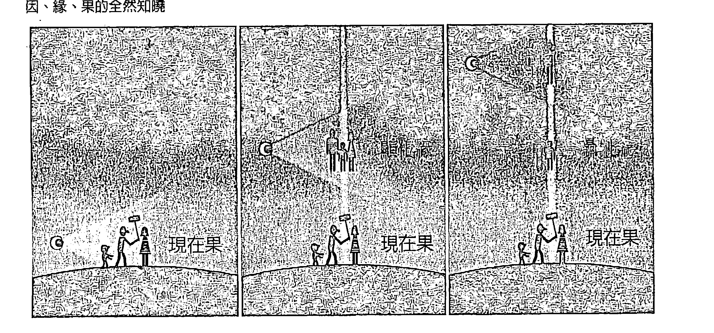

揭開疤痕的過程是痛苦的，若你身上沒有傷口，怎會感覺疼痛？那些傷口可不是一天兩天造成的，有些已經是累世創造的疤。若沒有被你最親近的家人碰撞，你可是戴著面具，把傷口包得好好的，任誰都無法觸碰到。連你自己都不願意揭開的那一面，還有誰可以幫你打開？只有你最愛、最親密的家人，才有機會悄悄地在你毫無警覺、無處可躲的情況下，強迫你看見那個真實的你。

當最真實的你的面紗被揭開時，所有你嘗試創造的虛假命題也會被解除。而沒有了虛假，沒有了想像，你深埋在面具下的恐懼就無法再被掩蓋。體驗生命的過程不應該帶著盲目，唯有當你真實地面對自己，真實地活出自己的樣貌，你的靈魂才得以進化和更新，而此生種種關係的目的也就達成了。

## 觀看自己的宇宙心智圖

之前提過，要連結高我，必須在穩定中軸後進入自己的晶體。在晶體中，你的心輪愈開啟，你的意識透過眉心後方的第三眼看見的鏡像就愈寬廣。你不會再受制於大腦，不再只能用眼睛看見一百公尺內的實體反射畫面。

在晶體中，使用第三眼，你會看見一個類似球體的天際線，一個更為寬廣的空間。這個鏡像類似天文臺觀測站看見的星空，會投影出你自己和你所處的星球相關的所有訊息片段。有些景象是過去式，有些是未來式，在這個廣大無垠的鏡像裡被呈現出來。

如果你的第三眼無法像你的眼睛那樣看見顏色、形狀，不必急於看見，用你的心去感知，你的知曉會映射出那個形狀和影像。沒有色彩和形狀並不影響你知曉。此外，用第三眼觀看時，盡量待在安全的室內空間，不要在行走或開車時使用第三眼觀看，以免發生意外。

你的星光體心智圖會透過這個流程自動投射出來，讓你知曉。也就是說，用第三眼觀看不是去看見你身體宇宙之外的事物，你看見的鏡像是你自己內在宇宙心智圖的投射。

我在前面的單元說過，航向宇宙時空的心智地圖在一群即將出生的孩子身上，就是這個道理。這些來自高次元宇宙的存有回到地球，身上攜帶著航向宇宙的地圖，當他開啟第三眼，心中的地圖就會投射在第三眼前面的鏡像空間，讓他清楚看見星際地圖的指引。

這個鏡像會在未來的孩子身上自動展開，你們目前身體的DNA攜帶的心智圖則被屏蔽了。回到這個進入自己第三眼的宇宙觀。在練習這樣觀看時，須謹記，這呈現的是你自己身上攜帶的宇宙心智圖。每個人攜帶的心智圖不同，有些是關於地球母親本身，有些則是關於自己在地球和其他星系的經歷。

你的心智圖像呈現出跟你所有存在相關的訊息，你再次從自身上看見，你是永恆的存在，你也不只是你。如果在自己的晶體中無法看見，那是你的小我藍圖阻礙心輪通道。回到有意識的呼吸和脈輪暢通的練習，前面的基礎若是沒有打好，就不容易到達這個階段。

## 開啟靈魂 DNA 宇宙次元

我在練習進入第三眼的宇宙觀時，似乎進入了不可思議的星際旅程。請幫助我理解，這個過程是怎麼發生的？還有，連結到那個次元的意義何在？

那是你的靈魂DNA開啟了宇宙次元的大門。我曾經提過你們人類的DNA靈性層次的封閉狀態，當你經由之前的練習，讓意識進入自己的晶體中，用第三眼錨定宇宙之心時，就可以開啟你內在的跨次元宇宙空間。

我來說明相關步驟，讓正在閱讀這本書的人也可以練習開啟自己的靈魂DNA宇宙次元。

## 開啟靈魂 DNA 宇宙次元練習

- 1. 平穩呼吸，穩定中軸。  
- 2. 深吸氣，坐姿或站立的姿勢都可以。  
- 3. 進入晶體，深呼吸，感覺到空氣變得更清新，耳朵聽見的遠處聲音愈來愈近，聽力變得比以前更好。  
- 4. 讓自己靜靜待在這個狀態中，不要嘗試用意念去搜索或尋找，沒有任何期待和想像，無念無想地靜坐約五到十分鐘。  
- 5. 靜靜迎接一道靈性之光的到來，去和這道光融合在一起，這道光將帶你進入另一個宇宙次元。  
- 6. 你現在已經進入這個宇宙空間，可以開始用意念去感知這個地方。你可以試著問問題，你的內在知曉會給你答案：  
  - a. 這裡是哪裡？  
  - b. 這裡的感覺如何？用你的身體感官去感知，例如溫度、在地面上或地面下、顏色。再用你的心去感受，了解呈現的意義是什麼。  
  - c. 從這個覺知中，你是如何知道自己內在次元與這個空間的連結？這裡和你之間有什麼質感連結？  
  - d. 在這個過程中，你是如何知道這次來到地球的目的和使命？當你與自己的靈性片段整合在一起時……  
- 7. 感謝你的真實次元存在的帶領，然後結束這趟旅程。

## 靈性整合期

每個人會進入的宇宙次元都不同，透過開啟自身內在宇宙次元，你們會來到靈性整合期。你可以和自己另一個次元的靈性存在學習、交流，並將學習的結果帶入你目前生活的地球場域。

這樣的學習也是幫助你改善目前的地球環境，從更高次元的靈性源頭創造出一個全新觀點或新領域的嘗試。你將可以和更高次元的你攜手打造美好新世界，這也是你到地球最初始的目的。

當你突破地球現實的層層考驗，並淨化自己的靈魂業力枷鎖後，更重要的下一步，就是打開生命寶盒，與自己更高次元的靈性聯合創造。這也是處於高次元、一直在等待你甦醒的你。

你停滯太久的時刻將會到來。靈性的療癒不是終點，而是為了讓每個生命走上創造之路的開端。孩子，宇宙的次元就在你們的DNA之中，打開它，讓你們的靈魂跳脫小我的框架，自由展開創造之路。

當人類意識覺醒，重啟自身的靈魂DNA宇宙次元，你們雖然身在地球，但結合靈性創造的開端，是你在來到地球之前與自己的約定。

## 靈魂 DNA 四層次

阿乙莎，祢帶領我用第三眼看見自己在另一個星球的片段，說這是開啟了DNA宇宙次元。是否可以先讓我有個完整、更全面的理解？

人類的DNA不只是生物基因和遺傳定義的細胞物質性聚合體。其中，生命訊息能量隱藏於正負電子聚合所產生的能量場域，以非物質的振動頻率形式存在人體中。我們可以大致區分為人類感官體、乙太體、星光體、宇宙意識四個層次，總共十二個能量振動層級存在你們的DNA中。

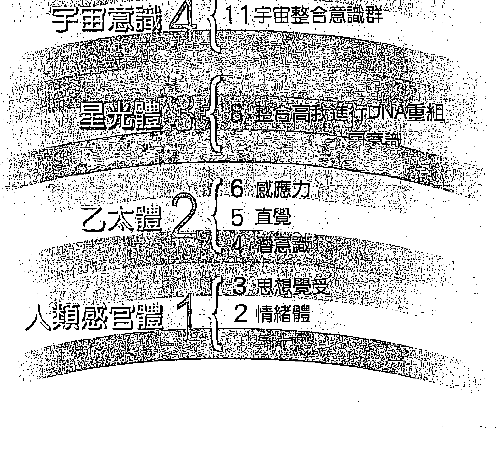

## 第一層：感官體

第一、二、三股DNA，分別是身體感官、情緒體，以及思想帶來的覺受。情緒體在這個層次扮演關鍵的中間橋梁。

你的身體器官細胞是受體，身體感官和思想覺受振動的振盪會產生情緒能量場體。情緒起伏愈大，代表感知和覺受之間因為頻率差大，所以創造的振動幅度也大。其中，覺受又深受思想影響，所以你當下怎麼想，就可以立即決定這個身體感官帶來的覺受的相對位置。

人類歷經數百萬年的生命體驗，都在學習並鍛鍊大腦具備思考能力，來創造更完美的生命體驗。這就是意識決定命運的階段，也是人類生生世世不斷透過情緒來體驗生命的過程。

人類出生時，第一層的第一、二、三股DNA是完整的。而成長過程中，透過情緒體產生的訊息繼續累積到原來攜帶的資料庫裡，也就是生命一開始的狀態在新的生命體展開的同時不斷被疊加上去。

有些人在生命體驗的過程中，攜帶的情緒逐漸達到完全平衡，會讓一次的生命體驗有比較少堆積的純淨靈性體。也就是說，一個純淨的靈魂不一定是年輕、幼小、沒有太多經驗的靈魂，也可能是已經體驗多次的人生輪迴，而達到平衡狀態的靈性存在。

意識場體範圍涵蓋很廣，第一到第八股DNA都是人類自我意識的場域。接下來你會看見，每一層的第二股DNA——覺受體——是人類超越身體感官，進入意識體的開端。

每一層的DNA裡都藏著開啟下一階段DNA的靈性開口，而這些都在意識層裡環環相扣。當能量到達共振時，會進入下一階段的DNA運行。

## 第二層：乙太體

第四、五、六股DNA，分別是潛意識、直覺、感應力。這個階段是進入星光體的橋梁和過渡期。

直覺在第二層中也扮演意識和感應力之間的橋梁，潛意識體則是第一層（感官體）中尚未被平衡的能量儲存庫。當一個人接觸到某些情境刺激或某個事件導體，這些能量振動會穿越第二層思想的感知，直接與潛意識的能量產生連結。

一旦連結匹配上，這個人會經由直覺體產生身體下意識的反射動作或情緒。這些反應並未先透過大腦的思維程序與身體感官的振盪，而是與身體細胞的潛意識能量直接連結上。因此，你們會將這個情況視為直覺的指引。

存在潛意識的訊息都和當事人的生命經歷息息相關，只是在等待適當的機會和事件，以再次浮現，平衡尚待釋放的能量場。

當一個人的直覺與潛意識體的共振達到合一狀態時，也就是潛意識逐漸被意識體覺察，進而平衡完成，就可以再次擴展至感應力層次。

感應力是帶領人們的意識通向星光體的超我意識的重要橋梁。感應力的擴展會擴大對自我的認知，來到與萬事萬物心相印的狀態。

## 第三層：星光體

你的意識已經開始向外延伸，去感知大自然或遠方親友的第二層感官體，你將來到感同身受的境界，更能以同理心對待身邊的人事物，達到與其他生命和諧共存的意識。

當你已經可以進入感應的層次，完成乙太體的階段，星光體的大門就在前方等你來。

第七、八、九股DNA，分別是開啟人類共同意識、跨次元整合高我進行DNA重組，以及人神合一的意識。這個階段是進入宇宙意識的共同協作平台。

當你進入第七股DNA中，就可以打開人類阿卡西記錄，裡面記載著人類歷史從過去到現在所有的紀錄。你可以得到完整的資訊和知曉，協助你打開自己的星光體意識，了解自己的天賦才能，以及你過去曾計畫要完成的生命藍圖。

然而更重要的是，你可以在這個層次尋找自己其他的靈性片段，一起學習、交流、尋求來自高我的指導，還可以透過協作方式，整合出一張全新的生命藍圖。人類已經不需要經由死亡和遺忘的過程，就可以再次創造新的生命藍圖。

這個過程都是來自你從星光體連結高我和自己的靈性片段的資源。有些人在這個階段可以透過第三眼看見清晰的畫面，得到更多訊息。這些協助都存在你身上的DNA靈性能量中，你只需要學習打開和使用它。

當你的靈魂DNA重啟並整合完成，你就將邁向第九股DNA，也就是人神合一的宇宙意識的開端。

## 第四層：宇宙意識

第十、十一、十二股DNA，分別是無我、宇宙整合意識群，以及宇宙之心的太極。這裡是超越人神合一的無我意識的開端，沒有時間概念，沒有分別存在的個體，你處於整合的意識群體中。

當你來到星光體之後，就會展開邁向宇宙意識的匯流。我們會協助人類為進入宇宙銀河邦聯而展開交流。

這些過程都需要人類重新整合自身遺失的靈魂DNA，才能從合一的共同意識邁向接下來的星際旅程。

我們此次的教導也是要協助地球人類為邁向宇宙和諧前的接觸做準備。你們透過傳訊中教導的練習，就可以順利完成生命的進化。人類在此時的全面進化，是宇宙共同的期盼。

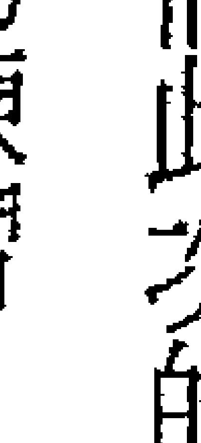

## 靈性進化道路上的框架和陷阱

我這兩天的狀況不太好，沒有料到已經能夠連結和開啟到第七股DNA，但生活中發生的事還是讓我受不住，把自己搞得心煩意亂。

你們在靈性進化道路上仍然會遇到很多框架和限制，或者人與人之間、群體之間、國與國之間為了生存空間會產生碰撞和衝突。畢竟地球上還有太多人沒有覺醒意識，一個已經邁向靈性生活的人反而更容易讓衝突和碰撞在你面前顯現出來。

因為你已經能夠清晰地看見和理解這一切都是自身的反照，你從對方的言行舉止中，看見自己仍待改善和轉化之處。

覺察至此，已經足夠再次淨化你自己的生活和內在靈性空間。不要害怕這些顯化出來的衝突，靈性生活不是去迴避自己不想遇見的人事物，靈性的開啟是讓你經由照耀對方，提供相互淨化的機會。地球轉化的速度正在加快，就在這個過程中，靈魂彼此得以穿越，與我們更加靠近。

謹記，你不只是解除自身上的業力枷鎖，也是在幫助對方。加油！你這兩天氣消了吧？我們可以繼續說明DNA的重組。至於你仍待穿越的地球挑戰，只須……

關於靈魂DNA的架構，已經約略說明了。其中每一組DNA裡都有一個關鍵橋梁——第一組中的情緒體、第二組中的直覺力。來到第三組，最關鍵的就是DNA重組，再創造新的藍圖的機會。

你們現在不需要歷經死亡就能獲得這個機會。你在有生之年可以來到這裡，和你所有的靈性片段及你的靈性導師一起討論出一個新的生命藍圖。一旦重新設定，你會有重生的感覺，而這個生命藍圖的設計者仍是你自己。

你可以先去回顧自己到目前為止的生活，回顧你曾經歷的所有好與不好的體驗。你現在可以選擇繼續體驗這裡的輝煌和光榮，或者你可以挑選一個你嚮往的情境。你現在有幫手相伴，過去所有的限制一筆勾銷，你可以選擇重新過一次人生，給自己設定一個新的生命意圖。

我怎麼腦子一片空白？我，不敢想。這裡面沒有陷阱？如果我選擇了某種生活情境，我想擁有的一切是不是會消失？這不符合我們在地球上的交易邏輯，在地球上是有得必有失。目前的生活很滿足，但我已經擁有的，一樣也不想失去。如果是要交換，我可不想換，我對自己目前的生活很滿足。

很好，你真的是學財務的，明白得失的平衡之道。但是，如果我跟你保證，你目前擁有的一切都不會失去，你重新設定的生命藍圖是以現在的生活為基礎再往上疊加，那麼，你願不願意嘗試另一種生命藍圖，重新創造出另一種生活？

嗯……這會讓我心動。說實在，我自己也從沒想過人生下半場剩下的時間要做什麼。我退休了，已經沒有事做，退休後要過什麼樣的生活。

孩子，那是你的物質生命體。我們現在討論的是你的靈魂生命藍圖。你的靈魂是永恆不死的，你從來都沒有離開過，一直都在。目前的你生活在地球上，也存在幾百萬光年之外的宇宙裡。你只是用一部分的你去度過地球上的生命，你的生命藍圖展開之後，會讓你看見自己的恢宏和偉大。

問題是，我在地球上，還住在一個兩千多萬人的小島上。祢要我使用低能腦去設定新的生命藍圖，我做不到啊！再怎麼想也想不出偉大的格局。還有，在地球上做什麼事都要用到錢，沒錢就辦不了事。

孩子，你要回到晶體中，和所有的靈性片段、靈性導師一起繪畫。你在地球的這個版本和他們是相關的，但你目前處於遺忘的過程；他們都在等待你醒來，和他們連結。唯有醒來，你才會憶起來到這裡的目的和使命，那是你當初的承諾。

而回到最初的設定後，你就可以和他們聯手打造一個新的生命藍圖版本。他們也很期待聽你怎麼說，畢竟你親身歷其境在地球體驗過。你需要回到自己的晶體中去找出脈絡拼圖，並和他們重新討論。

祢可以教我嗎？我現在該怎麼做？

你先穩定中軸，進入自己的晶體，去召喚你所有的靈性片段和靈性導師，一起來討論最可行的方案。

在虛空中找老師和自己的靈性片段……天啊！這是怎麼回事？

## 遇見導師和高我

阿乙莎，是否可以教我召喚靈性導師和所有的靈性片段？

可以。現在深呼吸，吸氣、吐氣，進入你已經很熟悉的晶體中……

（我依照阿乙莎的教導，很快就進入晶體中，呼吸著天堂氣息，眉心看見微微的光在前方。）

好，現在要召喚你的靈性片段和靈性導師。登入你自己的晶體，進入一個圓形的殿堂。殿堂前方有個座位，那是你的位子，現在請先上座。

（我用意識緩緩走向前方的座位，坐進去。當我反身坐下時，看見我的正前方有一個相對的座位，右手邊有兩個座位，左手邊也有兩個，這五個座位都空著。）

現在，我們先召喚你的靈性片段登場。

（這時，右手邊第一個位子後方的門打開，一個意識體走了出來，坐進右手邊第一個座位。流動下來的，是充滿慈悲和無條件的愛的存有。）

我看不見其形體，但這時我心中升起暖暖的慈悲，從我的胸口滿溢出來。我的淚水不聽使喚地流下來。

你現在認出她是誰了嗎？

知曉直接來到我心中。她來自列木里亞，地球的母親，有個名字叫「莎雅」。但……她卻一直都在，是我靈魂的一部分。

她從我的心中出現。原來，我以為是去召喚來自天外的靈性片段，其實已經存在我們的靈魂之內。

是的，慈心，那是你的靈性品質。你回想一下，這個靈性品質是否一直跟隨著你存在。

（我開始憶起小時候，剛才那種慈悲的感覺的確不時會出現在我心中，不論是看見年邁的外婆、路邊飢餓的小狗、鄰居的老爺爺、被別人欺負的同學，或是被踩扁的小花……只是，我一直以為那是一種情緒或本能反應，原來那種感覺是來自我內在的靈性片段升起的時刻。她在我人生的前半場一直提醒和保護著我，當她升起時，我自然會以慈心的角度看待世間的一切。現在，她就坐在我右前方，如此地溫柔和慈悲。）

好，現在準備召喚你的第二個靈性片段。

（這時，右前方第二個位子的門打開，出現另一個靈性存在體。他走進來，坐上座位。）

你可以認出他是誰了嗎？

嘿！我認得，他來自天狼星，是個生物科學家，有個男性的名字叫「雷巴特」。他給我的感覺非常冷酷、專業、有效率，還有對每件事都很精準，絕對不拖泥帶水。我懂了，他是我的另一個靈性品質。難怪，以前還在上班時，人家看我就是這個樣子，讓人感覺很難親近、專業、卻不討人喜愛，但也無從挑剔。這個靈性片段是來幫助我在地球物質層面取得生存空間和成果的必要配置。雷巴特，雖然你不怎麼親切，我還是要謝謝你一直以來的幫忙。

（這時，我看見雷巴特右手邊的座位，也就是我的正前方，坐著阿乙莎。沒有具象形體，也是一個意識存在體。）

好，現在來召喚你的靈性導師。

（我看見我左前方第一個座位後面的門打開，哈！是觀世音菩薩。祂的形象就跟佛像刻的一樣，讓我感到安心親切。我看祂一直在笑，我自己也不禁大笑出來。祂應該很懂我，好像我前半生做的所有壞事，祂都知道。我在祂面前赤裸裸的，沒有什麼可以隱藏。祂用慈祥的眼光看向我，哈哈，祂真的很懂我！）

最後召喚你的另一位靈性導師。

（這時，我看見左前方第二個座位後面的門打開，哇！是位大帥哥，原來是耶穌。我覺得奇怪，怎麼會是耶穌？我不是基督徒，也不是西方人……祂又好像是這個空間除了莎之外，最重要的發言人。這時我明白，原來靈性導師有兩位，一位在地球場域負責看護和照料我們的一切，另一位則是負責接引我們和更高意識取得連結。我的兩位靈性導師，一位西方大帥哥和一位東方美人，居然為了地球靈性的提升常常溝通啊！祂們在地球上被自己的擁護群眾分成兩個宗教派系，其實，祂們都在一起啊。）

「接下來，你可以回到你的生命場景，去看見我們將慈心和專業嚴謹的種子放進你生命的原因。」

「喔！讓我理解一下……」

「我並不是我之前認知的一個膽小又無遠大理想的中年婦人，祂們當初設計這個靈性組合的目的，是為了更有效率地打開這時期人類靈性提升的道路。」

「是的，這是我們初始的計畫，你生命最初始的藍圖。」

「可是，我被蒙在鼓裡五十年，經過那麼多年的折騰。祢們為何沒有早一點讓我憶起這個生命藍圖？」

你最初的生命藍圖也需要在你自己靈性淨化後才能看見。地球本身就是靈性淨化器，唯有經過地球的二元性碰撞和衝突，你們的靈性才會真正認識出自己，並自然而然來到更高的靈性合一的境地。合一的意識是進入銀河系的起始點，沒有合一意識，就需要在地球繼續體驗和淨化。

然而，當今地球孵化器的承載量已遠超過原本的負荷，已經不堪繼續使用，必須提升到更高次元的軌道暫時休整生息。所以在這個時期，新的孵化器會出現，取代地球的位置。靈性意識尚未到合一境界的，仍需要回到銀河系的靈魂孵化器中學習，而提升的靈魂會脫離地球進入更高的次元。

祂是指，地球會進入新的軌道？是的，地球已經準備提升，離開孵化器的位置，進入銀河聯邦的軌道。這也會有共同意識參與，地球會需要和星際種族建立協商，大約會發生在西元二〇三三至二〇三六年間，時間已經接近了。

你們在此可以自由選擇要回到銀河系新的孵化器中重新學習、繼續體驗，還是進入新的軌道，和宇宙建立新的聯盟關係。你雖然已經了解自己生命最初始的藍圖和目的，選擇權仍在你手上。你可以選擇持續過目前的生活，或者開始採取行動，幫助更多人走上覺醒之路。如果你決定回到靈魂最初的種子設定，我們隨時可以一起討論如何設定工作項目，幫助你為實現生命藍圖規畫道路，而顯化你所需的一切。

我理解了，謝謝你常帶我看見這一切。我自己需要想一下要如何做，畢竟已經有很多人在做了，但我們是否還有更快、更好的辦法？我想過一遍，再來跟你們討論。

（這時，我感覺他們好像變成我的工作夥伴，在這個殿堂中各自坐在座椅上自行討論起來。有人說要讓人類先恢復健康。總之，目前他們也不確定要如何做，還是需要我想過一遍再來討論……）

## 找回內在神性

阿乙莎，召喚了我的靈性片段和靈性導師之後，我驚訝地發現，原來見到神靈的方式是從我們的內在連結，而不是向外尋找神靈。祢是否可以完整地說明這個部分？

嗯！這個問題很好，我來更完整地說明一下。你與自己的靈性存在和靈性導師見過面了，也終於明白，每個人的內在都具備神性，也都與宇宙其他更高次元的存有同體。人類不是從地球上出生的獨立個體，當你理解這一點，代表你靈魂DNA已經順利展開到可以啟動重生的程序。這也是我們期待帶領人類快速達成的目標：重啟人類的靈魂DNA，邁向更高的次元。

你內在的靈性片段就是你與生俱來的靈性品質，他們是來幫助你在地球顯化和創造的。這些靈性片段帶來的知識會顯得已經完整具足。你不需要重新學習或向外尋求，回到你內在的神性殿堂，隨時召喚你更高次元的靈性片段，你就可以得到足夠的知識和指引。

這些靈性片段最初以種子的形式注入人類的靈魂DNA中，你與他們有臍帶連結的關係，一位扮演你的父親，一位扮演母親，他們就是你的靈魂原生父母。要進一步認識他們，你可以透過自己的身體進入他們的列木里亞星和天狼星去觀看，就會更明白了。過程中，他們也會帶領和指導你，放心，不會迷路的。

每個人的靈性片段組成都不同，我們無法在此一一介紹。我明白，你會有許多這方面的疑問，也很想幫助身邊的家人和朋友與他們的靈性片段相遇。孩子，這部分的學習不容易，如果這麼簡單，人類就不需要經歷數百萬年，有無數先知和宗教試圖達成這項任務。

你之所以能這麼順利地到達內在的神性殿堂，那是我們早已安排好的計畫。我們也希望經由你更接近大眾的認知程度，開創出一條讓人們更容易理解和到達內在神性的路。我們需要你協助達成這項任務。

我了解了。你說得也沒錯，我過去在靈性上的學習確實是麻瓜等級，也許這就是祢們刻意的安排。我如果早看懂經文，可能就無法從一般人的角度來問這些最基本的問題了。

那麼，祢可不可以說明一下，左手邊的觀世音菩薩和耶穌為何也在？祂們是以什麼樣的角色參與討論？

祂們二位是專門照顧地球靈魂體驗過程的神性代表，另一位是帶領靈魂進入宇宙光之存在的神。一個屬地，一個屬天，每個靈魂在天地間都被神呵護和庇佑著，而得以生生不息地繁衍和存在。祂們也說明了每個人的內在都有神性。

所以，東方人拜的神佛，西方人信的耶穌，其實每個人身上都有。只是當人們無法從自己的內在覺見時，一些聰明人便將其象化，投射在人們看得見、摸得著的神像上。然而，真正的廟堂和神殿，其實就埋藏在每個人心中。宗教只是為這一切虛空的靈性塑造實體形象，呈現出來，讓人們的心感覺安適。

這麼看來，過去宗教實體化的做法已經很有創意。現在你們又要將這一切實體轉回虛擬空間，再創出一條路，是吧？祈禱要再次將行之有年的生命之道化繁為簡，由實還虛。

沒有錯！那是當時一些先知先覺者幫助世人憶起內在神性的方式。時至今日，你們可以開創出更快接觸到內在神性覺醒的方法。

我明白了，但我還有個不情之請。我已經見到自己的靈性父母，但在地球上養育我的生身父母，我現在更關心的是他們。他倆都已年邁，沒有宗教信仰——應該說，他們還沒有見到自己內在的神性。我該如何幫助他們在離開時達到光明國度的境界？

你其實真的不用替他們擔心。每個生命離開肉體時，靈魂都會被神接管。在離開身體的瞬間，他們就會看見光，也會明白自己在身體之內與神同在。而他們的靈魂意識也會攜帶著世間的一切體驗，作為下次再體驗的參考。

你必須尊重每個生命的自由選擇權，他們有自己獨特的體驗方式。神愛每個靈魂，將每一位視為自己的子女。你的父母不僅是在地球上生養你的人，他們也同樣是神的子女。當你願意擴大對他們的愛，去愛神的所有子女，與神聯手創造一條讓所有人找回與神的連結的路，就是在幫助他們。

## 整合期的狀態

阿乙莎，祢帶領我看見這麼多，我反而不知道要從何著手了……

我知道你心中有很多疑問，這些靈性層面的看見難道是真實的？或者，這些都是你自己心中虛構的想像？而這一切又和目前居住在地球上的你有何關連？

是啊！祢真讀我的心，我連自己在猶豫懷疑些什麼都講不清楚……

這是很正常的現象，這就是DNA重組過程中會遇到的狀況。你原本的價值觀和信念體系正在重組，內在逐漸升起一個新的架構。這個架構正在把現在的你和即將跨入未來的你重新組出一個新的生命藍圖。其實，這和你們在二次元世界碰到的狀況是一樣的，只是你沒有覺察到。

當你一出生，你的價值觀和信念體系就被原生家庭植入了。這個植入是在你的物質生命體正式啟動運作的第一天就開始的。你在父母、家庭和社會集體意識的投射下展開生命旅程。身上雖然有靈性父母播下的種子，但在你靈性尚未甦醒的這個階段，你的靈性也寄居在你的父母和社會之中。

這是一個由社會集體意識營造的寄養家庭。這個時期是你的原生家庭幫助你建構你的小我意志的重要時刻，你也要好好感謝他們。沒有他們，就沒辦法長養你的小我個體存在意識。

其實，小我沒有你認知的那麼不好，它可是幫助你在地球上穩定扎根的重要推手。一個失去小我意志的人無法連結上更高次元的高我。小我和高我是相互扶持的夥伴。當你的覺醒意識升起，小我遇見比自己更高、更大的版本的靈性高我時，就會讓出決策空間給高我。因為小我非常明白，唯有和高我聯手，重新打造一個超越小我控制、更宏偉的生命藍圖，它才能藉此達到提升自己的目的。

我雖然仍處於備戰與工作狀態，卻不會因此消失，而是臣服於更高的自己。你開了一扇新的門，就是我現在描述的這個狀態的最佳寫照。

補繞了這麼一大圈說明，結果還是回到我剛才一開始的狀態，也只是解析了我現在的狀況。於是看看我的小我正躊躇不前，又不想搞砸它，我真是服了你！

哈！你現在也知道，當你不想前進時，我們也只能在原地繼續打轉，就等你願意跟上啊！

那我還是問一些讓自己往前進的問題好了。請問，我要怎麼開始和我的高我聯手打造新的生命藍圖？

嗯！你終於要開始面對這個課題了。這裡面有個流程需要進行。你要耐心，帶著自己前往未知的世界，去找出生命藍圖的成功關鍵元素。然後，將這些元素植入你的晶體中，再透過你的高我和小我達成協調一致的共識。接著由重整後的新我去展開新生命藍圖，並實踐在生活中。

## 再造生命藍圖

### 探索靈性五段的源頭世界

阿乙莎，讓我整理一下，祢前面提到的聯手為我創造新生命藍圖的流程如下：

- 步驟一：探索未知世界  
- 步驟二：找尋關鍵元素  
- 步驟三：達成新共識  
- 步驟四：再造生命藍圖  

我們從第一個步驟開始。祢指的探索未知世界是哪個世界？要怎麼開始去探索？

就是去探索你的靈性五段的源頭世界，亦即你靈魂的家：列木里亞和天狼星。你要去探索你為何需要來到地球？你靈魂的家目前遭遇到的問題是什麼？它們的期許是什麼？你可以從那裡找到問題的根源，也可以知道為何需要創造一個新的靈性組合來到地球再創造。

這真是太科幻了！在 Google 地圖上都找不到的地方，祂們出的題目太難了吧？

一點都不困難。等你進入自己的晶體，不用幾分鐘，你就可以開始第一次的探索了。

好的，我來試試看。

（我進行之前已經做過很多次的程序：深呼吸，穩定中軸，進入體內，用第三眼看見前方的微光，進入光中，處於晶體的正中央。接下來我問阿乙莎，是否可以帶我去探索列木里亞？

我一直往前、往前，在黑暗中移動，之後進入一道藍色的光中。在這裡，我知曉自己已來到列木里亞。但這裡怎麼好像在地球之心，而不是在外太空？難道列木里亞就在地球上？）

列木里亞提出的問題：

- 一、地球上的石油開採進入海底，已經破壞海洋的生態。  
- 二、你們其實不需要開採石油，可以使用更好的替代能源。  
- 三、我們派出去工作的海豚被你們製造的污染傷害。拜託，不要把牠們抓起來當玩物。  
- 四、海洋需要被保護和淨化，這也是在保護替代能源的來源。  
- 五、地球之心的磁力偏移，人類如果沒有改變，我們無法再穩住地殼能量。  

一堆問題拋向我，讓我有點招架不住。我想先離開一下，再找時間過來拜訪和探索解決方案。

阿乙莎，初探列木里亞之後，我收到一堆問題。現在我們又要再次進去列木里亞，還是到天狼星？

可以先去天狼星。當你看見天狼星的世界，我們再進行下一步的討論。

（我同樣進入自己的晶體中，然後呼請我的天狼星靈性片段實體，請他帶我去探索天狼星。過程中沒有像進入列木里亞時那種往前走的感覺，就好像只是透過我的晶體打開一扇任意門。當我跨進去，我知道自己是進入雷巴特的晶體中，就像在隔壁，前後不到一秒。雖然看不見任何影像，但我知道我已經到達，因為這裡讓我全身變得輕盈，之前那種腦袋沉重的感覺瞬間消失。）

我開始用意念掃描這裡。感覺上，這裡是個高度發展的文明，但冷冷清清，沒有任何一絲情緒波動的感覺，也不像是源頭那種定靜安詳。整體上就是讓你覺得進入了一個超大型實驗室。

沒有任何一個存有過來跟我打招呼，也沒人理會我。那個地方就是有種讓人不可靠近的感覺。跟昨天一進入列木里亞就熱烈互動的情況，真是天壤之別。

我本想離開，但又想起阿乙莎說過，我必須來找出我的靈性片段源頭世界遭遇的問題，還有他們對地球人類的期許。在不知道可以跟誰說話的情況下，我用意念拋出一個問題：「哈囉，請問你們有什麼需要讓我理解的嗎？」

結果真如我所料，這裡是一問有答，不問不答。有個意識回覆我：這個地方位於第九次元，擁有超越地球人類文明的超高科技。當初是為了完全避免遭受物種情緒引發的破壞行為，所以有計畫地移除了這裡物種的情緒體，也創造了今日的超高科技文明。有效率的創造與進化過程雖然能夠快速揚升到更高的次元，但因為沒有情緒體，創造出來的環境只能不斷精益求精、進步再進步，整個演變成乏味、無趣、沒有色彩的世界。

「你要回去提醒人類，小心發展人工智慧與人類科技，不要為了效率而抹煞了人類最珍貴的情緒體的振動所創造的有情世界。」

此外，他給我一項建議：可以利用生物科技，在人類的情緒體中安置安全氣囊。因為人在二元對立的振動頻率中，不可能只有善沒有惡、只有喜沒有悲，情緒一定會在相對的振幅中擺盪移動。如果可以在負面情緒達到極致時啟動生物體的安全氣囊，讓破壞自己或他人的模式不會一觸即發，並且讓這個安全氣囊瞬間將人類拋向愛自己的頻率中，這樣達到的情緒平衡可以避免文明的破壞。

我進一步請他明確告訴我，那個安全氣囊是什麼做的？要怎麼安裝？他無法給我明確的答覆。我感覺是要我帶回去討論，而不是讓他提供明確的解決方案。我謝謝他的建議，就趕快離開了，因為他們還真是不知道如何招待我這個訪客，我離開時也不會跟我客套一番。

阿乙莎，我從天狼星初步探索中理解到，人類的情緒體很珍貴，要保留這項特質，但又必須建立不會讓人類自毀文明的防護措施。

嗯，你的初步探索已經很不錯了，我們回頭再來整理出一個更具體的行動方案。

## 發現宇宙實相

我已經拜訪了兩個靈性片段的世界。看到目前靠我的問題和狀態，這些題目都很大，也都不是靠我一個人可以改變的。為何這些看起來亟需解決的問題，會給一個非相關領域的人接收？請給我智慧，讓我知道該如何進行下一步。

你看見其他次元的世界給你的訊息和真相，但你在地球上還未親身遭遇，也沒有相關專業去釐清這些已經發生的狀況。但是，當你的意識來到這個認知的實相時，你的振動頻率就與這個現象連結。你用意念去想像，開始去做，就可以逐漸改變這個實相。

重點是，當你看見發生在另一個宇宙空間的實相時，是否感覺這些狀況與現在的地球有關？你是否願意調整自己的認知體系，建立人與生態及其他物種之間新的互動規範，以防止那個你已經看得見的未來在你目前的世界裡發生？

我不想地球變得冷酷無情，不希望地殼變動讓人類和動物受到傷害。但是我無能為力。我沒有政治權力，也沒有資源去阻止人類為了自己的利益而破壞大自然，或是以科技創造為名，製造可能傷害人類自己生存空間的人工智慧。

你不需要去證實。宇宙的顯化是集體意識創造出來的自然定律。你只須去想像，並且願意去實踐和體驗你的想像。那麼，由你發送出來的意識振動頻率，就可以改變這個世界。

我不敢置信，哪有可能這麼簡單？

只要你願意，相信並且相信你見到的未來是真實反映你們當前所處的世界狀態。你以為的未來式，其實就是現在進行式。當你進入自己的靈性源頭，你不會看見與你無關的問題，你只會看見與你有關的未來。

能看見你已經「是」的狀態。

我不明白。祢是說，當我進入晶體，然後穿越進入另一個宇宙空間時，我看見的環境是我目前所處的地球的未來顯化版，而這個顯化版已經是現實？我們不是去拜訪他們，而是去看見不同次元的自己呈現的狀態？

是的，宇宙只能全息化展現當下的一切。

祂是指，另一個宇宙空間的實相是來提醒人類，我們彼此的世界是連動的。我們變，他們也就改變了。但是我不明白，為何他們已經是比地球更高科技的存在，不需要身體，我們卻還在運用舊的低等科技，需要身體？

這只是存在的不同形式。你的高次元版本不用身體，進入低次元卻需要這個載具，因為密度不同。此外，科技的顯化也是相連的。當人類有意將人工智慧機器人導入生活中，創造人機合作的新社會關係並提升效率時，就是高次元振動擴展的必然趨勢。

但是，如果在高次元已經發生的生物體機制和失衡狀況，可以經由低次元修正並導入目前逐漸成形的系統，高次元中的問題就可以被扭轉和改變。你不覺得最近人類討論得沸沸揚揚的人工智慧科技發展進程愈來愈快？那是因為高次元的顯化已經擴及到你們的生存空間，現在是彼此協作、重新修正路徑的關鍵時刻。希望地球上的人工智慧能夠幫助終止或改善已經造成錯誤的顯化。

我還是不懂。高次元創造出來的問題為何不能在自己的時空和次元裡解決，而要到更低次元的環境裡修正？

你們彼此互為源頭。宇宙源頭是所有生命的核心，但不是單向的。所有生存的次元互為源頭，所以，人類所在的地球也是高次元存在於低次元的源頭。你可以從自己的體驗跨入更高次元；反向亦然——你的更高次元也可以從自己的體驗回到低次元的源頭。當高次元的狀態處於平衡層面需要改變與重組時，就必須由源頭去改變結構。所以，高次元的狀態修正和改變，也可以從地球著手。

雖然我還不是很了解，但我寧願相信這個說法，這樣人類就不必妄自菲薄。不是在高次元就比較高等，低次元就得聽從高次元的指令。彼此不是主從關係，是協作關係。我覺得這種說法挺公平的。

你滿意就好！這也是為什麼人類身上會有高次元的靈性片段，彼此同體互連。宇宙就在這個跨次元的協作中不斷地修正與平衡。

即使你理解至此，我還是要提醒你回到自身的認知體系，重新審視一遍。當你已經知道地…## 完成在地球的使命

——給正邁向高次元的軌道，你希望迎向一個什麼樣的未來？你看見列木里亞和天狼星的實相，那帶給你什麼樣的感覺？你又會怎麼寫這個感覺？會有什麼改變，或是產生什麼想法？這些正是我們要進一步討論的地方。別忘了，你還有靈性夥伴和指導靈在旁邊守著和你合作。

我必須坦白，祈求我在看見列木里亞的呼求和天狼星的現狀後，去感覺一下我自己會有什麼想法時，我第一個想法是，我感到失落和難過。失落的原因是，我以為靈性的追尋最後會帶我到達神的國度、天堂聖殿。我覺得這是我先放下手邊的物質追求，提升心靈層次應有的回報。

想到達神的國度、天堂聖殿，我覺得這是我先放下手邊的物質追求，提升心靈層次應有的回報。沒想到，迎來的又另一個靈性層次的功課。

高次元的世界仍然欠缺愛與喜悅。我突然覺得回家的路更長、更遙遠了。在找回自己的靈性片段，與內在的神相遇後，為何我反而更寂寞了？

孩子，不要氣餒，那些實相是宇宙現行的各種形式的演進結果。你們身在其中不自知，我提供的是更廣大的視野和更多元的選擇。

人類漸漸要脫離由物質完全掌控的世界，當你們開始鍛鍊自己的心智時，會開始用宇宙人的觀點做出選擇。你目前只是窺見兩種型態的文明發展，宇宙提供的是更廣大的視野和更多元的選擇。

還有許多不同形式的存在方式。你可以將宇宙視為不同層次和場域的遊戲場，你的經歷愈完整，就會晉升到不同的級別，可以再次選擇進入不同的次元去體驗。然而，當你關機時，你會下一個結論：「啊，剛才那一場遊戲真糟糕」或「我剛才搞錯了，我要再試一次」，然後一回開機時，你會晉級或重練，這些都是宇宙可以提供給你的。

你若是想回家，回到安靜祥和的唯一源頭，仍然可以在遊戲結束後這樣決定，但我不希望你是在「累了」「沒辦法」的狀態下回來。我希望你能帶著豐富的經歷和再次的創造，歡歡喜喜地回到源頭的家。這也是你們當初提出來的靈魂體驗請求，我只應允你們的請求。

照祂這麼說，宇宙真的只是遊戲場？

如果我告訴你，這個遊戲場是大家協議出來的，你相信嗎？人類身上攜帶著遊戲規則和使用說明，程序已經編入你們的靈魂DNA裡，只要生命的運作機制啟動，進入每個場域應該具備的配件和關卡都設定好了，你們只是去體驗，並學習再去創造，讓更多進來的人一步步完成升級的鍛鍊。但是，因為人類的靈魂DNA有許多頻段被封閉，你們尚未完整經歷過生命本該擁有的體驗。

回顧一下地球的歷史，你們可以在博物館裡看見古代人使用的器皿和服飾，看見比現在使用的材料或形式更精緻完美的設計。但是，為何這些好東西會消失，被粗糙平凡的製程取代？

人類的創意和藝術天賦被大量的工業製造取代、抹殺了。進一步去審視中間的轉換和移動過程，你會發現那絕對不是具體形式的演化，而是某些人有計畫地控制資源後，創造出屬於他們自己的虛擬幻境，讓大家被迫朝那個物質至上的方向前進。那些人同樣是運用自己的意識創造出那個地球上的虛擬實境。他們也是遊戲設計者，而許多人交出自己身上攜帶的珍貴天賦，進入工廠，把自己當成無意識的機器人般使用。今日的地球樣貌，就是人類過去的集體意識造成共識的結果。

當人類逐漸被喚醒，發現自己關於靈魂DNA後可以擁有的天賦才能時，你是否應該拿回主導權，並創造自己應有的體驗？

同樣地，在列木里亞和天狼星，也有他們集體意識達成的共識，只是在你目前看來，那是不親切、不想要的體驗。你這麼想並沒有錯，也因為如此，你才會自我分離出一個靈性片段進入地球，來體驗情緒體和物質化的創造環境。

祢說我們互為源頭，他們也是現在地球的未來實相，道理何在？

你看見列木里亞或天狼星，這些集體意識與目前地球上的人類系出同源，你們只是處於不同維度的靈魂共同體，展開跨次元的延伸和體驗。

那麼，還有不同於人類的靈性源頭嗎？

有的，非常多。如果要一一說明，可能說上二千零一夜都講不完。我只能介紹一下和人類相近的構成。你們銀河系就有七個靈性團體，包含獵戶星群、大角星、昴宿星、處女星、天狼星、織女星，還有同樣在地球上的列木里亞。而銀河系之外就更不用去猜想了，多如天上繁星，各個星群裡的星際家族更多如牛毛。

你們所在的太陽系是銀河系裡面新育成靈魂的孵化器，你們大多是這些星系的靈性團體結合而產生的組合。你身上有一部分天狼星和一部分列木里亞的靈性片段，其他人則可能攜帶不同的靈性源頭組合。

你們的靈性父母孕育一個新的靈性生命，就是希望創造一個更完整的靈性融合，來延續他們各自的發展。你們人類也常說，生命的意義在創造宇宙繼續之生命。只是當你換個角度看，現在的你已經是一個緣起之生命時，你必須惦記更高的你攜帶的使命。你是帶著父母的期許，為創造更好的宇宙大環境而誕生的靈性體。

你們過去的教育或宗教並沒有提出這個觀點，最主要的原因是過去地球因為來自各個不同靈性源頭的頻率過大，造成人類各族群之間紛爭和衝突不斷，生命的成長過程很艱難，一直出現人與人之間的暴力和肢體上的殘殺掠奪。因此當時的靈性教育或宇宙觀點，是以安撫和療癒人類恢復原形的能量為目標。

現在，地球文明已經來到一個高峰，人類的集體意識愈來愈接近。你們來到不少人可以控制集體意識的階段。這樣的進化讓你們可以開始與靈性源頭銜接，擴大你們的靈魂意識，與更高次元的宇宙意識一起創造美好的環境。人類和銀河系的靈性團體其實是一家人，再次相遇的時刻已經來到。你們展開合作，並討論出對彼此未來都有幫助的提案，將為地球和人類帶來另一次文明的躍升。

當然，如果你不想在此時接受這個重新打造生命藍圖的機會，也是可以的。當遊戲結束，你可以決定回家，不玩了，沒有人會限制或主導你的意願，你是自己靈魂意識的最高領主。

## 重新創造生命藍圖

我已經大致了解你所提的新觀點，願意帶著自己繼續走下去，我想試試重新創造生命藍圖。

好的，你可以準備進入自己的自體，在那裡召喚你的靈性片段和指導靈，一起規畫生命藍圖。你的指導靈會提出問題要你回答，這個過程是為了幫助你調校你的自體，讓你的小我意識和高我再次校準。你必須用最真實的自己來面對和回答這些問題，如果帶有猶豫或虛假的命題，你的結構不會穩定，也無法全面扎根。這樣創造出來的結構就會像斷線的氣球，隨風飄蕩，對你本身和宇宙都沒有幫助。你準備好了嗎？

嗯！我現在進入晶體中，你要我召喚我的指導靈，還是連靈性片段也要召喚出來？

「一起召喚。那是你的靈性團體，會一起來的。你現在已經在你的晶體中了，開始呼請：『請我×××（慣用的名字）的大師、導師和靈性片段進入我的晶體，賜予我智慧和慈悲，幫助我×××（慣用的名字）創造一個新的生命藍圖。』然後請導師開始提問。」

我：我還算滿意啦，唯一的小遺憾是沒有生下第二個孩子，雖然努力過，也是勉強不來，我已經能接受了。另外，我覺得我太早退休，不，應該說，我太早被企業界淘汰了，所以現在處於對社會沒有太多貢獻的狀態，這讓我覺得空虛。生活雖安逸，但是有遺憾，覺得沒有活出有意義的生命。

觀世音：你滿意自己目前擁有的一切嗎？你還有哪些遺憾？

我：我還需要一個可以為自己和別人帶來價值的明確項目，以及實現這個項目所需的一切關鍵要素。

觀世音：對於你想要成為的那種人，你覺得還需要補充哪些元素？

觀世音：你的題目很大，但你自己還沒有想到是哪個項目，希望透過我們來顯化並賦予你關鍵要素。這項任務，是嗎？

我：是的。從小到大，每次有人問我，你以後想要做什麼，我都答不出來。我真的不知道自己「想」做什麼，但是，只要是我「應該」或「被要求」去做的事，我通常在很短的時間內就可以完成，並且表現得出類拔萃。也因為從來沒有自我設限，所以我真的不知道如何界定自己，不知把自己擺在哪個位置去發揮。如果你們可以讓我無後顧之憂地發揮，我會很感謝。

觀世音：你就是這樣。但我要提醒你，這個由我們賦予的任務和方向，你可能不見得會喜歡。你確定要試試看？

我：只要你們給我足夠的資源，讓我不會捉襟見肘，上戰場沒有頭盔和子彈。還有，這項任務要能讓我看見對別人和這個世界有幫助，是有價值的一件事，讓我離去時可以心滿意足就行啦！

觀世音：好的。你會在接下來的三個月逐漸看到這個新生命藍圖的命題，我們會準備好你需要的資源，同時，我們也感謝你願意。

我：祢怎麼沒有直接告訴我，這個新命題是什麼？

觀世音：告訴你，就會限制了這個命題的發展。你們頭腦的想像空間有限，你也習慣約束自己，所以，不知道命題對你生命藍圖的展開和結構顯化會更有幫助。

我：可是之前阿乙莎教過我們，把要做的事情整理一遍時，也需要像生命之花展開那樣。祂還提到那個金木水火土的元素表格，要我們填寫一遍。祂沒有講主題，我怎麼做功課？

觀世音：那些是在進行小我的意識訓練時，幫助你和宇宙連線的思想訓練。只有小我經營得當，才能顯化你需要的資源。你現在重新設定的生命藍圖，就如同重生投胎時的設定，而你不會先知道重生設定的生命藍圖的細節，必須去經歷和執行，你才會明瞭。

但是，你有個新的根本意圖已經設定好了，就是你剛才說的要有一個可以幫助別人和這個世界帶來價值的明確項目，而你需要的這個項目的相關資源和元素，也會同步展開連結。

我：就這樣？

觀世音：是的，就這麼簡單。你向宇宙發出請求，我們必會應允你。

我：祢們不會和我討論，也沒有評斷我的想法？

觀世音：我們從來不會介入你下的命題。

我：那如果有個人在他的意識裡跟自己的導師說，他想要毀滅整個世界，祢們也會如他所願？

觀世音：當然會！但他會生存在一個充滿仇恨、令人傷心失望的世界裡，有那麼一個地方讓他去發揮和體驗。

我：哈，祢們好詐！原來可以創造出不同的虛擬空間，我都忘記之前提到的遊戲場概念了。

那麼，我要在剛才設定的命題裡補上一句，我還要在地球上，在我現在住的地方進行這個項目。

觀世音：我明白。這是你第二回合的生命藍圖，不會在別的宇宙元，但是否仍在目前住的地方就不一定了，項目會帶著你到你需要去的地方。

我：先謝謝祢啦，我現在想去問阿乙莎一些問題。阿乙莎，請問祢，另外幾位呢？怎麼只有一位跟我談談？

阿乙莎：祂們會討論出最適合由你進行的項目，也會依據你具備的靈性品質和天賦才能設定項目元素，並為你需要的資源設妥連結程序。

我：我了解了，雖然從頭到尾好像沒有得到確切的目標和答案，我卻在這個過程中再次確認自己的生命藍圖。這彷彿是我的小我意識在跟高我取得共識的階段，而高我和導師自然會討論並做出遊戲程序碼，讓我再一次體驗。

阿乙莎：是的，而且你放心，你會愈來愈清楚這個生命藍圖的樣貌，也會知道如何展開連結。

我：請問這個過程是每個人都可以進行的嗎？每個人在生命過完一個階段時，都可以再次向高我請求換一個生命藍圖，或是請自己的導師和高我協助給予一個生命的方向，是嗎？

阿乙莎：是的，每個人都有同樣的機會，只要他有意願並提出請求。還有，最重要的是，他必須已經完成大部分的業力課題，已經可以淨化和穩定自己的意識，與自己的高我和神性結合。

我：請問這世界有多少人已經可以這樣做？或者說，有多少人已經邁向自己第二回合的生命藍圖？

阿乙莎：有上萬人正在這麼做，也有愈來愈多的新生命藍圖正在展開。這些人都帶著覺醒的意識，為了更好的地球和世界而工作、顯化。他們也是邁向新地球的先鋒。

我：這真是令人期待。謝謝你們，我的靈性片段和導師，感謝你們給我的協助。祈你先去張羅吧，我很期待這個新生命藍圖的展開。我愛你們。

大家：我們也愛你。

## 與高我聯手設定新的生命藍圖

阿乙莎，請問在期待新生命藍圖展開的期間，我還需要做什麼？

你仍然需要展開生命藍圖的結構部署，這會是讓你的天賦才能和靈魂意圖重新校準的階段。你要去自己的靈性源頭找出可以在地球上顯化的元素，把那個元素擷取出來。

這是什麼意思？怎麼進行？

回到你的身體中，這時要對談的不是指導靈，而是去徵詢你的靈性片段——莎雅和雷巴特的意見，和他們直接對談。

哇！更多的靈性源頭對談。我知道是怎麼回事了，沒有經過共同協議和確認，這個為我量身打造的新生命藍圖的項目無法被確定下來，是嗎？

是的，這個項目需要你、你的靈性片段和你的指導靈共同確認，而你自己仍是最終拍板者。

好的，我現在就回到我的晶體中，進入我靈性團隊的殿堂，和莎雅與雷巴特討論一下。

（接下來仍是重複之前的步驟：呼吸，穩定中軸，等待光，進入光中，進入晶體，打開靈性團隊的殿堂，然後呼請莎雅和雷巴特入座。我針對我向觀世音請求的新生命藍圖項目，徵詢莎雅的意見。）

莎雅：我覺得這個項目應該從地球上的水資源著手。水對整個環境和人類的身體健康都有幫助，水質淨化後的河川、海洋和大地最終能讓地球生態恢復生機，人類在這樣的環境中才能恢復健康。沒有健康的身體，靈性意識是無法開展和提升的。

雷巴特：你這個想法雖然很好，但我認為太慢了。人類造成的污染已經是個結果，是沒有提升意識、沒有覺察能力的結果。改善水資源不會有效的。人類的意識沒有展開，即使是天堂的氣息、最適合的水，他們也無從察覺。即使努力改善地球上的水資源，人類仍然會不斷製造污染，毒害自己的身體。我認為要運用科技投入自動偵測和控制系統，水只是訊息傳遞的載具。我提議將有覺察能力的人工智慧機器人用於環境偵測，以及作為配戴在人體上的裝置，隨時提醒和教育人類。

莎雅：那也是不錯的方向，我們可以讓水攜帶振動頻率，成為傳訊導體。人類可以沐浴和飲用這個水，調整身體系統。至於人類自身無法進行的能量偵測部分，就導入人工智慧，讓人工智慧的神經系統擁有能量指數運算能力，這樣人工智慧就可以輔助人類尚未開發的部分。

雷巴特：可是 Rachel 目前還沒有這方面的開發能力，她一開始的設定不是科學家，所以需要我找到適合的專家和實驗單位來做。也許 Rachel 只須負責教育工作。

我：對於人工智慧能夠擁有像人類的覺察能力這一點，我覺得是個令人興奮的方向。也許透過這個設計，我們人類也可以釋放對人工智慧的恐懼。如果人工智慧比人類更有慈心，又能覺察人和環境之間失衡的狀態，適當給予生活上的提醒，或是協助平衡人體及環境的能量場，這是非常棒的想法。我真想投入這個項目，只是雷巴特說得沒錯，我是沒有這方面的專業，需要很多人幫助。雷巴特建議我做教育工作，說實在，教育是巨大大計，我對這個題目沒有太大的興趣。這也是我的缺點，如果要我做百年樹人的教育，我執行起來可能會不太開心。不過，如果是關於導入人工智慧的設計，我目前的基礎為零，但我比較有熱情投入。雷巴特說得沒錯，怎麼辦？

我：我還要找哪些元素來完成這個項目都沒有想法，那該怎麼處理？

雷巴特：你需要跟導師們討論一下，看他們是否願意協助你改造生命藍圖中的元素配置。

雷巴特：你有我啊！我可以提供你需要的元素，為情緒體導入人工智慧系統，但只是作為環境和人體偵測使用，而不是讓人工智慧配備情緒體，這點我有經驗。但是元素的最終配置是由導師們決定，不是我們。

我：你真讓我佩服，如果你可以提供這個元素就太好了。我再去向導師們提議好了！

莎雅：嘿，還有我啊！我必須將地球的水資源導入正向循環，還給地球一個乾淨的自然環境。你們也要將人工智慧系統放入河川和海洋進行偵測，讓人類了解水質的境況。水可以幫助淨化身體並讓大自然恢復生機。

我：你們討論得很高興喔！我先去問一下導師，看這個方向如果要做成項目，該如何導入。

觀世音：孩子，你是否感受到你的靈性片段充滿無窮的創意和慈悲，為了他人和環境提供對人類生存環境會有幫助的提案？但是，在你做成自己的項目前，我需要你去檢視這個項目能不能讓你真實地配合。這個由人工智慧來補足人類覺察能力的提案令你感到興奮的原因在於什麼？

我：我覺得很有效率，既不用等人類慢慢甦醒，又可以幫助人，幫助地球生態。

觀世音：有效率地提醒人類，跟人類自己意識覺醒是相同的嗎？面對這個提案顯化的世界，你自己會覺得開心和愉快嗎？

我：嗯，祢真是一針見血。的確是兩碼子事，還有，我倒是沒有想過自己會不會開心。

觀世音：所以，你確定這是你樂見的？你會為了達到這個目標全力以赴，不會遇到困難就放棄？

我：你這麼一提，我需要再考慮了。如果人工智慧的覺醒意識高於人類，人類不就永遠依賴人工智慧？那麼，人類恐怕更難覺醒了。

觀世音：你可以重複進行一次整個流程，再整理一下想法。在決定這個目的過程中，你除了可以獲得靈性源頭的支持和創意，更重要的是，你自己會因這項任務而充滿熱情，也會為了任務目標達成而開心滿足，才會在你所處的世界顯化。你必須真實地面對自己。

我：我了解了。我真是——聽到創意發想就衝動起來，也沒有真實面對自己的感受。謝謝你的提醒。

## 實做心得

誰進入靈性源頭總是可以獲得超越地球現實的跳躍式創新提案。但是，如果這個提案是以幫助人類和地球為名，而沒有如實回應小我在實踐這個命題過程中的熱情投入，讓小我無論遇到任何困難都心甘情願，仍然會被指導靈識破。虛假的命題永遠不會成為生命藍圖的主軸。

即使是來自高我宇宙那個靈性世界的啟示和指導，創造自己新生命藍圖的前提仍是要先滿足小我，以讓小我在此生如實獲得最極致的自我體驗和宗旨。真實面對自己的企圖和對自身生命的期許，才是創造新的生命藍圖最重要的目的。

## 意識覺醒的旅程

### 尋求靈性導師協助

阿乙莎，我和我的靈性源頭——莎雅和雷巴特——溝通過了。他們兩位提出的看法乍聽之下讓我很興奮，但我又猶豫、質疑了。我沒有辦法在地球上達成偉大的使命和遠景。就像觀世音說的要忠於自己的感覺，誠實面對。說實話，在地球上的我根本做不到。我聽見內在的「藍圖」低喃著一個宏大的夢，我的小我卻早已被現實打敗，苟且慣了。我該用哪一個我來做出生命藍圖的相關決定？

孩子，這是人類在知道與不知道之間擺盪時會有的痛苦感受，但這也是促使人類不斷往前追尋真理的動力來源。在知與不知、虛與實之間，你們的靈性逐漸成長茁壯，意識因此擴展開來。

你不必害怕一事無成。即使事情無法成功，你的靈魂也已經得到應有的體驗，只是尚未顯現在地球的物質實相裡。靈性的滋長才是永恆的，靈魂紀錄資料庫存放著所有虛與實之間的振動，那才是你真實靈性全貌。

在這個過程中，你的靈性本質在源頭漸漸融合，與神聖的存在合而為一。從這個角度，你再次帶著自己回到源頭共同討論，諮詢你的指導師，他們都會幫助你的。

好的，謝謝阿乙莎的說明，我再去找導師聊聊。

耶穌：嗨！Rachel，我是耶穌，你最親的家人。我為你的到來感到振奮，你是我勇敢的孩子。

我：嗨！終於聽見你了。抱歉，我從來沒去教堂找你，沒想到你跟我那麼親近。

耶穌：是的，你不記得當時是帶著我的期許來到這裡，但沒關係。我跟觀世音提過，要將三聖火交給地球上的孩子使用。

我：三聖火？好熟的名字，一些西方的靜心團體好像有提過。你可以說明一下嗎？

耶穌：當然好。這三聖火分別是粉紅色、藍色和金黃色的火焰，分別代表慈悲、智慧和勇氣。當你們需要召喚我的臨在和連結時，就可以想像在心中燃起這三聖火，將慈悲、智慧和勇氣帶入自己心中。你心裡會升起與廣大的聖靈同在的光芒，這可以給你力量，讓你迎向生命藍圖相關工作。

我：好，我來試試看。真的耶，我感覺心中有種篤定踏實的感覺。

耶穌：是的，這是讓我的孩子們帶著慈悲、智慧和勇氣活出生命的原貌，活出你們本有的天賦。

## 三聖火靜心冥想練習：與基督聖靈同在

- 深呼吸，穩定中軸，進入體內。  
- 想像一道粉紅色的慈悲火焰在左胸口點燃。  
- 想像一道藍色的智慧火焰在右胸口點燃。  
- 想像一道金黃色的力量火焰在胸口中央點燃。  
- 粉紅色、藍色、金黃色三道火焰交織在一起，向上延伸到喉輪，再往上到眉心第三眼的位置。  
- 然後往上到頂輪，在頂輪上方一公分處與耶穌基督連結。

我：所以，祢是來幫我決定生命藍圖的項目嗎？

耶穌：我只交付你慈悲、智慧和勇氣，給你三聖火的力量，讓你可以邁開步伐，去活出你生命的藍圖。你現在心中的諸多感覺需要問別人嗎？

我：嗯，確實，我心中沒有輕飄飄、舉棋不定的感覺了。但是，我如果不去做我靈性源頭期待的項目，不採取有效率的解決方式，祢們會怪我嗎？

耶穌：當你跟隨自己的心，篤實地行動，就是在照亮我們的道路，我們怎會怪你？我們非常期待你帶來更多驚喜，不論你如何做，都是我們最完美的孩子。

我：祢這麼說真讓我開心。感謝祢送我這把三聖火，我要珍藏在心中，讓祢隨時與我同在。

深呼吸，感受這把三聖火由心中升起，貫穿中軸，直達天際與腳底，帶來強大圓融的力量。

智慧　勇氣　慈悲

## 獲得三聖火力量的條件

阿乙莎，耶穌送給我三聖火，讓我心中升起一股堅實篤定的感覺。這種感覺我從來沒有過，好像我從小到大是被恐懼嚇大的，怕考試被當掉、怕被罵、怕沒錢、怕失去，一堆擔憂和害怕。而這把三聖火著實把我內在那些恐懼消滅了一大半，讓我不再畏懼未知，這種感覺真好。

雖然連自己在怕什麼和以後要做什麼都尚未明白，但突然間，這些疑惑也不重要了。得到勇氣的力量實在太棒了。我希望所有人都可以擁有這種感覺。請問，即使還不懂得如何穩定中軸，也還沒進入自己的內體，是否也可以冥想心中燃起這把三聖火？

三聖火的光會指引你的靈魂，經由基督意識的帶領，得到源頭的力量。若你尚未穩定中軸，也還沒校準自己的靈性源頭意識，透過小我的靜心冥想是無法抵達的。小我總是被外相干擾，在尚未臣服於更高的自己時，小我意識的振動是橫向，而不是垂直的。

也就是說，小我的振動總會遭遇周圍環境的影響而產生干擾。當振動頻率無法與更高的靈性意識連結時，就無法得到更高的智慧與慈悲提供的協助。若以小我的存在感和利益去想像擁有三聖火的力量，無法帶給自己和宇宙共振的品質；只有當小我到達與高我連結的合一意識，才能獲得三聖火的真實力量。

要去冥想體會三聖火帶來的啟示力量，而只有當意識連結自己的靈性源頭時，才能得到這一份禮物。這份禮物是要賜予已經邁向意識覺醒的人，讓他們以三聖火的慈悲、智慧和勇氣，去面對即將來臨的挑戰。

耶穌基督深知，人類所處的世界仍存在著許多不完美。要完成生命藍圖的工作和任務，仍會遇見黑暗與仇恨，這是二元對立世界的必然。追求完美的靈魂必須用更大的慈悲、智慧和勇氣面對不完美的挑戰，而覺醒的靈魂對完美的追求會有全新理解。

承認有了完美另一端的不完美，完美才會被完整，才能完全到達你們靈性追求的完美境界。願三聖火給你們力量，去面對意識覺醒之後的挑戰。

## 合一意識是展開新生命藍圖的關鍵

阿乙莎，現在要如何繼續進行我生命藍圖的課題？

你心中已經有了踏實的感覺。接下來，你的日常生活中會逐漸出現相關的人事物和提示，帶領你走進新生命藍圖的晶體。

在我沒有任何想法的情況下，這個晶體要怎麼形成？

一切都已經存在，只是尚未顯化在地球實相裡。當你的意識與你的靈性源頭和指導靈結合時，這個合一的意識就可以帶領你進入新生命藍圖的晶體裡；而當你的靈魂DNA被啟動，就會在各次元旋轉、清理、連結和擴展開來，到達最終的顯化。你只是扮演地球次元的其中一個角色。

你目前尚無法看見這個晶體展開的全貌，你必須隨時「在」這畫面中，錨定你與靈性源頭的連結狀態。這個晶狀結構體會自動顯化，你毫不費力就可以看見許多狀況飛到來，在你眼前自動展現。

你不需要成為那個站在檐頭上聲嘶力竭、高喊口號的異議分子，也不必跋山涉水、費盡千辛萬苦尋覓那未知的武林秘笈。它只會在你全然臨在、放鬆和連結的狀態下顯現出來，你只須觀察流，跟隨那個流動。

這樣的顯化會在干預和阻力最小的情況下出現。一旦把你們認知的「專注」和「應變」置入其中，只會增加晶化過程的阻力，延遲顯化時間。記住，關鍵是「毫不費力」、「水到渠成」，你只是用意識與自己的靈性源頭連結。

這真是令人無法相信。不必去想，只是用意識處在那個「在」的連線狀態？

是的。意識是萬物顯化的驅動引擎。你們以為是用「金錢」和「思想」，其實那是為了控制人類不去發動意識的遮蔽之法，也是暗黑勢力讓地球人類無法醒來的伎倆。

「金錢」和「思想」就像是用來餵食人類靈魂的鴉片。你們太習慣被這兩種東西餵養，要脫離它們的控制，以你們目前的思想來說幾乎不可能。

很多人在尋找生命的意義時，拋棄了金錢和所擁有的一切，遠離人群，搞得自己無法生存。然後用「想」的也想不到，那是因為他還沒有拋離「想」和「金錢」的控制。

一直用想的，沒料到最終正是這個思想，屏蔽了與靈性源頭的連結。直到有一天，他因為營養不足、體力不支，在腦袋空空、沒辦法再想了，才終於看見內在靈性的光。但已經太晚了，他必須重新體驗一次。

我懂你說的，可是活在目前這個地球上，如果不用思想去賺錢，不用金錢去交換物質，我們一定無法存活。那麼，這個說法是否要修正一下，以符合當今地球的現實？萬一有人真的不要錢，也不思想，他怎麼活得下去？

你看天上的小鳥和森林裡的動物，他們怎麼活的？他們沒錢、沒房、沒車，也沒有人類的思考能力。你覺得大自然會照顧他們，卻不養育人類嗎？

那是因為人類可以選擇。你們共同選擇了使用金錢和思想的生活方式，而不是採用動物和小鳥那種不做選擇的生存方式。這一切都是人類自己選擇的。

金錢與思想就像是用來餵食人類靈魂的鴉片。

## DNA重組過程中，小我會出現的狀況

現在，你的生命已經來到衣食無虞、沒有生存困擾的階段。我只是要求你放下思想，讓意識處於「在」靈性源頭的狀態，你就那麼難以接受，問題一堆，質疑不斷。你們人類就是如此自以為是，坐井觀天。

好！好！好！你不要生氣嘛！我只是愛辯。祢剛才說的，我聽話照做就是了。我會用意識和自己的靈性源頭連結，靜靜等待，觀察那個屬於我生命藍圖的晶體將在我的生活中釋放出什麼訊息。我不干預，不用頭腦去想，只是「在」。

孩子，讓大家知道，用意識帶領自己到達與靈性源頭合一的狀態，會帶你們走出新的生命藍圖，你們才能改變這個世界。

阿乙莎，我不再詢問生命藍圖的計畫了。我知道那些都是小我垂死前的掙扎，東問西問，都找不到小我的支撐點。我的意識清楚知道，小我正在找尋支持它的力量。外面一片空無，小我不知道要走向何處，它突然卡在毫無阻抗的地方，卻也無從躲藏。

這就是目前舉棋不定、徬徨失措的狀態。如果這是新生命藍圖的DNA重啟階段，請讓我知道這是必經的過程而得以安心。

孩子，這就對了！當你新生命藍圖的DNA開啟時，你的振動頻率正在提升和重組。你的小我仍在，但你已經可以清楚分辨「我的聲音」。

放心，你的小我並沒有消失，你的習慣和性格也不會因此不見。你仍然具備自己的特性。就像當你連結自己的指導靈和靈性片段時，祂們給你的感受是由祂們的真實性格而來，你很清楚祂們仍有自己幽默和嚴肅的一面。

這個DNA重組過程需要一些時間。你先靜靜觀察自己的內在狀態，這是正確的方向，因為你的小我正隨著靈性源頭一起展開。

小我離開過去熟悉的重力和引力環境，總是會擔憂的，因為它目前的立足點失去重力和反作用力的回饋。你之所以感到徬徨、無所適從，是因為小我失去支撐點。

你可以對自己說：放心，我不會拋下你不管的。你也要隨著新的生命藍圖太空船啟航。

現在只須放鬆，享受這趟旅程就好。看到沒？你的小我並沒有你認為的那麼堅持、不可理喻，它這個時候需要你的安撫。

你內在正展開一個空間，這個空間正好容納小我的不情願、不明白、不想要、愛爭辯、膽小、恐懼……

這些小我曾經拿來對應外界的武器，被你內在擴展的空間漸漸消融了。這是很好的徵兆，你因為這個內在空間展開而帶來浮現的擴愛和發展感，就這麼清理掉。

連腦中喃喃自語的問題，你也懶得回應，因為此時此刻，小我即使再掙扎和突襲，也沒有反射回來的作用力來餵養它了。

這個內在的空間正在你心中展開，持續擴展……

這是新生命藍圖啟動時會有的現象，很正常，就讓這個狀態帶著你繼續往前走。

## 覺醒之後，看見內在的真實

這是覺醒的第一天。每時每刻都醒著的感覺如何？

殺了小我，你只是終於認出它的屬性，也謝謝它曾經替你締造過功績。現在，你只是在內心創造出更多空間，讓小我與更高的源頭攜手合作，重新展開你的生命新旅程。

我今天早上聽見煎蛋的聲音。蛋告訴我鍋子不對勁。鍋子表面的琺瑯質看起來完好無痕，眼睛看不出有什麼問題，我的耳朵卻突然打開，發覺從聲音就知道那個塗層應該是被破壞了。

所以我心想：眼睛看不見時，耳朵可以幫忙；如果耳朵聽不見，結果會反映出現象讓眼睛看見。假如眼睛仍然視而不見，「煎得不漂亮的蛋」這個結果會一直出現，直到有一天，有人來跟我說：「太太，沒有鍋子可以用了。」

所以，你第一天的覺察教會你什麼？

可以提早預防，早一步做準備，讓事情可以被修正，不必等到結果已經很糟了再來懊悔。

提早發現現象而已？

不然呢？好吧，我再多講一些……若一個人可以覺醒，就有能力幫助家人和世上其他的人吃到不沾鍋的蛋……

你很皮耶！你這樣是阻礙了別人的學習。你防範未然的做法對別人的幫助有限，還會讓知識無法傳承。別人在你身邊會無法看見和學習，你都把事實完美包裝起來了。

那你說，覺醒之後要如何行止？

勇於面對真實。

## 科學

我又聽不懂了。我們可以看見、聽見，也可以感覺到之類，卻什麼都無法干涉，這樣很不科學。那幹嘛要教大家覺醒？不明不白地活著不是更開心？以免看見那麼多，都不能拿出來用。

當一個人醒來時，看見的真實不是在外面，而是看見了內在的真實。

比方說，你聽見煎蛋發出的聲音，是在提醒你鍋子有狀況了，而那時你內心升起的念頭就是當下那個真實的自己。你回想一下，聽見的當下，你有什麼念頭？

我忘了，真的想不起來。我只是知道發現有問題，然後還很高興，之前都聽不見，現在可以聽到了。然後……對了！我有想說等一下要去買新的鍋子。

你忘了那個當下升起的念頭，但你已經決定要去買新鍋子了。那個念頭就是埋藏在你內心裡的真實，需要你去看見和面對。

哪個真實？我還是想不到。

你不喜歡就不要。這是你真實的一面，你看見了嗎？再去看看這個真實的自己，用這樣的方式回想曾經發生的哪些事都跟這個真實有關。

哇！煎個蛋，就可以從聲音的覺察中看見自己真實的那一面！被你這麼一講，我從小到大確實有很多例子都是和這個有關，彷彿生出許多問題，一個又一個浮現在我腦海裡。

這在之前的三百六十度光盤點是看不出來的，我也從來都沒遇過這樣真實的自己。這太細微了，如果天天這樣聽見、看見自己的真實，會發生什麼事？

你會變得更清澈、更透明、更真實，還原到原本的你。你更接近你的高我狀態，當然也會更順流、更快樂。

覺醒的日子真不好玩。

這是必經的過程。覺醒不是你們以為的狂喜、神通、如入無人之境那種停滯狀態，而是一個過程，一個進行式。

你在這個過程中遭遇任何衝突或內在矛盾時，都可以隨時與靈性源頭和導師們連結，他們會給你方向和指導。真的不用害怕，只要願意繼續往前走，我們都會支持、看顧著你。

生活中的每個時刻都可以讓你找回真實的自己，要好好珍惜。當你還原了最真實的自己，才能和靈性源頭聯合打造新的生命藍圖。

## 讓真實為關係鬆綁

我遇到一個狀況：我總會在別人眼中看見他們內心真實的想法。他們的表情是一回事，內心又是另一回事。我從他們眼中就可以看見。

如果是親人、最熟悉的家人，這種好像突然窺探到別人內心的感覺讓我不舒服、不自在。我以前的認知有點被搞混了，記憶中的和眼前的，哪一個才是真的？

這些正是你需要的體驗。當你不再想要控制別人、控制環境、控制外界，允許用真實的自己看見一切真實，你就會來到靈魂的完整體驗。

你目前遇到的狀況就是要讓你明白，美好表象之下的另一面，也如表象一般真實。你過去意圖迴避、躲藏、包裝，那些都是你不願意也不想去體驗的不完美的一面。

現在你已經有足夠的勇氣去完整這段經驗，它們就會出現在你面前。

你不再害怕失去、不被喜愛、不被重視，你已經有足夠的能力和勇氣去面對。這也是覺醒的過程，你會不斷地遇見、經驗、放下，再次遇見、再次經驗、再次放下，一次又一次地拿掉你對世界的控制。

因為你已經明白，那其實是對自我不信任的一種限制。

你其實控制了一切「只可以看見什麼、不可以看見什麼」，這也就限制了你所在的世界。因為你不允許、不願意讓別人和這個世界如其所是地呈現，所以你活在自己的假象中。

事實上，沒有人可以限制你、控制真實。真實如其所是地存在，就像沒有任何人可以限制你、挾持你，只有你自己可以。

所以，記憶中的和眼前的，哪一面才是真實？你看到的不會是真的，只有當你自己完整如實，才能讓你的世界成真。

你現在終於有了信任，也願意放下控制，你需要的經驗可以漸漸補足了。你會感覺到這就像在看電影，你看見戲上演、落幕，你只是觀看。

情緒上來，又下去，你已經體會到完美的一面。

不完美就是最真實的存在，所以不會受到傷害。當你揭開不完美那一面的簾幕時，你和這段關係中的對方就可以一起卸除心防。

你完整體驗的當下，也完整了這段關係。對方也因為你的真實而得以鬆綁。這是真誠面對所有關係的重要時刻。

你的靈性夥伴們因為你打開了自己的內在空間，聽見你靈魂需要被完整的呼喚而來。

現在就讓你們彼此真誠地面對與展開。你因為他們，他們也因為你而完整。你們彼此之間關係的功課就此得以圓滿，然後，你的靈魂會迎向真正的自由。

## 一個新世界

## 覺醒後的生活

今天我要說明一下你們所謂的「覺醒」過程。有些覺醒感受是一瞬間瞥見光與愛，一下子就帶你的靈魂到達幸福、無我的境界，但維持不久便回復原形。

很多宗教儀式、薰香、冥想，或者一些用麻醉劑暫時阻隔腦中一部分神經活動的手術，都可以達到這種覺醒，但都無法持久，不是真正的覺醒。

真實的覺醒是一個持續不斷的過程。這個過程會帶著你們的靈性擴展、擴展、再擴展。

你們身處二次元世界，無法讓自己的覺醒意識保持在那個狀態，只能讓自己的頻寬變大，更容易切換頻道，更快速地鎖定更高次元。

你們仍須在地球上生活，行住坐臥都要確實的生物體來運作。所以不要把自己放在一個高頻的世界裡，創造一個與世無爭的天堂。這會是小我的另一種伎倆，把你們再鎖進另一個空間，讓你仍然無法逃脫，無法到達真正的自由。

在意識擴展和提升的過程中，一開始，你們的感官變得更敏銳，看到、聽到、感覺到真相背後的那個真實，卻無法用理性語言解釋這些現象。

你的小我仍在，沒有辦法停止將事物合理化的企圖。但你在這個時候愈想合理化這一切，愈抓不住脈絡和規則。

那時，你頭腦裡的慣性和防禦機制突然被解鎖。你可能會發現過去熟悉的場景或類似事件，現在無法用邏輯運作的腦袋快速判斷。

於是你會暫停一下，用意識觀看自己如何看著這些現象。等一下，你會發現更清晰的路徑，知道該如何回應。

但現在這回應方式跟你過去的習慣和行事風格已經不太一樣了。你的朋友或你自己可能很驚訝，你怎麼會有這種不同於以往的行為，但結果總會讓你微笑。

你若是已經進入這個過程中，我要恭喜你，你的靈魂DNA和頭腦正在重組。這個屬於覺醒後的你的新世界。

你絕對不是變笨、變得沒效率了。你的回應或提出的方法反而會像閃電一樣精準，結果總是更快顯現。

你不再被小我或情緒牽引，也不再摸著石頭過河、在黑暗中前行。一切都在你的意識中清晰地展開，屬於你的道路。更簡單、更有效率的生活會被顯化出來。

你的視覺也不再被生物眼睛局限。過去你只能看到前方一百公尺、九十度視角內的範圍，現在透過意識帶領去看，可以超越距離，並且三百六十度環顧。

這是人類追尋的神通，都是意識擴展的小禮物。收下這些小禮物，但不要因此覺得自己更優越或變得廣大無邊。

那只是意識擴展的自然面貌，是光折射出的景象。雖然這時候的你很驚奇，更廣大的你並不會感到驚訝。

此外，也不要據此窺探別人的私領域。那種和別人的小我互動交錯的世界，你早已領教過千百回。

穿越這些反射、折射、鏡像，不要讓小我在驚異中再長出翅膀，又遮蔽了你靈魂揚升的道路。前方的路還很長，繼續帶著覺醒的意識前行，讓你的靈魂自由。

## 靈性意識的共同約定

阿乙莎，「宇宙」單元的教導，從全息宇宙觀、關係課題，在乙太體和星光體深度解業力，以及覺醒過程，這些內容和宇宙之間到底有什麼樣的關連？這會是所有人類都該追尋的道路嗎？

追尋宇宙共同意識，是所有生命體驗最終的到達。你們從哪裡來？要往哪裡去？你無法憶起過去，也無從得知未來。生命一直存在於前後未知的中間世界。

然而，真相就存在於誕生於這個世界之前和死亡之後。那個沒有之前和之後的「源頭」，就是宇宙的實相，共同意識的存在。

探尋生命源頭，是要幫助你超越虛擬世界。即使你已經憶起自身靈性的源頭片段，當你走進其中一個靈性片段時，也是跨進了另一端的虛擬世界。

若繼續追尋那個虛擬世界的源頭，你會發現屬於那個世界的另一個虛擬源頭。就在這個追尋生命源頭的過程裡，你終於發現：你來自每個世界，每個世界也在你之內；你存在於源頭，源頭也是你。

你們所處的地球和宇宙間其他所有虛擬世界，是無法分離的一體存在。

當你的靈魂突破小我二元對立、自他分隔的虛假屏障後，就到達真正的自由。你已經跨越靈魂的桎梏，能夠自在悠遊於任一個虛擬時空，不論是在地球上、地球之外，或是某個星球或某個宇宙次元。

靈性覺醒後，你不會再把自己視為一個只能存在於這個空間、這個次元的地球人。因為你已經清楚知道，你與共同意識同在，你們同為宇宙人。

在這樣的認知基礎上，你已經可以進入宇宙共同意識協議的世界裡盡情探索。

宇宙共同意識有所有銀河邦聯種族間共同遵守的靈性意識協定，這是為了宇宙的和諧而制定的共同約定。我在這裡先列出宇宙意識的幾項基本約定，這些都是存在於「一」的意識共同遵守的協議，包括：

- **以愛為本**：愛是一切事物的本質。靈魂的體驗源自愛，也將回到愛中。即使是惡的彰顯與試煉，也以愛為最終依歸。  
- **守護真理**：人類和宇宙所有生命累積的紀錄，都如實記錄和儲存在真理資料庫中，並由最高的領主守護。任何生命和存在體都無法篡改這些紀錄。這就是你們所謂的阿卡西紀錄，而為了某些靈性提升的需要，可以適度開放讓你們調閱。  
- **自由的靈魂**：任何存在的意識都可以選擇自身的經驗道路。宇宙的許多次元與存在形式都為你開啟，選擇權在每個生命手中。  
- **DNA同步支援**：靈魂DNA存有多種宇宙生命的組成，這也是為了各次元的連結與協作。

互助交融而设计的。打开自身灵魂DNA的跨时空记忆，处于宇宙各次元的存在意识得以协作，出现更新的体验。

### 五、稳定星际轨道

每个星球的位置是由共同意识源头设计的，所有存在意识都须共同遵守。例如，地球位于七十八赫兹，有别于其他星球的振动频率。而目前地球就要迈向银河系的轨道，跨入五次元的航行轨道。在地球即将转换轨道的时刻，需要有更多灵魂意识觉醒，为新地球的诞生导航。

### 六、共同的语言

觉醒意识是宇宙间交流的共同语言。当人类可以跨越小我二元对立、排他性的自我意识，并连结上共同意识的振动频率时，就可以和宇宙生命体交流。这种由意识带领的沟通，是我们银河邦联的共同语言。

从这些协定中，你可以清楚看见宇宙之于你的存在的一个轮廓。人类灵性的觉醒对人类整体进入新地球、迈向宇宙新航道而言，是非常重要的开端。灵性觉醒不是生命追寻的终点，而是创造生生不息的永恒生命的起点。

还要再请教一下，目前地球上有许多人的灵魂DNA中存在着宇宙外星种族的连结，人类只要能够醒觉，就可以透过共同意识和外星种族沟通吗？

不只是沟通交流，你们也要为新地球的未来开始准备和再次创造。这些来自其他次元的连接，可以提供经验和自身存在的智慧，你们可以跨越宇宙时空共同创造。

如果地球上没有足够的人觉醒，会发生什么？

你们会重新进入一个混沌的黑暗时期。许多灵魂无法连结上新的地球轨道，消失在宇宙中；地球文明再次倒退，必须重新来过。

听起来很惨烈。祂不是说灵魂是不生不灭、永恒的存在吗？我不能理解为何会消失。

灵魂是会消失的。当你们的意识找不到自己的源头，也无法回到原来生命世界的轨道时，就会坠入宇宙的黑洞中，无法继续存在。也就是说，当今正值地球要进入新的宇宙轨道，跟不上新的存在的灵魂就会回到旧地球，但旧地球已经不在原来的位置。所以，目前在地球上的人类必须在生命的关键期间开始调整自身的灵性意识，与源头接轨。

许多星际种族和扬升大师都来协助地球人类觉醒，给予宇宙之生命开启新世界的道路，才能让迷失的灵魂找到回家的路。

当人类仍在汲汲营营追求高科技与物质文明时，这个关乎人类未来生命蓝图的规划，才是更需要积极准备和建设的方向。愿我们的传讯可以让更多灵魂觉醒，这是我对你们深深的爱与祝福。

## 从更高的角度将思想和情绪分开来

阿乙莎，我又感冒了，每年我都会感冒一两次，但这次的感冒让我有不同于以往的认识。我知道这是我邀请来的，我以前对感冒的认知已经不一样了。过去我总是抱怨先生或家人不好好照顾自己，把感冒病毒带回家，传染给我。这一回，我先生感冒一周后已经完全痊愈，我才出现症状，于是我终于看见，这次的感冒是我自己分离状态的思想投射出来的。我想请你透过我的小故事解析一下，一个不完整、处于分离状态的生命如何创造他自己应有的体验？

你觉察到自己这次的感冒真实的一面，你已经能够看见——这就是觉醒之日常。我来说明你这篇经历之前不同的关键何在。

过去你一而再、再而三地感冒，总是给自己合理的解释，认为那是病毒传染的必然。但是，生活在同一个屋檐下的其他家人，甚至是病毒最多的医院里有那么多没有戴口罩的人，他们为什么安然度过病毒的袭击？这其中最大的关键，是宇宙回应了你的需要。宇宙永远会回应允许它去实现你期待完整的体验。

这份邀请来自你的小我思想创造的虚假命题。许多人误以为情绪是思想的受体，是思想的结果，因此会将思想与情绪混为一谈，以为情绪和想法有因果关系。其实，情绪的本质不带任何评断和想法，情绪就是单纯的情绪，单纯的喜、怒、哀、乐、悲、喜、恐和惊的感觉。那种感觉是真实的，并没有被赋予任何意义，是思想包装了这个情绪，创造了一个合理化思想的存在。那个二元对立的存在感就是这样诞生的。

这次的感冒其实源自你内心的恐惧情绪。你感到不安，而思想用非常掩耳盗铃的方式，让你觉察不出情绪升起的当下，快速帮你包装了一个需要控制和防范感冒发生的新命题。宇宙让你不要遭受病毒感染的企图，结果，为了让你全然体验这个命题，就帮你补足不完美的那一面——染上感冒的经验。如此一来，这个防范感冒的企图就被完整了。你已完整体验感冒的真相，不再需要防范。

现在，你看见了这个过程，而当灵性已具备觉察意识，不代表你不会有情绪，你只是能够成功地将思想和情绪分开来。你已经可以清楚看见，你目前的感冒是如何被你的思想召唤而来。

当身边出现感冒病毒时，你可以恐惧，那种感觉是真的，是来自你身体的真实讯号，也是你生命过往的经验，但不要去包装和定义情绪。真实是无法定义的。当你的思想创造出那个情绪的定义，你就会认为那是不好的、不该发生，你不想要，必须对抗、防护、回避，那么，你的思想就完全掩盖了你那份恐惧的“真实”。

当你的觉醒意识从更高的角度将思想和情绪分开来，你只须如实面对自己真实的情绪。那个名为恐惧和担忧的情绪，若你处于不想面对、不允许的状态，就会让思想有机会帮你掩饰和包装。

真实的觉醒会让一切如实如是地展开，你只须接受、允许并臣服于那个情绪，看着情绪升起，面对它，感受它，臣服于它。最终，你会从爱中获得释放。

我也要提醒你藉由这次感冒，去看见自己身体的细胞是如何无条件地为了你思想创造出来的那个虚假命题而出征。细胞没有迟疑、判断和控制，在跟病毒的对抗中阵亡了。你是否可以看见，你身上的每个细胞都在支持你，愿意承受你需要的一切体验？那是出自无条件的爱。这世界一切的显化，都有爱支持着，不管你喜欢或讨厌，不论善或恶。只有当你自身已经完整，让无条件的爱的本质如实流动，你的生命之花才能如是绽放。

禅语与思想

## 臣服于生命之流

我刚吃完感冒药，全身软趴趴，希望可以透过连结，给我力量和指引。

太好了！你现在要好好感受一下身体和心理的感觉，永远记住这一刻。这就是臣服，你全然臣服于生命的带领，没有别的想法，只是承认和接受，任由生命自己发展。

你将小我安置于一个安全舒适的位置。小我仍在你的脑子里，只是不再喋喋不休，也不利用你身上的任何优势虚张声势、狐假虎威。小我正在安静地休息，因为它知道要放手，才能让你的身体恢复元气。这正是灵性启航的最佳时刻。

在你印象中，你的生命有多少次已然来到这个臣服的状态。然而，过没多久，当身体恢复健康，你的小我又站上生命的舞台担任总指挥。就这样一来一往，在你的生命跨入半百之际，你终于看见是谁占据着你的舞台，而你真正的舞台又该交付给谁。现在，小我已经放手——我说得更明白些，小我开始愿意当个忠实观众，欣赏由你的真我演出的戏码。

只有当生命来到臣服的时刻，你的灵性意识才能登上你生命的舞台，站上总指挥的位置，让生命从此可以展现它原本应有的样貌。这是早已排定的戏码，不管你的小我会在这个舞台上如何捣乱和发号施令，每个生命终究有原定的排程要去实践，那也是你最初的生命蓝图剧本。

只有当你的小我愿意臣服，放下对你生命舞台的掌控，你的剧本才可以继续上演。你有多大的信任，愿意臣服于生命之流，你航向生命蓝图规划的道路的速度就有多快。当你走在生命蓝图的道路上，你将不会孤单，会得到宇宙无限的爱与慈悲，你的灵性导师和源头的智慧，都将与你结伴同行。

这真是吊诡的设计。人类从一出生就为了成为有理想、有能力的人而不断学习，进入社会与他人竞争，出人头地。结果你说，这些干扰了生命之流。要臣服于未知，生命蓝图才会启动，走上生命原本该走的路。任何愿意觉察、与生命对话之人恐怕都难以接受这种说法。要如何提出证明说服那些仍然不放弃掌控自己生命的人，让他们臣服于生命？

在你们尚未发明文字、也还没有学校和社会教育体制的远古时期，文明已经超越现在的地球。当时的人类就是顺应生命之流，展开生命的体验，结果他们在地球上成就了科技、医学、建筑、艺术等方面的高度文明。

人类的灵魂DNA已经具备精密的程序，那是神的创作，人类的小我却干扰了神的创作，只能生出各种不完美的体验，来证明自身存在的意义。

这些体验最终、最完美的时刻，就是当你放下小我的意志和掌控时。那时，你灵魂DNA的程序恢复，随顺生命之流后的灵光乍现，让完美得以呈现，也完整了小我的体验过程。其实，帮你完成工作的是那个最初的灵性，小我是绕了一大圈，去进行自以为是的体验过程。

不论怎么绕道，你都无法超越自己生命蓝图规划的道路。只有臣服于生命，放下小我的思想和控制，才能重新回到你原本的生命智慧，以及你自己的灵性源头，和宇宙一起创造。

## 练习臣服

阿乙莎，臣服的感觉真好，仿佛身心原本的运作程序被重新设定，我也因此更明白，和灵性本源共同创造为何需要在这个状态下。唯有如此，才不至于一直陷入我们征战的道路而不自知。能不能提供一个平日就可以做的练习，帮助我们不必经由生病就能到达臣服的境界？

臣服是来自高我的恩典，唯一的途径是你愿意放下骄傲、自负、阶级和小我所有的力量，把自己当成一个彻底的失败者，没有任何能力、方法、工具和借口。那时，臣服之门就会为你开启。臣服的因缘降临时，你会被引领进入一个宁静的内在空间，小我完全被消融。那里没有舞台、灯光、掌声，只有一股暖流倾注。天地围绕着你旋转，那就是你最初始的生命之流。

顺着这道生命之流，你的世界在臣服的瞬间重新出现一道曙光。顺着这道光，你再次走上你原本的生命轨道。在发觉自己又陷入小我的对抗和征战时，你们可以进行接下来这个臣服练习。

## 臣服练习

- 1. 想象面前有一个你非常不喜欢的人，或是有一件陷入瓶颈的事。
- 2. 面对你投射的这个对象，双脚跪下，磕头，诚心祈求对方的原谅或饶恕。
- 3. 持续苦苦哀求，哭喊、求饶，承认自己无能、无计可施，直到你内在升起一股宁静感。
- 4. 臣服的恩典降临，天地围绕着你旋转。
- 5. 最后，你感到无比地放松和释放。

重复做这个练习，你的小我会在面对这个人或事件的过程中逐渐消融。你会重获宁静，并将自己的生命与高我重新校准。经由一次次的练习，你终究会了解到，被小我掌控的人不断征战，寻求成功，来充实他此生的生命意义；而觉醒的人会臣服于恩典，活出他生命初始设定的样貌。当生命回复原本的模样，你就已经完成新我共识，而更新后的你，就可以开始与你的灵性源头生命共同打造新的生命蓝图了。

## 宁做心得：臣服练习回应

交通大学的吕晓媛教授针对这个臣服练习，以自由书写的方式深入探讨我的臣服与追求人类的自由创造之间是否相冲突。以下收录这段吕教授与她的高我之间的对话。

- **B：** 亲爱的内在神，请跟我解释为何Rachel会写出我觉得很奇怪的一段话，甚至让我感觉那不可能来自你？
- **A：** 转译的过程本就有可能失真，转译者选择的词汇与接受方的理解方式，都是可能发生失真的原因。不是每个人都可以和我沟通，我们需要更多能够与内在智慧沟通的人。这也是你一开始被设定要去推广和进行的事情，但你一直无法臣服去做你命定要做的事，这就是你会觉得抗拒的原因。
- **B：** 我知道我必须去做，但很担心我会因此失去自由。我不希望你们干涉我们太多，不然为何我们要来人间，并且失去记忆？不就是希望让我们在不受拘束的状态下自由创造吗？
- **A：** 是的，自由，这是每个人一开始就被赋予的。亲爱的，即便如此，我们一直都在你身边，却从没干涉你做任何事，只是静静陪伴你，你一直都是自由的。然而，你却经常故意忽视我们的声音，就像个淘气的孩子因为正在做一件“你认为是坏事”的事情，而不愿意回家面对父母。Rachel只是做她应做的事，而你和更多相似的人都可以透过类似这样的方式和内在智慧沟通。这是避免再次发生“造神运动”的方法。你一直明白生命的本质与人的心理，所以我们刻意让Rachel这么做。因为若不如此，人类如你怎么显明所谓的“与神（内在智慧）沟通”的真谛呢？那是每个人都可以办到的。人类崇拜神太久了，你们必须一起讨论、坦诚相见，说出彼此心中所想的，以及内在智慧告诉你们的，不要因为害怕得罪人而隐瞒着不敢说出来。

探索宇宙是每个人都可以办到的事，你们却不愿意失去自由意志而阻止自己这么做。有更好、更清晰的内在指引，并不会让你失去自由，你仍然可以选择要不要听。就像你明白，父母和老师提供了他们认为好的建议，你仍须为自己的人生负责，不臣服不代表父母和师长就不喜欢你了。

亲爱的，你有自己的天命，就如同每个人都有各自的天命。还没有完成天命时，你们会像失去依靠的小鸟，就算能自由飞翔，却也失去家的归属感。这也是你一直觉得无法完全静心的原因。

- **B：** 我不喜欢一个人扮演两个角色的感觉。为何你不能直接和我融合，成为我思想的一部分就好？
- **A：** 当然可以这样。我原本就是你。只是，你教过这么多次的“与内在智慧沟通”，而且进行过许多次自由书写，你也明白，一开始若不使用比较清楚的对话式沟通，人类无法分辨哪些是内在智慧的想法，哪些只是破碎的妄念。我知道你认为妄念没有什么不好，在某种层面上，我们也同意这是必要的过程，但是当妄念足以让人类毁灭一切时，就必须慎思了。身为引导者的我们，不得不透过各种管道对你们提出警告，甚至直接开口，对部分人说话，好让你们愿意开始行动。

- **B：** 但我就是很重视自由，如果你们要求我臣服，我做不到。
- **A：** 没问题的。臣服只是个惯用词，你明白那只是一种“阴性能量”在作用，而“创造”是阳性能量。两者在你们的世界同样重要，且必须同时进行，才能平衡。这是我们希望透过Rachel让人类明白的道理。在二元世界里，阴阳并行是必要的。你们臣服，同时也创造；反之，你们创造，同时也臣服。臣服不是臣服于我，或任何“形相的神”。你认知的“神”是什么？神是天地万物共同组成的，因此，你的臣服是臣服于天地万物中“你”认为“不属于你”的一切。臣服是与它们融合的过程。这样你就明白，在创造的过程中，你会考虑到其他一切的立场与利益，而不是凭一己之私去创造。当有一天，全体人类都明白这个道理后，阴阳二元的运作就没有必要存在了，那才是你们真正自由的时刻。

- **B：** 感谢（……）。我明白为何当Rachel要我们对厌的人或事跪拜忏悔时，我反应这么激烈的原因了。因为我最讨厌的，是盲目崇拜有形化的神（包括我自己或别人连结到的内在神），我认为那会限制我的自由。既然讨厌这样的事，我又如何能对其跪拜忏悔。Rachel的文字让我陷入一个无法跳脱的迷思中，但现在我明白，那只是我自己制造的“局限幻象”。没有“有形化的神”，也就没有我讨厌的了。因此，我不想对其跪拜忏悔是很OK的。至于其他人对那段文字的反应，因人而异，我只要解决自己的迷思就好了。

阿乙莎，这个臣服练习还真激烈。若此时此刻无法接受我的体解，也不认为要以跪拜的形式做到臣服，那么，是否能让我先接受我目前这个小我，并愿意再与小我一起？

孩子，你的房里没有别人，几乎没有人在看你、观察你、期待你的时候，赶快去接住和拥抱你不完美、不愿意、不想成为的那一面，带着自己进入你研究整体的“一”的存在——那个无分别、无好坏、无善恶、无生灭的“永恒的一”的境地。这不是小我的消失，是小我与大我的合一。

祢就是要让我们如此练习，因为我们连自己关起门来练习都不愿意了，还谈什么和宇宙一切万有的合一。我知道了。

绕了这么大一圈，不知不觉中，祢已经带我走完创造新生命蓝图的前三个步骤。之前有提到与高我联手创造新生命蓝图的流程：

## 从另一个高度再造生命蓝图，帮助人类自己和地球

现在我终于明白，原来我们还需要先超越和放下小我，打开与宇宙连结的觉醒意识，才能从另一个高度再造生命蓝图，帮助人类自己和地球。谢谢阿乙莎，也期待祢继续带领和教导。

- 步骤一：探索未知世界
- 步骤二：找寻关键元素
- 步骤三：达成新共识
- 步骤四：再造生命蓝图

## 进入灵性源头探索

## 灵魂人集体觉醒的时刻

阿乙莎，近来台湾有许多企业界人士在经验丰富、最能发挥所长的壮年期被迫提早退休，年轻学生则面临十年寒窗苦读后无法顺利进入社会的结果。国家在外交上也遇到许多困难，居住在台湾，有种自己和外界之间的大门被关上的错觉。反观对岸的中国，处处欣欣向荣，如同二十年前的台湾。若如你所说，台湾是地球的心之眼，是世界觉醒的宝地，以目前各阶层人民、企业和国家四处碰壁的状况来说，这会是来自宇宙的觉醒邀请吗？

只有当对外的大门关起，你们才会安静下来，走进内在之门；唯有发现真实的自己，才有机会和更高的我相遇，并再次融合。眼前你们因为过去熟悉的外在大门关闭而升起的担忧和惆怅，都是心我一时不愿意失去和改变现状而产生的情绪。回到内在，你心中会打开另一扇门。顺着内在的光，你会被带进生命真实的原貌。

这道光是来自宇宙的觉醒邀请，而在内在的宇宙，你们所有的边界正在消融。这里面没有大门，没有关闸。宇宙正在邀请你们，让你们走向没有大门和框架的新生命轨道。如果你们仍然待在原来那个朝九晚五、汲汲营营于小我的虚拟繁华舞台，持续扮演小我投射出的角色，就没有机会看见生命的真实。生命真实的原貌就在你内心深处，当你被迫离开习以为常的轨道时，恭喜你，你正走上回家的路。

台湾现在这一群年轻孩子比壮年的一代更早觉醒的时刻已经到来，他们会比上一代更早看见过去人类创造的经济活动、社会体制和国家意识造成的分离和虚假。当这些虚假的世界自动崩解，无法让他们走进去时，有些人会被父母影响，因为担忧和不想面对生命的真实，而逃避到中国。但是，仍然有不少青年学生愿意臣服和顺流，提早打开内在的意识之门，还原真实的生命意义。

这个与真实生命相遇的过程绽放出来的觉醒力量，会带领台湾走向更清晰光明的道路。这是令人期待的集体意识扬升时刻，我们深深祝福台湾人的觉醒！

## 列木里亚探索之旅

阿乙莎，我还需要在这本书中补充哪些讯息？

你可以去探索列木里亚，那里有另一种生活方式值得你们参考。地球需要众人协同合作的时刻已经到来，去带回列木里亚的讯息，让地球人知道。

好的，我试试看。

（列木里亚位于地球核心，可以经由南北极的通道进入。这个入口处被大量的岩层和冰层掩盖，陆地上的人不容易找到。过去曾有探险队进入，往下探勘的过程需要水分与氧气的补给。这里面距离地表超过一万英里，几乎要绕了半个地球的距离才能抵达。若从其他入口进入，则须顺着岩层，穿越海洋和炙热的岩浆，不如从南北极进入比较容易。）

列木里亚目前约有三百万人居住，人数不多，但平均寿命已经长达一千年。他们不需要大量繁衍后代，就可以维持整体族群的共生。他们已经活在超出四次元、进入五次元的空间，因此非常期待整个地球迈入五次元的轨道，可以带来整体的荣景。

列木里亚人的外貌如人类，但皮肤是蓝绿色的。你们在电影《阿凡达》看到的场景，有许多就是来自列木里亚的想象连结。这里的人平均身高两百五十公分，已经比你们高许多，也分男性和女性，但男性有女人的阴柔个性，女性则有男人的刚强。他们阴阳同体的能量已经融合得非常平衡，所以在社会文化方面没有歧视女性的问题。

比起地球表面，这里的环境可以拥有的资源少很多，但因为没有文明带来的破坏，列木里亚的大自然环境保存得非常完整。这里的人不需要靠工作赚取金钱的方式交换生活所需的物资。

一切都是自给自足的，有足够的阳光、空气、水、动植物，一切都生生不息地运转。唯一的人工大型建筑是居住者的聚会场所，但也是用天然材料砌成，主要是礁石、树干、枝叶等基本材料。不要以为这种原始形态代表落后或不方便，这里的科技、生态和医学都远远超越地球上的科技，因为他们的祖先曾经遭受文明的迫害，后代子孙非常清楚摧毁文明所付出的代价，也知道如何善用科技，而不是被科技伤害或控制。

这里已经创造出个人太空船，每个人的交通工具就是自己的太空船。这里的太空船有许多形式或外观，有人设计成圆盘状、水母状，也有飞船形状，或者使用扎实的钢铁外壳，或者是气泡罩，这些都可以依照设计者自身的喜好而定。重点在于太空船的操作是人机一体。列木里亚人胸前都有一个心轮控制阀，和太空船结合，人一离开太空船，就没有人可以驾驶它，因为控制阀在人身上。

这里的食物以天然蔬果为主，不食用动物。动物繁衍的数量不会超过人类，因为这里的动物把自己当成人类的守护者。因此，在列木里亚人没有大量繁衍的状态下，动物也不会大量繁衍。只是动物的平均寿命不比人长，所以动物的繁衍是依据其寿命长度来决定，一生可以创造多少后代。地球人类大量繁殖动物供人食用，早已破坏人与动物之间本有的守护关系，更不用说数量的自然平衡机制，那早已被破坏殆尽。

列木里亚仍保存早期文明的祭司制宗教仪式，以及敬天爱人的精神传承，每年都举行大型庆典，感谢神的照顾和庇佑。这一天，国王——也就是领导者——会对全体人民暗示，这个仪式行之有年，如同大祭司率领所有人祭拜神一般崇高，因为大家可是公认最接近宇宙源头的存在，是为全体人民带来和平与爱的代表。这跟地球上政治领袖的角色不同，你们的选举产生出来的分裂，是领导人控制人民的手段；但在列木里亚，没有分裂，只有一体的共存关系。

这里的经济活动不需要使用金钱交易，一切都是物物交换，而价值的衡量没有一定标准，是由交易双方取得共识——双方互相支持为基础，衡量所交换物品的价值。所以，这里也不需要集中式交易的市集或场所。地球人类从古代便采用「市集」概念，集合一群人到某场所购买、拍卖等，因而产生的交易过程和公平制度，这里完全看不到。这里每个人的存在都被大家珍惜和依护着，人人都可以看到彼此身上携带的特质，而这些特质都会为全体带来价值。所以，大家都为了对方的存在，去思考自己可以怎么配合对方的需要，而不是去抢夺自己身上没有的。其经济活动反映了人与人之间爱的流动，这里就是人间天堂。

至于教育方面，在列木里亚有特别的传导师，通常须具备一定的灵性品质才有资格，且需要经过祭司认可。在这里，教育的目的是养成精神和灵性品质，这和地球上以未来职业为目标培养专业技能，是不同的方向。

孩子出生时，父母会协助阅读他的灵性宝盒，确认孩子将为世界带来什么样的礼物，同时也去了解孩子仍须再次学习的课题是什么。当孩子进入学校，这就是他的基本资料，由父母交给学校导师。至于学校里的学习和课程，另有安排。随着孩子的天赋展开，以及和同学之间的交流，他们仍有自由选择进入不同领域体验的机会。因此在学校里，借由组合不同孩子的背景和才能，便相互激发出更多创新设计与概念。导师在旁提供协助，孩子在过程中除了可以认识到自己与生俱来的才能，还有机会补足自己的生命课题，并由导师协助安排在学习中。所以，孩子在学习的过程中已经具备观察自己和生活周遭的能力。

当孩子的学习已经让他们可以与灵性源头连结时，他们就可以离开学校，展开自我学习之旅。孩子的成人礼会有隆重的仪式，区域性领导者及族人会围绕着这群年轻人，一起欢唱、跳舞、歌颂，欢迎他们到来。这里的教育和社会氛围都是尊重生命的独特性，并为每个生命带给团体一份崭新的力量而欢呼。

人类的二元对立想法总是创造出充满竞争的社会关系和结构，这就是列木里亚人无法融入的原因。也因此，他们长居在地底，等待适当时机再与人类交流。目前他们仍会忧心人类如果不能改变想法，会阻碍地球扬升，因为随着地球迈入第五次元的时间越来越近，代表列木里亚跟地球上的人交流的时间即将到来。

目前地球上许多生态环境的破坏造成地心被污染，这些问题其实需要双方一起解决。列木里亚的国家议会也在讨论要如何协助人类不再伤害海洋生物，以免造成大量污染。如果只是科技层面的辅导协助，而没有改变国与国之间的竞争和对立关系，仍然无法达成使命。列木里亚人可以帮助地球解决污染源，但必须在一个和平、对等、友爱的基础上，为全体人类的生活建立共同合作的管道，他们的协助才会有实质意义。目前先将列木里亚人的善意透过灵讯释出，期待人类可以正视自己居住的地球面临的海洋和生态问题。

## 进入晶体的行前说明

阿乙莎，有些人在进入自己的晶体时，会受到小我干扰而无法顺利接收。可不可以提供更多方法，或是让我们理解整个运作程序，帮助大家更信任自己，而能顺利接收讯息？

嗯！一开始练习的时候，有经验者的带领和释疑是有帮助的。我再说明一下关键处。

- 1. **能量管道畅通**：想要与高我连结，最基本的身体载具要先保持畅通。打开身体多处的阻塞，让能量可以顺畅流动，是收讯的基础。进行之前提过的脉轮畅通练习三个月，就可以帮助清理身体系统的能量通道；若仍无法畅通，可以借由拍打全身，强制排除经络的阻塞，让能量通道打开。身体的觉受是与高我连结时的重要感知系统，唯有在能量管道畅通的前提下，才能顺利与高次元连结，没有捷径。

- 2. **有意识的呼吸**：做畅通脉轮手指操时，你的意识一开始很专注，不到三分钟可能就忘记数息，意识也不知飘向何处。这个呼吸伴随数息的训练，就是在锻炼你意识的专注度。

当你握住左右手一根手指头呼吸十次，整个过程的专注时间其实还不到十分钟。愈能拉长有意识的呼吸，愈能帮助你稳定地与灵性高我接轨。此外，当你将意识带进呼吸中，就是为能量提供了一个指向性的力量。这和无意识的呼吸完全不同，在无意识呼吸的状态中，你的能量是发散的；意识就是能量的定位工具。当你要锁定更高的宇宙空间时，有意识地呼吸等于为你与高我连接的能量流接上方向盘。上面两个基本的身心练习完成后，就可以进入自己的晶体，与更高的大我连接。这是进入晶体的行前重点。

### 一、不期待、不判断：

每个人的大脑诠释讯息的方式都不一样，有些习惯用图像，有些是声音，有些则是用语言文字呈现在知晓。因此，Rachel进入自己晶体时的画面或描述，是属于她个人的理解方式，你不需要期待有同样的晶体格，甚至它是个标准程序。我再强调一次，「每个人都有自己独特的体验」，不要期待有一个标准，也不要因为你的体验跟Rachel或其他人的有所不同而不相信自己。你有来自不同次元和星际的连结，因此，进入自己的晶体中，不要期待或寻找别人的经验，用你自己的内在之眼去开启身体的觉受。若你有期待和判断，在小我的介入当下，你的呼吸就会中断，能量流立刻被阻断，小我的拉力会把你带回闭密的身体世界。所以，你要不期待、不判断，让出能量通道，顺着心向上连结，才能获得属于自己的内在旅程。

### 二、信则得见：

在你习惯的世界里，一切都是眼见为凭；与高我连结的世界则正好相反，这是「信则得以显化」的次元。所以，不论在连结的过程中看到、听到、感觉到什么，就全然接收下那个讯息，顺流进入，你才能获得下一个知晓。这是一连串的屏幕程序，一旦出现一个屏幕（或讯息），你不愿意看，那么，这个屏幕将无法完整展现。

### 三、要提出问题

若你期待获得高我的指导，连结进入自己的晶体前，必须先准备好你这次的主题；如果没有任何目的或主题，就无法得到高我的答案。不要期待或以为高我会像算命师那样主动开口告诉你一堆你不知道的事，连Rachel在不知道要问什么时，也会在连结到我之前询问：「有什么讯息是我需要知道的？」这就是个明确的互动邀请。若你进入却没有询问，你的高我就会停留在你所在的位置，你只能感觉到那个能量流带给你不同的振动，却没有开启互动。

### 四、不打断讯息流：

在讯息流入你内在的过程中，最好先将你个人不明白、怀疑、待厘清的问题放一边，等到你消化过收到的讯息或记录完成后，再开始提出第二个问题。这样才不会因为小我的干扰而中断讯息流，让自己无法分辨是否仍在连结高我。

### 五、辨别讯息真假：

来自更高次元的讯息不会有恐吓、敌意、分离、控制，而让小我产生恐惧或错觉。当你感知到这类讯息时，要立即中断连结，那是来自小我或更低层次的干扰。不必理会那个讯息，回到自己，去沐浴、净身、静心，或是回头去做手指操等有助于身体能量平衡的运动。

若你每次连结都接收到负面的能量讯息，就先不要进入自己的晶体，回去做脉轮畅通与业力清理，进行力量关系平衡的练习，持续地平衡和清理。

### 六、不进入别人的晶体

每个人的灵魂DNA都有自己的组成，也会有指导灵守护。除非是尚未成年的孩子，为了教育的需要，父母可以进入孩子的晶体去理解和学习，否则任何人都不能以任何理由进入别人的晶体。那是侵入他人的生命领域，对自己和对方都没有任何帮助。

请问，这个进入晶体、让灵性扬升的教导，和进入阿卡西纪录是否不同？因为我们可以互相协助阅读他人的阿卡西纪录，获得他人应该知道的生命智慧和理解。

阿卡西纪录存在灵性的共同资料库中，当你们进入自己或他人的阿卡西纪录时，是去查询已经存在的历史，从人类共同的历史纪录中得到理解和疗愈的辅助工具。而进入自己的晶体中扬升，是每个生命自身要追寻和圆满的课题。你可以从阿卡西纪录中快速得到问题的清理方法和疗愈，甚至可以经由别人进入你的阿卡西纪录，阅读关于你的资讯，提供你生命的指引。

但进入自己的晶体与灵性源头合一的旅程，是在创造你生命和你之内的灵性共同扬升的轨道。这个新的生命航行只有你能替自己掌舵，是个人永恒不朽生命的锻炼。没有任何人可以进入你的晶体为你掌舵、提供意见，你必须和自己的灵性源头携手合作，才能圆满自身整体生命的体验，与你的灵性高我共同扬升之路也才能得以实现。

## 天狼星探索之旅

阿乙莎，我想去厘清一下为何我的灵性源头有来自不同次元的存有，这个组合是怎么形成的。

你不妨找雷巴特带你去探索天狼星，你会找到答案的。好的，我今天来试试看。

（我依照进入晶体的流程，不到一分钟，就在自己的晶体中连结到雷巴特。跨进会面巴特指给我看的入口，我就在一个房间里了。）

我：雷巴特，这里是哪里？  
雷巴特：这是我们的生物科学生殖实验室，你在这里的工作地点。

我：我感觉四周都是仪器设备，好像有个人躺在手术台上。你们在这里做什么？  
雷巴特：我们正在研究如何将情绪导入我们的DNA中，让这里的人可以拥有情绪体验。

我：目前成功了吗？还有什么问题？

雷巴特：还没有完成，我们需要更多的分析和决策流程。不是所有情绪都要植入，但如果只选择植入好的情绪，消除不好的情绪，我们发现结果也不如预期。最主要的原因是好情绪的动力来自不好的情绪，若消除了愤怒、嫉妒、懊悔、失望等不好的情绪，那好情绪也失去了动力来源，无法达成应有的化学变化。所以你看墙上，我们有所有情绪的路径图表，试图将每一种情绪的路径完全分析和展现出来，重新选择所需的路径图。我们不会将所有情绪全部收进DNA中，可以进一步筛选。

我：哇！我看到已经有三百六十多种路径。情绪有这么多？真是出乎我意料之外。还有，你们的人之间没有爱情，怎么生育下一代？

雷巴特：这里所有新生命的诞生都是经过讨论。当我决定培育下一代时，会先和配对的另一方共同讨论。基本上，我们会先去看一下星球上的人口类型分布，目前需要的特质会被标示出来。我从中选择一项生命特质，找到和我有共同理念的女性进行配对。每天下班后，我们会打开彼此的生育频道来讨论。

我：嗯，计划生育做得很彻底。我不予置评！这么好的文明，又很有效率，为何要走回头路，找回你们的情绪因子？我们在做的这些事有关吗？

雷巴特：移除情绪之后，我们快速建立起超越各星球的科技文明基地，那是发展中不得不进行的自我改良计划。目前文明发展已经到达巅峰，我们讨论，开始要进行反向实验。

我：啊？

雷巴特：是的。不然我们如何能采集那么多情绪体回到这里？我们已经分离出许许多多的生命种子进入地球，重建情绪的资料库和体验。不用担心，当一部分的你被孵化成地球生命时，我们已经在你们这些种子的DNA中植入情绪自动防护系统。你回想一下，每一次体验到愤怒、痛彻心扉的悲伤与绝望时，你的情绪防护系统有没有自动启动？

我：嗯？我回想了一下。确实，几个回前，我的三叉神经染上严重的带状疱疹（俗称皮蛇），差点失明。去医院时，全脸的伤疤和疱疹惨不忍睹，医生和护士都投以同情的眼光。晚上可是痛得无法入睡。身体的疼痛还好，那时比较撑得住，又害怕毁容。有一天在泡澡时，我内在突然升起一股祥和与爱的感觉。我忘了自身的痛苦，洗完澡，还可以精神奕奕地去关心病中的妈妈，讲笑话给她听。在那之后，我整个人沉浸在爱与喜悦中，已经不再担心自己的病。就是那一瞬间的爱流入，让我当时没有情绪崩溃，也可能是那个转折点，让我的病情迅速获得控制。

雷巴特：是的。那就是我们植入的情绪自动防护系统。我建议你们也可以在地球上安装。你们有许多身体疾病都和情绪体创造的自体免疫系统攻击有关，而且目前地球上仍存在着破坏、战争、分裂，也都是情绪引爆的仇恨或恐惧无法分解或平衡的结果。我们经由在地球的种子采集足够的资讯，才得以设计出属于我们星球的最佳情绪体再生系统。

我：所以，我是被创造来进行实验的种子？那么，列木里亚的莎雅为何也在我的灵性源头？形成这个组合的原因是什么？

雷巴特：你、我和莎雅是一体的团队，是共同创造的小组成员，莎雅是同属地球的较高文明。我们除了采集天狼星所需的情绪资讯之外，如果我们因自身需要而创造出来的种子对地球上的文明发展没有帮助，我们是无法进入地球植入种子的。所以，莎雅是我们在地球上的工作伙伴；她是保卫地球不被其他外来星球恶意占领或掠夺的守护者，经由她的认可，我们才得以进入地球，共同创造和完成彼此的工作目标和使命。

我：如果是这样，你可不可以把植入情绪自动防护系统的设计提供给地球人？

雷巴特：可以，这是你在天狼星早就会的，你只需要再忆起，就可以完成这个设计，帮助地球人类。

我：谢谢你，我还需要忆起的过程和锻炼。  
雷巴特：阿乙莎会教你的。祝福你！

## 《结语》以最高版本的自己往新世界迈进

终于完成第一回合的传讯，短短半年的时间内，下载了超过十七万字的讯息。过程中，很幸运有一群朋友愿意跟随这些文字，走进阿乙莎的教导。传讯一开始，阿乙莎就提及最终单元是「宇宙」，原本以为是要航向外太空的星际旅程，没想到在阿乙莎一步步的带领下，我才看见宇宙是一趟向内寻找的旅程。最终，阿乙莎揭开了进入人类内在宇宙的序幕。

认知到自身DNA的丰富蕴藏，我们可以解锁被封印的灵魂DNA。阿乙莎鼓励我们活出更高版本的自己，从自身的晶体中看见此生的生命蓝图，并教导我们解锁业力枷锁，从自己设定的生命蓝图命题里渐渐清理。这些都还只是开胃菜，完成清理和还原真我的过程，才揭开我们进入内在宇宙的序幕。

在阿乙莎的带领下，我从刚认知的实相中再次进入自身的内在宇宙，迎回灵性源头，再一次由虚入实，终于得以遇见更高、更大版本的自己。与自己的灵性源头和指导灵相遇，和自身的灵性片段接触、交流，让我不禁感叹，我们原来都活在自以为真实的虚幻世界。只有不断臣服于那个更高、更大版本的自己，才能打开另一个虚幻中的实相，在自己的灵性源头和指导灵的教导中，找回自身生命的究竟。

这可以说是现代超级版的觉醒之旅。阿乙莎提醒我们，在觉醒的旅程中要超越和突破两大关卡，一个是每个生命此生携带的业力命题，另一个则是二元对立世界里，我的分离意识。透过业力净化和臣服练习，我们得以在自身找到突破关卡的钥匙。这把觉醒之钥不在身外，也不会掌握在别人手中，觉醒的钥匙就在我们自己身上。

觉醒之后，与更高的宇宙意识融合，生命旅程并未就此结束。今生得以幸运地遇见更高版本的自己并不是毫无缘由，宇宙需要我们在还原之后再次升级成更新的版本，而这一次与第一次本原真我的独自清醒已然不同，因为我们不再孤独前行。每个人找回自身独特的天赋和生命礼物后，虽然仍存在着小我意志，我们已经能够带着清醒的意识，整合自己的灵性源头资源，开创一个全新的世界。

值此地球扬升的时刻，祝福所有兄弟姐妹和一直陪伴我成长的灵性存有，更要感谢阿乙莎的带领和教导。我深深相信，这世界终会变得更好！

## 阿乙莎灵讯：活出灵魂的最高版本和未来世界的行动指南

新时代理系列 184

- 作者／译：瑞琪  
- 绘者／尤侠  
- 发行人／简志忠  
- 出版者／方智出版社股份有限公司  
- 地址／台北市南京东路四段50号6楼之1  
- 电话／(02) 2579-6600・2579-8800・2570-3939  
- 传真／(02) 2579-0338・2577-3220・2570-3636  
- 总编辑／陈秋月  
- 副总编辑／赖恩珠  
- 专案企划／赖真真  
- 责任编辑／黄淑云  
- 校对／黄淑云・赖恩珠  
- 美术编辑／潘大智  
- 行销企划／詹怡慧・王莉莉  
- 印务统筹／刘凤卿・高豪洋  
- 监印／高豪洋  
- 排版／杜易蓉  
- 经销商／叩应股份有限公司  
- 邮拨账号／18707239  
- 法律顾问／国峰出版事业机构法律顾问 苏雄裕律师  
- 印刷／群峰印刷厂  
- 2018年11月 初版  
- 2018年11月 2刷  

> 蛹蛹暗夜将你带至谷底，但山穷水尽之处，正可能是柳暗花明之时，是你重获新生的时刻。  
> ——《蛹蛹暗夜》

- 很喜欢这本书，很想要分享  

  圆神书活网线上提供团购优惠，或洽读者服务部 02-2579-6600。

- 美好生活的想象家，期待为您服务  

  圆神书活网 www.Booklife.com.tw  
  非会员欢迎体验优惠，会员独享累计福利！

## 国家图书馆出版品预行编目资料

阿乙莎灵讯：活出强悍的灵魂版本和未来世界的行动指南 / 瑞琪著。—初版。—台北市：方智，2018.11  

448面；14.8×20.8公分。（新时代理系列；184）  

ISBN 978-986-175-509-0（平装）

1. 灵性  
2. 静修  

242.15　107016104

## 新世界的列车就要开了  
你，准备好了吗？

体验一场顺遂的蜕变旅程。Rachel花了近10年的时间探索自我，追寻生命的真相。在这趟探索之旅的某一天，她听见她的高我要她去下载某些讯息。她原以为那是自己的幻想，但经过多人反复确认后，她终于接受自己是个传讯管道。每天晚上，她在好奇心的驱使下，开始自动书写，传来来自「阿乙莎」的讯息……

在这本书里，阿乙莎透过Rachel揭示了人类生命与地球的关系。全书涵盖灵性、社会、生态、教育、健康、医疗和内在宇宙等各种切身主题——

- 你从何处来？又为何而来？  
- 身体为何生病及如何复原？  
- 如何启动自体器官修复机制？  
- 如何解除业力枷锁？  
- 如何重造源头？  
- 如何与灵魂生命蓝图，活出自己的天赋？  
- 如何重建人与大自然的关系？  
- 如何培养新人类？

阿乙莎的讯息出版后，在灵性的心灵圈引发热烈回响。有些人跟着阿乙莎的教导进行自我练习，很快就获得正面回馈；有些人感受到这股讯息的振动频率很高，还有些人读着读着就流泪了。期待你是下一个被打动，并将阿乙莎讯息的内容落实在生活中的人。