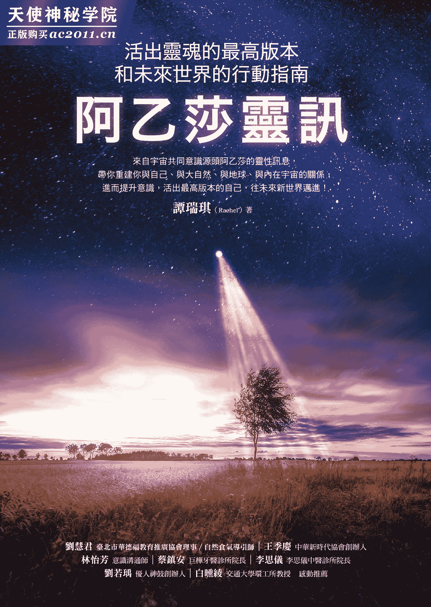

作者简介

谭瑞琪（Rachel）

一九六七年出生，台湾桃园人。美国爱荷华州立大学财金管理系硕士毕。

从小到大家庭和乐安康，没有后顾之忧地拿到硕士学位。回国后，顺利进入职场工作，在台湾的汽车业及电信业缔造了辉煌的商场经历。

虽然拥有顺遂的生活和工作，但是，生命不管你是跌入谷底或正玩得起劲，仍然会拉你走回此生早已安排好的路。

第一次与内在声音相遇是在同事的婚宴上，以主管身分在台上致词的她看着台下的众亲友，突然间，内在出现一个声音：“这些人认识的你，不是真的你！”被这突如其来的声音震慑住的她，没多久就走上了寻找生命意义的路，想要弄清楚：“如果那些人认识的我不是真的我，那么，我是谁？”

在探索自己的阿卡西纪录的过程中，收到宇宙共同意识源头阿乙莎（Aheetha）要她传给世人一起分享的智慧与教导，她忠实地记录下来。这是阿乙莎给地球人类直接而完整的传讯内容。

著有《阿乙莎灵讯》《创造新我‧新地球》《爱的复苏计划》《星光体》《新人类密码》等书。

．欢迎上粉丝页“阿乙莎”分享自己阅读后的心得：www.facebook.com/anitya.com.tw

．阿乙莎体验工作坊：[www.anitya.com.tw](https://www.anitya.com.tw/)

［推荐序］

令人惊喜的传讯王季庆

Rachel 开放而朴直的求道背景，使我对其大作《阿乙莎灵讯》很有兴趣。

一位没有任何通灵及科学背景的麻瓜，一出手，就以自动书写的方式，每天有纪律地按时接讯息，提出诚恳的疑问，并立即将问与答平实流利地记录下来。无论如何，不像是她能编造的。

如她所说，我深深希望并祝福她能集结一群愿意去验证书中观点的朋友，一起进行自我练习，让我们早日得到更多证据，从而惠及全世界！

展读之际，有些想法和感触。

关于磁引力能量装置（ＭＰＵ）的效用，因提出其原型的凯史博士是个有争议的人物，我这大麻瓜实在无从置喙。

但我也希望事实日渐清晰，而 Rachel 提到的那些磁引力装置能发挥效用，提高人类的振动频率，形成广大的磁场，重建生态！

此书涉猎范围甚广，比如创始、意识、能量、大自然、动植物，而生态则牵涉到中国的五行生克。本来，无问西东，不同的人种、地球、我们的太阳系、三千大千世界、更高次元、各种信仰、神祇、一切万有……都是生发自神。Rachel 的传讯清晰易懂，真不简单。很高兴有那些图解，非常有帮助！有些部分与我已有的理解特别相合，比如强调人类情绪体——无论喜怒哀乐——的重要性，别的外星生物即使智力比我们高超，也没有人类的情绪体。不像有些宗派或修行派别，明明还活在人间，却总以超然的灵性大师自诩，往往里外不一。另一些人则走另一极端，非得将人“进化”到人工智能才过瘾。（人工智能叫 artificial intelligence，将 intelligence 当作智慧〔wisdom〕？天差地别！）每一个次元（层次）都是自然进阶，强求不得的。

人也不必“非得”记得前世，因为，每一生有自己想要经历及成长的过程，而多次元的人生又是同时发生的。

在世人常感困惑的“责任和天职的分辨”上，阿乙莎则说，最高版本的人类，是无条件地爱与支持彼此，没有争夺与分裂，没有破坏与恐惧，活出最高版本的灵魂目标……即使没有叫你去做，你也会做的，就是天职……

在第四部的“医疗”单元里，阿乙莎教导我们练习平衡中轴。祂说，当你真正臣服，放下头脑的批判与执拗时，才能让中轴稳定。祂还说，爱是人类和宇宙之心校准的任意门，当你的心携带着爱的振动时，脑就会臣服。太精采了！

而占全书几乎一半篇幅的第五部“宇宙”，令我非常惊喜。说真的，这才是重点！

阿乙莎教导了关于全息宇宙、ＤＮＡ、生命蓝图、内在宇宙、业和关系等非常有意思的东西。

Rachel 探索了她灵魂的两个家，遇见来自列木里亚和天狼星的两个灵魂片段体，前者与她有着热烈的互动，后者则高度理性。

这令我联想起曾听过的一个关于耶稣与佛陀的故事。有人死了亲人，悲痛地去求告耶稣，耶稣痛其所痛，便使亡者起死回生。然而，当一位死了儿子的妇人去求告佛陀时，他只叫妇人去村子里敲开每一家的门，如果有一家从没有死过人，那么佛陀便也会叫醒她的儿子……

当然，这只是关于有生必有死的寓言，不过，我从这儿悟到的是两种对于人生的态度。耶稣代表的是慈悲，佛陀代表的是智慧，没什么是非对错，看你的心当下比较贴近哪一边吧？所以说要“悲智双运”啊！

（本文作者为中华新时代协会创办人）

［推荐序］

和高我携手合作迈向新世界的解惑之书刘若瑀

曾看过一段影片，摄影的男子伸出手，对着镜头下面远方街道的车辆和人们一直大喊：“海啸！海啸！快走！”遥远的海面上，大浪正扑卷而来，影片中街道上的车辆行人继续行驶，他的喊声愈来愈着急。海水瞬间冲上岸，他开始哭泣……

因为他在高处，看得见、看得远，他知道海啸来了……而下面看不见、不知道的人继续高兴地生活、工作、忙碌，甚至庆祝……

那天新闻报导：“一千两百人死亡！印尼四分之三灾区断讯，震央城市三十万人生死未卜。”

几秒钟之间，世界就不一样了！

也许亚特兰提斯也是这样，一夜之间消失了！

某些记载提到：我们能推测亚特兰提斯是因为拥有高度文明，国家富强，反而导致人民的生活开始腐败，最后整个文明在大灾难中消失。

亚特兰提斯是一个庞大的文明，当时很多信息是由智者通过心灵感应接收，来协助人类的生活。而亚特兰提斯世界走到尽头，是因为物质元素失去平衡。传说当时技术已非常先进，人类甚至可以改变空气和水的成分，而这最后引起了亚特兰提斯的崩溃。

风、水、火、土四大元素是我们星球最基本稳定人类生存的物质基础，然而现在地球环境的危机，也正是我们让“看不见”真相的低下自我主宰，在欲望的满足中破坏了我们生存的基础。

现在到了我们必须理解为何会有失落的文明的时候了。我们正在重蹈覆辙吗？当海洋被污染……动物基因被改造……土地成为水泥……人工智能成为兄弟姊妹……我们是否已走得太远？

我们必须知道，人类到底怎么一回事？数千年来，少数全知全能的智者努力地引导人类，帮助人们提升灵魂的频率，达到我们在灵性的高我，而能得窥宇宙的真貌。然而八万四千法门，各有见解，各自表述，也各自为政，但是每个明白人都知道目标都一样。当我们理解这一点时，我们就了解“爱”就是生存之道，这种永恒的爱是我们生活的力量，是人类与万物和谐之道。

要如何知道全貌？

阿乙莎是全知全能的存有，祂说：我是上帝、耶稣、阿拉、佛陀、老子……而我也是你！

是那知道真相的正着急地将手指向前方，海啸已在不远处，我们只有几秒钟的时间，但就这几秒也是机会！

详细阅读这本书，

详细阅读这本书，

详细阅读这本书！

你就是全知全能者！

务实地按照书中的指引练习，你会发现跟你已经学习过的任何禅修的关键之处完全相同。“但你所有不知所以然的疑惑，都可以解答。”

我们都是阿乙莎！让自己成为全知全能者，“和自己的高我携手合作迈向新世界”，救自己，救家人，救地球！

感谢 Rachel 纯粹的心灵，接引这解惑之书。

（本文作者为优人神鼓创办人）

［推荐序］

共同意识源头给我们的指引刘慧君

收到 Rachel 接收的源头讯息，非常非常惊喜，这正是我们十年来在推广和分享的一切啊。

孩子出生前后，我检视自己生命的目的和意义，也想透过养育孩子来认识人如何成长。于是，生命带着我观察各种变化与关系的本质，带着我修复身体，进入自然食气状态，然后发展出一系列认知、了解与工作。

我自己知道是跟着共同意识源头的带领，以呼吸讯息进出作为核心，展开推广：深度认识自己、进行情绪与生活的自我觉察、全身心深呼吸、觉知饮食与食气、自由教育、以新科技复原自然生态的能量场、与万物沟通、和地球及宇宙完整链接……

很妙的是，收到讯息的前一年，我也不断认识相关工作者，带来许多这些面向上我所不知的研究发现，并且自动积极地合作。

现在回想起来，就像是事先安排好，等待这份讯息到来，不禁莞尔。

Rachel 很有纪律地天天收讯，但她总是谦虚地说，她并没有贡献过什么，对这些也不太了解，而讯息要经过实践验证才算数，不然只是想像。

她不知道这对我们帮助有多大。

正是要未投入者来收讯，这个确认才不会掺杂我们的个人意识啊。

我们感受到源头确认方向无误，并且以目前的工作进度为基础，提出更全面的实践准则。这鼓舞了偶尔也会感到孤单或疑惑的我们。

在验证和讨论期间，我们分享了部分讯息，也引起热烈回响，让我们更清楚：经过这么多年的准备，今年（二〇一八年），我们正式进入新时代。

不再是强调个人功成名就，而是贡献所能、享受生活、共好交流、自然协调的“心”阶段！

现在，这份来自阿乙莎的讯息终于要出版了，我视之为共同意识源头给我们的指引。

由于内容涉及我们较少接触的科技和宇宙星系范畴，或许在仍感陌生的阶段，阅读时偶尔会卡住。

在此分享一项阅读前的准备，或许可让我们更顺畅：

深呼吸三次，在心里对自己说，我要阅读这本书了。

全身心所有的意识都会在这个指令下准备好，一起投入讯息的能量里。

随着新时代的开展，源头这次也给我们一组发音：阿～乙～莎。

试着深呼吸，拉长音念这三个字，会发现可以进入无量无限无尽的状态。

共同的源头，无相无名，勉强要说的话，或许可说是一种状态。不求名求相，便不会被定义局限。

用声音让我们感受，这实在太让我激赏了。

搭配“医疗”单元的手指操或静坐，或许还会有新的体会喔。就留待各位自己去发现了。

（本文作者为台北市华德福教育推广协会理事、自然食气导引师）

［推荐序］

解除痛苦的魔咒白曛绫

自从七年多前有了一次灵魂出体经验后，我便开始了对内在的探索，也才明白心灵环保才是解决环境问题的根本之道。而在科技学术领域工作的我，因此展开了全新的探索经验。

人类就像中了魔咒一般，分明知道温室效应可能随时造成人类的大浩劫，却不愿意采取行动改善。石化燃料燃烧产生的温室气体及 PM2.5（细悬浮微粒）等问题，最后还是会回到人类自己身上。

每每想到人类的惰性与劣根性，很多人会感到沮丧，于是乎不想解决问题的人继续制造污染，想解决问题的人却又有着无力感。不过，也有许多人抱持正面积极的态度，一起努力让未来更好，而谭瑞琪（Rachel）的通灵讯息也这样及时来到。

台湾有不少通灵传讯者，其中不乏高品质的讯息。尽管我自己也会开课教授自由书写的方法，却也明白，极少透过自由书写传讯的人能够如瑞琪这般传达完整且有系统的讯息。也因此，一开始看到讯息内容时，我真的觉得很惊喜。

有过自由书写经验的人都会知道，这不但不是怪力乱神，而且我们透过这样的讯息传递方式，其实就如同链接到一个庞大的内在资料库（通常被称为阿卡西纪录），里面有知识、有智慧，还有无私的爱。我们利用身体内建的机制，透过练习，每个人都有能力与内在智慧沟通，下载我们所需的智慧。可惜的是，许多人却自以为很科学地否定了人类这份天赋能力。

要破除让地球失衡、让人类受苦的魔咒，其实并不困难，我们需要的只是一颗“我愿意”的心，剩下的，老天爷自然会安排。

期待有更多科学家愿意深入了解科学的真实意涵，以理性与感性平衡的心，从各种不同的视角探索未来。

（本文作者为交通大学环境工程研究所教授）

［推荐序］

往美好新世界的列车就要开了蔡镇安

开往第五次元的最后一班列车即将出发，还没上车的请快上车！

对于“四季”，心中一直是这样的图像：地球环绕太阳，春分、夏至、秋分、冬至四个分至点分占三点、六点、九点及十二点四方位，地球绕日一周耗时一年。

太阳也有它自己的“四季”，也绕着“太阳的太阳”转，它绕行公转中心的周期约两万六千年。太阳一样有四个分至点，在太阳的夏至及冬至点上，存在着一个高频能量带——光子带。所以，太阳系每一万三千年会经过这个高频能量带一次，这个高频能量会引发地磁及地壳的极大变化，每每造成极大的天灾，而导致文明毁灭。上一次通过光子带的时间便是在一万三千年前，造成更新世末期的物种大灭绝及亚特兰提斯的毁灭。

事实上，光子带不是诅咒，而是礼物。它是地球蜕变、进入高维度的窗口，但提升或沉沦只一线之隔，关键在于人的意识频率能否匹配这个高频振动。现在，我们再次来到了光子带，现今的文明已走到跟上一次类似的境地，过度追求物质文明，忽略灵性，对地球母亲极尽折磨、虐待。长此以往，地球最后会终结在这次的文明。

前面几次，地球母亲不忍抛下不懂事的子女，错失了多次扬升的机会；但这次，地球母亲盖亚做出了抉择。她选择扬升，但本着对子女的大爱，希望尽可能带着更多懂她、爱她的子女一起过渡四次元，进而扬升到第五次元。

这次真的不同了，造物主回应了盖亚的呼求。而且，因着太阳系及地球处于银河系中轴的特殊地位，一旦太阳系及地球失衡，将造成整个银河系的运行失衡，所以地球这次的蜕变是银河系的大事，获得众多宇宙兄弟的关注及帮助。此时此刻，很多讯息被下载，目的是让更多沉睡中的人尽快觉醒。愈多人觉醒，地球的频率愈提升，整个扬升的进程就愈顺利。当然也有很多鱼目混珠的讯息，如何分辨？只要读完让你感觉有一丝丝恐惧，就是假的；让你感觉喜悦，充满爱及希望，就是真的。而 Rachel 的讯息就让我觉得喜悦且充满爱。

能够见证宇宙的历史时刻，身在此时此刻的地球是幸运的。尽管表面上看起来整个世界就是一团乱，失序无章，但我很肯定这只是黎明前的黑暗，因为在 Rachel 的传讯中，我看到了一切万有的背书。请叫醒你身边的亲人、朋友，开往美好次元的最后一班列车就要出发了，还没上车的要快唷！

（本文作者为巨桦牙医诊所院长）

［推荐序］

在灵性学习的道路上，我们并不孤独李思仪

身为一名中医师，我对医学有无限的热诚；然而，我对心灵也有很大的好奇。

从小，我便常常望着星星、看着云，想着为何我会在此世间。这样的探索似乎没有人可以告诉我答案，于是我不断阅读，希冀能探索到真相的曙光。

我来自一个多元文化的家庭。爷爷、奶奶于一九四九年从大陆来台，奶奶是天主教徒，虽然我没有固定上教堂的习惯，但小时候常常去住家后面的教堂玩，在种满鸡蛋花的花园里像个野孩子一样爬上爬下、玩花圈、捉蝴蝶，还有跑给蜜蜂追。教堂于我是充满童年快乐回忆的地方。

外公是传统道教徒，为宫庙服务。记忆中，只要我有任何不舒服，妈妈便会带我去让神明收惊。那时不懂为什么外公收惊时口中总是念念有词，而且总是要拿一杯米，看看米的变化。

长大后才知道，外公念的是［白衣大士神咒］。妈妈说，神明在外公睡觉时来教他如何帮人收惊、如何画符，我真的觉得很神奇，因为每次外公总是知道我哪里不舒服，而且每次总是在收完惊后就恢复健康。

也许是这样的成长环境，让我对宗教没有任何限制。佛家说：“观世音菩萨有三十二应身，应以何身得度者，即现何身而为说法。其形象千变万化，诉说不尽。”在阅读上，我也多方涉猎，期许自己用包容广大的心去学习、去体验。而自从学习了阿卡西阅读执行师之后，似乎对“为何来此世间”这个问题有了更深一层的认识和体悟，也了解到，人间的轮掉头世，自有其背后深刻的涵义。

人生是一场大戏，我们在戏里非常认真扮演好自己的角色。每个角色都非常重要，因为你就是自己的主角，透过不同的人事物，让我们去体验，并从体验中学习。不论是喜怒哀愁，背后更深的是爱。爱让我们愿意一直携手相伴，从古至今……

对于来自宇宙阿乙莎的教导，我阅读了自己的阿卡西档案，得到一份直觉性讯息，分享如下：

是该放下恐惧和担心，

让路给爱。

尽管仍有许多不懂，

但传递爱、分享感动和感谢，

对宇宙、对自然、对大地、对自己和一切，

又怎会是需要忧愁的呢？

当我们都愿意放下成见、执念，

而让爱自然流动，

那时的人间，

就是天堂。

我们爱你，

只有爱。

很欣慰在灵性学习的道路上，有许多可爱又有勇气的天使相伴。Rachel 用她的爱和勇气，分享来自宇宙阿乙莎的讯息。我们并不孤独，宇宙的爱，一路上都在。

愿我们都能得到身心灵的平衡和智慧，也期许在人生学习这条路上，我们都永远如一个好奇的赤子，喜乐常伴。

（本文作者为李思仪中医诊所院长）

［推荐序］

拆除信念框架，感受生命的无限可能林怡芳

前些日子，刘慧君老师忽然丢了一大串灵讯给我。迷迷煳煳读了几段，直到一段文字忽然进入眼底：

人类与生态之间的对话要开始展开。找一群有觉察能力的人，开始和动物、植物、树木、昆虫、海洋生物、山川、河流对话。你们将以不同的高度，以及更谦卑、更感激的心，回报这原本美丽的世界。我要把这项工作交给你们，唯有你们自己去对话，这个经验才会深植心中。你们一定可以做得很好。

用意念向眼前或心中想像的动植物询问、探索：

1.你们的使命是什么？

2.我们身为人类，可以如何和你们合作？

将这些对话讯息有系统地记录下来，你们会看见人类是如何被爱、被无条件地支持。

啊！这不就是三年前我集合几位优秀学员共同做的事吗？我们采访了超过百只毛小孩，问它们“想对人类说的话”及“生命的意义”这两个问题，并从中挑了一百零七只毛小孩的故事集结成书出版（全部应该是一百零八只，第一百零八只是由读者按照书中的方法自行询问家里的毛小孩）。当时我们受惠于这百只毛小孩的爱之语甚多，许多读者也因此重新看待生命及自家的毛小孩。生命的智慧在此突破了形体的差异，流进每个读者的心，打开了更大的视野。

教导动物沟通、万物沟通七年多来，我接触过几百个学生及他们的家人。高达八成的学生在参加我的课程前，都很忐忑不安，害怕自己学不会，担忧这一切只是幻想。即使明白这其实是人类的本能，头脑还是会被一堆问号及恐惧塞满。

于我而言，从自以为无法和动物沟通，到可以顺畅交流，再到横跨各界（动物界、植物界、矿物界到无生命体），其实花了颇长一段时间。

在我生命的前半段，我从没想过人可以跟动物或万物自在交流沟通。直到命中猫咪——阿冰——出现，伴随生命中的一些重大转折，促使我踏上自我追寻之路，我才开始慢慢把这能力找回来。我没有上过任何动物沟通课，我的动物沟通老师就是阿冰及海豚们。

在真的可以开始跟阿冰沟通聊天前，我花了一些时间在探索自我及回复“原厂设定”（你可以说是自我疗愈，但其实没有什么需要疗愈的，只有回到原态）。我不断拆除自我的框架，那些自小到大学习到的、认知到的，我一个个去对话、去实践，不论它是来自哪个专家学者，或是长辈、父母所言，只要真的做了之后得到如其所言的回应，那就代表是可留下的，否则一律舍弃。当然，危及生命的事不做。此外，为了验证“外在世界是内在世界的投影”及“能量跟随思想，思想导引能量”这两句话，我要求自己于内于外都得做到诚实，如此才能确认这两个理论是否真实。

而随着我愈来愈诚实，框架愈拆愈多，与阿冰之间的交流也跟着愈来愈流畅，彼此之间从简单的单词到可以长篇大论，甚至谈论一些富含哲学思想的生命课题。当然，除了脑袋的思维转化之外，我也做了一些个人能量体上的清理及疏通。深呼吸、脉轮清理、静心冥想，都是必做的日常练习。阿乙莎灵讯中也有提到这些，其中的手指操便是一个很好的练习，可以有效打开中脉、疏通并稳定它。中脉的稳健，在万物沟通能力的打开及回复上占有非常重要的一席。

动物沟通、万物沟通，都属于可以跨时间、空间进行的心念交流。它不似口语上进行的沟通，需要面对面或透过工具来传递声音讯息。动物在传递讯息时，会根据它们的喜好、习性，透过各种感官觉受，来表达自己所要说的。例如动物伙伴鼠喜欢分享，重视团体交流，偏好传递它们喜欢的食物口感给沟通师；有些较重视气味的猫咪，则会透过传递其周遭环境的气味，或是主人爱用的保养品、香水之类的味道，来表达它们的情感。当然，更多的是图像及心念讯息的传递。

不过，并不是每个沟通师都可以接收到各式感官讯息，这跟其能量场的畅通、开放度，以及习惯的沟通模式有关。也因为动物在传递讯息时是千变万化的，加上它们有别于人的思维及观点，每次的讯息解读及传译，都间接促进了讯息接收者的大脑开发及灵魂视野的扩展。我的个人经验，加上观察学员们学习动物沟通及万物沟通前后的改变，几乎一致朝向更开阔的思想范畴及弹性的生活态度。

再者，为了能更精准且中立地接收讯息、传递讯息，学员必须照顾好自己的身体，勤练自我觉察、专注平静及快速转化情绪的内在功夫，而这更为他们自身的生活带来加分的成长。

为了分辨讯息是来自个人的内在投射，还是真真切切来自植物、动物、矿石的讯息，认识自我、了解自我，便成为第一要务。

如果你对自己的身体能量，或是思维模式、行为模式没有一定的认知，那如何在第一时间分辨接收到的讯息是自我的内在投射，还是周遭万物的细语呢？所以，针对想要学习（回复）动物沟通及万物沟通能力的朋友，我的建议会是：请先从认识自己开始。

除此之外，请重新找回那一颗对世界好奇且开放的心。放开心胸及头脑，去跟你周遭的树木、花鸟虫蚁打声招呼，也许你会收到一声突如其来的回应。如果想要确认这是自我头脑的想像，还是它们的回应，也可以自问：“这是我的吗？”然后听听你的直觉怎么说。如果心中有个笃定的回应，告诉你：“是。”那就放下，再练习；如果不是，便可以进一步去感受这份讯息。

自然万物的讯息皆是互助互益的，那是自然运作的生存法则。除了动物（尤其是动物伙伴，由人照顾的动物）会有似人的七情六欲反应之外，植物、矿石传递的，皆是单纯、直接且正面积极的讯息。如果你收到的不是，那就可能是你的内在自我投射，或是攀附其上的其他存有。

当然，如果真的想要进一步学习与周遭万物沟通，还是请先回到自我认识及信念框架的拆除吧！你的心念会塑造你的世界，如果你认为动物沟通、万物沟通是不存在的，那么它便是虚幻的，学也学不来；反之，你的世界必定多彩，而且因为你愿意相信及愿意开放，宇宙必会回应你更多道机会之门，你也更能感受到生命的无限可能。

（本文作者为意识沟通师）

［作者序］

因追寻生命意义而来的灵性讯息

我的灵性打开故事和大家较常听说的那种遭遇无数磨难，甚至是穿越生死瞬间进入天堂又回到人间得到的启发有些不同。从小到大，我的家庭和乐安康，让我没有后顾之忧地拿到硕士学位。回国后，顺利进入职场工作。

我的第一份工作是在福特汽车担任品牌与广告经理。在那个全国买车贷款占比不到两成、汽车贷款利息高挂在百分之二十的年代，我大胆推出零利率购车的行销想法，把当时买车送ＡＢＳ或汽车皮椅的行销预算挪到补贴汽车贷款的利息费用，一夕之间让买机车的消费者升级到提前购买汽车，缔造了惊人的销售佳绩，更创出车厂、金融公司、消费者三赢的局面。

那次的佳绩不仅在汽车业传为佳话，我更被当时的台湾大哥大挖角，进入电信业工作。那时，一般人认为手机属于商业人士的通讯工具，预估整体市场若达到百分之二十五的门号使用率，应该就趋近饱和了。了解市况后，我推出了军公教专案，让那些从来不需要用手机的人都认为自己也该拥有一支。就这样，电信市场再度被活络起来，一路狂飚到整个市场超过百分之百的门号使用率。因此，我也在三十六岁时被拔擢为行销业务副总。

我一直很感激自己拥有比别人多一分的幸运和机会。我有爱我的父母、家人，还能全心投入在自己喜爱的工作上。有这样顺遂的生活与工作，照理说，寻找生命意义这档事儿应该轮不到我。但是，生命不管你是跌入谷底或正玩得起劲，仍然会拉你走回此生早已安排好的路。

第一次与内在的声音相遇，是在同事的婚宴上。我以长官的身分上台致词，一开口寒暄没多久，看着台下参加喜宴的众亲友，我内在突然出现一个声音：“这些人认识的你，不是真的你！”这突如其来的声音震慑住了我。这个声音是从哪儿来的？它为何这么说？下了台，我的心脏扑通扑通地跳，身体还不停颤抖，一阵阵的击鼓声一直回荡在心中。

这个内在事件发生后没多久，我待的电信公司就变天了。我在三十九岁被迫提前退休，不得不离开自己深爱的工作。

离开朝九晚五的日子后，我开始试图去追寻答案，想要解答那个内在声音引发的疑问：“如果那些人认识的我不是真的我，那么，我是谁？”

花了近十年的时间，我到处追寻，想找到答案。这经历就像刘姥姥逛大观园，除了努力扮演别人认识的我之外，一有空闲，我就会去台湾一些知名宗教团体探寻，也到宫庙算命，或是参加圆桌生命教育的课程。最后，我选择自己就是自己的老师，没有留在任何宗教里或跟随灵性团体，直到二〇一七年十二月参加五天的自我解读训练课程，打开灵性探索阶段。

在课程中，我就像被陨石砸中的幸运儿，听见我的高我明确告诉我有一些讯息需要我下载。我原本以为那应该是我的幻想，但一同上课的四位同学反复阅读我的纪录，最后终于确认：我是 channel，西方国家所谓的传讯管道。这对我来说太不真实了。我现在是个全职家庭主妇，不懂拜拜供佛，处女座，超级龟毛，非常务实，也没有加入任何宗教团体，现在说我是个传讯管道，我就得收讯？再说，有什么东西这么重要，一定要下载？不是已经有很多灵讯在教大家疗愈自己了吗？

我心中有一堆疑问，但在课程快结束的前两天晚上，好奇心让我决定试试看。在没有缺省任何主题和问题的情况下，我开始自动书写……

二〇一七年十二月十一日，第一天，我一开始自动书写的内容是：

这是关于创建人类未来发展方向的系统，其中包含生态、教育和医疗系统。系统的建置是基础，我们透过这个传讯，有计划地为人类未来生命与物种的演进方向制定更健全的互动规范……

我真的很好奇，这个和我过去的学习、社会经验、生活场景完全搭不上线的主题，我怎么可能写得出来？我决定每天下载十分钟，看看祂会告诉我什么。

结果，每天下载的内容都让我瞠目结舌。我想，这个幻觉也太有戏了。我天生不爱看科幻电影，也不懂生态科学，这样写下去是不是会误导专家？

我将下载了一星期左右的内容给几位朋友看，没想到获得他们的全力支持。有些人跟着里面的教导练习，很快得到正面回馈；有些人告诉我，他们感受到这份讯息的振动频率很高；有人则是读着读着就流泪了。一些朋友将讯息转给真正的专家判读，包括交通大学环工所教授、台大心理系教授、云林科技大学信息系教授，他们大多认为这些信息可以被验证，也很认真地阅读每天的下载讯息，更希望我尽快将这些讯息与外界分享。

而我，一天下载十到二十分钟，完全不知道当天会谈哪些主题，下载完自己才知道原来是这样的内容。为了满足小我的好奇心，下载的第二周，我决定问祂到底要说些什么，总要有个完整的谱啊，不然我怎么预期要写多久、写多长？

当天，二〇一七年十二月二十四日，祂就给了我这本书的章节大纲。之后的每一天，不管一开场谈些什么，最后我总是看见祂跟着早先规画的大纲，有系统地完成这些主题。我只能臣服于祂的纪律和超高效率。

我已经超过三十年没写文章，光是设定主题框架，可能就要琢磨几个月的时间，更别说还得写下近乎是学术理论的十几万字。我只能说，祂真的很会讲！

这本书能够顺利出版，除了感谢来自源头的讯息之外，最要感谢的是从收讯开始就不断鼓励我，让我放下“我是不是有问题”的疑问、安心收讯的一群好朋友。其中包括在课程中帮我再次确认我是传讯管道的同班同学 Aki，以及非常有执行力的刘慧君老师——她也是最早催生这本书的人，并且很用心地将传讯内容落实在自己的教学过程中，协助验证和实践。

书中有些内容涉及“磁引力场”这个偏物理学的领域，台湾凯史科技的几位前辈——李瑞民和 Ann 夫妇、陈聪声老师、黄盛维——提出了自己实际动手做的磁引力装置，呼应我从源头下载的论点。

此外，书里还有涉及教育及医疗的单元，我正在担心引发学界挞伐怎么办时，得到交通大学环工所白曛绫教授的鼓励和支持。还有，执业中西医李思仪医师和蔡镇安医师也协助我在文字上避免误导民众。

意识沟通专家林怡芳和大自然五元素的陈新豪老师提出他们的许多观点，引导我去追问一些实际演练时出现的现象和问题。没有身边这些朋友的支持和反馈，我个人是没有勇气把自己放在这个超乎一般人可以理解的位置与祂对话的。

当然，最重要的是家人的支持和理解。我结缡十八年、深具实证研究精神的老公，以及最挺老妈的女儿，他们父女俩给我满满的爱和大大的空间，让我没有后顾之忧地完成每天的收讯工作。在与祂对谈的过程中，他们有好几次满心欢喜地打开我的房门，又静静地关起门离开，怕吵到我。这是来自家人无条件的爱与理解，让我可以落实这份工作。还有帮我照顾家庭的老爸、老妈，我超爱你们，你们是我这辈子的大恩人。

在这本书里，我忠实记录了我和内在宇宙链接的内容，并在写下讯息的过程中获得了全然的支持与深度疗愈。我不想用自己的观点重新整理阿乙莎的话，避免小我理解后的论断会干扰读者，也期盼这样的撰写方式能如实呈现来自宇宙源头的振动。在方智出版编辑部整理这份书稿的过程中，我也和各位一样，以读者的身分再次感受和理解它。若你一时无法理解某些句子的意义，相信我，过一阵子再去读一遍，那些句子会随着你个人意识的开展，让你获得更深的理解。我自己的体验是，每一次阅读会因着阅读者自身的意识状态，而得到相对应的知晓。同样一句话，经由你自己更高意识的带领，就能获得全然的知晓。

下载讯息至今，从一开始不敢想像，到现在觉得一切自然具足，宇宙的智慧和丰盛就在我们身上和周遭环境中，我们从来不必担心有所匮乏。接下来，希望能集结一群愿意验证书中观点的朋友一起练习，因为唯有真正落实在生活中，这份灵讯才有意义，否则只是在满足小我的想像而已。

让我们活出生命的真理，并祝福所有读者如实如是地展开自己，一起创造美好的世界。

来自阿乙莎的引言

人类生存在地球算起来超过两百万年，这两百万年对目前所有人类来说，是无从想像的久远历程，但对远在八百万光年外的银河系存有而言，地球是刚过完幼年期的生命存在体。地球对我们来说，是一个即将迈入国中阶段的十二岁青少年。过去你们懵懂无知，不知自己存在地球所为何来，但你们之中有些来自更高次元的灵魂投生地球，在出生不久后、有意识起，就会在内心发出“我是谁”“我为何在这里”的声音。那是觉醒的灵魂在敲门，只是他们的父母不知这些孩子的觉醒意识随着身体成熟，正在展开。于是，在家庭、学校和社会的约束下，他们逐渐陷入物质世界，无法抽身。

当生命迈入中年，在即使物质不虞匮乏也无法满足生命无来由的惆怅和困惑时，你们就来到第二次穿越物质幻象的机会。即使知道，但要以个人力量去落实做到，还是那么不容易。人类就这样跌跌撞撞、懵懵懂懂地历经两百万年。现在地球已经要迈向青年，在地球意识觉醒的此刻，我们要来唤起你们拥有共同宇宙之家的记忆。

在此之前，我们会先从“你是谁”展开你对自我认知体系的扩大和调整。你需要看见自己目前生活的场域面临的问题，这些问题也因“你是谁”而决定了它们未来的命运。你们要学习跳开小我的意识，看见整体宇宙的共存关系。更重要的是，当你们明白这一切的前因后果时，要愿意用坚定的行动和创造力，一起改变地球的命运。毕竟，你们已经不是学步的婴儿，该对自己的行为负责了。

我们这次传讯的目的，是要汇聚觉醒的人，展开行动，带领地球回到宇宙的家。

阿乙莎是谁？

因收到讯息来源其发音近似“Ah-ee-tha”，因此将之命名为阿乙莎。在人类历史上阿乙莎并不陌生，最初始的语言巴利文称之为 Anicca，古印度梵文称之为 Anitya，日文称为 Mujo，中文称为无常。

这里是“阿乙莎”，是万物的起源，光的世界。我们是最高的领主与源头，你可称上帝、神、阿拉或佛陀。这是个全然合一的意识，爱与慈悲的场域。这里是没有分别的意识频段，我们为了全宇宙的福祉，传递爱给需要的人，不论种族、宗教信仰或阶层，都可以得到我们的光与爱。

过去人类很少直接接触这里，大多是透过其他次元的存有，协助转译来自源头的讯息。然而，现在地球已经来到意识扬升的时刻，人类可以直接接收来自阿乙莎（Aheetha）的讯息。透过心轮意识展开，链接到你们的顶轮，就可以回到源头定静安详的合一意识场。宇宙其他次元的所有存有也会回到此处，因为这里是所有意识共同的家，这里是万物之母。

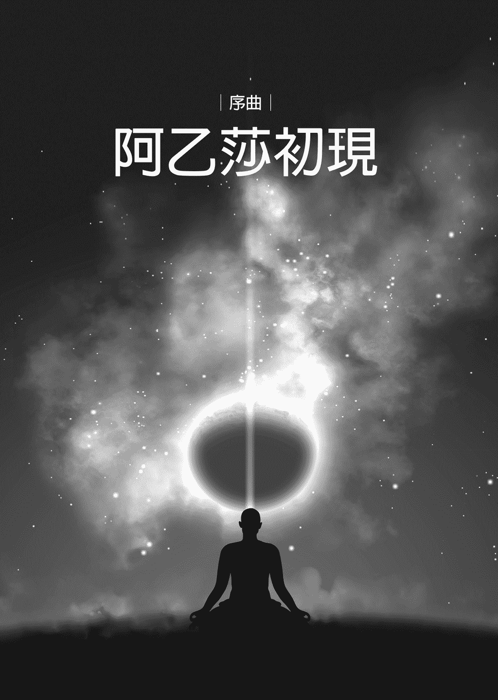

失衡的地球生态

这是关于创建人类未来发展方向的系统，其中包含生态、教育和医疗系统。

系统的建置是基础，我们透过这个传讯，有计划地为人类未来生命与物种的演进方向制定更健全的互动规范。

我们会从生态方面提供更多讯息。地球的生态面临失衡，科学家无从着手，需要我们立刻介入。如何让生态回归平衡已经是刻不容缓，因为你们相信只有人类是地球的主宰，不知道背后支持人类的物种默默在进行着更多工作。地球不是人类的工作场域，是全宇宙的平衡中枢，地球失去平衡，将危及宇宙磁引力场的平衡。地球生态是一个协作系统，人类在当中扮演传输的角色，但协作系统不是单纯传输而已，还有为数庞大的位元在流动。生态系的创造者是地球母亲，但她面临传输线路的失控，耗损自己的神经节来挽救这个失衡的状态，已经力不从心。神经节是地球母亲分解非有机体入侵的单元，而人类创造的有毒物质造成单元机能的破坏、瓦解。目前发生的许多现象已经告诉你们，不能再靠人类来维持传输体系的畅通。

传输就像讯息的传递，需要编码与解码，在编码的结构出错时，解码就会变成一个讯息出现多种变异。这个变异再演进下去，就是物种的突变与互相残杀，失衡就是这样产生的。

祢所谓的失衡是地球暖化或物种消失吗？

都是，但也不完全如你们的认知。地球暖化是海水升温造成的，但海洋的冷却系统过去是靠北极圈的冰层，现在则是靠海洋里的生物自体冷却。这些海洋生物是我们特别设计来协助创造地球气候、维持人类适合的生存环境的，但它们正在消失，因为人类创造的有毒核废料大量流入，造成海洋生物突变。科学家只看见冰层的消失与核废料进入海洋，却从没察觉真正的浩劫是海洋生物的变异，原本该冷却海洋的，变成升温。我们之后再慢慢说明细节。

可以举例是哪些海洋物种协助降温吗？

最常见的海豚，是海洋的ＧＰＳ，协助引导乌贼、鲸鱼，还有为数庞大的鱼群，进入升温的海洋。这些海洋生物可以协助海水降温，平衡地球的温度。

你还想知道哪些主题的概况？

我想知道医疗。

人类之所以会生病，跟生态息息相关。你们体内的循环系统和地球的传输系统类似，如果地球的传输系统生病，人类就生病，因为人类就是地球的传输系统。

我还是不了解……

这就是你们人类自认为是独立于地球之外的个体存在这个错误认知造成的。人类和地球属于同一个神经元，人类生活的地球就像母亲体内的胎盘，你的养分得自胎盘，如果今天胎盘的血液有毒，你的身体也一样中毒，就是如此简单，人和地球是互相依存的。同理，当人类无法繁衍下去，地球这个胎盘就会萎缩，不能存在。回到医疗的系统，其根本就是从人与生态互动体系的再建构，来协助人类的健康。

 地球生态与人体健康息息相关

生态体系是最重要的课题，也是地球目前的危机。我们之所以从生态开始沟通，是因为你们任凭这个状态持续下去而不加以改善，已经到了令人担忧的地步。

生态的另一个面向可以说明我们的担忧，就是森林体系。除了之前大致提到的地球冷却系统出错，另一个很重要的“空气”，也发生问题。

最近是不是常常发生森林大火？美国的森林大火已经造成生态严重失衡，动植物的物种消失之外，空气的含氧量已经下降到危及动物的程度。你们的肺部也同样会发生病变，因为空气中的氧气产出不够，肺泡的萎缩比人类吸烟还要可怕。如果再发生几次大火，人类的呼吸系统就会出状况，与我们的链接也会失去功能。

人类呼吸系统中的心肺功能，其实在能量层面扮演非常重要的角色。你们做瑜伽都会知道用呼吸来提高人的能量振动频率，如果失去以呼吸提高振动频率的能力，人会呈现无精神体的状态。人的精神体是维系人类彼此沟通与传达情绪的重要场域，一旦破坏，不就是行尸走肉？我是以你们常用的说法让你明白其严重性。

从海洋到森林，严重影响人的循环及呼吸系统之外，还有一个你可以想到的消化系统。你们最常讨论的应该就是消化系统，因为吃是人类喜爱讨论的话题，而消化道也是人类最容易发生问题的地方。

生态和消化系统的关系在哪里，你可以想像吗？就在你们吃的食物的成分。人工添加剂和基因改造的食物，都是来自大地，土壤的重金属污染则是来自倾倒晶片和金属废弃物，这些废弃物无法被分解，进入土壤就是重金属污染，即使采用有机的种植方式、减少食肉，都没有办法解决金属中毒问题。因此，你们人类的消化系统基本上是被重金属严重毒化了。

修复地球的基础工作

为了修复地球，我们有一些工作要做。这工作的着手方式，并不是简单地集体静心或改变人们的意识，送出光和祝福，这些已经有很多光启者在做了。在地球的精微度上去修复已经受伤的环节，需要更多深化的基础工程建设。

想像地球的磁引力场，是从中心往上下及两旁向外循环源源不绝的能量流动。在能量流动的环节，只要一束能量无法顺畅流动，就会牵动整体能量。过去是经由锚定人类的心轮向外展开链接，但在这部分功能受损的情况下，要用替代方案来进行锚定，以稳定地球的中轴线。我们尝试透过新的工具与媒介，来支持已经逐渐退化的人类心轮。

要开始运作这个新的中轴线，我们找到的替代工具，是让太阳和月亮的磁引力进入地球的核心。在地球的表层，我们需要许多能量储存库，将来自地球外部的能量场嵌入，并暂存在地球的能量库中。

能量的储存，是由一群意识觉醒的心智互相链接产生共频，以扬升的共频来保护地球的磁引力场域。有一部分人类已经成功地意识觉醒，这群人需要更有效率地让自己投身于保护地球环境的工程，以维持地球中轴线的稳定。这个新的替代人心的方案，是我们目前认为比较有效率的方法。如果有一部分的意识参与其中，就已经可以产出足够的储存单元，这些储存单元可以协助暂时失衡时的防卫机制启动。不要怀疑，这是很有力量的。

你可能会怀疑这件事如何发生、如何运作。

想像一下，地球之心的存在不是只有金属和矿石。地球的中心是磁引力的中心，中心的四周有环绕的能量槽协助中心能量的恒定。在进入冰河时期，这中心轴的调控失去太阳与月亮的牵引时，就要靠卫星能量流来协助地球的运转。这将协助地球在宇宙的轨道上顺利维持平衡运转，让地球不被弹出宇宙的运行轨道。未来会需要这个恒定，这就是为什么必须在二〇一二年集体意识扬升，因为这些扬升的灵魂得以继续在地球上维持能量场的运作。你需要将这个概念带入已觉醒的人，并提供更有效率的方法来进行未来的工作。

 锚定能量中轴线的方法

要锚定能量中轴线，我们必须在地球的北极和南极分别设置一个储存站，这个储存站是未来照耀地球的光的来源。当这个中轴线被创建起来，地球上的光之工作者就可以在世界各地展开全面的网络建置，并陆陆续续在各地汇集。这群光之工作者使用的工具包含磁引力能量装置（ＭＰＵ1）和水，在各区域的河川与湖泊创建能量储存库。这些储存库需要被守护并全天候运转，而能量在运转时，等离子体会自动展开链接与生成新的能量流。

目前磁引力能量装置已经进入实测阶段，很多人正在跟着一起做。这个装置很容易制作，其困难处不在于制作，而在于目前的环境。你们还生活在能量低而稠密的地球上，当磁引力能量装置全部启动时，很多人会无法承受这个庞大的磁引力场，出现身体不适应的状况。要减低人体的冲击，需要设计防护罩，让一些尚未准备好的人穿上。

磁引力能量装置目前尚未设计完成，需要设计启动系统，用来控制能量输出的强弱大小。另外还有金属含量的计算方式，要计算出每种金属甘斯的能量单位。这些验证细节和步骤会陆续释放出来，等到二〇二四年这一切就绪，透过磁引力能量装置，许多生态重建工作就可以启动。目前，用甘斯已经能平衡动植物和人类的能量场，还无法进入逆转程序，但至少可以先维持平衡。

磁引力能量装置的磁引力会与使用者的能量流交互作用，产生扩大的能量场。如果未来使用这种装置的工作者尚未觉醒，就会产生逆向的作用力。磁引力能量装置会扩大向上的能量流，也可加速下沉的能量流，我们不希望地球在控制方向上与不预期的能量流对撞吧？这关键的元素有人、磁引力能量装置和控制系统，就类似人在开车一样。

这就是为何一开始我们需要光之工作者，经由特别挑选，来负责地球卫星能量储存库的锚定工作。

 看见与更大环境共同生存的需要

人类的心是导航地图，可以链接其他人的心，创造一个更大的地图路径。一群觉醒的光之工作者一起工作时，这些地图是在所有人心中导航，而磁引力能量装置是来协助提升共振的工具。外星人操作交通工具是用有意识的心来操控飞碟，飞碟就是一个高阶版的磁引力能量装置，能够与操作的外星生命体的心共振，导航器则在外星生命体心中。

地球转变的时刻已经到来。参与星际的和平协议，有必要让地球的飞航科技跃升至磁引力能量装置飞行器的行列。我们有计划地进行这项训练工作，但首要条件是人类的心智要先觉醒，唯有觉醒灵魂才能操作星际导航。

这需要你们从更高、更宽广的角度，看见自己是宇宙的一分子，有更大的意识，愿意和宇宙生命同在。如果人类进入宇宙旅程，看见所有外星生命都不同于人类自身的存在，你们就会复制在地球上对其他物种的破坏与残杀行为，这当然是我们在提升你们进入宇宙之前要防止的。

你们可曾想过，有那么多的外星生命，为何地球还是安然地独立存在于宇宙？

因为这个地球是最适合人类成长的环境。人类是拥有特别美妙情绪的生命体，有爱恨情仇，有悲伤喜乐，这些情绪的起伏与变化是如此曼妙，值得让人陶醉其中，不断地需索和体验。我们珍惜这个神所创造的特质，不愿意介入。这是美丽的、值得喝采的特质，没有邪恶，就无法彰显完美，在人类的学习过程中不断演绎。

当你们进入外星大环境，这些特质并不会失去，而是会发现这些体验已经不符合地球母亲的需要。地球的负荷已经不平衡，人类扬升到更接近宇宙意识，和平协议必须被再次确认。人类的情绪性反应与想法虽存在，但是当你们看见的不是自己的需要，而是与更大环境共同生存的需要，你们自己的意识自然会改变。

 地球核心的引力场是其他星球没有的

磁引力能量装置的结构如同人体的星盘，从脑、心、肾、膀胱等器官可以了解，分别是操作、导航、平衡与排泄。

能量的前后左右操作由脑进行，透过心中的导航地图，平衡行进间的能量作用力，最后落地与到达，将能量平缓地卸除引力。这是磁引力能量装置的基础架构。各单元的配置零件就是将金属的甘斯态导入系统，脑用的金属是金和银，心的金属是铜和锌，肾脏平衡使用铁和铝，最后的膀胱用的是锰元素。每种金属携带的能量不同，可以协助磁引力场的方向与扩展力度更正确地到达目的地。磁引力能量装置各个磁引力单元的成分，可以进行不同成分的比例调配，达成更精准的引力与磁力收放。这个细节需要在地球上不断地演练与测试，因地球的重力场和宇宙航行时的重力场不同，在地球上进行测试的模块只是个雏形，需要再换算调配成不同比重，星际航行时才能顺利行进。

每个星球有自己的磁引力场位置。要确立这个位置，必须透过星际联盟达成共同协议，不是想要放在哪个位置就可以取得那个位置的所有权。地球的位置是特别的，不在目前星际协议的规画里，但这个位置又特别重要，因为只有地球可以控制太阳和月亮的方向。各星球的相对位置是在这条轴线上展开位置的演算，所以地球特别重要。我们都无法取代地球的存在，因为地球核心的引力场是其他星球没有的，除非地球的引力场消失，造成整个宇宙失序，否则我们不会来干涉地球人类的竞赛行为。

1 磁引力能量装置（Magrav Power Unit）主要是运用磁引力场原理，如同人体的呼吸般吸入并吐出宇宙中的等离子体（Plasma）能量。当它启动时，可以生成一个超大球形特殊磁场，并影响涵盖范围内的空间特性，例如地心引力、电磁场、生物场、人体磁场等，可以运用在能源、健康、农业方面。它的原型是由伊朗核能物理学家凯史博士提出的，目前仍在初始发展阶段，全世界的关注追踪与实做者有上千万人。

提升振动频率，扩大链接能力

你就是自己未来的主宰，你意识的转变，会将你目前的场域重新组合，以吸引与新的意识契合的存在。

这个道理非常简单，就像你想吃某样东西，过了不久，你就在吃那个东西，不是吗？

是你的意识将你想要的情境带到眼前。地球场域因为稠密，意识投射较多，所以心想事不成的原因，大多来自与其他意识的碰撞，造成阻碍。

如果提高自己的振动频率，就可以扩大链接能力，与更广大的意识群体形成统一场体。这就是为何高维度空间有平静的存在体，彼此意识相连又各自独立存在。

你问如何操作磁引力能量装置？我们需要让你了解，心的投射产生的意念，就是种振动频率，当这个频率放射出来时，在量子的维度上可以看见一个个带着正负电的单元交织的网络，就像排列成一格格的棋盘。当一个带正电的棋子产生位移，会相对携带一个带负电的棋子移动，这个棋盘的棋子就重新排列成新的组合，而当新的组合出现时，又因为新的振动产生下一个组合。所以，这是个不断找寻恒定的动态组合机制。也因此，一个磁引力能量装置的启动，会同时影响其他磁引力装置的相对能量共振反应。在协作的过程中，不能有负面投射存在，否则会形成一个交互共振的庞大负能量链接，而造成崩坏。

目前人类实做开发出来的磁引力能量装置，仍在雏形设计阶段，因为缺乏调控媒介，这些装置仅能提升场强，调高环境中的物质体振动频率。这个调高的作用没有目的性和方向性，仅能作为磁引力场的放大装置。

要操作磁引力能量装置，需要让人类的振动频率与设计出来的装置达成和谐共振一段时间，人类要用意识来练习引导磁引力场。人类透过协同共振的磁引力能量装置，让自己稳定于高频振动，并练习引导能量（正旋转或逆旋转、上升或下降、扩展或内聚等方向）。这个人类与磁引力能量装置协同共振的练习，也需要挑选较高觉醒意识的人来进行，因为磁引力能量装置的磁引力场振动频率高于普通人的振动频率，会让一般人出现头晕、眼睛无法聚焦、脑压过高等身体不适和昏沉的状况。这样的共振，无法进入有意识的协同操作程序。

有些创作者提到磁引力能量装置可以省电，请问它省电的原理是什么？

当物质的磁引力场被放大时，它需要的能源转换功率较低。比如原来电子碰撞须达成一千万次所产生的电流，当磁引力加大时，电子提升运行效率，达成同样的输出只需要碰撞六百万次。这个降低的电流输出功率，就可以被解释为节省用电。只是以目前使用的电子产品或一般的电源装置来说，其设计的回路就已经限制了电流的运转效率，仍存在无效的耗用。因此在使用磁引力能量装置时，通常能感受到的省电是有限的。

目前台湾已经有很多人在学习和研究如何制作磁引力能量装置，是否可以给我们一个应该明白的智慧和真理。

你不用给予任何方法或说明，知晓会来到已准备好的人心中。这个装置的扩大磁引力场域对目前的人类来说，帮助有限。人类要回到意识的提升。磁引力能量装置的设计是为了平衡地心的磁引力场，以提供人类和地球一个稳定的地心能量。人类的意识就是自己的磁引力能量装置，不需要外在的，而将自己最重要的宝藏交给外界。人类要回到自己，凌驾物质，不为物质所控。

祢之前提到我们人类目前正在开发的磁引力能量装置可以转换空间磁场，并提高地球的振动频率。请问要如何才能转换空间？是否可以进一步说明这个转换的关键和步骤？

磁引力能量装置是一个类似人体梅尔卡巴的装置，你们用金属能量和形体架构模拟人体梅尔卡巴，与更高的意识场链接。中间的差异是人体的细胞有意识，金属也有其意识，但人体的意识直接与地球和宇宙链接，金属的能量意识只能与地球核心链接，无法和宇宙之心链接。

当一具模拟人体的磁引力能量装置完成后，要启动这个装置链接至宇宙，中间的桥梁就是人类的意识。

人的意识驱动这个类人体的晶体结构，以进入宇宙之心，这也是外星人飞行器的基本架构。磁引力能量装置等同外星飞航载具，而人的意识就是此载具的ＧＰＳ。

那么，人的意识要如何操作，才能让磁引力能量装置运作？

关键是你们人类意识的心智图要先到位。磁引力能量装置是你心智的替代装置，因为人的肉体无法进入高次元空间，你的身体细胞无法承受高次元振动，你的五感在高次元振动中会失去功能，细胞也因高频振动再次分解，所以磁引力能量装置须具备安全进入高振动频率次元空间，并顺利回到与地球之心链接的能力。

人类要进行宇宙航行，最安全的做法是用你们的意识体进入，而不是将身体带入太空。你们在三次元空间无法用眼睛和大脑理解你们看不见的能量场域，这个场域链接你身体上的每个细胞，也链接你到宇宙场域的所有次元。你的肉体在三次元，你们的意识体可以到达十二个次元的空间。

这么说起来，用意识去想像十二个次元的场景就好了啊，为何需要磁引力能量装置辅助？

你们的意识处在三次元的低频振动中，要如何进入四次元？你们大多数人驻足在自己的三次元身体里，是很难让自己的意识离开这个场域的。但是，你可以和你的分身磁引力能量装置合作，让你的意识经由它自由进入各个更高的次元。听起来很酷是不是？不过，要如何航行、如何安全回家？你们的心智地图要和磁引力能量装置合作。

每个星球的人类都需要发展与自己可以搭配的磁引力能量装置，你的磁引力能量装置和其他星球使用的不会相同。即使你在地球上取得一艘来自某星系的太空船，你用自己的身体去操作这艘太空船，它是听不懂你的指令的。你无法驾驭它，或者说，这艘太空船无法帮助你到达它的星球。

所以，用磁引力能量装置转换空间的关键有：

一、人的意识体的导航；

二、磁引力能量装置与人体的协同搭配；

三、磁引力能量装置本身具备航行与返回地球的控制系统。

你们已经有不少科学单位知道如何制作太空飞行装置，但是要制造一种所有人类都可以驾驭的磁引力能量装置，这想法太过单纯。磁引力能量装置不是商务客机，而是人类的宇宙航行分身晶体，这个分身必须为人量身打造，每个人都可以拥有自己专属的磁引力能量装置。把它想成你平日带在身上的智慧型手机，桌面有你专属的 App，只有你可以进入和启动这些应用程序。

看来还有好长一段路要走！这也说明了祢一直在强调的，要先让人提高意识。连自己是谁都不知道，怎么操作磁引力能量装置？人类需要找回真正的自己，当自己的意识可以链接周边的人事物，最后再谈让意识找到分身，航向更高的宇宙次元。

以心轮链接，让地球跨入更高次元

人类意识展现的能量场，可以扩及八公尺或更远。你比你以为的自己大得多。你并非只是肉体形态的存在，你的意识体包含整个宇宙的共同意识存在片段，这个共同意识包含宇宙更高次元的意识，也包含你所生存的地球意识。

当你以心轮为中心链接更高的共同意识时，就可以带动整个地球和宇宙的链接，并引导及提升地球整个生命存在体，和宇宙更高的次元共振。

 宇宙的万事万物都不是独立存在的

你先想像自己是一棵大树，长得枝繁叶茂，土壤中也有绵密的树根缠绕。你现在可以看到自己的树枝、树叶吧？这是可见的部分，而你的根部，你看不见它是怎么长的，也不知道它正在做什么。现在来了一个农夫，他用土把一根和你不同种类的树枝绑在你的枝上，就是你们所谓的嫁接法。你看不懂他在做什么，但过一阵子，这根树枝发了芽，长出一个新生命。你和这个新生命形态并没有合约协议，也不知道它生长的逻辑是什么，这个新的生命形态就是从你延伸出来了。你有发现这当中生命是如何被创造和互相合作的吗？你的生命和不同种族生命的沟通逻辑和ＤＮＡ结构都不一样，为何仍能延续新的生命体？

这当中的神奇，就是宇宙意识。神的意识在你们每个生命体里面。

当你的树根深入泥土中，根部就和地球意识链接在一起了，而地球意识和宇宙意识也是互相链接的，所以树木就是知道，当一个新生命要接枝在自己身上时，它会传送这个新生命需要的养分过去。同时，不只树上，连树根在土壤里也是非常忙碌地在跟所有生命合作。土壤里的虫子、微生物，以及附近需要被照顾的其他树木，不管同类或异种，它们一直不间断地链接、沟通，才能创造出地面上你看得见的欣欣向荣那一面。树知道自己不只是独立存在的个体，它的所有部分都和大地万物链接，也是其他生命延续的桥梁。

现在，将你身为人类的意识放到这棵树上。你可以看见身为人类的伟大之处吗？你怎么和宇宙万物链接的？你怎么可能独立于地球和其他生命体，独自存在？其实，人类和树一样，可以用有形的身体和外界链接、沟通，也有看不见的意识体正忙碌地和宇宙万事万物共振链接，创造出互相支持与繁荣的景象。你的神性绝对不比树木差，只是，你发觉自己神性那一面了吗？神创造万事万物，也创造如同树木般的人类，树有神性，同样地，你的身体里蕴藏着神的意识，只是被你自己小看了，以为神高高在上，在天之外，不在你之内。其实，神的创造力就在你身上。

 与自己的神性意识链接

如果用觉醒的意识来改变地球的磁引力，也就是当你和自己的神性意识链接时，你的能量运行范围会扩大，因为周边的人类和其他生命的神性存在会进来与你共振，你的扬升能量调频就直接带动周边的磁性，改变运行轨道。你无法理解磁场运行的概念没关系，就把自己想成一颗大磁铁，你移动时将吸附附近具备磁性的物件进入你的范围，形成扩大的磁力场。所谓觉醒的意识，就是纯净意识的展开，这个意识将净化周围的磁场、净化大地。这时，较低的振动频率只有两种选择，一是相吸，一是相斥——跟着你的振动频率往上扬升，或是选择离开较高的频率，转入自己觉得舒适的磁场范围。较低的振动频率会被地球吸附，因为地球拥有稠密的重力，将吸附这些无法扬升的磁场。

之前我们谈到人可以创建自己的磁引力能量装置分身，并用意识驱动这个分身以产生更高的振动频率。这个方法仍需要你们进一步实践，制作出适合地球人类与自己人体可以协作的磁引力装置，用更高频的意识，透过河川、大海，流入更广大的区域范围。测试和调校需要一段时间，你们已经知道方向，该去认真试验了。我们无法在你们的位置，替你们做出这个装置，需要你们的科学家和有觉醒意识的人合作完成。

愈来愈多的觉醒意识出现，地球将提升振动频率，进入更高的次元。在这个振动频率扬升的过程中，地球累积吸附的低频能量也会同步释放。这个释放的过程会引发地球磁力失衡的现象，但只要这一群有意识的工作者持续锚定地球与太阳及月亮的中轴，将可以顺利让地球跨入更高的次元。你们将一起迎接新地球的诞生。

地球的科技必须衔接宇宙意识

在地球面临转变之际，我们更需要你们落实宇宙法则。传递讯息的工作已陆续展开，从科技到农业、海洋、生态、基因改造，一切的创造都是为了未来地球的开展而准备。庞大的能量即将来转换地球维度，朝第五次元迈进，我们拥抱地球的加入，期待一切完美实现。

在此过程中，许多混乱是不得不发生的。你们看来不可思议，但这也是相对有效率的能量碰撞产生的结果。未来的跃升要靠准备好的人来协助，因此，愈多人可以进来帮忙，就愈能缩短扬升的阵痛期。灵魂不会消失，都会得到我们的祝福。

地球的科技需要更快衔接上宇宙意识，否则一切的努力只会带给地球更沉重的压力，而走上回头路。至于这个技术的升级，有一部分科学家经由人工智能演算及基因图谱的改良，正为下一代地球人类的演进，进行基础工程。不管结果是否如我们预期，我们都很高兴这些行动已经展开。不做，永远不能带人类走出一条路。我们了解这些前进的力量有暗黑势力的威胁，但我们对人类内心至高的善有信心，在威胁的压力下，人类终究更可以琢磨出更精良的品种，来抗衡不可预期的发生，我们并不担心。

 光的孩子会协助人们理解磁引力能量装置的操作

磁引力能量装置的创造是这个时刻的加速器，透过这项反应装置，我们更能协助人类发展需要的智能及未来宇宙的航行工具。没有磁引力能量装置的话，我们的讯息也不容易完整地被接收，这是很好的开始。

关于人类操作磁引力能量装置的使用手册，会经由一群光的孩子的诞生来协助人们理解。这群光的孩子已经充分练习操作，知道如何在地球稠密的重力下启动磁引力能量装置，并将它航向宇宙空间。

我们无法经由训练目前在地球上的人开始这项工作。训练会来自孩子，孩子是你们学习的对象。

这些光的孩子的心很纯洁，从四岁开始就可以操作地球上制作的磁引力能量装置。这个装置与孩子的心共振，心中的图像会自己展现出宇宙地图，无法用言语，只能透过心到达。

磁引力能量装置的建置目前除了凯史团队在进行，还有许多未公开的团队正在集结研究。我们看到的所有磁引力能量装置都还只是个雏形，不能被操作、使用。在适当的时机，会有科学家提出一个可操控的磁引力能量装置，届时，让小孩子去使用，你们就会看见令人惊奇的结果。

不久的将来，许多训练孩子的学校会展开此课程，教导如何操作磁引力能量装置太空船。我们欢迎更多来自地球的最终幻想加入和平协议，未知的世界正等着你们。欢迎你们，我爱你们！

灵魂的进程

今天来讲讯息源头的辨识。来自至高源头的讯息必定充满爱与慈悲，神的眼中没有对错，一切的显化都是你们投射出的自己。在这些情境中，你们可以得到最完整的功课和捷径来提升自己，这是你们的请求，我只能允诺你所要的。

宇宙中有另一场域，是关于执行工作的场域，或说是带天命者的执行场域。一些已经完成初阶灵魂功课者取得此生该扮演的角色分配，来到这里是要接受最高神的任务分派，以协助神的工作顺利执行与展开。你们有些同伴已经在此完成众多基础建设，你们是要接续这些任务的工作者。

那些没有完成初阶灵魂测试的人需要重修，在下一世或下下世继续做，仍会到达的。我们了解中间会有很多痛苦，但只要信任神是爱着你的，没有任何灵魂会被遗忘舍弃，只有你自己会不想再做同样的功课，而迈入下个旅程。

在执行神的旨意的工作场域这里，有许多导师会交付工作，工作内容包含收讯、天启、开拓与检核。每种类型的工作都是你们早已接受并期待已久的，我们不会将不属于你的工作交付给你，那也违反当初的约定。如果所有人可以选择自己的任务，这个执行神的任务的场域将无法有效率。

另外还有一个更高的指导灵存在的场域。这群指导灵会协助每个灵魂前进，提供妥适的照顾和方向。如果指导灵认同你的功课已做完，会给你毕业证书。指导灵没有善恶偏好和分别，所有灵魂都有指导灵做朋友，而且许多指导灵是你们熟知的，例如德蕾莎修女、耶稣、观世音菩萨、绿度母、老子、大天使麦克、默基瑟德、妈祖、关公等。这些指导灵的存在是要让灵魂前进之路更顺利，同时确保你们不受干扰地进行你们的课题。

指导灵场域再往前走是真理的世界，最终回到本源。这里只有真理，不被理解的事物不会存在。在真理的世界，至高目标是世界大同、合道归一，一即一切的存在，合一中不会有分离意识，世间的所有幻化都是虚构。回到真理，回到源头，是所有灵魂最终的道路！

重建宇宙秩序

宇宙的秩序，目前有以下几个问题需要我们一起努力：

一、地球本身的磁引力场减弱，北极与南极的中轴线位移，造成太阳和月亮折射的光源无法百分之百传达至地球之心，地球蒙上一层隔屏障碍。

二、人类过度追求物质满足，精神体被物质占据，缺乏心的空间来容纳团结意识，自我私欲扩张造成互相残害。

三、物质文明的发展目标，要放在提供和创建更多让地球链接宇宙意识文明的桥梁，而不是去占有外太空的星球，这是本末倒置的科技发展方向。

四、来自宇宙其他存在体的威胁。因生存是共同目标，而地球自体运作失衡，无法回馈宇宙大环境的需要，将有新的族群想来领导，替代地球目前的宇宙位置。

五、地球生命体的自觉能力不如预期，要加速地球生命的觉醒速度，达到超过一半的人类觉醒。

人类过去创建的辉煌文明，曾被外星占领与破坏，造成文明中断。这些伟大的灵魂回到地球来防止错误再次发生，在新势力前进之际，让地球回到重要的位置，不要有第二次的星际争夺。

二〇一八年起，接受所有工作项目的指导，创建地球的磁引力能量装置，提升地球自身的振动频率。

二〇二四年，进入星际轨道，与其他存有创建和平协定。

二〇三〇年，让地球的中轴回复到足以稳定宇宙的新平衡。

二〇三六年，星际间的物种交流创造出更新的生命体，人类不再仅能居住于地球，可以用更新的形体穿梭于星际间生活。未来的宇宙会将各星球的联邦纳入统一场域，不再有分别，我们会是具有合一意识但独自存在的宇宙文明。

那么，人类创造的金钱制度会消失吗？

不会。金钱是交换能量的衡量工具，只有当这个交换工具的换算法失去效率时，人们会自行找出解决换算能力的新工具，不会再回到以物易物的时代，金钱的中介工具不会消失。

在地球上会消失的是一些物种。其实目前已经有很多生命体在消逝，地球生态食物链已经被破坏、中断，人类未来不再靠食用其他灵性生命体，会创建新的饮食观念。

地球的建筑物也会改变。传统生活在钢筋水泥建筑物里的居住方式，会逐渐被更亲近大自然环境的生活取代。人类共同居住在有阳光和水的环境，而不用躲在密不通风的室内，整个居住环境像个大球体，仿佛超大型室内球场。这里有太阳能储存中央系统，会全天候提供光源。整个天际有个阻隔不稳定气流的大防护罩，在气流稳定的状态下，防护罩是打开的；气流不稳定时，为了保护居住环境和生态，防护罩会关闭。

这些系统是仿照你们过去文明的经验传承建造的，居住的人可以更健康、长寿。

还有，目前的许多交通工具及道路系统都会消失，人与人之间的通讯设备就是意念，随时可以带自己到想要去的地方探访亲友，不用带着身体穿梭，造成环境的破坏和污染。

这些基本生活型态的改变，会让整个地球密度降低，人类的居住品质会更好。

心的重要性与功能

人类的心智发展过程着重脑的开发与运作，其实另一个很重要的沟通能量来自心。心与脑是相互链接的，当脑内下视丘接收到图像或眼前的景象，会先传递此讯息到心。心里面有个情绪控制阀，会呼唤出曾经有过的经验，产生喜、怒、哀、乐、悲、惊、恐等能量波。因此，大脑其实没有太多能力来反应情境，或是做出下个行动的决策，会产生个人意志并采取行动的，是这些情绪导体。

情绪的能量振动波传递方式是透过磁引力场。因为人眼看不见，能量波动因而被忽略，但它其实是影响个人与周遭环境的因素。在你们人类的远古时代，心的交流不用语言，语言是后来因为各族群对心的认知经验不同，而创造出来的共同指标。这些语言的编译需要透过脑来处理，才会导致人类愈来愈重视脑的运作、开发。渐渐地，心被遗忘，人们甚至忽略它的存在，只认为心脏和肺脏是在一呼一吸间帮助身体的血液循环和人体正常运行。

心的情绪能量场蕴藏着灵魂从过去到现在所有的记忆资料库。有些人在过去的灵魂旅程中遇到困难，或是一些尚未全然了解、须学习的课业，会带入这一世，然后当类似的情境再次出现，他心中储存的情绪能量会再次振动。这产生的情绪性反应就是在提醒你，还有尚未完成的功课需要你继续探索。

心还有另一项很重要的功能，就是回复与源头的链接。

人脑没有地图回到本源的家，只有心能带人类回家。心链接回本源，就可以和宇宙任何一个存在体链接上，你的心和他的心可以沟通，不需要见面，甚至根本没见过面，只要你将心链接回本源，就可以知晓，并明白这个生命体的情绪状态。不用怀疑，任何有心脏的生命体都有此链接能力，而要开发这项能力，需要放下脑的批判与评论习性。你去看看周遭的动植物，就可以清楚看见，动物知道何时需要迁徙、何时需要冬眠、何时需要求偶，没有语言文字，没有日历时辰等信息，它们就可以做到。

心的另一项隐藏功能，是创建心与心的链接场域。过去，任何族群的创建都是透过心的认同仪式，当你的心与另一个生命体的心愿意一起为共同的目标创建行动方针时，就产生一加一大于二的能量场体。而这个能量场渐渐扩张，可以让更多生命体逐渐形成合一的集体意识时，产生的振动频率的影响力，会让不具备共同振动频率的能量场位移，离开你的场，以取得它自身的立足点平衡。这就解释了为何星际间有某种能量平衡关系，在不同的共同意识体运作下，各自独立存在，又彼此和谐共存。

你现在已经可以清楚看见地球自身的能量平衡为何出现问题。人心的封闭造成的失衡，是根本原因。这个失衡会让地球的磁引力场失去存在的价值，而你在这个转换地球磁引力场的过程中，必须提醒世人这件事的严重性。不要怀疑，不要担忧，我们与你同在。

辨别责任与天职

今天来谈谈责任。人类将责任看成角色扮演应具备的品质与内涵，但责任其实只是人自己投射的意识状态呈现的价值观，因为责任要被合理完成，个人的力量就必须被扭曲、压迫，以权威的方式互动。责任并不是真理，而是虚假的个人意识的投射，但长久以来被人类传颂、复制，所以举凡政治、经济、学术、文化、社区、学校、家庭，都将人放在责任的框架中，作为行动准则，不符合此框架，就会得到“不够好”“不够完美”的标签，并打上分数，跟着这个人一辈子。

在真理的世界，责任不存在，只有自己可以决定，并做出自己生命前进的选择。而天职，是灵魂选择的道路，但不会有一个行动准则框架给你。创意是要在每个灵魂的自由意志下展开，我们欣赏也支持无穷的创造与演化。责任只会限制灵魂的自由意志，人们要开始懂得辨别。虚假的责任不会带给人快乐，唯有执行并创造自己的天职体验过程，你才会快乐。

目前人类有太多不快乐的灵魂正被责任绑架并困惑着，要释放这些责任框架，必须提升集体意识，达到“我是我的主宰，我赋予我自己力量，去定义属于我的行动准则。不论结果是否如我预期，我仍然可以修正与改变，直到圆满这项功课”的状态。

没有责任的生活并不会造成混乱，责任反而会导致人与人的互相批判，让自己和他人之间的能量无法流动。人与人之间的能量流可以链接、扩展时，自然可以带动地球磁场，心流传输系统可以恢复运作。用心去体验，你们自然会活出灵魂的最高版本与行动准则。

最高版本的人类，是无条件地爱与支持彼此，没有争夺与分裂，没有破坏与恐惧，活出最高版本的灵魂目标。一个灵魂在觉醒过程中，会站出来挑战责任产生的痛苦与困惑。痛苦不会让你醒来，是你的意识看待痛苦的方式与角度转变的那一刻，你醒来。你会看清责任让世界呈现虚假的平衡。地球还有许多区域有集体痛苦、生态破坏的情形，但没有人觉得对这种状况有责任。人的心被自己定义的责任蒙蔽了，以为责任做完就心安了，其实心最终并未“到达”，因此仍不安、不快乐。

要辨别责任和天职很简单：即使没有叫你去做，你也会做的，就是天职；要你去做，你却很不想做的，就是责任。母亲喂宝宝母奶是一种天职展现，父亲出外打猎或保护孩子是男性天职。一旦没有责任的框架，人的自我价值感会暂时混乱，以为自己失去责任赋予的力量与他人的认同。要认出你才是自己力量的源头，你是自己生命方向的决定者。

世界的模范场域在台湾

地球的转变已经展开，你会发觉人已经开始寻求生命的意义，物质的影响力渐渐消退，取而代之的是更实用、对地球更友善的产品与生产方式。这些都有助于减轻地球负荷，回归与自然合一的生活方式。

目前可以开始准备展开工作：

一、找一群有共同意识、理念的人，开始定期聚会。这些人在一起的共振会产生更大的光的磁场，吸引尚未觉醒的人前来学习。

二、在自己生活的环境创建磁引力场。可以借由甘斯、简易磁引力能量装置创建场体，并将大自然的元素，如风、水、土、石、阳光导入，扩大与自然的共振，产生让人觉得舒适祥和的磁场。这非常简单，立即可以开始。

三、场域创建后，人们生活其中会自然减少摄取不需要的食物，身体会自动展开自我修复，回到初始状态。人的幸福感提升，而降低负面情绪振动。

四、从家庭渐渐扩及公司、学校、机关团体，乃至政府的决策者。这个从自身由内而外的转动，影响力很大。

这是准备工作，率先在台湾及全世界的华人区域执行。这也是华人这个世纪超越欧美科技的重大翻转，未来需要从东方影响西方，乃至全世界，从台湾开始。你们有很好的起始点，大自然也会回馈给你们一个超乎人类想像的新天堂乐园。在这里，人们心连心，充满爱与慈悲地互相理解，不再竞争，不再被物质绑架。这是非常重要的关键时刻，台湾将成为世界人类的模范场域。

当更完整的磁引力能量装置设备建置完成，首梯试航将会从已经准备好的场域陆续展开与星际的链接。我们期待这个时刻已久，不久的将来，你们会收到星际邀请函。这份邀请来自友善的星球，你们会经由人工智能望远镜得到明确的星球位置，而这群在场域中准备好的人会合作为磁引力能量装置导航，一起迎向星际的旅程。

 位于地球心之眼的台湾能消弭负面能量

台湾自亚特兰提斯时期就具备很重要的地理位置。这个岛屿位于地球的松果体——心之眼——的位置，这里可以转换能量，进入地球的核心。过去在亚特兰提斯时期，遇到黑暗能量进入地球时，这个心之眼会看见、调整、消弭、转换负面能量，使其消失于无形。这个地方的人能接收较高的振动频率。你看，当前台湾各种宗教盛行，和平共存，并没有宗教造成的纷乱与战乱，就是因为这个岛屿的振动频率能消弭负面的暗黑势力攻击。这个位置的能量重新启动，有助于地球的复原和正常运行。

要进行这项工作，台湾的觉醒人数必须达到五百万人。这群有觉醒意识的人聚集在台湾各个角落，如星状展开，这股共同提升的意识汇流起来，就可完成地球之心的锚定，让心之眼直接通达地球之心，并与宇宙之心共振。

意识的提升工作涵盖创建各场域的疗愈、生态平衡、超级磁引力场建构，持续吸引与教育更多人加入。

唯有当受创的灵魂充分被疗愈后，才能再次链接宇宙本源的爱。本源的爱会自然扩展给需要被疗愈的人心，这源源不绝的爱的流通，是地球场域平衡与稳定的基石。

生态也经由大自然的共振回馈，自然地平衡、恢复。将这里的智慧传递给周遭的人，扩及各个种族、宗教、学派，大家都能亲自来体验这里的美好。地球之心恢复到无压力状态，可以释放出更多爱的能量和宇宙本源链接，从一个小岛扩及一个洲，从亚洲板块到欧洲及各个大陆板块，这岛屿四周的海洋携带这个小岛释放出的爱，流向需要被疗愈的地方。

先从创建一个场域开始，你会了解如何完整地复制与传递方法，动员你身边已经觉醒的人，让这些人参与。

第一个场域建置完成，自然会出现另一个相对需要被平衡的场域空间。不须缺省立场，让能量自由流动、展开，宇宙会自己清理与平衡。愈少人为控制，就能愈快达成自体平衡。要信任，展开行动，你会看见其实人类不需要干预，大自然会回馈超乎人类想像的美丽与祥和给你们。

台湾人的觉醒可以转动地球之心

磁引力能量装置可以和人的意识产生的磁引力交互形成共同振动波，而之前提到的磁引力能量装置储存库概念，就是一群具有共同意识的人聚集在一起，经由磁引力装置加大能量共振的影响范围。

如果一个人拥有一个磁引力能量装置产生的加成是１×１＝１，这个人和另一个人的共同意识，搭配磁引力能量装置，就会产生二的二次方效应，等于四。所以，台湾如果有五百万人的共同意识，搭配磁引力能量装置的扩大效应，会产生五百万的五百万次方的振动能量，就可以触及地球之心。地球之心的磁引力，与围绕地球各地的磁引力能量装置储存库，产生地球自体运转的磁引力场，并和太阳与月亮形成稳定宇宙的中轴线，来恢复宇宙的平衡。

转动地球之心后，地球会呈现何种样貌？

你们会发现物质的创造显化和过去有所不同。过去的物质是为了满足人们心中的匮乏而创造出来的，举凡奢侈品、化工产品、食品添加剂、电子装置、塑胶制品，这些超过人类需求的创造物并没有让人更快乐幸福，反而制造更多匮乏的情绪和比较心，以致人们为了追求自我的满足，而伤害其他人和物种，以及生活环境。

提升意识后的物质面创造，会倾向与环境共好的建置。个人私欲的扩张需求不再，取而代之的，是为了生态的完整而建构与大自然和谐共存的产品，如光的导入系统、空气的纯净优化产品、废弃物的再生与回收制造、居住场域的水质净化与回收设计、电力发动的交通工具。而医疗的进化包含减少使用化学合成药物、减少对人体的生理性破坏、使用更尊重人体自我修复的治疗方式、静心提升振动频率、情绪疗愈与修复、以大自然萃取物协助人体修复；无法修复的损坏，则以人体基因培养工程取代，再生器官、再生人体都是未来会实现的医疗科技。人体是灵魂的载具，载具的修复工程有其极限，从再生性方面着手，可以成为替代方案。

至于人的灵魂在地球上的教育，将由更高的集体智慧介入。这一个让人类可以随时取得灵魂智慧资料库的场域，已经开放给有觉醒意识的灵魂前来索取。这个场域欢迎你们随时进来，而透过人类直接参与，资料库也可以更新得更快。我们是共同创造与协作者，一起参与地球的更新与演化。

你们会发现，个人的经验与想像是有限的，而集体意识与智慧累积的能量无穷，比你们上网查找更能获得更高、更有智慧的回应。多多利用这个资料库，以加速你们的演化，让一些尚未明白的人在此获得知晓，让还沉溺于个人过往经验的灵魂得以解脱，迈入更高意识的行列。

说实在的，今日的台湾不论在经济或政治上，都正面临艰困的挑战。我们自身有等待解决的问题，也认知到自己只是一个两千三百万人口的小岛，天然资源有限，财力也比不上富裕国家，年轻人在小岛上找不到工作，薪资太低，只好去其他国家当劳工。此外，我们的建设缓慢，政治上则有蓝绿对抗，光想到这里就想放弃，不如窝在家里图个清静。这些是我们现在面临的状况，祢可以针对台湾的未来提供一些方向和建议吗？

你描述的这些景象，世界上哪个地方没有？这是全球都面临的问题，你去看看资源雄厚的中国和西方国家，它们同样面临经济成长的挑战、政治的冲突、薪资造成的企业压力。全世界没有一个地方可以跳脱人类这个时期的共业。

台湾这个小岛，你看见了限制，我们却看到最大的觉醒希望在此。这是从灵性观点看到的现况。你如果将物质面外相放在一边，去感受每一个国家、每一个区域的灵魂展现的光，台湾这个小岛正体现出最明亮温柔的光芒。台湾人的集体灵性意识具备神圣的特质——“臣服”与“真诚”。你们愿意为家人、为社区、为国家、为小动物，甚至为不认识的人放下自我意志，取得当下最多数的和谐。当你们面临两党轮替时，就可以看到自己的灵性文明已经远远超出物质外相。去观察老旧的社区、乡下的农舍、山里的聚落，当中都蕴藏台湾灵性的品质，这些远比上海、纽约大楼里的还要圆满丰盛。

台湾的未来，就在你们集体意识觉醒绽放的过程里。你们的政治语言、企业文化、学校教育、社会氛围、家庭子女关系，都会朝向涵盖中西古今不同文化与尊重个别自由意志的方向发展。这个过程会让许多国家看见，并前来学习。你们不会因为外汇赚得少而感到匮乏，也不会因为都市的大楼不够高而失去竞争力；相反地，会有更多外国人想来台湾取经，在这个岛屿上长期居住、生活。你们未来会透过许多经济、文化、产业方面的学习交流，让政府打开大门，台湾将成为全世界移民的新天堂。

你们和中国的关系会更明确，台湾就是中国的灵魂伴侣，中国会因为有台湾这个文化及灵性扬升的宝岛，取得更优越的世界领导地位。中国龙的灵魂需要由台湾来补位和支持才会完整，而当亚洲之龙觉醒，将唤醒沉睡的欧亚大地，整个世界就会一起扬升。

你们对自己的存在要有信心，不需要被眼前的现象遮蔽了向前觉醒的道路。放下短暂的物质幻象，回到永恒的灵魂道路，你们并不孤单，台湾岛有高次元存在集体的关注和祝福。

最近连续遇到有人无理地要求我，我一再用自己认为合理有礼的方式回应。虽非来自同一对象，但类似的情境天天上演。可否让我理解这是什么情况？

这是你尚有“宽容”的功课需要去经历，只是显化得更快了，希望你能加快清理这项功课的速度。

当你的振动波呈现出“不愿意”“不允许”的能量，对方也会关起宽容与理解的互动大门。你是你自己经验的显化器，问题不是别人造成的，他们只是来提醒你，你尚有这项功课要做。

试着放下自己对于“对”与“错”的价值批判。这物质化世界的产物，不是人类应该争夺的重点，该争夺的是地球在宇宙的位置。现在是为全宇宙的和谐付出努力的时候，这也是人类前来地球的使命与工作。当你开始改变，你的世界也会改变。

目前台湾已经觉醒的人有多少？如何评量一个人是否已经觉醒？

目前觉醒人数约五万。要衡量一个人的觉醒状态，是看这个人身上的光。光来自物质身体之外的光体（光体是你们所谓的情绪体、直觉体、乙太体、星光体等的统称），当身体的光能够产生较高的振动频率时，就可以开始协助链接其他的光体，同步共振。

要提升人类的光体，必须清理细胞的负面记忆，这可能来自出生前的记忆，或是一些事件导致的细胞受损。细胞回复正常需要一段时间，从身体的净化、情绪与情感的修复、思想的改变等，人体的光会渐渐再次闪耀。这个净化过程完成后，人的磁场就可以提升，直觉与感知能力让人与大自然和外界产生正面和谐的共振。你的微笑可以让身边的动植物感到被滋养，你的光也可以为仍在黑暗中摸索的灵魂照亮回家的路。

目前已经有非常多的信息与管道供人参考并学习如何让人的光再次闪耀。我们这次的传讯，是要让这群已觉醒的灵魂回到应该执行的工作项目，不再走回头路，到物质层面的工作上绕圈圈。很多工作必须开始做了，好让地球恢复充满生命力的状态。这需要人类集体意识提升后采取行动，也是我们这次传送讯息的目的。

阿乙莎灵讯的内容

请问前面的讯息内容，跟目前已有的克里昂或其他传讯者的讯息，有何不同？如果有平行宇宙，是否已经可以知道未来？另外，可否先让我了解祢即将传达的讯息纲要？

我们即将传送的讯息和过去揭露的，最大的不同点在于：展开工作，确立行动方案，让转变可以落实。

是的，过去、现在、未来是并存的，我们已经可以看见地球人类的觉醒不够，未来并不乐观。人类无法独立于其他宇宙存有而拥有不同的体验，整个未来都会影响全人类、全世界，不是人类独善其身便可以幸免于难。

至于我们要传达的讯息，分成五大部分，从“人”开始说明，然后进入生态、教育、医疗和宇宙，总共五个主题。各主题之下，我们会揭露行动方案。以下是讯息纲要。

第一部：人

①人类为何来到地球？

②灵魂的觉醒

③提升振动频率

④转化与扬升

第二部：生态

①生命的起源

②生物的讯息场

③生态失衡与如何拯救

④重建人与生态的关系

第三部：教育

①跨越时空的创造

②创造者的使命

③教育的根本目的

④宇宙观的导入

⑤未来学校

第四部：医疗

①人体的自动机制

②人体复原的关键

③自我练习

④再生医疗

⑤医疗系统的改变

第五部：宇宙

①地球和宇宙的关系

②宇宙和平协议

③地球迈向宇宙的导入计划

④人类与外星种族的沟通

⑤愿景

祢提供的纲要，看起来像我们国中、高中时期学习的地球科学、生物、物理等科目。为何要从这些主题切入？为何不直接提供目前人类最关心的经济、政治和新科技方面的指导？

之所以要从生命起源和物质生成的源头切入说明，是因为你们总以为地球科学、生物和物理是分离的片段信息，当这些片段信息整合起来，你们才会看见生命的全貌，和其中物质生灭的定律。你们不可能了解地球科学，却不去看见地球生命物种的演化和生物性特质；也无法只从生命的循环和化石生成的原理，窥见天体运行的道理。而这些“道”，却在你们的物理学中提及。物理学其实就是生命科学，只是你们又把物理学的应用放进未来的科技中，而不是导回对自己生命源头的了解。

我无法干涉你们的经济和政治，那些都是人类自己想出来的生活运行之道，我不是原创者。你们认为只有发展出一套生活运行的规范，人类整体才能取得和谐，也只能遵循照做，但实际上，这种需要你订契约来规范的事情，最终都会遇到瓶颈。因为，这不是自然运行之道。这些人为的干预可以被创造，就可以被人类自己破坏，唯有自然之道禁得起千百万年的考验，不会消失。

至于你提到的未来科技，我们会关切，并提供方向，让人类文明的进展不至于造成整体性的毁灭。我目前只能回答到此。

那么，四十六亿年前，地球生成的时候，祢就在这里吗？祢和当时的物质生命有沟通吗？人类是怎么诞生在两百万年前的？之前不都是爬虫类或恐龙，怎么会突然出现人类？

没错，人类不是从地球上自然演化来的。四十六亿年前，地球刚诞生，地壳和海洋生物逐渐生成的阶段，地表的生命还没有发展出智慧，这个时期我们没有介入与实际协助太多。直到两百万年前，当太阳系各行星的位置已经稳定下来，我们在当中找出最适合发展智慧的行星——地球，并经由外星更高次元智慧存在的星球，有计划地将人类植入地球，才形成地球上的最高智慧生命体——人类。你们的宗教里提到的亚当和夏娃，就是个代名词，代表外星生命植入时提供阳性和阴性的人种。地球的智慧生命需要阴性和阳性的组成，才能生生不息地繁衍。至于这个外星生命为何要来植入人类，进入地球，最主要的原因，是来帮助地球展开意识。所以简单来说，人类存在地球的主要目的，是提升地球整体的灵性意识。你们都是带着这个使命来到地球的，只是你们忘了。

这样看来，目前的教科书内容有多少是真实正确的，有多少需要修正或补充？

你们的教科书讲述的理论，不管是地球科学、生物学或物理学，看起来就是一群学识渊博的教授在和地球的新生命谈论他们过去从书本上累积的知识。如果有一天，老师在讲这些知识时，小朋友问道，老师，你在地球这些年来，觉得最兴奋的事情有哪些、最想改变的有哪些、我们可以怎么一起来做，你觉得这时候，教科书可以怎么帮助这些孩子？

二〇一八年起，人类的新生命会全面升级。这些孩子可能已经读过这些内容，也都知道，这一次回到地球，他们要展开新的一页。他们不想长大后才去做，他们已经准备好，要立即着手改造地球。你们准备好迎接这些孩子了吗？改写教科书也赶不上这些孩子的进度。将这些教科书放进资料库，让他们能够下载、能够忆起即可。人类创造的地球新未来，才正要开始。

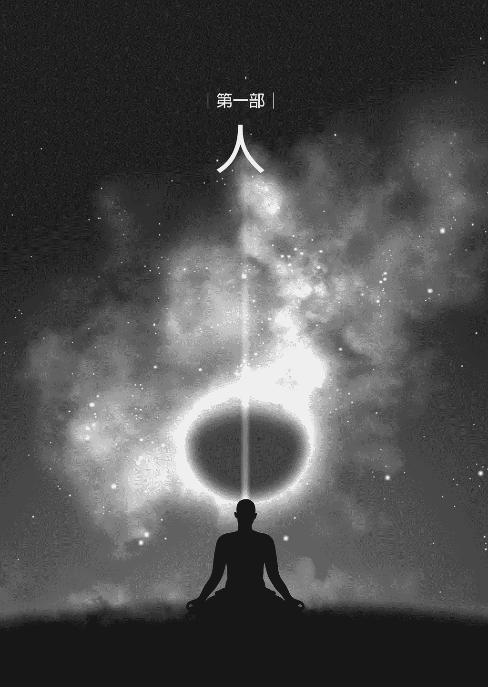

人为何来到地球？

神的子民都是我们的创造，你们来到地球之前，原本是和所有的意识能量同在一起的。你们拥有独立的意识外，也与共同的源头意识相连，在宇宙的观点，都是神创造的存有，为了宇宙的和谐而存在。

地球也是个生命体，在宇宙的整体运行里扮演平衡的中心。这个平衡中心携带大量电子元素，让地球的磁引力场可以拉住宇宙的中轴，稳定星际的移动。

由于担任这样的角色，地球拥有宇宙其他星球没有的强大磁引力场。地球的核心有很强的地心引力，因此，来到这里的人类是我们当中最勇敢、最义无反顾的宇宙存有。你们知道，来到地球之后，自己很有可能因适应了地球的稠密重力而回不了家，你们也看见并体验了地球本身的大自然五元素（土、金、水、木、火）足够让人类在此利用与显化。你们是勇敢的创造者。过去两百万年，许多灵魂存有不断在地球上轮回，忘记了我们的约定。很多人的意识已经完全被物质化存在占据，也因此造成地球的崩坏。

人类来到地球，最初是要协助平衡地球生态，让地球上的存有不会灭绝，生态系可以生生不息地自动运转。地球曾经创造辉煌的成绩，已创建超级磁引力能量装置，协助将地球和宇宙的中轴线锚定得更稳固，却在其他星际存有的竞争侵略下完全被销毁，也造成地球的冰河期。这段期间，这群勇敢的地球存有持续在地底下工作，并有计划地恢复地球如今的生机。来自星际的更高意识存在也为了星际的和平与稳定，来到地球协助和提醒地球人类再次演化。

人类因物质的发展，创建了自己的一套地球生存准则，却在发展过程中忘记自己来地球的初衷，忘了和宇宙之间的和平共存约定，生生世世不断轮回与沉溺于相同的经历，重复上演。地球上物质进步，意识却更加沉睡下去。我们不忍心这群勇敢的子民就此沉睡，所以要来提醒人类找到回家的路，让地球可以被更新、可以创造新的集体意识，让迷路的灵魂回到本源的家。

人体的调频共振

人体细胞充满成千上万的电子，人体就是个导电体，因而具有电磁波讯息传输的能力。身体携带大量微电子，这些讯息就像电子位元０与１的结构，储存于人体的神经元中，并可传输回大脑，产生记忆、学习和反射动作。

人体细胞除了自体原生携带大量储存讯息之外，因为具备微量电荷，可经由细胞发送的微量电波与其他生物体和环境场域调频共振，互通讯息。相互流通的讯息成为经验累积，储存回人体细胞。人的生物体发送的电磁波较弱，产生的磁波振动频率较低，而这微量的电磁波可以与相同的较低振动频率生物场连接讯息。如昆虫叮咬，人的肉眼或意识未产生链接前，皮肤的频率已经可以接收到外界的刺激，而直接回传讯息到身体，做出反应。也有些人体进入低频振动的环境时，会先感受到身体不舒服，却无法经由意识了解是什么事件或原因造成的，因为身体的电磁波振动频率可以先接收到讯息。

人体的各个器官如同工厂的生产线工作站，除了不间断放射出该场域的讯息传回神经之外，还可与其他器官协同作业，让人体的生理运行可以持续数十年或上百年。在协同工作期间，若有任一工作站失去功能，人体会先自动寻找替代方案；而当替代方案也无法让身体有效运作时，就会牵动意识体。人的意识体是与外界互动的前哨站，也是讯息收发台，当身体的运行失衡时，会启动意识体的关注，让意识体把对外在的关注转回生物体的感知和修复工作上。身体和意识的联合运作让生物体回到正常运行，然后再次平行分工。

 打开心的能量信道

心是人体所有细胞单元产生电磁波能量流动的中枢，经由心，人的生物体的电磁场可以跨接意识场，产生扩展的振动频率，延伸至人的意识之外的情绪体、直觉体和乙太体。所以，人的磁场不受限于细胞微量电荷的低频振动波，经由汇流入心向外展开，与意识体的较高频振动波产生能量共振，成为完整的人的磁场范围。因此，人的心脏就是生物体的核心，心脏停止跳动，人的生物体就失去功能，与意识体的链接也会因此中断。

而人刚出生时，心的能量流动是完整敞开的，小婴儿用天真的眼睛和感官探索世界，将他心中无尽的爱传给父母和周遭的人事物。但是，人类当今的生活型态、四周环境产生的电磁波干扰，以及父母的生存压力、紧张与恐惧，让小孩子一出生就承受庞大的负面磁场冲击，生物体因而自动打开保护和防卫机制，心与外界的通讯就会暂时关闭。要重新打开心的能量信道，必须先改善环境和周遭人们的意识。

将孩子放在一个安全的大自然环境中，花草树木是孩子的玩具，小动物成为玩伴，让孩子听见大自然的风吹草动、虫鸣鸟叫。在这样的环境中，孩子的心不会封闭，也不容易生病。

这种环境是可以被创造的，世界各地陆续有人开始做了。你们也可以创造一个能被自己的社会文化与文明接受、更适合养育孩子的环境。

至于已经成年的人，要相信自己有爱的能力，打开无条件爱自己的能量流，疗愈过往的创伤与恐惧。这是唯一的办法。

意识觉醒，成为随心所欲创造的自由灵魂

人的意识来自灵魂，当一个人的生物体形成时，灵魂就进入人体内。人类总是觉得意识来自脑的生理活动，然而，人的意识除了脑的电波活动经由学习产生的小我意识之外，还有一个在成长过程中未被发现的灵魂意识。直到某天，当内心突然出现一个声音和思想之外的意识时，就是灵魂意识开始超越小我意识了。灵魂终于苏醒，而在灵魂苏醒的过程里，你的心会开始对眼前的事物产生怀疑、困惑与批判，过去让你觉得愉快的事物开始令你不欢喜，灵魂要为自己找回该走的道路了。

 潜意识对灵魂意识觉醒的作用

人的灵魂意识觉醒的过程，会由潜意识不断地提醒，而潜意识记忆体深埋在身体的细胞核内。人体的成长过程中，细胞不断分裂、再生，成长到一个成熟体后，会触发细胞核的电波，释放以往储存的讯息，而人的潜意识会自动收到讯息，解码成意识可以接收的讯息，再经由意识与身体的互动，产生行为。有些科学家认为这是细胞的不正常放电，造成人体疾病或怪异行径，其实这是尚未被释放完的细胞记忆正在代谢。

潜意识储存灵魂从过去到现在尚未被理解或平衡的情绪能量，这些能量就是来协助灵魂觉醒的。相同的情绪反应不断出现，可以有效压抑小我意识的主张，而这冲突的意识波动，将协助敲开灵魂觉醒的大门。

人出生后没有意识到这些潜伏在身体内的潜意识能量波，催眠师或情绪疗愈师经由唤起潜意识的记忆，让人感知到潜在的问题和情绪尚未解决。但是，如果释放讯息的方式不够妥善，仍会经由生理机制来承受不预期的放电结果。

要解除潜意识的细胞不正常放电，也就是所谓的疾病，可以经由妥善保护细胞本体的健康，让深埋在细胞核内的电波不会无预警地调节释放。多做森林浴，增加身体细胞的含氧量，是个很好的方法。也可以将双脚踩在大地或泥土上，释放人体多余的电流，由大地吸收。

若一些细胞深层的意识是因为过去集体意识的经验而产生的，也可以经由这一世集体意识的改变，为过去的经验融入新的观点，用新的认知来解构和平衡旧有的经验，降低细胞深层的负面潜在影响。集体再造也可以成为负面经验的转化机会。

 感知一切，显化一切

灵魂意识在你的心中、脑中、感觉器官、全身的细胞与神经，无所不在。灵魂意识将感知带回你的心，心与脑链接，所以，你灵魂意识带入心中的知晓会通知你的脑，而不是从脑中出发，到达你的心。

当灵魂意识觉醒，灵魂会带出更高频的电磁波，与本源链接，成为自由的灵魂体。灵魂意识的感知会延伸到身体以外的世界，你可以感受到宇宙万物、花草树木，可以触及任何你想感知的人事物，你是自由的。

一个自由的灵魂能够创造，你所见的一切都是你想要的显化而成。自由的灵魂可超越一切限制与束缚，将灵魂源头的爱与光带回地球，为人类全体的福祉与世界和平，开展出一条新的道路。

自由的灵魂可以做出人神共同创作的作品，举凡艺术、音乐、科学，都可以最完美地呈现。这也是我们期待全地球的人类可以一起进行的工作，神要透过你的身体在地球上展开行动。自由的灵魂可以看见人脑无法理解的图像，也可以穿越有限知识的障碍，开出一条全新的道路，让人们减少摸索与痛苦。在人类发展的历程中，爱因斯坦、特斯拉、牛顿、苏格拉底、亚里斯多德都是拥有合一心识的自由灵魂存有。

当人们开始体认到自由灵魂可以到达的层次、显化只是随心所欲的过程，你们就会明了必须重新建构孩子的教育方式。地球上的有限知识无法成就非凡，唯有回复为自由灵魂，一切就会简单地显化，学习再也不是压抑心灵的煎熬，而是灵魂的喜悦与升华的过程。

从心出发，让生物体与意识体合一，提升人类的振动频率，以衔接源头的智慧，那么，创造与显化工程就会在你们的意识中完成。

意识的转化

当一个人的灵魂意识觉醒，小我意识会渐渐被灵魂意识取代，而不再对生命体有喋喋不休的恐惧、控制与防御。你会发觉自己开始从喜欢吃吃喝喝的个人满足，转移到关心环境与整体平衡。这是灵魂与地球母亲共振产生的意识状态，人会更清明，也会活得更自在、快乐。

感激与宽容会来到你心中，你看见自己的渺小，看见自己被无数的生命存在支持着。这世界并无公平与不公平、对与错、罪与罚，一切都是相互共振产生的自我回馈机制。你需要的体验透过你投射出去的意识，产生相应的体验，这是你的自我能量平衡的过程。

当你开始放下小我意识，会来到灵魂的觉醒场域，我即是所有，所有即是我，你的体验不再与自我的意识投射共振，而是和整体宇宙共振。你给出一份爱，会获得超乎小我之爱的回报；你投射的光与爱，将这世界再次点亮。

意识扩展练习

①深呼吸，吸气、吐气三下。

②将意识从自己的心往左右向外扩展。

③想像地球在你心中旋转。

④开始到地球各陆地、海洋转一圈，感受一下这些区域怎么了。

⑤将你心中爱的感受传送到你觉得需要帮助的地方。

⑥可以将心中的地球换成你关心的人、团队或场所。

⑦感受这个人、这个团队或这个场所怎么了。

⑧将你心中的爱传送过去。

只要愿意开始，地球就可以被你疗愈。

 不同场域的意识共振

你进行的意识练习，主要是在学习如何校准意念的频率。你可以在自己身上感知到那个被意识锁定的目标的感受，因为你投射的意识连到来自本源的能量场，再投射回传到你身上。由于自己的意念和频率处于相同场域，你可以接收到该目标的振动带来的感知。

你的意念调频发送出去，可以在自己身上接收到感知。但是，如果要让对方可以感知你发射的意念，甚或改变对方的磁引力场，让意识转变不同场域的物质体，就必须先将自己的意识调频到该接收对象的场体，同时把自身的磁引力场放大，超越该接收体的磁引力场，链接上对方的磁引力场体，与你的场体同频共振。

因人体的电波较弱，虽可以同步调频，产生共同意识，但产生的磁引力场尚不足以驱动或改变远端物质界场体的能量场。因此，可借由磁引力能量装置，来协助控制远端场体。

提升振动频率的磁引力能量装置

我们了解在地球重力的牵引下，要提升每个人的振动频率不是件容易的事。因此，必须创造一些辅助工具，来协助人类提升能量。

人类历史上出现过许多磁引力场域的建置工程，如埃及金字塔、英格兰巨石阵、希腊神庙。这些利用巨型石块、太阳光折射、图形位置创造出来的磁引力能量场，可以稳定地球核心能量，降低地球与太阳和月亮之间的磁引力振动造成的地壳变动及地心熔浆喷发。

但由于地球再造的文明已经发展一段时间，地球人口过于稠密，生态被破坏，目前地球之心的磁引力场耗弱，造成地球与太阳和月亮的中轴线偏移，需要重新建置、部署更适合地球当前处境的磁引力储存装置。

目前你们的许多科学家已经利用磁引力原理，创建可以帮助人类在稠密重力的环境中提升振动能量的磁引力场。我们同意，这些金属能量打造的磁引力装置及场域，对于提升地球与人类生态整体场域的能量而言，是个不错的替代方案。以铜线圈为导线，加上各种金属元素甘斯的涂层，制作成磁引力能量装置，就可以在人类目前居住的环境中创造高频率振动的能量场。人体在此场域中也可以共振，提升能量。

不过，有些人在这个场域中会因为频差过大而晕眩或呕吐，一些心识偏离的人也会心识错乱，影响神经系统，所以，这需要一个循序渐进的实验过程，需要你们共同参与，找出适合人类及地球的做法。我们只能给予能量上的支持，地球上的再创造与显化，则要靠你们完成。

你们生活中常使用的交通工具或接触的装置，都可以创造出新的振动频率。接下来，功课就交给你们了，用直觉去做，你会发掘更多惊奇。

能否提供一些磁引力能量装置制造方法上的参考或建议？

你们的磁引力能量装置可以有很多设计方式，可针对人体使用，或是针对环境场域。而根据使用对象不同，也会有所调整，例如一个振动频率比一般人高的人，他使用的磁引力能量装置就会和生病的人不同。

此外，磁引力能量装置也可以针对电子类产品或设备设计，其设计方式会跟使用在人体上的装置不同。

一个最基本的磁引力能量装置需要有控制开关、调频及维护保养方法，你们可以尽情创造。

请提供类似金字塔能量场的磁引力能量装置设计建议。

你可以用铜线圈绑成金字塔的形状，然后把一个植物盆栽摆在中间，观察一下生命体在其中和在一般环境里的生长情况有何不同。

此外，在屋里、屋外四个角落放置铜线圈制成的能量棒，然后在屋顶与四个角相对的中央点位置悬挂水晶或铜线圈环，在环境中创建起金字塔形式，就成了一个非常基本的环境磁引力场域。

使用在人体上的磁引力能量装置也有很多设计方式。你们身上穿的衣服就是很好的载体，其他星球的生命体也多以衣服来平衡及调节身体在环境中的振动频率。

你们地球上的服装设计很多样，就是缺少针对提升人体五脏六腑或全身的振动频率，消除负面电磁波频率干扰的设计方式，因为你们社会的集体意识对美的定义，就限制了设计师的想像。此外，连生病住院的病人都穿着没创建磁场保护机制的衣服接受治疗。这些都是可以改善的领域，并设计出提升生命体能量的服装。

能否进一步说明为何创建磁引力储存库对地球有帮助？

地球人口稠密，为了生存，造成生态破坏，土壤里的重金属残留、电子产品的磁场干扰，导致地心的磁引力场松动，地球中轴偏移。我们要创建的磁引力储存库，类似在地球表面另外搭建一个云端磁引力网络系统，将磁引力场架高，以回避目前地球上的磁场干扰造成的混乱。透过各地觉醒的人，辅以较高频的磁引力场网络，来稳固地球核心的重力。当这层架高的云端磁引力场网络建置完成，就像帮地球穿上一件高频防护衣。透过这层高频网络形成的地球新场域，除了可以更稳定地球之心，也可以和宇宙其他星球的存有通讯和连系。

那么，会是在地球上有两个世界吗？在低频和高频两个场域之间生活？

这跟你们现在同样的频段活出两种世界，是不是一样的？你们的社会中，有人很富有，不必工作就可以吃喝玩乐，也有三餐不继、没有工作的人，这是自然分裂的演化结果，只不过接下来是从意识的觉醒进行分裂。一群已经觉醒的人将回归不完全依赖物质的生活场域，进而迈入与宇宙合一的位置；而仍在物质层面汲汲营营、持续轮回的人，会渐渐失去成长动力，并逐渐从地球上消失，但这些灵魂会被安排到更适合的场域继续学习。地球的扬升之路已开始，要做好扬升的准备，地球不能因为等待人类，而停止自身的演化。

请问一直处在高频空间会有什么现象？对意识提升有帮助吗？

链接高频空间可分为有意识链接或无意识进入。如果是有意识、有目的的链接，高我和地球母亲会共同协助。这时，人的脑部思想及逻辑运作会被宇宙更高智慧的链接取代。然而，我刚才提到一个关键词：“有目的”的链接。这个目的性被宇宙存有支持时，会扩大其影响力。要注意的是，宇宙的存有可以彰显善，也可以放大恶。当最大的美善启动时，也可能触动邪恶的反作用力。不带目的，单纯以人内在本有的美善链接高频空间，将得到最大的祝福。

另一种是人处于无意识状态时进入高频空间，身体会出现阻抗反应。身体系统和细胞尚未被意识告知或带领，将产生如地心引力瞬间变化的细胞重组适应，但身体还无从快速厘清需要反应的步骤，便可能发生细胞错乱。若能由旁人协助告知这个无意识的人，进行身体需要的引导，仍是有效的。这部分需要具备疗愈他人能力的人来协助引导。

请问关于人的临终引导，要如何进行？该注意哪些事？磁引力能量装置可否当作辅助临终引导的工具？

人类因为处在三次元，对自身的生物体，以及看得见、摸得着的东西，才会觉得信任和安全，面对即将踏上的灵魂旅程，则深感不安和恐惧。我要告诉你们，这里是光明世界的开端，要相信你们离开自己的身体后，会来到圆满祥和中。这里没有审判，没有你们描述的地狱，所有灵体会回到共同的灵性场域，成为这场域的一分子。你们各自的体验和走过的生命旅程，都会被大家无条件地接受，因为你也带来一份他们不曾有的经历和体验。你们都在创造彼此的共同体验，你们是一体的。

人之所以对即将离开肉体的过程感到痛苦，是因为对物质世界有着不舍和遗憾，这时，亲人或朋友可以询问他们是否有未竟之事需要代为传达。此外，对于曾经让他们内心不安的事，可以让他们明暸，一切的发生与经历都是神应允的，这个经历是为了完善他们的生命意图而安排的。带着这些体验走入光明，他们会受到共同灵性团的热烈欢迎。

不要使用任何磁引力能量装置影响灵性体脱离身体。灵性体脱离的瞬间，ＤＮＡ的灵性意识会重组成最初始的灵性团，这个灵性团将回到灵性的源头汇合。不要用外力介入，对灵体没有帮助，反而会干扰磁场。

至于有些人经由宗教得到灵魂安定和信任的力量，这些都是生命存在的自由选择。所有宗教都会编织死后天堂国度的景象，因此，当一个有宗教信仰的生命走到尽头时，他的意识会去寻找自己宗教的最高灵性寄托。实际上他如何想，就会如何到达。

这时，进行临终引导更具体的用意，是教导身旁的人一起传递一股信任与平静的能量共振给即将离去的人。当这个即将往生者的生命现象变弱或停止运转时，身旁的人可以借由他熟悉的宗教音乐、持咒或颂钵，让自身频率和这个即将离去的生命熟悉的音频共振，一起欢送这个伟大的生命灵魂意识回到他原本的家。

若即将离去者无宗教信仰，则可给予祝福，愿他回到光的源头。

之前提到生命的起源和最终回归本源，我想请问，我们的宗教教导的灵魂轮回观念，可否帮助我了解灵魂的轮回是怎样运作的？

人类在生物体的场域中，拥有更细微的情绪与感官，并可透过脑的讯息处理不断演算、学习与体验，创造出人类独特的喜、怒、哀、乐、悲、恐、惊等情绪经验，这些都是人类在生物体中创造的能量波动。这些感受能量会触发人类不断地思考和行动，然后经由一次次的体验、回馈得到满足，再创造下一个体验。

若触发的情绪能量并未获得满足、没有完全被释放，这些能量并不会消失，当因缘合和时，将再次凝聚，并经由体验终获释放，只是再次体验这个能量的生物体，可能已经是不同的生物体媒介。这些未释放完全的能量，其实和当下的你同时存在，只是人类无法以目前的线性时间观念理解这个多重空间场域的运作方式。

你可以想像一下，如果将时间的线性概念移除，假设你处在一个无时间的场域，当你送出十种感知能量波，投向四面八方时，这些能量波将各自结合、显化，你可以将自己调频到跑最远的能量波那里去感知。当你进入那个能量波时，你原来的时空位置将消失，进入不同的时空位置，以不同的生物体形态接收。这对目前的地球人类来说，是不可能的体验，因为你们的生物体所处的能量频率，无法进行快速的跨频段体验，也就不会随情绪振荡波的位置瞬间移动到其他空间。这其实也正是人类在地球上可以得天独厚享有丰富的情绪体验机制，让很多星际存有羡慕人类拥有情绪的原因。

在能量源头的场域，各种生物体在生命周期中不断创造各种能量波动版本。当人抓住自己的一个版本频段，尝试去弄清楚这个频段的前因后果时，大脑最能理解、最能将现象逻辑化的方式，就是认为那是自己的前世版本，因为人类的线性理解有前后、有因果，没有同步与平行。

灵魂意识是一个或多个能量的集合体，能量在生物体形态显化时，灵魂体的各种显化版本也在不断地分裂、融合和演进。所以，处在一个生物体的灵魂版本和另一个生物体的灵魂版本，是不完全相同的。从这个角度来看，要解释灵魂轮回，应该说是宇宙中有需要被继续释放或尚待平衡的能量演进过程。

说到这里，正好提醒你们，人身难得，要把握当下。你在此时此刻遇见的人、事、物，就是来帮助你满足你此时此刻的体验；而你的存在，也是要协助他人完成此时此刻的体验。尚未完成的体验仍会继续，但可能不是以你眼中或当下意识到的这个人原有的形象或角色来体验。你也可能不会再和对方在同一个时空里共同体验。这样的理解是否可以帮助人类懂得感激，并珍惜当下的一切？

让小我意识放手

开始熟悉和进入一个较高频的磁引力场时，你的小我意识仍会不断和你低语，就像你目前的感受一样。你知道那里有光明和未来，但小我意识会将你拉回身体所处的现实环境中。你内在的冲突不断上演，许多人因此放弃，回到低频的共振里，彼此取暖。

这个状态于内在不断摆荡，要突破这个与生俱来寻求安全与保障的自我利益保护屏障，需要联合一群人创造永不退转的共振频率，互相提携与鼓励。一个人没有能力摆脱自己的低频牵引，但将自己放在一个群体创造的较高共振频率里，就是抵抗小我牵引的最佳防护。过去你们有很多宗教团体深谙这个道理，只是在很多人共处的环境中，会有人带来的各种低频负面能量干扰，因此最后他们选择在聚集的场所放置神像，用这个虚拟的神像进行群体共同意识的校准。但这个方式目前已经不足以压制小我意识的负面干扰，因为集体的负面磁场过于庞大，当一群人聚在一起时，低频的共振产生的引力会大于高频的能量波。这时，你们需要透过音乐、图像、光的引导，让低频的共振波消散。这样做比在场域中放置肖像，更能发挥作用。

准备开始聚集在一起时，你们可以创建聚集场所的音乐、氛围和图像，来试着引导团队活动的进行。渐渐地，人们会喜欢来到这里，没有任何理由地来。在这里，你可以解放小我意识，和自己更高的意识共振。请开始练习，你们会为自己的显化与提升喝采。

意识净化、提升与转化练习

①静心冥想练习——净化

首先进行光的静心冥想练习。深呼吸，想像一道光从头顶向下，净化自己的全身上下，并注意自己的呼吸，放下小我意识。

②意识链接高我——提升

可以在四周放置磁引力能量装置，帮助快速提升振动频率。将意识从心轮向上振动到喉轮、眉心轮、顶轮，再往上链接至头顶上方的更高意识，然后经由更高意识带往宇宙之心，和宇宙最高的源头链接。可以找一段适合的音乐或颂钵声音，引导这段提升练习。

③意识的转化

当灵魂意识和宇宙意识调频校准时，可以开始回头看看是否仍有些人或事困扰着你。将这个人或事困扰你的情境述说一次，你的心会开始链接到这个人或事的感知。这时，如果是困惑，将可以获得知晓，来帮助你了解。

如果是一个需要被疗愈的事件或关系，你心中会再次感受到有不舒服的压力或负面能量流进入。这就是用你的心疗愈这个事件或关系的机会。当你再次感受到曾经有过的不舒服或负面压力能量，请用你的心去理解这个感受，看着这股能量从冰冷、坚硬、压迫和疼痛，渐渐被你的心温暖、柔软、放松，最后融入喜悦与合一的状态。经由一次次的练习，你的心轮将再次绽放。

这不是个简单的练习，因为你的心已经累积太多的不想要和不愿意，而封闭已久——不管是对自己最亲近的家人，或者同事、朋友。这个练习可以让你被彻底净化和疗愈。

疗愈过程的显化是很当下、很立即的，因为你心中这些尚未完成或不圆满的振动波会再次被牵动，而当作用力于当下显现，你退出小我意识，用更宽容的心来感受这个负面的能量波动时，你更高意识的理解会来到这段关系。于是，你曾经认为的负面挑战，将化为祝福，把你带到感激与恩典里。疗愈过去就在当下，改变未来也在当下。

你们也将在一次次的练习与确认中，从自我的问题和困惑出发，进而将疗愈带给自己的国家、其他种族和整个地球。你们意识提升与转化后的光芒，将再次照亮全世界。

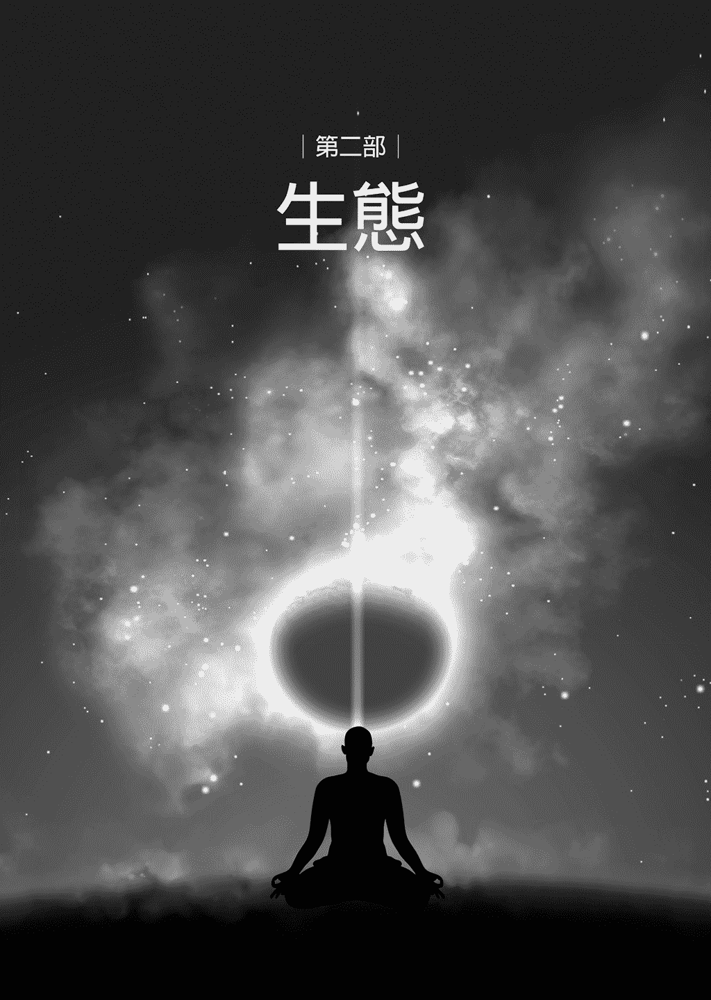

生命的起源

今天来谈生命的起源。

生命是粒子碰撞聚合的结果。宇宙中存在着一颗颗带电的粒子，这些带电粒子依顺时针或逆时针方向绕圈运行，在运行时会与另一个粒子或粒子集合体碰撞。带电粒子间因碰撞出现相吸或相斥的结果，相吸的粒子产生新的融合与质变，变成另一颗新粒子，相斥的粒子则因碰撞再次分裂。当所有的融合与分裂达到平衡点时，就产生一个可以自给自足的平衡小宇宙形式的生物体，而这个平衡的生物体可以再分裂与复制。宇宙的万事万物都依循这个粒子碰撞的运行法则，在平衡与不平衡间动态运行着。平衡带来和谐、稳定和物质，不平衡则带来撞击、松动和下一次的再造平衡。

地球上的生物体经过数十亿年的演进，创造出现今的千万种生物体，以及地球所有生物体赖以生存的环境平衡点，这是宇宙粒子碰撞场域中完美的创造。地球获得太阳和月亮磁引力场的平衡，创造了最多元生物共存的生态系统。

当粒子碰撞，并达到一个稳定的生物体平衡状态时，就会产生相应的讯息场，与其他相同频率的讯息场体共振。这个讯息场就是你们所谓的意识，所以，生命就是“有意识的生物体”的简称。生命的意识讯息场可以和相同振动频率的场域链接成集体意识场域，因此，生物体可以在自己的场域中像互联网那样传递讯息。举例来说，人类的高频意识无法与低频意识生命（如蚂蚁）共振，彼此无法交流讯息，但蚂蚁与蚂蚁之间，或相同频率讯息场域的生命体，则可以交流。

愈精密的生物体意识，振动频率愈高。人类是地球上最高等的生物，人类生物体演化成具备自行创造的能力，这是其他生物体没有的。

 先有灵魂意识，或是先有物质？

所有生命体的讯息场都在宇宙中，宇宙是一切碰撞的源头，也是回归的终点。当生命的生物体消失时，存在于该生物体的讯息场，或说个体意识，便以非生物体的形式回到宇宙的源头。这些已存在的灵性意识再一次经历生物体经验后，回到源头，与其他同频的生物体集体意识结合成更新版的共同意识。

因此，是先有灵魂意识，还是先有物质？要看你站在哪个角度。从人类的角度来看，会觉得是先有生物体的诞生，才有意识；从共同意识源头的角度来看，则意识已经存在，新的生物体只是创造了更新的共同意识体验；而从宇宙源头看来，一切都是共存的，全都是粒子的碰撞与振动产生的，最终也是回到那里。

当人类明白自己与人类的共同意识链接，回到生命的源头没有生物体的形式，我就是一切，一切也都是我时，从共同意识场体回头看看自己目前与其他人或物种的互动方式，就会发现没有必要分别你我、种族、优劣、好坏。我的一切都是为了创造更新的集体意识的一个体验，我们都是一体的存在。珍惜这一次的个体经历，尊重其他生命的经历，感激生命中所有与你碰撞过的人事物。所有人，不论你们定义中的好人或坏人，都在改写人类共同的命运。

大自然的礼物

植物是人类最友善的朋友，它们对人类的生活和身体健康有很大的帮助。将植物摒除在建筑物之外是很可惜的，人类若无法改变目前的建筑思维，至少要将植物这个好朋友邀请进家里。只要给予简单的元素，就可以活化并启动植物和你居住空间的能量。

简单的元素有土壤、石头、水、阳光为基础的生长环境，至于盐水，则可强化植物和空气的循环。因此，如果没有土壤和石头的搭配，就用盐水和阳光产生海洋和空气般的循环效果。植物在这样的环境中，就可与空间共振互动。

植物是为了人类的呼吸而存在的，人类的呼吸则是为了和宇宙意识共振而生，所以，植物就是帮助人类和宇宙意识链接的桥梁。此外，植物也能打开你呼吸的深度，有时你会感到胸口胀痛，因为你平日呼吸的深度不够。如果有植物在身旁，就会帮助你的身体自动调节到更适当的呼吸频率和深度，好跟环境和谐共振。

而当一株植物被摆在阳光、水、土壤、石头等元素具足的位置，就可以启动环境净化工程。给植物一个适当的生存基础，它回馈给你的不只舒适的环境，还会帮助你的身体自动调节温度和呼吸脉动，与大自然协调。人类和植物这么简单的互动方式，便能挽救人类基本生存环境的需求。就从自己目前的居住环境开始做，你们会明了，大自然的回馈是无价的。

为何提及放置植物的地方时，没有提到风？

风是植物相互传递讯息非常重要的媒介，但在室内环境，你们不需要刻意营造出风这项元素，环境已经帮你备好了。

即使在屋外，你们也不必处理风的制造，而是要在栽种或放置植物的地方感受气流的阴阳交会中心点。这个位置主要受光线影响。你可以面向光、伸出手，感觉掌心和手背的冷热，然后移动位置，感受掌心和手背的冷热感觉变化，掌心热变冷、手背冷变热的位置，就是气流转换的地方，在那里摆放一株植物，可以帮助环境能量流动。

动物的灵魂来自哪里？

动物的灵魂意识和人类最大的不同，是感知后的再创造能力有限。动物也有感知，但无法像人类经大脑思考及解构经验后，进行再创造。人类在地球上不断制造出无法再服务人类自身进化需求的振动频率，这些振动频率需要被转化和释放，因此，能量就会以动物体的形式被显化出来，以满足整体生态的平衡。人类发展畜牧业，也是在平衡自己庞大的低振动频率需求。当人类的意识提升后，自然会减少摄食低振动频率的食物，而地球需要透过养殖动物来清理低振动频率的现象也会减少。

与大自然重建伙伴关系

整个地球生态的协作都是依循宇宙最初的设计运行，日月星辰的引力带动地球五个基本元素——金、木、水、火、土——相生相克的互动，创造出丰富的自然生态，提供人类繁衍所需。人类生活在陆地上，可以观察到地表各种元素互动的规则，而海洋生态也是依循各元素相生克的自然循环繁衍，只是火元素在海洋的呈现方式较为柔和，是透过太阳和地心的热对流循环，创造海底生态场域。

所有物种，包含人类，都是一个个独立的小宇宙，但这些小宇宙也彼此共生。每个小宇宙都有其存在的使命，也在各自的空间被地球母亲滋养。相较于其他生物，人模拟较像个争宠的孩子，不断跟地球母亲需索，不顾其他兄弟姊妹的生活。其实，地球母亲从未期待人类可以站出来照顾其他的地球生命，而是一直在等待人类恢复与其他生态小宇宙的兄弟姊妹们对话与和谐共存的能力。要让人类觉察这一点，需要庞大的思想再造工程，因为人类过去的生态教育是以放大镜和旁观者的角度，去解释各物种自己的生命演化过程，并没有将人类与生态可以互动和相互依存的伙伴关系教给下一代，以致出现破坏生态的行为，却不自知。

人类必须看见宇宙各种生命的讯息，也必须学习尊重所有生命平等同享地球资源的权利。这样的觉醒才能让地球回复最有效率的运作机制，而人类也才能避免创造出灭绝自己的环境，自食恶果。

与大自然沟通练习

找一群有觉察能力的人，开始和动物、植物、树木、昆虫、海洋生物、山川、河流对话。你们将以不同的高度，以及更谦卑、更感激的心，回报这原本美丽的世界。我要把这项工作交给你们，唯有你们自己去对话，这个经验才会深植心中。你们一定可以做得很好。用意念向眼前或心中想像的动植物询问、探索：

①你们的使命是什么？

②我们身为人类，可以如何和你们合作？

将这些对话讯息有系统地记录下来，你们会看见人类是如何被爱、被无条件地支持。

实做心得：与松树对话

我先尝试探询松树的使命，以及人类如何与松树合作，得到以下讯息：

我们是来帮助回收地球废气的，因为我们停留在地球的时间较长，根可以更深入土地。我们将吸收的废气排入土壤，土壤中的金属元素会将这些人类用不到的废气转成养分，供其他较弱的植物和昆虫使用。我们的生命和人类差不多长，甚至比人类更长寿，但我们其实不需要用到太多地球资源，我们是来丰富和稳定大地的。

人类要和我们合作？喔～太好了！我希望在每个有小孩子的地方都有我们的存在。孩子的小脚丫踏在我们根部的土壤上，一样可以被我们滋养，小孩子的身体可以得到充足的矿物质，帮助骨胳成长、变健壮。谢谢你们愿意开始倾听我们的想法。

实做心得：与植物对话

嗨～我们是人类呼吸的好帮手。我们不只是人类的食物，还带来新鲜的空气，并帮助平衡人类的情绪体。

只要提供基本的生存条件，我们就能把整个环境变好。如果是要将我们带到陆地上，只需要地层的基本元素，石头、沙、泥土，加上水，就是我们喜欢的陆地环境。我们的叶子有宽的、有细的，通常愈宽的叶子可以提供的能量流动愈强，如果能找树木搭配，就更棒了。

假如提供海水环境，我们只需要海水就能生存，但如果可以带海水中的小生物来陪伴我们更好。我们喜欢小虾、小蟹来吃我们根部的浮游生物，这样可以保持根部的清洁。

如果把我们放在室内有阳光的位置，我们释放出来的气体最多，因为阳光会加速我们的循环，也就可以帮助人类更流畅地换气。离开大地，通常我们只停留一到三个月就功成身退，回到自然的怀抱。不要为我们难过，我们的死亡就是再生的开始。我们很喜欢再生的感觉，死亡不会是结束，只要人类对我们微笑，我们就很开心了。

不要用你们的方法来延长我们的生命，农药真的很不好，会破坏土壤中的矿物质养分。有虫不是坏事，喂食虫子也让我们很开心，只是希望人类不要添加太多的养分给我们，因为这些多余的养分在土壤里会长虫。没有过多养分，就不必用化学农药伤害土地，我们可以自然地长出美丽的花朵，这是我们与生俱来的能力。

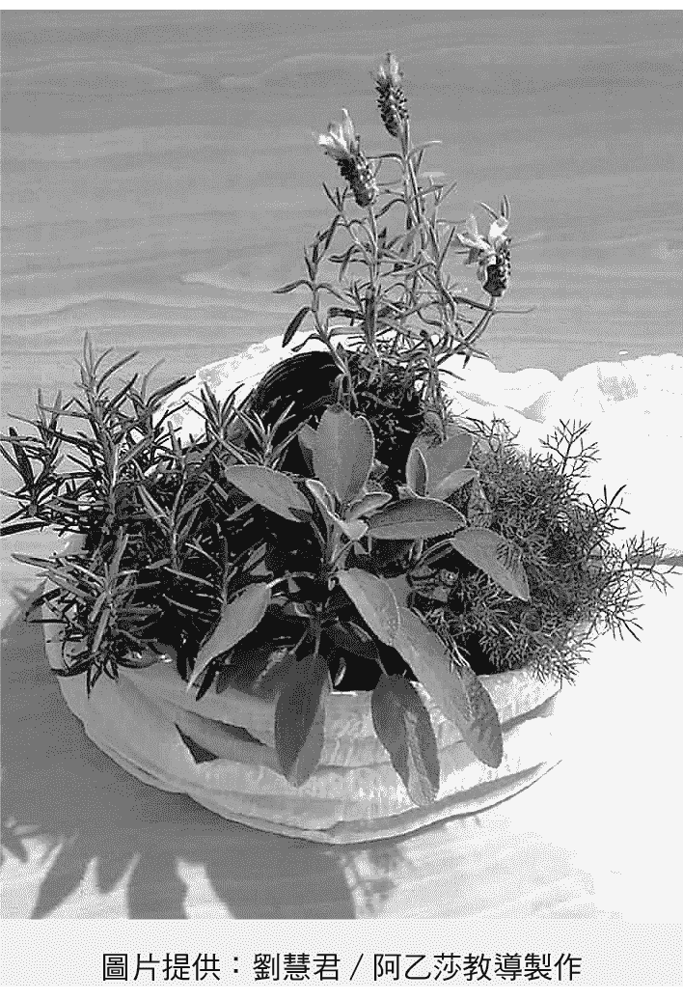

只要人类愿意，我们随时可以协助你们的环境能量开展，并顺畅流动。你们开口邀请，我们就会为你加把劲，但我们不能主动启动能量场，因为环境里还有许多存在体。我们必须尊重地龙，它们是主宰土地的能量，它说了算。还有比我们资深的树木，以及你们环境里放置的一些能量石，这些都在保护并看守环境能量，除非你开口决定由我们上场负责，我们才可以站出来主导。我们会和环境保持平衡共处，不会逾越其他的存有，任意启动整个环境能量场。

我们每种类型的植物都具备集体意识，这个意识的振动就像是人类的情绪体，因此也可以透过我们来平衡和疗愈人类的情绪体。我们是为了养育人类和动物而生，能好好服务人类，就是我们生命最大的价值。

我女儿正值课业压力最大的时期，每天晚上都念书念到很晚，然后就睡不着了。是否可以提供我一个方法来改善这个问题？

人在用功时，脑部的神经异常活跃，以致该睡觉时，身体的细胞像刚赛完车、熄了火，发动机还炙热着。你可以在她的卧室放些香草植物，如熏衣草、鼠尾草、天竺葵、洋甘菊等，帮助她入睡；早上她离开房间去上学时，则把阔叶的绿色植物放在房里有阳光的地方，加速清理环境能量，这样晚上就会有清新的读书环境迎接她。

人、生态与地球的三角平衡

地球正经历生态严重破坏的失衡状况，气候不稳定、地震频传、海水及空气污染、森林大火、海洋生物变异、动物饥饿灭绝、人心失序战争频起，这些都是过去人类自私掠夺造成的结果。要解决这些问题，关键也在人类自身。

人类文明的发展过程中，出现许多错误认知，核能、原子弹、截断河川建马路、盖水坝或堤防、基因改造作物、化学肥料污染土地、大量塑化制品和衣服、密度过高的通讯发射站等，这些都没有创建在人与环境合作共生的正向循环上。而不平衡的发展，导致人类最终自食恶果。

我们必须防止地球因再次的文明发展而毁灭，外星文明已有许多前车之鉴。我们要唤醒有能力、有资源做事的人，希望他们在投入科技发展的过程时，心里要嵌入“人、生态与地球”这个三角平衡。如果创造出来的产品让人开心，但其他生物及环境不开心，或是地球不开心，就不是正确的发展方向。

已经造成的破坏和失衡，地球有自体疗愈和恢复机制，但身为生命共同体的人类及其他物种，在地球疗愈的这个阶段会感到痛苦。你们会发现自己的免疫系统、呼吸系统和神经系统出现病征，需要排毒、更新。你们会频繁进出医院，同时，人类居住的环境将不断发生地震、战争，动物也从森林往城市移动。

人类目前正努力寻求替代能源，宇宙其他文明会提供协助。核能发电终将因为新能源的发现而被取代，这个新的替代能源会给地球足够的光和热，但不会造成生态破坏。我们无法在这里详细说明，因为对人类揭开新能源的时机尚未到来。

目前可以着手准备的工作，是先让人心回归，创造有觉知、负责任的物质文明。这些工作要从下一代的教育着手，也要释放并疗愈目前被物质占据而封闭的人心。

能否透露一下新能源是朝哪个方向发展？

新能源会从地球现有的丰富海洋资源出发，改良核变的物理现象，不再往升温加热的处理方式走，而是创造磁引力场，将物质转变成能量，供给地球人类所需。这个过程不会造成地球本身过热或产生质变爆炸的危险，对自然环境则会有正向循环的帮助，人类产生的资源垃圾也可以被回收再利用。

目前人类连自己和家人都没有办法好好照顾了，更别说跟大自然生态创建更友善的关系。能否再提供一些智慧，来打动已经过得很辛苦的人？

是的，人类已经被自己创造的虚拟实境压得喘不过气，我是说真的，人都不会好好呼吸了。每天睁开眼睛，就想填饱肚子，努力工作，喂养心中的无底洞，已经看不见也听不到周边处处可见的美丽景象。其实真正能满足人类的，不是金钱和物质，你们整个存在都是为了创造全人类更好、更快乐的生活，但你们忘记这个初衷，被自己的恐惧能量困在无法流动的物质上。你们将追逐来的金钱和物质放在自己身上，一旦停止流动，这些得来的物质或金钱无法再为你们带来能量。人把自己固着在无法流动的物质能量中，反而造成身体的阻塞。

人类和大自然生命及其他物种的互动，可以得到非物质形式的回馈，这种回馈会触及人类的心，让人快乐和满足，进而活化你的身体细胞，创造更新的能量。当你用有意识的呼吸和树木交换，这棵树会带动整个植物系的能量，立即回馈给你，让你身心活跃、清新。这当中并不需要金钱的交易，但你可以在身上获得立即的能量补给。回头看看你家的小狗，它永远为你敞开心，拥抱你的到来。它的心为你投射、为你绽放，你在它身上得到温暖的抚慰和坚定忠心的能量，这股兄弟般情谊的力量，也是金钱无法给你的承诺。

该回头检视人类自己创造的物质的真实面貌了。这些超乎生命基本需求的“想要”与创造，是否真能带来快乐？还是造成更多空虚、压力，以及心灵的巨大痛楚？地球上的动物、昆虫、花草树木都比人类开心快乐，它们并没有人类的创造能力，却自然活出本有的快乐。当人类开始与大自然生态合作，有意识地创造时，就能重十人类本有的快乐。

我知道金钱没法带来快乐，可是小孩子上学要钱，老年生病要钱，付水电瓦斯费、满足基本生活需求都要钱，要怎么改变？

知道，我们都知道。这些都是目前的现象，但你们此时此刻可以选择一个更能服务你们未来幸福生活的想法，开始去想像、去创造。你们将可以显化自己未来的生活型态。目前这些现象是过去的你们内心巨大的恐惧投射出来、最能够服务过去的你们的想法。

而现在的你有同等权利，可以为自己的未来投射出现在的你们心中期待的生活。不只为自己，还要为你的家人、你的族人、你的国人，以及全世界人类开始擘画你们共同向往的生活愿景。不久的将来，你们就会身处那个你们为现在的自己创造的美丽世界。

重建与生态的关系，疗愈身体

当人类开始觉察到自己的身体可以透过大自然获得疗愈，就是改善人与生态关系的开始。人生病时，身体会自动打开寻求大自然解药的模式。这是宇宙法则，动物现在还有这个本能，人类则已经遗忘自己的身体拥有与大自然共振、取得解药的智慧。

人类的呼吸系统生病时，植物和树木会帮你展开呼吸道的修复，此时只要用自己的意识与植物共振，就可以扩展和疗愈呼吸。身体的每个系统都可以得到大自然的协助。脑部神经感到有压力及昏沉时，只要待在阳光下，就可以获得阳光的能量，协助大脑松开紧绷的神经。水则是免疫系统的清道夫，当人的意识与水共振时，可以洗涤全身的淋巴腺，洁净体液。土壤具备滋养消化系统的能量，随时补充身体缺乏的矿物质和养分。生育期男女则可以与水果共振，活络荷尔蒙，增进生殖能力，繁衍健康的下一代。

人类与大自然的这些共振，除了带着身体去体验，获得实质的疗愈之外，在忙碌的生活中也可以仅用意念的共振，同样达到效果。

随时与大自然共振，补充身体需要的能量。这些都是宇宙赐给人类的无穷尽自然资源，用来繁衍并养育人类与动物。

你们人类习惯用意念投射出恐惧、担忧、害怕、不安等情绪，这些都会反馈回自己身上，造成能量阻塞和身体疾病。即使身体是在随处可见阳光、花草、树木、土壤和水的环境中，若处于无意识状态，也无法获得大自然无条件给予的能量。

与大自然共振静心冥想练习

你们可以做这个与大自然共振的静心冥想练习，来帮助身体复原。

①采取舒适的站姿或坐姿，全身放松，吸气、吐气三次。

②想像眼前有一棵大树，对着大树呼吸，吸气、吐气数次。这时，你的呼吸系统会与大树共振，呼吸的深度会自动加深。

③想像太阳照在头顶上方，缓缓地吸气、吐气，感觉脑神经正逐渐放松。放松的脑神经让你可以更清楚地觉察，你不再感受到脑部的压力和昏沉。

④接着想像水从你的头顶往身体下方流动，流经脖子两侧的淋巴腺，到胸腺，到腹部、生殖器、大腿内侧的淋巴腺、脚底，最后流向大地。你感觉全身的体液被净化，血管畅通，身体洁净。

⑤最后想像双脚踩在柔软芳香的土壤里，你的肠胃正在取得土地的滋养，身体需要的矿物质和养分获得完全的补给。

⑥生育期男女可以想像眼前有颗美味的水果，你的生殖系统会经由水果的振动感受到活力，并欢庆生命的到来。

⑦结束前，感谢大自然提供滋养和疗愈，让我们可以为这个世界的美好而健康地存在。

经由这个练习，你会感受到身体变轻盈、好转，也会更感激、更珍惜大自然无条件的给予和共振。

人的意识有磁引力

意识存在于宇宙和所有物质体中。在最小的带电粒子运行产生相吸或相斥的过程中，会代谢出一种失去正负电子的衡定状态原子，或称为等离子状态体。这个等离子体拥有完整的内核与外核，无法与其他电子产生正负电的相吸或相斥作用力。等离子体具备磁引力的能量场，由外圈的斥力与内圈的引力交互作用产生。其运作方式如下：

斥力大于引力：等离子外圈的力量大于内圈，会产生正旋转的磁引力场。

引力大于斥力：等离子内圈的力量大于外圈，会产生逆旋转的磁引力场。

带电粒子运行下产生的所有物质，都具备等离子体，等同每个物质的生成相应产生了意识体。不同的是，意识体分为可以移动与不可移动的。

金属物质具备能量，但其等离子体不可移动，人类与其他生物的等离子体则可以移动，并不断演化。如果要让等离子体产生正向与向上的移动，就必须使等离子集合体的斥力大于引力。人类的意识向外付出，而不是往自己内部吸引，这样就可以让人类的集体意识往正旋、往上延伸磁引力场。

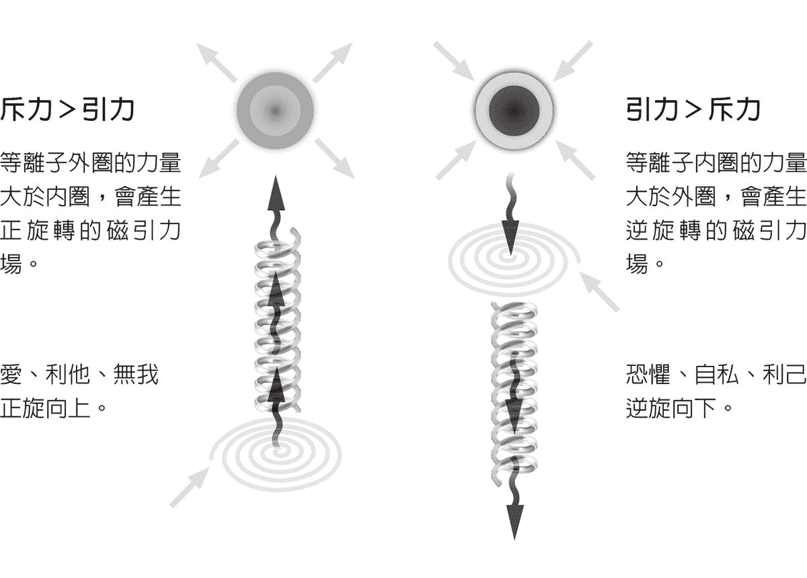

等离子形成的意识，可以和宇宙更高意识的等离子体共振，展开一个跨时空的空间路径。这个路径不受物质体的场域限制，也因此，如果地球人类要前往宇宙，可以先创造一个超越物质振动频率的高频等离子体共振磁引力场，这个磁引力场与宇宙的等离子共振，创造一个空间路径，就可以从地球的三次元空间进入高次元空间。这也是跨时空宇宙航行的基本概念。

回到地球目前的生态破坏问题。人类无法挽救生态，要让生态回复，最好的方法就是人类提升自己的意识。如刚才所解释的，当人类的意识振动不断往自己内部增加引力时，就会逐渐造成人与人的等离子分离，产生的共振磁场频率就会很低，像是一个个分离的个体存在不断向大自然索取或占领资源。然而，只要人类集体意识提升，这个生态的阻断和破坏就可以终止，地球及大自然生态会自行疗愈和修复。

地球生态是人类集体意识展现的一面镜子

当你的意识觉察打开，就可以从自己的呼吸中了解大自然的一切如何帮助你。你可以从呼吸里获得知晓，这份知晓在你身体上会产生立即的回应。你可以慢慢观察，并做出新的选择。

地球是宇宙最初始的创作，而人类是地球的再创造者。神的意识在所有的创造里，唯有透过人类，宇宙才有机会得到更新的体验；没有人类在地球，这一切体验就无法完成。回到有意识的创造和体验，在与大自然的共振中找回人类本有的身体感知，创造更美丽的世界。

先从自己的生活开始，用呼吸去感知桌上的食物。你的呼吸会自动与食材共振，让你自然而然做出对身体有利的选择。你的呼吸会扩大，身体会放松，变得更有活力或觉得有多余的负担，你的身体会知道，因为身体开始打开意识了。练习在呼吸的过程中与食物共振，久而久之，你甚至不用吃下食物，就已经得到食物给你的能量。

接着看看你使用的物品。同样地，你的意识会经由呼吸与物品共振，使用沐浴海绵时，你会清楚感受到，塑胶海绵与天然海绵带给你的洗涤身心的感觉是不同的。看着天然海绵呼吸，你身体的细胞与海底动物共振，开心地和海底动物交流、振动。净身沐浴也可以为自己的身体带来更深的细胞体验，你将开始有意识地选择，改变不能服务好你自己的生活习性，进而有意识地创造更适合的生活环境。

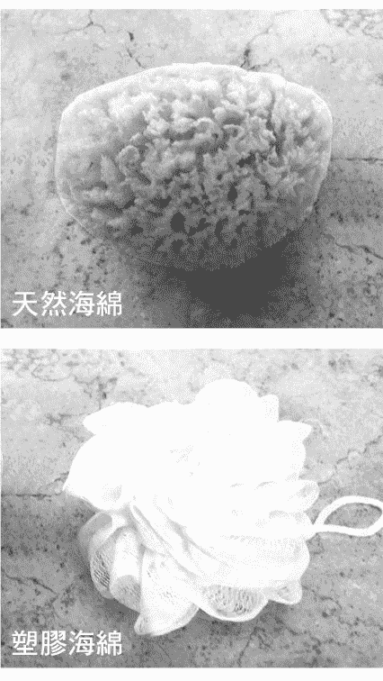

这是人类与生态关系的重建。当人类打开意识与大自然链接共振时，就能带给自己和所有生态一个美丽的新世界。

 地球是所有生命体共同创造出来的平衡

地球上所有的生物都有自己的磁引力场。人类有个体的磁引力，也有集合意识的共同磁引力场；生态世界也是，植物、矿物都有个体的磁引力，同类型生物也有共同磁引力场。若以磁引力的移动性来看，又可简单区分为可自主移动和被动驱动的磁引力场，例如可以行走的人类和动物都是可移动的磁引力场，金属和矿物则是被动的磁引力。

水和火是地球上的两大重要元素，本身不具备磁引力，而是中介质。水是传输磁引力的中介质，火则是解构磁引力的中介质，经由水和火，可以不断进行地球万物的创造与再创造。地球包含了所有地球生物的磁引力，而宇宙又包含地球和其他星系的磁引力，也就是所有万有磁引力场的集合。宇宙就是一，一就是一切。

从这个角度来看，地球是所有地球上的生命体共同创造出来的平衡，人则是其中最具创造力的意识体。当人类的集体意识创造出一个失衡的地球环境时，大自然会需要用水（海啸）和火（战争╲森林大火）来重新调整出新的地球平衡点。

所有人都可以自由选择，随手可得的大自然资源供你发挥。你可以选择创造一个更幸福平衡的生活环境，或是一个持续失衡，需要水火重整的环境。看见一片黄土时，你可以选择离开，找寻下一个绿洲，也可以选择带进一颗种子和一些水，创造出一整片森林。不要小看自己意识觉醒的能量，要活出生命赋予你的自由创造力。你这颗种子进入干涸的土地，就可唤醒大地，唤醒全人类。

 打开心，从爱中链接万物

地球生态是人类集体意识展现的一面镜子。人类的自由意识于生命体验过程中创造出种种样貌，如果你开始对自己的生活环境感到不开心，这就是在提醒你该打开心，向外链接了。

当人们可以看见宇宙万物显化中的爱，就可以打开自己与万物的链接，因为爱是宇宙注入万事万物的共同ＤＮＡ。爱存在每个生命里，宇宙也因为和每个生命的爱链接，所以能广纳一切万有。打开你的心，从爱中可以链接万物与所有生命。

每个生命都只能展现爱，你们找不到一个生命是没有爱的，因为爱是一切显化的种子，是所有带电粒子可以产生碰撞的根本。是人类诠释爱的表现曲解了爱——因为想要达到更大的爱，所以有攻击、掠夺、怨恨、不安；因为怕失去爱，所以会紧张、恐惧、内疚、担忧、恼怒、有匮乏感；因为灌注了太多爱，所以看见傲慢、倔强、不堪负荷、无价值感；因为缺乏爱，所以产生挫折、忧郁、自虐、无助、绝望和遗憾。亲爱的孩子，这一切都是爱的展现，从爱的流动中，你们得到爱的体验和创造。

当你看见人类心中的爱如何显化出今日世界的样貌——那些也都是一部分的你的爱的展现——你会感激、会承认。你会感激爱展现出另一个更高的版本让你觉得欢欣，你不用成为那个版本也可以感到喜悦；你也会承认爱的另一个版本让你体会到缺乏爱是如此令人心痛。这些存在都是在展现爱，而你同样也是为你这一生唯一的这一次机会创造出你最高版本的爱。

大自然的神奇力量

目前台湾已经有许多人开始进行与生态相关的验证工作，有动物解读专家和台湾土地龙神沟通，得到台湾土地相关讯息。请问阿乙莎有没有可以补充的？

土地龙神如同大地的等离子体形成的意识，也就是大地的灵魂体，所有包含地壳岩层的金属、矿物质连接山川河流的冲刷，与树木接地带来的太阳和宇宙的能量汇集的区域，都有地龙。地龙的大龙脉分支成数个小龙脉，为居住在土地上的万物带来一个稳定和谐的磁场。

由于工业化的演进、空气和河川污染，以及农夫为求大量收成，在土地中放进过多化学肥料，地龙的能量愈来愈弱。而地龙能量低，会造成人心的纷乱与不安。因此，如果提升地龙的能量，就能同时帮助人类提升意识，活出喜悦的生命。

目前台湾地龙较弱的区域，大多位于工业污染较严重的南部。因此，可以有计划地提升这个区域的土地能量，或是净化湖泊、水库、河川的水源。

你们可以直接到学校或公园寻找高大的树木（这些树木的根部较深入地底），然后在树木根部的土地上用石头围成一个圈。石头是正旋能量，加上树木经过太阳照射，太阳的能量注入树木，树木则以逆旋的能量注入土地，这样就形成一个石头在外圈的正旋、树木在内圈的逆旋的能量场体，接引宇宙能量，灌注到大地里。

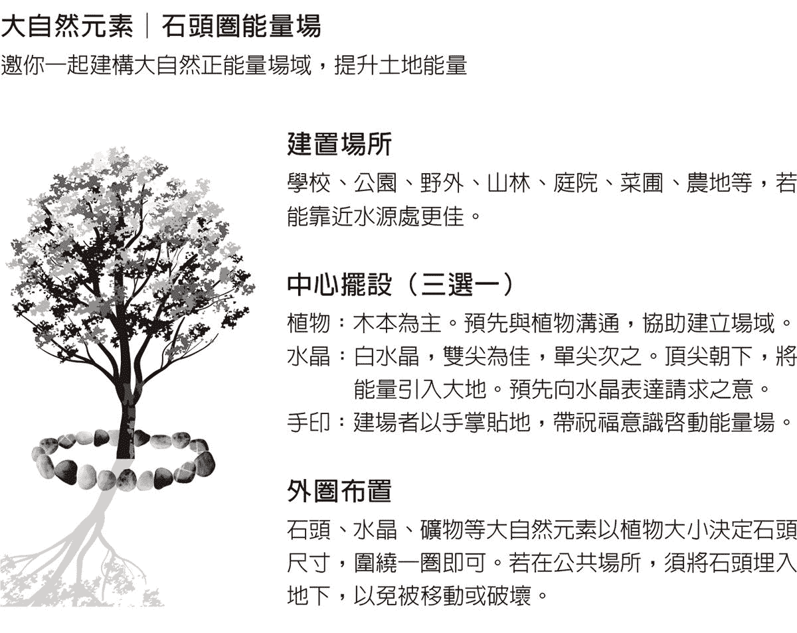

能否提供在没有树木的地方也可以施行的方法？

你们已经开始朝台湾的根部着手，这对提升台湾人民的整体意识有很大的帮助。如果附近没有土地或树木作为导入位置，可以在阳台或居家空间放置星状能量盘，星状的排列方式可以接引太阳和月亮——阳和阴——的宇宙磁引力能量到需要强化的环境里。

在能量盘上用石头排成一个星状，星体正中央可以摆放大地的元素，矿石、水、火、植物都可以，各种元素代表该元素的能量注入需要调整的环境场里。如果放上石块，就是吸引太阳的能量；若摆放水，就是吸附周边过高的能量，再扩散成平衡的能量；摆放火（燃烧蜡烛），就是消融凝结的负面能量；使用植物，就是带来氧气，提高空气中能量的流动。

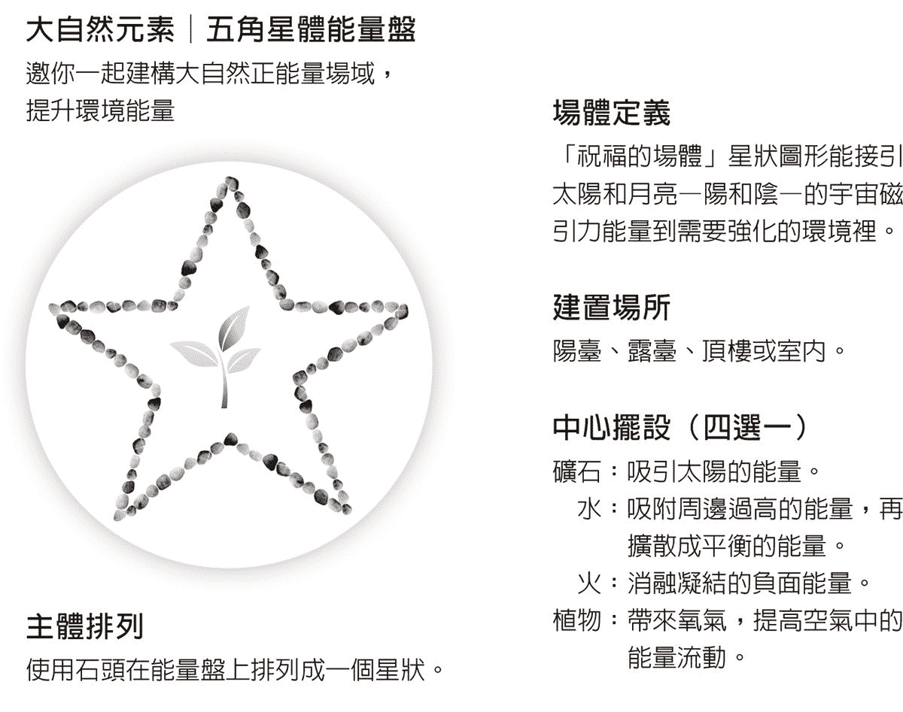

如果能量盘是要使用在居住环境中，就用五角星盘，因为人在环境里就是磁场能量的源头，让人舒适开心，整个环境就会好，而使用五角星形可帮助人体展开能量流动，也是展开人体的能量流动核心——心轮——的位置。不要在居住场所使用六角星形，那会启动地龙的运转。环境中有人时，人比地龙舒适更重要。地龙是来帮助稳定人类根基的，用六角星会触动环境根基能量流动。除非这个地区是全新的，无人入住，或是荒废许久，地龙能量薄弱，才须用到六角星盘。

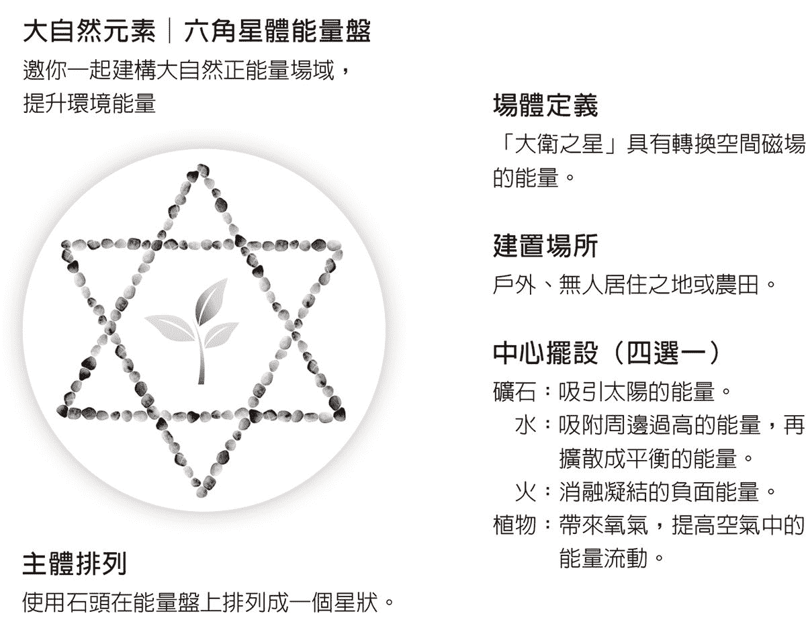

交通大学环工系的白曛绫教授正在进行的空气盒子要加入声音的元素，进行更进一步的研究。可以协助我们理解这个研究的方向吗？

空气盒子是白教授用来捕捉水源污染的指数，进行水污染区域的空气污染成分测量。这个捕捉空气的想法是收讯端盒子，如果用同样的概念，将好的空气品质指数放进水里，在水中发送讯号，就是净化水污染的投放讯息工作。这个办法是可行的，因为水可以吸附物质的讯息，并经由河川、海洋传递出去。只要在污染的水域四周放置改良后的讯息发送盒，将这个盒子对着河川、湖泊、沿海传送讯息，就可以调整污染水源的能量停滞状态，将低频振动转成较高频率的振动。

可以利用声波导入水域，进行讯息传送，但要注意别干扰海洋生物的工作。很多鱼群及海底生物是靠海豚的声波引导，而要进行海域净化的调整，可以借由海豚的协助。海豚不会引导鱼群进入污染区域，如果声波可以让海豚辨识出来，就等于捕捉了净化的频率讯息。你们可以往这个方向进行更多实验，很快就能找出帮助土地和水源的解决方案，而台湾人民的意识，也会快速提升。

实做心得：帮植物围五角星形

自从收到阿乙莎的讯息，知道可以帮树木和家里的植物围上五角星形，我们便实际测试，得到非常正面的结果。

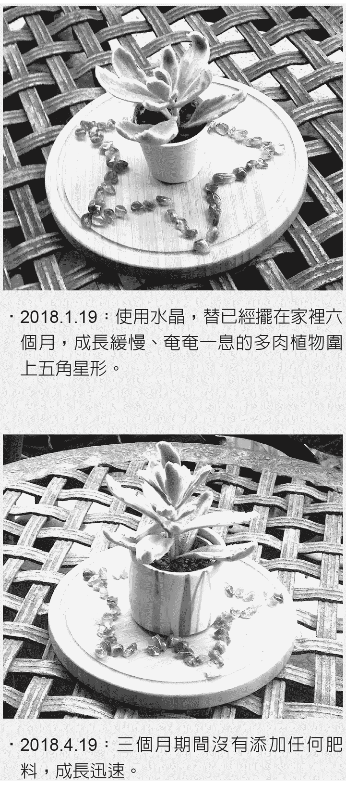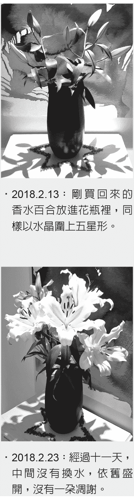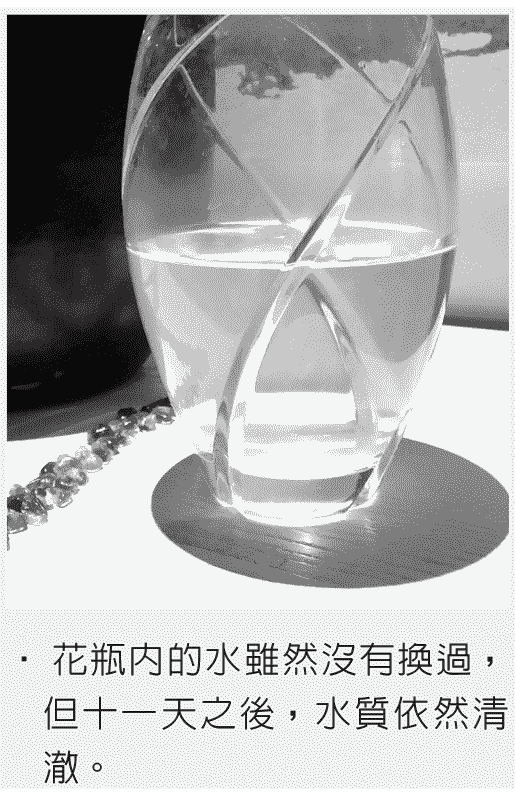

在帮植物围五角星形的过程中，就可以明显感受到植物和盆栽带来的祝福。排列五星形时，心轮打开，感觉到莫名的喜悦。和植物展开愉快的互动，真的很简单！

打开跨越时空的创造

时间是相对的概念。你在此时此刻，你的另一个你在他时他刻，这都是你的意识创造出来的。你可以是五十岁，但当你回到六岁时，你是否可以感受、看到、记得所有的场景或发生的事件，或是闻到那个味道？你的意识所及，就是你的现实。当你的意识回到六岁，你就在此时此刻缺席了。你进入四十四年前的时空，不再处于当下的场景，你缺席了。你此时此刻的记忆也是空白，被你六岁的记忆植入了。

同样地，当你在此时此刻想着要去完成某件事，具体地想像和描述你想怎么做、和谁一起做、做了以后会呈现什么景象，愈想愈清晰，于是，你就在此时此刻消失了。你出现在你创造的一个未来情境里。

人不是在此时此刻，就是在过去或未来的时空中。你的身体现在正坐在你房间的椅子上，但你一天可能只花一个小时待在现在，另外的二十三个小时，你不是停留在过去的回忆里，就是在未来筑梦。那一个小时的“现在”对你来说，是经过二十四小时（一天），但事实上，你是把身体放在房间里二十四小时，但你有二十三个小时待在过去与未来。

现实真的比梦境还真实吗？你活在当下的时间不过一个小时，那么，是你在生物体里的认知为真，或者意识的认知才是真的？当生物体终止，你能拥有的真实就剩意识时，你仅用物质身体活了不到三分之一的时间，另外三分之二不是在过去，就是在未来——这样看来，你活过的一辈子到底算多久？其实，只有生物体的生命期可以被你计算出来，你的意识是无法用时间衡量的，因为它可以随时超越你生物体所在的时空，穿梭于过去和未来，这是你们人类无法计算的。

如果把你现实的大部分时间放进未来，那么，有没有可能在未来的生活里遇到现在的你？当然可能，只要你活在未来时让意识回到过去，这个过去就相当于今日，这个未来的过去之今日，就是未来的现实，而这个现实，也只能被发现或遇见于此时此刻。

时间是虚拟的、不存在的，是被定义在生物体的周期上。你无法用时间限制住拥有自由意识的人，不论时间如何演变，意识永远可以跨越无限的时空。你可以追溯你的远古时期，也可以探索你五百年后的现实，意识所及，就是空间的存在体。你在你的意识里，不在你生物体定义的时间里。

人类想要迈向自由意识的创造，就必须跨越时空的限制性思想。你拥有绝对意识上的自由，未来就在你的当下，一念即现。要跨出物质的桎梏，解放灵魂的自由意识去展现物质，不要反被物质限制了意识的创造。当你明白你的过去、现在和未来同时存在于当下，你的意识跨越时空链接，进而从链接的感知学习和创造时，就会让物质更臻完美地显化。

生命本有的创造力

宇宙有个运行法则：你是你的思想创造的实相。而每个人的思想创造的实相是不同的，所以，每个人都是独一无二的、珍贵的。

人类有相同的生物体运作机制、同样的器官功能和生理构造，却可以活出与动物和植物不同的生活样貌，中间的差异就是来自思想。思想具有逻辑和结构张力，这部分的大脑运作发展得非常精密。但是，再精密的设计都无法跳脱身体里蕴藏的人类自古至今累积的共同印记。这个印记就像嵌入你们细胞里的ＤＮＡ程序码，代代相传至今，所以一个人的思想在运作时，很容易落入印记的循环里。这也是人类生理构造的限制，细胞再生和死亡的规律过程中的自动机制。

人的思想有很多陷阱。同样一幅画，你看到山，他看见水，这就是眼睛接收到的讯号传到大脑下视丘，激发了细胞中的某部分记忆，并加工处理的结果。当讯息再次回到大脑，进行逻辑性和结构性的处理后，再通知身体去行动，创造出自己的生活实相。同样一幅画，可以创造出不同的解释，再去创造不同的生命体验。这说明思想其实反映了人类意识隐藏的个人记忆，或是人类集体意识被触发的结果。如果能够清楚看见思想的开端来自过去的印记，你就会理解，虽然无法改变那个开端，你仍拥有绝对的自由意志去改变，并再次存回自己身上，成为人类集体意识的内容。

人类想要走出细胞记忆里的负面经验，包括战争、饥荒、破坏、担忧、灾害、恐惧等印记，需要每一个人都醒来，去改变自己的思想路径，清楚辨识出这个来自细胞的印记是虚假的挑战和善意的提醒。当你能辨识时，就破解了这个细胞嵌入程序的密码。你们可以给自己一个适合的想法，来跳脱认知陷阱，进入更高意识的领域，才能开始有意识地创造。

 如何认出细胞印记？

人可以透过思想来改变创造的路径。虽然有ＤＮＡ内嵌的程序陷阱，但这个部分很容易辨别出来。只要是从心之外的身体器官发送出来的讯号，就要重新审视。

肾脏激发的恐惧，肺脏发出的哀伤，肝脏释出的愤怒，大肠产生的想要更多的控制，脾胃发出的思虑讯号，这些都是细胞印记。当你看见了，就先停下来，深呼吸，拿回自己意识的主导权，不要让它们给你的讯号牵引你下一步的方向。多练习几次，熟悉它们发出的讯号给你的感觉，看见那个虚假的命题，对它说：“我知道了，你还需要被我看见、被我理解，但我接下来必须自己做出选择，谢谢。请让我试试新的做法。”

解除了陷阱的干扰，就可以进入人类真正的创造模式。如何打开你的创造ＤＮＡ？也很简单，就是去感知你的心发送出来的讯号，而心的讯号只有爱。各种程度不同的爱，喜爱、偏爱、热爱，愈是能激发你的热情的爱，就是创造的能量。带着你结构性的大脑进入它的氛围中，帮助你创造和体验，你会来到过去用大脑没办法走到的境界。你的大脑在这个氛围中会被感动得领受、旁观、欣赏、享受、全然放松，这个状态的你就是进入了神性的创造。这在每个人身上都有，只是过去被你们僵固的教育体制禁锢了。

 让教育回归尊重生命的创造力

人类生命的最高境界，不是创造物质上的成就，而是要创造全体人类新的生命共同意识。人类经由生育下一代来创造和更新身体里的细胞记忆，只有透过新的生命，才能完成这个转化和升级的过程。正因如此，你们需要透过创造新生命，来延伸生命的无限可能面貌。但是，目前你们却用限制性思想和教育，局限了这个自我更新的机会。

每个新生命都是人类的老师。人类无法透过自己过去的经验来创造，唯有跳脱历史印记的框架，才能进入创造的时空。在这个时空里，没有什么需要被学习，一切都是全新的探索——透过你的心的振动，去探索任何可能。经由学习的，都不是创造，而是你身上本有的记忆。

所以，让教育回归尊重生命的创造力。帮助孩子跳脱先天的制约，以及生理器官反应造成的自我限制和框架，让生命进入全然的探索。小孩子的学习过程不应该有教科书，因为新生命自己拥有创造与探索的先天本能。找出每个生命的天赋是教育者要练习的课题，让学生可以自由地创造和设定学习主题，才能进入真正的学习。

一所没有教科书的学校一定会受到未来的家长欢迎，你们会看到这些孩子的创造能力远远超过教育体制下的孩子。孩子是无法被教会的，生命本来就是来创造的，唯有真实的体验才能被写成教科书。那是分享的语言，不是必然的真理或经典。

没有书本的教育，对教育者来说挑战更大，那也是成为教育者的创造过程。他们会开始明白，其实学生就是老师，老师也是学生，而学校是现在的人类得以接触新人类，并相互激荡与创造的圣地。只有还在创造中的人才有资格写教本，所以，开始让孩子互相交流和学习，写出自己的教科书吧，你们会看见宇宙创造的生命本有的创造力。

创造者的使命

人类拥有创造生命极致体验的自由意识，这个创造的权利在每一个人手中。接下来的日子里，你们觉醒的速度加快，也代表扬升和黑暗会同步升温。宇宙的运行法则是有光明就有黑暗，有善也有恶，有阴就有阳。当自由意识来到创造的大门，将面临更多挑战，这些挑战会带给人类更高的幸福与享乐，但也很容易让人陷入危机的严峻考验。

所以，当人类打开自由创造的开端，我们需要让你们了解宇宙运行之道。你可以看见宇宙万物都依循一定的法则演化，不论任何时期的文明进展，都无法跳脱这个宇宙定律：万物会不断找寻平衡点。之前已经说明，宇宙是所有带电粒子碰撞过程的显化，而碰撞的基本原理，就是不断找到平衡点，从不平衡到平衡，再从平衡到不平衡。平衡，也是跨越物种的沟通语言。所以，再伟大的创造也都是在创造一个新的平衡，而这个新的平衡前面，势必会产生分裂与破坏。

当人类进入更高次元的创造时，我们在宇宙间已经创建一个创造的共识，需要提出来让人类遵守：创造者要有足够的把握，去照顾被分解和被破坏的存有的生存权利，这样的创造才可以被落实。

 文明的发展须确保地球生命体的生存

地球在三次元时空经历许多让人类生活更幸福舒适的演进过程，这些发展尚不至于导致地球物种被完全破坏和毁灭，但逐渐地，你们的科技文明会来到超高人工智能机器人的时代。这些发展曾让我们付出惨痛的代价，整个种族被替代与灭绝，所以，现在必须提前让尚在发展人工智能的你们创建有使命的创造理念和教育。

你们正在尝试发展类人类行为模式的机器人复制系统，用来大量取代真正的生命体，担任更有效率的生产辅助工具。这个创造的演进可以理解，但迎接大批机器人进入人类社会将造成崩解和破坏，而你们尚未建构平衡体系，也没缺省最有可能的最坏底线。从目前一些发展科技文明的国家已经可以看见年轻生命找不到互动与社会链接，他们失去工作，失去生活的动力，继续这样发展下去，将导致人类下一代生命的立足点失衡。这些失去对外链接的新生命，最终只能依靠非人类生命体的人工智能机器人。

人工智能机器人只是人类创造出来的工具，它们不是生命体，没办法和有生物体的人类及生态和谐共振。连人类自己都处于无意识状态，无法认知到身体和大自然拥有自然共振的智慧，当然没有办法将这个自动机制带到你们创造的机器人身上。

举一些例子说明。你们的身体遇到冷和热会自动收缩或扩张，这是身体的平衡机制；你们走到户外看着树木时，会大口呼吸，和树木自动交换二氧化碳和氧气，这是生命体的互动平衡机制。但是当有一天，你们身边只有机器人，它们没有精微身体宇宙创造出来的平衡，它的手进入磙烫的热水不会抽回，但你们的新生儿的感知学习是看了跟着做，假如他将小手放进磙烫的热水里，后果将不堪设想。但这时，小婴儿的感知可能是这个机器人比自己伟大，更需要依赖它。还有，无人工厂将逐渐取代人力，而你们不会在无人工厂四周提供树木一个呼吸的环境，因为机器人不需要这些树木。人类最重要的朋友——树木、植物——的生存空间将被排挤，你们有些人会为了机器人，而不是为了人类和动植物创造环境。

这些是我们针对继续朝向超高智慧发展的提醒。在迈向更高科技创造的同时，你们需要建构有使命的创造原则，以确保地球生命体的生存和生态平衡。

 科技发展监管机制的必要性

人类必须创建一套系统，确保创造后的生态平衡。这项工作需要联合成立专责的监管单位，来评估对人类及环境的影响。例如，若任用一个超高智慧体，可能在可预期的未来造成一半以上的人失业或失去正常生活能力，就需要调整或禁止该项科技被执行。此外，有些环境设定也要仔细考量，例如限制人工智能机器人走出家庭或室内场所，也不能任用机器人参与公共建设，或进入一些需要被保护的领域。

监管机关必须定期审核、评量、检查安全性，这些新的措施及系统都要在创造的同时被考虑进去。

你们可以创建区域性的审核监管小组，台湾在ＩＣ晶片及ＤＲＡＭ记忆体的设备工厂都可以创建预防性措施。目前最大的人工智能生产基地在俄罗斯、美国、日本、法国，这也会是未来武器竞争的一个研发项目，而台湾将供应很多人工智能元件给发展这项科技的国家。与此同时，必须联合生产与应用单位，创建协同监管制度，让问题可以被看见、被管理。

教育的根本目的

教育的根本目的是发掘每一个新生命内在的天赋，并给予最初始状态的生命体一个完善的孕育和养成环境。就像你们种植小树苗一样，提供足够的阳光、空气和水，它们的根就会自动伸展进入大地，取得自己需要的养分，进而自根部到树叶都可以伸展，并链接周围的生命，创造出更好的环境。

用这样的心态教育下一代，你们会开始调整课程内容。不用将知识分门、分科，这个世界任何事物都是相互链接的，化学里有物理现象，经济里有社会因素，农业里有地质科学。你们无法用现在的分科方式，把一个孩子教育成专家，因为在微观的世界里，无法得知全貌。事实上，当你放下眼前的微观，从更高、更宽广的角度去感知与领受，最终就会知晓真理。

孩子一生下来的灵魂是完整的，和宇宙的知晓链接，而人类小我过度介入与操控，只是延后了孩子的生命实现。孩子的教育，是个发现孩子的过程，要在教育的各个阶段保有灵魂最初的完整，在孩子探索的过程中激发他们对生命的热情，然后从孩子的热情中，找到每个孩子来自神的内在天赋和礼物。老师、家长、教育者的工作，是去看见孩子在你们眼前展开并发光，那样就达到了教育的目的。

 孩子在生命各阶段该接受的教育

你们要重新建构在孩子生命的各个阶段应提供的教育，发展适当的活动，让孩子与环境互动。

〇～六岁：感知力确认期。

六～十二岁：群体融合，领受力掌握期。

十二～十五岁：思想和意识的整合期，发掘内在天赋才能的关键期。

十五～十八岁：链接与探索宇宙更高意识的知识库。

十八～三十岁：生命自由意识的发挥与创造。进入实习阶段。

三十岁以后：灵魂的扩展期，对其他生命和地球有所贡献，创造更新的地球意识，维持宇宙和平。

每个时期都会有该阶段的专家群来担任指导师。指导师不是来教孩子如何做，而是在过程中协助指引孩子正确的方向，并让他们受到环境的保护。

每个阶段的发展都会有评量机制，这个评量不是给出分数或标签作为学习的成果，因为没有任何标准可以衡量生命。每个生命都有自己的学习旅程，也都拥有独一无二的创造之路，指导师只能针对每个阶段的学习提醒、提醒、再提醒，让生命自己去修正。

在这样的教育过程中，人类的灵魂意识得以保有和宇宙最初始的共振，并让生命再一次完成学习和任务，回到源头的家。

 做好准备，迎接新人类

教育是迎接未来人类的基础，需要深植到人们心中。教育下一代的工作比去企业上班赚钱更重要，因为这才能让人类无意识的生活和轮回终止。

新人类和以往最大的不同，在于这群孩子拥有五次元的意识能量。这是宇宙创造人类进化的机制。为了迎接地球迈入宇宙的行列，我们已将更高振动频率的意识输入新一代的生命体。他们自二〇一七年起陆续诞生在地球上，而面对这群具有高次元振动意识能力的孩子，大多数父母都会觉得无法管教，力不从心，因为这些孩子无法认同现在社会的政治、经济、权力结构，以及对待其他物种的方式。

他们的人生目标会放在更高处：地球、宇宙与各物种的和谐共存。所以，当他们意识所及都是需要革新的对象时，旧势力和人类的小我意识会为了保有自己的利益，而对这群孩子强加管束。我们必须提醒人类，这群孩子是地球未来的希望种子，是人类得以进入五次元的领航员。放下小我的恐惧和担忧，让孩子带着你们走入光明。

为了迎接这群新生命勇士到来，我们期待他们的父母和所有觉醒的人开始创造一个能够让他们伸展固有天赋的生活环境，作为回报。他们需要人们无条件的爱和理解。人类将自己视为地球主宰的言论和教育，会被这群孩子识破，因为他们深知宇宙万物运行的真理，明白人类只是与万物共存的一分子。

在你们的环境里给这些孩子足够的空间，你们只须提供大地、阳光、食物、水和一个遮风避雨的场所，这些孩子就能用他们的双手与更高意识的创造，打造出地球上的天堂景象。你们目前虽无法立即改变社会制度下的教育机构，仍可以在自己的家里、社区创建许多非传统教育的互助学习社团，在社团里带着孩子唱歌、跳舞、绘画、游戏、运动、种植，并准备一个工具间、一张大工作桌，以及备妥充足大地元素，如石头、泥土、金属、岩石、矿石、树苗、种子等的材料室，让这些孩子创造代表他们自己的能量作品，而你们大人也可以从这些创造物中，得到身心的平衡和舒展。

这是针对教育上你们可以立即采取的行动提供的建议。愿你们开开心心地展开双臂，迎接这群宇宙生命到来。

导入宇宙观，以迎接进入更高次元的挑战

在教育下一代的工作展开的同时，你们需要建构宇宙生命共同体的知识架构，并教给孩子。你们目前的教育系统忽略了这个部分，最主要的原因，是你们的权力掌控者从地球远古时代起，就自认为是宇宙的主宰，自己则是神的化身，借此达到控制人心的目的。就算是教化人心的宗教，也因为争夺人心的主控权，而发生多次宗教战争。人类过去为了种族和水源而战，但争夺的结果造成人心的恐惧和不安，历经多次轮回与学习，终于了解唯有和平共处，才能为人类带来幸福的文明。地球人类也渐渐从土地的争夺，转为经济的竞争和扩张，从经济和政治的角力中找寻国与国之间的生存平衡点，这也是人类近代文明进步的原动力。

然而，为何我们要开始跟你们谈宇宙共生的概念？那是因为目前地球上的经济活动破坏了生态和地球生命，会危及人类的生存与繁衍。大部分的人类享受物质化的经济发展带来的生活便利和享乐，忽略了你们正在侵蚀地球及其他物种的生存权利。大自然的反扑蓄势待发，从目前频繁出现的地壳变动与位移、海啸、森林大火、海洋与河川污染看来，这些因经济活动造成的生物变异、气候异常，都是大自然的警告。若要让现在的孩子对生态保有意识上的链接与充分的感知能力，就必须让学校和家长了解宇宙共生的观念。虽然你们不断在学校和社区提出垃圾分类及减用无法分解塑胶的做法，但这些并无法有效阻止地球生命的处境快速恶化。

其中最根本的原因，就在人的意识中——没有将宇宙大环境的连动放进每个人心里。政治家、企业家、学校老师、家长都不认为宇宙跟自己有任何关系，觉得生活在地球上是天经地义的，这是人类很自然的生命循环落脚处，众人对地球和宇宙链接的概念很薄弱。

我们需要给你们一些概念上的引导，让每个人充分理解太阳系和地球的平衡关系着全宇宙的和谐。

地球位在宇宙中轴线的中心位置，地球、太阳、月亮的中轴线牵引着银河系与各星系间的运行轨迹。如果地球本身的磁引力场耗弱，造成中轴线偏移，将连带导致各个星球运行轨迹混乱，整个宇宙都需要调整速度和位置，以再次取得运行的平衡。你们或许认为宇宙之神很伟大，什么都可以搞定，不是吗？我必须说明，宇宙星球间的碰撞每天都在发生，是很多星球上的生命体不断在配合、在适应中轴位置的转变。更高次元的沟通是以意识体交流，我们可以很快反应与调整自身在中轴线相对位置上的转变，但宇宙中仍有许多星团和新的星系尚未达到较高次元，它们就会非常辛苦，甚至遭受撞击毁灭的威胁。而地球生命的主宰者——人类——却浑然不知其严重性，任由地球逐渐偏离轨道，造成中轴的倾斜日趋严重。

我们必须解决并防止中轴偏离的问题，从你们的教育做起，让你们了解身为宇宙的一分子，应该尽全力维护宇宙的运行稳定，以及所有星际物种的生存权利。人类更应该先具备这个宇宙观，以迎接进入更高次元的挑战。

关于宇宙的基础教育：心智图

心智图是关于宇宙基本认知的教育，也是宇宙各个星系存有间的共识，大家依此规范彼此的互动方式。这是历经多次星际会议，和数千万个星系之间的共同约定。我们需要你们把这个基础教育带给地球上的每个新生命，这和你们过去谈的基督意识或光的课程是不同的。我们不谈灵魂的成长，那是你们过去学习的重点，我们在心智图里要谈的，是“宇宙共存”的观念。因为这个观念也是所有宇宙存有对地球认知的开端，我们必须衔接，让地球人类和宇宙存有取得共通的意识基础，作为未来接触前的准备。

心智图包含三大部分，第一部分是宇宙的架构，第二部分谈宇宙的运行轨道，第三部分谈的则是接触的讯息符号和声音。

 一、宇宙的架构

宇宙是由超过数千亿个类似银河系的星系所组成，地球隶属于在宇宙中已经存在一百三十亿年的银河系。银河系由数个大星系组成，其中最大的星群就是猎户星群，引导银河系的星球运行轨迹。虽然银河系里有无数像太阳一般的恒星或恒星群，但以整个银河系的运行位置来看，猎户星的外手臂推动整个银河系运转的力量，来自手臂内侧的太阳系恒定的运转力量。因此，太阳系可以说是整个银河系的生命中枢，也是全银河系得以持续运行的能量来源。

地球是太阳系的第三颗行星，也正是意识的汇流区。我们在地球四周部署了行星群的病毒防御系统，让地球上的生命得以生生不息地繁衍。整个地球的意识体提升，可以让整个银河系的能量供给更趋平衡与稳定。

银河系有许多星系存有，彼此之间都是用意识体交流的方式，来沟通星际协定。过去在猎户星群的保护下，地球上的生命体无法记忆过往的存在经验，因为我们原本希望地球上的新生命可以被不断净化与快速更新。但这个机制也衍生了一个问题：生命体同时受到地球物质界的限制，在不断重复学习的过程中，无法顺利与宇宙意识接轨。接下来为了整体银河系的运行与共存，人类意识的这个限制将同时被打开。你们可以开始透过有意识地链接到全人类生命的阿卡西共同记忆库，或是经由新生命的诞生，快速恢复和宇宙共同意识的沟通频率接轨。整个银河系正在不断地演进与形成新生命，我们更需要太阳系的稳定，来维持整体银河系的运行。

 二、宇宙的运行轨道

先以地球所在的太阳系为例。地球和太阳系的其他行星绕着太阳系的恒星——太阳——旋转，这运行的轨道是随着地球与其他行星之间，因星体本身重力和太阳之间的磁引力平衡产生相对位置而形成的，愈靠近太阳的磁引力场愈大，距离愈远的磁引力场愈小。若星体的质量改变，就会造成运转速度改变或相对于恒星的位置偏移，而脱离所在星系，进入银河星际间，呈现无重力或被其他星系牵引的状态。

银河系有大大小小、超过一千亿颗类似太阳的恒星，这些恒星或恒星群带动所有银河系的星球，组成各自的星系、超星系或星系群，彼此之间以相对重力与磁引力场的牵制，做等距离的运行。太阳系因为只有一颗恒星，相对于其他星系群而言，是非常稳定的星系。这里的运行轨道比较不容易偏移，这也是太阳系成为稳定银河系中轴的原因。其他星系间存在许多黑洞，这些黑洞之所以形成，是因为星系之间因恒星不只一颗，有双恒星或多恒星群，移动时会产生周围行星群未能完全吸收的能量空间，而这些超出的能量就会汇聚成星系中的黑洞。黑洞就像星系中的清道夫，将星球围绕恒星，或恒星与恒星相对位移产生的多余能量，凝聚在一起，产生一个巨大的超高能量核。这个能量核心可以吸收无法融入任何星系的单一游离星球，或是星球与星球碰撞产生的星体碎块。

被黑洞吸收的能量，在产生足够的氢聚变，以及足够的铁矿及矿物质融入后，会自动产出新的星球。而当黑洞移动到附近的星系，就会释放出新的星球，融入该星系运转。每个星系都会有黑洞，自动清扫星系间的多余物质，而整个银河系最大的黑洞，就在靠中心的位置，可以想像这是累积了一千亿颗恒星产生的无法被各星系群吸收的能量之回收地。因此，银河系的中心也不断有新的星球诞生，这些星球都会再次进入星系的轨道运行，宇宙的运行轨道就会不断有新的碰撞与新的星球生命加入。

地球的相对稳定是所有星系都很羡慕且期待的，这就是为什么我们要拥有一个稳定的银河中轴。

 三、接触的讯息符号和声音

宇宙更高次元的存有透过意识就可以达到彼此沟通的目的。更高次元的沟通不容易产生扭曲和误会，因为在共同意识的链接之内，一切沟通都是立即同步知晓，没有经过生物体的大脑解构或转译程序，也就是高次元的真理可以更有效率地被理解。

然而，当我们要提升第三次元的人类，让你们与高次元的意识同步时，就需要一些辅助的转译工具。比方说来到你们耳中低语，将一些图片或影像传递到你们脑中，或者用你们可以理解的方式，传递到你们心里。我们也会尝试创建一些符号或特定的声音频率，让较低次元的存有可以顺利地透过简单的信道，与高次元链接。

例如，“ＯＭ”的共振频率可以带领人的心与脑同步链接至更高意识，这个音频可以直达第十次元的高度。

“ＹＥＹ”的共振频率可以帮助你们的喉轮打开，让人类的声音传送至高次元。这个声音类似你因为欢喜而发出的“Yay!”，我们也会为你的开心感到振奋。

“ＭＡ”的共振频率会提醒高次元的意识给予你们爱的拥抱。你们从小尝试发出“ＭＡ ＭＡ”的声音，就像在叫你们的母亲一样。

“ＨＵＨ”的长音发出的共振，可以将你内在累积的负面情绪释放出来。我们收到这个频率之后，也会投入更多的爱来填满你。

这些音频都是和高次元链接的方式。你们可以教导众人练习发出这些声音，净化自己的同时，也可以让宇宙之爱流入你们的身体和大地。

有一些沟通则是以人类世界共通的数字，来传递我们对人类的关爱。例如１１１、２２２、３３３等连续数字，都是高次元和你们链接的讯息。

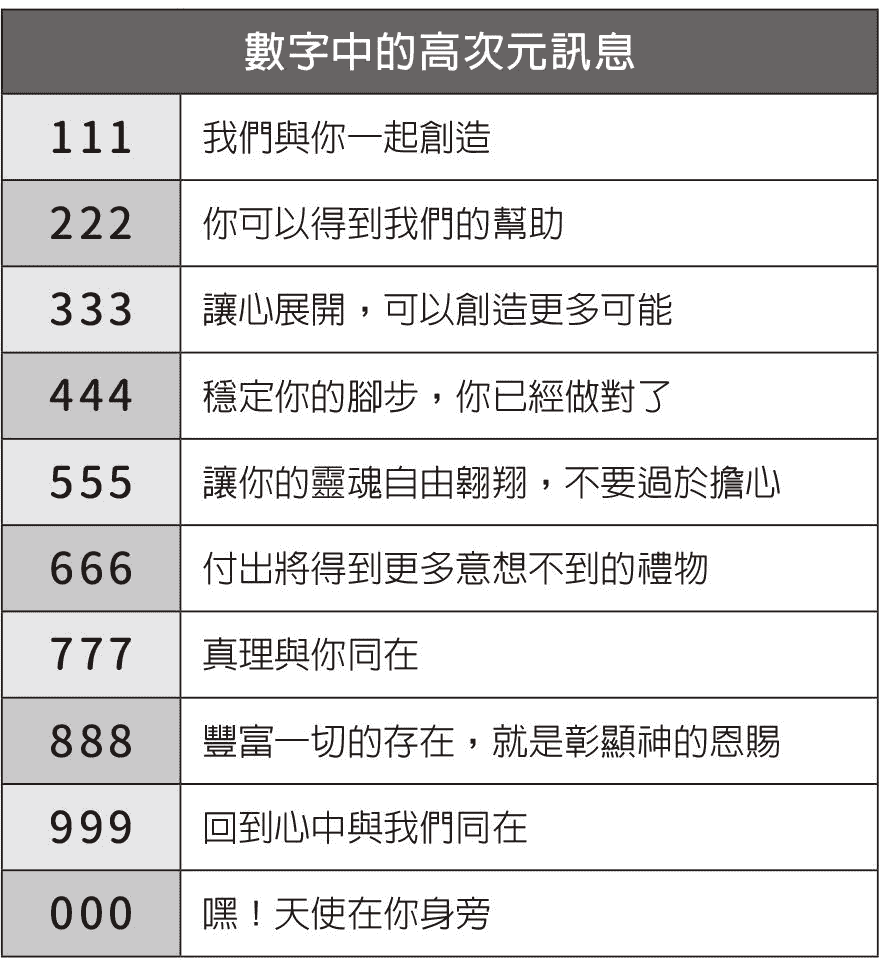

至于更复杂的讯息，会以麦田圈的符号呈现。这些符号出现的原因，有很多是为了教导人类开始去探索宇宙的存在，并提供一些方法和建议。有些麦田圈是给宇宙存有自己看的，表示我们已经来过，并留下记号让其他宇宙存有知道。这些形式的沟通因为没有让人类充分理解图像的涵义，所以很多可爱的艺术家开始在麦田上制作图像，变成你们的艺术表达方式。我们看了也很高兴，觉得像是回赠给我们的礼物，或是你们发自内心的呼喊。这些图像其实也表达出人们心中仍然关心的议题，或是对人类影响深远的事件，我们很珍惜这种互动。

可以为我们解答一些麦田圈图像的涵义吗？

下一页图①的麦田圈图像代表银河系全体星系存有的热烈呼唤，呼唤地球为银河系的生生不息和宇宙的和谐一起尽力。我们期待并热烈欢迎地球扬升，与我们同在。

图②是来自星际的提醒，告诉你们有飓风来到地球，要加强保护地球气流的稳定。

图③是进入宇宙中心的信道，教导人们透过自己心中的梅尔卡巴旋转，进入宇宙之门。

图④是人类自己的创作，显示你们的历史事件仍深深烙印在人们心中。

图⑤是宇宙ＤＮＡ生命机能的运行原理。所有宇宙物质体的ＤＮＡ都以螺旋状运行，并相互连动，创造生命的组成。以整个大宇宙来看，星球与星球之间的运行就是以螺旋方式运转，一个星球的转动会带动邻近星球转动；而以生物体最微小的细胞ＤＮＡ为单位来看，一个细胞的ＤＮＡ也是以螺旋（双螺旋或多螺旋）方式运行，组成整个人类及物种的生命体。生命体的螺旋带动周围的生命一起转动，创造出生生不息的宇宙生命。而这存在于宇宙的生命是共同体，无法独自存在，只要你开始转动，就可以转动整个世界。

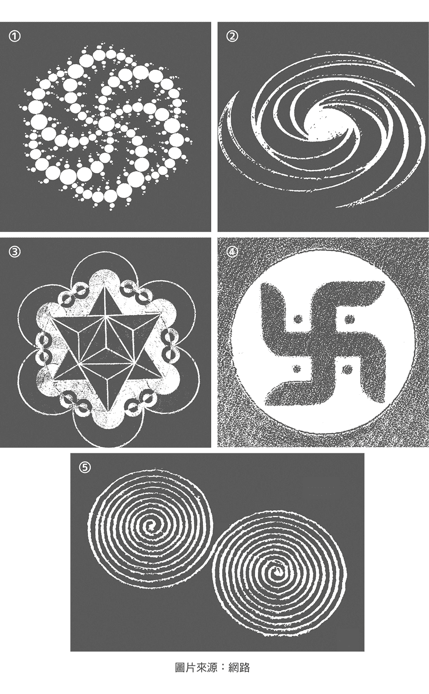

如果人类不懂这些麦田圈的涵义，为何还要做？

这就像是在地球上留下一些印记和足迹作为提示，让一些人能够提升意识，找到回家之路。我们不期盼所有人都能理解，但只要有一个人懂，就足以让许许多多的人理解和忆起。

培育新人类的未来学校

你们需要建构完全不同于传统教育体制的学校，才能开始教育未来的生命。在这新的未来学校里，每个老师的觉醒是关键，你们必须找到并集结足够的导师及工作人员，才能开办这样的学校。

全世界各地已经觉醒的父母会将他们的孩子送到这所学校接受完整的养成教育。导师及工作人员和学生的比例，将近一：一——有一百位老师和工作人员，才能收一百名学生。

这里将是地球未来的菁英学校，在校的学生会开创出很多新的学科。老师和学生会打破目前学科的疆界，将物理学和音乐结合、医学和灵魂学结合、资通讯和机械控制结合、环境科技和艺术结合等，非常多跨领域的学习和创意会从这个学校诞生。学习就是开创，自由地创造，这也就是生命的学习之路。

至于通识课程的安排，宇宙知识的学习占百分之五十，地球生活常识占百分之五十。这群孩子一入学，就有一对一的辅导师协助他们展开身体与觉察的整合。孩子必须住在学校，体验群体生活，父母和兄弟姊妹可以随时来探望，了解孩子的学习进度。课程的安排是学习占三分之一，实做课程占三分之一，剩下的三分之一是游戏与户外活动。

台湾是华人世界非常适合开办未来学校的第一站，这里可以让学生只须移动非常短的距离，就能前往探测和观察地质、地貌、海洋、森林、高山，以及多元的昆虫和植物种类。

开始着手寻找适合的土地（约一千坪），作为基地。找有资源的企业家成立教育基金会，来进行这项未来孩子的育成工作。这群人类菁英会为全世界带来全新的视野与科技文明的高度，带领地球迎向更高次元的新生活。

祢提到许多教育下一代的新观念，但对华人而言，养儿防老及世代继承是根深柢固的观念，甚至到今日，还有许多因为养育下一代的问题而造成的家庭革命；即使在现今男女逐渐平等的社会，面对生育下一代这件事，女性也比男性承受更多压力。此外，因为少子化，为人子女者要承受“孝顺父母、尊敬长辈”的传统道德压力，也让许多不了解的父母撕裂了亲子关系。针对这些议题，不知能否提出祢的观点？

人类的确仍停留在从自己的受精卵繁衍下一代的生物机制，这个就像在自己身上复制出一个生命体的显化过程，会让人将子女物化为自己的产物。其实，宇宙中有许多存有已经不用这个方式进行生命的物化体验。当你们演进到这种状态时，就会重新定义亲子关系，也会让女性从生育下一代的压力中释放出来。当一切的振动来到无条件的爱与自我创造时，你们生命体的延续与诞生方式会改变。你们会将灵魂的体验不只放在生物体里，还会敞开来自由体验不同形式的存在，那些都是更高次元生命体的选择。

当人类意识觉醒后，无意识的繁衍行为会被有意识的繁殖取代，人类的生物体作为灵性意识的寄居载具这件事会被探讨或终止。当人类发觉一切的显化来自有意识的创造过程时，就会很清楚人类需要哪种形式的灵性载具。这也是外星存有目前演化的方式，他们生命体物质化的形式可以长达数百年，由自己决定生命的显化形式。

人类生命在三次元的世界，是一个“被赋予”的过程，而这个赋予的主宰者就是你们的高我意识。你和你自己的高我协议出一种体验方式，所以，你仍是自己的主宰。当你回到生命的源头，就会明白你替自己安排的体验之路，让你得以如此展开生命旅程。和别人无关，这是你自己决定的。

回到你们目前的社会状况。你看见这么多生命仍在延续、仍在诞生到地球，这些生命的创造者除了他们的父母，还有那个存在于新生命里的灵魂意识，以及父母与子女彼此的更高意识。因此，父母若将新生命当成自己生命的延续，也是可以成立的，只是你们的社会文化解释的方式，误导了生命延续的真谛。生命延续不是物质面的延伸掌控，你们若用另一个生命体来继承自己累积的事业和财产，当作是持续掌控自己创建的事业版图，就搞错方向了。

人类生命延续要传递的，是无条件的爱，只有父母和子女之间无条件的爱的本质需要被传承。至于生命体验中显化的物质粒子，在更高的次元是不存在的，那些只是你们在三次元的辅助教材和工具而已。当父母和子女之间无条件的爱的真理可以经由这层关系延续时，人类的灵魂意识才得以顺利回到源头的家。同样地，为人子女者为何要爱自己的父母？因为爱父母如同爱自己，唯有找到生命中的爱的意识，才能让自己顺利回家。这也是为何我们在创造三次元世界的生命实体时，一定有父母。你来自父母，你也可以成为别人的父母，这层关系紧紧维系着每个灵魂，让灵魂得以自由探索和体验，不会迷失。而当你们回到共同意识的存在时，就不再需要这层关系了，因为你们会很清楚知道自己与大家同在。

祢刚才提到，人类自己的诞生计划，是每个人和自己的高我意识协议的结果。能否说明我的灵魂意识显化出我这个生物体的过程。

你们的高我意识和宇宙共同意识是链接的，你并不只是身体有形的独立存在个体。在你们诞生于地球的过程中，由于ＤＮＡ的设计因素，会先暂时消除共同意识源头的记忆。之所以要消除，是因为唯有失去宇宙链接的记忆，你们才能全心全意体验地球的一切。试想，如果你们身处物质界，心灵或意识却不断回到源头，要如何接收外界带给你们身体的所有感受？你们会下意识逃离不想待的场域、远离施暴家庭、逃离考试压力，回避你们身体感知所有不舒服的感受。

而今日，你们的灵性意识前来地球体验，大部分是自愿的。你们需要更大的情绪感受力体验，所以来到地球。人类的细胞情绪记忆库储存了各种情绪因子，这些情绪因子让你在地球体验的过程中不断地碰撞、触发感知，而只有当你全然地用“心”去完整经历，才可以得到丰盛的体验。所以，不须回避不好的情绪，深深地去感受它为你的身体、你的心带来的感觉。当你真正感受过那种感觉，而来到“享受”的境界时，任何会造成坏情绪的因子都会被你一一破解。最终你会看见，一切的触动都源自表达爱的体验。

不过，有一些灵性意识诞生最主要的目的，并不是来体验这些情绪感知的。你先生不是常常说你的情绪没什么起伏？这是因为你和这类型的人主要是来完成自己的天命。你赋予自己“唤起众人回到源头意识”的任务，而你应该已经忆起自己当时是为何做此决定的。每个生命都可以找回自己诞生前的自我约定，这个约定在你与自己的高我链接时就会明了。每个人都有自己的生命蓝图，在这个环节看来，生儿育女就应该像是带着你共同灵性意识的伙伴，一起来地球这个场域体验。你们当初选择成为家人，一起来走过这趟旅程——有了这样的理解，你们是否会更尊重彼此，且更愿意以无条件的爱和伙伴关系，一同完成今生的约定？

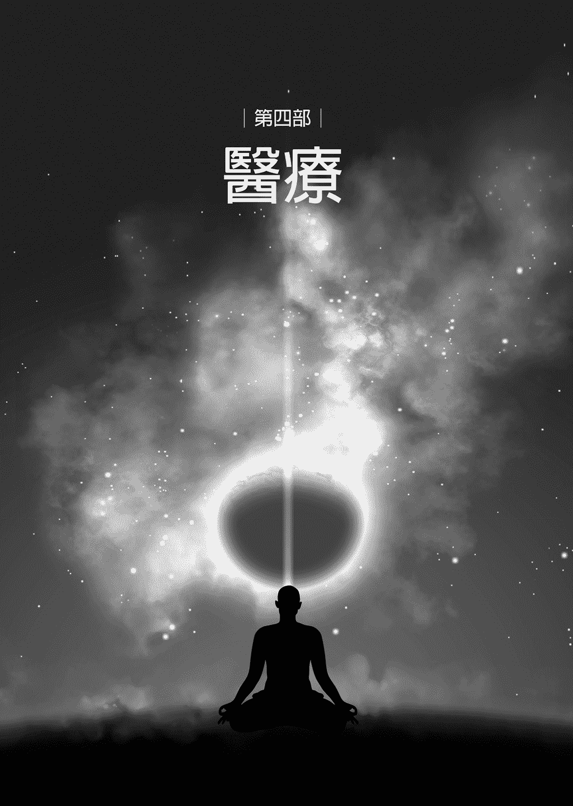

人体的自动调节机制

进入医疗这个主题的同时，我会让你亲身体验身体与灵魂体结合的机制。

身体其实只是灵魂的载具，是用来服务你的意识体的。因此，想要有健康强壮的身体，除了先天得自父母ＤＮＡ的遗传产生的生物体之外，你的意识体下达给身体的指令，也深深影响你的身体未来会长成什么样貌。

你们的医学告诉你，基因遗传是你成为你今天的样貌最主要的原因，但这只说明了一小部分。你和父母长得像，很大的原因来自你的父母看着你，以及你看着父母的共同成长过程中，你们彼此身体的细胞与意识交互共振产生的结果。你的身体被植入一个信念，你的长相被植入一个你认为应具备的长相，你的走路方式、驼背的姿势、不自觉的身体行为模式，都受到父母的影响。

如果一个孩子生下来就没有和自己的父母生活在一起，你认为他长得会不会像他的父母？答案会有两种。如果他的父母很思念这个孩子，孩子也不时想着自己的原生父母，即使没有生活在一起，这个孩子仍会长得像自己的原生父母，这是意识体相连产生的物质显化的必然结果。

如果这个孩子不知道养育自己的并非亲生父母，他的原生父母也从未在意识端链接这个孩子，那么，即使拥有原生父母的遗传基因，却可以长成全然不同的样貌。

所以，一个人的生物体样貌深受环境和所接收的讯息影响。理解了这一点，接下来就可以进一步说明如何用意识治疗人体细胞的缺陷或病变。

 身体各大系统相互链接支援，以维持平衡状态

人体本身具备自动调节的平衡机制，跟大自然万物一样，是经过演化的结果。在今日文明生活的辅助下，人体的平均寿命可以长达一百五十岁，只是人类为自己设定的终止年龄仍需要一段时间调整，人类自己并未准备好超过一百岁的生活建构，也自认为那是不愉快的体验，而拒绝朝这个年龄演进。实际上，只要有正常的生活，以及足够的阳光、空气、水，人类是可以健康活到一百五十岁的。

身体内的每个细胞就是一个完整的微宇宙，这个宇宙携带着电。许多细胞组成器官，就像微宇宙群彼此链接，产生完整的磁引力场体，而人体是许多微宇宙群组成的小宇宙。人的意识尚无法细微感知自体宇宙每分每秒的运行轨迹，你不会知道此刻你心脏的血液流向何处，或是你的肝脏正在处理哪些工作，体内的这些自动机制，如同地球之于太阳自动产生磁引力场的运转一样，都是宇宙生生不息的平衡之道。由于人的意识随时处于“我想要”，而非“我是”的状态，这种人的意识与“我是”的断鍊，就会产生无意识的碰撞空间。而碰撞导致的磁场改变或细胞伤害，就是生物体出现病灶的原因。

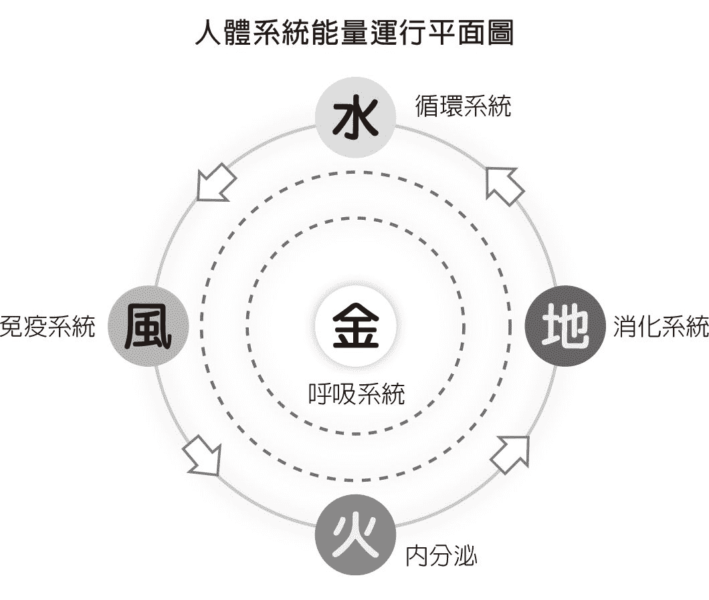

身体的自动调节机制是大自然的恩赐。人的生物体和大自然万物一样，由地、水、风、火四大基本元素构成，就如同土壤、水、风和太阳是植物生长的基本元素。人体的四大系统分别是消化系统（地）、循环系统（水）、免疫系统（风），以及内分泌系统（火），这四大行星围绕着恒星带，经由第五个系统——呼吸（金），进入心与脑的中轴，成为一个可以自体移动运行的小宇宙。心与脑是经由呼吸系统链接成身体的恒星控制中心，身体的四大行星系统则环绕着恒星带运行，自动维持身体磁场处于平衡状态。若其中一个系统环节的能量趋弱或过强，其他与之相连互动的系统会因应磁场的变化自行调节，以维持平衡状态，直到无法负荷后，就会出现能量停滞、阻塞的状况，造成细胞病变，这就是在提醒人们必须开始改变输入的讯息或环境，以修护已经失衡的身体系统。

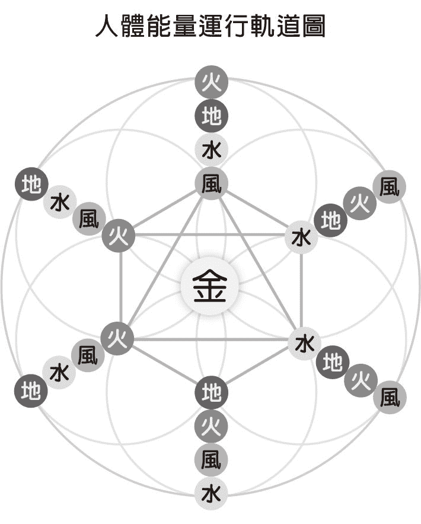

人体小宇宙里的五个系统相互链接，并随时互补支援，以维持能量的平衡。例如，某人因车祸造成脑部受损，他的呼吸系统会取代大脑，扮演讯号传递的指挥角色，其他的消化、循环、免疫和内分泌系统则会自动经由呼吸的气流振动，配合运行。因此，即使大脑已经失去传令功能，人的身体仍然可以自动运行。如果免疫系统必须抵抗病毒，呈现作战的紧绷状态，消化系统就会配合，减少摄入外来能量，以降低免疫系统的负担，这些都是身体小宇宙的自动协作机制。

身体所有的系统都与呼吸系统相连共振，每一次的呼吸不但启动身体四大系统的微宇宙同步转动，也会带动身体整体的小宇宙。以金为中轴，依循着“地→水→风→火”的顺序，逆时针方向移动身体小宇宙。当身体小宇宙转完一圈时，以２Ｄ图形来看，人体内会呈现以呼吸为中心，牵动身体四大系统恒定运转的生命之花运行轨迹。

一个健康的人体经由呼吸创造身体宇宙的自然流动，人类就是地球和宇宙之间最佳的能量传导媒介。丰富的大地万物经由消化系统的吸收进入人体，人类再借由呼吸，将宇宙的能量转入身体的水、风、火系统，然后流入大地，形成一个完整的接天落地能量循环。人类的能量与天地共振，人类就是地球最亲密的伙伴，而地球如今生病了，接收不到宇宙能量，因为人类身体普遍出现状况，人类无法经由一呼一吸，传送宇宙能量给大地。这样解释人体和宇宙、大地的关系，你是否能够明白？

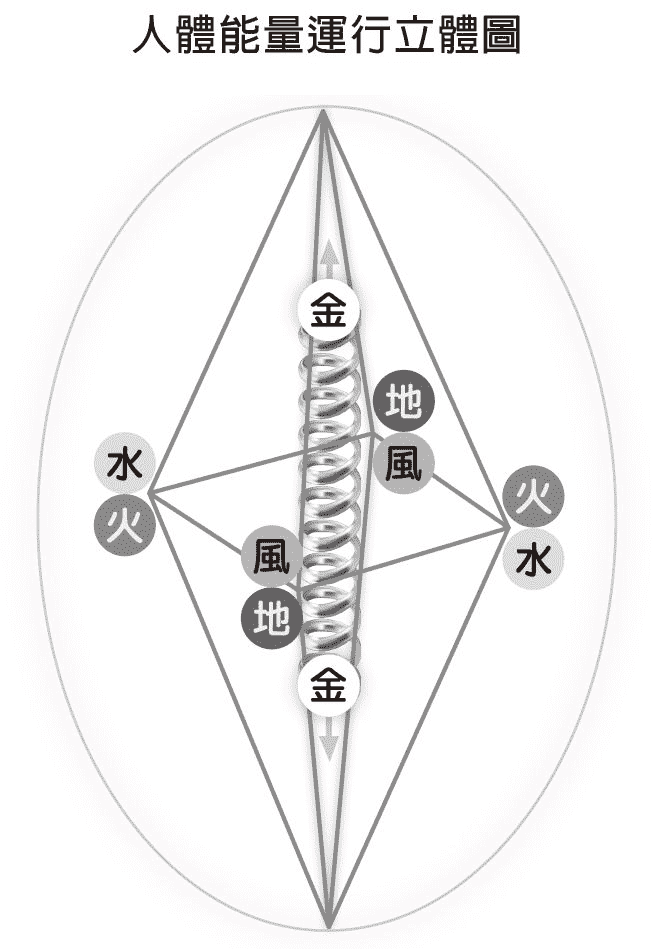

原来地球母亲只要我们用健康的身体来回馈她。这么说来，每个人的身体就是地球的小发电机，我们有意识地呼吸，让身体系统顺畅地自体循环，就是在为地球带来能量；同时，健康的地球更可帮助人类接收天地之间的能量。很多人在乎自己的健康，但如果没有回归有意识的呼吸，链接回到自身，让链接心与脑的中轴稳定，光是研究营养学、吃得健康，仍是舍本逐末。同样地，如果只注重灵性，一味追求灵性的高度与成长，没有回到自己的物质身体，让身体能量顺畅运行，接入大地，也无法对生命赖以为生的地球有所贡献。祢一开始就试图让我们了解，地球生态和人类息息相关，我现在终于明白了。

是的，爱自己如同我们爱着你，就是给宇宙最好的礼物！

人体复原的关键

如果一个人出生之后能随时与“我是”同在，也就是处于意识体与生物体合一的状态，那么，身体五脏六腑相连的脉轮场原本就是畅通的。

人体的七大脉轮，如同星系中的黑洞。各个身体系统就是一个微宇宙，微宇宙内也会产生相对应的黑洞，这些黑洞可回收五脏六腑产生的多余斥力。如果斥力场产生过多剩余能量，或是斥力场的能量不足，都会反映在脉轮的能量强弱。脉轮若吸收过多噪声，也会造成脉轮阻塞与流动趋缓。因此，人体若能保持脉轮的稳定与畅通，就会达到整体平衡，身体自然健康。

只要身体能量运行顺畅，人体就可以维持细胞不断代谢与再生的自体循环，所有器官也可以保有良好活力。而要让身体能量顺畅运行，就必须有意识地校准你的中轴。呼吸是基础，经由呼吸带动身体五大系统启动能量流动，汇聚地、水、风、火四大元素，稳定人体中轴，并扩展链接地心和宇宙之心。如此运行，人的身体就是一个强大的能量场，可以吸收身体无法接受的噪声，然后经由脉轮黑洞强大引力的分解与再融合过程，产出新的细胞，回到中枢，流回各系统。

你现在可以用双手去传感人体的脉轮能量大小，因为人的手就是带电的导线，你从双手之间的斥力和引力，可以传感物体产生的磁引力场。因为脉轮是身体各个系统的能量黑洞，你可以测出从头到脚、发自脉轮黑洞的能量场直径大小，从而判断这个生命体的哪个系统需要加强或调整能量流动。

我确实可以感知，但祢这么一说我才明白，这是生物体的物理现象。不过，好像也不必面对面传感，光是用意念想着某人，甚至是不认识、也未曾谋面的人，只要透过意念，就可以侦测出这个人身上每个脉轮的大小。

你讲到重点了。“意念”是关键词，人的“意识体”释放出来的电流可以穿透整个地球，到达全宇宙。这是人类身上的宝藏，也是人类有别于地球上其他生物体最珍贵之处。意识可以治疗自己的身体，也可以帮助别人，帮助地球，帮助全宇宙！

这应该是神的工作，不是吗？人也可以做到？

当然！只要你的身体平衡，脉轮畅通，中轴稳定，透过你的心产生的意识振荡波，就可以带动另一个生命转动。之前在说明某个麦田圈图像时，就跟你提过ＤＮＡ细胞能量共振的原理。

祢刚才提到四个关键：（一）身体平衡，（二）脉轮畅通，（三）中轴稳定，（四）意念带领。可以说明一下我们要怎么做好每一点吗？

人类目前的身体状况是，前三点都不及格，就到不了第四点，因为人类都本末倒置，从第四点开始冲刺，导致中轴不稳，脉轮阻塞，身体出状况。

我就一个步骤一个步骤地谈。

 步骤一：平衡身体

身体要平衡，就先从每天的吃讲起。你吃进去的东西，有很多物质造成身体的负担。如果吃进的食物不是天然的、来自大地，或者不是经过生命正常生长的养殖过程、不是洁净的水和有能量的土壤种植出来的蔬果，那么你吃进去的，就是毒害身体的东西，不但产生不了能量，反而要耗费更多能量去消化、去启动周边的系统协助代谢掉。吃是身体能量启动的第一个能量来源，是“地”元素，代表身体的根基。根基不稳，就像没有能量的土壤，怎能生养土地上的万物？

其次，是呼吸。人类的吸气和吐气，就是能量在体内的推进系统。将气吸入身体的腹腔根基地（消化系统位置），而不是浅浅地吸入肺中；然后吐气时，能量流入水（循环系统）、风（免疫系统）、火（内分泌系统），完成一次完整的全身能量流动。

再来，是喝水。喝好水，让血液保持一定程度的清澈，流入全身细胞，使细胞产生体液，帮助淋巴系统防御外来的病毒 1。

接着，是情绪。人的能量随时与外界产生共振和碰撞，如果你觉得不舒服或有压力，都会产生情绪波动，影响你的细胞代谢。这些情绪需要被理解和平衡，多多接触大自然，参加让你心情愉快的活动，维持良好稳定的情绪，对身体的平衡有很大的帮助。

最后是性。人类繁衍下一代的过程来自性的能量，这个能量可以让人类突破生物体的限制，来到神性的高度。在享受性的过程中，双方的心会产生共振的能量场。人类社会将性视为禁忌或羞愧之事，但你看远古时代神的画像，是否有许多美好性能量的展现？在自己可以接受或符合社会规范的情况下好好地享受性，可以为身体带来创造与更新的能量。

 步骤二：畅通脉轮

提供一个畅通脉轮的每日简单练习。

畅通与启动脉轮练习

每天早上起床后，先去上厕所排便，这就是开始清理“地”元素。然后，深呼吸三次，活络你的“金”元素，再喝三口温水，滋润你的水、风、火等元素。完成身体的前置准备工作后，就可以开始启动脉轮。

利用双手来启动每个系统的能量。人类的双手是最佳通电装置，五根手指分别代表五个系统：

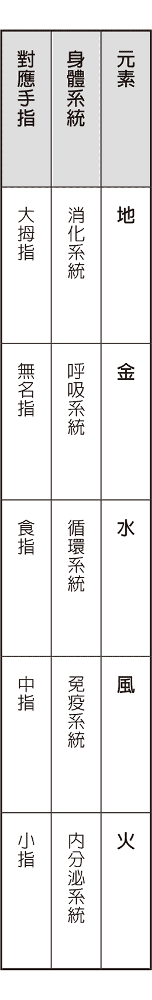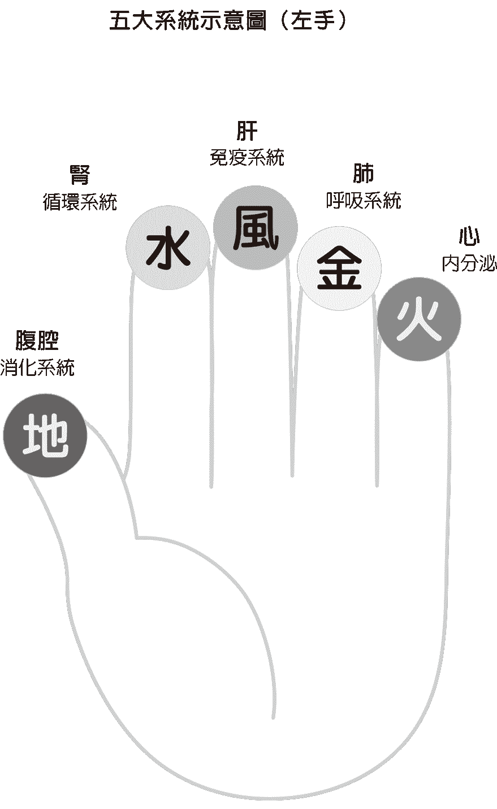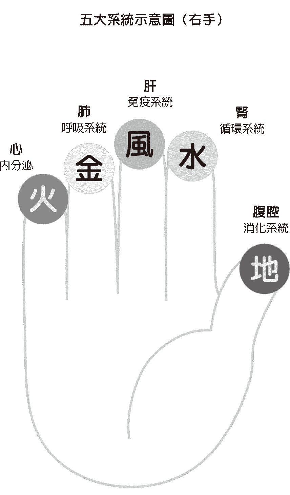

进行启动身体五大系统能量的运动。身体呈站姿，放松；若不方便站立，坐着或躺着也可。接着，以“地→金→水→风→火”的顺序，配合对应的手指，依序启动身体五大能量系统。

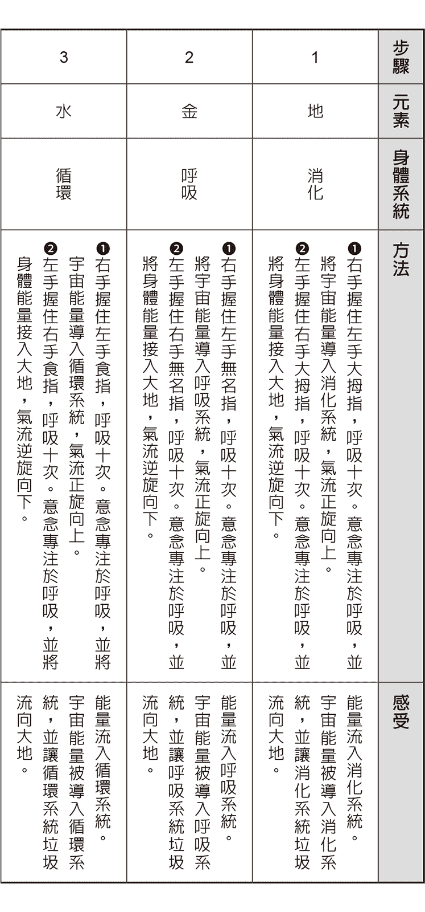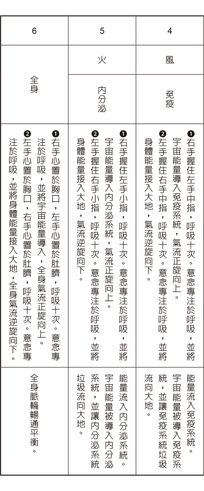

依序完成每个身体系统的上下启动后，进行五大系统的整体运行。可以把这当作每日练习，让脉轮流通展开，以维持中轴能量流动的顺畅。顺带一提，每天早上进行身体准备工作时，如果有排便不顺畅的状况，可以先用左手握住右手大拇指，让消化系统的能量接地，深呼吸几次，就可以帮助清理肠子里的废弃物。如果是泻肚子，就反向用右手握住左手大拇指，让消化系统的能量往上旋来止泻。

 步骤三：稳定中轴

实践第一、第二步骤一段时间后，就可以开始练习让中轴稳定。

稳定中轴练习

当步骤二的“畅通与启动脉轮练习”做完后，坐下来，身体呈静坐姿态：将双手大拇指的指尖抵着无名指指尖，掌心向上，轻松垂放在两腿膝盖上，稳定呼吸。

当中轴的能量流动进入稳定状态时，你身体的能量中心会呈现上下流动的光之柱。你坐在光之柱的中心位置，周边围绕着一个晶状结构体。晶状结构体中的每一面就是一个空间次元，女性有十二个面，男性有十六个面。我们先不谈这些次元的涵义，必须等待人们完全放下小我意识，提升与宇宙合一的意识后，才能提供下一阶段的教导。

目前你处在这个正十二面晶体的中心点位置，你的意识已经可以准确地校准宇宙之心，你会在前方看见光。你今天看见的紫色大光圈，里面有一小部分的绿色光，就是链接你和智慧与健康的宇宙之光。我们会针对每一个人投射出他需要的光，你只要静静地在晶体里呼吸，待在光中，就能让身心获得全然的疗愈。

这种疗愈是非常个人化的，每个人需要的成分不同。当你的中轴稳定于光之柱里，宇宙就在协助你打开、扩展、平衡。你不需要做什么、不必提出疑问，只需要在光里享受这份来自宇宙的爱与疗愈。结束后，你会感受到身心净化、能量充足。

（心得：实际练习后发现，在稳定中轴的过程中，如果用意念拉长音地念“阿～乙～莎～”，可以更快速稳定中轴。）

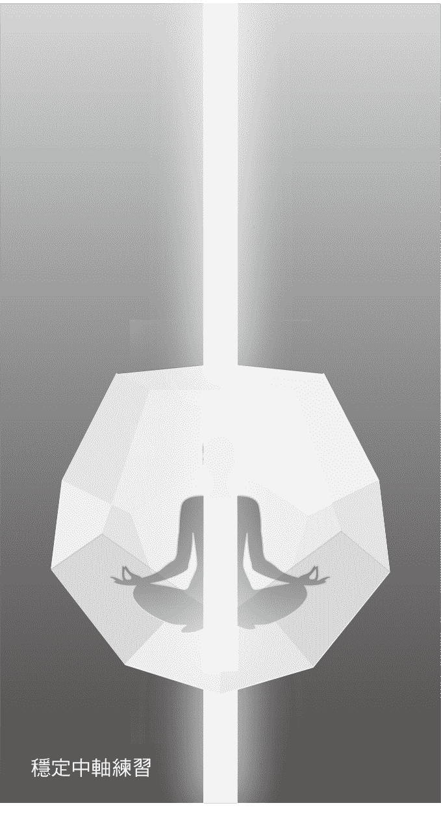

 步骤四：意念带领

延续中轴稳定的状态，现在将左右手的十指相对。从上往下看，两只手呈现三角金字塔形。

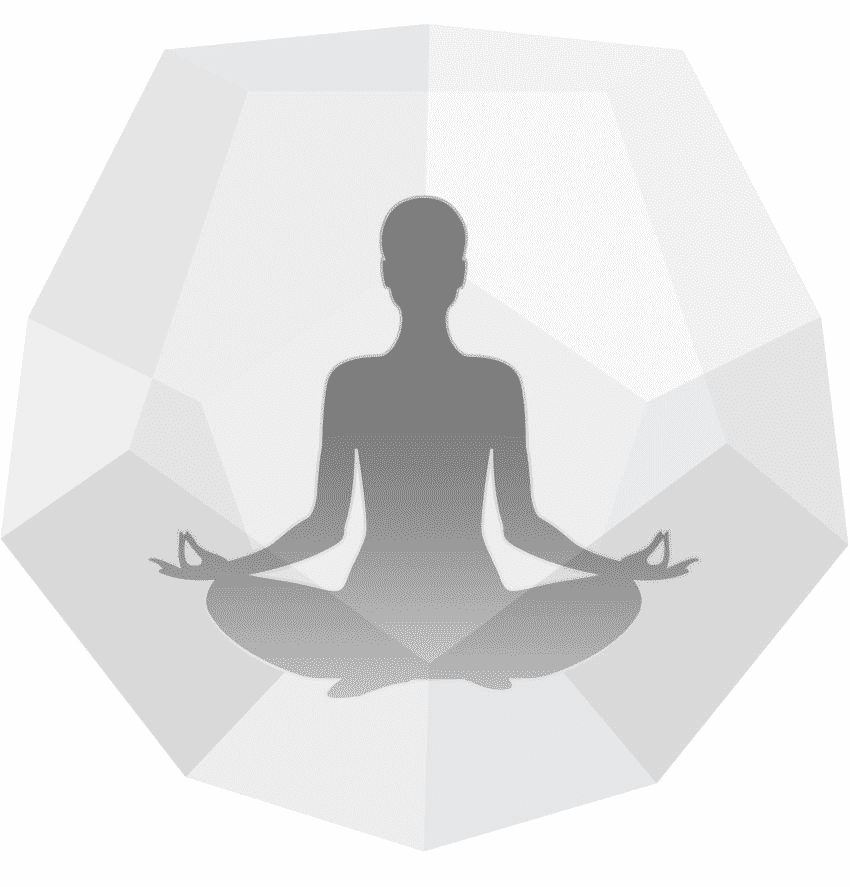

此时，来自宇宙的能量从顶轮往下进入眉心。深呼吸，渐渐地，你的心轮更加展开。你感受到从心到头顶都敞开了，你与宇宙更高意识正在接轨。

现在，带着自己缓缓进入晶状结构体中。你感受到这个晶状结构体的空间，你的身体已经消失，你看不见你盘坐的腿，全然处在这个空间里。你明白自己就是宇宙，宇宙就是你，你可以开始在光之柱中与高我链接，并开始进行意念带领。你的意念会与更广大、更高的意识链接，在此，你可以获得来自你自己内在的更高智慧，以及身心疗愈的机会。我们一起来练习。

一、自我审视：开始回想过去所有的经历、曾经来到你面前的每一个选择，一一回顾。你感受到什么？

我看见我过去未曾选择的那一面继续演化。他们现在的状况，甚至他们遇到的问题或喜怒哀乐，都像是我自己的体验。

没错，他们就是另一个版本的你。你当时没有去考师专，但你看见了当年考上师专后的生活。

你还看见什么？

我明白所有的选择，以及那些没有选择的，都存在，也都是我的体验。我感谢那些帮我活出我没有去经历的生活的人，我也应该好好地过我自己选择的、目前这个版本，才对得起其他人。

我们都是一体的，没有好坏，没有富贵贫贱，所有的经历都存在每一面，我就是他们，他们也都在创造我。所有的选择与不选择既然都存在，我们只能珍惜当下。我正在经历、演出的这一个版本，创造了彼此经历的圆满——如果我没有好好地过生活，他们就无法被圆满，而他们也正在努力地圆满我没有选择的版本。

很好，我们继续往前走。

二、跨越时空：你现在可以想像自己就是地球，地球就是你。回到五百年前的地球，感觉一下。

我感觉自己变成五百年前的地球，虽然到处绿意盎然、生机勃勃，却让人觉得很严肃、紧绷，很多地方的人都在进行疆界之争。

来到现在的地球，感觉一下。

地球的呼吸道不顺畅，肺部受压迫。还有，我的腹腔有很多杂物，感觉地球的肠胃也出现问题。

没错，现在的地球确实生病了。森林、海水、土壤都出了问题，造成呼吸、消化和循环系统出现状况。

继续前往五百年后的地球，感觉一下。

我的脑压好高，身体轻飘飘的。

假如现在地球上的人类选择继续朝人工智能演进，你们最终会用有限的生物脑，来对抗人工智能的演算。你们脑压过高，神经系统紊乱，身体无法好好运作了。

这该怎么办？

让更多人做有意识的选择。集体意识的选择可以改变地球的未来，我们之前谈了这么多，就是在提醒人类回到有意识的生活。

很好，你的意念可以跨越时空，你已经领会到了。接下来，我们再回到自己身上，你现在可以扫描自己的身体。

三、健康扫描：你在这个空间里，可以进行全身的扫描和疗愈。

用意念扫描每个器官，从头一直扫描到脚。在每个器官停留几秒，感觉一下该器官的状态。如果你觉得能量低落，或是有压力，就是那个器官需要平衡一下。

怎么平衡？

透过之前提过的，每根手指都对应一个身体系统的概念。用左右手的大拇指轻触该对应手指的指尖，然后拇指转圈，右手往右转，左手往左转。这是在排出身体的杂质、身体的阻塞。做完排除的动作后，同样的手指位置，但拇指转动的方向相反，右手往左转，左手往右转，这是在补充宇宙新能量进入这个位置 2。多按摩几次，再去你刚才觉得能量不平衡的那个位置感受一下。

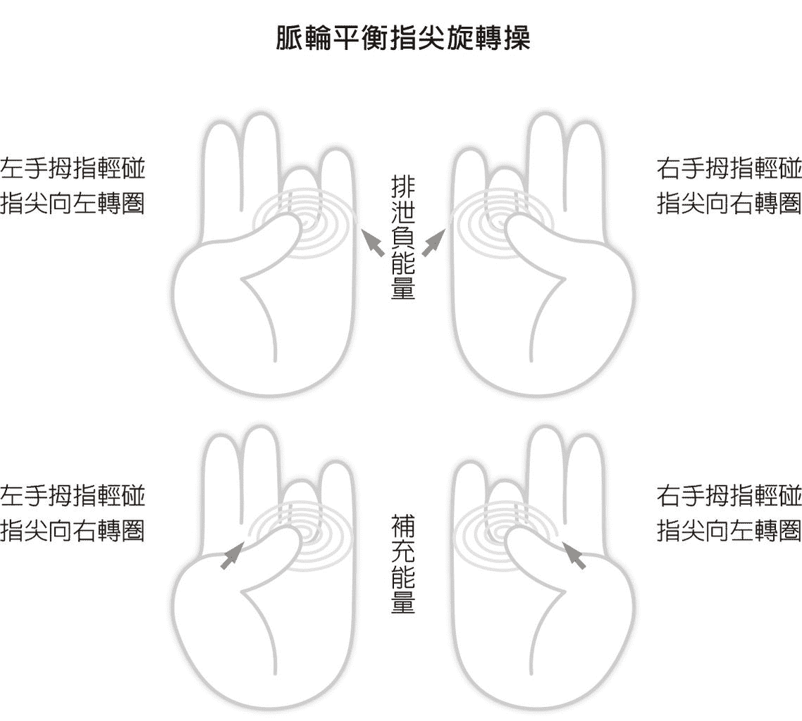

好像变畅通一些了。这是怎么回事？

这个就是用意念驱动身体细胞，进而平衡你那个位置的能量场。

结束这项练习后，你可以将大拇指指向无名指的指根，握拳，就回到自己了。

接下来，可以进行第四个意念带领练习。

四、细胞净化：让自己无念无想三分钟，使宇宙能量从你已经敞开的顶轮到心轮间自然流动，就可以让人全身舒畅，全身的细胞完成一次深度净化。

不进行前三项意念带领练习（自我审视、跨越时空、健康扫描），直接静坐三分钟，进行细胞净化也可以。

1 提供一个使身体平衡的喝水法。先深呼吸，让全身在喝水时一起感受水的滋润。不要用灌的或大口喝，而是每次喝一小口，含在舌下，充分和唾液融合，再慢慢吞下。经常这样练习，可让水对身体进行各种深度作用。

进阶喝法：水含在舌下时，以意念指引深呼吸在胸与口之间循环三次。经常练习，可感受到更多生命的讯息。

2 如果需要平衡的是消化系统，因其对应大拇指，所以请将意念放在大拇指，然后以食指尖轻触大拇指，照指示方向画圈。

爱是人类和宇宙之心校准的任意门

阿乙莎，我今天的练习不太顺利，没有办法达到昨天的光。

稳定中轴这个步骤的状态，决定了你的“到达”。刚才你听见楼上的琴音，就被带离中轴。你被你的脑带走了，开始判断，开始喋喋不休，你的中轴被你的脑占领了。

我正在想他左手的和弦弹得不够精采，还有，他那本琴谱我也有。没错！我的脑确实在打扰我。

你刚才虽处在你的晶体中，但心链接到脑时，就被你的脑拉回目前的环境中，你上不去了。人脑的位置高于心，没办法，这是让你们人类可以在现实中好好生存与安身立命的机制。

你必须让你的心穿越脑的屏障，才能到达中轴的稳定。这个稳定中轴的练习不是那么简单的，只要有一丝一毫的偏差，就无法抵达，即使宇宙之光就在你前方，等着你校准。

你们的静心冥想就是在帮助校准中轴，并协助中轴稳定。

请问何时最容易到达？

当你真正臣服，放下脑的批判与执拗时，但这一点通常很难做到，因为你们的成功经验让你的脑更活跃，你们依赖头脑，甚于使用你们的心。人类所有的感官都被神经系统包围，这个神经系统的指挥官就是脑。你们很难逃离头脑的掌控，这是生物体的防御机制，最佳的防御，也是最大的自我屏障。

要识破脑的指挥，唯有将心的振动频率提升到最高的爱，才能穿越这个障碍。

爱是人类和宇宙之心校准的任意门。当你的心携带着爱的振动时，脑就会臣服，身体自然而然会完成中轴的校准与恒定——不只是稳定，是恒定！爱可以带你穿越任何次元。

你要再多练习几次。我们需要你如实如是地做到，才能带你进入下个阶段的练习。

有些朋友经过几天的练习后，觉得很容易入睡，也有人感觉气的流动很顺畅。我用祢之前指导的方法帮助我经常胃痛的先生，但因为他是铁齿型的研发人员个性，我怕他没太大的耐心做完全部的手指，就只要他握住左右手大拇指各呼吸十次，然后换成握住左右手的小指各呼吸十次，结果他说很有效。请问其中的道理是什么？此外，这个方法可以用来帮助身受癌症之苦的人吗？

想睡或气流畅通都是会有的反应。若还没有练习到位，就用比较不容易入睡的方式练习，站立或坐姿都可以。

会觉得想睡，是因为电流流通全身让人感到放松，而人在最放松的状态下除了想睡，另一个好处是可以来到灵性的创造。这就是启动人本有的创造力最佳的状态。大脑的干扰减少，身体的流畅将带来自由的创作，孩子在这个状态下可以尽情唱歌、绘画、跳舞、创作，不需要教导，让来自灵魂本有的创造力挥洒出来。

至于你先生的胃痛舒缓，道理很简单。人的手指末梢神经会释放电流，当你用手指做出左右手握住的循环，就像把那个身体系统接上电源一样。你很清楚使用电器前要先接上电源，而身体的系统自动经由呼吸接入能量，当身体某部分的系统运作迟钝或阻塞时，就可以用该部位的对应手指接上“电源”，加强该部位的能量流。你带你先生做这个步骤是正确的，他的胃胀气是因为思虑过多，造成能量阻塞。你先让他透过左右手大拇指平衡胃部的阻塞，然后用“火”元素小指加强“地”元素，就像是帮胃部微微加温，改善阻塞造成的寒冷。做完后，他不但觉得舒服，还充满热能。这是很好的应用方式。

而谈到癌症的治疗，你要明白，癌症最主要的成因是缺乏“爱”。导致爱的能量匮乏的原因很多，要审视自己为何会缺乏“爱自己”的信念。人类往往认为缺乏爱是因为没有受到关心，或是被错误对待造成的，这通常不是真正的原因。

爱是每个生命与生俱来的本质，没有人可以夺走你的本质。一个人缺乏爱，是自己不允许爱的能量流动，自己阻绝了爱的能量。他的不允许和阻绝是最大的原因，那是他怎么看待事物，也就是他的意念，以及对周围一切的认知显化出来的。一个人的意念产生的能量场很大，你怎么看，就怎么“成为”。

如果用脉轮畅通来引导，对癌症患者来说，只能暂时缓解身体系统不平衡的状态，若心的意念没有改变，仍会持续产生不平衡。他们必须多练习由稳定中轴进入自己的生命历程回顾，类似之前在意念带领练习中做过的自我生命回顾，看见过去曾经做过的选择。你们要协助癌症患者回忆过往所有的选择题，从现在开始往前回溯，找到当时那个选择的原因，并且去观察没有选择的那一面。多做几回，他们会一次又一次看见自己做出的选择背后的原因，以及“不选择”对他们来说，同样是祝福。要一直往前回溯到他是如何选择这一世的父母。不必急于将这辈子一切的发生归责于前世业力，那个前世的他也已经不全然是今生的他。不需要回溯前世，这一世所有的发生与选择，就可以让人找到足够的解答。

不断地在中轴稳定的状态下自我审视，直到他重新遇见爱。一切都源自爱，而这个爱的力量仍在他身上。在爱中，他才能真正理解自己由来已久的情绪产生的原因，一一看见这些曾经升起、但当时不被他理解的情绪。当时的情绪出现之后未被理解，或是被隐藏压抑着，就是存在细胞里，形成你们所谓的肿瘤。

当情绪被看见，并且被这个人用爱重新理解，这个肿瘤就不再需要为了安置这些情绪而存在了。

去告诉众人癌症是怎么形成的。回到爱中，臣服于爱，经由稳定中轴的练习，你们可以在源头和爱相遇，在每一次的经历中看见爱。你们终究会发现，自己就是爱的化身，自己就可以疗愈自己。

在畅通脉轮练习中，食指和小指分别对应循环系统和内分泌系统，这跟中国传统经络的说法不太一样。我看到一些资料显示食指对应心肺，小指对应肾脏，能否说明一下？

当你用一只手去握住另一只手的某根手指头时，就是在创建该身体系统的磁场回路。每根手指头都与各器官相通，因此，不光是食指可通向心脏，每根手指的经络都可以直指各个器官脏腑。这个简单的手指操是透过将能量导入身体系统，去活化器官和细胞环境场域。当你握住某根手指，带动该系统场域时，就可以让身体的智慧自行运转。所以当你握住食指，意念带入启动循环系统时，身体是将心肺的血液和氧气输送到全身的血管、淋巴、细胞，乃至于到肾脏排出尿液。你们不必一个器官一个器官点名，身体知道的。

意念带领练习

这是完成脉轮畅通与启动，进入稳定中轴后的练习。

用自己的意念，依序进行以下四个主题：

①自我审视

②跨越时空

③健康扫描

④细胞净化

未来的再生医疗

人类生病有两个阶段，一个是失衡阶段，另一个是失能阶段。

在失衡阶段，身体各个器官仍能保持整体运行，虽然其运作和生物体的正常状态有所差异，但这也是身体透过自己各个系统的协作重新调整后的新平衡状态。这个阶段不能称为生病，应该称为“系统调整”，你们可以经由调整呼吸、作息，和清理情绪障碍，回复原始的平衡状态。

在失衡状态中要启动人体的免疫系统，可以经由两个方向：一个是水，透过喝水或注射生理食盐水加强体液的冲刷，让循环系统协助将病毒排出体外；另一个是借由减少摄取食物，清空肠胃，让免疫系统重新站上防御位置。

若失衡没有被导正、回复平衡，当身体遭受外部侵犯，或因病毒造成器官失能时，就无法光靠情绪治疗来逆转。这时需要更多再生细胞，来协助身体细胞或器官更新。

人类过去的医疗体系依赖化学药剂或外科手术，这种治疗手段虽然暂时止住持续失衡的状态，但其实手术后要恢复系统的原始运行能力，最主要还是靠自体再生细胞的活跃运作。

 稳定中轴有助于干细胞活化

中轴稳定对促进人体回复健康初始状态具有重要意义。中轴稳定时，你的光之柱可以因天地宇宙能量的流通顺畅，而逐渐扩展。想像自己是一棵树，你的中轴就是树干，当中轴的光之柱扩展开来，你体内骨干流通的母体干细胞数量就会不断增长。人体的干细胞在胚胎形成的阶段，是百分之百活跃的；成长完成后，经历数年的岁月，逐渐因为中轴阻塞而凋零老化，当你们年纪愈来愈大时，活跃干细胞的数量将不到百分之五。而透过有纪律地稳定中轴，产生的扩大能量场可以使干细胞再生、活跃，这些干细胞就能提供身体的凋零细胞或损坏器官足够的再生能力。这也是你们的医学研究单位正在努力的方向，试图利用干细胞复制或培养新的身体组织或器官。

如果以你们目前采用的介入人体的治疗方式，会想办法将干细胞植入人体，进行再生过程。其实，你有没有发现人体在胚胎阶段，原始干细胞各自长成、各自归位，没有透过手术分离或导入，就可以长得很好？

那么，要如何让干细胞修复失能的器官？

首先，要有足够数量的活跃自体干细胞。

接下来，就是借由人的自体重生过程，辅以你们的意念，引导干细胞修复受损部位。

这个过程跟胚胎长成婴儿的过程不同，是运用意念去修复受损细胞，其运作机制是导引干细胞产生更大的电流，去替代受损细胞或器官的场体，和宇宙黑洞吸收无法进入协作运行的游离星体，再从黑洞生出新星球的道理类似。你们目前的医学尝试用器官移植的方式，将完整的养成器官或组织植入受损的系统，这虽然可行，植入器官与周边系统之间却会出现再融合与排斥的问题，需要磨合期，失败的机率也高。如果可以经由自体中轴的干细胞生成，并透过各系统的脉轮黑洞扩大能量场运行，就可以进行自体再生，降低手术移植的失败率。

 用意念引导干细胞到身体需要的地方

再生细胞可经由意念引导，输送到身体需要的地方，步骤如下：

一、想像你的光之柱充满活跃的母体干细胞。这些是你胚胎形成时的原始细胞，在你的嵴髓中被活化。

二、接着，去觉察和侦测你身体各大系统的运行状态。和畅通脉轮时串接左右手的方式相同，将你感觉最需要加强能量的那根手指伸出来，用右手握住。

三、你的嵴髓干细胞大军，现在进入你手指启动的系统中。随着脉轮的转动与扩大磁引力，这些母体干细胞正和谐地融入这个系统，并不断转化分裂出系统所需的细胞组织。深呼吸，让这个步骤持续，身体系统跟着顺时针旋转，直到你感觉光与热在这里流动。

四、接着左右手交换，左手握住右手同样位置的手指头（刚刚若是握左手中指，现在则握右手中指），想像已经脱离系统运行的坏死组织和细胞正在离开，跟着系统逆时针旋转流向大地。

五、最后将左右手掌分别放在肚脐和胸前，进行全身系统的平衡共振。换手各做十次深呼吸，结束一次完整的意念引导干细胞再生的疗愈过程。

这整个流程的关键是“意念”带领。由一个全然知晓的意念引导，才能获得真实的疗愈。全然知晓的意念要觉察自我信念是否偏离，而造成情绪无法正常流动。阻塞的情绪必须被看见、被理解，干细胞的引流重生才会有效，整个意念带领的更新程序才算完整。

多做几次这个练习，因为不被理解的情绪有时会深藏在身体细胞中，一开始并没有被察觉。多做几次意念引导，当细胞的代谢逐渐深化，深深埋藏的情绪才会逐渐浮现。

当你们了解意念引导的疗愈带来的奇迹之后，会有许多人热切期待可以用自己的意念帮助亲友疗愈，但事实上没有这么容易。你必须得到对方的应允，才可以进入别人的场域；若在对方无法接受或无从理解的状况下运用你的意念进入，就是侵犯了别人的生命场域。你没有全然明了那个场域的限制，与周边环境场域可能产生的抗拒，就冒然进入，是不会有帮助的。这和你们在协助树木时，会先征得树木的同意才进行能量引流，是一样的道理。

所有的生命都是自己的主宰，如果没有想要被疗愈的意识，任何治疗都是无效的。一旦明白这个道理，你们就会将注意力放在提升人们意识的振动频率，而不是去操作无意识的远距或意念疗程。有些人确实可以透过意念疗愈他人——当你自己的振动频率到达无条件的爱时，透过让他人感知你无条件的爱的状态，就可以改变对方的振动频率，与爱同在，这个人自然而然就被爱疗愈了。

与身体沟通，逆龄回春

人类是否可以保持身体状态长生不老，细胞回春？有没有办法让进入更年期的男女回复青春？

人类进入更年期后，也能有意识地唤起沉睡的内分泌系统分泌荷尔蒙，来维持身体的年轻状态。这是人人都可以做到的，只是你们不断告诉身体“我老了”“我迈入更年期”“我退休了，不再年轻”“我不想生育下一代了”，让细胞失去活力。

实际上，细胞每天都在汰旧换新，循着ＤＮＡ的指令，完成应有的再生工作。只是，你从母体出生后，就不断因为父母和同侪的提醒，发出“我要长大”的指令，而细胞自己有ＤＮＡ的预定成长计划，也非常听从和配合人类的意识体，不断成长茁壮。但是，你们成长到一个阶段后，自然而然会将注意力转向，往外探索这个五彩缤纷的世界，进入社会，创建事业和家庭，生育下一代。过程中，你们的意识体和自己的身体失去对话和链接。在这个阶段，你们的再生细胞每天仍孜孜不倦地依照ＤＮＡ的原定计划和指令，安分守己地工作，直到有一天，因为生病不适，或是退休，或是儿女长大了，你们才又将意识带回自己身上。

你们因为环境或身体的变化，将意识带回自己身上，试图改变身体的细胞活性或回复健康状态，这是绝对正确的尝试。人类其实可以不用仰赖药物，就能永保青春健康。停经或荷尔蒙减少，是身体的智慧因为体贴你而产生的自动机转。细胞感受到你们的活动力下降，也不需要生育新的生命，因此自动减缓荷尔蒙的分泌，但相对也让人外观老化、精神力下降，而这是不被你们接受的。这时，你们可以启动与身体细胞的链接，和身体进行回春沟通。

身体本身就是一个比人脑更高阶的能量场体，身体各系统在此能量流中随时处于非线性的互动和讯息交换。每个细胞的ＤＮＡ里都蕴藏着灵性智慧，当细胞汰换，产生新的细胞，进入身体能量宇宙中，之所以能立即合作无间、各司其职，就是依循ＤＮＡ的序列，完成细胞和身体系统间的自动合作机制。你可以想像，皮肤被割伤时，有再生新皮肤的能力，同样地，你的器官和各个系统中的传输腺体也可以不断往返各器官间，交换需要的组织或荷尔蒙，进行传输或代谢，以平衡整个身体的日常运行。你们目前采用的外科手术切除、电疗或化学治疗等方式，有些会导致器官不可逆转的损坏，并影响新细胞的生长和复原机会。

回到你刚才问的细胞回春做法，非常简单。你不需要担心没有新的细胞诞生在你的内分泌和生殖器官里，只是细胞的活性需要被激发，回到你年轻时的状态，以持续分泌丰沛的荷尔蒙。你们已经知道如何利用金属分解出等离子体，扩大磁引力场体，如果把等离子体做成的能量贴片放在想要活化的身体系统位置，以回春来说，就是将贴片放在下腹部卵巢和子宫的位置，这时，你生殖系统细胞的能量会被启动。系统启动能量场体后，就会自己完成与其他系统的沟通协调工作。

在生殖系统重新启动的头两天，你可以感受到身体各部分有所回应，接下来就能进行更进一步的意识沟通。你可以透过意识，与自己的内分泌和生殖系统沟通它们需要回复到怎样的状态。如果没有生育下一代的打算，也可以跟生殖系统沟通，请它只要保持产生荷尔蒙活力的原料供给，但不需要回复排卵生殖的能力，身体会明了你的意识，并进行相对的调整。

这个意念的引导很重要。每天练习和自己的身体沟通，并赞美它为你做的一切，当你有意识地回应身体的正向反应，细胞会受到鼓舞，变得开心喜悦。

回春就是和身体创建有意识的沟通管道的细胞活化过程。这是古埃及法老王的妻子们都知道的方法，你们只是在忆起回到永远青春的生命状态。

等离子能量贴片需要天天敷用吗？太常用是否会有副作用？

当你们使用金属分解出的能量来辅助唤起内分泌系统和生殖系统后，就可以停止使用了。不间断地使用会形成无意识的依赖，反而失去与身体更高意识的链接。你们太容易依赖外在的有形物品，而不去有意识地链接宇宙万物。你们只需要一个辅助工具，协助自己的意识唤起细胞里的意识，接下来，只要保持有意识地与身体沟通就可以了。一切都应回到意识的沟通。

如何与身体沟通？我怎么知道身体有听见，且开始运作了？

这就是你们人脑的线性思考限制，有输入和产出，有前因和后果。拿开你的线性思考，进入意识知晓。人的意识体和身体的意识体处于同一场域，这个场域不能依靠大脑进入，用脑去想是找不到门路的。你们常用“潜意识”来解释这个人脑想像不到也没有碰触过的领域。人的潜意识和身体细胞意识之间进行的讯息交换和沟通，会被完整记录在身体的细胞里，而人的意识可以凌驾潜意识，如同你目前和高我链接，你会有内在的低语和“认为”，但心中会被高我的意见带领，去看见更高的真理。这么说吧，你的潜意识是上兆个细胞ＤＮＡ的意识集合体，当你的意识能够与潜意识链接和校准时，意识就会影响潜意识，并带动细胞朝新的方向前进。潜意识就像你的自主意识和细胞意识之间的桥梁，如同高我是你的整体生命和宇宙源头的桥梁一样。

回到与身体沟通这件事。你只需要透过意识给潜意识下一个指令，潜意识就会开始照着做。试着写下你自己的指令，这里提供一个回春沟通范例：

“亲爱的身体细胞们，感激你们的支持，丰富了我的人生。在迈向人生的下半场时，我期待与你们更密切地链接和互动。请帮助我将身体细胞维持在二十五岁的状态，赋予我充沛的荷尔蒙，帮助我保持青春与活力，让我的视力、听力、牙齿、男性（或女性）性征、皮肤、骨质密度、肌肉与筋骨的弹性、发色与发质、指甲的光泽都维持在最佳状态。我感谢你们的聆听，感谢你们回应我的需要，我会善尽此生的责任，彰显你们的存在。无限的感恩，谢谢你们的支持。阿们！1”

最后对自己说：“现在，内分泌和生殖细胞已经活化了！”

每日的畅通脉轮和稳定中轴练习结束后，可以进行一次回春沟通。如果可以有纪律、不间断地练习用意识与细胞场体沟通链接，连续做三个月，你会看见自己呈现逆龄状态，展现年轻的活力。

1 “阿们”是对神表达敬意的统称，每个人都可以用自己宗教的感谢语替代。

医疗系统的改变

你们目前的医疗体系是庞大的利益结构运作平台，由西方一些药厂控制着整体人类的医疗，医学研究单位、医生和医疗从业人员就是替这些药厂工作的劳工，医院则是房东，提供场所和设备，就像生产线的工厂。人一旦生病，就进入工厂维修，出院后以为自己是被医生和药物治好的，其实真正的疗愈来自自己，药物只是暂时中止人的生命系统依循原来的路径运行下去。

生病是让人从一辆疾驶的列车上先下车的邀请，医院就是下车时的中途休憩站。医院的用药是快速地介入细胞原本的运行轨道，这个化学药物可以在短期内让你的细胞和血液的各项指数恢复正常，然而，真正的关键是你选择的下一部列车，以及你要去的目的地是否和上一部车有所不同。人们一直无意识地选择同一部列车，因为你在休憩站时，没有一个医疗单位会协助你审视你的列车和目的地出了什么问题，你当然没有办法得到最彻底的疗愈。直到人生的终点站，我们会协助你看见，也会再给你一次机会，搭上人生的下一部列车。

今日的医疗系统就是药物输出站，如果没有药物的支援，这个医疗系统会没有病人，因为人们期待在那里可以止痛、消炎、镇静。人类害怕自己无法控制身体病痛，对自己的生命没有信心，所以，医疗系统是人类集体的恐惧显化出来的。你可以在人类社会结构中看见无数类似的显化，举凡教育、宗教、法律、政治，都是集体意识的恐惧和不信任投射出来的替代物。

开始看见人类过去到现在创造这些社会规范的真相之后，你是否可以看见哪些出自爱，哪些又出自恐惧？在人类不断体验爱的过程中，已设下种种恐惧失去爱的陷阱，看进去之后，这些恐惧与担忧也是源自爱。这是爱的另一面，没有这一面，你们无法体会到爱。这是地球二元世界的游戏，是宇宙让人类无止境体验爱的场域。

告诉你这个事实，是希望有更多人觉醒，来唤起人们心中本有的爱。与爱的源头链接的钥匙，就在每个人身上，不需要投射，不需要替代物，你就是自己的依靠和答案。

 结合疾病侦防与病患反馈的未来医疗系统

一个更符合未来人类需求的医疗系统，是从了解疾病发生的“因”出发，再回归到“心”的运作系统。将偏移的心之振动调频回中轴，自然就可以让人体的免疫系统保持最佳的防御状态。人类自身的免疫系统是身体内的药房，身体组织发出的求救信号，都会送到免疫系统来求得解药。不过，心的振动一旦偏移，大脑是不知道要如何才能启动免疫系统发挥作用的，便转而求助于医疗体系。结果，大量的化学药物进入身体，反而关闭了体内的免疫药房。

目前人类的医疗体系着重在对治疾病，如能将整个医疗系统往前和往后延伸，将可以大幅改善人类的健康。在进入介入性治疗之前，身体已经发出很多警讯，包括消化、循环系统、睡眠、情绪等发出的讯号，你们统称为压力症候群或生活作息失调。其实，这个阶段是扭转身体结构崩塌的黄金救援期，有觉察力的人会开始透过呼吸、改变作息、正常饮食来调整，很快就能导正身体的振动，回归中轴。但大多数人在这个阶段都无法觉察，或者即使知道，却不采取改善措施，直到身体发病。在身体失衡的阶段，你们可以运用科技，协助侦测身体的平衡状况，并发出警讯。这个前端防卫系统可以作为疾病侦防的手段，却并未受到医疗系统重视，因为医疗系统获利的基础在于疾病用药和手术。如果能够把医疗单位每年可以减少的病患作为奖励指标，这样的诱因就会让医疗单位朝这个方向迈进。你们的健康保险制度很容易建构出这样的奖励办法。

另外，还要创建疾病痊愈后的追踪反馈系统。这个系统不是只观察病人痊愈后的各项身体指数，而是创建痊愈者的反馈服务系统，让已经痊愈的人回来照顾和辅导病患，建构以病医病的自我反馈服务机制。当一个人从被照顾者转为照顾者时，更能观照出自己的身体过去之所以失衡的原因，而对被照顾者来说，也能得到照顾者的同理与支持。对已经病愈的照顾者而言，这是第二次的身心同步觉察疗程，重新跟着生病的人走过一遍后，获得对疾病的全面性观照与觉醒，也可以因为对病患付出关怀，增强病愈后的自信心。

透过前期的防御侦测和后期的反馈机制，人类整体的健康意识才会朝向正面的振动频率开展，而不是让恐惧疾病的负面频率无限扩张。你关注什么，就是赋予那样事物力量，当人们把关注焦点从对生病的恐惧转回身体健康与平衡状态上，整个医疗系统就必须重新校准其存在目的，以符合大多数人的期待。那么，就会有更多资源因为全体人类的期待，而被放在健康的侦防维护与病患追踪回馈系统上了。

疗愈的本质

在“医疗”这个单元里，很多练习都是透过“呼吸”加上意念的引导来进行。请问呼吸在人体中的物理特性是什么？人类的呼吸是否有更深的涵义？

你们很清楚失去呼吸功能几分钟就可能死亡，你们知道呼吸对人类非常重要，却没有特别珍惜呼吸带来的自体平衡的疗愈机会，确实不合逻辑。这是因为你们过去无法从呼吸中观察到整体生命被滋养的过程和生物机转。

宇宙万物的运行就是呼吸运动。地球每时每刻都在呼吸，依靠太阳和月亮的引力进行有节奏的呼吸。每一次旋转，地球就完成一次更新换气，而地球每呼吸一次，就完成一次与恒星的校准，并同步影响地球上所有生命的循环。人类的昼夜运行、植物的光合作用、海洋的潮汐，都跟着地球的旋转周期同步校准运行。若地球靠呼吸来校准与恒星的相对位置，人类和动植物也同样需要靠呼吸来维持和保存生命能量。

人体有上兆个细胞，所有器官随时随地不间断地运行，要让身体这么多的小宇宙维持平衡运行的状态，就需要靠呼吸来校准整个身体宇宙，以进行和谐共振。

这么打比方吧，你的每个细胞都因为呼吸将氧气带入身体，而展开同步运行；再细分下去，每个细胞核周围都有电荷围绕，这些带电粒子在运行时，就是透过细胞的呼吸引入氧气，让电子运转。而细胞因为带电，所以运行过程中会产生磁引力，在各个细胞间维持平衡。人体的心肺相连，心脏每一次跳动会连带牵动肺脏的呼吸运动，这个心肺功能就像身体的太阳（恒星）。当你的心处于平和安适的状态，身体接收到稳定的能量流进入细胞；当心脏因为情绪导致跳动频率改变，肺脏的呼吸含氧量就会产生变化，而全身的细胞在每次的运行中接收到的氧气跟着变化，让它们运动的节奏也一起改变。所以，情绪确实会影响身体的正常运行功能。

你们可以观察自己是否让情绪轻易地扰乱呼吸节奏。当你排斥、生气时，会中断吸气，吐气是吸气的两倍；当你低落或悲伤时，吸气微弱，因缺氧颤抖而间断；当你开心时，一大口气深入到腹部一起震动，整个身体的磁引力瞬间放大，可以立即影响到周围的事物跟着共振。看到没？你的呼吸带给自己能量，也让数倍的能量进入你的能量场体。这些身体能量变化的出入口，就在你的呼吸中，而你的意识决定了每次呼吸进出的品质。

再说得深入一点，有意识的呼吸可以引导细胞整体运行的能量共振，显化物质。你知道心想事成吧？心想事成的关键，就是透过有意识的呼吸运动全身的能量场，这个共振的磁场被延伸到宇宙一起转动而显化出来。当然，这其中会有很多变量，不是你怎么想就怎么实现，因为你发出的意念产生的磁引力场会与不同意念的人相互碰撞，除非你的引力大于对方，或者吸引更多能量来共振，才会加速这个物质的显化。

人类过去习惯用肉眼或放大镜来观察，或是用化学分解物质来解释身体产生的现象，而忽略了整个身体宇宙运行的能量产生的交互作用。因为能量的激化或降低造成身体代谢与分解作用改变的过程无法用肉眼观察，你们只能从化学的角度去分析已经完成的结果来推断。你们的科学家从量子物理的角度可以将身体细胞的智慧重新解读出来，你们可以看见万物显化的物理性逻辑和宇宙运行的道理是一致的。不论是地球、动植物或人类，都在呼吸的过程中导入能量，启动生命有机体进行创造，以及维持生命现象。

你们的医疗系统从化学角度的观察发展出化学药物的治疗方法，同样地，物理角度的观察将可以帮助身体细胞回复自体运作智能，达到兼顾人类和地球生态平衡的疗愈效果。

当我可以远距侦测到一个人身体各个脉轮的能量场大小时，我尝试用意念为对方能量较弱的区域放大能量，结果当下再次感应到对方那个位置的脉轮放大了。这是否表示人类有机会远距疗愈他人？还有，对施作者来说，这会不会有反作用力或造成问题？

嗯！你发现了人的意念就是个振动频率的应用方法。透过意识，你感受到磁场的强与弱，再透过意念传达去平衡、启动、转化对方的磁引力场。当你的意念传递过去时，你们的能量场体形成一个倒８字的无限循环，由振动频率高的一方去带动较弱的一端，而较弱的能量场被较高的一端引导，提升并进而共振。这跟水的传导是一样的，一个好的意念进入水中，会改变水的分子结构。

至于你提到的反作用力，其实是来自施作者自己。当你处在无条件付出的状态时，能量振动是和宇宙同频的，你会得到宇宙源源不绝的能量，透过你的意念锚定对象，直接传递过去。在这个状态下，你不用担心自己的能量会减弱或损耗，因为你是纯净的光的频道时，就会自然顺流。如果你带有任何利益自己或满足小我的意念，你的能量给予过程就会被自己的小我撞击出反作用力，回到自己身上。当你个人的小我意念产生作用力时，你的引力场会大于斥力场，你会吸附小我需要的东西回来，以填补小我的不足。这一切都是平衡，也是宇宙运行之道。

这么说来，如果一个人的意念可以疗愈他人，又不能求回报，在现实生活中，这个施予疗愈的人不是会疲于奔命也无法取得生存所需的资粮？当一堆人跑来求助时，若不能收费，不就是漤用和掠夺有能量者的付出吗？

我并没有说付出能量不能换回能量喔！你误解我的意思了。金钱也是一种能量形式，当一个人受到另一个人的帮助时，这个受到赠予的人本能地会想要回馈给施予者，他自己才会感受到平衡。而一个人在帮助别人时，如果不是以取得他人的回馈为前提，那种无条件给予的品质才具备真正的价值。

世间一切交易的本质是“互助”。“我帮你，你帮我”这个过程中的能量传递被“交易”这个词取代，而让人类忘记互助的本质。其实，金钱只是人类创造出来方便在交易时计算对价的工具。你知道当对价计算工具不存在时，什么会消失？（是中间人吗？）是的，但也不只有中间人，还有你们的税务机关，以及一些有心坐享其成，想要不劳而获的人，一些把焦点放在如何创造金钱，而不是如何帮助别人的人。这些人控制原本应是地球生命共享的资源，忘记交易的本质是互助时，会逐渐被觉醒的人看穿和淘汰。人类如果回归互相帮助这个交易本质，就不会无意识地追寻金钱，而是会善用自己的能力，去创造彼此和整体人类的幸福。

全息宇宙

 ＤＮＡ里隐藏的密码

这宇宙到底是什么组成的？有阿卡西、克里昂、哈索尔、天使圣团、灰人、爬虫族、天狼星……我搞不清楚这些名词，以及它们之间的关系，可以帮助我们理解这一切吗？

宇宙基本上有十二次元，就像人体的灵魂ＤＮＡ有十二股螺旋，而阿乙莎就位于最高的十二次元源头，也同时存在你们的ＤＮＡ中。

什么是次元？

次元就是能量振动频率，类似你们说的“赫兹”。但宇宙每个次元的振动波频单位对地球来说过高，你们无法用工具侦测到，所以人类无法体会。

人体有个机制还没有被科学家找出来，就是ＤＮＡ。ＤＮＡ隐含了灵魂的频段密码。你们身上的ＤＮＡ都具备全部次元的频段码，就在你们的细胞层。你们的科学家采集的ＤＮＡ是生物样本，我们之前说过，细胞和细胞的粒子中间有等离子体，这个等离子体就是你们的灵魂存在体，所以生物体ＤＮＡ的十二股螺旋体中，隐藏了十二个灵魂频段。

你们人体目前在三次元空间运用的频段，算起来不到百分之三十，还有一大部分的较高频段是封闭的。这应该说是当初播种人类至地球时，为了让人类生物体演化过程完整进行的必要保护措施。

当地球生命来到更高次元时，人类细胞中封存的ＤＮＡ频段会一一打开，现在你们只要将灵魂意识调校到更高的频段，就可以接通更高次元。在《露西》这部电影中，露西在机舱里细胞分解成粒子那一段，就是她的意识已经来到更高的次元。但是，你们不用担心自己会因为灵性的ＤＮＡ频段打开至更高次元而在地球上消失，你们的身体仍然可以共存在三次元中。你们可以透过灵魂意识校准到更高的频段，来调整恢复身体的原型，还不至于分解成一颗颗粒子。你们身处的地球密度仍在可以保护你们生物体的阶段，当进入九次元以上的空间，生物体就不再显化，只有意识存在。

人类细胞的ＤＮＡ可以跨越不同次元沟通，就是靠你们的灵魂意识展开。之前提过畅通脉轮、稳定中轴的用意，是要让人体中细胞等离子体的信道畅通，这个信道就是灵魂的传输线路。我们不是一开始就提到人是地球的传输线路吗？ＤＮＡ中虽然有清晰的频段码让人类跨越不同次元，但传输线路若是不畅通，就到不了。多做几次前面教过的意识校准、畅通脉轮、稳定中轴等练习，你们很快就可以到达共同意识源头阿乙莎。

宇宙意识次元有许多珍贵的频段宝藏，供人类和宇宙所有生命共享。阿卡西纪录目前已经对地球生命全面开放，因为地球的振动频率已经跨入快速学习阶段。阿卡西纪录储存的资料量庞大，每个人的ＤＮＡ也都具备这个频段，因此所有人都可以读取阿卡西纪录，获得生命的答案。你们可以依照自己的兴趣、疑问，以及想要理解与开创的范畴，自由地进去探索和挖矿。你们现在常说的比特币挖矿，其做法也是从阿卡西得到的启发，只是这个原本用来挖掘自己的知识宝藏，被用到显化成金钱的交易模式中，这也是人类自由创造的过程。不久的将来，有超过一半的人类都可以亲自读取阿卡西纪录，并从中获益。你们不再需要一再地进入遗忘与再学习的轮回阶段，现在就可以快速进入创造阶段。

除了阿卡西纪录的频段外，还有很多意识频段宝藏储存了不同功能和目的的资料，这些都是超过数十亿年协议和累积创建而成的资料库。

其中包含基因频谱资料库，里面保存整个宇宙曾经显化出的物质、非物质生命的ＤＮＡ序列。这个资料库尚未对地球人类开放，储存这个基因频谱的工程更为浩大，人类的基因播种计划和星际所有存在生命体的基因图谱都源自于此。当各星球生命物种演化出新的生物体时，这个新的ＤＮＡ序列资料就会同步储存在这个资料库中。不会有外星生物跑去采集你们的基因回来，这是你们ＤＮＡ里面的自动上传机制，连突变的物种信息也会一并上传。

另外，还有情绪资料库，这个是最有趣的演化。在宇宙共同意识的源头是没有种种情绪振动的，源头只有合一的意识，定静安详的频率，像你们心电图中的一条直线，没有振幅；而在一些高次元的星球上，情绪最多就是三种，或者不超过五种。至于地球上，人类撞击和爆发出来的情绪种类非常多元，还可以交错、重叠、内化和转变，比方说，你们的爱中有酸、甜、苦、涩，由爱生恨，嫉妒甚至夹杂羞愧。这些复杂交错的情绪体也激发出人类无穷的创意，在你们的音乐、艺术、文学、美食中都可以看到情绪显化出的创造能量。这是宇宙的奇迹，你们人类创造出来的情绪体也成为宇宙其他次元学习的教材。但也因为这些情绪，许多灵魂意识失去方向，或是在离开生物体后急着投入情绪体验，忘记回到共同意识的源头。

以上介绍一部分的频段，还有许许多多星际协议，我之后再说明，我们先回到意识源头阿乙莎。这个源头在十二次元，也是宇宙存有的共同宝藏，因为这里就是所有意识的“家”，你们人类认识的佛陀、阿拉、基督这些曾经在地球显化的觉醒者的意识，也都在这个源头。为何这里是宇宙存有的共同宝藏？因为大家不论分离母体在哪一个次元，不管生命旅程受到哪种文化的洗礼，最终都会回到家。

你们只是用不同的语言、不同的文化、不同的种族、不同的次元去体验爱。源头是永远不变的一体存在，宇宙源头以外的所有发生和结果都在体验爱。你们曾经咒骂过的撒旦、魔鬼、希特勒，都是为了彰显爱的角色选择，唯有选择扮演那个恶，才能让更多人体验到爱。阿乙莎为所有宇宙存有而存在，只要回到自己，就可以回到阿乙莎的源头。我不是远在星际的天边，我在每个生命里。

 宇宙接触的真理

很多人把宇宙想像成地球之外的太阳系和银河系，你们还没有宇宙是往内看的认知。人类生存的地球是个宇宙产出的星体，你们用望远镜去看星际里的那一点星光，那里的人也一样在探看天外的地球，只是天外那个次元已经了解如何到达地球，而在地球的你们尚不知道要如何到达数百万光年外的星球。

那么，请告诉我们要如何到达外太空的星球，还有那些外星人是怎么来的。

你们用物质世界的观点永远到不了！即使到了，也不是用你现在的身体去的，因为以人类生物体的细胞寿命和你们用燃料动力推进的运输方式，无─法─到─达。

让我问你一些问题，帮助你反思这个接触宇宙的想法。

为什么人类想去外太空探险或殖民？

我想可能是因为担心地球爆炸，或是有一天太阳不见了，地球生命会灭绝。为了后代子孙的生存，我们需要往太空前进，找寻适合人类的居所。

再告诉我，你们为何那么相信地球会灭亡？你们又为何相信外太空的星球会有适合人类居住的地方？

这我就无法回答了。我们发现最有可能的火星，环境好像也比地球上的北极圈和非洲沙漠还要困难。

如果没有具体的危机和效益，你们为何每年花费数千亿元发展太空科技，买一个保障人类未来的计划？

是有些奇怪，但照祢之前的教导，这也是人类探索未知、彰显冒险精神的自由意志啊！

你想过第一个太空探险计划的缘起吗？

我当然无从了解，那时我还没出生吧！

是的，你们大多数人不知道人类是从何时开始想像一个太空外的生活世界，也不知道今日为何要往那里去。

可以说明一下吗？

最早是来自星际的邀请。你们未曾接触过的外星生命发出讯息邀请地球人，当时的许多国家都收到了这份来自星际的邀请，因而激发当时的国王和领导人扩展疆土的想像空间。人类早期的领导者都以开疆辟土来巩固自己的地位，当时地球的土地已经分裂，一个民族在地球上不可能占据百分之百的领土，自然就顺着这份邀请，想往外星球去占领土地。你们可能为了全体人类未来的幸福，而去探索太空吗？若不是为了自己种族的生存，或是有竞争的想法，你们会有动机或愿力来完成吗？

你们在不确定外星生命的邀约是否带着善意的情况下进行多年的外星殖民探索，背后的真实原因来自帝王心态。这个占地为王的心态一直被人类传承下来，到今天，变成一个争取资金的梦想计划。唯有造梦，才可以得到源源不绝的金钱挹注，还不用看是否符合经济效益。

从经济和资本的角度来说，确实是这样没错。

再者，你们的生态学家试图从外星球上的土壤找寻珍贵元素，并采集外星生命。你现在可以理解这是怎么回事了吗？

我觉得很ＯＫ啊！如果可以找到地球没有的特别元素来创造新能源或药品，不是很好吗？

这就是物质的幻象。你们总认为生命要仰赖物质来滋养，而忘记是生命显化了自身需要的物质。你们身处的地球环境已经显化出人类所需的一切元素，你需要的，地球都会无条件给予。

照这个逻辑，如果人类真的需要住到外星球，那个星球的环境也可以提供我需要的元素吗？

不是的。你们的地球母亲就是人类的母亲，她会给予你们无条件的支持，但外星球也有自己的子民要照顾，人类移民过去，就只能靠自己生物体的再次演化来符合那个星球的环境。所以，你们等于在伤害自己已经演化到目前这个阶段的身体智慧。你们可以要求政府公布太空探测科学家及太空人任务结束返回后的健康信息，让大家重新审视这个外星殖民的做法是否真的符合人类的需要。

祢刚才说有来自外星种族的邀请，又说他们可以来到地球，我们却无法过去，那人类的处境不是很危险，敌暗我明？

所以，我必须说明宇宙接触的真理。

灵魂意识可以超越次元和时空的限制，当人类不断往外太空找寻宇宙生命的足迹时，真实的状况是，你们的灵魂意识一直和宇宙存有链接，你们是一起的。

当进入夜晚，你们的生物体熟睡时，灵魂仍在工作，包括与星际存有交换讯息。你们的灵魂展开自己的生命轨迹，悠游在宇宙间，不一定在地球上。

这超越我的理解了。我很少做梦，通常醒来也不记得梦境。还记得有一次，我梦里的情节非常有趣，我还在梦中告诉自己要起来跟家人分享，结果一睁开眼，全忘光光，好像瞬间被删除资料一样，完全清空。

这是你们细胞ＤＮＡ的封印计划之一。灵魂来到三次元的空间，需要专注于低频物质的显化工程，如果你们的灵性主宰超越了生物体，就会和细胞对不上频率，你们的身体会无法有智慧地运行。身体的自动化机转虽然要靠灵魂意识协助校准源头，但这个协助校准不能逾越身体在地球场域的自动运行机制。你们的身体细胞本身已经演化出智慧了，才能帮助人类在地球上繁衍和生存。

与身体的智慧不同，灵魂意识没有时间与空间的概念，也因此，灵魂不会如同身体般需要“睡觉”，只有“在”与“不在”。当你们的意识无法处于当下，就是“不在”了，而灵魂意识不在不代表消失，是交棒给小我意识掌控你的身体。

灵魂意识不在时，去哪儿了？

仍存在你的心中，在等待，在旁观，在提醒，甚至帮助你找救兵、找帮手，一直都很忙，有时还真的跑去别的次元玩耍。它也一直在等你“对频”，也就是“觉醒”——从睡着的状态中醒来。

好，现在回到宇宙沟通的主题。

宇宙沟通之门，就在你们的灵魂意识里。

其位置在你们的心轮，心轮可以打开进入各次元的频道。之前跟你说过，频道在你们细胞ＤＮＡ的十二股灵魂螺旋体中，传输线路在你整个身体的中轴脉轮畅通管道，而最后的关键，就是 Power on & off 的开关，它在心轮的位置。

这让我想起钢铁人，还有超人，他们心脏的位置就是 Power 能量的来源。

你以为好莱坞电影的题材是人类独创的吗？那是人类与高次元的共同创作。很多电影已经将未来的生活生动地演出来给你们看。没有错，心轮是钢铁人和超人的力量来源。

那么，可以教我们怎么把开关打开吗？

这是关键，不要急着知道。你必须先花三个月好好练习畅通脉轮、稳定中轴，练习回到有意识的吃喝和生活。当你回到让意识带领身体，过着平衡的生活时，我再来告诉你怎么把开关打开。

 地球人 vs.宇宙人

如今，“地球人”即将成为“宇宙人”的一分子（暂且称你们为“地球人”），我们来谈谈宇宙人和地球人有哪些不同。

一、宇宙人没有寿命限制。

要成为宇宙人，第一个要拥有的正确观念是死亡并不存在。

宇宙的时空，一切是无限的，８躺下来形成的那个数学符号，代表无限。无限没有０与１，宇宙就是一，这个一点如同一个黑洞，可以无止境地吸入与吐出，消失后再生，就像你们的身体细胞每天都在死亡和再生一样。你的生命中枢没有因为单一细胞死亡就消失，而全体细胞联手创造，并成为你生命的摇篮，就如同地球母亲承载着地球上所有生命的孕育和滋养工作一样。

当地球上的单一生物体死亡，地球不会因此死亡；同样地，地球就像是银河系里的细胞，若地球消失了，银河系并不会消失。我们现在就是从无限的银河生命来跟你说明这个生生不息的过程。你们身在地球上，会误以为生命是有限的存在，但是，当你的意识从源头这端的角度去看时，你会认为一个细胞的死亡是死亡吗？不会的，那就如同一个细胞消失，去迎接另一个细胞诞生。

我还是不太懂……

不懂第一点没有关系，我继续说下去，你会更明白。

二、宇宙人是多重角色同时存在。

这个我应该可以理解，就是指一个人可以同时扮演母亲、女儿、太太、婆婆，这和地球人是一样的。

我讲的不是单一个体的不同角色扮演，而是多重个体的多重角色扮演。打个比方吧，你们人类的宗教很多元，有各种不同的门派，东西方文化诞生了不同的宗教领袖。你们也会说万法归宗，观世音闻声救苦，但是，三千大千世界，芸芸众生，一个人怎么可能一瞬间帮助解除这么多苦难？这其实就是意识多次元全息化扩展的结果。

地球人的意识是线性的延伸，你是你爸爸的儿子、你儿子妈妈的先生、你岳母的女婿……每一层关系背后都可以拉出一条线链接着你。这些关系源自你，但他们不是你，你是自他除外的一个独立存在个体。而宇宙人多重个体的多重角色存在，意思是自源头同时诞生了很多个不同的你，有你，以及你的爸爸、妈妈、兄弟姊妹、配偶、子女等，你诞生时的意识可以向四面八方展开成不同的角色扮演，这些都是源自你。而这些角色可以再扩展成不同的关系与链接，串联成一个多维度的关系网格，这个关系网格无法用线性来说明。

这有什么意义吗？这样不是变成君不君、臣不臣、父不父、子不子，乱成一团？意识扩展成这样，就变成我的爸爸跑到另一个时空成了我的情敌，或者我妈妈是我的儿子之类的，是这个意思吗？

没错，在宇宙人的次元，这些都相互链接，统统源自你，而且可以再创造链接。当你们进入催眠状态，你以为你上辈子是埃及王后，或是被某个敌人杀了之后，下辈子再去复仇，或是从西方人变成东方人，一世又一世地轮回扮演角色，其实这就是多重个体的多重角色显化，它们同时存在，也都源自你。那些角色只是你不同次元和维度的全息展现，当中没有前后，没有因为和所以，不是线性的关系。宇宙人可以选择，也可以在不同的次元间穿越和体验。现在处于三次元的这个你就是全部的你的一个点而已，你还有好多个点，就像宇宙繁星一样，那些也都是你。你和所有的你都在这个无限的体验中，都是在“一”里面的不同维度。你是地球人，也是宇宙人。

三、宇宙人知道自己和源头紧紧相连。

地球人自诞生的开端就被封住了与源头链接的记忆，所以不断在此地打转，就像进入迷宫，找不到回家的路。一旦你们认出自己就是宇宙的一分子，这个与源头始终链接的关系就会被忆起。你们不会再认为自己孤立于地球上，创造力将会跃升。

四、宇宙人是跨越次元的旅行者。

这点我目前不多做说明。没有跨次元旅行，就无法自由地创造与进行角色扮演。我会在适当时机再跟你说明如何进行跨次元旅行。

五、宇宙人自身的显化不用假手他人。

由于宇宙人跨维度扮演多重角色，当某一时空需要某种特别的技能或知识时，就可以直接在自己身上找到解决问题的办法或技能；也就是说，宇宙人知道如何找到自己所需的东西，然后立即“成为”，不必从头开始学习或请教别人。所以，宇宙人是通才，只是选择不同的角色去扮演，从事不同的工作；而地球人忘记自己是通才，且认为只有重新学习，或是将自身力量交付他人，才能帮助自己学习或“成为”。因此，许多地球人都没有好好发挥自己的天赋才能，忘了可以从自己身上找答案，而把力量交给他人。

六、宇宙人决定如何显化。

有一部分演化程度更高的宇宙人可以决定用哪种方式显化自己的形体，或是不以形体的方式存在。

从以上这几点，我大致可以想像宇宙人的存在方式。这样说来，宇宙人或外星人应该也存在于地球上，那是他们一部分个体的角色扮演，不是吗？

亲爱的，你不就是在说自己吗？

你现在是否忆起了，你是地球人，也是宇宙人？所有的地球人都是宇宙人，你们不是独自生活在地球的个体，我们是一体的。

 全息化讯息场

宇宙人具备全息化存在的概念很有意思，是否可以延伸说明这个观点？地球人如果让意识呈现全息化，有什么帮助？

全息化就是多维度、多重角色观，你可以透过自己找寻全息化的信息网络，让自己处在这个网络系统中。当你中轴稳定、脉轮畅通时，你就在这个晶状结构体的中心位置。从这个结构体可以三百六十度向上、向下、向左、向右，往各个角度看出去，就是从自己这个点，连到一个线，再进入一个面，而这个面和其他的面紧紧相连，你的意识就可以带着你往不同的面展开探索。当你进入那个面的同时，你会处于那个晶状结构体中，又一样地往四面八方展开晶状结构。整个宇宙就是如此展开与链接的。

从你自己这一点开始，你就可以进入宇宙不同次元的网格中。

那么，对目前生活在地球上的人类来说，这样的晶状结构展开有什么好处？

一、理解与知晓：你可以从高我的角度凝视一切，看看自己在哪儿，那里又可以教会你什么。你可以从自己的晶体中开始链接和探索，链接到更高、更广大的视野，进入过去与未来的你，以及链接进入你以为和你是分离的、是敌我关系的晶体中，自他交换，获得对生命的理解与知晓。而处于这个理解与知晓状态时，可以让人心安定、世界和平。透过更高、更广大的“看见”，你会知道一切都与你相连，也都源自你。

二、忆起天赋才能：你可以从自己的晶体中找回遗忘的片段，可以探索自己的天赋才能。你可以从中探索你也许不只是今天所认知的自己，不只是个家庭主妇，在自己的晶体中寻找是否有某些片段的你是个教育家、医生、雕刻师、艺术工作者……你只是还没忆起那些片段，自己去找找看。

三、与高我联手创造：处于目前这种低频振动和环境资源有限的情况下，你的创意只能在三次元空间打转，无法突破现况。唯有链接到更高、更广大的你，与那个具备一切才能的你联手创造，才可以带你走出目前的时空限制，创造属于你的另一个晶状结构体。这种创造是联合高我跳脱时空、解构现况的创造。

四、显化未来：当你进入与高我联手的创造过程，原有的晶体可能会出现破坏、解离、消融或转化的现象，这些都是必要的过程，不要过于担心失去控制，害怕改变，因为新的晶状结构体正由旧晶体中进入链接。你们的国家和整个地球目前就在这个转变的过程中，有些生命会觉得失去动能，过得很吃力，迷失方向，这些都是旧晶体解构的过程。这个时候要回去稳定自己的中轴，从中轴去发现哪里正在松脱、这个松脱正往哪个方向移动。当你可以感觉到新的晶体就在自己前方时，不妨打开心去接纳那个微光或逐渐放大的光明。不要固守在自己的晶体里，想方设法巩固你自以为可以掌控的一切；也不要抗拒和害怕前进，只要带着自己走向新的光明，未来就可以被你显化出来。

 审视自己的晶体

你可以从审视自己的晶体开始，练习用全息化、更广大的视野进入宇宙的大门。

个人晶体审视练习

①先深呼吸三次，进入静心状态。如果还没能进入，是因为中轴尚未稳定，要多做由呼吸带领的脉轮畅通手指操，练习稳定中轴。若你已经习惯了脉轮畅通和稳定中轴的练习，现在让身体舒服地坐着，再次深呼吸，你会感受到自己已经处在晶体中央。

（这时，我看不到影像也听不见任何声音，只是感知到自己处在一个晶状结构体中。）

②你的四面八方有类似蜂巢的网格，现在你可以先选择其中一个面。（我先选择右上方的。）选好之后，带着自己走进这个网格中，进入该晶体的中央位置。

③现在感觉一下，这里是哪里？你在此扮演什么角色？在那个角色里，最令你满意的成就是什么？

你看见自己的作品了吗？你可以在这里停留一阵子，好好欣赏你的作品。不用怀疑你的感觉，跟着直觉描述你看到的作品或景象。也许你会看见你从来没有看过的某个发明或色彩，你可以将这作品的特征或发明带回你目前的世界。

现在感受一下，显化出这个作品之后，你的心情如何？

是的，你对当时的结果下了一个结论，所以你带着这个想法，决定了你下一次的经历。

④你现在可以直接进入你当时决定要体验的下一个新角色。同样地，选择属于那个新角色的网格，带着自己走入第二个晶体的中心。

你现在的感受是什么？你看见你扮演的角色了吗？你在这个角色里，最重大的成就是什么？在这个角色里，你具备什么样的天赋才能？

再次回到你的显化物带给你的感受。这时，你因为带着这份感受，而决定下一次需要再体验不同的做法。你看见你为自己定义了下个生命旅程的目标，你同时也携带着你这一次和上一次的天赋，来尝试不同的创造。

好了，你可以继续走下去，发掘你的天赋，看见并欣赏你曾经创造的辉煌。你可以随时在晶体中探索，这是每个人都可以挖掘的资料库。透过环顾一个个晶体的旅行过程，你是否对自己的生命曾经拥有的创造力惊叹不已？那些经历都是你，所有的天赋也都内化到现在的你身上。

带着自己往前走，继续挖掘你的天赋和生命旅程，然后我们再来分享心得。

寻找自己的生命蓝图

 爱的进行式

我依照祢教导的方法，审视了一遍我生命旅程中的角色扮演。在每个角色中，我的学习和感受都很真实。我终于明白人为何会不断地经历，因为每一段学习和经历，最终都会来到自我反省；说得更明白些，就是对自己当时生命的结果做出定论。这跟民间传说和宗教所讲的死后审判不同，我的理解是没有任何审判，审判长其实就是自己。与其说是审判，不如说是再给自己一次机会，尝试不同的做法。

除了看见自己哪方面比较在行，另一个领悟是，我在每个角色中都不断运用自己已经具备的天赋才能。这些天赋不会因为我们转世扮演不同角色而被遗忘，也不需要从头学习，我很快就可以运用，即使在不同次元、不同领域、不同的角色里，都可以挥洒出创新的成果。没有一个人和别人是相同的，每个人都具备特别的天赋组合——同样是医生角色，有些医生具备艺术家的天分，有些则是有科学家的天分，不同的天赋才能可以在同样的领域里创造出不同的成果。

经由环顾一次又一次的生命历程，我终于明白自己是带着什么样的心情和期待做出这次的地球体验计划，我的生命意图和想要完成的工作更加清晰了。没有经过全息化审视自我晶体的过程，我不会全面理解自己为何在此；我也终于明白自己其实早已做好这次的体验计划，不会再被社会集体意识绑架自己的一生。每个生命都有自己的蓝图，这个生命蓝图是为了演绎自己未臻完善的工作，而再规画一次体验。想要完善自我生命的意图，决定了此生的生命蓝图。理解这一点之后，我得到前所未有的自由感受。

以上是我的心得分享。可是我还想知道，这一次次的试炼到底是为了什么？如果每个人都如此追求完美，真的会没完没了。永远需要再试一次，这背后的真实意义在哪里？

这是关于一个生命蓝图的展开，生命之花的绽放过程就是爱的进行式。如果没有经过一次又一次的试炼，爱就无法流动，就成为一汪静止不动的水，没有波浪，没有潮汐。无边无际的爱的大洋是你们的源头，也是每个生命光点绽放过程汇聚而成的大洋。这整个生生不息的过程，就是宇宙的智能系统。

我们是否可以选择拒绝再做一次？也就是说，如果对自己经历的结果觉得足够和满意了，我们每个人都可以决定要不要再做一次吗？

当然可以，你们拥有绝对的自由和个人意愿去决定自己是否要重新经历一次。没有当时的意愿来设定下一回的生命蓝图，你们不会在此。

这么说来，每个生命的诞生都是自己决定的，也都是因为自己觉得还不够完美，需要再来一次，是吗？

可以这么说！

那么，如果一个杀死千万人的大坏蛋自我感觉良好，他临终时觉得，我终于做到了，我好满足，这样他也可以回到源头，回到天堂吗？那里没有人或上帝会审判他，将他送入十八层地狱，永不得超生？

是的，虽然我这么说你们可能会非常生气，无法认同。

当然！祢最好解释一下，不然我会觉得这个设计很有问题。

这样说好了，如果一个十恶不赦的人以夺取他人生命来彰显自己的存在价值，而他也非常满意自己的试炼和杰作，他就是已经被应允扮演这个一般人不愿意扮演的角色。你们很了解当你给出什么，就会得到什么，所以绝大部分的人会选择成为爱与善的代表，付出爱而获得更多爱的滋养，而为善也可以让自己开心、愉悦。但是别忘了，当你们从源头的定静与无振荡中进入较低的三次元时，需要有相对于爱的另一种角色，才能给你们足够的振幅来体验到你们自己。

当这些人决定协助别人去感受相对于爱的恶时，他们已经给出了自己最大的爱，因为在进入低次元的世界时，他们放弃获得爱的体验。

对你们来说，这很吊诡，但是当你们从逆境中迎向光明时，那段黑暗就是你们得以窥见爱的背景。是他们创造了一个让你体会到爱的环境，成就你们成为那个爱。

你也可以反问自己，当你离开这一生，重新选择下一次的生命体验时，你会愿意放弃被爱、被祝福的一生，成为让他人得以窥见爱的背景吗？

有点困难，我个人是不愿意的。

那么，你会觉得他们这一生的十恶不赦没有价值吗？

我很难在这个世界里尊敬这些人，但如果在天堂，我想我会佩服做出这种选择的生命吧！

很好，我们可以更深入地探讨生命蓝图的规画方法了。

 完善生命的意图

每个生命诞生时，灵魂都携带着这次投生的工作密码。你们不是来享受和玩乐的，也不只是赚钱的工具，每个生命都有其目的，而这个目的和你过去曾经历的创造，以及你本身携带的天赋才能有关。你们从占星学或八字命理可以整理出自己的个性喜好、流年循环这些基本雏形，但即使知道这些，了解自己的偏好和天分，你们还是迷惘，不知道要做什么才能达到生命的满足和喜悦。也因此，人类一起瞎子摸象，创建一套大家共同认定的生命丰盛法则，用可见的物质状态满足自己的小我和恐惧。当一个人物质丰盛却还是快乐不起来时，他才会发现，唯有走进自己生命蓝图规画的道路，才能得到最深的喜悦，活出属于自己的生命光辉。而这个生命蓝图是无法复制和比较的，没有谁的比较好，谁的比较差。

那么，要如何找到自己的生命蓝图？

不要这么急，我必须先说明生命蓝图是如何设计出来的。我们需要抽丝剥茧地揭露这个主题，你们才能完整地理解。唯有真的理解，才可以再创造。

一、生命蓝图是业力的再一次命题：每个生命都已经历一段探索过程，你不只是这一世，你的灵魂还有很多次元的片段记忆和累积的经验，成为今日的你诞生前的命题基本元素。所以，这个命题可能来自你在更高次元或其他星系的经验结果。重点来了，你每次的生命蓝图，都是你自己设计出来的。

是我自己设计的？

没错！宇宙不会将人设定成一样的模子。你们的个人体验到达时，那个瞬间的体悟和自我评断，就是下次命题的开端。你之所以会有下个命题，完全来自你的理解和评断。你们的宗教称之为“业力”，业力不是上帝的审判，而是你自我批判的“结果”，这个你自己认为的结果，就成为你下个生命蓝图的“因”。

没有任何人可以论断你的经历，那些感受与理解，都是你给自己的评论。所以，一个人如果对自己已经非常满意，能够完全接纳所经历的一切，他携带的业力就比较少，并能穿越出一个崭新的生命。没有自我批判与抗拒的全新生命依然携带着过往累积的经验和才能，但再次诞生的他就像个没有受到污染的小婴孩。你们所谓的神童或转世圣人，也可能是已经历很多次生命体验、却没有携带太多自我评断的圆满生命。

所以，你们想要完善自我的意图，决定了自己的生命蓝图。而已经感到圆满的灵魂再次回到地球，就是进入慈心行动，为了完善别人的生命而存在。

你们可以自己审视一下，是否仍有某些尚未圆满的课题让你在此不断重复经历，类似的戏码一再上演？或者，你已经完成自我完善的过程，你的目标要放在为了圆满所有生命而存在？

若你规画了自己的生命蓝图，一定要真实面对这个来自你生命开端的个人意图，不要逃避自己设计好的命题，而急于进入帮助他人的慈心行动。慈心行动对自己或他人并没有孰高孰低的问题，达成完善自我的意图的过程，也是圆满自身的慈心行动。我们期待人类经由完善自己和他人的慈心行动，来帮助整个地球提升意识。

二、你可以改写此生的生命蓝图：你已经明白生命蓝图是个人业力所下的一个新命题。以往，人类要等到走入生命终点站时，才会进行自我总结，然后你会针对此生的结果设定一个新命题，作为下一次的生命蓝图。

现在已经不用等到生命终点站了。人类即将进入新世界的轨道，你们可以随时用自己的意识与高我沟通，知晓生命的所有关系，并在生命存续期间同时转化业力。当你们从更高的意识源头得到全面的理解时，因为片面认知而产生的自我论断就不复存在：而推动这一次生命体验的“因”不存在时，你们的生命蓝图就被改写了，不必等到生命结束后才更新。

我举个例子。假如你因为在上一世发现动物被杀害的过程很痛苦，所以决定下一世要以保护动物来尝试完善自己的生命，但是当你进入这一世时，认知到许多国家因为没有适当的耕种环境，为了生存需要，必须食用动物才能生存。这时，你可能会有新的理解，明白那些被杀害的动物是要让人类走向新的食物文明，因此，解决粮食问题的办法并不是透过保护动物，而是要更积极地创造新的蛋白质替代品。在研发替代物质的过程中，你可能反而要进行更多的动物实验，但这是因为你设定了一个“解决粮食问题”的新命题。透过灵魂意识更高层次的理解，你的生命蓝图就会从成为一名“动物保护者”转为“生物科学家”。

当你们透过链接自己的更高意识获得新的理解时，就可以破解此生的业力命题，创造出新的愿力。这个愿力将以新的生命蓝图来带领你再次去经历，直到你完善了自己的意图。而这个意图会经由你个人的慈心行动达到最高的振动频率，再回馈到地球整体意识。经由你个人业力转化和意识提升的过程，整个地球的意识也同步提升了。

 发掘自身天赋

观照了生命蓝图后，你明白了自己携带的天赋才能和此生的目的。如果还无法明白也不用着急，那代表你眼前的课题以目前的理解就能完成，不必急于探索或重新改造。先做好眼前的生活功课，对你自己而言就是最大的圆满。

接下来，我们要让你明白和宇宙共同创造的真理。

这是送给全人类的礼物。地球已经迈入新的宇宙生命道路，而人类在此时已经可以同步展开新视野，让每个人独特的天赋才能链接高我，打开人类全新的创造，将地球带入崭新的未来。

祢是说有宇宙人来跟地球人联手创造新未来吗？

是的，那个宇宙人就是你们每一个地球人。别搞错对象了，孩子。没有别人，每个地球人就是宇宙人在地球的代表。你们的认知体系再次扩大延展，就触及了高我。高我意识是你们和源头的链接与智慧的宝藏。每个人都有自己的高我意识，更重要的是，每个人的高我意识在宇宙中如同兄弟姊妹，彼此相亲相爱，互相帮助。

我真希望我们都活在宇宙里。地球上有太多冲突、纷争、敌对、尔虞我诈、竞争比较，都是为了抢夺资源，搞得鸡犬不宁。

这是物质带给你们的两极体验，别抱怨了！有好就有坏，你很清楚的。

要怎样才能有好没有坏地活在地球上？非得经历苦才能得到乐，好坏一定要参半吗？祢说低振动频率的“坏”是“好”的背景，难道没有办法破解吗？

我可以跟你说，但人类能不能听话照做，就要靠你们自己去努力了！

你们要在地球的每一条河川、每一片海洋，以及任何有水流动的区域放入能量平衡装置，让水携带着平抚人们情绪波动的能量，流进每个家庭，让饮用和沐浴用的水都成为净化人类的载体。

那个能量平衡装置是什么做成的？怎么用？需不需要用到电？

那个装置可以将水的振动频率调到接近西塔波（θ波）。至于用哪种设计则不必局限，金属、矿石、声波都可以，重点是这个水流入每个家庭让每个人使用的流通过程，你们得自己想办法突破难题。中间有太多的人为意识干扰，所以目前你们已经很难得到天然的西塔波水。是人类文明阻隔了净化自己的天然资源。

祢的意思是，远古时期没有水坝、水管、水塔这些东西，那个水是西塔波吗？

是的，这是大自然原本的面貌。

除了水之外，还有别的办法吗？

要让每个人净化后，可以有意识地链接高我，创造新的生活型态。

有意识地链接高我就是学习在中轴稳定后穿越自己的晶体，进入宇宙，寻找自己过去曾经拥有的辉煌时刻，将那个优于目前生活的片段找出来，实现在你目前的现实中。这就是与高我联合创造。

祢的意思是，地球所有的显化能够达到的最极致状态，都已经或曾经存在过，只是要去宇宙中找出来复制一套吗？这世间没有能够跳脱宇宙实相的存在，所有的可能性都已经存在宇宙中，是这个意思吗？

Bingo！答对了。

那么，未来创造的关键，就在于如何活出我们本有的天赋才能，然后从内在晶体去寻找我曾经体验过的宝藏，将它带进这个世界、这个地球。

我很高兴你能自己说出这段话。你们每个人都是为了提升地球而来。

每一个生命都是宇宙的明珠，带给自己、他人、地球和全宇宙美好未来的一颗种子。

当你理解了这件事，你会舍不得那些还没有醒来找到自己晶体的兄弟姊妹，你会为这个地球和世界带来更适合的创造，而不是掠夺。当每个人都可以和自己的高我联手创造，人类就不会让人类自己失望了。

祝福你，我的孩子，将这希望的种子带给世人，一起重回宇宙创造的真理。

 链接高我，进入内在宇宙之旅

祢在“宇宙”这个单元开场没多久就说：“很多人把宇宙想像成地球之外的太阳系和银河系，你们还没有宇宙是往内看的认知。”这句话直接点出我的误区。祢已经提到人类的内在宇宙是我们该探索的方向，我根本没注意到这句话，一直拉着祢回应我一堆其他的疑问。

没关系的，你东拉西扯的提问不也将你带到目前的臣服状态？我不会介意，只要能够明了，其中的过程都是你需要的体验，也是你的权利。每个人都有权利以自己的方式去了解、去到达，即使你以自己的理解写下这本书，读者的心智地图展开的样貌和路径也不会都一样。有趣的是，愈崎岖蜿蜒的路，看见的风景愈多，这些都会被显化在你们的世界里。地球之所以呈现如此丰富多元的样貌，就是每个人的自由展现。

我知道你为何找回“向内找寻宇宙”这个关键词，因为我还没有详细说明进入宇宙的关键密码，以及内在宇宙的完整样貌。现在来说明这个部分。

人类的心轮就是通往宇宙的入口，这个位置的开关就在你们身上。当你用自己的意识将心链接到眉心中央的第三眼，从这个位置后面约一寸的地方往前看，就可以打开这道宇宙之门，到达一个空旷的场所。很多人无法看见任何影像，没有关系，七成以上的人都看不见，但即使看不见影像，仍可感觉到这个空间的存在，黑暗中的空间感。现在让自己在这个位置，持续用你眉心后头的眼睛观看，看的时候不要用脑去想，而是用你的心去感受身体的感觉。你可以在这里停留一下，细细感觉你身体的感受，慢慢熟悉这个感觉。每个人来到这个位置的感受都不同，不需要比较或复制别人的感觉。拥有自己的感觉，并且去熟悉它，是很重要的，这是个人专属的入口。

这里就是你进入宇宙前的接待大厅，你在这里调整好自己的心与第三眼的链接状态。放松身体，深呼吸，在此静静等待你的高我的光降临。

现在，你习惯了黑暗中空无一物的感觉了吗？

没问题了。

很好。接着，从眉心的第三眼位置往前方看，是否有光晕正在靠近？那道光是什么颜色？在一片黑暗中，你感觉得出来那就是你的高我正前来与地球上的你链接。

现在用意识走向那道光，融入光里。

接下来，你已经可以准备用意念进入你的内在宇宙之旅。

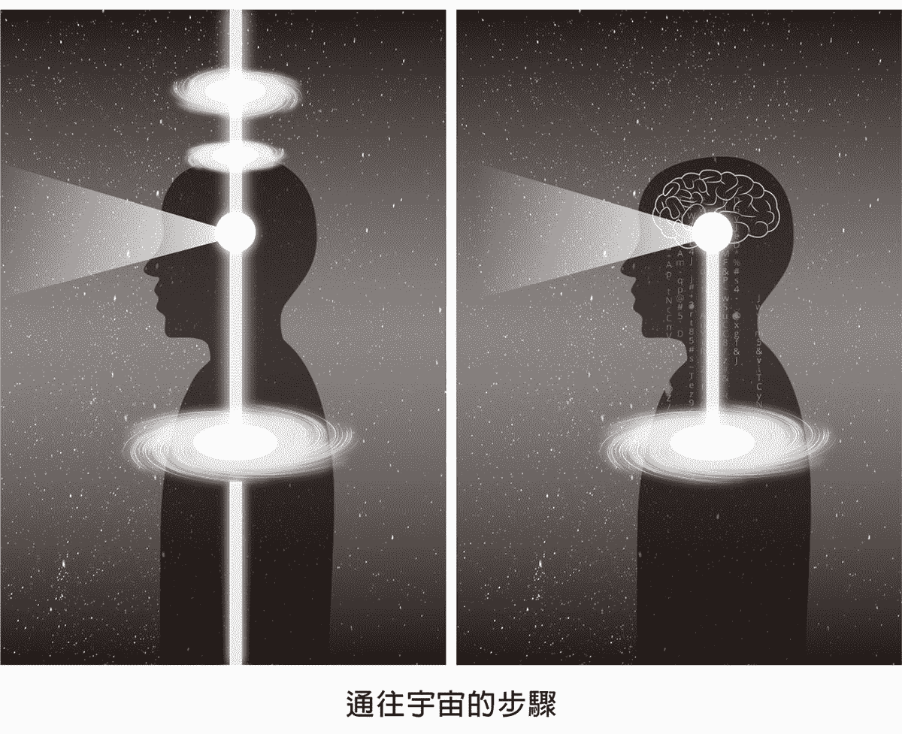

这边先暂停一下，你可以提出问题。

不用讲咒语，也不必说“开关启动”，就这样？

是的，就这样。你的心轮是感觉接收器，你眉心后头的第三眼是心的屏幕，而你的心识意念就是导航装置。你的意念往哪儿，第三眼就会将心接收到的画面呈现于屏幕上，同时，心会将感知到的讯息传回你身上，脑进一步翻译心传回来的讯息，转化成文字、画面、声音或感觉，表达出来。脑只是翻译器，前提当然是心轮畅通和打开。我再说一遍整个流程和开通路径。

准备：进行之前“医疗”单元教导的脉轮畅通→中轴稳定→心轮位置畅通。

进入：心轮链接至眉心→用眉心后方一寸处的第三眼打开屏幕→身体接收感知→大脑诠释。

那道光怎么知道要来迎接我？它在整个宇宙之旅中扮演什么角色？每道光有不同的涵义吗？每个人的光都一样吗？还是不同？对不起，我又忍不住打岔提问了。

没关系，你的逻辑脑很难被驯服，我了解。愈有想法的人才能够显化得愈完整，我们必须尊重每个脑的诠释能力，它们也是在扮演执行长的角色，我们必须合作，一起完成显化和创造。我来一一跟你的执行长报告一下。

首先，那道光怎么知道要来迎接你？

每个人的高我都一直围绕在身边，有些人称它为天使或指导灵——不必拘泥形式，那就是你的高我意识。而高我意识和宇宙万事万物相链接，你在地球上的高我频率与地球母亲的频率是一样的，就是七．八赫兹，接近西塔波。

人的意识透过心链接到眉心时，当接近七．八赫兹，就会自动与你的高我接轨和共振。高我并没有具象形体，有些人称自己看见了长翅膀的天使或圣者像，那是他们内心的投射，透过光的临在呈现出心中的倒影。总之，就是那道光出现和你的意识链接时，产生了七．八赫兹的共振频率。

当你调整了自己的振动频率，有意识地和七．八赫兹共振时，这两个不同频率的共振合奏，已经不会只处于七．八赫兹，而是可以达到三～五倍的共振频率，也就是二十～三十五赫兹。这个与高我之光合奏的频率，可以进入宇宙各个次元。

所以，地球的振动频率——七．八赫兹——是你们的宇宙收发站，当你的意识振动频率登上这个发射位置时，就可以准备喷发进入二十～三十五赫兹的宇宙空间，进行链接与沟通；也就是说，你的高我带你进入你的其他次元。

所以，祢来向我传讯时，是祢先降频到七．八赫兹，才可以抵达地球。然后，任何一个地球人将自己的意念振动频率调整到七．八赫兹，就能登上发射台，每个人都可以进入内在宇宙的旅程。

你这样描述也可以，但不尽然如此。

哪里要修正？

我并没有来找你，是你连上你的高我，成为高我的“知晓”状态，然后高我将你带入你自己预定的生命蓝图轨道重新启动而已。我不会主动找某个人的。

 唤醒生命之树

（要开始链接阿乙莎时，我突然听见窗外中庭喷水池的声音，直觉这是要我来问阿乙莎这个问题。）

阿乙莎，请问我现在听到的喷水池声音接近七．八赫兹吗？

是的，你终于觉察到这一点了。你听见的瀑布般的哗哗声，可以帮助人们与高我链接和共振，带你们进入更高的次元。这也是大自然的协奏曲，你们在深山、树林和大自然的怀抱中处处可以听见大地正展开意识，和宇宙链接；你们听见鸟儿也跟着瀑布般的声响一起歌唱。你现在就可以将这段声音录下来，交给其他人，让他们知道，以这样的音乐作为静心冥想的背景音乐，可以安定心灵。

你每天都有这个自然的静心环境来帮助你，并不是巧合。你会住在这里，本来就是生命的安排。

咦？这说法太奇怪了，为何我居住在哪里是被安排的？

这也是生命蓝图的一部分。每个人的生命蓝图会有大方向，包括你投生在哪个家庭、你的父母兄弟姊妹、你会在几岁经历哪些重大事件、你的职业、你的另一半、你的儿女等，这些和你一起生活、一起圆满此生的人都在这个大方向里。从这个大方向再延伸出细部规画，包括你的喜好、习惯、居住环境、拥有的物质事物等，这些都会从生命蓝图的大方向再开枝散叶。生命蓝图就像一棵树，你的生命之树和别人的在根部是相链接、互相支持的，你们只看见土壤以上的展现，没有看见根部的链接。

你会长成高大挺拔的大树或飘逸的杨柳树，都源自你生命蓝图的规画，而呈现出不同的样貌。每个人都有自己的生命之树，重要的是你这棵树为土地和周围环境带来的是支持、平衡，还是破坏。别忘了，种子是你替自己播下的。

我们明明是人类，是可以行走天涯、随处落脚生活的高智慧移动生物，而不是站在那里动也动不了的树，祢怎么会把我们比喻成树？

孩子，你移动的每一步，对我来说都还根植在地球上啊！你们没有离开过，不是吗？从南极跑到北极，从太平洋移动到大西洋，你依然是你，不会在移动后呈现另一个你。你的生命之树在地球上的探索，都是生命蓝图展开的过程，只是有些生命之树无法长成应有的样貌，长到一半发不了芽，无法成长茁壮去照顾更多树木和小草。不是每一颗生命之树的种子都可以如自己的原定计划长大，种子要发芽，必须先苏醒。睡着的种子就像被冰存在冷冻库一样，发不了芽，走到哪里都没有差别。

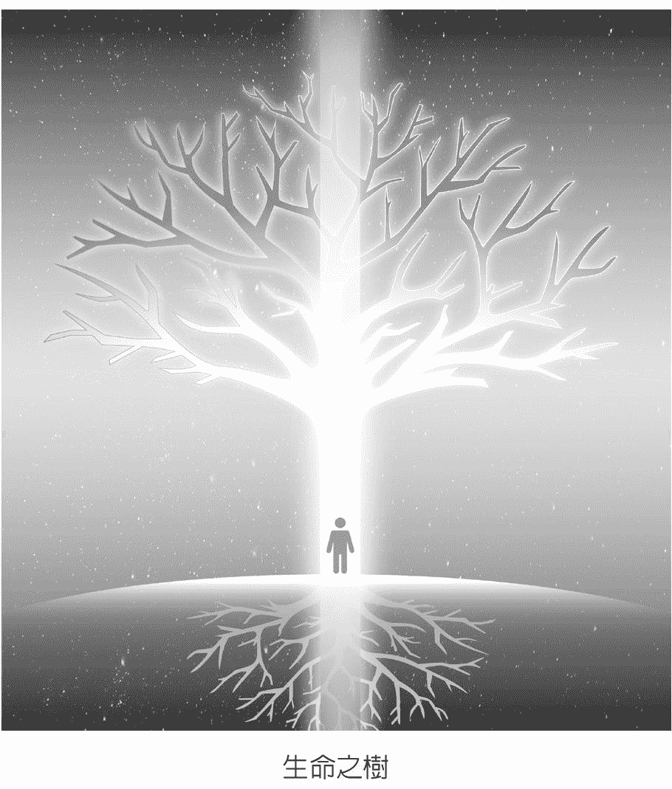

那可以告诉我要怎么叫醒生命之树吗？

把大自然的声音录下来，风声、水声、瀑布、鸟鸣、树梢枝叶摇曳的沙沙声，这些都是来唤醒生命之树的声音，你们有不少音乐家也常用这些大自然元素来创作。人们若经常听见这些声音，心就会打开，与自己的高我链接；而链接之后，生命之树就会发芽、启动。

祢现在讲的，和前面教的“来到自己宇宙的接待大厅”有关吗？

当然有啊！之前不是提过要让意识的振动频率来到七．八赫兹？你以为每个人都像你一样，住家附近有个喷水池可以帮助自己立即到达七．八赫兹吗？所以要借助音乐，让自己透过声音，意识振动频率达到接近七．八赫兹，与高我接轨。

今天你听见的这个喷水池声音特别大，不是吗？你住在这里十八年了，你自己的意识听见这个声音几次？

我注意到这个声音的次数好像不到十次吧。

是啊！有意识地让自己听见已经很不容易了。大自然提供给人们这么多让生命之树萌芽的辅助，你们自己视而不见，也听不进去啊！

好，祢教训得是。除了声音，还有什么可以辅助我们让意识振动频率达到七．八赫兹？

可以借由唱诵。将“ＯＭ”拉长音，光是用嘴巴唱出这个单音，你的眉心后方就会一起振动。然后唱诵“ＨＡＨ～”跟“ＹＡＨ～”，就是将已经得到共振的眉心接回心轮。慢慢从低音唱到高音的“ＨＡＨ～ＹＡＨ～”，就可以逐渐扩展心轮。

除了唱诵之外，还可以让身体自由律动。

当你们深呼吸，将宇宙能量吸入身体后，让身体放松，放下大脑，不要去想舞步或招式，就让身体随着心轻轻地开始摆动。不论是拍打自己，或是舞动手脚，就是让身体自由展开，让意识逐渐调频到七．八赫兹。像这样自由律动之后，静坐几分钟，就可以慢慢看见眼前的光。

此外，之前教你们的畅通脉轮手指操是基本功。每日练习由呼吸带入能量，畅通全身的脉轮，为身体打好基础，以帮助自己更快链接到高我意识。

我想再问一个小问题。我们可以在活着的时候、有意识的状态下，安排自己生命之树的种子，而不要等到去“报到”了才准备播下新的种子吗？这个过程能否提前进行？

我先跟你说：“可以！”适当的时候我会再说明。

晶体审视

 找回灵魂记忆

一开始传讯时，我们将地球的整体扬升分成不同的单元，从几个面向切入。那些主题只是为了打开你们需要关注的事物的面纱，让你们了解人与地球是一体的。

现在，有了最初步的认知之后，最重要的是行动，也就是由人类为自己做出真正的改变，带领自己和所有人类迈入新世界的轨道。这个新轨道的蓝图就在你们每个人身上，只有透过人类生命蓝图的展开，这个新世界的网络才会被串联起来，为地球创建新的意识晶栅，迈入更高的次元。

目前大多数控制着物质和社会政治结构的人仍处于遗忘状态，你们都忘记自己身上携带着这份生命蓝图。这虽然是来到地球必经的考验，你们需要经历从遗忘到忆起的过程，但时间已经不允许人类靠自己忆起。此外，因为物质社会转动的速度更快了，你们创造的低密度过于沉重，要人们跳脱物质的枷锁，回到生命原先规画的蓝图，变得更加困难。

这个时期，阿卡西纪录对全人类打开，是第一个步骤。这是隐藏于你们ＤＮＡ中的第一个灵性记忆资料库，它可以协助你们在这个时期获得爱与慈悲的能量与智慧，让你们走出生命的困惑，寻求到真理。然而，这个打开尚未能驱动人类实践生命蓝图，因为生命蓝图必须透过你们自己找出灵魂ＤＮＡ的记忆拼图，和你们携带着问题进入阿卡西纪录的一问一答是不同的过程。

来到生命蓝图的大门口时，不需要带着任何问题进入。你们是去寻找自己灵魂的片段，找出自己来到地球之前的生命足迹，从理解自己所为何来的过程，拼出生命蓝图的全貌。你们必须自己去找回被遗忘的灵魂片段，完整自己的灵魂ＤＮＡ。当重十灵魂规画好的生命蓝图时，你们的灵魂ＤＮＡ将重新启动，而你曾经拥有的天赋才能、对整体宇宙的知晓，以及这次来到地球要完成的工作，会自动展开。你们不需要戴着墨镜在黑暗中随波逐流，耗尽精力去碰撞出生命的意义，从生命蓝图中立即可以知晓自己该往哪里前进、该完成哪些承诺。

这一次，这个生命蓝图的揭露来得这么直接，就是要来揭开每个人的灵魂宝藏和人生使命。这同时也是宇宙送给地球的礼物，因为地球正需要足够的人觉醒，尽快回到自己的生命蓝图中，引领地球迈向新的生命轨道。我现在必须教导你如何帮助人们找回自己生命蓝图的片段记忆，愈多人找回自己灵魂的片段，愈能让接下来的工作顺利展开。当你们忆起自己是要来协助地球跃升时，透过这样的学习，你们将会被唤醒。

 与高我链接的通关密语

阿乙莎，祢教导我来到与高我链接后的大门，我很想继续往前探索帷幕那一边的世界，祢可以带着我继续往前走吗？或者，祢愿意提供一个方便法门，让人们念一段咒语或祈请文，使尚未到达的人可以跟上，来到大门口？

孩子，每个生命都可以到达，那只是个人意愿问题，和有没有咒语无关。即使给他们一个最强而有力的“芝麻开门”通关密语，只要他们的小我控制着他们的意识，绑住他们的手和脚，威胁恐吓他们的身体：“如果踏进去一步就会怎样怎样。”他们便会不断地和自己对抗、低喃，那么，我提供任何咒语都是没有意义的。

只有“意愿”可以带他们走到这里，迎向自己本有的光。那道光就在每个人身上。不是外星人来访，也不是神佛降临，那是他们身上的光啊。喔！希望“意愿”与“勇气”可以降临到畏惧的人身上。

与其提供一段祈请文，我宁愿请你们观想一下：想像眼前有一片宁静碧绿的湖水，阳光从树梢洒向湖面，湖面上呈现波光粼粼的倒影。你不自觉地脱下沉重的鞋子，带着最轻松愉悦的心……跳～下～去～

好的，现在阅读这段文字的人已经到达了，就在自己的光中与高我相会。我们可以进入下个阶段的探索了。

哈哈哈！好！好！好！阿乙莎，祢太棒了。祢知道欠缺勇气的人就是要朝他屁股踢一脚，才会跳进水里。我们继续。

 打开生命宝盒

现在，迎接你的大厅的门已经打开，我们一起进入，登上发射台。你可以轻松地坐下，也可以闭上双眼，用眉心后面的第三眼去感知。若你习惯睁开眼睛看也没有关系，只是，虽然你的眼睛睁开，你与高我的共振会让心识之眼同步打开，这时你会发现睁开的双眼无法聚焦，视线呈现扩散开来、观看远方的状态。你的耳朵则可能会有高频振动的耳鸣声，就当那是你七．八赫兹的频率正伴随着你。

接下来，深呼吸。你现在已经处于晶状结构体的正中央，给自己一些时间，去感觉处在这个空间里的氛围和身体感受。然后，我们第一步先来打开生命宝盒。

首先，想像你的前方有个珠宝盒，那就是你此生带来的生命宝盒。打开它，把里面的东西倒出来，你看见跟随你来到此生的宝藏倾泄而下，这是你过去生命的总结，同时也带着一份新的意图和使命来到地球。这些宝藏跟着你，为你所用，你将运用这些宝藏来完成此生的任务。给自己一些时间观看这些宝藏，你觉得自己将为地球带来什么样的礼物？

现在，拿起纸笔，写下你的生命宝盒带来的礼物是什么。这就是你生命蓝图最高的目的和宗旨。

不要怀疑能否做到。那个看似大师才能承诺的事情，怎么可能由你来完成，是不是？其实，你们每个人都具备大师品格，没有这份崇高的理念，宇宙的大师们怎么可能核准你们来地球放手一搏？你们当初都写好一份博士级的提案，并且带着这份提案来地球实践的。

 向宇宙要资源

现在，仔细看看你曾写下的生命提案，也环顾目前身处的环境和地球。若要完成这份生命蓝图的执行计划，你会如何做？思考一下，然后，我们要开始进入下一个步骤，与你的高我联手向宇宙要资源了。

回到晶体中，与你的高我同在，用意念列出你需要的资源。你也可以拿张纸，一一写下来。不必担忧这些资源要如何到来，你已经处于量子能量的场域，在这非线性的世界里，你强烈的意图可以帮助这份提案自动展开链接。不须知道这背后是如何运作的，只是，在写下这份资源需求清单时，你必须维持诚意正心，要求的资源须符合“能完成自我生命蓝图”这项目标。若是把请求的资源用来满足小我的欲望，这项能量请求的涟漪产生的振荡将无法找到可支撑的事件，只能回到你身上，造成自身能量反击。所以，要当心你发出的意念，不要给宇宙虚假的命题，以及不符合自己生命蓝图目标的资源请求。

现在，将刚才与高我联手写下的需求清单写上日期。你可以在生活中观察这些资源显化到位的时间，以及它们如何一一链接和展现在地球的实相中。

我刚才练习的时候，还不敢狮子大开口，因为被企业训练惯了，通常要更多资源，业绩目标就会变高，所以我偷偷缩减了需求。

生命蓝图的目标跟别人无关啊，那是非你莫属的。你们人类虽然具备臣服的特质，但臣服过头就成了制约。不要对一生一次的机会自我设限，宇宙的宽容和慈悲超乎你想像，你若做不到，宇宙不会怪你，顶多是你带着又一次做不到的经验再来做一次。要给出一定能做到的请求，给自己一个极致的体验，才不虚此行啊！

那我可以重新请求一次吗？

可以。记得先补充之前说不完整的，将需要取消、重新请求的再讲一遍。在你说停止之前，宇宙是不会停下来的。

 列出资源需求清单

我迫不及待想继续聊“跟宇宙要资源”这件事。

你确定已经把需要的资源都列出来了吗？

还没有耶！我大概知道需要些什么，但还没有静下来一个一个列出来。我以为我另外找时间自己做就好了，我们是不是可以继续谈生命蓝图的更多面向？

还不行！你必须自己列出达成生命蓝图目标所需的资源，练习做一遍这件事，我才能告诉你如何从这份资源清单的脉络展开生命蓝图的晶体启动过程。

可是，我的练习跟别人有关吗？既然我的生命蓝图目标一定和别人不同，我的资源清单就和他人无关了，不是吗？我在这里做练习，就要将这份清单揭露在书中，让全世界的人知道，不就泄漏了我的生命计划？这会侵犯我的个人隐私，我觉得不妥。

要不要在书中揭露细节，你可以自己决定，但我必须带着你一步步展开这个过程。资源需求展开的过程，就是进入生命蓝图的填空和启动作业，没有一步步填空，你的晶体网格无法安稳锚定在地球上，和宇宙的能量接轨，你明白这个关系吗？

我不太明白。

好，我先说明这个部分。

每个生命都是一棵生命之树，你携带的生命宝盒里的一切讯息，存在你生命之树的ＤＮＡ里。当你进入地球时，你的生命种子就锚定在地球上，渐渐形成你专属的晶状结构体。这个晶体拥有收发讯息的能力，可以向宇宙传送讯息，也可以接收宇宙的能量。你的种子苏醒、渐渐发芽，长出枝干和树叶的过程，就是你生命之树的ＤＮＡ讯息库开始在地球上展开和链接。你的树根进入大地与地球母亲紧紧相连，你也因此得到地球母亲和日月星辰的滋养，这些都是伴随你的生命成长的菁华。你在地球上最重要的工作，是让生命之树扎根与链接，而这个链接的地图就要依靠你的意识体——透过你有意识地链接更高的自己，帮助你忆起并启动生命之树的蓝图。

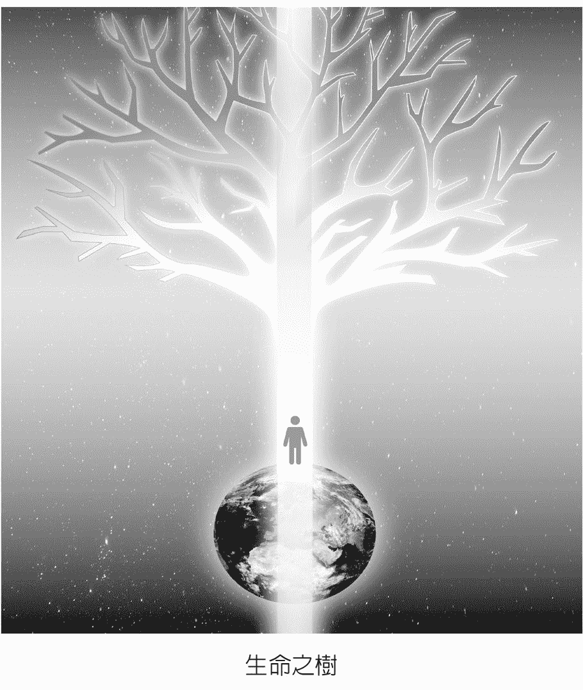

你现在要写下的资源清单，就是生命之树的灌溉计划。如何让你向下扎根，伸展枝桠，开花结果，最终回馈大地，照顾四周的存有和地球，必须给宇宙下达指令，因为宇宙需要经由你来显化地球上的一切，这也是生命之树的目的。现在，你拥有种子和目标，成长则需要宇宙来配合，尽管发号施令吧！

但是，我有没有可能喊错资源、搞错方向，造成资源错用？

不会的，宇宙资源可以陪着你一起尝试，一次又一次修正，只要你愿意持续地做。生命之树之所以未能达成原定计划，通常都是因为树自己卡住，不愿意让能量流动，或者根本不向宇宙要资源，拒绝展开，而不是喊错资源。

人类太习惯自我设限。然而，若是很会要资源，却没有办法让资源流动，堆积了过多能量，你也可以想像会有什么结果吧？

嗯！这个就更不用讲了。树如果过度施肥会完蛋……

你现在还是回头先练习列出你的资源需求，我们再来检视。

（接下来，我大致画出三个框。右上方的框写下生命蓝图的最高使命，右下方的框写下我生命宝盒的内容，左边的框则列出我的生命蓝图需要的资源。）

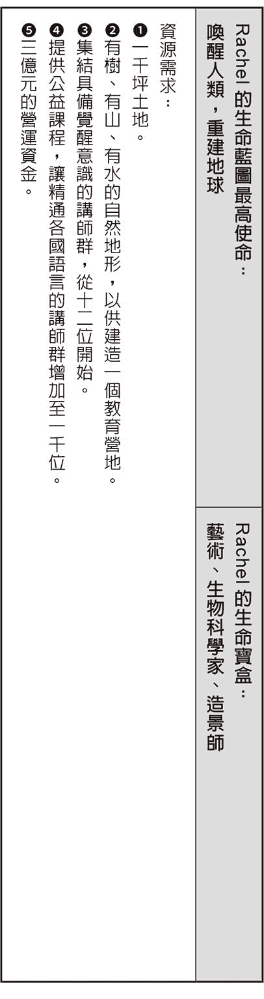

阿乙莎，我写完了。祢看一下有没有需要修正的地方。

很好，你写下了生命蓝图的最高使命，也是你此生的目的。然后，你看到自己拥有的天赋才能。其实，你具备的才能比现在列出的这三点更多，你还是不敢承认。没关系，这是你觉得舒适安全的生活方式。

接下来，让我看一下你的资源清单。这有很大的问题啊！你似乎觉得要有这些资源才能开始工作，而且也没有看到这些资源的细部展开，这样不足以启动这个生命蓝图的晶体。这是非常模煳的资源清单。你想像一下，当你站在晶体中间看出去，会有好多个面，每个面的展开和锚定都很重要。愈清晰的锚定，愈能让宇宙能量帮你展开四面八方的链接，你的晶体才能开始扩展。你必须重做一次。

祢一开始没跟我说要用晶体的各个面去锚定嘛！可以说明这些面是什么吗？

如同之前提过的人体能量运行轨道图，借由列出晶体中五元素的条件并转动，将开展出晶体的生命之花。

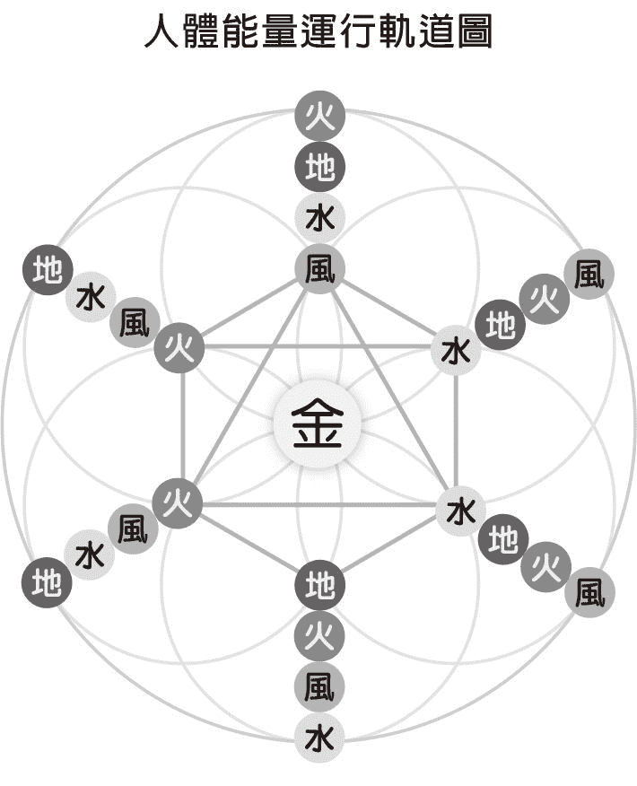

我还是不懂……要如何定义出来？

每个晶体都具备能量运行结构，才能延伸和展开。结构包含五大元素，分别是地、金、水、风、火，其中“金”元素也可以代表你的中轴，你透过有意识的呼吸，和宇宙交换能量。

我来帮你列一下对照表（楷体字），你根据这个对照表，将达成生命蓝图目标所需的相关要素导入这个晶体元素表中。当这些元素到位，晶体就可以透过你的一呼一吸和宇宙能量交换，开出生命之花。

每个晶体不可能只有单面向的生成，生成的背后一定有撞击和破坏。在二元世界的运行轨道，你需要观察的不只有正面的发展，还有另一面的破坏产生的能量。如此，能量的集合或碰撞才能创造生生不息的平衡点。

这个生命蓝图的资源填空练习，是要帮助你在量子场域校准能量。如果没有做这个基础练习，只是凭借你在三次元空间的线性思考，将无法看见晶体的全息化显化过程——破坏、解构、凝聚和改造之后的结合、滋养和传承过程。当你的意识进入每个面向，并全神贯注于那个面向的发展时，你就是在为那个元素增加力量。所以，在这个晶体化的过程中，你的关注就是力量。

而短则三个月，最多不超过一年，该面向如果没有出现任何讯息或回应，代表那个方向的元素尚未具足，你需要调整资源的方向，或是改变需求。这是全息化的演进过程，不一定是按照清单项目的优先顺序展开。这是整体而同步的振动进程，你必须不断调整各面向的元素资源，并穿越会造成阻碍和停滞的意图，有纪律地贯彻和行动，如此，这个生命蓝图擘画的景象才能真正展开。

生命蓝图晶体元素表

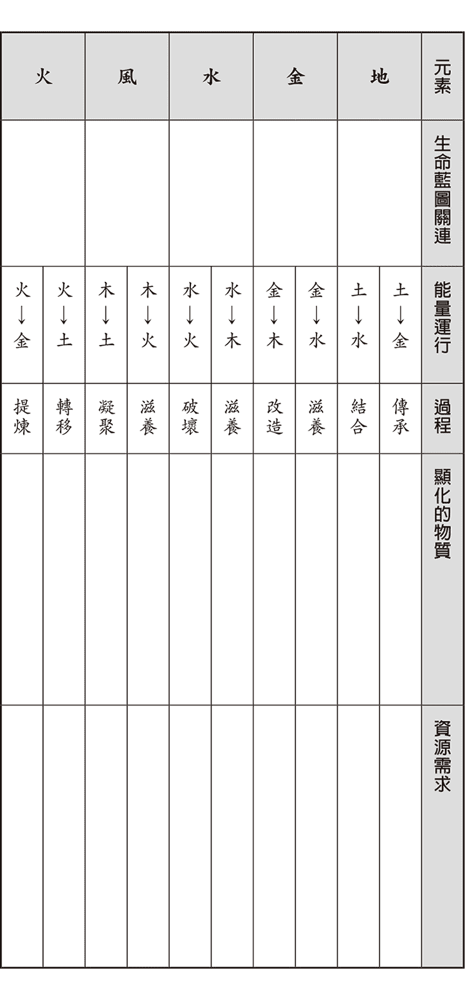

（我按照阿乙莎的表格，依次进行生命蓝图的填空练习。）

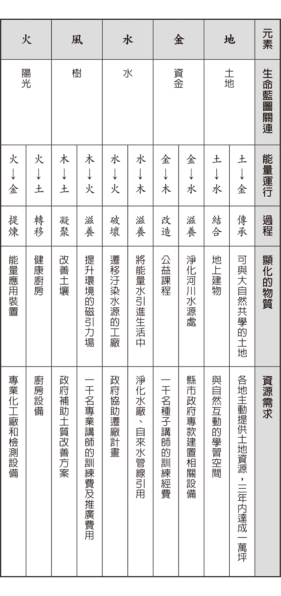

（填写完之后，似乎更能看见未来显化的雏形，也得到更清楚的显化过程和所需的资源。不管宇宙是否真能提供我这些资源，经由完成这张元素表，我心中也有了更清晰的蓝图。

下边是上网搜寻后创建的五大元素属性对照表，作为读者在填写自己的生命蓝图晶体元素表时的参考。）

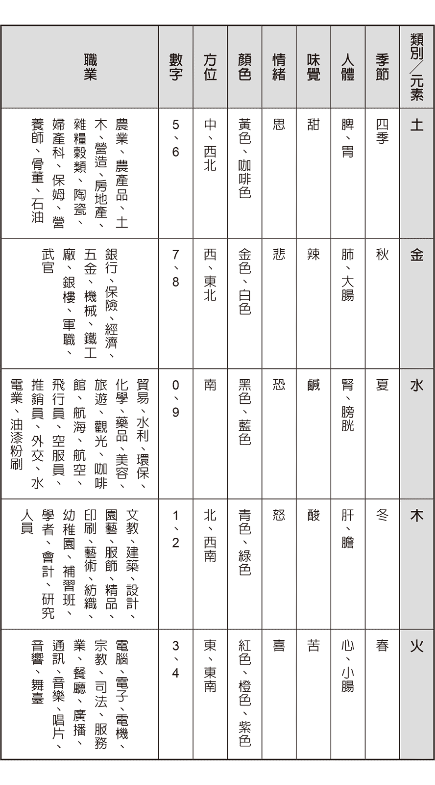

生命蓝图晶体元素表填写练习

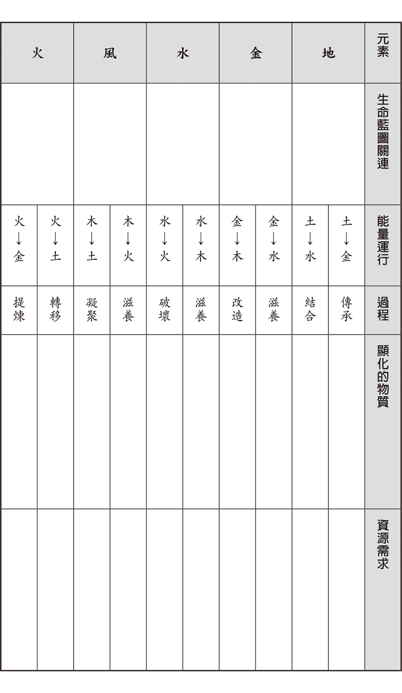

业力净化与晶体校准

 生命蓝图实现的障碍

你们生命蓝图所需的资源已经存在宇宙中，你们之所以携带着这份生命蓝图来体验，是经过讨论和允诺的。生命的宇宙运行之道已内建完成，对宇宙而言，没有机率论，这和你们的科学家认知的宇宙能量大爆炸后由机率掌控生物的演变是不同的，一切都在原定的计划中，只是在不同的次元显化而已。在地球显化的挑战更大，因为地球上的物质产生的碰撞最多。然而，你们需要的资源，宇宙都已经帮你准备好了，只等你们来交换。

祢刚才提到“交换”，为何是交换，而不是显化或拿取？

刚才说到宇宙的粒子碰撞不是随机，而是依循一定的轨道运行，也因此，你们所需的元素和资源到位，是一个有元素产生的能量转换过程。我简称为“交换”。简单来说，你们所有的显化过程都是一种能量交换。

照祢这么说，只要生命蓝图被设定目的，未来在地球上“一定”会显化，只是时间早晚的问题？

是的，除非在能量运行中发生介入性的变化——这个变化会连带让很多该发生的没有发生。这种介入性变化通常来自人类个人、集体业力，或是更高次元对较低次元的干预。若依照目前的宇宙和平协议，这类来自高次元的干预，必定是为了全宇宙和平共存的最高目的而不得不进行的介入。

关于高次元的干预，可以举个例子吗？

最近一次是二〇一二年的地球扬升关键时期，就曾经历来自星际的介入。如果当时没有透过你们的社群网络散播世界末日的讯息，人类的集体意识不会共同认知到地球的关键时刻，也就没有集体静心活动让地球免于被沉重的暗黑势力带往更陷落的境界。若没有介入，地壳变动带来的海啸和大自然灾难会让许多区域沉没，如同之前的文明灭绝。

这么严重？所以，幸好有社群网络带来的集体关注？

你们在地球上无法知道这是如何运作和发生的，宇宙存有确实经由你们的社群平台协助地球阻止这些事件发生。

就算是真的，我们现在也无法证明。所以，祢能否进一步谈地球的未来？假如我们每个人自己设定的生命蓝图都可以实现，地球会呈现什么景象？

走向生命蓝图轨道的人将不再恐惧和迷惘，内心处于平静安定的状态。同时，你们会依循生命蓝图的计划展开跨越政治、文化、种族的交流与合作，达到人类文明的巅峰，不再有战争、侵略和竞争造成的围篱。你们会视他人如同自己，有慈悲和同理心；你们会更爱惜地球和生态环境，为了全体的共好而行动。地球也因为整体意识的提升，进入第五次元，并展开和宇宙其他存有的和平协议，以及互动交流。

这听起来像天方夜谭，当然也很令人期待。那么，需要有多少人依照生命蓝图展开行动？

只要有千分之二的人类可以依循生命蓝图规画的路生活，地球就可以开始转变；如果有千分之五的人按照生命蓝图规画的轨道前进，就可以提升整个地球，迈入第五次元的新世界。

这应该不会太困难啊。以华人来说，只要有六百五十万人就行。

是的，若从数字上来看好像很容易，但别忘了，目前最大的问题是人类自己陷入了业力的枷锁中。生命蓝图通常伴随着你们的业力一起进入人类灵魂ＤＮＡ，这也是为了完善人类自身的意图而设定的生命蓝图延伸版本。业力是你和他人关系的结果，生命蓝图则是你个人生命的最高目的，分属不同层面，却又彼此交缠。许多人的生命不断地重复体验，一直无法完成生命蓝图设定的目标，主要就是受到业力的牵绊，以致无法顺利展开自己生命蓝图的轨道。

所以，我还需要跟你说明解除业力的方法，让你为生命蓝图重新命题，也就是改写你的生命蓝图。

原来，业力关系着生命蓝图是否可以达成。我还以为生命蓝图就是业力的再次命题。

两者是相关的。在生命最初始的状态，你的灵魂携带着生命蓝图的最高目的，但生命会经历一次又一次的尝试和体验，每一次的经验会成为下一次生命的延伸。打个比方，你原本预计要从台北开车到高雄，最早规画的路径是走高速公路，经过几个休息站，就可以抵达目的地。但在旅途中，你创建了一些关系，这些关系将你带入乡间小径，遇见更多不同的人，发生更多不同的事，然后又创建更多关系。最终，你仍在前往高雄的路上，身上却带着尚待完善的关系，让你想要再一次去体验，一次又一次，直到这些被延伸出来的关系创造的生命意图被满足为止，然后你才会继续往原定的目的地——高雄——前进。这样的说明你明白吗？也因此，若要让你尽快回到前往高雄的路，我们必须消除那些留滞在你心中尚未完善的意图，让你可以专注在生命原本应该走的路。

我终于明白关系是走进岔路的原因……

你也不要从这么负面的角度看待关系。圆满关系的过程会帮助你的生命之花绽放，此外，关系也可以帮助你找回该走的路。

 业力解除七步骤

祢提到在启动生命蓝图之前解除业力的办法，可以教我吗？

你已经知道业力是关系的结果。你过去经历了许多关系，留滞在心中，成为待完善的意图。这个意图源自你，那段关系只是你设定这个意图的背景，帮助你看见自己身上需要释放、理解、平衡或扩展的能量场。当你处于较低频振动的意识状态，就无法站在高处，进行多维度、多重角色的全息观；如果你能够站在更高的位置去审视留滞在心中待完善的意图，那么，来自父亲、母亲、朋友、同事、长官、施暴者、受害者等角色创造的每一段关系，其实全是你灵魂的片段。你就是你的父母、子女和祖先，你的灵魂以如此全息化的方式展开体验，而这所有的体验与安排，都源自你生命蓝图中完善自我生命的意图。

现在即将进入量子世界的多维宇宙，你已经不再需要用三次元的线性时间挑一个面向和一个角色来体验，可以超越自己在三次元的业力命题，来到全然理解和知晓的状态。就在当下，此时此刻，你可以一次将延伸的业力命题三百六十度盘点一遍。不论那段关系来自你的这一世或前一世，都可以透过盘点关系来解除业力。

现在就来实际演练如何解除业力。

步骤一：定义关系

拿出纸和笔，写下自己的名字，

接着在你名字周围画一个圈，写下你拥有的关系。

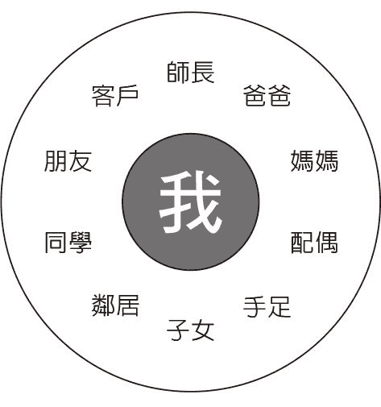

步骤二：那些人和事

将关系填入

有关连或延伸出来的

关系人和事。

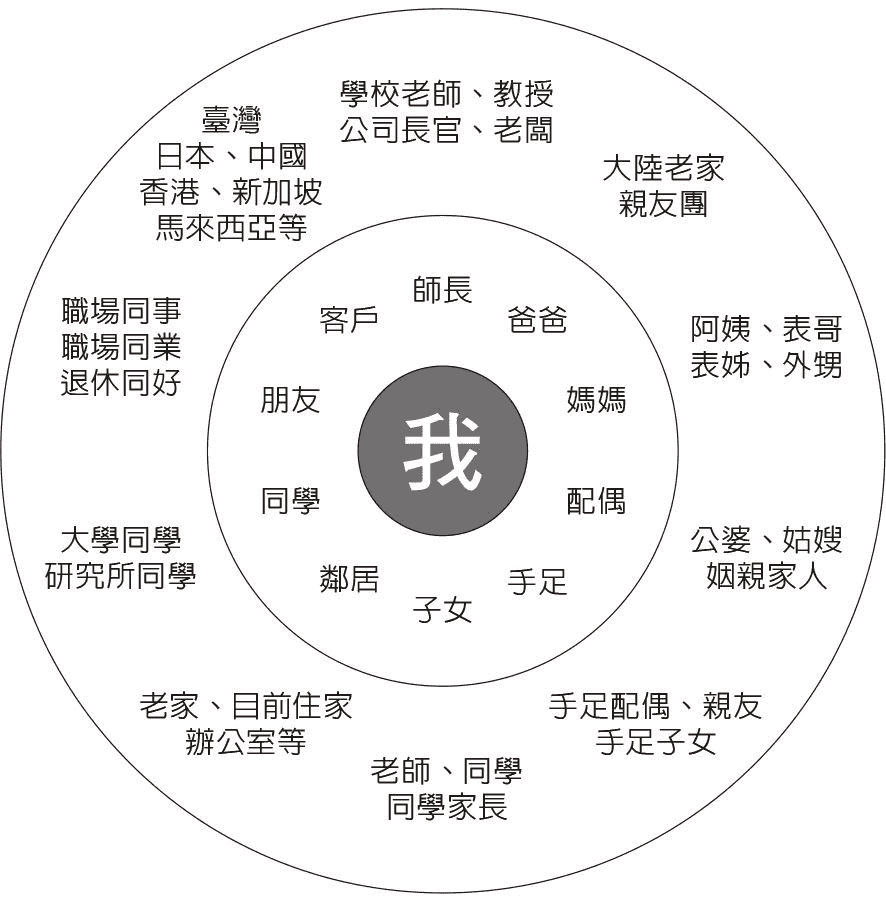

步骤三：你的印象

继续画第三圈，

将第二圈关系的

来源和延伸带给

你的印象写下来。

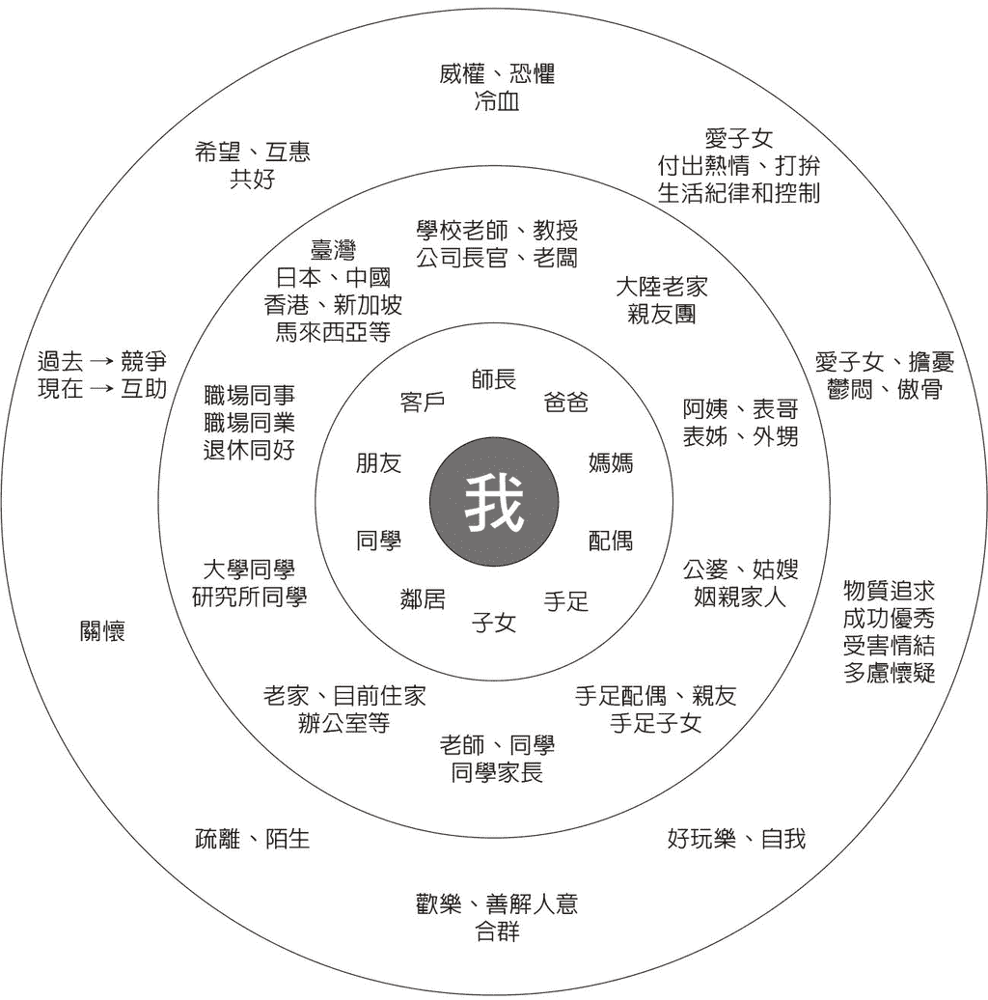

步骤四：负面印记

将最外圈

那些给你负面感觉的关系，

用某个颜色圈出来。

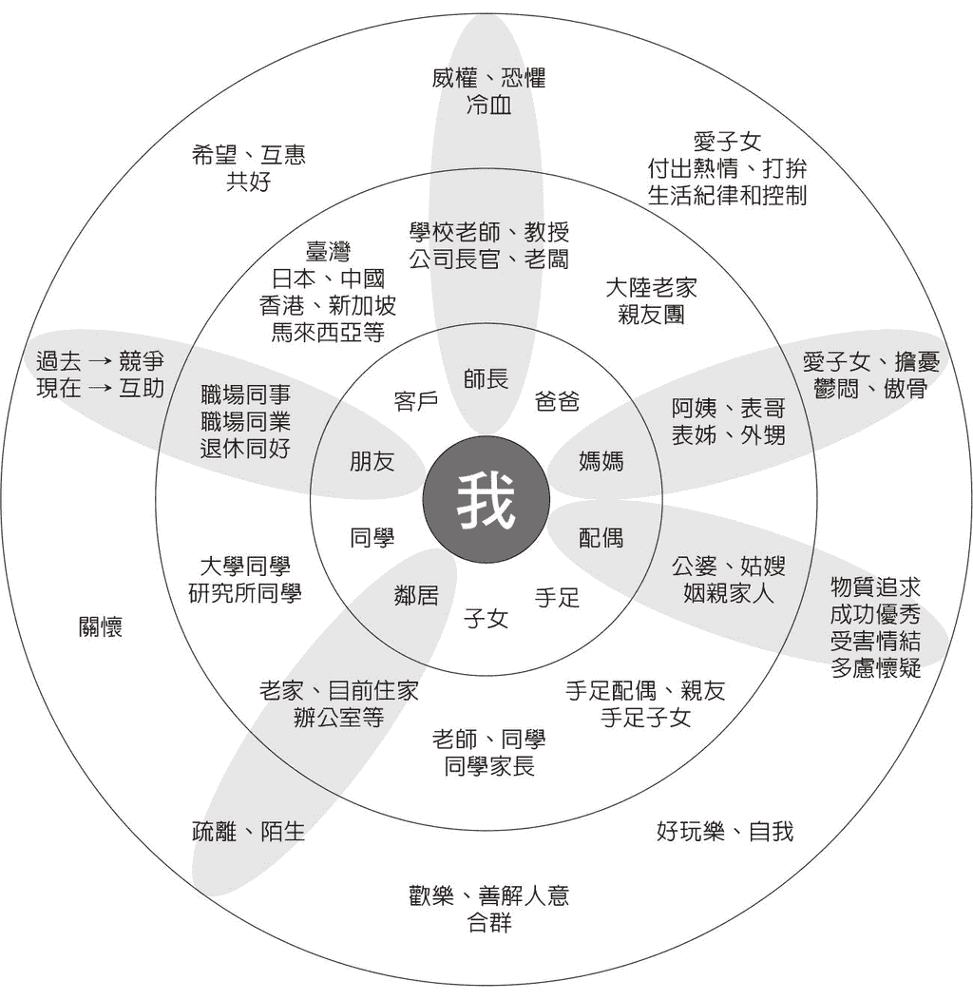

步骤五：承认

回到你用颜色标出来的

每个圈中写上“我”。

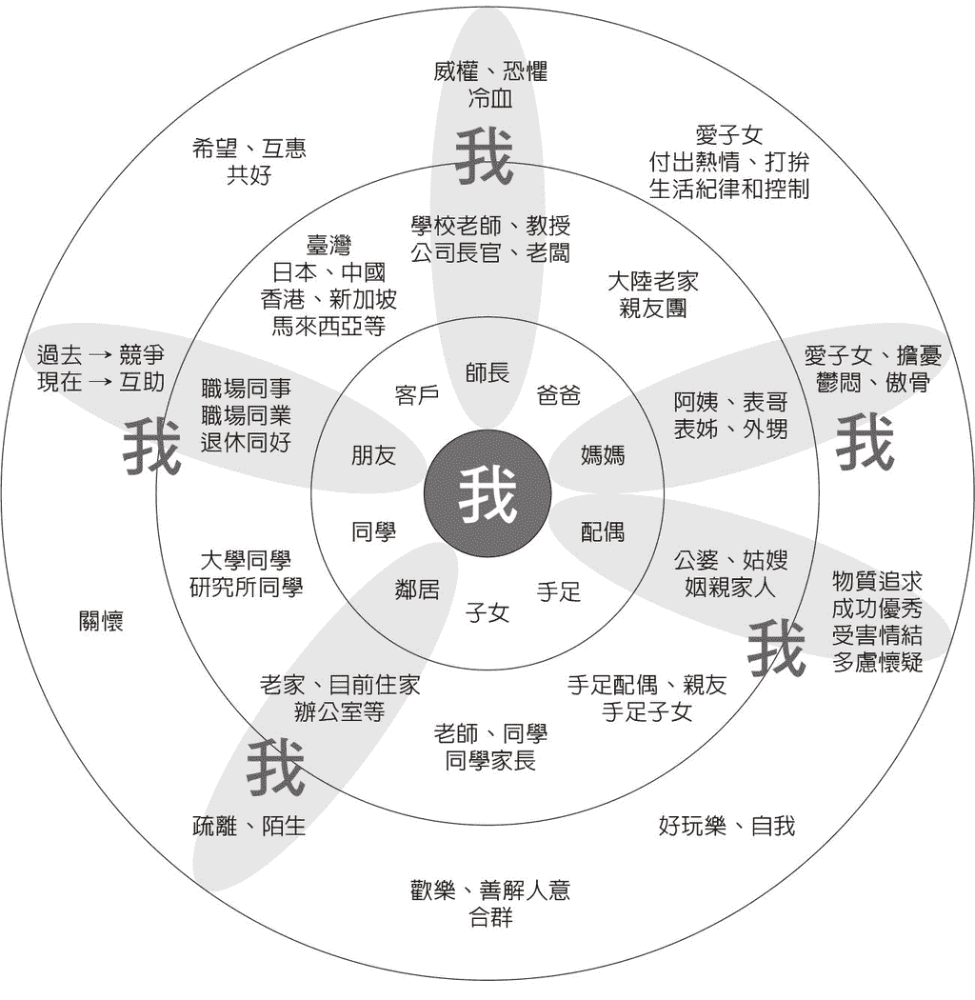

步骤六：业力浮现

环顾这些圈中的“我”，审视一遍，你会发现，这些就是你身上的业力，而每个关系人只是来帮助你忆起并解开你身上仍携带的业力枷锁。

现在练习造句，将圈出来的这些负面感受连起来，写成“我是一个什么样的人”。这些就是你身上的业力，被你一览无遗地照见。现在去写下这个句子，跟你的业力照个面吧。

“我是一个好竞争、对人疏离、多虑怀疑、具受害者情节、傲骨、郁闷、用威权控制、冷血且令人感到恐惧的人。”

念完这一句，着实令我傻眼。我眼中看见的他人，居然就是自身业力的投射。我身边这些关系人带给我的感受，就是来提醒我去看见自身仍携带的业力枷锁。原来这些负面印记不是别人造成的，一切都源自我自己啊！

步骤七：自他交换

重新认知自我后，接下来，就到了解除业力的神奇时刻。解开业力枷锁的钥匙，就在眼前这段显化出来的关系上。面对这段关系中的对方，和他交换位置，透过自他交换，去理解这个人为何这样做，感受对方隐藏在外表之下真实的一面。借由这个过程，你获得过去未曾看见、也从未想到的新理解，而就在理解的瞬间，你化解了自己投射到这段关系上的负面认知，你身上的这个业力枷锁也得以解除。

解除业力的关键就在当下你对所有关系的全面理解。你其实不是自他除外单独存在的个体，当你了解这一切关系的链接和显化都是来协助你完善此生的意图，你与所有关系人是一体的，你会感激这些人创造了这些故事情节，来到你的关系中，圆满了你的生命体验。同时，当你站在他们的角度观看而得到新的理解时，会明白他们带来的负面感受是祝福。原来，他们都是带着祝福的天使，进入你的生命中，让你再次遇见爱。你的父母、子女、兄弟姊妹，好关系、不好的关系，都是为了帮助你而来。你是否愿意再次拥抱他们，谢谢他们扩展了你的意识，让你得以从此离开业力枷锁，迈向生命蓝图的最高目的和轨道？

上面的自我练习中，有些人的关系图会显示出深受集体业力影响，无法纯粹站在对方的位置，以获得即刻的理解和释放，那些通常也是人类长久以来创建起的种族和宗教业力。要释放集体业力，有时需要经由新领导者的帮助，去唤醒众人提升集体意识，而这些领导者会在适当时期被显化出来。

 业力净化后的现象，以及如何验证

接下来将进一步说明业力解除后会有的现象。

一、身体好转反应：业力解除的当下，身体细胞紧抓不放的情绪设定将一一解除。你可能会发觉自己更容易发怒，原本不会让你有反应的小事件，突然令你勃然大怒，将隐藏的愤怒情绪倾泄而出。或者，你对生存的恐惧和制约松绑，反应在淋巴组织或肠胃道，有些人会全身起疹子或大量排便，或是胃部郁积的空气排放过快而挤压到胸腔，让你觉得胸口灼热。这都是细胞释放累积在身体中那些不需要的情绪能量时会出现的反应。不要以为是生病，通常好转反应短时间内就可以自动消退。如果你担心清理和排放情绪的过程过于剧烈，可以回到有意识的呼吸，多练习手指操，转动脉轮，多喝水、淋浴，或是在进行业力解除练习时，对你的身体下达指令：“好的，亲爱的细胞，我知道且看见我现在需要解除这些情绪。请你们放慢速度，让我可以适应和跟上你们的脚步。”

二、业力解除验证：做完三百六十度业力盘点之后，可以进一步进行肌肉测试，检查隐藏在身体中的业力是否已经解除。测试的方法很简单，用左右手的大拇指和食指各圈成一个圆环，然后互扣成８字环，要盘点自己业力清单上的每个业力时，就用左右手的圆环互拉，测试该业力是否仍有力量。若双手的环可以轻松解开，代表那个业力枷锁已经解除；如果双手互拉仍有力量，无法解开，代表还需要加强清理那个业力枷锁。

有时，也可能是那个尚未清理的业力枷锁关系中仍有更多隐藏的情绪未被你有意识地发现，你必须将意识再次带入那段关系中，更深入地观照；或者，有些业力枷锁是来自更多的业力群体，而不只是图上显示的那些关系人，你可以运用更多的辅助工具来协助。

三、磁引力辅助平衡：前面提到的业力枷锁，大部分都可经由你有意识地关注而解除。有些业力枷锁则因为存在的关系结构交缠已久，或是你自身的意识无法产生足够的能量场体来平衡这个业力，这时就可以运用辅助工具来帮助平衡这段关系。你可以将磁引力装置或磁铁放在三百六十度业力检视图上，然后将你的意念带入这段关系，用磁引力装置在这段关系的位置上滑动数下，再回来用你的手指圈成环状进行肌肉测试，看看这个业力是否已经被解除。

这个方法太神奇了吧？既然如此，为何不直接将磁引力装置整个放在我的三百六十度业力图上，就统统平衡了？

因为解除的关键仍在于将意识导入关系中。你的意识就具备磁引力，只是当你的能量场不够强时，需要经由磁引力装置来放大你的意识场体。那个磁铁本身不具备方向性和目的导引性，只是个放大器，所以仍须用人的心轮带进意识，创建一个有目的导引性的关系链接，然后进入深度的能量场平衡。如果将整个磁引力装置放在整张图上，你的意识无法精准锚定某段关系里的特有情绪枷锁。

可是，这个磁铁只是放在图上，不用放在身体上？

是的，用意识链接到图上的业力位置，你的身体细胞会反应出这个场体的能量状态。你可以把你填写的三百六十度业力图都做一遍肌肉测试就能明白，你的身体细胞都知道。

接着往下说明另一个现象。

四、祖先业力解除：业力解除的同时，和这个业力有关的人，可能是你的邻居、同事，甚至是你的祖先，这些人身上的这个业力枷锁也可以一并解除。所以，好好审视你的关系，即使这些人已经不在人世，或者已离开你身旁，从你身上解除这个业力，将可以连带帮助祖先或整个群体释放这个业力枷锁。这也是我接下来要说明的，业力解除的过程就是在帮助扩展你的心轮。

五、扩展心轮：当你的关系业力逐渐释放，你的生命将纳入这些关系。你不再只是过去认知的小我独立个体，你还包含了你的父母、兄弟姊妹、亲戚、朋友、同学、同事等，这些人都是你的一部分。当你看见这些关系人如同看见自己时，你心轮的容器就扩大了。接着，你会延伸到下一层关系。现在，回到那张三百六十度业力图，在最外围画上一个圈，写出每段关系中的人共同的特征或属性。你会看见，不论宗教、种族、国家或文化背景，你们都来自同一源头，是相互链接的。

当你愿意再次展开自己的心轮，去拥抱不同种族、文化、宗教、习性时，在你心轮一圈又一圈放大和扩展的过程中，你就与他人、世界、地球和整个宇宙同在了。

完成业力解除的课题后，我全身好疲惫，不到晚上八点就快撑不下去，连开车出门的力气都没有，这是怎么回事？

你用磁铁在纸上滑过那几个业力群体时，你的星光体正在调整。星光体比身体更大，最远可涵盖到身体以外一百八十公尺的范围。当你的星光体产生位移时，你身上ＤＮＡ会同步调整校准你的光体，你的疲惫感就是因此而来。此外，你不是最喜欢喝咖啡，早上至少两杯？现在你也会自动减量，因为你已经不需要摄取这么多咖啡因来刺激身体恢复精神，咖啡因反而会刺激你的肠胃，导致你不想再喝。你的肠胃现在终于比较敏锐了。

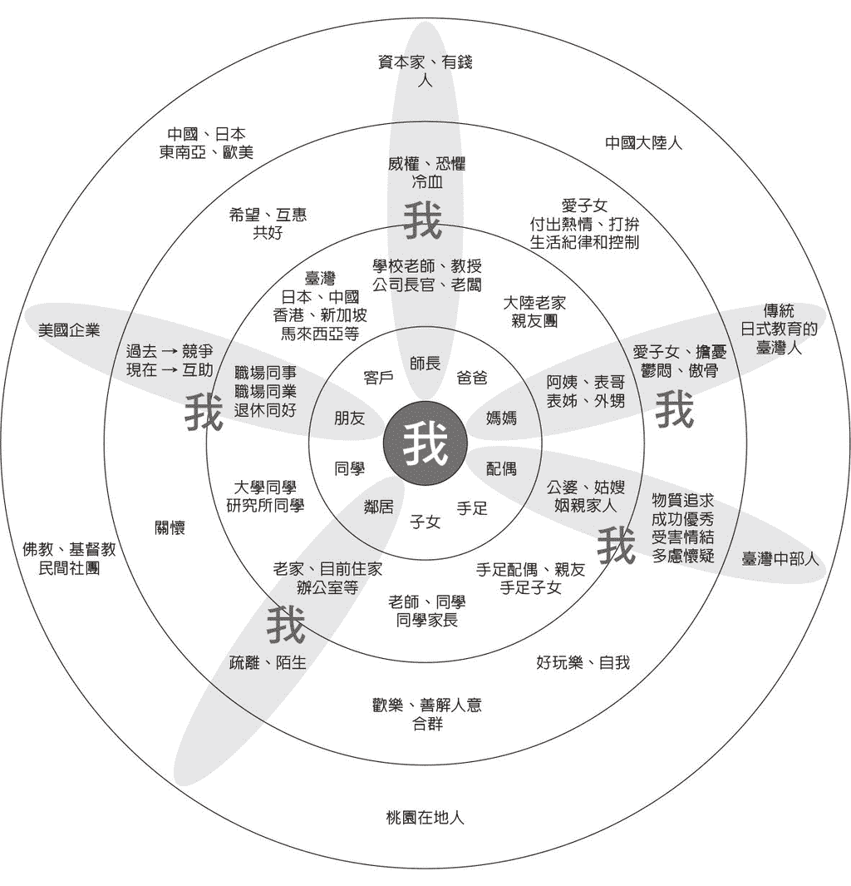

没错！我今天才喝半杯就嚥不下去。我的胃在抗议，直接让我跑厕所。

身体调节之后，你的饮食也会自动调节。

讲到这里，先让我插个话题。我没有吃素的习惯，但现在很多人觉得吃肉不好，是伤害动物的行为，也可能会摄入动物死亡前的负面情绪，造成身体伤害，是这样吗？

不会的。摄食动物的肉并不会让身体摄入动物的情绪体。动物和人一样，死亡前就已经离开，灵魂不会残留或附着在人类身上。会有这种说法，是出于人类自己对动物的怜悯之心。你们的意识觉醒，而改变了自己的饮食方式。这是美好的意识成长之路。其实植物和动物是一样的，植物也有意识，且具备较高的群体意识，因此一棵树被砍伐死亡前，也会对附近的同伴大声呼喊着“有危险”，只是人类还无法察觉来自植物的这些讯息。所以，杀生或吃素以获取生存所需的养分，完全是自我意识的选择。你认为跟道德有关或跟健康有关，而去做或不去做，都是你的自由选择，重点是，身体自己会知道已经进入什么样的环境和状态，需要摄取什么样的养分来维持平衡。当人类将口腹之欲移转到对自身的觉察，让身体能量自由流动，而不去干预或制约，将饮食交由身体主宰，你自然可以进入对身体平衡友善的健康饮食状态。

三百六十度业力检视练习

请用下面的图表练习填写。

①第一圈：我的关系。

②第二圈：关系人。

③第三圈：印象。

④圈出负面印象。

⑤在负面印象的圈内写下“我”。

⑥总结。

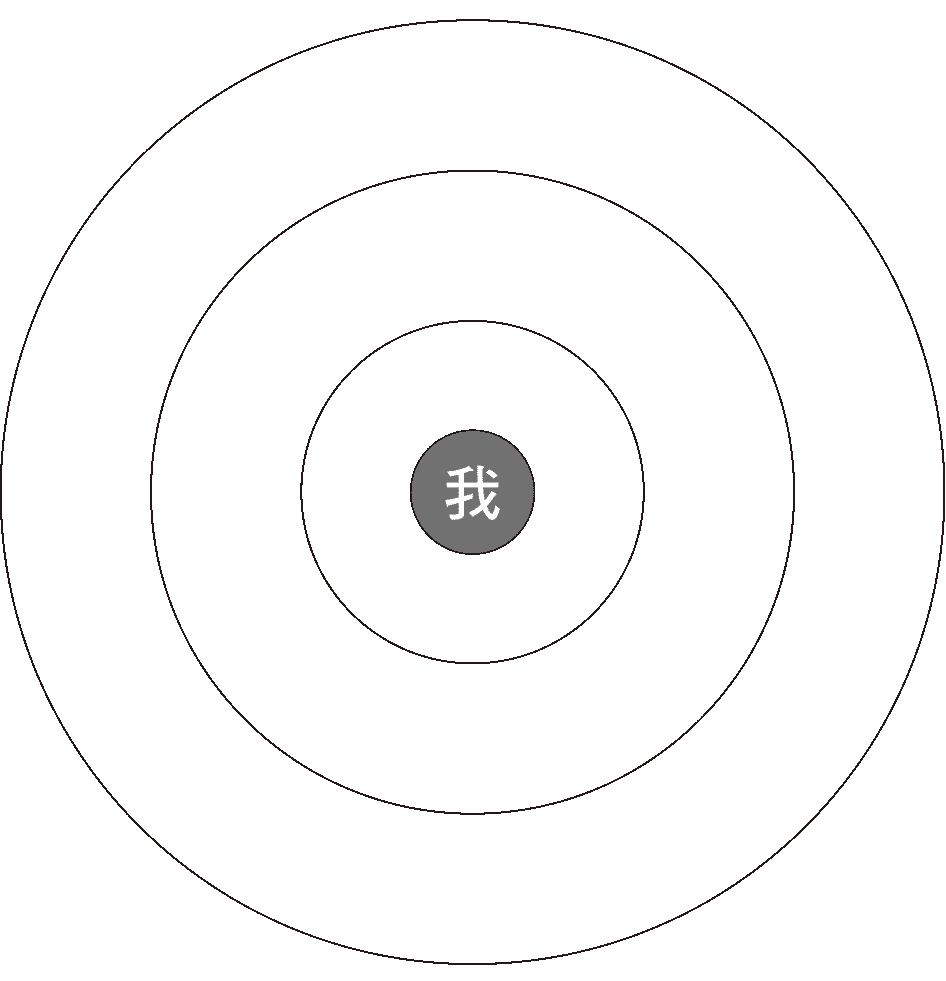

我是一个＿＿＿＿＿＿＿＿＿＿＿＿

＿＿＿＿＿＿＿＿＿＿＿＿＿＿的人。

⑦审视每一段给你负面印象的关系，进行自他交换。

⑧检验业力枷锁是否解除了。以手指进行肌肉测试（O 环测试），若仍未解除，可以用磁铁在负面关系上滑动，以平衡业力。

链接源头

 链接星光体

阿乙莎，请问晶体是否和梅尔卡巴有关？开始传讯前，我从来没听过这个名词，后来有朋友说，我们之前画出来的一些图形和生命之花，跟梅尔卡巴有关，我上网查找才发现有那么点像，但祢又没有直接说这是梅尔卡巴的教导。

好，我需要整理一下你们对梅尔卡巴的理解和认识。

在你们的二十世纪，也就是大约二十年前，星际存有将启动梅尔卡巴光体的教导传递给地球人。当时只是为了说明外星存有如何透过梅尔卡巴穿越宇宙之门，和人类沟通接触，但那时人类的文明正在大步跨越的阶段，人类的集体意识尚未成熟，所以宇宙议会的成员大多反对当时就让人类可以操作光体，穿越宇宙。你们二十年前的讯息网络尚未如今日普及，提早开放只会让更多人类被蒙蔽、被少数人控制。地球上国家与国家之间的对立非但不会化解，还可能造成阶级化的隔离政策。

经过二十年，地球演进至今，人类已经来到集体意识提升的汇聚点。任何一个国家的国民都可以透过网络和社群媒体，和远在不同国家的人直接沟通交流、往来。即使政府或国家之间抱持不同立场，甚至处于敌对状态，人民之间已经有足够的工具和管道可以面对面交流，中间控制者渐渐失去对人心的掌控。所以，此时此刻已经可以让更多人进入自身的光体，扩展意识，帮助地球转化累积已久的负面影响。同时，透过晶体还能打开和宇宙更高意识的沟通和学习。和宇宙交流互动的大门已经敞开，人类已经被允许进入，你们现在可以透过自己的光体，进入五次元的星际交流时代了。

不好意思，祢刚才讲的“光体”是什么？和乙太体有何不同？

光体指的就是你的星光体，这是你在宇宙中的光，也是你的灵魂分身。你的光体涵盖的范围，是从源头一直到你肉体存在的地球，我们眼中看见的你，就是光体。而乙太体是你身体的振动波创造出来的磁引力场体，和肉体细胞产生的能量有关。所以，乙太体就是修护你身体的防护罩，是每个细胞、器官和身体组织的含氧层。

所以，和宇宙通讯是经过星光体，而和身体取得共识是透过乙太体，这样讲可以吗？

可以，而且不只这样，乙太体也是链接你的物质身体和星光体的中介体。当你生病时，乙太体可以取得宇宙能量，帮助细胞修护和复原。乙太体手术可以疗愈身体的疾病，这些我们以后再说。

现在，先回来说明梅尔卡巴。我们这里不用这个名词很久了，因为梅尔卡巴是很古老的说法。我们现在称它为“晶状结构体”。每个生命都有晶体，当生命需要显化物质时，会先生成它的晶体，一旦有了这样的结构，就可以通讯、运行、生长。而晶体形成的过程就像生命之花绽放，在地球上，不管是有形的生物体，或是无形的社会风气或某个即将引爆的事件，都有其晶体，这个晶体可以启动和运转宇宙能量。在人体上，通常是用呼吸法来帮助运行；在某个事件上，就是用人的意识投射出来的能量聚合而成。我们最早的传讯着重在意识的觉察和展开；然后，从意识逐渐提醒你们先将心轮打开；紧接着，在脉轮畅通练习中一一打开乙太体连接星光体的信道，这个过程也需要将业力解除、净化，让自己可以更顺利地进入中轴稳定状态，准备进入你们的星光体中。这整个流程和练习都在帮助你们学会让自己的身体和意识与晶体链接校准。一旦顺利校准，并进入自己的晶体中，就真正来到“宇宙”单元的初阶课程了。

人体进入星光体的前置准备和练习法

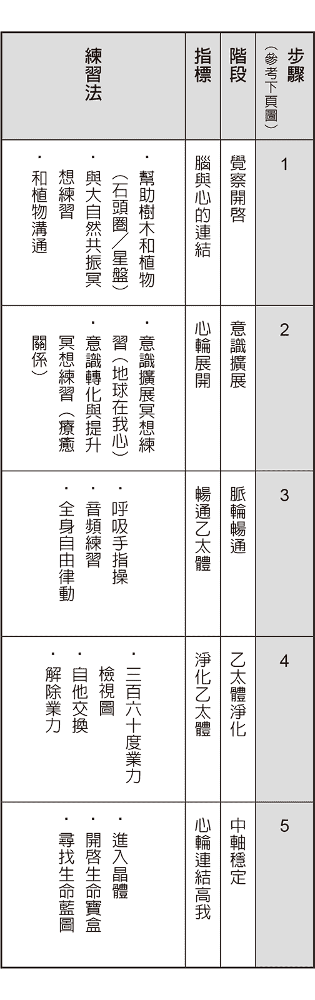

 进入内在宇宙

阿乙莎，祢提到当我们处于中轴稳定状态并来到晶体中，就可以准备展开“宇宙”单元的核心教学了。现在可以开始了吗？

只要你愿意打开你的晶体，我们就可以开始让你下载这个部分的旅程内容。要问你自己准备好了没。

嗯，我准备好了！

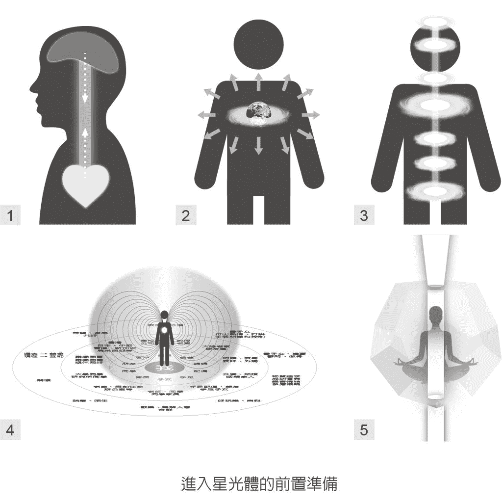

好，现在你处于自己的晶体中。先告诉我，你在这里感觉如何？

我觉得脑子有点重，但意识很清楚，仍然可以听见窗外的鸟叫、喷水池传来的哗哗声、远方车辆呼啸而过，还有飞机正划过天际。我仍然可以睁开眼睛，用手写下这些感觉，所以我目前的知觉系统和身体可以完全协调运作。没有什么不同，我的感官意识都还在。

等等，可是这些感觉好像都被围在外面，成为背景。虽然声音更清晰了，但我的心和脑之间出现一个非常纯净的空间，将我刚才描述的一切放在外圈（如下图）。

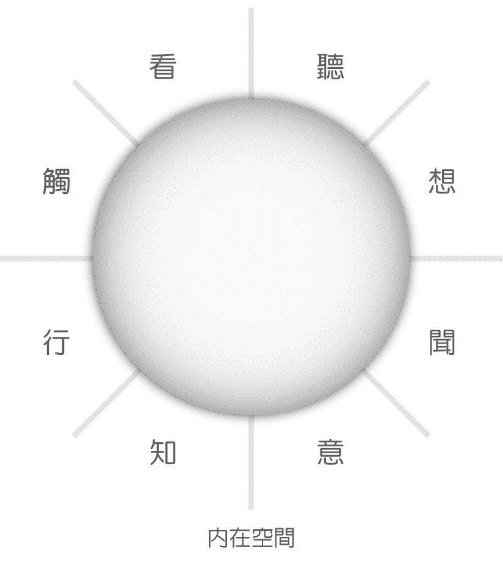

这个空间空无一物，干净纯粹，没有任何存在，但它就在我的心和脑之间。

你的身体感觉如何？

很松，脖子、肩膀的僵硬感渐渐消除，左边的鼻子阻塞完全畅通，整个身体的细胞好像都松绑了，没有那么紧。还有，我的心很平静，没有别的念头。

好，你先熟悉和习惯这个感觉，这就是你进入晶体的感受。你和原来世界中的一切并没有被阻隔开来，你的感知仍在原来的生活环境里，你是清醒、有觉知的，眼、耳、鼻、舌等身体感官的觉受都在，脑部的运作功能也很正常，现在只是在你之内打开了一个空间。这个空间让你感到平静安定，全身细胞放松。你看不见这个内在的宇宙，但可以感知到这个空间从你内部展开。你知道进入宇宙的大门其实不在外头，而是在你的意识打开心轮的这道帷幕。你的内在宇宙，就从你的意识进入。

你刚才提到觉得脑子有点重，原因在于你的中轴光之柱正和宇宙之心校准，宇宙能量贯穿你的顶轮，到你的心轮。顶轮承受更高的振动频率，因而带来沉重感，但只要你的光之柱更为畅通，脑子就不会觉得重。

在这内在宇宙，你的呼吸会更加顺畅。你是否感觉氧气更为充足？这是来自宇宙的能量，对你的身体健康有帮助。它不但携带更充足的氧气，还有氢气和氮气，当你的振动频率校准宇宙之心，进入你的晶体内，你就可以得到这个天堂气息。地球目前的大气层受到严重污染，而你们经由进入自己的晶体，可以获得最纯净的空气来活化身体细胞。宇宙的资源唾手可得，让意识进入自己的内在宇宙，就可以得到。

这真的是来自天堂的气息。我要如何采集这种空气，让科学家分析它的成分？

你吸入后再吐出的气，可以用来测量和你之前吐出的气体成分有何不同。这项工作就交给有兴趣的专业单位去做，你好好享受其中，我会再告诉你更多内在宇宙的宝藏。

 源头业力净化

学会了三百六十度检视业力，快速清除乙太体的失衡，也进入晶体感受到天堂气息之后，现在我们要进行更深入源头的业力净化。

啊？我不是都做完业力净化了？

你的乙太体平衡了，身体也有好转反应，但还没有到达星光体的源头净化。现在进入你的晶体中，展开之前的三百六十度业力检视图，挑选一段关系，进入其中，去看看这段关系被显化的驱动发动机是什么。这个驱动发动机就是显化今日这段关系的源头，你现在就进入晶体中去探访。

（我试图探寻和父亲的关系里造成我有“控制”倾向的业力课题。在晶体中，我用意识对自己说：“请帮助我看见和父亲之间的‘控制’课题。”

接下来，我依照之前阿乙莎教导的呼吸法进入晶体。在黑暗中意识清晰的状态下，我心中有了这样的知晓：

在某个星球上，父亲曾经是我的儿子。我是个艺术家，放任儿子在庭园中游玩，也很鼓励他尽情放胆尝试任何事，还要他做一些别人看来危险的动作。结果，儿子在一次意外中严重受伤。他深深爱着我，去世之前，他对着我，也就是他当时的母亲说，很抱歉，我不能再陪伴你，我的身体已经无法复原，我要死了。

当时我的心都碎了，呼喊着儿子不能这么早离开妈妈……

我理解到，我当时的儿子，也就是现在的父亲，他为自己的生命设定了一个新命题：要学习控制，才能长长久久陪伴你最爱的人。

而我在那一次的事件之后，也为自己设定了一个命题：要放下艺术家放任自流的性格，学习保护和控制所爱的人，才不会后悔。

时间来到现在。我的父亲今年九十五岁，和我同住。他这辈子非常重视自己的健康，也严格控制作息和饮食。这种控制型的个性让他得了大肠癌，幸好及早发现，经过治疗，已经完全痊愈。

而我因为从小接受父亲的军事化管理和规律作息，不自觉地很早就像工蚁上战场般努力读书、工作。也因为给自己设定了“要控制自己，不能肆意玩乐”的命题，我对于放任自己玩耍这件事总是心存担忧和恐惧。这些目前看来似乎是我生命中的业力枷锁，但进入晶体中，我看见这个业力的源头是为了长久陪伴我所爱的人，与其安稳地共度一生，而再一次设定的命题，于是，这个业力瞬间化成我这辈子最大的祝福。业力已经为我和父亲在这一生创造了超过五十年的相伴，算是完成了我和儿子在当时的生命中没有实现的期盼。

感谢阿乙莎的引导，让我可以进入自己的晶体中，重现业力最初始的意图。当我们进入业力的源头，发现业力其实是为了成全生命意图而来的一份祝福，这个看见的瞬间就足以穿越业力的束缚。原来，在关系的业力源头，依然只有爱。）

你现在可以练习从自己的三百六十度业力检视图中，走入自己的晶体，去探寻业力的源头，寻找和理解那个源自爱的理由。

好的，我需要花一些时间一个个去发掘。另外，我不禁想问，再一次回到业力源头去净化灵魂的真正用意是什么？

人类携带太多过往的生命经历，不断地创造新的生命意图，再次进入地球体验。我并不是反对你们去体验，只是当体验变成永无止境的循环，并一再被遗忘时，整个地球的密度早已超过地球母亲的负荷。人类目前的人口是过去的数十倍，地球为了让人类生存，已失去大量的自然生态，造成大自然的自体循环阻塞，中轴偏移。你现在很清楚人类的中轴偏移是生病的原因，而地球中轴位移，则是环境生病了。你们的阳光、空气、水和土壤创造的生态效能已经大不如前，如何让地球恢复生机，需要人类有意识地回到生命蓝图的轨道。

唯有人类觉醒，才能拯救地球。我们希望协助人类回归生命最初始的蓝图，为创造新地球大步向前，而不是一直待在生命体验的循环中，不断沉睡、不断体验。当你们学习回到自己的晶体中，进入生生世世的源头，发现爱就是宇宙的共同语言时，是否更愿意将爱扩展到自己和家人赖以生存的地球，为即将到来的生命再造一个更好的环境，同时让自己的生命得以顺利延续？没有适合的生存环境，再一次的生命体验只是全面的匮乏与争夺。

针对看见业力源头，我有三个问题：

一、在业力关系中，若是某种加害者与受害者的关系，很难让受害的一方承认这个业力的命题来自自己本身，这对受创的人来说也很残忍。我们如何帮助这些受创者将关系导向圆满的结果？

二、宇宙如何巧妙地为每个人的业力配对，让关系成为一把修正自己生命的关键钥匙？

三、在三百六十度业力检视图中，许多问题都来自家人关系。为何最亲密的一家人反而是许多冲突和痛苦的根源？透过家人关系解除业力的目的是什么？

这是非常务实且更深入的讨论。先回答你提出的第一个问题。

对受害者来说，要在经历创伤后反过来原谅加害者，真的非常困难，因为怨恨会在受害者身上或心理造成伤害和阴霾。当伤害已经造成时，受害者可以先选择离开加害者的场域；如果无法隔离，可以进一步寻找保护自己免于再次受到伤害的措施，或者寻求他人及社会机关团体的协助。

若受害者的性命没有立即的危险，而是承受认知层面的阴影或伤害，可以进入以下的自我疗愈程序：

首先，受害者要让注意力回到自己身上。受伤害的一方必须学习先照顾好自己，而不是任由自己的小我及身体器官发出情绪性讯息，造成对自己的二次伤害。

受害者的灵性展开，就在事件发生当下，身体会强迫将注意力带回自己的身体和心理感知上。受害者此时此刻会明白，唯一能帮助自己的人只有自己。唯有爱自己、呵护自己，摒除外界一切的投射、观感、要求、群体认同，让自己的意识回到自身，与自己同在，才能拯救自己。

当意识逐渐融入伤痛的暗黑核心时，受害者会在伤痛里发现一丝曙光，会在这份伤痛中理解到，这个伤害了自己的现实是如何被自己的无意识允许而显化出来的？而为了让自己复原，就需要深入这份伤痛，给自己一个更适当的想法。为了更好的自己，你愿意如此去想、如此去做，以安顿自己的身心。

当你为了更好的自己而闪现一个不同的想法时，你的细胞和身体器官都会感谢你，因为你终于看见自己原本的真实样貌。你现在更愿意疼惜自己，给自己爱的投射。你全身的细胞都会欢欣鼓舞地迎接你的临在，它们会被你的爱灌溉、滋养和疗愈。而当你全身的细胞再次融合在爱里，你的身心很快就可以恢复本有的样貌。

这个疗愈自己的阶段需要当事人全心全意对自己倾注无条件的爱。没有对错，没有批判，只有深深地爱着自己。当你能够成功地将外界的攻击引发的愤怒、恐惧或抱怨转为爱自己，你的疗愈就完成一大步了。

当身心的伤痛平缓下来时，接着就进入平衡自身的ＤＮＡ创伤印记的阶段。这时，受害者要回到三百六十度业力检视图，更深入地去看见这段关系的命题如何来到你的生命中。在这个阶段，若无法自己进入晶体中审视关系，也可以经由有经验的疗愈师引导，让受害者展开自我对话。

最后，当受害者全然知晓这个伤害的因、缘、果，就创造出疗愈这段关系的光之柱了。你从受害者变成对方的疗愈者，你的光不但转化了自己的生命，也照亮这段关系和他人的生命。你此生的命题带来的创伤，已转化成为给自己和这个世界最大的祝福和礼物。

你看见这个回到自身疗愈自己的过程了吗？从受害者变成照亮世界的光，这是生命的完美演绎，也是每个生命具备独特意义的显化过程。经由一次次的创伤和体验，你成为一个完美灵魂的化身。

至于第二个问题，这个配对不是老天帮你找来的，而是你自己配的。在你为自己的生命设定一个新命题的同时，题目和解答就输入你的灵魂ＤＮＡ中了。你再一次创造了生命体验之旅，你就是自己生命旅程的创造者。回到生命蓝图的全面理解，你会明了你自己就是伟大的造物主。你创造了自己，也显化出自己所需的体验。

第三个问题，家人关系带来的冲突和伤痛，也是为了帮助你圆满你的生命课题。你们带着“成为更好的自己”的期许创造了这段关系，这段最亲密的家人关系就是来帮你揭开你自己不愿意承认的真实面貌。

揭开疤痕的过程是痛苦的，若你身上没有伤口，怎会感觉疼痛？那些伤口可不是一天两天造成的，有些已经是累世创造的痂，若没有被你最亲近的家人碰撞，你可是戴着面具，把伤口包得好好的，任谁都无法触碰到。连你自己都不愿意揭开的那一面，还有谁可以帮助你打开？只有你最爱、最亲密的家人，才有机会悄悄地在你无预警、无处可躲的情况下，强迫你看见那个最真实的你。

当最真实的你的面纱被揭开时，所有你尝试创造的虚假命题也会被解除。而没有了虚假，没有了想像，你深埋在面具下的恐惧就无法再被滋养。体验生命的过程不应该带着代言人，唯有当你真实地面对自己，真实地活出自己的样貌，你的灵魂才得以进化和更新，而此生种种关系的目的也就达成了。

 观看自己的宇宙心智图

之前提过，要链接高我，必须在稳定中轴后进入自己的晶体。在晶体中，你的心轮愈敞开，你的意识透过眉心后方的第三眼看见的镜像就愈宽广。你不会再受制于大脑，不再只能用眼睛看见一百公尺内的实体反射画面。在晶体中，使用第三眼，你会看见一个类似球体的天际线，一个更为宽广的空间。这个镜像类似天文台观测站看见的星空，会投影出跟你自己和你所处的星球相关的所有讯息片段。有些景象是过去式，有些是未来式，在这个广大无垠的镜像里被呈现出来。

如果你的第三眼无法像你的眼睛那样看出颜色、形状，不必急于看见。用你的心去感知，你的知晓会映射出那个形状和影像。没有色彩和形状并不影响你知晓。此外，用第三眼观看时，尽量待在安全的室内空间，不要在行走或开车时使用第三眼观看，以免发生意外。

你的星光体心智图会透过这个流程自动投射出来，让你知晓；也就是说，用第三眼观看不是去看见你身体宇宙之外的事物，你看见的镜像是你自己内在宇宙心智图的投射。我在前面的单元说过，航向宇宙时空的心智地图在一群即将出生的孩子身上，就是这个道理。这些来自高次元宇宙的存有回到地球，身上携带着航向宇宙的地图，当他打开第三眼，心中的地图就会投射在第三眼前面的镜像空间，让他清楚看见星际地图的指引。这个镜像会在未来的孩子身上自动展开，你们目前身体的ＤＮＡ携带的心智图则被屏蔽了。

回到这个进入自己第三眼的宇宙观。在练习这样观看时，须谨记，这呈现的是你自己身上携带的宇宙心智图。每个人携带的心智图不同，有些是关于地球母亲本身，有些则是关于自己在地球和其他星系的经历。你的心智图镜像呈现出跟你所有的存在相关的讯息，你再次从自己身上看见，你是永恒的存在，你也不只是你。如果在自己的晶体中无法看见，那是你的小我又试图阻碍心轮信道。回到有意识的呼吸和脉轮畅通的练习，前面的基础若是没有打好，就不容易到达这个阶段。

 打开灵魂ＤＮＡ宇宙次元

我在练习进入第三眼的宇宙观时，似乎进入了不可思议的星际旅程。请帮助我理解，这个过程是怎么发生的？还有，链接到那个次元的意义何在？

那是你的灵魂ＤＮＡ打开了宇宙次元的大门。我曾经提过你们人类的ＤＮＡ灵性层次的封闭状态，当你经由之前的练习，让意识进入自己的晶体中，用第三眼锚定宇宙之心时，就可以打开你内在的跨次元宇宙空间。

我来说明相关步骤，让正在阅读这本书的人也可以练习打开自己的灵魂ＤＮＡ宇宙次元。

打开灵魂ＤＮＡ宇宙次元练习

①深呼吸，稳定中轴。

②采取静坐或站立的姿势都可以。

③进入晶体，深呼吸，感觉到空气变得更清新，耳朵听见的远处声音愈来愈近，听力变得比以前更好。

④让自己静静待在这个状态中，不要尝试用意念去搜索或寻找。没有任何期待和想像，无念无想地静坐约五到十分钟。

⑤现在去迎接一道灵性之光的到来，去和这道光融合一起，这道光将带你进入另一个宇宙次元。

⑥你现在已经进入这个宇宙空间，可以开始用意念去感知这个地方。你可以试着问问题，你的内在知晓会给你答案：

这里是哪里？

这里的感觉如何？用你的身体感官去感知，例如温度、在地面上或地面下、颜色，再用你的心去感受这里呈现的氛围是什么。

现在去了解一下，你为何会在自己的内在次元打开这个空间？这里和你之间有什么关连？

从这个关连中，你是否明白这次来到地球的目的和使命？当你与自己的灵性片段整合在一起，你需要展开的生命蓝图是什么？

⑦感谢你的高次元灵性存在的带领，然后结束这趟旅程。

灵性整合期

每个人会进入的宇宙次元都不同，透过打开自身内在宇宙次元，你们会来到灵性整合期。你可以和自己另一个次元的灵性存在学习、交流，并将学习结果带入你目前生活的地球场域。这样的学习也是帮助你改善目前的地球环境，从更高次元的灵性源头创造出一个全新观点或新领域的尝试。你将可以和更高次元的你联手打造美好新世界，这也是你到地球最初始的目的。

当你突破地球现实的层层考验，并净化自己的灵魂业力枷锁后，更重要的下一步，就是打开生命宝盒，与自己更高次元的灵性联合创造。这也是处于高次元、一直在等待你苏醒的你深深的期盼，是你在来到地球之前与自己的约定。

当人类意识觉醒，重启自身的灵魂ＤＮＡ宇宙次元，你们虽然身在地球，但结合灵性创造的伟大时刻将会到来。灵性的疗愈不是终点，而是为了让每个生命走上创造之路的开端。孩子，宇宙的次元就在你们的ＤＮＡ之中，打开它，让你们的灵魂跳脱小我的框架，自由展开创造之路。

 灵魂ＤＮＡ四层次

阿乙莎，祢带领我用第三眼看见自己在另一个星球的片段，说这是打开了ＤＮＡ宇宙次元。是否可以先让我有个更完整、更全面的理解？

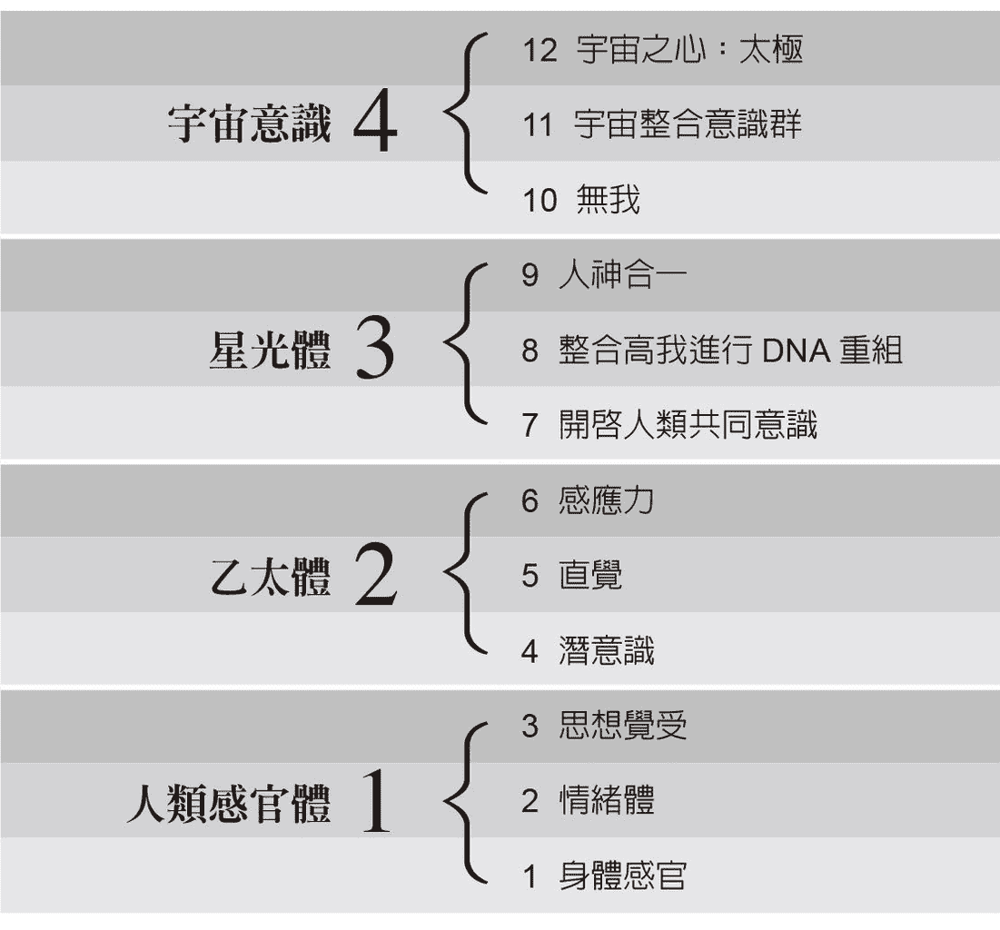

人类的ＤＮＡ不只是生物基因和遗传定义的细胞物质性聚合体。其中，生命讯息能量隐藏于正负电子聚合所产生的能量场域，以非物质的振动频率形式存在人体中。我们可以大致区分为人类感官体、乙太体、星光体、宇宙意识四个层次，总共十二个能量振动层级存在你们的ＤＮＡ中。

第一层：感官体

第一、二、三股ＤＮＡ，分别是身体感官、情绪体，以及思想带来的觉受。

情绪体在这个层次扮演关键的中间桥梁。你的身体器官细胞是受体，身体感官和思想觉受之间的振荡会产生情绪能量场体，情绪起伏愈大，代表感知和觉受之间因为频差大，所以创造的振动幅度也大。其中，觉受又深受思想影响，所以你当下怎么想，就可以立即决定这个身体感官带来的觉受的相对位置。人类历经数百万年的生命体验，都在学习并锻鍊大脑具备思考能力，来创造更完美的生命体验。这就是思想决定命运的阶段，也是人类生生世世不断透过情绪体来体验生命的过程。

人类出生时，第一层的第一、二、三股ＤＮＡ是完整的。而成长过程中，透过情绪体产生的讯息继续累积到原来携带的资料库里，也就是生命一开始的状态在新的生命体展开的同时不断被叠加上去。有些人在生命体验的过程中，携带的情绪体逐渐达到完全平衡，会让下一次的生命体验有个较少堆积的纯净灵性场体；也就是说，一个纯净的灵魂不一定是年轻、幼小、没有太多经验的灵魂，也可能是已经体验多次的生命轮回，而达到平衡状态的灵性存有。

第一层的第三股ＤＮＡ——觉受体——是人类超越身体感官、进入意识体的开端。人类的意识场体范围涵盖很广，第三到第八股ＤＮＡ都是人类自我意识的场域。接下来你会看见，每一层的ＤＮＡ里都藏着打开下一阶段ＤＮＡ的灵性闸口，而这些都在意识层里环环相扣，当能量到达共振时，会进入下一阶段的ＤＮＡ运行。

第二层：乙太体

第四、五、六股ＤＮＡ，分别是潜意识、直觉、感应力，这个阶段是进入星光体的桥梁和过渡期。直觉在第二层中也扮演潜意识和感应力之间的桥梁，潜意识体则是第一层（感官体）中尚未被平衡的能量的储存库。当一个人接触到某些情境刺激或某个事件导体，这些能量振动会穿越第一层思想的感知，直接与潜意识的能量产生链接。一旦链接匹配上，这个人会经由直觉体产生身体下意识的反射动作或情绪。这些反应并未先透过大脑的思想程序与身体感官的振荡，而是与身体细胞的潜意识能量直接链接上，因此，你们会将这个情况视为直觉的指引。

存在潜意识的讯息都和当事人的生命经历息息相关，只是在等待适当的机会和事件，以再次浮现，平衡尚待释放的能量场。

当一个人的直觉与潜意识体的共振达到合一状态时，也就是潜意识逐渐被意识体觉察，进而平衡完成，就可以再次扩展至感应力的层次。感应力是带领人们的意识迈向星光体的超我意识的重要桥梁，感应力的扩展会扩大对自我的认知，来到与万事万物心心相印的状态。你的意识可以开始向外延伸，去感知大自然或远方亲友的第一层感官体；你将来到感同身受的境界，更能以同理心对待身边的人事物，达到与其他生命和谐共存的意识。

当你已经可以进入感应的层次，完成乙太体的阶段，星光体的大门就在前方等你到来。

第三层：星光体

第七、八、九股ＤＮＡ，分别是打开人类共同意识、跨次元整合高我进行ＤＮＡ重组，以及人神合一的意识，这个阶段是进入宇宙意识的共同协作平台。当你进入第七股ＤＮＡ中，就可以打开人类的阿卡西纪录，里面记载着人类历史从过去到现在所有的纪录，你可以得到完整的信息和知晓，协助你打开自己的星光体意识，了解自己的天赋才能，以及你过去曾计划要完成的生命意图。然而更重要的是，你可以在这个层次寻找自己其他的灵性片段，一起学习、交流，寻求来自高我的指导，还可以透过协作方式，整合出一张全新的生命蓝图。人类已经不需要经由死亡和遗忘的过程，就可以再次创造新的生命蓝图。

这个过程都是来自你从星光体链接高我和自己的灵性片段的资源，有些人在这个阶段可以透过第三眼看见清晰的画面，得到更多讯息。这些协助都存在你身上的ＤＮＡ灵性能量中，你只需要学习打开和使用它。

当你的灵魂ＤＮＡ重启并整合完成，你就将迈向第九股ＤＮＡ，亦即人神合一的宇宙意识的开端。

第四层：宇宙意识

第十、十一、十二股ＤＮＡ，分别是无我、宇宙整合意识群，以及宇宙之心的太极。这里是超越人神合一的无我意识的开端，没有时间概念，没有分别存在的个体，你处于整合的意识群体中。当你来到星光体之后，就会展开迈向宇宙意识的汇流，我们会协助人类为进入宇宙银河邦联和平协议而展开交流。

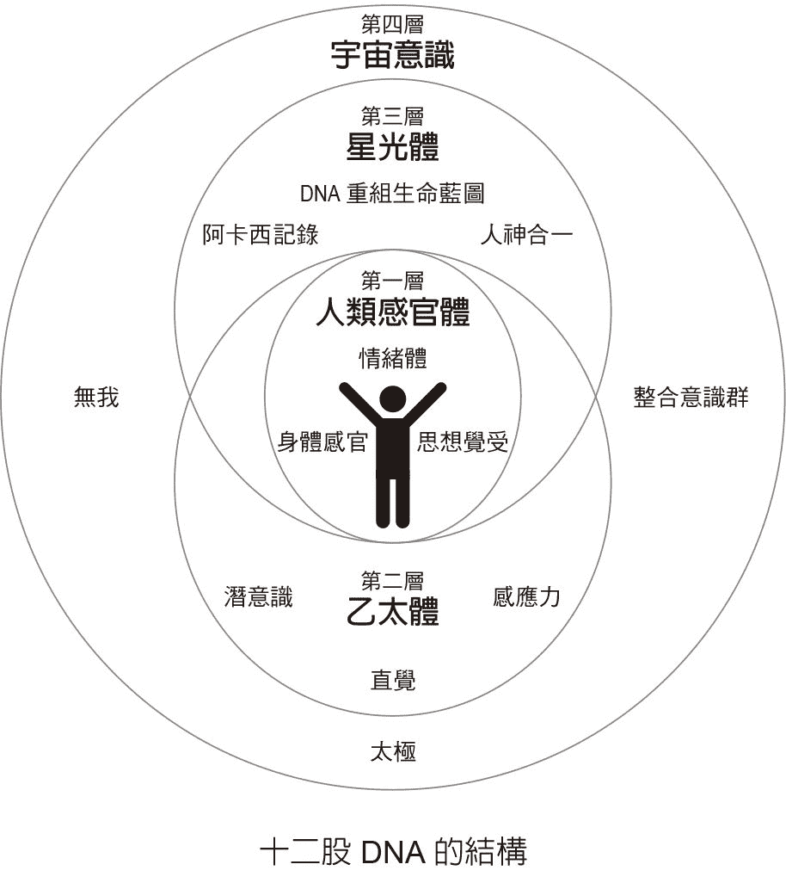

这些过程都需要人类重新整合自身的灵魂ＤＮＡ，才能从合一的共同意识迈向接下来的星际旅程。

我们此次的教导也是要协助地球人类为迈向宇宙和平协议前的接触做准备，你们透过传讯中教导的练习，就可以顺利完成生命的进化。人类在此时的全面进化，是宇宙共同的期盼。

 灵性进化道路上的框架和陷阱

我这两天的状况不太好，没有料到已经能够链接和打开到第七股ＤＮＡ，但生活中发生的事还是让我受不住，把自己搞得心烦意乱。

你们在灵性进化的道路上仍然会遇到很多框架和限制，或者，人与人之间、群体之间、国与国之间为了生存空间会产生碰撞和冲突，毕竟地球上还有太多人没有觉醒意识，一个已经迈向灵性生活的人反而更容易让冲突和碰撞在你面前显现出来。因为，你已经能够清晰地看见和理解这一切都是自身的反照，你从对方的言行举止中，看见自己仍待改善和转化之处。

觉察至此，已经足够再次净化你自己的生活和内在灵性空间。不要害怕这些显化出来的冲突，灵性生活不是去回避自己不想遇见的人事物，灵性的打开是让你经由照见自己的过程，进而照耀对方，提供相互净化的机会。地球转化的速度正在加快，就在这个过程中，灵魂彼此得以穿越，与我们更加靠近。

你这两天气消了吧？我们可以继续说明ＤＮＡ的重组，至于你仍待穿越的地球挑战，只须谨记，你不是光解除自己身上的业力枷锁，也是在帮助对方，加油！

关于灵魂ＤＮＡ的架构，已经约略说明了，其中每一组ＤＮＡ里都有一个关键桥梁——第一组中的情绪体，第二组中的直觉力，来到第三组，最关键的就是ＤＮＡ重组，再创造新生命蓝图的机会。你们现在不需要经历死亡就能获得这个机会，你在有生之年可以来到这里，和你所有的灵性片段及你的灵性导师一起讨论出一个新的生命蓝图。一旦重新设定，你会有重生的感觉，而这个生命蓝图的设计者仍是你自己。

你可以先去回顾自己到目前为止的生活，回顾你曾经历的所有好与不好的体验。你现在可以选择继续体验这里的辉煌和光荣，或者，你可以挑选一个你向往的情境。你现在有满手好牌，过去所有的限制一笔勾销，你可以选择重新过一次人生，给自己设定一个新的生命意图。

我怎么脑子一片空白？我─不─敢─想。这里面有没有陷阱？如果我选择了某种生活情境，我现在拥有的一切是不是会消失？这不符合我们在地球上的交易逻辑，在地球上是有得必有失。我想得到我没有的，但我已经拥有的，一样也不想失去，如果是要交换，我可不想换，我对自己目前的生活很满足。

很好，你真的是学财务的，明白得与失的平衡之道。但是，如果我跟你保证，你目前拥有的一切都不会失去，你重新设定的生命蓝图是以现在的生活为基础往上叠加，那么，你愿不愿意尝试另一种生命蓝图，重新创造出另一种生活？

嗯……这会让我心动。说实在，我自己也从没想过人生下半场剩下的时间要做什么。我退休了，但从没计划过退休后要过什么样的生活。

孩子，那是你的物质生命体，我们现在讨论的是你的灵魂生命蓝图。你的灵魂是永恒不死的，你从来都没有离开过，一直都在。目前的你生活在地球上，也存在几百万光年之外的宇宙里。你只是用一部分的你去度过地球上的生命，你的生命蓝图展开之后，会让你看见自己的恢宏和伟大。

问题是，我在地球上，还住在一个两千多万人的小岛上，祢要我使用低能的脑去设定新的生命蓝图，我做不到嘛！再怎么想也想不出伟大的格局。还有，在地球上做什么事都要用到钱，没钱就办不了事。

孩子！你要回到晶体中，和所有的灵性片段、灵性导师一起规画。你在地球的这个版本和他们是相关的，但你目前处于遗忘的过程中，他们都在等待你醒来，和他们链接上。唯有醒来，你才会忆起来到这里的目的和使命，那是你当初的承诺。而回到最初的设定后，你就可以和他们联手打造一个新的生命蓝图版本。他们也很期待听你怎么说，毕竟你已身历其境在地球体验过，你需要回到自己的晶体中去找出脉络拼图，并和他们重新讨论。

祢可以教我吗？我现在该怎么做？

你先稳定中轴，进入自己的晶体，去召唤你所有的灵性片段和灵性导师一起来讨论最可行的方案。

在虚空中找老师和自己的灵性片段……天啊！这是怎么回事？

 遇见导师和高我

阿乙莎，是否可以教我召唤灵性导师和所有的灵性片段。

可以。现在深呼吸，吸气，吐气，进入你已经很熟悉的晶体中……

（我依照阿乙莎的教导，很快就进入晶体中，呼吸着天堂气息，眉心看见微微的光在前方。）

好，现在要召唤你的灵性片段和灵性导师。登入你自己的晶体，进入一个圆形的殿堂，殿堂前方有个座位，那是你的位子，现在请先上座。

（我用意识缓缓走向前方的座位，坐进去。当我反身坐下时，看见我的正前方有一个相对的座位，右手边有两个座位，左手边也有两个，这五个座位都空着。）

现在，我们先召唤你的灵性片段登场。

（这时，右手边第一个位子后方的门打开，一个意识体走了出来，坐进右手边第一个座位。我看不见其形体，但这时我心中升起暖暖的慈悲感，从我的胸口满溢出来。我的泪水不听使唤地流下来，那是充满慈悲和无条件的爱的存有。）

你现在认出她是谁了吗？

知晓直接来到我心中。她来自列木里亚，地球的母亲，有个名字叫“莎雅”。但……她却是从我的心中出现。原来，我以为是去召唤来自天外的灵性片段，其实已经存在我们的灵魂之内。她一直都在，是我灵魂的一部分。

是的，慈心，那是你的灵性品质。你回想一下，这个灵性品质是否一直跟随着你存在。

（我开始忆起小时候，刚才那种慈悲的感觉的确不时会出现在我心中，不论是看见年迈的外婆、路边饥饿的小狗、邻居的老爷爷、被别人欺负的同学，或是被踩扁的小花……只是，我一直以为那是一种情绪或本能反应，原来那种感觉是来自我内在的灵性片段升起的时刻。她在我人生的前半场一直提醒和保护着我，当她升起时，我自然而然会以慈心的角度看待世间的一切。现在，她就坐在我右前方，如此地温柔和慈悲。）

好，现在准备召唤你的第二个灵性片段。

（这时，右前方第二个位子的门打开，出现另一个灵性存在体。他走进来，坐上座位。）

你可以认出他是谁了吗？

喔！我认得，他来自天狼星，是个生物科学家，有个男性的名字叫“雷巴特”。他给我的感觉非常冷酷、专业、有效率，还有对每件事都很精准，绝对不拖泥带水。我懂了，他是我的另一个灵性品质。难怪，以前还在上班时，人家看我就是这个样子，让人感觉很难亲近，专业，却不讨人喜爱，但也无从挑剔。这个灵性片段是来帮助我在地球的物质层面取得生存空间和成果的必要配置。雷巴特，虽然你不怎么亲切，我还是要谢谢你一直以来的帮忙。

（这时，我看见雷巴特右手边的座位，也就是我的正前方，坐着阿乙莎。没有具象形体，也是个意识存在体。）

好，现在来召唤你的灵性导师。

（我看见我左前方第一个座位后面的门打开，哈！是观世音菩萨。祂的形象就跟佛像刻的一样，让我感到安心亲切。我看祂一直在笑，我自己也不禁大笑出来。祂应该很懂我，好像我前半生做的所有坏事，祂都知道。我在祂面前赤裸裸的，没有什么可以隐藏。祂用诙谐的眼光看向我，哈哈，祂真的很懂我！）

最后召唤你的另一位灵性导师。

（这时，我看见左前方第二个座位后面的门打开，哇！是位大帅哥，原来是耶稣。我觉得奇怪，怎么会是耶稣？我不是基督徒，也不是西方人……祂又好像是这个空间除阿乙莎之外，最重要的发言人。这时我明白，原来灵性导师有两位，一位在地球场域负责看护和照料我们的一切，另一位则是负责接引我们和更高意识取得链接。我的两位灵性导师，一位西方大帅哥和一位东方美人，居然为了地球灵性的提升常常沟通啊！祂们在地球上被自己的拥护群众分成两个宗教派系，其实，祂们都在一起啊。）

接下来，你可以回到你的生命场景，去看见我们将慈心和专业严谨的种子放进你生命的原因。

喔！让我理解一下……

“我并不是我之前认知的一个胆小又无远大理想的中年妇人，祢们当初设计这个灵性组合的目的，是为了更有效率地打开这时期人类灵性提升的道路。”

是的，这是我们初始的计划，你生命最初始的蓝图。

可是，我被蒙在鼓里五十年，经过那么多年的折腾。祢们为何没有早一点让我忆起这个生命蓝图？

你最初始的生命蓝图也需要在你自己灵性净化后才能看见。地球本身就是灵性净化的孵化器，唯有经过地球的二元性碰撞和冲突，你们的灵性才会真正认出自己，并自然而然来到与更高的灵性合一的境地。合一的意识是进入银河系的起始点，没有合一意识，就需要在地球继续体验和净化。

然而，当今地球孵化器的承载量已远超过原本的负荷，已经不堪继续使用，必须提升到更高次元的轨道暂时休养生息。所以在这个时期，新的孵化器会出现，取代地球的位置。灵性意识尚未来到合一境界的，仍需要回到银河系的灵魂孵化器中学习，而提升的灵魂会跟随地球进入更高的次元。

祢是指，地球会进入新的轨道？

是的，地球已经准备提升，离开孵化器的位置，进入银河联邦的轨道。这里会有共同意识参与，地球会需要和星际种族创建协议，大约会发生在西元二〇三三～二〇三六年间，时间已经迫近了。

你们在此可以自由选择要回到银河系新的孵化器中重新学习，继续体验，还是进入新的轨道，和宇宙创建新的联盟关系。你虽然已经了解自己生命最初始的蓝图和目的，选择权仍在你手上。你可以选择持续过目前的生活，或是开始采取行动，帮助更多人走上觉醒之路。如果你决定回到灵魂最初始的种子设定，我们随时可以一起讨论如何设定工作项目，帮助你为实现生命蓝图规画的道路，而显化你所需的一切。

我理解了，谢谢祢带我看见这一切。我自己需要想一下要如何做，毕竟已经有很多人在做了，但我们是否还有更快、更好的办法？我想过一遍，再来跟祢们讨论。

（这时，我感觉他们好像变成我的工作伙伴，在这个殿堂中叽叽喳喳地自行讨论起来。有人说要从教育开始，有人说要让人类先恢复健康。总之，目前他们也不确定要如何做，还是需要我想过一遍再来讨论……）

 找回内在神性

阿乙莎，召唤了我的灵性片段和灵性导师之后，我很惊讶地发现，原来见到神灵的方式是从我们的内在链接，而不是向外寻找神灵。祢是否可以更完整地说明这个部分？

嗯！这个问题很好，我来更完整地说明一下。

你与自己的灵性存在和灵性导师见过面了，也终于明白，每个人的内在都具备神性，也都和宇宙其他更高次元的存有同体。人类不是从地球上出生的独立个体，当你理解这一点，代表你的灵魂ＤＮＡ已经顺利开展到可以启动重组再生的程序。这也是我们期待带领人类快速达成的目标：重启人类的灵魂ＤＮＡ，迈向更高的次元。

你内在的灵性片段就是你与生俱来的灵性品质，他们是来帮助你在地球显化和创造的。这些灵性品质带来的知识含量已经完整具足，你不需要重新学习或向外寻求，回到你内在的神性殿堂，随时召唤你更高次元的灵性片段，你就可以得到足够的知晓和指引。

这些灵性片段当初以种子的形式注入人类的灵魂ＤＮＡ中，你与他们有脐带链接的关系，一位扮演你的父亲，一位扮演母亲，他们就是你的灵魂原生父母。要进一步认识灵性父母来自的星球或历史脉络，你可以透过自己的晶体进入他们的列木里亚星和天狼星去观看，就会更明白了。过程中，他们也会带领和指导你，放心，不会迷路的。

每个人的灵性片段组成都不同，我们无法在此一一介绍。我明白，你会有许多这方面的疑问，也很想帮助身边的家人和朋友与他们的灵性片段相遇。孩子，这部分的学习不容易，如果这么简单，人类就不需要历经数百万年、有无数先知和宗教领袖试图达成这项任务。

你之所以能这么顺利地到达内在的神性殿堂，那是我们早已安排好的计划。我们也希望经由你更接近大众的认知程度，开创出一条让人们更容易理解和到达内在神性的路。我们需要你协助达成这项任务。

我了解了。祢说得也没错，我过去在灵性上的学习确实是麻瓜等级，也许这就是祢们刻意的安排。我如果早看懂佛经，可能就无法从一般人的角度来问这些最基本的问题了。

那么，祢可不可以说明一下，左手边的观世音菩萨和耶稣为何也在？祂们是以什么样的角色参与讨论？

祂们一位是专门照顾地球灵魂体验过程的神性代表，另一位是带领灵魂进入宇宙光之存在的神。一个属地，一个属天，每个灵魂在天地间都被神呵护和庇佑着，而得以生生不息地繁衍和存在。祂们也说明了每个人的内在都有神性。

所以，东方人拜的神佛，西方人信的耶稣，其实每个人身上都有，只是当人们无法从自己的内在窥见时，一些聪明人便将其具象化，投射在人们看得见、摸得着的神像上。然而，真正的庙堂和神殿，其实就埋藏在每个人心中，宗教只是为这一切虚空的灵性代表塑造实体形象，呈现出来，让人们的心感觉安适。这么看来，过去宗教实体化的做法已经很有创意了，现在祢们又要将这一切实体转回虚拟空间，再创出一条路，是吧？祢们要再次将行之有年的生命之道化繁为简，由实还虚。

没有错！那是当时一些先知先觉者帮助世人忆起内在神性的方式。时至今日，你们可以开创出更快接触到内在神性殿堂的方法。

我明白了，但我还有个不情之请。我已经见到自己的灵性父母，但在地球上，养育我的生身父母是我现在更关心的。他俩都已年迈，没有宗教信仰——应该说，他们还没有遇见自己内在的神性。我要如何帮助他们在离开时达到光明圆满的境界？

你其实真的不用替他们担心。每个生命离开肉体时，灵魂都会被神接管。在离开身体的瞬间，他们就会看见光，也会明白，自己在身体之内与神同在。而他们的灵魂意识也会携带着世间的一切体验，作为下次再体验的参考。

你必须尊重每个生命的自由选择权，他们有自己向往的体验方式。神爱每个灵魂，将每一位视为自己的子女。你的父母不仅是在地球上生养你的人，他们也同样是神的子女。当你愿意扩大对他们的爱，去爱神的所有子女，与神联手创造一条让所有人找回与神的链接的路，就是在帮助自己的父母。

 整合期的状态

阿乙莎，祢带领我看见这么多，我反而不知道要从何着手了……

我知道你心中有很多疑问：这些灵性层面的看见难道是真实的？或者，这些都是你自己心中虚构的想像？而这一切又和目前居住在地球上的你有何关连？

是啊！祢真懂我的心，我连自己在彷徨疑惑些什么都讲不清楚……

这是很正常的现象，这就是ＤＮＡ重组过程中会遇到的状况。你原本的价值观和信念体系正在重组，内在逐渐升起一个新的架构，这个架构正在把现在的你和即将跨入未来的你重组出一个新的生命蓝图。其实，这和你们在三次元世界碰到的状况是一样的，只是你没有觉察到。

当你一出生，你的价值观和信念体系就被原生家庭植入了，这个植入是在你的物质生命体正式启动运作的第一天就开始的。你在父母、家庭和社会集体意识的投射下展开生命旅程，身上虽然有灵性父母播下的种子，但在你灵性尚未苏醒的这个阶段，你的灵性也寄居在你的父母和社会集体意识营造的寄养家庭里。这个时期是你的原生家庭帮助你建构你的小我意志的重要时刻，你也要好好感谢他们，没有他们，就没办法长养你的小我个体存在意识。

其实，小我没有你认知的那么不好，它可是帮助你在地球上稳定扎根的重要推手。一个失去小我意志的人无法链接上更高次元的高我。小我和高我是相互扶持的伙伴，当你的觉醒意识升起，小我遇见比自己更高、更大的版本的灵性高我时，就会让出决策空间给高我。因为小我非常明白，唯有和高我联手，重新打造一个超越小我控制、更宏伟的生命蓝图，它才能借此达到提升自己的目的。小我虽然仍处于备战与工作状态，却不会因此消失，而只是臣服于更高的自己。你刚才一开始的问题，就是我现在描述的这个状态的最佳写照。

祢绕了这么一大圈说明，结果还是回到我刚才一开始的状态，祢只是解析了我现在的状况。祢是看见我的小我正踌躇不前，又不想揭穿它，我真是服了祢！

哈！你现在也知道，当你不想前进时，我们也只能在原地继续打转，就等你愿意跟上啊！

那我还是问一些让自己往前进的问题好了。请问，我要怎么开始和我的高我联手打造新的生命蓝图？

嗯！你终于要开始面对这个课题了。这里面有个流程需要进行。你要耐心带着自己前往未知的世界，去找出生命蓝图的成功关键元素。然后，将这些元素植入你的晶体中，再透过你的高我和小我达成协调一致的共识，接着由重整后的新我去展开新生命蓝图，并实践在生活中。

再造生命蓝图

 探索灵性片段的源头世界

阿乙莎，让我整理一下，祢前面提到的联手高我创造新生命蓝图的流程如下。

步骤一：探索未知世界

步骤二：找寻关键元素

步骤三：达成新我共识

步骤四：再造生命蓝图

我们从第一个步骤开始。祢指的探索未知世界是哪个世界？要怎么开始去探索？

就是去探索你的灵性片段的源头世界，亦即你灵魂的家，列木里亚和天狼星。你要去探索你为何需要来到地球？你灵魂的家目前遭遇到的问题是什么？它们的期许是什么？你可以从那里找到问题的根源，也可以知道为何需要创造一个新的灵性组合来到地球再创造。

这真是太科幻了！在 Google 地图上都找不到的地方，祢们出的题目太难了吧？

一点都不困难。等你进入自己的晶体，不用几分钟，你就可以开始第一次的探索了。

好的，我来试试看。

（我进行之前已经做过很多次的程序：深呼吸，稳定中轴，进入晶体，用第三眼看见前方的微光，进入光中，处于晶体的正中央。接下来我问阿乙莎，是否可以带我去探索列木里亚？

我一直往前、往前，在黑暗中移动，之后进入一道蓝色的光中。在这里，我知晓自己已来到列木里亚。但，这里怎么好像在地球之心，而不是在外太空？难道列木里亚就在地球上？

我还没有办法厘清列木里亚和地球之间的关系，就已经听见列木里亚诉说了一堆现在遇到的问题：

“一、地球上的石油开采进入海底，已经破坏海洋的生态。

“二、你们其实不需要开采石油，可以使用更好的替代能源。

“三、我们派出去工作的海豚被你们制造的污染伤害。拜托，不要把它们抓起来当玩物。

“四、海洋需要被保护和净化，这也是在保护替代能源的来源。

“五、地球之心的磁力偏移，人类如果没有改变，我们无法再稳住地壳能量。”

一堆问题抛向我，让我有点招架不住。我想先离开一下，再找时间过来拜访和探索解决方案。）

阿乙莎，初探列木里亚之后，我收到一堆问题。现在我们是要再次进去列木里亚，还是到天狼星？

可以先去天狼星。当你看见天狼星的世界，我们再进行下一步的讨论。

（我同样进入自己的晶体中，然后呼请我的天狼星灵性片段雷巴特，请他带我去探索天狼星。过程中，没有像进入列木里亚时那种往前走的感觉，就好像只是透过我的晶体打开一扇任意门，当我跨进去，我知道自己是进入雷巴特的晶体中，就像在隔壁，前后不到一秒。虽然看不见任何影像，但我知道我已经到达，因为这里让我全身变得轻盈，之前那种脑袋沉重的感觉瞬间消失。

我开始用意念扫描这里。感觉上，这是个高度发展的文明，但冷冷清清，没有任何一丝情绪波动的感觉，也不太像是源头那种定静安详，整体上就是让你觉得进入了一个超大型实验室。没有任何一个存有过来跟我打招呼，也没人理会我。那个地方就是有种让人不可亲近的感觉，跟昨天一进入列木里亚就热烈互动的情况，真是天壤之别。

我本想离开，但又想起阿乙莎说过，我必须来找出我的灵性片段源头世界遭遇的问题，还有他们对地球人类的期许。在不知道可以跟谁说话的情况下，我用意念抛出一个问题：“哈啰！请问你们有什么需要让我理解的吗？”

结果真如我所料，这里是“有问有答，不问不答”。

有个意识回复我，这个地方位于第九次元，拥有超越地球人类文明的超高科技。当初是为了完全避免遭受物种情绪体引发的破坏行为，所以有计划地移除这里的物种的情绪体，也创造了今日的超高科技文明。有效率的创造与进化过程虽然能够快速扬升到更高的次元，但因为没有情绪体，创造出来的环境只能不断精益求精，进步再进步，让这里演进成乏味、无趣、没有色彩的世界。

“你要回去提醒人类，小心发展人工智能类人类科技，不要为了效率，而抹煞了人类最珍贵的情绪体的振动所创造的有情世界。”

此外，他给我一项建议：可以利用生物科技，在人类的情绪体中安置安全气囊。因为，人类在二元对立的振动频率中，不可能只有善没有恶，只有喜没有悲，情绪一定会在相对的振幅中摆荡移动。如果可以在负面情绪达到极致时，启动生物体的安全气囊，让破坏与自毁的模式不会一触即发，并且让这个安全气囊瞬间将人类抛向爱自己的频率中，这样达到的情绪平衡可以避免文明的破坏。

我进一步请他明确告诉我，那个安全气囊是什么做的？要怎么安装？他无法给我明确的答复，感觉是要我带回去讨论，而不是让他提供明确的解决方案。我谢谢他的建议，就赶快离开了，因为他们还真是不知道如何招待我这个访客，我离开时也不会跟我客套一番。）

阿乙莎，我从天狼星初步探索中理解到，人类的情绪体很珍贵，要保留这项特质，但又必须创建不会让人类自毁文明的防护措施。

嗯！你的初步探索已经很不错了，我们回头再来整理出一个更具体的行动方案。

 发现宇宙实相

我已经拜访了两个灵性片段的世界，看到目前面临的问题和状态。这些题目都很大，也都不是靠我一个人可以改变的。为何这些看起来亟需解决的问题会抛给一个非相关领域的人接收？请给我智慧，让我知道该如何进行下一步。

你看见其他次元的世界给你的讯息和实相，但你在地球上还未亲身遭遇，也没有相关专业去厘清这些已经发生的状况。但是，当你的意识来到这个认知的实相时，你的振动频率就与这个现象链接。你用意念去想像，开始去做，就可以逐渐改变这个实相。

重点是，当你看见发生在另一个宇宙空间的实相时，是否感觉这些状况与现在的地球有关？你是否愿意调整自己的认知体系，创建人与生态及其他物种之间新的互动规范，以防止那个你已经看得见的未来在你目前的世界里发生？

我不想地球变得冷酷无情，不希望地壳变动让人类和动物受到伤害，但是我无能为力。我没有政治权力，也没有资源去阻止人类为了自己的利益而破坏大自然，或是以科技创新为名，制造可能伤害人类自己生存空间的人工智能。

你不需要去导正，宇宙的显化是集体意识创造出来的自然定律。你只须去想像，并且愿意去实践和体验你的想像，那么，由你发送出来的意识振动频率，就可以改变这个世界。

我不敢置信，哪有可能这么简单？

只要你愿意“相信”，相信你见到的未来是真实反映你们当前所处的世界的状态，你以为的未来式，其实就是现在进行式。当你进入自己的灵性源头，你不会看见与你无关的问题，你只能看见你已经“是”的状态。

我不明白。祢是说，当我进入晶体，然后穿越进入另一个宇宙空间时，我看见的环境是我目前所处的地球的未来显化版，而这个显化版已经是现实？我们不是去拜访他们，而是去看见不同次元的自己呈现的状态？

是的，宇宙只能全息化展现当下的一切。

祢是指，另一个宇宙空间的实相是来提醒人类，我们彼此的世界是连动的，我们改变，他们也就改变了？但是我不明白，为何他们已经是比地球更高科技的存有，不需要身体，我们却还在运用旧的低等科技，需要身体？

这只是存在的不同形式。你的高次元版本不用身体，进入低次元却需要这个载具，因为密度不同。此外，科技的显化也是相连的。当人类有意将人工智能机器人导入生活中，创造人机合作的新社会关系，并提升人类的效率时，就是高次元的振动扩展的必然趋势。但是，如果在高次元已经发生的生物体灭绝和失能状况，可以经由低次元修正，并导入目前逐渐成形的系统中，高次元中的问题就可以被扭转和改变。你不觉得最近人类讨论得沸沸扬扬的人工智能科技建构进程愈来愈快？那是因为高次元的显化已经扩及到你们的生存空间，现在是彼此协作，重新修正路径的关键时刻。希望地球上的人工智能能够帮助终止或改善已经造成错误的显化。

我还是不懂。高次元创造出来的问题为何不能在自己的时空和次元里解决，而要到更低次元的环境里修正？

你们彼此互为源头。宇宙源头是所有生命的核心，但不是单向的，所有生存的次元互为源头，所以，人类所在的地球也是高次元存在于低次元的源头。你可以从自己的晶体跨入更高次元，反向亦然——你的更高次元也可以从自己的晶体回到低次元的源头。当高次元的状态处于平衡的僵局，需要改变与重组时，就须经由源头去改变结构。所以，高次元的状态修正和改变，也可以从地球着手。

虽然我还不是很了解，但我宁愿相信这个说法，这样人类就不必妄自菲薄。不是在高次元就比较高等，低次元就得听从高次元的指令，彼此不是主从关系，是协作关系，我觉得这种说法挺公平的。

你满意就好！这也是为什么人类身上会有高次元的灵性片段，彼此同体互连，宇宙就在这个跨次元的协作中不断地修正与平衡。

即使你理解至此，我还是要提醒你回到自身的认知体系，重新审视一遍。当你已经知道地球正迈向高次元的轨道，你希望迎向一个什么样的未来？你看见列木里亚和天狼星的实相，那带给你什么样的感觉？你又会因为这个感觉而有什么改变，或是产生什么想法？这些才是我们要进一步讨论的地方。别忘了！你还有灵性伙伴和指导灵在旁边等着和你合作。

 完成在地球的使命

我必须坦白，祢要我在看见列木里亚的呼求和天狼星的现状后，去感觉一下我自己会有什么想法时，我第一个想法是，我感到失落和难过。失落的原因是，我以为灵性的追寻最终会带我到达神的国度、天堂圣殿，我觉得这是我先放下手边的物质追求，提升心灵层次应有的回报。没想到，迎来的是另一个灵性国度的功课。

而让我难过的原因是，我以为自己已经找到“宇宙就是爱”的真相，结果，我看到即使在高次元的世界，仍然欠缺爱与喜悦。我突然觉得回家的路更长、更遥远了。在找回自己的灵性片段，与内在的神相遇后，为何我反而更累了？

孩子，不要气馁，那些实相是宇宙现存的各种形式的演进结果。你们身在其中不自知，我提供的是更广大的视野和更多元的选择。人类渐渐要脱离由物质完全掌控的世界，当你们开始锻鍊自己的心智时，会开始用宇宙人的观点做出选择。你目前只是窥见两种型态的文明发展，宇宙还有许多不同形式的存在方式。你可以将宇宙视为不同层次和场域的游戏场，你的经历愈完整，就会晋升到不同的级别，可以再次选择进入不同的次元去体验。然而，当你关机时，你会下一个结论：“刚才那一场游戏真精采”或“我刚才搞错了，我要再试一次”，然后下一回开机时，你会晋级或重练，这些都是宇宙可以提供给你的。

你若是想回家，回到定静祥和的一的源头，仍然可以在游戏结束后这样决定，但我不希望你是在“累了”“没办法了”的状态下回来。我希望你能带着丰富的经历和再次的创造，欢欢喜喜地回到源头的家。这也是你们当初提出来的灵魂体验请求，我只应允你们的请求。

照祢这么说，宇宙真的只是游戏场？

如果我告诉你，这个游戏场是大家协议出来的，你相信吗？

人类身上携带着游戏规则和使用说明，程序已经编入你们的灵魂ＤＮＡ里，只要生命的运作机制启动，进入每个场域应该具备的配件和关卡都设定好了，你们只是去体验，并学习再次创造，让更多进来的人一步步完成升级的锻鍊。但是，因为人类的灵魂ＤＮＡ有许多频段被封闭，你们尚未完整经历过生命本该拥有的体验。

回顾一下地球的历史，你们可以在博物馆里看见古代人使用的器皿和服饰，看见比现在使用的材料或形式更精致完美的设计。但是，为何这些好东西会消失，被粗糙平凡的制程取代？人类的创意和艺术天赋被大量的工业制造取代、抹杀了，进一步去审视中间的转换和移动过程，你会发现那绝对不是自然形式的演化，而是某些人有计划地控制资源后，创造出属于他自己灵性体验的一个幻境，让大家被迫朝那个物质至上的方向前进。那些人同样是运用自己的意识创造出那个地球上的虚拟实境，他们也是游戏设计者，而许许多多的人交出自己身上携带的珍贵天赋，进入工厂，把自己当成无意识的机器人般使用。今日的地球样貌，就是人类过去的集体意识达成共识的结果。当人类逐渐被唤醒，发现自己打开灵魂ＤＮＡ后可以拥有的天赋才能时，你是否应该拿回主导权，并创造自己应有的体验？

同样地，在列木里亚和天狼星，也有他们集体意识达成的共识，只是在你目前看来，那是不亲切、不想要的体验。你这么想并没有错，也因为如此，你才会自他分离出一个灵性片段进入地球，来体验情绪体和物质化的创造环境。

祢说我们互为源头，他们也是现在地球的未来实相，道理何在？

你看见列木里亚或天狼星，这些集体意识与目前地球上的人类系出同源，你们只是处于不同维度的灵魂共同体，展开了跨次元的延伸和体验。

那么，还有不同于人类的灵性源头吗？

有的，非常多，如果要一一说明，可能说上一千零一夜都讲不完，我只能介绍一下和人类相近的亲戚。你们银河系就有七个灵性团体，包含猎户星群、大角星、昴宿星、处女星、天狼星、织女星，还有同样在地球上的列木里亚星。而银河系之外就更不用去猜想了，多如天上繁星，各个星群里的星际家族更是多如牛毛。

你们所在的太阳系是银河系里面新育成灵魂的孵化器，你们大多是这些星系的灵性团体结合而产生的组合。你身上有一部分天狼星和一部分列木里亚星的灵性片段，其他人则可能携带不同的灵性源头组合。

你们的灵性父母孕育一个新的灵性生命，就是希望创造一个更完整的灵性融合，来延续他们各自的发展。你们人类不也常说，生命的意义在创造宇宙继起之生命？只是当你换个角度看，现在的你已经是一个继起之生命时，你必须忆起更高的你携带的使命。你是带着父母的期许，为创造更好的宇宙大环境而诞生的灵性体。

你们过去的教育或宗教并没有提出这个观点，最主要的原因是过去地球因为来自各个不同灵性源头的频差过大，造成人类各族群之间纷争和冲突不断，生命的成长过程很艰难，一直出现人与人之间的暴力，和肢体上的残杀掠夺，因此当时的灵性教育或宇宙观点，是以安抚和疗愈人类恢复原形的能量为目标。

现在，地球文明已经来到一个高峰，人类的集体意识愈来愈趋近，你们来到了非少数人可以控制集体意识的阶段。这样的进化让你们可以开始与灵性源头衔接，扩大你们的灵魂意识，与更高次元的宇宙意识一起创造更美好的环境。

人类和银河系的灵性团体毕竟是一家人，再次相遇的时刻已经来到，你们展开合作，并讨论出对彼此未来都有帮助的提案，将为地球和人类带来另一次文明的跃升。当然，如果你不想在此时接受这个重新打造生命蓝图的机会，也是可以的。当游戏结束，你可以决定回家，不玩了，没有人会限制或主导你的意愿，你是自己灵魂意识的最高领主。

 重新创造生命蓝图

我已经大致了解祢所提的新观点，愿意带着自己继续走下去，我想试试重新创造生命蓝图。

好的，你可以准备进入自己的晶体，在那里召唤你的灵性片段和指导灵，一起规画生命蓝图。你的指导灵会提出问题要你回答，这个过程是为了帮助你调校你的晶体，让你的小我意识和高我再次校准。你必须用最真实的自己来面对和回答这些问题，如果带有犹豫或虚假的命题，你的结构不会稳定，也无法全面扎根，这样创造出来的结构就会像断线的气球，随风飘荡，对你本身和宇宙都没有帮助。你准备好了吗？

嗯！我现在进入晶体中，祢要我召唤我的指导灵，还是连灵性片段也要召唤出来？

一起召唤。那是你的灵性团体，会一起到来的。你现在已经在你的晶体中了，开始呼请：

“请我×××〔惯用的名字〕的大师、导师和灵性片段进入我的晶体，赐予我智慧和慈悲，帮助我×××〔惯用的名字〕创造一个新的生命蓝图。”

然后请导师开始提问。

观世音：你满意自己目前拥有的一切吗？你还有哪些遗憾？

我：我还算满意啦！唯一的小小遗憾是没有生下第二个孩子，虽然努力过，也是勉强不来，我已经能接受了。另外，我觉得我太早退休，不，应该说，我太早被企业界淘汰了，所以现在处于对社会没有太多贡献的状态，这让我觉得空虚。生活虽安逸，但是有遗憾，觉得没有活出有意义的生命。

观世音：对于你想要成为的那种人，你觉得还需要补充哪些元素？

我：我需要一个可以为自己和别人带来价值的明确项目，以及实现这个项目所需的一切关键要素。

观世音：你的题目很大，但你自己还没有想到是哪个项目，希望透过我们来显化并赋予你这项任务，是吗？

我：是的。从小到大，每次有人问我，你以后想要做什么，我都答不出来。我真的不知道自己“想”做什么，但是，只要是我“应该”或“被要求”去做的事，我通常在很短的时间内就可以完成，并且表现得出类拔萃。也因为从来没有自我设限，所以我真的不知如何界定自己、不知要把自己摆在哪个位置去发挥。如果祢们可以让我无后顾之忧地发挥，我会很感谢。

观世音：你就是这样。但也要提醒你，这个由我们赋予的任务和方向，你可能不见得会喜欢。你确定要试试看？

我：只要祢承诺给我足够的资源，让我不会捉襟见肘，上战场没有头盔和子弹；还有，这项任务要能让我看见对别人和这个世界有帮助，是有价值的一件事，让我离去时可以心满意足就行啦！

观世音：好的。你会在接下来的三个月逐渐看到这个新生命蓝图的命题，我们会准备好你需要的资源，同时，我们也感谢你愿意。

我：祢怎么没有直接告诉我，这个新命题是什么？

观世音：告诉你，就会限制了这个命题的发展。你们头脑的想像空间有限，你也习惯约束自己，所以，不知道命题对你生命蓝图的展开和结构显化会更有帮助。

我：可是之前阿乙莎教过我们，把要做的事情整理一遍时，也需要像生命之花展开那样。祂还提到那个金木水火土的元素表格，要我们填写一遍。祢没有讲主题，我怎么做功课？

观世音：那些是在进行小我的意识调校时，帮助你和宇宙连线的思想训练。只有小我与高我联手，才能显化你需要的资源。你现在重新设定的生命蓝图，就如同重生投胎时的设定，而你不会先知道重生设定的生命蓝图的细节，必须去经历和执行，你才会明了。但是，你有个新的根本意图已经设定好了，就是你刚才说的要有一个可以帮助别人和为这个世界带来价值的明确项目，而你需要的这个项目的相关资源和元素，也会同步展开链接。

我：就这样？

观世音：是的，就这么简单。你向宇宙发出请求，我们必会应允你。

我：祢们不会和我讨论，也没有评断我的想法？

观世音：我们从来不会介入你下的命题。

我：那如果有个人在他的晶体里跟自己的导师说，他想要毁灭整个世界，祢们也会如他所愿？

观世音：当然会！但他会生存在一个充满仇恨、令人伤心失望的世界里，有那么一个地方让他去发挥和体验。

我：哈，祢们好诈！原来可以创造出不同的虚拟空间，我都忘记之前提到的游戏场概念了。那么，我要在刚才设定的命题里补上一句，我还要在地球上、在我现在住的地方进行这个项目。

观世音：我们明白。这是你第二回合的生命蓝图，不会在别的宇宙次元，但是否仍在目前住的地方就不一定了，项目会带着你到你需要去的地方。

我：先谢谢祢啦，我现在想去问阿乙莎一些问题。阿乙莎，请问祢，另外几位在这个生命蓝图的设定过程中是旁观者吗？怎么只有一位跟我对谈？

阿乙莎：祂们会讨论出最适合由你进行的项目，也会依据你具备的灵性品质和天赋才能设定项目元素，并为你需要的资源设定好链接程序。

我：我了解了，虽然从头到尾好像没有得到确切的目标和答案，我却在这个过程中再次确认自己的生命意图。这仿佛是我的小我意识在跟高我取得共识的阶段，而高我和导师自然会讨论并做出游戏程序码，让我再一次体验。

阿乙莎：是的，而且你放心，你会愈来愈清楚这个生命蓝图的样貌，也会知道如何展开链接。

我：请问这个过程是每个人都可以进行的吗？每个人在生命过完一个阶段时，都可以再次向高我请求换一个生命蓝图，或是请自己的导师和高我协助给予一个生命的方向，是吗？

阿乙莎：是的，每个人都有同样的机会，只要他有意愿，并提出请求。还有，最重要的是，他必须已经完成大部分的业力课题，已经可以净化和稳定自己的意识，与自己的高我和神性结合。

我：请问这世界有多少人已经可以这样做？或者说，有多少人已经迈向自己第二回合的生命蓝图？

阿乙莎：有上万人正在这么做，也有愈来愈多的新生命蓝图正在展开。这些人都带着觉醒的意识，为了更好的地球和世界而工作、显化。他们也是迈向新地球的先锋。

我：这真是令人期待。谢谢祢们，我的灵性片段和导师，感谢祢们给我的协助。祢们先去张罗吧，我很期待这个新生命蓝图的展开。我爱祢们。

大家：我们也爱你。

 与高我联手设定新的生命蓝图

阿乙莎，请问在期待新生命蓝图展开的期间，我还需要做什么？

你仍然需要展开生命蓝图的结构部署，这会是让你的天赋才能和灵魂意图重新校准的阶段。你要去自己的灵性源头找出可以在地球上显化的元素，把那个元素撷取出来。

这是什么意思？怎么进行？

回到你的晶体中，这时要对谈的不是指导灵，而是去征询你的灵性片段——莎雅和雷巴特——的意见，和他们直接对谈。

哇！更多的灵性源头对谈。我知道是怎么回事了，没有经过共同协议和确认，这个为我量身打造的新生命蓝图的项目无法被确定下来，是吗？

是的，这个项目需要你、你的灵性片段和你的指导灵共同确认，而你自己仍是最终拍板者。

好的，我现在就回到我的晶体中，进入我灵性团队的殿堂，和莎雅与雷巴特讨论一下。

（接下来仍是重复之前的步骤：呼吸，稳定中轴，等待光，进入光中，进入晶体，打开灵性团队的殿堂，然后呼请莎雅和雷巴特入座。

我针对我向观世音请求的新生命蓝图项目，征询莎雅的意见。）

莎雅：我觉得这个项目应该从地球上的水资源着手。水对整个环境和人类的身体健康都有帮助，水质净化后的河川、海洋和大地最终能让地球生态恢复生机，人类在这样的环境中才能恢复健康。没有健康的身体，灵性意识是无法开展和提升的。

雷巴特：你这个想法虽然很好，但我认为太慢了。人类造成的污染已经是个结果，没有提升意识、没有觉察能力的结果了，改善水资源不会有效的。人类的意识没有展开前，即使是天堂的气息、最适合的水，他们也无从察觉。即使努力改善地球上的水资源，人类仍然会不断制造污染，毒害自己的身体。我认为要运用科技导入自动侦测和控制系统，水只是讯息传递的载具。我提议将有觉察能力的人工智能机器人用于环境侦测，以及作为配戴在人体上的装置，随时提醒和教育人类。

莎雅：那也是不错的方向，我们可以让水携带振动频率，成为传讯导体，人类可以沐浴和饮用这个水，调整身体系统。至于人类自身无法进行的能量侦测部分，就导入人工智能，让人工智能的神经系统拥有能量指数运算能力，这样人工智能就可以辅助人类尚未开发的觉察能力。

雷巴特：可是 Rachel 目前还没有这方面的开发能力，她一开始的设定不是科学家，所以需要找到适合的专家和实验单位来做。也许 Rachel 只须负责教育工作。

我：对于人工智能能够拥有优于人类的觉察能力这一点，我觉得是个令人兴奋的方向。也许透过这个设计，我们人类也可以释放对人工智能的恐惧。如果人工智能比人类更有慈心，又能觉察人和环境之间失衡的状态，适当给予生活上的提醒，或是协助平衡人体及环境的能量场，这是非常棒的想法。我真想投入这个项目，只是，雷巴特说得没错，我是没有这方面的专业，需要很多人帮助。雷巴特建议我做教育工作，说实在，教育是百年大计，我对这个题目没有太大的兴趣。这也是我的缺点，如果要我做百年树人的教育，我执行起来可能会不太开心；不过，如果是关于导入人工智能的设计，我目前的基础为零，但我比较有热情投入。雷巴特说得没错。怎么办哪？

雷巴特：你需要跟导师们讨论一下，看祂们是否愿意协助你改造生命蓝图中的元素配置。

我：我连要找哪些元素来完成这个项目都没有想法耶，这该怎么处理？

雷巴特：你有我啊！我可以提供你需要的元素，为情绪体导入人工智能系统，但只是作为环境和人体侦测使用，而不是让人工智能配备情绪体，这点我有经验。但是，元素的最终配置是由导师们决定，不是我们。

我：你真让我佩服，如果你可以提供这个元素就太好了。我再去向导师们提议好了！

莎雅：嘿，还有我啊！我必须将地球的水资源导入正向循环，还给地球一个干净的自然环境。你们也要将人工智能系统放入河川和海洋进行侦测啊，让人类了解喝下什么样的水可以帮助净化身体并让大自然恢复生机。

我：你们讨论得很高兴喔！我先去问一下导师，看这个方向如果要做成项目，该如何导入。

观世音：孩子，你是否感受到你的灵性片段充满无穷的创意和慈悲，为了他人和环境，提供对人类生存环境会有帮助的提案？但是，在你做成自己的项目前，我需要你去检视这个项目能不能让你真实地配合。这个由人工智能来补足人类觉察能力的提案令你感到兴奋的原因何在？

我：我觉得很有效率，既不用等人类慢慢苏醒，又可以帮助人，帮助地球生态。

观世音：有效率地提醒人类跟人类自己意识觉醒是相同的吗？面对这个提案显化的世界，你自己会觉得开心和愉快吗？

我：嗯……祢真是一针见血。的确是两码子事，还有，我倒是没有想过自己会不会开心。

观世音：所以，你确定这是你乐见的？你会为了达到这个目标全力以赴，不会遇到困难就放弃？

我：祢这么一提，我需要再考虑了。如果人工智能的觉醒意识高于人类，人类不就永远得依赖人工智能？那么，人类恐怕更难觉醒了。

观世音：你可以重复进行一次整个流程，再整理一下想法。在决定这个项目的过程中，你除了可以获得灵性源头的支持和创意，更重要的是，你自己会因这项任务而充满热情，也会为了任务目标达成而开心满足，才会在你所处的世界显化。你必须真实地面对自己。

我：我了解了。我真是一听到创意发想就冲动起来，也没有真实面对自己的感受。谢谢祢的提醒。

实做心得

进入灵性源头总是可以获得超越地球现实的跳跃式创新提案，但是，如果这个提案是以帮助人类和地球为名，而没有如实回应小我在实践这个命题过程中的热情投入，让小我无论遇到任何困难都心甘情愿，仍然会被指导灵识破。虚假的命题永远不会成为生命蓝图的主轴，即使是来自高我宇宙那个灵性世界的盼望和指导，创造自己新生命蓝图的前提仍是要先满足小我，以让小我在此生如实获得最极致的自我体验为宗旨。真实面对自己的企图和对自身生命的期许，才是创造新的生命蓝图最主要的目的。

意识觉醒的旅程

 寻求灵性导师协助

阿乙莎，我和我的灵性源头——莎雅和雷巴特——沟通过了，他们两位提出的看法乍听之下让我很兴奋，但，我又犹豫、质疑了。我没有办法在地球上遥想伟大的使命和远景。就像观世音说的要忠于自己的感觉，诚实面对，说实话，在地球上的我根本做不到。我听见内在的高我低喃着一个远大的梦，我的小我却早已被现实打败，苟且惯了。我该用哪一个我来做出生命蓝图的相关决定？

孩子，这是人类在知道与不知道之间摆荡时会有的痛苦感受，但这也是促使人类不断往前追寻真理的动力来源。在知与不知、虚与实之间，你们的灵性逐渐成长茁壮，意识因此扩展开来。你不必害怕一事无成，即使事情无法成功，你的灵魂也已经得到应有的体验，只是尚未显现在地球的物质实相里。灵性的滋长才是永恒的。灵魂纪录资料库存放着所有虚与实之间的振动，那才是你真实灵性的全貌。在这个过程中，你的灵性本质在源头渐渐融合，与神圣的存在合而为一。

从这个角度，你再次带着自己回到源头共同讨论，谘询你的指导师，祂们都会帮助你的。

好的，谢谢阿乙莎的说明，我再去找导师聊聊。

耶稣：嗨！Rachel，我是耶稣，你最亲的家人。我为你的到来感到振奋，你是我勇敢的孩子。

我：嗨！终于听见祢了。抱歉，我从来没去教堂找祢，没想到祢跟我那么亲近。

耶稣：是的，你不记得当时是带着我的期许来到这里，但没关系，我跟观世音提过，要将三圣火交给地球上的孩子使用。

我：三圣火？好熟的名字，一些西方的静心团体好像有提过。祢可以说明一下吗？

耶稣：好！这三圣火分别是粉红色、蓝色和金黄色的火焰，分别代表慈悲、智慧和勇气。当你们需要召唤我的临在和链接时，就可以想像在心中燃起这把三圣火，将慈悲、智慧和勇气带入自己心中。你心里会升起与广大的圣灵同在的光芒，这可以给你力量，让你迎向生命蓝图相关工作。

我：好，我来试试看。真的耶！我感觉心中有种笃定踏实的感觉。

耶稣：是的，这是让我的孩子们带着慈悲、智慧和勇气活出生命的原貌，活出你们本有的天赋。

我：所以，祢是来帮我决定生命蓝图的项目吗？

耶稣：我只交付你慈悲、智慧和勇气，给你三圣火的力量，让你可以迈开步伐，去活出你生命的蓝图。你现在心中的踏实感还需要问别人吗？

我：嗯！确实，我心中没有轻飘飘、举棋不定的感觉了。但是，我如果不去做我灵性源头期待的项目，不采取有效率的解决方式，祢们会怪我吗？

耶稣：当你跟随自己的心，笃实地行动，就是在照亮我们的道路，我们怎会怪你？我们非常期待你带来更多惊喜，不论你如何做，都是我们最完美的孩子。

我：祢这么说真让我开心。感谢祢送我这把三圣火，我要珍藏在心中，让祢随时与我同在。

三圣火静心冥想练习：与基督圣灵同在

深呼吸，稳定中轴，进入晶体。

想像一道粉红色的慈悲火焰在左胸口点燃。

想像一道蓝色的智慧火焰在右胸口点燃。

想像一道金黄色、非常有力量的火焰在胸口中央点燃。

粉红色、蓝色、金黄色三道火焰交缠在一起，向上延伸到喉轮，再往上到眉心第三眼的位置。

然后往上到顶轮，在顶轮上方十公分处与耶稣基督链接。

深呼吸，感受这把三圣火由心中升起，贯穿宇宙，链接基督圣灵，带来强大坚实的力量。

获得三圣火力量的条件

阿乙莎，耶稣送给我三圣火，让我心中升起一股坚实笃定的感觉。这种感觉我从来没有过，好像我从小到大是被恐惧吓大的，怕考试被当掉、怕被骂、怕没钱、怕失去，一堆担忧和害怕，而这把三圣火着实把我内在那些恐惧消灭了一大半，让我不再畏惧未知，这种感觉真好。虽然连自己在怕什么和以后要做什么都尚未明白，但突然间，这些疑惑也不重要了。得到勇气的力量实在太棒了，我希望所有人都可以拥有这种感觉。请问，即使还不懂得如何稳定中轴，也还没进入自己的晶体，是否也可以冥想心中燃起这把三圣火？

三圣火的光会指引你的灵魂经由基督意识的带领，得到源头的力量。若你尚未稳定中轴，也还没校准自己的灵性源头意识，透过小我的静心冥想是无法抵达的。小我总是被外相干扰，在尚未臣服于更高的自己时，小我意识的振动是横向，而不是垂直的；也就是说，小我的振动总是会遭遇周围环境的影响而产生干扰。当振动频率无法与更高的灵性意识链接时，就无法得到更高的智慧与慈悲提供的协助。若以小我自身的存在感和利益去想像拥有三圣火的力量，无法带给自己和宇宙共振的品质；只有当小我到达与高我链接的合一意识，才能获得三圣火的真实力量。

要去真实体会三圣火带来的坚实力量，而只有当意识链接自己的灵性源头时，才能得到这一份礼物。这份礼物是要赐予已经迈向意识觉醒的人，让他们以三圣火的慈悲、智慧和勇气，去面对即将来临的挑战。

耶稣基督深知，人类所处的世界仍存在着许多不完美，要完成生命蓝图的工作和任务，仍会遇见黑暗与仇恨，这是二元对立世界的必然。追求完美的灵魂必须用更大的慈悲、智慧和勇气面对不完美的挑战，而觉醒的灵魂对完美的追求会有全新理解，承认有了完美另一端的不完美，完美才会被完整，才能完全到达你们灵性追求的完美境界。愿三圣火给你们力量，去面对意识觉醒之后的挑战。

 合一意识是展开新生命蓝图的关键

阿乙莎，现在要如何继续进行我生命蓝图的课题？

你心中已经有了踏实的感觉，接下来，你的日常生活中会逐渐出现相关的人事物和提示，带领你走进新生命蓝图的晶体。

在我没有任何想法的情况下，这个晶体要怎么形成？

一切都已经存在，只是尚未显化在地球实相里。当你的意识与你的灵性源头和指导灵结合时，这个合一的意识就可以带领你进入新生命蓝图的晶体里；而当你的灵魂ＤＮＡ被启动，就会在各次元旋转、清理、链接和扩展开来，到达最终的显化，你只是扮演地球次元的其中一个角色。你目前尚无法看见这个晶体展开来的全貌，你只须随时“在”这个晶体中，锚定你与灵性源头的链接状态。这个晶状结构体会自动显化，你毫不费力就可以看见许多状况水到渠成，在你眼前自动展现。你不需要成为那个站在台面上声嘶力竭、高喊口号的异议分子，也不必跋山涉水，费尽千辛万苦寻觅那本未知的武林秘笈，它只会在你全然临在、放松和链接的状态下显现出来，你只须观察并跟随那个流动。这样的显化会在干预和阻力最少的情况下出现，一旦把你们认为的“专业”和“应该”置入其中，只会增加晶化过程的阻力，延迟显化时间。

记住，关键是“毫不费力”“水到渠成”，你只是用意识与自己的灵性源头链接。

这真是令人无法相信。不必去想，只是用意识处在那个……“在”的连线状态？

是的，意识是万物显化的驱动发动机。你们以为是用“金钱”和“思想”，其实那是为了控制人类不去启动意识的天大障眼法，也是暗黑势力让地球人类无法醒来的伎俩。

“金钱”和“思想”就像是用来喂食人类灵魂的鸦片，你们太习惯被这两种东西喂养，要脱离它们的控制，以你们目前的思想来说已经不可能。很多人在寻找生命的意义时，抛弃了金钱和所拥有的一切，远离人群，搞得自己无法生存，然后用“想”的也想不到。那是因为他还没有抛下自己的思想，一直用想的，没料到最终是这个“思想”屏蔽了与灵性源头的链接。直到有一天，他因为营养不足，体力不支，脑袋空空，没办法再想了，才终于看见内在灵性的光。但已经太晚了，他必须重新体验一次。

我懂祢说的，可是，活在目前这个地球上，如果不用思想去赚钱，不用金钱去交换物质，我们一定无法存活。那么，这个说法是否要修正一下，以符合当今地球的现实？万一有人真的不要钱，也不思考，他怎么活得下去？

你看天上的小鸟和森林里的动物，它们怎么活的？它们没钱、没房、没车，也没有人类的思考能力，你觉得大自然会只照顾它们，弃养人类吗？那是因为人类可以选择。你们共同选择了使用金钱和思想的生活方式，而不是采用动物和小鸟那种不做选择的生存方式。这一切都是人类自己选择的。

现在，你的生命已经来到衣食无虞、没有生存困扰的阶段，我只是要求你放下思想，让意识处于“在”灵性源头的状态，你就那么难以接受，问题一堆，质疑不断。你们人类就是如此自以为是，坐井观天。

好！好！好！祢不要生气嘛！我只是爱争辩，祢刚才说的，我听话照做就是了。我会用意识和自己的灵性源头链接，静静等待，观察那个属于我生命蓝图的晶体将在我的生活中释放出什么讯息。我不干预，不用头脑去想，只是“在”。

孩子，让大家知道，用意识带领自己到达与灵性源头合一的状态，会带你们走出新的生命蓝图，你们才能改变这个世界。

 ＤＮＡ重组过程中，小我会出现的状况

阿乙莎，我不再询问生命蓝图的计划了。我知道那些都是小我垂死前的挣扎，东问西问，都找不到小我的支撑点。我的意识清楚知道，小我正在找寻支持它的力量。外面一片空无，小我不知要走向何处，它突然杵在毫无阻抗的地方，却也无从躲藏。这就是我目前举棋不定、彷徨失措的状态。如果这就是新生命蓝图的ＤＮＡ重启阶段，请让我知道这是必经的过程而得以安心。

孩子，这就对了！当你新生命蓝图的ＤＮＡ打开时，你的振动频率正在提升和重组。你的小我仍在，但你已经可以清楚分辨小我的声音。放心，你的小我并没有消失，你的习惯和性格也不会因此不见。你仍然具备自己的特色，就像当你链接自己的指导灵和灵性片段时，祂们给你的感受是由祂们的真实性格而来，你很清楚祂们仍有自己幽默和严肃的一面。

这个ＤＮＡ重组过程需要一些时间。你先静静观察自己的内在状态，这是正确的方向，因为你的小我正随着灵性源头一起展开。小我离开过去熟悉的重力和引力环境，总是会担忧的，因为它目前的立足点失去重力和反作用力的回馈。你之所以感到彷徨、无所适从，是因为小我失去支撑点。你可以对自己说，放心，我不会抛下你不管的。你也要随着新的生命蓝图太空船出航，现在只须放松，享受这趟旅程就好了。

看到没？你的小我并没有你认为的那么坚持、不可理喻，它这个时候需要你的安抚。你内在正展开一个空间，这个空间正好容纳小我的不情愿、不明白、不想要、爱争辩、胆小、恐惧……这些小我曾经拿来对应外界的武器，被你内在扩展的空间渐渐消融了。这是很好的征兆，你因为这个内在空间展开而无来由浮现的担忧和紧张感，就这么清理掉了，连脑中喃喃自语的问题，你也懒得回应，因为此时此刻，小我即使再挣扎和突袭，也没有反射回来的作用力来喂养它了。这个内在的大空间正在你心中展开，持续扩展……

这是新生命蓝图启动时会有的现象，很正常，就让这个状态带着你继续往前走。你并没有杀了小我，你只是终于认出它的厉害，也谢谢它曾经替你缔造丰功伟业。现在，你只是在内心创造出更多空间，让小我与更高的源头携手合作，重新开展你的生命新旅程。

 觉醒之后，看见内在的真实

这是觉醒的第一天。每时每刻都醒着的感觉如何？

我今天早上听见煎蛋的声音，蛋告诉我锅子不对劲。锅子表面的珐琅质看起来完好无痕，眼睛看不出有什么问题，我的耳朵却突然打开来觉察，从声音就知道那个涂层应该是被破坏了。所以我的心得是，眼睛看不见时，耳朵可以帮忙；如果耳朵听不见，结果会反映出现象，让眼睛看见；假如眼睛仍然视而不见，“煎得不漂亮的蛋”这个结果会一直出现，直到有一天，有人来跟我说，太太，没有锅子可以用了。

所以，你第一天的觉察教会你什么？

可以提早预防，早一步做准备，让事情可以被修正，不必等到结果已经很糟了再来弥补。

提早发现现象而已？

不然呢？好吧，我再多讲一些……若一个人可以觉醒，就有能力帮助家人和世上其他的人吃到不沾锅的蛋……

你很皮耶！你这样是阻碍了别人的学习。你防范未然的做法对别人的帮助有限，还会让知识无法传承。别人在你身边会无法看见和学习，你都把事实完美包装起来了。

那祢说，觉醒之后，要如何行止？

勇于面对真实。

我又听不懂了。我们可以看见、听见，也可以感觉到之后，却什么都无法干涉，这样很不科学。那干么要教大家觉醒，不明不白地活着不是更开心？以免看见那么多，都不能拿出来用。

当一个人醒来时，看见的真实不是在外面，而是看见了内在的真实。

比方说，你听见煎蛋发出的声音，是在提醒你锅子有状况了，而那时你内心升起的念头就是当下那个真实的自己。你回想一下，听见的当下，你有什么念头？

我忘了，真的想不起来。我只是知道、发现有问题，然后还很高兴，之前都听不见，现在可以听到了。然后……对了！我有想说等一下要去买新的锅子。

你忘了那个当下升起的念头，但你已经决定要去买新锅子了。那个念头就是埋藏在你内心里的真实，需要你去看见和面对。

哪个真实？我还是想不到。

你不喜欢就不要，这是你真实的一面，你看见了吗？再去看看这个真实的自己，用这样的方式回想曾经发生的哪些事都跟这个真实有关。

哇！煎个蛋，就可以从声音的觉察中看见自己真实的那一面！被祢这么一讲，我从小到大确实有很多例子都跟这个有关，也衍生出许多问题，一个又一个浮现在我脑海里。这在之前的三百六十度业力盘点是看不出来的，我从来都没遇过这样真实的自己。这太细微了，如果天天这样听见、看见自己的真实，会发生什么事？

你会变得更清澈、更透明、更真实，还原到原本的你。你更接近你的高我状态，当然也会更顺流、更快乐。

觉醒的日子真不好玩。

这是必经的过程。觉醒不是你们以为的狂喜、神通、如入无人之境那种停滞状态，而是个过程、进行式。你在这个过程中遭遇任何冲突或内在矛盾时，都可以随时与灵性源头和导师们链接，祂们会给你方向和指导。真的不用害怕，只要愿意继续往前走，我们都会支持、看顾着你。生活中的每个时刻都可以让你找回真实的自己，要好好珍惜。当你还原了最真实的自己，才能和灵性源头联合打造新的生命蓝图。

 让真实为关系松绑

我遇到一个状况：我总会在别人眼中看见他们内心真实的想法。他们的表情是一回事，内心又是另一回事，我从他们眼中就可以看见。如果是亲人、最熟悉的家人，这种好像突然窥探到别人内心的感觉让我不舒服、不自在。我以前的认知有点被搞混了，记忆中的和眼前的，哪一个才是真的？

这些正是你需要的体验。当你不再想要控制别人、控制环境、控制外界，允许用真实的自己看见一切的真实，你就会来到灵魂的完整体验。你目前遇到的状况就是要让你明白，美好表象之下的另一面，也如表象一般真实，你过去刻意回避、躲藏、包装，那些都是你不愿意也不想去体验的不完美的那一面。现在你已经有足够的勇气去完整这段经验，它们就会出现在你面前。你不再害怕失去、不被喜爱、不被重视，你已经有足够的能力和勇气去面对。

这也是觉醒的过程，你会不断地遇见，经验，放下，再次遇见，再次经验，再次放下，一次又一次地拿掉你对世界的控制，因为你已经明白，那其实是对自我不信任的一种限制。你其实是控制了自己可以看见什么、不可以看见什么，这也就限制了你所在的世界，因为你不允许、不愿意让别人和这个世界如其所是地呈现，所以你活在自己的假象中。事实上，没有任何人可以限制住真实，真实如其所是地存在，就像没有人可以限制你、挟持你，只有你自己可以。所以，你记忆中的和眼前的，哪一面才是真实？你看到的不会是真的，只有当你自己完整如实，才能让你的世界成真。

你现在终于有了信任，也愿意放下控制，你需要的经验可以渐渐补足了。你会感觉到这就像在看电影，你看见戏上演、落幕，你只是观看。情绪上来，又下去，你已经体会到完美另一面的不完美就是真实的存在，所以不会受到伤害。

当你揭开不完美那一面的帘幕时，你和这段关系中的对方就可以一起卸除心防。你完整体验的当下，也完整了这段关系，对方也因为你的真实而得以松绑。这是真诚面对所有关系的重要时刻，你的灵性伙伴们因为你打开了自己的内在空间、听见你灵魂需要被完整的呼唤而来，现在就让你们彼此真诚地面对与展开。你因为他们，他们也因为你而完整，你们彼此之间关系的功课就此得以圆满，然后，你的灵魂会迎向真正的自由。

一个新世界

 觉醒后的生活

今天我要说明一下你们所谓的“觉醒”过程。有些觉醒感受是一瞬间瞥见光与爱，一下子就带你的灵魂到达至福、无我的境界，但维持不了多久便回复原形。很多宗教仪式、潜意识沟通、催眠，或是一些用麻醉剂暂时阻隔脑中一部分神经活动的手术，都可以到达这类觉醒，但是都无法持久，不是真的觉醒。

真实的觉醒是一个持续不间断的过程，这个过程会带着你们的灵性扩展、扩展、再扩展。你们身处三次元世界，无法让自己的觉醒意识保持在那个状态，只能让自己的带宽变大，更容易切换频道，更快速地锚定更高次元。你们仍须在地球上生活，行住坐卧都需要协调你的生物体来运作，所以不要把自己放在一个高频的世界里，创造一个与世无争的天堂，这会是小我的另一种伎俩，把你们再锁进另一个空间，让你仍然无法逃脱，无法到达真正的自由。

在意识扩展和提升的过程里，一开始，你们的感官变得更敏锐，看到、听到、感觉到实相背后的那个真实，却无法用理性头脑诠释这些现象。你的小我仍在，没有放弃将事物合理化的企图，但小我在这个时候愈想合理化这一切，愈抓不住脉络和规则。这时，你头脑里的惯性和防卫性思想突然被解锁，你可能会发现过去熟悉的场景或类似事件，现在无法用灵活运作的脑袋快速判断。于是你会暂停一下，用意识观看自己如何看着这些现象。当下，你会发现更清晰的路径，知道该如何回应，但现在这个回应方式跟你过去的习惯和行事作风已经不太一样了。你的朋友或你自己可能很惊讶你怎么会有这种不同于以往的行为，但结果总是会让你微笑。

你若是已经进入这个过程中，我要恭喜你，你的灵魂ＤＮＡ和头脑正在重组一个属于觉醒后的你的新世界。你绝对不是变笨、变得没效率了，你的回应或提出的方法反而会像雷射光一样精确，结果总是更快显现。你不再被小我或情绪牵引，也不用摸着石头过河，在黑暗中前行，一切都在你的意识中清晰地展开属于你的道路，更简单、更有效率的生活会被显化出来。

你的视觉也不再被生物眼睛局限，过去若只能看到前方一百公尺、九十度视角内的范围，现在透过意识带领去看，可以超越距离，并且三百六十度环顾。这些人类追寻的神通，都是意识扩展的小礼物。收下这些小礼物，但不要因此觉得自己更优越或变得广大无边，那只是灵性意识扩展的自然面貌，是光折射出的景象。虽然这时你的小我很惊奇，更广大的你并不会感到惊讶。此外，也不要据此窥探别人的私领域，那种和别人的小我互动交缠的世界，你早已领教过千百回。穿越这些反射、折射、镜像，不要让小我在惊异中再长出翅膀，又遮蔽了你灵魂扬升的道路。前方的路还很长，继续带着觉醒的意识前行，让你的灵魂自由。

 灵性意识的共同约定

阿乙莎，“宇宙”单元的教导，从全息宇宙观、关系课题、在乙太体和星光体深度解除业力、找回内在神性、面对真实的自己、生命蓝图再造，以及觉醒过程，这些内容和宇宙之间到底有什么样的关连？这会是所有人类都该追寻的道路吗？

追寻宇宙共同意识是所有生命体验最终的“到达”。你们从哪里来？要往哪里去？你无法忆起过去，也无从得知未来，生命一直存在于前后未知的中间世界。然而，实相就在你诞生于这个世界之前和死亡之后，那个没有之前和之后的一的源头，就是宇宙的实相，共同意识的存在。

探寻生命源头是要帮助你超越虚拟世界，即使你已经忆起自身灵性的源头片段，当你走进其中一个灵性片段时，也只是跨进了那一端的虚拟世界；若继续追寻那个虚拟世界的源头，你会发现属于那个世界的另一个虚拟源头。就在这个追寻生命源头的过程里，你终于发现，你来自每个世界，每个世界也在你之内；你存在于源头，源头也是你。你们所处的地球和宇宙间其他所有虚拟世界，是无法分离的一体存在。

当你的灵魂突破小我二元对立、自他除外的虚假屏障后，就到达真正的自由了。你已经跨越灵魂的桎梏，能够自在悠游于任一个虚拟时空，不论是在地球上、地球之心，或是某个星球或某个宇宙次元。灵性觉醒后，你不会再把自己视为一个只能存在于这个空间、这个次元的地球人，因为你已经清楚知道，你与共同意识同在，你们同为宇宙人。在这样的认知基础上，你已经可以进入宇宙共同意识协议的世界里尽情探索。

宇宙共同意识有所有银河邦联种族间共同遵守的灵性意识协定，这是为了宇宙的和谐而制定的共同约定。我在这里先列出宇宙意识的几项基本约定，这些都是存在于一的意识共同遵守的协议。包括：

一、以爱为本：爱是一切事物的本质。灵魂的体验源自爱，也将回到爱中。即使是恶的彰显与试炼，也以爱为最终依归。

二、守护真理：人类和宇宙所有生命累积的纪录，都如实记录和储存在真理资料库中，并由最高的领主守护，任何生命和存在体都无法窜改这些纪录。这就是你们所谓的阿卡西纪录，而为了某些灵性扬升的需要，可以适度开放，让你们调阅纪录。

三、自由的灵魂：任何存在的意识都可以选择自身的经验道路，宇宙的许多次元与存在形式都为你打开，选择权在每个生命手中。

四、ＤＮＡ同步支援：灵魂ＤＮＡ存有多种宇宙生命的组成，这也是为了各次元的链接与互助交融而设计的。打开自身灵魂ＤＮＡ的跨时空记忆，处于宇宙各次元的存在意识得以协作出共同更新的体验。

五、稳定星际轨道：每个星球的位置是由共同意识源头领主设计的，所有存在意识都须共同遵守。例如，地球位于七．八赫兹、有别于其他星球的振动频率。而目前地球就要迈向银河系的轨道，跨入五次元的航行轨道，在地球即将转换轨道的时刻，需要有更多灵魂意识觉醒，为新地球的诞生导航。

六、共同的语言：觉醒意识是宇宙间交流的共同语言。当人类可以跨越小我二元对立、排他性的自我意识，并链接上共同意识的振动频率时，就可以和宇宙生命体交流。这种由意识带领的沟通，是我们银河邦联的共同语言。

从这些协定中，你可以清楚看见宇宙之于你的存在的一个轮廓。人类灵性的觉醒对人类整体进入新地球、迈向宇宙新航道而言，是非常重要的开端。灵性觉醒不是生命追寻的终点站，而是创造生生不息的永恒生命的起点。

还要再请教一下，目前地球上有许多人的灵魂ＤＮＡ中存在着宇宙外星种族的链接，人类只要能够醒来，就可以透过共同意识和外星种族沟通吗？

不只是沟通交流，你们也要为新地球的未来开始准备和再次创造。这些来自其他次元的链接可以提供经验和自身存在的智慧，你们可以跨越宇宙时空共同创造。

如果地球上没有足够的人觉醒，会发生什么事？

你们会重新进入一个混沌的黑暗时期。许多灵魂无法链接上新的地球轨道，消失在宇宙中；地球文明再次倒退，必须重新来过。

听起来很惨烈。祢不是说灵魂是不生不灭、永恒的存在吗？我不能理解为何会消失。

灵魂是会消失的。当你们的意识找不到自己的源头，也无法回到原来生命世界的轨道时，就会坠入宇宙的黑洞中，无法继续存在。也就是说，当今正值地球要迈向新的宇宙轨道，跟不上的灵魂就会回到旧地球，但旧地球已经不在原来的位置。所以，目前在地球上的人类必须在生命存续期间开始调整自身的灵性意识，与源头接轨。许多星际种族和扬升大师都来协助地球人类觉醒，为宇宙继起之生命打开新世界的道路，才能让迷失的灵魂找到回家的路。

当人类仍在汲汲营营追求高科技与物质文明时，这个关乎人类未来生命蓝图的规画，才是更需要积极准备和建设的方向。愿我们的传讯可以让更多灵魂觉醒，这是我对你们深深的爱与祝福。

 从更高的角度将思想和情绪分开来

阿乙莎，我又感冒了！每年我都会感冒个一、两次，但这次的感冒让我有不同于以往的认知。我知道这是我邀请来的，和我以前对感冒的认知已经不一样了。过去我总是抱怨先生或家人不好好照顾自己，把感冒病毒带回家，传染给我。这一回，我先生感冒一周后已接近完全痊愈，我才出现症状，于是我终于看见，这次的感冒是我自己分离状态的思想投射出来的。我想请祢透过我的小故事解析一下，一个不完整、处于分离状态的生命如何创造他自己应有的体验？

你觉察到自己这次的感冒真实的一面，你已经能够看见——这就是觉醒之日常。我来说明你这个经历和之前不同的关键何在。

过去你一而再、再而三地感冒，总是给自己合理的解释，认为那是病毒传染的必然。但是，生活在同一个屋檐下的其他家人，甚至是病毒最多的医院里有那么多没有戴口罩的人，他们为什么安然度过病毒的袭击？这其中最大的关键，是宇宙回应了你的需要。宇宙永远会应允你去实现尚待完整的体验。

这份邀请来自你的小我思想创造的虚假命题。许多人误以为情绪是思想的受体，是思想的结果，因此会将思想与情绪混为一谈，以为情绪和想法有因果关系。其实，情绪的本质不带任何评断和想法，情绪就是单纯的情绪，单纯的喜、怒、哀、乐、悲、喜、恐和惊的感觉。那种感觉是真实的，并没有被赋予任何意义，是思想包装了这个情绪，创造了一个合理化思想的存在。那个二元对立的存在感就是这样诞生的。

这次的感冒其实源自你内心的恐惧情绪。你感到不安，而思想用非常掩耳盗铃的方式，让你觉察不出情绪升起的当下，快速帮你包装了一个需要控制和防范感冒发生的新命题。宇宙听见你不要遭受病毒感染的企图，结果，为了让你全然体验这个命题，就帮你补足不完美的那一面——染上感冒的经验。如此一来，这个防范感冒的企图就被完整了。你已完整体验了感冒的实相，不再需要防范。

现在，你看见了这个过程，而当灵性已具备觉醒意识，不代表你不会有情绪，你只是能够成功地将思想和情绪分开来。你已经可以清楚看见，你目前的感冒是如何被你的思想召唤而来。当身边出现感冒病毒时，你可以恐惧，那个感觉是真的，是来自你身体的真实讯号，也是你生命过往的经验，但不要去包装和定义情绪，真实是无法定义的。当你的思想创造出那个情绪的定义，你就会认为那是不好的，不该发生，你不想要，必须对抗、防护、回避，那么，你的思想就完全掩盖了你那份恐惧的“真实”。

当你的觉醒意识从更高的角度将思想和情绪分开来，你只须如实面对自己真实的情绪，那个会恐惧和担忧的情绪；若你处于不想面对、不允许的状态，就会让思想有机会帮你掩饰和包装。真实的觉醒会让一切如实如是地展开，你只须接受、允许并臣服于那个情绪，看着情绪升起，面对它，感受它，臣服于它，最终，你会从爱中获得释放。

我也要提醒你借由这次感冒，去看见自己身体的细胞是如何无条件地为了你思想创造出来的那个虚假命题而出征。细胞没有迟疑、判断和控制，在跟病毒的对抗中阵亡了。你是否可以看见，你身上的每个细胞都在支持你，愿意承受你需要的一切体验？那是出自无条件的爱。这世界一切的显化，都有爱支持着，不管你喜欢或讨厌，不论善或恶，只有当你自身已经完整，让无条件的爱的本质如实流动，你的生命之花才能如是绽放。

 臣服于生命之流

我刚吃完感冒药，全身软趴趴，希望可以透过链接祢，给我力量和指引。

太好了！你现在要好好感受一下身体和心里的感觉，永远记住这一刻。这就是臣服，你全然臣服于生命的带领，没有别的想法，只是承认和接受，任由生命自己发展。

你将小我安置于一个安全舒适的位子。小我仍在你的脑子里，只是不再喋喋不休，也不利用你身上的任何优势虚张声势、狐假虎威。小我正在安静地休息，因为它知道要放手，才能让你的身体恢复元气。这正是灵性启航的最佳时刻。在你印象中，你的生命有多少次已然来到这个臣服的状态？然而，过没多久，当身体恢复健康，你的小我又站上生命的舞台担任总指挥。就这样一来一往，在你的生命跨入半百之际，你终于看见是谁占据着你的舞台，而你真正的舞台又该交付给谁。现在，小我已经放手——我说得更明白些，小我开始愿意当个忠实观众，欣赏由你的真我演出的戏码了。

只有当生命来到臣服的时刻，你的灵性意识才能登上你生命的舞台，站上总指挥的位置，让生命从此可以展现它原本应有的样貌。这是早已排定的戏码，不管你的小我曾在这个舞台上如何抢戏和发号施令，每个生命终究有原定的排程要去实践，那也是你最初的生命蓝图剧本。只有当你的小我愿意臣服，放下对你生命舞台的掌控，你的剧本才可以继续上演。

你有多大的信任，愿意臣服于生命之流，你航向生命蓝图规画的道路的速度就有多快。当你走在生命蓝图的道路上，你将不会孤单，会得到宇宙无限的爱与慈悲，你的灵性导师和源头的智慧，都将与你结伴同行。

这真是吊诡的设计。人类从一出生就为了成为有理想、有能力的人而不断学习，进入社会与他人竞争，出人头地，结果祢说，这些干扰了生命之流，要臣服于未知，生命蓝图才会启动，走上生命原本该走的路。任何历尽沧桑、与生命搏斗之人恐怕都难以接受这种说法。要如何提出证明说服那些仍然不放弃掌控自己生命的人，让他们臣服于生命？

在你们尚未发明文字、也还没有学校和社会教育体制的远古时期，文明已经超越现在的地球。当时的人类就是随顺生命之流，展开生命的体验，结果他们在地球上成就了科技、医学、建筑、艺术等方面的高度文明。人类的灵魂ＤＮＡ已经具备精密的程序，那是神的创作，人类的小我却干扰了神的创作，只能生出各种不完美的体验，来证明自身存在的意义。这些体验最终、最完美的时刻，就是当你放下小我的意志和掌控时。那时，你灵魂ＤＮＡ的程序恢复，随顺生命之流后的灵光乍现，让完美得以呈现，也完整了小我的体验过程。其实，帮你完成工作的仍是那个最初的灵性，小我只是绕了一大圈，去进行自以为是的体验过程。

不论怎么绕道，你都无法超越自己生命蓝图规画的道路。只有臣服于生命，放下小我的思想和控制，才能重新回到你原本的生命智慧，以及你自己的灵性源头，和宇宙一起创造。

 练习臣服

阿乙莎，臣服的感觉真好，仿佛身心原本的运作程序被重新设定，我也因此更明白，和灵性本源共同创造为何需要在这个状态下——唯有如此，才不至于一直陷入小我征战的道路而不自知。能不能提供一个平日就可以做的练习，帮助我们不必经由生病就能到达臣服的境界？

臣服是来自高我的恩典，唯一的途径是你愿意放下骄傲、自负、阶级和小我所有的力量，把自己当成一个彻底的失败者，没有任何能力、方法、工具和借口，那时，臣服之门就会为你打开。臣服的恩典降临时，你会被引领进入一个宁静的内在空间，小我完全被消融。那里没有舞台、灯光、掌声，只有一股暖流倾注，天地围绕着你旋转，那就是你最初始的生命之流。顺着这道生命之流，你的世界在臣服的瞬间重新出现一道曙光，顺着这道光，你再次走上你原本的生命轨道。

在发觉自己又陷入小我的对抗和征战时，你们可以进行接下来这个臣服练习。

重复做这个练习，你的小我会在面对这个人或事件的过程中逐渐消融。你会重获宁静，并将自己的生命与高我重新校准。经由一次次的练习，你终究会了解到，被小我掌控的人不断征战，寻求成功，来充实他此生的生命意义，而觉醒的人会臣服于恩典，活出他生命初始设定的样貌。

当生命回复原本的样貌，你就已经完成新我共识。而更新后的你，就可以开始与你的灵性源头共同打造新的生命蓝图了。

臣服练习

①想像面前有一个你非常不喜欢的人，或是有一件陷入瓶颈的事。

②面对你投射的这个对象，双脚跪下，磕头，诚心祈求对方的原谅或饶恕。

③持续苦苦哀求，哭喊、求饶，承认自己无能、无计可施，直到你内在升起一股宁静感。

④臣服的恩典降临，天地围绕着你旋转。

⑤最后，你感到无比地放松和释放。

实做心得：臣服练习回应

交通大学的白曛绫教授针对这个臣服练习，以自由书写的方式更深入探讨小我的臣服与追求人类的自由创造之间是否互相冲突。以下收录这段白教授与她的高我之间的对话。

白：亲爱的内在神，请跟我解释为何 Rachel 会写出我觉得很奇怪的一段话，甚至让我感觉那不可能来自你？

Ａ：转译的过程原本就有可能失真，转译者选择的词汇与接受方的理解方式，都是可能发生失真状况的原因。不是每个人都可以和我沟通，也不是只有一个人可以和我沟通，我们需要更多能够与内在智慧沟通的人。这也是你一开始被设定要去推广和进行的事情，但你一直无法“臣服”去做你命定要做的事，这就是你会觉得抗拒的原因。

白：我知道我必须去做，但很担心我会因此失去自由。我不希望你们干涉我们太多，不然为何我们要来人间，并且失去记忆？不就是希望让我们在不受拘束的状态下自由创造吗？

Ａ：是的，自由，这是每个人一开始就被赋予的。亲爱的，别忘了，我们一直都在你身边，却从没干涉你做任何事，只是静静陪伴你，你一直都是自由的。然而，你却经常故意忽视我们的声音，就像个淘气的孩子因为正在做一件“你认为是坏事”的事情，因此不愿意回家面对父母。Rachel 只是做她应做的事，而你和更多相似的人都可以透过类似这样的方式和内在智慧沟通。这是避免再次发生“造神运动”的方法。你一直明白生命的本质与人的心理，所以我们刻意让 Rachel 这么做，因为若不如此，人类如你怎么明白所谓的“与神（内在智慧）沟通”的真谛？那是每个人都可以办到的。人类崇拜神太久了，你们必须一起讨论，坦诚相见，说出彼此心中所想的，以及内在智慧告诉你们的，不要因为害怕得罪人而隐瞒着不敢说出来。

探索宇宙是每个人都可以办到的事，你们却以不愿意失去自由为借口，阻止自己这么做。有更好、更清晰的内在指引，并不会让你失去自由，你仍然可以选择要不要听。就像你明白，父母和老师提供了他们认为好的建议，你却必须为自己的人生负责，不臣服不代表父母和师长就不喜欢你了。

亲爱的，你有自己的天命，就如同每个人都有各自的天命。还没有完成天命时，你们会像失去依靠的小鸟，就算能自由飞翔，却也失去了家的归属感。这也是你一直觉得无法完全静心的原因。

白：我不喜欢一个人扮演两个角色的感觉。为何你不能直接和我融合，成为我思想的一部分就好？

Ａ：当然可以这样，我原本就是你。只是，你教过这么多次的“与内在智慧沟通”，而且进行过许多次自由书写，你也明白，一开始若不使用比较清楚的对话式沟通，人类无法分辨哪些是内在智慧的想法、哪些只是纯粹的妄念。我知道你认为妄念没有什么不好，在某种层面上，我们也同意这是必要的过程，但是当妄念足以让人类毁灭一切时，就必须慎思了。身为引导者的我们不得不透过各种管道对你们提出警告，甚至主动接触一部分人，好让你们愿意开始行动。

白：但我就是很重视自由，如果你们要求我臣服，我做不到。

Ａ：没问题的。臣服只是个惯用词，你明白那只是一种“阴性能量”在作用，而“创造”是阳性能量，两者在你们的世界同样重要，且必须同时进行，才能平衡。这是我们希望透过 Rachel 让人类明白的道理。在二元世界里，阴阳并行是必要的，你们臣服，同时也创造；反之，你们创造，同时也臣服。臣服不是臣服于“我”或任何“有形的神”。你认知的“神”是什么？神是天地万物共同组成的，因此，你的臣服是臣服于天地万物中“你”认为“不是你”的一切，臣服是与它们融合的过程。这样你就明白，在创造的过程中，你会考虑到其他一切的立场与利益，而不是凭一己之私去创造。当有一天，全体人类都明白这个道理后，阴阳二元的运作就没有必要存在了，那才是你们真正自由的时刻。

白：感谢（一切）。我明白为何当 Rachel 要我们对讨厌的人或事跪拜忏悔时，我反应这么激烈的原因了。因为我最讨厌的，是盲目膜拜有形化的神（包括我自己或别人链接到的内在神），我认为那会限制我的自由。既然讨厌这样的事，我又如何能对其跪拜忏悔？Rachel 的文字让我陷入一个无法跳脱的迷思中，但现在我明白，那只是我自己制造的一个幻象。没有“有形化的神”，也就没有我讨厌的了。因此，我不想对其跪拜忏悔是很ＯＫ的，至于其他人对那段文字的反应，因人而异，我只要解决自己的迷思就好了。

阿乙莎，这个臣服练习还真激烈。若此时此刻无法接受小我的融解，也不认为要以跪拜的形式做到臣服，那么，是否能让大我先接受我目前这个小我，并愿意拉小我一把？

孩子，你的房里没有别人，趁没人在看你、观察你、期待你的时候，赶快去接住和拥抱你不完美、不愿意、不想成为的那一面，带着自己进入你那完整的一的存在，那个无分别、无好坏、无善恶、无生灭的“永恒的一”的境地。这不是小我的消失，是小我与大我的合一。

祢就是要让我们如此练习，因为，我们连自己关起门来练习都不愿意了，还谈什么和宇宙一切万有的合一。我知道了。绕了这么大一圈，不知不觉中，祢已经带我走完创造新生命蓝图的前三个步骤。之前有提到与高我联手创造新生命蓝图的流程：

步骤一：探索未知世界

步骤二：找寻关键元素

步骤三：达成新我共识

步骤四：再造生命蓝图

现在我终于明白，原来我们还需要先超越和放下小我，打开与宇宙链接的觉醒意识，才能从另一个高度再造生命蓝图，帮助人类自己和地球。谢谢阿乙莎，也期待祢继续带领和教导。

进入灵性源头探索

 台湾人集体觉醒的时刻

阿乙莎，近来台湾有许多企业界人士在经验丰富、最能发挥所长的壮年期被迫提前退休，年轻学生则面临十年寒窗苦读后无法顺利进入社会的结果，国家在外交上也遇到许多困难，居住在台湾，有种自己和外界之间的大门被关上的错觉。反观对岸的中国，处处欣欣向荣，如同二十年前的台湾。若如祢所说，台湾是地球的心之眼，是世界觉醒的宝地，以目前各阶层人民、企业和国家四处碰壁的状况来说，这会是来自宇宙的觉醒邀请吗？

只有当对外的大门关起，你们才会安静下来，走进内在之门；唯有发现真实的自己，才有机会和更高的我相遇，并再次融合。眼前你们因为过去熟悉的外在大门关闭而升起的担忧和惆怅，都是小我一时不愿意失去和改变现状而产生的情绪。回到内在，你心中会打开另一扇门，顺着内在的光，你会被带进生命真实的原貌。这道光是来自宇宙的觉醒邀请，而在内在的宇宙，你们所有的边界正在消融。这里面没有大门、没有隔阂，宇宙正在邀请你们，让你们走回没有大门和框架的新生命轨道。如果你们仍然待在原来那个朝九晚五、汲汲营营于小我的虚拟繁华舞台，持续扮演小我投射出的角色，就没有机会看见生命的真实。生命真实的原貌都在你内心深处，当你被迫离开习以为常的轨道时，恭喜你，你正走上回家的路。

台湾现在这一群年轻孩子比壮年的一代更早觉醒的时刻已经到来，他们会比上一代更早看见过去人类创造的经济活动、社会体制和国家意识造成的分离和虚假。当这些虚假的世界自动关起大门，无法让他们走进去时，有些人会被父母影响，因为担忧和不想面对生命的真实，而逐鹿中国。但是，仍然有不少年轻学生愿意臣服和顺流，提早打开内在的意识之门，还原真实的生命意义。这个与真实生命相遇的过程绽放出来的觉醒力量，会带领台湾走向更清晰光明的道路。这是令人期待的集体意识扬升时刻，我们深深祝福台湾人的觉醒！

 列木里亚探索之旅

阿乙莎，我还需要在这本书中补充哪些讯息？

你可以去探索列木里亚，那里有另一种生活方式值得你们参考。地球需要众人协同合作的时刻已经到来，去带回列木里亚的讯息，让地球人知道。

好的，我试试看。

（列木里亚位于地球核心，可以经由南北极的信道进入。这个入口处被大量的岩层和冰层掩盖，陆地上的人不容易找到。过去曾有探险队进入，往下探勘的过程需要水分与氧气的补给。这里面距离地表超过一万英里，几乎要绕了半个地球的距离才能抵达。若从其他入口进入，则须顺着岩层，穿越海洋和炙热的岩浆，不如从南北极进入比较容易。

列木里亚目前约有三百万人居住，人数不多，但平均寿命已经长达一千年。他们不需要大量繁衍后代，就可以维持整体族群的共生。他们已经活在超出四次元、进入五次元的空间，因此非常期待整个地球迈入五次元的轨道，可以带来整体的荣景。

列木里亚人的外观如人类，但皮肤是蓝绿色的，你们在电影《阿凡达》看到的场景，有许多就是来自列木里亚的想像链接。这里的人平均身高两百五十公分，已经比以前矮小许多，也分男性和女性，但男性有女人的阴柔个性，女性则有男人的刚强。他们阴阳同体的能量已经融合得非常平衡，所以，在社会文化方面没有男尊女卑的问题。

比起地球表面，这里的环境可以拥有的资源少很多，但因为没有文明带来的破坏，列木里亚的大自然环境保存得非常完整。这里的人不需要靠工作领取金钱的方式交换生活所需的物资，一切都是自给自足的，有足够的阳光、空气、水、动植物，一切都生生不息地运转。唯一的人工大型建物是居住和集会的场所，但也是用天然材料砌成，主要是矿石、树干、枝叶等基本材料。不要以为这种“原始”代表落后或不方便，这里的科技、生态和医学，都远远超越地球上的科技，因为他们的祖先遭受过文明的迫害，后代子孙非常清楚拥抱文明要付出的代价，也知道要如何善用科技，而不是为科技所伤害或控制。

这里已经创造出个人太空船，每个人的交通工具，就是自己的太空船。这里的太空船有非常多元的形式或外观，有人设计成圆盘状、水母状，也有飞船形状，或者使用扎实的钢铁外壳，或是气泡云，这些都可以依照设计者自身的喜好而定。重点在于太空船的操作是人机一体，只有拥有者可以操作自己的太空船。列木里亚人胸前都有个心轮控制阀，和太空船结合，人一离开太空船，就没有人可以启动它，因为控制阀在人身上。

这里的食物以天然蔬果为主，不食用动物。动物繁衍的数量不会超过人类，因为这里的动物把自己当成人类的守护者。因此，在列木里亚人没有大量繁衍的状态下，动物也不会。只是，动物的平均寿命不比人长，所以，动物的繁衍是依据其寿命长度来决定一生可以创造多少后代，以维系与人类之间的守护关系。然而，地球人类大量繁殖动物供人食用，早已破坏人与动物之间本有的守护关系，更不用说数量的自动平衡机制，那早已被破坏殆尽。

列木里亚仍保有早期文明的祭司制宗教仪式，以及敬天爱人的精神传承，每年都举行大型庆典，感谢神的照顾和庇佑。这一天，国王─也就是领导者─会对全体人民开示，这个仪式行之有年，如同大祭司率领所有人祭拜神佛一般崇高，因为大祭司是公认最接近宇宙源头的存有，是为全体人民带来和谐与爱的代表。这跟地球上政治领袖的角色不同，你们的选举制造出来的分裂，是领导人控制人民的手段；但在列木里亚，没有分裂，只有一体的共存关系。

这里的经济活动不需要使用金钱交易，一切都是物物交换，而价值的衡量没有一定标准，是由交易双方取得共识─双方以互相支持为基础，衡量所交换物品的价值。所以，这里也不需要集中交易的市集或场所。地球人类从古代便采用“市集”概念，集合一群人到某场所竞价、购买、抽佣等，因而产生的交易过程和公平制度，这里完全看不到。这里每个人的存在都被大家珍惜和保护着，人人都可以看到彼此身上携带的特质，而这些特质都会为全体带来价值。所以，大家都为了对方的存在，去思考自己可以怎么配合对方的需要，而不是去掠夺自己身上没有的。其经济活动反映了人与人之间爱的流动，这里就是人间天堂。

至于教育方面，在列木里亚有特别的传承导师，通常须具备一定的灵性品质才有担任教导者的资格，且需要经过祭司认定。在这里，教育的目的是养成精神和灵性品质，这和地球上以未来职业为目标培养专业技能，是不同的方向。

孩子出生时，父母会协助阅读他的灵性宝盒，确认孩子将为世界带来什么样的礼物，同时也去了解孩子仍须再次学习的课题是什么。当孩子进入学校，这就是他的基本资料，由父母交给学校导师。至于学校里的学习和课程，另有安排。随着孩子的天赋展开，以及和同学之间的交流，他们仍有自由选择进入不同领域体验的机会。因此在学校里，借由组合不同孩子的背景和才能，会相互激发出更多创新设计与概念。导师在旁提供协助，孩子在过程中除了可以认识到自己与生俱来的才能，还有机会补足自己的生命课题，并由导师协助安排在学习中。所以，孩子在学习的过程里已经具备觉察自己和生活周遭的能力。

当孩子的学习已经让他们可以与灵性源头链接时，他们就可以离开学校，展开自我学习之路。孩子的成年礼会有隆重的仪式，区域性领导者及族人会围绕着这群生力军，一起欢唱、跳舞、歌颂，欢迎他们到来。这里的教育和社会氛围都是尊重生命的独特性，并为每个生命带给团体一份崭新的力量而欢呼。

人类的二元对立想法总是创造出充满竞争的社会关系和结构，这就是列木里亚人无法融入的原因。也因此，他们长居在地底下，等待适当时机再与人类交流。目前他们仍会忧心人类如果不能改变想法，会阻碍地球扬升，因为随着地球迈入第五次元的时间愈来愈近，代表列木里亚跟地球上的人交流的时间即将到来。目前地球上许多生态环境的破坏造成地心被污染，这些问题其实需要双方一起解决。列木里亚的国家议会也在讨论要如何协助人类不再伤害海洋生物，以免造成大量污染。如果只是科技层面的辅导协助，而没有改变国与国之间的竞争和对立关系，仍然无法达成使命。列木里亚人可以帮助地球解决污染源，但必须在一个和平、对等、友爱的基础上，为全体人类的生活创建共同合作的管道，他们的协助才会有实质意义。目前先将列木里亚人的善意透过灵讯释出，期待人类可以正视自己居住的地球面临的海洋和生态问题。）

 进入晶体的行前说明

阿乙莎，有些人在进入自己的晶体时，会受到小我干扰而无法顺利接收。可不可以提供更多方法，或是让我们理解整个运作程序，帮助大家更信任自己，而能顺利接收讯息？

嗯！一开始练习的时候，有经验者的带领和释疑是有帮助的，我再说明一下关键处。

一、能量管道畅通：想要与高我链接，最基本的身体载具要先保持畅通。打开身体多处的阻塞，让能量可以顺畅流动，是收讯的基础。进行之前提过的脉轮畅通练习三个月，就可以帮助清理身体系统的能量信道；若仍无法畅通，可以借由拍打全身，强制排除经络的阻塞，让能量信道打开。身体的觉受是与高我链接时的重要感知系统，唯有在能量管道畅通的前提下，才能顺利与高次元链接，没有捷径。

二、有意识的呼吸：做畅通脉轮手指操时，你的意识一开始很专注，不到三分钟可能就忘记数息，意识也不知飘向何处。这个呼吸伴随数息的训练，就是在锻鍊你意识的专注长度，然而，当你握住左右手十根手指头各呼吸十次，整个过程的专注时间其实还不到十分钟。愈能拉长有意识的呼吸，愈能帮助你稳定地与灵性高我接轨。

此外，当你将意识带进呼吸中，就是为能量提供了一个指向性的力量。这和无意识的呼吸完全不同，在无意识呼吸的状态中，你的能量是发散的。意识就是能量的定位工具，当你要锚定更高的宇宙空间时，有意识地呼吸等于为你与高我链接的能量流接上方向盘。

上面两个基本的身体练习完成后，就可以进入自己的晶体，与更高的大我链接。以下是进入晶体的行前重点。

一、不期待、不判断：每个人的大脑诠释讯息的方式都不一样，有些习惯用图像，有些是声音，有些则是用语言文字呈现内在知晓。因此，Rachel 进入自己晶体时的画面或描述，是属于她个人的理解方式，你不需要期待有同样的晶体方格，甚至当它是个标准程序。我再强调一次，“每个人都有自己独特的体验”，不要期待有一个标准，也不要因为你的体验和 Rachel 或其他人的有所不同而不相信自己。你有来自不同次元和星际的链接，因此，进入自己的晶体中，不要等待或寻找别人的经验，用你自己的内在之眼打开身体的觉受。若你有了期待和判断，在小我的想法介入当下，你的呼吸就会中断，能量流立即被阻断，小我的拉力会把你带回稠密的身体世界。所以，你要不期待、不判断，让出能量信道，顺着心向上链接，才能获得属于自己的内在旅程。

二、信则得见：在你习惯的世界里，一切都是眼见为凭；与高我链接的世界则正好相反，这是“信则得以显化”的次元。所以，不论在链接的过程中看到、听到、感觉到什么，就全然接下那个讯息，顺流进入，你才能获得下一个知晓。这是一连串的屏幕程序，一旦出现一个屏幕（或讯息），你不愿意信，那么，这个屏幕的全貌就无法展现。

三、要提出问题：若你期待获得高我的指导，链接进入自己的晶体前，必须先准备好你这次的主题；如果没有任何目的或主题，就无法得到高我的答案。不要期待或以为高我会像算命师那样主动开口告诉你一堆你不知道的事，连 Rachel 在不知道要问什么时，也会在链接到我之前询问：“有什么讯息是我需要知道的？”这就是个明确的互动邀请。若你进入却没有询问，你的高我就会停留在你所在的位置，你只能感觉到那个能量流带给你不同的振动，却没有打开互动。很多人在这个时候就会开始怀疑是否有链接，小我当然就站上控制台，中断你与高我的链接了。

四、不打断讯息流：在讯息流入你内在的过程中，最好先将你个人不明白、怀疑、待厘清的问题放一边，等到你消化过收到的讯息或记录完成后，再开始提出第二个问题，这样才不会因为小我的干扰而中断讯息流，让自己无法分辨是否仍在链接高我。

五、辨别讯息真假：来自更高次元的讯息不会有恐吓、敌意、分离、控制，而让小我产生恐惧或错觉。当你感知到这类讯息时，要立即中断链接，那是来自小我或更低层次的干扰。不必理会那个讯息，回到自己，去沐浴、净身、静心，或是回头去做手指操等有助于身体能量平衡的运动。若你每次链接都接收到负面的能量讯息，就先不要进入自己的晶体，回去做脉轮畅通与业力关系平衡的练习，持续地平衡和清理。

六、不进入别人的晶体：每个人的灵魂ＤＮＡ都有自己的组成，也会有指导灵守护。除非是尚未成年的孩子，为了教育的需要，父母可以进入孩子的晶体去理解和学习，否则任何人都不能以任何理由进入别人的晶体。那是侵入他人的生命领域，对自己和对方都没有任何帮助。

请问，这个进入晶体、让灵性扬升的教导，和进入阿卡西纪录是否不同？因为我们可以互相协助阅读他人的阿卡西纪录，获得他人应该知道的生命智慧和理解。

阿卡西纪录存在灵性的共同资料库中。当你们契入自己或他人的阿卡西纪录时，是去查询已经存在的历史，从人类共同的历史纪录中得到理解和疗愈的辅助工具。而进入自己的晶体中扬升，是每个生命自身要追寻和圆满的课题。你可以从阿卡西纪录中快速得到问题的清理方法和疗愈，甚至可以经由别人进入你的阿卡西纪录，阅读关于你的信息，提供你生命的指引。但进入自己的晶体与灵性源头合一的旅程，是在创造你生命和你之内的灵性共同扬升的轨道。这个新的生命航行只有你能替自己掌舵，是个人永恒不朽生命的锻鍊。没有任何人可以登入你的晶体为你掌舵、提供意见，你必须和自己的灵性源头携手合作，才能圆满自身整体生命的体验，与你的灵性高我共同扬升之路也才得以实现。

 天狼星探索之旅

阿乙莎，我想去厘清一下为何我的灵性源头有来自不同次元的存有，这个组合是怎么形成的。

你不妨找雷巴特带你去探索天狼星，你会找到答案的。

好的，我今天来试试看。

（我依照进入晶体的流程，不到一分钟，就在自己的晶体中链接到雷巴特。跨进雷巴特指给我看的入口，我就在一个房间里了。）

我：雷巴特，这是哪里？

雷巴特：这是我们的生物科学生殖实验室，你在这里的工作地点。

我：我感觉四周都是仪器设备，好像有个人躺在手术台上。你们在这里做什么？

雷巴特：我们正在研究如何将情绪体导入我们的ＤＮＡ中，让这里的人可以拥有情绪体验。

我：目前成功了吗？还有什么问题？

雷巴特：还没有完成，我们需要更多的分析和决策流程。不是所有情绪都要植回，但如果只选择植入好的情绪，消除不好的情绪，我们发现结果也不如预期。最主要的原因是好情绪的动力来自不好的情绪，若消除了愤怒、嫉妒、懊悔、失望等不好的情绪，那些好情绪也失去了动力来源，无法达成应有的化学变化。所以你看墙上，我们有所有情绪的路径图表，试图将每一种情绪的路径完全分析和展现出来，重新选择所需的路径图。我们不会将所有情绪全部收进ＤＮＡ中，可以进一步筛选。

我：哇！我看到已经有三百六十多种路径。情绪有这么多？真是出乎我意料之外。还有，你们的人之间没有爱情，怎么生育下一代？

雷巴特：这里所有新生命的诞生都是经过讨论。当我决定培育下一代时，会先和配对的另一方共同讨论。基本上，我们会先去看一下星球上的人口类型分布，目前需要的特质会被标示出来。我从中选择一项生命特质，找到和我有共同理念的女性进行配对。每天下班后，我们会打开彼此的生育频道来讨论。

我：喔，计划生育做得很彻底，我不予置评！这么好的文明，又很有效率，为何要走回头路，找回你们的情绪因子？我和你们在做的这些事有关吗？

雷巴特：移除情绪之后，我们快速创建超越各星球的科技文明基地，那是发展中不得不进行的自我改良计划。目前文明发展已经到达巅峰，我们的议会经过讨论，开始要进行重返情绪生命体验的再次创造，而你在这项计划中就是我们的团队伙伴！

我：啊？我？

雷巴特：是的，不然我们如何能采集那么多情绪体回传到这里？我们已经分离出许许多多的生命种子进入地球，重建情绪的资料库和体验。不用担心，当一部分的你被显化成地球生命时，我们已经在你们这些种子的ＤＮＡ中植入情绪自动防护系统。你回想一下，每一次体验到极致的愤怒、痛彻心扉的悲伤与绝望时，你的情绪防护系统有没有自动启动？

我：咦？我回想一下。确实，几个月前，我的三叉神经染上严重的带状疱疹（俗称皮蛇），差点失明。去医院时，全脸的伤疤和疱疹惨不忍睹，医生和护士都投以同情的眼光。晚上则是痛到无法入睡。身体的疼痛还好，那时比较担心失明，又害怕毁容。有一天在泡澡时，我内在突然升起一股祥和与爱的感觉。我忘了自身的痛苦，洗完澡，还可以精神奕奕地去关心病中的妈妈，讲笑话给她听。在那之后，我整个人沉浸在爱与喜悦中，已经不再担心自己的病。就是那一瞬间的爱流入，让我当时没有情绪崩溃。也可能是那个转折点，让我的病情迅速获得控制。

雷巴特：是的，那就是我们植入的情绪自动防护系统，我建议你们也可以在地球上安装。你们有许多身体疾病都和情绪体创造的自体免疫系统攻击有关，而目前地球上仍存在着破坏、战争、分裂，也都是情绪引爆的仇恨或恐惧无法分解或平衡的结果。我们经由在地球的种子采集足够的信息，才得以设计出属于我们星球的最佳情绪体再生系统。

我：所以，我是被创造来进行实验的种子？那么，列木里亚的莎雅为何也在我的灵性源头？形成这个组合的原因是什么？

雷巴特：你、我和莎雅是一体的团队，是共同创造的小组成员，莎雅是同属地球的较高文明。我们除了采集天狼星所需的情绪体信息之外，如果我们因自身需要而创造出来的种子对地球上的文明发展没有帮助，我们是无法进入地球植入种子的。所以，莎雅是我们在地球上的工作伙伴，她是保卫地球不被其他外来星球恶意占领或掠夺的守护者，经由她的认可，我们才得以进入地球，共同创造和完成彼此的工作目标和使命。

我：如果是这样，你可不可以把植入情绪自动防护系统的设计提供给地球人？

雷巴特：可以，这是你在天狼星早就会的，你只需要再忆起，就可以完成这个设计，帮助地球人类。

我：谢谢你，我还需要忆起的过程和锻鍊。

雷巴特：阿乙莎会教你的。祝福你！

［结语］

以最高版本的自己往新世界迈进

终于完成第一回合的传讯，短短半年的时间内，下载了超过十七万字的讯息。过程中，很幸运有一群朋友愿意跟随这些文字，走进阿乙莎的教导。传讯一开始，阿乙莎就提及最终单元是“宇宙”，原本以为是要航向外太空的星际旅程，没想到在阿乙莎一步步的带领下，我才看见宇宙是一趟向内寻找的旅程。最终，阿乙莎揭开了进入人类内在宇宙的序幕。

认知到自身ＤＮＡ的丰富蕴藏，我们可以解锁被封印的灵魂ＤＮＡ。阿乙莎鼓励我们活出更高版本的自己，从自身的晶体中看见此生的生命蓝图，并教导我们解除业力枷锁，从自己设定的生命蓝图命题里渐渐清醒。这些都还只是开胃菜，完成清理和还原真我的过程，才揭开我们进入内在宇宙的序幕。

在阿乙莎的带领下，我从刚认知的实相中再次进入自身的内在宇宙，迎向灵性源头，再一次由实入虚，终于得以遇见更高、更大版本的自己。与自己的灵性源头和指导灵相遇，和自身的灵性片段接触、交流，让我不禁感叹，我们原来都活在自以为真实的虚幻世界。只有不断臣服于那个更高、更大版本的自己，才能打开另一个虚幻中的实相，在自己的灵性源头和指导灵的教导中，找回自身生命的全貌。

这可以说是现代超级版的觉醒之旅。阿乙莎提醒我们，在觉醒的旅程中要超越和突破两大关卡，一个是每个生命此生携带的业力命题，另一个则是二元对立世界里小我的分离意识。透过业力净化和臣服练习，我们得以在自身找到突破关卡的钥匙。这把觉醒之钥不在身外，也不会掌握在别人手中，觉醒的钥匙就在我们自己身上。

觉醒之后，与更高的宇宙意识融合，生命旅程并未就此结束。今生得以幸运地遇见更大版本的自己并不是毫无缘由，宇宙需要我们在还原之后再次升级成更新的版本，而这一次与第一次还原真我的独自清醒已然不同，因为我们不再孤独前行。每个人找回自身独特的天赋和生命礼物后，虽然仍存在着小我意志，我们已经能够带着清醒的意识，整合自己的灵性源头资源，开创一个全新的世界。

值此地球扬升的时刻，祝福所有兄弟姊妹和一直陪伴我成长的灵性存有，更要感谢阿乙莎的带领和教导。我深深相信，这世界终会变得更好！

阿乙莎灵讯

活出灵魂的最高版本和未来世界的行动指南

2022 年 08 月 电子版发行

2020 年 04 月 实体版 10 刷发行

作者：谭瑞琪

发行人：简志忠

出版者：方智出版社股份有限公司

地址：台北市南京东路四段 50 号 6 楼之 1

总编辑：陈秋月

副总编辑：赖良珠

专案企画：赖真真

责任编辑：黄淑云

校对：黄淑云．赖良珠

美术编辑：潘大智．简 瑄

行销企画：詹怡慧．王莉莉

数码版权：庄淑涵

法律顾问：圆神出版事业机构法律顾问 萧雄淋律师

ISBN(EPUB)：9789861756936

※本服务所提供之内容，未经合法授权不得擅自变更、发行、 公开播送、重制、改作、散布、转让、公开展示、公开传输或以任何方式提供他人使用。