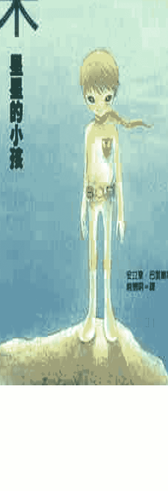

## 阿米  
## ami, el niño de las estrellas  
## 星星的小孩

> 爱，就在我们的心里，我们本身就是爱。生命本身是一个真实的童话故事，是上天赐给我们的美丽礼物。

作者 安立奎·巴里奥斯（Enrique Barrios，1945—）

出生于委内瑞拉；从小就很好奇：人类从何而来、往何处去、又为何而存在。三十六岁那一年，他曾在极度痛苦及孤独的状态中，神奇的是，安立奎逐渐体验到意识成长，巴里奥斯整个人完全改变。宽阔的心胸使得他自由自在地体验着生活的一切，那是一切美妙的事物；促使他撰写这本书，记录他在神秘体验中感受到的生命真谛。

本书一出版马上获得热烈的回响，同年写下续集。《阿米》系列已经被译成二十种语言，全球各地都可以看见喜爱阿米的读者。

译者（赵德明）

现任北京大学西语系副教授兼西班牙文学教授；著有《拉丁美洲文学史》（合著）、《二十世纪拉丁美洲小说》（合著）、《二十世纪欧美文学》（合著）；译有《瓦尔加斯·略萨小说选》、《世界短篇小说选》（主编）、《聂鲁达诗选》（主编）、《巴西诗选》、《爱恋与梦》（合译）等。

绘者（乌拉）

出生于台湾，目前定居台北，新锐影像创作人，目前从事视觉设计创作。个人图文创作有：《海豚爱上热咖啡》、《因为心在左边》、《最近的你最近的我》（以上大块文化出版）。插画作品：《幻想海洋乐章》（晨星）、《放牛少年奇幻之旅》（时报）、《礼物》（晨星）。个人网站：tallonekyahoo.com.tw。

## 目录

- 序言
- 第一部
- 第一章 从天而降的外星人
- 第二章 在星夜的海滩飞翔
- 第三章 幸好谁也不知道
- 第四章 噩梦式催眠
- 第五章 坐飞碟兜风去
- 第六章 我的心有多亮？
- 第七章 带我去月球

### 第二部

- 第八章 不打不相识
- 第九章 宇宙的基本法则
- 第十章 星际舞蹈表演
- 第十一章 水中世界
- 第十二章 心灵电影院
- 第十三章 蓝色佳人
- 第十四章 一颗长了翅膀的心

#### 第一章 从天而降的外星人

一切都是从去年夏天的某个午后开始的。地点是在海边一个宁静的小村庄。我们几乎每年都陪奶奶去那里度假。

去年我们在那里租了一间小木屋；院子里有几棵松树和一大片灌木丛，小花园里种满了鲜花。小木屋在村庄的外缘，靠近海边，有一条小径直接通往沙滩。

奶奶喜欢在夏天快结束时过去，那时观光客已经比盛夏时减少许多。奶奶说，夏末度假比较安静，也比较便宜。

有一天傍晚，天色渐渐黑了，沙滩上空无一人。我独自坐在高耸的岩石上，眺望着大海。突然间，有一道红光从我头上划过。当时我心想，会不会是新年时放的那种庆典烟火？

但是，那道光突然向下掉，还不断地变换颜色，冒出火花。等到它沉得很低的时候，我才发现那不是烟火，因为它正逐渐膨胀，变得像轻型飞机那么大——也许还要更大一点。

最后，不明物体掉进海里，距离海岸大约五十公尺，恰巧就在我正前方，可是掉下来后却毫无动静。

我以为自己目睹了一次空难。我抬头搜寻天空，看看有没有降落伞从天而降——没有，海滩上仍然是一片宁静。

我有点害怕，想尽快离开现场，找人诉说刚才发生的怪事。不过我还是等了一下，想看看接下来还会出现什么。

就在我打算离开的时候，飞机坠落的地方浮起来一个白色的东西——我定睛看清楚后，发现那是一个人朝着岸边游了过来。我猜想应该是飞行员吧，他终于死里逃生。我在岸边等着他逐渐靠近，或许可以助他一臂之力。

他游得很快，我想他大概没受什么伤。

他离我越来越近，我发现他居然是个小孩子！他游到岸边的岩石旁，友善地看着我，脸上带着微笑。

我想，他一定是因为得救了而感到高兴。他的情况看来似乎不算太惨，让我稍稍放心了些。

他爬到岩石上，用手甩掉头发上的海水，调皮地挤挤眼睛，我才松了一大口气。

他在我身旁的石头上坐下，深深地吸了一口气，然后抬头望着天上闪烁的星星。

他看起来年龄跟我差不多大，也许小一点。他的个子比我小，身上穿着一件白色的防水紧身衣——所以没有被海水沾湿；脚下套着一双厚底白皮靴，胸前佩戴着一枚金色徽章，上面镶着一颗长了翅膀的心。金色的腰带上系着一些像是随身听的仪器。腰带中央有个闪闪发光、非常漂亮的大扣环。

我问他到底发生了什么事情。

“是被迫着陆。”他笑着回答。

他的眼睛很大，看起来很友善，只是说话的腔调有点怪。

我猜他是坐飞机从别的国家飞来的。他是个小孩子，我想飞行员一定是个大人。我问他：“飞行员的情况怎么样？”

“没事，就坐在你身边啊。”

“什么？！”

真是太神奇了！这个小孩好厉害，他年纪应该跟我差不多，可是已经会开飞机了！我猜他爸爸妈妈一定很有钱。

夜晚渐渐降临。我觉得有些冷。他发现了，因为他问我：“你冷吗？”

“有一点。”

“这种温度很舒服，”他笑着说，“我不觉得冷。”

听他这么一说，我突然觉得晚间的气温其实很舒服。

我问他来这里做什么。他望着星空回答说：“完成任务。”

我心想这小孩应该是个重要人物，不像我只是个来过暑假的小学生。他身负重任，搞不好还是情报工作。我不敢多问是什么样的任务。他身上的一切都很奇特。

“如果你爸妈知道他们买给你的飞机摔坏了，会不会生气呀？”

“飞机没有摔坏啊！”他笑着回答。

“飞机没有失踪吗？没有摔坏吗？”我不敢相信。

“没有啊。”

“飞机掉到海里还捞得出来吗？”

“捞得出来的。”他友善地看着我，又继续说：“你叫什么名字？”

“彼得罗。”

不过我开始有点不高兴。他不直接了当地回答我的问题，反而自顾自问我其他问题，让我搞不懂他是怎么想的。

我不高兴的样子，好像让他觉得很有趣。

“亲爱的彼得罗，别生气，别生气！你今年几岁？”

“快满十岁了。你呢？”

他轻轻地笑了，他的笑容让我想起小婴儿被呵痒时的表情。

我觉得他因为会驾驶飞机所以不把我放在眼里。我有点不高兴，可是他那么亲切，让人觉得很愉快，我没有办法认真对他生气。

“我的年纪比你想象的要大很多。”他笑得很开心。

他从腰带上解下一个长得像随身听的仪器，那大概是个计算器吧。他启动开关，机器屏幕上出现了一些奇怪的发亮符号。他按了几个按钮，看着屏幕上的数字大声笑着说：“不行，不行。要是我说出我的真实年龄，打死你也不会相信的。”

天色全黑了，一轮美丽的圆月照亮了大海和沙滩。这个不知哪里来的奇怪小孩带来的谜团让我困惑不已。

我仔细看看他的脸，他看起来不会超过八岁。可是他会开飞机，刚才又暗示说他的年龄比我以为的要大很多——他不会是侏儒吧？

这时，他不经意地脱口而出：“有人相信外星人是存在的。”

他没头没脑吐出这句话实在很奇怪。看来这个怪小孩之谜的答案就在这里。

我不说话，思索着这个谜。他注视着我，双眼发出明亮耀眼的光芒，像是反射出天上的星光。他看起来非比寻常地漂亮。

我记得他的飞机坠入海里的时候已经起火燃烧，他却说飞机没摔坏，真是不可思议。令我摸不着头脑的还有他现身的方式、充满诡异的计算器、他说话的腔调和服装。还有，他明明是个小孩啊。小孩子怎么会驾驶飞机呢？

“你是外星人吗？”我忍不住怀疑。

“如果我是外星人，你会害怕吗？”

看来，他真的是从另外一个世界来的！我的确很害怕，不过他的眼神似乎充满了善意。

“你是坏人吗？”我提心吊胆地问。

“也许你比我还坏。”他开心地笑起来。

“为什么？”

“因为你是地球人。”

我知道他的意思是说我们地球人不友善。我听了不太高兴，不过我暂时不去理会。对付这个怪人一定要特别小心。

“你真的是外星人？”

他笑着安慰我说：“你别害怕！”又抬头指指群星说：“宇宙里充满了生命，好几亿、几十亿个星球上都有生命，上面住着许许多多的好人。”

他的讲话在我心里产生了一种奇妙的作用：当他说到星球的时候，我真的“看见”了那几亿、几十亿个有好人居住的星球。

我不再害怕了。我决定相信他的话：别的星球上也有生命，他们很友善，不会迫害人类。

“那为什么你说我们地球人很坏？”

“在地球上看到的天空好漂亮！在大气层的包围下，天空显得特别明亮，颜色也很迷人。”他仍然凝望着星空。

我再次感到不快，因为他没有回答我的问题。而且，我不喜欢别人认为我是坏蛋，因为我并不是——刚好相反，我希望长大以后当个野外探险队员，并且在业余时间抓坏蛋。

“昴星团（Pleiades）上有一种神奇的文明。”

“我们这里不是每个人都坏。”

“你看那颗星星，它已经生存了一百万年，就快要消失了。”

“我再说一遍：我们这里不是每个人都坏。你刚才为什么说我们地球人很坏？”

“我没说，”他望着星空，眼睛闪闪发亮，“真是美妙……”

“你有说！”

我愤怒得大声喊叫，才把他从幻想拉回现实。他跟我表妹一样，当她欣赏着自己仰慕的歌手演唱时会如痴如醉，为他疯狂。

他专注地看着我，脸上没有不高兴的样子。

“我的意思是，有些地球人往往不如其他宇宙空间的居民善良。”

“你看！这不就是说我们地球人是宇宙里最坏的？”

“亲爱的彼得罗，我没有这个意思。”他笑了起来，一面摸摸我的头发。

这让我更不高兴了。我头一甩，躲开他的手。我讨厌别人把我当成傻瓜，因为我在班上成绩是数一数二的。再说，我就要满十岁了。

“既然地球上的人很坏，那你来这里干什么？”

“你有没有留意过月亮倒映在海面上是什么样子呢？”

他又来了，不但不理睬我的问题，还自己改变了话题。

“你刚才问我有没有注意过月亮的倒影？”

“对！你发现没有？我们是漂浮在宇宙之中的。”

我的脑海里浮现一个念头：这奇怪的小孩疯了。显然是这样！他自以为是外星人，所以才会编出一套莫名其妙的故事。

我现在只想回家。刚刚竟然被他唬得一愣一愣，我觉得自己简直像个大傻瓜。

说不定他只是正在寻我开心。什么外星人！我居然还相信他的鬼话！这让我觉得丢脸又生气；既生自己的气，也生他的气。我真想狠狠揍他鼻子一拳。

“为什么？我的鼻子长得那么难看吗？”

他竟然知道我在想什么？我吓呆了，不禁又害怕起来。

我看看他，他得意地微笑着。我不想认输，宁愿以为他猜出我的想法只是偶然和巧合。我的想法和他说出来的话只是刚好一样而已。

我故作镇定，没有露出惊讶的表情。说不定他没有骗我，可是我要证实一下。

说不定站在我眼前的真的是个来自其他世界的人，是个外星人——会读出别人思想的外星人。

或者这家伙根本是个神经病。

我决定要测试一下。

“那我现在在想什么？”我开始想象一个生日蛋糕。

“有了这么多的证据你还不相信吗？”他说。

“什么证据？”我不肯让步。

他伸直双腿，把双肘靠在岩石上撑着下巴。

“彼得罗，你知道吗？在宇宙中还有另一种不同模式的‘现实生活’，是比地球更知性的世界。必须具有知性的聪明才智，才能开启通往知性世界的大门。”

“你到底在说什么啊？”

“你的蛋糕上要插几支小蜡烛呢？”他笑着问道。

这句话好像在我胸口上撞了一拳。我懊恼得快要哭出来。

我跟他说对不起，可是他没有生气，反而自己笑了起来。我决定不再怀疑他的真实身份了。

#### 第二章 在星夜的海滩飞翔

“来我家过夜吧！”我邀请阿米，因为已经有点晚了。

“我们的友谊不要让大人插进来！”他耸肩笑着说。

“可是我必须回家了。”

“你奶奶睡得正熟，不会发现你还没回家。我们再聊一会吧。”

他再次让我惊讶又佩服。他怎么知道我奶奶的事情？这时，我想起他是个外星人，知道我心里在想什么。

他看出了我的心思，便说：“我从飞船上看到了你的奶奶。”

话才说完，他兴高采烈地提议道：“我们去海滩散步吧！”说着便从岩石上一跃而下，飞奔到沙滩边缘，然后跳起来伸展四肢，向空中扑了过去！

我想他一定会摔得鼻青脸肿，焦急地跑上前去——

我简直不能相信自己的眼睛：他展开双臂在空中滑翔，然后慢慢向下降落，好像一只银白色的海鸥！

但是我马上想到，用不着对这个来自另一个星球的小孩所做的事情大惊小怪。

“你是怎么飞起来的？”

“我想象自己是一只小鸟。”他在沙滩上快乐地奔跑着。

我羡慕地想，要是我也能像他那样飞起来该有多好。可是我没办法像他那样快乐自由。

“你当然可以像我一样快乐又自由！”他又一次猜中了我的想法。

他来到我身边热情地怂恿我说：“来！让我们像小鸟那样飞起来！”说着拉住我一只手，我感到全身精力充沛。我们在沙滩上奔跑起来。

“现在，往上跳！”

他跳得很高，同时用一只手将我拉了起来。双脚落到沙滩上之前，他仿佛在空中停留了一会儿。我们继续跑，过一会儿又猛地往上跳。

“我们是小鸟！我们是小鸟！”他在替我加油，让我跟着兴奋起来。

我发现自己似乎有什么不一样，好像已经不是从前那个“我”了。在外星小孩的鼓励下，我的身体逐渐轻盈起来，像羽毛一样轻盈。我觉得自己真的是只小鸟。

“现在，往上飞！”

我惊奇地发现：整个身躯确实可以在空中停留片刻，然后缓缓地落到地面，又继续奔跑，接着再飞起来……我们飞得越来越好，真让我不敢相信。

“用不着惊讶！你做得到的。很好，再来一次！”

我每试飞一次就感到越来越容易飞起来。在月光和星光映衬的夜空下，我们沿着海岸，好像慢镜头拍摄一样，时而奔跑，时而腾空飞翔。

这种感觉就像体验了另一种生存方式，或者经历了另一个世界的生活状态。

“我们热爱飞翔！”他轻轻松开了我的手。

“你做得到的！你做得到的！”他在我身边飞跑着，同时不停地替我打气。

“现在，往上飞！”我跟在他身后慢慢地飞起来，伸展双臂，在空中停了几秒钟，然后轻轻地降落。

“好啊！棒极了！”他称赞我。

我不知道那一晚我们玩了多久。对我来说，那好像是一场梦。

我玩累了，便扑到沙地上，边喘气边快乐地大笑。太奇妙了，真是一次难以忘怀的体验。

我虽然嘴上没说，可是内心非常感激这不寻常的小孩让我实现了原以为根本不可能成真的梦想。

那时我根本就不知道，当天夜里还有更奇妙的事在等着我呢。

在海湾的另一侧，广大的海水浴场上一片灯火辉煌。我的朋友躺在月光覆盖的沙滩上，眺望着黑夜的海面上闪烁不定的灯火，神情十分愉悦。过了一会儿，他翻过身仰望着明月，激动地说：“月亮怎么不会掉下来呢？你们这个星球真是太美妙了！”

我从来没有想过地球美不美，可是经他这么一说，我才发现星空、大海、沙滩，还有悬在空中的月亮都美丽极了。

“你们的星球不美吗？”我好奇地问。

他目不转睛仰望着星星，似乎舍不得把眼睛移开。

“啊，也很漂亮。这一点我们每个人都知道，也都爱护我们的星球。”

我想起他暗示说地球上的人们“不够善良”。我猜，这是因为我们不像外星人一样懂得珍惜爱护自己的星球。

“你叫什么名字？”

“我没办法告诉你。”他神秘兮兮地笑着。

“为什么？这是秘密吗？”

“不是！只是你的语言发不出那个音。”

“什么音？”

“可以念出我的名字的音啊。”

我觉得很奇怪。我还以为他和我说一样的语言呢，尽管他说话的腔调有点怪怪的。不过，我很快就想到，既然单单地球上就有成千上万种不同的语言，整个宇宙一定也有几百万种语言。

“那你是怎么学会我们这种语言的？”

“要是没有这个，我就不会说，也听不懂。”他边说边从腰间掏出一个仪器。

“这是个‘翻译通’。这个仪器会侦察你大脑里的思维活动，把你要说的话传达给我，好让我了解你的意思。而我要说话的时候，这个仪器会让我的嘴巴和舌头活动，就跟你说话的方式一模一样——对了，是‘几乎’一模一样。完美无缺是不可能的。”

他收起翻译通，双手抱着膝盖坐在沙地上欣赏着大海。

“你是用这个方式来了解我的想法吗？”

“是的。不过我在练习这种心灵感应术的同时，也不断在进步。”

“那我要怎么称呼你呢？”我问。

“你可以叫我‘朋友’，因为我就是‘朋友’大家的‘朋友’。”

我突然有了一个好点子：“朋友在我的语言里读成‘阿米果’（amigo），我干脆就叫你‘阿米’好了，好听又好叫。”

他兴奋地喊道：“彼得罗，这个名字棒极了！”说着还拥抱了我一下。

我感觉到此时此刻有一份崭新而又极其特别的友谊在我们之间展开——后来也的确是如此。

“你们那个星球叫什么名字？”

“哎，这个我也说不出来，因为你的语言里没有相对应的发音。不过，它就在那里。”阿米笑着指指星空。

“你们什么时候发动进攻？”我想起从前在电影和电视里看过很多外星人入侵地球的影片。

“你为什么会认为我们要入侵地球？”他觉得我的问题很好笑。

“不知道。电影里的外星人总是对地球人不怀好意。你是外星人吧？”

他大笑不已，好像听到一个有趣的笑话。

我试着为自己辩解：“因为电视上……”

“是啊，问题就在电视！”阿米边说边从腰带上取下另一个仪器。他按下按钮，屏幕亮了起来。这是个迷你彩色电视机，影像非常清晰。他快速地切换频道。

令人惊讶的是，这个海边小区应该只能看到少数几个频道的节目，可是他的彩色电视机里却随着频道更换而出现了许许多多节目，像是电影、现场直播节目、新闻、广告。每个节目的语言都不一样，其中出现的人来自不同的民族。没有缴费，怎么能看到这么多电视台的节目呢？

“外星人入侵的影片真的很可笑。”阿米仍旧很乐。

“你能收看多少个频道的节目？”

“我可以看到现在地球上正在播放的所有节目。因为我们设在地球上的卫星会拦截节目的信号，再传送到这个仪器上。你们看不到我们的卫星，因为它们只有一枚铜板的大小。你看，我调到一个澳洲的电视频道了。”

屏幕上出现了一些长着章鱼脑袋、眼球突出且布满血丝的动物。它们的双眼射出一道道绿光，正在攻击一群吓坏了的人类。这部电影逗得阿米很开心。

“真夸张！彼得罗，你不觉得很好笑吗？”

“有什么好笑？”

“因为这些鬼东西都是拍影片的人夸张的想象。”

他没能说服我。因为在这之前我在屏幕上看过太多恐怖的外层空间坏蛋，怎么能说忘就忘呢！

“可是既然地球上有蜥蜴、鳄鱼、章鱼，那么别的星球上为什么就没有可怕丑陋的生物呢？”

“没错，是有丑陋的生物，可是它们不会制造致命的武器。”

“不过，有的星球上说不定有聪明的坏蛋啊。”

“‘聪明的坏蛋’！这等于是说‘善良的坏人’、‘肥胖的瘦子’，或者‘美丽的丑八怪’一样。”阿米哈哈大笑起来。

我被搞糊涂了。如果“聪明的坏蛋”并不存在，那些发明出毁灭性武器的疯狂邪恶的科学家又怎么说呢？卡通里那些超级英雄不是都在对抗这些邪恶的科学家吗？

阿米猜出我的想法，他解释说：“他们不是聪明人，他们是疯子。”

“那说不定存在着一个由疯狂科学家组成的世界，他们会把我们都毁灭掉的。”

“毁灭地球的坏蛋要么就在地球上，要么不可能存在于其他星球。”

“为什么？”

“因为那些疯子的科学水平在达到可以离开自己的星球、去入侵其他世界之前，他们就会先自我毁灭了。”

我不太相信他的话。我觉得可能有的星球上住着还不十分疯狂的疯子；也就是说，是些聪明、冷漠、懂科学又功利的人，这些人既残酷又邪恶，充满危险性。

阿米很快看出了我心里的念头，他觉得我的想法很好笑。

“那么你心里想象的这些生性冷酷、邪恶、又企图毁灭地球文明的魔鬼到底在哪里啊？”他一副天真的模样。

我努力回想了一下。在我所知有限的人类历史上，还真的找不到任何外星人作恶的记载。

“好啦，我不知道。可是总会有第一次啊！”

“你这个‘总会有第一次’的说法是想告诉我，虽然你一点根据都没有，却坚决相信外层空间的邻居总有一天会到地球为非作歹？我看你根本就是被害妄想症作祟！”他大声说着，然后笑了起来。

我认为他的话很有道理，可是无论如何我都不能百分之百地相信宇宙里所有的居民都是“天真善良”的。一定有好人——比如像阿米这样的——也一定有坏人，就跟地球上有好人有坏人是一样的。

他极力安慰我说：“彼得罗，相信我吧！宇宙里有‘过滤带’能阻挡那些不受欢迎的东西。‘上面’的世界和‘下面’的世界并不是一模一样的。当一个社会进化到接近‘上面’的程度之后，就不会再发生可怕的事了。因为，虽然‘上面’也有必须改善的问题，但是并不像‘下面’这么严重。”

“你能保证没有这样一种科技发达，可是非常残暴的文明吗？”

“我只能告诉你：制造炸弹的技术比起制造宇宙飞船要容易几千倍。假如一种文明既没有智慧，又不善良，可是科技达到了很高的水平，那么它迟早都会先被高科技自我毁灭，上面的居民根本还来不及到达其它星球呢。这对整个宇宙来说是幸运的。”

“可是，说不定在某个星球上，因为某种偶然的原因，不善良的坏人会侥幸存活下来啊！”

“偶然？我们的语言里没有这个词。‘偶然’是什么意思？”

我只好举出几个例子让他了解什么是“偶然”。他觉得我的话很有趣。他说，宇宙本身是一种高级而完美的秩序。万物没有偶然性，因为所有的一切都是相互联系、息息相关的。

“既然宇宙间有几百万个星球，那么说不定在这当中，会有些坏蛋没有自我毁灭，而侥幸地存活下来。”我还在想外星人入侵地球的可能性。

“你想象一下，要是赤裸着双手拿起炽热的铁棒，有可能不被烧伤吗？”

“不可能。这样一定会被烧伤的。”我回答。

“道理是一样的啊。如果一个世界的科技水平远远超过了人们的互爱精神，那个世界就会自我毁灭。”

“什么是互爱精神？”

我可以理解阿米所说的“科技水平”，可是我不懂什么是“互爱精神”。

“人类彼此的互爱程度，可以用我们的仪器测量出来。”阿米说。

“真的？”

“当然。因为爱是一种能量、一种力量、一种振动。假如一个星球上的人类互爱程度很低，就会产生集体的不幸，带来仇恨、暴力、战争；假如这个星球的人类同时拥有强大的破坏力的话，那就会……彼得罗，你懂我的意思吗？”

“不大懂。你想说什么呀？”

“我要告诉你很多很多事情，不过我们还是一点一点慢慢来吧。”

我还是不懂为何不会有外层空间来的魔鬼入侵地球。我告诉阿米我在电影中看到的情节：一些长得像蜥蜴的外星人占领了很多星球，因为他们有完善的社会组织。

阿米告诉我，一个组织如果缺乏仁慈和美德，就不可能持久：因为人类天性向往自由、智慧和爱，所以搞强制、压迫或洗脑，最后一定会导致造反、分裂和毁灭。

“如果人们缺乏善良、仁慈的心，任何一种社会组织都无法长存。当一个文明累积了相当的智慧，获得进化时，自然而然会出现最完善的社会组织。发展出这种组织的人们是爱好和平的，他们不会伤害别人。除此之外找不到更好的方法了，存在于宇宙间的智慧法则早就铺设好进化的道路，非我们的聪明才智所能及。”

后来，他更清楚地将这个道理解释给我听，但是我仍然怀疑宇宙中或许存在着聪明而邪恶的魔鬼。

“你电视看太多了啦！”阿米喊道。他接着又补充说：“我们想象出来的魔鬼都在自己心里。如果不能摆脱魔鬼的纠缠，就无法感受宇宙的种种奇迹。奇迹一直都在，就等着我们抬头去发现它们。”

“阿米，有时候我听不太懂你的话。”

“邪恶的人既不聪明也不漂亮。”

“可是，电影里有些邪恶的女人却很美丽啊。”

“她们要嘛不美丽，要嘛不邪恶。”

“我看过几个坏女人，她们真的很漂亮。”

“也许她们的外表看起来很漂亮，可是内心呢？对我们来说，真正的美一定要与爱心结合在一起，不然就不是真正的美。”

我不太同意阿米对“美”的标准，不过我没说什么。

“除了地球上的坏人以外，宇宙里还有别的坏人吗？”

“当然有了，而且更坏。有的星球上面住着真正的恶魔，完全不适合人类生存。”

“你看！你看！”我发出胜利的欢呼：“你自己也承认别的星球上有坏人了。我刚刚说得没错吧！”

“可是你用不着担心，因为他们在‘下面’——那边的世界比较落后。他们的物质水平低到连汽车都没有过，更不用说飞船了，所以他们并没有入侵地球的能力。”

听到这句话终于让我放下心来。

“所以追根究底，地球人并不是宇宙中最坏的家伙。”

“不是。但你是银河系里的大傻瓜之一。”

我们很有默契地同时大笑起来。

## 3、幸好谁也不知道

“你知道吗？我刚才来这里的时候经过天狼星，那里有紫色的海滩礁，美丽极了。要是你看到那里同时有两个夕阳落下的奇景，一定会兴奋得不得了。”

“你是用光速旅行的吗？”

“如果我的速度这么慢的话，那我还没到达这里就变成老头了。”阿米觉得我的问题很好笑。

“那你旅行的速度有多快？”

“我们并不旅行，准确地说是‘到位’。”

“什么？”

“简单地说，‘到位’就是迅速出现在我们希望到达的地方。”

“非常非常快吗？”

“是的。不过飞行器必须事先进行复杂的计算。例如从银河系的一端移到另一端要用掉……”他取下腰带上的计算器：“按照你们计算时间的方法……嗯，要花一个半小时；从银河系移到另外一个星系也要几个小时。”

“真是了不起！你是怎么办到的？”

“你能向一个小婴儿解释为什么二加二等于四吗？”

“不能。”我回答说，“我也不知道为什么。”

“同样地，我也无法向你解释有关时间、空间的收缩和弯曲，以及其中的关联。”

“你看，那些小鸟跑得多快，好像在滑水一样。真妙！”

阿米望着那些在海滩上成群奔跑的小鸟，它们在浪花冲刷的沙滩上觅食。这样的情景让我忽然想起夜色已深，该回家了。

“我得走了，我奶奶……”

“她还在睡觉呢。”

“我有点担心。”

“担心？别傻了！”

“为什么？”

“‘担心’有‘事先’的意思。事情发生之前没有必要担心，只管去做就行了。”

“阿米，我不懂你的意思。”

“别活在想象的牢笼之中，整天幻想着没有发生过、也不会发生的问题。为什么不尽情享受眼前的一切呢？你应该好好利用生命，追求幸福，而不是自寻烦恼。如果真的出了问题，到时再去解决它就好啦！”

“我想你是对的，不过……”

“假如我们两个在这里胡思乱想，担心巨浪会把我们吞没，你觉得有必要吗？不好好享受眼前这一刻，浪费了这美好的夜晚，那可太傻了。你看看那些小鸟多么无忧无虑，为什么要为了某个不存在的问题而辜负眼前的大好时光呢？”

“可是我的奶奶是存在的啊！”

“没错，但是她并没有遇到任何问题。眼前这一刻对你来说，难道是不存在的吗？”

“可是我担心……”

“唉，地球人啊地球人！好吧，我们来看看你奶奶。”

阿米解下腰间的电视仪器开始操作。屏幕上出现通向我家的路。镜头不断往前移动，沿路经过我熟悉的景色；画面上五颜六色，十分明亮，好像白天一样。然后镜头直接穿过院子围墙进入屋里，奶奶出现了——她正在床上沉睡，甚至可以听到老人家呼吸的声音。

阿米的仪器真是不可思议！

他笑着说：“她睡得像个天使。”

“这不是电影吧？”

“不，这是‘现场直播’。我们到厨房看看吧！”

镜头穿过卧室的墙壁来到厨房。餐桌上铺着大方格的桌布，我常坐的位子上放了一个餐盘，上面覆盖着另一个盘子。

“看起来好像我的‘飞碟’喔！”阿米开玩笑地说，“我们来看看奶奶给我什么晚餐。”

他动一动仪器，餐桌上面的盘子居然变得像玻璃一样透明。我看见盘子上放着一块烤肉、一些炸洋芋片和几片西红柿。

“恶心！”阿米大叫，“你们怎么能吃死尸呢？”

“什么死尸？”

“母牛的死尸。那是一块死牛的牛肉啊！”

听他这么说，连我都觉得恶心起来了。

“这个仪器是怎么运作的？摄影机在哪里？”我好奇地问。

“它不需要摄影机，因为内部有个零件能聚焦、取景、透视、放大和显示。很简单吧？”

看来他是在取笑我呢。

“现在是晚上，为什么屏幕里看起来像白天啊？”

“宇宙里还有你的肉眼看不到的其它‘光线’，这个仪器可以接收得到。”

“真复杂啊！”

“一点也不复杂。这个小东西是我自己动手做的。”

“你自己做的！”

“这已经是个老古董了，不过我很喜欢它。这是我小学时候的美劳作业。”

“你真是个天才！”

“当然不是。你会乘法吗？”

“当然会啦。”我大声回答。

“那对不会乘法的人来说，你就是天才。一切都是程度和等级的不同而已。就像对于深山里的原住民来说，随身听简直就是奇迹。”

“有道理。你认为将来我们地球上能制造出这个玩意儿吗？”

他头一次变得严肃起来，目光里流露出些许忧伤。他说：“我不知道。”

“你怎么会不知道呢！你不是什么事情都知道吗？”

“我不是什么事情都知道。未来的事情没人能知道，幸好谁也不知道。”

“为什么‘幸好谁也不知道’？”

“想象一下吧：如果人们知道了未来的事情，那生活多没有乐趣啊。你想事先知道一场正在进行的球赛结果吗？”

“不想。那样的话所有看球赛的刺激和期待都没有了。”

“你喜欢听一个早就知道内容的笑话吗？”

“不喜欢。那会让人觉得无趣。”

“你希望过生日之前就知道会收到什么礼物吗？”

“一点都不想，那就没有惊喜了。”

他举的例子让我很快就明白了。

“如果人们预先知道未来会发生什么事，生活就失去了意义。因为有人会整天忙着计算种种的可能性，而完全不管现实生活的一切。”

“什么意思？”

“比如说，整天想着地球人要怎样才能逃过劫数。”

“逃过劫数？为什么要逃过劫数？”

“什么？你没听说地球上充满环境污染、战争和各式武器炸弹吗？”

“你的意思是说：我们这里也有危险？就像充满恶魔的星球一样？”

“有许许多多种可能性。在你们地球上，现在科学与爱心之间的关系是严重地朝着科学的那一边倾斜——有几百万个像地球一样的文明已经因为这样而自我毁灭了。现在的地球正处于能否进化的紧要关头，对你们来说是一个既危险又敏感的时刻，而这几十亿人在你们的当权者带领之下，不知道会偏向哪一个方向……”

阿米这番话让我害怕起来。在这之前，我从来没想过第三次世界大战或者类似的大灾难是可能发生的。我陷入了长长的沉思之中。

突然，我脑海里冒出一个很棒的点子，可以解决地球上一切问题：“你们可以做点什么啊！”

“比如像什么？”

“我也不清楚。嗯，好比说让外星人开来几千艘宇宙飞船登陆地球，对各国总统晓以大义：停止战争、不要互相残杀……等等。”

“如果我们这么做，会先吓坏一大群人。因为你们在电影中把我们抹黑成无恶不作的大坏蛋，如果我们真的派大批飞碟登陆地球，不把一些人吓得心脏病发才怪！事实上，我们并不冷酷无情，也不愿挑起事端。再说，如果我们为你们把武器改造成生产工具，那么你们可能会认为：这是外星人为了削弱地球人的实力，好趁机占领地球的计谋。而且，就算你们了解我们并没有恶意，也不会放下武器的。”阿米微微一笑。

“为什么？”

“因为你们会害怕其它国家入侵，谁都不愿率先解除武装。”

“可是大家应该互相信任啊。”

“孩童会互相信任，大人不会，更不要说国家元首了。他们这样彼此猜疑，是因为有些人野心很大，企图统治全地球。”

我心中难以平静。我继续思考着如何避免战争、拯救人类。我想了好久，想到唯一的方法就是，让外星人用武力接管地球、销毁炸弹、强迫地球人过和平的生活吧！总之，如果能让人类得救，即使有几个胆小的老人家吓得心脏病发，仍然十分划算。我把这个想法告诉阿米。

阿米笑了，接着他用严肃的口吻说：“你无法放弃地球人的思考方式。”

“为什么？”

“什么使用武力啊、销毁啊、强迫啊，这都是地球人的想法。对我们来说，这是原始人类的思维方式。自由，无论是我们的自由还是别人的自由，都是神圣不可侵犯的。因此在我们的世界里，‘强迫’这个词并不存在：每个人都很重要，都应该受到尊重。武力和销毁是暴力行为，这与我们的思想精神完全对立。另外，虽然你以为‘少数几个人吓破胆子无关紧要’，可是我们不能也不愿意侵害他人。”

“那你们是不打仗的吗？”

我一说完就觉得问这种问题实在是笨到极点。

他亲切地看着我，拍拍我的肩说：“我们不打仗，因为我们爱神。”

这句话让我吃了一惊。我是相信神的——虽然不太坚定——不过我对神的恐惧多于热爱。最近我对这件事产生了怀疑，因为我有个在大学教核物理的叔叔说：“聪明才智足以消灭神。”

“你叔叔是个傻瓜。”阿米猜中我的心思之后断言道。

“才不是。大家都认为我叔叔是全国最聪明、最有智慧的人之一。”

“他是个傻瓜。”阿米坚持他的看法，“苹果能消灭苹果树吗？浪花能消灭大海吗？”

“我以为……”我开始思考神的形象。

“喂，别想什么胡子和长袍了！”

阿米在笑，因为他看到了我心中神的形象。

“难道说神没有胡子——他不用刮胡须吗？”

“你脑海里的神太像地球人了。”我的外星朋友看我一脸困惑，觉得很好玩。

这句话是什么意思？难道说神长得像外星人？如果是这样，那么外星人长得也不像我们地球人吗？

“可是，我记得你说过别的星球上的人类长得并不奇怪，不像我们在电影里看到的怪物。再说，你自己看起来就像个地球人。”

阿米微笑着拿起一根树枝，在沙地上画了一个人像。

“我们星球上的人和地球人的长相差不多，都有头部、躯干、四肢，但是两个星球上的人彼此之间会有些小变化，像是高矮、肤色或耳朵的大小。这就和地球上不同种族的人们外形也会有些差异是一样的。”

“我知道。可是你明明长得就像个地球上的小孩子。”

“因为我们星球上的人本来就长得和你们很像，所以我才被派来这里执行任务。可是，神并没有人类的脸孔和外形。”

“什么？难道神长得像魔鬼？”

他哈哈一笑说：“不，不是这样。彼得罗，我们去散步吧。”

我们沿着小路向村里走去。阿米搂着我的肩膀，我觉得他就像是我哥哥——虽然我从来没有哥哥。

一群夜鸟哇哇地掠过夜空飞去。阿米似乎很喜欢听这种鸟鸣。他吸了一口海上清新的空气说：“神没有人的外表。”一说到神，尽管是在夜里，他的脸仍然闪闪发亮。“神并没有特定的样子，不像你或我一样有人的形体。祂同时是很多事物的化身：祂是具有高超智慧的造物者，也是全然无私的爱……”

“哇！”他对神的描述让我感动不已。

“因此宇宙是美好的、神奇的。”

“可是坏人呢？”我想起阿米说过的“下面”星球的居民，和地球上的坏人。

“总有一天他们会成为好人的。”

“要是他们从一出生就是好人，该有多好！那样的话就没有坏人了。”

“如果人们不了解‘坏’，怎么能感受‘好’？又如何评价‘好坏’呢？”

“我不太懂。”

“你的眼睛看得见，你不觉得很美好吗？”

“不知道，我从来没有想过。”

“假如你一出生就看不见，有一天看得见了，那你会觉得有一双明亮的眼睛真是美妙无比。”

“啊，是呀！”

“就跟曾经历过艰苦、困顿生活的人们一样。一旦他们摆脱了困境，能够活得更有尊严的时候，他们就会比任何人都来得珍惜。因为，要是一些人都过着像天堂般完美的生活，其实也很无聊。相反地，如果人生中总是有进步的空间，能不断地克服困难，不断地学习，这样的生活才更有意义。就好像如果没有了黑夜，就无法体会黎明有多美。”

我们沿着小路走着，皎洁的月光把树木的影子映照在地上。我们走到我家门口，我踮手踮脚溜进去拿了一件运动衫。我看见有一个碟子盖在我的餐盘上面，正等着我掀开用餐呢。我觉得自己很厉害，因为不用掀开我就知道里面有什么食物了——但是这时我突然感到好奇，便掀起盘子瞄了一眼，果然不错：菜色就和在阿米的小电视里看到的一模一样。不过我现在还不饿。

我轻轻带上家门，回到阿米身旁，两人继续散步和聊天。阿米一面说话一面四处张望。我们还没走到村子里最主要的街道上。这一条小路上看不到任何路灯。

“你知道你正在做什么吗？”阿米突然问我。

“啊？我在做什么？”

“你在走路。你能走路。”

“当然喽！可是这有什么奇怪的呢？”

“如果有一个人腿部受过重伤，经过长期复健后又能自由行走，那么，对他来说，能走路就是件难得的事。他心里会充满感激，充分享受走路的能力。而你呢，你正在用健全的双腿走路，却没有意识到这是一种享受，丝毫不觉得走路有什么特殊的意义。”

“阿米，你说得对。这些事情我以前从来没想过。”

## 4、恶梦式催眠

我们走到了有路灯照明的大街。这时大概是深夜十一点左右。

深夜在树林里散步实在有些危险。不过，有阿米在身边，我就不怕了。

阿米不时停下脚步，望着从树叶间洒下的月光。他要我倾听身旁青蛙的呱呱叫声、蟋蟀鸣唱的小夜曲和远处传来的浪涛声。他也不时停下来闻闻花木、树木的清香和泥土的气息，或者欣赏附近美丽的房舍和街道。

“你看！那些小巧的路灯多漂亮，好像画出来的一样。仔细观察光线是怎么洒在那些藤蔓上，还有在星空下更清晰的屋舍轮廓。彼得罗，生活是要好好享受的。只要努力感受、捕捉这一切，便能时常发现神奇的事物。生活的意义远远超出思考之外。”

“彼得罗，你知道吗？生活是一个真实的童话故事，是神送给你的美丽礼物，因为神爱你。”

阿米所说的话让我从一个崭新的角度看待事物。如果这个世界总是一成不变，每天都没有新鲜事，该是多么贫乏无趣。

现在我慢慢明白了，我其实是生活在一个宛如天堂的地方，只是我从不曾察觉。

我们来到村里的广场上。几个年轻人围在一家歌舞厅门口，还有一些人在广场中央闲聊。这里很安静，尤其是已经到了夏末，游客愈来愈少。

没有人注意我们。尽管阿米的穿着显得很怪异，他们可能会以为这只是个天真孩童的扮装。

我想，如果他们知道这个小孩是外星人的话，肯定会把我们团团包围，记者和电视台也会闻风而至……

“不！谢谢。我不想变成烈士。”阿米说道。他已经看出我的心思。

我不懂他这句话的意思。

“首先，他们会以‘非法入境’的罪名逮捕我，把我当成间谍，用种种不友善的手段对我严刑逼供，然后医生们还要把我送上解剖台检视我这小小身体的内部构造……不！谢谢。”阿米一边讲述种种可能发生的恐怖情景，一边笑个不停。

我们在广场的另一个角落找了张长椅坐下。我心里想，外星人应该要一点一点慢慢露面，好让大家接受他们来到地球的事实，最后再找一天公开现身。

“我们现在做的事情跟你想的差不多，但是公开露面嘛，我刚刚已经说过三个理由，所以目前不适合这样做。现在我再告诉你另外一个最主要的理由：法律禁止我们公开露面。”

“什么法律？”

“宇宙法则。地球有法律，对吧？在文明发达的星球上，也有人必须遵守的普遍规则，其中一条就是不能干涉不进步世界发展的进程。”

“什么是不进步世界？”

“就是那些不按照宇宙基本法则生活的地方。”

“这句话是什么意思？”

“根据宇宙基本法则生活的地方，只有一个中心政府而没有国界之分，人们在友情、和平与和谐的基础上共同生活。这样才是高度发达的世界。”

“我不大懂。宇宙基本法则到底是什么？”

“你看！你不知道这个原则，所以不是进步世界的人。”他假装取笑我。

“我只是个小孩子。我想大人一定知道，科学家、总统们一定也知道。”

“大人、科学家、总统……哼，他们比谁都无知！”阿米大笑起来。

“他们治理国家，影响人民的幸福，难道连这么重要的原则都不知道？”

“正因为如此，所以你们地球上发生了不少灾难。”

“那个原则到底是什么啊？”

“以后我再告诉你。”

“真的吗？”一想到就要知道许多人都不了解的事情，我不禁兴奋起来。

我开始思考那条“禁止干涉不进步星球事务”的法令。

“那你现在岂不是违反了这条法令？”我吃惊地说。

“好极了！你没有忽略这个细节嘛！”

“那当然！你说法律禁止干涉别人，可是又告诉我这么多，这难道不是干涉？”

“公开露面、深入交往，才会干涉地球的事务。你知道为什么要禁止干涉吗？”

“阿米，你已经说了三、四个理由了。”

“但是最重要的理由我还没说呢。那就是，假如我们对你们进行干涉，除了会引发我告诉过你的灾难之外，还会发生人类史上最可怕的大灾变。”

“阿米，什么大灾变？”我有点害怕。

“地球上的人们一旦了解我们所使用的经济、科学、社会和宗教制度，就会以我们为榜样，而不再服从国家领袖和社会组织了。地球上所有的政权都会垮台，威胁地球文明的稳定性。有权有势的人们一看到有可能丧失特权，就会变得寻衅好斗。那可真的会天下大乱。到了最后，我们就不得不介入而试图整顿一切。”

“那不好吗？让你们来整顿地球才好啊！”我忍不住兴奋起来。

“这叫‘作弊’，就像学生考试时找枪手一样。你希望别人代替你考试吗？”

“不愿意。那会失去经过努力而获得成功的快乐。”

“如果由我们来整顿这里的一切，那么地球上的人类就不能体会亲身克服困难所得到的真正快乐。你说对吗？”

“嗯，有道理。我没有想到这一点。”

“所以我们不能超越法律允许的范围去干涉别人。例如我跟你的接触就是‘援助计划’的一部分。”

“这是什么样的计划？”

“援助计划就像是一种‘药’，我们必须按照一定的剂量，非常小心地用药。”

“你们在我们身上用什么‘药’？”

“讯息。”

“讯息？什么讯息？”

“从很早、很早以前开始，我们的飞船就经常巡游，可是一直到第一颗原子弹出现之后，才让你们看到大船。这样做是为了让你们知道，你们并非宇宙中唯一有智慧的生物，同时也要让你们明白，我们一直在密切观察地球上的军事发展。”

“你们为什么要这样做？”

“因为我们希望人类了解原子能是一种难以控制的东西，甚至可能影响到地球附近的其它星球。接着，我们增加了让人类看见飞碟的频率；将来，我们会刻意让你们有机会拍摄。”

“另一方面，我们也跟一些地球人开始进行接触，就像现在我跟你这样。我们还会用心灵感应输送讯息。这些讯息就像无线电波一样在空中传送，可以传到每个人耳中，但是只有一部分人拥有‘接收器’。彼得罗，这一切都是我们给人类的协助。”

“将来你们会公开露面吗？”

“当你们能按照神的指示生活——也就是‘考试’通过的时候——我们就会公开露面。但是在达到这个目标之前我们是不可能现身的。”

“为了避免地球毁灭，难道你们不能多干涉一点吗？”我有点难过。

阿米微微一笑，望着天上的星星。

“我们对人类自由的尊重是建立在爱心之上，因此应该让人类自己努力去争取理想的目标。进化是非常微妙的过程，不能随便用外力干涉。有一些事情我们只能透过一些特殊人物进行‘提示’——比如像你这样的人——十分巧妙地‘提示’。”

“像我这样的人？可是，我有什么特殊的地方？”

“也许我以后会告诉你。现在，你只要知道你具备了某些‘条件’，而不是什么‘当然想’。虽然我们相处的时间很短，我已经开始佩服你了。”

“我也想再见到你。但是如果你希望我回来，你就应该写一本书，记录你在我身边的体验。我就是为这件事情而来的，这也是‘协助计划’的一部分。”

“可是我不会写书啊！”

“就把它当成是说一个想象出来的故事给别人听一样，不然的话，别人会以为你是在胡言乱语。另外，你的故事是要说给‘孩子们’听的。”

于是他解释什么是“十五岁的老人”和“二百岁的小孩”，也就是我在本书开头写下的那句话。

我要独力写一部小说，这可是个重大任务。

“你请那个喜欢写作的表哥帮忙吧！就是那个在银行工作的表哥。你讲故事，他作记录。”

看来，阿米对我的事情知道得一清二楚——甚至比我自己更了解。

“写这本书也是提供‘讯息’的一种方式。除此之外，我们不能过度干涉。”

“现在我再告诉你另外一个理由：如果一个充满邪恶生物的进步文明永远不会入侵地球，你高兴吗？”

“当然高兴。”

“知道吗？这是因为我们从来没有帮助过任何邪恶的生物。如果地球人在我们的帮助下逐渐强大，却不能克服暴力和自私的弱点，那么很快地，你们就会运用新的科学知识去探索、征服和统治太空中的其它文明。”

“虽然高度进化的宇宙是一个充满和平、爱心、互助、友好的地方，但也同样蕴藏着具有毁灭性力量的能源。拿原子产生的能量跟它一比，就好像放根小火柴在太阳旁边一样微不足道。我们不能冒险让一个充满暴力的文明有机会掌握这种能量的支配权，并波及到高度进化世界的安全，更不能让它引起宇宙间的大灾难。”

“阿米，我非常担心。”

“彼得罗，你在担心宇宙大灾难吗？”

“不是。我是在想已经太晚了。”

“你是说拯救人类太晚了？”

“不是。时间太晚了，该回去睡觉了。”

阿米捧腹大笑起来。

“放心吧，彼得罗！我们现在就来看看你奶奶。”

他把小电视从腰带扣上解下，我看到奶奶正半张着嘴在睡觉的画面。

“老人家正在做好梦呢。”他开玩笑地说。

“我累了。”我打了一个呵欠。

“好，回家吧。”

我们朝我家走去的时候，迎面来了一辆警车。警察们看到三更半夜有两个小孩走在路上，便下车朝我们走过来。我害怕极了。

“这么晚了，你们在这里干什么？”

“散步，享受生活。”阿米泰然自若地回答。

“你们呢？还在工作吗？抓坏蛋啊？”阿米促狭地笑着。

我很担心阿米对警察那副随便的样子会惹他们生气。但是，警察好像觉得阿米说话的样子很有趣，他们居然跟着笑了起来。我也想挤出笑容，却紧张地笑不出来。

“你从哪里弄来这套衣服啊？”

“从我的星球上。”阿米面不改色。

“啊，你是火星人？”

“准确地说不是火星人，但我是外星人。”

阿米答得很快，一副无所谓的样子。我刚好相反，心里十分紧张。

“你的‘飞碟’呢？”其中一个警察带着父亲般的神情注视我的朋友。他们以为这是小孩在玩家家酒，可是阿米说的都是真话。

“我把它停放在距离沙滩不远的海底下。彼得罗，你说是吧？”

现在我也被卷入“戏”里来了，可是我不知道该怎么“演”。我努力装出笑容，结果露出一副白痴相。我不知道该说什么。

“你没带激光枪吧？”

警察觉得这样的谈话很有趣，阿米也是。只有我忐忑不安，心里七上八下。

“我不需要带武器。我们不攻击别人，我们是大家的好朋友。”

“假如跑出一个坏人，拿着这样的手枪对准你，那怎么办？”一个警察掏出手枪，装出一副吓唬人的模样。

“要是他攻击我，我可以发出心灵的力量让他瘫痪。”

“现在就试试看，让我们俩瘫痪吧！”

“我很乐意，这是你们要求的。有效时间十分钟。”

阿米和两个警察开心地笑个不停。突然，阿米安静下来，他变得很严肃，目不转睛地盯着两个警察。他用一种非常奇怪、洪亮又充满权威的声音发出口令：

“你们在十分钟之内原地不动、原地不动、原地不动！行了！”

两个警察就像被粘在原地般一动不动，嘴角还挂着一丝微笑呢。

“彼得罗，看见没有？所以说，在进化程度不高的星球上应该说到做到，不然他们会以为我是说着玩的，根本不当一回事。”他一面解释一面摸摸警察的鼻子，又轻轻拉扯二人的胡须。两个警察僵硬地站在原地，我觉得他们的微笑开始变成苦笑了。阿米仍然蛮不在乎的样子。

“快跑吧！我们赶快离开！他们会醒过来的！”我压低声音说道。

“放心吧！距离十分钟还久得很呢。”他一边说着，一边把二人的警帽对调，还把帽檐转向脑后。

“阿米，走啦！我们赶快走啦！”我一心只想赶快逃跑。

“你又在担心了。好，好，我们走吧！”他走到两个面带微笑的警察身旁，用刚才那种奇怪的声音发出命令：

“你们醒来以后，要永远忘掉这两个小孩子！”

我们走到街角，拐了个弯走向海滩，远离了那两个警察。我才稍微放下心来。

“你是怎么让他们睡着的？”

“催眠。谁都可以做得到。”

“我听说不是每个人都能被催眠。说不定你下次会遇到一个无法被催眠的人。”

“人人都能被催眠，”阿米说，“不仅如此，几乎人人都被催眠过。”

“我就没有被催眠，我是醒着的。”

听我说得这么肯定，阿米哈哈笑了起来。

“你还记得我们刚刚走在小路上的情景吗？”

“记得。”

“一路上所见你都觉得很新鲜，很美好，对吗？”

“啊，没错——看来我一直是被催眠的。是你把我给催眠了！”

“不。那时候你是清醒的，现在才是睡着了。现在的你觉得一切都变得危险丑恶，听不见海涛声，闻不到花香，享受不到新鲜空气，没有意识到你在散步，在欣赏风景。从悲观的角度来看，你是被催眠了，这是最糟糕的情况。”

“为什么会造成这种情况呢？”

“因为人类常常会有很糟的观念；有些是自己假想、虚构出来的，有些是从担心害怕衍生出来的——虽然不知道为什么要担心害怕；有些根本就是自己胡思乱想，有些可能是精神状况出了问题造成的，完全没有事实依据。因为这些观念一点都没有建设性，也称不上是无伤大雅的疯狂念头，只能用梦魇来形容。”

“比如像哪种想法，阿米？”

“比如像你那些忧虑和担心。”他笑了，而且他的笑声感染了我。然后他停下脚步，望着大海说：“又比如有一种人认为，战争虽然危害人类，却有‘光荣’的意义；因为他们处于催眠状态，那是一种恶梦式的催眠。”

“阿米，现在我懂了，你说得对。”

“他们认为凡是不参与他们梦境的人都是敌人，另外一些人则认为他们拥有的身外之物可以让他们更有身份。有些人时时充满恐惧，担心失去健康、失去工作，他们觉得不管是地球还是太空中都充满了敌人。他们全副武装，处处设置锁链、保全设施、警犬和防盗锁。这就是‘恶梦式的催眠’所显现的症状。”

“他们永远不会醒来吗？”

“若是能从恶梦中醒来，开始感受到生活的美好，体会到时时刻刻都充满愉悦——因为生活的确如此——那才是他觉醒的开始。觉醒的人知道生活就是天堂，充满不寻常的机会，即使生活中也有艰难的时刻。”

阿米的话让我有点伤感。我想起自己的父母已经过世，多亏奶奶辛苦地照顾我，给我全部的爱，但我宁可当个正常家庭的孩子。

阿米继续解释：“一个觉醒的人会用正确的态度对待自己生活里的问题和挫折，他会抱持着这样的观念：和一生中将会经历的美好时光相比，真正令他感到痛苦和艰难的时刻就显得短暂多了。因此，即使遇到困难，他也会把握人生的每一分每一秒，学着苦中作乐。”

“阿米，我看这样的人可不多。”

“这是因为在进化程度不高的地方，很少有人这么清醒。大部分人的心灵都像被催眠了一样沉睡着，活在自己假想的世界里。但是，他们这样并没有比较幸福，反而比较像活在恶梦里。所以才会发生自杀这么离谱的事情，彼得罗。”

“你说得有道理，因为我知道有很多人就像你说的那样。对了，为什么警察对你开的玩笑一点都不生气？”想到刚才遇到警察的情形，我仍然心有余悸。

“我触动的是他们善良的一面，童心的一面。”

“可是他们是警察啊！”

他看看我，好像我刚说了一句蠢话似的。

“彼得罗，其实，每个生活在恶梦里的人都有孩子气的一面。因为就算再笨的人也会偶尔从恶梦中跳脱出来，让自己休息片刻。”他笑着说，“你要是愿意，我们可以到监狱里去找一个最凶的犯人来试试看。”

“不用！多谢了。”

“地球上确实有很多人的心灵被催眠了。尽管如此，好人还是比坏人多。”

“真的吗？”

“当然呀！因为在人的心里面，仇恨的情绪远比‘爱’来得少。”

“可是我实在不觉得是这样。”

“这是因为当人在思考或做事的时候，常常会觉得只有自己才是对的。有时候他们根本就弄错了，但是他们可能只是坏心做错，也有可能是被催眠了，并不是故意做出伤天害理的事，所以不算是坏人。没错，还没觉醒过来的人总是正经八百，有的时候甚至带有危险性。可是，如果你对他们好，通常他们会以善报善；相反的，要是你拿不好的一面对待他们，他们就会以恶报恶。”

“如果人没那么坏，为什么世界上还有那么多的不幸，真正美好的事反而很少呢？”

“因为你们现行的制度是很久以前制定的：那时的世界动荡不安，人与人之间彼此威吓，互不信任。但是现在一切都改变了，人类已经随着时间的推移提升了进化的程度，各民族间的交流比以前频繁得多，增加了彼此的认识，人们心中的抱负也更高了。但是，你们的制度却没有随之调整，才会一直这么落后。”

“由于这些制度已经无法符合现行社会的需求，使得原本立意良好的措施变成限制人们的桎梏，使他们活在恶梦里，导致犯罪事件层出不穷。然而，唯有一套跟得上时代潮流、以追求全民福祉为目标的制度出现，才能快速地唤醒人类的心智，转化人类的想法。”

只是，要过了很久以后，我才真正理解他说的这些话。

## 5、坐飞碟兜风去

“你家到了。要上床睡觉了吗？”

“对。我真的好累，走不动了。你呢？你要做什么？”

“我回飞船上去。我要去外层空间兜兜风。”

“是吗？好棒喔！”

“我本来想邀请你一起去，可是你累了。”

我一想到可以坐飞碟兜风，瞌睡虫都跑光了，头脑清醒，全身充满活力。

“现在我不累了！你真的要带我坐飞碟去兜风吗？”

“当然。可是你奶奶怎么办？”

我灵机一动，立刻想出了不让奶奶发现的方法。

“我把晚餐吃掉，把空盘子留在餐桌上，然后把枕头塞到被窝里。如果奶奶起床的话，她会以为我在床上睡觉。我还可以把身上这件衣服留在卧房里，换上另外一套。我会很小心地搞定这些事情。”

阿米说：“没办法，只好对你奶奶撒个小谎了，因为你跟我走一趟对于写书是必要的。我们会在你奶奶起床之前回来，你不用担心。”

于是阿米在门外等我，我一个人走进家里，按照事先的计划进行。但是在我要吃牛肉时，突然感到一阵恶心，没有办法像平常那样大口吃下去。

一切安排妥当后，我们一同向海滩走去。

“我要怎么登上你的飞船呢？”

“我游泳过去，然后把飞船开上海滩来接你。”

“你不冷吗？”

“不冷。这套衣裳既抗寒又抗热，很不可思议吧。好啦，我去找飞船。你在这里等着吧！我出现的时候你可别害怕。”

“哎，不会啦。我已经不怕外星人了。”我觉得他这些不必要的叮咛很好笑。

月亮已经躲到大片乌云背后去了。四周一片漆黑。

阿米向温柔的海浪中走去，整个身躯逐渐没入水中，消失在我的视线之外。时间一分一秒地过去。自从阿米现身以来，这是我第一次有机会独自思考。

阿米是谁？

一个外星人！

这是真的吗？还是一场梦？

我等了好久，不安的情绪逐渐升高，恐惧开始浮现心头。我孤伶伶地一个人待在那里，在那可怕、孤寂、漆黑的海滩上……

我即将面对的可是一艘外星飞船耶。

这时，岩石之间、沙滩上仿佛有跳动的怪影出没，好像是从海水里冒出来的，分不清是想象还是真实。我不禁怀疑起不久之前发生的一切……

——阿米会不会是伪装成小孩子的坏蛋呢？

——他说的协助计划啦、做好事啦，会不会只是要骗我相信他？

——不！这不可能。

——呃，真的不可能吗？我会被外星飞船拐走吗？

我正在胡思乱想、怀疑这怀疑那的时候，眼前突然出现惊人的景象：一道黄绿色的光芒从水面下缓缓升起，接着一个不停旋转的圆形物体从水面浮出，放射出五颜六色的光芒。

这是真的！我真的看到一艘外星飞船！

渐渐地，椭圆形的船身完全浮出水面，还不断发射出银绿色的光芒，船上有许多发光的小窗户。

眼前的景象让我害怕极了。跟一个小孩聊天是一回事——他是小孩吗？善良的外表会不会只是面具——而当我孤伶伶站在海滩上，在漆黑的夜里眼睁睁看着一艘外星飞船出现又是另外一回事了。那可是要把你带到远方去的“飞碟”啊。

此时此刻我突然忘了那个所谓的“小孩子”和他告诉我的一切——那些话此刻变成了一艘可恨的飞船。谁知道它是来自哪个阴暗的太空角落。船上可能挤满了残暴的怪物，要把我绑架到外星上去！我觉得这艘飞船比几个小时前坠落在海里的物体要大上好几倍。

飞船先是漂浮在距离水面约三公尺的高度，然后开始朝我这边飞了过来。它没有发出任何声响，安静得让人害怕。眼看它越来越靠近，我根本无处可躲。

我真希望时间能倒退，希望根本没看过什么太空飞行物降落，希望从来没有认识什么外星人，希望自己现在安稳地躺在我的小床上。

那是一场恶梦。恐惧使得我全身瘫软，可是我根本无法逃脱，也不能不面对这个要把我带走的发光怪物，说不定它会把我送进太空动物园里去呢……

当飞船巨大的身躯飞到我头顶上方时，我的脑子一团混乱，想象那个可怕的怪物就要把我压得粉碎……这时，从怪物的腹部发射出一道黄色的强光，我的眼睛几乎睁不开。我知道我快没命了。我把灵魂托付给神，决定服从命运的安排……

不知道过了多久，我觉得自己双脚悬空，缓缓离开了地面，好像是升降机之类的东西轻轻地载着我。我等着某个长着章鱼头、目光凶狠的怪物出现。

过了一会儿，我的双脚落在松软的地面上——我发现自己站在一个地上铺着地毯、墙上挂着壁画，温暖而令人愉快的房间里。

那个外星小孩就站在我眼前，明亮的大眼睛露出和善的笑意。

他友善的目光让我逐渐放松，回到他曾经教我认识的美好现实来。

“放心吧！放心吧！没有发生什么可怕的事。”他把一只手放在我肩膀上。

好不容易平静下来时，我笑着说：“真是吓死人了。”

“刚才你的脸都绿了！”阿米笑着说。

“我以为……会出现一些可怕的东西。”

“那是你在胡思乱想。失控的想象力足以吓坏人，甚至凭空罗织出怪物。但那只是我们的恶梦，因为现实其实是朴实、美好、简单的。”

“那我现在是在‘飞碟’里吗？”

“飞碟是一种不明飞行物，但我们的飞船可是确实存在的。这是一艘宇宙飞船，不过，你要是高兴，我们也可以叫它‘飞碟’，你也可以叫我‘火星人’。”

我们相视而笑，我刚刚紧张的心情完全消失了。

“来！到指挥舱看看吧！”

穿过一个非常小的拱门之后，我们来到另一个天花板很低的地方，就像我们刚离开的那个房间一样。那是一间半圆形的大厅，墙壁上都是巨大、呈不规则状的窗户。大厅中央有三张可以横躺的椅子，每张椅子前面都有一些操作仪器，数个监视器屏幕则竖立在不远处的地板上。这一切好像是为小孩子准备的！无论座椅和房间的高度都是如此。我手臂一伸就可以摸到天花板，大人在这里一定无法站直身子。

我兴奋地喊道：“太棒了！”

阿米在操控仪器的座椅上坐下。我向机舱窗走去。从窗边往外看，远处的海水浴场灯火辉煌。

我感到地板在轻微地颤动。海水浴场的灯光越来越远，窗外只看得到星星。

“往下看！”阿米说。

我从窗边俯瞰，吓了一大跳——我们正在海湾上方几千公尺的高空！隐约可以看见沿海的村庄。我想我住的小木屋一定也在很远很远的下方。就在一瞬间，飞船已经往上飞了好几公里，可是我竟然毫无感觉。

“太棒了！太棒了！”

坐在飞船里让我好兴奋。这时我才感觉到飞行高度让我有点头晕。

“阿米！”

“什么事？”

“这艘船不会掉下去吧？”

“嗯，如果船里有人说过谎话，那这些敏感的仪器就会失灵。”

“降落吧！我们快点下去！”我几乎尖叫出声。可是从阿米的哈哈大笑声中，我知道他是在开玩笑。

“地面上的人看得见我们吗？”

“打开这盏灯以后，下面的人就会看见我们。”他指指仪表板上的红色指示灯。

“如果关闭红灯，像是现在这样，飞船就可以完全隐形了。”

“完全隐形？”

“就像我身旁的这位先生一样。”他指指旁边的空位，我吓了一跳。看到阿米顽皮的笑容才知道我又上当了。

“完全隐形是怎么做到的？”

“脚踏车的车轮转得飞快时，车轮的轮轴就看不见了。同样地，我们也可以让这艘飞船的物理分子快速运转。”

“太酷了！不过，我还是希望下面的人能看到我们。”

“我不能这样做。我们的飞船来到低度进化星球的时候，露面或者不露面是必须根据‘协助计划’进行的。一切都是由银河系中心的‘超级计算机’决定。”

“我听不懂。”

“这艘飞船跟那个‘超级计算机’之间有连接网络，它决定我们什么时候该露面或者不该露面。”

“那个计算机怎么知道我们什么时候……”

“它什么都知道。你想去看看哪个特别的地方吗？”

“去我在城里的那个家！我想从空中看看我的家。可是在几百公里以外呢。”

“没问题！”阿米动一动控制仪器上的按钮，然后对我说：“到了！”

我本来准备靠着窗口看看沿路上的风景，却一下子就到了。几百公里的路程只花了半秒钟！

我对这艘飞船真是彻底着迷了。

“旅行一下子就结束了！”

“我跟你说过，通常我们不‘旅行’，而是‘到位’。这是时间和空间的坐标问题。不过，我们当然也能‘旅行’。”

从高空往下看，城市的夜景美妙无比，街道灯火辉煌。我找到了我家所在的街区。我要请阿米向那边驶去。

“请慢慢‘旅行’好吗？我想欣赏一下沿途的风景。”

红灯并没有开启，没有人能看到我们。飞船缓慢、安静地在星空与城市的灯火之间前进。

我家出现了！从空中俯瞰自己的家真是一种神奇的经验。

“你想看看家里的情况吗？”

“嗯？怎么看？”

阿米前面的大屏幕上出现了从空中拍摄的街道景象，就跟从他那台小电视看奶奶睡觉一样。不过仍有明显的不同：这里的影像看起来很立体，很有空间感，让人忍不住想把手伸进屏幕里去触摸物体的形状。我伸出手试了一下，可是只摸到一片看不见的玻璃屏幕。阿米得意地笑了。

“每个人都会想摸一下屏幕。”

“‘每个人’？‘每个人’是谁？”

“你别以为你是第一个到宇宙飞船上玩的低度进化星球人类。”

“我一直以为我是第一个呢。”我有点失望。

“那你就错了。不过你也不必太伤心，因为跟你一样幸运的人可不多。”

“那还差不多。”

我家内部的影像显示在屏幕上，镜头走遍了每个角落。家里到处都井井有条。

“为什么你那个小电视没有立体感？”

“我说过了，那是个老电视。”

“既然是老东西，那何不送给我？”

“什么？！彼得罗，我们不能把高科技的产品留在这样的星球上，你知道它不会被用来做好事的。”他没料到我会提出这个要求。

我想了一下才明白：那样的仪器有可能被用来偷窥和侦测。

阿米说：“那时，地球居民就要跟自己的隐私权说再见啦。”

我请求阿米让飞船绕着城市转一圈。

飞船飞到了我的学校上空，窗外出现了熟悉的校园、操场和教室。我心想，以后一定要跟同学们炫耀这次坐飞船历险的经过：“我从宇宙飞船上看见了学校！”这个念头让我骄傲起来。

阿米对我的念头嗤之以鼻：“那你恐怕很快就会被送进精神病院了。”

“唔……”阿米说得也没错，同学们很可能不会相信我的话，还会嘲笑我。

“彼得罗，把真实情况写在书里就好了，把它当成是一个幻想故事。”

我们继续在城市上空盘旋。

我说：“可惜现在不是白天。”

“为什么？”

“我希望能在白天坐飞船旅行，看看阳光下的城市风景。”

“你希望现在是白天？”阿米狡黠地笑着。

“我不相信你能让太阳转动。”

“转动太阳做不到。但是我们可以……”

阿米启动了控制器，飞船开始快速飞行，越过崇山峻岭，接着飞船下方出现了几座城市；由于飞船飞行速度很快，它们看起来就像是几个发亮的小光点。过了一会儿，我看到远方有一片沐浴在月光下的海洋。接着，地平线的交会处越来越明亮！——飞船已经来到一块陆地上空，奇妙的是，太阳升起来了！

阿米真的移动了太阳！太不可思议了。

“刚才你不是说办不到？”这时窗外已经变成大白天了。

“太阳并没有被移动，而是飞船快速移动的结果。”阿米笑着说明。

我知道我想错了，但只要看看太阳从地平面上快速升起的动人景象，就能明白为什么我会产生这种错觉。

“我们到什么地方了？”

“非洲。”

“可是一分钟前我们还在南美洲啊！”

“因为你想要在白天坐飞船旅行，所以我们就来到了现在是白天的地方。这就叫‘山不转路转’。你想看非洲的哪个国家？”

“那个，那个……印度！”

阿米的笑声说明我的地理常识不太正确。

“那我们就去亚洲的印度看看。你想去印度的哪个城市？”

“哪个都可以。你选吧！”我不想再闹笑话。

“孟买怎么样？”

“好！阿米，好极了！”

我们在高空高速飞驰，把非洲大陆远远抛在后面。

（后来，回到家里，我才对着世界地图重新画出这次旅行的路线。）

飞船来到印度洋上空。当我们穿越这片汪洋时，太阳正急速上升，速度之快令人微微感到晕眩。不一会儿，我们已经来到印度上空了。

这时飞船突然紧急刹车，停止不动。

我以为会听到玻璃碎裂的声音，没想到船舱里完好如初。我惊讶地问：“舷窗怎么没被撞碎呢？”

“这很容易，只要去除惯性就好了。”

“啊，原来如此。”

## 6、我的心有多亮？

飞船下降到孟买上空一百公尺的高度，开始在城市上空漫游。在这之前，我没有看过多少印度的图片，因此现在我觉得好像是在看电影或是在做梦；地面上有成千上万的人在走动，他们穿戴着五颜六色的长袍和头巾。牛车摇摇晃晃地走在大街上。房屋建筑很特别，巷弄中有很多叫卖的小贩。

但是特别引起我注意的还是如潮水般的人群，这跟我住的城市很不一样。我居住的城市很大，但即便在尖峰时间，市中心也看不到这么多人。这里就像是另一个世界。

红色指示灯是熄灭的，没有人看得见我们。

“奶奶……”突然间，我又回到“现实”里来了。

“你奶奶怎么啦？”

“现在是白天，她一定已经起床了，正为了我不在家而担心呢！我们回去吧！”

“彼得罗，她老人家睡得正香呢。地球那一边刚刚过了半夜十二点，这一边现在还不到早上十点钟。”我说出来的话似乎都让阿米觉得很好笑。

“现在是昨天还是今天？”我被搞糊涂了。

“是明天！”阿米促狭地笑着。

“阿米，我真的很担心奶奶。”

“别担心！我们时间还很多。你奶奶几点钟起床？”

“不知道。她说她常常睡不好。”

“离她‘睡不好’的时间还有几小时，我们等一下会好好利用的，更何况我们还可以把时间拉拉拉……长呢！”

“不管怎么说，我还是担心。干嘛不看一下呢？”

“为了让你相信，我们还是看看电视吧。有些地球人的生活方式简直就是自我折磨！”阿米低声嘟囔着。

他启动屏幕上的控制仪器，屏幕上显示出飞船向地面快速俯冲下降的过程。接着，我认出了海湾、海水浴场、我们在海滩上的小木屋，然后是屋里的奶奶。真是难以想象，奶奶仍然保持着原来的姿势半张着嘴巴睡觉。

“这下总不能再说老人家睡不好了吧！”阿米调皮地说：“我们再做一件事，让你更放心。”

他拿起一个类似麦克风的东西，要我别出声，然后按下一个按钮，发出“嗡”的声音。奶奶听见“嗡”声便醒过来，起床向厨房走去。她的脚步声和呼吸声透过麦克风传到我们耳里。她收拾了餐桌上我吃剩的晚餐和碗盘，接着，她走到我的寝室，朝我的床铺看了一看。一切都很正常，我似乎在床上睡着了。但是，好像有什么东西引起了奶奶的注意，我不知道是什么，可是阿米知道。他拿起麦克风，开始大声呼吸。我想奶奶听见了，以为是我的声音，便熄了灯，带上房门离开了。

“现在放心了吧？”

“嗯，放心了。不过还是很难相信，奶奶那边是晚上，而我们这边却是白天。”

“你们地球人的生活太受空间和时间的限制了。”

“我不懂。”

“今天出门旅行，昨天回家，你觉得怎么样？”

“我会被搞疯！我们能去中国看看吗？”

“当然可以。你想看哪个城市？”

这一次我不会再出糗了。我用自信而肯定的口气回答说：“东京！”

“那我们就去日本的东京看看吧！”阿米极力掩饰着笑意。

我们往东北方前进，飞越整个印度。到达喜马拉雅山脉上空时，飞船停下来了。

阿米说：“命令下达。”

控制仪器的屏幕上出现了一些奇怪的符号。

“‘超级计算机’指示说：我们要留下一个证据，让某地的某人看见。”

“真有趣！去哪里？让谁看见？”

“不知道。我们要跟着指示走。好，到了。”

瞬间移动系统指引飞船来到一片森林上空，我们在离地面五十公尺高的地方停下来。仪表板上的红灯亮起，表示我们已经被人们看见。飞船下是皑皑白雪覆盖的大地。

阿米说：“这里是阿拉斯加。”

不知不觉中，太阳慢慢地沉到海里去了。

飞船机身不停地变换着颜色，并在天空中画出巨大的三角形飞行轨迹。

“画三角形做什么？”

“要让人留下深刻的印象，引起前面来的那位朋友的注意。”

阿米从屏幕上观察着那个人的动静。我透过舷窗向下看，看到那个人在远方的森林里。他身穿棕色皮质猎装，手里拿着猎枪，一副吓坏了的样子。他用猎枪瞄准我们。我急忙蹲下身子，害怕被子弹击中。

阿米看见我害怕的样子，开心地笑起来。

“别害怕！这个‘飞碟’是防弹的，什么也不怕。”

飞船向上飞去，距离地面越来越高，但仍然一直发出五颜六色的闪光。

“必须让这个人永远忘不了这次见面的情景。”

我心里想，只要让他看到飞船飞过就够难忘了，没有必要让他这么害怕嘛。

“你错了。有好几千人看过我们的飞船，可是今天他们已经忘得精光了。假如人们看到飞船的时候正好处于恶梦状态，对许多事情充满担忧，那么他们看到我们的时候就容易视而不见，过不了多久就会完全忘记了。关于这个现象，我们有惊人的统计数字。”

“为什么要让这个人看到我们？”

“我也不知道。也许由他出面作证会对某个特别的人物、或对此事有兴趣的人物很重要。可能他本人就是这种人。我用‘进化测量器’测看看。”

那个人的身影出现在另外一个屏幕上，但看上去几乎是透明的。他胸部中央有一道美丽的金光在闪烁。

“那道金光是什么？”

“是爱心的力量对灵魂产生的作用，也就是他进化的水平。他有七百五十度。”

“这是什么意思？”

“他是个很清楚自己要做什么的人。”

“为什么？”

“对于一个从事狩猎的人来说，他的进化水平已经相当高了。可以肯定的是，他很快就会觉得伤害小动物实在没什么意思。我想这次会面对他肯定有帮助。”

##### 什么是进化水平？

“接近动物或者接近‘天使’的程度。”

阿米按了几个按钮，屏幕上出现一只熊的影像，看上去也是透明的，但是它胸口上的光点远不如刚才那个男人明亮。

“一百度。”阿米说。接着，屏幕上出现一条鱼，这一次，光点更加微弱了。

“五十度。”

“阿米，你有多少度？”

“七百六十度。”他回答。

“只比猎人多十度而已！”阿米的度数只比地球人高出一点点，让我很惊讶。

“当然了，我和他的水平差不多。”

“但是照理说，你应该比地球人进化程度更高啊。”

“彼得罗，地球上有些人能达到八百度哪。”

“比你还高！”

“当然。我的优势在于我了解一些他们不知道的事情。不过，地球上有些品格高尚的人，像是教师、艺术家、医护人员、消防队员，我不一定比得上他们。”

“你是说消防队员很高尚？”

“冒着生命危险抢救别人难道还不高尚吗？”

“说得对。那我叔叔呢？他是核物理学家，应该也是高度进化的人吧。”

“唔，他从事什么研究？”

“他在研究一种新式武器，一种超音速激光枪。”

“嗯，如果他不懂得人的聪明才智是神智慧的反映，如果他的短浅目光让他变得傲慢自大，再加上他把聪明才智全用在制造武器，那我认为他的进化水平不会很高。你觉得呢？”

“可是他是个学者啊！”我抗议道。

“你把事情搞混了。你叔叔的脑中有很多讯息，他善于整理资料，但这并不一定意味着聪明，更说不上是学者。一台计算器可以储存大量的数据，可以做高度复杂的运算，可是不能因为这样就说它聪明。你认为挖个可能让自己掉进去的洞的人聪明吗？”

“可是……”

“手里拿着武器的人往往反被武器伤害。”

我不太懂阿米的意思。虽然我很愿意相信他，但叔叔是我心目中的英雄，是一个非常聪明的人。

“这里有个术语上的问题：地球上把那些脑筋灵活的人叫做‘聪明人’或者‘学者’。你叔叔头脑里有台好计算器，如此而已。但是我们外星人有两个大脑。”

“什么？有两个大脑？！”

“准确地说，是有两个‘心智中心’：一个在头脑里，就是‘计算器’，是你们地球人智力偏重的唯一中心。它处理跟这个世界相互联系的讯息。另外一个中心在心灵，它是看不见的，因为它不是物质，可是它确实存在。这个中心与生活中的深刻事物、永恒和普遍的真理——例如智慧和爱——是相互联系着的。屏幕上那个男人胸口光亮的程度，就取决于这两个中心之间的平衡状态。”

“阿米，这太有趣了。”

“我们认为，聪明人或学者是那种两个中心处于和谐状态的人；也就是说，聪明才智必须为良心服务。但是大部分所谓的‘聪明人’却忽略了这一点；他们整天计算着小聪明，不明白两个中心保持和谐的重要性。”

我请阿米举个例子给我听。

“一个职业杀手很可能会这样想：既然有人花大钱雇我杀人，那这样的工作岂不是越多越好！”阿米说话时的疯狂表情把我逗笑了。

“这种人只看到金钱和物质的诱惑，却看不到金钱带来的折磨和束缚，因为他的两个中心之间并不平衡。”

“我现在稍微懂了。那如果心灵比智力中心发达的话又会怎么样呢？”

“这是另一种极端。你可以说他们是‘善良的傻瓜’。他们无法理解自己是生活在怎样的世界。结果那些‘邪恶的聪明人’往往会伤害这些‘傻瓜’，而‘傻瓜’还以为‘聪明人’在做好事呢。这些‘愚笨的好人’基本上心地都非常善良，如果有人对他们好，他们也会以同样的方式回报。”

“这不好吗？”

“有时这些善良而不谨慎的小狗会被不太善良的‘癞皮狗’咬伤。缺乏理智思考的友善不会成为真正的爱。”

“是什么原因使得这种友善不能变成真正的爱呢？”

“‘感情’必须得到‘聪明才智’的启发才能转化成真正的大爱，而‘聪明才智’必须要注入‘感情’才能转化成大智慧。”

我想起电视新闻里报导的那些罪犯：原来压迫或者伤害别人的人，都是聪明与感情失衡所造成的。

“那么感情和爱不一样吗？”

“不一定都一样，彼得罗。你们地球人把它们混淆了。有时，你们把没有经过智慧启发的感情称之为‘爱’，比如猛兽对小兽的舔犊之情，或者狂热分子对所属团队的效忠。但真正的爱不是这样，我们说的‘爱’不止是本能的反应，而是必须和真正的智慧以及纯粹的心灵结合在一起才算。”

“阿米，我懂了。”

“进化水平是智慧加上爱心的水平，也就是聪明与感情的结合。因此，智力的进步应该要与感情的进步相伴并进。只有这样，才能产生真正的智者或学者；惟有如此，心灵的光芒才会越来越亮。”

“阿米，我的心有多亮？”

“我不能告诉你。”

“为什么？”

“因为如果你的水平很高，你会骄傲。”

“啊，我明白了。”

“如果很低，你会感到非常难过。”

“噢。”

“不健康的骄傲会熄灭心灵的光芒。”

“我不懂。我还以为自豪是好的。”

“为了超越自我而高兴，这样的自豪是健康的；如果是由蔑视而生的傲慢则是不健康的。我们应该学着去做一个谦卑的人。像神就是非常谦卑的，虽然祂为我们创造了万物，却选择不露面，只让我们看到祂创造的东西。”

“会面的时间结束了，我们得走了！”

就在我们说话的同时，飞船已经返回喜马拉雅山，回到了地球的另一端。

## 7、带我去月球

我们向远方的大海飞去，越过海洋上空时，飞船下方出现了一些岛屿，那是日本群岛。几秒钟之后我们便到达目的地：飞船的高度逐渐下降，来到东京上空。

我看到窗外有很多摩天大厦、现代化的大街、公园绿地，还有各种汽车。

“我们被下面的人发现了。”阿米指指仪表板上闪烁的红灯。

大街上，人群逐渐聚集，对着我们的飞船指指点点。我们距离地面很高，飞船外部亮起七彩斑斓的灯光，不过只停留了不到两分钟。

“这是又一次和地球人会面。”阿米一面观察屏幕上出现的信号，一面说，“我们要转移阵地了。”

不知不觉中，白日的光线消失了，只有星光在舷窗外闪烁。

我看不清下面有什么东西。远处似乎出现一座小城、几点灯火，有辆汽车驶了过来。

我走向阿米面前的大屏幕，上面显示出清晰的全景图。在黑夜的衬托下，监视器上的画面显得十分明亮，好像是大白天似的。于是，我发现那辆汽车是墨绿色的，车上有一男一女。

我们距离地面有二十公尺高。仪表板上红灯亮起，下面的人是可以看到我们的。

我凑近大屏幕仔细端详，它比现实的景物还清晰呢。

那辆汽车在离我们不远的地方停下来。两人走下车，一面神色惊恐地望着我们，一面打手势、叫喊着什么。

我问阿米：“他们在说什么啊？”

“要求和我们交流与联系。他们俩都是喜好研究‘飞碟’的人，不过现在这情况实在有点夸张，他们看起来更像是‘外星人的崇拜者’。”

我说：“那就交流一下吧！”看到他们惊恐的神色，我有点为他们担心。

这时，那两个男女突然跪倒在地，对着飞船祈祷。

“我不能跟他们交流。我必须严格服从‘协助计划’的规定，不能因为一时心血来潮就贸然跟地球人通话。除非有人能在适当的时机使用这种能力，否则必须经过‘上面’的批准才能执行。而且，我不能鼓励偶像崇拜。”

“什么是偶像崇拜？”

“那是违反宇宙法则的。”

“偶像崇拜到底是什么意思？”我继续追问。

“把我们看成神仙。”

“这有什么不好呢？”

“只有神才能被当成神。把宇宙中任何一种人或物当成神仙就是偶像崇拜，就是混淆了果实与树木的关系。”

“这很严重吗？”

“对于不大在乎这些事的人来说，不算严重；如果我们接受这些人错误的信仰，而企图篡夺神的位置，后果就非常严重了。不过，假如他们只是单纯把我们看成进化程度比较高的兄弟，那当然又是另一回事了。”

我觉得阿米应该帮助这对男女改正错误。他察觉了我的想法，便说：

“彼得罗，我们不能帮助宇宙中低度进化星球上的居民改正错误，尤其是他们已经有了自己的文字和宗教、有学习能力的时候。更何况，这对男女的行为还比不上低度进化星球居民所犯的错误。

“其他星球上哪怕发生了恐怖的事件，我们也不该干涉——就在我们说话的此时此刻，很多星球上有人在杀人放火。地球上也一样啊！”

“你们就这样袖手旁观吗？”

“彼得罗，我们什么也不能做。”

我发现这是个好机会，可以把长期以来在我脑海里盘旋的疑问提出来：

“阿米，有时我觉得神不够仁慈。祂怎么能允许世界上发生这种事情呢？”

阿米站起来，靠着舷窗望向天空说：

“彼得罗，一切都是进化水平的问题。就像人与人之间进化的水平不一样，星球之间也是如此。这个星球虽然不是非常进步，可是还有更落后的星球呢。对我们来说，不进步的星球上支配生活的法则是很残忍的，所以我们无法在那种地方生活。

“好几百万年以前，地球上的生物依照弱肉强食的法则生存。大部分生物都好勇斗狠，彼此张牙舞爪、不怀好意。为了生存而战斗是残酷的，而在这种环境里长久生活的结果，使得这些生物适应了这样的环境：就算把其他生物生吞活剥，它们也不会感到怜悯。”

“难道这就是神所创造的充满‘爱’的世界吗？”

“我跟你说过，只有了解黑暗，我们才能珍惜光明。我还告诉过你，那种生物不像你充满感情，因此不会和你生活在同一个世界里。”

“嗯、呃……”关于神的仁慈，阿米没能说服我。

“今天地球已经达到比较高的进化水平，拥有一些爱心和智慧。正因为如此，生活才不像从前那样艰苦。不过还不能说这个世界已经是完全进化的星球了，因为地球上仍然存在许多野蛮的现象。

“此时此刻，海底里的鱼群正凶猛地互相吞食，可是它们几乎没有意识到自己是野蛮的，因为它们的智识水平很低。”

“不管怎么说，自相残杀是很残忍的。”

“对你来说是残忍的。可是鱼群并不觉得如此，因为你不是生活在那个弱肉强食的海底世界。另一方面，有的生物虽然拥有较多的良知，却仍然犯下令人震惊的罪恶，而且他们这么做并不是为了求生存。”

阿米按了几个按钮，屏幕上出现了战争的场面。士兵们从坦克车里向一些建筑物丢掷弹药，还不时射击住在里面的人。

“这种残暴的场面正在地球的某处上演，可是我们只能做眼前这点事。对于每个星球、国家或者个人的进化，我们不能在许可范围以外擅自进行干涉。”

这时屏幕上出现了集体枪杀战俘的画面。

“请关掉电视好吗？我受不了这残酷的画面。”

“彼得罗，这的确很可怕。但是，就如同人类的灵魂不会随着肉体死去而消失，而两个相爱的灵魂终究会找到彼此一样，这些过程都是为了让人类学习。在我前几世的轮回里，我是头野兽，后来被别的野兽咬死了。我转世成为人，可是进化水平很低；我杀过人，也被人杀害；我对人残暴，也得到残暴的对待。我经历过各种形式的生活，才一点一滴地学会比较温和友善的生活方式。现在我过得比以前好多了，但是我不能违背神创造的进化体系。”

“下面这对男女把我们跟伟大、威严的神相比，那就触犯了宇宙法则，因为他们不该把对神的崇敬之情转移到我们身上。我们刚刚在电视上看到的那些士兵则触犯了‘不得杀人’的宇宙法则；杀人的罪更重，可是我们也不能干涉。”

“你别以为受罪的人是因为‘神的残暴’而受罪，事实并非如此。宇宙伟大的智慧主负责安排每个人应得的命运。说不定被炸弹炸死的那些人，在前世或者这一生中，曾经残暴地对待过别人，就像那些杀人的士兵一样。他们今天加害别人，明天也会遭受同样的苦难，目的就是为了让那些人体验被迫害者的感受，并且了解造成别人的痛苦绝非好事。这样一来，随着时间的推移，他们就学会要遵循爱的指引来待人处事。”

“到那个时候，他们就得到幸福而不再痛苦。”

那一男一女已经来到飞船下方，两人对着飞船高举双臂，好像是请求我们接他们上船。

## 8、拜访奥菲尔星球

“你不能用麦克风把刚才的那些话对他们说一遍吗？”

“只有当某人或某地达到一定的进化水平，才能得到我们的帮助，而这种帮助不得违反整个进化体系。这一对男女还没有达到这样的进化水平，地球上的人类也还没有达到。”

事实上，当时我并不十分了解阿米所说的一切。后来我回忆起他说的这些话时，他已经离开我好长一段时间了。那时所有的一切都变得清楚明白，因此我才有办法将阿米说过的话告诉表哥，让他写下来。

那对男女还在对着我们的飞船祈祷，可是我们已经不再注意他们的举动了。

“宇宙的伟大智慧主赐予他们会面的时间太长了。”阿米说。

“为什么要这么长啊？”

“只有宇宙的伟大智慧主才知道。好，我们看点有趣的东西吧。”

阿米转到日本电视台的频道，我们边看边等待“超级计算机”下达让我们离开地球的命令。屏幕上有个主持人手里拿着麦克风采访大街上的行人。一位受访女士指着天空滔滔不绝。我一句也听不懂，可是我知道她在讲跟“飞碟”——我们现在坐着的飞船——会面的经过。其他人也纷纷发表看到“飞碟”的经验和感受。

我问阿米：“他们在说什么啊？”

他微笑着说：“他们说看到一个‘飞碟’和一个疯子……”

接着，屏幕上出现一个打领带、戴眼镜的先生，他在黑板上边画图边讲解着什么。那图形代表太阳系、地球和其他星球。他说了很长一段话。我知道他是日本的天文学家。

看来阿米懂日文，因为那个节目逗得他很开心。也许他在使用翻译通。

“他在说什么？”我问。

“他说，根据种种现象，可以‘科学地证明’除了地球之外，整个银河系都没有拥有智慧的生物。他还说，看见所谓‘飞碟’的人们是得了集体幻觉。他建议这些人去看心理医生。”

“他真的这么说吗？”

“没错。”阿米笑着回答。

那位天文学家继续讲话。

“他现在又在说什么呢？”

“他说像地球这样‘先进’的文明，估计每两个银河系中才可能有一个。”

“这句话意味着什么？”

“意味着他要是知道光是这个银河系中就有几百万个文明世界，这位可怜的科学家会抓狂的。”

我们一同放声大笑。听到一位科学家说“飞碟”不存在，我觉得非常滑稽，因为我就是从“飞碟”上在看这个节目啊！

我和阿米在那个地方又停留了几分钟，直到仪表板上的红灯亮起来为止。

“我们自由了！”

“可以继续漫游了吗？”我问道。

“当然。现在你想去哪里？”

“嗯，嗯，这个嘛，这个……我们去复活岛（Easter Island）吧！”

“那里现在是黑夜——你看！我们到了。”

飞船的探照灯照亮了一排石像，它们一个个神情冷漠地望着远方。

“这里是复活岛？”

“没错。”

“真快啊！”

“你觉得快吗？等一等——好，现在向窗外看！”

窗外是一片荒漠。天空晴朗无云，四周一片漆黑，只有月亮发出蓝色的光。

“这是哪里？撒哈拉沙漠吗？”

“这里是月球。”

注释：复活岛位于南美洲西岸，是地球上最偏远的岛屿之一，自1888年起归智利所有，现有岛民约两千多人。岛上以超过一千尊的巨石像景观闻名。

“月球？！”

“没错。”

我看看上方，看看那个我以为是月亮的星球。

“那又是什么？”

“那是地球。”

“地球！”

“是的。你奶奶还在那里睡觉。”

好酷！那真的是地球，它发出明亮的蓝光。我觉得真不可思议，这么小的一个星球竟然能够容纳这么多巨大的高山、海洋、大陆。

我脑海里储存的记忆一下子突然涌上心头。我想起很小的时候看到过的一条小溪、布满苔藓的石墙、花园里的蜜蜂，还有夏日黄昏时在田野上吃草的马群……这一切景象都在那里，在那个漂浮于群星中的蔚蓝色星球上。

然后，我看到了悬挂在远方的太阳，比在地球上看还要耀眼。

“为什么太阳看起来这么小？”

“因为这里没有大气层。大气层的作用就像放大镜。因此从地球上透过大气层看太阳，要比从这里看大得多。另外，假如这艘飞船上没有特殊的玻璃，这个小小的太阳就会刺伤你的眼睛，因为地球上的大气层有‘过滤’的作用，可以挡住太阳的有害射线，才不会使地球上的生物受到伤害。”

“大气污染会破坏臭氧层，对不对？”我想起老师上课时说过的话。

“彼得罗，你说得没错。这就是科技高度发展，而智慧和道德水平低下形成的恶果，最终会破坏宇宙的生命法则。当那些所谓的‘聪明人’认为赚钱比生命重要，比他们自己、甚至他们子女的生命都重要的时候，就会发生破坏宇宙生命法则的后果。”

“彼得罗，你认为他们聪明吗？”

“不！他们是一群大笨蛋！”我很愤怒地说。

阿米笑了起来。

我不喜欢月亮表面的样子。从地球上看到的月亮很美丽，然而我此刻看到的却是一片荒凉、阴森的世界。

“我们不能去其他美丽一点的地方吗？”

“要有人住的？”

“当然！可是不要有恶魔哦。”

“那要飞到很远的地方才行。”

阿米启动控制系统。飞船微微颤动了一下，星星快速往后退，变成一道道发光的长线。不久之后，舷窗便蒙上一层白色的薄雾。雾气在星光照耀下微微泛着亮光。

“怎么回事？”我问阿米，担心飞船出了状况。

“我们正在移动。”

“移动到什么地方？”

“到一个很远的星球。我们利用这几分钟的航程听点音乐吧。”

他按下一个按钮。一阵轻柔、奇特的乐音在船舱里弥漫开来。我的朋友闭上眼睛，惬意地欣赏着。

这些声音听起来好奇怪。突然间，我听到一连串非常低沉的颤音，这声音持续了好一阵子，感觉整个控制室也跟着轻微晃动了起来；然后，在响起一个音调非常高的音符之后，音乐便突然结束。寂静持续了几秒钟，接下来到来的曲调节奏非常明快，旋律一会儿高一会儿低。然后和刚才一样，又从最低音渐渐拉高，可以分辨出乐声中夹杂着类似咆哮的人声和铃声，旋律因此显得变化多了。

阿米似乎完全陶醉在音乐里。我猜测阿米十分熟悉这段曲调，因为他的唱和与双手打拍子的速度总比音乐声提前一些。

我不得不破坏阿米的兴致，因为我一点也不喜欢这种“音乐”。

“阿米！”

他没回答。

“阿米！”我又叫了他一声。

“嗯，对不起！什么事？”

“很抱歉，我不喜欢这种‘音乐’。”

“啊，当然了，有这种反应是很正常的。享受这种音乐需要经过事先的‘启蒙’。我找一些你熟悉的东西给你听。”

他按下一个按钮。一段悦耳的旋律响起，主要乐器的声响像是蒸汽火车快速行驶时烟囱的喷气声。我很喜欢。

“真好听！这是什么乐器？听起来像火车头。”

“我的天啊！”阿米惊骇地喊道，“这是我的星球上最受推崇的声音，你竟然把它美妙的嗓音跟火车头相提并论！”

“对不起，对不起！我不是故意的。他的吼叫声的确很美妙。”我极力想收回自己的蠢话。

“你怎么能说这种天籁美声是在吼叫！”他抓住我的肩膀，假装大声抗议。

然后，我们两人笑成一团。轻快的音乐让人忍不住想跳舞。

阿米说：“这是舞曲。来跳舞吧！”

他一跃而起，快乐地拍着手跳了起来。

“跳呀！跳呀！”他怂恿我。

“放松一点嘛！你很想跳舞，可是拘谨将你牢牢绑住，让你无法放松。要学会享受自由，解放自我啊！”

有了阿米的鼓励，我终于把羞怯抛到脑后，站起身跟着他尽情地蹦蹦跳跳。

“好耶！好耶！”阿米跳得十分兴奋。

我们跳了好久。我感到快乐极了，就好像我们在海滩上又跑又跳的时候一样。我之前因为个性害羞，所以把自己封闭起来，但是跟阿米在一起之后，我就能释放出内心的感受了。

舞曲音乐结束了。

“现在来点轻松的吧！”阿米走向控制台按下一个按钮，一段古典音乐的旋律轻轻散布开来。感觉十分熟悉。

“嗯，这是我们地球上的音乐！”

“当然，这是巴赫（Bach）的作品。喜欢吗？”

“我觉得还不错。你也喜欢？”

“当然，不然飞船上就不会有了。”

“我以为地球上的一切，对外星人来说都是‘落后’的呢。”

“那你就错了。”

他又按下一个按钮。

……没有国家的情景并不难想象……

“这是披头士（The Beatles）的约翰·列侬（John Lennon）的歌嘛！”

我非常惊讶，因为我一直以为对外星人来说，地球上没有什么好东西。

“彼得罗，优秀的音乐是整个宇宙的财产。地球上优秀的音乐，与任何地方、任何时代的音乐以及其他艺术，都可以被银河系收藏起来。优美的艺术是传达爱的语言，而爱是无所不在的。”

……想象每个人从此都过着和平安宁的生活……

阿米闭上眼睛，好像在品味每个音符的美。

在约翰·列侬的歌声中，我们已经来到另一个有生物居住的星球了。

窗外的白色雾气逐渐消散了。

我以前只能在地球上远远看着大气层，但这次不一样；现在有一层蓝色的气团就在我周围飘浮着。感觉就像全身都浸淫在闪闪发光的蓝色气团里，虽然如此，眼前的景物还是看得一清二楚。

从舷窗望出去是一片橙黄色的草地。在美丽的秋景中，飞船慢慢降落。

阿米用手肘推推我说：“看看窗外的太阳！”

我朝窗外看去，只见一个硕大的红色发光体悬在高空，表面蒙上了一层这个不知名星球的大气，在巨大的发光体周围形成了一个同心圆，比地球上看到的太阳好像要大上五十倍。

阿米知道我在想什么，便说出准确的数值：“其实大了四百倍。”

“看上去好像没有那么大。”

“因为距离太遥远。”

“这是什么星球？”

“是奥菲尔。这里的居民是从地球来的哦。”

“什么？！”我吓了一大跳。

“几千年以前，地球上有一片大陆，与你们的文明发展情况很相近。他们的科学水平大大超出爱心水平，但是良心与智慧却麻木不仁。因此他们说不上是智者，只能算是很有能力的‘聪明人’。于是，就发生了必然会发生的后果。”

“是自我毁灭吗？”

“是的。只有一些事先察觉到灾难会发生并且逃到别的大陆的人才侥幸活了下来。但是那场战争仍然严重地破坏了他们的文明，一切不得不重新开始。你就是这些幸存者的后代。”

“真是不可思议。我还以为人类的起源就像历史课本说的那样，只有一些洞穴人和山顶洞人。那么奥菲尔上的人，又是怎么从地球来到这个星球的？”

“是我们把他们带到奥菲尔的。在大灾难发生前夕，我们抢救了所有七百度以上的人，但是得救的人很少，因为那个时代人类进化的水平比今天平均低一百度左右。今天，地球进化程度提高许多，达到七百度的人也增加不少。”

“如果地球发生灾难，你们会再次解救人类吗？”

“我们会营救超过七百度的人。”

这句话让我很高兴，我认定自己应该在被营救的人当中。

“真的吗？太好了！你们会把我们带到什么地方去？”

“我说过，我们只营救超过七百度的人。”

“啊，当然了。阿米，我有七百度吗？”

“我说过，我不能回答这个问题。”

“怎么样才能知道自己有没有达到七百度？”

“凡是无私地为别人幸福着想，动机纯粹是爱的人都会超过七百度。”

“我明白，人人应该努力为别人创造幸福。”

“‘别人’不是仅仅指自己的亲朋好友而已；而‘幸福’是指不违反宇宙基本法则的事情。”

“你又提到这个著名的‘法则’，现在可不可以告诉我它的内容到底是什么？”

“现在还不行，再耐心地等一等吧。”

“宇宙基本法则为什么这么重要？”

“如果人们不了解这个‘法则’，就无法辨别善恶。有人用酷刑迫害别人、安放炸弹、制造武器、破坏自然、欺侮弱小，还理直气壮，因为他们根本不知道宇宙基本法则的存在。事实上，他们违背这项法则，是要付出代价的。”

“神会震怒吗？会惩罚他们吗？”

阿米笑了起来。

“神既不惩罚也不奖励。但是我们所做的一切都会返回到我们自己身上来。如果行善，会得到善报；如果作恶，那就别希望会有什么好下场。”

“一直都是这样吗，阿米？”

“是的，彼得罗，这是由宇宙的基本法则决定的。”

“我从来没想过有这么重要的宇宙法则。”

“这个法则确实是存在的，它比你想象的还要重要得多。只要地球人了解并且遵循这个法则，你们的世界就可以变成真正的天堂。”

“你到底什么时候才要告诉我这个法则的内容？”

“你好好观察奥菲尔星球吧！它可以教会你很多东西，因为这个星球上的人们就是按照宇宙基本法则在生活的。”

我在阿米身旁坐下，准备从大屏幕上仔细观察这个美丽的星球。我尤其很期待看看奥菲尔的居民。

我们在离地面三百公尺的高度缓缓漫游。我看见很多跟我们的飞船相似的飞行物。但是它们飞近以后，我才发现它们彼此的形状和体积都不一样。

阿米猜出了我心中的想法，便说：“地球上的飞机不是有许多机种吗？这里的飞船也有不同的种类。”

在这个星球上，看不到高大的山峰，也没有大面积的沙漠。

地表到处覆盖着各种色调的植被；深浅不同的绿色、栗色和橘黄色在眼前铺展，还有起伏的丘陵和闪着波光的天蓝色湖泊与河流。这样的景观宛如天堂。

我开始分辨出一些建筑物来。在主建筑物的周围，有许多次建筑物围成一个个小圈；在这当中有很多金字塔，其中一些有阶梯可以爬上去，另一些的表面则非常平滑，什么都没有。

然后，奥菲尔星球的居民逐渐现身。有的在行走，有的在河湖中戏水。他们的外表看起来像人类——至少我远远看过去是如此。每个人都穿着白色长袍，配上不同颜色的腰带和花边。

但我在这个星球上看不到城市。

“奥菲尔和其他进化星球都没有城市。城市是史前人类群居的形式。”阿米看出了我的疑惑。

“为什么？”

“因为城市有许多缺点。其中之一就是过多的人群众居在一起会导致人类生存的失衡现象，这对人类的生活以至于整个地球都会有影响。”

“连地球也会受影响？”

“因为，只有具有生命的个体才能孕育出其他的生命，所以说，宇宙间的星球也是有生命的；只是有些星球进化的程度高，有些程度低。”

“万物是互相依存的，彼此有内在的联系。发生在地球上的事情会影响到居住在上面的人类，而人类的活动也会影响地球。”

“为什么过多的人类聚居在一起会发生失衡的现象？”

“因为大家挤在一起是很不舒服的。人们需要开阔的空间、树木、花草和新鲜的空气。”

“高度进化的人也适合生活在自然的环境吗？”

我很困惑，因为阿米的意思好像是说，发达社会的人类喜欢生活在类似“农场”一样的环境里，这和我想象的恰恰相反——我以为发达的人类应该生活在现代化的大都会里，处处都是高科技的金属制品，就跟电影里看到的一样。

“高度进化的人特别适合自然环境！”阿米回答。

“我还以为只有原始人才会在自然环境里生活。”

“如果地球人再不改变这种想法的话，有可能重新陷入自我毁灭的危机。”

“奥菲尔人不想回到地球上去吗？”

“不想。”

“为什么呢？”

“小婴儿长大成人以后是不会想回到摇篮里的，摇篮对大人来说太狭小了。”

我们在一片现代化风格的白色建筑物上空下降。

“这些建筑物有城市的功能。它是组织中心、救援中心、财产分配中心、文化活动中心。人们有时会来这里寻找需要的东西或信息，这里也会举行一些艺术表演、心灵上的分享或科学发表会。但是，没有人住在这里。”

飞船在距离地面五公尺高的地方停下。

“你马上可以见到你几千年以前的祖先了！”阿米高声宣布。

“我们要下飞船吗？”

“你想都别想！”

“为什么？”

“因为你身上的病毒会残害这个星球上的人！”

“可是我的病毒为什么对你没有影响呢？”

“我事先打了预防针。可是在回到我的星球之前，我还是必须接受消毒处理。”

飞船下面有很多人在走动。有些人路过舷窗附近时，我发现他们竟然都是巨人！

“阿米，他们不是人类，是妖怪！”

“为什么是妖怪？”阿米开玩笑地说，“难道只因为比你们地球人高就成了妖怪？”

“他们比我们高了一倍！”

“一倍多，或者不到一倍。可是他们并不觉得自己特别高大。”

“你说他们是从地球上来到这里的，可是地球人只有他们一半高啊。”

“地球上的幸存者受到辐射和失衡现象的影响，连带阻碍了发育，所以身材变得矮小了。但是随着时间的推移，几百年后会恢复正常。地球人如果继续生存下去，有可能会再长高。”

没有人特别注意我和阿米。他们的皮肤比较偏向古铜色，身材瘦高，臀部窄小，双肩挺拔。有人身上系着阿米那种腰带。

奥菲尔人的神情看起来十分平和、轻松和友善。他们每个人都有一双细长的眼睛；不过和中国人的丹凤眼不一样，而是像绘画上的古埃及人。

阿米解释说：“奥菲尔人的身材和古埃及、玛雅、印加、希腊以及凯尔特人的身材相近；他们都是大西洋亚特兰蒂斯岛（Atlantis）文明的一部分，是亚特兰蒂斯人的后代。”

“你是说亚特兰蒂斯，那个沉没的大陆？！”我忍不住惊呼，“我一直以为那只是个神话故事。”

“你们地球上有许多神话故事比你们做的噩梦还要真实。”

我还注意到，奥菲尔星球上的人通常不单独行走。

他们大多结伴而行，彼此挽着臂膀或搭着肩膀，有些还手拉手；与人谈话时互相拍拍肩，相遇或者道别时都表现得非常亲热。他们的性格爽朗，每个人看起来都无忧无虑的样子。

“没错，他们是无忧无虑，没有什么好担心的，每个人都关心别人。你可以向他们学习。”

“他们为什么都这么高兴呢？”

我之所以这么问，是因为地球人走在路上总是紧张而严肃的。这里的人则好相反，大家都好像在过节一样快乐。

“因为他们健康地活着，所以感到快乐。你觉得这样还不够吗？”

“他们不会遇到问题吗？”

“没有问题，只有挑战。”

“我叔叔说，不断地解决问题，生活才有意义。他说没有问题需要解决的人活着没有意义。”

“你叔叔指的是智力方面的锻炼，但是他忽略了一点，因为他只在我跟你讲过的两个中心的其中一个活动，所以是‘运转型的脑力劳动者’。”

“智力是一台不断运转的计算机——除非启动另外一个中心，也就是心灵情感中心。

假如智力上没有难题需要解决，没有智力游戏可玩，而在这时候心灵情感中心又不能与现实生活联系起来，那这个人就有可能发疯或者感到郁闷。”

我觉得阿米说的是我，因为我也总是在不停地思考。

“那除了思考还要做什么？”我问阿米。

“感觉、享受、倾听、触摸美好的一切。呼吸新鲜空气，闻闻各种芬芳，品尝佳肴，用新鲜而纯真的目光观察生活。这样做，你会感到很幸福。”

“真的吗？”

“如果你暂时停止思考，会感到非常快乐的。想想看，现在你可是在一艘宇宙飞船上，在距离地球好几光年的地方。你正在欣赏一个进步而发达的星球，这里居住着古老的亚特兰蒂斯人——你是多么得天独厚，有多少人梦想着这样的机会呀！现在，好好欣赏你周围的一切，充分利用这宝贵的时光吧。”

我觉得阿米的话有道理，不过我心里仍然有疑问：“那思想就没有用了吗？”

阿米笑了：“这是典型的地球人结论——不是最好，就是最坏；非黑即白，不完美就是丑陋；不是神，就是魔鬼。这样的思考模式太死板了！”

他在扶手椅上坐下，继续说着：“思想当然有用啦。没有思想，你就和一般生物没有两样了。但人类最大的才能并不是思想。”

“那是什么？难道是享受？”

“为了要享受，你需要意识到你是在享受。”

“意识难道不是思考？”

“不是。意识是一种觉悟，而觉悟是超越思想的。”

“那么觉悟就是最高级的喽。”我下了结论。这一堆复杂的观念把我搞得一团乱，而且还是因为我自己发问才卷入这一团乱之中的。

“也不算是。”阿米神秘地微笑着说，“我举个例子给你听。你刚刚意识到你听到了一种奇怪的音乐，对不对？就是我播的第一首音乐。”

“是的。可是我不喜欢。”

“你知道自己听到了一种奇怪的音乐，这就是意识。不过你并不享受它。”

“的确，我并不享受那音乐。”

“换句话说，就算有意识也不一定能享受。”

“没错！那缺少了什么？”

“我播放的第二首音乐，你很欣赏，对吗？”

“对，因为我喜欢。”

“喜欢是一种爱的方式；有了意识却没有爱，就不会有享受。因此，‘爱’是人类能力中最可贵的东西。我们努力热爱一切，生活在爱当中，这样就可以享有更多的东西。例如，如果你不喜欢月亮，而我喜欢，那么我拥有的就比你多，我就会比你快乐。”

“所以说，爱是人类最重要的能力？”

“彼得罗，你说的完全正确。”

“可是地球上的人知道这个道理吗？”

“你也知道的，在学校有人会教你这个道理吗？”

“没有。”

“地球人还处于第三级的阶段——智力阶段，也就是理念、理性、思想、推理的阶段，因此谁思考得多，人们就称他是‘智者’。但是这种智者往往忽略了心灵智慧的存在。”

“这么简单明了的道理，智者怎么会忘记呢？”

“因为智者只使用了智力中心，但是理性无法体验到爱，所以有的人没有意识到感情的存在。他们甚至以为感情是某种‘未进化’的东西，应该被聪明才智或僵硬的逻辑所取代，所以才会为战争、恐怖活动、欺压贫弱、破坏自然的行为辩解。现在你们地球人就因为这种过分‘精明’的思想，由于这种‘灵光’的理论而面临危机。”

“当你在批评我们地球人的思考模式和你们完全相反时，总是有说不完的道理。”

我趁机取笑阿米。

“那么你就好好观察一下奥菲尔世界吧！这里的一切都比较‘符合正确的模式’。”

整晚没睡、白天又玩得太兴奋，现在再加上阿米一连串的震撼教育，弄得我筋疲力尽。

透过舷窗，我看到奥菲尔世界里高大的人群、优美的建筑物、身材健壮的儿童，还有天上飞的和地上跑的交通工具。但是由于疲倦，我已经提不起劲了。

“你知道那位先生几岁了吗？”阿米指着在飞船附近走动的一个男人。他看上去有六十多岁吧。他的头发已经花白，但是却十分青春有活力，一点也不显老。

我说：“他应该有六十多岁吧？”

“他将近五百岁了。”

我感到一阵晕眩。一阵倦意袭来，脑袋似乎要爆炸一样。

“阿米，我好累，想回家睡觉。我觉得有点恶心，什么也不想听、不想看了。”

阿米笑说：“这是‘讯息消化不良’的症状。彼得罗，来这里躺下吧！”

他带我到一张长沙发前，轻推一下靠背，沙发就变成松软的沙发床，躺上去非常舒服。阿米在我头下垫了一个东西。我觉得困极了，很快就进入梦乡。

## 9、宇宙的基本法则

一觉醒来，我感到轻松无比。疲累一扫而空，精力百倍，仿佛换了个人似的。

阿米正在检查控制仪。他对我眨眨眼睛：“现在感觉好多了吗？”

“是的，棒极了！我睡了多久啊？”

“十五秒。”

“什么！”

我起身向窗外望去。飞船还停在原地，刚才看到的人群和那位白头发男人也还在。一切都和我上床睡觉前没有不同。

“我怎么可能只睡了十五秒？”

“你睡觉是因为需要‘充电’。我们有‘充电器’，只要十五秒就可以让你的精力恢复到像是睡了八个小时一样。”

“真是神奇！那你们从来都不‘睡觉’的吗？”

“当然要睡，睡眠比充电的效果好多了。但是，我们的‘耗电量’比你们少得多。只要睡上几秒钟，我们的‘电量’就充足了。”

“高度进化的人类真会充分利用生命，活了五百年几乎都不用睡觉！”

“正是如此。”

“这么说那位先生已经活了五个世纪。活这么长时间难道不觉得厌烦吗？”

“你想问问他本人吗？”

我们在屏幕前坐下。阿米拿起麦克风，在键盘上按了几个钮。

那个男人的脸出现在屏幕上。阿米用一种非常奇怪的语言跟他交谈，我听到他发出一阵“嘶嘶”声。这声音立刻让我联想到刚刚听到的音乐中的火车头。那个男人听着阿米说话，接着就来到飞船旁边，对我微笑了笑。他的身影出现在屏幕上，简直就像是站在我们眼前！他口齿清晰地对我说：“你好！彼得罗。”

我知道我们是透过“翻译通”沟通，因为他嘴形的变化与我听到的声音并不吻合。

“你——好！”我有点紧张。

他说：“你知道吗？我们是近亲，我的祖先来自地球。”

“啊……呃……”我一时不知道该说什么才好。

“但是那个古老的文明由于缺乏爱而自我毁灭了。”

“啊……呃……”

“你几岁了？”

“我……我……九岁了。您呢？”

“按地球上的年龄计算，我五百岁了。”

“活了那么久，您不觉得无聊吗？”

“无聊？无聊？”他露出疑惑的神情。

阿米解释说：“就是当一个人的理想想找事情做，却找不到的时候。”

“喔，那种感觉我早已经忘记了。为什么会无聊呢？”

“比如，活得那么久……”

这时，有位年轻漂亮的女子来到男人旁边。她十分热情地跟他打招呼。男人摸摸她的脸，两人亲吻了几下，边笑边说话，两人看起来十分相爱。

女子离开了。男人继续跟我们谈话。

“人生下来就有感受幸福的能力，当一个人将自己完全奉献给爱的时候，就一点也不会觉得无聊了。”他微笑着说。

我想他跟刚才那位漂亮的女子一定是情侣，便问：“您在恋爱吗？”

他长长地叹了一声，说：“我完完全全处于恋爱状态中。”

“是跟刚才那位小姐吗？”

他露出宽容的笑，对我说：“我爱的东西可多着呢！我热爱生命，热爱人群，热爱宇宙万物，热爱我现在的生活……当然，对于爱情，我也有相同的热情。”

此时，另一个女子走了过来，她比刚才那个女子还漂亮。她和男人互相拥抱、亲吻脸颊，不时凝视彼此。两人说说笑笑了一会儿，然后才互相道别。

我心想，这位先生简直是个花花公子。

“您回去过地球吗？”

“喔，去过好几次呢。不过那里看了让人伤心。”

“为什么伤心？”

“我去的最后一次，地球上发生战争，遍地饥荒，居然还有战俘集中营。有些城市就这么被毁灭，真是悲惨极了！”

我觉得很难过，感觉自己简直就像是地球上的原始洞穴人。

“麻烦你替我带句话给地球人。”男人亲切地笑着说。

“好啊，您说吧！”

“唯有互相友爱、团结一致、追求和平，地球的情况才能获得改善。”

“我会把您的话写进书里。”我告诉他。

因为还要参观奥菲尔的其它地方，我们便告别了那位先生。

飞船继续飞行。我问阿米：“那位先生是不是娶了两个太太？”

“当然没有。只有一个。”阿米回答。

“可是，他亲吻了那两个女人。”

“健康的亲吻和拥抱有什么不好？他们相亲相爱，但那两个女人都不是他的妻子。”

“如果他的太太在他亲吻别的女人时当场逮住他，那会怎么样呢？”

“高度进化的星球上没有吃醋嫉妒这种事。”阿米笑了起来。

“所以男人可以同时和许多女人交往，真是太自由了！”我调皮地说。

阿米定定地望着我说：“当然不是。每个男人都只会和一个女朋友交往，也就是那个他最心爱的人。”

有关男女恋爱的事情其实我还不大明白。

“阿米，那位先生说他爱所有的人，爱所有的一切。”

“那又怎么样？”

“可是你刚才说‘最心爱的人’，意思是只爱一个人。”

“啊，我明白了。你是在用逻辑和理智，来理解心灵情感上的问题。你要问的是，普遍的爱与个人的爱之间有什么区别，对吗？”

“普遍的爱？”

“那位先生说出了他对于普遍的爱的想法，也就是说，他爱每一个人，爱一切万物。但是，我们还有个人的爱：爱我们自己，爱我们的伴侣，爱我们的父母、兄弟姐妹、子女、朋友、猫、狗、花草植物……”

“还有奶奶。”

阿米笑着说：“对。但是有的人就只有个人之爱，无法达到更高的进化水平。”

“当然！那未免太自私了。我想，如果一个人只有大爱，一定会变成圣人！”

“你错了。这种自私自利的人实际上谁也不爱。”

“你是说，有人虽然爱全世界，却不爱身边的人？”

“彼得罗，恰恰相反。我的意思是，不爱身边的人是无法拥抱大众的。”

“为什么？”

“你必须先认识身边的树木，学会照料它们，爱护它们，对它们认真负责，才可能进一步热爱大森林。”他明亮的双眼注视着我。

我实在听不懂他的话，只好保持沉默，欣赏起舷窗外面的景色。

飞船在农田上空飞行，田野里有机器在耕作。每隔一段距离，就出现我们曾经看到过的那种“中心”，还有半圆形的住宅，以及散布各地拔高的金字塔。我隐隐约约看到前方有几条小路，路边种满了树木和鲜花，还摆了一些石块做成的装饰品。我还看到小溪、小桥、瀑布。整个世界就像是一座日式风格的大花园。

人们三五成群地走在路上。看不见大马路，只看到条条小径，和一些仿佛是高尔夫球场上来来往往的小型交通车。

“怎么没看到汽车、卡车和火车？”

“这里不需要。一切交通运输都在空中进行。”

“啊，所以天上才有这么多飞碟。那怎么避免相撞呢？”

“我们都跟超级计算机保持联系，它会控制每艘飞船的驾驶仪器。现在做个试验吧。我们要向那些岩石撞过去！别害怕啊！”阿米启动了几个控制按钮，让飞船全力加速，笔直向岩石俯冲下去。就在快要撞上去之前，飞船“嗖”地闪躲过去了，继续水平前进。而阿米根本没有触动任何躲避撞击的按钮。

“你看！不可能撞上岩石，因为计算机不允许。”

“真是太神奇了！”我一边惊叹一边松了一口气。

“奥菲尔有多少个国家？”我想知道奥菲尔星球最重要的国家是哪一个。

“一个也没有。奥菲尔是一个发达进化的星球。”

“进步的星球就没有国家吗？”

“当然没有。或者说只有一个，那就是奥菲尔。”

“谁是总统？”

“没有总统。”

“那谁来领导呢？”

“不需要领导。没有人领导。”

“可是，谁来组织一切呢？”

“这里的一切都是经过组织的。如果出现意外状况，专家学者会开会讨论，做出决定。所有的一切都在计划之内，全部的繁重工作几乎都由机器负责。”

“那人们都在做什么呢？”

“人们生活、工作、学习、享受、为别人服务，同时也会花一部分的时间去帮助不进步的星球，这当然也是在‘协助计划’的范围内。我们有时也会帮助一些人创立他们自己的宗教团体，前提是他们的教义必须是以追求爱为目的才行。”

“什么意思？”

“你认为在摩西的时代，古以色列人经过旷野时获得的神赐食物‘吗哪’是怎么一回事？”

“是你们做的？”

“是我们做的。”

“好哇！我一直以为是耶和华神送给人类的呢。”

“事实上，是神把吗哪给了我们……不管是神给的还是我们给的，其实都差不多的。可是我们还做了其它事情来帮助你们——我们的科学家们已经合力完成一些对地球有益的研究报告，包括生物学、地质学和很多其它的主题。此外，其它星球发生灾难时，我们也加入营救优秀人才的活动。亚特兰提斯岛沉没的情形就非常悲惨。”

“沉没是炸弹造成的吗？”

“也有仇恨、迫害、恐惧等原因。地球那时已经无法承受人类造成的恶性辐射影响和威力强大的武器爆炸的后果，使整个大陆都沉没到海底去了。”

“如果地球人还不改变现状，继续搞核爆炸试验，继续制造不公正、不平等和不幸事件的话，地球可能无法再次承受这么多灾难，类似的沉没事件仍然会上演。”

“我从来没想过这个。”

“我们一直密切关注着地球的动向。整个宇宙是个统一体，是活生生的有机体。我们不能忽视任何一个非高度发达星球上出现的科学发明。我告诉过你，有些能源如果被坏人掌握，就有可能打破银河系的平衡！我们的星球当然也会被影响，因为万物之间是互相作用的。我们为此而努力，让你们加快进化的速度。这等于是帮助你们，帮助我们自己，也帮助宇宙的其它地方。”

“阿米，这里都看不到铁丝网，那怎么知道哪块土地的主人是谁呢？”

“这里的一切是属于大家的。”

我陷入长长的思考。

“如果人人都不求上进呢？”

“彼得罗，我不太懂你的意思。”

“求上进，就是与众不同，比别人强。”

“你指的是进化水平比别人高？那得要加强精神修炼、无私地帮助别人，才能加快进化的速度。”

“阿米，我说的不是进化，也不是度数。”

“那你指的是什么？”

“我说的是比别人拥有的多。”

“拥有什么？”

“金钱。”

“这里没有金钱。”

“那怎么买东西啊？”

“不用买啊。需要什么，自己去拿就是了。”

“任何东西都可以随便拿？”

“只要有需要就可以拿啊。”阿米说。

“任何东西都可以拿吗？”我不敢相信。

“如果有人需要某个东西，而这个东西也在那里，为什么不能拿呢？”

“地面上开的汽车也能拿吗？”

“当然可以，就算是宇宙飞船也没问题。”

听阿米说话的口气，仿佛这是世界上最自然的事。

“每个人都能拥有宇宙飞船吗？”

“每个人都可以使用宇宙飞船。”阿米斩钉截铁地说。

“这艘宇宙飞船是你的吗？”

“我正在使用它，你也正在使用它。”

“它是不是你的呢？”

“等一下——‘你的’表示占有和归属；可是我说过了，一切都是属于众人的，属于需要它的人和正在使用它的人，和公园里的长椅一样。”

“假如我拿了一艘飞船，不用的时候我就放在自家的院子。这样可以吗？”

“你会有多长时间不用？”

“比如说，三天吧。”我回答。

“那你可以把它停在指定停泊这些飞船的地方，我们称之为‘飞船码头’。这样的话，你不用的时候可以方便别人使用。等你有需要时，你可以用这一艘或者任何可以使用的某一艘。”

“如果我就喜欢这一艘呢？”

“为什么非要这一艘不可呢？这里的飞船这么多，再说，每艘都长得差不多。”

“这么说好了：我喜欢这一艘，就像你喜欢那台老古董电视机。”

“电视机对我来说是个纪念品。没有人会需要它，因为已经是‘老古董’了。当我不想保存它时，会把它送给电器行，让他们判断是要修理、拆掉，还是丢到垃圾桶。我也可以终生保存它，因为它并不是公用的东西。”

“但是，如果打算一辈子都保存同一艘飞船，恐怕就有点奇怪而任性了，因为这艘飞船不是你制造的。再说，飞船这么多，如果你执意要使用某一艘飞船，可以等到没人使用它的时候再去用。”

“假如我想永远保留这艘飞船，不让别人使用呢？”

“为什么别人不能用呢？”阿米反问我。

“也许，我会不喜欢别人用我的东西。”

“为什么？这里又没有传染病。”

“我说不出为什么，但是我希望这个东西只属于我，而不属于别人。”

“这是病态的占有欲，是自私自利。”

“这才不是自私自利呢。”

“那么是什么？难道是慷慨，是乐于分享？”阿米哈哈笑了起来。

“这么说，我必须跟大家共享我的牙刷了？”

“你又犯了偏激的毛病。你当然用不着跟别人共享牙刷或任何个人物品。这里的物品应有尽有，甚至多到不能再多了，没有任何人是物质的奴隶，怎么会有不想和别人共享飞船的念头？而且，飞船码头有专门的机器负责检查和修理飞船的状况，用不着你操心。”

“听起来很理想。可是这有点像‘寄宿学校’，是强制性的，有人在背后监视。”

“你错了。这里的人享有充分而完全的自由。”

“难道没有法律？”

“有法律。但是所有的法律都以宇宙基本法则为基础，以造福大众为前提。”

“现在能告诉我这个神圣的法则了吗？”

“以后吧！再耐心等一等。”他微笑着说。

“那假如我不小心违背了这个神圣的法则呢？”

“你会很痛苦。”

“我会被处罚吗？会被送进监狱吗？”

“不会。这里没有处罚这种事，也没有监狱的存在。但是如果你犯了错，你会很痛苦。你会自己惩罚自己。”

“我自己惩罚自己？阿米，我不懂。”

“你会打奶奶一巴掌吗？”

“不会！当然不会！你在说什么呀？”

“想象一下，如果你打了奶奶一巴掌，你会有什么感受？”

“我会很难过，很后悔。那简直无法忍受！”

“这就是自我惩罚——用不着别人来惩罚你或是把你关进监狱。有些事情谁也不会去做，并不是因为法律禁止；就像你不会伤害奶奶，不会让她难过——恰恰相反，你会想尽办法地帮助她、保护她。”

“对，因为我爱她。”

“在奥菲尔世界人人都互敬互爱，大家都像兄弟姐妹般亲密。”

有时候，明白了某些道理会在我们内心产生神奇的化学作用。

奥菲尔星球与地球不同，这里不是竞争的地方，不是充满恐惧和担忧的地方，不是对别人不信任的地方，不是你争我夺的地方。在这里，人人互敬互爱，互相帮助；为了彼此的幸福，大家总是同甘共苦。现在我觉得这个道理非常简单明了。

阿米很高兴我能领悟这个道理。他解释说：“宇宙中所有进步发达的星球都是这样组织起来的。”

“那么，组织的基础就是爱啰？”

“对，彼得罗，就是那个宇宙基本法则。”

“什么？你说宇宙基本法则是什么？”

阿米说：“就是爱。”

“是爱？”

“对，是爱。”

“我还以为宇宙基本法则是很复杂的东西。”

“其实，宇宙基本法则是一个非常简单、自然的道理。但是要体认到这一点并不容易，所以整个追寻的过程就称之为进化。”这些话再次对我产生了化学作用。

“进化意味着向爱心靠近！”我兴奋地下了结论。

“高度进化的人具有实践爱心、表现爱心的能力。人的品格是否高尚是由爱心的多寡程度来决定的。”

“阿米，现在我觉得这个道理是完全符合逻辑的。可是实践爱心对有些人为什么会这样费力呢？”

“因为人的心中有个阻挠我们发挥爱心的障碍。”

“这个障碍是什么？”

“就是自我意识。这是一种对自己产生的错误观念，也就是自我认定错误。如果我们的自我意识膨胀过了头，就会逐渐跟社会脱节，变得越来越冷漠，越来越觉得自己比谁都重要，也会让我们以为自己有权去蔑视、伤害、控制和利用别人，甚至有权支配别人的生活。此外，自我意识是获得大爱的阻碍，它让我们感受不到同情、温柔、亲切、好感和爱心等情感，也会让我们在生活中变得麻木不仁。”

我有些生气地说：“自我真是邪恶！”

阿米笑了，他继续说下去：“‘自我’就是只管自己，不管他人，这本来是生活在原始环境里的人们保护自己的手段，因为那种环境实行的是适者生存的原则，而自我可以帮助人们存活下来。但是，如果一个星球已经具备进入进化时期的条件，比如说地球，那么过度膨胀的自我就没有意义，反而会成为个人和整个地球进化的障碍。”

“有道理！”

“自我加崇拜，那就是只崇拜自己，不欣赏他人；自我加狂妄，那就是妄自尊大；自我加中心，那就是认为宇宙是以自己为中心旋转的。所以说，人类进化的目标就在于避免自我过度膨胀，让爱心和智慧得以发展。”

“你是说我们地球人太以自我为中心了？”

“这和进化水平有关：进化程度越高的人，就会越无私；进化程度越低的人，自我意识就越强。”

## 10、星际舞蹈表演

在大草坪的一块洼地上，有个小巧美丽的阶梯剧场，许多外表怪异的人正在那里表演。

一开始，我以为这些人的外表是经过扮装的，仔细一看才发现并非如此。其中有比奥菲尔人还高大的巨人，也有跟侏儒差不多的矮子。有些人长得很像我们地球人，但是有些人和地球人完全不像。他们有奇特但迷人的眼神，眼睛很大，嘴巴和鼻子却很小，有些人脸上有酒窝。他们的肤色从橄榄色、玫瑰色、黑色，到雪白、黄色都有。

“我想，这些人是从其它星球来的吧？”

“你是怎么发现的？”阿米用开玩笑的口气问我，因为我的问题蛮蠢的。阿米又说：“他们分成小组，正在表演自己星球上的舞蹈。”

大舞台上，每个星球的人分别围成五个圆圈，彼此手牵手在优美的旋律下愉快地跳舞。跳着跳着会有一颗金色皮球轻轻地从天而降。当球靠近某个人时，他会把球抛向空中。在球掉下来的同时，推球的那一组人和其它四个圆圈的人，便边跳边移至中间的位置，然后随着加入的音乐更换舞步，而且一点也不会和先前的音乐和舞步产生不协调的感觉。在此同时，其它星球的人仍随着第一首旋律跳舞。当金球落向第二个团体时，他们会向场中央聚拢，第一个团体便回到原来的位置。

大圆缓缓地转动着。每当一组表演结束，观众就报以热烈的掌声，表示敬佩和喝彩。观众中不仅有奥菲尔人，也有其它星球的人们。

剧场四周装饰着五颜六色的彩色旗帜。剧场外有个专门停放飞船的地方，形形色色的飞船停泊在那里。其中也有些飞船停留在空中，像是我们这一艘。

“谁会赢呢？”我问阿米。

“赢什么？”

“他们好像是在比赛，对吗？”

“比赛什么？”

“比赛看谁跳得好啊！”

“这不是比赛。”

“那他们为什么要跳舞？”

“他们在表达心中的感受，用好看的节目娱乐大家，也借此联络感情。”

“跳得最好的那一组，难道没有任何奖励吗？”

“他们在这里表演不是为了竞争比较，而是互相学习，彼此同乐。”

“地球上都会奖励优胜者。”

“奖励的结果就是，落后的人会自卑，优胜的人则自我膨胀。”阿米笑着说。

“优胜劣败是很残酷，可是如果想要胜利就必须努力啊。”

“‘胜利’就是一心想要战胜别人。这会引起恶性竞争，互相怨恨，最后还会导致分裂。”

“难道竞争不好吗？”

“竞争应该是以超越自我为目标，而不是压倒别人。在进步发达、人人亲如手足的星球上是没有竞争的；因为竞争会替分裂、战争和毁灭埋下种子。”

“没这么严重吧。我说的竞争是健康的比赛，好比说体育竞赛。”

“这是原始人的观点。地球人在足球场上互相厮杀，往往造成流血冲突——而这就是你所看到的健康的体育竞赛。”

“他们刚刚的表演和地球上小孩子常玩的一种游戏很像。”

“是啊！就像小孩玩的游戏一样，它代表了团结一致和亲亲相爱的精神。”

“对了，你胸前那个图案代表什么意思？”

“代表高尚而自由的爱，一种超越国界的爱。”

“是我们刚刚说的那种宇宙爱心吗？”

“没错！”阿米高兴地说：“宇宙爱心与神的爱最相似。”

“那个人之爱呢？”

“个人之爱是宇宙爱心的起点。”

我们一边观看表演，阿米一边解释：“他们的举手投足之间都有意涵，就像是一种语言。”

“这种舞蹈好美！真希望我奶奶也能看到。对了，地球上现在是几点钟？”

“别担心，你奶奶还要睡四个小时。”

“我们从这个地方也能看见她吗？”

“可以。”

“我们现在是在另外一个星球上耶？”

“没错。因为我们在地球上设立了小卫星联网，所以只要透过卫星联机，就可以接收到地球上的讯息。”

阿米启动屏幕上的控制键，我们从高空上看到了地球，然后沉睡中的奶奶出现在屏幕上。

“真是神奇！这个屏幕可以看到整个宇宙吗？”

“别异想天开了！我看你是不知道宇宙有多大。”

“是的，我是不知道。”我坦白承认。

“我们已经掌握了几百万个银河系的情况；有些距离比较近，有些很远。至于更远的地方，连我们的卫星也没辙了。不过，这个屏幕已经能看到不少东西了。另外，我们还可以看到任何星球和任何人的过去。”

“可以看到过去？！这怎么可能呢？”

“宇宙中发生的一切，任何人做的任何事都被‘记录’下来了。”

“你是说所有发生过的事？”我吞了一口口水。

“对，一切事物都可以被记录下来。”

“这颗漂浮在空中的金球接收了阳光之后，会把光投射出去。其中一些光束变成你们看得到的光线；另外一些则迅速向上流窜，朝外层空间而去，并且永远在太空里旅行，不会停下脚步。如果我们能拦下这些到处跑的光束，然后加以放大，就可以借由这个金球看到过去某一个时间点的影像。”

“真是不可思议！”

“有机会的话，我可以让你看看拿破仑、凯撒大帝、耶稣、林肯、菩萨、柏拉图、穆罕默德、摩西……”

“真的吗？”

“我们还可以看看几年前的你。”

“这……这……阿米，不要啦！”我想起以前做过的蠢事，巴不得永远忘掉它们。

阿米笑了起来：“小孩子调皮捣蛋不是什么坏事，彼得罗，你不用太自责。现在我们继续观察这个星球吧，我希望你对奥菲尔能多了解一些。”

我们向上飞去，阶梯剧场在我们脚下成为一个很小的黑点。

这时，一艘发光的飞船从我们身边快速飞过，不停地转换着灯光。阿米一面调皮地笑笑，一面也跟着转换我们这艘飞船的灯光。

“那是谁？是你的朋友吗？”

“是一个性格开朗快活的人。他来自一个我许久以前拜访过的星球。”

“他为什么要一直变换灯光？”

“那是在跟我们打招呼，是友谊和善意的表示。”

“你怎么知道？”

“难道你没有感觉到？”

“没有。”

“因为你没有留意自己内心的感受。假如你除了注意外部世界的动向以外也能观照自我的话，就会发现很多事物。那艘飞船接近我们的时候，你没有感觉到某种快乐的力量吗？”

“不知道。那时我正在想会不会被撞上。”

“你又在担心了。”阿米说。“你看另一边那艘飞船！那也是我们星球的，跟我们这艘一模一样。”

“我也想去看看你们的星球。”

“下次旅行我再带你去看。今天没有时间了。”

“你答应了？”

“如果你写书，我就答应。”

“也看过去发生的事？”

“对。”

“也去看天狼星的海滩？”

“也去，”阿米笑着说，“你的记忆力真好。我还要带你去看看我们为了收容地球人而预备的星球；因为一旦地球毁灭，我们要营救一批人。”

“这么说地球的大灾难是不可避免的了？”

“这要看地球人是不是能以爱心和睦相处。”

“你的意思是说，希望世界上的国家团结在一起，组成地球村？”

“要做到这一点并不容易，但是地球应该朝这个方向努力。热爱自己的国家当然很好，但是过于强调国家主义就表示视野不够开阔：过分眷恋某个地方，就没有余力关心其它国家的情况。”

“在广大无垠的宇宙中蕴含着许许多多的生命，和不同形式的生活智慧，这些都是神一手创造出来的：所以我们在思考时，应该以‘整个宇宙’为出发点，应该实践博爱的精神，而不是像某些人一样，认为只有自己的同胞最好，最值得关心，世界上其他的人都比不上……”

“有道理。地球人应该打破藩篱，让大气层成为唯一的国界！”我兴奋地喊道。

“大气层也不应该成为国界。宇宙是自由的，爱是自由的。如果我们要来这个星球或者我们希望造访这个星球，不需要任何人的批准。”

“你们不用经过许可就可以来这个星球吗？”

“我们可以去宇宙中任何一个星球。”

“这个星球的人不会生气吗？”

“他们为什么要生气呢？”阿米被我的话逗笑了。

“不知道。我很难接受这么多奇妙的事情。”

“彼得罗，我希望你明白，所有进步发达的星球都会结合在一起，变成一个相亲相爱的大家庭。在这里，大家就像一家人，就像好朋友一样，谁也不会伤害谁。每个人都可以自由地在各星球间穿梭，彼此之间没有任何秘密。银河系之间不会爆发战争，也不会产生暴力行为。因为，只有生活在原始社会的人类才会使用暴力。残暴的人类创造出来的社会有几个特点，那就是残暴、不友爱、不公正、没人性，以及充满了残忍的竞争行为。但是，在我们的世界是很不一样的：

我们没有必要跟任何人竞争，就像没有人想要打败自己的兄弟一样。大家唯一希望的，就是能一天比一天更好，以及享受健康而优质的生活。

“然而，正因为我们的心中有‘大爱’，所以对我们来说，能够为别人服务、帮助别人、协助他人解决问题，就是我们最大的幸福了。我们每一个人的内心都很平和，和热爱神，并且衷心感谢神赐给我们生命，让我们能幸福地生活：因此，我们会努力遵循神订下的规则。”

“因为你们知道的事情很多。”

“并不是这样，彼得罗，我们只是按照爱心的指令行事而已。因此，对我们来说，生活是非常朴实单纯的，尽管我们的科技十分发达。所以地球人如果得以幸存，能够克服自私自利和不信任他人的缺点，我们一定会出面帮助你们，邀请你们加入相亲相爱的宇宙大家庭，让你们获得科技方面的知识，并且使心灵层次能够提升，这样才会拥有真正幸福的生活，就像我们一样。”

“阿米，你说得真好！”

“因为这是真理，而真理是美好的。你回到地球后，要把这本书写出来，让它成为另一种声音，为地球人带来小小的帮助。”

“大家看了我的书，就会放下武器，过起和平的生活。”我信心满满地说。

阿米摸摸我的头，笑我的孩子气。不过这一次我心甘情愿，因为我已经知道他不是一个小孩子。

阿米说：“你太天真了！你没发现地球人仍然生活在敌对的情绪中吗？他们在昏沉沉的睡眠中被梦魇惊扰，难以苏醒，满脑子都是丑陋的念头。可是，宇宙间的真理是美好的，一点也不丑陋！比如说，你会觉得花园很难看吗？”

“怎么会呢！花园当然是很漂亮的。”

“但是，如果把花园交给那些治理国家和率领军队的人照顾，他们在泥土里种下的会是一颗颗的子弹，而不会是花朵的种子；一段时间之后，花园里只会充满毫无人性的法律条文，而不是生气盎然的绿芽。”

“那么，总统是不会相信我书里的话了？”

“只有小孩子以及还能用小孩的眼光看世界的人会相信你的话，大人们则认为有关外星人的事都是恐怖的；他们已经黑白不分了，又怎么会对你的书感兴趣？”

“他们还真惨！”我气急败坏地说。

“孩子们凭着直觉可以了解到，真理是美好的、和平的。他们会为了传播我们的讯息而做出贡献，而这个讯息是透过你的书到达他们手中的：这是我们计划的一部分。

我们的工作是提供你们必要的帮忙和协助，而你们每一个人的任务就是为了使世界更美好，而奉献自己的心力。”

“如果地球人根本不理会你说的这些话，而执意要毁灭世界呢？”

“那我们就不得不再做一次几千年前做过的事。”

“营救进化水平高的人们！”我很有把握地脱口而出。

“是的，彼得罗。”

“我有七百度吗？”我仍然想知道我的进化水平。

“我告诉过你了，所有为他人的幸福而努力的人，进化水平都很高。所有能做好事而不肯做的人，麻木不仁的人或者不当谋取私利的人，进化水平都很低。”

“好好好，我一回到家就开始写书。”我急切地说。

阿米听到我的话忍不住笑了出来。

## 11、水中世界

飞船渐渐靠近一片天蓝色的大湖；水面上有帆船和水上摩托车在航行，湖水中和沙滩上散布着嬉戏的人群。我好想潜入这座水晶宫殿里去。

“你不能去！”

“因为我身上有细菌？”

“没错。”

湖岸边有个码头，我看到人们随意取走停放着的水上交通工具，像是豪华游艇、划桨小舟、脚踏船或者水上摩托车等等；还有五彩缤纷、大小不一的透明圆球和海上快艇。

“码头上的东西可以任意使用吗？”

“当然。”

“我想大多数人都想坐豪华游艇。”

“你错了。很多人喜欢摇桨，也有人喜欢泛舟，因为可以体验接近水面的感觉，还可以锻炼身体。”

“为什么有这么多人在玩？今天是礼拜天吗？”

“这里天天都是礼拜天。”阿米笑着说。

我看到有些人穿上潜水装，钻进水里。

“他们在水底下做什么？在水里打猎吗？”

阿米听了我的问话吃了一惊，接着似乎明白了。

“打猎？你意思是说跟踪那些比人类弱小的生物，然后杀害它们？不！这里没有人会做这种事。彼得罗，这里充满了爱心。”

“对喔，我刚刚应该要想到这一点。那么他们在水里面做什么？”

“浮潜，探索湖底，享受生活。想去湖里看看吗？”

“可是你说过，我不能离开飞船啊。”

阿米不回答，边笑着边让飞船朝湖面靠近——我发现整艘飞船瞬时间已经没入水里。

看到这么美的水中世界真是美得不可思议！人们乘坐各种交通工具从我面前经过，大部分的人都是坐在刚刚看到的透明圆球里，在水中来去自如。

有个头戴潜水镜、脚蹼、身上背着氧气瓶的男孩向我们游过来。看见飞船以后，他贴近舷窗玻璃，扮了一个逗趣的鬼脸。

阿米笑了。我心里想：如果是我在地球上的海里潜水，我可不会这么大胆地靠近一个“水中飞碟”。

飞船在水中前进，这时湖底出现了一座灯光闪烁、巨大透明的圆塔，原来是水中大餐厅。我看到里面有桌椅、乐队、乐师和舞池，人们随着欢乐的旋律在跳舞。有些人坐在餐桌旁一边欣赏一边打着拍子，桌上摆满食物和饮料。

“来这里看节目不用付钱吗？”

“彼得罗，无论在哪儿都不用付钱。”

“这里简直就像天堂一样！”

“我们就是在天堂啊！难道不是吗？”

我越来越能感受到，生活在这样一个世界里是多么美妙。

阿米说：“所以你们必须努力追求，才能获得这样的生活。”

我们继续在湖底漫游，眼前到处是形形色色的鱼类和海底植物。在水藻与珊瑚之间出现了几座高大的金字塔。

“这是什么？是亚特兰提斯岛吗？”我惊讶地问道。

“彼得罗，这是水中生命研究中心。”

“这里有鲨鱼吗？”

“没有鲨鱼、毒蛇、蜘蛛，也没有野兽或是任何对人有害、有毒的生物。这是个进步而发达的星球，因此没有那种野蛮、缺乏爱心的生物。残忍野蛮的生物只会留在适合它们生存的星球上。”

“这些进化的鱼类吃什么？”

“植物，就跟地球上的牛、马吃的一样。在许多像这样的星球上，没有人会为了生存而杀生，没有一种动物会吃别种动物。”

“所以你不吃肉？”

“我们当然不吃‘死尸’。杀那些无辜的小鸡、小猪、小牛，多残忍恶心啊！你不觉得吗？”阿米笑了。

被他这么一说，我也觉得吃这些动物实在很残忍。我决定再也不吃肉了。

“说到食物……”我的肚子在咕咕叫。

“你饿啦？”

“嗯，很饿。这里有外星食物吗？”

“当然有。你到后面找一找。”他指指驾驶座后面的柜子。我拉起一个上下滑动的木板，里面有个小食品箱，箱子里装满了标有奇怪符号的木制食品盒。

“把最大的盒子拿过来！”

我不晓得该怎么打开那个木盒，它看起来是密闭的。

“按那个蓝钮！”阿米指点我。

我按下蓝钮，盒盖打开了。里面装着类似核桃的琥珀色干果，外表有点透明。

“这是什么东西？”

“吃一颗吧。”

我拿出一颗干果，它像海绵一样软软的。我用舌尖舔了一下，有一点甜味。

“吃嘛，吃嘛！哎呀，没有毒啦。”阿米怂恿我。

“我吃给你看！”

我把木盒递过去，他拿起一颗干果放入口中，津津有味地吃起来。

我咬了一小口，小心翼翼地品尝着。这东西吃起来像花生、核桃或者榛子，味道香甜可口，我很喜欢。我很快把整颗干果吃完。

“好好吃！”

阿米笑着说：“这是用糖浆做成的，有点像蜜蜂采的蜜。”

“我喜欢。可以带几个回去给奶奶吗？”

“当然可以，不过盒子不能带走。这些果子不能让奶奶以外的第三个人看见。你们要把它全部吃光，不许保存！你能保证吗？”

我说：“当然。嗯，真是美味极了。”

“对我来说，它还比不上地球的一些水果。”

“什么水果？”

“那种叫李子和杏子的东西。”

“你喜欢李子和杏子？”

“当然。我们星球上的人都喜欢李子和杏子。我们试过在自己的土地上种植，但是味道不怎么好。我们的飞船经常出现在地球的李子园上空。”阿米笑眯了眼。

“难道你们去地球的果园偷李子？”我吃惊地问。

“偷？什么是偷？”阿米假装听不懂的样子。

“就是擅自拿走属于别人的东西。”

“唉！你又来了，又是这种‘对物质太过依赖’，还有‘什么东西是谁的’的想法。看来，我们还是得继续我们的‘坏习惯’才行。”他笑着说：“好吧！我们是‘偷’过五个或十个李子……”

虽然我并不同意他的观点，他还是逗得我发笑。我告诉他，不管是偷了一颗水果，还是偷了一百万元，偷东西就是偷东西。

“为什么在地球上不能各取所需，而且不必付钱呢？”阿米问。

“你疯啦？如果大家都不付钱，不就没钱赚了？那有人愿意做白工！”

“那是因为地球人没有爱心而且自私自利。你们总是那一套：要是没虫吃，鸟儿就不早起了。”阿米虽然不太认同地球人的生活方式，但是他善于用幽默感解释一些观念给我听。

听了阿米的话，我想象自己是果园主人。突然来了一群人，付钱买下我的水果。

然后，又有一个不知名的“生物”，开来卡车载走我所有的水果。我想抗议，可是他一边发动汽车一边笑我说：“为什么我拿你水果就生气啊？怎么啦？难道你连一点爱心都没有吗？你真自私！哈哈哈！”

阿米看到在我心里上演的“电影”，便说：“在进步发达的社会里，人人互相信任而不是互相利用。你假想的那个可怜虫载走那么多水果要做什么呢？”

“当然是要把水果卖了赚钱。”

“这里没有‘钱’的概念，所以用不着卖东西呀。”

我在心里偷笑自己真笨，忘记了发达进化的世界里是不需要钱的。

“好吧。可是，我为什么要做没有报酬的工作呢？”

“如果你有爱心，你就会高高兴兴地为别人服务，因此也就有权利得到别人的服务。当大家有需要的东西，不必跑好几个地方去拿，而是由社会有组织地把物资统一送到分配中心去，然后再发给大家。如果机器会帮你做所有你应该做的劳动工作，你觉得怎么样呢？”

“那谁也不用工作啦！”

“总是会有事情可做的。比如监督、检查机器的运转情况，发明创造更完善的机械，帮助那些需要我们帮助的人。这些都是为了让我们的星球更完美，同时也提升我们自己。此外，我们也享受供我们自由使用的时间。”

我想起刚刚浮现在脑海中那个开着卡车满载而去的家伙，便一口咬定说：“一定会有只想占便宜而不愿意出力的精明人。”

“你说的这种‘精明人’，进化水平很低，自私而没有爱心。他自以为‘精明’、‘有本事’，其实却很傻。这样的人不可能进入发达进化的世界。进化的人们认为工作、服务是一种天职。虽然你看到这儿有许多人在玩乐，但是多数人正在别的地方工作呢；例如：实验室、学校，还有那些金字塔里。有些人在不发达星球执行服务的任务，有些人在更进化、更发达的星球上学习，为的是将来能在这里发挥更大的贡献。”

“生活的目的是为了能够更幸福，是为了享受生命，但是最大的幸福是透过为别人服务而来的。”

“那在这里玩乐的人，他们是懒惰虫吗？”

一听到阿米在笑，我就知道自己又错了。

“无论我们的工作多么有意义，总是需要休息的。我们喜欢在工作告一段落时到大自然里舒展四肢，让大脑休息，想想其它的事情，就跟在学校也会有下课时间是一样的。”

“这里的人每天工作几个小时？”

“每个人根据自己的状况安排时间。”

“这真是太棒了！”我吃惊地张大了嘴。

阿米似乎猜到我心里想的事情，便说：“这里谁也不愿浪费时间，只有在必要的时候才来这儿娱乐，因为我们觉得投身到工作和学习是很快乐的事。所以说，有时候我们也可能整天都在工作，像我现在就是这样。”

“你在工作？我看你是无所事事，四处闲逛吧。”

“我负责的是类似教师或者传讯使者之类的工作。”阿米笑了起来。

这也可以算是个工作吗？

突然，我看到两个年轻人趴在水中金字塔的玻璃窗上，好像要撬窗进去偷东西似的。阿米猜中了我的想法，噗嗤笑了出来。

“他们在擦窗户啦！瞧你满脑子想的都是犯罪。”

“警察在哪里呢？”

“警察？干嘛要警察？”

“为了维护治安，为了不让坏人……”

“什么样的坏人呢？”

“这里没有坏人吗？”

“虽然没有人是十全十美的，但是这里的人进化水平达到七百，他们本身的知识和自尊心会约束他们的行为，根本不可能伤害自己的同类或是为非作歹，如此当然不需要警察了。”

“真让人难以相信！”

“彼得罗，这是再自然不过的事了。当每个人的心中都有爱的时候，就会自然形成符合宇宙和谐定律的文明社会。真正令人难以置信的是地球上竟然有人会自相残杀、互相折磨，无法和别人和睦共处……这些都是违反自然法则的。他们的自我意识太过强烈了。”

“阿米，你说得对。我现在觉得，地球人不可能发展到你们的生活水平。在地球上，战争和杀人已经不足为奇了。电影和电视里充满血腥暴力的画面，甚至连卡通片里也是如此。所以地球上的小孩爱玩打打杀杀的游戏。”

“彼得罗，你不用对自己这么严厉嘛。一般来说，地球上的电影和电视节目应该要帮助人们健康地成长，帮助人们创造一个美好的世界，现在却变成扭曲人们心灵的工具。但是会造成这个情形并不是你的错。”

“我觉得我也缺乏爱心。有些人我就是不喜欢。”

我想起一个神情总是很阴沉的同学。有时候我们都在兴高采烈地玩耍，只要他站在旁边看上一眼，大家马上就玩兴大减。还有一个同学，他自以为是圣徒，声称天使曾经在他面前降临，告诉他将来一定会上天堂，而我们其它同学都下地狱，他总是谴责我们不应该胡搞恶作剧。不管怎么说，我就是没办法喜欢这个同学。”

阿米说：“我自己也没办法喜欢每个星球上的每个人。但是，绝对不能因为某人难以亲近，我就不关心他。也许我对他没办法产生爱心，但是应该关心他，而且绝对不能伤害他。”他笑吟吟地望着我。

“我不会去伤害那两个让人不开心的家伙。可是你不能强迫我跟他们当中的任何一人生活在一起。”

“在这个星球或者我们那个星球上，居民差不多有将近一千度的进化水平，有些人并不特别吸引人，可是也不会令人…”讨论。这里没有口角和冲突，大家相处得很好，但是还没有哪个人能做到爱全部的人。我们应该努力接近那个人人相爱的美好境界。不过就目前的情况而言，既不该要求你们，也不能要求我们这样做。”

“你的意思是我们地球人没有必要努力成为完美的人啦？”

我的外星朋友快乐地笑了起来，但是很快又变得严肃了。他解释说：“彼得罗，好高骛远和思想偏激都是低度进化星球的典型特征。”

“你能说清楚一点吗？”

“大家都知道我们应该让自己达到完美的境界，直到最后与神合而为一。要达到完美的境界，是需要一代又一代的生活、不断学习和改进的。但是，地球上有些人对这件事的理解是错误的，他们认为人的一生很快就结束了，怎么可能达到完美的境界呢？想到这里，他们就失去超越自己的意志了。就像当你想去对岸的陆地，却有人告诉你只能自己游过去一样。”

“天啊！要真是这样，还没开始游之前，我就觉得累了。”

“当然会累。因此不要立下不可能达到的目标。最好是循序渐进，到达我们能力所及的地方就可以了。但是超越自我也应该跟改善世界、为他人服务相互联系。这是超越自我，同时帮助别人最必要和最实际的道路。”

我越来越能体会阿米所说的话。根据阿米的解释，为了接近神，帮助世界和他人是非常重要的。但我从前一直认为，只要祷告和不做坏事就能亲近神。

“如果有人跑到山上修行呢？”

阿米在椅子上舒服地坐了下来。

“假如别人需要你的帮助呢，那怎么办？”

“我的祷告不能帮助他吗？”

“如果有人在河里挣扎，你决定在岸上祈祷而不去营救他，那神会感到喜悦吗？”阿米问我。

“不知道。也许我的祈祷会让神高兴。”

“神肯定希望你去救人。”

“我以前可没想到这一点。”

“宇宙基本法则是什么？”

“是爱心。”

“假设你的兄弟就要溺毙了，在岸边祈祷或是努力搭救他，哪种做法你觉得比较有爱心？”

“不知道。要是我祈祷，我很爱神呢？”

“我们换个方式来看这个问题吧。假如你有两个儿子，一个就快要溺毙了，另一个却对着你的肖像顶礼膜拜，而不去救他的兄弟，你觉得这态度好吗？”

“不对，当然不对！我当然会希望他去救我另外一个儿子。但是，神的想法一定跟我不一样啊！”

“不一样吗？你以为神很虚荣吗？你以为他只关心别人如何崇拜礼赞他，而对人的命运漠不关心吗？既然你这样一个凡人都不会见死不救，那么至高无上的神难道是残酷无情的吗？”

“我可不敢这么想。”

“神宁可要一个没有信仰，但是肯为兄弟朋友效力的人，而不要一个信仰虔诚，但是心肠冷若冰霜、对世人毫无帮助的家伙——就算这位信徒努力‘救赎’、‘提升’自己。”

“有关神的事，你怎么知道得这么多啊？”

“这很简单，因为神就是爱啊。”

“所以呢？”

“谁体验到爱，谁就能体验到神的存在。不是这样吗？”

不，不是这样。我认为阿米把见到神这件事讲得太容易了。体验到爱心就是与神同在吗？嗯……我很怀疑。甚至最坏的人也在某个时刻感受过爱的存在吧，可是总不能说……

阿米观察着我脑海里起伏的念头。

“所以说，连最坏的人也认识神。既然他们认识神，那为什么他们在想法和行为方面却跟你不一样？”我问阿米。

“因为他们不能或者不愿意像我这样长时间地保持爱心。只要有了爱心，人们就可以很容易地理解、认识神；但如果没有爱心，一切的理解和认识都会被遗忘。因此，这些可怜的人们就犯下许多错误。”

“你为什么说他们是‘可怜的人’？”

“当然是出自于同情啊。你要记得，伤害是要用大量的痛苦来偿还的。”

“的确如此。但是，做了坏事本来就应该受苦啊。”我一说出口就觉得好像说得太狠了。阿米听了似乎有些不悦，他挽住我的手臂，用同情的口气说：“彼得罗，我们大家都会犯错。”

“对啊，但是有些人犯了错根本就不在乎，马上忘得一干二净。”

“这样的人更糟糕，我们更应该为他们感到遗憾。因为他们违背爱心，生活会变得非常不愉快，而且还得承受伤害爱心所造成的痛苦。这样不是很可怜吗？”

我十分敬仰地看看阿米，我觉得他是真正的圣徒，虽然他不这么认为。

我问他：“你信仰什么宗教？”

他惊讶地看了我一眼。

“宗教（reunion）这个词的本义是‘重新联结’、‘再次聚会’的意思。换句话说，是与神重会，与爱心同在。但是我从来没有离开过神啊，彼得罗。我一直都跟神生活在一起，因为我一直都有爱心。”

他说这些话的语调真美妙，令人十分愉快，我感受到他确实是与爱心同在的。

“说得好，阿米，这是最好的信仰。”

“彼得罗，哪个是最好的信仰？”

“嗯，就是那个爱心即宇宙的法则。”

“可是，宇宙基本法则并不是信仰，而是当一个社会在科技及心灵层面上都进化到相当的程度时，才能被验证的原则；因为对我们来说，这两者是相辅相成的。如果将来地球上的人能够了解‘爱’的力量有多大，并且在科学技术中加入‘爱’这项元素，你们就能到达这种境界了。”

“哦？我还以为那是一种……”

“一种迷信吗？”阿米笑着说。

“差不多吧，或者说只是一种美好的愿望。”

“你又错了。现在我带你去见一些特别的人吧！”

## 12、心灵电影院

飞船飞出水面，快速向奥菲尔星球飞去，几分钟后停在一些建筑物的上空。我一看到眼前的情景，简直都快吓坏了——那些人……那些人竟然在空中飞翔！

他们张开双臂，悬在高空；有些人垂直竖立着，有些人保持和地面平行的姿势。

每个人都闭上双眼，脸上露出喜悦、幸福而专注的神情，像老鹰般在空中盘旋滑翔。

“我们来看看他的进化水平。”阿米启动进化测量器，对准其中一个飞翔的男人。

屏幕上出现了那个男人的影像，他的身体几乎是透明的。从他胸口放射出来的光束构成一幅奇妙的景象；光束不仅在他身上流动，而且在他周围形成一个大圆圈，涵盖范围延伸到很远的地方。

“他们正在运用宇宙中最强大的力量——爱的力量——来自我锻炼。”阿米解释。

“他们怎么能飞起来呢？”我对眼前的景象十分着迷。

“是爱的力量让他们升腾起来的。”

“啊！”

“这有点像是我们在海滩上的跳跃游戏，但他们更是这方面的佼佼者。”

“他们的进化水平一定高得惊人。”

“这些人大约有一千度左右，在精神修炼状态时的水平更高；修炼结束后，他们就会回到平时的水平。”

“这肯定是全宇宙进化程度最高的世界了！”我惊呼道。

阿米笑笑说：“你错了。这样的世界并不罕见。而且，有些星球上的居民达到将近一千五百度的水平，有的星球上的居民更高达两千、三千、四千。但是现在不管是你还是我都无法到达更高级的星球上去。例如，太阳星球的居民超过了一万度，那里的每个人都有一颗几乎是纯粹的爱心。”

“你刚刚是说太阳星球居民？”

“对。”

“我完全无法想象有人生活在那里。”

“这很自然，任何人的视野都有局限性。”

“他们生活在太阳里不会被烧焦吗？”

“不会，因为他们的身体是辐射能组成的。来看看那群人在做什么吧！”

前方大约有五十个人围坐在草地上。一眼望过去，他们几乎个个发光闪亮，与那些在空中飞翔的人差不多。他们挺胸盘腿而坐，有的在沉思，有的在祈祷。

“他们在做什么？”

“在向银河系中进化程度比较低的星球发送某种心灵感应讯息，但是光靠集中精神是接收不到这些讯息的，必须使用你心里的‘理解中心’才办得到。”

“你告诉过我这个。那这些讯息的内容是什么？”

“来，现在集中注意力，静下心来思考！你一定可以收到讯息，因为现在我们距离发送中心很近。不，不是这样。身体放松，闭上眼睛。要全神贯注！”

我照着阿米说的话去做。自从经过那个地方之后，我的心里就充满了一种特殊的情绪，除此之外，刚开始我真的一点感觉也没有。但是，接着便有种种“意象鲜明的情感”闯入我的心头。

凡没有爱心支持的一切  
都将被摧毁，  
被遗忘在  
遭唾弃的时代。

我的心里慢慢感受到一个清楚的概念，然后脑海中浮现了一些可以把它形容出来的字句。

凡拥有爱心支持的一切；  
无论友谊还是爱情，  
家庭或团体，  
政府或国家，  
独立的个体或全人类，  
都将坚定、稳固，  
欣欣向荣，成果辉煌，  
且永不毁灭。

我几乎可以“看到”说这些话的人就站在我的面前。对我来说，朗诵诗句的不是那几个人，而是神。

这是我的契约，  
这是我的许诺和法则。

“彼得罗，你收到讯息了吗？”阿米问我。我睁开眼睛。

“啊，我收到了。这些讯息是什么意思啊？”

“这些讯息来自心灵的深处，来自神。你在这里看到的那些朋友们收到了神的讯息，他们又把这些讯息传递给进化程度比较低的星球，像是地球。这些讯息可以帮助人们创造一个新世界。”

“创造新世界……嗯，我觉得很难，而且也无法很快做到。”

“是不容易，但是其实也不像你想象的那么困难。彼得罗，时代正在快速进展，促使地球大大提升进化程度的条件正逐渐成熟。”

“阿米，你指的‘进步’是什么？”我十分感兴趣。

“我指的是结束几千年来地球遭受到的残暴行为和痛苦生活，进入以爱主导一切的新时代。”

“阿米，这样的奇迹能实现吗？”

“这是有可能的，因为地球已经开始接收一些能量了，包括愈来愈纯净的宇宙辐射线和地壳释放出来的辐射线，以及频率愈来愈高的震波；这是一种有助于增加人们爱心的光辐射，目前已经在几百万人的心里产生了巨大的变化。再过一段时间，等地球人加强准备工作，就可以发生跳跃式进步，过着和奥菲尔人一样的生活了。但是目前还不到时候。”

“为什么？”

“我告诉过你，地球人目前仍然因循守旧，按照旧观念行事，死守着已经不适用于新时代的旧制度不放，使人们因此而受苦——你想想穿上小一号鞋子的感觉吧！可是，人们生存的目的是要享受幸福，而不是吃苦受难。所以人们或者出于本能，或者有自觉地在追求一个美好的世界。彼得罗，你没发觉这些年来地球人经常在谈论爱吗？”

“是的，阿米，的确是这样。可是大家谈得多，做得很少。”

“但是，努力提升自己的程度，让生活充满更多的爱，这样的人已经一天比一天多了。你们的地球正以飞快的速度在改变。”

我想起奥菲尔星球上的人们幸福快乐的情景。我在心里把这情景与地球人的紧张、严肃和悲伤的神情作了比较。

我说：“尽管有变化，可是我觉得地球人并不比从前幸福。”

“说得对。从前比今天充斥着更多的暴力、战争和贫困，以及不公正的现象，可是那时的人们比较麻木，对暴行感觉迟钝，宁愿相信战争的‘合理性’和弱肉强食的法则。那时的人们能够忍受悲惨的生活而毫无觉悟。好比说，人们居然可以长期生活在死亡威胁的阴影下，还以为这是正常的。现在可不同了！今天，大多数人都想过和平的生活。”

“宇宙释放出来的辐射线愈来愈纯净，地球长期接收这种能量，产生一批‘新人类’。”

“但我还是觉得，今天的人类并不比从前幸福。”

“是的。因为人们在觉悟的同时，还需要更好的生活条件、更多的感情、友谊、支援和保护，以及一个新社会——一个对全人类都友爱的社会，一个普遍过着美好生活的社会。”

遗憾的是，至今在地球上还没有出现这样的社会。因此，尽管爱心提升了，人们并没有过得比较幸福。”

“那我们现在根本还不如从前！”

“可是变化天天都在持续啊。就像史前时代那些巨大的恐龙，它们不能忍受那高级振波的增强而逐渐消失；同样地，内心的魔鬼也会被爱心的力量驱逐。”

“真的吗？”

“彼得罗，要有信心和希望！现在宇宙正在努力推动爱心的传播。”

飞船带着我们快速离开了那个充溢着美好精神振波的地方。

“阿米，我们在飞船上待了几个小时了？”

“大约六个小时。”

“真奇怪！我觉得从登上飞船到现在，好像已经度过了好长、好长一段时间了。”

“我说过了，时间是可以拉得很长、很长、很长的。我们现在去电影院吧！”

奥菲尔已经进入夜晚，但是各式各样的照明设备把草坪和建筑物照得透亮。

我看到一个好像是露天电影院的地方，里面坐满了观众。一块大玻璃板当成银幕，上面放映着彩色图像，伴着轻柔的音乐，变化出各种形状和颜色。

观众席中有个特别的座位比其它的座椅突出，上面坐着一位头戴帽盔的女人。她双眼紧闭，一副聚精会神的样子。

“阿米，她在做什么？”

“她脑海里想象的东西会自动显现在银幕上。这是一种无需拍摄和放映的‘电影’。”

“这真是太神奇了！”我惊讶得张大了嘴。

“这只是一种简单的技术而已。”阿米说。

女人表演完后，观众为她鼓掌。接着，一名男子坐上那个座位，音乐响起另一首旋律。银幕上出现了像是由巨大的水晶或宝石堆砌而成的地方，一群珍奇的鸟类随着旋律在上面飞来飞去。图像很美，好像卡通影片一样。我们静静地欣赏着。

然后有一个小男孩说起自己的爱情故事，他的小女朋友住在别的星球上。屏幕上出现许多他们去过的星球的影像，其中有些地方看起来很怪异。银幕上映出的图像不如前两位表演者清晰，有时整幅画面都是模糊的。我问阿米为什么会这样。

“他还是个小孩，全神贯注的能力还没有办法达到成人的水平，但是以他这个年龄来说，他已经做得很好了。”

“影片中的音乐也是他们自己想象出来的吗？！”

“奥菲尔星球的人还不能同时想象出图像与音乐，但是有些星球的人已经能够创造这样的奇迹了。另外，在这个星球上，有的音乐家仅仅靠想象就能演奏音乐。”

“想去游乐园看看吗？”

“当然想！”

我们来到一个奇特的地方，那里有各式各样的游乐设施，还有巨大的云霄飞车；坐在上面的人先被抬升到半空中，然后来个大回转。他们都笑得好开心。

阿米解释说：“人类进化程度越高就越富有童心，因为进化发达的灵魂就是一颗童心。奥菲尔星球上有许多这种游乐园。我们需要游戏、想象、创造，因为我们努力地想要模仿神。”

“阿米，神也玩游戏吗？”

“彼得罗，游戏是神最喜欢的事。下次旅行时，我让你看看银河系在宇宙中是怎样运动的；那简直就是一种美丽的舞蹈。宇宙本身就是最大的游戏、想象和创造。造物者就是爱。”

“阿米，我们说的是神，又不是爱。”

“爱就是神。在我们的语言中，只有一个字能代表造物者和神，这个字就是‘爱’。我们用大写来尊称它，你们地球人有一天也会这么做。”

“我越来越明白爱的重要了。”

“你知道得还不够多呢。好了，对奥菲尔星球的访问结束了。如果地球人真的愿意努力发展求进步，那么你们从此以后也可以过着像奥菲尔星球上的生活。我们会帮助你们的。”

“我们现在要去哪里？”

“我们待会儿要去的是一个高度进化的世界。你跟我本来是不能随便进去的，除非像这一次一样要执行非常崇高的任务，才能在那里短暂停留。在那个世界里，人们的进化水平没有低于两千度的。从这里移动到可以看见那里的地方需要几分钟的时间，我利用这段时间告诉你一些其它的事情。”

阿米启动控制键，飞船轻微地晃动了一下，舷窗外面出现了白雾。我们朝着遥远的世界飞去，离开美丽的奥菲尔星球。

## 13、蓝色佳人

“彼得罗，你说过有些人你很难爱他们，是吗？”

“是啊。”

“不爱他们就不好吗？”

“当然不好。”我答道。

“为什么？”

“因为你说过爱是基本法则啊。”

“那你先忘掉我说过的话，假设我只是在骗你，或者是我错了。现在，想象一个没有爱心的宇宙……”

我开始想象没有爱心的宇宙会是什么情景——人人都以自我为中心，冷酷无情。

就像阿米说的，因为没有爱心，谁也不控制自我；人们你争我夺，自相残杀。我想起阿米提到的种种毁灭性能源，那些原子能、核能很可能为宇宙带来大灾难。我想象若是有某位当权者，为了个人私欲而枉顾全人类的命运，那么整个银河系就会发生连锁反应……

“没有爱，宇宙也就不存在。”我告诉阿米我的推论。

“那么是不是可以说：爱是创造，缺乏爱就是毁灭呢？”

“当然可以这样说。”

“谁创造了宇宙？”

“神创造了宇宙。”

“如果爱是创造，神又‘创造’了宇宙，那么神身上有爱吗？”

“当然啦！”我脑海里浮现出这样的景象：一位圣洁无比、全身散发光辉的神正着手创造银河、群星、宇宙。

阿米笑着说：“请拿掉神脸上的胡须！”

他猜得没错。我又把神想象成一张有胡须的人脸，只是这一次神不是在云端，而是悬浮在宇宙空间里。

“根据刚才的推论，我们就可以说神是充满爱心的了。”

“当然！”我说。

“好，那神为什么要创造宇宙呢？”

我想了好久，不知如何回答才好。我抗议道：“你不觉得我的年纪还太小，不适合回答这么艰深的问题吗？”

阿米完全不理会我的抗议。

“你为什么要把刚刚吃的干果带回去给奶奶？”

“想让奶奶也能吃到这么美味的东西啊。”

“你希望她喜欢，对吗？”

“当然。”

“为什么？”

“为了讨她喜欢，让她高兴。”

“为什么你希望她高兴呢？”

“因为我爱她啊。”

原来爱心的另一个特点是希望所爱的人幸福快乐。这个发现让我吃了一惊。

“你就是因为想要奶奶幸福快乐，才希望她喜欢核桃，对不对？”

“对，就是如此。”

“神为什么创造人和世界、创造风景和美味、创造颜色和芳香？”

“为了让我们幸福快乐！”我高声喊道，因为明白了从前不懂的事情而兴奋。

“很好。那么，神爱我们吗？”

“当然。他非常爱我们，他为我们创造了整个宇宙。”

“那么，既然神爱世人，我们也应该有爱心。对不对？”

“对。”

“好极了。有什么能高于爱心的吗？”

“你说过爱心是最重要的。”

阿米笑着说：“我还说过：你要忘记我说过的话！因为有人认为：聪明才智是最重要的。对了，你打算怎么把这些干果送给奶奶？”

“想办法给奶奶制造一个惊喜。”

“为了制造惊喜，你会运用自己的聪明才智，对吗？”

“当然，我要想一想怎么做才能让她更加高兴。”

“所以说，你的聪明是为了你的爱心服务的，总不会刚好相反吧？”

“我听不懂。”

“你希望奶奶幸福的动机是什么？是你的爱心还是思想？”

“啊，我知道了。是我的爱心，一切来自于爱心。”

“一切来自于爱心”，这句话说得很好，因为宇宙的创造就来自于神的爱心。所以，你先有了爱，然后运用聪明才智让奶奶高兴，对吗？

“说得对。聪明是为了发挥爱心而存在的。爱心是最重要的。”

“那有什么是在爱心之上的呢？”他问我。

“难道有吗？”我反问。

“没有。”他转身看我一眼，眼睛闪闪发亮。

“可是我们看到神身上有大量的爱心，那么神是什么呢？”

“我不知道。”

“如果有什么比爱心还重要，那一定是神了。对吗？”

“啊，我想是的。”

“那比爱心重要的是什么呢？”

“我不知道。”

“关于有什么比爱心更重要，我们刚刚是怎么说的？”

“没有什么东西比爱心重要。”

“那么神是什么呢？”

“啊，你说过好几次了：‘神就是爱心。’《圣经》上也是这么说的，可是我一直以为神是个很有爱心的人。”

“不，神不是某个人。神就是爱心本身，或者说，爱心就是神。”

“阿米，我还是不太懂。”

“我告诉过你：爱是一种力量，一种振波，一种能源，其效应可以用工具测量出来，比如‘进化测量器’。”

“是的，我还记得。”

“光也是一种能量或振波。”

“真的吗？”

“是的。不管是X光线、红外线、紫外线还是人类的思想，都是某个‘东西’用来传递振波的媒介，只是频率略有不同而已。频率越高，那种物质或能量就越纯净。一块石头和一种思想是同一个‘东西’以不同频率振动的结果。”

“这个‘东西’是什么？”

“就是‘爱’。”

“真的吗？”

“真的。一切都是爱，一切都是神。”

“那么是神用纯粹的爱创造了宇宙？”

“神‘创造世界’是一种说法，实际上是神‘化’做了宇宙，‘化’做了石头，‘化’做了你，‘化’做了我，‘化’做了星星和云彩。”

“那么，我就是神了？”

阿米亲切地微微一笑说：“虽然大海是由海水组成的，但我们不能说一滴海水就是大海。你是用跟神同样的物质构成的，你是爱心，可是你振动的频率不很高。进化的结果可以提高我们的振动频率，而提高频率可以让我们识别和恢复我们真正的本质——爱。”

“提高我们的振动频率？”

“比如说，仇恨的振动频率很低，而你可以感觉到的爱频率就高了。”

“啊！”

“来！你用手指着自己！”

“阿米，你在说什么啊？”

“当你说‘我’的时候，你会把手指着身体的哪个部位？”

我指指胸口，说了一声“我”。

“你为什么不指着鼻子、前额，或是喉咙呢？”

一想到说“我”不指胸口而指着身体其他部位，让我觉得很好笑。

我笑着说：“我也不知道为什么要指胸口。”

“因为那里才是真正的‘你’。你就是爱，而爱存在于你的心里。你的头脑就像潜水艇里的‘潜望镜’一样，是个让你感受外界讯息的工具，这个‘潜望镜’里头还有一台计算机，也就是你的大脑。透过大脑的思考，你才能了解万事万物是怎么运作的，而且它也帮助你支配全身的活动。最后是你的四肢，有了它们你才能行动自如，才能拿东西。”

他再次指我胸口：“但是，你在这里！你就是爱心！所以，凡是作出任何违反了爱的事情，就是反对自己、反对神的行为，因为神就是爱心。”

“宇宙的基本法则就是爱，而爱又是促进人类发展的首要因素。所以说，神就是爱的化身。因此，唯有感受与付出爱，人才算拥有完整的灵魂。小彼得罗，这就是我对神的认知，以及如何应用到生活上的方法。”

“你说的一切道理，现在我都懂了。谢谢你，阿米。”

“就像你们《圣经》说的，爱或‘生命之树’会繁衍出许多果实，而‘感谢’就是其中的一种。”

“为什么叫做‘生命之树’？”

“因为爱可以孕育生命，就像树木会开花结果一样。你听说过‘做爱’吗？”

“听过。爱心的其他结果还有什么？”

“像是真理、自由、正义、智能和美，这些只是其中的一些结果。你自己试着去发现别的结果，然后要付诸实践喔！”

“哎呀，那可不容易！”

“没有人要求你做个完美无缺的人啊，彼得罗。即使是对太阳星球高度进化的人类也没有这么高的要求。只有神是完美的，是纯粹的爱心，而我们是神爱心喷洒而出的火花。”

“只要我们试着贴近自己的本质，试着做真正的自己，就能无拘无束地过日子。这才是真正的自由。”

此时，舷窗外面出现了一片玫瑰色的亮光，使飞船内部整个沐浴在一片淡淡的玫瑰色中。我的心中充满了庄严的感觉。

“彼得罗，我们到了。看看窗……”

此时我的意识状态发生了奇妙的变化，不再以平常的形式运转。但是，我很难解释它是如何变化的。我开始觉得我不只是原来的自己，而是还有别的身份。我不再认为自己是一个地球上的小孩，而是突然变成另一个“某人”；就好像我从一出生就忘了自己真实的身份，一直以为自己是个名叫“彼得罗”的小孩，然后突然间恢复了记忆似的。我感到现在体验到的那种东西，从前我曾以别的形式体验过。那个世界和那个时刻，我觉得并不陌生。

此时此刻，阿米和飞船都消失了，现在只剩我一个人。我从远方来到这里，来完成一次我盼望了很久很久的相会……

我从明亮的粉红色云端轻轻坠落。那天是阴天，眼前的景象看起来是那么的祥和。

一片田园诗般的风景映入眼帘：一泓玫瑰色的湖水，湖面上有鸟群在嬉戏——看起来好像是白天鹅。在淡紫色天空的映照下，所有的景物或多或少都被染上淡淡的紫色，因此不容易分辨原来的色调。长在湖边的野草和水仙花颜色很特别；有些是绿色的，有些偏橘红色，还有些是黄、紫相间的颜色。

从湖畔周围向远方望去，可以看到长满鲜花和树木的平缓丘陵，像是五颜六色闪亮发光的璀璨宝石。天上漂浮着粉红与淡紫色相间的云彩。

我不知道是我身在那片风景里，是风景在我心中，或者是我和风景融为一体。现在回想起来，让我最惊讶的是那些花草竟然在唱歌！虽然当时在那里的我，并没有注意到这个奇观。

有一些花草边摇摆边发出乐音，另外一些则向反方向摇摆，发出不同的旋律。

那些植物是有意识的！

水仙和花草在唱歌，随着旋律轻轻摇晃。它们在演奏我从未听过的最美妙的音乐：进化星球的生命之歌。

我伸展双手滑翔经过湖畔上空，无需摆动双腿便可以前进。一对天鹅带着它们的子女从蓝色的面纱后面文雅而恭敬地望着我，优雅地弯动长颈向我致意。我也热情地点头回应。天鹅父母与小天鹅们向我问好。我不知道它们之间是怎么沟通的，不过，我想要不是透过心电感应，就是做了一个很小的动作，让小天鹅们了解父母的意思。

小天鹅们随即晃动长颈，尽管不大优美也不协调，有一瞬间还失去了平衡，但它们马上就稳定身躯，紧张地摇摆小尾巴，继续骄傲地前进。这让我心里升起一股温暖的柔情。我热情地回应它们的问候，保持彬彬有礼的风度。

我继续前进，向相会的地点飞去——很久很久以前，我就定下了与“她”的约会。远处有个看起来像高塔的建筑物在岸边漂浮着，仿造日本建筑风格的屋顶由数条细长的柱子支撑着；某种开着蓝色花朵、粉红色叶子的藤蔓攀附其上，构成高塔的壁身。质地良好的木造地板上摆着一些五颜六色的垫子。天花板下悬挂着一些小装饰品，像是铜或金制的香炉以及喷雾笼。

“她”坐在垫子上。我感觉“她”与我很亲近、很熟悉，虽然这是我第一次见到“她”……

“她”没有看我。我也希望延长正式相见之前的这点时间，并不着急。再说，我们已经等待彼此几千年了……

我向“她”微微弯腰行礼，“她”轻轻颔首回礼。我走进室内，两人眼神交会，并不开口说话。我感到这时如果开口就是得俗气，破坏了这次我盼望已久的千里相会。我们透过双手极细微的动作彼此沟通，像是某种富有美感的仪式，随之而来的情感撼动了我们。

所以，阿米刚刚说得没错，当语言不足以表达我们的感觉时，我们需要另外的交流方式，于是便求助于艺术。

我终于可以仔细看看那张陌生的面孔。她是个东方脸孔的美女，皮肤是天蓝色的。浓密光洁的黑发瀑布般倾泻而下，饱满的天庭中央有颗黑痣。

我对她感受到强烈的爱。她对我也一样。

我最期盼的时刻来到了。我的手缓缓靠近她的手……就在这一刻，眼前的一切倏地消失不见了。

不知道过了多久，等我回过神来时，发现我们仍然在飞船里，在阿米身旁。

看到窗户蒙上一层白色的雾气，我知道我们已经离开那个星球了。

阿米说：“……外……啊，你已经回来了！”

我知道所有的一切都发生在极短暂的时间里——从阿米发出“看看窗……”到“外”的十分之一秒之间，一切已经发生又结束。窗外仍然弥漫着一片玫瑰色的云彩。

我感到失望而忧虑，仿佛从美梦中醒来后发现现实生活的贫乏。

或者一切都是相反的？难道我眼前所见的是恶梦，而刚才发生的才是现实？

“我要回去找‘她’！”我高声大喊。

阿米让我好难过，因为他强行把我跟“她”拆开。他不能这样对我啊。我的心情依旧无法平复，另一个“我”的意识超越了一切。我一方面觉得自己是彼得罗，一个九岁的小孩，但一方面又是一个……为什么我现在想不起来我是“谁”呢？

阿米温和地安抚我说：“以后还有机会。你会回去的，只是现在还不行。”

我知道他说的是真的，我会回去看“她”的。我还记得与“她”相会时那种“急不得”的感觉。我心里逐渐平静下来。

我慢慢地恢复正常，可是我永远不会是原来的“我”了。我是“彼得罗”，可是这只是暂时如此而已；另一方面，我比原来的彼得罗多了许多东西。我刚刚发现了自己的一个新天地，它超越了外表和时间。

“我刚刚去的是什么样的地方？”

“你去了一个在时间和空间之外的天地，那是另外一个世界。”

“我在那里，但是在那里的不是现在的我，而是另一个我……”

“你看到了你的未来，看到了你一旦达到某种进化程度时，你会是什么样的人。比如，当你达到二千度左右的时候。”

“什么时候会发生这样的事情呢？”

“你还有好几个时期的生活要过呢！”

“那我怎么能先看到未来呢？”

“一切都是安排好的。神的‘剧本’已经写完，你刚刚只是跳过了好几页，先读到了后面的篇章。这么做是必要的，这是个小小的刺激，为的是让你明白造物主早有巧妙的安排。你可以把这件事写进书中，让大家都知道。”

“那个女孩子是谁？我觉得我和她是相爱的，就是现在我也是爱着她的。”

“神会一而再，再而三地安排她出现在你身旁。有时你能认出来，有时候不行，这取决于你胸口的‘理解中心’是否能感应到。每颗心都有一个无可替代的互补的部分，也就是所谓的‘另一半’。”

“她的皮肤为什么是蓝色的？”

“你也是蓝色的啊。只不过当时你没有照镜子而已！”阿米笑着看我。

我马上担心地看看双手：“我现在的皮肤是蓝色的吗？”

“当然不是。她现在也不是蓝色的。”

“她现在在哪里？”

“在某一个地方。”阿米故作神秘地说。

“带我去找她！我要见她！”

“你怎么认得出她呢？”

“她的脸型像日本姑娘一样。虽然我现在一下子想不起来她的容貌，不过她额头中央有颗黑痣。”

“我跟你说过了，她现在不是那个样子，”阿米笑着说，“此时此刻她是个普通的小女孩。”

“你认识她？你知道她是谁？”

“我或许知道。彼得罗，你别急！要记住，忍耐才能保持内心的平静。时候还没到，不要先打开带来惊喜的礼物。生命本身自然会引领你前进的方向，每个重大事件后面都有神的旨意。”

“那我将来要怎么样认出她来呢？”

“要认出她不能单凭思想或理智，也不能有偏见或胡思乱想。你的心灵要和聪明才智和谐地一起运转。换句话说，只要运用爱心，再加上智慧就可以认出她来。”

“但是，实际上要怎么做呢？”

“要保持仔细观察的习惯，特别是当你认识一个你感兴趣的人时。但是，不要把心里真正感受到的讯息和外界释放出来的讯息混为一谈；也要分清楚你真正感受到、理解到的讯息，和你心里的想法、欲望或不切实际的念头是不一样的。”

“时候不早了，你奶奶就快起床，我们该回去了！”

“阿米，你什么时候回来？”

“你准备写书吧！我会回来的。”

“我可以把‘日本姑娘’的事写进去吗？”

“你可以将所有的一切都写进去！但是不要忘了强调：这只是个故事。”

## 14、一颗长了翅膀的心

地球蓝色的大气层逐渐在窗外出现了。

飞船经过大海上空，朝着海岸飞去。太阳已经跃出地平线，金色的光芒穿透了银白色的云彩。我们的上面是蓝天，下面是闪亮的大海，远方则是巍峨的群山。

“地球其实是很美的。”我轻轻叹息。

“我说过了，地球非常美妙，只是你们地球人没有察觉到这一点。不仅没察觉，而且还一直在破坏地球，这等于是自我毁灭；如果你们能体认到‘爱’是生命中最重要的东西，而且能团结一致的话，地球就能存活下去。首先，你们要把整个地球当成一个大家庭，每一个家庭成员都应该过得一样好：大家一起努力，有好东西一起分享，使每个人都感受到家庭带来的呵护、关爱与保护。”

“你还说过，幸福是不能透过暴力取得的，对吗？”

“当然不能呀。随着爱心与智慧水平的提高，幸福自然会降临，这是很简单的逻辑。但是，如果没有‘爱’作为前提，人类就会变得自私自利，只会运用自己的聪明才智争夺名利地位，成天想着要怎么做才能得到更多好处，生活也变得一团乱。相反地，如果有‘爱’的引导，人类的心灵就会被净化，进而达到无私的境界。”

“嗯，我又困了。”

“来！我再替你‘充电’一下，不过今天晚上你可要真的好好睡觉啊！”

我躺卧在沙发上。阿米替我戴上充电器，我很快就睡着了。醒来时全身精力充沛，对于自己拥有生命充满喜悦。

“阿米，你为什么不陪我多玩几天？我们一起去海滩。”

他抚摸着我的头发说：“我很想留下来，可是我有一大堆事情要做。还有很多人不知道爱的的重要性，不只是地球这里而已。”

“你总是想着要为别人服务。”

“因为我有爱心。你也可以学着为别人服务啊！帮助我们传播智慧，为和平与团结而努力。要超越自我，永远拒绝暴力！”

“我会这样做的——就算有些坏人应该被狠狠修理一顿！”

阿米笑了。

“人终究要为自己做过的事付出代价。在这个世界上到处都有人遭遇到不幸，有人失去了挚爱的人，有人一生到头恶运连连……悲惨事件层出不穷；都是因为他们曾经违背了爱的原理，曾经违背过神的旨意，才导致这样的结果。”

海岸边的小村庄愈来愈近，愈来愈清楚。阿米让飞船停在沙滩上空几公尺的地方。仪表板上的红灯是熄灭状态，别人看不见我们。

阿米陪我到船舱出口等待降落。我们紧紧地互相拥抱。我很难过，他也一样。

突然间，我的四周亮了起来——一道金黄色的光芒照得我几乎睁不开眼睛。

就在我觉得自己逐渐接近地面的时候，阿米在我耳边说：“要记住：爱是通向幸福的道路！”

我跑到海滩上，回头仰望天空，什么都没看到。可是我知道阿米在看着我——可能也跟我一样泪流满面。

我舍不得离开。我用树枝在沙地上画了一颗长着翅膀的心，好让阿米知道我已经听到他刚刚说的话。不一会儿，心的四周多了一个圆圈。我知道这是阿米的杰作。

这时，阿米的声音在我耳畔轻轻响起：“这是地球。”

我站起身，慢慢向家里走去。

回家的路上，不管看到什么，我都觉得美极了！我深深地吸了一口气，闻到了海的味道。我忍不住弯下腰轻抚脚边的沙粒，快到家时还停下来触摸路边的树木和盛开的花朵。

在这之前，我从来没有注意到这条小路是那么地美，可是现在看来，连石头都好像美得在轻轻颤动。

踏进家门之前，我向海滩那边的天空又看了一眼。什么也看不到了。我有点难过，想到马上可以看到奶奶才平静下来。

走进屋里，奶奶还在睡觉呢。

我把卧室整理好，装作是刚刚起床的样子，然后去洗澡。

我走出浴室的时候，奶奶站在门外等我。

“孩子，睡得怎么样？”

“很好。奶奶，您睡得好吗？”

“不好，彼得罗。我整夜都睁着双眼。”

我忍不住上前拥抱奶奶，想起在飞船上看到的情形而暗自微笑。

“奶奶，等一下吃早餐时我要给您一个惊喜。”

奶奶煮好咖啡，端了上来。我把从飞船上带回来的“核桃”放进盘子里，上面盖上只有客人来的时候才会用的精美餐巾。

“奶奶，您吃吃这个！”我把盘子推向她。

“孩子，这是什么呀？”奶奶看着“核桃”，吃惊地问道。

“是外星核桃。您吃吃看吧！很好吃喔。”

“什么外星核桃？那我就尝一尝……嗯，真香！是什么东西啊？”

“我刚才说了，是外星核桃。就吃三个，别吃太多！这个蛋白质含量太高了。”

奶奶不听我的话，一下子把盘里的核桃都吃光了。

“奶奶，您知道什么是宇宙法则吗？”我得意洋洋，准备好好给奶奶上一课。

“孩子，我当然知道。”奶奶回答。

“那宇宙法则是什么呢？”我准备要纠正她的错误。

“就是爱啊！彼得罗。”奶奶回答得非常自然。

我真不敢相信！奶奶是怎么知道的呢？

“您是怎么知道的？！”我惊讶地喊道。

“不知道，就是我心里的感觉吧！”

“那一定有很多人都感觉到这个法则了。”我心里有些失望。看来阿米费尽苦心讲解的“大道理”一点也不新鲜。

“那当然。孩子，我想是的。”

“奶奶，那为什么世界上还会有犯罪和战争呢？”

“因为不是每个人都会有这种感觉，或者不是每个人都愿意有这种感觉。”

吃完早餐，我一个人到外面散步。走到广场上时我的心几乎要跳出来了——昨晚的那两个警察正朝着我走过来呢。他们跟我擦肩而过，并没有认出我来。

突然之间，天空中出现一道亮光，奇特的景象吸引了警察们的注意。四周的人群也跟着抬头仰望，议论纷纷。

高空中，有一个银白色发光物体在摇摆，不停地变换着颜色：红、蓝、黄、绿。

警察立刻利用对讲机和警察局联系。

我好开心。我知道阿米正从屏幕上看着我，我快乐地向他招招手。

有一位上了年纪的老先生，手里拿着拐杖，嘴里喃喃抱怨着，似乎对这一阵骚动相当不满。

孩子们快乐地喊着：“飞碟！飞碟！”

那位老先生望了望天空，神情仍然很不开心。

“这些人真是无知！迷信！这是高空探测气球，不然就是直升机或飞机。什么飞碟！简直是莫名其妙！”

老先生悻悻然离去，还不时挥舞着手杖，对天空中精彩的景象不屑一顾。

这时，阿米——那个星星的孩子——的声音在我耳畔轻轻响起：

“彼得罗，再见，来日再见！”

“再见！阿米，再见！”我激动地回应。

“飞碟”在人们的惊呼中突然消失不见了。

第二天，电视和报纸并没有报道这件事。因为这种“集体幻觉”不是什么新鲜的事情，自然也不算是“新闻”。学者们说，无知和迷信的人越来越多……

在那个海水浴场的沙滩上，有一块高耸的岩石，上面镌刻着一个长了翅膀的心。就是在那块岩石上，我认识了阿米。

没有人知道那颗心是怎么刻上去的，好像是有人特地铸造了那块岩石来刻画这个记号。

凡是来到这里的人都会看到那个记号，但是要想攀登上这块岩石却很困难，特别是对大人而言。小孩子就不一样，他们灵巧得多，轻快得多。