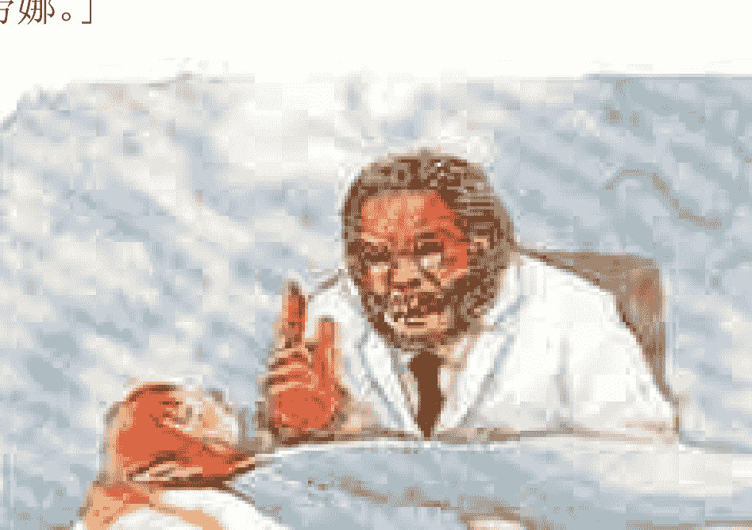
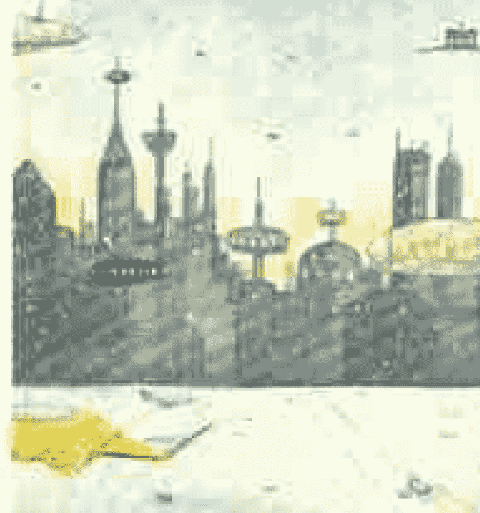

> 真正的爱心，是聪明和善良保持均衡的结果  
爱心是幸福的泉源  
幸福是爱心结下的果实  
以爱为基础的文明世界  
就是人类的幸福天堂  

# 第一部

## 第一章 头号大傻瓜

我简直不敢相信：阿米的飞船终于出现了！就在海滩的岩石上方、满天星斗的夜空中。我的心重新振奋起来。在此之前，漫长的等待令人痛苦不堪；此时此刻，宇宙中的一切又变得无限美好。

一道黄色的光柱亮起，把我的身体托了起来送进飞船内部。我熟门熟路地迈进船舱中小小的客厅，迫不及待地想见到文卡——我深爱的外星女孩，也是我终身的知己。经过了漫长难耐的分离之后，我们终于再次相聚。我的心因为快乐而剧烈跳动着。

「欢迎登机！」一个陌生的年轻人微笑着招呼我。我感到诧异，因为我期待看到的是阿米和文卡。

「这一次阿米不能来。彼德罗，请进来，咱们聊聊。」

这个瘦削的男子个子比我高。他和文卡一样，有玫瑰色的头发、紫罗兰色的眼睛，和一对尖形的耳朵。显然他们都是斯瓦玛人。进入指挥舱前，我问他：

「文卡在船上吗？」

「进去，你就可以看到她了。」

我松了一口气，连忙走进舱里。一道充满魔力的目光从船舱尽头向我投射过来——文卡显得容光焕发。我胸中燃起一股爱意，几乎使我的笑容迸出火花。可是……她的神情十分冷淡，丝毫没有快乐的样子。只见她远远地望着我，表情严肃。

她居然不理睬我！我有某种不安的感觉。这时，那年轻男子向文卡走去。文卡立刻对他投以甜蜜的微笑。接着，年轻男子靠近文卡身边，转过身来望着我，随即把文卡搂进怀中，目光凶狠而狂妄地说：

「过去是一场误会，根本没有什么不同星球之间的知音。我们来自奥阿，你是地球人。因此，文卡不是你的知音，而是我的。」

说罢，他和文卡紧紧相拥……

我感到撕扯心肺般地痛苦。我想哭，可是哭不出来，浑身瘫软无力——文卡竟然把我甩了，投入别人的怀抱！

这时，我听到一阵敲门声。

「彼德罗！」

我强忍着心头的剧痛，睁开了眼睛——这是海边小木屋的卧房呢！

「哎呀，又是一场恶梦……」我松了一口气，庆幸奶奶及时叫醒了我。

「该起床了。我该去上瑜伽课了，得有人看家啊。」

「好吧，奶奶，我起来了。」

「中午我有个客人要接待，回来做午饭的时间会晚一些。你可以在十二点钟时启动烤箱吗？那里放着马铃薯饼。其它事情等我回家以后来处理。」

「好的，奶奶，没有问题。」

「彼德罗，好好看家！再见。」

时间就像这样一天天地过去，我悲观而焦躁地等待着。无论阿米还是文卡都没有消息，刚才那样的恶梦却不断骚扰着我。不过，幸亏只是梦……

这段时间，奶奶突然「返老还童」起来。她练瑜伽，吃保健食品，打扮入时，而且又开始她年轻时的美容师工作。如今她在家中的时间大为减少，有时还要理发或为客人提供到府服务。家里的收入增加许多，因此整个夏天我们都在海边度假。

假期刚开始时，我以为阿米和他的飞船夏天一到就会回来，可是我在从前两次会面的海滩岩石上苦苦等候了他将近两个月，暑假眼看就要结束。我们很快就要回城里去了，可是阿米仍然毫无音讯。如此漫长的等待使这个暑假变得十分难熬。

我每天都去海滩的岩石上，久久地望着天空，直到夜深了才回家。空中每个偶然闪现的光点都让我满怀希望，情绪激动。但结果总是令人失望。不是卫星，就是飞机；偏偏没有阿米的飞船——那可是我见到文卡的唯一希望啊！

文卡，我多么想再见到你！

她已经牢牢地占据了我的心房，我觉得我和她一生一世都是结合在一起的。虽然我和她认识只有几个月，相处的时间不到一天，可是这就足够了，足够我们深深相爱了。我们对彼此有着强烈的吸引力。不过短短几个小时，我们便明白彼此的心是一个整体的两半；近乎生兄妹、生知己。

分离令我痛苦难当，我想她一定也倍受煎熬。自从第一次见到她以后，我就时时刻刻想着她。她让我感到更有活力，更完美，更幸福。尽管她现在不在我身边，我还是感到幸福；因为她总是以各种方式出现在我心头。

当然，最主要的原因是爱心把我们俩结合在一起。阿米让我明白了，爱心是宇宙中最伟大的力量。于是，我了解爱情不仅是一种美好的感情，它还有丰富的内涵。

阿米来访之后，我的心中有了全新的神。这个对宇宙创造者的新看法是从最发达的星球上得来的，我想甚至许多不太相信神的人应该都能认同。

我知道神永远不变，可是我们看待他的方式却会随着时间的步伐和我们的进化过程而不同。起初，人们以为造物主就是一块石头，或是闪电、太阳；到后来我们知道这是不对的。每当我们能够以更高层次的方式思考他时，他对我们来说就好像变成了另一个全新的神，这恰恰就是我的体验。

在认识阿米之前，我脑海里的神是一位随时监视人间、充满复仇心理、古板、严厉、喜欢惩罚人类，而且易怒的老先生。是啊，这就是有人为了吓唬我而灌输给我的印象。另外，《圣经》上有的章节差不多也是这样描写。由于上述原因，我小的时候非常害怕神。但是后来我发现，如果我不去想他，就不会害怕；这样当我怀疑他的存在的时候，也比较不会感到不安。然而现在我觉得，这个引领宇宙运行的「超级智慧王」，充满了无比仁慈善良的光辉。

如今我非常注意倾听神的声音，因为神不是一个想象中的概念，神化作了我可以感受、体验和经历的存在。当然，由于爱心就是神，每当我感受到爱心时就体验到了神的存在。真理就是这么简单朴实。

朴实的真理是为单纯的心灵准备的。我之所以这样说，是因为如果我们跟一个老人讲到这个话题，他往往会用满脑子复杂的知识和道理，把所有事情搅得一团乱。最后我们反倒远离了神。其实症结在于，我们这些地球人心里过于抽象复杂，因此很不容易理解简单的事；而地球上的国家会发生治理上的问题，原因说穿了也就是如此。

我漫游过奥菲尔星球，那是个文明进化的世界。我还去过一些其它的星球。因此，我知道宇宙中的文明世界用爱心分享一切，整座星球就是一个大家庭，人人欢喜快乐。可是，在地球上，你常常会在街上看见一张笑脸和一百张愁眉苦脸，而且大多数人都认为自己的问题只有用金钱才能解决。偏偏越是有钱的地方，愁眉苦脸的人越多，冷若冰霜的人也越多……

问题出在：物质是「身外之物」；而幸福则与「心灵」与爱心有密切关系。爱心正是比我们先进发达的星球上的指导原则！因为有了爱心，先进星球的人们看待生活是从「我们」出发的，而地球上则把「我」放在最重要的位置。自私是我们的天性，引导着我们的生活方式，是由一个古老而残酷的「文明马达」所推动。这马达就是史前时代的「弱肉强食」；但它现在有个好听的名字，叫做「竞争力」。

由于上述各种原因，宇宙文明世界认为：我们地球人属于不文明、不发达、不进化的星球。在整个宇宙之中，地球人算是比较原始的人类，虽然从古到今的人们都自认为已经「现代化」了。我们无法理解的是，为什么日益频繁出现、静悄悄来去的飞船驾驶员们——他们的高科技发展程度是地球人难以想象的——不认为我们地球人有资格与他们建立正式公开的联系呢？

即使是大学教授也没有与森林野人建立关系啊！是啊，为什么要自找麻烦呢？就算派遣老师过去，这些老师最后也会被毒箭射成蜂窝吧……倒不如送那些野人几本简单易懂的画册，上面有几个字就足够了。

再举个例子：如果你去探视一个罪犯，他会以为你支持他。可是如果要指责他行为失当，最好穿上防弹背心比较保险。而且，说了也是白说，因为他很清楚自己的所作所为。在这种情况下，最好的办法也是送他一些书（别忘了这些书一定要有仇恨暴力的情节，否则他会感到厌烦而读不下去呢）。

尽管在地球这个不文明的世界，仍然遗留许多有时候黑暗残酷的生存手段，也还不太能领会与崇尚爱的真谛。但阿米说我们应该欢喜快乐地生活，并对所有的人怀抱善意，包括那些发明新式武器来赚取利润的科学家，以及那些破坏自然环境来发财的商人（爱这些地球上的生物对阿米来说是非常容易的事）。按照阿米的看法，做出这些「好事」的人并不坏，只是无知而已。

因此，解决的办法不是争斗或仇恨，也不是严刑峻法，而是教育；至少让年轻人的思想和心态潜移默化，这样我们人类或许将来还能有所不同。之所以说「或许」，是因为我不能保证：毕竟学校并没有教我们如何做个更好的人。我们的教育不着重「内在」，而以追求「外在」为目的；因此，我们只记住了那些对改变「内在」毫无帮助的「外在」信息——就是那些无法引导我们通往幸福、明白生命深刻意义的东西。

地球上的教育不是鼓励我们团结友爱，而是刺激我们争强好胜；在各方面压倒别人，把别人踩在脚下，踩成烂泥，跨过别人的尸体前进。这就是我们地球上目前在哲学、伦理、道德方面的教育方针。以外在而言，我们的衣食住行条件比过去好多了；以内在而言，从洞穴时期至今，情况并没有多大变化。

面对如此情景，有时我觉得我们这一代也不会有什么改善。那下一代呢？我的思想发生了变化，我开始关心人类的命运。但是启发我的不是学校，而是阿米；还有照亮我心田的一道光芒——当然也不是来自地球。可是，「太空中的朋友们」不可能一一唤醒每个人。由于地球上没有多少人对改善内在感兴趣，要改变这个世界，我看不容易，除非发生一场大灾难，让幸存者不得不建立一个与现状不同的世界。可是阿米说，不需要灾变也能改变世界才是最好的方法；所以才让我写这三本书，记录比我们地球文明发达的星球及人们生活方式的基础和特征。

我说过了：文明发达的星球是遵照「宇宙基本法则」行事的（这是我一生中又一道重要的启蒙之光，当然也不是来自地球）。换句话说，就是：这是非常简单的道理。爱心会给所有的人带来最大的幸福，但是某些人以为这个道理过于浪漫或不切实际。在那些光明星球上的人经过精密的研究，领悟了许多引导心灵发展的做法。因为在那里，心灵是很科学的，可以被验证，而且他们明白爱决定一切。相反地，在地球上，却是「证券交易所」和银行决定一切……

有逻辑条理的事应该是精细复杂的，就像是一个由科学家或学者领导的世界；可是在地球上，我们不是遵照爱的原则行事，因此我们并不那么合乎逻辑。聪明的读者可能会说：上面的话前后不通，因为爱与逻辑并不相关。但是阿米说过一句至理名言：「爱是最高的逻辑。」只有智慧的心才能理解这句话。由于我们的领导者不懂这个道理，或许也不付诸实行，所以这里常发生一些比凡人更愚蠢、缺乏逻辑的事：人类的命运，我们的未来以及整个地球上的生活都屈服在市场法则之下……

于是，我们乘坐在这艘华美而商业导向的地球飞船上，沿着银河系的圆周轨道绕行。残酷的竞争法则刺激着我们盲目追逐着唯一的目标：金钱，全然不在乎过程与手段。如果有利可图，没有人在乎他人的生命和幸福；没有人保护大自然，没有人关心地球的未来。

统治我们的「金钱第一」思想产生了这样的结果：大多数的人并不快乐。有些人挨饿受冻，有些人赚了钱却没有时间享受生活；连最庄严神圣的宗教界也免不了腐化。暴力犯罪日益增加，人人自危。在贫富差距越来越大的时候，丑恶的「利益交换」还在继续破坏、污染我们的地球家园。到底人的需要和深刻的价值是什么？真正的友谊、温情、善良和爱在哪里？如果我们继续这样下去，将来又会怎么样呢？

思考这些问题不会带来丰厚的利润；换句话说，不切实际。在这里，人不过是「生产和消费的机器」，大自然也只是一种「商品」而已。

「阿米，无论你在哪里，请聆听我的心声！希望你来看我，我想见文卡！请你快快来吧。」每个夜晚我坐在海滩岩石上，聚精会神地在心里对阿米呼喊。我知道阿米无论在多么遥远的地方都能接收到我的心思讯息，可是没有任何回音。我仰望星空直到夜深。我感到寂寞而难过，十分沮丧地回到家中，心想，这个夏天阿米不会来了。

阿米说过，如果希望他第三次造访地球并且带着文卡与我相会，我就得完成我的第二本书《宇宙之心》。虽然我早已完成这个任务，阿米仍然没有现身。

实际上，《星星的小孩》和《宇宙之心》是我的表哥维克多根据我讲述的故事写下来的。他大约三十岁，爱好文学。不过，现在你所阅读的这第三本书是我透过「神奇的帮助」自己完成的（后面我会讲到这个「神奇的帮助」，别急）。

一天夜里回到家中，奶奶问我：

「孩子，你上哪里去了？」

「去海水浴场上的游戏机房。」我回答。每天晚上在岩石上苦苦等候一阵以后，我就去游戏机房舒解情绪。

「家里有计算机也能玩游戏机，为什么要去那里乱花钱？」

「这不一样。就像一个人在家里吃饭跟大伙儿一起上馆子吃饭的不同。（比喻得很好，对吧？这是突发灵感的结果。）」

「唔，你看起来不太对劲。我发现每天晚上你一回来脸色就很难看。孩子，发生什么事情了？是不是跟哪个小姑娘之间有了麻烦？」

是的，问题恰恰就在这里，可是我不能跟奶奶说：我的未婚妻——什么未婚妻啊，她还不到八岁呢——我的爱人，一生的至爱，是个外星女孩；她生活在距离地球几百万公里的星球上，我和她的相会取决于另外一个名叫阿米的外星男孩和他的飞船。我怎么能跟奶奶说这些事情呢？更何况表哥老是取笑我精神不正常。

「彼德罗，你很有想象力。能想出许多有趣的故事来，所以我才愿意帮助你写书发表。可是你千万不能当真啊。『想象是一回事，现实是另外一回事。』」

这句话他唠叨了不下几千遍。

「奶奶，我没事，只是有一种游戏，我总是无法打破纪录拿第一。」我不得不撒谎：「我最好的成绩也只能拿第二名，真讨厌。」

我的姓名缩写从来没有出现在任何一台游戏机的名人榜上。虽然我几乎每天都去那里，但是这个夏天因为练习得不够，得分并不理想。大部分时间，我都是在岩石上度过，苦苦等待飞船的到来。

「机房的老板一定会嘲笑拿第一的人。」

「为什么，奶奶？」

「因为拿第一的是头号傻瓜。」

「什么？！」

「老板会看着屏幕说：『这是头号大傻瓜，这是二号傻瓜，这是三号……』彼德罗，老板就是这么想的。」

「您不知道需要多么纯熟的技巧，累积多少分数才能得第一哪！这很值得骄傲。」

「当上头号大傻瓜让老板嘲笑，值得骄傲吗？」

「我觉得……」

「想拿第一必须花大把的金钱和时间在游戏机上，这难道还不够傻吗？不把握时间做些有意义的事情，或是看书、祷告、跟朋友谈心、帮助那些需要帮助的人，而是整天耗在游戏机上想拿第一，难道还不够傻吗？」

奶奶笑着说完这番话，睡觉去了。

我一方面觉得奶奶说得有些道理，但是另一方面……学习、读书、祷告……还真是「有意思」！奶奶不知道游戏机房里的世界是多么精彩有趣。那里有真正的大玩家，让人们佩服又羡慕。我常去的那家游戏机房里，有个小伙子在三种不同的游戏里都是第一名！他名字的缩写是 EGY。我不知道他的真实姓名，因为他不跟别人说话，总是坐在游戏机前全神贯注地盯着屏幕。他身后总是围着一群男孩欣赏着他熟练操纵鼠标和键盘的本领。

昨晚，我照例在岩石上等候了好一会儿。又一次期待落空之后，忍不住想着：会不会永远也看不到阿米和文卡了呢？晚饭后，我去广场上跑了一圈，听到一个消息：游戏机房里有一场「大战」——一个实力不错的高手 BUR，准备在《恐怖的宇宙》中超越 EGY 的纪录。这个游戏在那年夏天很流行，内容是摧毁叫 Thot 帝国所统治的星球。

BUR 上场时，吸引众人围观，连 EGY 也停下手中正在玩的《恐龙大战》——他在里面可是打遍天下无敌手——他要看看 BUR 这个半路杀进来的小子有没有能耐从他手中抢下第一。游戏最后，BUR 刚好摧毁了八十二座星球，比 EGY 高出激动人心的一分！周围的人纷纷表示祝贺、钦佩和羡慕，有一个男孩甚至大声喝采。然后，BUR 得到了一个我从没得过的殊荣：那个奇妙的窗口方块跳出来，让他登录自己的名字，成为在那部机器得分最高的玩家。这就像是获得奖杯一样光荣。

EGY 咽不下这口气，马上在游戏机前坐下来打算修理那个狂妄的小子。他玩了一个多小时，极力想压倒 BUR，花掉的钱多得惊人（有人告诉我，他的母亲离了婚，她给儿子很多零用钱，免得儿子影响她寻欢作乐。许多人因此很羡慕 EGY 呢）。起初，EGY 的得分并不理想，后来他急起直追，连连得分，果然是资源高手。最后成绩揭晓：EGY 摧毁了九十二座星球，夺回第一，远远胜过了 BUR！

奶奶怎么能理解游戏机房里有如此惊心动魄的场面呢！

准备离开游戏机房的时候，我发现一个有趣的巧合：在排行榜最后几个名字里，有一个人名叫「阿米」。我好奇地猜想：是谁用这个缩写呢？这个问题让我想入迷，几乎忘了该回家睡觉。

第二天晚上，我又去游戏机房，发现一件令人难以置信的事：在每一部游戏机的名人榜上都有「阿米」字样的缩写！其得分之高无人能及。

据说，EGY 一看到这个局势，愤怒得满脸通红，二话不说，掉头离去，再也没有回来。看来有个实力超强的狠角色来踢馆了。游戏机房的老板十分懊恼，因为大批玩家由于泄气而退出战局。什么人能够拿到那天文数字般的高分呢？如果差距不大，或许还有挑战的机会；可是这一次所有的纪录都被六到十倍的高水平打破……

此外，大家都觉得这件事很神奇，因为没有人看到什么「阿米」来玩游戏。只有我知道这不是什么神奇的魔法，而是调皮的阿米回来了！他就在这附近晃荡。他透过游戏机的屏幕向我传递信号：他就在这里！对他来说，在分数上动手脚易如反掌，就是遥控也能做到。他甚至可以从别的星球用他自己制作的高级电子仪器改变分数。

我像箭一样朝岩石的方向飞奔，全然不顾周围一片漆黑。我气喘吁吁地来到海滩上；兴奋和期待使我的心脏飞快地跳动着。我攀上岩石，四处张望，却完全不见阿米和飞船的影子。

我想起上次他来访时，远远地对我施加催眠法，不让我看到他在岩石上刻下的那颗长了翅膀的心。难道这次他又有什么新把戏？正在猜想时，那颗爱心的记号出现在眼前！爱心上放了一颗石头，底下压着一张纸条。我高兴地想着：「是阿米的信！」果然没错，连上面的错字都是他特有的呢。

> 对彼德罗：  
> 明天，我等你，在树林里。  
> 阿米

我开心地回家睡觉去了。想到几个小时之后就可以拥抱文卡，让我费了好大力气才入睡。这一晚不再出现这些日子常做的恶梦，取而代之的是与文卡有关的美梦……

醒来时，我本来打算省下吃早饭和洗澡的时间，直接到树林赴约。可是一想到阿米可能带文卡回来——因为他的飞船可以转眼之间就「移位」到契阿再到地球——所以我特别洗了个澡，甚至生平第一次洒了香水——那是维克多来访时留下的。

我换上最好看的衣服，准备拔腿出家门，可是奶奶在早餐桌前等着我呢。

「彼德罗，这么高高兴兴赶着上哪儿去啊？」

「这个，这个……没、没什么。因为天气很好……」

「天色阴沉沉的，还有点冷呢。」

「喔……」

为了向奶奶交差，我一口气喝完了咖啡，拿起一块三明治就跑了出去。

「彼德罗有秘密哪！」奶奶笑着喊道。

从海滩到树林有一段距离。我向村庄跑去，来到公路旁，然后穿越公路，快跑过一片草地，登上通往树林的陡峭山坡。一路上，我忍不住猜想：文卡会不会在飞船上呢？然后我想起阿米上次漫游时说的：先来地球接我，再去文卡的星球；我就这样边想边期待着再来一次太空漫游。

乌云渐渐散去，大海从灰色转成美丽的蔚蓝色。

我满心喜悦地踏进树林，一心想着不久之后就会见到阿米——特别是文卡！

我进入树林深处，四处张望，猜想着阿米肯定从飞船的屏幕上注视着我呢；可是什么也看不到、听不见，便决定在一处林间空地等候他。我知道他找我比我找他容易多了。

我忐忑不安地坐在草地上，突然想到，阿米说不定会悄悄来到我身后，蒙住我的眼睛喊道：「猜猜我是谁？」哼，我才不会上当呢。过了一会儿，果然感觉到有人从背后走过来。我闭上眼睛，极力抑制着好奇兴奋的心情。不出我所料，一双温暖的手轻轻捂住了我的眼睛，却一声不吭。这时，我闻到了阵阵清香，情不自禁浑身颤抖起来！那是文卡的香味！

我没有睁开眼睛，轻轻抚摸着那双思念已久的手、那细长的手指、那柔软的头发和小巧的耳朵。我转过身，文卡就在我眼前！我又看到了她眼中那快乐和充满无限柔情的紫罗兰色。我想不起阿米和其它的事。我觉得自己消失了，好像到了另一个星球或是另一个空间，那是只有最刻骨铭心的爱情才能带我们进入的领域。这股无法言喻、迷醉人心的强大力量把我们俩紧紧联结在一起，我只能乖乖俯首称臣。

我们不会说对方的语言，但此时此刻不需要语言。我们躺在草地上，每当两人的目光相遇，就忍不住快乐地笑起来。世界上没有什么别的东西能够让我们产生如此的幸福感。

过了一会儿，重逢的喜悦和激动逐渐平息。我才想起怎么不见我们的朋友呢？

「阿米在什么地方？」我脱口问道。

文卡吃惊地望着我，说了一句我听不懂的话。这时，我才想起翻译通那个玩意儿。于是，我们俩都笑了。

我第一次发现她的声音很美，深深打动了我的心田。

「文卡，你说的话我听不懂，可是你的声音非常动听。我想听你说话。」

她明白我的意思，因为她开始说起来。我着迷地倾听着，多想闭上眼睛，永远地沉醉在发自她内心的美妙音乐中。

「够了！够了！别再搞浪漫了！」耳边传来阿米熟悉的笑声，然后是他棕色的小小身影。他又用文卡的语言说了一遍差不多的话。

一如往常，他快活地走近我，我的心激动了起来。我起身迎接他，向他问好。这时，我发觉他比从前矮了一些。要么就是这几个月我长高不少。我得稍微弯腰才能拥抱他。坐在草地上的文卡也很高兴。这真是一次温馨而愉快的重逢。阿米递给我们翻译通讯机，一边说道：「彼德罗，你发现自己长高了许多，心里很高兴，对不对？」

「没有。不过，也没什么不愉快。可是，你……没有不高兴吧？」

「不会。不过你要是看到文卡的改变，肯定会不高兴的。」

我不明白他是什么意思。我看看我亲爱的知音，没有发现什么异常的地方。

「她没有不一样啊。」

「文卡，你站起来。」阿米说。

她一站起来，我就傻眼了。由于刚才我和文卡一直跪着或者躺在草地上，并没有同时站起身来，所以我没发现她长高了许多，而且比我高。我现在只到她的鼻梁。这完全出乎我的意料之外。

我的心情很复杂，担心她也许会不高兴，对我失望，也许不再爱我了……我低垂着头，而她仍然温柔地拥抱我，亲吻我的面颊——当然，她不得不微微弯下身子。

「这些文明进化程度不高的人只看外表，他们得了『视觉上的种族偏见』。」阿米发出他特有的婴儿一样的笑声。

文卡极力安慰我说：「彼德罗，别担心；我们仍然爱你。你知道我们的感情远远超越了外表。」

「唔……是的，我知道。可是对你来说，一定很不好受。」

「不会的！」阿米插话道：「因为我们过来时，我提醒过她：你没有她高。她说，没有关系，就是把你装在衣袋里也成。哈哈哈。」

「没错，彼德罗，哪怕你只有我一根拇指那么大，我也会全心全意地爱你的，所以你就别自寻烦恼了。更何况，阿米说你还会长高呢。」

情况并没有那么糟。

他说得对，我是有些吃醋。我挺起胸膛，发现两人的差距并不那么大。文卡开心地拥抱我。她那热情的目光让我感到没有理由再担心。我恢复了自信，一把搂住文卡的腰，模仿老电影里男主角的口吻说道：「女人，就算你长得比我高，我们依然是你头上的天。记住我说的话。」

我和文卡都笑了。阿米也笑起来了，但是随后他说：「但愿你只是拿这种老掉牙的大男人主义说笑而已！」

「阿米，我只是开开玩笑。」

「我知道。但是别忘记，大男人主义只对洞穴时期的原始人有意义，因为身高体壮对于生存是很重要的。在那个世界里，男人比女人高大强壮，因为女人需要保护。可是你们的星球早已经超越那个历史时期了。」

我觉得阿米不十分了解地球人，因为对男性来说，高大的身材几乎跟聪明才智或者金钱一样重要。多数女性也赞成这个看法。

文卡似乎也有些疑惑，她打断阿米的话说道：「莫阿被特里人统治，他们凭借着比我们斯瓦玛人身强力壮而迫使我们屈服，可是你却说我们的星球已经超越那个历史时期。我不明白。」

「你已经超越那个历史时期了，不是吗？你不在乎彼德罗比你矮。对不对？」

「对我而言是这样。可是大多数人怎么想呢？」

「文卡，你应该凭着自己的心和聪明才智判断行事，而不是盲目遵循大多数人的想法。人们经常由于害怕与众不同而装作和大家意见一样，或是因为他们没发现自己内心真实的感觉跟你一样；他们只是以不听你意见的方式来自我防卫。但不用太久就会了解你所说有理，并转而支持你。」

我觉得阿米的话很有意思。他继续向文卡解释：「假如你有个好想法，大家也需要它，可是你没有勇气说出来，那么这个好想法就永远不会被传播，也永远不能实现，就由于你的胆怯，一切都白费了。」阿米微笑着说：「而且你并不知道，其实你不是唯一有不同想法的人。」

「可是，我已经意识到这个简单的想法把我变成了胡言乱语的疯子。因此，我已经不跟任何人谈这个话题了。我的许多想法都遇到类似的情况。最后，我干脆闭上嘴巴，努力迎合大家，甚至说出违背良心的话，尽管心中并不快乐。」

「彼德罗，我了解你的心情。因为大家都跟你一样不说出真实感受，使你以为自己的思想与众不同；担心别人会笑话你，或者生你的气。」

「正是这样。我还担心被痛骂一顿。」

阿米笑着说：「不论你的看法如何，我还是建议你尽量证明自己的观点；以平和尊重而非防卫冒犯的语气，努力表达自己真实的感受，特别是当你从爱的智慧获得启发时。你会惊讶地发现许多人赞成你的想法，这是因为你们的星球正在发生变化。」

我仍然觉得这种想法只是理论，实际上很难做到。

「如果我说出自己的真正想法……不，不，我可不想当烈士。」

「你并不知道，变化正在扩大，使得很多人现在宁可过真诚自然的生活。」

「阿米，我看不出人们有太大的不同……在我的星球上，无论男女老幼好像情况都差不多。虽然也有好人，但大致来说人们多少还是有些肤浅、自私和拜金……彼德罗，地球上的情况也是这样吗？」文卡还是满腹疑问的样子。

「也一样。」

阿米深吸一口气笑着说：「大家情形差不多的原因，是因为你们都不得不随波逐流；被旧制度压制的你们，只好跟着它走。那个制度通常不太尊重人，也不关心人的生活。它的基本原则不是爱，而是物质；由于基础没有建立在爱之上，就不可能为人们带来幸福。大多数人并不快乐，但他们无可奈何，只好闭上嘴巴。虽然时间不断过去，一切却依然如此，没有多少改变。更确切地说，事情只是一再反复循环。但是现在很多人开始改变了，他们意识到问题的严重性。你们也应该跟上这股积极的风气。别忘了：保护美好的事物与珍贵的生命就是保护自己。」

「阿米这番话，我虽然没有准确地全部记住，但是他说服了我们：从今以后，我们不需再隐藏自己的感觉和想法，要努力成为正直真诚的人，而不只是在我们写的书上和嘴上说说而已。」

「但是，孩子们，别对这世界感到愤怒。」阿米愉快地微笑着说：「只看黑暗面，因为黑暗无法掩盖光明。」

我们看看四周，夏天早晨的树林里，天空万里无云。阳光灿烂，这让我们明白了：的确，人不应该只看消极面，因为在此之外还有许多值得关注的事。

微风轻轻吹拂着我们的面颊，带来了花香、松树香和尤加利树香。阿米在草地上交叉双腿坐下来，我们也学他的样子席地而坐。

「孩子们，我看你们这么高兴，是因为重逢感到幸福，对吧？」阿米顽皮地问我们。

「是的！」我们异口同声地说。

「所以上次分开时，你们不该上演那样一出告离死别的悲剧，对不对？」

我们不好意思地相互看看，阿米说得对。我们俩的确不该为了暂时地分开而演了一出闹剧。如今再次相会，过去的事好像一场短暂的梦。

「没错，我们那时真傻。」

「太好了！你们明白这一点真让我高兴。那么今天到了告别的时候，你们可就别再难分难舍了。」

「什么？今天就要告别？！」我们大惊失色，紧紧拥抱在一起，不希望对方离开。

「又在做傻事了！」阿米哈哈大笑起来。

阿米的话无法让我们心服，因为我们的感情不是什么「傻事」，而是强烈的爱。我觉得一年里只能跟她短短地相处几个小时，实在太残酷了。我刚要开口，文卡已经替我说出来了。

「阿米，爱情不是什么『傻事』，何况我们还是心心相印的知己呢！所以一听到我们俩得再次分开，当然会难过了。」

「孩子们，我了解你们的心情。分离使你们感到痛苦，因为你们还没有学会享受两心相思的美好。多么遗憾哪！」

阿米的话让我回想起，我经常感受到文卡就在我心中；还想起有好多夜晚，我想象着她就在我身旁。在想象中，这些相会的情景强烈深刻到仿佛我们真的相聚在一起。我把这个感受告诉阿米。文卡在一旁听到后说：她也有过这样的经验，那时她觉得我仿佛就在她的身旁。

「因为你们那时真的结合在一起了——不是肉体，而是灵魂。」

「当然啦，不过二者有什么不同？」我问道。

「真正的爱情发生在灵魂，而不是肉体，正因为如此，取决于肉体的感情都是转瞬即逝的；只要皱纹一出现，体重一增加，感情就随之消失。那不是爱情，而是毫无深度和力量的短暂吸引。真正的爱情来自彼此的力量，而这种力量是对方整个内心世界的概括。无论距离还是时间都挡不住这种情感的交流。这样的爱情，就是死亡也无法使之灭绝。」

文卡望着我，感动得热泪盈眶。我们都知道阿米所说的，就是把我们结合在一起的感情。我们紧紧相拥，又一次进入让我们忘了宇宙中其它事物的无时间境界……

不知道过了多久，突然听到阿米的声音：「老实说，这一出戏码稍微长了点……」

我们不好意思地回过神来。但是，我从阿米的表情发现：他虽然在微笑，故意装出顽皮的样子，但是无法掩藏眼中的感动。

阿米察觉到我的意念，他说：「没错，彼德罗，『孩子气』是有传染性的：你们的柔情蜜意释放出振波，让一个恐龙化石都被感动了。哈哈哈。」

我看到许多色彩缤纷的蝴蝶在四周飞舞。

「彼德罗，你有没有发现鸟儿的歌声也更加悦耳？」

我注意倾听，果然是真的：整个树林里的生物似乎都在歌唱和跳舞，庆祝我们的幸福爱情。

「这一切是被你们释放出的高级振波所引发的。你们已经知道爱是宇宙最高的能量，因此，正是你们所产生的『音乐』引动了这整场灿烂的『舞蹈』。」阿米解释说。

「所以爱能引起欢乐……」文卡作出结论。

「的确如此。天地万物都会向它们的源头靠近——也就是我们说的宇宙之爱；相反地，冷漠则让人彼此疏离。」经过阿米的说明，我明白了人之所以不快乐，是因为他们心中没有爱。

「因为他们不能或者不愿意敞开心扉。好了，我们上飞船吧！」阿米站起身。

## 第二章 克拉托的秘密

黄色的光柱把我们三人包围起来。我抬头仰望，那艘壮观的宇宙飞船现在只有我们看得见；它既神奇又美丽。飞船平稳地旋转，微微倾斜地上升到比松树顶端还高的地方。灿烂的阳光照射在它那银色的金属机身上，反射出耀眼的光辉。我发现阿米这次换了一艘飞船，因为这一艘的机身下方有一颗长了翅膀的心。

「这不是上一次那个『飞碟』吧？」我说。

「彼德罗，你猜对了。舱内有很多设备和上次那一艘一样，但是增加了许多高科技的设计，体积也更大。你马上就会看到。」

我的身体被高高举起，送进飞船内部。我十分开心，一点也不害怕。我快要变成太空飞行的常客了。这不是吹牛：地球上那些著名的飞行员与我相比，他们的所见所闻可能比我逊色许多。

飘浮在空气中而身体毫无重力的感觉，实在妙不可言。我向下望去，看到了闪着波光的蓝色大海，大片的树林、沙滩，和我家的海边小屋。我伸展双臂，想象小鸟般自由快乐的感觉。这比游乐场里任何游戏都更好玩，也更安全。

进入飞船内部时，脚下有道滑动的金属门关闭起来，身体渐渐恢复了重量。一踏上客厅柔软的地毯，唤起了过去的回忆。这艘飞船的指挥舱比上一艘大得多，舱顶也更高，一个成年人可以笔直地站立。我靠近舷窗，看到了海水浴场游戏机房，使我想起每台游戏机屏幕上出现的「阿米」字样。

「阿米，你那个玩笑可真不赖。」我知道他早已看透我的心思。文卡问我是什么事，我告诉她详细经过，她觉得非常有趣。

「我那么做是为了通知你：我来了，也为的是让那些玩上瘾的孩子泄气，让他们把注意力转移到别的事情，善用自己的时间，而不是把时间浪费在游戏机上。」

我心里想，阿米变得跟我奶奶一样了。他笑着说：「你奶奶是对的。凡是被登录在排行榜上的人，都是最傻的家伙；不仅是因为他浪费的钱比别人多，而且这种游戏会扭曲人们的心灵。在游戏中，孩子们不得不进行杀戮和破坏的动作，这会留下阴影，影响他们的价值观和行为举止，更别说耳膜还得长时间忍受震耳欲聋的噪音。可怜的孩子们……」

我极力向阿米和文卡解释玩游戏时兴奋刺激的真实感受。

阿米说：「一切都是环境与价值观不同的问题。在小偷的世界里，最善于偷盗的家伙被看成是最聪明的人，但是，他在我们的星球上就是不折不扣的傻瓜。在游戏机上拿第一的人也一样。彼德罗，那种感受并不真实，只是虚荣心作祟罢了。」

文卡来到我身边，用双臂抱住我。这时我觉得阿米是对的；沉迷于游戏机并不聪明，与文卡在我身边的感觉相比，实在不值一提。

阿米笑着说：「像你们现在这样才是真实的感受。」

我觉得他说得有道理。但是心里忍不住想：有爱人在身边时，自然不需要游戏机陪伴，可是一个人独处的时候，又该怎么办呢？

阿米说：「即使身边没有人陪伴，爱情也永远都在。」

这句话说得很漂亮，某种程度上也是对的。但是我告诉阿米，离开文卡我不可能幸福。文卡说，她也一样离不开我。

「因为你们离开另一半时，就关闭了心扉，忽略生命的美妙和神奇，失去了享受生活的机会。这就好像有人说的那样，『他（或她）若不在我身边，我就快乐不起来。』不要快乐却选择悲伤，难道不愚蠢吗？」

文卡对此另有看法：「悲伤不是选择而来的：爱人不在身边，悲伤自己就来了。」

「你们选择了：『爱人不在，悲伤不请自来。』」阿米笑道，「而别人呢，选择了无论一个人还是两个人，都永远保持愉快的心情。这才是聪明人呢。不依赖任何人事物而得到幸福，就不会对任何东西过度沉溺。」

「过度沉溺？」

「对，因为过度依赖另一个个体，无论是灵魂伴侣、妈妈、儿子、亲戚、朋友或是宠物，都会让人陷溺其中；而过度沉溺的结果，会使灵魂如同被奴役，心灵更失去自由。一旦灵魂失去自由，就不可能有真正的幸福。」

「爱情是一种沉溺吗？」我很困惑。

「不是。但如果幸福快乐取决于他人，就会沉溺其中。」

「阿米，爱情就是这样的。」文卡说道。

我们的外星小朋友不同意这个说法。

「这样充其量不过是依恋、附属，是一种沉溺罢了。真的爱情是给予，以爱人的幸福为自己的幸福，不强迫对方终日厮守，不占有和支配对方。不过，你们的年龄还太小，不能理解某些事情。」

文卡固执地说：「阿米，我知道我的心灵会永远与彼德罗结合在一起，克服遥远距离的阻隔，但是这和实际相处还是不一样。当我们的爱情如此强烈的时候，就非常渴望经常见面、谈话、拥抱等等；所以我要问你一个非常重要的问题：有没有办法让我们永远不分开？」

一瞬间，我的心中燃起了希望的火花。可是，阿米看看我们，无可奈何地叹息道：「孩子们，别奢望了！」

我们低下了头，感到非常失望。

「我不能骗你们。在一起生活是绝对不可能的，百分之百地不可能。至少在你们成年之前是不行的。」

「阿米，为什么？」

「你们还是孩子，而这种事取决于大人。因为要生活在一起，你们两人之中有一个人就得永远离开自己的星球，到对方星球上去生活，对不对？」

「当然。」

阿米继续说道：「如果我带你们某个人迁居到另一个星球，那银河系当局就会要求我拿出成人许可证。」

「啊，太空当局跟地球上的政府一样官僚！」我愤愤地说道。

阿米说：「常言说得好：『天上地下一个样！』不过还是有些差别。地球上只认证明文件，而天上则看重『爱心』。银河系当局认为真心关爱孩子的人才有资格监护孩子，并不管什么姓名、血缘或者证明文件。」

「啊，这就合理多了。」

「非常喜欢你，所以也必须得到姨父的同意。你们认为能获得他们的许可吗？」

这番话让我泄气极了。要说服这些人不是件容易的事。不过我马上想到，我们之中只要有一个人得到批准就足够了。

「阿米，只需要一项许可就行了，对吧？」我对这个想法沾沾自喜。

「如果文卡不能得到批准，你愿意搬到我那儿吗？」

这个假设让我感到不安。就算奶奶允许我离开地球，我也不忍心把老人家单独留下。但是文卡兴致勃勃地盘算起来。

「我想我姨妈一定会让步的，因为自从她结婚以来已经忘了我的存在。至于我姨父就比较难办。戈罗是个严肃古板的人。他对我的管教很严格，说什么要让我接受正规的教育。他对我的念书和作息时间都严格监督，比我姨妈厉害多啦。或许用不着让他知道全部真相……」

「文卡，要把全部事实告诉姨父。这关乎感恩和爱心问题。记得吗？关于爱心，咱们是怎么说的？」

「爱心就是神的象征！」我们异口同声喊道。

「好极了！那你们就应该明白：神不允许不诚实的行为。因此，既然你们真心相爱，就应该光明正大地征询大人的许可，不该犯下错误。因为一旦出错，爱情就不纯洁了。如果爱情被虚伪、欺骗或背叛所玷污，神会远离你们，再也不会给你们快乐和幸福。」

他用一种心照不宣的目光看着我们说：「我想你们已经体会到爱情带来的幸福，对吧？」

我们相视而笑，尽在不言中。

「但是，随便一个谎言或者不诚实的行为，就足以让原本美妙的关系产生裂痕和怨恨。而修补裂痕并不容易，往往会留下阴影。这就是不诚实的爱情带来的后遗症。」

「啊！」

「遗憾的是，人类往往不记得爱是神圣的，是神在他们生命中所显现的奇迹，应当特别珍视并小心维护。」

在此之前（包括学校的教育），我从来不曾对爱有如此透彻的认识。在心里默默感谢神赐予我们俩奇迹，并决心一辈子忠于文卡，以免失去给予我们的幸福。

「阿米，我明白这个道理：话说回来，我不知道怎么向姨父解释：我要去另一个遥远的世界，跟一个外星人生活……因为他坚信只有在契阿才有最聪明的生活方式。」

阿米笑着说：「事实上，那是半聪明半愚蠢的生活。真正聪明的地方没有苦难。」

「我们必须努力说服文卡的姨父，此外没有别的路可走。」我的态度很坚决。

「彼德罗，恐怕没这么乐观。来这里之前，我用高科技计算机给她姨父做过心理测试，得到结果是：要想让戈罗同意文卡离境，是不——可——能——的！他会像一头倔强的驴子那样不肯让步。」

「我才不管什么驴不驴的，我们必须尽力试试看。否则我就去死……」文卡泪流满面地抱住我。我也忍不住掉泪……

「不能长相厮守宁死！」我愤慨地说。

「多精彩的电视剧啊！」阿米笑着评论道。「你们打算用这种方式抗争？」

「就打算这样！」我们一起回答。

「好吧，那事情就有转机了。因为两个相爱的人如果下定决心，就会产生一股强大的爱的力量。」

我们的心中亮起一线光明。

「根据科学仪器的分析，戈罗不可能让步。可是从你们刚刚戏剧性地表白，我知道你们下定决心拼死一战。那咱们就奋战到底吧！科学数据敌不过银河系的主宰，而我们借助信心就可以接近他。我觉得你们有这个信心，因为爱就是信心的最高形式。」

听了阿米这一番话，我们的心里充满了快乐和希望。

「我们当然有信心！」

「太好了！这份信心为我们带来了希望。这件事情并不容易，你们别抱过多幻想，以为可以轻松快速地达成目标。但是无论如何，我们要努力尝试！」说罢，他操纵仪表板，飞船开始启动了。他以鼓励的眼光看着我们，高声道：「孩子们，咱们去说服文卡的姨父吧！」

「出发喽！」我们因为胜利在望而兴奋不已。

舷窗外出现一片白雾，表示我们正离开平日习惯的时空，朝着遥远的地方飞去。

「太空飞船向契阿前进。目前没有发现敌舰。」阿米模仿机长的口吻说。「那些太空电影，我也看过。」

「咱们先去文卡的家，对吗？」

「困难的任务留到最后。先去拜访克拉托，再一起商量怎么解决那个难题。」

「太好了！」我高兴地欢呼起来，因为老克拉托为人风趣，我很喜欢和他相处。

「又可以看到克拉托了，还有他那只叫特拉斯克的『布戈』。」文卡也很高兴。

「布戈」指的是老人豢养的一条大「狗」——其实它的外表更像一只长着猫脸、全身披着羊毛的长颈鸵鸟。于是，我想起文卡和大部分契阿人一样，吃一种叫做「卡拉波罗」的水、陆、空三栖的可爱小动物。我半开玩笑地对她说：「可别再像『那些』女人一样强迫我吃『卡拉波罗』肉。」她笑了，然后用调侃的语气说道：「她们吃肉，可是并不残忍。你吃的那种漂亮小动物叫什么名字？」

「羔羊。可是我后来一直再也没吃过。」

阿米高声道：「彼德罗，你不吃肉啦？真令人难以置信！」

「这个，这个……因为我不想吃任何……」

「你是指死动物的肉吗？」阿米笑着问道。

「我姨妈本来就不擅长烹调素食，现在更不行了，因为她跟一个只吃肉的特里人结了婚……」文卡试图为吃肉的事辩解。

这句话让我惊讶极了。

「什么？你姨父是特里人？！」我的心中除了惊讶，还有恐惧。因为特里人在文卡的描述中就像是凶猛蛮横的野兽，我们怎么可能说服他呢？另外，我一直以为在契阿星球上，文卡所属的斯瓦玛人和高头大马、毛发浓密的特里人是水火不容的。可是两种人居然要结婚，而且又正好是文卡的亲人……

阿米解释说：「在契阿，斯瓦玛人和特里人之间通婚的情况很普遍。」

「我以为他们是死对头呢。」

「现在也还是，但是只存在于种族与种族之间。」阿米进一步说明。

### 跨种族的爱情

「这就如同在两个敌对的国家之间，有时爱情可以超越仇恨，组成家庭。」

「没错。撇去种族仇恨不论，站在个人立场时我们常能互相包容，有时还能产生友谊和爱情。」文卡说道。

我想起在地球上，有的国家内部发生种族冲突，但大家毕竟属于同一种，而契阿的情况却更复杂。

「那他们生下的孩子会长得像什么呢？当然，我是说如果能生下来的话……」

「当然可以，有时生下斯瓦玛人，有时是特里人。」

我更加吃惊了。

「那么会有儿子是斯瓦玛人，而母亲是特里人的情况吗？」

「当然有了。彼德罗，我自己就是跨种族的爱情结晶：因为我母亲是斯瓦玛人，而我父亲是特里人。父母死于战火，在我还是婴儿的时候，姨妈收养了我；她是斯瓦玛人，不久前和特里人结了婚。她疯狂地爱上了姨父，现在都把我给冷落了。甚至……」

契阿星球的怪事，在文卡眼中似乎再正常不过。我越听越疑惑。阿米的神情十分开心，但是他一声不吭地注视着我们。

「文卡，你等一等。」我打断了她的话。

「怎么啦，彼德罗？」

「要不是我听错了，就是你说错了！你爸爸是……特里人？」

「是啊。你没听错。」她的神情很平静，美丽的紫色眼睛望着我，一脸纯真。

「这么说你是半个……特里人……」

「不是。我父亲是特里人，但我不是。感谢神，我是斯瓦玛人。」

「啊，不对。这是不可能的！在地球上，大猩猩不可能与人类杂交。」

「彼德罗，猩猩与人类是不同的物种。」阿米澄清道。

「斯瓦玛人与特里人不是不同的物种吗？！」

「不是。」阿米解释道：「契阿只有一种人类：由斯瓦玛族和特里族组成。」

「什么？上次漫游时你可没提到这个……」我不解地问道。

「我想我真的会打破他的脑袋……」文卡笑了。

### 特里人的改造

「那是什么样的改造？」我问道。

「有些特里人把自己改造成了斯瓦玛人。」文卡说。

「真的吗？」

阿米操控着键盘，屏幕上显示出毛毛虫变成蝴蝶的过程。

「改造的过程就和这个类似。愿意改造的特里人，骨骼变软，身高缩减，尖牙脱落，长出像斯瓦玛人的牙齿。身上的绿色毛发褪去，头发变成玫瑰色，耳朵变尖，眼睛变成紫色。在短短的两、三天里，他们的身心都发生重大变化，最终完成不寻常的改造变形。另外，他们放弃了特里人的思维和感觉方式；这是改造中最重要的部分。」

文卡说：「他们变成了斯瓦玛人，成为真正的人类。」

阿米笑着补充说：「同样的事情也正在地球上发生，虽然外表看起来并不明显。」

文卡继续解释说：

「自从有个非常重要而且掌大权的特里人转变成斯瓦玛人以后，特里人现在的态度变得柔软多了；由于这个原因，再加上科学证明特里和斯瓦玛其实是同一人种，使法律作了修改，现在也有些斯瓦玛人开始担任重要职务了。学校和其它组织内分裂不和的现象得到改善；另一方面，特里人的两派内战也结束了。如今局势缓和许多。」

「不过，局势也不是全然乐观，因为愤怒的恐怖犯罪集团到处杀人放火，人心惶惶。再加上科技水平提高，炸弹越来越容易制造，杀伤力也日益强大，真不知道什么时候才能平息。」

这番话让我非常吃惊，因为地球上似乎也有相似的现象。

「地球两大强国之间长期的对抗已经结束，可是恐怖分子到处肇事。尽管整体局势不再紧张，暴力事件却层出不穷，这是怎么回事呢？」我问道。

阿米回答说：

「我解释过地球和莫可经过相似的进化过程，接近高等生物能量状态，并开始放射出更纯净的能量，影响上面居住的人类。这些新的高级能量加快了进化速度。我记得跟你们说过，进化意味着……想起来了吗？」

「进化意味着接近爱心！」我们高声答道。

这是与阿米初次见面时给我们上的一课。这个观念犹如一道明光，使我豁然开朗，更能体会生存意义。当然，这是在学校里没有学过的。

### 进化与爱心

「是的。因为这些新的高级能量有利于人类意识的觉醒，和更高层次情感的表达，比如和平与团结。」

「和平与团结的趋势还没有出现……」我想起地球上恐怖主义的猖獗和其它乱象。

「已经逐渐出现了，并且随着进化过程加快速度。从前，人们比较麻木，如今变得比较敏锐、比较有觉悟力了。这种进展使一切不道德的行为、一切违反爱心法则的事情越来越受到蔑视和谴责，甚至受到惩罚——不论是人类的法律或者宇宙法则的惩罚。这都是进化的表现，表明人们的头脑开始清醒，爱心也增加了。这是一种渐进的变化，但是效果快速而持久，目标是建立高级的文明形式。」

阿米这番话给我一个感觉，像是在暗示不需要再做什么了；仿佛我们的世界已经得救，要在地球建立奥菲尔般的天堂也是指日可待。他看透了我的想法。

「小伙子，事情没有那么简单。因为尽管良心与爱心逐渐增长，但在这个『新世界』欢乐诞生的同时，还有一个垂死挣扎的世界依旧潜留在人们的心灵和思想，不愿离去；它知道死期临近，但它仍然拥有顽强的力量……」

### 世界的暴君

「你们想认识一下世界的暴君吗？」阿米的神情看起来准没好事。

「哪个世界的暴君？」

「地球上的或麦阿上的，其实没什么不同。这两个星球上的『文明』——如果可以称之为『文明』的话——都是受到同一个势力掌控。」

「世界的暴君！我从来不知道地球上有暴君！」我惊讶地喊道。

「麦阿没有世界暴君，各国都有民主制度下的总统。」文卡也不同意阿米的说法。

「文卡，你错了。暴君确实存在。你们看看那个屏幕！」

他指着安装在舱内侧边的一片巨大透明薄板；我一直以为那不过是个装饰品呢。

「你们会看到某个代表典型。」

屏幕上出现了一个瘦瘦高高的男子，身披及地红色斗篷。红色斗篷里面穿了一身黑衣。他那锥子般锐利的可怕目光中蕴藏着无限的冷酷、残暴与邪恶。他的瞳孔周围是红色的——一眼白，双手是一对斑爪……模样可怕极了！

文卡发出一声尖叫，惊慌地躲到舱里去了。

「阿米，快快关掉！那是魔鬼！」我几乎喊叫起来。

「不，不是魔鬼。他是世界暴君。」阿米笑着回答，随后关掉了可怕的影像。

「文卡，回来吧。暴君离开了。」

「……真的吗？」

「用不着害怕。他并没有真的来过这里，那仅仅是集体潜意识的投射。」

「可是他直勾勾地死盯着我呢。」我余悸犹存地说。

「他盯的是『镜头』。」阿米笑着说明。

文卡好不容易回到了指挥舱。

「这个世界暴君是怎么一回事？我从来不知道有什么暴君。他住在什么地方？」

「他住在每个人的思想深处。」

文卡惊慌起来。

「这个魔鬼藏在我心里？」

「人心里藏着各种东西，文卡。从爱心到邪念，什么都有！至于在现实生活中到底是真、善、美还是假、恶、丑，是每个人根据自己的程度表现出来的结果。」

我明白阿米是对的，因为我自己就常常觉得巴不得把某些人给宰了，还好只停留在想的阶段。而有些人却克制不住冲动，酿成大祸。他们远离了爱心，而接近魔鬼暴君。

### 暴君的力量

文卡想知道这个暴君都干些什么勾当。

「这个人物躲在阴暗的地方，躲在人们灵魂最阴暗的角落，想尽办法控制现实世界的权力。暴君会利用觉悟力低的人，把他们放在权力岗位上，为实现他的目的服务。」

「你的意思是说：我们星球上的政府领导人都被他操纵？」

「文卡，当然不是。有许多领导人是以行善为动力的；他们有责任感，愿意为别人着想，为世界着想，为国家和民族着想。他们争取执政权是为了改善现状、散布真理，并阻挠道德败坏。于是，暴君就抢走他们的权力以破坏他们的目标……」

「真像大野狼欺负小绵羊！」

「因此，好人行善并不容易。此外，敢于做好事、破坏暴君利益并且进行真正改革的人总是少数。但是幸亏有了这些人，否则的话人性就荡然无存了；因为没有他们，暴君就更加横行无阻。」

「我想也是……有些人为什么让他控制呢？」

「他们并不知道自己的思想和欲望被他左右着，任由他挑起战争、犯罪、狂热情绪和恐怖主义，以致社会充满偏见、恶事频传，和谐与宽容则是遥不可及。政治腐化之余，大半个世界的经济命脉也落入少数某几个国家或财团的手里。」

「阿米，他为什么要这样做？」

「此人的目的只有一个：不让世界幸福。」

「啊，所以才有这么多的灾难。」文卡叹道。

「阿米，我不懂他为什么不愿意世界幸福？」我还不太明白。

「这就如同细菌不愿意碰上杀菌剂一样。」

「我不懂……」

「幸福来自爱心；而爱心是世界之光。」

「然后呢？」

「就像有些细菌和昆虫会见光死，暴君老爷也只能在阴影里幸存。明白吗？」

### 黑暗与光明

「处于阴影里的人受不了高级振波的冲击，如同吸血鬼无法忍受阳光一样。暴君不允许世界充满高级能量，因为高级能量会杀害他。现在明白了吗？」

「明白了。所以暴君只有在世界不幸时才能生存，他在自己的领土内下令放射邪恶的振波。」

「是的，彼德罗。不过，那并不是他的领土。暴君是个侵略者，如同钻进家里的老鼠，或是一种入侵的病毒。只要真正的执政者——世界之王没有来到，这个篡权的家伙就可以指挥一切。暴君明白这个道理，所以他千方百计要阻止世界之王的到来。当光明的力量增长时，黑暗的势力便会自我防护；这就是为什么美好的事物和丑恶的事物往往同时并存。这是一场精心布置的战局；开始于心，然后彰显于外。明白了吗？」

「明白了。那世界之王会是谁呢？」

「真正的世界之王就是管理整个宇宙的君王——就是爱心，就是宇宙之爱。」

「如果是爱心管辖整个宇宙，那为什么还会允许暴君这个野兽统治我们的星球？」

「这不是神允许的，而是你们自己造成的。」

「我们造成的？」

「是的。我早就跟你们说过：神尊重所有星球上的人群和个人的自由。邪恶统治着你们的星球，统治着许多人的心灵。许多情况下邪恶就在你们内心深处，因为你们自己允许邪恶藏在心里。」

「我认为你说得对……」

「因此，暴君处心积虑把魔爪伸向政治和经济领域，煽动犯罪和种种狂热行为，甚至以宗教和体育的名目为幌子。你们之前在薄板上看到的那个代表典型不是很好，显示你们对生命质量的要求并不高。另外，你们长久以来抱持着这样的『真知灼见』：不表示意见，不管『闲事』，让别人去操心；因此，你们的星球至今还是老样子……」

「阿米，你说得对。我们麻木不仁，贪图安逸，让暴君横行霸道；地球就没有建设奥菲尔那种天堂的希望。」

「但是，任何力量都有其克星。」阿米笑着说。这一回他的笑容里带着某种希望。

### 光明的使者

他再次操作键盘。这时，在同一片玻璃屏幕上出现了一个身穿白色衣袍的鬈发青年；他面带笑容，手持闪闪发光的黄金宝剑。

「真帅！」文卡着迷地赞叹着。

「神的使者来了！他将打败侵略者。」阿米的语气十分热切。

「所以这位青年要杀掉『吸血鬼』？」

「确切地说，是一种力量压倒另外一种力量。我再说一遍：这种情形首先会发生在内心世界，随后才反映到外部世界来。这是无可避免的趋势，问题在于发生的时间、方式和代价。」

「阿米，可以再说得清楚些吗？」

「你们现在为完成自己的任务而工作，其它许多计划成员也是如此。为了让迈向更美好文明的进化过程不那么痛苦，而能再温和、快速些，你们努力完成自己任务的时候，其它相关环节也在配合。不过目前还不知道事情会如何结束，虽然已经有些令人鼓舞的迹象。」

「比如什么样的迹象？」

「我说过，行善的人、为光明事业效力的人口日益增多，包括一些颇有影响力的人物；迫使暴君的势力范围逐渐缩小；于是他自然要对抗变革，延长统治时间。他意识到，如果人人都觉悟了，他就无法掌权：因此，他极力煽动一切迷惑人心的活动。」

「他是个畜生！」文卡气愤地喊道。

「克制一点。别生气！」阿米劝她。

「对不起。真让人恼火。」

「可是她也不该辱骂所有的动物啊。比起暴君那只大害虫，许多小动物反而没害过人。哈哈哈！」

我想起阿米曾经说过，没有百分之百的坏人。难道他忘记了？

「彼德罗，我说的是人类，不是那种鬼东西。魔鬼完全不管什么人类的未来，反而一心阻止光明的到来，所以他千方百计地散布最致命、最具破坏力、使人蛮横霸道的武器。这样的武器会发出最低级的能量和振波，把人类和世界笼罩在深沉的黑夜里。」

「阿米，这种武器是什么样子？」我们满怀恐惧地问道。

「就是毒品！」他牢牢地注视着我们的眼睛，沉重地吐出这个恐怖的答案。

### 毒品与黑暗能量

「如果吸毒人口增加，世界的未来就有可能被人类敌人操纵的傀儡所掌握；因为一个人一吸毒成瘾，就会智力迟钝，情感冷却，为内心的阴暗世界敞开大门。于是，暴君可以随心所欲地操纵他。因此，吸毒的人可能作出种种可怕的事情来。」

我们俩听了以后感到十分震惊。

「这近乎可怕的毒瘾牺牲品会变成散发邪恶能量的强大热源，而这恰恰是暴君所需要的：因为世界越是黑暗，他的统治势力就越是稳固。」

「当然了……」

「使人『吸毒上瘾』的另一种形式，是煽动人们以暴力和诡诈的手段满足私欲。」

「比如什么想法？」

「有些人生活的唯一动力就是自己或者家庭、子女。」

「这难道不好吗？」

「不是不好。恰恰相反，我们当然应该照顾和保护亲人。」

「那又坏在哪里呢？」

「坏在『唯一』上。连野兽都有舐犊之情，所以爱护亲人是理所当然，没有什么大功劳可言；不这样做是会令人不齿的。但问题是，别人的亲人又该怎么办？」

「我懂了。」

「各种单位或者团体也有同样的问题。暴君让有些人认为：『唯一重要』的就是捍卫自己所属『团体』的利益。这些『团体』可以是种族、宗教、社会阶级、体育俱乐部、政党、意识形态、精神文化、商业集团、黑道帮派、村镇、学校……」

「阿米，我很迷我们学校的球队。他们获胜的时候，我非常高兴，甚至希望能捐出零用钱资助他们。这不好吗？」我问他。

「彼德罗，这没什么不好。希望我们选择的事物有好的成果并且为此效力，这是好事，甚至是必要的；因为我们热爱的事物也是我们自身的一部分。」

### 竞争与仇恨

「但是，如果对对方一点爱心也没有，而只有冷漠，或者更恶劣的态度，比如仇恨、暴力、欺骗，这就给暴君一个信号：伸出魔爪的时候到了，因为他总是在寻找挑动人们分裂、攻击、冲突的时机。」

「这么说起来，这个暴君也藏在我内心深处，因为我总希望对手输球。」

阿米大笑起来。

「这很正常，我们都希望自己支持的队伍赢得比赛。但是彼德罗，说实话，你希望对手永远消失吗？」

我想象着没有「敌人」出现的比赛会是什么情景——有一种若有所失的感觉，因为敌队里也有我的朋友。如果我们赢了，我去笑话谁呢？如果我们输了，我找谁发火呢？于是，我明白了：对手反而是让我产生热情的重要泉源；因此没有对手的比赛是非常乏味的。

「你说得对。我不希望他们消失……但是希望他们更有风度些！赢球以后别那么趾高气扬！」

阿米和文卡都笑了。

「这表示你不受暴君的影响。」

「阿米，你说什么？」

「如果总是想彻底消灭对方，无论有什么借口，都是暴君黑暗势力入侵的结果。」

「啊……」

「在我们的星球上只有合作没有竞争；而在地球这种低度进化的世界里，竞争是免不了的。如果竞争本身是健康的话，还算可以接受；尤其竞争比起战争来伤害要小得多，可以疏导某些内部能量。但是，暴君极力干涉竞争活动；他要人们相信：喜爱体育或者其它某种活动就应该仇视对手，还把这种仇恨以『神圣的情感』『高尚的理想』加以美化。有些走火入魔的人甚至被激起杀人的动机……但是，人类此时此刻最需要的是和平及友谊。」

「阿米，你说得对。」

「暴君有许多狡猾的手段。我再强调一次：他首先会从人们的思想和灵魂里下工夫。他要极力混淆人们的价值观。」

「那咱们应该团结起来对抗他的爪牙，向他们开战……啊，不，我明白了：应该从教育着手……」

「当然要从教育着手。」阿米又笑了。「一个『追求和平与爱心的工作者』如果满怀仇恨，那就成了暴君的另一个牺牲品。首先还是要改变我们自己，让自己变得优秀、更诚实、更谦和。然后，藉着传播那助人觉悟的积极价值观、知识和力量，将我们内在的改变投射到周遭的人身上，好让为黑暗势力效力的人逐渐减少，使『恶狼』无人可咬、无人可操纵的那一天早日来到，这样人类才会产生彻底的改变。」

「狼是地球的动物。长得很像契阿上的『丘克』，不过身上不是羽毛，而是皮毛。对吗，阿米？」文卡问道。

「说得对，文卡。」

「阿米，那你就别责骂可怜的狼了。」

阿米吃惊地看看我和文卡，眼睛睁得老大，仿佛在说「我真傻」，因为他也把黑恶势力比喻成动物了。我和文卡笑个不停。阿米也会犯错，让我们觉得与他更亲近了。

### 抵达契阿

从舷窗望出去，一个个巨大的星球出现了，那就是文卡的家乡——契阿。不一会儿，飞船整个钻进了巨大的蓝色大气层，感觉就和登陆地球一样。

「我们的星球很美丽，但是我会高高兴兴地离开这里。我对彼德罗的爱比对这里的爱更强烈。」文卡自言自语起来。

我走过去，在她的脸颊上亲吻了一下。

「你离开契阿到地球上去的可能性，取决于你那位特里城父亲克罗。他比起现在屏幕上看到的这个契阿人，实在不讨人喜欢。」阿米说道。

屏幕上出现了克拉托的身影。老人家漫步在自家的果园里，脸上的表情有些悲伤。能再见到这位老人，我很高兴。他身上穿着灰白色的长袍或斗篷之类的衣服，像是《圣经》里的人物，虽然他并没有半点圣人的模样。

几分钟后，我们已经飞到了克拉托家上空，在上次访问时停留的地方停下。仪表板的灯光熄灭了，表示飞船处于隐形状态；但是下面的动物感觉到我们的出现，开始微微骚动，使克拉托明白太空朋友又来了——就在天上看不见的飞船里。

这时，老人的表情完全变了，显得神采奕奕，满面红光。老人家高兴地向我们招手——已经熟悉了阿米经常停放飞船的空中位置。

我们很快来到他身边，因为重逢的喜悦而互相拥抱。特拉斯克一面鸣鸣叫，一面兴奋地摇着长长的尾巴，就和地球上的狗一样。我们也同样兴奋，虽然并没有手舞足蹈……

### 克拉托的思念

阿米为老人戴上耳机。老人热情地说：

「孩子们，我一直非常想念你们，于是决定让你们永远跟我生活在一起。我在餐桌旁边给你们每人安排了一个座位，每天晚上都跟你们聊天。呵呵呵。来！你们看看！」

老人领着我们向屋里走去。我不太明白老人刚才说的话。

我们走进餐厅。餐桌是从巨大树干上横切下来的圆面，经过长期使用被磨得很光滑，安放在几根粗大的木根上。周围摆放着四把椅子。桌子上面摆放着四个盘子、四个杯子和四套餐具：其中三份布满了灰尘。

「阿米，看见了吗？在我对面的是你的座位。美丽的文卡坐在我右边，这个叫彼德罗的好小子在我左边。咱们一面喝着果子酒一面快乐地聊天，真是享受啊！哈哈哈。因为文卡讨厌我抽烟，我只好戒烟了。要不然，她会把我轰出去。哈哈哈。」

这番话让我很感动。我明白克拉托因为十分想念我们，也为了排遣寂寞，所以想象我们跟他生活在一起，每天在饭桌旁陪他聊天。

我发现文卡和阿米眼睛里都闪烁着晶莹的泪光，我也一样。来到这里之前，我有时会疑惑：克拉托会不会想念我们呢？现在想起这个念头真是惭愧。

文卡控制住情绪之后，问克拉托：

「我确实无法忍受烟味！可是您怎么知道呢？」

「很简单，我有超感知能力。哈哈哈。」

阿米神秘地说：

「或许这就是咱们跟他再见面的原因吧……」

「跟我和彼德罗晚上见面的方式一样？」

「没错！就是这样。尽管你们现在甜蜜得想不起那段日子了。」

我想让老人高兴高兴，便十分热情地对他说：

「克拉托，您知道吗？现在您在我们地球可是享有盛名啦。」

「什么？真的吗？」

「当然了！」

「我有什么了不起的事迹吗？哈哈哈。」

「就因为您的羊皮书——您那获得爱心的处方。您知道吗？地球上许多人复印了羊皮书，到处散发，张贴在学校布告栏里，刊登在报刊杂志和其它许多地方。」

我第一次看到他表情如此严肃。他目不转睛地盯着我，神情激动。

「这一切……都是真的？」

「您问阿米吧！认识您以后，我写了一本书，把羊皮书的内容也记录在其中。这本书大受欢迎，翻译成好几种语言。」

克拉托以怀疑的眼神看看阿米。

阿米说：「这是真的。」

文卡高兴地附和道：「您在契阿这里也出了名啦，因为我像彼德曼一样，也把您的金玉良言写在书中。我的书也非常成功。在即将着手的第二本书里，我会明确写出您住的地方，以后就会有许多人来拜访您。」

「啊，不，不！」老人的目光闪过一丝阴影。

我感到奇怪，便问他：「您不喜欢这样吗？」

「我要是喜欢客人来访，早就住到城里去了。」

「克拉托，您想躲避什么呀？」阿米调皮地看看他。

「躲避什么？……哈哈哈……我不躲避什么。我喜欢孤独。」老人显得有点紧张。

「您要是喜欢孤独，就不会想象什么我们每天晚上陪您聊天的故事了。您没说实话。」阿米笑着说道，一面亲热地挽起老人的胳膊。「您到底想躲避什么啊？」

「我？我已经说过了，什么也不躲……」

「您别忘了：我能察觉人的思想。克拉托，我很了解您过去的故事。」

「什么？啊！哦！我忘了。这么说，你都知道啦！你并没有瞧不起我。谢谢你，阿米……你可别跟这两个孩子讲！」

阿米哈哈大笑，不理会我和文卡惊讶好奇的神情。

「您不想让他们俩知道？」

「我们还是……还是……说点别的事情吧！孩子们，旅行好玩吗？」克拉托越来越紧张了。

「啊，不行！克拉托，我好奇得很！您对我们隐瞒什么？您杀过人？抢过银行？是通缉犯？」文卡丝毫不想改变话题。

「你这个小姑娘在说什么啊？我从来不会做犯法的事情。大人的事情，小孩就不要管了。你们到外面玩耍去吧！」他装出命令的口气，可是说不动任何人，尤其是文卡。她跟我一样，好奇得要命。

「您到底干过什么坏事？好啦，讲讲吧！讲讲吧！」

「我——没干过任何坏事……」

「亲爱的朋友，你就对他们说明白吧！他们不会减少对你的好感，再说那也不是你的过错。」

「可是，可是……他们不会理解的，谁也没办法理解……」

「您是个闭塞的老人，从来不知道外界的最新消息。」

「消息？噢！算了吧，谢谢。我可不想受罪。有这个美丽的果园，有一窖果子酒，我已经心满意足，终生有余了。」

「也许是这样。但是，你对世界上发生的事情一无所知啊。」

「世界上每天发生的无非是冲突、战争、死亡、丑闻、疾病……没什么新鲜事。」

「是的，可是还有正在加快速度的生物进化过程，比如有个改造过程，即将使几千名特里人变成斯瓦玛人。」阿米缓缓说道。克拉托听到这个消息似乎相当惊讶。

「我的老天爷啊！」

文卡问道：「克拉托，这是目前最重要的大新闻，你一点都不知道吗？」

「你们……是在寻我开心吧？」

「我们跑了几百万公里，不是为了寻你开心，而是专程来看你，顺便告诉你：最新科学发现斯瓦玛和特里是同一种人；所有特里人迟早要变成斯瓦玛人，并且在生理上发生重大变化，就像你身上的变化一样。」

「原来你是经过改造的特里人！」文卡惊叫起来，然后兴奋地说：「运气真好！我早就想亲眼看看一个经过改造的特里人是什么模样。」

克拉托伤心极了。他望望我们三人，不知说什么才好。他没料到自己「可怕的罪孽」、「巨大的耻辱」、「令人恐惧的秘密」竟然得到大家的赞赏。

「文卡，还不单单如此。你还得天独厚地认识了现代人改造首例——克拉托，他是这个改造过程的开创者，是依然健在的第一人。」

「太神奇了！简直不敢相信！」文卡一面说一面轻轻抚触这个契阿星球上的老人。

「阿米，在这之前没有先例吗？」我问道。

文卡抢先回答：「历史上有三、四个例子，可是我一直以为是人们想象和迷信的产物。如今大家都知道这是真的。」

「像这类的『想象』，人们往往不愿意承认……文卡，不是三、四个先例，而是三、四千个先例，只是他们之中的大多数跟克拉托一样，不得不东躲西藏，后来选择了新的身份，为的是不让特里人以『叛徒』『妖魔鬼怪』或者类似的污名迫害终身。结果这些人一直不知道改造完全是自然而然的事情。」

克拉托听着阿米说话，沉默地望着远方。他需要一段时间适应这个新的现实：他不再是世界上的怪物了，而是一个特例，正常的特例。他重生了，用不着再为改造的事实躲藏。对他来说，在如此短的时间里发生了这样的变化真是个奇迹。

我和阿米与文卡走上前，三人一同拥抱善良的克拉托，热情地鼓励他、安慰他，直到老人露出笑容为止。但是不一会儿，老人又像个婴儿一样啜泣起来，感染了我们，甚至连阿米也流下两滴眼泪——后来，阿米可能因为自己感情失控而有些吃惊，只好像我们一样笑起来。

「我们好像爱哭的老太婆。」阿米笑道，眼中仍然含着喜悦的泪水。

「既然我不再是博物馆中的怪物标本，可以抬头挺胸地返回文明世界而不会被检疫，这件事很值得庆祝一番。朋友们，去喝一杯尝尝我酒窖里的珍品：一瓶四十二枚金奖的好酒（金牌是我颁发的），私家专属收藏，由圣克拉托酒庄精酿而成。呵呵呵，美味至极啊！来吧！谁要是拒绝，那可是瞧不起我。」

老人已经完全恢复正常，动手打开一瓶装有玫瑰色液体的酒瓶。

「这根本就是酒鬼的要挟……你不认为孩子们应该喝些柔和的饮料吗？再说，既然你的痛苦已经结束了，那还有必要喝酒吗？」

老人停住手，看看我们的表情，又看看手中的酒瓶，突然放声笑了起来。

「哈哈哈，说得对。那咱们就用果汁干杯，对健康有好处，就像这个美丽的小姑娘一样甜。」

老人向厨房走去，端着一个托盘出来，上面摆着四个装有果汁的杯子。

阿米高兴地说：「好哇！克拉托，我很高兴你不再喝酒了。」

「太空娃娃，我不知道你在说什么。不再品尝美酒？不让我心里停止生产圣克拉托酒庄葡萄酒？你做梦也别想！咱们用果汁干杯，是因为有孩子，如此而已。干杯吧！呵呵呵。」

阿米无奈地说道：「好吧，干杯后咱们就上路。我不愿意你们染上这个老头的坏习惯。他天生是个怪胎。照我跟你们说过的标准，这个老头是我认识的斯瓦玛人里面心灵层次比较差的一个，而且到现在他在很多方面还是比较像特里而非斯瓦玛……」

「可是他的水平逐渐提高，而且已经丢掉过时的……」文卡为老人辩护。

「再说，我是当代第一个从特里人改造成斯瓦玛的先例，让你们引以为傲。你们是幸运儿啊。呵呵呵！」

在欢乐的谈笑声中，大家为克拉托的新生活干杯。

## 第三章 心想·事成

文卡问克拉托：「现在你的心情大大不同了，有什么打算？回城里去吗？」

老人想了想后说道：「我是当代第一个被改造的特里人，而我讨厌抛头露面。在这里我生活得很平静，几个月看不见一个人。你们看，我过得很幸福啊。」

我们知道实际上老人过得寂寞又无聊，可是我们什么也没说。

「您连特里人的巡逻队也没见到过吗？」

「自从特里人的内战结束以后，就没有人来过这里了。」

「克拉托，您不觉得寂寞吗？」

「坦白说，有时会觉得孤单……哎，阿米，有没有去彼德罗地球的机票啊？说不定那里有漂亮老太太呢。」

我笑着说：「可是您不愿意抛头露面，那就不容易遇上啦。外星人在地球上……」

「干嘛要人们知道我是外星人呢？我什么都不说就是了。问题解决了。」

「您的尖耳朵、紫眼睛、玫瑰色头发还不够显眼吗？人们会当您是怪物，一看见您这副德行不吓跑才怪！」我笑着告诉老人。

「除非您改头换面。」阿米提议道。这句话让我们感到好奇，三双眼睛直盯着这个太空儿童。

「嘿！别这么瞧着我！我又没杀人。我的意思是说，我们的科学技术可以改变某些生物组织的外表。但是这不意味着我们真的对……」

「我的腿要粗一些！」文卡恳求道。

「我的个子要高一些！」我跟着附和。

「我要皱纹消失！」克拉托也不落人后。

我们纷纷提出自己的要求，只见阿米仍然像往常一样笑个不停。

「别傻了！这是一件非常慎重的事情；这项技术可不是为了满足人们的虚荣心。」阿米说。

「那是为了什么呢？」我问道。

「唉，我真不该提这件事。好吧，是这样的：有时候必须让某个出生在发达星球上的人在不发达星球上服务。」

文卡马上响应道：「那么，虽然我不是出生在发达星球，你也可以改变我的外貌，好让我在地球上生活。我的耳朵应该变成圆形，还有……」

「你别费事了！现在这个样子我很喜欢。」我要文卡打消念头。

「我想要把皱纹抚平，让我的皮肤跟彼德罗一样有多好！咱们立刻到飞船上去做美容手术吧。对了，手术会不会痛？」克拉托兴致勃勃地问道。

「我说过了：这项技术不是用来满足虚荣心，而是为了解决真正重要的事情。」

「阿米，让自己看起来更年轻，难道不重要吗？」

「不重要。克拉托，我觉得重要的是言行一致，表里如一。真实的东西永远是美好的，包括皱纹。」

克拉托灵机一动：「这个我知道，小伙子。就是因为我的皱纹让我更有魅力，追求我的女人们让我不能安安静静地生活。所以我宁愿不要皱巴巴的老脸。呵呵呵。」

「我再说一遍：这项技术不是为了满足虚荣心。」

「你们说我的羊皮书帮助了很多人，我难道没有资格年轻两百岁吗？」克拉托问道。我想起契阿的年龄比地球少二十倍，这样一算，克拉托应该有一千四百多契阿年，相当于地球上的七十岁。但是后来我知道他实际上更年轻一点。

阿米没有回答。他注视着远方，双臂交叉抱在胸前。

克拉托继续说：「年轻三百岁成吗？我已经不臭了……而且这几天我脏话都没说……好吧，年轻二百五十岁，总可以了吧？」

「羊皮书是以爱心为出发点，不是用来交易的。」阿米说话时并不看着我们。

「二百岁可以吧？羊皮书归羊皮书……」克拉托厚脸皮的样子连我都替他难为情。

「对于具有伟大心灵的人来说，努力奉献并不需要回报，因为奉献本身就是一件愉快的事。奉献不是施舍，而是行使特别的权利。」

「两天，行不行？今天我就过生日了，也得庆祝一下……」克拉托的语气非常滑稽。这时我们才明白，他一直在开玩笑。大家不由得笑了起来。

文卡随即又说道：「阿米，说真的，为了去地球生活，可以替我做手术吗？」

「没问题。不过，你先别对去地球这件事抱太大希望。还得过你艾罗姨父那一关。」

「你们在说什么啊？」克拉托很疑惑。

文卡把来龙去脉说给老人听。老人听了十分激动。

「我去跟你姨父谈谈，如果他还是这么顽固，让他尝尝这双铁拳。」他作势摩拳擦掌，可是大家毫无反应。

「我姨父是个高大魁梧的特里人。」

「啊，那咱们好好劝劝他。孩子们，一定要找到和平和理解之路。呵呵呵。」

这时，我的脑海里突然冒出一个令人兴奋的点子来：「阿米，能把艾罗姨父改造成斯瓦玛人吗？」

「如果能改造，当然好了。可是根据我对他的了解，他距离改造的进化水平太远。目前还是别考虑这种可能性。」

克拉托听了，洋洋得意地说：「对特里人来说，要达到如此高尚的精神境界可不是容易的事。呵呵呵。」

文卡问道：「阿米，你真的打算说服我的姨父？不能用催眠术吗？」

「不可能！银河系当局严格禁止使用催眠术操纵他人。不允许以任何理由破坏别人的选择自由。」

「可是，你在咱们第一次漫游时，明明对两个警察实施了催眠术。」对于我的迷惑不解，他哈哈笑了起来。

「彼德罗，那是游戏，对他们没有任何伤害，也不是要操控他们的心灵。不要把一切想得那么恐怖。」

「可是，你后来又把我迷惑了一下子，让我看不见岩石上雕刻的爱心……」

「那是为了随后给你一个惊喜。」他开朗地笑着说。

「话是没错。可是后来你又迷惑了一个特里人，让他看不见我们。」

「那是为了保护你们，没有什么恶意。相反地，如果催眠或者迷惑某人，让他做不愿意或者不需要做的事情，就会造成伤害。比如广告就是如此，它以密集播放的方式刺激人们购物。在宇宙间，策划广告策略的人不仅不知道要对他们所做的事情感到害怕，而且还常说：『上天为什么老是惩罚我？』」

「我又没做任何坏事啊……」

「阿米，你这是什么意思啊？」

「意思是说，宇宙的基本法则是爱心。如果违背这项法则并且对其他人造成伤害，对我们自己并没有好处。因为一切后果会回到我们身上来。如果这些广告商运用他们的知识和才能去改善人性，帮助人们唤醒良心，那么根据『回馈定律』，他们就会得到美好的结果作为回报。」

「什么是回馈定律？」我们三人一起问道。

「这个定律和因果定律、作用与反作用定律差不多。善有善报，恶有恶报；这个定律适用于各个生存领域。」

「这么说，羊皮书可以让我得到某种好的回报？」克拉托兴奋起来了。

「是的。这个定律是很灵验的。但是，你别对它抱着虚荣心。」

「可是，近来我并没有什么好事临头啊。」

「你真不老实！痛苦才刚刚解脱就忘记了！」阿米以责备的神情望着克拉托。

「哎呀，的确如此！」

「要不是明白了不需要再东躲西藏的话，你可能还会孤独地过完下半辈子。但是有『某个原因』让我来看你，改变了你的命运……」

「我认为你说得对，外星宝贝。可是……」

「可是什么？」

「你知道的，我觉得孤单……」

「克拉托，你可以回城里去啊。」

「像我这样一个老人到城里做什么呢？怎么维持生活？另外，城里我谁也不认识，也不习惯什么现代化设备，我会处处成为别人的障碍。再说，也是主要原因：你和这两个孩子是我最亲密的人。我非常爱你们，所以才编造出你们和我一起生活的故事。我想，再次分离我可能承受不了……」

我和文卡听了十分感动，上前拥抱着可爱的老人。

「又是一出感人肺腑的好戏！」阿米笑着说。

我问阿米：「干脆让我们三人生活在一起，难道不行吗？」

出乎我的预料，阿米没有笑，而是严肃地看着我，问道：「彼德罗，这真的是你的愿望吗？」

「当然是真的。如果让文卡再次离开，我会心碎的。一想到克拉托孤独一人在这个世界上无人照顾，自言自语……不，我实在无法忍受。阿米，这是我的真心愿望。」

「那就勇敢提出这个要求！说得更清楚一点，那就下决心让这个愿望实现，并且坚信它一定会实现！如果你真心相信心想事成，那就能成；但是如果你心存怀疑，恐怕就……我再多说几句：美好的愿望来自你内心深处最高尚的部分，来自你心中的神。既然神让你心中有了这个愿望，表示你具有实现这个愿望的能力。但是，你还需要信念、信心和决心才能确保成功。」

「我百分之百相信我们三人会去地球，永远生活在一起！」我热情地高声喊道。

「我也相信！」「我也相信！」文卡和克拉托兴奋地附和。

阿米十分赞许地说：「好，孩子们，说得好！现在咱们去说服艾罗姨父吧！」

「我能跟你们去吗？」克拉托问道。

「阿米，让他跟咱们走吧！」我和文卡征询阿米。

「没问题。克拉托可以跟我们同行。」

「万岁！啊啊啊！」

「阿米，你有什么计划吗？」

「没有。但是，我们的愿望一定要实现，对吗？」

「是的！」我们三人同时喊道。

阿米说，这是个短程旅行。事实上，去文卡所在的城市等于是去另一个大陆，但是对K船而言，却只是一次再简单不过的「短程」旅行。这是克拉托第一次坐「K碟」漫游，他显得十分惬意，一路上都把鼻子贴在玻璃窗上向外张望，不愿意错过窗外的一景一物。

「呵呵呵，真痛快！可是……不会有危险吗？我的身体相当重，这K船外壳却只有一层薄薄的『核桃壳儿』……」

「克拉托，你说得对。这艘K船的确很薄、很轻，因为我们用极轻的材料制造飞船。但是这艘K船可以运载很重的东西，因为船舱内部已经解除了万有引力。现在咱们之所以能站在甲板上，是因为船内使用了人造引力。这是可以调节的。你们看！」说着，他拇指按下仪表板上的按钮。

突然之间，我们的双脚离开地面，失去了重量，轻飘飘地浮在空中。可是阿米仍然站在原处，一手抓着座椅靠背。

「这就像是在空中游泳嘛。呵呵呵。」

克拉托双脚蹬墙，飘浮着穿过整个船舱。我和文卡也模仿起老人来。文卡轻巧地做出一连串腾跳、旋转动作，就像在表演水上舞蹈似的。她似乎很喜欢这个游戏。

阿米一面笑着一面触动了一个按钮，我们三人缓缓地落到了甲板上。

「嘿！我膝盖要断了！你得负责给我治疗，赔偿我的损失！呵呵呵。」

「我可没有粗心大意地乱按按钮。啊，对了，你们知道吗？粗心大意也有可能造成难以弥补的伤害。」

这句话让我不太明白。

阿米说：「如果飞机上满载乘客，驾驶员却粗心大意，会造成什么后果呢？」

我立刻明白了他的意思。

「粗心大意造成的伤害与故意害人的结果并没有什么不同。所以你们做事要有条理，不能掉以轻心。如果记性不好，就把该做的事情记在本子上，确保不出错。总之，无论什么事情都不可轻忽，因为即使是神也帮不了粗心大意的人。」

「阿米，这是什么意思？」

「比如，你住在一个小偷猖獗的小区，可是出门忘了锁门，那会有什么后果呢？」

「明白了。」

「孩子们，粗心大意会坏了大事的。」

「太空娃娃，那你驾驶飞船时可别粗心大意。」

「克拉托，放心吧。藉由超级计算机的控制，飞船可以自动导航，确保不会发生事故。」

「可是经常注意导航仪更好，对吧？不可粗心大意，因为那会犯下错误。呵呵呵。」

两分钟后，我们已经隐身在文卡住的城市上空——事实上是文卡家的上空。透过监视器的屏幕，我们看到文卡家的内部：一个外表丑陋的特里人——特里男人都是如此——懒洋洋地坐在扶手椅上看报。这只动物……这位先生穿得整整齐齐，无可挑剔。虽然头上和手上长着绿色长毛，但是梳理得油光发亮；爪子般的手指也干干净净。一位斯瓦玛太太坐在他对面打毛线。

「那是我姨父和姨妈。嘿，姨父姨妈！我在这里呀！」

「文卡，他们是听不见的。幸亏如此，要是让他们知道你在飞船上，那可麻烦了。」

「他们总会知道的。这是没有办法的事。」我轻轻地说。

阿米同意我的看法。

「咱们来拟一个说服戈罗的计划：说服他需要好几天……也许要几个星期。」

「这么久！」

「如果情况不妙，或许要几个月……甚至几年。」

我们惊讶得张大了嘴。

「别摆出这么一副吓人的样子来！我说过面对困难时要乐观一些，可是我自己给忘记了。不过也不能不切实际。眼前这个特里人铁石心肠，可是我们应该设身处地替他想想：把一个小姑娘交给外星人，去另外一个星球上生活……这可不简单！明白吗？」

的确，我们稍稍想了一下，便明白其中的道理了。我们都十分泄气。

「可是，咱们也不要失去信心。总而言之，今天晚上你们都在自己家，明天我再来找你们。无论需要多少时间，都要说服戈罗。现在，文卡单独去找姨妈谈谈，让她逐渐有心理准备，不过第一天不要操之过急。」

「我会从监视器里观察事态的发展。」

「说得简单：他们如果知道我想坐宇宙飞船离开这里，到另外一个星球去，一定会说我胡说八道，异想天开！」

「如果姑妈确实看到飞船，就不会这么说了。」阿米对文卡露出鼓励的微笑。

「阿米，你能让姑妈看见这艘飞船？」

「如果必要而且得到当局允许的话，当然可以。不过不是今天。」

「不是今天吗？为什么要拖下去？」文卡显得不耐烦了。

「文卡，事情要慢慢来，不能急于一时。」

「阿米，我认为没有什么问题，用不着担心，因为姑妈渐渐相信我所说的故事了。我的两本书是我口述，再由姑妈写下来的。起初，她不肯相信，如今态度没那么强硬了。」

「她相信你说的一切都是真的吗？」我问文卡。

「还不完全相信。但是相信莫阿之外可能有高度智慧的生命。对付姑妈比较容易。可是对付姨父，那就……」

「说不定咱们走运，很快就会解决一切问题。或许今晚文卡的行李就会到我家，我们正好有多的房间……」我充满希望地说。

「彼德罗，乐观一些是好的。但是，爱幻想可不好。」

「阿米，两者有什么区别？界线在哪里？」

「事实上，所有事情都有可能实现……」

「你是说任何事情吗？」文卡怀疑地问道。

##  

我急着想知道这天晚上文卡能不能回到我身边。阿米捕捉到了我的思想，继续深入谈这个话题。

「悲观的态度是不可取的，因为所有希望都可能成真；但是，胡思乱想也不应该，因为这种人不懂得区别妄想和理想，或是没有考虑达成某事必须的程序和时间。我说过我分析过戈罗的心理，结果显示他不可能被说服。所以咱们是在作一个违背逻辑的尝试。彼德罗，这不是几个小时可以办到的事情。但咱们也别否定此事，应该对结果充满信心，千万不要急躁。无论如何，今天晚上你得一个人回家去。奶奶在等着你呢。」

「彼德罗，你有奶奶？」克拉托很感兴趣地问道。

「是的。」

「她目前是……离婚还是守寡？」

「别这样，我奶奶是个虔诚的教徒。克拉托，我爷爷脾气很不好。」我撒了谎，因为爷爷很早就过世了。

「彼德罗，不要撒谎！」阿米揭穿了我。

「啊，原来你没有爷爷了……那你可以叫我『爷爷』，彼德罗。」

他们都笑了。可是这个话题让我觉得很无趣。

阿米把飞船「定位」在文卡家院子角落的上空，那里长满了高大的野草。文卡准备从那里降落，她告诉阿米，隔天早晨就在同一个地方等我们。

告别时，我们有点伤感，仿佛要送文卡上战场似的。此情此景又像往常一样让阿米开心地笑起来。但是，这一次阿米或许太乐观了；因为文卡面临一场艰困的「圣战」。我们心想重逢绝非易事。

文卡下了飞船，朝屋子里走去。我们从屏幕上密切注意着。

「姨父，姨妈，你们好！」文卡分别亲吻了他们的面颊。

「干吗要亲这个怪物呢！」我不高兴地说。

「别说话！注意听！」阿米说。

「姨妈，您相信有外星人吗？」

阿米皱眉道：「为什么不先来个开场白呢！这孩子太冲动了！而且，我吩咐过她要私下跟姨妈谈，真是粗心大意！」

姨妈有些惊慌地说：「不，我不相信。」她向文卡使眼色，叫她别说话，面指指戈罗。这位特里姨父埋头于报纸中，但是他听到了妻子和外甥女的话，便说道：

「别胡思乱想！这孩子长大以后会脑筋不正常的。千万可别给我丢人现眼！」

文卡说：「姨父，如果我真的发了疯，那你肯让我离家出去生活吗？」

姨父似乎吓了一跳，把报纸扔得老远，盯着文卡看了好一会儿，然后用威胁的口气问道：

「你……想对我……说什么……？」

可怜的文卡吓得脸色发白，但是她很快灵机一动：

「既然你们把我看成疯子，说我让你们丢脸，那我最好马上离开，永远不要回家！」她边说边装出要哭的样子。

这下子打动了姨父，他赶忙走到文卡身边，轻抚着她的头。

「文卡，原谅我。你说得对，我对你是太严厉了。今后我会特别注意，不会再让你离家出走的念头……」

「可恶！情况更糟了！」我十分气恼。

「这事不好办，很不好办……」克拉托摸摸胡须评论道。

「振作起来，孩子们，振作起来！」

文卡抬头向上看，知道我们正观察着她的一举一动，于是露出询问的样子。看到她天真的神情，我们虽然紧张，还是不由得笑了出来。接着，她想出了新战术，转头对戈罗姨父说：

「即使我相信在别的星球有生命的存在，您也不生气吗？」

我心里想：文卡，问得好！

「孩子……好啦，好啦，你对这个话题太着迷了。」姨父极力表现出和蔼的样子。

文卡站起来，以挑战的眼神盯着姨父，一个字一个字清楚地说道：

「我、看、到、了、飞、船！」

「孩子，那只是幻觉或梦境。不然就是大气现象。」

「啊，是吗？那我们去看看马上要出现的飞船是不是幻觉！走吧！到院子里去！您亲眼看看那是不是幻觉！」她一面喊着一面走出屋子。

文卡这个举动吓坏了阿米，他急得拼命拉自己的头发。

「糟糕！不能这么做！都是我的错，我刚刚交代得不够清楚。这下惨啦！」

「阿米，这样才好！现在就让飞船露面，事情就了结啦！」我说。

「什么？真的让飞船露面？会把姨父吓死的，不吓死也吓成疯子。不行。再说，飞船是否现身需要经过当局批准；如果场面失控，太空当局不会批准露面的。事情本来应该慢慢进行，私下解决，这话我跟她说过……」

「阿米，她是情急生智。难免急躁了些。」我十分了解我的知心女友。

「确实太急躁啦！文卡真不听话！但是错在我身上；我忽略了眼前是些缺乏克制力的人们……嘘！注意听！」

戈罗非常焦虑地对妻子说道：

「文卡的情况很糟。应该带她去看心理医生。这是得了疯病啦！」

「来！来！到院子里来！让你们亲眼瞧瞧。我和航天员确实有来往；如果我愿意，飞船就会出现。你们来看看是不是疯了！来啊！」

「哎呀，可怜的孩子……」姨妈听见文卡这番话，忍不住掏出手帕擦拭眼泪。

老实说，我那可怜的爱人的确很疯狂，她这副样子让我很难过。一想到她这么做是为了我们的爱情，我感到自己也有过错。姨父和姨妈确信文卡是疯子，根本不想到院子外面看一眼。

文卡失去了理智，迷茫地望着天空，不住地说：

「阿米，快来呀！快快露面吧！让那些怀疑的人看看你的太空飞船！」

阿米拿起一个我从前看过的麦克风，它能够把声音直接传送到指定地点。

「文卡！」他的声音在女孩耳畔响了起来。

「什么？！你们快来看啊！阿米躲在空中跟我讲话呢。」

「哎呀，可怜的孩子！」

「真不害臊！也不知道脸红！你没把她教育好，害她走上邪路了。」戈罗说。

「戈罗，这不是我的错。我还是小姑娘的时候，姐姐就在战争中去世了，没人教我怎样教养小孩啊！」

「文卡，冷静，冷静！」阿米对文卡耳提面命。

「阿米，你在哪里啊？」

「文卡，小声点！冷静一下好吗？我是从飞船上用定向麦克风跟你说话。现在还不能让戈罗看见飞船。我不能让姨妈毫无准备地看到飞船。」

姨妈说：

「我去看看她怎么了。可怜的孩子。都是那些书误导的！」

「对，是那些书搞的。你快把她拉进屋里来！我去打电话给心理医生。让她安静下来，免得邻居们笑话。」

姨妈来到院子，把文卡拥抱在怀里。小姑娘仍然直勾勾地望着天空。

「好啦，利用这个机会，让飞船露面吧！」我请求阿米。

阿米拿起遥控器说道：

「首先我得查一查，克罗卡姨妈是不是能承受飞船突然出现的景象。你们等一等。」

在一面屏幕上出现了姨妈头部的放大影像，接着是脑颅内部的透视图；上面有许多闪烁的亮点，好像五彩缤纷的小灯泡。阿米注视着另外一个出现奇怪符号的屏幕。大家听到「哔」的一声……

「好极了！在安全界线内，看见飞船不会吓坏她。咱们已经得到授权。好，现在咱们给可怜的克罗卡姨妈来个『近距离接触』。」

飞船露面了，高度逐渐下降，开始在姨妈和文卡周围盘旋。

「姨妈！快看上面！」文卡兴奋极了。

姨妈并没有理睬她。但是，突然之间一道耀眼的光芒照亮整个院子。姨妈反射性地仰望天空，随即目瞪口呆……

「可以了。」阿米说道：「我们又进入隐形状态。飞船在姨妈眼前现身的时间是十五秒钟。」

「时间太长对姨妈没有好处。」阿米解释说。

「姨妈，看见没有？那就是我的外星朋友的飞船。」

戈罗正要打电话给心理医生的时候，看到院子里出现一道巨大的闪光，连忙跑出屋外。他顺着妻子张口结舌的表情抬头望去，却只看到一片蔚蓝的天空。

尽管姨妈惊吓得似乎要晕过去，我们仍然很高兴事情有所进展。戈罗发现妻子不对劲，连忙把二人拉进屋里。他看起来很着急。

戈罗一面把妻子扶到椅子上坐下，一面不停地问道：

「克罗卡，你怎么啦？看见什么了？」

「当然是外星朋友的飞船啦！」文卡高兴地说。

「是，是，是真的。有一艘……太空飞船……」克罗卡说道，「戈罗，文卡没疯。」

「幻觉，克罗卡，那一定是幻觉。我刚刚看到外面有一道强光。那是什么？不过，没有见天空中出现什么奇怪的东西呀？」

「姨父，现在不能让你看见，因为你没有心理准备，所以你一走出去，外星朋友就让飞船隐形了。这是为了保护你，免得你发疯或者吓死。」

戈罗颓然跌坐在沙发上。他闭上眼睛，双手揉着太阳穴，开始苦苦思索。

「真是不可思议……这一切应该有个合乎逻辑的解释。克罗卡，你确定真的看见什么啦？」

「真的，戈罗。绝对不是什么幻觉。」

「也许是陨石，流星什么的……」

「陨石和流星可能是银白色金属制造的吗？」克罗卡反问道。

「那有可能是飞机……」

「飞机可能是圆形的吗？」

「不然就是一个星球，或是一颗星星……」

「星星可能在房子上空盘旋吗？能发出五彩缤纷的光芒吗？下端会有记号吗？」

「记号？什么样的记号？」

「跟我书里出现的记号一样，姨父，就是一颗长翅膀的心。这都是真的。我真的曾经坐着阿米的飞船去别的星球漫游。」

克拉托、阿米和我一起快乐地听着下面的对话。

「对了，姨父，现在他们正透过屏幕看着我们，听着我们说话呢。」

「他们？可是你的书里只提过一个人啊，就是那个鼎鼎大名的阿米。」

「目前飞船上还有克拉托，他是当代第一个改造成斯瓦玛人的特里人。不过没有人知道这件事情，因为他隐居在山里。彼德罗也在飞船上。他来自地球，那是跟契阿很像的星球。他是我的心灵知己……我们俩是各自星球的使者，为爱心之神效力……」

特里人戈罗一听见这荒诞的说法——什么太空飞船、外星人、心灵知己、使者、爱心之神——不停地扯扯绿色毛发。

「文卡，请你告诉我：你说的这些和你在书上写的都是想象出来的吧，对不对？现实生活可不是像童话故事那样荒诞离奇的。说吧，是不是这么回事？你要是不承认，我脑袋可要爆炸了。我活了这么大岁数肯定不会搞错；我和科学家一样认真理性。难道我们都错了？」

「是的，戈罗，几千年来，人们都搞错了。」阿米透过麦克风说道，让那个特里人吓了一大跳。

「谁在说话？！」

「姨父，是阿米。他的飞船上有麦克风，可以把声音传送到任何地方。」

「她还没提到阿米能用任何语言讲话呢。」看到姨父不敢置信的样子，我很开心。

克罗卡姨妈颤抖着声音说道：

「我好害怕……一定是幽灵或是妖怪吧……」

「姨妈，用不着害怕。阿米人很好。他就像我书里写的那样真诚善良。」

戈罗这时似乎得到了什么结论。

「谁知道呢？看来有某种我们不了解的新科技。不过，什么『有外星人』的想法就太荒谬了……或许真有可能是从别的星球……啊，不知道……我们还不确定他们的企图，说不定只是在利用你。我想还是去叫PP。这可能会对契阿构成威胁。」

「阿米，PP是什么？」我问阿米。

「是秘密警察。他们是一群坏家伙！」克拉托抢着回答了我的问题。

「没错，坏家伙！」我附和道。

「每个人持续投注心力的事，就像是一张能反映自己灵魂品质的照片。」阿米解释道，「即使是秘密警察之中，仍然有好人。」

文卡反问姨父：

「爱心难道对契阿是威胁吗？」

「世界上也会有披着兔皮的丘克嘛。」戈罗说。

「他的意思是『披着羊皮的狼』吧？」阿米笑了起来。

「是的，彼德罗。你看看这怀疑的态度是多么普遍。而且总是用同样的形象做比喻。看见特里人的心态了吧！当他们终于能接受更高层次的事实，也得把这个事实再降低到自己的水平。戈罗半信半疑地接受其它星球上也有生命的事实，却又认定外星人是邪恶的……如果他知道宇宙中还有其它美好的生存空间，和美丽的生命心灵，那他……」

「姨父，也有真正的丘克，不伪装的丘克。」

「那就再好不过啦！但是不可能的！」

阿米通过麦克风说道：

「是啊，不可能。宇宙中的一切都必须和契阿的程度相当才行。不可能存在高级的事物，当然也不可能有其它高级的人类。在宇宙的几亿颗星球之中，最高级的就是契阿啦！契阿是宇宙生命进化的巅峰！对不对，戈罗？」

文卡、克拉托和我都笑了起来。听到阿米嘲笑他思想狭隘的这一番话，戈罗不知如何是好。

「我不知道。我不跟不敢露面的人说话，如果他真的有张脸的话……天知道！我得想一想。我头好痛。上床睡觉吧！」

「姨父，可是太阳还没下山……」

「好吧，那你们待在这里，我先上床去，读读你的书，多知道一些事情。」

「姨父，你还没有看过我的书？」

「我看正经的书，不看儿童读物……好啦好啦，明天见吧！告诉你的『朋友们』：别用那个隐蔽的镜头偷窥！要尊重别人的隐私！」

文卡笑了。她望着天空说道：

「朋友们，听见姨父的话没有？」

阿米再次拿起麦克风说道：

「戈罗，明天见！试着接受这个想法吧：不是任何事情都像你想的那么不可能。今天的事情不要跟任何人说！免得滋生事端。同意吗？」

「好吧。」戈罗不高兴地哼了一声，一头钻进卧室，把门用力一摔。

「情况比预料中好，一次会面就前进了一大步。可是还不能太乐观，因为特里人的心灵受世界暴君的影响太大。」阿米说着关上了屏幕。

「外星娃娃，这是什么意思？」克拉托问道。

阿米向克拉托解释世界暴君的原因，一边重新播放那段影像。我走过头去。

「嘿，谢谢，够了。我想看看别的人物。」

那个手持金剑的青年出现了，但他的头发是玫瑰色的，眼睛是紫色的，耳朵的形状像斯瓦玛人一样……

「对！这才是我们的好战士呢！劈死暴君！啊哈哈。」

阿米解释说：

「这些典型代表的形象会根据人们的想象而有不同。」

我问阿米，特里人的心灵是不是也受这个事影响。

「是的，接受好的影响以后，就逐渐摆脱了特里心态。但是，或迟或早，所有的特里人都会摆脱特里心态，最终胜利的是爱心，明白为什么吗？」

「不明白。」

「因为爱心就是神。」

克拉托变得严肃起来。他说：

「阿米，你说得对。我有过这种体验。于是我才写了《羊皮书》，摆脱特里人的心态。」

阿米问克拉托：

「你有经历过自己的特里人心态被神显露出来的事，对吗？」

「我那特里人的心态跟戈罗一样。」

阿米说：

「看见了吧？神不会歧视迷途的羔羊。」

「什么？」老人问道。

「迷途的丘克。」

「啊，阿米，我也不歧视迷途的丘克。」

「克拉托，你不歧视任何人吗？」

「只要在我山里迷路的丘克，一让我逮着，我就用辣酱烧丘克吃。噢，香极了！啊哈哈。啊，我饿了。咱们回家吧！」

就在我们大笑的同时，阿米开始操控飞船。

「克拉托，我想带你看看地球，让你仔细想想是不是有兴趣生活在地球上。」

「妙极了！那就直接飞往地球吧！外星娃娃。可是……请飞得快一些……除非你这里有……我不知道你们是不是用那种东西……」

「克拉托，什么东西？」我问道。

「洗手间。」阿米笑着说，因为他捕捉到老人的想法。

「了起来。他笑着说道：「你别以为我会跑到大树旁边办事。」

「这么说你也……」

「你想说什么？我现在还不能像其它高水平星球上的人们那样，仅仅依靠爱心、阳光和氧气提供养分。克拉托，后舱左边第二扇门就是洗手间。」

「我得赶紧去一趟。」斯瓦玛老人说着向洗手间跑去。

没多久老人回来了。他说：

「嘿，那不是洗手间。里面空洞洞什么也没有。」

「哦，我忘了解释。只要走进去把门关好就行了。」

「乡下人是乡下人，但我可不脏。我不能把地板弄得湿答答的。那里怎么连个破排水口也没有啊！」

「克拉托，不对，不对。你只要进去，什么都不必做……」阿米笑得前仰后合。

「可是我就是要『办事』啊！要不然进去干什么？」

阿米努力克制笑意，以便说个明白。

「你进洗手间，关上门，什么都不用做，过一会儿就没有想上厕所的感觉了。」

「啊，那是个可以让生理要求消失的地方……可是有时候总要『做』点什么吧。我不明白。不行，撑不住，我失陪了。」

很快我们就听到他从洗手间里传来的叫声：

「啊，真舒服！孩子们，这太神奇了！」

「阿米，这是怎么回事？」

「是这样的。一走进去，洗手间内部就会自动释放出可以消除皮肤和内脏里多余物质的射线。这些放射线能识别哪些病菌对某个生物体或生态系统有害，然后根据实际情况消灭或者停止其活动。这个型号的『洗手间』比我们一般飞船先进，还可以当消毒室。如果有人要在某地降落，可以事先消毒，免得他的病菌对生态环境造成危害。」

我回想起在前几次漫游中，不能真正在文明发达的星球上登陆，只能透过窗口或者屏幕观察，就是因为我身上的病菌可能给别的星球添麻烦。

「也就是说，乘坐这艘飞船，我就可以在文明发达的星球上登陆了！」

「是的。只要先进行消毒室就可以。」

「真不可思议！也就是说，你们不用卫生纸什么的……」

「当然，什么都不用。对我们来说，那是史前时代的事情了。」

「那洗手、洗澡呢？」

「也一样。在那里可以清除身体、头发和衣服上的脏物。」

「穿着衣服洗澡！」

「当然。」

「这么说，你们从来都不脱衣服啦？」

「看看你，又犯了心地极端的毛病。即使衣服干净，也要经常更换；另外，让皮肤晒晒太阳，赤脚走在草地上，脱光衣服下水游泳等等，都是好事。」阿米笑了。

「也脱光衣服做……？」

「做爱。」阿米已经领会到我的想法了。

「你真不害臊！」我轻轻捏他的脸蛋。

「这是个我们从小就不断学习了解的课题，彼德罗。我们非常重视这个问题，没有任何邪念。我们认为，性爱是一种神圣的力量，除了繁衍生命，它也是让相爱的人二人互动交流、取悦彼此、振奋精神、激起创造的力量，所以我们非常重视这股力量。我们认为这是我们给爱人最高尚的爱情礼物；也因为如此，我们不能玷污和贬低性爱的价值。」阿米脸不红气不喘地解释。

「我感觉焕然一新啦！进去以后，我全身就一干二净。衣服有一股清新的气味，头发也不再乱蓬蓬的了。阿米，这简直是魔法啊！」

「克拉托，这不过是一种高科技。」

我也想去体验一下那个科技发明——按照老人的说法，是魔法。

我半开玩笑地说：

「如果我家里也有这种洗手间，我一定很喜欢洗澡。一点不浪费时间，水不会太冷或太热，洗发精和肥皂水不会流进眼睛里，不会滑倒，不会弄湿，不会磨损毛巾……我希望地球也和奥菲尔一样！」

「彼德罗，这要努力才能获得。学习让爱带领你的内外身心，使痛苦和欺骗的黑影消散；这样暴君的力量就削弱了，慢慢失去兴风作浪的机会。到了那个时候，我们外星人自然会提供全面、公开的援助。朋友们，咱们到地球上空了。」

「彼德罗，你们的星球很漂亮。」

「克拉托，可是我们在破坏它。」

「跟他们破坏契阿一样。」这位前特里老人说。

「他们？」阿米追问道。

「他们就是特里人。我没有破坏。我在山里没做任何坏事。」

「可是，你也没做什么好事。你什么都不参与，好像统统与你无关似的。假如没有人出来做好事，整个国家就会充满无穷无尽的冷漠……」

「阿米，我没办法做什么。我不可能出去杀特里人。如果说我教育别人，那我已经完成任务了，因为我写了《羊皮书》。现在我有权利安静地生活。呵呵呵。这里有没有吃的东西啊？肚子直叫咕噜咕噜。」

「你真狡猾。听到对你不利的就想改变话题。克拉托，我可不会中了你的圈套。」

「你说什么？太空娃娃，我可真的是饥肠辘辘啦。」老家伙继续装傻。

「永远不应该停止为别人服务，这也是真的。好事才做没多久就说：『好了，我不想玩了。』那是不行的。真正与神同心的人，是不会觉得自己『过度奉献』的。」

「阿米，为什么？」

「因为他对人充满热爱。所以，在高级发达的星球上，没有人『退休养老』，不存在『罢工问题』；面对自己的工作或是为社会服务的任务，没有人东躲西闪。」

「此话当真？」

「当然！但是，宇宙当局会让人各尽其能，做自己最喜欢而擅长的事情。」

「啊，原来是这样。地球上可没有这么多考虑，人人只能各凭本事找工作。」

「那就浪费了很多人的天赋。这里有许多事情需要改善。对我来说，努力工作的本身就是最好的奖赏；除此之外，因为工作得到的满足更让我乐意一直做下去。我从来没有见异思迁的想法。为他人服务就是我的理想和……」

阿米这一席话让我受到震撼。的确，我是写了两本书；可是我也浪费很多时间在游戏机房里，或是上网闲逛、玩计算机游戏。不然就是在电……阿米笑了起来，让我松了一口气。

「也不是说你这些想法都不对，用不着自责。为爱心效力的愿望是逐渐成长起来的。我过去也跟你一样；你将来就会像我一样。所有的事都应该在和谐中水到渠成。如果你心中还没产生奉献的愿望，那就不要勉强，因为奉献是不能强迫的；不能由外人强加，也不能自己强加给自己。在与爱心有关的事业里，一切都不能强制执行，而是自由去做；如果不自由，那就不是爱心。」

「肚子咕咕叫的时候，也就没有什么爱心了。呵呵呵。老人真的饿了。」

「彼德罗，给克拉托拿些『核桃』来！」

阿米指的是一种外表像核桃的外星食物，吃起来是甜的；第一次漫游时他让我吃过，我很喜欢。

「这能吃吗？」

「当然，你尝一个。」

「嗯……呃！没有辣味，真恶心。我们送这孩子回家吧！也许他奶奶会可怜可怜我的空肚子呢。」

「你不能下去，克拉托。如果让地球人发现你这么一个航天员，那可不妙。」

「你们是航天员，我可不是——嗨呀。对，在这里我也是航天员！那咱们就先让这孩子回家，然后咱们回奥阿。我家里还有一只辣酱鹦鹉呢。我听见它在哀嚎：『克拉托，快来呀，求求你快点把我吃掉吧！』呵呵呵。」

飞船经过海滨浴场上空。天上挂满了星星。

克拉托开玩笑说：「彼德罗，如果你愿意的话，可以带我回家介绍给你奶奶。」

「别做梦了。你会把她也送进辣酱锅里去。」

「为什么？她的肌肤鲜嫩欲滴吗？呵呵呵。」

「彼德罗，明天早晨在树林里等我。」我准备离开飞船时，阿米说道。

这是我第一次降落到地球上而心中不感到难过。这一次无论与阿米还是克拉托，都不会分别太久；不过是一个晚上的时间。当然，事情往往不会这么简单顺利——幸好那时我还不知道后面的情形会变得很糟糕。

阿米让我在海滩的那块岩石上降落。我站在那颗长了翅膀的心的正中央，向天上望去；除了满天的星斗之外，什么也没看到。

## 第四章 心理医生的诊疗室

奶奶在客厅里一面练习瑜伽，一面等着我。

「彼德罗，你今天回来不再苦着脸了，跟早晨出门的时候一样神采奕奕！见到阿米和文卡了吗？」奶奶问我。

我要不是疯了，就是病了，再不然就是不舒服……奶奶吓了我好大一跳，让我一时没法回答她老人家，只是把眼睛睁得大大地望着她……

「孩子，你知道吗？我想你书上说的那一切都是真的。今天早晨我在院子里晒衣服的时候，看见有一艘银白色圆形飞船从天上经过，越飞越高，后来就看不见了。飞船下端画着一颗长翅膀的心。这让我想起什么，于是就读起你的书，想从书里找线索。

另外，我在吃维他命的时候，终于回想起那天你特地带给我的非常可口的外星核桃。」

「现在你总算开心起来了，不像以前进门总是愁眉苦脸的！因为阿米没来嘛，对不对？没错，我相信你真的跟阿米和文卡小姐在一起。」

奶奶这番话说得我目瞪口呆，一方面吓了我一跳，另一方面也让我感到开心！地球上终于有人可以和我分享秘密了。如果这个人就是我奶奶，是地球上我最爱的人，那真是再完美不过。

「奶奶，您说的是真心话？」

「是的。孩子。」奶奶的目光十分慈祥真诚。

「您不打算告诉别人？」

「亏你想得出来！当然不能说！人们不会相信这个神奇的故事，他们会以为你胡说八道呢。」

「如果我告诉您，我当时就在您看见的那艘飞船上，您会相信吗？」

「相信，彼德罗。其实在看见那艘飞船时，我还闪过这个念头呢。你出门时很高兴。」

「您不怕外星人吗？」我越来越兴奋了。

「不怕。因为宇宙的主要力量是爱心，所以我想那些人既然能驾驶那么神奇和先进的飞船——那是我亲眼看见的啊——在通往爱心的道路上，肯定比我们进化得多，因此，他们一定更善良亲切，更有爱心。」

我紧紧地搂住奶奶，头靠在她肩膀上，忍不住哭了起来，心中充满幸福的喜悦。

「彼德罗，我只求你一件事，帮我一个大忙。」

「奶奶，只要我能办到的，您尽管说吧。」

「阿米下回再来的时候，让我见见他。」

「明天您就可以见到他啦！」我再次拥抱奶奶。

「明天？他不是一年后才回来吗？」奶奶疑惑地问道。能公开和奶奶谈这些事情实在太棒了。

我慢慢说明最近发生的事情。奶奶听了很为我和文卡的事而高兴，但是也为戈罗可能不会允许文卡离开家庭而担忧；尽管她嘴里说：要有信心，一切都会解决的。

我从来没像那天晚上睡得如此香甜；第一个原因是，奶奶成了我的「知音」；另一个更重要的原因是，我最大的梦想就要实现了：与文卡永远不再分离。

第二天，奶奶像我一样兴奋，她非要跟着我去树林里见阿米不可。我告诉奶奶：我得先问问阿米。她表示同意。

我依约来到树林里。这一次不必经过漫长的等待，很快我就看见头顶上方笼罩着黄色光柱。我让光柱把我提升到了飞船里。阿米和克拉托笑着上前招呼我。

「文卡呢？」我问他们。

「文卡住的城市比起克拉托的家晚天亮，所以我先去接克拉托。现在这个时间她应该起床了。咱们马上回奥阿，看看那里有什么新闻。」

「几百万公里的距离，一转眼就到了，好像走到大街上一样容易……阿米，这飞船真是妙极了！」

「即使是哥伦布发现他那著名的新大陆之旅，在今天只要短短几个小时就可以完成，也会令人吃一惊的；虽然你们使用的『大鸟』飞得缓慢，燃料不能再生，噪音又大得可怕。好了，走吧！朋友们。」

「阿米，我得先请求你一件事。」

「我刚刚收到了你脑波传来的讯息。关于咱们的事情，你奶奶已经知道了。她希望能够认识我。我很高兴，这样事情就会容易多了。当然，乐意认识她老人家。」

这番话让我高兴得跳了起来。

「彼德罗，我跟你去见奶奶，咱们走吧！」

「对，咱们走吧！」克拉托不等我们邀请，自告奋勇地说。

阿米立刻警告他：「你快打消这个念头吧！要是人家看见你这副嘴脸，马上会逮捕你，严加调查你的一切，包括你那尖尖的耳朵和紫色的头发。」

「好啊，让他们好好欣赏一下我这个美男子吧！呵呵呵。」

「他们还会用手术刀检查你的内脏。」

「……我想我的脚丫子还有点疼，我在这里等着你们吧。呵呵呵。彼德罗，替我转达我对你奶奶的问候啊！」

「那你就留下吧。所有的控制仪器都锁上了，免得你干蠢事，一口气跑上仙女座去。」阿米笑着说道。

「能不能给我打开一台电视机啊？我想看看地球上的体育节目。」

「克拉托，你喜欢哪一类体育活动？」

「类似『罗克—托克』那种玩意儿。」

「彼德罗，他的意思是说类似『网猪仔』的游戏。『罗克』是契阿上的一种小动物，长得像狐狸，但是跑得飞快；『托克』是网子。」阿米为我解释道。

「这种比赛怎么玩，克拉托？」我问老人。

「每个玩的人拿一根前端有片网子的棍子。放出罗克以后，要用网把它兜住。但是不能带着罗克跑超过三步，不然就要把罗克从空中传给同伴，同时要小心别让对方把罗克抢走。好不容易跑到『球』门前，射门，得分！帅呆了！」

「假如你的同伴没接住罗克，让它掉到地上，怎么办？」

「那罗克会飞快逃跑。而且没接住的那一方失分，因为要抓住它可不容易。」

「为什么？」

「因为扔出罗克时我经常『失手』，让那长腿的硬铁球撞到对方当家球员的脑袋上，逼他受伤退出。呵呵呵。」

「你这种玩法太没有格调了！」

「这不是我的错！谁叫他们用脑袋拦住我罗克的去路呢？呵呵呵！」

「我说过：他是契阿上精神素质最差的斯瓦尼斯人。」阿米说着开启屏幕，「不过，你别太相信他那些信口胡说的话。好，画面上看到的这个叫足球，是地球上很普遍的一种体育竞赛；玩的时候，只能用双脚和头部碰球。」

「嘿，他们怎么用脚去踢那个可怜的罗克呢！」

「那不是罗克，是足球。游戏规则是不可以用手碰触；蓝队进攻靠近白队的球门，白队进攻靠近蓝队的球门。」

看起来，克拉托不需要更多的说明。他已经完全投入到比赛中了。

「冲啊！白队！他们的球衣跟我的乌特纳猛兽队很像。幸运了他们！阿米，那个白队是哪里来的？」

「是罗马尼亚布加勒斯特的『拉比特』队。」

「你就在球门前了……快使劲踢啊！就是这样！竟然没得分！球飞进球门，却被一个不是蓝队的家伙用手抓住球……」

「那是蓝队的守门员，克拉托。只有他可以用手拿球。你慢慢就明白了。按下这个键，你可以看到其它频道。回头见！」

「回头见。这速度真快啊！那个蓝队的像用飞的一样！呵呵呵。怎么那个黑衣拿红牌的家伙是谁？他为什么恶狠狠地盯着那个猛冲的白队球员？」

「那是裁判员，相当于管理比赛秩序的警察；那张红牌的意思是要把那个队员罚出场外，因为足球比赛不允许踢人。」

「嘿，可是根本没有谁踢着他啊！阿米，那个蓝队的在装蒜，他趴在地上痛苦的样子是装给裁判看的。裁判被收买了。嘿，你收了多少钱？」

「我看如果克拉托来我们地球，他会很快适应地球人的某些习惯。」我和阿米一面降落，一面笑着评论道。

「按照他过去的历史，那些习惯可不是什么好习惯。」

像两年前阿米来到地球一样，人们看到阿米并不吃惊，以为他是个刚刚参加化装舞会的漂亮小孩；有的人甚至亲切地摸摸他的头。这种「误会」好像让阿米很高兴。我不再像上次那样担心了，因为如今我对阿米和他的能力更加了解了。

我们走进家门，奶奶笑着迎上前来。她一看到阿米，就热情地上前拥抱他。

「这孩子的目光善良有神，和一般地球上的孩子不一样。好孩子，愿神赐福给你！永远保佑你！」

「奶奶，神一直在保佑我。但我已经不是小孩，也不那么善良，哈哈哈。」

「能拥抱一位来自文明发达星球的人真是幸运！神啊，感谢这宝贵的机会。阿米，谢谢你做彼德罗的老师。」

「奶奶，阿米不是我的老师，是我的朋友。」我笑了起来。

阿米以一种特别的眼神望着奶奶，她似乎明白了什么，于是说道：「哦，对，孩子，你说得有道理。阿米，谢谢你跟我孙子做这么好的朋友。」

「我很乐意这么做。我非常喜欢自己的职责，我是用全部的爱心去实践的。奶奶，原谅我不能邀请您跟我们同行。彼德罗，咱们走吧。」

「阿米，没问题。就是你邀请我，我也不去。」

「为什么？是害怕吗？」

「阿米，不是害怕。是我不想了解太多奇迹。因为这会使我回头发现这个世界令人担心的一面。彼德罗就有这种情况：有时他对任何人都是气鼓鼓的，因为他看到地球上有很多令人失望的事。」

「奶奶，因为我忍不住会把地球人跟奥菲尔星球上的人作比较。」我有点不高兴奶奶把我的事抖出来。

阿米问我：「彼德罗，你怎么不把自己也跟奥菲尔人比一比呢？」

「这个、这个……」

「所以我就不去啦。不论好事坏事，就留给别人去探听吧。」

「奶奶，您说得对。这些旅行的确会给心理上造成一些刺激。了解一个神奇发达的星球可不是容易事，然后还得重回没有爱心领导的世界生活。这也就是另一个宁可对这类接触少一些的原因。」

「这是今天早晨我给你们做的点心，路上带着吧！给文卡小姐一些，再给克拉托先生留一些。」

「克拉托！」我说，「先生！哈哈哈。奶奶，他只是个老野人。」

「彼德罗，必须称呼他先生。因为他写了半本书，值得我们尊敬钦佩。」

「什么？！如果哪一天您见到了他，可千万别这么称赞他，他会骄傲得屁股翘上天。不过他很善良风趣，这倒是真的。好啦，再见吧，奶奶！」

阿米提醒说：「彼德罗，你没有忘记要对奶奶说点什么吗？」

「没有哇……关于哪方面的事情？」

「克拉托的事情。」

「没什么好说啊。除了告诉奶奶：他是个丑老头子。哈哈哈。」

「彼德罗，你忘记转达克拉托对奶奶的问候了。」

「啊，对了，奶奶，克拉托问候您。好了，再见吧。」

「真的吗？哦，太感人了！这个从另一个星球来的人心地真好……请你们告诉他：谢谢他的问候，我也向他表示问候。还有，如果他能来的话，请他来家里喝茶，一起谈谈他的星球和我们地球的事情……」

奶奶莫名地兴奋起来。

「喝茶？他要是能来，打算喝的可不是茶！」我说。

「彼德罗，他喜欢喝什么？」

「酒啊，还能有什么？」

「那我去买酒，说不定他会来呢。你们路上要多加小心！阿米，驾驶飞船多注意要遵守交通规则，注意红绿灯。」

「奶奶，别操心啦！」阿米笑着回答道。随后，我们告别了奶奶。

「想办法把文卡带回来让我看看！」奶奶在我们身后喊道。

我们俩回到飞船上的时候，足球比赛已经结束了，克拉托在看别的节目。一看到我们，他很开心地迎上来。

「我们赢啦！呵呵呵。我们截住了一个罚球！那个裁判真是不要脸，蓝队在禁区外挨了一脚，只要罚个自由球就行了，可是裁判欺负我们；他判了十二码罚球，还举红牌把白队那个人罚出场。幸好守门员把罚球截住了，呵呵呵！不过我们白队场上还是少了两个人。那个裁判简直应该穿上蓝队球衣。他肯定被收买了！不仅如此，他还宣布我们一个漂亮的『头顶球射门』作废。白队有个人真是灵活，一看到球朝他飞来，就立刻越过两名后卫截球！可是裁判们装傻，他们非说白队前锋越位，宣布进球无效。但我们还是以二比一赢啦！怎么样？我们有个非洲小子是个神射脚。三个得分里他就进了两个。顺便说一句，这个家伙浑身晒得黝黑，酷毙了，对吧？对方的教练是个白痴，二比二的时候，他换下两个前锋，换上两个新后卫，防线收缩，像个胆小的姑娘，故意拖延时间，因为踢和对他们有利。可是我们的非洲神射脚从八码外以一记重炮远射的时候，给了守门员一个吊球，因为这个守门员站位太靠前了。进球的时候距离全场结束只剩下四分钟。那个教练差点气死。呵呵呵！这个时候，他就算哭天抢地想把那两个回家坐板凳的前锋再派上场也没用了。就是有这种脑袋里装满浆糊的教练。呵呵呵！哦，对不起！」

这番话让我目瞪口呆：克拉托已经完全学会足球规则！甚至连什么复杂的「越位」规则都懂了。这可花了我好长时间才弄明白，而他只看了一场比赛就摸得一清二楚。

「如果我们真心喜欢某件事的话，大脑会格外卖力工作，因为我们是全神贯注的。彼德罗，注意力是非常强大的能量。另外，这位老人可一点也不傻；遗憾的是他不注意更重要的事情。」阿米说道。

「阿米，足球很刺激哦。契阿有类似的体育活动，可是没有什么比得上足球。」

「我也很喜欢足球。但如果场面失控，我就不想看了。我讨厌野蛮暴力。」我说。

「我觉得足球是一种激烈的体育活动，很阳刚；但是彼德罗，与这个屏幕上看到的其它活动相比，足球并不野蛮。我看见这节目里有个家伙追着一头硕大的牲畜，他用一块红布逗那只牲畜跟着跑。呵呵呵。那犄角从人身边划过，真需要勇气。不过，人们用种种方法伤害那可怜的牲畜。」

「这的确是有些野蛮。」

阿米说道：「你说得对，克拉托，人们在那儿先往畜身上扎短锥、小刀，让它慢慢流血，消耗体力。加上跌跌撞撞地跑动，伤口裂得越来越大，它疼得要命，脾气也就越发暴躁。你可以想象自己的背上插满刀子，一边摇摇晃晃地跑吗？」

「我看到地球上还有一种体育竞赛也非常野蛮。」

「你指的是什么？」

「两个家伙互相殴打，直到有个家伙被打得半死，摔倒在地上。」

「啊，那是拳击。许多人真的摔倒在地上死了。有的人被打得头破血流。」

「那些充满暴力的体育活动给人们留下了不良示范，还产生了非常低层次的振波。」阿米接口道，「观众狂热和粗暴的情绪形成一股心理振波，可以传遍全城；其它人即使没有意识到，仍然可以接收到这种振波。由于振波是有『磁力』的，可以在别人心里诱发出同样的振波！也就是同样的想法与情绪——于是透过振波就污染了世界，这正是那个暴君所乐见的……」

克拉托插话道：「所以我喜欢足球，这才是真正有格调的体育运动！」

我想起以前看过的踢人犯规动作，便说：「足球运动有时也会变得很恶劣。」

「蓝队就是恶劣！」克拉托把输球的不甘心都怪罪给对方。

「你们能不能说些有意义的话呢？」阿米有些不高兴了。

「彼德罗，你带来的那个纸包裹的是什么？」

「点心。」

「让我尝一块。嗯……嗯……啊……这是甜的！你们吃的所有食物都是甜的吗？」

「并不然。只有最美味的食物是甜的。」我故意吊他胃口。

「克拉托，这些点心是彼德罗的奶奶为我们准备的。」阿米说。

「啊，好吃。吧唧，吧唧。你替我问候奶奶了吗？」

「哎，啊，问候了。」

「她说什么？」

「这……她说谢谢……但愿戈罗会心软，阿米。」

「彼德罗，你还不是百分之百地坦率。不说真话的人，就是在撒谎。」

「不是的，阿米，我诚心诚意地希望戈罗的心会软下来。」

「虽然你很聪明地改变话题，但结果还是一样，不说实话的人……」

「好吧，好吧……我奶奶说：多谢，多谢。」

「这话你已经说过了。彼德罗，她没说别的吗？」克拉托不死心。

「啊，对了，她还说问候你……哎呀，我真想看到文卡啊！」

「彼德罗，她没说别的？」

「没有别的了。这里有点热。」

「彼德罗——」阿米用责备的口气说道。

「啊，对了，她对阿米说：别闯红灯。哈哈哈。现在可以谈谈文卡了吧？」

「这些进化程度不高的人，要让他们毫不隐瞒真相是多么困难啊。」阿米笑着说。

「阿米，该说的我都说了！我有些小气。」

「差不多吧。事实上，还差一些。」

「阿米，奶奶所说的就是这些啊。行啦！求求你啦！」

「可是你忘记说：奶奶非常敬佩《羊皮书》的作者。你没说奶奶知道克拉托问候她时感动的样子；你也没说奶奶邀请克拉托去家里做客；奶奶还说要去买克拉托喜欢的好酒，准备招待克拉托。」

「还有这一堆话啊？真是个可爱的老太太。彼德罗，你为什么藏在心里不说呢？」

「我什么也没藏！我只是记性没有那么好！够了！别再问个没完没了！」

「阿米，这孩子怎么啦？」克拉托有些糊涂了。

「克拉托，他在吃醋。在感情方面，他的占有欲很强。」

「啊——」

「什么？！我吃醋？为奶奶吃醋？哈哈哈，我感兴趣的是文卡。」

「对。文卡是伴侣，奶奶是奶奶。」阿米说道。

「是啊，我看不出这是多大的罪过。」

但是，这一次我很明白；阿米是对的；这不是自欺欺人。阿米对待我没有什么不公平，也没有欺负、讥讽我，而是像一个真正的朋友——比我还了解我自己的朋友，所以才能指出我的自私自利，不关心奶奶的个人生活。我闭上眼睛，羞得面红耳赤。我决定保持沉默，让自己镇定下来。

这时，克拉托喊道：「嘿，太空娃娃，咱们到达奥阿了！」

「对，克拉托。不过发生了怪事。」

「什么事啊？」

「文卡不在院子里。看来情况不妙。」

「阿米，看看屋子里面！」我喊道。

「好的，我从屏幕上看看……噢，家里没人啊！」

「阿米，怎么办？到哪里去找文卡啊？」我急得跳了起来。

「这很容易，把她的代码输入计算机就行了……出来了。」

文卡出现在屏幕上。她躺在担架上，双眼紧闭。一个身穿白色衣裳的特里人坐在她身旁，不停地重复一句话：

「你所写的一切都是想象。」

她像机器人一样重复道：

「我所写的一切都是想象。」

「这是在给文卡施展催眠术，是在迷惑她的心智呀！」阿米怒吼道。

「哦，不，不，她是被弄到秘密警察总部去了！」克拉托说。

我觉得要天塌地陷了。

「不是秘密警察，是精神病院。他们要让她忘掉一切！」

「快把她救出来啊！」我绝望地喊道。

克拉托十分生气地说：「用闪电把那个长满疙瘩的特里人劈死！」

「等一等，冷静下来！我跟文卡先进行心灵沟通，但是要在更高的层次上进行。」

「好。那就快点吧！」我焦急地催促道。

阿米起身，朝着船后舱走去。他说：

「这件事得在静修室进行，只要花几分钟而已。你们保持镇定，随时注意屏幕。」

阿米离开后，克拉托问我：「后面有电子仪器吗？」

「没有。他需要全神贯注地思考。咱们注意文卡的情况吧！」

「你写的一切都是想象。」

「我写的一切都是想象。」

「文卡，彼德罗是什么人？」

「彼德罗是我的心灵知己。」

「文卡，说得好哇！」

「不对。彼德罗是《劳娜》那本书的主角劳娜的知己。但妳是文卡，不是劳娜。」

「我是文卡，不是劳娜。」

「很好。文卡，彼德罗是谁？」

「是劳娜的知己。」

「很好，妳已经明白了；阿米是个虚构的人物。」

克拉托愤怒地叫道：「你这个混蛋才是虚构的呢！」

「我明白了：阿米是个虚构的人物。」

「阿米是个虚构的人物。」

「好。妳已经明白了：妳写的一切都是想象出来的。现在把妳想象的一切，什么契阿之外的生物统统忘掉。明白吗？」

「明白。」

我绝望地喊道：「克拉托，她要把我从她的记忆中抹掉啊！」

这时，阿米回来了。他说：「彼德罗，不会的，她不会忘记你的。我成功地跟她进行心灵交流，阻挡住心理医生的暗示诱导。现在，她要继续装作和医生做游戏；她什么也不会忘记，因为她是清醒的，只是假装被迷惑罢了。」

我问阿米：「确定她能保持清醒吗？」

「彼德罗，我绝对确定。文卡刚才通过心灵感应告诉我：这正是戈罗下令安排的，目的是让我们远离文卡的生活。这个心理医生是戈罗的朋友，看过文卡写的书。戈罗对医生说，文卡精神状况异常，相信自己亲身经历中那些故事。他请医生对文卡实施催眠术，让她『回到现实生活』。我们来吓唬一下医生！」

阿米拿起遥控器，在键盘上按了一下，说道：「好极了。我们已经得到许可：可以公开现身。」

飞船立刻转移到另一个空间，来到某一座建筑物第十二层的一扇窗户前。可以看到窗户里面医生和文卡的身影。

只见特里医生说：「根本没有什么外星飞船。」而文卡机械地重复：「根本没有什么外星飞船。」

阿米让飞船现身，向窗内射进一道强光。医生看到了。按照阿米的指示，我们三人面带微笑，从很远的距离向医生招手。

「没有……有……有……是的，有……」心理医生目不转睛地盯着我们，失魂落魄地喃喃着。他看到眼前有一艘太空飞船，有个快乐的斯瓦玛人和两个怪异的外星人……

路人开始聚集，神色惊恐地仰望天空。接着，飞船隐蔽起来，然后露面，再隐藏，再露面，再隐藏……那个特里医生受不了了，连忙叫醒文卡问道：

「阿米是谁？」

这位太空儿童拿起麦克风，让他的声音轻轻地传到文卡耳内：

「告诉他：阿米就是那个穿白色衣裳的小孩，就是窗户外面出现的外星人。」

「阿米就是那个穿白色衣裳的小孩，就是窗户外面出现的外星人。」

「那，这一切都是真的吗？」

「是的，大夫。催眠术无法打倒真理。」

阿米拿起麦克风，他要文卡真诚坦率地对医生说明原委。文卡用了好长时间给医生讲述故事，医生越听越感兴趣。故事结束时，医生下了决心似地说：

「这么说，戈罗骗了我。文卡，我来帮助你，因为这艘飞船上有你的情感动力来源。科学证明：我们的健康需要情感。」

文卡纠正道：「是需要爱，因为神就是爱的象征。」

「文卡，科学领域不使用这样的词汇，因为那不是很好的说法。如果说这种话，会威信扫地的。这个，这个……我想，用『情感』二字比用那种……那种非常多愁善感的词汇更好。」

「爱心是多愁善感的词汇吗？那指的就是神啊！」

「这个暂且搁下不谈。文卡，我问你：饥饿是神吗？」

「不是，当然不是。为什么这么问？」

「因为饥饿和爱心都是最基本的生理需求。我们感觉饥饿是为了不饿死；我们感觉爱是为了要保护孩子和同类。它能为我们产生保护感、安全感和价值感，并且提供繁殖后代之所需，如此而已。我们也会有仇恨或好斗的感觉。这也是为了保护同类啊。因此如果非要进行荒唐的比较的话，那么说爱是神，跟说饥饿是神、好斗是神，或者仇恨是神同样荒谬。我们不能肯定没有根据的事物。」

「如果一个人的灵魂不曾得到爱心的启示，那么对他来说，爱心只是一个抽象的概念。或者是可以和一种神经本能的感情相比较的东西，比如缠绵依恋；因此对这位医生来说，饥饿、好斗、仇恨和爱心的本质都是一样的。」

阿米显得非常难过。

此时文卡已经明白，这位特里医生的心理坐标与她自己的大相径庭。

「你们说到神时，用些什么样的术语？」

「啊，我们通常不说这个话题，因为没有严格的科学术语。我认为只有迷信和无知的人才会谈这个。」

听见特里医生说这种话，我和文卡一样惊讶。

「科学家谈神很丢脸吗？」

「当然。那是没有经过证实的事情。」

「对我来说，神的存在是经过充分证实的。」文卡说。

「啊，是吗？按照你的说法，有什么证据吗？」医生微笑着说。

「我就是。」她回答。

「什么？我不明白。」

「神是存在的。我就是证据。」

心理医生露出困惑的表情。

「大夫，您看到墙上这幅画了吗？」她指着一幅描绘水果的图画。

「是的。」

「这幅画就是证明有个画家画了它的证据，对不对？」

「可能吧。那又如何？」

这难道还不够吗？你们的聪明才智还不能推论出：有个智慧主把天赋本能装进了你们的大脑里吗？

我替文卡感到骄傲，因为她为医生上了很好的一课。虽然文卡诚恳详尽地说了这么多，医生的嘴角仍然挂着讽刺的嘲笑，看起来十分刺眼。

阿米解释说：「她使用的是类推法；而这位特里医生只会用逻辑思维。」

「什么？」

「忘掉这个术语吧，现在没有时间解释。」

文卡继续说道：「科学家来说，爱心还不能证明神的存在吗？」

那位特里医生的脸上依然挂着嘲讽的微笑和魔鬼般的表情，好像他面对的是一个疯子似的。随后，他似乎有些不耐烦了，开口道：

「你那『推究哲理』『重整世界』的论调是很美好的。这个小女孩完全是个女诗人嘛！空闲的时候我也写诗，嘿嘿嘿……可是你的姨父母在外面等着，还有妳那几位朋友。唉！妳的情况很不正常，才会做出这些怪事。不过，咱们必须接受这个事实，所以我要帮助妳；虽然这一切实在很疯狂。」

他又嘿嘿地笑了起来。

文卡和我们大家心中都充满了希望。

「那么您会说服戈罗姨父，让他准许我去地球。对吗？」

「文卡，我可没这么说。我是个医生，这表示我的工作是保护患者的生命；另外，我是个遵法守纪的公民。首先，我得验证一下你去别的星球是不是对你有好处。我必须很仔细地研究这个问题，必须跟儿童教育专家商量，还要写报告给全国儿童工作委员会，请求资深法官批准。」

他越说，让我们感到心头越发沉重。

「我们可能还得看看地球的社会与生物环境是否对你有害，为此必须建立官方级的正式关系，让我们的专家可以研究环境条件，让专家们确认与外星文明建立联系不会构成对我们的威胁。再说，我们还不知道你的小朋友在双方接触的过程中是不是愿意合作。

这件事不容易，特别是因为其它星球的生物动态是受到政府监视的。秘密警察的一个委员会专门负责此事，并且定期向规模最大的情报部门报告情况。大家都知道秘密警察不好惹；他们有『特别』的系统禁止人们了解他们认为不应该了解的问题，他们总有他们的道理。就是因为这个原因，凡是触及这个问题的人，想更进一步研究时总是遇到许多麻烦。」

「很不容易。可是，合法的路才是唯一正确的路。」

听了医生这番话，我感到十分灰心。

「阿米，这个心理医生疯了。他是个官僚，总是要把事情弄得比原来复杂。」克拉托忧虑地说。

「你说得对。如果他把这件事向警局当局举报，那可怜的文卡……」阿米皱着眉头。

我提心吊胆地说：「还有我这位可怜的彼德罗！」

「您打算帮助我，还是要毁了我？」文卡伤心地问医生。

「当然是帮助你。我是医生嘛。」

「那您跟戈罗姨父谈谈就解决了嘛。干嘛要扩大事端呢？」

「不，文卡，戈罗欺骗了我，我不能跟骗子谈话。我十分注重个人的品行，不能违背自己的原则。他说什么一切都是你想象出来的，但他很清楚事实并非如此。他再也不能当我的朋友了。另外，我应该向当局报告这个问题，这是我的责任；因为我是遵法守纪的公民，应该关心国家、民族和文明发展的安全。」

「这个人的脑袋比戈罗还要僵化！」阿米的神情十分愤慨，「他没意识到自己面对的是更高等的事实；他已经习惯了特里人的思维方式，因此不会谦虚谨慎、努力学习新事物，而是极力把高层次的事物降低到自己的程度，并将自己的规则强加上去。他如果遇到一个没有护照和签证的天使，也照样会把天使送进牢房。事实上，他只在意如何维护自己的利益和思想方式，其它的一切都不放在心上，因为他毫无感情。」

「这种人几辈子也无法改造成斯瓦玛！」克拉托说。

「有可能。可是知道这个情况对我们没有任何帮助啊。你们看！他要打电话了。」

「这是打给秘密警察总部吗？」

医生拿起话筒拨号，文卡非常着急，连忙把电话切断。医生怀疑地看看她，脸色很不悦。

「你干什么？真是大胆，一点家教都没有！」

「您想做什么？检查我，把我交给秘密警察吗？」

「当然啦。这是一个遵法守纪、关心国家、民族和文明发展的人应做的事情。」

克拉托生气地怒吼道：「这家伙根本就是食古不化！」

「您就用这种方式，协助我拥有获得身心健康和幸福所需要的爱情？」

「当然，政府当局，还有专家们清楚什么对你更合适。现在让我给秘密警察打电话。该死的斯瓦玛！」

「这家伙很有学问，可是像野兽一样野蛮……」阿米的脸因为愤怒而发白。

「阿米，你应该采取行动了！」我和克拉托忍无可忍。

「阿米，帮帮我！找戈罗姨父，帮帮我！救命啊！」文卡大声呼救。戈罗听到文卡的喊叫声，打算冲进诊疗室。可是里面上了锁，他气急败坏地拍打着门。

看到文卡陷入危险和苦难之中，而我却无能为力，这是我一生中最难熬的时刻。

克拉托对着监视器大吼大叫，恨不得杀掉那个心理医生。

「朋友们，冷静下来！」阿米一面说着，一面迅速操作仪表板上的键盘。他的手指飞快地活动着，仿佛电影中的快速镜头。不久，传来一阵阵嗡嗡声，甚至他手上都冒出了白烟！由于当时文卡的情况危急，因此那个当下我觉得这幅景象很正常。过了很久以后，我才想起这些充分证明阿米神奇能力的细节来：他的身体能做超高速运动。

那位心理医生试图重打电话，可是文卡抱住他的胳膊，又狠狠地一口咬中医生的手指。高大强壮的特里医生哇哇乱叫，但是随即愤怒地把文卡甩到门上。这剧烈的撞击使得文卡失去了知觉。文卡的姨父母听见了声响，心急如焚，试图破门而入……

「幸亏她撞得不太严重。」阿米安慰我们。

我内心痛苦万分，盼望着文卡的昏迷能让医生冷静下来，可是事与愿违。只见医生双拳紧握，浑身肌肉绷紧，仿佛一头发火的猩猩般冲向我心爱的文卡……

「特里人的感情很封闭，因此不能控制兽性的本能。」阿米操作着键盘说道，「我如果不拦住他，他会杀人的。」

就在这时，那位特里医生突然全身瘫软，卧倒在地，我高兴地松了一口气。

「好极了，阿米！你用了什么绝招？是远距离催眠术吗？」

「不是。由于情况紧急，我来不及聚精会神，只好发出一道让他瘫痪的射线。」

「真精彩，太空娃娃！那射线的威力能维持多久？」

「只要我不断射线，就永远有效。问题是咱们的露面已经惊动了秘密警察。另外，戈罗的举动也引起他们的注意！因为他打算砸烂诊所的门；时间不够了，只能先营救文卡。」

阿米起身朝着飞船出口走去。舱门开了，只见一道绿色光束形成的通道穿过了诊所的墙壁，直接通向室内。阿米沿着光柱走下去，仿佛那是一条真正的走道，最后来到特里医生所在的房间里。医生的神情令人毛骨悚然，好像一头发狂的野兽。

秘密警察已经抵达诊所，用力地打门。与此同时，阿米也来到特里医生面前；他试着与医生面对面，但两人身高悬殊，于是阿米干脆飞升到空中，相当于医生头部高度的地方。

「好家伙！彼德罗，这个娃娃会飞啊！」

「克拉托，他还会很多特技呢。」

阿米用一个小小的仪器顶在医生的后脑勺，一直在医生的耳边不停地低语，双眼注视着他的反应。我明白这跟他第一次访问地球遇到警察时一样。他在施展催眠术，可能是要让医生忘记一切。我不知道那个小小的仪器是做什么用的，因为以前阿米只用心理力量。

在猛烈的撞击下，诊所的门慢慢开了。阿米轻轻落地，抱起文卡（虽然阿米的个子很小，做这件事却轻而易举。过了很久以后，他这身力气再次让我吃了一惊），回到绿色光柱的通道上，登上飞船。阿米小心翼翼地把文卡放在地板上，我连忙跑过去照顾她。阿米向驾驶舱走去。

光柱消失了，飞船的舱门关闭了。与此同时，诊所的门被撞倒了；几个身穿黑色制服的秘密警察冲进室内。就在这时，医生恢复了知觉，立刻向他们猛扑过去，可是这些家伙比医生更加强有力……

「医生的狂暴情绪还没有消失，现在可要自食其果了。可怜的医生。」阿米怀着些许同情地说。

训练有素的秘密警察很快制服了医生。他被戴上手铐推到门外。一路上，医生不停地喊叫，要求秘密警察解释清楚为什么逮捕他。戈罗和克罗卡也被拉到了室外。他们俩也声嘶力竭地喊叫着，要求秘密警察找回文卡。与此同时，其它人员仔细搜查诊所并作记录。他们不时地察看窗户，那里正是飞船现身的地方；可是他们看不见我们，因为飞船处于隐形状态。

「阿米，事情变复杂了。这都是那个白痴医生的错。」克拉托抱怨道。

「一开始是戈罗的错。但是无论医生还是戈罗，他们做的事不会有什么区别，因为特里人的本性就是如此。所以计算机才会说他们不可能让文卡离开。这样的确很棘手。」阿米说。

文卡渐渐恢复了知觉，我在她的身旁努力安抚她。

「现在一切取决于戈罗夫妇对特务的说明了。」阿米启动机关，飞船腾空而起。

「也取决于那个特里医生的说辞。」克拉托说。

「他已经派不上用场了，因为他再也想不起来曾经有个朋友名叫戈罗。想不起来一切跟戈罗、文卡，甚至我们几个人有关系的事情了。这要归功于我安在他后脑勺上的小小仪器。它的用处就是使局部记忆终身丧失。」

「太妙了！呵呵呵。」

文卡已经完全恢复精神，看到我陪着她十分开心。她的后脑上有个小小的肿块，所幸没有大碍。我把事情的全部经过说给她听。

「阿米，你可要保护我的姨父母啊！」

「文卡，我们一定尽力而为。正是为了这个目的，现在咱们去请求援助。」

「去哪里请求援助啊？」

「去一个非常特别的地方。」

## 第五章  沙亚——撒林

飞船向奥阿星球的一片山区飞去。阿米在用麦克风跟什么人讲话。接着，他把飞行方向对准一座高山。飞船的速度快得可怕，巨岩仿佛向我们迎来……可是阿米仍然勇往直前，并不打算减速或停止！

「要撞上啦！」文卡惊慌失措地大喊。

「停下来！我可不想死！我还年轻呢。啊啊啊。」克拉托故作镇静地说。

「别怕！没事！咱们要钻进这座大山的肚皮里去。」

眼看大祸就要临头！几秒钟之后，我们就会在山岩上撞得粉身碎骨。我们三人闭上眼睛，用手臂抱住头……可是，什么事情也没发生。我向窗外瞄了一眼，对眼前的景观十分诧异。

我们正感到疑惑时，只见阿米兴高采烈地宣布：

「咱们到达这里——撒林城啦！」

飞船已经停下，平稳地停靠在一条宽大的跑道上，那里有各式各样的太空飞船。向远处望去，跑道的尽头矗立着一些明日世界风格的大楼，和我过去在一些高级星球上看到的很类似。许多小型的透明飞船缓缓划过城市的天空，向四面八方飞去。

这里看起来是一个发达文明的城市，但我们明明是在进化程度不高的契阿呀。我搞不清楚怎么会这样。

文卡惊讶地喊道：「这里不是契阿！」

「当然不是——」克拉托插话道，「跟大山这么一撞，咱们已经魂飞魄散，来到另外一个世界了。这里是阴间吧。啊哈哈。」

「克拉托，并没有发生什么撞山事件。飞船穿越了层层岩石，进入这个契阿内部的地底基地；它藏在大山下面很深很深的地方。咱们得到允许可以从某个入口进入。当然，飞船事先提高了振动频率，才能穿过坚硬的岩石。」

我心想：既然我们在大山下面，那么四周一定都被岩石遮蔽，看不见天空。令人惊讶的是，我抬头仰望却看见蓝蓝的晴空，仿佛就站在灿烂的天空下面一样。

「彼德罗，那不是真正的天空，而是从高处把天空的影像投射到人造圆顶上。如果山外是阴天，这里可以看到乌云；如果是晴天，这里就是风和日丽。山外如果是夜晚，这里也一样会天黑。和山外不同的是，这里不会受到风吹日晒雨淋，因为上方有厚厚的岩层保护。」

可是，我想到岩层可能会坍塌，仍然不太放心。

「有防护措施吗？」文卡不安地问道。克拉托在一旁来回踱步，不时看看上方的「天空」。阿米却在一旁偷笑。

「又在穷紧张啦！你们害怕大山坍塌把咱们活埋。这个想法很自然。不过我告诉你们，用来制造圆顶的材料可以顶住坍塌，可以投射天空影像，面积有几平方公里，而且足足有一米厚。现在放心多了吧？」

「只有一米的厚度？撑得住吗？」我们三人齐声惊呼，而阿米却笑得合不拢嘴。

「不必紧张！就算你们那不怎么高级精密、却破坏力十足的原子弹落在这圆顶上，连一毫米也炸不进来。另外，椭圆形拱顶是自然界最结实的结构之一。不信的话可以试试看，用指头能不能戳破鸡蛋？」

「我试过，可是蛋壳硬得跟什么一样。」我说。

「在这里比在外面安全多。」

「为什么？」

「因为无论是季节、风雨还是温度都影响不了我们，这里完全是自动控制。阳光中的有害光线照不进来，其它不良的辐射也无法到达。甚至连陨石、龙卷风还是火山爆发都影响不了这里。另外，特里人做梦都想不到这里会有秘密基地。」

文卡平静了许多，提出一个我们三人都非常感兴趣的问题：

「这是什么地方？我们的星球上怎么可能会有一座充满太空飞船的城市呢？」

「在宇宙各地，凡是有人类的星球上，无论进化还是不进化，都有这样的基地或者小城市。」

「地球上也有一座这样的城市吗？」我十分好奇。

「彼德罗，不只一座，而是好几座。」

### 「阿米，特里人！特里人！」

克拉托不安地抓耳挠腮。

阿米笑着说：「没错，那是特里人，不过却是我们的朋友。我请他们来帮忙解决我们的问题。走吧！出去欢迎他们！」

「我在这里等候他们。」我不太想接近那些魔鬼，尽管他们面带微笑，看起来还算亲切。此外，我觉得在一座高度发达的城市里面看到原始的特里人是一件很不协调的事：更不可思议的是，这座城市是隐藏在契阿领土上的。

阿米一面起身一面解释说：

「他们不是真正的特里人，而是来自高级的文明世界。这些朋友作过外形改造，所以有特里人的模样，以便于在契阿上工作。」

这番话总算让我们放下心来。接着，阿米请我们进「洗手间」，他自己也进来了。

「我们要先在这里消灭皮肤、衣服还有身体内部的病毒，否则这些病毒会给基地带来后患。这是生活在基地里比在外面安全的另一个原因：这些生态系统能更有效地控制环境，让我们得到更多保护——如果你们能看到外边的世界是怎样被大量的各种微生物所包围……」

我们走下飞船，迎面遇上了那几位长毛朋友。阿米高兴地和长毛巨人打招呼，巨人也热情地向阿米问候（阿米在巨人身旁显得格外矮小）。阿米把我们一一介绍给巨人们，并且详细说明我们的身份和来到这里的目的。

巨人们并不和我们握手，而是朝着我们伸出右手，掌心向前与肩膀同高；随后收回掌心，放在自己胸前。

他们的模样非常怪异：因为他们的目光和笑容流露出善良、智慧和欢愉的神情，不过长毛和大牙看起来又颇为危险凶猛。我觉得有什么地方不太对劲：真正的特里人一定会发现他们身上的破绽。

「彼德罗，你能发现破绽，可是特里人没有你这么敏感。他们只看见眼睛，看不出目光后面的善良和智慧，所以咱们的朋友没有危险。」

「可是也不像你想的那么容易。」其中一位「冒牌特里人」笑着解释说，「能在这里坚持下去并不容易。你也知道特里人脾气暴躁易怒，有些偏激；有些官员有被害妄想症，对于下属疑神疑鬼。在这里工作很不容易，秘密总部尤其如此，更别提是在调查外星生物的领域了；那个单位简直是为……」穴。不过，这里的工作对我们来说是一种积极而有意义的挑战。」

阿米笑着说明：「这几位朋友名义上是冥阿星球的外星生物调查局顾问，但实际上是咱们这边的人。」

「事实上，我们是渗透进去的间谍。」另一个「冒牌特里人」用幽默的语气说道。

我深深地敬佩这些人。与他们的工作相比，我和文卡以写书的方式为宇宙效力，简直像是轻而易举的儿童游戏。他们主动接受这种处处陷阱的危险工作，决心在充满暴力的地方为宇宙服务，真是了不起。

而且他们还被包围在心里情感的强烈低级振波中。阿米捕捉到了我的想法，进一步说明道：「可是他们丝毫不低估自己工作的重要性。彼德罗，文卡，你们也不是生活在天使和圣徒的包围之中。你们写的书对创造一个光明和友爱的世界有所贡献——一个世界强调精神，而不是物质，没有任何阶级之分；这一切都是与暴君的愿望背道而驰的。民主、自由、平等、博爱的思想传播得越广，对暴君就越不利。」

这番话让我和文卡心里充满了恐惧。

「你的意思是说我们已经上了暴君的黑名单啦？」我害怕地问道。特里朋友听了笑起来。

「凡是愿意为人类作出贡献，提高世界幸福水平的人，自然上了暴君的黑名单。如果为人类服务没有危险，那『工作人员』就会大大地增加了。可惜并非如此。」

我认为阿米说得对。就算世道潮流会把人们带向深渊，勇于反其道而行的人仍然不多……

「不过，用不着害怕的。不错，暴君是反动的力量；但是，孩子们，宇宙中并不是只有黑暗的势力，也有从爱而来的光明力量。而且，你们已经知道了什么是宇宙中最强大的力量，是不是？」

「当然……」

「因此，你们无时无刻都受到保护。另一方面，在暴君眼里，你们仅仅是『烦人的小虫子』！他忙着处理更重大的事件：贩卖毒品、挑动战争和情绪、策画权钱交易、虚张声势、欺骗群众……等等。而我们这两位『朋友』，的确处于危险之中，可是他们丝毫不害怕，因为他们比你们清楚拥有怎样的保护措施。」

克拉托对两位朋友热情地说：「孩子们，你们真是一级棒！说起来咱们也是同行。我也当过间谍，那是在穆达尼亚战争中，玛隆波族的军队派遣我到罗司塔族当间谍。孩子们，咱们好好喝一杯，庆祝这一次相遇，顺便交换一下战争中的见闻。」

「你是斯瓦玛人，怎么会打过仗？」巨人之一怀疑地问道。

「如今我是斯瓦玛人，但从前我可是不折不扣的特里人。那时候我比你们还高大强壮呢，大家都叫我『穆达尼亚的海神』。呵呵。另外，值得骄傲的是，我是这个星球上第一个改造成功的特里人。来，庆祝一下吧！」

「克拉托，您参加过穆达尼亚战争？」文卡问道。

「当然啦，宝贝。我最风光的时候被称做『旷野上的半人半马』。凡是遇到我的人都明白应该敬而远之。要是有人忘了闪避，恐怕就要大难临头了。呵呵呵。」

「那您简直老得可怕！穆达尼亚战争几乎是古时候的事。真没想到今天还有那场战争的幸存者。」

「那时我只是个孩子，人家叫我『危险儿童』。呵呵呵。」

「克拉托，别撒谎了！那场战争爆发时，你曾祖父还很年轻。听着，咱们不能浪费时间了，文卡的姨父还被押在警察局里。如果咱们不赶快行动，事情就会变得更棘手。」阿米语重心长地说。

这时，一架透明的飞行器降落在我们面前，里面却没有驾驶员。我知道内部一定有高科技的自动化装置。一扇门自动开启，仿佛邀请我们入内。克拉托上前打量，寻找那看不见的飞行员。

「你别躲啦！我知道你在里面！」

「别傻了！快进去吧！我们要去另一个比较合适的地方跟这两位朋友谈谈。」

「当然，还得喝上一杯！」克拉托补上一句。

不知不觉间，飞行器开始启动，缓缓向上飞去。

「这位朋友不是真正的特里人，尽管他浑身长毛。」克拉托有感而发地说。

飞行器低低地慢速航行，目标是这个被称做沙亚——撒林的地下小城市中心：它就像是被郊阿里球文明所包围的一块异国领土。

从空中看去，城市显得平和宁静，活像是缩小版的奥菲尔。与所有文明发达的星球一样，穿梭各地的交通工具大部分都是在空中运行的！

绝大多数人像斯瓦玛人一样耳朵尖尖的，但皮肤不是玫瑰色，而是橄榄绿色。头发和眼睛是黑色的，身材像特里人一样高大，但是没有长长的毛发。

两位特里朋友解释说：「我们的老祖宗就是属于这个种族。这里也有相当数量的其它人种，彼此友善相处。此情此景让我想到：高级进化的特征之一就是大大缩减了阶级之分和种族界限，也根除了偏见、隔离、猜疑、恐惧和侵犯行为。」

阿米注意到了我的想法。他说：「彼德罗，随着觉悟力的提高，我们越来越能理解生活的意义。我们越来越不在意人与人之间的外部差异，而越来越能看到彼此内在精神世界的相通之处，于是也就逐渐学会向别人敞开心扉。」

我看看身边的特里巨人。他身上散发出一种怪味，有点像我在动物园里看到的狗熊发出的气味，但是我极力让自己的感受超越眼前硕大的肌肉、大牙和让我恐惧的长毛，努力换一种方式，把他看成是我的好朋友。

几秒钟之后我成功了。我感觉到他身上的气味不那么难闻了，反而让我回想起从前养过的一条可爱小狗。巨人察觉到了什么，因为他转过身来，目光和善，满面笑容地向我表示好感，并且在我膝盖上亲热地捏了一下。这让我再次明白：爱心足以超越阻隔在人与人之间的所有外在与虚构的障碍。

「彼德罗，所有的人都是神以爱心创造和表现的结果。咱们大家来自同一个根源，因此也有同样的归宿。」

「特里人也一样。」巨人之一笑着说。

「是的，包括特里人。但是，神创造特里人那天喝太多酒了。酒醒才造出斯瓦玛人。呵呵呵。」克拉托笑着说。

「好啦！」阿米吼道，他显然不喜欢这个玩笑。

「这座城市看不到什么动静啊？」戈卡想改变话题。

一位巨人解释道：「这个地方的大部分设备都在地下。事实上，这不是一般城市，而是一个工作站或基地。在这里生活的所有人都是某个专门领域的行家。」

「建造这座基地的目的是什么？」我问道。这时，我们降落到一座建筑物的顶层，那上面有个巨大的停机坪。

「进化发达世界组成的友好同盟在这里要完成一些任务，目的是监督这座星球的社会发展，并照看它的文明状况。组成的这两位朋友也是这个任务的成员；此外还有来自其它文明的专家共同合作。这些专家来自四面八方，但是环境条件都与这座星球相似，也就是说，有相似的引力，相似的氧气层，相似的以碳水化合物为组成基础的人种……」

「阿米，太空中所有的文明世界不都是这样的吗？」

「彼德罗，当然不是。有的高级生物是像鱼一样生活在水里的。」

「他们的身体构造跟我们一样吗？」

「不一样。我们的身体构造是为了生活在陆地上而设计的，并不适合生活在水中，所以我们有双腿，而不是鳍和鳃。再说，我们的体形也不适合在水中行进，因为会遇到很大阻力；而鱼的体形就很适合游泳。」

「这么说，有些高等生物的体形很怪异啰！」

「或许他们会认为你才是体形怪异的生物呢！哈哈哈。」

「但是你以前说过，人的体形是有普遍性的：头部、躯干和四肢……」

阿米又笑了。他说：「那是咱们第一次见面。你害怕极了，心里想着『这是外层空间的魔鬼』！我不愿意让你太害怕，因为你会以偏见和歧视的眼光看待不同种族的人。我跟你谈到宇宙里有许多人的体形跟你一样，比如艾卡、克拉托和我，还有你后来看到的奥菲尔人和其它宇宙的人种。但是除此之外，宇宙里还有很多、很多种人呢。生命甚至会出现在似乎最不利于生存的条件下，而每个生命形体则会出现适应外在环境条件的特征。总而言之，宇宙里什么都有；我们目前至少应该了解距离我们最近的情况。」

我们步出飞行器，迈入旁边的一座电梯。特里朋友发出口令，电梯关门了，随后开始上升。一会儿门又开了。我们走出电梯，穿过走廊进入一间小客厅。里面有一张椭圆形的桌子，周围摆放着好几把椅子，地面是玫瑰色的大理石。每个座位前方立着几片矩形薄板。我猜测那是摄影机或计算机的屏幕。

房间的一头有一扇大落地窗，面向一片美丽的海景；浪花拍打着岩石，渔船在远方海面上依稀可见。海岸上有个村庄。这就像是地球上的景致，但我们不是在地球上：更何况，我们是在大山之下，而海洋在很远的地方呢。

我想起上次漫游中，我在指挥「援助地球计划」的上校飞船上看到过一扇类似的大窗户；透过那扇窗户，上校播放了自己世界的影像。那是个类似彩色电视的东西，但是看上去就像一扇普通的窗子。

这时，我看到一艘船正朝着我们驶来；也就是说，向摄影的地方驶来。渔船逐渐靠近我们的时候，我发现船上的渔民是斯瓦玛人。

「咱们怎么可能从大山底下看到海洋呢？」克拉托好奇地问道。艾卡给老人解释了这种系统的设计原理。老人惊讶不已，连连说道：「好家伙！」

「好，大家请坐吧！」一位特里朋友招呼我们。

另一位巨人说道：「这位小姑娘的姨父母被逮捕了，因为要调查他们俩与一艘飞船的关系，而这艘飞船拐走了他们的外甥女。姨父母的一位医生朋友也被传讯，尽管他什么也不记得了。医生认为自己从来也不认识什么叫戈罗的人，更不可能知道他有个斯瓦玛妻子和外甥女。来，咱们看看目前的情况吧。」

特里人用毛茸茸的手指触动了一下下面的电视屏幕薄板，其它所有的屏幕也都亮了起来。画面上出现了一些我现在已经见怪不怪的符号——我已经能够识别出宇宙友好同盟的一些语言文字了。我猜测那是一张可供多种选择的菜单。那位巨人并没有触动按钮，只对着屏幕下达了口令。

屏幕上出现了一座花园环绕着的高大建筑物，四周被一道高墙包围，墙上设有监视器，墙边有警卫的武装岗哨。

「这里是秘密警察总部。」特里朋友解释说。随后，影像中降下了一个坡道，我们由此进入建筑物内部。如同某些电子游戏一样，镜头随着那位特里人手指在光标和屏幕控制器上的移动而前进，使我们跟着走遍了整个总部，毫无顾忌地窥视艾卡她们国家内部「最机密」的单位。

然后，屏幕上出现一个比其它特里人更加肥胖、更加令人毛骨悚然的家伙。他的毛发是墨色的，似乎从来没有梳理过，看起来油腻腻、黏乎乎的。我想他身上一定有着魔鬼的气味。

「你的直觉能力太强了！」阿米笑着说。

「那是秘密警察部部长通克。咱们来看看录像带，了解最近这一个小时他做的事情和说的话，以便掌握最新情况。」

这时我才明白，宇宙友好同盟有办法监视很多人……

就在那个特里朋友前后挪动镜头，寻找秘密警察部部长的动态时，阿米告诉我们：「在影响契阿进化程度的重要领域上，我们不能不留意特里人所采取的决定。」

我觉得无论如何，这类间谍活动都是对契阿独立和自由的破坏。阿米察觉了我的想法，决定给我们解释一下这个复杂的问题。

「在这些星球上也有我们建立的基地，有的基地上派驻了许多人。如果我们不加小心，基地会被破坏的，所以必须加以监控。以前我还说过，我们不能允许一个充满暴力的星球掌握可能产生宇宙灾难的高科技。你还记得吗？」

「阿米，我明白，不过……你们在别人的领土上建立秘密基地，这合法吗？」

两位特里朋友听了我的问题之后笑起来。

阿米说：「如果没有这些基地，那你们的文明也就不存在了。」

我想阿米的意思是说，如果没有他们对我们的监控，那我们的星球早已经毁灭在自己手上。阿米了解了我的想法之后说道：「有这个意思，但不只是如此。我们出现在不进化的星球上还有更重大的深远意义，那是你无法想象的……」

这个话引起了我的好奇心，我想知道那深远意义是什么。

「目前咱们没有时间进一步说明这个问题，以后你们会明白的。耐心等一等吧。」

操控屏幕的那个特里朋友说：「通克对被捕的人还没有做任何处置。他已经请示了军方和总统府，目前正等待上级指示。」

我们穿过一排排粗大的铁栅栏，就从警卫的鼻子前面走过，但是他们看不见我们。我们继续前进，来到一条两侧都有好几扇牢门的走道上。我们仔细察看每一个房间，多数房间没有人。心理医生被关在一个单人房里，显得孤独而惊慌，脸上有青一块紫一块的伤痕。

我们折回走道，进入旁边的一个房间，文卡的姨父母就在里面。看到两位长辈平安无恙，文卡松了一口气。那间房里没有关其它人。他们坐在长沙发上，情况看起来还好，只是神情有些不安。

一位特里朋友解释说：「上级很快会把这个案件定为『一级』，然后把他们俩移监到一栋铜墙铁壁的小楼里去。到那里以后几乎不可能被释放，而且我们到时得对付一大群全身武装的特里人，所以必须趁现在把他们转移出来。」

「转移出来！怎么转移？」我惊喜地问道。

「用电子运输，这不是难事，孩子。」特里朋友告诉我。

「太神奇啦！」文卡高兴地说。

阿米插话道：「那咱们就把他们转移出来吧！不过，采取行动之前，要先用定向麦克风，把即将发生的事情通知他们。」

「不能通知！别忘了，每间牢房都装了摄影机。」

「没错！我们什么都不能告诉他们，因为我们说的每一句话都会被录音。」

那个特里朋友继续说明：「文卡的姨父母来到这里以后，不能让他们看到我们两个，所以我们要先躲起来。对于没有参加进化工程的人们来说，这是一项不得违反的安全措施。」

克拉托立刻响应说：「那么我也属于进化工程的一员啦。呵呵呵。」

「这是肯定的，克拉托。不然就不会把你带到这里来了。目前你还不知道如何为爱心效力，但是该你出力的时候很快就要到了。」

克拉托开心地望着我们，得意地扬起眉毛，好像是在说：「对我得更尊敬些啊！」我心里想，克拉托不过是个老农夫，爱喝酒吃肉，有时会撒谎，还爱开玩笑，他能为爱心事业作出什么贡献呢？哈！

阿米捕捉到了我的想法。他简单明了地说道：「他的内心深处，知道多少？谁能了解每个人进化的时间表呢？」

我很不好意思，一句话也没说。

特里朋友接着说道：「与宇宙计划无关的人员不能知道这些地下基地的情况。因此，你们未经我们批准，不得将在沙亚——撒林的任何见闻告诉那对夫妇或者任何人。能遵守规矩吗？」

他这番话是对文卡、克拉托和我说的。

「我口风很紧，战时大家叫我『墓穴』。哈哈哈。你们放心吧！」

「一定遵守。」我和文卡同时说道。

「好。咱们先让他们睡着，再把他们搬运出来。现在去电子运输室吧！」

我们随着镜头走出房间，沿着走廊前进，来到另外一个摆满科学仪器的房间。特里朋友们启动控制器，彼此针对技术问题讨论了一番。然后，屏幕上出现了文卡姨父母的身影。

「准备进入睡眠状态。」

夫妻俩立刻进入梦乡。

「准备进入电子运输状态。」

突然之间，夫妻二人就出现在我们眼前了，而且两人仍然躺在长沙发上，像熟睡的婴儿一样。文卡想上前拥抱他们，但是被阿米拦住了。

「等一等，让我们的朋友先把事情办完。」

两个特里朋友分别抱起夫妻二人，把他们放在担架车上，然后用电子运输法，把长沙发送回原来的车房——正好赶在车房的铁门被几个秘密警察打开之前完成。秘密警察发现车房里面空空如也，气急败坏地暴跳起来。

「长沙发上还有他们的体温。一定是那些可恶的外星人刚把他们俩搬运出去！那些混蛋太狡猾了！」

他们这番话让我很疑惑。

「阿米，难道那些特里人早就知道你们能用电子运输法把人移转出来？」

「是的，彼德罗。我们不得不使用这项技术已经不是第一次了。」

「这么说，奥阿当局不是不知道你们的存在？」文卡问道。

「文卡，他们当然知道。不然的话，飞船在心理医生的窗前露面时，他们就不会立刻派人去调查了。」

「我一直以为他们只是调查一下，并没有什么证据……不过为什么官方声明中，他们假装什么也不知道，甚至还嘲笑相信飞船出现的人们呢？」

「因为他们掩饰关于我们的事情，而且掩饰得非常巧妙。所以，他们极力阻隔私人调查，散布关于我们的假消息，目的是制造恐怖和混乱。」

「阿米，他们真是如此吗？」

「遗憾的是，的确如此。」

「我完全没想到，契阿当局竟然这么了解你们的情况。」

「这是可以推测出来的。因为多少了解情况的人都知道当局非常关心这个问题；只要一有关于外星人的事情发生，再远他们也会立刻赶去调查。随后，在军队和警察的戒护下，马上封锁现场，用精良的仪器采集蛛丝马迹。这些数据最后都被秘密收藏起来。大家都知道当局绝对不会公布真实的消息。假如当局并不了解真实的情况，以为这件事根本就是想象出来的，那他们就不会大费周章地调查，并且拼命遮掩已经掌握的情况。只要深入思考，就不难推测出其中的原因。」

「他们为什么要掩饰已经掌握的情况呢？」

「问得好，不过我以后再回答这个问题。现在，咱们集中精力解决最紧急的问题：营救戈罗和克罗卡。」

一位特里朋友说道：「咱们先把问题归纳一下：戈罗的医生朋友完全不记得事情的经过；在他脑海里留下的印象被简化为：几头大猩猩突然闯进他的诊所，把他打得昏倒在地；秘密警察们会问他飞船出现在他诊所窗前的许多问题，可怜的医生却什么也想不起来。秘密警察们还会问医生和戈罗夫妇有什么关系。医生回答，不知道你们说的是什么人。经过一连串的疲劳轰炸之后，秘密警察们终于明白医生一无所知。如果医生经得起折腾，或许还能活着出来；尽管他们仍会怀疑是我们抹去了医生的某些记忆，就像前几次别的事情那样。」

阿米补充说明道：「秘密警察们知道我们能够彻底抹去记忆的某些部分，连最好的催眠术也不能使之恢复。这就是我在医生身上所做的。文卡，至于你的姨父母，等他们醒来时，咱们就可以知道他们在秘密警察面前说了些什么，然后再看怎么处理。」

特里朋友说：「我再说一遍：不能让他们知道自己身在什么地方。没有参加宇宙计划的人，暂时都不应该知道这些秘密基地的情况。」

我问道：「那我们也不能把秘密基地的事写进书里吗？」

「那不一样，彼德罗，因为你们书里的内容只会被当作虚构的故事。总之，等所有事情结束以后，我会告诉你们什么可以写、什么不能写。」

那位特里朋友继续解释说：「重点就是不能让任何人发现我们俩是宇宙友好同盟的成员；如果我们的身份暴露，连带会使潜入艾阿马局其它部门之中伪装的特里人跟着曝光，那将会是一场大灾难。」

另一位特里朋友接着说道：「现在，大家都到隔壁房间去吧！要叫醒他们了。」

我们走出了房间。两位特里朋友分别推着两台担架车，大家鱼贯进入一个舒适的小客厅。客厅里摆着报纸杂志；旁边有个小厨房，不知是谁已经为我们准备了饮料、水果和点心。这些东西让克拉托托很兴奋，他说：「有没有什么好喝的饮料啊？」

「这里有果汁、茶水，或纯净的水。克拉托托，你可以随意取用。」

「好哇。」

两位特里朋友把艾罗夫妇安顿在长沙发上。其中一位告诉我们：「不能让这对夫妇马上看到阿米、彼德罗和克拉托托，否则会惊吓过度，因为他们从来没见过外星人。所以你们三人必须跟我们一道离开这个房间。他们醒过来的时候，只能看到艾文。咱们从监视器里密切注意他们的情况。」

另一位特里朋友接着说明：「要让他们以为自己身在乡间。为了达到这个效果，我们要在屏幕上放映一些乡村的画面，现在会先出现一扇窗户。你们看！」特里朋友指的是墙壁上一个黑色长方体。他操纵手中的遥控器之后，「窗户」立刻明亮起来；窗外出现了一片美丽的田野风光，还有小鸟、蝴蝶和昆虫在飞舞。我好像闻到了大自然的芬香；我明白这只不过是自己的想象，因为这都是投影的结果。

「彼德罗，这是真正的芬香。我们的镜头摄取影像与香气后，就可以自行复制。」

「太神奇啦！」

特里人对艾文说：「姨父母醒来以后，先让他们冷静下来，然后让他们戴上这两具翻译通。告诉他们：你的朋友会从隔壁房间回答他们的问题，余下的事情就由我们来处理。明白了吗？」

「明白了。」

「然后，等他们做好准备以后，阿米、彼德罗和克拉托再回到这个房间里来。那时就由阿米来主持谈话。你们要听从阿米的指挥。千万别任意发言！咱们不能出错，否则会把事情弄得更加复杂。明白了吗？」

我们回答，明白了。

「跟我们走吧！」

我们留下文卡在房间里，轻轻把门带上，然后走回那个摆满了仪器的房间。从屏幕上可以看到文卡和她仍然在沉睡着的姨父母。两位特里朋友开始工作了。

「文卡，请准备好！我们要叫醒他们两位了。」

文卡从看不见的听筒听到了特里人的声音。

「我准备好啦。」我们从监视器的扬声器听到了她的声音。

很快地，文卡的姨父母睁开了眼睛。二人发现不是身在牢房里，大吃一惊。但是，他们一看见文卡在身边，便忘却了惊讶。一家三口久久地拥抱在一起，这让我感到有些不快——如果这亲情不是那么强烈，文卡去地球就没有那么多麻烦了……

文卡替姨父母戴上耳机。

「这是为了让你们能够听懂别的语言。」

「咱们这是在什么地方？怎么突然一切都变样了？你怎么会在这里？」

克罗卡发现了窗外的景致，高兴地喊道：「戈罗，咱们是在乡下。」

「我没办法回答你们的问题，但是我的朋友们可以。他们就在隔壁的房间里，正透过屏幕看着咱们。咱们可以听到他们的声音。」

「是的。午安。戈罗，克罗卡。」一个特里朋友通过麦克风说道。

「啊，又在管闲事了……」戈罗的表情和口气都带着敌意。

「你们有必要认识一下阿米。他是外星人，因此他的长相你们没有见过。他等一下会跟彼德罗和克拉托一起进来这个房间。彼德罗也是来自另外一个星球的。克拉托是斯瓦玛人，是你们外甥女的朋友。你们不会害怕吧？」

「哎哟，我好害怕！」克罗卡惊叫起来，紧紧抓住戈罗的胳膊。

「得了吧！」戈罗轻蔑地说道，一副毫不在乎的样子。

「他们现在走过来啦。」

「太可怕了！」

# 第二部

## 第六章 我的外星爷爷？

「姨妈，别怕！我的朋友都是大好人。」

一个特里朋友留在原地，另外一位陪同我们出去。他打开房门，第一个进去的是阿米。

「你们好。我自我介绍一下，我就是大名鼎鼎的阿米。」他快活地笑道。戈罗不太友善，也不太信任地瞟了阿米一眼。克罗卡显得又惊又怕。那位特里朋友拍拍我的肩膀，我明白轮到我了。

「我叫彼德罗，来自地球。」

接着是克拉托。

「我叫克拉托。现在是斯瓦玛人，但从前是特里人。我是这个世界第一个经过改造之后活下来的人。」

「你是我们种族的第一个叛徒，所以跟奥阿的敌人合作也不足为奇。」戈罗咄咄逼人地望着克拉托。

克拉托气得满脸通红。他握紧拳头，目不转睛地瞪着戈罗。阿米赶紧打圆场：

「冷静点！几分钟前，你们两位被秘密警察抓走了；他们准备对你们进行审讯。幸好我们使用高科技把你们救了出来，转移到这个地方。现在你们已经安全了。」

「我不懂为什么你们不让我们留在原来的地方？让他们审讯好了，我没有什么可隐瞒的。没什么事的话我们就会被放回家了。现在我们肯定变成逃犯，这都是被你们搞砸的！」戈罗似乎还不明白事情的原委。

「我们只想知道，你们在秘密警察面前说了些什么。」阿米说。

「什么也没说。他们把我们的嘴巴封住，戴上头套拉出了诊所，塞进一辆车里。等拿掉头套让我们睁开眼睛的时候，已经被放在一个房间的沙发上。我们就在那里待着；忽然之间，我们睡醒了就来到这里。这就是全部经过。」

「这么说，他们没有问你们名字，也没有拍照和捺手印？」阿米高兴地问。

「没有。」

「好极了。看来他们还不知道你们是什么人。」

「可是，我那位心理医生朋友有可能讲出去了。」

「不必担心。那位医生被我们实施了记忆移除术，现在他已经不记得认识你们了，也彻底忘记了你们要他帮助文卡远离那些『胡思乱想』的东西。」

戈罗有些不悦，但是阿米明亮平静的目光传达出和平的讯息，他也逐渐冷静下来。

他说：「我做了我认为对文卡有好处的事情。怎么能允许一个这么小的女孩被外星人带走呢？我怎么知道你们的真实意图是什么？」他怀疑地望着我说道。

「您没读过文卡写的书吗？那里说明了我们的真实意图。」

「我昨晚上读过了，但我不是天真无知的小孩。你们说不定利用我外甥女，透过她的作品散布假消息。」

「你认为我们属于邪恶的文明，却企图让蒙人误以为是善良无害的？」

「嗯，差不多是这样吧。」

我理解戈罗的心情。我刚认识阿米的时候，也产生过同样的怀疑。

「这是纯粹的偏执。如果真有这种邪恶的文明，那它就不会像我们这么大费周章；更别说让你像这样畅所欲言。难道你会怀疑自己的妻子也有可能是伪装的，等待时机杀害你吗？或是怀疑自己的家人亲友实际上可能是邪恶的坏人吗？」

「当然不会！我了解我的亲朋好友，但是不了解你们。谁知道你们到底是什么东西啊？」

「我了解他们。」我抢着说道，「他们是好人。」

戈罗不信任地看看我说：「你是他们一伙的。在渗透我们星球的阴谋里，你是一个重要角色。你拐骗了文卡。谁知道在这张天真的娃娃脸后面藏着什么样的魔鬼呢？」

面对戈罗不可理喻的挑衅怀疑，我感到自己被打得浑身瘫软。我面红耳赤，一句话也说不出来。我想大哭一场，可是极力忍住了。

这时，文卡说：「姨父！拜托您饶了他吧！」她来到我身边想安慰我。阿米也走过来。

「好啦，彼德罗，要想在不进化的人群里完成任务，可不是容易的事情，因为他们的心肠冰冷又坚硬，得忍受他们的怀疑、不信任和猜忌。我可以告诉你一个小秘诀，让你比较能应付这种局面。」

他靠近我的耳旁，低声说道：「你必须把他们看成是小孩，因为在某些方面，他们只有小孩的程度。不要对他们生气。你过去也跟他们一样，只是你现在进步了。不过，别让他们发现你把他们看成孩子，不然他们会生气的。」

我觉得阿米说得有道理。我努力换一种方式看待戈罗。一看到他眼睛里似乎在冒火，我明白了那目光后面唯一的东西就是恐惧。毫无理由的恐惧使他眼中的一切变得一团漆黑，让他忽略身边的人，看不到生活中最美好的东西。

我心中的气愤变成了同情、遗憾与理解。

戈罗站起来，扶起了妻子。他搂着克罗卡的肩膀，另外一只手牵着文卡，一边向门口走去一边说道：

「够了，我要回家了。」

他发现无法打开门，便一面拍打房门，一面大喊：

「让——我——回——家！」

我想这次「大猩猩」很快会把我们都杀死的。我四处张望，找不到藏身之处。

正在这时，扬声器里传来一阵威严有力的声音：

「冷静些！戈罗先生。没有人会伤害您和您的亲人。如果您仍然坚持粗暴的态度，我们便不得不使用科技手段制止您，那可就不愉快了。您还是回到沙发上坐下吧！放轻松！我们还有几件事情想跟您谈谈。」

戈罗听见这番话，明白自己要面对的不仅是几个孩子和一个老人。他无可奈何地回到了沙发上。

「好啦。我坐下了。」

这时阿米面带天真的微笑，迅速在戈罗身旁坐下。戈罗吃了一惊，以防卫的姿态挪开一些。

阿米对他说：「看来您好像不知道秘密警察们调查和审讯嫌犯的方式。」

「我可没那么傻。大家都知道秘密警察们对敌人、罪犯和怀疑对象可厉害呢。可是我没有什么好遮遮掩掩的。我是个受人尊敬的公民，多年来一直以开药房为生，众所周知，所以他们不会对我施暴的。」

阿米望着天花板说：

「喂，弟兄们，我们可以看看审讯心理医生的画面吗？」

「好的。请等一下。」扬声器里传来朋友的声音。

几秒钟后，空无一物的墙壁上亮起一个长方形的屏幕。心理医生被押在一张金属桌子上，全身湿淋淋的，还赤身裸体。那情景实在惨不忍睹，艾卡和克罗卡别过头去。戈罗眼睛瞪得老大，面色苍白，他请求关闭屏幕。阿米照办了。

「您的朋友是一位受人尊敬的医学博士，可是秘密警察们毫不在乎，特别是在追查与发达文明星球有关的线索时，更是变本加厉。」

「不错，他们是狠了一点，但那是为了保护我们啊。」戈罗说。

阿米转身对我说：

「你不是想知道契阿当局掩饰真相的原因吗？我对戈罗的回答可以帮助你弄明白。」

接着，他对戈罗说：

「戈罗，你错了。他们很清楚我们的真实意图，知道我们的计划都是为了教育和改造人心；但是，他们满怀怀疑，满心偏执，无法相信如此美好的事情会是真实的。他们自认是宇宙中最优秀的民族；因此，他们跟你一样，以为我们所做的一切都可能是伪装的。另一方面，由于他们已经掌握了一些我们高科技的发展动态，害怕别的国家抢先取得我们的技术；所以，他们不和任何国家分享情报，声称外星人根本不存在。事实上，他们秘密地搜寻一切线索。」

我们逐渐明白契阿当局的意图了。

「戈罗，您的医生朋友要在很长一段时间里受苦了；很难说他是不是还能回家，也不知道他的身体状况是否承受得了。因为对于契阿星球上最有权势的国家当局来说，有关外星人的事是最高机密。而该国的秘密警察与政府有关当局是密切合作的。但大家不晓得的是，情报部门比秘密警察获得的情报要多得多。嘿，弟兄们，放映一下沙漠下面飞机库地道的情况。」

墙壁上又出现了明亮的屏幕。我们随着镜头，沿着一条条两旁站满武装警卫的走廊前进，穿过许多道大铁门，最后走进一个仿佛是恐怖博物馆的大房间。

那些玻璃橱窗里摆放着好几种被浸泡在化学药剂里的外星人尸体，有些甚至是冻过的。我们还看到一些飞船的残骸、各种文字的书籍和手册、外星人服装，以及一大堆稀奇古怪的残破仪器和机械零件。

接着，屏幕关闭了。

这时，戈罗瘫倒在沙发上，现在他对真实情况已经没有任何疑问了。

阿米继续说道：

「我们也不是万无一失的。有时，我们的飞船会出毛病，甚至发生致命的事故；有时幸存者会被他们活捉和严刑拷打。因此，他们以前就知道我们在契阿有推动文明的计划；但是，他们当然想不到这计划的真正内容。」

「不过，文卡的姨父显得困惑不解。」

阿米说：

「戈罗，咱们分析一下你的处境吧。如果秘密警察知道了你的身份，我们要想回家过正常生活就不太容易了。你明白这个意思吗？」

「可是，我们什么也没做啊？」

「或许没有。但是秘密警察不知道这个。他们只知道你可能是一条线索，能帮助他们了解更多外星人的事情；因此，如果你落到他们手中，很可能被严刑拷打，或是以你的妻子为人质，逼迫你交出情报来。」

戈罗低下头沉吟片刻，接着抗议道：

「都是你们把我的生活给毁了！」

「不对。这都是你自找的。我早就提醒过你，千万不能对外泄漏这件事，可是你把心理医生拉了进来，而且没有说实话。你撒了谎，让医生以为一切都是文卡的胡思乱想，其实您早就知道真实情况。另外，你极力要破坏外甥女纯真的思想感情，让医生给文卡洗脑，逼得我们不得不介入保护文卡。这样一来，事情变得复杂起来，引起秘密警察的注意。最后，我们到了这里……」

「因果报应啊，因果报应啊……」克拉托说道。

尽管阿米说了这番话，戈罗仍然不觉得自己有错。

「你们根本不应该干涉我外甥女的生活！」

「戈罗，你冷静点！如果你好好读一读文卡写的作品，不难明白她一心向往从事文学创作。你不应该阻碍她的志向和感情。」

文卡来到我身边，我们亲热地拥抱在一起，忘记了周围的一切。每当我们互相拥抱的时候，就把全世界的一切抛在脑后了。

看到此情此景，克罗卡拿出手帕来，她已经感动得热泪盈眶了。

「他太小了，不过看起来是个好孩子……」

克罗卡的话触及了我致命的弱点……

戈罗再次低下头，语带哽咽地说道：

「我只是想保护她，你们应该理解我的心情！我完全没有心理准备，很难一下子接受这么多超乎我想象的新事物。」

这句话打动了我。

文卡跑到姨父身旁，抚摸着他手臂上长长的毛发，对戈罗解释说：

「本来我希望事情慢慢进行，让您逐渐明白真相。可是我太冲动，说漏了嘴，事态开始一发不可收拾。不过，戈罗，别泄气！我们在秘密警察总部的工作人员正在调查秘密警察是否已得到关于你们的情报——幸运的是目前他们什么都不知道。你们很快就可以回家过正常生活了。」

这句话似乎令戈罗振作了一些，他的眼神微微发亮。

「这……这可能吗？你们怎么知道秘密警察有哪些线索？」

「喂，弟兄们，目前情况如何？」

「秘密警察正在诊所、押送你们的汽车，和拘留你们的牢房里收集指纹呢。」

「这个国家有关指纹的法律规定是什么？是不是像文明发达国家保护公民权益那样，仅仅采集罪犯的指纹？」

「不是。这里的每个公民在办理身份证时都必须建立指纹档案。」

「该死的档案！」

「不过，我们派驻在秘密警察总部的工作人员已经删除了这对夫妇的档案。」

「万岁！」大家都欢呼起来。只有戈罗例外。

「彻底解决问题了：秘密警察没办法知道你们的真实身份了。」

我们兴奋得大声欢呼，彼此拥抱。但是戈罗没有露出快活的样子，虽然他已经平静了许多。他拥抱了克罗卡和文卡，甚至在某个瞬间还微笑了一下；随后又恢复了往日古板的模样。

---

我们的特里朋友说：对文卡的姨父母最不利的条件，就是他们俩是特里和斯瓦玛的结合；这对调查人员来说省事不少，可以大大缩小搜寻范围。他们先在户籍档案里筛选出所有特里与斯瓦玛的夫妻资料，然后深入调查；如果把写太空飞船作品的小姐与这类夫妻的数据相互比对，那就不难了。

幸好，潜入秘密警察内部的朋友通过一些专业人士的协助，已经先把文卡姨父母的资料从户籍档案上删除，等到调查结束以后再复原。

恶梦结束了，大家都非常高兴。只见戈罗和克罗卡不知不觉又睡着了。这时，扬声器里传来特里朋友的声音：

「离开这个基地以后，我们再叫醒这对夫妻。」

两位特里朋友走进房间，把那对夫妻抬放到担架车上，然后运送上飞船，安置在指挥舱的沙发上。我们与特里朋友道别，再三感谢他们的帮助，目送他们走下飞船，接着动身向文卡家出发。

飞船轻松穿越大山的岩层，仿佛在烟云之间穿梭。

我们刚刚离开沙亚—林林，文卡的姨父母就被唤醒了。阿米没有给这对夫妻作什么解释，他们也没有提出疑问。突然置身在太空飞船上这件事本身就很有说服力。

第一次坐飞船旅行让克罗卡十分兴奋，她一刻也不离开舷窗。但戈罗却说，这跟坐飞机没什么两样，他对窗外的景致不屑一顾。这家伙的童心已经完全泯灭，毫无情趣可言，白白错过了阿米精心安排的穿山越岭以及潜入深海的奇妙体验。

「你们别再浪费时间了，我想早点到家。」这是戈罗看到一群可爱的海豚在舷窗外戏水时唯一的评论。

不一会儿，我们六个人——阿米、文卡、克罗卡、戈罗、克拉托和我——已经舒适地坐在文卡姨父母的客厅里谈话了；而飞船则隐藏在房子上空。

戈罗和克罗卡听了我和文卡在阿米身边经历的许多故事，以及我们多么希望能一起到地球生活。可是死脑筋就是死脑筋，无论怎么说，戈罗都不为所动。

「好吧，好吧，我接受你们让我看到的某些事物：比如高科技的飞船；我也赞成你们的看法，契阿当局不信任民众，只对发展军备、增强国力感兴趣。但是，所谓爱情，还有其它事情，还得再商量。不过，好吧，我努力把这杯苦酒吞下去就是了，因为似乎连克罗卡都不站在我这边……我不明白为什么这两个孩子不能再等几年呢？等到长大成人不行吗？虽说两人是什么『知己』『知音』……」

他以讽刺的口吻强调：

「假如那荒唐可笑的事情是真的话，你愿意一年里只有一天能见到克罗卡姑娘吗？」文卡问姨父。

「这……这……当然不行。但是情况不同，我们都是成年人啦。好吧，我能容忍的最大限度——这可是大大破坏了我的原则！——就是这个弱不禁风的小娃娃（又在挖苦我）放假期间可以来我家住，但是要给他做个手术，让他变成特里或者斯瓦玛人。你们不是说已经研发出改变外表的高级技术吗？想必不难在他那可笑的圆耳朵、黑眼睛和黑头发动手脚。如果他来我家，我会在院子后面那间工作室里放一张床，不会让他们俩单独在一起。我是讲道德、守规矩的人。」

他对我如此不放心，真令我不舒服。

阿米插话说：

「遗憾的是，我们的宝贵时间和高科技并不是为了奉献给太空旅游或者恋爱。每回银河系当局同意我与他们接触，都是基于教育的目的，一切都是在计划规定之内。制定计划的兄长比我的水平要高出许多：所有的接触都与促进星球进化有关系，而与个人感情问题无关。就算我愿意，银河系当局也不允许我牵线搭桥，带着一对恋人漫天乱飞啊。」

这番话让我领悟到，我和文卡的感情将不会得到「高层」的协助。我心里想，「高层」只关心星球上全体人民的生活。

阿米说：

「我没有时间让你们了解这个计划的详细内容。咱们得先讨论一下如何解决他们俩分隔两地的问题。但是这件事不属于宇宙计划的范围，是私人问题。」

文卡面带怀疑、惊讶和嘲讽的神情问道：

「难道制定这个计划的银河当局就不在乎我们俩的痛苦吗？当局让我们相识、相爱、写书，然后就把我们俩挤在一边，对我们俩破碎的心无动于衷？」

「事情是这样的：银河系当局知道你们俩注定会相遇，无论在今世还是来世。对于『高层』来说，他们生活在非常接近永恒的层面上，所以我们所谓的『一辈子』对他们来说只有一个星期的时间那么短暂。」阿米十分平静地说。

「当然啦，既然他们那么『高尚』，应该设身处地想想我们的程度，尊重我们的时间观念……」我讽刺道。

「他们知道你怨恨和念恩是背离理智的，也是不尊重别人的。」阿米非常严肃地注视着我。这让我感到不快。

「好吧，我请求原谅。」

阿米接着说道：

「像你们这种为宇宙效力的人员，按道理说，应该对永恒层面有较高的觉悟，应该比较淡泊、有耐心。问题是你们年纪太小，还不会与自己的内心世界沟通。但是，将来你们会看到内心真正的本质是讲求耐性、充满智慧、善解人意，是富含感情的。那种高尚的感情使你能够跟自己的知己保持心灵的接触，即使远隔千山万水和遥远的时空。但是，对你们俩来说，光是这些还不够……」

「当然不够，阿米，因为我现在还没有到达那个境界。」我懊恼地说道，「所以我需要文卡在身边。」

「我也需要彼德罗！」她支持我的要求。

「正因为如此，我们才努力要让你姨父的心肠软下来。」

大家都看着戈罗，希望他改变立场。可是，他却采取防守的架势。

「你们不如打消这个念头！我绝对不会同意文卡没有我的监视，一个人跑到别的星球上去。只要她还没有长大成人，你们就别打这个算盘吧！没什么可说的了。」

「我答应让这个孩子来这里度假就已经做了许多让步。要是他来不了，那不是我的事情。我已经尽己所能，其它的我就放手不管了。现在我想好好休息一下，这两天是我这一生中最糟糕的日子。天已经晚了。文卡，回房间睡觉去吧！你们已经破坏我跟政府当局之间的关系，我可不想冒着生命危险为我家接待外星团体的来访。晚安，先生们。很荣幸认识你们！希望永远别再见到你们了。」

如此粗暴无礼的一番话让我感到愤怒而失望。阿米也生气了，尽管他极力保持友善可亲的态度。

「戈罗，请等一下。暂时不谈感情问题，不过我得带文卡和彼德罗去看几个地方，好把这些题材写进书中。我明天一早来接文卡，可以吗？天黑以前会把她送回来。」

「我说过：这件事到此为止，到此为止！永别了！文卡，睡觉去！」

文卡绝望地看我一眼。戈罗强迫她同时离开。

我感到心都碎了。

阿米要我保持冷静，他说回到飞船上想办法去。他轻轻推着我们向黄色光柱走去。这道光柱刚刚就投射在客厅中央，我们就是顺着这道光柱从飞船上下来的。现在，我们穿过屋顶回到隐藏在屋子上空的飞船上。

「这家伙真没礼貌，也不请咱们喝一杯，连一片小饼干都不拿出来。」克拉托抱怨道。

「彼德罗，你奶奶的点心放在什么地方啊？在这里……真香真好吃，总算还有点心塞塞牙缝。哎呀，几口就吃完了。肚子好饿啊！」

「现在怎么办？」我的语气充满抱怨。阿米的神情看起来已经不那么乐观了。

「咱们去我的茅屋喝酒吃好菜，心里就舒坦了。」克拉托舔舔嘴唇说道。

「阿米，现在怎么办？」我固执地追问。

在此之前，我从来没有看过阿米这么不开心，这么绝望，就像我们平常人一样。我几乎有些后悔，不该对他施加压力；但是，我深爱文卡，我害怕这一生永远失去她，这样的担心超过了我对可怜的阿米的敬重。

「怎么办啊？阿米！」

「我不知道！！！」他失控地怒吼，坐在沙发上望着地板。

他的吼叫让我浑身发凉。我明白阿米不是神。我记得他说过，他们有时也发生事故，也会有人牺牲生命；有时事情进展也不顺利。看来今天就是其中一个不顺利的日子。

有什么解决办法吗？没有。

戈罗固执、严厉、毫无商量的余地。阿米早就警告过我们，而且他的计算机早就作过分析了。

这时，克拉托突然冒出一个点子来。他说：

「杀掉戈罗怎么样？你肯定有致命的射线。咱们把他碾成粉末，那就皆大欢喜了。」

阿米狠狠地瞪了克拉托一眼，不发一语。但是这就足够了。克拉托缩成一团，好像只有一只蚂蚁那么大。

过了一会儿，阿米似乎有灵感了。他掩不住兴奋的神情：

「我真是忙糊涂了，竟然忘记了现在最应该做的事情……唉，我真笨……可能是进化水平不够高……」

「阿米，咱们应该做什么？」我们满怀好奇与期盼地注视着他。

「当然是请求神帮助我们啦！」阿米的语气十分激动。

但是，这句话并没有打动我和克拉托。阿米明白我们的信仰还没有达到他的层次。

「唉……」我们俩无可奈何地叹息一声，仿佛不认为远水救得了近火。

「嗨！」阿米见我们兴趣阑珊，难过地说，「在你们的星球上，一定要借由恐怖手段的刺激才能让你们相信神真的存在，还真有道理。」

「你说什么？」

这时，飞船开始剧烈地晃动起来。

「机械故障了！咱们要坠机了！」阿米喊道。

我在惊慌中大声叫道：

「阿米，咱们怎么办？」

我牢牢抓住座椅，害怕自己撞上旁边的仪器。

阿米面带恐惧地说：

「没办法！完全束手无策！」

我明白我的生命就要结束了，因为我们距离地面只有几百公尺的高度。从舷窗可以看到乌云正在飞快地上升，表示飞船正在急速下降。外星飞船空难就要发生了……

我闭上眼睛，开始祈求神让我最后的时光不要太痛苦；祈求神照顾奶奶和艾卡；并让我们俩来世仍然生活在一起。

克拉托也在人声地祷告：

「请求您照顾特拉斯克，并请您派人照顾我的果园……」

这时，我听到一阵嘻嘻的笑声，接着飞船似乎停止下降了。我睁开眼睛，看到阿米满面笑容地望着我们。

「原来你们只有在死亡的危险逼近时才想起神啊！」

这时我们才明白，根本没有什么空难，不过是阿米的一场恶作剧。

「你们只有遇到恐怖危险的事才会向神求助，风平浪静的时候就完全忘了他。」

我们不敢反驳，因为阿米说的都是真话。

「好啦，虽然已经脱离死亡的危险，也不要远离神。恳求神帮助咱们。」

阿米领着我们走向位于后舱的静修室，里面只亮着一盏小灯。

我和克拉托跪在地上，阿米则站在一旁，神情十分专注。

我开始向神祈求。这时，胸口突然一阵剧痛：是文卡在哭泣！我的脑海中立即浮现她的身影。我看到她趴在床上嚎啕大哭，戈罗和克罗卡在旁边极力安慰她。我急忙站起身。

「阿米，文卡在嚎啕大哭！我看见她了！我看见她了！」

「有可能是真的。咱们从监视器里看看。」

我们离开静修室，向指挥舱跑去。阿米开启屏幕。果然，文卡哭得声嘶力竭，几乎要昏厥过去。克罗卡也在哭，一副不知如何是好的模样。戈罗的表情完全变了，显得十分害怕。我可以猜出，他的思想在左右找错；既觉得自己的决定是正确的，又不愿外甥女过于伤心或作出傻事。

「这样也未尝不好，」阿米的眼神之中有一线希望之光。「说不定可以借此打破戈罗的铁石心肠。」

「可是文卡会过度伤心啊！」我绝望地喊道。

「她不会有危险的。现在让戈罗承受这种心理压力未尝没有好处。」

「文卡，好啦！不要再闹了！」戈罗不耐烦地吼道。文卡扭过头看着戈罗，锐利的眼神有如锥子一般。

空气中似乎出现一个巨大的问号，这个问号即将带来的是希望还是失望呢？

「好啦，亲爱的文卡……」

「我可以去地球了吗？」

「别傻了！」

「哇——！」

「别哭了！你要一去不回头，我是不允许的。但是可以跟阿米去看看他要展示给你们看的东西，然后就乖乖回来。」这番话让我们吃了一惊。虽然戈罗还没有完全首肯，但是总算做了让步。

「看见没有？神帮助咱们了。每次都很灵验。」

克拉托高兴地喊道：「这给我们提供了时间。」

「当然啦！」我附和道。

「提供时间干什么？」克拉托问道，仿佛刚刚那句话不是他自己说的。

「为了……为了能多花一点时间跟她在一起……也为了……也为了事情会不会有转机。哎哟，我哪知道是什么！」我说。

「为了我们可以去应该去的地方；也为了幸运的话可以说服戈罗。」阿米说道，他的神情很兴奋。克罗卡笑了，并不是因为有什么好的解决办法，而是因为至少小姑娘不再哭闹了。

「姨父，您答应啦？」文卡的唇边露出了微笑。

「是的。不过有个条件。」

「什么条件？」

「这……不要跟那个地球小孩子做不道德的事情。」

文卡笑了起来，我在屏幕前也跟着笑了。我们还没有打算做那件事。但是，我想大概该等到时机成熟——像是结婚以后——再好好考虑这件事。我认为这对她来说也是非常重要和值得遵守的规矩。后来证实她的想法和我一样——当然，我们是知己嘛。

「我答应。」她走到姨父跟前，在他的面颊上亲吻了一下。

大家都松了一口气。飞船上和文卡家里同时传出笑声。

「谢谢您，戈罗。文卡，明天我在老地方等你。晚安。」阿米通过麦克风说道。

我有时不免会想：一个地球男孩和一个契阿女孩能不能发生亲密关系呢？或许契阿星球人的生殖器官和我们不一样，有可能连位置也不同……谁知道呢！最近关于这个问题，我已经有了一些知识。不只是从课堂上学到的，朋友之间也不时传阅一些杂志，或是讲一些相关的笑话和故事。我已经不再像从前那么单纯了，但是，我面对这件事情的态度仍然十分慎重。

我决定小声问问阿米，因为怕克拉托取笑我。但是阿米早就察觉我的念头了。

「可以结婚，但是你们两个人的遗传基因得重新适应过，所以无法孕育下一代。」

「阿米，谁不能生育？」克拉托问道。

我们俩都没有理睬他。我在心里继续问阿米：「你能帮助我们解决这个基因适应的问题吗？」

「你想要生小孩？」

「我？啊啊啊。要儿子，必须先有老婆。啊啊啊。」

「当然啦。我将来想要和文卡生小孩。」

「那得看戈罗的决定。」

「什么？戈罗那家伙有什么资格干涉我的私事？」克拉托以为阿米在跟他说话呢。

「如果她姨父同意了，你可以替我们解决那个遗传基因问题吗？」

「传播爱心的使者工作很繁重，没有什么时间照顾小孩。」

「我是使者啊，没错，你这个小孩讲话总是爱做比喻。」

「阿米，我明白。可是和心爱的人拥有爱的结晶，不是很美好的事情吗？」

「如果世界上没有一个孩子会饥饿或饿死苦，那就更美好了。世界上需要更多的爱心。为此，需要爱心使者加倍地奉献。」

「阿米，你说得对。既然我已经加入这个任务，就有责任。要是我发现自己在这项任务中能有那些贡献的话，我一定会去做的。说着说着就饿了。咱们能上我家去吗？」

「还是去地球吧！我刚刚收到一个讯息：彼德罗的奶奶为我们准备了晚餐。」

「呵呵呵。那一定有好吃的东西啦！真是个可爱的老太婆。太空娃娃，咱们快去吧，呵呵呵。」克拉托兴奋得摩拳擦掌。我不禁感到嫉妒起来。我意识到这种情绪，便告诉自己不该干涉奶奶的感情生活。于是我的心情平静下来了。

「好啊，彼德罗！做得好！」阿米高兴地说道。

「谢谢你，阿米。我只希望奶奶别激动得乱撒调味料……」这时，我突然想起在静修室里看到文卡哭泣的情景。于是我问阿米：为什么我在心里能看到文卡？

「因为爱心把你们俩连接在一起了。面对如此强烈的感情羁绊，当情况危急的时候，我从前告诉过你们的那种情感就会活跃起来。你们看，咱们到了。」

飞船隐身在我家海滨小屋的上空。太阳刚刚下山，时间还早。我们三人降落在花园前庭的暗处。敲门之后，奶奶来应门，先是看到我一个人。

我给老人家戴上了翻译通耳机，让她能听懂克拉托的话。她跟阿米用不着翻译，因为阿米能说西班牙语——虽然腔调有些怪异。接着，我向阿米和克拉托打了手势，他们俩从隐藏的地方走出来。于是，奶奶看到了三张笑逐渐绽开的面孔。

克拉托真是个莽撞的家伙。他手里拿着一朵红玫瑰——看来他是趁我们不注意时从花园里摘下的——走到我奶奶身边，大声说出肉麻兮兮的开场白：「我穿越宇宙，来寻找我一生的爱情！」说着，他为奶奶献上鲜花，笑得露出了牙齿。奶奶并没有被这鲁莽的举动吓坏：她神情愉快地望着克拉托，收下红玫瑰说道：「多谢，您太客气了。请进，请进！我现在明白神是地球人的神，也是外星人的神……」

「当然啦，奶奶。」阿米说道：「神是整个宇宙万物的创造者。」

「因此神才会实现我这个愿望。」

我们一面走进客厅，我一面问道：「奶奶，您说的是什么愿望？」

「我盼望你们能来和我共进晚餐。假如神只是地球的神，那么只有彼德罗有可能回来，因为神看不着阿米和克拉托先生……可是文卡没有来，是家里不让她出来吗？当然，她还是个小姑娘呢。」

说着，她望着天空低声祷告：「圣西里罗啊，你答应满足我的愿望还缺少一部分。你应该兑现啊！你从来说话都是算数的，不知道这一次是怎么了……」

「奶奶，这事不是跟神有关系吗？」

「对啊。可是圣西里罗就如同我跟神谈话用的电话机。他说话可灵呢……」

「奶奶，您为什么不直接跟神交流呢？」

「不行啊，神很忙的，不能麻烦他为一个老太婆的区区小事接电话。圣西里罗住在神身边，他知道什么时候去找神才不会打搅他，然后把我的愿望讲给神听。」

阿米说：「好吧。每个人都有他认为比较恰当的规矩。但是，我告诉您，亲爱的夫人，神有一台电话总机，可以直接且同时接收宇宙间每个灵魂的呼唤。」

「阿米，这我知道。但是，也应该给圣徒和天使一些工作，不是吗？要是咱们不给他们工作，可怜的圣徒和天使会觉得自己派不上用场……」

阿米听了哈哈大笑起来。克拉托点点头似乎颇为认同奶奶的话。

「亲爱的，您说得完全正确。美丽的夫人，您尊姓大名？」

「里拉，但是，朋友们都叫我里里。」

「里里！多美的名字啊！可爱的里里，您没有什么可以献给神的东西吗？」

「哦，有的。您要《圣经》？」

我和阿米笑得要命。我告诉搞不清楚我们在笑什么的奶奶：克拉托指的是饮料。

「哦，有，当然有！我给克拉托先生准备了葡萄酒，还有……」

「里里，您就叫我克拉托好啦。如果不麻烦的话，那就给我……」

「好的，克拉托。你们俩要苹果汁吧！马上就来。」

奶奶端着托盘回来，上面放着两个普通的杯子，斟满了果汁；另一个非常精美的酒杯里装着红葡萄酒。

「克拉托，希望您会喜欢这一款酒。」

「哦，当然。只要是您挑选的我就喜欢。多神奇的颜色！我来尝尝地球上的酒味道怎么样……」

他端起酒杯闻一闻，很开心地说道：「喔，这酒真好，味道非常香醇。要是有『卡拉波罗』肉可以下酒就更完美了。这是用水果酿的吧？」

「是的，克拉托。但是现在你的『星际酿酒之旅』已经结束了。」

但是奶奶怂恿克拉托：「再来一小杯雪利酒当开胃酒吧。」

「不，奶奶，他现在喝的就是开胃酒啦。」

「好吧。吃完饭之后，再来一小杯薄荷酒帮助消化。」

「她让一个没牙的可怜契里老头感到幸福……漂亮的夫人，您打算再婚吗？」克拉托显得神采奕奕。

「如果有合适的对象，可以考虑。」奶奶说着眨眨眼睛。

他们两个人都一大把年纪了，却还像年轻人似的互通款曲，让我觉得很滑稽……

「奶奶，您都这么老了……」

阿米插话道：「彼德罗，你觉得他们很老，那是因为你还太小。其实奶奶还很年轻呢。」

「奶奶，您多大年纪？」

「这……就要五十啦。」

克拉托吃惊地喊道：「我将近五百岁啦！」

阿米连忙向两位老人解释地球和奥尔沁之间的时间换算关系。换算后得到的结果是：克拉托将近六十岁了，我奶奶则是五十岁。

「克拉托，我原来估计您至少有七十岁。我感到很惊讶。」

「你太天真了，彼德罗，你多大了？」

「十二岁。」

「有这么大！我以为你最多八岁……」

这句话让我气不过，我斜斜瞟了克拉托一眼。

「大家到餐厅去吧！」奶奶来打圆场了。

走进餐厅，我以为走错了地方呢。一桌丰盛的宴席出现在眼前：雪白的花边桌布、精致的酒杯、绣花餐巾、蜡烛、鲜花。一整套各种颜色的大盘小碟。我不得不佩服奶奶强烈的信念；虽然她不确定今天晚上除了我之外会有多少人来，还是很有把握地准备了满桌子丰盛的菜肴……而她的祈祷也真的灵验了！

「亲爱的里里，这里摆设得多美啊！」

「谢谢，克拉托。理当如此。不是每个人都有机会接待外星客人的。烤鸡应该出炉了！」

「烤鸡！」阿米惊呼道：「奶奶，您总不会要我野蛮地吃肉吧？」

「阿米，我给你准备了生菜色拉。」

「谢谢您。可是我同样得忍受这个残忍的场面……你们愿意看着自己的同胞被刀叉切割吗？」

「阿米，烤鸡不是同胞！」

「但是，对我来说，鸡是我们的同类，而我面前的烤鸡就是一具尸体。你们就是吃尸体的人们。好啦，我不应该让你们扫兴。但是，如果我没胃口，你们也别怪我。」

「太空娃娃，就像你经常说的，不用担心。这些小动物非常善良、非常乐意奉献。让我们吃掉，它们会感到很荣幸。呵呵呵。」

「如果要割下你身上的肉给某个神仙吃，你会高兴吗？」

「当然高兴！给神仙吃掉总比被虫子吃了好吧！那可是一件很幸福、很光荣的事呢！」克拉托嘿嘿地笑了。

大家落座以后，克拉托刚拿起烤鸡腿，阿米说道：「如果我们不希望以后没有食物吃，应该先感谢神！」

「主啊，感谢您赐给我们食物，阿门！」克拉托急急忙忙说了一句，立刻对准鸡腿咬了一大口……只听到「咯崩」一声，接着是一声「哎哟」的惨叫。

「这里面有石头！我的一颗牙折断了！」

「这是你没好好感谢神的缘故。」阿米调侃他。

「克拉托，那是骨头。我们只吃外面的肉。」

「不！」阿米扭过头去：「别说那些细节了！」

这顿晚餐让我有一种神圣的感觉，因为好多事情都是第一次发生：像是阿米第一次在我家吃晚饭；另外一位外星人——虽然进化水平不高——也是第一次来我家；我奶奶第一次全面进行「星际接触」。而且看来充满浪漫色彩。这是一个愉快的庆祝晚会。可惜艾卡不在场……为此，我心里有些惆怅。不仅如此，由于戈罗的态度十分冷漠，使我们的未来充满变量……

阿米知道了我这时的想法，他把事情的原委讲给奶奶听。

「你们要有信心，一切都会顺利解决的。这样吧，明天我就在那个房间里给艾卡安排床铺。」

听了奶奶这番话，想到可以和心爱的人一起生活，我不禁产生各种甜蜜的幻想。

但是，由于幻灭与失望更令人痛苦，我宁可少作一点梦。

「奶奶，您别抱那么大的希望。您不了解戈罗……」

「我不了解他。但是，我了解神。我知道神安排了这些障碍，要考验你们的信心和毅力，这对你们是个磨练和考验。我知道一切都会解决的。他没有那么残忍，他现在不让你们在一起，是为了以后更长久的相聚。当神让人感到口渴的时候，必定会在他的附近安排一处水源……」

这时，阿米腰上挂着的一个仪器「哔哔」地响了起来，打断了奶奶的话。

「紧急情况！」阿米惊慌地说道，一边回答：「请说！什么引？……什么时候？！我们马上过去！」

「发生什么事情？」大家都很紧张。

「上飞船吧！」

「发生什么事情了？」

「秘密警察到艾卡家里，把三个人都带到一栋铝板大楼里了。」

「哎呀！」

「我的天啊！」

我想我要是岁数大一些，肯定会吓出心脏病。

「怎么可能呢？如果没有人知道他们已经回到家的话……」

「事情很不凑巧，」阿米一边解释一边启动遥控器，黄色光柱随即出现。「昨天，到心理医生诊所去逮捕艾卡姨父母的警察当中，有一个就住在戈罗工作的药房附近。当他回想起曾经在什么地方见过戈罗之后，便带人去药房进行调查，然后趁着三个人还在睡梦中就把他们逮捕了。不过，不必太难过！我们有办法营救他们。」

「确……确定吗？」

「绝对确定。不必担心！相信我吧。咱们进入光柱！」

「阿米，我呢？我也想帮忙……」奶奶说道。

「用不着。您放心待在家里吧！」

「我留下来陪她吧。」克拉托拉根提议道。

阿米想了一下说：「好吧。可是不能确定我们会耽搁多少时间。」

现在我知道阿米不是万能的超人，我明白永远回不来的可能也是有的……

阿米继续说：「我不希望这里有人发现你的尖耳朵，然后去报警察。这种意外绝对不能发生！你到飞船上来一下，我替你改造改造。」

「好哇！」克拉托很高兴，可是我心里却担忧着艾卡的命运。好在我对阿米非常信任，让我不至于绝望到底。我也很想看看那位契阿老人会被改造成什么模样。

阿米对奶奶说，我们十分钟以后回来。随后我们三人就上了飞船。阿米打开计算机，克拉托的面孔出现在一个三度空间的屏幕上。

「嗯，那家伙长得很像我，不过比我老多了。」

「克拉托，这就是你。你看起来就这么老。」我提醒他。

「噢，太空娃娃，赶快换掉我这张衰老的脸吧！」

阿米开始对着计算机下达口令。

「套上地球白种人的模型！」阿米一声令下，屏幕上的面孔立刻具备了地球白种人常见的外貌特征。这张脸仍然是克拉托的，但是被「地球化」了。

「克拉托，你喜欢这张脸吗？」

「哇，再年轻一些行吗？」

「我不能擅自决定。让我请示一下宇宙当局。」

阿米按动几个键钮，屏幕上出现一些符号。

「得到批准了。」

「太好了！」

「我想当局是因为同情……」

「同情我？」

「不是，是同情彼德罗的奶奶——一个丑老头恐怕配不上她。哈哈哈。」

「真有意思。好吧，把我这张漂亮面孔上的皱纹拉平吧！太空娃娃。」

「去掉皱纹！」阿米下令道。屏幕上的脸孔明显变得光滑了。

「对，对，请继续……」

「只能这样了，克拉托。」

「真抠门！再把我的白头发染上颜色吧！」

「你的意思是黑色吧？」

「是啊！不过，在这台机器上看起来却像别的颜色。」

阿米下令：「把头发变成黑色二度！」白头发微微变成灰黑色了。

「你就不能染成五百度吗？」克拉托并不满意。

「这样就够啦。现在让你的眼珠变成天蓝色……停！好极了。就这样吧。」

克拉托转眼之间就成了荧幕上的模样——看起来像个保养得宜的五十岁老先生。

「阿米，这个手术不会让我感到疼痛吧？」

「克拉托，你已经改造完成了。照照镜子吧！」

「哇哈哈！可是看起来不可笑吗？」

「不可笑。克拉托，看起来很不错。」我安慰他说。

「以后我给你找一些地球人穿的衣服。」阿米对他说，我们三人回到屋里。

奶奶很喜欢克拉托改造的成果。

「克拉托，你变得年轻又帅气啊！」

「啊啊啊！他们把能改的都改了！亲爱的里里。」

「现在，我和彼德罗要出发了。」

「喂，阿米，到了莫阿时顺便看看特拉斯克，它一整天没吃东西了。」

「好吧。不过我们说不准什么时候会回来……」

「我知道你们能把文卡带来的，而且就在今天晚上。圣西里罗对我说话从来算数。所以，孩子们，要有信心！我等着你们带文卡回来吃晚饭！」

阿米很感动，可是他不想让奶奶失望。

「奶奶，您说得对。不过，假若我们耽搁了一两天，或者更多的时间，您也不要担心。神与我们同在，他会保佑我们的。即使多耽搁了一会儿，我们一样会回来的；带着文卡平安地回来。」

「我一点也不怀疑。但是……我希望你们今天晚上就回来！」

「奶奶，一定！」我们装出自信和乐观的样子，因为我们都清楚实际情况恰好相反。这一趟途中可能充满危险，但是谁也不愿增加伤感的气氛。彼此拥抱道别时，大家都流下了眼泪。

## 第七章 秘密警察总部

在返回契阿途中，阿米不断与潜入秘密警察局的朋友们联系，最后告诉我：目前没有人能暗中帮助我们；因为心理医生的案件发生后，秘密警察采取了最严密的防范措施。所有警察都必须严守自己的岗位。

「彼德罗，这件事只能靠咱们自己努力了。」

「好呀，两个小孩子要对付契阿星球上最阴森恐怖的秘密警察部门……」

「但是，咱们一定要成功！是不是？彼德罗。」

「没错！你有什么计划呢？」

「我潜入秘密警察总部的地窖里去，把文卡和她的姨父母救出来。你留在这里驾驶飞船。」

我觉得他好像在说梦话。

「对不起，阿米，你别异想天开了。进入地窖后根本不可能活着出来；更何况你还得带着文卡、戈罗和克罗卡。」

他并不回答，开始教我一些操控飞船的技巧：比如，使飞船现身或隐形、前进后退、上升下降、投射黄色光柱、启动监视器观察阿米的动静、操作定向麦克风以及其他各种设备。因此我敢说，地球上一般飞行员开的飞机，简直像是小孩子的玩具。

阿米看到我学得很快，十分满意。

「好了，我不在的时候，你就可以自己驾驶飞船了。不过，彼德罗，我希望你耐心地等待，必要时启动黄色光柱。如果一切都能按照计划顺利进行，只要等一个多小时就行了。」

这时，我心中掠过一丝阴影：「阿米，万一你回不来呢？我怎么回地球去呀？」

「哈哈，不必担心！不会发生这种事的。」他极力显示出充满信心的样子，但是没能说服我。我知道发生悲剧的可能性是有的；虽然我明白最好保持高昂的斗志和积极乐观的精神，不要认为一定会碰到坏事情，但我还是知道有可能会发生不幸。

我们到达了秘密警察总部。飞船就隐藏在关押文卡和她姨父母的那座建筑物上空。

因此也就无法用监视器观察文卡他们，更不要说用电子运输法把他们三个营救出来了。」

「这样一来，我就看不见你在下面工作的情况了……」

「是的。但是我有这个东西。」仪表板上镶嵌着好几个键盘，他说着便把其中一个掀起来。下面有个抽屉，里面放着一根外表像自动铅笔的细圆棒。他取出圆棒，放在手掌上，用大拇指轻按一下顶端。于是，金属棒变成一个发光体，好像一轮金光四射的小太阳。

「好漂亮啊！阿米，这是什么东西？」

「这是一种武器。」

「武器？你们竟然使用武器！」

「当然。我们有时也需要自卫啊！我们常常来不及使用催眠术，尤其是一群野蛮疯狂的人突然蜂拥而上的时候。」阿米露出顽皮的微笑。

「这就是你到了地球以后可能会碰上的情况……」

他没有说话，而是把金属棒对准了我。金属棒尖端射出一道金光，触碰到我的胸膛。我感到有股暖流通过全身，然后心中便充满一种平静的幸福之感；此外还觉得生命无限美好，没有恐惧，也不须争夺。我看着阿米，深深觉得他是世界上最神奇的人。我可以运用比平常更敏锐的方式来思考，并且了解到自己正面对着一个高度进化的灵魂。我很重视这件事，也为了自己能拥有这样的运气而激动了起来。

可是，阿米却在一旁笑着。他的欢笑令人感到愉快，富有感染力。我也笑了，像他一样地开心，虽然并不明白是什么原因。

片刻后，他再次把金属棒指向我。这一次射出的不是金光，而是明亮的绿光。于是，我的心灵回归正常。我猜想，被金属棒发出的光束照射太久会把人变笨。

「彼德罗，其实刚好相反。金属棒会触碰到你心里最高尚的部分，并且不让最原始和最世俗的一面跑出来。不过，如果跟非高度进化的现实世界脱节太久的话，就会连带失去在那里正常生活的能力。要是不解除光束的效力，以地球上的时间来算，效果可以持续十多个小时之久，所以必须重新把金属棒对准被光束照过的人；但是要使用绿光才能达到解除的功效。」

「阿米，这支小棒子太神奇了。可是，如果一群人攻击你，来不及一一瞄准他们每个人，那可怎么办！」

「假如一群怪人扑上来，我就这么办。你看！」

他用金属棒瞄准舱壁，这一次射出的是强烈的蓝光，如同火苗一样。蓝光碰撞到舱壁时发出「噼噼啪啪」的声音，迸发出成千上万个金色小火星，随即飞快地射向飞船内部的四面八方。有几个金星射到我身上；我又一次感觉到能活着真是太神奇了……

「哈哈哈！看到了吗？这是一种『集中发射』的方式。发射出去的众多光点不仅不会伤害被击中的人，还会让他们的心灵得到『启发』，不必修炼就能获得心灵上的平静。而且光点不会对掌握金属棒的人造成任何影响。」说着他向我发射了一颗绿色「子弹」。我便恢复了正常状态。

「阿米，这东西真不错！」

「你们地球上那些所谓的『天才』发明了不少破坏性的武器，和它们比较起来，金属棒才没有那么原始呢！而且非常符合因果循环的道理。因为它的出发点是为了让人们获得心灵上的启发，所以在使用时，不管是拿着它的人，还是被射到的人，都不会受到任何伤害。好啦，现在我得准备一下，好扮成秘密警察总部部长卡迪克先生。」

「扮成那个可恶的魔鬼？你是个小孩，而他是个肥胖的巨人……」

「彼德罗，你忘记了，咱们可以改变自己的面貌啊！」

「没错，就跟整形术变脸一样。可是身高怎么办呢？难道也能改变？」

「当然可以。」

「动外科手术吗？」

「不用。只要重新设定这台仪器所发射的振波幅度就可以了。」

「啊，当然了，我真傻！可是，你怎么增加体重呢？要增加好多啊！」

「增加体重？不需要。只要让人觉得我是大人就够了。我们的仪器很容易办到：用不了一秒钟，它就能让你变成任何你想要的样子。你已经看见克拉托的变化了，要恢复原状也同样地容易。这台计算机里储存了要把外表变得跟通克先生一模一样所需要的能量。这样就足够了。」

阿米操作指挥仪器。屏幕上出现了通克那可憎的影像。

「你一按下这个键钮，『砰』的一声，我就会变成秘密警察首领的复制品。虽然我跟他一模一样，可是不会像他那样散发臭味。哈哈哈。」

「太妙了！」

「两小时后，通克要参加一个冗长的首长会议。我要利用这段时间伪装成他，试着接近咱们被捕的朋友们，领着他们走到你启动的黄色光柱之中，平安回到这里。」

「啊！这太容易啦！」

「彼德罗，一切会顺利得令人不敢相信。你睁大眼睛等着看吧。现在，你按下这个键钮。看到我的新面貌别害怕！我还是我。即使声音变了，那也是我。来吧。」

我按下了键钮。阿米变成了那个可怕的特里人，眼睛注视着我。那目光一点也不像阿米的神情。他用低沉有力的声音说道：「彼德罗，你害怕吗？」

「啊！这……你是阿米？」

「当然是啦。别害怕！现在，我需要黄色光柱，请马上开启！」

按照他事先教我的指令，我点亮了黄色光柱。阿米一面走向光柱，一面说道：

「我从光柱上下去，穿过两层楼到达文卡的房间，然后再看看下一步怎么做。」

想象着眼前充满未知的危险，让我不禁打起寒颤……

「你怎么知道自己不会降落在一个特里人面前呢？」

「为了以防万一，我已经预先估算好了，所以我等一下会出现在空无一人的房间里。祝我好运吧！我到了下面以后，你就熄灭光柱。再见！」

我从监视器上密切观察阿米的动向。他已经顺利进入那栋房子，进入一间小小的医疗室。那里果然没有其他人。我熄灭了光柱。从监视器的扬声器里传来了他低沉的声音：

「我进入地宫以后，你就看不见我了。你可千万要有耐性，对我更有信心！」

只要阿米一出错，或发生任何意外事故，一切就完了！我就得在这个充满危险的世界里流浪，驾驶着一艘我不知道如何才能返回地球的飞船。假如我误打误撞到达克拉托的小茅屋，也只能在特拉斯克的陪伴下度过此生。而且，如果艾卡没有我的陪伴，我知道她一定不会幸福……

「不，万一发生不幸，我宁愿一死。」我心里想着。

我听见阿米在笑。他虽然离开了我，又改变了外表，仍然保持幽默感和看透我想法的能力：

「彼德罗，要保持乐观啊！」

这时，已经变成了秘密警察头子的阿米，正好在两个特里人从门前经过时走出医务室。那两个警察吃了一惊：部长怎么会突然出现在地下室呢？这是第一个意外状况。

我的一颗心已经蹦到喉咙了。一开始就出师不利……

阿米抢先一步盘问二人：

「嘿，你们俩上哪里去啊？」

「长官，去蓝区。」

「等一会儿再去！现在我需要你们俩帮忙。请跟我来。」

二人准备服从命令，但是觉得有些奇怪。他们俩互看一眼，其中一人喊道：

「战旗！」

阿米天真地问道：「要战旗干什么？」

我的天啊，太可怕了！两个警察掏出枪来，对准了阿米。我很快明白了：「战旗」是一种通关密语，而阿米自然不知道如何应对。这是第二次意外……

「举起手来！敢乱动就要你的命！」

阿米还来不及掏出口袋里的「武器」——金属棒，一个警察已经抓住阿米一只胳膊，扭到身后，一面用枪顶住阿米的太阳穴。另一个警察从阿米背后铐住他的双手。这个场面简直把我吓坏了！

其中一人说：「别看他的眼睛！这家伙和外星人一伙。他们会用目光施展催眠术。」

「眼睛盯着墙壁！你这个臭虫！要是敢回头就打死你！」接着，那个警察的同事说：「你去医务室找些绷带布，把这家伙的眼睛和嘴巴封上，然后到走廊尽头拉响警报器。千万注意：别让这个外星人侵略者盯着咱们看，也别说话。」

可是，胶布封堵不住阿米强大的心灵力量。一个警察走远以后，阿米闭着眼睛，全神贯注地思考什么。不一会儿，只见另外一个用枪瞄准阿米的警察垂下了手臂，机械式地收起枪，然后把手伸进阿米的口袋里掏出金属棒，瞄准医疗室半开的门射击。

一道蓝色的火光窜了出来。接着，一束快速飞舞的金星沿着走廊飞去，射进医疗室内部。那个警察从室内走出，脸上露出温和的微笑，目光里充满了柔情……

「噢，快给这个神奇的人物松绑！」他边说边动手解开阿米的手铐。

另外一个警察则吓得僵住了，因为阿米控制了他的意志。但是，因为金属棒握在他手里，光束并没有射到他身上。所以阿米轻轻扳开他的手指，拿出金属棒，对准他射了一枪，这个特里人的表情马上变得神采奕奕。

他看起来心情非常愉悦，有点出神地看着阿米说：

「噢！真是高度进化的人啊！」

另外一个警察傻乎乎地看着阿米，仿佛崇拜什么神祇一般。

「这是天使降临啊！真幸运能够这么近距离地看到一位天使啊！」

这时，我想起在地球上有许多人认为专注于心灵力量的提升只会让人变得软弱，因此纷纷抛弃了它，转而选择暴力或者借助物质的力量，作为自我保护或支配别人的手段。可是，这两个全夸阿星球最凶狠的人，虽然已经受过无数次的军事训练，也学过如何使用各种武器，现在却完全服从阿米的指挥。而阿米从来不曾选择以暴力为手段，他选择的是内心力量的提升……

他问两个警察：「刚刚的口令是怎么回事？」

「哦，这是几分钟前刚刚更改的。和『战旗』对应的是『高高飘扬』。」一个警察回答。他看起来似乎很高兴能为阿米效劳。

「是什么让你们俩对我产生怀疑，然后盘问我口令？」

「哦，是您那温和的语气，还有和蔼可亲的举止。这里没有人说『请』，您却说了『请跟我来』。」

「啊，明白了。让我装成野兽还真费劲呢。」

「另外，通克身上有股非常难闻的气味……」

「我懂了。好，现在，请帮我把『鱼群』那个案件的朋友们放出来——不，那个案件不再叫『鱼群』了，现在改叫『徽章』。」

「啊，谢谢。走吧，带我到他们那里去！你们俩要有军人的样子嘛。」

「哦，对，愿上帝帮助我们为这个崇高的事业效力。能够协助一个这样高度进化的人，真是太荣幸了！」

「别说什么『哦，对』。要说：『是，长官！』」

「是，长官！」

「别微笑。记住：这里的人是不笑的。」

「哦，对。」

「说：『是，长官！』」

「是，长官！」

我紧张极了，就像误入鸡笼的蟑螂，担心会被吃掉……

阿米下令道：「走快点！要摆出怒气冲冲的样子。因为走廊上有摄像机，监视人员盯着屏幕呢。」

「哦……对……不，我是说：是，长官！」

经过一道岗哨的时候，警卫喊道：「战旗！」

阿米回答：「高高飘扬！」这一次他的声音比通克本人还要气势逼人，因为他已经记取了教训。

「上哪里去？」

「去看『徽章』案的犯人。」

「去吧！」

我松了一口气。阿米成功地化险为夷，可是，他又能够伪装多久而不被识破呢？

「看来，『老板』一辈子第一次洗了澡。」阿米和两位警察走过后，岗哨警卫对另外一名警卫开玩笑说道。

「显然是这样，因为这次他没有留下浓浓的『香味』……」

两个警卫窃笑起来。他们显然没有起疑心，让我松了一口气。

接着，前方出现了一部电梯。他们三人走了进去。虽然电梯门关了，我仍然可以看见内部的情况。

「战旗！」扬声器里传出通关密语。

「高高飘扬！」阿米很有信心地喊道。

「通过！」

后来我才知道：如果口令错误，电梯就会直接把他们送到全副武装的调查员那里，接受非常严格的盘查。

阿米看着那两位特里警察——他们一方面用崇拜的目光注视着他，一方面又极力掩饰心中的崇敬之情——然后指指电梯上的键钮盘。一名警察立即上前按了一个键钮。电梯向秘密警察总部最隐蔽、铜墙铁壁的地下室降落，消失在我的视线之外。

我一直望着屏幕，一面祈祷一切顺利。然而时间一分钟、一分钟地过去了，始终没有阿米的消息，只看到灯塔里有警察从电梯里进进出出。

这时，我最不愿见到的事情发生了：刺耳的警报声传遍了整个秘密警察局大楼……

大批武装人员蜂拥到电梯门前，甚至连通克本人也赶来了。他一面等着电梯门打开，一面怒吼着，因为这是总部第一次被外人入侵。

「这些畜生把电梯锁死了！第一连从楼梯下去！」

片刻后，一名士兵回来报告说：「敌人也锁住了楼梯的大门。」

「那就炸开！」

「是，长官！」

情况十分危急，甚至传出爆炸声。就在千钧一发之际，电梯的门开了，向外射出一片蓝光；接着有成千上万个小小的金色火星沿着走廊散开，使得在场的五十多个全副武装的特里人，包括通克本人，都因此受到爱的启发。

随后阿米出现了，接着是戈罗、克罗卡，还有……文卡！她满面笑容地走出电梯。在这个时候，甚至连通克本人都想在阿米的手背上献上一个吻；当然，戈罗他们一行人也受到光束的影响。

这时，我启动了黄色光柱，让阿米他们登上飞船。而那五十多个长毛特里人温驯得像羔羊，他们个个激动得热泪盈眶，虔诚地目送四人在光柱中飞升……

「彼德罗，按一下『变形』键！」阿米带着四人平安进入飞船。

我按下按键，阿米又恢复了本来面貌。我上前拥抱文卡，她以崇拜的目光看着我。而戈罗和克罗卡也十分仰慕地注视着阿米。感谢上天，结果顺利。

阿米向戈罗、克罗卡和文卡射出绿色光束，三人随即恢复正常的心理状态。

文卡想起在秘密警察局所受的委屈，激动得啜泣起来。戈罗也重振脾气：

「那些可恶的走狗！流氓！畜生！混蛋！野兽！……」

可以想见，一定是警察对他施加了暴力。

「忘记那些人吧！」阿米抱着他的胳膊劝他：「你已经安全了。」

「他们在我的身上通上了电流。我真想宰了他们！」

「幸亏你及时得救。因为刚开始他们的手法都会比较『和缓』，但是之后就会变得非常『强硬』。」

「还好他们来不及拷打文卡和克罗夫。真没想到这群畜生这么残忍！」

「戈罗，我也没想到他们会对你这么残忍。现在，我们该怎么办呢？已经回不了家啦。」克罗夫哭着说。

阿米一字一句地告诉他们：

「忘掉那些事情吧！你们必须学着如何把已经发生过的事，以及你们拥有的家园和财产通通放到一边。想象你们的家刚刚受到暴风雨的袭击，整栋房子都因此毁坏；可是你们却幸运地得救了，而且毫发无伤。」

「是啊。可是我们已经一无所有！」

「戈罗，别这么说。你们拥有非常宝贵的东西：爱心。这才是宇宙中最珍贵的。」

戈罗想了想，然后对克罗夫和文卡说道：

「阿米，你说得对，爱心十分宝贵。可是另一方面，我们连自由自在地走在街上的权利都没有了！或许应该去别的国家要求政治庇护……」

「戈罗，打消这个念头吧！如果你是人尽皆知的政治家，自然可以要求庇护。可是，你现在已经加入『外星人拯救星球计划』了！你也知道有很多人对这个计划有不当的偏执想法和野心；所以，不论你躲到什么地方都不见得安全。」

「那可怎么办啊？」克罗夫绝望地喊道。

「别担心！我送你们去克拉托的茅屋，就在乌特纳山区。到了那里就安全了。你们可以在那里休息一下，然后再决定怎么办。」

阿米开动了飞船。一转眼，我们已经「移位」到乌特纳。那里正是黎明时分。我们降落在克拉托的农场里。特拉斯克对我们很亲热，对戈罗就更好了。

「这片田园风光真是太美了！」戈罗卡发出赞叹。远方天空的颜色变幻多端；随着太阳慢慢从山背后升起，紫色逐渐变成了橘红。

戈罗开始对这个地方产生兴趣。他呼吸着山上的新鲜空气，一面环顾四周，一面注意倾听黎明时分各种鸟类的齐声合唱。对他而言，不过几分钟之内，就从秘密警察的地狱来到了天堂，简直像是梦一样。

「多美的果园啊！戈罗，你看那些木落果、奶油果、雀红果和梅蜜果！还有那些玻璃莓，那些多巴树、布罗树、火火树……」

「克罗卡，这里还有其其果、瓜不果和苏巴亚果。以前，我只在超级市场见过。」

「我也是第一次来到果园。哦，这里有香草、尤骨草、登卡草和素美拉草。戈罗，这里还有鲜花！看看这些比必美花，还有这些高大又鲜艳的路林达花……」

我们向茅屋走近的同时，戈罗和克罗卡一路睁大眼睛，对眼前的景物充满好奇。戈罗一发现克拉托的酒窖，立刻喊道：

「我要喝酒，然后睡个好觉！」

克罗卡跟着喊道：「我也要睡觉！」

「那就进到屋子里来吧！」

大家都走进屋里，文卡打开窗户。

「戈罗，这地方太美妙了！就跟电视剧《山中小屋》的场景一样。」

「克罗卡，我同意。不过睡醒以后再好好欣赏吧！我困极了。」

「那边地上有个草垫子。你们可以睡个好觉。」

「这个东西太有特色了！对了，这里有没有爬虫？」克罗卡担心地问道。

「没有，克罗卡。这么高的山上不会有爬虫，更不要说毒虫了。」阿米安慰她。

「有没有蜘蛛？」

「也没有。」

「可是那房顶角落里有个蜘蛛网啊。」

「啊，是的。那些蜘蛛不会伤害人。它们只捕捉从外面飞进来的蚊虫。这里没有会伤害你们的东西。」

「还要带她去看一些重要的地方。戈罗，你同意文卡去吗？你说过你会同意的。」

「哎……好吧，可是她要乖一些……」戈罗说着说着就睡着了。

「明天我们就回来。你们要是饿了，厨房里大概有克拉托做的辣子山鸡。」戈罗听见这话，立刻清醒过来。

「有辣子山鸡？在哪里！」

文卡带克罗夫去厨房。克罗夫立刻动手热菜，看起来她很喜欢这个乡间小屋。

「太妙了！还有柴火的炉灶呢！」

「辣子山鸡，这是我最爱的美味！克拉托是怎么弄到鸡的？」

「姨父，山里到处有鸡。你没有见到它们，那是因为太阳一升高，它们就飞走了。克拉托有捕捉山鸡的陷阱。」

「这里真是天堂啊！你们留下来一起吃晚饭吧！尝尝辣子山鸡。」戈罗显得很兴奋，甚至努力做出和蔼可亲的样子来。这让我吃了一惊。

「不，谢谢，戈罗。我可不想看你们残忍地宰割野生小动物，然后把它一小块、一小块地吃下去。谢谢，我受不了。你们为什么就不能吃些新鲜水果和绿色蔬菜呢？」

阿米这番话丝毫没有减少戈罗的热情。

「你与其喋喋不休，还不如尝一尝营养丰富的辣子山鸡。」

「我可不想用这种东西污染肠胃呢。多谢您热情的邀请，但是我们得走了。」

我们告别了那对夫妻。戈罗尽情享受着田园风光和辣子山鸡，似乎已经忘记秘密警察局的恐怖回忆。此时此刻，他置身于另外一个天地里。这是个安全的世界：风和日丽，景色宜人，还有肥美的野鸡和大量的果子酒……

我们三人向地球飞去。

「那边已经很晚了，」我推算着地球上的时间，「奶奶和克拉托大概就寝了。」

我们告诉文卡：奶奶估计我们今天晚上会到达家里。老人家的判断是正确的。

「她的直觉很灵！」

阿米解释说：「不是直觉，而是奶奶的信念坚定不移。」

「彼德罗，我预感到奶奶会喜欢我的。」

「当然啦，文卡。你也会喜欢她的。」

接着，我问阿米：「你离开电梯进入武装戒备区以后都做了些什么？」

「没有什么特别的。我在走廊里一面走一面发射『光束』，很快就破坏了他们的抵抗。那些特里人争先恐后地为我效劳。他们替我带路，释放艾克罗夫妇和文卡，甚至连折磨艾罗的打手都对我表示友好和亲热。但是监控室里的警察却拉响了警报器，因为那时通克刚好就站在他们面前，才会发现监视屏幕上出现了另一个通克！于是，我就要那许多助手封锁通道和电梯。他们一照办了。接着，我们就来到你发射的光柱旁边，然后登上飞船。就这么简单。」

对他而言是如此。但是其中的道理可没这么简单。

文卡提醒我们这一番辛劳的主要目的：

「但愿戈罗姨父同意我到地球上生活……我想这几天发生的一切有可能软化他的铁石心肠。」

「文卡，结果不会令人失望的。但是，你们也别过于兴奋。起初我跟你们想的一样，但是我现在却怀疑戈罗是被安排来阻挠别人幸福的，而他自己倒也满喜欢给大家泼冷水。」

「可怜的姨父从小受的教育太严厉刻板了，几乎没有快乐的回忆。」文卡解释说。

「最近他经历的这些苦难应该可以改变他。」我说。

阿米语重心长地说道：

「我们可以从苦难中学习，但是代价太高，留下很深的伤痕。有时，人们对苦难习以为常，甚至失去选择其他生活的能力；如果不让他吃苦，他还活不下去。还有另外一些人，他们认为上帝喜欢看着自己的子民受苦受难，便想尽办法自我折磨……所以说，宇宙间最优秀的导师不是苦难，而是『爱心』。真正的爱心，是聪明和善良的最佳平衡状态。遗憾的是，目前戈罗还没有达到必须的水平。」

## 第八章 爱克思星球

「彼德罗，咱们到你家了。先从监视器里看一看屋里的情况。」

屏幕上出现了克拉托和我奶奶的身影。他们俩坐在餐桌前谈笑风生。

「我用两只胳膊各夹住一个特里人的脖子，让他们俩的脑袋互撞。结果，脑袋壳撞成了破西瓜，可是里面空空如也，因为特里人的脑袋里什么东西也没有，呵呵呵！」

「哈哈哈！」奶奶笑得很开心。天知道克拉托根本是在瞎掰。

「这是怎么回事啊？那位先生有点像克拉托，但又不是他本人……」文卡很疑惑。

我们向文卡解释：克拉托做了改造手术。她听了立刻要求阿米也把她的双腿变得粗一点。阿米回答说，她暂时必须保持现状。

「也就是说，你从头到脚都很美。」我趁机恭维她。

她看看自己的双腿，不同意我的看法。

「克拉托，你怎么对付第三个特里人啊？」我奶奶还在鼓动克拉托继续胡说。

「啊，那家伙……对，我想起来了。他又高又壮，就像昨天我在电视里看到的那头公牛。」

「哇！」

「那个特里人怒气冲冲地瞪大眼睛，嘴里吐出唾沫，双眼冒火。他摆好架势，准备攻击我，怒气一触即发。他一脚向后蹬地，鼓足全身的力道向我扑来，打算把我扔下悬崖。我当时站在悬崖边上，只能靠赤手空拳来自卫。」

「那您怎么办呢？」

「纹风不动，处变不惊。等他逐步逼近，距离我只有一巴掌远的时候，我突然向旁边一闪……」

「后来呢？」

「我喊了一声：『帅呀！』那家伙就摔到悬崖下了。呵呵呵！」

「哈哈哈！」

「看来，这对老人可以相处得很融洽。」阿米指着屏幕，调皮地笑。

「奶奶是位性格开朗、和蔼可亲的老人，我们一定能处得很好。」文卡笑着说。

「文卡，这是肯定的。」  
阿米把飞船停在我们海滨住宅的上空。

「到了。咱们下去参加庆功宴！」

我们沿着黄色光柱降落到屋内，出现在两位老人面前。他们俩几乎不敢相信一切会如此顺利地解决，更没有想到文卡真的来到了眼前。晚会重新开始，现在大家都到齐了。奶奶不停地欣赏、赞美文卡。

「彼德罗，文卡是个很特别的孩子。外表上看起来跟这里的人有些不一样，不过她的性格很善良。我早就知道会再见到她，她不会失信的。看到了吧？」

克拉拉问阿米：「太空英雄，你真了不起。你是怎么把文卡和她姨父母从秘密警察总部的铜墙铁壁里营救出来的？」

阿米告诉大家详细的经过。我们一起为他热烈鼓掌。然后他说，彼德罗帮了大忙，于是大家也为我鼓掌。

奶奶高兴地说：「虽然时候不早了，可是这个夜晚让人舍不得结束。正好现在是暑假期间，明天没有人需要上班上学。文卡，我给你准备晚餐，马上就来。大家都坐下来吧。神啊，这真是太美好了！」

「我也要吃。」我回到这里之前只吃了半饱。

没多久，晚餐就上桌了。

「喔，真香！」文卡说道，「可是我不知道能不能适应这种地球食物……」

「文卡，你会喜欢的。设想一下：这就是三桶肉。」

「好吧，让我尝尝这块看起来很嫩的肉……啊，我好喜欢。」

「我还是回去飞船上吃我的健康食品。一整天我几乎什么都没吃。马上回来。」

奶奶说：「把食物拿到这里来，大家一起吃饭吧！」

「里里，恐怕没办法，因为一看见你们吃饭的样子，闻到那些肉的气味，我的食欲就消失了。我马上回来。」

「这种饮料的颜色很漂亮。」葡萄酒的颜色引起了文卡的注意。

「这是葡萄酒，味道好极了。」

「文卡，你想尝尝吗？」奶奶问她。

「是的，奶奶。请您给我倒一点。」

「里里，多谢，现在不要了。」  
看到克拉托不肯再喝了，我有些吃惊。我猜想他有些醉了。

「克拉托，别告诉我你不喝了！」

「地球娃娃，你在说什么呀？我不想喝得太快，因为我很喜欢喝酒。」

「克拉托，我不懂你的意思。」

「我喝酒的时候要慢慢来，每一口都仔细品尝，因为如果喝得太快，我一下子就醉倒了。这个晚会太棒了，我可不愿意白白错过；也不愿意失去享受这份佳酿的好机会。这个叫什么酒的发明实在太妙了。我不得不承认，我发现这种果汁与这个什么酒一比，可就相形失色了。酿这种琼浆玉液的水果叫什么名字？」

「就是这个，叫做『葡萄』。」

「地球娃娃，这水果真漂亮。」

「好美啊！让我尝尝——真甜！」文卡喊道。

「我想圣克拉托酒窖应该在地球上设立分店了。呵呵呵。对了，你们替我喂特拉斯克了吗？」

「喂了，克拉托。我姨父母待在你的茅屋里，他们俩负责照顾特拉斯克。你的宝贝狗对他们很友善，而且……」

「那两个外星人在我的茅屋里干什么鬼勾当？」

这时阿米回来了。

「克拉托，茅屋是隐藏他们最好的地方。希望你别生气。」

「哦，这……」

克拉托看看我奶奶，她亲切地对着他笑。

「我当然不生气。既然这样，特拉斯克就有人陪伴了。阿米，他们俩在茅屋里要待多久？」  
——克拉托虽然极力掩饰自己的不快，看上去还是不怎么高兴。

「如果你愿意的话，咱们马上回去。我把你留在茅屋，把文卡的姨父母送到别的地方去。大家分道扬镳。克拉托，咱们要上路吗？」

「不！我只是因为好奇才问的。另外……」

「另外什么？克拉托。」

「这个……我们曾经谈过我能不能留下来的事……」

「阿米，让克拉托留在地球上吧！他已经变成地球人啦。」

「他住在哪里呢？」阿米问我们。

「这里。当然是跟我们在一起了。是不是，奶奶？」

「我很乐意……艾卡可以和我一起睡，克拉托就可以住在空出来的卧室了。」

「可以啊，我不反对。克拉托，你真的不打算回你的茅屋啦？」

「这个……说真的，我没有料到事情变化得这么快。毕竟我在那个美丽的地方度过了好多年……不过，我变成克拉托以后，就把过去的一切都留在身后了。我连牙刷都没有带上。我可以告诉你们：过去我是个重要人物，很富有，可是……不，现在说这些已经没有意思了。过去的总要让它过去。对不对，阿米？」老人的语气有感伤也有激动。

「是的，克拉托。正因为如此才有死亡。」

「太空娃娃，这是什么意思啊？」

「你们对一切都恋恋不舍——家乡、亲人、财产、理念、主张、外貌、往事、日常生活，以及所有的一切。而宇宙需要生长，其中的万物进化；借助别的经验、别的情况、别的地方、别的人和别的想法，不断地使自己趋于完美。但是由于你们对一切都恋恋不舍，你们为自己留下通往其它学习与幸福境地的唯一途径，就是肉身的衰老和毁灭；如此才告别了留恋，告别了往事，最终翻过了这一页。除去灵魂深处很少、很少一点之外，任何记忆都不会留下了。」

「那不就是死了吗？」艾卡问道。

「你们只留下一条不得不放手的路。但是如果你们像更进化的人类那样少一些无谓的眷恋，就不需要痛苦的死亡过程了。你们会比较容易抛开所留恋的，而积极主动地迈向宇宙为你们准备的新天地；此外，你们也不会忘记从前的事。我脑海还储存着往日生活的全部记忆呢：从我是半个猩猩开始，直到进化到今天的程度的整个过程。」

阿米这番通俗易懂的解释，让我们个个陷入沉思。在此之前，我想到神赋予生命，也使之死亡，曾经怀疑过神的慈悲。但是，经过阿米的解释，死亡对我来说别有涵义，与神的爱并不矛盾，因为这份爱本来就希望我们达到完美；然而如果我们不能主动克服不舍，那剩下的路就只有被迫从处境离开，再重新开始。

「太空娃娃，你说得对。既然我已经离开了那个地方，离开就是不可避免的了。既然如此，那就从现在开始吧。我就永远留在这里——当然是跟这位美丽的夫人在一起。」克拉托说着搂住了奶奶的肩膀。奶奶的脑袋依偎在克拉托的胸前，面带微笑。显然，浪漫的故事有了美好的结局；但是，如今我并不恼火或嫉妒，反而希望克拉托永远留在家中。

突然，克拉托想起了什么。

「可是，特拉斯克……」还没说完，他已经热泪盈眶了。

「特拉斯克会过得很好。克拉托，这件事交给我负责。你相信我吗？」阿米笑了。

「这个……是的，我相信你。阿米，谢谢你。」

「克拉托，不客气。我会处理你在地球居留的问题。好了，时间已经很晚，是结束这个愉快聚会的时候了。明天还得带你们去看看其它的东西。」

「文卡的床铺已经准备好了，就在我的床旁边。」

「你们都知道戈罗是什么样的人，因此别兴奋得太早。好了，我得去那里一趟。明天回来。」

我们送别了阿米。我躺在床上，几乎不敢相信这个夜晚发生的事情：文卡居然睡在我家里！要不是还得担心戈罗那边的问题，我真感到无限的幸福……这一天实在发生太多惊险和美妙的事情了；脑袋刚一碰到枕头，我就沉沉地进入梦乡。

第二天早晨，轻轻的敲门声唤醒了我。我半睡半醒，一时想不起昨天发生的事情，很自然地反应说：「奶奶，请进！」

进来的不是奶奶，而是美丽的文卡。她的双手端着一个盘子。

我觉得自己置身在世界上最美丽的梦境里。但这不是梦。我的知心给我送早餐来了，送来了她全部的爱心。

这时，奶奶也进来了。

「孩子，早安。你动作得快一点。阿米和克拉托已经准备好了，他们等着你哪。」

「什么？阿米已经来了？」

「是的，来了一会儿了。」

「怎么不早点叫醒我呢？」

「文卡希望你多休息一会儿。她将来一定会好好地照顾你。」奶奶的语气既是欣慰，又似乎有一种不舍。

「阿米，咱们进去看看那个懒惰的彼德罗在干什么。」克拉托一面说着，一面跟太空娃娃走进我的房间。

我没有兄弟姐妹，早已经习惯在家里孤单一人。我的卧房除了奶奶没有人会进来，而现在奶奶、文卡、克拉托和阿米都在这里，这个阵仗很惊人。

我发现克拉托穿着夏威夷衫、短裤、凉鞋、白袜，戴着红色塑料表带的海滩表，头上还戴着一顶遮阳帽。现在他的确很像土生土长的地球人了。

「克拉托，你从什么地方弄来这套行头的？哈哈哈！」

「是我给他带来的。克拉托，你喜欢吗？」阿米抢着回答。

「喜欢。不过，这孩子在笑我。我是不是看起来很怪？」

「的确很怪。」文卡笑道。

「一点都不怪！克拉托，你看起来年轻帅气，像运动员一样。」奶奶安慰克拉托。

「克拉托，你看起来很棒！」我说，「我刚才是因为惊讶才笑的，因为你突然从『先知』变成『海滩客』了。」

阿米笑着问我：「彼德罗，准备好了吗？咱们去太空兜一圈。」

「我还要洗澡哪。」

「用不着。这种小事到飞船的消毒室解决就行啦。你知道效果很棒的。」

「啊，没错。我怎么没想到！」

阿米、文卡和我又一次乘坐飞船漫游在太空中了。

「阿米，咱们去哪里？」

「我想让你们看一些有趣的东西，地点就在这个银河系几个非常先进化的星球之一。时间不会很长。然后，去看看戈罗和克罗卡的情况怎么样。」

舷窗外面出现一座十分干燥的星球。它的外表像月亮，但是颜色是红色的；也就是说，它看起来更像火星。飞船以极快的速度向它飞去。

「这是爱克思星球。这里有一种文明，它比你们看过的所有文明世界都更为先进。」

阿米以惊人的速度绕行爱克思一圈，只用了不到一分钟。我发现那里没有海洋。

「这好像是一个死气沉沉的干燥星球……」

「对。地表上只有岩石，可是地下就不同了。」阿米的语气神秘中带着兴奋。

「难道整个文明都建立在地下？」

「是的，彼德罗。高度进化的人类，都和这座星球的人一样，把自己的文明世界转移到地下去了。」

「你的意思是说，最发达世界的人们已经不生活在地表上了？」文卡好奇地问道。

「当然。地下要安全多了。」

「为什么？」

「就和我提过的地下基地一样，阳光中的有害射线和宇宙中其它有害射线都到达不了地下；无论陨石、暴风雨、冰雹还是飓风也无法入侵。此外，可以在小范围内自动调节气候，建立完善的生态系统，充满空气、水和光，尽管地表上没有大气层，也没有一滴水。另外，还可以避免蚊虫的骚扰，和对这个生态系统不宜的物种。而且不会引起不发达星球的注意——他们即使生活在类似你们地球或者罗阿星球的旁边，你们也不会意识到身边的星球地下有个非常发达的文明，因为它表面是死气沉沉而干燥无比的……总之，在星球内部生活是宇宙中生活方面高度进化的表现。」

「原来如此……难怪有些星球为什么表面上好像没有生命了……」

「我们那里也是一样。」文卡说道。

「孩子们，这就对了。宇宙中的生命比你们所能想象的要多得多，可是由于你们的文明太『自我陶醉』了，所以最好暂时不要知道有更高层次的生活形式吧！」

「我明白了。」

「另外，生活在星球内部是一种心态反映。」

「这是什么意思？」

「地球和奥丽的人们生活在地表上的，对吧？」

「当然。」

「你们重视外表，不关注内在，所以生活在星球的表面。」

「可以更详细地说明吗？」

「一切表面、遥远的东西，你们都有兴趣了解；因此你们积极努力地要到外面去，如果可能，甚至不惜走上几百万公里，要去其它太阳系看看。但是，眼前存在的一切或是自身星球的内部，你们一无所知，也没有多大兴趣了解。」

「确实如此！地球上有探索外部空间的太空总署，可是没有研究地心的专职单位。虽然地心的距离要少多啦！」

「因为你们只有外在，注重一切表象——不论是对自己还是别人都是如此——而不太关心内在。」

「这个话题很新鲜。可是我想我还不太了解……」

「由于这种只看外表的态度，你们并不真的了解自己，也从来没有仔细看看自己的内心世界；你们只对外在看得见、摸得着、实在的东西感兴趣。因此，你们生活在反映你们心态的世界里：就是物质绝对压倒精神、内在与细微的情感。而且，你们也总是把自己的不幸归咎于他人，而看不到一切根源其实都在个人心中。」

「这么说，奥菲尔不是最发达的星球。你的星球也不是。」文卡作出结论。

阿米说道：「当然不是。目前我们星球的文明还是属于外部的；不包括奥菲尔以及娃娃银河系的木涅卡——也就是我居住的星球——都已不久前开始准备建立内部生态系统。所以，我带你们去我居住的星球时对你们说过：咱们参观的只是外部。记得吗？」

「啊，对了。我想起来了。」

「我也想起来了。对了，阿米，你妈妈好吗？」我问阿米。

「很好。正在准备跟我父亲一道前往尤里亚星球。」

「真好！我一直记得她的告诫：『小心谨慎，保持童心』。阿米，请转达我们对你父母的问候！」

「谢谢，我一定转达。好，你们愿意生活在星球的内部吗？」

「虽然看起来很美……我不觉得……好像会有一种幽闭恐惧的感觉……而且永远不能看星星啊……」文卡犹豫着说。

「文卡，外部天空的景象可以投影到圆顶上。」

「是啊……大概是习惯问题吧。」

「许多技术先进的事物一开始往往会被人们排斥，但后来人们就会不再抗拒了。例如，以书写的工具来说，在历史上，人们有一度偏爱用浪漫的羽毛笔，不过到了今天，大家都用钢笔甚至计算机代替，几乎没有人愿意回到羽毛笔的时代。同样地，人们也不愿意回到牛车时代，或是烟火报警的时代。」

这时，阿米指挥飞船向爱克思星球荒芜的表面俯冲而下。

「咱们从一个经过批准的通道进入星球内部，就像进入沙亚——撒林一样，为的是不让人们害怕，以为咱们的飞船要撞到地面上。」

于是，我们经过了「空间转换」的过程，穿越包围入口的漆黑岩石：文卡惊慌地捂住双眼。不一会儿，我们来到了一个无限光明、灿烂、令人惊喜的世界。

「哇——！」我几乎不敢相信眼前看到的一切。

清澈的湖泊、绿色和橙黄色的草坪，好像是五彩玻璃制成的建筑物，这种未来派的风格就是在奥菲尔也没有见过。巨大的球形和其它形式的建筑，居然飘浮在空中！大面积的绿地上，许多人在进行体育活动。美观的运动场、成千上万的宇宙飞船，与精心照料、遍植花草树木的庭园，整体设计十分协调；从空中看去，更显得美轮美奂。

「这是我一生中看过最美的风景！」文卡高兴地赞叹道。

如同奥阿的地下基地一样，这里的「天空」十分逼真，不过天空是浅红色调，而不是天蓝色。最令人印象深刻的是：这个巨大的岩洞似乎没有尽头。

阿米解释说：「在这样的星球上，居民们生活的岩洞直径有时长达几十公里远。他们的住宅分散建筑，绝不会像地球上的城市那样拥挤——我早就对你们说过：那些大城市无论对人还是对星球本身都没有好处。这里的空间十分宽广，一切建设都和整个宇宙原则和谐并存。这里有大大小小许多聚落，大家保持经常性的往来。」

「阿米，这里一定是超级发达的文明世界！」

「现在咱们去看宇宙选美大会，」阿米笑着说道，「今天会有来自各个星球的人种来这里欣赏表演。」

我觉得很疑惑，因为选美活动给我的印象是轻浮、庸俗；但是，我知道阿米总是会让我们看到惊喜的事物，远远超出我们的想象。

阿米把飞船停放在位于一座高大圆形建筑物楼顶的「停机场」上。在我们的飞船旁边，还有大大小小各种样式的太空飞行器，大多数是小型的。周围有人们在走动，或是从飞行器里上下。

有一些长着红色大脑袋瓜、身穿艳丽服装的巨人让我十分好奇，他们的长相一点也不像人类。除此之外，还有许多和人类比较相近的生物。这好像是一场化装晚会，大家都非常开心。

我弄不清楚他们本来就有鲜艳的彩色头发，还是头上戴着的装饰品或帽子。其它怪异的面部或身体特征，我同样不知道是不是经过刻意扮装的。

「文卡，你看那些家伙！」我看到一群有尾巴的「动物」，便指给文卡看。阿米笑着说：「那些动物过去是生活在树上的。你们别对他们品头论足，要保持宽大开放的心胸，因为在这里会看到一些对你们来说很怪异甚至荒唐可笑的事物，但是对于那些人来说，是与生俱来的正常特征。好了，咱们得先消毒，才能下飞船。」

我们完成消毒后，跟着阿米向附近的电梯走去。电梯的门开了，从里面走出一对……我刚要开口说是长毛大鹦鹉，想起阿米说要尊重别人，于是我改口说他们是一对身材高大、衣着鲜艳的男女。他们俩用我们听不懂的语言亲切地对我们打招呼，然后向前走去。我和文卡有些紧张，不知该如何应对。走进电梯以后，阿米看见我们的表情笑了起来。

「孩子们，这里没有人会伤害你们。」

电梯是圆形的，四壁透明，内部空间很大，顶部挑得很高。我明白这是因为常常有大个子巨人乘坐的缘故。

电梯带着我们进入建筑物里面。向下看去，有很多……人……在四处走动。各种各样的体形令人难以置信，他们的衣着打扮也怪异得不可思议。有些人种让我感到害怕，因为他们的长相和体形都非常奇怪。不过，所有的人都显得十分热情而开心。

电梯的门开了。我们走了出去。一股芳香的气味扑鼻而来。

「室内喷洒了香水，因为有些人种的身体气味比较重。走吧，快进大厅，表演已经开始了。」

我们穿过了几扇大门走进去。大厅中央有个明亮的舞台，四周摆满座椅，人们已经入座。座位的大小不一样：最小的分配给个子小的人种，位置最靠近舞台；个子大的则坐在后面。我们向小座位走去，找到一排人比较少的座位。阿米一面道「对不起」，一面从旁边几位宇宙同胞的膝盖前横越过去，并没有人特别注意我们。

就座以后，我们开始欣赏舞台上的节目。一位高大肥胖、有灰色面孔和大嘴巴（让我想起河马，但是我并没有任何恶意）的主持人，兴高采烈地介绍即将上台表演的候选人。透过同步翻译的耳机，我可以听懂大部分的话——我说「大部分」，是因为有些话我不明白是什么意思。比如，他说：

「即将上台的，是坐在『马合克二区』的这一位。他的身体属于他那座星球上备受崇敬的『白色安莎体』。虽然还没有进入『光素内部』，但是他的『乌雷瓦恩』就要分类出来了。」

舞台上出现了一棵会走路的「黄草」。他先自我介绍，向观众亲切致意，然后神情专注地立定不动片刻后，就下台了。接着，另一位参赛者登台，表演的内容与前一位差不多——也就是说，没做任何动作，就下台了。

就这样，银河系中种种怪异甚至令人恐惧的人种一一登上舞台。他们有的走动，有的爬行，有的晃动，有的还会飞。他们面带微笑（像我们一样有嘴巴的人），穿着稀奇古怪的衣服，聚精会神片刻之后，面向观众做几个动作，然后下台——一瞬即逝。

我们什么也看不明白，但是在场的观众显然乐在其中。当台上的人专注心神的时候，台下的人有时会发出「喔喔喔」的呼喊。尽管我有时也体会到一种美好的感受，但终究我和文卡还是面面相觑，搞不清楚这场表演是怎么回事。

「阿米，这是什么意思啊？」

「这有点像选美比赛，但是有两点大不相同。第一，这里没有竞争，没有输赢的问题。每个人各自表演，目的是娱乐大家。观众感到开心，就是对表演者最好的奖励。第二，他们展示的不是外在美。」

「不是外在美？」

「当然不是。由于银河系上的生物种类实在太多了，因此『这个人美，那个人丑』是没有意义的。实际上，我们不太注意人的外表。『美』也好，『丑』也好，都是短暂而相对的；因此，我们直接注意内心。真正的美是内在的。参加表演的人们所要展示的就是内在美。」

「喔，我有一点明白了。但是观众怎么能看到表演者的内在美呢？」

「内在美是肉眼看不到的。」

「那人们怎样才能捕捉到内在美呢？」

「是靠更高层次的心灵感应，彼德罗。」

「这也难怪，这些人的进化程度非常高。我还不够进化。我只能凭借眼睛去看，心灵还没有那种更高的感应呢。」

「我也没有……」文卡有点难过地说。

「孩子们，并非如此。实际上，你们拥有那种高层次感应，但是你们不注意察觉。借着这次旅行，我希望你们看看身上那种『视觉偏见』的毛病有没有改善。另一个目的是要你们开始注意人们从内心发出的讯息，而不是仅仅看到外表或言行。此外，也是要你们多留意自己的内心世界。许多真正重要的事都与心灵有关；因此，进化发达的人们比较看重内心，不太看重外表；进化水平不那么高的，才会看重外在与短暂的事……」

「当然，我们的进化水平还差了一大截。」文卡说道。

「你们只是少了对这件事的『注意』，还有一点点练习而已。」阿米笑着说。

契阿已经出现在我们面前，舷窗外就是契阿世界。

「看！你们的姨父母在那里！他们俩正在山上享受阳光明媚的午后。」

从监视器里可以看到克罗卡和戈罗正在湖边散步；二人互相依偎着，十分陶醉地欣赏着山水风光。特拉斯克摇头摆尾地跟在后面，几只野鸡在天上飞舞。我们很快降落到他们身边。文卡飞奔上去拥抱他们。

「姨父，姨妈，你们睡得好吗？」

「很好，很好。这地方太美了，我们俩几乎都忘记有秘密警察在追捕我们，也忘了我们已经失去一切、无家可归了……」

阿米故作神秘地问他们：「你们愿意不愿意留在这里？」

戈罗夫妇兴奋得浑身颤抖，以急切的目光盯着阿米问道：「什么？你是什么意思？这有可能吗？」

「当然可能。这座茅屋已经没有人住了，因为屋主克拉托决定永远留在地球上，再也不回到这里来了。」

「他已经成了我奶奶的未婚夫了。哈哈哈。我还是觉得奶奶和克拉托的浪漫传奇有点滑稽可笑。」

「老实说，从昨天晚上到今天，我们俩一直在认真考虑在这里生活……」

我们俩都喜欢安静，所以几乎没有什么朋友往来。以后也许可以在这里开辟一座果园——类似克拉托的——再盖一间茅屋，还有……」文卡的姨父母对这个话题兴致勃勃。

「如果一切都得从头开始，你们的年纪似乎大了一些。这间茅屋就是为你们准备的，稍微打理一下就可以了；果园也是现成的，现在也归你们了。另外，酿造水果酒的全部设备也属于你们。水果和酒可以到附近的村镇兜售，距离这里大约走四个小时的路程。公路就在那儿。特拉斯克强壮有力，今后也归你们管理。」阿米一一做了说明。夫妻二人雀跃不已，特别是克罗卡。

「我这辈子一直梦想生活在乡间，远离城市的喧嚣。戈罗也有这个想法。如今这个秘密的愿望终于实现了。这一切好像是在做梦啊！」

戈罗说：「我从小就梦想着生活在大自然里。为了能在森林中生活，我甚至想要学习农艺。可是，专制的父亲强迫我去药房工作，因为他把毕生的精力都投进去了。他不肯掏钱让我学农艺。老实说，我很厌透了那家药房和那个城市……是的，如果有可能，我很乐意留在这美丽的绿色山林里，生活在这美妙的风景之中。」

「那就没问题了。好啦，这里的土地和房屋现在属于你们了。」阿米开心地宣布。

戈罗听见这句话，一辈子第一次开心地笑了。他的眼神发亮，四处张望，仿佛还不能相信往后就要和这片美景朝夕相伴。他向山下一道漂亮的河谷望去，那里是一片碧绿。他又笑了，喜悦和感动的情绪让他流下了眼泪。这时，他突然有些不舒服，脸色苍白。我们赶忙扶着他走进屋内，让他在草垫上躺下。

「我不知道这是怎么了，可能是太激动了……还有些头晕……」

「当然会头晕啊，」阿米开玩笑道，「因为你还不习惯正面的情绪，难免会不舒服。哈哈哈！」

就在这时，发生了一个惊人的奇迹：戈罗头部和脸部的长毛开始脱落了……

「戈罗姨父，你要变成斯瓦玛人了。这是在脱胎换骨啊！」文卡发出惊讶的尖叫。阿米和克罗卡也很高兴。可是我不知道发生了这样的奇迹后会不会带来后患？

「彼德罗，不会有后患的。这是神奇无比的事情。再过两、三天，我们的朋友戈罗就会变成善良、愉快的斯瓦玛人了。他在这么短的时间里经历了种种感情的冲击，因此迅速地进化。他对从前所相信的虚假事物感到失望，心中就给真正有意义的事留下了空间。当他得知自己拥有了这片美丽的土地、要准备迎接新生活的时候，他受到强烈的正面刺激；这证明了爱心和幸福比痛苦的折磨能够更快地使人进化……」

「姨父，你现在终于成为真正的人了。」文卡笑着说道。

但是，这个转变还没有完全完成。他想为特里人辩护。他刚要说话，可是没有成功，因为几颗脱落下来的大牙正在嘴里晃动……最后，牙齿落到了手掌上。他嘲笑起自己来。

「秘密警察在寻找一对特里—斯瓦玛夫妻。这样一来，这对夫妻就脱离危险了。你们不觉得这很神奇吗？脱胎换骨后，手印和脚印也会跟着改变——戈罗卡，我也会顺便把你的手印和脚印一起换掉。以后，我们在这个国家内部的朋友会替你们拿到新的身份证。这件事交给我。」阿米满意地说。

「可是，我们俩不会讲本地的卡伊罗玛话……」

「那么我就替你们申请外国人合法居住的证件吧。一切都不用担心，包括在我身上。我还要替你们找书，让你们学习卡伊罗玛话。」

戈罗听了放心许多，满意地笑了。他逐渐变成一个忠厚善良的斯瓦玛人，顺从地接受改造，没有任何反抗。

「戈罗，现在你应该多休息。这个改造过程对身体无害，也没有痛苦，不过有那么一、两天的时间会感到虚弱。」

这个正在改造过程中的前特里人想要说些什么，可是嘴里牙齿越来越少，说话漏风，于是笑了起来。

「你别担心。今天晚上或者明天，新的牙齿就长出来了，但是比较小，当然……」

「当然是人牙。」文卡抢着把阿米的话说完，她故意逗弄戈罗。可是，戈罗不但不生气，还发出漏风的「哈、哈」笑声，引得我们大家跟着笑起来。

「我们在这里会非常幸福的。」戈罗卡情感流露地说。

我的知己好友利用这个机会再次提起我们俩最担心的问题：「没错，姨妈，你们在这里会非常幸福的。但是，山间小屋对于一个应该继续上学读书的小姑娘来说是不合适的。您说对不对？」

文卡彻底摊牌了。她能不能到地球和我一起生活，这是我一生最重要的事情。我准备好要力争到底。但是此时此刻，戈罗心情很好，说出我做梦也想不到的话来：

「文卡，你说得对。你的未来和幸福不在罗阿。过去我脑筋太死板，不信任阿米和那个好孩子。你的知己好友，让你很不快乐。」

我简直无法相信自己的耳朵。

「那您打算怎么办呢，姨父？」文卡提心吊胆地问道。

「我同意你去地球生活。」

「万岁——！」大家都欢呼起来，包括克罗卡。

文卡的脸上绽开幸福的笑容。她热泪盈眶向我跑来，我们俩拥抱许久。现在，这段爱情再也不会受到阻碍。幸福就在光明灿烂的未来等待着我们呢。蝴蝶、小鸟和昆虫开始在茅屋周围飞舞，我知道它们也为我们高兴。

阿米向文卡的姨父表示祝贺：「这个决定真是太棒了，戈罗！你不会失去文卡的，因为只要一有机会，我就会带她来这里住几天，看看你们。」

「谢谢，阿米，非常感谢。」

我记得阿米说过宇宙当局不允许他以飞船作为恋人漫游的工具，只允许他为宇宙计划有关的事情提供协助。阿米捕捉到了我心里的想法。

「这个小姑娘应该再写一本书，讲讲最近这些冒险经历。文卡会在地球上写这本书，但是写完之后，有必要派人把手稿带到奥阿来，好让克罗卡修改，并且在奥阿出版。宇宙当局会同意让我带回手稿的，因为这是两座星球之间的重大事情，不是私事。对不对？」

「当然，阿米。」

「但是，文卡和彼德罗可以利用这个机会往返两个星球。」

「万岁——！」我们又一次兴奋欢呼起来。

接着，克罗卡问起手稿如何送交出版社。

「克罗卡，这件事交给我处理。」

「可是，秘密警察那边怎么应付呢？」

「不会有事的。他们只是逮捕你们夫妇，不会干涉出书的事。我可以通过 INTERTOKO 寄出手稿。」

「什么是 INTERTOKO？」我问道。

「和因特网差不多……然后再寄上你给出版社的出版授权书。克罗卡，你要在授权书上说明：你临时滞留在遥远的什么地方。秘密警察发现新书问世以后，会去出版社调查。出版社的人会告诉警察他们是从 INTERTOKO 上收到手稿的，其余的事情就不知道了。这样文卡就可以完成我交给她的任务。」

接着，还有一些事项需要处理。克罗卡跟着阿米来到飞船上待了几分钟，改变了她的手印和脚印。克罗卡还拿到米也她的一些发票。对于这些，阿米只是笑了。随后阿米要文卡的姨父母列出一张布置新家所需要的物品清单；他说把我和文卡送到地球以后，就可以把需要的物品送来。姨父母说，不需要很多东西，因为他们俩的心愿就是尽量过简朴的生活。阿米十分赞赏这种想法。

接着，我们大家一起开心地动手布置新家：打扫、清洗、消灭蚊虫，最后清出一大堆废弃物。就在那堆东西里，克罗卡发现了克拉托那本有名的羊皮书。文卡想要留下做纪念，但艾罗从旁间听见了文卡的要求，立刻表示反对：「不行，不行！那羊皮书是神奇的东西。要把它留在这里，因为是在这里写成的。我做一个木框，把羊皮书放进去，挂在屋里最显眼的位置。」

大家都认为这是个好主意。

克罗卡打算把垃圾烧掉。但阿米说，不要污染大气环境。他回到飞船上去，从那里射出一道射线，把那堆垃圾消得干干净净，地面上没有留下一点痕迹。我暗自想着：尽管阿米说他们没有武器，但实际上是有的……

阿米捕捉到了我的想法，解释说：「但是，我们不朝着人射击。」

稍后，阿米说应该出发了，因为第二天他得去更远的地方完成另外一项任务。

文卡和姨父母告别：她十分舍不得离开，但不算太难过。事实上，戈罗夫妇（现在也是我的姨父母了）也十分期待新生活的来临，这样的情绪减轻了离别的伤感。然而，我们难掩激动的心情，因为戈罗不再是从前的戈罗，而是一位善良、忠厚的典型斯瓦玛人。他甚至还对着我微笑，不时友善地拍我的头。我对他越来越有好感。

阿米说：「假如这个小姑娘集中精力赶快完成她的作品，我们会很快回来的。」

「我明天就开始动手！」文卡喊道。

## 第九章 桑巴拉

在飞船上落座以后，阿米告诉我们，在把我们送回地球之前，他还要带我们去看一个特别的地方。他说，这个地方比起从前他让我们看过的都还重要。我想，大概是去看一个新的星球，因此当地球一出现在舷窗外面时，我说：「阿米，这是地球啊！」

「当然啦。我猜你们要看的东西在远处呢。」

「噢，一定不是什么特别新鲜的玩意儿。你说过要让我们看一种海底文明，是不是这个啊？」

「不是。不过，咱们下回去契阿送文卡的手稿时，可以参观一个海底文明；不一定是在地球上。另外，还可以看看人造星球，如果……」

文卡打断了阿米的话：「为什么要建设人造星球啊？」

「任何一个『太阳』都会有『死亡』的时刻；它会爆炸，把周围的所有行星烧焦。在爆炸之前，太阳系的居民必须全部撤离。因此，需要建造人造星球。这些星球就像巨大的宇宙飞船一样，可以被指挥调动，绕着另一个『太阳』公转。如果你们愿意，到时咱们可以顺便看一眼。现在先注意你们马上会看到的地方。」

阿米让飞船的高度下降。我们开始向喜马拉雅山脉前进，准备随后高速向其中一个山头俯冲下去。我明白这就和去沙亚—撒林和爱莫斯的情况一样。飞船要穿过厚厚的岩层到地球内部，所以我并不害怕。但是，文卡仍然和以前一样害怕得闭上眼睛。我很好奇在穿越岩层时，舷窗外面是什么样的景观呢？结果窗外只出现一瞬间的漆黑，随后重现光明。

「孩子们，咱们又到了文明发达的世界了。」阿米开心地宣布。

我心想大概会看到类似沙亚—撒林或者爱莫斯的景观，但是不知为什么，这里给我的印象像是在举行盛大庆典——因为舷窗外面出现了一个盖满半圆形矮小建筑的白色城市；唯一的例外是一座巨型球状建筑物，它耸立在城市中心，显得富丽堂皇。那个显眼的球体，有四只微微弯曲的「手臂」在周边支撑，底部则落在地面上。看来，这座建筑物是这个地下基地中最重要的建筑，因为有四条两侧种满花草树木的大道朝它会合，终点就在四只「手臂」那里。

我看到地面上有许多人和飞船在活动；但是秩序井然，丝毫不忙乱。

「孩子们，这个基地叫做『桑巴拉』。」

「桑巴拉我听过这个名字，阿米。好像曾经出现在一首歌里面……」

「彼德罗，有可能，因为桑巴拉在许多古老的传说中出现过：与阿卡迪、多拉多、香格里拉以及其它一些还不那么有名的基地一样。」

「既然是秘密基地，怎么会出现在古老传说中呢？」

「彼德罗，很多古老传说之中包含着真理，启发人类走向理智之路。有时，我们自己也会刻意留下一些足迹，就像你们写的作品一样，如梦似真。咱们准备在那个球形实验室附近降落。」

「实验室？我还以为那是体育场呢。」

「不是体育场，彼德罗。或者我该说这是一座神殿，因为里面执行的工作与世上所有神殿内所做的一样，也就是与心灵力量达到最高水平的人的心灵活动有关系。」

我不认为世上所有神殿的目标都一样。

「如果不考虑宗教体系，也不从那么世俗的角度来看，神殿最高的目标就只有一个。这就好比，你使用的电力可能来自热力发电厂、核电厂、风力发电厂、太阳能发电厂或者水力发电厂：不管电力的来源是什么，对你来说都一样。」

「明白。」

「好，我要让你们认识一位朋友。准备下飞船吧！」

一路走出飞船，我明显感觉到那座城市有一种神秘的气氛迎面卷来。

「彼德罗，你的感觉是正确的。你已经发现这里的气氛格外不同，特别崇高和优雅，因为咱们来到了地球上一个重要的心灵中心。另外，这表示你更加注意自己的内心感受了。」

「这座城市与沙亚—撒林不一样吗？」文卡问道。

「不一样。各个基地在不同进化或者说是不同文明的世界里，各自从事不同的工作。像沙亚—撒林负责监控某些国家社会政治的进化状况；有些基地关注生物进化的情况；有些基地则注意文化与科技层面。而桑巴拉也是监督人类精神进化的中心之一。」

那座圣殿位于类似钻石或者水晶材料制成的巨大平台的中央。我们的飞船停在那一大片宝石般的地板上，那儿有个专供空中交通工具停泊的场地。

「孩子们，这是地球上最大的水晶平台，由一种相当精致的水晶制成，它有一种集中和扩大心灵感动的能力。圣殿内部进行着许多产生高尚心灵或精神振波的工作，那些能量由此发射到全球。」

我们先去了一趟「消毒室」，然后下降到地面，向圣殿走去。高耸球体的四只「手臂」外侧有两排垂直的自动电梯；右边上升，左边下降。自动电梯通往位于球面中央的入口。我们登上电梯，开始上升。电梯没有栏杆，台阶宽度不超过一米；随着高度的增加，令人越来越害怕。我努力克制晕眩的感觉，而且尽量靠近墙壁一侧站立。文卡在我前面，她惊慌地看了我一眼，害怕得几乎要跌下来。我从后面抱住了她。

阿米说道：「文卡，别向下看！不会有事的！让自己的心保持平稳，以平静的心情缓缓上升。」文卡照着阿米的吩咐调整自己的心情，感觉果然好多了。

我觉得这自动电梯太危险了。万一头晕没站稳，那一下子就……我认为电梯不安装栏杆是很不明智的，不然就是故意折磨人。

「孩子们，圣殿所进行的工作是为了提高精神的力量；这种力量的质量取决于我们的身心状态：凡是没有勇气，或者身体状况不佳、无法登上电梯的人，就没有资格进入这个地方，因为他不能发出高水平的精神力量。」

这个道理我明白，但是我想到了奶奶。尽管奶奶是个大好人，精神也很好，但是她老人家一定无法搭乘这种电梯。因此，我觉得这种设计没意思。当然，我的想法又让阿米「听见」了。

「彼德罗，奶奶是个大好人，精神也很好；但是，在这里工作的人都对全人类怀有强烈的责任感；他们为了做好工作，必须保持最佳的身心状况。这个电梯可以让他们在进入实验室之前先进行『自我测试』。如果在电梯运行过程中感觉心里不安稳，那么即使到达终点也得折返，等到第二天再来；直到感觉百分之百没有问题了，才能开始工作。良好的身心状况是良好的精神状况的可靠保证，因为我们的身体是我们灵魂状态的立体投射。」

这一次我明白了。那不是歧视，而是心灵的「专注程度」问题。我们到达了终点，来到实验室的一段门前。

「孩子们，要保持安静；心怀虔诚。」

我们遵照阿米的指示，从入口处向里面走去。出现了环形走廊和植满花草灌木的露台。另外特别引起我注意的是，从放了座椅的地方——大概是为了供人们观看下面发生的事情——可以看到下方正中央铺着一块光洁的水晶石板。石板上有一座闪烁着美丽光芒的圣坛；其中最醒目的是七块各高约两公尺的发光宝石，形状像纪念碑，每块的颜色各不相同。七块巨大的宝石安放在钻石般发光的水晶三角座基上，一群身穿白衣、头戴风帽的人围绕着其中一块紫色宝石。

「彼德罗，那是纯净的钻石，能将那些穿白衣、戴风帽的人的精神振波更完好地传送出去；从宝石上传送到水晶地面，再从那里传送到全世界人们的心中。」

下面那里有很多人，大部分属于红种人。他们比地球人高大，有两米左右，但是比不上大约有三米高的奥菲尔人。他们的头部比我们地球人大，身材修长，好像运动员一样。他们的衣裳宽大，男人没有胡须；女性纤细，不像地球人那样曲线明显。他们的脸部皮肤看起来很紧实，好像做过美容手术，完全没有皱纹。他们的眼睛很大，目光平和，眼球的颜色与地球人相似——也就是说，有黑色、栗色、灰色、绿色和蓝色，以及其中略有深浅的变化。皮肤的颜色接近古铜色。头发的颜色介于栗色和金黄之间，略为卷曲。无论男女都是短发。我没发现有地球人。

「这里有很多地球人。」阿米微笑着低声告诉我。

我一个也没看见，除非他们在下面穿戴白衣风帽的人群里。这时他们高举双臂，不知是在唱歌还是在祈祷，但都拉长长的音调。那股气氛和声音都很有感染力，我开始受到影响，情绪激动起来，热泪盈眶地注视着他们。

我感觉到一阵阵异样的振波，让我浑身起了鸡皮疙瘩。

「孩子们，别那么激动！咱们还要到下面去。」

我们继续下到有水晶地面的那一层，距离围绕着紫色宝石的那列队伍很近。阿米引导我们向一扇侧门走去。走进门后，走下一道直通地下的阶梯，踏上一条明亮的走廊。走了一小段路之后，迈进左侧一间会客室，有个身材高大的男人站在讲桌后面等候我们。他不是地球人，而是当地人。他和蔼地——确切地说是亲热地——望着我们，一面问候我们；先对着我们伸出右手掌心，随后把手掌放在左胸口上。这种问候的方式与沙亚—撒林的那两位伪装的特里朋友一样。

「孩子们，欢迎你们来到桑巴拉。我叫石鲁克，负责协调这个实验室里的活动。大家请坐吧。」

我们坐下了，石鲁克也跟着坐下。他的模样让我想起在上次漫游途中认识的「少校」——就是那位负责指挥援助地球计划的人。但是，仔细观察后发现两人并不像；石鲁克感觉更容易亲近，更有人情味，不像少校那么令人敬畏。

阿米解释说：「他跟少校属于同一个星球的种族。」

「真的吗？难怪他让我想起了少校。」

石鲁克以崇敬的语气说：「少校可真是我们种族里充满光明爱心的人！好了，孩子们，有什么问题要问吗？」他笑着问我们，语气十分和善。

我一时想不起什么问题。文卡问：「您是从哪个星球来的？」

阿米和石鲁克都笑了。我问他们俩在笑什么。

「因为文卡提出一个相当好的问题，让石鲁克可以直接进入主题，不必拐弯抹角。可是答案会让你们吃惊……」

文卡不相信地说：「我们不会吃惊的，因为我们已经认识不少出生在遥远世界的外星人了。」

「我不是外星人。我是地球人。」石鲁克神情认真地说道。

「什么？！」

阿米看着我们吃惊的样子大笑起来。他说：「在《宇宙生活》里，你们的第一次漫游属于A级，你们的读者也属于这个级别；第二次漫游属于B级；第三次则属于C级；每一次都在《宇宙生活》里深入一步。现在，请做好心理准备，因为以下的话会充满爆炸力！」

石鲁克继续解释说：「这是我的世界。我就出生在这里，我的祖先也生在这里。我和这里你们能看到的所有兄弟，我们都是地球人。」

这么先进的人竟然是地球人！他们一代又一代地生活在我们地球上！……阿米说得对：这番话让我们大吃了一惊。

「不过这里也有偶然路过的兄弟，他们来自一个我们几千年前离开的遥远世界。」

石鲁克还在滔滔不绝地说着，但是我从他的话得到了一个结论。如果说知道他是地球人让我们吃了一惊的话，那么这与后来他告诉我们的事情让我们俩吃惊的程度相比，简直不算什么。

石鲁克开始举例说明：

「孩子们，在像你们这样的世界里，一开始，有人前往荒无人烟的偏僻地区安家落户。他们创造了种种灌溉播种的方式，播下种子，饲养牲畜，生儿育女，在经年累月的劳动后终于开发出一块可以生存的地方。随后，又有人来这里安家落户，使这个地方不断扩大，逐渐出现了村庄、小镇、城市。于是，这从前一无所有的地方，在人们努力下创造出生机。这些人是先驱，是开拓者。之后，国家建立了，但是还有大面积无人居住的地区，这时政府就会鼓励人们移民垦荒，有时也会资助那些移民先锋，因为一个国家越是开疆拓土，就会越强大。」

「这是生命的必然趋向：发展、壮大、包容更多的东西，不断地再完善，目的是在越来越好的条件下生存，为子孙后代提供越来越好的环境。」

「根据友好同盟中进化程度最高阶层的意愿，以及神圣计划的内容，进化世界的友好同盟从几百万年以前开始，在各个星球上陆续播下生命的种子。」

我记得在这之前，阿米从来没有告诉我们友好同盟还要负责在银河系播种生命。阿米捕捉到了我的想法，他说：「你忘记卡里布尔了？」

啊，是的！在上次的漫游中，阿米带我们去过卡里布尔，那是天狼星系的一座星球；他告诉我们：那是一座培育植物物种的工作站，只有几个遗传学工程师在那里。我几乎忘了这次游历，因为就是在那里，我和艾卡订定了彼此是永远的知己；所以，我对卡里布尔的回忆总是与爱情联结在一起。

石鲁克继续说道：

「友好同盟是由许多聪明人和所属的文明团体组成的。有些人和文明很早以前就加入了友好同盟；有些人却是后来加入的，因为他们的进化程度必须达到被认可的标准，才能被接受为同盟成员。」

这些入盟的条件，阿米在第一次漫游时告诉过我们。他说，为了具备加入同盟的资格，世界必须大同，不再有国家之分，各个民族组成统一体，由世界政府领导。但是，一个独裁的星球政府也有可能被误认为是世界政府，而这是同盟不愿见到的，所以统一后的世界必须遵守宇宙基本法则，也就是爱心法则。如果遵守这一法则，就不再有痛苦和不义了。遵守这个法则的文明世界才能被接纳为同盟成员。

「每个被接纳入盟的文明世界，经过一段时间的进化和进步，在同盟的协助下，逐渐迈向下一个阶段：在一个缺乏智慧生命的世界里为改善它们的生活而努力。」

「银河系当局派新的播种人到一个年轻的星球——那是个表面和重力都适合属于它的特有物种生存的世界——他们必须在那里建设工作基地，而且要在基地住上几千年。」

「你们的时间表与我们的不同。我们的民族在几百万年以前就来到这个世界。我们先是在轨道基地上安家落户，随后建设了地下城市，并且定居于此。我们的工作是改善生态系统，目标十分明确。为了实现这个目标，我们改造了一些现有的人种，又在我们的遗传实验室里创造了另外一些人种，还从其它星球上运来一些人种，让他们适应地球的条件。此外，我们还进行一些气候和海洋资源的工作。」

「我们这个种族来自宇宙；但是，我和绝大多数在这里的人们……」好几代居住在地球上的家族。我们热爱地球，如同农民热爱他开辟的农场和居住的家园一样。另外，这个美丽的家园是我们祖先和他们的后代——也就是我们——生存的世界。就因为这些原因，我们打从心里认定自己是地球人。我们来到地球的时间比你们早多了。」

这时，我方才明白，就因为如此，所以他们觉得自己有权利「察看」我们。看来，「原住民」是他们，而不是我们……

（说到这里，我要暂时打个岔。）

过了一段时间之后，阿米给了我一个「神奇的帮助」（下一章会详细说明这件事），使我了解了达尔文的进化论。那时，我突然想起石鲁克的这一番话。

「咱们在桑巴拉的时候，石鲁克说过他们曾经介入地球的生命进化过程。可是，那达尔文的理论又怎么说呢？」在阿米离开前，我这样问过他。

「自然进化确实是存在的；但是，为了产生预期的结果，进化是可以按照特定的意图发展的。现在，你们的遗传研究中心就在做类似的事情。如果你想要具有某些特征的苹果或者兔子，指望自然进化是不可能的。」阿米回答。

回到刚才的谈话。只见石鲁克继续说道：「所以我们就帮助猿猴进化，因为他们即将成为整个创造目的——也就是人类——的祖先。现代的人类是我们实验室从事基因混合的结果，也就是地球灵长类的基因与我们这些外星人基因的结合。」

听到这里，我打了一个寒颤——我们居然是他们创造出来的！

「为了减轻人类生活的困难，并保护他们的存续，我们让动物出现或者进化，因为这些动物对人类非常有用：像是马、骆驼、大象、鸡、狗。我们还为人类创造了粮食，像是稻米、小麦、玉米、水果、马铃薯等。」

我和文卡聚精会神地听着石鲁克的说明。阿米告诉我们，奥河大体上也经历了类似的事情，不过，是由另外一种外星人执行的。他们是在沙亚——一颗星，那里最具优势的人种，也就是我们那两位化装成特里人的朋友所属的人种。石鲁克继续说明道：

「现代人类是天地之子，所以他们表现出来的有时低于人类，有时高于人类，他们既有动物性，也有宇宙性。」

这番话解开了我许多疑问。

接着，石鲁克做了简单的结论：

「创造地球人类的目的是要使一种新人种现世，这种新人经过进化达到加入同盟的水平之后，就具有与同盟合作的能力了。所谓合作，不是你们想象的那种什么『银河系大战』，而是参与银河系大批生命的文明进化工作。新人类一旦加入同盟，就可以得到科技和精神层面的援助，从而永远摆脱痛苦、不义、危险和死亡。」

这番话让我有茅塞顿开的感觉。一切我都明白了：阿米访问地球的意义，我写书的意义，「援助计划」的意义，信仰的深层意义等等，我都明白了。

刚刚提到的「神奇的帮助」，让我也对古代的印加文明有所认识。我觉得石鲁克讲述的关于人类的故事，可以与印加人的一切互相对照。印加文明比南美洲任何文明都要发达，而他们是从更高、更聪明、更与自然和宇宙和谐的角度看待生命。因此，他们的做法与其他征服者不同。他们对待不发达的部族，不是消灭、暴力统治或奴役，而是提供保护和文明教育。此外，为了与那些部族合作，他们反倒是请那些部族和平、自愿地加入印加帝国。

因为如此，印加帝国逐渐扩展，其领土包括了南美洲的大部分；境内没有不公正现象，没有独裁和暴政。每个公民都可以得到帝国的保护。许多历史学家认为，欧洲国家在同时期的社会保障系统与印加体系相比，还落后了一大截。但是，印加人没能把其他一些部族纳入；例如生活在亚马逊森林地区的部落，因为这些部落实在太原始了。

我们目前的进化水平就与那些亚马逊土著差不多。我们太自以为是，不肯加入更高级的体系——那里一切都是友好而乐于分享的。但是，如果我们能和平共处，最后一定可以加入文明发达世界的友好同盟，我们就是为达到这个目的才被创造出来的。

石鲁克还说，在全体人类的进化过程中，每个人都有自己一份责任；因此，每个人必须努力克服自己的缺点，提高进化水平。他强调，这是每个人自己的工作，因为只有从个人努力提高自身水平出发，全体人类才能向前进化发展。

他说，我们目前正处于发展的特殊阶段；在这个阶段里，如果我们继续放任体内的兽性压倒人性——这种情况从人类原始阶段直到现在屡屡发生——那么我们的文明必然会走向衰败，因为现在世界各个民族是互相依赖的，并且目前地球已拥有具有高度破坏力的高科技。如果将现有的科技应用在保护和改善地球生命，以及提高文明的程度上——如同一个高度智慧人种应该做的——那么在很短的时间里，我们就可以建设一个为全人类服务的幸福新世界。

随后，石鲁克补充了阿米在第一次漫游所说过的：一旦发生大灾难，有几百亿人会失去生命；友好同盟会前来营救进化水平适合改造成为新人类先驱的人们。

石鲁克说，希望不要发生那样的灾难；因此，凡是觉悟到目前形势的人们应该努力工作，散播光明：既要照亮自己，也要照亮别人。

他特别指出，我们千万不要变成「启示录里的先知」，也不要变成「死神的信使」；如同许多这么做的人一样。他们以为自己是在为人类进化效力，实际上，他们是在散布惊慌、恐怖、令人焦虑绝望的讯息；这只会更加降低人类心灵的质量，降低了全人类得救的希望。

石鲁克最后说道：「已经没有太多的时间了。」

这句话使我毛骨悚然。我想，他也陷入矛盾了，因为他说的这些话就像是「死神的信使」发出的言论。但他解释说，他的意思是「已经没有太多可以浪费的时间了」。在此之前，不认真努力改变自己的身心状况或许还能侥幸度日，可是从今以后，每个人都必须把自己改造成爱心信使，而且要在自己的生活中有所表现。

我对这样的要求不太能接受，因为我虽然已经见识过许多高水平的事物，但实际上仍是个正常的小孩。和大部分的小孩一样，尽管我不是小流氓，但也说不上是「爱心信使」。我达不到这个目标的理由有三项：

- 第一，因为我的能力不够，进化水平不够高。
- 第二，即使我的进化水平够高，我的行为举止也不可能与众不同：不然学校和邻居孩子会拿我开心、欺骗我、戏弄我……所以我那时的表现跟大家差不多，离爱心使者的标准很远。
- 第三，我奶奶说过，认识这么多高尚的人士对我不见得有好处，因为我不会拿我身边的人同阿米以及奥菲尔星球的人作比较，而自认为比他们优秀，不再能坦率地和他们相处。结果，我不但没有变成更有爱心的人，反而事与愿违。

后来，阿米让我领悟到我看不见自己的缺点，却只看到别人的，这样反而更糟……

后来石鲁克说的这番话让我稍感安慰。他说：

「你们应当每天消减过去和现在的缺点。这得从头开始才成，也就是说要清楚认知你们生涯的目的，就是努力提升爱心。先由内心开始，再扩展到行动。脑海里常存这个目标，保持充沛的热情，直到自己变得更好，更有良知与责任感，也更有爱心与善行。

但是，我再强调一遍：这是一项渐进的工作：先克服一个缺点后，再克服另一个。」

接着，他告诉我们，有可能发生全球性的重大变化，但是不需要以大量死亡和痛苦为代价。不过我们一定要明白：

「已经没有太多的时间了。」

然后他说，喜悦、幽默感、乐观、希望、勇敢、心灵纯洁、信心、宽恕、负责、乐于助人与真正的爱心，都是越来越不可或缺的人格特质；因为这些才是人类需要的文明力量。

也就是说，我们应该远离一切布满恐惧、绝望和堕落的东西，不论这种东西是在我们心中还是身外。而且，我们也要严格约束自己的言行，并结交良师益友。

在结束讲话之前，他特别提到有些缺点我们应该尽量克制；因为这些缺点如果很严重，会妨碍自我提升。这些缺点是：

- 嫉妒  
- 自私  
- 暴力  
- 拜金  
- 害人之心  
- 忘恩负义  
- 脾气暴躁  
- 各种不负责任的行为  
- 以及我们信仰中警示的全部戒律

我特别注意到嫉妒和自私被列于重大缺点之首。对于多数人而言，这两样毛病是天天与我们共处的。

「建立新世界的基础之前，这些坏毛病必须彻底根除，因为它们会造成人类社会的分裂，叫人们反而得不到他们所追求的美好世界。」阿米这样解释道。

石鲁克为我们开启了智慧的窗口。后来，我们跟他比较放松地聊了起来。我首先发难：

「原来是你们创造了我们。」

「是的。但我们把你们看成儿子一样。」

「尽管我们只有一半你们的基因？」

「每个儿子都只有母亲或者父亲一半的基因，因此我们完全把你们当成自己的儿子看待。」

「啊，的确是。难道地球上所有种族都是你们的后代吗？」

「当然。」

「可是种族和种族之间，为什么差别那么大呢？」

「孩子，那只是表面上的差别：例如肤色之类的。差别的产生，是起初人类族群之间居住得很分散，彼此不相往来。随着时间的推移，不同的环境条件和遗传规律使得每个民族逐渐有了自己外部和心理的主要特征；但是就实质而言，地球上的每个民族起源是相同的，大家同属于一个大家庭。」

「可是，为什么你们比我们高大，却比奥菲尔人矮小？他们也是你们的后代啊？」

「这些差别同样无关紧要。身高和进化水平之间没有任何关联；不然的话，恐龙应该是非常聪明的。身高的差别也与环境条件有关。奥菲尔上的自然资源比地球更有利于人类的发展。我们的生活条件也比你们的利于繁衍，因此建造出与你们不同生态的基地。另外，在这里人类之间不会彼此竞争，」他笑着说道，「而是以合作取代比赛。这就使得我们的生活比你们轻松。这里没有人死于心肌梗塞，没有人会因为生存饱受压力。」

文卡说：「还有一件事我不明白。」

「什么事？」

「与其创造新的人类，为什么你们不直接在地球或者奥阿复制自己就好了？那不是更容易吗？」

石鲁克笑着说：「如果花园里只有一种鲜花，看起来会不会太单调了呢？」

「啊……对……当然。」

「爱心之神是创造力丰富的造物主，他创造、改善和美化万物，与大家分享宇宙。」

「另外，生儿育女、繁衍后代是好事啊，对不对？」阿米补充道。

「啊，当然。」

「我们十分为自己的子女感到骄傲。」石鲁克亲切地笑着说道。

「什么？为我们感到骄傲？但我们明明是野蛮人啊！」

「孩子，没有那么严重。想想人类从穴居时代到现在获得了多大的进步，再想想人类在艺术、科技知识方面的重大进展吧。的确，你们还不十分注意心灵或者精神层次的重要性；但是，在物质方面的成就是十分突出的。你们已经能够制造飞船，可以去太阳系探险，并且深入研究遗传工程。此外，地球人培养了多少思想家、多少科学家，和多少艺术家！有多少人英勇不屈，为人类的福祉、自由、和平等崇高理想而奋斗！别忘记这一切成就使你们的生活变得更美好。不错，确实还有不尽人意之处，一些关键的问题还没有解决；但是你们已经准备加入宇宙友好同盟了……」

「真的吗？！」

「我是说有这种可能性，尽管你们现在还做不到。由于你们还不明白理当组织起来的意义，因此你们目前还不能加入友好同盟。这是可以学习并且迅速付诸实践的。地球人具有完成全人类幸福大业的充分潜力；许多人在自己的工作岗位上无私奉献，做无名英雄；此外，还有许多人愿意帮助别人，但是不晓得如何去做。」

「那我们还缺什么？」

「唯一妨碍你们全面提升到更高水平的因素，就是还没有产生整体观念的变化。领导你们文明发展的物质主义，应该要被能改善人类内心的思想所代替。」

我觉得这话说得太明白透彻了。

「石鲁克先生，您说得相当正确。可是为什么人类还没有这样的思想转变呢？」

「因为掌握世界航程的舵手是一些极不顾集体幸福、只管自己利益的人；由于他们有权有势，就把全体人类导向『他们认为』有利的方向去。」

文卡气愤地说：「他们会遭到报应的！」

「但是，世界的需要和良心的觉醒，很快会改变目前这种状况；在这个转折点上正需要你们的帮助，使情势的变化尽可能和谐地进行，以免因为抵制变化而引起巨大的灾难。要想做到这一步，只有全面提升良心才行；而良心是爱心的果实，是受爱心智慧引导的结果。因此，目前最重要的就是在地球上广泛弘扬爱心精神。」

我们怀着十分感动和感谢的心情告别了石鲁克。我请他向柔巴拉转达地球人的衷心问候。

随后，我们返回飞船，向海滨的家前进。

我和文卡对柔巴拉之旅所领悟到的一切感受很深；特别是因为现在我们明白，我们的世界还不算太糟，且全面的变化并非遥不可及。

「如果你们希望世界更美好，没有令人恐惧的事，那就努力改进吧！」

## 第十章 神奇的帮助

我们走进家门时，克拉托正在跟着奶奶练习瑜伽。

「里里，我不知道怎么把身体扭开。我的脊椎骨肯定要断了……嘿，他们回来了！呵呵呵！」

「看他们的表情就知道顺利得到批准了。是不是，孩子们？」奶奶笑着问道。

「当然，文卡可以住下来了！」

「神啊，谢谢您！圣西里罗，谢谢您！阿米，谢谢你！」外表改造成功的克拉托问道：「难道那个畜生戈罗同意啦？」

「就是啊。他很高兴呢。」

「这不可能。特里人可固执得很。阿米，你做了什么？给他施展催眠术了？」

「你脑筋糊涂了吗？我们是不能任意使用催眠术的。」

「啊……那么，他一定变成斯瓦玛人了……肯定是这么回事，对不对？」

我们惊讶不已。真让他猜中了！

「是的，克拉托，事实正是如此……你是怎么知道的？」连阿米都感到意外。

克拉托装模作样地说道：「嘿，不是只有你这个外星儿童有办法猜出别人心里在想什么。」

「克拉托，老实说，你是怎么知道的？」文卡因为吃惊而睁大了眼睛。

「因为我从前是特里人，所以我知道特里人的想法不可能改变，除非变成斯瓦玛人……呵呵呵！」

「孩子们，知道吗？我觉得克拉托是对的。假如戈罗没有转变成斯瓦玛人，很难说他会不会允许文卡出来。」阿米沉吟了一会儿之后说道。

「戈罗变成了斯瓦玛人，是因为我透过圣西里罗请求神帮助我们。神听到了我的心声。看见没有？孩子们，神是存在的，真的存在。」奶奶说道。

「这正是我经常对克拉托和彼德罗说的话。」

「你们都说得对。就为了这个应该好好喝上几杯葡萄酒。」

「别做梦了！你这个山上来的老酒鬼。」

「我不过是品尝品尝罢了。我喝酒可是很有品的……克罗和克罗卡对我的天堂有什么看法？他们俩决定永远住在那里了，对不对？」

我又一次惊讶得目瞪口呆。

阿米笑着说：「克拉托，你又说对了。他们俩在那里很幸福。」

「克拉托，我在想你真的有点本事……」文卡越来越迷惑了。

「这你还怀疑吗？呵呵呵！其实不是那么回事，美丽的小姑娘。他们俩没有地方可去，我那里有茅屋，有现成的牧场和果园，还有果子酒和野鸡，难道他们还不住下来吗？呵呵呵！对了，我那可怜的特拉斯克拉托怎么样？」

「他很好，克拉托。因为现在有了『爸爸』和『妈妈』。」

「嘿，这个叛徒！看见没有？狗和女人一样不忠实！呵呵呵。说真的，孩子们，我很高兴。这让我这个老头放心多了——啊，不对，老头是从前的事了。多亏外星儿童让我返老回春了。没给我带点『卡拉波罗』肉来吗？」

「没有，克拉托。我宁可看着野鸡飞跑，不想让它变成你锅里恶心的肉块……」

「这个、这个……我认为你说得对。我保证：再也不做伤害动物的事了。」

「克拉托，你不再吃肉啦？」

「我保证再也不吃『卡拉波罗』肉了。呵呵呵！」

当然不吃了，因为他在地球上是弄不到的。

「真是仁慈啊……」阿米的脸上并没有笑容。

不一会儿，阿米似乎想到了什么。他说：

「为了让你们在地球上长久地生活，咱们得做些具体的准备工作。首先来解决这个姑娘的『面子』问题吧。马上动手！文卡，咱们上飞船去！」

「万岁！」文卡兴奋地欢呼道。

「我也一道去，因为我要确保……」

「不行，彼德罗。你留在这里。我可不想一面干活一面看着一位总是不满意的『顾问』在身旁虎视眈眈。走吧克拉托，我需要你也上飞船。」

「外星娃娃，我已经很体面啦。」克拉托说。

「我得再替你调整一下，好配合地球人的规矩。时间不多了，大伙快点吧！」

他们三人走出屋外。我留下来跟奶奶说话。

「奶奶，如果维克多来的话，我不知道怎么向他解释有关克拉托和文卡的事情。」

「彼德罗，咱们不能说出真相，可是我又不愿意撒谎……」

「而且，他们俩不会说西班牙语啊。维克多可能会问他们俩是从哪一个国家来的，他们会说一串他听不懂的话；可是如果维克多刚好听懂几句，那么……」

「不错。当着维克多的面，咱们也不能称呼他们俩的名字，因为他们俩的名字曾经出现在书中。」

「奶奶，您说得对。」

「另外，他们俩没有身份证明文件。文卡怎么去上学？我和克拉托怎么结婚啊？」

「您想跟那个山上老头结婚？！」

奶奶非常严肃地看了我一眼。

「啊……是啊，当然，您是很遵守信仰规定的……另一个问题是：克拉托以后怎么办？他能做什么工作？」

「放心，神会帮助我们的，还有阿米和圣西里罗也会助我们一臂之力……」

这时，院子里传来一个男人洪亮的声音，他边走边问：

「有人在家吗？」

那个人讲的是西班牙语，声音听起来很陌生。他不是一个人来的，因为这时又传来一个女人的声音：

「他们俩看到咱们的样子一定不敢相信……」

「奶奶，来的是什么人啊？」

「不知道。我听不出是谁……希望阿米不要心血来潮突然冒出来……」

「您好，奶奶，我们回来了。」

走进屋里的正是阿米。我担心也会撞见那两个陌生人。可是，随后出现在我们眼前的是克拉托……

「讲西班牙语感觉真不错。呵呵呵！」

我惊讶得合不拢嘴，因为克拉托竟然说出流利的西班牙语……

「你好，亲爱的彼德罗。」一个头发乌亮微卷、有着美丽大眼睛的姑娘说道。她穿着海滩装，展露苗条动人的身材。她也说西班牙语。

我恍然她是文卡！她的外貌有了明显的改变，不过五官轮廓还是一样的。另外，身高和我一般高……

趁我和奶奶还说不出话来的时候，阿米连忙说明：

「紫色眼睛和玫瑰色头发会让维克多怀疑，而现在这个模样就是地道的地球姑娘了。我还把她的身高减小了一点。至于她讲西班牙语的本领，我在飞船上有个仪器，几分钟之内就可以学会任何语言。」

「啊啊啊！现在我脑袋里装了西班牙语语法、全部词汇、一万八千首诗、五百五十部长篇小说、地球史概要、人类知识以及最重要的宇宙法则与秘密。太神奇了！」克拉托的发音可说是正确而接近完美的。

「我也拥有同样丰富的知识！」文卡快活地喊道。

我总算从惊讶中平复下来，准备面对并接受这一连串的变化。我想看看文卡的耳朵，她轻轻撩起了头发。

「哇……地球人的耳朵，而且很漂亮。一句话：文卡，你好美！现在，你的外表有了变化，但是你的内心对我而言并没有改变。还有，我再也用不着仰头看你了。」

我们都摘下了翻译通用机，今后再也不需要它了。

「另外，阿米让我的腿部增加了肌肉！」

阿米说道：「是的，她本来的腿太细，和地球女孩不一样。我这样做不是为了满足虚空的虚荣心。」

文卡嘟嘟囔囔地说：

「虚空的虚空，虚空的虚空，凡事都是虚空。」

「文卡，你在说什么？」

「没什么。我想起《圣经·传道书》里的一段。」

我问道：「什么是《传道书》？」

「是《圣经》里的一卷书。」她的语气似乎在嘲笑我的无知。有某种东西开始让我不太自在……

克拉托挥动着双臂朗诵起诗歌，显得十分快活。他在模仿一位英国演员，但是那滑稽的样子让表演显得太戏剧化了。他朗诵道：

> 人在成长过程中总会明白  
> 嫉妒就是无知  
> 模仿无异自戕  
> 应当接纳自己  
> 就像接受家产  
> 不论好坏

朗诵完毕，克拉托哈哈一笑道：

「这是埃默森（Ralph Waldo Emerson）的作品。他是美国诗人，公元一八〇三年生于波士顿。呵呵呵！」

文卡兴高采烈地补充道：

> 即使广阔的宇宙  
> 充满亲切慈爱  
> 若人不在自己的土地上  
> 殷勤耕耘  
> 收获也不会不请自来

文卡朗诵的是同一首诗的下半段，这表示她现在拥有的知识与克拉托一样多。我发现我和文卡在文化涵养方面有了极大的差距。我又气又急，便高声抗议道：

「不行！不行！现在她成了大学者，我在她身边简直是半个文盲……阿米，这不公平！」

没有人理睬我。

「彼德罗，喜欢我现在的双腿吗？」文卡稍稍撩起了短裙，撒娇地问我。

「哼——！」

我生气地掉头走出屋外。

实际上，我不是为文卡外表的改变而生气——恰恰相反，我很高兴——而是因为她现在知道了这么多事情，我的程度已经跟不上她。阿米跟在我身后，来到院子里。

「彼德罗，你生气是有道理的。」

「那就请你『支援』一下吧……」

阿米笑起来，继续说道：

「夫妻或情侣在文化或者精神方面的程度相差太大是不好的，因为这很不利于沟通交流，也有损互为伴侣的本意：伴侣是要互相陪伴，而不是互相吵架。哈哈哈！所以，你现在得跟我上飞船，你奶奶也应该去。我把克拉托和文卡所拥有的知识也传授给你们。」

「这是真的吗？」我似乎又重新看到美好的前景。

「当然是真的。跟我去叫奶奶。里里，请出来一下！」

阿米向奶奶说明了情况。她兴趣不大，但还是接受了阿米的建议。到了飞船上，阿米拿出一个密封式头盔，稍稍调整了一下，然后戴在我头上，按下一个按钮。我立刻感觉到大脑内部在剧烈活动，有一种愉快…几秒钟后，阿米说程序完成了，并替我摘下头盔。接着，他也为奶奶做了同样的事情。

我并没有感觉到什么不同，疑惑地问道：「阿米，我没有什么改变，我知道的还是从前那些事情。」

「是这样吗？告诉我住在城市区罗伯特·强森的电话号码。」

「有很多个罗伯特·强森，你得告诉我详细地址……什么？！我怎么会知道这个呢？」

我竟然记住全世界电话簿上的号码！

「还有因特网上的全部网址！」奶奶兴奋地补充道。

「当然啦，奶奶！」

「请您说出『电子动物园』的网址。」阿米要验收奶奶的学习成果。

「没问题：http://netvet.wustl.edu/e-zoo.htm」奶奶几乎不假思索地脱口而出。

随后，阿米又问我和奶奶关于世界上的重要战役、重大发现、重要人物出生的日期，还有原子结构、重要著作内容、地球的密度和重量、宇宙生命的起源、某些有用的秘密……等等。我和奶奶全都对答如流！我充满成就感，特别是发现以后写书再也不需要维克多表哥的帮助，因为我现在已经是文法高手了——唔，或许说不上是高手，但至少是好手！

克拉托对自己「充电」的成果十分满意，正在我的计算机上浏览网络。文卡已经出门逛街去了。克拉托告诉我，我的知心女友打算以全新的面貌和刚刚拥有的西班牙语能力去认识我的世界。

「克拉托，你怎么有办法登录我的计算机？我没有给你密码啊？」

「哪个密码？是『我爱文卡』吗？嘿，真有特色。彼德罗，我有办法破解所有计算机系统的密码。」这一次他念出的「彼德罗」发音是正确的。

我脸红了，不知是对他发现我的秘密感到生气还是不好意思。我看到他在浏览纽约证券所的网页，更好奇地问他：「你上这个网站做什么？」

「我在买进哥伦比亚咖啡股票，因为现在价格便宜。等到下星期咖啡园被暴雨肆虐，那时候价格就会狂涨了。呵呵呵！」

「你怎么知道哥伦比亚即将有大雨呢？」我感到疑惑。

「这得感谢我渊博的气象知识啊。呵呵呵！」

这时，我自己也判断出大雨的情报，明白克拉托的预言是真的。借由阿米灌输给我们的充分数据，我们的大脑可以轻松推测出气候概况。

「受灾最严重的地区正是咖啡产地。」奶奶也拥有这些气象知识。

「奶奶，买这些股票可让我们赚不少钱。」我接着又对克拉托说：「克拉托，你既没有证件，又不是地球公民，更没有钱，怎么能买卖股票呢？」

「我的确一无所有。可是，你有啊。我利用你的资金和名字来操作。我现在负责管理你的事务，因为你是未成年儿童；就如同父母有监督文卡的责任一样，对不对？」

「克拉托，你说得有道理。从银河系当局的角度而言，你是对的。」阿米评论道。

「可是，我根本没有钱啊。」我说。

「你有。你的银行账号是：国民银行 432837-1。」

「我不知道这回事。克拉托，我想你是弄错了。」

「彼德罗，你才错了呢。我用一套特殊的方法进入你们国家的税务部门，然后查到了银行账户名单，再根据姓氏找到了你的名字和账户资料。现在，我正在把一笔资金汇到纽约去。」

这时奶奶插话了：「彼德罗，克拉托说的是真的。维克多替你在银行开了一个账户，把你写书得到的版税存了起来。哦，根据只有他才清楚的存款金额来看……」

「可是我完全不知情啊。」

「你当然不知道。我们没有告诉你，是担心你有了钱会乱花，说不定会拿去玩游戏机。现在，你应该有一笔不小的积蓄了，大概有……」

「有足够的钱可以买房子和汽车了。当然，这说不上是奢侈的生活。」克拉托说道：「但是这些钱现在要用来投资咖啡股票，下星期就会翻一番了。哈哈！」

「克拉托，这是投机行为。彼德罗的钱是为许多人服务换来的正当报酬。但是，用投机换来的钱并不正当；这种赚钱方式对社会没有贡献，只是窃取了集体的财富。你是知道因果法则的：种瓜得瓜，种豆得豆。」阿米似乎不太高兴。

「太空娃娃，买卖股票是完全合法的啊！」

「这是地球上不合理的财富交换制度，并不合乎宇宙法则，更何况你是利用比别人拥有更多知识的优势来操作股票。因此，你最好取消这次交易。」

「喔，就在我打算按下『接受』键的时候，偏偏这位太空娃娃来了……好吧，好吧。我按了『取消』键，交易取消。」

这时，文卡回来了。

「真是神奇美妙啊！我觉得自己好像脱胎换骨似的。」她上前拥抱我，我们俩再次进入了那种忘记身在何处的感觉……

「咳咳……」

「噢，对不起！」

「阿米，你为什么要打搅他们俩啊？人家正幸福着呢。」

「奶奶，我还有任务在身，不能在这里停留太久。」

我不明白克拉托怎么能在不到一小时之中查到那么多数据，做了那么多事情。我问他这是怎么办到的。

「我也不知道……我了解了一切，包括电话号码和这个世界的组织系统。我是讯息专家；如果我需要了解什么，我很清楚如何取得讯息。我想我会很喜欢生活在这个世界的。」他转头问阿米：「阿米，做生意是『犯罪』吗？」

「这要看你用什么方式经营。如果你贩卖伤害别人的东西就是犯罪行为，违反了爱心法则；但是，如果你把好东西带到一个没有这种东西的地方，切合那里的人的需要，你又不投机取巧，那就是在做好事。根据因果法则，这不会带来坏结果的。」

「阿米，这样会有好结果吗？」

「是的，会带来利润。但也不过如此而已。」

「那好极了。因为我得到一个消息：波尔多地区有一批价格便宜的高级葡萄酒，又听到风声说，澳洲有进口商打算购买这种酒。这笔生意不像炒作咖啡股票有那么多油水；但是只要做成一笔买卖，我就可以抽百分之七点五的利润。呵呵呵！孩子们，一起来玩一玩，可以赚好多钱呢。」

「你会成功的。」阿米笑着说：「很快你会想到：你生下来不仅是为了『赚钱』。你们四个人可以做许多促进世界进化的事情，因为现在你们已经拥有大量知识。」

我想利用这个机会向大家证明，我也会背诵爱默生的诗了。我大声朗诵道：

- 人身上存在的能力  
- 实足未被新掘  
- 除了自己以外  
- 无人知其藏量  
- 若非经过尝验  
- 本人也难识其详  

奶奶对我的表现非常满意。

「现在就只缺艾卡和克拉托的身份证了。」

「我离开后立刻和宇宙友好同盟中负责地球公民登记事务的朋友联系，把你们的指纹和照片资料提供给他们。几天之后，户政机关就会给你们送来身份证了。今后，你们打算叫什么名字啊？」

「007！」克拉托兴奋地喊道。

「别开玩笑！你们说话的口音很像来自东欧的人，所以要找一个东欧的名字。」

克拉托在他丰富的记忆库里搜索，然后提议道：「那我就叫贝特莱·波贝斯库，来自罗马尼亚首都布加勒斯特。我是布加勒斯特足球队的球迷。呵呵呵！」

夜空中布满了星星，不见一丝云彩。这时，从远方地平线上升起了一道紫色光芒，随后出现了一串色彩缤纷的爱心，仿佛烟火一样，接着缓缓消散。

我们还没平复惆怅的情绪，克拉托喊了一声：「哇！」

「怎么了？」

「我明白自己为何而生了！我知道自己应该做些什么——确切地说，是咱们应该共同做些什么。」

贝特莱·波贝斯库欣喜若狂。我们目不转睛地盯着他看。

「咱们要准备起草一个计划：根据宇宙法则，推动建设星际和平共处基地。计划拟好以后，就提交给联合国大会。」他笑着补充道：「也许联合代表们会把我们看成神经错乱的疯子。呵呵呵！但是，咱们要努力争取……」

「……再草拟另一个计划，呼吁人们更关注个人与全人类的内在发展。」大家都笑了，因为我们知道：在这个世界上，精神文明建设之类的事情常常被斥为荒谬无稽，但是，我们所触及的正是这个世界的基本问题。

「然后，咱们再提出另一个计划：促进宇宙间各种文明的来往交流。」文卡热情地提议道。一想到联合国的官员们听我们讲述这些计划时的表情，我们又笑了起来。

我说：「最后，再提一个不那么『胡言乱语』的计划：鼓励发展农业。地球上目前有六十亿人口，如果使用高科技手段开发许多未耕地，地球上甚至可以容纳八百亿人口，根本解决饥饿和营养不良问题……」

「的确如此！」他们三人也在各自的记忆库中找到了相关数据。这时，我们都听到太空儿童阿米响亮的声音：「孩子们，很好。记得要脚踏实地，保持爱心……」阿米最后一次使用了他的定向麦克风。

我们四人现在都同样拥有地球和宇宙的丰富知识，以及一个美好的愿景。怀着愉悦与热情，我们向光明的前程直奔而去。