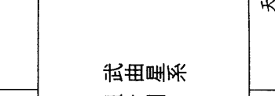
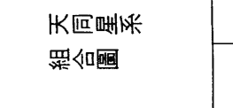

# 陆斌兆紫微斗数讲义中

# 補註凡例

(一) 本書分三冊印行。第一冊為「安星法」，第二、三冊為「十四正曜入十二宮的基本性質」。對於「安星法」，原作者未介紹到「中州派」的「安星掌訣」，稍有缺陷，但其安星法與目前流行各派不同，所以仍甚具參考價值。對此部分補註較少。

(二) 分天、地、人盤，是「中州派」推算斗數的特色。但原作者實際上以「流盤」來代替人盤，對地盤的用法亦未和盤托出，於補註時已加以詳細說明。

(三) 本書最大的特色，是重視「微驗訊號」。如那一些星曜相會，便會發生火災；那一些星曜相會，主人會移動床鋪之類。知道這些「微驗訊號」，於推算時可以令人拍案驚奇。但對於理論，本書則頗為欠缺，已於補註時盡量加入。

(四) 於補註時，亦同時加入一些未為本書所載的「微驗訊號」，即所謂「中州派秘傳」。同時亦加入部分為補註者發現的「微驗訊號」，並已一一分別註明。

(五) 「中州派」另有「紫微星訣」。本書內容對此完全未有涉及，限於體例，亦難將「星訣」補入。關於這「星訣」的紀錄，日後將整理發表。所以本書的內容，當並非斗數的最大秘密，希讀者誌之。

# 星曜飛躍十二宮吉凶反應的研究

紫微斗數中的星曜很多，有吉祥的星曜，也有凶惡的星曜。但是凶者未必是凶，吉者也未必是吉，所以吾們要研究它們的廟旺陷落。雖然，吾們已經知道了它們的入廟和落陷，可是它們的吉祥，到底是如何的吉，是如何的祥；而所謂凶，所謂惡，又將凶到如何程度和惡到何等程度。同一個星曜，當它飛躍在命宮或飛躍到財帛、事業、田宅等宮，它們的意義有甚麼不同，這些都是吾們須要作進一步的研究。

在講義中，著者將每一個星曜都條分縷析，將它們的性質意義和飛躍各宮時不同的反應，也都解說出來，因為一個星曜，好似一塊塑膠，每一個宮又好似不同的模型，所以星曜飛到某一宮時，其外型便被該宮的模型所改變，可是它的本質並沒有改變。

星曜性質上篇收入：紫微星、天機星、太陽星、武曲星、天同星、廉貞星、天府星。
星曜性質下篇收入：太陰星、貪狼星、巨門星、天相星、天梁星、七殺星、破軍星。

- (8) 交友宮
  (9) 事業宮
  (10) 田宅宮
  (11) 福德宮
  (12) 相貌（父母）宮

## 紫微星

紫微星，在五行屬陰土，是北斗的主星，在天上是一個高貴的星曜，主掌宇宙間及每一個人一生的造化。所以在我們中國的傳統思想上，紫微星便是代表帝王，因為一國之君，無疑的掌握了生殺大權，地位和權限都是至高無上的。無論他是為國為民的賢明之君或者昏庸暴虐的君主，人民都是被迫必須敬而畏之，固無論內心如何，在表面上是被迫必須歌功頌德，所以紫微星都有好高自大的性格，同時有愛之欲其生、惡之欲其死的自私心。

在吾們的想像中，帝王的環境既如上面所說，當然只有好的一面，而永遠沒有壞的一面，但是在歷史上卻詳細告訴我們，帝王的遭遇可以分作縱和橫來研究。在縱的方面，可以分作開天闢地創立基業的君王；有全盛時代國泰民順的君王；也有東爭西戰國貧多災的君王；更有慘遭顛覆的亡國之君。在橫的方面，可以分文武百官擁在朝堂的君王，和脫離羣臣遠離朝堂的君王。一位君王所以能威權行使，便因為他有百官擁護，高坐在廟堂之上，一呼百諾，一切的困難或危險，都由文武百官協助處理和全力保護。若是一旦遠離羣臣，不用說行使權威，便是一個小百姓也能加以反抗，或者還會加以污辱。在舊小說中，常有某某皇帝下江南，被匪人捉進水牢中受罪的故事，固不去研究故事的真實性，但這是很明顯，帝王而脫離了保護他的大臣武士、遠離廟堂是會遭遇困難。在紫微斗數中，這紫微星是代表了帝皇，所以它的一切和反應也可以作如是論。

紫微星除了研究它廟旺落陷外，更需要推查它的文武官，如左輔、右弼、天魁、天鉞、文昌、文曲、三台、八座、祿存、天馬等有否同度或會照。因為會到了這些吉星輔曜，則紫微星便能作威作福，無往不利；若是沒有吉星，反與惡星凶曜聚會，則是忠賢遠離，小人弄權的局面或是小人朝君主在野的情形，那麼災禍連連，主為人假心假意，奸詐刁滑了。

> （註）紫微喜「百官朝拱」，所喜者除陸先生所舉之外，尚有天府、天相；恩光、天貴；台輔、封誥；龍池、鳳閣。其中文昌、文曲；三台、八座又稱為「輦輿」，即有如帝皇的侍從車駕。

紫微喜化權，即使沒有「百官朝拱」，亦主其人可操權柄，但武曲同時化忌，須注意其缺點；最喜化科，主其人有聲譽。化權化科都不作「在野孤君」斷。

> 《紫微斗數全書》（以下簡稱《全書》）云：「不入廟，無左右，為孤君，亦清閒僧道。」並未將「孤君」的星系結構和盤托出。應讀如：「不入廟，無『百官朝拱』，為孤君。」至於僧道的命，則見下說。

「無道之君」則不同於「在野孤君」。「無道」是指吉曜不同度會照，而三方四正滿眼惡煞而言。主為人橫悖刁詐。「孤君」則僅主淪落失權，謀為費力，與「無道」不同。此點最宜仔細分辨。

七殺星若是與紫微星同度，有吉星會照，則七殺星的剛勇便成為英雄有用武之地，化煞為權，主人有權有勢；若無吉星會照，則是草寇霸道，主人橫得橫破。

> （註）《全書》云：「紫微七殺化權，反作禎祥。」又云：「紫微七殺加空亡，虛名受蔭。」又云：「紫微七殺同宮，會四煞不貴，孤獨刑傷。」可見關鍵在於能否「化殺為權」。

古訣云：「紫微巳亥旺地，與七殺同，丙戊生人財官格。」（坊本作「乙戊生人」，誤。）這是因為丙戊年生人，祿存在巳，或與紫殺同宮，或與紫殺相對。所以王亭之的師傅有一句口訣：「紫微七殺與祿同，化殺為權逞英雄。」此即以見祿為「化殺」的條件——其實稱為「制殺」更合。

若紫殺同宮見火鈴羊陀同度會照，則不成「化殺」之局。

若無祿存吉曜，亦不見煞，即使不落空亡，不見空曜，亦主其人僅得虛名，即古人「虛名受蔭」之意。

天相、祿存、天馬三星會照紫微星，而沒有空劫惡煞同宮者，主一生富貴雙全。

（註）能與天相同會的紫微，僅有「紫微在子午獨坐」、「紫微破軍在丑未同度」、「紫微天府在寅申二宮同度」、「紫微天相在辰戌二宮同度」幾種情形。幾種格局都喜見祿馬，亦喜見「擎羊」。

古訣云：「紫祿同宮日月照，貴不可言。」「紫微武曲臨財宅，更兼權祿富奢翁」（註云：得祿存亦同）。已透露了紫微喜見祿的性質。

至於天相則為「印星」，與紫微同會，有如帝皇持玉璽，更見祿馬或擎羊，自然有如一位能持權柄且國庫充盈、有聲有色的帝皇。但若同時同會惡煞，則「無道」的性質仍然不能避免，蓋富貴與無道是兩回事也。

紫微星在天羅地網宮（辰宮為天羅，戌宮為地網），對宮是破軍，無吉星輔曜會照者，稱之為無義，因為破軍有衝鋒陷陣破敵先鋒的意義，受對宮帝皇之命後，便唯軍命是受，不顧一切，遠離家室，殺敵無算，所以稱之為無情無義；對於人，或則精神受刺激，或則心臟不健全。如有吉星會照，雖然能化無情為有情，但該人的一生，定然一波三折，過程決不能平凡矣，同時在有意無意間，還時會表現一下情義方面的淡薄。

（註）《全書》云：「紫微辰戌宮得地與天相同，乙己甲庚癸人財官格。」這是因為乙年生人，得化祿化權夾命；己年生人，會武曲化祿；甲年生人，會廉貞化祿；庚年生人，會武曲化權；癸年生人，會破軍化祿。故知紫相同宮，以見化祿化權者為上格。

王亭之的師傅口訣是：「紫微天相辰戌宮，最宜權祿喜相逢。」

上述幾種格局之中，以得天機化祿、天梁化權相夾最為上品，蓋天相最喜財蔭相夾。

古訣云：「紫微天相辰戌宮，最宜權祿喜相逢。」

古訣又云：「紫微遇破軍於辰戌丑未四墓宮，為臣不忠，為子不孝。」是指無祿權及吉星會照而言。若無吉，但見煞，則為無情無義矣，而其人的際遇亦多坎坷。

### (1) 命宮：

紫微星曜在命宮，主人面色紫紅或黃白色，年老時紅黃色或者是紫色，腰背肥滿，中高體材；瘦長面，略帶圓形；性情忠厚豪爽但多游移不定；志氣高傲，性情倔強；能化七殺的煞氣而成權威，能化鈴星及火星的不祥之氣，而成中和。會照了天府、天相、左輔、右弼、文昌、文曲、祿存、天馬、化祿、化權、化科，而在入廟的宮位，必定富貴雙全。如其有祿馬交馳而沒有空劫遇到，更主大富大貴。若是沒有左輔、右弼、文昌、文曲、天魁、天鉞等星拱照，同時又沒有入廟，那就是君王在野，成了孤君。主人性情孤獨，思想超脫，可以出世為僧，或者是一位求真的道士了。

> （註）此段重複申述「百官朝拱」的結構。凡得百官朝拱的紫微，以居命宮為最宜，居福德宮亦佳。
紫微獨坐不得百官朝拱，則必須三方四正見空曜及華蓋，然後始主其人好研究哲理，或有虔誠的宗教信仰。在紫微六個星系組合中，尤以「紫微貪狼」見空曜及煞曜者，易轉化為宗教的信仰。——所謂「空曜」，係指地空、天空、截空（僅正空重要）、旬空（亦僅正空重要）而言。

與破軍同宮或會照，無煞星，宜在政界謀發展。如會照祿存、天馬，則經商能發，但是所經營的事業，宜公共事業或與政府有關的事業。

（註）古云：「紫微破軍坐命，甲乙戊己庚生人，富貴堪期。」
這是因為——
甲年生人得廉貞化祿來會；
乙年生人得紫微化科在命；
戊年生人得貪狼化祿來會；
己年生人得武曲化祿來會；
庚年生人得武曲化祿來會。

然而雖得化祿、權、科，仍需見祿馬始許得富。否則，即使昌曲、輔弼、魁鉞來會，亦不過在政界發展順利而已。

倘不見祿、權、科，又無輔佐吉曜，則雖從政亦局面不大。古云：「紫微破軍無左右吉會，凶惡胥吏。」——此云「凶惡胥吏」，即指無吉而見煞而言。

凡紫、破的組合，以服務公眾為宜——官吏亦為服務大眾也。所以即使經商，亦以公用事業或半官方機構為佳。

若是躔度到辰戌二宮，則一生多波折，可富而不能大貴；或者貴而不能大富。事無三全，一半是虛空的。

（註）辰戌兩宮為「紫微天相」同度，與破軍相對。古人認為這是「為臣不忠，為子不孝」的格局。

但古訣又云：「甲乙己癸年生人財官雙美。」這是因為——
甲年生人得會廉貞化祿；
乙年生人紫微化科在命；
己年生人得會武曲化祿；
癸年生人得會破軍化祿。

「紫相」以見化祿為佳，見祿存次之。更見左右昌曲則主貴。

然而「紫相」卻不宜見羊陀。見擎羊主詞訟，見陀羅主淹滯。在相貌方面，見擎羊主破相；見陀羅主牙齒有缺陷。

唯大致而言，「紫相」見羊陀唯宜經商，若從事政治，則多爭執是非，或者獨立離羣。

普通經商的命，便是擎羊、陀羅、火星、鈴星這四個煞星會到，只要入廟及有其他的吉星同躔會照，也能發財，但是麻煩糾紛、事非口舌很多，會照擎羊落陷，主有訟詞口舌等遭遇。

（註）紫微星系中，見煞宜經商的結構，為「紫微獨坐」、「紫破」、「紫貪」、「紫相」、「紫殺」。唯有「紫府」一系，見煞則主奸詐刁猾，更遇空曜，則更與六親無緣。

紫微星在命宮最普遍的現象便是耳軟心活、無所不好的習性。

（註）紫微為帝星，所以特別多讒言，而聽信讒言，亦是紫微的最大缺點。

必須化權、化科或見「百官朝拱」，然後才可免聽信讒言的缺點。

女命有天府及吉輔星曜會照者，是一位封誥的夫人之命。若是擎羊、陀羅、火星、鈴星、空劫照會，再有破軍昭拱，則一生自作主張，雖有財發，但難免淫巧多夫。在夫宮有紫微星曜度，加天府及吉輔星曜者，亦主夫榮子貴之命。

（註）陸斌兆先生這個說法，有很大的保留。女命「紫府」同宮，不一定「夫榮子貴」，必須「百官朝拱」始是，若不見吉而見煞，仍主婚姻不利。

唯「紫破」、「紫相」兩種結構，婚姻最難完美。見輔佐諸曜而不成對（如見天魁不見天鉞之類），再見煞刑空曜，往往再嫁。

大限、流年、紫微星來臨，主福興祿厚，在商主發展，在政主陞遷，事多機遇。天府同度，更得貴人幫助，突然名利雙收。如與破軍同度照會，則有去舊更新的意味。逢空劫、耗星，有經濟困難、破財停滯的不利。與擎羊、陀羅、火星、鈴星同度，主有官訟牢獄之災。

星相會，更有虛驚糾紛，降職停業的遭遇了。

> （註）大限或流年見紫微，仍應詳為各星系的性質而言。原文所云，僅可參考。

### (2) 兄弟（姊妹）宮：

紫微星在兄弟宮，主弟兄近貴，得有依靠之兄長或寬厚富裕之兄長。如與天府同度或照會，弟兄三人。遇天相星三四人。左輔、右弼五人以上。破軍照會，有刑剋或析產分居，亦主三人，或異母所生。遇有擎羊、陀羅、火星、鈴星（四煞）、空劫、天刑者，則有傷剋或欠和，或弟兄有破敗衰落者。天馬拱照，各奔東西。

> （註）可以補充一點資料

「紫貪」在兄弟宮，三人；見煞忌者二人。「紫殺」在兄弟宮，二人，見煞忌者一人。

凡紫微在兄弟宮，見七殺、羊陀、火鈴者，兄弟姊妹皆宜雙數則不剋，否則剋至雙數。

紫微見破軍，雖主有可能得異父或異母的兄弟姊妹，但「紫相」對破軍，有時亦僅主雙胞胎。

但在許多情形下，兄弟宮又用來推斷自己的同僚、同學，若見紫微而會吉星祥曜者，則主有能提攜自己的同學、同事，不過自己必須甘心處於「佐貳」的地位，然後關係始能和好。

尤其是既見吉星、又見惡曜的場合，人際關係尤宜小心處理。
若吉星祥曜的力量不足，而煞忌刑耗的力量反而很大，則主受制於同僚，甚至連自己的下屬亦可能不服自己的指揮。
於推算流年大限之時，將兄弟宮如此檢查，常常可以幫助自己對事業運勢能作出更詳細的推斷。

### (3) 妻宮（夫宮）：

紫微星臨妻宮，主妻子性情高強、有丈夫氣，必須遲婚，乃能偕老。會照破軍，結婚前招遇破壞、困難或周折。如在辰戌二宮，主夫妻薄情。如破軍再與天刑、擎羊、陀羅、火星、鈴星、空劫相會照者，主刑剋，三妻之命。與天府星同宮或衝會，主白首偕老。與天相會合，宜小配。與貪狼星同度，有吉星助持，雖有周折，可免剋。

（註）紫微坐夫妻宮，其基本性質，跟三方四正的輔、佐、煞、化諸曜，以至雜曜的關係甚大。

例如紫微會合天壽，夫妻年齡便有差距。女命夫妻宮「紫微天相」同度，遇「財蔭夾印」的格局，丈夫亦宜以比自己長八年以上為佳。尤其是「紫微破軍」同度之時，見煞忌刑則主不利，但見祿、權、科則反主配偶事業廣大，不利的性質亦轉化為會少離多而已。輔佐諸曜，有時亦主為第三者，尤其在夫妻宮見紫微的情況下，這種性質更為明顯。若再見煞忌、桃花，婚姻狀況便非常複雜。尤其是在現代社會，複雜程度更為增加。
據王亭之師傅，紫微與天府同宮，未必一定「白首偕老」，無論男女，有時亦主為二婚之命，必須得吉曜會合，天府又見祿，然後才主夫妻和美。否則雖表面上維持關係，而內心仍有隱衷，並不主婚姻美滿。
凡紫微在夫妻宮，皆主配偶有統治欲，同時有責任感。如何適應，可以由這方面著眼。
尤其是當紫微與擎羊同宮的情況下，除了主配偶年長之外，女性尤須對丈夫忍讓。

### (4) 子女宮：

紫微星在子女宮，主子女出秀但性情倔強、志氣高傲。主有三男二女。如與破軍、擎羊、陀羅、火星、鈴星、天刑、空劫等星會照，主長子有刑剋，或破相，或產時不足月。會照化祿、化權、化科，主得強父勝祖之子，但以遲得為宜。與左輔、右弼、天府會合，主有五胎以上，如同時與四煞、破軍、天刑等煞星會照，則見多留少。會文昌、文曲、化科，主子女聰明。逢祿存、化祿者，富子。會天馬者，宜遠離。紫微星會合擎羊、陀羅、火星、鈴星、空劫，則宜偏室或填房（續妻）生子，或先招祀子，否則極遲得子。紫微星獨守子女宮，無吉星會照煞曜者，主孤獨。
子女宮有擎羊者，如不刑剋、破相，則父子之情不濃厚。或則生前無法享受子女的孝養。

（註）紫微坐子女宮，一般情況下主頭胎生子。不過現代人喜歡婚後立即避孕。所以可能使這項推斷變得不準。而「講義」中提到有關長子的情形，如破相、「強父勝祖」之類，亦影響到準確性。

所以在現代社會，與其用星曜的性質來推斷長子，倒不如用來兼視自己的主要下屬或學生、門徒的性質。

一般情形下，不喜歡「紫微破軍」、「紫微天相」這兩組星在子女宮。如果受四煞刑忌會照或處於「刑忌夾印」的狀態，則與主要下屬或學生、門徒不和，易受到他們的反叛。

此外，紫微在子女宮，亦有一個比較獨特的性質，即以遜得為佳。這不僅是子女，門生弟子以及得力的主要下屬，均主遜得。

所以最喜見左輔、右弼會照（或左輔右弼夾著「紫微破軍」的宮度），則主晚輩得力，可以幫助自己。除了輔、弼之外，其餘吉曜，僅主對晚輩本身有利，並不主為對自己的幫助。

但在子女宮見煞忌刑耗的情形下，卻又不主晚輩本身不利，而是主對自身的人際關係惡劣。

在推斷斗數子女宮時，上述的原則相當重要，尤其是當紫微在子女宮時，這些原則更應重視。

### (5) 財帛宮：

紫微星臨財帛宮，主富厚。遇破軍，雖有財，但有波折、破敗。逢擎羊、陀羅、火星、鈴星者，能橫發，但時間不長。與七殺會同，亦能橫發，但須有吉星扶助。會左輔、右弼者，財源來自多方面。與天同、祿存、化祿會照，財能積儲。與天府星同度，一生富足。在未宮主得意之外財，在丑宮者，較次，但再經該宮時，須防破耗。紫微星在財帛宮，會大耗、空劫者，有剝削破耗，財來財去，難以積儲。

> （註）紫微守財帛宮的所謂富裕，在一般情形下僅主有財可用，或收入豐厚，並不主可成巨富。因為紫微是偏重於權力與名譽的星，不是財星。所以雖然得會合輔佐吉曜，亦不主成富翁，只主財源亨通。若見輔佐吉曜的同時，且有火星、天虛、大耗等曜，則主其人表面風光而已，並不代表財富豐盈。有些星曜組合，僅主驟發。如「紫微七殺」、「紫微破軍」、「紫微貪狼」，見煞曜亦能驟發。

## 紫微星系

發，然則卻亦蘊藏發後暴敗之機。如果四煞會照，更見空劫、刑、耗諸曜，不但暴發的時間不長，而且破敗之後，恐怕還會比未暴發前更加貧困。

「紫微天府」同度，必須天府見祿，然後主一生富足；若為「空庫」，則仍主困乏。

故綜合而言，凡紫微守財帛宮，性質很難完美，倒不如不求暴發，但求財源充盈，能敷場面應用，反而成為最安定的性質。因為儲財的能力，紫微本身不強，最好的情形，亦為財帛運用的能力而已。

因此，「紫微七殺」與左輔、右弼會合，亦僅主為財賦之官。倘紫微見煞，又見祿馬交馳，則為背井離鄉經商的命。除非有財氣豐厚的大運配合，否則仍不能成富商巨賈。

### (6) 疾病宮：

紫微星在疾病宮，主有腸胃之疾，胸悶氣脹、嘔吐腹瀉之症。與貪狼同宮者，性喜色慾。會天姚、咸池等星，有手淫遺精等症。會紅鸞、天喜者，經期不準、白帶及子宮暗疾。與擎羊、陀羅、鈴星會照，並有天刑會照者，主因病動手術。與火星相逢，主有濕氣或皮膚病。逢空劫者，眼昏、胃疼。與左輔、右弼、天府會照者，亦主胃病。吉星多者災少。

（註）紫微屬陰土，故一般主消化系統疾患。於皮膚，則為濕氣。尤其是「紫微天相」的組合，見煞，即主皮膚過敏，或為腎結石、膽結石、膀胱結石的象徵。

紫微在疾病宮，煞忌重重者，主吸收營養不佳；但如果輔佐諸曜重重，卻又防過度攝取營養。二者都易引發消化器官的運作紊亂，因而導致患其他疾病。

由於紫微為帝星，所以當與桃花諸曜同度或會合時，便帶色慾的性質或主婦女暗病。必須明白這個性質，然後才會理解到，當桃花諸曜會照之時，即使見輔佐諸曜，亦不見解散桃花諸曜帶來的不良性質。

「紫微破軍」往往成為一個患性病或暗病的基本結構，即因上述性質而來。

「紫微天府」見武曲化忌，又見刑忌虛耗的星曜太重，且有煞衝照，許多時候會成為嚴重的胃病，或消化器官病變，出現瘤腫、潰瘍，更嚴重則為癌症。

一般情形下，紫微在疾厄宮，災厄的程度可以減輕，或在感受方面較易適應。

### (7) 遷移宮：

紫微星臨遷移宮，主出外有人敬重。會照左輔、右弼，有貴人扶助。逢天府星，出外富貴雙全。祿馬、化祿會照，出門有財。天相亦主能發。破軍同度，有成有敗，或主貴人扶助，小人破壞。祿存同宮，出門雖能得利，但防被小人擯兌。有擎羊、陀羅者，人緣不足，或出門多麻煩糾紛。火星、鈴星、大耗、天刑、空劫照會，主在外多事多非，破財不安寧。

（註）紫微在遷移宮，對「七殺朝斗」或「七殺仰斗」格局的人來說（即七殺在申、寅兩宮守命），並不一定代表遷移有利。即使紫微得「百官朝拱」，亦主其人下屬眾多，仍主在出生地發展。

在卯酉二宮守命，無正曜，遷移宮為「紫微貪狼」，且見吉星會照，然後始主遷移有利。

若原來的命宮已會合吉星，亦不一定非背井離鄉不能發福。

命宮天相，對宮為「紫微破軍」，則須視「紫破」所會合的星曜吉凶而定。一般情形下，主有人助力提攜，但亦有人破壞。這種情況，「紫微天相」在遷移宮者亦然。

「紫府」在遷移宮，若見空忌，則反主在外落落寡合。必須吉星祥曜會合，然後才能富貴雙全。

### (8) 交友宮：

入廟有吉輔星會照，主得寬厚誠實之友，並得手下擁護。與破軍、空劫會，因友破財。遇陀羅，為朋友事而硬出頭，招遇糾紛麻煩。會擎羊忌星，賜恩反遭怨報，或手下人無義。

（註：紫微在交友宮（奴僕宮），應該分開兩種性質來推斷——

第一，自己的下屬、同僚或事業合作夥伴的性質是好是壞（所以有時亦應兼視「兄弟宮」）。

第二，自己跟他們的人際關係如何。

所以紫微諸星系入交友宮時，不喜見「百官朝拱」得太完美，亦不喜見這些星系太威權，否則並對自己有利。例如「紫微破軍」在交友宮，見諸吉，反可能變成不能得友人或下屬之力。更兼見煞曜，有時便變成「惡奴欺主」。

然而亦不喜煞忌刑耗並會，主人際關係惡劣。

在紫微諸星系中，以「紫微七殺」這星系最宜注意，即使會照吉曜，亦主下屬難以駕御，倘再見祿存，即主自身奔波而下屬安逸，與人合作事業者尤然。關於此項性質，王亭之有頗多實際經驗。

### (9) 事業宮：

紫微星在事業宮，入廟無煞星。會天府、左輔、右弼、三台、八座、天魁、天鉞等吉星者為一品大員、國家棟樑、人民領袖、名利權貴。祿存、天馬、化祿會照，善理經濟財政。與祿存、化祿同度，應握經濟大權。與破軍會照，一生事業，成中有敗，多波多折。天刑、擎羊、武曲、入廟會照，主握軍警大權。紫微星化科，更宜政界機關及公眾事業謀發展。與空劫、大耗拱照者，一生事業多破耗。事業海闊天空，由空中樓閣或幻想中成事實，宜工廠、實業方面發展。與地劫星同度，時生枝節。

（註）紫微在事業宮，要留意兩個不同的性質——

第一，如見煞曜與佐曜同時會照，則僅主從事獨當一面的工作，或為自由職業，或為部門主管，並不甚利於從政。尤其是現代社會，見煞者從商比從政為宜。

第二，如見科文空曜同宮，則雖不見煞亦不宜從政，否則宜樹敵。以自由職業或專業工作為宜。

凡紫微星系在事業宮者，皆主工作有獨立性，故容易發展成為獨當一面，不過獨當一面亦並不就等於事業一定有成就，須詳會合諸曜的吉凶而定。

「紫微七殺」為管理能力的象徵；「紫微破軍」則屬於開創力的表徵。因此亦主人辛勞，見煞多勞身，見文曜則主勞心。這兩組星系最宜見祿。不過「紫破」見祿，卻又主其人事業多變，許多情形下又主容易負擔額外工作，無事奔忙。

紫微守事業宮不甚忌見四煞，僅主競爭與忙碌，此為現代社會正常情形。倘四煞或三煞並照，又見刑忌耗曜，然後主一生歷經重大的挫折。此以「紫微破軍」在事業宮者尤然。「紫微天相」亦有相類的性質，不過主動力較小，所以事業失敗往往是受客觀環境影響。

「紫微天相」守事業宮者最不宜從政，易受壓力。

### (10) 田宅宮：

紫微星臨田宅宮，自增產業或購有山地。紫微星入廟，會祿存、化祿者，宜購置礦產高地。火星同度，再會擎羊、陀羅、空劫、耗星者有火災之驚。破軍同度，祖業退去，再逢擎羊、陀羅、忌星，主因產業田地發生糾紛訟詞。與天相同宮有現成家業，但仍需左輔、右弼、文昌、文曲、天魁、天鉞會照，否則終有破耗。

（註）紫微星系守田宅宮，一般皆主有自己的產業樓房，而且以住高地、高層為宜，自覺精神愉快。

唯「紫微破軍」與「紫微天相」兩個星系，則必須見輔佐諸曜，然後始主能保持產業。倘見刑煞，或主破耗變賣，或主詞訟糾紛。即使大限或流年的田宅宮見到這種情形，亦有同樣的克應。

關於火災的推斷，王亭之可以對[講義]補充的是：逢流年田宅宮見火星與紫微同度，而羊陀有流年羊陀沖疊，更見劫耗，然後始有火災，否則不是。

紫微與文曲同宮，文曲化忌者，買樓時易因契約文書不小心而受損失。

### (11) 福德宮：

福根極厚，能享受崇高富貴之樂。天府或天相同躔，終身福厚。破軍會照，勞心勞力。陀羅會照，自尋煩惱。擎羊、陀羅、火星、鈴星、大耗、空劫、天刑會照者，福薄多煩惱。忌星相會，多憂多慮。

（註）紫微坐守福德宮，有勞逸之別。

凡見輔佐吉曜者主逸，見刑煞忌曜者主勞。若逢羊陀夾忌，如紫微與貪狼化忌同宮，即流羊流陀來夾，已經入此格局，則奔波勞碌而無成果，兼且易生追悔之心，影響事業。

紫微星系在福德宮，多主觀，且喜凡事親力親為。尤以「紫微破軍」為然。見虛耗，則凡事必倍功半。

與火星同度，做事急如星火，如廣府人之所謂「皮鞋筋」（一扯就要到）。

唯無論如何，紫微星系在福德宮，均主人的氣質高出同輩——所以另一面亦因此易感孤立。

### (12) 相貌（父母）宮：

與天府星同度，主父母富貴，無刑剋。會破軍，早離家庭，否則早年有刑剋。貪狼、天相等星相會，無刑剋。凡相貌宮有貪狼、咸池、紅鸞、天喜、天姚等星，主有繼母或父親有偏室，或多外遇。有擎羊、陀羅、天刑、化忌者，主刑剋，或父母有危症，及遭遇意外之災，或則幼年不為父母所愛護。

（註）紫微星系守父母宮，一般情形下主父母有權威，所以必須視會合的星曜來釐定其「權威」的性質。——若無「百官朝拱」，則僅主父母主觀，在家庭為暴君，所以再見煞忌刑曜，便主不為父母愛護。但若見文科諸曜之時，卻又主受父母偏愛。

推斷父母有無兩重婚姻（或外遇），除了桃花諸曜同宮之外，據王亭之的經驗，還得視輔佐諸曜是否照會而定。例如，同時見左輔右弼，極可能有兩個母親，但再加會文昌而不見文曲，始主外遇或偏房。

火星同度，早年因種種情形離開父母。

## 天機星

天機星在五行屬陰木，在天上屬南斗星羣，化為善星。此星性質多計謀，機變多端，在人有權變、機劫的意義。好動、好勤、好學，但亦有見異思遷、博而不精，慾望過高，致事實常不能追及其理想，故多操心操勞，但處事每多有條理。

（註）天機可比喻為謀臣策士，所以宜為輔佐之士，而不宜獨當一面。

天機對四煞非常敏感，亦無抗禦空耗刑忌等惡曜的力量，即使在大運流年，受到流煞的衝會，往往亦可以引起不良反應。

命宮天機見煞同度，不宜經商，以從事專業為宜。

天機守命宮，貪狼守身宮，其人交際忙碌，但卻可能是無事奔忙。

凡天機坐命，宜專門從事一業，則可藉後天力量改變多學無成的缺點。唯天機始終帶有好高騖遠的色彩，所以亦可將此性質轉移為學習業餘技能。

### (1) 命宮：

天機星在命宮，主人面色青白，年老時略帶黃色。入廟則身長肥胖。與巨門同度或落陷，主瘦、中高身軀。面長瘦略帶圓形，亦有長圓型。心慈性急，好動好學。男命天機星在命宮，機謀多變、多才多藝。與天梁星會合，長口才，善辯善談，性情敏感，隨機應變。與太陰星同度或會合，有內材，有權術，重情感。在申宮，則紫微天府夾命，一生權重祿湊。在子午宮則巨門對宮，成權富。天機入廟，最善談兵。會照左輔、右弼、文昌、文曲、化祿、化權、天魁、天鉞者，一生權貴。祿存、天馬拱照，財源豐厚。文曲、文曲會照或夾宮者，稟性聰明，文章出眾。祿、科、權三化星照會，無煞曜，人民領袖、朝廷重臣。化忌星，則游移多變，趨不決，多憂多慮。與擎羊、陀羅、火星、鈴星同度，雖能富貴，但不長久。會有煞星，以經商為宜，但多變動。

如有吉星扶持，主身兼數職，或有專門技能、藝術成功之士。天機、巨門、祿同宮，或在遷移宮，主大貴（須無惡煞）。天機、天梁同宮，有吉星會照，雖能發但不長久，雖能貴徒負虛名。天機、天梁、七殺、破軍衝會，乃空門談禪之客。天機、天梁、天同、太陰會照，宜在政府機關或在公眾事業中謀發展。如會文昌、文曲，宜於大眾文化事業中服務。天機、天梁、太陰會照，而貪狼在身宮，主人日夜奔忙、勞碌異常或有酒賭等嗜好。與擎羊、陀羅、火星、鈴星會照，多災多難，或落地後即他遷，或祀出，否則遭遇虛驚。在寅宮、卯宮及辰宮會合七殺及破軍煞星者，主有意外不測之血災。凡會合擎羊、陀羅、火星、鈴星、空劫、天刑，再遇化忌者，壽夭。

（註）天機在命宮的人，從好處來說，是機變靈活，但從壞處來說，則是游移不定。所以必須詳察命宮三方四正所會合的星曜，然後才可以推斷它的好壞傾向。「講義」中對天機坐命的各種組合性質敘述，讀起來覺得花多眼亂，但其實即是根據此原則來判斷。

現在將一些古人的論斷，來跟「講義」所述的性質比較一下——由於跟天機有關的星曜，主要為太陰、巨門、天梁三曜，所以古人的論斷亦集中於此。

「機梁左右昌曲會，文為貴顯，武為忠良。」除了卯酉二宮的「天機巨門」之外，其餘十個宮位的天機都有可能構成這個格局。（所以，機梁二曜的關係也就特別重要。）不過卻以天機獨坐子午，以及居寅申宮的「天機太陰」較為高格。

「天機天梁同辰戌，必有高藝隨身。」

「機梁會合善談兵，居戌亦為美論。」

「機梁辰戌命宮同，加吉曜富貴慈祥。加羊陀空曜僧道。」

這三項是專論「天機天梁」同度的組合性質。然而卻須注意到「機梁」本身的孤剋性質以及好自我表現的特性，所以有時坐遷移宮，對命運的影響，反而會比坐命宮的格局更好——相傳孟子的命局，即是遷移宮在戌，機梁同度，古人稱為「機梁加會格」。

「天機太陰同居寅申，難免跋涉他鄉。」

「機月同梁作吏人。」

這兩項，主要是討論「機陰」組合的性質。其特點吉則為權變，凶則為權術。最不佳的組合，可以發展成為權衡陰謀。

所以「天機太陰」同度，以從事計畫、設計工作為宜，見祿文諸曜者亦宜從事金融經濟的計費管理工作。

「天機與巨門同卯酉，必退祖而自興。」

「機巨酉上化吉者，縱遇財官也不榮。」

天機在子午與巨門相對，性質比二曜同宮為佳。卯宮比酉宮為佳。見祿者又比不見祿者為佳。

「機巨」見祿，更見輔佐諸曜，可富貴，但不耐久。有煞同度則為破格，僅主為人多背面是非。這個格局受煞忌刑曜及輔佐化曜的影響，變化甚大。

「天機太陰巳亥逢，好飲離宗奸狡重。」這是指巳亥二宮的天機坐命而言，但必須四煞及刑忌會照始是。

「天機加惡煞，狗偷鼠竊。」

這是天機坐命的最下格。唯據王亭之徵驗，往往卻為遭逢意外與壽夭之徵。

凡天機火星同在命宮的人，宜防腦部神經血管疾患。

女命天機星在命宮，主性情剛強，機巧聰明，助夫益子，持家有方，操持過丈夫。祿、權、科三吉化相會，乃詰命夫人。太陰同度，容貌美麗，富情感，善機對。巨門會照，多口舌。天機化忌星，多憂善慮，有刺激性，易受外界影響而起感觸，為男性既恨又愛的對象，是一位有刺的玫瑰。如天機、巨門、天梁、太陰會合，更遇化忌、擎羊、陀羅、火星、鈴星、天刑、空劫等煞星者，主刑剋，宜繼室、偏房、遲婚，否則傷夫剋子。

（註）女命天機，古人評價不高，以其少厚重的氣質也。所以有如下的評斷——

「女命天機在寅申卯酉，雖富貴不免淫佚，福不全美。」

「女命天機，會太陰巨門天梁，遇四煞沖合，淫賤偏房娼婢，否則傷夫剋子。」

必須入廟會吉，然後才許為持家有道。

這種推斷，有時代意義，因為天機坐命的人，一般主感情易生變化，愛好易生變化，所以古人便不喜這種女命。

「議義」所述，已較溫和，但仍未重視女子在今日社會中的獨立地位。今日推斷女子天機坐命，其婚姻好壞，不如仍視其夫妻宮。

但女命天機化忌，又見權科會照，則喜玩弄感情，若更見煞刑諸曜，婚姻始終不幸。

大限、流年，天機星躡度，主有變動轉機，多新機會。或住宅床位遷動搬移之事。會照天馬，有遷陞職位、出門遠行等事。會合祿、權、科三化星及祿存、天馬、文曲、文昌、天魁、天鉞諸吉星者，主事業發展，添財添福。如擎羊、陀羅、火星、鈴星、空劫、化忌、巨門等星會照，主口舌連連，家事紛紛，心煩氣悶，諸事多變，不得安寧。

（註）天機化忌在流年命宮或田宅宮，主住宅或辦公室搬遷，但須注意風水。其餘多項推斷，仍應詳星系組合全面評定。

### (2) 兄弟（姊妹）宮：

天機星入廟，主有弟兄二人。巨門或天梁或太陰會照，均主二人，落陷意見不合。若會合擎羊、陀羅、火星、鈴星、天刑、天馬者，主刑剋分離。

（註）凡天機在兄弟宮，一般情況下，主兄弟稀少。天機與天梁在辰戌二宮同度或在丑未二宮相對，主有兄弟流產或小產。亦主兄弟姊妹容易分離。

若以這項原則來推斷同僚、同學、同事，則主較易落落寡合，或容易變換交往的對象。

若「天機天梁」在兄弟宮，更有天刑同度，主易起爭訟。

「天機巨門」化忌者，亦多紛爭口舌。

「天機太陰」於三方四正見祿，再見天巫同度，主兄弟姊妹間有爭奪遺產之事。王亭之師傳的口訣是：「機月不宜見祿巫」。

### (3) 妻宮(夫宮)：

宜小配，須相差三歲以上，主性情機巧，持家有方。會太陰，主妻有內助，而且美麗。會天梁星，則反宜長配，或則小六歲以上。有煞星須遲娶，或訂婚後生變化。與擎羊、陀羅、火星、鈴星、天刑、化忌會合，主刑剋。會天梁星，若不遲婚，或男女方於結婚前，與第三者曾解除婚約或已發生過戀愛變化者，則主生離或離婚。

（註）在夫妻宮的天機星系，以「天機天梁」（或天機對天梁）的組合最易滋生弊端。以「天機太陰」（或天機對太陰）的組合較易完美。至於「天機巨門」（或天機對巨門）的組合，必須見化祿化權始得美滿。

天機與太陰相對，比同宮為佳。見文曜再見桃花，則配偶易為異性追求。但若見化吉者，則主配偶秀發。

天機與天梁相對，亦比同宮為佳。男女皆主與配偶年齡有差距，或相反，丈夫反比妻子年輕。

天機巨門同宮，見祿，比二星相對為佳。天機與巨門相對，主夫妻貌合神離。

### (4) 子女宮：

入廟，二人，聰明機巧。庶生則三胎以上。會合巨門，只一子。在申宮會合紅鸞、天喜、大耗等星，女多子少。太陰同度，二女一子。在寅宮會合天梁星，主有三人。遇擎羊、陀羅、火星、鈴星、空劫、天刑等星者，刑剋無子。天機在子女宮，大都子女稀少，或得子極遲方合。

（註）天機在子女宮，不但主子少或遲得，而且亦主下屬或追隨自己的晚輩稀少(或時時更換，關係不常)。

天機與天梁同度，或丑未宮的天機與天梁相對，稍見煞，即主易流產或小產。流年子女宮見到這種星系，常為人工流產的徵兆。以擎羊或流羊同度為確，不然，於流年命宮或疾厄宮見到動手術的星系，亦確。

天機太陰同度，桃花諸曜重重，但卻見左輔右弼，則主「姑子歸宗」，即以女兒所生之子承祀。在現代，可能已少「姑子歸宗」的情形。

### (5) 財帛宮：

天機臨財帛宮，主財來財去。與祿存、化祿、天馬會合，主富裕。天機落陷，費心努力，多變化。若與巨門會照，更須傷勞精神，破費唇舌，多競爭，多暗鬥；每一件事，在沒有進行時，他人亦毫未注意，一旦進行謀取時，則他人亦羣起爭奪，因之便多費精力了。如與天梁星會合，則主人謀財多巧計，多機變。若擎羊、陀羅、火星、鈴星、空劫、大耗會照，則一生機緣雖多，但多聚多散。如天機、祿存同度，雖得財，但小人不足耳。

（註）古代認為「天機太陰同居財帛，見祿存化祿，為財賦之官。」這種見解，今日尚有其社會意義，但有時卻可轉化為在銀行、財務機構服務。

天機在巳亥，與太陰相對，則為「財賦之官」的意義減少，可轉化為專業人士得財。在現代，天機又主機械文明，所以亦可成為研究發明創造之表徵。

「天機巨門」的組合，古人認為宜「鬧中取財」，在現代，則有頗重的競爭意味，亦可成為自由職業及傳播界的表徵。

天機居子午，與巨門相對，競爭尤其劇烈，求財甚為費神。

「天機天梁」的組合，古人認為是「機謀巧計以求財」，在現代，若得吉曜拱照，亦可成為專利發明。見煞，則宜在工藝方面發展。

天機在丑未二宮，與天梁相對，求財之心更為熾烈，所以「機謀巧計」的性質更重。其計謀偏重於商業方面。

### (6) 疾病宮：

天機星在疾病宮，主人肝火旺盛，有肝胃疾、頭昏、耳聾、眼花等肝陽上昇的症候。嬰兒時多災多病或有驚風等症。女命陰分虛虧，經血枯少。如與太陰、紅鸞、天喜、咸池、天姚同度，主經期不準，有暗疾或子宮不正。擎羊、天刑、大耗同度，因疾病經過手術。

（註）天機抵抗煞刑諸曜的力量不強，因此天機守疾病宮，主易受疾病侵擾。

天機屬木，因此主肝膽疾患。

天機主思慮，因此亦主神經衰弱。

天機見桃花諸曜過重，由於此等星曜多屬水，水多以生木，反主過患，所以便易成為內分泌失調引發的暗病。古人統稱之「陰分虧損」。

天機天梁同度，或對拱，見羊陀天刑為盲腸炎；再見火鈴、忌星，同會陰煞、天虛、劫煞等雜曜，主胃癌或乳癌。

據王亭之徵驗，天機太陰同度或對拱，多主神經系統疾患。女命見化祿、化權，亦主子宮暗疾，此係由內分泌失調而來。

### (7) 遷移宮：

天機星是活動多變的星曜，所以在遷移宮，以出門反利，居留血地便多生是非，心亂意煩了。會照巨門星，宜出外創業。會天梁星，出外有貴人扶持，且有現成的機緣可得。若會照擎羊、陀羅、火星、鈴星、空劫者，主出門不利、破財、口舌是非、虛驚及意外之災。與太陰、祿存、化祿相拱照，主出門得財。遇天馬有煞星，主奔忙不定，勞碌非常。

(註)天機居遷移宮，一般主利於出門。但在現代社會，由於不必背井離鄉亦可以得外地之財，所以有時天機星亦僅主變動，如轉業、轉工之類。

但巨門子午二宮坐命，會太陽化忌者，遷移宮天機獨坐，則仍以離開出生地或久居之地為宜。

「天機天梁」的組合，雖離鄉仍戀故土。在現代社會，可以發展成為在外埠及本地均有商業機構成立，見諸吉祿馬，尤有發展成為跨國企業的可能。

一般來說，天機天梁是較利遷移的組合，亦常多在外地發展的機遇。唯四煞同會，則在外多憂、多虛驚、多困擾。

### (8) 交友宮：

交友廣闊，有各階級及各方面的朋友，但亦時時有變換。入廟能得朋友之助力，並得有助的職員。與巨門星同度，則交友中常多莫需要的口舌。與擎羊、陀羅會照，受朋友之累或小人之陷害，多糾紛，多是非。火星、鈴星相遇，多爭鬥，多氣惱。空劫、大耗相會照，因朋友而破耗錢財。

(註) 天機在交友宮，雖見輔佐諸曜，亦僅主交遊廣闊，必須左輔右弼、三台八座同時照會，然後始主得助力。

天機與天梁相對，而天梁有吉曜同躔，則主得年長的友人扶持。

天機與巨門相對或機巨同宮，易與友人發生誤會，引致是非口舌。古人認為「天機巨門交人，始善終惡」，即是此意。

所以天機在交友宮，最好能保持「君子之交淡如水」的作風。

天機、太陰與桃花諸曜會照，又見化忌、刑煞，提防誤交匪人。

### (9) 事業宮：

天機星臨事業宮，一生事業多變動。與左輔、右弼等吉曜相遇，事業有多種的發展或兼任數職。文昌、文曲，化科會照，最宜於文化事業、大眾工業上謀發展，或有專門技能。天機入廟，與化祿、化權、化科會照，名震四海，國家之棟樑，政界要人，能文能武。落陷宜在公共機關中任職或大公司中服務。擎羊、陀羅、火星、鈴星會照，時時調換職業或流動性無根之職業。有空劫、大耗者，宜實業工廠，投機事業，結果必然傾家。

> （註）天機與太陰的組合（同宮或相對），一般利任公職或服務於大機構，主管財務、會計之職。見祿、權、科，然後始可組織財團、掌握資金。若見煞，反宜工業發展。
天機與天梁的組合（同宮或相對），與天機太陰的組合略同，但多了管理、監察的意味。
天機與巨門的組合（同宮或相對），宜從事傳播、廣告事業。若從商，以主管營業部門為宜。

由於天機主變動，所以吉則主可從事多項經營或身兼數職，凶則主不守一業，浮蕩無根。

> 「天機天梁」同度，見煞曜，亦主落拓江湖。

### (10) 田宅宮：

祖業雖然退去，自己能置產業，但不能久持，時有遷動。天梁會照，晚年能增產業。與擎羊、陀羅、火星、鈴星、空劫、大耗會照，因住屋而發生糾紛麻煩。天機落陷，住處嘈雜、不安靜，或近處有工廠等鬧雜聲。

（註）天機守田宅宮，一般情形下均主難守業。會諸吉，則主時時搬動。由於田宅宮亦用來推斷自己的服務機構，因此天機守田宅，有時亦主易轉換工作機構或從事外務，多奔波。天機與巨門的星系組合(同宮或相對)，最容易引起產業糾紛，亦主人較難置業。最嫌化忌，再見煞刑，主因產興訟。天機與祿存同度，見忌刑，主為鄰舍不和。天機與巨門的星系尤確。

### (11) 福德宮：

與天梁星同度，能自尋享受。與巨門星同躔，勞心勞力。與太陰會，在鬧中喜靜趣。化忌星者，多顧忌，進退多慮，不安寧，操勞失眠。擎羊、陀羅會照，自尋煩惱，終日碌碌。火星、鈴星、空劫、天刑、大耗會照，福薄心煩。

（註）天機守福德宮，主人多思慮，易患得患失；天機化忌更甚。由於憂則傷肝，所以天機化忌於福德宮，而疾厄宮又不吉者，每每亦主患肝病。天機守福德宮，亦主其人有多方面的嗜好，然而卻易有多學不實的傾向。見空曜、華蓋，則多人人生空幻的感覺。若天機化科，又見華蓋、文曲，則有喜愛術數或神秘事物的傾向。天機與太陰同度，無煞或煞少，其人第六感覺相當強。天機與巨門的組合，僅主人敏於思辨，但卻未必辦事機敏。由於天機抵抗煞曜的力量弱，所以天機守福德宮，與煞曜同度，均主心煩，因之精神享受受欠缺。

## 太陽星

### (12)相貌（父母）宮：

天機星臨相貌宮，主遠離父母，否則有刑剋。與擎羊、陀羅、火星、鈴星、空劫、天刑會照者，主刑剋，或重拜父母，或祀繼他人，幼年過房。會天馬，幼年離家，年長入贅。與太陰、天梁會照者，可免刑剋，與巨門同宮，早年不利父母。

> （註）三種天機星系組合中，以天機太陰的組合最利父母。天機巨門，及天機天梁，早年均對父母不利。

但由於父母宮亦用來推斷自己的上司與主管或師長，所以當天機天梁會吉曜之時，尤其是當天梁化科而無太多煞曜會合之時，主可受長輩恩惠、提拔，或得嚴明的上司或師長。

天機守父母宮，見桃馬、天馬，主入贅，或供養岳家而不供養父母。

太陽星在五行屬陽火，在天為日之精，化為貴，在男命中，作為父星及子星。在女命中，作為父星、夫星及子星。宜日生人，不宜夜生人。為命盤中事業宮的主星。太陽在十二宮中，各有其名稱，今分別解說如後，以供學者研究之。

太陽曜子宮，名「天宜」，主為人富於情感，主生貴子。

丑宮名「天幽」，日月同宮，主為人性情忽陰忽陽，不易捉摸。

寅宮名「天桑」，是日出扶桑的意思，這是旭日正擬東升的時候，主為人福厚名顯。

卯宮名「天烏」，主為人英明俊偉，有大丈夫氣概，多藝多才，名顯富裕。

辰宮名「天爽」。日出龍門的時候，主人少年顯達，權名遠揚。

巳宮名「幽徵」，主為人志高氣傲，鋒鋭太露，為祿厚權高、功名顯達之士。

午宮名「日麗中天」，主人福厚祿重，志高氣壯。

未宮名「天輝」，日月光輝，主權重豪爽。

申宮名「天暗」，主為人多學少成，處事多周折。

酉宮名「九空」，主為人作事亨通，但有始無終，最忌煞星，有刑囚之災。

戌宮名「天樞」，日藏光輝，名雖不揚，遇吉曜，反能成富。

亥宮名「玉璽」，日月反背，反成大器，少年立功勳。

太陽星最喜三台、八座、文昌、文曲、天魁、天鉞、左輔、右弼等吉星會照，主事業偉大，既貴且富。太陽在戌宮，主有眼病、近視、散光等情況。在午宮雖貴，但日光太烈，亦主有目疾。太陽在亥，反能大發，但必須會遇祿存、化祿、天馬方合格。總之太陽星以貴為主，而富次之；太陰星以富為主，而貴次之。

（註）日生人，以太陽為中天星主，故對夜生人不利。因為是星主，所以亦喜「百官朝拱」，不宜孤立。此性質同紫微。

日初升於寅，始沉於申，所以喜寅卯辰巳午未六宮，不喜申酉戌亥子丑六宮，夜生人更甚。

不利父親、兒子；女命更不利丈夫（婚前則男友不利）。

太陽主貴不主富，其富裕係由貴顯而來。故時易表現為名大於利。

太陽本身帶有光芒散射的性質，所以不宜更見散射的星曜，見天梁則反能收斂光芒，變為沈潛。

【講義】中所列太陽居十二宮的名稱及表義，僅可作參考，不宜拘泥。但有一個基本思想卻不妨注意——

太陽不喜過分散射熱力，因此居巳午二宮時便不主富；反而戌亥兩宮的太陽，遇吉曜可成富局，這則是由於光芒收斂的關係。

這種推斷，是基於儒家的「中庸」思想而來。

### (1) 命宮：

太陽在命宮，主人面色紅潤、紅黃或帶紫紅色。面型飽滿或長圓。在午宮身軀高大，態度大方而瀟灑。落陷則中矮身型。

男命廟旺，主人性情豪放，心慈好施，稟性聰明，志高氣傲。若得左輔、右弼、天魁、天鉞、文昌、文曲、祿存、天馬、化祿、化科、化權會照，主極品之貴，文武全材。但必須入廟及日生人無煞曜方合。寅、卯二宮，稱為旭日東升。在辰、巳二宮為入殿或稱日遊龍門。在午宮為日麗中天，主大富大貴。丑、未二宮，日月同明，故有忽陰忽陽之稱。申宮為偏西，作事有頭無尾，先則勤於工作，做事認真，終則疏懶隨便，求學不求甚解。在酉宮稱做落日，貴而不顯，富而不久；外求美觀，內實空虛。戌、亥、子、丑四宮稱失輝，主人作事勞碌、虛浮而不實際。

此段與前十二宮太陽名稱註解，小有出入，亦即古人對於斗數星曜解註之不同點，今一併記之，以供學員等參考研究之用。

太陽星在卯宮，再得化祿為上格。在亥宮，遇祿存、化祿、天馬，雖能富，但幼年不利父親。太陽化忌者，亦不利父親或傷目。若與擎羊、陀羅、火星、鈴星相會，主人橫發橫破，貴不能久，富不能長。文昌、文曲、天魁、天鉞、左輔、右弼夾命者貴。

女命太陽星臨命宮，入廟者，及日生人，性格貞烈豪爽，有丈夫氣。有左輔、右弼、文昌、文曲、天魁、天鉞、祿存、化祿、天馬、三台、八座等吉星會照，一品夫人，旺夫益子。祿、權、科三化星拱照命宮，亦主封贈夫人之格。女命最喜逢太陽星，入廟者類多聰明慈祥，福大量寬。但落陷者，則作事多進多退，性情躁急。與火星同宮者，性情天真，情感用事，辛勞少人緣。太陽化忌，少年剋夫，老年剋子，必須遲婚或則繼室偏房。若會擎羊、陀羅、鈴星、天刑、空劫者，主刑剋，多空門師太或獨身服務社會者。因太陽逢煞星，性情必剛貞，故主人端莊凝重；落陷反背，雙目近視散光，或一大一小。遇破軍者，主非禮成婚。

大限流年，太陽星曜度，入廟遇吉星，必然平步青雲，添財進福，結婚得子，富貴聲揚；若落陷逢四煞、空劫，主作事空虛，多爭少成，小人侵害，橫爭破財，頭昏。

（註）與太陽有密切關係的星曜，為太陰、巨門、天梁，或同度，或相對，皆足以影響太陽的性質，所以除了廟旺利陷之外，仍須研究太陽跟這些星曜的組合特性。太陽與太陰在丑未二宮同度，彼此互相影響，反而互相拖累，使太陽的放射性與太陰的收斂性皆不純粹，所以有「忽陰忽陽之稱」。在辰戌二宮的太陽，必與太陰相對，由於是對宮而不是同宮的關係，反而容易調和。所以辰宮稱為「日遊龍門」，而戌宮的「日月反背」，遇吉化及吉曜反成大局。太陽巨門在寅申二宮同度。巨門為暗曜，消耗陽光，所以寅宮較申宮為優。這組星系，主要性質為傳播，有時亦可用來觀察跟異族的關係。若巨門化忌，則主是非口舌，但亦因此主人適宜擔任是非口舌的職務，例如律師、翻譯等。太陽在巳亥二宮與巨門相對。一般情形下，巳宮優於亥宮，古人認為巳宮的太陽，見諸吉可成大貴，見諸凶亦為公卿門下士；而亥宮的太陽落陷，與巨門相對，便主與人寡合招非。蓋前者口舌便給，後者言詞取咎，皆與太陽的廟陷有關。太陽天梁在卯酉二宮同度，卯宮稱為「日照雷門」，日生人主貴顯；可是酉宮落陷，因而古人便認為「貴而不顯，秀而不實」。

以六親多不完美，亦主與人寡合；而午宮的太陽光芒畢露，亦易招人妒忌，而且若不見權祿諸吉，便容易空虛不實。

太陽不甚忌諸凶煞曜。見煞僅主辛勞。

唯太陽最畏化忌，不但主六親有損，而且主人有眼目、心臟的疾患。許多先天性心臟病者，即屬於此類。

落陷的太陽，見刑忌湊合，又見陰煞、天虛，主人猥瑣。

女命太陽，入廟吉；落陷凶。

古云：「女命端正太陽星，早配賢夫信可憑。」即指入廟的太陽而言，而且以日生人較利。

古云：「女命太陽陷地失，六親刑剋且帶疾。」即明指落陷的太陽，且夜生人更差。

現代婦女多有自己的事業，在推斷時，亦應詳視星系的性質，作出整體的評斷。

關於流年大限，有古人的論述二則可以參考——

「太陽入限，廟旺，輔弼吉曜會合，必有驟然之興。」

「太陽入限，落陷，羊陀鈴星齊集，先有目下之憂，或生剋父母。」

### (2) 兄弟（姊妹）宮：

太陽入廟，臨兄弟宮，三人以上。有吉星者主貴。與太陰同宮，五人以上。巨門同度或會照，有吉星，兄弟都是創立事業者。落陷及夜生人，兄弟多爭不和，少依靠。有擎羊、陀羅、火星、鈴星、空劫、天刑者，主弟兄有刑剋，或因兄弟事，受意外的傷害。

> （註）古云：「太陽於兄弟宮，有光輝者富貴。有刑煞而陷地，兄弟多故。」

所謂「光輝」，以化權、化祿為最，化科次之。尤其是陽光過分強烈的宮度，如巳宮、午宮，化科未必即吉。

太陽見祿馬，亦為「光輝」之徵。亦喜「百官朝拱」的格局。

若太陽化忌，則長子有傷。且主父親與兄弟之間不和，或父親對家庭無責任感。有時亦為受兄弟拖累的徵兆。

兄弟宮光輝適中，而自己命宮見左輔右弼者，如相當佳美的結構，主兄弟富貴，或同學、同僚得意，且對自己有助力。

### (3)妻宮(夫宮)：

太陽星臨妻宮，主妻子性情爽直，有正義感，性急有丈夫志。入廟聰明慈祥，但須遲婚，早婚有刑剋。會太陰星，主有賢美的妻子。太陽落陷、化忌者，妻子性急多疑(女命則主刑剋或丈夫有病災)。凡太陽星臨妻宮，會照擎羊、陀羅、火星、鈴星、空劫、天刑者，主刑剋、生離。若逢破軍，非禮成婚。女命太陽星蹕夫宮，入廟者，主嫁富貴之婿。落陷化忌者，難求滿意之對象，或主刑剋。有陀羅、火星者，初時熱戀，終成冰炭；以繼室遲婚或非正式結婚者為宜。凡太陽星落陷化忌會煞星者，元配夫妻，不能白首偕老。過四煞破軍者，非禮成婚。

(註)太陽守夫妻宮，一般情況下，男命勝於女命。日生人利於夜生人。

古云：「太陽守夫妻，男逢諸吉聚，可因妻得貴。陷地加煞，剋妻且自身災病。」

又云：「女命逢諸吉聚，早配賢夫。」

在太陽諸星系中，以太陽、巨門的組合(同度或對宮)，最不宜見煞忌刑曜，常為與配偶生離死別的徵兆。又主親家不和或異族通婚。

太陽、太陰的組合，見祿權科會諸吉，則夫妻皆可互相助力發展。見煞忌刑曜，亦不主刑剋，僅為婚前戀愛曾經有挫折的徵兆。但婚後則為親家不和、配偶自私的表徵。

太陽、天梁的組合，見吉，僅主夫妻年齡差距大，或主妻年反大於夫年，且於婚前有波折。若見諸凶，則夫妻間互相疑忌。

無論男女，見太陽守夫妻宮欠吉，皆以遲婚為宜。若落陷化忌又見刑煞，須經戀愛多次挫折，且無正式婚禮的婚姻始可偕老。

### (4)子女宮：

太陽星入廟臨子女宮，主子女秀發，有貴子，主三子二女。與太陰星在未宮同度，主子女眾多，無煞星，八胎以上。巨門會照，主聰明，有創業精神，有辯才。落陷有刑剋，不利長子。化忌星多病多災。會擎羊、陀羅、火星、鈴星、空劫者，一子送終。

> （註）古云：「太陽守子女宮，有光輝者昌，有刑煞，雖成敗損。」

所以太陽守子女宮，入廟吉，日生人更吉，落陷凶，夜生人尤凶。若太陽化忌，主頭胎有損，且主父子有嚴重代溝。

太陽主動，所以一般情形下，又為父子分離的徵兆，雖會諸吉，仍難改變這種性質。

子女宮又可以用來推斷自己跟晚輩（如門生弟子、直接關係的下屬）的人際關係。所以以上的性質亦可同斷。

太陽、天梁的星曜組合在子女宮最為吉利，成為「陽梁昌祿」的格局，子女及晚幼必秀發。即或不然，亦主沈潛，無太陽、巨門之浮華，所以易對自身助力。

太陽太陰的組合，有時僅主子女及晚幼輩眾多。

四煞併照，不見化忌尚無妨，不過是感情上的隔膜，若見化忌，則妨長子，或主提攜後進而反招怨報。

### (5)財帛宮：

太陽星入廟，臨財帛宮，日生人，財源豐足；但天上太陽是普照四方，故在人主樂善好施，一生剝削極重。祿存、天馬照會，乃大富之格。陷宮則財來財去，費心勞力。巨門會合，財由創業中來，或由競爭勞神中來。

> （註）古云：「太陽守財帛於旺地，會諸吉相助，不為巨門躔，其富貴綿遠。」

由此可見，在財帛宮的太陽，不喜巨門同度或對照。主雖得財亦有糾紛，且易成為一時之富貴。

在現代，若太陽巨門化為權祿，則主受異族賞識而得成富。大限流年見到這種情形亦有同樣的性質。

太陽與太陰的組合，由於兩顆星曜的性質一主散、一主聚，所以當會見吉星之時，主先散後聚，或其人能散財亦能聚財。

太陽與天梁的組合，主爭奪。但若能憑專業知識或商標字號來求財，通常情形都比較其他太陽星系為佳，所以最喜科星同躔。

凡太陽在財帛宮，無論廟陷，有吉無吉，均不易聚財。若見煞刑諸曜，則主一生為人作嫁。

所以太陽守財帛宮時，應檢視夫妻宮及田宅宮有無守財的能力，如有，則財權應交給配偶；或注意置業的機會，以求趨避。

若昌曲與太陽會合，化為忌星，更主一生為別人牽累破財，尤應避免替人作保。

### (6) 疾病宮：

太陽臨疾病宮，主人血壓高頭眩、雙目昏花或目中有紅筋，肝腸上升、頭痛、大腸乾燥、痔瘡便血、心火極重。逢擎羊、陀羅、化忌，眼目有損傷，或近視、散光及眼白不清，易得風症。

（註）太陽的基本性質為散射，於五行則屬火，所以多患中醫的所謂「陽明」症候。例如身體有病即易頭痛、頭暈。

太陽又主眼目，在午宮、戌宮，皆為視力不良的徵兆。若化忌見煞刑重重者，須防失明或眼部手術。

太陽又主「風疾」，此乃由於它具有常動不居且發射陽光之故。因此除婦人頭風之外，有時又為中風的徵兆。以太陽天梁的組合，最易發生這種傾向。

太陽、太陰的組合，無論同宮或相對，都易患水火不調、陰陽不和、心腎不交的疾病，其表現為失眠、怔忡，可以發展為心臟、腦部疾患。

太陽太陰同度，見煞，又見刑傷空劫，主患破傷風。

太陽巨門的組合同宮或對拱，防口舌瘡痛（不是牙病）。見陀羅及天刑，則為半身不遂的表徵。

太陽天梁又可為內分泌失調的表徵。煞忌刑曜重重，又有流煞沖合，且見天虛、陰煞，主患乳瘡、乳癌。男子則為胃癌。

### (7) 遷移宮：

太陽星主動，屬外向，不宜靜守，出門近貴能發。惟落陷者，出門多忙碌。化忌者，出門不利，有病災或碌碌奔忙。有擎羊、陀羅、火星、鈴星、空劫者，出門多是非，不安寧有破耗。

（註）古人認為太陽守遷移宮，主不利祖業，須移根換葉以成家。女命尤其認為不宜，因為古代女子無事業，離家遷移亦可能是改從別姓，再嫁二夫。

在各種太陽組合的星系中，以太陽巨門的組合最宜出門經商。化祿化權化科，都易得外地人提攜。見化忌，則主費唇舌。

太陽天梁的組合，最利於出門求學、求名。所以最喜見文昌、文曲。

在現代，又往往是代理外國商品的表徵。

太陽、太陰的組合，由於浮動無根太甚，所以縱見吉亦主奔波。若見煞忌，出門往往徒勞。

凡太陽居遷移，利於發貴發名，不甚利於求財，這是太陽的基本性質。即使見祿，亦未必可以聚財。

### (8) 交友宮：

太陽星之本質雖然是豪爽好施，但施與人則可，有求於人則不得，是一個施恩報怨的星曜。因為在天空的太陽，是四方普照，是無條件的給人們溫暖，可是就不可能向人們收回一分一厘的酬報。同時，在很多的情形下，人們反咒罵太陽曬照的熱度太熱了；在連連的雨季中，人們又在怪太陽偷躲在雲裏不露。所以在太陽星臨命盤的交友宮時，也有同樣的意義，只有入廟或與太陰同度者，則多得朋友。如其落陷，及會照四煞空劫者，便是施之以恩報之以怨。在手下的職員，更多反上怨言。會巨門星，則多無謂的口舌是非了。

（註）太陽不宜居交友宮，即使不見煞忌，亦主施恩無功；若見煞忌，更主恩反成仇。此意已見於「講義」。

太陽、太陰的星曜組合，一般僅主朋友下屬眾多。須見諸吉會集，然後始主得力。

太陽、巨門的組合，多是非，但化為權祿則宜結交異族。

太陽、天梁的組合，比較孤立，見諸吉則仍主可得諍諫之友或正直敢言的下屬。一般情形下，當太陽守交友宮之時，以自身不從事政治活動為宜。因為政治漩渦最為凶險，恩反成仇的不良後果亦最大。

### (9) 事業宮：

太陽入廟在事業宮，會照左輔、右弼、天魁、天鉞，或得文昌、文曲，而不逢四煞空劫者，主貴至一品或門徒眾多。在寅宮與巨門同度，無煞星，主大富大貴。與化祿、化權、化科會照，更是國家棟樑。太陽在午宮，乃日麗中天，主能掌握大權，並主大富。有文昌同度，入廟會左輔、右弼、天魁、天鉞、三台、八座等吉星者，乃人民領袖或政府中之行政者。與巨門會，乃折衝政務之外交家。若太陽落陷，逢擎羊、陀羅，則勞碌奔走，多成多敗。遇空劫，宜從技藝上成名，或由幻想中創立事業，多起家於空中樓閣的幻想中。

（註）太陽守事業宮，吉則事業廣大，聲名顯赫；凶則事業空虛，浮誇不實。這是一個基本性質的吉凶兩面。

所以太陽在午宮，是顯赫抑或是浮誇，最容易明顯表現出來。

一般來說，與太陰同度或拱照之時，比較踏實，可成為內務人才；與巨門同度或拱照之時，則宜傾向於外務，而且易流為浮誇；與天梁同度或拱照的太陽，以從事專業為宜，尤利於醫療業，若從政從商，均宜愛惜名譽，最不宜藉名譽來浮誇取財。

太陽巨門、太陽天梁見祿曜同宮或會合，又帶有「偏財」的性質。只要不見天刑、不化忌，則仍不致招官非口舌。

太陽巨門又主得異族之財。在現代社會，最宜經商，以進出口業為宜。

太陽天梁為名譽之財，所以經商者須注意商標及商譽的建立。

若化為忌聲，則無論甚麼太陽星系組合，都主事業上受到壓力，只有從事以口舌競爭為基本性質的行業，然後始可化解。這些行業，如法律、推銷、教育、傳播等。絕對不宜從政，否則口舌是非，以致詞訟紛爭難免。

### (10) 田宅宮：

太陽星是一個浮動的星曜，所以在田宅宮也有浮動的意義，祖傳的產業便有退去的趨勢。入廟有吉星扶持，仍不免有浮動變換的事實。惟與太陰星或與巨門星同度，在寅宮或申宮，有吉星扶持，不遇四煞空劫星曜，則產業增多，但仍因產業而生明爭暗鬥的情形。太陽、天梁同度，在卯、酉宮，主有公產鬥爭。

> （註）依照「中州派」的法則，田宅宮可以用來推斷自己所服務的機構，以及直轄主管機關。有時甚至用來觀察父親及上司的吉凶。

有一項徵驗是：流年田宅宮見太陽，刑忌煞交集，又見流煞、太歲、白虎，則主父死，或宅中的直系尊親逝世。

以田宅運而言，太陽入廟，主有祖澤，但難守。即使會集諸吉，可以自置，但仍時時變換。——所以有時可利用這點性質來經營地產。

唯太陽天梁同宮或對拱，見擎羊、天刑、空劫、大耗同會，則主因公產而興大訟，以不沾手為宜。

只有在太陽太陰在未宮守田宅，且見吉曜的情形下，才主產業較為穩定；若太陽、巨門的組合，見吉，宜在外國置業（亦宜服務於異族人為主腦的機構）。

### (11) 福德宮：

太陽、太陰同宮，則陰陽調和，能享受快樂。與天梁星同度，有名士式的懶趣。太陽落陷，自尋忙碌。巨門會照，操心費神。女命太陽星陷福德宮，主得熱情的夫婿而能享受快樂。若逢四煞空劫，則奔走忙碌不寧。

> （註）太陽為浮動不寧且散射光熱的星曜，所以在福德宮時，主人喜動而不喜靜。見擎羊、火星，尤主無事奔忙，或為朋友之事而忙碌。必須見左輔右弼、三台八座同會，然後才有較為安靜的傾向。

太陽太陰星系，見吉，則奔忙而仍能有精神享受。

太陽天梁的星系，見吉，僅宜為人幕後策畫，不可正面出頭；尤其是在吉凶交集的情形下，出頭則易招怨成仇；見科文諸曜，則為學術思考上的忙碌，性質比較優雅。但若見陀羅、鈴星、天虛等曜，又主其人食古不化，主見極強。

太陽巨門的星系，最為勞碌操心。見煞忌，則因誤會而生是非，或受壓力。

女命福德宮見太陽，會諸吉，而桃花諸曜不多，則主閨房之中多樂趣。見桃花重，古人認為女命淫濫。

## 武曲星

### (12) 相貌(父母)宮：

太陽入廟臨父母宮，主父母無刑剋。會吉星，則幼年受父母篤愛。父在事業上握權力，貴而且富。太陽星落陷者，剋父。如逢化忌星，擎羊、陀羅、火星、鈴星、空劫、天刑者，須注意太陰星是否有煞星同躔，則主剋母。因父在母死後，便成孤獨寂寞之人。若太陰星有吉星及天梁、天壽、解神、天福等星扶持者，主先剋父。

（註）太陽入廟與落陷，不特在父母宮始為推斷有無刑剋的克應，在命宮或田宅宮亦然。所以對於講義所述，不必盡拘泥於父母宮。

流年大限的父母宮，通常用來推斷自己跟上司的關係。若太陽坐守，見祿馬，主上司調動更換；若太陽化忌，則與上司發生意見；若見煞曜，則主受上司壓力。

太陽天梁在父母宮，上司的成見極深，易生隔膜。

太陽巨門在父母宮，化吉，以服務異族為宜，可受特殊提拔。化忌，自身宜從事自由職業。

太陽太陰在父母宮，見吉則關係良好，見煞曜則良好關係的上司易於轉換；見忌，妨初時間關係良好，卻因誤會轉為惡劣。

## 武曲星

武曲星在五行屬陰金，在天上屬北斗星，化為財，是財帛宮的主星。在人命中，能發亦能敗。武曲星最忌化忌星，則事業失敗。會煞星，則焦頭爛額，不堪收拾。最喜化祿，則財源湧到，事業發展，威名遠震。在辰戌二宮，有左輔、右弼、天魁、天鉞、文昌、文曲等會照，更遇化祿、化權、化科拱照者，最是上格。在巳亥二平宮者，有專門技能。若逢擎羊、陀羅、火星、鈴星，乃是技巧的工作者。武曲命宮，在卯落陷，而貪狼在亥宮，有祿存衝照，或同度天馬星，及其他輔星吉曜者，主人身體肥胖，或作事有氣魄、有膽力、有作為，此英雄末路得遇貴人之象。若有擎羊、陀羅、火星、鈴星、空劫、天刑者，則是軍人武士或是殺豬殺羊、斬殺牲口的屠夫。化忌星壽元天短。武曲在天羅、地網宮，與貪狼對宮，若化忌星有擎羊、陀羅者，主壽夭，或少年時有病有災甚重；不化忌星者，三十歲後始發。武曲星在丑未二宮，則主少年享受，但有剋星。在古書中，以武曲星臨女命，則主女子而有男子丈夫氣概。命，但目今社會，男女早趨平等，故武曲星臨女命，不宜女命，但目今社會，男女早趨平等，故武曲星臨女命，不宜女命，但目今社會，男女早趨平等，故武曲星臨女命，不宜女命，但目今社會，男女早趨平等，故武曲星臨女命，不宜女命，但目今社會，男女早趨平等，故武曲星臨女命，不宜女命，但目今社會，男女早趨平等，故武曲星臨女命，不宜女命，但目今社會，男女早趨平等，故武曲星臨女命，不宜女命，但目今社會，男女早趨平等，故武曲星臨女命，不宜女命，但目今社會，男女早趨平等，故武曲星臨女命，不宜女命，但目今社會，男女早趨平等，故武曲星臨女命，不宜女命，但目今社會，男女早趨平等，故武曲星臨女命，不宜女命，但目今社會，男女早趨平等，故武曲星臨女命，不宜女命，但目今社會，男女早趨平等，故武曲星臨女命，不宜女命，但目今社會，男女早趨平等，故武曲星臨女命，不宜女命，但目今社會，男女早趨平等，故武曲星臨女命，不宜女命，但目今社會，男女早趨平等，故武曲星臨女命，不宜女命，但目今社會，男女早趨平等，故武曲星臨女命，不宜女命，但目今社會，男女早趨平等，故武曲星臨女命，不宜女命，但目今社會，男女早趨平等，故武曲星臨女命，不宜女命，但目今社會，男女早趨平等，故武曲星臨女命，不宜女命，但目今社會，男女早趨平等，故武曲星臨女命，不宜女命，但目今社會，男女早趨平等，故武曲星臨女命，不宜女命，但目今社會，男女早趨平等，故武曲星臨女命，不宜女命，但目今社會，男女早趨平等，故武曲星臨女命，不宜女命，但目今社會，男女早趨平等，故武曲星臨女命，不宜女命，但目今社會，男女早趨平等，故武曲星臨女命，不宜女命，但目今社會，男女早趨平等，故武曲星臨女命，不宜女命，但目今社會，男女早趨平等，故武曲星臨女命，不宜女命，但目今社會，男女早趨平等，故武曲星臨女命，不宜女命，但目今社會，男女早趨平等，故武曲星臨女命，不宜女命，但目今社會，男女早趨平等，故武曲星臨女命，不宜女命，但目今社會，男女早趨平等，故武曲星臨女命，不宜女命，但目今社會，男女早趨平等，故武曲星臨女命，不宜女命，但目今社會，男女早趨平等，故武曲星臨女命，不宜女命，但目今社會，男女早趨平等，故武曲星臨女命，不宜女命，但目今社會，男女早趨平等，故武曲星臨女命，不宜女命，但目今社會，男女早趨平等，故武曲星臨女命，不宜女命，但目今社會，男女早趨平等，故武曲星臨女命，不宜女命，但目今社會，男女早趨平等，故武曲星臨女命，不宜女命，但目今社會，男女早趨平等，故武曲星臨女命，不宜女命，但目今社會，男女早趨平等，故武曲星臨女命，不宜女命，但目今社會，男女早趨平等，故武曲星臨女命，不宜女命，但目今社會，男女早趨平等，故武曲星臨女命，不宜女命，但目今社會，男女早趨平等，故武曲星臨女命，不宜女命，但目今社會，男女早趨平等，故武曲星臨女命，不宜女命，但目今社會，男女早趨平等，故武曲星臨女命，不宜女命，但目今社會，男女早趨平等，故武曲星臨女命，不宜女命，但目今社會，男女早趨平等，故武曲星臨女命，不宜女命，但目今社會，男女早趨平等，故武曲星臨女命，不宜女命，但目今社會，男女早趨平等，故武曲星臨女命，不宜女命，但目今社會，男女早趨平等，故武曲星臨女命，不宜女命，但目今社會，男女早趨平等，故武曲星臨女命，不宜女命，但目今社會，男女早趨平等，故武曲星臨女命，不宜女命，但目今社會，男女早趨平等，故武曲星臨女命，不宜女命，但目今社會，男女早趨平等，故武曲星臨女命，不宜女命，但目今社會，男女早趨平等，故武曲星臨女命，不宜女命，但目今社會，男女早趨平等，故武曲星臨女命，不宜女命，但目今社會，男女早趨平等，故武曲星臨女命，不宜女命，但目今社會，男女早趨平等，故武曲星臨女命，不宜女命，但目今社會，男女早趨平等，故武曲星臨女命，不宜女命，但目今社會，男女早趨平等，故武曲星臨女命，不宜女命，但目今社會，男女早趨平等，故武曲星臨女命，不宜女命，但目今社會，男女早趨平等，故武曲星臨女命，不宜女命，但目今社會，男女早趨平等，故武曲星臨女命，不宜女命，但目今社會，男女早趨平等，故武曲星臨女命，不宜女命，但目今社會，男女早趨平等，故武曲星臨女命，不宜女命，但目今社會，男女早趨平等，故武曲星臨女命，不宜女命，但目今社會，男女早趨平等，故武曲星臨女命，不宜女命，但目今社會，男女早趨平等，故武曲星臨女命，不宜女命，但目今社會，男女早趨平等，故武曲星臨女命，不宜女命，但目今社會，男女早趨平等，故武曲星臨女命，不宜女命，但目今社會，男女早趨平等，故武曲星臨女命，不宜女命，但目今社會，男女早趨平等，故武曲星臨女命，不宜女命，但目今社會，男女早趨平等，故武曲星臨女命，不宜女命，但目今社會，男女早趨平等，故武曲星臨女命，不宜女命，但目今社會，男女早趨平等，故武曲星臨女命，不宜女命，但目今社會，男女早趨平等，故武曲星臨女命，不宜女命，但目今社會，男女早趨平等，故武曲星臨女命，不宜女命，但目今社會，男女早趨平等，故武曲星臨女命，不宜女命，但目今社會，男女早趨平等，故武曲星臨女命，不宜女命，但目今社會，男女早趨平等，故武曲星臨女命，不宜女命，但目今社會，男女早趨平等，故武曲星臨女命，不宜女命，但目今社會，男女早趨平等，故武曲星臨女命，不宜女命，但目今社會，男女早趨平等，故武曲星臨女命，不宜女命，但目今社會，男女早趨平等，故武曲星臨女命，不宜女命，但目今社會，男女早趨平等，故武曲星臨女命，不宜女命，但目今社會，男女早趨平等，故武曲星臨女命，不宜女命，但目今社會，男女早趨平等，故武曲星臨女命，不宜女命，但目今社會，男女早趨平等，故武曲星臨女命，不宜女命，但目今社會，男女早趨平等，故武曲星臨女命，不宜女命，但目今社會，男女早趨平等，故武曲星臨女命，不宜女命，但目今社會，男女早趨平等，故武曲星臨女命，不宜女命，但目今社會，男女早趨平等，故武曲星臨女命，不宜女命，但目今社會，男女早趨平等，故武曲星臨女命，不宜女命，但目今社會，男女早趨平等，故武曲星臨女命，不宜女命，但目今社會，男女早趨平等，故武曲星臨女命，不宜女命，但目今社會，男女早趨平等，故武曲星臨女命，不宜女命，但目今社會，男女早趨平等，故武曲星臨女命，不宜女命，但目今社會，男女早趨平等，故武曲星臨女命，不宜女命，但目今社會，男女早趨平等，故武曲星臨女命，不宜女命，但目今社會，男女早趨平等，故武曲星臨女命，不宜女命，但目今社會，男女早趨平等，故武曲星臨女命，不宜女命，但目今社會，男女早趨平等，故武曲星臨女命，不宜女命，但目今社會，男女早趨平等，故武曲星臨女命，不宜女命，但目今社會，男女早趨平等，故武曲星臨女命，不宜女命，但目今社會，男女早趨平等，故武曲星臨女命，不宜女命，但目今社會，男女早趨平等，故武曲星臨女命，不宜女命，但目今社會，男女早趨平等，故武曲星臨女命，不宜女命，但目今社會，男女早趨平等，故武曲星臨女命，不宜女命，但目今社會，男女早趨平等，故武曲星臨女命，不宜女命，但目今社會，男女早趨平等，故武曲星臨女命，不宜女命，但目今社會，男女早趨平等，故武曲星臨女命，不宜女命，但目今社會，男女早趨平等，故武曲星臨女命，不宜女命，但目今社會，男女早趨平等，故武曲星臨女命，不宜女命，但目今社會，男女早趨平等，故武曲星臨女命，不宜女命，但目今社會，男女早趨平等，故武曲星臨女命，不宜女命，但目今社會，男女早趨平等，故武曲星臨女命，不宜女命，但目今社會，男女早趨平等，故武曲星臨女命，不宜女命，但目今社會，男女早趨平等，故武曲星臨女命，不宜女命，但目今社會，男女早趨平等，故武曲星臨女命，不宜女命，但目今社會，男女早趨平等，故武曲星臨女命，不宜女命，但目今社會，男女早趨平等，故武曲星臨女命，不宜女命，但目今社會，男女早趨平等，故武曲星臨女命，不宜女命，但目今社會，男女早趨平等，故武曲星臨女命，不宜女命，但目今社會，男女早趨平等，故武曲星臨女命，不宜女命，但目今社會，男女早趨平等，故武曲星臨女命，不宜女命，但目今社會，男女早趨平等，故武曲星臨女命，不宜女命，但目今社會，男女早趨平等，故武曲星臨女命，不宜女命，但目今社會，男女早趨平等，故武曲星臨女命，不宜女命，但目今社會，男女早趨平等，故武曲星臨女命，不宜女命，但目今社會，男女早趨平等，故武曲星臨女命，不宜女命，但目今社會，男女早趨平等，故武曲星臨女命，不宜女命，但目今社會，男女早趨平等，故武曲星臨女命，不宜女命，但目今社會，男女早趨平等，故武曲星臨女命，不宜女命，但目今社會，男女早趨平等，故武曲星臨女命，不宜女命，但目今社會，男女早趨平等，故武曲星臨女命，不宜女命，但目今社會，男女早趨平等，故武曲星臨女命，不宜女命，但目今社會，男女早趨平等，故武曲星臨女命，不宜女命，但目今社會，男女早趨平等，故武曲星臨女命，不宜女命，但目今社會，男女早趨平等，故武曲星臨女命，不宜女命，但目今社會，男女早趨平等，故武曲星臨女命，不宜女命，但目今社會，男女早趨平等，故武曲星臨女命，不宜女命，但目今社會，男女早趨平等，故武曲星臨女命，不宜女命，但目今社會，男女早趨平等，故武曲星臨女命，不宜女命，但目今社會，男女早趨平等，故武曲星臨女命，不宜女命，但目今社會，男女早趨平等，故武曲星臨女命，不宜女命，但目今社會，男女早趨平等，故武曲星臨女命，不宜女命，但目今社會，男女早趨平等，故武曲星臨女命，不宜女命，但目今社會，男女早趨平等，故武曲星臨女命，不宜女命，但目今社會，男女早趨平等，故武曲星臨女命，不宜女命，但目今社會，男女早趨平等，故武曲星臨女命，不宜女命，但目今社會，男女早趨平等，故武曲星臨女命，不宜女命，但目今社會，男女早趨平等，故武曲星臨女命，不宜女命，但目今社會，男女早趨平等，故武曲星臨女命，不宜女命，但目今社會，男女早趨平等，故武曲星臨女命，不宜女命，但目今社會，男女早趨平等，故武曲星臨女命，不宜女命，但目今社會，男女早趨平等，故武曲星臨女命，不宜女命，但目今社會，男女早趨平等，故武曲星臨女命，不宜女命，但目今社會，男女早趨平等，故武曲星臨女命，不宜女命，但目今社會，男女早趨平等，故武曲星臨女命，不宜女命，但目今社會，男女早趨平等，故武曲星臨女命，不宜女命，但目今社會，男女早趨平等，故武曲星臨女命，不宜女命，但目今社會，男女早趨平等，故武曲星臨女命，不宜女命，但目今社會，男女早趨平等，故武曲星臨女命，不宜女命，但目今社會，男女早趨平等，故武曲星臨女命，不宜女命，但目今社會，男女早趨平等，故武曲星臨女命，不宜女命，但目今社會，男女早趨平等，故武曲星臨女命，不宜女命，但目今社會，男女早趨平等，故武曲星臨女命，不宜女命，但目今社會，男女早趨平等，故武曲星臨女命，不宜女命，但目今社會，男女早趨平等，故武曲星臨女命，不宜女命，但目今社會，男女早趨平等，故武曲星臨女命，不宜女命，但目今社會，男女早趨平等，故武曲星臨女命，不宜女命，但目今社會，男女早趨平等，故武曲星臨女命，不宜女命，但目今社會，男女早趨平等，故武曲星臨女命，不宜女命，但目今社會，男女早趨平等，故武曲星臨女命，不宜女命，但目今社會，男女早趨平等，故武曲星臨女命，不宜女命，但目今社會，男女早趨平等，故武曲星臨女命，不宜女命，但目今社會，男女早趨平等，故武曲星臨女命，不宜女命，但目今社會，男女早趨平等，故武曲星臨女命，不宜女命，但目今社會，男女早趨平等，故武曲星臨女命，不宜女命，但目今社會，男女早趨平等，故武曲星臨女命，不宜女命，但目今社會，男女早趨平等，故武曲星臨女命，不宜女命，但目今社會，男女早趨平等，故武曲星臨女命，不宜女命，但目今社會，男女早趨平等，故武曲星臨女命，不宜女命，但目今社會，男女早趨平等，故武曲星臨女命，不宜女命，但目今社會，男女早趨平等，故武曲星臨女命，不宜女命，但目今社會，男女早趨平等，故武曲星臨女命，不宜女命，但目今社會，男女早趨平等，故武曲星臨女命，不宜女命，但目今社會，男女早趨平等，故武曲星臨女命，不宜女命，但目今社會，男女早趨平等，故武曲星臨女命，不宜女命，但目今社會，男女早趨平等，故武曲星臨女命，不宜女命，但目今社會，男女早趨平等，故武曲星臨女命，不宜女命，但目今社會，男女早趨平等，故武曲星臨女命，不宜女命，但目今社會，男女早趨平等，故武曲星臨女命，不宜女命，但目今社會，男女早趨平等，故武曲星臨女命，不宜女命，但目今社會，男女早趨平等，故武曲星臨女命，不宜女命，但目今社會，男女早趨平等，故武曲星臨女命，不宜女命，但目今社會，男女早趨平等，故武曲星臨女命，不宜女命，但目今社會，男女早趨平等，故武曲星臨女命，不宜女命，但目今社會，男女早趨平等，故武曲星臨女命，不宜女命，但目今社會，男女早趨平等，故武曲星臨女命，不宜女命，但目今社會，男女早趨平等，故武曲星臨女命，不宜女命，但目今社會，男女早趨平等，故武曲星臨女命，不宜女命，但目今社會，男女早趨平等，故武曲星臨女命，不宜女命，但目今社會，男女早趨平等，故武曲星臨女命，不宜女命，但目今社會，男女早趨平等，故武曲星臨女命，不宜女命，但目今社會，男女早趨平等，故武曲星臨女命，不宜女命，但目今社會，男女早趨平等，故武曲星臨女命，不宜女命，但目今社會，男女早趨平等，故武曲星臨女命，不宜女命，但目今社會，男女早趨平等，故武曲星臨女命，不宜女命，但目今社會，男女早趨平等，故武曲星臨女命，不宜女命，但目今社會，男女早趨平等，故武曲星臨女命，不宜女命，但目今社會，男女早趨平等，故武曲星臨女命，不宜女命，但目今社會，男女早趨平等，故武曲星臨女命，不宜女命，但目今社會，男女早趨平等，故武曲星臨女命，不宜女命，但目今社會，男女早趨平等，故武曲星臨女命，不宜女命，但目今社會，男女早趨平等，故武曲星臨女命，不宜女命，但目今社會，男女早趨平等，故武曲星臨女命，不宜女命，但目今社會，男女早趨平等，故武曲星臨女命，不宜女命，但目今社會，男女早趨平等，故武曲星臨女命，不宜女命，但目今社會，男女早趨平等，故武曲星臨女命，不宜女命，但目今社會，男女早趨平等，故武曲星臨女命，不宜女命，但目今社會，男女早趨平等，故武曲星臨女命，不宜女命，但目今社會，男女早趨平等，故武曲星臨女命，不宜女命，但目今社會，男女早趨平等，故武曲星臨女命，不宜女命，但目今社會，男女早趨平等，故武曲星臨女命，不宜女命，但目今社會，男女早趨平等，故武曲星臨女命，不宜女命，但目今社會，男女早趨平等，故武曲星臨女命，不宜女命，但目今社會，男女早趨平等，故武曲星臨女命，不宜女命，但目今社會，男女早趨平等，故武曲星臨女命，不宜女命，但目今社會，男女早趨平等，故武曲星臨女命，不宜女命，但目今社會，男女早趨平等，故武曲星臨女命，不宜女命，但目今社會，男女早趨平等，故武曲星臨女命，不宜女命，但目今社會，男女早趨平等，故武曲星臨女命，不宜女命，但目今社會，男女早趨平等，故武曲星臨女命，不宜女命，但目今社會，男女早趨平等，故武曲星臨女命，不宜女命，但目今社會，男女早趨平等，故武曲星臨女命，不宜女命，但目今社會，男女早趨平等，故武曲星臨女命，不宜女命，但目今社會，男女早趨平等，故武曲星臨女命，不宜女命，但目今社會，男女早趨平等，故武曲星臨女命，不宜女命，但目今社會，男女早趨平等，故武曲星臨女命，不宜女命，但目今社會，男女早趨平等，故武曲星臨女命，不宜女命，但目今社會，男女早趨平等，故武曲星臨女命，不宜女命，但目今社會，男女早趨平等，故武曲星臨女命，不宜女命，但目今社會，男女早趨平等，故武曲星臨女命，不宜女命，但目今社會，男女早趨平等，故武曲星臨女命，不宜女命，但目今社會，男女早趨平等，故武曲星臨女命，不宜女命，但目今社會，男女早趨平等，故武曲星臨女命，不宜女命，但目今社會，男女早趨平等，故武曲星臨女命，不宜女命，但目今社會，男女早趨平等，故武曲星臨女命，不宜女命，但目今社會，男女早趨平等，故武曲星臨女命，不宜女命，但目今社會，男女早趨平等，故武曲星臨女命，不宜女命，但目今社會，男女早趨平等，故武曲星臨女命，不宜女命，但目今社會，男女早趨平等，故武曲星臨女命，不宜女命，但目今社會，男女早趨平等，故武曲星臨女命，不宜女命，但目今社會，男女早趨平等，故武曲星臨女命，不宜女命，但目今社會，男女早趨平等，故武曲星臨女命，不宜女命，但目今社會，男女早趨平等，故武曲星臨女命，不宜女命，但目今社會，男女早趨平等，故武曲星臨女命，不宜女命，但目今社會，男女早趨平等，故武曲星臨女命，不宜女命，但目今社會，男女早趨平等，故武曲星臨女命，不宜女命，但目今社會，男女早趨平等，故武曲星臨女命，不宜女命，但目今社會，男女早趨平等，故武曲星臨女命，不宜女命，但目今社會，男女早趨平等，故武曲星臨女命，不宜女命，但目今社會，男女早趨平等，故武曲星臨女命，不宜女命，但目今社會，男女早趨平等，故武曲星臨女命，不宜女命，但目今社會，男女早趨平等，故武曲星臨女命，不宜女命，但目今社會，男女早趨平等，故武曲星臨女命，不宜女命，但目今社會，男女早趨平等，故武曲星臨女命，不宜女命，但目今社會，男女早趨平等，故武曲星臨女命，不宜女命，但目今社會，男女早趨平等，故武曲星臨女命，不宜女命，但目今社會，男女早趨平等，故武曲星臨女命，不宜女命，但目今社會，男女早趨平等，故武曲星臨女命，不宜女命，但目今社會，男女早趨平等，故武曲星臨女命，不宜女命，但目今社會，男女早趨平等，故武曲星臨女命，不宜女命，但目今社會，男女早趨平等，故武曲星臨女命，不宜女命，但目今社會，男女早趨平等，故武曲星臨女命，不宜女命，但目今社會，男女早趨平等，故武曲星臨女命，不宜女命，但目今社會，男女早趨平等，故武曲星臨女命，不宜女命，但目今社會，男女早趨平等，故武曲星臨女命，不宜女命，但目今社會，男女早趨平等，故武曲星臨女命，不宜女命，但目今社會，男女早趨平等，故武曲星臨女命，不宜女命，但目今社會，男女早趨平等，故武曲星臨女命，不宜女命，但目今社會，男女早趨平等，故武曲星臨女命，不宜女命，但目今社會，男女早趨平等，故武曲星臨女命，不宜女命，但目今社會，男女早趨平等，故武曲星臨女命，不宜女命，但目今社會，男女早趨平等，故武曲星臨女命，不宜女命，但目今社會，男女早趨平等，故武曲星臨女命，不宜女命，但目今社會，男女早趨平等，故武曲星臨女命，不宜女命，但目今社會，男女早趨平等，故武曲星臨女命，不宜女命，但目今社會，男女早趨平等，故武曲星臨女命，不宜女命，但目今社會，男女早趨平等，故武曲星臨女命，不宜女命，但目今社會，男女早趨平等，故武曲星臨女命，不宜女命，但目今社會，男女早趨平等，故武曲星臨女命，不宜女命，但目今社會，男女早趨平等，故武曲星臨女命，不宜女命，但目今社會，男女早趨平等，故武曲星臨女命，不宜女命，但目今社會，男女早趨平等，故武曲星臨女命，不宜女命，但目今社會，男女早趨平等，故武曲星臨女命，不宜女命，但目今社會，男女早趨平等，故武曲星臨女命，不宜女命，但目今社會，男女早趨平等，故武曲星臨女命，不宜女命，但目今社會，男女早趨平等，故武曲星臨女命，不宜女命，但目今社會，男女早趨平等，故武曲星臨女命，不宜女命，但目今社會，男女早趨平等，故武曲星臨女命，不宜女命，但目今社會，男女早趨平等，故武曲星臨女命，不宜女命，但目今社會，男女早趨平等，故武曲星臨女命，不宜女命，但目今社會，男女早趨平等，故武曲星臨女命，不宜女命，但目今社會，男女早趨平等，故武曲星臨女命，不宜女命，但目今社會，男女早趨平等，故武曲星臨女命，不宜女命，但目今社會，男女早趨平等，故武曲星臨女命，不宜女命，但目今社會，男女早趨平等，故武曲星臨女命，不宜女命，但目今社會，男女早趨平等，故武曲星臨女命，不宜女命，但目今社會，男女早趨平等，故武曲星臨女命，不宜女命，但目今社會，男女早趨平等，故武曲星臨女命，不宜女命，但目今社會，男女早趨平等，故武曲星臨女命，不宜女命，但目今社會，男女早趨平等，故武曲星臨女命，不宜女命，但目今社會，男女早趨平等，故武曲星臨女命，不宜女命，但目今社會，男女早趨平等，故武曲星臨女命，不宜女命，但目今社會，男女早趨平等，故武曲星臨女命，不宜女命，但目今社會，男女早趨平等，故武曲星臨女命，不宜女命，但目今社會，男女早趨平等，故武曲星臨女命，不宜女命，但目今社會，男女早趨平等，故武曲星臨女命，不宜女命，但目今社會，男女早趨平等，故武曲星臨女命，不宜女命，但目今社會，男女早趨平等，故武曲星臨女命，不宜女命，但目今社會，男女早趨平等，故武曲星臨女命，不宜女命，但目今社會，男女早趨平等，故武曲星臨女命，不宜女命，但目今社會，男女早趨平等，故武曲星臨女命，不宜女命，但目今社會，男女早趨平等，故武曲星臨女命，不宜女命，但目今社會，男女早趨平等，故武曲星臨女命，不宜女命，但目今社會，男女早趨平等，故武曲星臨女命，不宜女命，但目今社會，男女早趨平等，故武曲星臨女命，不宜女命，但目今社會，男女早趨平等，故武曲星臨女命，不宜女命，但目今社會，男女早趨平等，故武曲星臨女命，不宜女命，但目今社會，男女早趨平等，故武曲星臨女命，不宜女命，但目今社會，男女早趨平等，故武曲星臨女命，不宜女命，但目今社會，男女早趨平等，故武曲星臨女命，不宜女命，但目今社會，男女早趨平等，故武曲星臨女命，不宜女命，但目今社會，男女早趨平等，故武曲星臨女命，不宜女命，但目今社會，男女早趨平等，故武曲星臨女命，不宜女命，但目今社會，男女早趨平等，故武曲星臨女命，不宜女命，但目今社會，男女早趨平等，故武曲星臨女命，不宜女命，但目今社會，男女早趨平等，故武曲星臨女命，不宜女命，但目今社會，男女早趨平等，故武曲星臨女命，不宜女命，但目今社會，男女早趨平等，故武曲星臨女命，不宜女命，但目今社會，男女早趨平等，故武曲星臨女命，不宜女命，但目今社會，男女早趨平等，故武曲星臨女命，不宜女命，但目今社會，男女早趨平等，故武曲星臨女命，不宜女命，但目今社會，男女早趨平等，故武曲星臨女命，不宜女命，但目今社會，男女早趨平等，故武曲星臨女命，不宜女命，但目今社會，男女早趨平等，故武曲星臨女命，不宜女命，但目今社會，男女早趨平等，故武曲星臨女命，不宜女命，但目今社會，男女早趨平等，故武曲星臨女命，不宜女命，但目今社會，男女早趨平等，故武曲星臨女命，不宜女命，但目今社會，男女早趨平等，故武曲星臨女命，不宜女命，但目今社會，男女早趨平等，故武曲星臨女命，不宜女命，但目今社會，男女早趨平等，故武曲星臨女命，不宜女命，但目今社會，男女早趨平等，故武曲星臨女命，不宜女命，但目今社會，男女早趨平等，故武曲星臨女命，不宜女命，但目今社會，男女早趨平等，故武曲星臨女命，不宜女命，但目今社會，男女早趨平等，故武曲星臨女命，不宜女命，但目今社會，男女早趨平等，故武曲星臨女命，不宜女命，但目今社會，男女早趨平等，故武曲星臨女命，不宜女命，但目今社會，男女早趨平等，故武曲星臨女命，不宜女命，但目今社會，男女早趨平等，故武曲星臨女命，不宜女命，但目今社會，男女早趨平等，故武曲星臨女命，不宜女命，但目今社會，男女早趨平等，故武曲星臨女命，不宜女命，但目今社會，男女早趨平等，故武曲星臨女命，不宜女命，但目今社會，男女早趨平等，故武曲星臨女命，不宜女命，但目今社會，男女早趨平等，故武曲星臨女命，不宜女命，但目今社會，男女早趨平等，故武曲星臨女命，不宜女命，但目今社會，男女早趨平等，故武曲星臨女命，不宜女命，但目今社會，男女早趨平等，故武曲星臨女命，不宜女命，但目今社會，男女早趨平等，故武曲星臨女命，不宜女命，但目今社會，男女早趨平等，故武曲星臨女命，不宜女命，但目今社會，男女早趨平等，故武曲星臨女命，不宜女命，但目今社會，男女早趨平等，故武曲星臨女命，不宜女命，但目今社會，男女早趨平等，故武曲星臨女命，不宜女命，但目今社會，男女早趨平等，故武曲星臨女命，不宜女命，但目今社會，男女早趨平等，故武曲星臨女命，不宜女命，但目今社會，男女早趨平等，故武曲星臨女命，不宜女命，但目今社會，男女早趨平等，故武曲星臨女命，不宜女命，但目今社會，男女早趨平等，故武曲星臨女命，不宜女命，但目今社會，男女早趨平等，故武曲星臨女命，不宜女命，但目今社會，男女早趨平等，故武曲星臨女命，不宜女命，但目今社會，男女早趨平等，故武曲星臨女命，不宜女命，但目今社會，男女早趨平等，故武曲星臨女命，不宜女命，但目今社會，男女早趨平等，故武曲星臨女命，不宜女命，但目今社會，男女早趨平等，故武曲星臨女命，不宜女命，但目今社會，男女早趨平等，故武曲星臨女命，不宜女命，但目今社會，男女早趨平等，故武曲星臨女命，不宜女命，但目今社會，男女早趨平等，故武曲星臨女命，不宜女命，但目今社會，男女早趨平等，故武曲星臨女命，不宜女命，但目今社會，男女早趨平等，故武曲星臨女命，不宜女命，但目今社會，男女早趨平等，故武曲星臨女命，不宜女命，但目今社會，男女早趨平等，故武曲星臨女命，不宜女命，但目今社會，男女早趨平等，故武曲星臨女命，不宜女命，但目今社會，男女早趨平等，故武曲星臨女命，不宜女命，但目今社會，男女早趨平等，故武曲星臨女命，不宜女命，但目今社會，男女早趨平等，故武曲星臨女命，不宜女命，但目今社會，男女早趨平等，故武曲星臨女命，不宜女命，但目今社會，男女早趨平等，故武曲星臨女命，不宜女命，但目今社會，男女早趨平等，故武曲星臨女命，不宜女命，但目今社會，男女早趨平等，故武曲星臨女命，不宜女命，但目今社會，男女早趨平等，故武曲星臨女命，不宜女命，但目今社會，男女早趨平等，故武曲星臨女命，不宜女命，但目今社會，男女早趨平等，故武曲星臨女命，不宜女命，但目今社會，男女早趨平等，故武曲星臨女命，不宜女命，但目今社會，男女早趨平等，故武曲星臨女命，不宜女命，但目今社會，男女早趨平等，故武曲星臨女命，不宜女命，但目今社會，男女早趨平等，故武曲星臨女命，不宜女命，但目今社會，男女早趨平等，故武曲星臨女命，不宜女命，但目今社會，男女早趨平等，故武曲星臨女命，不宜女命，但目今社會，男女早趨平等，故武曲星臨女命，不宜女命，但目今社會，男女早趨平等，故武曲星臨女命，不宜女命，但目今社會，男女早趨平等，故武曲星臨女命，不宜女命，但目今社會，男女早趨平等，故武曲星臨女命，不宜女命，但目今社會，男女早趨平等，故武曲星臨女命，不宜女命，但目今社會，男女早趨平等，故武曲星臨女命，不宜女命，但目今社會，男女早趨平等，故武曲星臨女命，不宜女命，但目今社會，男女早趨平等，故武曲星臨女命，不宜女命，但目今社會，男女早趨平等，故武曲星臨女命，不宜女命，但目今社會，男女早趨平等，故武曲星臨女命，不宜女命，但目今社會，男女早趨平等，故武曲星臨女命，不宜女命，但目今社會，男女早趨平等，故武曲星臨女命，不宜女命，但目今社會，男女早趨平等，故武曲星臨女命，不宜女命，但目今社會，男女早趨平等，故武曲星臨女命，不宜女命，但目今社會，男女早趨平等，故武曲星臨女命，不宜女命，但目今社會，男女早趨平等，故武曲星臨女命，不宜女命，但目今社會，男女早趨平等，故武曲星臨女命，不宜女命，但目今社會，男女早趨平等，故武曲星臨女命，不宜女命，但目今社會，男女早趨平等，故武曲星臨女命，不宜女命，但目今社會，男女早趨平等，故武曲星臨女命，不宜女命，但目今社會，男女早趨平等，故武曲星臨女命，不宜女命，但目今社會，男女早趨平等，故武曲星臨女命，不宜女命，但目今社會，男女早趨平等，故武曲星臨女命，不宜女命，但目今社會，男女早趨平等，故武曲星臨女命，不宜女命，但目今社會，男女早趨平等，故武曲星臨女命，不宜女命，但目今社會，男女早趨平等，故武曲星臨女命，不宜女命，但目今社會，男女早趨平等，故武曲星臨女命，不宜女命，但目今社會，男女早趨平等，故武曲星臨女命，不宜女命，但目今社會，男女早趨平等，故武曲星臨女命，不宜女命，但目今社會，男女早趨平等，故武曲星臨女命，不宜女命，但目今社會，男女早趨平等，故武曲星臨女命，不宜女命，但目今社會，男女早趨平等，故武曲星臨女命，不宜女命，但目今社會，男女早趨平等，故武曲星臨女命，不宜女命，但目今社會，男女早趨平等，故武曲星臨女命，不宜女命，但目今社會，男女早趨平等，故武曲星臨女命，不宜女命，但目今社會，男女早趨平等，故武曲星臨女命，不宜女命，但目今社會，男女早趨平等，故武曲星臨女命，不宜女命，但目今社會，男女早趨平等，故武曲星臨女命，不宜女命，但目今社會，男女早趨平等，故武曲星臨女命，不宜女命，但目今社會，男女早趨平等，故武曲星臨女命，不宜女命，但目今社會，男女早趨平等，故武曲星臨女命，不宜女命，但目今社會，男女早趨平等，故武曲星臨女命，不宜女命，但目今社會，男女早趨平等，故武曲星臨女命，不宜女命，但目今社會，男女早趨平等，故武曲星臨女命，不宜女命，但目今社會，男女早趨平等，故武曲星臨女命，不宜女命，但目今社會，男女早趨平等，故武曲星臨女命，不宜女命，但目今社會，男女早趨平等，故武曲星臨女命，不宜女命，但目今社會，男女早趨平等，故武曲星臨女命，不宜女命，但目今社會，男女早趨平等，故武曲星臨女命，不宜女命，但目今社會，男女早趨平等，故武曲星臨女命，不宜女命，但目今社會，男女早趨平等，故武曲星臨女命，不宜女命，但目今社會，男女早趨平等，故武曲星臨女命，不宜女命，但目今社會，男女早趨平等，故武曲星臨女命，不宜女命，但目今社會，男女早趨平等，故武曲星臨女命，不宜女命，但目今社會，男女早趨平等，故武曲星臨女命，不宜女命，但目今社會，男女早趨平等，故武曲星臨女命，不宜女命，但目今社會，男女早趨平等，故武曲星臨女命，不宜女命，但目今社會，男女早趨平等，故武曲星臨女命，不宜女命，但目今社會，男女早趨平等，故武曲星臨女命，不宜女命，但目今社會，男女早趨平等，故武曲星臨女命，不宜女命，但目今社會，男女早趨平等，故武曲星臨女命，不宜女命，但目今社會，男女早趨平等，故武曲星臨女命，不宜女命，但目今社會，男女早趨平等，故武曲星臨女命，不宜女命，但目今社會，男女早趨平等，故武曲星臨女命，不宜女命，但目今社會，男女早趨平等，故武曲星臨女命，不宜女命，但目今社會，男女早趨平等，故武曲星臨女命，不宜女命，但目今社會，男女早趨平等，故武曲星臨女命，不宜女命，但目今社會，男女早趨平等，故武曲星臨女命，不宜女命，但目今社會，男女早趨平等，故武曲星臨女命，不宜女命，但目今社會，男女早趨平等，故武曲星臨女命，不宜女命，但目今社會，男女早趨平等，故武曲星臨女命，不宜女命，但目今社會，男女早趨平等，故武曲星臨女命，不宜女命，但目今社會，男女早趨平等，故武曲星臨女命，不宜女命，但目今社會，男女早趨平等，故武曲星臨女命，不宜女命，但目今社會，男女早趨平等，故武曲星臨女命，不宜女命，但目今社會，男女早趨平等，故武曲星臨女命，不宜女命，但目今社會，男女早趨平等，故武曲星臨女命，不宜女命，但目今社會，男女早趨平等，故武曲星臨女命，不宜女命，但目今社會，男女早趨平等，故武曲星臨女命，不宜女命，但目今社會，男女早趨平等，故武曲星臨女命，不宜女命，但目今社會，男女早趨平等，故武曲星臨女命，不宜女命，但目今社會，男女早趨平等，故武曲星臨女命，不宜女命，但目今社會，男女早趨平等，故武曲星臨女命，不宜女命，但目今社會，男女早趨平等，故武曲星臨女命，不宜女命，但目今社會，男女早趨平等，故武曲星臨女命，不宜女命，但目今社會，男女早趨平等，故武曲星臨女命，不宜女命，但目今社會，男女早趨平等，故武曲星臨女命，不宜女命，但目今社會，男女早趨平等，故武曲星臨女命，不宜女命，但目今社會，男女早趨平等，故武曲星臨女命，不宜女命，但目今社會，男女早趨平等，故武曲星臨女命，不宜女命，但目今社會，男女早趨平等，故武曲星臨女命，不宜女命，但目今社會，男女早趨平等，故武曲星臨女命，不宜女命，但目今社會，男女早趨平等，故武曲星臨女命，不宜女命，但目今社會，男女早趨平等，故武曲星臨女命，不宜女命，但目今社會，男女早趨平等，故武曲星臨女命，不宜女命，但目今社會，男女早趨平等，故武曲星臨女命，不宜女命，但目今社會，男女早趨平等，故武曲星臨女命，不宜女命，但目今社會，男女早趨平等，故武曲星臨女命，不宜女命，但目今社會，男女早趨平等，故武曲星臨女命，不宜女命，但目今社會，男女早趨平等，故武曲星臨女命，不宜女命，但目今社會，男女早趨平等，故武曲星臨女命，不宜女命，但目今社會，男女早趨平等，故武曲星臨女命，不宜女命，但目今社會，男女早趨平等，故武曲星臨女命，不宜女命，但目今社會，男女早趨平等，故武曲星臨女命，不宜女命，但目今社會，男女早趨平等，故武曲星臨女命，不宜女命，但目今社會，男女早趨平等，故武曲星臨女命，不宜女命，但目今社會，男女早趨平等，故武曲星臨女命，不宜女命，但目今社會，男女早趨平等，故武曲星臨女命，不宜女命，但目今社會，男女早趨平等，故武曲星臨女命，不宜女命，但目今社會，男女早趨平等，故武曲星臨女命，不宜女命，但目今社會，男女早趨平等，故武曲星臨女命，不宜女命，但目今社會，男女早趨平等，故武曲星臨女命，不宜女命，但目今社會，男女早趨平等，故武曲星臨女命，不宜女命，但目今社會，男女早趨平等，故武曲星臨女命，不宜女命，但目今社會，男女早趨平等，故武曲星臨女命，不宜女命，但目今社會，男女早趨平等，故武曲星臨女命，不宜女命，但目今社會，男女早趨平等，故武曲星臨女命，不宜女命，但目今社會，男女早趨平等，故武曲星臨女命，不宜女命，但目今社會，男女早趨平等，故武曲星臨女命，不宜女命，但目今社會，男女早趨平等，故武曲星臨女命，不宜女命，但目今社會，男女早趨平等，故武曲星臨女命，不宜女命，但目今社會，男女早趨平等，故武曲星臨女命，不宜女命，但目今社會，男女早趨平等，故武曲星臨女命，不宜女命，但目今社會，男女早趨平等，故武曲星臨女命，不宜女命，但目今社會，男女早趨平等，故武曲星臨女命，不宜女命，但目今社會，男女早趨平等，故武曲星臨女命，不宜女命，但目今社會，男女早趨平等，故武曲星臨女命，不宜女命，但目今社會，男女早趨平等，故武曲星臨女命，不宜女命，但目今社會，男女早趨平等，故武曲星臨女命，不宜女命，但目今社會，男女早趨平等，故武曲星臨女命，不宜女命，但目今社會，男女早趨平等，故武曲星臨女命，不宜女命，但目今社會，男女早趨平等，故武曲星臨女命，不宜女命，但目今社會，男女早趨平等，故武曲星臨女命，不宜女命，但目今社會，男女早趨平等，故武曲星臨女命，不宜女命，但目今社會，男女早趨平等，故武曲星臨女命，不宜女命，但目今社會，男女早趨平等，故武曲星臨女命，不宜女命，但目今社會，男女早趨平等，故武曲星臨女命，不宜女命，但目今社會，男女早趨平等，故武曲星臨女命，不宜女命，但目今社會，男女早趨平等，故武曲星臨女命，不宜女命，但目今社會，男女早趨平等，故武曲星臨女命，不宜女命，但目今社會，男女早趨平等，故武曲星臨女命，不宜女命，但目今社會，男女早趨平等，故武曲星臨女命，不宜女命，但目今社會，男女早趨平等，故武曲星臨女命，不宜女命，但目今社會，男女早趨平等，故武曲星臨女命，不宜女命，但目今社會，男女早趨平等，故武曲星臨女命，不宜女命，但目今社會，男女早趨平等，故武曲星臨女命，不宜女命，但目今社會，男女早趨平等，故武曲星臨女命，不宜女命，但目今社會，男女早趨平等，故武曲星臨女命，不宜女命，但目今社會，男女早趨平等，故武曲星臨女命，不宜女命，但目今社會，男女早趨平等，故武曲星臨女命，不宜女命，但目今社會，男女早趨平等，故武曲星臨女命，不宜女命，但目今社會，男女早趨平等，故武曲星臨女命，不宜女命，但目今社會，男女早趨平等，故武曲星臨女命，不宜女命，但目今社會，男女早趨平等，故武曲星臨女命，不宜女命，但目今社會，男女早趨平等，故武曲星臨女命，不宜女命，但目今社會，男女早趨平等，故武曲星臨女命，不宜女命，但目今社會，男女早趨平等，故武曲星臨女命，不宜女命，但目今社會，男女早趨平等，故武曲星臨女命，不宜女命，但目今社會，男女早趨平等，故武曲星臨女命，不宜女命，但目今社會，男女早趨平等，故武曲星臨女命，不宜女命，但目今社會，男女早趨平等，故武曲星臨女命，不宜女命，但目今社會，男女早趨平等，故武曲星臨女命，不宜女命，但目今社會，男女早趨平等，故武曲星臨女命，不宜女命，但目今社會，男女早趨平等，故武曲星臨女命，不宜女命，但目今社會，男女早趨平等，故武曲星臨女命，不宜女命，但目今社會，男女早趨平等，故武曲星臨女命，不宜女命，但目今社會，男女早趨平等，故武曲星臨女命，不宜女命，但目今社會，男女早趨平等，故武曲星臨女命，不宜女命，但目今社會，男女早趨平等，故武曲星臨女命，不宜女命，但目今社會，男女早趨平等，故武曲星臨女命，不宜女命，但目今社會，男女早趨平等，故武曲星臨女命，不宜女命，但目今社會，男女早趨平等，故武曲星臨女命，不宜女命，但目今社會，男女早趨平等，故武曲星臨女命，不宜女命，但目今社會，男女早趨平等，故武曲星臨女命，不宜女命，但目今社會，男女早趨平等，故武曲星臨女命，不宜女命，但目今社會，男女早趨平等，故武曲星臨女命，不宜女命，但目今社會，男女早趨平等，故武曲星臨女命，不宜女命，但目今社會，男女早趨平等，故武曲星臨女命，不宜女命，但目今社會，男女早趨平等，故武曲星臨女命，不宜女命，但目今社會，男女早趨平等，故武曲星臨女命，不宜女命，但目今社會，男女早趨平等，故武曲星臨女命，不宜女命，但目今社會，男女早趨平等，故武曲星臨女命，不宜女命，但目今社會，男女早趨平等，故武曲星臨女命，不宜女命，但目今社會，男女早趨平等，故武曲星臨女命，不宜女命，但目今社會，男女早趨平等，故武曲星臨女命，不宜女命，但目今社會，男女早趨平等，故武曲星臨女命，不宜女命，但目今社會，男女早趨平等，故武曲星臨女命，不宜女命，但目今社會，男女早趨平等，故武曲星臨女命，不宜女命，但目今社會，男女早趨平等，故武曲星臨女命，不宜女命，但目今社會，男女早趨平等，故武曲星臨女命，不宜女命，但目今社會，男女早趨平等，故武曲星臨女命，不宜女命，但目今社會，男女早趨平等，故武曲星臨女命，不宜女命，但目今社會，男女早趨平等，故武曲星臨女命，不宜女命，但目今社會，男女早趨平等，故武曲星臨女命，不宜女命，但目今社會，男女早趨平等，故武曲星臨女命，不宜女命，但目今社會，男女早趨平等，故武曲星臨女命，不宜女命，但目今社會，男女早趨平等，故武曲星臨女命，不宜女命，但目今社會，男女早趨平等，故武曲星臨女命，不宜女命，但目今社會，男女早趨平等，故武曲星臨女命，不宜女命，但目今社會，男女早趨平等，故武曲星臨女命，不宜女命，但目今社會，男女早趨平等，故武曲星臨女命，不宜女命，但目今社會，男女早趨平等，故武曲星臨女命，不宜女命，但目今社會，男女早趨平等，故武曲星臨女命，不宜女命，但目今社會，男女早趨平等，故武曲星臨女命，不宜女命，但目今社會，男女早趨平等，故武曲星臨女命，不宜女命，但目今社會，男女早趨平等，故武曲星臨女命，不宜女命，但目今社會，男女早趨平等，故武曲星臨女命，不宜女命，但目今社會，男女早趨平等，故武曲星臨女命，不宜女命，但目今社會，男女早趨平等，故武曲星臨女命，不宜女命，但目今社會，男女早趨平等，故武曲星臨女命，不宜女命，但目今社會，男女早趨平等，故武曲星臨女命，不宜女命，但目今社會，男女早趨平等，故武曲星臨女命，不宜女命，但目今社會，男女早趨平等，故武曲星臨女命，不宜女命，但目今社會，男女早趨平等，故武曲星臨女命，不宜女命，但目今社會，男女早趨平等，故武曲星臨女命，不宜女命，但目今社會，男女早趨平等，故武曲星臨女命，不宜女命，但目今社會，男女早趨平等，故武曲星臨女命，不宜女命，但目今社會，男女早趨平等，故武曲星臨女命，不宜女命，但目今社會，男女早趨平等，故武曲星臨女命，不宜女命，但目今社會，男女早趨平等，故武曲星臨女命，不宜女命，但目今社會，男女早趨平等，故武曲星臨女命，不宜女命，但目今社會，男女早趨平等，故武曲星臨女命，不宜女命，但目今社會，男女早趨平等，故武曲星臨女命，不宜女命，但目今社會，男女早趨平等，故武曲星臨女命，不宜女命，但目今社會，男女早趨平等，故武曲星臨女命，不宜女命，但目今社會，男女早趨平等，故武曲星臨女命，不宜女命，但目今社會，男女早趨平等，故武曲星臨女命，不宜女命，但目今社會，男女早趨平等，故武曲星臨女命，不宜女命，但目今社會，男女早趨平等，故武曲星臨女命，不宜女命，但目今社會，男女早趨平等，故武曲星臨女命，不宜女命，但目今社會，男女早趨平等，故武曲星臨女命，不宜女命，但目今社會，男女早趨平等，故武曲星臨女命，不宜女命，但目今社會，男女早趨平等，故武曲星臨女命，不宜女命，但目今社會，男女早趨平等，故武曲星臨女命，不宜女命，但目今社會，男女早趨平等，故武曲星臨女命，不宜女命，但目今社會，男女早趨平等，故武曲星臨女命，不宜女命，但目今社會，男女早趨平等，故武曲星臨女命，不宜女命，但目今社會，男女早趨平等，故武曲星臨女命，不宜女命，但目今社會，男女早趨平等，故武曲星臨女命，不宜女命，但目今社會，男女早趨平等，故武曲星臨女命，不宜女命，但目今社會，男女早趨平等，故武曲星臨女命，不宜女命，但目今社會，男女早趨平等，故武曲星臨女命，不宜女命，但目今社會，男女早趨平等，故武曲星臨女命，不宜女命，但目今社會，男女早趨平等，故武曲星臨女命，不宜女命，但目今社會，男女早趨平等，故武曲星臨女命，不宜女命，但目今社會，男女早趨平等，故武曲星臨女命，不宜女命，但目今社會，男女早趨平等，故武曲星臨女命，不宜女命，但目今社會，男女早趨平等，故武曲星臨女命，不宜女命，但目今社會，男女早趨平等，故武曲星臨女命，不宜女命，但目今社會，男女早趨平等，故武曲星臨女命，不宜女命，但目今社會，男女早趨平等，故武曲星臨女命，不宜女命，但目今社會，男女早趨平等，故武曲星臨女命，不宜女命，但目今社會，男女早趨平等，故武曲星臨女命，不宜女命，但目今社會，男女早趨平等，故武曲星臨女命，不宜女命，但目今社會，男女早趨平等，故武曲星臨女命，不宜女命，但目今社會，男女早趨平等，故武曲星臨女命，不宜女命，但目今社會，男女早趨平等，故武曲星臨女命，不宜女命，但目今社會，男女早趨平等，故武曲星臨女命，不宜女命，但目今社會，男女早趨平等，故武曲星臨女命，不宜女命，但目今社會，男女早趨平等，故武曲星臨女命，不宜女命，但目今社會，男女早趨平等，故武曲星臨女命，不宜女命，但目今社會，男女早趨平等，故武曲星臨女命，不宜女命，但目今社會，男女早趨平等，故武曲星臨女命，不宜女命，但目今社會，男女早趨平等，故武曲星臨女命，不宜女命，但目今社會，男女早趨平等，故武曲星臨女命，不宜女命，但目今社會，男女早趨平等，故武曲星臨女命，不宜女命，但目今社會，男女早趨平等，故武曲星臨女命，不宜女命，但目今社會，男女早趨平等，故武曲星臨女命，不宜女命，但目今社會，男女早趨平等，故武曲星臨女命，不宜女命，但目今社會，男女早趨平等，故武曲星臨女命，不宜女命，但目今社會，男女早趨平等，故武曲星臨女命，不宜女命，但目今社會，男女早趨平等，故武曲星臨女命，不宜女命，但目今社會，男女早趨平等，故武曲星臨女命，不宜女命，但目今社會，男女早趨平等，故武曲星臨女命，不宜女命，但目今社會，男女早趨平等，故武曲星臨女命，不宜女命，但目今社會，男女早趨平等，故武曲星臨女命，不宜女命，但目今社會，男女早趨平等，故武曲星臨女命，不宜女命，但目今社會，男女早趨平等，故武曲星臨女命，不宜女命，但目今社會，男女早趨平等，故武曲星臨女命，不宜女命，但目今社會，男女早趨平等，故武曲星臨女命，不宜女命，但目今社會，男女早趨平等，故武曲星臨女命，不宜女命，但目今社會，男女早趨平等，故武曲星臨女命，不宜女命，但目今社會，男女早趨平等，故武曲星臨女命，不宜女命，但目今社會，男女早趨平等，故武曲星臨女命，不宜女命，但目今社會，男女早趨平等，故武曲星臨女命，不宜女命，但目今社會，男女早趨平等，故武曲星臨女命，不宜女命，但目今社會，男女早趨平等，故武曲星臨女命，不宜女命，但目今社會，男女早趨平等，故武曲星臨女命，不宜女命，但目今社會，男女早趨平等，故武曲星臨女命，不宜女命，但目今社會，男女早趨平等，故武曲星臨女命，不宜女命，但目今社會，男女早趨平等，故武曲星臨女命，不宜女命，但目今社會，男女早趨平等，故武曲星臨女命，不宜女命，但目今社會，男女早趨平等，故武曲星臨女命，不宜女命，但目今社會，男女早趨平等，故武曲星臨女命，不宜女命，但目今社會，男女早趨平等，故武曲星臨女命，不宜女命，但目今社會，男女早趨平等，故武曲星臨女命，不宜女命，但目今社會，男女早趨平等，故武曲星臨女命，不宜女命，但目今社會，男女早趨平等，故武曲星臨女命，不宜女命，但目今社會，男女早趨平等，故武曲星臨女命，不宜女命，但目今社會，男女早趨平等，故武曲星臨女命，不宜女命，但目今社會，男女早趨平等，故武曲星臨女命，不宜女命，但目今社會，男女早趨平等，故武曲星臨女命，不宜女命，但目今社會，男女早趨平等，故武曲星臨女命，不宜女命，但目今社會，男女早趨平等，故武曲星臨女命，不宜女命，但目今社會，男女早趨平等，故武曲星臨女命，不宜女命，但目今社會，男女早趨平等，故武曲星臨女命，不宜女命，但目今社會，男女早趨平等，故武曲星臨女命，不宜女命，但目今社會，男女早趨平等，故武曲星臨女命，不宜女命，但目今社會，男女早趨平等，故武曲星臨女命，不宜女命，但目今社會，男女早趨平等，故武曲星臨女命，不宜女命，但目今社會，男女早趨平等，故武曲星臨女命，不宜女命，但目今社會，男女早趨平等，故武曲星臨女命，不宜女命，但目今社會，男女早趨平等，故武曲星臨女命，不宜女命，但目今社會，男女早趨平等，故武曲星臨女命，不宜女命，但目今社會，男女早趨平等，故武曲星臨女命，不宜女命，但目今社會，男女早趨平等，故武曲星臨女命，不宜女命，但目今社會，男女早趨平等，故武曲星臨女命，不宜女命，但目今社會，男女早趨平等，故武曲星臨女命，不宜女命，但目今社會，男女早趨平等，故武曲星臨女命，不宜女命，但目今社會，男女早趨平等，故武曲星臨女命，不宜女命，但目今社會，男女早趨平等，故武曲星臨女命，不宜女命，但目今社會，男女早趨平等，故武曲星臨女命，不宜女命，但目今社會，男女早趨平等，故武曲星臨女命，不宜女命，但目今社會，男女早趨平等，故武曲星臨女命，不宜女命，但目今社會，男女早趨平等，故武曲星臨女命，不宜女命，但目今社會，男女早趨平等，故武曲星臨女命，不宜女命，但目今社會，男女早趨平等，故武曲星臨女命，不宜女命，但目今社會，男女早趨平等，故武曲星臨女命，不宜女命，但目今社會，男女早趨平等，故武曲星臨女命，不宜女命，但目今社會，男女早趨平等，故武曲星臨女命，不宜女命，但目今社會，男女早趨平等，故武曲星臨女命，不宜女命，但目今社會，男女早趨平等，故武曲星臨女命，不宜女命，但目今社會，男女早趨平等，故武曲星臨女命，不宜女命，但目今社會，男女早趨平等，故武曲星臨女命，不宜女命，但目今社會，男女早趨平等，故武曲星臨女命，不宜女命，但目今社會，男女早趨平等，故武曲星臨女命，不宜女命，但目今社會，男女早趨平等，故武曲星臨女命，不宜女命，但目今社會，男女早趨平等，故武曲星臨女命，不宜女命，但目今社會，男女早趨平等，故武曲星臨女命，不宜女命，但目今社會，男女早趨平等，故武曲星臨女命，不宜女命，但目今社會，男女早趨平等，故武曲星臨女命，不宜女命，但目今社會，男女早趨平等，故武曲星臨女命，不宜女命，但目今社會，男女早趨平等，故武曲星臨女命，不宜女命，但目今社會，男女早趨平等，故武曲星臨女命，不宜女命，但目今社會，男女早趨平等，故武曲星臨女命，不宜女命，但目今社會，男女早趨平等，故武曲星臨女命，不宜女命，但目今社會，男女早趨平等，故武曲星臨女命，不宜女命，但目今社會，男女早趨平等，故武曲星臨女命，不宜女命，但目今社會，男女早趨平等，故武曲星臨女命，不宜女命，但目今社會，男女早趨平等，故武曲星臨女命，不宜女命，但目今社會，男女早趨平等，故武曲星臨女命，不宜女命，但目今社會，男女早趨平等，故武曲星臨女命，不宜女命，但目今社會，男女早趨平等，故武曲星臨女命，不宜女命，但目今社會，男女早趨平等，故武曲星臨女命，不宜女命，但目今社會，男女早趨平等，故武曲星臨女命，不宜女命，但目今社會，男女早趨平等，故武曲星臨女命，不宜女命，但目今社會，男女早趨平等，故武曲星臨女命，不宜女命，但目今社會，男女早趨平等，故武曲星臨女命，不宜女命，但目今社會，男女早趨平等，故武曲星臨女命，不宜女命，但目今社會，男女早趨平等，故武曲星臨女命，不宜女命，但目今社會，男女早趨平等，故武曲星臨女命，不宜女命，但目今社會，男女早趨平等，故武曲星臨女命，不宜女命，但目今社會，男女早趨平等，故武曲星臨女命，不宜女命，但目今社會，男女早趨平等，故武曲星臨女命，不宜女命，但目今社會，男女早趨平等，故武曲星臨女命，不宜女命，但目今社會，男女早趨平等，故武曲星臨女命，不宜女命，但目今社會，男女早趨平等，故武曲星臨女命，不宜女命，但目今社會，男女早趨平等，故武曲星臨女命，不宜女命，但目今社會，男女早趨平等，故武曲星臨女命，不宜女命，但目今社會，男女早趨平等，故武曲星臨女命，不宜女命，但目今社會，男女早趨平等，故武曲星臨女命，不宜女命，但目今社會，男女早趨平等，故武曲星臨女命，不宜女命，但目今社會，男女早趨平等，故武曲星臨女命，不宜女命，但目今社會，男女早趨平等，故武曲星臨女命，不宜女命，但目今社會，男女早趨平等，故武曲星臨女命，不宜女命，但目今社會，男女早趨平等，故武曲星臨女命，不宜女命，但目今社會，男女早趨平等，故武曲星臨女命，不宜女命，但目今社會，男女早趨平等，故武曲星臨女命，不宜女命，但目今社會，男女早趨平等，故武曲星臨女命，不宜女命，但目今社會，男女早趨平等，故武曲星臨女命，不宜女命，但目今社會，男女早趨平等，故武曲星臨女命，不宜女命，但目今社會，男女早趨平等，故武曲星臨女命，不宜女命，但目今社會，男女早趨平等，故武曲星臨女命，不宜女命，但目今社會，男女早趨平等，故武曲星臨女命，不宜女命，但目今社會，男女早趨平等，故武曲星臨女命，不宜女命，但目今社會，男女早趨平等，故武曲星臨女命，不宜女命，但目今社會，男女早趨平等，故武曲星臨女命，不宜女命，但目今社會，男女早趨平等，故武曲星臨女命，不宜女命，但目今社會，男女早趨平等，故武曲星臨女命，不宜女命，但目今社會，男女早趨平等，故武曲星臨女命，不宜女命，但目今社會，男女早趨平等，故武曲星臨女命，不宜女命，但目今社會，男女早趨平等，故武曲星臨女命，不宜女命，但目今社會，男女早趨平等，故武曲星臨女命，不宜女命，但目今社會，男女早趨平等，故武曲星臨女命，不宜女命，但目今社會，男女早趨平等，故武曲星臨女命，不宜女命，但目今社會，男女早趨平等，故武曲星臨女命，不宜女命，但目今社會，男女早趨平等，故武曲星臨女命，不宜女命，但目今社會，男女早趨平等，故武曲星臨女命，不宜女命，但目今社會，男女早趨平等，故武曲星臨女命，不宜女命，但目今社會，男女早趨平等，故武曲星臨女命，不宜女命，但目今社會，男女早趨平等，故武曲星臨女命，不宜女命，但目今社會，男女早趨平等，故武曲星臨女命，不宜女命，但目今社會，男女早趨平等，故武曲星臨女命，不宜女命，但目今社會，男女早趨平等，故武曲星臨女命，不宜女命，但目今社會，男女早趨平等，故武曲星臨女命，不宜女命，但目今社會，男女早趨平等，故武曲星臨女命，不宜女命，但目今社會，男女早趨平等，故武曲星臨女命，不宜女命，但目今社會，男女早趨平等，故武曲星臨女命，不宜女命，但目今社會，男女早趨平等，故武曲星臨女命，不宜女命，但目今社會，男女早趨平等，故武曲星臨女命，不宜女命，但目今社會，男女早趨平等，故武曲星臨女命，不宜女命，但目今社會，男女早趨平等，故武曲星臨女命，不宜女命，但目今社會，男女早趨平等，故武曲星臨女命，不宜女命，但目今社會，男女早趨平等，故武曲星臨女命，不宜女命，但目今社會，男女早趨平等，故武曲星臨女命，不宜女命，但目今社會，男女早趨平等，故武曲星臨女命，不宜女命，但目今社會，男女早趨平等，故武曲星臨女命，不宜女命，但目今社會，男女早趨平等，故武曲星臨女命，不宜女命，但目今社會，男女早趨平等，故武曲星臨女命，不宜女命，但目今社會，男女早趨平等，故武曲星臨女命，不宜女命，但目今社會，男女早趨平等，故武曲星臨女命，不宜女命，但目今社會，男女早趨平等，故武曲星臨女命，不宜女命，但目今社會，男女早趨平等，故武曲星臨女命，不宜女命，但目今社會，男女早趨平等，故武曲星臨女命，不宜女命，但目今社會，男女早趨平等，故武曲星臨女命，不宜女命，但目今社會，男女早趨平等，故武曲星臨女命，不宜女命，但目今社會，男女早趨平等，故武曲星臨女命，不宜女命，但目今社會，男女早趨平等，故武曲星臨女命，不宜女命，但目今社會，男女早趨平等，故武曲星臨女命，不宜女命，但目今社會，男女早趨平等，故武曲星臨女命，不宜女命，但目今社會，男女早趨平等，故武曲星臨女命，不宜女命，但目今社會，男女早趨平等，故武曲星臨女命，不宜女命，但目今社會，男女早趨平等，故武曲星臨女命，不宜女命，但目今社會，男女早趨平等，故武曲星臨女命，不宜女命，但目今社會，男女早趨平等，故武曲星臨女命，不宜女命，但目今社會，男女早趨平等，故武曲星臨女命，不宜女命，但目今社會，男女早趨平等，故武曲星臨女命，不宜女命，但目今社會，男女早趨平等，故武曲星臨女命，不宜女命，但目今社會，男女早趨平等，故武曲星臨女命，不宜女命，但目今社會，男女早趨平等，故武曲星臨女命，不宜女命，但目今社會，男女早趨平等，故武曲星臨女命，不宜女命，但目今社會，男女早趨平等，故武曲星臨女命，不宜女命，但目今社會，男女早趨平等，故武曲星臨女命，不宜女命，但目今社會，男女早趨平等，故武曲星臨女命，不宜女命，但目今社會，男女早趨平等，故武曲星臨女命，不宜女命，但目今社會，男女早趨平等，故武曲星臨女命，不宜女命，但目今社會，男女早趨平等，故武曲星臨女命，不宜女命，但目今社會，男女早趨平等，故武曲星臨女命，不宜女命，但目今社會，男女早趨平等，故武曲星臨女命，不宜女命，但目今社會，男女早趨平等，故武曲星臨女命，不宜女命，但目今社會，男女早趨平等，故武曲星臨女命，不宜女命，但目今社會，男女早趨平等，故武曲星臨女命，不宜女命，但目今社會，男女早趨平等，故武曲星臨女命，不宜女命，但目今社會，男女早趨平等，故武曲星臨女命，不宜女命，但目今社會，男女早趨平等，故武曲星臨女命，不宜女命，但目今社會，男女早趨平等，故武曲星臨女命，不宜女命，但目今社會，男女早趨平等，故武曲星臨女命，不宜女命，但目今社會，男女早趨平等，故武曲星臨女命，不宜女命，但目今社會，男女早趨平等，故武曲星臨女命，不宜女命，但目今社會，男女早趨平等，故武曲星臨女命，不宜女命，但目今社會，男女早趨平等，故武曲星臨女命，不宜女命，但目今社會，男女早趨平等，故武曲星臨女命，不宜女命，但目今社會，男女早趨平等，故武曲星臨女命，不宜女命，但目今社會，男女早趨平等，故武曲星臨女命，不宜女命，但目今社會，男女早趨平等，故武曲星臨女命，不宜女命，但目今社會，男女早趨平等，故武曲星臨女命，不宜女命，但目今社會，男女早趨平等，故武曲星臨女命，不宜女命，但目今社會，男女早趨平等，故武曲星臨女命，不宜女命，但目今社會，男女早趨平等，故武曲星臨女命，不宜女命，但目今社會，男女早趨平等，故武曲星臨女命，不宜女命，但目今社會，男女早趨平等，故武曲星臨女命，不宜女命，但目今社會，男女早趨平等，故武曲星臨女命，不宜女命，但目今社會，男女早趨平等，故武曲星臨女命，不宜女命，但目今社會，男女早趨平等，故武曲星臨女命，不宜女命，但目今社會，男女早趨平等，故武曲星臨女命，不宜女命，但目今社會，男女早趨平等，故武曲星臨女命，不宜女命，但目今社會，男女早趨平等，故武曲星臨女命，不宜女命，但目今社會，男女早趨平等，故武曲星臨女命，不宜女命，但目今社會，男女早趨平等，故武曲星臨女命，不宜女命，但目今社會，男女早趨平等，故武曲星臨女命，不宜女命，但目今社會，男女早趨平等，故武曲星臨女命，不宜女命，但目今社會，男女早趨平等，故武曲星臨女命，不宜女命，但目今社會，男女早趨平等，故武曲星臨女命，不宜女命，但目今社會，男女早趨平等，故武曲星臨女命，不宜女命，但目今社會，男女早趨平等，故武曲星臨女命，不宜女命，但目今社會，男女早趨平等，故武曲星臨女命，不宜女命，但目今社會，男女早趨平等，故武曲星臨女命，不宜女命，但目今社會，男女早趨平等，故武曲星臨女命，不宜女命，但目今社會，男女早趨平等，故武曲星臨女命，不宜女命，但目今社會，男女早趨平等，故武曲星臨女命，不宜女命，但目今社會，男女早趨平等，故武曲星臨女命，不宜女命，但目今社會，男女早趨平等，故武曲星臨女命，不宜女命，但目今社會，男女早趨平等，故武曲星臨女命，不宜女命，但目今社會，男女早趨平等，故武曲星臨女命，不宜女命，但目今社會，男女早趨平等，故武曲星臨女命，不宜女命，但目今社會，男女早趨平等，故武曲星臨女命，不宜女命，但目今社會，男女早趨平等，故武曲星臨女命，不宜女命，但目今社會，男女早趨平等，故武曲星臨女命，不宜女命，但目今社會，男女早趨平等，故武曲星臨女命，不宜女命，但目今社會，男女早趨平等，故武曲星臨女命，不宜女命，但目今社會，男女早趨平等，故武曲星臨女命，不宜女命，但目今社會，男女早趨平等，故武曲星臨女命，不宜女命，但目今社會，男女早趨平等，故武曲星臨女命，不宜女命，但目今社會，男女早趨平等，故武曲星臨女命，不宜女命，但目今社會，男女早趨平等，故武曲星臨女命，不宜女命，但目今社會，男女早趨平等，故武曲星臨女命，不宜女命，但目今社會，男女早趨平等，故武曲星臨女命，不宜女命，但目今社會，男女早趨平等，故武曲星臨女命，不宜女命，但目今社會，男女早趨平等，故武曲星臨女命，不宜女命，但目今社會，男女早趨平等，故武曲星臨女命，不宜女命，但目今社會，男女早趨平等，故武曲星臨女命，不宜女命，但目今社會，男女早趨平等，故武曲星臨女命，不宜女命，但目今社會，男女早趨平等，故武曲星臨女命，不宜女命，但目今社會，男女早趨平等，故武曲星臨女命，不宜女命，但目今社會，男女早趨平等，故武曲星臨女命，不宜女命，但目今社會，男女早趨平等，故武曲星臨女命，不宜女命，但目今社會，男女早趨平等，故武曲星臨女命，不宜女命，但目今社會，男女早趨平等，故武曲星臨女命，不宜女命，但目今社會，男女早趨平等，故武曲星臨女命，不宜女命，但目今社會，男女早趨平等，故武曲星臨女命，不宜女命，但目今社會，男女早趨平等，故武曲星臨女命，不宜女命，但目今社會，男女早趨平等，故武曲星臨女命，不宜女命，但目今社會，男女早趨平等，故武曲星臨女命，不宜女命，但目今社會，男女早趨平等，故武曲星臨女命，不宜女命，但目今社會，男女早趨平等，故武曲星臨女命，不宜女命，但目今社會，男女早趨平等，故武曲星臨女命，不宜女命，但目今社會，男女早趨平等，故武曲星臨女命，不宜女命，但目今社會，男女早趨平等，故武曲星臨女命，不宜女命，但目今社會，男女早趨平等，故武曲星臨女命，不宜女命，但目今社會，男女早趨平等，故武曲星臨女命，不宜女命，但目今社會，男女早趨平等，故武曲星臨女命，不宜女命，但目今社會，男女早趨平等，故武曲星臨女命，不宜女命，但目今社會，男女早趨平等，故武曲星臨女命，不宜女命，但目今社會，男女早趨平等，故武曲星臨女命，不宜女命，但目今社會，男女早趨平等，故武曲星臨女命，不宜女命，但目今社會，男女早趨平等，故武曲星臨女命，不宜女命，但目今社會，男女早趨平等，故武曲星臨女命，不宜女命，但目今社會，男女早趨平等，故武曲星臨女命，不宜女命，但目今社會，男女早趨平等，故武曲星臨女命，不宜女命，但目今社會，男女早趨平等，故武曲星臨女命，不宜女命，但目今社會，男女早趨平等，故武曲星臨女命，不宜女命，但目今社會，男女早趨平等，故武曲星臨女命，不宜女命，但目今社會，男女早趨平等，故武曲星臨女命，不宜女命，但目今社會，男女早趨平等，故武曲星臨女命，不宜女命，但目今社會，男女早趨平等，故武曲星臨女命，不宜女命，但目今社會，男女早趨平等，故武曲星臨女命，不宜女命，但目今社會，男女早趨平等，故武曲星臨女命，不宜女命，但目今社會，男女早趨平等，故武曲星臨女命，不宜女命，但目今社會，男女早趨平等，故武曲星臨女命，不宜女命，但目今社會，男女早趨平等，故武曲星臨女命，不宜女命，但目今社會，男女早趨平等，故武曲星臨女命，不宜女命，但目今社會，男女早趨平等，故武曲星臨女命，不宜女命，但目今社會，男女早趨平等，故武曲星臨女命，不宜女命，但目今社會，男女早趨平等，故武曲星臨女命，不宜女命，但目今社會，男女早趨平等，故武曲星臨女命，不宜女命，但目今社會，男女早趨平等，故武曲星臨女命，不宜女命，但目今社會，男女早趨平等，故武曲星臨女命，不宜女命，但目今社會，男女早趨平等，故武曲星臨女命，不宜女命，但目今社會，男女早趨平等，故武曲星臨女命，不宜女命，但目今社會，男女早趨平等，故武曲星臨女命，不宜女命，但目今社會，男女早趨平等，故武曲星臨女命，不宜女命，但目今社會，男女早趨平等，故武曲星臨女命，不宜女命，但目今社會，男女早趨平等，故武曲星臨女命，不宜女命，但目今社會，男女早趨平等，故武曲星臨女命，不宜女命，但目今社會，男女早趨平等，故武曲星臨女命，不宜女命，但目今社會，男女早趨平等，故武曲星臨女命，不宜女命，但目今社會，男女早趨平等，故武曲星臨女命，不宜女命，但目今社會，男女早趨平等，故武曲星臨女命，不宜女命，但目今社會，男女早趨平等，故武曲星臨女命，不宜女命，但目今社會，男女早趨平等，故武曲星臨女命，不宜女命，但目今社會，男女早趨平等，故武曲星臨女命，不宜女命，但目今社會，男女早趨平等，故武曲星臨女命，不宜女命，但目今社會，男女早趨平等，故武曲星臨女命，不宜女命，但目今社會，男女早趨平等，故武曲星臨女命，不宜女命，但目今社會，男女早趨平等，故武曲星臨女命，不宜女命，但目今社會，男女早趨平等，故武曲星臨女命，不宜女命，但目今社會，男女早趨平等，故武曲星臨女命，不宜女命，但目今社會，男女早趨平等，故武曲星臨女命，不宜女命，但目今社會，男女早趨平等，故武曲星臨女命，不宜女命，但目今社會，男女早趨平等，故武曲星臨女命，不宜女命，但目今社會，男女早趨平等，故武曲星臨女命，不宜女命，但目今社會，男女早趨平等，故武曲星臨女命，不宜女命，但目今社會，男女早趨平等，故武曲星臨女命，不宜女命，但目今社會，男女早趨平等，故武曲星臨女命，不宜女命，但目今社會，男女早趨平等，故武曲星臨女命，不宜女命，但目今社會，男女早趨平等，故武曲星臨女命，不宜女命，但目今社會，男女早趨平等，故武曲星臨女命，不宜女命，但目今社會，男女早趨平等，故武曲星臨女命，不宜女命，但目今社會，男女早趨平等，故武曲星臨女命，不宜女命，但目今社會，男女早趨平等，故武曲星臨女命，不宜女命，但目今社會，男女早趨平等，故武曲星臨女命，不宜女命，但目今社會，男女早趨平等，故武曲星臨女命，不宜女命，但目今社會，男女早趨平等，故武曲星臨女命，不宜女命，但目今社會，男女早趨平等，故武曲星臨女命，不宜女命，但目今社會，男女早趨平等，故武曲星臨女命，不宜女命，但目今社會，男女早趨平等，故武曲星臨女命，不宜女命，但目今社會，男女早趨平等，故武曲星臨女命，不宜女命，但目今社會，男女早趨平等，故武曲星臨女命，不宜女命，但目今社會，男女早趨平等，故武曲星臨女命，不宜女命，但目今社會，男女早趨平等，故武曲星臨女命，不宜女命，但目今社會，男女早趨平等，故武曲星臨女命，不宜女命，但目今社會，男女早趨平等，故武曲星臨女命，不宜女命，但目今社會，男女早趨平等，故武曲星臨女命，不宜女命，但目今社會，男女早趨平等，故武曲星臨女命，不宜女命，但目今社會，男女早趨平等，故武曲星臨女命，不宜女命，但目今社會，男女早趨平等，故武曲星臨女命，不宜女命，但目今社會，男女早趨平等，故武曲星臨女命，不宜女命，但目今社會，男女早趨平等，故武曲星臨女命，不宜女命，但目今社會，男女早趨平等，故武曲星臨女命，不宜女命，但目今社會，男女早趨平等，故武曲星臨女命，不宜女命，但目今社會，男女早趨平等，故武曲星臨女命，不宜女命，但目今社會，男女早趨平等，故武曲星臨女命，不宜女命，但目今社會，男女早趨平等，故武曲星臨女命，不宜女命，但目今社會，男女早趨平等，故武曲星臨女命，不宜女命，但目今社會，男女早趨平等，故武曲星臨女命，不宜女命，但目今社會，男女早趨平等，故武曲星臨女命，不宜女命，但目今社會，男女早趨平等，故武曲星臨女命，不宜女命，但目今社會，男女早趨平等，故武曲星臨女命，不宜女命，但目今社會，男女早趨平等，故武曲星臨女命，不宜女命，但目今社會，男女早趨平等，故武曲星臨女命，不宜女命，但目今社會，男女早趨平等，故武曲星臨女命，不宜女命，但目今社會，男女早趨平等，故武曲星臨女命，不宜女命，但目今社會，男女早趨平等，故武曲星臨女命，不宜女命，但目今社會，男女早趨平等，故武曲星臨女命，不宜女命，但目今社會，男女早趨平等，故武曲星臨女命，不宜女命，但目今社會，男女早趨平等，故武曲星臨女命，不宜女命，但目今社會，男女早趨平等，故武曲星臨女命，不宜女命，但目今社會，男女早趨平等，故武曲星臨女命，不宜女命，但目今社會，男女早趨平等，故武曲星臨女命，不宜女命，但目今社會，男女早趨平等，故武曲星臨女命，不宜女命，但目今社會，男女早趨平等，故武曲星臨女命，不宜女命，但目今社會，男女早趨平等，故武曲星臨女命，不宜女命，但目今社會，男女早趨平等，故武曲星臨女命，不宜女命，但目今社會，男女早趨平等，故武曲星臨女命，不宜女命，但目今社會，男女早趨平等，故武曲星臨女命，不宜女命，但目今社會，男女早趨平等，故武曲星臨女命，不宜女命，但目今社會，男女早趨平等，故武曲星臨女命，不宜女命，但目今社會，男女早趨平等，故武曲星臨女命，不宜女命，但目今社會，男女早趨平等，故武曲星臨女命，不宜女命，但目今社會，男女早趨平等，故武曲星臨女命，不宜女命，但目今社會，男女早趨平等，故武曲星臨女命，不宜女命，但目今社會，男女早趨平等，故武曲星臨女命，不宜女命，但目今社會，男女早趨平等，故武曲星臨女命，不宜女命，但目今社會，男女早趨平等，故武曲星臨女命，不宜女命，但目今社會，男女早趨平等，故武曲星臨女命，不宜女命，但目今社會，男女早趨平等，故武曲星臨女命，不宜女命，但目今社會，男女早趨平等，故武曲星臨女命，不宜女命，但目今社會，男女早趨平等，故武曲星臨女命，不宜女命，但目今社會，男女早趨平等，故武曲星臨女命，不宜女命，但目今社會，男女早趨平等，故武曲星臨女命，不宜女命，但目今社會，男女早趨平等，故武曲星臨女命，不宜女命，但目今社會，男女早趨平等，故武曲星臨女命，不宜女命，但目今社會，男女早趨平等，故武曲星臨女命，不宜女命，但目今社會，男女早趨平等，故武曲星臨女命，不宜女命，但目今社會，男女早趨平等，故武曲星臨女命，不宜女命，但目今社會，男女早趨平等，故武曲星臨女命，不宜女命，但目今社會，男女早趨平等，故武曲星臨女命，不宜女命，但目今社會，男女早趨平等，故武曲星臨女命，不宜女命，但目今社會，男女早趨平等，故武曲星臨女命，不宜女命，但目今社會，男女早趨平等，故武曲星臨女命，不宜女命，但目今社會，男女早趨平等，故武曲星臨女命，不宜女命，但目今社會，男女早趨平等，故武曲星臨女命，不宜女命，但目今社會，男女早趨平等，故武曲星臨女命，不宜女命，但目今社會，男女早趨平等，故武曲星臨女命，不宜女命，但目今社會，男女早趨平等，故武曲星臨女命，不宜女命，但目今社會，男女早趨平等，故武曲星臨女命，不宜女命，但目今社會，男女早趨平等，故武曲星臨女命，不宜女命，但目今社會，男女早趨平等，故武曲星臨女命，不宜女命，但目今社會，男女早趨平等，故武曲星臨女命，不宜女命，但目今社會，男女早趨平等，故武曲星臨女命，不宜女命，但目今社會，男女早趨平等，故武曲星臨女命，不宜女命，但目今社會，男女早趨平等，故武曲星臨女命，不宜女命，但目今社會，男女早趨平等，故武曲星臨女命，不宜女命，但目今社會，男女早趨平等，故武曲星臨女命，不宜女命，但目今社會，男女早趨平等，故武曲星臨女命，不宜女命，但目今社會，男女早趨平等，故武曲星臨女命，不宜女命，但目今社會，男女早趨平等，故武曲星臨女命，不宜女命，但目今社會，男女早趨平等，故武曲星臨女命，不宜女命，但目今社會，男女早趨平等，故武曲星臨女命，不宜女命，但目今社會，男女早趨平等，故武曲星臨女命，不宜女命，但目今社會，男女早趨平等，故武曲星臨女命，不宜女命，但目今社會，男女早趨平等，故武曲星臨女命，不宜女命，但目今社會，男女早趨平等，故武曲星臨女命，不宜女命，但目今社會，男女早趨平等，故武曲星臨女命，不宜女命，但目今社會，男女早趨平等，故武曲星臨女命，不宜女命，但目今社會，男女早趨平等，故武曲星臨女命，不宜女命，但目今社會，男女早趨平等，故武曲星臨女命，不宜女命，但目今社會，男女早趨平等，故武曲星臨女命，不宜女命，但目今社會，男女早趨平等，故武曲星臨女命，不宜女命，但目今社會，男女早趨平等，故武曲星臨女命，不宜女命，但目今社會，男女早趨平等，故武曲星臨女命，不宜女命，但目今社會，男女早趨平等，故武曲星臨女命，不宜女命，但目今社會，男女早趨平等，故武曲星臨女命，不宜女命，但目今社會，男女早趨平等，故武曲星臨女命，不宜女命，但目今社會，男女早趨平等，故武曲星臨女命，不宜女命，但目今社會，男女早趨平等，故武曲星臨女命，不宜女命，但目今社會，男女早趨平等，故武曲星臨女命，不宜女命，但目今社會，男女早趨平等，故武曲星臨女命，不宜女命，但目今社會，男女早趨平等，故武曲星臨女命，不宜女命，但目今社會，男女早趨平等，故武曲星臨女命，不宜女命，但目今社會，男女早趨平等，故武曲星臨女命，不宜女命，但目今社會，男女早趨平等，故武曲星臨女命，不宜女命，但目今社會，男女早趨平等，故武曲星臨女命，不宜女命，但目今社會，男女早趨平等，故武曲星臨女命，不宜女命，但目今社會，男女早趨平等，故武曲星臨女命，不宜女命，但目今社會，男女早趨平等，故武曲星臨女命，不宜女命，但目今社會，男女早趨平等，故武曲星臨女命，不宜女命，但目今社會，男女早趨平等，故武曲星臨女命，不宜女命，但目今社會，男女早趨平等，故武曲星臨女命，不宜女命，但目今社會，男女早趨平等，故武曲星臨女命，不宜女命，但目今社會，男女早趨平等，故武曲星臨女命，不宜女命，但目今社會，男女早趨平等，故武曲星臨女命，不宜女命，但目今社會，男女早趨平等，故武曲星臨女命，不宜女命，但目今社會，男女早趨平等，故武曲星臨女命，不宜女命，但目今社會，男女早趨平等，故武曲星臨女命，不宜女命，但目今社會，男女早趨平等，故武曲星臨女命，不宜女命，但目今社會，男女早趨平等，故武曲星臨女命，不宜女命，但目今社會，男女早趨平等，故武曲星臨女命，不宜女命，但目今社會，男女早趨平等，故武曲星臨女命，不宜女命，但目今社會，男女早趨平等，故武曲星臨女命，不宜女命，但目今社會，男女早趨平等，故武曲星臨女命，不宜女命，但目今社會，男女早趨平等，故武曲星臨女命，不宜女命，但目今社會，男女早趨平等，故武曲星臨女命，不宜女命，但目今社會，男女早趨平等，故武曲星臨女命，不宜女命，但目今社會，男女早趨平等，故武曲星臨女命，不宜女命，但目今社會，男女早趨平等，故武曲星臨女命，不宜女命，但目今社會，男女早趨平等，故武曲星臨女命，不宜女命，但目今社會，男女早趨平等，故武曲星臨女命，不宜女命，但目今社會，男女早趨平等，故武曲星臨女命，不宜女命，但目今社會，男女早趨平等，故武曲星臨女命，不宜女命，但目今社會，男女早趨平等，故武曲星臨女命，不宜女命，但目今社會，男女早趨平等，故武曲星臨女命，不宜女命，但目今社會，男女早趨平等，故武曲星臨女命，不宜女命，但目今社會，男女早趨平等，故武曲星臨女命，不宜女命，但目今社會，男女早趨平等，故武曲星臨女命，不宜女命，但目今社會，男女早趨平等，故武曲星臨女命，不宜女命，但目今社會，男女早趨平等，故武曲星臨女命，不宜女命，但目今社會，男女早趨平等，故武曲星臨女命，不宜女命，但目今社會，男女早趨平等，故武曲星臨女命，不宜女命，但目今社會，男女早趨平等，故武曲星臨女命，不宜女命，但目今社會，男女早趨平等，故武曲星臨女命，不宜女命，但目今社會，男女早趨平等，故武曲星臨女命，不宜女命，但目今社會，男女早趨平等，故武曲星臨女命，不宜女命，但目今社會，男女早趨平等，故武曲星臨女命，不宜女命，但目今社會，男女早趨平等，故武曲星臨女命，不宜女命，但目今社會，男女早趨平等，故武曲星臨女命，不宜女命，但目今社會，男女早趨平等，故武曲星臨女命，不宜女命，但目今社會，男女早趨平等，故武曲星臨女命，不宜女命，但目今社會，男女早趨平等，故武曲星臨女命，不宜女命，但目今社會，男女早趨平等，故武曲星臨女命，不宜女命，但目今社會，男女早趨平等，故武曲星臨女命，不宜女命，但目今社會，男女早趨平等，故武曲星臨女命，不宜女命，但目今社會，男女早趨平等，故武曲星臨女命，不宜女命，但目今社會，男女早趨平等，故武曲星臨女命，不宜女命，但目今社會，男女早趨平等，故武曲星臨女命，不宜女命，但目今社會，男女早趨平等，故武曲星臨女命，不宜女命，但目今社會，男女早趨平等，故武曲星臨女命，不宜女命，但目今社會，男女早趨平等，故武曲星臨女命，不宜女命，但目今社會，男女早趨平等，故武曲星臨女命，不宜女命，但目今社會，男女早趨平等，故武曲星臨女命，不宜女命，但目今社會，男女早趨平等，故武曲星臨女命，不宜女命，但目今社會，男女早趨平等，故武曲星臨女命，不宜女命，但目今社會，男女早趨平等，故武曲星臨女命，不宜女命，但目今社會，男女早趨平等，故武曲星臨女命，不宜女命，但目今社會，男女早趨平等，故武曲星臨女命，不宜女命，但目今社會，男女早趨平等，故武曲星臨女命，不宜女命，但目今社會，男女早趨平等，故武曲星臨女命，不宜女命，但目今社會，男女早趨平等，故武曲星臨女命，不宜女命，但目今社會，男女早趨平等，故武曲星臨女命，不宜女命，但目今社會，男女早趨平等，故武曲星臨女命，不宜女命，但目今社會，男女早趨平等，故武曲星臨女命，不宜女命，但目今社會，男女早趨平等，故武曲星臨女命，不宜女命，但目今社會，男女早趨平等，故武曲星臨女命，不宜女命，但目今社會，男女早趨平等，故武曲星臨女命，不宜女命，但目今社會，男女早趨平等，故武曲星臨女命，不宜女命，但目今社會，男女早趨平等，故武曲星臨女命，不宜女命，但目今社會，男女早趨平等，故武曲星臨女命，不宜女命，但目今社會，男女早趨平等，故武曲星臨女命，不宜女命，但目今社會，男女早趨平等，故武曲星臨女命，不宜女命，但目今社會，男女早趨平等，故武曲星臨女命，不宜女命，但目今社會，男女早趨平等，故武曲星臨女命，不宜女命，但目今社會，男女早趨平等，故武曲星臨女命，不宜女命，但目今社會，男女早趨平等，故武曲星臨女命，不宜女命，但目今社會，男女早趨平等，故武曲星臨女命，不宜女命，但目今社會，男女早趨平等，故武曲星臨女命，不宜女命，但目今社會，男女早趨平等，故武曲星臨女命，不宜女命，但目今社會，男女早趨平等，故武曲星臨女命，不宜女命，但目今社會，男女早趨平等，故武曲星臨女命，不宜女命，但目今社會，男女早趨平等，故武曲星臨女命，不宜女命，但目今社會，男女早趨平等，故武曲星臨女命，不宜女命，但目今社會，男女早趨平等，故武曲星臨女命，不宜女命，但目今社會，男女早趨平等，故武曲星臨女命，不宜女命，但目今社會，男女早趨平等，故武曲星臨女命，不宜女命，但目今社會，男女早趨平等，故武曲星臨女命，不宜女命，但目今社會，男女早趨平等，故武曲星臨女命，不宜女命，但目今社會，男女早趨平等，故武曲星臨女命，不宜女命，但目今社會，男女早趨平等，故武曲星臨女命，不宜女命，但目今社會，男女早趨平等，故武曲星臨女命，不宜女命，但目今社會，男女早趨平等，故武曲星臨女命，不宜女命，但目今社會，男女早趨平等，故武曲星臨女命，不宜女命，但目今社會，男女早趨平等，故武曲星臨女命，不宜女命，但目今社會，男女早趨平等，故武曲星臨女命，不宜女命，但目今社會，男女早趨平等，故武曲星臨女命，不宜女命，但目今社會，男女早趨平等，故武曲星臨女命，不宜女命，但目今社會，男女早趨平等，故武曲星臨女命，不宜女命，但目今社會，男女早趨平等，故武曲星臨女命，不宜女命，但目今社會，男女早趨平等，故武曲星臨女命，不宜女命，但目今社會，男女早趨平等，故武曲星臨女命，不宜女命，但目今社會，男女早趨平等，故武曲星臨女命，不宜女命，但目今社會，男女早趨平等，故武曲星臨女命，不宜女命，但目今社會，男女早趨平等，故武曲星臨女命，不宜女命，但目今社會，男女早趨平等，故武曲星臨女命，不宜女命，但目今社會，男女早趨平等，故武曲星臨女命，不宜女命，但目今社會，男女早趨平等，故武曲星臨女命，不宜女命，但目今社會，男女早趨平等，故武曲星臨女命，不宜女命，但目今社會，男女早趨平等，故武曲星臨女命，不宜女命，但目今社會，男女早趨平等，故武曲星臨女命，不宜女命，但目今社會，男女早趨平等，故武曲星臨女命，不宜女命，但目今社會，男女早趨平等，故武曲星臨女命，不宜女命，但目今社會，男女早趨平等，故武曲星臨女命，不宜女命，但目今社會，男女早趨平等，故武曲星臨女命，不宜女命，但目今社會，男女早趨平等，故武曲星臨女命，不宜女命，但目今社會，男女早趨平等，故武曲星臨女命，不宜女命，但目今社會，男女早趨平等，故武曲星臨女命，不宜女命，但目今社會，男女早趨平等，故武曲星臨女命，不宜女命，但目今社會，男女早趨平等，故武曲星臨女命，不宜女命，但目今社會，男女早趨平等，故武曲星臨女命，不宜女命，但目今社會，男女早趨平等，故武曲星臨女命，不宜女命，但目今社會，男女早趨平等，故武曲星臨女命，不宜女命，但目今社會，男女早趨平等，故武曲星臨女命，不宜女命，但目今社會，男女早趨平等，故武曲星臨女命，不宜女命，但目今社會，男女早趨平等，故武曲星臨女命，不宜女命，但目今社會，男女早趨平等，故武曲星臨女命，不宜女命，但目今社會，男女早趨平等，故武曲星臨女命，不宜女命，但目今社會，男女早趨平等，故武曲星臨女命，不宜女命，但目今社會，男女早趨平等，故武曲星臨女命，不宜女命，但目今社會，男女早趨平等，故武曲星臨女命，不宜女命，但目今社會，男女早趨平等，故武曲星臨女命，不宜女命，但目今社會，男女早趨平等，故武曲星臨女命，不宜女命，但目今社會，男女早趨平等，故武曲星臨女命，不宜女命，但目今社會，男女早趨平等，故武曲星臨女命，不宜女命，但目今社會，男女早趨平等，故武曲星臨女命，不宜女命，但目今社會，男女早趨平等，故武曲星臨女命，不宜女命，但目今社會，男女早趨平等，故武曲星臨女命，不宜女命，但目今社會，男女早趨平等，故武曲星臨女命，不宜女命，但目今社會，男女早趨平等，故武曲星臨女命，不宜女命，但目今社會，男女早趨平等，故武曲星臨女命，不宜女命，但目今社會，男女早趨平等，故武曲星臨女命，不宜女命，但目今社會，男女早趨平等，故武曲星臨女命，不宜女命，但目今社會，男女早趨平等，故武曲星臨女命，不宜女命，但目今社會，男女早趨平等，故武曲星臨女命，不宜女命，但目今社會，男女早趨平等，故武曲星臨女命，不宜女命，但目今社會，男女早趨平等，故武曲星臨女命，不宜女命，但目今社會，男女早趨平等，故武曲星臨女命，不宜女命，但目今社會，男女早趨平等，故武曲星臨女命，不宜女命，但目今社會，男女早趨平等，故武曲星臨女命，不宜女命，但目今社會，男女早趨平等，故武曲星臨女命，不宜女命，但目今社會，男女早趨平等，故武曲星臨女命，不宜女命，但目今社會，男女早趨平等，故武曲星臨女命，不宜女命，但目今社會，男女早趨平等，故武曲星臨女命，不宜女命，但目今社會，男女早趨平等，故武曲星臨女命，不宜女命，但目今社會，男女早趨平等，故武曲星臨女命，不宜女命，但目今社會，男女早趨平等，故武曲星臨女命，不宜女命，但目今社會，男女早趨平等，故武曲星臨女命，不宜女命，但目今社會，男女早趨平等，故武曲星臨女命，不宜女命，但目今社會，男女早趨平等，故武曲星臨女命，不宜女命，但目今社會，男女早趨平等，故武曲星臨女命，不宜女命，但目今社會，男女早趨平等，故武曲星臨女命，不宜女命，但目今社會，男女早趨平等，故武曲星臨女命，不宜女命，但目今社會，男女早趨平等，故武曲星臨女命，不宜女命，但目今社會，男女早趨平等，故武曲星臨女命，不宜女命，但目今社會，男女早趨平等，故武曲星臨女命，不宜女命，但目今社會，男女早趨平等，故武曲星臨女命，不宜女命，但目今社會，男女早趨平等，故武曲星臨女命，不宜女命，但目今社會，男女早趨平等，故武曲星臨女命，不宜女命，但目今社會，男女早趨平等，故武曲星臨女命，不宜女命，但目今社會，男女早趨平等，故武曲星臨女命，不宜女命，但目今社會，男女早趨平等，故武曲星臨女命，不宜女命，但目今社會，男女早趨平等，故武曲星臨女命，不宜女命，但目今社會，男女早趨平等，故武曲星臨女命，不宜女命，但目今社會，男女早趨平等，故武曲星臨女命，不宜女命，但目今社會，男女早趨平等，故武曲星臨女命，不宜女命，但目今社會，男女早趨平等，故武曲星臨女命，不宜女命，但目今社會，男女早趨平等，故武曲星臨女命，不宜女命，但目今社會，男女早趨平等，故武曲星臨女命，不宜女命，但目今社會，男女早趨平等，故武曲星臨女命，不宜女命，但目今社會，男女早趨平等，故武曲星臨女命，不宜女命，但目今社會，男女早趨平等，故武曲星臨女命，不宜女命，但目今社會，男女早趨平等，故武曲星臨女命，不宜女命，但目今社會，男女早趨平等，故武曲星臨女命，不宜女命，但目今社會，男女早趨平等，故武曲星臨女命，不宜女命，但目今社會，男女早趨平等，故武曲星臨女命，不宜女命，但目今社會，男女早趨平等，故武曲星臨女命，不宜女命，但目今社會，男女早趨平等，故武曲星臨女命，不宜女命，但目今社會，男女早趨平等，故武曲星臨女命，不宜女命，但目今社會，男女早趨平等，故武曲星臨女命，不宜女命，但目今社會，男女早趨平等，故武曲星臨女命，不宜女命，但目今社會，男女早趨平等，故武曲星臨女命，不宜女命，但目今社會，男女早趨平等，故武曲星臨女命，不宜女命，但目今社會，男女早趨平等，故武曲星臨女命，不宜女命，但目今社會，男女早趨平等，故武曲星臨女命，不宜女命，但目今社會，男女早趨平等，故武曲星臨女命，不宜女命，但目今社會，男女早趨平等，故武曲星臨女命，不宜女命，但目今社會，男女早趨平等，故武曲星臨女命，不宜女命，但目今社會，男女早趨平等，故武曲星臨女命，不宜女命，但目今社會，男女早趨平等，故武曲星臨女命，不宜女命，但目今社會，男女早趨平等，故武曲星臨女命，不宜女命，但目今社會，男女早趨平等，故武曲星臨女命，不宜女命，但目今社會，男女早趨平等，故武曲星臨女命，不宜女命，但目今社會，男女早趨平等，故武曲星臨女命，不宜女命，但目今社會，男女早趨平等，故武曲星臨女命，不宜女命，但目今社會，男女早趨平等，故武曲星臨女命，不宜女命，但目今社會，男女早趨平等，故武曲星臨女命，不宜女命，但目今社會，男女早趨平等，故武曲星臨女命，不宜女命，但目今社會，男女早趨平等，故武曲星臨女命，不宜女命，但目今社會，男女早趨平等，故武曲星臨女命，不宜女命，但目今社會，男女早趨平等，故武曲星臨女命，不宜女命，但目今社會，男女早趨平等，故武曲星臨女命，不宜女命，但目今社會，男女早趨平等，故武曲星臨女命，不宜女命，但目今社會，男女早趨平等，故武曲星臨女命，不宜女命，但目今社會，男女早趨平等，故武曲星臨女命，不宜女命，但目今社會，男女早趨平等，故武曲星臨女命，不宜女命，但目今社會，男女早趨平等，故武曲星臨女命，不宜女命，但目今社會，男女早趨平等，故武曲星臨女命，不宜女命，但目今社會，男女早趨平等，故武曲星臨女命，不宜女命，但目今社會，男女早趨平等，故武曲星臨女命，不宜女命，但目今社會，男女早趨平等，故武曲星臨女命，不宜女命，但目今社會，男女早趨平等，故武曲星臨女命，不宜女命，但目今社會，男女早趨平等，故武曲星臨女命，不宜女命，但目今社會，男女早趨平等，故武曲星臨女命，不宜女命，但目今社會，男女早趨平等，故武曲星臨女命，不宜女命，但目今社會，男女早趨平等，故武曲星臨女命，不宜女命，但目今社會，男女早趨平等，故武曲星臨女命，不宜女命，但目今社會，男女早趨平等，故武曲星臨女命，不宜女命，但目今社會，男女早趨平等，故武曲星臨女命，不宜女命，但目今社會，男女早趨平等，故武曲星臨女命，不宜女命，但目今社會，男女早趨平等，故武曲星臨女命，不宜女命，但目今社會，男女早趨平等，故武曲星臨女命，不宜女命，但目今社會，男女早趨平等，故武曲星臨女命，不宜女命，但目今社會，男女早趨平等，故武曲星臨女命，不宜女命，但目今社會，男女早趨平等，故武曲星臨女命，不宜女命，但目今社會，男女早趨平等，故武曲星臨女命，不宜女命，但目今社會，男女早趨平等，故武曲星臨女命，不宜女命，但目今社會，男女早趨平等，故武曲星臨女命，不宜女命，但目今社會，男女早趨平等，故武曲星臨女命，不宜女命，但目今社會，男女早趨平等，故武曲星臨女命，不宜女命，但目今社會，男女早趨平等，故武曲星臨女命，不宜女命，但目今社會，男女早趨平等，故武曲星臨女命，不宜女命，但目今社會，男女早趨平等，故武曲星臨女命，不宜女命，但目今社會，男女早趨平等，故武曲星臨女命，不宜女命，但目今社會，男女早趨平等，故武曲星臨女命，不宜女命，但目今社會，男女早趨平等，故武曲星臨女命，不宜女命，但目今社會，男女早趨平等，故武曲星臨女命，不宜女命，但目今社會，男女早趨平等，故武曲星臨女命，不宜女命，但目今社會，男女早趨平等，故武曲星臨女命，不宜女命，但目今社會，男女早趨平等，故武曲星臨女命，不宜女命，但目今社會，男女早趨平等，故武曲星臨女命，不宜女命，但目今社會，男女早趨平等，故武曲星臨女命，不宜女命，但目今社會，男女早趨平等，故武曲星臨女命，不宜女命，但目今社會，男女早趨平等，故武曲星臨女命，不宜女命，但目今社會，男女早趨平等，故武曲星臨女命，不宜女命，但目今社會，男女早趨平等，故武曲星臨女命，不宜女命，但目今社會，男女早趨平等，故武曲星臨女命，不宜女命，但目今社會，男女早趨平等，故武曲星臨女命，不宜女命，但目今社會，男女早趨平等，故武曲星臨女命，不宜女命，但目今社會，男女早趨平等，故武曲星臨女命，不宜女命，但目今社會，男女早趨平等，故武曲星臨女命，不宜女命，但目今社會，男女早趨平等，故武曲星臨女命，不宜女命，但目今社會，男女早趨平等，故武曲星臨女命，不宜女命，但目今社會，男女早趨平等，故武曲星臨女命，不宜女命，但目今社會，男女早趨平等，故武曲星臨女命，不宜女命，但目今社會，男女早趨平等，故武曲星臨女命，不宜女命，但目今社會，男女早趨平等，故武曲星臨女命，不宜女命，但目今社會，男女早趨平等，故武曲星臨女命，不宜女命，但目今社會，男女早趨平等，故武曲星臨女命，不宜女命，但目今社會，男女早趨平等，故武曲星臨女命，不宜女命，但目今社會，男女早趨平等，故武曲星臨女命，不宜女命，但目今社會，男女早趨平等，故武曲星臨女命，不宜女命，但目今社會，男女早趨平等，故武曲星臨女命，不宜女命，但目今社會，男女早趨平等，故武曲星臨女命，不宜女命，但目今社會，男女早趨平等，故武曲星臨女命，不宜女命，但目今社會，男女早趨平等，故武曲星臨女命，不宜女命，但目今社會，男女早趨平等，故武曲星臨女命，不宜女命，但目今社會，男女早趨平等，故武曲星臨女命，不宜女命，但目今社會，男女早趨平等，故武曲星臨女命，不宜女命，但目今社會，男女早趨平等，故武曲星臨女命，不宜女命，但目今社會，男女早趨平等，故武曲星臨女命，不宜女命，但目今社會，男女早趨平等，故武曲星臨女命，不宜女命，但目今社會，男女早趨平等，故武曲星臨女命，不宜女命，但目今社會，男女早趨平等，故武曲星臨女命，不宜女命，但目今社會，男女早趨平等，故武曲星臨女命，不宜女命，但目今社會，男女早趨平等，故武曲星臨女命，不宜女命，但目今社會，男女早趨平等，故武曲星臨女命，不宜女命，但目今社會，男女早趨平等，故武曲星臨女命，不宜女命，但目今社會，男女早趨平等，故武曲星臨女命，不宜女命，但目今社會，男女早趨平等，故武曲星臨女命，不宜女命，但目今社會，男女早趨平等，故武曲星臨女命，不宜女命，但目今社會，男女早趨平等，故武曲星臨女命，不宜女命，但目今社會，男女早趨平等，故武曲星臨女命，不宜女命，但目今社會，男女早趨平等，故武曲星臨女命，不宜女命，但目今社會，男女早趨平等，故武曲星臨女命，不宜女命，但目今社會，男女早趨平等，故武曲星臨女命，不宜女命，但目今社會，男女早趨平等，故武曲星臨女命，不宜女命，但目今社會，男女早趨平等，故武曲星臨女命，不宜女命，但目今社會，男女早趨平等，故武曲星臨女命，不宜女命，但目今社會，男女早趨平等，故武曲星臨女命，不宜女命，但目今社會，男女早趨平等，故武曲星臨女命，不宜女命，但目今社會，男女早趨平等，故武曲星臨女命，不宜女命，但目今社會，男女早趨平等，故武曲星臨女命，不宜女命，但目今社會，男女早趨平等，故武曲星臨女命，不宜女命，但目今社會，男女早趨平等，故武曲星臨女命，不宜女命，但目今社會，男女早趨平等，故武曲星臨女命，不宜女命，但目今社會，男女早趨平等，故武曲星臨女命，不宜女命，但目今社會，男女早趨平等，故武曲星臨女命，不宜女命，但目今社會，男女早趨平等，故武曲星臨女命，不宜女命，但目今社會，男女早趨平等，故武曲星臨女命，不宜女命，但目今社會，男女早趨平等，故武曲星臨女命，不宜女命，但目今社會，男女早趨平等，故武曲星臨女命，不宜女命，但目今社會，男女早趨平等，故武曲星臨女命，不宜女命，但目今社會，男女早趨平等，故武曲星臨女命，不宜女命，但目今社會，男女早趨平等，故武曲星臨女命，不宜女命，但目今社會，男女早�為財政界要員，為大富大貴之格。如會祿存天馬，更能在他鄉遠地發鉅財。

（註）能與武曲同度及對拱的星曜，共有五顆，即天府、天相、七殺、破軍、貪狼。古人對這些星曜組合的推斷是——

「武曲天府同宮於子午，主有壽。」

「武曲天府四煞同，因財被劫。」

「武府同宮，左右昌曲，高第恩榮，見魁鉞則為財賦之官。」

武曲為財星，天府為財庫，所以同宮便基本上主吉利。縱有煞曜，不過是一時損失（不一定是被劫）。

「武曲貪狼同丑未，少年不利，三十後發福，先貧後富，慳吝之人。」

這是因為「武貪」具有很深物欲色彩的緣故，所以必須經過奮鬥，然後才能發福。若少年享受，則可能影響以後的事業矣。

「武曲貪狼加煞忌，技藝之人。」

這項推斷，是因為有煞忌則不宜經商，所以反宜以技藝謀生。在現代，可以看成是專門技能，如飲食業、雕琢業或外科醫生、牙科醫生。

「武曲天相同寅申，逢昌曲，主巧藝聰明。」

這是由武曲的普通性質即為技藝之故。但若同時再見左輔右弼，則主有權有勢，此時武曲的性質又轉化為權力。

「武曲七殺卯酉同，見擎羊，因財持刀。」

「武曲七殺火星同，因財被劫。」

「武曲七殺」是一個帶危險性的結構。但「因財持刀」的性質，卻可轉化為軍警、屠夫、外科手術等行業。讀者亦應特別注意「講義」中提到「英雄末路遇貴人」的格局。

「武曲破軍已亥同，難貴顯，可經商。」

「武曲破軍逢昌曲，一生寒士。」

這是古人認為不利的星系結構。但如從事工藝，則反主有特殊天賦。

武曲不喜歡見昌曲，因為彼此氣質不同。亦不喜歡見陀羅、鈴星，所以有「鈴昌陀武，限至投河」的說法。其實不一定是投河自盡，而是指自己的作為將自己導致失敗。

古人說：「武曲羊陀兼火宿，喪命因財。」「武曲羊陀主孤剋。」「武曲四煞沖破，孤貧不一，破相延年。」「武曲火鈴同宮，因財被劫。」這些即是武曲見煞曜時的不吉反應。

最壞是武曲化為忌星，主疾病或夭壽。祖德佳者，則轉化為少年遭遇很重的災病。

### (1) 命宫：

武曲在命宫，主人面色青白或是青黑及青黄色。面型圆长，性情至刚至毅，处事果决。戊宫辰宫身瘦长。卯宫肥胖。其他宫位都身形小而声高大，其量亦大。与七杀同在酉宫，亦有身长高大者。逢禄存、天马、化禄、化科者，福厚。文昌、文曲同躔，有吉星扶持，出将入相，能掌百万雄兵，以武职最为相宜；文人则多学多能。与贪狼会照，必须遇合火星，方是上格。在卯宫立命，化忌星或有煞星者，有木压雷惊之灾。在酉宫会煞星，有意外之灾。立命子宫，会照破军、贪狼、化忌及煞星者，主有溺水之灾或是有投河的不幸。如与火星、七杀同度，就主为财利事业而招遇到意外灾祸。再逢化忌星及大耗星，则有盗贼抢劫等事发生。如与擎羊、七杀、空劫同度，则因财利而持刀动武。如武曲与禄存同度，无空劫，虽能富有，但是损人利己的自私者。武曲在命宫，性情都主刚强，遇破军，成独夫的性格，一生必多是非。有左辅、右弼者，外刚强而内忠厚，武曲在子，有吉星及天马会照者，可以远涉重洋，遨游国外。

| 亥 | 戌 | 酉 | 申 |
|---|---|---|---|
| 天相 | 贪狼 | 天府 | 破军 |
| 子 | | | 未 |
| 武曲天府 | | | 七杀 |
| 丑 | | | 午 |
| 贪狼武曲 | | | 七杀 |
| 寅 | 卯 | 辰 | 巳 |
| 天相武曲 | 七杀武曲 | 武曲 | 破军武曲 |

女命武曲星入廟，有男子丈夫氣概，能握大權，更可富貴。最喜會照天府、左輔、右弼、天魁、天鉞、祿存、天馬，則是女中豪傑，處事果斷，志氣極高，富貴雙全之上格。最惡化忌星落陷或會照煞星，主壽短凶亡，刑夫剋子。若落陷化忌星，再會文昌、文曲、咸池、廉貞、天姚等星，則行為輕薄。如會有化權、化科、化祿、天刑者，不是。武曲女命，都婦奪夫權者。

大限流年武曲星入廟，有吉星會照，主事業興旺，財利茂盛。遇文昌、文曲、天魁、天鉞，再化祿星，年升三級，主成大富。化權星，則事業發展，謀望有成。化科星，則地位崇高，名譽遠震。武曲化忌或落陷者，則事業失敗，金錢糾紛，困難重重。再逢擎羊、陀羅，則為錢財而發生訟詞或獄災。逢火星、大耗，有虛驚或火災。遇空劫、大耗、破軍者，有經濟周轉困難、事業擱淺的現象。

（註）判斷武曲坐命的人，宜從事武職或文職，可視有煞無煞而定。有煞，宜武職；無煞，宜文職。當有煞之時，又有兩種情況的區別。有煞同宮，宜武職文做；無煞同宮，始宜從事軍警刑法之職。

武曲最喜天府，最忌破軍。但「四化」對武曲的影響卻非常之大，煞曜的影響亦大，所以評斷武曲星系組合時，必須留意煞化諸曜的影響。

本節講義」提到子、卯、酉三個宮度的武曲，都可能發生意外，可加以注意。（其中子宮實為亥宮之誤。在亥宮武曲破軍同度，見貪狼化忌，再見煞，主意外。）

武曲七殺容易成為帶凶災性質的結構，但古人認為是「破祖淹留，發財於遠郡」。所以應詳祿馬馳度於何宮垣。

此外，「講義」中未提到武曲跟桃花諸曜的關係。據「中州派」所傳，武曲見桃花諸曜，中年可以橫發。但假如空曜煞曜同宮，則主橫發後因色傾敗。

女命武曲，主婦奪夫權。所以古人稱：「武曲之星為寡宿。」必須婦奪夫權，然後可免刑剋，否則易見生離死別。

現代社會的女命，武曲入度，會諸吉者，往往反無正式婚姻。辰戌兩宮的武曲尤其如此。若見桃花及煞曜，則雖會吉，亦僅主表面風光，內心多感情上的不安，時生外向之心。

大限流年最不喜經「武破」的宮度，遇吉亦主是非。大限流年碰到由文昌、流陀組成的「鈴昌陀武」結構，須詳原局的文昌、陀羅是否在三方衝合而定。若衝合，則主災厄挫折。宜小心趨避，不可任性妄爲。大限流年亦不喜見「武殺」，見煞曜，或化忌，均主有意外。

### (2)兄弟(姊妹)宮：

武曲臨兄弟宮不和睦，無幫助。入廟二人。落陷一人。遇文昌、文曲、左輔、右弼，三位以上。逢七殺、破軍者，只一人。見四煞、空劫者，無弟兄。

（註）武曲守兄弟宮，可以參考「命宮」星曜的性質來判斷。同時留意各類星曜組合的特性。

如「武曲七殺」在卯酉二宮同度，會擎羊或火星，皆主與兄弟姊妹或與同事同僚同學有財帛上的衝突。

受到破軍的剋制，則主自身受制肘。

在與火鈴同度的情形下，流煞會合，亦主爭奪，引起是非。

若武曲化忌，有羊陀夾，則更主自己的財帛受到很大剝削。

### (3)妻宮(夫宮)：

武曲星臨妻宮，主刑剋，生離再婚。入廟者，遲婚可免，以同年齡者為合格。入廟會吉星及文昌、文曲、化科者，主妻子賢能。有祿存、天馬者，因妻得財。會天姚星，以自然相識自由戀愛者始能配合；父母之命，媒妁之言，必生悔恨，非剋即離。遇七殺、破軍者，三妻之命。武曲在西宮，遇擎羊、陀羅、火星、鈴星、破軍、七殺者，主有意外災禍，或因妻子而破財。女命武曲星臨夫宮，會煞星、破軍、化忌者，主再婚或繼室、偏房，否則刑剋極重，或無子女，或丈夫有不治之症，或丈夫不能人事，肺病吐血等症。

(註)武曲守夫妻宮，男命比女命為佳。雖然主「婦奪夫權」，但孤剋的成分反而較小。若「武曲破軍」守巳宮，或「武曲天府」守午宮，為夫妻宮，見吉曜齊集，或七殺帶財祿來會，主因妻財而致富——如「講義」所言，見祿馬，亦必須此兩宮度始為上格，餘宮力量單薄，可能僅屬靠妻子出外謀生，幫補家用。

女命武曲在夫妻宮，必須遲婚，然後才能遇到良好的對象。武曲火星同度，主夫妻死別生離。武曲化忌見煞，主丈夫無能；更見桃花，則是丈夫移情別戀，以致少夫妻生活。以上資料可以補充「講義」之不足。唯讀者仍須詳各星系組合的基本性質以作推斷。

### (4)子女宮：

武曲星在子女宮，貪狼星會照，四十後得子。有吉星，有三子或先女後子。有煞星者，一子。與天相星會者，先須祀繼他人子，方能有子。遇破軍，一子有刑剋，惟破相過繼者可免。七殺亦主有性格剛強或破相之子。遇化忌、四煞、空劫者，無子，有亦都刑剋。凡武曲臨子女宮者，均宜繼室偏房生子、結髮每多有花無果或無所出者。

（註）武曲坐子女宮，主子女少。追隨自己的後輩亦少。

「武曲破軍」或「武曲七殺」的組合，跟子女易不和。

「武曲貪狼」的組合，子女或晚輩的風光恐難持久。單以子女言，則主極遲得子，亦主生婚外之子。

「武曲天相」，同樣有婚外生子的情況。

武曲在子女宮，會七殺、擎羊、天刑，又見流煞者，主子女出生時需動手術。更化忌星，子女出生即有災病。

武曲守子女宮，見左輔右弼，主得子女及晚幼之力；見昌曲不是。若祿馬交馳，子女可能早離家庭自立，而自己提攜出來的晚輩，則易遠離，或者疏遠。

### (5) 財帛宮：

武曲星是財帛宮的主星。所以入廟會祿存、天馬、化祿者，是大富之格。但無吉曜扶持者，則在勞心勞力中進財。遇破軍，波浪起伏，財來財去，但終能積儲。與七殺同度，白手起家。紫微、天相會照，財源豐足。逢擎羊、陀羅，因財遭災。火星、貪狼拱照，富裕，有意外之財。化忌星，為經濟而生困難。遇空劫者，忙碌少成有破。

（註）武曲為財星，而且帶有實質的意味，不似天府之僅為財庫，太陰則比較抽象（所以主財權或財務計畫）。

- 「武曲天府」必須會祿存化祿然後始為富格。
- 「武曲貪狼」，見火鈴同度則主橫發，再見刑忌，則橫發橫破。
- 「武曲天相」，主憑特殊技能求財。但難成大富，不過豐足而已。
- 「武曲七殺」亦可橫發，唯不宜見煞，否則僅主爭財。

以上為武曲各星系在財帛宮中的基本性質，可參詳輔佐煞化諸曜的會合，而推斷其克應。一般情形下，不外出現下列幾種情況——

- 離鄉背井，破祖興家；自身創業，白手興家；以特殊技能興家。

會煞忌刑曜的克應，可參考前述。如「武曲火鈴同宮，因財被劫。」「武曲羊陀兼火宿，喪命因財。」等微驗。尤須注意「鈴昌陀武」格局的破敗傾向，以及「武曲七殺會擎羊」、「武曲七殺會火星」的凶驗。

「武曲破軍」遇吉曜仍能發財，但波瀾起伏甚大。

「武曲獨坐」最怕廉貞化忌來沖，主因賭博或女色傾家。

### (6) 疾病宮：

遇天馬火星者，有咳嗽、吐血、肺病、氣喘等症，或容易鼻衄、胸悶氣結。會擎羊、陀羅、鈴星、火星、天刑、空劫者，一生多災或因病動手術。

（註）武曲屬陰金，一般主呼吸系統疾病。若見四煞空劫刑耗，則主動手術。

「武曲天相」、「武曲破軍」兩種結構，見煞，多主破相。於疾病，「武相」主瘡癤，又如植皮手術，又主小腸痛症。「武破」則主牙疾，尤其為牙週病。

「武破」見煞忌刑曜，加流煞沖合，並見陰煞、天虛等曜，為癌腫。惡性即為癌病，多在呼吸器官，唯有時亦可為血癌。

「武曲七殺」亦有同樣的傾向。此星系又主手足傷殘，火星同度，煞刑並會，主由小兒麻痺症引起之傷殘。

### (7) 遷移宮：

武曲會貪狼，海外作客，他邦得祿。化忌落陷，流落他鄉。七殺、破軍會照，在外心神不寧。會照擎羊、陀羅、火星、鈴星、天刑、天虛、空劫等煞星惡曜者，主在外是非糾紛，思想消極。

（註）命宮或財帛宮見武曲，頗有異鄉發財的星系組合，如武曲破軍、七殺，見祿馬交馳之類。但遷移宮的武曲，卻僅當武曲會合貪狼之時，可許他鄉得財。

尤其是當安命丑宮，無正曜，對宮武貪；或安命未宮，無正曜，對宮武貪的情形下，更宜異鄉求財。

凡武曲坐遷移，必須見吉曜齊集，然後始主在異域貿遷順利。若見煞忌，必生是非糾紛。

武曲化忌守遷移，會羊陀或羊陀夾，主客死他鄉。會廉貞化忌，主交通意外。

### (8) 交友宮：

會貪狼、咸池、天姚，多酒肉之友。遇破軍、大耗，為朋友破財或施恩與人，反遭怨恨。逢七殺，須防賣友之客。最喜會照天府星入廟，再會吉星者，食客三千。

（註）武曲守交友宮，一般情形下交遊不廣。「武曲天府」為例外的結構。武曲化祿於交友宮，主自身心神不安，日夜奔波，為友人或下屬而傷神。但當武曲化忌之時，卻又主受下屬侵吞，或為下屬的錯誤而招致損失。「武曲七殺擎羊」及「武曲七殺火星」的不吉克應，在交友宮亦有效。若武曲在交友宮，文曲化忌同躔，則主受騙。於判斷武曲坐交友宮的性質時，須詳各星系基本性質而定。

### (9) 事業宮：

武曲臨事業宮，最宜武職，但經商亦主事業鼎盛。會化祿、化權、化科、祿存、天馬者，為財政要員，掌握經濟大權。遇破軍、天刑，出身軍旅。逢七殺，為國立功。與左輔、右弼、天魁、天鉞、文昌、文曲會照，乃將相之材，威烈邊疆，號令百萬雄師，尤以酉子二宮，無煞會為得地。與貪狼同度，有經商暴利的行為，或為政貪取的意味。化忌星，則事業顛簸，常有進退不決的反應。逢擎羊、陀羅、火星、鈴星、空劫、大耗者，多謀少成，糾紛困難。

（註）武曲守事業宮，古人有如下的評價——「武曲魁鉞居廟旺，為財賦之官。」「武曲貪狼，必為墨吏。」「武曲帶煞居官祿，不宜火旺。否則大小二限重遇，主剝官卸職。」在「中州派」的傳授中，又有「武曲天相」、武職文做或文職武做的說法。

若「武曲天相」再見文曲，更見桃花諸曜，則為伶人。以上古人的說法可以參考，與「講義」互相補充。更宜參閱各星系的基本性質來決定事業的性質。例如「武曲閑宮多手藝（寅申卯酉巳亥均為「閑宮」），即是一項非常準確的徵驗。大致而言，武曲與煞曜同宮，不主武職；有煞曜會合，反宜武職榮身。除武職之外，任財經之職，或依工藝發身，皆可詳星曜組合性質而定。

### (10) 田宅宮：

武曲星入廟，能得祖產。逢破軍、空劫、大耗，家產破蕩。與天府星會照，能發能守。天相星會照，先敗後成。與貪狼星在辰、戌宮沖照者，三十歲後能增產業。貪狠、火星同會，則產業增加。化忌星，則因產業發生糾紛。會四煞、空劫、大耗者，有進有退。武曲星臨田宅宮，為吉曜祥星。

（註）武曲守田宅宮，火星同度，更見天虛、大耗等曜，主火災。流年遇之，有流煞流化忌沖會，即為克應之年。

一般而言，武曲守田宅宮，可視為產業增加之兆。最喜貪狼帶火星同會，主產業驟然增加或由產業致富（不主火災）。

所以在武曲諸星系中，「武曲貪狼」最利田宅；「武曲天府」次之；「武曲天相」則宜買賣舊宅。獨嫌化忌，主因置業而成破耗、糾紛。但亦另有一種意義：若田宅宮武曲化忌，會廉貞化忌，則宅中有人死亡，尤對老親不利。

### (11) 福德宮：

武曲星為財星，臨福德宮，能享福，但須會吉星及入廟者為合格。會貪狼、咸池、天姚者，有花酒之樂。貪狼、火星同會，則快樂享受。落陷者，勞心努力。化忌星，費精費神。與破軍、陀羅會，奔走忙碌。遇七殺、天馬，形神碌碌。與天相同度，能享晚年清福。

（註）武曲喜臨福德宮。一般情形，主享受。但卻亦主精神享受，以物質享受為基礎，所以缺乏風雅的意味。
武曲若受制於廉貞（如於三方四正見廉貞化忌），則反主精神上有挫折感。
武曲與破軍同度或會照，見煞，均主奔波不安。
武曲貪狼同度，見桃花主風月；見文曜亦主風月，不可視為風雅。

### (12) 相貌（父母）宮：

武曲星曜相貌宮，主刑剋父母。入廟有吉星扶持者，過繼或離居可免。若少年祖產破耗者，可免刑剋。會遇天府、天壽者，可免刑剋。如會擎羊、陀羅、火星、鈴星、空劫、天刑者，剋星甚重。

（註）武曲帶孤剋的性質，所以不利父母。若武曲化忌，羊陀夾，主須二姓誕生。否則先剋母，再剋父。

眾多武曲星系組合中，僅「武曲天府」的結構，較少刑剋之意。而以「武曲破軍」、「武曲七殺」的刑剋最重。

「武曲天相」逢「刑忌夾印」之局，刑剋亦重。唯「財蔭夾印」之局始主父母長壽。

凡刑剋重者，宜早歲離家或過繼出祀，可以減輕。

若以父母宮推斷跟上司、老闆的人際關係，亦不以武曲為善曜，所以逢武曲居父母宮，多頻頻轉換工作環境。唯最喜逢「財蔭夾印」的武曲天相，主受提攜扶持。

## 天同星

天同星在五行屬陽水；在天屬南斗星羣，化作福星，是命盤中福德宮的主星。稟性溫和，不畏擎羊星的凶焰，不憂化忌星搗亂。所以天同星在午宮與擎羊星同度，稱為「馬頭帶箭格」，反主為國效勞，掌握兵符大權，是立功戰場的大將。在戊宮稱做「反背」。若是在辰宮見到化忌星，而同時會到祿存或化祿者，反為上格，能富能貴，此否極泰來之象。

（註）天同為福星。所以有「居十二宮中皆為福澤」的說法，不過這個說法實在相當片面，因為它的福澤，可能要先經艱困苦而來。天同為純粹精神型的星曜，所以在一般情形下，嫌其人過分情緒化，因而影響事業，必須經過艱危，然後始有奮發之心。所以天同喜歡煞曜的激發，亦喜歡化忌的沖激，此即「馬頭帶箭」以及「反背」的意義。

### (1) 命宮：

天同星臨命宮，主人肥滿，眉清目秀。長方面，略帶圓形。面色黃白。為人性情溫良、謙遜而不外傲，心田慈厚，稟性耿直，志趣高超，思想聰敏，能學能成。與天梁會合而有左輔、右弼、天魁、天鉞、文昌、文曲等吉星照會者，福厚壽長。遇祿存照會，最為上格，財福雙美。最忌躡亥宮化忌星，主刑剋孤單，為他人作牛馬；或破相病災。但以會照擎羊、陀羅、火星、鈴星、空劫、天刑者為是，否則主有化解。

女命天同星，主人聰明機巧。入廟有吉星會照，及祿存、化祿拱照者，幫夫教子，福祿雙全。與太陰會合，喜修飾美容，財祿雖足，但福不全。有化祿、化權、化科者，則福足，但以遲婚為宜。陷宮逢擎羊、陀羅、火星、鈴星、空劫為宜。

大限流年天同星躡度入廟，有吉星者，添財增福，事業發展有新機會；遷居新屋或出外遊歷。增添人口，喜氣洋洋。如天同星落陷或會照擎羊、陀羅、火星、鈴星、空劫、天刑、大耗者，主作事多變，有傾家、官非、破產、虛驚、刑剋、疾病等情。有化祿、化權、化科會照者，先凶後吉或先破財後進財。

| 亥 | 戌 | 酉 | 申 |
|---|---|---|---|
| 天梁 | 巨門 | 太陰 |  |
| 子 |  |  | 未 |
| 太陰 天同 |  |  |  |
| 丑 |  |  | 午 |
| 巨門 天同 |  |  |  |
| 寅 | 卯 | 辰 | 巳 |
| 天梁 天同 | 天同 | 天同 | 天同 |

（註）跟天同有密切關係的星曜，為太陰、巨門、天梁。或同度，或相對。

古人對天同星系的一些評價如下——

「天同守命，會吉壽元長。」

這是對天同的普遍性質而言。

「天同太陰同在午，加殺重，肢體羸黃。」

天同坐命者一般肥白，至少亦體態豐盈，唯在午宮時，因受到同度落陷的太陰影響，以致黃瘦，此可作為確定命盤時的徵驗。

「天同太陰居午垣，擎羊同度，為馬頭帶箭，主威鎮邊疆。」

這是一個斗數中的大格，主人經歷艱難而有成。

「天同太陰居子垣，祿存同度，左右逢，主貴顯。」

子宮的天同太陰不須擎羊的激發，因為同度的太陰入廟，所以喜見輔佐諸曜，主清貴。

在卯酉二宮的天同，與太陰相對，則必須會祿，始能合格，主樂天享受。

「天同巨門」同居丑未，結構有嚴重缺點，必須化祿然後吉利，但仍不免內心有隱衷。

這種情形，則跟辰戌二宮的天同相似。此二宮垣的天同，與巨門相對，化祿則吉，化忌則凶。

天同本身已屬情緒化重的星曜，再受巨門暗曜的影響，於是便成為隱痛，多不足為外人道。

「天同天梁寅申守命，甲乙丁人福厚。」

這仍然要天同化祿或者化權，然後始能合格。可是，這又是「機月同梁作吏人」的格局，讀者可以參看天機一節的敘述。

當天同與天梁相對時，比較上易生缺陷，所以古人說：「天同居巳亥，會四煞，殘疾孤剋。」

在上述的格局中，除了「馬頭帶箭」為特殊格局之外，還有一個「反背」之格，即古人所說的「天同戌宮為反背，丁人化吉主大貴」。這個格局是天同在戌宮化權，會寅宮的太陰化祿及天機化科，同時會辰宮的巨門化忌，四化齊會，而天同之化權恰能平穩情緒，所以可解巨門的陰暗，而巨門的化忌卻又成為天同的激發力，由是轉化為良好的格局。如無四化齊會，則不成「反背」之格。

## 天同星

女命天同，嫌意志力薄弱。所以古人有以下的說法——

> 「女命天同太陰同宮，雖美而淫，偏房妾侍。」

> 「女命天同天梁同宮，宜作偏房。」

古人對於天同坐女命的觀點，其實更可從下述資料看得更清楚——

> 「女命天同必是賢。」

但這格局卻有條例：

> 「子生人命坐寅。」

> 「辛生人命坐卯。」

> 「丁生人命坐戌。」

（即「反背」格）

「巳亥逢之，縱化吉，雖美而淫。」

（不喜天同天梁相對的格局。）

天同在流年大限命宮，一般均有「更新」的意味。但有時卻為感情上的「更新」，最宜注意。

逢四煞刑耗空劫，許多時僅主精神上的困擾，或主疾病。

### (2) 兄弟（姊妹）宮：

天同星臨兄弟宮入廟者，弟兄四人以上。落陷，二人。與太陰星同宮，五人。與天梁同宮，三人，但有暗爭。與巨門同宮者，三人，有口舌之爭。逢擎羊、陀羅、火星、鈴星、空劫、天刑者，有刑剋不和，離居為宜。

> （註）天同在兄弟宮，入廟，一般情形下，兄弟姊妹眾多。落陷則稀少。只有在寅申二宮、天同天梁同度、煞刑並見的情形下，主有姊妹而無兄弟。如用來觀察同僚及事業伙伴，則嫌軟弱無力。雖和好，助力亦不大。

在「天同巨門」臨兄弟宮的情形下，見昌曲或見紅鸞天喜，有各胞的兄弟。

### (3) 妻宮（夫宮）：

天同星在妻宮躪度，必須遲婚，方能偕老。或在早年已經訂婚手續，後已解除婚約者為宜，否則多變動；三妻之命，妻子必須小配可免。若天同星臨陷宮，再會照擎羊、陀羅、火星、鈴星、空劫、天刑者，主分居兩地，或離婚，或刑剋病重。與天梁星同度，離婚後再娶相貌美麗之女。天同星妻宮，以同居不舉行結婚儀式者可免離異。女命天同星臨夫宮，有吉星扶持者，可免離婚。逢擎羊、陀羅、火星、鈴星、化忌者，宜繼室偏房，或遲婚，否則遠離；或徒有夫妻之名，而無夫妻之實，空有虛名；或則離婚再嫁。有天刑星在夫宮而落陷者，都刑剋不利。會照巨門星，更主口舌連連，精神不痛快。

（註）天同雖於夫妻宮，一般情形下多主不利，必須遲婚，而且男子宜娶比自己小八年或以上的妻子，女子宜嫁比自己大八年以上的丈夫，然後始無兩度婚姻。

男命夫妻宮「天同天梁」，離婚後再娶，後妻勝前妻；若為「天同巨門」，則主有外遇同居；最佳為「天同太陰」的組合，得妻貌美。以上性質，以不見煞忌為確。

女命夫妻宮「天同天梁」，婚姻有波折，長配可免異離；若為「天同太陰」則主自身易生外向之心。

「天同巨門」，多感情紛擾；見輔佐諸曜，有時反為第三者的表徵；若見煞刑曜重，則又主刑剋生離，所以凡夫妻宮見天同星系，必須將命盤作全面觀察，然後始能判斷趨避之方。

### (4) 子女宮：

天同星入廟，臨子女宮，主有子女五人以上，以第一胎見女為佳。太陰星同度，女多子少為貴。與天梁同度，亦以先女後子為順，主有二子。與天機會，二子或遲得。有煞星落陷者，一子送終。在午宮有刑剋或破相，過繼或遠離能免刑剋。有煞星，以祀他入子為宜。

> （註）天同為感情濃厚的星曜，居子女宮，主與子女感情易溝通，且追隨自己的晚輩或手下人亦有情感，但嫌軟弱怕事。天同太陰或天同天梁的組合（同度或對拱），見煞忌刑曜重重，得子女可能弱智。必須詳察大限流年，始決定生育。有時原局子女宮不吉，逢懷孕之年見上述星曜組合，亦可能生育弱智或自閉症的兒童。若見流煞、流化忌，將原局的煞忌重重沖起，尤須小心。

### (5) 財帛宮：

天同星在財帛宮，主白手成家或以薄資起家。與天梁同度，財祿茂盛。與太陰星同度，有意外收穫。與巨門同度，有進有退，財難積儲。與祿存、化祿、天馬會照者，主富有。逢擎羊、陀羅、火星、鈴星、空劫、鳳閣、龍池者，由藝術技巧起家，有名士瀟灑風度。

> （註）天同喜居財帛宮，主白手興家。這種性質，比居命宮更為的確。在天同各星曜組合中，以「天同太陰」見祿的組合最利財源；天同與天梁同度尚可，與天梁對拱，並不主富有。會諸吉或祿馬交馳，然後始可藉商業經營發財。「天同巨門」的組合，最難積聚財帛。宜專業工作，傳播事業。帶吉輔，則可從事法律、外交。天同在財帛宮，若從商，宜經營帶享受性質的行業。「天同太陰」的組合，尤宜經營以女性為顧客對象的生意。

### (6) 疾病宮：

天同入廟者災少。疾病主陰虛不足、腎臟、膀胱、尿道、疝氣、子宮及淋病、痔瘡等症。與天梁星同度，主有肝胃氣痛。太陰星同度，主胸悶、水脹、腳腫、濕氣、癱瘓症。

> （註）天同屬陽水，故表徵為膀胱、腎臟等水道之疾。將性質擴大，便成爲淋病、疝氣與痔瘡。此種疾病，以天同、天梁的組合（同度或相對）最易患。
> 天同、天梁除主「下部疾患」外，又爲心氣痛的表徵。所謂「心氣痛」，其實即肝胃氣痛。
> 但於刑忌齊會之時，則主心肌栓塞。
> 天同、巨門的星曜組合，主有「隱疾」，以神經痛爲最常見的表徵。
> 天同、太陰的組合，則主氣虛，引致諸般虧損疾患。

### (7) 遷移宮：

天同星在遷移宮，主出門得福。與天梁星同度，出門主得貴人扶持。與巨門同度，雖能在外創業，但多煩惱口舌。與太陰同度，出門能發，但奔走忙碌。會照擎羊、陀羅，出外多是非災禍。火星、鈴星、天刑在外，有鬥爭不安。逢空劫、大耗，旅途失財或在外破耗，滯留他鄉。入廟者可免，但終不安。

> （註）在天同各星系組合中，以見天梁同拱最宜出門，因這兩顆星曜本身已有流浪天涯的色彩。
> 天同與巨門的組合，亦可出門，唯巨門爲是非口舌之星，故出外多口舌糾紛。
> 天同受太陰那種移動不常的性質影響，故表徵爲出門奔走忙碌。
> 請者能掌握上述基本性質，即易由輔、佐、煞、化諸曜的會合，推斷出具體的克應。

### (8) 交友宮：

天同星臨交友宮，主交多方面的朋友。入廟有協助。與天梁或太陰同度會照者，主得益友。與巨門同度，易遭誤會或不諒解。與擎羊、陀羅同度會照而落陷者，主受朋友之累或牽連，或遭手下人之不義陷害。遇火星、鈴星，因朋友受悶氣。逢大耗、空劫者，因友破財。

（註）天同帶感情，而且隨和，所以可交各方面的朋友，唯必須帶輔佐諸曜，煞曜少見，然後始有力。

最不喜見巨門，因為巨門遮蔽天同，使情緒上出現陰暗面，因而就易與友人或下屬產生誤會。見煞重，則主誤交匪人。

見天梁同拱，主得諍友；見太陰同拱，主得知交，彼此氣質相投。

由上述基本性質，即可再據其所會合的輔、佐、煞、化、雜曜，作出具體推定。

### (9) 事業宮：

宜白手創業或由小發大。與化祿、化權、化科會照，事業鼎盛。與巨門同度，由艱難奮鬥中成功。與太陰同度，宜在已成局面下謀發展。與文昌、文曲會照，主在文化藝術中求進取。若在陷宮，以公眾機構中任職員或在機關部門中任科員。與天馬、陀羅會照，業務多變動，多糾紛。會擎羊、天刑，事業上多訟事糾紛。會照火星、鈴星者，處事多逆境。與空劫會照，事業由幻想中發動，或由藝術技能起家。

（註）天同見吉（尤其是見祿），主白手創業，所以必歷艱辛然後有成，尤其是在有父業遺留下來的情況下，更主破盡父業然後自創。所以天同雖為福星，其所稱為「福」的情形，未必盡如人意。

只有在「天同太陰」同度，且見吉曜的情形下，才主能守父業（或守現成的事業），這是因為太陰帶有財帛的意味。

『天同天梁』宜任公職，即見祿權科會，亦只宜在企業任監察的職務。如自己創業，則必須組有限公司，自己退居幕後，僅擔任監察管理行政職務。
『天同巨門』，事業常易半途而廢，故以從事不需重大投資的行業為宜。由於巨門主口舌傳播，故亦宜擔任廣告、電台、報刊等職務。但應以消閒享樂為主要性質。
天同主享受。故凡天同坐事業宮，皆宜行業帶美觀及享受的性質。
以上為基本性質，會照輔、佐、煞、化諸曜，則僅屬變化。

### (10) 田宅宮：

與太陰同度，宜養魚或種植樹木花果，主大富。與天梁同度，產業有進退。與巨門同宮，不宜置產。會照擎羊、陀羅、火星、鈴星、空劫、大耗者，無產業。

（註）天同守田宅宮，一般均主可以自己置業。最喜太陰，同度或對拱，古人認為可由購置魚塘果園致成大富。在現代社會，尤其是生活在商業城市的人，可以將此項徵驗改為購置寧靜地點（或靜中帶旺）的住宅。

天同、天梁的組合，只宜物業經紀。
天同、巨門的組合，主因置業招惹損失。

天同雖為福星，但在一般情形下，不利購置田宅，是因為天同僅主精神上的福澤，不主物質上的收穫。

凡天同居田宅，所服務的公司以帶裝飾、享受色彩，為有商業藝術色彩者為宜。

### (11) 福德宮：

天同星是福德宮主星，主享福，能快樂。與天梁同度，自然安樂。與太陰星同度，亦主安逸享樂。與巨門、陀羅同度，自尋煩惱。

（註）天同主精神享受，福德宮正是推斷一個人精神享受的宮垣，所以當天同坐守福德宮時，一般主其人精神生活豐足，有生活情趣。科文諸曜會合，尤主其人格調高雅。

巨門不利精神與情緒，故僅當天同、巨門組成星系之時，始主精神享受有陰暗面，或為內心痛苦（尤須注意見陀羅則自尋煩惱的特性）。

唯天同的精神享受，有時是因為各方面事務已有人代為安排，因此天同守福德宮時，會的吉曜太多，又見空曜，便可伸展成為惰性。

見化忌，多主煩躁不安或是非紛擾。

### (12) 相貌（父母）宮：

天同星入廟，臨相貌宮，主父母雙全，無刑剋。惟與巨門同宮，則父子間有意見。遇擎羊、陀羅、火星、鈴星者，幼年須過繼或祀出，否則刑剋。會空劫、天刑，亦主剋。

（註）天同守父母宮，一般不主剋害。但見巨門或天梁卻都有基本缺點。見巨門易生代溝，已見述於「講義」，見天梁則父母間可能有婚姻波折。

各星系中，以「天同太陰」的組合最好。唯卻不宜見太陰化忌。

由於以上的性質，所以當天同守父母宮時，一般皆主很難調處跟上司、老闆的關係。

## 廉貞星

廉貞星在五行屬陰火，在天屬北斗星羣，化爲囚。在命盤是次桃花。但廉貞在未宮守命，化祿星或在寅、申宮守命，會祿存，反是清白上格。在未宮、申宮、卯宮，有吉星會照，不遇四煞空劫者，都主富貴雙全。在戊宮與天府同度，主聲名遠揚。在巳宮與貪狼同度，無煞曜，主爲軍政要人。廉貞、七殺在未宮同躔，或者廉貞星在申宮，而七殺星在午宮，有吉星會照，無四煞、空劫、刑耗衝破者，是富貴雙全之上格，稱之「雄宿乾元格」。因爲廉貞的陰火與七殺的陰金相制爲用，好似荒山礦石經火煅煉後，乃成極名貴的原料。廉貞在巳、亥二宮，有忌星或煞曜，則主四海奔走。無論軍人、商人都主在外風霜雨雪，艱苦勞碌。如與擎羊、陀羅、火星、鈴星、天刑、大耗、化忌、空劫會照，而無吉星化解者，主客死他鄉。廉貞命宮有天月星拱照，無吉化，會煞曜，主染病他鄉。

廉貞在紫微斗數中，是一個變化極大的星曜，現在且將它詳細地分析在下面。

（註）跟廉貞有重要關係的星曜，爲天相、七殺、破軍、天府、貪狼等五曜。或同度，或對拱，構成各組星系。

由於廉貞爲重感情、欠理智的星曜，但跟它有關的五顆星曜，卻偏偏帶有不同的物質色彩，所以便形成相當複雜的特性。

本節介紹了廉貞的兩個主要格局——「廉貞清白格」（未宮化祿，或寅申宮見祿存）以及「雄宿乾元格」（在未宮見吉無煞，或在申宮見吉無煞），兩個格局都在未、申二宮，前者為「廉貞七殺」同度，後者為「廉貞獨坐」，在斗數推斷中非常重要。

比較上差的格局，是卯酉宮的「廉貞破軍」，與及巳亥宮的「廉貞貪狼」。破軍主大幅度的改變，傷害感情；貪狼主物欲，跟廉貞重感情的性質衝突，所以它們的組合，便容易顯出弊端。

| 申 | 酉 | 戌 | 亥 |
|---|---|---|---|
| 貪狼 | 天相 | 七殺 | |
| 未 | | | 子 |
| 天府 | | | 廉貞天相 |
| 午 | | | 丑 |
| 破軍 | | | 廉貞七殺 |
| 巳 | 辰 | 卯 | 寅 |
| 廉貞貪狼 | 廉貞天府 | 廉貞破軍 | 廉貞 |

廉貞星系組合圖

### (1) 命宮

廉貞星臨命宮，主人眉寬口闊而顴高。面型圓瘦或長型。臉色黃或略帶黃黑色。與天府同宮，主肥胖，皮膚粗黑。與貪狼同度，中型身材，以皮膚黃白為合局。廉貞星在命宮，主人心硬性狠，浮蕩暴躁，容易忿爭，不拘禮節。惟與天府同度，內心寬厚。貪狼同度，外表圓滑。與七殺同度，遇化忌及擎羊、陀羅、火星、鈴星、天刑等煞星會照，馬革裹屍。逢紫微星，威權顯赫。再會祿存、化祿、天馬，則富貴雙全。與文昌、文曲會，反好禮義，喜音樂。最忌破陷，則紙醉金迷，流連酒色賭博之鄉，且因酒色賭博，而有訟詞口舌之爭。最忌破軍星與七殺星拱照遷移宮，主客死他鄉。逢擎羊、陀羅、火星、鈴星、空劫、天刑，有不測之災禍，有刑戮之危。或因病災動手術而亡。與破軍、天刑在酉宮，主有覆車獸傷之禍。在遷移宮亦主有同樣遭遇，但須會照忌星煞曜方合。若廉貞星落陷化忌星，有膿血之災。如會照破軍、天刑，再逢火星而在陷宮者，生自殺短見，投河或自縊。若化忌星會照武曲、破軍，有意外壓傷及蛇獸咬傷。在子、午、卯、酉宮立命，丙年生人，橫發橫破。戊宮立命有吉曜，主由空幻中打天下，成大事，立大業，聲名遠揚，但亦有成有敗。會擎羊、陀羅、火星、鈴星、空劫，風波周折。

女命廉貞星臨命宮，三方有吉星會照者，為命婦，主富貴雙全。入廟逢祿存、化祿，貞烈之婦，聰明機巧，助夫教子。若會照擎羊、陀羅、火星、鈴星、空劫、天刑者，刑夫剋子，孤獨之命。與貪狼、破軍、文昌、文曲、七殺會照者，刑剋或離婚，以繼室偏房或不舉禮式之同居為宜。

大限流年廉貞星曜度入廟者，並有吉曜扶持，主有財有福，且能儲蓄，事業發展，地位高升。最怕天刑及忌星同臨，主有膿血之災。擎羊、陀羅、火星、鈴星、天刑、忌星會照，有牢獄之災。再遇破軍、七殺、貪狼等星衝照，性命堪虞。

> 【註】廉貞最喜與天府同居辰戌。尤喜「廉府」見昌曲，則因天府的保守性格，以及昌曲之優雅風格，能使廉貞亦變為風雅高尚。古人云：「廉貞遇文昌，好禮樂。」以及「遇帝座則主執威權，遇昌曲則施禮樂。」即是此格。

「廉貞天相」同宮子午，雖然亦能會照紫微，但必須得巨門化祿或化權相夾，或遇祿存，然後始主富貴，且須不見煞忌。若見火星同度，又會照天刑，則受對宮破軍的影響，主自殺；或因自身的錯誤招致傾敗。所謂「廉破」星系，但本星系亦是。

「廉貞七殺」居丑未，是一個很複雜的結構。一方面固然可以構成「雄宿乾元格」以及「廉貞清白格」，但如不入格時，必須不見化忌，無煞會，然後才能合「廉貞七殺顯武職」的性質。因為它得會紫微帝座，有化殺為權的功能。見祿馬，亦能成富貴。

但若見煞忌刑曜，武職者，主戰死沙場；擔任警界職務者主殉職。

「廉貞破軍」同度於卯酉，是一個帶有危險性質的結構。古云：「廉破火鈴同宮，狼心狗肺。」可見破軍的性質與廉貞衝突，形成不良的組合。「廉破見天刑於酉宮，有覆車獸傷之禍。」「廉破火星居陷地，自縊投河。」這是其危險性的徵驗，尤其是主祖業凋零，更增加人生的艱苦。

但「廉破」星系亦有「反格」，即當廉貞化為忌星之時，反主橫發橫破。

這個星系，必須見祿存、化祿，又見昌曲，煞刑曜少，才能改善性質。

「廉貞貪狼」同度於巳亥，古人對這星系評價甚差。「廉貞已亥宮守命，主下賤之孤寒，棄祖離家。」「廉貞貪狼，男浪蕩，女貪淫。」其實這對星曜，如果會合的星曜良好，則可情理兼顧，而且帶風雅的色彩，在現代社會，可從事設計，並不如古人說得那麼差。

一般而言，廉貞喜會紫微、天府。更見昌曲祿馬，則可由理想創成事業。不喜會武曲、破軍，於煞忌刑湊會之時，主生意外。與羊陀同度，又化忌星，則多為膿血之災。

女命廉貞，古人僅認為「清白格」相宜。若安命於辰戌、丑未四宮（即「廉府」、「廉殺」）而無祿存化祿會照，則主下賤。這種情形已不合現代社會。今日的女命，應同男命推斷。

大限及流年遇廉貞守命，不喜白虎飛躔，主惹官非。不喜化忌見刑煞，其性質同命宮星曜。

### (2) 兄弟（姊妹）宮：

廉貞星臨兄弟宮入廟者，主有兄弟二人。天相星同度，亦主二人。會左輔、右弼、天府、文昌、文曲、天魁、天鉞等吉星者，見五人留三人。遇擎羊、陀羅、火星、鈴星、空劫、天刑者，主刑剋病災，或分居不和。

> （註）廉貞守兄弟宮，一般感情融洽，但兄弟不多。即使見輔佐吉曜，亦不超過五人。否則即有異胞兄弟姊妹。

所以同時亦主得力伙伴同事稀少。見吉集則得力，見刑煞集則無力。

> 「廉破」在兄弟宮，更見火星，和交易成仇怨。

### (3) 妻宮（夫宮）：

廉貞星臨妻宮有吉星扶持，會天府星，而性情剛強者，免剋。無吉星者，分居生離，或離婚。化忌星者，離婚再娶。落陷者，三妻之命。逢破軍、七殺者，亦主離婚不和，否則刑剋。應擎羊、陀羅、火星、鈴星、天刑者，主刑剋，或因男女事發生訟訶爭鬥等情。化忌星，更主因男女事發生口舌煩惱。女命夫宮，廉貞星纏度，主刑剋分居，繼室為宜。會照煞星惡曜，以偏室同居可免刑剋，否則結果不佳。或有夫徒負虛名。

> （註）於夫妻宮中，廉貞絕非善星。古人認為主夫妻紛爭不和，甚至生離死別，見煞忌刑則無論男女，皆主三度婚姻。僅於會照天府的情形下，夫妻不和則可免剋。

廉貞不利婚姻的性質，是因為它既帶濃厚的感情，亦重視精神生活，但意志力薄弱，因此就容易發生變化。古人盲婚啞嫁，廉貞坐夫妻宮時，配偶每難對婚姻感到美滿，再加上凡廉貞坐夫妻宮時，命宮的星曜皆欠感情穩定（如在丑未宮的天相；紫微貪狼；在寅申宮的七殺；在辰戌宮的破軍等），因而就易生口舌紛擾，以致生離死別（長期婚姻生活不愉快，應該亦會影響健康，而且廉貞之不吉，主要在生離）。
所以女命必須偏房然後始可免刑剋，連作為繼室都不能獲吉，原因就是丈夫一般疼愛少妾，所以便可藉後天人事來加以補救。
在現代，女命夫宮廉貞見煞，可以配年長之夫以為匡救；男命則宜配年少之妻。
瞭解到這個基本性質，則可詳各星系的吉凶會合，推斷婚姻的情況。而且便能理解古人一些推斷的本質——如「有夫徒負虛名」，以及配偶每有外遇、男命離而再娶美妻等微驗的原因。筆者在「中州派紫微斗數函授講義」中，提出許多微驗，均可由此性質理解。

### (4) 子女宮：

子女宮有廉貞星，最喜會天府星，主得貴子，計三人。天相同度，主二人。廉貞星入廟，獨臨子女宮，主一子獨秀。落陷有刑剋。化忌星，多病災或破相。與貪狼、破軍、七殺會照，亦主有刑傷。逢擎羊、陀羅、火星、鈴星、天刑、空劫者，刑剋，須立祀子。

（註）廉貞喜入子女宮，主父母子女之間感情深厚，縱有誤會，亦易化解。
所以一般情形下，亦主親近的晚輩與自己少隔膜。
但由於「廉貞貪狼」、「廉貞破軍」的星系組合易呈缺陷，所以在煞刑並見的情形下，尤其是「廉破」有火星同度的情形下，每每會因各種緣故，招致子女或親近的晚輩以怨報德。
廉貞在子女宮，又主子女稀少。這是星曜的特質。

### (5) 財帛宮：

廉貞星會貪狼，主橫發橫破。廉貞、七殺在未宮，是大富。與天相同度，主富裕。逢擎羊、火星，能橫發。在陷宮，於艱難中得財。化忌星，因財生災或因財而多煩惱。遇大耗、空劫，須防盜賊。如化忌、擎羊、陀羅、空劫同遇，主因涉訟破財。

> （註）廉貞在財帛宮的特質，是在競爭是非中求財，以及易惹詞訟破財，或被人侵吞偷盜。所以在財帛宮中，並非善星。

能成富格者，只有「雄宿乾元」一格。若「廉貞天相同度，成「財蔭夾印」的格局，亦主富裕。

但「廉貞天相」亦有橫發橫破的性質，主要原因是廉貞天相居財帛宮時，命宮必為武相對貪狼，故喜見火星。擎羊則能對「廉相」產生激發力。

「廉貞破軍」守財帛宮，亦喜命宮的「武曲貪狼」帶火星，會入本宮，亦主橫發橫破。

凡橫發橫破的趨避，是「見好收篷」，得意不宜再往。

### (6) 疾病宮：

主陰分虛虧、肝陽上升、流行性感冒、貧血、失眠、咯血、手淫、意淫、遺精，女子經期不準、經血不足，及淋病、梅毒等症。主心火躁急。

> （註）廉貞為陰火，故於疾病，便主陰分虛虧，心火躁急。但當廉貞與其他星曜相會時，每以此基本性質轉化為別的病徵。

- 如「廉貞貪狼」主性器官病，子宮不正，婦女暗病。
- 「廉貞天相」為糖尿病、結石。
- 「廉貞七殺」為肺病、咳嗽、鼻敏感。
- 「廉貞破軍」亦主結石，並主意外受傷。

廉貞對煞忌刑曜非常敏感，且少抗樂之力，因此在會見諸凶的情形下，病徵往往轉變為重病。如由血病轉化為血癌之類。

### (7) 遷移宮：

廉貞星不宜坐守命地，臨遷移宮以出門為利。最忌逢破軍、七殺、天刑、化忌星及大耗，主客死他鄉。與貪狼同度，作事有精神，多應酬交際，費心勞神。天相同度，出門得利。遇七殺，有祿存或化祿會照者，主在外發財。如會煞星、化忌者，主在外因財生災或因酒色生禍。凡會遇四煞、空劫、天刑及化忌者，主在外遭遇凶禍災非。

（註）廉貞在遷移宮，一般主通達吉利，在異鄉多人緣。但亦有兩個著名的格局，主人客死異鄉，或生交通意外——「廉貞破軍會擎羊於遷移，死於外道。」即「廉破」守遷移宮，擎羊、天刑同度。當流羊疊併之年，或廉貞化忌之年，出門主死於異鄉。即使會吉，亦主傷殘。

「廉貞七殺同位，路上埋屍。」

凡命宮或遷移宮見「廉貞七殺」，見廉貞化忌，衝疊武曲化忌，有羊陀會照，或擎羊同度，為流羊流陀衝起，主有交通意外。

此外還有一個重要的克應——凡廉貞坐遷移，七殺、貪狼、破軍同度或相會，見文昌化忌，主出門受騙，或失竊。

### (8) 交友宮：

廉貞入廟，主交友廣闊。會照吉星、祿存或化祿者，主因友得財。與貪狼、咸池、天姚、大耗同度會照者，主多酒色好賭的朋友。落陷化忌，有煞曜，受朋友之拖累。遇破軍、七殺，會照擎羊、陀羅、火星、鈴星、天刑、空劫、大耗者，主因友受牢獄之災，並主損財；或被手下人所陷害破耗。

（註）廉貞坐交友宮，雖交遊廣闊人緣佳，或主手下人眾多，但知心得力者卻稀少，且易結交損友，或受手下人拖累牽連而惹災耗。
較差的宮度，是「廉貞七殺」與擎羊同度；「廉貞破軍」與擎羊同度；「廉貞貪狼」與文曲同度，皆易招惹小人巴結，以致受其欺詐或牽累。
故凡廉貞在交友宮者，交遊須慎，對手下人，尤須注意，遠避阿諛奉承之輩。

### (9) 事業宮：

廉貞入廟，武職顯赫。有吉星會照，主富貴雙全。與貪狼同度，宜從事外交及交際應酬的事務，或對外接觸的事業。與文昌、文曲、紫微會照，文職而能掌握大權。若文昌、文曲、武曲同會，主文武兼備，或文事武做，或武事文做。與天府、天相會照者，大富大貴，亦屬文武兼全之人，與七殺同宮，出身軍警兩界。與破軍會，一生波折顛沛。與七殺同度，而有擎羊、陀羅、天刑、火星、鈴星、化忌者，有牢獄之災。

（註）本節論廉貞守事業宮的性質，較為忽視了其商業性。
古人論事業，以官祿為主，不重商務。其實廉貞亦為一顆商業的星曜，所以當與貪狼同度時，可從事設計或任職公共關係；與七殺同度時，可經營食品業或從事手術與手藝；與天相同度時，可從事金融、證券、財務；與天相同度時，則為市場計畫或財務計畫人才，亦可成立顧問公司。

最須留意的克應，即當昌曲、武曲同會之時，主「文事武做」或「武事文做」。在現代社會，工程師可以算是「武事文做」；紀律部隊中的文職，亦可以算是「武事文做」；但廣告公司的設計施工人員，即為「文事武做」。以此為例，即可推知行業及工作性質。

此外還應留意一個重要的克應——「廉貞七殺擎羊」同度，居事業宮，宜從事刑法工作，否則一生至少有一次惹刑事官非。

### (10) 田宅宮：

廉貞入廟，與七殺同度，自置家產。與天府吉曜會照者，能守祖業。落陷者破敗。化忌星有煞曜，因產業而生災禍。與貪狼同宮，會照空劫、大耗、咸池、天姚、擎羊、陀羅、火星、鈴星等，主因酒色賭博或其他嗜好破產。

（註）田宅宮不喜廉貞坐守。這可以分兩方面來說明。

廉貞星系，每多破敗祖業的性質，此為古人所不喜。此其一。

當自己置業之時，廉貞星系又多困擾、糾紛以至破敗的性質。此其二。

但如果不單將田宅宮視為產業，而將之視為自己的服務機構之時，便不能武斷，謂田宅宮必不喜廉貞。

即使廉貞化忌，見羊陀交併，又見破軍、七殺，成為最凶險的結構，據經驗，只要服務於產科醫院、外科手術室、化驗所，或肉食業、飲食業，以及刑法紀律部隊，則反而可以敬業樂業。

### (11) 福德宮：

廉貞入廟，與天府、天相會照者，多福多壽，快樂享受之命。與破軍同宮，勞心努力。廉貞獨守福德宮，主忙碌。落陷化忌星，終日憂慮不安，操心勞神，或失眠。與擎羊、陀羅、火星、鈴星、空劫、大耗會照者，乃無福奔忙。

（註）廉貞守福德宮，有兩種不同的性質，截然不同。

一種是自得其樂；另一種是雖富裕仍多憂慮。前者為「廉貞天府」、「廉貞天相」的結構；後者為「廉貞獨坐」、「廉貞破軍」的結構。

「廉貞貪狼」在福德宮，亦可以說是自得其樂，但偏重於精神享受或偏重於物質享受，則受所會合的輔、佐、煞、化諸曜影響甚大。一般而言，見昌曲者重精神享受，見羊陀者重物質享受。

「廉貞七殺」則是一組不擅長思考的星系，但卻仍主思慮不休，所以當陀羅同度或廉貞化忌之時，其人便會為一些瑣事而不安，以致影響精神享受。不過當科文諸曜並湊之時，卻又能於忙碌中將精神平衡。

一般而言，凡廉貞坐福德宮，必主其人忙碌，會貪狼者尤然。

### (12) 相貌（父母）宮：

廉貞落陷或化忌星，不利父母，或重拜父母，或祀繼。與天府、天相及吉星會照者，有化解。與天馬、天虛會同，主遠離父母。與七殺、破軍、貪狼會照者，有刑傷。與擎羊、陀羅、火星、鈴星、空劫、天刑等星會照，主刑剋。如廉貞、紅鸞、天喜、咸池、天姚、天刑會照，當為繼室所出或偏房所生，或則上代陰盛陽衰，或則父有外遇。

（註）廉貞於父母宮為惡曜，主刑傷剋害，或主不受父母蔭庇（所以跟上司的關係亦多不和諧）。

僅在「廉府」、「廉相」的組合入父母宮時，始主和美。若更遇「財蔭夾印」的「廉相」，則可受父母或上司的蔭庇。

當父母宮桃花諸曜遍集之時，依本節「講義」，乃主偏房繼室所生，或上代陰盛陽衰。若將父母宮作為自己的服務機構來推斷，則宜從事以異性為顧客對象的行業，或帶精神享受色彩的行業。

判斷父母死亡災病之年，若見廉貞入流年父母宮，殺破狼會照，更見煞刑忌耗交侵，則主有妨。尤不喜流年白虎與擎羊相會於流年父母宮。

若廉貞化忌會武曲化忌，主父母是年有危症或死亡，或主遭上司解僱。

## 天府星

天府星在五行屬陽土，在天是南斗的主星，是財帛的庫府。與紫微星同度，如得左輔、右弼、天相、武曲、文昌、文曲、天魁、天鉞會照，稱為君臣相會，主大富大貴。在戊宮為上格，有吉曜輔星扶持，為軍政元首、人民領袖、各部門長官。在商則主為創業鉅子、商界聞人。在技術或藝術方面，亦主有特殊見地，超人發明，另有特長，出人頭地，舉世揚名。但注意必須要有左輔、右弼及吉星扶持，或天魁、天鉞夾持命宮者，為上格。在巳、亥宮，紫府對照，有吉星扶持或同度者，大富大貴，或大壽，或突遇貴人提拔，平步青雲。寅、申二宮無吉助，乃清高自賞，或是人師，或執教鞭。辰、戌二宮安命，會照左輔星，不如同度為更貴更富之奇格。但須會到祿存星方是真格。因為天府星在戊宮立命，則紫微星正在午宮廟地，而太陽也正在旭日東升的宮上，太陰又是躍在月朗天門的宮位，如能會到吉輔同度，而沒有惡煞沖破，當然非侯卿之命，亦是將相之材了。有了煞曜沖破，亦主為商業鉅子，會空劫者，則主由理想幻像中成天下。

（註）天府為南斗主星，又為府庫，所以既有領導才能，而且亦表現得小心謹慎。缺乏開創力為天府的缺點，但擅於守成、擅於在現成局面下發展卻是天府的優點。當構成諸星系時，能調和天府的特性者，即是美好的結構。反之，若與天府的基本性質有嚴重衝突者，則為不良的結構。

由於天府是主星，所以亦跟紫微一樣，喜見「百官朝拱」——當「紫微天府」同宮之時，便因此有「君臣慶會」的格局。在此格中，天府雖為主星，但卻處於「臣」的地位。

與天府同度的星曜，為紫微、廉貞、武曲，形成「紫微天府」、「廉貞天府」、「武曲天府」三系。此外即為天府獨坐，即是「天府對廉貞七殺」、「天府對武曲七殺」、「天府對紫微七殺」的結構。

天府必與七殺相對，亦為重要的性質。天府的權力能否發揮，即視所會的七殺性質而定。

巳亥二宮，天府獨坐對紫微七殺，為最有威權的組合，所以主貴。

卯酉二宮，天府獨坐對武曲七殺，遇吉曜，則主職掌財權，因為武曲七殺有財權之意。

丑未二宮，天府獨坐對廉貞七殺，在現代則應是在專業中發展，從而可致權祿的星曜。

有星曜同坐的組合，以「廉貞天府」居戌宮為最佳。其解釋已詳見本節「講義」。但仍不妨參考古人的說法——「天府戌宮無煞湊，甲己人腰金又且貴」。甲年祿存在寅，廉貞又化祿；己年祿在午，武曲化祿來會。由是可知這個格局，仍然以得祿存或化祿為樞鈕。

事實上判斷天府格局的高低，不單戌宮為然。凡天府皆喜見祿。蓋天府僅為府庫，無祿則成為空庫矣。

古人說：「天府祿存昌曲，巨萬之資。」又說：「天府武曲祿存，必有巨萬之資。」即是這個意思。

當在「空庫」的情形下，若四煞並臨，則須出盡計謀以求財，所以古人說：「天府守命，羊陀火鈴會合，主人奸詐。」

府庫不見祿固然是「空庫」，若坐地空、天空之鄉，亦為「空庫」，所以古人說：「天府守命忌落空亡，主人孤立。」

能掌握上述的原則來評斷，則不致對天府坐命的複雜情形茫無頭緒。

### (1) 命宮：

天府星曜於命宮，主面色黃白或黃黑。與廉貞同度，亦有皮膚粗黑者。面為方型，或長方形，或略帶微圓型之扁方面。體胖中高身體。為人性情忠厚，聰明有毅力，敏感而能適應環境，善為人排解紛紛。如天府入廟，會紫微星、文昌、文曲、左輔、右弼、天魁、天鉞、祿存、天馬、化祿、化權、化科而無煞星空劫者，必然出人頭地，為人領袖，榮登首選，大富大貴，魄力極大之上格。在政為國家之棟樑，在商為商界之領袖。若天府獨守命宮落陷，無吉星輔曜扶持，會照擎羊、陀羅、火星、鈴星等惡煞者，主為人善謀好詐。逢空劫，主孤獨，福不全。與天姚星合，主權術陰謀之士。

女命天府星曜度，主為人忠厚慈祥，聰明機巧，旺夫教子，清白多能急人之急、憂人之憂。遇吉星及左輔、右弼者，夫人之命，有丈夫之威嚴，女握男權，大富大貴之上格。若有空劫、擎羊、陀羅、火星、鈴星、天刑、化忌等星曜會照者，主孤獨，雖得人之尊重，惜福不全，非傷夫即剋子，或再婚，或有女無子。

| 亥 | 戌 | 酉 | 申 |
|---|---|---|---|
| 七殺 | 七殺 | 七殺 | 七殺 |
| 子 | | | 未 |
| 武曲天府 | | | 廉貞七殺 |
| 丑 | | | 午 |
| 天府 | | | 七殺 |
| 寅 | 卯 | 辰 | 巳 |
| 紫微天府 | 天府 | 廉貞天府 | 天府 |

### 天府星系組合圖

大限流年天府星驛度，主得貴人提攜，平升三級，結婚添人口，得祿享樂，得人尊敬，事業發展。若逢煞曜，則多空想，少成事實，進行常落人後，多考慮，坐失良機。逢化忌、大耗，則有病疾、胃痛、口舌等情發生，或悶蕩無所事的苦悶。

（註）關於天府坐命的各種情形，已詳述於前。現在只根據「講義」，補充一些推斷的資料。

古人說：「天府遇太陽、文昌、文曲、左右，必中高第。」又說：「與太陽昌曲會，必登首選。」現在談論斗數的人不敢採取此說，甚至認為是古人故意說錯，以求守秘，實在是由於根本不知有「中州派」的「紫微星訣」之故（王亭之日前正作「星訣」的講授，可能將學員的筆記整理發表）。希望讀者能對古人的說法有所領會。

「講義」指出，天府與天姚同會，乃權術陰謀之士（必須同時見煞始是）。這是一項很重要的徵驗。

其實，天府若與天虛、大耗同會，見桃花諸曜，亦主為人權術陰謀。若見文曲而不見文昌，則更主為斯文敗類。

天府與空劫同曜，即使見祿亦不宜經商，因為既主孤立，又易生疑忌，經商者重人緣，人緣不佳，焉能致富。

女命天府躪度，其推斷，亦與上述相同，尤其是目前社會男女皆有事業，自不應多加分別。

唯在巳亥二宮，與紫微七殺相對；或卯酉二宮，與武曲七殺相對時，其人若無自己的事業，便可能變成凌駕丈夫、影響家庭的和諧。最宜匡助丈夫立業，或本身有事業工作。

當天府坐命而出現孤立的情形，則應藉後天人事來補救。

女命天府，不喜夫妻宮見「廉貞破軍」，見煞曜，又見輔佐諸曜的「單星」來會或同度，主丈夫有二心。

大限流年見天府在命宮，每易見流煞沖會，故常易坐失良機。

當天府遇空劫耗忌之時，易悶蕩無所事事。此為一極宜重視的克應。所以亦主人忽然在工作崗位變成閒曹，以致心情苦悶。

餘仍詳天府星系的基本性質而定。

### (2) 兄弟（姊妹）宮：

天府星臨兄弟宮，主兄弟眾多，有五人以上。逢文昌、文曲、天魁、天鉞、左輔、右弼者，兄弟多才多藝有助。與廉貞、武曲會，有傷剋。會化忌星，擎羊、陀羅、火星、鈴星、天刑、空劫、大耗者，刑剋不和。或只一二人，需資助。

（註）天府臨兄弟宮，一般主兄弟姊妹眾多。若會左輔右弼，但只會文昌而不會文曲，即「中州派」所謂「對星單遇」的情況，往往可能有各胞兄弟。只有在煞、忌、刑、耗並會的情況下，始主兄弟姊妹少（或多而見剋）。不宜會天姚、天虛等曜，主兄弟權術陰謀。

### (3) 妻宮（夫宮）：

天府星臨妻宮，主得賢慧之妻，因妻得助。若天府星落陷，或逢擎羊、陀羅、火星、鈴星、空劫者，主寵妾滅妻，二妻之命。如會吉星者，則妻子雖有分離之事，但仍如離非離、如斷非斷的意味，因為天府乃厚誠之星，少刑剋之災。女命天府星臨夫宮者，主得情感豐富、英俊有為之丈夫；以丈夫體格雄壯肥胖者為合格。如與武曲同度，會照擎羊、陀羅、火星、鈴星、空劫、天刑者，以繼室偏房為宜，否則刑離不如意。

（註）天府臨夫妻宮，一般僅主生離，不主死剋。且即使生離，往往亦非離婚；即使離婚，仍有藕斷絲連之意。男命天府坐夫妻宮，宜配年少之妻，即可減少「寵妾滅妻」的可能。女命卻宜配年長之夫，以大六年以上為率，如是即可減少應為繼室偏房的意味。天府在丑未二宮獨坐，對宮為廉貞七殺，為男命夫妻宮比較不佳的結構。主自身有外遇，甚或停妻再娶，須詳所會的星曜而定。

### (4) 子女宮：

天府星臨於子女宮，會照文昌、文曲、天魁、天鉞，主得聰明多才之孝子。會左輔、右弼，五胎以上。與武曲或廉貞同度，有刑剋，三子送終。逢擎羊、陀羅、火星、鈴星、空劫、天刑者，主刑剋衝破，或得性情倔強的子女，或面有破相。

（註）天府守子女宮，一般主子女多，且與子女感情溫厚，且刑剋的情形甚少。見廉貞七殺擎羊與天府相對，主開刀或動手術生子。唯近日科學昌明，據王亭之徵驗，有時亦為「蒙產」代替。

四煞空劫並照，亦不主刑剋子女，僅為破相或性格與自己不投的徵兆。子女宮天府見祿馬，雖為子女離開自己發展的徵兆，然而仍能保持密切聯繫，時時關注父母。

### (5) 財帛宮：

天府星是財祿之庫，臨財帛宮，主富裕，會照左輔、右弼、祿存、化祿、紫微、武曲等吉星，主大富之格。逢空劫、大耗者，主財祿得中有破耗。會照擎羊、陀羅、火星、鈴星、天刑者，因財多糾紛或涉訟。

（註）天府臨財帛宮，僅主其人有理財守財的能力，不主富厚。必須會合祿存、化祿，然後始能成富。

但又不喜祿存同度，主得財艱難，且易破耗。見空劫同度，每進財亦必同時有損，只是進財之數大於損財之數而已。

依王亭之徵驗，凡天府坐財帛宮，不必祿存同度，其人用錢已非常有計畫，而且將現金儲蓄看成很重要，投資在物業及企業上的資金，幾乎不當成是財富，一定要見現金才安樂。

### (6) 疾病宮：

天府星臨疾病宮，主有胃病、腳氣、黃腫、鼓脹等症。逢廉貞星，主濕火之症。遇右弼、天相，因寒胃痛。七殺照會天刑，主有傷損。會照華蓋、天才，主反胃虛虧等症。

（註）天府屬陽土，一般主脾胃病。及由營養不足情形下引起的黃腫、水腫（此時天府必為空庫）。

若天府見祿，又見火曜（如廉貞），則主濕火之疾，或患胃熱，見煞轉為胃炎。

於廉貞化忌之時，常主胃出血。

由於受天相的影響，所以當天相所會的星曜不吉時，主患胃寒。見陀羅、鈴星，則患膽病。

### (7) 遷移宮：

天府星臨遷移宮，主出行得福，在外遇貴人。武曲同度，出外經商或遠涉重洋主發富。逢陰殺、陀羅、火星，出門須防陰謀損傷。與擎羊、天月、天刑同度，出外小人不足，或病災。

（註）天府臨遷移宮，於天府獨坐的情形下，其吉凶休咎不專視天府，仍應參詳命宮星曜而定。

例如「廉貞七殺」坐命，見煞忌，便即使天府坐遷移宮，亦不宜遷移出門。

但在推斷流年之時，逢天府在遷移宮，往往可以考慮轉換工作環境。

天府與文曲化忌同會，出門主小破財，尤宜提防被扒竊財物。

### (8) 交友宮：

天府星臨交友宮，主交友廣闊。會化祿、化權、化科，主得朋友之助力。會左輔、右弼，更得朋友之擁護，得手下人之力，或得忠心的手下人。如會照空劫、大耗，則因交友而破耗，或被手下人偷盜破損。會擎羊、陀羅、火星、鈴星、天刑者，誠意待人，反遭怨恨，或受手下人之陰謀及不利。

（註）天府在交友宮，一般主慎於擇交，所以「交遊廣闊」只是點頭之交而已，知己反而難求。必須見魁鉞、輔弼，然後才得知交，且亦主下屬得力。於觀察時，亦宜兼視天相所坐宮垣的吉凶。如天相落陷，更見煞忌，則亦影響及天府，主受事業伙伴或下屬的陰謀陷害。這點可以補充「講義」之不足。

### (9) 事業宮：

天府星臨事業宮，主事業偉大。如天府臨午宮，祿存在寅宮，而天相星戌宮，有吉星輔曜會照者，主極品之貴，以無煞星為合格。如天府星臨事業宮在丑宮，會吉曜，亦主大貴，但須會祿存星在酉宮方為合格，允文允武皆能成貴發富。空劫同度者，魄力大，宜於工廠實業方面發展。投機事業不利，會照擎羊、陀羅、火星、鈴星者，多紛紛有波折。

（註）本段提出了天府在事業宮的兩個格局。

古人說：「安命寅宮，府午宮，相戌宮來朝，甲生人一品之榮。」廉貞在寅宮守命，貪狼對拱，廉貞化祿，又得祿存同度，此為「府相朝垣」的上格。

古人說：「巳相丑府來會酉，戊辛人遇祿千鍾。」其實這亦是「府相朝垣」的美格而已。其情形為命宮無正曜，與「紫微貪狼」相對。戊年生人，貪狼化祿，巳宮天相又與祿存同度，丑宮的天府得雙祿並照，所以為佳。又或辛年生人，祿存在酉，亦為美格。

天府居陷地守事業宮，主人過分慎重，非發展之才。
天府入廟，亦僅宜在現成基礎下發展，不宜更張太大。
流年事業宮，天府見天姚及文曲化忌，防受騙，亦不宜投機。

### (10) 田宅宮：

天府星臨田宅宮，主能增田置產，能創能守。遇空劫、大耗，主有破耗。遇擎羊、陀羅者，有糾紛。

（註）天府守田宅宮，最喜「文星入宅」，即昌曲交會，主家中發科名。更遇祿，則主置產得利。

流年田宅宮最宜留意這個格局。倘是年田宅宮有天府坐守，流昌流曲流祿交會，而無煞忌沖破，即合此格。

天府守田宅，火星同度，見劫耗，有流煞沖會，主火災。

天府守田宅宮，又主人工作安定，不變換工作環境。唯有煞忌刑者，則主所服務的公司有人事糾紛。

### (11) 福德宮：

天府星入廟，臨福德宮，主福厚。會吉星，安寧。在寅宮，少憂慮，能享福。與武曲、七殺會合，主身心勞。遇陀羅、火星，自尋煩惱。會擎羊、天刑者，心中煩悶，不安。空劫、大耗者，忙碌。

（註）天府守福德宮，最大的特點是謹慎。但當與陀羅同度之時，卻可能變成小器，因此常多不必要的精神困擾。若火星同度，則不主小器，而是常多不必要的憂慮。遇空劫同度，卻主為無謂之事奔忙。廣府人之所謂「煲無米粥」即是。擎羊天刑同度，內心常感精神威脅。必須昌曲、輔弼同會，然後內心始得安定，不見煞，則主決決大度。

### (12) 相貌（父母）宮：

天府在相貌宮，主父母雙全，無刑剋。逢擎羊同度，父子間意見不合。會照陀羅、火星、鈴星、空劫、天刑者，有刑傷。或分居，或祀出。

（註）凡天府在父母宮，無煞忌會合，主人幼年父母雙全，且兩代感情融洽。天府會化祿及祿存，且見天巫，父母遺產豐厚。唯祿存同度，則主父母喜獨掌財權。不喜與擎羊、天刑同度，流年父母宮見之，有流羊沖合，主父母有危症，需動手術。若流年父母宮忽見重重化祿或祿存沖合，亦需防乃喪服之徵。