# 相學叢書 9001

# 陳哲毅教你學面相技巧

本書說明面相上各種位置的名稱、作用、影響，相當鉅細靡遺；提供面相三百問系列，讓你循著脈絡理路，能夠輕鬆閱讀、迅速吸收成為可用知識，保證讓你大開眼界，達到驅吉避凶、開運轉運的目的。

陳哲毅・陳力瀚  
合著

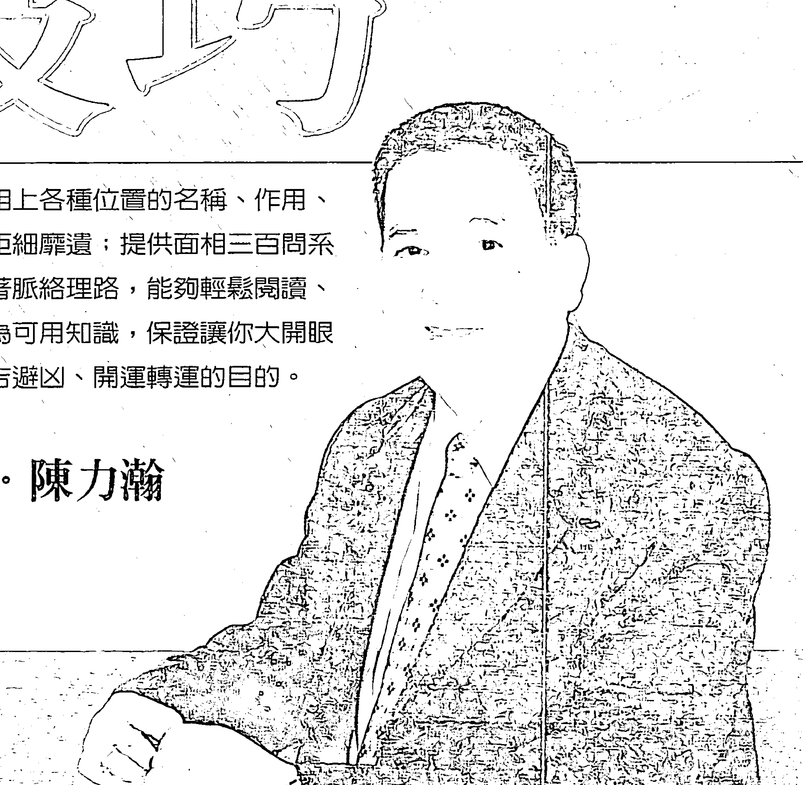

# St. Royal College

天使神秘学院

+ 专业占卜预测机构  
- 神秘学培训机构  
- 水晶能量研究中心  
- 神秘学资料库  
- 官方微信：strcdts  
- 微信公众平台：strc2011  
- 读书交流QQ群：  
  - 占星塔罗占卜师交流群：814594478（加入密码：PDF）  
  - 神秘学其他综合群：659338717（加入密码：PDF）

微信号：strcdts  
天使神秘学院  
天使神秘学院 院长QQ：715104687

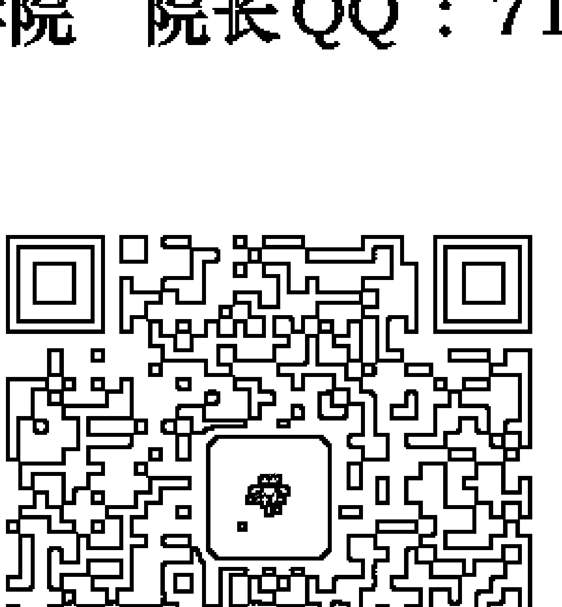

微信公众号：strc2011

# 制作说明：

本书由《天使神秘学院》出重金从台湾购入的原版书籍扫描制作完成。为达到最好阅读效果，特地把原版书全部切开后，再经由专业扫描设备高精度扫描完成，并经过一张张的PS后期处理最终成书，其间花费大量的人力、物力以及时间，只为能给大家提供经济并优质的神秘学学习资料而努力。

本学院强力谴责某些机构和个人，把本学院花心血制作完成的电子书籍，包装后直接放在自家淘宝网上低价倾销的行为，以谋取不劳而获的经济利益。如果长此以往最终将无人愿意再为大家花心思制作电子书，那以后可能大家再无新书可读。

为让大家以后能够读到更多的好书，也为了本学院的良性发展。本学院恳请大家尽量做到如下几点：

+ 一、尽量在本学院的网站购买电子书籍。  
二、请勿用技术手段把电子书内的水印及加密去掉。  
三、在收到电子书后小范围传阅即可，千万不要公开传播，更别挂到淘宝网上低价销售。

同时为答谢广大支持者，学院电子书将做如下调整：

+ 一、学院会把一些早已收回制作成本的电子书折价销售。  
二、最新制作的电子书籍会开放打印功能，大家购买后有条件的可自行打印成书。

# 關聖帝君覺賜序

基隆普化警善堂正主席　關聖帝君　降文…

時間…九十八年國曆四月五日（農曆三月十一日）（星期日）下午八時三十六分

+ 詩曰…面相對話藏玄機  
- 見相識人水逢魚  
- 觀察步驟細思悟  
- 吉凶密碼詳解析  
- 氣色諸位知休咎  
- 頭面骨骼會三奇  
- 十二宮位察觀色  
- 審辦形神避劫期  

夫人體之面相學本就是屬於人文科學的範疇，若說就人面總論、神相觀術觀…

# 序言

面相是五術的基礎入門，對於初學者來說，是很有實用性的，但是很多人不知道如何入門，又怕入門的基礎很困難，其實沒有想像中那麼難學，只是因為內容繁雜，觀念不清，常讓讀者摸不著頭緒，無法繼續深入，或是誤解含意，而搞出了笑話，所以現在提供面相三百問系列，讓你循著脈絡理路，能夠輕鬆的閱讀，並且迅速吸收，成為可用知識，在別人面前也可以現學現賣，不用擔心會出糗了，相信馬上就能成為團體裡注目的焦點人物喔。

「陳哲毅教你學面相技巧」，從基礎開始入門，先解說三停、五官的概念，再來，是說明面相上的各種位置的名稱、作用、影響，相當的巨細靡遺，保證讓你大開眼界，接著是介紹百歲的流年圖，讓你清楚知道，幾歲流年就走哪個部位的運勢，而達到趨吉避凶、開運轉運的目的。最後同樣收集許多面相的問題，也由專家一一解答，讓大家能有正確的知識與觀念。另外，後面也提供時下受美人士的痣相圖，讓大家可以了解哪些痣的好壞，具有什麼作用影響，而可以有所取捨，不一定要選擇點痣，以免反而壞了運勢。

陳哲毅

# 序言

現在社會，人際關係複雜，相處時間短暫，很難去長時間去認識一個人，雖然路遙知馬力、日久見人心，不過在競爭的社會、迅速的步調中，我們還是需要化繁為簡，以簡馭繁，集中精力在正確的事物上，才能達到事半功倍的效果，而且不會白白浪費時間。

面相學的歷史悠久、學派繁雜，有人會認為較難學習，但其實面相學也是有規則可循的，用淺顯以求廣闊，由廣闊變為深入，最後在深入淺出，並不是像外界認知那樣，深奧難懂且不好記憶。所以本書「陳哲毅教你學面相技巧」經過苦心整理，特別安排架構與內容，使得大家方便閱讀吸收，尤其是面相部分以及相流年部位，更是巨細靡遺、滴水不漏，將所有相學提到的名稱完整收錄、配合圖解與解說，讓讀者能夠掌握注意重點，更能夠論斷流年運勢的好壞，只要花幾秒鐘就可以看穿他人，甚至於替自己趨吉避凶、增加好運。

最後要說明的是，面相學常說：「相不獨論」的道理，這意思是說不能單就面相某些部位不好，就妄下斷言說運勢不理想、人生沒有希望，而產生怨天尤人、自怨自艾的悲觀想法，變成宿命論的觀點。哪么這就不是正確學習五術的心態。要知道「相由心生、相由心轉」，只要能夠改變自己的想法，修正錯誤的觀念，增加實際的善行，就算面相再怎麼不好，運勢也未必跟著不好，反而無形當中……

# 序言

至於面相學的功用，除了了解個人優缺點外，不外乎是對外的人際關係、感情婚姻、事業升遷、投資理財、健康情況、意外災害等等，特別是……

中能夠轉化，慢慢轉化成好的趨勢，易經裡所謂「積善之家，必有餘慶」，跟佛家所說「行善積德」，就是這個轉運的道理。面貌將隨著修心、善行，逐漸就能夠改變，所以不用太過擔憂煩惱，影響了原本該把握的重點，希望大家能夠自我勉勵期許，妥善運用面相藏經閣的學問，朝向更美好幸福的生活。

# 關聖帝君覺賜序

見相識人，面相對話，論相看人生，其實古今中外，都有重視它的記載，其學說理論，更是經過歷代的先賢學者專家推闡盡致，是為一種不可思議的學問。

換言而之，平心而論面相五官學的特徵，人類之進化自古即今，「面相學」的顯現動機感覺，即是所謂「有動於中，必形於外」，其內心的特殊之處，實乃肉體之相的外表。

然則，若以人體面相學的基本理論述解，「面相學」必有它的悠久歷史發展過程，其所謂的「知己知彼，百戰百勝」，在這爾虞我詐、虛虛實實、勾心鬥角的現實社會裡。

雖然「面相學」是為人相學中之一部分，但若就生理學的病理變化必然絕對可以從觀察面相各方面的解析形態是會引通相理的。

其實；相由心生，心由相起，人生順逆本無常，也更可以從一個人的面相紋的變化中去觀察過去與未來，吉凶徵兆，包括疾病襲擊、個性獨特能力、體格、體質、性質、遺傳，以領略觀人之法，此是無可懷疑的一門極深玄奧的學問。

# 03 序言

若論人體面相學其主要的特徵是在於觀察一個人的面貌，進而再次探索推斷一個人的相貌五官、形態忠、奸、善、惡、富、貧、賤、尊、榮、加以辨證剖析，進而推演人生趨勢走向運勢。

由此推知如果一個人知人善用、適才適用，因才適用，必定能夠巧妙運用面相學上述的觀察學習，細心會領觀察方法，絕對、必然、肯定，可以充分瞭解人自身心未來人生際遇行運之關鍵卡瓶頸。若再以實驗觀察人相面相方法，再歸納出古今實例，觀人面相顏面各部位所藏之特徵相理分析，必能判斷顯露出來一個人內在心理與外在表徵之心理狀態。

因面為儀，表度兼具亦有其真理與確實性，又列百部之靈，貫通五臟之神，推三才之成象，一個高明的相學家，更可以藉由外相與內相的相互應用，觀察、體會，必定能探索細細玩味準確的發覺富貴貧賤吉凶休咎。

因其中更涵蘊著「氣」、「色」、「流年」的綜合學術，是充滿有實用價值的一門大學問，而相學既能判斷先天的命運，也兼能觀察出後天行運的趨勢走向，若一個人的面相形態健康，必然會有較佳的智慧、膽識、人氣度、信念。

一般而言若以相學的獨特相理分析，按照人相學的說法，有諸內必形諸外來。

# 05 序言

述究面相學的基本理論，更是人之面型的儀表，而面相學的精華，更是示為特種相法之一。面相學問知識，即成為絕大多數的人類，以期欲達到「知人知面，即知其心」的境界，也因而都會積極隨研究證明，而推進去研究探討課題，並做有其系統的心領神會。爾世塵眾生務必知曉；在人際來往頻繁的今日，觀人之貴賤首重在於相學之解析，若按照面相學的學理証明根據說法，「有諸內必形於外」，其所謂的內者，乃屬人相學所言的五臟、六腑、腦髓、骨髓等等的部位特性、相理、休咎，遺傳基因觀相法。蓋；人類之習性，身體之變化，喜、怒、哀、樂必是起因於內心而發形諸於面，即是古人所謂之「有諸內必形於外」的表相。其「面相學」的應用法則，其理象至理至為明顯更在人相學的歷史文明進化發展過程中是其一項重要的主軸而「人類基因密碼細胞學」更是有其事實應證科學化之切實明證因內心者；乃立命之根，其面與相之關係密切，正是所謂面言的表察其外表，必進而推知其心相原理的本義，因為從一個人的外相與內相中仍然是可以尋得蛛絲馬跡。

# 目錄

+ ## 一、面相三停部位解說  
- （一）上停：（二歲～二十五歲）…… 027  
- （二）中庭：（二十五～五〇歲）…… 028  
- （三）下停：（五〇～七五歲）…… 029  

+ ## 二、認識面相五官部位  
- （一）五官之一──眼睛 …… 040  
- （二）五官之二──耳朵 …… 047  
- （三）五官之三──鼻子 …… 050  
- （四）五官之四──眉毛 …… 054  
- （五）五官之五──嘴巴 …… 058  

+ ## 三、轉眼之間看穿他的心  
- （一）眼睛 …… 062  
- （二）眉毛 …… 070  
- （三）鼻子 …… 078  
- （四）嘴巴 …… 085  
- （五）耳朵 …… 092  
- （六）顴骨、臉頰 …… 099  
- （七）山根、印堂 …… 102  
- （八）額頭 …… 105  
- （九）牙齒、舌頭 …… 112  
- （十）人中 …… 117  
- （十一）法令紋 …… 122  
- （十二）下巴、腮骨 …… 125  
- （十三）氣色 …… 130  

# 貳、照膽經面相五官論述

+ 1. （一）眼睛……眼睛的健康反映出個性……（一三七）  
2. （二）額頭上眼睛是重點，而眉毛作為輔助……（一三八）  
3. （三）眼神若是犀利，觀相較為正確……（一三九）  
4. （四）眼睛下臥蠶赤紅，為人好逞兇鬥狠……（一四〇）  
5. （五）面相牛頭虎視，享受富貴榮華……（一四一）  
6. （六）眼如蜂，聲如豺，多從武維生……（一四二）  
7. （七）眼睛歪斜心思不正，缺乏光彩精神異常……（一四三）  

+ 8. （八）眼三白吊行低劣，赤紋貫睛性凶暴……（四三）  
9. （九）眼睛如鷹狼，為人懷鬼胎；眼睛如猴多貪婪……（四四）  
10. （十）眼神炯職性剛強，臥蠶有紋生子貴……（四五）  
11. （十一）目中出現赤砂，近期將有災殃……（四六）  
12. （十二）目光收斂事業順，黑白不分運不佳……（四七）  
13. （十三）觀骨高聳及反目，人生多半不如意……（四八）  
14. （十四）眼睛有不良氣色，近期內災禍臨身……（四九）  

# 019 目錄

+ （共）眼睛凸出不如意，眉眼俱  
- （七）眼下無肉無子女，為人欠缺情與義  
- （六）眼帶神光權勢高，黑白分明名貴顯  
- （九）眼下豐隆圓帶方，後代子孫能發達  
- （干）眼有神韻德且智，眼神歪斜患帶毒  
- （三）洪目龍頷大格局，為人足智且多謀  
- （三）眼睛觀看夫妻緣，左眼右眼有玄機  
- （三）虎目鳶肩加牛腹，為人貪婪不滿足  

……（對應頁碼約：五〇、五一、五一、五二、五三、五三、五四、五五）  

+ （兩）緊迫釘人，心險陰險，眼神閃爍多奸詐  
- （三）左邊眼睛看父親，右邊眼睛看母親  
- （宗）雙瞳孔拜相封侯，眼睛過大多貪婪  
- （圭）雞眼蛇眼多羅賊，龍眼鳳眼近權貴  
- （八）眼有晴懸陷空獄，目有三角帶凶惡  
- （元）卧蠶光彩大富貴，臨顴青黑有災厄  
- （手）兩眼無神有疾病，無病災禍恐降臨  
- （三）三陽三陰為福祿，若有損害恐破財  

……（對應頁碼約：五六、五七、五七、五八、五九、五九、六〇、六一）

三、嘴巴……

1. 嘴巴看出身貴賤 …… 166  
2. 眼睛歪斜，心不正，身體多病 …… 161  
3. 眼睛似笑非笑，為人居心不良 …… 162  
4. 丹砂散佈，家宅不安，目大眉…… …… 162  
5. 兩眼過寬性輕浮，眼尾缺陷 …… 163  
6. 眼有波光帶桃花，眼睛赤紅 …… 164  
7. 眼尾光澤家美滿，好門凹陷 …… 164  
8. 空獄炎 …… 164  

2. 開口睡覺運勢薄，嘴巴兔唇 …… 167  
3. 嘴唇青厚命不久，唇上多紋，財運失 …… 168  
4. 口不見唇掌權柄，口唇如四字窮貴 …… 168  
5. 張口見齒根基薄，牙齒突出，財運佳 …… 168  
6. 嘴唇內縮多忌妒，口如吹火，財富散 …… 169  
7. 嘴唇不佳無信用，嘴角不起，易傷人 …… 170  
8. 嘴唇翻起露牙齦，親朋好友無依靠 …… 171  
9. 口薄下垂情緒差，唇紅齒白有福祿 …… 171  

三、鼻子……

1. 鼻子看積蓄財運……七八  
2. 鼻子高挺有名聲，形如截筒富貴人……七九  
3. 鼻樑削薄無財運，鼻樑低陷招嫁低……八〇  
4. 鼻子廣長技藝高，鼻如懸膽積財鼎……八一  
5. 鼻子歪斜，心術不正……八一  
6. 鼻如獅聰明賢士，鼻縮囊到老占面……八二  
7. 蘭臺黑線有災厄，鼻孔朝天財不守……八三  
8. 鼻子低陷不明顯，到老孤獨無福祿……八四  

(九) 鼻毛露出遭毀謗、鼻頭短小…… 八四  
(十) 鼻子橫闊體強健，鼻子彎曲…… 八五  
(十) 鷹嘴鼻心地險惡、準頭小尖…… 八五  
(土) 財受阻…… 八五  
(生) 山根青色逢貴人、山根黑氣多疾惡…… 八六  
(圭) 山根平美得賢妻，山根低陷妻無助…… 八七  
(茴) 觀鼻用章法，能得忠信臣…… 八八  
(壺) 山根低陷看人中，人中若美不孤獨…… 八八  
(共) 年上青由外得財、年上白小心災厄…… 八九  

(七) 準頭紫色見貴人，準頭黃色得大財…… 九〇  
(六) 準頭低曲又內縮，為人吝嗇又小氣…… 九一  
(五) 無灶臺難以出頭，有法令步步高升…… 九一  
(午) 鼻子高挺基礎好，邊地高聳有出息…… 九二  
(三) 鼻樑直幾財運佳，鼻厚有肉好膽識…… 九三  
(三) 鼻不高財山不靈，眼不深刻運不清…… 九三  
(三) 鼻無權骨缺援助，人過中年親友少…… 九四  
(圖) 鼻樑無骨主愚痴，鼻樑不平出身低…… 九五  

(五) 鼻有橫紋憂鬱多、狹小低平  
有宿疾……………………一五六  

(六) 鼻子仰露自制差、財迷心竇  
惹禍端……………………一五六  

四、耳朵……………………一五八  

(一) 耳朵看聰明才智…………一五八  
(二) 耳朵生毫歲數高、耳無輪廓  
欠科名……………………一五八  
(三) 耳如刀環早得名、耳輪貼肉  
好佈施……………………一五九  
(四) 頭大耳小體弱多病、青色現  
耳職位不保………………二〇〇  
(五) 天城有痣掌權貴、耳朵薄弱  
賣田產……………………二〇一  
(六) 耳下白氣災病至、耳比面白  
色氣響……………………二〇一  
(七) 看耳朵先重氣色、耳高於冒  
無貧窮……………………二〇二  
(八) 耳朝大海獲富貴、耳骨曲節  
無智慧……………………二〇二  
(九) 女人耳尖無積蓄、福堂黑痣  
遭人害……………………二〇三  
(十) 耳朵如鼠凶險多、耳朵反耳  
敗祖業……………………二〇四  
(十一) 神光青色父母災、雙耳赤氣  
有意外……………………二〇四  
(十二) 耳大不收是無知……………二〇五  

五、人中……………………二〇六  

(一) 人中觀看誠信及最後結果…………二〇六  

二、眉毛  

(一) 眉毛較彎曲的人，個性會比較溫柔嗎？ …… 三二八  
(二) 眉毛稀疏的話，個性很像牆頭草嗎？ …… 三二九  
(三) 有八字眉的人，會比較走倒楣運嗎？ …… 三三〇  
(四) 眉壓眼的人，個性喜歡鑽牛角尖嗎？ …… 三三一  
(五) 常常皺眉頭的話，會有不良的影響嗎？ …… 三三二  

三、鼻子  

(一) 大蒜頭鼻的人，都比較有錢嗎？……三一四  
(二) 鼻子大的人，性能力會比較強嗎？……三一五  
(三) 鼻子上有起節，女性比較容易剋夫嗎？……三一六  
(四) 鼻孔有鼻毛外漏，這樣就容易破財嗎？……三一七  
(五) 鼻子上長痘痘，這樣就會破財嗎？……三一七  

四、耳朵  

(一) 耳朵比較大的人，就會比較好命嗎？……三一九  
(二) 穿耳洞的話，就算識破相嗎？……三二〇  

五、嘴巴  

(一) 嘴巴越薄的人，會比較無情嗎？……三二一  
(二) 嘴巴大的女生，性慾會比較強嗎？……三二一  

六、舌頭  

舌頭較長的人，愛搬弄是非嗎？……三二三  

七、牙齒  

牙齒如果有缺損，這樣子會漏財嗎？……三二四  

目录  

# 八、毛髮  
1. 留長頭髮男性，個性比較女性化嗎？……三四五  
2. 有美人尖的人，會比較風流嗎？……三四五  
3. 瀏海留太長的話，將會影響運勢嗎？……三四六  
4. 有鬢毛的男性，為人比較好色嗎？……三四七  

# 九、面相名詞解說  
1. 什麼是子午不正？……三四八  
2. 什麼是輪飛廓反？……三四九  
3. 什麼是玉珠朝海？……三四九  
4. 什麼是伏犀灌頂？……三五〇  
5. 什麼是孤峰獨聳？……三五一  

壹、認識面相痣的部位  

### 一、痣之分析  
1. 壞痣之分析……三五八  

### 二、面相常惡部位解說  
1. 天中……三七七  
2. 左、右廂……三七八  
3. 邊地……三七八  
4. 天庭……三七九  

6. 什麼是額柄插天？……三五二  
7. 什麼是鼻顴相配？……三五二  
8. 什麼是狼行虎吻？……三五三  
9. 什麼是腦後見腮？……三五四  
10. 什麼是天地相朝？……三五五  

| 序号 | 条目 | 页码 |
|---|---|---|
| （五） | 日月角 | 380 |
| （六） | 司空 | 380 |
| （七） | 道中、山林 | 381 |
| （八） | 中正 | 382 |
| （九） | 龍虎角 | 382 |
| （十） | 福堂 | 383 |
| （十） | 郊外 | 383 |
| （主） | 印堂 | 384 |
| （主） | 眉部 | 385 |
| （兩） | 青路 | 385 |
| （圭） | 山根 | 386 |
| （尖） | 上眼瞼 | 386 |
| （七） | 眼白 | 387 |
| （代） | 下眼瞼 | 388 |
| （丸） | 魚尾 | 388 |
| （夭） | 奸門 | 389 |

| 序号 | 条目 | 页码 |
|---|---|---|
| （二） | 年壽 | 389 |
| （三） | 夫妻座 | 390 |
| （三） | 盜賊 | 391 |
| （四） | 甲匱 | 392 |
| （五） | 堂上 | 392 |
| （六） | 權骨 | 393 |
| （七） | 命門 | 393 |
| （八） | 準頭 | 394 |
| （九） | 蘭庭、臺尉 | 395 |
| （平） | 法令紋 | 395 |
| （二） | 人中 | 396 |
| （三） | 食祿、倉位 | 397 |
| （三） | 嘴唇 | 397 |
| （高） | 閣門 | 398 |
| （盍） | 比鄰 | 399 |
| （昊） | 懸壁 | 399 |

目录  

- （壹）承浆……四〇〇〇  
- （宅）住宅……四〇〇〇  
- （完）地閣……四〇〇一  
- （早）奴仆……四〇〇一  
- （七）地库……四〇〇二  
- （三）腮骨……四〇〇三  
- （三）大海……四〇〇三  
- （四）耳轮……四〇〇四  
- （翌）耳廓……四〇〇四  
- （灾）耳垂……四〇〇五  
- （巴）耳门……四〇〇五  
- （贝）耳弦……四〇〇六  
- （见）耳后骨……四〇〇六  
- （舌）喉结……四〇〇七  
- （五）颊侧……四〇〇七  
- （圭）颈窝……四〇〇八  

三、认识面相善恶部位  

- （壹）耳后旁……四〇〇八  
- （一）天中……四〇〇九  
- （二）高广……四〇一〇  
- （三）武库……四〇一〇  
- （四）边地……四〇一一  
- （五）天庭……四〇一一  
- （六）日月角……四〇一二  
- （七）中正……四〇一二  
- （八）龙虎角……四〇一三  
- （九）印堂……四〇一四  
- （十）眉部……四〇一四  
- （廿）山根……四〇一五  
- （卅）上眼睑……四〇一六  
- （圭）眼弦……四〇一六  

三、认识面相五官部位  

（一）五官之一——眼睛  

由人生運勢的起伏高低，包括事業、功名、財富、感情、婚姻……，可忽視的重點，如果能把握看眼睛的要點，那麼用來觀人、識人幾乎就能無往不利。  

眼睛是靈魂之窗，是人跟人接觸時，最先正視的地方，因此眼神、眼形的感覺，決定了見面的第一印象。不僅代表一個人的心思個性，也顯示出自己行為舉止。更重要的是，就要相學來說，眼睛是五官之一，佔有最特殊的地位，眼睛的大小、位置、眼形、眼神等，除了反映出個人的個性外，也透露……

## 二、眼神要有力

眼神若有力的話，就會給人深刻的印象，會覺得對方精明幹練，而且精力充沛的感覺。有這種眼神的話，表示為人積極努力，懂得力求上進，就算運勢不理想，也會容易有貴人幫助，因此成功的機率很高。反之，若是眼神渙散，沒什麼精神的話，表示為人態度懶散，不值得信賴，運勢自然不是很理想，有每況愈下的情況。

## 二、眼神不能閃爍

另一個看眼神的要點，就是眼神有沒有閃爍，若跟人講話時，不敢直視對方，而頻頻左顧右盼的話，表示其態度不誠懇，言詞多半誇大不實，而且心裡一直想著其他的事情，讓人不是很放心交代，必須要暗中提防對方，才不會讓自己吃虧。

## 三、眼神清澈

眼神的清澈也很重要，清澈就是黑白分明，而且最好不要有血絲出現。若是清澈的眼神，表示為人正大光明，行事果斷，不會做出見不得人的事情，就算發生了困難阻礙，也容易獲得貴人幫忙，在事情上，能夠進展順利，緩慢累積財富，投資理財也不容易判斷錯誤，感情上也很容易找到相配的對象。反之，眼神不清澈，泛黃、泛紅或是黑白不分明的話，表示心裡的想法雜亂，不是很能夠安定下來，事業上會比較奔波操勞，經常遭他人給拖累，財富不容易守住，判斷事情也容易出錯，感情上會反覆無常，通常沒有好的結局。

## 四、眼睛的大小

一般人會認為眼睛大就是好的，類似電影或漫畫中的主角，女性眼睛水汪汪很可愛動人，男性就是溫柔體貼的代表。而眼睛細小的話，或被認為是反派或壞心眼的傢伙，其實這都是先入為主的偏頗觀念。

眼睛大的人通常比較熱情開放，對什麼事情都充滿好奇，但往往只有三分鐘熱度，沒辦法長久持續，讓人有喜新厭舊的感覺。特別是表現在戀愛方面，異性緣很好，但就是定不下來，若有爭執的話，會直接向對方發脾氣，不過脾氣來得快去得也快。

眼睛小的人，各方面行事都會比較保守，還可能帶點自卑感，所以無法勇敢的積極進取，探索不熟悉的陌生事物，人際關係上會給人封閉的感覺，不是很容易就能親近。而且眼睛小的人，凡事都比較固執己見，不太願意改變原則，缺乏彈性的手腕，有時讓人不敢恭維，但優點是能夠細心，考慮比較周到，不會出嚴重的差錯。若兩者比較起來，前者適合外交、公關，多跟人接觸的相關事務，後者適合企劃、行政，可以選寫研究的相關事務。

## 五、單眼皮、雙眼皮

若是單眼皮的話，個性會比較保守，不敢積極行事，會先考慮清楚，在詳細……

## 六、眼白的多寡

眼白的多寡跟個性有關，眼白必須分明，這先前已經敘述過了，再來就是眼白的分佈有一定的意義。若是眼白比較多的話，表示個性比較叛逆，容易由我中心。勇敢的去大膽嘗試，雖然冒的風險很高，很容易失敗挫折，但學習的心態之下，反而能得到許多經驗，有助於將來的前途發展。不過缺點方面，為人很容易感情用事，而有衝動莽撞的傾向，常常惹出不必要麻煩，而讓人擔心受怕，這是需要注意的地方。

擬定計劃，才有可能去執行，由於不善於言語表達，因此人際關係會稍微吃虧，必須要加強交際手腕才行。再者，由於態度比較保守，對很多事情都堅守原則，給人非常頑固的印象，有時候堅持是好的，但有時候就不妥當，這是需要改進的地方。若是雙眼皮的話，個性顯的非常外向，不害怕陌生的事物，會

## 七、眼睛的凹凸

眼睛凹凸的人，表示容易感到自卑，不太敢表現自己，個性會比較退縮保守，凡事會比別人慢一步，加上主見不足，判斷較弱。眼睛的凹凸也非常重要，若是凸眼的人……

## （二）五官之一——耳朵

耳朵也是五官之一，重要性自然不可言喻，尤其在面相學上，耳朵代表看幼年的運勢、家境的好壞、教育的程度、心性的好壞，更是將來功名利祿、榮華富貴的參考，甚至等於就是一生勞碌的結果所在，都可以從耳朵上看出來，因此耳朵就像是人生長過程的紀錄。

耳朵的大小也相當重要，表示分個人的格局大小，若是耳朵大的人，表示心胸寬廣，學習能力較差，教育程度可能不好，貴人運勢不是很理想，整天只想著賺錢，追求物質的溫飽與享受，而缺乏遠大的理想抱負。

耳朵的位置也若高低有一定的標準。耳朵高的人，就是耳朵頂端的部分，比眼睛還要高出的話，表示為人智商很高，學習創造能力很強，從小家庭就有栽培教育，而且貴人運勢旺盛，會比較早出名發達，而有社會的地位與名聲。若是耳朵位置低的話，表示智商較弱，

## 二、耳朵的比例

耳朵小的人，表示心胸狹窄，企圖心較弱，只對有興趣的事情深入研究，不會想要坐大或是創業，人際上會比較孤僻，只會熟人打招呼，很害怕陌生的人事。

## 三、耳朵的輪廓

耳朵的輪廓也若明顯的話，表示個性頭腦聰明、精明能幹，什麼事情都能夠正確判斷，而且不會感情用事，是非常理智的人。若不明顯的話，表示腦筋較遲鈍，很容易發脾氣，常常忘東忘西的，忘記承諾的事情，信譽會受到質疑，做事情都要反反覆覆，才能夠順利辦妥。耳朵若貼腦的話，表示思想保守，懂得知足常樂，不會野心進取，雖然踏實穩健，但難免缺乏變通，需要多變換方法手段才好。若耳朵外翻的話，思想會比較叛逆，不喜歡傳統束縛，會有創新的做法，但行為舉止有時太過怪異，別人往往不能接受，感情生活也不穩定，會一直想要更換對象，來滿足自己的新鮮感。

## 四、耳朵的耳垂

耳垂是代表福祿，沒有耳垂的人，表示比較辛勞，沒有貴人幫助，凡事靠自己努力打拚，卻聽不進別人的建議，所以常常會吃虧，晚年生活要提早來規劃，才不會有經濟拮据的困難。有耳垂的話，表示為人忠厚老實，懂得聽進他人勸言，通常有貴人幫助，財運不至於缺乏，晚年可以享受福祿。

## （三）五官之三——鼻子

鼻子象徵個人的自我意識，也顯示脾氣跟個性，因此在面相學上也佔有重要的地位。而且鼻子位於臉的中央，向來有五嶽之主的稱號（額、右左顴骨、下巴分別為北嶽、東嶽、西嶽、南嶽），而若鼻子夠豐隆挺直的話，則表示個人運勢步步高升、有權有勢，榮華富貴可期，所以也是先天的財庫所在，對於物質經濟的生活，有直接影響的作用。

## 一、山根

山根表示事業的基礎，也是健康好壞的標準，若山根低陷的話，表示事業的基礎不佳，身體健康容易有毛病，為人欠缺上進企圖心，做事情懶散消極，沒有什麼主見可言，容易受到朋友影響，而有被拖累的傾向，經常破財消災，甚至於誤入歧途，事業多半要辛苦奔波，多勞才能有收穫，事業成就不會比較慢。若山根高聳的話，而且也沒有疤痕或惡痣的話，則表示事業的基礎穩固，身體健康比較硬朗，個人非常的有定見，能做出正確的判斷，不會被別人牽著走，相對的小人會比較少，貴人會比較多，事業能夠進展迅速，比較快有成果出現。

## 二、鼻樑

鼻樑最主要的是看有沒有歪斜，以及佔臉部的整體比例為何？鼻樑若中正的

話，表示心地善良，心思純正，不會想要耍小人伎倆，而且人際關係較為良好，感情交往的對象，一般來看條件也不錯，事業財運也算是良好的。但若是歪斜的話，甚至於鼻樑有起節的話，表示心思不正，常常打著壞主意，想要佔人家的便宜，因此會暗中的計劃，來設計陷害他人，事情一但曝光的話，信譽名聲都會跟著毀了，所以要多提防這種面相的人。在鼻樑的長短方面，若鼻樑佔的比例較長的話，表示個性比較優柔寡斷，沒辦法果決做事情，常常東拖西拖，就因此錯失了好機會，雖然不會受到損失，但也得到什麼好處，應該想辦法讓自己積極大膽才行。但若是鼻樑佔的比例較短的話，表示自已容易衝動行事，做事情不夠沉穩踏實，常常想要投機取巧，冒著高度的風險，當然就會遭遇到失敗挫折，而總是後悔不已。

## 三、準頭

準頭也是鼻子的重要參考依據，因為它位於鼻子的中線，也是唯一明顯突出的地方。若準頭渾圓的話，一般表示為人重視感情，喜歡到處交朋友，對於感情會比較珍惜，財運上也會動腦筋，用正當的手段來取得，特別是準頭也代表經濟能力的強弱，若準頭比例大的話，又沒有疤痕或惡痣，表示理財投資很有成就，

會迅速累積財富，運勢會滿旺盛的。若準頭低陷，或是有疤痕或惡痣的話，表示個性反覆不定，充滿著情緒化，而且很容易受人慫恿，經常會隨便浪費花錢，而欠缺詳細的理財規劃，有負債破產的可能。若準頭是尖形又下垂，俗稱的鷹勾鼻的話，那就要特別注意，為人通常心思陰險、手段毒辣，會想要奪取人家的好處，不太能與之接近，或是選擇來當深交的朋友。

## 四、鼻翼

鼻翼的部分象徵倉庫，也就是存放財富物品的地方，若豐滿厚實的話，表示財富充足，而且源源不絕，對朋友很大方不會吝嗇，也很懂得節制慾望。但若是出現疤痕或惡痣，表示追求物質生活，有敗金的傾向，很容易被朋友給拖累，又鼻孔外露看的見的話，雖然生性樂天開朗，沒有什麼心機，但由於不懂得節制慾望，會到處揮霍無度，負債或破產也在所不惜，晚年生活需要提前規劃，否則幾乎都會過的艱辛痛苦。

## （四）五官之四——眉毛

眉毛雖然不如其他五官重要，有實際日常使用的用途，在臉部上好像是裝飾的感情，不過就面相學來說，是不可忽略的地方，也是判斷個人運勢好壞、個性優劣的關鍵之一。眉毛一般說來除了表示個性之外，還能代表人際關係的親密與否，像是跟父母、兄弟姊妹的關係，甚至於配偶、子女等關係，也可以從這看出來。所以不同的眉毛，便有不同的個性、人際，是可以值得參考的地方。

## 一、眉毛间距与长短

眉毛的間距就是俗稱印堂的地方，若間距太過狹窄，不夠開闊的話，表示運勢受到限制，無法一展身手，困難阻礙重重，凡事都不理想。一般來說是以手指頭為標準，一個半的間距為最佳。但若間距太大時，超過二指以上時，反而也不盡理想，為人容易優柔寡斷，凡事患得患失，沒有固定的原則，在行事方面會顯得隨便馬虎，容易受到他人的慫恿影響，發生吃虧上當的情況，特別是在感情方面，有人財兩失的可能。

眉毛的長度來說，以過目為良好，所謂過目就是比眼睛長一點，這樣算是正

## 二、眉毛的粗細濃淡

常的情況。若眉毛太短的話，甚至不到眼睛的一半，或是沒有眉毛的情況，表示個性比較孤僻，而且忽冷忽熱，處理事情雖然果決，但偏重視實際利益，有自私自利的現象，人際關係不是很理想，感情也容易先熱後冷，最後無疾而終。但若是很長的話，或是有連眉成一直線的情況，表示個性比較固執己見，不懂得變通行事，別人的話比較聽不進去，常常因此而吃上大虧，人際關係上雖然正直，但作風過於強勢，欠缺適當彈性，有時反而會遭人詬病。

眉毛若粗且濃的話，個性比較急躁，脾氣也不太好，但算是直來直往的人，不會耍心機而迂迴，在感情方面，佔有慾會比較強，常常因此而吃醋生氣，伴侶或配偶要受的了才行，不然吵吵鬧鬧難免。若眉毛是細且淡的話，個性比較溫和，但是太過神經質，對什麼事情都很在意，會跟人家斤斤計較，但

卻不會大方付出，給人冷漠自私的感覺，在感情方面，會比較情緒化，也滿重視安全感，雖然很順從另一半，但也滿依賴麻煩別人的。

## 三、眉毛的形狀

入字眉：

有這種眉相的人，個性比較高傲、自負，不太相信別人的建議，只會遵照自己的想法，也有時候會跟人家爭論起衝突，而有賭氣的情況出現，若能改正這點，將企圖心發揮在其他方面，前途將無可限量。

八字眉：

眉毛尾端若下垂，就形成八字眉的眉相。這種眉相的人，心胸很寬容開

放，有與世無爭的味道，但有時顯得懦弱，會很怕事，讓別人容易瞧不起，又對朋友不好意思拒絕，常被朋友給拖累，甚至於因此沾上酒色財氣，而惹上是非糾紛，要有所節制才好，生活會比較快樂，不用整天煩惱憂愁。

劍眉：

劍眉是尾端的部分上揚，整體倒立的八字一樣，頗有英雄氣概的架勢。這種人通常脾氣直爽，愛打抱不平，喜歡冒險新奇的事物，來鍛鍊增加自己的經驗，在事業工作常有突出表現，讓人相當的激賞。但有時候容易衝動行事，而失去冷靜的判斷，特別是感情方面，容易因此走向極端，而有無法挽回的局面。

三角眉：

三角眉是常見的眉形，通常以男性居多，有這種眉相的人，表示精力充沛、鬥志旺盛，不怕任何的挑戰，會直接面對難關，是責任感很重的人，讓人很能夠

信任，不過在溝通上，口氣要稍微溫和

委婉，以免跟人起口角而傷了和氣。

新月眉：

一般來說女性比較有這種眉相，男性偶爾也會出現。這種眉毛表示感情細膩，思慮深遠，頗有藝術家的氣息，人際關係良好。若專心努力於事業工作話，將會有一番成就，聲名遠播。但缺點是，情緒起伏較大，有時候不切實際，以至於很難貫徹始終，沒有什麼出息可言。

## （五）五官之五——嘴巴

嘴巴是五官中非常重要的一部分，少了這個部位的話，人很可能就活不下去，也沒辦法開口說話，來表達自己的想法要求，所以嘴巴可是很實用的器官，幾乎天天都需要用到。在面相學上，嘴巴能看出自己的個性、人際、財運等等，也表示晚年運勢的好壞情況。

嘴巴的大小是看個人的臉部比例，並沒有一定的標準。比例較大的話，表示為人心胸開闊，處事隨和自在，人際關係良好，能領導管理眾人，事業工作上，企圖心也較旺盛，能夠蒸蒸日上，累積許多的財富。反之，若比例小的話，表示心胸較狹隘，行事傳統保守，不太敢積極前進，對環境適應力較差，人際上心防較重，交際應酬不多，不是適合當領導人物，對於行政事務、研究開發等等，會比較得心應手。

無論嘴巴的大小如何，其先決條件是，嘴巴沒有說話時，要能夠緊緊閉合，不能夠張開合不攏。如果是一直是合不攏的話，表示生活奢侈糜爛，對物質沒有節制，而且為人行事隨便，沒有原則可言，因此信用上會出現問題，特別是在金錢方面，若是談感情的話，會更換不同對象交往，同時腳踏多條船，甚至有性氾濫的情況。

## 二、嘴唇的厚薄

嘴唇的厚薄也很重要，嘴唇厚的人，比較重視物質生活，懂得自我享受，對於朋友會比較大方，也比較好溝通商量，但是感情上，佔有慾比較強，常有忌妒的心態，是缺點所在。若是嘴唇薄的人，行事比較理智冷靜，不太會衝動行事，但滿爭取維護自己的利益，若被侵犯的話，將不惜一切代價討回，講話有得理不饒人的情況，手段也比較激烈極端，但若能替別人著想，用在團體利益的維護上，將可以發揮專長，受到禮遇和尊重。

## 三、嘴形與色澤

嘴唇的形狀，一般只是看有沒有稜角，就是嘴角兩旁的位置，跟人中交接的地方，輪廓是否明顯。若有稜角的話，表示心態樂觀積極，能替他人著想，常常

笑臉迎人，運勢平步青雲，財源也比較穩定充足。反之，個性懶散、胸無大志，整天遊手好閒，貪圖物質享受，有揮霍無度的現象，有負債破產的可能。在色澤方面，一般以紅潤為原則，表示身體健康、人緣極佳，而青紫或灰黑的話，身體健康可能出毛病，運勢方面不太理想，將會有意外災厄發生，必須要注意才好。

## （一）眼睛

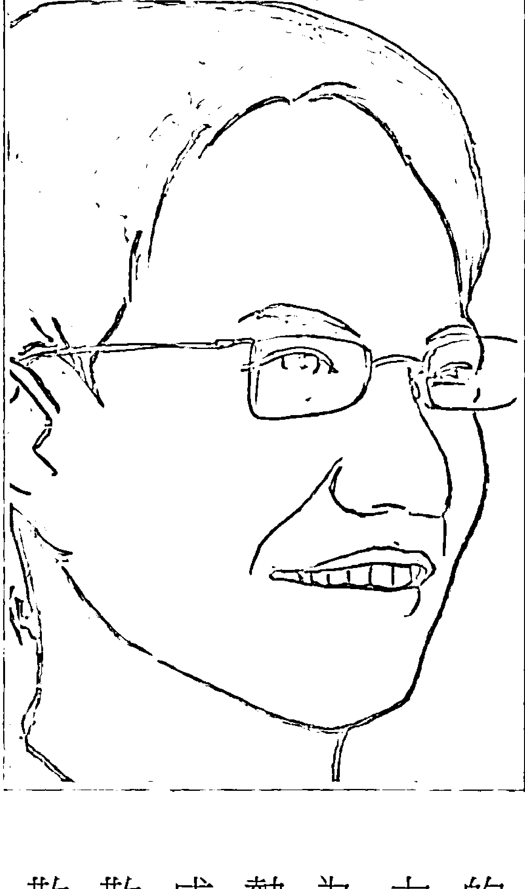

## 三、轉眼之間——看穿他/她的心

## 一、眼睛細且長的論斷

眼睛細且長的人，看起來比較精明能幹，凡事會考慮的多，眼光比較深遠，比較不會受其他人的影響，有時顯得有些固執己見，讓人覺得不太容易親近，但判斷往往都能準確，可以從中可以獲的利益，是天生的謀略家。

## 二、眼睛圓且大的論斷

眼睛圓且大的人，對很多人事物充滿興趣，會主動去接觸了解，所以人際關係還算不錯，也能吸收許多見解知識，對事業工作有一定的幫助，但由於很容易相信別人，有時會被朋友給牽連拖累，造成不必要的麻煩困擾。

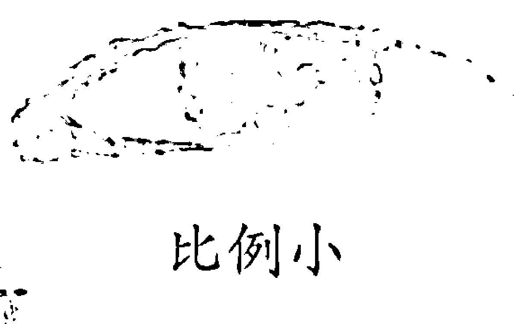

## 三、眼睛比例小的論斷

眼睛比例若顯得小，表示做人比較保守，凡事會謹慎小心，不太能夠冒險進取，對陌生的人事物有點排斥，需花時間才能接受熟識，是不錯的幕僚人才，但若要擔任領導的話，恐怕心胸會比較狹隘，沒辦法讓他人信服。

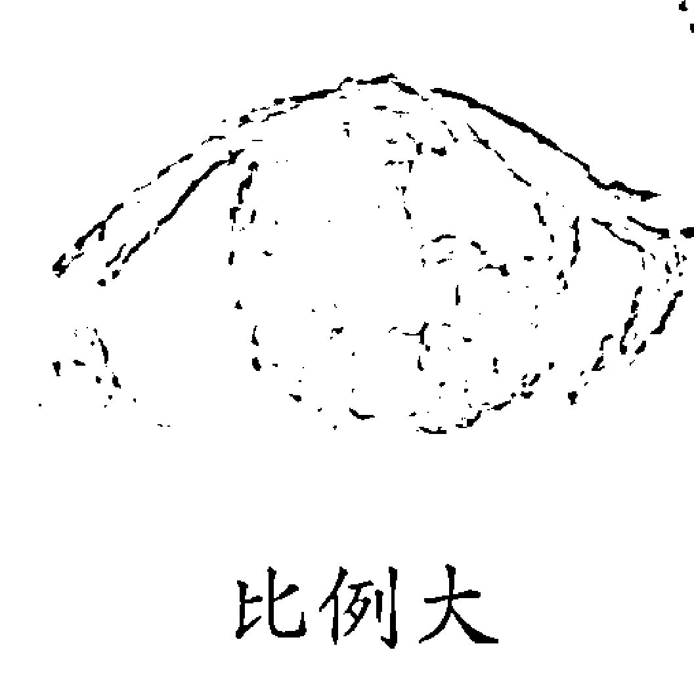

## 四、眼睛比例大的論斷

眼睛比例大的人，表示個性比較爽朗，對人很大方和善，凡事不會斤斤計較，對週遭新奇的資訊很容易接受，做事情雖然積極主動，不過往往三分鐘熱度，不太能夠長久持續，有喜新厭舊的習慣，生活會比較奢侈浪費。

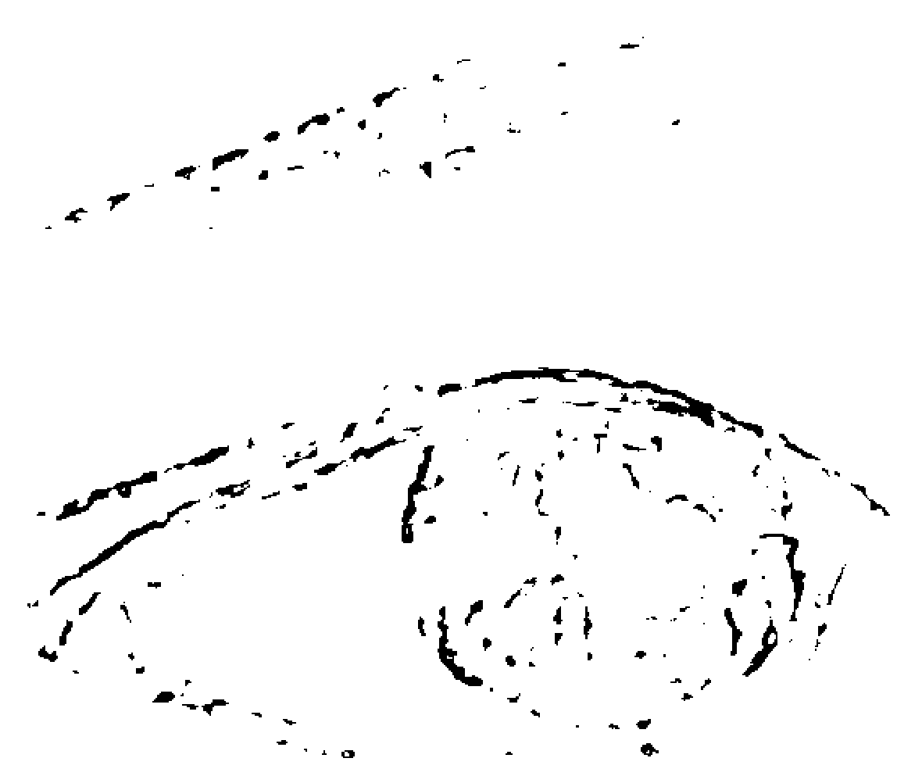

## 五、眼睛斜視的論斷

眼睛斜視的情況，表示為人心機深沉，常常算计他人，行事偷偷摸摸，很重視眼前利益，不願跟朋友分享好處，有自私自利的傾向，再者，疑心病會比較重，常懷疑身邊親近的人，因此人際會慢慢疏遠，有孤獨寂寞的傾向。

## 六、眼睛大小不一的論斷

眼睛大小不一的情況，表示心態思緒常不平衡，對很多事情會有埋怨，常常有互相矛盾的現象，嘴巴說的是一套，但實際做的卻又是一套，行徑讓人匪夷所思，感情方面也不太協調，常有爭執吵鬧出現，還帶有桃色的糾紛。

## 七、眼睛部位凸起的論斷

眼睛部位凸起的人，表示個性比較急躁，對很多事情佔有慾很強，會時常跟人家發生衝突，多半是為了私人的利益，有翻臉不認人的情況，事後也不太能夠檢討反省，人際關係顯得較為緊張，發生問題時往往沒有人肯幫助。

**部位凸起**

## 八、眼睛部位凹陷的論斷

**部位凹起**

眼睛部位凹陷的人，表示個性比較懶散，對很多事情不積極主動，有好吃懶做的可能，或者經常在外惹出麻煩，需要他人出面收拾爛攤子，而連累週遭的親朋好友，會成為大家眼中的拒絕往來戶，因此人際關係會比較孤僻。

## 九、眼睛三角形的論斷

**三角形**

眼睛若是三角形的話，表示對事情觀察入微，處理方法冷靜有條理，有屬於自己的一套價值觀，不容許他人侵犯或改變，平常會替他人打抱不平，但卻得不到對方回饋支持，有心灰意冷的情況，人際慢慢變得孤僻。

**浮腫**

## 十、眼睛浮腫的論斷

眼睛若浮腫且有多層眼皮的話，表示腦筋反應遲鈍，缺乏自己的主见，很容易受人影响，而结交到小人，会有金钱财物的损失，事业上虽然刻苦耐劳，但是却不懂变通创新，只适合听从命令行事，无法领导或管理他人。

## 十一、眼睛间距狭窄的论断

眼睛间距狭窄的话，表示心胸不够开放，为人经常担心害怕，觉得很多事情没有把握，而且不容易相信他人，鲁莽，没有瞻前顾后一番，常因此陷入困境当中。

**间距宽大**

## 十二、眼睛间距宽大的论断

眼睛间距宽大的话，表示生活过的很随性，不太会特别追求物质生活，凡事有得过且过的心态，与人相处还算能够沟通，不会斤斤计较，但是由于缺乏判断，不够精明能干，有时会被他人利用，而成利益下的牺牲者。

## 十三、單眼皮的論斷

單眼皮的情況，表示為人沉著冷靜，做事有條有理，不太會炫耀才華，平常跟人相處，會公私分明，不會有記仇恨或者情緒化的影響，感情上，雖然不主動積極，但會很有耐心，向欣賞的人接近，是近水樓臺先得月的寫照。

## 十四、雙眼皮的論斷

雙眼皮的情況，表示心中熱情澎湃，對新奇的事物充滿興趣，很喜歡跟人交談接觸，出外的人緣相當不錯，也非常的講信用、重義氣，但是感情方面，往往三心二意，有猶豫不決的情況，甚至會出現腳踏兩條船的現象。

## 十五、眼睛水汪汪的論斷

眼睛水汪汪的情況，表示為人腎水充足，充滿了性感魅力，對異性特別有吸引力，但是心思卻不夠純正，常常招惹桃花糾紛，而使自己傷透腦筋，交往對象都要特別注意，以免造成人財兩失，耽誤了寶貴的幸福青春。

**單眼皮**
**雙眼皮**
**水汪汪**

**眼角下垂**
**眼角上揚**

## 十六、眼角下垂的論斷

眼角下垂的情況，表示為人不喜歡出風頭，總是默默的努力耕耘，工作上會很認真細膩，能發現問題的癥結所在，是個難得的輔佐人材，但由於缺乏自信心，不夠積極大膽，在感情上會較晚有結果，過程也比較一波三折。

## 十七、眼角上揚的論斷

眼角上揚的情況，表示腦筋靈活聰明，常有出人意料的點子，是大家眼中的鬼靈精，會出面替大家解決困難，是個值得信賴拜訪的人，因此人緣非常的好，感情上能夠掌握情勢，懂得推銷自我，因此交往過程滿順利的。

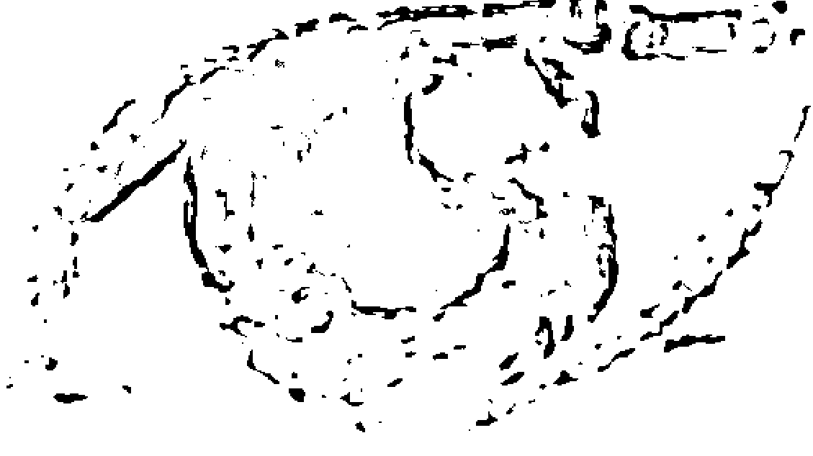
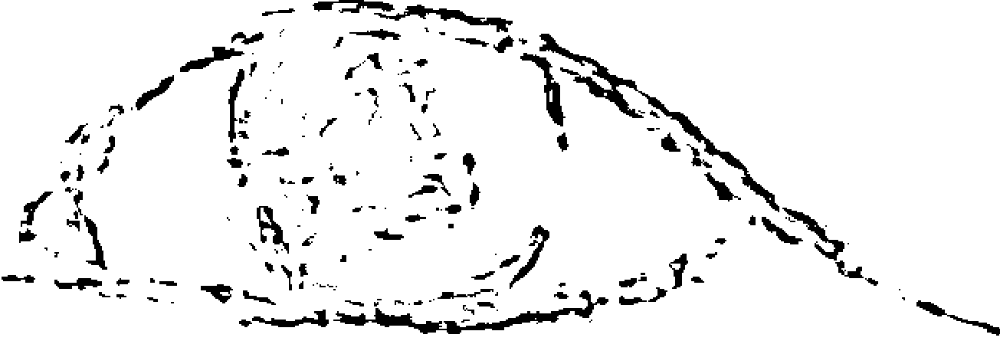

## 十八、眼尾上揚的論斷

眼尾上的情況，如果眼晴又細長的話，這就是俗稱的丹鳳眼，表示學習的心態旺盛，凡事領悟力很強，所以往往能造就出好成績，感情上，由於自信心強，而且能言善道，所以身邊的異性不斷，時時刻刻都充滿了魅力。

## 十九、眼白黑瞳的論斷

眼睛的黑瞳若多的話，表示精神狀態穩定，做人處世公正，能獲得別的肯定支持，所以凡事無往不利，但若眼白較多的話，表示心身不得安寧，常常胡思亂想，疑神疑鬼的，而跟人有爭吵的可能，感情婚姻也往往不順利。

## 二十、三白眼的論斷

三白眼的情況，表示為人冷酷無情，表面對週遭事物好像不關心，其實內心很重視個人的利益，希望維持自我尊嚴，有時會為了滿足私慾，而有出賣人格的行為舉止，與這種人交往要特別留意，否則將會受到牽連拖累。

## (二) 眉毛

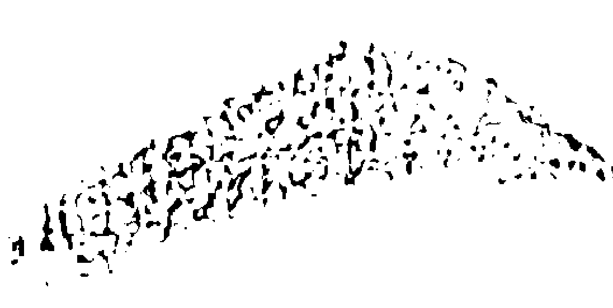
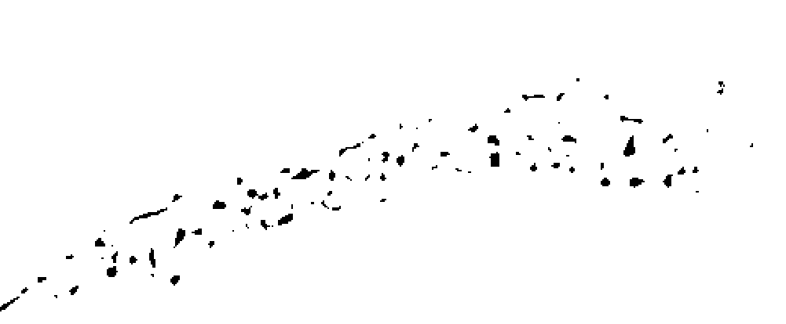

**眉毛較短**
**眉毛較長**

### 一、眉毛較長的論斷

眉毛較長的情況，表示個性溫和、敦厚有理，很有細膩的觀察力，做事情會提前規劃，不太會衝動行事，對朋友很關心照顧，所以外在的人緣不錯，能獲得眾人的幫助支持，感情進展會比較平順，結婚後家庭能夠幸福美滿。

### 二、眉毛較短的論斷

眉毛較短的情況，表示個性急躁、缺乏耐性，對於想要達成的目標，會一股腦的去執行，但由於不懂事先計劃，往往事倍功半，還可能拖累其他人，人際關係會漸漸疏遠冷淡，感情起伏不定，很容易情緒化，家庭婚姻波折較多。

### 三、眉毛粗濃的論斷

**眉毛粗濃**

眉毛粗濃的情況，表示為人心胸寬大、膽識具足，對事業充滿的企圖心，會積極主動去行事，希望能夠從團體當中脫穎而出，成為領導管理階層。人際關係上比較好客，懂的拉攏人心，因此能獲得朋友的支持與幫助。

### 四、眉毛間距狹窄的論斷

**間距狹窄**

眉毛間距狹窄的情況，表示雙眉鎖印、運勢不開，各方面都不是很順利，像是被什麼限制住一樣。在情緒方面容易波動，受到刺激影響，而有衝動行事的可能，而且忌妒心較強，跟人會產生口角摩擦，凡是缺少額外的助力。

### 五、眉毛間距適中的論斷

**間距適中**

眉毛間距適中的情況，表示為人公正處事、心胸平坦，對甚麼事情都很有分寸，才不會有偏激過度的現象，對於人際關係的交往，很講究誠實信用，不會隨便出爾反爾，因此當有困難發生的時候，也能夠獲得眾人的幫助。

**眉眼開闊**
**眉毛壓眼**

### 六、眉毛壓眼的論斷

眉毛若跟眼睛距離的太近，又眉毛長的粗濃的話，表示有眉壓眼的情況，表示脾氣暴躁衝動、不能冷靜行事，凡事固執己見，對於建議往往聽不見去，常常遭受到失敗的下場，事業財運有大起大落的現象，要懂得節制規劃才好。

### 七、眉眼間距開闊的論斷

眉毛跟眼睛的間距開闊，表示為人心胸寬大，包容力強，對什麼事情都能深謀遠慮，提前計劃來進行，特別是財運方面，常常能因此獲利，添購不動產，人際關係上，善於溝通協調、化解紛爭，是大家心目中的貴人。

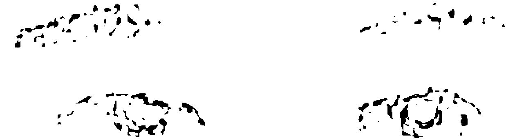

### 八、眉毛間距寬大的論斷

**間距寬大**

眉毛間距太過開闊的情況，表示為人和善處事，不是很斤斤計較，對事業較缺乏企圖心，有得過且過的心態，沒有甚么成就可言，人際關係上，由於判斷力較差，容易相信他人，很可能被人利用而不知，而有嚴重的損失發生。

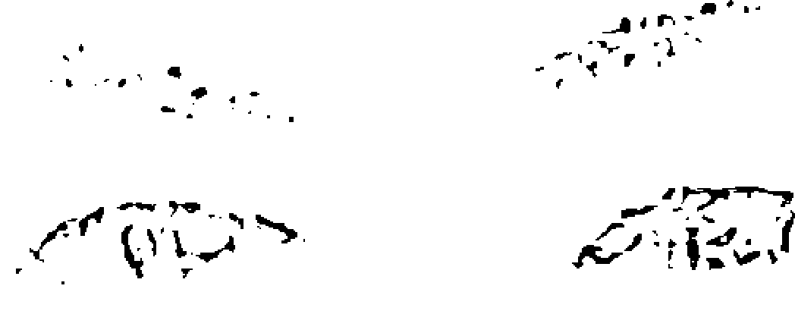

**高低不一**

### 九、眉毛高低不一的論斷

眉毛一高一低的情況，表示個性反覆無常，時而高興、時而憤怒，很容易受影響而情緒化，跟人不太能溝通協調，所以人際關係顯得緊張，感情方面，會跟對方意見不合，發生口角衝突，而有分分合合的現象，婚姻也是如此。

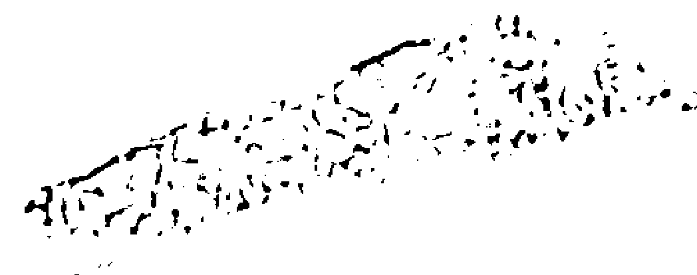

**眉毛有間斷**

### 十、眉毛有間斷的論斷

眉毛有間斷的情況，表示跟六親緣分薄弱、彼此關係不是很親密，凡事需要自行努力打拚，沒辦法靠福德庇蔭保佑，事業剛開始會比較辛苦，挫折阻礙較多，然後漸入佳境，感情婚姻上，需要花費心思經營，才能夠穩定發展。

### 十一、眉毛稀疏的論斷

**眉毛稀疏**

眉毛稀疏的情況，表示比較沒有個性主見，凡事會比較依附他人，有隨波逐流的心態產生，對於物質需求不高，但是很重視感情生活，不過往往事與願違，經常被人家欺騙辜負，但總是學不會教訓，有執迷不悟的現象。

### 十二、新月眉的論斷

**新月眉**

新月眉的情況，表示為人心地善良、脾氣溫和，什麼事情都會替人著想，算是體貼入微的人，感情上會願意犧牲奉獻，使對方獲得最好的呵護，對方會心存感激回饋，彼此能常相廝守，一生貴人運旺盛，能夠逢凶化吉。

### 十三、一字眉的論斷

一字眉的情況，表示為人充滿正義感，喜歡打抱不平，見到他人需要幫助，會義不容辭出面，因此是大家心目中的貴人，但是個性稍嫌剛強，有一意孤行的可能，而跟人容易產生摩擦，若能改進這點，各方面進展會更順利。

### 十四、三角眉的論斷

三角眉的情況，表示為人精明能幹、心機深沉，對於新奇的事物很感興趣，學習的興致也很高，在團體中是屬於才華洋溢的類型，能夠結交許多好朋友，但是有喜歡逞強的個性，不願意讓人插手幫忙，是需要注意的地方。

### 十五、眉毛如螺旋的論斷

眉毛如螺旋的情況，表示心思雜亂無章，行事反反覆覆，對什麼事情都很有信心，但是往往三分鐘熱度，沒辦法持續專注。

### 十六、柳葉眉的論斷

柳葉眉的情況，表示為人樂善好施、熱心助人，對於弱小的族群不會排斥，反而會願意付出心力照顧，是值得託付信賴的夥伴，人際關係十分良好，感情上溫柔體貼、犧牲奉獻，會是個好情人，婚後也能打理維持家庭運作。

### 十七、眉尾雜亂眉的論斷

眉毛粗濃有沒尾雜亂的情況，表示為人很有權利慾望，喜歡指揮領導眾人，雖然有才華天份，但是恆心毅力不夠，遇到困難阻礙時，態度會顯得反反覆覆，行為舉止會比較誇張，讓周遭人感覺到壓力，不是很容易溝通相處。

## 眉形帶勾
## 八字眉
## 劍眉

### 二十、眉形帶勾的論斷

眉型帶勾的情況，表示為人心機深沉、用心計較，凡事喜歡爭權奪利，但是卻不會直接表現出來，會懂得利用身邊資源，來營造有利的局面，算是謀略的個人類型，感情上重視物質，較為勢利，會挑選條件好的對象來交往。

### 十九、八字眉的論斷

八字眉的情況，表示為人生性悲觀、情緒憂鬱，對很多事情都很無奈，所以有放不開的現象，運勢會處於停滯的狀態，對於朋友的要求期望，會盡心盡力去完成，算是值得信任拜託的人，感情上會傾聽對方心聲，替對方默默付出。

### 十八、劍眉的論斷

劍眉的情況，表示為人藝高人膽大，喜歡從事冒險的活動，想法上敢創新求變，因此事業工作還滿理想，會有驚人的成果出現，能獲得主管長官的器重，感情上，比較直來直往，欠缺溫柔婉約，容易出現不協調的現象。

## (三) 鼻子

### 一、鼻子比例大的論斷

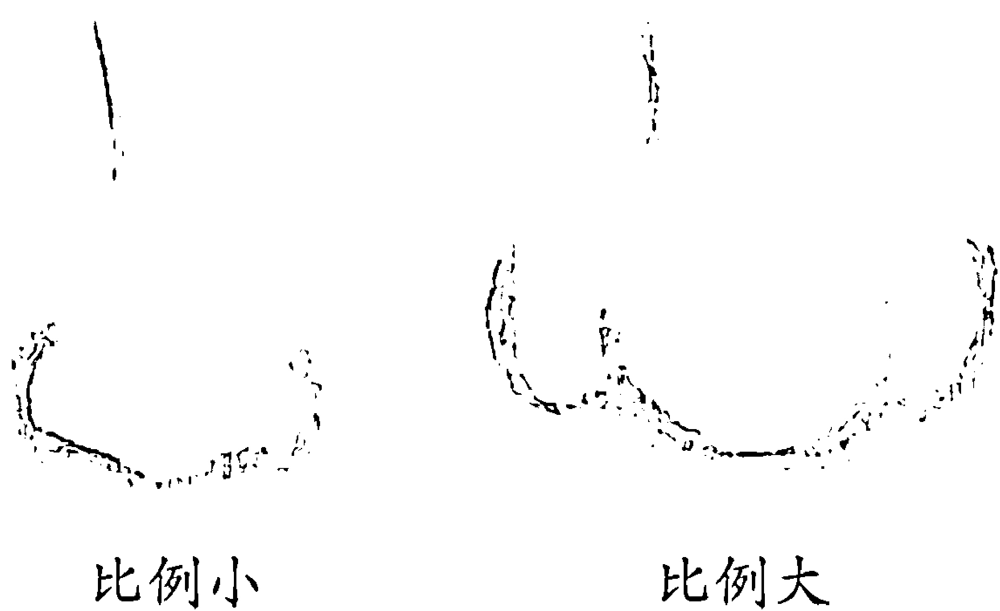

**比例小**
**比例大**

鼻子比例大的情況，表示為人自主性強、企圖心旺盛，凡事會積極奮鬥，爭取最佳的利益，往往能讓人刮目相看，人際關係方面，對朋友很大方熱情、不拘小節，會願意資助對方度過難關，因此交友十分廣闊，能獲得眾人支持。

### 二、鼻子比例小的論斷

鼻子比例小的情況，表示為人傳統保守、謹慎小心，事業上的企圖心較差，常常猶豫不決，三心二意，錯過大好時機，才在後悔不已，人際關係上，外表看似冷漠難以親近，實則內心如火、充滿熱情，只是不太愛表現搶鋒頭。

### 三、鼻孔大的論斷

鼻子大的情況，表示包容力強，凡事看的開，喜歡物質享受，不會虧待自己，對於朋友也是如此，會懂得大方請客、拉攏人心，但在財運上，因為判斷力差，需要仔細規劃，否則常常有所損失，沒辦法守住身邊的財富。

### 四、鼻孔小的論斷

鼻孔小的情況，表示心思細密，行事謹慎，表面上對時事趨勢漠不關心，實際上會非常在意，並且有深入的看法，只是不想讓其他人知道，心防會比較重一點，財運上通常一毛不拔，有吝嗇的傾向，需要看對象來請客。

### 五、鼻頭下垂的論斷

**鼻頭下垂**

鼻頭下垂的情況，為人富有主見，喜歡出點子，跟人滿好相處溝通的，講話也十分幽默風趣，不過有時容易計較，會有忌妒的心態，但不會表現出來，財運上，由於不善理財投資，需要慎選合作夥伴，才能避免財物損失。

### 六、鼻翼豐滿的論斷

**鼻翼豐滿**

鼻翼豐滿的情況，表示心地善良、包容力強，對很多事情的看法深入，能有獨特的一套見解，對事業或人際都能有正面的幫助，替自己帶來良好運勢與助力，財運上懂得規劃分配，是天生的理財高手，物質生活不至於缺乏。

### 七、鼻子較長的論斷

**鼻子較長**

鼻子較長的論斷，表示思考謹慎、做法周延，但有時候太過自我中心，會有逞強的情況，嘴巴上很會說，但遇到實際狀況，卻無法當機立斷，而顯得優柔寡斷，影響到事業的進展，感情上也是如此，挑選對象會比較嚴苛。

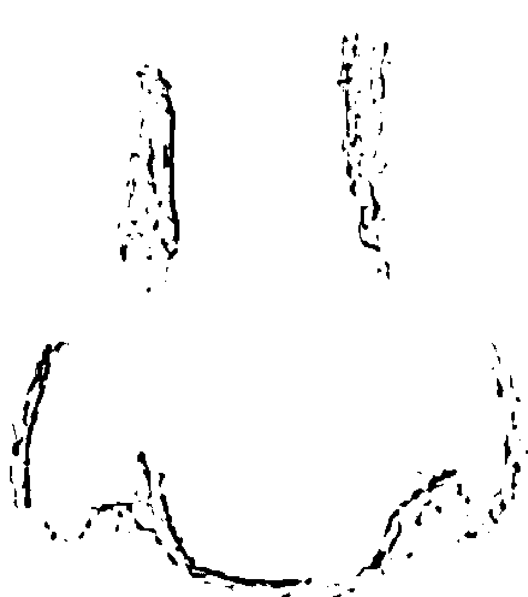
**鼻樑寬闊**
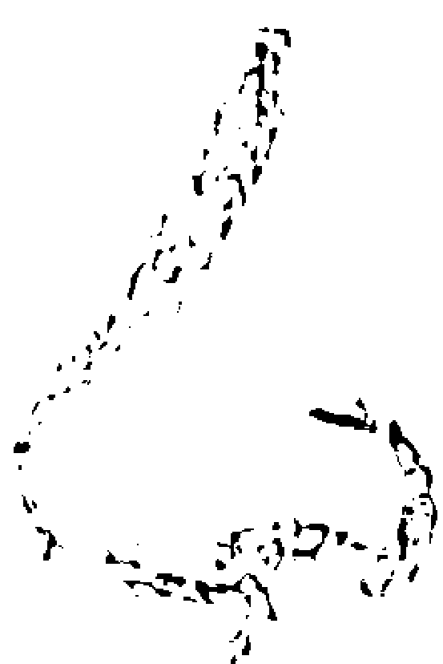
**鼻子較短**
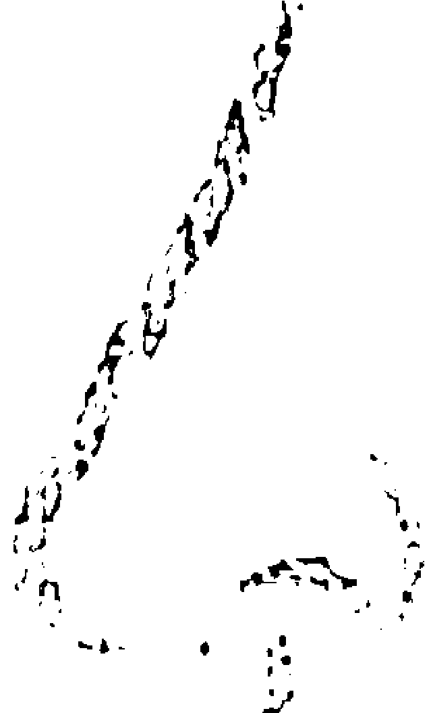

### 八、鼻子較短的論斷

鼻子較短的論斷，表示腦筋靈活、充滿巧思，但是行事不夠沉穩，個性顯得浮躁不安，對於問題的處理，會有馬馬虎虎的可能，讓人覺得不可信賴，而影響到工作上的升遷，感情上忽冷忽熱，來得快去的快，是憑感覺來選擇對象。

### 九、鼻樑寬闊的論斷

鼻樑寬闊的情況，表示個性積極，充滿主見，勇於追逐個人的理想抱負，遇到困難阻礙決不退縮的決心，因此往往能成就事業，特別適合當業務或領導階層，感情方面異性緣佳，追求異性很有一套，能獲得對方的青睞。

### 十、鼻樑狹小的論斷

鼻樑狹小的情況，表示脾氣比較溫和，不會顯得自我中心，針對自己的過失，會懂得檢討反省，並且尋求改進的方法，是難得的幕僚人才，但由於保守膽小，不敢表示出風頭，因此好機會有時會被搶走，只有獨自哀傷嘆氣的份。

### 十一、鼻樑起節的論斷

鼻樑有起的情況，表示為人心機陰沉、貪圖利益，對於想要達成的目的，有不擇手段的情況出現，因此人際上會有心防，警戒心很強，喜歡人家便宜，行事說話不切實際，別人會比較排斥抵制，將會遇到反彈的聲浪。

083 壹：初階入門、面相部位白話解說

**鼻頭凹陷有雜紋**

### 十二、鼻頭凹陷有雜紋的論斷

鼻頭凹陷有雜紋的情況，表示為人創造力豐富，能有天馬行空的想像，常憑著直覺來行事，充滿著藝術家的氣息，不過感情上容易疑神疑鬼，比較不信任對方，彼此會有衝突產生，多半因此會分手收場，不停更換對象交往。

**鼻子高揚**

### 十三、鼻子高揚的論斷

鼻子高揚的情況，表示為人剛愎自用、不聽任何建言，凡事喜歡獨斷獨行，不愛他人管教約束，的事業方面會全力以赴，獲得不錯的成就，不過感情上就比較麻煩，很在意交往對象的條件，希望對方能帶來實質的幫助。

陳哲毅教你學面相技巧 084

**鼻子低陷**

### 十四、鼻子低陷的論斷

鼻子低陷的情況，表示思想單純、意志不堅，不是很有企圖上進心，會有懶惰懈怠的心態，總是希望不勞而獲，出了問題就依賴他人，較沒辦法自行創業，感情上易受對方欺騙，而造成人財兩失，婚姻也容易有外遇出軌的問題。

**鼻孔朝天**

### 十五、鼻孔朝天的論斷

鼻子朝天的情況，表示為人慷慨大方、不拘小節，很懂得生活享受，會比較奢侈浪費，但對於朋友會很講義氣，願意資助對方金錢，感情需要謹慎選擇對象，以免遭受對方欺騙，財運上要提前規劃，以防老年經濟困苦。

### 十六、鷹勾鼻的論斷

鷹勾鼻的情況，表示個性執著倔強，喜歡耍心機計謀，對於想得到的東西，會懂得利用身邊資源，來營造有利的局面，算是謀略的個人類型，感情上重視物質，較為勢利，會挑選條件好的對象來交往。

## (四) 嘴巴

### 一、嘴巴寬大的論斷

嘴巴寬大的情況，表示為人胸襟開闊，喜歡到處交朋友，跟人交換意見心得，又不會計較微小細節，出手會很大方海派，讓大家都很信服，所以能夠擔任領導，財運上會比較亨通，物質生活不太缺乏，反而有倒吃甘蔗的現象。

### 二、嘴巴窄小的論斷

嘴巴窄小的情況，表示為人心地善良，不會貪圖利益，對待朋友很隨和，不太會無理要求。

## 厚嘴唇

## 薄嘴唇

## 三、薄嘴唇的論斷

薄嘴唇的情況，表示為人富機智 聰明，喜歡學習東西，因此知識見解十分淵博，又口才良好、能言善道，是天生的演說家、推銷員，很適合靠嘴巴吃飯，不過為人較為吝嗇，有時會計較利益，讓人會有自私自利的感覺。

## 四、厚嘴唇的論斷

厚嘴唇的情況，表示為人老實敦厚，不愛逞強出風頭，凡事重視感覺喜惡，對於物質享受會很挑剔，往往選擇高級的服務或精品，錢會支出花費的較多，需要適當的節制才好，感情方面會滿執著的，但也有花心的傾向。

## 五、上下嘴唇平均的論斷

上下嘴唇平均的情況，表示做人處事很有原則性，會有自己的一套方式，在事業工作上會很規規矩矩、安守本份，讓人很放心相信，但是由於缺乏彈性，不懂得變通，有時候會因此固執己見，跟人家顯得有些格格不入。

## 六、圓形嘴唇的論斷

圓形的嘴唇的情況，表示為人思想單純、沒有心機，會有樂天知命的觀念，凡事會願意熱心助人，而獲得大家的愛戴，但感情上比較任性，常會覺得擔心害怕，而缺乏安全感，疑神疑鬼的態度，讓彼此會有溝通不良的情情況。

## 七、歪斜嘴唇的論斷

歪斜嘴唇的情況，表示為人心思不正、個性陰沉，會動很多腦筋，但是都想佔人便宜的詭計，因此會跟人家發生口角，甚至陷入激烈的衝突，事業上會有很多小人來阻礙，又不爱聽從他人建議，很容易導致失敗的局。

## 八、嘴角上揚的論斷

嘴角上揚的情況，表示為人積極樂觀，對什么事情都很努力，遇到挫折不會灰心喪氣，因此能學習很多才華與經驗，對朋友的話，通常大方海派，所以人緣甚佳，財運方面，可以獲得貴人幫助而進財，也能夠守住钱财。

## 九、嘴唇有皱纹的論斷

嘴唇有皱纹的情況，表示為人喜歡物質享受，會一心一意想賺錢，對於朋友會比重視感情，彼此常有麻煩糾葛，事業方面需要奔波勞碌，花費一番功夫，然後才會有所成就，晚年經濟生活需要規劃，以免陷入困境當中。

## 十、嘴角下垂的論斷

嘴角下垂的情況，表示為人固執已見，喜歡獨來獨往，交際應酬的手腕較差，但想法觀念勇於突破，又滿刻苦耐勞的，因此事業能夠有所成就，但需要花較長的時間，財運上會比較不理想，需要妥善規劃，以免投資失敗而損失錢財。

## 十一、嘴角紋路向下延伸的論斷

嘴角紋路向下延伸的情況，這是一般說的長壽紋，表示為人喜惡分明、行事果斷，但顯得固執不懂得變通，對物質享受很挑剔，人際關係上，會比較重視感情交流與實際利益，若對方得罪自己的話，恐怕就不會繼續來往。

## 十二、嘴唇太薄、鼻頭削尖的論斷

嘴唇太薄、鼻頭削尖的情況，表示為人講話語帶諷刺，喜歡挖人家瘡疤，因此讓人覺得很反感，經常惹事生非，而招致禍端，財運方面，由於判斷力較差，又缺乏貴人幫助，經常會有週轉不靈的現象，甚至破產背負債務。

## 十三、上嘴唇突出的論斷

上嘴唇突出的情況，這是吹火嘴的面相，表示為人好逞口舌之快，經常跟人家爭辯論戰，證明自己的見解，但是口氣都非常不屑，帶有輕視藐視的意味，讓人覺得太過驕傲自負，因此人際關係不是很理想，交不到什麼真心的朋友。

## 十四、下嘴唇突出的論斷

下嘴唇突出的情況，表示個性剛強、獨立自主，不喜歡依賴他人，凡事追求個人利益，欠缺團體合作的觀念，因此事業的開展上會比較辛苦，感情上容易疑神疑鬼，讓對方感到吃不消，應該要加以改進，感情才能維持長久。

## 十五、耳朵厚實的論斷

耳朵厚實的情況，表示為人講求信義，重視朋友，會願意熱心公益，奉獻犧牲，卻不求回報，但有時會變得固執，不懂人情變通，感情上會比較順利，對方對自己很關心照顧，婚後會成為得力助手，主持家中大局。

## 十六、耳朵有垂珠的論斷

耳朵有垂珠的情況，表示為人天性樂觀，凡事想的很開，不會鑽牛角尖，很喜歡生活品味，人際關係良好，會有貴人出面提拔，財運上會比較豐隆，不用擔心缺乏，很適合經商致富，有垂珠入口的面相，表示能夠安享晚年。

## 十七、上耳廓尖突的論斷

上耳廓尖突的情況，為人冷漠孤僻，心防很重，腦筋雖然很聰明，但不輕易相信他人，還有排斥陌生的現象，因此親近的朋友很少，事業上孤軍奮鬥，不愛依賴幫助，會獨自佔有成果，不願意跟人分享，心態顯得自私自利。

## 十八、耳朵白潤的論斷

耳朵白潤的情況，表示家境富裕安康，能獲得良好栽培，因此才華洋溢、自信心十足，又健康十分良好，體力充沛，是能長壽的象徵。事業上能有貴人提拔，減少遇到的阻礙困難，社會地位能迅速提昇，而得名聲遠播。

## 十九、耳朵生毫毛的論斷

耳朵生毫毛的情況，表示身體機能健康，是能長壽的象徵，其個性聰穎好學，喜歡吸收新知，心胸十分開闊，眼光高人一等，很適合早年自行創業，也能獲得貴人幫助，而有不錯的成就，提昇社會地位與個人聲譽。

## 二十、耳朵位置高的論斷

耳朵位置高的情況，表示為人生聰穎、腦筋靈活，學習能力很強，反應相當敏感，讀書成績通常優異，很早就出人頭地，能繼承家中產業或自行創業，由於懂得聯絡人心，善於協調溝通，因此很適合擔任領導的職務。

## 二十一、耳朵位置低的論斷

耳朵位置低的情況，表示反應較遲鈍、腦筋不靈活，對學習沒有太大興趣，對物質享受會比較渴求，會汲汲營營於財富的賺取，人際關係上，跟人滿好相處的，只是判斷力較差，有時會被人利用欺騙，造成財物的損失。

## 二十二、耳朵貼腦的論斷

耳朵貼腦的情況，為人沉默寡言，但聰明靈敏，做事認真負責，不會假手他人，對待朋友很誠懇、講信用，因此能夠幫助與回饋，事業方面又能夠突破傳統，使用新的思維觀念，很具有競爭力，往往能開創一片天地。

## 二十三、招風耳的論斷

招風耳的情況，為人喜歡搞怪，很愛出風頭，讓自己成為焦點，娛樂眾人的開心果，但內心固執頑強，會堅持個人意見，不太願意讓步，很難溝通協調，又略帶神經質，經常會懷疑他人，講話直接不婉轉，造成不少誤會跟衝突。

## （七）山根、印堂

## 一、印堂懸針紋的論斷

印堂懸針紋的情況，就是印堂出現一條直纹，好像有根針插著一樣，表示運勢起伏不定，個性急躁衝動，缺乏耐性恆心，做事情往往草率，不聽他人的建議，顯得任性頑固，三十歲前後需要注意事業，恐怕會有危機出現。

## 二、印堂雙直紋的論斷

印堂雙直紋的情況，就是平常皺眉頭的時候，所出現的兩條紋路，若清晰可見的話，表示為人思考細膩，考慮周延，很害怕做不好事情，有自尋煩惱的傾向，人際顯得比較拘緊保守，但是不錯的幕僚人材或企劃人員。

## 三、印堂八字紋的論斷

印堂八字紋的情況，表示為人較為悲觀消極，心境不易開朗，對許多事情思考謹慎，但往往太過執著完美，而失去捷足先登的機會，很適合學術或研發的工作，會比較能發揮本身才能，在人際關係上，需要加強交際手腕才行。

## 四、印堂川字紋的論斷

印堂川字紋的情況，表示為人充滿正義感，會願意挺身而出，幫助弱小族群，但是做人愛好面子，經不起諷刺批評，得失心會相當重，而影響到能力的發揮，感情婚姻方面，容易衝動決定，過程會有阻礙，不利於長久發展。

## 五、山根凹陷的論斷

山根凹陷的論斷，就是鼻樑與印堂交接處，有凹陷或橫紋出現的話，表示運勢受到阻礙限制，凡事會比較奔波辛勞，但卻不一定能有收穫，心境會比較鬱卒困頓，有想不開的情況，在中晚年以後，要注意感情與財務的危機。

## 六、山根橫紋的論斷

山根有橫紋的情況，表示個性獨立成熟，提早面對現實，往往有離鄉背井，到外地打拚的可能，但是過程卻不理想，會遇到許多阻礙，特別是中年的時候，但為人腳踏實地，懂得節制花費，還算能守住小財。

## 七、山根十字紋的論斷

山根十字紋的情況，表示為人心靈方面的事物，汲汲營營於精神的追求探索，特別是對於宗教信仰，有相當的堅持肯定的態度，但人際關係上，會比較敏感、神經質，有時會讓人受不了，事業上，則容易有懷才不遇的感嘆。

## 八、額頭高聳的論斷

額頭高聳的情況，表示腦筋聰明、學習力強，從小能獲得栽培，家境生活富裕，因此各方面基礎打的穩固，有利於將來的發展競爭，但個性上，由於想的太多，判斷上經常犹豫不決，會有過於理想、不切實際的現象。

## 九、額頭圓廣的論斷

## ### 頭圓廣

額頭圓廣的情況，表示為人智商頗高、善於謀略，對於事情都看得十分透徹，能夠深入其中分析，事業工作上，喜歡掌握權力，相當有企圖心，遇到挫折不退縮，反而會激起心中的鬥志，有越戰越勇的氣魄表現。

## 十、額頭較低的論斷

## ### 頭較低

額頭較低的情況，表示見識有限、思考遲鈍，做事情拖拖拉拉，還有推卸責任的可能，事業上比較沒有衝勁，也欠缺貴人賞識提拔，但若頭髮濃密的話，個性反顯得急躁魯莽，不顧慮他人感受，有獨斷獨行的現象。

## 十一、額頭寬闊的論斷

## ### 頭寬闊

額頭寬闊的情況，表示為人通情達理，懂得進退分寸，能得長輩的疼惜，各方面都能獲得資助，人生運勢相當平順，但感情方面，女性事業心很重，經常無法兼顧家庭，對於婚姻的維持不利，可能會有爭執吵鬧的現象。

## 十二、額頭方角形的論斷

## ### 頭方角形

額頭方角形的情況，表示重視現實生活，不愛幻想事物，做事情有條有理，而且會堅持原則，有完美主義的心態，感情方面，脾氣上會比較倔強，缺乏溫柔與浪漫，所以不容易相處溝通，往往比較慢有結果。

## 十三、額頭橢圓形的論斷

## ### 頭橢圓形

額頭橢圓形的情況，表示個性溫和、心胸開闊，對於朋友的要求，都會盡心盡力做到，但也容易有人情的牽絆，而造成煩惱壓力的來源，事業工作上，不適合到外地去工作，需要花費較長時間適應，但中年以後會比較順利。

## 額頭部位論斷

### 七、額頭低窄的論斷
額頭低窄的情況，若頭髮是捲曲或赤色的話，表示精力充沛、活力十足，喜歡到處冒險生活、去追求刺激的事物，但人際關係上，較不分青紅皂白，態度顯得衝動，有時候會遭人慫恿利用，而造成損人不利己的情形。

### 八、額頭髮尖的論斷
額頭髮尖的情況，就是額頭上的髮際，如果有美人尖的情況，一般都不是很理想，表示印堂受到沖剋，本身才華能力無法發揮，有經常更換工作的現象，在感情上會搖擺不定，很容易胡思亂想，不停變換交往對象。

### 九、額頭圓凸的論斷
額頭圓凸的情況，表示思想富創造性、很有文學氣質，能夠學習多樣才藝，有很好的記憶力、想像力，很可能成為專家學者，人際關係上，能結交許多朋友夥伴，也能獲得父母長輩的支持，能夠開創屬於自己的事業。

### 十、額頭凹凸分明的論斷
額頭凹凸分明的情況，就是側面來看，額頭到鼻樑的位置，有明顯的高低起伏的話，表示個性固執、行事果斷，很具有冒險的精神、願意嘗試新穎的方法，來解決困難阻礙，開創性十分良好，工作上很具有競爭力。

### 十一、額頭平坦的論斷
額頭平坦的情況，表示智商平凡、見解普通，生性保守內向、不愛活潑好動，由於缺乏判斷主見，所以很容易受到影響，朋友的选择就非常重要，特別是感情跟金錢的問題，常會遇到煩麻糾紛，讓自己不堪其擾。

### 十二、額頭隆起的論斷
額頭隆起的情況，就是眉棱骨隆起，或是兩旁輔骨隆起，叫做輔骨插天，也是頭角崢嶸的象徵，表示為人的雄心壯志、氣度宏偉，跟人言談之中，富有机智幽默，得到眾人的愛戴欣賞，而能領導聚集群眾，成就一番個人事業。

### 十三、額頭彎曲紋的論斷
額頭彎曲紋的情況，就是三條橫紋但兩端向上彎，又叫做偃月紋，表示為人正直清廉、行事穩健，不喜歡捲入無謂的紛爭，會堅守自己的工作崗位，默默的服務奉獻，很適合擔任公務人員，或是管理監督的職位。

### 十四、額頭橫雜紋的論斷
額頭橫雜紋的情況，就是額頭的皺紋多，而且斷斷續續的，顯得非常的凌亂，表示為人思緒繁多、夜不安穩，帶有一點神經質，脾氣比較煩燥沒耐性，凡是需要靠自立自強，不會有朋友或貴人幫助，早年辛苦勞累，但晚年能享清福。

### 十五、額頭三橫紋的論斷
額頭有三條橫紋的情況，相學又叫做伏犀紋，表示為人的個性敦厚，有很強的意志力，喜歡學習新的事物，有很強的記憶力跟分析能力，凡事不怕辛苦勞累，會耐心等待時機，情勢看準了就會出手，最後會獲得成就。

### 十六、額頭縱橫紋的論斷
額頭縱橫紋的情況，表示紋路雜亂、運勢多變，通常需要經過較多的挫折磨難，才能培養出堅毅的性格，多屬於孤軍奮鬥的類型，不太依賴借重他人的力量，有時候遇到困境阻礙，便會自怨自艾，覺得人生不得志、生活不如意。

## （九）牙齒、舌頭

### 一、牙齒較多的論斷
牙齒較多的情況，一般是表示名聲地位，牙齒數目越多的話，就是越容易發達貴顯。三十六或三十八齒的話，福祿豐隆、不愁吃穿；三十二或三十四齒的話，身體健康、壽命較長；三十齒以下的話，則是平庸之輩。

### 二、牙齒整齊的論斷
牙齒整齊的情況，若排列的像白色的貝殼，表示為人聰明靈活，個性大方爽朗，不會扭扭捏捏、惺惺作態，人際關係相當不錯。但若焦黃枯黑的话，表示體質過敏虛弱，健康情形不佳，在事業工作上，運勢也不太理想。

### 三、牙齒較小的論斷
角尖，會有想不開的情形，心情總是鬱卒難解，又心防很重，旁人不容易接近，但在事業上，態度會冷靜謹慎，應對困難問題，算是不错的幕僚或是副手人选。

### 四、牙齒不整的論斷
喜好爭奪利益，有自私自利的可能，加上容易情緒化，不好溝通商量，所以人際關係不理想，事業運方面，會有每況愈下的現象，到中晚年時要提早規劃。

### 五、門牙較大的論斷
門牙較大的情況，表示身體強壯、健康良好，做事情積極有活力，不怕任何的挑戰，精神鬥志非常高昂，不過由於講求快速，缺乏長期的規劃，有時候會因此而吃上虧，特別是在理財投資方面，有大賺大賠的現象。

### 六、門牙有縫的論斷
門牙有縫的情況，若門牙有細縫的話，表示為人個性開朗，屬於樂天派的類型，凡事喜歡自由自在，不愛受到約束管教，但人際關係較薄弱，不懂得交際應酬的手腕，多半靠自己打天下，辛苦的白手起家。

### 七、牙齒尖銳的論斷
牙齒尖銳的情況，表示個性奸詐、為人陰沉，會想辦法爭奪利益，甚至不惜出賣朋友。事業上，由於行事反反覆覆，讓人無法放心交代，所以升遷較為困難。理財方面很愛投機取巧，但錢財來來去去，沒辦法存守的住。

### 八、虎牙突出的論斷
虎牙突出的情況，表示個性外向活潑，不怕陌生環境，喜歡到處遊玩享樂，花費比較奢侈一點。人際關係上，由於來者不拒、廣結善緣，所以朋友非常的多，但多半會有小人出現，而被對方利用拖累，導致名譽或金錢的損失。

### 九、舌大而方長的論斷
舌大而方長的情況，表示行為端正、講求信義，不屑偷雞摸狗的事情，會傾向光明正大的行事。但若舌頭長卻狹窄的話，表示為人舌燦蓮花、說話不切實際，不是很值得信賴，不宜交往太過親密，以免受到對方牽連。

### 十、舌大而削薄的論斷
舌大而削薄的情況，表示聰穎巧智、口才犀利，很具有說服力，不過卻愛搬弄是非，流於狡辯之徒，會到處散播謠言，破壞別人的名聲。舌頭大卻短的話，表示胸無大志、遊手好閒，也屬於飢不擇食的類型。

### 十一、舌頭大而嘴巴小的論斷
舌大而嘴小的情況，表示為人木訥、不善言詞，人際互動較差，不敢表現自己。但若舌小嘴大的話，表示講話直接、欠缺思考，經常不小心出口傷人，造成人際上的不愉快。若舌頭上有川字紋，為人知足常樂，能夠存守財富。

### 十二、舌頭紅潤的論斷
舌頭紅潤的情況，舌頭紅潤像丹砂的話，表示身體健康，抵抗力強，很少生病看醫生，財運方面比較平順，能有穩定的收入。若舌頭暗黑的話，表示健康欠佳，有中毒的可能，運勢坎坷難行，凡事操勞卻無所獲，容易招惹官司小人。

## （十）人中

### 一、人中深長的論斷
人中深長的情況，就是輪廓清晰可見，像是凹下去一樣，表示為人忠厚老實、態度溫和有禮，滿熱心幫助人的，人緣會相當不錯。事業上，很有耐性跟毅力，會願意奮鬥不休，中年以後可以發達，晚年可以享受福祿。

### 二、人中短淺的論斷
人中短淺的情況，就是輪廓顯得不清晰，表示為人懶散無鬥志、凡事較被動，不會想要上進爭取好成績。事業工作上，有半途而廢的傾向，喜歡依賴他人幫助，毫無企圖心可言，賺不到甚麼財富，中晚年以後，運勢會每況愈下。

### 三、人中無溝的論斷
人中無溝的情況，就是看不出有輪廓，表示為人個性內向保守、行事拘謹，不太愛跟人打交道，通常會孤單一人。事業上，討厭繁瑣的事務，不願意花心思處理，又愛推卸責任，所以升遷較無希望，人生也很少有作為。

### 四、人中橫紋的論斷
人中橫紋的情況，就是有紋路劃過人中，表示運勢不太理想，恐會有災禍發生，要特別小心注意，尤其是身體健康方面。人際關係上，會因子女的問題而煩惱，彼此會產生代溝嫌隙，常替子女出面收拾爛攤子。

### 五、人中上窄下寬的論斷
人中上窄下寬的情況，表示家境平庸、栽培有限，凡事需要靠自己努力，才能有較好的結果，是白手起家的典型。事業工作上，很早就必須出外奔波，為家庭謀生計，雖然過程會艱苦困難，但慢慢能漸入佳境，晚年可以享受福祿。

### 六、人中上寬下窄的論斷
人中上寬下窄的情況，表示為人敏感過度、帶有點神經質，對很多事情都看不慣，會有疑神疑鬼的現象，讓人家很頭痛煩惱。事業上，欠缺耐力跟定性，會時常更換工作，財運方面，不善於理財規劃，恐怕會寅吃卯糧。

### 七、人中細狹的論斷
人中細狹的情況，就是人中非常狹窄，表示為人心胸肚量不大，很容易吃醋計較，對朋友不夠大方，有吝嗇的傾向，又講話溝通不良，不願承認錯誤，會因此被他人嫌棄，而列為拒絕來往戶，導致情緒鬱悶無法抒發。

### 八、人中寬闊的論斷
人中寬闊的情況，表示個性坦白、直言不諱，對很多事情都看的開，不會一直惦記放在心上，願意無條件幫助朋友，是個很有包容力的人，所以人際關係佳，能受到別人的尊重。事業上能一步一腳印，慢慢達成理想目標。

### 九、人中橢圓形的論斷
人中橢圓形的情況，表示身體健康不太理想，帶有遺傳疾病的可能，使身體外觀有損傷。人際關係上，跟子女、晚輩的互動有問題，彼此容易觀念不合、有口角的衝突，沒辦法好好管教子女，或帶領部屬共同工作。

### 十、人中彎月形的論斷
人中彎月形的情況，就是人中有彎曲的現象，表示為人心胸狹隘、見不得他人好，會在背後搬弄是非，破壞別人的名譽，令人家相當頭痛煩惱。事業上，缺乏貴人幫助，但小人陷害多，有官司訴訟的可能，晚年運不是很理想。

### 十一、人中偏斜的論斷
人中偏斜的情況，表示為人愛三姑六婆，有長舌的現象，很容易招惹是非，而陷入糾紛當中，甚至有官司訴訟的可能。婦女方面，懷孕恐怕有危險，要注意流產或難產，將來子女會比較叛逆，溝通上也會有問題產生。

### 十二、人中十字紋的論斷
人中十字紋的情況，表示為人重視心靈，喜歡精神追求，特別親近宗教信仰，意志力會比較堅定。但是人際關係上，會顯得較孤單寂寞，找不到適合的伴侶。若結婚後有子女，跟子女的緣分薄弱，彼此會很難相處溝通。

## （十一）法令紋

### 一、法令紋深且長的論斷
法令紋深且長的情況，表示為人精神集中、頭腦清晰，處理事情有條有理，不會隨隨便便敷衍。在學習方面，能夠深入專心研究，成為某領域的權威，很受到他人的尊重與肯定，隨著年齡的增長，地位名聲也會慢慢的提昇。

### 二、法令紋八字型的論斷
法令紋八字型的情況，表示淡薄名利、崇尚悠閒，喜歡過輕鬆自在，沒有壓力的生活。跟人很好溝通相處，结交的朋友也很多，沒什麼特別的野心，所以事業能平穩發展，就非常心滿意足，中晚年以後，可以安享清福。

### 三、法令紋入嘴角的論斷
法令紋入嘴角的情況，相學上叫做螣蛇入口，表示為人苦悶鬱卒，心境不夠開闊，常常為小事情煩惱，有杞人憂天的傾向。事業工作上，若遇到挫折失敗的話，很容易就灰心喪志，而無法東山再起。健康方面，壽命可能會比較短。

### 四、法令紋不明顯的論斷
法令紋不明顯的情況，表示為人缺乏企圖心，做事情馬馬虎虎，有得過且過的心態，不喜歡出風頭表現，總是躲在人群的後面，很少直接跟人互動。事業上，不愛變動更換，會喜歡固定的職務，但升遷比較不容易。

### 五、法令紋過嘴角的論斷
法令紋過嘴角的情況，就是紋路從嘴角旁向下延伸，涵蓋住整個下巴部位，表示脾氣古怪，剛愎自用，不愛跟人家溝通商量，想怎麼做就怎麼做，常常無形中得罪人而不知，會有口角糾紛。但健康情況良好，會有長壽的可能。

### 六、法令紋有分岔的論斷
法令紋有分岔的情況，相學上叫做金縷紋，表示為人心胸寬大，喜歡結交朋友，有交際應酬的手腕，加上領導管理的才能，所以很適合經商發展。投資理財上，由於眼光獨到，又能沉穩踏實，可累積豐厚的財富。

### 七、法令紋有橫紋的論斷
法令紋有橫紋的情況，像是有橫紋劃過一樣，表示祖業破、六親無靠，需要自立自強，靠白手來起家。人際關係上，大多為了實際的利益，很容易跟人家起衝突，而有色非糾紛的困擾。運勢上，要提防意外災害的發生。

### 八、法令紋有數條的論斷
法令紋有數條的情況，就是法令紋旁平行的小細紋，表示為人勤儉努力，奮鬥不休，會希望爭取表現，來獲得獎賞鼓勵。事業上，會事必躬親，不假手他人，但由於憂慮過多，缺乏果斷，僅可以當幕僚、副手，不適合擔任領導。

## （廿）下巴、腮骨

### 一、下巴圓突的論斷
下巴圓突的情況，像是圓形的隆起，表示善於領導統御，很有權力慾望，喜歡指揮別人做事。雖然有時候顯得自負，但不會得意忘形，懂得拿捏分寸，對朋友部屬非常照顧，還算是有人情味，事業能夠開展順利。

### 二、下巴短小的論斷
下巴短小的情況，佔臉部的比例較小，表示不善於言詞表達，會把感受隱藏起來，不輕易透露心事，讓人摸不著頭緒。事業工作上，由於缺乏自信心，不敢大膽行事，有時會因判斷延誤，而失去大好時機。

### 三、下巴拉長的論斷
下巴拉長的情況，有群眾魅力，能擔任領導地位，又腦筋聰明，反應靈敏，可以從困境當中，找出生存的契機，算是滿有企圖心的人。不過脾氣固執，有時會衝動而得罪人。

### 四、下巴寬圓的論斷
下巴寬圓的情況，表示個性敦厚老實，為人古道熱腸，喜歡到處交朋友，跟人家溝通意見，所以人緣還算不錯。又態度穩重、處事圓融，很適合領導管理，甚至於可以自行創業，物質生活不缺乏，晚年可享福祿。

### 五、下巴尖小的論斷
下巴尖小的情況，表示好奇心強、喜歡學習，對什麼事情都很有興趣，但是卻無法持久，人際上反應靈敏、說話很流利，看起來很有人緣。但相處久了，會比較疑神疑鬼，帶有點神經質，使人覺得不好相處，特別是在感情方面。

### 六、下巴凹紋的論斷
下巴凹紋的情況，就是下巴中間凹陷，好似兩個下巴，表示為人富創造力，很有美感細胞，喜歡藝術氣息的東西，本身的文采也不錯。但感情方面，較不安份穩定，有喜新厭舊的可能，需要注意彼此的溝通才好。

### 七、雙層下巴的論斷
雙層下巴的情況，表示心寬體胖、個性溫和，對人不是很計較，不太會記恨尋仇，往往會得理饒人，建立良好的風度形象。因此風評還算不錯，理財投資上，通常會有偏財運，可以因此獲得小財，晚年貴顯發達。

## 八、下巴方正的論斷

下巴方正的情況，表示為人腳踏實地，不會想投機取巧，是白手起家的典型，人際關係上，願意幫助弱小，充滿了正義感，能得到他人回饋，在事業方面，會按部就班，評估自己的實力，決不會膨脹吹牛，妄想一步登天。

## 九、腮骨畸形的論斷

腮骨畸形的情况，就是下巴呈現不規則形，表示為人有小聰明，喜歡賣弄口舌，會想佔人家便宜，常常與學生糾紛，事業上，有半途而廢的現象，缺乏耐心毅力，無法承擔重責大任，因此風光出頭的機會較少。

## 十、腮骨均圓的論斷

腮骨均圓的情況，就是腮骨有突出，但是有肉包覆，顯得圓潤，表示充滿膽識氣魄，願意冒險開創，有很強烈的企圖心，因此常能自行創業，擔任領導管理的地位，財運方面，懂得投資規劃，可以添購置產，晚年生活富裕。

## 十一、腮骨歪斜的論斷

腮骨歪斜的情況，表示一邊高、一邊低，或是形狀不對稱，表示運勢起伏大，人生變化多，需面對很多的折磨苦難，才能獲得微薄的報酬，因此心境上，會比較煩惱苦悶，也易遭受朋友牽連拖累，而影響到婚姻家庭的幸福。

## 十二、腮骨尖突的論斷

腮骨尖突的情況，就是腦後可以看見腮骨，表示脾氣暴躁，手段機變，會到處惹事生非，讓別人收拾爛攤子，但若肯用於正途，則事業工作上，會展現氣魄，勇往直前，不怕任何困難，會願意接受挫折，再接再厲，而能有所成就。

## （三）氣色

## 一、觀看氣色的論斷

觀看氣色的情況，最好是早上起床時，在刷牙洗臉以後，對著鏡子詳細觀看，並且應該採用明亮的光源，這樣的結果會比較準確，若面部氣色微紅，膚色黃潤光亮，表示運勢亨通，是喜祥的徵兆，反之，黯淡無光則是凶兆。

## 二、臉部氣色的論斷

臉部氣色的情況，若黯淡無光，呈現灰黑的現象，表示近日的運勢不順，恐怕會有意外或疾病發生，要特別的小心提防，工作上，會遇到困難阻礙，而有挫折失敗的可能，要堅強勇敢的面對，才能撐過眼前難關。

## 三、額頭鼻頭的論斷

額頭鼻頭的情況，就是額頭、鼻頭以眼皮的位置，出現黃潤光亮的氣色，表示運勢亨通、無往不利，最近的偏財運旺盛，有機會獲得小財，在投資理財上，可以盡量放手一搏，通常會有驚人的收穫，但最好節制花費，以免奢侈浪費。

## 四、額頭印堂的論斷

額頭印堂的情況，若是氣色呈現慘白，或是有皮膚脫屑的現象，表示運氣不佳、諸事不順，工作上恐怕會出差錯，而有被人責罵的可能，嚴重的話，還會因此而丟工作，家庭方面，注意親人的健康與安全，提防喪憂之事。

## 五、眉眼氣色的論斷

眉眼氣色的情況，若眉毛之間黯淡無光，又下眼瞼氣色泛黑，表示身體健康不佳，有可能住院開刀，財物方面，出外要謹慎小心，居家要提高警覺，以避免遭受他人偷盜，感情上，情侶或夫妻會爭執吵架，要注意溝通協調。

## 六、驛馬氣色的論斷

驛馬氣色的情況，就是俗稱的驛馬位，是觀看出遊旅行、或遷移調動的運勢，若黃闊明亮的話，表示時運亨通，可以出遠門或搬新家，過程將非常順利，反之，若氣色黯淡無光，或灰黑的現象，要注意出外的安全，盡量不要招惹是非。

## 七、鼻子氣色的論斷

鼻子氣色的情況，若出現黑青黯淡的現象，表示運勢不佳、感情失和，很可能跟對方吵架，而面臨分手的情況，財運上，也要注意防範，以避免遭受欺騙上當，人際關係上，恐怕會有是非糾纷，甚至有官司訴訟的可能。

## 八、山根气色的论断

山根气色的情况，如果黯淡无光，或是有青蒙的现象，表示身體健康不佳，恐怕有肠胃方面的毛病，再者，也表示遇到困難挫折，需要跟人加開口求援，有身不由己的感叹，不然就是，替子女的事情伤神，而显得操心劳累。

## 九、眼白气色的论断

眼白气色的情况，若气色不佳、显得泛红，表示睡眠不足，火气旺盛，脾气会非常暴躁，容易与人发生冲突，要特别的注意，若眼白布满血丝，叫做赤缕贯睛，要注意出外的安全，行事不要太过招摇，慎防破财的现象。

## 十、奸门气色的论断

奸门气色的情况，若出现淡淡的红晕，表示有喜事将近，单身的人，有机会邂逅理想伴侣，而情侣有可能步上红毯、结为连理，但若出现黯淡灰黑的现象，则表示遇到桃色纠纷，感情婚姻有第三者介入，让你不堪其扰。

## 十一、迴光返照的論斷

迴光返照的情況，若生病重患的人，已經躺在床上休養一段時間，卻不見病情有所起色，但忽然精神抖擻、容光煥發，顯得非常有活力，而且會積極想進食，這其實是迴光返照，即將離開人世的徵兆，特別是老年人。

## 十二、人中氣色的論斷

人中氣色的情況，若出現黑暗青濛的現象，表示身體健康不佳，婦女多有生理疾病，要儘快治療調養，再者，跟子女、晚輩的溝通欠佳，會有代溝出現，而有憂慮煩惱的跡象，若口唇又黑紫的話，戲水恐怕有危險，應暫時避免出遊。

## 贰：照膽經面相五官論述

## 一、眼睛

## （一）眼睛的健康反映出個性

眼睛是人體重要器官，所以觀察人的雙眼，除了能知道健康，也知道個性如何？如果兩隻眼睛混濁，而且兩眼無神，健康必然亮紅燈，帶有許多毛病。而眼睛如果清澈，而且炯炯有神，那麼就代表非常的健康。而眼睛所反映的器官，正是肝臟的部位，因此肝臟機能和好壞，可以由眼睛得到。

除了肝臟健康之外，眼睛在面相學中，也是判斷個性的部位，其五行的代表為「木」，「木」在個性上可解釋為「仁慈」。如果個人肝臟強健，那麼雙眼除了有神，也表示為人仁慈，待人處世溫和，人際關係不錯，能獲得眾人幫助，反之，肝臟出了問題，則心態上較冷漠，對人斤斤計較，甚至有殘暴的傾向，做出不正當的事情，這是一個「相生」的道理。

## （二）額頭上眼睛是重點，而眉毛作為輔助

在面相學裡面，面相通常不能單一觀看，然後就可以得出結論，而必須反覆觀察，並且多方面的配合，才能有較準確的論斷，否則將差之毫釐、失之千里。因為任何相的部位，都有其作用存在，也互相依賴著，是不能夠切割的。只能說有些部位，對於某些事情，有較多的徵兆可預知，而其他的部位，這時就當作輔助參考，讓主要重點跟次要重點的層次分明，觀察面相才會客觀，而並非先入為主。

在額頭的部位上，若以眼睛為主要重點，那麼眉毛就是輔助參考，即是一眼睛為主、眉毛為輔。舉個例子來說，眼睛的大小與長度，跟眉毛就要配合，若是眉毛的部位過短，就代表個性較急躁，此時若眉毛又粗黑濃密，眼睛不長又小的話，就造成眉壓眼的情況，就沒有辦法配合。一般來說，眼睛大要配粗眉，眼睛細要配細眉，眼睛凶惡就要壓眉，眼神柔和要配直眉，眼神犀利要配彎眉。

## （三）眼神若是犀利，觀相較為正確

眼睛反映人的心性，同時也反映出才智的差異，才智較高的人，眼睛通常明亮，且犀利有神，什麼事情都認真觀察，還比別人謹慎仔細，若是學習面相學，運用在生活裡，將有較多的幫助與成就。反之，才智較低的人，眼睛通常混濁，而且兩眼無神，缺乏魄力，學習事情較不專心，判斷上也三心二意，對於面相學的運用，恐怕就一無所獲。再者，學習五術的東西，還需要保持理性客觀，心念不能歪斜，否則將損人不利己。

## （四）眼睛下臥蠶赤紅，為人好逞兇鬥狠

眼睛部位的下方，稍微突起的位置，就是所謂的臥蠶。如果長期呈現赤紅色，表示心性受到影響，生理跟心理有毛病，情緒容易煩躁，無法安定下來，為了小事情就爭吵，甚至於動手打人，人際關係比較糟，對自己相當不利。而若是眼神安定，臥蠶飽滿、色澤明亮的話，表示為人有主見，懂得去節制，而且善於言論，人際交往熱烈，無論做什麼事情，都可以專心投入，很快就能夠成功。由此來觀察面相，小人或是君子就可以馬上知道。

## （五）面相牛頭虎視，享受富貴榮華

牛頭虎視的意思，其實非常的簡單，「牛頭」就是指額頭兩邊，有突出的頭角，這部位顯得豐隆飽滿，沒有凹陷或傷痕，而「虎視」是說明眼神，就像是老虎一樣，令人感覺到威嚴，卻不會讓人恐懼，那麼事業上將平步青雲，有朝一日飛黃騰達。但若是有虎目的人，虎目眼睛必然渾圓，而且稍微往上吊，露出下三白的部分，怎麼能說是好相呢？

## （六）眼如蜂、聲如豺，多從武維生

眼珠如果色澤赤黃，且又細小的話，像是蜜蜂的眼睛，加上聲音如豺狼般低沉沙啞，那麼多半是靠武藝技術維生，對文學方面缺乏興趣，用現在社會做比喻，也就是讀書與不讀書的差別。哪些書讀不高的人，大多從事勞力或技術工作，有些則是不務正業，像流氓、罪犯之類，靠著勇武的手段，來維持自己生活。

若是眼睛像是一點睛，就是眼珠中間的部分，在烏黑中出現光澤，使得眼睛黑白分明，而且感覺很明顯，像是白板點了黑漆一樣，這種眼相就不錯，代表為人有智慧內涵，性情溫和，不喜歡出風頭，懂得自我充實，成功將垂手可得，但若是環境的因素，將可能現實考量，過著簡樸的生活，不與人爭強掠奪，對人情世事看的很透徹，而變成隱遁的君子。

## （七）眼睛歪斜心思不正，缺乏光彩精神異常

眼睛經常俯瞰，就是眼珠向下望，露出上眼白的部位，眉毛尾端也朝上翹，這種相貌神態的人，表示自我意識強烈，不愛去聽命於人，就算表面上順從，也容易陽奉陰違。而眼睛下方邊緣，呈現平直的一字，代表為人公正無私，做事情懂得判斷，而不會在枉顧情理。

至於眼睛臥蠶的部位，若是稍微突起的話，表示人際關係不錯，特別是異性緣，能得到良好伴侶，而臥蠶也代表子女，若凹陷的話，那麼子女就容易不孝，也比較難去教養。反之，臥蠶豐隆且有臥蠶紋出現，代表祖先庇祐、自己累積福德，除了能享受福報，後代子孫也很傑出，過著幸福的生活。

## （二）目中出現赤砂、近日將有災殃

在相學當中，額頭的中央為印堂，代表為人行運的重點，若是出現不妥氣色，像是赤紅或灰黑，那麼最近的運氣不佳，出外就要注意災禍發生，或是有不如意的阻礙怪事。而眼睛也是重點所在，若突然出現赤紅色的砂點，遍部於眼球的話，表示有小人在作祟，招惹官司訴訟，出外容易有意外，遭受生命財產的損失。因此，要特別安全，不能單獨前往，或從事危險活動。

## （三）目光收斂事業順，黑白不分運不佳

就眼睛部位來說，一般眼球是不宜突起，在面相中是凶相，因為個性會比較急躁，顯得脾氣衝動，但是只要眼神收斂，目光不外露，非但不能算凶相，還有利於軍警、政治的發展，因為強人領導多半有這種面相，展現出其優秀能力，讓人家信服依從，因此事業將一帆風順。但個性欠缺圓滑，不容易溝通妥協，對於商界來說，就不一定那麼適合。

而兩隻眼睛眼球與眼白，如果混濁分不清楚，那麼表示身體有疾病，個性容易有偏差，做任何事情都不順利，容易遭受到阻礙，而無法順心如意，特別是走到眼睛的流年，那情況更加的明顯，像是三十五到三十七歲，感情及事業要注意，甚至容易有災禍發生，或是身體產生病變，要小心預防才好。

## （四）觀骨高聳及反目，人生多半不如意

眼睛反目的情況，就是眼白的位置特別明顯，而且比例很大，像是眼睛上吊翻白眼一樣，這種人通常心高氣傲，不受管教，有目空一切的傾向，若是加上顴骨高聳，情況就更加嚴重，人際關係就不好，無形中得罪別人，而導致遭受排擠，缺乏貴人的幫助，做事情自然就不能順心如意。

## （五）眼睛有不良氣色，近日內災禍臨身

眼睛的氣色，如果一下子發白，一下子有發黃，表示運勢不穩定，不適合去遠行，否則將發生危險，嚴重時客死異鄉。而眼睛旁出現黑暈，多半是心神勞累，眼眠不足，身體要好好修養，否則對健康不利，而如果突然出現，並非勞累的結果，那麼表示最近財運不佳，有破財的可能，最好小心注意。若黑氣持續出現在眼睛尾角的地方，也代表人的行運，以及個性情緒，如果眼角上揚，就容易遇到好事，運勢逐漸地看漲，反之，眼角若下垂，將遇到壞事，像是生離死別，或是其他阻礙，心情就無法放鬆，累積了苦悶壓力，做事情當然不專注，很容易出現紕漏，而讓主管來責罵。除了任何位置的五官，都應該豐隆上揚，才會不會顯得苦瓜臉，運勢自然不會受阻。

## (六) 眼睛凸出不如意，眉眼俱長享富貴

眼睛的部位應該豐隆，而不能夠顯得凹陷，看起來沒有肉一樣，尤其是眼睛下方，就是臥蠶的位置，若是沒有突起，欠缺豐隆，表示為人後代子嗣不旺，沒辦法獲得子女，而孤寡的傾向，再者，也代表其人心思陰毒，缺乏感情與道義，人際關係相處上，要去特別的提防，以免被設計陷害。

## (一) 眼有神韻德且智、眼神歪斜愚帶毒

眼睛所在的位置，是面相裡最關鍵之處，若是眼睛長得不好，哪麼人生運勢就減弱不少，必定有較多的辛勞與險阻，所以觀看個人時，不可遺漏的地方。而眼睛不只有形狀跟眼神，連視線的情況，也可以作為參考，若是眼睛的視線，常常放在遠方，表示為人有抱負理想，眼光比別人獨到，能夠掌握住先機，若是眼睛視線，經常朝著下方看，表示為人心存妒嫉，帶有猜忌心態，不哪麼好相處，必須加以提防，而目光平視的人，代表意志堅定、遵從德性，行事規規矩矩，若是眼神渙散，缺乏威嚴的眼神，表示做事情經常半途而廢，沒有個人的主見，缺乏魄力的情況下，很容易遭受失敗。

## (二) 紧迫釘人心陰險、眼神閃爍多奸詐

就眼睛的判斷來說，一個人的眼神最好安定，而且要具有威嚴，才會讓人覺得正直，但是有一種的眼神，像是緊迫釘人一樣，看著東西的時候，會一直不肯轉移焦點，哪麼這樣子的話，就不見得是好的，代表這個人過分執著，為達到目的不擇手段，而且成府比較深沉，常常去算計別人，且警戒心比較強，不容易跟人接近。

而有些人的眼神，是經常飄移不定，而且閃爍次數很多，不斷注意週遭事物，像是怕別人發現什麼，這種人的個性來講，除了心機會比較會，往往心術也不正，讓人家不敢接近，而在競爭激烈，權力鬥爭的環境，也可以看到有很多人具有這種情況。

## 丑左邊眼睛看父親、右邊眼睛看母親

用易經的理論觀看，一個人的左邊為陽、右邊為陰，而面相學也是如此，男性以左眼為父親、右眼為母親。假設一個男性的左眼有疤痕，或這是受損傷，就代表父親的運勢不佳，甚至於有所損傷，但不代表一定就不好，也有可能是關係不好，因為面相是一種相對的觀察，而不是必然如此。

而左右眼最好對稱，若是形狀或大小相差太多，就表示性格上產生矛盾，有不平衡的現象出現，容易有雙重性格，若又受到嚴重打擊，還可能有精神障礙，像是人格分裂的傾向，在現實生活當中，人際關係就不太協調。

## 六雙瞳孔拜相封侯、眼睛過大多貪婪

眼睛有著雙瞳孔，在面相學裡面，是滿難得的好用，代表為人精力旺盛，腦筋特別發達，所以學習能力好，做什麼事情都快，很快就能夠成功，在歷史傳記中,很多人物就是生有雙瞳孔,通常能掌握大權,創造出一番事業。而眼睛大小方面,最好是要能適中,若長得太大的話,表示本身慾望強烈,對物質需求度高,而且有貪婪傾向,若沒有近視,卻習慣貼著東西觀看,哪情況就更加明顯。

## (七) 雞眼蛇眼多竊賊、龍眼鳳眼近權貴

眼睛的形狀如果是雞目、蛇目，就是眼白部分多，黑睛部分少，還露出兇光的模樣，這都是不好的眼相。雞眼就是眼睛圓，但是卻呆滯，而蛇眼是眼角尖斜，帶有邪氣，這兩種人的個性，都容易誤入歧途，而從事非當勾當，淪落為小偷或盜賊，若發現這種眼相，哪就不可不提防。

至於龍眼跟鳳眼的話，通常就是好的眼相，龍眼的特徵來說，就是眼睛很大，而且眼線很深，眼珠特別漆黑，給人不怒而威的感覺。而鳳眼就是目清目秀，眼尾部分上揚，像臉頰兩邊延伸，是屬於貴氣的眼相。

## (六) 眼有睛懸陷牢獄、目有三角帶凶惡

眼睛的形狀如果是三角形，就是帶有凶惡的特徵，代表心態殘暴、很會報復忌妒，盡量要避開這種人。

若眼睛又呈現睛懸的現象，就是黑珠的部分，向眼睛上方懸吊，特別不利，沒辦法有所成就。

## (元) 臥蠶光彩大富貴，臨蠶青黑有災厄

眼睛下方的臥蠶，如果形狀豐隆，而且有肉包覆，色澤又有光彩，哪麼就代表走好運，經常有好事降臨，特別是在人際與財運方面，能夠廣結善緣，累積個財富。但若是臥蠶部位，出現黑青的色澤，除了健康不佳外，就代表運勢低落，要注意災禍發生，出門都得要小心，尤其是懷孕的婦女，很可能流產或難產，必須要特別小心。一般來說，眼睛下方的臥蠶，若出現青黑氣色，多半是家中不平安，不是配偶就是子女，或是有喪事在進行。

## (三) 三陽三陰為福祿、若有損害恐破財

眼睛又叫做「三陽三陰」，就是在眉毛上面的位置，分作三個部份，在左眼來說，眼睛和眉毛前端就是太陽，中間部分就是中陽，眼角和眼尾部分就是少陽，而右眼來說，眼睛和眉毛前端就是太陰，中間部分就是中陰，眼角和眼尾部分就是少陰。三陽三陰除了能代表人的運勢、健康，也可以觀看財祿，如果這位置有赤色出現，代表近日內要注意健康，或是意外破財，不然就是火災的發生。

## (三) 眼睛歪斜心不正、身體多病且多災

眼睛可觀看個性，也可知道心術正邪與否，一般來說，形狀完整、大小適中、位置中正、眼光安定的人，通常就表示好相，較屬於正人君子，可以深入去交往。若是形狀怪異、過大過小、位置歪斜、眼光飄移的人，通常就不是好相，較屬於小人盜賊，最好是盡量遠離。而有些情況，並不是心術不正，而可能是人天生運勢多阻礙，事業財運不理想，或是身體健康有疾病，而導致失去樂觀態度，心理上較為封閉。

## (四) 丹砂散佈家宅不安、目大眉小中年災厄

如果眼睛最近出現紅點，散佈在眼白的部分，哪代表運勢不理想，尤其是家中住宅，情況將不會平静，容易有问题發生，像是偷盜或火災發生，必须要特別提防。而眼睛跟眉毛的搭配，是面相學的觀看法則，通常是眉毛要比眼睛長，這樣會比較理想，如果眼睛比眉毛要大要長，哪麽中年過後的運氣，就會顯得比較差，在人際關係方面，就不是哪麽熱絡，欠缺貴人的幫助，以至於較為辛勞，凡事沒哪麽順遂，有孤立無援的情況。

## (五) 眼尾光潔家美滿、奸門凹陷牢獄災

眼尾的部分，就是夫妻宮的位置，如果沒有凹陷或疤痕，形狀飽滿、色澤光潔，哪麼家庭生活就美滿，感情生活穩定，夫妻能夠恩愛。反之，若出現斑點、疤痕或凹陷，除表示感情失利、婚姻失和外，通常人際關係也較差，容易有口舌糾紛，甚至於官司纏身，而陷入牢獄之災。

## (六) 奸門是男性的妻妾位，生的飽滿有肉、色澤明亮，表示妻子賢淑、品行善良，而且自己對妻子很照顧，妻子也很關懷自己。

但若是奸門生得不好，則表示妻子不賢慧，而且用情不專，自己或配偶都容易有外遇，影響家庭的安定。

而觀看的奸門法則，還有一點可以參考，哪就配合子午卯酉的說法，子為冬天、午為夏天、卯為春天、酉為秋天，而的部位，對季節的變化，是相當敏感的，因為它表現於外，氣色經常會變化，反應出人的情緒，一般來說，不宜青色、黑色、白色，而適合桃紅、亮黃的顏色。

## 二、嘴巴

## （一）嘴巴看出身貴賤

五行當中以「火」作為夏季，而嘴巴的裡面有舌頭，舌頭代表心臟，心五行就是屬火，所以舌頭能反映心臟強弱，以及是否有疾病。而「火」的性，形體變化無窮，能夠發光發熱，是能徵。而火又代表禮節，所以舌頭的形狀，能出為人的處世態度，如果舌頭圓厚、方厚稍長，就是好的舌相，代表為人很有教養，出身的環境較好，祖先的基礎穩固，健康上心健，若是舌頭尖小、薄削、長度過短，哪較粗俗，出身環境較差，缺乏祖先基礎，心能也不強。

## （二）開口睡覺運勢薄、嘴巴兔唇財運失

嘴巴又叫做「訟堂」，也是五官其中之一，佔有重要的地位。平常的時候，最好是緊閉不張開，因為張開就會洩氣，運勢就會往下降，而得不到貴人助，個性也顯得輕浮，不知道積極努力，遊手好閒的傾向，反之，經常緊閉嘴巴的人，個性會比較拘謹，不太會心浮氣躁，做事情積極認真，很少會在哪抱怨。此外，有些人睡著時，嘴巴也容易打開，這樣子也不是很好，元氣將嚴重流失，人生運途多阻礙，若眼睛也是張開睡，哪就有早夭的可能，壽命將可能減短。

而有些人先天嘴唇缺陷，就是所謂的兔唇，而沒辦法合上嘴，在面相學裡面，這是破財的面相，錢不容易存守住。而舌頭方面，如果長得方厚，但表面卻太過平滑，或是太過彎曲，同樣也會影響財運，沒有哪麼的理想。

## (三) 嘴唇青厚命不久、唇上多紋孫子貴

嘴唇的色澤除了觀看運勢，也可以推論健康，若是病危的人，嘴唇若呈現青黑色，哪麽多半是命不長久，若是一般人的人，只能說是健康有問題而已。嘴巴又叫做「水星」，若嘴唇生的豐厚，就會成為方形狀，這就代表「水星得地」的旺相，福祿相當的好，因為嘴巴掌管衣食福祿，也叫做禄堂，若嘴相長得好看，就不用担心生活，若唇上生有黑痣，表示命帶食神，可以享受口福。

## (四) 口不见唇掌權柄、口唇如四運財佳

嘴巴如果看不见嘴唇，若真是这样的话，確實是有点奇怪，其實「不见唇」的意思，是說嘴唇長得很薄，看上去像个「一」字，這種人很講求原則，非常的固執己見，不太願意通融，若從事軍職或政治，通常能掌握大權，但是嘴角的部分，卻不能夠有下垂，才能够行運發達，否則將面臨失敗。

## (五) 張口見齒根基薄、牙齒突出財富散

嘴唇若長得像「四」字，哪就是最好的形狀，表示智力較高，人際關係佳，做事情順心如意，而能夠獲財利，若嘴唇的顏色，呈現明亮黃色，就表示有機會得橫財，經濟生活能有轉變。

平常張口露出牙齒，代表祖上根基淺薄，出身環境不太理想，且容易顛沛流离，若說話時嘴唇不同，哪麼就無法聚集財富。而牙齒露出的情況，也可以在一些人身上發現，像是自私自利，或好勝心強的人，他們雖然一時之間，可以獲得好處，或是爭辯獲勝，但是中年以後，經濟逐漸下坡，會到處散財，晚景通常較淒涼。

## (六) 嘴唇內縮多忌妒、口如吹火陷困窘

嘴唇四周若有內縮的現象，就表示其人子女眾多，但是子女不好管教，會為子女勞心勞力付出，而有這種面相的人，往往脾氣固執，所以溝通能力較差，親子關係自然不和諧。而嘴唇薄長像一字口，為人大多寡情無義，很會辯論說話，但卻不守承諾。而嘴巴形狀如果像吹火，是最不好的唇相，表示有口舌是非，人際關係很差，常因此惹禍，或是遭受失敗，最後鋌而走險，而有牢獄之災，若中年不知道規劃，晚年就顯得淒慘。

## (七) 嘴唇不佳無信用、嘴角不起易傷人

吃東西的時候，也可以觀察出個人的性格與心態，若是常吃東西不閉口，讓食物經常掉落，哪么為人就比較輕浮，而且不重事情義，做事較為自私，若嘴唇形狀不佳，哪么誠信就會出問題，別人不能完全當真，人際就會產生阻礙。而嘴角的部分，必須稍微上揚，這樣比較理想，若嘴角下垂的話，代表運勢不順，可能會遭遇困窘或不順遂。

## （八）嘴唇翻起露牙齿、亲朋好友无依靠

嘴唇翻起露牙齿，表示人际关系不佳，与亲戚朋友少来往，得不到支持，欠缺额外的助力，生活显得较辛苦，凡事只能靠自己，也容易颠沛流离。

## （九）口薄下垂情绪差、唇红齿白有福禄

如果童年的時候，生活環境不如意，一直被人家欺負的話，在情緒長期壓抑，内心充滿怨恨的情況，就會反映在面相上，兩邊嘴角就會下垂，如果嘴唇又薄的話，哪快乐的机会就很少。而上排牙齒如果覆蓋下嘴唇，這也算是不好的相，會產生許多阻礙，人生不怎麼順遂。

唇紅齒白的嘴相，代表為人有才藝，能夠有所展現，可以享受福祿，算是不錯的相。講話方面時，如果話還沒說出口，嘴唇就先動的話，表示此人的個性急躁，作事情很衝動，欠缺周詳考慮，是個心無定見的人。

## （十）女人齒唇不相蓋、感情最終受傷害

女性的嘴唇相貌，關係十分的重要，直接反映出愛情狀況。如果嘴唇蓋不住牙齒，表示生產不順利，很容易有意外。另外上嘴唇過長蓋住下嘴唇，或是下嘴唇蓋住上嘴唇，這樣的話，代表夫妻溝通不良，生活不協調，經常會有爭吵。若是上嘴唇掀起，心態就不正當，是偷雞摸狗之徒。

## 二、鼻子

## （一）鼻子看积蓄财运

五行当中「金」屬於秋天，又象徵是肺，而鼻子為肺的苗，能反映肺的健康好壞，因為鼻子能呼吸，跟肺的關係密切。鼻子又代表正義，有正義感和豪爽的人，一定會有正直的鼻子，若是鼻子歪斜的人，很少看見正直剛強的人。而鼻子是收藏的倉庫，所以鼻子也表示財庫，財庫應該要收藏，而不適合外露，否則將損失糧倉，財運不怎麼理想，特別是中晚年以後，鼻子的重要性增加，若相不是很好，或是鼻子出問題，哪麼積蓄就容易流失，影響財運的進展。

## （二）鼻子高挺有名誉、形如截筒富贵人

鼻子位於五官的中央，所以很多相書都說，鼻子是一面之主，地位相當的重要。而一個人的中年運勢，是由鼻子來觀看，而鼻子代表著自我，以及自信的來源，因此能不能當家做主，就必須觀看鼻子的好壞。但鼻子不是高大就好，還必須有條件配合，才能說是好的鼻相。

要說鼻子的好壞，就要從蘭臺跟廷尉談起，蘭臺是指鼻子的左鼻翼，廷尉是指鼻子的右鼻翼，必須要同時來參看。這個位置的形狀，必須要圓厚有力，形狀完整，不能夠顯露，才能算是財運豐隆，而這個財運的來源，是因為建立個人信譽，因為鼻子代表名譽，若個人有了信用，建立了良好聲譽，自然就人際順遂，事業能越作越大，財富就滾滾而來，這就是先名後利的觀念。

若要名利雙收的話，鼻子也不能歪斜，必須要挺直端正、色澤明潤，這樣才會保有名聲，若是色澤昏暗，或是歪斜，有疤痕損害，哪就會有不良影響，反而會是種妨礙。

鼻子如了高挺外，形狀也是很重要，如果是截筒的形狀，就是外觀看來豐厚有肉，而且顯得結實，哪就能享有富貴。

## ### （三）鼻樑削薄無財運、鼻樑低陷志氣低

鼻子既然是一面之主，哪麼影響就很大，而不良的鼻相，將影響人生運勢。像是鼻子削薄無肉，只有骨頭突出，這種人通常自私自利，個性會比較偏激，缺乏合作的精神，講話也不守誠信，因此遭到排擠，所以身邊貴人少，與財富自然無緣，只能夠辛苦過日。若是鼻子有損傷，像是疤痕、惡痣，哪麼中年以後要注意財運，投資理財要注意，也不要跟人合夥，以免被別人慫恿，導致錢財損耗，影響往後的生活。

## （四）鼻子廣長技藝高、鼻如懸膽積財帛

鼻子若長得寬闊，或是較長的人，表示很有主見，意志力堅強，有著自己的目標，凡事盡全力做，所以往往能學得技藝，在同行當中脫穎而出，獲得眾人的肯定與稱讚。

若鼻子的長度，長到比正常要長，哪麼跟面部比例不協調，就會有不平衡的現象，這種人會很固執，考慮的太多，很難去溝通妥協，有著個人的原則，不願意輕易改變，一般來說，中國人較少見，外國人的情況會比較明顯。

而有種鼻相的形容，叫做「鼻如懸膽」，就是鼻頭特別的高大，山根稍微較低，但有肉包覆，那就是財庫有積蓄，能得富貴。

## （五）鼻子歪斜、心術不正

人的鼻子既是一面主，就必须要中直端正，不能歪斜，否則代表思想偏激，行為容易出軌，是心術不正的人。但若是下巴地閣、圓厚方正，就可以減輕鼻子歪斜的影響，就算會犯罪出錯，但懂得反省改過，還有自新的機會，若是地閣也削尖，甚至同樣歪斜的話，哪情況就可能更嚴重了。

## （六）鼻如獅聰明賢士、鼻縮囊到老吉昌

鼻子的形狀如果像獅鼻，就是鼻子較開闊且大，看上去像豬膽吊著一樣，有這種鼻子的人，是個有領導力的人，善於經營與管理，而且富有創造力，能藉此賺進財富，在中年以後迅速發達。

配合豐厚有肉的話，通常是具有聰明的人，懂得利用情勢，獲得自身的成就，大家很喜歡接近，若是鼻子較短，但準頭與鼻翼特別豐隆，雖然氣勢沒哪麼強，但中晚年以後，可以累積財富，獲得安定生活，享受天倫之樂。

## （七）蘭臺黑氣有災厄、鼻孔朝天財不守

鼻翼的部分就是蘭臺跟廷尉，如果有灰黑的色澤出現，哪麼就要特別注意，出外遠行或旅遊，中途將可能發生意外。而鼻樑的位置，如果有折斷的形狀，哪麼也代表是凶相，中年運四十到五十之間，很可能發生災禍，或是其他的險阻。而鼻樑彎曲的話，表示為人情欲放縱，容易去招惹祸端，有淫亂的事发生。

鼻孔若外露，像是朝天一樣，就叫做「朝天鼻」。表示財運不佳、無法聚守，而且自制能力很低，對女色無法抗拒，容易被誘惑遇劫，在中年以後，不能夠太過貪心，不然將因此惹禍，嚴重將可能送命。

## （八）鼻子低陷不明顯、到老孤獨無福祿

如果鼻子低陷，在臉上比例小，看起來不明顯，或是長得很高，但卻削尖無肉，哪麼也不是好相。因為鼻子代表祿位，特別是中年以後，如果是這樣的話，表示沒有財富積蓄，子息也會比較少，甚至不易有兒女，所以老年會很辛苦，經常是孤單的生活。

## （九）鼻毛露出遭毀謗、鼻頭短小無主見

鼻孔的鼻毛不宜外露，這樣一來的話，首先會破壞財運，很容易遭受損失，讓人家覬覦偷盜，或是要破財消災，不然就是人際出問題，莫名其妙讓人毀謗，而有口舌的爭辯。另外準頭要跟鼻翼配合，若大小不一致，都是不平衡的狀況，表示做事情反反覆覆，沒有固定的原則，主見也易受影響。而鼻頭短小，好像沒有一樣，大多是勞力階層，教育程度較低，地位通常不高。

## （七）鼻子橫闊體強健、鼻子彎曲人情薄

鼻子如果寬闊，哪麼身體通常較強健，性格上也比較開朗，做人豪爽大方，不太會斤斤計較，並容易掌握權勢。

鼻樑的部分，最忌諱是彎曲的，是屬於不好的相，表示性格反覆無常，旁人難以猜測，不是哪麼好相處，跟親戚朋友有較多摩擦。若是鼻子又生得小，哪麼事業運就差，不能夠投身軍事或政治了，祇會徒勞無功而已，因為自己缺乏主見，沒有權謀野心，自然無法與人競爭，只能做他人的附庸而已。

## （士）鷹嘴鼻心地險惡、準頭小求財受阻

鼻子的相貌中，有一種叫做鷹嘴鼻，就是鼻子削尖無肉，而且準頭尖端下垂，這樣表示為人愛算計他人，經常要佔人便宜，非常貪得無厭，讓人家非常厭惡，不適合作為朋友，自己將遭受拖累。

準頭的部分，是觀看財祿的多寡，或是賺錢順不順利，如果長得太小的話，表示本身能力有限，財規劃不理想，只有靠固定工作收入，不適合從事買賣，或是其他的投資，來增加額外的財源。

## （卅）山根平美得貴妻、山根低陷妻無助

山根的部位，除了象徵財富外，也可以用來觀看妻子，所以有「妻座」的名稱。如果山根長得豐隆，有肉包覆，而且沒有疤痕或惡痣，色澤也很明亮，沒有灰黑黯淡，哪麼表示能找到伴侶，妻子很賢慧能幹，出身教養比較好，對自己將有助益，反之，山根低陷，或是有疤痕、惡痣，色澤昏暗無光彩，哪麼妻子緣就比較薄，妻子的出身較低，而且脾氣較暴躁，彼此溝通不和諧，對自己沒有助益，有時候形成拖累。

## （二）觀鼻鼻用骨法、能得忠信臣

觀骨屬於深的相法，一般分為「骨法」與「骨氣」，骨法是指形狀，所以肉眼能看見，手也可以觸摸，可以直接分辯吉凶，但骨氣依附於骨形，觀看清楚的話，則可以推論未來，但靠肉眼來辯識，必須累積經驗，才能夠有所徵驗。

鼻骨是屬於骨法之一，依照通常的論法，是說鼻子要有勢，就是鼻子要高挺，不能太低陷，而且必須正直，不能有彎曲或是歪斜，或是其他的疤痕，這樣做人能有誠信，獲得眾人的認同，比較容易有成就。

## （三）山根低陷看人中、人中若美不孤獨

山根低陷在鼻相來說，是屬於較差的相，因為缺乏先天基礎，做事情較為辛苦，且主見易受影響，容易遭人給拖累。但並不是每個人，山根都是高挺的，哪麼是不是低陷就不好呢？其實並非如此，因為相不能獨論，還需要其他相的配合，才有客观的推论。因此观看山根時，還可以兼看人中，用人中的情況，来作為輔助的參考。

人中若線條分明，而且深藏，形狀是長闊或水滴，這是人中的好相，表示水流順暢無阻，虽然山根是低陷的，但僅表示做事情先難後易，先天敗而後成功，而且子息運旺盛，中晚年不至於孤獨，能享受早期辛勞的成果，以及家庭的温暖。

## （夹）年上青出外得财、年上白小心灾厄

鼻子上面的氣色，可以從年上跟壽上來觀察，兩者都位於鼻樑上頭，可以反映出疾病與情緒。若年上是青色的話，最近將有機會發財，得到不少的利益，但要注意的是，青色是指淡微的青色，而不是深黑青色，哪就是災厄降臨，而不是說是吉利了。若年上是帶赤色，特別是有病在身的人，情況會比較嚴重，病情將會加重，或者是因此亡，運氣不是說很好。若年上是呈現白色的話，表示食物中毒，或是濫用藥物導致，若是年上黑色的話，表示招惹是非，產生怨恨想法。若年上是黃色的話，表示運氣上升，做事情很順利，有貴人來相助。若是年上紫色話，對孕婦來說，是多產子的徵兆。

準頭也是鼻子的一部份，因此氣色的好壞，也可判斷運勢，若準頭是呈現紫色，但不是深紫色或黑紫色，只是淡微的紫色，表示最近能遭遇貴人。若準頭是明亮的黃色，而且與鼻翼的顏色相同，呈現一片明亮黃的氣色，哪麼表示最近運勢亨通，經常心想事成，不但能遇見貴人，還有機會得大財，若鼻頭渾圓端正，情況將更加有利。若準頭是呈現黑色或白色，這是不利的徵兆，表示有性命的危險，要注意意外發生。若準頭是赤紅或青色，情況也是不理想，但沒有哪麼嚴重，僅有物品損失、破財消災的可能。

地方，若是骨頭隆起、有肉包覆，表示事業運很好，能闖一番事業，還可以庇蔭子孫。

### (三) 鼻樑直聳財運佳、鼻厚有肉好膽識

鼻樑一定要直，不能夠有歪斜，否則代表心術不正，容易見異思遷。直聳的鼻樑，通常代表財運比較好，無論是體力、意志力方面，都比別人要好，而深具自信心。而鼻子如果寬闊，而且肉厚結實，那麼通常膽識過人，勇於去承擔責任，並展現刻苦精神，遭遇任何的困難，都會想辦法克服，因此事業上、財運上，往往都比其他人好。

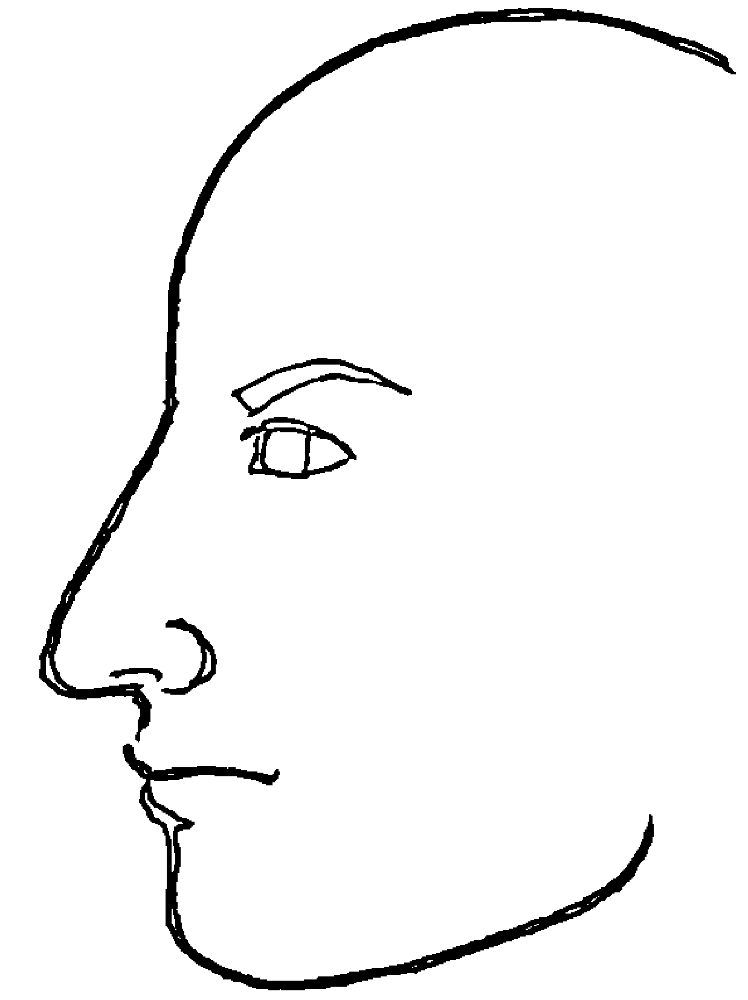

### (三) 鼻不高財山不靈、眼不深畫淵不清

很多成功的人，除了後天的努力外，先天的面相當中，其實已經隱含成功要素，只是一般人很少察覺，但還是有蛛絲馬跡可尋，其中最難說明的，就是靈氣了。鼻子高挺的人，大家都很好觀察判斷，但此時絕對不可以忽略眼睛，因為眼睛的好壞，有著絕對的影響力。通常眼睛要「眼深神清」，才算得上是好相，可以與鼻子做搭配，所謂眼深並不是指眼框凹陷，而是說眼睛不浮露，眼神非常的安定，不會東瞄西飄的，表示專注的模樣。而神清就是眼睛黑白分明，而且有著上眼波跟下眼肚，把眼睛給包圍起來，還不能有血絲出現，造成眼睛的混濁，這樣的話，才有成功的機會，以及良好的運氣。

### (三) 鼻無權骨缺援助、人過中年親友少

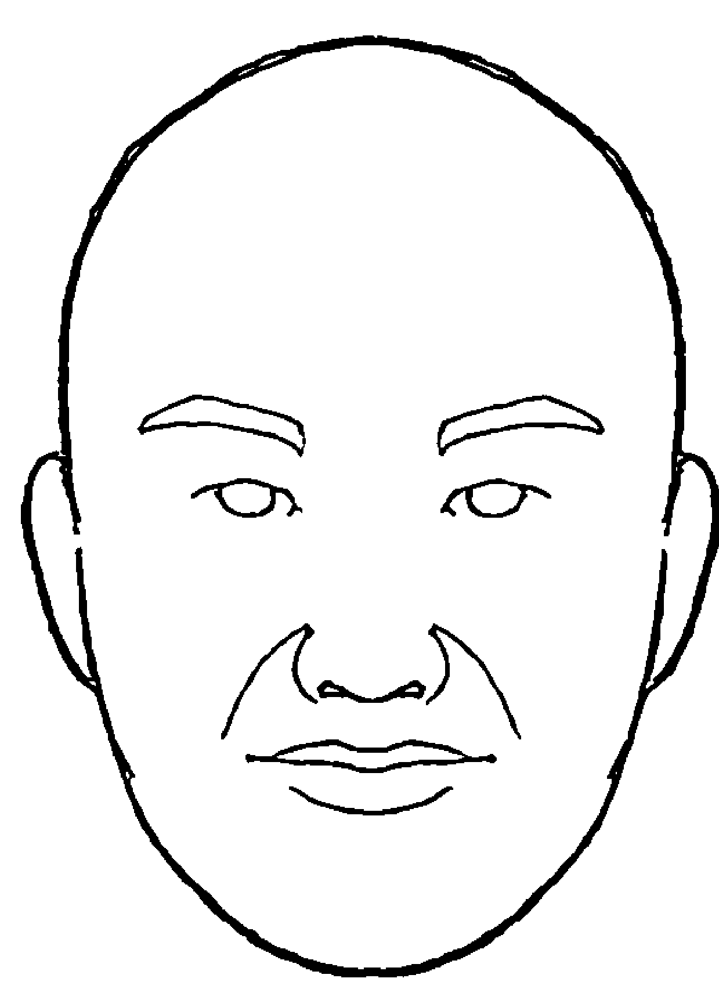

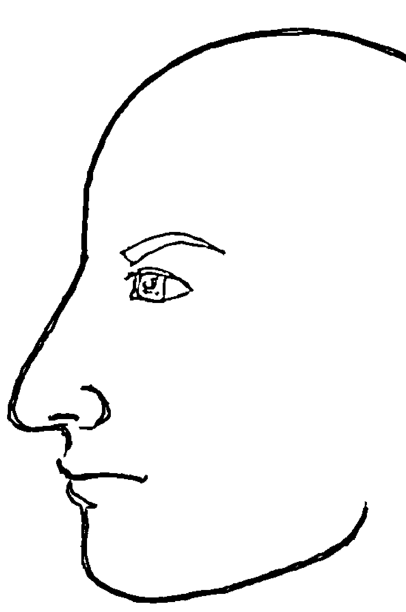

鼻子是五官的中心，可以用高山來比喻，但是要顴骨配合，才能夠發揮作用，若是顴骨不起低陷，則表示沒有人幫助，若其面相又狹窄，沒有什麼肉包覆，叫做「孤峰獨聳」，那麼為人就容易孤僻，經常陷入困境中，但就是沒有援助，人過了中年後，情況更加明顯，有時還可能眾叛親離，兄弟朋友間反目成仇，原因是這種人太自我中心，不顧他人的感受，所以人際關係差，事業財運沒貴人，運勢當然就不好。

### （四）鼻樑無骨主愚痴、鼻樑不平出身低

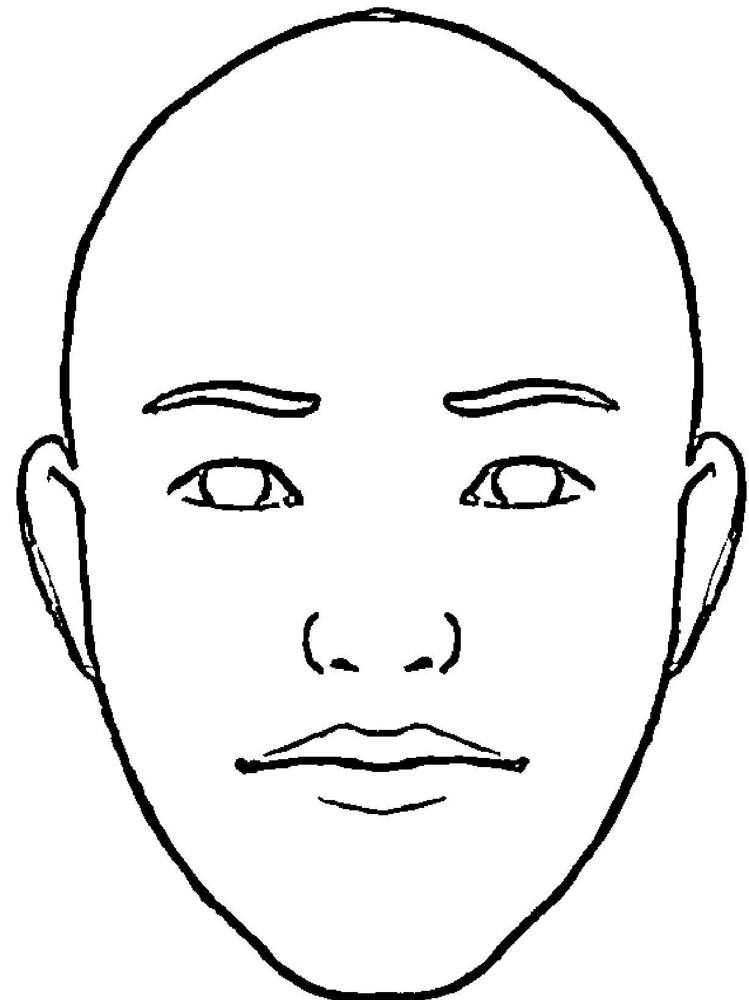

扁平無骨的鼻子，是很不好的面相，如果其他的部位，若還算長得不錯，那麼運勢勉強保持安穩，若是其他五官長得不佳，那麼很可能運勢就容易起伏人生將陷入低潮當中，而遭遇許多的波折，特別是鼻子為事業基礎，如果又歪斜不正，或是凹凸不平，那麼表示家境有問題，出身會比較低，接受教育機會少，將來也不容易出人頭地。

### （三）鼻有横纹憂鬱多、狹小低平有宿疾

若鼻子上面有横纹，那麼表示常遭遇困難，或是難以解決的問題，所以心情經常不開朗，而顯得非常憂鬱，若鼻頭和鼻翼長得不佳，或是下垂的話，那麼將會影響到中晚年運勢，財務狀況不理想，而且沒任何依靠。

又鼻子是肺之苗，若鼻子太过于狹小低平，就表示肺部器官較差，若又有黑氣出現鼻子，那麼就代表為人有宿疾，而且很難去治療的。

### （四）鼻子仰露自制差、财迷心窍惹祸端

鼻孔仰露的人，表示為人自制力較差，很容易遭受誘惑，像是女色或財務，經常因此招惹禍端，引起不必要的麻煩，與這種人交朋友，就很容易被拖累，必須要特別注意。而鼻子歪斜的話，為人就不正，較缺乏正直義氣，若歪偏向左邊，就是跟父親無緣，若歪斜偏向右邊，就是跟母親無緣。

另外鼻子可跟嘴巴配合觀看，若是鼻大口小的話，多半是前半生富裕，不懂自我收斂，但是後半生阻礙較多，要懂得保守行事，生活才不困頓。

# 四、耳朵

### (一) 耳朵看聰明才智

在五行裡面的話，水代表著冬季，五官以耳朵為主，又代表著腎臟，一般來說，冬天時萬物都收藏潛伏，所以耳朵通常不怕冷。耳朵在五官的部位中，扮演著平衡頸部的角色，與腎臟是相通的，所以觀看病人時，必須先看耳朵氣色，來決定病情的嚴重性。

### (二) 耳朵生毫歲數高、耳無輪廓欠科名

人的頭部必須靠耳朵平衡，才能夠穩定住運勢，因為耳朵是城門通道，是重要的門戶，要能夠通達，就是耳孔要大，若耳朵內出現毫毛，則表示身體健康，能獲得高壽。低，也可以從耳朵推斷，耳朵若長得好，那麼為人上也較聰明機智，而耳形不好的人也許看似聰明，實則內心奸詐狡猾。

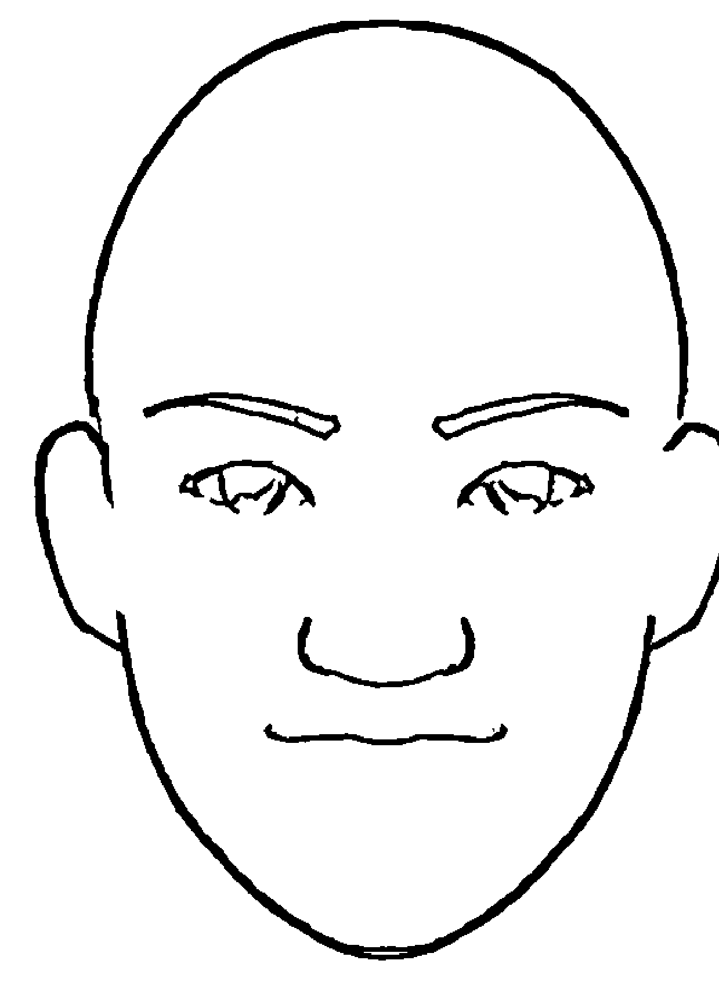

### ((三) 耳如刀環早得名、耳輪貼肉好佈施

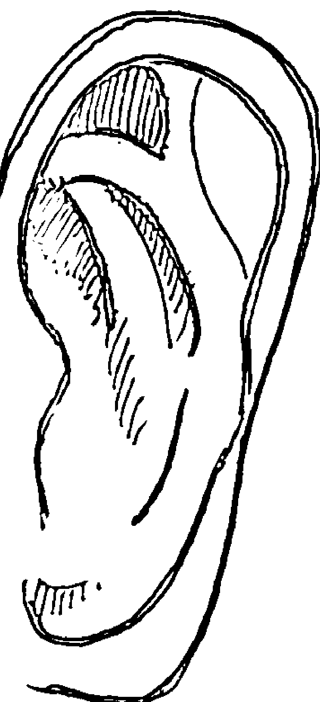

耳朵耳輪的位置，最忌諱是反露的，或是沒有輪廓，那麼就有不良影響，個人考試讀書不順利，較沒有機會往上爬，教育程度不高，只能做勞力的工作，所以耳朵也象徵福氣。若是耳孔太小，表示機智反應差，健康情況不好，又耳朵尖的人，凡事將多辛勞，付出卻無法享受，事業打拚很艱苦。兩隻耳朵一大一小，同樣也是命運起伏，不容易獲得成功，這是因為個性反覆，際遇較差的結果。

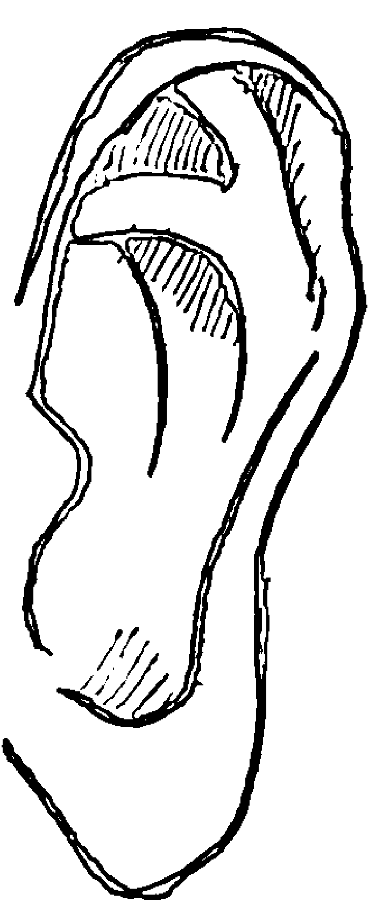

耳朵輪廓明顯，長得非常良好，就好像刀環似，那麼表示有貴人幫助，很早就出名，享受他人稱讚。而耳朵長得厚大，表示從小從聰明過人，資質天份很高，能在優渥環境，接受良好教育，所以基礎穩固，將來較容易成功。耳朵的部分，如果緊貼著腦後，就叫做「貼腦耳」，表示為人心地善良，喜歡樂善好施，人際關係還不錯。若耳朵出現缺損，個性就比較怪異，很難去跟人接近，險阻自然就很多。另外還有種叫「開花耳」、「輪飛廓反」，是很差的耳相，表示家境困頓，而得不到支持，出外遭遇阻礙，導致個性偏差，生活很難幸福。

### (四) 頭大耳小體弱多病、青色現耳職位不保

按照比例的原則，頭大的人，耳朵也要大，這樣才算是正常，若是頭大耳小的話，這樣就不太正常，從小會體弱多病，經常讓家人擔心。而命門位於耳門前方，若這裡有痣的話，表示身體健康、才智過人，而且能夠長壽。若是痣長在耳朵上，表示懂得孝順父母，對朋友講求信義。

耳朵上若出現青色氣色，那麼最近工作運勢要注意，很可能突發狀況，而導致工作職位不保。天輪在耳朵最上端，若位置比眉毛要高，則表示個性樂觀、聰明機靈。

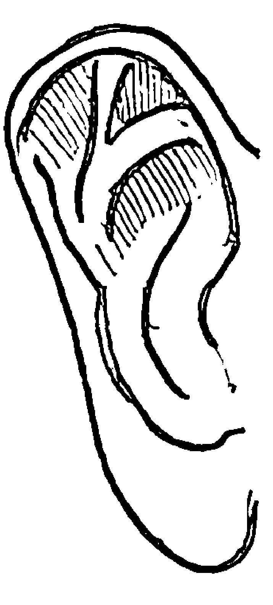

# 201 贰：照膽經面相五官論述

### (五) 天城有痣掌權貴、耳朵薄弱賣田產

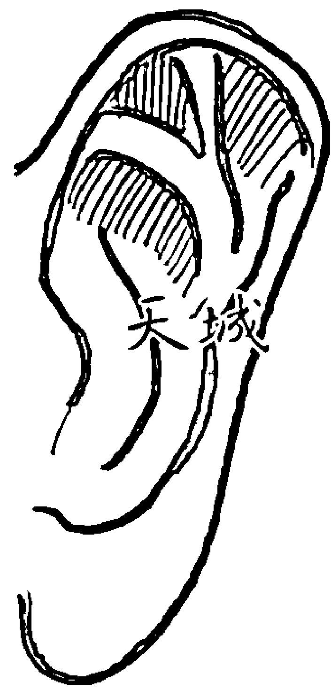

天城在耳朵輪廓內，如果有痣隱藏在這，則表示適合從事政治、商業，將可以獲得成就，掌握權勢而成為領導階層。耳根的位置在耳背底端，若是出現黑痣或青黑粗皮，表示家業不守，必須遠走他方，謀求經濟生活。若耳朵長得單薄，沒有什麼肉，或者不結實，顯得軟弱無力的話，表示財運不佳，無法繼承祖業，還可能變賣田產，藉此來維持生活。

### (六) 耳下白氣災病至、耳比面白色氣響

肥胖的人五行屬水，若是耳朵下面氣色泛白，那麼就代表有災難將發生，或是有疾病要產生，而耳朵出現黑青氣色，則表示睡眠不佳，精神會出現問題。至於耳朵的顏色，比面相要白的話，表示為人相當聰明，善於思考規劃，只要其他五官能配合，就有環境與貴人相助，很早就能夠成功，而且名氣非常響亮，若下額地閣飽滿，到老都還有盛名可享。

### (七) 看耳朵先重氣色、耳高於眉無貧窮

觀看耳朵的時候，首先要重視氣色，就是耳朵的色澤如何？色澤好表示運氣佳，而且能得到助力，色澤不好表示運氣差，而且有災病降臨。而耳朵最好的顏色，其實是潤白色，潤白是白裡透紅，而不是灰白色或粉白色，那麼運氣就不算好，這是必須注意的。再者，耳朵生長的位置，如果比眉要高一點，那麼代表家庭基礎好，際遇要比別人幸運，生活沒有困苦貧窮，很快就能獲得成功。

### (八) 耳朝大海獲富貴、耳骨曲節無智慧

兩隻耳朵的下方耳垂，如果圓潤有肉，像是耳珠一樣，在相學裡叫做「明珠朝海」，表示為人非常有福氣，能夠獲得富貴榮華，特別是晚年的時候，但首要的條件是耳輪要明顯，耳孔要圓大，加上垂長的耳珠，這樣才算是好相。而耳朵若細小，而且耳骨彎曲有節，則表示出身較低下，缺乏良好教育，通常是沒智慧及眼光的人。

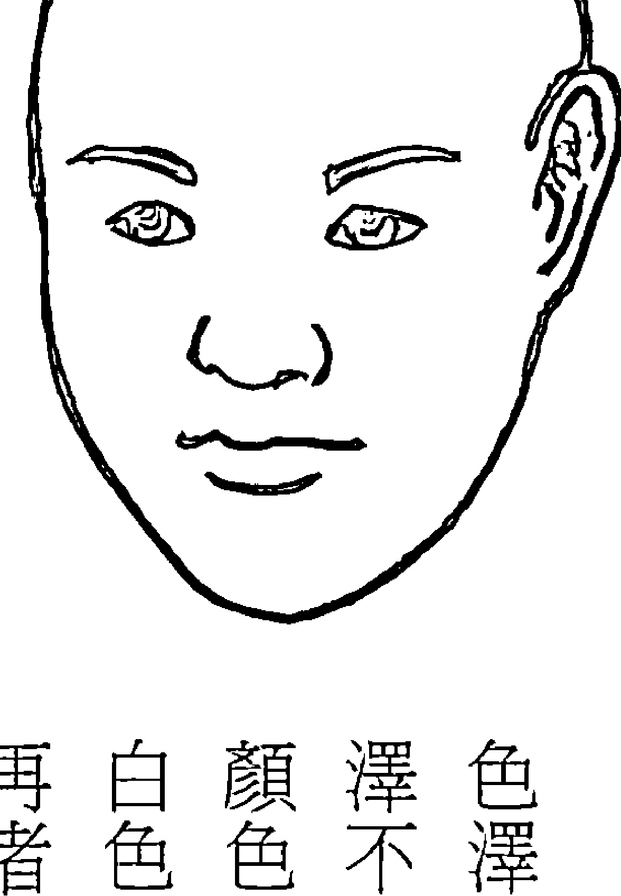

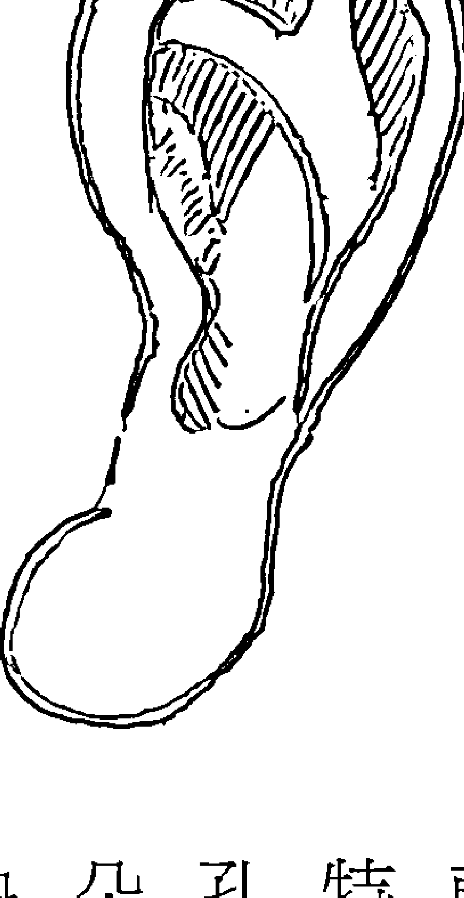

### (九) 女人耳尖無積蓄、福堂黑痣遭人害

女人若是耳朵削尖，代表財運不怎麼理想，開創能力比較弱，也沒辦法蓄積財富，經常為金錢所苦。耳朵的耳廓反凸，表示做事情遭遇阻礙，很難去有所發揮，若是耳廓內反往內縮，像是沒耳朵一樣，表示理財能力差，沒有任何財產可言，生活相當的拮据。而耳朵上方的耳輪，就是福堂的位置，若是有黑痣出現，表示暗地裡遭人陷害，有扯後腿的現象，必須要謹慎預防。

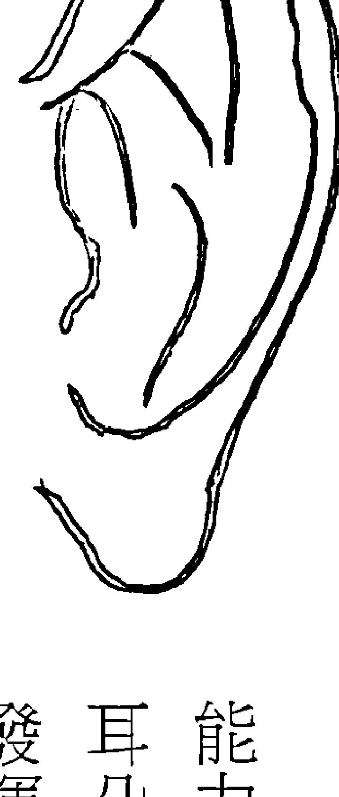

### (七) 耳朵如鼠凶險多、耳朵反耳敗祖業

耳朵像是老鼠一樣，這是很不好的耳相，表示其人多災多難，經常有凶險的情況，但因為心機狡詐，懂得去化險為夷，所以有時能度過危機，天生是個投機份子，專門走偏門生意，或從事不法勾當，若是鼠耳尖薄無肉，生活將陷入緊張，心神將無法平靜。

耳朵反耳的話，又叫做「兜風耳」，這樣的耳相情況，表示其人見識有限、智慧淺薄，經營家中產業，將有可能會敗光，中年時將非常艱辛。

此外耳朵耳門外若有三條線，這就是華蓋紋，華蓋象徵才藝，資質較高，可以從事學術工作，將能有所發揮，成為本業的佼佼者。

### (八) 神光青色父母災、雙耳赤氣有意外

神光的位置在奸門跟天倉之間的眼尾上方，若是出現青色氣色，延伸至左右耳，那麼父母親就可能會有多難。而耳朵上頭為福堂，下巴為地閣，食倉為嘴上下之肉，這三個地方來說，同樣也忌諱黑氣，表示將有災禍降臨，必須要特別注意。而青色若是從耳朵延伸至鼻樑的壽上，這種現象叫做「垂闊」，表示身邊的六親，近日的運勢不佳，容易有問題產生。而耳朵出現赤色，出門時要注意安全，預防交通意外的發生。

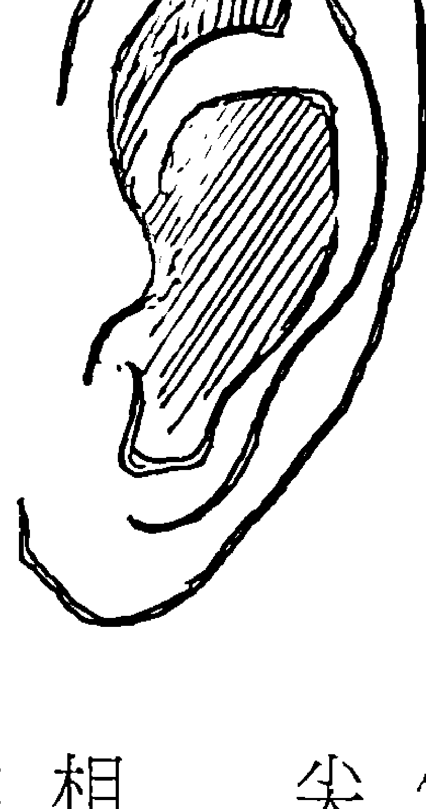

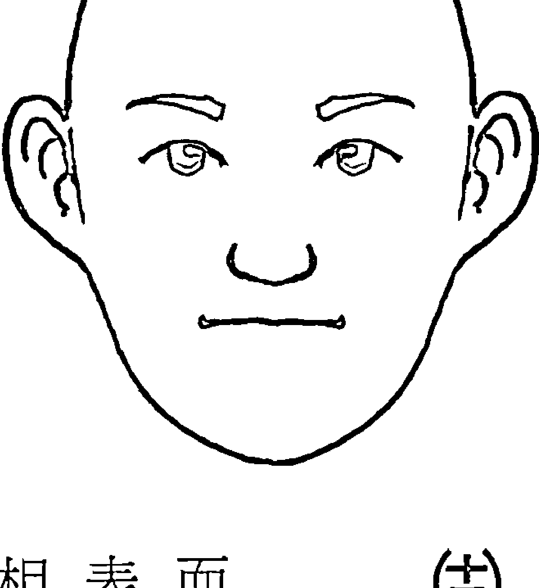

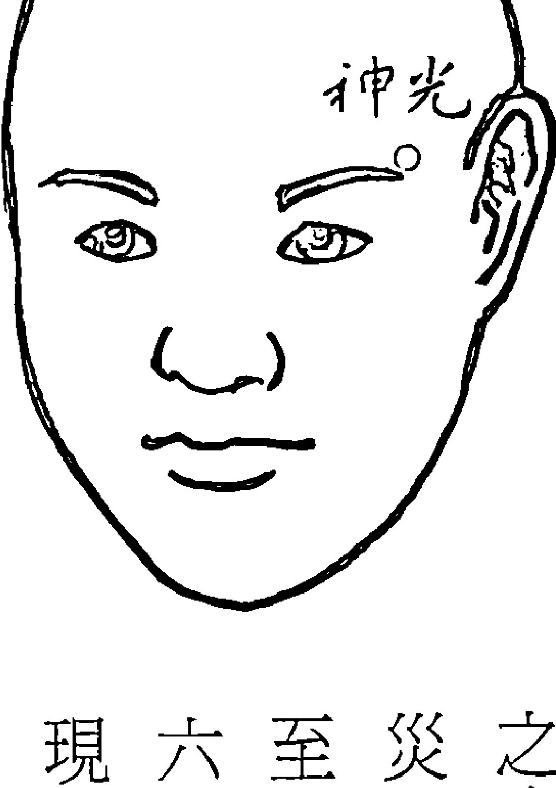

### (三) 耳大不收是無知

耳朵形狀若很大，通常會視為好相，但若是大而無當，就是輪廓不明顯，或是耳朵不收的情況，就表示為人智慧較低，判斷能力較欠佳，反而不能算好相，耳朵就應該要小，而不能夠過大了。

# 五、人中

### （一）人中觀看誠信及最後結果

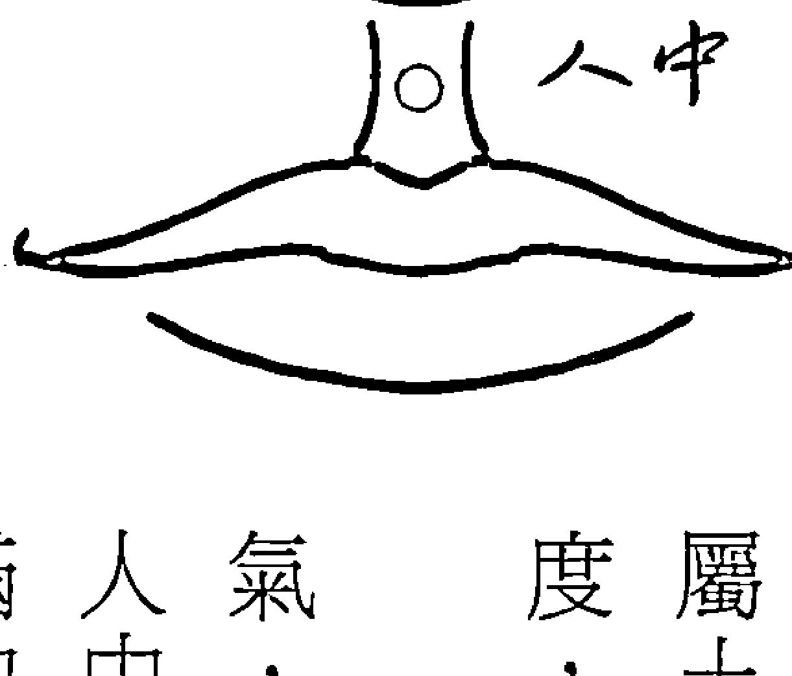

人中的位置在鼻子下方，接近中央的部位，五行上來說屬土，也代表著脾臟健康好壞，而且還可以觀看人的誠信度，以及各方面努力的結果。

人中為四渾之全，就是四水流通之地，必須要能夠聚氣，並且要連接口鼻，所以應該要深明如水滴般才好，所以人中只適合深，不適合太淺，太淺的話容易破財，人中若平滿的話，表示子女運不佳，為子女操心勞累。而人中氣色方面，若是出現赤紅色，表示會有口舌是非，遭受到他人陷害，或是去攻訐別人。

而人中歪曲不正，表示心有邪念，而貪圖愛戀，充滿著慾望。人中若出現橫紋，表示個性反覆無常，很難去相處溝通，不適合交做朋友，很容易就被拖累。人中若是出現交叉紋，戲水要注意安全，否則將發生溺水事件。

### （二）人中白氣傷心事、人中短小子孫夭

人中的氣色來講，最忌諱白色入侵，表示近日運勢不佳，將發生傷心難過的事情，必須要加以提防。而人中的長度，盡量較長些，而不要過短，不然象徵子女或子孫短壽，很容易就夭折，人中中間肉高起肉厚，導致看不到人中，這樣表示其人的壽命不長，人中平滿又長的人，雖然健康長壽，但子女運較弱，不是沒有子女，就是子女沒出息，無法有很高成就。

### （三）人中分明運勢強、人中有痣將難產

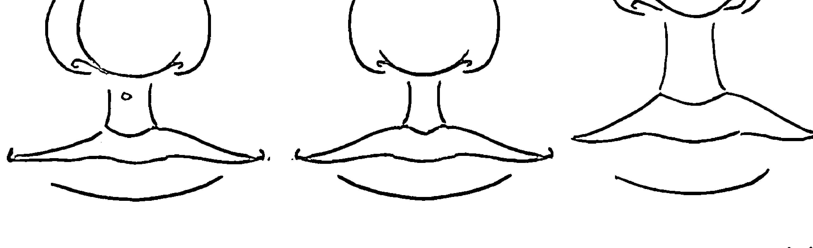

有些人的人中，看起來就別明顯，代表運勢非常旺盛，能有不錯的際遇，像是當紅的藝人，有很多就是如此，這是因為四水相通的緣故。因此除了印堂，人中是第二個重要部位，若說印堂把氣對外顯現，那麼人中無疑就是收納氣，兩個位置都長得好的人，人生就比較幸運，容易接近貴人，獲得名利地位，就像是如魚得水。

此外人中分明，也象徵個性正直無私，不會貪圖小利，而忽略了信義，可以得到他人尊敬。人中不適合有紋路，特別是懸針的直紋，這樣表示子女運差，親子關係不好，對自己不太孝順。若人中出現紫色，表示財運亨通，能發意外之財，若人中出現青白色，人際將可能失和，甚至于是非纏身，若是出現黑氣，則表示生活困頓，經濟出現問題。

人中也是反映女性生育情況，若黑痣長在人中上，表示生產不順利，有難產的可能，最好是加以預防，晚年的時候，跟子女關係將變化，彼此會比較疏遠。人的形狀來說，如果像水滴狀，表示為人精打細算，頭腦靈活，想法不簡單，能按部就班，完成想要的計劃，而且身體健康且長壽，一生運氣都很順遂，很少會遭遇到阻礙。

### (四) 人中黑痣恐養子

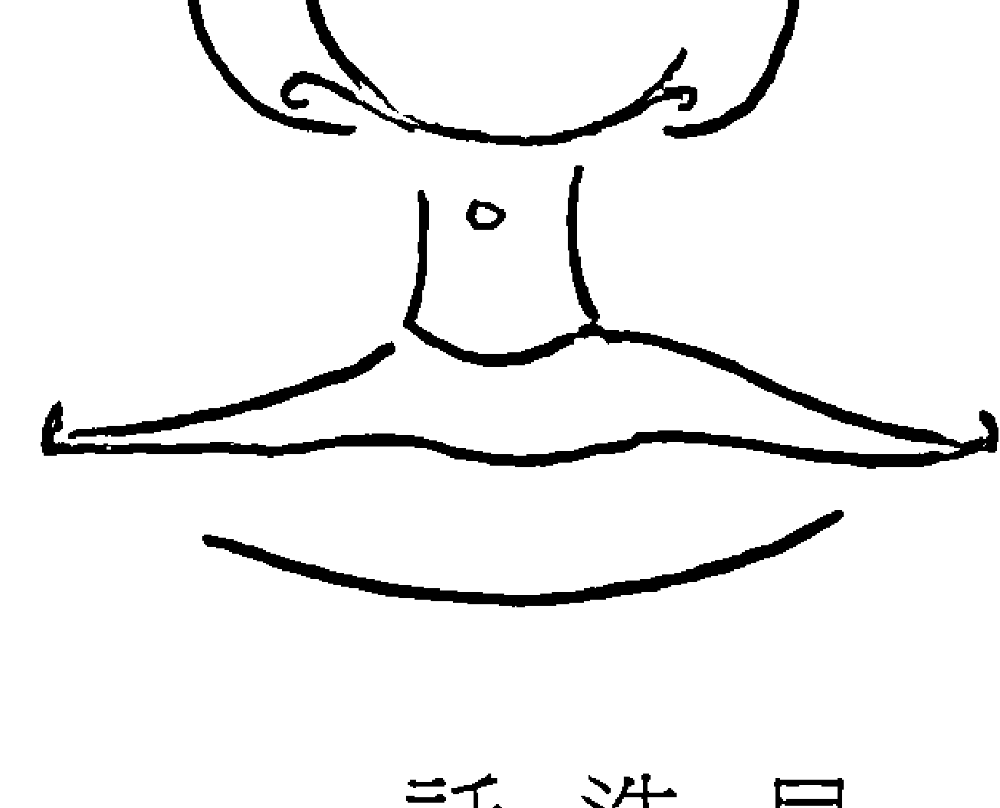

人中若有黑痣，按照相書的說法，本來應該子女運差，早年子女問題多多，自己要操心勞累，或是被子女給拖累，造成老年的困頓，但如果收養他人子女，而並非自己親生的話，就有機會高枕無憂，安享晚年。

# 六、眉毛

### (一) 堯眉八彩、舜目重瞳

眉毛八彩的意思，並非眉毛真有八種顏色，而是一種形容詞，說明眉毛的色澤好壞，長得比較好的眉毛，通常比較烏黑發亮，所以叫做堯眉八彩。而舜目重瞳，就是說人眼睛有兩個瞳孔，表示腦筋聰明、智力過人的意思，這兩種相貌來說，都是不錯的好相。

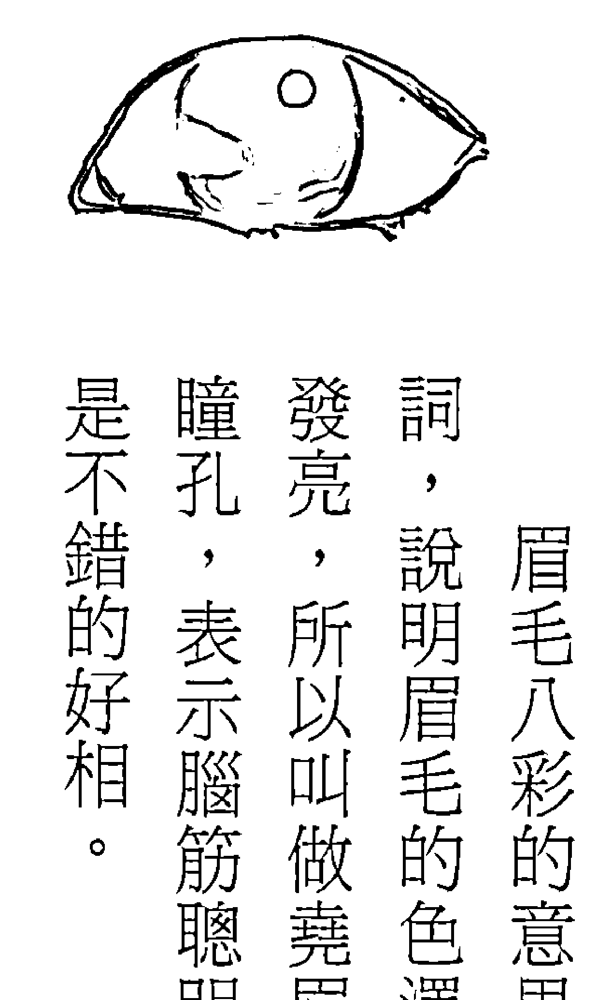

### (二) 眉長過目智力高、眉露稜骨性暴躁

就眉的貴相來說，是兩邊眉毛位置一致，而且眉毛整齊，沒有雜亂逆毛，算是較好的眉毛。而眉毛若比眼睛長，覆蓋著眼睛一般，通常表示其人智力較高，做事情懂規劃，不會太衝動。而眉毛之間，若出現亮黃氣色，通常表示好運到，來近日將有喜事發生。

眉毛的眉稜骨，如果露出來的話，表示個性剛強，喜歡逞凶鬥狠，容易與人衝突，發生是非糾紛，恐怕遭人報復，導致生命危險，而短壽就夭亡。

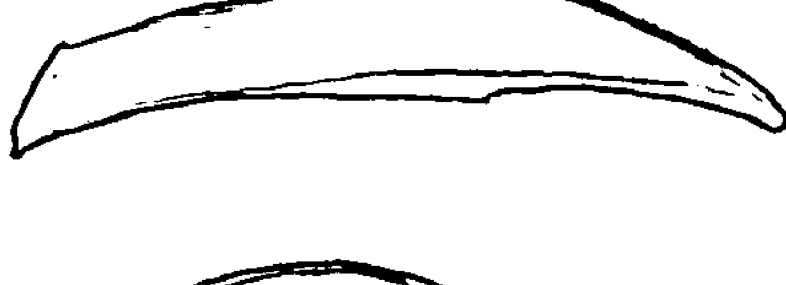

### (三) 眉似柳葉學識豐、眉如直刀膽識佳

眉毛彎彎像柳葉般，表示個人喜歡閱讀、學識豐富，也具有藝術天份，適合從事文職工作，會有很好的前途。而眉毛像橫刀般呈現，表示具有英雄氣概，膽識比別人要大，但脾氣太過直接，有時不懂得委婉，容易傷到身邊的人，但自己卻無法察覺。眉毛如陣雲的話，就是眉毛粗闊，像雲重疊模樣，通常會四處謀生，名聲能夠響亮，從事武職工作，像是警察或軍人，不然就是體育或武術選手。

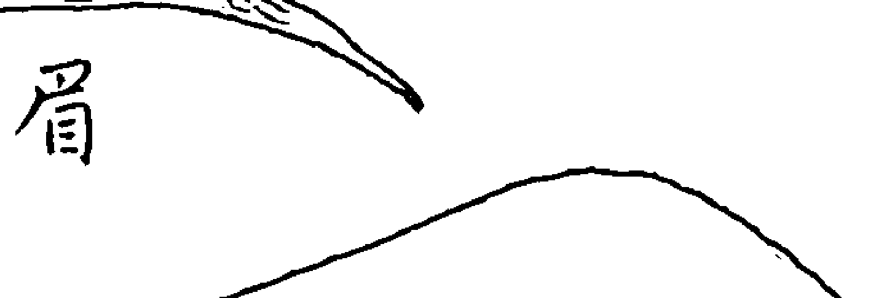

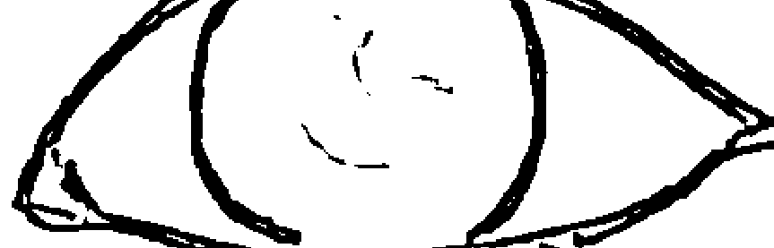

### (四) 眉毛稀疏貧窮運、眉毛過長多憂煩

眉毛的形狀稀疏，像是沒有毛般，雜亂又不整齊，還有破碎的話，就算是獲得財富，一時間生活優渥，但是終究守不住，到頭來運勢下滑，會有貧窮的可能。而女性眉頭有縱紋垂生，表示夫妻緣薄，配偶運勢不佳，三、四十歲時，就有破財現象，家庭婚姻不和。

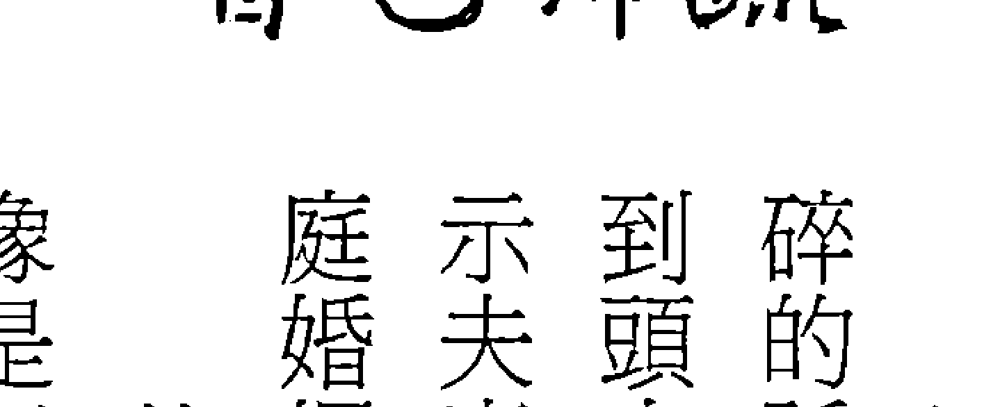

就眉毛的長度來說，當然長會比較好，但如果太過長的話，像是延伸至鬢角，那麼就不算是好相，這樣表示心裡長有不滿，有較多物質慾望，而且脾氣剛愎自用，不與人商量妥協，很容易因此出事。而眉毛粗濃的人，內心常有疑慮，有鑽牛角尖的現象，嚴重時憂鬱成性，恐怕因此想不開，影響身心的健康。

### (五) 眉過眼角兄弟多、眉毛破碎少和睦

眉毛如果長過眼角，表示兄弟姊妹較多，出外交朋友也不少。而眉毛尾端不聚，像是掃把散開，眉頭尖眉尾破碎，表示雖然有兄弟姊妹，或是出外有朋友，但大多相處失和，並不是說很融洽，而這樣相貌的人，也容易產下女兒，兒子就會比較少。

### （六）眉比目短感情淺，縱有親朋也孤獨

沒有過目的眉毛，就是眉毛比眼睛短，表示其親緣淡薄，跟家人互動少，感情不深厚，也無法燃起熱情，對人態度總是冷冰冰的，人際關係當然差。而且無法獲得親人助力，做事情需要靠自己，而會顯得較為辛勞。

### （七）眉有三紋女在嫁、男八字眉外風流

八字眉的人，情場上比較風流，對感情跟婚姻來說，自然會有不良影響，破壞情侶或夫妻間的和諧，至於眉毛裡有三紋，就是眉毛像被劃破一樣，那麼感情一定會出問題，女性的話，恐怕會離婚再嫁，特別是三十到四十歲的期間，要預防外遇或離異。

### (八) 眉心赤氣妻出事、近日桃花鬧糾紛

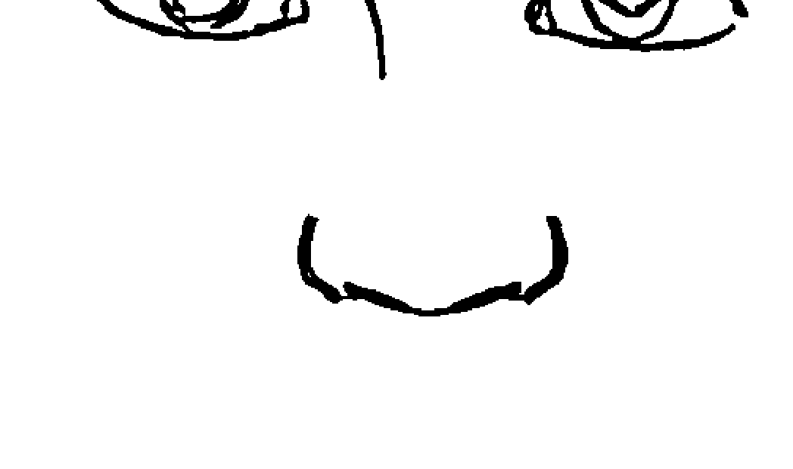

男性兩眉的眉心，如果有赤氣出現，而且散佈於眼蓋，那麼妻子最近要注意，出外恐有意外發生，而女性的話，則表示有桃花事件，或是色情災禍，讓感情婚姻失和，但卻很難去解決。

### (九) 眉毛左右都有旋、為人愛勾心鬥角

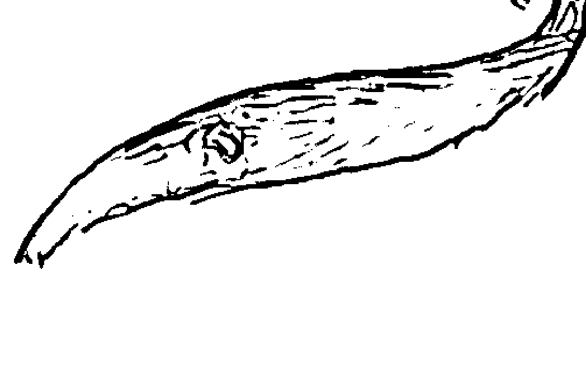

左右的眉毛尾端，如果出現旋轉情況，是說其人愛掌握權勢，因為旋眉的人心機深沉，喜歡去算計別人，所以會勾心鬥角，為了權勢及利益打滾，雖然暫時擁有名利，但很快就會失勢，遭受他人的清算，而災禍馬上降臨，尤其是眼相凶惡的人，情況將更加嚴重，眼相吉祥的人，情況稍微能減輕。

## （一）粗濃眉勇武健壯、眉鎖印福祿全無

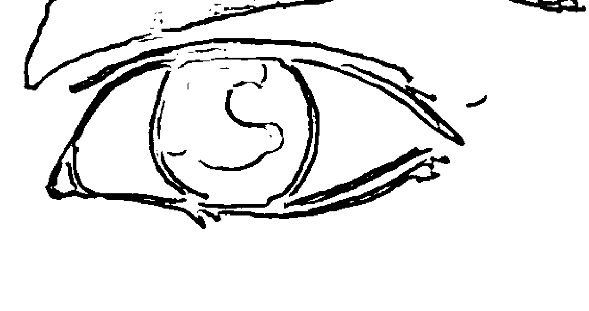

眉毛如果粗濃，而且向眼睛壓迫，代表其人個性豪爽、身體強健，但是缺乏智慧，是有勇無謀的人，多半是勞動階層，或是教育較低的人。而讀書的文人，多半是屬於柳葉眉，或是眉如新月，表示學識豐富，文章顯達，擁有許多的才華。

若是眉毛相連，像是鎖住印堂般，即是常說的鎖眉，這樣的話，運勢將不會開展，做任何事都不成，因此福祿會較少，甚至於無法獲得，再者，連眉的人，脾氣較古怪，且吝嗇小氣，若是眼相不佳，很可能會淪為偷盜，或是流氓之徒。

## （二）皺眉頭招引禍端、印堂亂紋破家煞

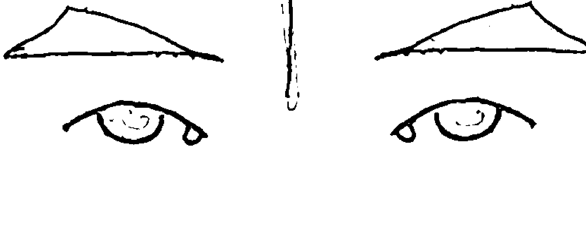

眉毛若長期皺眉頭，運勢將逐漸下降，象徵個人得失心太重，而且相當的執著，若又出現了痕紋，那麼隨著痕紋明顯，不良影響也更嚴重，若是深入到印堂，就可以招來禍端，相書俗稱「破家煞」，是滿嚴重的情況，應該要儘量開口常開，而不是整天郁郁寡歡。

## （三）眉中有直纹好赌博、眉心纹惹官非

眉中有直紋，就是兩眉中央處，印堂有直紋向上，這叫做「懸針紋」，是破運的惡紋，有些人天生就有，有些人是後天出現，特別是愛賭博或是酗酒的人，往往都有這種面相，象徵一生當中會出現災難，甚至於有生命危險，最好是信仰宗教，才能度過危機。

而眉心的地方，如果有紋路像水字，則表示易犯官非小人，也代表思想混亂，判斷力較差，容易因此做錯事，而走上不歸路。所以眉心印堂，是除了眼外，第二重要的地方，應該要光潔無痕，沒有任何惡痣、疤痕，都會影響到命運，必須要特別注意。

## （三）眉毛倒生多是非、眉毛缺損無誠信

眉毛生得很柔順，稍微彎曲的話，像是畫一樣美，這是貴氣的表現，表示容易遭遇貴人，境遇會比較平順，擁有不錯的財運。

若是眉稜骨生得較高，這叫做「久骨」，表示意志力強韌，很有衝勁跟魄力，但是由於太剛強，行事上不夠圓滑，有時會招來忌妒及小人。

## （四）眉毛如畫得財利、眉骨高聳魄力強

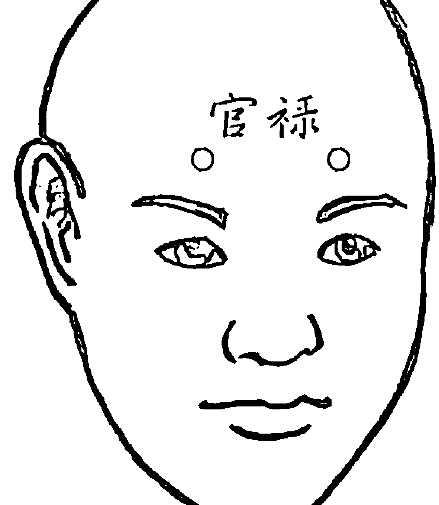

## （㉗）眉稜骨開闊光潤、一生官祿享不盡

眉毛中間的上方之處，是官祿宮的位置，如果開闊的話，配合濃密的眉毛，及高聳的眉稜骨，則表示事業如意、工作順遂，可以升遷到高位，進而掌握權勢，並且有人在提拔。但是在三十到三十五歲之間，必須要預防災厄發生，因為眉是與額交接的地方，由少年運轉入壯年運，濃密的眉毛會形成阻塞，讓運氣無法進展，所以代表少年運有較差的情況，所以高明的看相者，會先觀察眉毛，才來判斷額頭，看額頭先觀耳等方式。

## （㉘）眉心如雲霧起者、恐難逃牢獄之災

如果眉心的地方，有赤紅色的現象，而且像雲霧一樣，那麼要注意官非，不然將有牢獄之災，而眉毛

## （七）兩邊眉毛尾淡薄、親朋好友感情淡

兩旁處為驛馬，代表出外的運勢，氣色若是發青，就不適合行動，應該要暫緩遠行，否則將有阻礙，或遺失財物的情況。

## （六）眉粗厚重運勢滯、鬢角過長也妨礙

眉毛跟鬢角的關係，相書常說：「眉為山、鬢為林」，形容兩者的關係密切。如果眉毛或鬢角，太過粗濃、密不通風，表示為人俗氣，缺乏智慧，行為愚魯，所以運勢停滯，無法有所開展，但若從事武職，或許能有建樹，獲得相當的成就。

## 面相高階心法

## 十三系橫列部位

天系 2 3 4 5 6 7 8 9 10  
天庭系 2 3 4 5 6 7 8 9 10  
司空系 2 3 4 5 6 7 8 9 10  
中正系 2 3 4 5 6 7 8 9 10  
印堂系 2 3 4 5 6 7 8 9 10  
山根系 2 4 5 6 7 8 9 10  
年上系 3 4 5 6 7 8 9 10 11 12  
寿上系 3 4 5 6 7 8 9 10 11  
准頭系 2 3 4 5 6 7 8 9 10  
人中系 2 3 4 5 6 7 8 9 10  
正口系 2 3 4 5 6 7 8 9 10  
承漿系 2 3 4 5 6 7 8 9 10  
地閣系 2 3 4 5 6 7 8 9 10  

## 天中系

1 天中  
2 天狱  
3 左(右)厢  
4 內府  
5 高廣  
6 尺陽  
7 武庫  
8 軍門  
9 辅角  
10 地边  

## 一、天中系白話解說

## 一、什麽是天中？

在髮際的正中間，是代表財富、地位的部位。在外觀方面，若是有高凸隆起的話，表示能夠少年發達、擁有權勢、地位，若此處骨頭明顯突起像是浮筋一樣，表示位高權重，可以當上高官顯要，若是缺陷的話，那麼將有官非訴訟、牢獄之災。在氣色方面，若是黃潤明亮，光滑無傷，哪麼一生就無官非訴訟。若是此處有缺陷、疤痕，哪麼容易刑剋父母，與父母親較無緣，親子關係不理想。髮際、鬢毛整齊、配合寬廣的額相，天中就可以發揮作用。

## 二、什麽是天嶽？

天嶽又叫做「送嶽」，在天中的兩旁，代表官司、訴訟、牢獄、刑罰等，若是表面平整有光澤，哪麼就平安無事，若是有缺陷、疤痕，哪麼就容易觸犯刑罰，有牢獄之災。

## 三、什麽是左厢(右厢)？

在天中的左邊叫左厢，右邊就叫右厢，代表讀書、功名，若是平整有光澤，通常能少年得志，獲得名聲，若有骨頭隆起，哪麼地位更加顯赫，若是有缺陷、疤痕，表示多災多難，容易有意外災禍發生。

## 四、什麽是內府？

內府的位置代表財富、財物，若是平整有光澤，哪麼通常財源穩定、衣食無缺，而且家庭和樂、親子感情良好，但若是有缺陷、疤痕，哪麼容易經濟拮据、生活困頓，且家境清寒、六親無依靠。若是有骨頭隆起，哪麼表示能掌握權勢，從事武職方面的行業。

## 五、什麽是高廣？

高廣代表直覺、第六感，與親人之間的感情，若是有骨頭隆起，色澤黃潤明亮，表示能夠大富大貴、出人頭地，若是有缺陷、疤痕，哪麼容易刑剋父母，與父母無緣，感情較不融洽。

## 六、什麽是尺陽？

尺陽表示官位、職權，若是有骨肉豐隆，表示很早就能擔任要職，事業一帆風順，有相當的職權，可以得父母及貴人庇祐，但若是有缺陷、疤痕，恐怕有意外疾厄，客死他鄉。

## 七、什麽是武庫？

武庫代表軍職、警職、武職，若骨肉隆起的話，表示能夠迅速升遷，掌握實權，獲得長官上級的欣賞與重用，若是有缺陷、疤痕，哪麼就不適合擔任軍職、武職，很容易因為爭鬥，而受到傷害，甚至於送命。

## 八、什麽是軍門？

軍門代表軍職、警職、武職，作用與武庫相同，若是骨肉飽滿、色澤明亮，哪麼就表示能掌握大權，得到長官上級的器重，有利於長久的發展，若是有缺陷、疤痕，就應該儘早放棄，不要從事軍職、武職。

## 九、什麽是輔角？

輔角代表官位、職權，可擔任輔助職務，若是骨肉飽滿，色澤明亮，哪麼表示能擔任要職，到異鄉外地發展，若是有缺陷、疤痕，色澤昏暗，哪麼官運不順，恐丟官失職，難以升遷。

## 十、什麽是邊城？

邊城代表異鄉外地的發展、職位、遠行的好壞，若是骨肉豐隆，且有刀劍紋路顯現，哪麼適合擔任武職，將能夠加官晉爵，仕途順利，若是有缺陷、疤痕，哪麼就反而成為勞力階級，為人所管理驅使，另外不適合遠行出遊，或是到外地發展，恐怕會損財或傷亡。

## 司空系

1 司空  
2 頭角  
3 上卿  
4 少府  
5 交友  
6 道中  
7 頭交  
8 眉重  
9 山林  
10 賢隱  

## 三、司空系白話解說

## 一、什麽是司空？

司空在天庭的下方，代表官位、權勢、財祿，若是骨肉豐隆、色澤光亮，表示地位顯赫、享有權貴，事業很快就能發達，獲得相當的成就，反之，若有缺陷、疤痕，表示能力平庸，為人作嫁、勞心勞力，所得有限。若是氣色呈現黑色，表示運勢不佳，注意橫禍、凶死，若是呈現赤色，表示健康不佳、注意疾厄纏身。

## 二、什麽是額角？

額角代表貴氣、喜慶，若是骨肉豐隆、氣色呈現微紅或黃潤，表示能獲得地位、名聲，遭遇值得喜慶的事情，若是氣色呈現黑色、赤色，表示運氣不佳，要突發意外，尤其是刀械爭鬥。

## 三、什麽是上卿？

上卿代表富貴榮華，若骨肉豐隆、色澤光滑，表示鴻運當頭，能享受福氣，做什麼都容易發達成就，若是缺陷、疤痕，或是氣色不佳，表示奔波勞碌、一事無成，並容易遭遇災厄。

## 四、什麽是少府？

少府代表倉庫、食祿的事宜，若是骨肉豐隆、色澤飽滿黃潤，表示家中富貴、食祿不缺，事業上能獲得提拔、升遷，並有額外的財富進帳，若是缺陷、疤痕，或是氣色不佳，恐怕事業遭受彈劾、丟官失職，並損失不小的钱财。

## 五、什么是交友？

交友代表朋友交往的情況，若是骨肉豐隆、色澤光亮，表示能結交益友，並得到實質幫助，反之，若缺陷、疤痕或氣色不佳，代表誤交損友，並遭受對方拖累，影響本身的聲譽。

## 六、什么是道中？

道中代表出遊、遠行的事宜，若是骨肉飽滿、色澤光亮，表示可以遠行、出遊，一路平安順事，沒有什麽阻礙，反之，若缺陷、疤痕，或有赤色、暗黑的氣色，就应该多加注意，取消遠行的計劃，否則將發生危險，很可能客死異鄉。

## 七、什么是交額？

交額代表福氣、祿位，若平滿光亮、色澤黃潤，表示一生無災、享有福祿，不需要為生活煩惱，但若缺陷、疤痕或色澤不佳，表示經濟困頓、為三餐煩惱，到老恐孤苦無依。

## 八、什么是重眉？

重眉代表勇敢、果斷的事宜，若是骨頭突起，表示小有富貴，但個性較急促暴躁，舉止會比較粗暴、反覆無常。若平整光亮，則有勇有謀，能得人敬重，若有缺陷、疤痕，氣色昏暗的話，表示愚笨無知、且地位貧賤。

## 九、什麽是山林？

山林接近鬢髮的位置，代表財富、畜牧的事宜，若有骨頭隆起，與司空相連一氣，則表示位高權重，出任高官的職務。若骨頭與邊地、驛馬相連一氣，這情況叫做「崖穴」，表示能遭遇貴人指點、提拔，對本身大有幫助。山林若開闊、氣色良好的人，表示祖上積德，享有餘蔭，易有祖業，適合從事山林漁業畜牧等行業，可以獲得相當的利益。若是缺陷、疤痕，或氣色不佳，表示出外容易有意外，特別是到山邊、海邊等等。

## 十、什麽是隱賢？

隱賢在鬢髮之內，平常較無顯露，代表隱遁、智慧，若是骨有隆起，表示閱歷廣博、頗有智慧，容易跟隱士、高人結交來往，但不喜歡出名、出風頭，會有隱遁的想法。

## 中正系

1 中正  
2 龍(虎)角  
3 虎眉  
4 牛角  
5 辅  
6 懸角  
7 斧戟  
8 華蓋  
9 福堂  
10 郊外  

## 四、中正系白話解說

## 一、什麽是中正？

中正在司空之下、印堂之上，是正面最要緊的地方，代表官位、財祿。若骨肉豐隆、色澤光亮，表示官運亨通、財帛充盈，有能有所作為。若果有龍角、虎角突起輔助，哪麼將有貴人提拔，官位平步青雲、連年升遷。

## 二、什麽是龍角（虎角）？

中正的左邊為龍角、右邊為虎角，代表權勢、地位。若是骨頭隆起、肉色飽滿，表示地位顯赫、享有名聲，並有助於掌握實權，但若缺陷、疤痕、紋亂，則表示失權，沒有地位可言。

## 三、什麽是虎眉？

虎眉代表領導、統馭的事宜，特別是軍職、武職方面，若骨肉豐隆、色澤明亮，表示有領導統馭的才能，可以擔任指揮調度的職務，並且獲得他人器重，適合往外地來發展。反之，若缺陷、疤痕、色澤不佳、灰暗的話，表示能力不足，無法擔當重任，不適合出遊遠行，恐半路發生意外。

## 四、什麽是牛角？

牛角代表權勢、貴氣，若骨頭凸起，狀似有角，哪麼必定能掌握實權，為領導的階級，適合擔任軍職、警職，或自行創業當老闆。若缺陷、疤痕，則資質平庸，發展有限。

五、什麽是輔骨？

輔骨代表權勢、貴氣，如果骨肉豐隆，有骨斜起入邊地的話，表示大權在握、地位顯貴，若無骨突起，反而凹陷，或是色澤不佳，則表示欠缺官運，也無財祿可言。

六、什麽是懸角？

懸角代表官位、財祿，如果骨頭突起如懸犀，且色澤黃潤明亮，哪麼表示權傾一方，身為達官貴人，並有人輔佐幫忙，若凹陷、疤痕，則前途不佳，莫從事官職。

七、什麽是斧戟？

斧戟代表兵權、領導統馭，若是骨頭突起如指狀，表示能成為將領，具有相當的領導能力，可以統馭眾人，特別適合從事軍職、警職，若是缺陷、疤痕，則能力較差，不適合擔任領導工作。

八、什麽是華蓋？

華蓋又叫做「厄門」，代表心思正邪、神鬼靈異之事，若骨頭有稜角突起，看似好像刀背一樣，表示心思純正、為人清廉，邪鬼將不敢接近而走避，反之，若無稜骨，且低陷的話，表示心思不正、貪財好色，官位恐將不穩。

## 九、什麼是福堂？

兩眉尾上方，就是福堂所在，代表福氣、壽命，若肉色豐隆明潤，則一生享有福氣，身體健康長壽，若是缺陷、疤痕、亂紋，就代表生活貧困、且壽命早夭亡。

## 十、什麼是郊外？

郊外代表旅行、出遊的事宜，若是色澤明亮，則出外平安、適合旅行，若是出現黑青氣色，有疤痕、亂紋的話，則外出不利，恐遭災禍，應該取消行程，否則將可能客死他鄉。

天中系 1 2 3 4 5 6 7 8 9 10  
天庭系 2 3 4 5 6 7 8 9 10  
司空系  
中正系 2 3 4 5 6 7 8 9 10  
印堂系  
山根系 2 4 5 6 7 8 9 10  
年上系 3 10 11  
壽上系 3 4 5 6 7 8 9 10 11  
準頭系  
人中系 2 3 4 5 6 7 8 9 10  
正口系 7 8 9 10  
承漿系 2 3 4 5 6 7 8 9  
地閣系  

## 印堂系

1 印堂  2 刑獄  3 蠶室  4 中林  
5 酒樽  6 神光  7 嬪門  8 劫門  
9 巷路  10 青路  

## 五、印堂系白話解說

一、什麼是印堂？  
在眉毛的中間的位置，又叫做命官，為面相的中心點，也是精神所在之處，可以洞察個人的內心。如果印堂平滑如鏡面、色澤黃潤，表示心地善良、為人光明磊落，古云：「印方一寸、食祿四方」，就是說印堂若好，就可以衣食無缺、榮華富貴。若是印堂缺陷、疤痕，表示個性古怪、心胸狹隘，不太有成就可言，又懸針紋出現者，表示六親刑剋、家庭不和，事業失敗、財富耗損，屬於不吉祥的徵兆。

二、什麼是刑獄？  
刑獄又叫做「額路」、「一交鎖」、「一家獄」，代表官司訴訟、牢獄方面的事宜，若是色澤明亮，表示運勢吉祥、可免官非，若是缺陷、疤痕，表示有口舌是非、爭端纏訟，甚至於牢獄之災。

三、什麼是蠶室？  
蠶室代表婦女、女性之事，連著眉頭上下來觀察，若是豐潤光亮，男性表示有異性緣、能得貴妻，女性代表感情貞潔、手藝靈巧。若缺陷或色澤灰暗，則易陷桃色糾紛。

四、什麼是林中？  
林中代表德性、修行之事宜，若是肉色豐滿光潤，眉毛又有長毫垂者，表示素有德行、修道淨心，禪慧有成。

五、什麼是酒樽？  
酒樽表示飲酒之事，若是缺陷、色澤不佳，表示因飲酒誤事，而招惹禍端。

六、什麼是神光？  
神光代表修養、道德，若有骨隆起入髮際的話，叫做「仙風道骨」，表示此人修養極高，喜歡修道、接觸神佛之學。

七、什麼是嬪門？  
嬪門表示妻妾、異性，若色澤紅潤的話，表示桃花緣至，結婚喜慶，若缺陷、色澤灰暗，恐有災病纏身，或是地下情、外遇等情況。

八、什麼是劫門？  
劫門代表偷盜、搶匪，若色澤光亮，表示家庭平安、順心如意，不會遭遇偷盜的情況，反之，色澤灰暗或有疤痕，表示家中不安寧、常有宵小盜賊光顧。

## 241 參：面相高階心法、十三系橫列部位

九、什麼是巷路？  
巷路表示出入家門、道路的事宜，若色澤光亮，表示出入平安、道路順暢，若是缺陷、色澤灰暗，表示出入家門有阻礙，恐遭刁難不得安寧，易與人爭執。

十、什麼是青路？  
青路表示出入公家、道路的事宜，若色澤光亮，表示出入平安、道路順暢，若是缺陷、色澤灰暗，表示出入公家有阻礙，恐遭刁難被人責備，而戰戰兢兢。

天中系 2 3 4 5 6 7 8 9 10  
天庭系 2 3 4 5 6 7 8 9 10  
司空系 2 3 4 5 6 7 8 9 10  
中正系 2 3 4 5 6 7 8 9 10  
印堂系 3 4 5 6 7 8 9 10  
山根系 2 3 4 5 6 7 8 9 10  
年上系 2 3 4 5 6 7 8 9 10 11  
壽上系 3 4 5 6 7 8 9 10 11  
準頭系 2 3 4 5 6 7 8 9 10  
人中系 2 3 4 5 6 7 8 9 10  
正口系 2 3 4 5 6 7 8 9 10  
承�漿系 2 3 4 5 6 7 8 9 10  
地閣系 2 3 4 5 6 7 8 9 10  

## 年上系

1 年上 2 夫(妻)座 3 長男(女) 4 中男(女) 5 少男(女) 6 外男(女) 7 金匱 8 禁房 9 盜賊 10 游軍 11 書上 12 玉堂  

## 七、年上系白話解說

一、什麼是年上？  
年上在山根的下方，代表健康、壽命，若是氣色黃潤，如半月形狀，表示財運亨通，有機會進財，或喜慶之事，若缺陷、疤痕，那麼夫妻刑剋重，彼此不和諧。若氣色呈現青色、白色，表示災病橫生、破財耗損，黑色，則損人害己，招惹官非。

二、什麼是夫座（妻座）？  
年上左邊為夫座，右邊為妻座，在兩眼角下方、鼻側附近，代表夫妻的吉凶好壞，若是色澤豐潤，表示夫妻情深、相互扶持，配偶能成為助力，反之，若缺陷、疤痕、色澤灰暗，表示夫妻緣淺，配偶較早離異、夭亡，或受配偶給拖累。

三、什麼是長男（長女）？  
左邊為長男、右邊為長女，在兩眼頭下方，淚堂的前端，代表長男、長女的吉凶好壞，若平滿光亮，則運勢吉祥，若缺陷、枯黑，則親子關係欠佳。

四、什麼是中男（中女）？  
左邊為長男、右邊為長女，在淚堂的中間，代表中男、中女的吉凶好壞，若平滿光亮，則運勢吉祥，若缺陷、枯黑，則親子關係欠佳。

五、什麼是少男（少女）？  
左邊為長男、右邊為長女，在淚堂的尾端，代表中男、中女的吉凶好壞，若平滿光亮，則運勢吉祥，若缺陷、枯黑，則親子關係欠佳。

六、什麼是外男（外女）？  
左邊為外男、右邊為外女，代表姻親、晚輩的事宜，若飽滿光亮，表示姻親和諧、晚輩融洽，反之，若缺陷、疤痕，姻親失和、晚輩無禮。

七、什麼是金匱？  
金匱在奸門與天倉的下方，代表金銀珠寶、財運好壞，若是飽滿光亮，則財氣充足，能夠蓄積財寶，反之，若缺陷、疤痕、氣色黑枯，表示財運不佳、遭受偷盜，嚴重將有財物糾紛，或因財物而傷亡。

八、什麼是禁房？  
禁房代表家門內外的事宜，若平滿黃潤，表示家門平靜，出入無盜賊、搶匪、閒雜人等，不需要擔憂煩惱，反之，若氣色呈現青色、黑色，則家門不平靜，出入易有宵小盜賊，損失財物、憂心忡忡。

九、什麼是盜賊？  
盜賊代表偷盜之事宜，若是氣色良好，則沒有偷盜，若氣色呈現青色、白色，恐被人家強盜財物，若是紅色，就是被人偷竊。

十、什麼是游軍？  
游軍代表出差、指派、調度等事宜，若是色澤飽滿黃潤，表示出差平安、指派任務順利完成，調度指揮也無阻礙，若色澤灰暗、疤痕，恐出差失利、遭遇波折，任務無法達成，指揮調度有困難。

十一、什麼是書上？  
書上代表文書、經學、教育的事宜，若氣色飽滿光亮，表示飽讀詩書，教育水準高，受到良好的栽培，可以成為優秀的學者，反之，若缺陷、色澤不佳、疤痕，表示資質平庸、栽培有限，教育水準較低。

十二、什麼是玉堂？  
在耳門的上方旁邊，就是耳垂的位置，代表車馬、房屋的事宜，若是形狀圓潤、色澤光亮，耳朵厚實有垂珠，表示家境富裕、居住豪宅、大廈，出入有車代步，或請司機駕駛，且從小受到栽培，學識及修養豐富，反之，若缺陷、色澤灰暗、疤痕，耳朵薄弱無珠，表示家境清寒、經濟貧困，栽培有限，缺乏學識，地位較低。

天中系  
天庭系 2 3 4 5 6 7 8 9 10  
司空系  
中正系 2 3 4 5 6 7 8 9 10  
印堂系  
山根系 2 4 5 6 7 8 9 10  
年上系  
壽上系 3 4 5 6 7 8 9 10 11  
準頭系  
人中系 2 3 4 5 6 7 8 9 10  
正口系  
承漿系 2 3 4 5  
地閣系 2  

## 壽上系

1 壽上 2 甲匱 3 人行 4 上堂  
5 正面 6 姑(姨) 7 權勢 8 兄弟(姐妹)  
9 外甥 10 學堂 11 命門  

## 八、壽上系白話解說

一、什麼是壽上？  
壽上在年上與準頭之間，代表健康、壽命長短、人事吉凶，若豐隆有肉，色澤黃潤，代表健康良好、多福多壽，處世順利，若缺陷、疤痕，則代表多災多難、健康不佳，人際關係不佳，容易遭受刁難。若氣色呈現赤色，表示身體有疾病，若呈現白色，表示父母喪亡，若有白色斑點散佈貫穿至印堂，代表重則近日將凶死，輕則一年內凶死。若黑絲、赤絲交雜，代表家庭不安寧、恐遭官非橫禍，家破人亡、孤苦無依。

二、什麼是甲匱？  
甲匱又叫做「財府」，代表財物，若是豐隆有肉，表示財富充足、能運用自如，若氣色呈現黃潤，則是發財、進財徵兆，若是氣色呈現青色，則代表破財徵兆，耗損財物。

三、什麼是行人？  
行人代表佣人、奴婢、家信之事宜，若氣色黑青暗沉、凹陷枯乾，代表離家遠行之人多有凶災，或佣人奴僕有災難，或與家人親戚的通訊無、沒有任何的消息。

## 253 參：面相高階心法、十三系橫列部位

四、什麼是堂上？  
堂上代表六親、家族，若氣色紅潤，表示六親和諧、家族常聚會、感情很融洽，若出現梨花白點，表示六親有損，家族有人傷亡。

五、什麼是正面？  
正面代表個性、性情，若色澤明亮黃潤，表示個性善良有毅力，可享受富貴且長壽，若呈現赤色，表示家破人散、財虛耗損，呈現黑色，恐官非口舌，健康受損。

六、什麼是姑姨？  
左邊是姑、右邊是姨，若骨頭突起、色澤良好，代表姑姨賢慧、外貌佼好，若缺陷、疤痕、亂紋，則姑姨醜陋且多病。

七、什麼是權勢？  
權勢為東嶽、西嶽，代表權勢、威望，若骨肉聳起，色澤明潤，代表具有相當地位，能夠操控大權，可以從事公職、官職、軍職，將可以一路升遷、平步青雲。兩顴骨相朝於鼻，代表握權柄、富貴長久，若又骨插天倉的話，那麼更加貴不可言。若缺陷、疤痕，則官運欠佳、事業不順。若顴骨尖露無肉，代表個性反覆無常，橫張向外擴展，代表個性急躁、殘暴不仁。若呈現青白色，代表兄弟姊妹有損傷，或因故失職，若呈現赤色的話，叫做「一火燒泰華」，代表失職丟官、喪失權勢、地位不保，六親有損、骨肉刑剋。

八、什麼是兄弟(姊妹)?  
左為兄弟、右為姊妹，代表兄弟姊妹的事宜，若有歪斜、削尖，表示兄弟姊妹不和，多有爭執吵鬧，若黃潤而明亮者，得兄弟姊妹助力，外出也可結交朋友。

九、什麼是外甥?  
外甥代表外甥、晚輩之事宜，若平滿色潤，外甥多有助力，晚輩和諧融洽，反之，若缺陷、枯凹，外甥或晚輩勢力單薄、且多貧困。另外，呈現青色有疾病，呈現白色有喪事。

十、什麼是學堂?  
學堂代表文學、讀書、考試、教育，若是骨肉豐隆、色澤光亮，代表聰明伶俐、讀書有成，可以有相當文學造詣，反之，凹陷枯乾、色澤灰暗，不利文學、讀書不成，愚笨貧賤。若際近長肉瘤，叫做「栓馬椿」，代表經濟富裕、衣食無缺，但不利配偶，彼此刑剋。

十一、什麼是命門?  
命門在耳門旁邊，代表健康、壽命，若有骨豐隆入耳的話，表示身體健康、長命百歲，若有毫毛生耳門者，表示可以高壽，並壽終正寢。耳門小者壽小，耳門無者早夭。

## 準頭系

| 1 準頭 | 2 蘭台(廷尉) | 3 法令 | 4 灶上 |
|---|---|---|---|
| 5 宮室 | 6 典御 | 7 囤倉 | 8 後閣 |
| 9 守門 | 10 兵卒 | 11 印綬 |  |

## 九、準頭系白話解說

一、什麼是準頭？  
準頭就是鼻頭，也就是指鼻尖的位置，代表福氣、地位、財富、健康、壽命等等，若是肉圓豐隆，表示心性善良、宅心仁厚，若是鼻子形狀如截筒或懸膽，那就能夠大發富貴、財帛豐隆。反之，削尖無肉，鼻如鷹勾，表示為人奸詐狡猾、工於心計，不適合深入交往，若鼻子外露，為朝天鼻，表示為人孤僻、財運不佳，無法存守金錢，容易陷入貧窮。在氣色方面，黃潤光亮，表示最近能有進財、財運正好。若是走青色、暗黑的話，表示災病臨身、外出小心，若是白色，那麼恐有官非、牢獄之災，若是紅赤色的話，表示遭遇盜賊宵小，有破財的可能，同時要提防家中火災。

二、什麼是蘭台（廷尉）？  
左邊鼻翼為蘭台、右邊鼻翼為廷尉，代表財富、倉庫的事宜，若是豐隆而厚大，且鼻翼垂下不見鼻子外露，表示為人聰明、自主，財運亨通、財產眾多，可以守住祖業家產。反之，鼻翼薄弱削小，代表為人吝嗇、財運不佳、愚痴無自我主見，鼻孔外露者，恐敗光祖業家產。若氣色呈現明潤黃色，代表有錢財進帳，若氣色呈現黑色、青色，代表破財損耗，若氣色呈現白色，則要注意水厄、切勿戲水。

三、什麼是法令？  
鼻翼兩旁的縱紋，也就俗稱的「法令紋」，又叫做「壽帶」，代表權威、名望、壽命，若是法令紋細直而長的話，代表為人具有威嚴，能夠發號施令、掌握權勢，配合突起的顴骨，情況更加的明顯。若法令紋超過嘴巴，到達地閣的位置，通常是高齡壽命，若是法令紋尾端入嘴角，叫做「滕蛇入口」，表示運勢困頓、生活貧窮，恐怕短壽夭折、死於非命。若法令紋氣色不佳，表示招惹麻煩是非。

四、什麼是灶上？  
灶上代表家宅運勢，若是平滿有肉，代表家宅平安、居住富屋，若是缺陷、疤痕，氣色不佳，表示家運不順、經濟拮据，居住陋屋。

五、什麼是宮室？  
宮室代表房屋，若是氣色飽滿，代表家宅安詳，若是缺陷、亂紋，表示家宅不安寧，若是呈現紅赤色，要注意火災發生，若呈現青黑色，則要注意水災發生。

六、什麼是典御？  
典御代表主僕、僱傭的事宜，若是氣色飽滿，則佣人或部屬能輕易指使，成為本身的好幫手，也可以自行創業當老闆，反之，若缺陷、疤痕、亂紋，則佣人或部屬不聽指揮，還可能監守自盜，拖累自己，本身不適合當老闆。

七、什麼是囤倉？  
囤倉代表富貴貧窮，若是肉色豐潤，表示生活富裕、無憂無愁，財氣集中，不會散亂，若缺陷、疤痕，表示生活困頓、煩惱憂愁，財氣渙散，無法聚集。

八、什麼是後閤？  
後閤又叫做「一承使」，代表旅行、寄住的事宜，若是豐隆有肉，代表人緣良好、旅行順利，有地方寄居，適合到處置產，若是缺陷、疤痕，代表奔波勞碌、旅途不順，不適合大量置產，恐怕有糾紛煩惱。

九、什麼是守門？  
守門代表官祿，若是肉色飽滿，代表家庭背景良好，出身於望族世家，擁有產業財寶，若是缺陷、疤痕，表示出身卑微、家境清寒，較難翻身出頭。若氣色呈現青色斑點，表示口舌是非、招惹禍端，若是白色斑點，要注意健康，恐因疾病而亡。

十、什麼是兵卒？  
兵卒代表軍事、武職之事宜，若是從事軍職、官職的人，若色潤平潤，表示能增加權勢地位、產業財富，若是一般平民，則代表錢財進帳。若是缺陷、疤痕，表示遭到兵災橫禍，或是意外而傷亡。

十一、什麼是印緩？

印緩靠近而耳垂珠的上方旁邊，代表奴僕、部屬的事宜，若是平滿明潤，表示有奴僕、部屬可以指使調度、一呼百諾，若是缺陷、灰暗的話，則沒有福祿、孤身一人。

人中系  
1 人中  
2 井部  
3 下帳  
4 細廚  
5 内閣  
6 小使  
7 妓堂  
8 嬰門  
9 博士  
10 懸壁

十、人中系白話解說

什麼是人中？  
人中又叫做「溝洫」，在鼻子下方及嘴巴上方的位置，代表心性、個性、子女、壽命、財富等等，如果人中深長，表示個性溫和、子女眾多、健康長壽，而且晚年享有財富。若是上寬下細，呈現V形，則為人吝嗇貪心，子女較少。若氣色呈現白色，容易遭遇橫禍或食物中毒，若是呈現黑色，則意外難免、出入小心，若是呈現青色，則有水厄、注意戲水，若是呈現赤色，則有火災發生。有缺陷、疤痕、代表健康不佳、子女健康不好，個人有晚婚的傾向。

什麼是井部？  
井部又叫「仙庫」，代表田產、家宅，在人中附近的位置，如果跟河堤一樣隆起，呈現直線不歪斜，表示擁有田產、家宅平安。反之，有缺陷、疤痕，表示田產不保、家宅不寧，最後將一無所有，並要預防水厄發生。

什麼是帳下？  
帳下代表營運、企劃的事宜，若是氣色豐潤，表示常有喜慶、所處理或計劃的事情都進行順利，若是有缺陷、疤痕或呈現赤色，表示有壞事發生，所處理或計劃的事情，將遭遇阻礙或面臨失敗結果。

什麼是細廚？  
細廚代表飲食、口腹之慾的事宜，若是色澤豐滿，表示豐衣足食、不愁吃穿，生活過得很富裕，反之，若缺陷、疤痕，則貧窮飢餓、三餐不繼，生活陷入困頓。若氣色呈現白色，則有食物中毒的現象，若氣色呈現黑色，要注意牢獄之災。

什麼是内閣？  
人中代表閨房、閣樓的事宜，若是豐滿光潤，表示伴侶或夫妻情深、男女之事美滿，享受魚水之歡，若是缺陷、疤痕、亂紋，則表示感情不順、彼此口角，私下男女關係複雜，容易有淫穢的事情發生，將損及健康或聲譽。

什麼是小使？  
小使代表奴僕、部屬的事宜，若是豐滿明潤，表示奴僕或部屬忠誠、勞心勞力，能作為好幫手，反之，若缺陷、疤痕，則奴僕或部屬有私心，容易陽奉陰違，恐不利於己，而造成拖累。

什麼是妓堂？  
妓堂代表妻妾、娼妓的事宜，若是色氣良好，表示感情良好、男女交往順利，出外多風流且處處留情，反之，若氣色不佳，表示容易遭仙人跳，或招惹逃色糾紛。

什麼是嬰門？  
嬰門代表嬰孩、兒女的事宜，若是氣色黃潤，表示嬰兒健康，子女平安，將來能有作為出息，若是缺陷、疤痕，則嬰兒多病、子女不平安，讓自己很操心勞累。

什麼是博士？  
博士代表文書、星相、卜卦、醫學的事宜，若是色澤明潤、肉豐圓滿，表示資質不錯，適合學習這方面的才藝，將能夠有所成就。反之，若是缺陷、疤痕，色澤不佳，則半途而廢、徒勞無功，不適合從事這方面的研究。

什麼是懸壁？  
懸壁就是耳垂下緣，代表珠寶、金錢存放的事宜，若是豐潤有肉，表示有財寶堆積、金錢庫藏，生活較為富裕，若是缺陷、疤痕、色澤不佳，表示蓄積有限，財運不佳，並且恐怕損失財富，要注意盜賊宵小光顧。

天中系2345678910  
天庭系2345678910  
司空系2345678910  
中正系2345678910  
印堂系5678910  
山根系245678910  
年上系34567891011  
壽上系34567891011  
準頭系2345678910  
人中系2345678910  
正口系345678910  
承�漿系2345678910  
地閣系2345678910

正口系  
1正口  
2閤門  
3比鄰  
4委巷  
5通衢  
6客舍  
7兵蘭  
8家庫  
9商旅  
10生門

十二、承漿系白話解說

什麼是承漿？  
承�漿在下嘴唇凹陷處，又叫做「酒池」，代表飲食、飲酒的事宜，由於形狀凹陷，並不以缺陷論凶，而是怕有疤痕、亂紋、惡痣，就容易奢侈浪費、飲酒作樂，毫無節制，敗光家產。

什麼是居宅？  
居宅代表祖先、祖宅、祖業，若是光澤明亮，表示祖先有餘蔭，可以得田產、祖屋或祖業，可繼承而發揚光大，若是缺陷、疤痕、色澤黑暗，表示祖先沒有餘蔭，本身無法繼承祖業，或逐漸敗光祖業家產。

什麼是外院？  
外院代表田產、牲畜，若平滿光亮，表示田產眾多、牲畜成群，是富裕人家，能有所享受，若缺陷、疤痕、色澤不佳，則家徒四壁、貧窮困苦，為三餐奔波勞碌。

什麼是林苑？  
林苑代表山林、田園、別墅，若是豐潤飽滿，表示擁有田園、別墅，可享自然風光、生活之趣，常出遊玩樂，若兩側隆起，凹陷處能容納一指，表示肚量寬大、能居高位，常有飲食宴樂之事。

什麼是下墓？  
下墓代表祖墳、墳地，若色澤明亮，則祖墳良好、本身運勢順遂，若是色澤斑白、黑暗，都表示祖墳有問題，必須要加以整修，也同時也表示本身運勢不佳、災病叢生。

什麼是庄田？  
庄田代表田地、產業，若是黃潤明亮，表示出身富貴之家，擁有田地產業，若是缺陷、疤痕、色澤青黑，表示家道中落，恐敗光祖業家產。

什麼是酒池？  
酒池代表飲食、飲宴的事宜，若是笑的時候有酒窩，表示常有口福，參加宴會，生活愉悅，若是缺陷、疤痕、亂紋，則表示禍從口入、疾病侵擾，恐因飲酒而喪生。

什麼是郊廓？  
郊廓代表牲畜、放牧事宜，若是色澤飽滿，表示牲畜眾多、擁有家產，若缺陷、疤痕、亂紋、色澤不佳，損傷六畜、人丁，損耗家產。

什麼是荒坂？  
荒坂代表交易、買賣事宜，若是光潤明亮，表示貴人牽引，買賣可成，交易能有利可圖，若是缺陷、疤痕，代表凶兆，後可能溺死，或搭舟船時發生事故。

什麼是道路？  
道路代表出入、行人事宜，若黃亮明潤，代表出入無礙、適合遠行，不會遭遇阻礙，反之，若缺陷、疤痕、色澤不佳，則出門不利、阻礙煩惱，並有災禍發生，嚴重將有傷亡。

細論面相百歲流年部位

肆

一、面相流年運劫解說

耳運（一歲至十四歲）  
耳朵掌管少年運勢，左耳一歲到七歲（女性反向為右），右耳八歲到十四歲（女性反向為左），代表家庭、個性、讀書、功名、健康等基礎。若是形狀完整、氣色良好，沒有缺陷、疤痕、惡痣，代表少年運勢佳，能得到父母庇蔭、栽培，將來事業前途的基礎穩固。

額運（十五歲至三十歲）  
額頭掌管青年運勢，由十五歲到三十歲，象徵名聲、地位、事業、人際等開展。若是額頭寬闊饱满、圓而突出（女有此相、不利婚姻），較能追求富贵、一生衣食無缺，若是額頭狭窄、削尖無肉、疤痕惡痣，則生活較為困頓、無法順利開展，僅能三餐溫飽，容易陷入貧困。

眉運（三十一歲至三十四歲）  
眉毛掌管中年運勢，由三十一歲到三十四歲，代表心性、名声、感情、事業、人際等运势。若是眉形完整、眉尾不散、色澤良好，代表品性優秀、人際順暢、享有名声、事業進展、感情和諧，反之，眉形不完整、破裂、色澤不佳、眉尾散亂，表示心性不良、人際阻礙、聲名狼藉、事業困頓、感情生變。

眼運（三十五歲至四十歲）  
眼睛掌管中年運勢，由三十五歲至四十歲，代表心性、事業、感情、人際、健康等運勢。若是眼睛黑白分明、眼神有力、明亮、眼形良好，代表人品優秀、事業穩固、健康良好、財運亨通，反之，眼睛黑白混濁、眼神朦朧、眼形不佳，代表心性不良、破財耗損、健康欠安、事業難以發展。

鼻運（四十一歲至五十歲）  
鼻子掌管壯年運勢，由四十一歲到五十歲，代表個性、人際、財富、事業、健康等運勢。若是鼻形完整、鼻樑中正、高挺、鼻翼分明、鼻孔不外露、色澤良好，代表本身能力好、有主見，事業升遷順利、能積累聚集財富，配偶條件較高、健康情況良好，反之，若是鼻形缺陷、歪斜、疤痕、惡痣，鼻翼不明、鼻子外露、色澤不佳，表示個性陰險、心性欠佳，容易破財耗損、事業難以開展，配偶條件較差，健康也不理想。

唇運（五十一歲至六十歲）  
唇運掌管老年運勢，由五十一歲到六十歲，代表人際、財富、健康等運勢。若是嘴形完整、紋路分明、嘴脣緊閉能收、色澤良好，代表人際關係佳、健康情況良好，可以積累財富，反之，嘴形缺陷、歪斜、嘴脣張開不合、色澤不佳，代表健康情況較差、人際關係不好、恐有露財耗損的現象。

頰運（六十一歲至七十五歲）  
頰就是地閣，位於下巴，掌管晚年運勢，代表財富、人際、家庭、感情、健康等運勢。若地閣飽滿、有肉，方正，色澤良好代表基礎穩固、財運亨通、健康良好、人際順暢。反之，地閣削尖、無肉、歪斜、疤痕、色澤不佳，表示基礎不穩、財運困頓、健康不佳、人際阻礙。

周遊運、地支運（七十六歲至一百歲）  
由下巴子運部位，逆時針方向算起（女性順時針），一個地支掌管二年，代表晚年運勢。若該地支部位飽滿、色澤良好，表示運勢良好，該年能有吉兆喜慶，若凹陷、疤痕、惡痣、色澤不佳，表示運勢不佳，該年易有災病發生。

二、面相百歲流年部位白話解說

左耳掌管一歲至七歲（若部位缺陷對該年較有影響、其他部位為輔助）  
右耳掌管八歲至十四歲（若部位缺陷對該年較有影響、其他部位為輔助）  
右耳右耳上部天輪掌管八到九歲，右耳中部人輪掌管十到十一歲，右耳下部地輪掌管十二到十四歲。  
左耳上部天輪掌管一到二歲，左耳中部人輪掌管三到四歲，左耳下部地輪掌管五到七歲。

若耳門寬大、輪廓分明、色澤鮮明、耳肉厚實、垂珠朝口，表示家境優渥，能承祖業，受到父母庇蔭，少年運勢良好。但相不獨論，必須配合其他部位參考，才能有所準確，像是天倉有骨隆起、山根不能低陷、地庫要能飽滿等等。

火星掌管十五歲（若部位缺陷對該年較有影響、其他部位為輔助）  
在髮際內部正中，也就是天中的上方，火星必須要寬闊圓潤，不能夠削尖細窄、凹陷露骨，否則代表幼年多病、父母操勞、家庭不寧。

天中掌管十六歲（若部位缺陷對該年較有影響、其他部位為輔助）  
天中在髮際正中處，若平闊無紋，又有日月角輔助，則少年得志，功名能夠早顯，適合文學讀書，遠行也能得利，若凹陷的話，代表少年運勢困頓，家境貧困、智慧晚開、不利讀書。

日角掌管十七歲（若部位缺陷對該年較有影響、其他部位為輔助）  
在左眉毛上方（女性反向為右），若天倉沒有凹陷，眼神有利且有光彩，兩耳朵高過眉毛，表示十七歲走好運，可以遭遇貴人。反之，天倉凹陷，兩眼無神，則走壞運。日角也為父母宮，若高聳突起，色澤光亮，表示父母運勢良好，健康高壽，反之，日角凹陷，表示父母運勢不佳，恐有疾病、替父母操心勞累。

月角掌管十八歲（若部位缺陷對該年較有影響、其他部位為輔助）  
在右眉毛上方（女性反向為左），若天倉沒有凹陷，眼神有利且有光彩，兩耳朵高過眉毛，表示十八歲走好運，可以遭遇貴人。反之，天倉凹陷，兩眼無神，則走壞運。

## 天廷掌管十九歲（若部位缺陷對該年較有影響、其他部位為輔助）

在前額正中間，若眼神有利、眉毛有彩，日月角來輔助，表示該年運勢良好，基礎深厚穩固，較容易少年得志，官祿運相當不錯。反之，天廷若缺陷、疤痕、亂紋，則代表父母難雙全，幼年辛苦，六親無依靠，該年災禍病痛不斷，特別是呈現黑色氣色，更加的凶險。

## 左輔角掌管二十歲（若部位缺陷對該年較有影響、其他部位為輔助）

在左額眉角上方（女性反向為右），逼近髮際的位置，在日月角的左右，所以才叫做輔角，有輔助日月角的意思。若是天倉飽滿圓潤、年壽平直、水星有力，表示該年運勢不錯，可以逢凶化吉、遭遇貴人，若是天倉凹陷、年壽低陷、水星不佳，那麼就是走壞運，較為辛勞操勞、較易遭遇小人。

## 右輔角掌管二十一歲（若部位缺陷對該年較有影響、其他部位為輔助）

在右額眉角上方（女性反向為左），逼近髮際的地方，若眼神明亮有力，非白分明，耳朵有垂珠，景陽骨（頂額）圓潤，則該年運勢良好，腦筋聰明、少年發達、父母庇蔭、事業可成，若是眼睛無神、眼神渾濁，景陽骨（頂額）凹陷，代表決斷力差、腦筋不靈光，則該年走壞運，出外小心。

## 左山林掌管二十九歲（若部位缺陷對該年較有影響、其他部位為輔助）

左山林在左邊頭角突聳的位置（女性反向為右），大約在耳朵上兩寸，若鼻子中正挺直，眼神有力，印堂平滿，口正唇紅，則該年為良好運勢，有機會發達進財，適合出游遠行，將能有所收益。反之，鼻樑低陷、兩眼無神、印堂凹陷、嘴巴歪斜的話，該年運勢不佳，難以發達，恐有破財、耗損的情況。

## 右山林掌管三十歲（若部位缺陷對該年較有影響、其他部位為輔助）

右山林在右邊頭角突聳的位置（女性反向為左），大約在耳朵上兩寸，若鼻子中正挺直，眼神有力，印堂平滿，口正唇紅，則該年為良好運勢，有機會發達進財，適合出游遠行，將能有所收益。反之，鼻樑低陷、兩眼無神、印堂凹陷、嘴巴歪斜的話，該年運勢不佳，難以發達，恐有破財、耗損的情況。

| 31 | 凌雪 | 33 | 紫霞 |
|---|---|---|---|
| 32 | 紫氣 | 34 | 彩霞 |

## 凌雲掌管三十一歲（若部位缺陷對該年較有影響、其他部位為輔助）

凌雲在左眉端聳突處（女性反向為右），若兩耳輪廓分明、色澤光亮、眉清目秀、年壽隆起的話，該年為良好運勢，可以遭遇貴人、結交益友，事業能迅速發展，四方財源廣進，若耳朵缺陷、色差、眼神無力、年壽低陷，低表該年為壞運，注意交友、財運耗損。

## 紫氣掌管三十一二歲（若部位缺陷對該年較有影響、其他部位為輔助）

紫氣在右眉端聳突處（女性反向為左），若兩耳輪廓分明、色澤光亮、眉清目秀、年壽隆起的話，該年為良好運勢，可以遭遇貴人、結交益友，事業能迅速發展，四方財源廣進，若耳朵缺陷、色差、眼神無力、年壽低陷，低表該年為壞運，注意交友、財運耗損。

## 繁霞掌管三十二三歲（若部位缺陷對該年較有影響、其他部位為輔助）

繁霞在左眉彎弓尾部（女性反向為右），若山根豐隆有力，法令紋顯明，目光有神的話，表示該年運勢良好，個性忠厚、學有所成、小有名氣，若山根低陷、折斷，目光渙散，表示該年運勢不佳，恐奔波勞碌、一無所成。

## 彩霞掌管二十四歲（若部位缺陷對該年較有影響、其他部位為輔助）

繁霞在左眉彎弓尾部（女性反向為右），若山根豐隆有力，法令紋顯明，目光有神的話，表示該年運勢良好，個性忠厚、學有所成、小有名氣，若山根低陷、折斷，目光渙散，表示該年運勢不佳，恐奔波勞碌、一無所成。

## 太陽掌管三十五歲（若部位缺陷對該年較有影響、其他部位為輔助）

太陽在左眼睛的前端（女性反向為右），若兩耳厚實、氣色明潤，眉毛長於雙眼，左眼要有神，尾端上仰、光亮有彩，表示該年運勢良好，升遷有望、名利雙收、人緣開展、無往不利，反之，兩耳缺陷、色氣不佳、眉毛短於眼睛，表示該年運勢不佳，升遷無望、注意損財、人際糟糕、諸事不順。

## 太陰掌管三十六歲（若部位缺陷對該年較有影響、其他部位為輔助）

太陰在右眼睛的前端（女性反向為左），若兩耳厚實、氣色明潤，眉毛長於雙眼，右眼要有神，尾端上仰、光亮有彩，表示該年運勢良好，升遷有望、名利雙收、人緣開展、無往不利，反之，兩耳缺陷、色氣不佳、眉毛短於眼睛，表示該年運勢不佳，升遷無望、注意損財、人際糟糕、諸事不順。

## 中陽掌管二十七歲（若部位缺陷對該年較有影響、其他部位為輔助）

中陽在左眼睛的中間（女性反向為右），就是眼珠的位置，若眉毛清秀、鼻骨隆起、顴骨有力，表示該年運勢良好，事業升遷、能掌權位，財運亨通，反之，若眉毛雜亂、顴骨無力、凹陷，表示該年運勢較差，多有阻礙、難以發揮，有露財的現象，較不易蓄積財富。

## 中陰掌管三十八歲（若部位缺陷對該年較有影響、其他部位為輔助）

中陰在右眼睛的中間（女性反向為大），就是眼珠的位置，若鼻骨隆起、顴骨有力，表示該年運勢良好，事業升遷、能掌權位，財運亨通，反之，若眉毛雜亂、顴骨無力、凹陷，表示該年運勢較差，多有阻礙、難以發揮，有露財的現象，較不易蓄積財富。

## 少陽掌管二十九歲（若部位缺陷對該年較有影響、其他部位為輔助）

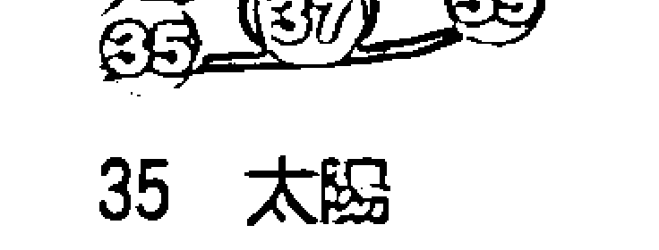

+   35	太陽  
37	中陽  
39	少陽  

少陽在左眼睛的尾端（女性反向為右），若嘴脣紅潤、兩耳光亮、有垂珠朝口、魚尾位置平滿，則該年運勢良好，才華文學、有所發揮，事業能有進展，可大刀闊斧，男女感情順利、親人和睦相處，反之，嘴脣缺陷、色澤不佳、兩耳無光、魚尾亂紋、疤痕，表示該年運勢不佳，聰明反被聰明誤，事業多做多破財、耗損連連，男女感情不和、恐怕相隔分離，親人則有生離死別。

## 少陰掌管四十歲（若部位缺陷對該年較有影響、其他部位為輔助）

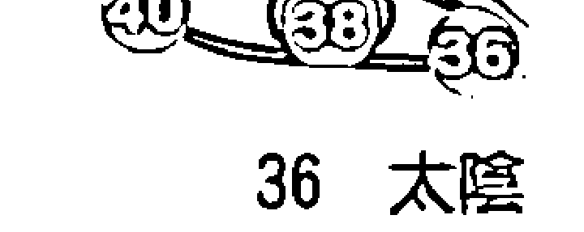

+   36	太陰  
38	中陰  
40	少陰  

少陰在右眼睛的尾端（女性反向為左），若嘴脣紅潤、兩耳光亮、有垂珠朝口、魚尾位置平滿，則該年運勢良好，才華文學、有所發揮，事業能有進展，可大刀闊斧，男女感情順利、親人和睦相處，反之，嘴脣缺陷、色澤不佳、兩耳無光、魚尾亂紋、疤痕，表示該年運勢不佳，聰明反被聰明誤，事業多做多破財、耗損連連，男女感情不和、恐怕相隔分離，親人則有生離死別。

## 山根掌管四十一歲（若部位缺陷對該年較有影響、其他部位為輔助）

山根在兩眼睛的中間，在印堂的下方，若山根要骨肉豐厚、色澤光亮，眉清目秀、地閣圓潤，則該年運勢良好，事業基礎穩固、能夠發達成就，可以賺進錢財，反之，若兩眼無神、山根低陷、折斷、地閣缺陷，則該年走壞運，恐有意外災病發生，事業要預防破敗、財務要注意耗損、健康方面則腸胃疾病。

## 精舍掌管四十一歲（若部位缺陷對該年較有影響、其他部位為輔助）

精舍在左眼頭的外皮（女性反向為右），也就是前眼框的位置，若印堂寬闊、平滿光亮，兩眉有彩、眼神收斂、有力，表示該年運勢良好，反之，印堂凹陷、色澤不佳、眉毛散亂、眼神飄忽，該年運勢則不佳，事業缺乏助力，死有志難伸、懷才不遇，另外要注意突發災禍。

## 光殿掌管四十二歲（若部位缺陷對該年較有影響、其他部位為輔助）

光殿在右眼頭的外皮（女性反向為左），也就是前眼框的位置，若印堂寬闊、平滿光亮，兩眉有彩、眼神收斂、有力，表示該年運勢良好，反之，印堂凹陷、色澤不佳、眉毛散亂、眼神飄忽，該年運勢則不佳，事業缺乏助力，死有志難伸、懷才不遇，另外要注意突發災禍。

+   41 山根  
42 稝會  
43 光殿  
44 年上  

## 年上掌管四十四歲（若部位缺陷對該年較有影響、其他部位為輔助）

年上在山根下方、壽上上方，若眼神清澈、有耳垂珠朝口，印堂寬闊，沒有鎖印，且飽滿無亂紋、色澤光亮，則該年運勢良好，有機會發達致富、事業成就。反之，眼神渾濁、印堂狹隘、鎖眉、亂紋、色澤黯淡，則該年運勢不佳，要注意財物損害、事業破敗、人際失和。

## 壽上掌管四十五歲（若部位缺陷對該年較有影響、其他部位為輔助）

壽上在準頭之上、年上之下，若兩耳明潤、垂珠飽滿，印堂寬闊，沒有鎖印，且飽滿無亂紋、色澤光亮，則該年運勢良好，有機會發達致富、事業成就。反之，眼神渾濁、印堂狹隘、鎖眉、亂紋、色澤黯淡，則該年運勢不佳，要注意財物損害、事業破敗、特別是健康不佳，嚴重將短壽夭折。

## 左觀掌管四十六歲（若部位缺陷對該年較有影響、其他部位為輔助）

左觀在左淚堂下方高突處（女性反向為右），若眉清目秀、眼光不惡、鼻樑高挺，顴骨也飽滿，則該年運勢良好，人際關係良好，能展現領導統馭，位居要職、掌握實權，事業能再創高峰，反之，眉毛散亂、眼光凶惡、鼻樑低陷、歪斜、顴骨突卻無肉，或凹陷無顴骨，則表示該年運勢不佳，凡是操心勞累、卻很難有成就，甚至於小人破壞、口舌官非、感情失和，若氣色呈現黑青，恐有飛來橫禍。

## 右觀掌管四十七歲（若部位缺陷對該年較有影響、其他部位為輔助）

右觀在右淚堂下方高突處（女性反向為左），若眉清目秀、眼光不惡、鼻樑高挺，顴骨也飽滿，則該年運勢良好，人際關係良好，能展現領導統馭，位居要職、掌握實權，事業能再創高峰，反之，眉毛散亂、眼光凶惡、鼻樑低陷、歪斜、顴骨突卻無肉，或凹陷無顴骨，則表示該年運勢不佳，凡是操心勞累、卻很難有成就，甚至於小人破壞、口舌官非、感情失和，若氣色呈現黑青，恐有飛來橫禍。

| 45 | 左額 |  
| 46 | 右額 |  
| 47 | 準頭 |  
| 48 | 蘭台 |  
| 49 | 廷尉 |  
| 50 |   |  

## 準頭掌管四十八歲（若部位缺陷對該年較有影響、其他部位為輔助）

準頭在鼻尖位置，若鼻樑有勢、雙觀豐隆、眼睛有神、嘴角向上，表該年運勢良好，有機會發財致富、得到貴人的引薦、幫助，人脈得以迅速擴展，並享有威望地位，反之，兩眼無神、顴骨過低、鼻高無肉削尖、形成孤峰獨聳，那麼表示該年運勢不佳，恐有破財耗損，遭受小人拖累、健康情況也較糟糕。

## 蘭台掌管四十九歲（若部位缺陷對該年較有影響、其他部位為輔助）

蘭台在左鼻翼（女性反向為右），若耳朵形美、色澤白潤、耳高過眉、嘴唇鮮紅、牙齒整齊，則該年運勢良好，有機會獲得意外財富，或先前投資能回收，適合理財規劃，若耳朵缺陷、色澤不佳、唇齒不正，該年則為壞運，要注意與人往來、金錢糾紛，以及投資理財的規劃，嚴重將可能耗損、破產。

## 廷尉掌管五十歲（若部位缺陷對該年較有影響、其他部位為輔助）

廷尉在右鼻翼（女性反向為左），若眼神端正、收斂有藏、目光不外露，耳朵形美、色澤白潤、耳高過眉、嘴唇鮮紅、牙齒整齊，則該年運勢良好，有機會獲得意外財富，或先前投資能回收，適合理財規劃，若耳朵缺陷、色澤不佳、唇齒不正，該年則為壞運，要注意與人往來、金錢糾紛，以及投資理財的規劃，嚴重將可能耗損、破產。

## 人中掌管五十一歲（若部位缺陷對該年較有影響、其他部位為輔助）

人中又叫做「溝洫」、「壽堂」，代表心性、壽命、子息，若是額相豐隆、寬闊，耳朵較面部日潤，有耳垂珠朝口，法令紋深長，本身人也深長，沒有缺陷、疤痕，則該年運勢良好，身體健康、廣進財源，人際關係和諧，子女有所成就，可以光宗耀祖，反之，人中有缺陷、額低、耳差，法令紋不整齊、或法令紋入口角（滕蛇入口），代表該年運勢不佳，恐有經濟困頓、財物耗損、人際關係不佳、親子關係冷漠、健康情況較差，若人中過短、且有缺陷、嚴重時恐短壽夭折。

|51|人中|  
|52|左仙庫|  
|53|右仙庫|  
|54|食倉|  
|55|祿倉|  

## 左仙庫掌管五十二歲（若部位缺陷對該年較有影響、其他部位為輔助）

左仙庫在左鼻孔下方（女性反向為右），代表財運、經營、買賣，若是眉毛較長，尾端有長毫突出，眼睛炯炯有神、鼻孔不外露的話，則該年運勢良好，能夠經營有成、買賣順利、財源廣進，反之，眉毛稀疏、眼神露光無神，印堂凹陷灰暗，人中有歪斜的話，該年運勢不佳，恐經商失敗、買賣不順、破財損耗的情況發生。

## 右仙庫掌管五十三歲（若部位缺陷對該年較有影響、其他部位為輔助）

右仙庫在右鼻孔下方（女性反向為右），代表財運、經營、買賣，若是眉毛較長，尾端有長毫突出，眼睛炯炯有神、鼻孔不外露的話，則該年運勢良好，能夠經營有成、買賣順利、財源廣進，反之，眉毛稀疏、眼神露光無神，印堂凹陷灰暗，人中有歪斜的話，該年運勢不佳，恐經商失敗、買賣不順、破財損耗的情況發生。

## 食倉掌管五十四歲（若部位缺陷對該年較有影響、其他部位為輔助）

食倉在左仙庫附近（女性反向為右），代表食祿、福祿，若耳朵輪廓分明，有耳垂珠朝口，眉毛有光彩、眼睛也明亮、法令紋明顯，則該年運勢良好，有機會參加許多飲宴、餐宴，同時人際關係熱絡，能夠因此獲得財利。反之，耳朵缺陷、眉毛散亂、法令間斷，則該年運勢不佳，有人際糾紛、財物耗損的事情發生。

## 禄倉掌管五十五歲（若部位缺陷對該年較有影響、其他部位為輔助）

禄倉在左仙庫附近（女性反向為右），代表食祿、福祿，若耳朵輪廓分明，有耳垂珠朝口，眉毛有光彩、眼睛也明亮、法令紋明顯，則該年運勢良好，有機會參加許多飲宴、餐宴，同時人際關係熱絡，能夠因此獲得財利。反之，耳朵缺陷、眉毛散亂、法令間斷，則該年運勢不佳，有人際糾紛、財物耗損的事情發生。

## 左法令掌管五十六歲（若部位缺陷對該年較有影響、其他部位為輔助）

左法令在左鼻翼外側（女性反向為右），有紋路垂至口際，老人以此紋路為一壽帶一，代表健康长寿。若鼻樑挺直、豐隆有肉、水星端正、嘴唇紅潤、印堂飽滿，則該年運勢良好，健康情況不錯、人際關係良好，事業能有升遷、擔任要職的機會。反之，鼻樑低陷、嘴巴歪斜、印堂灰暗，恐有疾病災禍、健康不佳，事業有降級、丟官的情況，親子關係也不理想。

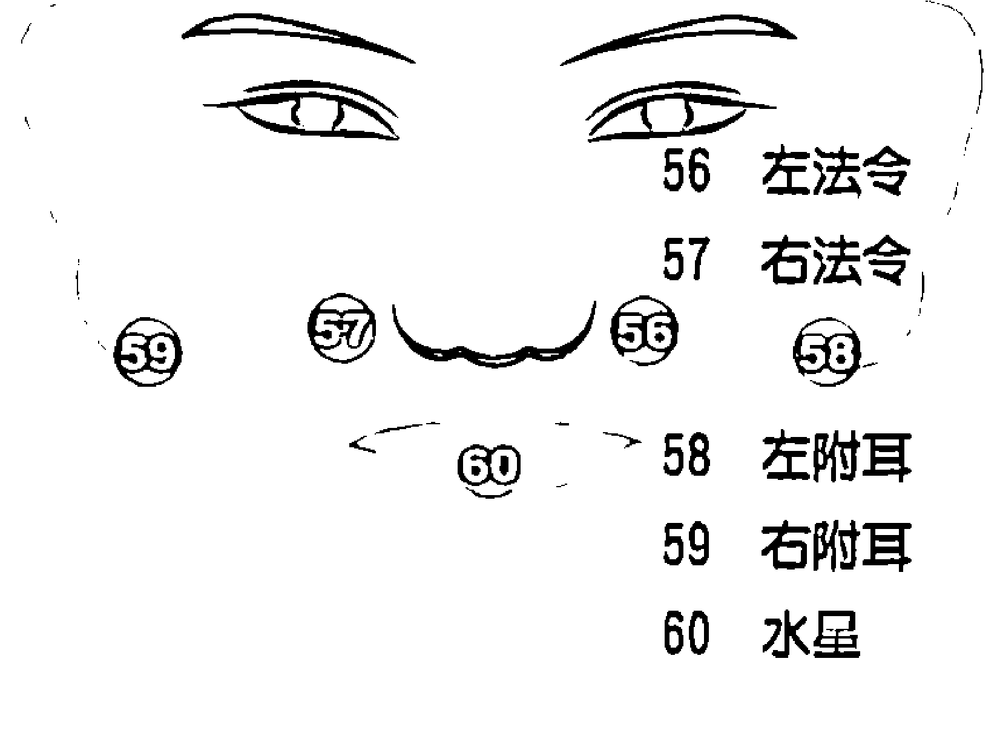

56 左法令  
57 右法令  
58 左附耳  
59 右附耳  
60 水星  

## 右法令掌管五十七歲（若部位缺陷對該年較有影響、其他部位為輔助）

右法令在右鼻翼外側（女性反向為左），有紋路垂至口際，老人以此紋路為一壽帶一，代表健康长寿。若鼻樑挺直、豐隆有肉、水星端正、嘴唇紅潤、印堂飽滿，則該年運勢良好，健康情況不錯、人際關係良好，事業能有升遷、擔任要職的機會。反之，鼻樑低陷、嘴巴歪斜、印堂灰暗，恐有疾病災禍、健康不佳，事業有降級、丟官的情況，親子關係也不理想。

## 左附耳掌管五十八歲（若部位缺陷對該年較有影響、其他部位為輔助）

左附耳在左臉頰（女性反向為右），在耳朵垂珠附近，若眼神明亮、有力，耳朵氣色良好、顴骨突起有勢，那麼該年運勢良好，身心安定、際遇良好、可以向外求財、能有不錯收穫，反之，眼神朦朧、耳朵缺陷、氣色不佳，顴骨平陷無力，則該年運勢不佳，有破財耗損、奔波勞碌的現象。

## 右附耳掌管五十九歲（若部位缺陷對該年較有影響、其他部位為輔助）

右附耳在右臉頰（女性反向為左），在耳朵垂珠附近，若眼神明亮、有力，耳朵氣色良好、顴骨突起有勢，那麼該年運勢良好，身心安定、際遇良好、可以向外求財、能有不錯收穫，反之，眼神朦朧、耳朵缺陷、氣色不佳，顴骨平陷無力，則該年運勢不佳，有破財耗損、奔波勞碌的現象。

## 水星掌管六十歲（若部位缺陷對該年較有影響、其他部位為輔助）

水星在人中下方、上唇上方，也叫做一水珠」，若額相寬闊、印堂飽滿、色澤鮮明、耳有垂珠朝口，則該年運勢良好，表示人際關係熱絡、健康情況良好、富貴而能長壽，反之，額相不佳、耳朵缺陷、色澤不佳，則該年運勢不佳，容易有災病意外、財運耗損的現象。

## 承漚掌管六十一歲（若部位缺陷對該年較有影響、其他部位為輔助）

承漚在下嘴唇凹陷之處，若眉毛有光彩、耳朵色澤明潤、法令紋下垂，長度超過嘴巴，則該年運勢良好，健康良好、飲食宴樂、官運亨通、能得錢財，反之，眉毛散亂無光彩、法令紋間斷，則該年運勢不佳，要注意飲食起居，恐有疾病纏身、耗損錢財，事業上，官運不佳、較多是是非。

## 左地庫掌管六十一歲（若部位缺陷對該年較有影響、其他部位為輔助）

左地庫在下顎左邊（女性反向為右），地閣的上左旁，若耳朵色澤鮮明、眼神秀氣、印堂飽滿光亮、則該年運勢良好，經商買賣順利，有機會賺進錢財，反之，耳朵枯暗無光、印堂黑暗、眼神露光無力，則該年運勢不佳，恐有疾病災禍、破財損耗的情況。

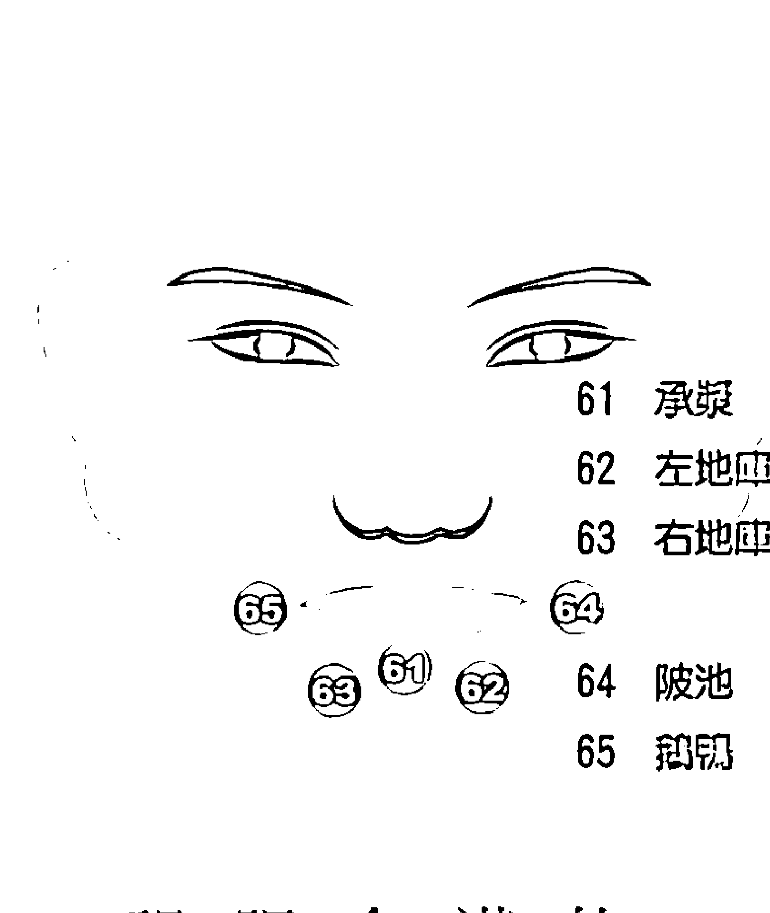

## 右地庫掌管六十二歲（若部位缺陷對該年較有影響、其他部位為輔助）

右地庫在下顎右邊（女性反向為左），地閤的上左旁，若耳朵明亮、眉毛光彩、嘴巴端正、嘴唇鮮明，則該年運勢良好，能常有宴樂、享口福，並且健康良好、財運亨通，反之，若耳朵枯暗、目光脫落、印堂枯暗、人中不明顯，則該年運勢不佳，恐有疾病纏身、出入要小心意外。

## 陂池掌管六十四歲（若部位缺陷對該年較有影響、其他部位為輔助）

陂池在上顎，左法令紋的左方處（女性反向為右），也就是俗稱的一酒窩─，若耳朵明亮、眉毛光彩、嘴巴端正、嘴唇鮮明，則該年運勢良好，能常有宴樂、享口福，並且健康良好、財運亨通，反之，若耳朵枯暗、目光脫落、印堂枯暗、人中不明顯，則該年運勢不佳，恐有疾病纏身、出入要小心意外。

## 鵝鴨掌管六十五歲（若部位缺陷對該年較有影響、其他部位為輔助）

鵝鴨在上顎，右法令紋的左方處（女性反向為左），也就是俗稱的一酒窩─，若耳朵明亮、眉毛光彩、嘴巴端正、嘴唇鮮明，則該年運勢良好，能常有宴樂、享口福，並且健康良好、財運亨通，反之，若耳朵枯暗、目光脫落、印堂枯暗、人中不明顯，則該年運勢不佳，恐有疾病纏身、出入要小心意外。

## 左金縷掌管六十六歲（若部位缺陷對該年較有影響、其他部位為輔助）

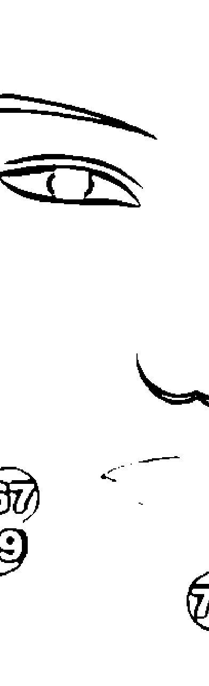

左金縷在左法令紋的左邊（女性反向為

## 右金縑掌管六十七歲（若部位缺陷對該年較有影響、其他部位為輔助）

右金縑在右法令紋的右邊（女性反向為左），若鼻樑豐隆、準頭明潤、眉
尾生長毫、眼神光亮，代表該年運勢良好，能夠廣進財源、飲食安、身心健康，
反之，準頭發暗、眉無光彩、眼神朦朧，則該年運勢不佳，有隱藏疾病、慢性疾
病，或是有破財的現象。

## 左歸來掌管六十八歲（若部位缺陷對該年較有影響，其他部位為輔助）

左歸來在左顴骨與左腮骨之間（女性反向為右），與承漿位置平行，若印堂光亮、嘴唇紅潤、鬍鬚不枯、面色光彩、眼神有力，表示該年運勢良好，可以健康高壽、財源有餘，反之，若是印堂無光、面色黯淡，則該年運勢不佳，健康恐有問題，或有破財、耗財的情況。

## 右歸來掌管六十九歲（若部位缺陷對該年較有影響，其他部位為輔助）

右歸來在右顴骨與右腮骨之間（女性反向為左），與承漿位置平行，若印堂

光亮、嘴唇紅潤、鬍鬚不枯、面色光彩、眼神有力，表示該年運勢良好，可以健康高壽、財源有餘，反之，若是印堂無光、面色黯淡，則該年運勢不佳，健康恐有問題，或有破財、耗財的情況。

## 左腮骨掌管七十四歲（若部位缺陷對該年較有影響、其他部位為輔助）

左腮骨在左臉頰旁突骨之處（女性反向為右），平行相對於嘴巴，若地閣圓潤、嘴巴端正、能收、色澤紅潤、耳有垂珠、色澤良好，表示該年運勢良好，常有喜慶、健康安泰、家族和樂、可享晚年，反之，地閣削尖、無肉、嘴巴不收、面色不佳，則代表運勢不佳，煩惱憂愁、健康不佳、出入要注意安全。

## 右腮骨掌管七十五歲（若部位缺陷對該年較有影響、其他部位為輔助）

右腮骨在右臉頰旁突骨之處（女性反向為左），平行相對於嘴巴，若地閣圓潤、嘴巴端正、能收、色澤紅潤、耳有垂珠、色澤良好，表示該年運勢良好，常有喜慶、健康安泰、家族和樂、可享晚年，反之，地閣削尖、無肉、嘴巴不收、面色不佳，則代表運勢不佳，煩惱憂愁、健康不佳、出入要注意安全。

## 面相十二地支子位掌管七十六歲、七十七歲

子位在下顎正中、地閣之下，若圓潤飽滿、色澤良好、代表健康安泰、子孫昌盛，無憂無祿，反之，子位狹小削尖、色澤不佳，代表生活困頓、煩惱憂愁、疾病災禍、不得安寧。

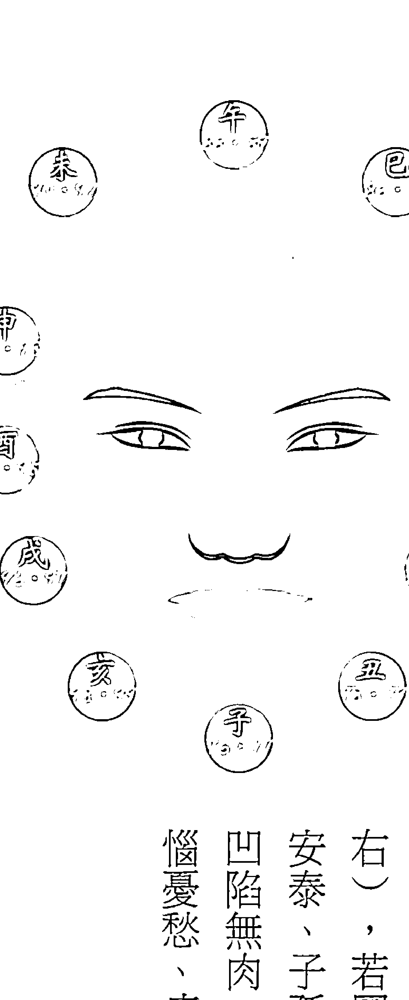

## 面相十二地支丑位掌管七十八歲、七十九歲

丑位在左腮骨下緣（女性反向為右），若圓潤飽滿、色澤良好、代表健康安泰、子孫昌盛，無憂無祿，反之，丑位凹陷無肉、色澤不佳，代表生活困頓、煩惱憂愁、疾病災禍、不得安寧。

## 面相十二地支寅位掌管八十歲、八十一歲

寅位在左耳珠下緣（女性反向為右），若圓潤飽滿、色澤良好、代表健康安泰、子孫昌盛，無憂無祿，反之，寅位凹陷無肉、色澤不佳，代表生活困頓、煩惱憂愁、疾病災禍、不得安寧。

## 面相十二地支卯位掌管八十二、八十三歲

卯位在左耳門旁（女性反向為右），就是命門的部位，若圓潤飽滿、色澤良好、代表健康安泰、子孫昌盛，無憂無祿，反之，卯位凹陷無肉、色澤不佳、代表生活困頓、煩惱憂愁、疾病災禍、不得安寧。

## 面相十二地支辰位掌管八十四歲、八十五歲

辰位在左眉尾上方（女性反向為右），逼近髮際的附近，若圓潤飽滿、色澤良好、代表健康安泰、子孫昌盛，無憂無祿，反之，辰位凹陷無肉、色澤不佳，

## 面相十二地支巳位掌管八十六歲、八十七歲

巳位在左額頭（女性反向為右），髮際的附近，若圓潤飽滿、色澤良好、代表健康安泰、子孫昌盛，無憂無祿，反之，巳位凹陷無肉、色澤不佳，代表生活困頓、煩惱憂愁、疾病災禍、不得安寧。

## 面相十二地支午位掌管八十八歲、八十九歲

午位在額頭正中，火星的上方，若圓潤飽滿、色澤良好、代表健康安泰、子孫昌盛，無憂無祿，反之，午位凹陷無肉、色澤不佳，代表生活困頓、煩惱憂愁、疾病災禍、不得安寧。

## 面相十二地支未位掌管九十歲、九十一歲

未位在右額頭（女性反向為左），髮際的附近，若圓潤飽滿、色澤良好，代表健康安泰、子孫昌盛，無憂無慮，反之，未位凹陷無肉、色澤不佳，代表生活困頓、煩惱憂愁、疾病災禍、不得安寧。

## 面相十二地支申位掌管九十二歲、九十三歲

申位在右眉尾上方（女性反向為左），逼近髮際的附近，若圓潤飽滿、色澤良好，代表健康安泰、子孫昌盛，無憂無慮，反之，申位凹陷無肉、色澤不佳，代表生活困頓、煩惱憂愁、疾病災禍、不得安寧。

## 面相十二地支酉位掌管九十四歲、九十五歲

酉位在右耳門旁（女性反向為左），就是命門的部位，若圓潤飽滿、色澤良好，代表健康安泰、子孫昌盛，無憂無慮，反之，酉位凹陷無肉、色澤不佳，代

## 面相十二地支戌位掌管九十六歲、九十七歲

 representative of health and family harmony, if the area is full and well-colored, then it indicates good fortune. However, if this area is narrow, sharp, or poorly colored, it may signify difficulties, worries, and a lack of peace.

## 面相十二地支亥位掌管九十八歲、九十九歲

亥位在左腮骨下緣（女性反向為右），若圓潤飽滿、色澤良好、代表健康安泰、子孫昌盛，無憂無祿，反之，亥位凹陷無肉、色澤不佳，代表生活困頓、煩惱憂愁、疾病災禍、不得安寧。

## 面相十二地支子位掌管一百歲

子位在下颚正中、地阁之下，若圆润饱满、色泽良好、代表健康安泰、子孙昌盛，无忧无禄，反之，子位狭小削尖、色泽不佳，代表生活困顿、烦恼忧愁、疾病灾祸、不得安宁。

## 面相觀念常識問答

## 一、眼睛

## (一)眼睛比較大的人,異性緣真的比較好嗎?

眼睛是靈魂之窗,對於外界的反應,是相當迅速且敏感的,因此眼睛比較大的人,表示的情況也會比較強烈,很能感受別人的心情、情緒,並且勇於表達自我,讓人家覺得容易接近,所以人緣、異性緣自然就不錯。至於眼睛的大小來說,要依照每個人的臉型比例,不可以一概而論,但若是眼睛較圓大(非細長),而且淚眼汪汪,具有吸引力的話,那麼通常就說是大眼睛。一般來說,眼睛大容易動情,個性較為感性,眼睛小偏向理性,個性比較保守。在男女交往交面,異性緣的好壞,眼睛大的人,因為容易感動、表達直接、充滿熱情，所以很快能跟異性熟識，但往往三分鐘熱度，來的快去得也快，不停被外界影響，有喜新厭舊的傾向，異性緣雖然不錯，但常讓另一半不放心，會有忌妒吃醋的情況發生，特別是眼睛又大又圓，且泛著淚光的人。

## （二）眼睛比較小的人，個性會比較陰沉嗎？

眼睛小跟眼睛大的人相比，眼睛小比較冷靜，個性偏向理性，所以不容易接近，或是很快就能熟識，必須要花上一段時間，大家才能夠打成一片，因此第一眼的印象中，往往給人家冷漠、成府深，或是陰沉的感覺，但其實並非完全如此，眼睛小的人只是會比較保護自己。

自己。眼睛小而眼眶也小的話，這是屬於比較自我、叛逆、執著的人，不願意受傳統拘束，勇於去開創改革，顯得較為好強、不服輸，也因為堅持理想，有時不擇手段達成目的，讓人家感到懼怕。其
實眼睛小的人，溝通協調比較差，不過適合研究、開創，可以在專業領域有所成就，只要把他們放對位置，還是大有可為，能發揮不錯的潛力。

## （三）女人若眼睛水汪汪，桃花會比較多且淫蕩嗎？

眼睛是重要的五官，也是靈魂之窗，是最能吸引人的地方，特別是眼形、眼神部分正是觀看桃花多寡的關鍵。若是眼形好、眼神佳，異性緣當然就好，桃花自然也就多得不得了。對

於女生來說，一雙水汪的眼睛，像是夢幻般的人物一樣，讓人忍不住多看一眼，具有強烈的吸引力。男性很容易放電電到，會主動前來追求，敗在石榴裙下。週遭的人看到這種情況，對於這位女性的評價，當然會產生羨慕，進而變成忌妒，於是會說對方多情、好色、淫蕩等等。而事實上，眼睛水汪汪的女性，對於情感需求大，容易被吸引動情，也比較纖細敏感，所以對異性的追求，往往是不太能拒絕，有多角戀情的現象，所以才會得到負心的稱號。就優點的來說，眼睛大懂得情趣，感情生活較豐富，但缺點方面，若不能自我節制，那麼感情就容易起伏不定，成為生活中的負擔了。

## (四)眼睛凸出的人，會比較愛出風頭哪？

眼睛比較突出的話，就是從側面看的時候，眼球會比較凸出來，這種人通常喜歡聊天講話，談自己或別人的八卦，一打開話匣子就停不下來，在團體中喜歡表達意見、展現自我，給人愛出風頭的印象。這是因為眼睛後方的神經，剛好就是說話神經的中樞，所以說話神經發達，眼球就容易被壓迫而凸出，若凸出越明顯的話，表現慾望就更強，甚至讓人覺得有壓迫感。反之，眼睛凹陷的話，就比較不愛說話、沉默寡言，不喜歡跟人家交談，總是躲在角落觀察

## （五）有三白眼的人，一定就是壞人、奸人嗎？

眼珠比較小，眼白部分比較多，就容易形成所謂的三白眼，甚至於四白眼，三白眼是說黑色眼珠的部分，稍微上吊或下垂，露出下方或上方的眼白，或是眼珠四周都呈現眼白，這就叫做四白眼。傳統面相學當中，眼睛是判別善惡好壞的地方，有這種眼相的人，個性會比較暴躁、固執，不喜歡受人約束，喜愛獨來獨往，而且好勝心強烈，為追求慾望而不擇手段，特別是在人際關係方面，很容易衝動行事，而跟人產生過節，又不肯放下身段道歉，所以因此而招惹糾紛。有時候一錯再錯，終於到無可挽回的地步。但就優點來說，這種人行事果斷，具有魄力，可以擔負重任，誓死達成目標，具有冒險犯難的精神，很適合來開創事業。

## （六）睡覺眼睛閉不起來，這種人會比較兇惡嗎？

眼睛是一監察官一，具重要的位置，必須要過濾外界的訊息，傳達到大腦當中，

好讓我們做出行為反應，來處理事物的變化，所以醒著的時候，眼睛最好是炯炯有神，明亮穩定，不可以睡眼惺忪、朦朧睜不開的模樣。不過當睡覺的時候，眼睛就要能閉起來，否則就不能充分休息，睡眠容易受到干擾，脾氣相對比較暴躁，

另外脾臟機能也比較虛弱。眼睛閉不上眼，個性兇惡的說法，應該就是睡眠的關係，精神狀態不佳，往往沒有耐心，容易跟人起口角衝突，特別是對另一半，所以古書才有一睡不含眼、刑夫剋妻的說法。

## 二、眉毛

## （一）眉毛較彎曲的人，個性會比較溫柔嗎？

彎曲的眉毛，通常叫做法柳葉眉、新月眉，大多用來形容女性，意指心思細膩、個性溫柔，會比較乖巧聽話，但條件是眉毛不能太粗，要比較細一點，否則就不是如此了。再傳統相學裡面，眉毛代表精力所在，通常越粗越黑的話，就表示精力旺盛、鬥志高昂，特別是男性的話，就好比說是劍眉、三角眉等等，感覺就很有個性，展現出男性氣魄，但缺點是比較固執、衝動，容易招惹是非。因此古代女性通常足不出戶，地位也跟男性不同，男性不希望女性拋頭露面，乖乖待在家裡就好，而柳葉眉、新月眉的女性，剛好符合男性的要求，沒有

充沛的精神體力，當然只好待在家裡，做一些家務事就好，而不是像現在女性，有機會成為職業婦女，所以不是柳葉眉、新月眉，反而代表有個性、有主見，可以開闊事業的生涯。

## （二）眉毛稀疏的話，個性很像牆頭草嗎？

眉毛代表一個人的個性強弱，若是眉毛越粗，個性就越豪爽、不拘小節，眉毛越細，個性就越纖細、謹慎小心。而眉毛跟內分泌有關係，所以眉毛長得旺盛，表示內分泌充足，精力較為旺盛，行動力很強，對事情積極進取，給人家熱情的感覺，相反的，眉毛較稀疏，內分泌較不足，精力沒那麼好，行動力較弱，比較喜歡冷靜思考，給人家深謀遠慮，或是表現陰沉感，算不怎麼主動積極，好像都沒有什麼主見可言，其實是不想出風頭的緣故。另外，眉毛跟感情有關，眉毛越稀疏，甚至沒有眉毛的話，表示內分泌失調，情緒容易起伏、身心狀況不佳，表現在人際關係上，就容易有口舌是非，或是性生活不協調，所以情人或夫妻之間，很容易就鬧分手、離婚，因此眉毛還是不要太稀疏，盡量要濃密一點才好。

## （三）有八字眉的人，會比較走倒楣運嗎？

八字眉的人，眉頭高眉尾垂，由於很像哭喪臉，很容易時運不濟，跟倒楣連結在一起。但其實八字眉的人，不一定都會倒楣，反而這種人喜歡熱心公益，人緣反而不錯，從事公眾事物的行業，將有發展的機會。但若是八字眉的形狀，是眉毛稀疏細小，眉尾下垂太嚴重，又加上眼

角下垂、嘴角下垂，看起來就像一副倒楣相，出外當然就不討喜，通常是會人見

人厭，身邊缺少了貴人扶持，運勢就好不到哪去。另外，八字眉的人，個性較為博愛，感情世界豐富精采，加上不擅於拒絕，意志也不夠堅定，有時候會出現腳踏兩條船的情況，讓感情、婚姻，增添了不穩定的變數，這是必須要注意的。

## （四）眉壓眼的人，個性喜歡鑽牛角尖嗎？

眉壓眼的情況，就是眉毛跟眼睛距離太近，看起來好像眉毛壓在眼睛上。傳統的面相學來說，眉毛代表個性，眼睛代表人際，眉壓眼平常的時候比較壓抑，但若是被激怒的話，那麼就很容易爆發，跟人家起衝突口角。另外，眉毛跟眼睛之間的位置，面相學上叫田宅宮，掌管田宅、事業、財產，若是眉壓眼的話，表示事業較有阻礙、貴人運不明顯，不容易累積財產，反之，田宅宮寬闊，男性表示事業有成、享有財富、地位，女性容易嫁金龜婿，或本身是

個小富婆。眉壓眼這樣弄巧成拙，才會表示出鑽牛角尖的樣子。 

## （五）常常皺眉頭的話，會有不良的影響嗎？

眉毛的中間，如果經常皺眉頭的話，就會產生一條直線，那條線就叫做「懸針紋」。如果出現懸針紋，表示自己容易患得患失，凡事都比較看不開，把責任、壓力、問題攬在身上，當身心負荷不了的時候，就容易產生嚴重後果。另外，懸針紋的位置，剛好是印堂也是命宮的位置，代表一生運勢的所在，特別是事業與人際關係，懸針穿過印堂，表示三十歲左右運勢破敗，受到嚴重的挫折打擊，甚至於有生命的危險。另外，眉頭深鎖的人，若眉毛距離太近，又有雜毛叢生，形成「雙眉鎖印」的話，那麼情況也是很糟糕，運勢將無法順利開展，應該趕快的剔除雜毛。其實皺眉頭的人，本來就給人不好的觀感，而且不想要去

## 五、嘴巴

## （一）嘴巴越薄的人，会比较无情吗？

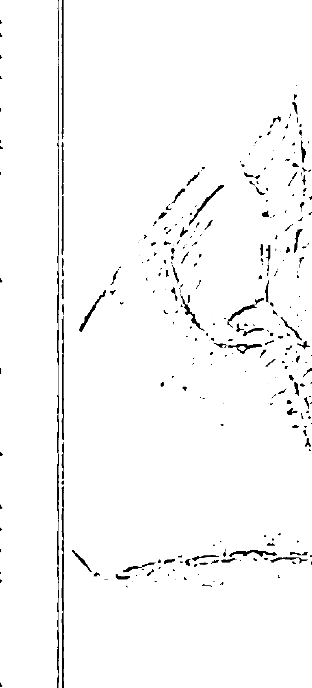

嘴巴的嘴唇除了保护牙齿与舌头，同时在男女情欲方面，也佔了很重要的角色，是传达内心爱意与感情的工具。因为人看见喜欢的异性时，就会不自主的脸红心跳，嘴唇就会充血扩张，所以现在女性多半喜欢擦口红，也就是这个原因。传统面相学当中，嘴唇厚的人，精力旺盛，热情积极，对感情较放得开，可以用于表达，但若是嘴唇无法紧闭，显得松弛的话，表示太过于滥情，性生活不节制，容易陷入酒色当中。反之，嘴唇薄的人，对感情较为冷静，不轻易表达透露，讲起话来也比较犀利，不容易被挑起情欲，所以常被人家視為無情。另外上下嘴唇的厚薄，最好能夠一致，若是下嘴唇比上唇厚，哪麼會比較自私，不懂得付出關懷，若是上嘴唇比較厚，就比較熱情、大膽，喜歡管人閒事。

## （二）嘴巴大的女生，性欲會比較強嗎？

传统面相学当中，女性的鼻子是「夫星」，而嘴巴就是「子星」，可以显示生殖機能与子女的情況。一般來說，嘴巴比較大且厚實的人，食慾比較好、腸胃機能佳，生殖系統健全，性生活也會比較愉悅。但嘴巴必須要大而能收，厚而不鬆弛，否則表示口無遮攔，對感情態度不認真，帶有遊戲的味道，物質與情慾的需求強烈，很容易因此發生問題。另外嘴唇上方有所謂的一縱情紋」，若是紋路越多、雜亂的話，表示性生活頻繁、性關係複雜，反之，嘴巴較小，嘴唇較薄、一點紋路也沒有的人，個性會比較孤僻，獨來獨往，感情會比較冷淡一些。

## 六、舌頭

舌頭較長的人，愛搬弄是非嗎？

在面相學當中，舌頭跟表達能力、語言學習，有著很大的關係，舌頭靈活的人，通常表達能力、語言能力也較好。若舌頭長大的寬厚的話，表達能力通常不錯，因為舌厚代表說話謹慎，如果舌頭只有長，不厚卻顯得細尖，哪麼就是人家所說的長舌婦，很容易搬弄是非，在背後道人長短、說八卦緋聞。再者，舌尖如舌信，除了有口舌是非，也表示心腸狠毒，做事情不擇手段，是個危險的人物。如果舌頭太短，表示缺乏企圖心，競爭意識不足，如果舌頭大，嘴巴卻小，就變成大舌頭，表達能力差，學習語言也較差，人際關係也無法順利開展。

## 七、牙齿

牙齿如果有缺损，这样子會漏財嗎？

嘴巴是食物的通道，也是氣口的通道，如果牙齒有所缺損，哪麼就容易導致漏氣，將影響到人際、事業、婚姻方面。因為雜亂的牙齒，也表示感情複雜，交往對象不固定，性生活容易放蕩，健康恐因此而受損。再者，牙齒是用來咀嚼食物的，若食物無法咀嚼，哪麼將影響消化，導致營養無法完全吸收，身體會顯得虛弱。再者就中醫理論，牙齒是骨骼的延伸，其氣血與性機能也息息相關，很多人在拔除牙齒之後，特別是整排的牙齒，就會明顯感受到精力下降，而不相之前哪樣活力充沛。因此建議有缺損最好補假牙，雖不如真齒來得好，也可以讓運勢不會下降。

## 八、毛髮

## （一）留長頭髮男性，個性比較女性化嗎？

留長頭髮的人，個性會比較陰柔，其實是受刻板印象所造成，因為現在男性都留短髮，女性則偏向長髮，不過在古代的時候，男女都是留著長髮的，並沒有這樣的差別，所以與個性較無關係。至於面相學說法：「髮為血之餘」，太長的頭髮會耗損氣血，也就是人體的養分，所以精神跟運勢也會因此受影響。此外，髮根若粗硬的人，個性多半較固執暴躁，髮根若細柔的人，個性通常較溫柔和藺。如果年紀輕輕就有少年白髮，哪除了先天遺傳外，後天的用腦過度、熬夜、抽煙喝酒、用藥過度，也是主要的因素，哪就要特別留意健康情況。

## （二）有美人尖的人，會比較風流嗎？

額頭中間的髮際，有突出的三角形，一般叫做「美人尖」。面相學上認為個性溫柔、風流多情，人際關係良好，桃花滿天飛舞，所以有風流尖的稱呼。其實這種人的個性，會比較積極進取，表現自我的優點，讓人家很能欣賞，但缺點是很固執己見，不愛聽他人勸導，也常因此而導致失敗。此外，古書裡說：髮際不齊的人，小時候生活環境困苦，比較少父母親關愛，對人比較有警戒心，只畏有什麼風吹草動，反應都會特別激烈，尤其是髮尖所指向的地方，又是印堂與命宮的位置，稱做「破印」，對於事業及婚姻都相當不利，建議若美人尖特別明顯，不妨用剃刀刮一下，將尖狀削去，這樣將有開運的效果產生。

## （三）瀏海留太長的話，將會影響運勢嗎？

瀏海太長的話，將會遮住額頭，也是面相十二宮的一官祿宮」，代表個人的交友情況、人際關係，以及早年的運勢發展。所以太長的話，將官祿宮遮住，事業將無法順利開展，給人感覺沒有精神，也不容易產生信任感。夏天悶熱的時候，還可以因此長出痘痘，影響衛生與觀瞻，建議還是不要留太長，要讓額頭能夠露出來，才能有一頭角崢嶸」的旺運。但若是女性額頭較高凸，不妨就用瀏海遮掩一些，但不要完全擋住，這樣能讓自己不那麼陽剛，能增添女性陰柔的特質，有助於人際關係及感情開展。

## （四）有鬢毛的男性，為人比較好色嗎？

鬢毛發達的人，通常血氣充足、精力旺盛，身體機能較佳，所以性慾會比較強，性生活會比較愉悅，但還不到好色的程度。不過若是鬢毛特別發達，形成落腮鬍的話，個性就比較狡猾，本身心性好漁色，相書稱為「野狐鬢」。不過鬢毛若太長，擋住臉頰的命門，就是耳朵下半部的臉頰附近，會使得運勢停滯，精神不集中，情緒顯得煩躁，對性慾較激烈，容易有失控的現象，可能會造成禍端，所以最好是刮一下，不要讓鬢毛遮住命門。另外，沒有任何鬢毛的人，像是小白臉一樣，其相書也不認為是好相，為人個性陰沉狠毒，冷漠無情。此外，鬢毛太粗的話，對於運勢來說，也不太理想，可以的話就最好剔除。

## 九、面相名詞解說

## （一）什麼是子午不正？

一般人的臉部來說，應該是左右對稱的，如果兩邊臉形、部位，出現一大一小、一高一低、相互不搭配的現象，就叫做「子午不正」，代表人際關係較有問題，事業上難有成就、收穫有限，運勢起伏不定，一生奔波辛勞。其中左右額頭不對稱，代表思考、判斷就容易出差錯，導致失敗的決策行動。鼻子歪斜、左右不對稱的話，財運與收入會比較差，投資理財較容易投機取巧，但卻沒有辦法實質獲利。顴骨左右不對稱，代表人際關係、領導統馭有問題，比較容易變動不安。嘴巴左右不對稱的人，容易有口舌是非、官司訴訟。

## （二）什麼是輪飛廓反？

耳朵的外緣部位叫做「輪」，內緣部位叫做「廓」，如果耳輪不明顯，就叫做「輪飛」，而耳廓如果突出，就叫做「廓反」，輪飛廓反就是耳朵形狀的形容。耳朵代表自我意識、人際關係、少夫運勢、家庭教養，有這種耳形的話，優點是比較獨立自主，有判斷力、肯創新，但缺點是反抗心強、不愛受拘束，具有叛逆性，容易與人意見不合，而起了衝突口角。由於耳朵也主少年運勢，所以這種人通常不合群，會顯得標新立異，愛恨心強烈，較不易滿足，成長的過程當中，會遭遇很多挫折與失敗，但若是經歷過磨練，也是有機會出人頭地的。

## （三）什麼是垂珠朝海？

耳朵有耳垂，耳垂像圓珠，並且略為往前朝向嘴巴，這就叫做「垂珠朝海」。代表身體健康、富貴長壽。根據中醫的理論，耳朵跟腎水有關係，因此耳朵若有垂珠，代表腎臟功能較強，而且性機能也較好。另外，嘴巴代表財祿，晚年運勢，有垂珠朝海的話，表示早年的辛勤努力，打拚成果，到晚年可以有收穫，所以也是富貴的象徵。

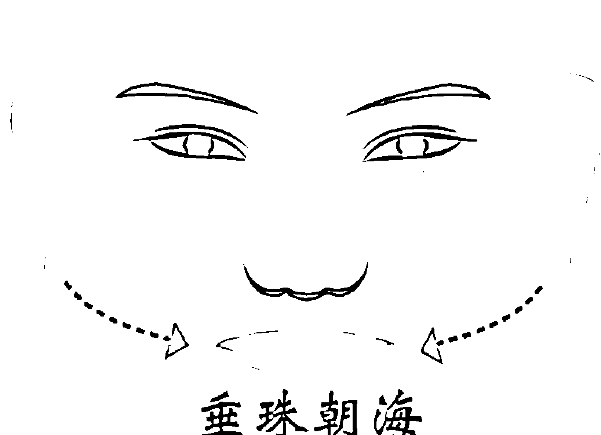

## （四）什麼是伏犀灌頂？

前額正中的骨頭，就叫做「伏犀骨」，如果鼻子的山根隆起，與印堂等高的話，看起來像是連成一氣，就叫做「伏犀灌頂」。因為山根代表先天遺傳、事業根基、個性脾氣，因此山根高挺的人，抗壓性、忍耐力比較強，對環境的變化較能適應，加上個性堅強、脾氣較不認輸，因此能在事業上有所成就，達成別人不容易完成的理想，因此政治家、企業家、創業人士，多半有這種面相。但伏犀鼻要有肉包覆，不能顯露骨感，否則反而不利，屬於孤獨高傲、冷漠無情的個性。另外，女人有伏犀鼻的話，通常代表個性自主、脾氣倔強，對婚姻會有不良的影響，容易與另一半產生衝突。

## （五）什麼是孤峰獨聳？

面相的術語有五嶽的說法，鼻子叫做中嶽、右顴骨為西嶽、左顴骨為東嶽、前額為南嶽、下巴為北嶽。其中鼻子位居於中央，具有領導的地位，所以鼻子豐隆、挺直的人，表示個性較有主見、具有領導統馭的能力，很適合開創事業、指揮調度的工作。但若是只有鼻子好，其他四個的部位，卻沒有辦法相對應輔助，就是只有鼻子高聳，其他部位平平或低陷，這樣就叫做「孤峰獨聳」。表示欠缺他人的輔助，只依靠自己判斷，有時候容易獨斷獨行、專權霸道，讓人家產生厭惡、反感。

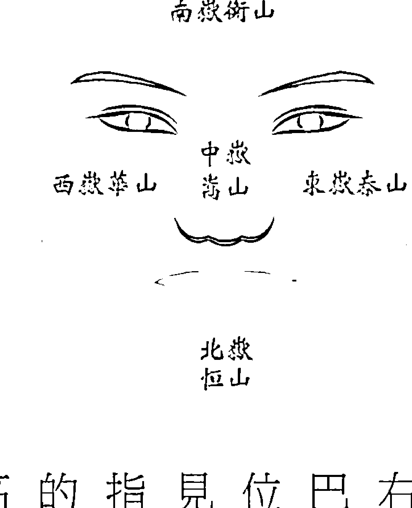

## （六）什麼是顴柄插天？

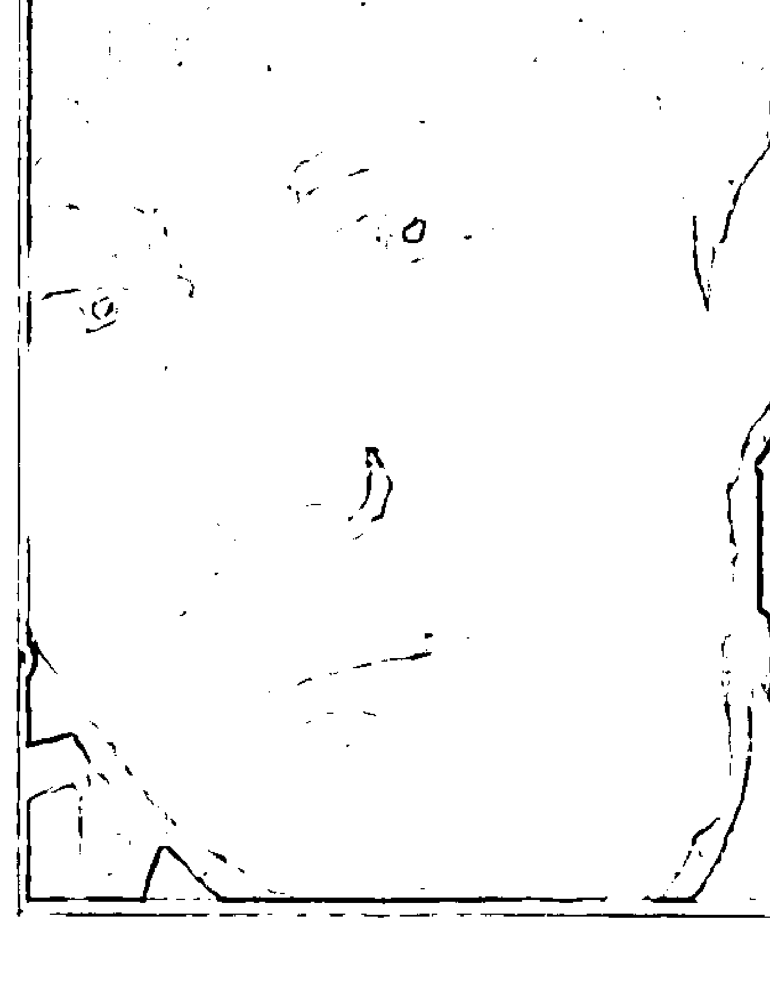

顴骨有骨頭突出，這骨頭是連著耳朵的，若這段相連部位的骨頭也隆起，就叫做「權柄插天」。權柄插天的位置有高有低，最理想的位置，是剛好到太陽穴。代表工作順利、掌握實權，可以得貴人提拔，然後能有所發揮、成就理想。但前提是，顴骨要有肉包覆、隆起有力，而且不能有疤痕、亂紋，不然就不太好了。就變成孤獨之相，雖然能成就，但較為辛苦勞累，得不到眾人幫助。

## （七）什麼是鼻顴相配？

若鼻子準頭圓潤、鼻翼明顯、鼻子不外露，而顴骨突出、有肉包覆，兩者位置大約相對、等高，就叫做「鼻顴相配」。因為鼻子代表自我意識、個性脾氣、理財投資、事業基礎等等，而顴骨而是外來的助力、父母長輩、兄弟姊妹、親戚好友、同事夥伴、上司主管、貴人等等。因此有好的鼻子，加上好的顴骨，就比較容易在事業上成就、獲得眾人的支持，同時也較能累積財富、地位。但若是鼻子有起節、折斷的話，或是顴骨過高、向外擴張，都表示心態比較偏激，容易忌妒、憤怒、不滿、反抗，而且較容易與人衝突、遭受拖累。

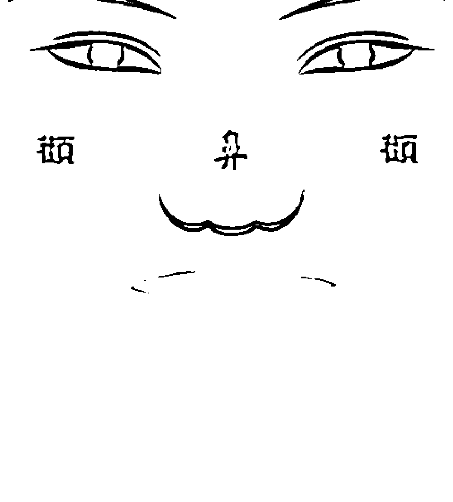

## （八）什麼是狼行虎吻？

若是走路低著頭，並且不時回頭張望的動作，就叫做「狼行」，而沒事就咬著牙齒，看似發怒的樣子，讓人覺得恐懼不舒服，就叫做「虎吻」。相學上認為「狼行虎吻」的人，比較孤獨寂寞，不容易跟人打成一片，缺乏安全感，而且喜歡算計他人，奪取好處與便宜，即使別人對他在好，翻臉的時候都不會領情，是個很現實的人。其他相學的走路說法，還有一龍行虎步」，表示昂首闊步、一夫當關、萬夫莫敵，「牛行」，緩緩行走、直線不彎曲，表示能勤儉致富。「馬行」，動作急躁、彎曲過多，代表勞碌無所得、容易搞砸事情。

## （九）什麼是腦後見腮？

腮骨若特別發達，就容易變得突出，從後腦杓看過去，就可以看見腮骨，這樣就叫做「腦後見腮」，這種人會比較固執、頑劣、叛逆、衝動，凡事只為自己利益著想，不會替眾人來考慮。又有一反骨」的稱呼，通常是有恩不報恩，反而会恩將仇報，讓人敬而遠之。女性有這種面相，腮骨外張的話，個性都偏向男性化，而且脾氣比較大，對感情、婚姻都較有影響，會有較多起伏與波折。但優點來說，較能吃苦耐勞，顯得有責任心，處理事情很堅持，非要去完成不可，事業上屬於女強人的類型。

## （十）什麼是天地相朝？

額頭稱做「天庭」，下巴稱做「地閣」，若前額寬廣豐隆、下巴飽滿圓潤，上下對稱的話，就叫做「天地相朝」，是一種富貴、長壽的面相。在少年運時，出身多半良好，容易受到栽培，因此學識豐富、基礎穩固，有少年發達的可能，事業上受到貴人提拔、財富得以迅速累積，晚年運勢來看，由於地閣飽滿，表示晚運亨通、可享清福、三代和樂。

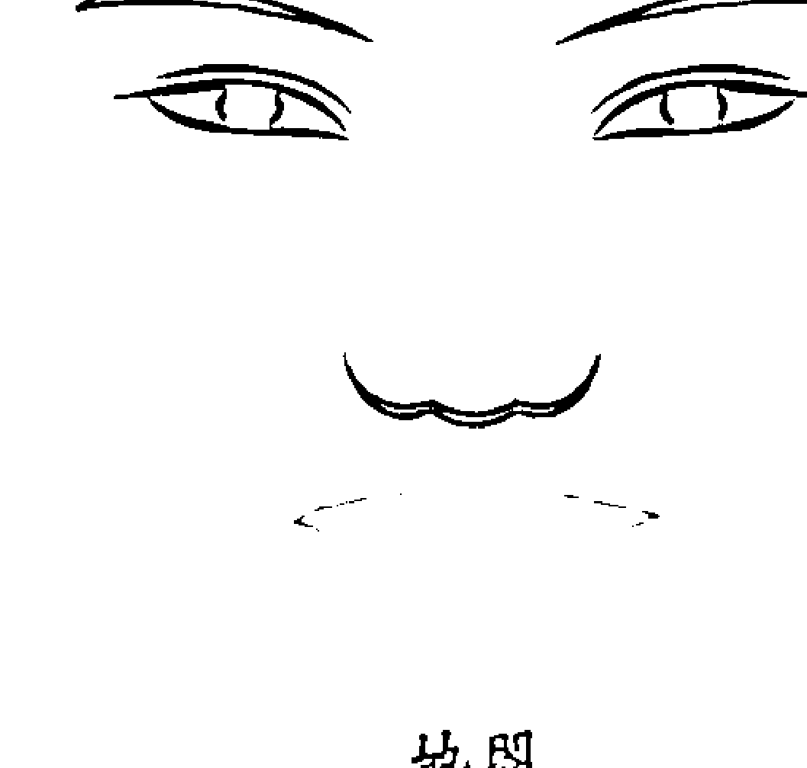

額頭的太陽穴附近，叫做天倉，是少年時期的財庫，顴骨是中年時期的財富，地閣是晚年時期的財庫。總稱「六府」，是財庫所在。

## 陸：認識面相痣的部位

(03)武庫位惡痣（武庫在尺陽外旁）——古相經：母。——按：高廣痣美者，主功名榮祿。

一痣在武庫，主陣亡、兵死。——按：武庫痣美者，主掌兵權。

(04)左廂位惡痣（天中左旁為左廂、右旁為右廂）——袖裡乾坤：——痣在左廂或右廂，主橫夭。——痣美者不忌。

(05)內府位惡痣（內府在左右兩廂外旁）——太清神鑑：——痣在內府，早喪父母。——按：婦女內有府痣，遭夫虐待或遺棄。

(06)尺陽位惡痣（尺陽在高廣外旁）——古相經：——痣在尺陽，主客亡。

(07)輔角位惡痣（輔角在日月角外側上旁）——袖裡乾坤：——痣生輔角，主兵喪。女有此痣，性淫剋夫；若兩輔角有其痣，更凶，三嫁不休。

(08)邊地位惡痣（邊地在兩額角、近髮際）－袖裡乾坤：「痣生邊地，主客死他鄉。女有此痣，奔走風塵，難成家室。」一按：邊地生美痣，無論男女，皆主夫婦和合，齊眉偕老。

(09)天庭位惡痣（天庭在天中下、額上無髮之處）－太清神鑑：「痣生天庭，主妨母。」一按：天庭生美痣，不論男女，家室融合，一世同春。相學：「天庭有痣，父母福薄。婦女為夫勞苦。一生中必有一次火災；此種人多見之於不笑者。

(10)日月角位惡痣（日月角在天庭兩側高處，左日角、右月角）－袖裡乾坤：「日月角有痣，主父子不合。」一按：日月角美痣成雙，名青龍白虎，主英才大發；獨痣小貴。

(11)司空位惡痣（司空在天庭近下）－新人相學：「司空有痣，剋長輩，不敬父母。婦人為

(12)交額位惡痣（交額在日月角下約一公分處）——袖裡乾坤：「交額有痣，主一生貧苦；女夫勞苦。」

(13)山林位惡痣（山林在邊地近下、逼近髮鬢處）——古相經：「山林有痣，主防毒蟲傷害。」

(14)中位位惡痣（中正在前額正中，印堂近上）——袖裡乾坤：「中正有痣，妨礙官祿，常人不忌。」按：中正痣美，主出身好，少年得志。如為紅痣瑩圓，與佛道有緣。

(15)龍虎角位惡痣（龍虎角在中正兩側，左籠角，右虎角）——袖裡乾坤：「龍角或虎角上有痣，主軍亡。」按：龍虎角雙聲奇痣者，乃佛門至尊，非常人所有。

(16)虎眉位惡痣（虎眉在龍虎角外旁）——袖裡乾坤：「虎眉有痣，主兵災、牢獄。」

(17)輔骨位惡痣（輔骨在眉中上約半公分處）｜古相經：「輔骨有痣，主窮困。」

(18)華蓋位惡痣（蓋在眉角稍上內側）｜古相經：「華蓋有痣，主凶亡。」

(19)郊外位惡痣（郊外在耳上髮際）｜古相經：「郊外有痣，主客死。」

(20)印堂位惡痣（印堂居兩眉中間）｜新人相學：「痣在印堂，難成祖業，心易動搖，無論作何事業，總不能始終，功虩一簣者多；有疵亦然。」按：印堂正中有痣瑩圓如珠者，明二龍戲珠，兩眉喻龍主顯貴；奇痣小而澤者，亦可小貴。

(21)交鎖位惡痣（交鎖一名刑獄，在印堂左旁）｜新人相學：「痣在交鎖，心臟力弱。」按：此痣美者，主利源小康。

(22)額路位惡痣（額路一名刑獄，在印堂右旁）

(23)劫門位惡痣（劫門在太陽穴）┃神裡乾坤：一劫門有痣，主破耗；兩劫門有痣，主凶亡；痣美不忌。」

(24)青路位惡痣（青路在耳輪上旁）┃袖裡乾坤：「青路有痣，主客死他鄉；痣美不忌。」

(25)眉部惡痣┃古相經：「眉之上緣有痣，主窮困；眉梢尖端有痣，主水危。」按：眉中有美痣者，主富貴。

(26)山根位惡痣（山根在印堂之下、兩眼之間）┃神異賦：「山根黑子，無宿疾、必喪偶。」新人相學：「痣在山根，定走他鄉；男再娶、女改嫁，又常胃疾。」太清神鑑：「山根近上有痣，主剋害；山根近下有痣，主兵死。」按：山根有奇痣光澤可鑑者，名雙鳳朝陽，兩眼喻鳳男女皆主情濃，婚姻美滿。

(27)外男女惡痣（眼尾下外側，左外男、右外女）| 袖裡乾坤：「外男或外女有痣，離鄉困頓。」按：外男、外女，如屬善痣，子孫亦不盛，差堪溫飽。

(28)金匱位惡痣（金匱在天倉下約一公分處）| 古相經：「金匱有痣，主破財損耗。」一按：金匱有痣，雖有千萬財富，亦必破敗耗盡。

(29)禁房位惡痣（禁房在金匱外旁）｜古相經：「禁房有痣，主六親難靠，依人作嫁。」一按：禁房生美痣者，乃先知先覺，非常人也。

(30)盜部位惡痣（盜部在金匱外旁）｜袖裡乾坤：「盜部有痣，主好竊。」

(31)遊軍位惡痣（盜部外旁）｜袖裡乾坤：「遊軍有痣，主陣亡；美痣無妨。」

(32)書上位惡痣（書上在耳弦上內側）｜新人相學：「痣在書上，易為圖書文具所損失。」

(33)玉堂位惡痣（玉堂逼近耳弦上旁）｜古相經：「玉堂有痣，不可居官。」一按：玉堂生痣，主無位；痣美可小發。

(34)壽上位惡痣（壽上在鼻樑之中、準頭上一指幅）｜袖裡乾坤：「壽上有痣，主剋妻；女為夫勞。」新人相學：「痣在壽上，體弱多病，與年上同斷。」一按：壽上美痣，為人忠良。

(35)人中位惡痣（人中鼻下中間之深溝）｜公篤相法：「人中有黑痣，當中主水災，上半節先生子而妨父、下半節先生女兒刑母，左右亦然。人中有兩痣，一應雙胎蠻生；一主酒並有痕也。」官命相：「人中有痣，近鼻準者，主短命。女性人中有痣，子宮弱，為在嫁之相。」

人中下方有痣，不問男女，品行絕不端，尤其女性，無貞操觀念，不易生子，養子亦不孝。

秘本相人法：「人中有痣，則養螟蛉子。」一袖裡乾坤：「人中有痣，男人求婚易、育子難；女則難產。」一按：人中痣美，當以吉祥論。

(36)井部位惡痣（井部在左右鼻孔下）─古相經：「井部有痣，主水厄。」一袖裡乾坤：「井部有痣多災疾。」

(37)帳下位惡痣（帳下在井部外旁）─袖裡乾坤：「帳下生痣，子女難靠，養子送終。」一按：帳下生美痣，主福壽。

(38)細廚位惡痣（細廚在口角斜上、法令前端外旁）─古相經：「細廚有痣，主多謀少成，財帛耗散。」一袖裡乾坤：「細廚生痣，主乏食、或為食客所累。」按：細廚有美痣，自然福祿。

(39)內閣位惡痣（內閣在細廚外旁）

｜古相經：「內閣有痣，主無仁義心。」

(40)小使位惡痣（小使在內閣外旁）

｜古相經：「小使有痣，主忤逆不孝。」

(41)妓堂位惡痣（妓堂在小使外旁）

｜古相經：「妓堂有痣，難耗冶遊，女主淫賤。」

(42)嬰門位惡痣（嬰門在妓堂外旁，直對天倉）

｜袖裡乾坤：「嬰門有痣，主罹水火之厄。」

(43)正口位惡痣（正口即水星）

｜袖裡乾坤：「痣生正口，不善言詞。唇側有痣，聚財難。」按：正口生美痣，主口福、且有學。水鏡集：「蛇上有痣，主虛言。」一大統賦釋：「舌上有痣，有癌凶徵。」

(44)閤門位惡痣（閤門即口角）|古相經：「閤門生痣，主不休惟薄，罔顧信義。」袖裡乾坤：「口角生痣，以言取禍。」

(45)比鄰位惡痣（比鄰在閤門外旁）|古相經：「比鄰有痣，主性奸詐，為官必貪。」

(46)委巷位惡痣（委巷在比鄰外旁）|古相經：「委巷有痣，多謀少成。」

(47)承漿位惡痣（承漿在下唇凹處）|太清神鑑：「承漿有惡痣，主酗酒滋事。」新人相學：「痣在承漿，生涯中定有一度中毒，六十一歲最為危險。」按：承漿如生善痣，必享高壽。

(48)居宅位惡痣（承漿兩旁）|古相經：「居宅有痣，住無定所。」袖裡乾坤：「承漿、居宅皆有痣者，必酒色猖狂，不顧家室；小則傷身、大則殘廢。」

(49)酒池位恶痣（酒池在天仓直下、平对承浆）

|古相經：「痣生酒池，主醉死。」按：酒池生美痣者，生财有道。

(50)荒丘位恶痣（荒丘在鬓尖直下、平对承浆）

┘ 古相经：「痣生荒丘，亦罹凶祸。」

(51)地阁位恶痣（地阁即下巴）

┘ 袖裡乾坤：「地阁有痣，主少田宅；女主产厄。」新人相學：「痣在地阁，必出承继。」按：地阁美痣，足智多谋。

(52)下舍位恶痣（下舍即奴仆宫、在地阁两旁）

┘ 古相经：「下舍有痣，主贫苦无居。」

(53)地库位恶痣（地库在地阁上两侧）

┘ 袖裡乾坤：「地库生痣，男主耗财，晚年贫苦；女主性狠害夫。」

(54)坑堑位恶痣（坑堑在颧势直下，平对地阁）

┘ 古相经：「痣在坑堑，主堕崖死。」

(55)陂池位恶痣(陂池在兩頤凹處,俗稱酒窩)

|古相經:「陂池有痣,主水厄。」一按:陂池生美痣,有福有祿。

(56)大海位恶痣(大海在腮骨稍下處)

| 古相經:「大海有痣,主溺水死。」

(57)耳部恶痣 | 袖裡乾坤:「痣生耳內,紫色者,主不孝。痣生耳弦者,主獨腎。痣生耳門者,主痔疾。痣生耳輪邊緣者,主中年犯奸。痣生耳後者,主忤逆。痣生耳根者,主旅途亡。」按:耳部生美痣,均為吉兆。如輪上美痣主聰明;耳內每痣主長壽,并出貴子;耳珠美痣主財富,且有孝行;耳根美痣,才藝出眾。

(58)喉結位惡痣

||袖裡乾坤：一喉結有痣，主橫禍；女且剋夫。如喉管突出為結喉，在生痣者，主傷死，女主自經。

按：全身惡疾，為結喉一痣為最凶，大都死於非命。

## 二、面相常痣部位解說

### （一）天中

這個部位有常痣的話，表示為人心胸相當寬闊，會隨便記仇，見到別人有困難需要，都會大方伸出援手，不會斤斤計較付出的多寡，或者要求對方回報自己。在事業上能夠光明正大的行事，不會走旁門左道，或使小人技倆，很能夠得到週遭人的欣賞與肯定，因此自己需要救助時，大家都會願意幫忙。再者，自己出外旅遊時，也表示能逢凶化吉，不會招惹上禍端，能夠常保健康愉快。婚姻方面，可以得到體貼或賢慧的另一半，能夠維持家庭和樂。

### （二）左、右廂

這個部位有常痣的話，表示自己的個性非常急躁，脾氣方面非常大，常常動不動就跟人家惡言相向，甚至還有暴力的傾向，大家都不願意跟自己交往，人際關係上很糟糕，親近的朋友較少。因為個性的關係，在事業上也會容易遇到阻礙，而越少貴人來幫忙化解，工作會常出問題狀況，往往都做不不太久。感情方面，會有爭風吃醋現象，而跟另一半爭執起衝突，但又不肯道歉認錯，雙方感情會不穩定，有吃悶虧的可能。

### （三）邊地

這個部位有常痣的話，表示自己從小的個性好動，天生喜歡旅遊冒險，在家裡經常待不住，整天愛往外面跑，哪裡有新奇的事物可看，就往哪裡去旅遊。因此在事業上，也是經常變換工作的性質，沒辦法安定下來，經常居無定所，不太能落地生根。財富方面，理財投資的能力較差，會有遊玩享樂的心態，錢財往往存不住，有時候還會背負債務，結婚以後，家中的經濟大權，必須要交給配偶來管理，才會比較妥當。

### （四）天庭

這個部位有常痣的話，表示自己的家庭背景不好，小時候家裡面比較貧窮困苦，沒辦法享受物質生活，父母親也很可能早就過世，不然就是離異，除此之外，沒有什麼親戚可以依靠，必須很早就外出工作。在事業上，能夠懂得人情事故，思想較為早熟，凡事肯吃苦耐勞，雖然剛開始起步會比較困難，但若能腳踏實地的行事，一定會遇到貴人來賞識提拔，有出人頭地的一天。

### （五）日月角

這個部位有常痣的話，表示自己跟父母親較無緣份，或是從小見面的時候較少，彼此的感情不親近。若是男性日角有常痣，而女性月角有常痣的話，表示跟父親較沒有說話的空間，跟母親會比較親近有話說，若是男性月角有常痣，而女性日角有常痣的話，表示跟母親感情比較淡薄，跟父親的感情會比較深厚。再者，在事業上，表示很早就獨立生活，不受他人的約束管教，經常要離鄉背井，到外地去工作，通常不會再回家鄉。

## (七) 道中、山林

不會吃虧上當。

這個地方有常痣的話，表示自己從小天賦異秉，加上家中環境富裕，父母親又都很重視教育，因此自己能學習多樣的才藝，很早就能出人头地，開創出屬於自己的事業。但是相對的，父母親有太過寵愛的情況，造成自己會比較驕縱，有時候會發脾氣，不願意與人妥協，出外若與人爭執的話，出事的机会就多。外出運方面，自己要注意行車安全，不要危險駕駈，以保障個人安全。旅遊方面，盡量少郊遊登山，以免迷失方向，而發生不幸。

## (八) 中正

這個地方有常痣的話，表示自己的個性傲慢，不喜歡受到約束，跟父母親會經常爭吵，家庭氣氛不和諧。在事業方面，人際關係較不懂得互動，又愛跟人家斤斤計較，所以常常跟同事或上司發生口角，又不肯放下身段道歉，而影響到自己的工作地位以及前途，必須要注意才好。婚姻上，無論男性或女性，都表示自己眼光較高，開出條件較嚴苛，因此會有晚婚的趨勢。

## (九) 龍虎角

這個地方有常痣的話，表示自己的運氣不是很理想，做事情常常遇到阻礙，有事倍功半的現象，經常要勞心勞力。事業上，自己比較霸道野蠻，想怎怎做就怎麼做，會讓週遭人感到厭惡，而產生排擠的舉動，若自己不察覺的話，終究會吃上大虧，賠上自己的大好前途。出外旅時，不適合做危險性高的工作，或是做冒險的活動，以保身體平安健康。

## 383 陸：認識面相痣的部位

## (+) 福堂

這個部位有常痣的話，表示自己的毅力不理想，做事情經常半途而廢，若自己不能發憤圖強，繼續沉迷享樂的話，事業終究是空中樓閣，沒有辦法來進行開展。就財富上而言，對朋友相當義氣，可是不懂得明辨是非，交到的都是酒肉朋友較多，經常交際應酬裝大方海派，錢財有奢侈浪費的傾向，多半不善於理財，財富沒辦法累積，結婚以後，家庭生活每况愈下，經濟會出現壓力。

## (±) 郊外

這個部位有常痣的話，表示自己的個性上沒有主見，什麼事情都人云亦云。若是男性的話，會喜歡出門在外、四處遊蕩，工作方面不太認真，有懶散的傾向。

## (一) 眉部

這個部位有常痣的話，表示自己的性情較為放縱，不容易克制情慾方面的事情。尤其是眉毛濃厚油亮而生痣的話，不論男女，感情生活都多采多姿，對於物質享受極力追求，還會很喜歡魚水交歡的事情。若是左眉部位有痣的話，男性表示與兄弟無緣、感情淡薄，女性則表示好運降臨、吉星高照。右眉部位有痣的話，男性表示與姊妹無緣，感情易生變，女性則表示刻苦耐勞、為丈夫操心。

## (二) 青路

這個部位有常痣的話，表示自己個性容易叛逆乖張，不喜受人約束指正。若是男性的話，做事情不按循規蹈矩，喜歡我行我素，經常在外惹事生非，感情上，常常見異思遷，不懂得挑選適合的對象，沒辦法安定下來。若是女性的話，事業上表現突出，是為職場的女強人，在感情方面，很容易聽信花言巧语，經常被男人欺騙，而顯得傷心難過，多半還有損失錢財的情況發生。

## (主) 山根

這個部位有常痣的話，表示自己事業運勢不理想，工作會非常辛苦勞累，但收穫不如預期豐厚，只能終身為人作嫁，沒辦法獨當一面，開創出屬於自己的一番事業。感情婚姻方面，自己為家人付出照顧，但卻沒有得到實質回饋，子女多半不賢孝，加上過度操心勞累，容易積勞成疾，家庭經濟因此而產生問題，必須落在配偶身上。若是女性的話，表示跟丈夫溝通不良，感情較為淡薄，婚姻沒有幸福可言。

## (共) 上眼瞼

這個部位有常痣的話，表示自己與父母的關係不好，從小家庭清寒困苦，在物質生活方面較缺乏，受到的教育栽培也較少，對將來事業的開展也較不利。若心性的話，表示為人愛慕虛榮、急功近利，凡事不喜歡光明正大，愛走險途小計，常常因此一敗塗地，弄得身敗名裂。若是女性的話，為人心胸較狹窄，不擅長人際關係的處理，經常與人有口角爭執。感情上，對象往往不理想，往往有傷心失戀的事情發生，結婚後，跟老公相處不愉快，會有被虐待的可能，婚姻生活不美滿。

## (七) 眼白

這個部位有常痣的話，表示為人愛好酒色，喜歡沉溺在聲色場所，生活方面享受奢侈、放浪形骸。由於個性暴躁剛硬，若跟人家有衝突，往往不願意低頭道歉，還會跟對方大打出手，有暴力的傾向。在事業上，自己不能吃苦耐勞，又不願意屈就，所以往往沒有工作可做，只是愛遊手好閒而已，經常在外惹事生非，讓親戚朋友大傷腦筋，往往敬而遠之。

## （六）下眼瞼

這個部位有常痣的話，表示自己的身體健康不錯，天生精力充沛，做事情很有衝勁，比一般人還要有企圖心，上進的動機較強。但是無論男女，在感情方面會比較不穩定，交往關係會比較複雜，常常有多角戀情的現象，是因為情欲旺盛的緣故，結婚之後，也容易不安於室，有外遇的可能。若是女性的話，懷孕時要保養身體，臨盆時要注意難產，不然恐怕有損健康。

## （七）魚尾

這個部位有常痣的話，表示夫妻之間感情不合睦，彼此觀念不合，經常為小事情爭吵，又不願意私下協調溝通，家庭生活不美滿，很難白頭偕老。無論男女，在感情方面，很年輕的時候就談戀愛，但是用情不專一，經常更換交往對象，還有爭風吃醋的現象產生，有時候會因為三角戀情，而引發嚴重的肢體衝突，或是惹上殺身之禍。

## (一) 奸門

這個部位有常痣的話，表示自己夫妻情份淡薄，彼此關係較為冷漠，會有同床異夢的現象，在外人面前裝做很恩愛，私下其實是貌合神離。男女在感情上，很會講話調情，是情場的高手，經常跟陌生異性搭訕，而有一夜情的可能，要特別注意健康，以免染上性病。若是男性的話，在事業上的交際應酬，要有所節制才好，不然會有桃色糾纷，造成家庭跟事業的風波。

## (三) 年壽

這個部位有常痣的話，表示自己的個性急躁，做事情不加深思熟慮，常有無謀的舉動，讓自己陷入困境當中，還可能連累到其他人。若是男性的話，在事業上，不要貪圖眼前利益，不然恐怕會蒙受巨額損失，尤其是中年的時候。若是女性的話，在結婚之後，要注意丈夫在外行為舉止，以防止先生金屋藏嬌，避免走上離婚一途。無論男女，在健康方面，要注意肝膽的機能，不應該熬夜過度，交際應酬時，要避免喝酒過量。

## (三) 夫、妻座

這個部位有常痣的話，表示自己的感情會有阻礙，問題較多也較難解決。若是男性夫座有痣的話，表示家庭風波不斷，跟配偶容易閨房失和，尤其是左眼小、右眼大的話，會有懼內的情況。而男性妻座有痣的話，表示婚後會另結新歡，棄妻兒於不顧，相當自私自利。若是女性夫座有痣，喜歡物質享受，有揮霍無度的現象，年老以後會受苦。而女性妻座有痣的話，表示配偶條件不理想，生活過的不幸福，而且有為配偶子女操勞的現象。

## （三）盗贼

這個部位有常痣的話，表示自己比較自私自利，為人愛貪圖眼前利益，不會顧及他人的感受，而經常做出对不起他人的事情。在事業方面，為了謀取較多利润，會不擇手段的達成目的，沒有信用商譽可言。在感情方面，會有被人橫刀奪愛的現象，因此與人交往均有嫉妒的心态，關係不怎麼稳固长久。財物方面，自己會無緣故的損失財富，家中經常有被偷盜的事情發生。

## （三）堂上

這個部位有常痣的話，表示自己出外人際關係不佳，容易跟人家起口角衝突，而暗地裡遭小人嫉妒陷害，往往造成名譽跟實質上的損失。感情上，夫妻容易爭吵而影響週遭安寧，而成為鄰居的笑柄。在健康方面，自己經常用腦過度，有神經衰弱的傾向，腸胃也因為暴飲暴食的緣故，消化機能比較不理想。

## （四）甲匮

這個部位有常痣的話，表示自己的財運較差，沒有儲蓄的概念，投資理財上會出現問題，資金的調度會遇到阻礙，尤其不適合投資房地產，會有虧損的現象。結婚以後，要由配偶來管理錢財，會比較妥當。健康方面，臟腑功能較差，從小會有氣喘的毛病，天氣轉變時，也容易罹患感冒疾病，或有過敏的現象發生，要特別注意。

## (六) 權骨

這個部位有常痣的話，表示自己的貴人運不佳，事業上的起步會比較辛苦，而且遇到的阻礙較多，通常需要付出更多的辛勞，才會有所成就收穫。在人際關係上，與人相處不懂應對進退，因此常常跟人家發生衝突，如果是跟主管上司的話，哪保證會調職或開除，沒辦法往上晉升。若是女性的話，個性會相當暴躁，喜歡凌駕異性之上，所以感情婚姻方面不理想，常常有爭執吵鬧，沒有辦法跟人溝通協調，家庭氣氛不和樂。

## (七) 命門

這個部位有常痣的話，表示自己的事業運不佳，沒有辦法遇到貴人幫忙，自己做事情又很草率，有話就直說，容易得罪他人，而捲入是非當中，妨礙工作上的前途。在健康方面，從小體質虛弱，抵抗力較差，很容易感染流行性疾病，常常掛病號上醫院，讓家人十分擔心。長大以後必須保養身體，若熬夜加班工作，太過操勞的話，肝臟機能恐怕會失調不良。

## (元) 准頭

這個部位有常痣的話，表示自己的精力過人，做任何事情充滿衝勁，而且信心滿滿，比一般人來的有企圖心。在感情方面，為人多情浪漫，但容易糾纏不清，有多角戀情的現象，恐怕會因此惹上桃花煞，而付出風流債。財運方面，自己揮金如土，看到喜歡的東西就買，但隨即就亂，不懂得珍惜財物，有時候會因為朋友來借貸的關係，而與對方有心結產生，若嚴重的話，會因錢財招致殺身之禍。

## (元) 蘭庭、臺尉

這個部位有常痣的話，表示自己的財運不錯，平時注重理財投資，對做生意很有心得，會懂得妥善運用手邊資金，也有兼職做副業的可能，為人生財有道，但若有鼻翼呈現一大一小的情況，多半帶有賭博的性格，很可能把錢拿去輸光，而沒辦法存得住。感情方面，會有複雜的交往關係，而且會為伴侶而破費花錢，有一擲千金、面不改色。健康方面，容易有感冒、氣喘、或是神經衰落的毛病。

## (三) 人中

這個部位有常痣的話，表示自己的健康情況不錯，全身上下活力充沛，喜歡從事戶外運動，壽命也會比較長。但若人中淺短有痣，表示做事情缺乏耐性，虎頭蛇尾，而且生殖力較差，不容易生育兒女。若為女性的話，表示子宮有病變，中晚年要特別注意，懷孕生育時也容易有難產的可能。健康方面，人中就像人的咽喉，有痣的話，表示聲帶跟扁桃腺會有毛病，要注意保養。

## (四) 食祿、倉位

這個部位有常痣的話，表示自己的財運不錯，一生豐衣足食，比較不擔心吃穿，為人喜歡看美好的事物，也愛吃精�緻的美食，很懂的生活的享受，對待他人也很大方海派，人際關係良好。但若此部位有數條橫紋的話，表示自己愛發牢騷，常常跟人家計較，團體裡面不得人緣，工作上不得志，經常更換職業，開展事業會比較辛苦。

## (三) 唇唇

這個部位有常痣的話，表示自己的感情很豐富，對週遭的朋友都非常熱情，但有時候會有過度的傾向，在情慾方面會比較放縱一點，男女交往關係會比較複雜，若不自制節制話，恐怕會惹上桃色糾紛，而破壞原有的感情或婚姻基礎。

## （言）閤門

這個部位有常痣的話，表示自己的講話較尖酸刻薄，什麼話都不經過思考，想到就直接說，很容易傷到週遭的人，尤其是戀愛的時候，講伴侶更是受不了，彼此經常吵吵鬧鬧。在婚姻上，自己的忠貞觀念較弱，很容易受到誘惑，又不敢向另一半說明，有時候會說謊來欺騙另一半，但總是會有東窗事發的時候，以後就不太能獲得配偶的信任。

## (十三) 比鄰

這個部位有常痣的話，表示自己的事業運不佳，在工作或出差的時候，常常跟人家有口角爭執，多半是因為你太過嚴肅，所以不近人情，讓人家覺得反感，與是跟你處處作對，使你的工作目標難以達成，影響到自己的升遷。人際關係上，跟住家週遭的鄰居相處也不好，沒有什麼敦親睦鄰的感情。

## (十四) 懸壁

這個部位有常痣的話，表示自己的感情運有問題，多半是很早就有兒女私情，但又怕父母親知道，而加以處罰責罵，有時候還有奉子承婚的可能，使男女雙方的家長，顯得生氣又無奈，只得早日完婚，給眾人製造出麻煩。再健康方面，由於性好漁色，又愛留連聲色場所，所以容易感染到性病，而損害自己健康，有時還因此造成家庭風波，要特別謹慎節制才好。

## （三）承漿

這個部位有常痣的話，表示自己的事業運不佳，多半是因為交際應酬的關係，比較喜歡沉溺酒色當中，自己喝酒以後又容易亂性，不是發脾氣跟人家爭執打架，就是陷入溫柔鄉中無法自拔，而造成不小的風波，讓自己事業跟家庭的前景，有可能因此毀於一旦。在健康方面，要節制飲食，尤其是喝酒要適量，不然恐怕傷到身體機能。

## （四）居住

這個部位有常痣的話，表示自己的遷移運不佳，從小就可能隨著父母親到處奔波，經常搬家而比較居無定所，所以人際關係上也較不熱絡，沒有辦法累積人脈資源，對將來事業發展較為不利。在旅遊運方面，必須注意自身的安全，避免過於冒險的活動，才不會出事而發生遺憾。

## (完) 地閣

這個部位有常痣的話，表示自己的財運相當不錯，出門在外都會有好運降臨，人際關係也相當良好，無論是從政或是從商，都能一帆風順、平步青雲，可以累積豐厚的財富資源，連子女都可以享受到庇蔭。在健康方面，要注意心臟的問題，平時要測量血壓，做體操運動的時候，盡量不要太過劇烈，以免心臟負荷過重，而傷到身體的健康。

## （罕）奴僕

這個部位有常痣的話，表示自己的工作運不佳，在管理領導方面，沒辦法建立起威嚴，會被屬下給無理取鬧，彼此產生口角衝突，但溝通協調又不見效果，會讓你覺得非常的頭痛，若處理不當的話，屬下還可能虧空公款來潛逃，造成嚴重的損失。若是女性的話，表示自己的私生活不檢點，會有不正當的男女關係，還會因此惹上意外災禍，不得不慎防。

## (四) 地庫

這個部位有常痣的話，表示自己的財運情況不佳，對於理財方面不是很積極，所以手邊的儲蓄存款不多，就算有的話，也通常因為親朋好友前來借貸，而沒有辦法妥妥善運用，等到要運用的時候，卻又追討不到債務，只得自認倒楣，晚年生活需要提前規劃，以免孤單淒涼。在健康方面，自己的腸胃消化不好，飲食 frequently 出現問題，要懂得節制飲食才好。

## (四) 腮骨

這個部位有常痣的話，表示自己的個性倔強，從小就比較叛逆，讓父母親很難管教，有時候會爆發嚴重的衝突，但是卻不肯輕易妥協，容易養成自以為是的態度。在工作上，凡是喜歡求取快速，不愛腳踏實地的行事，因此會有投機取巧的想法，大部分有沉賭博，或炒股票的現象，最後很可能弄得傾家蕩產。

## (五) 大海

這個部位有常痣的話，表示自己的旅遊運勢良好，從小家中環境富裕，能夠 frequently 跟父母親到國外去觀光遊玩，能夠見識到各國的風俗民情，了解不同的文化背景，自己的眼界能夠擴展，對將來事業很有幫助。在財運上，會從事國際貿易，懂得人際關係的應對，所以生意能夠興隆，帶來豐厚的利潤。

## （圖）耳輪

這個部位有常痣的話，表示自己的資質聰明，很早就能夠學習各種技藝，而且才華展現會比一般人還要好，有相當不錯的天賦。在事業上，由於自己企圖心旺盛，加上過人的才能，所以能夠一鳴驚人，能事業早成，享受社會的名聲與地位。但若耳輪單薄的話，表示成事不足、敗是有餘，工作上有虎頭蛇尾的情況，不容易成就一番事業。

## （圖）耳廓

這個部位有常痣的話，表示自己的資質很聰明，個性又活潑好動，待人處事又很大方得體，所以給人家的印象不錯，人緣相當良好。但若耳廓有外翻的話，就表示為人固執呆板，不懂得臨機反應而變通，所以交際手腕較差，比較不利於戀愛或事業，往往都出師不利，造成戀愛進展出現問題，或是成為事業開展的阻礙。

## (四) 耳垂

這個部位有常痣的話，表示自己的飲食不正常，喜歡享受各種美食，而且有酗酒的傾向，所以若不懂得節制飲食的話，健康恐怕會出現問題。若是耳垂薄薄的話，表示自己心思不定，做事情瞻前顧後，不敢當機立斷，事業上會難以成就。若是耳垂厚大，表示為人氣溫和，待人處事很公道，做生意踏實穩健，不貪圖利益，反而能夠成就一番事業。

## (五) 耳門

這個部位有常痣的話，表示自己的健康良好，在聽力方面會比較敏銳，而且表示腎臟氣血充足，為人很有精神活力，做事情比較勤快，能夠有所收穫，也會……

## （咒）耳弦

這個部位有常痣的話，表示自己的脾氣暴躁，什麼事情若不合自己的意思，就會堅持反對到底，常跟父母或家人爭吵不休，卻又不肯溝通妥協，家庭氣氛不是很融洽。在感情方面，自己會比較理性而且直接，說話缺乏溫柔浪漫，常讓另一半覺得不懂情趣，也不受到週遭異性的歡迎。

## （咒）耳後骨

這個部位有常痣的話，表示自己的健康情況良好，很喜歡做體操運動，體力會比較充沛，做事情會顯得有衝勁，胃口也比一般人要好，能夠享受飲食的樂趣，會比較長命百歲。但若耳後骨低陷的話，則表示體若多病，經常掛病號急診，身體健康較差，壽命反而不長久。

## （辛）喉結

這個部位有常痣的話，表示自己的人際關係不佳，跟家中的兄弟姊妹意見不合，彼此會經常爭吵不休，甚至會憤而離家出走，相處上顯得水火不容。在感情方面，會有見獵心喜的心態，看到外表相貌不錯的異性，就會想要去搭訕，或是投懷送抱，但卻也容易遭受欺騙，而有人財兩失的情況。結婚以後，夫妻感情不和睦，性生活無法配合，有貌合神離的現象。

## （壬）頸側

這個部位有常痣的話，表示自己的財運相當良好，投資眼光能夠準確無誤，妥善運用手邊的錢財，在人際關係方面，很善於交際應酬，加上人面寬廣，所以有很多發財的機會，也有許多貴人會來幫忙，行事上會適可而止，不至於奢侈浪費。但痣若是黯淡無光，恐怕為人好大喜功，交際應酬鋪張浪費，雖然賺的錢財多，但相對的耗損也多，錢財運用上就不是很理想。

## （三）頸窩

這個部位有常痣的話，表示自己的情慾旺盛，為人貪杯好色，不懂得自我節制，常常留連聲色場所，虛度光陰和耗損精力，對本身事業跟健康來說，會有非常嚴重的不良影響。若結婚之後，自己容易受到外界誘惑，會做出對不起配偶的行為，有可能導致夫妻失和、婚姻破碎。

但若痣的色澤鮮明良好，表示自己很有同情心，做事情會懂得替他人著想，別人會比較看重自己，對事業反而有正面幫助，能夠透過人際關係而擴展財源。

## （四）耳後旁

這個地方有痣的話，表示自己的性情溫和、平易近人，在待人處事方面能夠公正無私，所以大家都非常尊敬，有事情都會來拜訪，自己通常不好意思拒絕，有時候會因此被連累。財運方面，自己生活品味很高，喜歡講究物質享受，因此花費會相當多，若不懂理財或節制的話，到了晚年以後，可能就會出現經濟問題，而叫苦連天。

## （一）天中

這個部位有善痣的話，表示自己的祖上有積德，多半能得到庇祐，或者是繼承某方面的產業，能得到實質的利益，對將來事業發展很有幫助。在家人方面，父母親身體相當健康，有長壽的傾向，而且對自己相當照顧，自己也懂得回饋。若為男性的話，配偶多半賢慧能幹，子女聰明伶俐，在事業上無後顧之憂。若為女性的話，事業心會很重，做事情的能力不輸給男生，但是在感情婚姻方面不理想，結婚對象的條件需要搭配，否則婚姻難美滿，所以不適合早婚。

## （三）武庫

這個部位有善痣的話，表示自己已有領導管理天份，所以很適合朝這方面發展，在學習上能出類拔萃，很有機會在事業上出人頭地。若為男性的話，也很適合待在公家機關的工作，或是從警察或軍人職務，升遷上會比較順利。健康方面，從小就相當健壯，沒生過什麼大病，工作上會比較操勞，但只要多休息、多注意的話，就不會有嚴重的毛病發生。

## （四）邊地

這個部位有善痣的話，表示自己的出外運非常好，像是外地或國外旅遊，過程都相當順利，還有會意外的驚喜收穫，大部分都能平安順利。再者，這也表示家境富裕，物質享受不匱乏，自己很早就有商業頭腦，會懂得利用手邊資源來賺錢，對家裡也很有責任心，錢財不會胡亂花用。事業上，容易遇到貴人幫忙，讓你凡事能化險為夷，而且會受到不錯的禮遇，可能因此發展出良好機緣，要懂得即時把握，必能有所成就。

## （五）天庭

這個部位有善痣的話，表示自己父母親的身體健康很理想，彼此感情相當親密，有什麼事情都會願意溝通交流，自己對長上相當孝順，本身家庭也相當和諧。若為男性的話，自己的意志力會很堅定，做事情很有魄力，往往能有所成就，衣食方面不至於匱乏。若為女性的話，婚後會比較幸福美滿，老公會懂得體貼照顧，幫自己分憂解勞，再者，跟子女的相處上，關係也會比較融洽。

## （六）日月角

這個部位有善痣的話，表示父親身體健康非常良好，或是自己跟父親的關係很親密，自己非常尊敬孝順父親，什麼事情都會願意告訴父親，並且聽取父親的意見，家庭氣氛相當和諧。再者，自己在讀書方面頗有天份，求學過程會比較順利，考試方面運氣相當不錯，成績都比預期來的理想，只要保持用功努力，一定能出人頭地。

## （七）中正

這個部位有善痣的話，表示自己的天資聰穎，能吸收學習多樣的知識與才藝，很早就出人头地，開創出屬於自己的事業。在工作運方面會很順利，像是遇到阻碍瓶颈的時候，都會有貴人出現來幫助，幫自己解决困难。自己跟主管的互動關係良好，在升遷上比較不會有問題。若為女性的話，表示跟宗教有緣，多半適合修道念佛，能熱心幫助他人，增加本身的人緣與名聲。

## （八）龍虎角

這個部位有善痣的話，表示自己的運氣不錯，凡事都能夠化險為夷，避免血光之災的發生，事業上，不適合事危險性高的工作，或是做冒險的活動，以保身體平安健康。兩邊都生善痣者，表示跟宗教有深厚的淵源，像是佛門或道脈的根器，宜從事這方面的工作，渡化有緣眾生。

## （九）印堂

這個部位有善痣的話，表示自己的祖業運勢衰微、家道中落，但自己卻能發憤圖強，繼承產業來開展，過程雖然艰苦，但往往能否極泰來，另創一番繁榮的新局面。就個性上來說，自己意志相當堅強，不容易被他人誘惑，做事情有始有終，說過的話就會一定努力做，本身信用相當良好，讓人家很放心信赖。財富上，自己懂得量入為出，钱财能妥善運用，多半理財有方，能慢慢積累財富，家庭生活还算富裕。

## （十）眉部

這個部位有善痣的話，表示自己的人際關係很熱絡，多半是個性比較溫柔體貼，不會跟人家爭執，跟兄弟姊妹也是如此。再者，自己會願意聽從參考別人的意見，不會固執己見，所以人緣很好，事業上的貴人不斷，工作發展上相當順心如意，若經商做生意，業績必定能持續成長，獲利豐盈。

## （山）山根

這個部位有善痣的話，表示家運剛開始顯得困頓，但會出現意外的轉折，運勢漸漸會好轉，人際關係上貴人興盛，祖業或個人事業能有所開展。跟親戚的關係會比較親密，彼此情同手足，有問題都會互相幫助。再者自己的婚姻方面，配偶多半會條件優秀，不然就是名門世家。男性有可能娶到賢慧的老婆，能幫助自己的事業，女性有可能再嫁到好老公，讓自己得以享福。健康方面，腸胃較差，需注意飲食。出外運方面，避免到危險的場所去，來防止意外傷害的發生。

## 上眼瞼

這個部位有善痣的話，表示自己的運比較好，每次雖然辛苦奔波，但相對的所得到的回報獲利也不少，而且過程往往沒有什麼阻礙，彼此信用也沒有什麼問題。在投資理財上，判斷會比一般人來的準確，而且往往超乎預期，獲利能夠倍增。外出方面，自己要避免單獨行動，不要到人煙少，或是危險的場所去，就不會遭受到驚嚇或意外。

## 眼弦

這個部位有善痣的話，表示自己的聰明有餘，讀書運方面會很順利，求取名聲較得心應手，多半對學習知識技能很有心得。再者，由於個性較為謙虛，不喜歡爭名奪利，給別人的印象良好，在人際關係上會結交不少朋友，能有助於本身的事業，或遇到困難時能有所幫助。婚後，對子女的管教上，親子間能夠溝通，感情相處融洽，子女多半懂得感恩回饋。

## （天倉）

這個部位有善痣的話，表示自己的貴人運勢旺盛，做任何事情都能有額外的貴人相助，所以會比較順心如意。在事業上，自己辛勤努力的付出，都能有不錯的收穫，像是投資理財都幸運獲利，或是生意上得到貴人的幫助，因此多做好幾筆生意，信譽名聲也日漸增加。財運上，配偶能夠賢慧持家，讓你無後顧之憂，能全心全意衝刺本身的事業。

## （禁房）

這個部位有善痣的話，表示自己跟六親的緣份較深厚，從小就能獲得實質的教育栽培，凡事都能遇見貴人，加上自己努力上進，通常成就非凡。事業運方面，自己的人際關係良好，工作上遇到困難阻礙，都會有人來幫助解決，讓你減少煩惱與憂愁，升遷或調職上雖然會有阻礙，但只要經過折磨考驗，就會看得到成果。

## （共）玉堂

耳輪  
玉堂  
耳廓  
耳弦（風擋）  
耳門  
垂珠  

這個部位有善痣的話，表示自己的事業運不錯，在事業的開展方面，雖然中途遭遇到阻礙，讓事情變得複雜，但都會有貴人來幫助，或臨時出現轉機，讓你能度過難關解決難題，多半是因為你在人際關係上，平時有照顧幫忙他人，又不愛斤斤計較，而獲得回報的緣故。若從政當官的話，人緣會相當不錯，名聲能夠遠播。

## 陸：認識面相痣的部位

## （七）壽上

這個部位有善痣的話，表示身體健康方面很健康，平時做事情精神飽滿，活動力十足，很適合到處去出差工作，或是旅遊遊玩。再者，感情方面，跟對方在溝通上能夠協調，相處上能坦承訴說真心話，彼此關係十分融洽，是人人羨慕的情侶。結婚後，配偶多半會幫你分憂解勞，但配偶會比較操煩，要注意自己的身體健康，不要讓另一半過度疲勞。

## （八）觀勢

這個部位有善痣的話，表示自己事業運还算不錯，做事情能夠順利開展，多半是本身領導能力足夠，在人事管理上能有妥善安排，加上有貴人來幫助，什麼事情做起來都事半功倍，比預期的還順利。再者，自己要注意契約文書方面的問題，不然容易惹上是非糾紛，若真的出現問題，通常會出現貴人，幫你度過難關。

## （九）學堂

這個部位有善痣的話，表示自己的讀書運甚佳，從小對於讀書就很有興趣，總是花許多心思與時間在上頭，考試成績也是高人一等，能夠一路升學念上。再者，事業上，由於學識涵養豐富，開頭起步會比別人要快，而且也比較有績效，貴人方面也比较多，如果有機會的話，應該參與進修課程，有助事業的開展。

## （一）命門

這個部位有善痣的話，表示自己的運勢還算不錯，經常會有好的事情發生，讓你得到不少額外益處，心情顯得十分愉快。再者，自己的住家環境，要經常打掃乾淨，以免讓灰塵細菌滋生，對健康方面不理想。事業運方面，剛開始要打好基礎，不要貪求速成，中年以後有好的轉機，可以好好把握，順勢而為。

## 學堂 命門

這個部位有善痣的話，表示自己跟父母的緣份較深厚，見面相聚的時間較多，或是感情上比較親密來往。男性的話，在左邊法令紋的話，就是跟父親相處愉快，能得到幫助，在右邊法令的話，就是跟母親相處愉快，能獲得支持，女性的話，剛好相反，左邊是母親，右邊是父親。個人在事業上，很顯得很有權威，能驅使調動屬下，管理上很有一套，人際關係的處理十分妥當。

## （三）準頭

這個部位有善痣的話，表示自己的感情很穩定，彼此能溝通協調，在問題能夠開誠佈公，情侶之間雖然有爭執，但最後都能平和收場。男性的話，表示自己的風度良好，人際關係十分良好，對自己能有助益，讓事業上能夠迅速開展，收入會相當不錯。女性的話，表示會遇到條件不錯的對象，彼此是天造地設的一對，若結婚的話，生活多半幸福美滿。外出運方面，旅程都相當平安順利，沒有什麼阻礙。

## （三）蘭亭、延尉

這個部位有善痣的話，表示自己跟六親的緣份較親近，尤其是跟配偶的關係，相處上會比較甜蜜融洽，彼此能溝通交流。再者，財運上也比較好，自己規劃的理想投資方案，都能够順利執行，并且從中獲利，而且對於賺來的財錢，不會胡亂花用，能夠存守得住。家庭方面，對子女的教育會很重視，子女能學習多項才藝，在人群中有智慧得過人。

這個部位有善痣的話，表示自己個性上比較活潑開朗，善於言詞的表達，在人際關係方面，與其他人的來往互動熱絡，有很多知心的朋友。財運方面，在投資理財的判斷上，眼光還算不錯，多半都能夠獲利，若能在多參考專家的意見，相信會有更多的收穫跟利潤。健康方面，要注意身體機能的變化，或是異常的現象發生，以避免相關疾病的發生。

## 正口

這個部位有善痣的話，表示自己健康情況不錯，但工作上有操勞過度的可能，加上飲食容易不正常，所以腸胃方面會出問題，要特別小心注意，飲食要選擇輕淡口味，也不要過度疲勞。再者，出外交際應酬時，喝酒方面要自己斟酌，千萬不可逞強貪杯，否則容易因此出事情。人際關係上，自己很大方海派，對朋友很照顧，但花費較多，要稍微節制，以免引起配偶的不滿。

## （六）承漿

這個部位有善痣的話，表示自己健康情況不錯，但工作上有操勞過度的可能，加上飲食容易不正常，所以腸胃方面會出問題，要特別小心注意，飲食要選擇輕淡口味，也不要過度疲勞。再者，出外交際應酬時，喝酒方面要自己斟酌，千萬不可逞強貪杯，否則容易因此出事情。人際關係上，自己很大方海派，對朋友很照顧，但花費較多，要稍微節制，以免引起配偶的不滿。

## （六）酒池

這個部位有善痣的話，表示自己喜歡物質享受，什麼東西都要用最好的，但會懂得理財之道，會節制這方面的支出花費。人際關係上，常常有飲食作樂的機會，盡量不要太過招搖，以免惹上禍端。財物上，與人來往需要清楚，做好為訂立契約，將來若產生糾紛，也比較有憑據對證。

获取更多好书，请加微信号：strcdts

店铺：http://strc.cr.cx

## （羊）陂池

這個部位有善痣的話，表示自己的旅遊運不錯，外出旅遊總是會遇到好運，讓你覺得相當順利，而且多半還有中獎的可能，讓你意外的發一筆小財。再者，到海邊去遊玩戲水的話，要做好安全措施，以免發生危險。健康方面，自己比較愛享受美食，容易有肥胖的傾向，要懂得節制，以免引發相關疾病。

## 耳輪

## 耳弦（風擋） 耳廓

## 耳門

## 垂珠

## （三）耳部

這個部位有善痣的話，表示跟父母親的緣分較深厚，在家庭當中雖然有爭執吵鬧，但懂得放下身段，尊重父母親的意見，懂得看人家臉色，不會太過任性胡鬧，讓父母煩惱憂愁。

## 風水地理師必備工具

介紹：

『尋龍尺』又稱為『地靈尺』。

能測出山脈為某字來龍，更可測定應立何山何向。

源進版權所有

第02 堅認為該工具能應用在堪輿陽宅或陰宅，亦可藉尋龍尺測量出它是否聚氣的磁場或衰敗不聚氣的磁場，在堪輿學上稱之為『龍脈靈氣』。這種龍脈靈氣是一種看不到、摸不著的東西，它可藉由尋龍尺以測量之，它是堪輿大師必備的使用工具！

+   ◎尋找正確藏龍之所，流傳中國堪輿學基礎理論得以證實。  
+   ◎協助堪輿師學術研判，可使人人都能看得見信得過。  
+   ◎以科學方法印證，破除猜疑，提高堪輿師的聲譽。  

+   ◎凡得地靈者，可促進血液循環身心舒暢。  
+   ◎長時間坐臥於龍脈者，能增進思考能力及判斷。  
+   ◎經商者若依風水方位學，而取得龍脈者，能順序發展生意興隆。  
+   ◎陰宅得地靈龍脈者，可促進代代子孫靈性相通，凡事發展迅速，一切順利。  

實價：25,000元整

## 三元陽宅盤三寸六分(特大針)

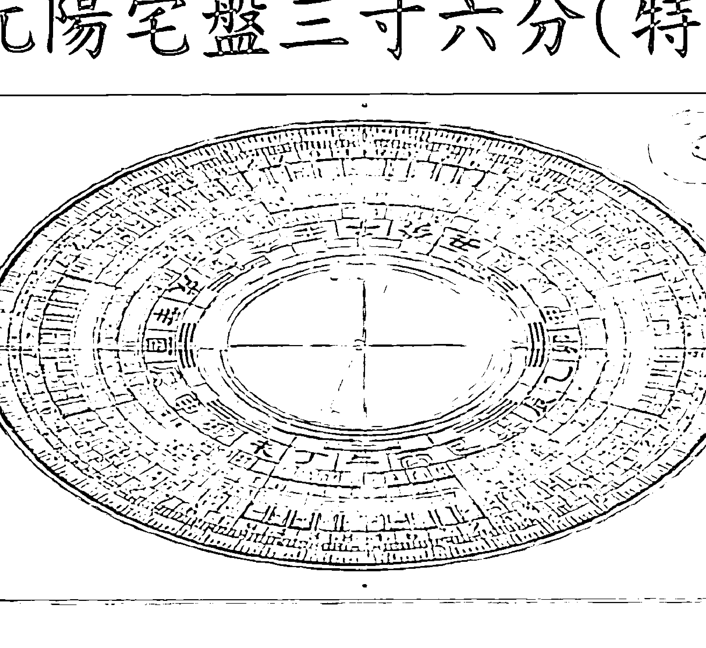

特色：天池特大針

內容說明：
- 先天八卦
- 地盤正針 24 山
- 64 卦名稱
- 九星水法
- 八宅明鏡
- 乾坤國寶
- 64 卦河圖五行卦數與爻上交
- 384 爻度吉凶
- 經緯 360 度

# 國家圖書館出版品預行編目資料

陳哲毅教你面相技巧／陳哲毅、陳力瀚合著．--初版．--臺北市：進源，2009.06
面；公分．--（相學叢書：9001）

ISBN 978-986-7864-91-8（平裝）

1.面相
293.21   98009505

◎相學叢書 9001

## 陳哲毅教你學面相技巧

作者／陳哲毅、陳力瀚合著
出版者／進源書局
發行人／林莊橙樺
法律顧問／黃沛聲律師
社址／台北市華西街61-1號
登記證／新聞局局版台業字第5783號
電話／(02)2304-2670、2304-0856、2336-5280
傳真／(02)2302-9249
http://www.chinyuan.com.tw
E-mail：juH3344@ms46.hinet.net
郵政劃撥／台北1218123-3林莊橙樺帳戶
電腦排版／冠玫(股)公司
印刷／和楹彩色印刷(股)公司
出版日期／二〇〇九年六月(初版一刷)
定價／彩色平裝新台幣400元

著作權所有，翻印必究。

◎本書如有缺頁破損或裝訂錯誤，請寄回本社調換。

## ◎相學叢書9001◎

本社致力於五術叢書之編纂行之有年，旨在承傳祖宗絕學，並助我芸芸眾生於人生苦海中窺見光明彼岸。敬謹之心，形諸文字，出而成書。願我善男信女同所受益，則本社可以無憾。

ISBN 978-986-7864-91-8
00400
9 789867 864918