# 難以置信

◎ 李嗣涔 鄭美玲 著

科學家探尋神秘信息場

感謝引導我們探索身心靈，
證悟深層真實世界的領航員

- 陳履安先生
- 石朝霖先生
- 高橋舞及她的母親
- 王小妹妹及她的父母
- 沈今川教授
- 孫儲琳女士
- 還有其他……

### 推薦序

### 談「氣功」的「科學研究」

在過去二十餘年間，我致力於以西方的科學哲學作為基礎，發展華人社會中的本土心理學，對東、西文化及其哲學均有所涉獵。在拜讀台大教務長李嗣涔教授所著的這本《難以置信》之後，深深感到：李教授及其同事們雖然聲稱他們是在用「科學實驗」的方法在從事「氣功」的研究，然而，倘若從東、西文化對比的角度來看，這些研究的價值其實比他們所宣稱的意義要深遠的多。這話該怎麼說呢？

黃光國

我們可以從西方近代的笛卡兒哲學和「氣功理論」的對比，來說明這一點。如眾所知，十六世紀西方文藝復興運動發生之後，自然科學之所以能夠有快速發展，主要是建立在笛卡兒（Descartes, 1596-1650）「主／客」二元對立的哲學基礎之上。笛卡兒的理性主義不僅主張：作為會思維的主體，「人」不僅只是和外在世界中的客體互相對立，而且人的心智和肉體也是互相對立的。他的「心智／肉體」二元論立刻引出了一個難題：沒有形體的心智，既不是固定的物質，也不占據空間，它怎麼能夠跟有形的肉體互相連接，一方面接受它的感覺和經驗，一方面又能夠對它施加影響？

笛卡兒從他對解剖學的研究中得知：在大腦的兩半球深處，有一個很小的松果體。由於它在大腦中的位置，他認為，這就是心智和肉體的連接之處。心智必須透過松果體來影響肉體，肉體也必須透過松果體來影響心智。

笛卡兒對於肉體和心智的相互作用可以說是錯得離譜。事實上，松果體對於輸入和輸出的神經衝動都沒有任何影響。重要的是，「心智／肉體」二元對立的學說認為：心智和肉體是分開的實體，人的肉體就像是一架機器，可以用自然科學的方法來加以研究；人的心智才是人類稟賦中最有價值的特徵，只有通過理性的反思才能理解。他「主／客」二元對立的哲學，促使西方科學家以絕對客觀的態度研究外在世界中的各種不同對象，造成了自然科學的快速發展。同樣的，他「心智／肉體」二元對立的學說，也促使西方的心理學把「人」當做是自然世界中的一種客體，用自然科學的方法來加以研究，造成二十世紀科學心理學的快速發展。

然而，這樣的哲學其實蘊涵了把「人」物化的極大危險性。在二次大戰爆發前夕，歐洲現象學大師胡塞爾在他逝世前出版的《歐洲科學的危機及超驗現象學》中，便很清楚地指出：在希臘傳統中，「理論心態」（theoria）原本是一種宗教儀式。人們在這種儀式中思索潛藏在世界表象之後的宇宙真理，希望它有助於人們追求美好的生活。然而，文藝復興運動發生之後，建立在笛卡兒哲學之上的自然科學，卻使這種「理論心態」異化成為「工具理性」。人類千方百計地想要預測、控制、或操弄自然界中的客體，以之作為「工具」，來滿足人類的慾求，當人類把「人」自身也異化成為一種「工具」或一種「客體」之後，歐洲文明便面臨了極大的危機。

胡塞爾的警告並沒有能夠使歐洲的「工具理性」從此停止擴張。在兩次大戰之後，隨著所謂「現代性」（modernity）的不斷擴散，人類更面臨了環境破壞、資源耗竭、軍備競賽、道德淪喪等等的問題。在死亡的威脅方面，核子彈的發明，使人類面臨了滅亡的危機；在求生的慾望方面，生物科技的發展，已經使科學家成功地複製出桃麗羊。有朝一日，當人成功地製造出「複製人」的時候，「人」扮演了「上帝」的角色，屆時人類更將面臨難以逆料的危機！

中國的「氣功」走的路正好與此相反。從這本書的敘述中，我們可以看出：中國的道家一向就不認為「心智／肉體」可以劃分為截然對立的兩極。相反的，他們認為：「人」可以透過意志練習「吐納之術」來控制其肉體，而「心／身」兩者之間的媒介就是「氣」：「行氣，深則蓄，蓄則伸，伸則下……」，練到「氣集丹田」、打通任、督二脈」，便可以說是已經有所感應，至於要練習到本書中所說的各種「特異功能」，那還要看個人的特殊稟賦，不是人人可得而為之了。

這本書記載了許多有趣的例子，說明李教授和他的同事們如何用各種「科學實驗」的方法，記錄人在「行功練氣」時的各種生理和心理反應。嚴格說來，這麼做跟西方「主／客」對立的「科學傳統」仍然有所不同。中國道家從來不把人的身體看做是一部機器，人的「心智／肉體」不能劃分為二，人自身就是目的，就是他自己的主人。

個人要不要拜師學藝，「行功練氣」，全在於他自己；「師父領進門，修行在個人」，一個人能夠練到什麼程度，能夠有多大的修為，也全在於他自己。「練功」並不像西方機械化的身體觀，練多少次，就一定會得到什麼結果。許多「科學主義」者一口咬定「氣功」不是科學，其主要原因即在於此。

其實，人的身體不同於一般的機器，正是東方「氣化宇宙觀」的最大特長。人類為什麼一定要把自己想像成一架沒有生命的機器呢？我們只要瞭解：近代「科學主義」或「工具理性」過度膨脹所造成的禍害，我們大概就不會在意「科學主義」者的這種批評。無論如何「行功練氣」，練功的人都不會把自己的肉體當做是和心智分離的機器，「氣功」不可能異化成為「工具理性」，也不會像其他科技那樣，對人類社會造成巨大的禍害。用「科學實驗」的方法來展示「氣功」的效果，正如《指月錄》之「指」那樣，只是要用所謂的「科學」方法告訴讀者：「氣功」是什麼。至於讀者要不要進一步接近它，那就要看讀者自己的造化了。

（黃光國，台大心理系教授，國家講座教授）

### 作者序

### 一切正要開始

整體大於部分之和……
一切正要開始

從小我們就被教導要破除迷信，要提倡科學，國家才能走向富強。我們小時候讀過孫中山先生為了破除迷信，曾經把廟裡的佛像打破。民間的宗教信仰、燒香拜佛只不過是人們追求內心的安寧與祥和罷了，雖有它的社會功能存在，但是本質上仍屬於迷信。乩童起乩，神靈附體，神通現象更是一派胡言，怪力亂神，迷信中的迷信。因此他從小就立志要打破迷信，獻身科學，救國救民。只是我有一點不明白，為何西方先進國家的老百姓，大部分星期天早上還是要上教堂。科學上不是早證明了地球已經存在四十多億年了，遠遠超過了聖經上所講的只有幾千年的創世紀。

十二年前一個偶然的機會，在當時國科會主委陳履安先生的邀請下，跳入了研究人體的領域——氣功，自己也開始練氣功，接觸中國傳統佛道的文化。從「氣集丹田」、「打通任督二脈」，到「放空入靜」、「發放外氣」等現象，竟然一一在身體上印證或被實驗證實。原來這是我們祖先們在幾千年前早就發現的修身、養身的方法。接下來的疑問是，為什麼練功練到比較高深的境界，就會感受到他人的病痛？就可以發放外氣替人治病？為了解答這個疑問，七年前起我轉向了「特異功能」的研究，從手指識字、念力、心電感應等現象著手，開始研究。這個領域不碰則已，一碰就引發了許多機緣，遇到各式各樣的特異功能人士，見識到各種不同的特異功能。尤其是一九九六年後，因緣際會遇到了北京中國地質大學的沈今川教授及功能人孫儲琳女士，更是讓我大開眼界。「花生起死回生，快速發芽」、「意識微雕」這些挑戰現代物理學、生化學、生理學的現象層出不窮，讓人震驚，讓人激動。它讓我了解到「意識」，也就是「心」的巨大潛力，也了解到目前的科學的發展，距離揭開人體的奧秘還有很長的距離。更令人興奮的是這些能力是可以經過訓練而開發出來，七到十四歲的小朋友經過幾小時的訓練，就有百分之十到四十的比例出現手指識字的功能，也就是腦中的第三眼（天眼）打開，出現了透視功能。持續不斷的練習下去，接著就會開發出念力彎物及搬運功能，出現了「心物合一」的宏觀現象。原來特異功能本來就屬於每個人的，開發就會出現，不開發就消失了。

一九九九年八月二十六日一次偶然的測試，把我們從身及心的層次推上了「靈」的世界。在手指識字的實驗中，一個「佛」字讓具有功能的三位小朋友都看到異象，有發光的人、宏亮的笑聲、寺廟、和尚等千變萬化的意象，與辨認其他字或圖案完全不一樣。大量的數據逼使我們承認，除了物質的宇宙以及四種力場以外，這個世界還有一種「信息場」存在，也就是俗稱的「靈界」。經過關鍵字的聯繫，具有透視功能的小朋友就可以與信息場溝通。我原有的世界體系剎時崩解了……

原來宗教裡所講的靈界是存在的！

原來宗教不只是信仰，它還含有對深層的真實世界的描述……

原來文化中的敬天畏神是確有根據……
原來燒香拜佛是在尋求人天的和諧……
原來人是具有身心靈三個層次，大部分的人只在身的層次度過一生……
原來西方科學走向化約論的極致，把複雜事務不斷分解成愈來愈小的單位來研究，讓我們對微小的真實世界如原子、分子、夸克有了精確的了解。但是對於整體複雜現象之真實世界卻愈離愈遠……
原來乩童起乩，燒香拜佛是更接近宏觀真實世界（靈界）的人生態度與行為，當我們批評他們迷信時，是我們自己更遠離了深層的真實世界……
這十二年來，我的每項實驗、每種想法都會與家人分享，尤其是我的太太鄭美玲女士。她跟我一樣從完全不信，到實際練氣功，到參與手指識字實驗，跟著我一起成長。我們常常討論一些實驗的結果，她也會提出一些看法，或提醒我注意其他人的理論。這次我們共同合作，將我們多年來的心得創作成此書，希望所有讀者也能分享我們的成長與聞道的喜悅。

李嗣涔

## 目次

### 推薦序

談「氣功」的「科學研究」

黃光國

6

### 作者序

一切正要開始

李嗣涔

13

## 第一章

挑戰物理學教授

- 手指的視覺
- 信息場的鑰匙
- 符號與形象
- 文字。光亮

19

### 第二章

氣功對醫學的影響

- 哈雷彗星的衝擊
- 氣集丹田的動感
- 生物能場
- 「閃光刺激」與「聲音刺激」
- 氣功的歷史
- 氣功為何
- 開拓身心

53

# 第三章 腦波實驗的重要發現

迴響不絕的腦波熱 ■ 腦波圖潛藏的意義
伴侶的腦波圖 ■ 共振態與入定態 ■ 「入定」境界

# 第四章 人類潛在的超感知覺與意識致動

毫芒雕刻——氣功與藝術結合的創作
氣功與醫學的結合 ■ 「人體潛能」在台大 ■ 前世今生的迷思
瀕臨死亡的時刻 ■ 六根轉換的可能性 ■ 人體潛能的開發
詮釋訊息 ■ 華陀再生的期待——扁鵲工程的壯志
第三眼 ■ 人體潛能訓練班 ■ 彼岸取經
人體科學研究的遠景 ■ 吾道不孤 ■ 意念鑽洞
生物意識工程——花生起死回生 ■ 植物的感覺
與植物的心靈交流 ■ 意識微雕 ■ 以意念干擾電腦
搬運功能實驗 ■ 偷天換日

# 第五章 文化、氣與傳統醫學研究

人文與科技的整合 ■ 從洪秀全談起 ■ 重新檢視佛教經論 開啟人類命運的另一扇窗 ■ 氣與身體 ■ 現代與傳統 雅樂舞的意涵 ■ 道統綿延

# 第六章 探索真相——進入身、心、靈的世界

來自信息場的訊息 ■ 神之光 ■ 虔敬之心 重返光明

### 參考書目

### 附錄 科幻小說中「難以置信」的主題 葉李華

183

205

219

221

## 第一章

### 挑戰物理學教授

真是美好的一天！
事實上，我從早上就情緒高昂。因為今天下午有一批物理教授要來參與手指識字實驗。自從我的氣功研究延伸到人體潛能的範圍，尤其是手指識字的實驗引起媒體注意而加以報導之後，就不斷受到批評，認為我不科學，助長迷信和非理性的歪風。
其實我並不是要大家相信什麼或不信什麼，只是認為任何一位真正的科學家，應該常抱好奇和開敞之心。人類的科學知識就是不斷探求未知，不以固守舊有的理論為滿足，一點一滴累積，一步一步向前突破而來的，不是嗎？正好我有機會接觸到一些特殊的人，觀察到一些特殊的現象，認為頗具意義，值得科學家深入探討，因此發表出來和大家共享。雖然我多次表示歡迎有興趣的學者來參與實驗，共同研究，但是一些有興趣批評的人，似乎沒有興趣了解真相，只是堅持自己原有的物理、邏輯架構，對於未知的領域，想當然爾的加以排斥。

### 手指的視覺

甚至曾試圖阻止《科學月刊》登載我的文章，並寫文章把我比為「科學乩童」。他們的心態大概只有等到美國人開始做這方面的研究時，才會幡然醒悟。

今年六月，有兩位物理教授來找我，表示今夏想參與手指識字實驗，而且有個條件：「實驗樣本由我們準備。」我當即表示：「沒問題！」後來其中一位教授又告訴我：「已經在物理學會網站公佈，可能會來不少人喔！」我表示：「歡迎！」我當然了解，其中有人是來挑戰的，不過我毫不擔心。所謂「真金不怕火煉」，手指識字實驗在過去六、七年，我已經做過七、八百次，早已超越「看不看得到」的檢驗，深入到它的生理和心理機制的探討了。今天姑且讓他們玩玩初步的遊戲吧！

其實我有點迫不及待的想看看這些物理學家，在親自證實手指認識字是真有其事以後的反應，當然這是有點促狹的心理。想像這些原本對物理世界有一套完整邏輯的人，在發現自己的世界出現裂縫時，可能會有什麼樣的反應，是饒富趣味的事。我當然可以了解他們的心情，因為我當年也是這樣過來的。手指就是手指，怎麼可能有「視覺」呢？完全違反生理常識。若不是一派胡言，就是障眼法。可是當你看過一次又一次的實驗，顯示這個現象的確存在的時候，除了接受事實之外，還想進一步知道為什麼會這樣？所以一步一步走下來，欲罷不能。或許今天來的物理學教授也會像我一樣，情不自禁的走進人體潛能的領域呢！其實「實驗是檢驗真理的唯一標準」，凡事應該「實事求是」。記得一九七六年我剛到美國史丹佛大學不久，唸到整流器方面的問題，我根據書本上的理論來做某一個習題，沒想到被助教打了一個大叉。他說實驗結果不是這樣，他是根據實驗出題而不是根據書上的理論。書上講的是理想狀況，但是實驗不是理想狀況。書中為了導出理論，常常把比較複雜的東西排除。但是實驗室裡有千奇百怪的狀況，這就是工程師要解決的問題。丁肇中博士曾經說過，他最喜歡的一件事就是做實驗來證明理論學家的理論是錯的。我完全可以了解他的心態。

### 信息場的鑰匙

一九九九年八月二十六日下午二時三十分左右，台大電機二館四二會議室，手指識字的實驗正在進行，物理學會會長帶領了台大、清大、中研院的物理教授和兩位心理系的教授總共十多人來到，等大家坐定之後，隨即開始測試。負責準備樣本的陳教授拿出第一個紙捲給高橋小妹，還把可能的答案一百個字鋪在桌上，供高橋指認。實驗從兩點三十七分開始，三十八分的時候高橋雙手所貼的電極，測量到了第一次電壓脈衝，高橋表示她「看到」的只是屏幕閃了一下。三十九分時看出來是「M」，打開一看是個電腦印的「W」，倒過來就像「M」，所以心理系的鄭教授說：「應該算看到了。」二時四十分開始測試第二個樣本，四十三分的時候，高橋表示只有白光，「是不是有空白紙？」準備樣本的陳教授想了半天說：「有可能。」四十五分高橋再次看到白光，認定是一張白紙，打開一看，果然是一張空白紙。原來準備的樣本是用電腦印成以後切割，再捲起來。所以紙張邊緣有這些空白部分也被捲製成樣本了。

這時候有位物理教授說：「猜中文字的或然率是百分之一，猜中空白紙的話，是二十分之一吧！」

我聽了覺得好玩，他們正經八百的在算或然率，希望用統計的方法來證實不是用猜的！第三個樣本，高橋花了七分鐘，始終看不到，她表示包紮的方式讓她無法進入。後來才知道，這樣本是用鉛包住，所以她的感知無法穿透。接著兩次，都在一分鐘之內被高橋的手指「看」出來是空白紙。有人說：「猜中三張空白紙，或然率是八百分之一了。」我說：「不對，八千分之一了！」接下來花了一分鐘看到一個X，正確無誤。這時候有教授拿出兩個用鉛袋包的樣本，高橋都表示無法穿透包裝。三點十四分又花一分鐘看到「古」字。

在此同時，物理教授們已經沒有人算或然率了。倒是有人在加工包裝樣本，也有人現場製做起新的樣本來。結果包了鋁箔紙的樣本，她正確的看出來了，還說：「太亮了，所以字跡很淡。」接著是把樣本放進黑色的底片盒裡，從三時二十二分開始測試，到了二十八分的時候，正確的看出是符號①。教授們這時候應該已經注意到高橋的透視力不是來自觸覺。三時三十分開始做另一次測試，她先看到一個模糊的圖形，過了一分鐘，她在屏幕上把紙翻過來，看到了紅色的太陽圖樣。打開樣本一看，原來這張紙是故意反著捲，把有圖案的一面向外，和平常不同，所以她先看到背面了。大家都有疑問：到底手指識字怎麼運作？不但能展讀紙條，還能翻面？

實驗到此告一段落，物理教授們大開眼界，有人表示不可思議，也有人向高橋的母親詢問如何訓練，三三兩兩討論著如果不是觸覺，到底是什麼機制？今天的實驗應該足夠讓有好奇、探索之心的人深思了。大部分的教授起身告辭的時候，突然有人說：「太可惜了，最愛批評的K教授沒來。」「我想他不願意來有兩個理由：第一，如果證明手指識字為真，那麼他的世界就崩潰了。第二，如果證明為假，他早就這麼認定，所以也不必來了。」聽到這樣的推論，我不禁啞然失笑。看來有不少人對於手指識字的強烈質疑已經軟化，甚至趨認同，其中尤以物理系的陳教授最是興致勃勃，不斷和我討論，還一再地說：「不得了，This is beyond Nobel Prize.」難得遇到識貨的，我十分高興，跟他開玩笑：「你也成為怪力亂神的一員了。」

三位具有特殊能力的小朋友這時候正在輕鬆的吃零食、喝飲料。其中最小的是男生，一心一意打起電動遊戲，兩位十幾歲的女孩子，則文文靜靜的在一起咬耳朵。我有時候想，她們有沒有試過不要說話，用心電感應來交談？最大的高橋已經要開始準備申請大學的資料了。她的目標是獸醫系，因為「動物生病了，很難向『人』表達」，而她還記得小時候曾經在動物園裡，聽過兩隻猴子對話，其中一隻說：「我到你那兒玩好嗎？」另外一隻說：「好啊，來呀！」接著就看到第一隻猴子一跳一溜的過去了。此外也曾聽過兩隻小鳥在討論築巢的事。我充滿期望和幻想：如果她能把這個能力找回來，甚至更加強，那麼杜立德醫生的世界便不只是小說，而是真實的了。

陳教授忙著找色筆做新樣本，可能想測驗辨色的能力。只見他給聊天中的高橋一個紙捲，沒多久，高橋說看到藍色的「光」，陳主任提示她：「還有一個字，妳再看看。」但是過了幾分鐘，高橋仍然只看得見一個「光」字，陳主任笑著打開紙條，說：「也許這個字不能隨便開玩笑！它非常殊勝，高橋也許看不到。」原來寫的是「佛（紅色）光（藍色）」兩字。另外一位教授說：「會不會是顏色的關係？」我暗自覺得好笑，高橋看字雖然有時會漏字，但是多試幾遍沒有看不到的。

四點二十分，我請大家歸位，在高橋手上貼好電極，開始實驗。四點二十三分開始到二十七分，正確看出寫在鋁箔紙上的「田」字。四點二十九分，陳教授再給她一個樣本，三十二分的時候，電壓脈衝出現，高橋說：「有個東西閃過去。」我吃驚的看著她，怎麼回事？過去超過四百次的實驗從來沒有發生過這種事。會有一個東西閃過螢幕？她接著說：「有個人的影像在屏幕上，很亮。」我難以置信，反覆向她求證，心裡一面狐疑：「難道紙捲裡不是字嗎？」三十七分，她說：「那個人在對我笑。」 「看得清他的樣子嗎？」 「看不清，因為太亮了！「三十八分，「不見了！「這可是前所未有的事，怎麼會出現影像？陳教授打開紙條，是一個手寫的黑色「佛」字。「怎麼回事啊？」大家都呆住了。過去六、七年來，數百次的實驗，從未有這樣的結果，紙條上的字，怎麼會成為發亮的影像呢？難道這個「佛」字有特殊的力量？我們緊接著做了兩個實驗，她先看到英文「si」兩字，打開字條一看是Christ。再接著看的是個「瓢」字，她看成了「瓢」，一切似乎恢復平常，她的手指識字能力並未故障。

這時候，在實驗室另一處和陳小弟弟進行實驗的學生在叫我：「教授，教授！」而幫王小妹測試的學生也在招呼：「教授，請來一下！」大家的情緒似乎都高昂而緊繃。到底怎麼回事？原來跟我實驗多年的大爺，剛才寫了兩個「佛」字，若無其事的交給他們去「看」，這時都看出了驚人的結果來。陳小弟「看到有個光頭的人手上拿著一串珠子」，「看到一個光頭穿一件黑色夾克，裡面的白色衣服上面寫著佛字。」另一邊的王小妹則說：「遠遠的有一間寺廟，門口站著一個人，閃一下，閃一下，閃出一間寺廟。」沒有看到任何字。

實驗室的氣氛熱烈，大家都想討論些什麼，我也壓抑不住興奮！

「陳教授，謝謝你。無心的一張字條，為我們開啟了一扇門。說不定這個「佛」字是虎符，是和另一個信息場溝通的通行證。哇哈，我們可以探索三千大千世界了，太棒了！」

過去兩年和中國大陸人體科學院的合作研究，我們已逐漸有了「信息場」的概念，因為大陸高功能人孫儲琳女士在她的大腦屏幕中常有師父來教她功夫，這些師父被稱為來自「高智能信息場」。但是這是真的嗎？還是孫女士大腦的幻覺？似乎無法用實驗來證實。沒有想到一個「佛」字，就讓我們似乎打開了通往「信息場」之大門。

一天的實驗就在驚愕和笑聲中結束，大家都相當激動——除了三位特異功能的小朋友。他們仍像平常一樣微笑，對我們的熱烈情緒似乎有些訝異，或者覺得我們這些凡人有點兒……呃，蠢？

在實驗室幫忙錄影的兒子，也被今天下午的意外結果震撼了吧？晚上要求他練習手指識字時，表現出少見的合作態度。我忙著用電腦印出成行的「佛」字，決定明日再試一試，並且給家裡每人一張「佛」字：「拿著這個 password 打坐，說不定也有機會和那個世界聯絡上。」大家都笑起來，太太說：「沒有那個頻道，光有通行證是沒用的！」

我不禁想像，有一天，真正找出和宇宙其他信息場來往的機制時，要在一四二二實驗室立個紀念碑！這是想得遠了。可是今天在實驗室發生的事，到底意義何在？三個小朋友都出現了異於平常的手指視覺，所以應該不是幻覺。在我們所熟知的世界之外，還有其他「信息場」的存在，這件事雖然一再由具有特異功能的人口中聽說，但是以往都是在他們打坐、修練之時才能和別的「信息場」溝通。今天卻在實驗室裡，憑著手中一張字條，三個人看見異象，而且似乎各有不同的因緣和境界。所謂的「信息場」，到底是怎樣的一種「存在」呢？宇宙之中有多少此類的信息場？它們彼此的關係如何？我們會找到三千大千世界嗎？或看到三十三重天？我感覺自己正走到一個神秘而關鍵的門檻，跨過去了，是怎樣一個寬廣不可知的境界？更實際地想，到底要怎麼樣才能打開這扇門，舉足跨進去呢？千百年來，多少人打坐、修練，想望一窺奧秘，似乎總是驚鴻一瞥，或者更像是從門縫裡瞧見那麼一點亮光吧！我們現在要做的，就是找到正確的鑰匙，打開門，大方的說：「嗨！」

## 符號與形象

八月二十七日一早大家的心情都延續著昨天的亢奮，又充滿了期待。為了更謹慎的求證昨天的異象不是幻覺，我決定先進行一般樣本的透視，再把特殊的關鍵字穿插其中。不過陳主任最想嘗試透視「實物」，而非字條認字，於是在十點零四分給高橋一個密封的小盒子，到了十點十分，高橋看出來是白色的象形玩偶。我接著進行原訂的實驗，今天要做的是兩張紙重疊的樣本透視，我分別在上下兩張紙上挖洞，目的是研究她在透視過程中展開紙張的順序，以及透視屏幕上光線的方向。一切進行順利，到了十點三十七分左右，她在答案紙上畫了一串難懂的符號，不過我知道那是藏文的「覺者」——「佛」的意思。她看到的是紙上的字。十點四十分，高橋拿了另外一張紙條，先是看到一片亮，後來除了亮光之外，還聽到聲音，很開心、很宏亮的笑聲，最後只剩亮光，聲音沒了。這次的樣本是電腦印的黑色「佛」字。

這時候的我像被打了一劑強心針，再次確定了「佛」字有其特殊性，而且可以重複測試。這絕對不是幻覺了。因為高橋對藏文的「佛」沒有特殊反應，也使我開始考慮到文字背後的文化意涵，以及人的認知活動是否受到所謂「集體潛意識」的操控，問題似乎很複雜，不過也很吸引人。

高橋聽到的笑聲還餘波盪漾，接著又聽到王小妹妹說：「很亮，是紅色的『卍』。」

下午四點二十八分，高橋手裡摸著紙條說：「一片黑。」過了一分鐘又說：「很暗的紅黑。」半分鐘之後看出來是個「鬼」字。高橋皺著眉頭表示，剛才她一直感覺很冷、很不舒服。這時有人抗議了：

「是誰搞的『鬼』，萬一真來個顯像，豈不是嚇壞她嗎？」可不是嗎？這幾個有特異能力的孩子現在是大家的寶，誰都不可以欺負。實驗室裡這種微妙的感情很難言說。對於這兩天突然出現，更正確的說，是突然和我們的實驗有了連繫的「信息」，大家都是既期待又怕受傷害。

「看」字「看」圖形的試驗照常進行著，我看看手錶，快五點了。心裡有一股壓抑不住的衝動，想再試探一下那個神秘的世界，於是悄悄的把另一張電腦印製的黑色「佛」字放進底片盒裡，請高橋再看一看。到了四點五十一分她說：「很亮！」過了兩分鐘，屏幕再次出現，她說：

「有一個人出現，手搭在他的肩上。」高橋指著前方二公尺外的曾教授。大家一片嘩然向曾教授望去。

又過了一分鐘，她說：「亮亮的。」

「他在陳教授和李教授之間，低頭看著儀器在笑。很亮。」

全場都騷動起來，我急著問：「實驗室裡這麼多人，都出現在妳的屏幕上嗎？」

「不是，只有我提到的人才有。第一次就是曾教授。第二次是你和他。」高橋指指我又指指陳教授。

陳教授和我忍不住激動起來，我們竟然出現在特異功能人第三眼的屏幕上，這可是前所未有的事！而曾教授還被那個很亮的「人」用手觸碰過，那個很亮的「人」，是我們所說的「佛」嗎？陳教授和我已經被介紹給那個信息場的「人」了嗎？

原本一直冷眼旁觀的一位中研院教授也心動了，親自做了一份樣本交由高橋測試。四、五分鐘之後高橋畫出紅色的費曼圖（～～～～～～～～～～），這位教授有點不服氣地表示和他的原圖小有不同，結果陳教授當場就拿了筆數起圖中的圈圈來：「沒錯啊，九個圈，你自己有一個畫扁了，還是算一個圈呀！」看兩位教授斤斤計較的數著小圈，真是有趣，我問高橋：「妳剛才有沒有數？」「我沒數，可是有聲音告訴我九個。」

今天的實驗可真是高潮迭起，相信大家在離開實驗室的時候，都是心情興奮而且思潮澎湃的吧！

## 文字・光亮

對於今天（八月二十八日）的實驗充滿了急迫感，一方面因為前兩天的實驗太不可思議，引發了太多的問題和聯想，偏偏又得不到解答，所以心中焦急。另一方面也因為這次的實驗就要在今天結束。

早上一踏進實驗室，發現多了不少人，心裡正問自己：「怎麼回事？」腦子裡一閃，隨即明白必定有人把昨天驚人的實驗結果傳出去了，真是資訊快速流通的時代。看來有不少人的好奇心被鼓動，都急著來求道論證。這是好現象。我孤軍奮鬥了這麼多年，到處演講、發表文章，為的就是希望吸引更多人注意這個領域，一起開發新的世界。

依照原訂的計畫，最後兩天要進行「念力」實驗，不過由於「佛」字帶來的震撼，計畫已經改變，今天我仍準備繼續探究由「佛」字所聯想的相關字眼及符號、圖案等。為避免任何可能的外力影響或暗示，今天的實驗採取的是雙盲法——就是施測者和受測者都不知道答案。事先準備了十五個樣本，隨機抽取讓高橋用手指辨識，辨認完一個樣本之後並不馬上打開，以免樣本內容造成聯想或暗示，直到做完九個測試，再逐一打開。第一張樣本的實驗，從十點二十六分三十三秒開始，其間她看到：

> 「粉紅色的花……」
> 「有人站在蓮花上，亮的」
> 「有點像女生，穿白衣，像我最喜歡的那尊觀音菩薩」
> 「消失了，只有亮光」

最後打開來看，是兩層粉紅色的紙，裡面一張寫著黑色的「菩薩」兩字。

第八次測試的過程中，高橋描述如下：

「閃了一下」

「有聲音說『ㄉㄜ、？』」

「背景亮的，沒聲音」

「背景亮的」

「背景亮的」

答案揭曉是一個紅色手寫的「道」字。

這一組的最後一次測試在十一點十八分五十七秒開始，高橋說：

「有一群人圍著一個圓圈。」

「人不見了。」這時她用筆畫出了太極圖。樣本的答案就是一個黑白的太極圖。

在這一組九個樣本之中，除了前面所寫的幾個測試之外，其餘的如紅、綠兩色的太極圖案、紅色「卍」、十字，以及英文「Buddha」（錯拼為Buhhda）等，高橋都像平常一般，直接看到紙條上的字或圖。

下午我們又以隨機雙盲法測試了高橋兩次，一次是「佛山」，她只看到「山」字，另一組「比佛利山莊」，只看到「比利山莊」。另一方面，王小妹妹也在進行測試。王小妹妹是將紙條放在黑色底片盒裡，手握住底片盒來「看」。到了下午三點多鐘，王小妹妹聽到「好像人家在唸經，很像在寺廟中，回音很大。」原來底片盒裡的紙條上是黑筆寫的六字真言「唵嘛呢叭咪吽」。

這些異象要如何解釋呢？是三位小朋友碰到特殊的字就產生幻覺嗎？還是這些字讓小朋友和另一個物理世界取得了聯繫？根據特異功能人士如高橋等人所說，在她們打坐練功時，常在大腦的屏幕中出現人物，可以彼此溝通、討論問題。這種主觀的感覺可以是大腦的幻覺，或者是功能人真的和另一個「信息場」產生溝通。

我曾經提出手指識字是大腦「由外向內」擷取信息的能力，是腦中第三眼突破身體的侷限而與紙張產生交互作用，形成「心物合一」的宏觀物理現象（註）。信息由外向內流動的時候，便在第三眼形成透視力，如手指識字等。信息由內向外流動，則造成物體的改變形成所謂的「念力」。所以手指識字是把外面的信息透過大腦的認知系統加以組合，而不是大腦的幻覺。我們在過去數年中，對高橋等人做過手指識字測試，看過的動物、花朵等相關字眼，如「狗」、「茉莉花」、「山」……等，屏幕上都忠實的呈現字，而不會引發相關的影像，如出現一隻狗或一朵花等，也不會出現聲音。但是這次實驗卻顯示，某些特殊的字眼如「佛」，會使三個小朋友都看到異象，甚至實驗現場的人也出現在屏幕中，因此絕對不是深層意識或幻覺。

這些實驗似乎證實，在我們所處的四度時空物質世界之外，還有一個「信息場」存在，我們還不知道它的物理本質為何。但是當具有特異功能的三位青少年以手指識字的方式，讓大腦和外界產生心物合一的狀態時，一些特殊的字，如「佛」等，就會像鑰匙一樣，接通信息場，而且把有關的信息引回大腦屏幕，因而出現各種異象。

這個信息場的出現，就是科學界所面對的一個嶄新的世界，正等待所有科學家的開發。實驗現場的科學家，顯然都感受到這種期待幕啟的心情，也了解到人的「特異功能」有深遠的意義。一位原本強烈質疑的教授，經過三天實驗的洗禮，在離去時說：「這可能和 evolution（演化）有關。」這話深得我心。現在人們常說「生命科學」是二十一世紀科學的主流，但是大家所說的「生命科學」指的其實是「生物」科學。我卻相信真正的「生命科學」，包括生物研究、人體特異功能，以及我們所謂的「靈」的世界，或者說是另類「存在」的研究等，才是二十一世紀最具挑戰性的學問。可以說，透過特異功能訓練，人類正進行著有史以來第一次「自我做主」的演化工作。這是一項艱鉅、偉大的工程。

面對未知的新世界，我有一份驕傲和自得，感覺自己就像探險隊的領航者，對眼前的步履戒慎恐懼，對未來的前景豪情萬丈，而回顧既往，發現一路走來充滿了驚奇、幸運、和巧合。

# 第一章 氣功對醫療組織的影響

# 第二章 氣功對醫學的影響

記得小時候曾經看過四爺爺（父親的四叔）表演兩手各執一支毛筆，同時寫大字，而且寫的是不同的字，筆筆不含糊，真是好功夫！聽說四爺爺是練過武的，能使鞭子，等閒之輩幾個人近不了身，還曾經在荒山裡用鞭子擊退過老虎呢！聽起來像是個威猛的壯士，但在我記憶中，他只是慈祥的爺爺。四爺爺原在吳佩孚的空軍氣象隊工作，也是他把我父親從家鄉帶出來，到洛陽唸書。抗日戰爭初起，父親又跟他轉到江西讀中學，而後到廣州上大學。母親和父親是江西吉安中學的同學，抗戰時留在家鄉，曾任職稅務局，也曾擔任小學教師，在戰況緊張的時期，和幾位同事帶領二、三百個政府教養院收容的孤兒，跋山涉水逃難。抗戰勝利之後又隻身從江西輾轉千里到成都結婚。可以說他們都是民初西化教育的新青年，加上戰亂流離，對於傳統的民俗活動不免生疏隔閡。所以在我小時候，對氣功的認識，大約就是四爺爺的功夫和漫畫書裡的掌風了，漸長之後認識了武俠小說裡的各派高手，雖然心嚮往之，但總以為那是小說世界罷了，並不存在於現實生活。個人真正和傳統的氣功、武術發生關係，大概只有服役時打的八趟拳了。

正由於對氣功缺乏實質的認識和了解，所以一九八七年秋天國科會副主委鄧啟福教授打電話問我願不願意參加氣功研究時，我心裡愣了一下：「氣功？」沒搞錯吧？國科會要研究氣功，未免出人意料之外，氣功不是江湖郎中的把戲嗎？什麼時候成為科學了？而我是研究半導體的電機系教授，對氣功一竅不通，怎麼會找上我呢？不過這的確是很吸引人的新鮮事，我答應了。

對於新的事物、新的機會要適時把握，不要輕易排斥，這個觀念是出國留學的收穫之一。因為自己從小到大求學的過程還算順利，尤其大二轉進電機系之後，真有如魚得水之感，當時以為只要選定最困難、最有挑戰性的領域來埋頭苦衝，其餘的都無暇也無須兼顧。但是到了美國史丹佛大學之後，每天穿梭在校園和系館，常看見多位諾貝爾獎得主的身影，或與大師擦身而過。從前在書上看過的名字，近代科學的架構者，一個個活生生的出現在眼前，著實帶給我不小的震撼。除了激起「有為者亦若是」的雄心壯志之外，更重要的是在不知不覺之中，逐漸體認到每個人都有不同的風采，也因此使得校園豐富繽紛起來。不管是人或學術領域，都沒有所謂「唯一最重要的人或事，重要的是每個人盡力做好自己有機會做的研究。因此一九八七年接到參與氣功研究的邀約時，雖然意外，但轉念一想：「有何不可？」

有些當時覺得突兀的事情，放在更長的時間之流裡來審視，才發現其實不然。生命之河相繼不斷，前波後浪無法分割，但一切事情總有前因後果。

## 哈雷彗星的衝擊

雖然我到一九八八年才正式開始氣功的研究，但是個人真正的改變應該是從一九八五年開始的。那一年哈雷彗星來訪，到年底冬天的時候，我常和太太帶著女兒，穿衣戴帽到樓頂去找彗星的蹤跡。那時我太太剛剛懷了老二，所以我們現在常告訴他，我們是一家四口一起看哈雷的。當時我去查這個彗星的歷史，發現它二千多年前就會出現，已經造訪太陽系三十幾次，大約再走四十多次就會消失。哈雷彗星會消失，當然太陽也有一天會死亡，太陽死亡之前可能變成紅巨星把地球吞噬，如果那個時候還有人類，當然也就一起滅亡了。或許有人覺得不必悲觀，人類科技發展，可以移民到別的星系，但是宇宙同樣也會死亡，所以生命總有結束的時候。這些「知識」我們本來都知道，但是好像沒有什麼切身的影響。哈雷彗星的出現，迫使我面對這個事實。起初當然有點沮喪，究竟生命是為了什麼？一代一代傳下去，終究要歸於幻滅，這就是杞人憂天吧！天真的會場，只是時候還早。「人生不滿百」，何苦「常懷千歲憂」？重要的是重視生命的過程，好好享用它。隨時把握機會，該做什麼就做什麼。

哈雷彗星的到訪，給我很大的衝擊。我回過頭來，把以前讀過的東西重新唸過。宇宙是怎麼產生的？星雲如何形成，星球如何形成？太陽系呢？生命的起源在哪裡？今天的我來自何處？那幾年我蒐集了許多這方面的書籍，也開始接觸生物領域，嘗試探索生命的演化。

如今回想起來，好像自己那時已不知不覺的在為日後投入氣功和人體潛能的研究做準備。

## 氣集丹田的動感

一九八七年十月，有意參與氣功研究的教授第一次集會，陳主委給大家出了一項功課：回家練功，而且要練出「氣」來。要親身試驗練氣時身體的變化，再來談氣功的研究。陳主委並且給每人一本武功秘笈《禪密功》，要大家回去照著練，一個月後回來驗收成果。據說非常容易，有慧根的人，甚至十多分鐘就能「氣集丹田」了。

猶記得當時捧著武功秘笈，如獲至寶。想到小時候看臥龍生的《玉釵盟》、徐元平和紫衣公主的故事，稍長又有古龍的《小李飛刀》、《楚留香》，乃至金庸的《神鵰俠侶》、《天龍八部》等，那個充滿想像的世界裡，打掌風、隔空點穴，甚至飛天遁地，有無限的可能。而一切功夫的根本就在氣集丹田、打通任、督二脈。如今我也有機會藉由修練而脫胎換骨，成為武林高手，真是興奮。回家提到此事，常常為武俠小說廢寢忘食的太太也興致勃勃，開始編織起郭靖、黃蓉的俠侶美夢。晚上等小孩入睡，便在客廳照著《禪密功》的第一章：築基功所指示的方法練習起來。可惜兩人都不是天生武俠奇葩，站了半天，什麼事也沒有發生。就這樣練了一個多禮拜，太太宣布放棄，雖然搬出一堆道理勸說，她仍不為所動，還說：「這個方法有問題，又要站著不動，又要全身放鬆，根本就互相矛盾。」這話卻有些道理。維持站姿的確不是全身放鬆的狀況。想來想去，要全身放鬆只有躺著，躺著練氣功？似乎怪怪的，不過何妨一試！於是我便躺在床上練起來，練著練著就呼呼大睡了。奇怪的是，睡到半夜突然醒來，只覺腹部緊繃，而且一陣一陣，不斷朝臍下部位（丹田）集中，這就是氣集丹田嗎？還是腹部肌肉抽筋？正在驚疑不定時，又覺得它沿著督脈往上竄，經過胸口時，幾乎不能呼吸，非常難過，使我想起當兵時，所謂鬼壓床的經驗。難道這就是得「氣」了嗎？就這樣心懷忐忑地過了半個月，回到國科會驗證成果。陳主委請了一位高段師父來替大家發氣，果然產生同樣的現象，也由師父的認證，知道這種腹部緊繃收縮的感覺，就是所謂的氣集丹田。武俠小說裡的人物，動不動就來個氣集丹田，哈！吾知之矣！

通過了第一關，我們便積極籌備有關氣功的群體研究計畫。由於當時台灣社會及學術界，大多把氣功視為怪力亂神，是中國傳統的不科學的練身術，可說是一種迷信。因此我們絞盡腦汁，想出了「生物能場」的名稱，在一九八八年四月，向國科會生物處提出「生物能場群體研究計畫」。計畫的內容有三大方向：一是氣功外氣對生物細胞的作用；二是中醫把脈原理及在氣功上之應用；三是用穴位電訊測量儀診斷疾病之原理及對氣功師父測量之研究。後兩者在研究練功前後，脈象及穴位電導的變化，第一項則是研究外氣的作用。

當時我的研究主要在穴位電訊測量儀之測量原理，也就是研究俗稱「傅爾電針」的原理。在此之前，使用傅爾電針的人都沒有電學方

## 氣功的歷史

面的背景，所以總覺得電針的機器非常神奇。經過我實地測試，發現電針本身並沒有神祕之處，它只是送出十微安的電流進入穴道，測量其電壓，總算釐清了傅爾電針的工作原理。其間還發生了一個小插曲：有一天我突發奇想，拿實驗室的交流電取代原來使用的直流電，並以四赫茲的頻率來點測自己的穴道。當電針碰觸到左手中衝穴時，突然有一股麻電的感覺沿著手臂，直衝胸前、腋下，嚇得我急忙縮手，回家拿書一查，正是心包經的路徑。那天晚上一直覺得心神不寧，很不舒服。過了一段時間，害怕之情漸退，好奇之心又起，我又再度拿自己試驗，但並沒有再出現同樣的現象。

至於氣功方面的研究，因為以往沒有實質的認識，所以花了很多時間閱讀大陸的氣功論文，努力吸收各種有關的知識和已有的研究成果。到了八八年底，參觀中研院王唯工教授的研究室，發現王教授設計了一面大鼓，利用鼓聲刺激人體經絡系統的頻率，來幫助練功。

親自感受過鼓聲的刺激之後，我開始計畫氣功的科學研究，但是仍未找到具體的方法。因緣湊巧，在八九年年初（舊曆年前）參加了台大電機系馬志欽教授主持的「電磁場對生物細胞的影響」研討會，當時主持人提到地球上空電離層與地面所形成的同心球體共振腔，可容許電磁之全球振盪，地球上只要任何地方出現閃電，都會激發這個共振腔之電磁振盪。這使我聯想到腦波和氣功的關係，練氣功會刺激腦α波，那麼刺激腦α波，是否可以產生氣感呢？我於是開始思索刺激腦波的方法。

## 「閃光刺激」與「聲音刺激」

首先，我設計了「閃光刺激法」，總共實驗了三次。結果發現，對照組的五人只有手掌略感麻木；而實驗組的七個人之中，有四個人產生了氣感。顯示閃光刺激有一定的效果。

後來又設計了「聲音刺激法」。由於人的耳朵無法聽見十赫茲的聲音，因此請學生用電腦製造了人耳聽得見的高頻樂音，再切割成每秒十音節，並錄製成帶。那位幫忙做切割錄音的同學，在電腦桌前反覆試聽，結果引發動功，身體不自覺的搖晃，幾乎無法操作鍵盤。日後我在台北醫學院演講，播放了這段聲音，不到二十秒鐘，聽眾席上一名黃姓講師便在座位上晃動起來，雙腳猛踏地板，最後跌倒在地上，令全場震驚。原來他打坐了七、八年，很容易與外界刺激產生共振。我把這個現象叫做「魔音穿腦」，更對《大漠英雄傳》裡，黃藥師以玉簫，歐陽鋒以鐵箏，互較高下的場面，產生無限的嚮往和崇敬。

「閃光刺激」和「聲音刺激」雖然都有功效，但是也都需要儀器的輔助，對一般人並不方便。有沒有更簡便的方法試試呢？有一天大清早醒來，突然想到何不以快速思想的方法試試呢？每秒鐘默念一到十，不斷重複，利用左腦顳葉規律的放電（思想）來與視丘部位交互刺激。

想到這兒，我立刻跳下床，用禪密功姿勢站好，然後在腦中快速打數。沒想到只花了十幾秒鐘，丹田部位就出現了氣感，真是神速。於是興奮的把沉睡中的太太搖醒，拜託她依法試行，過了十分鐘問她：「怎麼樣？有沒有氣感？」「有。」「氣集丹田了？」「不是，在膻中。」「膻中？這個傢伙，就愛搗亂，」「真的還是假的？」「真的。」「什麼感覺？」「胸口發緊，喉頭不自覺想吞口水。」「好啊！不管丹田或膻中，總之是產生了氣感。當天只覺得太陽特別晚起，我急呼衝到學校，召集所有的研究生，要求大家在睡覺前，以禪密功姿勢躺在床上，快速打數練功，以十五分鐘為限。總共是十四個人，其中六位沒興趣，每天還沒練完就睡著了。其他的有五位在三十分鐘內（兩個晚上）氣集丹田，有兩位在十五分鐘內氣走任脈，還有一位則是鍥而不捨，努力了十個晚上，才嚐到「氣集丹田」的滋味，第十一天一早跑來報告：「興奮得一個晚上睡不著覺。」此君真乃今之郭靖也！

刺激法，尤其是「快速思想」刺激，是進入氣功狀態的捷徑。古人花費數月、數年才能修練成功的「氣集丹田」、「打通任、督二脈」等，只要找對方法，原來也可以這麼容易，而且幾乎人人可以做到，多麼奇妙啊！

本來純粹出於好奇而參與氣功的研究工作，經過親身練氣體驗，和初步的實驗，深感氣功是有方法、有理論，可以科學化的。祖先數千年來為生存、保健所發展出來的氣功，既不迷信、也不神秘，我們有責任也有義務，以現代科學的方法把它發揚光大。

氣功在我國已經有數千年的歷史。西元前三八〇年戰國時代的《行氣玉佩銘》，有如下的文字：「行氣，深則蓄，蓄則伸，伸則下：：」。相傳出現於西漢初年的《黃帝內經》，第一部分「素問」的〈上古天真論〉、〈異法方宜論〉、〈刺法論〉等經文中，也提到了「導引」、「按」、「按蹺」、「餌舌下津」等，都是指氣功的鍛鍊方法。老子《道德經》有「虛其心，實其腹，致虛極，守靜篤」等語，也是指練功時，心情需安靜、意守丹田。這些抽象的文字記載，或許不足徵信，但是近年出土的長沙馬王堆西漢墓群之三號墓，不僅有十餘種醫書，還有一幅「導引圖」，生動活潑，色彩鮮豔，是目前所知世界上最早的保健體操圖譜。可見在漢文帝時期（西元前二世紀中葉），行氣導引的觀念和方法，已經非常成熟而普遍了。

## 氣功為何

「氣功」是什麼？簡單的說，氣功的「氣」代表呼吸，「功」就是用意識不斷地調整呼吸和姿勢的練習。所以練氣功就是練習有意識地自我身心鍛鍊，對生命過程實行自我調節，甚至自我控制。在這種鍛鍊的過程中，身體會產生特定的生理變化，我們稱之為「氣功能」。氣功科學化就是要充分了解身體在「氣功能」的生理特徵，並且發展出簡單有效的方法，使身體產生這些特徵。事實上，自古以來的各門各派氣功，都是為了找尋一套最有效的方法。綜合數百年的心得，練功不外調心、調息、調身。「調心」就是腦中要祛除雜念、放空和放鬆，但又不能昏昏沉沉。其次「調息」，就是古代「吐納」之術，也就是我們所謂的「腹式呼吸」，「呼吸配合腹部的伸縮，使進出的氣息細長而均勻」。最後是「調身」，不論採取何種姿勢，總之是要讓全身放鬆。練氣功的時候，就是藉由調整姿勢、動作、呼吸加長，肢體放鬆，最後出現腦α波大幅增加，氣感循經絡而行的「共振態」；或大腦放空，腦α波受到壓抑而消失的「入定態」。它們都是人體的一種狀態。只要方法正確，加以練習，每個人都有可能進入「氣功能」。氣功在古書中稱作導引、吐納、行氣、坐忘等。當練功到一定程度的時候，丹田會產生熱氣，向後尾椎部，沿脊柱而上，過頭頂而下，經咽喉、胸中，回到腹部，這叫「小周天」，也就是氣行任、督二脈一圈。任、督二脈屬於「奇經八脈」，和中醫針灸的十二經脈（手三陰、手三陽、足三陰、足三陽）不同。有人把十二經脈比喻為十二條河流，把奇經八脈比喻為湖泊和水庫。十二經脈中氣血的盛衰，依靠奇經八脈來調節平衡。其中任、督二脈最重要。任脈在身前中心線，屬陰，總管全身陰經；督脈在身後中心線，屬陽，總督全身陽經。只要任、督二脈打通，全身經絡便相繼而通。因此有人認為中醫的經絡系統，就是古人經由靜坐、導引、吐納等氣功修練，從自己的身體體驗出來的成果。明代李時珍在《奇經八脈考》中說：「內景隧道，唯返觀者能照察之。」意思是說，只有氣功的返觀，才能察覺人體內部的生理現象。

## 開拓身心

練功者均以打通任、督二脈為要務，認為是練功健身的標誌。關於此點，還有一種有趣的說法，認為這是古人觀察動物生活的心得。自古以來鹿、鶴、龜等就以長壽聞名，人們基於追求長壽的心理，也特別注意這些動物的生活起居，結果發現「龜納鼻息，鹿運尾閭，以通任、督。」《本草綱目》記載鹿「臥則口朝尾閭」，《慧命經》更說：「鹿睡之時，鼻入肛門，通其督脈，鶴、龜通其任脈。」因此認為通任、督二脈是牠們長壽的主因。任脈由會陰穴經胸腹上行，終止於承漿穴，督脈則由長強穴沿脊椎上行，經過頭頂而下，終止於齦交穴。人在胎兒時期，二脈相通，出生以後，為了飲食和排泄，「上斷於口，下斷於肛」。所以人們常以「舌抵上顎」和「提肛」，來幫助連通二脈。其實人類觀察動物生態，並模仿其動作來健身的例子很多，最著名的就是華佗的五禽戲，《三國志·華佗傳》說：「吾有一術，名曰五禽之戲，一曰虎、二曰鹿、三曰熊、四曰猿、五曰鳥，亦以除疾，並利蹄足，以當導引。」五禽戲的源流其實還可以追溯到春秋戰國時代。《莊子·刻意篇》說：「吹呴呼吸，吐故納新，熊經鳥伸，為壽而已矣。此導引之士，養形之人，彭祖壽考者之所好也。」除此之外，北方還有「鶴翔莊」，以鶴為模仿對象，另外還有什麼的「龜息大法」，都是以動物為師的功法。

「氣功」這種有意識的自我鍛鍊、以提昇生命品質的概念，不僅是中國醫學中重要的一環，它同時也是中國哲學的重要基石。老子《道德經》說：

> 有物混成，先天地生。寂兮寥兮，獨立不改，周行而不殆。可以為天下母。

吾不知其名，字之曰道。強為之名曰大。大曰逝，逝曰遠，遠曰反。

> 《易經．繫辭傳》說：
> 形而上者謂之道，形而下者謂之器。

換句話說，「道」指宇宙萬物的孕育之母，是周而復始流動不已的看不見的東西。這種看不見之物的作用，古人便稱之為「氣」。「氣」的古字為「气」，更早為「≡」，正是流動的意象。

由於中國學者一向認為宇宙是一無限延續的生命，而氣又是生命的根基，因此，談到宇宙的根本，自然非「氣」莫屬。「氣」的概念和內涵也因之擴張、變化，成為中國哲學的重要思想概念。更有認為，氣的調和與否，甚至影響到國家的興衰。

《國語》上有一段記載，在西元前七八○年，周幽王二年，陝西發生大地震，周大夫伯陽父說：

> 夫天地之氣，不失其序。若過其序，民亂之也。陽伏而不能出，陰迫而不能烝，於是有地震。今三川實震，是陽失其所而鎮陰也。陽失而在陰，川源必塞。源塞，國必亡。

春秋時代，醫和認為「陰陽風雨晦明」六氣，乃是五味、五色、五聲、六疾、四時、五節產生的根源。子大叔也說：「氣為五味，發為五色，章為五聲……民有好惡喜怒哀樂，生於六氣。」

老子提出「負陰以抱陽，沖氣以為和」的身體觀念。

到了戰國時代，學術思想蓬勃，氣的概念也趨於成熟。莊子提出「通天下一氣耳」、「游乎天地之一氣」，以「氣」為世界的統一性，為萬物相互轉化（如莊周夢蝶）找到了理論根據。孟子更說：「吾善養吾浩然之氣。」……其為氣也，至大至剛，以直養而無害，則塞於天地之間……」

這種哲學上「氣」的概念，使得養氣練功超越了健身的目的，成為修心養性的手段。而因為氣充塞於天地萬物之間，所以人人可以練氣，甚至動物、草木亦可修行。晉朝葛洪的《抱朴子》說：「夫人在氣中，氣在人中，自天地至於萬物，無不須氣以為生者也。善行氣者，內以養身，外以卻惡，然百姓日用而不知焉。」指出人人有氣，人人可以修行成仙。表現在哲學上，便是宋代理學家所說的：「聖，學以至。」這種「凡人可以經由意識的修練，而超脫世俗、成仙成聖」的觀念，正是中國「人」的觀念，不同於西方之處，西方的「神」和「人」是截然分開，不可能由個人的意志和努力而改變角色。

由此不難知道「氣功」在中國文化發展上的重要性，絕對不是健身延壽的手段而已。

# 第三章 腦波實驗的重要發現

一九八九年初，我大膽假設「氣」的產生，主要是由於增強腦 α 波所激發的神經信號而引起的，使身體各部位的組織、細胞、脈管，經由同一頻率神經信號的刺激而做局部運動。當大部分組織的振動達到同步，便會呈現大範圍的運動或長距離傳導。這種振動傳導由神經傳回大腦，就產生氣感。因此可以藉由刺激腦 α 波來誘發「氣」。我們設計了「閃光刺激」、「聲音刺激」、「快速思想」等方法，經過實際試驗，都能有效引發氣感。但是所謂的「氣感」，只是個人主觀的感覺，並沒有客觀的證據，尤其我們一直強調的是刺激腦波產生共振，到底腦波是不是增強了呢？顯然需要實際測量的數據，才能進一步研究。但是量腦波需要有醫學方面的背景和儀器，我該如何著手呢？

就在這困頓難行之際，幸運之神翩然而降。台大醫院神經科陳榮基主任和張楊全副教授對氣功研究產生興趣，於一九八九年初，勇敢面對正統醫學的懷疑眼光，加入生物能場的研究行列。他們兩位正好是腦波專家，在日後給了我很多醫學方面的指導，並且慷慨的把腦波測量室每週空出半天，供我進行實驗，我和台大神經科從此進行了八年的合作。

## 迴響不絕的腦波熱

人類的腦波是奧地利傑拿大學的漢斯．柏格在一九二四年發現的，不過他遲疑了五年，一九二九年才把論文發表出來，在當時並未引起大家的重視。但是一九三四年，英國的研究人員證實柏格的發現以後，卻造成巨大的「腦波熱」。由於時機的配合，三○年代無線電技術的發展加上腦波的出現，帶給人們無窮的想像空間，流行作家寫了許多科幻故事，描繪人類如何利用無線電接收器截取別人的腦波來監視其思想等等。當然，這些幻想至今未能實現，不過腦波在神經系統疾病的診斷上確實非常有用。

當時我研究的是刺激法對腦波的影響，以及練功時腦 α 波的變化。實驗在台大醫院舊址地下一樓的腦神經科測量室進行，由專業的護理人員協助操作。首先請學生來做刺激法的試驗，在一九八九年三月，就有了初步的成果，有兩位學生分別經由閃光刺激和快速思想，成功的誘發了氣感，並且反應在腦波上。

根據這些實驗的結果，我在一九八九年四月十一日投出個人氣功研究的第一篇學術論文〈以刺激法導引氣感的產生〉，該文刊載於一九八九年六月份，第四十六期的台大工程學刊。大約在投稿前後，因為參加中國醫藥學會的學術會議，在會場發表了個人氣功研究的初步成果，被媒體大幅報導，也從此招來質疑和批評。我除了更努力做好半導體本行的研究，讓自己立定腳跟之外，仍然繼續氣功的相關的研究，而且越深入就越覺得欲罷不能，也越能領略古人的深邃智慧，對於自己曾經如此遠離祖先的心血，深感慚愧和不安。

## 腦波圖潛藏的意義

腦波實驗還有一個有趣的發現。本來我們實驗的目的是為了了解人在從事各種不同活動時，腦波有什麼變化。因此，量出基本腦波圖譜之後，我們就請受測者做數學的計算。沒想到不同的受測者在做相同的活動時，腦波的變化竟然各不相同。在開始做心算之後，有的人腦波呈現一片混亂，有的人卻是腦波頻率集中，振幅增加。經過調查統計，發現腦波變亂的人，原來數學就不好，所以數學活動對他們造成困擾。而腦波變強的人，原來數學就不錯，所以做數學活動對他們而言，是愉快勝任的。後來我們請受測者做各種不同的活動，包括做計算、背文章、默念英文、想一幅風景……等，發現每個人從事自己喜歡或擅長的活動時，腦波就會單純化、增強，而從事自己不喜歡的活動時，腦波會變得混亂而壓抑。譬如有一位受測者，做算術時腦波一片混亂，想風景時腦波大幅增大，原來他數學很差，但很喜歡畫畫。這個發現，讓我們大為雀躍，原來從腦波的變化，可以看出一個人真正的性向。我曾經把這個發現告訴多位心理學者，希望他們在智力測驗、性向測驗時，也能配合腦波的測試，可惜沒有得到什麼回響，希望有心人士日後能重視這個發現，做更深入的探討與應用。

## 伴侶的腦波圖

量別人的腦波之前，當然也要先量自己的腦波。所有測試我都親身參與。一段時間之後，逐漸發現自己的腦波圖是屬於少數「乾淨俐落」一族，就是主峰之外幾乎沒有其他起伏，而且主峰強勁。看多了混亂的腦波之後，不禁對自己「漂亮」的腦波得意起來，開始有種種想像和「天將降大任於斯人也」的虛榮。不過令人懊惱的是，這些想像似乎得不到太太的認同，幾次在談話中小心暗示，她不是裝傻就是笑而不答，甚至顧左右而言它。如此持續了一陣子，總算利用空檔，請太太來量腦波。看到太太的腦波圖在電腦屏幕呈現出來的時候，我不禁暗叫一聲「好險！」好在事前沒有把話說死，不然這下可有得瞧了。她的腦波頻率竟然和我的完全一樣，是十。五赫茲，而且振幅比我還強！

雖然大部分的人腦 α 波都集中在八到十三赫茲之間，但是兩個人的頻率要對得這麼準可也不容易。

「說不定是在一起久了，互相調整的結果。」

「還是倒過來說，是因為腦波頻率相符，所以彼此互動和諧，才會在一起？」

「對啊！為什麼有的人讓你一見如故，有的人總覺得『話不投機半句多』，也許都是腦波頻率的問題。」

「現代人說來電不來電，還真說對了，原來是腦中的電波在作怪！」

「我有個主意，以後你學生要交女朋友，先帶來量腦波，兩個人合不合拍，一量便知，這叫『科學八字』。青年男女要結婚，除了健康檢查，還要腦波檢查，我們就來開一家現代八字館，專門幫人配腦波，怎麼樣？」

越說越起勁了，有一段時間，我們真的沉醉在「科學八字」的迷思中。直到那一天，朋友帶著新婚不久的嬌妻來量腦波。因為平常聽我說得多了，不禁想來實驗一下。兩人的腦波圖列印出來的時候，我心裡連聲慘叫：「苦也！」天下怎麼會有這樣的事呢？那真是我見過最「相異」的兩張腦波圖了。不但頻率完全錯開，而且一位是單峰在中間，另外一位卻有雙峰在兩側。我絞盡腦汁，汗流浹背的從腦波頻率的分布談起，東迁西迴，足足扯了半小時，終於轉到兩人完美互補的腦波，畫下句點。這是到目前為止，我最緊張、最艱難的一次即席演講，深恐自己一語不慎，傷害了新婚的一對佳偶。從此再也不敢提起夫妻、情侶的腦波問題，籌畫中的「現代八字館」，就此胎死腹中了。

## 共振態與入定態

初步證實了刺激法可以引發氣感之後，接著要探討的是氣功師父練功的時候，腦波有什麼變化？各門各派練功的時候腦波有沒有什麼差異？

「生物能場研究計畫」剛開始時，國科會聘請的李師父才從軍中退役不久，中等身材，非常斯文。第一次見到他，是陳主委請他幫我們打氣，驗證氣感。他的兩手放在我腹前、腰後各約十公分處發功，當我的丹田部位產生氣感時，他與我同時叫出：「來了！」顯示他不接觸我的身體就能察覺我體內的變化。令我詫異的不止於此。被他打氣之後的三天，氣感一直在體內竄動。我工作忙碌時不覺得，但是只要身體一放鬆，氣感就來了。我算是領教了高手的真功夫。

李師父說自己有七種練功法，並可發放兩種外氣：養氣和殺氣。我測量了他練「放空」、「放鬆」和「大小週天」三種功法的腦波變化。發現在「放空」的時候，腦α波受到壓抑並且消失，可是練「放鬆」和「大小週天」時，腦α波卻是大幅增加。我就是從李師父身上觀察到練功的兩種不同功能態，深覺有必要進一步蒐集資料，加以探索。

為了搜集更周延的資料，我到處打聽各門各派的功夫，想辦法邀請師父級的人來量腦波。從這些師父身上，我們不但獲得明確的資料，用以界定練功時有「共振態」和「入定態」之分，更由實驗中證實，不論是禪、是道，最後的境界都是「入定態」，只是著手處略有不同。道家練功從氣集丹田開始，打通任、督二脈，小周天，大周天……等，一路往上，就像求學一樣，從幼稚園、小學、國中……循序漸進。所以氣集丹田、打通任、督二脈只是幼稚園或小學的程度而已。表現在腦波上的狀態，則「共振態」是初步功夫，「入定態」才是高層次的境界。禪家練功則以數息、參話頭等方法，採取「一步到位」，直接進入「入定態」，但是這個方法並非人人可以成功。

接觸過許多高人之後，在一九九○年九月終於請到財政部關政司司長王德槐先生來做測量。他可謂高人中的高人，一閉眼他的腦波就呈現入定態。為了讀取他的背景資料，還頗費了一番心思呢！個人對王司長非常佩服，他不但照古書上道家的功法練習，獲得極大的成就，而且很用心的記下自己練功的過程，印證古書的記述，於一九八七年寫成了《中國仙道之究竟》一書，做為時代的見證。我們何其有幸，得識今之仙家。當初我雖收集了不少門派師父的腦波資料，但是對於有人呈「共振態」，有的呈「入定態」，有人兩者都呈現的情形，感到

# 第三章 腦波實驗的重要發現

非常混亂和疑惑。尤其王司長本身練的是文始派內金丹功，屬於道家，可是腦波卻是「入定態」，另一位龍門丹道的黃師父也有同樣的情形。到底怎麼回事呢？後來讀了王司長《中國仙道之究竟》一書，在第八篇第二章練無化神裡有一段談到止火。他說：

止火的意思，是指在採藥結丹時，因火候已定，不再進火之謂……

在煉無過程中，小周天的運作，一般稱為進火，退符。進火之目的在為以後採藥打基礎。所以小周天可以有很多次，次數多，基礎也好。大周天則只有一次，其道理是採得大藥後，目的已達。且結丹以後即須進入養胎階段，自無再運轉周天的必要。而丹經更強調，如丹熟不止火，尚有損丹之虞。這就像做飯炒菜一樣，倘飯已好，菜已熟，做的人如不知道，仍繼續加火，那麼已做好的飯與菜，勢非燒焦不可，所以丹熟止火確實有其必要……結丹之後，任、督自然停運……倒是止火之後，對往時終日河車軋軋的情形，心中懷念不已，不免常常想到以意念來帶動真炁，再去運轉周天的希望。作者在這個節骨眼上曾犯過錯誤，所幸覺悟得早，不曾發生不良影響……

看了這段文字，才了解道家練功有其嚴謹的步驟，而小周天是初步築基的過程，若要更上層樓必須捨棄「共振態」的階段，進入「入定態」的境界。至此對練功的進程有了較完整的認識，也才能初步建構「共振態」和「入定態」的相關意義。

這時候再回頭看剛開始做氣功研究時，閱讀了許多大陸北京中醫學院劉國隆教授的論文，他曾統計過數百人練功時的腦α波，都是呈振幅增大的「共振態」，為什麼劉教授沒有發現另外一種功能態呢？經過仔細的研讀，發現原來劉教授所邀請的都是同一門派——道家內養功的同修，可能其中沒有高段的師父，所以沒有觀測到「入定態」的機會。可見做實驗的時候，樣本的選取對實驗結果影響非常鉅大。

測量腦波期間，也遇到一些有趣的事。譬如有同門師兄弟或師姐妹，拜的是同一位師父，他們也認為兩人練的是同一種功夫，可是腦波卻顯示兩人練的功夫南轅北轍，完全不知道台灣的道場有多少是這樣的情形？可能師父只是用嘴巴教功夫，各人隨自己的領悟去練。比較令人擔心的是如果弟子在練功過程遇到問題，師父到底有沒有協助解決的能力呢？

此外還有些忠誠的門徒，因為師父在實驗室量到的腦波圖，不符合他們心目中的「高深莫測」形象，因此心中不服，不斷打電話來抗議，說我們的儀器有問題。

## 「入定」境界

當台灣學氣功的風氣漸盛之時，「大陸氣功師父」也逐漸登台。我曾經有機會認識幾位大陸來的「大師」，邀請他們做實驗，到了約定的時間卻派弟子出面，說是前一天晚上師父指示，不可以做實驗。接連兩位大陸師父都是如此，以後我就再也不請大陸來的師父了，不管人家說得多麼神乎其技，都不為所動。

我由腦波的觀察，推論出氣的傳導是與神經系統有關，而氣走的路徑主要是奇經八脈，到大周天時才會走針灸所用的十二經脈，而且師父練功的功能也不僅是「共振態」，還有「入定態」。但是當時我們對氣功的研究才剛起步，這些理論架構尚未經過時間的檢驗。中研院的王唯工教授研究氣功和血管脈搏的關係多年，他認為血液的輸送有其週期性，基本頻率就是心跳的頻率，約為一．二赫茲。心臟跳動把血液送往全身，產生的壓力波不是正弦波，所以一．二赫茲的倍頻如二．四，三．六赫茲均會出現在脈搏中。王教授也發現，師父在練氣的時候脈搏中第三、第六及第九倍頻大幅增加。但是有一次來了一位功夫高深的師父，卻發現他練功時，脈搏中心跳的倍頻不但沒有增加，且有下降的現象，也就是證實了在「共振態」之外，還有另一種練功的狀態。我知道之後頗覺欣慰，認為是「入定態」得到了間接的佐證。

腦波實驗的結果告訴我們，不論什麼門派的功夫，練到高深的程度都會進入「入定」的境界。既然如此，為什麼大家不直接學入定，像禪宗一樣，而要先練氣，繞一大圈再回到「定」呢？有人認為是為了先練氣健身，避免坐成枯禪。除此之外，我想也可能是為了傳法的方便，因為練氣比較容易入門，而且可以有具體的感受，學起來有成就感，比較不會打退堂鼓吧？

一般談到練氣和入定，總不免想到道家和佛教，而且往往把練氣認為是道家行徑，而入定則與坐禪、學佛相提並論。其實這都是不正確的觀念。有些人以為靜坐（盤膝打坐）入定便等同於修禪、修道，更是錯誤。盤膝靜坐原來只是印度古老瑜珈術的一種姿勢，由於它有助於收攝人心，因此被採取為入靜入定的方便法門。事實上打坐不一定能入定，入定更不一定要打坐。我們在測量腦波的時候，曾邀請香功協會的林副理事長來現場，她一邊做香功的動作，一邊漸漸進入「入定」狀態，並有香味傳出。可見「入定」是練功過程的一個境界，和身體的姿態沒有必然的關係。

至於練氣更非道家的專屬，佛教的修練也多是從練氣入手的。以佛教天台宗為例，其經典如《六妙法門》、《童蒙止觀》中就有不少有關氣功的論述。書中談到治病：「云何用止治病相，有師言，但安心止在病處，即能治病……」正是今天我們說的「意到氣到」的意思。

又說：「次有師言，臍下一寸名憂陀那，此云丹田，若能止心守此不散，經久即多有所致。」不正是今天氣功強調的「意守丹田」嗎？大家常說「天下功夫出少林」，少林功夫的基礎正是氣功。《少林宗法闡微》說：「桑術之派別，習尚甚，而要以氣功為始終之則。」根據《少林宗法闡微》的記載：「致於運使之法，以馬步為先，又名站步或站樁……能於馬步練得好，則氣貫丹田，強若不倒翁。」這樣的練功法就像今日的站樁功。少林氣功包括練氣和養氣，而且要結合武功和禪學成一體，通過氣功練成「金剛不壞之身」。

當然和氣功淵源最深遠的還是道家。事實上，我國的道家是一個敢於假想、敢於追求的偉大學術思想。道家認為「人」的生命，可以「與天地同休，與日月同壽」，而人的生命與智慧，可以「參贊天地之化育」，也就是說，人的生命潛能若得到發揮，可以彌補天地之缺憾。這是多麼雄偉的氣魄！而且他們不但敢於假想，更努力於追求假想的實現，所以有人做物理、生理的研究，有的人做化學藥物研究，有人研究鍛鍊身體、培神養氣的方法，更有人從事於祭祀、祈禱……等信仰的研究，由此衍生了醫學、煉丹、氣功、符咒……等方術，千百年來傳承不絕。

我們把練功的功能態分為「共振態」和「入定態」兩種，其實是非常簡略而粗糙的分法，因為我們只測量五個定點的腦波數據。如果更詳細的測量所有的點（共二十二處），畫出來的腦波圖一定可以呈現更多的資料，供我們做深入的分析。大陸的航天醫學工程研究所的空間腦功能研究組，在一九八五年十月六日曾經對氣功大師王松齡做腦波掃描，結果在他練功時，量出來的腦波圖有如一幅太極圖，引人遐想：太極圖的起源是否與此有關？會不會是古人在練功過程中出現的腦部異象？我自己測量過的腦波之中，有一位李師父，練氣時腦α波沒有特殊的變化（圖一），倒是β波在頭頂部位形成了兩個眼（圖二）。另外一位鍾師父則是在練功時大腦的強勢部位從枕部移到頂部（圖三）。這些不同的腦波圖到底傳達了什麼訊息？值得有心人深入探討。

## 圖三

鐘師父練氣時，大腦強勢部位移到頂部。

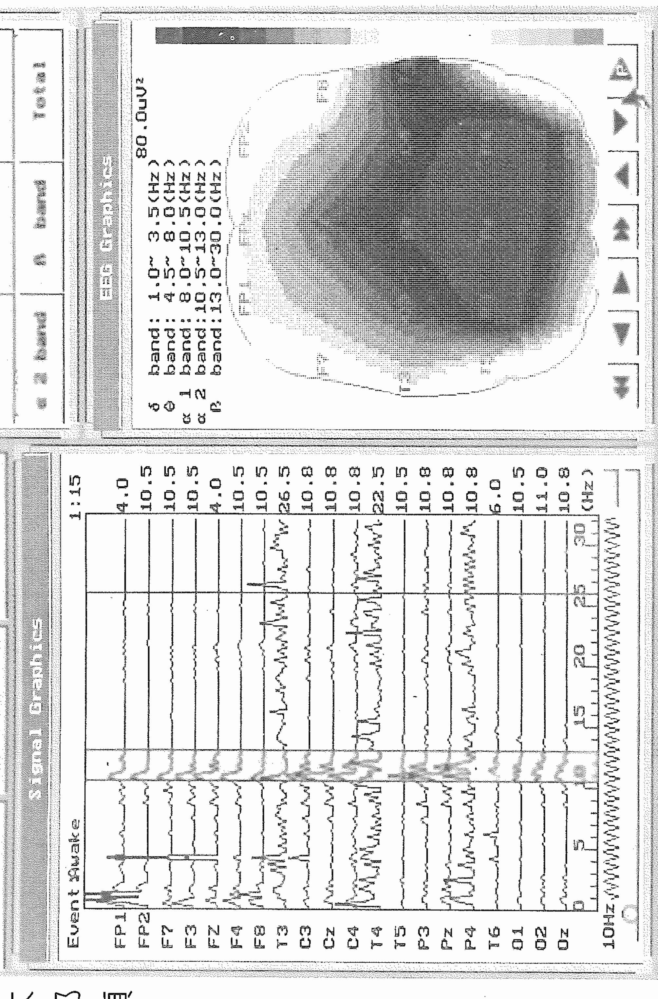

## 圖二

李師父練氣時，β波在頭頂形成兩個眼。

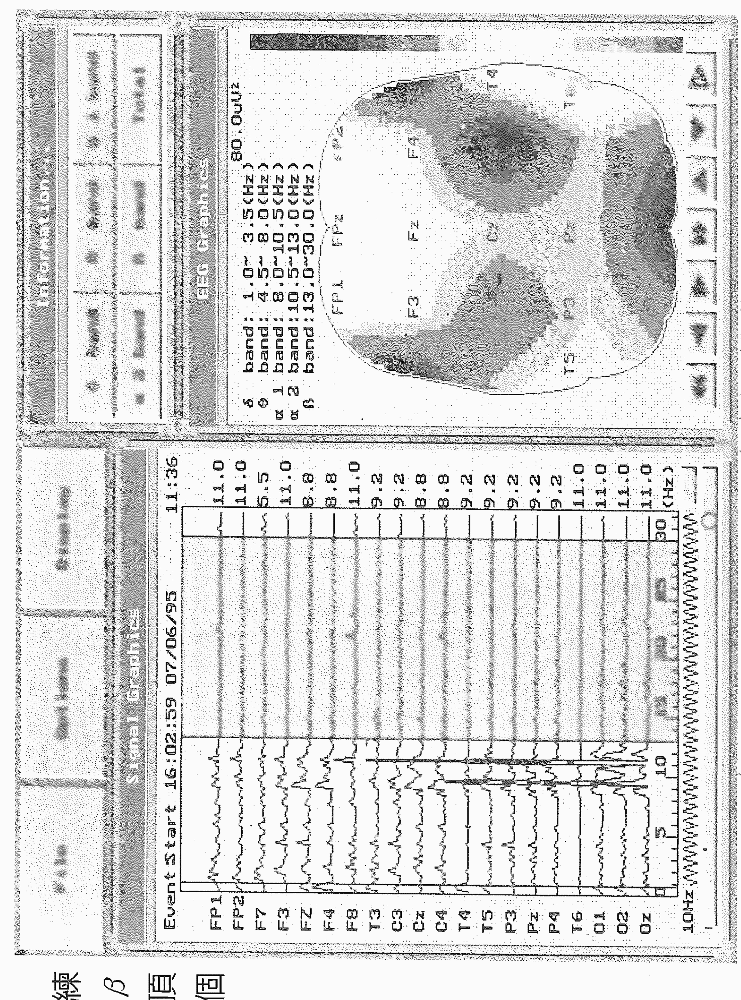

## 圖一

李師父練氣時，α波無明顯變化。

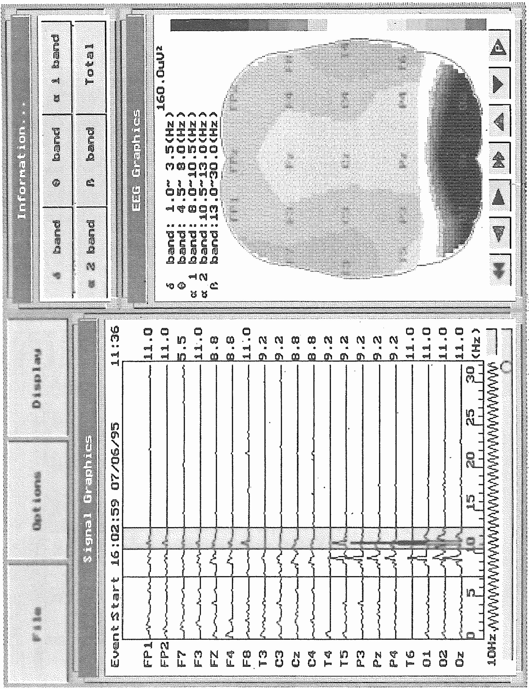

# 第四章 人類潛在的超感知覺與意識致動

一九八九年下半年，中國時報在寰宇版上開闢了一個氣功專欄，我也應邀寫了幾篇短文，把當時研究氣功的心得發表出來。同時還有一位中醫師李仲亮先生，從臨床實證經驗探討氣功在醫療應用上的各種問題，他並且特別提出「特異功能」來討論，他說：

> 特異功能的研究與應用已觸及到醫療、政治、軍事、藝術、運動……等各種領域，為最受當代科學重視的學科之一……特異功能在國際上的研究，早已超越了「是否存在」、「是否科學」的爭論階段，假若我們仍滯留此類枝節問題上，實屬無意義，為今之計，必須以美、蘇、中國大陸……等為師法對象，急起直追……

李先生認為由於過去四十年在「特異功能」的研究方面，我們繳了白卷，以致出現種種令人憂慮的現象。他希望特異功能可以開展出一片寬闊的學術空間。

## 毫芒雕刻——氣功與藝術結合的創作

專欄的另一位作者沈爲眾先生，是大陸芒雕專家，正好攜帶作品來台展出，我特地帶著兒子去參觀，看他在頭髮上雕刻西遊記的人物，惟肖惟妙，真的是嘆爲觀止。沈先生在短文中談到：

毫芒雕刻首先要克服的就是手部脈搏跳動的問題。人的頭髮每根平均寬度在七絲（○．○○一公分）到八絲之間，而人的脈搏振幅至少就在二十絲以上，所以要把脈搏振幅縮小到七、八絲之間，自然得運用氣功有效自我控制……。

他說自己對芒雕的體會是——在手不在刀、在心不在手、在神不在心。

雕刻的時候，他「用靜功把自己與外界完全隔絕……身心全灌注到那一根頭髮上去。」

從這些字裡行間可以看出，他已經把氣功修為和藝術創作結合，並且發揮到極致。雖然沈先生自認沒有特異功能，我們卻可以從他身上看到在入靜之後，人的潛力不可思議。

經由實驗，我們知道在入定（也稱入靜、放空）的時候，腦α波呈現平靜狀態，顯示大腦已經有效的排除了外界的干擾，此時可以由意識直接控制人體的自主神經系統，調整身心到特定狀態，因此小者修補器官病痛，大者做一些平常做不到的事，即所謂的特異功能。我練氣功時日尚短，自然談不上什麼特異功能，不過對於紓解病痛倒有切身的體驗。因為我偶爾有睡覺時小腿抽筋的毛病，每次發作總會突然驚醒，痛楚不堪。學習氣功以後，我嘗試以入定法來切除痛感，果然奏效。不但痛的感覺瞬間消失，而且抽筋部位的肌肉也隨之鬆弛，不再抽搐。可見入定的確可以有效阻隔神經信號之傳遞，並且把痛的感覺消除。所以平常練功入定，應該有助於消除病痛、調理身體。

## 氣功與醫學的結合

前面曾經說過，氣功和中國醫學的關係非常密切。我國歷史上有名的醫家往往也是精研氣功的高手，如春秋時候的扁鵲，提出在練功時應用計算呼吸的方法，即「數息法」。漢代名醫張仲景在《金匱要略》提到：

> 若人能養慎，不令風邪干忤經絡，適中經絡，未流傳臟腑，即醫治之；四肢才覺重滯，即導引吐納，針灸膏摩，勿令九竅閉塞。

晉朝的葛洪也是當時的名醫，但是因為他在《抱朴子》一書中談的多是行氣養生之道，加上他又研究煉丹術，所以他的方術道士之名反倒勝過醫家之名。

南北朝的名醫陶弘景在《養性延命錄》裡也有許多練功養生的理論與方法。其中提出：

> 凡行氣欲除百病，隨所在作念之，頭痛念頭，足痛念足，和氣往攻之。

> 納氣有一，吐氣有六。納氣一者，謂吸也。吐氣有六者，謂吹、呼、唏、呵、噓、呬，皆出氣也。……

這是默念法和六字訣的練功方法。

此外，還介紹了六字訣的運用等。

唐朝的孫思邈在《千金要方》的各章，都有導引的介紹。其中提到：

> 和神調氣之道，當得密室……正身偃臥……閉氣於胸中，鴻毛著鼻而不動，經三百息，耳無所聞，目無所見，心無所思……。

## 特異功能與磁場

一般所知道的特異功能大致分為兩類，一類稱為超感知覺或特異感知，英文為Extra Sensory Perception，簡稱ESP，如手指識字、透視力、感知殘留信息、心電感應、預知未來……等均屬此類；另一種特異功能是念力，英文為psychokinesis，簡稱PK，這一部分包括突破空間障礙，意念致動，意識生物工程……等。

由於這些醫家在氣功方面的造詣高深，所以歷史上流傳的許多故事，如遙感測病，起死回生，甚至扁鵲的「視人五臟顏色」等，其實都可以理解為醫家——也是氣功大師——的特異功能表現。

個人對於種種特異功能的認知，初期只限於文獻資料和道聽塗說，直到一九九一年才在台大醫院林醫師的介紹下，認識家住台中的石先生。林醫師特地帶我到石先生家，看到了許多訓練特異功能的儀器，包括超感知覺測試器，ESP卡片，PK訓練儀，α球等。石老師並且以錄影帶介紹各種特異功能演示，還在我掌中放一枚迴紋針，然後握住我的手，用念力讓迴紋針站起來。

見識過訓練特異功能的儀器之後，我便開始思索各種可能的實驗和進行訓練的方式。由於石先生擅於以念力影響指南針和手錶的走動，令人自然聯想到磁場的問題，因此決定測試他在調動念力時頭部附近的磁場狀況。第一個實驗是念力轉動密封的指南針，我們以高斯計的探頭測量其右臉頰和太陽穴附近的磁場變化。另外一次念力實驗是讓手錶的秒針暫時停止，必須是用電池操作的手錶才行。這次在距離前額十公分的地方量到了連續四十秒的十高斯磁場，最高的時候有三十高斯的脈衝，而秒針則被停止了數秒鐘。

依照電磁定律，要在體外十公分的地方產生十高斯的磁場，則皮膚內要有一千安培的電流才行。身體內有這樣大的電流應該是不可能的事。所以我們推測此種磁場的成因可能和磁鐵一樣，是由帶磁分子按一定方向排列而形成磁區。不過實際生理成因尚待探討。

磁場的出現是石先生念力的特徵。但是磁場只能影響磁性的物體，我們已知許多針對非磁性物質的念力實驗，可以推知念力的主要媒介不是磁場。

## 「人體潛能」在台大

進行念力實驗的同時，我也在一九九一年秋季開一門「人體潛能」的專題，請石先生幫忙用ESP卡片對學生進行心電感應的訓練和實驗。由於是國內第一次把「人體潛能」搬進課堂，在當時引起不少討論。這門課後來成為有學分的正式課程，持續至今。

目前我們仍以ESP卡片加上量腦波，試圖找出具有心電感應潛力的人，並從統計資料的累積來建立具有此種潛能者的腦波及生理特質。所謂ESP卡片是美國杜克大學超心理學專家萊因博士在三○年代有感於撲克牌太過複雜，不符實驗所需，於是將它簡化成只有五種花色的卡片，實驗的時候先以隨機方式抽出一張，再由發訊者透過一定的程序和方法把圖形傳送出去，接收者寫下感應到的圖形。當然接收者有可能是用猜的，而且猜對的機會有五分之一。所以我們必須不斷重複，累積到五十甚至百次以上，然後比對正確次數和理論上的或然率，來判斷是否具有心電感應的能力。

修習「人體潛能專題」的學生，都要做五十到一百三十次的心電感應實驗。學生分成兩組，每次上課要輪流做發訊者和接收者各十次。幾年來修課的學生累計有近兩百位，其中大約有六位具有統計學上的顯著性，而我們也發現這些具備心電感應潛力的學生大多數在做心電感應實驗的時候，腦α波振幅很小，趨近於入定態。其中有兩位更是一閉眼腦α波就很小，屬於天生入定態，或許這就是具有慧根吧！不過α波小的人可不一定就具有超感應力，也可能是精神長期緊張，或是疲倦、服用藥物等。

除了實驗我們也請同學就親身體驗或耳聞的有關ESP的事情提出報告。有一位在實驗數據上顯示有心電感應能力的同學所提報告非常精彩，可以看出他偶爾會出現預知未來的能力。該生是民國七十四年豐原高中的畢業生，有一天他夢見學校的禮堂倒塌，醒來之後還告訴父母和同學，沒想到第二天禮堂真的塌下來，學生死傷慘重。另外一次是他報考台大土木研究所的時候，走進口試的考場一看，發現考場的佈置、主考的教授，乃至考試的題目，都和兩天之前夢中的情境一模一樣，結果當然高分錄取了。

另外一個有趣的報告是當時電機系四年級的同學提的。原來是他和家人一起去看通靈的人。那位通靈的女士只握住他的雙手，便說出他生理上的病痛，還知道他三年前交女朋友分手的事，讓他內心非常震撼。真是過去的「業」在身上留下了信息，而有特異功能的人只要握住你的手，就可以讀取你身體所有的訊息和記憶嗎？這位通靈的女士又說：「你二十四歲會結婚，否則一輩子結不成了。」可憐這位學生當時已經二十三歲了，聽她一說，當場頭昏眼花，還好通靈人指點了一條明路：「可以到林口竹林寺求觀音化解。」可想而知，該生一定會被家人押到竹林寺去吧？

## 前世今生的迷思

幾年前台灣有一本極為轟動的暢銷書，由張老師文化出版，書名叫做《前世今生》。原著者是美國的心理醫師，在進行心理療法的過程中利用深度催眠，讓受診者挖掘深藏的記憶，沒想到有些受診者的記憶並不停止於此生，而像穿過時光隧道一般的往前延伸，描述起上輩子、上上輩子、甚至幾百年前的「經歷」來。此書造成轟動之後，立刻有不少同類的書跟進，講前世的、還有來生的、轉世的，紛紛擾擾，坊間雜誌也沒閒著，報導了許多可以看透他人前生的大師。

也是時機巧合，這幾年藏傳佛教在台灣弘法不遺餘力。而藏傳佛教的法王、仁波切都是轉世者。一時之間，台灣人似乎無法不面對前世來生的困擾。還真有不少人透過各種管道千方百計探尋自己的前生。記得在報上看過有人出國旅遊，在參觀古蹟的時候，猛然失神——也許應該說是猛然清醒——看見自己前世就生活在該處。沒多久我太太的好友也邀她去探訪東南亞某個殊勝的山洞，聽說很多人到了那裡都會有強烈的感覺。不過我太太大概還沒有面對前世的勇氣，所以不曾成行。而我個人也有朋友相邀去會晤李世民和魏徵的轉世者，可惜時間不配合錯過了。那時候每天左顧右盼，不知道誰是今之古人，增添不少樂趣，遺憾的是此類事例求證太難，姑妄聽之罷。

除了轉世之外，還有所謂「借屍還魂」的事。由現有資料來看，可信度較高的是麥寮婦人林罔腰的事件。大致的經過是一九五九年麥寮一位吳先生承包了台西海豐島的工事，當時其妻林罔腰臥病在床，等到翌年工事結束之後，原已病逝的林婦忽然下床，行動自如，卻自稱不是林罔腰，而是金門女子朱秀華，她和家人乘船逃難時遇難，漂流至海豐島，被當地漁夫謀財害命，冤魂漂泊於海豐島一帶，後經安西府張李莫千歲指點，借林岡腰之屍還魂。

由於林婦本為土生土長之麥寮人，病癒後說話卻是金門口音，而原本文盲的林婦轉變為朱秀華之後，卻能寫能記帳，而且身體強健，個性也變得剛強。因此家人和鄰居都深信是借屍還魂。

這件事在民國五十一年報紙披露之後，斗六軍醫院院長劉海波先生曾經親自前往探查，但是未有結論。此事曾有中外媒體報導，也被拍成電影，迄今三、四十年，當事人都已七、八十歲了，仍然是個無解的謎。

像這樣靈魂和肉體分開的故事，自古至今流傳不斷，一般通稱「靈魂出竅」或「離體」。在最近一波暢銷書中也有不少討論瀕臨死亡時靈魂離體的經驗。如一九七五年Moody醫師所著的Life after life以及一九八○年Ring所著的Life at Death等書，都記錄了大量瀕死狀態下靈魂離體的經驗。其中有很大的比例是病人覺得自己浮在天花板上。

# 第四章 人類潛在的超感知覺與意識致動

看醫護人員搶救自己。另外有些意外事故的當事人，也會感覺自己擠在人群中，好奇的想看看發生什麼事情，等到發現躺在地上的人正是自己的時候，往往就一驚而醒。

這些例子是否真的是靈魂出竅呢？事實上人在瀕臨死亡的時候，有一項重要的生理特徵是腦波消失，大腦的電活動降低，就像練功到高深境界時，進入深沉入定的情況。由於本身呈現趨近於絕對靜止的狀態，是否因此特別敏銳而能夠感應微弱的訊息？天花板和牆壁或是意外現場圍觀的人牆等，都可能是一面鏡子，反射當時的景物和活動，雖然鏡面粗糙，反射的畫面可能凌亂失焦，不過因為此時大腦非常敏銳，所以能夠解讀這些畫面，而形成好像看到鏡子的影像。假設天花板是面大鏡子，那麼一個人躺在床上看鏡中的情景，就像是從天花板往下看一樣。

如果是這樣，那麼這些靈魂就不算是「離體」了。比較可能「離體」的，也許是另外一些例子，有些病人宣稱自己進入某種通道，到達充滿亮光的地方，通常都是非常平和安詳，沒有痛苦的。在那裡會看到一些人和美好的景物，但是有人告訴他：「時候還沒到，必須回去。」然後就醒了，一切的疼痛也都回來了。

## 瀕臨死亡的時刻

我們是不是可以假設：他們的靈魂離開身體，和那個充滿亮光的世界有了接觸？

到底人在瀕臨死亡的時候發生了什麼變化？尤其是真的去世的人，在死亡的剎那是否一切歸於完全的平靜，因達到涅槃境界而可以無所不在呢？否則何以有那麼多人在去世的時刻會顯身向親友道別？

一九九二年報上曾刊載許希麟女士的文章，詳述抗戰時候空軍烈士劉粹剛先生飛機失事前後的情形。雖然許女士是在夢中見到丈夫歸來，可是樓下的勤務兵卻斬釘截鐵的說隊長在深夜回來，他不但親自開門，還眼見他上樓。諸如此類的「故事」相信大家都聽過不少。就在數月前，台大理學院一位資深教授過世，也發生了這樣的事例。

原來這位資深教授當年自大陸來台之後，一直是孤家寡人住在宿舍裡，後來因年歲已高，生活起居需要有人照料，便僱請了菲傭來幫忙。老教授最後一次生病由系上同仁協助送往台大醫院，住進加護病房，後來在夜間過世。第二天大清早，朋友接了菲傭趕到醫院，沒想到菲傭一聽說教授夜裡在加護病房過世，突然臉色大變，驚惶大哭起來。經過教授們安撫詢問，她才說出來在半夜老教授曾經回家，她聽見老教授穿拖鞋，以他特有的節奏走上來，還到房門口和她握手道別，並且吩咐她：「Take care of yourself, I am going」，當時她以為老教授已經好轉，回來拿東西，所以不在意。沒想到是這樣……。

我們說「入定」是一種模擬死亡狀態，所以道行高深的人進入深層入定的時候，可以展現種種特異能力，但也由於一念尚存，所以要做到「意到身到」、「法身遍在」總差一步。死亡的剎那或許能夠真正做到此種「異能」，可惜「剎那」太短，也因此人類總在追求那一份「證悟」，是否到了那一「剎那」一切便會了然呢？

## 六根轉換的可能性

眼、耳、鼻、舌、身，是人的五官，分別擔任人的五種感覺，所謂色、聲、香、味、觸。一般而言，五種感官的知覺，是彼此不相通的。許多科學家的研究顯示五種感覺是各自獨立的，所以視覺受損不會影響聽力，反之亦然。但是在一九九六年四月，英國《自然》雜誌刊登了一篇文章，是Sadato研究群的實驗報告，他們以正電子發射斷層攝影術（PET）及區域大腦血流量測量，發現有經驗的盲人在觸摸點字時，大腦的視覺皮質區會有激發的反應。這是科學界第一次發現盲人在摸點字時，觸覺信號會傳到視覺皮質，似有不同感覺互通的現象。

雖然佛經裡有不少六根轉換的說法，不少佛像甚至在手掌、腳心畫上眼睛，如此有千手便有千眼。但是以我們的經驗而言，要用手來「看」東西或用耳朵來「看」東西，總是是不可能的。不過在一九七九年，四川省大足縣有位名叫唐雨的小男孩，卻可以用耳朵識字。也就是說在耳朵裡塞進一張寫了字的紙條，他可以在幾分鐘之內在腦中看到這個字。這件事在四川地方報紙披露之後，引起許多小學老師的興趣，紛紛在班上測試。結果在不到一年的時間裡，四川各地報導具有耳朵識字能力的小朋友竟然有數百人。

這樣的結果引起北京大學生物系陳守良副教授的注意，於是在一九七九年底，舉辦了識字功能訓練班。邀請北大附近總共有四十位五歲到十四歲的小朋友參加。其中經過四天以上訓練的小朋友有八成出現了手指識字功能。受過三天以下訓練的效果較差。總計則有十六位小朋友出現手指的超感能力，佔了所有參與者的四成。一九八○年杭州浙江大學的田維順教授等人對杭州地區中小學生共一千二百多人做四小時的誘發訓練，結果發現成功率最高的是九歲的兒童。而上海高校人體科學聯合研究組的邵來聖等人，從一九八二年起就對上海各高等院校的師生以及當地的工人，舉辦特異功能誘發訓練班，結果發現文化水平較低的工人，誘發成功率較高，功能的提昇也比較快。

大陸在八○年代做的許多實驗不但證明了手指識字功能的普遍性存在，也發現手指識字功能是特異功能的敲門磚。根據特異功能人士的說法，手指摸紙條所獲得的訊息，都是呈現在腦中的屏幕上，大家通稱為「屏幕效應」。「屏幕效應」出現表示大腦有將外界的雜亂訊息分析整理並呈現出來的能力。有了這個基本能力之後，就可以用不同的方式加以鍛鍊，增加大腦的功能，就像在大腦裡建立各種解題程式一般，逐步完成大腦和外界事物的聯繫管道，特異功能高強的人就是利用這個管道操控外界物體，發揮念力的功能。

其實我在一九八七年剛剛開始國科會的氣功研究時，對於手指識字和特異功能的事情，也是抱持質疑的態度。畢竟自己一直接受現代西式教育，加上從小在數理方面表現很好，所以很早就以做一個「科學家」為志向。大學聯考的時候第一志願是台大物理系，誰知道最拿手的數學科目竟然馬失前蹄。記得聯考完那幾天非常鬱卒，在家裡悶不吭聲的發呆，頗有理想破滅的心情。大一進了化工系，只覺得化學非我所長，因此準備轉系。由於好幾位南一中的好友都在電機系，而電機系領域很廣，所以就在大二時轉進了電機。如今回想起來，真正能體會塞翁失馬、焉知非福的道理。如果不是聯考的時候鬼迷心竅被一題簡單的數學糾纏不清，以致空了後大半的卷子，大概就會如願以償的進入物理系，那麼想必不會轉系，今天可能就是正統物理教授，是否還有機會參與氣功和特異功能的研究，不得而知。

## 人體潛能的開發

但是不論專業在哪一行，真正的科學家應該要對未知存有好奇之心，對於不斷推陳出新的科學進展，隨時要有面對「今是昨非」的勇氣和雅量。已有的知識是前人的心血，非常了不起，但如果它不能夠幫助和引導我們繼續做新的應用和探索，那它就死了，成為沒有生命的學問。十九世紀末的時候，科學界普遍以為物理發展已到盡頭，人類對物理世界的認識已經很完整了。可是二十世紀的相對論、量子力學提出，打開了另一扇門，以往的物理遂成為「古典物理」。今天也是一樣，有人寫書宣稱已經看見「The End of Science」，但是我不相信，我仍認為會有突破，目前只是暴風雨前的沉悶和寧靜罷了。

個人在氣功研究有了初步成果之後，對於五四以來被斥為迷信落後的「舊文化」產生了敬意，面對祖先的智慧，多了謙卑之心。曾經被棄若敝屣的事物，焉知不是珍寶？以針灸為例，非要等歐美肯定它的價值，我們才敢亦步亦趨的跟進，多麼令人痛心啊！它原是我們祖先的成就，竟然要兜這麼大的圈子。有了心態上的調整，再來看歷史上記載的許多心電感應、特異功能事蹟，以及被歸諸鬼狐妖怪的故事，自有不同的領略。接觸了大陸在特異功能方面的研究文獻之後，深覺其中必有深意，不是怪力亂神一語可以搪塞，更可能是尚待探索和開發的人體潛能。當然若要深入了解就必須親自投入實驗。要進行這樣的實驗，第一個條件就是找到具備特異能力的功能人。

是否冥冥之中自有安排？連我都難以相信自己的好運氣。就在九年夏天，透過石老師認識了十一歲的高橋舞小妹妹。高橋九歲的時候，她的母親看到日本電視台有關手指識字的報導，便讓她試一試，結果發現她竟然具有這個功能。她母親非常興奮，深覺難得而可貴，便每天讓她練習。第一次見面時，我就迫不及待的對她做測試。我先在一旁用不同顏色的筆寫了二十張紙條，然後任意抽取一張交給她。那天總共做了四次實驗，她正確的看到兩個字，失敗的兩次之中有一次是用膠帶把紙條包住，另一次則是沒戴上她戴慣了的布套，兩次都花了十多分鐘看不到而放棄，那時候不知道失敗的原因，不過百分之五十的正確率已經使我興奮不已，決定進一步深入探索。

於是在九三年十月第一次請她到台大電機館來，從九四年開始每年暑期她和母親回國省親的時候，便安排數天到台北做實驗。而我所設計的實驗內容，也隨著研究進展而逐步深入。

第一回的實驗是以存在性檢驗為主，也就是要確定她真的有手指識字的功能，所以觀察的重點在於認字及顏色的準確率。為了有效記錄實驗資料，每次實驗都請學生做紙上記錄，並以V8攝影機全程錄影。這是國內第一次有人把「特異功能」引入大學的研究室。

一九九四年暑假進行第二回實驗，觀察的重點在她「看」字條時手部溫度的變化，以及眼睛在手指識字過程中的作用。我用紅外線攝影機記錄手掌的溫度，並觀察手在黑布套裡觸摸紙條的動作。此外我又採取了請她戴眼罩或在暗室進行實驗的方式，希望了解眼睛在此功能中的作用。結果發現在「看」紙條的過程中，高橋小妹妹的手掌溫度下降是成功的條件之一。而她的手指在布套內不斷觸摸紙條的棱線，但是始終不曾打開紙條。手指看字既然是非眼視覺，為什麼還會有和視網膜神經一樣的色彩反應呢？我們以隔絕光源的方式測驗，結果在有燈光且不戴眼罩的情形下，五十三次顏色圖案的辨識均正確無誤。戴了眼罩之後，二十一次之中有四次顏色錯誤。在暗室進行的三次實驗，則是圖形正確而顏色全錯了。因此我們知道眼睛看到光線對手指辨識有作用，正常雙眼所看到的光是腦中屏幕的背景，蒙住眼睛或在暗室的時候，屏幕的背景也變暗了，色彩的辨認就變得困難。

九五年第三回實驗，除了繼續確認第二回的觀察結果之外，也試圖了解手指辨認紙上圖案之方向。我們把準備的紙條一端剪成尖形，然後固定從尖的一端開始捲摺。由於高橋「看」字或圖案往往是一部分一部分逐漸出現的，所以由她「看」到的順序，比對紙張的方向，希望能知道她是從外向內或從內向外「看」。

第三、第四回實驗，我們在高橋的兩手手掌各貼一個電極，記錄兩手電壓差的變化情形，再和腦中屏幕出現的時間做對照，以探知手掌放電和屏幕出現的關係。

第四、第五回實驗期間，我們安排高橋小妹妹到榮總醫院，測量她在手指識字過程中，大腦血流速度的變化。

經過反覆測試我們可以肯定，高橋小妹妹進行手指識字的過程中，每當屏幕出現的時候，身體也會產生生理的變化。我們經由測量可以明確知道在屏幕出現之後，手掌便會出現電壓脈衝，最高可以達到三十毫伏特。而在榮總神經血管內科測量血流量的結果，發現高橋小妹妹用右手識字的話，屏幕出現時，中大腦和後大腦的動脈血流速度都下降百分之二十左右，表示大腦活動量減少。血流速度回升的時候，雙手便出現電壓脈衝，右手為正。但是如果她改用左手識字，則在屏幕出現時中大腦血流速度會上升約百分之二十，接著左手出現正電壓脈衝。所以我們雖然看不見她的屏幕，卻可以由生理變化的情形知道屏幕的出現。

當然大家最想知道的是手指如何「看」到紙條上的信息？根據實驗的結果，我們認為手指如眼睛一般，都是接收紙條反射出來的信號，因為我們曾經以透明紙寫字做為實驗樣本，結果高橋的屏幕背景變成黑色，顯然這是因為透明紙不反射的緣故，但是只要在透明紙底下墊一張白紙再一起摺疊，背景就恢復明亮。此外我們也在白紙上挖洞或貼上黑色膠帶，結果她看到的便是一個黑色的洞。這些實驗的結果使我們推論，手指識字的時候，大腦把紙張打開之後，是從正面看反射的訊號。

## 詮釋訊息

我們還發現高橋的大腦會根據原有的認知來詮釋紙條上的訊息。

譬如說：我們在紙條上寫「線」字的時候，把左邊「糸」字下面寫成了潦草的一挑，但是她卻看到三點。更有趣的是我們在九八年暑期所做的實驗。我們把紙張密封在方形的盒子裡，圖案面向下，請她先看到圖案，然後把手中的盒子順時針轉九十度。照理說，她既然看到圖案的正面，表示她是從底下往上看，這時候手中盒子順時針轉九十度，則從底下往上看的圖案應該逆時針轉九十度才對，可是她看到的卻是順時針轉了九十度的圖案。

多年的實驗固然讓我們了解不少事情，卻也引出許多問題，包括非眼視覺的機制，非眼視覺與生理變化的關係等，都有待深入研究。

## 華佗再世的期待——扁鵲工程的壯志

一九九六年四月我到北京潭柘寺參加中國人體科學研究院主辦的「特異現象物理研討會」，中國大陸從事特異功能研究的科學人員幾乎全部到齊了。我因此有機會了解大陸各地研究特異功能的概況，知道他們在各地普遍性的開發兒童的特異能力，並且打出了「扁鵲工程」的口號，希望訓練出一批具備特異功能如透視人體、隔空搬運等的小孩，然後以正常管道施以醫學教育（當時在大陸由於制度的關係，醫生不是熱門的職業，醫科是容易可以考進去的），造就出和戰國時代的名醫扁鵲一樣——既可透視人體診病，又有醫學知識可以治療，甚至超越扁鵲，因為這些人可以隔空取出結石、膿瘤等，「扁鵲再世」似乎是可以期待的。這個「扁鵲工程」的壯志令我深受感動，也激起我的豪情，決定在台灣開發具有特異功能的小孩。

於是在當年七月，經佛武禪協會吉教授的協助，舉辦第一次的手指識字訓練班。由於時間有限，我的訓練班只能安排四天，每天三、四個小時。如今想來，我實在太幸運了，在毫無經驗的情況下第一次舉行訓練，竟然在第一天的第一個小時，就有了成果。有一位王小妹妹，在第三次試摸的時候出現了功能，並且在接下來的三天之中，達到手指識字正確率百分之六十以上的驚人成績。

手指識字的生理過程到底和觸覺有沒有關係呢？我們嘗試把摺疊好的紙條封入不透光的底片盒子，請她握著盒子練習。起初什麼也「看」不到，經過四、五次的練習，逐漸可以看到朦朧的影像，訓練次數愈多她也看得愈清楚了。接著我們更進一步，在紙條外面先包鋁箔再放進底片盒，王小妹妹經過數天的練習之後就慢慢看得見了。

在鋁箔紙、底片盒的層層阻隔之下，大腦的感知能力仍然穿透重重障礙，在沒有光線的情況下把紙上的訊息取出，這是超越正常感覺之外的能力，好像腦中長了另一個眼睛一樣，所以我稱它「第三眼」。我相信「第三眼」的能力可以經過訓練而增強，因此預備逐步訓練它遙感的能力，就是不再用手觸摸紙條或盒子，直接用意識去感應信息。此外我們也開發她的念力，就是把感覺的能力由內向外作用，經過兩個月的訓練，王小妹妹成功的用念力折斷了底片盒裡的牙籤，也曾經把底片盒裡的鐵絲彎成立體三角形。

## 第三眼

對於手指識字的運作機制，我在一開始的時候，猜想是觸覺，而後隨著實驗累積一路修正而提出「第三眼」的概念。這使我想起《西遊記》裡的二郎神楊戩，小說插畫總是在前額的地方畫一隻眼睛，表示他有看穿妖怪的能力。像孫悟空大鬧天宮的時候，一會兒變成小鳥，一會兒變成魚，又變土地廟，但是瞞得過眾多天兵天將，卻瞞不過二郎神，只因二郎神有照妖的第三眼。小說的情節活潑有趣，或許看來有點荒誕不經，可是二郎神的第三眼卻不折不扣是隻有透視能力的眼睛呢！

《西遊記》的主角孫悟空本身有七十二變，一個筋斗五百里，拔根毫毛可以化身數十，真是神通廣大。封神演義裡更是能人輩出，雷震子可以飛天，土行孫可以遁地，各式各樣的本領。這些被誇大、具象化的功能，不正是人類對於突破空間障礙的夢想嗎？小說中常有高人只要掐指一算便知過去未來，或感知遙遠的事和物，這種遊走於時間與空間的能力，是人類的夢想，也是千百年來修行的人希望達到的境界。或許這些不只是小說作者的幻想，而是有真實案例，但被誇大了的特異功能呢！

## 人體潛能訓練班

王小妹妹成功的案例給了我很大的鼓舞，連續幾年都在寒暑假舉辦人體潛能訓練班，成果不一。總計到目前為止參加過訓練班完成四天訓練的小朋友約有四十六人，其中有六人開發出手指識字的能力，比例是一成三，和大陸的二～四成相比顯然偏低。不過因為台灣的大環境不同，小孩子的活動太多，所以訓練的時間較短，成果較低應該是可以理解的。比較可惜的是已經開發出功能的小朋友，往往不知道珍視自己的特殊能力，大部分的家長亦無法體會其中的重大意義，因而不能持續練習。目前家長和小孩都願意配合持續保持功能不退化的只有王小妹妹和年僅九歲的陳小弟而已。陳小弟雖然年紀小，特異功能練習的時間也只有短短數月，但是功能很強大，潛力驚人。他「看」字的方式也很特殊，往往會看到紙條上寫的字形、顏色，就浮現在幫他記錄實驗過程的大哥哥臉上。等他的身心狀況和功能更為成熟之後，我們將進一步探索他的生理機制並培訓其他的功能。

無論是大陸的「特異功能誘發訓練班」或是台北的「人體潛能訓練班」，都證實了手指識字能力在兒童之中具有普遍性。換句話說，這項功能有可能是人類與生俱來的，只因為長久不用而荒廢退化了。所以只要稍加練習就可以恢復。除了手指識字之外，還有耳朵識字、腋下識字等等，似乎人體的感覺器官彼此可以互用，就如佛家說的六根轉換。我常想像人類找回此種六根互用的潛能之後，世界上將沒有聾、盲的缺憾，那該多麼美好！我也曾經提出這樣的假說，希望引起啟明啟聰教育工作者的興趣，針對特殊條件設計培訓的方法，或許可以開闢出一片天地。

如果真能做到六根互用，到底是一種退化——回到細胞尚未做功能分化的原生物階段，還是一種進化——人類自我訓練突破生理限制？

## 彼岸取經

一九九五年我向台大申報輪休，一方面鬆弛身心，儲備再投入的能量，一方面也利用這個機會想在特異功能的研究方面找到一個突破點。

到了秋天，九月的時候，我趁著休假陪侍家母到大陸探訪親友，在北京大約有一個星期的逗留。當時大陸最有名的特異功能人是張寶勝，我很想有機會去拜訪他，但是非親非故又沒門路，似乎不太可能。誰知道事有湊巧，在我出發前不久，有一次朋友請吃飯，座中正好有位大陸來的李先生，也是特異功能人士，不過特長不同。我冒昧的請教李先生，有什麼方法可以找到張寶勝？李先生很熱心的給了我一個電話號碼，說是張先生在北京五〇七所的電話。

於是我準備了幾份自己的氣功和特異功能研究的論文，預備到北京毛遂自薦去見張先生。到北京之後先陪家母探親會友，走訪名勝，忙了幾天，好不容易有一個空檔，輾轉聯絡上了張先生的秘書朱敏先生，當即帶了論文和名片去拜訪他。朱秘書婉轉表示見張先生有所不便。我當然有點失望，不過還是把資料給他，請教一些問題。大概我的名片和論文令他相信我是誠意的研究人員，不是瞎起鬨的，所以考慮了一下告訴我：「這樣吧！我給您介紹一位比張寶勝還厲害的功能人，不過這會兒找得到找不到，就說不準了。」他當即打了一通電話，向對方介紹我來自台灣……等等，約好當天下午我就過去。「運氣不壞！」他說：「今天沈教授和功能人都在。平時找他們不容易。」我衷心感謝他，素不相識，他大可不理我的，卻這麼熱心的幫忙。一方面心中也感到狐疑，在台灣只聽說張寶勝功能高強，怎麼又有一個比他更厲害的呢？

## 人體科學研究的遠景

當天下午我依約找到了地質大學，見到從事人體科學研究的沈今川教授和「比張寶勝還厲害」的人物孫儲琳女士。原來地質大學人員在文革時下了武漢，沈教授就在武漢開始和孫女士的合作研究。

我們彼此交換意見之後，沈教授把他們以往做過的實驗成果和錄影帶給我看。其中每一項實驗都叫我目瞪口呆，有突破空間障礙、意識生物工程（讓種子發芽長根之類）……等，簡直匪夷所思。當時我自己在人體特異功能的研究，只有初步的心電感應和手指識字而已，沒想到特異功能可以有這麼複雜而驚人的作用，更沒想到會有一個人同時具備這麼多樣化的功能。張寶勝的秘書所言不虛，孫女士確實了不起。

原來孫女士小時候就有透視力，偶爾會看到奶奶家藏在地下的壇子；上課的時候會看到隔壁班老師上課的情形。不過在文革期間上山下鄉，特異功能並沒有進展，直到一九七九年唐雨熱潮的時候，孫女士經過試驗，發現自己也具備耳朵識字和透視人體的功能。於是同濟醫科大學和中國人民解放軍醫院都邀請她擔任保健醫師，用特異功能透視病人身體。後來又回地質學院圖書館工作，直到一九八七年，地質大學批准成立人體科學研究所，由沈今川教授領導，孫女士也被調到研究所。孫女士為了恢復並加強自己的能力以配合研究，每天練功數小時，很快的恢復了原有的功力，並且不斷的自我訓練，開發新功能。有時候也觀摩別人的表演，自己琢磨苦練，終於掌握了六十項功能，每一項功能都挑戰著現有的物理和生物知識。

這次會面使我對人體特異功能的認知跨前一大步，明確的知道各種特殊能力是可以自行訓練開發的，而且即使是特異能力也不能違背自然法則。例如孫女士在做種子發芽的實驗過程中，發現要催豆類發芽比較容易，可是催發小麥種子卻不成功，試驗多次小麥都沒反應。後來請教農業專家，才知道小麥要先長根後出芽，孫女士於是先請小麥種子「長根、長根」，然後再發芽，果然就成功了。這個例子也告訴我們，只靠特異功能則威力有限，要配合知識才能發揮如虎添翼的功效。

離開地質大學的時候，我心情激動，幾乎在馬路上奔跑歡呼起來。因為我看到了人體科學研究這一片遼闊的遠景，有多少物理、醫學、生物、演化……的課題等著被突破！人家說見獵心喜，從事科學研究的人也是這樣，發現了新的研究課題，又高興又心急，更難以相信自己的運氣！由於張寶勝先生的秘書朱敏先生熱心介紹，我又碰巧在今天找上門，而得以和大陸的研究人員認識，創造日後合作研究的機會，有高功能人士的協助，相信可以進行很多突破性的實驗。

## 吾道不孤

我們常說：「一生二，二生三，三生萬物。」這句話正可以比喻個人和大陸人體科學界的關係發展。認識了地質大學的沈教授和孫女士之後不久，山西太原的隗壽彰醫師也和我取得聯繫，由於台大醫院復健科的藍青醫師也和隗醫師熟識，所以我和隗醫師雖未謀面，卻很快熟稔起來。隗醫師熱情而富使命感，雖然客觀條件不佳，仍然對氣功研究執著投入。也由於他的熱情邀請，我才能夠在一九九六年四月參加中國人體科學研究院在北京近郊潭柘寺舉行的「特異現象物理研討會」。本來這是人體科學研究院的內部會議，主要是為日後研究路線定調，卻大方的容納我這個「外人」參加，由於大陸從事人體科學研究的科學家幾乎全員到齊，我因此有幸認識天南地北的朋友，有遠自雲南、內蒙古、遼寧……等地來的，北京、上海更不用說了，看到這麼多人堅持投入人體科學研究，深深感覺「吾道不孤」的喜悅，也警惕到自己要更加努力，不能讓台灣科學界在錢學森所說「可能導致一場比二十世紀初的量子力學、相對論更大的科學革命」中缺席。

## 意念鑽洞

地質大學人體科學研究所的助理研究員孫儲琳女士也參與了這次盛會，並且在會中做了三項實驗。第一項是隔空遙感，我們任選一張測試手指識字的紙條，她可以在十五公尺遠的地方「看」到紙條的內容。當時我心頭一震，隨即想到所謂「手指識字」，其實可能不是「手指」在看，手指只是一個媒介，一旦能力被誘發，則不用手指觸摸也一樣。所以後來回台訓練小朋友手指識字成功之後，便逐步增加難度，把紙條放進盒子裡，果然在反覆練習以後獲得成功。雖然知道與觸覺無關，但是真正作用的機制是什麼，至今仍無定論。

第二項實驗是意念打洞，我提供一枚台灣的十元硬幣，孫女士握在手中以意念操作，不到十分鐘就在硬幣上打了一個小洞，幾乎把硬幣打穿。我帶回台灣之後，在實驗室測量出小孔的直徑為一．一毫米。於是找來一毫米的細毫米的細鑽頭，嘗試在另一個硬幣上打洞，沒想到榔頭一敲，鑽頭卻折斷了，只有尖端卡在硬幣上。根據孫女士的敘述，她用意念在硬幣上打洞的過程如下：

首先要放空入靜，感覺好像在另一個時空的狀態，這時候前面會出現一個會出現一個螢幕，螢幕上有一個握著硬幣的拳頭，接著拳頭消失，出現硬幣。起初影像並不穩定，等它慢慢清晰以後，集中意念打孔。打孔的意念集中到某個程度，屏幕上便出現一根透明的，像水晶般的六棱棒，感覺它好像非常堅硬。打孔的意念堅持增強，六棱棒的一端突然彈出一支圓尖，以脈衝方式「通」一聲在硬幣上打出一個洞來。打洞的時候，腦部會感到一陣撞擊，好像屏幕快被震碎了。這時候打開手掌，硬幣上已經打了個洞。

另外一項實驗是以念力催發小麥種子。這項實驗花了兩小時又二十分鐘，有攝影機全程拍攝。實驗的時候孫女士以意念和小麥溝通，有時候用手掌對著小麥種子，好像在對它發功的樣子，有時候用手指觸摸種子，就這樣反覆進行了兩個多小時，總共讓小麥種子長芽三公分，長根一．五公分。在正常情況下小麥種子大約要一星期才能長到相同的程度。

這次大會前後共五天，由於大家吃、住都在潭柘寺，所以除了正式開會和實驗之外，還有很多時間可以廣泛的交流和討論。我也因此知道大陸推動「扁鵲工程」的狀況。期間也討論到穿壁現象，並嘗試以物理理論來詮釋這種現象。北京首都師大物理系教授耿天明認為穿壁（如藥片穿出藥瓶）是宏觀量子穿隧效應。另一位物理學家劉易成教授——他是中國第一顆人造衛星發射軌道的計算者——則傾向採取多態空間的解釋。也就是說有一個第四度空間和我們的三度空間相通，功能人把藥片提升進入第四度空間，移出瓶外再放回三度空間。我自己也有一個可能的假說，是藥片或藥瓶形成了宏觀的量子波。做此假說的原因是雖然有許多成功的藥片或晶體穿透玻璃瓶壁的實驗，甚至可以把活的榆樹金花蟲穿壁而出，仍然存活數天，但是這些成功的實驗有一個共同條件，就是容器必須有縫、小孔、或是有蓋子。完全密合無縫的容器中目標物無法移出。這種現象很像超流體氦的爬壁現象，是氦形成宏觀量子能階及波色——愛因斯坦凝態後的現象。如果我們能把固體質量中心的熱擾動速度下降到一定的程度，整個物體便可化為物質波動，穿透孔隙移出瓶外。但是一旦孔隙封閉，量子波無法穿透瓶子本身晶格內原子間的空隙，因此無法「突破空間障礙」。這也解釋了到目前為止雖然可以拍攝到藥片或膠卷穿瓶而出的過程，卻無法使實驗結果停留在互相嵌合的狀態。

以上各種解釋或假設，都有待更精密的實驗來證明，目前仍無定論。

五天之中另有一件令我深感訝異的事情，就是在茶餘飯後參訪潭柘寺時，眼見受共產主義唯物論「薰陶」了數十年的大陸人士虔誠跪拜。潭柘寺的知名度或許不如雍和宮、碧雲寺，但是北京有句諺語：「先有潭柘寺，後有北京城」，可見歷史之悠久。潭柘寺建於晉代，最初名為嘉福寺，唐代稱龍泉寺，金代更名萬壽寺，明清兩代又數次更名，但不管官方名稱如何更改，大家只叫它潭柘寺，因為山上有龍潭和柘樹。潭柘寺建築依地形形成階梯狀，周圍古木環繞，寺裡有高二、九米的鴟吻、千手千眼佛、石魚，和最著名的妙嚴公主「拜磚」。妙嚴公主為元太祖忽必烈的女兒，因見父親殺戮太甚而出家，在潭柘寺虔誠拜佛為父親消業，天長日久竟然在拜磚上跪出深陷的印痕來。這一塊有著妙嚴公主膝痕的地磚目前被珍藏供奉於潭柘寺後殿，供人瞻仰。當時看見這塊拜磚，我內心有一陣微妙的激動，遙想數百年前一位妙齡公主捨棄榮華在此拜佛贖罪，需要多大的決心，多大的堅持，日夜晨昏多少次的屈膝，才能把拜磚跪出凹痕？且不說別的，這位公主的毅力就令人折服。真不愧為忽必烈的女兒！其實我從小沒有宗教信仰，但宗教的情懷總叫我感動。

此次大會讓我見到了慕名已久的諸位先驅，他們的大名和論文常出現在《人體科學季刊》上，是人體科學研究領域的開拓者。在山林古寺之間談論特異功能，加上孫女士的實際操作，真令人以為是古代隱士仙人再世。

回到台灣之後，我便提出申請邀沈教授和孫女士來台，台灣方面的手續都辦妥了，到了八月份才獲知大陸國務院人體科學小組不批准，大失所望，也因此使得我們合作的實驗延遲了一年才正式展開。

一九九七年八月底我趁學校開學之前到北京做了一週的實驗。

## 生物意識工程——花生「起死回生」

為了實驗所需，我帶著各式各樣的儀器，塞滿特大號的皮箱之外，身上還背背掛掛，在機場的時候，航空公司的人員就皺眉頭：「這行李太重了！下不為例。」放在飛機上都嫌重，可知我扛的辛苦？由於沈教授告知四月份訪問馬來西亞的時候，孫女士曾經在十二分鐘內使一粒市售的香酥花生返生，並長出了十公分，成為有兩片葉子的花生樹。因此我也準備了花生和豌豆，以進行種子發芽的實驗。另外還設計了測量意念打洞時壓力大小的實驗，以及在小尺寸金屬箔上刻痕或打洞的意識微雕實驗。這些實驗從九七年八月開始持續至今，我也每年大約兩次專程到北京，進行不同方式的實驗，希望能逐步了解各種功能的運作內涵。

我從台北帶去的花生在八月二十八日下午三點二十一分打開第一包，試做發芽實驗。經過四十分鐘左右的努力，沒有成功。孫女士表示花生內部分子在旋轉，但是旁邊供應不及，好像受過傷，這些花生應該是去年的。

第二天下午拆開第二包花生，孫女士選了一粒，我在花生上寫了「2C李」的字樣，開始做發芽實驗，幾分鐘之後在盤子裡加水，大約過了一刻鐘，只見孫女士手指不停的撥動花生，嘴巴也頻頻吹氣，到了四點十八分的時候，已經有一毫米左右的芽出現。孫女士表示這顆花生感覺是被處理過的。休息片刻之後繼續，孫女士拿一個沒寫字的小花生放進盤子裡，並且加了一點礦泉水，同時處理兩個花生。只見她不停的深呼吸，吹氣，好像很累的樣子。到了五點五分左右，又見她不停的吹氣，再看看小花生，已經長出將近二毫米的小芽。

同年十一月第四屆中國人體科學大會在北京召開，我再赴北京，除了參加大會之外，也繼續和沈教授、孫女士進行實驗。十一月十七日下午仍然嘗試花生發芽，由我帶去的花生中取出五粒，劉易成教授在表面分別寫了「台」「大」「李」「司」「涔」五個字，然後交給孫女士。從下午四點二十三分開始，經過兩小時的努力都沒有結果，於是我提議先去吃飯。孫女士拿「司」「涔」兩粒花生放在燒杯裡帶著，邊吃飯邊感應。回到實驗室以後，在杯子裡加水，又開始實驗。只見她一再嘆氣，始終無法成功。於是在八點三十分動身回家，她還是把兩顆花生帶著。我們在八點四十一分坐上計程車，四十八分的時候她說：「感應到了！」隨即在三分鐘之內「司」字花生已明顯出芽，我們一下車便捧著花生，直奔沈教授的辦公室去攝影存證，並量得芽長四毫米。

十一月二十一日我們大膽挑戰生物意識工程的極限，試圖以意識調控讓花生「起死回生」。功能人以意識調控植物種子快速發芽的實驗已有數年的發展，實驗成功的例子極多，其中不可思議的是功能人可以將煮熟或炸熟的花生或青脆豆返生發芽。經過煮、炸將細胞破壞殆盡的種子如何能夠返生發芽呢？一個可能性是煮、炸的時候，花生和青豆的細胞並未完全死亡，所以如果經過正常培育，仍有可能靠殘存的活細胞發芽。為了釐清意識「起死回生」的確實性，我們設計了把花生細胞完全破壞而死亡的程序，並用對照組的正常培育程序來證實花生的確無法發芽。然後請功能人做實驗，看看是否能使花生起死回生？

我請台大農藝系的郭教授幫忙，將台南十一號品種的花生種子數百粒放在乾燥器中，裡面放置磷酸鈣的飽和溶液，以保持相對濕度百分之九十五，並且把乾燥器置於攝氏三十度的恆溫箱，三十天以後取出。從其中任選一百粒作對照組發芽實驗兩次，以一個星期的發芽率為實驗結果，結果兩次發芽率都是零，因此我們定義這批花生為「死亡」。我們於是從剩餘的花生中任選三十粒為實驗組，以鋁箔袋抽真空密封帶到北京。

實驗前當場拆封，取出五粒花生，我用油性簽字筆在皮上簽名並做記號，然後交由孫女士用意念調控，使其返生發芽。孫女士在小盤中加水浸泡花生，並以手指按住花生，以意念促其返生。可能看我在花生皮上簽字畫押，她告訴我：「要保留這些字和記號的話，皮就不要返生，只讓裡面返生。因為皮一返生，字跡就會消失了。」這可把我聽得一愣一愣的，丈二金剛摸不著腦袋。不論如何，實驗開始之後三十七分鐘，我便看到了「奇蹟」：有一粒花生已經返生並且長出雪白的嫩芽二．八公分，但是花生的皮仍是死亡的深褐色，我的簽字和記號仍清晰存在。由於同一批花生對照組的發芽率是零，所以這一顆花生的返生抽芽已經足以確認意識調控花生起死回生的事實。

我們知道花生死亡的時候，表示細胞的蛋白質、酵素或DNA等分子解離和變形。而讓花生「起死回生」表示被破壞的分子又恢復了原狀。這是什麼原理呢？我們可以用大型熱力學系統中的隱變數來解釋。加溫破壞花生的分子結構使其死亡，就相當於一個複雜熱力學系統向亂度增加的方向移動，而根據熱力學第二定律增熵原理，這個分子體系只會愈來愈亂，不會回頭。但是卻有實驗顯示，如果分子間還有依存關係（隱變數）未被完全破壞，就有可能把外界的驅動力反向，讓分子順著隱變數所聯繫的關係回頭，整個系統就會回復到亂度較低的原始狀態。因此我們推測，功能人以意識調控讓花生內部的分子由外向內呈螺旋狀旋轉的逆旋變（註），就是把加溫驅使分子解離的過程反轉，有如時光倒流一般，花生便由死返生了。於是我們有必要重新思考「死亡」的定義，到底要受傷到什麼程度，分子之間的依存關係才會完全被破壞而無法起死回生呢？

這次實驗給我相當大的刺激，如果生命的過程可以逆轉，時光可以倒流，我們應如何看待生命和死亡？如果功能人可以讓花生、青豆等由死回生，那麼更強大的功能人也可以使「人」返老還童，起死回生嗎？人要「死亡」到什麼程度，才算真正的死亡呢？

## 植物的感覺

為了更仔細觀察花生返生發芽的過程，我在九八年四月份又到北京，這次準備了透明的煙灰缸做實驗的道具，希望能由下往上，近距離拍攝以記錄花生返生的過程。在四月一日下午孫女士開始操作，先用手撥動花生，過了二十五分鐘，她說：「有三個花生可以動，另外兩個不動，可是不知道有什麼問題，一直出不來。」休息了五、六分鐘之後，重新開始實驗，我試著把錄影機從透明的容器底下往上拍攝，過了一分鐘孫女士就說：「有聲音，可是聽不清楚說什麼。」雖然感覺三顆花生已經啟動返生的逆旋變，但是集中力道不夠，孫女士再次休息。十七分鐘之後再做，一開始她就說：「嘰哩咕嚕的，還沒聽懂。」接下來的十幾分鐘，只見孫女士時而側耳傾聽，時而搓動花生，後來聽到花生說「不好看」，可是不明其意。只好暫停。

第二天早上對同樣的花生再次試驗，奇怪的是每次逆旋變轉動後，就會正旋變（由中心向外做螺旋狀轉動，是催熟或死亡的旋轉方向）。雖然一再給指令返生，仍然不停的來回旋轉，我靈機一動，把下方的CCD相機關掉，結果「沒有反轉力了，出芽的屏幕出現了。」過了八分鐘之後，我看情況穩定，於是再打開下方的CCD相機，結果反轉力量又出現，我趕快關掉，又好了，就這樣折騰了半天，沒有結果。為什麼這樣呢？花生昨天說「……不好看」，難道是抗議我們近距離攝影嗎？而人和花生那樣專注地「交談溝通」的畫面，令人神往且迷惘。

四月三日晚上孫女士表示要把花生帶回去，打坐練功的時候再試試看。我於是再拿出五顆花生，寫上編號，加上前一天未能返生的五顆，總共十顆讓她帶走。第二天一早孫女士帶來了兩顆發了芽的花生和七顆沒發芽的。怎麼少了一顆呢？「被師父帶走了。」「什麼？」

「昨天半夜打坐的時候，把十顆花生放在床邊椅子上的盒子裡，加了水。打坐之後女師父先出現，過了一陣子感覺力量不夠，又找男師父來幫忙一起使力。這時候腦中屏幕上出現三顆花生，並開始由外向內旋轉，然後停住，四周的光點向中心集中，三顆花生突然同時發芽。我趕緊晃晃頭，屏幕上的花生沒有消失，確定不是幻覺，心裡非常高興。師父要離開的時候說：『我帶走一顆發芽的花生。』我一看屏幕只剩了兩顆，連忙張開眼睛一看，盒子裡只有兩顆發芽，仔細數了數，總共只剩九顆花生，我把床上地上全找遍了，都找不著，真是師父帶走了。

兩顆發芽的花生我在四月三日早上放進固定液裡保存。至於消失的那顆花生，表皮上有我的簽字，到底被帶往何處呢？孫女士的師父也保存著它嗎？每次凝視瓶子裡發芽的花生，我便想像在宇宙的某處，有一位仙人手上拿著一顆花生，端詳著上面的字跡，『不知天上宮闕，今夕是何年？』這份遐想或許不著邊際，但是面對孫女士在生物實驗的表現，任何想像都不為過，不是嗎？

## 與植物作心靈交流

為了讓大家對於功能人與植物的關係有更貼切的認識，在此特別節錄一篇孫女士發表於《中國人體科學》的文章〈我與植物溝通時的一些體驗〉的精彩片段：

近年來，我常常想實驗成功的最重要條件是什麼？我的回答是要與植物「心心相印」，要有「心靈上的溝通」，首要條件是要熱愛植物，要像對待自己的孩子一樣地對待植物，要對她充滿愛與激情，才有可能實現「心靈上的溝通」。

與植物溝通了之後，你就會發現植物是有情感的，是有靈性的，她們會把自己的喜、怒、哀、樂告訴你，會向你傾訴她們的各種情感和願望，我在大量的實驗過程中有許多與她們交流、溝通的體驗。

黃豆說：「太擠啦！太擠啦！」

有一次沈教授買了一大包黃豆，放在一個小玻璃瓶內要我加意念讓他們快點發芽，但瓶內的豆子特別擁擠，我開始時並未意識到，未管它們。我就開始和它溝通，給它一個信號要它發芽，但我感覺到它反饋一個信號（聲音）說：「哎呀！太擠啦！太擠了！！我受不了啦！受不了了啦！！」可我當時並未弄明白，因此還是不斷向它發出要它發芽的信息：「請給我發芽！發芽！發芽！！」過了一會它真的發了芽，我睜眼一看才知道，原來一大堆豆子放在一個瓶子裡，確實太擠了！！由於沒有足夠的空間，長出來的芽都像蘿蔔鬚一樣，細細的。真讓人哭笑不得。

花生向我傾訴它的痛苦：「我不舒服，我疼！」

有一位姓楊的朋友，他拿來了兩個樣品，他告訴我裡面一共是八顆花生米。其中四顆是煮的，四顆是生的，全封在信封裡面，拿著信封我就開始感覺，總覺得不對勁，可能由於緊張，不熟悉，所以當時未做出來。回到學校裡，第二天我和它溝通的時候，花生米就開始說話了：「我不舒服，我疼！」我問它怎麼不舒服，怎麼疼？從天目中一看，原來花生殼內穿了一根細細的銅絲。這是這位朋友為了防止樣品調包而特意做的標記，事先對我是保密的。我看出來了，而痛苦的感覺是花生向我傾訴的。這次實驗由於花生的過於痛苦和一些其他原因沒有將實驗再做下去。

紅豆幫我指出稱謂的錯誤：「你錯啦！錯啦！」

還有一次沈教授給了我三顆紅豆，要我讓它發芽，當我和紅豆溝通的時候，紅豆說：「你錯啦！錯啦！」我問它：「我哪裡錯啦？」它說：「你叫錯了，我們不是紅豆，我們是赤豆。」我這才恍然大悟，原來我叫錯了名字。於是我改口說：「赤豆，請你發芽吧。」它們果然就發芽了。

> 註：逆旋變為功能人以意識調控返生或恢復生命活力的過程中，調控的對象會產生由外向內螺旋狀的轉動，孫女士稱之為逆旋變；而以意識催熟時，有某種物質（信息和能量）就從中心部位向外螺旋狀運轉起來，時快時慢，時疏時密，時鬆時緊，所經的地方立即產生明顯的變化，從裡到外轉著轉著就成熟了，這個加速生長、加速成熟的過程，則稱做正旋變。

豆溝通時，忘記了它是紅豆了，對著紅豆稀里糊塗一個勁地默念：「綠豆綠豆快發芽！綠豆綠豆快發芽！！」結果豆子向我發出信息說：「錯啦！錯啦！」我當時沒有領會過來，說：「什麼錯了？」我就給它發了一個意念說：「你是不是瞎講啊？」過了一會兒它還是對我說：「我沒瞎講，你錯啦錯啦！」我還是不明白怎麼錯啦，就集中注意力於前額的天目一看，才恍然大悟，原來要發芽的對象明明是紅豆，而不是綠豆，是我叫錯了名字，對著紅豆叫綠豆了。我改正了稱呼，紅豆就發了芽。

我當時對它們發功想著要它們發芽，小麥在發芽過程中還是挺正常的，跟她溝通後她很快就開始發芽了，長到一定程度後，我認為任務已經完成了。但奇怪的是天目上的圖像還沒有消失，且從已發芽的種子傳來衝動的信息，她似乎在說：「我還要長，我還要長！」這時我感覺麥粒內的脂肪等營養成分從四面八方向芽胚快速傳遞，一種白花花的東西閃閃爍爍地向上跑，它接著就長出了更長的芽……

另一次我已經和植物溝通了，前額的屏幕上出現了種子的形象，但較長時間總是不能進一步動起來，我很納悶，心裡在問種子：「為什麼你不發芽，為什麼不起動？」種子傳來信息說：「現在我不願意做，我要休息！」我理解是：現在不是做的時候，時辰不對，發不出芽來……

隨著實驗內容、次數、難度的增加，我與植物的溝通與交流也越來越廣，越來越深。植物種子雖然沒有嘴，但在功能態中我能聽到它們發出的聲音信息。聲音是清晰的，甚至是有個性的，不同的品種聲音也不一樣……

醫學上常常把失去了情感交流能力的人稱作「植物人」。實際上植物是有靈性，有感情的……
在實驗過程中有很多奇怪的現象及感覺。如炸花生米返生時，我也突然變得特別輕鬆，好像自己越來越年輕了。還有一次我催開花蕾時，感到自己鑽到花心裡面去了，跟她一起慢慢地溝通融合，逐漸成為花蕾的一部分，成為一個整體，跟她一起開放，花就是我，我就是花，在我做過的其他一些實驗中，如離體致動鈕扣、硬幣等過程中，我也有自己與目標物合而為一的體驗，真是妙不可言！

孫女士於一九九九年九月份在日本訪問時，成功的把一粒炒熟的花生放在暗袋中，完全未加水的情況下，在數分鐘之後長成二十四公分帶葉的花生樹。此外還做了把漿果由紅變綠再由綠變紅的實驗，以及以意念在底片上感光，造成特殊的相片等。

## 意識微雕

特異功能人士以意識聚能（俗稱念力）操控外物的例子很多，北京中國地質大學人體科學研究所的沈今川教授和孫儲琳女士也完成過許多精彩的實驗，包括意識聚能致動外物、意識撥錶，彎曲金屬物和硬幣，切斷銀戒指和不鏽鋼勺子，此外還有聚能燃燒物品，爆玉米花，聚能在硬幣上鑽孔等。一九九六年四月在「特異現象物理研討會」上，孫女士曾在我帶去的十元硬幣上用意念打了一個洞，並且告知在過去的實驗中，曾經成功地把打洞的六稜棒變粗，我因此想到是否可以把棒子變細？如果可以的話，能夠縮到多細呢？

我們為了探求念力聚焦可能縮小的極限，在半導體矽的晶片上，製作一百微米見方的正方形金膜陣列，要求功能人以意識聚能在方形金箔上作微型雕刻：打洞，畫線，畫圈或雕刻有意義的符號。因為根據功能人的敘述，用意念鑽孔時，腦中屏幕上會出現要打孔的對象物如硬幣，然後又出現打孔的工具，此時功能人可以調整屏幕上物體的大小。那麼如果把屏幕上的目標物不斷放大，把打洞用的六稜棒不斷縮小，就有可能打出很微小的洞來，但是能小到什麼程度？微米？奈米？

我們使用的樣本是在一片二．五四公分邊長的正方形半導體矽晶片上，製作出一百乘一百平方微米的正方形金薄膜陣列。實驗的時候，半導體晶片用蠟黏在七．五公分邊長的方形玻璃上或用雙面膠帶黏在硬紙板上，晶片上覆蓋一張白紙，並用膠帶穩固的貼在晶片上，白紙表面割出一個方形小孔，約○．五毫米（五百微米）見方，其中約有八到十二個小正方形金膜露出。

第一次做意識微雕實驗是在一九九七年八月二十七日到九月一日之間。孫女士第一次面對這麼小的圖案，自己也沒有太大的把握，她雙手握著玻璃的兩邊，凝視著白紙上的小孔，嘗試把金膜圖案調入大腦的屏幕。開始的兩天功能人要抓住感覺顯然有困難，到了第三天終於在符合標準程序的情況下完成實驗，前後約十分鐘。根據孫女士的敘述，她是以兩根鎢絲同時在金膜上畫圈。用顯微觀察的結果，果然下方有一個圈，可能因為刻畫力量太大，可以看出刻痕邊界並不整齊。

另一個成功的實驗是孫女士主述有三根鎢絲同時打了三個洞，用顯微鏡觀察的時候只看見一個洞和一道刮痕，後來把晶片上覆蓋的白紙拿掉，發現果然在右上方還有一個洞，至於中間的刮痕，應該是用力打洞時鎢絲在金膜上打滑的結果。此次打出來的小洞直徑大約四十五微米。孫女士表示屏幕中的圖案仍不穩定，不停地晃動，還需要加強練習才能更有把握。

一九九九年四月八日到十日第二次進行意識微雕的實驗。由於過去實驗中用直立打洞的方式，鎢絲常會打滑，因此孫女士決定改變方式，將鎢絲放平，在金膜上壓出凹痕。在三位人員監視下，一次同時壓了四道細痕，其中最細的壓痕只有一。八微米，以原子力顯微鏡觀測其中一道凹痕的橫斷面地形圖，顯示刻痕一邊非常陡峭，底部傾斜，被擠壓出的金屬堆積在刻痕邊緣而形成凸起，屏幕中的鎢絲不是圓柱體，而是有稜有角的多面體。如圖四、五顯示的凹痕非常整齊，壓痕寬度一。八到一。九微米，呈現六角稜柱之橫斷面形狀，可知功能人屏幕中的鎢絲亦是六稜棒。另外一個實驗是壓下一個大勾，橫跨五個方形金膜，其中最細的地方只有一。三微米，擠壓出來的金屬在兩側堆積成山峰形狀（圖六）。一。二微米是到目前為止所觀察到的最細的實驗成果。一般而言，二微米的細絲肉眼已難辨認，功能人卻可在大腦屏幕中操縱更細的鎢絲並在金膜上刻痕。除了證明功能人可以

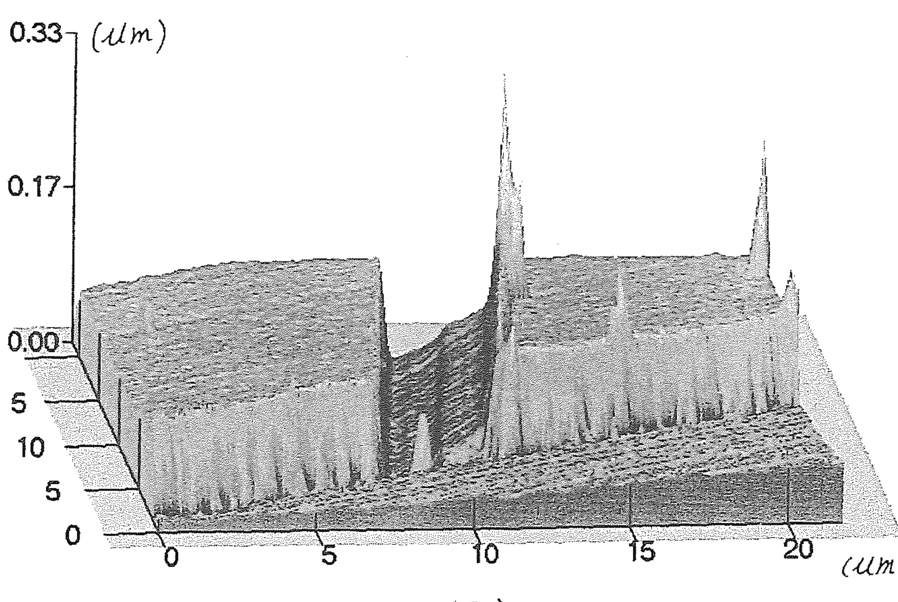

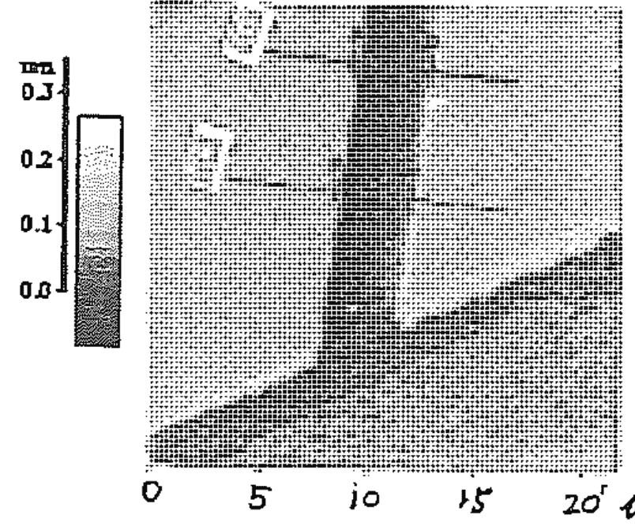

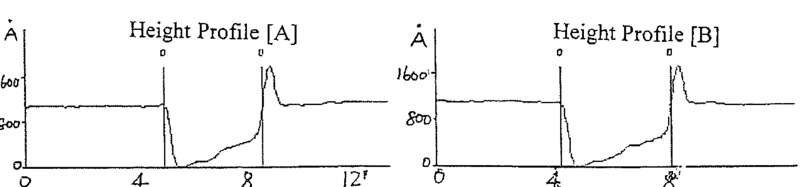

图四
用原子力显微镜所观察到最细的1.8微米刻痕的影像
(a)地形图 (b)表面影像及针头画过的轨迹范围 (c)轨迹之高低图。

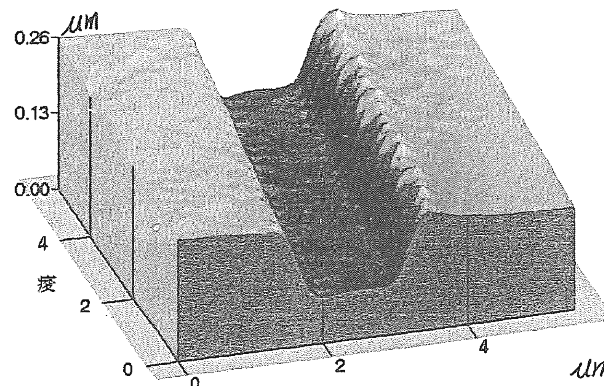

(a)

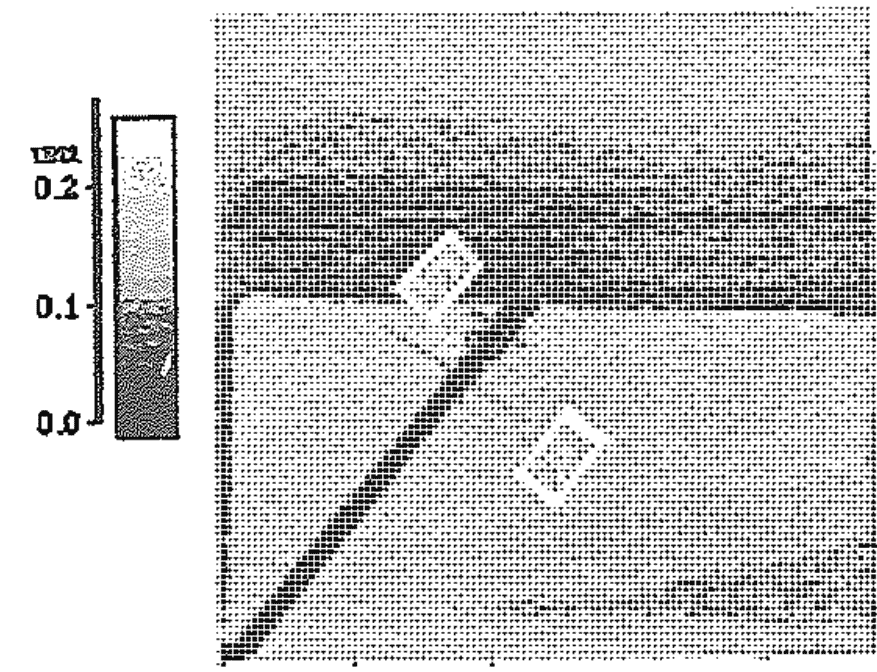

(b)

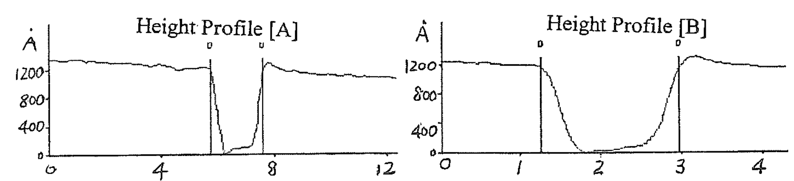

## 圖五

用原子力顯微鏡所觀察到另一道1.9微米壓痕影像(a)地形圖(b)表面影像及針頭畫過的軌跡範圍(c)軌跡之高低圖。

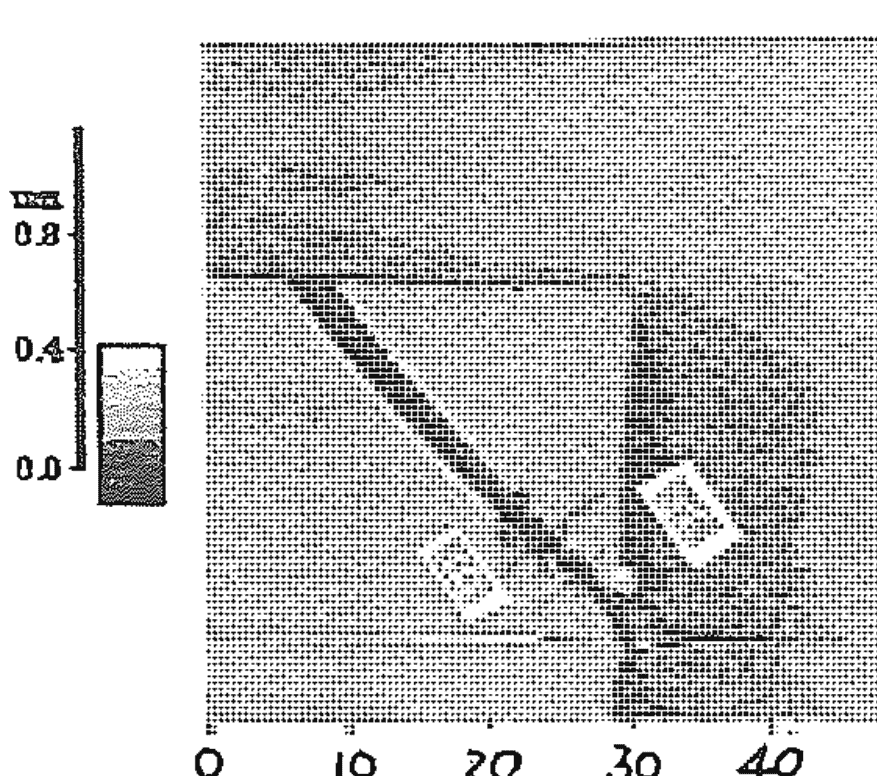

(a)

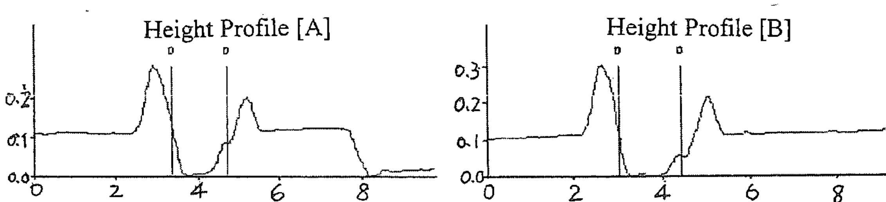

圖六
大勾子最細處之 (a) 原子力顯微鏡平面圖 (b) 針頭畫過軌跡A及B之高低圖。

用意識聚能在半導體晶片的微小金膜陣列上做微型雕刻之外，由原子力顯微鏡的影像來看，當鎢絲棒在大腦屏幕上擠壓金箔時，就像真的有一條鎢絲在金膜上施壓一樣，甚至會把金箔擠出溝槽而堆積成小山丘，這表示屏幕世界與真實世界是一體的，也就是所謂的「心物合一」。真即是幻，幻即是真，心物合一所可能產生的力量是驚人的。二十世紀物理的大發現是質能互換、質能合一，新的世紀如果能做到「識能合一」，把心識化為能量，將會出現一個全新的物理世界，真是令人期待。

進行意念鑽孔實驗的時候，我們有時也安排用偵測器記錄屏幕中六稜棒打洞時，在實物上產生的壓力值。這部分的實驗結果尚待整理及再確認。

## 以意力干擾電腦

另外一項精彩的實驗是以念力干擾電腦，我們在電腦屏幕呈現指針擺動之鐘面，請功能人以意念使鐘面指針偏移、停擺，甚至消失，也得到驚人的成果。等於是功能人以意念對電腦下了病毒，而這個病毒因為無跡可尋，因此也就難以清除。

我們設計的程式是以隨機亂數產生的方式來控制指針的向左或向右，所以希望功能人以意念干擾隨機亂數，使指針偏左或偏右的次數增加。結果孫女士成功的讓指針停在左邊、右邊、中間好幾次。實驗進行的時候孫女士和電腦的距離是三公尺左右。這個實驗的成功給我很大的鼓舞，於是進一步請功能人做三百公尺距離的實驗。一九九八年八月三十日晚上孫女士在家中打坐，以念力干擾在三百公尺之外的賓館裡的電腦，全程有攝影機拍攝電腦畫面。實驗從晚上十點到十一點，從十點十一分開始，每隔數分鐘指針便會出現暫停現象，到了十點五十六分時，指針連續在右邊停頓兩次之後，突然從鐘面上消失，再出現後明顯變慢，接著又在右邊停了好幾秒鐘，才又緩慢擺動起來。

這樣的結果令人又興奮又害怕。人的意念竟然可以控制電腦，是怎麼辦到的？以什麼樣的方式對電腦發號施令？科幻作品常透露出人類將被電腦操控的憂心，看來是多慮了。但是從另一個角度來看，有人能夠不必碰觸鍵盤在遙遠的距離之外，以意念操控他人電腦的運作，將會造成多大的混亂？所以或許該擔心的不是電腦而是人腦，人腦才是人類最大的威脅，也是最大的救贖。

## 搬運功能實驗

一九九七年十一月十八日，中國人體科學研討會第四次會議在北京舉行。大會安排的活動第一天是開幕典禮和論文發表，第二天早上是張寶勝先生特異功能演示。此次大會有中國各地從事人體科學研究的學者專家和日本來的代表，共計約兩百人。台灣方面則有台大醫院的孫安迪博士和我參加。

第一天一切順利進行。到了第二天，我一早起來把十五粒花生簽名放進小藥瓶，瓶口用膠帶貼住並簽名，蓋上瓶蓋以後再封膠帶、簽名，準備讓張寶勝做搬運功能實驗。興沖沖的趕到會場，發現幾位主辦的教授們正費盡唇舌在安撫張寶勝。怎麼回事呢？原來昨天開幕典禮的時候，來了電視台的記者採訪並攝影，坐在台上的張先生以為晚間新聞會有報導，所以通知了朋友到家中看電視。沒想到電視台竟然沒給他鏡頭，害他很沒面子，所以今天不演示啦！這下可讓主辦單位慌了手腳。說好說歹忙了半天，他還是像個孩子似的鬧彆扭，弄得沒辦法了只好打出「台胞牌」，要孫安迪和我去勸他，「人家老遠從台灣來的，您這樣說不過去嘛，對不對？」孫醫師和我連聲表示久仰大名，拜託讓我們開開眼界……等，安撫、勸說、拜託，眾人費了半個多小時才搞定，他終於「勉強同意」。

十點半左右正式開始，主持這次演示會的是中國人體科學會理事長陳信和黑龍江大學校長徐蘭許。先由孫安迪先生向大家說明和展示今天大家提供的實驗樣本：計有孫安迪醫師準備的兩個密封的藥瓶，日本科技廳代表小久保先生帶來的藥瓶兩個，李嗣涔教授準備的密封小瓶一個；小久保先生從日本帶來的密封信封一個，孫安迪準備的密封信封一個；大會準備的不鏽鋼長柄湯匙三把，不鏽鋼叉子三把。

十點三十八分正式開始，張寶勝先生低頭垂眼調整情緒，全場也靜下來，翹首引頸等待著。張先生時而低頭，時而抬頭張望，但是看得出他正努力調整進入功能態。到了十一點鐘左右他有點不安份起來，一再要陳理事長衣服讓他燒一下，要不然就燒桌巾，大家紛紛勸他不要燒，但是十一點零五分的時候，孫先生突然聞到一股焦味，低頭一看，原來張先生偷偷在下垂的桌巾一角，用手指頭燒了個洞。這時候他就像做錯事被逮到的小孩一樣，滿臉無辜。然後在十一點零九分的時候，突然拿起一支湯匙，右手抓住圓形部分，左手順著柄往下一扯一轉，竟然就把湯匙的柄扭了一圈半，約五百四十度。正當大家驚嘆討論的時候，他又忍不住用手指在徐校長的大腿上燒了一下，把徐校長嚇得跳起來。

這時候他卻拿起筆來塗鴉，然後又坐立不安的搓手搓腿，過了十分鐘，張先生拿起一張名片放在信封下面，要求孫先生用手壓住，但是孫先生趁著張寶勝轉頭和人交談的時候偷偷換上一張自己的名片，並簽上英文名字 Andy。張先生東瞧瞧西瞧瞧，對著一位觀眾說：「相機借我看看。」「不行，被你一看就壞了！」惹得大家都笑起來，其實認識張先生的人對於這點都有共識，聽說我今天要全程錄影，就有幾位朋友警告我：「小心，別讓他對你的攝影機吹氣！」

已經過了一個鐘頭了，張先生突然走出去轉了兩三分鐘又回來，東翻西翻，拿起一個藥瓶轉幾下又換一瓶，隨手拿起一支手錶，對著它吹一口氣，孫先生坐在他旁邊說秒針停了，再吹一口氣，又走了。

十一點五十六分的時候，他顯得坐立不安，呼了幾口氣，對孫先生說：「您手下壓住的名片有相片是吧？」「沒錯！」大家以為他要搬運名片了，誰知道他又拿起藥瓶來吹氣、抖動，一把抓過孫的右手掌，拿藥瓶在上面抖動，「出來啦！一片、兩片……四片、五片」在場的人都興奮起來，「哇！一大堆都出來了。」這時候張先生把藥瓶給孫先生握著，他自己握住孫的手用力抖動，藥片繼續大量掉出。時間是中午十二點零一分。從開始醞釀功能到現在已經過了八十多分鐘，可見實驗的困難，但是一旦功能可以發揮卻十分驚人，他抖出大部分的藥片之後，順手抄起一支叉子和一支湯匙，雙手一扭，就像麻花一般纏住了。過兩分鐘他又拿起剛才的藥瓶再抖出兩顆，保留一顆在瓶子裡。孫先生檢視藥瓶，確認是自己準備的瓶子，並且仍然完整未開封，可是瓶中卻只剩一顆藥。

## 偷天換日

十二點十分，張先生用力壓緊孫安迪醫師的兩手並對著吹氣，然後用左手拍拍孫的手背，說：「你看看信封底下的名片還在不在？」孫翻起信封一看：「咦，不見了，我的名片不見了。」至於到哪兒去了呢？張先生說他也不知道。過了一會兒只看張先生吁著嘴吹氣，以左手壓住日本人準備的信封，又拿起信封來捏一捏，再放到桌上用手撫平，「有兩層信封」，「是有兩層」，「裡頭還有一層」，這時候張先生用手擠動信封，擠呀擠的竟然擠出被撕破了的信封，裡頭還包著一張紙片，上面寫了兩個字，經過小久保先生確認是他寫的沒錯。第三層信封，原來是裝了紙條之後捲起來，放在兩層密封的信封裡，現在兩層信封沒拆開，裡面的東西卻被擠出來了。這時大家紛紛要求把信封剪開，查看名片是否在裡面，於是孫先生動手剪開自己準備的信封，裡面沒有變化。張先生這時候隨手拿起桌上剩下的湯匙和兩支叉子一扭，又轉成麻花。接著小久保先生開始剪開他自行準備的信封。剪開第一層之後沒有異狀。再剪第二層，由於封得太緊了，好難剪開，小久保先生幾乎刺傷自己的手，大叫一聲，費了好大工夫才把第二層信封剪開，孫先生簽了字的名片好端端的躺在裡面！張寶勝用搬運功能把孫先生壓在自己手下的名片，隔空送進了小久保先生從日本帶來密封兩層的信封內，全場報以熱烈的掌聲。

看過張先生的現場演示，才明白他能成為國寶級人物是有道理的。在一兩百人的大會場，要調整身心進入功能態可不是簡單的事情。其他的功能人也許平常功能很強大，可是碰到大場面卻可能因為怯場而什麼都做出來，這也是特異功能研究的困難所在。功能人的身心狀況不像一般儀器可以隨時啟動或關閉，所以有些困難度較高的實驗，往往要暖身數日甚至數週才能進入狀況。而如果有心存批判的人士在現場，也可能影響功能人的情緒，而使實驗難以進行。而張寶勝在面對超過一百位來自日本、台灣、大陸各地的人體科學專家，十幾部攝影機之監視下，仍然在兩小時內完成七項不可思議的實驗，這些實驗樣本全部是外賓（日本及台灣）所準備的，顯示出他驚人的能力。

# 第五章 文化、氣與傳統醫學研究

## 人文與科技的整合

一九九七年夏天開始，中研院李亦園院士號召了一群跨越人文、社會、醫學、理工等領域的學者，一起投入「文化、氣與傳統醫學研究」的計畫。

李院士認為，每一個民族的傳統醫療和文化體系是密切契合的。西方醫學表現的是實證主義的傳統，而中國醫學則充分表現中華傳統文化的和諧均衡的宇宙觀。李院士提出，中國傳統的和諧均衡觀念包括了三個層面：

- 一、自然系統的和諧。包括一般常見的占卜命相和風水堪輿，兩者分別代表著對時間和空間和諧的追求。
- 二、人際關係的和諧。包括傳統的講究人和——人間的和諧，還有超人間的和諧：如敬鬼神、拜祖先等。
- 三、個體系統的和諧。包括外在的和諧：如名字筆劃、五行的講究；以及內在的和諧：如個人追求飲食、氣血、經脈、精神的調和。

從個體、擴大為人際關係、再擴大到與整個時空環境的關係，這個宇宙觀念之中，每個部分的和諧和均衡，都必須努力維護，而在中國傳統觀念裡，「氣」正是可以貫穿每一個環節的要素。氣的均衡關係著個人身體的健康，影響人際關係，甚至大環境的發展。所以說「氣」是中國文化不可忽視的一環。

李院士領導的這個大計畫中，我從事的子計畫是由氣功衍生出來的「神通現象的研究」，也就是特異功能研究。雖然研究的主體是承續多年來的氣功和特異功能的範疇，不過由於有機會和不同領域的專家學者討論切磋，因此常有新的領悟和發現。長久以來，研究人類社會發展的人對於民俗、宗教裡流傳的神通故事，到底要如何定位頗費思量，在親自驗證特異功能的存在性之後，可以有新的切入點。而我也因為和民俗學者的互動，以及個人在新興宗教道場的幾次經驗，才能重新看待歷史上的許多重大事件，擺脫以往所認知的以政治權力為中心的歷史，也許可以認識更真的史實。

## 從洪秀全談起

遠的不說，就以一百五十多年前的「太平天國」來說。在學生時期讀到這段歷史的時候，對於洪秀全自稱是上帝之子、耶穌之弟，並能以此妖言迷惑數十萬人相隨，轉戰大江南北，只覺得當時的人太無知，太容易受騙了。但是如今驗證了特異功能的客觀存在，配合大陸對於太平天國史料的發掘和研究，我們相信洪秀全和東王楊秀清都具有強大的特異功能。

洪秀全是在科舉失意，心情極度悲憤的情況下誘發出特異功能的。一八三七年洪秀全到廣州應試再次落榜，精神大受打擊，以致大病四十餘日。就在大病之後，他顯現出特異功能。病癒之後，洪秀全就用不可思議的特異功能幫人治病。根據《洪秀全來歷》一文記載，洪秀全赴廣西傳道，「無不信從……故啞者亦開口，狂者亦自癒。」

而洪秀全的族弟，一八五九年任太平天國干王（宰相）的洪仁玕曾多次對中外人士說：

> 眾人心目中見我主能驅鬼逐怪，無不嘆為天下奇人，故聞風信從。且能令啞者開口，瘋癲怪疾信面即癒，尤足令人來歸。

從這些史料看來，洪秀全特異功能治病的能力和聖經所載的耶穌神蹟非常相似。洪秀全是廣東人，而廣州一直是西人東來的口岸，所以他對耶穌故事定不陌生，可能發現自己的特異功能與耶穌彷彿，因而自稱是耶穌之弟。洪秀全用特異功能為人治病的能力，對他的革命事業有重要作用，甚至可以說是他革命事業的基石。我們從史料記載看到：

> 韋（昌輝，後來的北王）妻病危，醫藥罔效，洪逆治之立愈，因此二人交情更密。

> （洪秀全）在桂林、平樂等處，仍以誦咒治病為名，村民疾病，持劍焚符，往往得癒，轟動一時……。

由於具備不可思議的特異能力，所以能讓將領效命，民眾歸從。對他的特異能力，不僅當時的群眾不懂，洪秀全自己也不明白，所以歸諸於天父的旨意，而創立拜上帝會，太平天國就是在拜上帝會的基礎上壯大發展的。

除了洪秀全之外，東王楊秀清也有特異功能，而且能力勝過洪秀全。忠王李秀成就曾經說：「東王蒙上帝降托，能知過去未來，令人欽服之至。且東王能代人贖病，致耳聾流水，口啞流涎，一月餘之久，眾有疑爲廢人者，殊後有一日開口病癒，每有言驗應。」

根據《太平天國》一書記載：

東王贖病之時，寢不安枕，食不甘味，不辭勞瘁，艱苦備嘗，甚至口啞耳聾，以一己之身，贖眾人之病，以一身之苦，代世人之命。

由史料記錄來看，似乎楊秀清是以祈禱求神方式，自願代人受病，使患者病癒，然後再自己慢慢除病。這也讓我們了解天王洪秀全賜他「贖病主」封號的真正意義（註）。

由於兩個人的特異功能而掀起了幾乎讓大清帝國滅頂的風浪，神通現象對人類歷史的影響多麼驚人！仔細研讀歷史便可發現類似的情節一再出現，卻往往被模糊、扭曲或刻意的忽略了。奇怪的是這種迴避神通的心態，不僅呈現在對待人類的歷史方面，也普遍存在於近世的宗教界。

從經論的闡述來看，佛教是肯定神通的。佛教經典中描述佛、菩薩神通的內容很多。大乘佛教更以神通為菩薩度化眾生的一種「方便」。《瑜伽師地論》卷四十一說：「具足成就種種神通變現威力，於諸有情，應恐怖者能恐怖之，應引攝者能引攝之。避信施故，不現神通恐怖引接，是名有犯。」意思是說，如果得了神通而不去用它度化眾生，是犯戒的。釋迦牟尼當年宣法，常常以大顯神通開始，呈現種種異象攝服人心，然後才進行宣說教法。釋迦牟尼的弟子及累世高僧也留下許多神通事蹟。例如《晉書・藝術傳》就記載在東晉時來華傳法的西域高僧佛圖澄，曾經有遠距滅火、降雨、遙視、他心知、聽鈴音識吉凶、天耳通、預知等神通表現，並以此贏得石勒、石虎的信服，和北方社會大眾的欽仰，使佛教得以盛傳於中國。《宋高僧傳》記載隋煬帝時僧法喜，有分身能力。唐朝鄧隱峯禪師行路遇到兩軍交戰，於是「擲錫空中，飛身冉冉而去」。至於有預言未來能力的僧人，在《宋高僧傳》中比比皆是。《比丘尼傳》也記載著從南朝以至明代有神通表現的比丘尼多人。這些相關記載多出於佛教徒之手，向來不被史家所採信。而從元代以後，中國佛教史料中有關修得神通的記述變得很少。到了近代，連佛教界都避談神通。

在西方歷史中，所謂「神秘主義」的典籍，記錄著許多天眼通、他心通、宿命通……等等奇異現象，和東方各種神通記錄一樣多彩多姿。基督教的聖經之中，講述耶穌顯神蹟的事例，如行走於海上，在村莊驅鬼，令啞吧說話，死者復活……等。

## 開啟人類命運的另一扇窗

由古代典籍記載可以知道，「特異功能」的現象，是不分東西方，人類共有的潛能。經過最近二十年在大陸和台灣的實驗，更發現特異功能在某種程度上是可以被誘發，並且可以透過訓練而加強，可見所謂的「神通」，其實是人的一種能力，就像唱歌、賽跑……等技能，可以經由開發訓練而獲致。李亦園院士曾經指出，此種訓練可能成為人類「有意識」的演化，真是一語中的。很巧的是在一九九八年六月，偶然在一本《打開星星的密碼》（王紅旗著）書中看到一段文字：

二百五十萬年前，一群類人猿站了起來，並要求牠的子女站起來，逐漸演化成了人類，那些拒絕站起來的類人猿仍然是類人猿，被人類關在動物園內欣賞，退去了生命進化之舞台。

我們不妨想像，如果現在有一群人練出了特異功能，並且培養他的子女具備特異功能，是否也可能不斷進化，成為可以突破現有時空障礙的「超人」？那些拒絕超能力的普通人的命運，就可想而知了。

檢視歷史可知，基督教始終把耶穌的特異功能歸諸「神力」；東方道家則認為特異功能是人可以學而致之，同參天地造化的功夫；而在佛教的世界圖像中，神通是修行中開發的能力，是修行境界的表徵。《雜阿含經》卷二十一敘述佛告比丘，可以用神力遊戲來變化天候。以神力變化為「遊戲」，可見其自在無礙。《雜阿含經》卷四十三有云：

爾時世尊告諸比丘，汝當受持無漏法經，廣為人說。所以者何？義具足故，法具足故，梵行具足故，開發神通，正向涅槃。

這是佛家戒、定、慧的次第。而神通屬於「定」的階段，是修行的過程而不是最終目標。神通固然是修行者修行有所得的表徵，但也是一個考驗的關卡。擁有神通力量，可以改變凡俗世間許多事物的運行，可以因此得到崇拜和信仰，獲致豐厚的名聞利養。而名聞利養正是欲望陷阱，是修行者極須避免的，因此神通也是修行者能否邁向空慧的重大考驗。後世中土佛教摒斥神通，有很大的部分是為了避免名聞利養的誘惑。然而忽略了神通這個修行的階段，一個人如何能了悟釋迦牟尼所建構的世界觀呢？一個有能力突破現有時空障礙的人，才能具有真正的「空慧」吧？佛教摒除了神通的同時，是否也摒除了觀照宇宙的宏偉而自限於人間宗教，成為一種生活哲學？

# 第五章 文化、氣與傳統醫學研究

一九九九年二月新的學期開始，我在台大推出一門通識課程「氣與身體——現代與傳統」。這門課程的構想最初是歷史系的黃俊傑教授提起，並且送我一本《中國古代思想中的氣論及身體觀》，是多年前一場國際研討會的會議論文集。書中二十位作者包含了台灣、大陸、美國、日本的專家。論文分為四大篇：氣與身體觀的理論構造、政治及社會的觀點、先秦漢初專家專書的解釋、佛老觀點之參照。內容非常豐富。清華大學的楊儒賓教授在〈導論〉一文開宗明義指出：

> 中國身體觀的一大特色，乃是除了五臟六腑的系統外，另有一種氣——經脈的系統，而氣尤可視為根本的原理。將氣與身體結合並論，不但見之於傳統醫學，也是以往的許多「經驗科學」，如占卜、星相武術等，得以運作的理論基礎。不但如此，它還提供了中國以往主流思潮無比重要的動力，我們甚至可以說：沒有氣——身體的理論預設，儒、道兩家的許多重要命題即不可能成立，至少也要重新改寫。……

看過這本論文集之後，我有了初步的構想，希望結合人文學者對傳統的「氣與身體」的心得和現代科學界對「氣」的研究成果，把從古到今對「氣」的認知和應用，介紹給有興趣的年輕人，提供一些比較正確的觀念。經過籌畫聯繫，我們推出以下的單元：

- 一、氣功與人體特異功能（一）
  ——李嗣涔（台大電機系教授）
- 二、氣功與人體特異功能（二）
- 三、血液循環與氣
  ——李嗣涔（台大電機系教授）
- 四、地球磁場與氣
  ——王唯工（中研院物理所研究員）
- 五、太極拳運動訓練之健身效果
  ——鄭懌（師大地球科學系教授）
- 六、氣在人體上運行的科學證明
  ——賴金鑫（台大醫學系復健科教授）
- 七、氣功與人體特異功能（三）
  ——崔玖（陽明大學退休教授）
- 八、傳統中國的思維方式及其價值觀
  ——李嗣涔（台大電機系教授）
  ——黃俊傑（台大歷史系教授）
- 九、「生氣通天」：身體與自然的溝通
  ——蔡壁名（台大中文系助理教授）
- 十、疾病、地氣與身體——以明清之際漢人對異族痘疹病因的解釋為例
  ——張嘉鳳（台大歷史系助理教授）
- 十一、儒家身體觀
  ——楊儒賓（清大中國語文系教授）
- 十二、中國思想中的兩種氣論——元氣論與心氣論
  ——楊儒賓（清大中國語文系教授）
- 十三、中國古代思想史中的「身體政治學」特質與涵義
  ——黃俊傑（台大歷史系教授）

每一個單元的教授都提出內容摘要、參考書目和思考問題，至於課程的設計重在觀念的介紹和思想的啟迪。由於是通識課程，所以預備收一百名學生，沒想到課程很有吸引力，最後是收了一百六十名學生，而且上課的時候總有許多旁聽生把教室擠滿了，讓我們受到很大的鼓舞。不少學生在報告中表示，上過這門課以後，發現自己原有的思想體系出現了裂縫，也有人表示原來的思考架構都崩潰了。能夠在現有體系之外，提供其他的思考方向，正是我們開課的目的之一，所以感到非常欣慰。

雖然在規畫課程的時候希望盡量周延，仍難免有遺珠之憾。例如振興復健醫學中心的陳玉秀老師多年來對古代「雅樂舞」的研究，已頗有心得。「雅樂舞」原為中國最古老的宮庭樂舞。基於「舞為樂容」，所以把雅樂和雅舞併稱雅樂。大家耳熟能詳的一句話：「惡紫之奪朱，惡鄭聲之亂雅樂……」正可見孔子對雅樂的欣賞，而他對鄭聲的感覺，就像今之長者對年輕人怪獸音樂的難以接受吧！根據陳老師的研究，雅樂舞對漢字文化圈的樂舞影響非常深遠。朝鮮半島現存的雅樂可上溯至中國的周朝，日本則在文武天皇大寶元年（約西元七○一年）設置雅樂寮為今日日本雅樂的發端。反而是中國由於歷代戰亂，雅樂舞的制度已經瓦解，僅有祭孔時的八佾舞算是和雅樂舞有關。不過無論是八佾舞或日本的「蘭陵王」和韓國的「春鶯囀」，都已經不是原來的雅樂舞了。

雅樂舞最根本的動態原則是維持軀幹與地面呈垂直狀態。在舞蹈動作進行之中要一直保持這樣的狀態，四肢和各個關節必須具有深度放鬆的能力。此種動態原則其實和太極拳以及其他拳術有其一致性。依據陳老師對雅樂舞的體驗，雅樂舞的舞者在動態之中會產生「氣沈感」，並由此逐漸進入忘我或空寂的狀態。依此看來，古代的宮廷舞蹈就像氣功一般，是調整身體姿勢，經身心自我安頓而入定的進程，這樣的舞蹈真令人心嚮往之。

由雅樂舞的例子，我們可以知道，有許多研究者由各人不同的專業切人，探索著傳統文化的點點滴滴，發掘出古文化中各種活動背後的深層意義，往往令人驚嘆！

儘管近百年來我們面對的是近乎全盤西化的浪潮，傳統的價值觀和各種知識活動不斷退卻。但是數千年的文明歷經戰亂仍傳續不絕，自有其不容忽視的生命力。這一點在W先生身上得到了印證。

一九九九年初夏，科學園區的一位朋友打電話來，邀我們去和一位「道家」見面：「你研究特異功能，應該有興趣認識這個奇人。」

到了約定的日期，我和太太驅車南下到了會面的地點，發現他說的「道家」不是想像中的「白鬍子老道」，卻是一位青年書生，斯文而纖細。透過主人的介紹得知，眼前這位青年道家在大陸主修生物和法律，後來到美國修得微生物碩士學位，如今卻以道家方術服務他人。

W先生的父母在文革時期下放到貴州，所以他的童年是在貴州過的。在他七歲那年，師父來找他，教他練功，可是W君的父母完全不知情。幾年之後他有了一定的能力，師徒就可以不必見面，只要在練功時「遠距教學」就行了。師父教他的包括功、法、術三方面。功是個人身心修練的方法；法可類比俗稱的特異功能；術則包括醫術、相術……等。除了打坐修練當然也要廣讀道家經典以及醫方、相術的書籍。一直到留美之後，決定以此為專職，父母才驚知兒子是個功力深厚的「道家」！

W先生雖然功力深厚，法術精修，但是師承嚴謹，有所為有所不為，談吐謙和，有可言有不可言，原則清楚。更可貴的是他對整個宇宙架構有一套完整的系統，可以針對不同的問題，由不同的角度切入，做條理分明的論證和解說。

W先生的情形讓我們理解到在廣闊的中國大地上，不知道有多少這樣的奇人，他們默默自己找徒弟，一脈相傳，使道統綿延而不絕，無視於世代更替，也不管世人認同與否，就這樣堅持的傳遞下去。

「道統」到底是什麼？是什麼樣的力量使人如此堅持？從歷史上看，許多修道人長年離群索居，不求榮華富貴，偶爾出入市塵，往往是為了收徒或教化人心；到底有什麼事物吸引他們，致使他們情願將一切拋開，終生奔赴而無悔？難道只為了千百年來虛無縹緲的「長生不死」嗎？還是他們知道了某些秘密？某種超出世人認知範圍的事物，而這些事物的吸引力顯然是人間榮華富貴所難以望其項背的。他們所探知的秘密以及獲知秘密的方法，是否就是他們堅持要傳承的道統？換句話說，他們不忍心把辛苦修煉的成果湮滅，所以想盡辦法要把自己探索得來的「訊息」留在人間，偏偏這些訊息無法具體呈現，無法用世間的言語說清楚，非得找個徒弟來，教會他如何擷取訊息才行。

## 第六章 探索真相——進入身心、靈的世界

## 來自信息場的訊息

所以會有这样的推想，當然和一九九九年八月底的實驗結果有關（詳見第一章）。當時我們無意中和一個神奇的「信息場」取得聯繫，使所有參與實驗的人大感興奮。我的一個研究生把親身參與實驗的所見公佈於網路，引起一場激辯。而中科院物理所的王唯工教授因為同為國科會「生物能場研究計畫」的一員，也頻頻受到關愛的詢：「原來你們做的是真的啊？」搞得他啼笑皆非。難道大家以為我們這十年都在玩假的嗎？十月在會議場合碰面的時候，王教授見了我笑著直說：「哇，我現在好紅喔！好多人都來找我，談論你八月的實驗，今天我可要聽聽正主兒的原版故事。」

八月的實驗結果的確帶來很大的衝擊，也引起許多討論。我們嘗試為實驗的結果找尋或架構理論基礎。「信息場」的性質如何？和我們之間聯繫的方式如何？籠統的「信息場」領域有多廣大？是否還可區分為許多不同的小領域？它們之間有無關係？許多問題待解，而我們的資料仍嫌不足。於是利用聖誕假期，邀請高橋小姐再度返台，就特殊「信息場」的部分繼續進行實驗。

## 神之光

第一天先進行了一般圖形和花卉、水果和常見動物的名詞測試，其中穿插幾個特殊意思的字。結果一般圖形都很正常的看出來，日常的事物如菊花、雞、芒果……等，也都看到紙上的字，沒有出現影像的情形。但是穿插其中的「佛」字，都無法看到字，而出現亮光或發亮的人的影像，其中有一張由在場的石老師以日文寫的「ほとけさま」（佛），結果高橋看到了一個亮亮的瘦瘦的人，那個人還以日文說了一句：「なにお」（什麼啊？）這真是意外！英文的Buddha，她也看見亮光閃過，沒看到字。

另外有兩張是用到佛字的其他名詞，一張寫的是「佛米級」，另一張寫「埃佛勒斯峰」。結果她看到的是「米」字，旁邊亮亮的；另一張則先後看到「勒」字和「斯」字，接著是一片亮光，就再也看不見別的了。好像是先看到紙上部分的字，接著碰到「佛」字時，便出現亮光，把其餘的字也蓋住了。但是隨後幾天我們分別測試「彌勒佛」和「阿彌陀佛」等專用名詞的時候，她並未看到任何字，都是直接看到亮光。可見這些原本是外語翻譯而來的佛名，經過眾人長期的共同認知，已經具有特別的意涵。

為了驗證「佛」字的特殊性，我們準備了許多和「佛」字造形相近的字，如「佛」、「拂」等，或是把「佛」字去掉部分筆畫，實驗結果顯示，她都正常的看到紙上的字，並無特殊現象。但是只要是正確的「佛」字，便會看不到字跡，而出現亮光或發亮的影像。更奇怪的是我用注音符號寫的「ㄅㄛ」，也是看不到字跡，只看見亮光一閃。這些字形和字音的實驗結果，使我們相信「佛」字是有特殊性的關鍵字，每當高橋的意念視覺看到這個字的時候，就會開啟某個特別的頻道，和那個充滿亮光的世界取得聯繫。

驗證了「佛」字的特殊性質之後，我們開始測試日常熟悉的神祇。其中有一張紙片上是電腦列印的「媽祖」兩字，高橋沒看到字，而看到屏幕上有一個人，有點亮。

二十分鐘之後，有位中研院民族所的人給她一張紙條，她摸了幾分鐘，說：「女的，亮亮的，很遠，有點模糊。」她覺得和剛才看的「媽祖」是同一人，可是感覺樣子不同。於是在腦中請教師父：「為什麼感覺不同？」師父告訴她，因為字寫的不一樣，所以看起來不同。

我們把紙條打開一看，是手寫的「媽祖」，而且字一大一小，差異很大。紙上的字形可以對於第三眼所看到的形象產生影響，這是很好的例子。

另有一張印了「上帝」的字條，高橋很快就看到了「上帝」兩個字，可是「耶穌」和「耶穌基督」兩張字條，她都沒看到字，而看到了十字架，還特別說明：「不是畫在紙上的十字架。」是一個實體的十字架，但沒有特別的亮光。我認為是還沒有找到屬於這個系統的關鍵字。

一九九九年十二月二十五日中午十二點十二分左右，高橋手摸著紙條說：「奇怪，有好多亮亮的小小的人在排隊，是同一個人，卻出現許多分身。」實驗結束之後我們打開紙條，赫然是電腦列印的由許多小小的「佛」字排列成「卍」字形。真是不可思議呀，重複的「佛」字，竟出現重複的影像。

下午四點五分，高橋開始觸摸一張新的紙條。起先她看到腦中的屏幕閃了一下，亮亮的，又說：「有藥的味道。」「像中藥的味道。」打開紙條一看，上面印的是「藥師佛」。高橋進行特異功能實驗的過程，除了視覺功能之外，也常出現聽覺功能，而這次「藥師佛」的實驗中又增加了嗅覺。或許有一天五種感覺都會到齊，進入真正的「虛擬實境」的狀態。虛虛實實，如真似幻，真相到底在哪裡？

## 虔敬之心

經過反覆的測試和驗證，一再顯示只要是「佛」字或相關的詞彙，如彌勒佛、阿彌陀佛、藥師佛、菩薩等，或是民間信仰的媽祖、濟公……等，高橋便無法看到字跡，屏幕上總是出現亮光或發亮的影像，甚至在高橋本身並不了解詞彙的意思時，也是如此。這些實驗的結果顯示所謂「靈」的世界必須存在，而且似乎在統稱為「靈」的世界裡，還有不同的領域或疆界，需要不同的關鍵字才能取得聯繫。

這就促使我們重新檢視所謂「天人合一」的觀念，指的除了人與物理世界的大自然之外，是否也包括了看不見、摸不著，但是和我們長相左右的世界？遠古年代的人敬天畏神，只是出於無知和迷信還是由於他們更了解宏觀的宇宙真相而謙卑自處？

由於這些實驗，我對於各種宗教增加了尊重之心。也漸漸體會到宗教的出現，絕對不是單純的心靈的寄託和慰藉而已。各大宗教的創始者可能是看到、知道了宇宙的真相，因而不約而同的提醒世人，此生的短暫和虛空，並且一再強調未來和永生。可惜他們所認識的真相一般人無法得識，以致於演變成今日宗教的情形。

回想十二年前由於陳履安先生的推展，個人有幸參與氣功的研究。我們的動機很單純，就是想明白練氣功的時候，身體到底發生了什麼變化？為什麼氣功有助於身體健康？經過一再的測試，千百年來只能自由心證的「氣感」、「入定」等練功的狀態，終於在腦波圖上得到了佐證，氣功不再是神秘的迷信，而是有方法可以學習、有儀器可以驗證的生理狀態，是值得廣為推行的保健方法。換句話說，由於我們對氣功的研究，揭去了神秘外衣，使它成為公開、透明的鍛鍊身體的運動。

## 重返光明

當初簡單明白的構想，隨著時間的推演，和研究的進行，不知不覺帶領我進入探討「心」的境界。這裡所謂的「心」不是指情感方面的心，指的是許多練習氣功有高度成就的人，自然產生的超乎尋常的心識能力，也就是所謂的「特異功能」。對於這方面的研究，我們進行了許多種類的觀察實驗，從最基本的手指識字功能、以至於用意念控制外物，用意念操縱生物的生長、甚至能讓死亡的花生起死回生等，還有人腦對電腦的影響。這些包含眾多的實驗，讓我們見到了人的心識能力之不可限量，也對我們提出了挑戰：心識的力量如何穿出人身體？如何對外物作用？如果能解答這些問題，不但是物理新世界的誕生，更是人類演化的大躍進。

氣功和特異功能的研究雖然已經進行了許多年，而且大家也普遍認為宗教界應該有不少這方面的高人，但是似乎沒有研究人員有意進入宗教或屬靈的領域。在中國大陸由於政治環境和意識形態的約束，大家固然避之唯恐不及，在台灣則由於自我定位於「科學的研究」，因此為了避免不必要的干擾和批評，也一直未曾有意涉入宗教領域。不料一九九九年八月，一張臨時寫成的紙條，竟然讓我們不得不面對所謂「靈」的世界。經過反覆測試，證明某些宗教用語的確扮演了關鍵字的角色。特異功能人士可以藉由這些特殊字或名詞和「靈」的世界取得聯繫。可以說我們發現了和「靈」的世界溝通的一種方法。

雖然曾經一度興奮的以為翩然光臨實驗室的「光人」是佛的示現，但是最近有機會請教W先生，他的看法不同。他認為這些「光人」尚未脫離「形體」，應是以往修持有得的大成就者，真正的佛土則在「光幕」保護之下，不可得見。檢視我們做過的實驗之中，「佛」、「菩薩」、「媽祖」……等都曾出現「光人」，但是專有的佛名，如彌勒佛、阿彌陀佛、藥師佛等，則似乎直接進入了「光幕」，只見一片光明，不見人影。這是否意味著不同的修行境界，會有不同的「光」的層次？這個問題，我們目前還無法回答。

註：相關史料請參閱大陸出版的近代史料叢刊《太平天國》。

# 第六章 探索真相——進入身、心、靈的世界

佛、阿彌陀佛、藥師佛等，都只見一片亮光，未曾出現形體，似乎頗符合W先生的說法。二○○○年春節剛過，我到美國亞利桑納大學參加了由東西醫學基金會主辦的生物能方面的科學研討會。與會的亞利桑納大學心理系史瓦茲教授是專門研究身心交互作用的著名學者，他花部分時間研究「靈」學，對於充塞宇宙的「訊息」有他自己的理論，並於一九九九年出了一本書來說明他的發現。我抓住機會請教他在基督教系統裡有什麼字可以表示至高無上的神？他說是「SAM」。在會期的前後兩天，第一次由史瓦茲教授的夫人，也是亞利桑納大學助理教授的羅塞克博士準備樣本，上面寫了一句話其中包括「SAM」這個字，第二天則是我手寫的「SAM」，給一起參加會議的高橋試看，結果兩次都是看到亮光，沒有看到字跡，類似以往多次看「佛」字的情形。根據史瓦茲教授的說法：「SAM」是「Samuel」之簡字，而Samuel是古希伯來人對上帝之暱稱。因此在史瓦茲教授所寫的書中，他感謝的對象不是「God」而是「Sam」。結果真的經過「SAM」，高橋與基督教世界的神靈取得了聯繫，多麼重大的發現啊！

那一片亮光的後面，是不是存在一個統整的境界？是不是就是W先生口中宇宙的終極或宇宙的最初呢？無論如何，能夠找到和另類世界的聯繫方法，已足夠令人雀躍，我們也相信「精誠所至，金石為開」，假以時日，應可找出穿越「光幕」的方法。雖然仍舊只有少數有緣人可以「看見」其中景象，但是只要我們可以證實它的存在，可以證實接觸它的方法，就等於為人類又祛除了一層蒙昧，這是多麼令人期待和興奮的大事啊！

## 《參考書目》

1. 《人身極機密》，李嗣涔著，台北：時報出版社，一九九八。
2. 《人體科學——氣功及特異功能論文集》，李嗣涔著，台北：自印，一九九九。
3. 《氣功》，張惠民著，曉園出版社，一九九九。
4. 《佛教氣功百問》，陳兵著，高雄：佛光出版社，一九九一。
5. 《道教氣功百問》，陳兵著，高雄：佛光出版社，一九九一。
6. 《中國仙道之究竟》，王德槐著，台北：自印，一九八七。
7. 《中國古代思想中的氣論及身體觀》，楊儒賓主編，巨流圖書公司。
8. 《道家密宗與東方神秘學》，南懷謹著，台北：老古文化事業公司，一九九三。
9. 《中國人體科學》季刊：六卷一、三期；八卷二、三期；九卷二、三、四期。上海：上海交通大學出版社。
10. 《古代醫學家的故事》，陳汶、成跡編著，台北：銀禾文化事業有限公司，一九九八。
11. 《身、心、靈科學學術研討會論文集》，台北：陽明大學「身、心、靈科學學術研討會」，一九九九。
12. 《氣功啟示錄》，張六通主編，台北：丹青圖書有限公司，一九九〇。
13. 〈佛教經典中神通故事的作用及其語言特色〉，丁敏著，台北：台大「佛教文學與藝術學術研討會」，二」，二〇〇〇。

# 附录

# 科幻中難以置信的主題

葉李華

二十世紀西方科幻文壇有三位鼎足而立的世紀級大師，他們是羅勃·海萊因（Robert Heinlein, 1907—1988）、以撒·艾西莫夫（Isaac Asimov, 1920—1992）以及亞瑟·克拉克（Arthur Clarke, 1917—）。

在這三位大師的眾多作品中，除了科幻不可或缺的機關佈景，偶爾也會出現屬於科學邊緣的主題。仔細咀嚼這些異類的科幻作品，反而能夠帶給我們一些意想不到的啟示。

海萊因是美國人，中學畢業後進入美國海軍學院。後來由於感染肺結核，無法繼續服役，遂於一九三四年以中尉退伍。一九三九年，他寫了生平第一篇小說〈生命線〉（Life-Line），就此展開其「科幻先生」的寫作生涯。

海萊因小說中的主題，其實很多早已有人寫過，但他是第一個將這些主題寫得栩栩如生的作家。例如「未來史」雖然並不新鮮，可是到了海萊因手上，卻化腐朽為神奇，創造出一番新境界。海萊因作品涉及的主題極廣，幾乎涵蓋了所有的科幻題材。在硬科幻方面，他寫過外星人、異次元、機械工程、自動化、基因改造、原子能、複製人、時光旅行等等，其中最重要的要屬太空旅行與外星殖民。而在軟科幻方面，則包括長生不老、語言學、法律、犯罪學、經濟學、哲學、性愛、心靈感應、神秘主義等等。

不少科幻作家常常濫用「心靈感應」這個主題，導致整篇作品的「科幻內在邏輯」支離破碎。海萊因卻能以科學的精神、冷靜的態度，對這種人體潛能做保守的探索。

例如在《探星時代》（Time for the Stars, 1956）這本書中，作者便將「心靈感應」發揮得淋漓盡致。本書故事背景為探星時代初期，人類剛剛乘太空船飛出太陽系，開始找尋其他的行星。由於光速的限制，太空船和地球根本不能利用電波通訊，否則一個訊息來回要好幾個月、甚至好幾年的時間。於是，經常發生於孿生子之間的心靈感應，成了解決星際通訊問題的唯一方案！

## 二

艾西莫夫是猶太裔美國人，於一九四八年獲得化學博士學位。四○與五○年代，他的作品以科幻為主，重要科幻著作泰半在這個時期完成，包括「基地」三部曲、「帝國」三部曲，以及「機械人」系列的《我，機械人》、《鋼穴》與《裸陽》。六○與七○年代，他的寫作重心轉移到各類科普文章及書籍，從天文、數學、物理、化學、地球科學到生物、基礎醫學，幾乎涵蓋了自然科學所有的領域。八○與九○年代，艾西莫夫又重拾科幻這個最愛，將過去經營的許多故事串聯成完整的科幻史詩。

艾西莫夫的成名作是二十一歲時發表的中篇科幻〈夜幕低垂〉（Nightfall，又名《夜歸》）。這篇小說最大的特點在於獨創性，它幾乎是個空前絕後的題材，沒有任何科幻小說的影子。故事敘述一顆附近有六個太陽的行星，其上居民不知黑暗為何物，不過大約每隔兩千年，由於天體運行的巧合，這個世界會失去幾小時的光明。對於一輩子活在光亮環境的居民而言，黑暗的降臨無疑是世界末日；眾人無一倖免，通通嚇得喪失神智。因此這個世界的文明，總是以兩千年為一個成住壞空的週期。

在另一次「夜幕」即將降臨的前夕，幾位頂尖科學家預測到了這個天象。不料支持他們的唯一證據，竟然是某神祕教派所掌握的古老經典。傳說中這部經典是上個「世代」的實錄，記載了這個世界的輪迴宿命。世人斥為荒誕不經的祕教典籍，在天文學家和考古學家眼中，卻記錄著不為人知的末日之謎……

## 三

克拉克是英國人，第二次世界大戰期間曾在英國皇家空軍擔任雷達教官。他自幼即對尖端科學極感興趣，天文學及太空科學尤其是最愛，他寫了很多這方面的科普書籍及文章，對於宣傳太空旅行簡直不遺餘力。除了寫作之外，他還製作電視科普節目，對於西方世界的科學普及有不可磨滅的貢獻，因而獲得聯合國及許多國家頒發的學術獎項。

一九六四至六八年，克拉克與名導演庫伯力克（Stanley Kubrick, 1928—1999）合作，拍攝了一部舉世聞名的科幻經典之作《二○○一：太空漫遊》（2001 : A Space Odyssey）。在電影殺青時，克拉克也寫出了同名的長篇小說。許多年後，他陸續為這本書寫了三本續集，分別是《二○一○：太空漫遊》、《二○六一：太空漫遊》、《三○○一：太空漫遊》。如今在全球科幻迷心目中，此一「太空漫遊系列」已經成了克拉克的代名詞。

相當耐人尋味的是，雖然克拉克是一位博古通今的科普科幻作家，又是一位硬科幻小說的基本教義派，篤信科技與人性都具有無窮的潛力，可是在他的作品中，卻不時出現「神／魔」的形象與意象。

例如在《童年的終結》（Childhood's End, 1953）這本書中，地球被一群外星人征服，可是等到這些外星人身後，地球人卻對他們有似曾相識的感覺。原來各民族古老神話中的魔鬼（例如撒旦），就是照著他們的形象塑造的。不過根據作者的解釋，並非這些外星人曾在古代造訪過地球，而是人類的集體潛意識不受時間的限制，能在時間軸上來去自如；我們的祖先接收到源自未來子孫的意識訊息，才會蘊育出那些魔鬼形象。故事最後則打破了神與魔的界線，原來這些貌似魔鬼的外星人身負重任，征服地球的目的是為了「渡化」地球人。

這本書最有趣的地方，在於書中赫然出現「玩碟仙」的橋段。雖然克拉克藉著書中的角色，說明「碟仙」的驅動力乃是人類的集體潛意識，可是他仍然不放心，生怕遭人誤會與非議，最後竟然在版權頁註明「本書內容不代表作者立場」！

（葉李華，美國柏克萊加大理論物理博士，曾獲中國時報張系國科幻小說獎首獎）

# 張老師文化智慧的書目

## 一、生活叢書

| 系列 | 編號 | 書名 | 定價 | 備註 |
|---|---|---|---|---|
| 生活技巧系列 | A1 | 讀書與考試 | 60元 | |
| | A9 | 怡然自得——30種心理調適妙方 | 130元 | |
| | A10 | 快意人生——50種心理治療須知 | 120元 | |
| | A11 | 貼心父母——30帖親子相處妙方 | 120元 | |
| | A12 | 生活裡的貼心話 | 150元 | |
| | A13 | 讀書會專業手冊 | 250元 | |
| | A14 | 創意領先——如何激發個人與組織創造力 | 250元 | |
| | A15 | 大腦體操——完全大腦開發手冊 | 120元 | |
| | A16 | 想戒就戒——成功戒菸手冊 | 180元 | |
| | A17 | 張德聰的自助舒壓手冊（上）：美好人生的心理維他命 | 220元 | |
| 愛、性、婚姻系列 | E4 | 婚姻面面觀 | 110元 | |
| | E7 | 做個剛柔並濟的人 | 150元 | |
| | E9 | 告訴他性是什麼 | 150元 | |
| | E12 | 金賽性學報告——親密關係篇 | 220元 | |
| | E13 | 金賽性學報告——身心關係篇 | 220元 | |
| | E14 | 金賽性學報告——衛生保健篇 | 220元 | |
| | E37 | 我痛！——走出婚姻暴力的陰影 | 220元 | |
| | E38 | 愛情學分 ALL Pass | 180元 | |
| | E41 | 結婚前，結婚後——成長與改變 | 220元 | |
| | E42 | 愛得聰明、情深路長 | 210元 | |
| | E43 | 遠離危險關係——愛情的七大警訊 | 290元 | |
| | E44 | 愛就是彼此珍惜——幸福婚姻的對話 | 300元 | |
| | E45 | 婚內昏外 | 220元 | |
| | E46 | 一定要結婚嗎？ | 280元 | |
| | E47 | 愛上M型男人——找回妳的勇氣、尊嚴與幸福 | 290元 | |
| | E48 | 重建——重塑婚姻與自我的願景 | 350元 | |
| | E49 | 搞懂男人——李曼法則39 | 270元 | |
| | E50 | 享受愛情不吃虧 | 230元 | |
| | E51 | 抓住幸福很easy | 230元 | |
| | E52 | 愛在金錢蔓延時——金錢與親密關係 | 290元 | |
| | E53 | 夫妻溝通成功七律 | 250元 | |
| | E54 | 中年太太俱樂部 | 280元 | |
| | E55 | 莫非愛可以如此 | 240元 | |
| 親子系列 | P9 | 天下無不是的孩子 | 180元 | |
| | P12 | 尋找田園小學——創造兒童教育的魅力 | 220元 | |
| | P13 | 不是兒戲——鄧志浩談兒童戲劇 | 220元 | |
| | P17 | 父母成長地圖 | 200元 | |
| | P18 | 做孩子的親密知己 | 200元 | |
| | P21 | 孩子的心，我懂。 | 220元 | |
| | P22 | 你可以做個創意媽媽 | 230元 | |
| | P23 | 我要和你一起長大——尋找家庭桃花源 | 250元 | |
| | P24 | 媽媽心裡的話——關於兒子 | 330元 | |
| | P25 | 愛女兒愛爸爸——做女兒生命中第一個好男人 | 280元 | |
| | P26 | 孩子的天空——成長、學習、邁向卓越的七大需要 | 300元 | |
| | P27 | 大手牽小手——我和我的自閉兒小宜 | 220元 | |
| | P28 | 每個父母都能快樂——怎樣愛青春期的孩子 | 270元 | |
| | P29 | 當孩子做錯事——掌握機會塑造好品格 | 300元 | |
| | P30 | 如何與青少年子女談心 | 280元 | |
| | P31 | 我想安心長大——如何讓孩子有安全感 | 260元 | |
| | P32 | 王鐘和與父母談心①——親子關係 | 240元 | |
| | P33 | 王鐘和與父母談心②——生活教育 | 240元 | |
| | P34 | 王鐘和與父母談心③——兩性教育 | 240元 | |
| | P35 | 王鐘和與父母談心④——學校生活 | 240元 | |
| | P36 | 青少年非常心事 | 250元 | |
| | P37 | 單親媽媽，滿分家教 | 200元 | |
| | P38 | 媽媽，沒有人喜歡我 | 320元 | |
| | P39 | 我見惠尼 | 320元 | |
| | P40 | 燈燈亮了——我的女兒妞妞 | 320元 | |
| | P41 | 為什麼青少年都衝動？ | 320元 | |
| | P42 | 媽媽，用心去做就好 | 240元 | |
| | P43 | 一生罕見的幸福 | 220元 | |
| | P44 | 任修女的親子學堂 | 240元 | |
| | P45 | 巴黎單親路 | 240元 | |
| | P46 | 青少年非常心事2：我的孩子變了！ | 250元 | |
| | P47 | 罕見疾病FOP的試煉與祝福 | 360元 | |
| | P48 | 如何教養噴火龍 | 280元 | |
| | P49 | 29種做快樂爸爸的方法 | 260元 | |
| | P50 | 當孩子得了躁鬱症——該做什麼？如何做？ | 300元 | |
| | P51 | 是誰傷了父母？——傷心父母的療癒書 | 280元 | |
| 青少年系列 | Z2 | 悸動的青春——如何與人交往 | 120元 | |
| | Z3 | 葫蘆裡的愛——如何與家人溝通 | 120元 | |
| | Z4 | 輕鬆過關——有效的學習方法 | 120元 | |
| | Z5 | 孩子，你在想什麼——親子溝通的藝術 | 120元 | |
| | Z6 | 青少年的激盪——青少年心理及精神問題解析 | 150元 | |
| | Z9 | 少年不憂鬱——新新人類的成長之路 | 180元 | |
| | Z10 | 想追好男孩——青春族的情感世界 | 180元 | |
| | Z11 | 上青少年家——青少年完全酷ㄅㄨㄅㄨ手冊 | 150元 | |

## 二、輔導叢書

| 系列 | 編號 | 書名 | 定價 | 備註 |
|---|---|---|---|---|
| 助人技巧系列 | C3 | 助人歷程與技巧 | 240元 | 增訂版 |
| | C4 | 問題解決諮商模式 | 250元 | |
| | C5 | 校園反性騷擾行動手冊 | 150元 | 增訂版 |
| 團體輔導系列 | M2 | 團體領導者訓練實務 | 280元 | 修訂本 |
| | M3 | 如何進行團體諮商 | 150元 | |
| | M6 | 小團體領導指南 | 100元 | |
| | M7 | 團體輔導工作概論 | 250元 | |
| 教育輔導系列 | N17 | 自我與人際溝通 | 220元 | |
| | N19 | 心理治療實戰錄 | 320元 | |
| | N20 | 諮商實務的挑戰——處理特殊個案的倫理問題 | 300元 | |
| | N21 | 習慣心理學（歷史篇） | 420元 | |
| | N22 | 客體關係理論與心理劇 | 400元 | |
| | N23 | 薩提爾的家族治療模式 | 380元 | |
| | N24 | 焦點解決短期心理諮商 | 200元 | |
| | N25 | 邁向成熟——青年的自我成長與生涯規劃 | 250元 | |
| | N27 | 臨床督導工作的理論與實務 | 400元 | |
| | N28 | 10倍速療法——短期心理治療實戰錄 | 200元 | |
| | N29 | 人際溝通分析練習法 | 420元 | |
| | N30 | 兒少性侵害全方位防治與輔導手冊 | 260元 | |
| | N31 | 心理治療入門 | 360元 | |
| | N32 | TA的諮商歷程與技術 | 280元 | |
| | N33 | 敘事治療——解構並重寫生命的故事 | 420元 | |
| | N34 | 志工實務手冊 | 450元 | |
| | N35 | 家庭暴力者輔導手冊 | 280元 | |
| | N36 | 遊戲治療101 | 450元 | |
| | N37 | 薩提爾治療實錄——逐步示範與解析 | 280元 | |
| | N38 | 解決問題的諮商架構 | 270元 | |
| | N39 | 情緒取向V.S.婚姻治療 | 300元 | |
| | N40 | 習慣心理學·辨識篇〈上冊〉 | 500元 | |
| | N41 | 習慣心理學·辨識篇〈下冊〉 | 500元 | |
| | N42 | 快意銀髮族——台灣老人的生活調查報告 | 220元 | |
| | N43 | 志工招募實戰手冊 | 270元 | |
| | N44 | 助人工作者自助手冊——活力充沛的秘訣 | 350元 | |
| | N45 | 家族星座治療——海寧格的系統心理療法 | 450元 | |
| | N46 | 性罪犯心理學——心理治療與評估 | 350元 | |
| | N47 | 故事與心理治療 | 300元 | |
| | N48 | 每個學生都能成功 | 250元 | |
| | N49 | 情緒與壓力管理 | 300元 | |
| | N50 | 兒童故事治療 | 280元 | |
| | N51 | 理情行為治療 | 220元 | |
| | N52 | 婚姻與家族治療——個案研究 | 720元 | |
| | N53 | 焦點解決諮商案例精選——激勵人心的治療故事 | 270元 | |
| | N54 | 幫他走過精神障礙——該做什麼，如何做？ | 280元 | |
| | N55 | 存在心理治療——死亡（上） | 300元 | |
| | N56 | 存在心理治療——自由、孤獨、無意義（下） | 380元 | |
| | N57 | 兒童注意力訓練手冊 | 400元 | |
| | N58 | 面試成功進大學 | 270元 | |
| | N59 | 心理治療Live現場 | 380元 | |
| | N60 | 青少年與家族治療 | 400元 | |
| | N61 | 習慣心理學·應用篇 | 400元 | |
| | N62 | 兒童與青少年焦點解決短期心理諮商 | 320元 | |
| | N63 | 兒童敘事治療：嚴重問題的遊戲取向 | 420元 | |
| | N64 | 薛西佛斯也瘋狂 | 290元 | |
| | N65 | 兒童注意力訓練父母手冊 | 260元 | |
| | N66 | 行動的反思團隊 | 450元 | |
| | N67 | 敘事取向的生涯諮商 | 270元 | |
| | N68 | 焦點解決諮商的多元應用 | 480元 | |
| | N69 | 跟薩提爾學溝通 | 200元 | |
| | N70 | 聯合家族治療 | 320元 | |
| | N71 | 克服逆境的孩子——焦點解決諮商的家庭策略 | 280元 | |
| | N72 | 從換幕到真實——戲劇治療的歷程、技巧與演出 | 400元 | |
| | N73 | 稻草變黃金——焦點解決諮商訓練手冊 | 320元 | |
| | N74 | 挑戰成癮觀點——減害治療模式 | 400元 | |
| | N75 | 心理治療的新趨勢——解決導向療法 | 250元 | |
| | N76 | OFFICE心靈教練——企業的焦點解決短期諮商 | 250元 | |
| | N77 | 家庭暴力加害人處遇團體方案手冊——EMERGE模式 | 350元 | |
| | N78 | 失去靈魂的優秀 | 450元 | |
| | N79 | 好好出口氣——設定界限，安全表達憤怒 | 220元 | |
| | N80 | 遊戲治療101—II | 450元 | |
| | N81 | 遊戲治療101—III | 450元 | |
| | N82 | 家庭與伴侶評估——四步模式 | 350元 | |
| | N83 | 性侵害加害人團體處遇治療方案 | 300元 | |
| | N84 | 如何與非自願個案工作 | 270元 | |
| | N85 | 合作取向治療：對話·語言·可能性 | 420元 | |
| 心理推理系列 | T3 | 心靈魔法師——心理治療案例解析 | 150元 | |
| | T4 | 走出生命的幽谷(新版) | 200元 | |
| | T5 | 心理的迷惘與突破 | 130元 | |

## 國家圖書館出版品預行編目資料

難以置信：科學家探尋神秘信息場／李嗣涔、鄭美玲著. —初版. —臺北市：張老師，2000〔民89〕
面； 公分. (心靈拓展系列：D64)
參考書目：面
ISBN 957-693-446-X (平裝)

1. 超心理學  2. 氣功  3. 特異功能

175.9 89008098

# 心靈拓展系列 D64
難以置信
——科學家探尋神秘信息場

作 者→李嗣涔、鄭美玲
內頁設計→劉茂添
封面設計→趙金仁
責任編輯→賴美玲
發 行 人→李鐘桂
總 經 理→林聯章
出 版 者→張老師文化事業股份有限公司 Living Psychology Publishers
郵撥帳號：18395080
10647台北市大安區羅斯福路三段325號地下一樓
電話：(02)2369-7959 傳真：(02)2363-7110
E-mail：service@lppc.com.tw
讀者服務：23141新北市新店區中正路538巷5號2F
電話：(02)2218-8811 傳真：(02)2218-0805
E-mail：sales@lppc.com.tw
網址：http://www.lppc.com.tw（讀家心聞）

登 記 證→局版北市業字第1514號
初版01刷→2000年07月
初版44刷→2015年11月
ISBN／957-693-446-X
定 價→240元

法律顧問→林廷隆律師
排 版→帛格有限公司
製 版→永光彩色印刷股份有限公司
印 刷→永光彩色印刷股份有限公司
裝 訂→同一書籍裝訂股份有限公司

※如有缺頁、破損、倒裝，請寄回更換※版權所有，翻印必究 Printed in Taiwan

---

| 编号 | 书名 | 定价 | 编号 | 书名 | 定价 |
|---|---|---|---|---|---|
| T7 | 由演剧到领悟—心理演剧方法之实际应用 | 200元 | T54 | 佛洛伊德的挽歌 | 250元 |
| T8 | 心灵之旅八十天——短期分析式心理治疗 | 160元 | T55 | 妈妈有病—代理性佯病症真实案例 | 250元 |
| T9 | 桃源二村 | 250元 | T56 | 解剖自杀心灵 | 250元 |
| T10 | 前世今生——生命轮回的前世疗法 | 250元 | T57 | 打开史金纳的箱子——二十世纪伟大的心理学实验 | 320元 |
| T11 | 家庭会伤人——自我重生的新契机（二版） | 300元 | T58 | 女王驾到——西洋棋王后的历史 | 320元 |
| T12 | 你是做梦大师——孵梦·解梦·活用梦 | 250元 | T59 | 改变治疗师的人—23位治疗大师的生命故事 | 320元 |
| T13 | 生命轮回——超越时空的前世疗法 | 270元 | T60 | 爱情刽子手 | 350元 |
| T14 | 生命不死——精神科医师的前世治疗报告 | 280元 | | 心灵拓展系列 | 定价 | 备注 |
| T16 | 你在做什么？——成功改变自我、婚姻、亲情的真实故事 | 380元 | D34 | 性·演化·达尔文 | 400元 |
| T18 | 荣格自传——回忆、梦、省思 | 400元 | D35 | 颠覆年龄 | 200元 |
| T19 | 家庭秘密——重返家园的新契机 | 280元 | D40 | 心灵神医 | 220元 |
| T20 | 跨越前世今生——陈胜英医师的催眠治疗报告 | 200元 | D43 | 照见清净心 | 180元 |
| T21 | 脆弱的关系——从玫瑰战争到亲密永久的婚姻 | 320元 | D44 | 恩宠与勇气 | 380元 |
| T25 | 回家：结构派大师说家庭治疗的故事 | 400元 | D45 | 与巫士唐望的对话—解离的真实 | 300元 |
| T26 | 绝非虚构——心理医师的惊悚之爱 | 350元 | D46 | 杜鹃窝的春天—精神疾病照顾手册 | 320元 |
| T27 | 当尼采哭泣 | 420元 | D47 | 超越心灵地图 | 300元 |
| T28 | 诊疗椅上的谎言 | 420元 | D49 | 邪恶心理学—真实面对谎言的本质 | 300元 |
| T29 | 爱上警察——警察家庭心理手册 | 360元 | D50 | 生命教育—与孩子一同迎向人生挑战 | 240元 |
| T31 | 前世今生之回到当下 | 280元 | D53 | 空，大自在的微笑——空性禅修次第 | 200元 |
| T32 | 我的家缺角了——一个心理治疗师的观察 | 210元 | D55 | 假如我死时，你不在我身旁 | 280元 |
| T33 | 秘密，说还是不说 | 360元 | D56 | 不知道我不知道 | 180元 |
| T34 | 靠窗的那张床——心理成长小说 | 420元 | D57 | 如何好好生气——愤怒模式工作手册 | 250元 |
| T35 | 请听，我心——心理医生的自我分析 | 300元 | D58 | 因为你听见了我 | 220元 |
| T36 | 神奇城堡——以爱整合多重人格的真实案例 | 360元 | D59 | 当医生遇见 Siki | 240元 |
| T37 | 不再害怕——性受虐者心灵疗愈的动人故事 | 220元 | D60 | 战士旅行者——巫士唐望的最终指引 | 300元 |
| T38 | 为什么做坏事——了解毁灭性人格 | 320元 | D61 | 灵性复兴——科学与宗教的整合道路 | 320元 |
| T39 | 父母会伤人 | 300元 | D62 | 我的生命成长树——内外和好的练习本 | 270元 |
| T40 | 百变小红帽 | 280元 | D63 | Erikson老年研究报告 | 400元 |
| T41 | 诊疗椅上的爱与性 | 350元 | D64 | 难以置信——科学家探寻神秘信息场 | 240元 |
| T42 | 走出宫殿的女科学家 | 380元 | D65 | 重画生命线——创伤治疗工作手册 | 400元 |
| T43 | 镜子里的陌生人——解离症：一种隐蔽的流行病 | 380元 | D66 | 家屋，自我的一面镜子 | 380元 |
| T44 | 你有没有看见我的马 | 280元 | D67 | 你可以更靠近我 | 280元 |
| T45 | 大师说舞 | 260元 | D68 | 快乐的十日课（上） | 250元 |
| T46 | 婚姻探戈 | 260元 | D69 | 快乐的十日课（下） | 250元 |
| T47 | 舞动人生 | 260元 | D71 | 一分钟心理医生 | 250元 |
| T48 | 成长之舞 | 260元 | D72 | 你可以自由——让受虐妇女不再暗夜哭泣 | 200元 |
| T49 | 美声男子 | 220元 | D73 | 这就是男人！ | 340元 |
| T50 | 刺猬的爱情 | 270元 | D74 | 非零年代——人类命运的逻辑 | 450元 |
| T51 | 猎食者：恋童癖、强暴犯及其他性犯罪者 | 380元 | D75 | 打破沉默——帮助孩子走出悲伤 | 270元 |
| T52 | 梦境实验室 | 400元 | D76 | 天空不蓝，仍然可以欢笑——练习幽默 | 270元 |
| T53 | 佛洛伊德的近视眼 | 290元 | D77 | 我们并未互道再见——关于安乐死 | 260元 |

| 编号 | 书名 | 定价 | 编号 | 书名 | 定价 |
|---|---|---|---|---|---|
| D78 | 巫婆一定得死——童话如何形塑我们的性格 | 320元 | D120 | 人道医疗 | 300元 |
| D79 | 用心去活——生命的十五堂必修课 | 260元 | D121 | 孩子为何失败 | 260元 |
| D80 | 艾瑞克森——自我认同的建构者 | 370元 | D122 | 孩子如何学习 | 300元 |
| D81 | 放心，陪他一段——照顾者十二守则 | 260元 | D123 | 生命河流 | 220元 |
| D82 | 忧郁心灵地图——如何与忧郁症共处 | 290元 | D124 | 创意是一种习惯 | 300元 |
| D84 | 勇敢笑出来——不要放弃幽默 | 320元 | D125 | 跨界之旅 | 220元 |
| D85 | 成功就是现在——大器晚成的秘诀 | 300元 | D126 | 永恒的朝圣者——空与神的会晤 | 280元 |
| D86 | 欲望之心——了解赌徒心理 | 300元 | D127 | 超越语言的力量——艺术治疗在安宁病房的故事 | 270元 |
| D87 | 写自己的压力处方 | 320元 | D128 | 古老的故事，幸福的奇迹 | 200元 |
| D88 | 我的哭声无人听见——孤单与健康 | 460元 | D129 | 我最宝贵的 | 200元 |
| D89 | 我的感觉你懂吗？——面对拒绝 | 320元 | D130 | 阿嬷的故事袋——老年、创伤、身心疗愈 | 280元 |
| D90 | 躁郁奇才——不凡创造力的背后 | 350元 | D131 | 逃学老师 | 260元 |
| D91 | 日常谈话，深度倾听 | 290元 | D132 | 海神效应——干细胞与其对医学的承诺 | 350元 |
| D92 | 胜过失望 | 270元 | D133 | 全方位忧郁症防治手册 | 300元 |
| D93 | 父母离婚后——孩子走过的内心路 | 360元 | D134 | 改变的礼物 | 250元 |
| D94 | 此刻有你真好——陪伴悲伤者走过哀痛 | 220元 | D135 | 卓越大学，一流校长——MIT迈向卓越的策略 | 320元 |
| D95 | 向自杀SAY NO！ | 330元 | D136 | 如果梵谷不忧郁 | 380元 |
| D96 | 别跟情绪过不去 | 280元 | D137 | 中年学音乐 | 240元 |
| D97 | 木屐与清酒 | 220元 | D138 | 当绿叶缓缓落下：生死学大师的最后对话 | 260元 |
| D98 | 可以沟通真好 | 280元 | D139 | 当好人遇上坏事 | 240元 |
| D99 | 打开恋物情结 | 300元 | D140 | 美名之路：慕哈妲·梅伊的故事 | 200元 |
| D100 | 爱上工作——找寻自尊、独立、安适、从容 | 300元 | D141 | 话语、双手与药：医者的人性关怀 | 280元 |
| D101 | 心中坏小孩 | 270元 | D142 | 石瓦豆的郁望之旅 | 240元 |
| D102 | 抗癌无惧，活得更好——15000个抗癌勇士的健康秘诀 | 250元 | D143 | RV亲情新干线 | 280元 |
| D103 | 和好再相爱——破裂关系的修复与重建 | 320元 | D144 | 好心情手册Ⅰ——情绪会伤人 | 280元 |
| D104 | 当所爱的人有忧郁症——照顾他，也照顾好自己 | 290元 | D145 | 好心情手册Ⅱ——焦虑会伤人 | 290元 |
| D105 | 请容许我悲伤 | 250元 | D146 | 好心情手册Ⅲ——情绪治疗师 | 280元 |
| D106 | 再也不怯场 | 290元 | D147 | 熟年大脑的无限潜能 | 250元 |
| D107 | 杀不死我的，使我更坚强 | 280元 | D148 | 宽恕，我唯一能做的一种族灭绝的幸存者告白 | 280元 |
| D108 | 空间诗学 | 350元 | D149 | 丧恸梦 | 240元 |
| D109 | 做自己的心理管家 | 290元 | D150 | 感受台湾心希望 | 350元 |
| D110 | 男人其实很忧郁 | 280元 | D151 | 踏上心灵幽径：穿越困境的灵性生活指引 | 400元 |
| D111 | 女人的压力处方 | 250元 | D152 | 抢救心理创伤：从危机现场到心灵重建 | 250元 |
| D112 | 心理治疗室的诗篇 | 250元 | D153 | 愈感恩，愈富足 | 270元 |
| D113 | 爱与自由 | 300元 | | 心灵清流系列 | 定价 | 备注 |
| D114 | 我是有为者 | 200元 | R4 | 回首生机 | 140元 | |
| D115 | 发现你的利基 | 250元 | R5 | 但愿无悔 | 140元 | |
| D116 | 小鱼铺，大奇迹 | 240元 | R6 | 感应之情 | 140元 | |
| D117 | 道别之后 | 220元 | R8 | 一畦青草地 | 140元 | |
| D118 | 难以置信Ⅱ——寻访诸神的网站 | 280元 | R11 | 二更山寺木鱼声 | 140元 | |
| D119 | 关系疗愈 | 320元 | R12 | 离家为了一个梦 | 130元 | |

| 编号 | 书名 | 定价 | 编号 | 书名 | 定价 |
|---|---|---|---|---|---|
| R13 | 眼前都是有缘人 | 130元 | Y52 | 给压力一个出口 | 150元 |
| R14 | 温馨故事 | 140元 | Y53 | 勇敢向前行 | 150元 |
| R16 | 开悟心灯 | 140元 | Y54 | 好好过日子 | 150元 |
| R18 | 天天好心情 | 200元 | Y55 | 活出真性情 | 150元 |
| R20 | 时时乐清贫——我的清贫生活 | 160元 | Y56 | 宝贝你的学生 | 150元 |
| R22 | 找回快乐的心 | 200元 | Y57 | 给工作中的你 | 150元 |
| **人与自然系列** | | **定价** | **备注** | Y58 | 给我亲爱家人 | 150元 |
| NB1 | 倾听自然（二版） | 200元 | | Y59 | 给独一无二的你 | 150元 |
| NB2 | 看！岩石在说话 | 200元 | | Y60 | 记得照顾自己 | 150元 |
| NB3 | 共享自然的喜悦 | 250元 | | Y61 | 祝你早日康复 | 150元 |
| NB4 | 与孩子分享自然 | 220元 | | Y62 | 亲亲我的宝贝 | 150元 |
| NB5 | 探索大地之心 | 180元 | | Y63 | 亲亲我的妈咪 | 150元 |
| NB7 | 学做自然的孩子——国家公园之父缪尔如何观察自然 | 180元 | | Y69 | 森林的童话 | 160元 |
| NB9 | 你也可以带孩子和自然玩 | 210元 | | Y70 | 会哭的男人很可爱 | 150元 |
| NB10 | 乐游自然天地——与孩子共享自然的六十种游戏 | 220元 | | Y71 | 跟沮丧说 bye bye | 150元 |
| NB11 | 女农讨山志 | 300元 | | Y72 | 葛叶的讯息 | 160元 |
| NB12 | 貂之舞——来自阿尔卑斯山一股澄澈的自然声音 | 280元 | | Y73 | 夏日的魔法 | 160元 |
| NB13 | 义大利的山城岁月 | 280元 | | Y74 | 幸福的滋味 | 200元 |
| **心灵美学系列** | | **定价** | **备注** | Y75 | 别让自己白白受苦 | 150元 |
| Y14 | 疼惜自己 | 100元 | | Y76 | 平安在我心 | 150元 |
| Y15 | 玩得写意 | 100元 | | Y77 | 时时心感恩 | 150元 |
| Y16 | 彼此疼惜 | 100元 | | Y78 | 离开秘密花园 | 150元 |
| Y17 | 老神在哉 | 100元 | | Y79 | 走进万花筒 | 150元 |
| Y18 | 和上苍说话 | 100元 | | Y80 | 因为爱，我和你 | 180元 |
| Y19 | 心中的精灵 | 100元 | | Y81 | 因为爱，我和自己 | 180元 |
| Y23 | 与人接触 | 110元 | | **浮世绘系列** | | **定价** | **备注** |
| Y24 | 心的面貌 | 110元 | | VW1 | 在浮世绘相遇 | 350元 |
| Y25 | 沈思灵想 | 100元 | | VW2 | 这人生 | 280元 |
| Y26 | 尊重自己 | 100元 | | VW3 | 让我拥抱你 | 180元 |
| Y27 | 宽恕乐陶陶 | 100元 | | VW4 | 彼此拥抱 | 180元 |
| Y28 | 简朴活得好 | 100元 | | VW5 | 象山的孩子 | 300元 |
| Y29 | 善待此一身 | 100元 | | VW7 | 小柴犬和风心 | 250元 |
| Y30 | 自在女人心 | 100元 | | VW8 | 小柴犬和风心2——四季的喜悦 | 250元 |
| Y31 | 接纳心欢喜 | 100元 | | VW9 | 小柴犬和风心3——日日是好日 | 250元 |
| Y32 | 喜乐好心情 | 100元 | | VW10 | 小柴犬和风心4——又是美好的一天 | 280元 |
| Y46 | 祝你圣诞快乐 | 180元 | | VW11 | 莱恩的愿井 | 280元 |
| Y47 | 祝你生日快乐 | 150元 | | | | |
| Y48 | 祝你天天快乐 | 150元 | | | | |
| Y49 | 给我亲爱朋友 | 150元 | | | | |
| Y50 | 当所爱远逝 | 150元 | | | | |
| Y51 | 让愤怒野一回 | 150元 | | | | |

· 此书目之定价若有错误，应以版权页之价格为准。
· 读者服务专线：(02) 2218-8811 传真：(02) 2218-0805