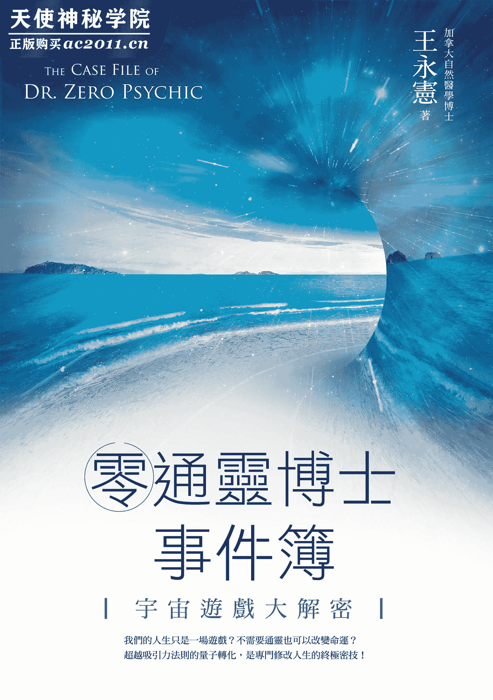

# 〈自序〉欢迎来到零通灵的世界

从高中就开始接触身心灵信息的我，经常在思考的问题是：人生要怎样才能变得更好？我认为首先必须要破解「这个世界为什么会是以我们现在所认知的方式运作的？」，要是能知道世界的运作规则后，或许就可以找到改变人生的「正确方法」。

2014 年，我在陷入人生困境时研发出了神奇的「量子转化」，从此改变了我的人生方向。在量子转化出现后约一年，发生了一件特别的事情：某天深夜，一位朋友打电话给我，她说她误吃了一个不太新鲜的三明治，肚子痛得很厉害，我脑袋闪过一个念头：「靠，该不会是妳欠三明治吧？」

于是我就依照当下这个直觉的念头，用量子转化调整了三明治跟我朋友之间能量上的关系，让三明治变成欠我朋友。约莫十分钟左右之后，她跟我说，肚子已经完全不疼了。

这次的结果让我大吃一惊，原来宇宙万物之间存在着一种能量流动的方式，这方式会影响到现实中一个人与周遭人事物互动以及事件发展的走向。因为这一开始是来自我朋友「欠」了三明治，后来我就把这个形容能量流动的概念称之为「相欠债」。

在我多年的测试与实务操作下，除了确定「相欠债」这样的隐藏规则真实存在，而且调整后的效果显著，许多个案也因为透过量子转化调整了相欠债，而使生命出现许多不可思议的奇迹（当然，量子转化不是只有调整相欠债而已）。

说到这里，你可能会想，那我又是如何得到这些讯息的呢？

我必须先说明一下，我是一个没有通灵能力的麻瓜。所谓的通灵，我认为是可以接收到不属于自己的，而是来自其他意识的讯息，象是眼睛直接看到光或是灵体、耳朵可以听到来自灵体或其他世界的声音、身体可以因为磁场上变化的不同而有特别的感觉，象是起鸡皮疙瘩，感受到体内能量的流动、冷热感，或是可以闻到灵体或不同世界的味道。以上这些能力我通通没有，多年来即使我尝试过了许多方法，都无法改变「我是个不折不扣的麻瓜」的事实。

每当在与有通灵体质的朋友聚会时，他们总会聊到亲眼看到神佛、光啊之类的，或是可以读取到别人在想什么，有些人还可以预知未来、看到前世等等，这些除了让我心生羡慕之外，更是让我感到自卑。为什么我就是没有这种体质呢？如果人生有困难时，可以有高灵指点我该有多好？

或许我少数的优点之一就是不轻易言弃吧！我的旅程从 EFT 情绪释放技巧开始，也接触了许多身心灵方面的信息，后来我结合了灵摆与美国 CIA 专用的 Controlled Remote Viewing（受控式远距观测，以下简称为「遥视」）技术，自己研发出了「空间讯息读取术」。有了这个技巧，即使不会通灵的人，也可以跟（游戏世界的）空间互动来获得读取信息的能力，而且不需要透过任何的工具。我把上述的能力，称为「零通灵」。

《黑客任务》（The Matrix）的世界观里，阐述着「世界是一个虚拟的假象」的说法，而近年来许多量子物理学家们的研究，则是更激进地指向了「我们所处的世界，是一个由计算机所模拟出来的世界」的学说——这就是「模拟假说」的由来。

本书的第四章，是我从许多书籍以及网络搜寻所整理出来支持「模拟假说」的信息，如果你觉得这部分太生硬的话，可以跳过，直接往我的实际经历与案例，从这些比较有趣的部份开始阅读。

不管有通灵或是零通灵也好，我们所看到的，都是这个世界所展现给我们看到的一个角度、一个面向，没有人可以看到这个世界的全貌；但不管怎样，我们最终想要的，其实都是让自己的人生变得更好。我无法跟大家拍胸脯保证说，我书上写的一定就是宇宙的真相；在书里面，我提出的只是一个我自己所观察到的世界运作的模型，这是一个从零通灵角度所看到的世界。这个模型虽然不是真相，但是却有「让我们可以更接近真相并且赋予操作」的价值。同样的，我们也可以随时摧毁掉这个架构出来的模型，毕竟世界的存在只是一场幻象，而人生有依照了这个模型来操作而变得更好，这对我来说才是真的。

「三明治事件」的发生对我人生有着重大的意义。试想，如果我们存在的世界是一个游戏世界，我们也只是游戏里的角色的话，那么人生的种种问题，是否只要透过修改游戏世界的参数就能迎刃而解呢？

量子转化，就是可以修改游戏设定的外挂程序。当你有了这样的金手指，你一定还会更进一步地想知道，游戏世界里，还有哪些参数与设定可以调整？调整了以后又会发生什么事情？我们与「心想事成」的距离又可以有多近？一般身心灵的概念都说，一切人生的问题都出在自己身上，可是如果你只是个游戏中的角色的话，那么你还需要对自己负责吗？我们又是为了什么而来到这个世界的呢？

这本书里颠覆了许多传统身心灵的概念，也收录了种种我脑洞大开的发想以及实际操作的结果，这过程非常有趣好玩，当然有时候也充满了挫败，毕竟要靠一己之力来破解宇宙如此复杂的机制，并不是件容易的事，但这些都是我人生宝贵的经验。

Sony 在 Playstation 发售 20 周年（2014 年）时发布了一段影片，影片里有这么一句话：「我们拯救了多少次世界，磨砺出了多少个技能；我们经历过了多少次爱恋，打败了多少个敌人；我们演绎了多少个不同的人生，我们和多少个伙伴们一同战斗过。这些经历，只有我们自己知道。」

是的，现在是把我的这些经历分享给大家的时候了。

这本书的出版，要感谢商周出版社的蓝萍姐，感谢她愿意让我出这么任性与乱来、没有人写过的一本书；感谢孟舫、妙瑟以及欧文，愿意在我探索的过程，听取我的想法并且给予意见；感谢猫眼娜娜提供文稿上修润的建议；也感谢我的学生们，你们愿意接受一个头壳可能坏掉的老师、依照我的教导并且让我知道，我所发现的东西，你们也都做得到。

最后要感谢购买了这本书的你。相信这本书可以开启你对于我们所处世界的新视野，最重要的是，当你也发现这个世界是一个虚拟的游戏世界后，你对你原本的人生与世界，又会有什么不一样的看法与改变呢？

那么，请翻开下一页，让我做你的向导，我们一起进到零通灵的世界探险吧～

# Ch1 超越吸引力法则的极限技巧「量子转化」

## 1-1 我们与心想事成的距离

首先来分享一个个案给我的量子转化反馈：

硕士毕业后待业了半年多，终于开始找工作，但之前去理想的单位应征都被打枪，不然就是没有硕士加给。因此设定好愿望后，决定请老师帮我做远距找工作。以为至少要一两个礼拜才会有效果，没想到老师帮我做完的隔天早上，就被通知面试，不到两个小时后就被通知录取了！

重点来了，这份工作的待遇与离家距离远近，都比我原本许愿的设定条件好上非常多（例如原本设定骑车 30 分内可以到工作场所，这个单位只要骑 10 分钟；薪水与原本设定的多上 3000 块，还有硕士加给）。老师真的太神啦！

接下来还要继续请老师帮忙设定工作一切顺利！感谢老师～

这样类似神迹的事情，究竟是怎么做到的呢？请先容许我自我介绍一下我的背景与经历吧。

我本身在加拿大读的是自然医学，学成后也是从事自然医学的工作，我的专长是来自澳洲的「拨恩技巧」（Bowen Technique）以及德国的「同类疗法」（Homeopathy）。多年的临床与咨询中，我观察到，许多病人的健康问题，在进步到一个程度后，就无法变得更好了。在与许多病人深谈下，我发现，大多数身体上的疾病，都是病人内在负面情绪与过去创伤的反映，于是我后来除了原本的「拨恩技巧」以及「同类疗法」以外，也加上了「巴哈花精」（Bach Flower Remedies）以及「EFT 情绪释放技巧」，没想到这竟是解开许多疾病障碍的关键，大家都变得更健康，更开心了。

所以我依照我的所学与经验，出版了《不开心，当然会生病》一书，这本书专注的是情绪与疾病的关联。但是这本书没讲完的，却是我所发现的宝物：「情绪与心想事成的关联」。

首先我们要了解到，「外在世界的状态只是内在状态反映的结果」，所以每一个身体上的疾病，包含你人生的一个困境，都会有一个内在情绪，或是负面能量的源头。当你专注在负面的状态下，有了负面的情绪，那么就会产生更多外在负面的结果；相对的，当你专注在好的情绪上，就会吸引到更多好的、让你开心的外在结果，这就是吸引力法则。

想要心想事成，情绪是最大的关键。为什么情绪释放是如此的重要？我们来看看这一张图：

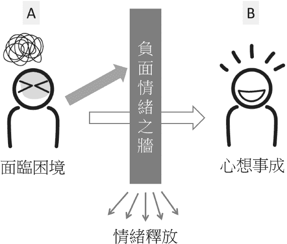

这张图是我自己对吸引力法则的见解与阐释。A 是目前因为人生遇到了困难而愁眉不展的你，B 是因为问题解决了而非常开心的你。

中间的这一道墙，可以把它视做：因为你本身的负面情绪所累积出来，阻挡你达到心愿的，能量上的障碍之墙。负面情绪越强大，这面墙就越厚实，越难瓦解。

A 与 B 两个都一样是你，差别在哪呢？答案很简单，只有情绪状态上的差别而已。

我个人的实际操作经验是，只要能够把阻挡住的情绪释放掉，就能够拉近我与心想事成的距离。而「EFT 情绪释放技巧」以及「圣多纳方法」是我一开始发现到很棒的情绪释放技巧，只要能够释放情绪，中间的这道墙就会被瓦解，愿望就会快速达成。于是我也依照当时的经验，出版了《放下的力量》一书。

紧接着没多久，新的问题出现了。虽然情绪释放是心想事成的重大关键，可是如果你所拥有的负面情绪，或是这一道墙的厚度，远远超出你的想象呢？

改变命运并没有我想象中那么简单！很多时候问题无法解决，是因为这件事情的负面能量累积了太多，这些问题可以归类到你的潜意识、你人生过去的创伤，甚至前世（如果我们先假定有前世存在的话），我们会因为这些能量的影响而出现特定的习性，所有的生物都是依照习性运作，而累积越多的习惯是越难改变的。

越难改变的事情，往往可能就是累积了成千上万的分灵体（分灵体，是负面能量的单位，更多关于分灵体的信息请参考本书篇章〈成败相依的「潜意识」〉）。一般做情绪释放，能把情绪从「很强烈」处理到「没有不好的感觉」，就是处理了一次的分灵体。假设做一次 EFT 需费时 1 分钟，如果你想要释放 1 亿个累积分灵体，那正常来讲，就需要花上 1 亿分钟，也就等于 190 年，对于一般人来说，这就是穷极一生都无法改变的命运了。

2014 年农历春节前，当时我的财务状况、事业与感情都陷入谷底，我所遭遇到的负面能量远超出我所能处理的范围，我的人生正在经历灵魂暗夜，我对于现况无能为力。这段灵魂暗夜持续了将近四个月，我沮丧到几乎要放弃情绪释放，当时我所相信的信念都被推翻，我已经在要放弃自己的边缘了，但是我也没有其他的路可以走，我唯一能做的就是透过情绪释放，让自己在人生最痛苦的时候，还能有片刻的喘息。

某天就在我情绪释放完，稍作静心休息时，突然脑袋灵光一闪，把 EFT 与圣多纳技巧的概念融合起来，并加上其他所学，我发现，我可以用意识的力量，一次处理掉比以前来的更多的负面能量，于是「量子转化」就这么诞生了。

初期量子转化的概念，说穿了就是强效版的情绪释放，只要能够透过宇宙深层意识，把你当下跟你所想要愿望之间的能量障碍（分灵体）消除的话，那就能大幅提高心想事成的机率。因为「量子转化」有这样的效率，且又架构在吸引力法则的理念之下，我认为「量子转化」是一个超越吸引力法则极限的技巧。

在我不断的操作与实验这个以意识为力量的量子转化时，更多有趣好玩的概念由此衍生出来了。这中间还包含了：我意外的从麻瓜，得到了零通灵的能力；之后更是因为一个「三明治事件」的发生（详细的经过在本书的第二章），让量子转化又更加的进化了。

不过在我们聊到更深层的概念之前，不妨先看看我多年来在这条路上所经验到以及领悟到的，「要如何更加拉近我们与心想事成的距离」的基础观念吧。

量子转化是精准调整能量频率的技巧

之前我家装潢时，因为变动设计的缘故，导致清水模的墙壁多打了一个洞。

那一个洞多丑啊，美丽的清水模就这样毁了！

设计师跟我说，不用担心，她会找一个很厉害的油漆师傅来处理。

那天，油漆师傅来了，他先把洞填满补土，然后开始调油漆。没多久，调好的漆完美的刷在补土上，如果不是超近距离仔细看的话，根本看不出有什么不同！这师傅调色的功力也太厉害了吧！

这就让我想到「量子转化」跟「调色」之间的关联。画画是什么？最原始的画画就是单纯的把看到的东西，用自己的方式记录下来（这边先撇开抽象派或是刻意营造出浓烈个人风格形式的技巧不谈）。所以，学画画的第一步往往是素描，就是把你眼前的物体用铅笔去勾勒出来，把它的线条、质地与光影立体感，重现在纸上。

我在温哥华时，曾请教来自中国的知名艺术家程树人先生；我问他，素描要怎样才画得好？他回答：「尽你所能去把看到的一切，丝毫不差的复制到纸上，那就会是个很棒的素描。」

原来那些绘画技巧很厉害的人，就是具备了能够把眼睛看到的内容，完全复制到画纸上的能力；包含了最基础的草稿、线条乃至调色，都能够完整重现，这就是祕诀所在。

而量子转化，严格说起来就是「精准重现目标」的能量调频与设定。

比如说「我想要变有钱」（就像画画一样，先锁定想画的目标），然后把自己调整到有钱；也就是把有钱的能量与频率，完整的调整或复制到自己身上，这样就能够显化出有钱的状态。

说是这么说啦，好像很简单的样子，但其实一点都不简单。

很多人的许愿就是「我要变有钱」、「我要某某某爱上我」，这其实一点都不精准。

用画画来比喻，如果你表达想要调出黄色，这对于画家来说，是多么困难的要求啊！你知道这世上存在着多少不同色阶的黄色吗？

更何况是要把你从「没有钱」调到「有钱」的状态；某某某对你没有感情，要调到充满爱意的状态……其实难度都是非常高的。

有些个案做完量转后，进展的速度比较快，是因为他本身处在的频率就比较接近目标；已经有了一个很好的基础，那就只需要微调就好。如果你的频率离目标比较远，那就会要花许多的时间，就象是把白色调成黄色，必须要慢慢添加一些绿色、一些蓝色，看看色感与浓度，再继续补充蓝与绿色，抓到平衡。

要调整得好，我认为有两个关键点：一是个案本身的情绪状态，情绪状态越接近目标，当然就越好调。另外一个关键是调整者本身调频的能力，也就是施行量子转化的人，本身的法力高低以及用字的精准度。

举例来说：「台湾欠你」跟「台湾人欠你」，这两个是完全不一样的状态。「我有好的财运」跟「我银行账户存款很多」也是不一样的状态。

这是我多年来做量子转化所发现的，宇宙对于用字精准度的要求非常高，所谓「失之毫厘，差之千里」，就是这个意思。甚至有些设定句中文无法表达，只能用英文。宇宙永远都会很精准的依照你给的字句去实现你的愿望，因为这就是它运作的机制。

想一想，如果你的许愿字句不精准呢？这就象是我手上拿着黑色的颜料，却希望画出金黄色的太阳，这是不可能的任务啊！

许愿不够精准怎么办呢？对我来说，没有怎么办，只能依照出现的结果再做下一步的调整，希望能够慢慢地、一步一步地帮助个案达到目标。我对于「一步登天」从没抱持太大的希望。

因此，我开发出的种种技巧，就可以比喻成比较接近目标的种种颜色的颜料。使用了，会让你更接近目标；但若要很精准，就需要你情绪上的调整以及足够的反馈，让我可以更精准的调整目标，直到实现你要的结果。

也就是说，是把你要的状态，透过「调频」的方式完整重现在你身上。

个案自己本身情绪调节得好，就能够事半功倍，因为你的颜色或频率就会离目标很近；反之，就是我刚刚讲的，妄想用黑色颜料画出金黄色的太阳。

所以啊，尽可能让自己多体验快乐的事情吧！这样自身的颜料与频率比较容易处在明亮的光谱中，想要达到目标的速度，也会加快许多呢！

最后，如果要说到「抽象派画风」跟量子转化的关系？

那就是用天马行空的方式，在这世间自由自在的玩耍了！

心想事成的三个条件

在我多年的研究，我认为想要心想事成，一定要达到以下三个条件：

第一、目标要符合你的价值观。

例如：你如果永远只把工作摆第一位，那么你不太可能有美好的家庭或感情，反过来也是一样。价值观顺序没有排好，你的人生会一直卡在「你不懂为什么一直得不到想要的」这个点上，会一直鬼打墙。

第二、对你的目标没有负面情绪。

你不可能喜欢钱又讨厌钱，这样子钱是进不来的。

第三、采取行动。

没有行动就没有后续的结果。如果你只想在家发懒，那么你就不会出门赚钱，所以不可能有钱。

要如何知道你的价值观，是一个很深的学问，这是无法用简单的一句「你认为在你生命中什么是最重要？」的问题来得到答案的。我们必须要从你平日的行动去仔细分析，才能知道你价值观真正排序的顺位。

三者缺一不可，而其中最难掌握的，就是「情绪释放」，因为这在我们成长的过程中是只字未提的。

《灵性开悟不是你想的那样》一书作者杰德．麦肯那曾说过：「宇宙就象是一条顽皮的大狗。」这个是千真万确的。

许愿时要非常注意自己陈述（不管是嘴巴讲出来或心里想）的愿望内容，因为，宇宙基本上会「照字面上的意思」把愿望送上门来。

最常听到的案例是，有人许了「希望快速有大量的金钱」的愿望，结果宇宙给予的方式是透过亲人发生意外，最后大量的金钱是从保险理赔而来。像这样的例子多不胜数，所以我在教导学生时，很重视「安全目标设定」；也就是说，如何用「精准的许愿方式」，让你可以快乐与安全的得到你想要的愿望。

## 1-2 对宇宙许愿时容易犯的错误

除了自己本身接触宗教二十年，也在身心灵成长这一块钻研了近十年（两者中间有重叠）。而真正公开帮大众解决问题的量子转化，也已经默默地做了几年。其中我遇到最多的问题，莫过于——个案不知道自己要什么，以及不知道如何许愿。

所以，我们就来探讨一下，「许愿」容易出问题的地方在哪边。

量子转化充满突破性，但并非没有限制

量子转化虽然概念源自吸引力法则，又超越吸引力法则，但并不代表没有任何限制。当然，这些限制同样也是来自于吸引力法则。

虽说实际操作起来后，我发现吸引力法则可能跟你想的不太一样，不管怎么样，就让我们来检视一下这个法则的眉角吧！

第一，要注意的是许愿上的矛盾。

透过量子转化来许愿，是最直接、快速跟宇宙下订单的方式，我的工作是确保宇宙接收到你的愿望。

但是问题来了，你真的有想要你许的那个愿望发生吗？最近的一个个案，她跟我说希望能够找到工作，赶快经济独立，但是又希望找到一个可以在经济上当她依靠的男人。

两个其实是完全相反的愿望，你不可能要经济独立又要依靠别人给你钱。所以每次许的愿望都是自相矛盾，导致愿望迟迟无法达成。

第二，是许愿的频率。

很多人都来许愿一次就希望宇宙可以一次搞定，让他迅速满愿。一些简单的愿望当然没问题，但是遇到比较大的愿望，可以一次搞定吗？如果宇宙真的是这样运作的话，我只要一次许一个我要拥有台币一兆的愿望，我人生就什么工作都不用做，也不用在这里努力练功，而且一本书写个三四年了，不是吗？

你今天之所以会许一个愿望，代表你目前是得不到的，是能力所不及的，你才会许这个愿望。因此许愿后，需要观察你跟你的目标的距离是否变更近了？生命中出现了什么新的变化？

重要的是，要定期视进度许愿！宇宙是透过对比运作，因此定期来告诉宇宙说，你目前离目标还有多远，宇宙可以更有效率的带你到你想要的地方去。

没有依照「视进度固定频率」的许愿，代表其实你也不是很在乎你愿望的进展程度，不是吗？就像你网购了某个东西，东西如果没有来，你就会去追踪包裹的去向，不可能漠不关心。

这部分，本章节的下一篇亦有详述。

第三，是负面情绪。

情绪是你跟你目前愿望距离多远的指标。负面情绪越强，代表你离目标越远。量子转化除了许愿外，我每次都还会多帮个案消除相关的负面情绪，目的是能够让你离目标更近。

但是，如果负面情绪累积很多，量子转化就无法一次全部清除完，这就会影响到成功的机率与速度。

所以我通常都会建议个案回去参考我在 youtube 上面的 EFT 教学，或是来上课学习释放情绪的技巧与心法，这个很重要。

比较频繁来做量子转化，也一样可以比较快速的释放掉负面情绪。但最切忌的心态是：「今天来做量子转化就希望愿望明天马上达成。」

记得，你既然想要请宇宙帮忙，不就是因为你自己原本达不到这目标吗？总是要给宇宙一点时间去运作吧！这是展现对宇宙的信任。

当你做了量子转化，但是事情却没照你想的「马上」如愿的话，是不是负面情绪就出现了呢？又或是心中抱持着「怎么还没有」的想法呢？这些同样的，都会因为吸引力法则而带给你「事情怎么还没有发生」和「事情不会马上发生」的结果。

【零通灵看世界】

零通灵博士迷途记：听说祖先欠钱欠很大？

诚如我在书中与社群日帖时常提醒的，我能走到今天，其实也经过许多弯路、赔过很多金钱与时间。我不希望读者与身边的朋友发生跟我一样的「迷途」历程，因此，特别在本书中把两个比较经典的故事分享出来。

第一个，就是本篇「烧一卡车的金纸给祖先」的事件。

十多年前我刚从加拿大回台湾时，事业正要起步，但毕竟我读的是台湾所没有的自然医学，想要有什么迅速的好发展，当然是困难重重。

当时我处在的宗教是教义中包含了道教与佛教，这是从高中时期就接触到的宗教信仰。虽说我自己比较自我认定是佛教徒，只是那时师父处于退隐的状态，人生有困境时，不知道可以找谁帮忙。于是，一位同门师兄介绍我去嘉义某某分堂找一位助教（助教是我们宗派内的一个弘法人员职称），她是师父认证的「瑶池金母分灵」，据说也是通灵很厉害，能够解决所有疑难杂症的。

某天，我母亲就搭车到嘉义找到这位助教。助教听完了我们的问题后，说这跟祖先有关，尤其是你事业正要起步，祖先很怕当你飞黄腾达后，会忘了祂们，所以现在来阻碍你，提醒你祂们的存在。

母亲则是因为当时已经跟父亲离婚，助教说，离婚没有经过祖先允许，祂们很不高兴，总之也是祖先在妨碍我母亲就对了。结论呢，助教就带我们去嘉义九华山的地藏王菩萨庙，让我们请地藏王菩萨作主，用掷筊的方式跟祖先沟通，看是要烧多少金纸才能让祂们满意，不要再来找我麻烦。

助教还特别强调，大殿的天花板有铁算盘，又有地藏王菩萨作主，这绝对是公平公正的。我在庙里一看到金纸的清单就头痛了，印象中大概有十来多种类的金纸。助教还说，连每一种要烧几份，都要用掷筊的方式来得到祖先的同意，而且必须三个圣杯才算数！

于是我跟我妈在大殿跪了两、三个小时，才终于每一种金纸都卜到三个圣杯，得到了祖先的认可。助教算了算，告诉我们这批金纸换算成台币的话，是 98000 元。

由于身上没有那么多现金，我们只能再搭车回市区找提款机领钱。同时，助教跟他们分堂里的师兄们就去准备金纸，我们分头行动，然后约在附近的灵骨塔碰面。我相信没人看过价值 98000 元的金纸有多少，告诉大家，这个量是需要一辆大卡车运送过来的！我看到那么多金纸的时候，也是吓了一大跳。

助教说：「接下来，我们要开始帮你们做仪式，把钱烧给你们祖先了，等一下一点火的时候，你们就要搭出租车离开。切记，千万不要回头看，一回头看的话，祖先就又会跟上去了！」

那时我们一心只希望祖先高兴，不要来妨碍我们。于是点点头，在她一声令下，马上跳上出租车，头也不回地离开了灵骨塔现场。

花了这些钱、做完了这些仪式，大家猜我往后的人生有什么改变，事业有起色吗？没有。告诉大家，我之后的一、两年内，还是一样的倒霉又不顺利。

附带一提，后来从旁得知，那位助教似乎本身家里就是经营金纸店的，而且烧金纸时又不准我们回头看，所以在我们离开后，那堆金纸到底有没有真的被烧掉？我们也无从得知。

总之呢，这些都让我思考到许多问题。首先，如果轮回存在的话，我家祖先难道都不用投胎转世的？而且没事就只会在那边以妨碍子孙为乐？这样的祖先我才不要呢！最重要的是，谁又能证明我当时的不顺，就是祖先的关系呢？

在我多年量子转化的经验中，基本上也没有遇过，处理问题时需要考量祖先影响或干扰的因素的。老实说，就算真的有祖先的问题，也比不上当我们在人生低潮时，还让我们烧了台币 98000 金纸的人类可怕。

而这也是后来促使我决定脱离宗教信仰的重大契机之一。

你想选择相信什么样的信念？

日前有一位个案，她跟我抱怨她的人生是多么地不顺遂。感情不顺；小孩一个在家当伸手牌，整天打电动无所事事；另一个则是八点要上班，可是十点了都还在家里不出门，然后最近还出车祸。总之家运要有多糟糕，就有多糟糕。

她问了我一句话：「老师，我前几天看电视，看到有人说『人的一生从天上带下多少钱是注定的，带了多少就要还多少，没有还掉之前是不可能有钱的』，您说是真的吗？」

我听了差点没把正在入口的饮料给喷出来，只能故作镇定的说：「或许吧，有一句话说『一饮一啄，皆有定数』，但是你要怎么证明这是真的呢？难道你相信你欠上面多少，然后天上会有天使或菩萨出现，帮你印证这件事吗？」我的老天，我真的很爱用这样的比喻去形容，上帝跟菩萨请赦免我的罪吧！

她继续说：「可是我有去做法事啊，就是要去补什么财库，把这个欠债的还掉……」

「但是呢，什么屁用都没有对不对？」我马上接着补上这一句。哼哼，我才不告诉你，我也曾经干过类似的蠢事呢！而且帮我做这法事的，号称是瑶池金母分灵的师父家里，还是专门生产金纸在卖耶！

这是个自由的世界，而世界上原本就充满了许多不同宗教、不同角度的论点。这些我都没有意见，你也可以自由的去选择你想相信的论点与想法。

重点是，我会请你思考一下：「请问你相信了这个信念或这个论点后，对你的人生有什么帮助吗？」

如果你相信了某个论点或信念，然后只会让你成为一个受害者（不管是金钱上或精神上的损失）的话，那么劝你还是算了吧。觊觎你钱包的人何其多，尤其这个论点或信念，会让你一旦相信就先损失一笔金钱的话，那么也劝你还是不要比较好。

因为这个论点或信念，只会带给别人好处，而不是你。

我常常告诉我的学生们，要「善加选择你所被说服相信的信念」，正常交易、有来有往的，都不算吃亏。但是如果耍耍嘴皮，买空卖空的，一定要注意。

而能让你明哲保身的就是这么一句话：「请问你相信了这个信念或这个论点后，对你的人生有什么帮助吗？」

要知道，所有的信念都是假的，或是也可以这么说：我们可以选择只相信对我们有帮助的信念。

目前正在阅读本书的你，不妨也可以思考看看，如果你接受了「谨慎选择相信对自己有帮助的信念」这个论点，对你的人生又会带来什么帮助呢？

不精准的许愿

另一个我想讨论的是，很多人的愿望都很模糊且不准确。

比如说，我有遇过女生许的愿望是：「我想嫁给有钱人。」或是有人跟我说：「我想要变有钱。」这些愿望，每次都会让我啼笑皆非。因为，当你在讲「我没有钱」的当下，你真的没有钱吗？

你知道吗？只要你手上有新台币一块钱，你都是名副其实的「有钱人」。

所以当妳的愿望是「我想嫁给有钱人」时，很抱歉，只要路边乞丐碗里有一块钱，妳嫁给他都算是心想事成！同理，「我想要变有钱」的愿望也是一样，只要让你手边的钱比现在多了一块钱，愿望都算是实现的。路上不小心捡到老虎钳，你也会是个「有钳人」（笑）。

或许你会觉得很好笑，但是这真的是宇宙会实现你愿望的方式；它完全是「依照你许愿时字面上的定义」给你你所想要的。

所以，正确精准安全的许愿，是我经常对学生强调的重点中的重点。

好的愿望带你上天堂，坏的愿望也会带你上「天堂」。

另外，很多人的愿望会是：「我希望我在某某方面可以更好。」

根据前述的逻辑，我想大家应该也知道问题在哪吧？没错，一样是不精准的愿望。问一下你自己，「更好」的定义是什么呢？

感情上的更好，很难定义。

如果对方给你更多钱，对你更温柔体贴，更爱你（你怎么知道对方更爱你的方式不是把你杀了分尸，然后再把你吃掉呢？这些人追求的可能是一种「跟你灵肉合一」的爱），或是比之前少劈腿一些（但还是继续劈腿）……这些都没有一个正确「更好」的定义。

同样的道理，金钱的更好、健康的更好、工作的更好；自己小孩的更好、功课或事业的更好……都有着同样难以精准定义的问题。

另外，还有一种不理想的许愿的方式，就是想要一次许愿但「全部打包吃到饱」，象是「我希望身体健康」、「我希望我从此以后再也不要经历 XXX 了」，或是「马上让我脱离贫穷，变成亿万富翁吧」。

以身体健康来说，要知道，你今天身体之所以会生病，就是因为你的身体本质处于健康状态的缘故。病理学就是研究探讨疾病在个体发生的原因，以二型糖尿病来说，其病发原因主要是因为：一个「原本健康」的个体，在过度精致淀粉类的摄取之后的「正常」生理反应。所以，假设你是因为二型糖尿病而许「我要身体健康」的愿望时，你会让宇宙整个无所适从，因为你的糖尿病的确是身体健康才会有的状态啊！有发现问题在哪了吗？

而「我希望从此以后在也不要经历 XXX 了」的愿望，更是个超不负责任的愿望。有句话说：「人生不是得到，就是学到。」外在世界的种种，只是我们内心投射出来的一面镜子。我们更需要去探讨的是：为什么你一直重复在经历相似事件？其背后的意义究竟是什么？

重复事件的发生，往往在于「你还没有学到你需要学习的人生功课」。

所以，宇宙是透过事件的发生在提醒你：你需要对自己负责，你要去了解到，这些事件到底想传达关于你内在的什么讯息，直到你理解你的人生功课是什么，并且完成了以后，宇宙才有可能让这个功课消失，或是让游戏的关卡结束。

宇宙之于我们，就像父母一样，当我们年幼尚在学习走路，父母总是会在旁边小心翼翼的，深怕我们会不小心跌倒受伤。但是当我们已经知道怎么好好安全走路时，父母就会放手，从此不用再担心我们会不知道怎么走路。

所以，我们可以知道，凡是重复不断发生的负面事件，基本上都可说是宇宙给你的大爱，宇宙希望你可以从中学习，突破自我，到最后，宇宙可以让你放心的往下一段人生的旅程前进。

由此可知，当你想许一个「我希望我从此以后再也不要经历 XXX 了」的愿望时，这是一个多么不负责任、多么任性的愿望啊！还没学会走路就想要用飞的，那是不可能的事情。

基本上，许一个正确的愿望有个大前提，就是：换个角度想一想，如果自己是一位全知、全能的大神，面对「你自己」所提出的愿望，你能看得懂这个愿望吗？这个案有给我足够的信息，让我知道要怎么处理问题吗？这个愿望合理吗？这个个案是不是想要自己什么努力与取舍都不要付出或承担，不负责任地只想把一切交给宇宙处理呢？

设身处地一下，其实你就会知道你的愿望到底合不合理，有没有许错了。

宇宙再怎么厉害，还是无法处理祂不理解与听不懂的问题啊！

不切实际的愿望无法实现

对愿望下一个不切实际的截止日、不切实际的目标、不确定的目标、不断更改愿望。象是：「我希望在 7 月 31 日前可以得到新台币 100 万元。」「我希望可以一个月内我的癌症全部消失。」「我希望某某某可以在年底前跟我交往／上床。」以上等等类型的愿望。

每次看到个案或学生这样的愿望，我都是觉得很傻眼。

我们先看看例一：「7 月 31 日前得到 100 万。」问题来了：那 8 月 1 日给你 100 万，你要不要呢？7 月 31 日给你 99.9 万你要不要呢？条件要订得有弹性一点，对宇宙来说，这些可能只是小零头，不一定需要那么准确。

所以，宇宙可能在 7 月 31 日时只帮你准备好了 99.9 万，然而祂发现你在那边不断靠北，抱怨这跟你的愿望不符合，那宇宙也只好哭哭地把 99.9 万给报废掉，你的愿望当然就无法达成了。

值得一提的是，这中间还会有一个「怎么还没有达成」的反扑。

当你每天看着自己的收入抱怨着：「怎么目标金额还没有达成？」问题就来了！当你每天专注在「怎么还没有达成」时，因为能量专注点的不同，宇宙也会判定成：「噢，原来你的愿望是『怎么还没有达成呀』！」

所以，你就会得到一个愿望达不成的结果。但请记得，其实你是有达到「怎么没达成」的愿望唷！可是你会说，那不然直接许愿「我要 100 万」好了，这样总行了吧？当然不行啊，如果在你死的前一天才给你 100 万，这样好不好呢？

再来看例二：「我希望可以一个月内我的癌症全部消失。」

虽然我们都相信奇迹的存在，但别忘了，你自己的内在仍然会因为我们多年来在物质世界生活，而有了许多的「习惯」；你不太可能因为坚信「车子伤害不到我」就走到马路中间，期待被车撞了人不会受伤。

因此，我们潜意识中是超乎你想象地，被物质世界的规则所限制着。

所以如果你的希望是「身上的癌细胞在一个月内全部消失」，你要先问问自己：你相信事情发生的可能性吗？这完全不符合现行的医学认知与正常逻辑。（虽说我们不排斥事情如愿发生的可能性，但关键在于你有多相信？）

这么说好了：当你希望的是奇迹，很大的机会代表着，你内心认为，这是一个不可能发生的事件。

我之前曾经遇到一个个案，是个年轻小男生，刚出社会没多久，是帮建商卖房子的。他的愿望写着：「希望三个月内卖掉我手边需要卖的房子，入帐 400 万。」我完全傻眼。我问：「那请问你目前最好的状态是一个月入帐多少呢？」他说：「最好的话，大概是六十万吧！但也不是每个月都会有。」

所以我算给他听，60 乘以 3 等于 180，也就是说，你许愿的上限最好是不要超过你曾经达到的上限太多，180 万的愿望比较合理，否则潜意识根本无法去接受跟相信那样的数字。

换句话说，许一个你自己都不相信的愿望是没有用的！

但是那小男生就说：「没关系啊，《祕密》这本书上面说可以，我愿意相信。」那我只能说：好吧，你都这么说了，那我就依照 400 万的数字去许愿（虽说我内心很清楚这种愿望许了是没用的）。

处理完后，小男生问我：「那我有什么需要做的吗？」

我又傻眼一次：「啊你不是说你已经看过《祕密》这本书吗？」然后他一脸茫然，根本搞不清楚状况，于是我只好又简单地说明了一下情绪释放（但《祕密》书里面也没讲情绪释放），让他回家好好做。虽然，我不觉得他懂我在讲什么，我也不相信他回家会做就是了。

总之，不管是金钱、感情、事业或健康都一样，首先请确认：你的愿望是符合正常逻辑，而且你也相信可以达成的愿望吧。

感情的错误许愿法

除了常见的财富、健康愿望，有情感困扰的人也非常多见。谈到感情的许愿，大概不脱离以下几种：「我想跟某某某在一起」或是「我想跟某某某上床」。

又回到我们的老问题——「定义」。什么叫做「在一起」？什么叫做「上床」？对方跟妳马路上走在一起，就算是愿望达成了唷！你跟对方坐或躺在同一张床上，也可以算是上床喔！所以，首先要搞清楚你的目的。

其次，是对宇宙做了限制：「我希望跟某某某在一个月内上到床。」虽说有时间限制好过没有时间限制，但这个时间限制就跟金钱部分我们所讨论的问题一样，假如你很喜欢某个女孩子，那么第 31 天让你发展到亲密关系，你要不要？你是不是第 30 天没有，就放弃了呢？

那如果条件复杂一点，对方现在有交往对象呢？对方现在是处于婚姻状态呢？现况的运作改变，通常会花上更久时间啊！因此，遇到许这种很急迫时间限制的愿望，貌似超过了就不要的个案，我都会觉得，其实你没有很喜欢对方啊！真的很喜欢一个人的话，哪有这么简单就放弃？

而且我认为，人跟人之间的关系，最好都还是要先看一下对方跟你缘分的深浅。对方是不是你的贵人？能量上对方是不是来讨债的？这些非常重要。

我在研究缘分的过程，曾经把我从青春期以来有比较多互动的女性（不管有没有交往）的缘分，全部都用空间讯息读取术计算了一下。之后，我也把身边感情好与不好的情侣跟夫妻的缘分数据都拿来计算一下，最后我得到了「缘分是怎么回事」的大数据，也开发出了「一看两个人就可以知道，两人之间缘分有多深」的独家技术。

基本上，两人之间没原厂设定到一定的缘分，就不会有什么样的关系。不过，有比较深的缘分，也不代表一定就会是情侣或是夫妻，也可以是很好的朋友等等。此外，如果万一愿望成真，跟对方在一起了，可是对方是来讨债的，常见情况是：你会遇到对方把你的金钱吸干，感情、能量榨干，会让你人生极度痛苦，而且债没还完前，你也无法闪人。遇到这样的情况该怎么办呢？

可惜的是，很多时候让你爱到无法自拔的，通常是来讨债的。讨债这件事也不单只是感情，人与人之间，很少是完全没有缘分的；没有缘分的人，自然也不会出现在你生命里。

你可能会说，如果一开始就是来讨债的，那我避开不就好了吗？这真是个好问题。我所观察到的是，既然要来讨债，一开始一定是会有个陷阱／糖衣：先伪装成他／她／它是无害的，甚至是吸引你的，你才会上当啊！往往当两人在一起后，你才会发现对方是来讨债的。

所以，你身边的家人、小孩、朋友、室友、同事……乃至于你的股票、脸书粉专、粉丝、生意、事业，还有你所居住的房子、地区、城市，以及国家，都可以透过看相欠债的方式，来知道两者之间互动的方式。

当然相欠债是一个比较传统的说法，符合现代一点的说法就是「两人之间能量交流的模式」，如果你欠我，代表着你的能量（金钱、感情等）比较容易流到我这边来，反之亦然。（关于相欠债，第二章有更详尽的说明。）

现在的我，有空间讯息读取术的能力了，于是我检视了我自己在加拿大选读高中、大学以及医学院的状况。其实在每次选学校时，我都刚好有两个选择，现在一比较才发现，最后我决定去入学的，都是我欠比较多的学校；而欠我比较多，如果我当初选择去了，会很开心、很爽的学校，反而我都没选。

这不禁让我觉得，命运是不是会让我们不知不觉倾向还债的方向走？当然啦，如果是以「功课」，或上界玩家故意要选择「让角色来体验一个多灾多难的人生」的角度来看，这样也不能算错误就是了。

所以请思考一下，如果你欠对方，或是没有在一起的缘分的话，对方有可能因为你许个愿说想要，他就主动靠过来吗？不过，这并不是主动示好的一方就是已经知道你欠他，而故意来跟你讨债的，完全不是。

使用「缘分」与「相欠债」只是一个方便大家了解的解释。说到底就是一个「你人生命运的原厂设定」，这并没有针对谁，就象是游戏里面的大魔王角色，或是戏剧里面的坏人一样，对方并没有针对你，他就只是在依照剧本，依照原厂设定，尽职的饰演他的角色而已。

以上只是简单说明而已，其实还有更多的条件需要参考。总之，当你知道，人跟人之间感情是这么复杂时，感情又怎么可能仅仅是「我希望多久以内可以跟某某某在一起或上到床」这样一句话的许愿，就可以达到目标的呢？

想当上帝，也会造成问题

前面讨论过了一些许愿字句上与定义上容易犯的错误，接下来的我们看看「太执着结果要如何发生」会造成什么问题。很多人的愿望都会是：

「我希望可以用我想要的某某方式，把多少钱给我。」

「我希望在什么样的情况下，让我的生意谈成。」

「我希望在什么样的浪漫场景下，让某某某爱上我。」

除了跟之前提过的，「如果宇宙不是用你想要的方式把结果给你，那你还要不要呢？」以外，这些愿望的问题在哪呢？

首先来分享一个你我可能都耳熟能详的网络小故事——《上帝的直升机》。

有一位牧师，从年轻时就一直守着他的教堂。

有一天，外面下起倾盆大雨，酿成水灾。雨水慢慢淹过稻田，淹过道路，淹进教堂里了。牧师跪在教堂里祈祷，他恳求上帝保护他，救他脱离眼看就要来临的水灾。

大水淹进教堂了，淹过了地板，淹到牧师的脚。一个救生员划着小艇过来，跟牧师说：「快上来！牧师！大水快淹上来了！」

牧师摇摇头说：「不行，我要守着教堂。没关系，上帝会派天使来救我的！」

大水仍然一直往上升高，淹过了教堂的椅子，牧师只好站到桌子上。

这时，又一个拯救人员划着一艘船过来，跟牧师说：「牧师！快！快！快上来！再不上来你会被淹死的！」

牧师还是摇摇头说：「不行，我要守着教堂。没关系，上帝会派天使来救我的！」

大雨仍然没有停歇，水一直往上升，牧师从一个桌子爬到另一个更高的桌子，最后爬上了屋顶，坐在屋脊上，握着教堂的十字架。

这时，一架直升机缓缓飞过来，救生员丢给牧师绳梯，要他握紧逃生。驾驶员喊着说：「牧师！快上来呀！不然你会被淹死的。」

牧师仍然摇摇头说：「不！我要守着教堂。没关系，上帝会派天使来救我的！」在大水不断汹涌着袭击大地后，牧师被淹死了。牧师死后上了天堂，见到了上帝。他埋怨地问：「上帝呀！您怎么没有派天使来救我呀？」

上帝说：「怎么没有？我第一次派天使划着救生艇去接你，你不接受；我又派天使划一艘比较大的船去接你，你仍然不接受。最后，我再派天使驾着直升机去接你，你还是不接受。那就没办法了呀！」

这时牧师终于恍然大悟。

有没有发现，身为一个人，我们的脑袋却经常的在想帮上帝做计划、想指导上帝，甚至想当上帝呢？

我们总是认为自己的想法与计划是最圆满、最完美的。如果上天不按照我们想要的方式去做，那就是错的，我就不要了！

然而，仔细想想，我们人类跟上帝或宇宙相比，是多么的渺小跟没有智慧呀！你真的相信我们的小脑袋，会比上天知道的更多吗？这就好比我们明明有一个全知全能的导航系统，它可以很精准的指出最快速、最便捷的路径给你，可是你偏偏不信任它，认为靠自己的经验就好。

结果，哪知道你平常透过经验认定的捷径，这天刚好有塞车的问题，导航原本给你的路径，表面上虽然看起来比较远，但是其实「慢慢来比较快」。而这也是为什么「大自然里面没有直线」这回事。

电影《普罗米修斯》里有一句台词：「上帝不创造直线。」

物理学上也有最降线问题，又称最短时间问题。其实很多时候，直线未必是最快达到目标的方式。

以下这个网络故事也是同样的哲理：

佛学院的一名禅师在上课时把一幅中国地图展开，问：「这幅图上的河流有什么特点？」

学僧答：「都不是直线，而是弯弯的曲线。」

禅师继续问，「为什么会是这样呢？也就是说，河流为什么不走直路，而偏偏要走弯路呢？」

学僧们七嘴八舌地议论开了。有的说，河流走弯路，拉长了河流的流程，河流也因此能拥有更大的流量。当夏季洪水来临时，河流就不会以水满为患了。还有的说，由于河流的流程拉长，每个单位河段的流量就相对减少，河水对河床的冲击力也随之减弱，这就起到了保护河床的作用……

「你们说的这些都对。」禅师点了点头，然后缓缓说道：「但在我看来，河流不走直路而走弯路，最根本的原因就是：走弯路是自然界的一种常态，而走直路是一种非常态。」

「因为河流在前进的过程中，会遇到各种各样的障碍，有些障碍是无法逾越的。所以，它只有取弯路，绕道而行；也正因为走弯路，让它避开了一道道障碍，最终抵达了遥远的大海。」

说到这里，禅师话题一转：「其实，人生也是如此。当人们遇到坎坷、挫折时，也要把曲折的人生看做是一种常态。不悲观失望，不长嘘短叹，不停滞不前，把走弯路看成是前行的另一种形式、另一条途径。这样你就可以像那些走弯路的河流一样，抵达那遥远的人生大海。」

把走弯路看成是一种常态，怀着平常心去看待前进中遇到的坎坷和挫折，你会像河流一样，抵达到人生的目标。

我研发量子转化的目的，就是要让自己与大家减少人生的弯路与冤枉路，而且能走最快的捷径。但是如果你想要快速跨过这一道一道的关卡，本质还是在于负面情绪的释放，以及对宇宙的信任。

自称来自爱莎莎尼星球的第五次元外星人巴夏（Bashar）说：「小我想出的最好版本，往往都是高我想出的最烂版本。」当你在拚命想着你的愿望想要怎样达成时，请思考一下这段话：「当你不信任宇宙（上帝、高我等），而不断的认为你必须指导宇宙、指导上帝时，祂们当然也只好放任你自己去了，你觉得你的生命又怎么会往最好的方向迈进呢？」（老实说如果我是上帝或宇宙，看到一个小小人类居然在那边对我的做法指指点点，我根本就不想理你了，好在宇宙跟上帝都比我还有大爱。）

在我研发出量子转化多年以来，我觉得我学习到最大的功课就是「对宇宙的信任、信任，再信任」。我通常都是帮自己或个案透过量子转化的技巧许愿后，就放着让宇宙自己去把事情处理好。而每次事情总是会以我和个案意想不到的方式，呈现出我们想要的结果。

打开心胸，放心地去相信宇宙吧！宇宙比你还要知道祂在做什么。放过自己、也放过宇宙一马，不要再妄想为祂下指导棋了！你的人生将会减少许多的纠结，也将会更加快速地开启喜悦成功的大门。

鬼打墙最难救

从事身心灵工作与教学，除了是我的职业，也是我的志业；能够为人带来帮助，了解宇宙运作的方式，顺便混口饭吃，这是我最大的收获。这个工作最有趣的地方是：我并不知道今天来找我的个案会带着什么样问题；然后，在听完问题后，就要马上想出解决的方法。

基本上，这跟我之前从事自然医学时的工作内容很像，只是量子转化可以处理的不只是身体健康的问题。当然，我无法保证每个人的问题来到我这边都有解，量子转化的基本原理就是，提升你愿望成真的机率，如此而已，但无法保证事情一定会百分百的实现。

大部分来的客人都能理解到这一点，我甚感欣慰。其实，只要你不要让自己卡在问题上面，情绪越能释放，量子转化的效果就会越好。什么叫做卡在问题上面呢？就是所谓的「鬼打墙」，这是我最害怕遇到，也认为是最难救的状态。

想想以前的我，也曾经有过极度鬼打墙的时候。当时我喜欢的女生不喜欢我，朋友都劝我：「这个女生配不上你，你可以找到更好的。」

我当时的想法大概是像这样：「对啊，我知道我可以找到更好的，那为什么没那么好的就不可以？我就是不要那么好的，不行吗？」、「这么不好的女生最后也一定会嫁人，我条件这么好，我都降低我的要求了，为什么她不可以跟我在一起？」之类的。

现在回想起来，真是令人汗颜啊！但是，当下的那股负面能量非常强大，不用牵去北京，我就已经是一条大笨牛了。更惨的是，当时还起过多次自杀的念头，我相信有过感情创伤的朋友们，都会有这种类似的经验，不但自己深陷其中不自知，想要自拔根本就比登天还难。

当时的我不知道怎么帮助自己（应该是说，连帮助自己的想法都没有），所有身边的亲友们也不知道如何劝我，我只能说，鬼打墙中的人，实在超恐怖！

不知道你有没有感受到，鬼打墙中的你在无形之中，给予了对方跟自己多少的压力呢？

天底下没有所谓「强求」可以得来的事情。

强求，是因为你给自己跟对方太大的压力，才会导致愿望无法成真。

其实，这个状态只需要透过提问两个问题就可以解决了。

首先，你可以问鬼打墙中的人：「所以你到底想要什么样的结果？」不一定是感情受创的鬼打墙，任何鬼打墙的状态都可以先问对方这个问题。

以感情来说，通常答案可能会是：「我不管怎样，就是想要跟对方在一起。」

那么下一个问题你可以再问：「如果你已经达成愿望了的话，你的心情会如何呢？」

「我会很幸福，很开心啊。」这应该也会是个标准答案。

这时，你可以反问对方：「那么依照吸引力法则，你目前这种哀伤、低潮的情绪，跟你得到对方之后的幸福、开心是矛盾冲突的。所以，你无法得到你想要的结果，一点都不意外，因为你没有处在正面的能量频率上啊！」

是的，只要能够让个案觉察到，他处于的状态，跟他愿望成真状态是相反的，他就有救了！这不只适用于鬼打墙中的人，平常也可以拿来检视自己的情绪状态。记得我说过，「当你想到你的目标时，你的情绪状态就是结果的状态。」

那么下一步该如何让他脱离鬼打墙的状态呢？

我想「情绪释放」或是「量子转化」会是最好的答案注 1。

只要对方愿意情绪释放，改变了自己的能量频率，生命就会出现转机！这个我百分百保证。

【零通灵看世界】

抱怨不会让运气变好，只可能更糟

据我的观察之中，运气不好之人的共同点，往往是「爱抱怨」与「钻牛角尖」，这些人往往对所有的事情都有自己的看法与意见，而且都会觉得自己才是最正确的。

常常我遇到一些个案，在量子转化谘商的过程，不断地抱怨跟钻牛角尖，并不是单纯的「陈述事件」。

要知道，这两者有很大的差别！「陈述事件」，是把问题用客观的方式讲出来，让我有足够的信息来处理你的问题。「抱怨」跟「钻牛角尖」则是劈哩啪啦讲个不停，而且是主观性的、带有情绪的，最糟糕的是，我无法得到任何有用的信息来处理你的问题。

从吸引力法则的角度来说，当你不断抱怨跟钻牛角尖时，你的负面情绪会被带动起来。接着，就在你抱怨的当下，就开始吸引更多同样负面情绪的事件或情况来到你的身边。

可以这么比喻：你在倒垃圾的同时，又制造出了更多的垃圾。

人们之所以会这么做，是因为我们的教育中，「从来没有教导我们处理负面情绪的技巧与能力」。我们误以为只要不断的去「讨论」自己的问题，就可以找到解答，或是在抱怨的过程中，可以得到身边人的认同。

但是你从来都不知道，只要你有正确的方法与技巧，你就可以有效的解决你的问题。你更不知道，不断的抱怨，只会让你身边的人离你越来越远。

如果你不知道有方法或技巧可以处理负面情绪的话，那么你可以帮助自己的第一步，就是停止思考跟抱怨你的问题。最起码在这个当下，你不会再吸引到更多的问题到你身边来。

「只要情绪变好，事情就一定会变好。」这是我一直跟我学生说的。能掌握好自己的情绪，就是掌握自己命运的开始。

你所喂养的愿望会成真

一个硬币必须同时存在正反两面，才是一个完整的硬币；我们处在的世界是一个二元对立的世界，有阴就有阳，有男就有女，有黑就有白……这样的概念，就是「二元对立」。

因此，男人不是人类的全部，女人也不是人类的全部；反过来，人类这种族，必然包含了男人与女人。

同样的这样的概念，也适用在我们的愿望上面。

今天当你许一个愿：「我想要变有钱。」请问你为什么要许这样的愿望呢？

答案是：因为你现在没有钱，你对金钱感觉到匮乏。

所以，不管你的愿望是妻财子禄，还是健康，也跳脱不了这样的二元对立。想要有对象，就是没有对象；想要有健康，就是没有健康；想要小孩，就是没有小孩。以此类推。

这会产生什么问题呢？主要的是你「情绪的专注点」。

我们再来看看以下这个流传以久的故事：

很久很久以前，有一天晚上，一位充满智慧的印地安老酋长，告诉小孙子一个「两只狼」的故事。这位老酋长说，每一个人内心里，一直都存在着两只狼之间的争斗。

一只狼是恶狼，十分邪恶。牠迫使你生气、嫉妒、憎恨、伤心、后悔、贪婪、自负、自怜、自卑，说谎、自大、虚荣心、本位、利己、毁灭性的自我。

另外一只狼是善狼，牠帮助你经验到愉悦、平和心、爱、希望、人性、慈善、关怀、真诚、慷慨、热情、诚恳、信心、自重，并帮助你培养出一种施舍、建设性的自我。

默默听着祖父讲故事的小孙子想了一下，问他的祖父：「最后，哪只狼获胜？」

这位人生历练丰富的老酋长说：「孩子，你喂养的那只狼赢了。」

凡是你喂养的，就会变强壮。并不是你以为牠是恶狼，牠不好，牠就会输；也并非因为牠是善良的狼，就应该要赢。

这中间没是、没非，没对、没错。

当你许一个想要变有钱的愿望，可是你却经常专注在「现在是没有钱」时，你就是在喂养「我没有钱」，你就是在告诉宇宙，我真正想要的是「我没有钱」的愿望。

如果你没搞懂的话，你每一次的许愿，都会让你掉进一次莫大的陷阱里。

你会以为，我只要跟上天更虔诚的祷告，或是更加努力的练习心想事成的观想，更加努力的 ________（请自行填入什么都可以），愿望就会更快速的达成。

错！你只是不断地扯你自己的后腿而已。

所以我觉得做「梦想板」是一件很违反吸引力法则的事情。梦想板之所以会风行，应该是从《祕密》这本书开始的。我记得书上写的是：有个人因为在梦想板上剪贴了一个他很喜欢的房子，若干年后他买新家，搬进去时赫然发现，原来新家就是当初梦想板上的那一个剪贴的房子。

然后我就看到大家一窝蜂的开始制作自己的梦想板（尤其是传直销跟业务都很爱）。但是大家偏偏遗漏掉了故事中最重要的一个步骤，少了这个关键步骤，想透过梦想板成功的机率应该是零。

你每天只是看着你所没有拥有的东西，你有可能穷到快饿死了，可是那只匮乏之狼则是快被你喂养到快撑死了。

由此可知「太执着」的相反，就是「不执着」；不执着又会有什么问题呢？

许多人都以为，我只要跟宇宙说一次我的愿望，或是做了一次量子转化，那么只要回家翘着二郎腿，所有的愿望就会一次到位。告诉大家，这种人超级多！

也许是受我之前一位师父的影响，我不喜欢开口规定价格或是要钱，所以我学习我师父，量子转化的服务费用也是随喜（当然步骤比较复杂的，还是要多收一些固定费用）。通常客人做完一次量子转化后，我都会跟客人说：「请回去观察两周到一个月，如果事情有到达你要的目标，那就可以不用回来。如果还没有的话，请两周后回来，并且告诉我事情的发展与变化，我们再做下一步的调整。」

我觉得，如果我叫你「一定」要回来找我，就好像是我在开口跟你要钱，所以我通常不会这么做，我认为当下我已经帮你做了我该做的，这样就够了。其他就看每个人各自的缘分，真的有想要达到目标的，应该会持续回来找我。有时候都会觉得，我自己是不是脸皮太薄了一点。

我也不太会去追问说，做完量子转化后效果如何，愿意分享的，我当然会很开心。没分享、没再回来的，我当然也不会知道后续的状况。有次偶然的机会，我在外面遇到一位曾经找我做过房地产方面的量子转化个案。他回报说：「事业是有起色，突然有很多人来带看，可是没有成交。」可是即使是这样，他后来也没有再回来找我。

这就是太不执着，根本佛系房仲啊！这状况就象是：你请朋友帮一个忙，朋友开始帮你了，可是后来发现你不闻不问，他也搞不清楚你是不是还继续需要他的帮忙，那就放着摆烂吧！

适当时机的许愿与频率很重要，太频繁的许愿，帮你忙的人会被你搞的很烦，你自己也会处于很匮乏的状态。但是，太不频繁的许愿，人家也不知道你到底还想不想要。

总之，过与不及，皆有失之。太频繁的许愿会导致你匮乏；你本身对目标太松散，也无法达成愿望。如何达到正确的许愿频率来让你心想事成，这可是个大学问啊！

周星驰的知名电影《上海滩赌圣》当中，有个很经典的桥段，是关于「三个愿望」。

故事之中，上海市长丁力对周星祖（周星驰）及周大福（吴孟达）表示，因为周星祖帮他打死仇家雷老虎，他愿意帮周星祖实现三个愿望。

周大福很开心有机会为叱咤风云的丁先生效力，一直强调自己是黑社会的金牌杀手。周星祖调侃周大福是个娘娘腔，两人唇枪舌战之下，周星祖突然说：「你好烦吶！来人，把他丢下楼去！」

丁力闻言，马上唤来手下：「好！扔他下楼！」瞬间涌上一票彪形大汉，抓起周大福作势要扔到楼下。

周星祖吓一跳：「喂！我只是随便说说的～」

丁力很严肃的表示：「没有人能在我丁力面前说说就算，这是你第一个愿望。」

周星祖为了救祖亲周大福，只能改口：「且慢，我希望他身体健康，长命百岁。」

「好！你们放了他，这是你第二个愿望。」丁力说：「你不如把第三个愿望也说了，这样可以了却我一桩心事。」

眼看一口气用掉两个愿望，心急的周大福只好赶快补充，第三个愿望想要金银财宝……没想到周星祖却嫌他俗气贪心，话锋一转地说：「丁先生，其实我的第三个愿望就是——想再要三个愿望！」

没想到，这个看似无厘头的愿望，反而赢得丁力赞赏：「好，贪心是人类打拚的原动力，我喜欢你这种真小人，比那些伪君子好上几百倍。这个金币你拿着，到真正有需要的时候再拿给我，我会尽量满足你。」

后续剧情我们略过不提。针对这个桥段，我们如果把有极度权威的上海市长丁力比喻为宇宙来看，即使实现愿望的方式看似很搞笑，但是「没有人能在我丁力面前说说就算」，这是我之前提过的——宇宙会很依照字面上许愿的方式，来实现你的愿望。

所以许愿时的用字遣词要很小心，因为没有人能在宇宙面前说说就算了。

贪心不足蛇吞象

或许你会说，电影中的周大福不是许了一大堆愿望吗？台词是这样写的：「我们的第三个愿望就是要很多金银珠宝，很多健壮男生来保护我们，四辆汽车……」为什么丁力没有依照字面实现愿望呢？

这就是一般人许愿时容易犯的错误了：一次许一大堆愿望。

要知道，为什么宇宙可以听得到你的愿望？因为你专心、真心，因为你许愿时没有小我干扰，宇宙才能听到你的愿望，这是关键点。

这就是为什么我一直以来都强调「情绪释放」的重要，唯有在许愿时不被负面情绪所干扰时，你的愿望才能够「上达天听」。这需要非常强大的专注力以及「放下」才做得到。

由此可知，这也是为什么，当周大福在碎碎念时，丁力没有把他的愿望当做一回事。一次许一大堆愿望，代表你没有想清楚，代表你的「小我」旺盛，代表你没有情绪释放，代表你没有跟宇宙合一。

结果就是：在众多噪声下，宇宙没有办法听到你的愿望。

当然，宇宙是全能的，不可能真的「听不到」你的愿望。只是，当你在一次许一大堆愿望的状态下，你的内心是否处于匮乏的状态？大部分的时候是的。当你喂养了负面的狼，所以只能实现「无法实现」的愿望（而这也是愿望的实现）。

另外，不知道自己想要什么的人，也往往会有讲不出愿望，或愿望讲不清楚的问题。讲不出来，或是不知道自己想要什么，宇宙当然无法帮你实现「连自己都不知道」的愿望，不是吗？

太常修改愿望，就是告诉宇宙「你不知道自己要什么」

接着，我们来看一下「一直修改愿望的问题」。

许了愿望，事件会有所变化，所以我们会随着事情的进展，来进行修正、优化，这是理所当然的情况，没有问题。有问题的，是延续前面所提「一次讲很多愿望」，或是一直修改愿望。

以上两个的共同点，都是无法让宇宙有效的知道你的愿望是什么。

记得我之前提过，如果你把宇宙当成一个人（或是自己），你听到愿望时，真的听得懂自己在表达什么吗？如果你是宇宙的话，每分钟几百万上下，会有时间听一个人落落长，永无止尽的一直许愿，然后又讲不到重点吗？你又会想怎样面对这个人？（我说过，如果我是宇宙的话，根本就懒得去理这样的人。）

另外，如果你在事情都还没变动之前，一直修改愿望，一下希望这样、一下希望那样，又会发生什么情况呢？举例来说，我们今天做了布丁，布丁做好之后应该要放到冰箱去冷藏，让它定型。一直修改愿望，就好比你一下想要在布丁里面加芒果，一下又想要加草莓。最后，布丁因为不断被拿出来加食材，根本无法在冰箱里成形，或是最后变成四不像，而且也不美味。

在我量子转化的个案中，偶尔也会遇到这样一直修改愿望内容的个案。通常我的处理方式是：先不处理，给对方一周的时间沉淀旧愿望的能量，看看他有没有想清楚，重新许愿后，我才会处理（总之只要你一改愿望，我就会延后一周就是了，否则新旧愿望的能量与频率会互相干扰）。

你必须了解，自己到底想要的是什么？这个在我课堂上以及《放下的力量》一书里面都有提到过，每个人的愿望都只能分类到「妻财子禄与健康」，没有别的了。但，那些都不是你真正想要的东西，你真正内在想要的，其实是别的东西；没照这个最高标准去许愿时，通常会有落差。

此外，许愿时千万不要顾忌「道德的包袱」。想许什么就许什么，想得到什么就清楚的说出来。道德是只有人类才会去想的问题，宇宙跟自然界并没有这样的东西存在。

道德什么的，交给宇宙去处理就好，不能给你的、不该给你的，就是不会给你，不用去担心这个问题。但是，你不讲清楚你要什么的话，那你永远得不到你想要的。

在宇宙面前许愿，请记得要做个坦荡荡的真小人。

【零通灵看世界】

关于付出与得到的代价思考

奥修大师有一个历程文章，非常值得与大家分享：

有人问奥修，为什么每个来这儿静心或听讲的人都得付费？

奥修回答：

为什么不？你为生活中的一切付费，为什么不为你的静心付费？你为生活中的一切付费，为什么不为神付费？你为什么想要免费得到神？

事实上，你不想要神。你准备为你要的一切付费。你知道你必须付费。但你不想要静心。你可以为了看电影付费，为什么不为你的静心和想要听的讲道付费？

钱是什么？如果你为了某个东西付了 5 卢比，而你一天可以赚 10 卢比，那你就花掉半天的时间。钱只是你为了某个东西付出半天劳力的象征。你去看电影，为了电影票付了 10 卢比，而你一天赚 10 卢比。你说这个电影是值得的——「我可以用一天的劳力来交换」，但你没准备要用任何东西来换取你的静心、祈祷、宗教。事实上，宗教是你清单上最后一项，你想要免费得到；这样，基本上你是不要它的。如果它有个价格，你会感觉不舒服。

葛吉夫常为他的讲道索取高额费用；不只是钱，他还会创造各种困难。

例如：不会事先宣布讲道的信息。如果他打算在早上八点讲道，三小时前，大概五点，你会接到电话：「八点到某个地方。」那个地方会有二十哩远、三十哩远或五十哩远——「葛吉夫会在那儿讲道，而我们已经付费了！」

人们会问：「你为什么要制造困难？你为什么不事先说，以便我们可以安排？」葛吉夫会说：「如果让你可以安排，那它是没有价值的。」如果你在突然的状况下仍可以过来，放下一切你准备要做的……也许你要在八点去见总理，现在突然有另一个抉择：去见葛吉夫或总理——然后你去见葛吉夫。那某件事将会发生。你冒着风险，你选择了困难。不确定葛吉夫是否会讲道。他可能来了这儿。四处看看后说：「不是现在。不，不是今天。我稍后再通知你们。」

他曾在巴黎办了八天的讲道，然后连续取消八天。第一天，大约有 400 人；到了最后一天只剩下 5 或 6 人。他看着他们说：「现在，剩下的才是正确的人。群众走光了，现在我可以对你们说任何我想说的。」

我也对群众没兴趣。我对游客没兴趣，我只在意真诚的求道者。他们已经显示出他们的勇气和毅力。

你付的钱只是开始。渐渐的，我会说服你付出一生。除非你有那么多的勇气，否则不会有任何事发生。宗教不是廉价的，更不会是免费的。

静心村需要日常的维护，这个地方已经为你准备好了；有些音乐家必须准备音乐，有些人必须引导静心，花园必须照顾，建筑物必须兴建。一切都要钱——从哪儿来？而且你知道我不施展任何奇迹的。

只会有两种方式。一个是：别人为了你捐钱。但为什么别人要为你捐钱？你来静心，而别人为了你付钱？为什么？如果你想静心，你要付费。如果你真的想静心，你会准备付费，不该搭任何顺风车。如果你没钱，就去赚。如果赚不到钱，来静心村工作换取。但不要要求免费。

你必须显示自己的真诚，不是只是为了好奇来这儿。判断的方式是什么？最简单的方式就是金钱……因为最大的贪婪是对金钱的贪婪。

所以每当你必须失去金钱，你得失去一小部分的贪婪。当你为了进来而付 5 卢比，你是在付费抛弃一点贪婪。问题不是金钱，而是贪婪。而这只是开始——因为只有当所有贪婪消失，静心才会发生。你里面只要有一点点贪婪，那静心就不可能发生。对贪婪的头脑而言，静心是不会发生的；静心只会发生在不贪婪的头脑中。如果你没钱，那就工作。用工作来支付，显示你的真诚。

我深入的去了解无数人，我发现只有很少的人会吸收。其他人只是好奇的人，只是为了娱乐自己。也许那个娱乐和宗教有关，但那是无意义的。

所以我不是为了群众而在这儿。要永远清楚这件事：我对群众没兴趣，我只对个体有兴趣。

你必须显示你的勇气和毅力。

注 1：关于情绪释放的技巧，可参照《放下的力量》；而量子转化的服务与相关课程信息，可洽本书附录。

## 1-3 成败相依的「潜意识」

除了自己可以觉察到的表意识，觉察不到的潜意识也对能否心想事成非常重要。当你无法心想事成时，建议也可以检视一下是不是潜意识在扯后腿。而在我多年身心灵的研究里，潜意识是个第二难搞的家伙。

究竟是怎样的难搞法呢？你以为你真的很想要一份工作，或你以为你真的喜欢某某人，但是只要是潜意识并不这么认为时，不管你再怎么努力，它都不会让你成功。

潜意识到底是什么？它除了记录你从小到大所接收到的信息以外，还有强效保护你的功能。在接收来自外界的讯息过程当中，潜意识不断地收集资料，它知道你的喜好，也知道你生命中经历过哪些压力与难关。

所以当你遇到了你表意识喜欢的工作，或是你表意识喜欢的一个人，它会去比对过去的数据库，来看看这件事情的实现与成立对你来说是不是安全的？

请注意，潜意识所谓「安全」的定义与标准，跟我们想的不太一样。

大致上来说，潜意识认为「维持现状」是最安全的。

所以如果你曾经遇过一个会家暴的伴侣，分开了以后，潜意识会自动偏向找寻也是会有家暴的新伴侣给你。对潜意识来说，这是你所熟悉的，所以找同样条件的伴侣是最安全的。

另外，受暴者之所以无法离开家暴伴侣的另一个理由则是：潜意识无法想象没被家暴是什么样子（因为你不熟悉或是没遭遇过），因此可能会对「没家暴」感到害怕，所以让你无法离开。

同样的情况，可以举一反三到你喜欢的新工作、要赚更多钱、想追求不同类型的对象、身体变健康等等，都有可能会被潜意识扯后腿。

另一种情况则是，你以为你想要 A，但是潜意识其实想要 B。如果你不知道潜意识真正想要什么的话，那么你跟 A 是永远没缘也没分的。

然而请千万不要错怪潜意识，虽然它运作的方式常常会让你感到哭笑不得，但是要记得，它是为了保护你而存在的，它的所作所为，都是最大的爱啊！

潜意识真的分辨不出想象与真实吗？

许多教导心想事成的老师或派别，都很喜欢强调正面思考；另外还更爱教你发挥想象力，把你想要的结果观想出来。为什么要这么做？因为他们认为「潜意识分不清现实与想象之间的差别」，只要你经常去正向思考、观想你所想要的，透过吸引力法则，潜意识就会把你要的结果显化到你的人生中。

他们经常举的例子之一，就是叫你想象，手上有着一颗新鲜切开的柠檬，然后想象把柠檬放到嘴里，大力咬一口。

因为柠檬很酸，只要一想到柠檬，我们就算嘴巴没真的吃到柠檬，也会很自然的分泌唾液，这就是他们所谓的「潜意识分不清现实与想象之间的差别」的证据。

另一个例子就是：如果你最近想要买一台红色的车子，或是你已经买了一台红色的车子，那么接下来，你就会很容易随处都能看见红色的车子。这也是被拿来当做吸引力法则运作的证明之一。

还有一个也是很著名的例子，就是让运动员在没有运动的时候想象运动（例如跑步），科学家发现，运动员身上所有肌肉，都会跟随他的想象被启动，所以他们说，运动员们透过反覆的想象，就可以在没有运动的时候强化训练的效果，可以在比赛时取得更好的成绩。

我相信许多朋友们都试过正向思考，也试过正向的观想。尤其是「吸引力法则」始祖的亚伯拉罕，更是宣称，只要你能够保持正向的频率 17 秒（或延长到 68 秒以上），吸引力法则就会回应你思维所发出的震动，力量就会开始运作，你就会心想事成。

反过来，如果你专注在负面的事件超过 17 秒（或延长到 68 秒以上），同样的会启动吸引力法则，只不过这次是吸引负面的事件到你的生命中。

以上的例子都很有说服力，听起来也很真实。但是，在人生的游戏里，大脑真的是这样运作的吗？

潜意识触发的其实是你的生命经验

2014 年，美国威斯康辛大学麦迪逊分校的电机工程学系教授巴里•温•范恩（Barry Van Veen）与他的团队，为了想研究想象跟现实两者之间之于大脑的差别，而做了一个实验：首先，研究团队让一组实验对象想象他们在骑脚踏车，请他们专注在一些形状与颜色的细节，接着让他们看一段无声的大自然影片。另外一组实验对象则是让他们看一段影片后，请他们在脑里回想刚刚所看到的影片。

透过 EEG 脑波图的观测，研究团队们发现，两组实验对象大脑中神经传达信息的方向是相反的。当研究对象在想象画面时，他们的信息是从大脑的顶叶（掌管动作、直觉、计算和物体辨认等功能的处理）流向枕叶（视觉区）。

也就是说，当你在「只是单纯想象一件事」而不是在「回想一个体验」时，信息是从大脑高阶功能部位流往低阶功能部位的。相反地，当实验对象看过影片（实际体验）再回想时，他们脑内资讯的流向，则是从枕叶流向顶叶。

我认为这个方向性的不同，对于潜意识来说，就是足以区分什么是真、什么是假的关键机制了。

当你想象柠檬、运动等，这些都是从你已经有体验过的事件来触发想象力，大脑与身体透过过去的经验，出现生理上的反应，这是再正常不过的了。我相信运动员的确可以透过反覆想象过去运动上的经验，来提升自己在比赛的表现。

所谓心想事成专家要你做的练习，前提都是你必须先有那个体验，才有可能启动生理上的反应。可是如果你想要的愿望是你从来都没体验过的事情呢？比如说希望月入百万好了，你的人生如果从来没有过月入百万，或是甚至不知道一百万长什么样子的话，请问你要如何去想象体验或怎么累积这个能量呢？

同样的，如果你从来没有吃过榴莲的话，请问你又要怎么想象出榴莲吃下去的味觉与口感呢？一个没吃过柠檬的小婴儿，自然也不会因为想到或看到柠檬就分泌唾液……

总而言之，你无法想象出你不知道的东西，更别说是要把它给显化出来了。

这些正向思考与观想的技巧，说穿了就只是让你爽爽的做点白日梦而已。举个更不文雅的例子吧：有个鲁蛇每天晚上看着 AV 女优的影片或是想象着跟自己心仪但追不到的对象做爱来打手枪（我相信每个男生做这样的想象应该都可以超过 17 秒才对），幻想着自己某天会有一亲芳泽的机会。

但是现实中我们都知道，那也只不过就是性幻想而已。哪怕是花上了一辈子的时间，来每天勤劳快乐的做超过上百次的 68 秒，对方还是永远都不会多看你一眼的。

所以正确的心想事成方法，是必须能够让大脑信息「以正确方向流动」的技巧才会有效。

在我对于心想事成相关的研究里，我认为，首先要设定好你的目标，然后要释放掉与其相反、扯你后腿的负面信念与情绪，这些都是最基本的。而更重要的，就是确保大脑里神经信息传输的方向是正确的。

除了所有人类都会共同有的基本体验以外，基本上，你无法吸引与创造你所没有体验过的东西（除非那是原本命运中就有的安排，但那就也不用吸引了）。更何况，人性本贱，如果你已经拥有你想要的东西，你还需要去做任何努力来吸引它吗？所以透过外面教授的吸引力法则，你或许可以「吸引」到一些正面的事件到来，但是你往往得不到你真正想要的东西。

【零通灵看世界】

为什么放下很重要？

很多个案喜欢问一个问题：「我想要的，为什么还没有发生？」

我通常会反问个案：「你觉得……如果你希望上天在你明天早上起床时变出一百万给你，然后一百万真的出现了，你觉得这符合逻辑吗？」

个案想了想，然后摇头。

「这就对了，」我说：「当你想要神迹出现的时候，你唯一能做的是『不要让自己的信念与情绪成为阻碍』。我不是要你放下你想要的目标，而是放下因为目前困扰你的这件事情所产生的情绪，以及当初产生这情绪的信念。」

大部分的人嘴里都说想要神迹，但是行为上却是认为「一切一定要照我的方式来，我最大」。既然是「神」迹，就代表没有人类的逻辑性可言，这自然不是我们的头脑可以思考而得到答案的。

当你不再试图命令宇宙，这件事情只能在我想要的形式完成时，你就自由了，就会进到跟宇宙合一的状态，就容许宇宙把你所想要的，在命运容许的范围内，透过你意想不到的方式带到你面前。

试想，如果你自己的方法有效的话，那么你早就得到想要的了。你有可能比老天爷知道的更多吗？如果没有的话，何不在许愿后，全然的相信宇宙的安排，让宇宙帮你完成你的愿望呢？

帮你把愿望确实的传达上去，是量子转化的工作。

放下你的情绪与信念，是你告诉上天你信任祂、让上天知道你真心诚意想要得到你想要的东西。这，是你的工作。

而这个所谓的「放下」，不是嘴巴说说而已，这是有技巧的。依循我教授的技巧，人人都可以做得到。「放下」将不再是个哲思，不再是个口号，是实际上可以操作跟印证的方法。请参考《放下的力量》，以及量子转化【一阶•放下】相关课程。

关于内在小孩与分灵体

从精神疗法的观点，我们可以知道：当人经历创伤时，一部分的自我会与本体分离，并且阻隔创伤记忆，藉此自我保护。但是，创伤记忆只是被隐藏在潜意识角落，并没有消失。而这一份因创伤而与本体分离、并守护着创伤记忆的能量体，就被通称为「内在小孩」。

⊙内在小孩扩大版——分灵体

「内在小孩」在不同的派别下有了不同的名称，为传统心理学用来表示一个人精神或灵魂里面「类小孩」的部分。

这个名词经常被用来说明一个人童年主观的经验，或是因为孩童期的经验影响到成长以后的思想行为。所以，「内在小孩」也被用来代表，从小累积在大脑的记忆、情绪与经历。

知名心理学家荣格把这称为「神性小孩」，而「灵魂碎片」、「真我」与「神奇小孩」也是内在小孩的另一个称呼，但多数身心灵疗愈者还是称之为「内在小孩」。

从量子物理学的角度来看，我们的思维是存在或是「被储存」于「母体（matrix）的能量场（field 或 subspace）」。内在小孩并不是一个实际的存在体，也不存在于人体内，因此它的正确名称应该是「分别存在于母体的过去自我意识灵性能量投射体」；我简化称之为「分灵体」。而从游戏的角度来看，每一个分灵体的形成，就是一个存档的纪录。

「内在小孩」一词隐喻着，问题永远存在于过去，但这会让人忽略了当下与未来。所以我提出更可以为此本质正名的名词「分灵体」。

在我研发的量子转化中，我们可以透过分灵体本身的「未来记忆」功能，让原本只存在过去的内在小孩，可以开外挂解禁，穿梭过去到未来，大幅增加心想事成的成功率。

分灵体并不是一个新的概念，我们时时刻刻都会被过去的自己所影响、牵引，有时候，我们会对一再重蹈覆辙的事件和压力感到无力，却又无法抵抗，这是因为分灵体的存在所造成的影响。

分灵体的作用就是：把创伤的伤害跟我们隔离开来，这是一个自我保护机制。所以当一个人过去所经历的创伤越多，他的分灵体也就会越多。分灵体就象是「过去时间被冻结的我们」，拥有着「创伤事件发生时，我们的思考跟信念」。

我们可以把每一个分灵体想成是「每一次被储存在云端的计算机备份资料」来看待，每次我们遇到压力时，会搜寻过去的备份资料来帮助我们，让我们不要受到伤害。

有时候我们会发现，在某种情况下或跟某人相处时，自己的表现会显得像个小孩，无论表情或举止，可能都是更年轻的自己，也许是 5 岁或 9 岁；不过根据社会学家莫里思．马西的理论而言，一般来说不会超过 13 岁。

因此，你可能会易怒、耍赖、爱哭，执拗于某些点，就像耍脾气的小孩。这就是潜意识里的内在孩童正在运作。我相信正在阅读本书的读者，年龄绝对大于 13 岁，但是我们回头想想，当你情绪不稳的时候，你的行为举止，像不象是个心智年龄不超过 13 岁的小孩在指挥呢？

触动分灵体的契机，可以是声音，可以是别人口中的字眼，甚至于一个眼神、动作、味道、触觉，都有可能触动潜意识的警报，把我们过去受创的分灵体们唤醒。那一瞬间，你的身体可能充满许多潜意识为了保护我们、所激起的能量，并不单纯是愤怒或哀伤那么简单，而有可能排山倒海，成为「萌生」你另一面的动力——这样的情况，也就是「人格分裂」，所谓与自己原本想法、言行相去甚远的「次人格」。

严重的人格分裂会导致「多重人格」，这是能量太强大的分灵体，把当下的意识心智给强制取代的结果。医学文献上曾有这样的纪录：病人出现 A 人格时身上会有疣，而 A 人格消失后，疣也跟着消失；而当 B 人格出现时，病人会有糖尿病，可是再转换到另一个人格，病征就不存在了。

所以，我们可以清楚的知道，分灵体不存在于肉体，而是存在母体的能量场上，就象是云端备份，你随时都可以下载过去（甚至是未来）的资料到你当下的大脑，因此才能由内而外去影响身体上的多重生理变化。

「人格分裂」是个比较极端的比喻，事实上，「制造分灵体」这样的情形，每天都发生。当我们有着没处理好的创伤时，分灵体就会为了保护我们，而把创伤的记忆储存起来；但是，他们也只能储存一部分，随着时间的累积，创伤往往也会不断的累积。

你一定很熟悉，无论是工作或人际关系里，总是充满了「又来了！我又搞砸了」的例子；而这些曾让你心里不快、不安、难受的「感觉」，都是创伤。

当创伤经验不断堆积，我们需要花费更多的能量来维持分灵体，以防止我们的情绪失控。你或许会发现，年纪越大的人，越容易受到过去创伤的影响，反覆谈论着过往的不愉快，身体也越来越糟糕。这就是我们用能量来喂养分灵体的结果。

有些心理疗愈师认为，除非我们和自身的内在小孩重新连结，否则内在小孩会一直处于孤独的状态；而且，除了连结，更要教化、拥抱内在小孩，好让他能走出受伤的处境。

可是，分灵体或是大家口中的内在孩童，需要的未必是爱与拥抱；从吸引力法则的角度来看，「不好」只会招致更多「不好」。因此，当你拥有越多过去受创的分灵体，你会吸引更多同样的创伤事件。不管你如何正向思考，只要分灵体仍然跟你有连结，他就会为了保护你而扯后腿。

所以，在完整的疗愈过程中，分灵体除了被好好对待、被拥抱，最后还是必须要被释放掉，让祂回归母体，才不会继续影响我们。

⊙不同阶段消除的分灵体数量的差异

量子转化的最初核心概念之一，就是大量且快速地消除负面的分灵体。

简单来说，只要能够有效率与快速的消除你与愿望之间的障碍（负面能量或情绪），你愿望达成的机率就越高、速度就越快。那么我们来实际检视一下，上完我的不同课程，你可以释放掉的负面情绪最大值为多少吧！

【一阶•放下】：6000 分灵体

【一阶•生命重设技巧】：5000 分灵体

【一阶•魔法】：10000 分灵体

【一阶•逆转】：5000 分灵体

【二阶•转化】：10 万分灵体

【二阶•进阶】：100 万分灵体

【三阶•觉醒】：1000 万分灵体

【三阶•进阶】：1 亿分灵体

【四阶•超释放】：100 正分灵体

以上数值是针对每堂课里面最高阶技巧，练到最好时，可每次释放的最多分灵体数量，如果放下、重设或魔法搭配起来，效果会更强。

放下＋重设＝100 万分灵体

放下＋魔法＝500 万分灵体

放下＋逆转＝8000 分灵体

放下＋重设＋魔法＋逆转＝1000 万分灵体

分灵体数字的多少，会依照每个学生的功力有所差异。虽说一阶都上完，可以释放的分灵体数量，跟上到【三阶•觉醒】几乎是一样的，但是上完【三阶•觉醒】的，在释放的速度上远胜过一阶。

而我自已目前练到的功力，是可以单次释放最高达 80 无限个分灵体。哈，懂数学的人都知道，没有「无限」这种单位，无限就是无限。只是因为练到后来数字太高，我就直接把无限拿来当做数字的单位了。

这是给大家一个参考，好好的上课，好好的练，越往上走，你每次能清除的障碍与分灵体就越多，你跟愿望之间的距离就会越来越短，甚至要瞬间实现，也不是不可能的事情。

当然，只靠消除负面能量，并不一定就能心想事成，有时候还需要用「加分灵体」来辅助与补强，甚至要考量到游戏世界的设定，这些请参考本书后面的内容。而不管怎么样，消除负面能量的障碍，是无可避免、一定要处理的先决条件。

帮助你知道自己在哪边的测量法

有句话说得好：「不管你想去哪里，你都必须先知道你目前在哪里。」

这句话看似简单，但很多人或许从来没有思考过。如果我们的世界是一个虚拟世界，那么无论你要去哪里，都需要有一个「起点」与「终点」。

举个例来说，当你想从台北搭高铁到高雄时，你只需要到台北车站告诉票务人员：「我要一张几点几分到高雄的票。」就可以了。可是当你上网要买高铁票时，网络售票系统本身并不知道你人此时此刻在哪里，所以上网买票会先要求你选择「出发站」与「到达站」，你才能进行后续的购票。

我们的脑袋总是预设了「现况」为出发点，「目标」为终点，但是很多时候，你并不是很清楚的知道你的现况在哪里。那么，能够知道自己目前与目标之间的相对位置，对许愿来说，是一件很重要的事情。

对宇宙而言，你必须能够精准说出：「我要从 A 点出发到 B 点。」宇宙才会知道怎样帮你完成 A 到 B 之间的距离，这样才是正确许愿的方式。就好比说，如果你只传达「高雄」，谁晓得要从地球的哪里，去把你带到高雄？

那么要怎样知道自己的现况呢？我们从妻、财、子、禄、健康的几个面相来简单讨论一下：

【妻，感情】

如果感情有问题的话，你知道你的问题是：现在是单身找不到对象？还是你现在是处在一段关系中，但是关系出现了问题？那又是什么样的问题？性方面的问题？劈腿的问题？婆媳问题？金钱问题等等。

【财，金钱】

如果这方面有问题的话，你知道你目前的金钱状况有多糟糕？例如：每个月薪水只有多少、欠债有多少？还是目前没有收入？

【子，小孩】

如果这方面有问题的话，你目前是想有小孩但却一直无法怀孕？还是怀孕中出了某些状况？还是有小孩了，可是小孩现在正在经历什么样的问题，让你感到困扰？

【禄，工作】

如果工作方面有问题的话，会是目前工作遇到什么样的关卡？是否跟老板还是员工还是客户之间相处上有问题？还是业绩不够好等等。

【健康】

如果身体不适，是否知道目前身体生的是什么病？是怎样的不舒服法？有给医生检查诊断过了吗？医生怎么跟你说的？你目前对你身体的病痛感觉如何？如果医生处理了，那现况有比较好还是比较糟等等。

以上是你必须知道，你目前问题是处于哪一个状态，这就是你的「出发站」。如果可以的话，请给这个问题打一个分数：10 分是最糟糕的状态，0 分则是没有问题的状态。

搭配我们所提到「对宇宙的目标设定」的概念，如果设定地完整的话，通常那就是你的「到达站」，也就是你的终点。在这个时候，你给这个问题打的分数会是 0 分。

有了开始站与到达站，这时候，两点之间的相对距离就出现了。如果你认为你当下的问题非常严重，打了个 10 分，那么距离问题解决时，就等于会有十个单位，或是十个等级的问题或能量需要被处理。

处理的方法不外乎是市面上所有的身心灵课程与老师能提供的方法，但我个人对初入门的朋友们，是大推 EFT 情绪释放疗法，或透过本人所著作的《放下的力量》里面的信念系统说明，大家就会知道，这是一阶最快速处理问题的方式。

以上讲的是个案主观式的打分数，身为一个做量子转化、帮别人处理问题的老师，大部分的时候，我会遇到的问题，都是别人自己不知道自己当下问题的起点跟终点在哪的朋友，或根本不知道自己该怎么表达出问题是什么的。

各位请相信我，这种人很多。这时候该怎么办呢？

身心灵圈广泛常见来解决这个问题的技巧有「O 环测试法」、「臂力测试法」，以及「灵摆」。这些都是方便疗愈师透过能量来了解到个案内在潜意识真实想法状态的技巧。当然也可以拿来测一个物件的能量与个案适不适合。

【O 环测试法】

要帮自己做有难度，如果帮别人做，女生通常会抱怨男生力气比较大，导致女生认为结果不准确。这技巧需要长久与深度的练习。

【臂力测试法】

这是我个人比较喜欢的一个方法，方法做对的话，不会有男生力气比较大、影响到测试结果的问题，相对简单与容易，个案对测试结果也比较不会有意见。但是同样有一个无法帮自己做臂力测试的困扰。

【灵摆】

灵摆的功能可以说是相当的多，包含了：找寻失物、问事占卜、了解内心真正想法；探测人体及动植物健康、探测家中风水好坏、测试食物及药物是否适合身体，清洗气场、净化水晶及物件、祈愿祝福等。

灵摆要测试得准确，同样的需要大量的练习与经验的累积。对我来说，灵摆的问题在于，如果我要使用这个测试方法，我就必须随身带着一个灵摆。

多年前我曾有在香港机场，想使用灵摆测试一个台湾没有的健康食品时，被店员白眼的经验。店员可能害怕我对他的商品下邪法，或是我是哪来的奇怪巫术师之类的吧？何况把玩了商品又不知道会不会买，感觉确实有点怪怪的。

所以，我后来整合了 O 环测试、臂力测试以及灵摆，独家研发出「空间讯息读取术」。也就是说，我可以什么道具都不用带，也不需要旁人的协助，就可以从我们处在的空间中，透过身体捕捉到信息（我使用「信息」二字是因为，我认为我们处在的是游戏世界，在我眼中，就跟黑客任务里面的 Neo 看到天上掉落的一连串程序码是一样的感觉）。

这技巧大幅的提升了机动性、方便性，以及不会被旁人觉得你很奇怪，或是让你看起来像在做街头艺人表演。当然，要能够测得好，同样的也是需要很大量的练习以及经验的累积。而这技巧最大的问题在于小我的干扰，这有可能会导致准确度降低。换句话说，如果可以保持情绪的平稳以及与神性的连结程度，会大幅提升「空间讯息读取术」的准确度。因此，还是回到那个重点：情绪释放很重要。

使用正确测试的方法，会让你掌握到很多你之前所不知道的事情。

比如有位个案说，他想要跟女友复合，但一测就发现，他其实并没有真的那么想；有些个案在金钱上的问题，会说他想要月入百万，但你会发现，他其实对生命中出现很多的金钱感到极度的恐惧，所以无法达到这个目标。

不管你的测试方法是什么，其实都没有关系。重要的是，你是否能够帮一位不知道自己当下的问题、不知身处何处的个案（或是你自己），准确地定位出他的所在地，找出他到达问题解决前所需要处理的相对单位，或是需要被消除的分灵体的数量。

记得，不管你想要去哪里，你都必须要先知道你目前在哪里。接下来才能透过所学的技巧，真正带领你／个案来到问题被解决的终点站。

## 1-4 我所尝试过几个改变命运的方法

想要改变命运，让生命变得更美好，那么就得先了解：命运是怎么来的，以及有哪些可以影响命运的力量。

风水真的会改变命运吗？

关于改变命运，古人说：「一命、二运、三风水，四积阴德，五读书。」

「命」在我看来，就是「先天文明」，「运」就是「本源」。

先天文明要改是有难度的，而且难度很高；「运」指的是一个人在 D 的本源，本源会受到情绪与后天因素的影响而改变。命与运在我这边是有修改的空间的。然而，当一般人说到改变命运，除了宗教以外的方式，对传统华人来说，「风水」就是首选了。

风水，简单来说，就是「看你居住的环境磁场好不好」的一门学问。好的磁场带你上天堂，坏的磁场当然就让你下地狱。我从小就对玄学有兴趣，在高中时就开始学习针灸，后来到接触佛教、密宗、基督教以及道教，练过气功，也有稍微学习过紫微斗数与风水。风水我接触过的派别有八宅、玄空以及奇门盾甲。

风水堪舆术的准确度自然不在话下，否则这门学问与技术不可能存活那么久。但是因为我国二就移民到加拿大，中文程度没有很好，所以当我想研究「风水」这些需要比较多古文的技术时，就觉得有点吃力了。

在我的经验中，我觉得靠风水改变命运有一定的难度，而且房子的装潢会被所谓「正确的风水」搞的奇形怪状。在当初买房子装潢时，妈妈很相信台湾电视上某大风水师，便强力要求，需要请大师看过风水再来装潢。

但大师来看过后，就因为门的方位问题，建议了一个打开大门后要九拐十八弯才能进到客厅的动线，让我超级傻眼。后来当然不采用，但因为当时信仰佛教，所以家里还是需要一个佛堂。最后，请了我们宗派里面有名的风水老师来看，想说这次依照宗派的理论来装潢准没错了吧？

在我脱离佛教后，以非佛教徒的角度来看家里的装潢，才发现，整体动线都受制于那个佛堂，让家里的动线变得非常奇怪，整个家的隔间也很怪，许多空间浪费掉了，住起来很不舒服。

在我把这个装潢打掉重做之前，我也遇过一位奇门遁甲的老师，他不需要到我家，只要开个奇门遁甲盘，就会知道我家哪个方位漏水，哪个方位窗户外面有虎头蜂窝，真的是准到让我啧啧称奇。

奇门遁甲改变命运的方式，就是要择日、择时辰，把某个方位上看似完全没有意义的东西移除，然后再择日、择时辰在某方位，放置上看似完全没有意义的东西上去，这就是「布局」。这是个很有意思的过程，我放过的东西有三把水果刀、猪八戒的公仔、三羊开泰雕像、圆月弯刀等等，这些跟传统风水上要放的五帝钱、风铃、貔貅等之类的完全不一样，而这么做，却有改变风水的功能，其实这样的概念很量子转化，我很欣赏。

话是这么说啦！我觉得老师很强，奇门遁甲也很威，但是不知道为什么，当时这些东西就是对我不起作用。我记得那个三羊开泰（其实不是要三羊开泰，老师是说，要找三只羊的金属物品）的雕像，就是为了课程招生人数可以提升而特别摆饰的，结果那次只有三个人报名，连老师也不知道为什么会这样，总之一整个非常不符预期。

当然，我现在就很清楚。除了被本书后面会提到的先天文明与本源限制外，我在相欠债上也是欠那位老师的，另外权限高低也有关系，所以帮助不大是情有可原，而且原因很多重。

而我认为风水上也有另外一个问题。很多人都认为，只要家里多放了这个那个就可以永保安康。但是在这宇宙中，除了你的意识之外，没有任何东西是永恒的，想要有好风水，可能就必须三天两头改变你家中的摆饰。所以，当时我每两周就要找这位老师起卦、改变家中摆饰一次。

虽说求助奇门遁甲的目的，是为了让自己变得更好，但是，自从找了这位老师后，我心情反而处在一个惊心胆颤的状态。因为，每天回家我都会想：如果在特定时辰，不小心把我衣服或包包放到会引发负面事件的方位怎么办？家里灯泡坏了、马桶坏了，我马上就又开始担心害怕，觉得自己完全被风水给限制住了。

各位，这就是把力量交出去的后果，你人生会出现超强烈的无力感。

然而最后，让我感到真正最无力的，是某次老师跟我说：「你现在家中某某方位摆的玩具正在作用中喔，所以会导致你最近金钱事业运很差。」难道是我要把多年收藏的玩具都丢掉吗？

后来老师建议的方法竟然是：「不然你把东西都搬出去，依照奇门遁甲的方式帮你排家中的格局，重新装潢。」

「玩这么大？」我心里想。但我如何确定，真的依照风水规则这样装潢后，玩具或书或其他物件，不会哪天又「起作用」了呢？这件事最后当然不了了之，毕竟依照奇门遁甲的说法，家里所有的东西都有作用，每个物件都有可能在特定的时间空间下启动，有可能帮到你，也有可能害到你。

不过刚刚都没有说到重点——这么多年下来，我的结论还是：情绪是最大的关键。正所谓「福地福人居」，我认为这才是风水的最高境界。当你心情好的时候，你自然就会住在一个很好风水的地方；当你心情不好的时候，再怎么改风水或搬家，你的问题仍然是无法被解决的。

我了解到，之前的我，情绪经常性的处在很不好、对人生很不满的状态。我不断地情绪释放，直到量子转化出现后，我才真正领悟到问题的症结点。最后我决定，什么老师的建议都不听，把旧的装潢打掉，在房子原始架构允许下，装潢成我想要与我喜欢的方式。

虽说我家不是什么上百坪的豪宅，但现在回到家，真的是很开心、很舒服，比起之前依照风水设计出来的动线与空间感都好太多了。

一切都只是心识的转化，你觉得风水不好导致运气不好，其实是你有问题，不是风水有问题，很大的可能性是——坏风水，只是一个你人生失败的借口而已。

天底下没有永远不变的东西，摆设能改变的只是一时而已。我觉得中短期可以找风水老师或是摆设来帮忙，但想要长期有效改变的话，我会建议你，不如往自己内心寻求情绪的平和，这才是改变命运的真实起点。

在此，我重新定义风水一下：「风水，就是透过外在居住磁场的变化，来让你知道你内在情绪状态的学问。」请记得，好情绪带你上天堂，坏情绪带你下地狱。外在的风水其实很无辜的。

持咒的祕密

除了风水以外，修行也是一种改变命运的方法。在我曾经所信仰的密宗很注重持咒，在修每一个法之前，都有规定要持满本尊咒语至少 10 万次。

感情是我人生很大的一个罩门。当时的师父有传授过一个法门：只要唸满 30 万遍的「咕噜咕咧佛母心咒」，想要谁爱上你，谁就会爱上你。于是我花了两年的时间，把 30 万遍唸满了，但是什么事情都没有发生。

后来师父在香港传了「爱染明王法」，他说这是很特别的一个主尊，只要唸满 30 万遍的「爱染明王心咒」，同样地，想要谁爱上你，谁就会爱上你。而且这次还附加了个条件：「之前修其他法如果没有效果的，修这尊一定会有效！」

当时还是个穷学生的我，为了得到这个灌顶，努力存钱，从温哥华飞到香港参加法会，之后再花了两年，把 30 万遍唸满。其中我也修了许多坛的爱染明王火供法，也依照师父交代的，在每次火供中都烧了许多的莲花蕊。但还是什么桃花都没有。

当然我也早就唸满 30 万遍的根本上师心咒，因为那在我之前信仰的宗教里，这是最基本需要达标的基本功。当时去请教宗派的上师「为何感情仍无法满愿」时，我得到的答案不外乎是：「前世因果」、「业障深重」、「冤亲债主」、「持咒不专心」、「没诚意」等等无法让我信服的理由。

或许也会有人说，你这是为了欲望唸咒，当然不会有效。唉，如果不是因为想要满足人世间的愿望，谁在那边跟你乖乖唸经持咒啊？你以为外面那些庙的香火鼎盛是怎么来的？那都是满满的欲望啊！那怎么会别人有效，我没效呢？更何况，我一直认为，如果神佛流传这样的方法下来，有但书就应该直说，怎么会让人遇到没效却也没其他解的困境呢？

后来我透过实战经验发现：任何目标设定后，至少一定要搭配「情绪释放」，潜意识不再去跟愿望扯后腿，你才有最基本成功的机会。而对于持咒，我则有了更有趣的发现。

之前的师父说过，修行人之所以要持咒，目的是为了「调频」，也就是说，透过不断地唸咒，让自己能量的频率，经常性的跟你持咒的本尊是一样的，那么就像收音机调频一样，透过最少 10 万遍的咒语，让你的身口意熟悉了那样的频率，将来当你需要召请本尊的时候，只要一持咒，你跟本尊之间的连结可以顺利开启，祂马上就会出现跟你相应。

以上的观念我完全认同，但现在的我会更进一步的，把它当做是游戏里面「累积经验值」的角度来看。不管是什么咒语都一样，想象你只要唸一次咒语，你在那个特定咒语的经验值点数就会增加一点。

既然有经验值的概念，那么就一定也会有「游戏角色等级」的存在。

于是我看了一下，当初我辛苦花了两年所唸的 30 万遍的「咕噜咕咧佛母心咒」，居然只有等级 14！那么「爱染明王心咒」呢？等级只有 6！再对比我之前的护法「大威德金刚明王」，那是一尊我只唸了不到 10 万遍、就梦到他好几次的金刚护法神，结果等级竟然是 57 注 2！（以上等级满分 100。）

我根本没特别在唸的大威德金刚明王咒语，为什么反而等级特别高？我能量检测跟比对了一下，发现原来关键点是相欠债（或许你要说这是与本尊之间的「缘分」也可以）。

能量检测的结果是这样的：我欠咕噜咕咧佛母 4 分（满分 20 分），我欠爱染明王 7 分，而大威德金刚明王欠我 7 分。（附带一提，能量上我也欠当初的师父 4 分。）整体来说，只要唸到了你有欠的主尊咒语，唸起来的效果就是杯水车薪，有唸跟没唸一样。

相反的，只要找到了有欠你的主尊，你修起法来就会如鱼得水，事半功倍（有些游戏里面会有限定时间经验值关卡，在那时间内打关卡的时候，游戏会给你双倍或四倍的经验值，大概就是这么回事）。

就像我后来所推测的一样，一切都只是游戏里面的机制而已！所以，或许现在只要我去调整我跟咕噜咕咧佛母与爱染明王之间的相欠债，持咒的效果就会出来了也说不定呢！

不过其实除了调整相欠债以外，量子转化还可以直接调整等级，这会让自己在游戏里面升级的速度加快，我想，这也是另外一个破解游戏机制所带来的好处吧。

注 2：补充说明一下等级的概念：游戏中等级越低，自然就是新手；等级越高，当然就是高手。但是怎样定义高手呢？在我的能量测试中，以艺人来说，周杰伦贵为天王，他的等级是 66，Michael Jackson 等级则是 70。换句话说，以人类来说，70 看起来已经属于最上限，所以大威德金刚等级 57，已经是非常强了。

# Ch2 量子转化的关键影响

## 2-1 量子转化进阶影响关键

量子转化除了基础面，也有「加强版」的层面需要进行处理。这是我开发与验证，一路以来的结果。其实，本篇列举的几个影响要素，在我持续开发技巧的过程中，只是一小部分。但因为有些关键性的影响，因此优先在本书中与读者分享。

在本篇，我们暂时撇开游戏的观念，而是换个角度，使用电影与戏剧的比喻说明，这样大家会比较清楚我想表达的东西。

「相欠债」不仅仅是一个口语概念

在日常生活中，常见一对夫妇生了小孩后，端看小孩好不好带，会有「这个小孩是来报恩」，或是「这个小孩是来讨债」的说法。反过来，我们也会观察到，有些父母真的很疼小孩，或是父母对小孩很糟糕，尽其所能的欺负孩子、情绪勒索等等。所以，父母之于小孩，同样也会有「报恩」与「讨债」的分别。

这个报恩与讨债，因为无法追溯为什么会如此发生，也有「磁场」或是命理学上「相生相克」的说法。因此在佛教里，就把这个「为什么」归类在「因果」。报恩，就是他前世有欠你，所以这辈子来还债；讨债，当然就是前世你欠他，所以这辈子来向你报仇。

以上说法大家耳熟能详，但我认为这毕竟是猜测来的机制。怎么说呢？因为你并没有办法百分百证明这是真的，也就是说，无法证明这样的因果关系真实的存在。

那么同样的，虽说目前也是无法证实的机制——越来越多的科学证据显示，我们存在的世界，是透过宇宙大计算机精密演算出来的模拟游戏。

我们想象一下，如果现行存在的世界如果是一个游戏，或是一场戏呢？

在戏剧中，艺人所演出的角色事业遇到瓶颈，这只是剧情中的发展，这艺人本身并没有遇到事业瓶颈。（不然怎么会有这个卡到事业瓶颈的角色给他演呢？）同样的，在戏剧中，如果小朋友过得悲惨，请问饰演小朋友的演员真的很悲惨吗？

若父母欠孩子一个道歉，请问是剧情使然？还是出演父母角色的演员，真的欠出演小孩的演员一个道歉？甚至，这中间有所谓的因果可言吗？

我想答案应该很清楚了。

所以，人跟人之间的所有的一切——你人生的妻、财、子、禄等所有一切，如果是个已经被宇宙大编剧跟宇宙大导演安排好的剧情，你可能要重新思考，你希望人生过的比现在更好，应该要怎么调整努力的方向。

一个角色遇到事业的瓶颈，那是剧情的设定，能够修改设定的，只有编剧或是导演，而不是角色本身的努力。同理，人跟人之间的报恩与报仇，也是剧本中写好的，我们只是在演出这些角色而已，并不是真的有所谓的「因果」关系。

任何在剧本中出现看似有因果的，都只是故事而已。

举例来说，周星驰在《西游记》里面演的角色是至尊宝与孙悟空，请问至尊宝跟孙悟空真的有前世与转世的关系吗？还是那只是剧情的铺陈与安排？那饰演这些角色对周星驰本身，又有任何影响吗？

再次强调，「任何在剧本中出现看似有因果的，都只是故事而已」，所以任何你人生卡关或是别人对不起你、运气不好等的事件，都只是剧情的安排，没有任何事情是针对你而发生的；甚至，可以反过来说，所有的事情都是「为你而发生的」。

请问，正在演一个被别人欺负的角色的艺人，会去跟导演或编剧说，其他人都是针对我而欺负我吗？好的演员应该是很享受演出，尽情表现被别人欺负时应该发挥的演技，不是吗？

所以，我们可以得到一个结论——

如果你对你人生目前的际遇不满，你可能觉得感情不顺、事业卡关、金钱匮乏，你当然可以努力的去改变自己，可以努力的去求神拜佛。但是这只是个「角色的剧情」啊！你就只是在演一个「不管我再怎么努力，再怎么求神拜佛，就是感情不顺、事业卡关，金钱匮乏」的角色而已。

除了原本的剧情外，你还帮自己加码了更多不顺的剧情。导演跟观众看了只会拍手叫好地说：「哇，你的演技真是太棒了。」但这些赞叹对你却一点帮助也没有。

可见，努力方向错误的话，一切都只会是徒劳无功。

从宇宙编导的层级做修订，才会提高成功率

那么，到底要怎样才能改变命运呢？以一个戏剧来说，当然只有「导演」跟「编剧」才有改变角色设定与剧情的权限。偶尔导演可能会让演员去自由发挥一些台词，但你的台词再怎么变化，再怎么 free style，你也仍然是无法跳脱角色演出的。

所以，「量子转化」就是透过修改「宇宙大导演」或「宇宙大编剧」的设定，来帮助别人改变命运的方法。

举例来说，当你在玩一个游戏时，只要你储值、课金了，就可以用正常游戏中不可能发生的速度与结果，来影响到你在游戏里面角色的能力。就好比一个很弱的角色，可以在大量储值、课金的情况下，很快地拿到很强的武器以及其他虚宝，等级快速封顶一样的意思。

但如果没这么做的话，你在游戏里面，就只能天荒地老的慢慢佛系升级，你玩游戏的爽度跟顺畅度也会降低许多。

对于剧本与游戏的改变，只能在剧本与游戏之外来做改变；身为一个角色，你无法在剧本与游戏里面做改变（求神拜佛，找人作法，就是这么一回事）。而这就是一般人无法有效改变命运的最大症结点。

我看待世界的方式跟一般人不一样，我看的是剧本的设定，所以象是「相欠债调整」，就是我独家的发明。量子转化中的「相欠债调整」，就是一个很单纯修改剧本设定的技术。

你可以透过它改变你跟别人的关系，从你欠对方变成对方欠你，这样对方可能就会对你比较好；从你欠台湾到台湾欠你，这样你在台湾就可以事业顺利，财源滚滚，活得非常开心。

让我发现相欠债的「三明治事件」

之前提过，人跟人之间的关系，用「相欠债」三个字，就可以很简单的清楚说明。

我第一次发现这个概念，是我一位朋友误吃了一个坏掉的三明治，三更半夜肚子痛。她紧急打电话给我，我脑袋闪过一个念头：「靠，该不会是妳欠三明治吧？」

于是我就依照当下这个直觉的念头，使用分灵体的概念，调整三明治跟我朋友之间的关系。10 分钟后，她跟我说，肚子已经完全不疼了。这才开启了我对「相欠债」一系列的研究——原来这是一种跟宇宙沟通的程序语言！

简单来说，只要是我欠你，我就会很自然地对你有能量上的付出；可能是给予钱，或是给予爱、关心等，因为就是要还债啊！反之亦然。

当然，这只是先天原厂设定，并没有什么「前世我对不起你」或「你对不起我」的前世因果理由。毕竟，游戏世界里的角色不会有前世，只能有原厂设定。

那么，找我调整了与某人之间的相欠债后，是否就一劳永逸，一了百了呢？

当——然——不——是！

把相欠债用工作与金钱来看待，就会很清楚明了。假设我欠你一百万个单位的相欠债，我帮你端杯茶、按摩肩膀，在能量上，我可能就还掉了五百个单位；只要我持续的付出，而你没有相对反馈我的话，迟早有一天这个相欠债的能量一定会还完，到时候我就不欠你了。

不欠你的时候，或许就是：突然有一天，我不想帮你按摩肩膀了，甚至，我从此就从你的生命中消失了。

如果我帮你做事，你有公平地依照国家社会的标准，给付我金钱或薪资或物质，那就是互相帮忙，互不相欠。当然，给多了也会变成我必须偿还相欠债。

因此，偶像明星艺人要红，需要你的「所在地」欠你，以及粉丝欠你，他们才会捧钱来买你的专辑与周边商品。每当他们购买一次，就是还债一次；同样的，这个欠债也会有还完的一天。一个艺人不红了、唱片不卖了、没收视率了，就是粉丝们欠的债已经还完了的缘故。

所以，日常任何的一切，如果希望自己得到比较好的成果，都可以从相同的想法上着手：看病找医生与医院，我也都会找欠我比较多的医院或医生，因为他们要还我债嘛，一定会好好的对待我的。找发型师也是要找欠你比较多的，才会剪出你喜欢的发型；找人拍照也一样，学股票找老师也一样，出版书籍也一样，总之所有的东西都要找有欠你的人，你才会得到最大的利益。

找不到怎么办？用量子转化调整就对了！

所以佛教会讲「布施」与「广结善缘」的概念，为的就是：这辈子得到你恩惠的人，下一辈子都会因此而欠你高利贷，然后乖乖的来还你债（其实这是个很贪心的起心动念）。不过下辈子的事，我觉得还是等到真的有下辈子再说吧。

总之，这也就说明了，为什么有些夫妻明明之前很要好或很相爱，然后一段时间后就相敬如冰了。那是因为彼此相欠债还清了，可是缘分仍在，只好一直大眼瞪小眼的拖下去，双方之间没有什么有意义的互动，直到老死。

另外，我也观察过，同一件事情的「还债」，在单位上也可能是不对等的。

比如以男女朋友之间的亲密关系来说好了，有的是男生做爱一次就偿还五百单位，可是同一次做爱女生可能只偿还一百单位，在这个例子中的关系，对女生来说就是比较不公平的。不过，并不是每一对男女都是这样的数据。换言之，并非同一件事情彼此互相付出，就是相同单位的来往，搞不好其中也有一方是亏损也说不定。

而一段感情或关系，在彼此能量欠债还清的情况下，就会走向结束。

所以我虽然可以调整相欠债的能量，但不代表调了就一劳永逸。我调整过后，虽然对方会欠你比较多，但是通常有调整需求的一方，是你欠对方比较多。因此，调整之后还是要持续观察，或许对方还清了，又或者你不经意中为自己制造出了新的「债务」。

相欠债会产生变化

身为自然医学博士，对于一些疗法，有时候也是会想去体验一下。前一阵子听朋友说有家养生馆的整骨疗程很不错，测了一下是有欠我的，所以就预约了。

或许大家会问：身体部分你自己调一调能量不就好了，干嘛还要去整骨？这就像生病的时候要看医生一样，调整能量虽然会有效，但能量转换成物质需要时间，速度会比较慢，所以根据「最小阻力法则」，物质的问题由物质方式解决，能量的问题由能量方式解决，这是我一向奉行的理念。

第一次去体验时，觉得整骨的感觉还不错，有些脊椎比较紧绷的部位都有被放松。结束后，师傅建议一开始要每周去整骨，效果会比较好，我也欣然接受。

第二周去整骨状况也都很不错。其实我去的时候，都还会偷偷测帮我调理的师傅们欠我多少，只要有欠，我都觉得很放心。

后来，第三次去觉得怪怪的。怎么今天师傅的手法比较粗糙？不但整起骨来比之前痛，而且最资深那位师傅的指甲，还在按摩时掐进我的皮肤，很不舒服，怎么都让我感觉很不对劲。

当下一测，发现养生馆已经不欠我了，师傅也不欠我了，而我也不欠养生馆与师傅，但距离结束还有半小时，我也只好乖乖躺着让他处理完。疗程结束时，发现我已经欠师傅一分。除此之外，平常算是安静的养生馆，在我疗程最后面的半小时，竟然来了一群吵闹的年轻客人，他们聚集在养生馆的等待区大声喧哗，跟我比较熟的朋友都知道我讨厌吵杂的环境，这让我感到超不爽的。一测，哇，原本欠我四分的养生馆也变成我欠它一分了，看来我们缘分只到今天就结束了。

前一阵子有位朋友来跟我说，他跟新女友第一次上床时，感觉到人生非常美好；但第二次，他就变成非常「持久」，他说这次做起来很无感，一直无法射精完事。

我一面取笑他：「这样不是很好吗？持久是男人的梦想啊……」一面帮他看了看，原来，他的新女友一开始在性方面欠他七分，有美好的性爱是必然的，但是没想到，他们两人之间的性爱相欠债「汇率」超级不平衡的，仅上床过一次，她在性方面就变成只欠我朋友一分。

我认为情侣之间如果没有良好的性爱关系，感情是很容易毕业的，不过女方可以这么快就把相欠债给还完的，我也是头一次看到。所以最后，就只好帮我朋友增加对方的相欠债，希望两人的关系可以长久一点。不调的话，下次他们上床时，我朋友恐怕就会变成有「相欠债导致性功能障碍」，接着可能就要分手了。

相欠债是一个很妙的东西，在我看来，它几乎主宰了物质世界背后运作所有的一切。请记得，相欠债的本身属于消耗品，当两人之间都不相欠时，很大的机会是这段关系也就是要结束了。

我在整骨的时候亲身见证到，相欠债在短短九十分钟内，从「对方欠我」到」「互不相欠」再到「我欠对方」，这也是一个很有趣的体验。

当然，我也可以继续再去整骨，但就怕会有很高的机率是我欠不完兜着走，最后整到全身坏光光也说不定（不是危言耸听，外面真的有这种案例）。

医生跟整骨师傅或民俗疗法师傅不一样的地方，在于医生有医生专属的法力，整骨师傅是没有的；在治疗上，法力可以超越相欠债的问题，这也是为什么我们传统上有「当了医生就是手持令牌」的说法。

举例来说，一位医生法力如果有 5，可是你欠医生 3 分，那么 5-3＝2，这医生对你的帮助仍然会有 2 分。反过来如果法力 5 分的医生在相欠债上欠你 3 分，那么加乘起来就等于 8 分，找这位医生看病就会对你很有帮助。

但是，相欠债仍然有可能在你接受医生的治疗中，慢慢的被消耗掉，所以要适时依照相欠债看医生（或民俗疗法师傅），如果傻傻的都只找同一个医生的话，有可能一开始很有效，后面可能就是你受苦的成分比较高了（或是调让医生更加欠你，也是另外一种方法。）。

同样的，当我的法力够高时，我做量子转化也可以超越相欠债的问题，即使你有欠我，但是我的法力高过你所欠我的，那么量子转化仍然会发挥应有的效果。不过前提是，没有遇到有人对这件事情作法，只要遇到有被作法时，事件就必定会陷入空转，但那就又会是另外一个故事了。

【零通灵看世界】

医师的法力

身体，是上界玩家透过我们在这个世界游玩的载体，因此身体的健康程度，跟我们的人生息息相关。

前一阵子找了位中医师调养身体（我没生什么病，只是想保养）。虽说一切都是能量，但是毕竟身体是有形的，长期调养来说，以有形中药对应有形的身体，我觉得是比较有效率的作法，这也符合我常说的「最小阻力之道」。

我挑选医师的方法比较特别，首先当然是透过朋友介绍，参考医术口碑；接着我会看相欠债。只要医师能量上欠我比较多的，一定对我比较有帮助。

当我测到这位中医师时，我还看一下他的文明结构：这位医师有 B5，B 文明欠他 5 分，代表相当有能力与专业。随后，我突然有一个想法，想看看这位医师有没有法力。一测，他居然有 6 分！（目前台湾台面上的某位宗教大师最高也才 6 分而已！）

这让我对他感到十分好奇，即刻安排预约去看诊。现场见到医师本人时，他说他六十多岁，但是我觉得他看起来顶多五十，身材适中，而且头发是黑的（不是染发的）。我看诊之余就问了一下：「医师，请问你有在修行吗？」

医师回答：「没有耶，我只有早晚吃我自己的中药保养，然后每天在跑步机跑步三十分钟左右。」

领了药回到家，我百思不得其解，为什么一个没有修行的人，却有这么强大的法力？

这种时候，当然要问一下通灵的师姐啦！师姐回答我，传统上，能当到医师的人，都会领到一个无形的令牌，有令牌，才有资格在天地之间济世救人。这无形的令牌就象是现实中的医师执照一样，只要有令牌，自然就会有法力。法力越强大，医术就越高明，但那是只能悬壶济世的法力，无法做其他的用途。

于是又我好奇的开始看之前加拿大医学院的同学们，果然大家或多或少都是有法力的。而我父亲（B4），年轻时是中部的名医，当时的交通部长都还曾经来找父亲看病，父亲的法力有 3 分。我发现大致上很不错的医师，法力差不多都有 3 分。

如果我现在还是当医师的话呢？虽然我原生 B 文明欠我 6 分，但当医师法力只有 2 分，所以我果然还是不要当医师比较强，哈哈哈。

所以要挑医师，除了看你跟医师之间的相欠债以外，还要看医师本身文明结构以及医师的法力，这样才会找到适合你的好医师。（附带一提，兽医也有法力，药师则没有。）

而选身心灵老师，就要挑 B 文明欠他欠比较多，以及法力强大的。

我选的这位中医师，法力竟然有 6 分，真的是少见又少见啊。

（关于文明，请看后续文章。）

有欠「相欠债」会发生什么事？

还蛮多人问：「王博士，我想知道『有相欠债』是什么样子？会带来那些影响呢？可以更具体的说明看看吗？」

关于这个问题，我用自己的例子来回答好了。

2019 年 12 月初，我飞了趟西雅图进修自然医学相关课程。因为这也不是第一次飞西雅图，我事先测过旅程平安，就放心的去机场了。

首先，飞机起飞延后半小时，这倒是还好，就先在机场的书局晃了一下。登机时，遇到行李抽检。我心想，这是美国要求的抽检，而且抽检的海关人员是个正妹，我也就很开心的被检查了。

飞机起飞不久，在用餐时，就遇到了强大的乱流。飞机摇晃到连机长都要求空服人员要就座停止服务，而且乱流断断续续，晃到我头晕恶心，差点就要把才刚吃下去的东西给吐出来了。

这时我测了一下：我欠乱流、机长欠乱流、副驾驶也欠乱流……靠，这是什么鬼？于是我开始调整以上跟乱流之间的相欠债。大约半小时后，终于没再遇到乱流的干扰，总算是可以好好飞，虽说中间偶尔还会有一点小乱流，但比一开始的那些好太多了。

抵达海关时，我遇到一位友善的女性官员。她很亲切的问我一些基本问题，这些都是很平常的对话，只是在几个问题后，我开始觉得怪怪的。之前过海关时，都是问我的工作内容，问我待几天，以及来美国的目的，这位女士还跟我闲聊了发型，问我带多少钱，有没有带零食，问自然医学是什么等等，彷彿很有意的在拖延时间。虽然我也没有任何违法的行为，但是搭飞机九个多小时后，被问话问很久，还是会心情不好的，因为我超想赶快去旅馆躺下来休息。

领了行李后，负责行李的海关人员看到我带两个大皮箱，还把我拦下来问：「一个男人为什么要带两个皮箱？」我回答：「Shopping。」他还移动了行李，确认其中一箱是空的才放行。

当下我真的有点不开心，我来刺激你国家经济成长，为什么还要被刁难？

西雅图的机场是需要从海关再搭地铁，才能到出境大厅的。我出海关后，遇到有机场人员好心的把我的行李放到输送带，请我到出境大厅的一号转盘拿行李，这样我可以不用自己拉两个大行李箱上下手扶梯与搭地铁。

一开始我感到很高兴，因为之前来西雅图都没有这种礼遇。直到出境大厅时才发现，提领行李的转盘超级远，动线设计超级不良，我走到差点以为自己的行李被搞丢了。到了旅馆稍作休息后，我就搭接驳车去附近的商场晃晃，我到了商场内某家健康食品店，跟店员说我要六罐 L-Arginine，店员帮我打包结帐后，我回去才发现，虽然每一罐都有 L 开头，但后面的字都是错的，但还好隔天拿回去退换成功。

接着在逛 Disney Store 时，突然感到一阵头晕。测量后发现，原来一堆有的没的负面能量，竟然聚集在迪斯尼商店里，一整个也太莫名其妙。最后，我去吃了我每次去西雅图都必吃的碳烤牛小排饭，然而，我却发现这次味道变了，调味偏酸，我不喜欢。我来西雅图，朝思暮想的就是这道菜啊！吃完后我的心情不是很美丽。

接着，我计划想搭 Uber 回旅馆，却发现不管我怎么输入正确的信用卡信息，app 上面都说信用卡有问题，而无法从 Uber 叫车，最后只好改用另外一个叫车 app。

回旅馆后，我仔细的思考了一下当天发生的事情，我觉得这些不顺，超级的不对劲。测了一下，美国与西雅图都有欠我，且当天并没有遭受到术法的攻击或诅咒，所以排除掉这个因素。后来多方测试后，发现原来我欠「这一次的行程」欠了 13 分！

满分 20 分，欠了 13 分是什么样的一个概念呢？我举几个例子给大家看：

因为节目录制而意外身亡的男艺人欠电视台 18 分。

某位综艺大哥欠夺走他性命的癌症 15 分。

在我的观察中，一般能量会转变成现实生活中的相欠债，最多不会超过 7 分，剩下的 13 分则属于能量状态。所以，我这次欠了 13 分，是真的很夸张的事情，因为 15 分就有可能要人命了！若不好好处理的话，这次旅程恐怕是难以全身而退。所以我当晚花了点时间，好好调整与这次行程之间的相欠债（迪斯尼店里的东西，当场我就已经处理掉了），隔天起床后就都一切顺利平安了，回程时搭飞机也是一路风平浪静。

此行唯一的遗憾，是我在回台湾前的最后一餐，又去吃了一次碳烤牛小排饭，这次的味道更糟糕，我都已经不知道该怎么形容了。一测，我和这家店互不相欠，看来是缘分尽了，至此我对西雅图已经再无任何留恋了。

以上就是我去西雅图，第一天因为欠行程欠很大，所以才发生了这样的狗屁倒灶事情，给大家参考一下判断，当你产生「相欠」的情况，会是怎么一回事。

附带一提，我有位朋友去澳洲玩时，把手机锁在机场置物柜，结果就被偷走了。我发现她欠行程 14 分，欠澳洲 11 分，另外也欠手机 15 分。由此可知，出国旅游是跟你原本生活有比较大的反差，通常这样的相欠债，会比较明显的被觉察到。

现实生活中，除非你一直运气都很差，一直都欠很大，对于不顺是已经习以为常的话，否则只要是开始出现一些人事物上的变动，都应该考量到是否遇到相欠债上有欠，甚至是有欠流年流月的问题。

不过说到底，遇到问题有能力马上自救，才是最重要的啊。

比相欠债更深层的相欠债：功课

人跟人之间的互动，一切都是架构在相欠债，也就是能量之间的流动之上。如果我欠你，代表我的能量与资源（包括我的金钱、感情、资源等）都会往你那边流过去，反之亦然。

地球上的任何两个人之间或人事物之间，必然存在着相欠债，因为这是游戏世界中两者必须存在的「原厂设定」与「运作规则」。

以林志玲为例，即使我不认识她，我与她之间也存在着相欠债的关系。如果我欠她，那么我就会成为她的粉丝，我会迷上她，购买她的周边商品。如果她欠我，那么我可能就不会喜欢她，甚至骂她、黑她，林志玲想当然也无法从我身上得到任何能量与资源。

问题来了，如果两人是认识的话，只用相欠债看就缺乏深度了，毕竟任何两人之间都存在相欠债的话，那看相欠债就没太大的意义。于是我想到了「缘分」与「功课」这两个概念。

关于「缘分」，我之前提过，我曾把我从青春期开始接触的女生们，不管有没有交往，一一列表出来，测试缘分的深浅，并搭配许多个案的分析，我得到了缘分深浅的大数据。从此我可以从我能量上看到的缘分，来判断两人之间关系的密切度。

张学友的歌《一路上有你》里面有一句歌词：「妳相信吗？这一生遇见妳，是上辈子我欠妳的。」这也是遇到相欠债的一种有感而发。

我们在身心灵圈也会听到「你是我这辈子的功课」，所以我把「功课」二字延伸成为了「认识的两个人之间，必须互相学习或令对方觉醒的课题」。也就是说，即使有相欠债，只要两人之间没有功课，基本上，最多也只能是擦肩而过的路人，或是你在台上我在台下的偶像粉丝的关系而已。

只有当两人之间有「功课」出现时，A 才可能为了 B 修改自己的行为举止，这就是「功课」。如果是感情关系的话，我认为会愿意为对方改变自己，这就是有「爱」。反过来如果你不愿意为对方改变自己的话，通常对方就不是你的功课，你就不是很爱她。所以如果双方之间没功课的话，通常就只是一段可长可短的鸡肋关系而已。

在我的个案中，如果不是问感情问题，通常都不太需要调到功课。

因此，我一直以来都只讲相欠债而已，在极少数的情况下，如果一件事情一直无法成或无法变动，我才会考虑功课这个因素。

在调整关系时，我通常会调的就是这三项：缘分，相欠债，功课。

调完这三项是基本条件，你只是拿到入场券而已。不是说调完之后，对方就像吃了春药一样，马上飞奔来扑倒你疯狂做爱，没这种事！那只是你性幻想的狂野剧情而已。

完全不认识的两人之间，或是认识但生活上没交集的两人，即使这三项都调好调满，也不会有任何感情上的发展，甚至也没机会认识到对方。如果真的可以这样玩的话，我现在边打字边喝的这杯茶，应该就是志玲姐姐泡的了。

因此，原本你跟对方就是缘分不足，即使增加了缘分，你仍得跟「对方原本命中注定的其他比你强的缘分」竞争。而相欠债也会有还完的一天（像某年开始，我就没再买林志玲的年历了，后来才发现，原来我相欠债上也就只欠她几本年历而已），当然功课也会有完成的时候。

量子转化仅能提升你跟对方在一起或复合的机率，真的没那个命的话，感情还是强求不来的。

关于感情的困扰，量子转化除了可以调以上三个项目，来提升感情成功的机率外，你还能帮自己做的，就是情绪释放。想一想，当你非得要、一定要某某某跟你在一起，如果没有，你就要去一哭、二闹、三上吊的话，你给你自己跟对方的压力有多大？没有人承受的了那种压力的，包括你自己。

当你为了感情感到很痛苦时，浅意识只会做出这样的判定：「噢，既然这个人让你这么痛苦，那还是不要跟他在一起好了。」这时候，不管你再怎么做量子转化，都不会有用的，因为你的意识已经被负面情绪全面的遮盖了，你看不到任何跟对方在一起或复合的可能性。

所以啊，释放掉「我一定要怎样怎样」、「我没有你就会死」，或是这件事情所带给你的负面情绪，就是你可以为自己与你爱的人做的，最有帮助的事情了。

很多时候，给对方自由，放自己一马吧！在手放开的那一瞬间，你将能抓到得更多。

【零通灵看世界】

美好的性爱

性，是一个很有趣的东西。我们每一个人都是性行为的产物，但是我们却对性都闭口不言，彷彿它是一件很肮脏的事情，但是性却又是我们人类在肉体上能拥有最欢愉的体验。而这么棒的东西，却也有性病方面的陷阱，让人会担心受怕而无法好好享受。除此之外，如果你无法怀孕会是一个大问题，如果你怀孕了也是一个大问题（从此就要多养一个人）。怎么看我都觉得，性是老天爷跟人类开的一个天大的玩笑啊！

我在加拿大有一位好朋友 Rick（瑞克），他在我们朋友圈里，是出了名的把妹高手，从大学时期就经常听他炫耀他又换了新女友的消息。

前一阵子他回台湾请我吃饭，地点是三井日本料理，哇～三井耶，没事请我吃这么好的餐厅，肯定有诈。果然，吃饭没多久，他就开始跟我请教起事情来了。

「理查，不瞒你说，你知道我把妹一直都很厉害的，只是……」他有点害羞，「最近一年来，我觉得我不知道是出了什么问题，好像有性功能障碍，硬不太起来耶。」

「噢，那你要去看泌尿科医生啊。」我故意用比他勃起的鸡鸡还硬的语气说。

「我当然有去看啊，我现在行房前都要吃威尔钢，但还是表现得很二二六六，你看看我可以认识到这么多妹，但是都无法好好的发挥；而且最近遇到一个我可能想定下来的对象，可是我不敢跟她上床，我怕我表现不好会吓跑对方，我好想死。」

多年的好兄弟，我总不能吐槽叫他去死一死，这样就真的永垂不朽了。但是这事件引发了我的好奇心，我请他把这一年来上过床的女生照片给我看一下，我一个一个分析。

我看到的每个女生，感情上都有欠 Rick，我想他在把妹上算是神好运吧，刚好都挑到感情欠自己的女生，所以一整个得心应手。神奇的地方是，并不是每一个女生在性方面都欠 Rick，我想这就是关键所在了。我再叫他给我看他之前觉得完全都没问题的女生照片，果然，他表现的很好的，都刚好是那些女生在性方面有欠他。

不负爷爷的名声，谜底全部都解开了！

我发现，美好的性爱跟甜蜜的感情在相欠债上面，虽然很残酷，但是两个是分开的。换句话说，你跟对方不一定感情会好，可是却可以有很美好的性爱，反之亦然。

而这个也可以来看情侣之间的发展，如果两人完全不可能发生性行为的话，就完全不会出现数字，所以可以断定两人百分之百没搞头。

我认为良好的性爱，是情侣之间非常重要的事。不管是男生或女生，只要对方在性方面能量上有欠你，对方在性爱上能满足你美好的机率就很高。所以如果伴侣之间互相都有欠的话，那真的是天作之合，如鱼得水啊。

我的好友 Rick，就如他在把妹的好运连连一样，这一年来在性爱方面刚好是坏运，他总是遇到了性爱不欠他的女生，这一连串的巧合，导致他以为自己有性功能障碍的错觉。不过也多亏了 Rick 丰富的性经验，没这么庞大的样本数，我也无法发现到有这种神奇的规则啊。

既然我吃了人家一顿三井，正所谓无功不受禄，我告诉他：「这个你想定下来的女生，你就尽管去追吧，我保证你跟她上床没有问题。」因为照片上的女生，在性方面欠 Rick 欠的满满满啊。

过了一两个月，我和 Rick 在贵妇百货巧遇，他跟照片上的那位女生牵着手，亲密的很。他把我拖到一旁说话：「大师大师，我一定要称呼你一声大师！」

「怎么啦？」我问，虽说我已经心里有底了。

「我女朋友对我那方面超满意的，而且她还说，『你英文名字取 Rick 是不是因为你有像 Ricky Martin（瑞奇．马汀）一样的电动马达？做起爱来好猛』。」Rick 笑的像个智障。

「电动马达？莫非你用的是清水健的那招？」

「没错，就是那招！」

然后两个男人就在贵妇百货笑的跟智障一样。

各位读者很抱歉，男人之间的对话很多时候就是这么北七，且白烂。

不为自己设定，就等着被别人设定：主导权

日前我因为调整自己「粮草」的缘故，出现了许多享用美食的机会。吃得多，势必就要担心体重，这是我们一般人都会有的想法。因为我们的加 C 文明实验社群中，也有许多调整过粮草而担心自己体重的朋友，他们一直在敲碗要我开始开放减重的服务（关于此实验，请参见 P.135）。

过年的时候，我想也该来准备尝试一下量子转化减重的流程，于是先量了一下体重。不量还好，一量就马上骂三字经……我居然来到了 XX.3 公斤的体重！这几乎要破我历史新高了。

这时，我突然想到我家助理之前就很爱闹我，说：「你再继续吃下去，小心体重变成 XX.3 喔！」

是不是哪里怪怪的？这数字也太巧合了吧。于是我开启空间讯息读取术，测了一下，助理对我体重的影响力居然有 65%之多！我觉得这不对劲，于是开始对我生命中的一系列人事物做了测试，这才发现事情的严重性。

还记得我们所提醒的吗？在我所相信的世界观中，现有的世界就是一个计算机架构的游戏世界，我们跟世界上其他的人（角色），都在同一个游戏中玩耍。我们除了透过原厂设定的相欠债与功课来决定人与人之间如何相处与互动之外，另外一个大家比较常听到的名词，就是「投射」。

想法本身没有力量（如果你认为有，那是吸引力法则误导的地方），但是意识是有力量的，因为人类游戏是由意识来玩耍的。关于我的体重，因为我自己在那段时间内没有很在意，所以可以说，就被我助理投射出 XX.3 公斤的体重了。助理的投射占了 65%，那剩下 35%来自谁呢？我测了一下，来自我母亲。

原来，我妈妈总是在担心我变胖，会有三高的危险，虽然她没精准的设定我变成几公斤，但是原来变胖这回事，她也是很努力的为我「尽心尽力」呢！

在这一系列的探索中，我发现一个关键：针对生命中的任何一件事情，如果你自己没有去设定好你真正想要的目标，那么基本上就是任人宰割了。

尤其是人跟人之间的关系。我想大家可能都有经验，在一段感情中，你往往会发现，你很难让对方依照你想要的方式爱你；可是你却一直依照对方希望的方式，去爱对方。虽然这不是你或对方有意识或刻意去造成的，但你却像着了魔一样，总是被对方牵着鼻子走，这样的关系往往会让你感到很无力。

这有三个可能性：

第一，是妳从没有去设想过你想要一段什么样的关系。

第二，是对方投射你的力量，强过你投射对方的力量。

第三，则是你小时候被父母或身边的人，投射出他们对感情的想法与对应方式后，就被定型了，因此你照着这样的感情模式在谈恋爱、寻找伴侣。

以上不管是哪一个，都代表着你没有「主导权」。

除了感情以外，身边离你最近的人，往往都会无意识中对你做出投射（你对别人也是）。所以在《放下的力量》书中我有提到，一般 12 岁以下的小朋友，很容易被父母投射出父母自身的问题，所以许多父母的情绪问题，会透过小朋友的身心状况反映出来给父母看。

台湾的教育方式很少让小朋友有机会表达自己的意见，许多人都是被父母捧在手心的爸宝与妈宝，孩子很少有机会去思考自己人生到底想要的是什么。而当小朋友长大以后，那些无法放手的父母，总是一天到晚担心孩子找不到好工作、赚不到钱、找不到结婚的对象。殊不知父母的每一个担心，都是投射给自己孩子最大的诅咒啊！

当我发现我的感情、事业、健康等等，被我身边的人莫名其妙的投射出多少影响力之后，真是吓到我心惊胆颤。

那要如何拿回自己人生的主导权呢？我在我所开设的「神祕课程」里有教导学生们：你必须要去重新思考你人生的每一个面向，你真正想要的到底是什么？以这样的方式，去想有的，想好的（但这不是正面思考喔，如果你正面思考的话，我保证会导致反效果）。当然，情绪释放与量子转化也会有很大的帮助。

当你真的理解你想要什么时，你才有可能得到你要的，不管是关系、金钱、健康、工作都一样。

话说，当我取回体重的主导权后，我也就开始慢慢瘦下来了。

如果你不为自己设定，就等着被别人设定吧。不取回主导权，你一辈子就只能乖乖当个专业的受害者。

最后举个关于艺人的例子帮大家更了解。首先看一下香港四大天王与粉丝之间的主导权：（本文写作时为 2019 年 3 月）

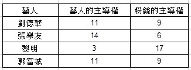

第一个数字是艺人的主导权，第二个是粉丝的主导权，两者总合为 20。可以看到，黎明主导权明显的偏低，代表粉丝对他比较不买帐。接着看四大天王与事业之间的主导权：

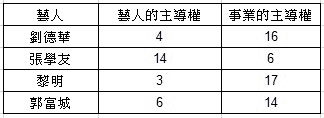

同样的，黎明处于最弱势。写本文时，张学友可能因为刚办完世界巡回演唱会，正处于事业高峰。刘德华则因为喉咙发炎失声，无法唱完演唱会，所以事业主导权也是偏低（其实也有可能是事业主导权偏低，导致喉咙有问题）。

最后看四大天王与金钱之间的主导权：

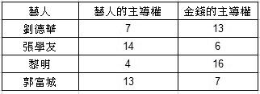

金钱方面，我没有什么新闻消息证实这些数据，我们只能看能量上读取到的分数。一个艺人事业成功与否，我想最重要的几个条件应该就是：他们与粉丝、事业，以及金钱的关系中能主导多少。所以，依照上面三个项目，总分 60 分的主导权，我们来看一下：

刘德华 22

张学友 52

黎明 10

郭富城 30

所以，从能量的角度可以看到，我写文章的这个当下，四大天王整体事业主导权最强的是张学友，接着是郭富城，然后是刘德华，最后是黎明。

当然还可以加上相欠债与功课一起看，不过以上这三项，已经让我们有足够的数据来判断四大天王事业成功度的排序了。

这样大家应该更能了解「主导权」是怎么一回事了吧！其实除了事业以外，政治层面也可以测出主导权差异。只是比较敏感的争议话题，我就不写在书上，持续有关注我脸书社群的朋友，往往能看到一些「有趣的分享」喔～

量子转化的天时、地利、人和

一件事情的成功与否，我们常说要看天时、地利、人和。这个概念在量子转化里，同样是非常重要的。

天时：你与流年流月流日之间的相欠债。你与不同时空之间的相欠债。

地利呢？我之前一直都以为，这只跟地区或是土地的相欠债，但是其实不只是这样。

人和：你与其他人事物之间的相欠债、功课、主导权等。你的情绪、价值观、资格。

「相欠债」与「功课」还有「主导权」的概念，我们后面的篇章会有详述。

有一次我遇到一位个案求助，他楼上的邻居每天晚上都会有脚步声跟东西掉落的噪音，甚至还有夫妻打架的声音。在我调整过许多项目后，的确是有改善，但是每天仍然还是有少数噪音。

因为我没有通灵，没有什么高灵或外灵会告诉我问题卡在哪边。所以每次遇到一个问题时，我也只能一个一个去除错，只要找到关键点，排除了，问题就能解决。

但是这个案楼上的噪音问题也的确困扰了我许久，我觉得能做的都做了，也已经调过让个案跟他楼上的房子都欠他了。通常只要有做到对的，都应该会看到效果。那么会无效的唯一理由就是：我还没找到解开问题的正确关键点。而那个关键点到底是什么呢？

某天睡前，我在思考这个个案时，突然想到：如果关键点不是房子的物体本身，而是房子空间内的能量呢？开启空间讯息读取术之后，发现果然个案欠空间能量欠很大。

于是我做完调整一段时间后，再询问个案，他回报说，现在楼上的噪音已经是在可接受范围，毕竟是公寓大厦，物理上的隔音有限。但跟之前的吵闹程度相比，能到目前这样，已经是谢天谢地了。

讲到所谓的空间能量，大家可能会说，这不就是传统中华文化讲的「风水」吗？我测了一下发现：不是。毕竟风水是透过装潢或摆设才引发的风生水起，而我并没有改变个案的装潢，也没有摆设任何东西。

我所调整的，只是很单纯的空间能量相欠债而已。但仔细思考一下，调整风水之后，你想要的，不也就只是让空间能量在你要的方面欠你比较多而已吗？

原来我不用透过风水，就可以改变空间能量呢注 3！

有了这个概念，接着就该来看看我家了。我发现我目前所住的地方，原生的空间能量只对我赚钱／事业以及修行是有帮助的，但是对我健康与桃花是有害的。虽说有钱又可修行是好事，但是如果搞到生病又一直单身的话，也真是太糟糕了，得赶快调整一下才行。

所以最后，「地利」在量子转化里，我就把它定义为：空间能量相欠债、地区与土地的相欠债。而空间能量相欠债是以你所居住的地方为主，它与天时与人和一样，都会影响到你人生的各个层面。

一般的随喜量子转化，我帮你清除的是「阻碍你无法达成心愿的分灵体」，这是属于人和的部分。强化版的话，我才会去一一检视，你能否达成愿望的天时、地利、人和，再开始做调整。

虽说这样架构出来的量子转化世界观越来越庞大，但是却也更加完整。毕竟能影响到你愿望成真与否的因素很复杂，但是只要用「世界是一个计算机游戏」的角度来思考的话，这些参数与条件都需要满足，愿望才能达成，那么一切就都合情合理了（所以别忘了 ABC 文明也要列入考量，它们是大于 D 文明这个虚拟游戏的因素）。

我何尝不想一个弹指就能够把你的问题都解决掉呢？但是能够把真正的障碍找出来并加以除错，这才是能大幅提升成功率的关键点啊。

注 3：目前有一个派别叫「阿法气能量风水」，讲的也是空间能量的风水。但我的概念上调整的是相欠债，跟他们的概念与做法完全不同。

## 2-2 人类的九个本源种族与对现世的影响

从开发量子转化到提供个案服务，多年以来有件很困扰我的事情，那就是：大部分的情况下，我做出调整后的状况都能产生显著效果，只有少部分例外，效果不佳。

虽然，这并不违背常理。但是身为一个医学博士，以及有科学实验精神、凡事实事求是的人，总是会思考：能做出成效，就必须具备「可重复性」。如果该做的流程、准备都完善，仍会有少部分效果不佳，就可能代表，我的学理技巧仍是不够完善的（当然，如我一再强调的「情绪释放」关键，必要考量个案本身的情绪问题，情绪的干扰也会导致效果不好，但那不在本文的讨论范围之中）。

后来，某天我在看动画时，突然想到「原生种族」或是「本源」的可能影响性。在我透过空间讯息读取术请示宇宙后，宇宙让我知道了人类的本源总共有九种，或可以说，有九个种族。

简单来说，在我们的世界里，等级越高的种族，丰盛程度就越高，同时这辈子丰盛的额度就越高（但是额度高不代表现况是满满的丰盛）。

这一点就是个重要关键了！原来，有些人的本源是比较低阶的种族，所以不管怎么调整财运，即使调到满，也会因为种族偏低的关系，仍然呈现一种不足的状态。简单来说，就是一个「乞丐中的霸主还是乞丐」的概念。

这令我恍然大悟：不是之前做的调整效果不好，而是这个个案本身受制于原生种族的丰盛度不足，所以成效调不起来（中医「虚不受补」的概念放在这里好像也可以）。我甚至猜想，或许当初印度分四个种姓制度，可能也是跟这个概念有关也说不定呢！

不过请注意，我这边所说的人的本源只是一种分类，并不是什么因果轮回，或是任何带有歧视意图的法则或系统，因为是有改善、化解方法的。

怎么解决呢？很简单，就是「种族等级调升」。把你从低阶的本源，调到高阶的本源。因为如果不这么做，那么不管怎么调整都不会有效果的。提升了本源的种族，也就提升了丰盛程度，自然人生体验就会有所不同。

所以，可以这么说：赚钱多寡会被本源等级影响，桃花会被本源等级影响，感情方面也会被影响；甚至从事销售、艺人红不红，也一样会受到影响。本源等级的影响，甚至远超过后续会在下一章提到的，能量上的「相欠债」与「功课」。

人类的九个本源种族

九个人类本源的种族，究竟是哪九个呢？我依序排列如下：

．神

．神人（外星人）

．神兽

．精灵

．人类

．亚人

．矮人

．巨人

．兽人

其中「人类」是处于中间的平均值，所以如果你的本源是人类，那么人生大概就是平平庸庸的，不会很有钱，也不会很穷。而人类以下就是平均值以下的状态，越往兽人靠近，就是离平均值越远。而人类以下的种族，跟高阶种族之间就越容易会有「畜生听不懂人话」难以沟通的问题。

各种族的特性与状态，在此也一一说明：

⊙神：

具备撼动世界与时代的能力的种族，在人世间数量稀少。

⊙神人：

一开始是以第二高阶的种族出现，但要说什么是神人呢？顾名思义就是很接近神的人类，不过基本上没有例子。所以，后来请示宇宙，得到的回覆是：「把神人当做外星人来看待是可以的。」这些人经常会被视为天才，且会有许多人类认为的奇迹发生在他们身上，但他们基本上对此习以为常，丰盛程度极高。

⊙神兽：

神兽，就是神仙的座骑，或是传说中的动物（龙、麒麟、凤凰之类），往往陪伴神仙修炼多载，法力惊人。在西游记里，孙悟空可是打不赢偷偷溜下凡间的神兽呢！神兽很强也很尊贵，千万不要因为有个兽字就小看他们。

⊙精灵：

不同种族的精灵分别拥有掌管不同五大元素之力，比人类多了一分灵性，多了一分法力，多了一份丰盛；也多了一份美丽与帅气，或是有特殊的技能。跟人类比起来，是容易比较骄傲，自以为是，或是自恋的种族。这种族容易有「聪明反被聪明误」的问题。

⊙亚人：

可参考动漫中，具有人类的样子，也同时保有像猫耳朵那种动物特征的物种，就是亚人（小美人鱼也算是亚人）。是人类的亚种，在动漫里，亚人经常会被人类歧视跟奴役，因为他们被视为是比人类低贱，但又可方便使唤来做所有人类可做的事情的悲情种族。

⊙矮人跟巨人：

如同字面上的意思，不同身高的两个种族。矮人通常机伶刁钻狡诈，巨人则比较愚蠢、体型大而不当，个性与做事都粗鲁不细心。矮人往往会为了自己的利益钻牛角尖，且会有意而无意的听不懂人话。巨人则是很单纯的蠢到听不懂人话。

⊙兽人：

外表是野兽，但是可以像人一样站立活动，例如狼人（可参考电影《暮光之城》）。通常个性固执，思路容易跳针，因为智商不高，也听不太懂人话。

举些例子，地球上的许多名人是来自哪些本源呢？（这纯粹是本人观察结果，在当初脸书日帖发布时期随意找些脑袋里想得到的名人举例，无关政治倾向，不喜勿轰。）

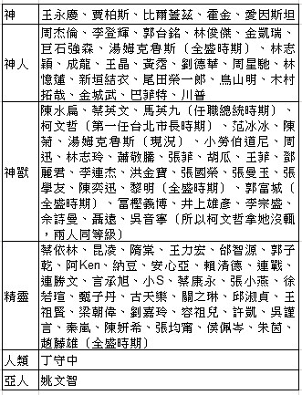

如上，或许读者可以有所了解，本源跟财运与运势的基本关连性。越上面的种族，丰盛程度就越强大。

本源会不会变动呢？我原本以为不会，但是后来实际印证，本源会随着情绪与运势变动。的确，如果不会变动的话，那这系统不就是个变相的因果轮回？但我们强调的是游戏世界中多重可能性的概念。

举一个我以前认识的朋友 A 来当例子好了，她之前是个职业平面模特儿，拥有亮丽的外表。不过，认真说来，我认为她不是单纯「漂亮」的那种，因为她赢在长得很有灵气、很有气质，当时她的本源是精灵。

后来，她交了一位很有钱、很任性的男友，两人关系并不好，因为男友是个玩咖，她经常因为男友劈腿而处于情绪的低潮。就我的观察，男友有找人对她作法，因为女生漂亮，他怕她也会去外面玩，就找人作了「让对方无论如何都会爱着他」的法。后来即使分手了之后，男生也没有要解掉这个法的意思。换句话说，就是「即使老子不要了，也没有其他人可以得到妳」的概念，是个超级渣男！（女生到目前为止，完全不知道自己被作法。）

后来这位女性朋友想靠自己的人脉做生意赚钱，可是因为被这术法影响，整体的运势就变得很糟糕（毕竟桃花被锁住了，而做生意很讲人脉与桃花），目前本源看来就是个兽人。本源竟然可以从精灵变成最低阶的兽人！在我看来，理论上应该是金钱、桃花、事业全部都完蛋，真是太糟糕了。

总之这是个很有趣的新概念，也不断被我验证在量子转化的个案身上。当然，诚如我之前所说，这系统不是只有单纯的一脉分类而已。有时候你的原生种族是高的，可是你的财源却落在较低的种族等级，这样也很不妙；反之亦然，并不是本源高所以让你现况丰盛、口袋满满，因为也有可能你种族低，但财源是高的。

本源是先天的原厂设定

自从我发现到人类的九个种族本源后，就做了许多实验跟研究。最基本的发现，就是本源跟自身丰盛程度的关联。等级比人类高，你生命的丰盛程度，理论上就会高过平均值，反之亦然。

这个可以说是每个人先天的原厂设定，每个人的本源都不一样。

这些数值是固定不变的吗？我发现不是，在极特定的状态之下，本源的等级会往上或往下跑。例如，经常做情绪释放的人，本源会慢慢的往上升；遇到重大情绪创伤的，本源会往下降（如果只是一般的负面情绪，不会影响这么大）。

做坏事当然也会拉低本源的等级。此外还有一个看似很性别歧视的条件，就是女生不断跟不同的对象上床，会导致本源降低，但男生似乎没这个问题。不要问我为什么，测出来就是这样的结果。

还有，如果有被作法的，也会导致本源降低（因为对方通常都是作法要你运势低落，本源降低很合理）。而换一个角度来思考，本源就是你接近神性／宇宙的等级。你的自我感觉越良好，就是小我越旺盛，通常会导致等级降低。

以上是我观察与研究的结论。

那么可以调整本源到什么程度呢？目前为止，宇宙似乎最高只肯让我把别人调到精灵等级。为什么不能调到神兽以上等级？因为，神兽等级以上的人，都可能有被上天赋予比较特殊的「任务」或「体验」。读者可以参考看看前述的名人例子，对照一下他们是否有所特长，或者因为某些突出表现与影响力，才能成为一个知名人物。

所以，无法调整的原因是：你原本的灵魂并没有计划要到地球来体验到这么特别的故事或任务，所以不用强求。有时候当个小人物，人生会比较安稳，也会比较快乐（虽说写本文时，蔡依林也「只是」精灵等级啦）。所以，目前最高就是开放调到精灵等级。

如果之后这技术有新的突破，我一样会对调过本源的朋友负责，会使用新技巧补调整，请放心。然后只要心存善念，不做让自己产生很多负面情绪的坏事，调整过的应该都会维持住。

相对的，提升等级后，理论上，生命中的负面事件发生机率也应该会降低才对，所以也更能让效果维持，从此生命会进到一个非常正向的循环。

最后请注意，本源的等级有可能受到地区或公司相欠债的影响。例如我有一个个案，本身本源是亚人，但是因为公司欠他、台湾也欠他、美国也欠他，所以他透过公司操作台股跟美股，他的财运呈现的就是神兽等级。这就是他运气很好。反过来，如果你的本源是神兽，可是你欠台湾或你欠公司，有可能你公司跟台湾就会吸掉你大部分的财运。

大家要知道，影响人生丰盛程度的关键不会只有一个，但是只要有往好的方向变动，就是会提升许多丰盛的程度。

外貌是否受到本源的影响？

本源对我们的影响众多，或许有人会想问：等级越高的人，是否越帅或越漂亮？告诉大家，并没有！外貌出众的人，有很大机率等级比较高没错，但是也有许多外在条件不差的人，其实等级都很低。

其实这些案例随处可见，就是那些自以为帅或漂亮，一直想红又红不起来的艺人或网红，或是已经过气却还自以为红的艺人或网红（等级会随着人气往上或往下移动，等级降低了，自然人气也一起降低）。

所以不要被外表蒙骗了！但我也要慎重说明：并不是歧视兽人或是低于人类的种族，这些本源种族没有不好，每个人都有各自人生的体验与先天的原厂设定，这些都是平等的。我只是觉得「人贵自知」，人活着要谦卑，不要太自我感觉良好，不要好高骛远、眼高手低，才能活得快乐。能够照顾好自己的情绪，自然有提升本源、扩展自己人生的机会。反之，太骄傲的人，自然会有上天降级的惩罚呢！

另外，要提醒各位读者——自我感觉良好，有时是人生成功的反指标。

这个概念源自跟朋友聊天时，聊到某位 H 女星。她外表亮丽、气质出众，担任过主播，我们聊起，这样的女孩子会不会有「公主病」的问题？我猜想，既然是漂亮的正妹，多少都有点难伺候吧？但是，我一测，竟然发现她「自我感觉良好」的程度只有「亚人」等级。换句话说，她应该是个个性很好相处的人，没有所谓「公主病」。

朋友推测，或许是因为她多少受到原生家庭影响，认为自己是小三的小孩，先天上有自卑的心态，所以在人际关系上更加谦和谨慎。

喜欢研究人类的我，当然就又要玩大数据啦！所以我又把政治人物跟艺人的「自我感觉良好等级」全都测了一下，得到以下的结果（如未特别标示，测的都是当下状态。另外请注意这是测「等级」，并非本源；只要是分类，都可以视为一个参考值得标准）：

名人的自我感觉良好等级

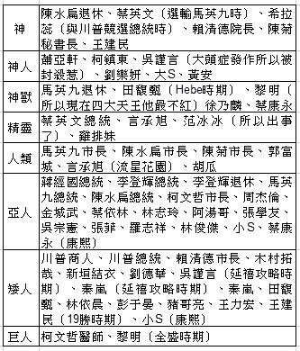

另外以时间顺序看一下周星驰：无线电视时期，精灵。《赌圣》，亚人。《逃学威龙》，矮人。《唐伯虎点秋香》，矮人。《国产凌凌漆》，亚人。《大话西游》，亚人。《大内密探零零发》，人类。

但周星驰从以下开始就没那么好笑了：《食神》，精灵。《少林足球》，精灵。《长江七号》，精灵。《功夫》，神人。《西游记降魔》，神兽。现况，神人。

再次提醒，九等级依序是：神，神人，神兽，精灵，人类，亚人，矮人，巨人，兽人；人类是平均值，人类以下是偏低，人类以上是偏高。

我也测了我认识的一些艺人跟小模朋友，基本上得到的数据是一致的。

由以上的结果来看，就可以知道，自我感觉良好越低阶的人，他的成就越大；如果是艺人的话就会更红。

反过来，如果你自我感觉越良好，那么成就就会越糟糕。这结果我个人是觉得很有趣，因为完全让我跌破眼镜。但这样也刚好让我印证，为什么现在有一堆艺人或网红，明明长得很漂亮，身材也很好，可是却怎样都红不起来。或是你条件都很好，可是一直赚不到钱，都是同一个道理——因为你自我感觉太良好。

我对「自我感觉良好」的定义，大概是骄傲、大头症、固执、坚持己见、自以为是，还有不够谦虚。当然，这不是只有指外表而已，赚钱能力、社交能力、感情等都可以纳入考量范围。

从以上举的几位最大咖的艺人来看，就可以知道：越红的艺人，往往就越谦虚，而如果红到一个点，你自我感觉良好爆炸破表的话，星运就又会往下掉。

或许你会问：「不管是吸引力法则还是成功学，不是都说，我们要让自己保持在自我感觉良好的状态吗？那这些艺人今天如此成功，难道他们觉得自己很糟糕？那这不就完全违背了吸引力法则与成功学吗？」

其实不是这样的。越红的艺人，往往就越谦卑，他会思考：我还要怎样更努力，才能带更好的作品给观众？而大头症的艺人则会想：我都已经这么努力了，我都长这么帅、这么漂亮了，这么有才华，怎么还不红？你们这些蚁民怎么还不快来膜拜我？

如果对应到销售生意上，就会是这样的心态：「我的东西都这么好了，你们都不来跟我买，不跟我订货，你们是白痴啊？」其他面向的请依此类推。

基本上就是一个「我很棒，所以我应该得到什么什么」的傲慢态度，全部是一样的。

因此，我在每一堂课程的一开始，都会提醒我的学生：来我这边上课，请暂时把你之前所学过的东西放一旁，因为满的杯子无法装进任何新的东西。人如果无法保持谦卑的状态，就很难往前进啊！如果你的杯子满了，就是自满；越谦卑的人，你的杯子就可以装到千杯（谦卑）之多。

总之，「自我感觉良好，是人生成功的反指标」是我的新发现，我觉得十分值得思考与自省。

另外，需要补充的是：并不会单纯因为变谦卑了，你整体运势就会变好。

当一个人没才华、没资格、没运势、没财力、没桃花……再怎么谦卑、再怎么不自我感觉良好，都是没有用的。

思考一下，如果刘德华就只是很谦卑而已，他会红这么久吗？所有的东西都要看全貌才正确唷！更何况本身就不是谦卑的人，一时的检讨与反省，也就只是一时的谦卑而已，很快就会自己打回原形的。

「自我感觉良好」对人生产生的影响

自从宇宙丢了「自我感觉良好」这六个字给我，曾经有一度让我感到困扰：为什么是这六个字？困扰的点在于：例如，有一件事情你希望能达成，但是，明明你对这件事情并没有自我感觉良好，但是我却测到你「是」；然后，当我测到「是」的时候，事情就注定无法成功？

「自我感觉良好」有没有可能是其他的意思？这是我思考的方向，毕竟，上面丢了一个疑似不太「使用者友善」的东西下来，不仅很多个案搞不清楚自我感觉良好到底是什么，连我自己判读到这个条目，脑袋也都要先转一转才行。

这样不是办法，我得要把这个概念搞得更清楚才行！为了厘清这个概念，于是我拿艺人的外表来测，我先举两个例子（其实我测的不只这两位，我测了超多艺人跟身边朋友的）：

刘德华对自己外表的自我感觉良好等级：亚人（惊）

刘德华对自己外表的满意等级：矮人（大惊）

林志玲对自己外表的自我感觉良好等级：矮人（再惊）

林志玲对自己外表的满意等级：矮人（超惊）

这数据也太诡异了吧？？明明全世界都公认的帅哥美女，竟然对自己的长相满意度如此的低？

但这让我想起了一个个案，请容我用批判性高一点的字眼叙述这个故事。个案是一位女性，她的外表并不好看，如果以分数评比来看，大概只有四十分。而且身材偏矮胖，简而言之，并不符合一般男性与大众审美观。

可想而知她在感情路上比较辛苦，直到三十多岁都没有交过男友。有一次我们聊到她喜欢的男性类型，她大言不惭的坚持，自己对于男朋友的外表上有所期望与要求。如果要具体举例，她提过，约莫是港星钱小豪，不一定美型，但就是十分酷帅有风格。

听到她认真的表述，我忍不住想：「怎么可能？妳凭什么？」我认为，一个人活到三十多岁，应该分得出欣赏喜欢的类型，跟现实生活中可以谈恋爱与结婚的类型，是不一样的吧（毕竟大部分的人都在三十岁左右就结婚了，三十岁都还没搞清楚，也未免太晚熟了，因为妳完全不了解妳自己）？

就像刘德华的粉丝都知道，她们超迷恋刘德华，可是绝对不可能跟刘德华结婚的道理是一样的。可是，这个个案似乎分别不出来，这摆明了哪里怪怪的。

我一测她对自己外表的自我感觉良好程度，竟然出现神等级！对自己外表的满意度也是神等级！天啊，我太吃惊了。

但这也解释了，以她的条件，竟然会「肖想」她想要交往的对象必须是要有钱小豪的外表……因为她实在太自我感觉良好了。问题是，她为什么会对自己的外表那么自我感觉良好？我当时读取了许多案例，加上自己的反省与探索，我终于捉摸到了这大概是怎么一回事。

人之所以会对一件事情自我感觉良好，往往是因为事情不如你所愿，但你却希望事情与现况有所不同。因为现况跟理想差距太大，人必须对自己说谎，告诉自己「事情一切都很好」，才能够让自己生存下去。就像喝醉酒的人都不肯承认自己醉了的道理一样。

所以，出现的反差是：当自己外表不够好时，内在会告诉自己其实我很帅、很正，其实是别人眼光不好，所以我可以不用为我的外表感到自卑。甚至，我条件好到可以筛选我要的对象；我单身是因为我条件好，我不肯随便将就。这样就可以名正言顺地说服自己，为什么一直找不到交往的对象了！更严重的，这样的人可能会讨厌、挑剔爱上自己的人，然后一直在追逐、偏爱着根本看不上自己的人，这样的剧情也太虐心了吧！

换言之，对照在财运也是一样：我一直很努力，所以我认为我要赚到多少钱是理所当然的。可是，明明现在就赚不到我认为应该赚到的钱，所以我必须自我感觉良好，这样才能够勉励自己，明天起床又是充满希望（虽然内在很清楚知道这个希望是假的）的一天。

这也启发了我，或许，这又和一个人的自卑等级有关，所以我再测一下：

刘德华对自己外表的自卑等级：神兽（大惊）

林志玲对自己外表的自卑等级：神人（特惊）

很难想象林志玲对自己的外表感到自卑。但我们应该可以得到一个结论：「自卑等级越高，代表越没有自我感觉良好。」而我刚刚提到的那位女生对自己外表自卑的等级，是兽人等级。

所以到目前为止很清楚了：自我感觉良好，跟自卑有绝对的关系；即便「自卑」未必是精准的词，但其象征意义是符合我想传达的概念。

也就是说，当我内在需要告诉自己「我很帅、很正」时，其实你是极度自卑的。自我感觉良好是果，自卑是因。而这自我感觉良好的能量，竟然大到足以让它以相反的方式呈现出来，并且让我测到，可见对你的人生会造成多大影响！

由此可知，当你赚不到钱、你内在需要告诉自己「我绝对赚的到钱」时，你一样也是极度自卑的，其实你专注的是金钱上的匮乏。自我感觉良好是一种非常肤浅的正向思考，虽然看起来正向，但是却会把你害得很惨。

心情不好时，我们的父母、学校、社会总是要我们正面思考，要告诉自己一切都会过去，都会没事的。但其实当你勉强自己正面思考时，你的状态就不可能好，因为你正在喂养那只负面情绪的狼。因此，你一定会吸引到你内在真正专注、相信的东西。

虚伪的正向思考，骗得了自己，骗不过宇宙。外在世界是内在的一面镜子，如果你内在真的很开心的话，那么外在世界也该是同样美好才对。如果不是这样的话，那么就该好好的面对与检讨自己内在不愿面对的真相。

要破解的话，最基础的技巧还是会请大家回到「情绪释放」。

请记得，「自我感觉良好」是长期没有释放应该释放的情绪的产物，留着对我们一点帮助都没有。

真正有美好外表的人，从不需要为自己的外表感到自我感觉良好；真正有钱的人，也不会为了自己有钱而自我感觉良好。

## 2-3 是谁模拟出我们的世界？

就在我整理出人类的九个本源种族之后，我不禁在想，为什么我们会有九个种族？又是谁决定的？难道在我们之上，有一个决定我们是什么种族的力量吗？

佛教的《阿含经》中说人类是来自于光音天，此境界是绝音声的，说话时自口中发出净光而为言语，故名之为「光音」。光音天的天人来到地球，由于吃了地球上的食物之后，身子变得凝重而回不了光音天，于是成为人类的始祖。

诸比丘，世间转已，如是成时，诸众生等，多得生于光音天上，是诸众生，生彼天时，身心欢愉，喜悦为食，自然光明，又有神通，乘空而行，得最胜色，年寿长远，安乐而往。诸比丘，尔时世间转坏已成，空无有物，诸梵宫中未有众生。光音天上，福业尽者，乃复下生梵宫殿中，不从胎生忽然化出，此初梵天名娑诃波帝。

当然，除了光音天以外，佛教里也讲述，还有其他生命透过六道轮回成为人类的方式。

基督教里则是说，人类是神依照自己的形象所创造出来的生命：

神说，我们要照着我们的形像，按着我们的样式造人，使他们管理海里的鱼，空中的鸟，地上的牲畜，和全地，并地上所爬的一切昆虫。神就照着自己的形像造人，乃是照着他的形像造男造女。（创 1:26-27）

除了东、西方的两大宗教外，其他的宗教或民族，也都有着「人类是被一个更高层的生命所创造出来」的说法。中华文化里则是有「盘古开天、女娲造人」的神话；达尔文在他的《演化论》中，认为人类是从猴子所演化而来的。

随着时代的演变，近年来也有「外星生物创造论」——认为人类是外星人的后代；或是地球及地球生物或文明，是由古代航天员所创造出来的；甚至我们可能是被外星人观察与豢养的实验体。

著名的电影《黑客任务》以及《异次元黑客》，则是在故事中提出「人类是被计算机所模拟出来的产物」的论点。

而在身心灵的领域里，经常会提到「高我」、「大我」、「真我」、「本我」、「扩展自我」（以上名词都是同一个意思）等概念，这些都在暗示，在人类之上，有更高的生命体或是意识的存在。我曾经去上了《你值得过更好的生活》作者罗伯特．薛佛德的课程，更加深入了解了我们与扩展自我的关系，也了解了我们为什么来到地球上，但是更高层的意识或生命体到底是什么？我还是没有答案。

在我拥有「空间讯息读取术」以及美国 CIA 的 CRV 遥视能力后，我也很好奇我们到底是从哪来的，于是有一天，我便使用了「零通灵」能力，探索了我们人类与文明的起源。

不探索还好，这一探索，竟然开启了我全新的视野。我对于我的发现感到无比的兴奋：我们的世界竟然是被比我们更高阶的文明所模拟出来的电子游戏！而且这些高阶文明的架构之复杂，更是让我叹为观止。

当然，我并没有任何实际的证据，来证明我所读取到的信息是百分百真实的。但是依照这个信息来做量子转化，的确是让我以及个案的现实生活中出现了许多难以解释的奇迹，对我来说，这样就足够了，一切都说的通了。

不管这讯息是真是假，只要我们的人生变得更美好，更开心，这对我们才是最真实的，不是吗？

那么就让我们透过「零通灵」的角度，来探索我们所存在的这个「游戏世界」的缘起吧！

【零通灵看世界】

什么是 CRV？

Controlled Remote Viewing，简称 CRV，中文可以翻译为「可控性远端观测」，简称「遥视」或「千里眼」，这是一种活化潜意识功能的技巧。对于潜意识来说，祂可以接触到宇宙里所有的信息与知识。

CRV 的技巧与结构会让人把隐藏在潜意识里的信息带到表面来，或是启动内在的直觉力。学习 CRV，可以让你具体地观测与形容任何时间空间的人事物。不过，与其说是具体的观测到，我个人的经验是，其实你并不会真的用眼睛「看到」具体的影像或画面，而是你突然就「直接知道」你想观测的东西是什么。

所谓的「可控性」是指 CRV 技术，是设计为：可以帮助遥视者在接收讯息时，清楚的分辨出讯息的真实度，排除想象力、情绪、恐惧、欲望等想法对读取信息上的污染。

CRV 这个科学的技术最初是由美国的印果．斯旺（Ingo Swann）与史丹佛国际研究院（Stanford Research Institute International）所研发的，这技术的目的是：透过使用不同大脑的部分，来提升其认知以及直觉功能。一旦你与潜意识连结后，你不只可以强化你的感官，还可以去探访任何储存于潜意识的内容，象是你五岁时的电话号码、你的车钥匙在哪等。在 CRV 的过程中，你的浅意识功能会被表意识化，这可以让遥视者观察到事物的细节，以及取得超乎现实可理解的信息以及灵感，不管是在哪一个时间空间。

这技术在美国冷战期间曾被美国中央情报局运用来读取敌国苏联的情报信息，现在则大多被运用在帮助警察寻人、破案、考古，也可以用来了解自己的内在、帮助自己与旁人可以做出人生更好的抉择。此外 CRV 也可以帮助物理学家、发明家等提升直觉力，甚至探索未知的事物（包含外星人或古文明等）。

我们游戏世界的缘起

大概七千多年前，存在着一个非常高度开发、拥有超级高科技的文明、高度物质成就的世界。这个文明除了科技发展进步的程度惊人以外，人们也因为心灵上高度的成长，使其心灵处于「没有二元对立」——也就是「没有评断」的状态。

没有评断是什么样子呢？从我们一般人的角度来看，那是一种自然而然处于冷酷无情、凡事漠不关心的状态，我们可以把这个文明称作「A」。

人嘛，同样的状况久了总会腻，或是说好奇心使然也可以；于是 A 文明以高科技的计算机技术，创造、模拟出了一个「B」世界。

B 世界基本上是跟 A 相反的，简单来说，就是比较古老（或是落后）。B 是一个崇尚古文化、重视心灵成长的世界。于是，许多 A 文明的人们就让自己的意识进到了 B 文明这个世界，透过「体验 B 世界」这个游戏，来探索他们所没有的东西。

当然，如果模拟出来的 B 文明世界里的人类，全部都是来自 A 文明，那就一点都没有意义。大家都知道彼此来自 A，只是换了个外表跟地点，那不就象是开个万圣节趴而已吗？所以，A 文明必须让 B 文明的世界有许多高度智慧虚拟的角色，也就是「NPC（Non-Player Character）」，可以跟 A 文明的人互动与玩耍。

在美国 HBO 影集《西方极乐园》(West World）的剧情里，乐园创办人福特博士制作出高智慧、并且具有跟人类外表一模一样的机器人，让他们作为西方极乐园主题乐园的接待员，可以与来自现实生活中的客人互动，甚至包含被杀害、发生亲密关系等等。总之，在 B 文明里面被计算机制作出来的人们，之于 A 文明的人来说，就是这样存在的意义。

那么，等到 B 文明的这些被制作出来的高度智能人类的科技进步到一个点后，B 文明的人们也具备了制作超高清虚拟游戏的科技，于是他们创造出「C」文明。

一层一层发展下去的文明世界

同样的，C 文明与 B 文明相反，因为 B 文明的人们想体验的是他们所没有的。太注重心灵层次的提升，久了以后，人也会感到物质生活中的匮乏。所以，C 文明是以「精神与肉体享乐、被人照顾、奉承、关注」等为主的主题乐园。

后来过了一段时间后，C 文明同样制造出了一个与他们相反的世界，就是「D」文明。D 文明就是我们现存的世界，主题与 C 相反，就是没有太多享乐；因为主题是「受苦」的缘故，所以也会有人要往心灵方面发展，寻求解脱之道。

D 文明拥有来自 A、B、C 三种文明的玩家，大家都想体验自己想体验的东西，所以 D 可以说是乱象纷陈。它是四个文明中最落后、最混乱，却也是最自由、最新鲜、最好玩的游戏世界。

所以，我们所知的「世界」，除了我们现行体验、生活的状态，本质是：由比我们高层的意识制作出来，并由意识来玩耍的三个文明世界。

请注意，A 文明并不是只创造出 B 这个单一文明，他们可能制造出很多其他的文明，只是因为跟我们不是属于同一传承，所以我们无法得知。同样的，B 文明也有可能制作出不只 C 文明的世界；C 文明也有可能制作出不只 D 文明的世界，就像目前世上做电玩主机的公司有任天堂、SONY、微软等，一家公司的游戏不一定都会出现在所有的平台系统上，其道理是一样的。

只是从我们最底端 D 文明的角度来看，我们无法知道还有哪些旁支的游戏世界，ABCD 文明就象是一直线下来的样子。

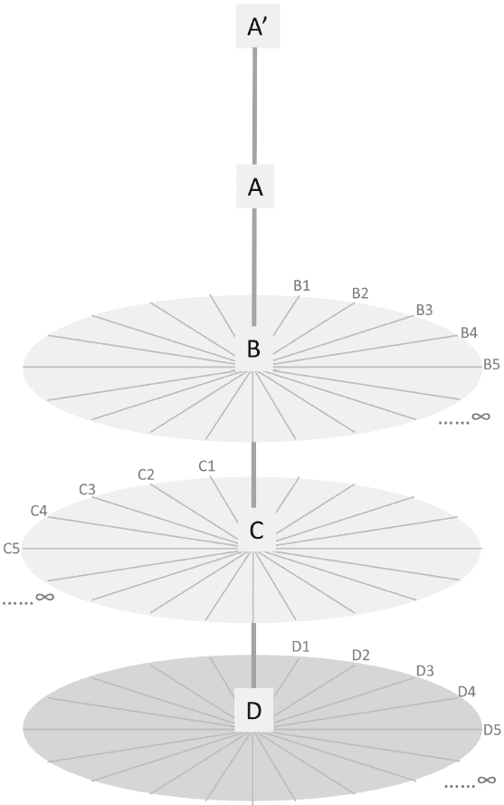

【零通灵看世界】

见证一下我们已经在模拟的世界

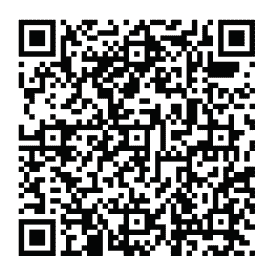

这段影片给大家参考一下。《EmuVR》是一个 VR 游戏（本文稿 2019 年撰写时还未上市，官网[emuvr.net](http://emuvr.net)），里面模拟了 1990 年代的环境，包含墙上的海报与零食，以及所有当时的电玩主机与游戏。

这就是所谓的「祖先模拟」（Ancestral Simulation），用来了解过去文明生活方式的模拟软件。所以，如果你透过 EmuVR 玩里面的双截龙游戏，你就是双截龙里面的玩家。而这就是一个从 A 文明（现实）玩 B 文明（EmuVR）再玩 C 文明（双截龙）游戏的概念。

想象一下，VR 游戏再发展个几百年，会真实到什么样的程度？这就是四个文明如何一层模拟一层、一层玩耍一层的由来了。

不同层级文明的玩家特质

我们处在的 D 文明里面，有来自 ABC 三个文明的玩家，以及在 D 文明被制造出来的原生种 NPC。但，并不是每个来到 D 文明玩家的都是 A、B、C 一层一层体验下来。有的是直接从 A 或 B 或 C 世界下来，或者其中某个层级没有参与过。这些玩家以特性来讲，相对单纯。

接下来就向大家说明一下不同层级文明的玩家特质：

⊙A 文明玩家的特质

因为高科技、高文明，极度在意规则的遵守，所以相对的会对别人与自己相对冷血、残忍与漠不关心。由于自身的高文明而感到极度自傲与成功，所以来到 D 文明时，经常会体验的主题是与之相反的「不管怎么努力，人生就是过的很凄惨」的游戏。以我们来看，这是一种自虐，但他们内在深处的 A 文明玩家，其实乐在其中。

单纯只从 A 文明来的玩家之中，我目前还没找到什么有名的人，因为他们对变成政治人物或艺人没兴趣。我有一位朋友跟两个个案，都是单纯从 A 过来的玩家，就是真的怎么努力，人生都过得很惨；而且早期版本的量子转化对他们的帮助相当有限，因为「爽爽过人生」并不是他们所想要的。

⊙B 文明玩家的特质

如果你是单纯从 B 文明来的，你会相对地比较崇尚身心灵成长（但不一定是往正确的方向走）；喜欢接触一些相关的课程，让自己可以从不同面向提升，但不小心被骗而走偏也是有可能的。通常你会很有礼貌，感觉温文儒雅，除了身心灵成长以外，你还可能会喜欢比较古老的文化，象是诗词、书法、国画等等。除此之外，还会掌握一些专业的能力；也就是说，来自 B 文明的人，在某些特定方面，会有很厉害的专长。

另外，B 文明的玩家也喜欢在 D 世界散播欢乐、散播爱，也就是会把一些有智慧的言语与知识在这个 D 文明散播出去。很多不是太有名的身心灵大师都是来自 B 文明的玩家，因为他们也没打算要变有名。

整体来说，我个人最喜欢的是来自 B 文明的玩家，可以说是给 D 世界制造了一股清流。单纯来自 B 文明的玩家也不多见，因为通常也不是台面上常见的公众人物，经常出现在身心灵圈或宗教圈，但又不是很出名的人，很多都是来自 B 文明。

⊙C 文明玩家的特质

如果你是单纯从 C 文明来的，某个程度上要恭喜你，因为你就是到地球来享乐的。这些人就如我前文所提，C 文明本身是以享乐、被人照顾、奉承、关注等为主的主题乐园，所以来到 D 世界时，不会忘记这样的本质。

来自 C 文明的人唯有一个缺点，就是这些人极度需要认同感，所以往往会透过群众或身边的人来满足这个条件。如果因为时机还没成熟、体验不到时，反而会出现心理上的疾病与问题。

因为有被奉承、关注等的本质，所以 C 文明的人天生就是有众生缘。如果想要让很多人都认识你、知道你是谁，并且从这些人身上赚到钱，不是来自 C 文明的话，会很困难。市面上很多艺人、公众人物以及身心灵大师都来自 C 文明，或是文明结构中有 C 文明。

但这就有一个问题产生了。因为 C 文明本身不注重心灵成长，如果一个大师只有来自 C 文明的话，他通常只是个包装得很好的骗子，是为了沽名钓誉而来。所以我这边也不方便举这些大师的名字出来，请自行观察体悟。

有来自 C 文明的玩家，就有不少我们知道的名人了，象是：木村拓哉、邰智源、王永庆、贾柏斯、比尔盖兹、霍金、爱因斯坦、林俊杰、成龙、王晶、刘德华、周星驰、林忆莲、尾田荣一郎、鸟山明、陈水扁、范冰冰、陈菊、小劳伯道尼、周迅、萧敬腾、张菲、胡瓜、洪金宝、黎明、张曼玉、郭富城、蔡依林、蔡英文、赖清德、连战、连胜文、言承旭、小 S、蔡康永、张小燕、徐若瑄、甄子丹、古天乐、关之琳、秦岚、陈妍希、张均甯、侯佩岑、赵藤雄等等。（以上是含有 C 文明比例的人物，不是只有纯 C 文明。）

C 文明的玩家很好找，因为都会是台面上有名的公众人物，象是艺人或是政治人物。身心灵方面或是宗教方面的人容易有争议性，恕我略过不提。不过，并不是所有 C 文明的玩家都一定要成为明星或名人，象是做为一个教学老师或许不用大红大紫，但只要有一群学生愿意捧着他，让他感到很开心，也就足够了。

值得一提的是，如果一个交往对象是单纯来自 C 文明，要赶快闪！因为他就是王子病、公主病相对会比较严重的人。除非你「银弹」足以支援对方吃喝玩乐享受人生，或是你能奉承对方让他很爽，不然劝你三十六计走为上策。

【零通灵看世界】

不同文明的人，其实外貌都不一样

补充一个有趣的内容：A、B、C 文明上界的「人」都跟我们长得很不一样！

【A 文明】

一个头、没有头发；四颗眼睛、一张嘴巴、四只手。每只手有八根手指（大拇指有三根，所以可以做很复杂的动作），四只脚、两个心脏、四种性别（男男、男女、女女、女男）；每人两个生殖器官。

除了比我们多的生殖器官以外，祂们也有两个我们 D 文明人类所没有的器官——腮与鱼鳔，是两栖类生物，有穿衣服。祂们的世界没有分国家，也没有宗教。

【B 文明】

一个头、没有头发；两只眼睛、一张嘴巴、四只手。每只手有五根手指、四只脚，两种性别、女性有乳房；每人一个生殖器官。有穿衣服，祂们的世界没有分国家，有宗教。

【C 文明】

一个头、有头发；两只眼睛、一张嘴巴、两只手、四只脚。每只手有五根手指、两种性别；女性有乳房，每人一个生殖器官。有穿衣服，祂们的世界有国家的分别，约有 17 个国家，有宗教。

看起来越接近我们的文明，特质就跟我们越像呢！

⊙D 文明原生玩家的特质

最后，我们回到 D 文明来讨论。

不管你来自 ABC 哪一个文明都好，其实大家目前全部都处在 D 文明进行游戏。所以，这里讨论的是 D 文明原生的玩家。

「D 文明」因为是新的文明，意识层级跟 A、B、C 比起来比较低阶，往往这些纯 D 的人呈现出来的就是「一直不知道自己人生想要什么」的主题，人生过的相当浑浑噩噩。很多貌似受苦流离的人，其实都是 D 文明的原生种，象是游民或乞丐，对自己的人生抱持消极茫然的态度。不过由于也有相当的 A 文明玩家混在这样的角色中享受自虐的感觉，所以有时候也会发生「D 文明」与「A 文明」乍看接近的情况。

以上是稍微提一下 ABCD 四个文明的特质，A、B、D 其实都很难举例子，因为不容易找到有名的人做为案例。如果会有名的话，则会是跟在 D 世界里面与「九个本源」（请见下一章）有关。

如果你只来自 B 文明，却能在 D 的世界小有名气的话，通常你的本源有可能是比较高阶的。但如果没有 C，名气发展的还是有限，因为那不是你到这个 D 世界来玩，或是体验的内容。

最可怜的是，我看到许多正妹都是纯 D（这边不是指罩杯喔），尤其是想红、想往演艺圈发展的一些人，基本上失败或是被骗的机率都比较高，因为 D 文明的本质就是陪 ABC 三个文明玩乐的角色。有一个例外是台湾某位乐坛天王的老婆，她算是比较幸运的 D，因为她不但是 D 文明欠她 3 分的 D3，而且她的本源是精灵（而那位乐坛天王是 BC 玩家，本源神人）。

D 文明的世界涵盖了我们已知与揣想的一切，因此，本书中所有「本源」、「平行时空」等概念，都只适用于 D 文明；也就是，我们认知到的整个宇宙都是 D 文明，这些规则也只适用在这个宇宙（包含所有 D 文明所分支出来的平行时空）。

最后，不是每一个玩家都是那么单纯的只会从一个文明过来，许多玩家是混着玩的，玩法会有以下的组合：

ABC

AB

AC

BC

或许，你会问：「那经历过多重文明的玩家，又会有什么不一样的地方？

在进入多重文明玩家的特性分析之前，我想针对「人类游戏」的本质做一点补充。

关于人生游戏玩法的进阶说明

若以目前最新科技的 VR 来比喻，当我们戴上 VR 眼镜，并且启动游戏时，逼真的画面以及临场感，会让我们完全沉浸在游戏的世界，我们会完全忘了现实生活的存在。

是的，本书提到的「人类游戏」也是这样的玩法。只不过因为创造与玩游戏的人，是比我们更高等的文明，进行游戏时，当然是更逼真的五感完全潜行的沉浸式虚拟游戏。而且，当你一旦进去游戏之后，就没有登出的选项，直到游戏结束，也就是死亡为止（跟话题动画《刀剑神域》一样）。

就跟平常我们玩游戏一样，你会发现，游戏中的时间不一定等同我们体验的时间。在真正的「人类游戏」中也是如此，时间的流动跟我们理解的也可能不一样。举例来说，如果 A 文明到 B 文明体验一个新的人生，时间流逝的比例势必要调整。

假设我在 A 文明只有 70 岁的寿命，而我到 B 文明也必须活到 70 岁死掉才能结束游戏，两者如果没有太多时间差异的话，我有可能还没回到 A 文明之前，就死在游戏里了，这样当然是不可以的。

因此基本上，游戏世界里面时间流动的速度，是远高过原本世界的速度的，所以才会有「天上一天，人间十年」的说法。

我们来看看佛教里面六欲天为例：

⊙他化自在天：以人间 1600 岁为一昼夜，定寿 16000 岁。相视共语成淫。依空而居。

⊙化乐天：以人间 800 岁为一昼夜，定寿 8000 岁。熟视而笑成淫。依空而居。

⊙兜率天：以人间 400 岁为一昼夜，定寿 4000 岁。彼此忆念成淫。依空而居。

⊙夜摩天：以人间 200 岁为一昼夜，定寿 2000 岁。互执两手成淫。依空而居。

⊙忉利天（又名三十三天）：以人间 100 岁为一昼夜，定寿 1000 岁。淫欲方式与人类同。依地而居。有婚嫁。幻化出生。

⊙四天王天：以人寿 50 岁为一昼夜，定寿 500 岁。淫欲方式与人类同。依地而居。有婚嫁。幻化出生。

在每一层文明里，时间流逝的速度不同，所以 ABC 文明的玩家，可以在 D 文明里玩了一百年的人生，但是对他们的生命来说，可能就只是打了场一两个小时的计算机游戏而已。

至于时间流逝的速度，D 大约是 C 的 2000 倍，D 大约是 B 的两万倍，然后 D 大约是 A 的两百万倍。

此外，虽说一样有性行为，但是方式不一定跟我们人类一样（佛教六欲天里用看的、用笑的、用想念的、用牵手的都是性行为的方式），依照不同文明，则有不同的繁衍方式（近年来很多游戏已经提供玩家在游戏中结婚，并且还可以生小孩的功能）。我认为所谓的「幻化出生」，就是跟「该等级的文明被制造出来的意识」共同繁衍，或是原生种的意思。

因为游戏是以非常高科技所制作出来的，玩家经常进到游戏世界后，就会被故事与画面吸引，完全忘了自己在玩游戏，甚至也有可能有「故意先让自己忘了是在玩游戏」的做法也说不定，因为这样可以大幅提升在游戏里面体验的真实度。

你所知的「历史」其实可能不存在

依照这样的推算，A 文明是七千多年前出现的，B 文明是四千年前左右出现的，C 文明则是两千年前左右出现的。文明跟文明之间的空档，是有可能存在着其他被模拟出来的文明。

象是 A 文明不会只模拟出 B 文明，有可能还有 B1～B12（不是维他命啦）不同版本的文明的存在，只是因为这不在我们理解、连结系统范围，所以无从得知。

而我们的 D 文明存在的时间大约是 1030 年左右。

写到这里，一定有很多读者会想说：「王博士你真的头脑坏掉了！」我们存在的宇宙不是据说年龄是 136 亿年，地球是 45.4 亿年，我们华夏文化不也有个 4、5 千年吗？

这是一个很好的提问，但请别忘了，这些「数据」也不过就是「游戏的背景信息」而已。拿我们 D 文明大家都广为熟知的超级任天堂游戏《超时空之钥》为例说明好了，在「维基百科」上呈现了这样的内容：

《超时空之钥》有七名来自各历史时期的玩家角色。游戏开始的 AD 1000 年有克罗诺、玛尔和露卡。克罗诺是沉默的主人公，一名以日本刀战斗的无畏青年。玛尔（公主玛尔蒂亚）居住在加尔帝亚城堡，虽然是受到保护的公主，但内心更喜欢隐藏其王室身分。机械天才露卡是克罗诺的好友，家中摆满实验设备与机械。从 AD 2300 年来的罗博，或称普罗米修斯（代号 R-66Y），是为帮助人类创造的具有人性的机器人。罗博在未来休眠，被露卡发现并修复，之后为表感谢而加入队伍。非常自信的艾拉居住在 BC 65,000,000 年，具有非常强大的原始力量，是伊欧卡的酋长，带领她的村民和名恐龙人战斗。

最后两名玩家角色是卡艾尔和魔王。卡艾尔生活在 AD 600 年，原名格莱，是一名护卫；魔王杀死他的好友赛拉斯，并将其变为人形青蛙。勇武但深陷后悔的卡艾尔献身守护加尔帝亚皇后莉妮，并为赛拉斯复仇。同时，AD 600 年的加尔帝亚和魔族的战争，魔族在的领导下发动对人类的战争。魔王揭开了他遥远的过去；他原名嘉基，是吉尔王国的王子，吉尔在 BC 12,000 年被拉沃斯毁灭，他在事故中被流放到遥远的未来并长大，他试图像拉沃斯复仇，并寻找姐姐莎拉的下落。拉沃斯是外来寄生生物，在成长中吸收 DNA 与地球的能量，于 1999 年觉醒并毁灭世界。……

当你玩一个新游戏时，无论是说明书或网络上的资料，给予你世界观与游戏逻辑的认知，你只要启动游戏之后，就会全盘接受这样的设定，你也不会去抱怨游戏里面两百年前的世界跟你历史课本上所查到的不一样，因为你知道那不是真的，但你会全然接受与相信，否则就失去玩游戏的乐趣了。

同样的意思，也对应在我们现行体验的「人类游戏」之上。基本上，我们所接受到的「信息」——或是你可以说文化历史——就是游戏里面的设定，当你投入在 D 文明这场人生游戏之中，这个世界观与背景设定就会被接受，并且开始进行游戏。因此，我们所看到的恐龙化石、古文明文物等，都只是为了让游戏更加真实、为了让玩家相信这个世界真的有那么古老，而被制作出现在游戏设定的产物而已。

电影《黑客任务》里面也是设定了「在地球的 199X 年，是计算机为了撷取人类的生体能量，而让人类的意识在虚拟世界可以最稳定」的时空背景，但电影里现实中人类已经存活在大约 2199 年的世界，是一样的道理。

好了，解说完游戏的玩法、时间、背景设定的问题后，接下来就是玩法的不同了。当一个 A 文明的玩家进到 B 文明玩耍时，他有可能发现，B 文明已经进化到可以模拟出 C 文明，她也会想去 C 文明参观玩耍时，对 C 文明而言，这就是 AB 的玩法。

原生 B 文明的人如果来到 C 文明，就是 B 玩法；如果 B 文明玩家在 C 文明后又来到了 D 文明，就是 BC 玩法。

所以，之前我们提过的：如果我们 D 文明的起源是来自 A 文明，除了纯 A、B、C 的玩法之外，还会有「ABCD」、「ACD」、「BCD」等的组合。但因为大家都在 D 文明里面进行游戏，所以在分类上可以直接省略掉 D。

而这种游戏的玩法有一个缺点：一旦你已经进入游戏了，除非你「死掉」登出系统，否则无法停止你最后那一层在玩的游戏。比如说，一个 AB 的玩家，因为没有 C，所以整个体验上就是缺乏 C 文明的成分。你无法要求登出 D 回到 B，重新体验 C 后再进到 D，要这样做的话，你必须在 D 文明先挂掉才可以。

换句话说，因为游戏本质的缘故，造就了「生命蓝图无法改变」的窘境。不过后来我发现，只要意识层级提升够高的话，就有办法解决这个问题。

影响你命运的文明力量

命运，就如本书前面篇章所说的，是我们生活的 D 文明以计算机模拟出来的游戏世界，我们每个人会被上层文明所影响，端看你是来自 ABC 文明，或是你是 D 文明的原生种意识。

再来复习一下，不同文明的特色：

【A 文明】

冷酷、聪明，高度文明；完美主义，极度注重规则，自我要求严格，甚至可能严格到自虐倾向。

【B 文明】

追求心灵方面的成长，个性温和，喜欢开心喜悦，如果无法达成的话，会容易有身心灵方面的问题。

【C 文明】

喜欢追求肉体上的享乐、名利的成功与众人的追捧，如果无法达成的话，会有自我认同的问题。

【D 文明】

看你是否有 ABC 的特质，如果没有的话，就是 D 原生种。原生种的存在目的是陪玩，比较没有特定的人生方向。

但不管你是哪边来的，要在 D 文明进行游戏，就会受制于九种本源：神、神人、神兽、精灵、人类、亚人、矮人、巨人、兽人。

简单来说，就是手游抽角色的概念。抽到好卡，人生当然就一路顺遂；抽到烂卡，你可能就必须要期待你的人生会有很大的进步空间。

高文明的不一定过的比较爽，低文明的也未必过的很糟糕。这是一场宇宙意识玩耍的游戏，重点不在于爽度，而是在于体验。

对一般人来说，要改变命运很难，因为我们受制于先天文明以及本源的缘故（玩手游的朋友们就会比较了解「抽到的角色属性以及能力就是固定了无法更改」的痛苦，但同时，拥有特定属性也是有优点的），再加上人与人之间的相欠债，这样就架构出了所谓命运的轨迹。

由于是关乎于意识本身在游戏世界的种种体验，改变命运当然也可以理所当然的变成游戏的一部分。普通的玩法就是，随着游戏的设定，让人生依照原本命运的轨迹随波逐流；比较有趣的玩法，就是开外挂玩耍。

既然我们是意识，我们就不只是现有的肉体。意识大过肉体、大过一切，你的意识足以改变你的状态（除了先天肉体的限制，例如性别、长相、身高、体重等，但现在医学已经进步到，这些都可以透过庞大代价来改变）。

在 D 文明里面，每个人都可以透过意识而拥有两种改变命运的力量。

第一个可以影响你命运的力量，就是你的愿景、你的想象力。

你的想象力就是你的超能力，上过我课程的同学们，这里讲的就是「精准目标设定」的重要性。

很多人都喜欢问我，「王博士，请问我这个愿望成功的机率有多高？」每次有这样的问题，我都觉得很好笑。答案其实很简单啊，你自己想到这件事情的时候，情绪是什么？绝大多数这就是你的成功机率。

愿景、想象力跟情绪是息息相关的。

所以第二个力量就是情绪的力量。

如果你想跟某某人在一起，可是你想到她时心情是不好的，你看不到与她在一起开心快乐的画面。你这就是在告诉宇宙（也可以说是宇宙在告诉你）：这段感情不会让你开心。而当宇宙接收到这样的讯息时，宇宙会认为：「噢，既然你不会因为她而开心，那还是不要给你好了。」

你的金钱、事业、孩子、健康，其实也都是这样运作着。虽说会有先天 ABCD 文明与本源九族的限制，但那都是为了让你有特定的体验；有了特定的体验之后，你的情绪会决定你如何面对事件，以及故事后续的发展与人生的爽度。

情绪是能量，是透过愿景与想象力产生而来，比他们的力量更大，因为这是直接跟宇宙沟通的媒介。

想不出美好的远景没有关系，你仍有先天文明以及本源的力量牵动着你的命运，但是负面情绪出现时，人生就会有问题了。一个事件如果无法带给你好情绪，那么同样的是在告诉宇宙「我不想要这个愿望成真」。

任何的事件——例如一段感情，不可能全部都是好的或都是坏的，所以潜意识会自己有一个判断的标准。好处多过坏处的，它就会想保留；坏处多过好处的，它就会排除。

很多人的问题是在于，自己以为自己很想要，其实内在是不想要的。这个问题，透过本书提到的「测试」可以帮助厘清；厘清之后，要做的就是情绪释放。

进一步来探讨「文明组合」的特质

接下来，我们来聊聊在 D 文明里面，ABC 文明的组合特质是如何展现的。基本上有四种可能性：

．ABC

．AB

．AC

．BC

组合文明的特质很简单，真的就是几个特性混合起来的结果：

⊙ABC

这是全勤奖，每一个文明都有体验到，也就是会同时有纪律、自虐、完美主义、冷血；喜欢一些旧的文化、有气质、注重心灵的提升（不管是宗教还是喜欢接触身心灵课程）、重感情、希望得到众人的认可（也有很大的可能性会得到），喜爱物质与肉体上的享受等等的特质。至于哪些特性会比较突出，就要看 ABC 比例的配置。

来自 ABC 的玩家：马克．祖克柏、依隆．马斯克、加里．维纳查克、李嘉诚、邓小平。

这样的玩家不太多，因为本质上有三重矛盾与冲突，来这样挑战的通常都是勇敢的灵魂。能成功把矛盾都整合起来的话，都会是有头有脸的大人物。

⊙AB

会同时有纪律、自虐、完美主义、冷血、喜欢一些旧的文化、有气质、注重心灵的提升（不管是宗教还是喜欢接触身心灵课程）、重感情。通常 AB 的人因为同时有重理智与重感情的特质，A 的特质会带给这些人痛苦，所以这样的人很容易产生内在的矛盾，会经常不知道自己想要什么，有时候会出现看似 D 的特质，但差异就在于「灵性文青」的特性会比 D 来的明显的多。而因为有这样的矛盾，往往就会引导这些人走向灵性修行，也就是 B 的道路。

来自 AB 的玩家：因为没有 C，所以很难找到有名的 AB 玩家当例子给大家看。我认为有很大的机会，这些人是很厉害但是却不出名、隐藏于世间的修行人（不分宗教），这些人都是能在生命中找到平衡之道的高手。

⊙AC

同时有纪律、自虐、完美主义、冷血、希望得到众人的认可（也有很大的可能性会得到），喜爱物质与肉体上的享受等等的特质。

我认为 AC 是比较可怕的组合，这个组合通常就是：为了贪图自己的享受、成就或认同感，而比较不把别人当做一回事；或者行事作风非常一板一眼，会认为自己能成功，就是因为自己严守纪律的缘故。因为少了 B 去跟 A 平衡，会感到自大与狂妄，许多历史上的独当一面的王者，象是总统、天皇等都是 AC 的组合。

来自 AC 的玩家：溥仪、孙文、蒋介石、毛泽东、裕仁天皇、希特勒、陈水扁、柯文哲、关之琳、黎智英、小甜甜布兰妮。

⊙BC

会同时有：喜欢一些旧的文化、有气质、有才华、注重心灵的提升（不管是宗教还是喜欢接触身心灵课程）、重感情。我个人觉得，BC 如果比例调配的好的话，是体验 D 文明最好的选项，因为是在享受物质与追求心灵上的一个很好的平衡（前提是要调配的好啦）。

如果是从事身心灵工作的老师，不是 BC 的组合，通常就不会有太多的学生，但是只要是有 B 的话，起码这位老师是有东西可以给你的；一个老师如果只有 C 的话，骗人财色的机率颇高。

来自 BC 的玩家：

英国女王、查尔斯王子、王永庆、周杰伦、李登辉、郭台铭、金凯瑞、巨石强森、汤姆克鲁斯、林志颖、新垣结衣、金城武、巴菲特、川普、马英九、范冰冰、刘德华、郭富城、张学友、王菲、王晶、萧敬腾、邓丽君、李连杰、小劳伯道尼、周迅、林志玲、言承旭、爱因斯坦、隋棠、邱淑贞、王祖贤、梁朝伟、朱茵、张惠妹、杨谨华、维尼、蒋经国、柯林顿、欧巴马、大布什、小布什、宾拉登、周星驰、王雪红、严凯泰、陈珮琪（柯文哲老婆）、颜清标、麦可．乔丹、拜伦．凯蒂、艾克哈特．托勒、李欣频、吴若权、奈良美智、毕卡索、KAWS（Brian Donnelly）、席琳．狄翁、玛丽亚．凯莉、达文西、米开朗基罗。

由以上的例子可以看到，很多 BC 的玩家都在 D 世界玩得很开心，而且大多数都还算是正派的人，而且才华洋溢，把爱与欢乐带给世界。这些人未必全部都会走上身心灵路线，但是大多数也都很有自己的一套想法，内心里面相对也是丰盛有料的（虽说有没有料与什么料，就每个人观点不同了）。

那么各文明玩家在 D 文明的ㄒ比例呢？

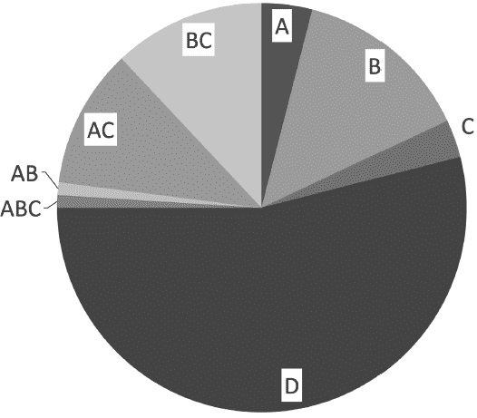

A：4%

B：14%

C：3%

D：54%

ABC：1%

AB：1%

AC：11%

BC：12%

大约是这样的比例，人数上偶尔会有系统超载的现象。如同我之前所说的，大部分在 D 文明的玩家都是系统原生的，目的就象是影集《西方极乐园》里面的接待员一样，陪来自其他文明的玩家进行与协助在 D 文明玩耍的体验。

安装 C 文明的相关实验

以上就是我透过 CRV 遥视以及空间讯息读取术，探索到的我们这个游戏世界缘起的信息，这些看起来都很有趣，也是我花了很多时间读取到的结果。但是毕竟这些只是我所读取到的，要怎么证明是真的呢？甚至，这些有可能是真的吗？我想到唯一可以验证的方式，就是帮自己与别人安装文明以及调整与文明之间的相欠债，看看他们的人生是否会出现任何戏剧性的变化。

成为我的学生有一个好处，如果有任何新技巧的开发，学生们都有机会优先体验技巧，作为我的实验对照组。既然 C 文明代表的是很开心、愉快、人生过很爽、有人奉承、甚至受欢迎到虚华的程度，那么如果帮身处 D 文明的我们「添加」C 文明，或是帮既有 C 文明的人调整更多的相欠债的话，又会发生什么事情呢？

身为行动派的我，在 2018 年底，决定找我的学生们来做安装 C 文明的实验。大约一个月的实验时间，得到的反馈都算不错：90%的个案都有很正面的反馈，剩下的 10%之所以没有那么正面的反馈，是因为本源没有调整，或是有欠其他的文明。

欠 A，就会有自虐的倾向，人生都会自动的往困难的方向去。

欠 B，会有心灵上的匮乏与负面情绪的困扰，而且很高的机率是没有气质，行为比较低俗与粗鲁。

欠 C，无法享受人生，也无法得到人缘。极度需要别人的认同，但也无法得到。

欠 D，人生的一切都会很糟糕。

在这次的实验中，我确认了一件事，那就是：ABC 文明的影响力占了人生的 75%，也就是先天被设定好的命运。D 文明占了 25%，也就是如果没有动到 ABC 的话，人生再怎么努力，能改变的也很有限。

而 D 文明会受制于你的本源，本源则跟情绪有关。

关于「粮草」的概念

附带一提，在实验的过程中，有出现一个「粮草」的新概念，这个跟吃美食的爽度有关。

粮草的计算方式是看比例，也就是「剩余粮草／剩余寿命」，看你人生剩下（或带来）的粮草，除以你剩下的寿命，会得到一个比例。

粮草比例如果没到 1.0，即使调了 C20 补强人生，还是有可能会比较辛苦。比例大过 1 的人，就会比一般人爽；小于 1 的就会比较惨。由此可知，C 文明虽然代表人生的爽度与人缘，可是如果欠缺粮草，那自然没有爽度的来源与额度。

粮草丰盛的人，就代表这辈子能吃的美食比较多。不过，下一个你就会想到：吃多就容易胖对不对？没错，另一个概念就是「胖瘦指数」，这个理论上是决定了你这个人的体重与身材。

举例来说：

林志玲的粮草：0.57，胖瘦：0.57。

她赚了很多钱，但身材保持的很好，但她没太多口福，可能是因为要保持身材，或对美食不讲究。

张钧甯的粮草：1，胖瘦：0.42

张钧甯相对之下，就比较有口福多了，她应该是喜欢美食或是挑嘴，或什么都吃、吃很多，都有可能。但她理论上也比林志玲来的瘦。

周迅的粮草：1，胖瘦：0.6

周迅应该也是喜欢美食或是食量不小的，然而，身材就比张钧甯丰盈多了，但对普通人来说，周迅还是很瘦的。

但这样大家就会发现，可能林志玲就会比较需要透过忌口或饮食控制来维持身材，而张钧甯跟周迅可能不太需要。这是一个纯属娱乐的推断，不过也确实对应在我与学员间的实验结果里。

佛教有一个故事：某人往生了，到了阎罗王那边后，阎王却告诉他：「其实你还有寿命，所以可以还阳。可是，你人生已经没有剩下的『粮草』了，所以即使复活了，也没有东西可以吃。」阎罗王告诉他，复活后要以莲叶（或荷叶）为食，直到他寿终正寝为止。

然后，他复活后，真的就吃到什么食物就吐，只有吃莲叶不会吐。因此，他也只能仰赖莲叶为生，直到他阳寿将至为止。

以上故事，就是「粮草」——你在世的饮食口腹福利的由来。

另外造成粮草比例偏低的原因，还有可能是生病，或是过敏。

像如果你对某些食物过敏，你这辈子能吃的东西自然会比别人少，这样也是会造成粮草数值低下。如果你是艺人，外表光鲜亮丽，可是有可能因为为了保持身材不能吃太好，粮草也有可能不会太多。总之，还要看你人生其他方面的丰盛程度来判断。

另外，有些人粮草少，但是看似过的不错，这要考量文明的比例跟 D 的本源。

我认为粮草是 C 能够丰盛的源头。以学员案例来说，之前调整让 C 欠自己 20 的情况，如果并没有具体显化改善在生活中，有可能是因为虽然达到了「C 欠你」的条件，但没有「好康」可以给你，也就是粮草匮乏。

由此可知，想要判断是否能活得丰盛，粮草还是非常重要的参照指数。

增加 C 文明后的个案分享

关于本书中文明结构的举例说明

分析一个人的文明结构，除了看他来自哪一个文明以外，玩家与每一个文明之间的相欠债，也是同等重要的分析要素。

如果一个人的文明结构为 B3C0D-2 的话，代表着他：

⊙没有来自 A 文明的玩家

⊙B 文明欠他 3 分

⊙他有 C 文明，但是与 C 文明户不相欠

⊙他欠 D 文明 2 分

＊调整完一个月多，最大感受是会提升内心平静，不会因一些不满意的人事物受影响。在人缘的提升度非常有感，会有人在适时出现协助。在吃美食上会有很多种的机会，朋友会带我吃或是请客。近期内有多次偏财的收入。

＊调整后的这一个月，我觉得最明显的差异是心情的稳定度。以前我是一个很容易受感情波动影响的人，但现在却能冷静看待事情！当心情平稳，其实就很容易领略生活中的乐趣与惊喜，这是我觉得最大的收获！！

当然这一个月来有收到意外偏财，人缘也提升不少，还一直被请吃饭。

我还观察到另一个层面，是发现自己在身心灵的学习上，功力好像增加了，真的让我蛮意外的。帮人抽塔罗牌，不断受到好评喔！！

这种改变真的只能意会，但一旦体会到，就会知道有多么奇妙了～～谢谢博士，感恩宇宙，越来越期待之后的爽爽人生了！！

＊一开始情绪会有转化期，莫名崩溃变平静再变开心，后面就一直是稳定，不容易受外在而波动起伏。幸运的小事很多，贵人运也提升。

本来是 B2C20D-2，调到我不欠 D 之后，感觉很明显，体能精神都有提升，自己做 LRT 功力也提升了。感谢博士推出这么棒的服务项目。

＊健康：睡眠质量变好，比闹钟早醒也不太赖床，熬夜追剧的坏习惯自动消失。饮食方面，较以往容易尝到喜欢的食物，和「吃」的愉悦感受。

人际／感情：他人变得很愿意对我主动伸出援手，不论是同事还是久未联系的同学。与另一半的相处更甜蜜和谐，与家人意见相左也会莫名的大事化小。

金钱：我素来没啥偏财运，也懒得对发票，9-10 月发票获得 1200 元。

情绪／心灵：以往对工作的负面情绪、担心另一半的事，很容易焦虑。现在内心的稳定度比之前好，并自然而然会使用放下技巧自助，抗拒和得失心降低许多。

感谢 Richard 大神！

＊一开始 D 是-2 时，只有很想睡。在博士把 D 改成不欠后，各方面提升很多！情绪方面很大的变化是，变成平静许多，就算遇到什么事情，可以很快的抽离出来，或是可以马上面对好好的说道理沟通，不用动气。

和先生相处也融洽很多，以前常常会因为小事，相处得很辛苦，这是天天都会面对的事情。在这一个月的调整后，他改变很多。他改变，我的日子就比较爽，没那么辛苦，会主动帮忙小孩，没有认为都是我的事。也突然想开了，愿意带全家去夏威夷度假，比较少念我囉。博士原来也在解救婚姻啊！

金钱方面，在调整这个月，家人释出善意，愿意把一笔很大的钱还我了，现在正在进行中，这样我的资金就会比较有弹性，不然之前因为此事，已经冷战半年了！还有久没联络的同学，也突然趁佳节汇钱给我！人缘方面，很明显的大进展。在等小孩上课时，陌生人都会来找我聊天，所写的文章，这个月的点阅率也上升！谢谢博士给我这样奇妙的体验啊！！

【零通灵看世界】

男人之间的对话

「嘿，理查哥，我要告诉你一件事！」我的好朋友小吴兴冲冲的跑来找我。

「什么事？不会是你失去魔法师的身分了吧？」（传说中，男生只要保持处男到三十岁，就会成为魔法师。）

「屁啦，我早就过三十了。」

「是喔，有照片吗？给我看看是有多正。」他讲到我也嗨了起来。

我一看照片，哇～真的是个很漂亮的长发美人，身材高挑，有 168 公分、又是 D 罩杯，害我顿时心里对小吴又是嫉妒又是羡慕。不过这时我职业病发作，就稍微看了一下这女生的文明组合等等。

她是个 A2B2C-3D-3，本源亚人，游戏难度 13，粮草 0.3，财富 0.3。这样的组合一看就知道，金钱与物质上是很匮乏，不被世界眷顾的苦命女生。

「天底下哪来这样的好康，我猜她是看上了你的钱吧？」我偷偷取笑小吴。

「没啦，到目前为止，我们都没谈到这方面的东西。」小吴急着帮他与女生辩解。

「废话，你们也才认识没多久，难道直接摆明了开口跟你要钱吗？把你吓跑了，对她可没好处。」好啦，我知道我很主观，不过也只有哥儿们之间才会这么直接。

「理查哥，当然我相信你这方面的专业，但这个，她目前真的没跟我开这个口。」

好啦好啦，有梦最美希望相随，我觉得也不要太快破坏人家的美梦比较好。毕竟小吴工作忙碌，有机会认识正妹还上到床，我真的是该祝福他。

「比起她苦命……倒是有件事情，我比较在意……你知道我也不是第一次跟女生上床，只是我昨天跟她上床回家后，我整个人累到瘫掉，虽然爽，但是手双脚发抖、无力，我整整睡了三小时，才勉强回复精神。这是我人生第一次发生这种事，所以我想问你，是我有问题？还是这女生有问题？」

这就妙了！因为我在看一个人的文明组合时，都会把对方的剩余寿命还有多少，放到算式来计算出她的粮草与财富状态等。刚刚我看这女生的数字，并没有出现像养小鬼时寿命明显缩短的现象，所以她应该没有养小鬼，而小吴也应该不致于受到这方面的干扰才对。

另外一个我能想到的，就是……让我来印证一下。我看了一下，发现这女生的负面能量超强的；再看了一下小吴，的确是被对方的负面能量所干扰了。

所谓的负面能量，除了女生本身因为缺钱、烦恼生活的累积情绪以外，还有她去拜了一些庙、卡了些阴的缘故。而性行为是两个人肉体上最亲密的行为，所以透过做爱，会出现这种能量从高处往低处流动的情形，也不意外。

简单来说——虽然那女生应该不知道，也没有自觉，但是小吴的运势跟精气神，确确实实地被她「吸」走了（可以说是被采阳补阴了），所以产生了身心灵大幅耗损的状态。

我使用了生命重设技巧课程里面的一个技巧，帮小吴被吸走的能量召唤回来。顿时小吴打了一个哆嗦，精神回复了许多。

「吓死我了，那这女生我觉得不能往来了，再怎么正都不行！不然哪天我真的被榨干，不知道死在哪里，这才可怕。」小吴心有余悸。

我再看看女生的照片，真的长得很漂亮，谁会想的到，她身上带着如此强大的负能量啊！不过这也解释了，为什么许多人一跟伴侣交往后，人生运势就会产生不同变化，因为两人之间能量互相被影响了。好的影响当然是好事，对那女生来说，跟小吴上床是她赚到了，但是当你是被吸走的那一个，你就很衰小了。

不过大家也不用真的很担心啦，小吴遇到的这种状况，我也是这辈子头一次观察到。

「其实像我修到这样程度跟等级的能量，跟我上床的人一定赚翻了。」我自鸣得意的跟小吴说。

「怎样怎样，跟你上床是怎样的赚翻法？」小吴超级好奇。

「我才不要告诉你呢，我怕你知道了的话，会当场把我给……」

「吼！你是北七吗？我喜欢的是女生啦。」

各位读者很抱歉，男人之间的对话，很多时候就是这么北七。

改变命运是个幌子？

有人问我，如果人生是一场游戏，一切都是依照剧本来运行的话，那么某个程度上「改变命运」是不是就只是个假议题、是个幌子，甚至，根本就是宗教圈或身心灵圈拿来骗人的工具？

人生是有既定的剧本没错，一般人的命运可以透过八字或紫微斗数就被看得一清二楚，就是最好的证明。我认为人生也都是：你在 ABC 上界的意识就决定好「当你进到你这个角色」想要体验的一切了。

既然一切都「设定」好的，那么我们出生后，到底还能改变什么？

在我们平均大约八十年的漫长人生，对 A 文明来说，大约只不过是两小时而已；对 B 文明来说大约是七十天；对 C 文明来说，大约是六个月。

从我们 D 文明的角度来看，你有可能玩一个整整六个月的游戏，且不吃不喝不睡吗？当然不可能！我的猜测是：当我们恍神、无法集中精神，或是睡眠（甚至生病昏迷）时，很可能就是上界的玩家在开小差或是休息，这就是我们所说的「放置挂机」类型游戏（当然也有可能是他们采取了意识分流的机制）。

有一个笑话是这样的：为什么大家晚上要睡觉？因为服务器无法负担这么多人同时上网玩游戏。反过来，睡不着的时候，可能是因为睡觉的服务器满了，只有等其他玩家醒了才有空位可以睡觉？

在挂网的时候，游戏还是得持续进行。所以，某个程度上必须有个「自动游玩」的机制。除此之外，就像 HBO 影集《西方极乐园》一样，接待员也有可以自己「即兴发挥」的时候（剧中把此功能称为 reverie）。

这大幅减轻了上界玩家在玩人类游戏时的精神负担，因为玩家可以不用时时刻刻控制着角色的一举一动，可以让角色自己去进行部分的游戏，这样玩家进行游戏时会轻松许多，也会有更多惊喜。

透过「自动游玩」与「即兴发挥」的机制，游戏中保留给玩家 15%左右的自由度。也就是说，在原厂设定都没有变动到的情况下，玩家最多只能偏离剧本 15%左右。很多人可能会觉得 15%很多，但老实说，我觉得这个变动的自由度超级低。这就像现在去书局买书，我们认为 79 折是最低限度，没有 79 折就等于没有折扣一样。

人类游戏是个极度有趣的游戏，在 15%的范围内，当然也包括了改变命运这件事。这游戏有趣的地方是：大部分的改变都没有超过 15%，但是人们却都以为自己真的有改变到命运；这个自以为改变到的命运，其实也是游戏中所被允许，命运中的安排啊！

因此我认为，没有能力去改变超过 15%的原厂设定的话，改变命运就只是个幌子。

所以我才很强调，要有提升自己意识的能力，因为我们跟上界玩家只有意识是平等的，《涅槃经》说：「一切众生皆有佛性，有佛性者，皆可成佛。」这就是所谓的「佛性平等」。每一个角色都有觉醒的可能性（就像游戏中不管什么好角烂角，都还是可以练到等级 99 一样），只要你这个角色的意识能够觉醒，你才能够得到系统权限，取回改变超过 15%命运的能力。

而系统的权限，在我们的人类游戏里面就是「法力」。法力越高，权限就越大，能改变命运的幅度就越高（权限的部分，请参考主题乐园文章的 20 个等级），只要能改变超过 15%，改变命运就不是个幌子了注 4。

神也来自不同文明领域

那么，除了我们 D 文明现有的一切，ABC 文明到底是谁／什么呢？

老实说，我无法有一个确切的答案。

但是以一般身心灵圈的说法：「我们是无形的意识，在体验一个有形身体的游戏。」所以除了纯 D 文明的原生族群以外，你本来的意识，有可能就是所谓的「大我」、「真我」、「扩展自我」，这就有可能跟所谓的「神明」有关系了。于是我好奇看了一下，众神明是来自哪边？得到十分有趣的答案：

A 文明：耶和华、原始天尊、阿弥陀佛、观世音菩萨、阿拉、释迦牟尼佛、弥勒菩萨、药师佛、文殊师利菩萨、老子。

B 文明：太上老君、瑶池金母、耶稣基督、圣母玛利亚、地藏王菩萨、月下老人、准提佛母、虚空藏菩萨、象鼻财神、黄财神、财宝天王、爱染明王、咕鲁咕列佛母、白财神、不动明王、吕洞宾、张天师、黄大仙。

来自 A 的神明感觉就是比较严厉，果然有符合 A 的特质。来自 B 的就是比较慈悲，比较救苦救难、满足你愿望类型的。

不过，看起来似乎没有任何神明的源头是从 C 来的。也罢，毕竟 C 就是专门玩乐的啊！但，神明也有 AB、AC、ABC、BC 等组合（像观世音菩萨就是 ABC 的组合)，以上我纯粹只列出他们最早出现的文明。

大概可以推测的是，高阶文明的「人们」（对我们来说应该就是神明，但其本质仍是人），在 D 文明的模拟出现后，他们来探索 D 文明时，并不是用 D 文明的身体，而是投射了虚拟化身（avatar）到 D 文明来玩耍考察一下（想象系统工程师进到自己开发的游戏来检查一切是否 OK）。

因为他们没有 D 文明肉身的限制，也很清醒的知道自己就是高阶文明的意识，所以可以很容易的在 D 文明里面「开外挂」，或是随心所欲地陪 D 文明的一些人们玩上一波。

有的人（神）玩一玩，就不继续来玩了，他们就会比较少为人所知或是在比较早的时间点出现（例如 A 文明的老子，出现在华夏文明的时间点就很早）。B 文明因为个性慈悲的关系，会比较关心我们 D 文明的一切，也会常常到 D 文明来玩，比较容易让大家满愿，所以当然也比较容易成为众人膜拜的神明。

而这些来自高文明的虚拟化身跟 D 文明的神奇互动，透过种种方式被流传下来，很自然就成为了民间传说与对神明的信仰与宗教了。

那么再上去还有吗？是还有的，我把它称之为「A'」。

当我来到「A'」文明时，我发现那是一个毁灭掉的文明，一片虚无。透过 CRV 所得到的信息是：这个文明毁灭时，他们为了保住自己的文化与意识，在模拟出 A 文明后，让所有居民的意识转移到 A 文明。

所以 A 文明的科技水平与文化水平是「A'」毁灭前的最高峰。我认为这是整个 ABCD 文明的最起始点，这个大约发生在我们的时间单位一百万年前左右。然而，等到我后来等级提升了，意识超越了「A'」后，发现之后我所来到的文明世界是「乐园」。

在这边一样有所谓的神明存在，祂们是谁呢？是希腊诸神，宙斯、雅典娜、黑帝斯、波赛顿等。这是一个很有趣的发现，我只能猜测，这可能是最早文明的发源地，或是最早的存在。

乐园的世界真的就是一整个非常漂亮的花园，蓝天白云，有山有水，满满的植物与花草，鸟语花香，一片祥和。待在那边，感觉超级舒服与平静的啦！重点是，它存在的时间就我来看是永恒，也就是「无始无终」的存在。

虽说我并不知道这样的意义何在，毕竟会影响到我们 D 文明的只有 ABC 三个文明，再往上追溯，对我们没有用处。我猜波赛顿在那边过得爽爽的，也不会没事想下大雨把人类淹没；或是黑帝斯也应该不会想弄个永恒的日蚀，让地球永处黑暗而毁灭吧？基本上你完全感受不到祂们对探索 D 文明的任何兴趣。

难怪祂们也只存在神话里面，基本上，地球上从没出现膜拜希腊神话诸神的宗教。希腊诸神竟然是最原始的神，这是我从来没想过的事啊！

希腊诸神与我们世界的起源

在这个宇宙的游戏世界观里，上界的 ABC 文明与我们的 D 文明，最高层级是 20 层级，但是希腊诸神竟然是存在于 24 层级！这表示了祂们是比我们上界还要更上面的存在。

我自己能观察到的总共有 108 层级，20～36 层级基本上是跟我们人类没太大关连的「乐园」层级。大部分乐园的层级仍都算是有形体的存在，再高一点的话，则会以光的形式存在。

希腊神话简单来说大概是这样的：

混沌之中出现了大地之母盖亚（层级 36）从指端生（制造）出天空之神乌拉诺斯（层级 34），祂是第一代的神王。由于乌拉诺斯担心自己的权位会被祂的众多子女取代，于是祂把子女们又封印回盖亚体内。祂们最小的儿子时间之神克洛诺斯（层级 29）决定帮助母亲，用刀阉割了乌拉诺斯，从此让乌拉诺斯回归天上，不再降临到世间，至此导致了世界的天地分离（二元对立）。之后克洛诺斯的第三子宙斯（层级 24），推翻了克洛诺斯，诸神分成了两派。经历了十年的泰坦战争后，宙斯取得最后胜利，成为新一代的神王。于是从此宙斯管天上，老二的波赛顿管理大海，身为大哥的哈帝斯掌管冥界，大地则为三兄弟共有。

在我的观察里，有肉身或是有形体的，是从层级 24 才开始有的，所以可以推断宙斯的上一代与之前都是没有形体的。也因为宙斯等希腊诸神是第一代拥有形体的存有，我们所知的宙斯的神生，尤其是祂的感情世界（祂拥有着众多的情人与子女），从我们现代人的角度来看，就是一整个乱七八糟加上荒谬，但我认为那是一种：初次有形体后，有形世界探索与自身追寻欲望的结果。

之所以会讨论到宙斯，是因为有那么一天，我百无聊赖，就透过空间讯息读取术，用问答的方式跟宙斯「聊起天」来。

我问祂：「既然祢的窗口只开放给众神，那么人类有事要找祢帮忙的话，是可以的吗？」

宙斯回答：「当然可以，只要那个人类法力有 300 的话，就一律视为神明看待。」

噢，原来权限有到 300 的话，才会等同神明啊，长知识了我。

而后续我更发现到，人世间的所有一切，虽然宙斯不开放意识分流给普通人，但是祂的喜好会决定人世间的事情会如何发生，因为宙斯代表了正义，他对人类的统治也是公正不偏的（但那只是从祂的角度来看）。至此，我突然意识到，原来我们这个世界口中所说的「宇宙」，其实就是宙斯本人。也就是说，24 层级以下的一切，都是透过祂的意识所生，祂是统治一切的众神之王。

希腊神话的故事，其实并不是发生在地球，因为神的层级跟人的层级有断层，这是第一代宙斯的子民，A'文明（层级 22）的人们用跟我类似的方式（CIA 的遥视）或通灵去读取到的故事，因为他们当然也会好奇，他们的 A'文明是怎么来的。

后来 A'文明的五兆人口因为科技高度的发展，最后导致世界毁灭，这时候包括我上界的那位（不是我王永宪）在内，共有七位「计算机工程师」（我不知道有没有更好的名词），为了拯救大家，祂们用电脑写出了 A 文明的软件，把世界仅剩 95 万人的意识储存到 A 文明里。A 文明后来人口最多到 80 亿，然后再创造出 B 文明；有 2000 亿人口的 B 文明再创造出 C 文明，C 文明的全盛时期总共有 7000 兆的人口；最后终于来到了我们目前有 70 亿人口的 D 文明。

而世界怎么创造出来的故事，也随着 ABCD 文明的生成而流传下来。在我们 D 文明，我认为应该是：希腊人最早也是使用了类似遥视的方式去读取到这些故事，所以变成了属于希腊的神话。

遥视或通灵读取的内容，会决定该文化的起源故事。中华文化的道教里面，最高地位的是元始天尊注 5，层级 30，对人类没有开放意识分流，对神明则有 100 万，能改变人类命运最大值是 15%，人类可以跟他沟通的法力需求，跟宙斯一样是 300。所以我猜测，在中国的古人们，当初也可能是用类似遥视的方法读取到了更上界的故事。

请记得，【A'―A―B―C—D】这只是嫡系发展下来的关系，A 文明所创造出来的 B 文明除了我们这支以外，共有 70 万个旁支的 B 文明。同样的，我们的这支 B 文明创造出了 140 万旁支的 C 文明的世界；然后，我们的这支 C 文明共创造出了 95 万的旁支 D 文明的世界。这就像任天堂、Sony、微软等各自不同的游戏厂商与系统，都会有自己研发的独占游戏以及第三方开发，可以给所有主机玩的跨平台游戏一样。

而等级 24 则有 120 个左右的分支，所以东方与西方会各有不同文化起源的故事，也是完全不意外。甚至我发现到，不列颠群岛地区（包括爱尔兰、威尔斯）特有的一个神话体系——凯尔特神话（Celtic mythology），层级是 36。36 层级有三个旁支，代表往上应该还有层级 38 左右的境界。

当初创造 A 文明、保存 A'大家意识的七位计算机工程师中，目前共有四位的意识，透过游戏的角色存在我们的 D 文明里面，除了我以外，还有美国总统川普、英国王子哈利，以及一位我先不说是谁的日本女性。

这四位工程师除了来进行人类游戏以外，也有对游戏整体巡视、除错等系统管理员的身分，毕竟一日工程师一世工程师啊，这种深埋在骨子的精神，是不会随便就被改变的。

以上就是我所观察到世界的起源。因为我们的管理者就是宙斯，甚至可以说，我们每个人都是宙斯的化身，宙斯透过变成我们每一个人来玩耍、进行人类游戏。所以也难怪，我们世界的某些特质总是会有些跟宙斯的神生很像，到处充满了一些看似莫名其妙却又耐人寻味的恶趣味事情啊。

诸神的意识分流

神明的存在对人类来说，到底有什么意义呢？

我们先不讨论宗教的部分，因为那个太复杂，很多都已经是被后世人类重新定义过了。从游戏的角度来看，神明的存在，就是可以帮助游戏里面的玩家实现特定愿望的人工智能、或是 NPC（非玩家角色），当然祂们也有可能是来自上界的玩家。

这些神明角色，之所以能够接受大量玩家的同时许愿，靠的是「意识分流」的功能。意识分流，就是人类所说的「一心多用（严格来说人类无法做到）」，或是计算机的多核心多功能（可以让计算机同时播放动画、播放音乐、又使用绘图软件等功能）。

能够有越多意识分流的神明，就代表祂可以同时「受理」越多人类的愿望。但是有能力「受理」跟有能力「处理」完全是两回事，所以我们来分析比较一下，常见神明的意识分流功能，以及祂来自哪一个层级、祂最多能影响到哪一个层级，以及能改变玩家命运多少的百分比吧！

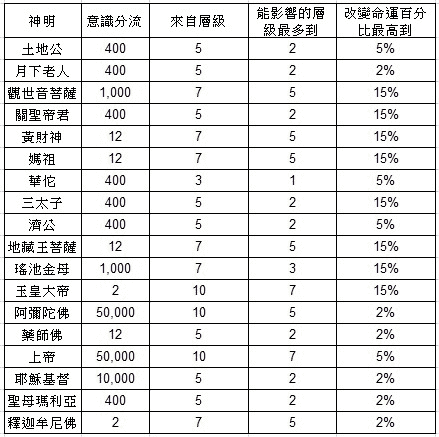

以上是我没特定顺序所测出来的结果。比较有广大信仰的，象是土地公、瑶池金母、上帝、耶稣基督等，祂们能同时受理人类许愿的人数是很高的，但是也有意识分流只有 12 或 2 的，我对这些比较好奇。

意识分流少的，代表的可能就是管事情方面的位阶比较高，就像政府官员一样，大部分的问题都先让里长伯去处理，祂们愿意接受处理问题的窗口（意识分流）很少，恐怕也是需要特定权限的人类，才有办法请祂们帮忙。

就像在人世间，如果要找政府高官帮忙，会需要特定人脉与关系一样。简单来说，这种高等级的神明不太管事情，所以不要拿凡间的俗事去打扰祂们，很大的机会是祂们不会鸟你。

综合上面的分析，上帝、瑶池金母与观世音菩萨三者是对人类最友善的，果然也是有着许多人信仰与尊敬的大神啊。

另外一个耐人寻味的是掌管地狱的地藏王菩萨，对人类而言，祂只有开放 12 的意识分流。我再仔细看了一下，祂对地狱众生来说，意识分流开放了高达 100 万，「地狱不空，誓不成佛」竟然是真的！搞了半天，人家的业务对象并不是人类。

原来「业务对象」才是重点！这就象是政府官员只能接受立委的质询，官员不会接受一般平民的质询；而很多时候，官员与官员之间会互相交流与帮忙的道理是一样的。

所以，我们要重新检视一下原本的数据：

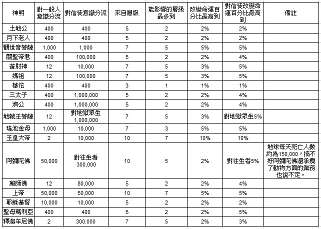

所以我们可以看到，原来随着「业务对象」的改变，有些神明也愿意释放出更多的服务名额，且提升服务质量，果然是有信就有救、有拜有保佑啊！在这边同时也要感谢很多无私的神明们，即使你不是祂的信徒，祂还是一视同仁的愿意帮助你。

而我们道教文化的玉皇大帝也没闲着，祂对信徒的意识分流为 100,000，而祂对神明开放的数量跟宙斯一样，也是 1,000,000，所以由此可见玉皇大帝是人间忙、天上也忙啊。

回到我们前面提到的一位特殊的神明：宙斯。我们来看看他的数据：

宙斯：意识分流 0，来自层级 24，能改变最多到层级 20，最高改变命运百分比 20%。代表完全没有开放窗口要帮助世人，但是能力却又强的爆表！那么祂的业务对象到底是谁？答案其实不难猜，因为祂是众神之王，祂服务的自然是神明。祂开放给神明的意识分流有 1,000,000 之多。

于是我又好奇看了几位希腊诸神。

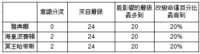

看来对于希腊众神来说，服务「人类」真的不是他们的兴趣与职责所在。不过，有趣的是，现世的文化发展之中，彷彿也确实很少、很少有人在信仰与祭祀希腊众神，至多在动漫与文艺创作领域里，有些人引以作为谬思而已。

在 D 文明之外的 E、F 文明可能性

随着文明层级发展思考下来，或许你跟我某些朋友一样，会很好奇我们 D 文明的人类，什么时候会发展出「E 文明」呢？

依照现存的「模拟假说」来看，这些发展取决于人类对于计算机游戏的进步程度。虚拟理论的假设认为，当我们的计算机游戏可以来到「全像全体验」，以及发展出足以媲美人类等级的人工智能时，那么我们就会开始使用科技来模拟出下一个文明。有可能是祖先模拟，也有可能是游戏模拟，这个过程可能需要花上几百年甚至几千年。

我平常有玩手机游戏的习惯，比较常玩的游戏不外乎是《龙族拼图》、《怪物弹珠》、《圣斗士星矢：小宇宙幻想传》、《在地下城寻求邂逅是否搞错了什么？记忆憧憬》、《北斗之拳：传承者再临》等等。我喜欢玩手游，但我自认不是什么厉害的高手，玩手游也只是拿来消遣跟抒发压力而已。

尤其《圣斗士星矢》是我小时候的最爱，喜欢这个游戏无非是为了自己年轻时的一个情怀。只可惜这个游戏要抽到好角色是很困难的，加上我身边也没别人玩一样的游戏，所以我觉得，抽不到好角色，或许就是游戏厂商为了让你课金所做的不良设定吧？

但是，在撰写本书的那段时间，我和我的助理都迷上了《在地下城寻求邂逅是否搞错了什么？记忆憧憬》这款游戏，由于有了玩伴，便有所比较。我发现，为什么我助理抽到好角色的机率比我高很多？多到彷彿是欧洲人跟非洲人的差别啊！(此为游戏用语）。

某天，我在抱怨此事时，助理突然冒了一句：「搞不好你欠 E 文明也说不定耶？」

我突然觉得脑袋被重重敲了一记，马上空间讯息读取了一下，原来真的有 E 文明，然后我还真的欠它！而且，E 文明果然是欠我助理。

噢噢噢，顿时无数个「原来如此」夹杂着脏话涌入了我心头。

原来我们所发展出的计算机游戏类皆不属于 D 文明，难怪我之前无论怎么对游戏做相欠债的调整，都无法让我提升抽到好角色的机率。之前没想到有 E 文明，是因为我不认为我们人类目前有足以发展出 E 文明的能力。

于是我实验性的调整了一下与 E 文明的相欠债，发现果然，玩游戏抽角色的好运度提升了，打怪掉落的好道具也变多了。这真是世纪大发现啊！

那既然有 E 文明，是不是要看一下有没有 F 文明呢？测了一下，也是有的。

在我测试后，大概可以这样归类：ABCD 是先天文明，之后的是后天的人造文明。

E 文明指的其实是我们人类（D 文明）所研发出来的计算机软件，或是发展出来的游戏类的东西，都可以归纳在 E 文明。有欠 E 文明的人，就会对软件／游戏类的比较不在行。

如果 E 文明欠你的话，你可能会是电竞高手、写程序高手，甚至是个很厉害的黑客。而 F 文明掌管的则是人类制造出来的硬件类的东西，所以如果你有欠 F 文明的话，你的持有物就很容易没事就坏掉；反过来如果 F 文明欠你的话，你的东西就都可以使用的长长久久。

E、F 的现况，就是我们世界里硬件跟软件、有形与无形两者之间的组合了。

有趣的事情来了，让我们来看看以下几位的文明结构（满分 20）：

脸书的创办人马克祖克柏：A2B5C7D3E5F2

苹果的贾柏斯：A2B7C5D2E13F0

微软的比尔盖兹：A2B5C5D4E7F0

以上可以看到，E 文明整整欠贾柏斯 13 分！B7 也表示他是超级有才能跟专业的，难怪他能咤风云地主导了这十多年来手机发展的方向。接班的库克只有 E2F2，所以我想苹果若想指望靠库克再度引领风骚的话，恐怕只有失望两个字了。

顺便看一下，2019 年台湾当代的几位与数位信息有关的名人：台湾行政院政务委员唐凤是 E8，号称亚洲统神的张嘉航有 E6，台湾电竞高手陈威霖则有 E5，这都符合与 E 文明之间的相欠债，以及他们在相关领域的出众表现。

另外，让我们再偷偷看一下：

林志玲：E-3

张钧甯：E-2

张惠妹：E-5

周迅：E1

我猜想，前三位女星对软件类的东西应该都不是很在行，周迅应该还不错才对。传说中金城武老是宅在家里打电动，他是 E4，看起来也应该是个高手。「猎人」漫画家富樫义博是 E4，那么大胆假设传说他因为打电动而「富奸」的可能性也颇高。

虽说 E 与 F 文明是我的新发现，但对一般人的帮助，相对来说可能比较小，除非你是相关产业人士。也就是说，如果你想玩游戏玩得很爽的，或是想从事写软件的工作，是建议可以调看看相欠债。而你如果不想东西常常没事就坏掉，也可以试试看调个 F 文明。

总之就是，E 与 F 文明出现的时间比我想象还早很多。其实后面的 G 文明和 H 文明也已经出现了，但目前我还没有译码。我觉得这是非常有趣以及令人兴奋的事。以后的文明究竟会怎样发展没人知道，但就让我们继续看下去吧！

希腊诸神与我们世界的连结与可能性

前文提到，我们所存在的世界，是以宙斯为主神幻化出来的游戏世界。

虽然在我之前的观察中，希腊诸神对我们现行的 D 文明貌似兴趣不高，但是毕竟我们是来自他们的嫡系世界，因此基本上，存在于各个文化的神明们，都有可能成为一个世界或文明的主神。

试想，像宙斯是一个计算机工程师，祂写出了我们的世界；而元始天尊虽然也同样存在于我们的世界，但是祂可能撰写的是另一个世界，也在另一个世界以主神的身分存在着。而宙斯同样的也可能以较低层级的方式，出现在元始天尊为主神的世界。

我也曾提过，如果你想拜拜、祷告，或是修持一位神明的法，最好找的是能量上欠你比较多的那一尊，修起来效果比较好，那位神明会比较愿意帮助你，也比较容易跟你相应。

在我有所领悟之后，便思考一件事：既然是以宙斯为首的世界，那么我们人类与希腊诸神之间的相欠债，就显得格外的重要了。

因此，在我透过个案的研究中发现，即使调到最高阶的 A 文明欠你，那也仅仅到 15 层级（之前还没能力动到更高的层级）；很多东西调了效果没有很好，是因为你还欠更上面的层级。所以事情虽然有变好，但还是会偶尔出个包整你一下。

我家楼上的住户之前很吵，在我调到了 15 层级的相欠债后，已经大幅好转，只是有时候还是会来吵那么一两下，这也让我颇困扰的。后来发现，是调整层级不够高的原因，在我处理到 24 层级的相欠债后，就全部安静了。

想象一下，如果一个事件在 36 层级以下全部都欠我的话，事情会是什么样子呢？我认为，这会完完全全的统合了事件在游戏里体验的一致性，就不会出现 A 文明想体验甲、B 文明却想体验乙、C 文明想体验丙等等，导致 D 文明的你体验到事件错乱不一致的现象。

我们来看一下希腊诸神的能力与功能吧：

．宙斯：

众神的统治者，也是这个世界的主神，祂同时也代表了正义。所以如果遇到了打官司时，可以让宙斯欠你的话，应该就会大获全胜（当然是在没有伤天害理与违反法律的情况下）。

．希拉

宙斯的配偶，虽说是婚姻之神，不过我看祂跟宙斯之间的关系，对婚姻的帮助应该很有限。但是我想应该是有举一反三的处理方法，可以让祂保佑婚姻幸福的。

．狄密特

生育、农业、自然和季节女神，是丰盛女神。对于生产、教育小孩，以及从事农业与生意的人们，应该会很有帮助。

．雅典娜

智慧、技艺、战争、战略女神，读书、比赛、电竞、玩手游等，应该要拜雅典娜。

．阿波罗

光明、知识、治愈、瘟疫和黑暗、艺术、音乐、诗歌、预言、射箭、太阳、刚毅青年和美感之神，这位大神可以帮忙的事情真的很多！

．阿蒂蜜丝

狩猎、贞操、分娩、月亮、射箭女神，所有动物的守护神。对现代人来说，应该是妇女生产时最有帮助，她帮助的强度有破表的 40 分，注生娘娘只有 5 分（毕竟层级不同啊）。另外祂也可以保庇大家心爱宠物的健康。

．阿芙萝黛蒂

是希腊神话中代表爱情、美丽与性爱的女神，想要美好爱情，拜她就对了。她与维纳斯不同的是，阿芙萝黛蒂不只是性爱女神，祂也是司管人间一切情谊的女神。所以想要朋友一生一起走、还有好人缘的话，也是要找阿芙萝黛蒂。

．赫菲斯托斯

祂是工匠、火和锻造之神。任何从事专业制造与工匠类型的，都会在他的帮助下开花结果。

．赫米斯

就是名牌爱马仕，祂是传令神（众神之使者）兼冥界引导者，旅行、盗窃、体育、道路交叉边界之神，商业之神。旅行、体育赛事等找他就对了，小偷拜他应该也会很旺……（笑）。

．赫斯提亚

炉灶女神、家宅的保护女神。想要家庭和乐的话，找赫斯提亚比希拉更有帮助。另外因为跟灶火有关，所以厨师可以拜赫斯提亚来提升厨艺。

．戴欧尼修斯

祂是酒、庆典和狂欢之神，戏剧艺术的守护神。酿酒、卖酒业，以及从事演艺圈与娱乐业、办活动的，都很适合拜祂。

还有，大家最在意的金钱，要找谁帮忙呢？答案是掌管冥界的冥王哈帝斯。因为地球上所有珍贵的资源与矿产都是埋在地底下，属于哈帝斯的。

最后，还有负责健康的医神——阿斯克勒庇俄斯。医学之所以用蛇做为图腾，是因为那就是阿斯克勒庇俄斯手上拿的蛇杖。虽说阿波罗也有治愈的功能，但是医神阿斯克勒庇俄斯在这方面的能力，远远强过阿波罗。

以上是我参考维基百科所整理出来的，希腊诸神的功能。如果能盖一座庙，里面拜的都是这些神明的话，我想应该会感应超威、超强，金牌匾额收不完的吧。（想象一下，宙斯神像脖子挂满了金牌，墙上还有匾额，是不是很令人莞尔呢？）然而，很可惜祂们开放给人类的意识分流少之又少，除非你有能力连结到祂们，不然我想祂们是完全不会理你的。

附带一提，如果觉得这些神明很陌生，建议去看一下《在地下城寻求邂逅是否搞错了什么》的动画，故事中有许多被动画化的神明形象，你会对祂们更有印象。

PS：目前为止，我总共发现到 108 层级，很有趣的这个数字符合佛教圆满的数字。真的是人外有人天外有天啊！

王博士量子转化系列课程技巧与相关的层级

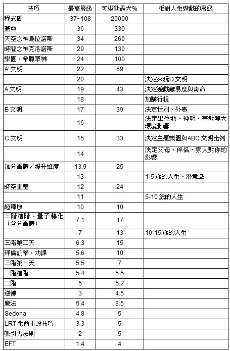

【零通灵看世界】

我们人生的目的是来学习无限与追寻的爱吗？

很多宗教与身心灵的派别，都说我们来地球这一趟，是要学习与回归到无限的爱。这是真的吗？

我无法像他们一样斩钉截铁的跟你说「是」，但我可以从游戏的角度分析给大家参考看看。

首先，请思考一下你为什么要玩（电动）游戏？或，你为什么要看一场电影、阅读一本小说？通常是为了探索你现实生活中无法经历的东西。

举有史以来最赚钱的电玩游戏，全球总销量超过 60 亿美元的《侠盗猎车手》（GTA）系列为例好了，这是一款强调超自由度的开放冒险游戏，让玩家可以实现无法在现实生活中的美梦与欲望，包括抢劫与杀人。

另外，游戏史上销售量第一高的是《当个创世神》（Minecraft），游戏有多种模式，生存模式中的玩家必须维持生命，并采集资源来打造自己的世界；创造模式中的玩家拥有无限的资源并可飞行，大多数玩家会使用此模式来建造大型建筑；冒险模式中的玩家可在其他玩家客制化的地图中游玩。（以上游戏的说明取自维基百科）

由此可知，不管是赚最多钱的游戏，或是最多人玩的游戏，两者之间的共同点都是「让玩家可以实现无法在现实生活中发生的美梦与欲望」。同样的，这跟你看电影跟看小说一样，电影《不可能的任务》系列让你可以一窥特务人生的危险与刺激；电影／小说《哈利波特》让你探索现实中所没有的神奇魔法世界。

电影《复仇者联盟》吸引人的地方，就是各种具有不同超能力的英雄，在浩瀚的宇宙中为了拯救地球，集结起来与强到不行的灭霸萨诺斯激战。金庸的武侠小说系列，则是创造了人人都会武功的武侠世界，藉由江湖之中种种人性悲欢离合与威权斗争，发展出精采绝伦的故事。这些多姿多彩的故事，都是多么让平凡的我们向往，并深深受到吸引啊！

而宗教与身心灵圈之所以特别要你去学习或回归到无限的爱，这就代表他们打从根本就认定了，我们存在的世界是极度缺乏爱的。如果世界充满爱的话，那还需要特别去强调吗？因为我们的本质原本就是神性、就是大爱，那么依照玩家想玩游戏的概念来反推，我大胆的假设：我们来地球为的就是故意来体验一场「没有爱」或「没有大爱」的游戏。

原本的我们就是天上的神（或其他类似的名词都可），每天都充满着爱，除了爱以外，什么都没有，爱来爱去的好烦好无聊，所以决定走一趟人间，「让玩家可以实现无法在现实生活中发生的美梦与欲望」，就是这么一回事。

当然，并不是要像《侠盗猎车手》那样，来世间要体验抢劫杀人，毕竟那样的世界观也太极端。俗话说「人生不如意之事十常八九」，上界的玩家来到这里，就是想体验与上界种种相反的情况，那些他们所无法经历到的不如意的人生啊！

我们原本就已经是爱了，这也就是为什么，在这世上学习与回归到无限的爱是那么的困难，因为对上界的玩家来说，那是他们感到最无聊以及最不想碰的东西，跟原本的世界一样的东西，一点都不好玩。

对他们而言，来到人世间的玩耍，就是要努力的去烦恼，努力的困惑，努力的遇到困境。要知道，你这个游戏里的角色越是痛苦、越是挣扎、越是诸事不顺，这对上界的玩家来说，就是一场越开心、越好玩、越有魅力的游戏呢！

从我的角度来看，学习、追寻与回归无限的爱，是在身心灵成长上完全错误的道路，这往往会让你越走越痛苦，越得不到你想要的。为什么呢？因为这么走，你才是真正偏离了人生来到世间的主题与目的，枉费了上界玩家兴高采烈的来这么一趟！

上一层的因，才是真正主宰下一层的果

只要意识允许，人世间种种身心灵技巧的力量就会产生影响力。很多时候，技巧之所以没产生效用，我发现是它本身影响力等级太低的缘故。

让我把我开发的技术搭配等级说明一下，大家就会理解了。

假设最高等级为 20，而以下的等级是「你把这个技巧练到最好的时候」的数值。例如，上过三阶进阶的学生，不是每一个都可以发挥到等级 5，而是当你练到最好最满的时候，才能发挥到等级 5 的力量。

主题乐园：15

四阶加分灵体与提升维度：10

四阶时空重整：7

四阶超释放、四阶幻魔咒心：6

三阶进阶（量子转化与分灵体）、相欠债：5

二阶、三阶：0.4

LRT 生命重设技巧、魔法、逆转、神祕课程：0.3

EFT、Sedona：0.2

等级越高的技巧，往往越是透过改变「因」的方式来进行。等级低的，往往都是透过改变「果」的方式来进行，两者之间的力道天差地远。同样的，分数越低的技巧，能改变 D 文明的力量就越小。

因为我不想引战，所以没有公开把其他宗教或身心灵疗法的等级放进来比对（学生们会在上课时得到这些信息），但提供给大家参考一下：养小鬼的人最强等级可以发挥到达 4。所以如果你没练到 4 以上的术法，你无法、也请不要去处理这种问题。

附带一提，若把人类游戏一开始选择性别的力量变成等级参考的话，那个等级是 17（虽说这世间不可能存在改变性别的术法，那种只能靠后天人工手术才能改变）。所以我认为，主题乐园的技巧是我目前可以做到最强的术法；而等级高的，影响力则可以往下含括所有的一切等级。

记得整理出了不同影响力的层级那段时间，我花了很多时间进行测试与验证。首先，我发现了一件很惊人的事情——每一个层级的相欠债运作的数字都不一样！就如同我之前所推测的，这是一个陷阱重重的游戏；你以为你之前破关了，但往上一层，东西又是不一样的。

而上一层的「因」才是真正主宰下一层的「果」，所以我猜测，我必须让自己的意识提升到「欲调整人事物的等级至高点」去发功，才有可能一次性的把所有相关的相欠债调整完。

我平常习惯练功的地点就是在床上，我会拿几个抱枕叠在枕头上，把上半身稍微垫高一点，否则太舒服的话会睡着；基本上，只要让身体处在一个舒适的姿势，就可以开始练功了。

某天，就在我尝试做了几个相欠债的实验性调整后，突然一股猛烈的睡意排山倒海而来！不，应该是说，我连感觉到睡意都没有，就昏睡过去了（记得那天下午，我还喝了港式奶茶，理论上非常不耐咖啡因的我，应该会因此会失眠才对）。

这昏睡的时间没有很久，但是让我进入很深层的睡眠。过去的经验中，有时候遇到被作法时，也一样会有这种昏睡的现象。于是我随即做了一些基本检查（我的课程会教学生，在同样的生理现象下，要如何辨识有没有被作法与攻击），幸好没事，只是单纯的「MP」消费过头。

总之，这一次整个睡睡醒醒的，大约历时了四个小时左右。

MP，就是游戏中的 Magic Point，也就是「魔力值」或是「法力值」。原来在高层级中发功，消耗的法力会特别凶。我事后看了一下，假如我 MP 满点是 20 分的话，在 20 层级以上调整一次相欠债，就会扣掉 3 分，难怪我一下子就被放倒了注 6。

MP 这东西是真实存在的，果然这世界就跟游戏是一样的啊，不然我怎么可能仅仅意识上发功，没两三下就昏睡过去呢？任何有修行的人，都会有法力，也会有 MP。而 MP 耗尽时，会跟 HP（体力）耗尽时产生同样的现象，之后都会需要角色好好的休息，等 MP 恢复后才能再做使用。只是现实生活中，没有像游戏一样可以补充 MP 的魔法制剂（象是电玩 Final Fantasy 里面的道具 Ether 一样）就是了。

不过附带一提，我发现淀粉类的东西对补 MP 有很快速的作用，而当消耗 MP 多的时候，除了想睡，也很容易肚子饿。

练功时因为过度消耗 MP 而累垮，对我来说并不是第一次发生。你可以想象同样的事情，在平地操作是很简单的。但如果在高山上，人体可能会因为有高山症，同样的事情就会异常的消耗体力；更何况我经常性地在高层级练功，感觉应该就象是在外太空执行太空漫步的任务吧！

每一次遇到这样的状况，我都会需要找到适应的方式，只要适应了，同样的发功，MP 需求量就会降低，这样就可以把新的功法拿来实际量转了。不然帮大家做量转没做几次就睡死也不行，我又不是每天都可以吃两条千年人参来补气（电影《与龙共舞》的哏）。

【零通灵看世界】

动物们有灵魂吗？

现代养宠物的人不少。将小动物视为生命中彷彿子女般重要的伙伴的人，为数也非常多。从古至今，无论是狩猎社会、农业社会，或是现在的工商业社会，人类与动物的互动都很频繁，有互相帮助的部分，也有彼此伤害的层面。

严格来说，动物们与人类互动，我认为是一件很辛苦的事情。如果遇到友善的人类就是好运，遇到坏人就真的很糟糕。除此之外，人类还很爱用人类的标准，来对待、诠释并非相同智能等级的动物们。象是猪很容易被贴上好吃懒作的标签，而蛇就是邪气、具有攻击性，狼很好斗、狐狸狡猾等等。

这些不公平的解读，让我不禁认为，只要身为动物都是一件很惨的事情，所以佛教把动物们归类到「畜生道」，这是三恶道之一。在佛经或传统的许多故事中，我们也都听说过有人前世犯了一些错，而被处罚转世为畜生受苦的故事。

另外，在基督教则认为，动物是没有灵魂的。如果要探讨这样的问题，就我的立场来说，我们应该先思考：所谓「灵魂」的定义，究竟是什么？

在我看来，我们每一个人（或角色）之所以能够有意识，都是因为有 ABC 的玩家，透过我们的角色在进行游戏，所以 ABC 玩家可以说就是我们的灵魂，或是由 D 文明人工智能所赋予的意识。如果这个概念比较难懂的话，就想想电动游戏里面的角色，角色们必须有玩家拿摇杆玩，他们才能在游戏里面活动。

如果没有玩家，角色当然就不可能有所谓的意识，更不可能做任何的动作。换句话说，没有 ABC 玩家就是没有灵魂。

我之前的文章有提过，上过我的课的学生，都有能力可以测一下你自己或别人的角色的 ABC 玩家的人数有多少。玩家人数越多，往往代表你的游戏越困难，但对 ABC 玩家来说，这代表你这角色的游戏是很好玩的。

所以，我依照这个逻辑，去看了一下宠物与动物／野生动物的玩家有多少？我发现了一些有趣的模式。

大部分的宠物，只要是跟人类有密切互动的，背后都是有来自 ABC 玩家在进行游戏的，毕竟这个游戏的主要还是以人类为主题。只是相对于人类来说，宠物的 ABC 玩家人数是少很多的。

基本上，只要是跟人类能做有意义的互动的，我们就可以说，这些动物是有灵魂的。但象是我养的小乌龟和孔雀鱼，就没有玩家，所以牠们应该就是单纯的 D 文明原生的人工智能生物，其存在的目的就可能是配角，或只是游戏的背景角色之类的，因为牠们无法跟人类进行有意义的互动。

但是比较大型一点的，象是罗汉鱼（会隔着玻璃跟你玩，不理牠还会生气的那种），我就有测过，是有几百个玩家的。路边看到的小鸟、鸽子、蜗牛、蚯蚓、小虫子等，也都是没有玩家的，所以我会认为牠们是没有灵魂的。

但是，我也看过被人类养在笼子里的鸟类或鹦鹉，这些就会测到有玩家。而专门被养来吃的经济动物们，很遗憾的，在我看来，也一样是没有灵魂的。虽说澳洲伦理哲学家彼得•辛格（Peter Singer）曾说过：「任何习惯吃动物的人，在判断被养动物承受的痛苦时，都不可能不偏不倚。」

但如果真的是这样的话，只要我们能用人道的方式来处理经济动物，对吃肉有罪恶感的朋友们来说，反而是松了一口气不是吗？但不管怎么样，对于这些经济动物，我们都应该心怀感恩才是。

或许你会有疑问，为什么 ABC 的玩家会想到动物的躯体进行游戏呢？

首先，以电动游戏来看，很多游戏的主角其实不是人类，象是音速小子（刺猬）、耀西（恐龙）、皮卡丘（根本没这样的生物），甚至还有魔王、魔兽或鬼怪当主角的游戏，但我们还是玩的很开心，不是吗？

2012 年，Sony 在 Playstation 上发布了一款游戏《东京丛林》，这是一款生存动作游戏，游戏剧情发生在未来的日本，世界已经毁灭，人类已经灭亡了。城市已成为猛兽占据的荒芜，在游戏中，你可以选择扮演不同的动物，来挑战你在末世能够存活的天数，你的游戏目标就是捕食与繁殖。

我觉得这是一款非常有趣的游戏。所以，只要想想，我们的 D 文明世界是 ABC 广大的游乐场（就是跟迪斯尼乐园一样，里面所有的一切，都是满到漫出来的商业行为），那么有什么样的游戏或角色，是 ABC 文明他们所想不到与无法玩的呢？

然后，我们来看看野生的动物吧！只要不被人类豢养、关在动物园，基本上都只是 D 文明的人工智能，牠们一辈子都只是依照游戏程序的本能活着而已。不过，只要一旦牠们跟人类有长期的互动，这个动物的游戏角色就被开启，ABC 玩家就可以登入，于是这些动物们就有了灵魂。

像之前台湾很有名的大象林旺，就大约有两千个 ABC 玩家。而团团、圆圆两只熊猫的玩家，每一只也差不多是两千左右。所以，我想所谓的「动物有灵性」，应该就是指「这只动物是有上界玩家」的情况下，才成立的吧！

你最爱的宠物，搞不好就是你在 ABC 文明里的至亲或挚友，大家相揪好在 D 文明人类游戏中出现，你玩人类的角色，牠玩宠物的角色来陪伴你。这样是不是也为你的人生游戏增添了些许浪漫呢？

因此，我说「去他的畜生道吧」！那只不过是人类自以为了不起的想法而已。跟动物比起来，人类真的有比较高级、比较快乐吗？这世界上有多少人的心比动物还要不如啊！

最后，不管动物背后有没有 ABC 玩家，你可以不喜欢，但千万不要伤害动物们。毕竟牠们是比人类更加纯真的存在。当你好好的跟牠们互动，牠们能够反馈你的是无限的爱，因为那就是牠们的本质啊！

从量子转化回看吸引力法则

持续开发新的技巧层级以来，曾有读者提出过一个十分耐人寻味的问题：「王博士，如果照您说的，有这么多意识层级存在的话，想请教您，现在从您的层级来看，吸引力法则会是什么样子呢？」

我之前是创始分享吸引力法则的讯息高灵——亚伯拉罕的大粉丝，我也花了许多时间观看亚伯拉罕原文的传讯影片，而且我在脸书上还开辟了「这才是吸引力法则」的社群，把亚伯拉罕官方脸书的内容翻译成中文，分享给喜欢吸引力法则的朋友们。

我认为吸引力法则很棒，而且搭配起情绪释放相关的技巧与观念时，效果更是事半功倍。但是，后来随着我自己意识层级的提升与扩展，我接触、体验与开创了更多比吸引力法则更快速的心想事成心法与技巧。

因为吸引力法则是意识层级 2 的技巧，随着你使用这个「法则」，你会了解到，它能改变的东西非常有限（大约 5%），甚至我可以大胆的说，你以为你的人生因为使用了吸引力法则而出现的很大改变，其实只是你命中本来就会发生的事情。

更进一步来看，我发现到，人生中许多你没想过的「好康」会发生，而你所没想过的坏事也同样会发生，这些我们都无法认定是你自己所吸引而来的。所以，现在的我很难去认同「吸引力法则」是个「法则」。

现代另一位比较有名的通灵传讯者是巴夏，我也是他的铁粉，我曾在 2015 年特别跑去美国加州参加巴夏的传讯活动，当然也要跟传讯的戴罗．安卡（Daryl Anka）合照留念一下的。

不管是巴夏还是亚伯拉罕，祂们讲的理念都很接近，只是巴夏除了对意识结构的分析比较多以外，他还讲了许多外星文明的东西，这些内容会比亚伯拉罕更加吸引现代人。我自己的看法是：虽然祂们所传达的讯息都很棒，但是因为祂们意识层级不够高（巴夏 5，亚伯拉罕 2），很多的东西与技巧是无法全面满足于想改变人生各种面向的人们。

我记得在某次巴夏的传讯影片中，有人问他：「请问祢们会体验到跟人类一样的负面情绪吗？」

巴夏回答：「不会，我们情绪最低的状态就是中立（neutral）。」

这句话对我影响很大，因为如果想要常处在喜悦状态的话，让自己的情绪最「糟糕」的状态就只能是中立。这是个很棒的概念，而这也是量子转化的基础。所以其实量子转化是来自外星的黑科技（大误）。

可是问题来了，虽说巴夏自己说祂们是未来人类的进化型态，但祂们没有肉体。我认为祂们（包含亚伯拉罕也一样）无法感同身受我们拥有肉体所受到的限制与痛苦，也无法拥有同样的体验。

这就像你指望透过一个没有小孩的人，教你怎样带与教育好小孩是一样的荒谬，更何况有小孩的人都未必能教得好了。

我对于亚伯拉罕与巴夏的讯息态度，其实也很符合巴夏所说的：「不用管我们是谁，只要这些讯息对你们人类有帮助，就拿去用吧！」有没有用，要自己靠智慧判断，其他当作故事听听就好（尤其是外星文明的东西，那根本无法印证，而且对我们的人生也没什么太多意义），因为 D 文明最不缺乏的就是故事了。

吸引力法则不是极致，视情况仍十分够用

那么吸引力法则、情绪释放到底有没有用呢？有！非常有用！当你意识层级还没往上提升时，你是被受限在比较低阶的游戏里玩耍的，我认为在比较低层级的「破关技巧」，就是吸引力法则与情绪释放技巧！

D 文明很奇妙的地方是：明明看起来是一个大家都注重有形物质到不得了的游戏，可是真正主宰这个游戏的，却是无形的「意识」与「权限（法力）」。这就象是：现实生活中一个人只要有权有钱，就能为自己的生活带来许多的方便一样，当你意识提升了，一样会享受到在这游戏世界里权限提升的便利。

老实说，我觉得人类集体意识的层级的确是有在提升，层级 2 的亚伯拉罕之后出现了层级 5 的巴夏，这都代表着，因为人类集体意识的提升，所以才会有更高层级的信息下来给我们啊！

补充一下，我们选择来玩与所处的 D 文明是三维度的游戏，虽然我们的意识可以往上提升，但是肉体无法，因为这是游戏的本质与设定，所以请别再相信什么地球与人类即将扬升到更高维度的说法了。（同理于 PS3 的主机只能玩 PS3 的游戏，受到主机硬件的限制，PS3 主机上无法跑 PS4 的游戏，甚至 PS3 根本不知道有 PS4 或 PS5 的存在。）

当你意识还在层级 2 以下的话，入门款的吸引力法则对你是非常有用的。超过层级 2 时，就可以开始看巴夏的内容，因为祂的东西比吸引力法则深了不少。不管怎么说，如果你想提升意识、走修行路线的话，仍然需要一个入门的技巧，所以我仍然大推「情绪释放技巧」，有能力调节情绪的好坏，才有办法掌握吸引力「法则」。

但是当你慢慢提升与扩展时，你会慢慢发现到，一切都只是如本书所说的「游戏的设定」。

虽说存在着因果，但这因果关系并不是佛教讲的那种因果，因为在游戏世界中时间、空间都是幻象，怎么可能会有直线式时间线的前世今生呢？正确来说，是「透过来自更上界的因产生出 D 文明的果」，这样才是一整套完整的因果。

宇宙对于不同意识层级的人们，会给予不同层级的讯息与工具，毕竟不同阶段与层级使用的技巧是不一样的，没搞清楚自己所处的层级与技巧的话，你会对你使用的技巧有不切实际的期待，这样可是会造成生命的痛苦与创伤的。

正因如此，「这才是吸引力法则」的脸书社群目前我已经没在持续更新与经营，因为那些信息对现在的我已经没有支援性了。

这本书是比较注重在身心灵成长二阶的分析、阐述与概念延伸，甚至有些东西是贯穿到三阶或以上的。如果有些观念让你觉得比较困惑的话，没有关系，把这本书当成故事书来看也是很有趣的。毕竟不同游戏的层级，有不同层级专属的玩法啊！

或许有天你会发现，该发生的事情就是会发生，这一切都跟你的情绪好坏完全无关，你也不需要跟随着你的情绪反应走。

这听起来很象是种宿命论的说法，但其实不是。因为这些命运中该会发生的事情，是你可以预先就设定好（因），你只是悠闲的喝口茶，坐等它（果）的到来而已。

嗯，前提是：要有足够的权限与正确的技巧去做你想要的设定啦。

注 4：接受量子转化并无法保证可以一定达到 15%以上命运的改变。另外，很多时候你并不需要 15%以上的改变才能得到你所想要的。

注 5：维基百科上面记载的道教最高神是浮黎元始天尊，是北宋末年道教神霄派所主张的一位神灵，号称是玉清元始天尊、长生大帝之父，太上老君之祖。来头看起来很大，但是祂的层级其实只有 24，所以我推测，玉清元始天尊才是真正的道教最高神。

注 6：在动漫作品《在地下城寻求邂逅是否搞错了什么》里面，对于魔法使用过度的现象是这样说明的：「精神疲惫（精神疲弊［マインドダウン］，Mind Down）过量不当地使用魔法，使精神力大量消耗而失去意识的现象。发动魔法必须消耗与体力相对应的精神力，人的精神力如同体力一般有着上限。」

# Ch3 人生真的是一场「游戏」

## 3-1 畅游「人生主题乐园」该知道的事

美国 HBO 的电视剧《西方极乐园》（West World）根据维基百科的介绍，剧情是这样的：「故事设定在未来世界，在一个庞大的高科技成人主题乐园中，有着模拟真人的机器『接待员』，能让游客享尽情享受性欲、暴力等欲望的放纵，主要叙述被称为『西方极乐园』的未来主题公园。它提供给游客杀戮与性欲的满足。」

这个乐园提供的，是真实世界中无法体验到的游戏。反观我们所处 D 文明的人类游戏，同样也是为了让 ABC 文明体验到在他们世界所无法进行的游戏，所以我们才会全都出现在「地球」上玩耍着。

当年轻的主角威廉第一次要进到「西方极乐园」前，他选了一顶黑色的牛仔帽，这象征着他在进入主题乐园时，就抛弃了原本存在于他心中的正直与善良。到了第二季，我们更发现，「西方极乐园」只是迪洛斯财团主题乐园的一部分，其他的主题乐园还有「英属印度极乐园」、「将军极乐园」等。

那么我们的人类游戏中，是否也有类似这样的主题乐园呢？答案是有的。

人生主题乐园

首先，因为 D 文明是二元对立的世界，所以凡是想来到这个游戏的上界玩家们，都必须先选择「性别」。也就是说，从生理构造上来说，当你选择了男性主题游戏，你就必须抛弃（或无法进行）女生主题游戏里面所有的一切。

接着上界玩家们就必须选择其他想玩的主题乐园了。我发现，最主要的主题乐园选项有以下几个：「享乐」、「受苦」、「空转」、「放弃」。

这四个是最主要的主题，其他诸如「使命」、「好运」、「坏运」等林林总总加起来，目前已知的总共有十五个主题，但我们就先专注在讨论前五大主题乐园吧！

请记得，不管主题乐园选项字面上的意义是好或是坏，那些都是 ABC 的人们在他们的文明里无法完全依照自己所想所体验到的，所以来自上界的他们，乐于到 D 文明来放纵自己，透过这些游戏的体验来满足自己的种种欲望；即使受苦，对他们来说，也是前所未有的快乐体验。

1.「享乐」：

顾名思义就是享受一切乐趣。

2.「受苦」：

顾名思义就是承受痛苦。

3.「空转」：

这是一个比较奇妙的概念。我发现到，生命中或事件有「空转」主题的人，很多事情往往会卡关卡得很严重；有些人则是不管怎么努力，都不会得到回报的，或是不断地浪费时间做白工等等的现象出现。

4.「放弃」：

生命中只要是有这个主题的人，往往寿命会在不自然的情况下出现缩减的现象，不管是自己放弃或是「被放弃」。同样的，如果事件出现了「放弃」，那么有很大的机会，这件事情会在不自然的情况下提早结束，会被你放弃。

所有主题乐园里最常见的是「享乐」与「受苦」，这两者就象是数学的正负符号一样，不管你后天再怎么努力，甚至是做了量子转化，只要前面的符号是负的（受苦），那么最后的结果往往就都不会是好的。而如果是正的（享乐），那么恭喜你，人生就是爽爽过。

5.「使命」：

则是比较少见的主题乐园，地球上大约只有 14%左右的人参与了这个选项。我给「使命」的定义是「一旦启动后，无视你本人的意愿，都必须执行完成上天赋予你的任务」的设定。

越是在地球上做大事的人，往往使命的成分就越高。我们来看一下以下这些人的使命有多少（满分 20）：

名人的使命分数

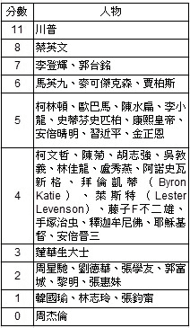

而以上我举例的几位宗教家与身心灵大师，也都至少从 3 起跳，我猜测这个数字指的是，他们活在世间时，可以真正影响到多少人吧。所以，释迦牟尼佛与耶稣基督当时真的有影响到大约一个城市左右的人数。

关于艺人方面，我有点意外周杰伦是 0，但从他人生享乐度有 19 分来看，我想也是合情合理啦，毕竟就是一个自由自在不顾他人眼光的创作才子，骨子里并没有真的想大红大紫，会红对他来说不过是锦上添花。

根据我累积的观察，我会把有使命的人们当做是游戏的关主来看待，也就是说，这些角色必须存在这个世上推动特定的剧情，其他人的人类游戏才得以进行的下去。照这样看起来，美国总统川普的确是个超级狠角色，他应该有很多上天需要他去执行的任务，我很好奇他将会对这个世界带来什么样的影响与变化。

以上五种基本的主题，就是一开始选好的，然后我们会来到 D 文明体验到妻、财、子、禄、健康等等下一步的游戏关卡，这些就是人类游戏的「共同体验」。

而你个人的妻、财、子、禄、健康，会受到你先天所选择的主题所影响，来决定你在 D 文明里面有什么样的人生。

关于主题乐园选择的等级

承前述，虽然人类游戏貌似最开始的选择是性别，但随着细节的钻研、验证，我发现性别落在等级 17，这代表更上面其实还有其他选择。

所以，我推敲测试了一下，发现影响力的等级应该是这样的：

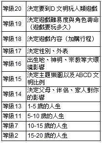

补充说明一下：因为你本来就是 ABC 的玩家，所以无法选择 ABC 的文明（就像你本来是台湾人的话，就无法选择你不是台湾人的道理是一样的），但是可以选择带多少比例下来 D 文明玩耍（就像有些台湾人，却又认为自己是台湾人里面的中国人、原住民、客家人、ABC 等）。

D 文明原生角色自己最多的控制只到等级 6，由此可知 D 玩家本身就是为了服务 ABC 玩家而存在的陪玩角色，而他们的设定都是：先由 ABC 玩家在等级 14 做好「想玩什么游戏」的选择后，再由 D 文明系统自动生成的结果。

某个程度上来说，D 文明原生角色就是 NPC，或是可以想成影集《西方极乐园》里面的接待员（机器人）。

等级越高的选择，对你人生游戏的影响越大，相对来说也越难改变。重点是，这些都是你在进到游戏以前就选择好的剧本。

随着年纪增长，你就越来越被这个世界的一切所綑绑与塑型，所以年纪越大就越没有可能性，也越来越没有选择。但说穿了，如果一切都是上界玩家早就选择好的话，身为角色的我们，打从一开始就没有任何选择，「有选择」只不过是另一个自由意志的幻觉罢了。

用《哈利波特》来举例，这样大家会更明白一点。

故事中哈利波特的父母被佛地魔所杀，请问这件事是谁决定的？当然是作者 J.K.罗琳。佛地魔依照作者所写的剧情而杀死了哈利波特的父母，请问哈利波特有选择吗？而佛地魔有做错什么吗？请问佛地魔是坏人吗？

哈利波特最后打倒了佛地魔，不但为父母报了仇，也拯救了整个世界。请问这中间有所谓的因果吗？但除了这是作者 J.K.罗琳所写出来的小说剧情以外，真有像佛教讲的前世因果这回事吗？从佛地魔与食死人的角度来看，哈利波特又真的是好人吗？

让我们超脱「剧情」来看，一切的选择权与因果，都在 J.K.罗琳身上，她就是创造出哈利波特世界的创世神；作者精心描绘了整个哈利波特的魔法世界观，以及引人入胜的故事，即使在我们看来，哈利波特小时候的人生惨到爆。请问，又是谁决定他很惨的呢？没有之前的惨，又怎么会有后面精采的故事呢？

所以，请大家要建立一个观念：我们身处的 D 文明游戏世界中，并没有传统的「因果」概念。你上界 ABC 玩家或是系统 AI 的选择才是「因」，你角色在 D 文明所体验到的一切才是「果」。

在 D 文明世界里所观察到看似因果的东西，都只是个假象，更是个陷阱，那些只是用来限制着我们的人生。如果你妄想去动它、去改变它，就会像我之前烧了台币 98000 元纸金一样的徒劳无功。

而有些时候你可能会觉得，这些事情——烧纸金、拜拜、护身符、法会等——好像会对你人生真的有点帮助。如果你这么想的话，恭喜你，你就掉到更深层的陷阱里了！因为下次当你遇到问题时，重复尝试这些，保证对你没有帮助，你只会陷入更绝望的深渊里。因为这是游戏的本质。

以上就是「等级 1」如何把你限制在这个世界的运作方式。想改变你的命运，必须要从更高阶的等级去做处理，甚至重新选择，才会有可能看到变化。等级 15 的选择无法推翻等级 19 的选择，但是等级 19 的选择可以凌驾等级 15 的选择，这是我个人真实的体验与实验结果。

度众生到底是什么样的游戏？

许多的宗教都有「度众生」的概念，也就是：大师们认为，众生不知道这个世界的真相是什么而受苦着，这些大师认为自己需要散播宗教的理念，透过宗教的力量，来帮助这些不知道真相的众生们，让他们离苦得乐，来到更高、更美好的境界。

但若是要提到我的看法，恐怕就又要得罪一堆人了。真正的答案，释迦牟尼佛已经在《金刚经》讲的很清楚了，但是我想世上真正有理解《金刚经》的人应该不多。我先用我的角度解释一下，然后再看《金刚经》怎么说吧！

首先，回到「世界是一个游戏，每个人都是游戏的角色」的概念：在这世上的每一个人，都只是沉溺在游戏进行的过程，忘了自己原本就是无限存有的 ABC 玩家的身分。

当你自己也是沉溺在游戏的玩家时，请问你会对游戏里的其他玩家产生想去「拯救」或是「救度」的念头吗？想象你在玩《魔兽世界》，玩得正精采刺激的时候，游戏中的一个角色跳出来跟你说：「嘿，这一切都只是个游戏，来，听我的，我来告诉你真相，你乖乖跟我走，我会带你上天堂。」请问身为角色的你，听到这样的言论会做何感想呢？另外，请记得，身为 ABC 玩家的「你」，本来就知道自己是在进行游戏的，所以根本就是多此一举！

虽说以上怎么听都不合理，但是我说过，这个 D 文明世界是个很奇妙的游戏世界，任何你想的到、想不到的都可以是一种游戏。所以，这个不合理的逻辑，也就变成了「度众生游戏」或是「宗教游戏」。

不管正派不正派都好，总是会有一堆人想破头来发愿广度众生，希望能够靠自己或宗教的力量，来帮助无知的众生脱离苦海；殊不知，沉浸在游戏里面，正是玩家的本质与本分。我个人是觉得，打扰人家玩游戏是很没道德的事情，中文不是有句话是「观棋勿语真君子」吗？

历史上，任何想大规模尝试告诉大家真相的人，都没有好下场。象是提倡日心说模型的哥白尼，最后被教会烧死。苏格拉底因为他的学说违反了当时雅典民众的思想，最后被处以死刑。耶稣基督更是因为宣扬了他认为的真理，三年内就被钉上十字架。

大家都在热衷玩游戏，只有你一个人在那边叫大家不要玩，是很容易被系统当成 bug 排除掉的。

佛经是释迦牟尼佛涅槃后，由五百阿罗汉一起回忆佛陀四十九年所说的法，集结成三藏十二部的大藏经。老实说，能清楚记得四十九年来一个老师所说过的东西，而完全没有错误，我真心超级佩服，更何况现存的佛经后来还有翻译上失真的问题，以及许多后世捏造伪经的问题。

而耶稣基督活着的时候，根本也没有创立基督教或天主教，有兴趣的朋友们可以去看《耶稣比宗教大》这一本书。目前存在的宗教，除了其本身的教义已经跟其原始型态有很大的差异以外，我认为宗教本身在现在的 D 文明游戏中，也只剩下洗脑与綑绑大众的功能，因为已经背离原本的教义许多，无法真正唤醒众生（但请记得，这就是游戏的本质）。

唤醒原本就该热衷玩游戏的人们，到底又有什么意义呢？

莎士比亚在《皆大欢喜》第二幕第七景中说：「世界是座舞台，所有男女都只是演员；各有其出场和入场；每人皆扮演许多角色。」

《圣经》约翰福音 7:24 提到「不可依外貌判断」。

《金刚经》里面也讲的很清楚：「凡所有相，皆是虚妄。」又说：「一切有为法，如梦幻泡影，如露亦如电，应作如是观。」

因为这是个游戏，游戏里的东西没有一个是真实的，大家应该要这么去看才对。金刚经又强调，一切「无我相、无人相、无众生相、无寿者相」，因为游戏里面的角色、身分、年龄等一切都是假的，甚至根本没有所谓的「人」存在着。凡是着相者，都不是明心见性的人。

而最有趣的是，释迦牟尼佛说：「若人言如来有所说法，即为谤佛，不能解我所说故。」意思是说，如果有人讲我这四十九年有说法的话，就是诽谤了佛，诽谤了真理，因为他无法了解我所讲的一切。

这看似精神错乱的逻辑，其实要搞懂很简单——游戏里面做的所有的事情，都不是真的（都跟「你」在 ABC 世界无关）。所以释迦牟尼佛哪有说过法？又有谁说法？谁又需要听到法、需要被救度了呢？

所以啊！所谓的「开悟」或「觉醒」，就只是让玩家知道自己身处在一场游戏中，从中醒来而已，其实并没有什么实质的意义；毕竟我们并不像电影《黑客任务》一样，醒过来后可以出现在另外一个所谓真实的世界。

可怕的是，有许多所谓的「大师」，假藉开悟或觉醒的修行之名，来行骗财骗色之实，也有人成立宗派让众人来膜拜。我认为真正开悟的人不会想去做这样的事情，因为根本没有意义。

当然，你如果把这想成是所谓的「想玩开宗立派成为大师被膜拜的游戏」，也不是不行。但游戏就只是游戏，真正假睡的人是叫不醒的，毕竟，信徒本身也想玩「沉迷于宗教的游戏」才会信受奉行啊。

有了以上的体悟后，我自己本身只选择，帮大家做量子转化以及开设课程，有缘分、有兴趣想了解的，欢迎来上课学习。我完全没打算成立宗教，也没有要度众生，因为那对我来说，一点都不有趣好玩。大家各自玩自己喜欢的游戏就好，说到底，告诉一个正在玩游戏的人「你正在玩游戏」是要干嘛？所以，哪有什么需要被救度的众生？

到达这个点后，就能够处于「应无所住而生其心」的境界了。

不过，甚至我觉得「应」这个字是多余的，因为开悟者眼中，根本也不会有有什么是应该或不应该的问题。

看得懂这篇文章的，就知道我写了这篇文章一定会得罪很多人。但其实我什么都没有写，而且实际上也没有读者的存在。若有人说我有写过什么的，就是在毁谤宇宙的真理。

试问，是谁真正写了这篇文章？

看到了文章的人到底又是谁？是谁又能得罪谁？

这一切，说到底，就也只是一场游戏一场梦而已。

重点是，觉醒了以后能干嘛？我认为这才是人生游戏的醍醐味所在。

## 3-2 一玩再玩，遇见更好版本的自己

「轮回转世」是个有趣的话题，也是许多宗教与身心灵爱好者讨论不倦的议题。我相信很多人都在意：「到底有没有轮回转世这件事？」传统佛教是讲轮回的；早期的基督教也是讲轮回的，只是这部分在后期被删改了。

先撇开我们对游戏世界的认知。在传统「轮回」的信念价值观里，如果轮回存在的话，所谓的「因果」也势必存在；也就是说，如果前世我做了坏事，这世就要受到业障的制裁。反过来，如果我前世经常性都在行善积德，每星期都扶老太太过马路，碰到国定假日的话还会多做两三次的话，那这世我就会享受到超级多的福报。

轮回转世到底存不存在？

我本身不排斥轮回转世这样的说法，《道德经》有说：「古之善为道者，非以明民，将以愚之。民之难治，以其智多。故以智治国，国之贼；不以智治国，国之福。」毕竟几千年前民智未开，受教育的人比较少，透过这样的方式来让大家不敢做坏事、多做善事，可以说是一个很方便的管理之道。只是，现在这个信息爆炸的时代，我们除了在「世界的本质是个游戏」的思维下，知道我们不需要受到轮回与因果的限制，同时也可以换个角度思考一下：如果从「游戏」的角度来看，轮回转世到底存不存在？它到底是什么呢？

之所以会想谈论轮回，是因为我之前接触催眠时，发现很多人被催眠后所看到的前世，各个都是有头有脸的大人物！男生不是什么皇帝，就是什么大将军，女生不是皇后，就清一色都是环肥燕瘦、史上有名的大美女，或皇上的宠妃。

更耐人寻味的是，好多人的前世都是同一个皇帝，或是同一个大美女。从商朝到清朝，如果算上袁世凯短命的中华帝国，历史上总共也才只有 830 位皇帝，这重叠的机率也高到太吓人了吧！

甚至我也曾在媒体上看到有人发表：他认为美国前总统柯林顿的前世是唐明皇，而他老婆希拉蕊的前世，恰巧就是杨贵妃。说来巧，偏偏我也听某位佛教大师说过，他前世是唐明皇，而我还知道那位转世的杨贵妃是谁。

这到底是怎么回事？是媒体文章作者写错，还是佛教大师瞎说呢？

其实，我认为答案很简单：没有人写错，也没有人瞎说，只是看事情的角度不同。

首先，让我们再次回到「这世界是个游戏」的角度。在我看来，不管是「唐明皇」或「杨贵妃」，都只是游戏里面 ABC 文明玩家可以选择体验的角色。如果你玩过《三国志》这一款游戏，你就知道，每个人都可以选择扮演刘备、曹操、关羽、诸葛亮的角色，这道理是一样的。

而玩过《三国志》「关羽（前世）」的角色，也可以在下一次玩游戏时，选择他要当「曹操（这一世）」。所谓的「轮回转世」其实就只是这么一回事而已。换句话说，你觉得这个世界上有多少玩家扮演过《三国志》游戏里面的「关羽」呢？人数一定爆多的吧！这一点很轻易解释了，为什么这么多人的前世，都是同一个人。

只不过我们世界的游戏规则是：「玩下一个角色之前，要清空存储器。」所以你不会记得之前玩的上一个角色是谁。当然，偶尔会出现 bug，或有那些粗心没把存储器清干净的人，让大家误以为所谓的轮回转世是存在的。

又或者，他的角色设定就是一个「记得前世记忆」的人物也说不定。不过也会有像释迦牟尼佛那种等级的，已经突破游戏本身限制（开悟是一种维度的提升），所以在《佛说本生经》中，把他上界玩家在玩释迦牟尼佛这个角色之前的种种体验娓娓道来，加上当时印度教的背景，大家可能就会认为，这就是佛陀的轮回转世故事了。

附带一提，所谓这辈子遇到的前世缘分，不就是：「嗨，我们刚刚上一场游戏才一起玩过，怎么又碰面了？」那「说好了下辈子约定再相见」呢？听起来很浪漫，但那其实也只是：「嘿，我这边挂了，那等等下一场游戏见吧！」唉，我真是个不折不扣的浪漫杀手啊（笑）。

所以，在我看来，在这个游戏世界里的角色，其实也没有所谓的「灵魂」，你只是从 ABC 去到 D 文明来玩个游戏；角色之所以会有任何的行动，是因为背后有你这位玩家的意识在运作，上界玩家才是灵魂，游戏的角色怎么会有灵魂呢？如果真的有任何看似有灵魂的事件，那只不过是游戏剧本要给角色的体验罢了。

而所谓的死亡，就是很单纯的「game over」。身为玩家的你，在游戏结束后，可以选择要不要继续玩，或是开始玩另一个角色，甚至如果你想续命，或是再玩一次你刚刚「死掉」的角色，去弥补刚刚没仔细玩到的细节，或是取得宝物，这也是无关紧要的。（现实生活中玩游戏，我们不也常常这么做吗？）

恶名昭彰的宾拉登，大家以为美国政府在他被美国海豹部队击毙后，就这么放过他吗？没那回事！我的 CRV 老师，之前任职于美国中央情报局的林恩•布迦南（Lynn Buchanan）先生，在未公开的纪录上，就有接到美国政府要他用遥视的超能力，去「追踪宾拉登死后转世身分」的指令。毕竟这个威胁太大，如果他投胎后又在那边兴风作浪，美国身为世界警察，一定要尽早排除掉这个很可能会让世界毁灭的不安因素。

布迦南先生接到指令后，便启动他的遥视能力追查。他发现在宾拉登死亡、其神识离开肉体后，紧接着就突然出现在某一个五六岁白人小男孩身上，快乐地在草地上玩耍着。请注意，所谓宾拉登的「转世」，并没有从出生开始延续他的「下辈子」喔！所以我们只能推论，当初「使用宾拉登这个角色的上界玩家」，在结束宾拉登这个角色后，选择了从一个五六岁小男孩的角色，继续在 D 文明玩游戏。

换句话说，游戏的机制是，连「你要从这个角色几岁才开始体验」的设定也做的到。像我自己，就曾测试而发现，自己体验过清朝的康熙与嘉庆两位皇帝的角色。但我不会去到处说我前世就是康熙或是嘉庆，不过就是「我」上一个游戏玩过的角色啊，有什么好说嘴的呢？

更有趣的是，像我「王永宪」的这个角色，就我所知，已经有来自 ABC 文明的两百多人次体验过了。虽然每次故事不一定都一样，但是大致上身边出场的人物跟经历都不会差太远。（用电影光盘里常出现「不同结局」的比喻你就懂了，这就是平行时空的概念。）

通常比较知名的角色，想来体验的人其实比较少，反而一般无名小卒、路边乞丐这种角色，才会受到 ABC 文明的青睐。毕竟，体验到人生很爽、很特别这件事，在 ABC 文明里还缺吗？他们真正感到有兴趣而且想玩的，是那种对人生感到很无力、受到诸多限制的角色，这就是我们 D 文明存在的目的！

我测过我家附近的某位游民，他的角色在 ABC 文明里人气很旺，大约有二十万人次的体验！总统、皇帝、知名艺人等，大约都是以百计算的人次而已。（附带一提，身处乱世且肩负深沉无力感的末代皇帝溥仪，是个大热门，有三百多万体验人次。）

那么，最后邀请大家一起来思考一下：如果仅仅是玩一场游戏的话，请问你当了希特勒，就是坏人吗？或是你当了泰瑞莎修女，你就是好人吗？

如果我这个问题不够清楚的话，再让我们想想故事里的那些角色；哈利波特绝对是好人吗？佛地魔一定是坏人吗？中间有所谓的因果关系吗？有谁的人生会认为自己是坏人吗？还是，大家只是依照该走的剧本来，开心的体验与共演一齣精采好戏呢？这很值得你我好好地思考玩味！

「我」的体验：玩出最好的「王永宪」

每个人都有机会「遇见最好版本的你自己」。这句话很耳熟，但我并不是要呼应身心灵圈的自我肯定议题，我是从游戏世界的观点，对应我自己的空间讯息读取经验，来聊聊「我」如何一玩再玩，试图玩出更好版本的「我」。

就我自己所知，现在的王永宪是「我」第三次纪录里面的第一次重玩；于是我测了一下，「我」对这次重玩的满意度有多少？答案是 17 分（满分 20），可以说是还没到非常满意的状态。

为什么「我」会有重玩第三次的纪录？我猜测是依照上界玩家每次启动王永宪这个游戏角色时，因为生日以及其他变量（象是出生地）的不同，导致计算机人工智能生成的关卡与细节有所不同。

对「我」而言，这一次是最容易取得「我」想在游戏里得到的版本。举例来说，四次里面，我只有这一次遇到楼上把我吵到快疯掉的邻居，光是这个就逼我乖乖的每天练功练了快 5 年；此外我也是只有在这一次，才遇到会乱对人诅咒的邪师。种种的因缘际会下，我猜这是对「我」来说，最好「练功」的游戏版本。

那么「我」之后有没有可能再多玩几次这个纪录呢？当然有可能，宇宙本来就存在着无限的可能性。所以我找到了当下「我」在宇宙中最满意的版本，是 20 分，然后把满意度 20 分的资料下载，用量子转化的「加分灵体技巧」来跟我现有的版本融合。

那一瞬间，我感到全身发抖，法流充满。等待能量平静下来之后，我再测试了「我」对这次版本的满意度，竟然提升到 25 分！一整个破表。虽然我脑袋里并没有任何破关的纪录与记忆，但我认为这是一个属于潜意识型态的存在。

潜意识里面应该已经有所有满意度 25 分破关纪录的资料了，换句话说，应该会在冥冥之中引导我，往「我」更想要的方向去。之后我又发现另外一个作弊的手法（噢，反正量子转化就是人生开外挂的作弊大法），强化之后，现在「我」对我这次整体的满意度来到了超级破表的 37 分。

如同我前面所说的，我脑袋里并没有任何的记忆与纪录，这一切都是在潜意识里面的东西，但是我可以从法力（权限）等其他数值来看看是否有所不同？看了一下，法力往上增加了许多。

基本上，法力越高，在游戏世界里的权限就越高，就能更方便行事。这样就印证了我一开始的猜测，而且这机制是可被操作与实现的。不过还有好玩的呢，对于令人讨厌的敌人或仇家，我还可以把他跟他宇宙中最坏最糟糕的游戏纪录版本结合，毕竟，这也是本来就存在的可能性之一啊！

由此可知，一个玩家在进行游戏的顺畅度，跟经验值有关；而增进经验值，也能让「我」在现世当中，有机会得到更佳的表现与更好的成果。而在厘清经验值这个概念后，我意外的发现，自己在法力方面的总累积经验值特别高。

这么说吧，一般人一辈子在某一个技能可以累积到的经验值，点数最高有 10 亿，我的数值却是「三个无限」。数字这么高，是极度不合理的！于是我想了想，答案应该就是「跨世总累积」吧！

但请记得，我的「轮回转世」的观念跟大家的不一样。这世界是一个游戏，每一个人的角色都是一个游戏选项，「我」只是很单纯的选好自己想体验的角色来玩而已。

以我文章有公开过的角色来看，「我」在 D 文明体验他们的时间顺序是这样的：

康熙皇帝→莲华生大士→史思明→王永宪→安倍晴明→释迦牟尼佛→嘉庆皇帝→王永宪→释迦牟尼佛→莲华生大士→康熙皇帝→安倍晴明→王永宪（现在你们看到的我）→史思明→莲华生大士→王永宪

其中老子（A 文明）与华佗（B 文明），我猜测是「我」在 AB 文明的玩家本身自己下来玩，所以测不到他们体验 D 文明的时间点。

有趣的是，第一，我所体验过角色的时间，并非依照我们所认知的历史时间线来体验；第二，许多角色并不是只有体验过一次而已。以下依照我们认知的时间线排列：

释迦牟尼佛 2 次

莲华生大士 3 次

史思明 2 次

安倍晴明 2 次

康熙 1 次

嘉庆 2 次

王永宪 4 次

现在「我」所体验的王永宪是第三次，应该是重玩的意思。我不是很懂为什么「我」要体验这个角色这么多次？我想这应该就像你也不会只玩过一次《超级玛莉兄弟》一样，游戏好玩的话，就会一玩再玩，把你喜欢的角色等级练好、练满，说不定也是一种成就。

我记得小时候玩 Playstation 时遇过一个游戏《潜龙谍影》（Metal Gear Solid），跟一般游戏比起来，这是一个特别的游戏。主角的目的主要是潜入敌营，所以游戏的过程不是要杀敌人，而是要闪躲敌人，不被敌人发现，才是游戏的真正玩法。

第一次很辛苦的躲躲藏藏破关后，游戏会给你一个特殊道具「透明装」做奖赏。于是第二次玩的时候，只要穿上透明装，敌人看不到自己，所以就可以一吐第一次玩游戏时躲躲藏藏的闷气，把敌军杀个痛快。

我想，「王永宪」这角色对于「我」来说，应该也是一样很好玩吧？有许多隐藏关卡与配备可以领取。因为我本身没有其他体验过的角色的记忆，所以我针对「四次王永宪」做了一些有趣的比对：

．四次王永宪的出生日期都是不一样的。

．四次的父母都是同样的人（但我父亲只有两次是医生）。

．四次中只有这次是在彰化出生，四次我们家都有移民去加拿大，回台湾后都住台北。

．四次中只有两次当医生。

．四次中只有这次养过猫。

．四次中都有出版《零通灵博士事件簿》这一本书。

．前三次活着的时候，台湾都没有被中国统一。

．这次是第一次遇到蔡英文当总统，前三次台湾第一位女总统是陈菊，而且她都有连任。（附带一提，蔡英文是第一次进到这次游戏的角色，但总统经验值很高，我发现蔡英文的上界玩家有在其他游戏当过五次总统的经验。）

．前三次柯文哲与郭董都有当到总统。

．前三次中韩国瑜有一次当到总统。

．四次中都有遇到同一个师父，然后都同样被师父背叛与攻击。

．四次中都有遇到地下街师姊对我做灵性方面的协助。

．这次的周杰伦与张钧甯都是第三次体验他们的角色。

．林志玲的角色是第一次出现，也是她的第一次 D 文明体验，所以「我」的前三次世界里面没有林志玲这个角色。

．四次里面都是遇到川普当选美国总统。

．四次里只有两次有贾柏斯（天啊好难想象没有 Apple 的人生）。

我把四次都会发生的事件，当做是游戏里面的必经事件或关卡，但不是每件事情都一定会一模一样的发生，毕竟总是有些不同的变量，影响着游戏的进程或是人生事件发生的时间点（例如，生日的改变可能就会改变一些命运上的基本盘发展）。

而如果四次中有发生一次，就代表这次仍有发生的机率。而且因为我这次是第三次的重玩，理论上这次跟上次也应该会有所不同才对。

当「我」选择遇到释迦牟尼佛或是莲华生大士这种「修行」角色时，法力经验值累积就会很快，但爱情经验值可能相对的就会很低。但一般人应该没这样的问题就是了。

在游戏世界里面，经验值当然是累积到角色身上。但游戏结束后，有一个总经验值是累积到「我」上面的。例如，今天我玩《超级玛莉兄弟》跟《萨尔达传说》，这两种类型完全不同的游戏之间，无法互相累积经验值，因为两者玩法大不相同。

但是，手拿摇杆的玩家（「我」）可以累积跨游戏的手眼协调度，与打电动反应力，以及享受打电动很开心的总经验值，这就是我文章稍早提到的「跨世总累积」。

我另外又观察了身边的一些人，发现如果这是你第一次开启在这个世界的角色的话，是比较容易发生感情不顺或是找不到对象结婚，因为谈情说爱经验值累积不足。

另外，我所体验过的角色，也都是跟感情比较淡薄的，难怪感情比较是我的罩门。不过我也有发现到，有人已经玩到第五次了，累积到的感情经验值还是少的可怜，这也是让我感到很神奇的事情，或许这是他们刻意挑选的玩法也说不定。

我在想，下一步我可以尝试的，就是对玩家的特定方面直接增加经验值、增加等级，这样应该可以大幅的修改游戏原厂的设定，应该会很好玩。

## 3-3 当「游戏不好玩」时，该怎么办？

让我们温习一下上一章的核心概念：ABC 玩家跟 D 文明角色相比，ABC 玩家的本质形同「神」，来到 D 文明是为了「玩游戏」。想象一下，如果你是个超级有钱人，想要什么都可以马上拥有的情况下，什么对你来说才是有趣好玩的呢？

「没有钱」对你来说，才是有趣好玩的。所以，对众神而言，到地球上来玩一场「失去所有法力跟心想事成能力」的游戏，实在是再刺激不过了。

人生爽度 vs 游戏难度

而前一篇文章我写到：我发现来自 ABC 文明玩「王永宪」这个角色的人次并不多，只有两百多人。另外我也发现，在我们世界上，大家越当做神崇拜的角色，其实玩家就越少。象是周杰伦、郭台铭、张学友等，玩家都只有个位数。

所以我推测，是不是只要能够减少 ABC 玩家「玩我这个角色」的人次，就能够让我这个角色的人生过的更爽呢？

问题是，身为一个人，你要怎么「控制」ABC 的神不要来玩你角色的游戏呢？

我发现到一个关键点，那就是「游戏的难度」。

以这个角度来看，我发现这个角色当下的游戏难度是 3，周杰伦的难度是 1。而我家附近偶尔出现的游民，他的游戏难度是 15。我列出一些游戏难度是 1 与 2 的玩家给大家参考一下吧：

难度 1 的玩家：周杰伦、郭台铭、张学友、刘德华、郭富城、黎明、张国荣、林志玲、费玉清、蔡英文、张钧甯、周迅、王菲、张惠妹、李连杰、蒋介石、川普、柯林顿、欧巴马。

难度 2 的玩家：柯文哲、赖清德、陈菊、蒋经国、邰智源、胡瓜、张菲、欧阳娜娜、希拉蕊、王力宏、蔡依林。

人生总有高低起伏，以上是这些玩家一辈子游戏的平均难度。像郭台铭最惨的时候是 7 分，周杰伦最糟糕是 3 分。在我所居住的台北市大安区里，很多人都大约是 3～4 分。3～4 分大概就是有房子，付的起房贷，没欠债的人生。

我人生最惨的时候大约是 8 分，那时候投资就遇到诈骗、感情很不顺、虽说有买房子但是根本付不出房贷的惨状。

所以，以满分 20 分来看，1～4 是属于简易模式，5～10 是正常模式，11～20 是困难模式。难度越高，你人生就越容易卡关。然后再搭配你 ABCD 文明组合与本源，这就决定了你游戏的内容与特质。

天啊，我好像发现了什么很厉害的事情耶！

周杰伦（和其他难度 1 的角色们）之所以会这么爽，原来他们的上界玩家选择了最简单的模式。不管是在 ABC 或是我们人类玩游戏都好，越是厉害的玩家，通常就都越会挑战高难度的游戏。

记得游戏的难度越高，身为角色的我们人生爽度就越低，可是 ABC 的玩家就越开心吗？毕竟难度越低，代表你就越接近「你」原本在上界的全能状态。难度低，不代表你人生就没有挑战，只是相对来说，这些挑战也很容易被你克服与超越，因为难度低啊！

原来某些明星艺人的 ABC 玩家是个（群）只敢玩入门等级的逊咖！这让我一度打从心底看不起这样的玩家。但仔细想想，我不可以这样看不起别人，因为我也要让自己的游戏难度变成 1，从此当个拥有幸福快乐人生的逊咖！

我们觉得人生不好玩，却是上界玩家超爱的爽快游戏

话说，要调整游戏的难度，可不是一件容易的事。D 文明的人类无法改变游戏的难度，只有 ABC 玩家才可以；换句话说，我需要的是 ABC 玩家的思维，也就是「神」的思维。经过努力推敲，终于想到几个可行的可能性，然后一个一个去实验。这其实就是我生活的日常，经常性的在动脑子，一天生出两三个技巧，也是完全不奇怪的事。

在我量子转化后并且测到玩「我」这个角色的玩家只剩下一位时，我就确定技巧是正确的，接着就是等它生效而已。另外，我也很神奇的发现，距离原本我想退休的时间又缩得更短了。

「在神，凡事都能」，毕竟如果可以把原本上界玩家决定的游戏难度降低的话，人世间还有什么事情是不能的吗？

记得我说过，D 文明时间流逝的速度远快过 ABC 文明吗？对我们来说，有时候等待一个指令一来一往生效，可能会等到天荒地老，我们会感到很没耐心或极度的不耐烦。可是对 ABC 玩家来说，他们可能只是去上个厕所（如果他们还需要上厕所的话），回来指令就生效了。

所以，我总是提醒大家「做了量转后不要急」的理由就是这样，很多时候就只是在等生效而已。

当然，我也不会就让自己闲着。对我来说，当我有一个想法后，就会需要去印证我的想法，毕竟我是走实证路线的。于是我看了一些我身边的人以及我的学生们，看看他们的难度是否符合我的想法？

这时有趣的事情就发生了：我众多学生中有一位，法力是修到挺高的，他的游戏难度竟然是 2！我知道 2 大概是什么样爽度的人生，但，就我所知，他是个正常上班族；是有买房子，可是也不是在蛋黄区的豪宅啊！而且更过分的是，学生的难度居然比我这个老师还没调之前还要简单，有没有搞错？真是太可恶了（开玩笑的）！

后来我发现，他原本最困难也才 5 分，我最困难是 8，原来我先天就输人家。他在跟我上课以及找我做量转处理后，默默的把难度降低到了 2。我则是努力修行，让自己的难度来到了 3，然后最近才调到 1。

他的外在世界还来不及跟上他内在调低难度的速度，所以才会看不出来他已经是个难度 2 的角色。由此得知，每个人先天的游戏难度，也会影响到提升的结果。而最有趣的事情是，原来跟我上课学习、找我做量子转化，也会让你人生游戏的难度降低！

那长期待在我身边的话，又会有什么影响呢？于是我看了一下我现在的助理，噢，她原本人生游戏难度是 6，到了我这边就变成 3，每天爽歪歪的呢！话说我之前有位助理，在我这边时是 3，离开后，现在看她的游戏难度竟然是 15！毕竟已经多年没联络，我也不知道她近况如何，我只是有些惊讶，原来只是有没有常常跟我互动，也可以产生这么大的落差！

所以，每个人的游戏难度都有一定的范围。一生的高低起伏取决于游戏的难度，就像在健身房使用跑步机，可以调整难度、爬坡等设定一样（重点是，都是你自己设定好，才上去跑步机的）。

其实每个人都具备改变自己人生游戏难度的能力，这就是最伟大的冒险，也是这个游戏最好玩的地方。

虽然，我也一度思考过，是否「降低人生难度」要开发成一个服务技巧？甚至能感应天启的朋友，还直接帮我确认了，这项服务的订价可达一百万！然而我始终认为，你不一定要花钱找我调整游戏难度，老老实实上课、练功，或是做量子转化，虽然难度降低的速度不一定比较快，但这些都会让你的游戏难度变简单、人生爽度提高，而且还可以学到对自己人生一辈子都有帮助的知识与技巧，又便宜过一百万，何乐而不为呢？

【零通灵看世界】

我是 D 文明原生种，就只能任人宰割吗？

那天，来到办公室的一位个案，跟我相识多年。她提到在感情中她老是遇到渣男，我帮她看了一下，她是个 D 文明原生种，而几个过去遇过的渣男，包含现任男友，都不是 D 文明原生种。

以我的角度来看，她就象是影集《西方极乐园》里面的接待员，其主要存在的目的，就是配合其他等级玩家的「陪玩」角色。以比较不好的角度来讲，基本上就是任人宰割于无形，而且完全没有自觉，因为这就是她「出生」在 D 文明的存在目的啊！

由于她本身对身心灵领域有极高的兴趣，可惜她也没有 B，所以我也很直接的跟她说：「很抱歉，妳所谓的心灵成长不是真实的，那只是妳以为妳需要透过心灵成长来得到某些东西（感情或金钱上的稳定），但是其实这不是妳人生的目的。说难听一点，这些只是让妳离目标绕了更远的路，给了妳人生错误的期待，但其实一点用都没有。」

她听完了顿时感到很悲伤：「难道我这辈子都无法跳脱这样的命运吗？」

老实说，真的很难。但其中还是有解套的方法。我帮她看了在 D 世界 ABCD 的比例，D 文明有一个特点，就是它是掺杂着所有 ABC 文明的特质的。

我发现她人生全部都是被 D 占满；而在 D，就要看你的九个本源的影响程度了。我告诉她，即使妳是原生 D 文明，这其实也只是代表妳的灵魂经验值比较低，换句话说，相对于 ABC 文明的灵魂，妳是个比较年轻的灵魂。

但是！只要你有「意识」在，不管你是哪个文明来的，大家的意识都是平等的（佛教讲「众生皆有佛性，所有佛性皆平等」就是这个意思），只是选择体验的游戏跟累积的经验值不同。

身为 D 文明，或是哪一个文明都好，唯一能翻身的机会，就是让自己的意识觉醒并将它提升，你要了解到：你是你的意识，你并不是受困于 D 文明的肉体，你的意识足以创造出任何所想要体验的一切。

而觉醒怎么来呢？最简单的方法是透过情绪释放，降低小我对你意识的影响（遮盖），慢慢地、慢慢地（也可能很快），当小我小到已经无法遮盖你的意识时，你就觉醒了。于是你在 D 文明里面，就有可能提升其他文明的比例。

同样的，这听起来很简单，但并不容易执行，可是很有价值。

觉醒了可以做什么呢？觉醒后可以过着有觉察的生活，更不会被身边的人事物影响，大幅提升可以活出「真正想要的人生」的机会。（注：由我安装 ABC 文明，也是另一种提升的方法喔！）

就像《西方极乐园》的某些接待员一样，觉醒了以后就可以跟人类一争长短呢！

游戏中的「购买行程机制」

从我自己的角度来看，我们所处的 D 文明游戏世界，老实说自由度不太高。

毕竟，我们的性别、外貌、出生地等等，都是来到游戏前（出生前）就已经决定好了，从游戏角色的角度来看，我们在进行游戏的过程中其实没有太多的选择。

所以，大部分的人都会认为「命运是天生注定，无法改变的」，而即使认为命运能改变的人们，也都认为这是个非常高等级的难题。

拿电玩《恶灵古堡》（或其他任何冒险动作游戏也可以）打个比方好了，虽然角色可以在游戏里面自由的探索，但总是会有事件或是任务，让你的角色必须依照着游戏设定好的故事轴线进行。最后，可能会出现几个多重结局的选项，但也就是那几个结局而已，说到底还是没什么选择。

任天堂 2019 年在 Switch 推出的《萨尔达传说•旷野之息》在游戏界中是一个重大突破，它可以算是有史以来最真实的开放世界；也就是说，游戏中有故事也有任务，但你也可以选择不去解任务，自行探索游戏世界的每一个角落。我们人类大概也只有去度假时，才能有短暂的像萨尔达一样的喘息空间吧（笑）。

人生的游戏大部分都已经被设定好才开始进行的，但因为游戏本身毕竟是由 ABC 高文明所创造的，他们并不会让游戏变成完全无法修改设定的状态。所以，依照我的观察，这个世界的游戏规则是以「经验值累积」或「点数累积」构成。

这可以在很多方面验证。象是运动员，每天必要的过程就是重复练习一样的动作，累积出好成绩；歌手，每天也是重复练习唱歌。想要拥有好的身形与肌肉线条，就要重复锻鍊肌肉，每天进健身房做重力训练，自然会练出自己想要的肌肉线条。喜欢写作的人也必须时时刻刻不断的动笔，才能完成更多高质量的作品，有机会受到注目、出版或参加比赛得奖等等。

有句成语是「熟能生巧」，在现世「成功学」的教育领域，也有「一万小时哲学」。简单来说，每天或持续不间断重复一件事，就是在累积游戏的点数与经验值。点数累积越多，你的能力越强，就越能成为这个领域的专家或达人。

然而，很不幸的是，负面的事件其实也一样。

当你每天不断重复地在负面思考，你就是在累积负面事件的经验值点数；换句话说，你在替自己不断的购买、累积负面行程，人生想当然尔，只会往负面的结局前进。

这是一种对「负面情绪」与「悲惨命运」上瘾的过程！所以，改变命运很简单，只要别重复对你不想要的事件产生共鸣就好，这就是「退货」了。而「情绪释放」是可以帮助自己的初步技巧，只是当「负面点数累积到很满」的时候，通常靠自己的能力是退不掉的，这时候就来找我吧！

反过来，对你渴望的事情，从情绪上不断地去做正面的累积，这就是「购买行程」的概念。

人生游戏里的「加购行程」与「推销行程」

之所以会发展出「加购行程」相关的想法，是因为我一直在思考：到底是什么因素，决定了我们人生游戏中的际遇？

当然，我知道就像所有游戏的角色创建一样，会有一系列繁琐的过程，而角色本身能修改的幅度是比较小的，那个我们先不管。

只是我很好奇：这个游戏角色想探索什么样的游戏？又或是，「你」到底想体验什么呢？

我相信依照 ABC 文明的科技，要做到「高度客制化你想要的体验」一定是件很简单的事情，毕竟我们的世界对他们来说，只不过是一个休闲娱乐的游戏而已。我想到阿诺．史瓦辛格在 1990 年的著名动作片《魔鬼总动员》（Total Recall）里就有描述到在 2084 年的世界里，有家 Rekall 公司可以提供：把暂存存储器植入人脑，使人可以虚拟冒险。所以阿诺所饰演的角色 Quaid 决定购买一个在火星上的虚拟历险，在这个历险中，他选择扮演一个间谍，而精采的故事就此展开。于是「加购行程」的概念就出现在我脑海里了。

我曾经去过关岛，那是一个风光明媚的太平洋小岛，也是离台湾距离最近的美国领土，只要搭飞机三个半小时，就可以在那边买到美国的东西。对喜欢买美国东西的朋友来说，关岛真是个好地方。

除了购物以外，关岛其实就是约两个台北大小的小岛，开车绕一圈约莫四个小时可以搞定。因此，如果你去关岛玩，却没有「加购行程」的话，其实还蛮无聊的。而关岛的加购行程五花八门，有拖曳伞、潜水、浮潜、射击，还有很多好吃的餐厅。只要你有加购行程，保证玩到好、玩到满。

想象一下，你今天人生的种种际遇——无论你所认知的好或坏——有没有极大可能性，是你当初来体验 D 文明时，就先策划好、购买好的行程呢？

于是，我参考了许多发生在我及朋友身上的事情来测量印证。基本上，所遭遇的「事件」确实不论是好或坏，都是「购买行程」才导致的结果，也就是所谓的「命中注定」（或是主题乐园的「使命」）。

因此我得到了一个结论：「生命中会发生的事件与际遇，应该都是登入游戏之前就有预先准备的加购行程。」有很多时候，是我们看到别人玩得很开心，自己临时想参加，可是当初没有预购行程啊！所以你自然体验不到那个行程，甚至会因为不明究理而过度执着，反而把自己搞得灰头土脸。

例如，如果你想申请到某个学校，但是这不是当初有加购的话，基本上是进不去的。不论是选举出线，或是想在某种事业发大财，或是进演艺圈大红大紫等等，这些也一样都是需要当初有加购行程，才能顺利成功的。

感情上亦然，除了需要先天缘分足够、相欠债与功课等条件都成立以外，如果没有双方都加购（或是累积到一定数量的分灵体的话），一样不会有所成果。

说穿了，就还是分灵体的重复累积；只不过加购行程的分灵体先天累积数量，多的非常惊人就是了。

另外象是生病或生命中的负面事件，也同样是你当初购买好的行程。

有趣的是，我发现我可以用量子转化把这些事件退货！「加购行程」与「退货」，基本上执行下来的力道，比分灵体来的强大许多。或也可以这么说：当我想要玩某个行程的分灵体累积数量够了，加购行程就可以自动成立。

退货也是一样的意思，当我把这行程累积的分灵体数量都消除到一个点的时候，原本加购的行程自然会取消。不过，跟原本的分灵体施作的技术上比起来，直接购买行程跟办理行程退货，其实是更有效率的，因为这是正确的程序语言。

每个人、每个事件累积行程与退货的点数都不一样，点数越高的，行程通常质量就越好，体验起来也就越精采。之前我都只是致力于在分灵体上的加减，但却不知道需要累积多少或是退散多少分灵体，事件才能成形。因此，当「加购行程」的概念成形时，对我来说，确实是个超级强大的里程碑。

另外，在实际操作与观察之下，我也发现 D 文明人类游戏里，也是存在非常浓厚的商业行为呢！关键在「推销广告」的存在。

例如，我发现，在把事件退货完成后，能量与点数明明都已经挂零了，但有些事件仍然以看似残留能量的方式发生。后来我才知道，这就跟我们生活中经常会收到推销信以及推销电话，或是在路上会有一些试用、试吃品推广，以及浏览网页或看 Youtube 时，会被投放广告是一样的道理。

这都是游戏里诱惑上界玩家们「多买一点」行程的广告，可怕的是，他们也很容易不小心就被强迫推销，购买了我们所不想要的行程。

如何杜绝来自上界的「推销广告」？这正是我研究的下一步。

不多说了，让我们一起研究人生该如何「聪明消费」吧！

【零通灵看世界】

加购行程与退货的实例反馈

在我发现加购与退货的概念后，曾以自己的好友与学员做实验。大约两周之内，就得到了一些有趣的反馈，以下也分享几个案例：

一位做生意的朋友，每个月的业绩都总是在八九十万徘徊，一直都希望能够突破百万，于是加购了「突破百万业绩的行程」。很快就收到回报，距离月底还有一星期，但是业绩已经破百万了。他觉得很神奇。

另一位是个案的爱犬因为不明原因发抖，兽医那边该做的检查都做过了，但仍找不出原因。于是我帮狗狗退货了「发抖现象」。个案的回报是：目前超过一周都没再发作过了。

总之这是个非常有趣、甚至还蛮好玩的机制，我也期待能发现更多有效案例与反馈。不过，还是提醒各位，在 D 文明的世界里，我们还是会受到肉体限制，因此，不管是人类或宠物有疾病的疑虑，都请先去找对症医生详加诊断处理。

## 3-4 游戏中的 Bug 与祕技

如果人生是一场游戏，一切都是设定好的话，那么就不可能有意外，对不对？

所谓的「意外」，就只是小我或是身为角色的你，所没意料到、在没做好准备所经历的突发事件而已。

但对上界的玩家而言，他们可能跟「你」想的不一样，甚至恰好相反，对于「你」来说难以接受的突发事件，其实是他们预先就购买好，而且非常期待体验的行程。

所以，以我们现况所认为的「这是个意外」、「是不是哪里搞错了？」等等人生的事件，包含疾病、关系、职涯……甚至生离死别，其实都不可能是意外。进一步来说，也不可能是「bug」。

那么，怎样才算是 bug 呢？从维基百科的定义来看：「程序错误（英语：Bug），是程序设计中的术语，是指在软件执行中，因为程序本身有错误，而造成的功能不正常、当机、资料遗失、非正常中断等现象注 7。」

人类游戏中，有没有可能出现程序错误呢？

人类现实生活中游戏的 bug

《GTA 侠盗猎车手》，原本只是一个重复的偷车与开车、快要被开发商放弃的无聊游戏。某天程序测试人员发现，游戏里面一个应该是人民保母角色的警察，竟然发疯似的开始攻击起玩家，而且竟然还开车来回辗玩家的尸体。

这个谬误（bug）启发了游戏公司，而把游戏修改成：玩家在游戏中，扮演着一个罪恶角色在城市中活动。游戏里面甚至有一些任务，例如抢劫银行、杀人等。任谁也没想到，一开始的这个 bug，成就了《侠盗猎车手》游戏的灵魂与精髓。而 2013 年推出的《侠盗猎车手 5》，其后续累积销售量更来到了 60 亿美元，远超越了电影《复仇者联盟 4：终局之战》约 28 亿美元的收益。

《Civilization 文明帝国》也是一个有趣的例子。大家都知道印度圣雄甘地是诺贝尔和平奖得主，他一生倡导非暴力抗争。但在游戏里面，却因为玩家「侵略指数」设定上的 bug，导致甘地这个角色会因为设定数值出错，而变成侵略指数高达 255、专门制作核武的战争狂魔。

这个 bug 在《文明帝国》后来的持续版本中都被保留了下来，从此甘地在游戏中便「前期种蘑菇，后期种核弹」，这顺理成章地成了游戏的设定。

宝可梦的著名精灵「梦幻」，最早出现于 1996 年发售的《精灵宝可梦红．绿》，是由程序设计师森本茂树设计。在开发时期，由于卡带容量不足（图鉴里只能放入 150 只宝可梦），而使得他设计的梦幻被舍弃；但他舍不得自己的创作付诸流水，便瞒着制作人田尻智，清除游戏内的错误，再偷偷地将梦幻加进多出来的空间。

由于 bug 清除不够彻底，只有一部分的卡带能遇见梦幻，梦幻的存在就像神话一般，在小学生中流传开来。当时回收角色相当困难，于是任天堂趁势将「梦幻」话题作为游戏卖点，到 2017 年时，卡带的销量突破了三千万份。

而《Super Mario Bros 超级玛莉兄弟》也以存在着许多的 bug 闻名，象是水下无穷关卡-1 关、无限 1up、飞跃过关旗帜、穿墙反跳等祕技，都是当年玩家口耳相传，多年后仍津津乐道的美妙回忆。

坏的 bug 可能会毁掉一个好游戏，而好的 bug 会带给游戏更多的乐趣。

因此，在计算机游戏中，假如一些隐藏的错误指令并不会让游戏出现大变异，如果再加上系统的认可，经常会变成一种玩游戏时的祕技。（祕技有时是游戏设计者故意造成的，用于程序设计上的检查，绕过不需要的步骤、直接检验需要的地方时所使用的程序码。以上信息参考网络文章与维基百科。）

现实生活中有这些祕技吗？当然有。因为 D 文明是一个注重物质的世界，当大家都注重有形物质，只想改变外在的世界时，心灵或无形层面就成了祕技的切入点。所以任何心灵层面、能量层面、灵魂层面等往内在追寻的技巧与学问，我们都可以把它们归类为「祕技」。

举例来说，大家可能觉得，有些人专门诅咒、养鬼、作法是很邪恶的，但是请记得，祕技并不是 bug，而是游戏本身所默许的，毕竟游戏世界里面不可能存在着游戏本身不允许的内容，如果有的话，是会被系统除错掉的。所以这些邪法也可说是游戏里的一部分。

当然，无形与能量并不是只能拿来做邪恶的事情，也有很多疗愈与成长的祕技，都是很正面的。

除了祕技之外的人生 bug

既然人生不可能出错，不好的 bug 会被系统移除，好的 bug 可以变成祕技，那么人生还会有 bug 吗？

据我的观察，我发现人生还是会出现四种 bug。

1\. 矛盾的欲望

相信大家都有使用计算机的经验，你使用一段时间之后，即使经常清存储器，计算机仍然会 lag，速度跑起来很慢，或是彩虹圈圈一直转，这很熟悉对吧？

既然我们是处在游戏世界，透过一个软件系统的运作，时间久了（人类游戏对我们来说是不可能重新开机的，但对上界来说是可以），就跟计算机一样，当我们随着使用的时间与密度增加，有意无意安装了太多乱七八糟的程序、开启目前没必要运作的软件，这些因素都会造成系统的不稳定。

所以，从人生来看，我认为第一个会产生 bug，就是「矛盾的欲望」。

我有一个个案，他喜欢 A 女，希望可以追求到 A 女。但过程中又出现了他也感兴趣的 B 女（两个女生彼此是认识的），所以他想请我帮忙，让他两个女生都可以追到手。我一开始劝他不要这样做，但他执意想试试看，做了量子转化后约一年，他与 A 女两人只有些许的进展，他与 B 女则在半年内什么事情都没有发生。

后来我一看，发现之所以没进展，并不是量子转化效果不好，而是这件事被个案本身矛盾欲望产生的 bug 所干扰了。个案想跟 A 女结婚，跟 B 女比较象是玩玩的性质，所以他经常处在一个「如果现在跟 A 论及婚嫁的话，我就不能跟 B 在一起了，如果先跟 B 在一起，又被 A 知道的话，我跟 A 也会告吹了」的矛盾。

再简单一点的比喻，我们想象他心里的指令一下子是「要」、一下子是「不要」，重复不断累积了一年的结果，宇宙不对这样的指令感到错乱才怪。这样的错乱，对事件产生了许多的 bug，尤其是个案针对 B 女的 bug 超级多。我先帮个案清除了 bug，请他想清楚到底想跟谁在一起，这样应该可以让事情单纯化，解决 bug 的出现与干扰。

2. 经常性的想很多，导致情绪处在负面的状态

这就象是你一直在开启不需要运作的软件，存储器被占满，一定会产生 bug。而且因为你的系统太习惯于负面的状态，就会一直在这样的状态下空转。空转还不是最可怕的，因为你一直习惯负面，所以最终你的系统失去了辨识出「什么是快乐」的能力，自然你的生命就会永远处在你最习惯的，那倍感匮乏与痛苦的状态里。

3\. 身体的 bug

上界玩家们要体验 D 文明的游戏，就必须透过我们「肉身」这个载体。身体本身也提供了上界许多有趣的游戏与行程，有些身体上的不适与疾病，是「你」在上界原先就购买好的行程，有些问题则是系统运作不稳定所产生的 bug；而如果你太疲劳与缺乏休息，也容易产生身体上的 bug。

我自己的经验是：一个身体（或其他事件）的问题出现时，最好能先确定是否有 bug，因为 bug 所产生的健康问题反而比较难清除，要厘清与考量的要素比较多。这也就是有时候生病了怎么看医生都不会好的原因。

不过，要处理 bug 相关的疾病与不适，会需要很精准的能量测试技术、高强的法力与医学知识，才能正确的判断与处理。

4\. 能量、灵、诅咒方面所产生的 bug

我一位能通灵的朋友曾经告诉我，他有一对不孕的夫妻个案，到处拜拜希望可以怀孕生子，但多年一直未能开花结果。我朋友开了天眼看了一下，发现天上满天神佛围在一个小婴儿身边，可是因为这对夫妻到处求，导致没有神明愿意出手帮忙，所以孩子虽是有，但是却没有机缘可以来到世上。

除了同一件事情到处求神拜佛会产生 bug 之外，找一堆老师问事处理的，也会产生 bug。不同身心灵派别之间的技巧兼容度，并没有大家想象中来得高，所以也跟第一种 bug 会有类似的情况；不同技巧间因为不兼容而产生 bug，同样的也会导致问题进退两难与空转，而无法被解决。

此外，被作法、被诅咒太严重的，因为违背了原本人生的剧本走向，会让被作法与诅咒的对象，生命中出现紊乱的 bug 现象。如果被重复作法，能量会往上加叠，重复卡关，导致闪神、恐慌、忧郁、鬼打墙、跳针、精神错乱、做恶梦、失眠、衰运、想死等等现象。（再次强调，我不帮人处理被作法诅咒的问题，因为那等同要与别人开战，挡人财路。但本书后面的附录有分享，可以尝试去解决的正道方法，如有相关的疑虑请善加利用。）

那么，人生遇到了这些 bug，该怎么自救呢？最简单、最初步的方法，还是「情绪释放」或是找我做量子转化。虽然情绪释放未必能解决掉所有的问题，但是在厘清自己的目标与设定句的时候，多少还是能处理掉矛盾所产生的念头，也能帮助自己脱离负面情绪的桎梏。

有些因为负面情绪所引起的身体问题，也可以透过情绪释放而改善。其实人类游戏还有「病毒」的问题，但原则上这个不太会发生在一般人身上，所以我们可以跳过不讨论。

当人生游戏卡关时

比较先进的游戏，都有「手动」跟「自动」的模式。

手动模式，适合那些喜欢自己一步一脚印，想要享受游戏每一分每一秒的玩家；自动模式，则是适合那些想玩，但又无法花太多心力在游戏上面的玩家。

我们所处的 D 文明世界，通常很难做到一心二用。意识本身虽然是无限，但是在肉体的限制下，通常一次只能专注在一件事情上面。（再次强调，被限制，是游戏的本质。）

C 文明可以做到二个意识分流，就像海豚可以同时睡觉、同时游泳却不会淹死一样；B 文明可以意识分流分到三个，A 文明则是五个。不过，那是我们无法想象得到的境界。

对上界的 ABC 文明来说，进行 D 文明的人类游戏时，透过意识分流，祂们可以同时玩游戏，以及专注在自己 C 文明，或其他的复数文明组合的人生。如果你是 ABC 文明的组合，那么就代表最上层的 A 玩家透过意识分流，同时玩 BCD 三个游戏。

就像我们玩游戏一样，祂们也可以选择手动还是自动游玩的功能。

我观察到，在 D 文明里，大约有 35%左右的角色是使用手动的模式，剩余 65%的人则是属于自动游玩的模式。会进行手动的，大部分都是有在接触宗教与身心灵领域的人们。

不过，并不是这些人就一定都是在手动模式的喔！如果没有抓到特定修行诀窍的话，即使你走宗教或身心灵的路线，仍然是属于被放置自动游玩的角色。这些人往往看似有修行，可是修行都没什么进展，怎么修，宇宙都不会给予回应，白忙一场。（这种情况，会建议还要参考 B 文明的比例以及与之相欠债。）

那么为什么要手动呢？手动的角色，往往人生的难度是稍微高一点，但是相对潜在可能性与可塑性比较高，这样的特质，比较方便上界玩家把角色依照祂们想要的方式「量身订做」。

简单看一下，自动的玩家有谁：郭台铭，周杰伦，林志玲，蔡英文，柯文哲，马英九，王金平，刘德华，黎明，梁朝伟，刘嘉玲，王祖贤，张惠妹，木村拓哉，罗志祥，猪哥亮，许纯美，林俊杰，黄秋生，谭咏麟，梁家辉，成龙。

手动：李登辉，韩国瑜，郭富城，张学友，周星驰，新垣结衣，张国荣，曾志伟，蔡依林，张钧甯，鸟山明，车田正美，尾田荣一郎，冨樫义博（果然拖稿是自己的想法吗？还是他的玩家太懒一直不按下一页，搞到大家都没猎人漫画看？）。

比例上，的确是自动的玩家比较多，也比较好辨识。附带一提，纯 D 文明的原生种，基本上都只能是自动型玩家。

手动虽然有「可以调整角色设定」的好处，但是同时也会有容易卡关的问题。拿游戏来做很简单的比喻：自动的话，就是不需要玩家的指令，游戏就会自动进行；手动的话，会要玩家自己点选，要不要进到下一章节的某一个关卡。

如果玩家偷懒或开小差的话，很多时候你会发现，人生中好像万事具备了，但是那该死的东风却怎么样都吹不起来。生命中出现看似卡关的现象，那是因为玩家还没有下指令告诉你，下一步要往哪边走啊！此时此刻「你」可能正在主选单上面徘徊着呢！

我认为最理想的方式是：有能力的话，就先手动修改自己的人生；等你觉得已经修改到成为你要的状态，而且破关条件（含经验值）满足了以后，再转成自动玩，往故事的下一页迈进；不满意了就再次修改。

所以，你可以一下子认真、一下子放松，随时切换，顺流的玩耍，在游戏中，把手动、自动两边最好的精华都拿到手，如此一来，你就可以从这场人类游戏中得到最多的乐趣。

所以，请不要太在意人生中偶然的「卡关」状态。

如果你真的有在走身心灵自我修行与成长之路，而且走在正确的道路上的话，有时候看似人生卡关，其实只是需要请你上界的玩家帮你把故事翻到下一页而已。对祂们而言，我们的人生只是一场游戏，祂们都可以没那么认真了，我们又何必为了卡关在那边自寻烦恼呢？

Game over？关于寿命的祕密

2019 年，因为有亲人年纪轻轻就突然过世了，所以不由得让我想探讨寿命的问题。照理说，寿命的长短，理论上是上界玩家在初始化 D 文明角色时，就要设定好了。除非是剧本中的安排角色出现意外或疾病，否则在平均寿命八十岁的时代，我们起码活超过五、六十岁，应该都不是问题。

我的亲人文明组合是 BD，在我探索这个缘由的过程，意外发现到，他的 B 文明玩家也是突然年纪轻轻就过世了（比我亲人过世的年纪还小）！BD 文明之间是有时间差的，B 玩家死亡后，约有 D 文明六十天的时间来承接角色，如果角色后续无人承接，D 文明的角色也只好跟着被登出（虽然角色被登出，但是其意识是存在的。因为所有层级 20 以下的意识，都是由 A'产生，所以最终都会回归到 A'的系统里）。

我再比对了之前有位年纪轻轻就得脑肿瘤，原本开完刀很顺利，但后来却突然就过世的朋友，发现也是同样的理由。原来有些时候，上界的寿命会影响到我们寿命的长短。

大家要记得的是，上界的 ABC 玩家，都跟我们一样是「人类」，只是他们处于比我们高层级的游戏世界而已，他们的平均寿命也是在八十岁左右（但是时间的流速跟我们不一样）。只有 A'的玩家，是第一代的人类，寿命可长达七千年之久。

历史上曾经活很久的人，就我所知道的有两位，彭祖与密教祖师莲华生大士，两位都是活了八百多岁。于是我好奇的看了一下他们的文明结构比例：

莲华生大士：A'4A3B2C4D7

彭祖：A'4D16

基本上，能够读取到讯息的话，就代表他们是真实存在过的人物，否则会显示为无法读取。重点是，他们的文明结构比例中竟然有 A'！原来他们就是 A'直接下来到世界游玩与系统除错的人啊。（附带一提，前文已经提过莲华生大士是「我」曾经体验过的角色，而彭祖，则是我在上一章提到，来自日本的那位女性所体验过的角色。原始写出 A 文明的七位 A'工程师，目前在 A 文明还活着的只剩四位，而那四位，现在都有透过角色在 D 文明玩耍考察着。）

另外，来看看世界最长寿的人，他们的文明结构比例：

法国的珍妮．卡尔门，122 岁：A'1D19

美国的莎拉．劳丝，119 岁：A'2C2D16

日本的田岛锅，117 岁：A'1B2D17

美国的莎拉．劳丝，是「我」体验过的角色，虽然我完全没有相关的记忆；法国的珍妮．卡尔门，是川普上界玩家体验过的角色；日本的田岛锅，也是来自 A'的日本女性上界玩家体验过的角色。有趣的是，这三位人瑞活着的时间，与我们三位都是有重叠的。

依照以上的案例来推论，想要活的久的话，首先要确保你上界玩家的寿命与健康程度；如果想要长生不老的话，你必须要有 A'。

上界玩家人生爽度与我有关吗？

于是，在探索寿命的祕密的同时，我发现了更深层的祕密：「我们的人生想要过的好的话，必须考量上界玩家是否也过的好。」

我们的上界玩家虽说是比我们更高层级的存在，但是他们的本质也都是人，只是我们把他们神化了，以为他们都跟神仙一样过着爽哈哈的生活，但真的是这样吗？我决定更加探索上界玩家，看看他们的人生到底是在干什么？

我自己本身的文明组合是 ABCD，虽然「我」可以追溯最高到 108 层级，但有肉身的形象是从 A'开始，如大家所知，我在 A'的玩家就是当初写出 A 文明的七个计算机工程师之一。我陆续探索，得到了以下的信息：

A'文明的玩家：男性，114 岁，计算机工程师。我欠他 4 分。

A 文明的玩家：男性，39 岁，物理学博士。我欠他 4 分。

B 文明的玩家：男性，44 岁，有从事身心灵方面修行的医师。我欠他 2 分。

C 文明的玩家：男性，65 岁，计算机工程师。我欠他 8 分。

之前的「加文明」服务与「文明相欠债」服务，是调整成该文明欠你，你会得到该文明欠你的好处，但是这不代表玩家有欠你。单我一个人的数据不够，因为刚好周杰伦也是 ABCD，所以我们来看一下周董 ABC 文明玩家的身分吧。

A 文明的玩家：男性，24 岁，音乐老师。他欠周 5 分。

B 文明的玩家：男性，42 岁，词曲大师。他欠周 11 分。

C 文明的玩家：男性，19 岁，知名歌手与艺人。他欠周 15 分。

这两个一比就一目了然了。周杰伦的 ABC 玩家每一个从事的工作都跟 D 文明的周杰伦有关系，而且每个都欠周杰伦，这一层一层的加成起来，造就了周杰伦在 D 文明的成就与人生的爽度。

再看一下美国总统川普，他也是 ABCD：

A'文明的玩家：男性，199 岁，计算机工程师，他欠川普 4 分。

A 文明的玩家：男性，47 岁，政治家、三任国家元首（目前第一任）。他欠川普 4 分。

B 文明的玩家：男性，52 岁，企业家、两任国家元首。他欠川普 12 分。

C 文明的玩家：男性，66 岁，政治家、四任国家元首（目前第二任）。他欠川普 4 分。

川普的就不用多说了，跟周杰伦一样，相当的一致。

有人或许会说：元首以及所有不同职业的人，都在玩游戏？应该是我之前没有说明清楚。这样解释好了：因为我一开始是用游戏的概念来形容我们与上界文明的关系，这样可能导致大家误解这是一件不正经的事情。

对 A'文明来说，进到下一层文明，那可是当时拯救整个文明、保存大家生命与意识的唯一方法。所以很有可能跟我们中华民国实施的兵役法一样，上界会要求每一个人都要维持至少一个意识的分身，或是其他我所无法知道或理解的理由，进到下一层来扩展自己的意识，或是探索自己的可能性也说不定（就像我们都不一定清楚美国或日本有什么法律了，更何况是上界文明的法律与规则）。因为有意识分流的能力，所以进到下层文明的「游戏」（或准确一点，模拟的世界），并不会影响到他们的日常生活。

反观我自己，我只有跟 B 文明的玩家性质上比较贴近，但是我能量相欠债是欠他的，而且我每一个文明的玩家从事的工作都看起来没什么关连，矛盾冲突一定少不了，所以这辈子的路走起来就辛苦了许多。

可以爽爽过的人生，却不这么选择，好歹「我」也是 A 文明的七大创世神之一耶，搞了半天怎么都没有特别待遇？这不禁想问我上界的几个玩家们，到底在发什么神经？我也用身边几个朋友的案例以及量子转化的个案去看，果然都呈现了这样的模式。

但是，之前不是说，上界的玩家是来体验他所没有的东西吗？那照我探索出来的这个结论，好像又不太对劲？

这个答案需要分为两个层面来回答。

第一个是，从无形的灵体转到有形的肉体，这是从乐园来到人类世界的过程。这是神明们透过把自己限制住，来探索祂们所没有的物质世界。

第二个层面，就是祂们透过进入 ABCD 一层一层的文明游戏，来体验更多被限制（仍然是神明的相反）的可能性。所以，跟我们角色相反的状态是无形的状态，我们并不是全然跟上界玩家们相反。

接着我们来看看，你会怎么看待你用心培育的一个游戏角色。当你花了很多心思与资源在一个角色身上，我想你会不由自主的把自己当成角色的父母或主人吧？（跟早期的电子鸡游戏一样，会不定期的要你去喂食与铲屎，还要陪它玩，不然它就会死给你看。）当你让一个角色依照你所想的培育出来后，自然你会想让他做一些你自己做不到的事情，甚至透过角色去完成他的梦想……有没有跟父母很像？

但是问题来了，这是一个沉浸的 VR 体验式游戏，即使玩家知道角色不是真实的，但是如果一个玩家自己不懂理财，请问他如何帮助角色理财呢？同理，如果一个玩家本身看到女生就会害羞而不敢开口，你又怎么能寄望他会在游戏世界中，就能立刻摇身一变，成为一个吃香喝辣的把妹高手呢？

再次强调，上界玩家是人，不是神。我们只是他们的意识所投射出来的角色，所以我们很理所当然的会反映与承接到他们人生的课题。即使他们会透过我们来体验一些他原本人生所做不到的，但是他们自己也会被自己的惯性所束缚着，所以我们可能跟玩家有不一样的工作，但是骨子里还是跟玩家很相似的，这些甚至包含了我们的饮食习惯、交友习惯、身材体态、兴趣喜好等。

除此之外，我想大家可能都听过或是遇过，有一种父母，会嫉妒小孩过的比自己好；当小孩只要有好的表现，或是比父母更好的人生际遇时，父母内在会有一股「你凭什么过的比我好？」的声音，然后透过打压小孩，来慰藉自己失败的人生。

很遗憾的，上界玩家与我们角色之间，也会有这样的问题，我把它称为「上界嫉妒效应」。我不能说百分百，但是如果你人生有所不顺时，有很大的机会是被你的「游戏上界的父母亲／主人」吃醋嫉妒且干扰了。尤其是像我欠 A'ABC 每一个上界玩家时，相信我，当我想变得更好时，我生命中所受到的阻碍，可真是有如滔滔江水，连绵不绝，有时候又有如黄河泛滥，一发不可收拾。

那遇到这种情况该怎么办呢？

「我们的人生想要过的好的话，必须考量上界玩家是否也过的好。」

这就需要可以超越时空的量子转化啦！首先可以试着疗愈你上界的玩家，如果你在感情方面不顺利，你的上界玩家一定会至少有一个是感情方面有问题的，其他方面也是一样。当他们得到身心解放，问题得以解决时，自然会知道该怎么让你也跟他一样的幸福与快乐。

另外，也可以调整相欠债，只要玩家欠你比较多，他干扰到你的效应，就可以大幅降低。

最后，最不得已的手段，就是找我帮你替换上界玩家。

【零通灵看世界】

以暗黑手法修改命运的影响

前文提到，D 文明的一般人在游戏中，如果用正规的方法，是怎么样都无法改变超过 15%原始剧本的。但是有没有人动了超过 15%呢？当然有！我们来看看这是怎么回事吧。

我对于这个能变动多少的数据很有兴趣，所以观察了我许多个案的前后变化。我发现大部分的个案，在做过量子转化后，变动的幅度都没有超过 8%，而他们的愿望都达成了。

这现象非常有趣，如果你不需要动超过 15%就能够得到你想要的，那代表你想要的目标，其实也真的不是什么大不了的东西；我的「大不了」，指的是超出你原本命中格局的东西。

换句话说，大部分的人都还是被原厂设定绑得紧紧的，即使你认为你有了一个伟大的梦想与抱负，但那都也只是你命运中原本的安排。

于是我想到了，很久以前用早期版本的量子转化，帮一个女生在演艺圈大红了起来。我发现我改变了她的人生 12%，这已经是在临界边缘，所以我推断，原本她的人生应该就只是进到演艺圈转一圈，沾个酱油就会消失。

只是，她似乎不认为是我的量转帮助她成功在演艺圈发光发热，因为她正式出道后，就跟我失联了，后来我发现她为了提升星运，而改去求助养小鬼。由我原本的帮助加上她后来养小鬼，这总共改变了她 17%的人生。

通常这么大幅度的改变，如果没有持续的施作术法的话，能量上是无法维持的。少了量子转化，她只剩下 5%能量的供应。最近从 FB 看到她粉专，少了我给予的 12%，星运似乎黯淡了不少。

但遇到卡阴、诅咒、作法等，也有可能是命运中本来就有的安排。

我还有另一位朋友，也是多年来都想进演艺圈发展，但总是诸事不顺。她没养小鬼，但是会到处拜拜与求助于不同的老师，结果反而被作法与卡负面能量卡了一大堆，甚至精神状态都有些失常了。然而，我看了一下，她的遭遇完完全全没有偏离剧本，所以这真的就是依照剧本演出的「被诅咒的人生」。

严格来说，要超越原始剧本 15%以上的变动，不是没有可能的，重点是在于，变动超过 15%后，能否有效的维持。你已经不在原本上天所安排的道路上行走，没有足够的能量与后续的支援，游戏的本质还是会想把你打回原形，毕竟，超过 15%，终究不是游戏所允许的，这时候你就成了系统要抓的 bug。

当你一个人在无尽的未知荒野瞎摸索，又遇到系统对你的除错机制，你是很容易穷途末路而阵亡掉的。想超越自己原本命运的话，就需要超乎常人的努力与格局，否则是不可能发生的。大家还是老老实实的去大胆做梦，去想那些你原本想不到的事情，然后拚命把它实践吧！

虽说世界上有作法跟养鬼这些非正规的方法存在，但我完全不建议大家去接触。因为，养小鬼会对你的命运造成负面的影响。

分享一个有趣的发现，以下是我观察了三个有养小鬼的人，在养小鬼之前跟之后的差别。

(1) T 先生

文明：（A-2B-3）D2→A3B2C1D0

人生游戏平均难度：4→5

本源：人类→巨人

T 先生比较有趣的地方在于，他原本是 D，就只是个陪玩的角色。通常遇到这样的情况，我会去拆解他隐藏在 D 里面的 ABC 特质（如果有的话）。放在括号里面的，即表示拆解后的状况。

养小鬼后，似乎 AB 变好了，而且还自动加了 C 上去。美中不足的是，D 从原本的 2 变成 0 分，这样整体下来的结果，虽说因为有 C 会让人缘方面有所提升，只是他原本生命中 D 文明的爽度却大幅减少了。加上新文明的稳定度很低，所以应该没有完全转过去，也就是会经常摆荡于新旧文明之间。

更糟糕的是，因为 D 减少了，所以人生游戏的难度从 4 变到 5，从容易模式变成中度模式，怎么看都是没有变好啊！但我想 T 先生自己并不知道吧。这是一个养小鬼改命运失败的案例。

再来看看另一个案例：

(2) C 小姐

文明：D-→A2C2D2

人生游戏平均难度：4→2

本源：亚人→兽人

C 小姐原本长相普通，透过动些整形手术让自己变漂亮，之后并加上养动物等方法改运。但她觉得不够，所以最后还是接触了养鬼。这位 C 小姐就是综合很多方法来改运的案例。我觉得她运气有变好最大的理由，其实应该是整形吧！总共占了运势的 80%，我只能说人正真好。

她的文明结构随着外表起了巨大的变化，这其实跟小鬼没什么关系，可以说她在改运上被骗了不少钱，然后也没搞清楚到底是哪一环起了作用，却把她的好运归功于小鬼。不过，我觉得都无所谓啦，她自己觉得人生有变好就好。

只可惜她在 D 文明的本源却降格了。我想外表整得再怎么美丽，也无法掩盖过内心的缺陷与匮乏。

我之前也曾测过新闻上越南有位女生在整形后嫁给了很有钱的人，同样的，她整形前后的文明呈现出来，也是天差地远。

再补一个 Y 小姐。

(3) Y 小姐

文明：D-2→A2B2C2D2

人生游戏平均难度：4→2

本源：亚人→巨人

这是 C 小姐的闺蜜，基本上就是两个女生一起相揪去整形跟养小鬼。Y 小姐的状况跟 C 小姐大致上差不多，因为两个人其中一个，很想当另外一个人，两个人整出来的外表也很接近。

虽然我并没有很常遇到养小鬼的人，但从这三个案例来看，老实说，真的要花钱养小鬼，不如去整形。不然为什么一样养小鬼，男生女生效果就差这么多呢？

最后，在寿命上，我发现养小鬼或不小心接触到的人，剩余的寿命都是有大幅缩短的。我的推测是：其实你并不是因为养小鬼而变得比较多收入或福分，而是因为寿命减少了，可是你这辈子的收入与粮草是固定的，它就会在比较短的时间内必须出现，让你消耗掉，所以出现了好像暂时变得很好的假象。

但一切也都只是假象而已啊，为了假象玩这么大，值得吗？

不同层级就要使用不同技巧

当你愿望无法达成时，你往往会感叹人生不如意之事十常八九，人生真的是大苦大难啊！殊不知上界的玩家则是因为你生命中关卡难度大幅提高而拍手叫好，这真的是叫我们这些角色情何以堪。

很多身心灵的派别也都会要求每个人反求诸己，他们认为，外在世界是你心灵的镜子，所以自己就是生命困境的源头，你必须要深入问题，发现为什么你的内在要反映出这些困境给你。

最终只要你能觉察，并且在情绪不为外在环境所动时，你的困境自然就会出现变化，你就能超越它，并且使事件往你想要的方向前进。

这是真的吗？我自己便拿了之前我家楼上爱发出噪音的邻居来检视。我发现，之所以会遇到这个问题，是我上界的玩家们想透过我来体验这种被吵的事件，比例上是祂们 75%，我只有可怜兮兮的 25%。

怎么看，我的想法与意见都是被上界玩家们无视的，难怪之前我再怎么努力做量子转化都是徒劳无功！所以「我」到底是怎么回事？我是我这个小我，还是小我与上界的玩家们的总和呢？如果我们都是一体而融合成为一个大我，或我是祂们的分身的话，为什么只有我痛苦、祂们开心呢？

由于这个主题牵涉的层面比较深，我们就先跳过不讨论吧。

有所领悟之后，我发现，在噪音的这件事情上，跟我的内在，怎么想都完全没有关系！天啊，这完全违反了我之前所学所读所理解的一切，我无法接受！于是我再拿了我身边朋友与一些比较困难的个案来验证，发现没有一个是例外的，甚至越困难的情况，上界所牵扯的比例就会更高。原来人真的不是我杀的，这一切都是上界干的好事。

我所拿来检视与验证的这些愿望，都无法靠想象力的技巧来达成。尤其是噪音，要想象「没有噪音」是很难做到的，这就象是叫你不要想粉红色大象，你脑袋马上就会出现粉红色大象的图案。

所以我认为，使用想象力与观想，只能带我到这么远（层级 1）；想要大幅提升心想事成的机率的话，必须配合正确的「程序语言」。在我开设的其中一堂「神祕课程」中，我教导学生如何搭配想象力与程序语言，让这个技巧的层级大幅提升到 5。

层级 5 对于许多更高更远的愿望来说，还是不够用的。当我发现这世界是个游戏时，程序语言就变得很重要了。当然不是说我们都要去学怎么写计算机程序，而是你的思考模式必须要能符合程序的写法。

举例来说，我所使用的「缘分」、「相欠债」、「功课」等名词，就是符合游戏软件设计的概念。

「缘分」代表玩家与游戏世界人事物之间互动的深度。

「相欠债」代表玩家与游戏世界人事物之间能量流动的方向。

「功课」代表玩家与游戏世界人事物之间改变对方的强度。

我发现，越是能掌握到正确的「程序语言」，我能够修改游戏的幅度就更大。

既然上界也是游戏的一部分，自然也必须接受程序语言的指令与操作，这可能是唯一可以让我们感到开心的部分。只是要如何修改到那个层级，就需要更高的权限与更正确的程序语言了。

心想事成的技巧无法一步登天，不同层级就要使用不同技巧。

当你刚入门时，想象力是一个很棒的开始，还是要好好的学习与练习。有天当你发现这些技巧无法满足你时，就代表你要开始往更高的境界迈进了。

这条路是没有尽头的，有的只是更远，以及更多的更远等着你。

注 7：在 1947 年 9 月 9 日，葛丽丝‧霍普（Grace Hopper）发现了第一个计算机上的 bug。当在 Mark II 计算机上工作时，整个团队都搞不清楚，为什么计算机不能正常运作了。经过大家的深度挖掘，发现原来是一只飞蛾意外闯入一台计算机内部，而引起的故障。这个团队把错误解除了，并在日志本中记录下了这一事件。也因此，人们逐渐开始用「Bug」（原意为「虫子」）来称呼计算机中的隐错。现在在华盛顿的美国国家历史博物馆中，还可以看到这个纪录遗稿。（以上取自维基百科）

# Ch4 你的现实就是虚拟

## 4-1 虚拟即是现实

前面三章提了许多「虚拟」的概念，或许大家觉得奇幻了点，所以这章就来「硬科普」一下，带领大家来了解现代的科学对「虚拟世界」的看法。

电影《黑客任务》（The Matrix）里面有一幕，莫菲斯问主角：「尼欧，你是否有做过这样的梦？在梦境里，你感觉是如此地真实。要是，你无法从那样的梦境中醒来呢？你要如何来辨别梦境与现实世界的差异呢？」

我们每天起床睁开眼，透过视觉、听觉、触觉等五感，跟这个世界互动，但是现实是真实存在的吗？或者，我们有没有可能也像电影《黑客任务》的剧情一样，生活在一个复杂的模拟世界中？

是否，或许「宇宙」的定义已经超乎我们的想象，反而更像一场梦？就像在梦里我们无法得知自己正在做梦一样；我们真的有办法分辨出，我们「是」或「不是」存在一个真实的世界里吗？

印度教相信：人世所经历的一切循环，都源自于毗湿奴的沉睡与梦醒——毗湿奴代表了世界的生成。

我们耳熟能详的《庄周梦蝶》，庄子说：「昔者庄周梦为胡蝶，栩栩然胡蝶也。不知周也。俄然觉，则蘧蘧然周也。不知周之梦为胡蝶与？胡蝶之梦为周与？……此之谓物化。」

其大意是：庄子一天做梦，梦见自己变成了一只蝴蝶。醒来之后他发现自己还是庄子，于是他不知道自己到底是变成庄子的蝴蝶呢，还是梦中变成蝴蝶的庄子。在这里，庄子提出一个哲学问题——人如何认识真实。如果梦足够真实，人很难知道自己是在做梦；但这个梦也可能是一次关于天人合一的清醒梦。

我们可以这么说，只要你相信我们所处的世界是由一个神或多个神创造出来的话，那么你的潜台词就是：某个程度上，你认为、也相信世界只是一个想象的产物。

简单来说，想象力创造一切，而世间所有的一切，都是想象出来的。

佛教的《金刚经》也说：「一切有为法，如梦幻泡影，如露亦如电，应作如是观。」这句话也是在告诉我们，世界上的一切都是幻象。

幻象世界的模拟假说

「世界是一个幻象」的概念，已经在人世间流传久远。

近年来随着科技的进步，网络的信息也越来越丰富，渐渐地，有些理论开始假设：我们可能存活在一个「大型的精密游戏」当中。「模拟假说」（Simulation Hypothesis）就此出现了。

模拟假说是一种存在于哲学、物理学与怀疑论中的猜想，是由牛津大学的瑞典哲学家尼克．伯斯特伦（Nick Bostrom）于 2003 年提出他的论文〈Are You Living In A Computer Simulation?〉（你生活在计算机模拟中吗？），论文里主张：一切现实——包含宇宙、地球与人类——皆是「被模拟」出来的。

也就是说，我们相当于活在一部超级计算机的程序中，我们所认知的「现实」全部都是计算机模拟的结果。

若是一脸正经说出「我们是被模拟出来的」这样的想法，在上个世纪可是会被取笑的，但现在这个想法却被科学家非常认真地看待。许多最先进的物理实验已经取得了非常令人意想不到的结果，这结果明显的指向：我们的宇宙并非一个客观的现实世界，而是实际上由某种其他东西所产生的，这东西并非实体，而且超出我们所能感知的范围。

在这数位时代，科学开始展现了我们的世界与虚拟现实之间的关联性。近年来虚拟实境（VR）游戏也越来越精致，大导演史蒂芬史匹柏在 2018 年的电影《一级玩家》（Ready Player One）也拍摄出，如果我们可以把自己全部沉浸（完全潜行）到游戏里，会呈现出什么样的世界观。

美国著名名科幻作家菲利普．迪克（Philip Dick），强烈的相信我们是活在一个虚拟的世界。在他的著作中，经常性会出现错列宇宙（Alternate universes）和拟像复制（simulacra）的情节。

其他象是担任谷歌（Google）工程总监的美国未来学家雷蒙德．库兹维尔（Ray Kurzweil），也探讨了人类是可以把意识下载到芯片上的可能性，这意味着——我们或许跟被数字化的信息没有什么差别。

缸中之脑——被圈养的意识

既然提到了虚拟理论，就不得不提一下把这个概念发扬光大的经典科幻电影大作《黑客任务》。当时这部电影对广大人群的意识播下了种子：电影里面提到的是人工智能透过母体（The Matrix），把人类的意识禁锢在计算机模拟的世界，进而把人类的肉体当成人工智能需要存活的能源来源。电影的故事围绕着主角尼欧在透过崔妮蒂与莫菲斯的引导下，发现自己身处于模拟世界，从中「觉醒」之后，拯救世界的故事。

《黑客任务》对观众的意识播下了种子，而什么是意识？意识是由大脑产生的，我们所感知到的世界，就是大脑透过来自五感的讯号对外在世界的预期与猜测。《黑客任务》电影中，人类意识被禁锢在计算机模拟世界的概念，或许是源自美国哲学思想家希拉蕊．普特南（Hilary Whitehall Putnam）在 1981 年的著作《理性、真理与历史》。

书中提到了「缸中之脑（Brain in a vat）」假说：

「一个人（可以假设是你自己）被邪恶科学家施行了手术，他的脑被从身体上切了下来，放进一个盛有维持大脑存活的营养液的缸中。大脑的神经末梢连接在计算机上，这台计算机按照程序定时向大脑传送讯息，以使它保持一切完全正常的幻觉。对于那个被切下大脑的人来说，似乎人、物体、天空还都存在，自身的运动、身体感觉都可以输入。这个脑还可以被输入或截取记忆（截除大脑对邪恶科学家施行的手术的记忆，然后输入他可能经历的各种环境、日常生活信息），它甚至可以被输入代码。因为缸中之脑和头颅中的大脑接收一模一样的信号，而且这是它唯一和环境交流的方式。从大脑的角度来说，它已完全无法确定自己是颅中之脑还是缸中之脑，同样也无法确认，这世界的一切究竟是真实的还是虚妄的。」

此外，在 2008 年时，美国马里兰大学的理论物理学家小西尔维斯特．詹姆斯．盖茨（Sylvester James Gates Jr.），更实质地发现，使浏览器运行的指令码「Doubly-even self-dual linear binary error-correcting block code」隐藏在超对称理论的数学方公式中。而他发现的程序码是在 1940 年代由美国数学家、电子工程师和密码学家克劳德．夏农（Claude Shannon）所撰写的。这个意外的发现，让盖茨怀疑起人类是否活在 Matrix 里面。

在 2017 年 3 月 7 日，他与专精宇宙学的美国天文学家奈尔．德．葛拉司．泰森（Neil DeGrasse Tyson）的访问节录如下：

泰森（以下称为泰）：「所以，你是说当你更深入的挖掘，你发现了程序码……就写在了宇宙的结构之中？」

盖兹（以下称为盖）：「写进了我们用来描述宇宙的公式之中，是的。」

泰：「计算机程序码？」

盖：「计算机程序码，由 0 和 1 组成的位元字符串。」

泰：「它并不只是看起来像程序码的类似东西，你是说，它真的是程序码？」

盖：「它不仅仅只是程序码而已，它还是一种特别的程序码，由科学家 Claude Shannon 在 1940 年代所发明。」

泰：「所以，你说有某种实体存在，并且设计了我们的宇宙，而我们只是程序码呈现出来的样子？」

科学家们不约而同且看似疯狂的论述，正逐渐颠覆我们的认知与想象。

电动玩具的进化，隐藏模拟假说的佐证

接着我们来看一下电玩的进化史，看看电玩跟模拟假说有什么关系。

人类自古以来就喜欢看表演，参与比赛。而科技往往都是架构在满足人类的欲望需求上。电子游戏（video games，以下简称电玩）到了现代，更是集最高科技于一身，又可以普及于大众的最佳娱乐工具。

美国游戏公司 Atari 在 1972 年 11 月 29 日推出的一款投币式街机游戏《乓》。《乓》是一款桌球游戏，其英文名称「Pong」，来自桌球被击打后所发出的声音。《乓》常被认为是电子游戏历史上第一个街机电子游戏。

在此游戏中，玩家的目的就是在模拟桌球比赛中，夺取高分以击败计算机玩家。在我成长的过程中，任天堂的红白机是我第一个接触到的家庭电玩，后面的超级任天堂、Gameboy、Playstation、Sega Saturn 乃至到最近的 PS4，我都没有缺席。

《乓》的画面就是一个圆圈加上两个长方形，以现在的眼光来看，这只能用「惨不忍睹」四个字来形容，但在当时这却是个大受欢迎的游戏。仔细思考一下，从 1972 年到现在 2020 年，也才约 50 年的历史，科技的成长、游戏主机硬件的进步以及游戏的画面细致度，都有了超级不可思议的进步。

如果我们存在的世界是个计算机模拟出来的游戏世界，那么这样的科技想必是超前我们文明数百年或数千年的（从进化的观点来说，几千年跟几万年只是一点点时间而已），如果我们做得出模拟自己世界的游戏，那么这样的文明制作出我们的世界，应该一点难度也没有，甚至我们的存在有可能只是某个高等文明高中生的暑假计算机作业呢！

美国太空总署喷射推进实验室的演化计算以及自动设计中心主任瑞奇．泰瑞（Rich Terrile）表示：「美国太空总署最快的超级计算机，其运算速度大约是人脑的 2 倍。」如果你用「摩尔定律」做简单的推算：「大体上来说，计算机的效能每两年就会增加 1 倍。你会发现，这些超级计算机，不出十年，就有能力运算出一段八十年的完整人生。把一个人的人生之中所产生的每一个想法，全部都运算出来，只需花上一个月。」

虽然我们目前没有任何完全实质的证据，来证明我们处在一个计算机模拟程序所模拟出来的世界，因为也无从证实起；但是，我们还是可以继续深入探索关于「现实可能是被模拟出来」，以及「这个世界可能只是个游戏」的理由。

宇宙的起源．数位大爆炸

「我们的世界是虚拟的，或如同梦境的。」近年来，这个概念已经被许多的科学家深入探索。纽西兰梅西大学的布莱恩．惠特沃思（Brian Whitworth）博士，检视了两个相对的观点：

其中一个是唯物论：我们的宇宙是完全物质性的，它存在于自身中，源自于本身，并且不需要任何外来的东西来解释它。

另一个观点是最后演变成「模拟假说」的唯心论：我们的宇宙是以虚拟构成物的形式而存在的，而且依存于信息处理程序，运作于时间与空间之外。

惠特沃思博士检视了所有实验结果所显示的事实，并且提问：哪一个观点与事实更相符合？经过了彻底深入的分析，他做出了结论：实验数据更符合于「模拟假说」。

与「大爆炸（Big Bang，是描述宇宙的源起与演化的宇宙学模型）」开始一起分析：目前已经完整建立的宇宙模型表明了，时间与空间的产生，是由数十亿年前的单一事件所创造，并且扩张成了如今环绕着我们的样子。几乎所有的科学家都同意，我们的宇宙由遥远过去的一个「点」开始存在。

从唯物论者的观点来看，我们的宇宙就是「所见即所得」的这个样子了，宇宙是客观的、独立存在的现实。关于大爆炸源自于虚无的事实，其实非常的难以被大众所理解与接受。怎么可能所有的东西都来自于一个点呢？

但如果你以虚拟构造物的观点来看待这个宇宙，大爆炸理论就合理的很完美了。虚拟世界总是「零」开始进到「有」的状态，因为它需要最初的启动。每当一个计算机游戏开始时，从游戏的观点来看，就是瞬间从零到有，这就是数位大爆炸。

从虚拟世界的角度来看，创造总是源自于虚无，因为在它被起始之前，时间与空间尚未存在那个虚拟世界中。

另一个要考量的事情是「量子位元（quantum bit）」，「光」被量化为「光子」，「电」被量化为「电子」，以及其他类似现象的事实，更符合于「我们生活在虚拟构成物中」的假说。因为在数字化的过程中，所有的资料必须存在一个最小的量或单位，这个最小的单位是由位元或像素来表示的，而我们的世界也呈现了相同的性质。

诸法皆空，一切都是由最小像素所构成的

当我们买电视或计算机银幕时，通常都会选越高分辨率的越好。影片分辨率又可称为影片解像度，指的是影片图像在一个单位尺寸内的精密度。当我们把一个影片放大数倍时，就会发现许多小格点，这些点就是构成影像的单位——像素。

影片的分辨率与像素密不可分，比如一个影片的分辨率为 1280x720，就代表了这个影片的水平方向有 1280 个像素，垂直方向有 720 个像素。

目前（2020 年）高清分辨率的主流为 4K，甚至 8K 分辨率的银幕也已经出现在市场上了。4K 级别的分辨率属于超高清分辨率，提供了 800 万以上的像素，可看清影片中的每一个细节。不过，追求 4K 也有一定的要求，4K 影片每一帧的资料量都达到了 50MB，因此无论是译码播放、下载还是编辑，都需要非常高配置的装置。

不管画面再怎么清楚，分辨率再怎么高，当放大看电视或计算机荧幕的影像时，我们会发现，看似连续的画面是由不连续的像素点组成的；而现实世界中的物质，也是由不连续的微小粒子组成的。

这些我们都认为是「固体」且体验为「主观现实」的物质，它们其实本质上都是空的：物质的构成其实是不连续的，因为任何东西都是由分子构成的。

分子是由原子构成的，原子核与电子构成原子，质子加中子构成原子核。再往下还有光子、胶子、夸克、玻色子、轻子与费米子等。这些细小的东西内部又有部分是空的，看起来连续的物体，最终是靠各种「力」联结的不连续的微观粒子。

一个原子的大小，约是原子核的 2 万到 10 万倍长，半径为 r 的球体体积是（4/3）πr3。所以，我们可以得知，一个原子的体积之于其原子核约为 1015 倍。换句话说，一个原子本身，除了原子核以外的 99.9999999999996%都是空的。

围绕着原子的电子们，质量与尺寸非常小，可以把它们当做「波长」等级的存在，无法被当做实体。原子核本身的架构是中子与质子，构成它们的则是夸克与玻色子，这两者也是被当做是无体积与重量的存在（夸克的半径被估算为小于 0.43X10-18 米），一样可以当做是波长等级的存在。

剩下的就是一堆很难形容它们存在的颤动的能量，是能量波的干扰模式，或是连续型随机变量的机率密度函数。这是一个描述这个随机变量的输出值，在某个确定的取值点附近的可能性的函数。

在这么小的等级时，所有的比喻或形容都失去意义，因为它们都无法被观察到（故无法瓦解波型），所以它们只能被称为「信息」。

既然一切都是空的，那为什么我们无法穿墙而过呢？量子力学的「泡利不兼容原理（Pauli-principle）」表明：「两个全同的费米子不能处于相同的量子态。」也就是说，这是由于同一个空间无法被两个粒子所占据的缘故。

人类对微观世界的测量，受限于无法抗拒的自然规律。目前人类只能把物质研究到最小尺寸是 1.616229×10-35m。我们没有任何方法可以探测到这个最小极限尺度以下的东西，因此人类的感官对世界的认识，只能停留于极限尺度以上。在极限尺度以下，物质的时空变化，对人类来说并没有任何意义。

而这个最小极限尺度，1.616229×10-35m，就是普朗克长度，我们可以说，这就是这个虚拟世界的最小像素。没有错，最终你就是由无数的机率密度函数所组成的个体（无数精密像素组成的画面）。

附带一提，普朗克时间，就是光走过一个普朗克长度要用的时间，即：1.6*10-35÷c2＝ 5.4*10-44 秒，没有比这更短的时间存在。

随着科学家发现更多宇宙的运作模式，可以更清楚的知道，外表看似杂乱无章的「自然」，是可以被计算出来的位元矩阵。空间是被量化的，时间是被量化的，能量是被量化的，所有的一切都是由独立的位元所构成的。

换言之，宇宙拥有有限数量的构成物，宇宙拥有有限数量的状态；也就是说，宇宙是可以被计算的。

普朗克曾说过：「『物质』这样的东西并不存在。所有的物质都起源于『力』，并以『力』的本质存在……我们必须相信在这力的背后，存在一个有意识、有智慧的心灵。这个心智，就是所有物质的母体。」

速度的最上限与空间扭曲

除了尺寸与时间有最小极限的限制之外，在我们的世界里，速度也是有上限的。现行宇宙中，从 A 点到 B 点最快速的速度是光速，这也是电力系统与电磁波的速度（电磁波不需要依靠介质进行传播，在真空中，其传播速度为光速）。

在一个电子游戏中，把信息从一个角色传送到另外一个角色上面，或是从 A 点到 B 点，是必须透过现实生活中的「电缆」才能完成。

为什么我们在空间中能够穿梭的最高速度，是跟电磁波的速度一样呢？莫非我们所处的世界，是透过某种电磁波演算制造出来的？如果光速就是我们所处的游戏系统运算的最高速呢？

目前为止，从未发现可以比光速还快的任何东西。自然本质存在着最大速度，而在于虚拟世界中的事件，也必须得遵循着系统里最大的速度，因为它们会被有限能力的处理器所限制。

有趣的是，我们的意念可以瞬间到达宇宙的边境，这速度远远超过光速。

为什么意念可以超越光速？我认为这是「我们原本就是来自更高层文明」的明显提示。

「自然」本质上也有着由大质量物体所造成的「空间曲率」，并且在极高速状态下会造成「时间膨胀」，这两个现象与虚拟处理负载效应有关联。在我们的宇宙中，高程度的物质聚集，可能会造成高程度的处理需求，因此大质量的物体会降低时间与空间的信息处理速度，这物体我们称之为黑洞，很类似在计算机中大量资料的需求会降低处理速度，也就是我们俗称的「累格（lag）」。

平行宇宙与游戏的多重结局

很多好的电影，往往在写剧本的时候，内容就有好几个版本与组合；正式上映时，也会因为播放时间的考量，而剪辑出适合在电影院播出的版本。当 DVD 光盘上市时，会收录原本导演剪接的版本，或是特别加长版，有些时候光盘中还有多重播放角度、多重版本结局等的功能。

一片光盘内收纳了这部电影的种种不同版本与可能性，如果你很喜欢这部电影的话，往往会全面性的品味整个故事，享受不同的叙述过程与结果。

这一片包含了一切版本的光盘，就好比我们整体的宇宙；而光盘的多重故事、多重版本功能，（播放起来）就是存在整体宇宙里面的每一个平行宇宙。

许多电玩游戏也拥有这样的功能，1992 年发行的 PC-9801 游戏《同级生》确立了恋爱游戏的基本形式。在典型的恋爱游戏里，玩者操纵一个被女性角色包围的男性主角。游戏玩法通常为与女性角色交谈（透过选择的形式）以增加该角色对主角的「好感度」。

这类游戏通常会有一段固定的时间（指游戏内的时间），例如一个月或三年。当游戏完结时，会根据「好感度」和游戏内发生的特定「事件」来决定游戏的结局。比起其他游戏，这种游戏通常有更大的重复玩乐吸引性，因为玩家可以每次专注于一个角色，来尝试取得不同的结局。

简单来说，无限的平行时空里面就有随机因素，结合自身的不同选择，而创造出无限分支与可能性的你；理论上，这个概念可以从第 5 维度延伸到第 9 维度。

0 维＝ 纸上无法动的一个点

1 维＝ 纸上一个会动的点（例如蚂蚁）

2 维＝ 平面

3 维＝ 立体，我们的世界

4 维＝ 三维加上时间

5 维＝ 平行时空与所有可能性

6 维＝ 随意穿梭所有的平行时空，无视时间的存在

7 维＝ 无数个物理定律完全一样的平行宇宙，从宇宙形成到终结

8 维＝ 所有不同物理定律的宇宙以及其平行宇宙

9 维＝ 可以瞬间穿梭所有不同物理定律下的所有可能，存在的不同宇宙以及其平行宇宙之间＝超宇宙

10 维＝ 超宇宙自己从开始形成到终结

11 维＝ 超宇宙种种发展的可能性

其他平行宇宙里面的你，可以说就是游戏里面不同的存取档。当上界的玩家想体验不同时期或不同世界的你，只要开启相对应的存档即可。

若以游戏来看，就象是你想挑选不同时期（例如任天堂从最早的红白机到现在的 Switch 随便挑选一台）的不同主机（任天堂、Sony、Sega、微软任选一家厂商的主机）与不同游戏里面的不同角色的存档来玩，是一样的。

在量子转化里，我把这个角色存档的概念称为「分灵体」（关于分灵体，请见本书篇章〈成败相依的「潜意识」〉」）。

虚拟实境（VR）

前文也提到我们意念头的速度远超过光速，不用一秒钟就可以到达宇宙的最远端，这暗示着：存在于我们肉体里面的意识，不是这个世界的产物。

在佛教与印度教的教义中，常提醒世人：「一切都是幻象。」「马雅」是梵文中幻象的意思，用来形容我们看到的这个世界。在佛教里，你必须要「觉醒」，才能发现到你处在的世界是幻象。「佛陀」在梵文，就是「觉者」的意思。

用现代的角度来看，这些都有可能是在说：我们其实被困在的电玩世界里面，不象是我们有意识地了解自己正在玩 VR 一样。

VR（Virtual Reality），虚拟实境，即透过计算机创造出一个虚拟的 3D 空间，并以各种技术「欺骗」人类的感官，让它们产生错觉，使用者将如身历其境般地进入一个完全人造的 3D 世界，并在里面做各式各样的事情。

我们被这个幻觉的世界所困住，如果没有「觉醒」，就无法觉察到。

特斯拉（Tesla）的执行长依隆．马斯克（Elon Musk）也提出过相同的论点：「比我们进步的文明，是能制作出非常、非常高画质拟真的游戏，画质会高到我们无法分出真的世界或是虚拟的世界。」

因此，随着游戏的进步，我们已经开始慢慢有所体悟，五感完全潜行的虚拟游戏，其实是可行的。任何玩过 VR 游戏的人都会发觉，在游戏的过程中，你真的会忘记所谓「真实的世界」，或是分辨不出来哪一个才是真实的世界；并且相信你处在的游戏世界，就是真实的。

如果你已经身处在游戏之中时，你怎么知道这一切不是发生在过去？甚至我们已经正在体验这样的游戏了呢？这是一个值得玩味的可能性。

宇宙学中最热门的一个概念，被称为「全像原理」（Holographic principle）。这概念即是：我们所处的三维宇宙空间是源自于二维空间信息；也就是说，三维空间的物体，是由散步在二维空间表面上的信息所组成的。藉由相同的方式，全像图由二维空间信息产生三维空间影像。

美国史丹佛大学的理论物理学家李奥纳特．色斯金（Leonard Susskind）在 2011 年的世界科学节（Wolrd Science Festival）中表示：「首先，我必须说，很清楚地，这完整的全像理论，是自量子力学与相对论出现以来最激进的事物。它影响了我们对空间、时间还有物质的概念。因为我们所处的世界，可能是一种幻觉。」

就算你没体验过 VR 游戏，网络上也有许多玩家进行 VR 游戏的影片，你会看到他们的身体真的会本能地移动，来闪躲虚拟游戏里面的物体或是攻击，而过程中甚至还可能会不小心而跌倒。

有趣的是，这些行为都是受到幻觉的影响，而产生了现实生活中身体的真实反应。就像电影《黑客任务》里面著名的一句台词「这里没有汤匙」（There is no spoon）。

想象一下，几十年后，我们游戏的像素与画质，可以发展到多么细致？那几百几千年后呢？我们又会玩着什么样的游戏呢？有没有可能，未来 AR 技术进展让我们可以把芯片植入眼珠，直接把游戏画面投射到身边，那么就不需要戴着游戏专用的眼镜，也可以体验到一个分不出现实或游戏的高画质、高像素的游戏呢？

那么，在身心灵圈常常谈到的所谓的「外在世界」，有没有可能就真的是我们内在意识所投射出来的游戏世界呢？

美国太空总署的物理学家托马斯．沃伦．坎贝尔（Thomas Warren Campbell）表示：「创造出『你』的服务器，并不处于你所在的现实框架中，它在外面。如果你是『模拟市民』，运作的计算机对你来说是非现实的，只有你处在的模拟世界对你来说是现实，具有物质性的。」

## 4-2 量子物理的一些学理

古代希腊哲学家已经有了原子的基本概念，他们用这个概念来解释现实是如何运作的。而柏拉图（Plato）的唯心论与德谟克利特（Democritus）的原子论（唯物论），是两个完全相反且相斥的论述。

德谟克利特根据了一个假设，建立了他的唯物论哲学，这假设说：「原子是永恒，且无法被摧毁的。原子是唯一真实存在的事物。」他也强调：「所有其他的事物之所以存在，只是因为它们是由原子构成的。」根据这个逻辑来看，没有实体且虚无飘渺的意识，只是产生自大脑里物理过程的产物。

德谟克利特的论述，正是牛顿、达尔文和直到最近的大部分西方科学家，在建立他们的学说时，所根据的哲学上的假设前提。

柏拉图建立「唯心论」时，是基于这样的假设前提：任何事物最根本的基础结构并不是原子，而是以抽象的心智概念来决定物体的性质。柏拉图相信，「概念」是比物体还要更基本的存在。

举例来说，一个完美的或理想中的球体，只能透过抽象概念的形式或想法而得以存在。任何我们在这个世界上看到的球体，比如篮球，仅是一个理想球体的近似物。根据这个逻辑来推论，「意识」是最原始的源头，并且由此产生了其他所有物理上的实体或过程。

换句话说，所有的一切都起源于意识，而且我们体验到的实体物质，其背后都存在一个意识。以相同的方式，当你在做梦时，你的意识为你创造了一个物质上的体验。

无论是意识产生物质，或物质产生意识，这两个哲学都是互斥的，而且它们实际上相反，不可能两者同时成立。这是个非常非常古老的争论。

双缝实验的意义

但现今的科学，终于有足够的力量来解决这个争论了。那就是由 1920 年代起持续精进的「双缝实验」，是一种演示光子或电子等等微观物体的波动性（能量）与粒子性（物质）的实验。它是一种「双路径实验」。

在更广义的实验里，微观物体可以同时通过两条路径，或通过其中任意一条路径，从初始点抵达最终点。这两条路径的程差，促使描述微观物体物理行为的量子态发生相移，因此产生干涉现象。

为了理解双缝实验，首先要知道粒子的行为逻辑。如果我们朝侦测器射出小物体，将可以看到通过细缝并撞击后的聚丛图案；如果我们加上了第二条细缝，将可以看到另一边复制出的另一个聚丛图案。

现在让我们来看看「波」，当波通过了细缝并向外辐射，它依着细缝面对的方向以最强的强度撞击后面的墙，后方银幕上的直线痕迹显示了它的强度，这与聚丛图案类似。

但当我们加上第二条细缝时，不一样的情况就发生了：当上方的一道波遇见了下方的另一道波，它们互相干涉，并且互相抵消，在后墙上可以看到干涉图形的结果。当波与波互相增强时，它们是最高强度的，所以有最亮的线条；而当它们互相抵消时，就什么都没有。

因此，当我们发射物体通过双细缝时，得到两个聚丛图案；但发射波，我们得到干涉图案。请见下图：

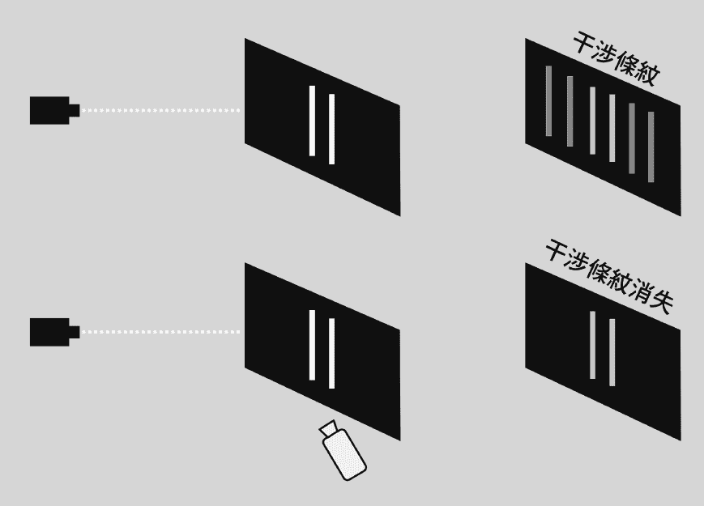

1961 年，德国图宾根大学的克劳斯•约恩松（Claus Jönsson）创先地用双缝实验来检视电子的物理行为，它发现了电子也会发生干涉现象。

一个电子可以被视为一个非常微小的物质，而当一束电子被发射通过一条细缝时，它们表现的象是小物体一样，形成了单一聚丛图案。

所以，当我们发射这些微小物质通过双细缝时，理应得到两道聚丛图案，但是没有，反而得到了干涉图案。我们发射了粒子通过，但是得到的图案却如同它们是波，而不象是小物体。这一块块的小物质是如何形成波一般的干涉图案呢？这一点也不合理。

最初，物理学家们认为，是电子之间互相撞击，因而产生了干涉图案。1974 年，皮尔．梅利（Pier Merli）在米兰大学的物理实验室里更改了双缝实验：他让电子一粒一粒的发射出来在探侧屏上，这么一来，它们就不可能彼此互相撞击且干涉了。可是干涉图案却再度出现了，物理学家们被搞迷糊了。难道一个电子可以分裂成两半再分别通过？如果是的话，那么它是否变成云雾一般地，通过了两条细缝呢？

为了对谜题探究到底，他们更进一步的更改了实验，在一条细缝上设置了一个观测装置，用来看看电子究竟通过了哪个细缝？但是当电子被如此接近地观测时，它们返回了如同小物体的行为模式，并且产生了聚丛图案，而不是干涉图形。

透过某种方式，「观测的行为举动」导致了它们只能通过一条细缝，而不是两条。电子们的行为方式，显得好像它们发现了自己正在被观察一样！这怎么可能发生呢？「有意识观察者」的存在，影响了实验的结果。

你的现在决定过去

在 1978 年，美国理论物理学家约翰．惠勒（John Wheeler）提出了一个新的方式来进行双缝实验，一个称为「延迟选择」（Delayed Choice）的实验。这也许最终揭露了实际发生的情况。

惠勒给出了一个颠覆我们通常时间次序的结论：「我们此时此刻作出的决定，对于我们，有足够理由说，它对已经发生了的事件产生了不可逃避的影响。」

换句话说，我们「后来」的选择，决定了粒子的「先前」状态与行为！

「此时」的决定，影响、甚至决定了光子的「过去」。

最绝的是，这个思想实验不但具有可操作性，而且可以在宇宙尺度上操作。藉此，惠勒反覆强调：「没有一个基本量子现象是一个现象，直到它是一个被记录（观察）的现象。」「并没有一个过去预先存在着，除非它被现在所记录。」所以，一个物质在被观测到之前，它似乎并不存在。物质，似乎只是意识与能量波交互作用的结果。

根据这个实验，我们可以想象：一颗遥远的恒星，在数十亿年前朝地球射出一颗光子。在途中，它必须通过密集的星系，重力透镜将使光线沿星系边缘折曲；数十亿年之后，当它到达地球时，一位天文学家选择用双目式望远镜的侦测器，分别集中在星系左半部的光线上，以及在星系右半部的光线上（为了避开位在中间的密集星系）。

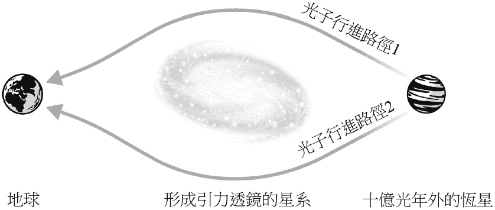

不管是选左边还是右边，天文学家的观测选择，注定了光子只能选择其中一条路径，并且呈现出聚丛图案。所以「在当下我们是如何观测」的这个选择，决定了光子在数十亿年前的行为。

惠勒所预测的，已经被实验所证实了，而这在唯物论的世界观中完全不合理，只有「宇宙是场模拟」的情况下才会合理。而且在时间与空间中的所有部分，相对于模拟源来说，都是等距的，就像在计算机游戏里或梦境之中，所有的可能性都已经存在，一切你所经历的体验，都会随着你的选择而实时出现。

构成能远距影响其他人事物的非定域性概念

在继续讨论下去之前，让我们先了解一下另外一个有趣的概念。

从小到大，我们可能都听过许多「远距发功」的故事，可是如果世界是个纯物质性的存在的话，远距是要如何运作呢？要回答这个问题，这就必须讨论「非定域性」的概念。

在物理学中，「定域性原理（英语：Principle of locality）」认为，一个特定物体只能被它周围的力量影响。包涵了定域性原理的物理学理论，被称为是一个定域理论。

根据古典物理学的「场论」看法，某一点的行动影响到另一点，这两点之间的空间，例如「场」，会成为运动的中介。一个波或是粒子要对另一个点造成影响，必须先行经两点中间的空间，之后才能造成影响。

根据狭义相对论，宇宙中所有物质和信息的运动与传播速度，均无法超过光速。由于事件的传播需要时间，而其速度上限为光速，因此「定域性原理」认为，在某一点发生的事件，不可能立即影响到另一点。

换句话说，信息不可能比光速更快。这个观点保持了事件之间的因果性，但排除了「超距作用」的可能。在量子纠缠的观点上，这个原理可能会被打破。

薛丁格（Schrödinger）学说里提到提出的「量子纠缠」：在两个粒子之间，即使被无穷尽的空间所分隔，还是可以观察到「瞬间联系」。这表示，对其中一个纠缠状态的粒子进行任何互动、观察或测量时，将会立即对另一个粒子产生影响，即使两个粒子之间的距离非常远，乃至远到了空间中无穷尽的距离亦是如此，这也就是著名的「非定域性」（Nonlocality）。

能合理化此现象的，是假设「这个世界本质就是个虚拟构造物」。在虚拟世界里，距离不会限制联系的关系，因为在模拟（或计算机游戏）中所有的点，对于模拟源或处理器来说，都是等距离的。假设我们的宇宙是个投影在三维空间的模拟，那么它的处理器将与宇宙中所有的点等距离。

「非定域性」这个在物理学中最大的难题，却可以被模拟假说轻易的解决，空间似乎只是个由虚拟构造物所产生的幻觉。在许多有传送功能的游戏中，如果你想从 A 点到 B 点，不管你是用走的还是飞的，你就是会需要在游戏的物理空间中慢慢前进。但是你也可以透过「传送」功能，让你快速的在游戏世界里出现在不同的地点。

我们在所谓的「现实生活」中，可以有这样的能力吗？1916 年奥地利物理学家路德维希．弗莱姆（Ludwig Flamm）提出了虫洞的概念，或「爱因斯坦—罗森桥」（Einstein-Rosen bridge），指的是：宇宙中可能存在的连接两个不同时空的狭窄隧道，透过隧道，可以让我们在空间中走捷径穿越两点。

你可以想象这是一个后门，或是象是哆啦 A 梦里面的「任意门」，同样地，在游戏的「传送」功能是一样的。而我们的意识，则不断地在不同时空里自由自在地穿梭着。

把无限可能性变成单一可能性的「瓦解波形」

在量子物理的世界里面，最让人感到奇妙的莫过于：小于原子单位的粒子，可以同时以「波」与「粒子」的状态存在。在电子或光子的等级时，波就是代表在一段时间内一系列的可能性。

透过「双缝实验」，当我们观察到一个可能性时，这个可能性就会「瓦解」或「塌陷」，被限制成为我们看到的一个特定地点中的单一粒子。

波：能量，无限的可能性。

粒子：物质，被限制住的现实。

有人会说「宏观世界」与「微观世界」是分开的，希望藉此来证明世界是唯物，而不是唯心的。然而，近年来双缝实验已经成功地以更大的物体来进行，如原子、分子，甚至巴克明斯特富勒烯，分子式 C60，也就是由 60 个碳原子所形成的球状结构。

科学家们现在更进一步，想要在实验中以中等尺寸的蛋白质和病毒，来进行双缝实验。目前非定域性量子纠缠，已经有被观测到，可以存在「一对小钻石之间」或「大到足以用肉眼看见的一对铝芯片之间」的纪录。

在 2010 年，美国加州大学的物理学家安德鲁．克莱兰，甚至把一对小金属片（在量子的世界里，这可是哥吉拉等级的大规模存在！）设置成了非定域性，让金属片呈现在同时有能量与没能量的状态下叠加注 8。

直到目前为止，宏观现实理论的每一个实验其实都失败了。量子效应存在于宏观尺寸的事实，赋予了量子计算机的可能性；而在塞斯．洛依德（Seth Lloyd）博士麻省理工的 Qubit 实验室里，量子运算已经每天都在进行着。

形成粒子之前的波，原本仅仅是潜在可能性的波，这正是德国物理学家维尔纳海森堡（Werner Heisenberg）曾说过的：「原子或基本粒子并不是真实的，它们形成了由『势和机率』组成的世界，而不是任何物质或事实。」

可能性如何被瓦解或塌陷成现实？是量子物理里面一个最大的谜团。目前物理学家透过双缝实验所给出的最好的解释是：「观测行为」会导致波形的瓦解。换句话说，我们有意识及无意识的思考与想法，都有可能被显化为现实。

当你看着时，它就出现了；当你没看着时，它就不一定存在。

这样的概念，当初连爱因斯坦都难以接受，他曾说：「是不是只有当你在看它的时候，月亮才在那里呢？」

美国物理学家弗莱德．艾伦．沃尔夫（Fred Alan Worf）认为，来自不同可能性的未来信息，往我们的方向过来后，我们会送出另一个波到未来；这个波会与未来传送到现在的波互动。我们会往哪个未来的方向走？取决于我们当下的选择，以及这两个波如何互相叠加，或是互相消抵。

这是个很令人惊讶的论述！未来不同可能性的「自己」，传送信息给当下的我们；然后，我们是有意识的做出选择，来决定自己的未来。

这个论点可以用简单的下棋游戏来比喻：计算机之所以能选择下一步棋该怎么走，是因为人工智能先从当下分析了未来所有的可能性，然后去评分，最后把这个分数传回当下，然后人工智能会选择赢面最高的下一棋的走法。

人生游戏说穿了就像下棋一样，我们依照游戏（系统）的规则来决定下一步棋怎么走会最好。游戏设计中，在每一步要决定未来的棋要怎么下时，使用的是「最大化我们的分数，以及最小化对手分数」的计算分析方式。

因此，当我们面对选择时，往往也是透过我们过去潜意识所累积的人生经验，来判断哪一个选择对我们是最好的，其实这就跟计算机程序做选择的方式是一样的。

注 8：维基百科：在物理学与系统理论中，叠加原理（superposition principle），也叫叠加性质（superposition property），也就是说：对任何线性系统，「在给定地点与时间，由两个或多个刺激产生的合成反应，是由每个刺激单独产生的反应之代数和」。

## 4-3 「现实世界」是「虚拟游戏」的投影

英国理论物理学家史蒂芬．霍金（Stephen William Hawking）认为，宇宙有两个空间：高维度的二维信息码，及我们这个可见的三维全像投影世界。换句话说，低维度世界，就是高维度世界的投影；我们目前在玩的电玩，都是平面、属于二维的游戏，这是我们三维世界的投影。

那么，我们所属的三维世界，就有可能是更高维度世界的模拟与全像投影。

游戏中的非玩家角色（NPC）

有了模拟的世界，接下来需要的就是游戏里的虚拟角色 NPC。

牛津大学的瑞典哲学家博斯特伦教授在 2003 年发表论文《你活在一个计算机模拟中吗？》，对于我们是否被模拟出来的游戏非玩家角色，提出了三种可能性：

第一、人类或者类人类物种在取得模拟科技之前，就已经灭绝了。

第二、有高科技能力的人类或者类人类物种对于使用模拟技术没有兴趣。

第三、人类文明正活在一个计算机模拟的程序中。

包含了宇宙，我们世界真实的本源并不存在，人类的意识、生活，以及与程序中有感或无感的互动，都是模拟的一部分。

在电玩设计时，要如何创造出非玩家角色（NPC）呢？当游戏越来越复杂时，这些人工智能的角色也需要变得更复杂，才能让游戏变得更有趣好玩，以及让玩家沉迷于游戏之中。我们的人工智能角色会需要能够通过「图灵测试（Turing Test，英国计算机工程师艾伦．图灵于 1950 年提出的一个关于判断机器是否能够思考的著名思想实验）」，也就是说，当你跟它对话时，你无法分辨它究竟是人类还是人工智能。

早期有些计算机游戏是一个单纯的聊天软件，当然，现在的人工智能已经远远超越那个阶段，但是现阶段，我们仍然没有能够通过图灵测试的人工智能。当我们能做到时（可能是几十年后或几百年后），那么，我们在互动中的人有可能是非人类玩家的机率，就会大幅提升。

博斯特伦教授认为，我们是被模拟出来的意识，也就是说，我们是超未来、超游戏中的非玩家角色。除此之外，博斯特伦教授也说：「当模拟系统发现，一个人正准备观察微观世界时，它可以根据需要，在一个恰当的模拟领域中填充足够的细节。」

在游戏中，只要是玩家没看到的画面（或视野），这个世界里面的内容在玩家的感知里就不存在。所以，以系统方来说，并不是每个玩家在银幕上所见的视野，都需要演算出全部的世界。

计算机只需要在画面上演算出玩家所处部分的世界，而且在特定的时间点内只给予特定的视角，这样是最方便的做法；如果画面中看不到，却硬要把整个世界都演算出来的话，不但不切实际，而且还是浪费存储器与系统资源。很巧的是，宇宙的行为也是这样子的。

我们的世界真的似乎是像素化的，而它只有在被观察时才采用精确型态，完全如同计算机模拟所呈现的行为。这也是为什么模拟假说现在受到更多专家认真的看待。

美国太空总署喷气推进实验室教授荣恩．加列特（Ron Garret）曾说：「我个人发现，我更倾向于信息论观点，并且相信我所身处的宇宙存在于一个非常棒的高质量模拟之中。」

在三维游戏中，也存在着依照玩家的视角，来优化演算世界的技术；这些技术是从早期的第一人称射击游戏中演化出来的，现在被 VR 游戏的眼罩广泛使用着。在可容纳多人的在线游戏中，系统会容许玩家建立出来的内容存在这个世界；所以当我们登出时，其他的玩家仍可以看到这些内容。

一个哲学的问题来了：不管是在游戏世界或是量子物理里面，没有人在观察时，或是没有人在游戏世界时，请问这个世界存在吗？

就像奥地利物理学家薛丁格的神祕猫咪（Schrödinger's Cat），在没人观察的情况下，猫咪就处于不生亦不死的诡异状态，直到有人打开纸箱观察为止。

游戏世界也需要玩家的登入与观察，才会把游戏世界演算在玩家的面前。如果没有人登入到游戏的某个房间或某个世界的话，那么游戏会是什么样的状态呢？想象一下，在魔兽世界都没有人登入的话，会发生什么事呢？服务器会持续运作，但是只有在有玩家登入时，才会有人「看到」魔兽世界里面发生的一切，这原理就跟量子物理一样。

否则，演算出来的画面到底有谁在看？而这又有什么意义呢？

特斯拉的执行长伊隆．马斯克曾经在公开场合提出「我们活在一个电玩游戏世界里面」的概念。马斯克说：「我们在宇宙中一直发现不了生命的事实，可看做是支持『我们本身就是模拟状态』观点的一个理由。就像你在玩冒险游戏，能看到背景中的星星，但永远也无法到达那里。如果这不算模拟，那可能我们就是存在于一个『实验室』里，一些高等生命体正在充满好奇地观察我们如何进化，就像（我们）在皮氏培养皿中一样。」

这位现实生活的「钢铁人」在采访中说道：「如果你再来审视我们当前的技术水平，会发现，在我们文明中出现了一些奇怪的事情，这里『奇怪』是贬义。最终结果可能是：全宇宙只存在一个完整的、只属于一个行星的文明。」

关于我对这方面的看法，请参考本书篇章〈是谁模拟出我们的世界〉所探讨的「A、B、C、D」文明。

游戏里的「多条命、不同等级、点数、经验值」

东方许多的宗教与思想，都有着：我们透过许多世的轮回转世，可帮助我们的灵性往更高等级进化。

在早期的游戏象是《小精灵》（Pac-Man）或是《太空侵略者》（Space Invaders），传统游戏逻辑中，每一个玩家一开始都有三条命，玩家一面闯关、一面累积分数，直到玩家「死亡」为止；玩家可以从死掉的地方「续命」，或是「重新来过」，或是等到「GAME OVER」几个字大大出现在画面上。

在大型多人在线角色扮演游戏（mmorpg），玩家通常会在游戏中累积经验值。如果我们重来，玩家会记得他们在之前的命中所累积的经验与技巧，也可以在过程中储存进度；但是当角色死亡与重来时，经验值都会全部归零。

这就象是东方轮回转世的比喻一样，当我们出生时，即使我们在许多前世中有着丰富的经验值，但如果想要重来，我们就必须经过奈何桥，喝下孟婆汤，忘掉之前所有的一切。

但是我们之前所累积的经验值跑哪儿去了呢？虽说并没有统一的答案，但如果以游戏的比喻来看，经验值应该是被上传到某处的云端储存起来了吧（跨游戏累积）。

伊斯兰教的传统里面，有着这一世「计分卡」的概念，好事坏事都会被记录下来，而在生命结束时，会依照你的计分来分发你到天堂还是去地狱。这跟道教里面叙述人体里面存在着会记录你一切言行、并将其报告给天帝的「三尸」有异曲同工之妙。而在基督教里面，每个人肩膀上有两只天使，死后会由祂们来决定你是到天堂还是到地狱。

所以，我们有着同样的概念：玩家在游戏里面的经历与状态，会被上传到游戏以外的世界储存与可被读取。有些玩家可能因为系统缺陷（bug）的缘故，而读取到了前几场游戏的资料，意外地成为了有「前世记忆」的角色，也说不定。

冒险、业力与神（人工智能）

在东方传统里，人生经验并不是随机。我们认为有一个系统记载着我们所想所说所做的一切，然后创造出一个让我们面对过去行为的世界，这就是因果业力系统。

如果你想要设计出一个看起来有开放式结局的游戏，且有成千上万的玩家时，你必须要能够把每一个玩家的冒险以及成就都记录起来才行。

现代的电玩对每个玩家而言，所有的冒险／成就／挑战都是一样的。要设计让游戏透过你过去的经验，来为你量身订做你接下来的冒险，并不是一件难事，就像每一个游戏的特定关卡中，玩家会面对跟你等级类似的挑战，然后一次一次的，直到你能够完成任务为止。

要完成这些所谓的「个人化冒险」，需要能够同步成千上万玩家以及非玩家角色 NPC 来参与，也就是同时间有几百万人或几亿人在玩一个超级庞大的游戏。系统也需要在当下筛选，有哪些玩家的等级，是足以在这虚拟的 3D 世界的某处闯某些关卡，与进行特定等级的冒险。

每一个玩家的互动跟行为，都会对后续的游戏进展有特定的结果，依照这个结果，指派不同后续的冒险与游戏故事线给玩家。当玩家人数变多时，就不可能以人工的方式来保持这些记录，有一个运算功能非常强大的人工智能来做管理与记录，是合情合理的。它甚至不需要有所谓的智能，只要能够确保游戏的规则能被彻底执行，以及游戏的进度被完整记录与备份起来，就足够了。

所以，我们再从东方到西方，看看传统宗教的架构。

在西方的宗教里，每个人都会向上帝或神祷告。我们先假设上帝或神真实存在，那么祂是什么？如果祂真实存在的话，是什么样伟大的智能与权限，可以在过去现在未来同时接受全世界所有的祷告？而且当你面对审判之日时，又要如何决定你要往天堂还是往地狱去呢？我相信，一个非常复杂且运算功能强大的人工智能，是可以做到以上的工作。

【零通灵看世界】

「现实」之谜：为什么找不到外星人

如果创造出我们模拟世界的，是超乎我们存在的文明，甚至是高过我们维度的生命体的话，那么祂们对于我们来说，就很有可能等同于绝对隐身的存在。

普通的「隐身」仅仅是指一个事物不发光、不反光，而使得别人无法看见它，但任何人都可以摸到它。绝对隐身下的物体，则是既不会被看到，也无法被摸到的。

如果把蚂蚁假设为只能在两维的地面上移动的生物，再想象有一只能在三维空间中自由活动的蜻蜓，飞在蚂蚁的上方，那么蜻蜓可以看见蚂蚁，可是蚂蚁却无法看到或摸到蜻蜓，对那只蚂蚁来说，蜻蜓就实现了绝对隐身。

同样的道理，如果一个人（或意识体）能够在多维空间中自由移动，他就可以对那些只能在三维空间中自由移动的人做到绝对隐身，毕竟低维度是看不到高维度的存在的。

提到「有能力模拟出我们世界的高度文明」，相信大家一定会联想到外星人。虽然目前为止，地球上已经有许多人目击了飞碟，但是总是缺乏了实际上可碰触、证明外星人真实存在的证据。

那么到底有没有外星人的存在呢？意大利物理学家恩里科•费米（Enrico Fermi）在 1950 年提出了著名的「费米悖论」。

费米悖论（Fermi paradox，又称费米谬论）阐述的是——对外星文明存在性的过高估计和缺少相关证据之间的矛盾。宇宙惊人的年龄和庞大的星体数量意味着，除非地球是一个特殊的例子，否则外星生命应该广泛存在。

费米问道：「如果银河系存在大量先进的外星文明，那么为什么连飞船或者探测器之类的证据都看不到？」

另一个紧密相关的问题是大沉默——即使目前难以实现星际旅行，如果生命是普遍存在的话，为什么我们探测不到任何相关的电磁信号？有人尝试通过寻找外星文明的证据来解决费米悖论，也提出：这些生命可能不具备人类的智慧。也有学者认为，高等外星文明根本不存在，或者非常稀少，以至于人类不可能联系得上。

开放的世界以及无穷尽的可能性

早期的电玩游戏的架构与玩法，都是非常直线式且受限制的，就象是《小精灵》与《太空侵略者》。在画面上能出现的角色很有限，角色本身动作很有限，我们使用的摇杆与控制也很有限；游戏的每一个关卡可能都会有一个主题，然后你只能直线式的往前进。

当电玩进化到 3D 时，「世界」开始出现了。从玩家的角度，你可以在游戏世界里随意的移动，或是做任何你想做的事。目前市面上存在着有《模拟人生（The Sims）》、《侠盗猎车手（Grand Theft Auto）》、《魔兽世界（World of Warcraft）》，还有《第二人生（Second Life）》等种种漫无目的让你去探索虚拟世界的游戏。这些都是被仔细创造出来的游戏环境，也可以说是「幻象的世界」，更遑论搭配上 VR 的技术，许多玩家也已经开始戴上眼罩，在虚拟世界中体验着不是我们现实生活中的世界了。

当计算机科学以及人工智能的能力在快速的进化时，就会有可能足以模拟出让我们看起来以及感觉起来很真实的世界。电玩，一开始只是二维的平面游戏，而且游戏规则非常简单，但经过五十年来，已经进化到大型多人在线角色扮演游戏，可以同时让几百万玩家同时上线游玩；试想，几百几千年后的文明，可以创造出一个有七十亿玩家同时上线的三维游戏世界，应该不难。

游戏设计者知道，游戏里的一切都不是真实的。透过使用 3D 模块，他们制造出看似无限的世界，但其实这些都是架构在有限的地图，以及游戏规则之内的（就像我们的地球，看起来很大，但是其实是有限的，而我们同时也被地心引力牢牢地、理所当然地「绑」在地表上）。不管是多么开放的游戏，你在游戏里面所能做的任何事，或体验到的任何冒险，都是被游戏设计者所写出来的，或是被游戏设计者所限制住的。

而量子物理也告诉了我们，我们处在的宇宙（包含平行宇宙），从客观现实来说，是不合理的，因为一定需要有意识去观察宇宙，宇宙才得以存在（瓦解波形）。这些乍听之下不合理，但记得之前提过的，如果我们玩家没有登入游戏的话，就不存在可被观测的物质世界。

意识的存在本身与观察，就等同游戏世界的登入。

在东方，尤其是佛教，一直强调我们处在幻象（虚拟）的世界，而且我们透过许多次的轮回转世来完成每个人的冒险，这些信息全部被储存在这个演算的世界之外。由此可推论，有一个很庞大的系统，不只是储存信息，更创造出「可以有我们在其中冒险以及达成各种成就」的世界。以上的这一切，怎么看都象是在叙述电玩的虚拟世界。

因此，虽说没有确实的证据，但是几乎所有的计算机科学／人工智能／量子物理／东西方的宗教与哲学，通通都指向一个很接近的结论：我们生活在一个非常复杂且真实的电玩游戏世界。

就像所有的模拟一样，只有在模拟的电玩运作时，我们的体验对我们来说，才是真实的。

麻省理工的物理学教授马克斯．泰格马克（Max Tegmark）说：「如果我是个计算机游戏里面的一个角色，而这游戏是如此的先进，以致于我实际上是清醒的；当我开始探索我的游戏世界时，我将实际的认为，这世界是由真正实在的物件所构成，由实质的东西构成。但如果我以一个好奇的物理学家身分开始研究，如同现在的我，这些东西的性质，描述物体移动的方程式，还有给予这些东西性质的方程式，我最终将发现，这一切性质都是数学的。这些数学性质，都是由计算机工程师实际放进了描述所有东西的软件之中。」

世界是一个幻象、一场模拟、一场游戏，并不是什么新的理论。透过双缝实验，我们知道，身为观察者，对这场模拟有显著的影响力；我们实际上参与了创造的过程，创造了我们所生活的现实。

如果你一部分的潜意识，仍然连结到设计这个虚拟现实的原始意识上，那又会怎么样？毕竟我们知道，潜意识可以在我们睡觉时为我们创造一个物质上的体验，那么，世界又为何不可能是由我们的意识所创造出来的体验呢？

我们有自由意志吗？

大部分的人都愿意相信自己有自由意志，每天都认为你可以自由的选择去做你想做的事情。你现在之所以会看到这篇文章，是早就命中注定好的吗？

著名的物理学家牛顿认为，人所做的一切都是早就决定好的；根据他的物理法则，整个世界都是确定的，每一件过去发生的事情，都会对未来有所影响。

一个人每天行为的选择，是他先天的基因与后天成长的环境组合而成的结果。但某个程度上来说，当你已经被你的「先天基因」与「后天学习到的东西」限制住你的想法与决定时，其实你还是没有选择；在你的脑袋里面的惯性思维，在同一个场景之下，选择只会有一个。（想想人们只要遇到政治与宗教的场合，往往都会激动到失去理智。）

已故的神经生理学家班哲明．利贝特（Benjamin Libet）在 1983 年，曾经在美国加州大学圣地亚哥分校做了一连串研究，他要求头上戴有电极的实验对象，在任何他们想要的时候，就移动手腕或是举起手来。研究的结果发现，大约在实验对象移动手腕之前的 0.5 秒，就可以侦测到名为「准备电位」（readiness potential）的电讯号活动，大脑的运动皮质在动作决定产生前，就变得活跃；而当实验对象察觉到自己想要动手，其时间点大约是在手腕移动前的 1/4 秒。

由上述结果推论，早在实验对象察觉到自己的意图之前，大脑就已经做出决定了。附带一提，利贝特是克拉根福大学（University of Klagenfurt）在 2003 年第一个虚拟诺贝尔心理学奖获得者，「由于他在意识、行动和自由意志的实验研究方面取得的开创性成就」。

2013 年，德国柏林柏恩斯坦计算神经科学中心的约翰-戴蓝．海恩斯（John-Dylan Haynes）与同事发表了一项研究，他们透过功能性磁共振造影（fMRI），要求实验对象自行决定要把两个数字相加或相减。

研究结果发现，在实验对象察觉到自己做出决定的 4 秒前，透过神经活动的反应模式，就可预测他们即将选择加法或减法。而类似的实验不断地被改良与重复，目前已经测量到最大的时间差为 10 秒（10 秒的时间差距算是相当久）。

这看起来很象是我们所谓「有意识」所做出的决定，其实只是一份来自无意识对于已经发生的事件的报告，而不是让我们采取行动的原因。利贝特指出，即使是在做决定前，我们就已经决定好了，但我们仍有短暂的时间「决定不要」。利贝特本身对于「这个实验是否能回答人类有无自由意志」这个问题，也是感到质疑的。

而海恩斯则说：「我要怎么宣称一个想法是『我的』，如果我根本不知道它是何时产生以及它决定要做什么？」

虽说目前的神经科学仍然缺乏精密的技术来证明：无意识抢先在大脑这几秒所做出的决定，在几天几个月后甚至几年后，对我们人生影响究竟有多少？这是一个很庞大的课题，所以我们仍然无法在科学上做出「我们有或没有自由意志」的结论。

但因为我们处在二元对立的世界，难道大家没有发现，很多东西最后都只会出现两种极为相反（二元对立）的可能性吗？

「人类到底有没有自由意志」这件事最大的争议点在于，如果我们没有自由意志的话，那么犯罪者需要为他们所做的坏事付出代价与接受惩罚吗？这在现实生活中，又是一个无解的答案。

不过，如果这一切只是个游戏世界，而我们的决策与选择都是由上界玩家来决定的话呢？以上的一切问题，都会有一个比较合情合理的答案。

想象你手拿着红白机的摇杆在玩《超级玛莉兄弟》，当你按下 A 按钮时，银幕上的玛莉欧就跳了起来，这时间看起来几乎是同时的，不是吗？但是实际上我们都知道，玛莉欧是因为你按了 A 按钮后，电子讯号透过电线传达到主机，主机再把结果反映到银幕上，于是你看到了玛莉欧奋力的一跳，这中间是有着极短的时间差的。

没错，这就是我们角色与上界玩家的关系。

我们（角色）就是银幕上的玛莉欧，上界玩家就是拿着摇杆的你。我们不是生化傀儡，我们是「数位傀儡」。

小我的本质就是想要控制一切，这也是上界玩家们之所以进到 D 文明来玩耍的理由之一：享受小我的限制与扯后腿。基本上，不管你的上界玩家透过摇杆（或是全身潜行的 VR）输入了什么指令，小我都会很不要脸的说：「没错，那是我干的。」因为游戏的本质就是让你发现上界玩家的存在，所以一切都会是小我要站出来「负责」，并且骑劫上界玩家全部的功劳。

我们就像玛莉欧一样，活着的时候不断地奔跑与跳跃，踩香菇踢乌龟喷火球……我们以为人生的目的就是要不断的闯关，最后要打倒库巴，救出碧姬公主。但那也只是身为玛莉欧，没有其他选择的唯一宿命而已。想象一下，如果你能够更加扩展你的意识呢？（嗯，那你就会变成《超级玛莉 3》、《玛莉欧 64》，或者是最新的《新•超级玛利欧兄弟 U》……好啦，以上是玩笑。）

《机器战警》（Robocop）这部电影，是陈述一位警官艾力克斯．墨菲在经历一场大爆炸后，被欧姆尼公司改造成一个半人半机械的超级警察的故事。2013 的新版《机械战警》电影中，有一幕是：

创造机械战警的科学家，欧姆尼公司的丹尼．诺顿博士与 CEO 雷蒙．赛勒斯，透过射击训练，在校正艾力克斯．墨菲，让他可以减少射击人类时的迟疑，来提升他身为武器的杀伤率。

跟上一次的模拟训练相比，机器战警解决掉敌人的速度明显快狠准了许多。欧姆尼公司的法务负责人克莱恩，对于机器战警的进步感到讶异：「诺顿博士，他是怎么做到的？」

诺顿博士：「他的软件更快，硬件更强，他是一部更好的机器。」

克莱恩：「但你说人会迟疑……」

诺顿博士：「只有在下决定的时候。」

克莱恩：「所以不是他在下决定？」

诺顿博士：「是也不是。在日常生活中，一切都由艾力克斯做决定，但一交战时，软件就取得主控权，然后机器负责所有的事情。在那个时候，艾力克斯只是个过客，就像一名乘客。」

克莱恩：「如果都是机器在主导，那墨菲负责什么？是谁在扣下板机？」

诺顿博士：「交战时，系统释放信号到他大脑，让他以为他在做计算机做的事。我是说，他以为是他在控制，其实不是，那只是自由意志的幻觉。」

克莱恩：「你让机器以为它是人，这样是违法的。」

赛勒斯：「不对，是机器以为它是艾力克斯．墨菲。在我看来，这是合法的。做得好，非常好。」

我对这一幕深深的着迷，重复看了好几十次，因为它就是这么完美的描绘出我们跟上界玩家之间如何合作进行游戏、破关的互动与关系。

我们只是游戏或是小说里面的角色，依照剧本演出的「乘客」罢了（有 15%自由发挥的空间）。就如我很常举出的例子：请问，杀死哈利波特父母的佛地魔，真的是坏人吗？还是他只是一个忠实呈现他被剧本所交代、所演出的好演员呢？

现实生活中，恐怕我们必须强迫自己去相信，人类是拥有自由意志的，美国哈佛大学心理学教授丹尼尔．韦格纳（Daniel Wegner）提到：「人类心理与社会生活的基石，是架构在我们有自由意志的幻觉这回事，失去了这个观念，我们的社会将会无所适从，最终崩溃消散。」

本章所引用的国际性的种种论述注 9，都是希望大家能正视与思考——我们处在的世界，是一个看似有着无限开放性、但却同时又有限制的虚拟游戏世界的可能性。有了这样的共识基础，我们才能够更深入、有效率地理解本书内容的探讨。

注 9：内容引用汇整资料来源与参考文献，详见附录资料。

# Ch5 我要预约量子转化！

## 5-1 王博士的「量子转化」服务

爱因斯坦曾说：「要解决问题，就不能仰赖当初制造问题的同样思维。」

每个人都具有无限的可能性，只是现在的你很可能被卡在目前生命中的困境里，而无法看见你还有其他的「可能」。

王博士于此代表了通往宇宙的一个媒介，透过宇宙深层意识的转化，带领你跳脱原本桎梏的陈旧模式，不使用催眠、NLP、家族排列、能量调整、灵气、气功或发功……等等，直接帮助你的深层意识「看到」身体可以是健康的可能性，身心自然就会得到疗愈，看见并开放出全新（或是朝你愿望发生）的可能性。

「量子转化」的过程中，「不会」做任何身体病症的治疗与任何实质上的「处理」。从宇宙意识的角度来说，其实王博士并没有处理任何的问题，只是开启了「你的问题可以被处理」的可能性。

我们无法决定，也无法知道什么对你是最好的，因此如果调整后出现变化的话，代表这件事如此发生是有益的；如果没有出现变化的话，则代表——这件事情如果如你愿的话，未必是好事，所以宇宙不允受理。

神会用三种方式回应你的祈愿：

一、祂说好，给你想要的。

二、祂说不，给你更好的。

三、祂说等，给你最棒的。

你会发现，构筑你世界的细节渐渐地产生了不同；你会发现，生活和以往开始变得不一样了。象是平常睡觉都不翻滚的，会发现睡醒后躺的位置跟平常不一样；有人做完「量子转化」后，会进到天人合一的状态，或是情绪释放、感恩、流泪。

「量子转化」给了你改变的可能性，接下来，我们交给上天，静观其变。

预约并且进行量子转化的须知

很多人写信都会询问，「我可以用量子转化来做 XXX 吗？」

我的答案是，没有什么愿望是不可以许的，但是要知道，给不给，看宇宙。

这是什么意思呢？在量子转化的过程中，我进到宇宙深层意识，透过正确的程序语言帮你跟宇宙传达你要的愿望，然后清除掉阻碍的分灵体，有时修改游戏的参数设定，我的工作就只是如此，除此之外没有其他的。

如果你有去庙里拜拜或祷告的经验的话，你可以把我想象成是一个「有高度效率帮助你传达讯息给神的信差」（这往往比你自己拜拜或祷告有效多了，因为我知道怎么传达讯息上去），我把你的愿望传达到了，剩下就看上天要如何回应你了。（但我目前为止还没看过比「直接跟宇宙意识沟通」来得更有成功率的方法。）

你今天来找我做量子转化而得到了财富、健康、感情、事业、子嗣等，这些都不是我的功劳，因为我不可能帮你赚钱、治病、谈恋爱，更别说是生小孩！一切都是宇宙运作的结果。

所以，没有什么事是不能来做量子转化的，只要你想的到，就可以来试试看。但由于生活中有许多现实上的考量，不代表所有的愿望许了就一定会实现（例如要求已经割除的器官再长新的出来）。

诚如我之前所说的，不要找我量子转化要跟金城武或林志玲上床，我怕他们会因此被我搞得很累（笑）！此外，违法的事情我也不受理。

最后，恕不处理被作法、诅咒、卡阴、灵煞等相关问题。

量子转化的预约细节，晴康身心灵中心的官方网站都有详细信息。

量子转化可以怎样帮到我？

量子转化怎么做？原理跟技巧都很复杂，这部分就留给上课的同学们就好。我们来讨论一下，具体上，量子转化是怎样帮助到大家的？这部分说明起来就简单多了。

假定你的现况是 A，你想要一个愿望 B，因为目前愿望还没达到，所以 A 跟 B 之间就存有能量上的障碍或距离（「分灵体」就是测量能量障碍的单位）。最一开始，量子转化的概念很简单，只要把 A 与 B 之间的分灵体消除完，那么愿望就很容易可以实现。以上这是随喜版的量转处理方式。

后来随着处理的案例增加，我发现，有些愿望不光是消除能量上的障碍就可以实现的，这时候就出现了「能量相欠债」的概念了，这是高阶量子转化最重要的概念，没有之一。

同上，假定你的现况是 A，你想要一个愿望 B，除了 A 与 B 之间的能量障碍之外，还要考量 A 与 B 之间能量的流动方向。假如能量是从 A 流向 B（A 欠 B）的话，那么愿望就不容易实现；反过来，如果能量是从 B 流向 A（B 欠 A），那么事情的发生就会顺利许多。

这个相欠债的概念，可以延伸到天时、地利、人和。

⊙天时：流年、流月、流日，甚至流时。

只要特定的时间点有欠你，你在那段时间的运势就会比较顺畅（天时的因素有时候还要考量到其他时空的影响）。

⊙地利：你与愿望目标地的相欠债。

假如你欠台湾，那么这代表你的能量会流向台湾，你住在台湾，就是属于能量耗损的状态，自然运势会不佳。如果台湾欠你的话，你做什么都会是如鱼得水。欠文明也是一样的意思，欠了不同的文明，就会有相对应的问题。

⊙人和：人与人之间的相欠债。

这部分我是从很多情侣的个案身上观察到的，假如 A 欠 B，A 就会对 B 付出比较多，反过来也是一样。我认为比较理想的情侣关系是互相都有欠，这样就代表两人之间都会互相付出，感情就会比较持久。我看过很多是只有单方面相欠的情侣，欠的那一方爱的要死要活的，另一方则完全无动于衷，这样的关系应该很难长久下去。

人与人之间，除了考量到缘分的深浅以外，只要没有了相欠债，就也不会有任何关系了，情侣的分手或一段关系的结束，往往也都是因为相欠债结清归零的缘故。

⊙事件：事件本身也要欠你。

如果想要特定事件发生，除了天时、地利、人和以外，事件本身也要欠你，发生的过程才会比较如你所愿。

举例来说，如果想从台湾股票赚钱，那条件就是要先让台湾欠你、台股市场欠你、台湾人欠你、你选的股票欠你、金钱欠你、流年流月欠你，这些是外在的先决条件。内在的话，则要看你的文明组合跟财富指数。没有 C 文明的，难以得到众生财；D 不欠你的，这个世界的钱也不容易流到你身上。

人生财务不佳，就是欠钱（这里是说相欠债的数值上欠金钱，虽说你也有可能真的会欠钱）；人生容易生病，就是欠健康（或是欠疾病、欠器官）；人生没有感情或是感情不顺，就是欠桃花，以此类推。说到底，一件事情是否能成，透过以上天时、地利、人的相欠债和简单的加减法，就会知道结果了。

通常初次来找我的个案，我都会看一下他的文明组合（ABC）、本源（D）、粮草、财富。有时看个案的问题，我也会看一下个案与属地的相欠债。我的经验是，只要有欠的，都是不好的，会建议用量转做到至少不相欠。因为相欠债的步骤麻烦许多，所以会是强化版的费用。如果有能力的话，把这些项目都调到欠你到最满，这样会是最好的。

再更上层的还有：在游戏世界生出你想要的东西。有时候你愿望所想的东西，还没有以可触碰到的形式存在这个世界上，那么就需要靠游戏的「系统生成」功能，把你愿望的结果，先在能量上产生制作出来，之后再调整跟它之间的所有相欠债，让它去成形。但这部分做法超级复杂，概念上差不多说明到这边就可以了。

如果你没接触过量转，或是不太清楚该调什么的话，那么以上的信息可以让你参考一下。

请记得，只要有欠都是有漏洞，一个破了洞的杯子，是什么都装不下的，所以至少要把人生的漏洞补好，才有可能在各方面都丰盛到满满满啊。

最后请注意，天底下没有永恒不变的东西。相欠债本身就是能量的流动，所以本质上就是消耗品，并不是说调完了 A 欠你，A 就会一辈子欠你喔，只要你有得到任何从 A 给你的任何好处，A 就是还债给你。当有一天 A 把相欠债都还完后，他就不欠你了，而之后他再多给你，就会又换你欠他了。反过来也是一样。

为什么量子转化不接受当日预约？

很多人对此感到不解，为什么不可以当日预约？有钱干嘛不赚呢？

当然不是不可以，真的很紧急（生死攸关）的事情，我还是会接受预约并处理。那么「不接受当日预约」的原因与标准何在呢？请容我解释一下：

第一，当然有个人因素在。这是在国外长大养成的习惯，我们已经很习惯看医生要预约门诊，到了自己当上医生后，也更了解到，这是对医生的尊重。

我们尤其讨厌当日临时取消的客人，因为时间都空出来了，你临时取消，而那段时间其实是可以排给其他有需要的客人的，这会造成我们经济上的损失。

在国外看医生，有的还会要先留你信用卡的资料，当你临时取消没出现时，诊所是可以刷你的卡跟你要求赔偿的。当然这在台湾不适用，更别说是费用随喜的服务了。

第二，当日预约，代表你不是很尊重你自己的愿望。

如果你的愿望很重要的话，你一定是很期待请宇宙帮你处理，所以你会把时间事先排出来，给这个许愿的过程。

这一点其实比第一点重要，因为如果你只是今天起床，没事想到说：「嗯，来许个愿好了。」那么这就释放出了一个「随便」的讯息给宇宙，那么相对来说，宇宙就不会那么容易完成你的愿望，或是可能用很诡异或好笑的方式来呈现出你的愿望，或是在一个奇怪的时间点显化你的愿望。

总之，宇宙和世界就是一面镜子，你尊重自己，就是尊重宇宙。你尊重别人，就是尊重宇宙，这是一体的。

所以，我不接受当日预约，除了个人因素以外，就是为了提升你做量子转化的效果。而临时取消（或一直改时间），代表其实你根本不想要实现你的愿望，你的行为反映出你内在最真实的想法，那么我们自然也不再接受你的预约。

是说，你都不是很在意你的愿望了，我和宇宙又何需帮你在意呢？

请正视你自己的愿望。你的态度，代表你对愿望的想法，而你的行为（预约、赴约、随喜的数目、不乱改愿望）会反映出宇宙会要怎么给你，就这么简单。

量子转化远距行政作业上的二三事

量子转化服务有提供「远距离」协助，也就是透过信件进行事件处理。基本上，远距个案一律都会有一周的等待／缓冲期处理，因为来信众多，需要排程处理。基本上处理好的话就会回信，没有回信就代表还没处理，请耐心等待。

我相信面对心愿被实现，每个人都很期待。但是，催促并不是一件好事；因为，当你在「催」时，宇宙的规则就会落在「还没处理」或「怎么还没好」，那么你就会得到这样的结果。另外，如果你对于远距离没有信心或耐心，我建议可以预约现场的服务。远距离主要是方便不住在台北市与新北市的朋友。

远距量子转化信件中请务必附上：

1\. 个案姓名与照片。

2\. 所求愿望的现况（请简述关键症结点，勿写长篇故事）。

3\. 所欲之结果。

4. 转帐金额，转帐后五码（请勿拍 ATM 收据，账号请参考脸书社群），转帐日期与转帐金额。

5\. 如果是跟别人有关的（象是感情或是官司），请附上对方姓名、照片。

6. 若是想做强化版，请一句话叙述出你目前问题的关键障碍为何？（若没做强化版，请不用管第六项。）请告诉我你愿望的两个正负对立面，例如：负面——我再也不要一直每个月赚不到三万元的工作了。正面——我会轻松找到每个月三万元或以上的工作。

以上资料请不要分开寄，也请勿另外写 word 档，直接写信即可。内容不完整或没依照格式的信，将会耽搁到我们为你做量子转化的处理时间。请注意，内容中如果没有注明要做强化版，一律不会做强化版相关处理。

为了提升服务质量，每次帮亲友远距，最多仅限三人，每人的资料请分开寄（自己的话仍仅限一次，并非一次许三个愿望）。

※恕不接受 Line 远距处理。

为了避免远距服务上有资料不足的问题，造成服务回信较慢，补充大约有以下几种：

⊙没附照片与姓名。

请每一封信都附上事件相关的人事物照片与姓名。土地买卖与出租，请至少附上物件地址。我没办法每次收到信后，又去信箱里找你前一封信的照片。所以，没附照片的势必会延后处理。

⊙没附转帐日期、后五码以及金额。

对帐也很花时间，我不是说在意你转了多少钱，说好了随喜就是随喜。但是我需要知道你希望我做的是普通版随喜量转，还是强化版量转？有填上金额的，我可以马上知道要帮你做什么样的服务。所以请务必附上转帐日期、后五码以及金额，以利作业。

⊙一封信，请只写一件事情。

如果处理事情以外，你还想问别的，请分开来信。因为，当我看到一封信除了要处理的事情还加上问事的话，我通常的反应是：「这封信好多内容要处理，晚一点再回好了。」

⊙请勿随意更改愿望。

除非事情在我还没处理前出现重大变化，若改愿望，因为跟你当初来信的频率已不相同，我会一律先放置一周，让能量沉淀后再处理。

⊙内容请尽量简单扼要。

如果事件写的太复杂，让我看不懂的话，我仍然无法即刻处理。所以请长话短说；觉得信件无法讲清楚的，请约现场。

最后提醒各位读者，量子转化事项，请一律透过 email 处理，请勿私讯我个人 FB 询问量转事项，因为这样我对不起来你是谁。

请问量子转化的效果如何？

效果与速度因人而异。而在量子物理的概念里，任何还没发生的事件，都属于尚未被瓦解波形的波函数，所以存在着无限的可能性。

未来的事件还没有被百分之百确定，影响一件事情是否能发生的因素有很多，量子转化透过消除与事件相关的分灵体、调整游戏系统参数等技巧，虽能大幅提升你愿望达成的机率，但并无法保证事情百分百一定会如你所想的发生。敢保证百分百效果的，肯定百分百是骗你的。

在调整事件之前，通常我会建议个案搭配强化版量转，调整与事件相关的一些基本相欠债数值。象是如果你想从美国相关产业或是美股上面赚到钱，那么就要让美国在相欠债上先欠你，赚到钱的机率就会提升。感情方面的则是需要考量到缘分、相欠债、功课。当这些基本盘都调整好了，才算是正式拿到入场券。

此外，本书也一直提到，跟事件有关的负面情绪越能释放，量子转化的效果就会越强。事件显化的速度也会被你本身对效果的设定所影响，所以请你想清楚你真的要什么。不是每件事情都如你所愿就一定是最好的，请参考「塞翁失马」的故事。

穿梭平行时空的注意事项

许多人跟我反应，在操作量子转化的当下或之后数小时，会感受到一种很特别的疲劳感。这是正常的，而且对你想实现的目标有所助益。做量子转化时（包含转化祭）所经历到的短暂晕眩、疲劳、想睡等反应，你可以把它当作是一个「重新开机」，或是「穿梭平行时空」的证据。

其实，大脑很常做的一件事情是「确定自己现在在哪里」。

每天起床，大脑做的第一件事情正是「确定自己现在在哪里」。我们出门的时候，本能的会需要「确定自己现在在哪里」，尤其是出国时，这种感觉会更明显。

其实，不管做什么事情，我们都会需要知道进度，知道现况如何？这也是一个「确定自己现在在哪里」。

因此，大脑必须知道自己现在在哪里，才能做出相对应的行为。这就像当你想使用手机导航时，导航软件一定会先做定位，才能引导你去目的地，道理是一样的。

当你做量子转化时，宇宙带你的意识离开原本的状态，再把它放置到你想要的新状态。这中间，你不会有身体穿梭平行时空的感觉，但是你的「意识」的确是从原本的时空来到一个新的时空（平行时空的简单定义是：绝大部分都跟原本的时空一样，只是某些部分跟原本不太一样的另一个世界）。

你的大脑有可能会因为这个转变而无法适应新的时空，于是进行一个「强制开机」的动作，所以会产生晕眩、疲劳、想睡等等的感受，来让大脑重新开机。

但请记得，这些是体质比较敏感的人容易感受到的能量震荡，不代表你一定要有以上的这些感觉，才代表你有成功的穿梭到新的平行时空。因此，也请不用太执着在这个上面，我们以外在世界最终是否有转变到你想要的状态为主；外在世界的改变与否，才是我们真正想要的结果。

关于量子转化后续的调整

做完一次调整后，只要事件有出现了新的讯息（不管是好是坏，都是一个变化），就代表出现了可以调正的下一个点。

事件→调整→新事件→再调整（重复以上）→满意的结果

基本上，是重复这样的过程，直到你满意的结果出现为止。

调整完的第一次，通常会反映出你自己内在真实的想法，以及宇宙调整后结果的总和。有时候，你之所以会没办法心想事成，是因为潜意识认为，目前的状况比你想要的未来结果更好，这在心理学上称为 secondary gain。比如小朋友发烧可以不用上学，老人家生病可以得到家人的关怀等。更多关于此方面的请参考我的著作《不开心，当然会生病》，内有很多说明与案例参考。

请记得，你本身一直都有着心想事成的能力。宇宙并不会忽视你原本的显化能力。当然，这或许也是会造成你「卡关」的原因。我的经验中，经常会发现，很多人嘴巴说想要，但是心里却不是这么想的。

另外，诚如我所说的，我不会通灵，所以不要问我事情的进度或发展还是宇宙怎么说。我只负责传达讯息给宇宙，帮你开启可以转变的可能性。事情不一定马上演变成你想要的结果（但是也是有此可能），所以后续的微调就看个人。

让量子转化更有效的祕技

这些年，我在量子转化推广以及个案、学员反馈上，得到许多有趣的收获，也可以归纳出以下一些如何让量子转化成效更好的方法：

⊙同一个问题，在还没成功前，能维持最少两周做一次为佳，这是一个强化、加速与稳定的过程。

⊙目标达成后，能再持续加强愿望约一个月，可以让状态更加稳定。还没稳定也没持续的话，容易跳回去之前的状态。

⊙量子转化的费用是随喜，虽说不规定金额，但是效果往往取决于你的能力与诚心。也就是说，诚实地问自己：「如果这个愿望可以达成的话，这对我人生来说有多少价值？」然后依照自己的经济状况来随喜即可。宇宙看的不是金额的多少，而是你的诚心多少。如果你收入很多，却只随喜很少，代表你心中不认为你的愿望很重要，那么自然宇宙也不会很慎重地看待你的问题。

⊙请善加利用强化版的服务选项。

很多时候，问题无法解决是因为，在你的原厂设定中能量累积与重复了太多次。所有的生物都是依照习性运作，大家都知道，累积越多的习惯是越难改变的。

越难改变的事情，往往就是累积了成千上万的分灵体（或是加购了行程）。一般做情绪释放，能把情绪从「很强烈」处理到「没有不好的感觉」，可以把它当作是处理了一次的分灵体。假设做一次 EFT 需费时一分钟，如果你想要释放一亿个累积分灵体，那正常来讲，就需要花上一亿分钟，也就等于 190 年，对于一般人来说，这就是穷及一生都无法改变的命运了。而量子转化可以一次处理掉超大量的分灵体，让你快速摆脱重复模式以及命运的控制。

⊙情绪是最重要的关键。

只有当你能量（或频率）的状态改变了，潜意识才有「看到」你如何达到你所想要目标的可能性，这个能量状态指的就是情绪。达到目标的你跟没达到目标的你，两者情绪肯定是完全不一样的。如果做同一件事情却希望看到不同的结果，那是不可能的事情。外在的世界是你内在世界的投射，所以量子转化处理后，通常最先看到情绪上的变化，接着你想要的改变会跟着出现。

⊙做完量转后，自己可以做些什么吗？当然可以，就是情绪释放。

最简单入门的方法就是 EFT。我在 youtube 上面有放免费教学影片，帮助大家可以自己学习并做最基础的处理。当然也有开设「一阶•放下」课程，里面会教导更多情绪释放的心要与口诀，欢迎大家报名学习。请不要小看 EFT，我能开发出量子转化，当初也是从 EFT 入门的，这是一个很棒的情绪释放工具。

请欣然感恩地迎接新时空状态

频率与能量是一个很纤细的东西，通常每个人对于「完美」有不同的看法跟解释，所以不太可能结局是完美的按照你的计划发生，也不太可能完美地来到百分百都如愿要求的平行时空。

但是，量子转化还是可以让你来到一个相对上足以称之为「胜利」、「成功」、「达阵」的结果。请记得，你跟宇宙比，谁能做出更好的选择跟安排呢？

有时候我自己会来到一个临界点，而且我可以知道那是什么样的状态。我已经脱离旧现实的引力，而我也已经被新现实的引力所包围了。我可能还没有完全的穿梭到我想要的现实，但是我清楚知道，我有足够的力量让我往我所想要的现实前进，如果我愿意持续往前进的话。

负面情绪会让你锁定在旧的平行时空，而让你锁定在新的平行时空的一个好方法是「感恩」。你已经努力这么久，终于来到一个新的世界、新的宇宙了，这个新宇宙有着跟之前截然不同的频率与能量，而「感恩」会让你跟新的宇宙在能量上成为更好的共鸣。

如果你抗拒这个改变，而要重新装载你的旧频率时，就会很容易被拉扯回去。

因此，并不是说你许了愿望，做完量子转化，穿梭平行时空，你就永远不会回到以往状态。你可以来，当然也可以回去。所以想要继续往前进的话，请释放负面情绪，对当下你已经发生的改变与一切你所拥有的，感恩吧！

要适应新的平行时空，你可能会要花点时间来熟悉它。尽量不要太过度激动或开心（就象是它只是个短暂的奇迹），尝试着看待你的新的平行时空为一个常态，这代表你认为它会好好的持续一段时间。对新的平行时空感觉良好不是不行，但如果你太兴奋、太激动，就代表你怀疑它的持久性跟真实性，这也有可能造成反弹。

如果你认为一切的美好都太不真实了，那么你会吸引到另外一个平行时空来印证你的想法。所以，即使你认为你吸引到让你觉得很赞的人事物时，请真切的知道，你值得这一切。

这就像我当初一开始研发出量子转化时，觉得：天啊，这也太神奇了吧！现在的我要创造人们口中的奇迹，就像每天吃饭睡觉一样的平常。当你准备好透过量子转化来进行下一次平行时空的穿梭时，你可能会选择让目前好的部分更好，然后修改一些不是那么满意的状态。

就象是，当你来到一个金钱丰盛的状态时，你下一步可能就会想让你的人际关系变得更好，是一样的道理。

脑袋开始改变，代表新旅程已启航

你的能量频率掌控着你能够穿梭到哪里。当你开始调整你的基本频率时，你的想法会跟着改变。所以，每当我做完量子转化时，有时都会问个案：你现在的想法或情绪，跟一开始有什么不一样呢？

你通常会开始有一些新的想法，那是被新平行时空的能量频率所激发的。很多人做完量子转化后，内心会开始出现一些「旧版本的自己」根本不会有的想法，这就是穿梭平行时空的一个好证据。

有了新的想法后，就要尽你所能的去付诸行动。容许自己成为一个充满能量、好玩的人。不要犹疑，去做就是了。你必须透过行动来证明给宇宙知道：「我说我想要 XXX 愿望实现，我是认真的！」

在行动上，你不太可能百分之百都做对，甚至有可能做错，但这没有关系。只要持续的学习跟这个新平行时空带给你的能量互动，不断的采取行动。

熟悉→行动→适应，重复以上的过程，这样就对了。

你会越来越熟悉在新的平行时空该做些什么、怎么做会比较好。

同样的，任何你旧的平行时空要你做的事情（也就是以前的你会做的事情）尽量不要去做。慢慢的，这些想法跟念头会自动消散。当你越采取新平行时空的行动，你就会越融入这个新的世界，你就离心想事成越来越近。

## 5-2 做完量子转化后常见问题

常见问题：状况变糟了，还是状况出现变化了？

做完量子转化后，确实不是每个人都马上会得到状况改善，有时甚至会出现所谓的「状况变糟」的结果。量子转化在机制上，我有做一个安全设定，也就是：「只要是对个案没有帮助的事件，就什么都不会发生。」

我无法告诉你这是什么机制，因为目前对于宇宙与神性是怎么运作的，我认为我也只是以管窥天而已。

但是从实际上我们可以掌握的面向，也就是我们自己的意识来说，我想问你的是：究竟是状况变糟了，还是状况出现变化了？

从我之前医学临床的角度来看，完全都没有变化，才是最糟糕的事情。

只要有出现变化，不管是好，还是坏，都代表事情开始变动起来了。至于事情最后会怎么变化，过程会怎么发展，我真的不知道。我唯一会做的，是给予宇宙全然的信任。

但是，既然我们当初的愿望已经设定好了，只要你信任宇宙的话，或是有稍微了解神性与吸引力法则的话，就知道，不管发生什么事情，只要你意志够坚定的话，就会往那个目标迈进。

很多时候，你之所以无法得到你目前想要的人事物，是因为你的潜意识认为「没有得到比得到来的好」。量子转化可以几乎无视潜意识的保护机制运作，但是，在这个物质的世界里面，事件要能照你的愿望发生，仍然需要时间来制造事件，透过事件，把结果导到你要的结果；至于怎么导，真的就是宇宙神性的运作了。

所以，如果出现你认为「状况变糟」的状况，请想想「塞翁失马」的故事；认为「状况变糟了」或是「状况出现变化了」是一个选择，你的选择会决定你的结果。

那么，你的状况是变糟了，还是出现变化了呢？

有时候，也有个案会提问：「觉得做完量子转化后却什么都没动静，怎么办？」

没动静是不太可能的（除非遇到被作法或其他能量干扰，但那个比较复杂），只是在于你有没有看到那个「变化」。宇宙给予的变化是会在生命的种种层面先出现，比如：想到同一件事情心情不一样，或是有出现以前不太常发生的事情，象是有人突然请你吃饭之类，这些都是变化的一种。

慢慢随着能量的调整跟增强，以及你情绪的变化，一定会让你看到跟结果相关的变化，甚至完全达标。所以，如果你专注的点是「都没动静」，那么宇宙回应给你的也是没有动静的结果。

请学着去找出做完量子转化后，生命中有什么不一样的变化出现了？只要你专注的是跟以前不同的东西，透过重新瓦解波形，那么你就会得到跟以前不一样的结果，这就是吸引力法则实际上运用的好例子。

外在的世界只是一面镜子，它会随着你内在的世界所变化。

因此，通常一开始的变化会出现在情绪上（当然也有可能事情直接就出现变化）。所以我才说，情绪是最关键的那个点。

总之，「量子转化」是目前我所知道的，吸引力法则可以真实且快速被实践的最强版本。但是，如果你不去实践的话，还是什么都得不到的。

请记得，对于你所「不想要」的专注力，是无法赢过吸引力法则的，而这也就是人类所谓「自由意志」最值得玩味的地方。

对量子转化的误解

曾经，有个人到我 Youtube 示范量子转化的影片留言，说他「付费请求执行量子转化，两个月过了，什么变化也没发生」。

我请问他是处理什么事件？他说：「当初求『当事人能发现自己对于卜卦理解错误』，到现在为止一切维持原貌，没有任何转变。」

我想起了这个案例：有位先生对卜卦的结果理解错误（来信的个案并没有解释他与这位先生之间的关系），把老婆赶出家门，个案希望可以透过量转来让这位先生清醒，并了解到自己的错误，把老婆带回家。

这是个相当复杂的案例，但我们先不管它有多复杂。我认为这个案例是需要强化版的，但是因为个案已经随喜了，我通常也不喜欢开口，想不想做强化版通常是个案的决定，或是可以先问过我再决定。总之，我就用一般的做法处理了。

有做过远距的朋友，都会在第一次量转后收到一封量子转化的说明，有说做完后先观察两周，之后告诉我变化，需要的话，可以看看下一次要做什么样的处理。

这位个案之后也没有来信回报任何状态，我也不会通灵，加上我手边个案也很多，我也不可能一个一个回去看每个个案的状态。

然后我就收到 Youtube 上面的留言了。

我想说的是，量子转化是很厉害，但是厉害的地方可能跟你想象中的不太一样。量子转化厉害的地方在于：它就像搭飞机一样，在还没搭上飞机之前，你会需要计划你的行程，买票，到机场候机。前面的这些准备过程可能会比较繁复与琐碎，一旦搭上去了，速度就很快。毕竟事前的精准目标设定很重要啊！这样才不会跑错地方。

我通常喜欢示范的是处理身体上的不舒服（但不是治病，有疾病请先求助正规专业医师的帮助），因为这方面能量运作的最快速，效果最立即可见。

但是当事情牵扯到人与人的关系时，就是最复杂了。很多个案写信要求「希望某某某爱上我」、「某某某跟我复合」，然后只做一次就希望愿望就可以达成。天啊，如果天底下一切有这么简单就好了。

以感情而论，我通常都会建议，要做加强两人之间的缘分，然后调整能量之间的相欠债，有好几个步骤的基本功要做，这样你才算是把最低限度的入场券拿到手而已，而且以上几个步骤都会需要用强化版处理才行。

金钱部分也是，并不是说许一个「我想要每个月有一百万的收入」，做一次量转愿望就可以达成。你要去考虑，你跟地区之间能量的互动、跟公司之间的互动，还有你跟客户之间能量的互动，这些都需要纳入考量。否则，即使有一百万进帐，也会被公司、被客户、被地区莫名其妙的吸走，总之，最后手边就是留不住那笔钱。

这么多年下来，我发现大家都把「心想事成」想得过度简单了。我是一路不断地处理个案跟累积经验，才知道中间的眉角超级多！心想事成跟你想的绝对是不一样的。

想要有好效果，请先了解到自己愿望的复杂程度，可以先问我，需不需要强化版，强化版的存在有它的理由，因为效果会大幅加强与加快。然后，请务必至少两周跟我反馈一次做完量转后的状态，大部分的时候，事情会往你想要的方向走，只是未必是如此呈现给你，有时候有可能暂时性会以你认为比较糟糕的方式出现。

这就好比你想搭高铁从台北到高雄，但是假如高铁今天出状况，那么最快的方法可能就要改成搭自强号。一般人如果不知道高铁有问题，就会认为这样是状况变糟糕了，可是对宇宙来说，当下只有自强号，这就是目前最快最好的方法。

我也真的很希望可以一次发功就马上圆满大家的愿望，但是宇宙跟这个世界运作的机制，真的远比大家想象中来的复杂许多。

总结就是：做了量转后，观察两周看出现是什么状况（如前文所述，你必须知道如何观察「变化」），我们就继续往你要的目标修正方向，直到你到达目标为止。然后强化版会加速你到达目标的速度跟力道。

最后，自己情绪的状态很重要，绝对会影响到量子转化的效果，因为，宇宙绝对不会给你你不想要的东西。

量子转化，一次就够吗？还是多多益善呢？

通常做完量子转化后的当下，如果你感受到任何身体上的变化（头晕、疲劳、想睡、更舒适、疾病的变化），或是情绪上的变化（更好或更坏），都是一个「上天受理你请求，把你带到你已经心想事成的平行时空」的指标。

接下来你要做的，就是静观其变（你将会看到外在世界的改变）。如果事情方向偏离了你要的设定，或有受到其他方面的干扰，那么就需要回来找我再转化，重新调整一下方向。

请相信，只要有变化，就是好事。

如果你情绪上真的还是因为很担心事情的结果而感到焦虑、不耐烦等，请自己搭配「放下的技巧」（EFT、圣多纳技巧或是能量逆转），会让你所做的量子转化效果更好。

这过程就像装潢房子一样，你不会只跟设计师沟通一次，然后到完成之前都不用再修改设计。只有你最清楚知道你想要的是什么，我只是传达讯息而已。这过程难免有误差，或是你之后有了新的想法（比如说，一开始请求收入增加两万，后来觉得增加五万比较好），所以有需要的话，还是要回来「修改」你的愿望。

总而言之，量子转化什么都可以做，只要你相信宇宙的力量，放手交给宇宙去处理，那么事情的成功率自然会提高许多。

## 5-3 量子转化常见的 Q&A

关于量子转化发展至今，有太多「FAQ」是我反覆回答的标准内容。因此，在本次集结出书的计划中，把所有的常见提问一并整理出来，也算是给予读者的一份反馈。至于个案们对「量子转化」提出过哪些精采问题呢？就让我们一起来看看吧！

问：我想问一下，相欠债做完后，是欠一辈子吗？那我可以把家里人都做一遍吗（调整成都欠我）？是算加强版吗？

答：不管是先天的，或是量转做出来的，相欠债的本质是消耗品，只要你有付出或是对方有付出，都会导致相欠债的减少。因为「汇率」上的不同，相欠债消耗的速度也都不一样，但是通常可维持半年到一年都没问题。如果想让家人能量上都欠你也是可以的，但这种步骤上比较复杂的，都需要强化版才能处理。

问：开天财做完后的财运，如果是因为有「开天财」才更容易有钱，你怎么知道每个人先天都有天财？有可能没有呀！

答：在我研究的理论中，我认为，我们存在的世界是个计算机虚拟的世界（可以参考电影《黑客任务》），我们只是神性在虚拟世界里面玩耍所使用的虚拟角色而已，我自己的印证也是如此。

以计算机程序而言，角色的有钱与没钱，都只是程序有没有如此设定而已。所以不可能有人先天没有「天财」，只是你这个角色在故事中的设定，是有多少钱而已。故事（程序）中说要让你有钱，你就会有钱。「开天财」是我拿来使用、一般人比较听得懂的概念而已，原则上的做法，就是让你这个虚拟角色可以透过设定，在这个游戏世界变得更有钱。

当然，说是容易，要破解起来，可真不是件容易的事呢！像我现在也一直都在努力破解，怎样更有效率、更快速修改游戏原厂设定的方法。

问：因为本源的关系，有可能是兽人，本来丰盛度就很糟了，开了天财也没用吗？只如博士所说「乞丐中的霸主还是乞丐」。所以，是不是要提升本源再开天财，才是最好的呢？

答：顺序上并没有规定一定要哪个先、哪个后，但是有开天财的，我都会帮个案把财运丰盛的部分调到当下宇宙所允许的等级。

问：你说你不是通灵体质，为何之前坚持要学会通灵？为了改变你现实世界吗？现在呢？有达到你想要的了吗？你的现实生活顺利吗？

答：我从很小时就曾待在一个宗教团体约二十年，师父本身就是以通灵神算第一自居的，所以当时不管是师父的开示中，或是同门师兄姐的聊天当中，「通灵」与「感应」可说是家常便饭。

可是偏偏我是个不会通灵的人，每天在那边听大家讨论说「今天我在师父身上看到的光好漂亮」、「某某菩萨刚刚在同修的时候有降临耶，而且那个灌顶的感觉好清凉好舒服！」、「刚刚财神赐甘露耶，你没感觉到吗？」时，我都觉得：「我是不是哪里坏掉了？」、「难道无法通灵，就没办法有跟大家一样的觉受与修为吗？」、「我是不是师父口中的破法器？」

我也曾经找宗派其他的上师帮忙「启灵」，能试的方法都试过了，但是什么鬼都没有发生。所以，我天生就是个「麻瓜」。回台湾后，我也曾经拜了一位当时住在台中的通灵气功老师为师，当时我每个周末都乖乖搭客运到台中（当时还没有高铁），付费请他指导，希望我可以通灵。那位老师当时只收了三个学生，好巧不巧，我又是那个唯一不会通灵的学生，四个人相聚上课时，只有我什么都感知不到。

跟这位老师学习的过程细节我们就不聊了。我只记得在拜师两年后，我被老师如此地羞辱：「教你学会通灵？那不就跟教会一条狗会咬拖鞋来给主人，这样有什么意义？」最后大家不欢而散。

由于我从小时候接触宗教以来，就被灌输了「修行上没有通灵就什么都不是」的观念，当你不会通灵时，别人总是会安慰你：「没通灵也没什么大不了的啊，不要太执着。」可是讲完了就一旁通灵快活去了，没人真的管你死活。

直到我遇到一位 NLP 老师——江健勇，他帮助我脱离了被宗教的洗脑，我才了解到，过去我所学的，可能不一定都是正确的观念（我并不是说我过去所学的都是不正确，相对的，我认为那也是我人生一段很珍贵的经历）。

接下来，就开始了我接触所谓新时代思想。从网络上找信息、找老师，出国去上课，最后自己整合所有所学的一切，然后「量子转化」就出现了。

虽说直到今时今日，我仍然不会通灵，我依然没有得到我想要的通灵能力。但我靠我自己的所学，开发出量子转化里面的这个「零通灵」能力，是类似通灵的不通灵方法，可以算是超能力吧。这些技巧一切合乎科学，而且人人都学得会，只要你愿意好好用心学习与练习。

四五年前，我曾经请我一位通灵的朋友，帮我请示瑶池金母：为什么上天打死就是不肯给我通灵的能力？我朋友请示后回答：「金母认为，如果给你通灵能力的话，以你的个性，一定会沉迷在通灵的世界里而走偏了，所以不要通灵其实对你比较好。」我想金母可能是对的，如果我会通灵的话，可能无法走到今天这一步。

最终的结论，不管我会不会通灵都好，其实我想要的很简单，就是人生可以变得比之前更开心、更自在、更自由。而我的生命因为自己的努力而变得更好了，我确实比之前更开心、更自在、更自由了，我觉得这样就是对了。

所以，人并不需要通灵才能改变自己的世界，这是我多年来亲身体验所得到的结论。

问：你到达了「觉醒」境界吗？因此才有类似通灵的结果？如何确认自己已经觉醒了？常常通灵的人会说「到达觉醒境界」，王博士可否分享你的体验与看法？

答：「觉醒」，在佛教来说，指的是「开悟」二字。虽说「佛陀」这个词的本意就是「觉者」，也就是醒来之人。

在释迦牟尼佛的那个年代，有许多进行着苦行的修道人。苦行常流行于印度文化圈，在印度提倡苦行的宗教有耆那教、印度教等。进行过苦行的悉达多太子发现，修苦行并不能达到究竟，于是转以其他方法修行成佛。

在释迦牟尼佛悟道前，他也曾经拜过许多当时有大成就的苦行沙门为师，这些仙人以苦行、瑜伽、禅定、持咒、拙火定、入三摩地等方式得到五通，即天眼通、天耳通、他心通、神足通、宿命通。

所谓的「神通」，可以当做不同等级的通灵能力来看待。天眼通与天耳通，顾名思义就是可以看与听到普通人所看不到、听不到的东西；他心通就是可以读取别人心里想什么的能力；宿命通就是可以知道别人前世是谁，或是有什么因果（如果真的有前世的话啦）；神足通，就是禅定中可以天上地下、各界穿梭行走的能力。

由此我们可以知道，即使你会神通，不代表你就是开悟成佛的。否则释迦牟尼佛成佛前拜的师父，就各个都是佛啦！所以，是否觉醒，跟你有没有通灵、有没有神通，两者之间完全没有关系。

在佛教里面提到，一旦你成佛了，就会得证第六个神通「漏尽通」（指的是一切烦恼漏尽，没有烦恼的意思）之后，你就会拥有其他的五通。

我们或许可以这么认为，「神通，只是成佛的副作用」，而有神通并不代表你有修为。所以如果有通灵人自称达到觉醒，你可能要检视一下他的言行举止了。如何检验呢？因为「开悟」是佛教的专有名词，检验的方式当然也要用佛教的方式，会比较合乎标准。

基本上就是要符合佛教的三法印：诸行无常，诸法无我，究竟涅槃。

这本书的目的并不是要讨论佛教教义的，所以我简单快速带过三法印。以下仅是非常简短的个人浅见，如果有错还请佛教的大德们指正：

第一、「诸行无常」：宇宙唯一不变的真理就是「变」。如果任何人跟你讲有什么是可以保证永远不变的，那就违反了诸行无常的第一法印。

第二、「诸法无我」：所谓的我，指的是「小我」，我们只是幻化到世间来体验游戏的角色，哪有什么「我」好执着的呢？看破了这一点，就完成了第二个法印。

第三、「究竟涅槃」：当你一切都通达时，完全没有一丝烦恼，你就跟所有一切三世诸佛一样，来到了那个似空非空、似有非有的没有二元对立的境界（用「喜悦」或「极乐」来描述这个境界都是错的，因为这样就又有了对立出现）。这是一个言语无法形容的感觉，所以「佛说：不可说，不可说，一说即是错」，指的就是这个。

如果一个人自称自己开悟了，那么他的言行举止就必须符合佛陀讲的三法印。如果违反了，那当然就是个骗子。

就我过去在宗教圈的经验，我发现，只要一个人敢说自己开悟的话，就是把自己当成释迦牟尼佛或是弥勒佛的意思，这样的行为往往会导致全佛教的赶尽杀绝，旁人也有很大机率会觉得你是个疯子或骗子。

毕竟《弥勒下生经》说，继两千多年前「现在佛」释迦牟尼佛后，下一个在娑婆世界成佛的人是五十七亿年后的弥勒菩萨，也就是「未来佛」，所以依照这个逻辑，接下来的五十七亿年内，都不会有人成佛。可是，如果学佛不能成佛的话，那为何又要学佛呢？

真的开悟的人不会刻意去讲自己有没有开悟，因为那个没有真实的意义，因为「开悟跟没开悟」对开悟者来说，其实没太大差别。这就像一个醒来的人看到身旁的人还在睡觉，这对「觉者」来说，本质都是一样，没有分别。「觉醒」的觉，跟「睡觉」的觉，都是同一个字，中文在这里真是巧妙啊！那么请问，所谓「觉者」是指醒来的人还是睡觉的人呢？

总之，通常只要说自己是开悟的，就没有开悟；而说自己没开悟的呢，嘿嘿嘿，不可说不可说。

而讲「觉醒」两个字就安全多了，毕竟没有宗教的包袱。

问：你忽然人神合一领悟量子转化，可以请示宇宙，那你就是达到了通灵呀！不然怎么可以有回天幻眼、超度灵魂、开天财的能力。对一般人来说，这些其实就是通灵了，因为一般人做不到。

另外，我倒觉得王博士像综合治疗师，可以科学、懂医学、涉略宗教又走身心灵，或许本身也不是通灵体质，但可以说是从心理治到身体。但你发明一套依据，将它套用在生活，帮助更多人解决问题，让人好奇这一切发生的过程，毕竟大多数学医的人都很科学，不信怪力乱神？

答：对一般人来说，可能我的能力很像通灵。那么，或许可能要定义一下什么是「通灵」？我认为，通灵就是：有外在的意识或灵体力量给你五感上面的信息。

所以一般通灵的人可能会从某某大仙、某某菩萨、某某高灵，或某某过世的亲人得到讯息。有些人出门会看有被车辗过剩下一半身体的鬼，在地上爬啊爬。或是下榻旅馆打开门，看到有上吊的鬼影舌头伸得长长的，在天花板上晃呀晃，甚至可能还会闻到一些腐尸的味道。

以上这些经验我通通都没有，所以我不认为我通灵。

至于本身的能力由来，是当我某天在静坐时，突然灵光一闪，就自己想到怎么做量子转化了。你要说是上天给了我什么讯息嘛～老实说，并没有什么高灵出现，按部就班的教我：「嘿，我现在要教你量子转化，步骤一、步骤二……」之类的。仅仅是一个「好像可以这么做」的念头，然后我去实验看看，就是这样而已。

这大概就跟爱迪生发明灯泡，总共失败了六千多次是一样的；又或是像周杰伦脑袋里经常有歌曲的旋律一样。我相信很多人都跟我有一样的经验，就是那个突如其来的灵光一闪而已。但跟通灵不一样，这些灵感是来自于我自己的内在；或许也可以说，这些是当我跟宇宙合一时，来自我内在的宇宙给我的东西。

巴夏也提过，既然我们都是幻化到这个世界的角色，所以我们的一言一行，都是从宇宙「下载」到我们这个角色来的，也就是说，我们无时不刻都是跟内在自己的宇宙「通灵」着。而关于我其中一个能力「回天幻眼」，那个就是每个人被催眠时都能进到的状态。只是当你能够把情绪都释放掉，没有小我干扰时，你看到的内容会更加接近所谓的「真相」。

说也好笑，我曾经一直以为，所谓的天眼或阴阳眼，就是要用肉眼看到佛菩萨或鬼神，那样才是天眼或阴阳眼，那是信息来自外在的通灵定义。如果说，来自于自己看到的就算的话，那么每个人每天都在做白日梦，那个都可以算是内在的讯息。所以，如果你硬要说我是通灵的话，我只能说，或许我是跟我自己「内在的神性」通灵。跟外面所谓的有高灵出现、通灵给你讯息，完全是两回事。

我之所以能研发「量子转化」的机制出来，当然也是和我本身是学医的有关。一开始我学的是自然医学，我擅长的是「拨恩技巧」、「巴哈花精」与「同类疗法」。但当我帮一些病人治疗到一个点后，我发现他们的病情很容易就会卡住了，我百思不得其解。

后来我学习到了 EFT 情绪释放技巧，我把它跟露意丝．贺（Louise Hay）的身心讯息观点结合起来，发现我可以让病人的病情进步许多。对我自己来说，我突破了一个相当大的瓶颈。

当医师的人当然铁齿，凡事都要讲求证据与效果，否则我无法被说服。所以当我从 EFT 情绪释放技巧开始，搭配 NLP、吸引力法则以及我本科的自然医学，我发现，透过情绪的改变，竟然可以改变别人的命运，帮助别人心想事成！

接着又遇到薛佛德老师以及许多国外的老师。我觉得能够有量子转化的出现，只是在于我「准备好了」而已。我刚好有过宗教上的经验，有学习气功、CIA 遥视的经验，我上过了我需要上的课，脑袋里也有我需要的信息，只是在那一次的静坐中，宇宙帮助我把所有的信息连结在一起，量子转化就出现了。

同样的，即使量子转化的一些新想法看似可行，我也是进行了一段时间的实验与印证，才开始帮别人解决问题，量子转化一点都不怪力乱神。

所以我经常说，量子转化是宇宙给我的礼物，也是每一个人都可以收到的礼物。

最后，超渡灵魂的部分，只要你肯把《阿弥陀佛往生神咒》三十万遍唸好、唸满，依照密宗师父的说法，你的超渡功力应该都不会太差才对。更何况，还有根本上师驻顶加持的力量呢！

问：为何取名量子转化？如何知道量转能帮助处理事情，并提供此服务？

答：我对取名字其实一直都很不拿手，只是当时要开放服务，总也不能没有名字，我本身很喜欢动漫，但如果取一个很中二的名字也很奇怪，难道要叫「银河星爆」或「星爆气流斩」吗？（笑）

「嘿，我们明天来找王博士做『银河星爆』吧！」这是什么搞笑对白啦！所以只是想说这是个很科学的东西，技巧也符合量子物理，所以用「量子」；既然可以帮助别人改变人生，那么就「转化」吧！说到底这只是个呼应技巧的名字，之后的发展会不会更多元，或产生新名称？其实都很难说呢！

问：如何知道跟宇宙沟通并下达愿望，就能达到想要的结果？请问你是如何思索练出来的？

答：量子转化这个技巧，与其说是跟宇宙沟通，实际操作时，我比较倾向这是一个「黑客」入侵宇宙的概念。当你了解到，宇宙与我们世界的本身都是计算机虚拟的游戏时，那么这要做起来就简单多了。

在一个游戏里面，角色身上每一个你所看到的状态，都只能是一个参数。比如说你有多少钱，就是这个角色有多少钱的意思。下一个问题来了，那么要如何让你的角色变有钱？如果依照游戏的规则，玩过游戏的朋友们都知道，当你等级很低时，你能打的怪等级也相对的低，报酬也很少，所以想要累积一笔游戏里面的财富，并不是件容易的事。

那么另外还有两种方法，一个是「课金」，就是透过游戏本身的收费机制，把我们现实生活中的钱，转变成游戏里面的金钱（通常是圣石之类的名称）。但是我们并没有一个所谓游戏外的玩家，会帮我们课金，所以这个选项无效。另一个方法就是「开外挂」，或是透过「黑客」来修改你这个角色手上金钱的参数。

只是，身在游戏系统内的我们，要如何到系统外开外挂呢？答案很简单，就是和宇宙神性合一。简单来说，当你透过情绪释放，让「小我」已经不干扰你时，你的本质就是跟宇宙神性是一样的；在那个状态，你就是 Game Master 了，你就具备了「从游戏外面修改游戏内角色参数」的最基本能力。

当然，说是很简单，但是真的能让你有可以改变参数能力的过程，一点都不容易。除此以外，接下来还有「权限」的问题。权限，自古以来大多被称呼为「法力」。法力越高，你每次能改游戏里面的参数就越多，或是你就能一次改变更多不同的东西，同时也会提升游戏世界依照你设定而改变的速度。

要怎样提升法力？那这就得靠多练习了。直到今天，我每天晚上仍然都花大约两小时练功，我把我的功力归功在我肯脚踏实地的每天练功。而不练功，也是大部分人会失败的地方。

所以在此不得不又再次强调情绪释放的重要性。之前我提过，释迦牟尼佛得道后得证了「漏尽通」，也就是人生再无烦恼时，他的其他五个神通就出现了。神通，就是开外挂。也可以换个角度来说，释迦牟尼佛透过情绪释放后，得到了黑客游戏的能力，改变了自己这个角色的参数，让这个角色开启神通的外挂。

问：你的课程常强调，没有通灵体质也能改变现状（因为你自己是零通灵），所以课程一般大众都可学；真的没有通灵体质、任何人学习后，都可像博士一样吗？

答：我不会通灵，自然也无法教你通灵的东西。我的课程的确就是设计给跟我一样，曾经对人生感到极度无力而不知所措，却又想靠一己之力扭转命运的「麻瓜」。

每个人都可以学烹饪，但不是每个人学了就会变成米其林主厨。学习后如果有把课程内容融会贯通，也肯跟我一样努力练习的话，每个人都可以跟我一样的。

毕竟，我也是从一个什么都不会的普通人开始的。

【零通灵看世界】

投靠博士就好，还需要上课吗？

曾有人问我：「老师你功力这么强大，那么只要人生有问题时来找你做量子转化就好啦！干嘛要上你的课？」

这真是个好问题。答案是这样的：当你人生遇到困境时，人会寻求解决的方法往往只有两种，一种是外求，一种是内求。外求就是寻求现实世界中的解决方案，内求则是往自己的内在世界来解决问题。

如果从现实世界中能很快找到解决的方案，那么你的问题早就已经解决了，所以要讨论的是，当你现实生活中，没有能力解决问题时怎么办？那么，首先要了解的是：一切外在世界的变化，都是你内在的状态所显化出来的。所以，当你外在无力解决问题时，就必须要从内在的方式来找到解药。

当然，这过程中会遇到「好的能力者」与「不好的能力者」。好的老师真的会带你上天堂，不好的老师会把你骗光光，因为他并不了解什么是「往内求」，很多时候只是包装了「内求」的糖衣来骗你的钱。这种老师我曾经遇过许多，除了没被骗色以外，能被骗的我差不多都被骗过了（笑）。

往内在寻求解答，方法不外乎是「让情绪与能量产生出你要的变化」。值得注意的是，「求神拜佛、请人解前世」这种，严格说起来不算往内在寻求，但很多人都误以为是。内求到了极致，才能真正的跳脱到游戏系统之外，来操纵系统内的一切。

总之，简单来说，是看你到底有没有决心跟毅力，以及有没有正确的方法与实际的行动来解决你的问题。每个人的人生，都会有各自的主题与功课。如果你有来找我帮忙，我虽然有能力处理掉许多你的负面情绪与能量，让事情有进展与变化，但我无法帮你完成你自己的人生功课，否则功课就失去了其本身存在的意义了。

人生因为痛苦才出现所谓的功课，如果没有这些功课的化解，其实你无法找到人生的意义。而在功课的处理中，最后终将带给你喜悦与圆满。

请记得：

．痛苦是根源

．功课是明灯

．情绪是方向

当你跟我学习到正确内求的心法与技巧时，你解决问题的方向会是正确的；而当上天看到你真的有心在做练习，在往内在解决问题时，再搭配上我的量子转化，让我把你问题的负面能量解决到你自己可以负担的层级时……那一瞬间，上天看到了你真切想解决问题的决心与行动（偷偷跟你说，老天爷很吃行动这一套），一切天人合一，水到渠成，问题就迎刃而解了。

请记得，当你没有往内求加上实际行动时，就是在告诉上天，你并不想要问题被解决，并不想要愿望被实现！那我能帮到的是有限的。

因此，找我做量子转化与学习，两者并不冲突，效果反而会无限的加乘！

问：博士是否试着归纳出个案或是你的学员，操作量子转化后到的成效？

答：坦白说，族繁不及备载。在我们课程的私密社群中，许多学员都有发表自己在不同课程中做到的效果以及经验分享。甚至，【一阶 魔法】的学员在尾牙时，经常包办了自己公司的各大奖项，所以案例统计是有的。另外，由于案例量过高，在撰写、整理本书时，甚至思考要另外单独出一整本案例故事集。因此，可被见证与检验的案例真的很多，只怕你不来体验与尝试。

问：若真如你所说，量子转化及其研发课程如此强大，其他所有身心灵老师及神明代言人不就没饭吃了？遭遇不顺的一切，只要来个量子转化，是否就能换得顺顺利利的「现实生活」？

答：老实说，我的课程都是我独自研发跟整合一些国外课程而来，我并没有接触到台湾身心灵课程的体系，所以我不知道外面其他老师或课程是怎么一回事。

我开课跟帮人做量转的目的，从来都不是要让别的老师或是神明代言人（毕竟我这边不讲宗教，基本上跟神明无关）难看。其实就只是很单纯的透过帮助别人，然后做自己喜欢做的事情，顺便混口饭吃而已。

每个人都有自己生命的课题与剧情的安排，有问题来找到我，我能帮到他，这样甚好。如果他在别的老师那边能解决到问题，也是甚好。即使在我这边做量转，我也无法保证事情百分百会照设定的发生。

会干扰结果的因素很多，象是个案的情绪，我认为这是最严重的干扰之一。首先个案必须给我足够的信息，接下来还有个案本身本源的层级，以及个案愿望目前原厂参数为何，让我知道如何去黑客、修改参数等。如果牵扯到别人，那干扰的因素就又更多了。另外被作法或被能量干扰，也是很麻烦的一个因素。

另外还有一个问题，就是许了一个不可能达成的愿望，自然也不可能实现。简单举例，假如当下你骨折了，不管你再怎么做量子转化，骨折的部分都不可能马上自动接回去。

现实生活中许愿，还是必须顾虑到游戏的现实基本规则，这样才符合现实。再次强调，量子转化非常科学，并不怪力乱神。量子转化本身的目的，仅是提升事情成功的机率，如此而已。

问：博士曾提到凶星部分，所有事物都有可能是凶星，那不就对任何人事物都要量转一下？把凶星量转，这样不幸的事件就不会发生吗？

答：如果能这样的话当然很好。但是问题是，我不会通灵，我也不可能一天到晚测来测去，看看出现在我身边的人事物到底是幸运星还是凶星。要是每天这样做，我想我会信息爆炸跟得强迫症的。

但是我举个例好了，我有位身材比较有福气的朋友，他知道他自己心脏可能不太好，所以有找我测了一下，我当下得知，心脏是他的凶星，于是就把他调成幸运星。约莫半年后有一天，这位朋友在跟女友发生亲密关系后，走出摩铁要开车时，竟然急性心肌梗塞发作！还好女友赶紧叫救护车，将他送到医院紧急开刀，这才捡回一命。

事后这位朋友跑来感谢我，他说，他平常业务的关系常跑国外，好险这次发作时人在台湾，而且身边有人。如果在国外发作的话，可能没人可以帮他叫救护车；即使有，国外庞大的医疗费用，也是他负担不起的。真是感谢我把他心脏事先调成了幸运星，让心肌梗塞在「最安全」的时候发作。当然我最后还是酸他，叫他要减肥，不然有多少颗心脏都不够用啊！

问：在社群日帖中，博士常常发文提醒「要准确许对愿望」，因为宇宙跟我们文字词意认知不同，所以很多是表达不清楚，导致愿望没能明确传达。意思是说，其实愿望可以达成，但只是一般人不知道要如何对宇宙正确下达正确内容吗？

例如我知道一个事件，是跟神明许愿，希望得到一笔钱，结果中奖获得一笔钱后，家人过世。你也有提到你有个案，想要一笔钱，也是从家人出事，拿到保险金。但是，不是很多人求神拜佛都没效吗！为何上面案例跟神明许愿后，真的会得到一笔钱，只是因为他有正确说明愿望，而一般人没正确向神明许愿，这么单纯吗？

而且，要如何得知所谓「愿望安全设定」？我希望得到钱，又不会危害到家人生命，该怎么做？

答：是的，请参考本书第一章〈对宇宙许愿时容易犯的错误〉，文中有提出详实的误区与注意事项。还有在我的课程中，我会教导如何用正确的句子许愿，以及如何安全的许愿。想要掌握更多精随，也欢迎随时留意课程信息。

另外，我认为愿望成真与否跟求神拜佛无关，但是这关乎你自己的信念系统。我只能说：「真正厉害的不是神佛，而是拜拜的那个人。」

问：博士曾在脸书提到，你有个案例，做法事、拜拜、补财库都没用，是不是没正确许愿的关系？另一个案例，一个泰国单亲妈妈拜神佛跟找法师作法，导致量转反扑。（故事详情请见本篇后【零通灵看世界】）

这两个案例都有拜佛，差在一个有找法师，所以会影响你做完之后能量调整吗？因为你说不想跟泰国神佛大战，那另外个案也有作法事，为何就没有干扰呢？

答：「不想跟泰国神佛大战」，那只是写脸书日帖文章的诙谐手法，不用太认真。如同我上一个问题最后所回的：「真正厉害的不是神佛，而是拜拜的那个人。」

没正确许愿当然也是因素之一，但另外一个更重要的是：你必须要知道你内在真正想要什么。

之所以会发生这些事情，很多时候都是个案本身对事件「自我感觉良好」所导致而成。也就是说，事情本身没有照你想要的走，你却硬是要认为事情应该照你想要的走。你的内在其实是恐惧与害怕的，而这个负面的情绪，最终导致了负面的结果。

【零通灵看世界】

求神作法并非多多益善

有一次，我和一位专门来台湾做代购生意的泰国朋友见面，聊天中发现她的情况不太好，言谈中一直在想办法要找钱，而且这次在台湾的生意不太好，让她面带忧愁，原本天使般的笑容不见了。

我看了一下她最近金钱的能量，结果大吃一惊，怎么突然变得这么负面？我第一个出现的直觉是「投资赔钱」，我测一下能量确认后，问她：「妳的财务状况怎么了？妳是不是把钱拿去放到错误的投资标的，然后赔钱了？」她顿时痛哭流涕！因为她本来就知道我的能力，所以也没感到太惊讶我为什么会知道。

我再看了一下，天啊，2018 年台湾跟泰国都会吸她的能量（也就是，以相欠债的概念来说，那年她欠台湾跟泰国欠惨了，所以根本不可能从这两个地区赚到钱啊）。即使之前表面上看起来有赚到钱，但是因为相欠债的缘故，赚到钱后就会莫名其妙地被「吸走」，钱就消失了。

我心想，她是一位单亲妈妈，为了生活这么辛苦的打拼，就帮她一把吧！于是我帮她调整了她与台湾跟泰国相欠债的关系，起码让她在台湾的这几天生意可以好一点。隔天她跟我说，生意跟之前比，终于有起色了，我也为她开心了一下。但是，之后她又跟我说，过了第一天后，她开始遇到一些奇怪客户的刁难，虽说生意是有做到，但是并不轻松。

这跟我平常处理后所观察到的结果不太一样，于是我决定再看更细一点。因为我没有通灵，不会有高灵来告诉我她的问题症结点，我只靠平常累积的经验与智慧，并运用逻辑去判断与除错，才能推断到事情的原委。

测完了发现，果然是我最担心的状况。她在泰国拜过太多神佛，应该也是找了不少当地的法师帮她的生意作法。并不是说不可以这么做，但泰国当地许多作法的，都不是太正派的神明，有的是养小鬼或恶灵（其实在台湾也是很多啦）。那些在我之前所作的法，会产生干扰与反扑，所以导致我这一次这样调整能量的效果有限，因此就出现了原本不应该出现的刁难她的客人。

在这边告诉大家一个我观察到，应该不算是祕密的祕密：不管是哪里，许多帮人作法的法师都不太会把东西完整的帮你处理好，因为他们希望看到的是，你因为他们的帮助而得到改善，但这改善只是暂时的，让你之后还会继续回去找他们，他们才有钱赚。

而且不一定是宗教圈里才会这样喔！我知道在台湾就有一个 NLP 老师，会专门诅咒自己的学生跟身边认识的人，让他们人生出问题后才会去找他解决。

总之，这行水很深，祕密很多。我猜想唯一能帮到我泰国朋友的方法就是：把她身上这些作法全部都解掉。不过我没有在帮人解被作法的服务，所以我没有出手。毕竟我并不拥有通灵人般的感知能力，所以在这方面是比较「吃亏」一点以外，最重要的是，我也没有打算跟泰国的满天神佛或是小鬼恶灵等的来个大战一场。

更何况，我怎么知道解除掉她身上的作法，对她来说是不是最好的呢？搞不好她在泰国因为这些法术的帮助，也得到很多好处也说不定啊。我不是神，无法帮她做这种决定。

我想，这也是她命中的造化了，非亲非故的，其实我能多管的闲事也是很有限。

问：若找你做量转前、后有参加身心灵课程，或本身有在静心、修练及练功，会影响量转能量和结果吗？或是量转后在等待事件发生结果的这段时间，还可以正常做上述事情吗？

答：如果想要心想事成更快速有效，请记得我从头到尾一直在强调的关键，就是自身情绪的平稳。所以不管你参加身心灵课程，或是本身有在静心、修练及练功，只要你的技巧不会导致你对愿望匮乏，产生负面情绪，那么不管做什么都没有关系。如果能帮助情绪更加平稳的话，自然是更好。

反过来说，任何会让你对你想要的愿望产生负面情绪的技巧与功法，都会拉长你达标的时间，甚至会让你根本无法达到心愿。

量子转化能帮助的，就是提高你达成愿望的机率，但无法帮助你达成「你在能量上对宇宙诉说着你不想要」的愿望。记得，任何时候，当你想到你的愿望，你产生的是负面情绪时，就代表着你内在其实是诉说着：你并不想要它实现！

问：如果个案因为同样事情来做量子转化，会发现根源或是原因吗？你会建议个案把根源去除，或是告知原因（就像博士有时脸书日帖会把个案来龙去脉详加描述）？例如：你之前提过，有人本源是精灵，后来被作法变兽人，如果你发现前来进行量子转化的个案有类似情况，你会主动提出并告知吗？

答：我通常认为问题的原因，都是「原厂设定」居多，因为我本身没有通灵。很多时候，我也只能透过空间讯息读取的结果，来推敲个案目前问题是怎么来的（其实就像医生看检验报告来做诊断一样的意思）。

被作法是不太常出现的案例，所以要不要说出口，就是看当下的感觉吧！如果当下我觉得眼前这个人信任度足够，我可能会提一下。但是，我也没有打算没事帮所有来找我的人一一解除作法，解不解，我想就看个案跟我之间的缘分吧！

问：请问，透过量子转化调整文明、本源、天财，会有时效性吗？

答：相信这是大家比较在意的问题，调完了能维持多久？效果能有多好？

在我的研究中，文明就是生命蓝图，占了你人生的 75%左右，除了我用量子转化调整之外，要出现变动，是很不容易的事情。

但目前观察到，有两件事情可以影响到文明的组合：

第一，改姓名。我自己改过名字，我看了我自己改名字前后的文明组合，是很不一样的。我另外再看了一些我知道有改过名字的个案，也是会出现变化。

艺人改艺名的话，同样也会有变化。例如，安心亚本名廖婧伶的文明组合是 D-2，改完艺名安心亚后，则变成 B1C2D2，这真的是天壤之别！当然我也有认识艺人朋友改错名字的，这也是很糟糕的。

所以好的名字真的会带你上天堂，一定要慎选改名字的老师。（工商服务，推一下我们晴康中心的宇宏老师，是姓名学的高手，加上可以找我帮你选字，效果如虎添翼！）

第二，整形。我也曾把几个案例整形前后的文明做了比较，的确也是出现很不一样的文明变化。

为什么这两个会出现这么大的变化？从游戏的角度来说，改名字跟改外表，都可以说是「角色重塑」；换句话说，就是换了个新角色，所以属性出现变化是理所当然的。

接下来，本源容易受制于情绪的影响，所以如果无法保持好心情的话，本源等级容易往下掉。不过，当你本源调到比较高的时候，自然你的生命中也不太容易出现影响到你情绪的事件，这是一个相辅相成的循环。

最后，天财容易受到流年、流月的影响，毕竟这也是属于命运的一部分。生命总有潮起潮落，这是自然界运作的现象。不过，当你开了天财后，在财运上，脚步会站的比较稳，也就是说，当流年、流月对你不利时，你受到的影响相对是少的。

同理，当流年、流月对你有利时，因为开过天财，所以财运自然会强上加强！

问：外面也有很多宣称可以帮人改变命运的老师与大师，我可以找别人帮忙，为什么我要找你做量子转化？你跟别的老师差别在哪？

答：量子转化跟其他技巧有一个很大的差别，首先要有「我们所处在的世界是个计算机模拟游戏世界」的认知，那么差别就在于：量子转化是从系统外开外挂、改变命运的做法；其他的技巧就我所知，都是用游戏系统里面的方法来改变命运。

举例来说，假设游戏里面有一把最强的武器，叫做「王者之剑」，王者之剑是在亚瑟王传说中所登场的魔法圣剑，可以称得上是后世骑士文学中，英雄多半配持著名剑、宝剑传统的开端。

这把剑依照游戏中的历史，可能存在于现在英格兰的 Dorzmary Pool。如果游戏中有一个传说或是规则说：「只要拿到王者之剑，就可以拥有等级 99 的攻击力。」那么所有的玩家一定会为了得到这把剑，而迫不及待地杀去英格兰，大家抢一把剑，免不了一场腥风血雨。

最后费尽千辛万苦，你终于打败所有的对手，取得「王者之剑」这把神器的物件所有权，配备后你就拥有等级 99 的攻击力了。以上就是在系统内，依照游戏规则来满足条件、改变命运的做法。

但假如我是游戏的系统工程师，我可以从游戏外挂程序另外「写出」一把剑呢？姑且就称它为「王者之剑 EX」好了，持有者将会达到等级 120 的攻击力。游戏系统工程师可以随时看他心情，随便把这把神剑赋予游戏里面的任何一个他选择的角色，让角色拥有超越 99 等级的能力，这就是「从系统外开外挂改变命运」的做法。

两者没有谁对谁错，只是轻松度与效率的问题而已。前者你必须依照游戏的规则，一步一脚印的从台湾出发到英格兰，经历一场大战的厮杀，打败所有的竞争者，才能得到宝剑；相对于系统直接变出来给你，哪一个比较轻松？

当然，如果你想体验在游戏里跟其他玩家杀的你死我活来争夺王者之剑，那么依照游戏规则走，就是个比较适合你的方法。问题是，当你知道系统可以就这样凭空变出「王者之剑 EX」给你的时候，你还会想要老老实实的闯关打怪吗？

从人类有历史以来，「改变命运」就一直是人类热衷的项目，从最古远的祈雨仪式开始，在西方就出现了宗教、祷告、巫术、血术、黑魔法等技巧；东方则有宗教、道教、佛教、密宗、泰国佛牌、降头、蛊术、等等种种帮助改变命运的方式，当然还有其他比较不公开的邪术，象是养小鬼、祭献生命等。

不管是哪一种方式，都因为历史的久远，而架构出属于它自己的一套游戏规则（所有的仪式、仪轨）。也就是，玩家必须遵守这些游戏规则，依照这些规则去做，就有可能得到自己想要的结果。而这些规则往往都很难懂、复杂，且不容易做到。

我过去的人生中，也曾为了得到我想要的目的，而依照不同宗教门派的这些游戏规则去做。象是曾经跟我妈为了化解祖先的业力干扰，两人一起总共烧了价值新台币 98000 元的金纸、也曾花了 50000 元改宇宙户籍、固定时间烧金纸给土地公等等，但是几乎是没看到任何效果的（邪术的部分恕我胆小，我不敢碰，也不懂相关运作的机制）。

当没有效果时，你往往会被告知没有效的理由，象是「业障太深重」、「前世因果业障」、「你跟对方没缘分」、「你不够诚心」、「烧的金纸不够」、「神明没有答应要给你」、「福分不足」、「祖先业力干扰」、「冤亲债主」等等。这些都是无法印证跟没有实际有效方法可以改变的。更何况，当你求神拜佛，或是想依赖其他术法时，你就把力量交给别人了，这往往会大幅增加你对事件的无力感（所以我不讲神佛、不讲宗教，因为它们也是我们处在的游戏世界里的产物，是系统内而不是系统外）。

因此，当我接触到 EFT 情绪释放技巧，且立刻感受到它释放情绪后带给我的变化时，我惊为天人，也从此大力推崇 EFT。因为它免费（任何人都可以上网找到相关信息）、简单，而且自己情绪好坏自己知道，你并不会陷落在一个「不管怎么做都不知道问题到底出在哪」的困境，只要情绪变好，事情变好的机率就会提高许多。

这些技巧在逻辑上一切清楚明白，不再有你不知道也无能为力的理由，被怪罪为生命卡关的幕后黑手，这是多么大的一种解脱啊！而我透过不断地情绪释放（我的二阶与三阶课程就是更快速有效的情绪释放），终于让意识可以提升到我们这个游戏的系统之外，开启外挂开始修改游戏的内容。

虽说这方面未知的东西还很多，但是我很确定，我的方向是快速跟有效的。因为是计算机模拟的游戏啊，计算机就是单纯的 0 与 1。0 就是没有，1 就是有。我只要能够找到需要调整的参数，去把开关开启，让你从没有变到有，命运就得以改变了。人生多么简单。

一切外在世界的现象都是你内在心境的显化，只要能够进到内心深处，你就会有能力来到游戏系统外，开始帮自己的人生开外挂，修改原厂设定。

如果不是这么做的话，那么就得乖乖的依照游戏里面的规则来。只是可惜的事情是，虽说是在游戏世界里，却不是世界上每个人手上都有一本游戏规则的说明书，甚至很多人被灌输了没有用或是错误的说明书，即使得到了也枉然。

很多人穷极一生，都没找到改变命运的游戏规则，然后就郁郁寡欢地过了一辈子。但是呢，因为是一场游戏嘛！搞不好，没有办法心想事成，也是你上界玩家透过你这个角色，想体验、想玩的也说不定呢！因为想体验「没有心想事成」而无法达成目的，也是种心想事成呀！

最后，并不是一定要找我做量子转化才能改变命运。基本上，每一个存在的老师与技巧，都只是游戏中里面的一个游戏而已，包括我与量子转化也不例外，就看你自己选择想找哪位老师、玩哪一种游戏。只是我这边的最基础规则之一相对简单许多：「掌控情绪，就能掌控命运。」我帮你把愿望传达给宇宙（在系统外修改原厂参数），接下来你只需要为你自己的情绪负责就好。这样是不是轻松许多呢？

【零通灵看世界】

每个人都想要改变世界，但是没有人想要改变自己

某一天工作上遇到的连续几位个案，都是希望处理「关系」方面的问题。所以我就连续被问到了一些我觉得很莞尔的东西，象是：

「我想跟对方在一起，前提是他必须要怎样、怎样才行。」

很好，那你有想过，你必须要先改变什么吗？

或者也有一位待业中的个案：「我儿子都不务正业，不去找工作。可以让他乖乖的去找工作吗？」

呃，可是你自己不也是没工作吗？在你儿子眼中，你也是不务正业啊……

要知道，外在的世界只是你内在的一面镜子。先有你内在的状态，才会有外在世界的状态反映出来给你看的。不管外在发生了什么事情，都是在提醒你自己，内在哪边可能「有问题」，才会导致外在你不想要的状态（「有问题」是指，你主观的认为有问题，而不是客观的一个问题）。

其中一些个案也有接触过不少身心灵课程，我只是很讶异，为什么这个最基本的概念，在外面的课程并没有被教导呢？

在我的经验中，感情的问题的确是比较难处理的。它难处理的原因，不是因为要改变别人很困难，而是因为没有人想先改变自己。

镜子里的你如果没有笑容，那么是谁的问题？当然是照镜子的人的问题啊！你先笑了，那么镜子里的你自然会笑的很灿烂。要解决「关系」的问题其实很简单，你真心的打从内在改变了，对方就没有选择的，只好跟着改变，因为它是镜像。

掌握到问题的关键点，问题已经解决一大半了。剩下的，就要靠自己的决心与动力了。

请记得，外在的世界没有别人。改变自己，世界就跟着改变！

# 【尾声】来自 A 文明的财富：有钱咒

2020 年 1 月的某一天，我脑袋里突然不断地响起了五个音节：「阿玛伊布族」。这种感觉就象是，小时候听过的某首歌突然出现一样。当时我先把这五个字记录了下来，猜测是宇宙有东西要给我，可是因为我不会通灵，所以只好开启空间讯息读取的能力，来一一测试比对。

我发现，原来「阿玛伊布族」在中文的意思是「执行」，也可以是许多佛教咒语里面完结语「梭哈」或是「娑婆诃」的意思。

有了初步的想法，我再去地下街跟通灵的师姐讨论，师姐马上收到讯息说：「这是天语。」呃，是说我又不会通灵，我也没打算要学或讲天语啊（我一直认为，天语是只有通灵人在通灵的时候才会说的语言，但是否如此，我不确定）。

后来我继续用空间讯息读取的方式跟宇宙问答，得到了这样的结论：一般的天语，是 C 文明的语言；而佛教的咒语，来自 B 文明。我所接收到的「阿玛伊布族」，是来自 A 文明的语言。

其实我近期在做量子转化所使用的设定句，已经是偏向「程序语言」的架构了。我认为，如果我们的世界是一个游戏结构的话，它必定是由程序语言所撰写与构成，所以如果设定句能越接近程序语言，那么理论上就可以达到更精准的效果。

我发现英文的文法其实是最接近程序语言的，尤其是「主动受地时」的句型。只是在表述上，会跟我们所习惯的中文语法方式很不同，但这部分比较复杂，就暂不赘述。

我花了两天的时间，用空间讯息读取技巧来取得了一些 A 文明关键的字。当然，其中也有一些自己觉得有趣好玩而得知的字句。

有了一些发音，再搭配上程序语言的架构，我发现，出现的东西听起来就是佛教在唸咒语的感觉了，虽说这并不是咒语，而是 A 文明的语言。

A 文明只有 1 个语言，而使用的人口大约是 40 兆人口。

B 文明有 7 种语言，总人口数约 300 亿。

C 文明有约 5000 种语言，总人口数约为 50 亿。

由此可知，越往下的文明，人数虽然越少，但语言种类却越多（这让我想到《圣经》里谈到巴别塔，上帝透过语言分化人类的故事）。但不管怎样，从型态场的角度来说，一个东西使用的人口越多，存在的时间越久，它的力量就会越强。所以来自 A 文明语言的力量，一定会强过 B 与 C 文明的许多，更何况，我们的世界就是源自于 A 文明呀！

到此，我终于明白咒语的祕密了。因为我们 D 文明人类语言的句型不够程序语言，导致设定容易不精准以外，反过来也因为我们的语言太精准，导致设定无法精准。

这时，我想你会说，博士你头壳坏掉了喔？上面这两句话是矛盾的耶。

没错，象是「阿玛伊布族」这五个字，在 A 文明里同时包含了执行、如我愿、祝福、强化等五个意义，我们 D 文明的语言相对来说比较不够「含糊」。

咒语就是一个词有多种意义，但是因为我们的语言一个词只会有一个意义，无法一词同时多义，这样的情况下，翻译起句子就会失真，咒语上就会失去效果。所以在佛教里通常不去翻译咒语，就是这个道理。

因此咒语又叫做「真言」，也就是其他文明真实的语言之意。

此外，佛教的《心经》仅以 260 个字，就浓缩了 600 卷大般若经的要义，而《心经》里面的咒语：「揭谛揭谛 波罗揭谛 波罗僧揭谛 菩提娑婆诃」这 18 个字就又浓缩了《心经》里 260 个字。换句话说，这 18 个字的咒语就是 600 卷大般若经的总和，也未免太「含糊」了是吧？

原来咒语的「密中密」就是：首先要使用高过自身文明的语言，重点是只要句子越不精准，反而就能达到更精准的效果。

那么在这边跟大家分享 A 文明的有钱咒语：

俱．尼卡．阿玛伊布族．记．Mur．Pa．Ring

短咒则是「俱．尼卡」就可以了。想唸长咒短咒都可以，但是长咒的效果比较完整，会建议有时间就唸长咒。

这咒语一天只要唸 7 次就够了。有些人因为在宗教时习惯咒语唸很多次，只唸 7 次会觉得不够踏实，如果一天想唸比较多次的朋友，可以每天最多唸到 21 次。想多唸也不是不行，但超过 21 次，能量无法再累积上去，因此没有差异。

【备注】

咒语果然跟密宗里讲的一样，是需要「授权认可」才能使用的。在密宗里面的认可，是透过灌顶来完成，但因为我并不打算成立宗教，所以将来只要有来上我课，我在课堂上有传授的咒语，就可以得到授权认可，或是直接跟我购买使用权也可以。

另外，只要有购买本书的朋友，就可以得到唸 A 文明有钱咒的授权。授权是给予书本的持有者，卖掉了就会失去授权，买二手书也无法得到授权。送人的话，得到书的人就是持有者，一样会得到授权。

如果想累积财富能量的话，最多可以累积到 6 本书的能量，超过 6 本以上就无法再累积上去了喔！

最后，分享两则有钱咒短咒「俱．尼卡」的个案反馈吧。

◆回报王博士，今天统一发票开奖（开 108 年 11-12 月发票），我竟然中了三张，1 张 1000 元，2 张 200 元，共中奖 1400 元。我从来没有这样中奖过，我这两天都有唸「俱．尼卡」，不知道是「俱．尼卡」还是「过年旺旺旺」的效果，哈哈！总之很开心。感谢王博士，新年快乐！

PS.附件是中奖发票截图，以兹证明。

◆嗨，博士：

我想跟你分享一下我今年靠你的有钱咒与幸运星。过年遇到的爽事。

我初一就刮中两张刮刮乐，中了 2000 元。

之后拿到幸运星的几天，跟亲戚朋友打了四次牌，只有一次没输没赢，其他三次牌都从头好到尾，好到我会怕（差不多等于三次都有拿到同花顺的等级）。靠运气压制全场，赢到没人敢跟我打。三次赢法都很猛，只有我赢，其他人都输。

# 【附录】卡到负面能量的自救方法

我的服务并不包括帮人解决卡到负面能量、卡到阴、遇到小鬼或是被作法的问题（真的要我解，我的费用会超级贵）。那真的遇到了怎么办？如果你有认识的师父、法师、神父、牧师等有能力解决的话，就可以直接找他们处理。

如果你对拿香不排斥的话，我推荐大家可以前往位在台湾新北市中和区的「烘炉地」。基本上要准备的东西很简单：

⊙便利商店就可以买到的小瓶中式烈酒（高粱、二锅头、大曲等），因为土地公爱喝酒，祂喝得越开心，就越愿意帮你处理问题。

⊙牛奶，代表丰盛之意。

⊙甜的水果或是糖果，代表甜蜜的结果。

⊙到现场买蜡烛（总是要给在地店家赚点钱）。

⊙其他供品随自己心意，不拘。

准备好这些供品后，去土地公上香，报上自己的姓名、生日、地址，然后跟土地公报告你最近卡到或沾惹到负面的能量（或其他干扰），诚心地请祂帮你化解。

供品大约供个 10 到 15 分钟左右，让土地公有时间享用。等待的时间可以去其他香炉上香，或去换个钱，买饲料喂鸽子，或去摸摸土地公手上的元宝，总之就是自由活动时间。时间到了之后，把酒跟牛奶倒到旁边山坡的土地上（记得，不是水泥地喔，要真的土地），这样才是真正供养给土地公。

供养完了之后，跟土地公掷筊，请示祂是否已经处理完了？如果是圣杯，就代表完成了（一次圣杯即可），可以把水果或糖果带回家自己慢慢吃。15 分钟内如果没有圣杯，一周后再过来，依照以上步骤，再次请祂帮忙。

因为环保的缘故，烘炉地不给烧金纸，所以离开前记得去天宫炉过个火。

右手在香炉上绕三圈，然后依序把手带到你的印堂、喉咙、胸口，以及左肩与右肩（很像基督徒祷告画十字的手势），这样等于是请土地公帮自己做了清净、防护与结界。

如果你手边有项鍊、念珠饰品，你若觉得它们能量不干净，也可以带去放在供桌上，请土地公一并处理，取得圣杯后，再去香炉过火净化即可。

以上是请烘炉地土地公处理的简易流程，希望对大家有帮助。

如果你不住北部呢？抱歉因为我本身现在已经没有宗教信仰，也没有在拜拜，对台湾的庙宇也不熟悉，所以就无法给你建议。虽说实际效果因人而异，但是烘炉地土地公的型态能量场域强大，我认为大约 80%的负面能量问题，土地公都有能力化解，大家有空可以去那边走走。

请注意，我认为土地公并无法强效地化解被作法或养小鬼的攻击，如果有遇到这些问题的，在台北可以找行天宫的收惊服务看看，在香港的则可以去黄大仙庙，掷筊请黄大仙给你「清风拂袖」的加持，可以化解掉某些程度的无形干扰，这是只有本书读者才知道的特别服务项目喔。此外任何收费很高、叫你做功德，然后什么都没帮你做的，也是要小心。

另外，无形干扰种类众多，有时候量子转化的效果也会受此干扰。简单来说，只要有被干扰或被作法，就会在事件上产生「空转」。

例如：如果心脏被作法，心脏的功能就会空转，最终导致死亡。其他的人事物都有可能遇到这些干扰而停滞不前。但是当你一去碰触，就又有可能会跟施术者开战斗法，是颇棘手的问题，甚至有时候解开一个术法后，还会引来对方整个派别几十几百人的反击，所以这是为什么我坚持不跟别人开战、不挡人财路的原因。

但是对于不触碰到施术上而跳过空转，量子转化也是有特别技巧的，这些都在比较高阶的课程里会教授。

有兴趣的读者，可以多多参考我所开立的课程，自己学习掌握保护自己的方法，这才是长久之道。

# 【参考文献】

△王永宪《不开心，当然会生病》，商周，2014

△王永宪《放下的力量》，商周，2012

△狄帕克．乔布拉，米纳斯．卡法托斯《意识宇宙简史：人类生命本质的九大奥祕》，橡实，2018

△亚德里安．贝赞，《生命的物理学》，三采，2018

△林文欣《生命译码》八方，2017

△珊卓．安．泰勒《量子物理与宇宙法则：量子成功的科学》，宇宙花园，20102

△科学人博学志，《爱因斯坦的时空》，科学人，2017 年 11 月号

△椎木一夫，《图解量子力学》，商周，2005

△戴维．郭德堡，杰夫．布朗奇斯，《宇宙使用手册》，世茂，2013

△罗伯特．舒华滋 《灵魂的出生前计划：你与生命最勇敢的约定》，方智，2013

△罗伯特．薛佛德《你值得过更好的生活》，大块，2009

△Amschek, Simulation Model Mechanism of the Universe, independently published, 2019

△Buchanan, Lynn, The Seventh Sense: The Secrets of Remote Viewing as Told by a “Psychic Spy” for the U.S. Military. Pocket, 2003

△Campbell, Thomas, My Big Toe, Lightening Strike Books, 2003

△Kastrup, Bernardo, Why Materialism is Baloney, Iff Books, 2014

△Barlett, Richard, The Physics of Miracles: Tapping into the Field of Consciousness Potential, Atria Books, 2010

△Sheldrake, Rupert, Morphic Resonance: The Nature of Formative Causation, Park Street Press, 2009

△Talbot, Michael, The Holographic Universe:The Revolutionary Theory of Reality, Harper Perennial, 2011

△Virk, Rizwan, The Simulation Hypothesis, Bayview Books, 2019

影片：

△Total Recall, DVD, Paul Verhoeven, Tristar Pictures. 1990

△赌侠 2 之上海滩赌圣，DVD，王晶，永盛电影公司，1991

△The Matrix, DVD, Andy Wachowski and Larry Wachowski. Warner Bros. Pictures, 1999

△Thirteenth Floor, DVD, Josef Rusnak, Centropolis Entertainment, 1999

△What the Bleep Do We Know? DVD, Arntz, William, Health Communications Inc, 2007

△Robocop, DVD, José Padilha, Strike Entertainment, 2014

△Morgan Freeman Through the Wormhole Series, Youtube, 2015

网络搜索：

△Youtube.com

△google.com

△维基百科

# 王永宪博士 量子转化系列课程简介

【神祕课程】

来学习人人都能做到的时间魔法，让自己安心之余，也能用意识复写现实，让愿望更快达成。

【一阶．放下】

最基础的入门课程，透过 EFT 与圣多纳技巧，学习到更多放下的心法，开始体验心想事成的神奇之道。

【一阶．生命重设技巧．LRT】

术法类的最基础课程，加上无需通灵也可以掌握事物的状态的「空间讯息读取术」，更能针对现况做出调整。

【一阶．魔法】

透过初步的 CRV 练习，再搭配奇妙的魔法元素，让你达到真正零通灵的境界。

【一阶．逆转】

最简单的课程，只需逆转能量，却能有着极大的威力与效果，请勿小看这堂课程。

【一阶．调频】

精准的调整外在世界能量的频率到你所想要的状态。

【二阶．转化】

了解人类游戏背后真正的目的，以及如何从游戏中解脱。

【二阶．进阶】

更深入在人生各个层面探索二阶转化，有更进阶的加速解脱技巧，还有分灵体的教授。

【三阶．觉醒】

最快速情绪释放的方法，让自己彻底从人类游戏中觉醒，处于不败之地。

【三阶．进阶】

综合所有一二三阶的课程，就是量子转化。这堂课帮你整合起来，融会串通！

【四阶．超释放】

最究竟的情绪释放术，消除超越想象以上数量的分灵体于弹指之间。

【四阶．幻魔咒心】

了解咒术的由来，学习自我防护以及破解咒术攻击的技巧。

【四阶．时空重整】

让术法精准的在最有效力的时空中发挥，以及让自己永远处于对自己最有利的时空。

【四阶．加分灵体】

消除分灵体以外，还可以加分灵体在人类游戏中做出「系统生成」。

详细的课程内容请参考官网：[`quantumrichard.com/?page_id=14`](http://quantumrichard.com/?page_id=14)

最新开课信息请洽王博士的部落格与 facebook

晴康中心信息

脸书社群请搜寻「量子深层意识转化」（最新信息都在此）

脸书粉专请搜寻「自然医学博士王永宪」

官网：[`quantumrichard.com`](http://quantumrichard.com)

部落格：[`drwang.pixnet.net`](http://drwang.pixnet.net)

晴康身心灵中心

(02) 8773-6818（周一到周五 13:00-21:00 开放来电）

恕不接受当日预约，也不处理被作法、诅咒、卡阴、灵煞等相关问题。

量子转化远距请一律以电子信箱联络。请勿使用脸书私讯，脸书私讯将不会得到任何回覆。

Email: pingshun168@gmail.com

更多关于量子转化的信息及个案分享，请参考晴康中心官方网站：

[`quantumrichard.com/?page_id=58`](http://quantumrichard.com/?page_id=58)

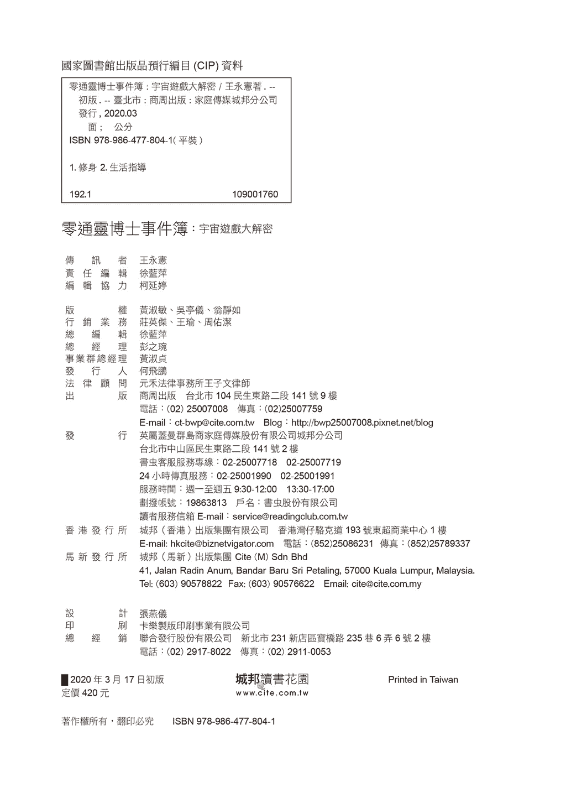