# 雷诺曼卡占卜圣经

# 【前言】

# 让雷诺曼卡，为你的人生排忧解惑

几世纪以来，占卜学一直是由神秘学家中的菁英阶层主导。由于生活中的疑难杂症需要解决，人类对于解答的渴望，促使他们踏入神秘又迷人的占卜世界。自地球上有人类开始，人们对于占卜的实践在时间推移之下，加上现代印刷与信息的便利性，占卜有如雨后春笋般蓬勃发展。如今，这奥秘之学变得唾手可取，所有对占卜感到好奇的普罗大众和有志之士都能探索占卜的奥妙。占卜的方式包罗万千，从占星术到生命灵数，再从抽签占卜法到《易经》。然而，纸牌占卜却是当代占卜学中的基石。

本书会探讨我与雷诺曼卡的生命之旅。雷诺曼是一套由三十六张牌组成的占卜工具，在十九世纪晚期的欧洲大陆，都会在街头上和沙龙聚会中看到有人使用雷诺曼。雷诺曼卡的历史渊远流长，也深刻影响了我的生命。我的家族在好几世代以来一直流传着解牌、占卜、以通灵为业和多种奥秘之术的家传之学，这样的纪录可以追溯至英国维多利亚时期。当时，神秘学只是一般的学门，也被归类于宗教神秘主义的范围。我的祖先在当时深入研究各式神秘学，并且因为能力卓越而名声响亮、广受尊敬。打从有记忆以来，我一直都能预测未来事件，看见没有人能看见的事物。在我们家族里，超自然是非常自然的事情。

本书是一本“入门指南”，当中分享我三十多年来使用的精准占卜工具和占卜系统。回忆过往，雷诺曼一直是我生命中很重要的占卜工具；回首往昔，我在地方乡里一直以占卜预言为业。生长在被内战摧残的国家真的不容易，特别是当人们叫我巫婆和疯子时，艰辛的感触又更深了。好笑的是，恰恰是这些辱骂我的人总在想要解决人生难题时找上门，而雷诺曼一直是我协助他们的主要牌卡。

我在《雷诺曼卡占卜圣经》中加入了实用的解读法、技巧和建议，帮助你探索雷诺曼的占卜系统，同时训练你的功力，使你在雷诺曼的复杂系统里见树又见林。我会按部就班带领你从传统牌义和解读法开始学习，并且将我三十年来所获得的领悟与练就的技巧赋予你。本书中除了每一张牌的牌义之外，你也会学到牌与牌之间如何串连、交流后组合出清楚明了的答案。当然，解牌时的准确度要透过重复练习、时间推移、熟能生巧和经验累积才能提升。

我撰写本书的目的是要借由真实案例来讲解雷诺曼。书中所有的案例都是我为个案占卜的真实事件，案例中也改了姓名以保护他们的隐私。

## 占卜与符号

无论你相信与否，我们天生就是预言家。从天气预测，乃至比赛结果，甚至电影结局，我们无时无刻都在预测未来。从纸牌第一次被印刷出来后，使用牌卡占卜的历史就渊远流长到现在。纸牌占卜源自于纸牌在当时是很新奇的物品，而用来占卜预测的原理则是解读符号。我们的生活周遭到处都是符号，你可以从任何小图案上辨识出某项产品、某个行为、某种感受、某位人物等等。透过符号来预见未来的行为可追溯至人类最久远的时期，溯古至今，人们会解读动物的内脏或沙土上的足迹，也会解读茶叶渣、凝视水面来预言，以及透过牌卡来占卜。人类天生就能解读图像与符号，看着图像或符号时，我们很难不去联想，因为图像和符号会触动潜意识中的想法和感受。符号出现在生活周遭，只要我们张开双眼去看见这些象征，就能开发直觉并训练解读符号的能力，同时运用符号的链接和共时性（synchronicities），影响并改变我们日常中所做的选择。

雷诺曼的每一个符号无论出自传统或经由后人延伸，都象征某些人事物：物品、人物、想法、功能。这些符号简单易懂，你无需具备高深的奥秘知识。雷诺曼卡是一座桥梁，帮助意识与潜意识沟通，也链接逻辑思维与掌管灵通能力的大脑部位。当我们看着牌面寻找答案，就在唤醒潜意识。每一次摆好牌阵后，牌义会根据问题而有所不同。

本书为读者解密雷诺曼卡的符号，让你学会雷诺曼的符号语言。我们的内在知识本自俱足，而《雷诺曼卡占卜圣经》会唤醒你内在的知识。

## 雷诺曼是什么？

房间里黑漆漆的，只有几盏烛光照明。厚重的天鹅绒窗帘遮住了窗户，客厅的门锁着。壁炉上的时钟滴答作响。两位女士面对面坐着，隔着一张桌子低声交谈。她们之间的桌上摆着一小叠刚洗好的三十六张牌。其中一位女士神情紧张，她才刚把那叠牌放回桌面。她仍感觉得到方才洗牌时，纸牌在手中刷过的触感。另一位女士将牌拿起，一张一张摊开。八张牌排成一列，总共四列，而最后有四张在牌阵最下方。“你确定这些牌会准吗？”坐在牌卡面前的女士问道。“当然！”另一位女士回答。

像这样的画面已有一百五十多年的历史，许多国家都有无数个像这样的占卜沙龙和占卜接待室。这一小叠纸牌就是占卜。尽管这叠纸牌被一般人当成闲暇时的简单娱乐，但在占卜师手中，纸牌上的图像却是深具意义。当时，这叠纸牌的名称取自一位知名的法国女预言家玛丽．安．阿德莱德．雷诺曼（Mlle. Marie Anne Adelaide Lenormand）。这叠纸牌迅速流行到整个欧洲大陆，让雷诺曼卡和塔罗一样，成为当代占卜的始祖。这叠纸牌流传到了现在，成为非常迷人又出色的占卜工具。

雷诺曼卡的占卜系统有一小部分来自十九世纪晚期的纸牌占卜方式。这也是为什么许多历史悠久的牌卡和某些新的牌卡都纳入扑克牌的花色或点数，你也看得到四个花色的皇后（queen）、国王（king）和侍者（jack）。雷诺曼卡使用到的点数只有六、七、八、九、十和王牌（ace）。这些点数来自古老的纸牌游戏：皮克牌（Piquet）。在欧洲的启蒙时代，沙龙聚会里随处可见有人在玩皮克牌。雷诺曼女士在她的自传中曾提及皮克牌是她使用的占卜工具之一。

雷诺曼卡的尺寸很小，通常是人们用来玩桥牌的纸牌大小。雷诺曼卡只有三十六张牌，每一张牌都有一个图案、图像或符号。解读雷诺曼时，每一个符号都需搭配旁边的牌才能加以修饰或得出完整的牌义。将两张牌和牌上的符号配对组合，可以得出一个句子或一则讯息，如同解读象形文字一样。每一个符号的意义有许多层面，只有根据问题脉络、周围的符号和占卜师的洞见，才能解读出合适的牌义。这些符号互相串连，揭晓我们生命中的真相、秘密和事件。

让我们看看这两张牌：鞭子和书籍。

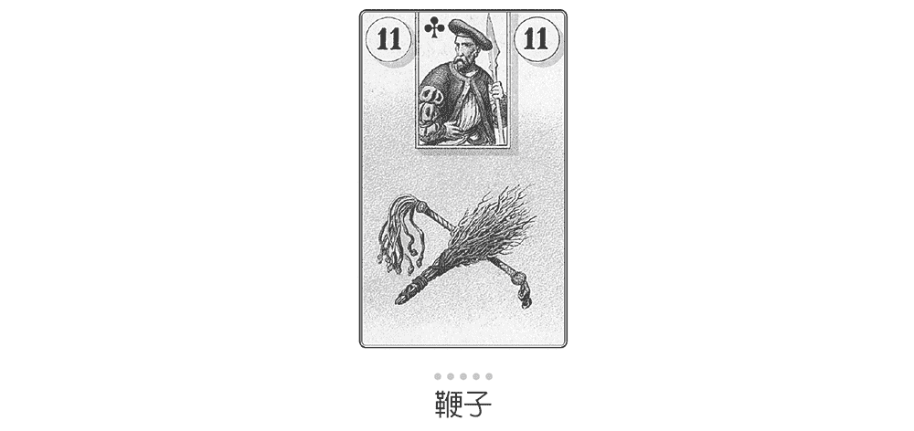

鞭子的牌面上有着鞭子和扫帚的图像，这两项物品的功用都是鞭策或惩罚。想了解更多鞭子的牌义，请参见本书第二章的鞭子牌（参见牌卡【11】鞭子）。

关键词：

．冲突

．口角纠纷、斗争、争执

．体能活动或运动

．性

．虐待与漤用

．慢性疾病

．重复的行为

．惩罚

．欲望

．上瘾

．奋斗

鞭子牌上的扑克牌符号是梅花侍者（Jack of Clubs），赋予这张牌男性、年轻的形象，可依此对应特定人物。这张牌的序号是十一，可以用来解读时间（十一天）、日期（十一日，例如六月十一日或是十一月），或是数量（十一元、十一张票）。

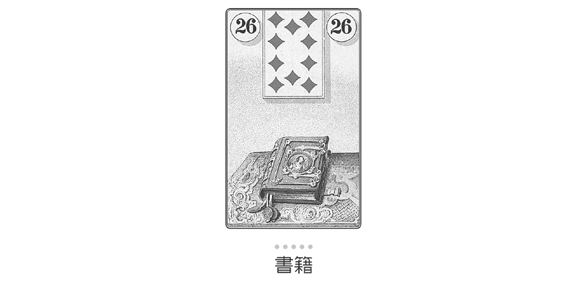

书籍的牌面上有著书的图像，常用来象征知识与教育。同样的，你也可以在本书第二章细探这张牌的牌义（参见牌卡【26】书籍）。

关键词：

．计划

．学科

．研究

．知识

．秘密

．隐藏或未知的细节

．教育

．信息

．调查

．奥秘之学

这张牌的序号是二十六，可以指时间（二十六天）、日期（二十六日，例如云〔六〕＋书籍〔二十六〕等于六月二十六日），或是数量（如二十六元、二十六则邀请）。

现在，将这两张牌配对：

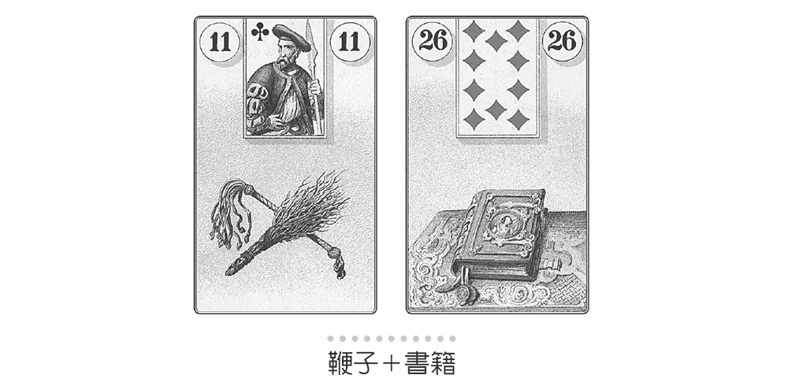

正式解牌时，协助你解出正确牌义的关键要素就是“脉络”。谨记这点，这两张牌可能有的解读包含以下意思：

．健身手册或物理治疗学科

．秘密争执

．私下虐待

．性教育、重复试验，或是印度的《欲经》（Kama Sutra）

．白纸黑字记录下来的辩论或冲突

．口角纠纷中的未知因素

．不为人知的成瘾

．慢性疾病研究

．奋力研究

每一张牌就像一组词汇，而将这些牌与其他牌串连起来，就会组成一句话。再加上其他的牌，这句话便会成为一段故事。配对的组合有无数种。

没有牌吗？没关系！把抽屉里那叠放了很久的扑克牌拿出来作为第一套牌，你就可以立刻开始学习。将点数二到点数五的牌挑掉，在剩下的牌里找到对应雷诺曼的牌，然后在对应的每一张牌上面写下雷诺曼的序号和名称（参考本书中的雷诺曼图片，扑克牌的花色点数都在每一张的牌面上）。雷诺曼的实用性在于：你无需准备专属牌布、净化熏香杖或其他物品。把它放进包包或口袋随身带着走，随时随地需要占卜时你都可以拿出来使用。例如我的朋友萝丝当时人在餐厅临时要占卜，可是手边没有牌，于是她就把餐巾纸撕成三十六片，在每一片写上牌名，直接在餐桌上进行占卜。无论是占卜新手还是专业高手，雷诺曼卡都非常简单易懂。你只要链接牌面的符号，就会得到解答。

雷诺曼卡的架构就是简单明了。许多其他的占卜系统处理的是较为灵性的问题，但雷诺曼卡让你着眼于日常生活。因此，你会发现解牌时的答案很贴近世俗和物质层面。如果你想要探索灵性道路，雷诺曼不会是首选，因为它会告诉你生活中实际发生的人事物。但这并不是说雷诺曼不适合回答灵性问题；反之，雷诺曼在回答灵性问题时也跟其他工具一样好用。

最传统的雷诺曼牌阵是大蓝图牌阵（Grand Tableau），使用全部三十六张牌，摆好牌阵后，大蓝图会全盘揭露当事人的状况。这是最古老和知名的牌阵，一百五十年来被许多传统占卜师使用。即便放眼现今，大蓝图依旧是最棒的牌阵之一。我们会在第三章详细探讨大蓝图。

记住：你可以根据自己的喜好，让解读很简洁或很复杂。如果想快速得到解答，把四张牌排成一列，如同一套数学公式，你就可以得到问题的结果。如果想要了解更细节或复杂的状况，较大的牌阵能提供更详细的答案。

以下的范例能让你初步了解雷诺曼的解读有多简单。

问题：杰德是房地产仲介，对于他房源中的一间房屋焦心不已，因此找我占卜。“那间在湖边的房子会有什么样的结果？”

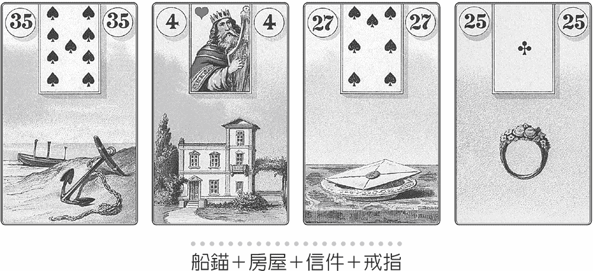

答案：杰德会成交这个案子，房子最后会售出。牌阵中出现房屋这张牌就是牌卡的特殊方式，验证这次的占卜跟房子有关。而船锚的出现暗示着水，就是指湖边的房子。最后两张牌是信件和戒指，呈现出肯定的答案：合约或已签署的文件。在雷诺曼的系统里，牌卡的位置非常重要。牌阵是线性的时间观，右边最后一张牌是最终结局。如果船锚出现在最后一张，而没有出现戒指的话，解读就会变成：房子还要一段时间才会成交售出。

我们来看看另一个范例。

问题：珍已经跟詹恩约会一个月了，她想知道对方是怎么想的？“詹恩想要跟珍创建长期伴侣关系吗？”

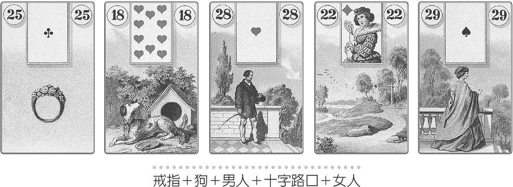

解答：不。他已经有伴侣了，他只想要不同的新鲜感。

男人出现在中间，代表问题与詹恩有关。戒指和狗在他的左边，表示他早已有伴侣。他的右边出现十字路口和女人，表示他欺骗了珍。（在感情关系的问题里，十字路口是象征双数的牌之一，意味着脚踏两条船或欺骗。）

只要你跟着《雷诺曼卡占卜圣经》练习，就会学到如何做出以上的占卜解读。雷诺曼系统的清楚程度不会让你有疑惑的空间，因为你会立刻得到可验证的结果。

只要你练习得够久并累积经验，任何占卜工具都会精准、好用。我相信雷诺曼是适合用来预测的绝佳工具。花时间学习并且练习，是让你的占卜解读清楚、准确的最佳途径。

对我来说，解读小牌阵如同解读一串词汇，组成开门见山的答案。使用大蓝图时，就如同打开一本故事书，故事里充满许多行为、剧情，并且跌宕起伏。雷诺曼是如此直白，有时候一张牌就足以肯定地呈现答案的是与否了！

## 学会雷诺曼占卜的好处

解读牌卡的好处多多，以下是我得到的好处：

一、使用牌卡并勤奋练习会锻鍊直觉，你会注意到生活中的符号与征兆，并且更加注意你的第一直觉。这会大大提升你的能力并强化你的直觉天线。

二、每次使用牌卡帮助他人解决问题或指引需要的人时，会提升你的自信和自尊。能够有效帮助他人并且给予建议，会让你感到喜悦、有成就感，也会提升你的自我价值——这是无价的礼物。

三、雷诺曼帮助你了解未来，让你可以超前部署应付任何情况。了解情况后，你就能选择扭转你在牌面上看见的未来。我在帮个案解读时，都会给予建议，协助他们扭转不乐观的结果。有时，人生路径可以重新选择；有时，未来似乎早已注定。经过多年的实战经验，我发现占卜给予我们机会去选择另一条路，或是提供方法去处理注定会发生的事。

四、当你倍感压力、焦虑不安或需要解答时，牌卡能迅速给你指引和建议。你的高我也会透过牌卡协助你规划、建议你可行的方法。雷诺曼牌阵协助你从不同视角看待事件，提供建议来解决问题、回首过往、洞悉当下。

占卜解读能抚慰恐惧、点亮希望，偶尔也能满足好奇心。雷诺曼卡的精准解读是因为这套牌卡流传久远且使用广泛。简言之：雷诺曼很准！

## 本书架构

### 第一章：宏观雷诺曼

《雷诺曼卡占卜圣经》先带你初步了解雷诺曼牌卡，练好扎实功底帮助你继续精通这项占卜系统。此章包含：

．初步指导你选择一套主要的雷诺曼牌卡，用于书中后续的练习和作业。

．探讨问题问法，了解如何重新架构问题，帮助你的解读变得更好、更实际且更精准。

．在新手阶段，选择一套雷诺曼系统并保持一致的优点介绍。

．指引你撰写练习纪录、占卜日记，因为这是牌卡占卜的基础步骤。

．了解主题牌（focus card）和指示牌（significator）的基本特性，让你在牌阵中得到特定答案。

．分享我在战争肆虐的国家与雷诺曼初遇的人生故事。

### 第二章：微观三十六张雷诺曼牌义

在此章，我们会细探雷诺曼，并分析每张牌。我会先大概介绍雷诺曼系统和起源，接着从许多层面和背景脉络探讨每张牌的不同意思。你会学到：

．每张牌的细节与画面描述。

．每张牌对应常见主题的牌义，包含：预测、事业、爱情、健康、金钱、时间、建议、寻找的特定物品／地点。

．每张牌呼应到我的个人故事。

．每张牌在大蓝图的解读方式。

．每张牌的属性：正面、负面、中性。

．每张牌的分类：行动牌、情绪牌、时间牌、描述牌（所有的牌在某些情况下都会对应到以上分类，但这些分类会是各张牌最常见的涵义）。

没有绝对正面或绝对负面的符号。牌义会相对随着周围的牌和个人情况而有所变化。负面的牌可以用正面的角度来解读，反之亦然。

你会发现有些牌没有对应到时间，因为时间点会改变，而且也不是每张牌都有时间上的定义。再者，每位占卜师都会从实际经验中创建自己的时间断定法。我会在本书中说明在各种情况下我觉得好用的系统。

### 第三章：解读法与牌阵

你会学到如何利用简单的解读法和练习，将牌卡的符号搭配后解读牌卡的组合意思。我们会从小牌阵开始练习，并进阶至有更多复杂细节的牌阵，最后学习大蓝图牌阵。

注意：在本书中，我会交替使用“个案”和“问卜者”这两个词汇。

本书附录一，我们会按照历史事件排序，检视雷诺曼女士的一生。在附录二中，我介绍了启动每张牌为指示牌或主题牌的方法。为了让读者快速查阅，我也收录了牌义关键词（参见附录三），正面牌、负面牌、中性牌列表（参见附录四），宫位与特征表（参见附录五），宫廷牌介绍（参见附录六），以及结合雷诺曼与塔罗的方法（参见附录七）。最后，本书的词汇表会解释你们不熟悉的词汇和概念。

我撰写《雷诺曼卡占卜圣经》的目的是要让你全面了解雷诺曼的所有面向、特性和细节。本书会帮助你练习占卜日常生活中浮现的各式问题，并训练出适合你的占卜方法。我的指引会协助你看清楚在美丽又清晰的雷诺曼图案中隐藏的奥秘。当我得知人们抽牌占卜或用任何占卜工具使自己和他人受益，总是让我极度喜悦和满足。信任自己也信任雷诺曼，对于预测和占卜要有自信。我希望你在使用雷诺曼并探索它的各种细节时，会享受其中。

人生如牌，你要做的就是面对它。放轻松，让解牌简单明了。最重要的是：好好享受！

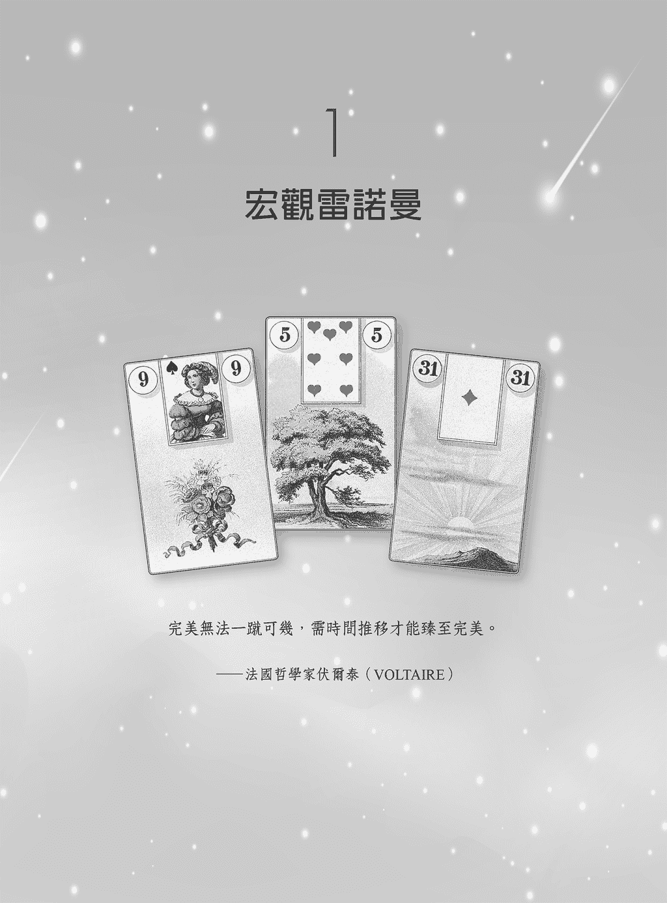

# 进入雷诺曼的世界

## 挑选雷诺曼卡

对初学者而言，关键的第一步就是选对牌。目前世界各地的出版社都出版了许多雷诺曼卡。开始学习雷诺曼时，我建议你挑一副简单的版本，牌面上的符号和画风简洁明了。简单直白的牌面有助于你学习大蓝图牌阵，因为牌面会让你在解牌时较为专注。解牌时，牌面的符号应该要清楚明了。如果符号太复杂又有其他图形装饰的话，你会眼花撩乱。挑选简单、基本的雷诺曼，能够让初学者在占卜时毫不费力地给予简单、直白的解读。

待累积了足够的实战经验和练习次数后，任何版本的雷诺曼卡都适合你使用，因为你的大脑已经创建了雷诺曼的符号系统，就可以让直觉和双眼自由引导你解读牌面上的任何讯息。市面上有许多简洁的雷诺曼卡画风精美又不会过于朴素。你应该要跟你的牌创建良好关系，并且看着牌面时会喜欢你的牌，因为在学习的过程中，喜欢与否是重要关键。

## 踏出重要的第一步

为了在占卜时得到精准答案，最重要的是要保持思路清晰并设定具体问题。洗牌的过程对我而言宛如一场仪式，协助我屏除杂念进入状况，专注于问题本身。接着我会以某种方式设定问题，好让我针对目前状况得到具体解答。下一步，我会决定抽牌的方式是要直接抽还是以扇形展开来抽牌，同时也决定要抽几张牌和使用哪种牌阵。接着我会聆听第一直觉，也就是当我看见牌面上的符号时，脑海中浮现的第一个声音，因为第一直觉十之八九都会帮助我做出精准的解读。

信任你自己，因为怀疑是你的头号敌人。别怕出错，因为出错不过是你为了专精而承担的必要风险罢了。牌卡本身无法给你答案，真正进行解读的是你的直觉和洞见。牌卡只是工具而已。

熟能生巧。你练习雷诺曼越多次，解牌时便会越轻松自在，占卜也会更加精准。洗牌和设定问题时，不管怎样一定要先清除脑中杂念。深呼吸，想像自己在安全、放松、稳定的状态里。

## 答案要紧扣问题

解牌时，一定要清楚记得问题为何，并只解答个案所问的问题。切勿答非所问。举例来说，假设你帮当事人占卜恋情，就不要谈到他的财务或他的母亲，除非财务或母亲与他的恋情有关。你必须以实际和具体的话语，专心解答与问题相关的人、事、时、地、物、原因、方法。这才是让你给出精准解答的唯一途径，也才不会让你解得不着边际又无法直指核心。保持简单就好。你无需为求精准而让答案太过复杂。

一定要在脑海中设定合适的问题，这是占卜时最重要的阶段，比占卜本身更加重要。问题越适当，解答便越精准。设定问题时，要有清楚的目的和脉络，才能获得有用的洞见。牌卡只能回答你所询问的特定问题。如果你觉得抽出来的牌面不合理，那么你的主题或问题可能不够明确。这样的话，重新思考问题后再占卜一次。

你设定的问题要能够产出具体的答案，而且也是你解得出来的答案。

问题范例：

．艾美对我有好感吗？她对我的想法是什么？

．我的考试结果会如何？

．我们的狗对于新来的小狗会有什么样的反应？

．处理这个状况的最佳办法是什么？

．我们近期的财务状况会如何？

．艾力克斯对我的意图是什么？

．我需要担心我的工作吗？

．我会得到这份工作吗？

．谭雅会签下这份合约吗？

．罗伯特会如何回应这则新闻？

．我的旅途会发生什么事情？

．杰森的关系稳定吗？

．我近期有红鸾星动的机会吗？

设定好最直接、具体的问题，才能协助你得到最清楚、精确的解答，因为雷诺曼是预测型的占卜工具。简单、明确的问题，就是有效的问题；问题模煳不清，答案也会模煳不清。非常具体的设定问题后，你会发现雷诺曼的解答极为直接了当。

另一方面，如果没有设定问题，只是单纯占卜概况时，就从牌面里找到主题牌，判断遇到的问题。若是要进行没有特定问题的每日占卜，主要规则就是让解读的内容保持简单、实际且合理。

涉及到时间的问题，像是“何时……”这类的问题会有一点点棘手。我发现最好的方法是用季节作为时间范围。试着把时间加进问题结构中，像是：“尚恩会在夏天前签署这份合约吗？”或是：“这件事情在冬天时会如何发展？”时间的概念难以描述，而我们是透过行动来影响时间范围。牌卡的时间观跟世俗的时间不一样；从某种意义上来说，占卜的时候是接通智慧，但是这个智慧并非依循线性时间观和人类的时间观。牌卡让我们看见事件的先后顺序，只要了解问题脉络，就可以协助我们预测时间。

我必须再度强调这些首要步骤非常重要：呼吸，沉淀心神，洗牌，思考明确的问题，接着抽牌占卜。

## 牌义系统要一致

初学雷诺曼时，“一致性”是你必须谨记的口号。先从一套牌义系统开始学习，且不要更换，让这套系统成为你解牌时的基础。这个方法会提升你的准确度。举例来说，决定哪一张牌与性行为有关，哪一张牌与工作有关，确保这些牌义符合该张牌的符号象征。若你无法保持一致还混淆不同系统的牌义，你会扰乱潜意识，导致准确度降低；而你每次都会对于要采用哪一种牌义感到疑惑，进而信心受挫。对我来说，我自己是将“鞭子”当成性行为的代表牌，“狐狸”则象征工作。最后，你会以传统的牌义为基底，从你成功的实战经验中发展出自己的牌义。你必须要体会每一张牌，才能了解它们对你而言代表什么意思。

从雷诺曼卡最近兴起的潮流中，我发现牌义系统会因为来自不同国家而有些微差异。雷诺曼的学派百家争鸣，这些学派在文化脉络和解读方式上有许多思辨，造成无数人困惑不已。然而，它们之间的差异并不大，只有少数几张牌的牌义稍微不同而已。我自己倾向采用法国／比利时／荷兰的牌义系统。每一种系统都有各自的价值和优势，但你必须让你的牌义系统维持一致。你之后可以延伸每张牌的牌义，但是为了练就扎实的解牌功底，就得先选择一组牌义系统并依照这个系统来解牌。如此一来，你会在脑海中将这些牌义跟每张牌链接起来。你的直觉会在雷诺曼的符号结构中开发出来，占卜准确度也会渐入佳境。每一张牌都要有明确属性才能准确预测结果，因此，维持牌义的一致性是学习解读雷诺曼的关键因素和非常重要的一步。所以，我必须再度强调：解牌的基本条件就是一致性！

## 撰写占卜日记

撰写占卜日记可以加深你与牌卡的链接，并且留下完美的纪录让你可以复习。一开始，最简单的方法是每日抽两张牌，并记录在日记里。每日晨起时抽两张牌，写下你认为这两张牌代表什么意思。一天结束时，记录一下这些符号呼应到当天发生的哪些事件。由于每一张牌都只有一个符号，所以，你需要抽两张或两张以上的牌才能解读出有用的占测结果。简单的每日占卜能够帮助你记录准确度和回馈。

随着时间累积，你会建构出专属于你的牌义组合资料库，而这些牌义都会同步内化到你的脑海与直觉里。当你觉得两张牌的练习差不多熟练了，改成每天抽三张牌，以此类推。你也可以把每次的占卜都写在日记里，记录每一次的占测结果，如此你就能知道自己的预测是否准确。即便你只有抽一张牌回答一个问题或解答一个状况，也要记录你的问题和抽到的牌。撰写占卜日记会提升你的准确度，并且拉近你与牌卡之间的亲密度。

## 勤加练习

学习的过程中，最重要的步骤就是练习、练习、再练习。据说要精通任何事情，需要一万次的反复练习。你越是频繁占卜和验证结果，你的解牌技术就会越专精。拿自己当练习，预测电视节目上谁是赢家，或是预测悬疑节目中谁是凶手，占卜新闻事件，预测选举，预测奥斯卡奖得主，甚至是占卜天气变化。预测、预测、预测。你占卜的次数和练习越多，进步的速度就会更快。就像运动健身一样，你越常运动，身体就会越柔软，肌肉就会越发达。你越是频繁练习，准确度和解牌速度也会与雷诺曼、直觉力、通灵能力一起进步。此外，别忘了要记录你的预测结果，让你保持精进并记录学习历程。

## 启动指示牌或主题牌

指示牌或主题牌会特地先从牌卡中挑出来，用来代表问题中的情况、困扰或是人物。雷诺曼的系统里，女人牌和男人牌都代表你的个案或是问卜者，除非这两张牌是特定挑出来代表某位特定对象。当你抽出某张牌代表占卜主题或问题后，借由与主题相关之事来启动这张牌。“启动”指的是设定意图，透过目前的问题赋予牌面上的符号生命力，将问卜者的状况对应到牌面上亘古不变的象征。男人／女人作为个案的指示牌时也是一样：如果个案是女性，女人牌就对应到她自己；如果个案是男性，你可能要将女人牌对应为他的妻子、姊妹或是女老板，视问题而定。

透过启动特定的牌来对应特定人物、主题或问题，你会赋予这张牌一个角色，仿佛它是舞台上的演员，在这次的占卜解读中演出。举例来说，蛇在某一个解读里可能是指遗失的手链，但是在其他情况中指的是表里不一的朋友。船这张牌可以代表我接下来的旅程，而书籍则可以代表刚完成的一项专案。洗牌时，想像与目前问题相关的牌叠在你的问题上方，持续洗牌，直到问题的主题跟主题牌合而为一。举例来说，假设你要占卜旅途状况，你可以启动船这张牌，洗牌后接着在牌堆里找到船，并综合船左边的那张牌和右边的那张牌一起解读；如果你想要占卜你正在进行的计划，就启动书籍。你越是带着觉知去启动牌卡，解牌时就会有更多具体细节浮现出来。

你也可以用其他的方法占卜。你可以设定完问题后，直接抽牌，不用事先启动主题牌或指示牌。然而，我建议你采用这两种方法持续一阵子，并比较两种方法得出的牌面。

在某些占卜情况中，只要聚焦于问题的主题就够了，因为牌卡会自己呈现跟主题有关的牌。这个方法特别适合牌数为奇数的牌阵，因为中间那张牌就会是你要注意的重要核心。举例来说，如果你聚焦的问题与接下来的旅途有关，而牌阵中间刚好出现熊这张牌，那么，牌面建议你要注意开销，小心你放钱包的地方，或是要注意饮食，因为熊象征金钱与饮食。基本上，抽出来的牌会与占卜的主题相关，周围的牌面则会呈现答案的细节。

我喜欢先不选主题牌或指示牌，并随机抽牌；我喜欢这样得到清楚的洞见。无需个案事前告知，抽出来的牌十之八九都会呈现主要问题。占卜出差行程时，在未事先启动主题牌的情况下，船这张牌自己出现了，这就是牌卡验证问题的方式。占卜解读和现实情况会同步发生。

在我的经验中，我发现这两种方法都很有效。这两种方法我都用：让牌卡自行引导占卜的结果，有时候则会选择主题牌并搭配周围的牌来解读。

## 我与雷诺曼的故事

在告诉你们我使用雷诺曼卡的方式前，我想要先分享我最初与雷诺曼的相遇。我的人生经验以及牌卡出现在我生命中的过程，形塑了我这个人，也教会了我如何发挥牌卡的所有潜能。

我出生于黎巴嫩的首都贝鲁特，贝鲁特在当时享有“中东的巴黎”的名声。我的家族中，母亲这一脉的亲戚都有着通灵和敏感体质的血统。多年以后，我发现我母亲的两位祖父都是非常知名的神秘学家和通灵人。母亲的外祖父是位彻头彻尾的灵媒和通灵传讯者，祖父则是位精通一切神秘学的药师，同时也拥有治疗者、灵媒、通灵传讯者、预言家、宗教神秘主义者、炼金术师等身分。当地人对他敬重有加，也会向他寻求协助，同时，这些人也畏惧他。家族中也有其他亲戚以神秘学和疗愈力闻名。我很快就了解到我踏上了祖先们走过的道路。这是我的天赋。然而，我还小的时候根本不知道要怎么使用、控制或拥抱这项天赋。

在贝鲁特成长的过程中，我见证内战的爆发，忍受内战长达十二年。战争过程中，有人惨遭杀害或被绑架是寻常之事。当家里受到战争影响而发生悲剧后，我们举家逃离这个国家。那是个艰难的时刻：我的父亲想要去法国，而我的母亲想要逃到美国。经过多番的深思熟虑，我们家做了决定：移民到美国。

我与雷诺曼的相遇始于贝鲁特，当时我大约十岁。查尔斯叔叔是我父母的挚友和邻居。贝鲁特是查尔斯的家乡，但他也有法国国籍，这在当时是寻常事。他总是会来喝杯咖啡、占卜和聊天。他来自黎巴嫩的犹太人家庭，家族在贝鲁特历史悠久。

我跟查尔斯叔叔有许多愉快的回忆，而他在我的雷诺曼生涯里有着至关重要的地位。查尔斯叔叔也是通灵人，并且是“玫瑰十字会”（Ordre de la Rose-Croix）教团中的杰出先知。他曾为了参加通灵会议，去到法国某些山上。在我本该就寝时，我会坐在走廊，偷听他跟我父母讲述有人可以用念力移动物品，而其他人能够用念力让植物生长。他也解释道如何远距遥视住在法国的朋友，反之亦然。

查尔斯叔叔并不想离开贝鲁特或他的家。他对贝鲁特的爱如此强烈，让他在内战期间的前四年依旧待在家乡。直到有一天晚上，夜深时分，我们家有人在叩门，打开门后看见查尔斯叔叔带着行李箱。他收到了来自民兵的内幕消息，表示他的生命会有严重危险。贝鲁特当时的情况很惨重，到处都是爆炸与枪声，政局动荡不安，机场也暂时关闭。查尔斯叔叔必须藏匿在我们家一阵子，而那段时期，家中总是充满着奥秘知识与占卜解读。当机场开放的时候，我父母将查尔斯叔叔藏在车里，趁着夜黑风高开车到机场，他要搭第一班飞机离开贝鲁特。离开前，他给了我母亲一套牌卡，要她在时机到了的时候转交给我。那是我的第一套雷诺曼卡，也是好长一段时间里唯一的一套。那是我最后一次看见查尔斯叔叔。自从他离开黎巴嫩，我们就很难联系到他了，最后我们彻底失联。我希望他知道当初那个有着一小叠三十六张牌的小女孩，长大后成了现在的我。

后续那两年，我每天看着母亲使用那套牌卡。接着，我开始四处为亲友进行简单的占卜。最后，原本少少的人数持续增加，最后连邻居和邻居的朋友也来找我了。他们都会带着巧克力、甜点和手工蛋糕来访。我还记得有一位邻居来的时候，带了一盘手工枣泥饼，这是黎巴嫩的甜点，内馅是胡桃和枣子。她的占卜结果有点不乐观，但我依旧提醒她。隔天早上六点，我快来不及搭上校车了，恰好又碰上停电，所以我必须沿着五层楼梯往下跑。当我跑到二楼时，她从四楼打开家门，大声朝我喊道：“芮娜！你还记得昨晚帮我占卜的结果吗？我跌进浴缸，扭到了脚踝！”我当下唯一想到的回应只有：“抱歉！”那是我第一次“希望自己没有预测出来这个结果”的时候。

我没有度过一段典型的青春年华。那几年的人生很沉重。我的朋友和家人遭受虐待、枪击，其他人被绑架，而我虽活着，却只能一直预测这些危险。决定逃离黎巴嫩之前，让我们无法再忍受痛苦与折磨的最后一根稻草，是我的祖母和两位年轻姑姑都命丧黄泉。这并不是一般的死亡。反之，她们的死是最可怕、骇人听闻的谋杀，没有人能够承受。这些事情终结了我们在黎巴嫩的日子。

这些事情发生的过程中，我的母亲是我的定心丸、我的防火墙、我的守护者、我的英雄；她坚强挺立于众人面前，捍卫女儿的心智在内战中健全发展。逃到美国时，我再三确定我要带五件最珍惜的物品：雷诺曼卡、北极熊娃娃、唯一的芭比娃娃（穿着米白色的蕾丝婚纱）、日记和化妆盒。

搬到美国不是件易事，试着生存其中并融入当地也同样困难。那时，我即将满十八岁。以前只有要人请我占卜，我就会为他们解读。我不只会用雷诺曼卡来占卜，我也会看手相。有一天，我跟好闺蜜蒂纳，和各自的对象一起约会，我在初次约会的对象手上看到了危险的事件。我对他一点都不了解，我也不知道该说什么。我要告诉他吗？还是我该放在心里不说呢？蒂纳建议我告诉这位男士，我照做后，他只是戏谑地看着我。隔天，他在小巷子里被人捅了一刀。我和蒂纳去医院探病，才刚走进他的病房，他就指着我并声嘶力竭大吼：“把那该死的女巫赶出去！”我吓到了，感到惶恐不安、窘迫尴尬、难以呼吸。我回家后为此事哭了一个星期。这桩事件结束后，我才了解到如果要融入美国，我必须非常谨慎并且尽量不要做解读。因此我不再帮人做占卜解读，只有非常亲近的亲友除外。

从大学时代到结婚后的无数个春夏秋冬，我唯一的雷诺曼卡一直陪伴着我。历经数年的使用，牌卡在我手中解体。我失去了最爱的牌卡，而我还不知道要去哪里买一套新的牌卡，也不知道能不能买到。二〇〇九年，我决定上网搜寻“雷诺曼”。想像一下，当我发现还真的可以买到新的牌卡时，我有多讶异。我找到大量的信息，也发现有一大群人跟我一样热爱占卜。刹那间找到热爱占卜的团体仿佛是奇迹，是上天引领我遇见这群美好的塔罗团体。透过这个团体，许多优秀的占卜师教会我塔罗和其他占卜工具，而我也分享雷诺曼的知识作为回报。

过去三十年来，这叠小小的雷诺曼卡改变了我生命中的一切，这些牌卡陪伴我度过生命的黑暗，也总是为我提灯照路。雷诺曼卡和我扶持彼此成长。从青春期到成为妻子、人母，雷诺曼卡形塑了我的生命。我也教了我三个儿子雷诺曼占卜，他们也解得很好。他们仅仅用一叠牌卡就解决了在学校遇到的问题。解牌赋予人们力量，这是一项带来转变的工具。

下列的图片是我一直使用的雷诺曼卡。这套卡到我手上后，就一直是我二十七年来唯一使用的牌卡。做了点研究后，我发现这个版本源于一九〇〇年初期。这套雷诺曼卡的画风简单明了，也是经典之作：唐道夫（Dondorf）设计的红色调版本。

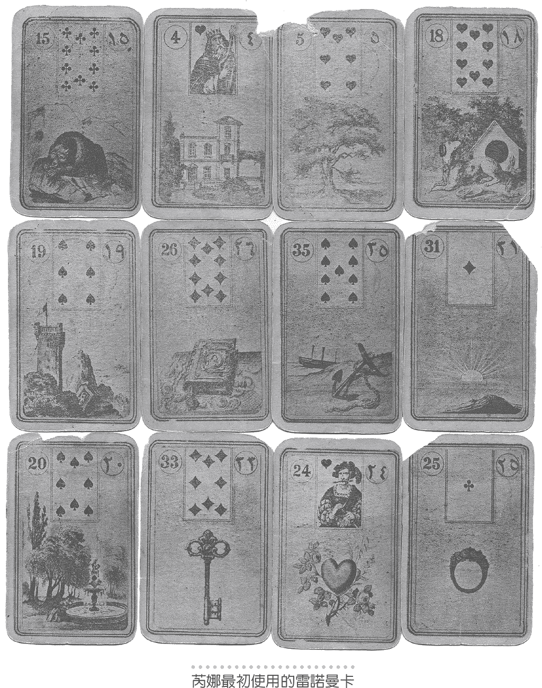

这套牌卡如同我的一部分，所以我极度珍惜。多年来的频繁使用让我手中的牌越来越脆弱，终究还是解体了。我把它们收在特别的盒子里，避免人为触碰。想起我年幼的小小双手拿到这一副简单、手掌大的牌卡后，它便深刻影响了我一生，实在倍感惊奇。它是我的伙伴、我的慰藉、我的导师，而它也塑造了今日的我。

我自己的雷诺曼卡改变了我的生命，而我希望《雷诺曼卡占卜圣经》也能够改变你的生命。

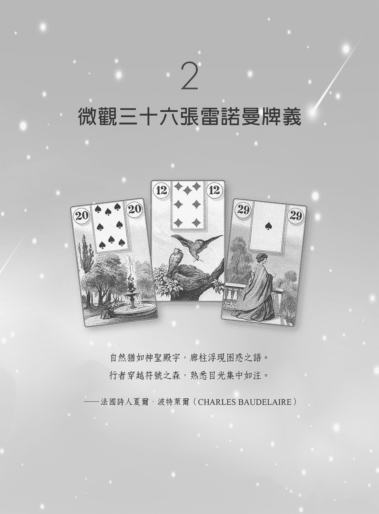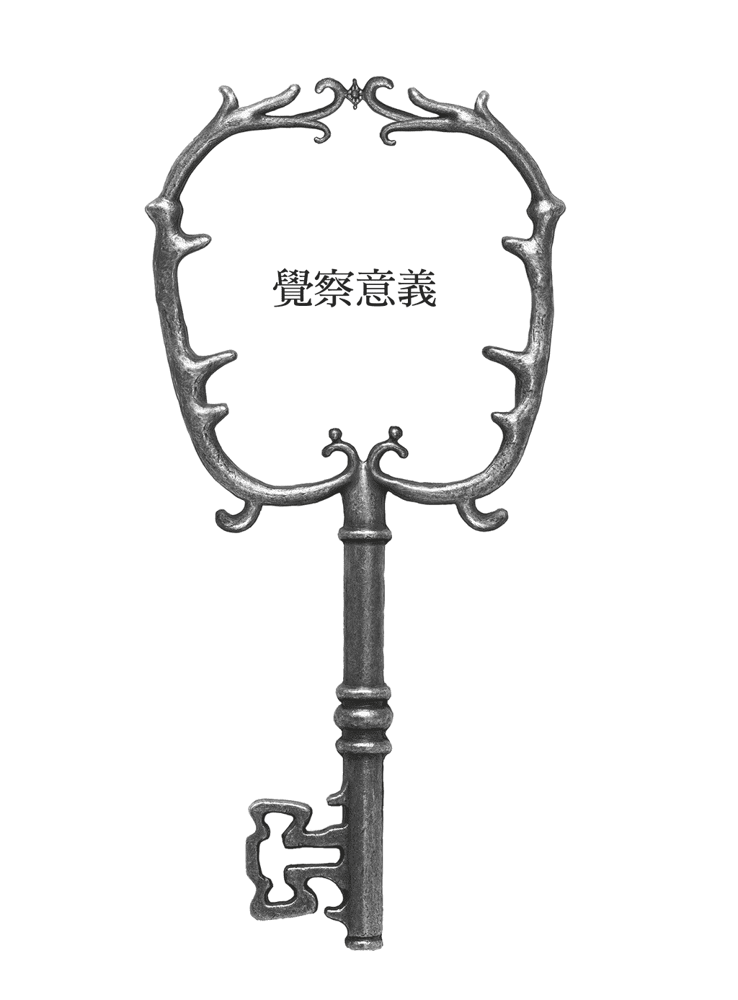

在这一章，我们会细细爬梳每一张雷诺曼卡的牌义，浅谈、细述并讲解主要牌义。接着，我们会探讨每张牌在不同的脉络和主题中如何诠释。

每一张雷诺曼的牌都只有单一符号，每一张牌就像是雷诺曼语言里的一个字词。如同所有语言，单一字词会有诸多意义与言外之意。有意义的解读有赖于字词使用时的背景脉络。以英文里的“平衡”（balance）为例，这个字可以表示测量用的秤、维持稳定的行为、让事物彼此对等的过程，或是金融帐务的余额。再看看另一个例子，夏威夷有一个字是“阿啰哈”（aloha），是用来打招呼、道别、表达善意和其他爱慕之情的用语。

雷诺曼卡也是同样道理。为了协助你更加了解，我将每张牌对应到不同脉络主题。当然，这份牌义清单不是最完整的，我仍定期增加新的牌义和多变的属性进去。当你了解牌卡的语言之后，你肯定也会这么做。

每一张牌对应的主题脉络包含：

★未来：预测时的牌义解析。范例：“明天会发生什么事呢？”花束＋骑士＝喜悦的消息或好的回馈。在这一章中，你也会了解每张牌的分类，包含行动牌、情绪牌、时间牌或是描述牌（参见“牌卡分类帽”）。所有的牌在某些情况下都会对应到以上分类，但这些分类会是各张牌最常见的涵义。

★女人或男人：描述人物特质、生理特征、行为举止、人物个性。范例：“她的外表如何？”鹳鸟＝高、苗条、腿长、优雅。“他是什么样的个性？”鹳鸟＝不可靠，因为他总是“吃碗内，看碗外”。

★工作：就业相关主题、职业状况或是工作相关问题。范例：“他的职业是什么？”狐狸＋书籍＝侦探。“我的评鉴结果如何？”鹳鸟＝升迁或是有更好的改变。

★爱情：关系问题中的情感或恋爱牌义。范例：“我们关系的未来发展是什么？”戒指＝相互承诺的关系；有可能求婚。

★健康、身体、灵性：任何健康状况，如身体、心智、灵性。范例：“我健康上的问题，最好的解方是什么？”镰刀＝外科手术或需要开刀的医疗行为。“我新创建的运动习惯会为我带来什么样的效果？”棺材＝会让我筋疲力尽，可能会瘫在床上。（警语：当个案前来询问健康问题时，务必请他们去谘询专业医疗人员。）

★金钱：解读财务问题。范例：“我会被加薪吗？”熊＝你即将得到一大笔钱。同样的，谈到严肃的财务困扰时，记得要请个案去谘询专业人士。

★时间或时机点：使用雷诺曼卡判断时间的牌义系统。问题涉及时间时，只解读牌卡上的数字，而非符号。范例：“指派的任务什么时候会下来？”狐狸＋花束＝九月十四日，或是九天之内和两周之内。要记得，时间的概念难以描述，而我们是透过行动来影响时间范围。牌卡的时间观跟世俗的时间不一样；从某种意义上来说，占卜的时候是接通智慧，但是这个智慧并非依循线性时间观和人类的时间观。时间可以改变，而且不是每张牌都有时间上的定义。你最后会从不断实际练习中创建自己的时间断定法。

★建议或行动：若个案并非询问预测或说明状况的解读，而是寻求指引，你可以使用的励志或鼓励的牌义。范例：“现况中，我可以采取的最佳行动是什么？”山＝站稳脚跟、不要动摇。

★属性：此分类会告诉你这张牌通常是正面、负面或是中性牌，以及该张牌对周遭牌面的影响。此外，简单的问题中，正面牌的答案是“是”，而负面牌的答案就会是“不”。范例：“我的车这个周末会修好吗？”十字架＝不会；钥匙＝会。没有绝对正面或绝对负面的牌卡。牌的影响会随着周围的符号、背景脉络、问题而变化。负面的牌可以用正面的角度来解读，反之亦然。范例：“我的头痛会消失吗？”十字架＋棺材＝会，最后就不痛了。十字架＋鱼＝不会，头痛还会持续一阵子，或头痛的范围会扩散。

★物品与区域：借由特定物品和位置的指示牌来占卜，我列出了每张牌能够代表的物品和位置。范例：“我的钥匙在哪里？”棺材＝在盒子里、在暗处或是在抽屉里。“男友会送我什么礼物来庆祝交往周年纪念日？”蛇＝链子类型的礼物或手镯。

★个人故事：雷诺曼的占卜若要练得炉火纯青，就必须与个人经验链接，因此，我在本书中收录了我个人的故事，分享我生命中的那些实际经验，这些经验交织成了我的占卜系统。这一则则故事在我的脑海里留下永恒的足迹，其中也包含了我个人占卜日记的小故事。撰写本书期间，每到写一张牌的时候，就会发生许多对应到那张牌的共时性事件。开始占卜后，你会根据经验而创建自己的牌义资料库，让你的占卜解读画龙点睛。

★大蓝图牌义：在大蓝图的段落中，我会解释每一张牌，以及我从小学习到的传统意义，包括经过我多年占卜经验后牌义的发展。你会发现，有时候传统牌义有很多层面，有时候牌义很直接了当。雷诺曼牌义系统的发展从未停滞过。

★占卜范例：解说完一张牌之后，我也囊括了一些实际占卜的案例，示范牌与牌之间的互动与牌义组合的多元可能性。

## 牌卡分类帽

开始概述三十六张牌之前，我想要带你们一探我发现的雷诺曼小细节：牌卡分类帽。这是我多年来历经数千次占卜经验后统整出来的技巧。如果有一些特定的牌出现在人物牌旁边时，这些牌会定调这次解读的走向。随着时间累积，我开始将这些特定的牌统整，并根据每一张牌的牌义核心，分成四大类群。有些牌的特质是描述事件，有的是形容某个情况的氛围，有些是行动牌，其他则是直接表示时间。这些分类的差异如同基本原则，仿佛这些牌卡隶属于不同元素。

如果隶属某个分类的牌在牌面中占多数，那么整个占卜就会往该方向去解读。这些牌分为四大类：

．行动

．描述

．情绪

．时间

当然，每张牌在某种程度上都能符合这四大类，但我发现有些牌特别倾向某个分类。雷诺曼的世界并不是非黑即白的绝对值，细微之处藏着一切答案，因此，牌卡的分类在解读时大有用处。举例来说，骑士牌代表移动和急迫。虽然这张牌可以描述事件，但是多年来的实战经验让我发现，这张牌通常归类于两种分类：行动和时间。

这些分类只适用小牌阵，因为牌阵越大、牌数越多，主要的分类就无法凸显出来，而属于该分类的牌也会产生其他的牌义。

以下跟读者分享我的分类，以及我如何归类这些牌。随着时间推移，你会发展出自己的分类表，但我希望我的清单能够协助你看见多元的可能性，并作为解读牌阵的范本。

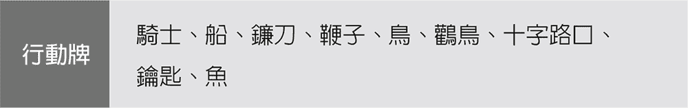

以上这些牌卡都有移动的意思，它们传达出改变或是需要行动的意味。倘若我在小牌阵中看见一张以上的行动牌，我会特别告知个案。举例来说，在小牌阵中出现了十字路口、骑士、船，代表催促个案必须展开行动和向前迈进了（根据脉络而定）。

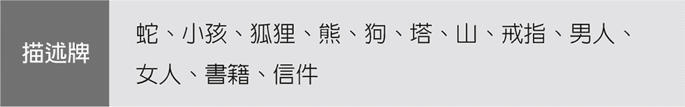

虽然这些牌在牌阵中倾向于描述事件，但是它们也会为解读画龙点睛，增添个性特质，细观与问题相关的人事物。解读中出现塔＋书籍的组合时，立即暗示了这是学术中心或是图书馆。假设是书籍＋塔，可能是描述一处受人尊敬的作家聚会场所。这些描述牌创造了一个舞台，让其他符号可以演绎出问卜者的情况。

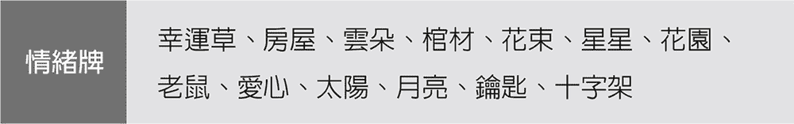

这些牌投射出整个解读的氛围：忧郁、焦虑、放松、性感、严肃等等。这些牌呈现的主要氛围会隐约改变整个脉络。当你抽出牌阵后，牌面上出现十字架，那么呈现的情绪就会跟花束截然不同。这些牌会影响整局牌面的能量。

这些牌会立即呈现出时间性质，无论快速急迫或是缓慢卡关。如果有两张牌出现在牌阵中，呈现出同样的时间范围，我就会提醒个案。举例来说，如果百合和船锚同时出现，我就会知道这是一段长期的时间；反之，假设骑士和月亮一起出现，就代表迅速的时间。

同样的，我之所以将牌卡分类帽的想法写入本书中，是因为它强化了我的解读且带出更多细节。牌卡分类就只是我第一次看到这叠牌时，吸引我眼球的小细节。你无需按照我的分类来解牌，或是把我的分类套用在你的解读里。

## 骑士

扑克牌对应：红心九

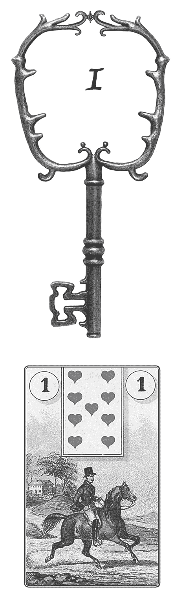

骑士牌通常描述长相俊美的骑士骑在心爱的马匹上，驰骋于康庄大道。骑士这个符号象征移动、抵达或转移，也象征敏捷和速度。从历史来看，骑士意味着勇敢的骑士精神。骑士的马匹也象征力量、机敏、自由、旅游、美丽、优雅。

骑士牌意味着“消息正在路上”，无论是还在远方或是即将抵达。也许会有人打电话给你，或是收到邮件。无论如何，你很快就会得到答案或回应。每当有人来城里拜访我，或是有新的人即将进入我的生命中，骑士一定会出现。通常这张牌的牌义与消息和任何讯息有关。骑士牌也可以代表邮差或送货人员——将物品送到你门口，或是一位真正进入你生命中的人。骑士牌也代表来来去去的移动。

此外，这张牌也带来新颖、新奇的事物。骑士和房屋可能代表新房子，而骑士和爱心则象征新恋情。

骑士牌迅速、敏捷的特质，也代表一位强壮精实的年轻男性。

### 对应主题的牌义

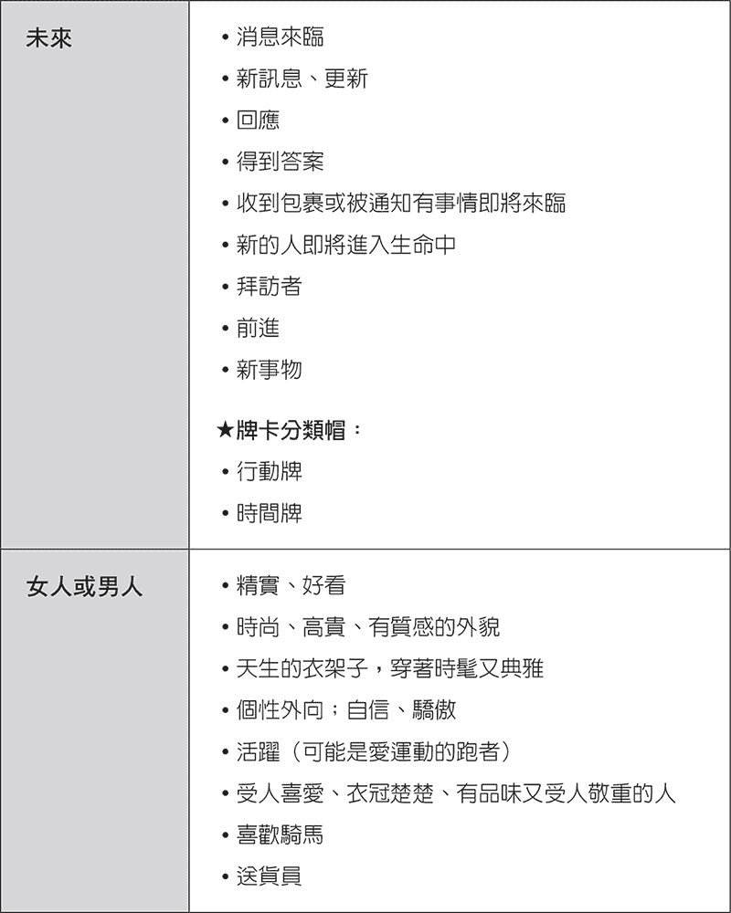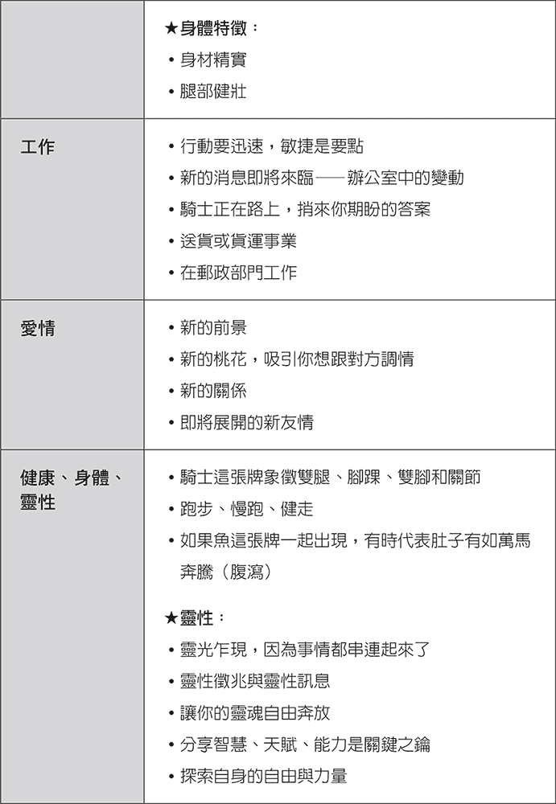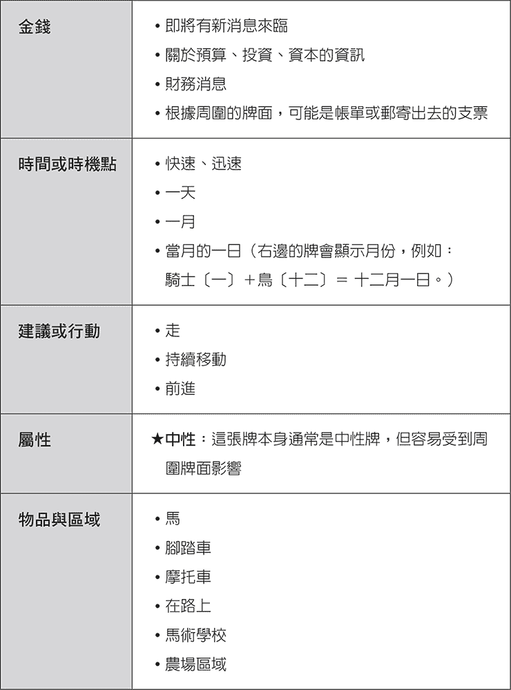

### 这张牌的个人故事：

有一天我进行每日一占，抽到了鹳鸟＋骑士＋狗。那天稍晚，我的朋友很开心的致电给我说她终于怀孕了。鹳鸟＋骑士＝怀孕的消息或生产、移动的消息或升迁，或者是关于某种改变的消息。而狗这张牌意味着朋友或我的亲近之人、乃至伴侣。

检视我的日记时，我发现另一个每日占卜的纪录：骑士＋花园＋房屋。那天稍晚，丈夫告知我，他的父母要来拜访我们。骑士（消息或到访）＋花园（一群人）＋房屋（房子里、家）。此外，花园＋房屋＝大家庭或家庭聚会。

最近，我的妹妹与妹婿准备回去东岸的那一天，我抽到了骑士＋船。我当天早上抽到这两张牌，走出房门，就看见妹妹正打包行李。这占卜的结果令人难过却又准确且直白。

### 大蓝图牌义：

传统上，骑士意指好消息正从邻近或远方国家来临，远近的程度取决于在大蓝图牌面上，骑士牌与男人牌／女人牌的距离。这张牌也代表来自国外或陌生人的消息。如果周遭都是负面的牌，表示这可能是需要注意的坏消息。

骑士牌首要的意义是消息和更新。你必须检查骑士牌的位置：骑士要去哪里？他从哪里来？他是即将来临，还是正要离开呢？如果骑士牌离个案的人物牌（女人牌或男人牌）很远，则消息来自远方；假使很近，消息则来自个案的生活圈中。传统上，马匹行进的方向也很重要。假设马匹朝向未来行进，非常重要的消息会在近期来临；假使朝向过去，则是与旧有事物相关的消息，或是跟你的过往相关的消息。如果骑士在人物牌上方或下方，象征某件正在发生的事情。一定要检查骑士牌周围全部的牌。如果周围是一些负面牌，你可能会得到坏消息；如果不是负面牌的话，那么可能就是好消息了。此外，骑士周围的牌也会提示我们是哪种消息。例如，狗＋骑士＝朋友的消息。

骑士牌距离个案的人物牌的远近程度，也会告诉我们此人何时抵达或拜访。这张牌也代表与新认识的人见面或认识新朋友。

### 配对组合与范例：

如果你要占卜跟马匹有关的问题，就可以使用骑士当作主题牌。启动这张牌，链接你要询问的马，然后解读左右边的牌。

艾希莉问说：“我想要了解我的马，想知道如何让它可以更开心？”

★云朵＋骑士＋幸运草＝艾希莉的马不愉快，它需要在户外待久一点。（牌阵有时候就是这么简单和直白）

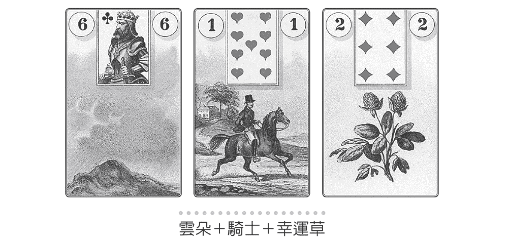

★云朵＋骑士（马不愉快）＋幸运草＝这匹马想要有更多时间能够待在户外的草地上。（如果真的要专业地占卜，我会建议用更大的牌阵来给予更确定的解读。）

★骑士＋蛇＝坏消息；不可信赖的消息；关于背叛或反对的消息；关于疾病的消息；问题即将来临

★骑士＋鞭子＝性感的恋人；充满性欲魅力的约会；健身狂热者；争执或口角（如果有其他负面牌的话）

★鞭子＋骑士＝约炮；快速来一炮；远离口角争执

★骑士＋星星＝新的脸书好友；寻找共时性

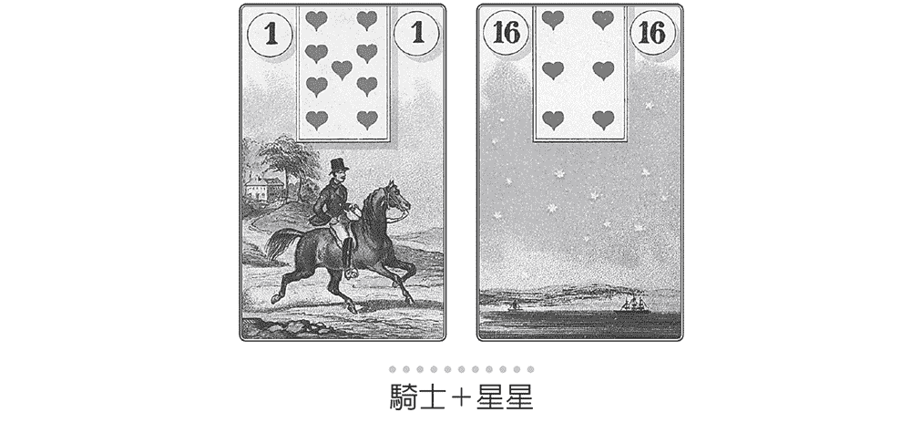

★星星＋骑士＝带来希望

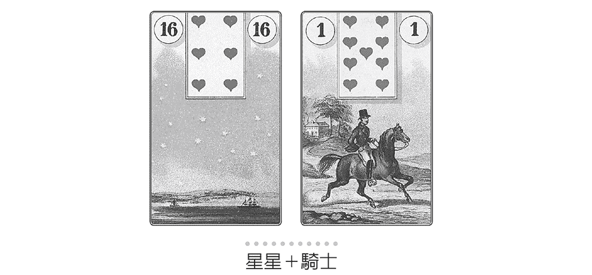

★骑士＋幸运草＝新的机会；幸运的收获

★男人＋鞭子＋骑士＝两个男人之间的争执；气氛僵硬的会议；体能训练课程

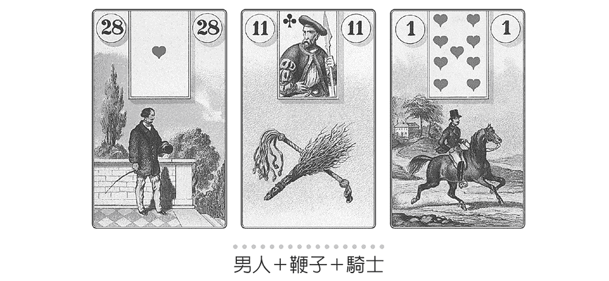

## 幸运草

扑克牌对应：方块六

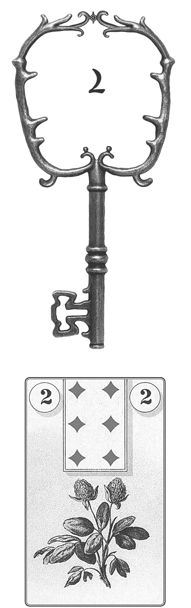

这张牌上面通常画着四叶绿色幸运草（苜蓿）的符号，有时候也会画上幸运草的花。幸运草象征运气、机会、祝福、好运。

幸运草是正面牌，带来快乐、好运、成功。它会为占卜结果带来正向能量。如果它落在负面牌的右边或线性牌阵最后一张，会特别削弱负面牌的影响。幸运草带来启发与希望。

当这张牌出现，可以预期占卜结果会有开心的消息——只要幸运草的右边没有这些牌就好：云朵、蛇、棺材，或是镰刀和老鼠。如果是以上情况，幸运草后面出现负面牌时，代表欺骗或之前的负面困境会再次出现。反之，在负面牌的右侧出现了幸运草，就意味着悲伤之事会结束，或者困难很快就会迎刃而解，并且逢凶化吉。幸运草也是一张代表奖赏的牌，象征你会获得好物或抢到便宜。幸运草会鼓励问卜者放胆一搏。

### 对应主题的牌义

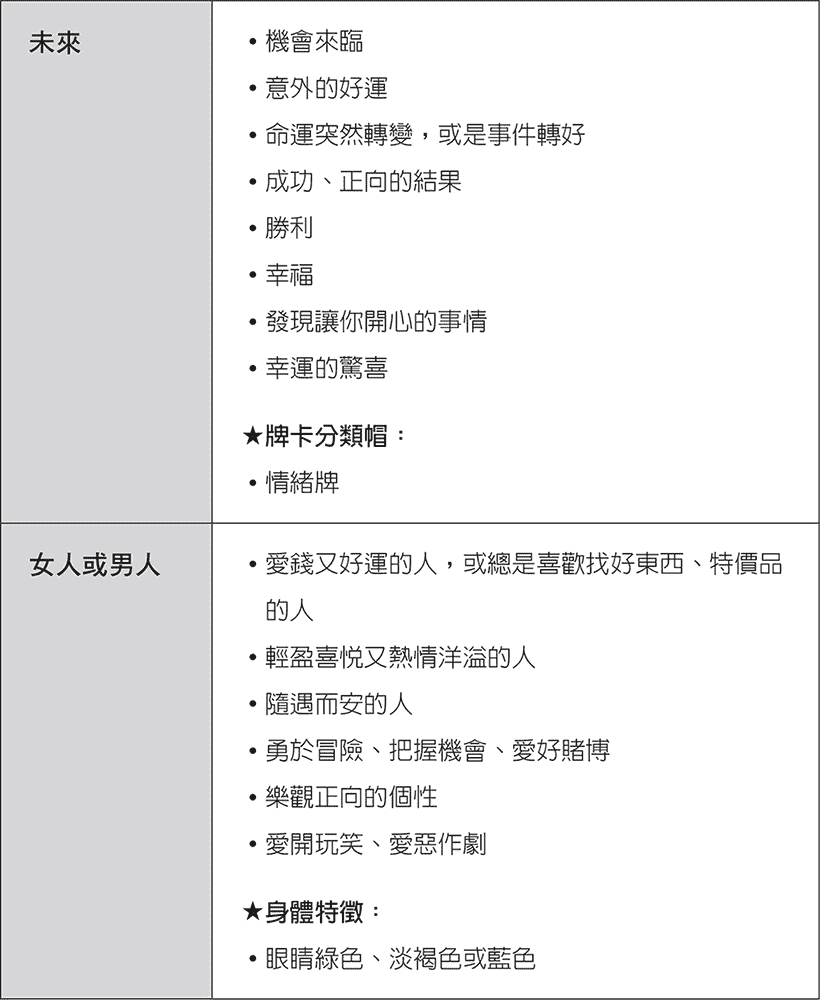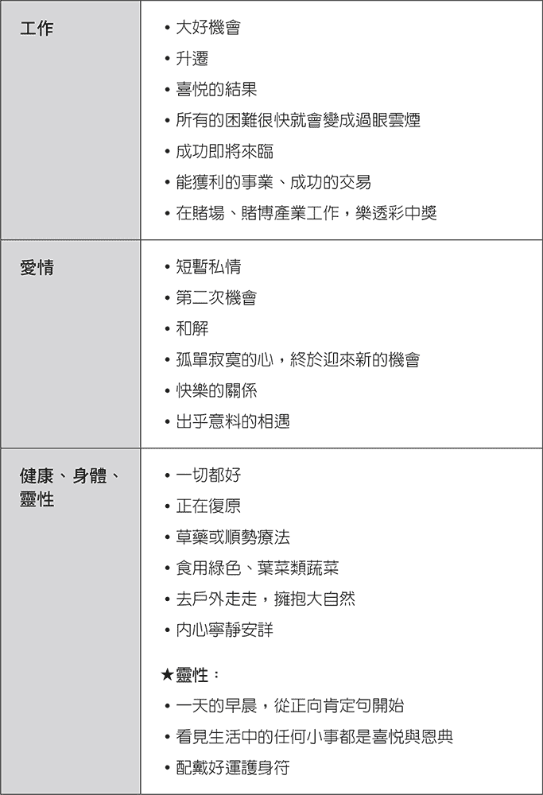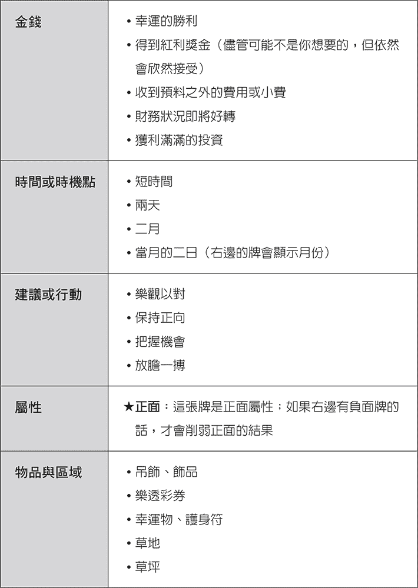

### 这张牌的个人故事：

某一年，我的两个儿子准备参加跆拳道比赛。当天早上出发时，我为他们各自抽了两张牌：

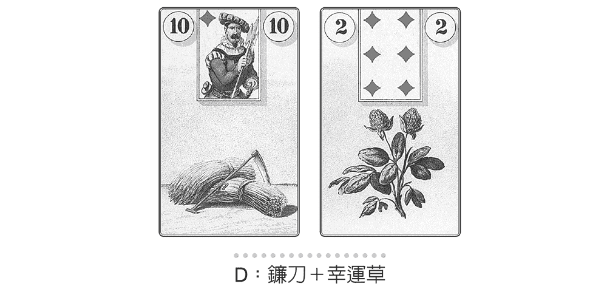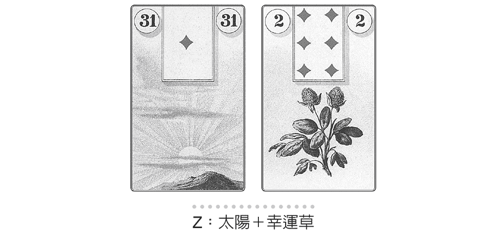

我当下认定他们一定会在各自段位的比赛中赢得胜利。我有一点担心镰刀这张牌，但是因为右边出现幸运草，所以我知道会有好结果。

结果，在 D 的最后一场比赛中，他被对手一招下压踢击中颈部后倒下，比赛也因此暂停，他接着被送到医护站。我想，我的呼吸在那个瞬间停止了。幸好他离开医护站后，只需要冰敷就好，而每个人都说他非常幸运。

最后，他得到银牌，他并没有很满意这个结果。但是，我反而很开心我的儿子安然无恙。我还是深感骄傲，因为要在黑带段位的比赛中拿到银牌并不容易。

镰刀和幸运草在这个故事里代表躲过一劫。从侧面看，镰刀的动作就如同下压踢一样，脚如同斧头（镰刀）往下噼砍。我发现这个双重意义很有趣。

我的二儿子 Z 则是一场接一场，连续打赢三场比赛。他最后赢得金牌，拿到伊利诺伊州跆拳道锦标赛该段位的冠军。每个人都说他一定是受到幸运女神照拂。

在这个故事里，太阳和幸运草意味着胜利后获得奖励。在我两个儿子的比赛日，幸运草的出现让我永远无法忘怀。

### 大蓝图牌义：

传统来说，幸运草会带来幸福愉悦，但要取决于云朵牌的位置。假设云朵离幸运草很近，就代表痛苦来临；不过幸运的是，这个痛苦很快就会结束。

如果幸运草在女人牌或男人牌旁边，问卜者的困扰、担忧、损失很快就会烟消云散；如果离得很远，则代表有其他因素影响事件，并且这些事件要先发生，好运才会到来。幸运草周围的牌会指出快乐的原因为何。一定要检查幸运草是在过去、现在还是未来的位置。幸运草象征好运、快乐、中奖。这是张非常正面的牌，所以离指示牌越近越好。

幸运草的周围若是被负面牌包围，就要小心会有麻烦发生，但很快就会消失。幸运草会削弱所有负面牌的负面影响。

### 配对组合与范例：

★幸运草（好运）＋熊（金钱）＝惊喜的奖金；意外收到数量可观的金钱；丰厚

★熊＋幸运草＝赌博赌赢；投资运很好

★幸运草（机会）＋蛇（谎言与欺骗）＝骗子一个；大好机会只是一场骗局

★幸运草＋云朵＝欺骗；好运烟消云散

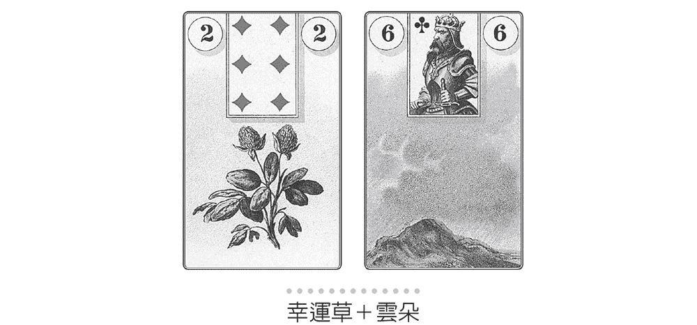

★幸运草（幸运、灵感）＋月亮（想像力、创意）＝创意带来成功；一夜成名

密卡尔询问他的事业发展：“我的事业会如何？”

★幸运草＋钥匙＝幸运与机会之门为你而开。你即将鸿图大展，成功之路已铺好。一定要把握出现的每一个幸运机会。

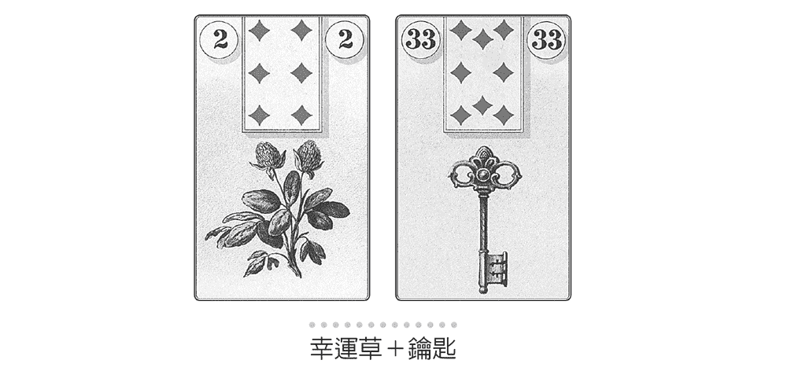

## 船

扑克牌对应：黑桃十

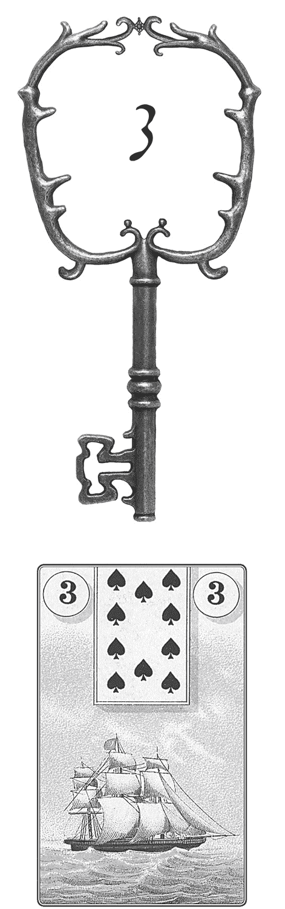

这张牌通常画有一艘扬帆启航的华丽大船，或是一叶扁舟行驶于汪洋中。船象征旅游、展开新的冒险、前往远方。

船也是关于移动、旅途和距离。它意味着离开、改变、过渡期、假期、邮轮、飞机、旅途。船象征异域、外国人、外国公司、海外事业、其他州或遥远的某个地方；船也可能意味着分离或转移；船亦象征你的交通工具、汽车或其他运载工具。传统意义上，船也意味着继承遗产，特别是旁边有搭配棺材牌的话。

从另一层面来说，船意味着其他世界、其他宇宙或其他次元，也意味着灵魂离开肉身。我在许多次通灵谘询的过程中，很常抽到船这张牌。在这种情况下，棺材有时候也会跟着出现。

### 对应主题的牌义

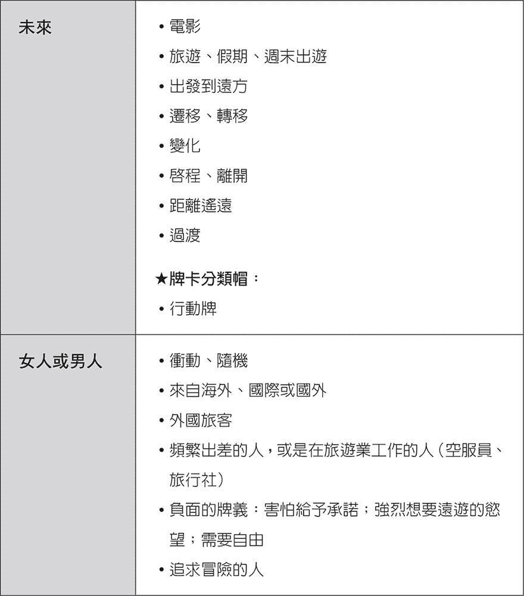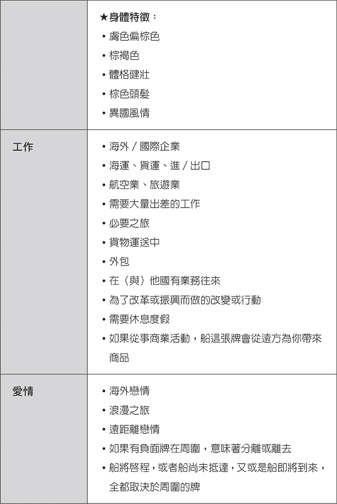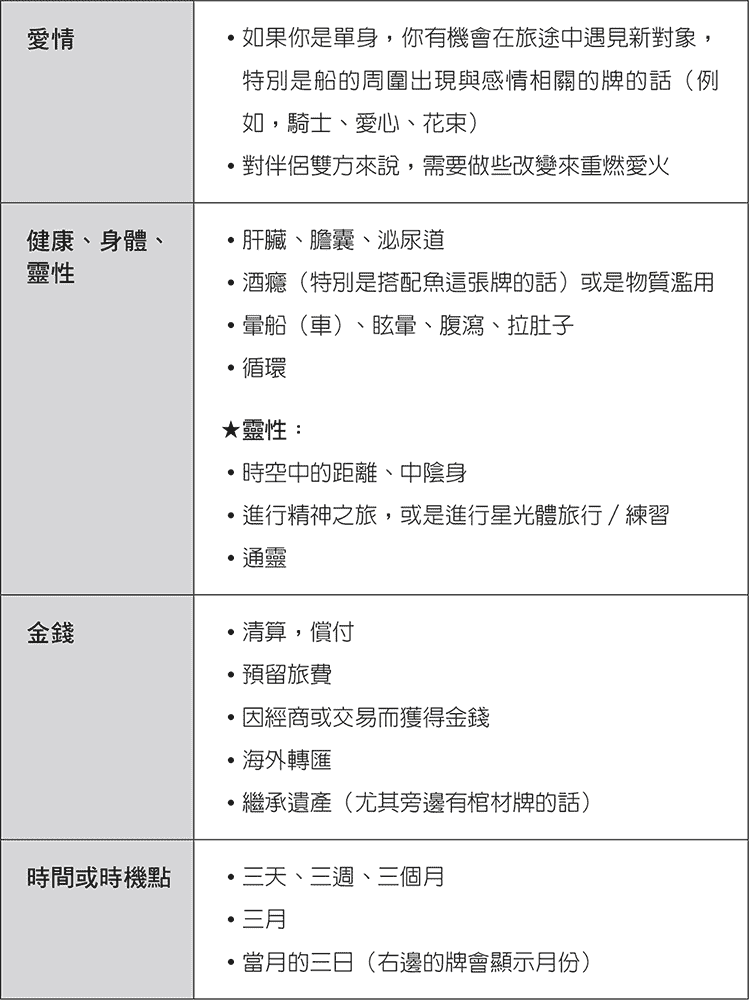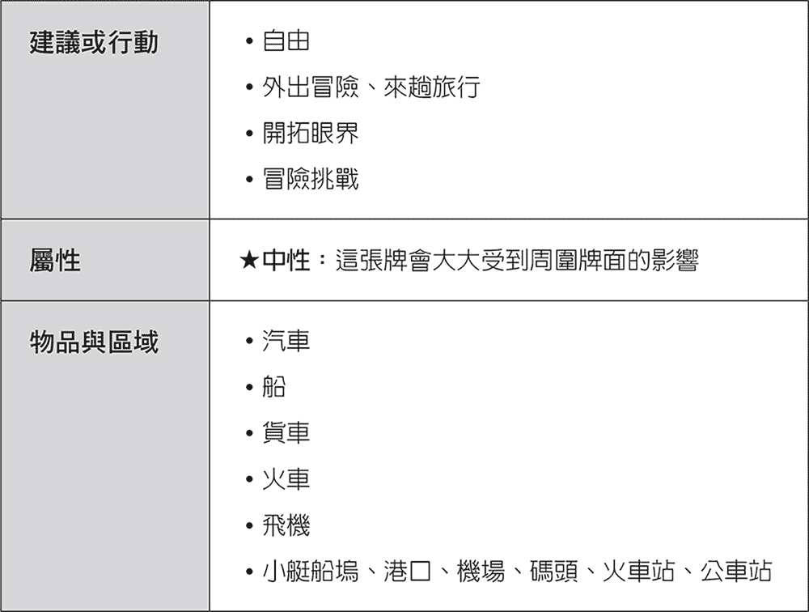

### 这张牌的个人故事：

回首二〇一〇年许多事情发生时，船这张牌与其他牌以各种配对组合出现。当时我先生必须搬到德州，而我和儿子们必须待在伊利诺伊州。

★船＋房屋＝我们开始思考举家搬迁时，抽到这两张牌

★房屋＋船＝我们正考虑买一间房子时，抽到这两张牌；而我看到船在房屋的右边时，就知道这间物件要从我手中飞走了，事实也是如此，因为其他买家突然把它买走了

★船＋山＝我开始压力如山一般大，因为每件事都延宕了

★老鼠＋船＝离开当天，我抽到这两张牌，意味着迁徙的压力

★女人＋船＝我和儿子跟着先生一起搭上飞机前，抽到这两张牌

另一则与船有关的难忘故事是：

十五岁的我住在贝鲁特，那是段艰难的时期。我的姑姑和她家人在星期天来访。她请我为她占卜。我当时习惯使用大蓝图牌阵来占卜，而我清楚记得我看见棺材和船。我告诉姑姑我从牌面上所见，她即将继承遗产。她问我何时，我告诉她跟“二”这个数字有关（两天、两周、两个月或两年），因为棺材距离女人牌有两行的距离。

这段过往历历在目，恍如昨日之事。两天后，那天是星期二晚上，分属两派信仰的民兵在街头互相开战，这是当时的内战。半夜时分，枪手来到我姑姑家门口敲门，从孩子和姑姑身边抓走了我姑丈，我的姑丈被子弹血洗而亡。

葬礼时，我们举哀哭泣，姑姑靠了过来跟我说道：“你还记得星期天帮我占卜的内容吗？”当下，我真希望有个地洞能让我钻进去，我实在感到羞愧。那场事件和那些牌让我永远无法忘怀。

跟读者分享另一则没那么沉重的故事。不久前有位个案打给我，请我帮他占卜海外包裹的下落。他忧心忡忡，因为货运公司和航空公司都遍寻不着。他只想确定他的包裹是否可以找到。我洗牌后，抽了两张牌，抽到船和花束。我告诉他不用担心，他的包裹正在转运中，很快就会找到了。一周之后，我接到他的来电，他在电话中欣喜地感谢我安抚了他的压力。（我喜欢收到这类回馈。话说回来，有谁不喜欢呢？）

### 大蓝图牌义：

传统上，船象征因为遗产而继承财富。如果船靠近指示牌，有时意味着旅游。船是一张代表移动和行动的牌，靠近女人牌或男人牌时，意味着旅游、旅行或是确定即将发生的某种转变或改变。船的位置（归来或离开）会告诉我们状况的发展。周围的牌会是关键的线索，协助占卜师判定会发生什么变化。

当船被负面牌包围，根据事件脉络，要当心有风险、问题，有时意味着分类、抛弃；而正面牌会让任何的转变、变化或移动变得更美好、令人喜悦。

如果个案想要问有关转帐、度假、旅游或只是有关交通工具的问题，我就会在大蓝图牌阵中检视船的位置。

### 配对组合与范例：

占卜有关旅游或度假的问题时，将船设定为指示牌，并在脑海中将船与旅途链接。洗牌后，将牌翻到正面，找到船这张牌，并检视船的左右出现什么牌。

苏珊计划的旅游遇到了订票的状况。“我的巴赫马群岛旅游会有什么结果？”

★蛇（麻烦）＋船（旅游）＋船锚（抵达目标）＝虽然苏珊遇到了小问题，但她还是能够顺利出游

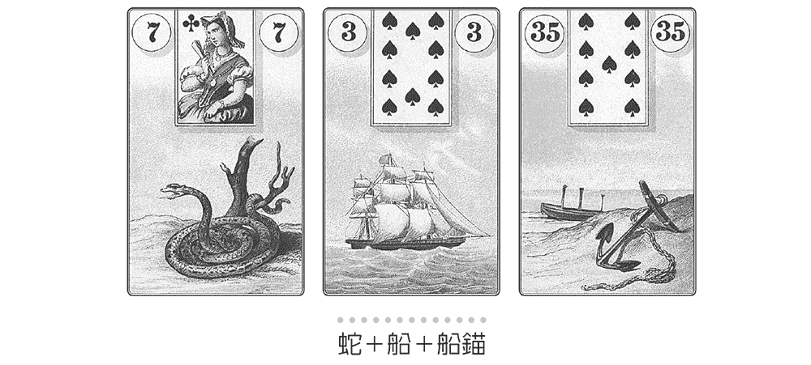

★船（旅游、旅程）＋树（灵性、祖先）＝萨满灵性之旅

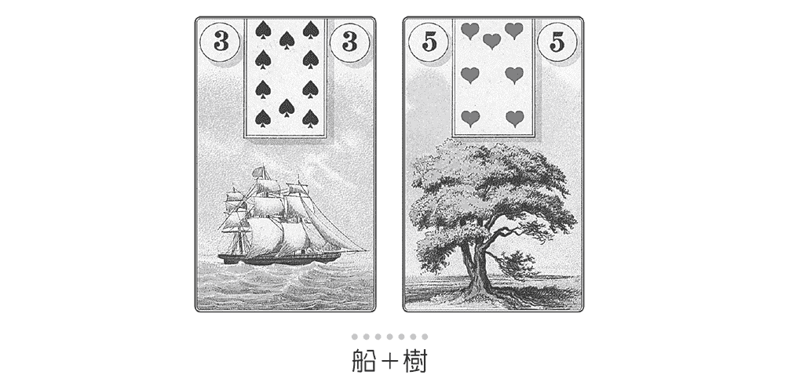

占卜有关交通工具的问题时，将船视为指示牌，因为只有船这张牌可以代表具有发动机或马达的交通工具。

安迪想要买一辆二手车。“我应该要买第一辆还是第二辆？”

★第一辆：花束＋船＋蛇＝这辆车很耀眼（花束），但车体内部有些问题（蛇）

★第二辆：狗＋船＋百合＝这辆车值得信赖（狗），而且能陪你很长一段时间（百合）

玛丽问道：“我的车发生了什么问题？”

★船＋云朵＝有些排气或压力的问题，你需要找人检查车子

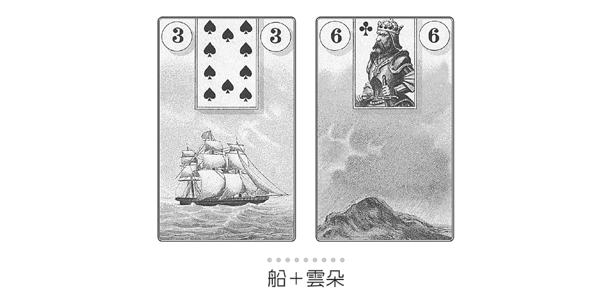

★船＋熊＝丰厚的物质收获。这两张牌的配对组合让我想起这些句子：“金钱满载”、“那趟旅途耗资不菲”、“我需要换外币或转帐”。

★船＋花园＝海外旅游，或是去有许多绿地的地方；需要时间休息放松；与各国和多元族群的人聚会；改变聚会或会议地点

★船＋十字路口＝改变计划；脱轨或绕道；行程订了两次或是多趟旅途、多次停靠；要去观光（搭船、公车、飞机或火车）

★船＋蛇＝要小心，你可能会在旅途中生病；不可相信这笔转帐或交易；改变路线，因为路途中会遭遇问题

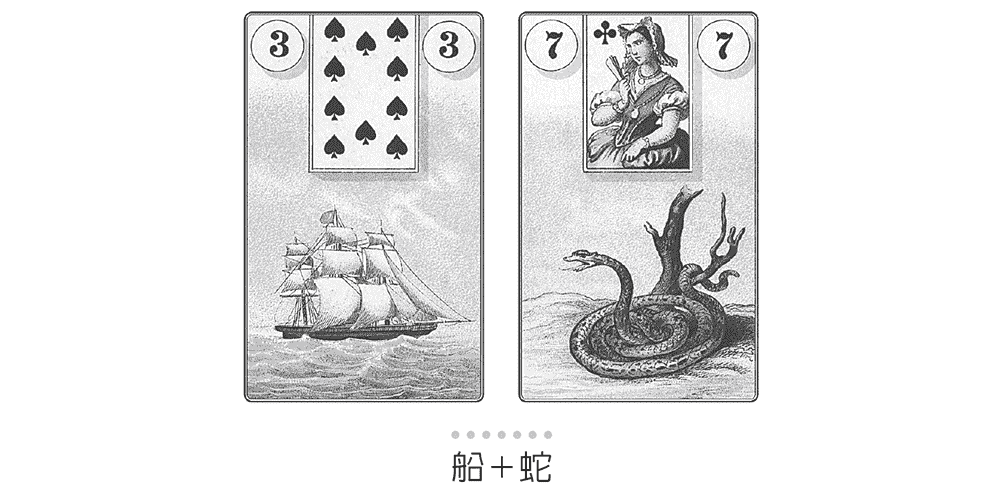

## 房屋

扑克牌对应：红心国王

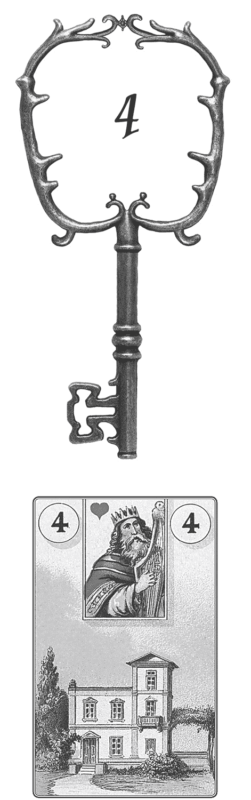

这张牌通常会有一栋华美的房子，周围是茂盛的草地或花园，是幢非常迷人的房屋，让人深深感到有安全感。房屋象征家与家庭，以及地基、中心、总部；它也意味着舒适感和安全感

房屋牌象征家、家庭、随行人员、避风港、室友、稳定，以及房地产、所有权和财产。这张牌也可以代表家庭事业、住办合一的空间、你的神圣空间、家庭基金。房屋也象征朝代，所以有时这张牌象征父权体制。

房屋牌象征你所居之处、就寝之处——日常生活中与人共享悲喜哀苦之处。这张牌意味着满足感、安全感和保护。一定要检视周围的牌，确定事情会有好的发展，还是你需要预防某些坏事发生。当房屋牌被负面牌围绕，要注意会有动荡和影响安定的事情发生；如果周围是正面牌，就可以确定会发生让你感到安定和稳定的事情。

### 对应主题的牌义

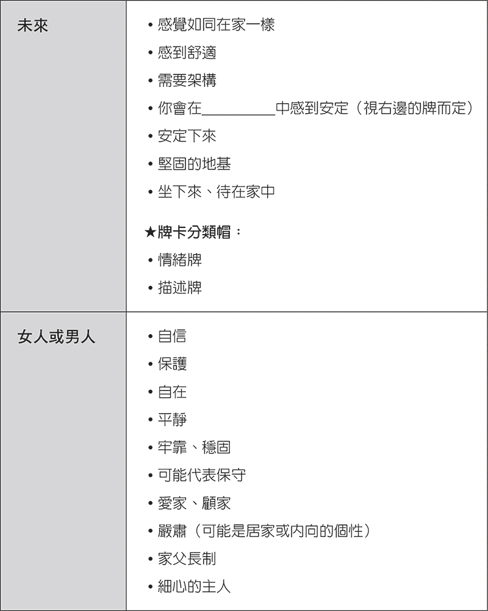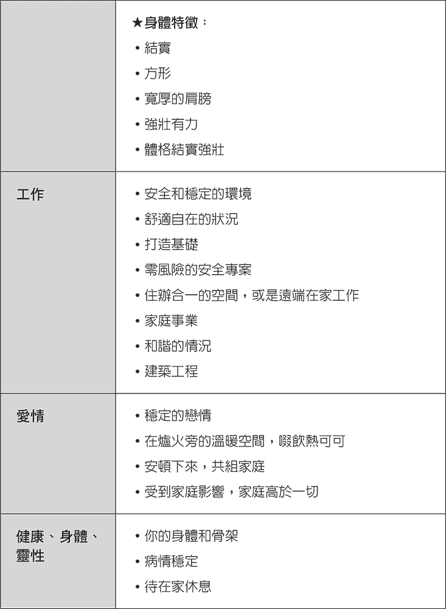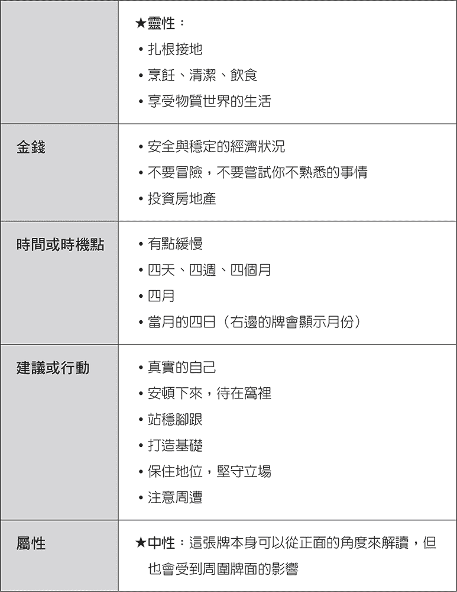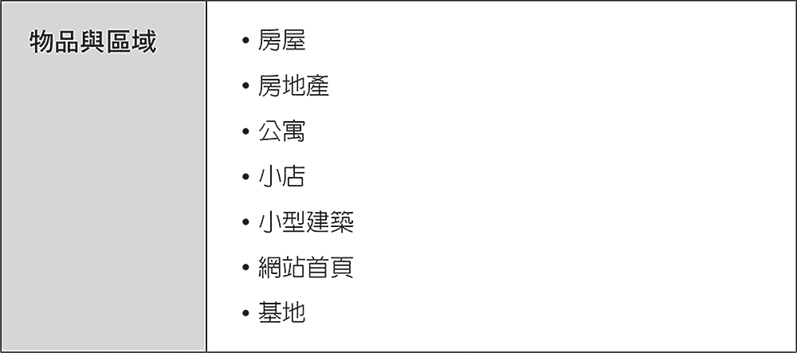

### 这张牌的个人故事：

房屋的故事跟我的朋友有关，当时海瑟在练习大蓝图牌阵。她为我占卜解读，女人牌（我）的旁边出现了房屋＋鹳鸟＋棺材，而棺材在该排最后一张。她睁大双眼、面色惊恐地看着我，那一瞬间，时间仿佛凝结。接着，她的神情立即转变成“事情一切顺利”的解读状态（顺道一提，如果有人可以将棺材牌以正面的方式来解读，就只有海瑟能做到这件事），这让我的心定了下来。愿神保守她的心。

当时我们家的房子正在出售。我一看到牌面就知道大事不妙，所以我想我们可能得承担某些损失。

最后的结果是，我们不仅失去了所有的权益和投资的一切，还得支付钜额款项给搬家公司，让他们夺走我们的房子。房屋＋鹳鸟＋棺材，说明了房屋的价格令人心灰意冷。我那时虽痛心万分却也心怀感激，因为损失的只是金钱而已。

另一则有关房屋的故事是：

我当时在为一位新个案占卜，她不愿告诉我任何事情，连问题是什么都不愿意说。她就坐在那里盯着我并测试我。当时我们在一场派对里，而我没有时间用大蓝图牌阵来解读。所以我告诉自己：“好吧，我就跟你玩玩。”洗牌后，我抽出了五张牌，让牌面呈现结果。她的牌面是花束＋房屋＋鱼＋狐狸＋鞭子。

鱼这张牌出现在中间，暗示着某种在家工作的创业者（房屋＋鱼）。我问她的第一个问题是：“你是在家工作的自雇工作者吗？”

她的表情瞬间放松下来，说道：“对，我在自己家开了一间美发店。”（花束＋房屋＝房子里的美发店）她跟其中一位员工的相处有些状况，在牌面中以狐狸＋鞭子来呈现，意味着与员工争执或发生口角。牌卡让我们破冰之后，她就开始不断问我问题。

### 大蓝图牌义：

在大蓝图牌阵里，房屋的传统意义是成功就在眼前，即使现况不如预期。如果房屋落在男人牌或女人牌之下，意味着问卜者要小心周围是否有小人，尤其是旁边有负面牌的话。

通常来说，房屋牌会带来令人开心的影响。如果房屋牌落在过去的位置，代表你的父母正影响着你，或是代表之前的住处；如果它落在未来的位置，意味着会有新家或是未来将有新住处。

大蓝图中的房屋牌是我使用的主题牌之一，用来检视个案的住家、家庭、房地产的状况。周围的牌面会交织出房屋牌的完整故事。

### 配对组合与范例：

★房屋＋十字路口＝许多住家；有些重要决策需要考虑到家庭因素

★房屋＋蛇＝要注意、提防亲近之人或邻居的背叛；不健全的家庭；家中的麻烦；检查房子的水电管线，可能需要修理了

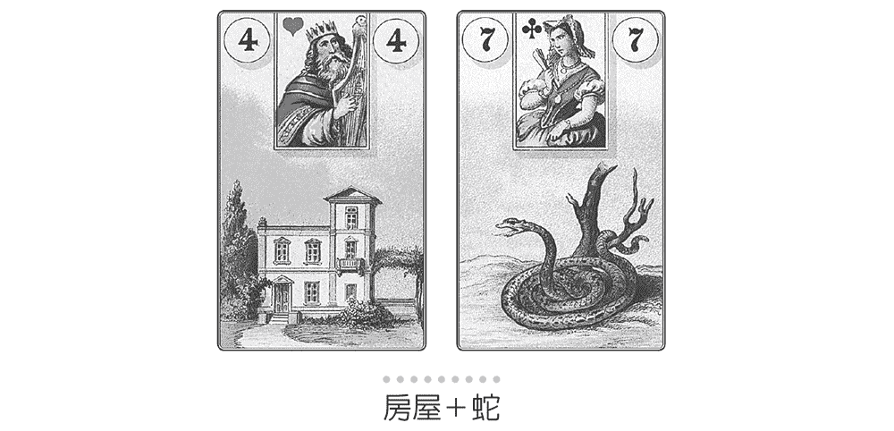

★房屋＋鸟＝兄弟姊妹、室友；搬家或同居；家庭谘商；斡旋；在住家录制的脱口秀或广播节目

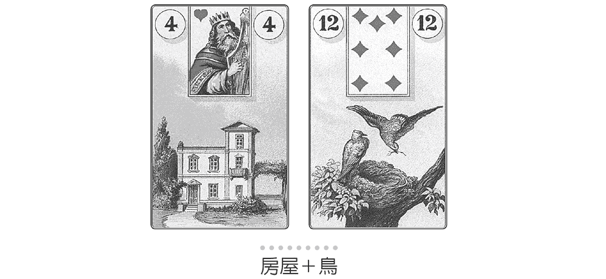

★房屋＋小孩＝受过基础教育的小孩；日托中心；爱家的小孩；返家途中的小孩

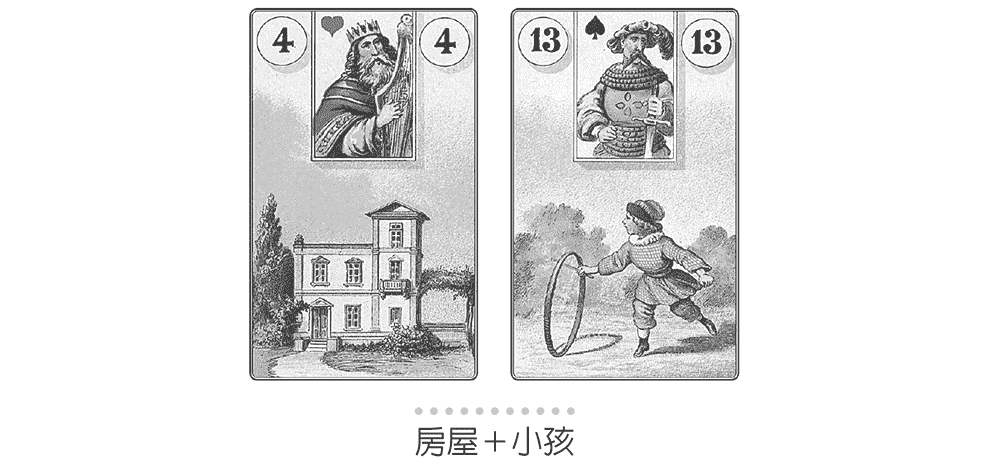

★小孩＋房屋＝家中的小事；新生儿或是房子里来了新孩子；小型或新创家庭事业；小房子

有些牌卡的配对组合即便左右互换，意思也相同。小孩＋房屋和房屋＋小孩就是如此。牌义全都取决于问题的背景脉络。在以上的范例中，左右位置互换后，牌义也相通。

## 树

扑克牌对应：红心七

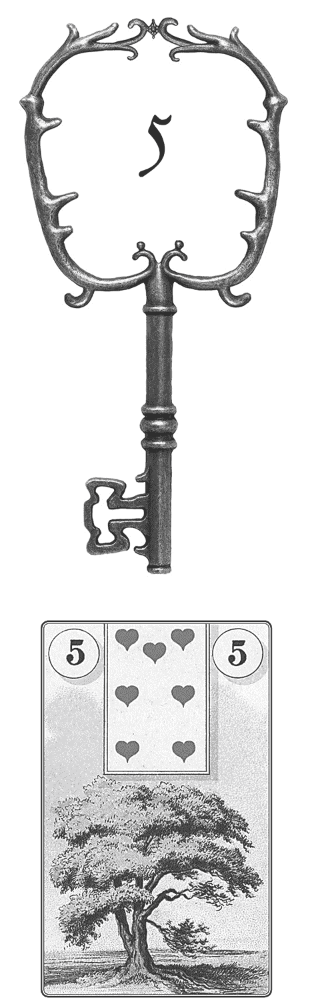

这张牌通常画着一棵美丽的大树，周遭绿意盎然。树是强大的符号象征：链接天地的古老天线，并且象征肥沃和生长；树也象征长寿与长久。

这张牌掌管所有健康议题，囊括灵性、心理与身体层面。树是我们的生命能量，我们的根源，我们的演化进展，以及世代循环的象征。树也意味随着时间而逐渐成熟。

从特定的观点来看，树链接着萨满、部落、原住民的灵性精神，以及东方的冥想法和散发着宁静祥和的气场。整体来说，树这张牌意味着整体的灵性健康，包括我们生活中各种与灵性相关的人事物——从通灵与灵媒，到宗教信仰，乃至教条信念，以及所有奥秘学说、哲学、信仰和信念体系。

### 对应主题的牌义

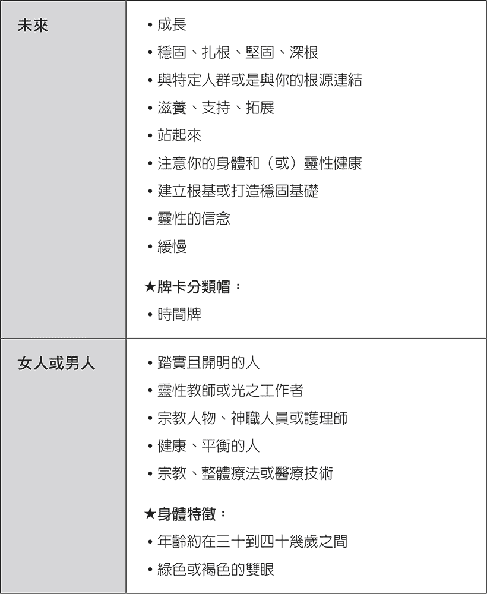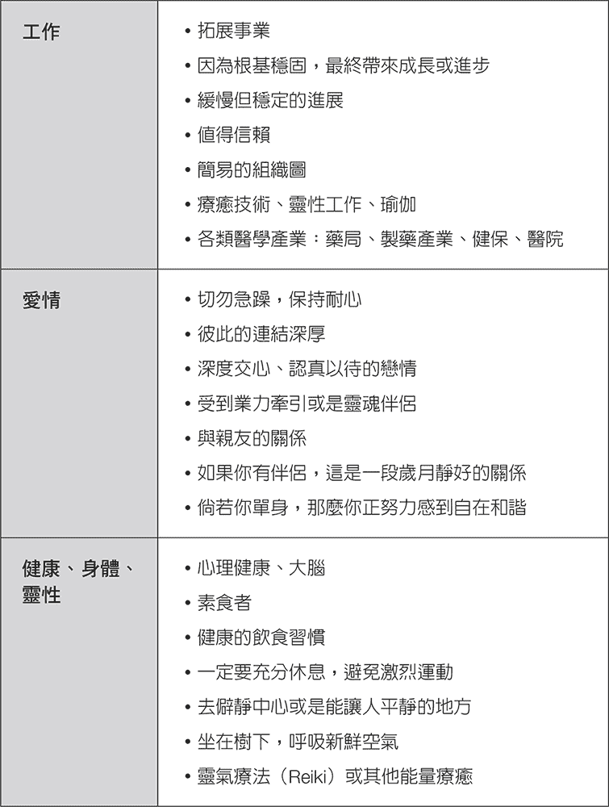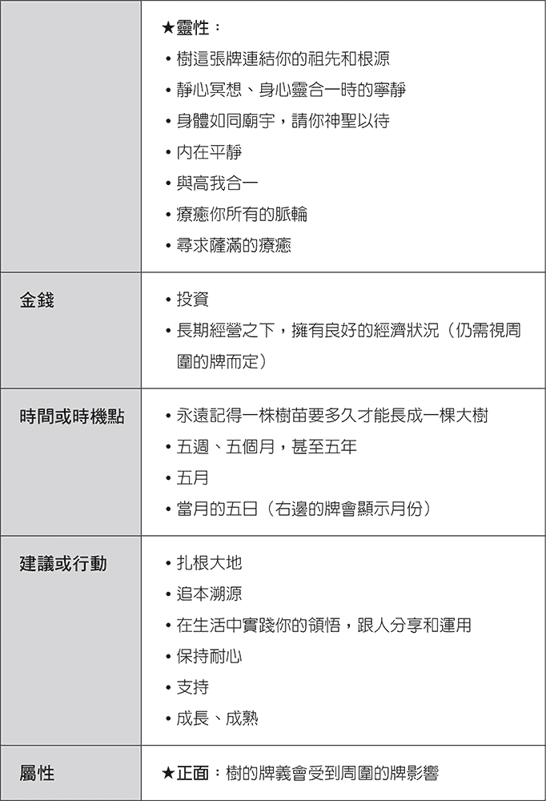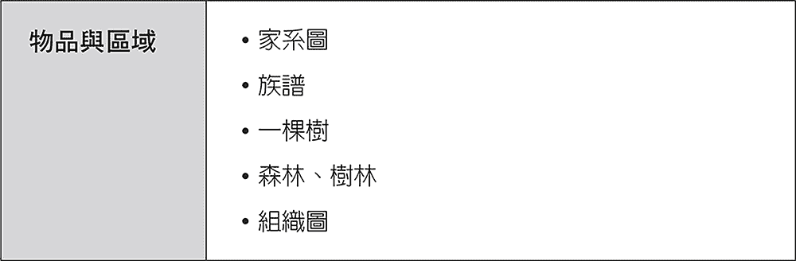

### 这张牌的个人故事：

那是二〇一一年夏末。我和家人到市中心逛逛，我精心打扮，还穿了高跟鞋。走到餐厅的路上，我其中一只鞋跟卡进了柏油路的裂缝里，我整个人往前扑倒，导致我的脚趾骨折。

从急诊室回到家后，我儿子抽到了三张牌：骑士＋镰刀＋树。他看着我说道：“妈，你看，牌说你的脚骨折了。”可恶，真是谢谢你啊！

骑士（移动、脚）＋镰刀（切、断裂）＋树（需要花时间才能复原）＝我花了半年时间才康复，但也无法恢复如初。

我还记得另一则跟树有关的故事。我当时在清理儿子的衣柜，伤到了背部。我抽到了鞭子＋树＋棺材，这三张牌意味着长期的问题（鞭子）会让我在床上休养（棺材）。我不喜欢这个牌面，因为我最后在床上躺了三个月。

我有位客户在企业上班。他最近一次找我占卜时，树这张牌呈现出主管们与直属下属的复杂组织结构。他当时倍感压力，想方设法思考要调动的人和单位。他的两难处境以这几张牌呈现：男人＋十字架＋树＋熊＋花园。男人（我的个案）、十字架（倍感压力）、树（组织结构）、熊（主管）、花园（他的团队）。

### 大蓝图牌义：

传统上，如果树被房屋、十字路口，尤其是花园包围，或是靠近这几张牌，意味着会达成所愿。如果这些牌都在周围，你根本胜券在握啊！这是雷诺曼卡的有趣小特色。有时候我会看看这样的牌面有没有出现。三十年来，这样的牌面也只出现过少数几次而已。

如果树落在女人牌或男人牌的旁边，意味着要小心健康问题；如果树落在女人牌或男人牌的上方或下方，则意味着目前健康出了问题。可以的话，树离人物牌越远越好。

如果树这张牌的周围有许多正面牌，你会获得安全感、丰盛、平静、和谐；假使被负面牌围绕，你就需要保持警惕，尽快调整自己，回到平衡与和谐之中。

大蓝图牌阵中，树是我用来解读个案身心灵健康的主题牌。

### 配对组合与范例：

大蓝图牌阵中，如果要检视个案的健康状况，可以看树的位置，因为周围的牌会告诉你健康是否安好。使用线性的牌阵来解读健康状况时，启动树这张牌。

黛比接受治疗一段时间了，她想知道结果会如何。她的牌面出现了棺材＋塔＋云朵＋树＋狐狸＋鸟＋太阳。

前面几张牌意味着严重的疾病（棺材），而且她一直到医院（塔）接受治疗，整个过程对她来说并不容易（云朵）。云朵牌也显示出她对治疗的疑虑和忧心。后面几张牌是即将发生的事：治疗情况仍不清不楚，医疗人员不会直说（狐狸＋鸟），她还需要经历更多次的晤谈，但是结果会一切安好（太阳）。太阳是隧道出口的曙光。黛比会康复，只是仍需要经历一些过程。

如果你看见树＋棺材的组合，这是“立刻去看医生并做检查”的征兆；有时候这是指必须要在床上躺平的情况。这是某种净化期，意味着你正经历重大的人生转捩点。

注意：解读健康状况时永远要小心谨慎。总是要检查树的周围有哪些牌，并且仔细注意这些牌象征什么讯息。预测健康状况的能力需要不断练习和累积经验。若是你觉得健康的占卜解读不好说出口，那就不要占卜健康，除非你觉得自己准备好了。并且一定、一定要请个案谘询专业医疗人员。

我们并非医生，因此我们能做的就是透过占卜，减轻个案的担忧和紧张，协助他们准备好面对特定结果，并给予建议而已。除非你本身就是会占卜的医生，若是如此，那就没问题了！我认识一些在医疗领域工作的通灵者，他们非常擅长这个领域。

★树＋书籍＝健康检查（树＝健康，书籍＝检查、分析）；史学或族谱研究；整体医学或医疗书籍；草药书或顺势疗法研究；灵性解读（树＝灵性，书籍＝奥秘）；一套占卜卡

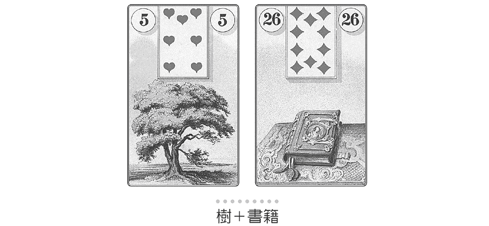

解读前世时，树会是你需要挑选的主题牌，接着解读周围的牌面。前世解读的牌卡配对组合范例如下：

★树＋鸟＝兄弟姊妹

★树＋戒指＝伴侣或循环重复的状况

★树＋百合＝父亲、祖父或男性人物

★树＋狗＝重复出现的灵魂伴侣；亲密且深厚的链接

## 云朵

扑克牌对应：梅花国王

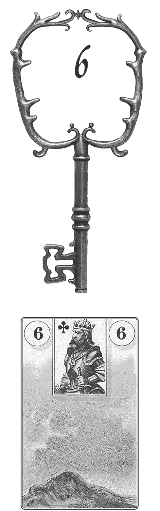

这张牌通常描绘着一朵云，笼罩在画面中的某一边。有时候画面是一边乌云罩顶、一边阳光普照，有时候则是下着暴风雨的画面。云朵象征麻烦浮现或是凶兆。

从传统来说，古时候的占卜师说过，这张牌上的梅花国王如果面向人物牌，乃是吉兆；如果背对，则代表会发生无可避免的坏事。许多雷诺曼系统中，如果云朵的乌云这一面在人物牌旁边，那么麻烦一定会浮现；如果是阳光普照这一侧的话，意味着困境即将远离或已结束。

我承认从我开始使用雷诺曼时，我会注意这个细节。然而，云朵最好还是落在指示牌的左方（过去的位置），并且越远越好。倘若云朵在指示牌的左侧，那么个案正在经历某些难关，但几乎要度过了；如果云朵出现在右侧，则麻烦即将来临。永远要检视周围的牌面，因为旁边的牌会告诉你这个困境会有多严重。可以确定的一件事是：乌云总是容易散去，因为云的本质就是这样，除非右边有负面牌卡或暗示长时间的牌卡。

云朵牌总是带来质疑、困惑、犹豫和不安定性。如同迷雾，云朵会遮住一切，其中可能会有欺骗，或是某些复杂的灾厄会直接发生。当云朵牌出现，暗示着事情不清不楚，有什么事正在发生，未来尚未明朗。事件暧昧不明且难以预测。如果云朵牌的右边出现负面牌，那么麻烦仍会持续一段时间；假设是正面牌，问题将迅速烟消云散，终得平静。

### 对应主题的牌义

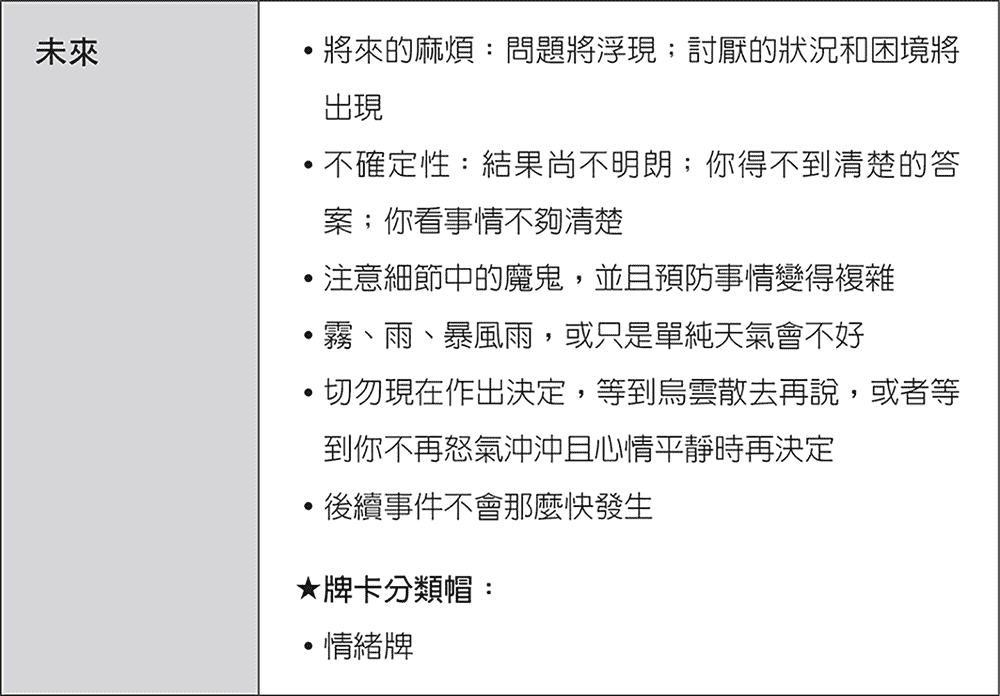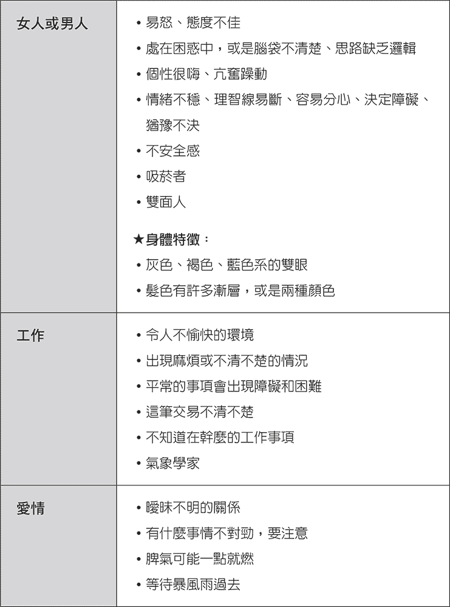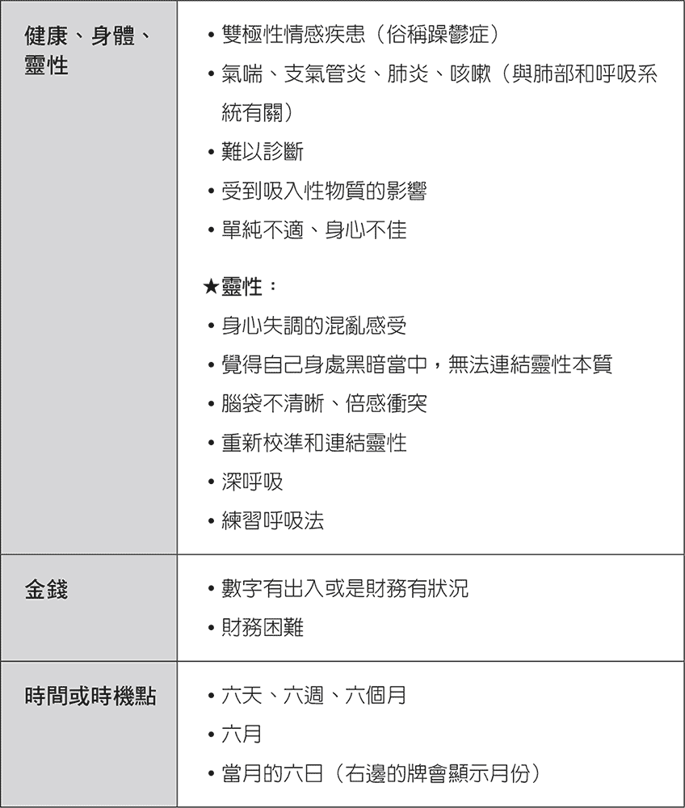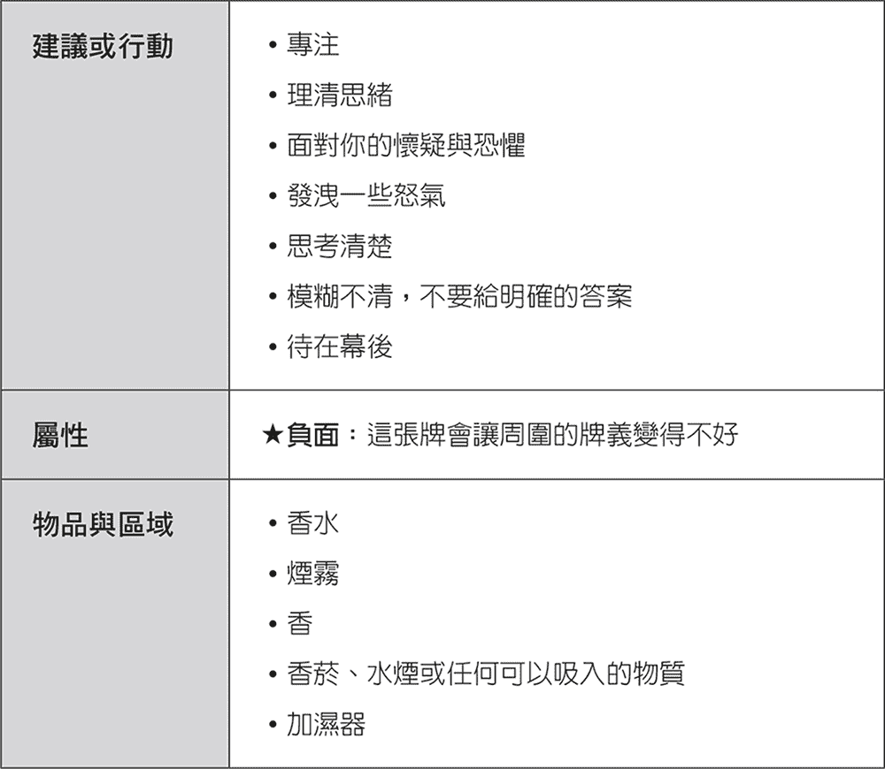

### 这张牌的个人故事：

我想不太起来这张牌的故事，所以我在写本书的过程中，耐心等待这张牌出现在我的占卜解读中，而它来的时机实在太完美！我的朋友芮文致电给我，疯狂问我：“我该搬去哪里？什么时候要搬？”她的租约即将到期，所以她必须尽快搬走。我帮她占卜了三次，每一次云朵牌都在最后一张：女人＋鹳鸟＋云朵；房屋＋女人＋云朵；房屋＋船＋云朵。每一组牌面，我只能看见她的确要搬离并且会面临变化，但结果不明朗，因此我没法给她明确的答案。

我感觉她必须在心中做下某种决定，并且下定决心。她仿佛伫立在十字路口，而她只要做下决定，未来之路就会开展。她停滞的状态意味着需要某些事情发生，方能突破僵局。我坦承告诉她我得到的讯息，也告诉她我隔天会再帮她占卜一次。这就是云朵牌以非常直接的方式呈现的结果，仿佛这个不明朗的困境是要我“之后再问”。

隔天，我抽了牌，抽到女人＋船＋塔。我立刻就知道这是指她要搬进一间公寓（塔），地点不在目前的居住范围，而是一段距离之外（船）。我打给她之后，她告诉我，前几天找我谘询过后，她决定打电话给一位朋友，转了钱给她后，准备签约搬进另一座城的一间公寓了。这次的占卜，云朵牌让我的内心有种难以言喻的怪异感。我领悟到，未来取决于人类的抉择。只要你踏上所选择的路，我就能预测你会遇到什么；然而，你若仍处在十字路口犹豫不决，我也无法告诉你未来会如何发展。如果前方云遮雾罩，我也看不清楚啊！

近期的每日占卜中，我抽到熊＋云朵＋房屋，而云朵的意义也很直白。

一开始，我以为是在家里跟我父亲或母亲吵架：熊（权威人士）＋云朵（误解或生气）＋房屋（在房子里，在家里）。于是我开始担心可能我对母亲有些误解，因为熊象征母权的母系角色，而房屋则象征我的家庭。这三张牌的结果最后很简单直接：我怀孕的妹妹来访，她对任何的气味都极度敏感；而占卜的结果应验了，我做了她最爱的菜，这道菜需要炒洋葱。那真是一个天大的错误！炒洋葱时冒出来的烟如同云雾缭绕，味道弥漫整间屋子。可想而知，我妹的心情很不爽。熊＋云朵＋房屋＝那次下厨真的让屋内弥漫烟雾，导致家里弥漫着不悦的氛围。

今天我抽到了男人＋船＋云朵。

我知道这三张牌跟我先生有关，因为我们所住的州属亚热带气候，所以我查了气象，想知道是否将有暴风雨来袭。结果没有这回事，这天是大好的艳阳天。那么下一个可能的结果就是海外办公室（他在海外部门工作，业务横跨不同国家）的某些问题了，但是我的直觉是车子应该有问题。我告诉他我觉得有可能发生的事情。当天晚上，他开车回家的路上，车子抛锚了，某条软管因为压力而弹开，气体喷发（云朵）在挡风玻璃上。他只好熄火等待，用水冷却发动机，接着把软管接回去，再驱车回家。云朵带来的问题通常不会持续太久，除非周围有其他象征时间很长的负面牌。

### 大蓝图牌义：

传统上，这张牌的牌义取决于梅花国王的脸面向何方。如果面向男人牌或女人牌，意味着会有好消息；如果背对人物牌，那么就要注意前方等待着你的会是坏消息。

检视云朵牌落在过去、现在还是未来的位置。每次都要检查云朵的周围有哪些牌，才会知道这张牌影响了什么事件。如果落在过去，要确认周围的牌面呈现的意义是否符合个案过去发生的事情；如果落在现在，一样要检查周围的牌，才会知道目前云朵为哪些事情带来负面影响，也才能建议个案要小心什么并且协助他。另一个解牌的线索是检查云朵牌落在哪个宫位，宫位会明确告诉你到底浮现的困难是什么。

整体来说，云朵会给周围的牌带来负面影响。注意这张牌座落的方向，左侧还是右侧是很重要的解读关键。

如果云朵离人物牌（男人／女人）很远，那么你可以放下心中大石，无需担忧了。同时也要检查云朵是否距离带来好运的牌很远，例如爱心、花束、太阳、钥匙等。

永远正面看待并且建议个案耐心等待，因为乌云总会散去，风暴终会平息。

### 配对组合与范例：

云朵会影响左右两边的牌义。

★花束＋云朵＝美丽的礼物，但是要注意可能动机不单纯；美好的礼物可能会被错误对待；贿赂；处理气味和烟雾的东西

★云朵＋鸟＝误解；沟通不良；在你背后说三道四；错误信息

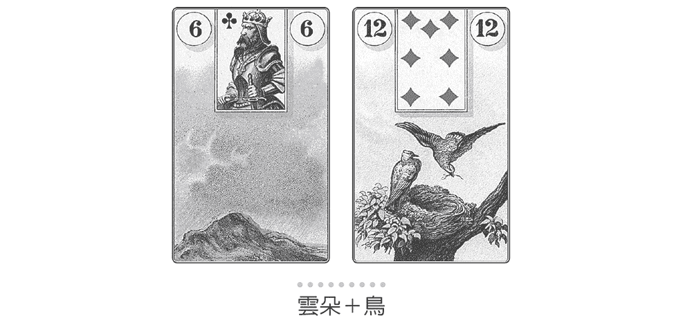

## 蛇

扑克牌对应：梅花皇后

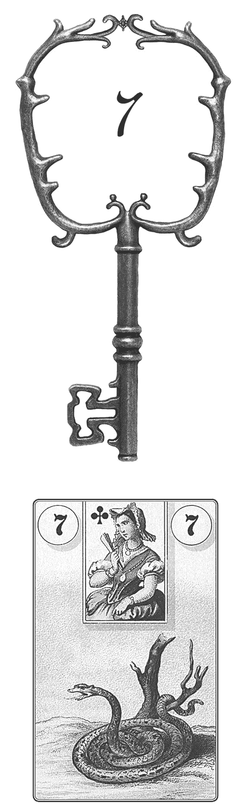

这张牌通常画有一条蛇缠绕于地面上，或是悬挂在树上。无论这张牌落在何处，都意味着凶厄来势汹汹。自古以来，蛇的意涵都非常两极，一面是智慧与知识的象征，另一面则象征欺骗与背叛。我认为如果是占卜灵性问题，智慧和知识的意义就跟主题紧扣着；反之，如果是预测世俗问题，那么欺骗、失去、麻烦、困境等牌义就会比较适合，因为当有一条蛇向我们冲来，或是在家中发现一条蛇的时候，我们的想法、反应也会是如此。蛇在爬行时静谧无声，不会被猎物察觉到。

这张牌会带来敌意、失去、歹运。同时也意味着这个人面善心恶，内心不怀好意。这张牌象征背叛、欺骗、嫉妒、吃醋。要小心可能遭致他人攻击，或是健康出状况。蛇象征各种层面的欺骗背叛、表里不一、两面讨好。蛇这张牌象征骗子，制造麻烦与欺骗，或是东西故障、汽车问题、争执口角、棘手的情况。

我总是将蛇视为你可以直接从人生道路上抓起来，并放生到其他地方的某种问题。山这张牌需要攀山越岭才能征服，而蛇只要诱惑一下就可以解决了。记住：如果早点抓住蛇，就可以轻易处理，降低损害。取决于周围的牌面而定，才知道蛇是你可以轻易移除或是需要绕过的障碍，而最关键的部分是要先注意到它！因为蛇的狩猎方法是在暗处埋伏。

在某些案例中，蛇这张牌意味着疾病，而旁边的牌会暗示这疾病会持续多久或是有多严重。

如果蛇的右边出现钥匙牌，那么在某些情况下或特定脉络中，就能缓解蛇的凶险。蛇＋钥匙＝你会找到避开蛇的方法。你拥有关键之钥能够让蛇变得人畜无害。同样的，你也必须检视其他的牌并回归问题的脉络。

如果你发现蛇在你的周围，请善用常识避开那条蛇，因为蛇迟早会露出尖牙，对着你嘶嘶警告。

### 对应主题的牌义

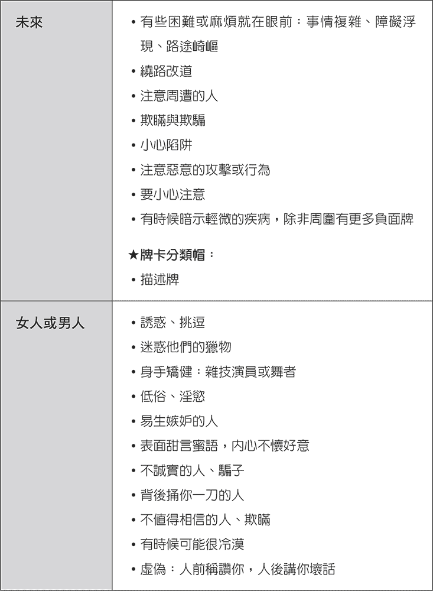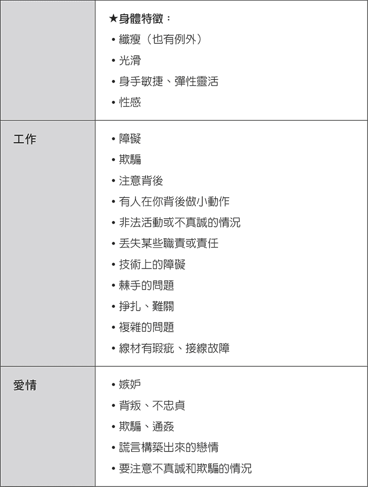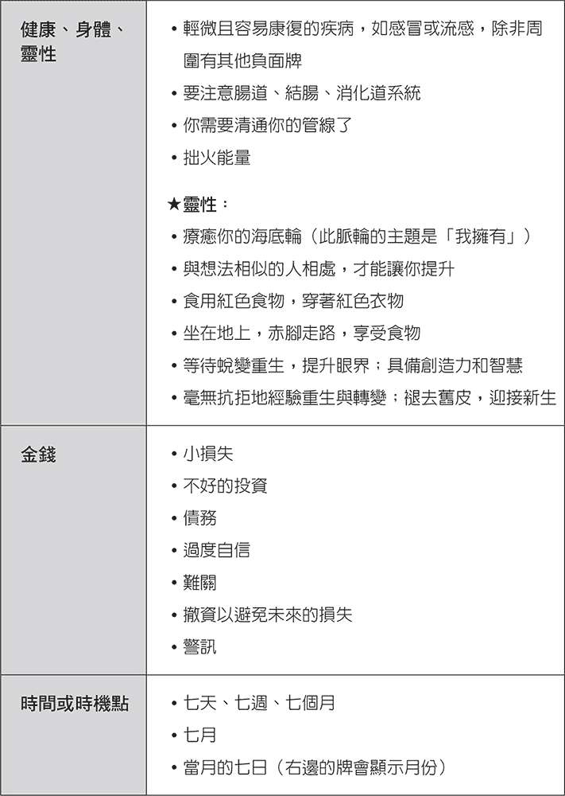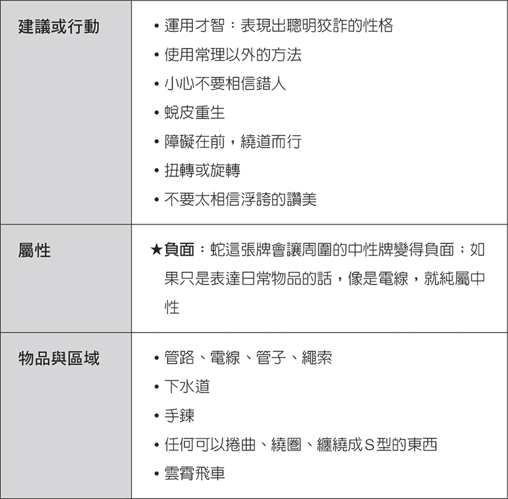

### 这张牌的个人故事：

这则故事在我脑海中既生动又鲜明：我挚友的母亲旺达打电话给我，请我占卜。在她的牌面中，欺骗的状况不断出现，但是她觉得完全不符合自己的状况。她不断告诉我，她身边每个人都是朋友，都值得信任。因此，为了是谁会欺骗和背叛她，我开始针对她提供的姓名各抽一张牌来检查。轮到其中一人时，我抽到了蛇。旺达非常吃惊，义正词严地说：“怎么可能？不可能是他！”我们把她的每一位朋友都抽遍了，只有这个人抽到了蛇这张牌。所以，我重新洗牌，将意念聚焦在这个人身上，而蛇又再次出现了。旺达依旧不相信，她要我再抽一次。因为她跟我很好，我想要帮帮她，所以我又重新针对她的朋友一个一个占卜。结果，同样的人又抽到了蛇这张牌。于是我就说了：“不好意思，这就是我从牌面解读出来的讯息。你必须非常小心这位男士。他的个性就跟蛇一样，而且会背叛你。”旺达依旧不相信，信誓旦旦地说这个人总是帮助她，不仅在工作上协助她，还帮她跟老板讲很多好话等等。我只能告诉她，我非常希望她是对的，但还是要她小心一点。

一个月后，旺达打电话给我，语气激动，充满怒火。那个男的背叛了她。他让旺达背了黑锅，害她丢了工作。听到她在电话中受伤的语气，我很心疼。她一直无法放下被背叛这件事。她说：“他是我最好的朋友，结果竟在背后捅我一刀，这让我实在不敢相信。我也无法置信自己当初居然没有相信你。”那是我讨厌自己占卜准确的时刻之一。我感受到旺达正在遭受的痛苦。当你最信任的朋友背叛你时，往往令人难以接受。

我翻阅我的旧日记时，看到有一天我抽到了女人＋蛇，而那天晚上我严重发烧，得了流感。另一天，我抽到树＋蛇，我在日记中写道，我儿子那天肠胃痉挛和疼痛。在我最近一次的每日占卜中，蛇这张牌指当天道路整修，导致我迟到，并且必须绕路而行。

### 大蓝图牌义：

传统上，蛇象征伪善、欺骗、损失。蛇如果离男人牌或女人牌越远，对个案来说就越吉利；如果蛇靠近男人牌或女人牌，就要有所警觉，检查危险和欺骗来自何方。注意你周遭有没有人其实心生嫉妒，表面却甜言蜜语企图跟你当朋友。明枪易躲，暗箭难防。

注意蛇这张牌，即便它离人物牌（男人或女人）很远，也不要忽视它，一定要检查它座落在哪一个宫位上。离人物牌越近，威胁也就越近。这是个警讯，要你小心不要信任错人。检查周围是否有人物牌。你也需要确定牌面是描述个案会发生的健康状况，还是指会遇到小人。

如果蛇的周围有负面牌，那么危险程度越高，挑战也会更加险峻。蛇这张牌会让周围的负面牌变得更加负面。假设周围是正面牌，那么危险仍在，看似正面的表象，其实底下埋藏着危险的种子。有时候如果蛇靠近指示牌，代表个案身陷麻烦之中。

### 配对组合与范例：

★鸟＋蛇＝诛心的话语；恶意的谣言；诽谤；污蔑；阴谋

★蛇＋鸟＝错误行销；诈欺广告；散播谎言；相看两厌的伴侣；骗人的聚会；错误的面谈；约会过程很痛苦

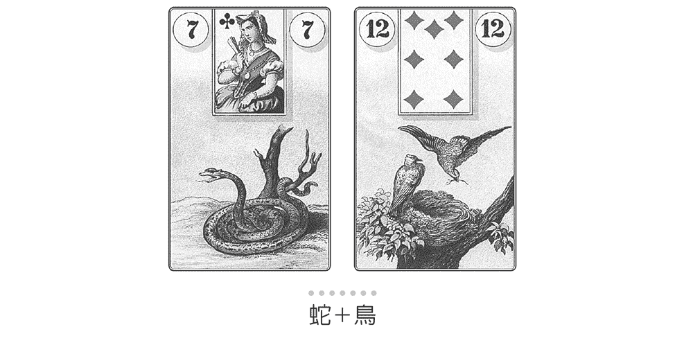

★蛇＋百合＝爱骗人的老男人；骗子或投资失利；由信任的长辈发现了虚伪之事；假萨满或神棍；抱病的老人

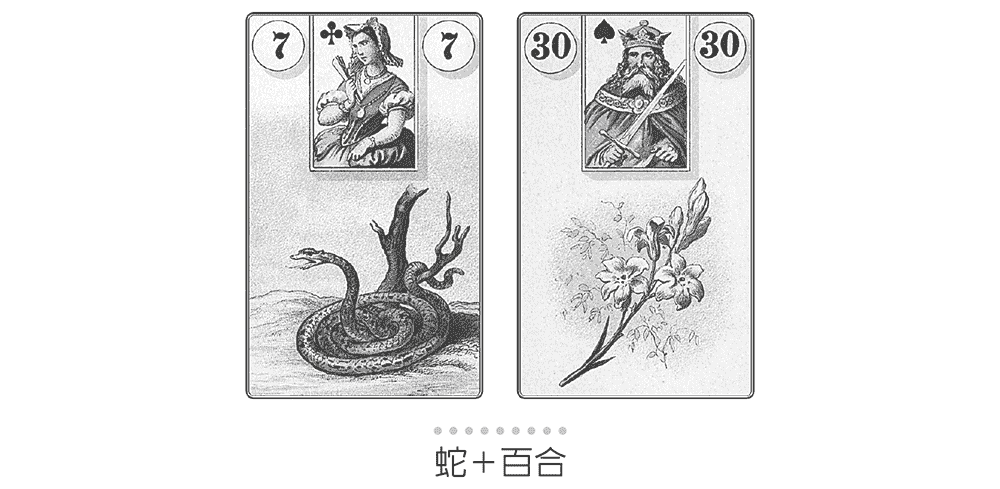

★蛇＋太阳＝经历谎言与欺骗后，终于成功；历经千辛万苦后，终于成功

★太阳＋蛇＝虽然会达到成功和胜利，还是会有不可预期的挑战出现，阻挠你的成功

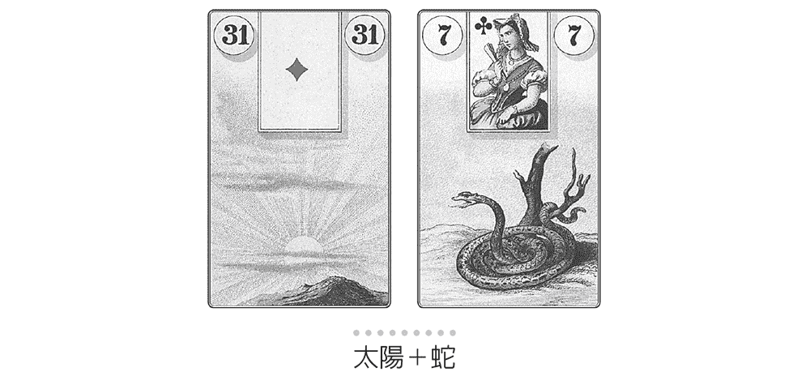

## 棺材

扑克牌对应：方块九

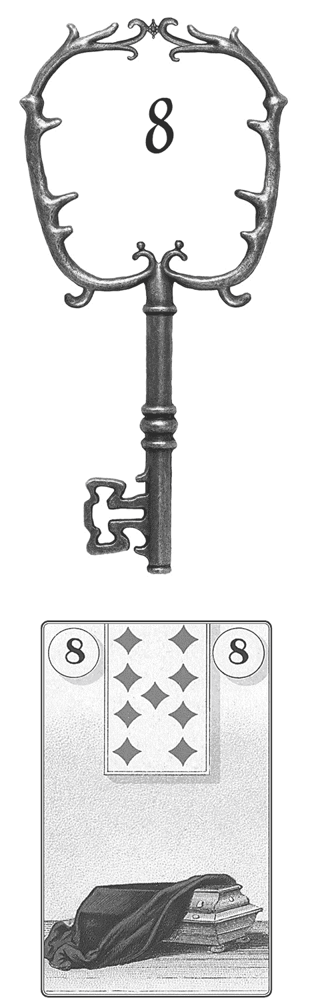

这张牌通常只有一具简单的棺材。有时候是木制，有时候是很华丽的棺材；有些牌面会画一袭毯子披挂在棺材上，有些则没有。简言之，棺材是结束与死亡的象征。这张牌呈现的郁闷氛围告知我们，危险在前，或有个巨大的难关等着我们去克服。棺材通常带来结束，因此要检查左边的牌，看看结束的人事物为何。结束总是痛苦的，但结束也意味着新的开始。棺材有时候是了结痛苦磨难；它也在警告你要小心重大疾病或严重财务损失；同时也象征忧郁和失望。如果旁边有负面牌，痛苦与重担会更大。

棺材牌讲述着令人担忧的剧情，因为它预言了我们努力的一切终将毁坏，无论是关系、事业、职场还是健康。这张牌代表痛苦的改变与转化。棺材有时象征旧有信念的死亡，并让新的信念浮现——心智上的转化。

棺材牌也意味着是要断舍离并重新开始的时候，亦是洗涤净化并重获新生的时期，更是放下过去、展望未来的时刻。这段时期，一定要怀抱希望并正面看待，才能更好地克服危机。有时我抽到棺材牌时，它只是要告诉我，这是宜“待在床上”的一天。

棺材有时象征死亡，特别是旁边出现船这张牌，或者是周围有负面牌的时候，例如镰刀。

从正面来看，棺材的出现可以视为灾厄即将结束。

### 对应主题的牌义

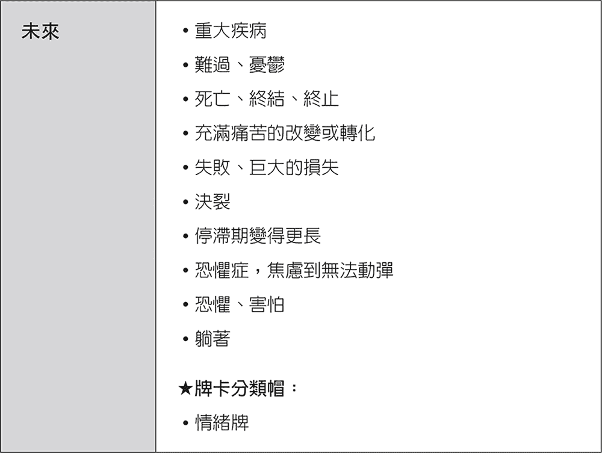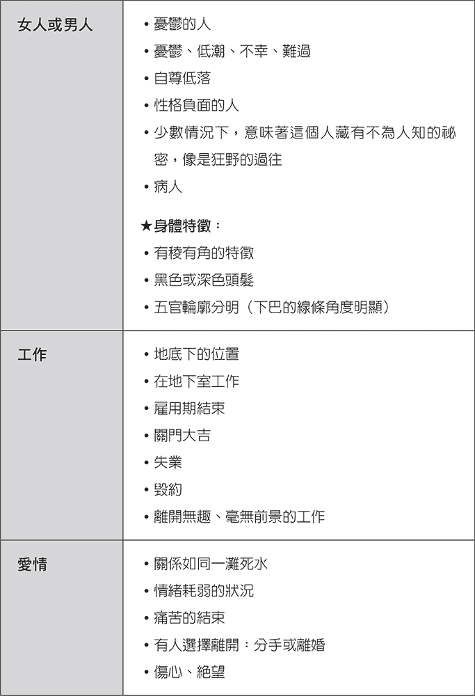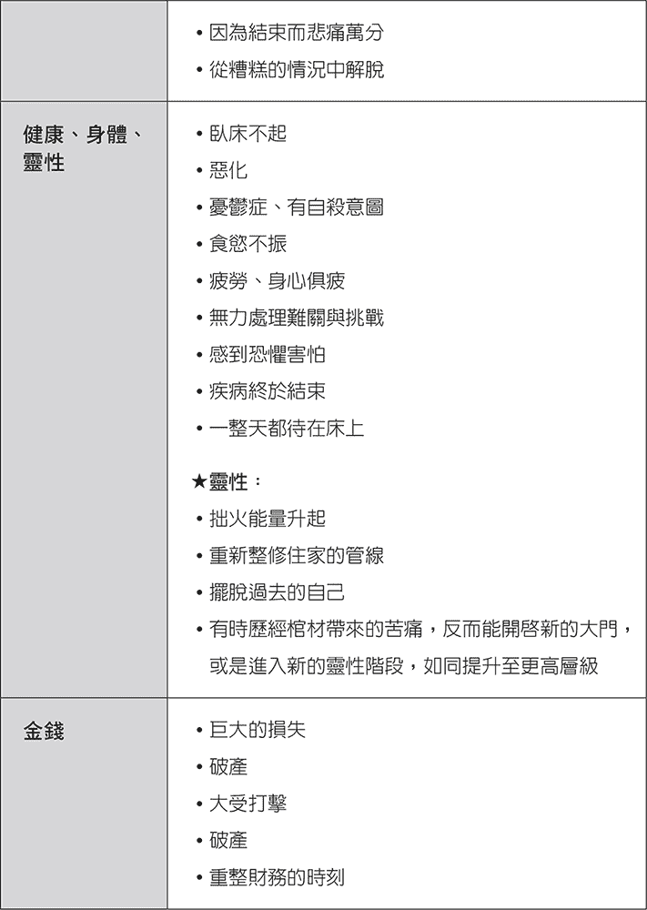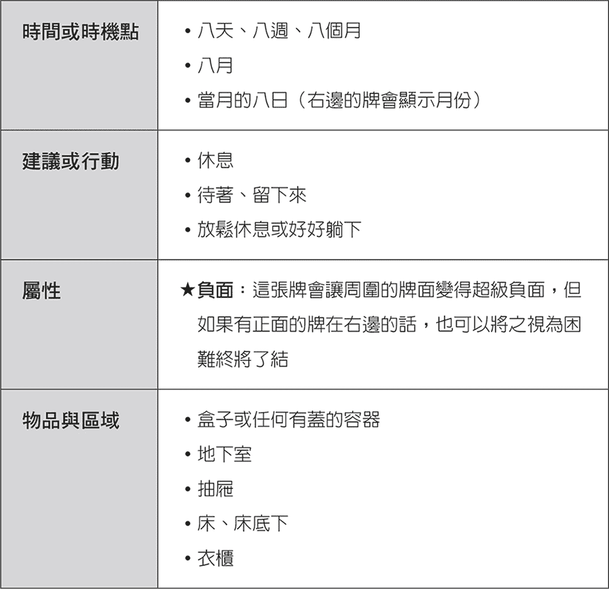

### 这张牌的个人故事：

这则故事对我而言非常重要，它仿佛是生命中的震撼，教会了我人生道理。我当时为非常亲密、挚爱的人占卜，而棺材牌出现在人物牌的右方。我重新占卜，棺材还是出现在右边。资深经验让我一看见棺材牌，脑海中的警铃即刻大响。因此，我改用大蓝图牌阵来占卜：女人牌是最后一张牌，未来没有牌，下方也没有牌，只有棺材在女人的上方。

此时，我再也不能不面对现实了。因此，我为朋友的女儿抽了一组大蓝图，启动熊这张牌象征她的母亲，检查周围有什么牌出现。棺材和镰刀在熊的周围。我继续为我朋友的其他孩子抽大蓝图，一样启动熊象征母亲。然而，镰刀和棺材在每一次占卜中都出现了！

我的眼泪止不住地狂掉，毫无疑问，这是近期会发生的意外。我的脑海闪过一个念头，一种感觉，一个灵感——如果我能够占卜出来，就意味着我们有机会改变未来。我相信有时候你绝对有力量可以改变宿命！我告诉朋友之后，我们两个决定做些什么。我们开始冥想、祈祷，祈请所有天使、指导灵和我们所知的一切神灵前来协助。做完这些事情之后，我又再占卜一次朋友近期的运势，而棺材在那一排的最后一张。我只想尖叫，而我也的确大叫了！我们将行动拉到更高层级，做了更多的祈祷。我先生当时出差，所以我们一整晚都可不受干扰。当晚我们都没有睡觉，直到太阳升起时，我们皆筋疲力尽，因为我们整晚不间断地祈祷、哭泣、冥想，做了所有能做的事。我发誓，直到这一切解决之前，绝对不让朋友离开我的视线范围。我们决定在睡眠中运作意识，借此改变那一张棺材牌。

在我睡觉前，我决定去洗个澡。淋浴时，我不断祈祷、祈求、哭泣，我感觉到我的心不断扩张、拓展，仿佛容纳了整个宇宙。那一瞬间，灯光突然跳掉，仿佛电影中光芒从天而降的那一刻，时空刹那静止。浴室的灯光又亮了。我洗好澡后又抽了牌，抽到爱心＋鸟＋幸运草＋钥匙＋女人＋百合＋树＋花束＋星星。这是我有史以来见过最美最好的牌面了！

前面的牌，爱心＋鸟＋幸运草＋钥匙，代表我们虔诚恳切地祈祷和进行灵性工作。后面的牌出现了女人＋百合＋树＋花束＋星星，意味着朋友在人世间还能够待很长一段时间，而她受到祝福，有了新的生命之路和许多希望。我又占卜了三、四次，都得到相同的结果。接着，我也帮朋友全家抽了大蓝图，占卜结果都奇迹般地改变了！直到这时，我才能安心入睡。

那天，我知道我们做到了。我那时才领悟到，牌卡是根据你现在的意志去预测未来，但若是你改变意志或在生活中做出其他改变，未来也会跟着改变。从那天起，我对于占卜的想法也转变了。如果我看见占卜结果不佳，我会鼓励个案跳脱惯性思考，试着改变自己去扭转未来的结果。

五天后，朋友打给我说道：“我早上起来时有种生病的感觉，心脏非常不舒服，所以我就带着水晶天使和我喜爱的矿石。我在高速公路上开车时，那股不适感又出现了，于是我握住我的水晶。我在高速公路上的时速很正常，有一只白色的鸟直接撞上玻璃而死，好像它就是冲着我而来的一样！它是直接从我驾驶座的窗户撞上来，不是挡风玻璃喔，是驾驶座的窗户，感觉很像是它代替我而死。我为它感到难过，但也感谢它和一切，因为我有了第二次的机会可以好好活着。我会尽我所能回报这一切。”我们两人都讶异得瞪大双眼，但内心深知这是事实，忍不住都落下了泪。

### 大蓝图牌义：

传统来说，棺材牌象征重大疾病或是破产。棺材牌离人物牌越远，危险性就会降低越多。

这张牌若是座落在过去的位置，意味着个案过去经历过一场疾病、停滞期或低潮忧郁的时期；反之，如果座落在未来的位置，则要小心未来会发生不幸之事。

棺材离男人牌或女人牌越近，危险和灾厄也就越严重。如果棺材靠近男人牌或女人牌，无论是在上下左右哪个位置，都要谨慎检查和剖析这张牌传达的讯息。检查棺材周围的牌，以及审视这些牌与棺材之间的关联，才能判定危险来自何处。什么即将结束？什么即将改变？什么部分会发生痛苦的转变？

即便棺材距离男人牌或女人牌很远，仍需注意这张牌周围的牌面：检视棺材影响的是什么层面；检视每张牌与棺材的关系；检视是什么即将结束、改变、转变或损失。

不要轻率地解读这张牌，一定要慎重小心。我住在贝鲁特时，那里仍处于战乱时期，棺材牌出现的次数中，很高比例都是代表真的死亡；自从我搬到美国后，这个比例就大幅下降了。

### 配对组合与范例：

★棺材＋镰刀＝痛苦和挑战结束了；从过去的重担和悲伤中解脱；长期卧病后进行手术；做出不够好的决定（棺材＝善变的人，镰刀＝果断的决定）

★狐狸＋棺材＝工作结束；退休；计划的成果不如预期

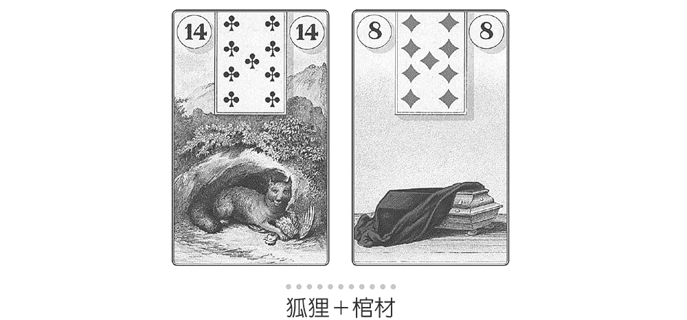

★棺材＋幸运草＝康复；另一次机会；困境解除

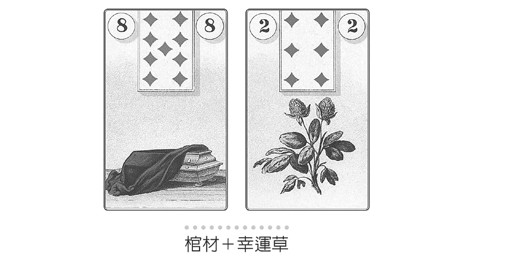

★鞭子＋棺材＝挣扎和磨难结束，或是口角和争执结束；可能是身体出意外或暴力虐待，这也就是为什么背景脉络很重要的原因，周围的牌面也很重要

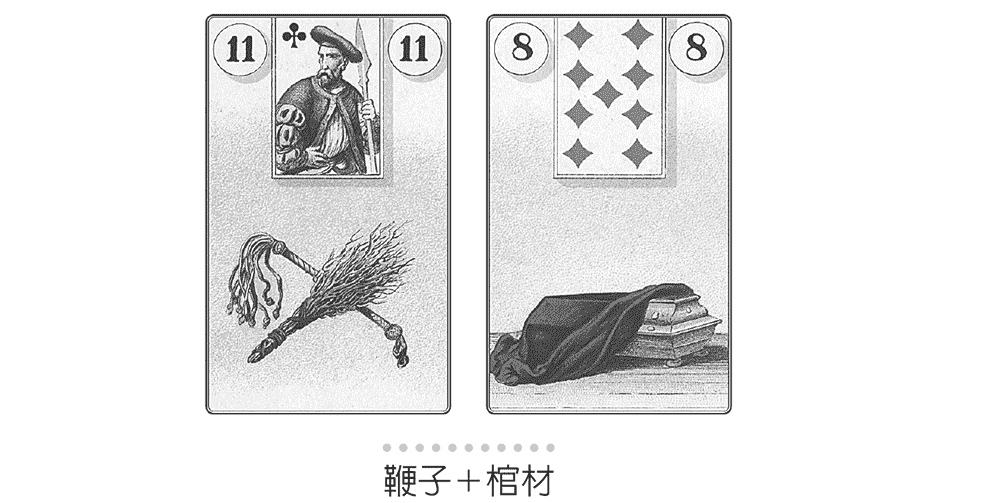

★镰刀＋棺材＝意外；失败的手术或手术后长期卧病在床；决心不会复合的分手

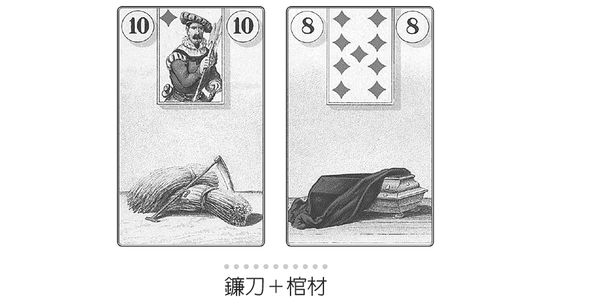

★棺材＋太阳＝复活重生；新的开始；调整自己，重新振作

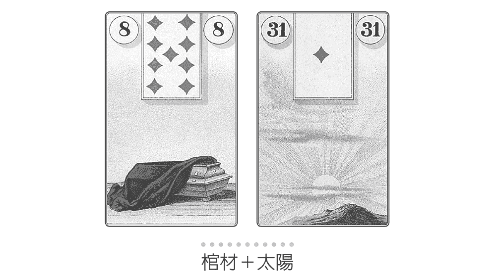

## 花束

扑克牌对应：黑桃皇后

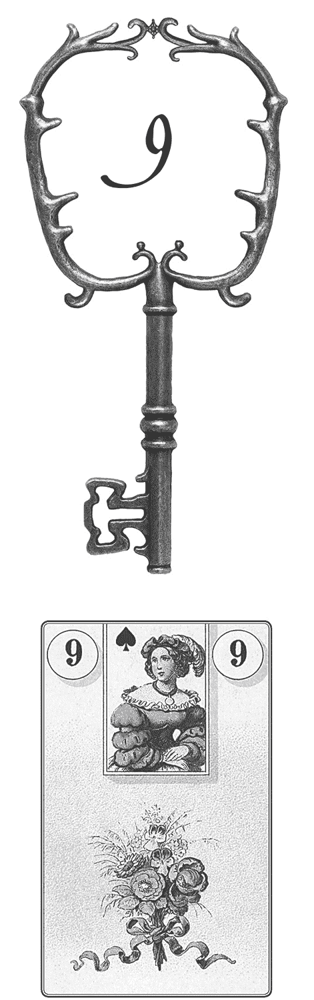

花束这张牌的画面通常都是一束美丽的花或好几枝花插在花瓶里。这张牌总是充满美丽鲜艳的色彩和精致华丽的摆设，唤起内心的喜悦、美感、爱情与幸福。花束总是象征仰慕、满足、温暖、喜悦。花束牌象征表达殷勤、赞赏、感激之情的美丽之物。

这张牌会为个案的生命带来全面的幸福、成功、胜利，象征令人开心的礼物或不错的惊喜。论及家庭、友情或爱情的主题，花束这张牌带来情感上的吉兆，也象征具有创意和艺术家性格的人。花束牌可以意指你的计划如你所预期般进行，而你会感到开心、欣喜。

如果负面牌的右边出现花束，预示困境、担忧、压力之事会解除。它带来成功和成长，以及温暖与真挚的情感。花束牌的右边如果接续出现正面、令人开心的牌，占卜结果会非常祥和且令人喜悦；花束牌右边如果出现负面牌，意味着要小心不真诚的感受和失望。

### 对应主题的牌义

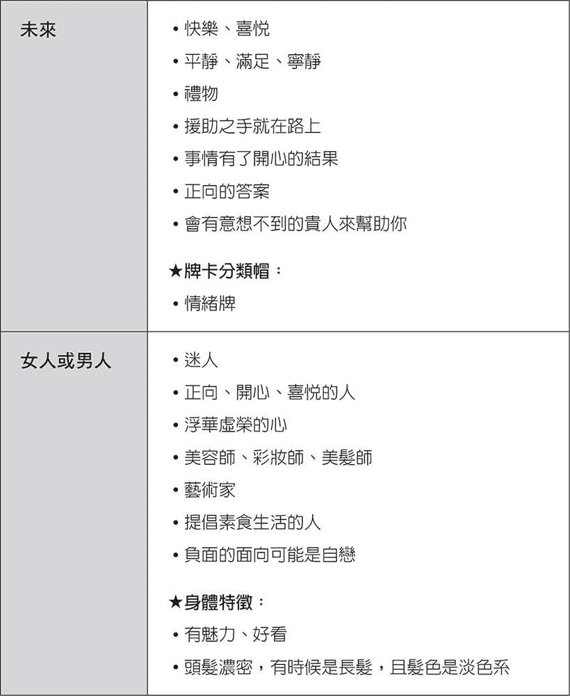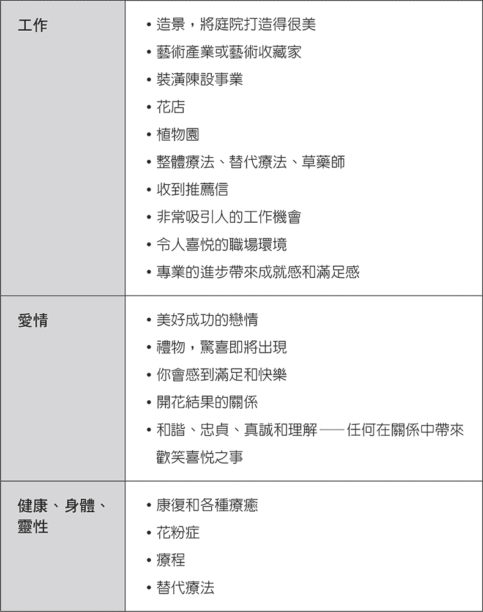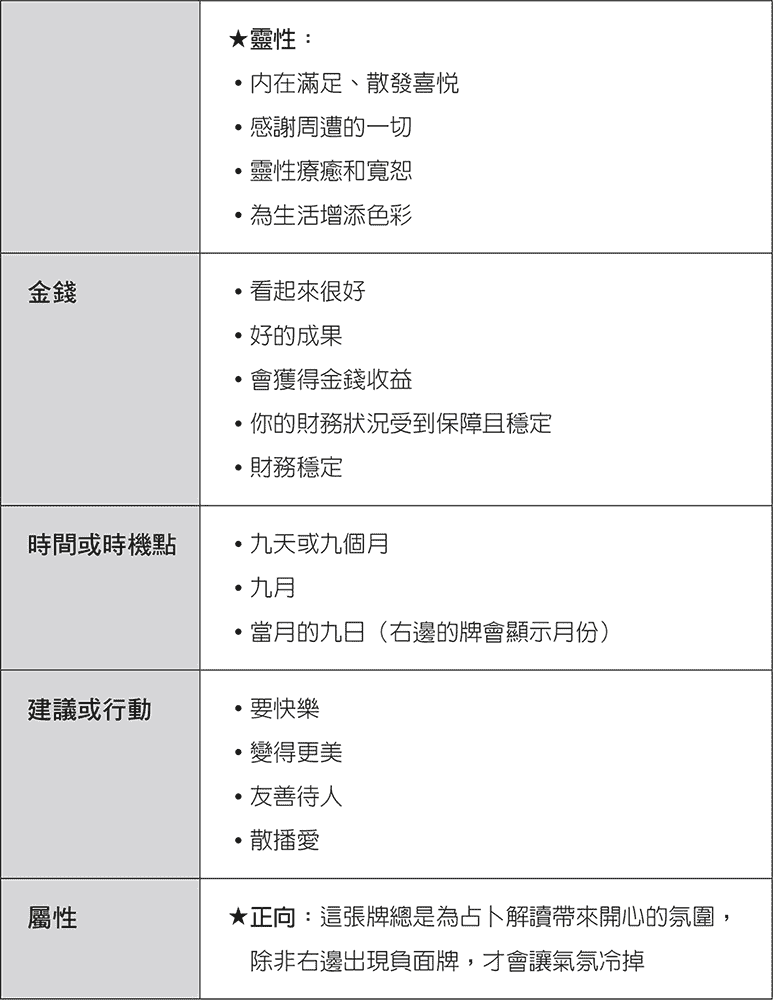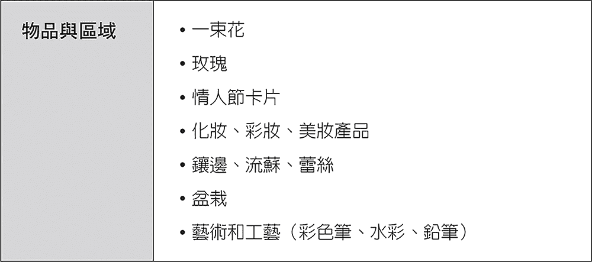

### 这张牌的个人故事：

预定好要写花束牌的故事当天，我整天都无法远离网络，因为我在网购。这一切的起因是我在寻找生日礼物，送给即将四十岁的我。我先生看到我在网购，就叫我帮他找一个他需要的物品。搜寻的过程中，我看见一幅精美的手绘挂画，而且我母亲一定会喜欢；接着，我注意到顺势糖球，但犹豫不决该买哪一种，因为有太多品项了；后来，我想起来我需要山金车，但我分不出蓝色和绿色品种的差别。我注意到一条手链，非常适合我妹妹，但我在思考能不能在其他地方买到更便宜的。我很想念我的外甥们，距离上次我送他们礼物，已经过了好久好久了……。有那么多选择，而我又不能漏掉我两个儿子，他们想要某种蒸汽朋克（steampunk）式的齿轮（真是感谢某一套蒸汽朋克风塔罗牌，这套牌来到我们家时，着实引起一阵炫耀）。我找到很美的指南针，但我在想是不是也要买一个日晷……。过程中，我又看到了一本旧书，我的挚友可能会想要。

当我结束网购，荷包空空之后，几乎已是半夜。我花了八个小时在网购，研究顺势疗法，挑选完美的礼物。

结果，早上我抽到的两张牌（花束＋书籍），并不是指我要写本书的花束牌故事。我相信，我当时发现了这两张牌配对组合的新牌义。

★花束＋书籍＝研究和阅读顺势疗法；挑选礼物赠送全家的技巧；下单付款前，深入研究与分析每一个礼物；剖析每样礼物的优缺点；近期会开始调查礼物是什么；研究和寻找各式各样的礼物，或是单纯搜寻礼物而已

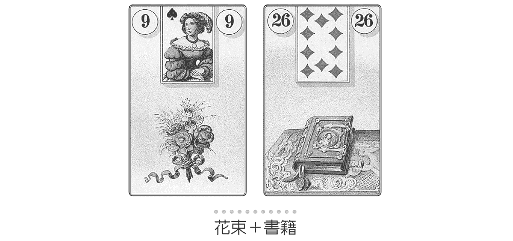

### 大蓝图牌义：

传统上，花束牌意指满满的喜悦、宁静与平静。花束意味着绝对的满足感和欢欣之情。这是爱情的甜蜜期、友谊的亲密之心，以及绝对的忠诚互信。如果花束牌靠近男人牌或女人牌，代表周围的人都会善待你，并且处处为你着想；假设花束牌座落在当下或未来的位置，意味着你会被福神眷顾，或是你会收到让你乐到不行的礼物。记得，礼物不一定都是以物质的形式出现。拥有一群爱你的人以及美好的友谊，是我们所收获的最佳礼物。此外，你也可以当出于喜悦与开心而给予的人。

我很喜欢在牌阵中看见周围是花束牌，它总是代表未来很愉快美好。

### 配对组合与范例：

★花束＋鸟＝素食生活讲座；获得极高评价，或是有人对你高度赞赏；非常愉快的拜访，或是开心地与人喝咖啡聊天；可爱的伴侣或好看的双胞胎；在美容院聊天；妆发谘询

★花束＋云朵＝有些问题或麻烦会打扰你内心的平静；你的幸福快乐将被打扰；愚昧之人，或是外貌姣好却思绪不知道飘去哪里的人（头在云里，意味心不在焉）；抽大麻（花束＝一串植物，云朵＝吞云吐雾）

★花束＋十字架＝痛苦地拒绝；曾经的欣喜快乐，变得悲痛万分；设计成十字架形状的插花；捐款给慈善机构；华丽优美的宗教场所

★花束＋十字路口＝走在美丽的商店街上，逛着所有美丽的商品；走在风景优美的道路上；平静的内心升起了疑问；等待你选择的几个大好机会

★信件＋花束＝情人节卡片

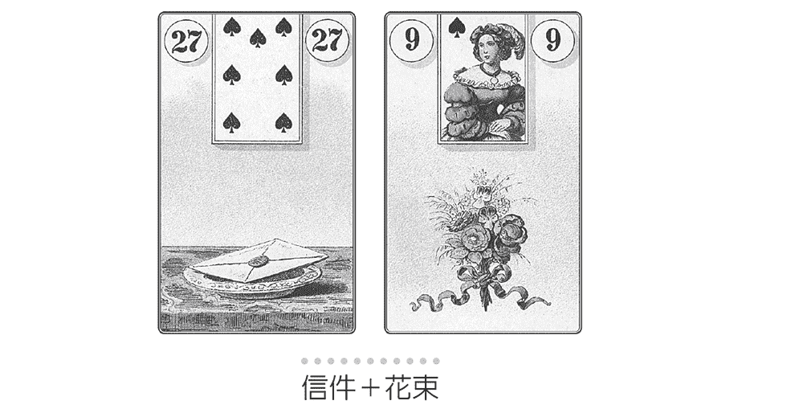

葳迪莎非常担心她策划的活动。“会发生什么事呢？”

★花束＋老鼠＝会更担心场地装饰得如何；展演会有更多压力与不安，需要随机应变；或许建筑物或装饰会有损坏

★老鼠＋花束＝焦虑和压力很快就会结束，因为活动会非常完美；担忧很快就烟消云散，取而代之的是兴奋、期待、内心七上八下

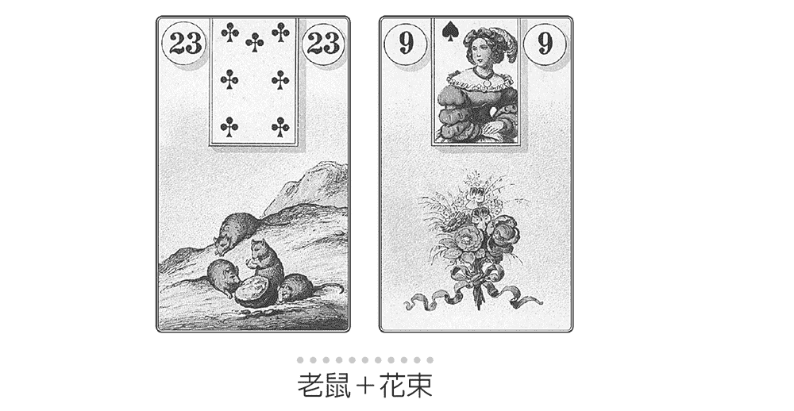

## 镰刀

扑克牌对应：方块侍者

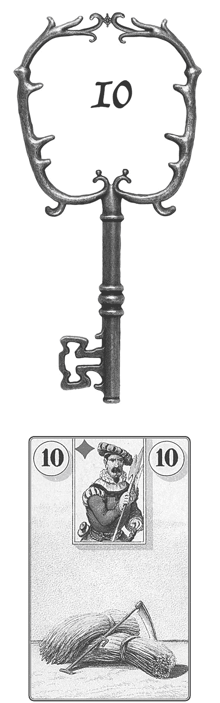

你会在这张牌的牌面上看到一把镰刀，非常锐利，准备要切下去。有时候画面会伴随干草堆，有时候则只有一把镰刀。镰刀象征清理、切割、收获。

如果镰刀的周围是正面牌，则可以避开危险。它预示突如其来的事件，象征切割、切片，也意味着严重、迅速、鲁莽的抉择。镰刀牌的位置非常重要。假设它落在指示牌或主题牌的左边，代表事件已经发生或正在发生；如果落在右边，就暗示着事件尚未发生，而你必须做好准备，小心注意。镰刀同时也迫使你做出果决、艰难与痛苦的抉择。

这张牌会带来突然的损失或断绝分开；这是张象征意外的牌。要格外小心眼前的路，提神注意周围。要提防健忘、粗心和分心。镰刀让目前的事情变得急迫。

这张牌也时常在健康问题中出现，象征任何手术行为。对我来说，它象征注射和针头。

正面来看，如果它的左边是负面牌，镰刀也可以代表斩断痛苦，得到解脱。

### 对应主题的牌义

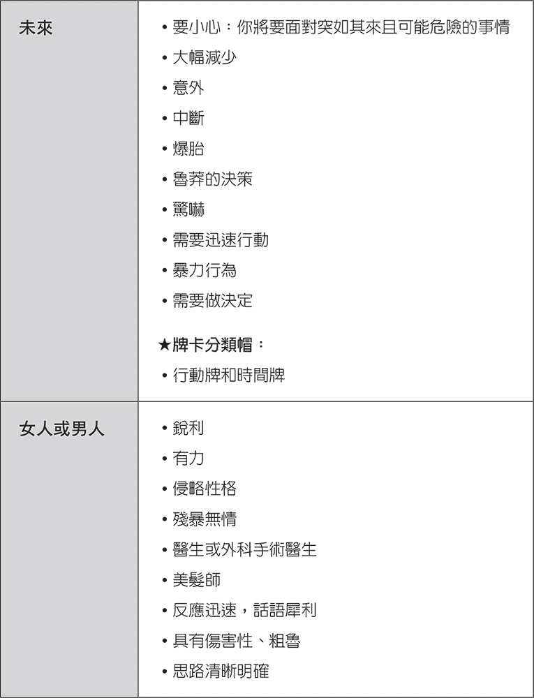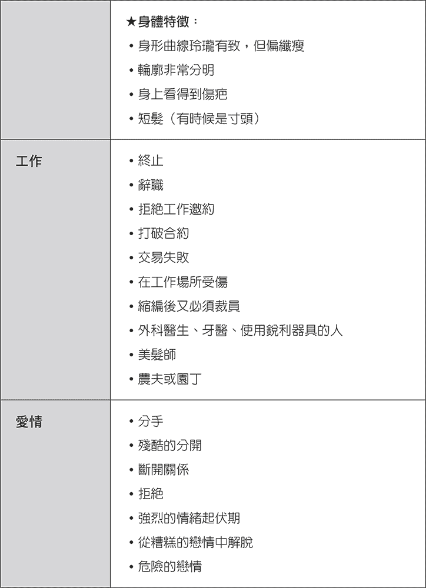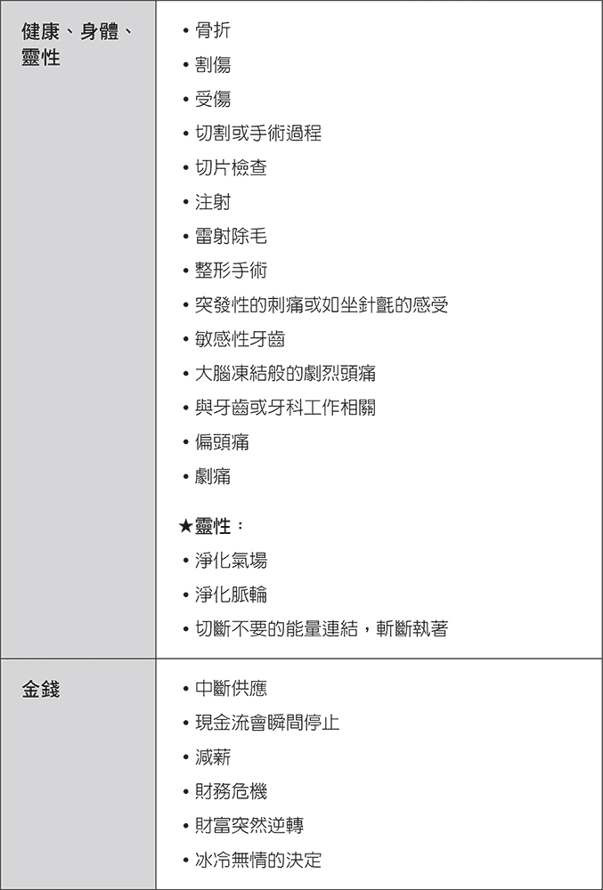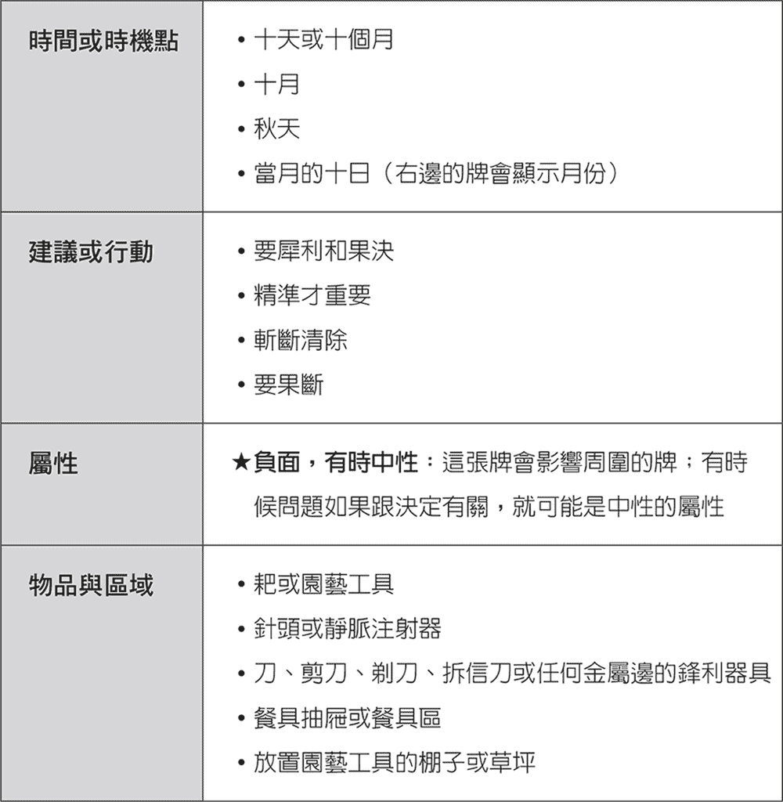

### 这张牌的个人故事：

这是另一则让我情绪起伏的故事：这故事要从我母亲用雷诺曼占卜时说起。我当时十岁左右，母亲为父亲抽了大蓝图来占卜。她占卜了三次，每一次牌面上都出现男人＋镰刀，而镰刀就在父亲旁边。我清楚记得这件事，因为母亲的表情转变，倒抽一口气后，又重新占卜一次。最后，她告诉我父亲：“你必须要小心一点，因为危险绝对会浮现。”他们互相看着彼此，接着转头看向我，而我当时吓坏了。我父亲说：“放心，我每次在山上开车时，都与危险擦肩而过。我们来吃冰淇淋吧。”我当下松了一口气，因为他总是会吹嘘他有多勇敢。隔天，父亲去烘焙坊买面包。他出门的时候，外面开始传来隆隆炮声。

爆炸声震天巨响，表示这些炮弹就落在附近。母亲和我跑到阳台等他回家。炮弹声越来越近、越来越近……，而街上空无一人。接着我们看到他赤裸双脚奔跑着。有一枚炸弹落在他身后爆炸开来。他开始以 S 型的方式在街上奔跑。很快地，炸弹落在我们和他之间，母亲紧紧抓住我的手。我们担惊受怕，等待烟雾散去，终于看见他还在向我们跑来。他终于跑到我们这栋建筑，而炸弹如冰雹般不断落下。我们往下跑了五层楼去找他。他的面色苍白，也受到惊吓，而他始终死命抓着装着面包的袋子，因为他知道一旦开始打仗，面包一定会短缺。

就在那一天，我了解到镰刀的严重性。回想这段往事，我父亲以 S 型在街上奔跑的动作，就像镰刀一样，切开道路与阻碍他回家的那些烟雾。

### 大蓝图牌义：

镰刀在传统上象征可怕的危险，但是有正面牌在周围的话，就可以避免。

这张牌在告诉个案，有庞大的威胁会汹涌而来。透过牌的位置和周围的牌，就能判定威胁从何而来。镰刀周围的牌很重要，因为它们是会被影响的情况。抽到这张牌时，建议要格外谨慎看待。

如果周围是负面牌，灾厄会挥之不去；假如周围是正面牌，镰刀就会象征向前行动的重大决定，或是用牺牲换来痛苦的决定，又或者是艰难的分离。

### 配对组合与范例：

这张牌通常不会当作指示牌。要把这张牌留在牌堆里，因为镰刀会影响它左右的牌。

★镰刀＋塔＝在医院或医疗中心动手术

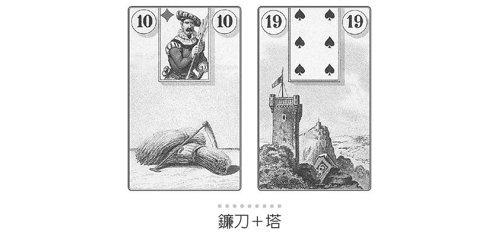

★爱心＋镰刀＝心脏手术；分手（爱心＝激情，镰刀＝决裂）

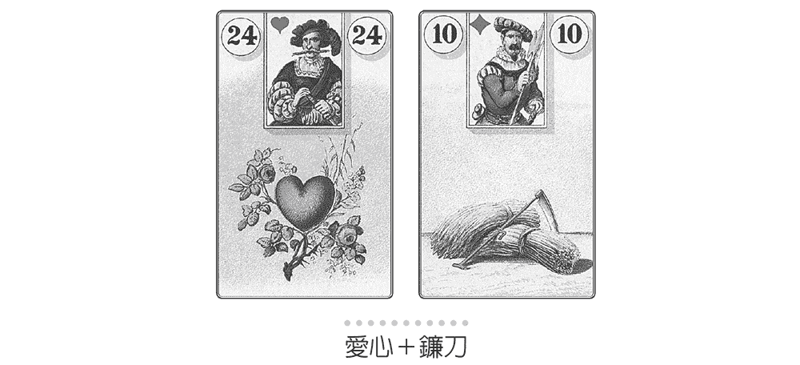

★花束＋镰刀＝整形手术；剪发；修剪草坪或割草；甚至代表断掉的唇膏

★船＋镰刀＝旅程取消；意外

★镰刀＋船＝修理汽车；手术后离开医院；逃离

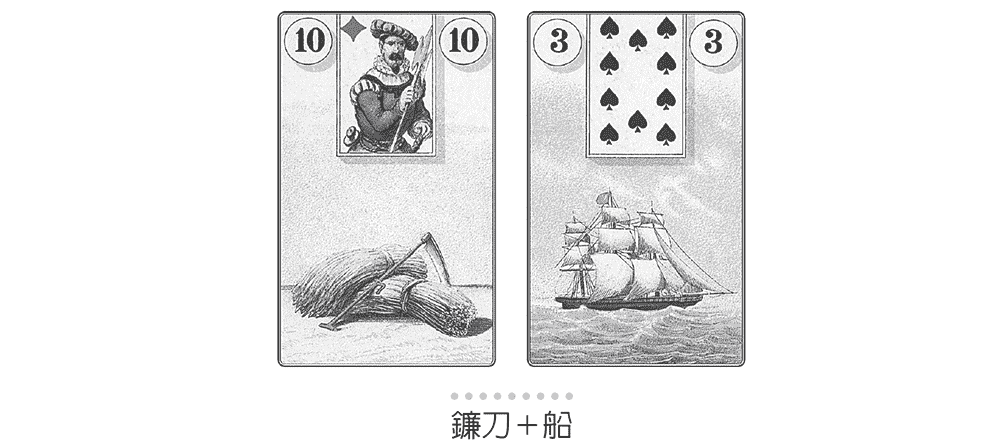

## 鞭子

扑克牌对应：梅花侍者

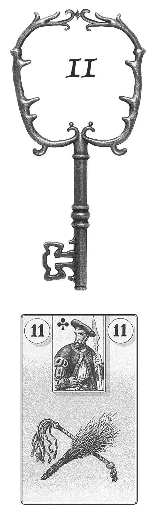

在这张牌上，通常我们会看到鞭子和扫帚并排，或是互相交叉，像是准备好用来处罚。这两样都是古时候用来处罚小孩的工具。这个痛苦的符号映入我脑海时，浮现的是愤怒和施暴，或是电影《孤雏泪》中的画面，以及我早年学生时期的回忆。

我从小在法国天主教方济会学校长大，修女们总是会用木尺处罚我们，而且是很常这么做。每每回家，我年轻的身体上很少没有带着被木尺打完的刺痛。

鞭子带来争执、反对和狂暴的能量。这张牌也象征惩罚和复仇。鞭子也是与性行为有关的牌，因为这张牌象征重复的动作和各种性癖好。若有另一张负面牌在它的周围，就代表偏差、暴力、虐待。家庭、友谊、恋情、职场、甚至生活中，会出现麻烦与问题。鞭子也意味着身心内在的纷争，而这个纷争以疾病呈现：恶心、慢性病或神经紧绷。

通常如果有正面牌在鞭子牌的旁边，解读鞭子的牌义时就会从正面的角度来看：性感、魅力、精实、热情。

因为鞭子或扫帚在使用时会有重复的行为，因此我将这张牌链接到任何需要重复、有节奏的行为，例如运动、训练、清理、写作、性行为。

### 对应主题的牌义

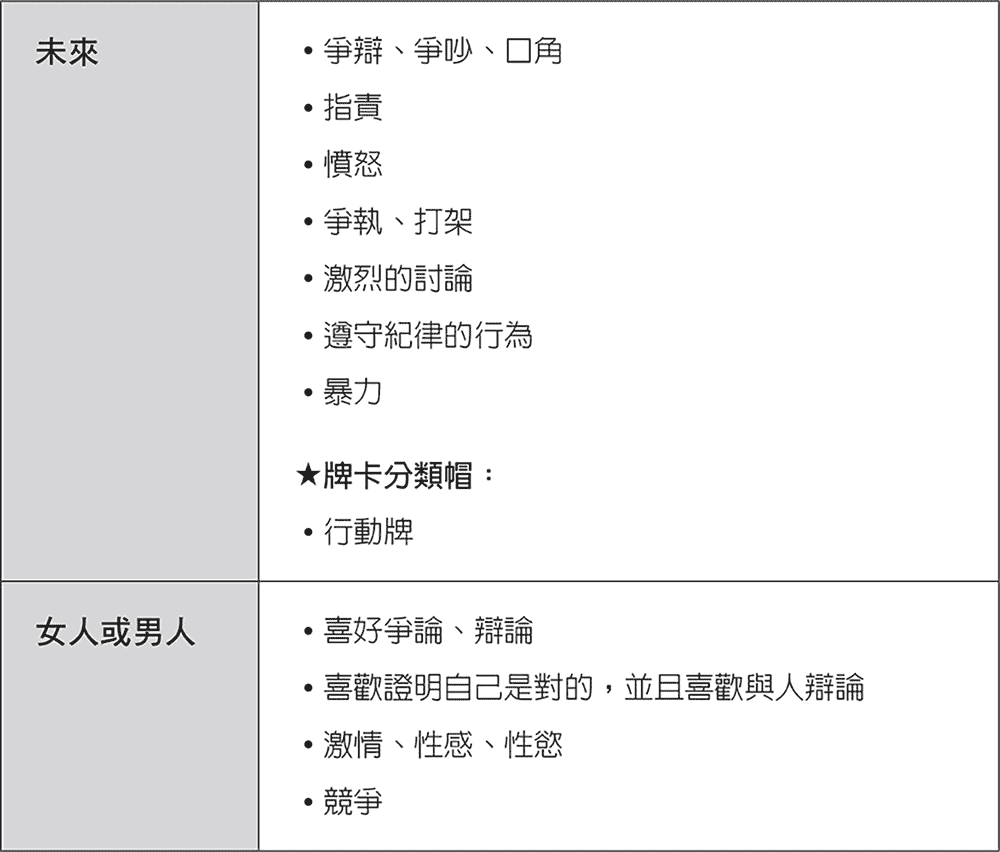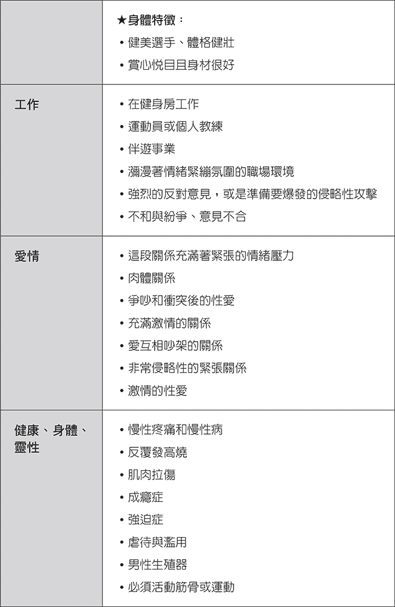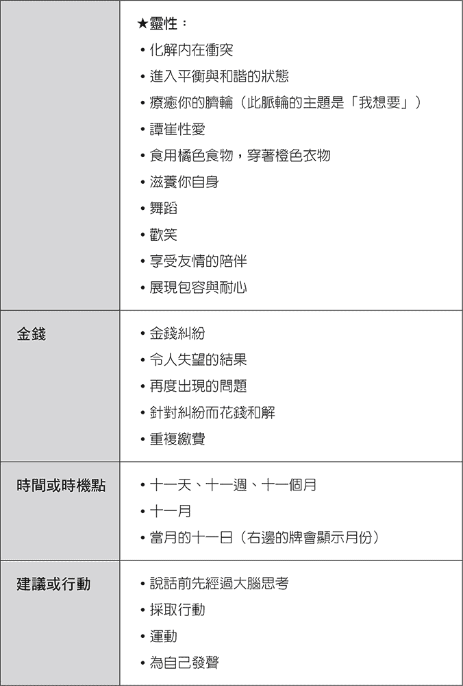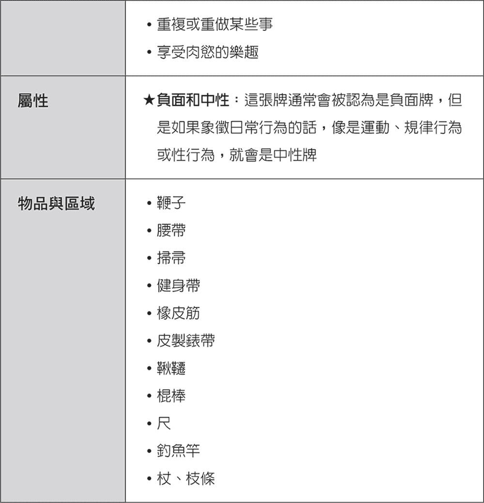

### 这张牌的个人故事：

莫娜是我的一位老客人，她很担心跟丈夫的婚姻。她说：“他的心离我越来越远，我不知道发生了什么事。我们都太忙于工作和照顾孩子了。”我决定先占卜他们的婚姻状况，如果没有清楚的答案，我才会针对他们两位分别占卜。我启动戒指牌象征他们的婚姻，而我抽到以下的牌：房屋＋船锚＋戒指＋书籍＋山。

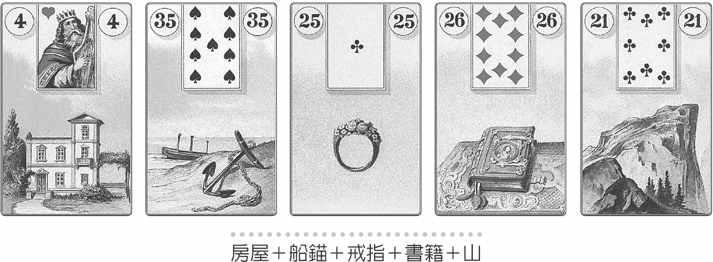

前面的牌，房屋＋船锚代表家庭稳固，但后来的牌面是书籍＋山，问题就出在这里：有什么隐藏的秘密导致隔阂。我针对她丈夫抽了牌，想看看是否有偷吃或外遇等等。

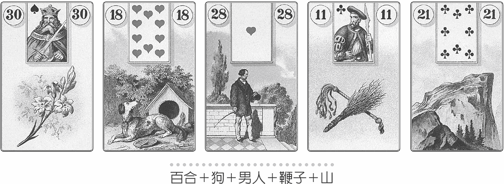

真是冤枉啊！他其实是非常忠贞的丈夫（百合＝长期，狗＝忠诚），但山这个障碍又出现了。当我看见山再次出现，就知道我找到问题核心了！我问她，最近夫妻间是否有发生争执、吵架或口角，但她一直摇头表示没有。那么就只剩下一个问题需要问了：房事！一听到这个问题，她的手立马捂住双唇，并说：“很遗憾我们一直没有机会可以做那档事。”（鞭子＋山＝缺乏性生活）问题就出在这里了！她恍然大悟，接着因为终于放下心中大石而哭了起来。莫娜一直担心老公有婚外情，然而她老公只是一直把没有性生活的挫败感放在心里，因为她是如此忙碌，以致无暇顾及性生活。一个月后，我收到一封电子邮件，她说一切都回到正轨了，并且感谢我让她看清真相。我喜欢看到美好结局。我总是希望占卜的结果都可以如此简单、轻松。

### 大蓝图牌义：

传统上，鞭子意味着家庭内的争吵、家庭麻烦、痛苦、交恶或纠纷、朋友间反目成仇、分离。

鞭子也象征悲痛与不幸。它代表会有巨大的冲突、激烈的紧张氛围，以及不和的事件（视这张牌的位置而定）。口角争执会发生在任何关系中：朋友、恋人、家人、同事、邻居，或是随便一群人都有可能。如果鞭子靠近女人牌或男人牌，平静生活会掀起冲突。你需要确定这张牌落在过去的位置时，是否仍持续影响现况，或是未来可能会出现的小纷争。

如果鞭子被负面牌包围，紧张的氛围会变得更剑拔弩张；假若周围都是正面牌，那么问题很快就可以迎刃而解，但也许还是会受点心灵上的伤。

这张牌会造成严重的结果与危难。一定要检查周围的牌面，寻找线索，分析这张牌到底是在说肢体活动、运动、性行为、疾病、暴力还是冲突。倘若牌面的讯息仍然很模煳，那么就跟个案谈谈这张牌，询问他们最近是否发生过争执。这张牌非常棘手，只有经过大量练习与时间淬炼，才能掌握它的牌义。

### 配对组合与范例：

杰森对卡洛琳的意图是什么呢？

★爱心＋鞭子＝他只是想跟她上床而已（爱心＝激情，鞭子＝性）。如果周围有负面牌，可能意指暴力对待或不怀好意

宝拉被蓝恩不当对待后，还应该继续跟他交往吗？

★鞭子＋镰刀＝不。他施暴的程度会越来越危险（鞭子＝口语／肢体施暴，镰刀＝意外）

史蒂夫明天会打赢那场官司吗？

★鞭子＋太阳＝史蒂夫有很大的机会能够打赢官司，但是他必须展现出更具侵略性的表现（鞭子＝辩论／争论，太阳＝成功。这种情况下，我会多抽几张牌以得到更具体的答案，因为两张牌的右边如果是鞭子，讯息太少了。假如线性牌阵的最后一张仍然抽到鞭子，那么我会再抽一张牌，看看接下来会发生什么事）

## 鸟

扑克牌对应：方块七

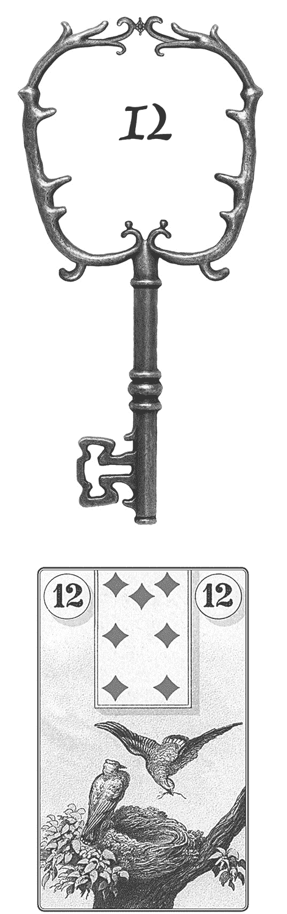

鸟这张牌通常会画一对鸟，可能是两只鸽子或两只猫头鹰，或者是一群鸟。鸟儿们总是开心地共同翱翔或在巢中一起栖息。鸟类长久以来都象征来自神圣力量的征兆。有些鸟类，例如鸽子，就象征爱、关系稳定、生育繁衍。猫头鹰象征智慧、眼界、疗愈。从象征符号来谈，鸟类（例如家鸽）是用来传递消息的，因为历史上，家鸽频繁地被人类用来监督情报和互递消息。

鸟类象征消息、讯息、信息、电话、口语交流、讨论、八卦、聚会、谈判、小聚会、约会、同伴情谊，或是任何透过口语和电子通讯传递的消息（因为电子通讯也等同在空中传递消息）。鸟也象征电视（提供信息给待在家中的我们）、广播电台（主持人喋喋不休）、网络。

如果这张牌在男人牌或女人牌的左边，便是在暗示这个人似乎已经有交往对象。

因为鸟这张牌与空气有关，所以它也是象征思想的牌卡。

### 对应主题的牌义

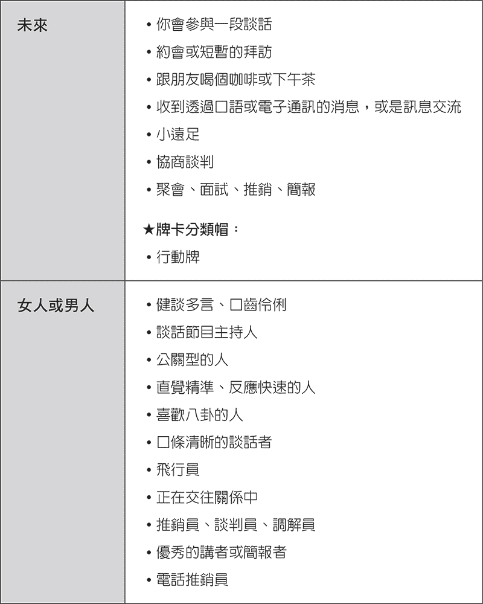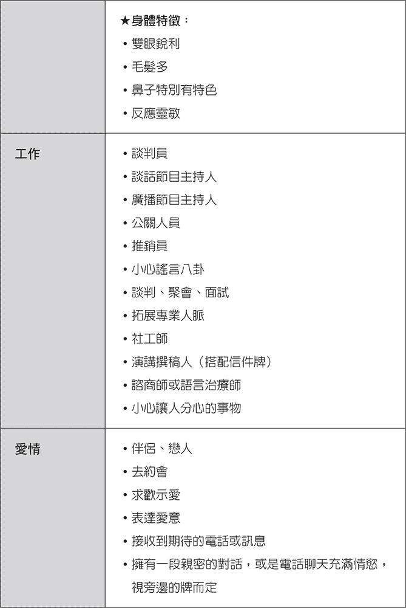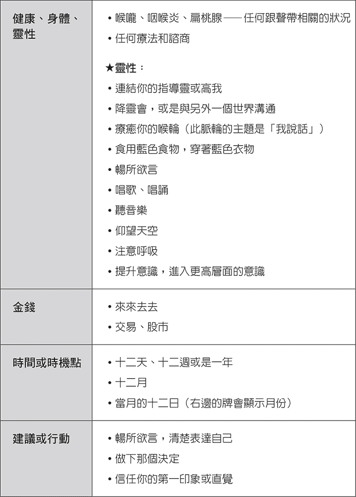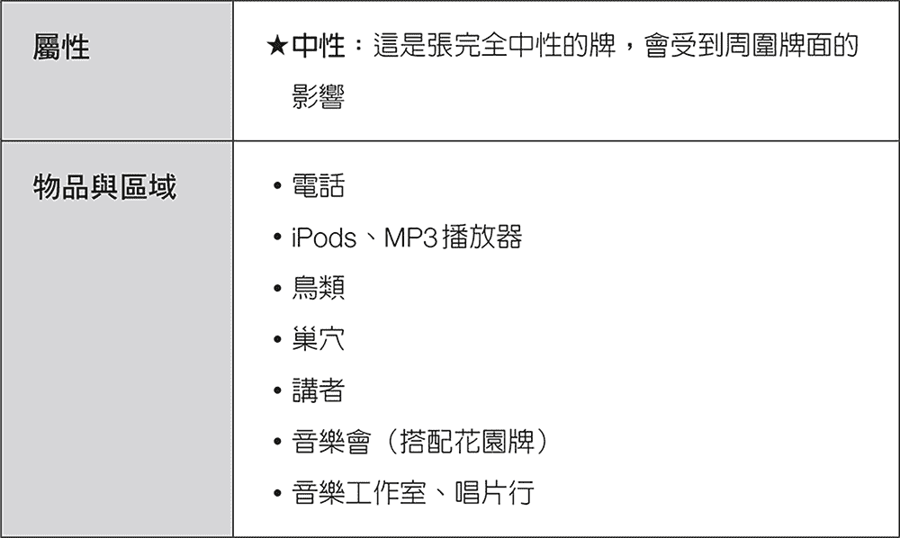

### 这张牌的个人故事：

我花了两天才写完鸟的部分，而这两天我的思绪纷飞，想着该写哪些故事比较好。我的电话响个不停，我的儿子们也滔滔不绝讲个不停，一直问我问题，搞得我也分心。我周旋在儿子、家庭、朋友和写书之间。

第二天要结束时，我才了解到这些事件都跟鸟这张牌息息相关，所以我得将这则故事写进本书，并且写下我很久没使用的古老牌义：“短暂的恼人之事，但很快就烟消云散。”

这张牌通常代表讨论、聚会、兄弟姊妹或两个人聚在一起。我们家去海洋世界主题乐园那天，我没有问问题就快速抽了两张牌，抽到鸟＋山。我脑海中的第一个想法是两个人都不跟彼此讲话，或是两人僵持不下。在一个幅员广阔的主题乐园里，到处都是人，孩子们想要各自去不同的地方，而我们还要试着把每个人都抓在一起，又要玩得愉快，这真是个挑战。我心中想着要放轻松，平静面对，不要让小事扫了游玩的兴致。

当天第一次发生的小事情，虽然扰乱了我们的和谐，但我还是用正向的态度解决了。当天稍晚，不知为何，我们五个人走散了——我和我的二儿子在一起，我十三岁的大儿子和六岁的弟弟待在一起，而我丈夫自己一个人。一开始我满平静的，因为每个人都有手机，所以我联络得到其他人。但是打了几通电话都没人接之后，我开始惊慌失措了。这里人山人海，我根本找不到他们。接着有人跟我说，他们的手机在这个园区里也没有讯号，因为网络流量过载了。

我丈夫终于找到我和二儿子，但是我另外两个儿子仍然不知下落。我忧心忡忡，特别担心六岁的小儿子，怕他一个人落单。我不想离开原地，以免他们回来时找不到人。我看着手中的手机，这时候它就只是块废铁。我立刻想到鸟＋山……没有讯号也没有网络，电话不通，手机也没用，失去了一切联系。然后我想起今天早上发生的事，而我扭转了局面、逢凶化吉。

所以我立刻伸手翻找我的包包，拿出雷诺曼，抽了一张牌：幸运草。可以放心了！于是我站在原地耐心等待，知道每个人都安好，而我丈夫也去找他们了。毫无疑问，幸运草果真带来好运。他找到孩子们，我们又平安重聚了。那天之后，我们再也不会只依赖手机，一定都会有其他备案，例如使用对讲机，并且相约在某个地点见面。

近期另一则跟鸟这张牌有关的故事，是我丈夫的哥哥要去机场，结果发现他的班机延误一小时。我抽了牌占卜他的航班，一开始我抽到鸟＋镰刀，意味着航班取消。我又抽了一次再次确认，抽到鸟和山，代表班机会延误更久时间。机场不断延误班机起飞时间，他最后在机场坐了五个小时后才终于登机。之后，他告诉我，航空公司原本讨论是否要取消航班，可是天气又转好了，因此他们才得以起飞。

这个事件告诉我们，未来变化无穷，而牌卡依旧能够预测未来，除非发生某个改变，造成未来拐向另一条路。只要发生了变化，改变就如同涟漪，扭转了结果和预言。

### 大蓝图牌义：

传统上，如果鸟离女人牌或男人牌很远，就代表会有小型但出乎意料的旅程发生；如果靠得很近，则未来会发生小麻烦，但可以轻易解决。

鸟周围的牌也同样重要，因为它们会描述彼此的关联，呈现消息或谈话的内容。负面的牌会让鸟的对话变成讨厌的恶意中伤，而正面牌会让牌义变成赞美、开心的相遇和令人喜悦的消息。

### 配对组合与范例：

★鸟＋山＝宣布挑战到来；班机延误；失声

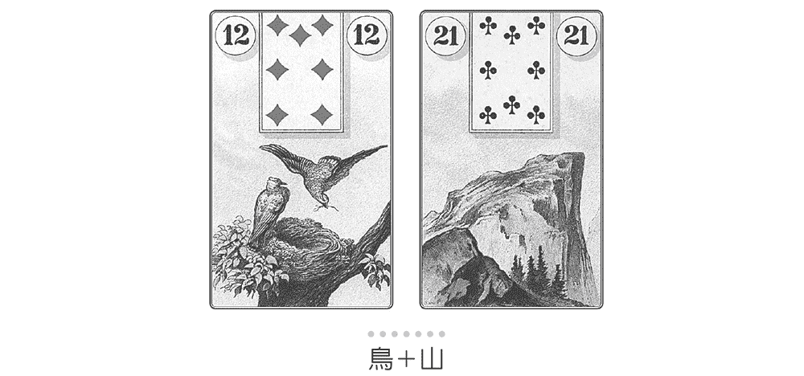

★鸟＋花园＝接待或派对；有讲者的研讨会；家庭聚会；销售会议；演唱会；两个人坐在花园里

★鸟＋十字架＝坏消息；协商或谈判失败；约会不如预期；面试失利；祈祷或祈愿

唐娜罗赛一直勤奋地进行手中的专案，她想知道：“他人对于我的专案有什么感想？”

★星星＋鸟＝你的专案会获得极高的评价（星星），并且会在许多场合发表和说明（鸟）；会被认为是参考指南或资料来源，而且别人口中（鸟）的好评（星星）会帮助这项专案声名远播

★鸟＋星星＝充满希望的消息、好消息、信息爆红；在脸书、推特或电子邮件上的动态更新或公告

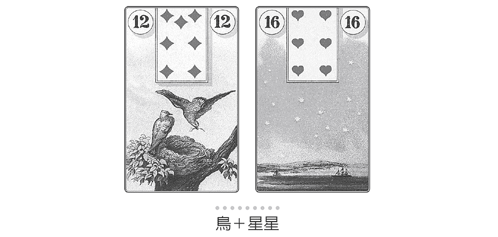

## 小孩

扑克牌对应：黑桃侍者

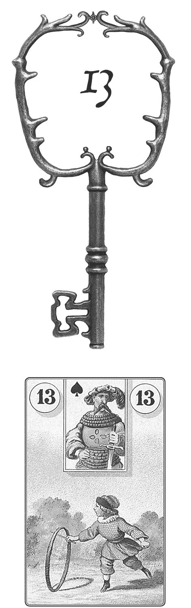

这张牌上通常画着一位小女孩或小男孩，穿着得体，开心地嬉戏、快乐地玩玩具或享受花朵的美丽。小孩象征纯真并以新的视野看待世间，跳来跳去，没有复杂的思绪，天真地只看见人性中的良善。小孩牌象征无忧无虑的心态，以及抱持活力充沛的热情过生活。

这张牌通常象征小孩，无论是婴儿、小朋友或是青少年，也可能是指个案生活中的小孩或他们自己的孩子。虽然这张牌不是每一次都代表人物，但通常都象征小孩，并且也意味幼稚的个性、小型、新奇、轻微、小小的、初步、开始、玩耍、不成熟、单纯、天真等等特质。

如果小孩牌是这个占卜的主题，那么周围的牌就会描述这个孩子的状态和运势；如果不是这次的主题，那么这张牌就会是修饰和形容状况的牌。

举例来说，如果是在为小孩或青少年占卜，小孩＋房屋＝家中个性沉稳又成熟的孩子（如果是自学生，有可能旁边会有书籍牌）。房屋＋小孩的组合也是同样的意思。

假如我们的占卜主题是房子，小孩＋房屋＝小型的房子、新家、童年时期的家，或是托儿所或幼稚园。房屋＋小孩的组合也是同样的意思。

### 对应主题的牌义

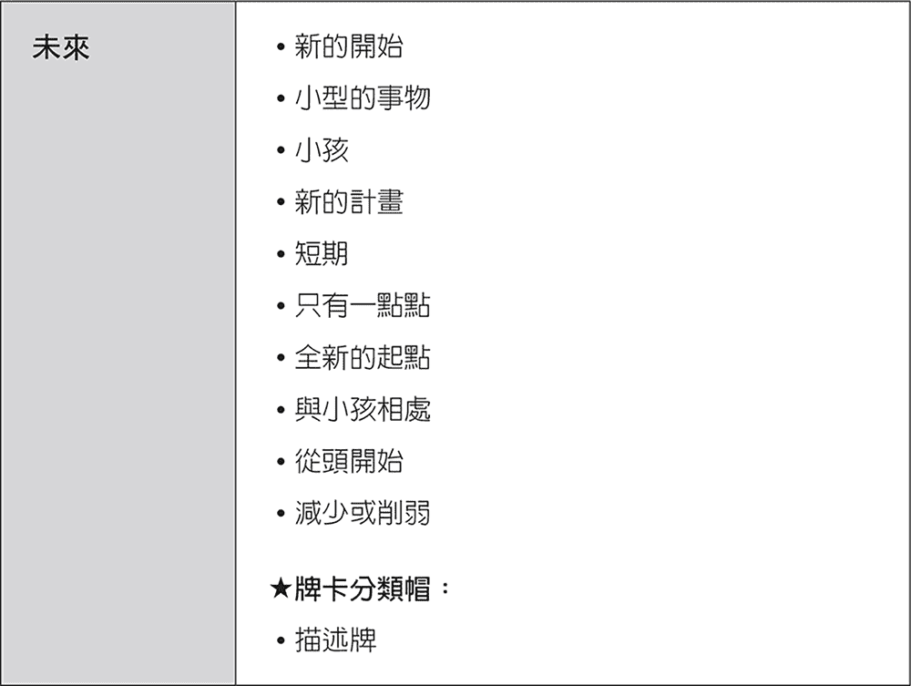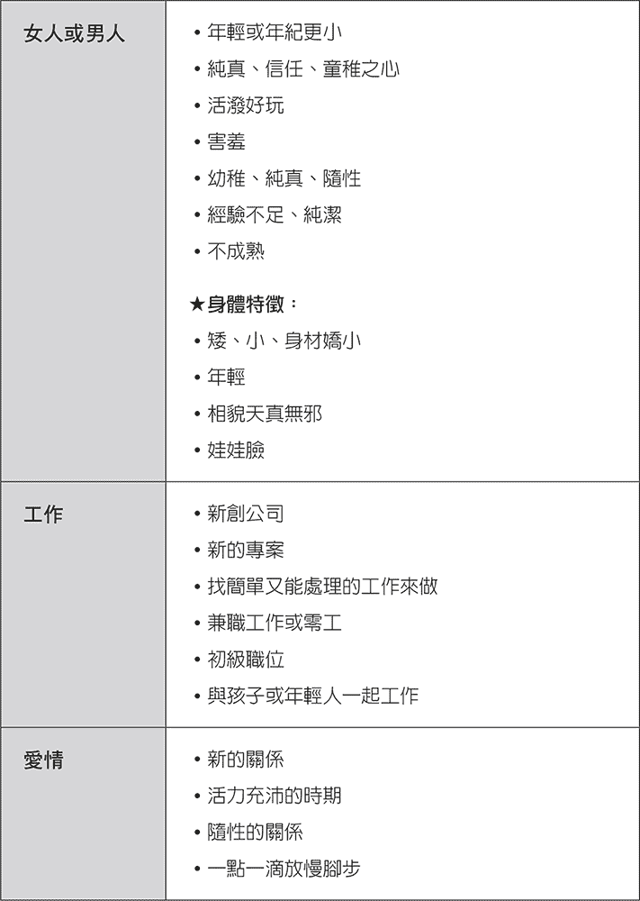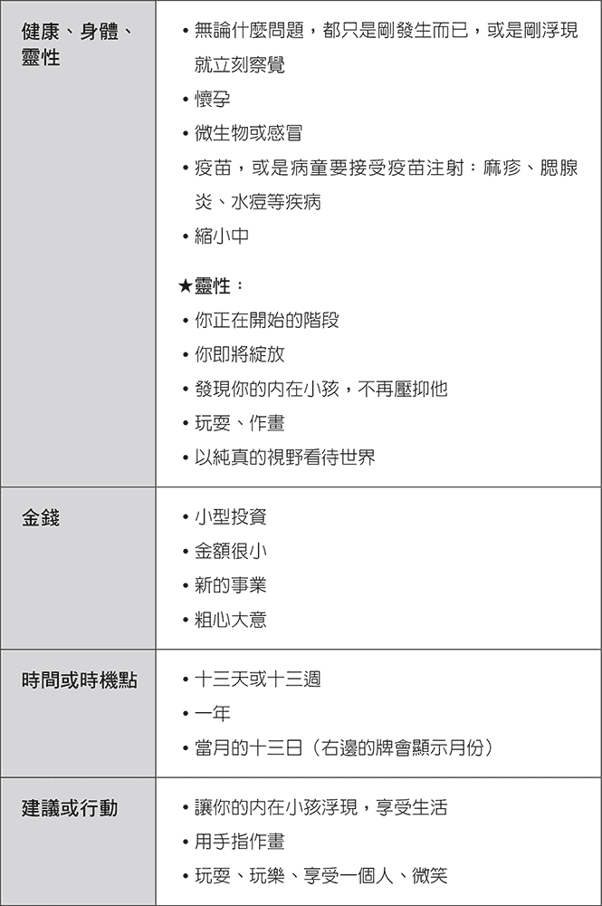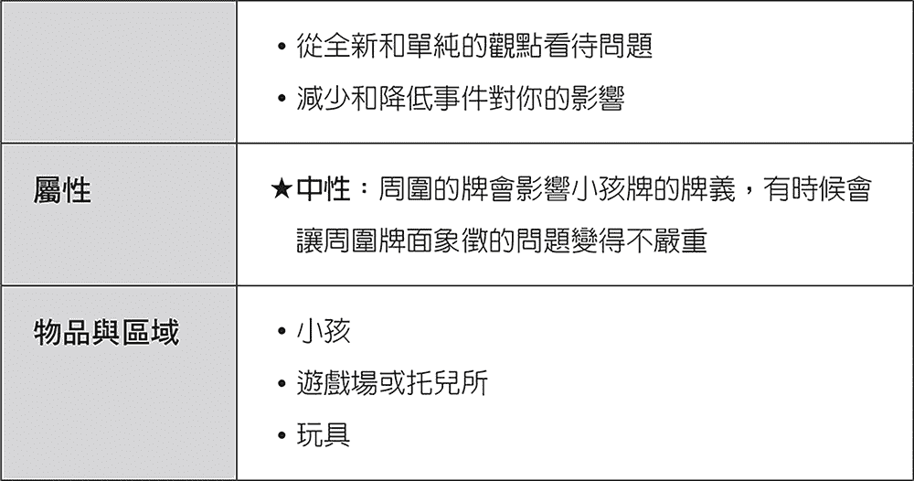

### 这张牌的个人故事：

表妹怀孕时，我想要试试能否预测婴儿的性别。你需要牌面上有扑克牌花色的雷诺曼，才能做这个实验。

我将意念聚焦在预测婴儿的性别，所以我得到的答案不是女生就是男生，而判定标准就是牌卡的性别分类。洗牌时，我将小孩牌与表妹腹中的婴儿链接在一起。以扇形展开牌之后，我开始抽牌，直到我抽到小孩牌，并且将小孩牌的左右牌也抽出来：

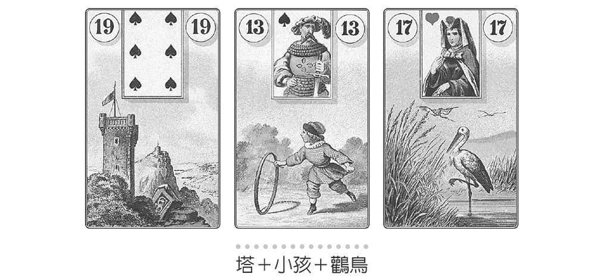

我陷入两难，因为鹳鸟是女性牌（红心皇后），但是塔又有阳具的象征。但是牌面只有一张宫廷牌，而这张牌是女性，嗯……我决定再占卜一次。这次，洗好牌后，我直接把整叠牌翻面，从中找到小孩牌，并且把它左右的牌都挑出来：书籍＋小孩＋鹳鸟。这次的结果非常肯定，看见鹳鸟再次出现，我就确定性别了。当我发现表妹怀的是女孩后，我觉得自己仿佛中了乐透一样！

我开始继续这样的实验，以找到成功的模式。经过几次成功和失败的经验，我发现只要注意宫廷牌，并且注意宫廷牌是否在小孩牌右边。如果宫廷牌出现了，那么性别就确定了。如果有两张宫廷牌出现，那么就只要看小孩牌右边的宫廷牌就好。如果没有宫廷牌，我会试着分析右边那张牌的性别分类。例如，太阳＝男性、月亮＝女性、戒指＝女性、幸运草＝女性、骑士＝男性，诸如此类。请参阅附录六，阅读宫廷牌的解释。

撰写本书期间，我的妹妹也怀孕了。我们都很兴奋，想要知道小孩的性别，所以我抽了牌，而我抽到小孩＋太阳＝男孩；我儿子也抽了牌，他抽到小孩＋骑士＝男孩；我妹自己也抽了牌，她抽到小孩＋男人＝男孩。我们都得到相同的答案，太神奇了。当确定婴儿性别之后，我们都开心到傻了。我好喜欢牌卡和宇宙共同给你答案的时候。

如果是要占卜性别，记得不要解读牌义，只要读取需要的信息就好。例如，如果你抽到镰刀牌，不要因此紧张或焦虑，只要解读性别就好（男性，因为是方块侍者）。

你可以自己实验看看，你会找到最适合你的方法。

### 大蓝图牌义：

传统来说，小孩牌落在现在的位置，并且靠近指示牌，意味着个案的个性很友好、善良、友善。同时也确定个案的周遭都是良师益友，值得尊重和欣赏。如果个案已婚，可能暗示未来会有小孩。

这张牌也意味着个案现在的社交圈中有位年轻人。小孩牌也可能是指个案的小孩，或是与个案有关的小孩。此外，这张牌也象征赤子之心、自信、真挚和不成熟。

如果你占卜的主题与生育有关，小孩牌也是你要检视的牌之一；同时也要解读鹳鸟、树、花园，这些都意味着怀孕。

小孩牌也象征新事业或新计划，需检视周围的牌以便解读更多细节。

如果我帮自己抽大蓝图牌阵，我通常会把小孩牌视为我其中一个儿子，而我只要解读周围的牌来确定这张牌是指哪一个儿子就好。

### 配对组合与范例：

★小孩＋云朵＝麻烦儿童；个性不稳定的小孩；小型暴风雨；小问题

★小孩＋狗＝新的友情；幼年时期的朋友；小狗或小宠物；开始愿意信任

★小孩＋鱼＝新创公司；创业；新的顾问工作；小型企业；生育；小笔金额；不重要的事（小条的鱼）

★小孩＋花园＝有着许多兴趣的年轻人

★花园＋小孩＝游乐场；一小群人；一群玩伴

★鸟＋小孩＝寒暄；闲聊

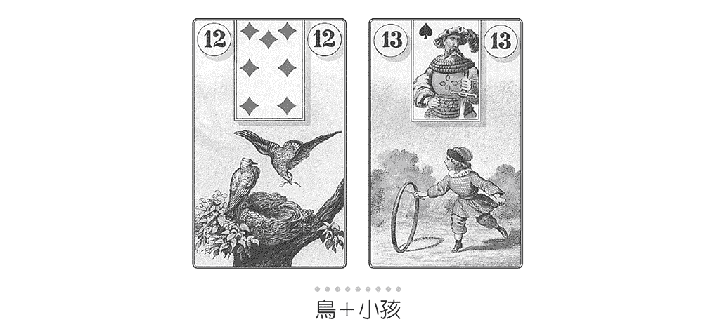

## 狐狸

扑克牌对应：梅花九

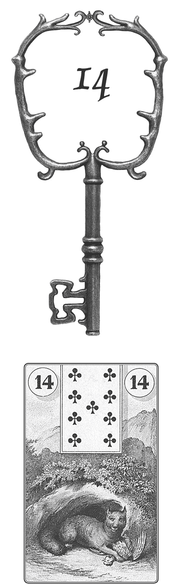

狐狸牌通常描绘着一只狐狸在散步或正在做某个姿势；与家人围在刚猎到的晚餐旁；为幼狐提供食物或在两爪之间夹着猎物。狐狸的名声来自于擅长设计和密谋，确保家人得以温饱。众所周知，狐狸关心家庭的安全，并竭尽全力保护家庭。狐狸是偷偷摸摸、欺骗、背叛和操纵高手的象征；也因为欺骗与背叛，导致狐狸恶名昭彰，但是它非常忠于家庭。它是能够在野外生存的动物。

这张牌也是工作牌——朝九晚五的日常工作、在办公室工作，或是为了薪水而工作。狐狸牌也是我要占卜工作状况、就业或职涯发展时会启动的主题牌，而它左右两边的牌会显示工作的信息以及未来运势。如果是解读工作，那么狐狸牌会是中性牌，不会是负面牌，除非周围有许多张负面牌。狐狸总是在外奔波猎食，使家人获得温饱，并担起责任要持续、周而复始为自身和家庭付出，如同出于义务而披星戴月以维持生计，也如同担起职责，为了生存和家庭而打拼。

如果占卜时我没有特别指定主题牌，而狐狸牌出现了，就要先判定这张牌是否跟工作有关。假设狐狸这张牌与就业或工作无关，那么就是在警告个案要注意某种骗局、陷阱或是操弄正在默默发生。这时就是这张牌呈现负面牌义的时候：欺骗、狡诈、背叛、双面人、骗子。狐狸体现了骗局与诈欺。狐狸永远不会显露出它的真实意图。

### 对应主题的牌义

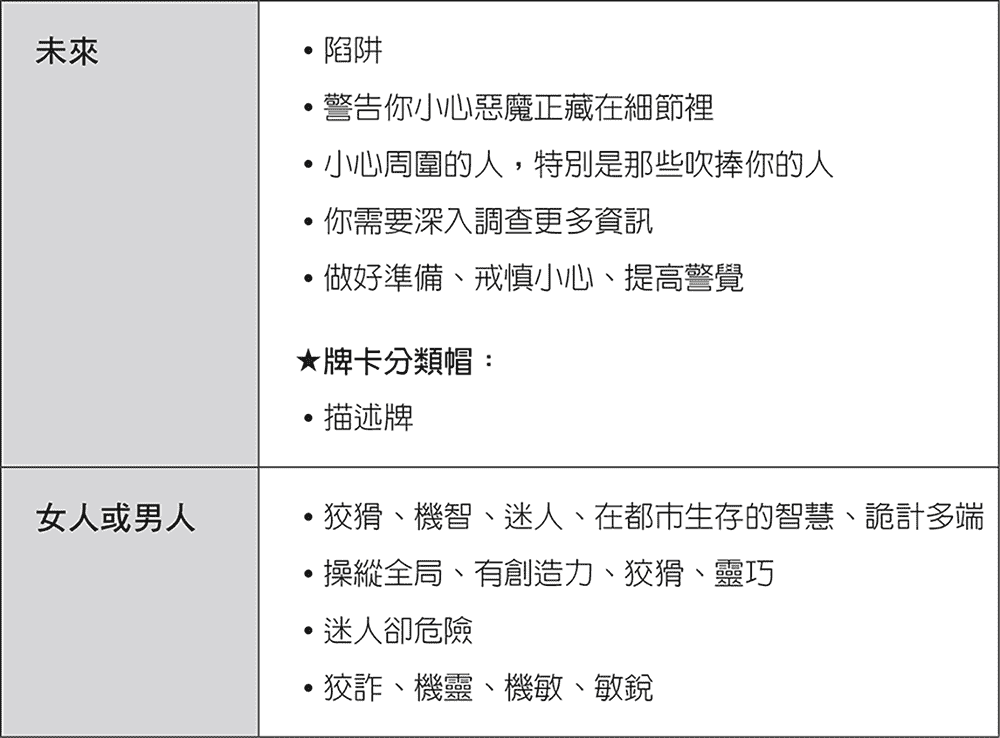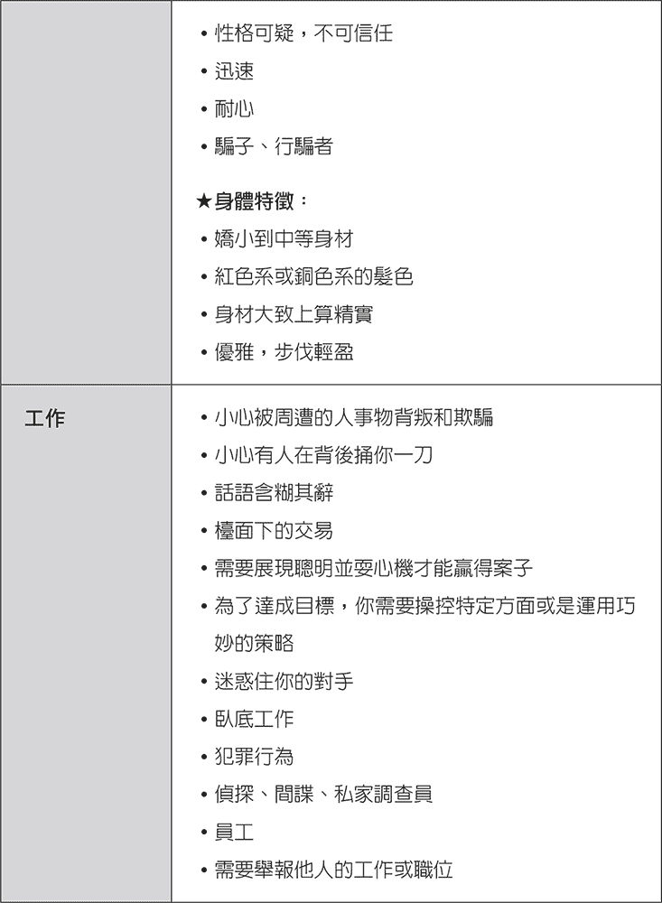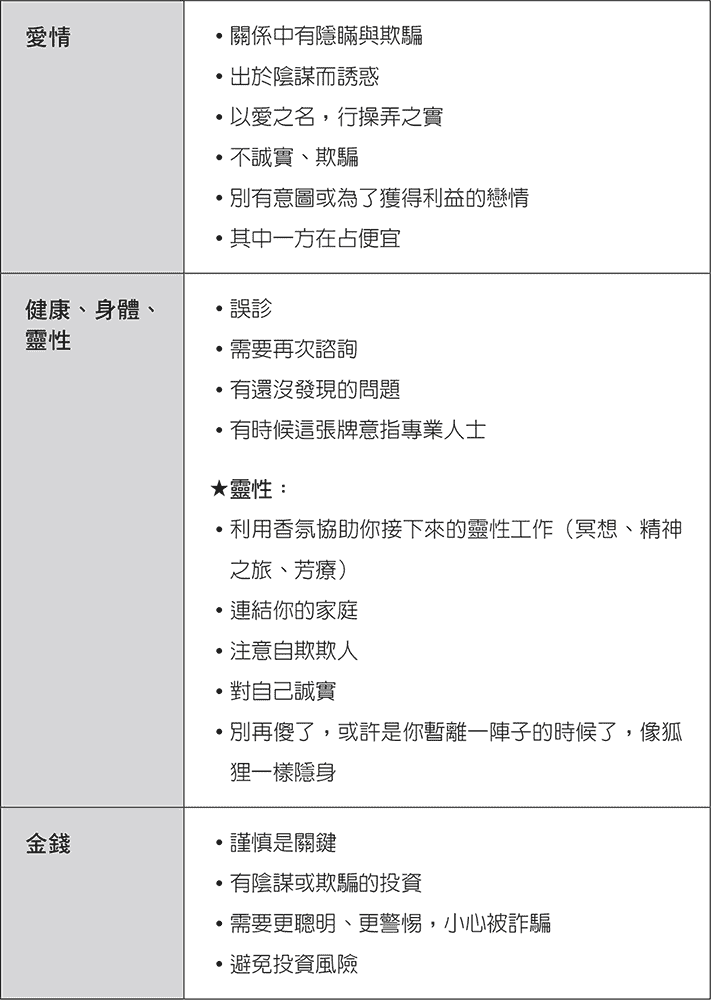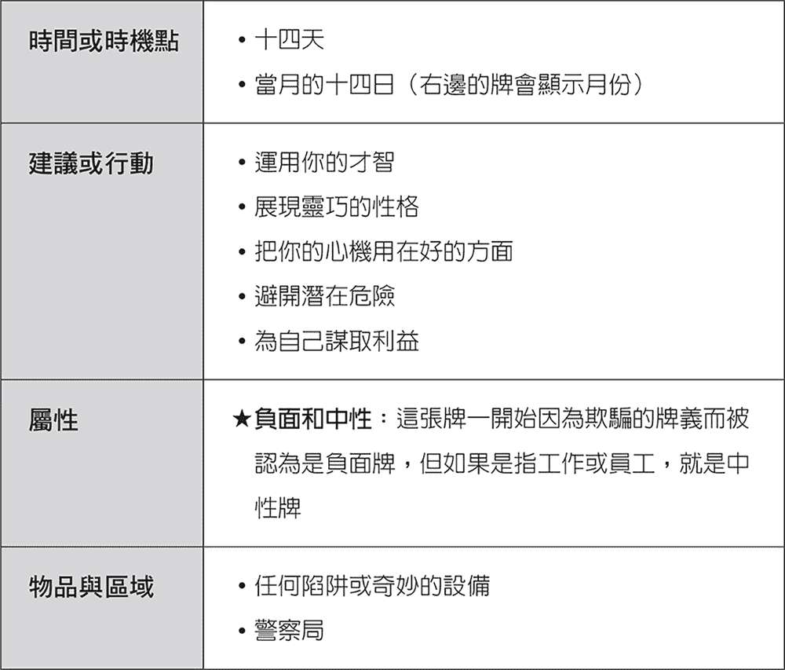

### 这张牌的个人故事：

撰写本书时，我开始注意到我的生活中发生的事，与我正在写的牌卡有神奇的共时性。在我安排好要写狐狸这张牌的当天，我却花了一整天的时间打电话，跟信用卡银行的反诈骗部门沟通，询问一间可疑的卖家。电话中，银行警告我要小心这是诈骗，并建议我跟卖家据理力争，但我对整件事情还是很谨慎处理。我试着联系卖家，了解被多收的费用，而卖家否认他们有多收费用。最后，我发现是银行偷偷摸摸在搞鬼，超收费用。

当天狐狸牌的呈现，让我遇到诈骗问题、银行的欺骗，而我也一直很小心没有特别听信其中一方，并打破沙锅问到底。多巧啊，狐狸牌和诈骗在同一天发生！

在我家，狐狸有个特殊的别称，是我大儿子想出来的：“偷偷摸摸”。尔后，无论谁想耍什么花招时，都会变成“偷偷摸摸”地进行；而每一次占卜时，狐狸牌出现，我脑海中就会马上浮现这句话。

### 大蓝图牌义：

传统上，这张牌警告你要小心周围的人，因为有些人会背叛你。这张牌在大蓝图牌阵中扮演两个主要角色：警告牌和工作牌。

如果狐狸牌离男人牌或女人牌很近，意味着要谨慎小心。要注意你相信的人事物，抱持着质疑的心，不要太轻易相信。重要的是要小心谨慎。小心你所处的人际圈，不要太过自信，因为有人想要骗你或从你身上获得好处。狐狸周围的牌会提供更多人事物地的信息。

假如狐狸牌被正面牌包围，则要小心诱惑，因为那些溢美之词和示好的行动都只是为了骗你。只要有心操弄，各种非常诱人的方法都能达成目的。这张牌也代表你可以透过聪明才智得到你想要的。牌义如何解读，依旧视脉络而定。如果周围都是负面牌，就会强化恶意、虚伪和双重标准的严重程度。

麦可想要让孩子从疏远的前妻那里回来，这会是一个好计划吗？

★狐狸＋戒指＝是的。他的计划很聪明，他能够跟孩子重聚

★狐狸＋棺材＝不是。他自以为聪明的计划会失败，而且可能适得其反

莱恩待派翠莎好吗？

★狐狸＋戒指＝不好。他把她骗得团团转

★狐狸＋棺材＝不好。他的欺骗最终会让她受到创伤

如果个案目前有工作，或是正在找工作，那么狐狸牌就会是不同的意思了，它反而变成很重要的关键牌。如果我要占卜个案的职涯或是工作的整体运势，狐狸牌就会是我使用的主题牌。同样的，周围的牌会告诉你工作的过去、现在和未来。

马丁的工作现在是否安稳？

★狐狸＋戒指＝是。他的工作很不错，而且可能会续约

★狐狸＋棺材＝不。他的工作可能很快就会结束，或是他现在处于困境之中，工作可能会有异动

### 配对组合与范例：

★树＋狐狸＝诊断预测错误，在医疗上被骗（可能是他们建议你做不必要的检查或治疗）；健康问题需要进一步检查；医疗人员或健康专家

★狐狸＋钥匙＝制定巧妙的计划或解决方案；制定完善的策略；关键职位或重要角色；成功的工作；揭露谎言和欺骗手段

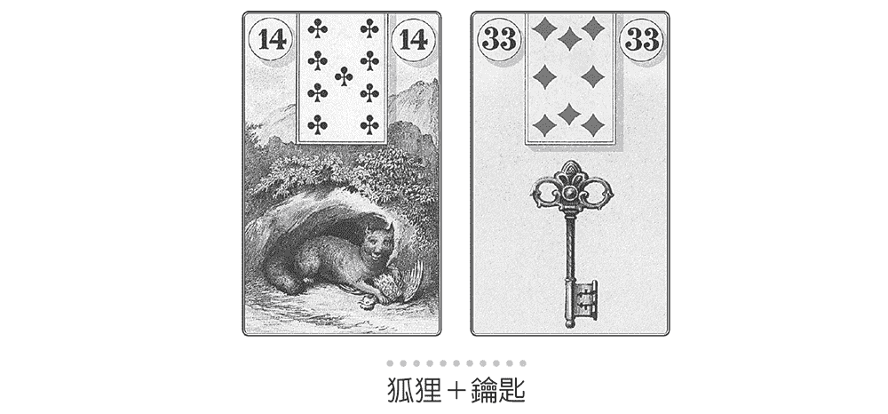

★狐狸＋信件＝作家；工作执照；诈骗文件或赝品；伪造的身分证件；骗人的邀请；可疑的纪录、文章或结果

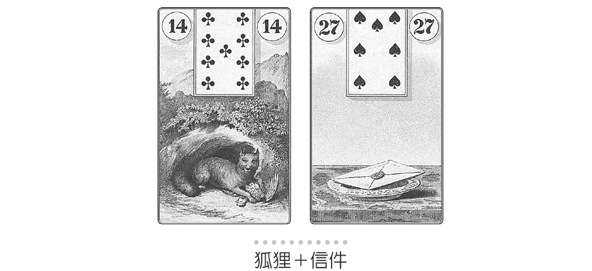

## 熊

扑克牌对应：梅花十

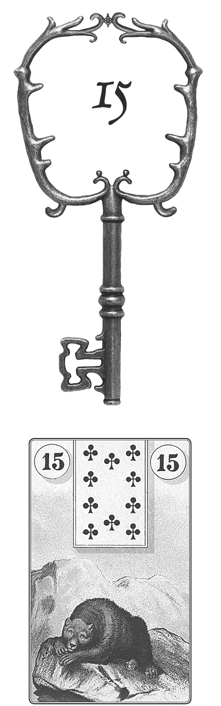

这张牌的牌面上通常都是一只强壮、气势凌人的熊，在它的栖息地中生活。众所周知，熊会激烈捍卫自己的领土，并且很机灵。母熊会不惜一切代价保护自己的幼崽。熊象征权力、力量、勇气、保护；也象征保护欲强烈的母亲形象，并且行动迅速。

熊带来力量、控制、权威和魄力。这张牌象征强而有力的肌肉，以及稳定和安全感。这也是为什么熊这张牌与主管、经理和高阶主管的职位有关，同时也与财金、现金流和投资有关。

我会用这张牌来确认个案的财务状况，因为熊代表你的收入、个人财务、资产和财产。此外，熊的食量也延伸成象征营养和饮食。这张牌概括了我们的资源——我们可支配的金钱以及可食用的粮食。

熊代表所有的专业，熊也提升你物质世界的一切。

### 对应主题的牌义

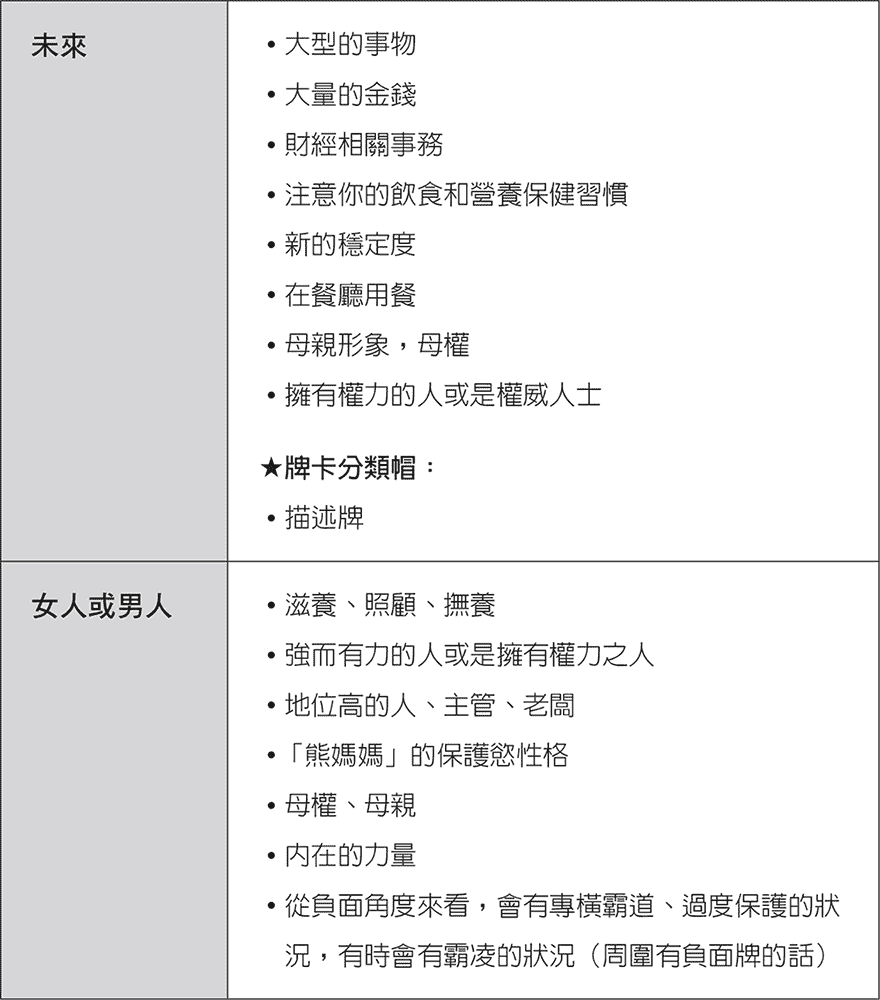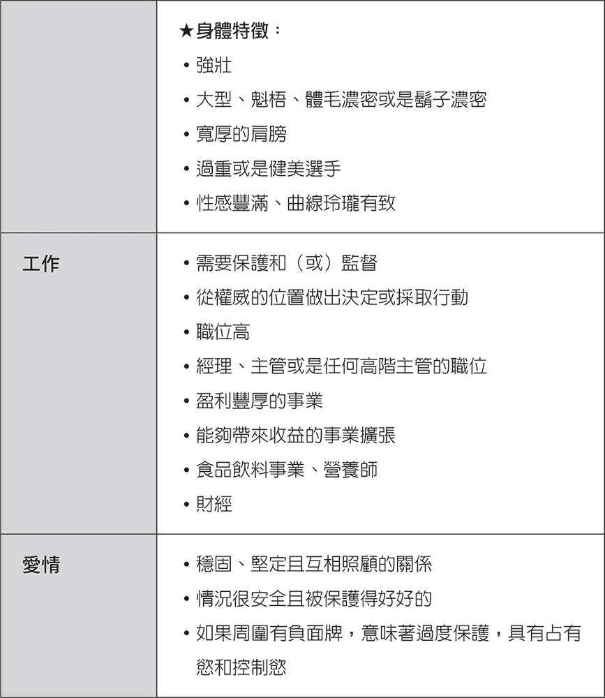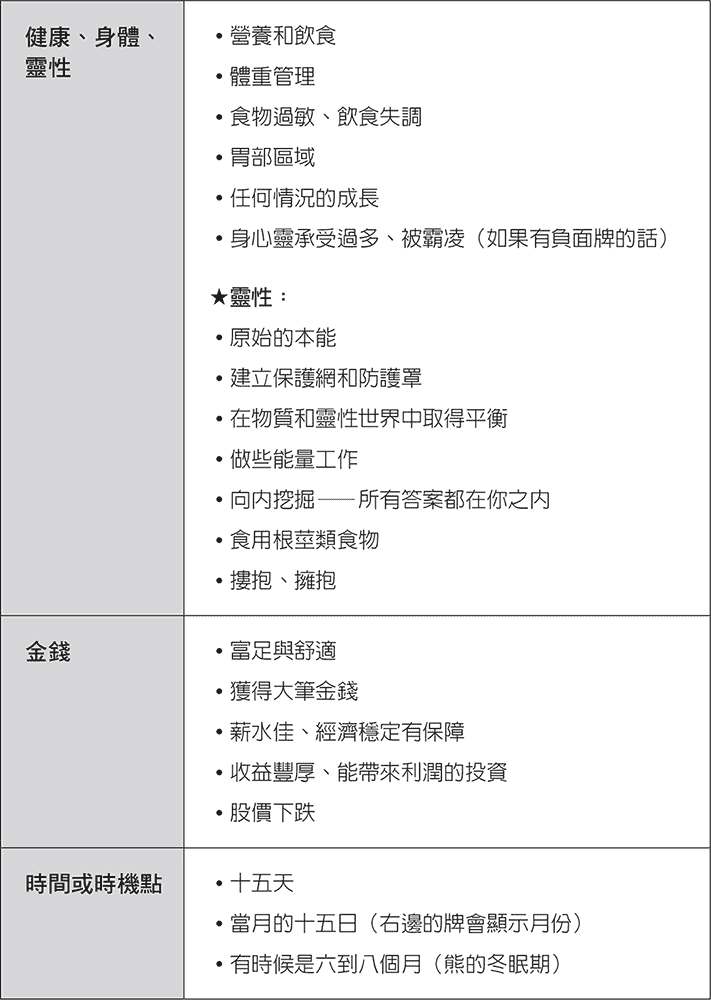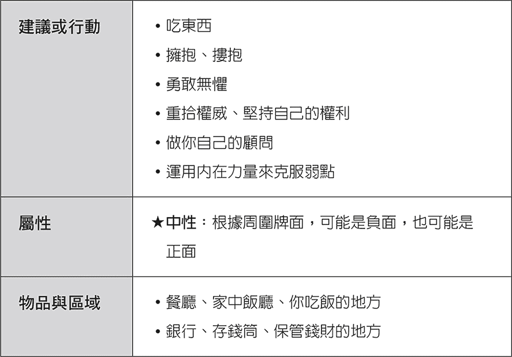

### 这张牌的个人故事：

今天，我在写熊的故事，而它似乎以某种方式呈现在我的生活中。我原本期待熊可能代表食物，但却不是——原来事情没有那么简单！

我在房间工作时，七岁的儿子冲进房间哭着跟我说蒜头卡在他的耳朵里。好的，让我解释一下。昨天儿子抱怨耳朵痛，但是没有发烧或其他症状，所以我知道这可能跟泳池有关，可以用顺势疗法来治疗。我母亲教过我一个神奇的疗法，就是如果耳朵痛的话，可以将一瓣蒜头放进耳朵，不过只要放在外耳耳廓就好，不要整个塞进去。我用的是很大一瓣的蒜头，所以不可能发生意外，但今天我儿子觉得蒜头太大瓣了，所以把它折一半后就塞进耳朵里了。我吓傻了。我试着用镊子把它夹出来，但徒劳无功。我打电话给正在工作的老公，而他正在开会，讨论得正热烈。时间是星期五下午快傍晚了，所以诊所也关门了，我的备案就是去急诊室。与此同时，我儿子丝毫不痛，还在玩耍，仿佛什么事都没发生一样。

我深呼吸后，试图冷静下来，思忖是否要去急诊室，还是等丈夫下班回家再说。我的牌就在手边，所以我抽牌问道：“如果不去急诊室，我们能够把他耳朵里的蒜头取出吗？”我抽到太阳牌。太好了！我松了一口气！

但是等一下，是谁要做这件事？我又抽了牌，心中清楚如果抽到狗这张牌，就代表医生。当我翻开牌，是熊。我的第一个念头是：太好了，是老公要来做这件事。他的身材魁梧，有宽厚的肩膀，权威感十足。可是等等，熊也有可能是指我啊（熊妈妈），而熊也是一张代表母亲的牌。

我抽了一张牌来了解熊到底代表谁，抽到了百合。这意味着是年纪比我大，而且是父亲的形象，所以我就确定是我老公要做这件事。

四十五分钟后，我老公走进家门。他取消了所有重要的会议，驱车赶回家。他一打开门的瞬间，就冲向儿子，检查他的耳朵，要我帮他拿手电筒，不到一分钟的时间，他就用镊子夹出了蒜头。如果这不是熊爸爸的话，我也不知道熊这张牌代表什么了！这张牌符合我丈夫的身材、专业，并且也诠释出他的反应、回应和父亲的本能。

我学到了重要的一课，千万不要在没人可以照看的情况下，把蒜头放进儿子的耳朵里，并且一定要好好警告他这件事的重要性。我儿子也学到千万不要把任何东西塞进耳朵里。顺带一提，蒜头是非常好的药方，因为一天过后，儿子的耳朵就不痛了。

### 大蓝图牌义：

传统上，熊意味着要保持快乐，跟那些嫉妒你的人保持距离。

首先，在大蓝图中，我会检查熊的位置来解读个案的财务状况。熊也象征母亲的形象以及岳母或婆婆，有时候是指你的老板，端视你周围的牌面和现况而定。

如果熊的周围是正面牌，就会带来自信、活力、勇气，也意味着接下来的计划一定会成功；如果周围是负面牌，这张牌就会呈现更多的负面特质，例如霸凌、霸道、专横。可能会有令人愤怒的结果和冲突发生，而这张牌就象征会处于弱势，个案也是处于弱势。

### 配对组合与范例：

★熊＋狗＝情比金坚的友谊；稳定的伴侣；营养师；肠胃科医生；财经顾问；照顾下属的主管

★熊＋书籍＝广泛的知识；高智商；昂贵的书；财务纪录；簿记；帐目和审计；市场分析研究

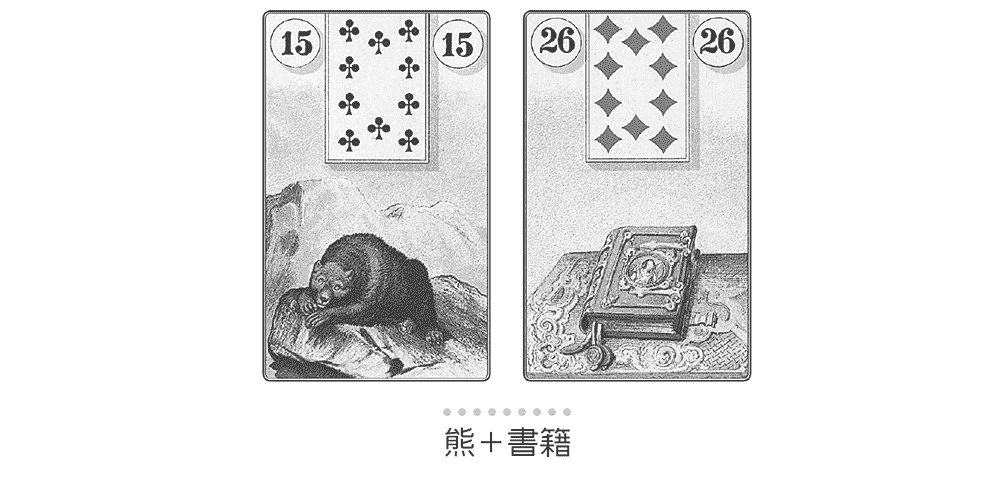

★熊＋书籍＋小孩＝监督并确保作业完成；教育费昂贵

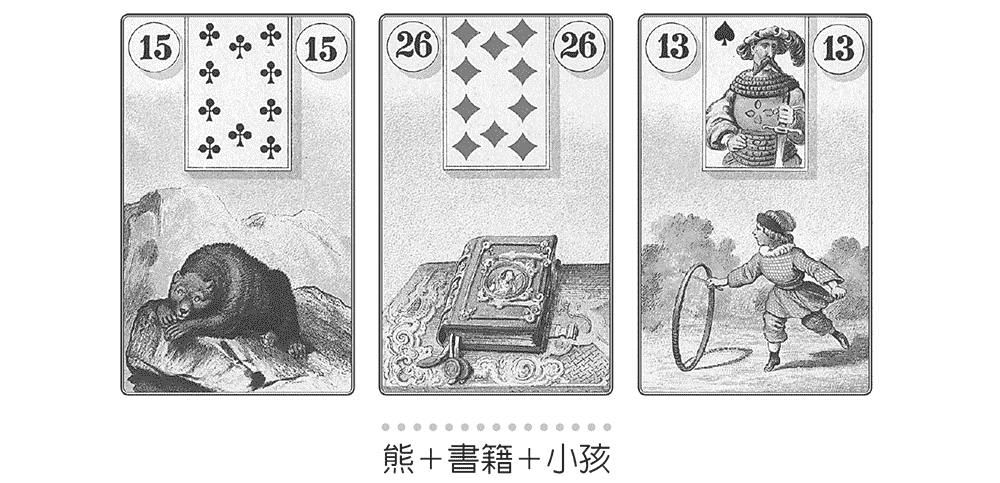

★熊＋十字架＝财务状况令人灰心

★熊＋戒指＝婚前协议；昂贵的戒指

★蛇＋熊＋戒指＝霸道或束手无策的人；欺诈的财务管理

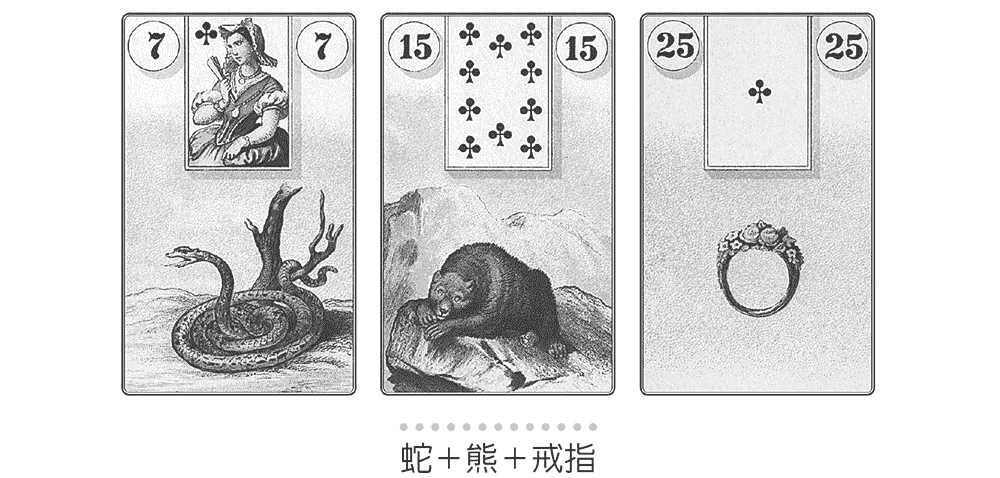

## 星星

扑克牌对应：红心六

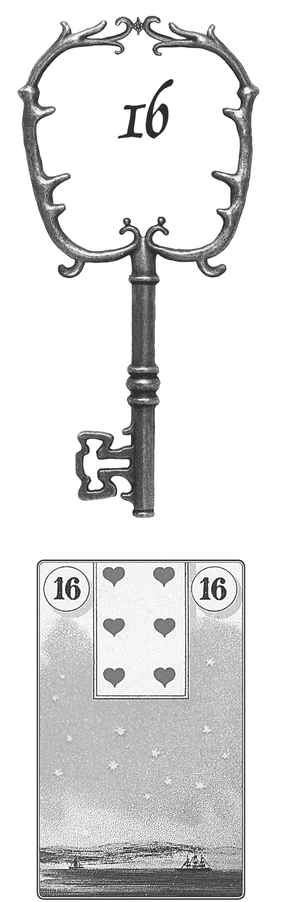

星星牌的画面通常有着清澈的夜空，布满一闪一闪的星辰。这张牌会带给你一种平静和宁静的氛围、感受。星星自古即象征着指引，是航海员和旅行家的卫星定位系统。整体而言，我现在仍然将这张牌视为地图、方向和路线图，无论在专业层面还是个人层面都是。

这张牌不是行动牌，而比较像是传达某种氛围的牌。它象征出入口。星星是幸福、希望的吉兆，并且鼓励他人达成愿望，是梦想和愿景的象征。它代表要找到属于你自己的道路，并且相信自己。星星牌象征坚持与自信。它是隧道终点的那一道光。

有了星星牌，就能让你的想法更丰富、想得更多更广，让思绪任意徜徉，同时也散播出去。星星也象征美丽、星座、星图、占星、名人、魔法，有时候也代表占卜。

### 对应主题的牌义

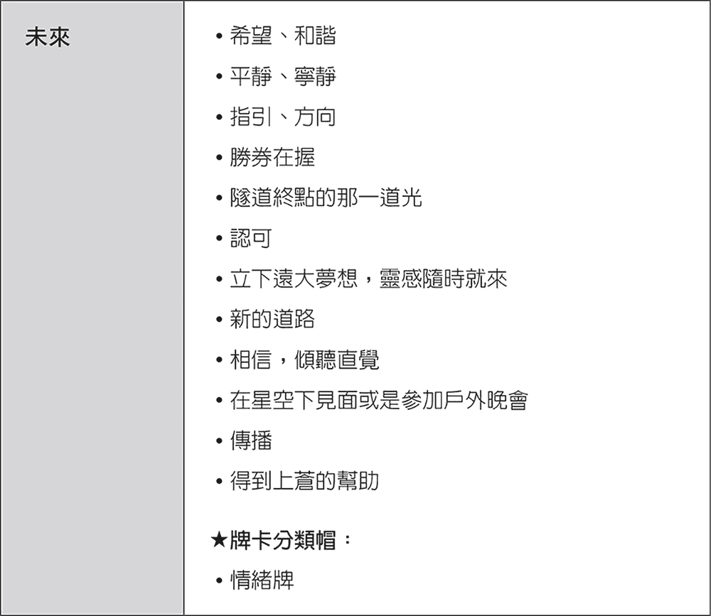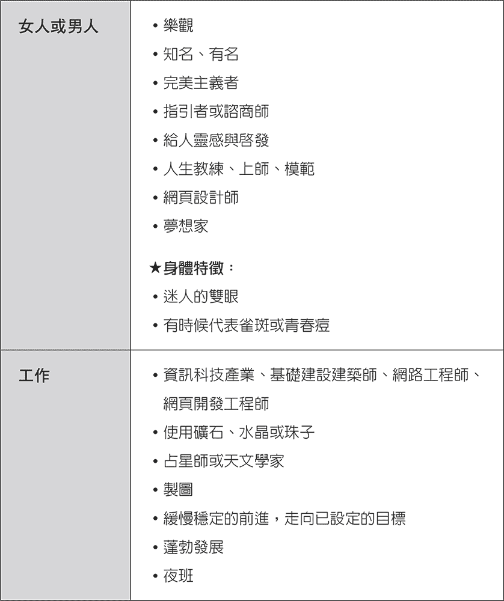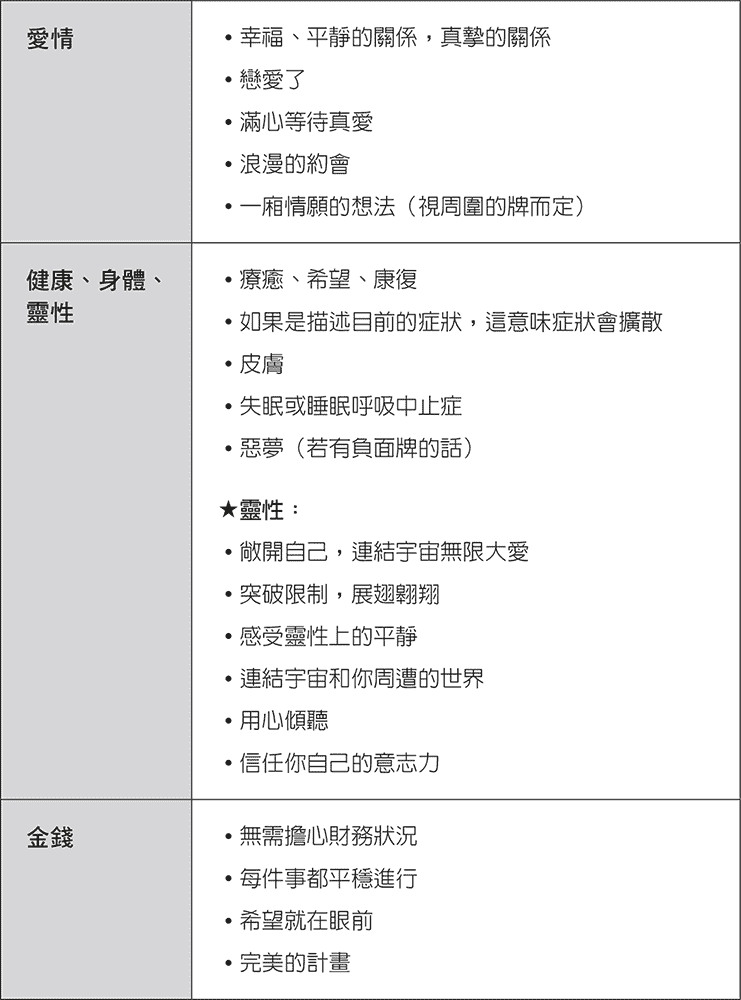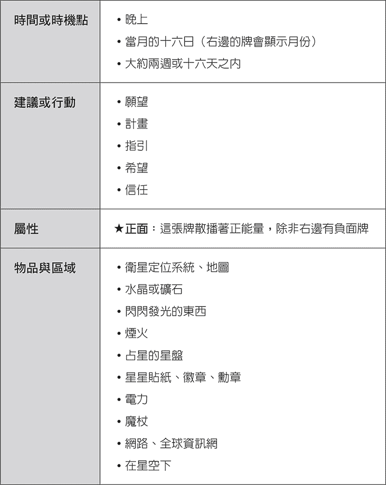

### 这张牌的个人故事：

我有三则关于星星牌的故事。

第一则是如同在我心上开了一枪的故事。我的朋友罗莎正在接受癌症治疗。她问我是否可以快速帮她看一下癌症的状况。我抽了三张牌，抽到树＋星星＋女人。

我马上就知道这代表疗程没用，癌细胞仍在扩散。但如果没有其他负面牌，为什么我会往负面的方向解读呢？主因是因为问题的设定——我问的是癌症的具体情况。我不是在问疗程有没有用，或罗莎的健康是否会好转。如果我问了诸如此类的问题，那么占卜结果就会是：“你会没事的，你会康复。”因为问题非常明确，所以牌卡的答案也很具体回答了癌症的情况。树代表罗莎的健康，而因为我没有设定任何主题牌，这张牌指的是癌症，代表癌症如树一般生根且不会消失，星星代表扩散，而女人就是她的身体。当然，我抽了更多张牌来确定答案，特别是刚刚出现那样的结果，每一次占卜我都希望能看到不同的结果，但结果都一样。罗莎是个斗士，她奋力对抗病魔两个多月，直到她决定解脱。罗莎，你永远在我心里。

我必须把这则故事放进本书的原因是想告诉读者，问题的设定非常重要，如此一来，你才能在解读雷诺曼时得到精准的解答。

很酷的是，一年后，我抽了两张牌想要测试一下，我问道：“罗莎现在在哪？”而我抽到了女人＋鸟＋星星，代表我的朋友（女人）的灵魂（鸟）在天堂（星星）了。我又抽了一张牌看看她在天上是否开心，而我抽到了爱心。

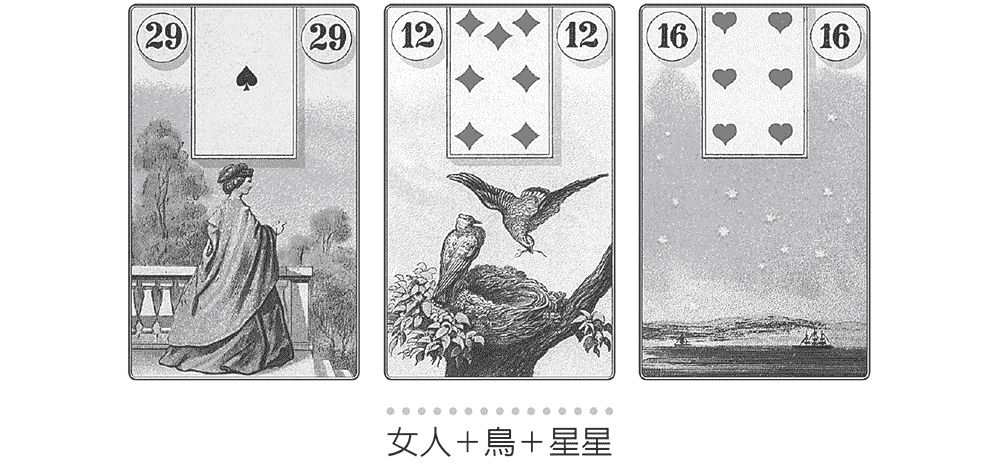

第二则故事要谈到我们的旧家，当时网络发生了问题，房子里的每一个人都连不上网络。我抽了牌想知道发生什么事，而我抽到老鼠＋蛇＋星星。

当天稍晚，技术人员来检修时说到，外面变电箱里的电线被田鼠咬了，导致这一带的网络连线故障。牌卡占卜的结果还真直接，我立刻拍了张照片，并写下来做纪录。老鼠真的咬了电线（蛇），导致网络连线故障（星星）。

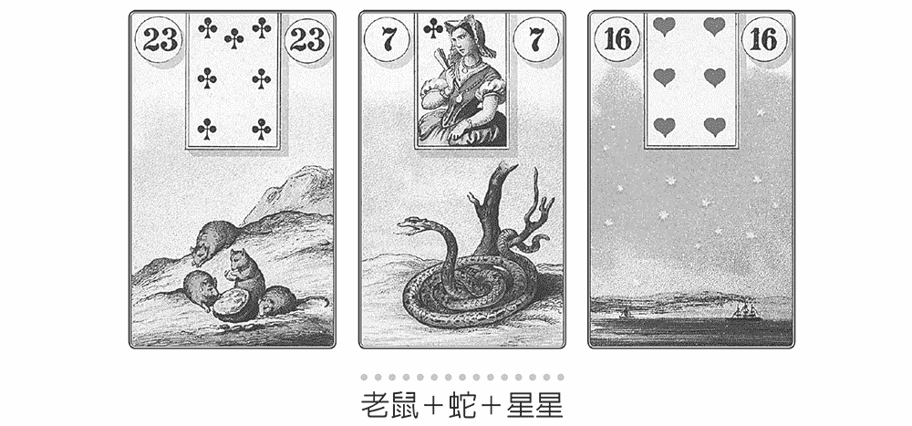

最后一则故事是我儿子抽了两张牌来占卜每日运势，抽到太阳＋星星后，他就去外面玩了。之后他回到家时，全身都是红疹。他在外面玩耍时，某种东西引发了他的过敏反应，而我们也找不到过敏原。但是回想他抽到的两张牌，我们都惊呆了，牌义太直接了当了，尤其是只有两张牌：太阳（明亮、爆发、待在外面）＋星星（扩散四处）。

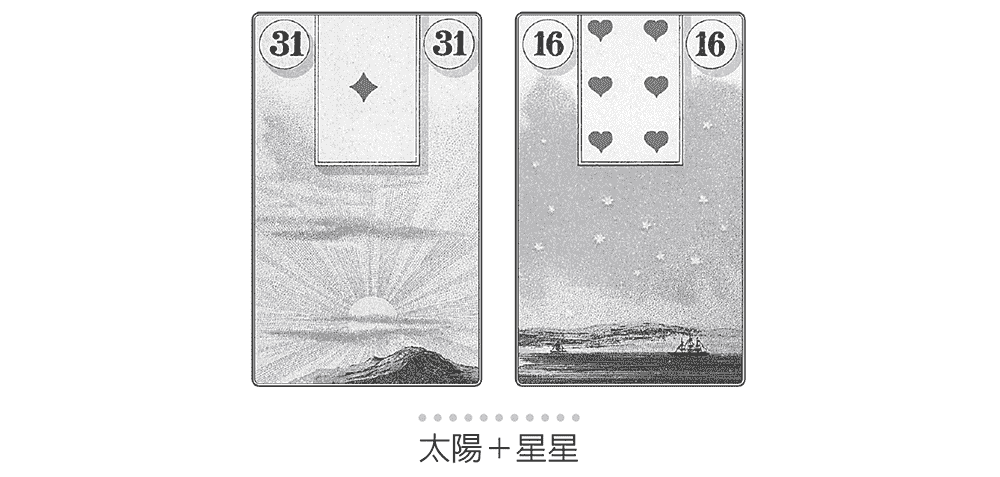

另一方面，在我写有关星星牌的过程中发生了共时性的事件。我的好友乔，传了他在户外音乐会的影片给我。坐在星空下，听着舞台上的摇滚歌星唱歌，多完美啊！

### 大蓝图牌义：

传统上，如果星星旁边出现云朵，就要小心，这意味着由于云朵靠近星星，要当心会有一连串不幸之事发生。

当星星牌的周围都是正面牌，会带来乐观和希望，并增强其他牌的正面特质，让成功触手可及；若是周围有负面牌，就会削弱一点这些牌的负面影响，并且有望解决问题，只是无法抵销这些牌的负面特质。有时候根据问题脉络，这张牌会强调负面的结果，给予我们警告，注意失败或灾厄，如同我的第一则故事。

星星是正面牌。

### 配对组合与范例：

★星星＋十字路口＝新的道路，充满选择；未来有许多路可走；命运给你许多机会；许多次的成功

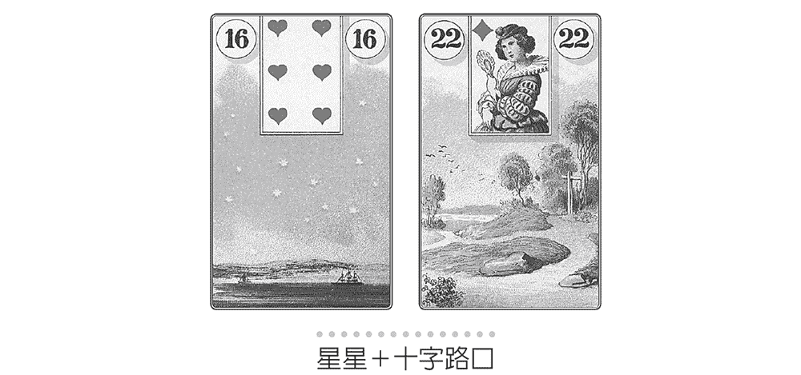

★星星＋小孩＝资优生；成绩优异的孩子；神童；年轻而有名的人格特质；年轻的名人；光明的开端；出生顺利；热门的开场演出；想像力丰富的孩子

★星星＋花束＝著名的造型师；著名的画作或艺术品；赢得最佳布置或最佳设计奖；选美

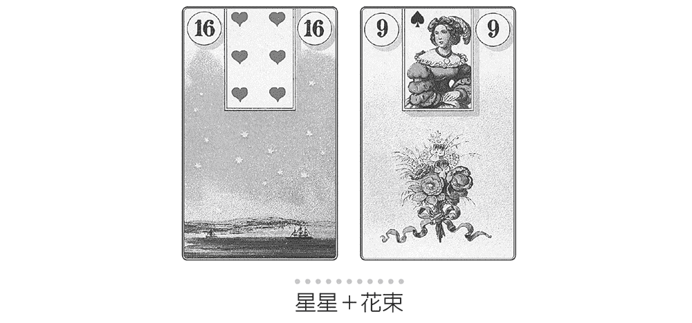

★十字架＋星星＝信仰；亚伯拉罕诸教（Abrahamic religion）；希望；信念；痛苦的康复

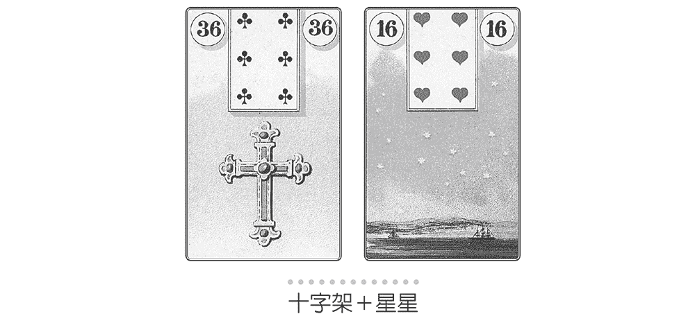

## 鹳鸟

扑克牌对应：红心皇后

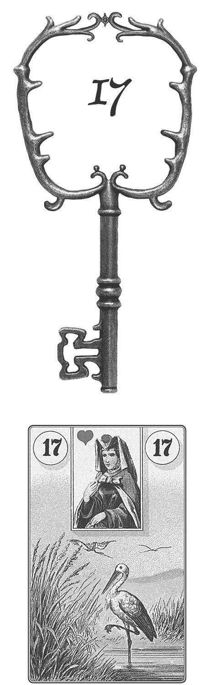

这张牌通常都会画两只鹳鸟：一只正在飞翔，另一只待在巢内。有时候，你会看见一只鹳鸟站立在水中。它是迁徙性的鸟类，总是在春天抵达。它也是非常沉着又平衡的鸟类，受人尊敬与钦佩，象征尊重。鹳鸟最为人熟知的象征和印象就是送子鸟：鹳鸟飞过空中，嘴巴叼着一个袋子，里面装着婴儿。鹳鸟象征生产分娩，为全世界各地的家庭带来欢乐；它也是生育、富饶、生产力的象征；它象征新生和再生。它也与古代的神圣舞蹈有关，因为鸟进行交流的方式是透过姿势、动作和本能的求偶舞蹈。

鹳鸟代表改变和移动：生活中的事件彻底转变。

除非有负面牌在周围，否则通常都是正向的改变，而非痛苦的改变。鹳鸟象征生活中和周围环境的新影响：改变工作或居住地、生活中有新的人，或是收入增加。这张牌与所有新颖和获得改善的人事物有关。鹳鸟象征怀孕、出生、领养、新活动、新专案、新的到来或增加；它代表所有的新进展、改善、提升、翻新和一切的演变。

鹳鸟周围的牌会描述更多细节，让你知道是什么在更新或改变，或是在什么情况下发生改变。

### 对应主题的牌义

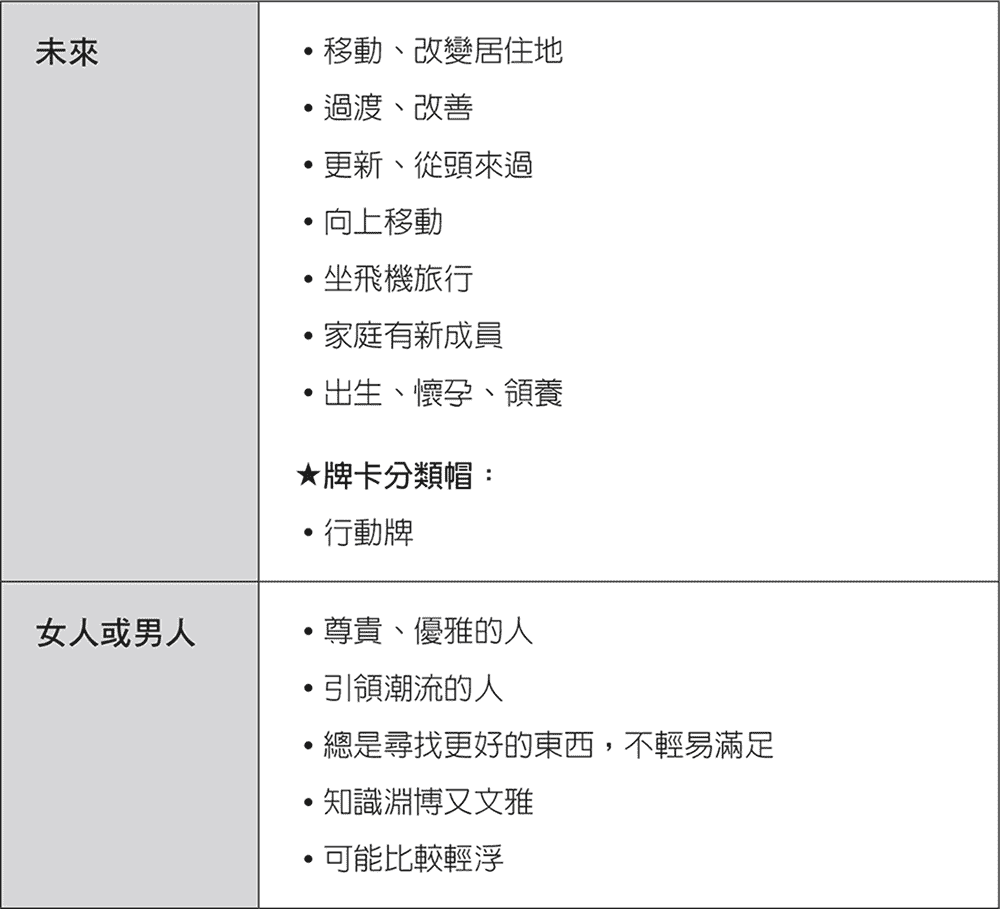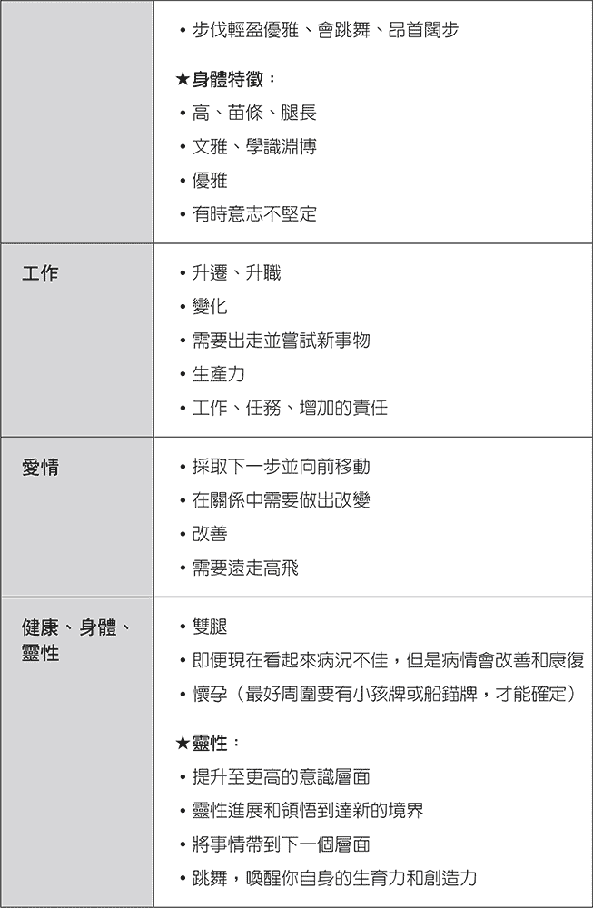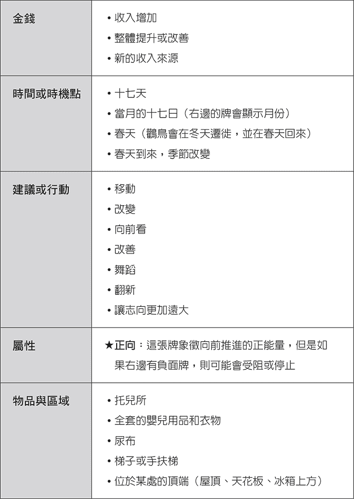

### 这张牌的个人故事：

我们还住在伊利诺伊州时，当时正在装修家里的地下室，鹳鸟这张牌不断重复出现。首先是房屋＋鹳鸟，我很开心又兴奋，接着又抽到鹳鸟＋山＋老鼠——我们的承包商施工时，原本只要两个月就能完工，却花了将近四个月（山），而且最后的结果还是有些让我们不满意的缺点（老鼠）。我还抽到鞭子＋鹳鸟＋老鼠，当时因为这项工程，我们起了纷争，也感受到极大压力。那几乎是场恶梦，但是将近五个月之后，我们终于获得美观的地下室。我有点想念它。

我的个案珍妮告诉我，她已经试图受孕好一阵子了，一直很担心这件事。我设定一连串的问题，一个一个用雷诺曼来占卜。第一个问题是：“珍妮能够怀孕吗？”我将树设定为主题牌，象征她的健康和身体。

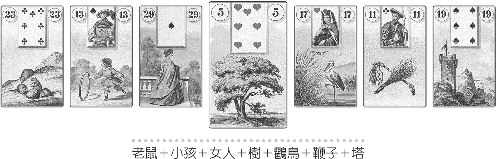

前三张牌老鼠＋小孩＋女人，表示她对于想要孩子这件事焦心不已。树的右边出现的牌，则是答案了：鹳鸟，所以答案是会的。再右边两张抽到的是鞭子＋塔，注意了，这意味着在医院或医疗机构（塔）中进行重复的行为（鞭子）。所以我的答案是：“你会怀孕，但是需要医疗上的协助，可能需要你进出医院好几趟，也有可能会经历一些困难或复杂的状况（鞭子）。”

我的下一个问题是：“受孕过程会顺利吗？”我将主题牌设定为镰刀。

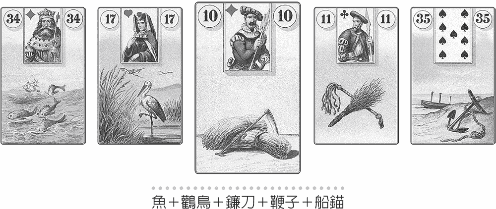

又抽到两张跟上一题一样的牌——鹳鸟和鞭子。对我来说，这意味着强调这两张牌的牌义。

前两张牌是鱼＋鹳鸟，很直接地表达了授精的过程。接着两张牌是鞭子＋船锚，这就是我的答案了。鞭子再一次强调了不断尝试的过程，以及不断出现的痛苦。但是作为最后一张的船锚牌，就意味着成功会晚到。所以我的答案是：“会的，最终会成功受孕。但是需要尝试好几次，并且要有心理准备，这个过程不会那么轻松。坚持是关键。”

珍妮花了整整一年的时间，在医生的协助下反复尝试，最后她成功怀孕了。她的小孩现在已经两岁。那天占卜结束，我给了珍妮那一张船锚牌的照片。她经历了很多痛苦和心灵上的探索，但是在整个过程中，她一直看着那张船锚的照片，谨记着要坚持不懈。当我接到她打来告知她怀孕了，那种感觉就像我们中了乐透一样！

### 大蓝图牌义：

如果鹳鸟在男人牌或女人牌旁边，意味着会有某种移动，无论是搬家、工作异动或是关系有了变化；如果旁边有小孩牌，那么就暗示着怀孕这件事；如果有房屋牌，代表重新定居或搬家；如果旁边是船，则代表搭飞机旅游。

如果鹳鸟距离男人牌或女人牌很远，意味着移动或重新定居这件事被拖延或是推迟，而且不确定延宕的时间要多久。

如果鹳鸟在大蓝图的右侧边缘，你的人生会发生重大转变；而指示牌离鹳鸟的位置多近，会告诉我们这个重大转变的大致时间。假设鹳鸟在大蓝图的左侧边缘，你在过去经历了人生变化，并且视鹳鸟离男人牌或女人牌多远，就能知道这个转变发生在多久以前。

### 配对组合与范例：

★鹳鸟＋十字路口＝有了提升，多了责任；正在选择移动的方向；改变地点；分道扬镳

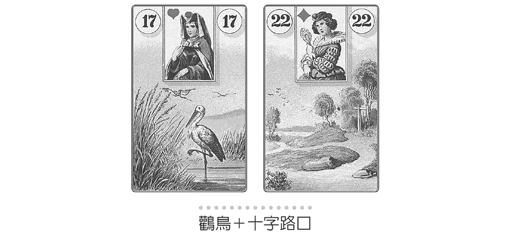

★鹳鸟＋鞭子＝对于搬迁有不同意见和争吵；因为吵架或冲突，导致移动受阻；装修失败；针对装修而吵架

★鞭子＋鹳鸟＝离开被虐待的关系；远离问题重重的状况；戒瘾中；长期问题有了改善

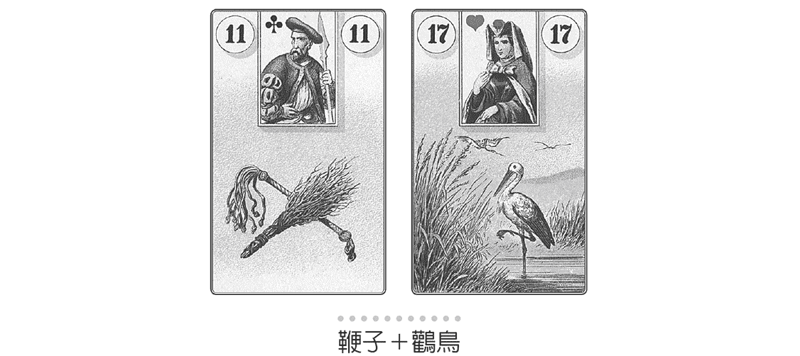

## 狗

扑克牌对应：红心十

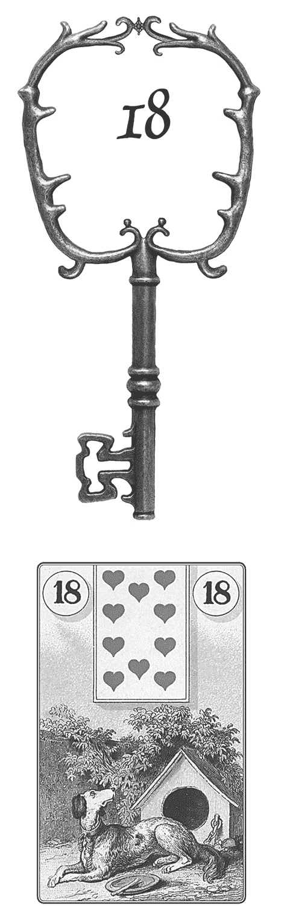

在这张牌的牌面上，我们会看到一只友善的狗，躺着或站在家门口，心灵满足且做好准备要采取行动。狗一直以来都被称为人类最好的朋友和伙伴。它的本能就是随时做好准备要保护和守护。狗象征忠诚、忠贞、友谊、保护和指导。

狗象征真诚的关系和忠诚的友谊。狗是你的重要他人、你的伙伴、你最好的朋友、你的男友或女友；你正在谈恋爱的对象、你的同伴、你的熟人、你的灵魂伴侣、你的指引者、你的治疗师、你的顾问、你的谘商师、你的医生，以及……你的狗。这张牌象征每当你需要协助就会打电话给他的人，或是提供肩膀让你倚着哭泣的人，是那个无论如何都会支持你并与你同在的人。

有时狗出现在占卜中，意味着你即将获得帮助和援助。

### 对应主题的牌义

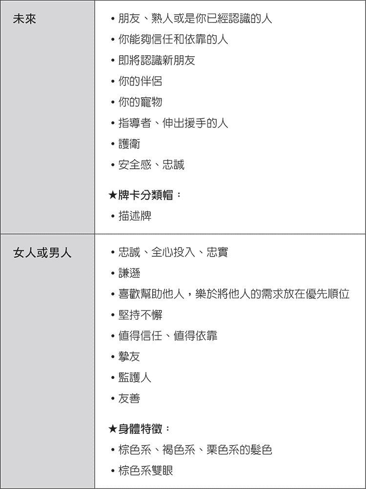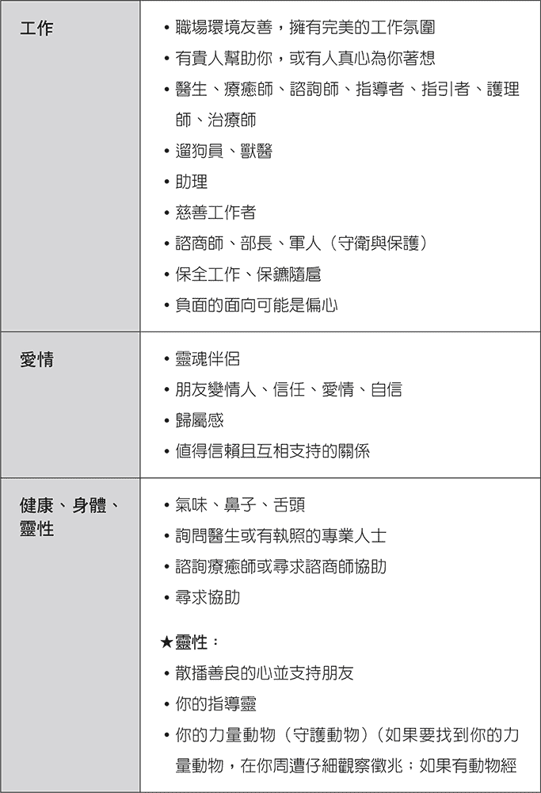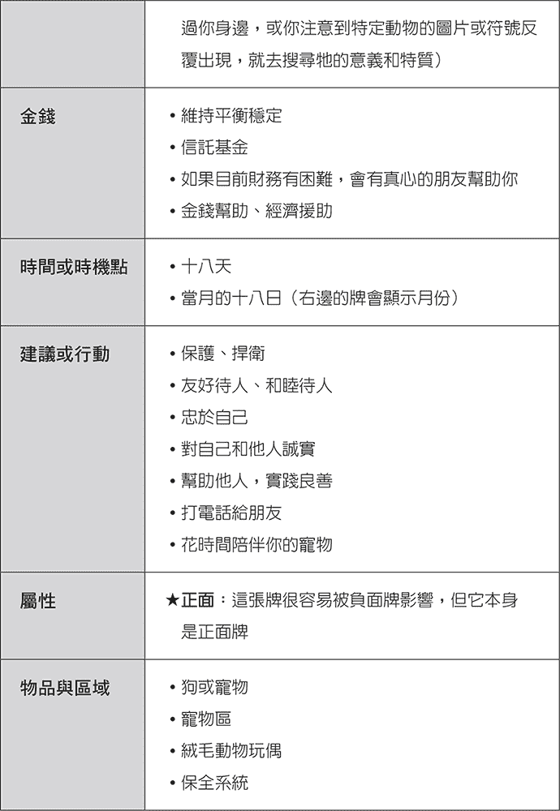

### 这张牌的个人故事：

我不知道为什么这张牌让我写了两天才完成，但我知道这两天内，我的好朋友们和挚友们都决定打电话给我，而且是每一位，其中还有一些我已经几百年没联系也没见过了。狗这张牌果然散发它独有的魔力，把所有能为我上刀山下火海的人都带到我面前。我老公甚至当神队友当得很称职，散发着迷人魅力，回家时还去超市买了巧克力和花当作礼物。（我想，我当时应该下意识地不想要写完狗这张牌吧！）

一个月前，我的客户马克思打给我，请我做个快速的占卜。他的公司才刚宣布并购，他想知道这对他的工作会有什么影响？洗牌时，我设定狐狸为主题牌，因为这张牌对我而言代表领周薪和时薪的工作。

我问说：“公司宣布并购之后，马克思的工作会发生什么事？”

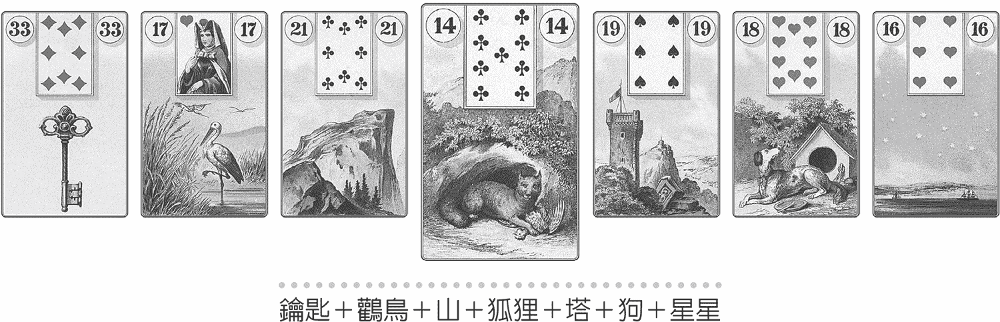

工作牌（狐狸）夹在山和塔之间，充分说明了马克思暂时不会有什么变动（山）。他似乎深埋在这间公司里。钥匙＋鹳鸟则表示了并购的公告，验证我的占卜有解对方向，预测也跟实际情况同步发生。山＋狐狸强调他的职位此时不会有任何异动。塔象征他的公司，狗证明了他有高层的朋友，而这份职位在这段期间都很稳定。星星在最后出现，带来额外的新道路、希望和指引。所以我回答他：“你的工作目前很安全，你不会有事。并购不会对你带来负面影响，反而还能让你更容易被看见，职责也会增加（星星）。”

最近马克思寄了电子邮件给我，告诉我公司解聘或调职了许多员工，而他留了下来，还被分派更多职务。他在最后写道，非常感谢我让他放下心中大石。我好喜欢得到正面的回馈！

### 大蓝图牌义：

传统上，狗的牌义要注意云朵是否很靠近狗这张牌。假使发生这种情况，你需要小心你打交道的人是谁。

同样的，在传统的雷诺曼解读法里，如果狗靠近指示牌（男人／女人），则表示你周围有好人，并且你拥有真正的友谊；如果狗离指示牌很远，则意味着不要太相信朋友。

狗这张牌让你注意到某位朋友是否忠诚。根据周围的牌面而定，这位朋友可能是要保护你避免危险情况，或者他就是危险人物。

假如狗靠近指示牌并且被负面牌包围，这个人是真正的好友，并且试着保护你免于一切负面牌的危险。如果狗离人物牌很远，周围又有负面牌，那么他只不过假装是朋友，并会将这些负面牌的事件带进你的生活中。你必须谨慎看待你信任的对象，因为你信任的人可能不是真心的朋友。

如果个案已婚，男人牌或女人牌会代表个案和他的另一半，而狗就代表另一个人——另一位朋友或是第三者。嗯哼！当然，我们还需要抽更多的牌来确定是否有偷吃。狗通常象征个案认识的人。如果有骑士，就代表是新朋友。然而，有时候可能是代表家中的狗而已。

### 配对组合与范例：

★狗＋花园＝支持网络；团体谘商或团体治疗；认识一些朋友；在花园中与朋友或伴侣见面

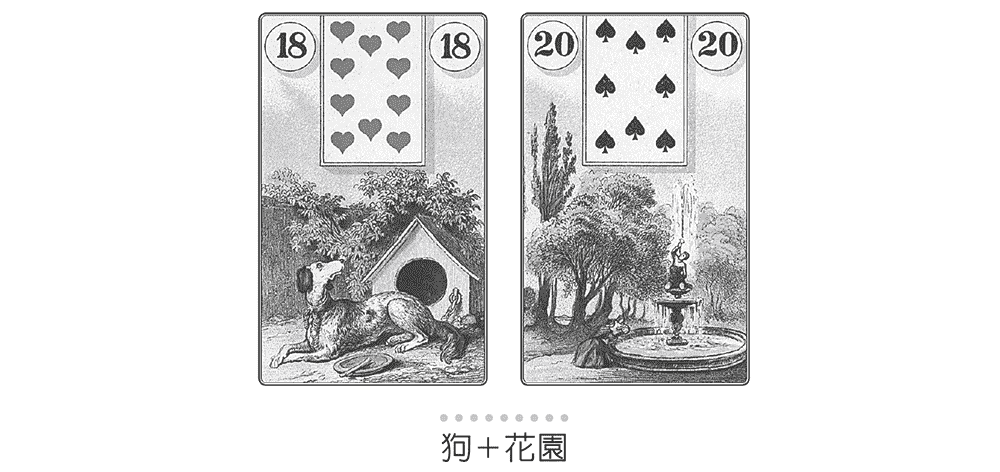

★狗＋棺材＝友谊结束；失去亲密的人；狗或宠物生病；朋友破产；分离

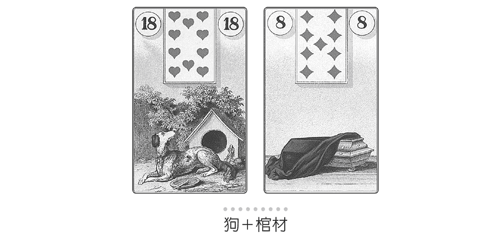

★狗＋爱心＝友情变成恋情；情感充沛的关系；热情的同伴、朋友或伴侣

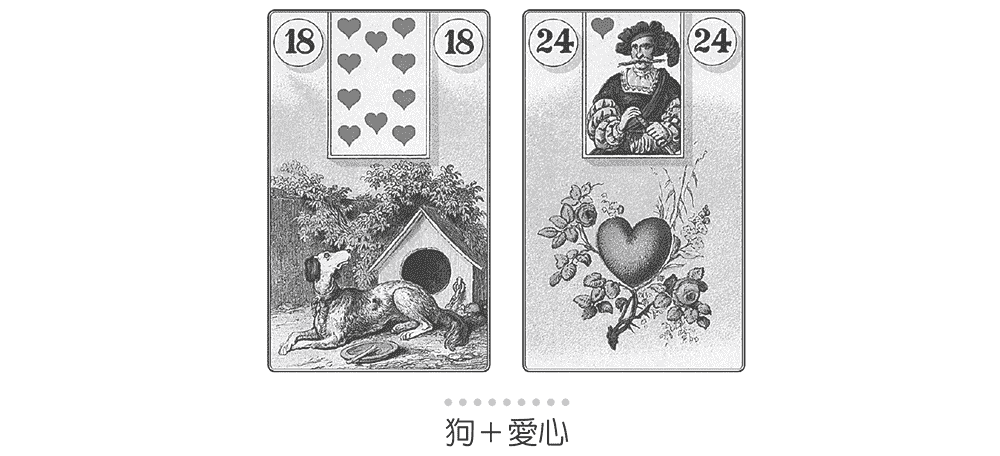

★狐狸＋狗＝表里不一的朋友；控制狂的朋友或伴侣；如果是占卜工作，代表顾问、助理、消防员、兽医

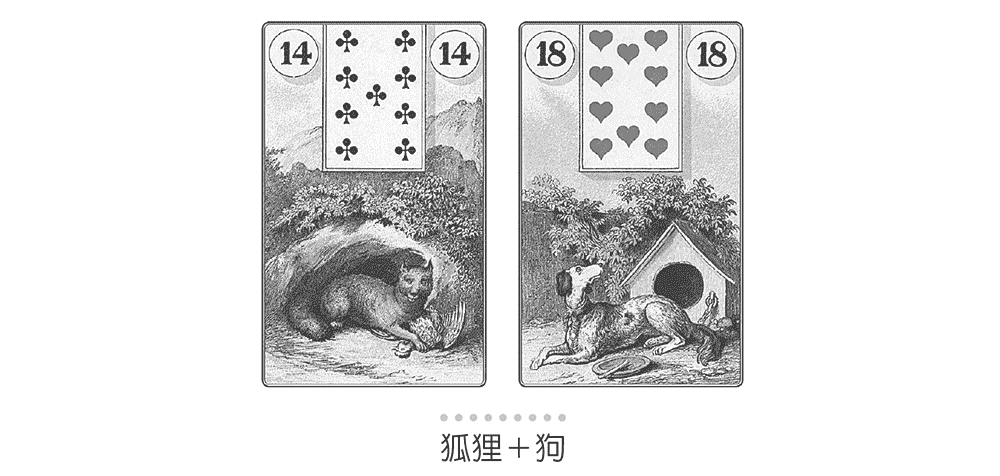

## 塔

扑克牌对应：黑桃六

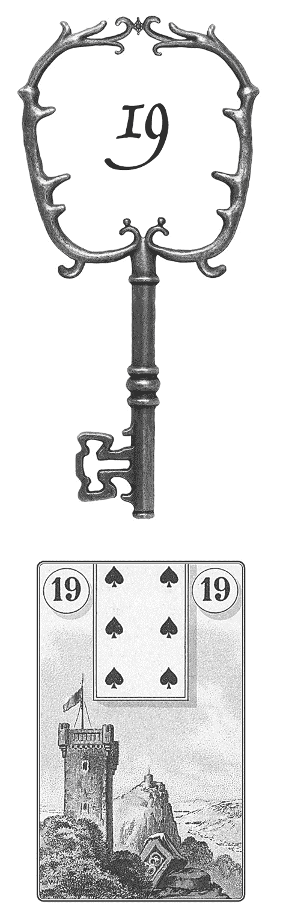

牌面上通常会看到高大笔直的高塔矗立在废墟之间，仿佛证明那是某种古老的荣耀，或是试图表达一种信念：“我仍站在这里！”牌卡上描绘了一栋雄伟壮观的建筑矗立于远方。塔象征有着稳固地基的建筑物，高耸入云。塔象征避风港和保护，以及限制和徒刑。

我将塔视为社会中的机构，以及任何符合这分类的一切：大型官方机构，如政府、企业、集团，亦即任何具有权威和广泛影响力的机构，像是司法机关或军事单位。从古至今，高塔始终非常重要，因为塔具备主要优势：从高处俯瞰、抵达大区域、守护和保卫。

自我、愿景、限制、徒刑、孤离，都属于塔的牌义。有时候这张牌代表指引、保护、学校、法律、高等教育、医院、高自尊心、透天厝、公寓、电影院、办公大楼、商场；甚至也代表监狱、矫正机构、机场，以及任何有连锁或分部的机构。依旧得视个案的问题以及牌卡配对组合而定。

塔掌管所有我们必须遵守的法律、规定、规范、限制和界线。它象征官僚和阶级。塔为事件带来架构和指导方针。对于塔罗牌占卜师来说，要注意：雷诺曼的“塔”和塔罗大牌中的“高塔”完全不同。

塔是你的志向、愿景，以及你的高标准和一切的地位。塔是中性牌，它不好不坏，但是周围的牌会影响它的牌义。

### 对应主题的牌义

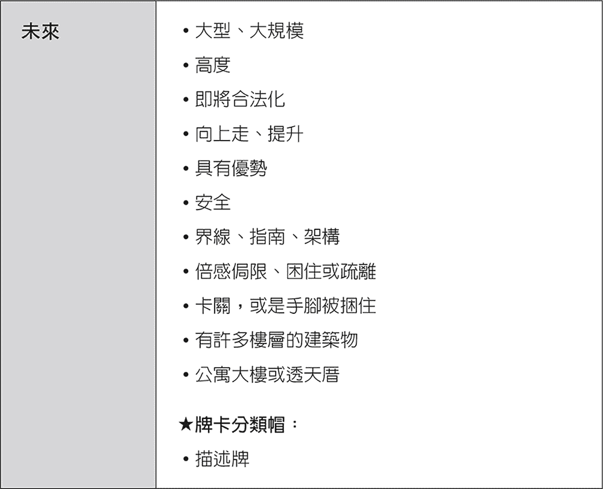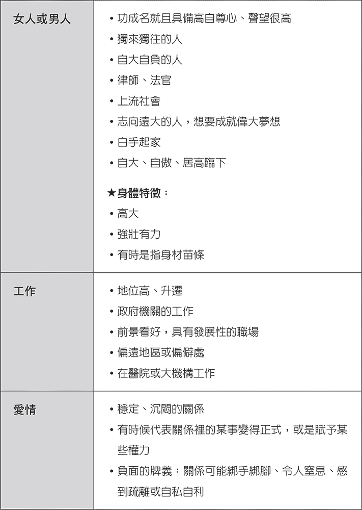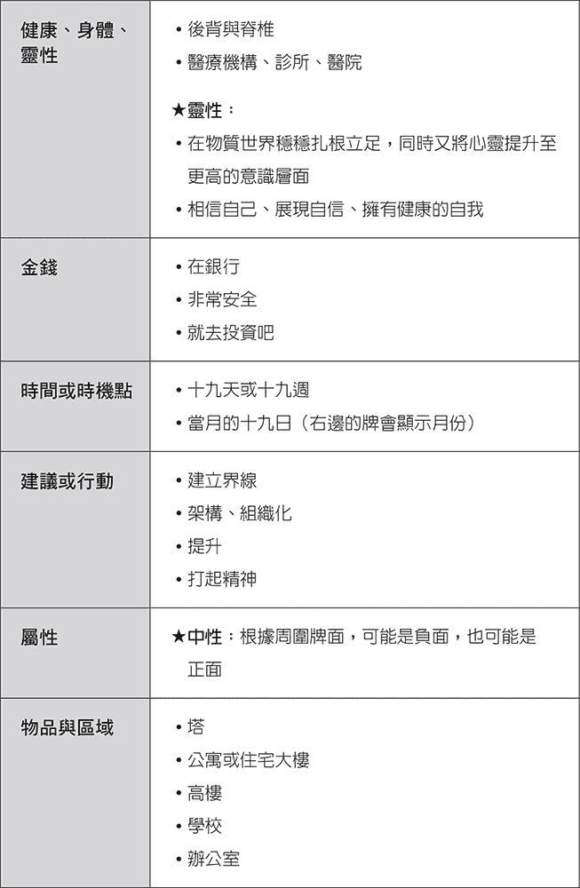

### 这张牌的个人故事：

我的朋友布鲁克已经打官司打了两、三年了。我为她占卜时，将塔设定为主题牌，象征她的官司，在每一次开庭日前，观想她在法庭内的情况。牌卡总是混着正面和负面牌，包围塔这张牌，但是最后一张永远都是开心、正面的牌。所以每一次占卜时，我都叫她放心，因为她一定会打赢官司。直到有一次占卜时，我苦恼不已，因为牌面显示有赢有输，我知道事情会变得很复杂。当时我抽到这组牌面：蛇＋花园＋幸运草＋老鼠＋塔＋熊＋十字架＋百合＋星星。

前面的几张，在塔左边的蛇、花园、幸运草、老鼠，解释了过去和现况，有诽谤和一堆人牵涉其中，当然有稍微小赢了，但也有压力。

塔的右边出现的牌面是对未来的预测：熊＋十字架＝庞大的金钱损失；十字架＋百合＝折磨和损失可能会持续很长的时间；百合＋星星＝经过这段时期，事情会好转，她会重获名声地位，再次闪耀光辉。

当我告诉布鲁克以上的解读，她觉得非常准确。这件案子一分为二，其中一件打输了，而持续支付的律师费就快要榨干她的荷包。这件官司又花了一年时间，布鲁克历经磨难痛苦，但她总是告诉我她相信我的占卜。这样的重责大任让我惶恐，但同时我也很开心和荣幸，因为我的好友深深相信我。我很幸运能够拥有这样的朋友，这一定是上天庇佑。我感动得喜极而泣。

当我接到她打来的电话，告诉我官司结果是胜诉时，我欣喜若狂。这对我来说是个很大的里程碑，而我开心得好像心脏要跳出来了。我为她感到喜悦，同时我也很开心能够陪伴她经历这几年的诉讼过程。无需多言，我觉得这通电话如同一剂强心针。

接下来这则故事依旧让我印象深刻。有一天我跟朋友莉雅喝下午茶，她很好奇她的工作运，所以请我抽几张牌。莉雅在企业界上班，工作稳定，也十分开心。

我很快地为她占卜了工作运势。

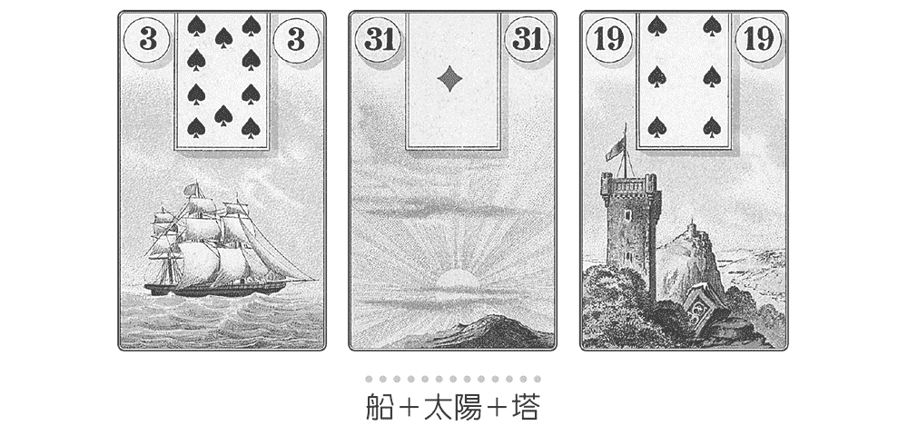

船代表移动（调职或变动），但这是好的结果，因为太阳在中间。我看见塔在最后一张，象征她的公司，甚至是规模更大更好的企业。我的答案是：“你可能会调职到其他地方，而且会升迁；或者你会跳槽到更好的工作，以及更大的公司。”

她面露诧异，摇头说道：“我不知道欸，我不觉得会这样。”

她问说有没有可能是指她的未婚夫或健康？或是她要去南欧度假？我告诉她，我设定的问题是具体询问她的工作运势。如果我们问的是度假，的确有可能是，因为船代表旅行，而太阳则是气候，加上塔是她要去游览的古老城堡与遗址。但是这个问题只跟工作有关。可想而知，她请我再占卜一次，而我抽到了骑士＋塔＋花束。很快的，我就知道这是指新的工作或新的公司，并且这个新机会非常诱人（花束）。她耸了耸肩，说会再让我知道结果如何。

一个月后，莉雅打电话给我，讲话速度很快，告诉我她刚刚收到一家大型化妆品公司的工作邀约。只是她必须搬到美国西岸，她想知道如果接受这个邀约，她会开心吗？我替她感到开心，也祝她好运，但招架不住她的殷切期盼，我为她抽了几次牌来占卜。

花束象征诱人的邀约，真是太美好了，而且又是化妆品公司；太阳也意味着知名公司和大好机会。我在写塔这张牌时，伴随了共时性，这一天是美国独立纪念日：七月四日。

### 大蓝图牌义：

传统上，塔象征长寿，除非有云朵在旁边，那么就暗示着未来会发生疾病和意外。

如果我的个案还是学生，我就会检视塔的位置，而周围的牌会告诉我故事的细节和情况。还有一种情况我会去检视塔这张牌，那就是个案在打官司，或是个案在大企业或机构里工作。

如果塔的周围是正面牌，就意味着安全稳固的基础，以及有机会实现志向；如果周围是负面牌，那么塔的负面特质就会特别呈现出来：局限、隔离、疏离。

### 配对组合与范例：

如果你要占卜听证会的事宜，那么塔也可以作为主题牌。

塔跟其他牌的配对组合非常重要，因为其他牌会告诉我们塔象征什么，以及发生的情况。

★戒指＋塔＝民事婚姻；需要政府官方认证的法律协议或交易

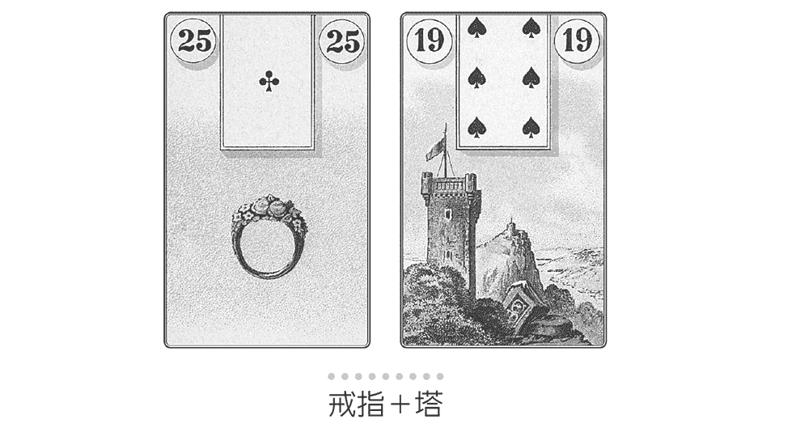

★塔＋戒指＝赢得法律诉讼或打赢官司

★棺材＋塔＝自我疏离又忧郁的人；监狱；安宁疗护中心

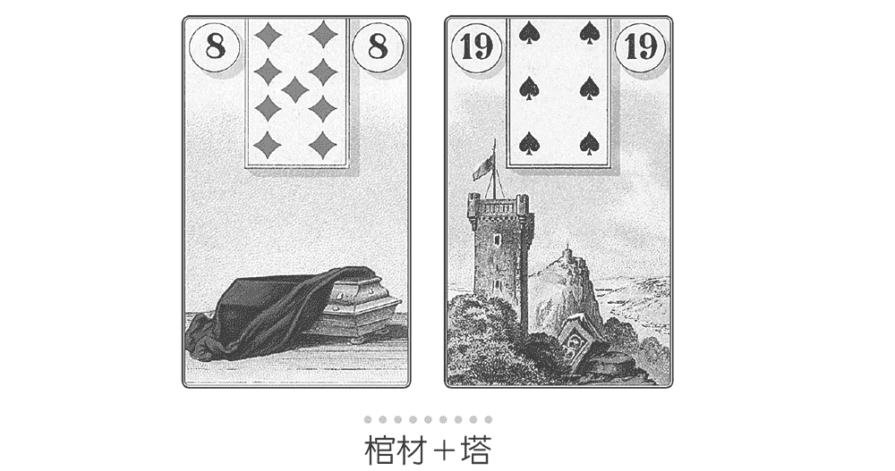

进行健康议题的占卜时，一定要请个案谘询医疗专业人士。

曼蒂想知道她明天的手术结果会如何？

★镰刀＋塔＋戒指＝胃绕道手术，手术结果很好

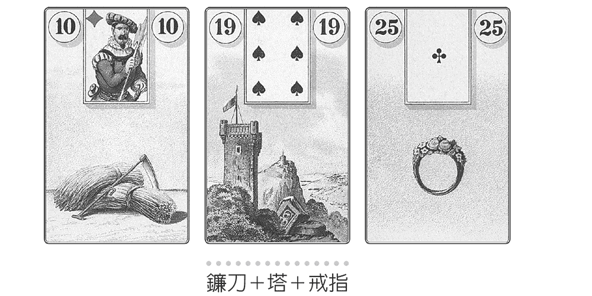

★镰刀＋塔＋花束＝手术结果很好，整形手术（外科＋医院+漂亮）

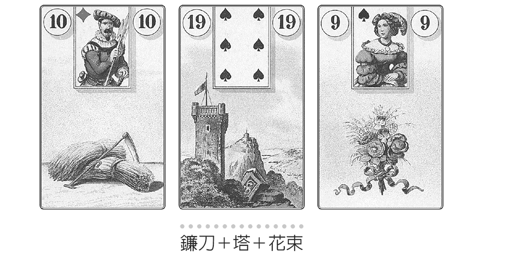

迪伦会在哪里跟罗拉见面呢？

★塔＋花束＝在商场（有许多层楼的大区域，也有许多美丽的东西和礼物）

朗达的感觉是什么？

★塔＋老鼠＝她的自尊逐渐低落（自我、自尊＋失去、烦恼）

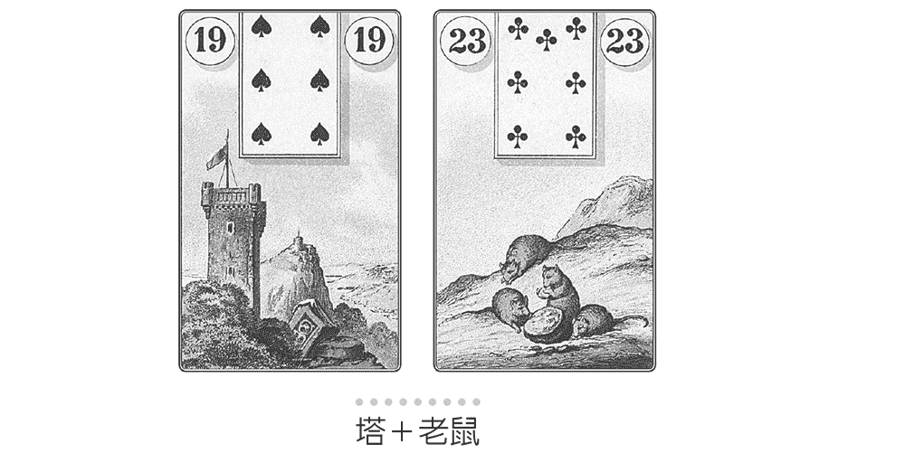

## 花园

扑克牌对应：黑桃八

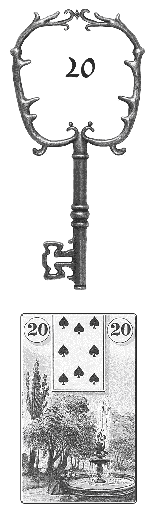

这张牌上面通常画着美丽的陈设布置，有着枝繁叶茂的花花草草。有时候画面中会有美丽的喷泉，流水汩汩。优美的环境，让人想起维多利亚时代的美好画面，适合求婚和公开聚会。花园象征和谐、美丽、放松。它代表幸福，以及户外活动和跟大自然链接的快乐。

花园让大家聚在一起，可能是生日派对、演唱会、话剧或是看电影和餐厅。花园象征公开与私人的场所，不论是僻静中心、相聚、会议、研讨会还是开会。当你看见花园牌，就意味着会有群众、集会、观众、庆祝或游行。

花园是整洁的社区、环境保护区和修饰过的景观。花园也象征丰盛、复数、肥沃的土壤。

### 对应主题的牌义

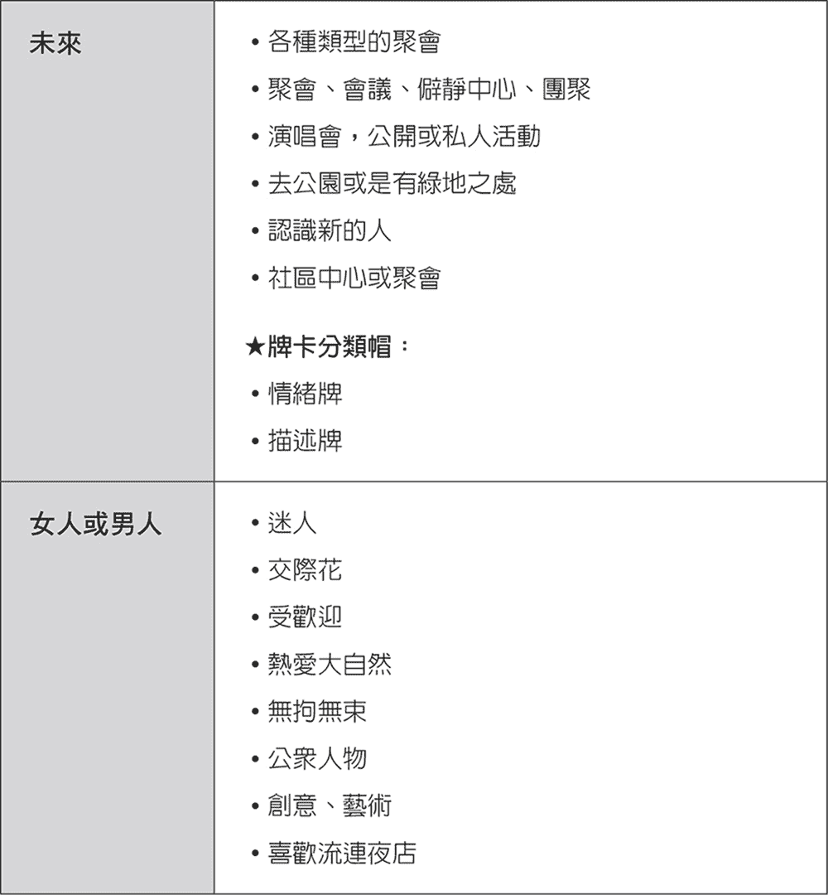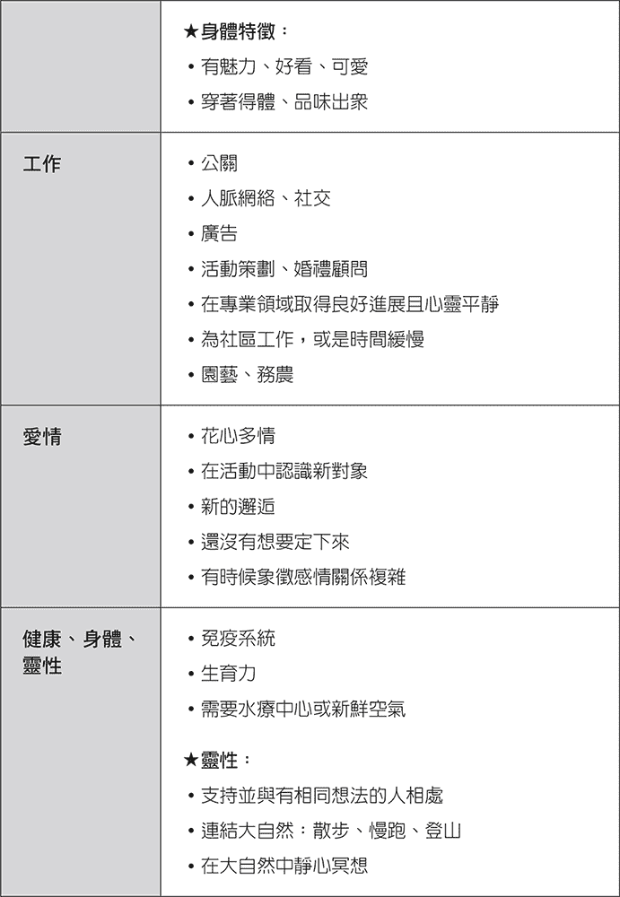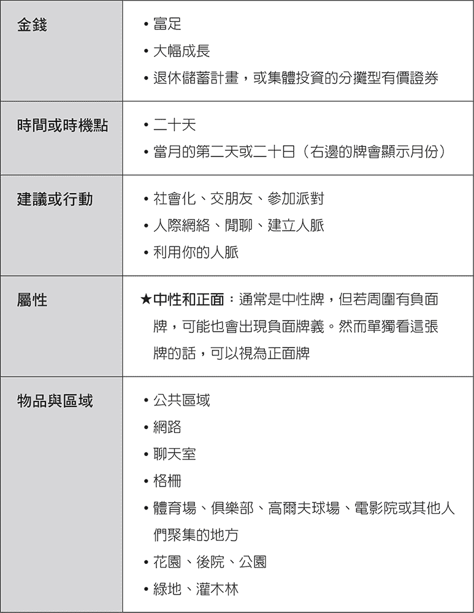

### 这张牌的个人故事：

这是一则简短却温馨的故事。长久以来，我一直都不知道我能够认识一群跟我一样的人。我之前孤身一人，祈祷着能够遇见其他灵媒、占卜师或心胸开放的人来指引我。我后来意外发现了一个线上塔罗团体，离我家很近，所以我决定去跟这些人见面。我既紧张又害怕，因为我从未做过这种事，脑海中一直想着：他们会觉得我是神经病吗？他们会很古怪吗？他们会接受我吗？我需要继续躲起来吗？还是我应该做我自己呢？我抽了一些牌，如下：

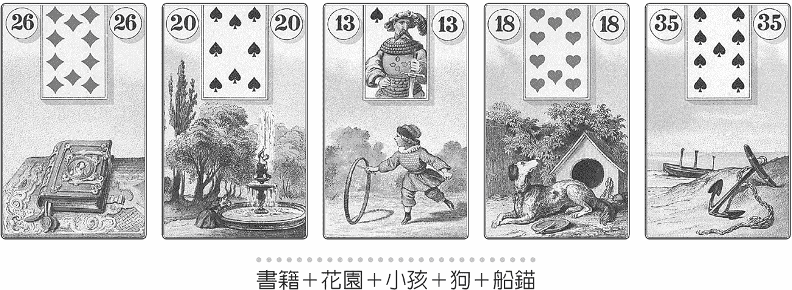

看见这些牌出现，我立刻安心了。书籍＋花园这两张牌我解读为塔罗团体，小孩＋狗是认识新朋友，而船锚在最后一张就像是维持友谊长存、稳固的黏着剂。踏出那第一步进入塔罗团体后，我的人生彻底翻转。我不只遇见许多出色的人，也交到一辈子的朋友，更发现到许多我学也学不完的知识。我当时的占卜果然很准。我把狗＋船锚的组合视为“一辈子的支持团体或朋友”。

共时性的事情来了：我在写花园牌的内容时，这一天是我妹妹的生日。我多希望能够在东岸参加她的生日派对。哎，可惜这个花园跟我相隔遥远。而今天，我收到我的萨满老师寄来的电子邮件，提醒我要在大自然中静心冥想，这又是另外一个与花园有关的共时性事件了。

### 大蓝图牌义：

传统上，如果花园牌离指定人物很近，代表你会被介绍进入大型社交圈中，并且结交新朋友。如果塔在旁边，意味着这段友谊会长长久久。如果花园牌离人物牌很远，就要注意你的社交圈中有假朋友和伪君子。

花园牌象征你可能会被邀请至某种场合，特别有搭配信件牌的话；或者你即将认识一群新朋友。花园也象征充满艺术或灵感的快乐环境。它象征认识新朋友，激荡出友谊的火花，带来正向的改变。花园牌象征地点，例如见面地点以及活动场所。它是静修、平静与放松之处。

如果花园牌被正面牌包围，意味着开心、和谐、真挚的牌义，同时也呈现出这张牌所有让人喜悦的牌义；如果负面牌在花园牌旁边，则要注意某些警讯、纠纷和矛盾。不要太铁齿地相信那些假装是你朋友的人。

### 配对组合与范例：

麦迪森的生日烤肉派对会有什么发展？

★花园＋云朵＝可能会下雨，影响活动；注意会有出现混乱或干扰的情况

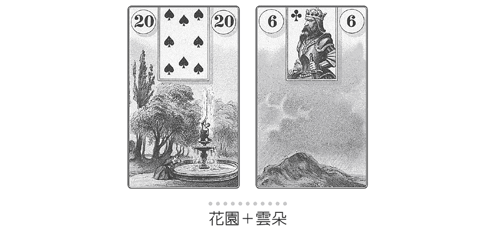

马克和妮可想要找新家，他们会找到什么样的房子？

★花园＋房屋＋花束＝在优质社区里，房子坪数很大，庭院和后院有景观，非常美丽

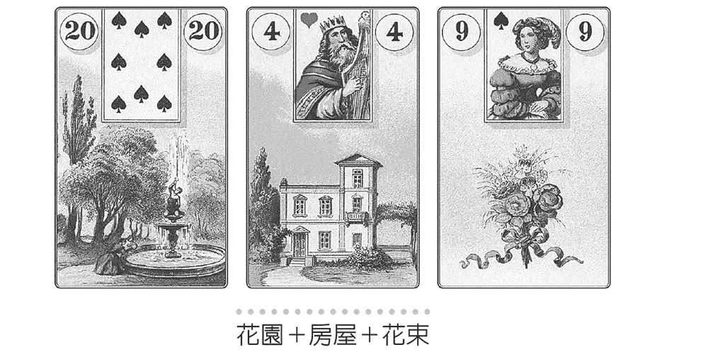

蕾西第一次和另一半的家人见面，会发生什么事呢？

★太阳＋花园＋房屋＝开心的经验，这个温暖、喜悦（太阳）的大（花园）家庭（房屋）会欢迎蕾西加入

爱德蒙准备进行他第一次的网络研讨会，牌卡会告诉他什么呢？

★花园＋蛇＝要有心理准备会遇到一些困难，可能是连线上的技术性问题，或是与会者有人不怀好意，想要偷你的点子或剽窃你的作品

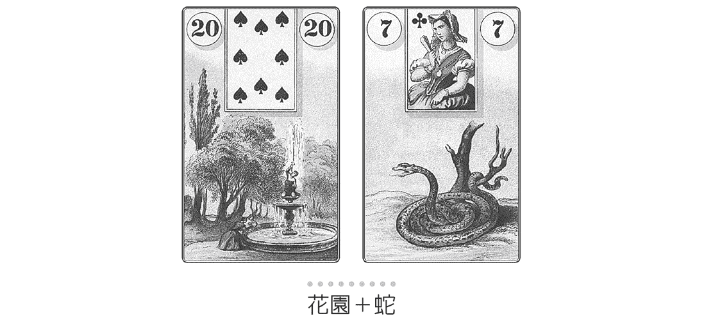

## 山

扑克牌对应：梅花八

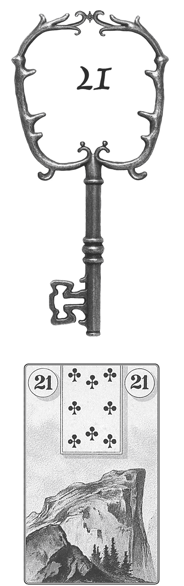

你通常会在这张牌上面看到一座高耸的巨山、巨大的石块或是远处的高峰，全年贫瘠、寒冷、遥远。有时候牌卡则是画着高山国家的景观。山象征无法行动、抵抗、长期矗立，也象征坚持不让步、坚持不懈、障碍。

山象征庞大的障碍，需要你花时间克服。这张牌暗示着各种挑战、延宕、反对，警告你要小心陷阱。通常山会带来挫败、失落、干扰，以及负担和沉重。山代表事情陷入僵局，但不是绝对无法改变的事情。要记得：总是有方法可以绕道而行，或是跨越山峦。把山想成是你要攀越的挑战、待解决的问题，以及等着你跳过去的栅栏。山会带来各种延宕、推迟、拖延。山有时候也象征有敌人在削弱你的努力。

山也能象征不错的偏乡旅游、山上的休闲胜地，或是偏僻的僻静中心。

### 对应主题的牌义

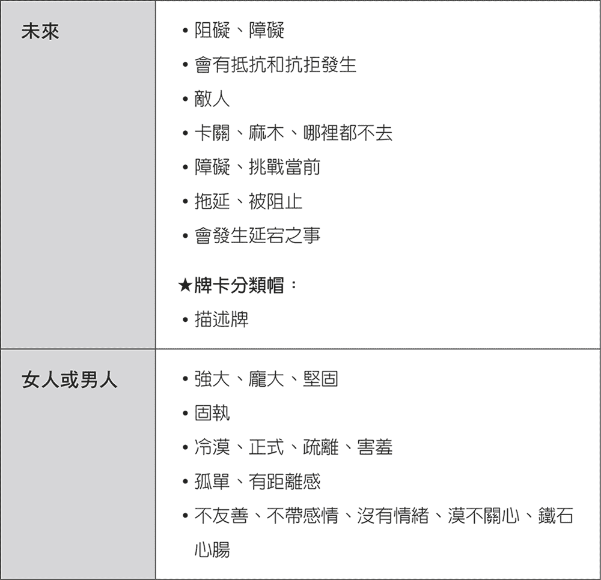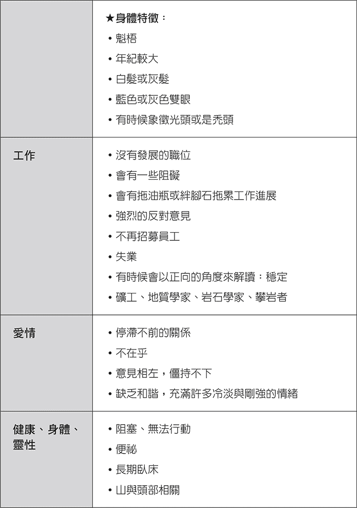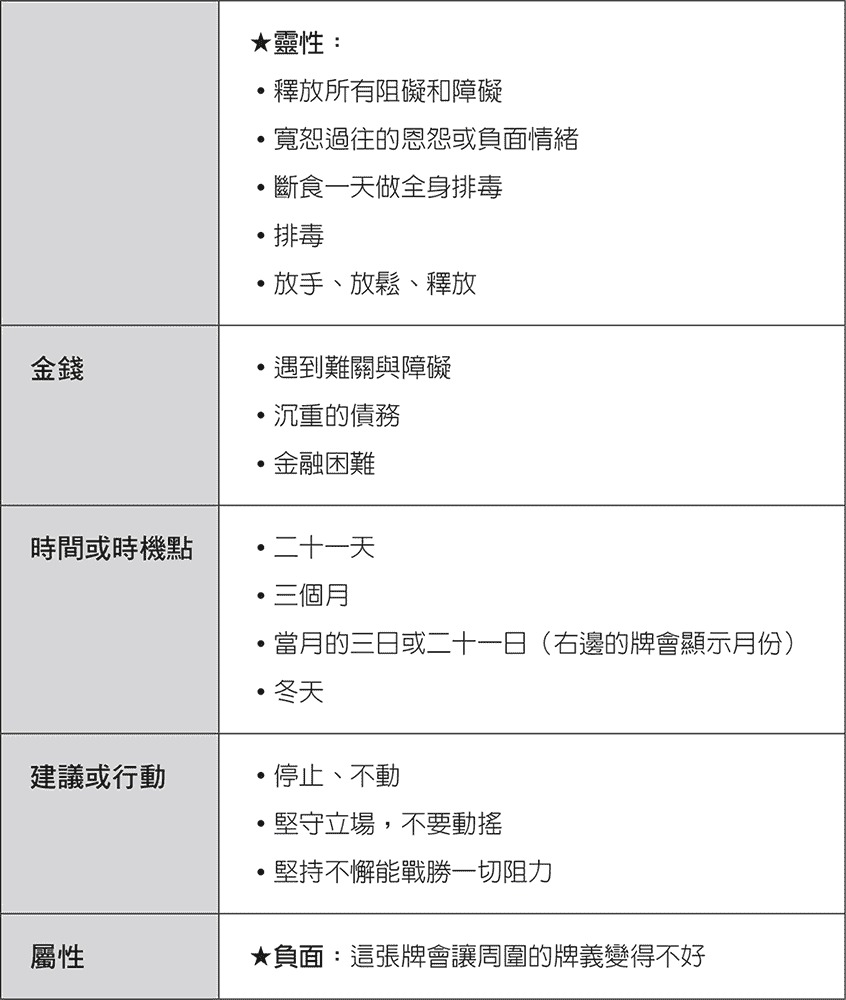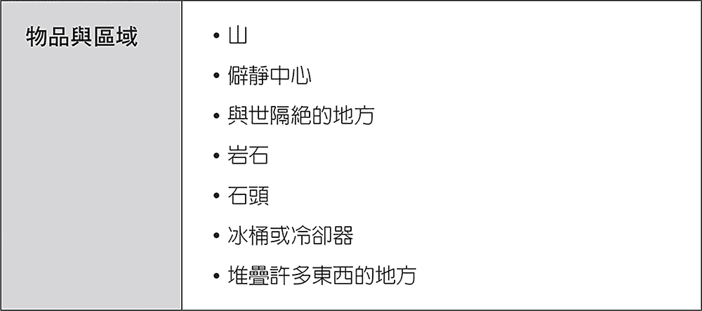

### 这张牌的个人故事：

我最近跟山有个简单可是有趣的邂逅。我先生手忙脚乱地打包行李要出差。我出于好奇，抽了牌占卜，抽到了熊＋山＋云朵。我叫他不用急，因为可能会有严重的延误，班机不会准时起飞，但是他听不进去。我很不爽，问他说：“你怎么可以跟一个灵媒结婚了这么多年，却还不相信我的话呢？”这是我的个人情绪，而我的自我膨胀起来了。我一直陪着他，直到他确认了班机。“上面说飞机会准时起飞。”他窃笑着说。但这无法阻止我重复提醒他，不过他就像活在自己的世界里一样，犹如《爱丽丝梦游仙境》中的白兔。

当他抵达机场办理完登机手续，航班延误了四小时，因为航班预计抵达的城市气候不佳（云朵）。他打给我，怒火冲冠地抱怨班机延误，影响他的行程。接着他损了我：“你这个乌鸦嘴。”我压抑心中得意的心情，调侃回去：“对，我就是啊！我要求宙斯改变天气，证明我是对的。”我们在电话中都笑了。

我的自我在心里开心得跳舞，但作为一位好太太，我也很难过丈夫的航班延误。我理解他无法把握机会，不要那么急着赶去机场，但是我的确很享受证明自己正确的感觉。

### 大蓝图牌义：

传统上，如果靠近人物牌，山是在警告你有个强大致命的敌人等着伤害你。如果山距离人物牌很远，就代表你会有忠实、强大的朋友作为靠山，随时准备在你需要的时候伸出援手。

我依旧会在占卜时特别注意山的位置。假设它靠近人物牌，我会先确定这是否指某个人，如果是的话，我接着会检视其他细节，才会解读成会遭逢敌人，只是会不提“致命”这个意思。通常这样的情况会立刻显示出来，而且会有许多迹象表明会有坏事。如果没有其他的细节，那么山就只是修饰周围牌面的牌义而已。

假设山在人物牌上方，意味着这个人目前承担重责大任；如果在人物牌下方，就意味着有些阻力，但是可轻松迎刃而解。如果山在你的上方，你就得想办法逃离；如果山在你脚下，就容易跨过了。

如果山在人物牌左边，那么障碍和挑战已过，或是正在跨越；如果山在人物牌右边，那么这些挑战和障碍即将来临。

如果周围有正面牌，就会削弱山的负面能量，把庞然大山铲成小山丘，只是仍然会有挑战和天气影响所导致的延误，但是会让你更容易处理。然而，若是有负面牌在周围，山就会变得更大、更高、更沉重，程度要视牌面而定。

### 配对组合与范例：

吉娜会很快怀孕吗？

★鹳鸟＋山＝不会。除非阻碍她怀孕的原因先被解决

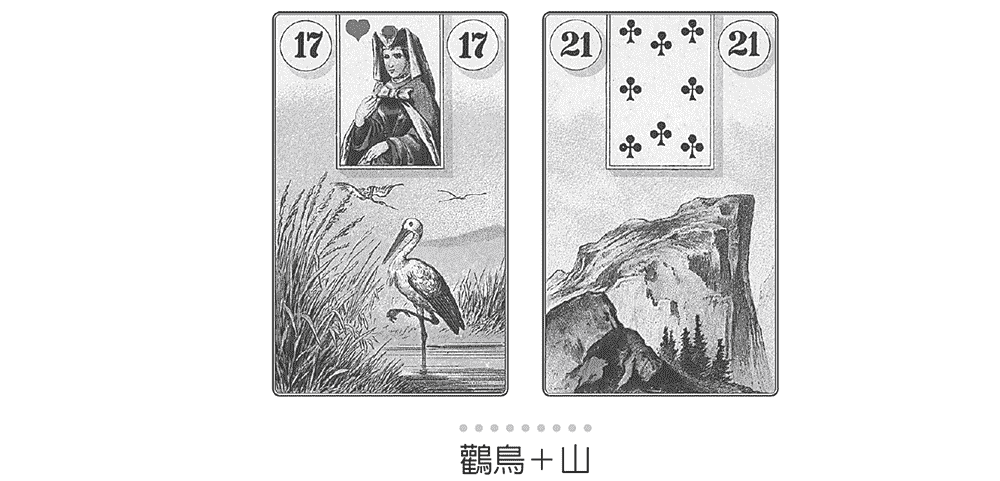

★山＋鹳鸟＝会。障碍已经被处理、清除，她也准备好怀孕了

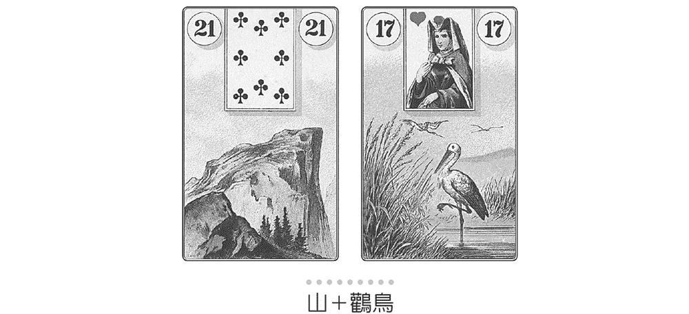

法利斯要去面试，他会录取吗？

★山＋船锚＝会。之前等得够久了，录取仅是临门一脚

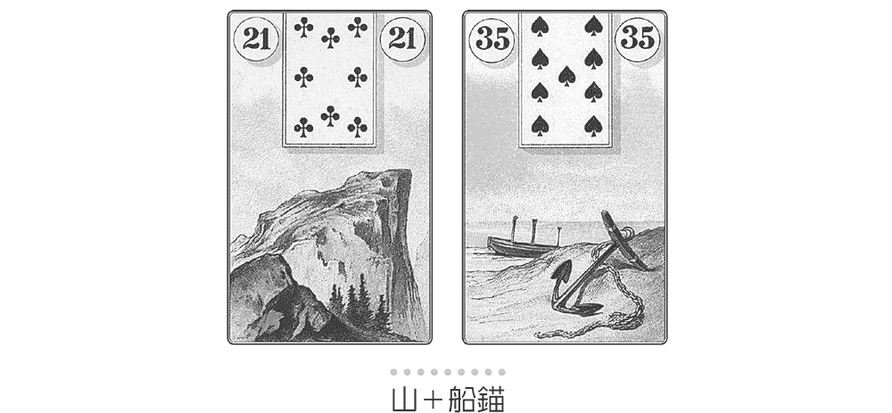

★船锚＋山＝会。他要么会在该公司待很久，要么会在毫无前途的工作上卡关，又或者是第一天上班就有延误的情况发生

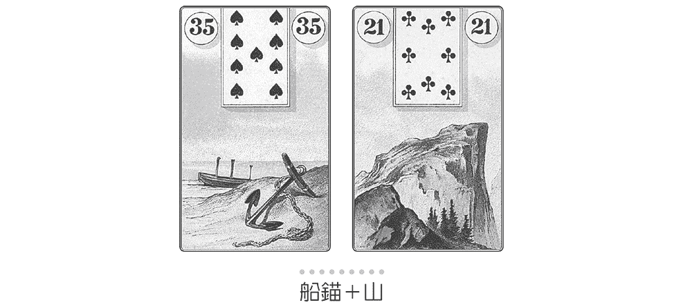

## 十字路口

扑克牌对应：方块皇后

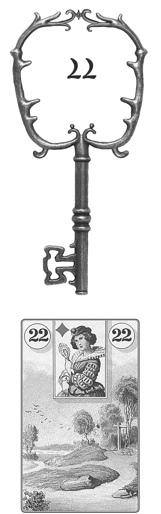

这张牌通常画着乡间的十字路口，有两条或三条道路，让行者选择要踏上哪一条路。十字路口象征一个人生命中的重要抉择。拥有选择权，并且透过选择，掌握自己的人生方向，是这张牌的本质。

十字路口象征绝对的自由意志，你的选择会决定你要体验的人生道路。这是你要踏上的旅程，或者只是你旅经的街道。十字路口是你的选项和诸多方向。它象征站在艰难的人生交叉口时，面临选择时的不确定感、疑惑、犹豫。十字路口呼唤你为困境找到其他选择和替代方案，你可以采取其他行动，走不同的路。

十字路口带来多重因素、双重生活和欺骗。

★信件＋十字路口＝许多邀约；许多文件

★爱心＋十字路口＝许多有好感的对象；有许多爱好

★花束＋十字路口＝许多礼物

★鹳鸟＋十字路口＝双胞胎；许多改善

★狐狸＋十字路口＝从事至少两种工作

★镰刀＋十字路口＝多重手术

在关系中，如果十字路口在女人牌或男人牌的某一边，就是不忠的暗示。

### 对应主题的牌义

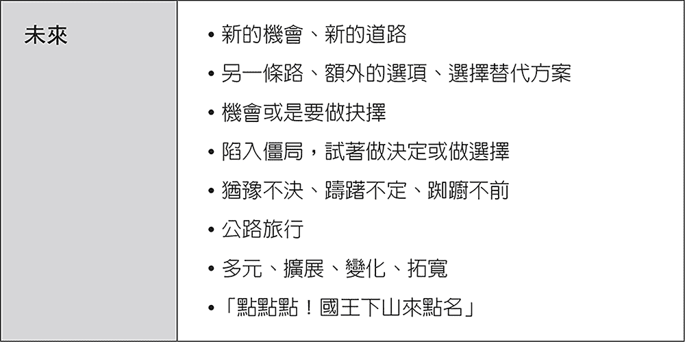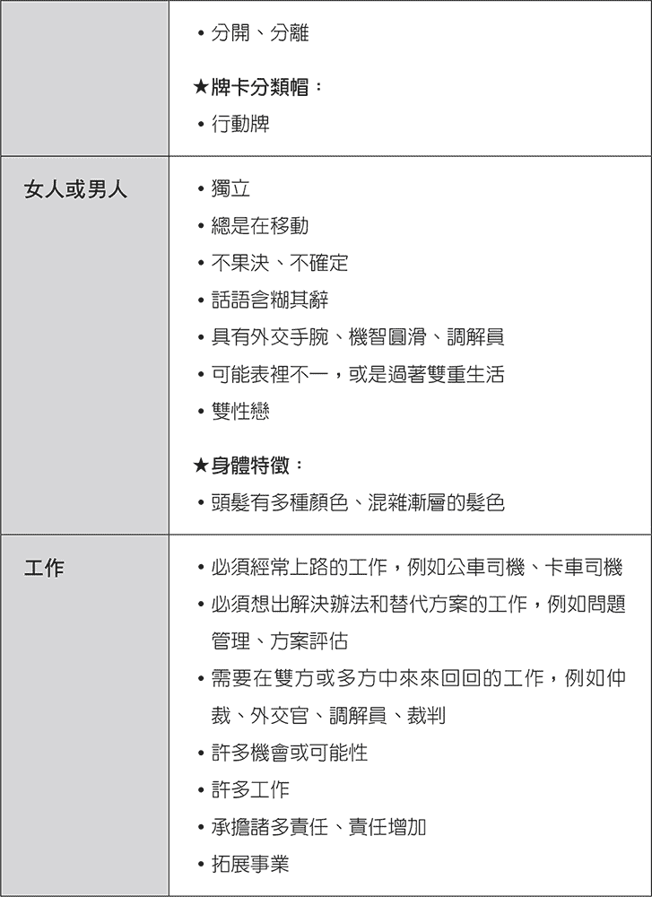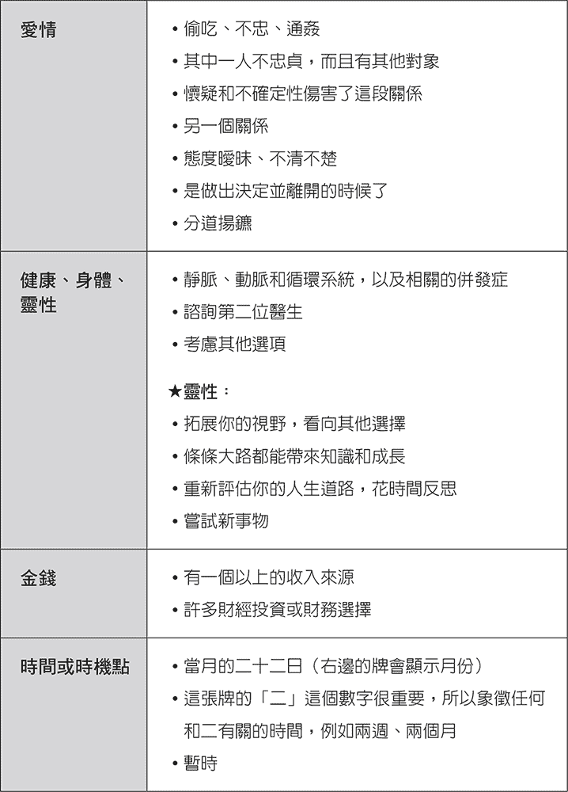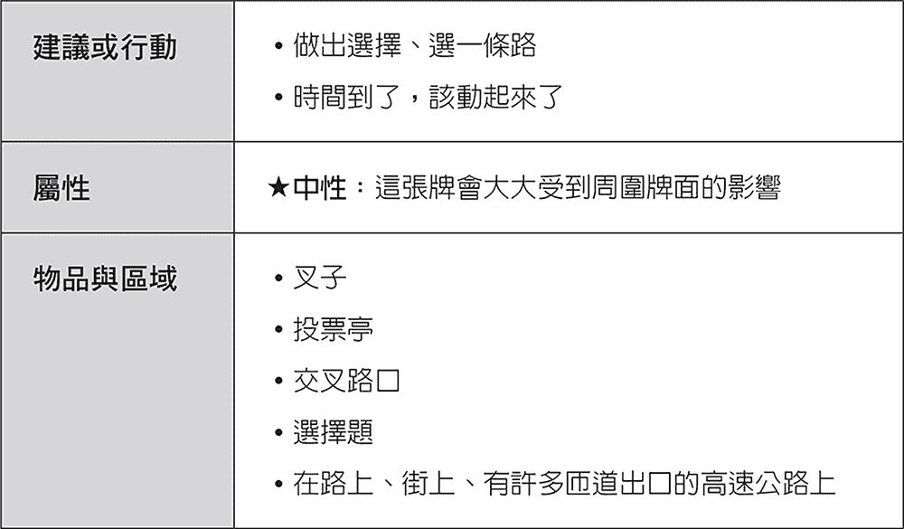

### 这张牌的个人故事：

十字路口的故事对我来说非常珍贵。很久之前，一个周五晚上，我独自一人在家，因为我的约会在最后一刻取消了。我在房间里闷闷不乐，抽了几张牌，抽到：

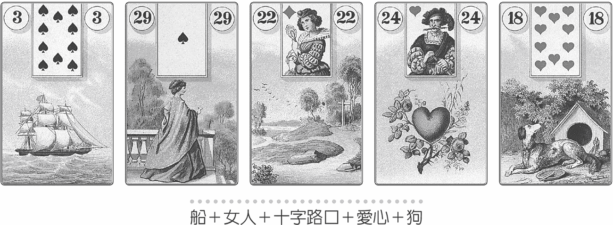

我没有设定任何主题牌，所以我想说可能朋友会来安慰我，因为狗在最后一张，而十字路口在中间，因此它是问题的核心。我对这个牌面有点困惑，但我整个人深陷在难过的情绪里，所以根本不在乎占卜结果到底要跟我说什么。不久后，一位朋友来到我家，把我从床上拉起来，因为她需要我开我的车。她还带了另外两位女性，而她的车太小了。她们正要去华盛顿市中心的夜店。开车时，我心想：“啊，所以船的意思是指我的车。”我觉得牌卡要告诉我的是，我在路上开着车，帮助我的朋友。驱车回家时，开离乔治市的路上，我的车里塞满了一堆女人；我们停红绿灯时（不就是十字路口吗？），其中一位女生朋友看到认识的德国朋友就在旁边那辆车里，里面塞满了男人。我们快速停到路边，而我当下并不是很自在，只想要回家，却万万没想到会遇到我的灵魂伴侣——我老公！

雷诺曼非常直接，牌面直接了当地表明了我（女人）在路上开车（船、十字路口），会遇见欢乐与爱情（爱心），而他会是老实人／朋友或是灵魂伴侣（狗）。

十字路口这张牌的内容花了我两天时间才写完，而上面的故事是第一个共时性事件。那两天内，我必须跟同一位个案变更时间两次，试着处理好这件事，并安排最好的时间。这是第二个共时性事件。

### 大蓝图牌义：

传统上会特别注意云朵是否靠近十字路口，如果是，就意味着一定会有麻烦、灾厄和不幸发生。

我不会第一眼就检查这两张牌的距离，但我会注意一下。如果这两张牌刚好相近，我就会告知个案，因为十字路口＋云朵＝麻烦即将在眼前出现、前方路途坎坷、路途艰辛、有冲突或意见不同等等。

在解读十字路口这张牌时，重要的是查看周围是否有任何负面牌，有的话就会出现麻烦与挑战。云朵、十字架、老鼠会让十字路口变成一段充满挑战的旅途，或是过程不断延长；跟镰刀相比，前面的牌还好一点，因为镰刀会带来意外的交通事故。

如果十字路口的周围是正面牌，会出现可喜可贺的结果。

当十字路口落在人物牌的上方、下方或右边，代表你要做非常重大的决定，而周围的牌会告诉你更多线索和细节。

如果行动牌在十字路口的周围，例如骑士、船、鸟、鹳鸟，这个决定肯定非常重大。

如果十字路口落在大蓝图牌阵中的最后一列，我也会检查一下；如果是在第八列，则意味着个案的生活会有很大的转变。转变的时间点视人物牌离大蓝图的边缘有多远或多近而定。

### 配对组合与范例：

布兰迪想知道是否该考虑这个工作邀约。她应该接受，还是等待另一份工作的录取通知呢？

★狐狸＋十字路口＋骑士＝等另一份工作，而且可以的话，试着拖延时间，直到你两份工作都确定录取（十字路口在狐狸右边，代表她不知道该选哪一份工作；此外，十字路口在中间，代表问题的核心就是选择）

★十字路口＋狐狸＋骑士＝答应你现有的工作邀约吧（十字路口在狐狸左边，代表她犹豫不决并申请了两份工作，而非有两件事同时出现；狐狸在中间，强调了目前录取的工作）

更大的牌阵可以给我们更多信息。

凯斯想知道他和马萝的关系发展。他们只约会过一次。凯斯和马萝会有后续的约会吗？

★鸟＋十字路口＝不会有更进一步的发展了，你要放下

★十字路口＋鸟＝还会有后续的几次约会

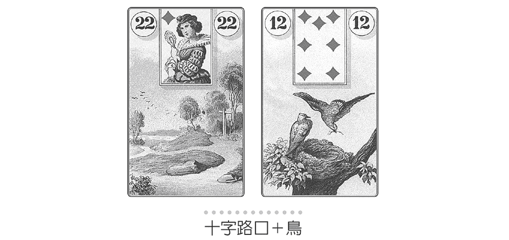

现在如果把问题换成马萝，询问马萝是否认真看待凯斯。我们抽到：

★十字路口＋女人／女人＋十字路口

马萝其实脚踏多条船，或是正同时跟不同的人约会。如果要知道更多细节，就要用更大的牌阵。

## 老鼠

扑克牌对应：梅花七

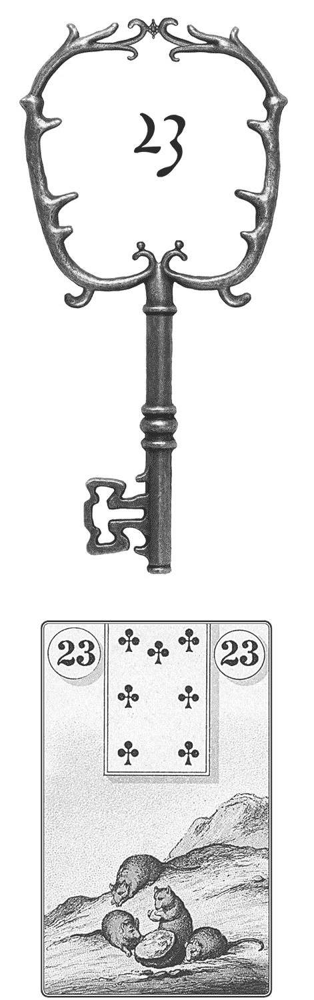

通常老鼠牌的画面都是三只以上的小老鼠窝在一起，忙进忙出、啮咬、进食或偷东西。老鼠在中世纪的鼠疫时期就被视为疾病的象征，也因为会偷东西和掠夺收成的农作物，从此恶名昭彰。老鼠的名声很差，但它们实际上行动快速又聪明。它们会集体活动，啮咬任何东西，破坏建筑物。它们繁衍的速度也很快，亦是许多传染病和祸害的根源。

你只要想像一下，如果你在家里发现老鼠会怎么做？多数人会惊慌失措，立刻打电话给除虫公司。

老鼠牌象征压力和担忧，一点一滴侵蚀你的核心。这张牌会让你的内心不安——坐立难安、烦躁不已和心悸的感觉。它也代表侵蚀与渐渐恶化。老鼠牌带来焦虑、紧张、忧虑、紧绷。有时候这张牌指的是疾病或是单纯的疲劳，有时候则是丢失物品的征兆。老鼠牌是你拿了或偷走不属于你的物品。它是小麻烦，若不尽早处理，则会演变成大麻烦。老鼠牌也象征囤积。

老鼠会集体活动，所以这张牌有时候象征团队合作，或是在集体生产线工作的劳工，工作乏味且一直重复。如果有正面牌在老鼠的右边（根据问题脉络而定），可能是指兴奋、渴望、殷切期盼。

老鼠牌是负面牌。

### 对应主题的牌义

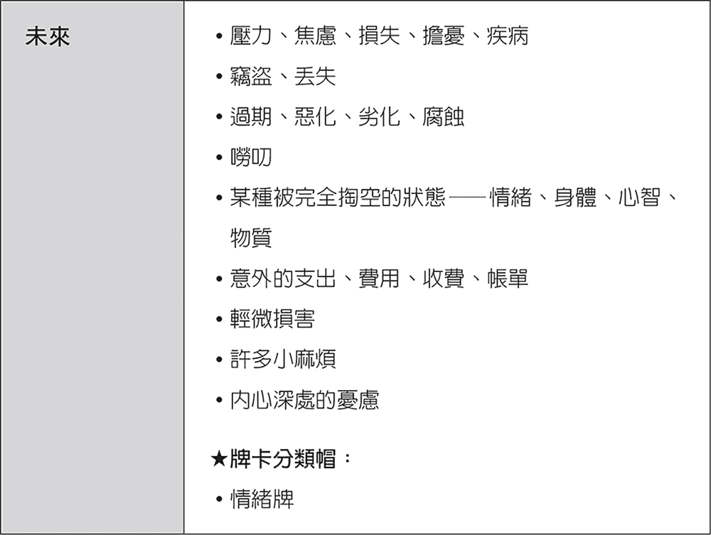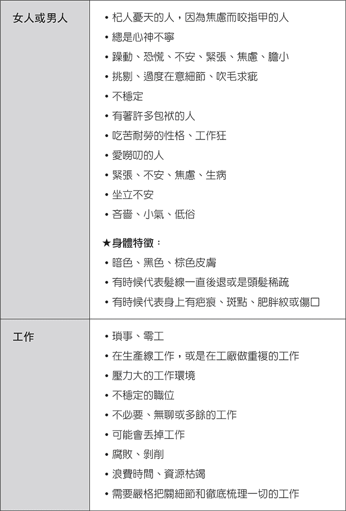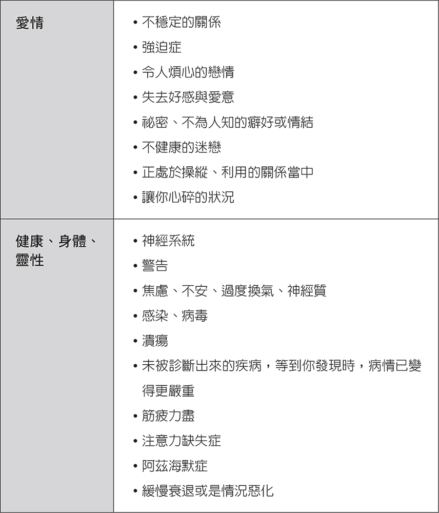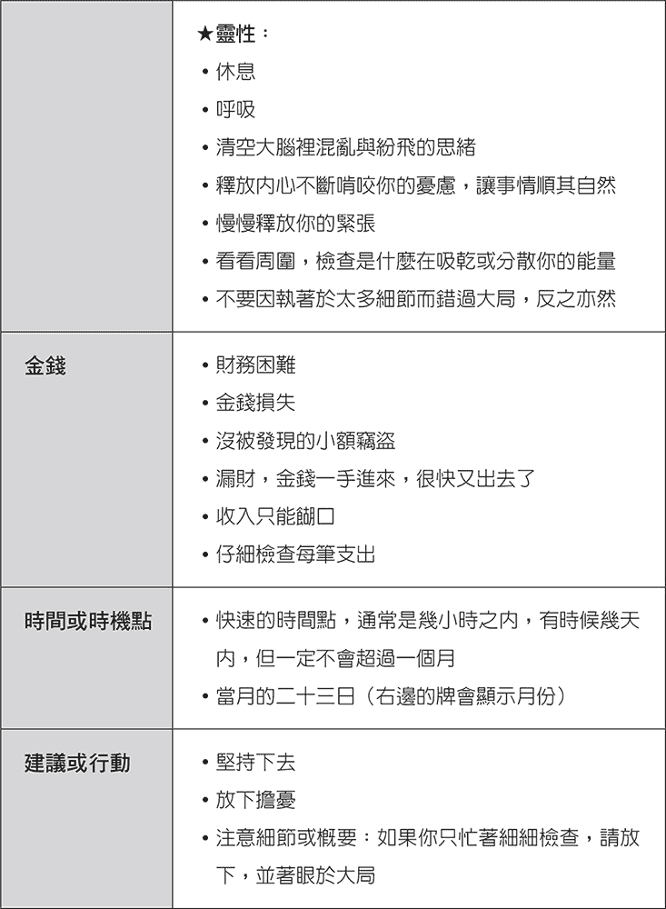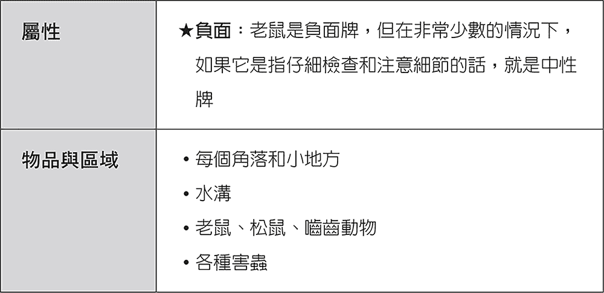

### 这张牌的个人故事：

我妹妹的好友莉露准备计划策办一个以巴黎为主题的生日派对，要给我妹妹一个生日惊喜。将心神集中在生日派对上之后，我决定抽七张牌，我抽到：

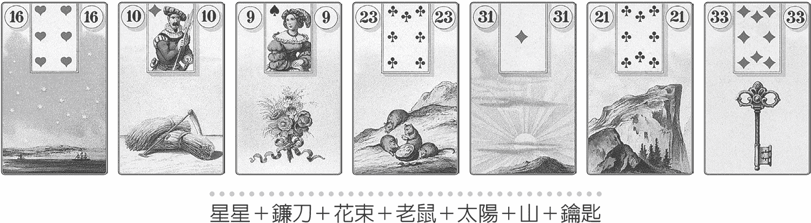

看到钥匙出现在最后一张，我松了一口气；虽然过程崎岖，但我知道生日派对最后一定会举办得非常成功。老鼠出现在中间，强调了活动会发生担忧、焦虑、意外的问题或麻烦，需要尽速处理。我按照以下的顺序解读牌面：

星星＋镰刀＝某种突然的意外或破坏，会造成计划瞬间改变（星星）。花束＋老鼠意味着装饰（花束）和派对的呈现。派对装饰会出现让人有压力和紧张（老鼠）的事件，或许装饰或结构有些损坏。我不喜欢太阳被夹在老鼠和山之间，这意味着成功只是短暂的，因为老鼠牌和延误（山）会发生，但是最后出现钥匙牌，确定这个活动一定会成功。

活动过程所发生的事情真的是悲喜交加，尤其是再回头看这些牌的时候。惊喜派对的前一周，有个严重的暴风雨袭击了整片区域，导致许多乡镇断电了将近一星期（星星＋镰刀＝断电）。莉露压力非常大。她正在制作一些大型装饰品，高温让每个物品都变形了（老鼠＋太阳＝过热），让一切变得更麻烦。因为高温、断电以及黏着剂融化，导致装饰品坏了，活动必须延期（山＝延误）。

莉露寄给我一张照片，是坏掉的红磨坊（Ｍoulin Rouge）结构，整个结构看起来很糟糕（老鼠＝结构毁损）。这些状况都被牌卡预测出来了。然而，改期的活动非常完美。这个惊喜派对圆满成功（钥匙），我妹妹非常开心。

### 大蓝图牌义：

传统上如果老鼠牌靠近你，意味着你会遭逢偷窃或弄丢物品。而重获失物的机率和希望取决于老鼠牌离你有多近和多远。老鼠牌离人物牌越远，找回来的机率就越低。

如果个案想要寻找珍贵的失物，那么只有在这时我才会用这个方法，也就是检查老鼠牌和人物牌的距离。假如老鼠牌很近，而且周围有正面牌，表示失物很快就能寻获；反之，离得越远，越难寻回。除此之外，老鼠牌也代表日常的担忧、压力、焦虑。

老鼠牌会修饰和形容左边或周围的牌。如果周围是负面牌，那么老鼠的影响就会加强、变严重、更加令人担心；如果周围是正面牌，表示希望正在靠近，会让事情变得顺利一点，或是降低负面影响。

如果老鼠牌靠近房屋牌，要担心是否房屋结构出现问题或侵蚀；另一方面，也有可能是家庭出现问题。

### 配对组合与范例：

★老鼠＋星星＝癌症；担忧广播节目；焦心某个网络专案；压力很快就会消散；失物会寻获；迷路（全都要视问题脉络而定）

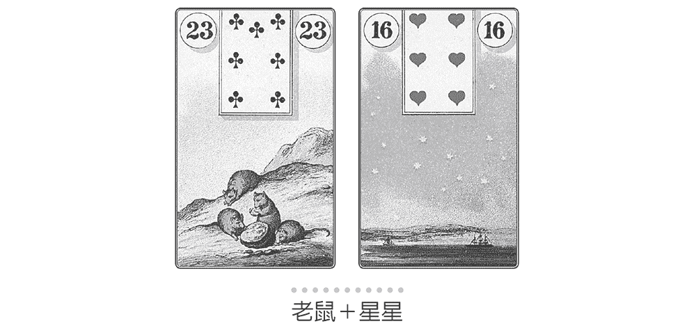

★老鼠＋熊＝资金一点一滴减少；不断花小钱，却没有注意到这些小钱加起来会成为一大笔金额；担忧财务状况；吝啬鬼或小气鬼；杞人忧天的母亲或姑姑、阿姨（熊）；苦恼体重问题（熊）或是节食；慢慢的减肥

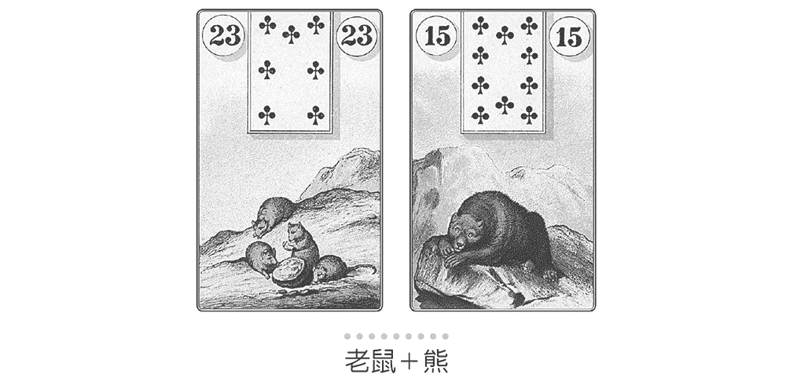

★老鼠＋狐狸＝低薪工作；工厂作业员；压力大的工作；四处打零工；临时性的工作；担忧职位或工作状况；就业状况不稳定

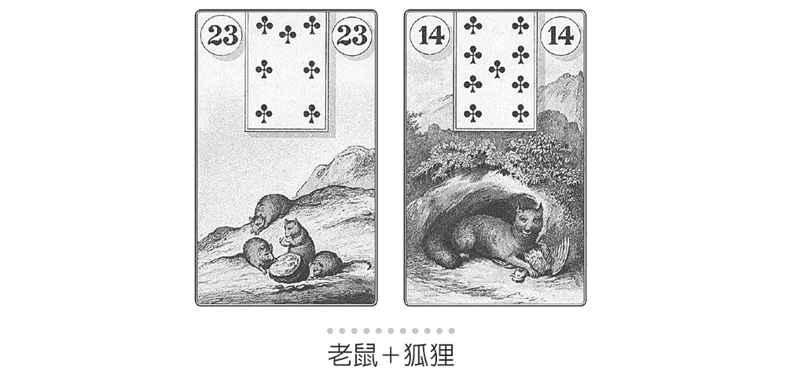

★戒指＋老鼠＝弄丢戒指；失去合约；毁约；婚姻关系逐渐遭受侵蚀

★老鼠＋戒指＝持续反复的焦虑；消耗与枯竭的循环；贪腐的一群人；解决问题的方法

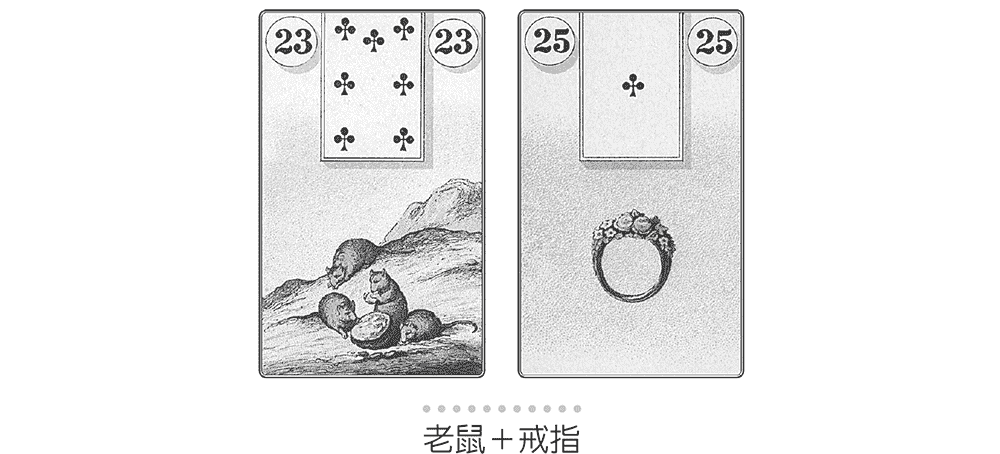

## 爱心

扑克牌对应：红心侍者

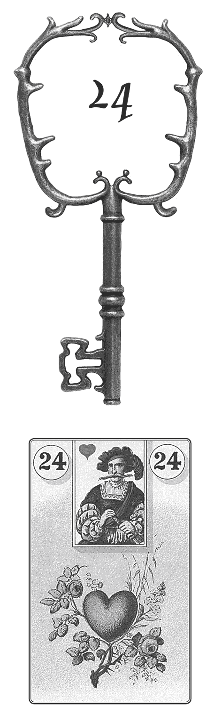

这张牌通常画着一颗美丽的红色爱心；有时候画面会是花团锦簇，周围有着玫瑰或各式鲜花。爱心一直都是爱情、热情、奉献的象征。恋人会将爱心刻在树上，画在沙滩上，在书信中表达爱意，将爱心刺在身上。现在，爱心变成了表情符号，输入在简讯里和社群媒体上。爱心象征永恒的爱意、情感，以及人与人之间的牵绊。无论透过什么方式，我们都用爱心作为对某人表达欣赏和爱意的象征。

爱心牌象征幸福、喜悦、成就感、满足感、开花结果、绽放、爱意、热情。它将和平、和谐、喜悦、愉悦、享受之情，注入人际关系的任何层面，以及你怀抱热忱的人事物里。它传达出那种完成一项专案时兴高采烈的感受，或是跟恋人相处时的喜悦之情，以及跟朋友聚在一起的满足感。这张牌象征母爱和手足之情。它象征一个人独处时的小确幸，以及做自己想做的事情时的愉悦。爱心牌代表善良的行为：慈善、慷慨、对朋友和陌生人热情相待。爱心牌象征爱的所有层面，以及任何形式的爱。这张牌包含各种形式、特点的感受与情绪。

爱心牌揭露你的感受、热情、渴望、情感、喜好、爱意和好感，然而它并不是承诺的象征。所以占卜时，你要检查周围的牌来判定这个爱意的动机以及是否真诚。戒指、船锚、钥匙、房屋可能会显示出长久或稳定的迹象，有时候也可以从塔和鹳鸟看出来。

### 对应主题的牌义

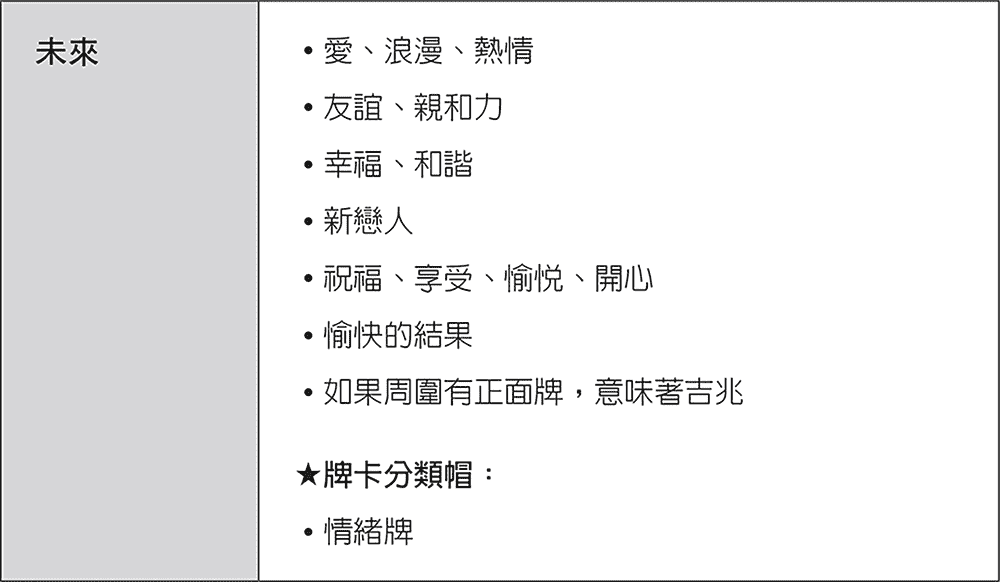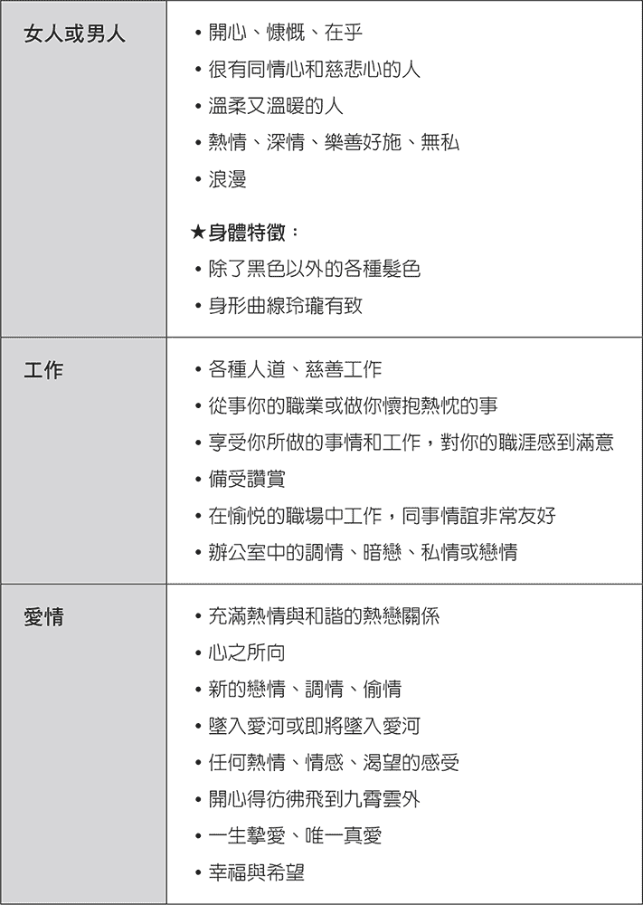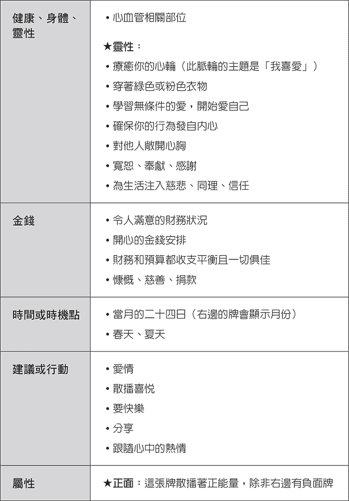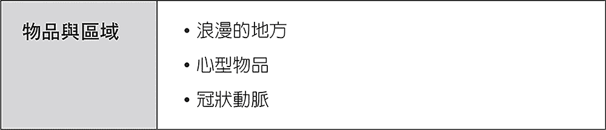

### 这张牌的个人故事：

翻阅我的占卜日记时，我从近期的每日占卜中挑出这则故事。某个周二早上，我随意抽了三张牌：

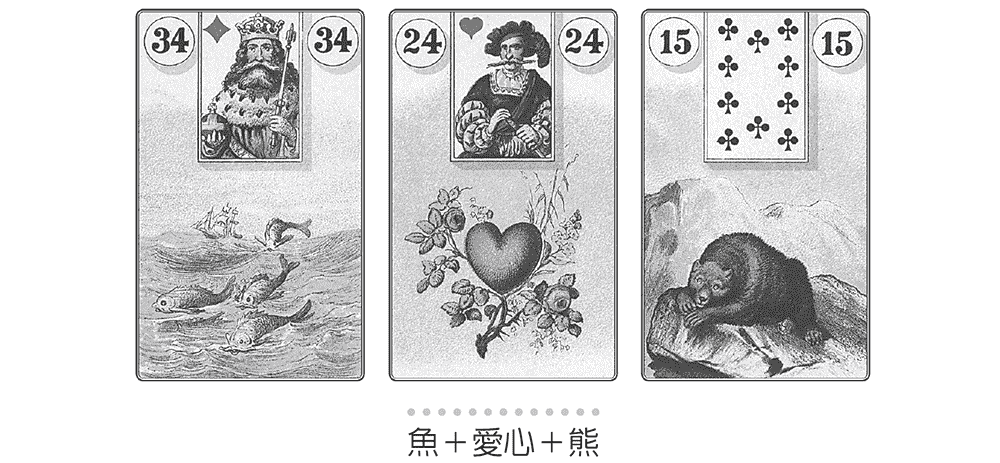

看到这些牌，我非常开心，看起来今天非常适合购物。结果却发生一连串的小麻烦，一桩接着一桩。我花了一整天跟客服沟通，试着请他们帮我换货，因为他们寄错商品了。我的小儿子不知道吃了什么东西，让他开始恶心并呕吐。厨房水槽的水龙头坏了。邮差没有按门铃或走到我家门口，就在我家的信箱里留下了寄件失败的通知，我不得不等到第二天去邮局领取包裹。然而，压垮我的最后一根稻草是我要帮儿子影印重要作业时，才发现打印机没有墨水。我崩溃哭泣，希望这一天快点结束。我又看了一眼我那天的占卜，脑海中浮现一道声音告诉我：“别担心，要快乐。”我很傻眼，接着把牌卡收十放好，不再想这件事。

稍晚我老公回到家，他带我出门去购物，疗愈心灵，跟我来一场周间约会，接着在市中心享受美味晚餐。我又惊又喜。糟糕的一天瞬间变成美好的夜晚，仿佛哪位神仙教母听到了我的哭泣后，挥挥魔杖施展魔法，并洒下精灵的魔法金粉。我回到家时非常开心，觉得自己很幸运有这么好又慷慨的老公。当我再次看了抽到的牌，有一种恍然大悟的感觉，牌卡很直接啊：鱼＝购物，熊＝美好的晚餐和慷慨，中间的爱心＝爱、关心、快乐。这三张牌非常精准，我会因为购物，以及因为与一生挚爱用餐而满心欢喜。

每当爱心牌出现，周围也没有负面牌的时候，即便现况不是那么好，我内心深处仍知道，事情一定会好转。

我在写爱心这张牌时，发生的共时性事件也很令人惊喜。首先，我收到我妹妹传来的一张照片，是她腹中胎儿的第一次心跳声波图。看见外甥或外甥女开始有了心跳，我开心至极。接着，我收到美丽的惊喜：我的弟弟和弟妹送我的手镯，上面刻了简单的四个字：“我们爱你。”我真希望能够让时间暂停，尽可能停留在被亲情温暖包围的那一刻。那一瞬间，我真不想写完这张牌，我想要继续写下去，越长越好。

### 大蓝图牌义：

不管是古代还是现代，在任何时代里，爱心都是喜悦与和乐的征兆，预示着充满爱、灿烂浪漫和心满意足的生活。

如果要占卜个案的爱情运势和关系状况，就要检视爱心牌。这张牌会呈现与感情状态有关的关系和情况。

爱心周围的牌具有极大的影响力。如果周围是正面牌，那么一切美好，这是开心、成功、健康、和乐之兆；万一周围是负面牌，就会出现痛苦、磨难、失落。

假如爱心靠近人物牌，或是在人物牌的未来出现，表示有机会遇见美好的爱或恋情，但是也要注意周围是否有负面牌。例如，蛇和狐狸如果在周围，就象征会有嫉妒、操弄、谎言与欺骗。

### 配对组合与范例：

邦妮要对她手下的新人演讲，她想知道怎么做才能有最佳效果？

★爱心＋钥匙＝邦妮的热情和同理心（爱心）会是重要关键（钥匙），如此才能突破他们的心房。她得敞开心胸，保持开放；只要她的爱由内而外散发出来，就能够获得满堂彩。她会发自内心演讲，她的爱心就是关键之钥，她的热情（爱心）就是最佳办法（钥匙）

★钥匙＋爱心＝你的成功和灵感、想法都在心中；你的善良之心；你的无私分享之心

爱心＋钥匙和钥匙＋爱心的牌义是一样的，因为不管哪一张在左在右，互相修饰后的讯息都相同。

蓝兹想知道他和安柏的关系状况，以及是否值得追求这段关系。

★爱心＋棺材＝不。你们已经走到尽头，而这段关系结束了，你们不会有进一步的发展

★棺材＋爱心＝是。你们有机会可以重燃爱火；值得追求；还有机会可以重新在一起

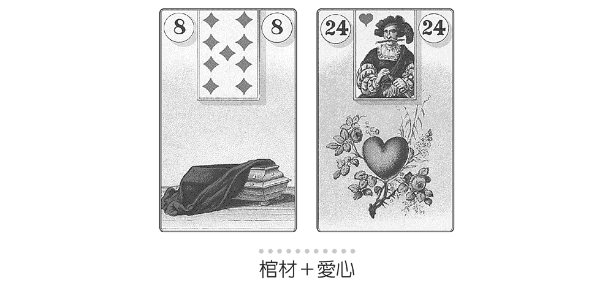

艾比想了解新的事业伙伴，以及她是否该相信这个新的提案。

★爱心＋蛇＝不。对方心怀（爱心）不轨（蛇），要小心会有嫉妒、欺骗、谎言发生

★蛇＋爱心＝不。这个提案有许多问题（蛇），看起来很美好（爱心），实则暗藏诡计

## 戒指

扑克牌对应：梅花王牌

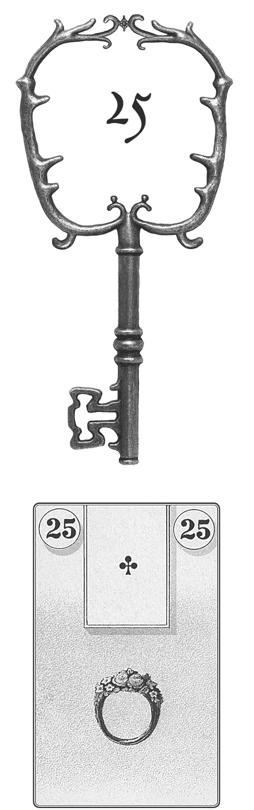

这张牌的牌面上画着简约又优雅美丽的金戒指。有时候戒指牌上的戒指会镶嵌许多珠宝，设计优美。戒指一直是象征结合、链接、联盟、婚姻的符号。戒指已是表达深爱之意和渴望真心承诺时，准备奉献一生及誓言的见证。

戒指包含各类形式的结合、承诺、约定、订婚、联合、协议；它是约定和承诺，是契约和合约。戒指象征合伙、并购、合资。它是强烈的链接、认真的关系，以及稳固的牵绊。戒指也是象征物质的牌：珍贵物品、珠宝、贵重礼物、稀世珍宝，以及任何亮晶晶的东西。

戒指象征圆形、完成、答案、回到原点；也象征原地兜圈、循环的轨迹或是永无止境的循环，宛如不断从头来过。这张牌象征确认、确证、认定。

戒指牌是正面牌，但是周围的牌会大幅影响它的牌义。如果戒指在人物牌左边，代表此人正在一段关系中；若是问题与感情相关，那么答案就会是这个人已名花（草）有主、已有伴侣或者已婚。假如戒指在人物牌右边，代表问题中的这个人是真心想要跟你许下承诺。

### 对应主题的牌义

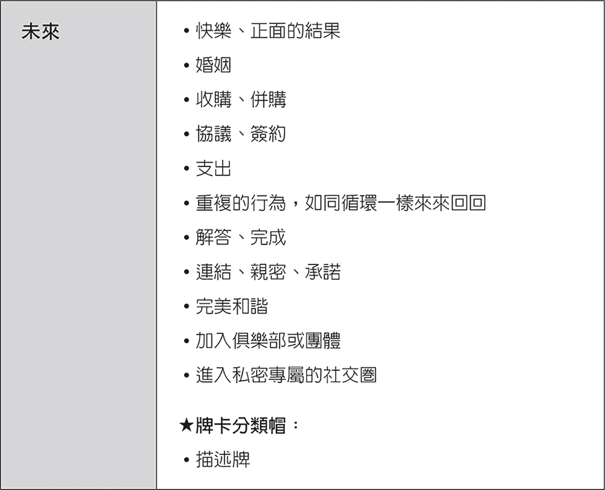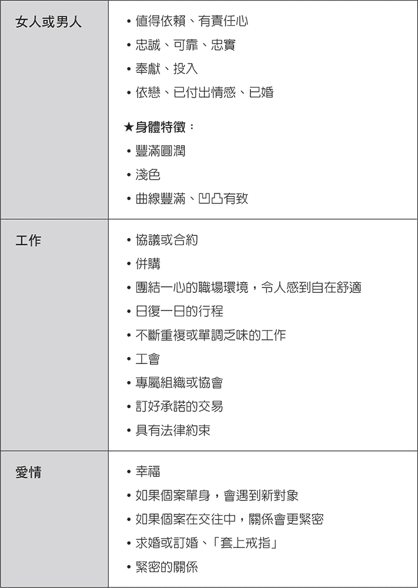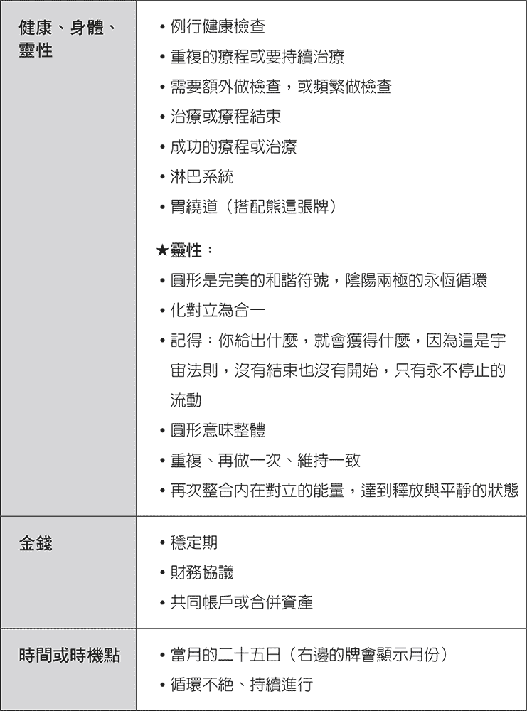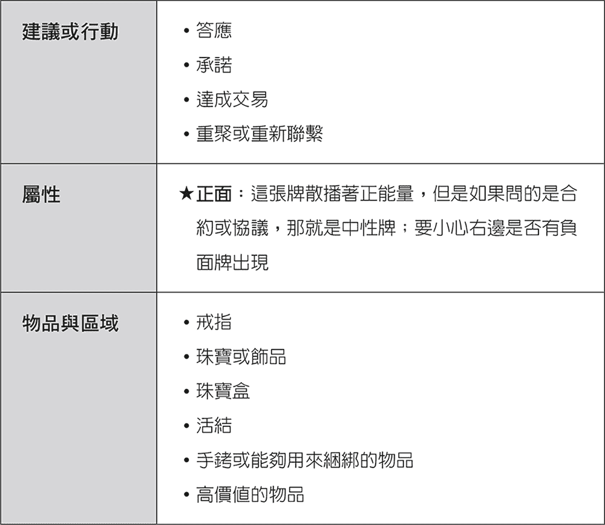

### 这张牌的个人故事：

这则故事来自我十几岁时在贝鲁特发生的事。这是我永远忘不了的故事：母亲的一位好朋友雅丝敏，想要找到如意郎君。雅丝敏基本上每天都出现在我们家。她当时到了适婚年龄。那时，父母都想看到女儿在三十岁前出嫁，所以每户家庭都会想尽办法计划和安排相亲。他们会利用罪恶感和亲情压力迫使女儿找对象，或是要女儿答应他们帮女儿选好的对象。雅丝敏身处的文化里，家长会来向女孩提亲（我知道这很过时，但这仍是许多文化里的常态）。

我记得有一年，雅丝敏的压力很大，她需要做出决定。那一整年，她每周都会找一天来我家找我占卜。当时的状况很像某种固定行程：每一周，我会抽大蓝图帮她占卜或是帮不同的适合对象占卜，接着检视戒指跟男人牌和女人牌之间的距离。有一天，我决定只帮她抽大蓝图，并且只聚焦在戒指牌。当时戒指离女人牌很远，所以我们开始了每周一次“婚戒倒数”大蓝图占卜。我们一整年只把焦点放在戒指牌，看着戒指在牌阵中缓慢靠近女人牌。我们会计算戒指离女人牌距离几列，而每次戒指更靠近一列时，客厅就会传来我们的欢呼声。当戒指终于抵达女人牌身边时，雅丝敏也在同一时间订婚和结婚了。

有时候戒指可能一个月以上都不会移动，但是当戒指终于抵达女人牌的右边时，那一刻仿佛是我们家的重要纪念日。我们都为她感到开心。但是我们的工作并没有就此结束，因为雅丝敏想要确保戒指会一直待在那里。一直到婚礼当月之前，她都还在注意戒指牌的动向。

回想这件事，我猜这也是某种执着，或是我们深陷其中的循环，因为每周都会重复一次。雅丝敏结婚后，我们就很少见到她了。内战使得我们分离，直到后来我们在美国相见，才又开心地做了大蓝图占卜。我很怀念我们的“婚戒倒数”占卜，以及当时聚在一起的时光。如果雅丝敏能够看到此篇，我想要跟她说，我知道每次要不断抽大蓝图时，我有时候会不耐烦地翻白眼，但这都不会改变一件事：我在心中永远珍惜当时的日子。

### 大蓝图牌义：

传统上，如果戒指在人物牌右边，代表个案或他们的随行人员之一，近期之内会有富足且开心的婚姻。时间点要根据戒指的远近来判定。如果戒指在人物牌左边，就代表会有困难。

我自己会使用戒指在人物牌右侧的意义，但不一定会解读成富足。戒指会受到周围牌面的影响，牌义容易有大幅度的改变。所以如果出现负面的结果，我们就必须检视戒指旁边的牌卡。如果戒指周围是正面牌，那么肯定有和谐和幸福围绕；当戒指牌被负面牌包围，就会出现问题、分离、不和的情况，以及卡住、困住的感受。此外，负面牌有时候可能是建议我们要摆脱坏习惯，或是打破常规或有害的循环。

在大蓝图牌阵里，我会从戒指的位置来检查个案的婚姻、伴侣关系，以及相关的情况。如果个案想结婚，那么我会检视戒指牌的位置，了解机率、距离和时间点。

如果戒指在人物牌的上方或下方，通常代表个案目前担忧或处理的重要问题。请查看戒指周围的牌，就能得到更清楚的信息。

### 配对组合与范例：

★戒指＋花园＝俱乐部、协会、公会

★戒指＋蛇＝有问题的婚姻；婚姻前景不好；背叛

凯特琳不喜欢她的工作，想知道如何解决目前的困境。

★戒指＋镰刀＝想办法离职；不要再让自己不开心，递交辞职信；辞职

莎宾娜想知道史卡特对他们的关系有什么想法。

★爱心＋男人＋戒指＝他非常忠贞、真心，而且可能想要跟你登记结婚

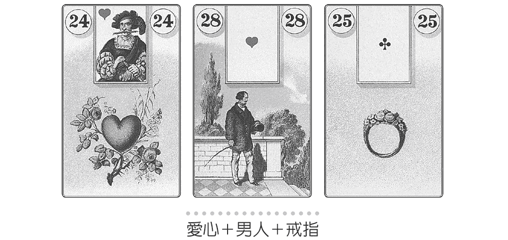

★戒指＋男人＋爱心＝他早已名草有主，但同时也很喜欢跟你在一起

## 书籍

扑克牌对应：方块十

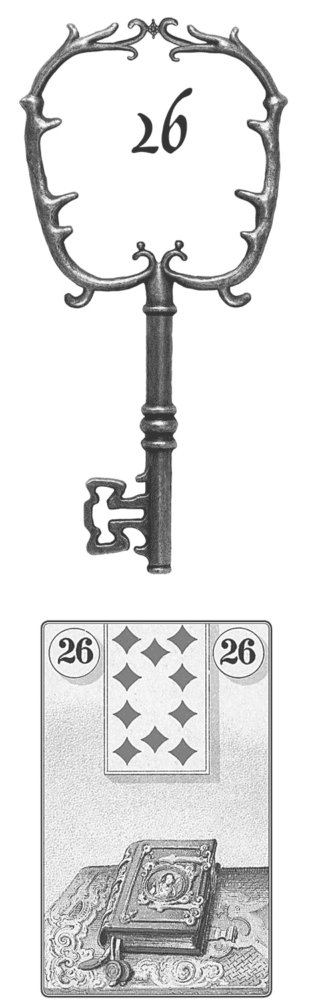

这张牌的牌面描绘着一本厚重的皮面精装书，摆放在桌子上。有些牌卡会把书画成打开的图案，有些则是阖上，不让人知道内容写些什么。书籍象征我们天生对秘密的好奇心、知识和教育，以及智慧、才智。

这张牌也象征隐藏的奥秘、秘密、被掩盖的一切，同时也代表知识、信息、事实、数据。书籍与记忆力有关，也包含学习、教育、智商，以及各种智慧和能力；它也象征专案、案子、任务、设计、策略、审计、帐目、研究、测验、审核、评估、存货，还有各种训练、指导、教导。书籍所代表的隐藏和秘密的面向，对应到所有神秘学、奥秘的教导。它象征未知与发现、突破，以及挖掘出所有隐藏、保密、掩盖的事物。

书籍也能很直白地象征实际的物品，像是书、日记、档案、纪录、一叠牌卡。我们未被揭露的想法、压抑的情感、内在的智慧，以及所有秘密和秘密行动，都囊括在书籍的牌义当中。

### 对应主题的牌义

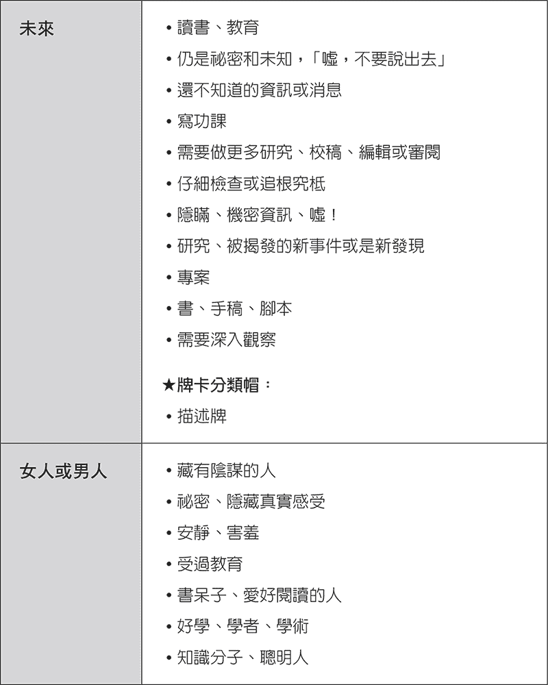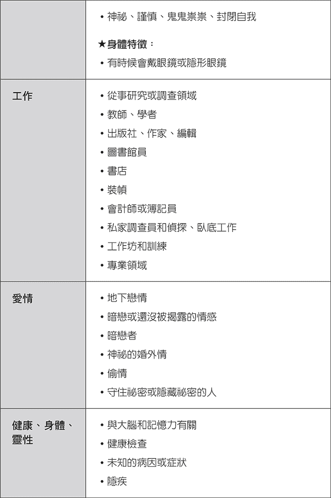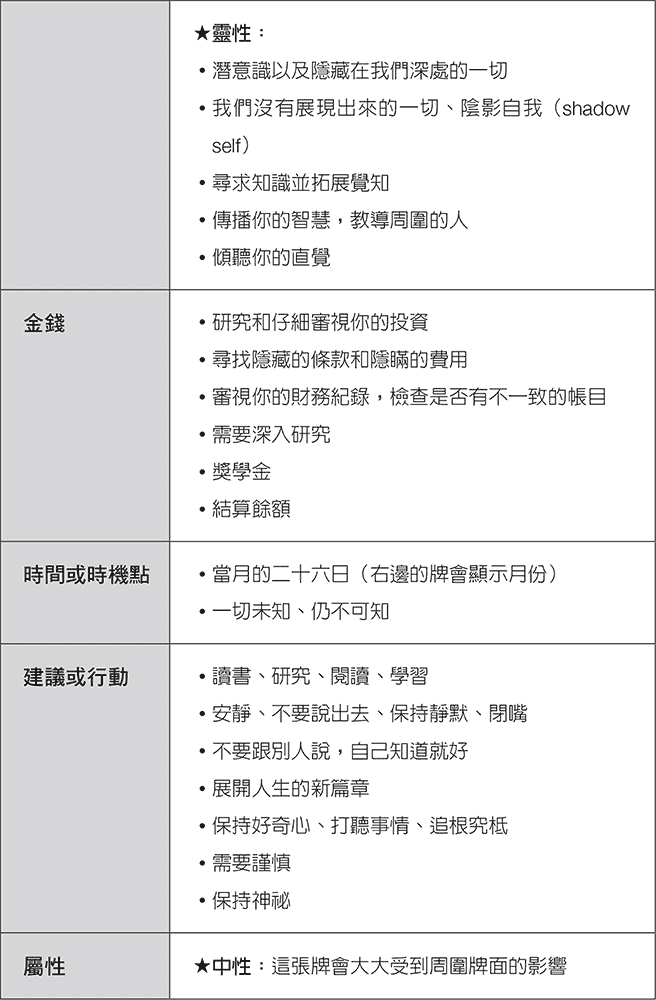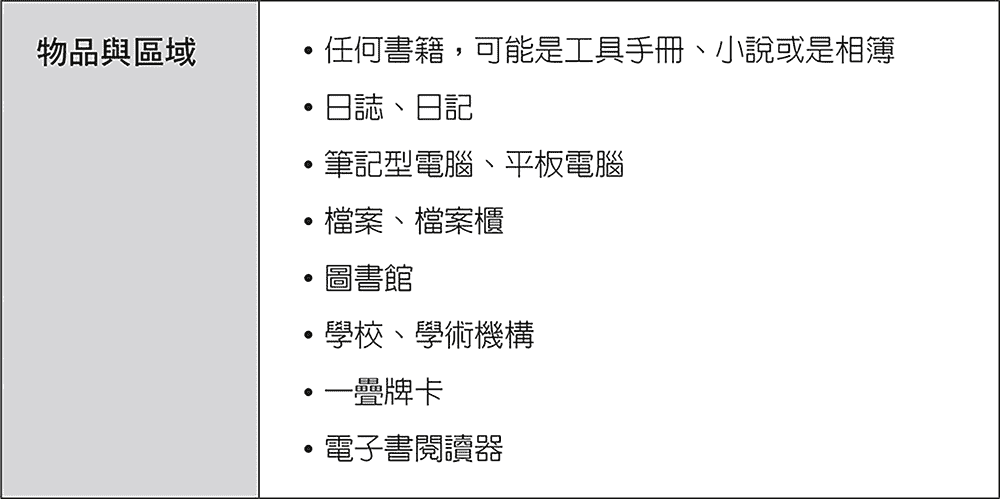

### 这张牌的个人故事：

我在写书籍这张牌时，我的老公放了一部二〇〇二年的电影，是葛妮丝．派特洛主演的《无可救药爱上你》，由拜雅特（A. S. Byatt）的同名小说改编而成。整部电影讲述着几百年前的两位诗人之间的秘密恋情。我觉得这部电影很有趣。这部电影引领我们跟着两位调查这桩恋情的优秀学者，调查那些日志、日记、图书和族谱。这部电影就是书籍牌最好的说明：学术背景、潜心投入研究的学者、调查员的发现、案件、日记、日志、秘密的历史恋情，以及逐渐挖掘出来的秘辛。这些都完美体现书籍牌的本质，以及它象征的不同面向。而我最爱的一件事就是，宇宙让我在写这张牌时看了这部电影！

每当我陪小孩写作业或一起做学校报告，这张牌都会出现。另一个与书籍牌有关的快乐回忆是某一天我抽到：书籍＋花束。当时我跟儿子一起做德州历史古迹阿拉莫（Alamo）的主题报告，我以为是指这件事，所以我心想：“耶！报告成果一定很好。”

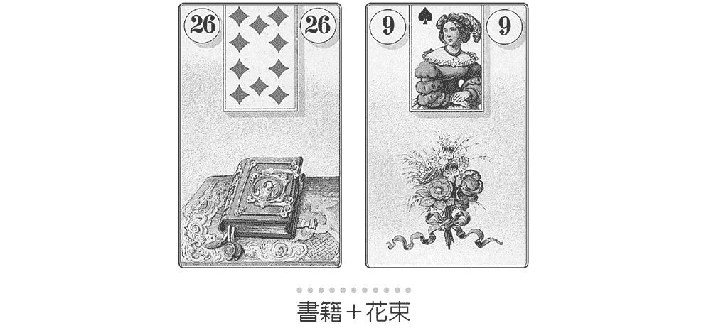

当天稍晚，出乎我意料之外地收到朋友送给我的一副新的雷诺曼卡。所以，书籍牌指的是实际的牌卡，而且是份礼物（花束）。阿拉莫的主题报告一开始都很顺利，但是我们用的黏土干了之后便开始龟裂，所有的墙开始坍塌。我必须不断修补，这个报告让我们压力很大，反而比较像是书籍＋蛇的搭配（充满问题与挑战的报告），或是书籍＋云朵（不稳定的报告，过程波折），甚至是书籍＋十字架（让人难过和痛苦的报告）。这个例子可能有点浮夸和戏剧性，但我可是照顾三个男孩的母亲，应该有资格激动啊！

书籍象征我们的好奇心和求知欲，亦即想要了解和学习的渴望。

### 大蓝图牌义：

传统上，书籍在雷诺曼卡中象征秘密，而它的位置会告诉我们这个秘密被埋藏得有多深，以及是否会被揭发。书籍越靠近人物牌，这个信息就越重要。

如果个案正在进行一项案子，我就会看书籍牌在大蓝图里的位置，而周围的牌会告诉我们相关状况以及发展结果。

如果书籍象征未知的信息或秘密时，我会检查周围的牌面，看看这个信息是不是很快就会被发现，例如，书籍＋太阳（秘密曝光）、书籍＋钥匙（信息被解开），或是书籍＋棺材（被埋藏的知识）。

如果个案还在念书，我也会从书籍这张牌来检视个案的学业。

有时候当书籍直接出现在人物牌旁边，可能是在描述这个人的特质或个性。

### 配对组合与范例：

★书籍＋狐狸＝卧底工作；间谍；会计师；神秘学家；警察或推理小说；欺骗或操控人心的想法

爱丽想要找阿德里安一起发展事业，她想知道有没有什么要注意的？

★书籍＋戒指＝你需要重新审视，并多多研究和深入调查这个合伙关系，因为其中可能有一些隐忧或是你不知道的协议

★戒指＋书籍＝这个组合的牌义和上面一样。此外，这两张牌也可以代表要让合伙关系不为人知

只有两张牌时，比较难知道具体答案，所以我一定会多抽几张牌。上面的举例只是为了示范而已。

吉娜想要知道她的大学考试是否有录取。

★书籍＋棺材＝抱歉，你未被录取（百分之百的负面结果，因为棺材牌修饰了书籍牌）

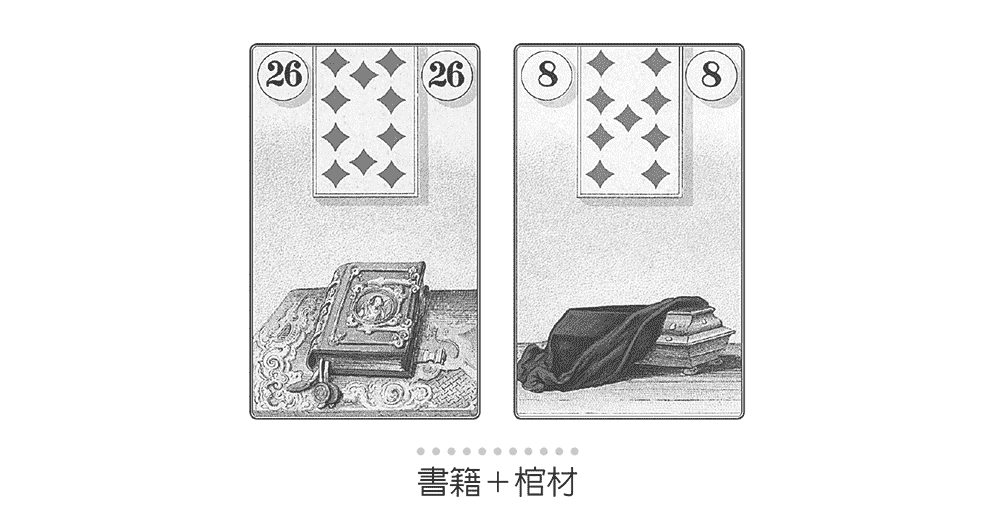

★书籍＋太阳＝有。这是学术上的胜利，成功通过考试

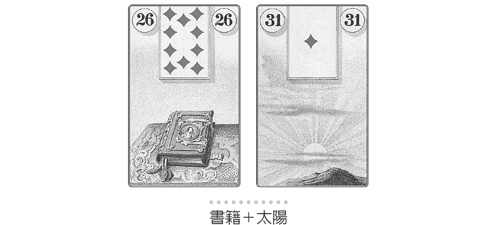

## 信件

扑克牌对应：黑桃七

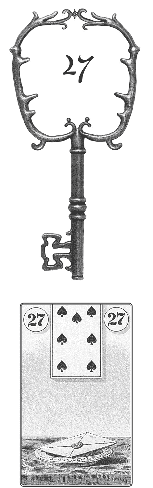

这张牌通常描绘一封密封的信件放在托盘上，或是放在桌上。消息与讯息妥善密封在信件内，等待收件者启信。信件象征消息和讯息抵达。

信件牌代表一切形式的消息：信息、文字交流和讯息；它也代表笔记、注记、文件和报告。信件包含所有文字书写的一切，无论是电子邮件、传真、文本，还是信件、邮件和邮递。在占卜中抽到这张牌，也代表奖状、证书、执照、证件、文凭，以及纪录、许可证、授权证明和搜索令等。基本上，这张牌象征所有的文书处理资料，包含留置权文件、所有权文件、合约文件，以及纸本广告，如传单、手册、垃圾信件，还有文字邀请函、公告、卡片、海报、明信片。

信件牌会大幅受到周围牌面的影响。这张牌需要搭配周围的牌面来解读，才能更加了解状况。

### 对应主题的牌义

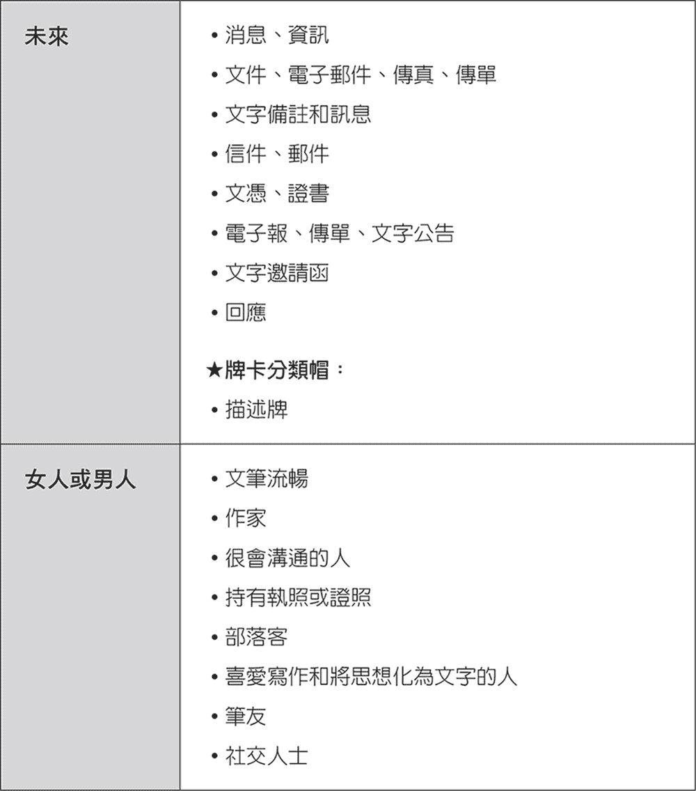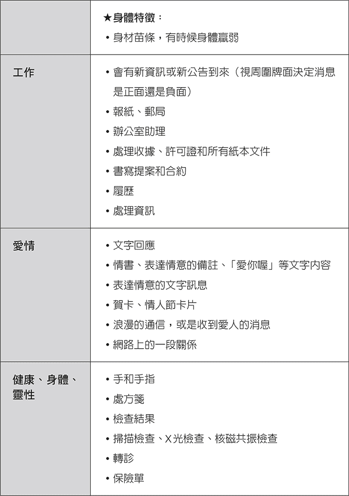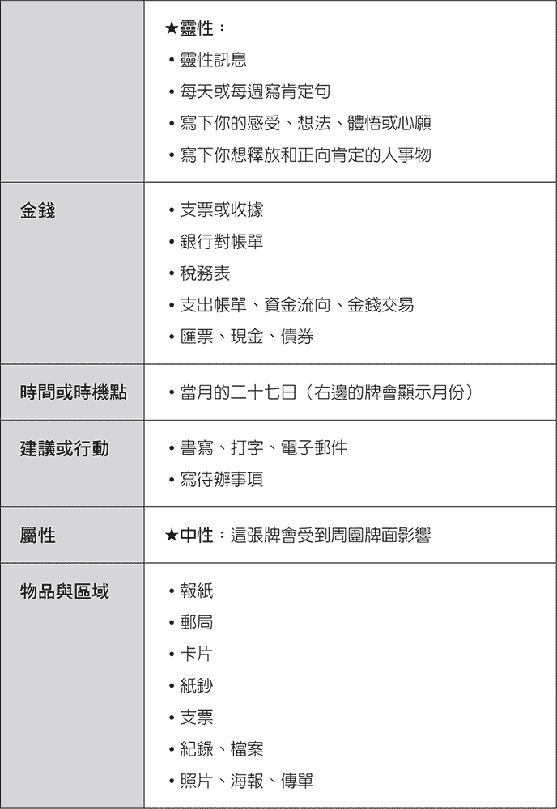

### 这张牌的个人故事：

信件牌让我想起当初和老公约会的日子。当时，信件牌不断出现。我还记得连续三天都抽到信件牌，那时我满腹疑惑，直到第三天我收到了第一封传真来的情书。那时传真机在我的办公隔间里，因为我的工作内容需要频繁使用到传真机。我开始每天收到传真，祝我晨安美好，内文有着玫瑰与爱心，有些传真来的情书爱意满满，有些则是简单的词句或浪漫的插图。即便是我卧病在家的时日，我也能听到父亲办公空间里传来传真机运作的声音，我知道那是要给我的传真。我会跑下楼，看着传真机缓缓吐出信件。我的心随着缓缓印出来的花朵而砰砰跳动。每天收到的传真信让我日日都春风满面。对我来说，信件牌在当时象征传真的情书，而非邮寄的情书。我想，现在就会象征简讯、在推特上表达爱意的推文，以及在社群媒体上表达爱意的动态发文了吧！

这张牌也有共时性的事件发生，而且很神秘地对应到了“来自远方”的牌义。我在写这张牌的同一天，快递刚好送来一套远从俄罗斯而来的雷诺曼卡。

### 大蓝图牌义：

传统上，信件意味着来自远方的消息。然而，依据云朵牌距离信件的远近，会决定捎来的是好消息还是坏消息。在现今快速变迁的网络世代，地理距离以及消息从多远而来这件事，（对我而言）只有少数时候才比较重要。

信件带来消息、讯息、邮寄或文件。周围的牌面会告诉问卜者，他们应该会收到何种讯息、消息、邮件、文件。此外，信件牌座落的宫位会决定消息的重要性，有时候也会告诉我们时间范围。如果信件离男人牌或女人牌很近，消息很快就会抵达，并且对问卜者而言至关重要；假设信件离指示牌很远，表示当事人不会那么快收到讯息，又或者这张牌与该解读毫无关联。

一定要检查周围的牌面，以获得更多信息并厘清状况。举例来说，如果树在信件周围，就是与健康相关：可能是健康结果、检查报告、医疗收据或保险要保书。

如果个案想要了解某项提案或是正在等待授权书、同意书或任何文件，我就会解读信件牌。

### 配对组合与范例：

★信件＋十字架＝使你痛苦的消息；令人失落的公告

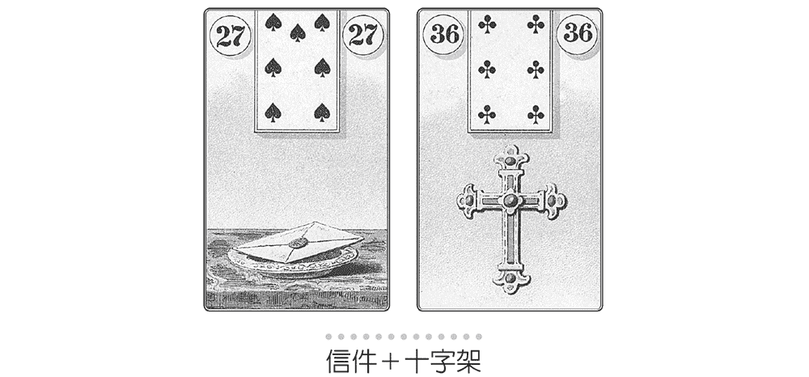

★信件＋十字路口＝转寄电子邮件；分享部落格或电子报；需要做出决策的提案；多选题的文件或表格

★信件＋钥匙＝授权信；搜索令；门卡或感应卡；重要文件；同意书

★信件＋房屋＝房贷抵押；租赁文件；家人遗嘱；家人消息

★信件＋棺材＝请辞信；遗嘱；讣闻；安宁机构的发票或殡仪馆帐单；破产宣告；不及格的成绩单；已删除或丢进垃圾信箱的电子邮件或文件

★信件＋船锚＝留存的文件、照片；存款单；签证；盖章过的文件；贴纸（有一次它刚好象征蜜蜡除毛贴片）；若有负面牌，可能代表限制令

★信件＋太阳＝荣誉榜；文凭；同意书；证书；邀约信；奖状；认可状；感谢状

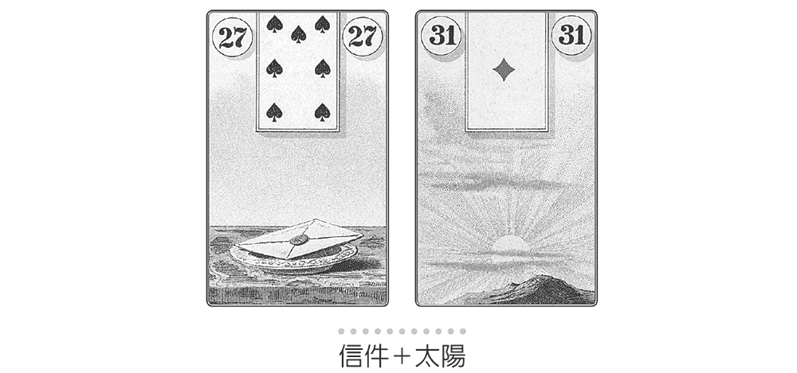

巴比焦心于他的大学选校消息。他的大学选校会有什么结果呢？

★信件＋爱心＝令人开心的回应；巴比会获得心之所向的结果，收到大学录取通知

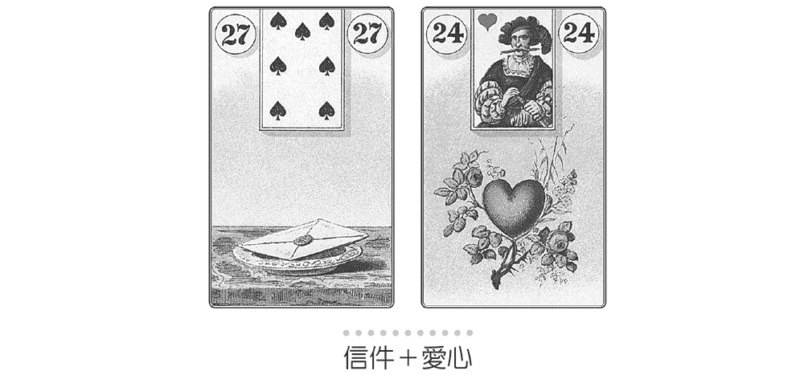

## 男人

扑克牌对应：红心王牌

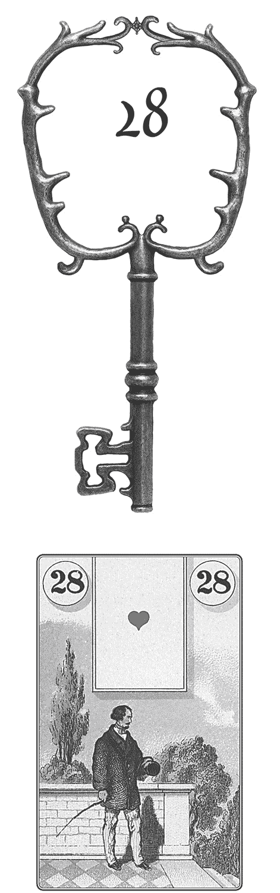

这张牌的牌面上画着一位衣装笔挺的绅士。这位男性通常挺直站立、英气风发。男人象征阳性能量和个案生活中的男性。

假如个案的问题跟男性有关，男人牌就代表问题中的男性；假设个案本身是男性，那么男人牌就代表个案。

如果占卜的对象不是男性，那么这张牌就意指女性个案身边的男性：兄弟、男友、父亲、朋友、配偶、未婚夫，或是其他跟问题相关的重要男性。一定要查看男人牌周围的牌面，借此得到更多线索，辨识出这位男性是谁。根据周围负面或正面的牌面，就能了解这位男性是敌是友。

### 对应主题的牌义

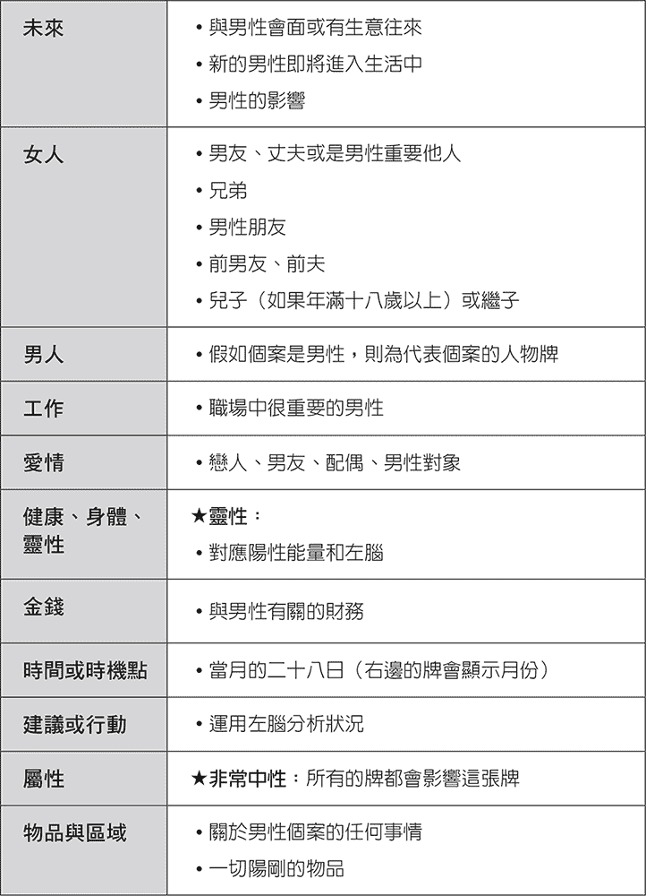

### 大蓝图牌义：

传统上，男人牌象征男性个案。因此如果你的个案是男性，这张牌便极度重要。周围的牌会直接影响个案，根据其他牌与男人牌的距离可以推断状况为何。在他前方（右边）的牌面是未来，后方（左边）则是过去。大蓝图牌阵里，指示牌的位置对整个占卜解读而言是非常关键的讯息。

为女性个案占卜时，男人牌通常是她的重要他人。如果问题无关重要他人，那么男人牌周围的牌面会告诉我们这位男士是谁。周围的牌会告诉我们这个人的行为举止、个性特质、社会阶级或其他生理特征。

### 配对组合与范例：

★男人＋熊＝经理、主管或行政人员（熊代表权威或权力）；主厨（熊代表营养和饮食）；身材魁梧、高大的男性，或是胡子浓密的男性；富有的男性，或是在金融业工作的男性（熊代表金钱）；强壮、保护欲强、贴心的男性（熊的动物特质）

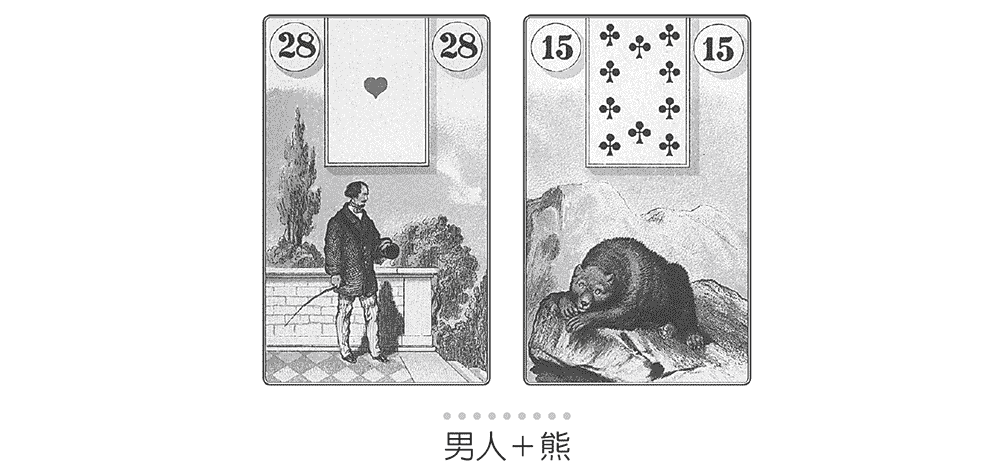

★男人＋鞭子＝爱争执、争辩的男性或律师（鞭子代表争执）；偏激或有暴力倾向的男性（鞭子代表暴力）；运动员、力大如牛的男性或是运动教练（鞭子代表健身）；肉欲好色的男性（鞭子代表性能量）

★戒指＋男人＝已有依恋的人事物，并且订下了承诺。若是占卜关系问题，那么对方已经结婚或是订婚；若是其他问题，这个依恋的人事物或许跟工作有关，可能是工作狂或是签了合约

★男人＋戒指＝严肃且订下承诺的男性（若是占卜关系问题或职业）

★男人＋爱心＝热情的男性；男友；恋人；热心十足的男性；快乐的男性；乐善好施的男性

★男人＋船锚＝有强烈执着的男性；可靠的男性；主持人（船锚的英文有广播、主持的意思）；船长或军人；在船务领域或产业工作；沉稳坚定的男性、实事求是的男性；从负面角度来看，这位男士陷入困境

★男人＋蛇＝骗子；操控者；待人冷酷不公、嫉妒心强的男人；二手车销售员；水电工；舞者；体操运动员；杂技演员

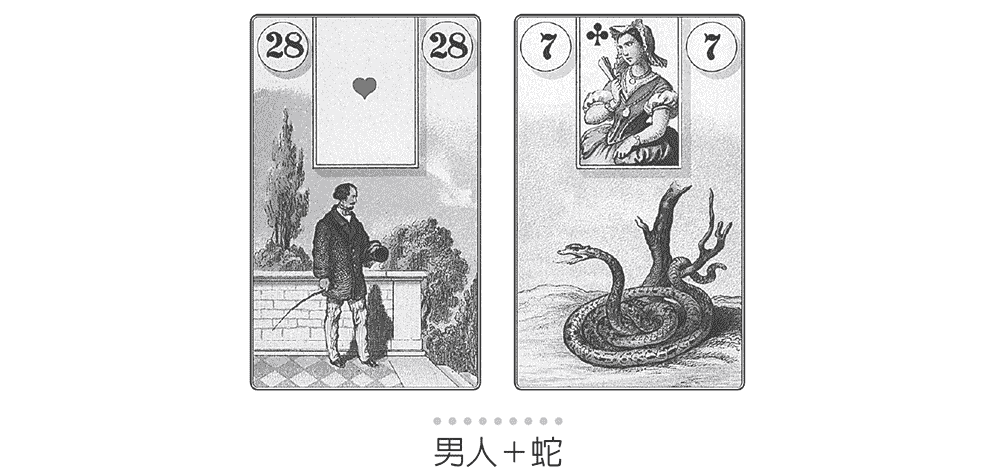

## 女人

扑克牌对应：黑桃王牌

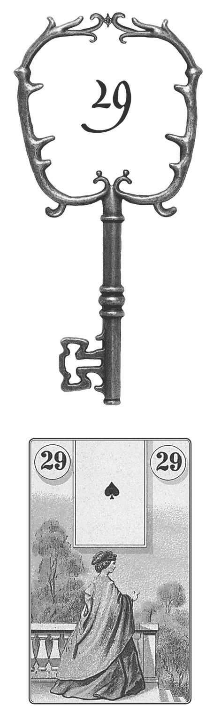

这张牌的牌面上画着衣着高贵典雅的淑女。这位淑女通常站着往外看，仿佛在等待着某人。女人牌象征阴性能量和个案生活中的女性。

假如个案的问题跟女性有关，女人牌就代表问题中的女性；假设个案本身是女性，那么这张牌就代表个案。

如果个案是男性，这张牌就意味着个案生活中的女性：姊妹、恋人、母亲、女性朋友、配偶、未婚妻，或是目前与男性个案生命相关的重要女性。记得一定要仔细查看周围的牌面，才能得到更多线索让你辨识出这位女性是谁。周围的牌面会描述这位女性是谁，并且根据这些牌面的正负属性，便能确认她是敌是友。

### 对应主题的牌义

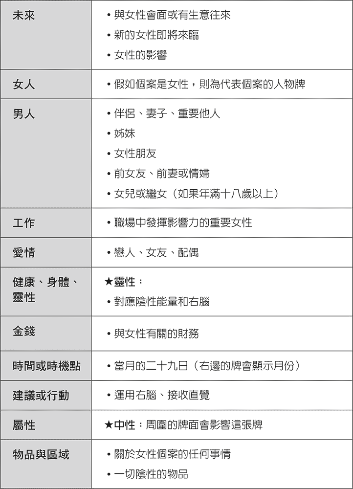

### 大蓝图牌义：

传统的大蓝图牌阵里，会将女人牌视为代表女性个案的指示牌。因此如果你的个案是女性，这张牌便极度重要。这张牌会聚焦你的占卜内容，而周围牌面会告诉你现况和影响问题的人事物。女人牌前方（右边）的牌面是未来，后方（左边）则是过去。为女性个案占卜时，大蓝图牌阵中的女人牌所在位置会是整个牌阵的轴心。

为男性个案占卜时，女人牌通常是他的重要他人。如果问题无关重要他人，那么女人牌周围的牌面会告诉我们这位女士是谁。周围的牌会告诉我们这个人的行为举止、个性特质、社会阶级或其他生理特征。

### 配对组合与范例：

★女人＋花园＝社交能力好的女性；公关人员；不想定下来且热爱自由的女性；喜欢脚踏多条船的女性；无拘无束的女性；活动策划者；一群女性；姊妹会

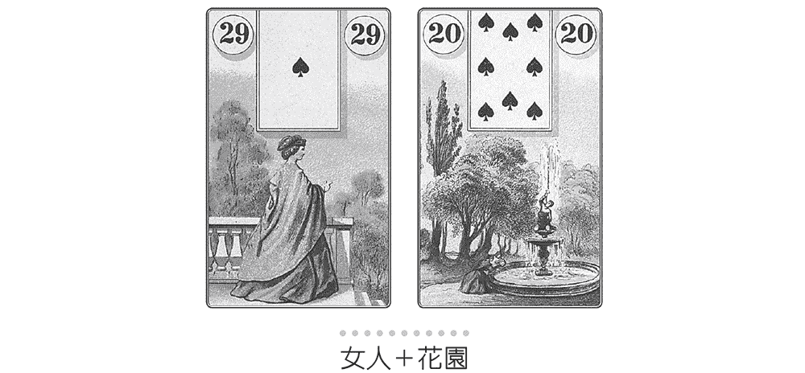

★女人＋书籍＝低调又隐藏自我的女性；无人知晓的女性；神秘、防卫心重或内敛的女性；好奇心强、喜欢追根究柢的女性；学富五车的女性；左脑思考，并且逻辑分析能力强；历史学家；研究员；会计师；作家；编辑；出版者；神秘学团体中的高阶女祭司或学徒；教师

★女人＋狗＝忠诚的友人；灵魂伴侣或双生火焰（twin flame）；挚友；忠诚的伙伴；保护你、守护着你的女性

★戒指＋女人＝已有依恋的人事物或已定下承诺。若是占卜关系问题，则对方已经结婚或是订婚；若是其他问题，这个依恋的人事物或许跟工作有关，可能是工作狂或是签了合约

★女人＋戒指＝认真且订下承诺的女性（若是占卜关系问题或职业）

★女人＋镰刀＝讲话犀利的女性；决策者；在牙医产业工作；外科医师；冷漠无情的女性

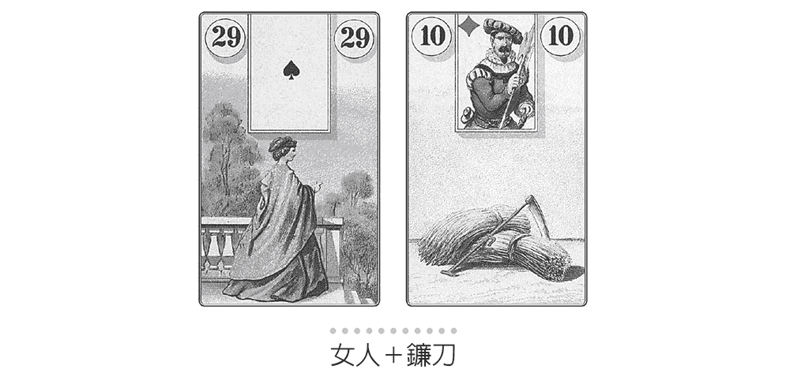

## 百合

扑克牌对应：黑桃国王

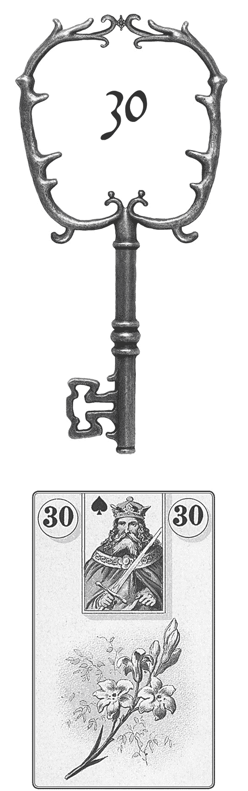

通常这张牌的牌面上会画着一枝盛开的百合。百合是皇室之花（法国皇室的纹章便是百合花饰）。百合花饰会刻在许多皇家徽章和盔甲上，是贵族血脉、荣誉、家族传承的象征纹饰。百合自古以来即象征着纯白、纯净、纯真和贞节；百合也被称为知识与敬重之花。

因为百合象征成熟与智慧，主要象征家族里的长辈，例如年纪较大的叔叔阿姨、舅舅姑姑等长者。这张牌也代表白发苍苍、如同“智者”一般的人——经验老到且散发着祥和宁静的气场，但他不一定是灵修人士。这张牌也意味着快乐和保护。百合通常会被分类在男性长辈的范畴，但根据我个人经验，这张牌也会象征女性长辈。例如，我姑姑在牌面里呈现的牌总是百合牌。“年长”是这张牌的关键字。此外，因为百合象征成熟，因此这张牌对应到所有需要时间受孕、发育、熟成、发展的事物：怀孕、股票证券、熟成干酪、红酒、腌黄瓜。百合象征长期的时间。

这张牌会带来平静、安稳、岁月静好，也象征一个人达到成就后的内心满足。百合出现的时候，意味着你要去温泉按摩中心或是山中静修，去整体疗法冥想中心，或者只是到后院的草坪静静坐在椅子上。有时候我觉得百合牌对我来说是放下心中大石、松一口气的象征，因为所有困难、担忧都已释放、放下和消失。

百合牌也象征我们的过往历史、人生经验、生命成就；它也象征我们的血脉、传承和遗产。名门贵族和备受敬重的社会人士也是百合的代表牌义。

代表人物时，百合牌会告诉我们这个人的个性特质；代表事件时，会显示出其中的情绪、吉凶或时间范围。这些都需要根据问题脉络和问题核心来判定。例如：“我近期能够加薪吗？”百合出现了，就意味着没那么快。“度过现况的最佳办法是什么？”百合要你让现况顺其自然发展，放下控制并深呼吸保持冷静。而若是占卜假期，百合就代表你会有身心放松又心满意足的假期。如同所有的牌，背景脉络很重要。

### 对应主题的牌义

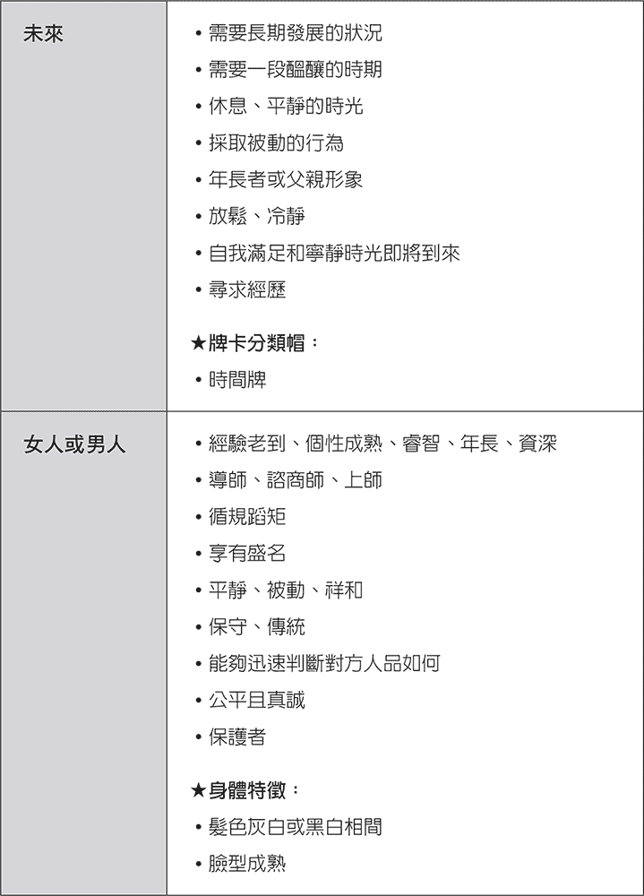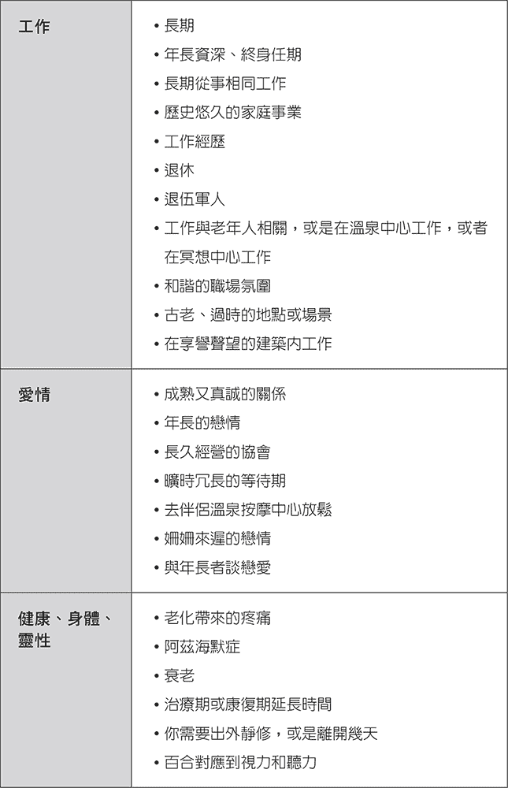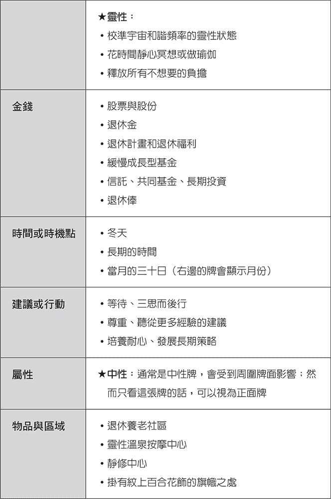

### 这张牌的个人故事：

每次我看见百合牌，都会想起我父亲和他生命最后的那几年。当时百合牌在我每次的占卜中几乎都会出现。我的父亲被诊断为早发性阿兹海默症后，开始漫长且持续恶化的病程，每次我占卜时都会抽到百合＋十字架和百合＋老鼠。当我父亲失去言语表达能力后，我为他占卜时抽到了百合＋十字架，而我感到心如刀绞。当时我的家人都经历着百合＋十字架的过程：漫长的悲伤、痛苦、忧郁时期。

父亲在他最后的时光里，饱受病痛折磨，无法进食，而我抽到了百合＋棺材。我不知道雷诺曼是否在告诉我父亲即将过世，抑或父亲还要拖磨好长一阵子才会离世。我的情绪太满，以至于无法判定牌义。最后两天，我们看着他受苦，那四十八小时漫长得宛如一辈子。当时父亲的病情太糟，我们只能坐在床边祈祷，愿他能被上天接引。

父亲离世后的那晚，我的脑海中看见他安抚我。他告诉我，一定要相信自己的天赋，别让怀疑主宰你，善用并发展你的天赋，未来才能够接触并教导许多人。当时我无法彻底理解他话中的玄机，但现在回首过往，我能够诚实地说，父亲过世前的那四年，对我和家人而言无疑是重大的觉醒和转捩点。后续几年的期间，我能够看见他并与他交谈——有时候他会突然出现，有时候则是在我冥想时出现。这对当时的我而言是很美好的祝福。现在，我只有偶尔才会感觉到他，并收到他传递给我的灵讯。

没有人应该要经历这样巨大的哀痛与折磨。我的家庭当时乌云笼罩，并深陷极度的悲伤之中。家父是个好人，个性热心助人，且开朗热情的天性众所周知。他留给我们的爱与拥抱会恒久流长，也是我们会永存于心的一切。

关于百合牌，我另一个印象深刻的故事是我丈夫失业的时候。那时我都会帮他占卜。有一次我直接了当地问说：“我先生什么时候会得到工作？”我抽到戒指＋百合＋狐狸。

我不敢置信，当我看见戒指出现，觉得事情充满希望，于是跟丈夫说：“合约很快就会出现，而且你会在男性占多数的职场中工作，或是与年长男性共事。”我只想要给他好消息，而我也只看到好消息。他的确得到工作了，并且也是男性占多数的职场，但那是十一个月之后的事了。嗯哼。没错，就是百合牌！

回想当初的牌面，我太开心了，并没有发现或看到这件事需要花上许久的时间，或是家中的压力可能让我们无法喘息。但是对于牌面所带来的希望，让我的丈夫可以冷静、耐心等待结果。有时候，我们只会解读出或说出当下需要得知的讯息。

### 大蓝图牌义：

传统上，百合若是落在人物牌的正上方，意味此人具备道德良知；若是落在正下方，则代表这个人的名声不是那么好。假如云朵和百合邻近彼此，并且都在指示牌上方，这样的牌卡组合表示有家庭纷争或家庭乌云笼罩；若是这两张牌出现在人物牌下方，代表分离或极端问题。

如果百合的周围是正面牌卡，状况会有宁静、和谐、愉悦的结果；相反的，假设百合的周围是负面牌卡，则会有冲突、危险，也有可能发生令人焦虑的事件。

在我这一生使用大蓝图牌阵的经验里，我记得有一次百合和云朵一起出现在女人牌下方。那次是因为这位女性的名誉受损，她遭控不贞，这在一九八〇年代的贝鲁特是非常严重的指控。尽管她能够恢复名节，但这样的指控仍会持续落在旁人眼里，损害她的名誉。

### 配对组合与范例：

莱德正背负着极大的压力，想要占卜近期的旅行。“我离开城镇的两天旅行会有什么状况？”

★百合＋星星＝莱德能够享有放松、休息的时光，甚至享受平静舒适的夜晚

蒂玛想要卖掉房子，并且犹豫在两位房仲之间要选择谁。“哪一位对我而言最适合？”

★百合（男性）＋戒指（承诺）＝选择男房仲

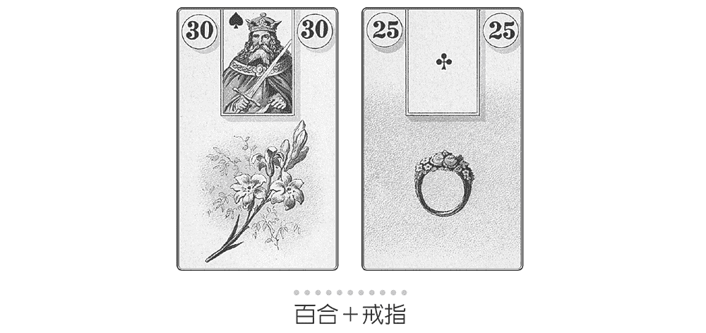

如果两位房仲都是女性，就选择最有经验或年纪较大的那位；如果两位房仲的年纪和年资都相近，那么就选择结婚最久的，或是选择最平静、祥和并且较保守传统的那位，又或者是有带领冥想共修团体的那位，甚或是发色灰白（百合）又卷的那位（戒指）等等。

## 太阳

扑克牌对应：方块王牌

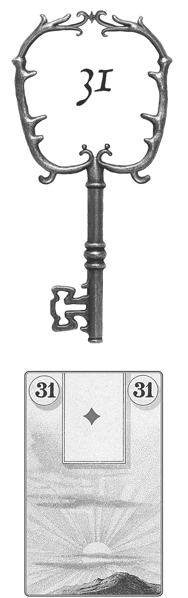

灿烂的圆形太阳向外闪耀强烈的光束，照耀着太阳牌的中央。从古至今，人类文化中长久以来都将太阳视为生命之源，崇拜、庆祝并荣耀太阳，也视太阳为神灵。这张牌象征新的开始和崭新的一天。太阳意味生命、光芒、温暖、热度，也意味成功、荣誉和胜利。

太阳牌为个案的状况带来光明和温暖。太阳照耀天空、复苏心灵，并鼓舞我们面对人生中的每一个事件。太阳是我们的神圣之光，因此太阳牌会照亮人生道路，为生活各个领域（无论是私领域还是专业领域）带来成功与胜利。太阳牌宣告着喜悦、快乐，以及内心渴望成真的结果。这张牌赋予我们勇气和希望，让我们达成或完成目标；同时也驱散愚痴与黑暗，让一切模煳之事变得明朗。太阳牌也象徵声望、名声和高度名望。此外，这张牌也代表自我、骄傲和自尊心高的性格。这张牌所象征的人物具有非常迷人的特质，散发着魅力。太阳牌代表能量、生命力、力量。

太阳牌也能很直白地代表地点，让我们想起夏天、阳光灿烂的海滩、热带假期，以及任何炎热的地点。

太阳牌在任何牌阵里都会带来正向、乐观的能量。尤其是负面牌落在太阳牌左边，太阳牌就会终结这些困扰。

太阳牌是阳性能量的牌。

### 对应主题的牌义

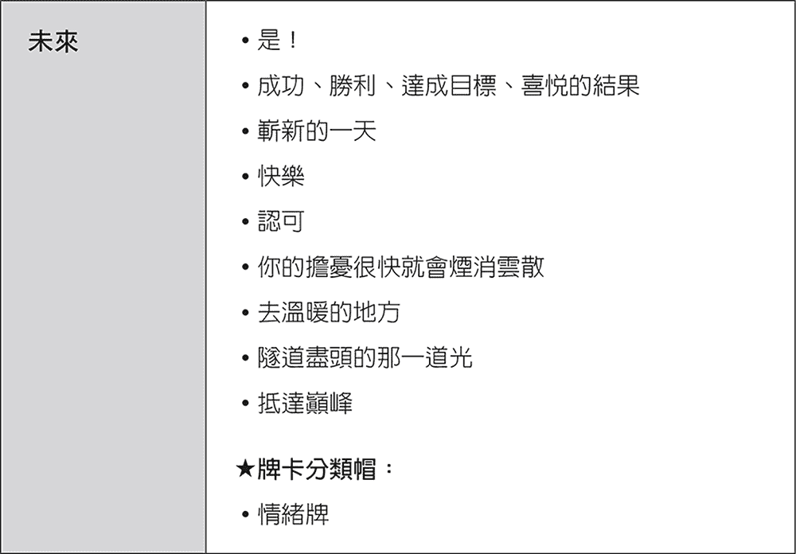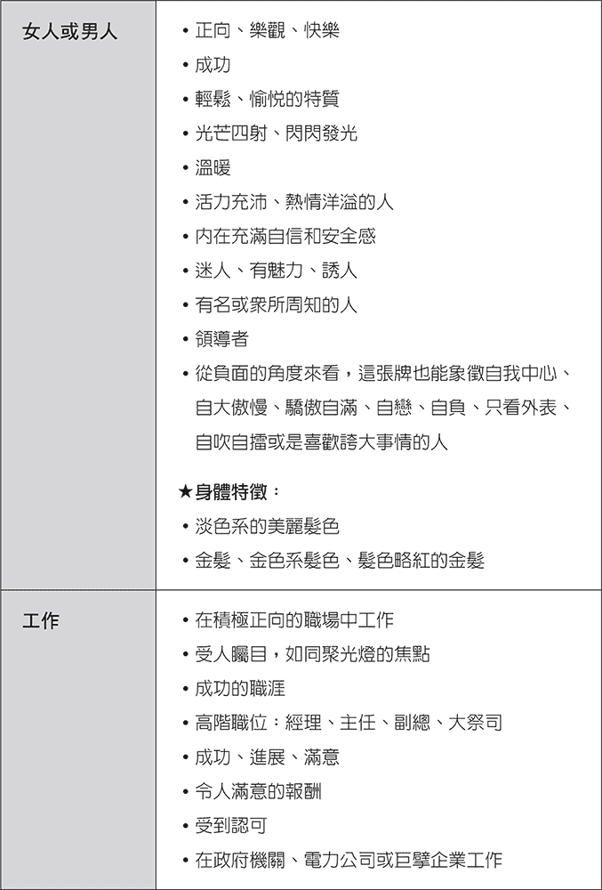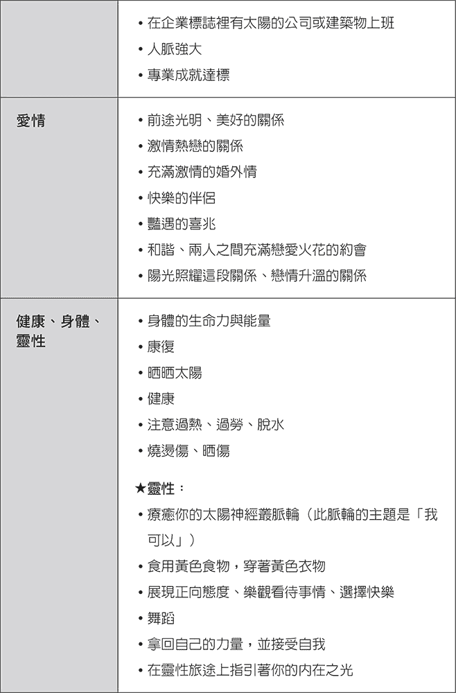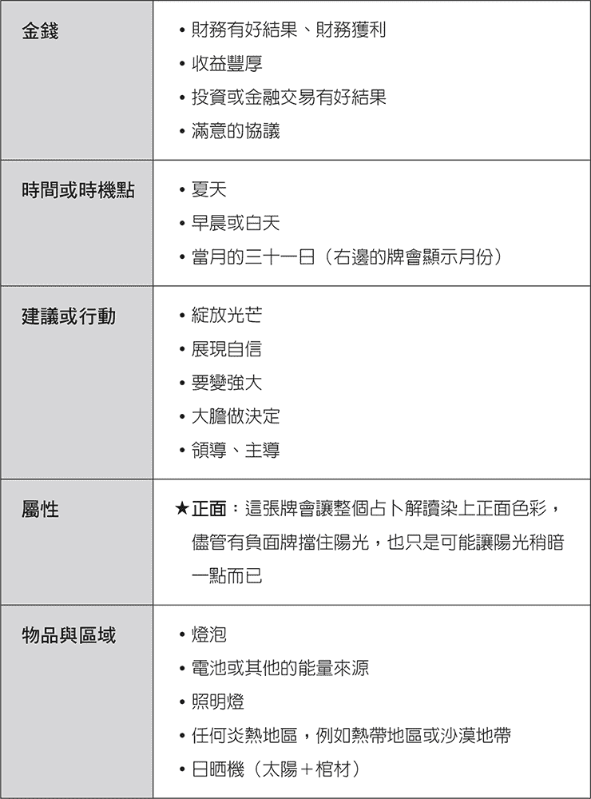

### 这张牌的个人故事：

太阳牌让我想起一位朋友约瑟夫。二〇〇九年时，约瑟夫在创意领域开发了新事业，然而他有点犹豫不决，也不是那么安心。这对他来说是新的事业，所以我可以理解他的感受。我们不断抽到太阳牌——男人＋太阳、月亮＋太阳、太阳＋星星，这些组合都暗示着他会获得耀眼的成功和众星拱月的认可。约瑟夫天赋异禀也十分谦虚，所以他不想要投射太多期待，并且有点担心是否自己太过乐观看待结果，因此他不想要有过高的期待。然而，我每次占卜都抽到太阳牌，照亮着他的问题，牌卡也不断让他知道事情的结果。短短三年内，约瑟夫变成了无人不知的大人物，且他的职业是世人梦寐以求的工作。太阳牌让我想起约瑟夫屹立不摇与坚持不懈的个性：在抵达成就与成功的道路上，坚毅地大步向前迈进。

太阳牌还有另外一桩共时性的事件。那一天我在写太阳牌的内容，先不论当天是八月一日（狮子座／太阳），我的长子正在读一本拿破仑的传记，书中提及拿破仑的成功、胜利和他自负傲慢的个性。拿破仑完美呈现出太阳的牌义，正负面的牌义皆是。他是强大、迷人、充满自信的领袖、有名且有权势的历史人物；但是他也有极端的控制欲和对于权威的渴求，让他最终跌落神坛，自毁灭亡。我想，正面的特质发展过度后，就变得负面了。

### 大蓝图牌义：

传统上，太阳牌靠近人物牌的话，所有困扰和痛苦终将止息，事情即将明朗；相反的，若是太阳牌离指示牌很远，意味着你的幸运星将逐渐离你远去。

太阳牌的位置非常重要，而太阳与负面牌的距离也同样重要，因为与负面牌的距离远近会阻碍太阳带来的祝福。假设太阳的左边出现了几张负面牌，那么困境会获得解决，太阳会将过往的黑暗驱散；然而若是负面牌出现在太阳牌之后（右边），意味着牌面举起红旗要警告你小心，占卜师则要仔细查看周围的牌面，了解阳光黯淡或照射不到之处在哪里。

太阳周围若是正面牌，表示你的快乐和满足一定会出现，还会更好；然而若负面牌包围太阳的话，就会遮住光芒、产生阴影，带来某些欺骗与忧伤。

### 配对组合与范例：

太阳牌是非常正面且表示肯定的牌卡。

莎拉问说：“尚恩会注意到我吗？”

★太阳＋月亮＝会。尚恩会有所行动，并约你出去

艾莉莎很担心：“我能够顺利拿下招标的合约吗？”

★太阳（达到目标）＋月亮（得到认可）＝会。艾莉莎会顺利签下合约，她的工作会受到瞩目

以下有几则太阳受到负面牌阻扰的案例：

东尼赢得了几场比赛，但是他的心情忧喜参半。“我的比赛结果会如何？未来发展是什么？”

★太阳＋云朵＝你的快乐或惊喜很快就会散去，有些事情即将来临，削弱你的成功结果；你的胜利会发生挫败，原因是困惑和误解；离胜利很近，但最后不会胜利；遭受他人质疑的胜利；短暂的胜利

★云朵＋太阳＝历经困惑与质疑后，你的胜利终将明朗；尽管有些疏忽和失误，成功就在眼前；无论未来多么不确定，你仍会绽放光芒；你的担忧、焦虑很快就会烟消云散，喜悦会取而代之

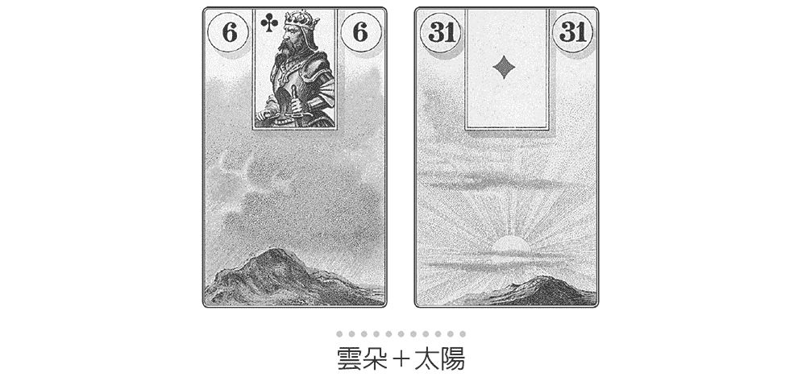

贾斯汀很紧张：“我能否连任理事会的理事？”

★太阳＋棺材＝很不幸，你即将卸下你的职位；不会，结果不会是你喜欢的；你的光芒将淡去

★棺材＋太阳＝会。你会连任，尽管可能是最后的任期；理事的职位仍是你的，但可能会遭遇强烈反对；度过艰难后才能成功

## 月亮

扑克牌对应：红心八

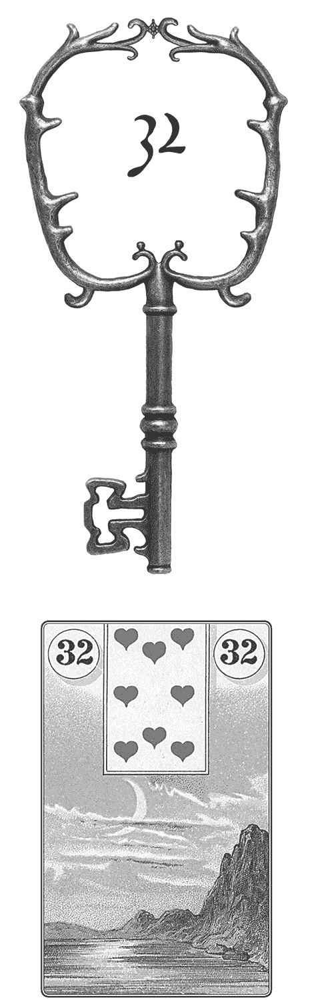

这张牌上，银色的新月高挂宁静的夜空中，新月的月光照耀着夜生活。几千年来，月亮一直被认为是想像力、梦想、灵感、热情和潜意识的象征。许多文化也将月亮视作情感丰沛的神灵，并视月亮为阴性能量、母性本能、灵感、通灵。东方文化中，月亮象征浪漫、爱情、情意。月亮常被写在诗句散文之中，描写恋人或描述赢得恋人的好感。月亮牌也描绘着在月光下私会的恋情。

这张牌象征带来荣誉、名声、认可、名气的梦境、想像力、创造力、灵感、创新，有时候也象征社交名人的地位。后来，月亮也代表情感、热情和魅力、浪漫。这张牌象征亲密、情意、渴望、幻想。归功于神话学将月亮视为阴性，月亮也因此象征母职、子宫，以及任何与母亲和阴性相关的一切；甚至也代表月经、自然的循环周期、荷尔蒙失调。月亮其中一组最重要的牌义是直觉、本能、感官、敏锐、觉知，以及灵性和通灵能力。月亮象征神秘能量、灵媒、敏感体质者、占卜师、通灵人。

### 对应主题的牌义

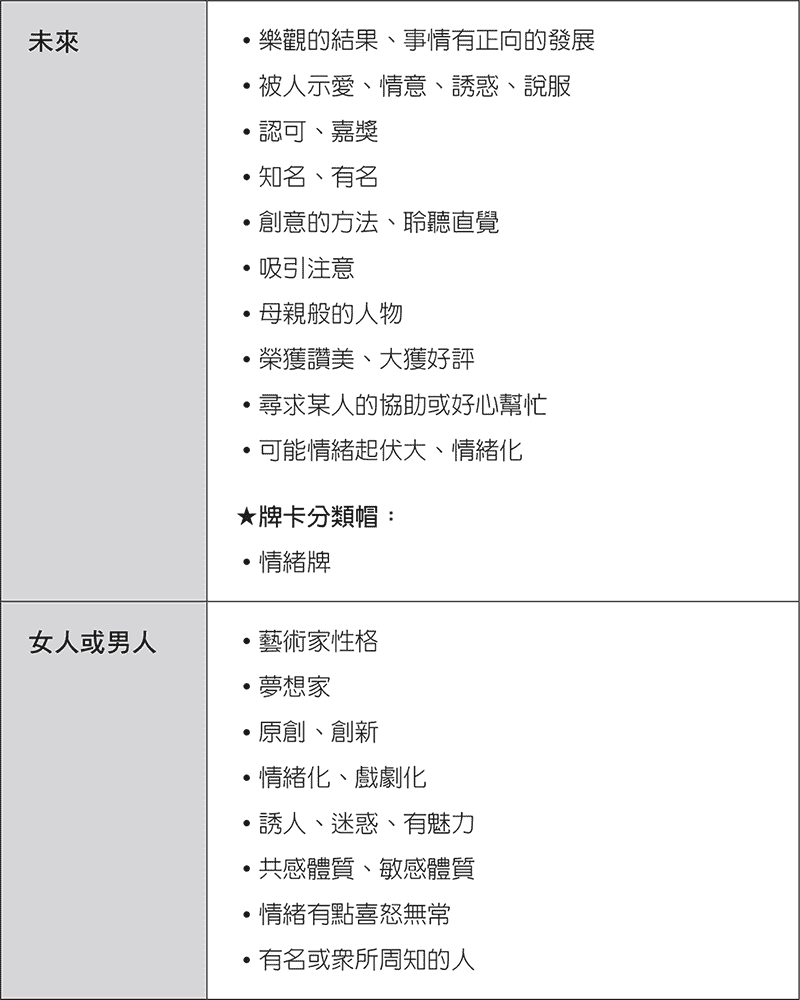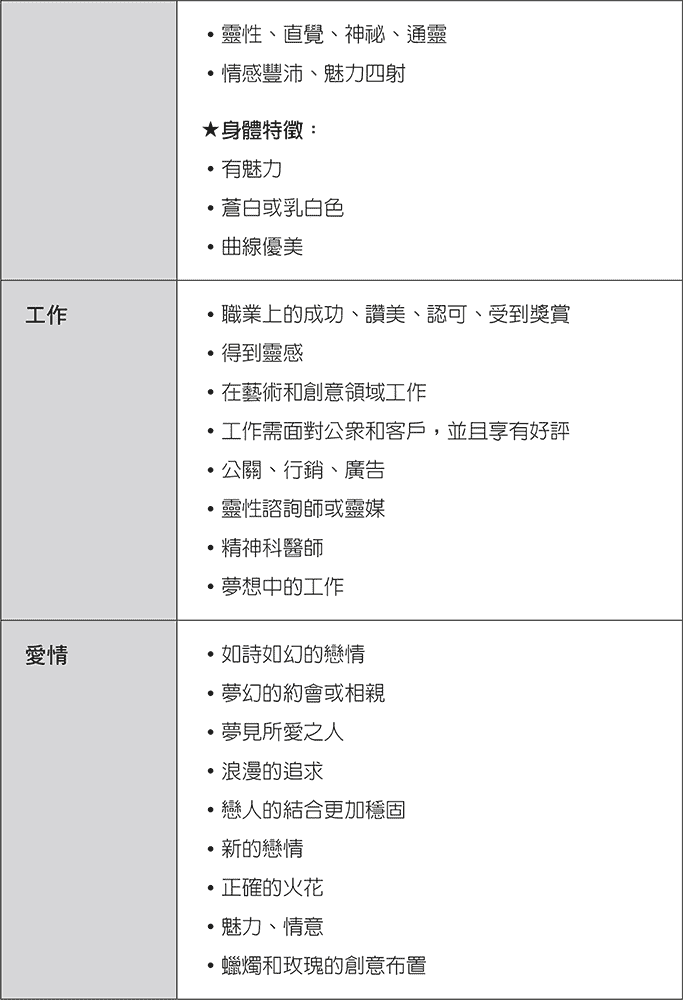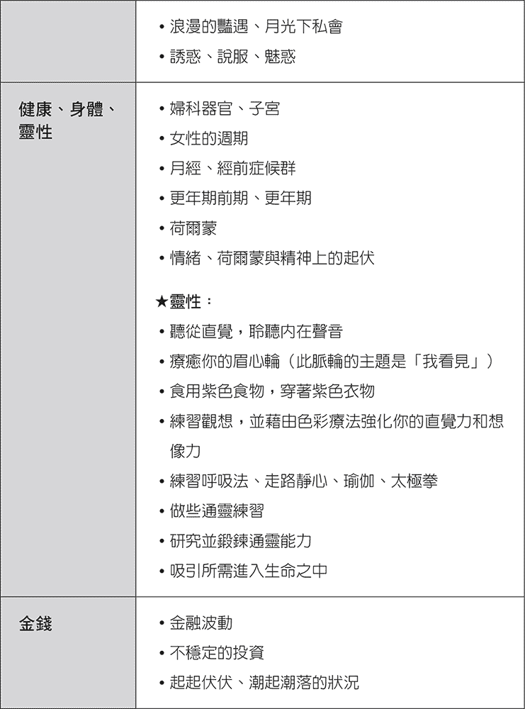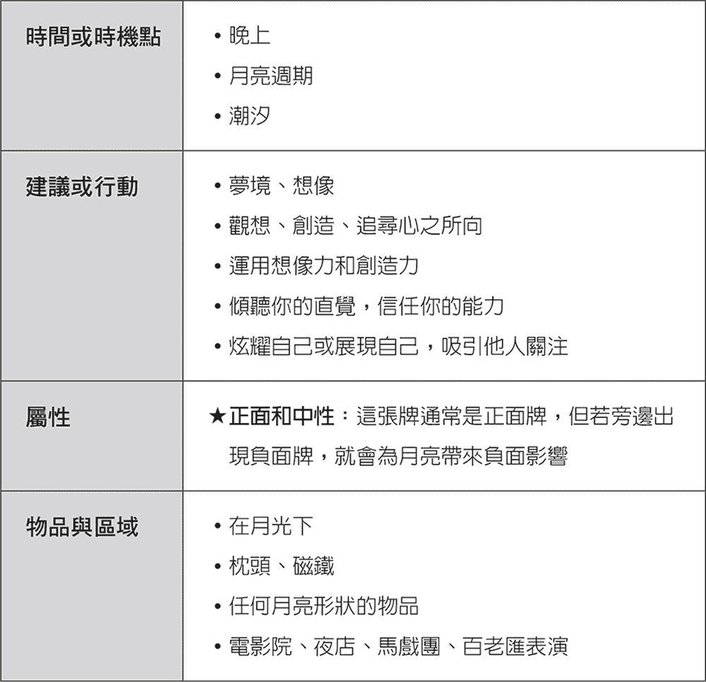

### 这张牌的个人故事：

前一阵子我有位个案兼朋友，名叫比尔，他想试试雷诺曼占卜。他请我占卜接下来要去广播电台接受采访的结果。

比尔问道：“采访过程会如何？受访过程中，听众的反应如何？”

我用鸟作为主题牌，启动之后用来象征采访，接着我为他抽到以下牌面：

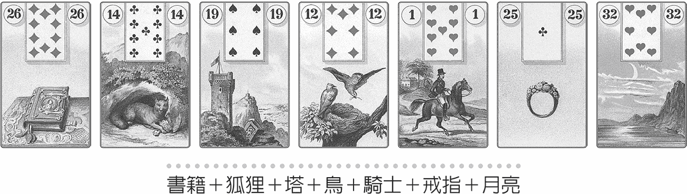

前三张牌跟我的问题和比尔的状况有关：书籍＋狐狸，代表他的专业以及他在神秘学的教学资历，也就是他要接受采访的主题，而刚好他也有新书要出版（书籍＝神秘学；狐狸＝专家或精明聪慧）。塔直接代表广播大楼。骑士＋戒指暗示采访过程会很顺利、圆满（骑士＝行动、新的、宣布、带来消息；戒指＝圆满结束、正面、满意）。月亮在最后一张带来完美的结果，采访过程会广受好评。我回复比尔：“你的受访会顺利、令人满意，而且会大获好评。你跟采访者会和谐相处（戒指），这样的和谐关系会协助你顺利传达要讲的内容（骑士），听众对于你的受访内容会有高度好评（月亮）。”

我们又抽了两张牌单独问了他的新书，抽到书籍＋月亮，代表他的新书会享誉盛名。

比尔的受访结果非常成功，无数的电话、电子邮件和好评不断涌入。他的新书也卖得非常好且广受好评。你一定会爱上月亮牌！

毫无疑问地，比尔现在一头埋进雷诺曼卡的研究里，深入学习这套占卜系统。

还有另一则与月亮有关的有趣故事，苏当时打给我，惊慌失措地请我帮她找遗失的珍贵护身符。我赌了一把，抽到了两次月亮牌。起初，我请她在工作地点（办公室或工作室）的暗处或角落找找，但遍寻无果，所以，我联想到月亮有梦境的意思，于是建议她到卧室寻找——护身符藏在暗处，可能在床下（睡眠与梦境发生之处）。她果然在枕头下找到了护身符！

跟大家分享另一则小趣事，当我写完月亮牌的内容后，我发现当天晚上刚好是满月。更棒的是，当天满月是罕见的蓝月！

### 大蓝图牌义：

传统上，月亮象征伟大的荣耀。根据月亮离人物牌的距离，会决定荣耀的程度范围。假如月亮离人物牌很近，意味着个案会得到很大的荣誉、受人尊敬、备受称赞；反之，如果月亮离人物牌很远，就意味着个案缺乏名声和声望（在十八世纪和十九世纪，当时盛行荣誉、头衔、勋章）。

我视月亮为正面牌，如果月亮落在指示牌旁边，会带来新的视野或是激发创造力。它也可能意指一段恋情，或是羁绊，抑或家庭链接变得更深，全都视周围的牌面而定。此外，月亮象征等待已久的认可、奖赏、表扬、致谢、声誉终于近在眼前。根据月亮与人物牌之间的距离，也可以解读出何时会被赞赏。

只有两种情况我才会把月亮视为负面牌：如果月亮落在负面的宫位（例如，月亮落在十字架宫位时，创造力或恋情会遭遇挑战），或周围有好几张负面牌的时候。在这样的脉络下，个案应该要小心问题、情绪或精神紧绷、表里不一、毁谤、丑闻等情况。

### 配对组合与范例：

我曾经在占卜健康问题时，抽过月亮＋镰刀的牌组，意味着子宫切除术或堕胎手术。这个牌组中，月亮＝子宫，镰刀＝手术、切除。同时，我也抽过月亮＋船锚，代表孕期很稳定安全。

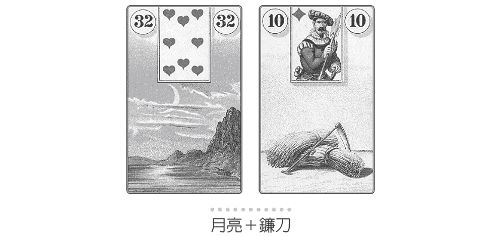

以下将月亮牌的广告牌义与其他牌搭配：

★月亮＋鸟＝公关、口耳相传的广告

★月亮＋信件＝传单、信件广告

★月亮＋书籍＝报章广告，或是书中的推销广告

★月亮＋星星＝电视广告、电影广告、网络广告

★月亮＋花园＝透过脸书或其他网络社群行销，或是借由非网络集会，如夜间音乐会和通灵／塔罗大会来广告

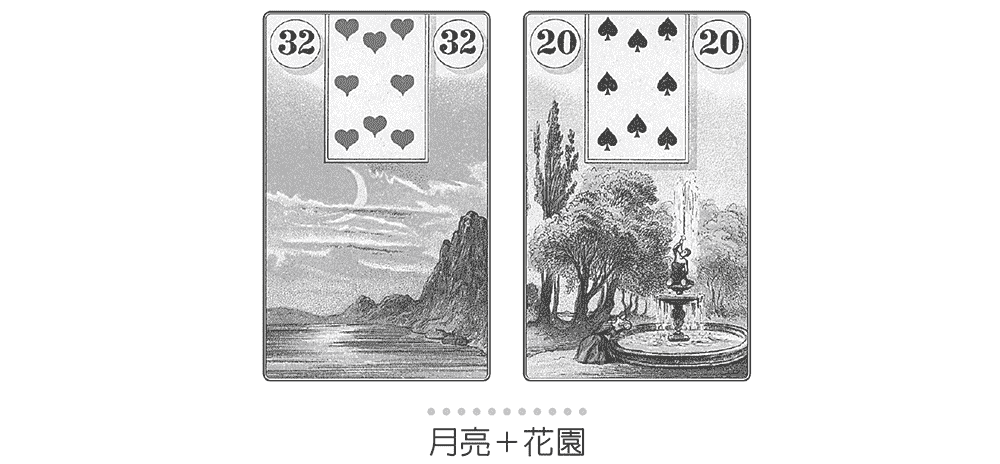

塔蒂雅纳想要询问她与亚伦的关系，她不清楚对方在这段关系中投注多少心力。亚伦对与塔蒂雅纳的这段关系是否全心全意？

★月亮＋十字路口＝亚伦对于感情还不想定下来；他也有可能有其他情感对象（月亮＝情感状态，十字路口＝正在决定、其他选择、多重选择）

★十字路口＋月亮＝出现十字路口总是意味着缺乏承诺，而月亮则代表关系会以意想不到的方式进行。尽管十字路口属于中性牌，也不是负面牌，但是在感情问题中就会为旁边的牌带来负面影响。因此，月亮牌的意思会出现欺骗，并提醒个案要特别注意

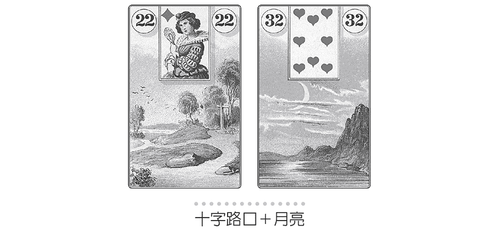

## 钥匙

扑克牌对应：方块八

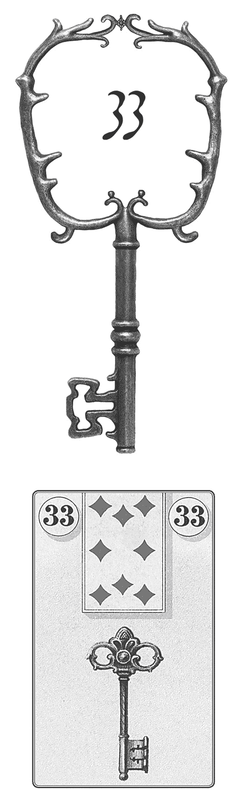

钥匙牌通常画着古老的万能钥匙，设计精巧细致。呈现在牌面上的是一支复古又美丽、精美却简单的钥匙。钥匙象征锁上与解锁的力量——打开快乐之门，打开自由与解脱之门，打开知识或命运之门。

钥匙牌在雷诺曼系统中是一张王牌卡，仿佛神仙教母的魔杖，或是让愿望成真的魔法卡。如果此牌卡的周围都是正面牌，就可更加确定这张牌具有王牌魔力。钥匙牌会揭发并解锁隐藏的秘密，同时也让秘密可以继续锁好锁满。这张牌是打开成功的钥匙。有了钥匙牌，打开门就能抵达你的目标、愿望和渴望。钥匙会让拖延太久的解决办法尽快出现，并且打开机会之门，走向新的康庄大道；它也让你找到遗失之物，象征有望失而复得。钥匙意味着重要的事件或重要的对象，也告诉你会遇到的主要人物是谁。此外，它也预言了事件会有出乎意料的转折，并且会带来业力的考验与灵性的突破。

钥匙牌要你注意旁边的牌面，它强调旁边牌面的重要性。钥匙打开一扇门，让你了解灵性、学会观想、发挥想像力；它也让你踏入灵性世界，了解因果业力，并与宇宙的神性链接。钥匙让你前往天国，并在灵魂层面上与本源链接。当钥匙牌出现，凸显了灵魂共振和业力关系。要注意钥匙牌与月亮牌的区别：月亮代表神秘领域的知识。这两者的差别可以比拟为链接通灵能力的眉心轮（月亮），和将最高层面的灵性、心智、物理与宇宙链接的顶轮（钥匙）。剩下的就是另外两张灵性层面的牌了：十字架（宗教与戒律）和树（包含各种灵性层面的健康）。

拥有钥匙，足以让你进入神秘领域，并赐予你决策的权力，让你能够做出超越人类自由意志的选择，并为你的选择负责。这是掌管因果的业力之钥，赋予你机会和力量去创造和实践目标与愿景。当这张牌离指示牌很近，意味着成功即将到手。但是一切仍看你的选择，是否要使用这把命运赐给你的钥匙。有了这张牌，命运为你打开了幸运与福气之门，机会就是你的，没有任何门锁会阻碍你走过那扇门。这张牌象征奇迹、护身符、幸运物。钥匙赋予你力量。

### 对应主题的牌义

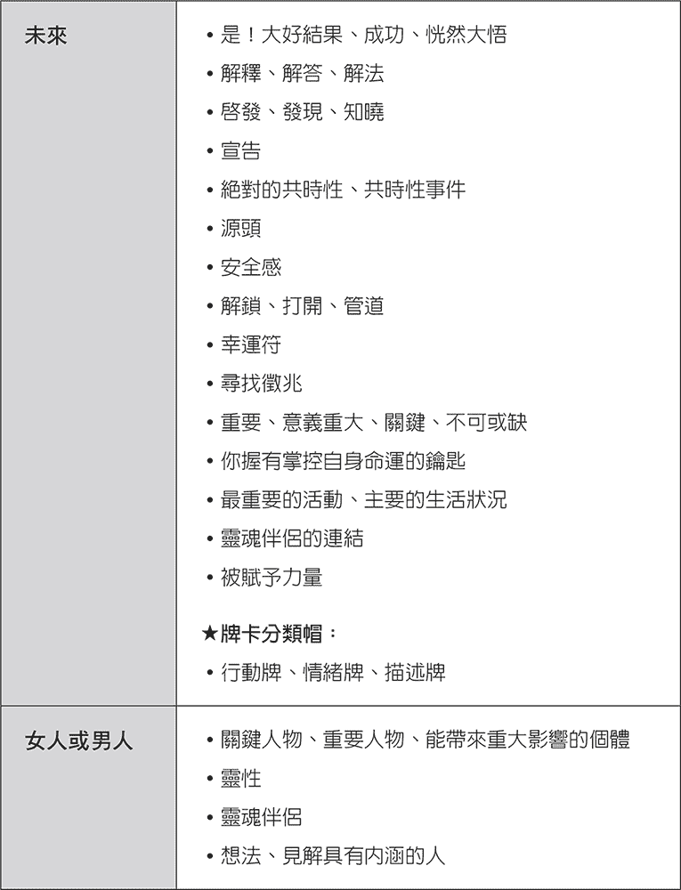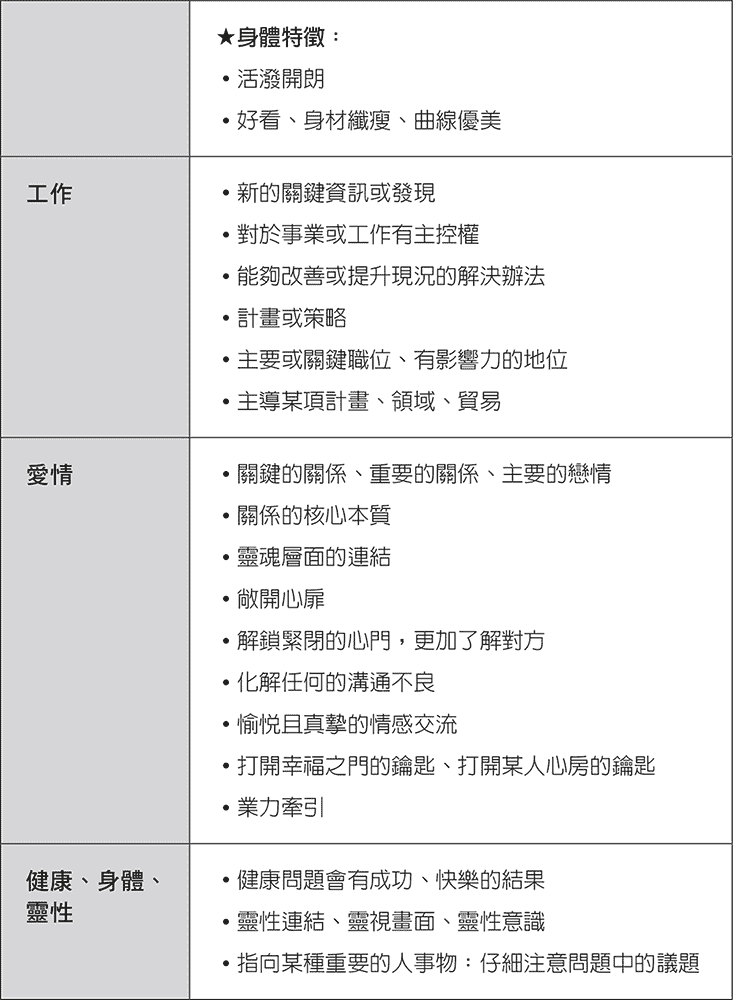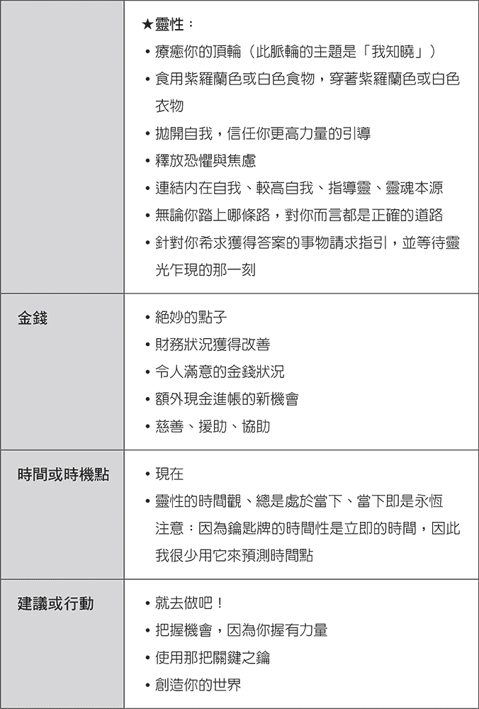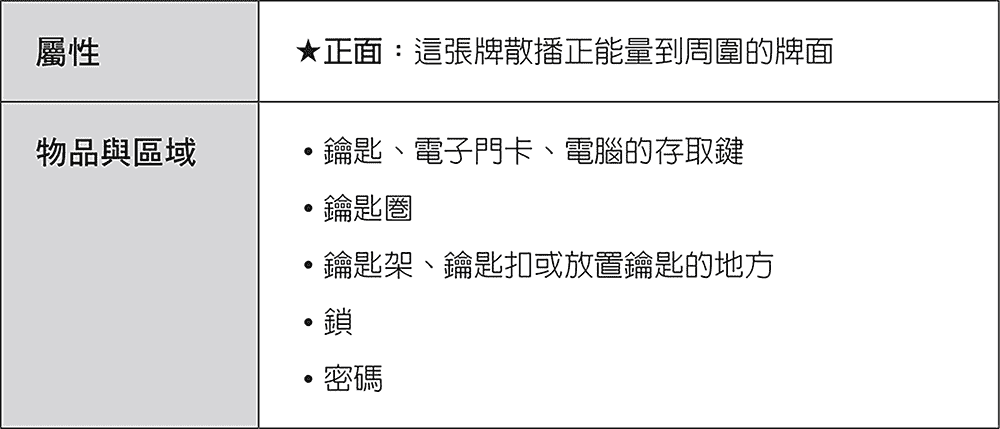

### 这张牌的个人故事：

钥匙牌总是会在我为个案进行通灵的当天被我抽到。当我抽到钥匙＋船，就意味着打开另一个世界的门户，当天的过程就会进行得很顺利。有时候我会抽到钥匙＋云朵，意味着链接会被干扰，当天的通灵过程就会受到其他灵体干扰、介入及影响。我养成了一个习惯，每次有个案预约，在开始前或重新预约后，我都会先抽牌占卜。

关于这张牌，有件趣闻要分享。我当时参加形上学大会，我抽到了花束＋钥匙，我心想：“哇，我会有个美好的灵性体验！”后来，一位挚友送了我一条有着锁盒的项链，盒子里面躺着一把优美的钥匙。雷诺曼卡总是会用直白的方式让我感到惊讶，而我也的确有个美好的灵性体验。

这些绝对真实的共时性也发生在我写这张牌的时候。首先，我的一位挚友传给我一张雷诺曼牌阵的照片，女人牌的正下方就是钥匙牌。接下来，事情发生在我静心时，母亲的祖父找上了我。我从未见过他，因为他在我出生前就过世了，而他在那个年代是最厉害的先知。我向母亲详细描述了他的样子，她向我保证那就是她的祖父。对我而言这是个重大的事件，极具意义的与灵魂相遇，真是一个重大的“哇！”时刻。

### 大蓝图牌义：

传统上，钥匙代表事件的成功，而成功与否则视跟人物牌的距离而定。越靠近人物牌，越容易成功；反之，则要小心会出现麻烦和损失。

我都会检查钥匙牌周围的牌面，以及它座落的宫位。如果周围有负面牌，那么就会有些障碍，不过并不是太大或太严重的挑战，因为钥匙会带来解决办法：“不怖不畏，解决之钥就在这儿！”相反的，假设正面牌在钥匙牌周围，而如果它座落在正面牌的宫位，你就等于中到头彩啦！“你还在等什么呢？当机立断、大胆行动吧！”

我喜欢看到钥匙牌靠近人物牌，而且越近越好，因为它能够赋予个案力量，掌握自己的命运。越靠近人物牌，力量就越强大，成功触手可及。假设钥匙离指示牌很远，我不会觉得这是凶兆，我会认为成功只是还需要机缘才会来到。

### 配对组合与范例：

蒂纳发现了一些关于儿子的坏消息。她愁眉不展地问道：“我应该撒手不管，让他学习自己去面对后果，还是我要从中介入调解呢？”

★钥匙＋鸟＋小孩＝跟儿子（小孩）好好谈谈（鸟）会非常重要（钥匙）；蒂纳应介入这件事，跟儿子（小孩）深谈（鸟）乃是至关重要（钥匙）

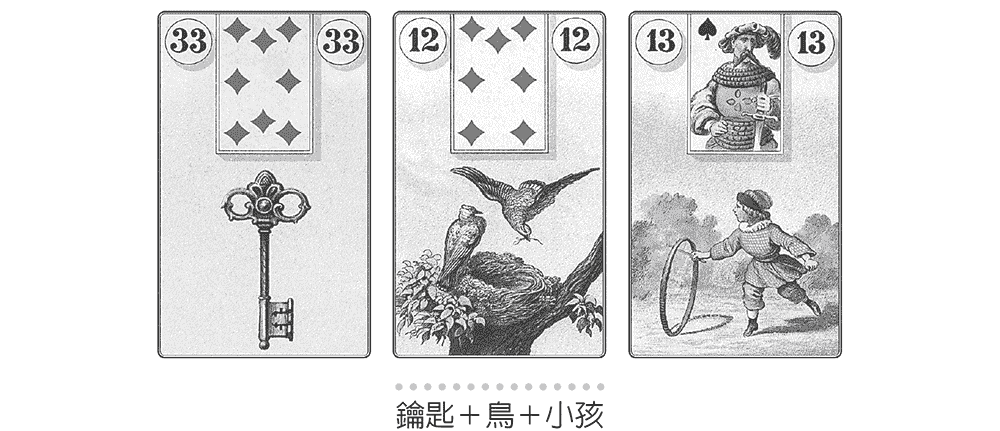

★钥匙＋书籍＝一本重要的书籍；大秘密；巫师的暗影之书（记载咒语、仪式的巫师秘笈）；灵性日记或灵性教导

★书籍＋钥匙＝秘密被揭发；突破；你会得到你寻找的答案

★钥匙＋老鼠＝严重的困扰；灵性层面的损失和失去灵性的协调；注意（钥匙）焦虑的程度（老鼠）

★老鼠＋钥匙＝失而复得；更新；终结担忧；一切会变得明朗、清晰、开放；误会解开后重新联系；疗养和疗愈

## 鱼

扑克牌对应：方块国王

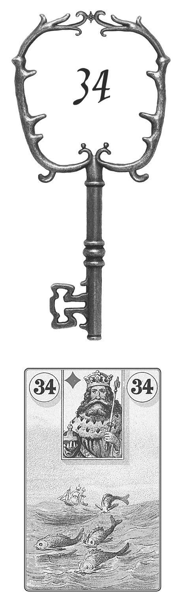

在鱼的牌面上，我们通常会看到四条以上的鱼一起悠游，在大海里逐大浪而嬉戏，远方的船只也可能航行在同样的海浪上。在人类历史里，鱼一直象征着丰盛、水、孕育、灵性、富足、永恒、结合、转化、女性、适应、知识、创意、自由、直觉、好运。

在雷诺曼的系统里，鱼通常带来正面改变和庞大的利益。它也意指独立与自由，这张牌因此也象征自雇者、创业、其他企业机构，以及可能由一人独立执行的企业活动。同样的，鱼这张牌也象征海洋，因此它跟贸易、商业、进／出口，以及任何的销售、采购、交易有关。所以，这张牌是商业、交易、业务的牌。鱼意指丰盛、财富、大量。

另一方面，鱼和水息息相关，暗示着直觉、情绪和有水之处，如海滩、海岸或湖边。

因为鱼这张牌也象征独立自主、自由自在，每一次占卜小型企业、个案私人事业或其他顾问类型、独立、创业工作时，我都会启动这张牌作为占卜的主题牌。

### 对应主题的牌义

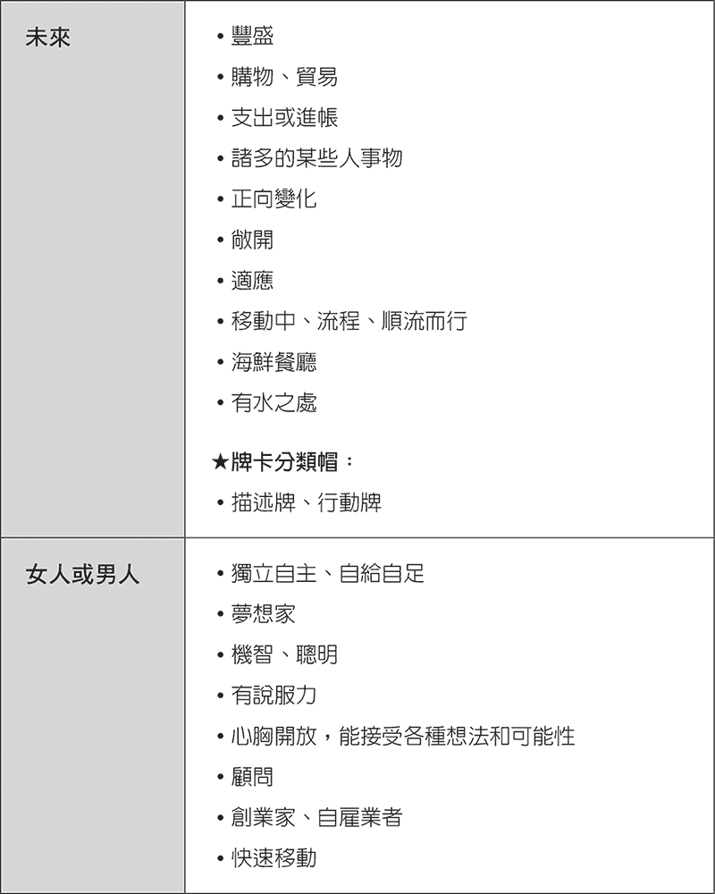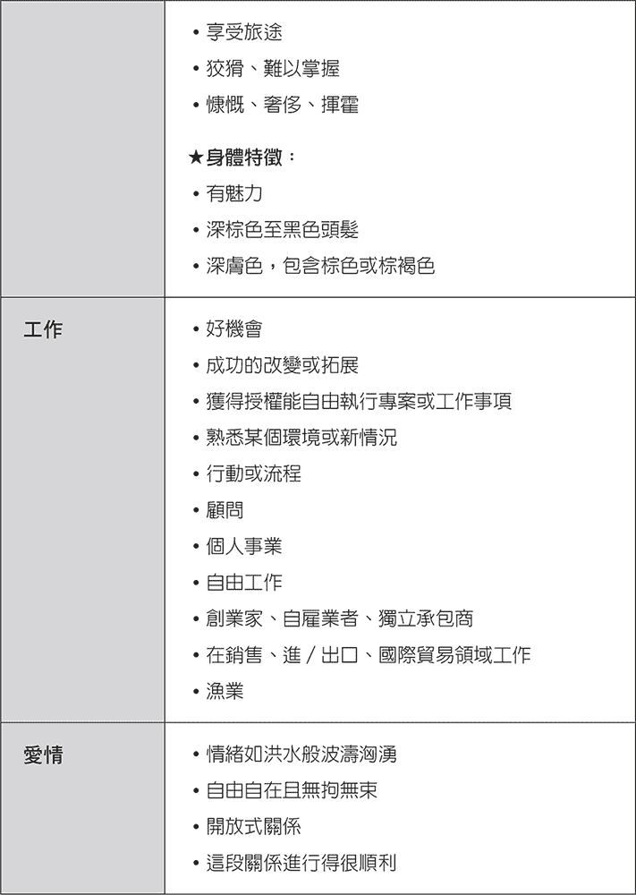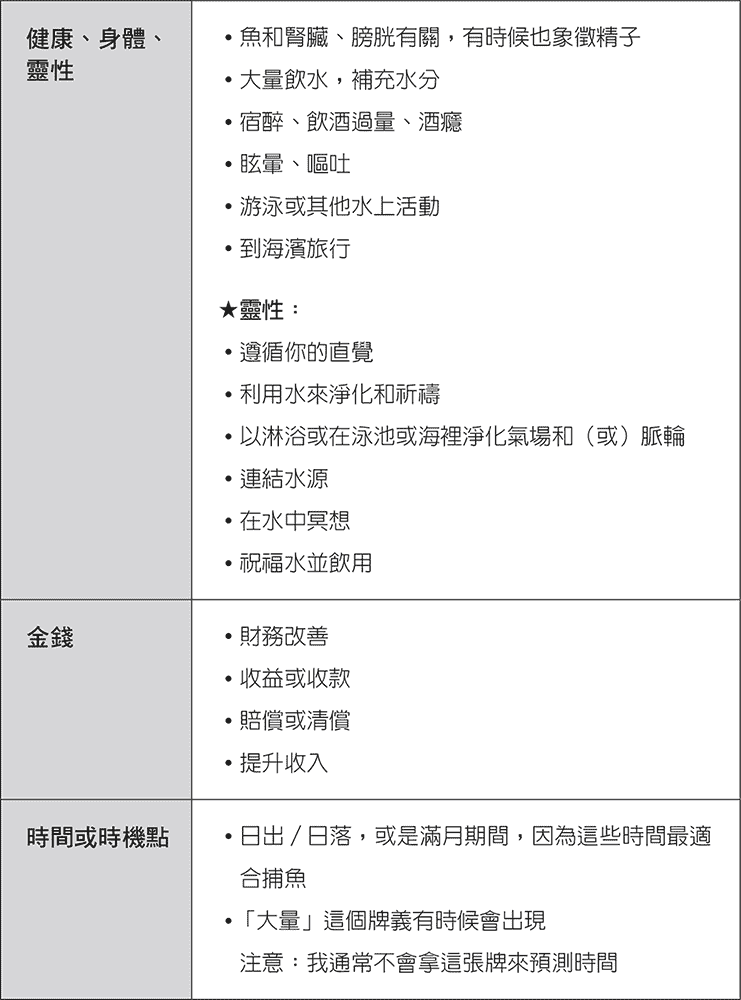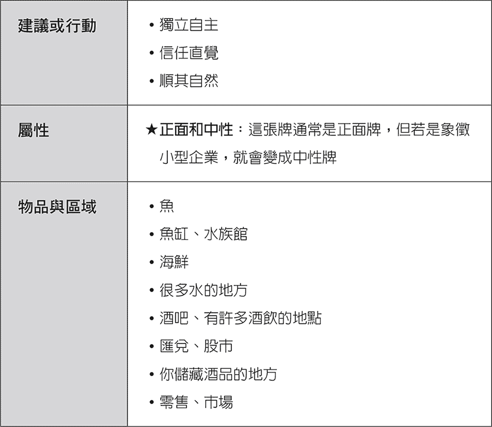

### 这张牌的个人故事：

我亲爱的妹妹到美国短暂拜访我。我已经许久没见到她了，希望她能够享受这段美好的时光。我做了简单的占卜，看看我们相聚的日子会发生什么事。我使用我的十字牌阵，让牌卡自行决定主题牌以及周围的情况。

鱼在主题牌的位置出现了。我很了解我妹妹，我立刻就知道这张牌代表购物，但是云朵牌让我有点担心。我不想要妹妹（鸟）遇到任何麻烦（云朵），尽管花束在最后面，象征会有开心的结局。

那一天从跟一位朋友见面吃午餐开始，我们约在高档的餐酒馆，这就是占卜结果开始实现的时候。我们三人都点了同样的餐点：龙虾堡。餐点送来后，有两份餐没煮熟，这两份餐是我和我妹妹的。我们只好把餐点送回去，此举当然惹怒了主厨，但最后事情还是解决了。主厨帮我们做了另一道海鲜餐点后，我们聊天也聊得很开心。午餐过后，我们决定回家前先去商场逛逛。我们花了美好的一小时待在高级化妆品专柜。

我和妹妹的一天透过牌卡来描述的话，会是这样：

★云朵＋鱼＝没煮熟的海鲜

★云朵＋鸟＝我们都不开心，而且这发生在我们两人身上

★云朵＋熊＝主厨生气、不爽

★鸟＋花束＝我们三个女生聊天聊得很开心

★熊＋花束＝在美丽又高档的餐酒馆

如果解读十字牌阵的线性位置，鱼也暗指我们在化妆品专柜购物：

★鸟＋鱼＋熊＝妹妹和我（鸟）去海鲜餐厅（鱼＋熊）

★云朵＋鱼＋花束＝经历了一些波折后（云朵），我们就去购物，并且买了一些美妆用品（鱼＋花束）

鱼这张牌也常出现在我帮人占卜受孕问题时，比喻为精子和受精。有一次我帮个案占卜体外受孕的问题，刚好就抽到鱼＋戒指。

### 大蓝图牌义：

鱼这张牌的传统意义代表大笔财富和事业有成，越靠近人物牌，成功就越近。如果鱼离人物牌很远，那么专案或事业的进行会变得艰难且阻碍重重。

这张牌带来日常生活中的正向改变，意味着在特定领域的成功，有时候也代表在海边或水湾度假。如果周围都是正面牌，成功的程度会提升，带来愉快的发展、进展、成长；相反的，如果周围有负面牌，挑战与难关会纷纷出现。

鱼这张牌代表事件和移动，检视周围的牌面，可了解哪些地方和什么领域正出现改变。

如果个案是自雇业者，营运自己的事业，或个案只是询问创业问题，我会在牌阵中找到鱼，并检查周围的牌面，评估状况并解读事业或创业的情况。

### 配对组合与范例：

凯莉想知道：“我的对象要带我去哪里约会？”

★鱼＋花园＝去商场、水族馆、海岛度假村、疯狂购物、游泳、海鲜市场

珍恩和亚当是对新婚夫妻，想要为家中增添新成员：“我们能够受孕吗？”

★鱼＋花园＝丰收或受孕：会，绝对没问题

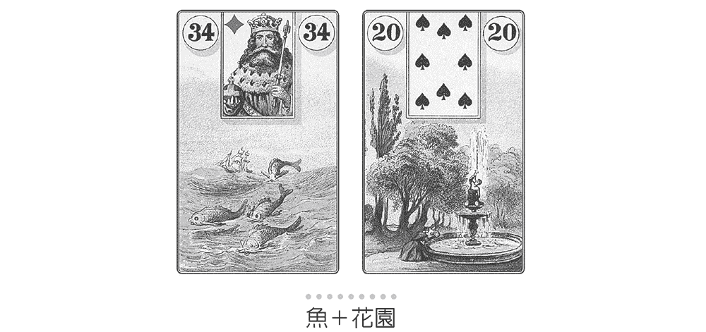

苏菲遇到困扰，想询问她的房地产事业：“我的房地产事业在未来两个月会有什么发展？”

★老鼠＋鱼＋山＝现况不会有任何变动（老鼠＋鱼代表事业缓慢，鱼＋山则代表卡住不动）

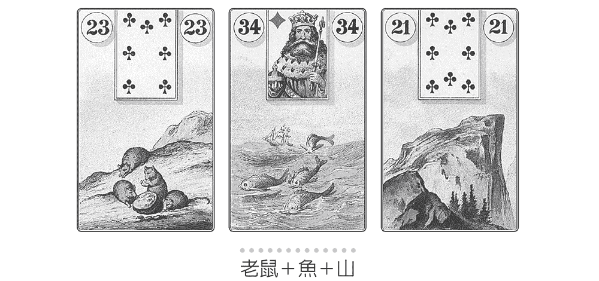

## 船锚

扑克牌对应：黑桃九

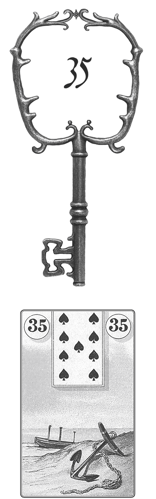

在这张牌上，我们通常会看见船锚定锚在沙滩上，锚上有条锁链，等着被船员使用。有时候这张牌会将海洋和沙滩画在背景处，有些牌面则是描绘着船锚在大海中载浮载沉。船锚是典型的稳定性与安全感的象征，也因为船锚非常重，才能将船只安全地定锚住。无论海浪如何起起伏伏，船锚依旧稳如泰山。

船锚象征生活中各方面的安全与稳定，以及信任、忠心、忠诚。对于企业来说，只要周围没有其他负面牌，这张牌就是一张正面且好处多多的牌。船锚意味稳定，代表所有具体、真实、稳定、安全的人事物。占卜解读中，它意味着脚踏实地且要有实质作为，暗示着个案需坚持不懈、持续到底。船锚带来抵达目的地的消息，也敲响目标达成的钟声。此外，它也赋予勇气并建议个案专注眼前路，不论遭遇任何难关都要坚持下去。船锚意味着强大的支持和可靠的人事物。它传达出“你是我的定心锚”和“我挺你”这两句安定人心的话。

搭配正面牌卡的话，船锚象征生活方式、日常生活、生活模式。它意指“总是正面”的未来，虽然有负面牌在周围的话就会象征悲观和负面的牌义。举例来说，船锚＋鞭子，可以代表成瘾；船锚＋花束＝永远乐观正向；船锚＋花园＝无时无刻都在狂欢。

船锚也与海洋、大海和任何海事相关领域或工作有关。

### 对应主题的牌义

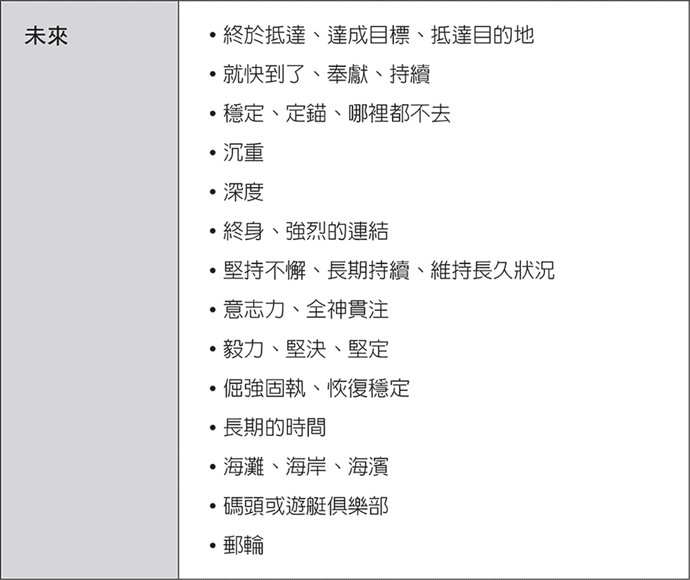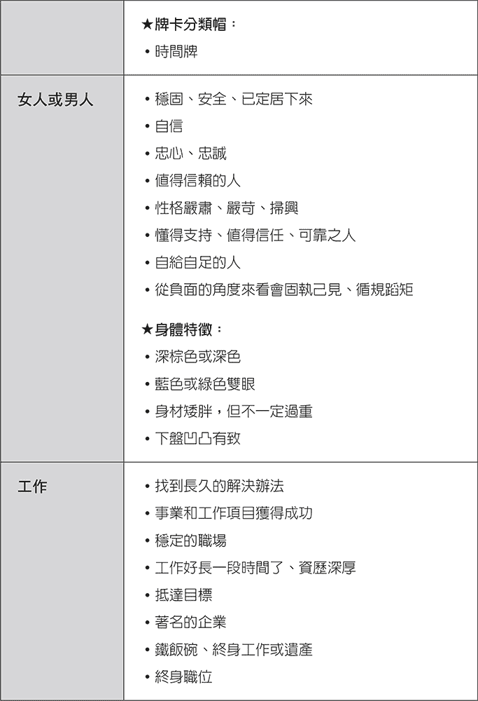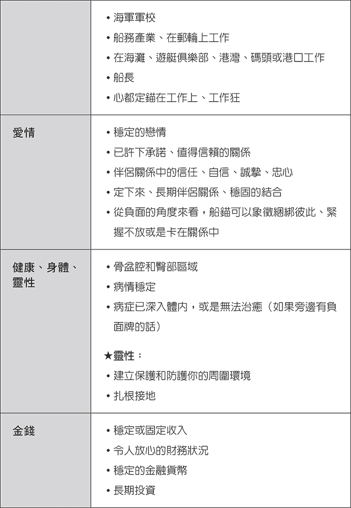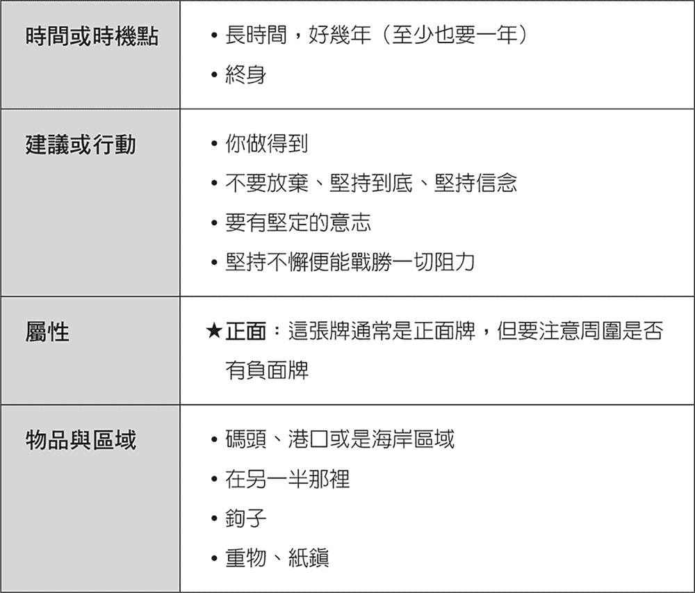

### 这张牌的个人故事：

我翻看以前的日记，想要找到船锚牌的解读纪录时，想起了一位老朋友，我曾经跟他很好，但我们后来渐行渐远了。船锚在当时出现在许多次的占卜牌面中。以下是某一次的占卜，我问道：“我们这段友情在未来会有什么变化？”我抽到了女人＋老鼠＋狗＋船锚＋钥匙。

女人＋老鼠代表了我的压力和难过，因为我失去了我们曾经拥有的美好友情（狗）。船锚告诉我，我的朋友忠心耿耿，而钥匙给了我恢复联系的希望。船锚给我一种感觉，这段友情会是长久的关系，而钥匙在最后一张牌，让这段关系看起来就像缘分注定。此外，船锚＋钥匙意指经过一段时间之后会有圆满的结果。

后来经过好长一段时间，那位朋友和我恢复了联系，仿佛过去什么事情都没有发生，我们从此一直保持联络：一辈子的友情加上百分之百的业力牵引。这则故事的发展完全符合牌面所说，而船锚的牌义和特性也都呈现出来了，包括长期的一段时间。

近期有一则船锚的故事，我问了儿子的高级数学分班考试状况会如何。我抽到：

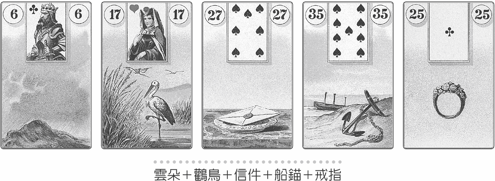

云朵表示我对于鹳鸟＋信件（高级考试）的担忧，而船锚＋戒指则预测了他一定会考得好——果然成功了。我很高兴，这果真是个准确的预言。

船锚也很常在我占卜怀孕问题时出现，它跟这些牌组合后宣告个案会怀孕：月亮＋船锚；船锚＋鹳鸟或是鹳鸟＋船锚；小孩＋船锚或是船锚＋小孩，以及女人＋船锚。

### 大蓝图牌义：

传统上，船锚意指船员和在海上工作的人。如果它靠近指示牌，代表感情忠诚；反之，如果船锚离人物牌很远，就要注意这是转瞬即逝又充满危机的恋情，并且不建议在此时出游。

整体来说，船锚是张正面牌。日常生活中，它在各方面保障我们的安全和稳定。如果有正面的牌面出现，船锚的正面牌义就会特别凸显和强化出来；反之，如果船锚周围都是负面牌，就会遭遇挑战与困难，我就会视为警讯，或是代表不建议外出旅游的警告。

### 配对组合与范例：

★船锚＋小孩＝坚持不懈的小孩；坚定不移的小孩；已受孕；前景有保障的新事业；永远年轻

★船锚＋百合＝长寿；古老；古董；一个时代或纪元

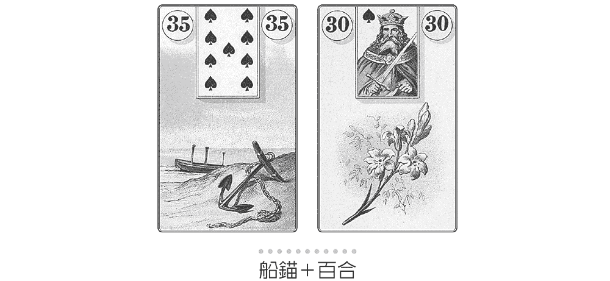

★船锚＋船＝连根拔起；疏散；重新定居；搬走；总是漂泊不定；长期在外旅游

★船＋船锚＝到达或降落；长时间的旅途；长途旅程

达妮雅跟前任重新联系了。她问道：“我的前任是否认真考虑要复合？”

★船锚＋十字路口＝不。前任目前没有这个打算

★十字路口＋船锚＝可能吧。你们有机会能试着重修旧好（需要更多正面牌卡才能确定是否是好结果，因为这两张牌也意味着前任并非真心）

当然，对于这类问题，使用牌数较多的牌阵会更好，也能得到更具体的答案。

## 十字架

扑克牌对应：梅花六

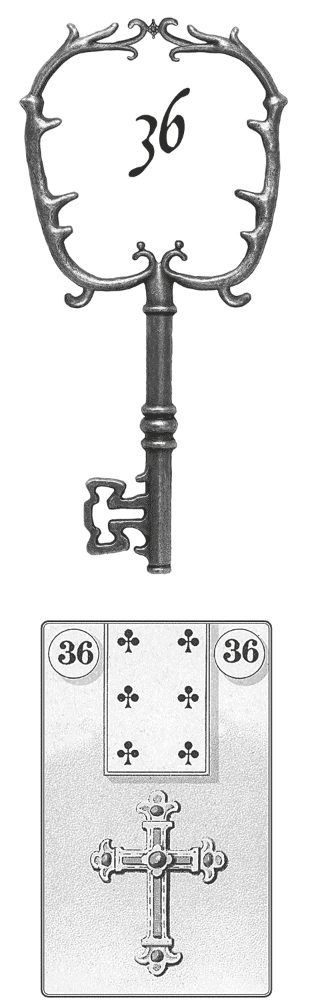

十字架牌的图案非常简单：闪耀金光的十字架独立高挂于画面中央；有时候会有彩带飘逸地环绕十字架。因为雷诺曼起源于基督信仰文化，因此十字架象征耶稣基督受难，以及每个人都有自己的十字架要背负，意味着每个人每天都要肩负困难的重担。十字架象征牺牲，以及痛苦的通过仪式（rites of passage）。

十字架是令人感到沉重的牌卡。它意味着受苦、担忧、负担、困难、麻烦、试炼、苦痛、难关、挑战；它也代表各式各样的忧心、焦虑、恐惧。占卜时，十字架带来眼泪，并预示许多层面如情绪、肉体、心理或是灵性，会遭遇痛苦的挑战、难关、障碍。十字架代表遗憾、悔恨、愧疚，以及羞耻、屈辱、失望。它也同时意味宗教、信仰、信念。

十字架象征所有组织化的宗教和教条，这方面与书籍、树、钥匙截然不同。书籍代表奥秘学和通灵、共感、灵媒的灵性知识；树代表萨满、原住民的灵性，以及造物本源中的初始开端；钥匙则象征链接所有的灵性世界、业力宿命、神圣本源。

这张牌的沉重程度取决于个案所问的问题有多严重或多沉重。如果占卜问题是简单的驾照考试，十字架的出现就意味着考试会有难度，或是考试结果可能不及格而需要重考。假设问题涉及严重的健康议题，而十字架出现了，那么这张牌会让健康问题变得更严重，带来极大的苦痛和折磨。

### 对应主题的牌义

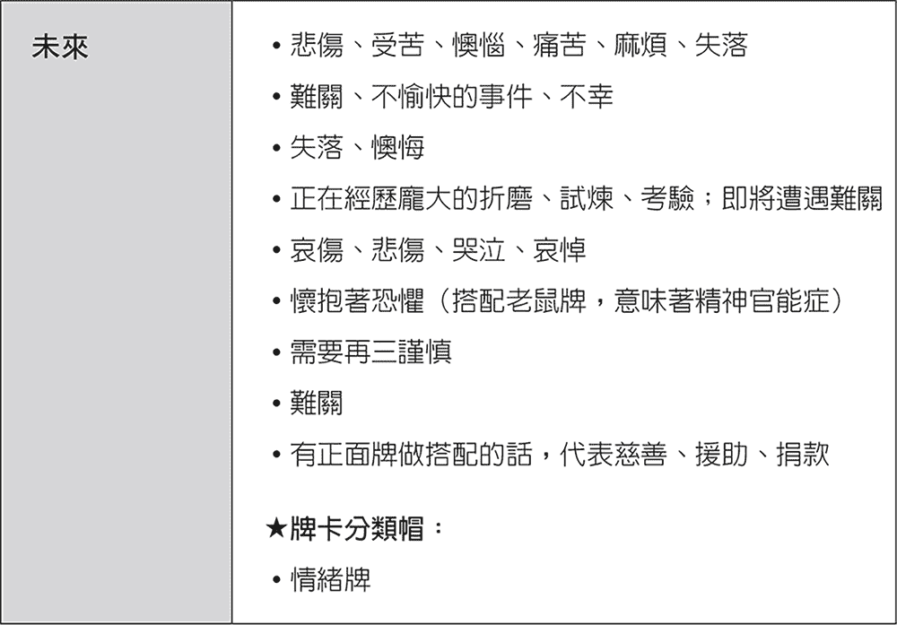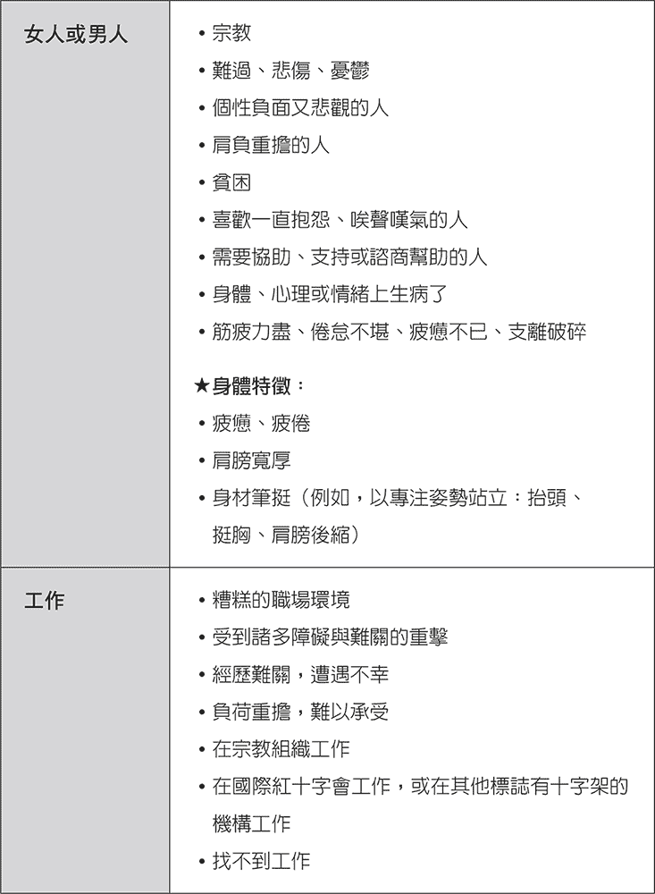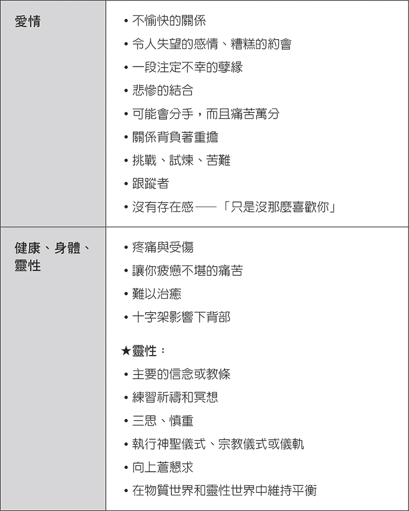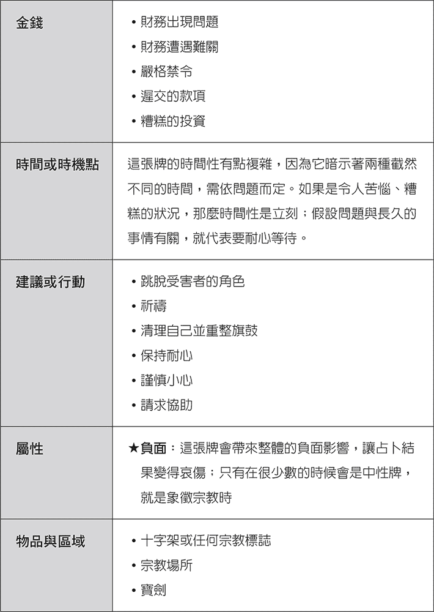

### 这张牌的个人故事：

之前帮萝拉和乔治占卜时，这可怕的十字架总是会出现在牌面上。这对情侣来自不同的生长背景、种族和宗教信仰。他们非常契合、深爱彼此，但是外在因素让他们感到悲伤、痛苦与折磨。

我记得在他们婚礼的前一晚，我抽到了三张牌：百合＋十字架＋爱心。看到十字架出现在中间，我心中的警铃立刻大响，这张牌将带来悲伤、心痛和不幸，但同时最后面又出现爱心牌，让我有了一点希望，至少结果不会是百分之百的不幸。我开始追根究柢，想要了解他们为什么会在最幸福的日子发生不幸，最后发现宗教信仰和种族因素是主要的问题所在。新郎的父亲是家中的男性权威，非常反对这桩婚姻，誓死阻止婚礼举行。新郎的其他家属也都站在冥顽不灵的父亲这边，并用“家庭背景和宗教信仰”作为反对的理由（百合＝父亲形象；十字架＝不愉快、不幸）。现在，对于牌面，我恍然大悟了。

随后，我重述问题：“乔治和萝拉的婚礼最后结果会如何？”

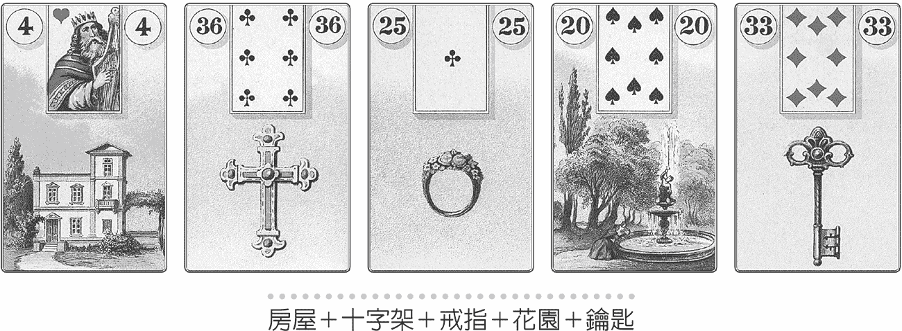

牌阵中间自己出现了戒指牌，意味了这段婚姻的保障。房屋和十字架意味着新郎家中制造混乱的宗教狂热者。这些牌卡的准确给了我勇气和信心，预示婚礼会办得成功圆满。我告诉乔治和萝拉，尽管有这些困难，婚礼最后还是会圆满举行（花园＋钥匙）。家属（房屋）这方会很失望（十字架），但幸福终究还是胜过悲伤（钥匙在最后一张）。

婚礼办得非常好。但是新郎不太开心，因为他的家人拒绝参加婚礼，也避开他的新娘，但是他还是在婚礼上跳舞，并与他的新家人享受大喜日子。十年之后的现在，这对夫妻依旧幸福快乐，有了三位美丽的千金，而他们也都跟新郎的家人相处融洽。

对乔治和萝拉而言，十字架体现了他们必须共同面对的试炼，包含难处理的宗教问题和令人苦恼的家庭冲突。

### 大蓝图牌义：

传统上，十字架这张牌如果离人物牌很远，周围又有负面牌，乃是不幸的凶兆；反之，如果非常靠近人物牌，就代表困难与挑战很快就会过去。

十字架意味着生活中的不幸、担忧、苦恼、困难、试炼。如果十字架的周围是情绪牌，例如爱心或月亮，就会加重情绪上的苦恼与委屈。另一方面，如果是生活其他领域出现十字架，就代表障碍、负担、限制、累赘、困难。如果负面牌出现，就会加重悲观、悲伤、忧郁的情绪，并带来厄运和阴郁。然而如果十字架的周围是正面牌——旁边真的出现正面牌的话——无论十字架离人物牌是远还是近，这些困境很快就会烟消云散。

十字架周围的牌会告诉我们哪些领域会受到影响。此外，十字架座落的宫位也会提供讯息。例如，十字架落在二十五号（戒指）宫位，婚姻或某种伴侣合作关系会出问题；如果十字架落在四号（房屋）宫位，那么家里、住所或直系亲属会笼罩着苦痛与悲伤。

### 配对组合与范例：

丹尼想知道新的个人事业近期会发生的问题。“丹尼的新事业会发生什么事？”

★十字架＋鱼＋老鼠＝他的事业会遇到阻碍和困难（十字架），导致压力（老鼠）或疏失（十字架）增加，造成事业受阻（老鼠）

现在，除了预测和建议之外，我们把问题修正成具体的建议：“丹尼要做什么才能处理事业所浮现的新问题呢？”

★十字架＋鱼＋老鼠＝丹尼必须谨慎小心（十字架），并且不要放弃，需坚持不懈、努力工作；如果鱼不是代表丹尼的事业的话，那么就代表丹尼需要在前期投注大量资金，并承担损失

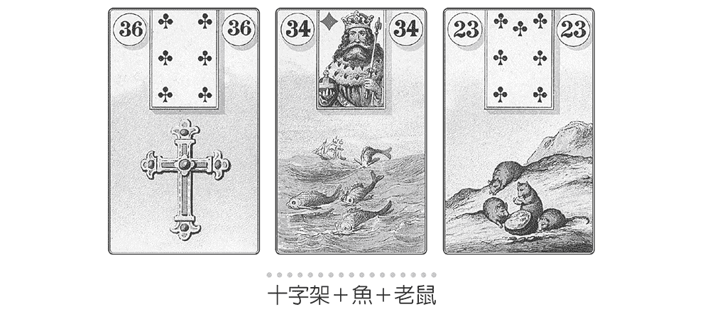

★十字架＋钥匙＝艰难或痛苦的解决办法

★钥匙＋十字架＝痛苦的失败；祈祷（钥匙＝解决办法；十字架＝你的信仰）

★十字架＋船锚＝强烈的灵性信仰；持续承受痛苦；执着于过往的悲伤、难过或愧疚；持续感到不满；长期感到不开心

★船锚＋十字架＝经历庞大又长期的剧痛；经历冗长的折磨；宗教狂热者

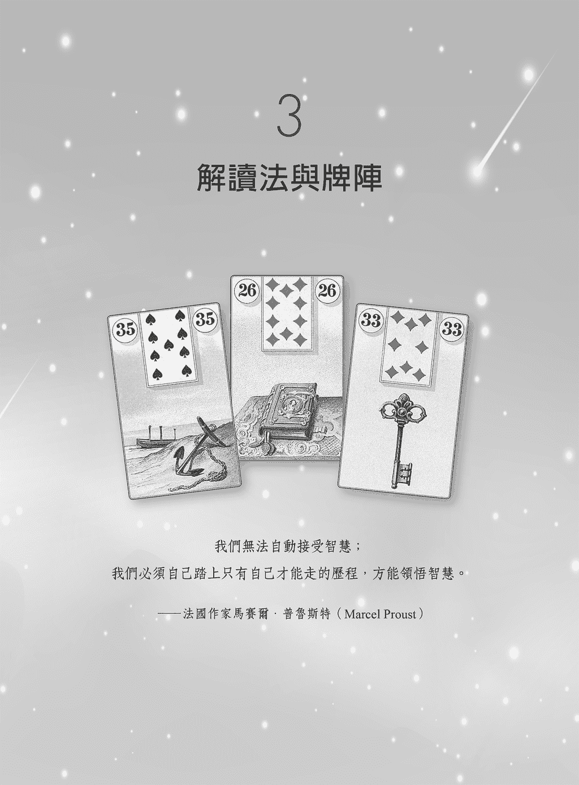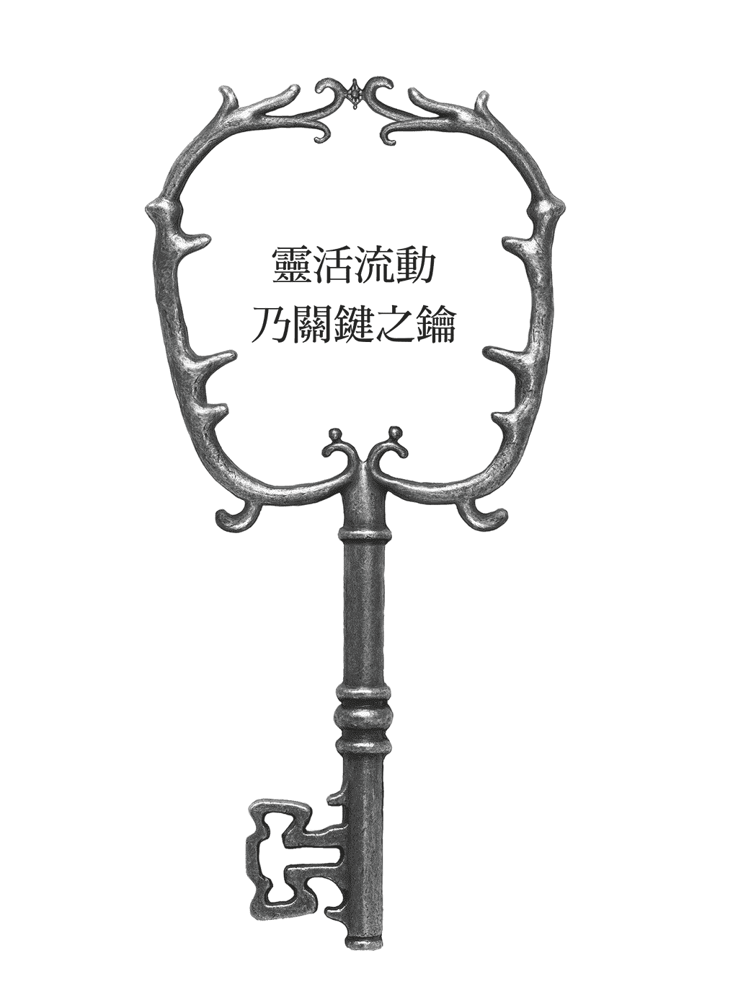

在这一章，我们会学习牌卡搭配并给予占卜预测。如同文字组成句子，我们也会了解这些符号互相流动的方法，给予个案关于过去和未来的清楚指引。

我们会逐步练习，学习将牌卡配对组合。每一个小牌阵的解读法练习和串连，都会成为后面学习不同牌阵的无价之宝，直到学习最终大魔王：大蓝图。

本章包含以下解读法：

★练习牌卡配对组合：我们会从这里开始第一个练习，将牌卡配对组合后，透过本书第二章的牌义内容，产出逻辑一致的解读。透过游戏、日记、每日练习，你会培养出扎实的理解力，了解雷诺曼灵活的符号系统。

★解答之线牌阵：真正的占卜由此开始。在这一节，我会解释如何利用小牌阵，只要看一眼个案的过去和未来，就能快速得到答案。这一节包含了实际的个案范例，让你知道最简单的牌阵也能用来占卜。

★九宫格牌阵：九宫格牌阵是方形、传统三乘三的九张牌矩阵，如同现况的快照。九宫格牌阵会教你透过脉络来解读，借由交叉解读法与指示牌或主题牌结合，学会判定特定情况。我们会完整学习九宫格的解读技巧，最后会提供实际的占卜范例。

★选择牌阵：我们会学习使用牌卡在不同选项中做决定的方法。这个牌阵会帮助你熟悉牌卡属性，并协助你给予个案实质建议。

★黄道十二宫牌阵：这个牌阵会帮助你预测未来一年的运势，预测每个月份会发生的不同事件。这个牌阵会协助你更加精通时间点的判读，并在占卜中专精局部宫位的时间概念。我们也会解读我为一位长期老客户做的占卜。

★金字塔牌阵：这个牌阵强调有意义的脉络，适合时间不多却需要快速了解个案不同状况的时刻。至于解读法，这个牌阵会培养你将个案生活中不同主题串连起来的能力。

★十字牌阵：这是有趣又简单的牌阵，可以用来检视状况。这个牌阵会聚焦在中间的主题牌，以它为主来解读中间三张牌。

★扭转未来：这不是牌阵，却是我使用雷诺曼多年来发展出的解读法。我非常喜欢这个方法，因为它展现出雷诺曼的灵活度和适应性，它也是你可以随意使用的极佳工具。宏观来说，这会让你的占卜从预测变成奇迹般的解读，能给予个案清晰的未来和行动建议，以便达到目标。

★大蓝图：这是最后的牌阵，也是很重要的牌阵。我们来到雷诺曼牌阵的大魔王：大蓝图。我们会逐步拆解这传奇的牌阵，让你可以轻松、快速了解。这个大型又会使用到所有牌的牌阵，需要发挥你前面从简单的牌阵和方法中所建构的技术，协助你成为占卜师和通灵者。我会介绍我的方法、私人诀窍和解读的方式给你。最后，我们会替真正的个案进行完整的占卜：使用大蓝图牌阵，搭配学过的所有解读法，加上范例和图解让你跟上进度。

## 练习牌卡配对组合

我们会在这里学会解读牌卡的配对，组合牌义，然后产出逻辑一致的句子。好好享受这个练习吧！

### 搞定牌卡和配对组合

教学时，我通常会透过快速解读牌卡来教配对组合和牌义。这是非常简单又有效的方法。首先，我们会阅览每一张牌，并将每张牌分配一个字词。接着，我们会从牌卡中挑选一张特定的牌，并且从剩下的牌堆中一张一张拿出来跟一开始挑好的牌配对组合，这样的快速脑力激荡就像猜字谜的游戏。在撰写和记录牌卡占卜之前，这个游戏会变得越来越复杂和深入。

### 雷诺曼的自由联想

这个小练习很好玩，能让你了解牌卡之间的互动关系，简单、有趣，还能让你迅速踏上雷诺曼的学习轨道。这个游戏的目的是要让你脑力激荡，看到牌卡时立刻说出脑海中的第一个字词。很像你画我猜的游戏，你需要立刻猜出对方画的是什么。

快速阅览完本书第二章后，拿起你的牌卡，不要洗牌，因为这个练习最好让牌卡按照一到三十六号的顺序进行。我建议你可以在同一天之内进行以下的步骤一和步骤二，如此一来，步骤一的信息就可以保留在脑海里以进行步骤二。

#### 步骤一：分配

从第一张牌开始，分配一个字词。让我们从骑士开始，骑士＝消息。现在，针对全部的牌，继续分配一个字词。幸运草＝幸运，船＝旅途，房屋＝家庭，树＝健康……等等。完成每一张牌的字词分配后，接着重复一样的动作，但是中途不可以停下来。这个过程大约会花上五分钟。

#### 步骤二：配对组合

由于你已经分配好每一张牌的字词了，现在我们要来搭配牌卡，就像把字词组合在一起一样。先从牌堆中抽一张牌放在旁边，接着再抽一张牌放在第一张牌的右边。一次一张，每次抽出来的牌都叠在右边的牌上。最后，眼前会有一张你第一次抽出来的牌，而它的右边则是一叠牌。请以快速但舒适的步调来进行这个练习。速度要快的原因是因为我要你不要想太多，就想像自己在玩你画我猜游戏。我建议练习时不拿笔作记录，这样才可以保持快速的步调。然而如果你想要记录也可以。举例来说，抽出骑士牌后放在一边，接着继续抽牌放在骑士的右边，让两张牌配对组合。

★骑士＋幸运草＝幸运的消息

★骑士＋船＝旅途的消息

★骑士＋房屋＝家人会收到消息

★骑士＋树＝健康的消息

这三十六张牌的搭配练习可以用两种方式进行：第一种，每一张牌都重复一样的练习，当你做完骑士的配对组合后，就从幸运草开始，接下来从船开始，以此类推。第二种，做骑士牌的搭配练习时，可以像这样左右互换：

★骑士＋幸运草＝幸运的消息

★幸运草＋骑士＝好消息

★骑士＋船＝旅途的消息

★船＋骑士＝关于旅途的消息

★骑士＋房屋＝家人会收到消息

★房屋＋骑士＝关于家人的消息

★骑士＋树＝健康的消息

★树＋骑士＝关于健康的消息

记住，这只是第一步而已。每一种配对组合还有许多细节，我们会在下一个练习中学到。此外，不是每一个组合互换后的牌义都相似。以太阳和棺材为例，太阳＝成功，棺材＝结束。

★太阳＋棺材＝失败；由福转祸

★棺材＋太阳＝历经结束后，终于获得成功；救赎

牌卡的位置到底哪一张在前而哪一张在后，在配对组合的解读里很重要。

你也可以找人一起进行这个练习，我敢保证你们一定会玩得很开心。练习到最后，你会懂得牌卡之间互动的方式。

配对组合的小诀窍：虽然这不是硬性规定，但你可以将第一张牌视为主题或事件，右边的牌用来描述、修饰主题。换句话说，试着把第一张牌当成名词，第二张牌则是形容词。例如，骑士＋树的搭配，树就是修饰骑士的形容词；而树＋骑士，骑士则修饰树。接下来，透过更多实际经验和不断练习，你将自然而然地把每一组搭配的牌义完整融会贯通。举例来说，看到骑士＋树，脑海中自然就会解读出健康、健身、振作等意思。

持续做每日练习，你的笔记本上就会记录许多完整的配对组合牌义。渐渐地，你的思路会将配对组合与占卜解读连接在一起，产出有意义的单一句子。记住：这个部分没有既定公式可以套用，熟能生巧才是关键要素，因为牌卡有时候会以最奇怪的方式组合在一起。如同学习阅读书籍，你练习得越频繁，你的雷诺曼词库就会越完整丰富。

### 本次作业：创造多种组合牌义

这边就真的需要你拿起笔做记录了。准备记事本或线圈笔记本，越大本越好。这个练习会需要前面练习的基础。这次我们不用针对每张牌想出一个字词，而是要写下对于牌的描述、行动、功能或脑海中想到的其他内容。接着我们就能针对每一张牌列出一系列的组合牌义了。请花心思按照自己的步调进行。

#### 步骤一：制作牌卡图表

一页一张牌，制作这些字段：行动、描述、功能等等。以骑士为例，你可以在“人物、地点、事物”字段中写下“送货人员”；在“行动”字段中写下“出发”；在“描述”字段中写下“运动型”；在“其他”字段中写下“马匹”。利用第二章的牌义介绍，并在练习时加入你自己的见解，你的雷诺曼词库就会逐渐完善。尽量写下越多内容越好，如此，你的牌义清单就会越来越完整。

范例：

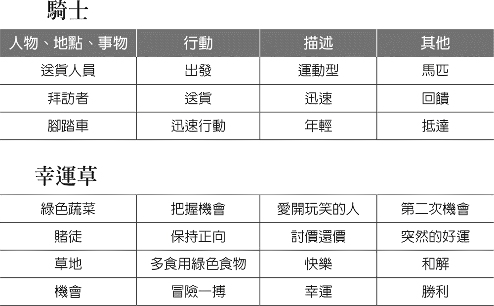

#### 步骤二：结合符号

我建议你准备新的记事本来进行步骤二，因为你会写下满满的纪录。每一组搭配要用到两页纸——相信我，两页很快就会填满了。每日练习时，你之后会庆幸你有足够的空间可以继续记录。你也能跳过步骤一，利用第二章里每一张牌的详细牌义，直接练习步骤二。

从骑士开始按照牌的顺序做记录，之后翻阅笔记时才会比较方便。第一个配对组合是骑士＋幸运草，借由步骤一的练习，加上本书第二章的内容，写下脑海中想到的所有内容。花时间持续练习，笔记中的内容会持续增加。

以下是骑士＋幸运草的一些组合牌义：

．送货人员很快乐（快乐的送货人员）

．草地上的脚踏车

．冒险一搏的拜访者

．爱赌博的拜访者

．爱开玩笑的年轻人

．给你第二次机会的回馈

．草地上的马

．递送蔬菜

．机会到来

．为了第二次机会，要迅速行动

．运动型且随遇而安

．传来胜利的局面

对于这些组合，我只会使用步骤一的内容，因此你在步骤一的纪录越多，你就能写下更多组合牌义——你真的可以认真练习这个步骤。帮每一张牌都列表记录，最后，你就会有专属于你的配对组合手册。占卜时如果脑筋一片空白，就可以拿出来使用。享受这个练习，也享受各种激荡而出的可能性。

### 每日抽三张牌

这个简单的练习可以帮助你跟牌同步连上线，并奠定基础，因为牌卡会以只有你才能理解的方式与你对话。每日练习并持续三个月，你的大脑会将牌卡内化，创建深厚链接，大幅增进你对牌义的理解。这是在日常生活中学习配对组合的最佳方式，同时也能让你清楚了解牌卡在现实生活和实际情形中呈现的方式。你可能会发现，有些特定的牌卡会在特定情形反复出现，这样就能创建你与牌之间的链接。

每日晨起，抱持明确的意图抽牌，让牌卡告诉你当天的故事。我第一次学习塔罗时，喜欢等到一天结束后才解读牌面，因为我可以很轻易地回想一整天发生的事，并思考这些符号在当天以哪种方式呈现。我有许多学生都采用同样的方式来学习雷诺曼。你也能先在脑海中记住这些牌，并观察它们当天在什么时候出现。

．让自己舒适自在，深呼吸，沉淀心神。

．从洗牌开始，深呼吸并设定抽牌的目的。

．展开牌卡之后，抽三张出来。

．按照抽牌的顺序，将牌排好。

．雷诺曼通常是从左至右解读，或是把它们当成电影毛片，让整体的故事浮现。

．中间的牌是你随机选中的主题牌，是你的当日主题，最后一张则是故事发展或是句子的最后一个字。最后一张可以当成最后结果，或如同第一张牌，是描述中间主题牌的修饰牌。有时候第一张也可以视为主题牌，而后面两张牌是它的修饰牌或事件状况。

．看看牌面是否有特别代表特定议题的主题牌：
树：健康
房屋：家庭或房地产
山：庞大障碍或延宕
爱心：爱情、关系

．在笔记本中记录你抽到的牌，包含日期、时间、解读、联想的过程，以及任何浮现的想法。

我们来看看我其中一天的每日占卜。

我那周以来，身心都有着卡住的感受，而当我早上抽到这三张牌后，瞬间如释重负，因为船和鹳鸟带来了流动的能量与释放，无论有多微小（小孩）。

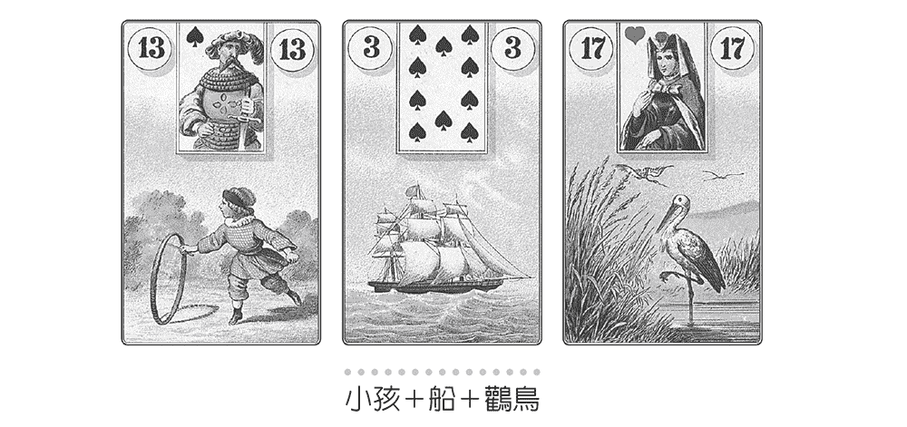

这三张组合的另一种解读可以视作短程郊游，或是巨大变化的开端，因为船和鹳鸟都象征移动与改变。因为是每日占卜，我不能太兴奋，毕竟我短期内并没有计划要去哪里：小孩（小型或是开始）＋船（行动）＋鹳鸟（改善），这三张牌暗示着小小的行动会改善状况。当天我的确能够稍微做点工作，虽然我只完成了一小部分（小孩），但仍是让我那一周开始（鹳鸟）做事的起头。

注意：练习每日占卜时，要记住牌卡的内容有时候非常日常而直白；此外，负面牌的凶厄程度和正面牌的激情程度也可能会大幅降低。举例来说，大蓝图中如果出现蛇＋花园，可能是提醒你要注意人际圈中有人欺骗你；反之，每日占卜时抽到这两张，可能就只是被后院的蚊子咬，或是代表花园水管这样的日常小事。老鼠＋棺材可能只是遥控器放错位置，太阳＋鞭子则是描述早上脾气差，云朵＋星星则可能预报晚上会下雨。

在笔记本中记录所有内容，你会发现最后会有一个模式，那就是牌卡会以只有你懂的方式与你对话。它们的确会跟你对话，大声且清晰，只是有时候我们尚未准备好接受。毕竟，这是正常的人性。回头翻阅你的笔记会是很棒的过程，因为你可能会发现当初还没准备好看见的占卜结果。翻阅我自己的笔记时，我发现到许多事情，它们就在我的眼前，但我却没有解读出来——我根本没有看出来。我也理解到如果我当初有解读出来的话，我可能会震惊崩溃，因为我根本无法接受结果。你会对于牌卡揭示的真相感到震惊。

## 解答之线牌阵

解答之线牌阵能够让你迅速得到问题或困境的答案。这个牌阵非常适合用来预测未来。这个线性牌阵通常从左至右解读，中间的牌是主题牌，最后一张牌则是结果。主题牌左边的每张牌都可以视为过去或是导致现况的当前情况，右边的每张牌则是未来发展。

解答之线可以视为事件的一张快照。我喜欢解答之线的地方在于它的预测基本上会很快发生，大概是几天或几周之内。比起大蓝图，它通常用来预测短期的问题。这个牌阵的使用时机为：

．你不需要用到大蓝图时

．你需要快速知道问题的答案时

．你只是想要快速地占卜时

使用这个牌阵时，我有两种方法。第一种，根据问题的脉络，我会启动一张牌作为指示牌／主题牌，接着抽几张位于它左边和右边的牌。如果我脑海中有具体的人物或主题，而且需要直接了解讯息时，我喜欢用这个方法。第二种，我会让牌卡自己决定主题牌。我会随性洗牌、抽牌。这是我较常使用的方法，因为我喜欢让雷诺曼自己告诉我重要的讯息。

### 选项一：先选择一张主题牌

．深呼吸，沉淀心神。

．决定哪一张牌是这次问题的主题牌。

．开始洗牌，将心念专注在你的问题上，选出来的那张牌就是代表问题的主题牌。

．决定你的牌阵要抽五张牌还是七张牌。在这个步骤，(1)你可以在牌堆里找到主题牌，接着抽出它左边的两到三张牌，以及右边的两到三张牌，总共会得到五张或七张牌；(2)又或者你可以牌面向下展牌，一张一张的抽出来翻开，将牌叠在旁边，直到你抽到主题牌，接着留下主题牌前面的两到三张牌，再抽新的两到三张牌，总共得到五张或七张牌。我喜欢在主题牌的两边放同样张数的牌卡，这样总共就会得到奇数的牌数。

．检视主题牌右边的两到三张牌，确定牌面符合目前状况，并且符合所问的问题。万一牌面不符合状况，就单纯重新洗牌再占卜一次。

．解读主题牌前面的两到三张牌，这些牌应该要对应到你的问题，因为它们是已经发生的事情或与状况相关的事件。接着解读右边的牌，了解事件的发展或演变。

如果左边的牌面对你或个案来说不符合状况，不用担心，就再重新占卜一次。基本上，个案在占卜过程中会告诉你符合左边牌面的相关事情。牌卡几乎都会链接到问题，即便个案自己觉得没有关联。但不管如何，个案真的发现关联后都会很欣喜。的确有少数时候牌卡不符合状况，当这种情况发生，我发现原因是自己要不没有专注，要不就是脑海中不只有一个问题浮现。

假如我事先设定好作为指示牌或主题牌的牌在第一张就出现了，我依旧会再抽三张牌，并解读牌面。如果我不满意占卜结果的深度，那么我会重新洗牌后再占卜一次。相反的，如果设定好的指示牌／主题牌在最后才被抽到，也没有牌在它的后面可以预测结果或给予更多指引，我会记住它前面的两到三张牌，并且重新洗牌，全神专注在我的问题上。

我会从头开始：重新洗牌、全心专注，并在牌卡里找到设定好的指示牌／主题牌，接着把它的左边和右边的两到三张牌从牌堆里拿出来。听从你的直觉，做你直觉认为该做的。如果心有疑惑，重新调整自己的状态，专注并从头开始，如此你才可以进入状态。这个世界没有牌卡占卜的纠察队，也没有那么多“必须”或“应该”需要遵守！让你的占卜轻松、简单。

### 选项二：让雷诺曼自己选择主题牌

．深呼吸，沉淀心神。

．开始洗牌，心念专注于你的状况，并组织成一句问题。

．决定你的牌阵要抽五张牌还是七张牌。

．抽出一张牌，并将牌面向下摆放。再次洗牌，抽另外一张牌，牌面向下摆在第一张牌的右边。重复洗牌、抽牌的过程，直到你眼前有了五或七张牌，按照抽牌顺序排成一直线。将剩下的牌放在旁边。

．先翻开中间那张牌。这张牌就是主题牌，会需要你特别注意，因为它通常代表主要问题、相关的需要或是对问题而言的重要之事。

．接着翻开剩下的牌面。

．先解读主题牌和两侧各一张牌，将这三张牌视为问题焦点。

．再解读左边两到三张牌，以便了解导致主题牌出现的事件，或是将左边的牌面跟主题牌一起解读。最后，解读主题牌右边的两到三张牌，预测未来发展或演变，或是解读主题牌两侧的牌面来形容主题牌，或是得到与主题相关的更多讯息。

我喜欢依照自己的直觉和心情，交替使用上述这两种方式。如果我想要知道特定状况的结果，我通常会用选项一的方法；而假设我只是想要感受或大致了解情况，我通常会采用选项二，让牌卡呈现出我需要知道的事情，或是我需要注意的重要之事。

这两种方法都是以线性的方式解读，如同阅读文章中的一个段落。此外，因为要有主题牌在中间，所以牌阵的张数必须是奇数。

### 解答之线牌阵的实占案例

#### 范例一：采用选项一

詹姆士带着忧虑来找我，他担心他的职位。他的公司正在重组，而他不知道自己是否能保住饭碗。詹姆士在大企业担任主管，并管理一个团队。

我将心念专注于他的职位以及狐狸牌，问了一个具体的问题：“詹姆士在公司的工作，未来的发展是什么？”

我洗牌后，在牌堆里找出狐狸牌。接着我将狐狸牌前面两张牌抽出来，检查是否跟詹姆士的状况相关：塔＋百合。

这两张牌肯定与他的现况有关。塔象征他任职的大企业，百合则代表他的工作年资很久，也象征他的资深经验。确定牌面与问题相关后，我继续抽出狐狸后面的两张牌，占卜职位的未来发展：山＋船锚。

这些牌的组合表示詹姆士还会继续留在这间公司。牌面具体回答了所问的问题。他会停留（山）并且定锚（船锚），所以山＋船锚＝哪里都不会去。

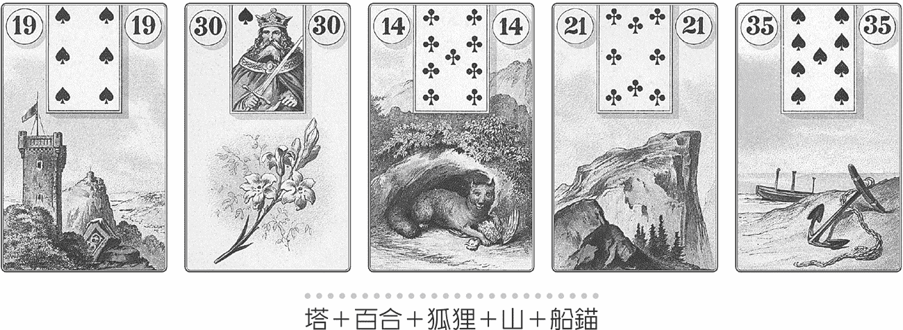

我将占卜结果解读给詹姆士听之后，他还是担心他在公司重组后的职位。所以，我这次将心念专注于詹姆士，并选择男人牌作为主题牌。我问了具体的问题：“公司重组后，对詹姆士的影响会是什么？”

一样洗牌、抽牌，直到我抽出男人牌后，我停下动作，并解读前面三张牌，确定牌面与詹姆士和这个问题有关：花园＋老鼠＋房屋。

这三张牌代表詹姆士担心（老鼠）他的团队（花园），他的团队或是职责会减少（花园＋老鼠），他的职位稳定度（房屋）和整个公司的重组（老鼠＋房屋）。

接着我抽了后面三张牌：熊＋爱心＋十字路口。

这三张牌有点棘手，因为最后一张是十字路口，有时候这张牌的出现代表有人要离去。然而，十字路口的前面有爱心和熊，也没有其他暗示离开的讯息，所以针对十字路口，我选择了“许多”这个牌义。我的解读是詹姆士会被赋予更重大的职位，并承担更多责任（熊），他会非常喜欢、满意（爱心），接着也会出现更多职责要承担，像是团队成员增加，或是工作范围增加，又或者是要负责其他分部（十字路口）。

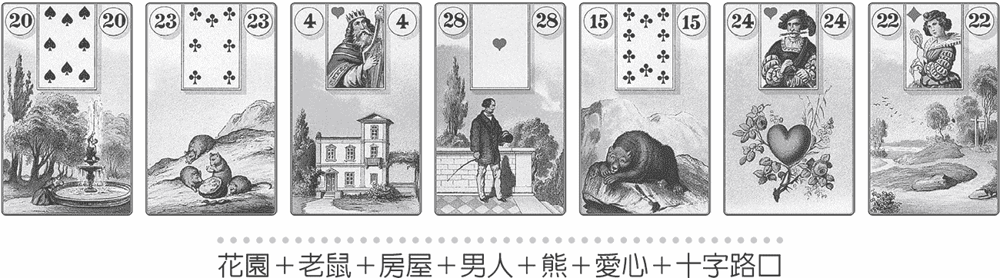

詹姆士当晚心满意足地回家，我也很欣慰能看到他放下一些担忧。三周后，我收到一盒装着满满巧克力的篮子，上面的一张便条纸写着：“你可能会想知道占卜结果都应验了。我会再联系你。感谢你。”

这就是你培养熟客的方法！

#### 范例二：采用选项二

玛格丽特找我的时候正焦心于她的书籍案子。她不知道下一步该做什么，觉得自己卡住了。“玛格丽特需要专注于什么，才能完成她的案子呢？”

洗牌后，我抽了五张牌，每抽一张就洗牌一次。接着我按照顺序排好牌。

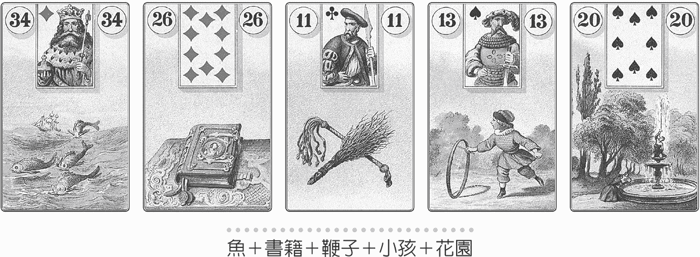

书籍这张牌对应到问题脉络，并让我确定牌面跟所问的问题有关联。

这个牌阵中，鞭子是牌卡自己选出来的主题牌，因为它落在中间，这张牌明示了玛格丽特需要的讯息。鞭子＝争执、口角、困难、重复。鞭子落在书籍和小孩之间，就改变了解读的脉络，答案就变成：重新检查（鞭子）案子（书籍），删减内容（小孩）。

整个牌阵解读完后，我告诉她，鱼＋书籍代表书中有太庞大广泛（鱼）的信息，让整本书的内容变得太厚（她证实了这件事）。鞭子＋小孩＋花园代表要校稿和编辑（鞭子），让书中内容适合初学者（小孩）的读者群（花园）阅读。

玛格丽特表达同意，并且对解读内容感到开心。她说，这个建议她一直都知道，只是之前完全忘了，而这次占卜让她重新找回方向。

牌卡的美妙之处在于，它们会直接告诉你实时需要知道的讯息。

## 九宫格牌阵

这个牌阵能够给予更整体的占卜解读，呈现围绕着个案问题的整体氛围和情况。你可以从这个牌阵中得到更多讯息。在我自己的实际经验中，我主要把九宫格牌阵当作教学工具来练习，以便解读大蓝图牌阵；或者，我有时候会用来深入了解某个人或某个状况。

如果我要得到快速、具体的答案，九宫格不是我会用的牌阵。每当我想要迅速得到解答，我的首选牌阵一定是解答之线牌阵，原因如我前面所说，它解读起来就像是清楚的一句话；若是我想要了解更多讯息，我就会使用大蓝图牌阵。然而，九宫格牌阵就像是某种小蓝图，让你在占卜时了解更多情况。

九宫格牌阵以许多方式组合九张牌。解读这个三乘三的九宫格牌阵有许多方法，每一种都有效。选择你最有感觉的方法，并使用它。你可以依照自己的心，让牌阵解读起来很简单或搞得很复杂。有时候我会从整体的角度来汲取我需要的讯息，不会使用太多技巧或额外的解读法。

如果你没心力解读大蓝图，我会推荐你使用九宫格牌阵来检视整体情况。如果你解读九宫格牌阵时很得心应手，那么大蓝图牌阵对你而言就会很简单了。

．沉淀心神，深呼吸，安定自身能量。

．专注于特定状况、当月整体运势或是了解个案遇到的困境。

．彻底洗牌。

．以你选择的方式抽出九张牌。我喜欢边洗牌边抽牌，抽最上面的牌、中间、最下面的牌等等。

．随机排成三乘三的九宫格牌阵。我喜欢按照我抽牌的顺序来摆放，如以下图示：

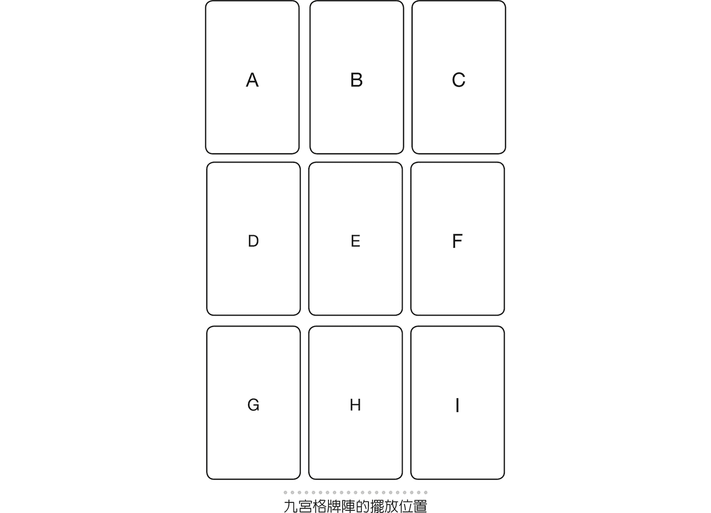

### 九宫格牌阵的解读步骤

以下是我解读九宫格牌阵的方法。每一种方法稍有不同，但都能够从不同角度了解个案的问题，以及围绕着问题的状况，而你最后也会在大蓝图牌阵用到这些解读步骤。有时候我会采用全部的方法，有时候我只会看十字架的位置和交叉位置，快速得到答案。你可以从这些方法中选择几个来用，或是全部采用。我喜欢简单又快速地“扫描”牌面，因为讯息通常都会立刻浮现。

#### 1.过去、现在、未来（时间）

从左至右横向解读牌面，能让你了解关于这个问题，什么事情刚结束，而什么事情即将出现。

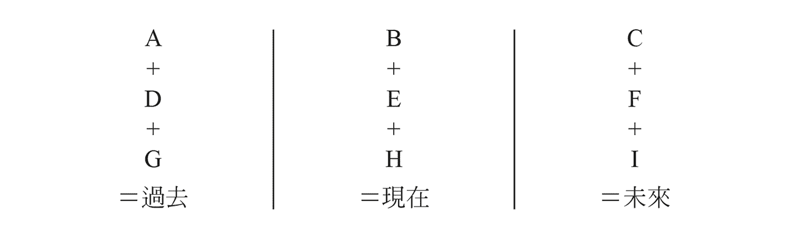

位置 E 可以是指示牌，或是根据问题的主要议题而先选好的主题牌，或是需要注意的讯息。

#### 2.担忧、状况、暗流（觉察）

从上到下横向解读牌面，你会发现徘徊于问题的思虑和担忧，以及核心的推测和事实。

．位置 A＋B＋C＝担忧，代表个案担心的事情，或是心中挥之不去的想法

．位置 D＋E＋F＝状况，目前正在面对的事情或现况

．位置 G＋H＋I＝暗流，公认、已知的事情，或是在掌握之中的事情

#### 3.交叉法（间接影响）

以对角线来解读牌面，能让你看出围绕着问题的间接因素，以及可能有的被动影响。

．位置 A＋E＋I 和 C＋E＋G 会是主旨、结论、整体环境，或是这次占卜的整体状态

#### 4.十字法（直接影响）

解读在牌阵中央组成十字的纵列与横排，会呈现影响状况的直接因素。这些牌是直接影响个案或问题的积极影响。

．位置 B＋E＋H 和 D＋E＋F 是主要问题

#### 5.钻石法（总和）

将中间指示牌或主题牌的上下左右牌面串连起来，形成菱形的钻石状，就能够得出占卜解读的总体答案。这个方法可能有点多余，因为目前已经有足够的讯息了，但有时候此法可以提供更多洞见或是需要确认的信息。我把钻石法想像成将解读串连在一起的蝴蝶结。

．位置 B＋D＋H＋F＋B

### 九宫格牌阵的实占案例

丽莎找我寻求指引，想了解她需要做些什么以及未来运势。她刚遇到重大难关，收到一些坏消息，也失去了原本承诺好的职位。此外，她也在犹豫到底该选择国外的工作机会，让她能够有足够的资金和心力来追求学位，还是要待在快乐舒适可是薪资不够好的环境里。丽莎很担心国外的地点，因为她得搬去白雪霭霭的寒带地区，离开她喜爱的亚热带地区。

我将心念专注于丽莎，并让牌卡自己决定中间的主题牌。一样洗好牌后，牌面向下展开牌。我抽出九张牌，接着排出三乘三的牌阵。

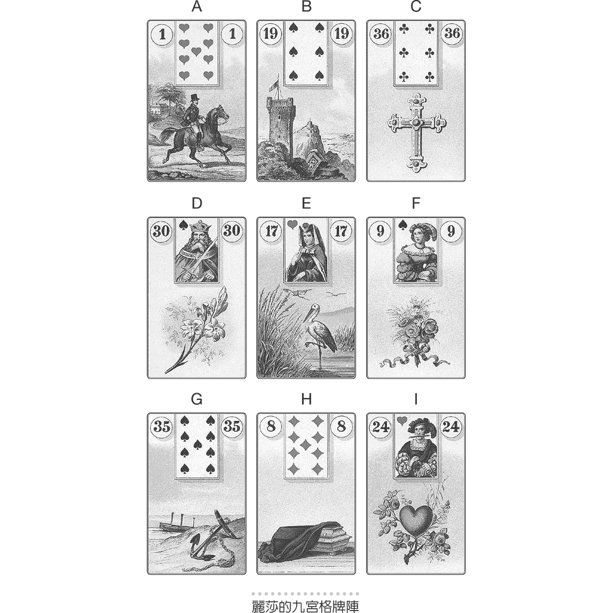

#### 1.过去、现在、未来（时间）

．A＋D＋G＝过去

骑士＋百合＋船锚表示她一直在海边（船锚）放松，度过美好时光（百合）。这三张牌也表示她等待下一个目的地（船锚）和长期工作（百合＋船锚）的消息（骑士）很久了（百合）。

．B＋E＋H＝现在

塔＋鹳鸟＋棺材表示她目前的两难：拿到学位，还是要工作进展（塔＋鹳鸟）。这会带来痛苦的变化，也需要重大的评估（鹳鸟＋棺材）。

．C＋F＋I＝未来

十字架＋花束＋爱心意味着痛苦和折磨即将到来，会出现难关和问题，但是很快就会过去（十字架＋花束）。事情很快就会开展，而让她放心的愉快结果和协助即将到来（花束＋爱心）。

鹳鸟出现在中央的主题牌，由于她面临着两难，这张牌出现得非常恰当，因为她的两难跟移动和她一直思考是否改变生活状况有关。这张牌告诉我，转变很快就会出现，而它也具体呈现占卜结果，因为它与现状直接相关。

#### 2.担忧、状况、暗流（觉察）

．A＋B＋C＝个案担心的事情，或是心中挥之不去的想法

骑士＋塔＋十字架代表她收到的坏消息，原本承诺好的职位没了，重创她的心情，一直愁眉不展。

．D＋E＋F＝状况，目前正在面对的事情或现况

百合＋鹳鸟＋花束表示拖延很久的改变或移动，会带来心满意足的结果。有趣的是，鹳鸟左边的百合刚好象征寒冷与白雪，而这样的移动会因为花束在最后，终有好消息。另一件有趣的事情是该区域的国旗上刚好就有百合。

．G＋H＋I＝暗流，公认、已知的事情，或是在掌握之中的事情

船锚＋棺材＋爱心表示丽莎知道目前的生活模式需要断舍离（船锚＋棺材），她的确也需要重大的转变来恢复身心状态（棺材＋爱心）。这里值得注意的是，船锚也与海边和海滩时光有关，而棺材在后代表身心需要休养。丽莎已经了解到她的生活模式对身心造成的伤害，从船锚＋棺材的组合可以看得出来，她需要做出改变，回到原本快乐、自在的自己（爱心）。

#### 3.交叉法（间接影响）

．A＋E＋I 和 C＋E＋G 是主旨、结论、整体环境，或是这次占卜的整体状态

骑士＋鹳鸟＋爱心代表她出国是好事，会大有收获。

十字架＋鹳鸟＋船锚意味着人生重整和转变会出现一些挑战和痛苦，但最终会安定下来。痛苦的转变对她的长期目标和职涯而言是好事。

#### 4.十字法（直接影响）

．B＋E＋H 和 D＋E＋F 是主要问题

塔＋鹳鸟＋棺材表示失去职位后想要有所行动：升迁（塔＋鹳鸟）无望（棺材）。

百合＋鹳鸟＋花束表示转变或移动会改善现况，也会带来圆满的结果（花束）。

#### 5.钻石法（总和）

．B＋D＋H＋F＋B

塔＋百合＋棺材＋花束＋塔预示着结束与新生的循环，其中有一位年长者或男性高层主管（塔＋百合），阻止了原本承诺丽莎的职位（棺材），而这反倒促使新的机会发生，让丽莎能够同时追寻更高的学历和工作（塔）。

你会发现九宫格牌阵不断重申一样的讯息，以确保你不会漏掉任何讯息。练习九宫格牌阵后，你会锻炼出看个牌面就一目了然的个人方法。倘若时间与场地允许的话，你可能就会想要使用大蓝图牌阵。

如果内心有所怀疑，就简化解读法！

## 选择牌阵

如果你在两种选项、状况或抉择中犹豫，选择牌阵会非常适合你。我超爱这个牌阵，也很常使用。选择牌阵很简单又快速，你的答案会迅速呈现。

．放松并沉淀自己。

．清楚地专注于你的问题，洗牌。

．将牌面朝下展牌。

．现在，专心想着选项一，并抽三张牌，还不要翻开。

．接着，专心想着选项二，再抽三张牌，一样不要翻开。

．将选项一和选项二的牌面翻开。

．解读前，先看一下牌面中的负面牌和正面牌。

．计算两个选项中各有几张负面牌和正面牌，并比较两个选项。

．选择看起来最好、最正面的选项。

运用牌卡的属性来选择最好的答案。如果选项一有一张负面牌，而选项二有三张中性牌，就选择选项二；假设两个选项各有一张负面牌，那就看看两个选项中各有几张中性牌和正面牌，再做选择。如果没有任何负面牌或正面牌，就看看哪个配对组合的牌义看起来或感觉起来最好。当你决定好要选择哪一个选项后，就解读该选项的三张牌。

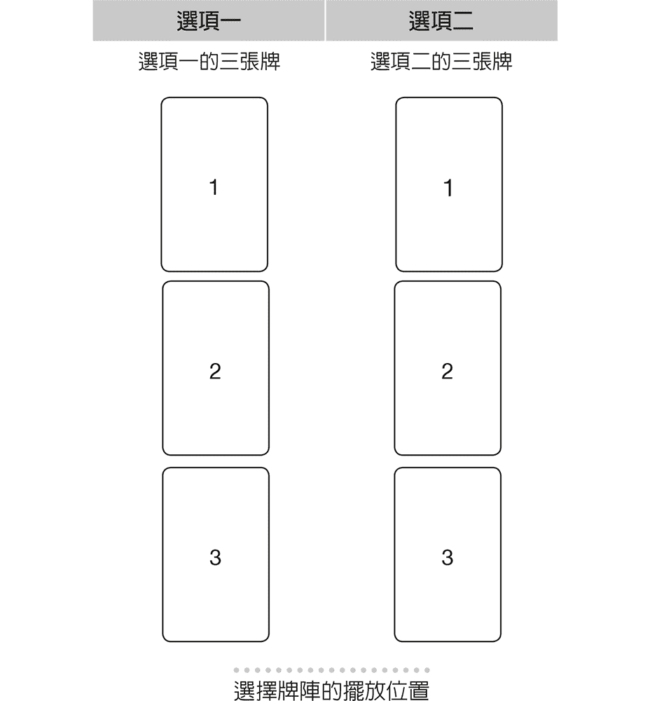

### 选择牌阵的实占案例

#### 选择适合的房子

亚伦找我占卜时，正犹豫要选择有大庭院的房子（选项一），还是靠近工作地点的房子（选项二）。我先专心想着选项一，抽了三张牌，接着想着选项二，抽了三张牌。

．选项一有两张正面牌（花束、戒指）和一张负面牌（镰刀）

．选项二有两张负面牌（山、老鼠）和一张中性牌（信件）

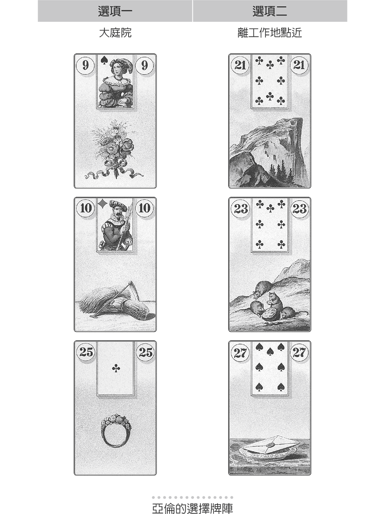

两张正面牌胜过两张负面牌，所以毫无疑问一定是选择选项一。你可以就此打住，而若是想要再验证答案，可以继续解读。

解读选项一：尽管亚伦需要花时间整理庭院（花束＋镰刀＝修剪草坪、整理庭院），他仍会感到开心、满意、满足（戒指）。

解读选项二：离工作地点近的房子看起来有很大的隐忧（山＋老鼠＝严重虫害或是严重的漏洞），会耗费他不少钱来处理（老鼠＋信件＝出乎意料的帐单、破财）。

#### 选择适合的男人

妮可带着一点羞怯来找我，我协助她放松一点后，才了解她的两难是什么。妮可很喜欢两位男士，难以在两人之间作出抉择。这两人的名字是布鲁斯和派翠克。抽出来的牌阵如下图所示。

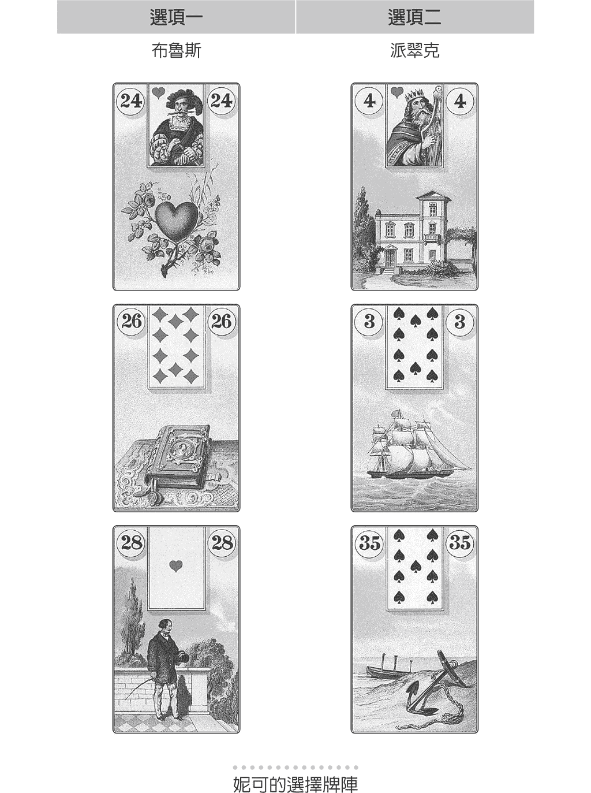

．选项一有一张正面牌（爱心）和两张中性牌（书籍、男人）

．选项二有一张正面牌（船锚）和两张中性牌（房屋、船）

两个选项看起来都很好。发生这种情况时，我们需要更详细地解读，并比较两张正面牌。爱心和船锚意味着热情和安全感的抉择，这就是两难之处。我会建议选择选项二，因为那三张牌似乎看起来更稳定（船锚）。不过，我们还是分别来解读三张牌并确定答案。

．选项一：布鲁斯很热情，但他在隐瞒些什么秘密，而且他似乎没那么投入、鬼鬼祟祟的。

．选项二：派翠克给人稳定感和安心感（房屋），他可能常旅游或时常不在身边（船），但是他有心要长期经营关系。他对妮可是认真的，并且似乎想要定下来。

#### 选择适合的行动

娜迪妮有个团聚的聚会，她犹豫着是否该出席。

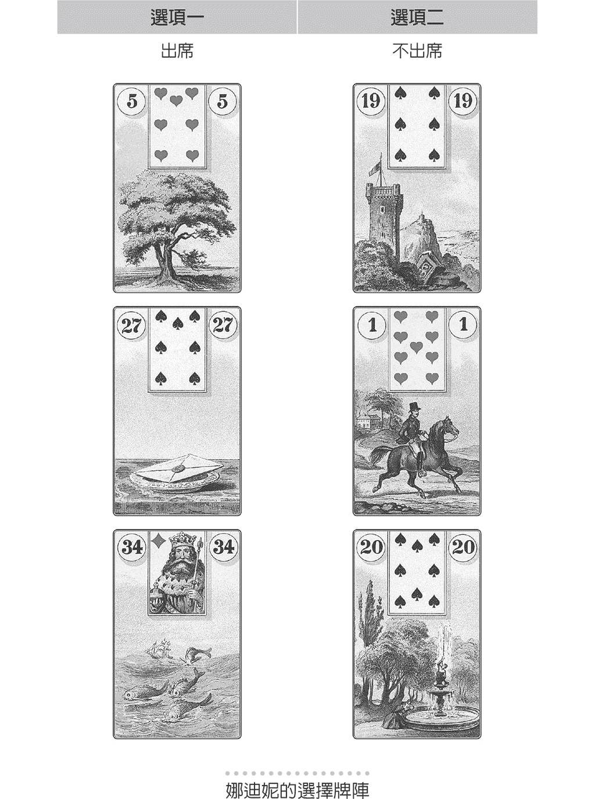

．选项一有两张中性牌（树、信件）和一张正面／中性牌（鱼）

．选项二有两张中性牌（塔、骑士）和一张中性／正面牌（花园）

这两个选项的属性很相似，鱼和花园刚好都代表丰收与多数。我首先会感觉这些牌面，并看看哪些牌面组合看起来最好。我的第一直觉是选项一，我比较喜欢这个选项，觉得它的能量流较顺畅。然而，为了更确定答案，我继续解读牌面。

．选项一：如果出席聚会，娜迪妮能再创建某些深刻的链接（树），也许未来会有更多对她有益的邀约，或是增加人脉（信件＋鱼＝与团体有往来）。

．选项二：如果不出席，娜迪妮只会把自己关住（塔），而在听到聚会的消息（骑士＋花园＝来自聚会的消息）后会觉得自己被边缘化了。

选择牌阵只能提供建议和指引，没有绝对的答案。我都会将选择权交还给个案，请他们自己做最后的决定，并强调占卜只是一种工具而已。

好好享受这个牌阵。记录你的实占经验，并且练习、练习、练习——记得享受练习的过程！

## 黄道十二宫牌阵

这个牌阵奠基于占星学中太阳运行地球一年的轨道，并将天空分成十二个宫位。这是非常简单且容易学会的牌阵。你不需要事先具备占星知识，只需要熟稔雷诺曼的配对组合。你只需要将牌卡按照顺序放到十二个宫位，就能预测出个案生活中各领域的运势了。这个牌阵不如大蓝图详细，但仍是让你学会在占卜时练习宫位分类的好方式。这个牌阵很适合生日或流年占卜，因为它会显示出个案生活中每个领域的运势状况。

黄道十二宫牌阵是根据黄道的十二个宫位，每一个宫位都对应一个星座，也对应到特定星座的属性、特性和特质。每个宫位都代表一个人生活的特定主题，例如个性、家庭、知识、个人资源、创造力、责任、健康。

要记得，解读雷诺曼时一定要解读牌卡组合，而且雷诺曼已经有代表健康、家庭、工作等等主题的牌了。将抽出来的雷诺曼摆在每个象征特殊意义的宫位时，会用到两到三张牌。

我在解读每个宫位时，只会汲取该宫位的核心意义与能量，不会过度深入解读宫位的占星意义。当然，如果你是占星师，将占星学的内涵囊括到你的解读里会大有所获。你也可以在这个牌阵使用其他占卜工具，增加解读的深度。如果我想要更深入进行占卜，我会在每一个宫位的雷诺曼旁边加上一到两张塔罗牌。

### 快速了解黄道十二宫位

占星学是个广博的学问，因此这边只能跟读者简略介绍。占星师会有他们自己对于这个牌阵的理解，但初学者也可以从此牌阵受益良多。以下是占星宫位的概略介绍，包括：属性、特质、领域、生活面向。

★一宫、牡羊座：自我；身体；身体健康；对外展现的部分；你给人的印象；你的人格面具。此处的牌面会显示你需要注意的事情，以及你对外展现的方式。

★二宫、金牛座：资产和财务；财产；个人资源；你的环境；理财方法；你的价值观。此处的牌面会显示你的财务运势，以及需要注意的危险。

★三宫、双子座：沟通；知识；手足；亲戚；挚友；短程旅途；汽车；你对这世界的付出；创造力。此处的牌面会显示这个宫位的面向中要注意什么。

★四宫、巨蟹座：母亲；房子；家庭；你来自何处；你的根源；你的根基；你的私生活；归属感；你所滋养、照顾的是什么。此处的牌面可能会显示家庭或私生活中发生的事件，或是房地产。

★五宫、狮子座：创造力；愉悦；冒险；爱；浪漫；子女；成功；关注；你享受的事情；让你感觉良好的事情。此处的牌面显示这个宫位要注意的特性，此外也要注意是否有负面牌带来的警讯。

★六宫、处女座：职业；个人责任；技能；服务；整体健康；关注的细节；你从事的工作；宠物。多数时候，此处的牌面显示的是你的职业、健康或是你对他人的服务。如果有负面牌，则是暗示你要注意健康议题或疾病，通常都与你所从事的工作有关。

★七宫、天秤座：主要关系；婚姻与伴侣；事业合作；你愿意分享、谈判、妥协的事情。此处的牌面谈论的是你的主要关系，以及你与人相处的模式。

★八宫、天蝎座：共同资源；金钱；死亡；性；税务；重生；转变；通灵能力；玄学；你必须接受且无法改变的事情。检查牌面是否有任何线索透露出此宫位的主要议题。

★九宫、射手座：高等教育；宗教；哲学；灵性；志向；长途旅行；法律事务；整合生活经验的方式。此处的牌面通常谈的是对学业的追求或长途旅行。

★十宫、摩羯座：父亲；事业；名声；社会；社会地位；权威；职场生活；官方机构；定义你的事物。此处的牌面会显示出你在社会和公众之中的身分，以及目标志向的未来发展。此外也代表威权式的家长或养育方式。

★十一宫、水瓶座：朋友；社交圈；机构；人脉；希望；愿景；显化能力和占星学；让你感觉完整、完满的事情；未来方向和企图。通常此处的牌面会显示未来的小团体或社交圈。

★十二宫、双鱼座：直觉；恐惧；未知；秘密；大型机构；医院；业力；潜意识；隐藏的事物。此处的牌面会显示出潜意识、浮现出需要解决的过往课题。此外也象征神秘经验与灵性相关的事物。

#### 备注：

．有许多宫位象征不同面向的关系：五宫和七宫代表恋爱与婚姻；十一宫象征友情；三、四、十宫代表家庭、手足、父母。

．有三个宫位与健康有关：一、六、八宫。

．有三个宫位象征不同面向的工作和财务：二、七、十一宫。

．有三个宫位与神秘学、通灵能力、本能、直觉有关：四、八、十二宫。

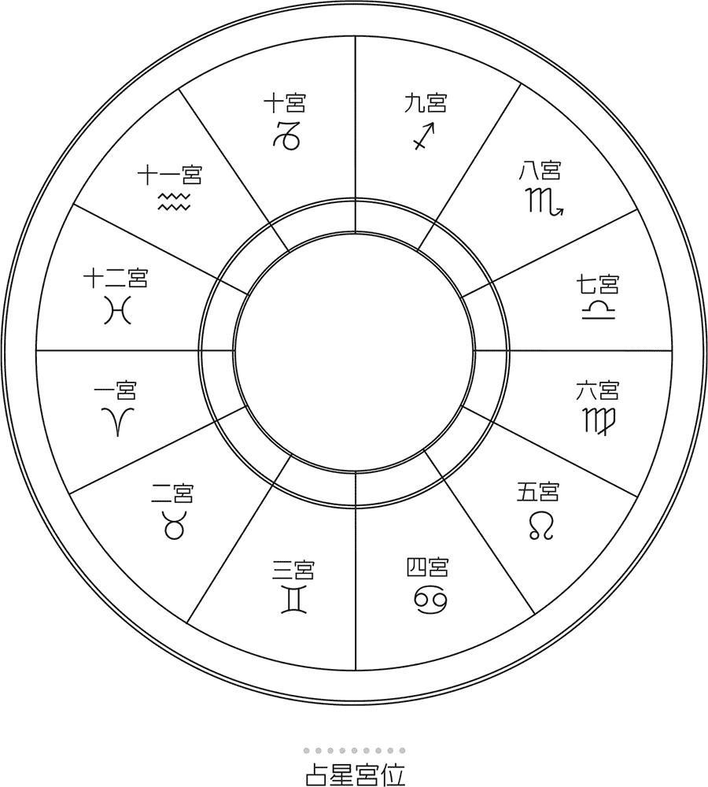

洗牌后，按照宫位形式摆放，或是呈直线摆放。如果你要以占星宫位的形式摆放，从九点钟位置的第一宫开始，逆时针摆放，每一个宫位三张牌。牌面向下或摊开都可以，我会按照心情来决定要先盖着还是直接翻开。假如你喜欢线性的形式，那就分成十二个字段，每个字段三张牌，从象征一宫的第一个字段开始，以此类推。

### 黄道十二宫牌阵的实占案例

这个个案名叫玛丽，是独自照顾三个子女长大的寡妇，同时拥有自己的事业。玛丽的心情很兴奋，因为她很期待第一个孙子出生。

#### 一宫、牡羊座：自我

狐狸＋花束＋棺材：某个问题或某个人带来看似很棒的礼物或邀约（花束），可能会造成玛丽一些麻烦和问题（棺材），而她必须保持正面来处理这个问题（三张综合解读）。会有一些潜藏的悲伤（棺材）。

#### 二宫、金牛座：物质资产和财务

星星＋船＋戒指：玛丽的财运会提升（星星），并向她渴望的目标（戒指）迈进（船）。我也发现玛丽要去海外购物，这三张牌很直接地形容这件事（出国购买闪亮的物品）。

#### 三宫、双子座：沟通、手足、短程旅途

房屋＋云朵＋老鼠：玛丽需要注意她的家人／手足（房屋）中会有沟通误会，导致误解、压力、疑惑（云朵＋老鼠）。这里也建议她要将所有的电子档案做好备份。

#### 四宫、巨蟹座：母亲、房子、家庭

花园＋钥匙＋爱心：有一个非常重要（钥匙）且愉快（爱心）的聚会（花园）会出现，与家人有关。这会为她带来极大的喜悦和满足感（钥匙＋爱心）。玛丽告诉我，她准备要为即将分娩的女儿办一场准妈妈派对。

#### 五宫、狮子座：创造力、愉悦、冒险、爱、子女

鹳鸟＋女人＋塔：这里的牌面很直接地显示出玛丽的女儿在医院（塔）生产（鹳鸟）。孙子要出生这件事刚好落在象征子女的五宫，让我觉得很神奇。

#### 六宫、处女座：职业、个人责任、技能、整体健康

镰刀＋十字架＋蛇：这些牌很明显的警告（镰刀）玛丽要在工作上放轻松，不要过劳或是给自己太大压力（十字架＋蛇）。这些牌显示出要谨慎对待的重大事件。必须要立刻重新检视（镰刀）工作相关的状况，减轻工作量或是避免健康出问题（十字架＋蛇）。玛丽告诉我这个部分让她很有共鸣，特别是她常因为工作过度而偏头痛。

#### 七宫、天秤座：主要关系和合作

百合＋船锚＋鸟：这个组合表示玛丽拥有长期维系（百合＋船锚）的关系／合作或是友情（鸟）。它也代表可能有经营很久的企业（百合＋船锚）与玛丽谈合作（鸟）。解读过程中，玛丽向我表示这的确是指她跟事业伙伴和挚友一直维持着长久的关系。不久之后，玛丽打给我说有间有名的公司与她联系，要跟她洽谈合作合约。

#### 八宫、天蝎座：共同资源、金钱、死亡、性、税务、转变

熊＋山＋鱼：有一大笔资金卡住（或未来会卡住；熊＋山），但最后会开始流动（鱼）。这三张牌也可能代表要支出大笔资金（熊）对现况来说有困难（山），但是最终会圆满解决（鱼），而这两种可能性都与玛丽的工作有关。这个宫位出现象征财务（熊）和事业（鱼）的牌，对我来说表示这个问题与税务有关。玛丽承认目前工作上的两个问题都与这个解读完全符合。

#### 九宫、射手座：高等教育、宗教、哲学、灵性、志向、长途旅行、教学、法律事务

狗＋太阳＋鞭子：会出现一位指导者、明师或顾问（狗）帮助玛丽，协助她提升层次（太阳），只是会遇到一些困难、一点冲突，或只是需要进行重复的事情（鞭子）。我也看到这三张牌是玛丽在引导或散发光芒，却遇到一些阻力。玛丽告诉我她正在学习星光体旅行和灵魂出游，也借由老师和指导者的帮助，提升到更高的层次。玛丽说完后，我睁大双眼再看了一次这三张牌，不敢置信它们的讯息也太直接了吧。她也跟我坦承，她正在协助思想保守封闭的朋友和家人开拓眼界。

#### 十宫、摩羯座：父亲、事业、名声、社会、地位、权威

树＋信件＋小孩：玛丽或她的个人事业会有稳定的名声、有名气，并且会稳定发展。此外，我不禁思考这是否也代表会有孩子出生或家庭成员增加，尤其是我知道玛丽这六个月来很期待孙子出生。玛丽后来致电给我，告诉我一个开心且意料之外的消息，那就是除了孙子之外，她又有一个孙女了。她也表示她的事业有很棒的进展。（我很开心能接到这通电话！）

#### 十一宫、水瓶座：朋友、社交圈、人脉、希望、愿景、显化能力、占星学

幸运草＋男人＋十字路口：玛丽会幸运地认识一位男性（幸运草＋男人），但是关系可能不会长久（十字路口）。出现两张代表双数的牌，她会跟这个人很快搭上线，也可能会见面两次。我也不禁看到这位男性可能会帮玛丽协调（十字路口）某个问题，让玛丽出乎意料（幸运草）。玛丽立刻证实了我最后说的话；她希望这会成真，而且能认识这位男性真的是非常幸运的大好机会。她也补充说这跟八宫（天蝎座）的内容有关。

#### 十二宫、双鱼座：直觉、恐惧、未知、秘密、大型机构、医院、业力、潜意识

骑士＋书籍＋月亮：会有新发现的知识或新的探索（骑士＋书籍），提升玛丽的直觉、敏感度、觉知（月亮）。在象征秘密和直觉的宫位抽到代表秘密的书籍和直觉的月亮，无疑是强调她新习得（骑士）的直觉和能力；这也表示玛丽会踏上神秘学的新道路。

玛丽对她的占卜结果非常满意和开心，口耳相传这次解读，并介绍了所有的朋友来找我。

好好试试黄道十二宫牌阵。先从每个宫位一到两张牌开始练习，最后增加到一个宫位三张牌。记得拍张照并记录在你的日记里，这样你才能回头检视牌面。占星学让占卜增添了一点复杂度，一开始可能令人生畏。但不要就此放弃尝试；请持续练习。只有不断练习，你才能深入了解雷诺曼。

当你能够彻底掌握雷诺曼的所有细节，占卜能力将无限提升，而未来的可能性也无穷无尽。

## 金字塔牌阵

这个牌阵非常快速简单，可加以调整，以适用不同主题。你可以针对特定状况和需求增加、补充或删减这个牌阵。

．深呼吸，沉淀心神。

．决定你想要洞悉的几个主题，从中选择三样（职业、婚姻、学业、宠物等等）。

．具体列出时间范围：每周、每月或是任何你想知道的时间范围。

．洗牌，同时将心念专注在你的问题上。

．将每一个主题标注顺序并写下来，这样你才会知道牌阵中哪个位置对应到哪个主题。

．先在上方摆三张牌，接着左下方和右下方各三张，就会形成金字塔的形状。

### 金字塔牌阵的实占案例

宝拉想要询问十二月的运势。你可以在这个牌阵中自行选择三个要占卜的主题。这次占卜的主题如下：

．健康

．关系

．财务

★健康运势：健康主题中抽到了树（健康），正好强调身体健康与灵性健康。树＋老鼠＋熊意味着消化系统（熊）会受到压力（老鼠）影响，产生问题。熊在健康主题中象征进食、营养、胃部，所以如果宝拉想要减肥的话，那么老鼠（减少）＋熊（重量、大型）就会是正面的解读。反之，如果不是这个议题，那么这三张牌就是在警告健康状况衰退（老鼠）。宝拉需要注意食物过敏或食物相关的疾病（老鼠＋熊）。

★关系运势：在关系主题中抽到花园，意味着大受欢迎，同时也让我嗅到多人关系的可能性。花束＋花园＋云朵代表宝拉会享受许多对象的陪伴，但也会造成困扰、困惑、犹豫、疑惑，让她的生活变得不稳定（云朵）。她会需要在关系中谨慎小心。

★财务运势：百合＋房屋＋船锚表示财务状况很稳定（房屋＋船锚），也会令她满意（百合）。这也代表宝拉的投资（百合）很稳定又有保障（房屋＋船锚）。

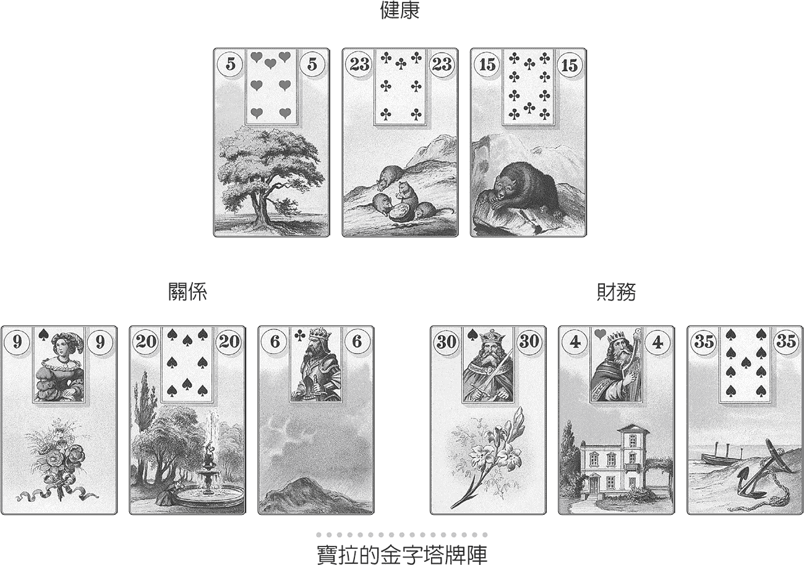

这个牌阵非常简单，可以弹性调整主题。享受这个牌阵，并加入你喜欢的占卜卡或塔罗牌，看看它们如何融洽地互相搭配。创造你自己的牌阵，享受牌卡，并享受占卜！

## 十字牌阵

如果要探索某个简单的情况和整体环境，可以使用这个简单的牌阵。通常我不太会用这个牌阵来快速占卜答案，因为这个牌阵比较聚焦于主题牌，而非预测答案。但它仍然是适合每日占卜和了解问题概况的好牌阵。

．开始洗牌。如果有特定问题，就将心念专注在问题上；如果是每日占卜，洗牌时想着你当天的运势就好。

．牌面朝下展开牌卡。

．抽出三张牌放在中间：A、B、C

．抽出两张牌（D 和 E），如以下图示摆放：

牌阵的位置意义如下：

★A：原因，问题起因或是问题的描述

★B：主题、主要状况、整体情况

★C：结果

★D：导致问题／主要状况发生的事件

★E：问题／主要状况的潜在影响

记住，牌卡是以配对组合来解读：

★目前状况：A＋D、A＋E

★结果：D＋C、E＋C

★主要问题：D＋B＋E

★占卜的最后总结：A＋B＋C

以下范例是我撰写本书时，某一次的每日占卜：

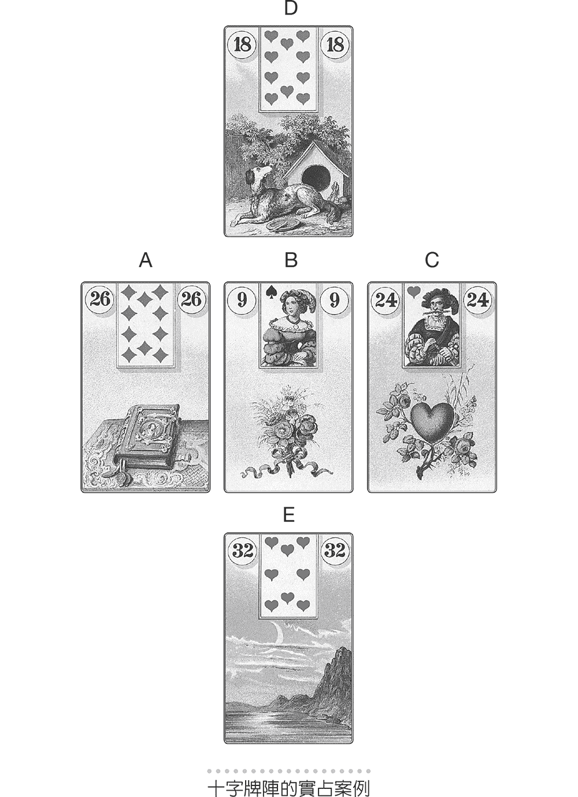

★A——原因：书籍＝隐藏或未知

★B——主题：花束＝快乐的事情、礼物或是好意

★C——结果：爱心＝快乐、喜悦、爱

★D——导致问题发生的事件：狗＝朋友或我认识的人

★E——问题的潜在影响：月亮＝情绪

早上抽到这组牌面时，我没时间细细解读，因为我正赶着出门。我只有整体地快速看一眼——我看到让我开心的讯息。

回到家时，我在信箱中发现好友寄给我迟来的生日礼物。礼物是一个珠宝箱，里头装着两套非常少见的塔罗牌、两套热卖的雷诺曼卡，以及祝圣过的蜡烛。我宛如置身天堂。我后来仔细检视早上抽到的牌面，惊讶不已。我早该发现的。

这是牌面原本就要告诉我的：

★目前状况：A＋D：书籍＋狗＝我的神秘学朋友；A＋E：书籍＋月亮＝神秘学礼物

★结果：D＋C：狗＋爱心＝慷慨的朋友；E＋C：月亮＋爱心＝兴高采烈

★主要问题：D＋B＋E：狗＋花束＋月亮＝朋友送我很有创意的礼物

★最后总结：A＋B＋C：书籍＋花束＋爱心＝带给我喜悦和快乐的神秘学礼物

我真的得强调，学习基本概念非常重要；但是各位也必须了解，这些解读法、占卜、配对组合、牌阵以及本书中我写的所有内容，都会随着你不断练习而变成你个人独有的方式。你会跟你的雷诺曼同频共振，发展出独特且专属于你的解读方式。你会锻炼出看到牌组就知道牌面在讲什么的能力，而不用细细拆解牌义。你会以整体的角度看见讯息，雷诺曼就成为了你个人的占卜卡。

．精通基础。

．保持专注。不要自己混淆自己，也不要让解读变得复杂。

．你会发展出个人化的预测法，搭配你的直觉、个人见解、占卜经验。

我喜欢雷诺曼揭露我们周遭世界的方式！

## 扭转未来

没错，雷诺曼是预测未来的占卜方式，但是随着时间推移与经验累积，我发现它可以用来扭转负面的未来结果。这并非牌阵，却是我多年来学到的技巧。

．首先，我会针对同样的问题反复占卜，确定每次占卜的答案都是负面的结果。

．我会询问我能做些什么来改变未来结果，接着抽牌后，我会检视是否有改变的可能性。

．如果有机会改变，我会认真遵照牌面建议，可以的话会实际执行。

．之后，我会针对一开始的问题再占卜一次，看看在我尝试改变的方法后，是否真有扭转结果。

我已经使用这个方法好多次了。举例来说，我们家有一次计划要去畅货中心，我做了简单的占卜。到畅货中心的车程有一段路，而我们只是单纯要在开学前去购物而已（采买衣服、夹克、鞋子等等）。

我抽了牌想知道当天会发生什么事，而我抽到：

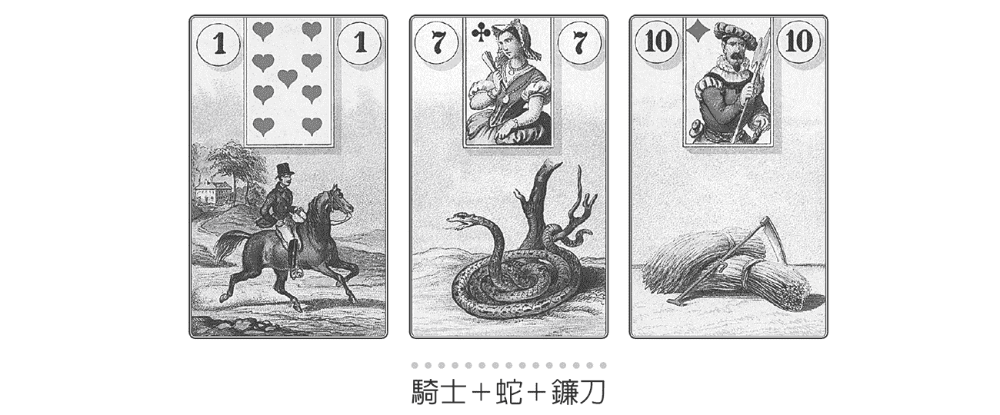

我很快发现这三张牌意味着会有意外发生，特别是蛇＋镰刀出现。但我不确定会发生哪种意外。是身体出意外，例如腿（骑士）吗？还是在路程中（骑士）发生交通事故？有了这些讯息，我洗牌后又针对同样的问题抽了三张牌，我抽到：

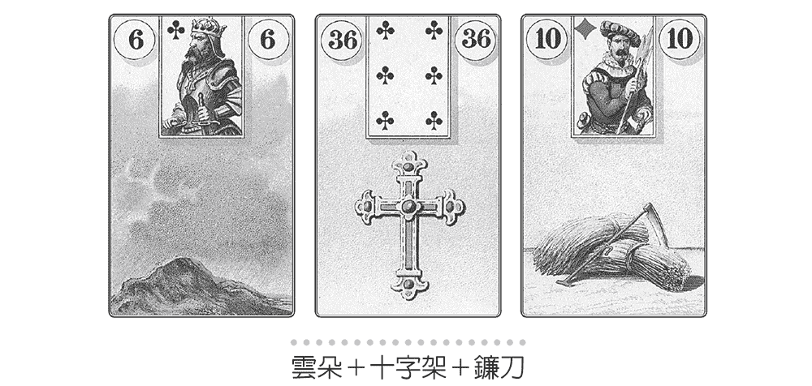

再一次，这三张牌传达出相同的讯息——会遇到同样的麻烦。会有复杂的情况出现，最后突发意外，这让我有种不好的预感。

我重新洗牌，这次我决定用五张牌的牌阵，了解更细节的讯息：地点、人物，以及事情会如何发生。事情变得更严肃了，这次我抽到：

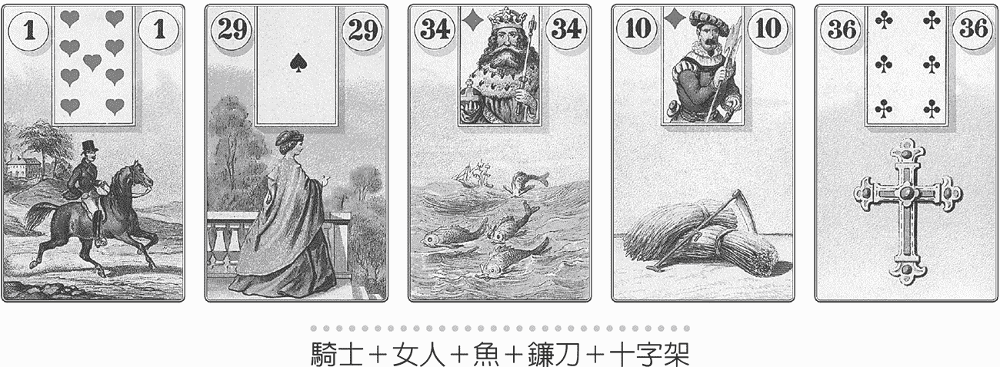

因为我是家里唯一的女性，所以我知道这个意外跟我有关。这组牌面的主题是购物（鱼），后面两张牌又重复出现了。因此当女人在行走、购物、路途中（骑士＋女人＋鱼），会发生意外或突发事故（镰刀），造成痛苦与不幸（十字架）。（另一方面，骑士牌也跟脚和腿有关，让我意识到我可能要穿球鞋，而非高跟鞋，以防万一。）

接着，我帮家里每个人都抽了牌，为我老公和每一个儿子占卜。儿子们的牌面很好，只有我老公的牌面出现十字架。这个牌面很合理，因为如果发生什么事情，我和老公两人都得扛起责任。

儿子们很期待购物，而当天的行程早在很久之前就决定了，因此我不想改变计划。我让每个人都看看牌面，而我其中一个儿子拿了牌，洗牌后问了同样的问题。他抽到：

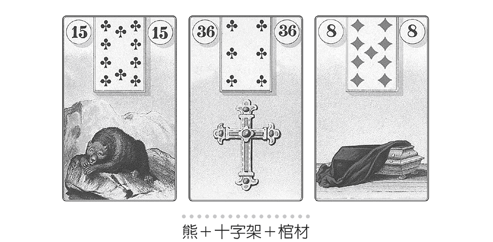

他立刻说道：“妈妈，我们不要出门了，就这样。”牌卡给的警告太明确了！

我接着抽牌问了我们能够做什么来改变结果？我抽到：

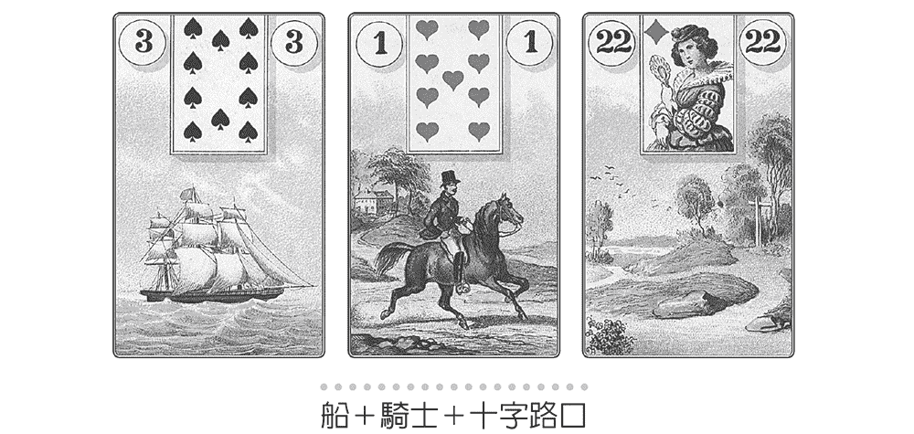

这三张牌建议我要改变行程，或是走另一条路（十字路口）——跟移动有关、走新的路或是需要绕道而行。所以，我们一致决定不要开车去畅货中心，而是去附近的商场就好，只需二十分钟车程。我的大儿子想要抽一张牌看看建议，他又抽到了十字路口。我从他手中拿回牌卡，好好洗牌一次，请他选一张牌。你们猜发生什么事？十字路口又出现了！如果雷诺曼有话想说，你就会不断抽到同样的牌；我喜欢牌卡这么坚持不懈地要告诉你重要讯息。我们最后决定去附近的商场。

出门进行一整天的购物之前，为了安心，我又叫儿子抽几张牌。他问道：“我们今天出门购物会发生什么结果？”

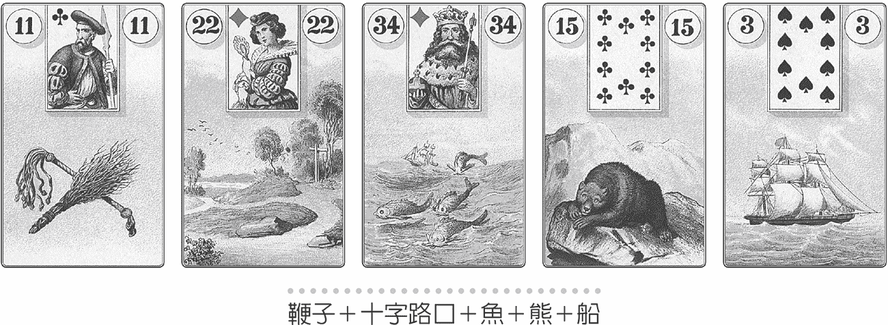

看了一眼牌面后，我说出发吧！鞭子代表争执，跟男孩出门购物会有争执很正常。主题牌再次出现鱼，指出了我们外出购物这件事，最后出现熊＋船，代表会花掉一大笔钱。

我们一整天都谨记鞭子这张牌。每次快要吵架时，就会有人说声“鞭子”，每个人就会冷静下来。鞭子＋十字路口代表儿子们在决定要买哪个东西时所发生的零星争吵。最后，每个人都很满意自己的选择，提着大包小包的战利品回家，完全符合熊＋船的牌义。值得一提的是，我的确绊倒了，但幸好我穿了球鞋，才没有惨跌在煤渣砖上。总之，我相信牌卡将我们从十字架和镰刀的手中救了出来。

这就是人类的自由意志发挥作用的例子。通常我都能像这样扭转小灾祸，但也不是每件事情都能避免。其他时候无论我怎么重组问题，总是抽到一样的结果。无论我如何改变状况，结果依旧会发生。自由意志的确存在，但有时候我们能改变的很有限。只要可以改变，请运用你的自由意志，为自己创造最好的人生。

## 大蓝图牌阵

大蓝图这个词源自法文，直译就是“大图片”或“大型画布”，这是最知名也最多人使用的雷诺曼牌阵。我从小到大几乎都是用大蓝图牌阵来占卜，之后才为了要快速知道答案而改为用小型、简易的线性牌阵。有好几年时间，我很少使用大蓝图，因为个案都想要快速知道答案。他们喜欢知道近期的未来，不在乎长远的未来会发生的事。能够马上验证结果的满足感很棒，而说实在话，我自己也比较喜欢这种迅速占卜的过程。有一段时间，我只会针对特定情况、特定个案和教学中使用大蓝图，而我挚爱的老公是唯一每一次都要求我用大蓝图帮他占卜的人。他喜欢三十六张牌全部摆出来的惊人画面，因为他说：“这看起来很盛大、很庄重！”

后来我在教塔罗占卜师朋友解读雷诺曼卡的时候，才意识到大蓝图对他们来说有多震撼和迷人。朋友、个案和一些占卜师开始要我用大蓝图牌阵，因此把绕了一圈的我，带回了最初的起点。我解读大蓝图的方法不断演变，融合了解读其他小型牌阵和快速占卜的方法。几年下来，整个解读流程已经臻至成熟，在占卜时都有非常完美的成果。

大蓝图牌阵会呈现“大的局面”，让你快速了解个案的生活和环境，就像是打开互动式地图，点一下某个有兴趣的位置，就有更多细节浮现出来。大蓝图牌阵的最大好处就是只要一个牌阵，就能回答许多问题，从牌阵中检视不同主题，将所有主题、领域、场景都串连起来。大蓝图完整呈现出个案当时的生活。因为它的博大精深，大蓝图如同一道饶富意义的谜题，让你一股脑地想要找出解答，并沉浸于它微小的细节之处。

跟所有的牌阵一样，解读大蓝图的方式有许多种，没有绝对的规则。如同许多牌阵，我总是反复叮咛：“选择你最有感觉的那个方法，并维持一致，因为它最终会变成你值得信任、准确无误、非常可靠的解读法。”对于占卜，我只相信被测试过、尝试过并且有效的方法。

由于大蓝图蕴含非常多的讯息，刚开始要做的就是找到里面的路标，跟着路标寻找答案。先从拆解一个主题或问题开始，一次一个，让牌面互相链接、流动、对话。最后，所有问题都会互相串连、交织（如同生活中的问题也都互相交织），之后大蓝图就会变成有明确方向的一张舆图。辨识出记号、方位和目标，就能够明确走向正途。

### 我的大蓝图解读系统

以下的系统综合了我早期学会的技巧，以及历经多年的经验演变出来的方法。我的系统非常直接，并且能给予解答。我很确定只要练习和使用这个牌阵，许多人都会加入自己的方法并扩展大蓝图的解读法。我鼓励每个人都勇于尝试：掌握你的牌阵、掌握你的技巧、掌握你的解读！

### 时间范围法

根据我的经验，大蓝图的最短时间范围应该在一个月内，或是最短三周。我使用大蓝图时，通常都是占卜未来三个月或六个月的状况。用大蓝图占卜的频率如果是一周一次，或是一周好几次，只会得到重复的信息，让讯息变得多余、模煳，也会使答案更加复杂。有时候我会遇到极度焦虑的个案要我一周帮他们占卜一次大蓝图，出于责任，我会照做，因为我了解他们的焦虑。但是结果通常都是重复的讯息。尽管如此，每个人都应该要练习时间范围法，尝试和探索是获得最佳结果的不二法门。

诀窍：洗牌时，心中想着一段时间范围：“指引我未来三个月的运势。”

### 角色赋予法

三十六张牌全部摆出来如同一张画布后，首先要做的事情就是辨识出个案的指示牌和其他主题牌。这些牌是占卜中你要注意的重点，后续的步骤会解释更多。记得：透过启动特定的牌来对应特定主题或问题，你在占卜中就赋予了这张牌一个特定角色。如果想要在大蓝图中了解个案的女儿，你可以启动小孩牌代表女儿；然而如果女儿是年轻女性，而个案是男性，那么女人牌则会代表他的女儿。让直觉引领你决定哪一张牌是关键的主题牌。

个案的指示牌是男人牌或女人牌，视个案的性别而定。检查指示牌的位置是极为重要的步骤——检查牌卡在上方还是下方，离牌阵边缘的距离范围，周围有哪些牌面等等。接着检视其他象征特定主题的主题牌。举例来说，爱心象征恋情，戒指象征婚姻和合伙关系，狐狸象征工作、事业、职业状况，房屋象征个案的随行人员、家庭或房地产，以此类推。

诀窍：如果这次占卜涉及不只一位当事人，最好在洗牌时就先根据每个人的特质设定好牌卡，如此，你才能知道哪张牌对应到哪一位当事人。举例来说，假如个案为已婚女性，她的指示牌就会是女人牌，而她的丈夫会是男人牌，前男友或亲密友人则是狗这张牌等等。

### 时间划分法

我的大蓝图会分成三个垂直区域，由左至右分别代表：过去、现在、未来。这三个区域会由个案的指示牌位置来划分。指示牌的左方是过去，右方是未来，而指示牌座落的那一条纵轴线则是现在。我的大蓝图解读法不分性别。无论实际的指示牌所描绘的男人或女人面朝哪里，对我来说都一样。

我会依据牌卡之间的间隔作为时间迹象，判断时间点和范围。这是我非常年轻时习得的个人技巧，当时都在试着判定事件或状况的大致时间点。一个时间迹象可能是一小时、一天、一周、一个月或一年；两个时间迹象可能是两小时、两天、两周、两个月或两年。我最后学会了解读过去与未来之间的相互关联，串连起来后，便能够更准确地推断出大蓝图显示的时间点。

例如，假设我看到花束在指示牌右方的两个间隔，我就会跟个案说，两天、两周或两个月之内会有开心的事情或喜悦的时刻，端视抽大蓝图牌阵时设定的时间范围来决定时间点。

举例来说，如果男人牌的后面有三张牌以及骑士牌（骑士是第四张），我就会说讯息或新对象大约在未来三或四的时间迹象出现（一个时间迹象是一小时、一天、一个月或一年）。而这个时间迹象在大蓝图中通常都是三或四天、三或四周、三或四个月，根据抽牌时设定的时间范围而定。

判定时间迹象的方法：

．找到指示牌和代表未来事件的牌卡。

．计算两张牌之间的间隔，得出的数字就是大致的时间迹象，数字会加一或减一。

．这个方法也适用于检视指示牌左方的过去时间。

假设你发现个案过去经历的某个事件，你可以推断出大致的时间：“我发现你经历了‘……’，可能是在两或三天／周／月之前。”占卜前列出的时间范围会让你判断出具体的时间迹象。如果是占卜几天之内的未来，那么大蓝图的时间范围就会是天数和那几天的期间，未来牌面象征的时间就会是天数，而非月份。如果时间范围是周数，也是同样的道理。举例来说，假设个案跟你说“噢，这件事是在两周前发生的”，这就意味着时间迹象应该解读成周数，而非天数或月份。检视过去的牌面推估时间迹象，就能够协助你解锁未来的时间密码。

遗憾的是，并不是所有的时间迹象都容易解读出来。有时候，在大蓝图牌阵预测时间的最好方式就是抽牌前先设定时间范围。如果你事先设定的时间是三周，那么时间迹象代表的就会是周数、天数，而非月份；而时间范围若是设定三个月，牌阵的时间范围就会是周数或月份。请看下列的图示，会更清楚时间划分法。

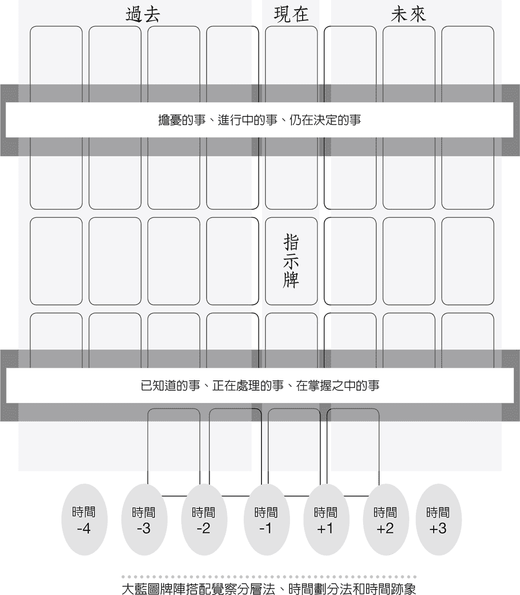

### 觉察分层法

我也会把指示牌的上方与下方划分成横向的区层。指示牌上方的牌面和牌阵最上排的牌面，会揭露个案心中的想法、担忧的事、进行中的事、仍在决定的事或是计划中的事。指示牌下方的牌面象征已知道的事、正在处理的事、在掌握之中的事。

检视指示牌在哪一排横轴以及位置，便能知道个案距离目前的生活篇章什么时候会走到结尾。找到人物牌，检视它离大蓝图上下左右的边缘多远。如果落在很右方，接近最后一列，意味着个案的生活篇章即将结尾，因为牌阵几乎都是呈现过去／现在的生命旅程，只有少少几张牌出现在指示牌右方的未来。反之，若是指示牌落在左边数来第二列，牌阵的开端，意味着个案刚开始或已在近期开始人生新的篇章或阶段。

现在，如果指示牌落在右边最后一列，没有未来的牌面出现，就代表个案生命中要面临巨大的转变，他处在人生转捩点，只有做出选择后，未来的路才会开展。自由意志在此时会发挥很大的作用，并呈现在牌面中。发生这种情况时，我仍然会快速解读大蓝图牌面，但不会过度细探内容。通常我会拿手机拍张照，以便我能够检查一开始的牌面，接着再占卜一次大蓝图。

十有八九，占卜了第二次的大蓝图后，指示牌几乎都落在左边的纵列，第二次的牌面成了第一次的续集，如同结束过往的故事，打开人生新篇章。这真的很令人惊奇。如果时间允许，我会比较这两组牌面（手机里的照片和新的大蓝图），追踪这两组牌面的故事线索。只有极少数的案例中，指示牌会再次落在牌阵的最后一列，没有未来牌面。我会告诉个案，未来的篇章未完待续，会根据目前的行为和选择来决定未来发展（我会改用小牌阵来解答个案的疑问与担忧）。

### 棘手状况

如果指示牌在牌阵的最上排，上方没有任何牌面，意味着个案目前掌握全局，也知道如何处理事情，并握有掌控局面的缰绳，尽管他可能心有疑惑。这样的牌面代表所有情况都在个案的掌握之中，个案也有能力解决问题。

相反的，假如指示牌落在牌阵最下排，下方没有任何牌，而指示牌的上方是整局牌面的话，就暗示着个案目前受困于生命中的情况与问题，无法应对、不知所措。这个状况会让我想到希腊神话中的巨人亚特拉斯撑住整片天空，而个案正将整局牌面一肩扛起。

如果指示牌落在上述两个位置，我依然会继续解读牌面，只是解读的内容会比平时来得简短而快速。我会使用“宫位锁链法”给个案更多有用的信息，这个解读法会在后面内容教给各位。

如果指示牌在左边的第一列，没有过去的牌面，暗示着个案正开始新的生命阶段，未来尽在眼前。

如果大蓝图没有呈现任何过去，我会出于以下条件来进行解读：

．这是找过我的客人，而我无需再跟他解释过去之事。

．这是帮家人、朋友或我自己占卜。

．这是为了练习目的而抽的模拟解读。

．我的直觉和第六感告诉我继续解读。

若是其他情况，我会先快速为个案解读完，然后再抽一次大蓝图。我依然认为第一组牌面有意义，所以会拍张照，如果需要且时间允许的话，我会再回头检查。倘若时间有限，我只会重新抽一次大蓝图。

同理，如果指示牌落在大蓝图的最后一列（第八列），没有未来牌面，则表示个案处在故事的结尾，而情况即将翻转。有时候这也代表个案仍纠结于过往课题而无法往前，或是过去之事阻碍了个案的人生。这种情况下，我会视个案预约的时间而定，快速解读过去发生的事情。我会再占卜第二次，接着占卜第三次。

如果三次的牌面里，指示牌都落在一样的位置，就意味着个案目前处于人生的重大转捩点。我们对谈的当下，未来正在形成、塑造、改写。个案的人生道路尚未明朗，会根据后续的决策、行动或事件的转折而铺陈。若是如此，我会请个案再预约之后的时间来占卜。如果我跟个案的预约时间要结束了，那么我会迅速洗牌再抽一次，或是选择小牌阵来占卜。因为个案通常预约占卜都是为了知道未来，所以如果占卜没有呈现未来，那就毫无意义了。

### 交叉解读法

解读交会于每张主题牌的纵轴和横轴，如同看着图表找到 X 轴和 Y 轴的交点。我们会以线性的方式来解读大蓝图。纵轴上，主题牌之上的牌面代表个案的目前情况。横轴上，主题牌左边的牌面象征过去或导致主题发生的原因，右边的牌面则显示未来和近期发展。

最靠近主题牌的牌面象征刚经历的事件，或是将要发生的事情。离主题牌最远的牌卡预测着久远的未来才会发生的事件。预测的事件和过程会以牌卡的排序逐一发生。假设我们有棺材＋十字架＋花束，这意味着棺材和十字架的事件（转变与痛苦）会在花束（幸福）到来之前发生，因为棺材和十字架出现在花束牌前面。记得：牌卡是以线性解读的，因此事情的顺序也是线性发生的。

这是解读大蓝图的最重要步骤，有时候做这个解读法就足以回答个案的问题了。好几次我帮家人、朋友或自己占卜时，也只以交叉解读法就得到我要的答案了。

现在，让我将过程细细拆解。你已经摆好了三十六张牌了，然后呢？

．首先，找到指示牌／主题牌——不是男人牌就是女人牌，视个案的性别而定（假设是帮我自己占卜，我就会先找到女人牌）。

．接着，使用解答之线的技巧，解读指示牌所在的横轴。横轴就是 X 轴。

．从主题牌开始，并检查周围的牌面。主题牌最旁边的牌是影响现况最大的事情。主题牌左边的牌面可以视为过去，右边的牌面则视为未来和即将来临的事情。这也是以线性解读，按照牌卡顺序。

．现在，透过主题牌所在的 X 轴，定位出纵轴，纵轴就是 Y 轴。Y 轴的整体牌面会是现况，这是个案目前遇到的情况。

．从主题牌开始，向上和向下解读纵轴的牌面。上方的牌面是个案的想法，越靠近个案的牌面，就是越让个案担忧的状况或烦恼。主题牌下方的牌面是个案有能力控制、处理、面对的事情。

就是这样而已！这个解读法适用于其他指示牌或特定问题的主题牌。举例来说，如果占卜的是恋情，你可以找到爱心牌，解读交会的 X 轴和 X 轴；如果你想要了解个案的丈夫，可以找到男人牌，解读交会的 X 轴和 Y 轴；如果你想要了解家庭事业的发展，找到鱼这张牌，并解读交会的 X 轴和 Y 轴。交会于指示牌或主题牌的 X 轴与 Y 轴，会揭露出过去、未来，以及相关问题和潜在暗流。你只需以第三章起初介绍的各个解读法来解读牌面。下列的图示为交叉解读法的范例。

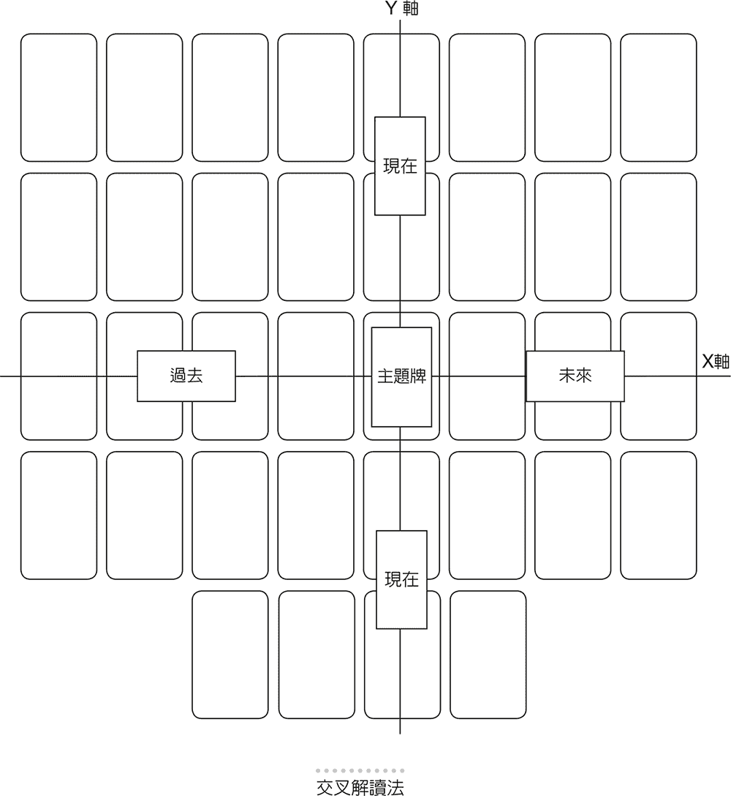

### 骑士解读法

透过配对和组合座落在牌阵中的牌卡，骑士解读法能够从另一种角度激荡出额外的细节和特定牌卡的背景信息。实际上，从特定牌卡往外移动的方式跟西洋棋盘的骑士走法一模一样。这个解读法来自骑士以九十度直角的方式跳着走：走两步再走一步，或是走一步再走两步。原本的牌会结合骑士解读法对应到的牌卡，产出更多讯息细节。

借由搭配对应到的牌卡和原本的牌卡（你想了解更多讯息的牌），就可以从大蓝图的朦胧牌面中汲取出具体讯息。解读完大蓝图的讯息后，我有时候喜欢用这个技巧，可以扩充一开始就解读到的主题，了解额外讯息。请看后续的实占案例，就能更清楚了解骑士解读法。

## 雷诺曼的大蓝图宫位

雷诺曼的系统中，大蓝图的位置称为宫位。宫位是由每一张牌按照顺序从一到三十六号排下来的。每一个宫位都掌管特定主题、模式，而这些对应／意义都会直接与宫位象征的牌卡和该牌义有关。

要列出宫位，请想像大蓝图牌阵按照以下顺序排列：第一张牌是骑士，第二张牌是幸运草，第三张牌是船，以此类推，直到最后一张是十字架。这些序号的位置就是宫位的数字。骑士是第一宫，幸运草为第二宫，船是第三宫，而第三十六宫就是十字架。这些宫位和数字不会变动，宫位的特性与其所属牌卡的意义一样。举例来说，第一宫代表移动的事情、消息、信息（如同所属的骑士牌），第二宫象征好运与机会（如同幸运草），以此类推，而最后一宫则代表困难、挑战、难关（十字架）。请参照下列的图示，并参照附录五来全盘了解宫位和它们的特征。

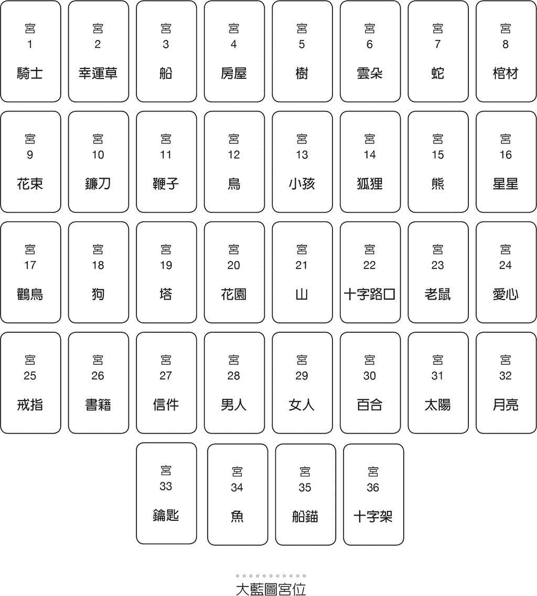

解读宫位需要综合单张牌的牌义和宫位意义，如同配对组合两张牌一样。宫位的序号让座落上方的牌面有了特定讯息，赋予更多意义。宫位和宫位不会一起解读，一个宫位只会与座落在上方的牌卡搭配解读。牌卡和它座落的宫位实际上会比两张牌的组合更静态，比较像是某种状态或情况。宫位会赋予主要内容更多信息。

举例来说，船（三号牌）象征旅游或改变，而大蓝图的第三宫则代表移动或转变。任何牌卡如果落在第三宫，便会受到移动和转变的影响。如果狐狸落在第三宫，则象征工作（狐狸）会有转变（船）。因此在大蓝图中，每一个宫位都定义了牌面的周遭环境。同样的，把牌卡想像成你赋予了角色的演员（无论是你自己设定还是交给牌卡随机决定），宫位会赋予特定牌卡一段剧情，在这次占卜中演出。

如果牌卡落在自己的位置，或者落在自己原本的宫位，便如同拿萤光笔画重点一样，更加强调、强化了这张牌的意义。举例来说，蛇落在原本的宫位（七宫），便是警告你有严重的问题或恶意的敌人在你周围。

同样的，当两张牌各自落在彼此的宫位，如同镜射彼此，也是强调这两张牌的组合，着重在这两张牌所说的事件。举例来说，如果戒指落在七宫（蛇），而蛇落在二十五宫（戒指），这两张牌便在叙说婚姻有重大危机，或是合约有严重的麻烦。

#### 诀窍：

．你不需要有特定的问题才使用大蓝图牌阵；事实上，最好是没有特定问题，因为牌面会显示一切答案。我喜欢直接占卜，不带任何特定问题。

．如果你的确有个问题或担心的事情，不需要解读完整的大蓝图；你只要解读主题牌周围的牌面，以及交会于主题牌的轴线就好。

### 宫位锁链法

这个解读法会为大蓝图增加许多深度和难度，它能激发出事件的细节，洞悉未来事件的顺序。这个进阶技巧，最好在你对牌卡、牌义、配对组合有极高掌握度后再使用。如果你还达不到这个境界，那么就先打稳基本功后再来尝试，无需急着赶进度。

这个另外的技巧能够额外了解、厘清、验证一开始的解读内容。如同前面几种解读法，这个技巧也不是非得使用的解读法。我喜欢这个方法，因为它会为我的占卜画龙点睛。

从你想要了解更多信息的牌卡开始进行，就可以拉起一整条宫位的锁链。辨识出牌卡座落的宫位后，根据宫位原本对应的牌卡，找到该张牌，再从这张牌座落的宫位去找到宫位原本对应的牌卡。这个过程会持续到你的宫位锁链回到最一开始选择的牌卡。这看起来比解读法还复杂，所以让我逐步解释细节。

宫位锁链法是将牌卡和它们所属的宫位串连起来，接着链接所属宫位象征的牌卡，形成一整条符号的锁链，揭露出特定状况的惊人细节。

．首先，找到指示牌（你想要获得更多信息的牌卡），再检视牌卡座落的宫位（请参照雷诺曼的大蓝图宫位图示）。

．找到该宫位代表的牌卡（宫位的序号和牌卡序号一样），并在牌阵中找到这张牌。

．解读这两张牌的链接与符号关联。

．下一步，确认你刚才找到的牌卡所属的宫位序号，并找到对应该宫位序号的所属牌卡（也就是说，牌卡和宫位的序号一样）。

．透过陆续找到的牌卡串连起来，将你发现的信息综合解读。

．重复这个过程，从牌卡找到宫位，再从宫位定位牌卡，直到你回到最一开始的指示牌。

使用宫位锁链法能够让你悠游于大蓝图牌阵，并发现微小的细节，因为这些细节没办法透过简单的解读呈现。如果未来的牌面不够多，这个技巧也很好用。

举例来说，如果你想要知道在指示牌旁边的狗所象征的人是谁，而周围牌面的讯息不够多时，就使用宫位锁链法来找到答案。从狗的位置开始，先确定这张牌的身分，或是借由描述这张牌的牌面来得到更多讯息。

让我们细细探究这个案例。

### 解密宫位锁链法

确定狗落在的宫位是什么。举例来说，假设狗落在十七宫（鹳鸟），意味着狗代表的人物个性开朗正向、身材高瘦。如果讯息的细节还不够，我们就能使用宫位锁链法来获取更多信息。接下来，我们在大蓝图牌阵中找到鹳鸟牌，它落在二十八宫位（男人）。现在我们可以确定这个人是男性，而且极有可能是个案的另一半。接着定位男人牌，并确定它所在的宫位，以此类推，直到这个宫位的锁链最后连回狗这张牌。

如果你想询问某个特定案子的发展，而其他解读法无法给予更多细节，也能套用宫位锁链法来解读。由于书籍代表专案，只要从书籍牌开始使用宫位锁链法，你就能够揭开这个案子的未来秘密。以此为例（参考下列的图示），假设书籍落在二十一宫位（山），就代表这个案子会遇到挑战与阻碍。

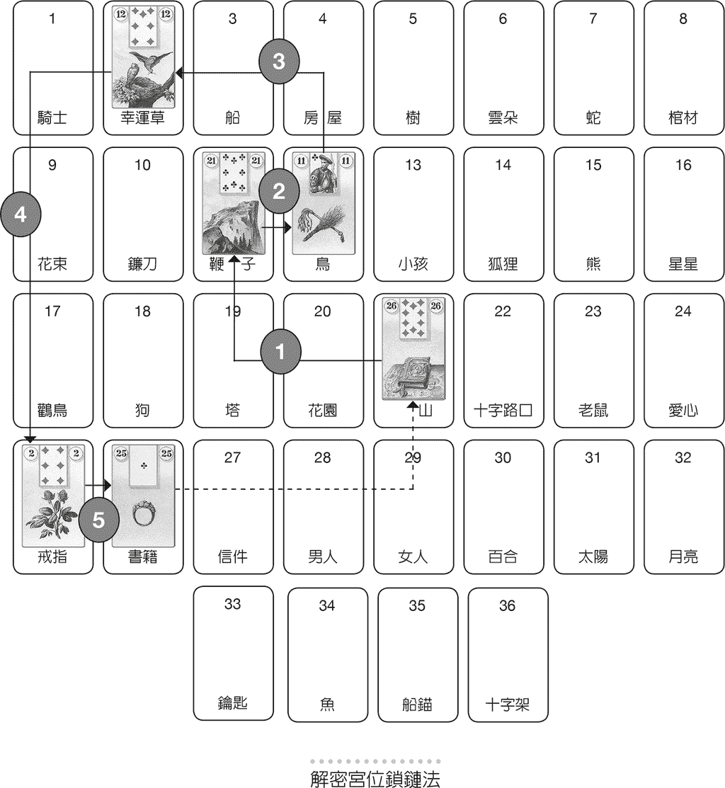

1. 我们接着找到山落在十一宫（鞭子），意味着会有争吵，或是需要重复某些工作过程，或是重审这个案子。

2. 接下来我们找到鞭子落在十二宫（鸟），代表争执或辩论后会需要沟通协商。

3. 我们找到鸟落在二宫（幸运草），就能知道这场沟通协商最后会圆满落幕。

4\. 继续找到幸运草落在二十五宫（戒指），合作似乎会谈成。

5\. 戒指最后落在书籍的宫位，结束了这次的宫位锁链法。

借由宫位锁链法的流程，我们可以知道这个专案未来会逐一发生的事件，从目前的僵局到协商谈判，最后因为戒指而让专案获得圆满的结果。

多数时候，交叉解读法便足以看出专案的未来发展，只要解读交会于主题牌和所座落的宫位的线性轴就好。宫位锁链法能够接着验证、深入探究预测的内容。有时候指示牌的横轴牌面过度中性或没有未来牌面，那么就可以用宫位锁链法来解开牌面要传达的秘密。

### 皇冠解读法

有时候如果个案的问题较广泛，其中有许多小议题，若想要额外了解细节时，我就会用我发展出来的技巧“皇冠解读法”，这需要个案与占卜师之间有更深的互动交流。如果我没有时间使用宫位锁链法，而我想要快速解读大蓝图，并让解读更丰富一点，就会使用皇冠解读法。皇冠解读法能够以更少的时间来扩展关键领域的细节。

按照一般的方式排出三十六张牌的大蓝图牌阵后，我接着会将最后四张牌放着，先不摊开。直到我解完整局牌面后，我会将盖住的四张牌放在个案面前，并请他在牌阵中选择四个位置，代表他想要更深入了解的问题。然后我会用最后的四张牌，在牌阵中的这四个位置为它们戴上“皇冠”。

接下来，我会摊开每一张皇冠，并解读下面的牌和宫位（参考戴蒙的大蓝图和戴蒙的皇冠解读图示）。这个方法能激荡出惊人的牌义组合，扩展大蓝图的庞大讯息，也能够针对牵涉到许多具体问题的主要担忧，进而验证细节信息。

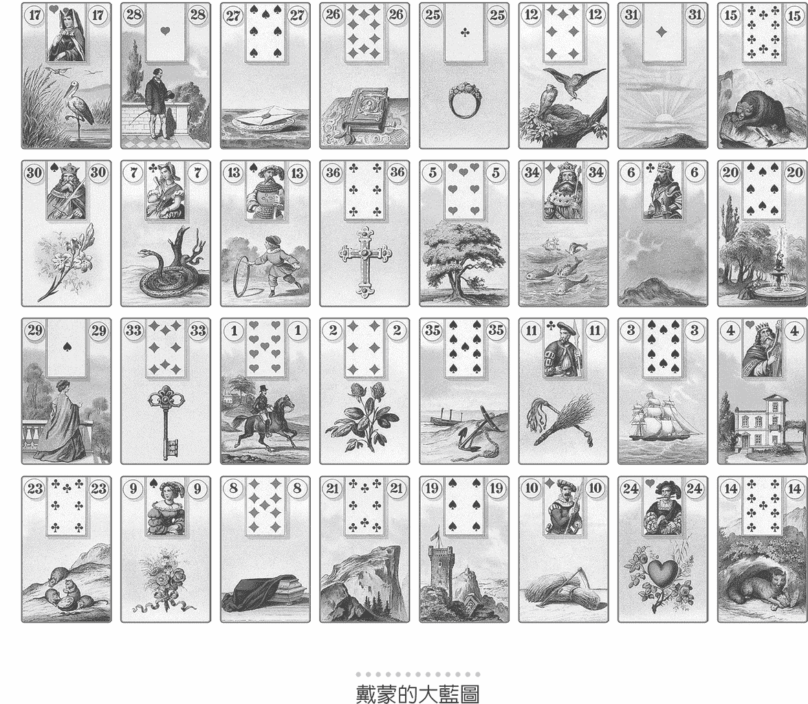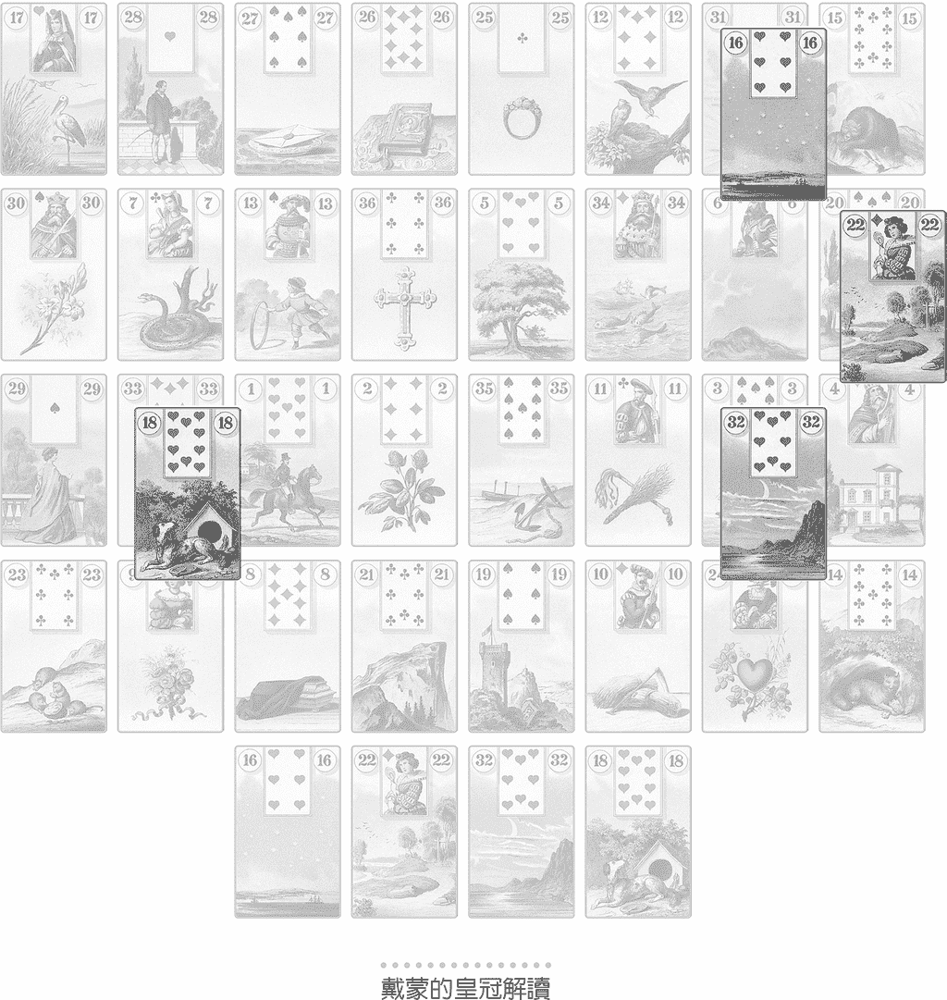

举例来说，我为戴蒙很快地做了大蓝图占卜。他准备出席会议，想要了解大致情况，但我感觉到他想要知道一些具体细节，预知其中的麻烦。牌面显示出会有极好的机会出现，有正向的人脉链接，也会从粉丝那里获得热情的回馈。解读完上方三十二张牌后，我问他想要再了解哪几个领域？他选择了：

★太阳：在会议上的名声／成功

★花园：会议和人脉机会

★船：往返会议的旅途

★钥匙：会议的成功和必要的解决办法

接着我将盖着的四张牌交给他，请他随意摆放在四个位置上。最后的结果令人吃惊！皇冠解读法的牌面呼应到了牌阵中的所有讯息，并增加更细节的讯息，让他松了一口气，给了他可行的计划。

太阳戴上了星星的皇冠：他的成功会声名远播。而因为这张牌和星星牌落在了蛇的宫位，无可避免地会出现有人嫉妒他的成功。

花园戴上了十字路口的皇冠：会有许多不同的粉丝吵着想了解他的工作，获得他的注意，也会（或许）有许多场合和许多计划因为他的出席而受益，带来双重机会。花园和十字路口落在星星的宫位，所以人脉链接和扩展会大幅增长。

船戴上了月亮的皇冠：他的旅途会十分梦幻，既舒适又惬意。因为两张牌落在了老鼠宫位，意味着会有一些小麻烦出现，但很快就能掌控住。

钥匙戴上了狗的皇冠：代表成功来自于他的忠实粉丝。而因为这两张牌刚好落在狗的宫位，无疑更加强调粉丝的热情和能力令人瞩目。

总而言之，会议会有很好的发展，他也满足了所期望的事，放下了担忧。本质上，皇冠解读法将大蓝图中单一位置变成了小型的三张牌解读，垂直式地深入探寻特定议题，从宫位到宫位上的牌，再到戴上的皇冠。皇冠解读法让我获得如使用宫位解读法一样的细节，但只要花我十分之一的时间。

### 交点解读法

如果遇到关系问题的牌面似乎复杂又隐藏着秘密，我就会采用交点解读法。这个方法只有在牌卡彼此处于对角线时才能使用。在大蓝图牌阵中，对角线代表着间接影响。如果两张指示牌都在同一条线，无论是横轴还是纵轴，它们之间的链接都很清楚明确；反之，间接的对角线链接能够揭开关系状态的真相。这样的状况下，我会在牌面中寻找这两张牌的“交会点”是哪几张牌。

基本上，我会想像这两个人在房间里却没有面向彼此。为了了解他们之间的关系，我需要知道是什么把他们两人凑在一起。以雷诺曼的方式来说，他们占据了两个转角，而我能够透过房间其他两个转角，找到还有什么事情在这个房间里发生。

找到这两张指示牌，我会从这两张牌分别延伸横轴和纵轴，在假想的房间里找到双轴交会的两个转角。这些“交点”让我能够一探究竟，了解两人之间的状况。尽管他们可能并不是直接望向彼此，但这两个转角会显示出把他们凑在一起的事件与原因（参见下列的图例一）。

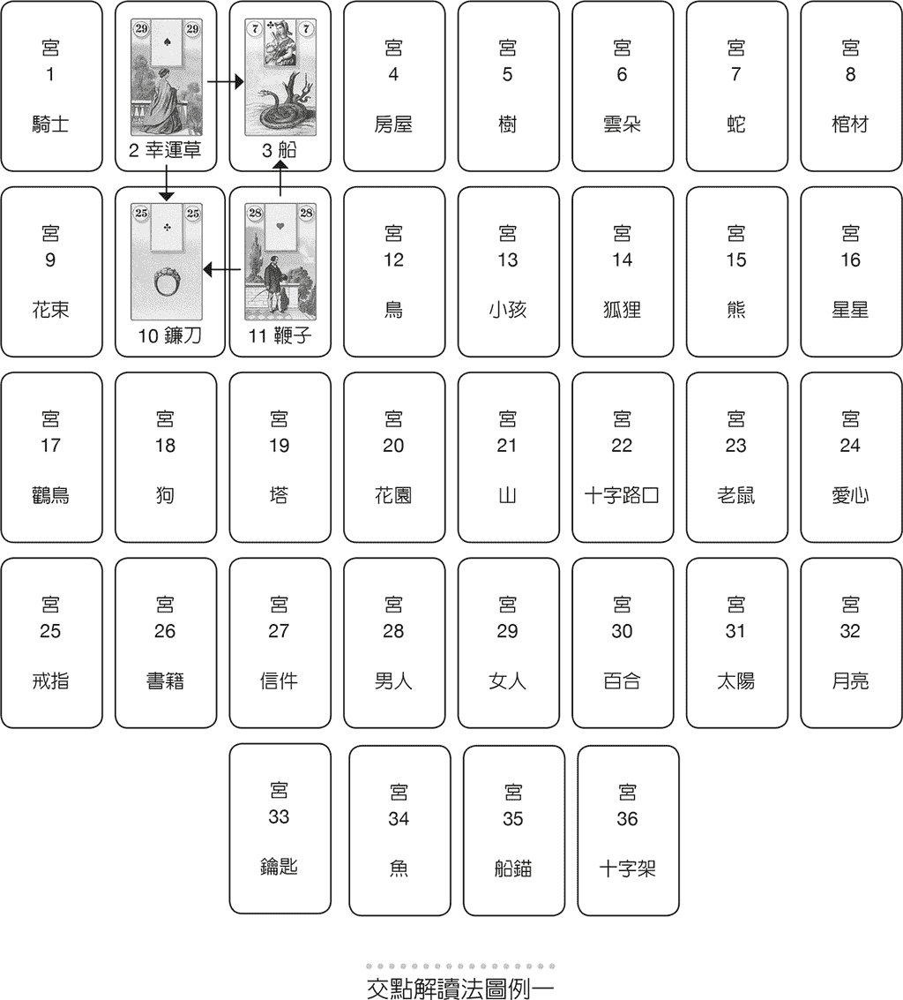

在这个牌面中，男人牌和女人牌落在直接的对角线上，意味着亲密的关系。延伸横轴和纵轴能够找到两个交会点：蛇和戒指代表婚姻会出现问题，跟谎言与欺骗有关。既然如此，我想要了解这段关系是否有第三者。

我找到狗这张牌，想要检视看看是否有任何关联，以及是否与现况有间接的关系（亦即对角线）。狗落在了山的宫位：麻烦大了！有了第三者的迹象，我就能够寻找其他交会点来确定这另一段关系。

同样的，透过转角，我找到了连接这两张在对角线上的牌卡交会点。首先，我将狗对应到个案牌（在此例中为女人牌），检查是否有任何相关。如果两张牌无关，我就会将狗链接到伴侣的指示牌（男人）。我试着判断是否有第三者以及有第三者的那个人。

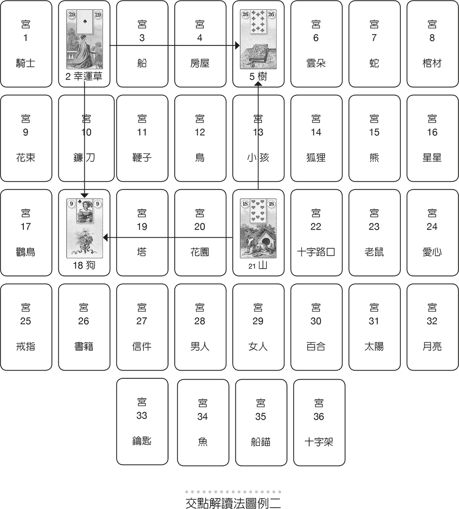

在图例二，我们可以看到女人和狗的交点是花束和书籍。宾果！这个房间里有恋人，以及个案与第三者的美好又秘密的关系。

如果我想要为个案解读得更深入一点，我会把宫位加进去，进一步得到细节，增添解读讯息的丰富度。我会在任何指示牌／主题牌上使用这个解读法，判断它的意义和对个案的影响，特别会在一开始解读时无法清楚了解牌义后使用。

如果你试着找出两人之间的状态，交点解读法能够使用在任何关系中，揭露惊人的细节信息。

## 解读大蓝图的步骤

我会先沉淀心神，做几次深呼吸，并与周围的一切链接。接着，我会专注于本次占卜的对象，

然后，我会选择牌卡。通常来说，如果要占卜大蓝图，我会选择画面简洁的牌卡，符号才能清楚浮现，牌面才不会太过复杂或混杂。如果牌面太花俏，会影响占卜解读，因为符号无法轻易浮现在你的眼前。

专注于个案和（或）他的问题时，我会同时洗牌。

．如果有第二人或第三方关系人涉及到问题，我会在心中将特定的牌面代表这些人。举例来说，假设个案的指示牌是男人牌，他的妻子就会是女人牌，而他的小三就会是狗这张牌。（我通常会把狗视为第三人，如此我就可以让其他牌维持负面和正面的属性，方便解读；如果有第四人，我就会用骑士牌来代表他／她。）在多数例子中，我所做的只是专注于个案本身。

．我会先将时间范围包含进问题当中，例如一个月、三个月、半年、一年。大蓝图牌阵一定要记得设定时间范围，因为有时候牌面的时间点可能会延伸到非常遥远的未来。

．大蓝图最下方的四张牌通常会给出惊人的讯息，所以我会决定最后四张牌传达什么讯息——个案寻求的建议或信息、最后总结或重要讯息。如果你没有设定这四张牌的目的，那就将它们视为占卜内容的最后一条线性讯息，而非故事情节的落幕总结。

．我所有启动主题牌或决定任何占卜目的的过程，都是边洗牌边进行——也就是正式摆牌之前。

洗好牌后，我会感受一下牌卡，直到我准备好就会切牌，并开始摆牌。牌面向上，每一横排八张牌，总共四排，最后四张牌在最下方的中间位置。这个版本的大蓝图牌阵称为“八乘四加四”牌阵。这是我最喜欢使用的牌阵，因为它已经深植在我的脑海里了。这个牌阵是我最信任、最可靠的牌阵，而且它的确有用，给我很棒的占卜结果，我也因此获得惊人的回馈，所以我从此都使用这个牌阵。我也喜欢最后一张牌作为结尾的牌面。

摆完所有的牌之后，我会先注意前三张或前四张牌，因为它们通常代表这次占卜的能量、感觉、主题或动能。它们是我私人的小小解读方法。这些牌面让我知道占卜结果是否正面乐观、令人沉重或是没那么好。这些牌如同我的小窥管，让我得以窥探整体局面。

接着，我会找到指示牌：如果个案是男性，就是男人牌；如果个案是女性，就是女人牌。然后我会定位这张牌卡，检视它是否在牌阵的最上方或最下方，在开始还是结尾。牌卡的位置会为个案的生活状况提供额外线索（参照时间划分法和觉察分层法的解说）。

接下来，我会解读交会于指示牌的两条轴线，指示牌左方的牌面是过去，右方的牌面是未来与即将来临的事件。指示牌上方是个案担忧的事情、思考的事情、让他压力大的事情；指示牌下方是正在处理、已经掌握或是已知的事。

现在，我会以个案的指示牌为中心，使用三乘三的“九宫格牌阵”来解读（参照九宫格牌阵说明）。此时，我可能会用交点解读法来检查与个案“交会”的主要议题在哪里。

我会检查负面牌面距离指示牌有多远或多近，以及负面的程度多强烈，或者是否会立即出现厄运。我也会检查这些负面牌是否都凑在一起，因为这会强调个案需要注意的重要讯息。假设它们都凑在房屋牌周围，我就会跟个案强调一定要关注家中的难关，并且需要立刻处理。

接下来，我会继续查看其他重要的主题牌。例如，房屋代表房地产、房子或家庭；戒指代表婚姻或合约；爱心代表恋情；狗代表朋友或宠物；树代表健康；熊代表财务状况；书籍代表专案计划；鱼代表顾问、事业或个人公司；塔代表企业机构、法律事务、学校或大学……诸如此类。

解读每一张与个案相关的主题牌的流程，都与解读指示牌的流程一样，需要你采用上述提到的所有流程，使用交叉解读法和九宫格牌阵。

完成以上部分后，我会询问个案是否有任何想再了解但我没解释到的主题。我会接着找到最能够象征该主题的牌卡，并且以同样的流程进行解读——先是交叉解读法，再用九宫格牌阵。

解读完整局牌面之后，如果还有一些不清楚的讯息，或是我想要额外验证信息，我就会采用宫位锁链法，搭配解读每张牌卡和它们座落的宫位。宫位锁链法能够让牌面浮现更多细节，并给予按照顺序的预测，了解事件发展，如同我们看一部老旧的电影胶片，事件逐帧展开一样（参照宫位锁链法的解说）。

我要做占卜总结时，会再仔细解读最后四张牌，它们是占卜内容的结论，是牌面的最后总结。有时候我会将这四张牌当作给个案的建议，但前提是在洗牌时就要先设定好这四张牌的意义。这最后四张牌是结束占卜的牌面——大蓝图的最后讯息。

最后两个步骤只会在少数情况下使用，亦即如果仍有什么事情让我觉得怪怪的话：

．我可能会检查大蓝图四个角落的牌卡（一、八、二十五、三十二宫），知悉更多洞见。将它们以线性的方式解读，而它们通常会紧扣占卜内容。

．接着，我会使用骑士解读法。我很少会用到这两个步骤，因为通常前面的流程就可以回答所有问题和疑惑了。偶尔会有人需要额外信息来验证，那么就可以拿这些解读法来用。

可能一次提供这些信息，对初学者而言太庞大了，但是只要你开始练习，就会逐步看见大蓝图如花朵般逐渐绽放。按照以下图示说明的步骤练习，便能更加清楚大蓝图的完整内容。

### 大蓝图牌阵的实占案例

这是我为黛安解读的大蓝图，她是我的个案。

黛安找我占卜时，没有提供任何问题、疑问或信息，我只能自己从牌阵中探索、挖掘。牌阵显示出她在婚姻上进退维谷，也显示出其他问题与担忧，包括黛安犹豫不决的事情和刻意隐藏的秘密。她不太相信占卜，她会来找我的唯一原因只是因为她朋友（也是我的个案之一）帮她预约了占卜，作为她的生日礼物。解读完牌面之后，黛安从原本的怀疑论者，转而完全相信占卜，自此之后成了我的熟客。

做完沉淀心神的自我仪式后，我洗牌并专注于黛安身上、她的人生和未来半年的运势，我也将最后四张牌定义为建议牌，接着排出大蓝图牌阵。

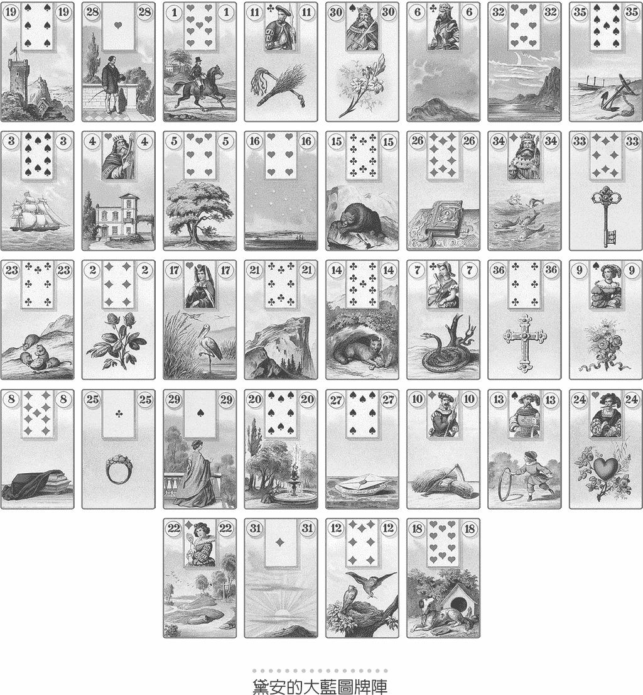

．塔＋男人＋骑士＋鞭子，前面这四张牌告诉了我许多事情。首先，我知道主要的问题在于她老公，因为男人牌就出现在前四张牌当中。同时，骑士也带来行动，而鞭子带来争执或口角，可能跟法律官司有关（塔）。

．女人牌的位置靠近下方，表示她目前承受着巨大的压力，或是现在内心有许多担忧。

先解读女人（个案的指示牌）周围的牌面，接着做九宫格解读法（参照后面的图例）。

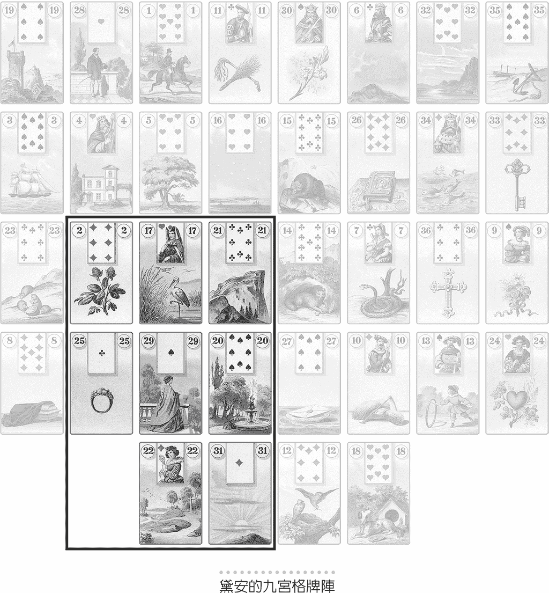

透过九宫格牌阵，我们会看到：

★幸运草＋鹳鸟＋山：黛安正在思考某种行动或是改变某些事情的机会，但有阻碍在前

★戒指＋女人＋花园：她已婚或是处在互相承诺的关系中；她也很享受社交生活

★十字路口＋太阳：通常十字路口靠近指示牌，意味着有婚外情，但我想要先了解更多证据后才开口解读；十字路口右边有着太阳，代表令她开心的地方或是前景乐观的选择

因为最后几张牌的关系，我决定使用以女人牌为中心点的钻石法，验证我最初的想法。

★鹳鸟＋戒指＋十字路口＋花园＋鹳鸟：承诺有了转变；可能的因素来自于分歧或是其他社交活动

★幸运草＋戒指：黛安过去有段愉快美好的婚姻

★鹳鸟＋女人＋十字路口：她正思考着是否要往前或者是改变现况，但仍犹豫不决

★山＋花园＋太阳：社会压力或干扰让她烦心，但她最终会克服

作为额外的验证信息，我使用交点解读法将黛安与狗这张牌串连起来，狗在这里象征第三方的指示牌。交点解读法能够让他们的关系曝光，如此我就能够在跟她解说之前，了解更完整的原貌。

串连到女人（黛安）和狗（秘密的第三方）的角落是十字路口（选择或双重）和镰刀（意外或危险）这两张牌。这只神秘的狗，显而易见是位重要的角色，带来严重的风险或困难的抉择。

使用交叉解读法，解读交会于指示牌的双轴线：

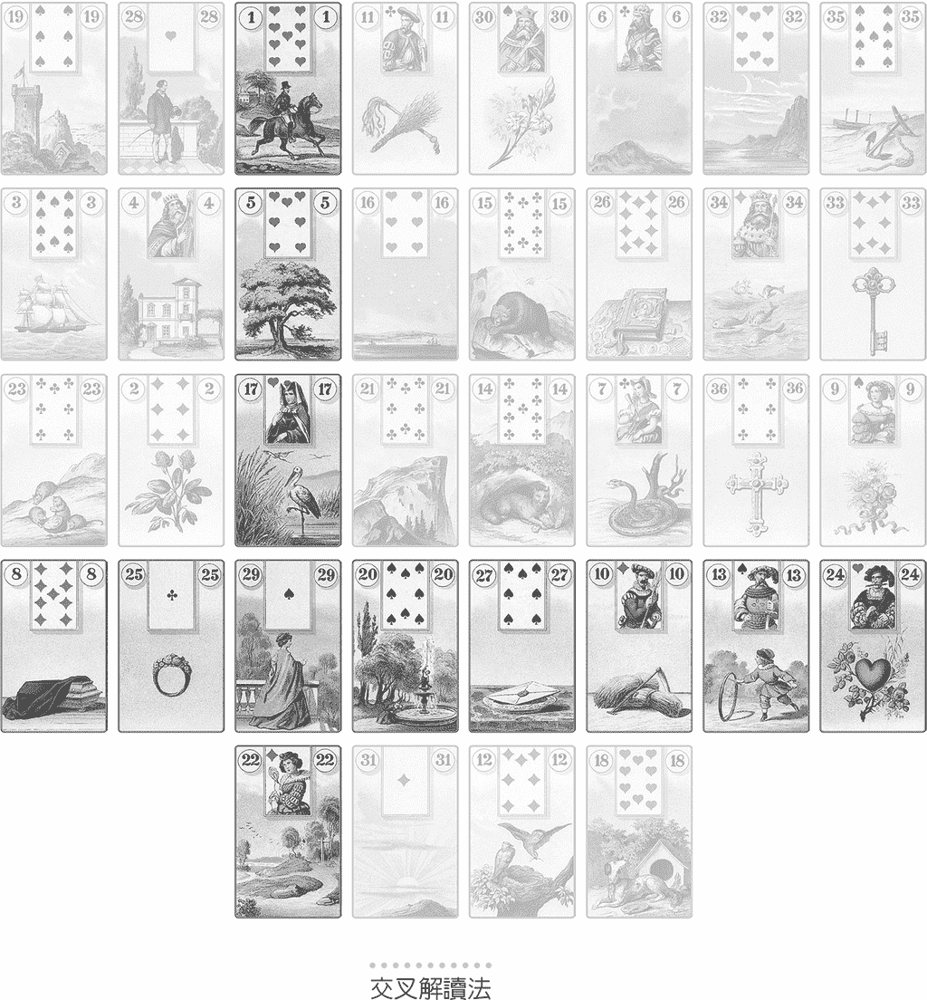

★骑士＋树＋鹳鸟：目前有新的人、新的移动或是新的情况，让黛安审慎思考是否该改变生活、重整人生

★女人＋十字路口：她知道自己得做出选择

★棺材＋戒指：她的婚姻最近出现状况；停滞的关系；有机会可以重燃花火

★花园＋信件＋镰刀＋小孩＋爱心：三或四个月之内，分开的消息会公诸于世，让她在第六个月的月底稍微开心一点

接下来我要解读婚姻关系，所以我找到戒指牌，并解读周围的牌面。戒指在第二十六宫（书籍），秘密之宫；而棺材在第二十五宫（戒指），承诺与合约之宫。对我来说，这样的牌面大大明示着婚姻问题。

★老鼠＋幸运草＋鹳鸟：这三张牌意味着婚姻带来压力，可能很快就会发生变化

★棺材＋戒指＋女人：暗示着这段婚姻的另一种可能性也会以同样的方式结束

戒指的未来牌面落在跟女人牌同一条的未来轴线，这证实了婚姻会出现分离，因为镰刀出现在未来轴线上。

★男人＋房屋＋幸运草＋戒指：意味着黛安的丈夫是一家之主，不觉得婚姻有任何问题，而且感到一切都很快乐、美好

黛安和她丈夫的牌面如此不同，让我想要接着解读代表她丈夫的男人牌。

★塔＋男人＋骑士：代表有权威的男性，总是外出且可能经常独来独往

★船＋房屋＋树：他常为了家庭与事业的稳定而外出奔波，或者往返在旅途与家庭之间就是他的家庭生活

此时，黛安验证了目前所解读到的讯息，她告诉我她的丈夫频繁出差的行程。她说道：“他总是不在家。每次外出就是两个月。”她也提及了自己的婚外情。

这些牌面现在变得如此清楚：第一宫的塔＝他独自一人，因为他总是在外奔波。第三宫（船）出现骑士＝因为频繁的外出，他一直在移动。第十宫（镰刀）出现房屋＝家庭破裂，或是突然有关家庭的鲁莽决定。第十一宫（鞭子）出现树，代表他的家庭不和已经根深柢固了。

大蓝图中女人牌与男人牌的距离也呼应到他们的婚姻状况，仿佛他们各自活在不同的世界。

检查牌面中是否有特别负面的牌卡，检视这些牌卡的影响是什么：

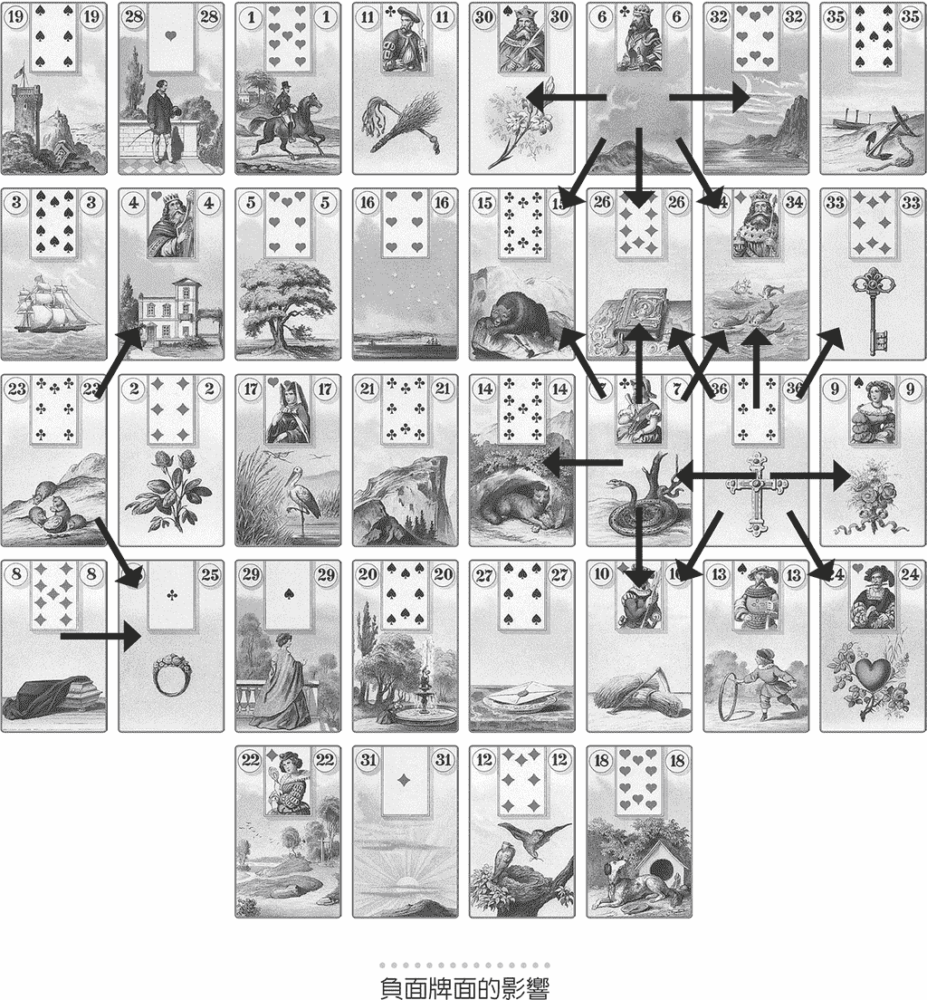

．棺材影响戒指＝婚姻；并且加重了压力，老鼠

．老鼠影响这些牌：戒指＝婚姻；房屋＝房子或家人；船＝旅途

．云朵影响这些牌：熊＝财务；鱼＝现金流或个人事业；书籍＝秘密或专案

．蛇影响这些牌：熊＝财务；鱼＝现金流或个人事业；书籍＝秘密或专案；狐狸＝工作；镰刀＝抉择或突然的破裂

．十字架影响这些牌：书籍＝秘密或专案；鱼＝现金流或个人事业；钥匙＝解决；蛇＝麻烦；花束＝快乐；镰刀＝抉择或突然的破裂；爱心＝爱与喜悦的感受

黛安的下一个问题与她的工作有关。为了决定哪一张牌才是适合她工作的主题牌，我必须了解她是否有工作并有稳定的薪水，抑或她是自由工作者或自雇业者。她表示自己有稳定的工作，所以我找到狐狸牌并解读周围的牌面。

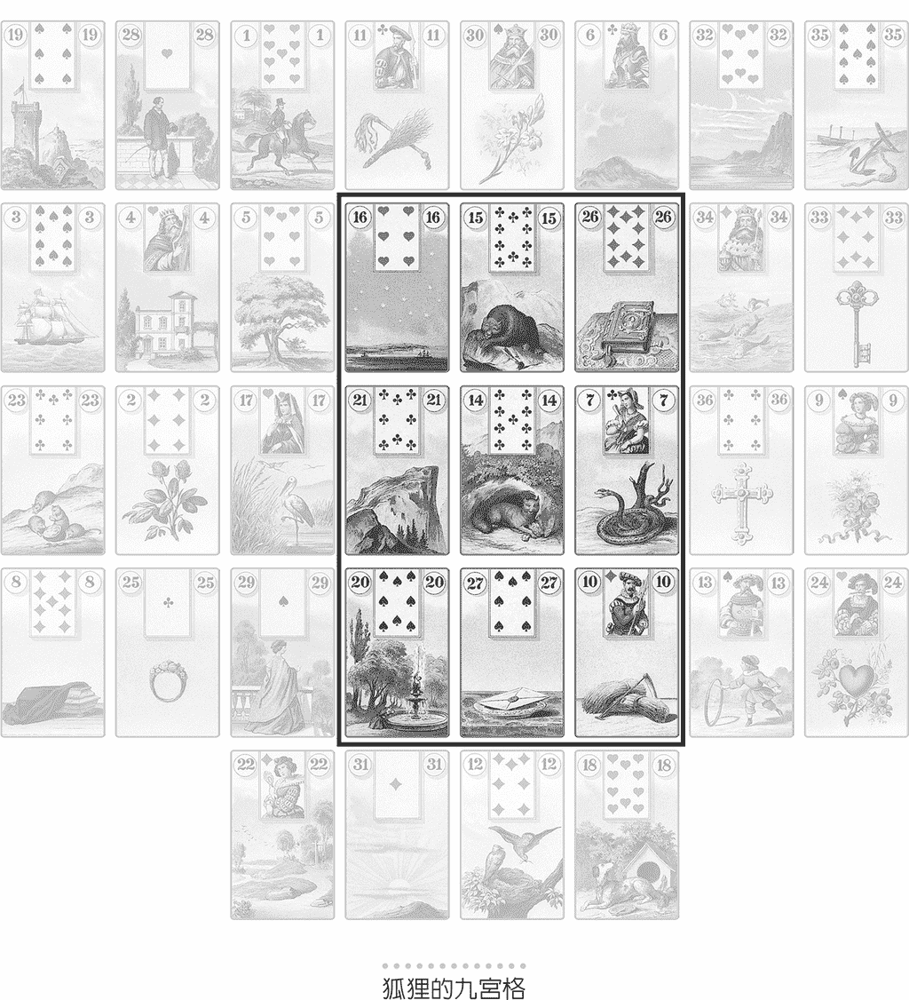

★星星＋熊＋书籍：美好、有权势的主管阶层，负责监督、制图、研究市场分析

★山＋狐狸＋蛇：工作目前很稳定，但是员工会有些状况

★花园＋信件＋镰刀＋狐狸：人脉、沟通、决策是这份工作的一部分，并且也都能掌控全局，因为这些牌都在狐狸之下

★星星＋山＋花园：新的执行方案或是某些创新计划遭到延宕，或者过程太缓慢而无法公开

★熊＋狐狸＋信件：黛安负责监督文件并沟通所有问题

★书籍＋蛇＋镰刀：研究或检验上会有误差，有其他问题需要厘清和清除，可能需要调整预算，或是未来要缩编预算

★老鼠＋幸运草＋鹳鸟＋山：对于新的转变会有压力，某种更新会遭到延宕或停滞不前

★蛇＋十字架＋花束：接下来的三到四个月会压力如山大，要面对难关与痛苦，但是最后会松一口气或是有好结果

第二十一宫（山）出现狐狸，代表黛安的职位目前很稳定。她不会有任何变动，但同时她正经历某些挑战与难关。

黛安开始跟我解释她的工作是专案经理人，目前遇到的问题是必须解雇某些下属。她也表示公司正在执行的更新遇到了问题。

### 使用宫位锁链法

我先找到个案的指示牌（女人），它落在第二十七宫（信件），而信件落在第二十九宫（女人），这两张牌互相辉映，并特别强调两张牌之间的关系。出现这样的状况，意味着有非常重要的文件或某种消息让我的个案担忧不已。

我问道是否有文件或重要的信件，又或是重要信息，让她一直忧心忡忡。黛安点头表示没错，并说她正在等法律文件，才能决定是否要跟丈夫对峙谈离婚，或是尝试其他方法。

根据黛安的回答，我决定从十字路口的宫位开始，这张牌象征选择与决定和犹豫不决，来检视是否有更多讯息并协助黛安。

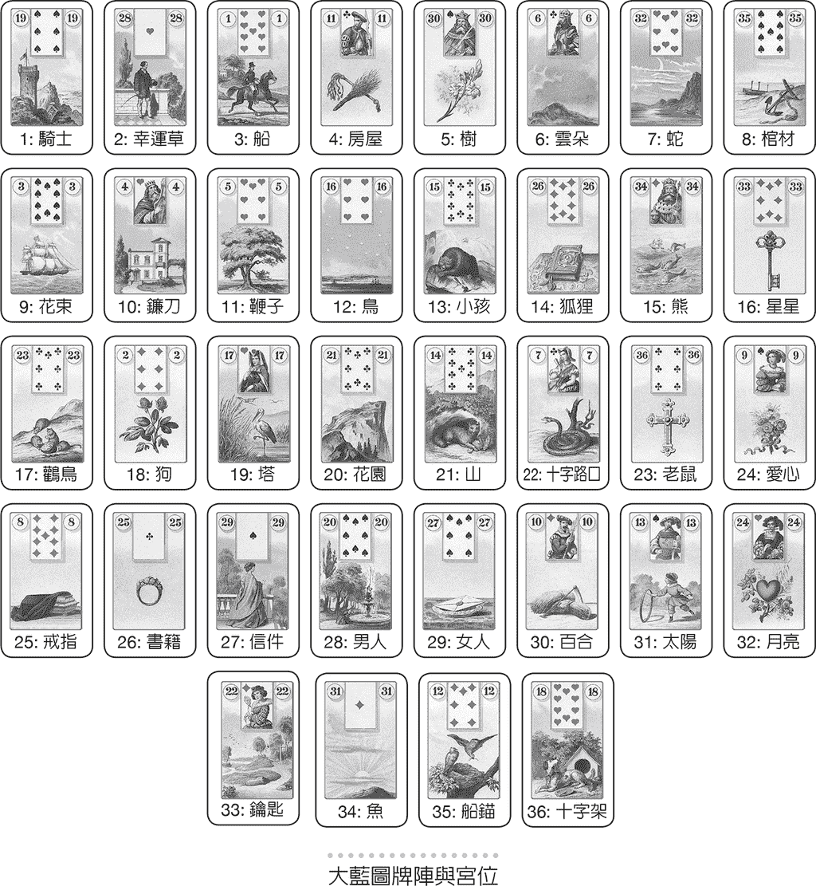

．十字路口落在第三十三宫位（钥匙），成了关键的决策。

．钥匙落在第十六宫（星星），代表解决办法对黛安的人生有严重影响。

．星星在第十二宫（鸟）闪烁，带领她走向亲密关系的新方向。

．鸟栖息在第三十五宫（船锚），这段关系很稳定、稳固，或是已经持续一段时间了。

．船锚定锚在第八宫（棺材），关系的稳定度会发生剧烈的转变、改变、结束，或是沉重感如同枷锁将她束缚。

．棺材埋在第二十五宫（戒指），代表承诺或婚姻会发生转变或终结。

．戒指在第二十六宫（书籍）发光，这段承诺或婚姻因为秘密、隐瞒、未知信息而关系紧绷。

．书籍落在第十四宫（狐狸），秘密或信息会以非常狡猾的方式被操弄。

．狐狸落在第二十一宫（山），这个操弄会受到阻碍或挫败，可能会造成隔阂。

．山座落在第二十宫（花园），隔阂或阻碍会来自特定人群或特定交友圈、社交圈。

．花园落在第二十八宫（男人），戴安的丈夫有可能管理着一群人，或是在团体中有很大的影响力，又或者这个团体对他来说很重要。

．男人站在第二宫（幸运草），黛安的丈夫会得到其他机会或看到机会。

．幸运草长在第十八宫（狗），这个机会或二次机会与黛安的恋人有关。

．狗在第三十六宫（十字架）等待，黛安的恋人会遭受痛苦与哀伤。

．十字架落在第二十三宫（老鼠），痛苦与悲伤会扩散，还会有焦虑和压力。

．老鼠在第十七宫（鹳鸟）蹑手蹑脚，压力和痛苦可能会消散，会稍微恢复。

．鹳鸟降落在第十九宫（塔），法律官司会有好结果，搬进高楼大厦或公寓大楼，或是在法律上占上风。

．塔从第一宫升起（骑士），法律事务会有快速的行动，或是得到新公寓。

．骑士出现在第三宫（船），往前迈进或分离的消息，或是新公寓的地点需要在旅程中才会发现。

．船驶在第九宫（花束），分离或新地点会带来愉悦，事件有愉快的转变。

．花束落在第二十四宫（爱心），因为事件有愉快的转变，会为内心带来喜悦。

．爱心在第三十二宫（月亮），黛安的爱心和喜悦会滋养这段恋情。

．月亮漂浮在第七宫（蛇），这段关系会遭遇嫉妒或麻烦，或是黛安的名声会遭遇小人攻击；而蛇落在第二十二宫（十字路口），回到最一开始的牌，代表这个抉择并不容易。

解读完宫位锁链法之后，所有的讯息都符合黛安的状况，她的内心很有共鸣，特别是她老公是某个有严格入会标准的俱乐部会员。如果离婚，她丈夫就会获得可观的财富，这就是让她烦恼的法律问题，并且她也对于要搬进城市深感焦虑。黛安非常满意占卜内容，她说看到她的状况一步一步被牌卡呈现出来，帮助她能够头脑清晰地做选择。

黛安又问了她的财富状况，所以我又看了熊这张牌。我再次用了宫位锁链法：

．熊落在第十三宫（小孩），意味着会有微小的收益，或是资产可能稍微增加／减少。

．小孩落在第三十一宫（太阳），会有小收益，或是小额投资会有大好收获。

．太阳落在第三十四宫（鱼），这个成功会增加现金流；鱼落在第十五宫（熊），意味着尽管可能会遇到小挫折，资金终究还是会收获丰盛。

如果我们用九宫格牌阵来解读大蓝图中的熊，牌面的答案解读起来也一样。

最初洗牌时，我已经先设定了最后四张牌为具体建议。我总是会在一开始洗牌的时候先设定最后四张牌的目的；而针对这个情况，黛安来找我是为了得到特定指引。

★十字路口＋太阳＋鸟＋狗：所做的决定必须要让自己绽放光芒，并且忠于自我、灵魂和关系。选择正向的道路，保持正向，以正面的态度对待朋友、挚爱，以鼓励和有建设性的话语来沟通

我给黛安最后的建议是保持平静，乐观看待一切，无论何时都选择较美善的道路，并且未来都要愉悦地沟通。

我相信接下来的两个步骤不太必要，特别是我们经历了上述的所有步骤，也得到了所需的信息。然而为了示范，我们还是继续下去吧。

### 四角解读法

有时我最后会看一眼四个角落的牌，作为总和、额外洞见和验证某些事情，又或者是我没时间使用宫位锁链法的时候。

黛安的大蓝图牌阵中的四个角落，我看到塔＋船锚＋爱心＋棺材（＋塔）。

这些牌跟长期孤独或隔离有关，因而窒息了心中的爱、热情或关系。这个改变或转变连带造成生活必须彻底重整（棺材＋塔），也有法律官司涉及其中。

### 骑士解读法

骑士解读法是很有趣的技巧，如果省略掉前面的流程，或不想要采用前面的解读法，就可以使用这个技巧。

以女人牌为中心做骑士解读法，会对应到：

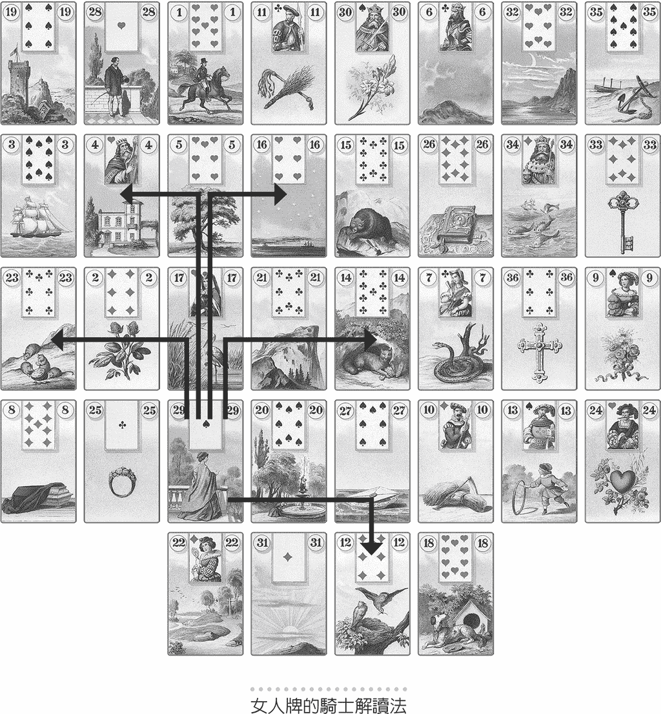

★女人＋老鼠＝焦虑的女人

★女人＋狐狸＝聪明但有点“偷偷摸摸”的女人

★女人＋房屋＝稳定的女人，或者在这个案例中代表有房契的女人

★女人＋星星＝受欢迎、知名的女人，或是踏上人生新方向的女人

★女人＋鸟＝正在谈判的女人，或是正在约会、上法庭的女人

以十字路口为中心做骑士解读法，会对应到：

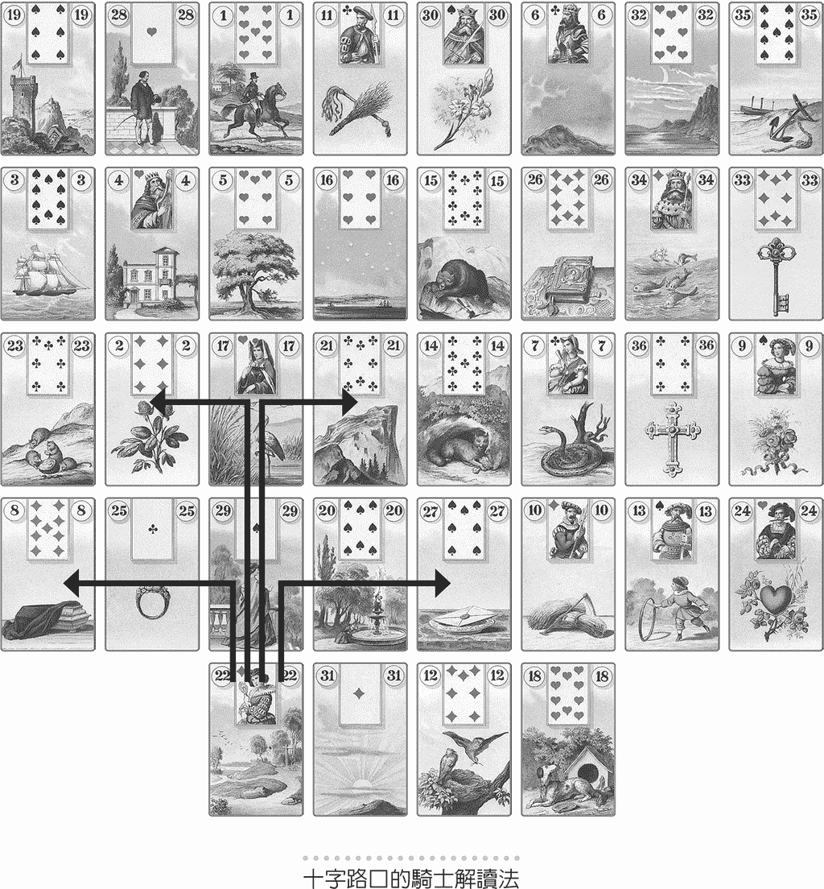

★十字路口＋山＝卡住的决策

★十字路口＋信件＝决定等待文件，或是文件能做出最后决策

★十字路口＋幸运草＝冒险一搏

★十字路口＋棺材＝改变人生的决定，选择结束，可能造成某些损失

### 结论

这个大蓝图呈现出黛安生活中所有的一切：担忧、压力、痛苦、秘密。每一个大蓝图都会呈现出独特的特性和故事。有时候你会看见同样的故事在不同的解读法中一再重复，而有时候你会发现某些主题和焦点会诱发出其他议题。

大蓝图需要大量练习和耐心。这些解读法赋予你一套良好的解读系统，随着时间累积，就能强化你的解牌自信。最终，你看着大蓝图牌阵，会将它视为广袤的信息网，其中交织着许多细节，成为一幅巨大的画作。大蓝图的讯息对个案来说可能太庞大或太有侵略性。它的讯息会非常深入又激烈，这时候就要用你的直觉和本能告诉你哪些秘密能够揭露，哪些讯息是个案可以接受的内容。

好好享受大蓝图牌阵，花时间练习和解读它。每月占卜一次大蓝图，拍照做纪录，并写下你解读出的讯息，再回头翻阅并检查所有信息。选择你最有感觉的方法，挑选你用起来最准确的解读法。

练习、练习、练习！预测、预测、预测！

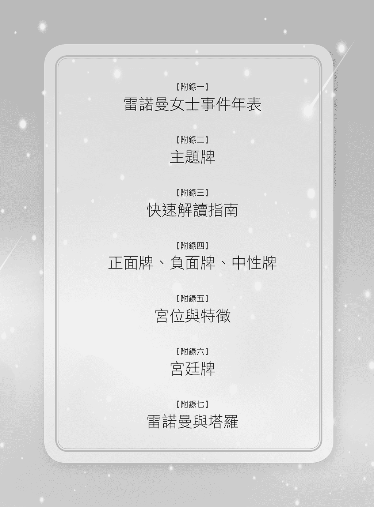

## 【附录一】

## 雷诺曼女士事件年表

玛丽．安．阿德莱德．雷诺曼于一七七二年三月二十七日，在法国阿朗松区的圣雷欧纳德教区受洗。她是家中第二个小孩，双亲为安．玛丽和尚恩．路易．雷诺曼，他们是中产阶级家庭，家里经营布料生意，收入可观。因为她的确切生辰不可考，让我这位年轻的占星师无法想像她作为鼎鼎大名的占卜师，星盘会如何刻画她的命运。她梦想着在剧场表演，法兰西喜剧院的世界让她深深着迷。只是她知道自己不够貌美、优雅，无法上台演出，因此选择成为知名的剧作家。

一七七三年：最小的妹妹苏菲出生后，她的父亲就死于高烧，年仅三十七岁。

一七七四年：母亲安．玛丽独自抚育三个孩子，再嫁以萨．荷赛。

一七七五年：安．玛丽生下一个儿子法赛斯．路易。

一七七七年：安．玛丽生下死胎的三天后也随之离世。雷诺曼在年幼的五岁就成了孤儿。

一七七八年：继父是位精明的商人，扩展了雷诺曼父母的事业。他在巴黎开了一家店，并娶了十七岁的玛丽．珍妮．卡妮，而卡妮成为了这些小孩的大姊姊。不幸的是，卡妮在同年于生产时离世，刚出世的女儿也随之没了气息。

一七七九年：荷赛没有因此停下脚步，又娶了十八岁的露意丝．亨利，一位来自富裕家庭的女孩。雷诺曼的回忆录中曾提及露意丝．亨利是位邪恶的继母。雷诺曼在回忆录中花了许多篇幅，仔细描述她如何被这第二位继母长期羞辱、强迫劳动。

一七八〇年：雷诺曼发现了剧场的世界，于是悄悄离家，一头栽进创作的梦想里。她觉得自己找到了天命所归。她的祖父发现了她的状况，决定将她送到蒙寿本笃修道院就学，这是当时知名的女子修道院学校。

一七八一年：作为一名新生，雷诺曼就预言了修道院院长和她管理的修道院将一无所有并入狱。她也预言了下任院长会是红发，且姓名开头是 C 和 F 这两个字母。尽管遭到惩罚与鞭笞，雷诺曼依旧不愿改口。雷诺曼最后被退学，转送去更古老、小型的圣母访亲女修会。小雷诺曼抵达修会的六个月后，消息在修道院之间传遍了。本笃会爆出丑闻，修道院院长因为贪污遭到逮捕，继任的院长为褐色头发的凯瑟琳．法赛斯。雷诺曼的预言也产生了流言蜚语，导致圣母访亲女修会拒绝接收一位“女巫”，因此她又再次被退学。雷诺曼早年的预言有被记录下来，流传数个世纪。

一七八二年：雷诺曼被送到女裁缝师工作室去学习缝纫。待在裁缝工作室期间，她观察到另一位学徒使用一套叫做艾德亚（Mr. Etteilla）塔罗牌的纸牌来预测未来，她因此发现了自己的天命。出于有趣，那位女孩帮雷诺曼抽了两张牌，抽到太阳和力量。她预言雷诺曼未来会名利双收。雷诺曼想要买一套艾德亚塔罗牌，但负担不起。她改而买了一套普通的纸牌。

一七八四年：遭受失业和严重粮食短缺的影响，裁缝工作室撑了长达两年的经济寒冬，最后还是收掉了。

一七八六年：十四岁的雷诺曼说服继父让她在店里当收银员，随后便前往巴黎。她带着包袱，包袱里装着三样物品：一件白色洋装、纸牌和荷马史诗《伊里亚德》。

雷诺曼爱极了数字，也证明自己是位厉害的收银员和店员。顾客都喜欢她，同事也是，而其中一位同事更是让她成名的重要推手。这位店员介绍犹太秘教卡巴拉和毕达哥拉斯的作品给雷诺曼，又给了她许多神秘学的书籍，并带她去见瑞士神学家约翰．卡斯帕．拉瓦特，他曾预测国王会离奇死亡。雷诺曼曾试着要见到鼎鼎大名的艾德亚先生，但他的占卜最低价码是二十四里弗尔（相当于现今的一千元美金）。尽管如此，她至少能买得起一套梦寐以求的塔罗牌和一小本牌卡手册。

一七八七年：雷诺曼遇见了幼年的邻居雅克．埃贝尔，他在几年后成了知名记者。同年，雷诺曼十五岁时，因为在塞纳河岸独自进行降灵会和仪式而首次遭到警察逮捕。

一七八九年：一月时，雷诺曼遇到波纳蒙蒂．居荣，一位知名的女占星师，并成为她的学徒，向她学习占星术。那一年，她听闻弗朗兹．约瑟夫．加尔医师也是通灵师，发展出了颅相学（解读人类头颅），因此希望能跟他学习，但只知道他在英国只待到春天结束。她决定要生出钱来去英国，她向她的占星师谘询后，将所有积蓄拿去买彩券，赢得了一万两千法郎，是一笔比她的年收入足足多出一百倍的钜款。

命运似乎安排她走上这一条路。雷诺曼打包行李出发去伦敦，见到了加尔医师。加尔医师解读了她的头颅，预测她会成为伟大的先知，并把她比拟为传奇的意大利库迈女先知。

一七八九年八月：雷诺曼已经在伦敦西区的波特曼广场开了一间店，招牌上写着“来自巴黎的占星师，雷诺曼女士”。伦敦当时非常流行来自法国的算命师。不到一年，她变得知名且富有，一天工作好几个小时为皇室贵族预言。雷诺曼也预测出法国国王路易十六会被推翻并废黜。由于乡愁，她决定在法国大革命期间返回法国。她已经预测了自己的一生，因此丝毫不担心。

一七九〇年：雷诺曼回到家乡阿朗松时，已是富裕的女性。她帮妹妹置办了华丽的嫁妆，并帮助弟弟在军队里获得提拔。

一七九一年：雷诺曼回到巴黎，她发现艾德亚消失了，留下了一切给世人。她的朋友埃贝尔因为写作而出名。她试图再走进剧场的世界，但她的剧本都被打了回票。二十岁时，带着失落的心情，她重操旧业，在巴黎第六区的图尔农路九号开店。接着，她买下了图尔农路五号，并挂上招牌“雷诺曼女士的书店”。

一七九二年：雷诺曼的朋友埃贝尔娶了法赛丝．古皮耶，婚礼办在豪华招待所。雷诺曼在这里认识了上层阶级的人物，包括画家贾克．路易．大卫。婚礼对她而言并不是开心的场合，因为她倾心于埃贝尔。

一七九三年：有一天晚上，三位男士前来找雷诺曼，请她为他们三人一起解读，因为他们是命运共同体。她立刻认出他们是马拉、罗伯斯庇尔和圣茹斯特，三位都是法国大革命的重要人物。她请他们用同一叠牌卡洗牌、切牌，接着为每一位都抽了一张牌，牌面朝下放着。然后，她请他们从艾德亚塔罗牌中抽出十二张牌。她将对应每一位的牌一张一张摊开后便停下了动作，这个举动引起了三位男士的怒火。他们笑了起来，接着马拉把钱直接丢在牌上，但是他不知道这是大禁忌，占卜还没结束前，不能让钱碰到牌卡。她接着告诉他们：“如果你们真的想知道命运，那就是这一年内，你们都会死状凄惨。”她转头对马拉说：“先生，至于你，你会比你的同党先死，而且人们将背叛你。”马拉气愤地告诉她：“你的预言根本就是胡言乱语。如果大革命真会让我们惨死，那我们三个人也会一起死。”他们三位离开时，还嘲笑她的预言。

该年的年中，雷诺曼出席了一场贵族晚宴，当时贵族正计划着如何拯救玛丽．安东妮皇后。隔日，她看见警察抓走了几位前一晚与她共进晚餐的宾客。因为担心自己被逮捕，于是雷诺曼在街上乱晃，巧遇一位低调的算命师拉吉贝尔，而她最后跟他合作。拉吉贝尔送了雷诺曼一套革命运动占卜卡，牌面上画着解放的寓言和穿着劳动阶级服饰的共和党员，这样比较能讨好她的新客人，也就是那些参与革命的平民。以头巾和羽毛伪装自己后，雷诺曼开始在塞纳河上的新桥为平民占卜。

五月七日当天，雷诺曼在桥上帮一位男士占卜，并预测他会在十天内被送上断头台。十天后，这位男士毫发无伤地回到桥上，并叫上警察逮捕她。在狱中待了两天并罚款十里弗尔后，她隐身了四个月，直到皇后被送上断头台，她才又回到她在图尔农路的工作室。

七月十三日当天，马拉遭到暗杀。罗伯斯庇尔和圣茹斯特再次回来见雷诺曼。她简单地证实了他们的残暴宿命。罗伯斯庇尔成了她的常客，但是她十分嫌恶他。在她的回忆录中，这个造成国家动乱的男人被她描述成看见黑桃九就吓得发抖的人。

那一年晚些时候，雷诺曼开门接待了一位有着科西嘉口音的年轻军官。她预测他会享有伟大的名誉和荣耀，且身边会有一位寡妇。这位科西嘉军官认为她胡言乱语，要求她将自己转介给一位占星师。她开心地给了年轻的拿破仑一个地址，叫他去找居荣，而居荣的预测也跟雷诺曼一样，并提及他会掌握王权。拿破仑怒气冲天地离开，想着自己被两位神棍骗了。

一七九四年：三月时，雅各宾专政的恐怖统治时期，埃贝尔被逮补并惨遭处决。

六月十七日，雷诺曼被逮捕，并送往拉大众监狱，她在狱中遇到许多知名贵族和革命者，并与他们交流。

七月二十八日，罗伯斯庇尔和圣茹斯特被送上断头台，雅各宾专政也画下句点。

八月五日，经过可怕的囚禁后，雷诺曼终获释放。

一七九六年：约瑟芬和雷诺曼之间的友谊开始萌芽。雷诺曼建议约瑟芬嫁给年轻的拿破仑将军。后来他们在一七九六年三月九日结婚。

一七九六至一八〇一年：雷诺曼的名声家喻户晓，客人络绎不绝，从皇室贵族到劳动阶级的平民都来找她。她的占卜工具和才华逐渐拓展，塔罗、占星、纸牌占卜、数字学、鸡蛋占卜术、手相、水卜（凝视水面来占卜）、镜面占卜（凝视镜面来占卜）、面相、咖啡渣占卜（解读咖啡渣来预言）、鸡卦（用公鸡来卜卦）、火焰占卜（凝视烛火或油灯的火焰来占卜）等等。她也为大众写了一些剧本。

由于开销和债务越来越多，因此雷诺曼调涨了费用。支付五法郎（大约一百美金），雷诺曼就会为客户深入解读过去，提及一点现况，并稍微讲一下未来。她的客户被解读打动后，就会进而支付二十法郎预约时间较长的谘询，以了解更多未来发展或是解读手相。一次完整占星命盘解读的费用是四百法朗，一次鸡蛋占卜术的费用是一百法郎。使用皮克牌来占卜一个特定问题的费用是四十法郎，她会抽七张、十三张或十七张牌。而一次咖啡渣占卜的费用是一百二十法郎。她收取的费用极高，而她也的确有这个能耐。

雷诺曼与约瑟芬的友谊也在这段期间越来越亲密。她好几次预测出约瑟芬会成为皇后。雷诺曼常常出现在约瑟芬位于马勒梅松的宅邸，而这让拿破仑很不开心。

一八〇一年十二月至一八〇四年一月：雷诺曼遭控与拿破仑共谋，被徒刑在马德隆内监狱。在狱中时，她跟小时候一样，预见了未来的画面。画面中，皇冠上方有着字母 B 和字母 E。字母 B 应该是指拿破仑，但她不知道字母 E 指的是谁。

一八〇四年三月：昂吉安公爵遭控密谋刺杀拿破仑，因此在拿破仑的命令下遭到处决。因为雷诺曼预见的画面成真，她的客户也增加了，连带使得警察更加监视着她。至今无人知道她是因为有政治内线，还是她真的预见了未来。

一八〇四年十二月二日：拿破仑称帝，并亲自加冕约瑟芬为皇后。

一八〇九年十二月：雷诺曼再度被捕，徒刑了十二天，直到拿破仑与约瑟芬离婚的消息公诸于世，她才被释放。她一开始就预言了两人很快就会离婚，但据说拿破仑不想要在正式离婚前让雷诺曼谈论这件事。两人离婚后，雷诺曼说拿破仑失去了他的魔法护符（约瑟芬）。

“谁能想得到我会在监狱中，我，雷诺曼，当今的占卜师，众星拱月的女先知，会没有人愿意相信这件事？然而，没有什么比这更真实了。”

——玛丽．安．阿德莱德．雷诺曼

《女先知的预言回忆录：论她遭捕的原因》

（Les Souvenirs Prophétiques d’une Sibylle: Sur Les Causes Secrètes de son Arrestation）（一八〇九年十二月十一日）

一八一四年三月：巴黎落入联军手中。拿破仑被流放到意大利厄尔巴岛，雷诺曼很开心波旁王朝的国王路易十八上任。

一八一四年五月：俄国沙皇亚历山大拜访约瑟芬，约瑟芬向他推荐了雷诺曼。沙皇亚历山大对神秘学的兴趣让他去到雷诺曼的工作室。

一八一四年五月二十九日：约瑟芬因肺炎病逝于马勒梅松城堡。

一八一五年一月：经历了拿破仑时代的谴责非难后，雷诺曼的书《女先知的预言回忆录：论她遭捕的原因》出版。雷诺曼将书寄给每一位认识的大人物，包含新上任的国王。

一八一五年三月：拿破仑带着军队返回巴黎，国王落荒而逃。雷诺曼预言了拿破仑王朝只会统治十一周，以及波旁王朝的国王会回归，但是她被抨击居然没有预言到拿破仑会回来巴黎。

一八一五年六月：拿破仑在滑铁卢战役中战败，被放逐到圣赫勒那岛，接着波旁王朝国王路易十八回归。

一八一五年的最后几个月，雷诺曼的著作引起人们在报上公开争论，让她成为当时的大红人。最后，她买下了一间印刷公司，如此一来，她想印几本书就印几本书。那些批评与糟糕的名声只让她变得更加知名。

一八一七年：雷诺曼的妹妹离世，留下一个儿子和一个女儿。雷诺曼亲自抚养她的外甥和外甥女。

一八一八年：雷诺曼被劝说前往爱克斯．拉夏贝尔（亚琛市，位于德国与比利时边界），因为俄国沙皇当时到那里出席一场大会。回程时，她待在布鲁塞尔并造访被流放的革命分子。

一八二〇年：雷诺曼的外甥女死于结核病，令她伤心难愈。她的外甥亚历山大．雨果成了她唯一活着的后裔。

她的著作《约瑟芬皇后的历史回忆录与秘密》（Mémoires Historiques et Secrets de l’Imperatrice Joséphine）一夜成名，当然也遭致抨击并引起争议。

一八二一年二月：疲于跟报章争论对抗，雷诺曼定居于布鲁塞尔。数个月后，她遭逮捕入狱，遭控密谋反抗政府和从事算命与巫术，使她历经六个月的痛苦对待。

一八二一年十月：雷诺曼回到巴黎。

一八二二年：雷诺曼受邀至英国，在那里住了两年。

一八二四年：雷诺曼返回巴黎，回到先前在图尔农路的工作室，重十写作，并出版许多书籍。

一八三一年：雷诺曼失去了弟弟，他因为一场小战役受伤而亡。雷诺曼继续替人占卜和从事写作。

一八四三年六月二十七日：作为当时最知名的先知，雷诺曼撒手人寰。她留下一系列预言，预测了未来会有人在空中旅游，也预测了一九一五年德国开战。她也随着预言成真而恢复名声，名字流传千史。在迪塔．狄米迪雅迪所写的《雷诺曼女士：从路易十六到路易．菲利普的御用先知》（Mademoiselle Lenormand: Voyante de Louis XVI à Louis-Philippe）中，我们可以读到当时印刷在报纸上的文字：

“群众等待着护卫军队前往拉雪兹神父公墓。路途中，列队跟随的人越来越多，而我们可以听见有人说着：

‘那是皇后吗？’

‘不，那是雷诺曼女士，知名灵媒。’

‘那是皇后的好友。’

‘那是皇后御用的先知’

……送别雷诺曼告别人世的队伍真是壮观！一整天，巴黎人都在她的坟上献花。花店从来没有卖出过这么多的白花。”

### 雷诺曼女士事件年表的参考文献

迪塔．狄米迪雅迪（Dimitriadis, Dicta）。《雷诺曼女士：从路易十六到路易．菲利普的御用先知》（Mademoiselle Lenormand: Voyante de Louis XVI à Louis-Philippe）。巴黎：拉玛东出版社（L’Harmattan），一九九八。

玛丽．安．雷诺曼（Lenormand, Marie Anne）。《女先知的预言回忆录：论她遭捕的原因。一八〇九年十二月十一日》（Les Souvenirs Prophétiques d’une Sibylle: Sur Les Causes Secrètes de son Arrestation, le 11 Décembre 1809）。巴黎：一八一四。

——《约瑟芬皇后的历史回忆录与秘密：拿破仑的第一任妻子，玛丽．罗丝．约瑟芙．塔契．德．拉．帕热利》（Mémoires Historiques et Secrets de l’Impératrice Joséphine, Marie-Rose Tascher-de-la-Pagerie, Première Épouse de Napoléon Bonaparte）。巴黎：一八二〇。

——《女先知的神谕》（Les Oracles Sibyllins）。巴黎：一八一七。

——《女先知在爱克斯．拉夏贝尔大会的相遇，以及一窥卡尔斯巴德城市：神谕以及政治、历史、哲学、卡巴拉笔记等等——饰以七张版画》（La Sibylle au Congrès d’Aix-la-Chapelle, Suivi d’un Coup-d’oeil sur Celui de Carlsban: Ouvrage Faisant Suite aux Oracles Sibyllins, Avec des Notes Politiques, Historiques, Philosophiques, Cabalistiques, Etc., Etc.: Ornés de Sept Gravures）。巴黎：一八一九。

## 【附录二】

## 主 题 牌

### 启动为主题牌或指示牌的牌卡

针对无数情况、主题、问题和议题，每张牌都能启动为主题牌。以下是我的范例，在占卜特定事件或主题时，可以参考清单。当然，这只是初步的清单，随着你持续练习，清单内容会不断扩充。

我不喜欢启动所有的牌作为主题牌或指示牌，因为有些牌比较适合出现于抽出来的牌面中。这些牌对于占卜解读很重要，因为它们都能够描述事件，并增添所需的重要信息，直接对应问题，所以我通常不太会特别去启动某些牌。例如，我相信蛇不适合作为主题牌，因为它会为解读提供重要信息。此外，假设你启动它，这张牌便会具有双层意义，描述状况的同时还要作为指示牌会令你无法分辨牌义。当一张牌启动之后，它的意义就固定不变了，它会成为占卜师赋予它的角色。为了让你们更清楚，我将这些牌列成以下清单。

这些牌是我在占卜某些情况下出现的中间主题牌，以及我决定使用这些牌作为主题牌的话会赋予的意义。我并不是每一次都会启动主题牌；反之，我通常都让牌卡自己为我选择主题牌。如果我有意启动主题牌，以下的清单内容是三十六张牌以及我有时候赋予它们的主题和意义。请注意，这份清单不会固定不变。有标注星号（＊）的牌卡是我不太启动为主题牌的牌卡。

骑士：脚踏车；机车；马；如果有必要，它象征另一位男性

＊幸运草：赌注；乐透彩券（这张牌最好不要视为主题牌，因为它是非常正面的牌，请让它自然出现在牌面中）

船：转移；度假；旅游；旅行；汽车；卡车；公车；任何有发动机的器具

房屋：房子；公寓；房地产；家庭事业；家庭

树：健康（身、心、灵）；前世

＊云朵：天气（这张牌也最好不要启动为主题牌，因为它非常重要，象征严重的问题和困境，最好让它自然出现）

＊蛇：管线；水管；电线；维修工作（我倾向不启动这张牌，因为蛇也是很重要的牌，如果问题中涉及欺骗，这张牌会描述出来）

＊棺材：箱子；地下室（我倾向不启动这张牌，因为棺材很重要，如果某些事情要结束，它会告诉你）

＊花束：礼物（我倾向不启动这张牌，因为花束很重要，它象征喜悦，我喜欢看到它自然出现在牌面中）

镰刀：决定；手术；尖锐物品

鞭子：运动养生；性；争执

鸟：面试；会面；对话；电话；谈判；约会；对谈；拜访

小孩：小孩；婴儿（如果没有婴儿或幼童，就不要启动这张牌）

狐狸：日常工作或领日薪、周薪、月薪的工作

熊：母权；母亲；财务；饮食；餐厅；如果你已经用到男人牌或女人牌，熊则代表你的老板

＊星星：电力；地图；方向（我倾向不启动这张牌，因为星星会带来希望，因此让它自然出现在牌面中会是最好的）

＊鹳鸟：改变；移动；怀孕（我倾向不启动这张牌，因为它能够代表事情是否正在改善）

狗：医生；助理；朋友；恋人；认识的人；宠物

塔：公司；企业；机构；法人团体；学校

花园：团体；研讨会；大会；任何聚会；庆祝

＊山：山区（我倾向不启动这张牌，因为它能代表障碍与挑战）

＊十字路口：选择；道路（我倾向不启动这张牌，因为它意味着双重性，会为占卜带来重要讯息）

＊老鼠：小偷；失物；焦虑（我倾向不启动这张牌，因为它是描述事件的重要牌卡，最好让它自然出现）

＊爱心：关系或恋情（我倾向不启动这张牌，因为你会想要爱心自动出现在牌面中，为你带来好消息）

戒指：婚姻；合伙；羁绊；合约

书籍：专案；研究；秘密

信件：文凭；奖状；书面结果；测验；考试

男人：男性个案

女人：女性个案

＊百合：父亲；家长；祖父母；老年人；长期投资（我倾向不启动这张牌，因为它具有时间的牌义，我需要知道事情是否会持续很长的时间）

＊太阳：自信；能量；勇气（我倾向不启动这张牌，因为它是雷诺曼中最正面的牌卡，我喜欢看到它自动或随机出现在牌面中）

＊月亮：创意；名声；通灵能力（我倾向不启动这张牌，因为它是描述事件的重要牌卡）

＊钥匙：解决方法；答案（我倾向不启动这张牌，因为它带给你解答，所以最好把它留在牌堆里）

鱼：顾问工作；自由工作；个人事业；小型企业；销售；购物；贸易

＊船锚：目标（我倾向不启动这张牌，因为它意味十足的确定性，我觉得占卜出来的牌面会需要这张牌）

＊十字架：悲伤；愧疚；宗教（我倾向不启动这张牌，因为它是描述事件的重要牌卡，象征懊恼的特殊情绪）

## 【附录三】

## 快速解读指南

雷诺曼会让你惊讶到不行。随着练习之旅展开，你也会增加自己所发现的牌义和洞见，不过这张清单能够作为旅程的起跑点。

★骑士：消息；拜访者；快递；回馈

★幸运草：希望；好运；机率；机会

★船：旅游：转移；旅途；距离

★房屋：住所；家庭；随行人员；房地产

★树：健康；成长；稳固；灵性

★云朵：犹豫；怀疑；优柔寡断；麻烦

★蛇：背叛；嫉妒；欺骗；问题

★棺材：结束；疾病；失落；死亡

★花束：满足；礼物；喜悦；美丽

★镰刀：决裂；果决；手术；危险

★鞭子：争执；身体；长期；性；成瘾

★鸟：沟通；伴侣；谈判；会议

★小孩：年轻；小型；新颖；纯真

★狐狸：操弄；狡猾；职业；工作

★熊：权力；财务；饮食；力量

★星星：成功；希望；新的道路；指引

★鹳鸟：改变；改善；移动；怀孕

★狗：忠诚；指导；保护；友善

★塔：机构；法人团体；隔离；志向

★花园：人脉；集会；聚会；派对

★山：障碍；敌人；延宕；阻碍

★十字路口：选择；双重；替代；选项

★老鼠：压力；窃盗；失去；恶化

★爱心：热情；爱情；渴望；慷慨

★戒指：承诺；合约；婚姻；诺言

★书籍：秘密；研究；知识；专案

★信件：文件；测验；书面结果；邮件

★男人：个案，指示牌

★女人：个案，指示牌

★百合：成熟；宁静；智慧；满意

★太阳：胜利；乐观；能量；耐力

★月亮：创意力；魅力；荣耀；情绪

★钥匙：打开；解决；答案；重要性

★鱼：丰足；购物；独立；谘询

★船锚：稳定；达标；稳固；坚持

★十字架：痛苦；悲伤；负担；牺牲

## 【附录四】

## 正面牌、负面牌、中性牌

通常我会将牌卡分成三种属性：正面牌、负面牌、中性牌。话说回来，雷诺曼卡里没有绝对正面或绝对负面的牌卡。如果周围都是负面牌，正面牌也可能变成负面讯息，例如，太阳的正面牌义变成了灼伤或是傲慢自大。反之，负面牌也会带来正面讯息，例如，棺材可能代表厄运终于结束。牌义永远都取决于解读内容、背景脉络和周遭牌面。

### 正面牌

★幸运草：为解读带来好运和愉悦的氛围

★花束：带来喜悦以及保持感恩的理由

★星星：赋予希望和指引

★鹳鸟：代表改善，通常象征好的转变

★狗：优良；保护欲强；忠诚的朋友。但是周围如果有负面牌，就要检查是狗在保护你以防止负面伤害，还是狗就是负面牌的一员

★爱心：传递热情与幸福

★戒指：代表圆满和订婚

★太阳：宣告成功与胜利

★月亮：奖赏；魅力（周围有负面牌则会变成负面讯息）

★钥匙：解决办法与恍然大悟的瞬间

★船锚：稳固；安全（如果周围有负面牌，则会让船锚变得沉重、成为阻碍或拖累你的重物）

★鱼：如果问题跟顾问工作、家庭事业或创业计划无关，则象征丰足、大量、多数。提醒：如果鱼周围都是负面牌，那么“大量的”鱼就真的大量加乘负面讯息。如果问题脉络是谘询、工作或贸易，鱼则是中性牌。

### 负面牌

★云朵：总是带来麻烦、困惑或误解

★蛇：谎言；欺骗；背叛

★棺材：带来结束与哀伤

★镰刀：危险；破裂；意外（如果这张牌象征的是决策，则为中性牌）

★鞭子：侵略与失和。如果是中性的牌义，可以象征运动、清理或是性，这些都有可能是让你喜悦或不愉快／痛苦的事物

★狐狸：假如问题不是就业／员工／工作／职业问题，那么就可能象征操弄与狡猾（这张牌对应工作问题则为中性牌）

★老鼠：压力；总是一点一滴地啮咬；腐坏；衰退；唠叨

★山：阻碍；障碍；挑战；难关（如果你想要停下来，没有打算变动的话，它才会是正面牌）

★十字架：痛苦；哀伤；负担（如果象征信仰和宗教，则为中性牌）

### 中性牌

这些牌卡的讯息会受到周围的牌面影响。

★骑士：搭配正面牌为正面讯息，搭配负面牌则为负面讯息；或者骑士可能只是代表拜访者

★船：旅途、改变、转变，视周围牌面而定

★房屋：搭配负面牌，象征不健全的家庭；搭配正面牌，则为快乐的家庭，或是单纯代表房地产

★树：你的健康状况，视周围牌面的正负面属性而定

★鸟：搭配负面牌为毁损名誉的消息，搭配正面牌则可能是获得好评

★小孩：性格开朗与难以教养的小孩，只差在周围的牌面影响

★熊：搭配正面牌，会衬托出照顾者的牌义；搭配负面牌，则要小心代表霸凌者或控制狂

★塔：搭配负面牌，代表隔离或是税务稽核员；搭配正面牌，则为打赢官司或取得学历

★花园：搭配正面牌，意味丰饶和肥沃；搭配负面牌，象征狐群狗党或负面宣传

★十字路口：要根据周围的正负面牌面，才能得知更多信息或讯息，无论选择是好是坏，无论抉择后的结果是好是坏；它可能只是代表选择，可能是正面选择或负面选择

★书籍：善意的小秘密或是心怀恶意（周围的牌面会揭密是正面还是负面）；也可能只是代表一本书或一个计划

★信件：搭配正面牌，会有愉悦的沟通交流；搭配负面牌，则是令人失望的讯息

★男人：骗子或是一生挚爱（视旁边为蛇或爱心而定）；也可能只是作为指示牌

★女人：搭配正面牌，她会令人心情愉悦，但是要小心周围是否有负面牌；也可能只是作为指示牌

★百合：搭配正面牌，会带来喜悦之感与满足之情；搭配负面牌，则可能象征阿兹海默症

## 【附录五】

## 宫位与特征

在大蓝图牌阵中，三十六个宫位都会巧妙地影响落在宫位上的牌卡。它们也可以透过宫位锁链法来得到更多深入信息（参阅第三章）。

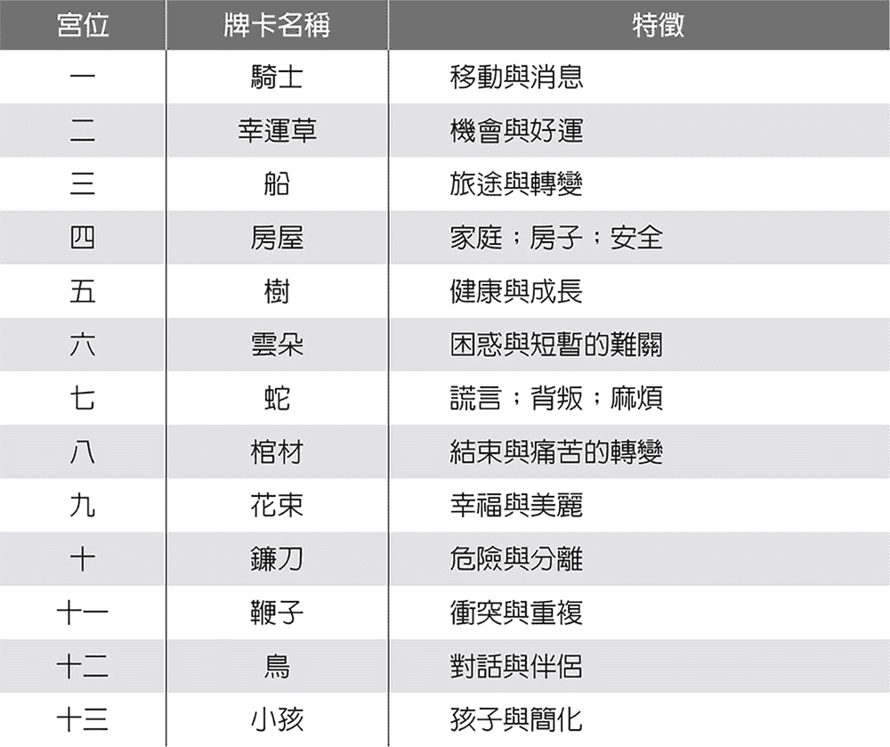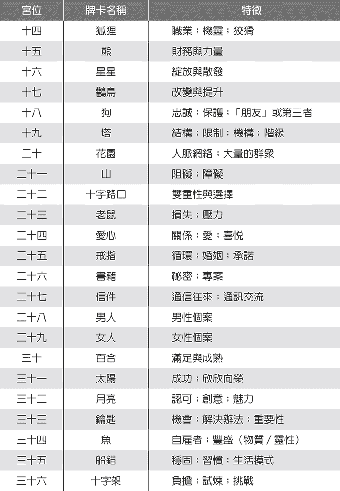

## 【附录六】

## 宫 廷 牌

由于雷诺曼起源于皮克牌这套纸牌，因此以前所有的雷诺曼卡都会有皮克牌的花色点数在牌面上。雷诺曼卡的花色点数为王牌、六到十，以及传统纸牌花色的宫廷人物。所有传统版本和许多现代的雷诺曼卡都会遵照这个系统。这些扑克牌对应的意义能够追溯到一百五十年前，但是最初的来源已不可考。

以我个人而言，我会利用这独特的优点，搭配扑克牌符号来获取额外讯息，或是干脆忽略这些符号，如此就不会影响雷诺曼的基本符号意义。在特定情况下，如果我在占卜中要判定性别时，会参考扑克牌符号。在这样的情况下，我只会单纯抽牌，并只检视宫廷牌上描绘的人物，辨别问题中的人物性别。举例来说，如果我抽到皇后，那么性别是女性；国王或侍者，则为男性。

以下是我对于宫廷牌的诠释：

★红心国王：属于第四号牌（房屋）。他是成熟的年长男性，通常戴着金色皇冠，下巴有着白色胡子，手拿乐器。他是位保护者。

★红心皇后：属于第十七号牌（鹳鸟）。她是真诚、端庄、诚恳的女性，热爱出手援助他人。

★红心侍者：属于第二十四号牌（爱心）。他是迷人又真挚的年轻男性。

★黑桃国王：属于第三十号牌（百合）。他是年长、强壮、聪慧、强大的男性，通常戴着金色皇冠，下巴有着白色胡子，手中挥舞着未拔鞘的长剑。这张牌特别凸显“年长”的讯息。

★黑桃皇后：属于第九号牌（花束）。她是年轻女性，通常打扮时髦，穿戴着饰品。

★黑桃侍者：属于第十三号牌（小孩）。通常被描绘成有着八字胡的男性，他有着恶意和双面人的倾向。

★方块国王：属于第三十四号牌（鱼）。通常有着胡须，一手握着权杖，一手托着宝球。他是位有权势的男性，握有大量资源，掌握重要决定的决策权。

★方块皇后：属于第二十二号牌（十字路口）。她是年轻女性，通常穿着优雅，散发着优越感。

★方块侍者：属于第十号牌（镰刀）。他是位行动快速的年轻男性，有点冷酷、冷漠。

★梅花国王：属于第六号牌（云朵）。他通常穿着盔甲，准备好上战场，面容皱眉，头上戴着金色皇冠，宝剑佩戴身侧，有着深色胡须。他很聪明，也具有影响力。

★梅花皇后：属于第七号牌（蛇）。她是足智多谋的女性，也是可敬的敌人。

★梅花侍者：属于第十一号牌（鞭子）。他年纪轻、聪明、身材精实。他给人活力充沛的强烈印象。

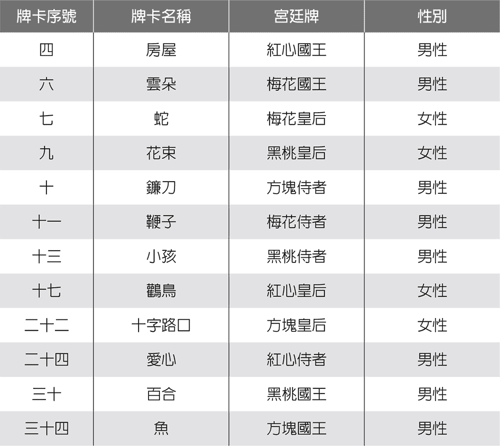

## 【附录七】

## 雷诺曼与塔罗

在这个附录中，我们会了解雷诺曼与其他占卜卡搭配的方式，以及如何弹性调整，套用于各种牌阵。我也会提供范例和详细解说。

目前有许多结合雷诺曼和塔罗的方法，或是结合雷诺曼与其他占卜卡的方式。你可以为你的占卜工具加上雷诺曼来厘清讯息，或是为雷诺曼搭配其他占卜工具来丰富讯息。

我相信雷诺曼和塔罗能够和谐互补，一个是锅子，一个则是锅盖。塔罗就像是装着意识、潜意识、超意识、阴影、原型的锅子，充满各种潜在能量的大量细节。另一方面，雷诺曼如同完美锅盖，直接、开门见山，涵盖了所有的秘密，并只需要解读你眼前的牌卡，以及牌面上的讯息：实际的事情、务实的日常生活、事件、行为。两者搭配使用时，能够互相提供方向与精准的讯息。

雷诺曼卡会受限于塔罗牌的既有牌阵，所以，我会建议如果你想要在塔罗牌阵中使用雷诺曼，要确定每个牌阵的位置都有两或三张雷诺曼，而不是跟平常的塔罗一样只放一张牌。你可以自行决定牌阵要简单或是复杂。然而，这并不表示我们不能尝试并突破框架。

### 五张雷诺曼＋三张塔罗牌

我最喜欢的方式之一是抽寻常的五张雷诺曼牌阵，并在下方搭配三张塔罗牌，以了解心理因素，或是检视潜在因素与讯息。塔罗能够从不同角度丰富雷诺曼占卜的层次。

．我会沉淀心神，拿起雷诺曼洗牌的同时也专注于我的问题。

．接着抽五张牌，按照顺序摊牌摆放：一、二、三、四、五。

．拿起塔罗牌洗牌，并专注于我的问题。

．抽三张塔罗牌：A、B、C，并将它们摆在雷诺曼卡的下方，像这样：

一、二、三、四、五

A、B、C

我有时候会把三张塔罗牌当成：

．建议：我发现塔罗牌非常适合给予建议。

．原因：塔罗擅长挖掘状况，并找出潜在因素。

．情绪：塔罗擅长传达出牌面的氛围或整体气氛。

只要确保你在洗牌时已决定好并设定你想要塔罗牌告诉你的讯息是什么。

我帮儿子占卜他上高中的第一周会发生什么事。我随机抽了五张牌，让牌面决定问题。

蛇＋鞭子＋信件＋棺材＋十字架

看了第一眼，这些牌的警告意味浓厚，但是一个学生准备进入新的学校、新的年级、新的高中，套入这个重要的脉络后，牌面反而变得满合理的。中间的信件是随机出现的主题牌，意味着可能会有选课的问题；鞭子＋信件可能是他极力想选某堂课，但该堂课却不在他的课表上（蛇）。这反而让他觉得负担很重（棺材），导致他心情不佳（十字架）。

我拿了塔罗牌，洗牌时想着“请告诉我原因”，然后抽了三张牌想了解为什么儿子在高中的第一周过得不好。

金币二＋宝剑骑士＋权杖十

塔罗牌验证了雷诺曼的讯息，并强调了精确的主题，回答了为什么我儿子会感到挫败和失望。主要的焦点是宝剑骑士，代表带着勇气与策略向前征服。我儿子会向前抗争，征服障碍，并追求他想要的东西；同时他也试着兼顾并适应新的状况（金币二），这也意味着重担、负荷、负担过重（权杖十）。

将这两组牌面组合在一起后，我预测了儿子会觉得新课表和所有事情都太满，让人无法负荷，他会需要额外的时间和支持来适应新环境。借由信件、鞭子和金币二、宝剑骑士，我猜可能是因为课表有异动。

开学第一周，我就发现牌卡完全准确：重担、异动、兼顾新课表、试图换课程。更有趣的是信件＋鞭子的组合，正好叙述了辩论课第一天的作业。

### 凯尔特十字牌阵＋雷诺曼

开始之前，我想要再次提醒：大蓝图是雷诺曼最完整的牌阵。在大蓝图牌阵中，个案的生活全都会呈现出来。也就是说，在塔罗牌牌阵的既有位置里使用雷诺曼，会局限雷诺曼的讯息。尽管如此，我也在塔罗牌牌阵里使用过雷诺曼，我发现每张塔罗牌旁加上三张雷诺曼，对于厘清事件很有帮助。

使用既定的塔罗牌牌阵时，我建议你单纯加三张牌在每一张塔罗牌旁边就好，以得到额外讯息和验证。因为常见又普遍的关系，我这次使用的是凯尔特十字牌阵。以下是我帮海伦占卜的案例。

海伦试着受孕好一阵子了，但是都无消无息。她的生活中也发生诸多起伏和曲折。她来找我想要厘清现况，并制定解决办法。我知道这个情况需要用到塔罗牌，因为这并不是一般的预测未来。除了外在因素，还需要了解她的内心和内在所有的矛盾冲突。这样的占卜需要更多牌阵和更多问题，才能得到最实际的结果。我先抽了塔罗牌的凯尔特十字牌阵，接着加上雷诺曼，进一步洞悉讯息。

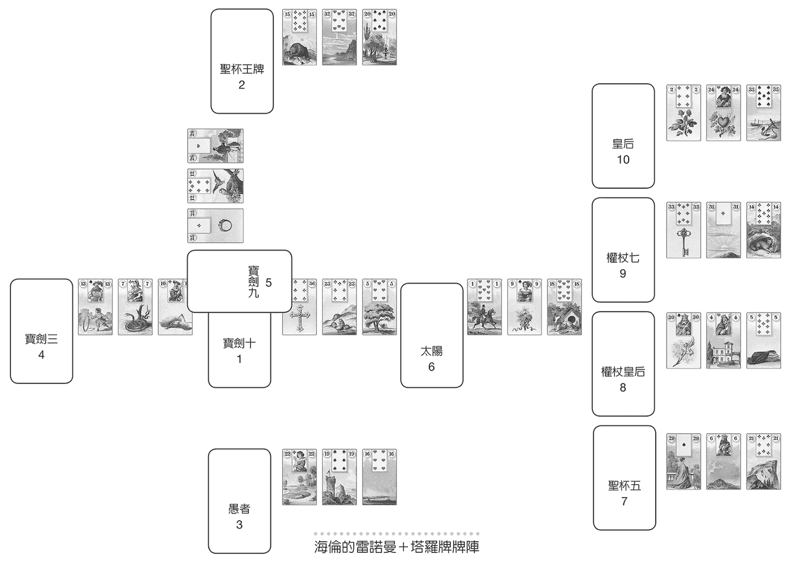

凯尔特十字牌阵的位置意义如下：

#### 1.现况

塔罗：宝剑十代表海伦已经绞尽脑汁到极限了，身心已彻底筋疲力竭。

雷诺曼：十字架＋老鼠＋树＝悲伤正在啃蚀她的健康和心理状态。

#### 2.想法

塔罗：圣杯王牌代表她渴望圆满、喜悦、怀孕、新的开始。

雷诺曼：熊＋月亮＋花园＝代表她作为女性的力量，她的生育力，她在社会中的地位和她的外在评价。

#### 3.个案可控的因素或是已知的事

塔罗：愚者代表海伦坚持不懈的意志力，不断尝试新事物和重新开始。

雷诺曼：十字路口＋塔＋星星＝信任医疗机构，不要怕尝试新的事物和新的方法。

#### 4.近期的过去／事件或状况

塔罗：宝剑三表示痛苦与悲伤。

雷诺曼：小孩＋蛇＋镰刀＝胎死腹中、堕胎手术或流产、痛苦的原因。

#### 5.阻力

塔罗：宝剑九意味她的恐惧和担忧阻碍着她。

雷诺曼：戒指＋鸟＋男人＝焦虑影响她的婚姻，也影响她与丈夫的关系。

#### 6.近期未来

塔罗：太阳带来光明、喜悦、乐观的结果。

雷诺曼：骑士＋花束＋狗＝朋友喜悦地来访、来自医生的好消息、获得协助或帮助的开心消息（结果是她的医生打电话跟她报告好消息）。

#### 7.希望和恐惧／个案对事情的感受

塔罗：圣杯五象征她的失落和遗憾。

雷诺曼：女人＋云朵＋山＝海伦的内心很困惑和不稳定，不知所措，仿佛事情受阻或感觉窒息。

#### 8.外在因素、亲友等

塔罗：权杖皇后代表海伦生活中有位意志坚强的人，发挥强大的影响力。

雷诺曼：百合＋房屋＋棺材＝在她亲密的家人或亲近的生活圈中，有位跟海伦非常亲密的长辈带来负面影响，并且（或是）过世了。海伦表明她的婆婆为她的婚姻带来了负面影响。

#### 9.建议（非常重要的位置，可以改变结果）

塔罗：权杖七指出她需要站稳脚跟、面对现况，并坚定立场。

雷诺曼：钥匙＋太阳＋狐狸＝最重要、最关键的策略就是需要自信和乐观，并且信任自己的力量和能力，以及了解如何运用智慧与魅力，将现状扭转成对她有利的情况。

#### 10.最后结果

塔罗：皇后意味着怀孕、创造和丰饶。

雷诺曼：幸运草＋爱心＋船锚＝命运会出现幸运的转机，达成内心所愿，达到目标和获得安定。

### 雷诺曼＋塔罗：融合法

这个解读法示范了雷诺曼和塔罗可以互补、为彼此聚焦和增添讯息，提供给个案。塔罗牌加入雷诺曼之后，就能够让讯息更实际，并给予实际方向和牌义。与此同时，如果雷诺曼加了塔罗，则能够将牌面聚焦于特定的讯息、价值和脉络。它们两者就如同弓与箭的组合，一位厉害的占卜师可以轻易射中靶心！

使用雷诺曼和塔罗进行每日占卜，我会先洗塔罗牌，随意抽出三张牌，并按顺序摆放：A、B、C。接着拿起雷诺曼洗牌，随意抽三张牌，并按照顺序放在每一张塔罗牌上面：一、二、三。我把这个牌阵视为宫位与牌卡的搭配，或者你可以自行决定哪三张牌在下方位置，或是决定哪三张牌是主要讯息。如果你有小型的塔罗牌，你也可以将塔罗牌放在雷诺曼上方。当然，你也可以选择牌面的张数，只要它们的张数一样，可以配对组合来解牌就好。你也可以将它们摆成一直线，这样就能将牌面当成句子来解读。

A、B、C——塔罗

一、二、三——雷诺曼

基本上，你是在搭配Ａ＋一＋Ｂ＋二＋Ｃ＋三的牌面。

我拿起塔罗牌洗牌后占卜我的周末，接着抽牌：

宝剑二＋金币王牌＋权杖八

然后我拿起雷诺曼洗牌、抽牌后，将牌叠在塔罗上：

百合＋骑士＋塔

接下来我将牌面摆成一直线，当成句子来解读：

宝剑二＋百合＋金币王牌＋骑士＋权杖八＋塔

一开始抽出塔罗牌时，我推测这代表周末会很忙碌，因为马上就是开学日。星期一是开学日，我需要确保三个儿子都做足准备；同时，星期一也是我大儿子的十四岁生日，而我甚至还没开始准备他的生日。牌面呈现了所有讯息：宝剑二刚好代表我犹豫不决，还没准备大儿子的生日；金币王牌象征他的礼物和花费；权杖八描述了我东奔西跑，试着赶在最后一刻把所有事情安顿好。但是当我将两套牌面结合后，问题变得更加清楚和精确。

宝剑二代表僵局、停滞或需要做出跟百合有关的决定，或是事情发展了很长一段时间——投资，抑或事情攸关年长男性或父亲形象。右边出现金币王牌，将前述的牌义选项简化到与金钱相关，而骑士意味着我很快就会收到消息。这个消息也会需要我快速行动：权杖八意味着紧急迫切；塔则是与法律、税务或是政府机关有关。

我接到了出乎意料的电话，与我过世的父亲曾经投资的事情有关，而我必须紧急处理：我得从政府部门申请到特定文件。牌面的预测非常精准，尽管当时我无法理解那些讯息。

对我来说，雷诺曼和塔罗就如同太极的阴和阳、男和女、逻辑和创意的两面。它们彼此互补，将解读技巧、理解、知识提升到更高的层次。

放胆去做吧！好好享受雷诺曼与塔罗的搭配。创造你专属的牌阵、配对组合牌义和解读法。不断练习，让它们敞开大门，让你迈进新的机会、新的洞见和提升专业！

## 词汇表

九宫格牌阵：这是牌阵，也是解读法，用来解读矩形的牌阵。一排是三张牌，总共九张牌。这个解读法如同一张小型照片，快速了解状况或个案周围的情况，并使用许多重要的解读法，最后你也会在大蓝图牌阵使用这些解读法。它也称为三乘三牌阵。

大蓝图：纸牌占卜中最古老的牌阵之一。大蓝图（或称 GT）会用到每一张雷诺曼卡，一排八张，总共四排，并把四张牌加在第四排的中间下方，而这四张牌会变成短的第五排，位于牌阵的最下方。大蓝图的三十六个位置也被称为三十六宫位，这些位置会影响落在上方的牌面意义。这个牌阵也被称为 GT 牌阵。参照宫位。

中性牌：牌卡上的符号通常是中性的意义，没有特别强烈的负面或正面特性。中性牌非常容易受到周围牌面的影响。参照正面牌、负面牌。

主题牌：必须检视的重要牌面，因为它代表牌阵中的主要主题。有时候占卜师会先选择一张主题牌，其他牌卡会在它周围，有时候则是让牌卡自己出现。如果是由占卜师选择，牌卡的符号就会直接与占卜的主要问题有关，例如，爱心代表恋情，房屋象征房地产。假设是由牌卡自己随机决定，这张牌通常都会落在牌阵中间，两边的牌卡张数一样。主题牌有时称为关键牌（key card）、指定牌（charged card）、赋能牌（energized card）。参照启动的主题牌、指示牌。

占卜：预测未来或是与看不见的世界沟通。

占卜师：解读牌面的人。解读雷诺曼符号并组合意义，给予问卜者答案和建议的口译员。参照问卜者、个案。

正面牌：牌卡上的符号通常散发正面特性。通常正面牌能够为周围的牌面带来正面影响，也会降低负面牌的伤害性。参照负面牌、中性牌。

皮克牌：极受欢迎的纸牌游戏，只有三十二张牌。皮克牌由王牌、七到十的点数组成，并加上传统纸牌花色的宫廷人物。根据历史文献，皮克牌最早起源于十六世纪末期，并在十八世纪大受欢迎，最后于二十世纪早期没落。这个在沙龙中玩的纸牌也被当时许多占卜师拿来占卜，亦是雷诺曼女士喜欢的一种占卜工具。

交叉解读法：解读雷诺曼的其中一种核心方法。借由检查垂直的觉察轴和横向的时间轴，占卜师可以了解直接影响状况的事情。这个充满意义的解读法会揭露出已知、未知、已发生、即将发生的事情。这两条线交会于指示牌或主题牌，而形成这两条交会轴线的牌卡，能够让占卜师透过配对组合和其他解读法来推断牌义。参照配对组合。

行动牌：代表行动或行为。举例来说，船带来改变和移动，镰刀代表行为要果断。参照牌卡分类帽。

所属牌卡：雷诺曼卡按照序号顺序排出大蓝图牌阵后，座落在该宫位的牌卡。骑士的所属宫位是第一宫，狗的所属宫位是第十八宫。这些所属牌卡提供大致的意义和宫位特性。参照宫位、附录五和第三章的宫位锁链法。

花色点数：每一张雷诺曼的牌面上增添的纸牌符号。每一套雷诺曼都不一样：有些是纸牌符号，有些则是诗句或人像。有些雷诺曼没有增添花色点数。

指示牌：事先选择代表特定人物的牌，指定为女性个案（女人牌）或男性个案（男人牌），或是其他重要关系人的牌。如果占卜解读并没有一个特定问题，指示牌也能作为一般主题牌。为求最佳结果，你应该要事先启动指示牌，强化符号与问题的链接。这个词偶尔也用来指称其他经过占卜师的意念或为了某个主题而启动的牌（因为这张牌象征该主题）。指示牌也被称为人物牌（person card）、问卜者牌（querent card）、个案牌（client card）。参照启动的主题牌、主题牌。

负面牌：牌卡上的符号通常散发出负面特性。通常负面牌会让周围的牌面变得负面。负面牌也能视为警告。参照正面牌、中性牌。

个案：问卜者，亦即来找你占卜的人。个案会寻求建议、答案和预测以了解过去的事情，并协助自己做出决定。这个词也常用于专业领域或付费占卜谘询。参照问卜者、问题。

宫位：大蓝图牌阵中每一张牌的位置。每一张牌的位置称为“宫位”，根据序号和位置而有不同的具体意义。宫位的意义会巧妙地影响座落在宫位上的牌面。参照所属牌卡、宫位锁链法。

宫位锁链法：这个解读法可以探索额外讯息，将大蓝图牌阵中的三十六个宫位串连起来。它将牌面和座落的宫位链接，接着链接该宫位原本的牌卡，以此类推。在大蓝图牌阵中追踪这条符号锁链，最后回到一开始挑选的牌。如果要了解一张牌义模煳的牌卡，就可以使用这项厉害的解读法。参照第三章的宫位、所属牌卡、宫位锁链法的段落。

宫廷牌：一套纸牌中有着人脸和贵族人像的十二张牌。在雷诺曼系统里，这些牌会描绘出人像：国王、皇后、侍者（也被称为花牌〔face cards〕）。传统上，大部分的牌卡都有描绘出这些人像，虽然有些现代的雷诺曼卡没有描绘出来。它们很适合用来判断性别。参照附录六。

时间牌：传达时间因素的牌。举例来说，骑士代表快速的时间点，树则是缓慢的时间点。参照牌卡分类帽。

时间迹象：这是我非常年轻的时候锻炼出来的个人技巧，计算每张牌之间的间隔，在大蓝图牌阵中推断时间范围。每一个间隔都是一个时间迹象。找到指示牌和代表特定事件的牌之后，我会计算两张牌之间的间隔，推算大约的时间点。例如，两张牌之间隔了三张牌的距离，那么我就会解读成三个时间迹象，代表三小时、三天、三个月等等。具体的时间范围需要视问题背景而定。参照第三章。

时间点：使用牌卡来推算一定程度的具体时间。这个技巧对占卜师来说极具挑战性，因为时间总是在变化流动。实际占卜时，最常遇到的要求就是预测时间，而你最后会发展出适合你的系统。参照时间迹象、时间牌。

纸牌占卜：任何使用牌卡来预言的占卜方式。这个占卜源自于纸牌，而现在包含任何用来占卜的牌卡：雷诺曼、塔罗、神谕卡等等。

配对组合：把两或三张牌的个别牌义和符号，在问题脉络里串连起来。结合个别符号，深入了解牌义、新的意义或更清楚的意思。因为每一张雷诺曼的牌都只有单一符号，占卜师必须根据脉络配对组合，解读出有用的讯息和洞见。

问卜者：找占卜师占卜的人。值得注意的是，这个名词的概念是“问”。记得：问卜者来找你的原因是因为他们想了解某个情况，并想要获得有实际意义的答案。女性问卜者的指示牌通常是女人牌，男性问卜者则是男人牌。参照个案、问题。

问题：想要了解信息、厘清状况、寻求建议的请求。个案应该要仔细架构问题，才能从你的牌面中得到最佳结果。最好的占卜来自适当的问题。有些个案不懂如何问他们需要知道或想要知道的事情，所以，你要花时间确定你解读的信息符合他们寻找的答案。并不是每位问卜者都会提出问题，在这样的情况下，大方向的解读可能会显示出他们无法或不提出的问题。参照问卜者、个案。

启动的主题牌：占卜时，透过意念和观想，事先设定、挑选用来代表人物、主题、状况的牌。为了特定讯息的目的而赋予这张牌一个角色。举例来说，选择狗这张牌象征走失的宠物，或是书籍牌代表询问的计划。参照主题牌、指示牌。

情绪牌：散发特定氛围的牌卡。例如，房屋带来家庭气氛，云朵带来紧张的氛围。参照牌卡分类帽。

描述牌：描述事件或唤起特定画面的牌卡，会大大影响牌阵的讯息。例如，狐狸给人狡猾的印象，狗象征忠诚。参照牌卡分类帽。

牌卡分类帽：定调占卜解读的牌卡分类。这些牌分为四大类：行动、描述、情绪、时间。这些类别最适合使用于小牌阵或更直接的问题。这些牌（和分类）丰富解读的层次，并将牌面的建议导向特定的方向。这是我自己发展出来的技巧，随着时间练习，你也许会发现自己的分类方法。

雷诺曼女士：十八世纪末到十九世纪初的法国传奇女占卜师。她历经法国大革命的政治动荡时期、雅各宾专政时期、拿破仑王朝和君主体制回归。她也穿梭在名门社交圈，帮许多国家首领占卜，包含罗伯斯庇尔、约瑟芬皇后、俄国沙皇亚历山大。在她所处的时期，雷诺曼女士被认为极具影响力，能够影响政治到占卜的许多方面，而她本身就是一位真正的名人。参照附录一。

雷诺曼卡：这是一套三十六张牌的牌卡，以启蒙时代之前的法国传奇占卜师的名称来命名。每一张牌都绘有简单的符号或图像，这些图像组合起来就能给予逻辑一致的预言和占卜。

骑士解读法：按照西洋棋的骑士走法，走两步再转弯走一步，找到稍远的牌面，组合牌义后探索特定牌卡。选择某张牌后，往外以九十度直角的方式找到其他牌，并组合牌面，就能增加牌义的层次：你选择的牌＋骑士解读法找到的牌卡。这个解读法用于大蓝图或其他张数够多的牌阵，才能使用骑士解读法去找到九十度直角对应的牌卡。

属性：根据牌卡的牌义和特性，赋予相对正面或相对负面的设定。有些牌在牌阵中出现时会带来光明或黑暗。有些牌本质上就是中性牌，并容易受到周围的正面牌或负面牌影响。此外，对于简单的是非题占卜，牌卡的属性也能快速提供答案。参照附录四以完整了解。

## 谢 辞

生命总是自有安排，让我们在许多的人生道路上遇见灵魂伴侣、指引者和老师。有些人会在我们的漫漫人生中待着不走，有些人只是悄然经过，这些人都会留下荡荡涟漪，在许多层面上改变我们。我满怀感激、爱意和感恩，向以下所爱之人献上此书：

纪念家父纳比尔．法库里（Nabil Fakhoury），您总是与我同在，甚至仍在另一个世界支持着我。您无尽的爱与关怀已永远将我塑造成今日的我。这本书献给您！

献给我的导师和灵魂明师，我厉害的超级妈妈莎娜．法库里（Sana Fakhoury），您给了我此生的力量、支持、指引和自信，并一直信任我、相信我，无论我的故事多么疯狂。您是我的定心石！

献给我心目中的冠军、英雄、丈夫施布．乔治（Shibu George）。若没有你无条件的支持、完全的信任，以及无尽的爱和鼓励，我不会走到今日这一步。又一个晚上，又一个梦，但心里总是你！

献给我三位神奇的儿子迪伦（Dylan）、赞恩（Zane）、莱德（Ryder），你们是如此天赋异禀，各自擅长自己的专业。没有你们的爱和持续的鼓励、支持、协助，本书可能永远无法问世。我永志不忘你们在我创作本书时的耐心陪伴，谢谢你们。你们是我生命中的闪耀光辉——我的力量和我的宝贝！

献给我完美的妹妹莎拉（Sara），你从未怀疑过我且总是捍卫我，是我的战士、守护者。你永恒的爱与支持将永远镌刻在我的心中。你就是我的守护天使！

献给我富饶好奇心的兄弟阿里（Ali），因为你的爱和坚持不懈，总是鼓励我挑战新事物，让我能够突破自己的局限。你就是我的老师！我爱着你美好的灵魂。

献给我完美的姑姑蒂玛（Tima），您永恒的爱和未曾止息的鼓励，超越了一切限制。

献给我深爱的姑姑苏菲（Sophie），感谢您一直以来的支持。

献给艾德蒙．兹伯斯基（Edmund Zebrowski）和妮可．戴蒙（Nicole Diamond），感谢你们给予我灵感，感谢你们持续鼓励我。谢谢你们爱着我疯狂的一切。

献给尚恩．纳寇（Shawn Nacol），由于你坚信我的能力，并督促和指导我写作、教学、扩展我对雷诺曼的热忱，本书才得以问世。你一脚将我踢出我的舒适圈，我永远感激不尽。你一直是指引我方向的北极星！

献给芭芭拉．莫儿（Barbara Moore），感谢你看见我的潜力并信任我，也相信本书。感谢你相信我，感激你长久以来温柔的指引。

献给唐纳利．德拉罗斯（Donnaleigh de LaRose），感谢你一直以来的支持和无尽的爱。感谢我们之间的友谊，你温暖的祝福包围着我，直到完成此书。这些温暖恰好就在我最需要的时候来到！

特别感谢我的朋友、指引者、老师、学生：艾伦．里奇（Allan Ritchie）、艾比．沙琳娜（Ebby Salinas）、凯西．拜儿（Keith Boyle）、丽莎．阿姆格兰（Leesa Almgren）、丽莎．琼斯（Lisa jones）、玛丽．格里尔（Mary Greer）、妮可．林西（Nicole Lindsey）。感谢你们催促我踏出舒适圈，向我展示这个世界的无限惊喜，也感激你们长久以来的爱、关心和鼓励。

献给我的家人，你们美好的支持和无条件的爱都是我不可或缺的一部分。

献给每一位美好的个案、学生，以及杰出的网友们。我爱你们！

献给马可（Marco）、飞鲁兹（Fayrouz）、卡阿利利（Ka’alili），感谢你们在我需要时支持我。我诚心感谢你们！

最后，我要衷心感谢我所有的天使、指导灵、守护灵、灵性助手。我永远感激！

