# 天工開物

宋應星 著

新安堂藏板印行

# 大六壬全集
(附課·張遺跡)
上

章千里
劉赤江
等編著

新文豐出版公司發行

# 六壬易知

新文豐出版公司發行

# 六壬全集提要

一、六壬占由來已古。歷代學者均有著述，汗牛充棟，指不勝屈。或以文字艱澀，或以神煞繁多，術語艱深，學者每望而生畏，以致數千年相傳之玄學幾瀕絕境。自大陸陷匪以還，所存古籍悉遭摧毀，良用痛心。本公司有鑒於斯，乃輯羅故文字較淺顯而解說詳盡者六種，計為六壬粹言、六壬指南、六壬通原、六壬斷斯、六壬易知、六壬鬼蹟曲，整理付梓，使學者得窺六壬占堂奧，並問斯學於不墜。

二、六壬粹言及六壬指南原為一般學者所宗，以其文字及歌訣後期明瞭，而其所附占驗，尤屬如懸斯磬。秀水章千里氏稱擅六壬占，雖負時譽，所著之六壬易知，文字簡潔，說理明瞭，可資為入門津梁。

三、六壬占均宗畢法，惟起月將、世人及年命、各家有雖不相同者，學說紛紜，各有所本。如秀水張純照所著之六壬粹原及趙翰林晦亭所著之六壬斷斯是也。查學術非人人所得私，而真理愈辯則愈明，爰本斯旨，雖收並蓄，為學者研究探討實驗，並其說或從或捨，是在學者。

四、民國以來，擅六壬占者頗不乏人，而尤以無錫元老前主席譚公祖安及前吳佩孚將軍尤精其術。譚氏為最著，占存遺墨，堪為學者式循，附數本集，增色不少，彌足珍貴也。

# 袁 序

易云君子以思患而豫防之，中庸云凡事豫則立不豫則廢，玉篇云豫或作預，由是觀之豫之字義大矣哉。今人但知金錢出入須有豫算，而不知是非成敗禍福榮辱尤當有豫算，否則患何以防，事何以立。然欲求防患未然，立事不敗，必須求豫知之法。欲求豫知之法，不能不讀卜筮之書。顧卜筮之書種類不一，惟壬課原本義爻相傳尤古，其推演之法，由占時而月將，是無極生太極也；由月將而干支，是太極生兩儀也；由干支而四課，則太陽少陽太陰少陰四象生焉；由四課而發用，初傳法天，中傳法人，末傳法地，三才位焉。三才既具，五行備焉，神將定焉。神將既定，握其樞機，則天下萬事萬物孰吉孰凶孰悔孰吝，皆於此現象得之，豈獨是非成敗禍福榮辱已哉。余曩著命理探原、六壬探原二書，出版以來，辱承海內同好不以膚淺見棄，而中華書局遠文社竟以拙著命理探原為藍本，惜其所編卜筮易知僅論六爻，未及六壬，不免歉然。今滬上章君千里忽以新著六壬易知郵示，並索序言，余不禁為之狂喜。觀其論入門、論神煞、論課體、論占斷諸篇，編次簡明，說理透闢，固可為初學之津梁，即高明之士亦未嘗不可藉此探討，洵為壬學中不可多得之書。世之君子苟欲豫知防患未然及立事不廢之法者，若取而讀之，更可收事半功倍之效。題曰六壬易知，誠易知也。

中華民國二十六年三月十五日鎮江袁樹珊謹撰

# 徐 序

術數之學，以奇門六壬為最古。奇門始於伏羲，而傳自文王。六壬始於黃帝，而傳自姜尚。皆以卦為體，而為易之用也。同源異派，而各秘其術。子胥沼越，用在六壬；張良佐漢，用在奇門。迨夫李唐一行，盧中之輩出，乃有星命堪輿之學。至子平始於宋之徐居易，年近而更下矣。明代禁習陰陽五行之學，術數恐失其傳，獨有六壬為士大夫所喜習，相傳不替。名作如林，推演闡明，代有作者，然劉赤口有言：書不盡言，言不盡意。學我者拙，似我者死。得心應手之妙，父不能傳之子，師不能傳於弟子。神而明之，存乎其人。蓋其幽微玄妙，有如是者。是以習者雖多，而精者不數觀。章君千里，家學淵源，獨能以淺顯之算，運玄奧之理，編此六壬易知一書，頗入顯出，為壬術另闢蹊徑，洵為獨出心裁，善談玄理者。夫學術之門，自規矩準繩而會其通，進而入於神化之境，為研習者必經之途徑。將來之習壬術者，我知其必以是書為階梯焉。爰樂為之敘。

民國廿六年丁丑立春後三日東海徐樂吾序

# 自序

古人問休咎決疑難，無不賴之以下卜務矣，而精細詳明，應驗如神者，要以六壬為最。雖六壬之名始見於隋書經籍志，而論者以為周語伶州鳩之對七律實其權輿，下逮春秋，子胥少伯並以精於是術著名，吳越春秋、越絕書中俱載其事，則由來亦遠矣。然其學源本律曆，旁通義象，組織繁複，義理玄奧，前賢著述雖不罕覲，類皆陳義過深，學者苦難索解，望洋興嘆，於是湮而不彰，斯道日衰。千里研究有年，毫無深造獨到之處，幸而凡有所卜，尚獲中肯。近聖人事日繁，決疑之學當亦日亟，爰彙萃眾說，採英擷華，並憑歷年研究心得，分門編纂，提要鉤玄，復出以淺近之文字，草此六壬易知一書。雖不足當高明之顧盼，倘亦初學之一助也。惟初版伊始，魯魚亥豕在所不免，還希海內學者匡其謬，則幸甚矣。

民國丁丑元日浙江嘉興章千里謹識於春申寓次

# 六壬易知目次

卷一 入門篇 入門補綴篇

卷二 神煞篇

卷三 課體篇

卷四 占斷上篇

卷五 占斷下篇

# 六壬易知卷一

## 入門篇

### 六壬之命名

六壬斯曰天干凡十，壬課獨取乎壬者，蓋壬乃陽水，天一生水為數之始，壬寄在亥，亥屬乾宮，亦易卦首乾之義，此立名之宗也。

### 六壬之組織

凡一學識皆由幾個單位組織而成，六壬之組織為干支、太歲、月將、占時、地盤、天盤、四課、三傳、天將、遁干、年命、神煞等項相聚而成也。

### 干支說明

甲乙丙丁戊己庚辛壬癸為十天干。甲為陽木，乙為陰木，丙為陽火，丁為陰火，戊為陽土，己為陰土，庚為陽金，辛為陰金，壬為陽水，癸為陰水。

子、丑、寅、卯、辰、巳、午、未、申、酉、戌、亥為十二地支。子為陽水，丑未皆為陰土，寅為陽木，卯為陰木，辰戌皆為陽土，巳為陰火，午為陽火，申為陽金，酉為陰金，亥為陰水。

### 太歲說明

例如今年為子年，太歲即為子，明年為丑年，太歲即為丑。

### 月將說明

月將者，一月之將也。視太陽入何宮，即為何將。太陽於每月中氣過宮，故月將亦應逢中氣而交換。茲特分述各月節氣月將如後。

正月建寅，立春節，雨水氣。

二月建卯，驚蟄節，春分氣。

三月建辰，清明節，穀雨氣。

四月建巳，立夏節，小滿氣。

五月建午，芒種節，夏至氣。

六月建未，小暑節，大暑氣。

七月建申，立秋節，處暑氣。

八月建酉，白露節，秋分氣。

九月建戌，寒露節，霜降氣。

十月建亥，立冬節，小雪氣。

十一月建子，大雪節，冬至氣。

十二月建丑，小寒節，大寒氣。

雨水至春分月將為亥。

春分至穀雨月將為戌，穀雨至小滿月將為酉，小滿至夏至月將為申，夏至至大暑月將為未，大暑至處暑月將為午，秋分至霜降月將為辰，霜降至小雪月將為卯，小雪至冬至月將為寅，冬至至大寒月將為丑，大寒至雨水月將為子。

### 占時說明

占時之法有三：有以圓形木盒雕刻十二孔，每孔書一時辰，綜成子丑寅卯辰巳午未申酉戌亥十二字，置珠搖動，視珠落某時，即為占時。

又有以十二竹籤（或木或象牙皆可），每籤刻一時辰，閉目任抽一籤，視抽得之籤為某時，即為占時。

亦有備人口報一時者，如報辰時，即以辰為占時。

### 地盤說明

地盤即子丑寅卯辰巳午未申酉戌亥之十二占時也，其式如下，乃靜而不動，定而不變者也。

| 亥時在 | 子時在 | 丑時在 | 寅時在 |
| :--- | :--- | :--- | :--- |
| 亥 | 子 | 丑 | 寅 |
| 戌 | 亥 | 子 | 丑 |
| 酉 | 戌 | 亥 | 子 |
| 申 | 酉 | 戌 | 亥 |
| 未 | 申 | 酉 | 戌 |
| 午 | 未 | 申 | 酉 |
| 巳 | 午 | 未 | 申 |
| 辰 | 巳 | 午 | 未 |
| 卯 | 辰 | 巳 | 午 |
| 寅 | 卯 | 辰 | 巳 |
| 丑 | 寅 | 卯 | 辰 |
| 子 | 丑 | 寅 | 卯 |

### 天盤說明

天盤即月將加于占時而成者也，月將與占時未必相同，故其地位錯綜參伍，不若地盤之呆定弗變也。舉例如左。

十一月冬至後丑將寅時天盤式

| 未 | 午 | 巳 | 辰 |
|---|---|---|---|
| 申 | | | 卯 |
| 酉 | | | 寅 |
| 戌 | | | 丑 |
| 亥 | 子 | 丑 | 寅 |

正月雨水後亥將申時天盤式

天盤亥將、地盤即是申時

| 酉 | 戌 | 亥 | 子 |
|---|---|---|---|
| 申 | | | 丑 |
| 未 | | | 寅 |
| 午 | | | 卯 |
| 巳 | 辰 | 卯 | 寅 |

天盤丑將、地盤即是寅時

### 四課說明

四課乃以本日干支會同天地盤而演成者也，其演法分為四步，爰先述明十干之寄宮，再敘演法如左。

### 十干寄宮歌訣

甲課寅兮乙課辰，丙戊課巳不須論，丁己課未庚申上，辛戌壬亥是其真，癸課原來丑宮坐，分明不用四正神。

### 解釋

甲寄寅宮，乙寄辰宮，丙與戊皆寄巳宮，丁與己皆寄未宮，庚寄申宮，辛寄戌宮，壬寄亥宮，癸寄丑宮。

四正神即子午卯酉也。

### 演法

第一步：先將日干寫上，然後依十干寄宮例，查其寄入地盤何宮，即從其處，將天盤所加之字，寫於干上，即為第一課。

第二步：以干上所得之字，寫於日干之左，從地盤上查此字上之天盤為何字，即書於此字之上，是為第二課。

第三步：將日支寫在第二課之左，與第二課之下一字平列，乃從地盤上查得支上所加之天盤為何字，寫於支上，是為第三課。

第四步：以支上所得之字，寫在支之左，再從地盤上查得此字上之天盤為何字，即寫於此字之上，是為第四課。

例一：甲子日辰時寅將占，得之時為寅時。

（第一課）子甲
午未申酉

（第二課）戌子
巳
戌

（第三課）戌子
辰
亥

（第四課）申戌
卯寅丑子

按甲寄寅宮，視地盤寅上得子，寫於甲上，得子甲，是為第一課。次將子字寫於甲字之左，視地盤子上得戌，寫於子上，得戌子，是為第二課。一二兩課乃由日干而得，名曰日上兩課。又將日支子字寫於子字之左，視地盤子上得戌，寫於子上，得戌子，是為第三課。再將戌字寫於子字之左，視地盤戌上得申，寫於戌上，得申戌，是為第四課。三四兩課乃由日支而得，名曰辰上兩課，壬學中簡稱日干、日支、辰。

### 三傳說明

三傳者，初傳（又名發用）、中傳（又名次傳）、末傳是也。乃由四課之上下剋賊或他種情形而成。上剋下曰剋，下剋上曰賊。三傳取法分為九類，茲先述五行之生剋，再詳敘三傳之取法於後。

### 五行生剋

- 金剋木，木剋土，土剋水，水剋火，火剋金。
- 金生水，水生木，木生火，火生土，土生金。

### 三傳取法第一類（賊剋）

歌訣：取課先從下賊呼，如無下賊上剋初。初傳之上中傳取，中傳之上末傳居。

（解釋）如四課中有一下剋上者，先以受剋之神為初傳，次從地盤視初傳上天盤所加之字為中傳，再由中傳上天盤所加之字為末傳，名曰重審。

又如四課中無一下剋上而有一上剋下者，即以上剋下者為初傳，中末傳之取法與重審同，名曰元首。

（例一）四月丙戌日巳時申將

| 申丙 | 亥申 | 丑戌 | 辰丑 |
| --- | --- | --- | --- |
| 亥子丑寅 | 戌卯 | 酉辰 | 申未午巳 |

按四課中惟第一課申丙為丙火剋申金，下賊上，餘皆無剋，故以受剋之申金為初傳，查地盤申上得亥，亥上得寅，故以亥為中傳，寅為末傳。

（例二）四月丁丑日子時申將

| 巳 丑 酉 | 亥 卯 | 丑 酉 | 巳 酉 |
| --- | --- | --- | --- |
| 卯 丁 | 巳 辰 午 未 | 丑 子 亥 戌 | 寅 酉 卯 申 |

按四課中惟第四課巳酉為巳火剋酉金，上剋下，餘皆無剋，故以巳為初傳，查地盤巳上得丑，丑上得酉，故以丑為中傳，酉為末傳。

（附識）如四課中有一上剋下又有一下剋上，應照下賊上重審論。凡取剋為發用，不論上剋下賊，俱取上一字為初傳，不用下一字。

### 三傳取法第二類（比用）

歌訣：剋賊或不止一課，知一之法須先明，擇與日干比者用，陽日用陽陰用陰。

（解釋）四課中有二三下剋上者，或有二三上剋下者，則當取與日干相比者為初傳，名曰比用。二下賊上曰比用，二上剋下曰知一。日干相比者，如甲日用子寅等陽支，乙日用丑卯等陰支也。其中傳末傳之取法與賊剋法同。

（例一）八月壬辰日巳時辰將

| 戌壬 | 酉戌 | 卯辰 | 卯寅 |
| --- | --- | --- | --- |
| 未申酉戌 | 午亥 | 巳子 | 辰卯寅丑 |

按四課中第一課戌壬，戌土剋壬水為上剋下，第二課卯辰，卯木剋辰土，亦為上剋下。因壬水為陽干，故發用為陽土之戌，而非陰木之卯。所謂日干相比者是也。

（例二）十月甲寅日酉時寅將

| 未甲 | 子未 | 未寅 | 子未 |
| --- | --- | --- | --- |
| 丑寅卯辰 | 子巳 | 亥午 | 戌酉申未 |

子己戊

按四課中未甲與子未皆為下剋上，因甲為陽木，故取用子水而不用未土，蓋子為陽水，與日干相比也。

（附識）如四課中有二上剋下又有一下剋上，應取下剋上作重審論。如有二上剋下又有二下剋上，則取下剋上相比者為用，亦名知一。

### 三傳取法第三類（涉害）

歌訣：涉害行來本家止，路澁多剋初傳取。孟深仲淺季當休，復等柔辰剛日擬。

解釋：凡四課中，或二上剋下，或二下剋上，而與本日之日干或俱比，或俱不比。見陽、見陰，見陰、見陽，見陽、見陰，見陰、見陽，見陽、見陰，見陰、見陽，見陽、見陰，見陰、見陽，見陽、見陰，見陰、見陽，見陽、見陰，見陰、見陽，見陽、見陰，見陰、見陽，見陽、見陰，見陰、見陽，見陽、見陰，見陰、見陽，見陽、見陰，見陰、見陽，見陽、見陰，見陰、見陽，見陽、見陰，見陰、見陽，見陽、見陰，見陰、見陽，見陽、見陰，見陰、見陽，見陽、見陰，見陰、見陽，見陽、見陰，見陰、見陽，見陽、見陰，見陰、見陽，見陽、見陰，見陰、見陽，見陽、見陰，見陰、見陽，見陽、見陰，見陰、見陽，見陽、見陰，見陰、見陽，見陽、見陰，見陰、見陽，見陽、見陰，見陰、見陽，見陽、見陰，見陰、見陽，見陽、見陰，見陰、見陽，見陽、見陰，見陰、見陽，見陽、見陰，見陰、見陽，見陽、見陰，見陰、見陽，見陽、見陰，見陰、見陽，見陽、見陰，見陰、見陽，見陽、見陰，見陰、見陽，見陽、見陰，見陰、見陽，見陽、見陰，見陰、見陽，見陽、見陰，見陰、見陽，見陽、見陰，見陰、見陽，見陽、見陰，見陰、見陽，見陽、見陰，見陰、見陽，見陽、見陰，見陰、見陽，見陽、見陰，見陰、見陽，見陽、見陰，見陰、見陽，見陽、見陰，見陰、見陽，見陽、見陰，見陰、見陽，見陽、見陰，見陰、見陽，見陽、見陰，見陰、見陽，見陽、見陰，見陰、見陽，見陽、見陰，見陰、見陽，見陽、見陰，見陰、見陽，見陽、見陰，見陰、見陽，見陽、見陰，見陰、見陽，見陽、見陰，見陰、見陽，見陽、見陰，見陰、見陽，見陽、見陰，見陰、見陽，見陽、見陰，見陰、見陽，見陽、見陰，見陰、見陽，見陽、見陰，見陰、見陽，見陽、見陰，見陰、見陽，見陽、見陰，見陰、見陽，見陽、見陰，見陰、見陽，見陽、見陰，見陰、見陽，見陽、見陰，見陰、見陽，見陽、見陰，見陰、見陽，見陽、見陰，見陰、見陽，見陽、見陰，見陰、見陽，見陽、見陰，見陰、見陽，見陽、見陰，見陰、見陽，見陽、見陰，見陰、見陽，見陽、見陰，見陰、見陽，見陽、見陰，見陰、見陽，見陽、見陰，見陰、見陽，見陽、見陰，見陰、見陽，見陽、見陰，見陰、見陽，見陽、見陰，見陰、見陽，見陽、見陰，見陰、見陽，見陽、見陰，見陰、見陽，見陽、見陰，見陰、見陽，見陽、見陰，見陰、見陽，見陽、見陰，見陰、見陽，見陽、見陰，見陰、見陽，見陽、見陰，見陰、見陽，見陽、見陰，見陰、見陽，見陽、見陰，見陰、見陽，見陽、見陰，見陰、見陽，見陽、見陰，見陰、見陽，見陽、見陰，見陰、見陽，見陽、見陰，見陰、見陽，見陽、見陰，見陰、見陽，見陽、見陰，見陰、見陽，見陽、見陰，見陰、見陽，見陽、見陰，見陰、見陽，見陽、見陰，見陰、見陽，見陽、見陰，見陰、見陽，見陽、見陰，見陰、見陽，見陽、見陰，見陰、見陽，見陽、見陰，見陰、見陽，見陽、見陰，見陰、見陽，見陽、見陰，見陰、見陽，見陽、見陰，見陰、見陽，見陽、見陰，見陰、見陽，見陽、見陰，見陰、見陽，見陽、見陰，見陰、見陽，見陽、見陰，見陰、見陽，見陽、見陰，見陰、見陽，見陽、見陰，見陰、見陽，見陽、見陰，見陰、見陽，見陽、見陰，見陰、見陽，見陽、見陰，見陰、見陽，見陽、見陰，見陰、見陽，見陽、見陰，見陰、見陽，見陽、見陰，見陰、見陽，見陽、見陰，見陰、見陽，見陽、見陰，見陰、見陽，見陽、見陰，見陰、見陽，見陽、見陰，見陰、見陽，見陽、見陰，見陰、見陽，見陽、見陰，見陰、見陽，見陽、見陰，見陰、見陽，見陽、見陰，見陰、見陽，見陽、見陰，見陰、見陽，見陽、見陰，見陰、見陽，見陽、見陰，見陰、見陽，見陽、見陰，見陰、見陽，見陽、見陰，見陰、見陽，見陽、見陰，見陰、見陽，見陽、見陰，見陰、見陽，見陽、見陰，見陰、見陽，見陽、見陰，見陰、見陽，見陽、見陰，見陰、見陽，見陽、見陰，見陰、見陽，見陽、見陰，見陰、見陽，見陽、見陰，見陰、見陽，見陽、見陰，見陰、見陽，見陽、見陰，見陰、見陽，見陽、見陰，見陰、見陽，見陽、見陰，見陰、見陽，見陽、見陰，見陰、見陽，見陽、見陰，見陰、見陽，見陽、見陰，見陰、見陽，見陽、見陰，見陰、見陽，見陽、見陰，見陰、見陽，見陽、見陰，見陰、見陽，見陽、見陰，見陰、見陽，見陽、見陰，見陰、見陽，見陽、見陰，見陰、見陽，見陽、見陰，見陰、見陽，見陽、見陰，見陰、見陽，見陽、見陰，見陰、見陽，見陽、見陰，見陰、見陽，見陽、見陰，見陰、見陽，見陽、見陰，見陰、見陽，見陽、見陰，見陰、見陽，見陽、見陰，見陰、見陽，見陽、見陰，見陰、見陽，見陽、見陰，見陰、見陽，見陽、見陰，見陰、見陽，見陽、見陰，見陰、見陽，見陽、見陰，見陰、見陽，見陽、見陰，見陰、見陽，見陽、見陰，見陰、見陽，見陽、見陰，見陰、見陽，見陽、見陰，見陰、見陽，見陽、見陰，見陰、見陽，見陽、見陰，見陰、見陽，見陽、見陰，見陰、見陽，見陽、見陰，見陰、見陽，見陽、見陰，見陰、見陽，見陽、見陰，見陰、見陽，見陽、見陰，見陰、見陽，見陽、見陰，見陰、見陽，見陽、見陰，見陰、見陽，見陽、見陰，見陰、見陽，見陽、見陰，見陰、見陽，見陽、見陰，見陰、見陽，見陽、見陰，見陰、見陽，見陽、見陰，見陰、見陽，見陽、見陰，見陰、見陽，見陽、見陰，見陰、見陽，見陽、見陰，見陰、見陽，見陽、見陰，見陰、見陽，見陽、見陰，見陰、見陽，見陽、見陰，見陰、見陽，見陽、見陰，見陰、見陽，見陽、見陰，見陰、見陽，見陽、見陰，見陰、見陽，見陽、見陰，見陰、見陽，見陽、見陰，見陰、見陽，見陽、見陰，見陰、見陽，見陽、見陰，見陰、見陽，見陽、見陰，見陰、見陽，見陽、見陰，見陰、見陽，見陽、見陰，見陰、見陽，見陽、見陰，見陰、見陽，見陽、見陰，見陰、見陽，見陽、見陰，見陰、見陽，見陽、見陰，見陰、見陽，見陽、見陰，見陰、見陽，見陽、見陰，見陰、見陽，見陽、見陰，見陰、見陽，見陽、見陰，見陰、見陽，見陽、見陰，見陰、見陽，見陽、見陰，見陰、見陽，見陽、見陰，見陰、見陽，見陽、見陰，見陰、見陽，見陽、見陰，見陰、見陽，見陽、見陰，見陰、見陽，見陽、見陰，見陰、見陽，見陽、見陰，見陰、見陽，見陽、見陰，見陰、見陽，見陽、見陰，見陰、見陽，見陽、見陰，見陰、見陽，見陽、見陰，見陰、見陽，見陽、見陰，見陰、見陽，見陽、見陰，見陰、見陽，見陽、見陰，見陰、見陽，見陽、見陰，見陰、見陽，見陽、見陰，見陰、見陽，見陽、見陰，見陰、見陽，見陽、見陰，見陰、見陽，見陽、見陰，見陰、見陽，見陽、見陰，見陰、見陽，見陽、見陰，見陰、見陽，見陽、見陰，見陰、見陽，見陽、見陰，見陰、見陽，見陽、見陰，見陰、見陽，見陽、見陰，見陰、見陽，見陽、見陰，見陰、見陽，見陽、見陰，見陰、見陽，見陽、見陰，見陰、見陽，見陽、見陰，見陰、見陽，見陽、見陰，見陰、見陽，見陽、見陰，見陰、見陽，見陽、見陰，見陰、見陽，見陽、見陰，見陰、見陽，見陽、見陰，見陰、見陽，見陽、見陰，見陰、見陽，見陽、見陰，見陰、見陽，見陽、見陰，見陰、見陽，見陽、見陰，見陰、見陽，見陽、見陰，見陰、見陽，見陽、見陰，見陰、見陽，見陽、見陰，見陰、見陽，見陽、見陰，見陰、見陽，見陽、見陰，見陰、見陽，見陽、見陰，見陰、見陽，見陽、見陰，見陰、見陽，見陽、見陰，見陰、見陽，見陽、見陰，見陰、見陽，見陽、見陰，見陰、見陽，見陽、見陰，見陰、見陽，見陽、見陰，見陰、見陽，見陽、見陰，見陰、見陽，見陽、見陰，見陰、見陽，見陽、見陰，見陰、見陽，見陽、見陰，見陰、見陽，見陽、見陰，見陰、見陽，見陽、見陰，見陰、見陽，見陽、見陰，見陰、見陽，見陽、見陰，見陰、見陽，見陽、見陰，見陰、見陽，見陽、見陰，見陰、見陽，見陽、見陰，見陰、見陽，見陽、見陰，見陰、見陽，見陽、見陰，見陰、見陽，見陽、見陰，見陰、見陽，見陽、見陰，見陰、見陽，見陽、見陰，見陰、見陽，見陽、見陰，見陰、見陽，見陽、見陰，見陰、見陽，見陽、見陰，見陰、見陽，見陽、見陰，見陰、見陽，見陽、見陰，見陰、見陽，見陽、見陰，見陰、見陽，見陽、見陰，見陰、見陽，見陽、見陰，見陰、見陽，見陽、見陰，見陰、見陽，見陽、見陰，見陰、見陽，見陽、見陰，見陰、見陽，見陽、見陰，見陰、見陽，見陽、見陰，見陰、見陽，見陽、見陰，見陰、見陽，見陽、見陰，見陰、見陽，見陽、見陰，見陰、見陽，見陽、見陰，見陰、見陽，見陽、見陰，見陰、見陽，見陽、見陰，見陰、見陽，見陽、見陰，見陰、見陽，見陽、見陰，見陰、見陽，見陽、見陰，見陰、見陽，見陽、見陰，見陰、見陽，見陽、見陰，見陰、見陽，見陽、見陰，見陰、見陽，見陽、見陰，見陰、見陽，見陽、見陰，見陰、見陽，見陽、見陰，見陰、見陽，見陽、見陰，見陰、見陽，見陽、見陰，見陰、見陽，見陽、見陰，見陰、見陽，見陽、見陰，見陰、見陽，見陽、見陰，見陰、見陽，見陽、見陰，見陰、見陽，見陽、見陰，見陰、見陽，見陽、見陰，見陰、見陽，見陽、見陰，見陰、見陽，見陽、見陰，見陰、見陽，見陽、見陰，見陰、見陽，見陽、見陰，見陰、見陽，見陽、見陰，見陰、見陽，見陽、見陰，見陰、見陽，見陽、見陰，見陰、見陽，見陽、見陰，見陰、見陽，見陽、見陰，見陰、見陽，見陽、見陰，見陰、見陽，見陽、見陰，見陰、見陽，見陽、見陰，見陰、見陽，見陽、見陰，見陰、見陽，見陽、見陰，見陰、見陽，見陽、見陰，見陰、見陽，見陽、見陰，見陰、見陽，見陽、見陰，見陰、見陽，見陽、見陰，見陰、見陽，見陽、見陰，見陰、見陽，見陽、見陰，見陰、見陽，見陽、見陰，見陰、見陽，見陽、見陰，見陰、見陽，見陽、見陰，見陰、見陽，見陽、見陰，見陰、見陽，見陽、見陰，見陰、見陽，見陽、見陰，見陰、見陽，見陽、見陰，見陰、見陽，見陽、見陰，見陰、見陽，見陽、見陰，見陰、見陽，見陽、見陰，見陰、見陽，見陽、見陰，見陰、見陽，見陽、見陰，見陰、見陽，見陽、見陰，見陰、見陽，見陽、見陰，見陰、見陽，見陽、見陰，見陰、見陽，見陽、見陰，見陰、見陽，見陽、見陰，見陰、見陽，見陽、見陰，見陰、見陽，見陽、見陰，見陰、見陽，見陽、見陰，見陰、見陽，見陽、見陰，見陰、見陽，見陽、見陰，見陰、見陽，見陽、見陰，見陰、見陽，見陽、見陰，見陰、見陽，見陽、見陰，見陰、見陽，見陽、見陰，見陰、見陽，見陽、見陰，見陰、見陽，見陽、見陰，見陰、見陽，見陽、見陰，見陰、見陽，見陽、見陰，見陰、見陽，見陽、見陰，見陰、見陽，見陽、見陰，見陰、見陽，見陽、見陰，見陰、見陽，見陽、見陰，見陰、見陽，見陽、見陰，見陰、見陽，見陽、見陰，見陰、見陽，見陽、見陰，見陰、見陽，見陽、見陰，見陰、見陽，見陽、見陰，見陰、見陽，見陽、見陰，見陰、見陽，見陽、見陰，見陰、見陽，見陽、見陰，見陰、見陽，見陽、見陰，見陰、見陽，見陽、見陰，見陰、見陽，見陽、見陰，見陰、見陽，見陽、見陰，見陰、見陽，見陽、見陰，見陰、見陽，見陽、見陰，見陰、見陽，見陽、見陰，見陰、見陽，見陽、見陰，見陰、見陽，見陽、見陰，見陰、見陽，見陽、見陰，見陰、見陽，見陽、見陰，見陰、見陽，見陽、見陰，見陰、見陽，見陽、見陰，見陰、見陽，見陽、見陰，見陰、見陽，見陽、見陰，見陰、見陽，見陽、見陰，見陰、見陽，見陽、見陰，見陰、見陽，見陽、見陰，見陰、見陽，見陽、見陰，見陰、見陽，見陽、見陰，見陰、見陽，見陽、見陰，見陰、見陽，見陽、見陰，見陰、見陽，見陽、見陰，見陰、見陽，見陽、見陰，見陰、見陽，見陽、見陰，見陰、見陽，見陽、見陰，見陰、見陽，見陽、見陰，見陰、見陽，見陽、見陰，見陰、見陽，見陽、見陰，見陰、見陽，見陽、見陰，見陰、見陽，見陽、見陰，見陰、見陽，見陽、見陰，見陰、見陽，見陽、見陰，見陰、見陽，見陽、見陰，見陰、見陽，見陽、見陰，見陰、見陽，見陽、見陰，見陰、見陽，見陽、見陰，見陰、見陽，見陽、見陰，見陰、見陽，見陽、見陰，見陰、見陽，見陽、見陰，見陰、見陽，見陽、見陰，見陰、見陽，見陽、見陰，見陰、見陽，見陽、見陰，見陰、見陽，見陽、見陰，見陰、見陽，見陽、見陰，見陰、見陽，見陽、見陰，見陰、見陽，見陽、見陰，見陰、見陽，見陽、見陰，見陰、見陽，見陽、見陰，見陰、見陽，見陽、見陰，見陰、見陽，見陽、見陰，見陰、見陽，見陽、見陰，見陰、見陽，見陽、見陰，見陰、見陽，見陽、見陰，見陰、見陽，見陽、見陰，見陰、見陽，見陽、見陰，見陰、見陽，見陽、見陰，見陰、見陽，見陽、見陰，見陰、見陽，見陽、見陰，見陰、見陽，見陽、見陰，見陰、見陽，見陽、見陰，見陰、見陽，見陽、見陰，見陰、見陽，見陽、見陰，見陰、見陽，見陽、見陰，見陰、見陽，見陽、見陰，見陰、見陽，見陽、見陰，見陰、見陽，見陽、見陰，見陰、見陽，見陽、見陰，見陰、見陽，見陽、見陰，見陰、見陽，見陽、見陰，見陰、見陽，見陽、見陰，見陰、見陽，見陽、見陰，見陰、見陽，見陽、見陰，見陰、見陽，見陽、見陰，見陰、見陽，見陽、見陰，見陰、見陽，見陽、見陰，見陰、見陽，見陽、見陰，見陰、見陽，見陽、見陰，見陰、見陽，見陽、見陰，見陰、見陽，見陽、見陰，見陰、見陽，見陽、見陰，見陰、見陽，見陽、見陰，見陰、見陽，見陽、見陰，見陰、見陽，見陽、見陰，見陰、見陽，見陽、見陰，見陰、見陽，見陽、見陰，見陰、見陽，見陽、見陰，見陰、見陽，見陽、見陰，見陰、見陽，見陽、見陰，見陰、見陽，見陽、見陰，見陰、見陽，見陽、見陰，見陰、見陽，見陽、見陰，見陰、見陽，見陽、見陰，見陰、見陽，見陽、見陰，見陰、見陽，見陽、見陰，見陰、見陽，見陽、見陰，見陰、見陽，見陽、見陰，見陰、見陽，見陽、見陰，見陰、見陽，見陽、見陰，見陰、見陽，見陽、見陰，見陰、見陽，見陽、見陰，見陰、見陽，見陽、見陰，見陰、見陽，見陽、見陰，見陰、見陽，見陽、見陰，見陰、見陽，見陽、見陰，見陰、見陽，見陽、見陰，見陰、見陽，見陽、見陰，見陰、見陽，見陽、見陰，見陰、見陽，見陽、見陰，見陰、見陽，見陽、見陰，見陰、見陽，見陽、見陰，見陰、見陽，見陽、見陰，見陰、見陽，見陽、見陰，見陰、見陽，見陽、見陰，見陰、見陽，見陽、見陰，見陰、見陽，見陽、見陰，見陰、見陽，見陽、見陰，見陰、見陽，見陽、見陰，見陰、見陽，見陽、見陰，見陰、見陽，見陽、見陰，見陰、見陽，見陽、見陰，見陰、見陽，見陽、見陰，見陰、見陽，見陽、見陰，見陰、見陽，見陽、見陰，見陰、見陽，見陽、見陰，見陰、見陽，見陽、見陰，見陰、見陽，見陽、見陰，見陰、見陽，見陽、見陰，見陰、見陽，見陽、見陰，見陰、見陽，見陽、見陰，見陰、見陽，見陽、見陰，見陰、見陽，見陽、見陰，見陰、見陽，見陽、見陰，見陰、見陽，見陽、見陰，見陰、見陽，見陽、見陰，見陰、見陽，見陽、見陰，見陰、見陽，見陽、見陰，見陰、見陽，見陽、見陰，見陰、見陽，見陽、見陰，見陰、見陽，見陽、見陰，見陰、見陽，見陽、見陰，見陰、見陽，見陽、見陰，見陰、見陽，見陽、見陰，見陰、見陽，見陽、見陰，見陰、見陽，見陽、見陰，見陰、見陽，見陽、見陰，見陰、見陽，見陽、見陰，見陰、見陽，見陽、見陰，見陰、見陽，見陽、見陰，見陰、見陽，見陽、見陰，見陰、見陽，見陽、見陰，見陰、見陽，見陽、見陰，見陰、見陽，見陽、見陰，見陰、見陽，見陽、見陰，見陰、見陽，見陽、見陰，見陰、見陽，見陽、見陰，見陰、見陽，見陽、見陰，見陰、見陽，見陽、見陰，見陰、見陽，見陽、見陰，見陰、見陽，見陽、見陰，見陰、見陽，見陽、見陰，見陰、見陽，見陽、見陰，見陰、見陽，見陽、見陰，見陰、見陽，見陽、見陰，見陰、見陽，見陽、見陰，見陰、見陽，見陽、見陰，見陰、見陽，見陽、見陰，見陰、見陽，見陽、見陰，見陰、見陽，見陽、見陰，見陰、見陽，見陽、見陰，見陰、見陽，見陽、見陰，見陰、見陽，見陽、見陰，見陰、見陽，見陽、見陰，見陰、見陽，見陽、見陰，見陰、見陽，見陽、見陰，見陰、見陽，見陽、見陰，見陰、見陽，見陽、見陰，見陰、見陽，見陽、見陰，見陰、見陽，見陽、見陰，見陰、見陽，見陽、見陰，見陰、見陽，見陽、見陰，見陰、見陽，見陽、見陰，見陰、見陽，見陽、見陰，見陰、見陽，見陽、見陰，見陰、見陽，見陽、見陰，見陰、見陽，見陽、見陰，見陰、見陽，見陽、見陰，見陰、見陽，見陽、見陰，見陰、見陽，見陽、見陰，見陰、見陽，見陽、見陰，見陰、見陽，見陽、見陰，見陰、見陽，見陽、見陰，見陰、見陽，見陽、見陰，見陰、見陽，見陽、見陰，見陰、見陽，見陽、見陰，見陰、見陽，見陽、見陰，見陰、見陽，見陽、見陰，見陰、見陽，見陽、見陰，見陰、見陽，見陽、見陰，見陰、見陽，見陽、見陰，見陰、見陽，見陽、見陰，見陰、見陽，見陽、見陰，見陰、見陽，見陽、見陰，見陰、見陽，見陽、見陰，見陰、見陽，見陽、見陰，見陰、見陽，見陽、見陰，見陰、見陽，見陽、見陰，見陰、見陽，見陽、見陰，見陰、見陽，見陽、見陰，見陰、見陽，見陽、見陰，見陰、見陽，見陽、見陰，見陰、見陽，見陽、見陰，見陰、見陽，見陽、見陰，見陰、見陽，見陽、見陰，見陰、見陽，見陽、見陰，見陰、見陽，見陽、見陰，見陰、見陽，見陽、見陰，見陰、見陽，見陽、見陰，見陰、見陽，見陽、見陰，見陰、見陽，見陽、見陰，見陰、見陽，見陽、見陰，見陰、見陽，見陽、見陰，見陰、見陽，見陽、見陰，見陰、見陽，見陽、見陰，見陰、見陽，見陽、見陰，見陰、見陽，見陽、見陰，見陰、見陽，見陽、見陰，見陰、見陽，見陽、見陰，見陰、見陽，見陽、見陰，見陰、見陽，見陽、見陰，見陰、見陽，見陽、見陰，見陰、見陽，見陽、見陰，見陰、見陽，見陽、見陰，見陰、見陽，見陽、見陰，見陰、見陽，見陽、見陰，見陰、見陽，見陽、見陰，見陰、見陽，見陽、見陰，見陰、見陽，見陽、見陰，見陰、見陽，見陽、見陰，見陰、見陽，見陽、見陰，見陰、見陽，見陽、見陰，見陰、見陽，見陽、見陰，見陰、見陽，見陽、見陰，見陰、見陽，見陽、見陰，見陰、見陽，見陽、見陰，見陰、見陽，見陽、見陰，見陰、見陽，見陽、見陰，見陰、見陽，見陽、見陰，見陰、見陽，見陽、見陰，見陰、見陽，見陽、見陰，見陰、見陽，見陽、見陰，見陰、見陽，見陽、見陰，見陰、見陽，見陽、見陰，見陰、見陽，見陽、見陰，見陰、見陽，見陽、見陰，見陰、見陽，見陽、見陰，見陰、見陽，見陽、見陰，見陰、見陽，見陽、見陰，見陰、見陽，見陽、見陰，見陰、見陽，見陽、見陰，見陰、見陽，見陽、見陰，見陰、見陽，見陽、見陰，見陰、見陽，見陽、見陰，見陰、見陽，見陽、見陰，見陰、見陽，見陽、見陰，見陰、見陽，見陽、見陰，見陰、見陽，見陽、見陰，見陰、見陽，見陽、見陰，見陰、見陽，見陽、見陰，見陰、見陽，見陽、見陰，見陰、見陽，見陽、見陰，見陰、見陽，見陽、見陰，見陰、見陽，見陽、見陰，見陰、見陽，見陽、見陰，見陰、見陽，見陽、見陰，見陰、見陽，見陽、見陰，見陰、見陽，見陽、見陰，見陰、見陽，見陽、見陰，見陰、見陽，見陽、見陰，見陰、見陽，見陽、見陰，見陰、見陽，見陽、見陰，見陰、見陽，見陽、見陰，見陰、見陽，見陽、見陰，見陰、見陽，見陽、見陰，見陰、見陽，見陽、見陰，見陰、見陽，見陽、見陰，見陰、見陽，見陽、見陰，見陰、見陽，見陽、見陰，見陰、見陽，見陽、見陰，見陰、見陽，見陽、見陰，見陰、見陽，見陽、見陰，見陰、見陽，見陽、見陰，見陰、見陽，見陽、見陰，見陰、見陽，見陽、見陰，見陰、見陽，見陽、見陰，見陰、見陽，見陽、見陰，見陰、見陽，見陽、見陰，見陰、見陽，見陽、見陰，見陰、見陽，見陽、見陰，見陰、見陽，見陽、見陰，見陰、見陽，見陽、見陰，見陰、見陽，見陽、見陰，見陰、見陽，見陽、見陰，見陰、見陽，見陽、見陰，見陰、見陽，見陽、見陰，見陰、見陽，見陽、見陰，見陰、見陽，見陽、見陰，見陰、見陽，見陽、見陰，見陰、見陽，見陽、見陰，見陰、見陽，見陽、見陰，見陰、見陽，見陽、見陰，見陰、見陽，見陽、見陰，見陰、見陽，見陽、見陰，見陰、見陽，見陽、見陰，見陰、見陽，見陽、見陰，見陰、見陽，見陽、見陰，見陰、見陽，見陽、見陰，見陰、見陽，見陽、見陰，見陰、見陽，見陽、見陰，見陰、見陽，見陽、見陰，見陰、見陽，見陽、見陰，見陰、見陽，見陽、見陰，見陰、見陽，見陽、見陰，見陰、見陽，見陽、見陰，見陰、見陽，見陽、見陰，見陰、見陽，見陽、見陰，見陰、見陽，見陽、見陰，見陰、見陽，見陽、見陰，見陰、見陽，見陽、見陰，見陰、見陽，見陽、見陰，見陰、見陽，見陽、見陰，見陰、見陽，見陽、見陰，見陰、見陽，見陽、見陰，見陰、見陽，見陽、見陰，見陰、見陽，見陽、見陰，見陰、見陽，見陽、見陰，見陰、見陽，見陽、見陰，見陰、見陽，見陽、見陰，見陰、見陽，見陽、見陰，見陰、見陽，見陽、見陰，見陰、見陽，見陽、見陰，見陰、見陽，見陽、見陰，見陰、見陽，見陽、見陰，見陰、見陽，見陽、見陰，見陰、見陽，見陽、見陰，見陰、見陽，見陽、見陰，見陰、見陽，見陽、見陰，見陰、見陽，見陽、見陰，見陰、見陽，見陽、見陰，見陰、見陽，見陽、見陰，見陰、見陽，見陽、見陰，見陰、見陽，見陽、見陰，見陰、見陽，見陽、見陰，見陰、見陽，見陽、見陰，見陰、見陽，見陽、見陰，見陰、見陽，見陽、見陰，見陰、見陽，見陽、見陰，見陰、見陽，見陽、見陰，見陰、見陽，見陽、見陰，見陰、見陽，見陽、見陰，見陰、見陽，見陽、見陰，見陰、見陽，見陽、見陰，見陰、見陽，見陽、見陰，見陰、見陽，見陽、見陰，見陰、見陽，見陽、見陰，見陰、見陽，見陽、見陰，見陰、見陽，見陽、見陰，見陰、見陽，見陽、見陰，見陰、見陽，見陽、見陰，見陰、見陽，見陽、見陰，見陰、見陽，見陽、見陰，見陰、見陽，見陽、見陰，見陰、見陽，見陽、見陰，見陰、見陽，見陽、見陰，見陰、見陽，見陽、見陰，見陰、見陽，見陽、見陰，見陰、見陽，見陽、見陰，見陰、見陽，見陽、見陰，見陰、見陽，見陽、見陰，見陰、見陽，見陽、見陰，見陰、見陽，見陽、見陰，見陰、見陽，見陽、見陰，見陰、見陽，見陽、見陰，見陰、見陽，見陽、見陰，見陰、見陽，見陽、見陰，見陰、見陽，見陽、見陰，見陰、見陽，見陽、見陰，見陰、見陽，見陽、見陰，見陰、見陽，見陽、見陰，見陰、見陽，見陽、見陰，見陰、見陽，見陽、見陰，見陰、見陽，見陽、見陰，見陰、見陽，見陽、見陰，見陰、見陽，見陽、見陰，見陰、見陽，見陽、見陰，見陰、見陽，見陽、見陰，見陰、見陽，見陽、見陰，見陰、見陽，見陽、見陰，見陰、見陽，見陽、見陰，見陰、見陽，見陽、見陰，見陰、見陽，見陽、見陰，見陰、見陽，見陽、見陰，見陰、見陽，見陽、見陰，見陰、見陽，見陽、見陰，見陰、見陽，見陽、見陰，見陰、見陽，見陽、見陰，見陰、見陽，見陽、見陰，見陰、見陽，見陽、見陰，見陰、見陽，見陽、見陰，見陰、見陽，見陽、見陰，見陰、見陽，見陽、見陰，見陰、見陽，見陽、見陰，見陰、見陽，見陽、見陰，見陰、見陽，見陽、見陰，見陰、見陽，見陽、見陰，見陰、見陽，見陽、見陰，見陰、見陽，見陽、見陰，見陰、見陽，見陽、見陰，見陰、見陽，見陽、見陰，見陰、見陽，見陽、見陰，見陰、見陽，見陽、見陰，見陰、見陽，見陽、見陰，見陰、見陽，見陽、見陰，見陰、見陽，見陽、見陰，見陰、見陽，見陽、見陰，見陰、見陽，見陽、見陰，見陰、見陽，見陽、見陰，見陰、見陽，見陽、見陰，見陰、見陽，見陽、見陰，見陰、見陽，見陽、見陰，見陰、見陽，見陽、見陰，見陰、見陽，見陽、見陰，見陰、見陽，見陽、見陰，見陰、見陽，見陽、見陰，見陰、見陽，見陽、見陰，見陰、見陽，見陽、見陰，見陰、見陽，見陽、見陰，見陰、見陽，見陽、見陰，見陰、見陽，見陽、見陰，見陰、見陽，見陽、見陰，見陰、見陽，見陽、見陰，見陰、見陽，見陽、見陰，見陰、見陽，見陽、見陰，見陰、見陽，見陽、見陰，見陰、見陽，見陽、見陰，見陰、見陽，見陽、見陰，見陰、見陽，見陽、見陰，見陰、見陽，見陽、見陰，見陰、見陽，見陽、見陰，見陰、見陽，見陽、見陰，見陰、見陽，見陽、見陰，見陰、見陽，見陽、見陰，見陰、見陽，見陽、見陰，見陰、見陽，見陽、見陰，見陰、見陽，見陽、見陰，見陰、見陽，見陽、見陰，見陰、見陽，見陽、見陰，見陰、見陽，見陽、見陰，見陰、見陽，見陽、見陰，見陰、見陽，見陽、見陰，見陰、見陽，見陽、見陰，見陰、見陽，見陽、見陰，見陰、見陽，見陽、見陰，見陰、見陽，見陽、見陰，見陰、見陽，見陽、見陰，見陰、見陽，見陽、見陰，見陰、見陽，見陽、見陰，見陰、見陽，見陽、見陰，見陰、見陽，見陽、見陰，見陰、見陽，見陽、見陰，見陰、見陽，見陽、見陰，見陰、見陽，見陽、見陰，見陰、見陽，見陽、見陰，見陰、見陽，見陽、見陰，見陰、見陽，見陽、見陰，見陰、見陽，見陽、見陰，見陰、見陽，見陽、見陰，見陰、見陽，見陽、見陰，見陰、見陽，見陽、見陰，見陰、見陽，見陽、見陰，見陰、見陽，見陽、見陰，見陰、見陽，見陽、見陰，見陰、見陽，見陽、見陰，見陰、見陽，見陽、見陰，見陰、見陽，見陽、見陰，見陰、見陽，見陽、見陰，見陰、見陽，見陽、見陰，見陰、見陽，見陽、見陰，見陰、見陽，見陽、見陰，見陰、見陽，見陽、見陰，見陰、見陽，見陽、見陰，見陰、見陽，見陽、見陰，見陰、見陽，見陽、見陰，見陰、見陽，見陽、見陰，見陰、見陽，見陽、見陰，見陰、見陽，見陽、見陰，見陰、見陽，見陽、見陰，見陰、見陽，見陽、見陰，見陰、見陽，見陽、見陰，見陰、見陽，見陽、見陰，見陰、見陽，見陽、見陰，見陰、見陽，見陽、見陰，見陰、見陽，見陽、見陰，見陰、見陽，見陽、見陰，見陰、見陽，見陽、見陰，見陰、見陽，見陽、見陰，見陰、見陽，見陽、見陰，見陰、見陽，見陽、見陰，見陰、見陽，見陽、見陰，見陰、見陽，見陽、見陰，見陰、見陽，見陽、見陰，見陰、見陽，見陽、見陰，見陰、見陽，見陽、見陰，見陰、見陽，見陽、見陰，見陰、見陽，見陽、見陰，見陰、見陽，見陽、見陰，見陰、見陽，見陽、見陰，見陰、見陽，見陽、見陰，見陰、見陽，見陽、見陰，見陰、見陽，見陽、見陰，見陰、見陽，見陽、見陰，見陰、見陽，見陽、見陰，見陰、見陽，見陽、見陰，見陰、見陽，見陽、見陰，見陰、見陽，見陽、見陰，見陰、見陽，見陽、見陰，見陰、見陽，見陽、見陰，見陰、見陽，見陽、見陰，見陰、見陽，見陽、見陰，見陰、見陽，見陽、見陰，見陰、見陽，見陽、見陰，見陰、見陽，見陽、見陰，見陰、見陽，見陽、見陰，見陰、見陽，見陽、見陰，見陰、見陽，見陽、見陰，見陰、見陽，見陽、見陰，見陰、見陽，見陽、見陰，見陰、見陽，見陽、見陰，見陰、見陽，見陽、見陰，見陰、見陽，見陽、見陰，見陰、見陽，見陽、見陰，見陰、見陽，見陽、見陰，見陰、見陽，見陽、見陰，見陰、見陽，見陽、見陰，見陰、見陽，見陽、見陰，見陰、見陽，見陽、見陰，見陰、見陽，見陽、見陰，見陰、見陽，見陽、見陰，見陰、見陽，見陽、見陰，見陰、見陽，見陽、見陰，見陰、見陽，見陽、見陰，見陰、見陽，見陽、見陰，見陰、見陽，見陽、見陰，見陰、見陽，見陽、見陰，見陰、見陽，見陽、見陰，見陰、見陽，見陽、見陰，見陰、見陽，見陽、見陰，見陰、見陽，見陽、見陰，見陰、見陽，見陽、見陰，見陰、見陽，見陽、見陰，見陰、見陽，見陽、見陰，見陰、見陽，見陽、見陰，見陰、見陽，見陽、見陰，見陰、見陽，見陽、見陰，見陰、見陽，見陽、見陰，見陰、見陽，見陽、見陰，見陰、見陽，見陽、見陰，見陰、見陽，見陽、見陰，見陰、見陽，見陽、見陰，見陰、見陽，見陽、見陰，見陰、見陽，見陽、見陰，見陰、見陽，見陽、見陰，見陰、見陽，見陽、見陰，見陰、見陽，見陽、見陰，見陰、見陽，見陽、見陰，見陰、見陽，見陽、見陰，見陰、見陽，見陽、見陰，見陰、見陽，見陽、見陰，見陰、見陽，見陽、見陰，見陰、見陽，見陽、見陰，見陰、見陽，見陽、見陰，見陰、見陽，見陽、見陰，見陰、見陽，見陽、見陰，見陰、見陽，見陽、見陰，見陰、見陽，見陽、見陰，見陰、見陽，見陽、見陰，見陰、見陽，見陽、見陰，見陰、見陽，見陽、見陰，見陰、見陽，見陽、見陰，見陰、見陽，見陽、見陰，見陰、見陽，見陽、見陰，見陰、見陽，見陽、見陰，見陰、見陽，見陽、見陰，見陰、見陽，見陽、見陰，見陰、見陽，見陽、見陰，見陰、見陽，見陽、見陰，見陰、見陽，見陽、見陰，見陰、見陽，見陽、見陰，見陰、見陽，見陽、見陰，見陰、見陽，見陽、見陰，見陰、見陽，見陽、見陰，見陰、見陽，見陽、見陰，見陰、見陽，見陽、見陰，見陰、見陽，見陽、見陰，見陰、見陽，見陽、見陰，見陰、見陽，見陽、見陰，見陰、見陽，見陽、見陰，見陰、見陽，見陽、見陰，見陰、見陽，見陽、見陰，見陰、見陽，見陽、見陰，見陰、見陽，見陽、見陰，見陰、見陽，見陽、見陰，見陰、見陽，見陽、見陰，見陰、見陽，見陽、見陰，見陰、見陽，見陽、見陰，見陰、見陽，見陽、見陰，見陰、見陽，見陽、見陰，見陰、見陽，見陽、見陰，見陰、見陽，見陽、見陰，見陰、見陽，見陽、見陰，見陰、見陽，見陽、見陰，見陰、見陽，見陽、見陰，見陰、見陽，見陽、見陰，見陰、見陽，見陽、見陰，見陰、見陽，見陽、見陰，見陰、見陽，見陽、見陰，見陰、見陽，見陽、見陰，見陰、見陽，見陽、見陰，見陰、見陽，見陽、見陰，見陰、見陽，見陽、見陰，見陰、見陽，見陽、見陰，見陰、見陽，見陽、見陰，見陰、見陽，見陽、見陰，見陰、見陽，見陽、見陰，見陰、見陽，見陽、見陰，見陰、見陽，見陽、見陰，見陰、見陽，見陽、見陰，見陰、見陽，見陽、見陰，見陰、見陽，見陽、見陰，見陰、見陽，見陽、見陰，見陰、見陽，見陽、見陰，見陰、見陽，見陽、見陰，見陰、見陽，見陽、見陰，見陰、見陽，見陽、見陰，見陰、見陽，見陽、見陰，見陰、見陽，見陽、見陰，見陰、見陽，見陽、見陰，見陰、見陽，見陽、見陰，見陰、見陽，見陽、見陰，見陰、見陽，見陽、見陰，見陰、見陽，見陽、見陰，見陰、見陽，見陽、見陰，見陰、見陽，見陽、見陰，見陰、見陽，見陽、見陰，見陰、見陽，見陽、見陰，見陰、見陽，見陽、見陰，見陰、見陽，見陽、見陰，見陰、見陽，見陽、見陰，見陰、見陽，見陽、見陰，見陰、見陽，見陽、見陰，見陰、見陽，見陽、見陰，見陰、見陽，見陽、見陰，見陰、見陽，見陽、見陰，見陰、見陽，見陽、見陰，見陰、見陽，見陽、見陰，見陰、見陽，見陽、見陰，見陰、見陽，見陽、見陰，見陰、見陽，見陽、見陰，見陰、見陽，見陽、見陰，見陰、見陽，見陽、見陰，見陰、見陽，見陽、見陰，見陰、見陽，見陽、見陰，見陰、見陽，見陽、見陰，見陰、見陽，見陽、見陰，見陰、見陽，見陽、見陰，見陰、見陽，見陽、見陰，見陰、見陽，見陽、見陰，見陰、見陽，見陽、見陰，見陰、見陽，見陽、見陰，見陰、見陽，見陽、見陰，見陰、見陽，見陽、見陰，見陰、見陽，見陽、見陰，見陰、見陽，見陽、見陰，見陰、見陽，見陽、見陰，見陰、見陽，見陽、見陰，見陰、見陽，見陽、見陰，見陰、見陽，見陽、見陰，見陰、見陽，見陽、見陰，見陰、見陽，見陽、見陰，見陰、見陽，見陽、見陰，見陰、見陽，見陽、見陰，見陰、見陽，見陽、見陰，見陰、見陽，見陽、見陰，見陰、見陽，見陽、見陰，見陰、見陽，見陽、見陰，見陰、見陽，見陽、見陰，見陰、見陽，見陽、見陰，見陰、見陽，見陽、見陰，見陰、見陽，見陽、見陰，見陰、見陽，見陽、見陰，見陰、見陽，見陽、見陰，見陰、見陽，見陽、見陰，見陰、見陽，見陽、見陰，見陰、見陽，見陽、見陰，見陰、見陽，見陽、見陰，見陰、見陽，見陽、見陰，見陰、見陽，見陽、見陰，見陰、見陽，見陽、見陰，見陰、見陽，見陽、見陰，見陰、見陽，見陽、見陰，見陰、見陽，見陽、見陰，見陰、見陽，見陽、見陰，見陰、見陽，見陽、見陰，見陰、見陽，見陽、見陰，見陰、見陽，見陽、見陰，見陰、見陽，見陽、見陰，見陰、見陽，見陽、見陰，見陰、見陽，見陽、見陰，見陰、見陽，見陽、見陰，見陰、見陽，見陽、見陰，見陰、見陽，見陽、見陰，見陰、見陽，見陽、見陰，見陰、見陽，見陽、見陰，見陰、見陽，見陽、見陰，見陰、見陽，見陽、見陰，見陰、見陽，見陽、見陰，見陰、見陽，見陽、見陰，見陰、見陽，見陽、見陰，見陰、見陽，見陽、見陰，見陰、見陽，見陽、見陰，見陰、見陽，見陽、見陰，見陰、見陽，見陽、見陰，見陰、見陽，見陽、見陰，見陰、見陽，見陽、見陰，見陰、見陽，見陽、見陰，見陰、見陽，見陽、見陰，見陰、見陽，見陽、見陰，見陰、見陽，見陽、見陰，見陰、見陽，見陽、見陰，見陰、見陽，見陽、見陰，見陰、見陽，見陽、見陰，見陰、見陽，見陽、見陰，見陰、見陽，見陽、見陰，見陰、見陽，見陽、見陰，見陰、見陽，見陽、見陰，見陰、見陽，見陽、見陰，見陰、見陽，見陽、見陰，見陰、見陽，見陽、見陰，見陰、見陽，見陽、見陰，見陰、見陽，見陽、見陰，見陰、見陽，見陽、見陰，見陰、見陽，見陽、見陰，見陰、見陽，見陽、見陰，見陰、見陽，見陽、見陰，見陰、見陽，見陽、見陰，見陰、見陽，見陽、見陰，見陰、見陽，見陽、見陰，見陰、見陽，見陽、見陰，見陰、見陽，見陽、見陰，見陰、見陽，見陽、見陰，見陰、見陽，見陽、見陰，見陰、見陽，見陽、見陰，見陰、見陽，見陽、見陰，見陰、見陽，見陽、見陰，見陰、見陽，見陽、見陰，見陰、見陽，見陽、見陰，見陰、見陽，見陽、見陰，見陰、見陽，見陽、見陰，見陰、見陽，見陽、見陰，見陰、見陽，見陽、見陰，見陰、見陽，見陽、見陰，見陰、見陽，見陽、見陰，見陰、見陽，見陽、見陰，見陰、見陽，見陽、見陰，見陰、見陽，見陽、見陰，見陰、見陽，見陽、見陰，見陰、見陽，見陽、見陰，見陰、見陽，見陽、見陰，見陰、見陽，見陽、見陰，見陰、見陽，見陽、見陰，見陰、見陽，見陽、見陰，見陰、見陽，見陽、見陰，見陰、見陽，見陽、見陰，見陰、見陽，見陽、見陰，見陰、見陽，見陽、見陰，見陰、見陽，見陽、見陰，見陰、見陽，見陽、見陰，見陰、見陽，見陽、見陰，見陰、見陽，見陽、見陰，見陰、見陽，見陽、見陰，見陰、見陽，見陽、見陰，見陰、見陽，見陽、見陰，見陰、見陽，見陽、見陰，見陰、見陽，見陽、見陰，見陰、見陽，見陽、見陰，見陰、見陽，見陽、見陰，見陰、見陽，見陽、見陰，見陰、見陽，見陽、見陰，見陰、見陽，見陽、見陰，見陰、見陽，見陽、見陰，見陰、見陽，見陽、見陰，見陰、見陽，見陽、見陰，見陰、見陽，見陽、見陰，見陰、見陽，見陽、見陰，見陰、見陽，見陽、見陰，見陰、見陽，見陽、見陰，見陰、見陽，見陽、見陰，見陰、見陽，見陽、見陰，見陰、見陽，見陽、見陰，見陰、見陽，見陽、見陰，見陰、見陽，見陽、見陰，見陰、見陽，見陽、見陰，見陰、見陽，見陽、見陰，見陰、見陽，見陽、見陰，見陰、見陽，見陽、見陰，見陰、見陽，見陽、見陰，見陰、見陽，見陽、見陰，見陰、見陽，見陽、見陰，見陰、見陽，見陽、見陰，見陰、見陽，見陽、見陰，見陰、見陽，見陽、見陰，見陰、見陽，見陽、見陰，見陰、見陽，見陽、見陰，見陰、見陽，見陽、見陰，見陰、見陽，見陽、見陰，見陰、見陽，見陽、見陰，見陰、見陽，見陽、見陰，見陰、見陽，見陽、見陰，見陰、見陽，見陽、見陰，見陰、見陽，見陽、見陰，見陰、見陽，見陽、見陰，見陰、見陽，見陽、見陰，見陰、見陽，見陽、見陰，見陰、見陽，見陽、見陰，見陰、見陽，見陽、見陰，見陰、見陽，見陽、見陰，見陰、見陽，見陽、見陰，見陰、見陽，見陽、見陰，見陰、見陽，見陽、見陰，見陰、見陽，見陽、見陰，見陰、見陽，見陽、見陰，見陰、見陽，見陽、見陰，見陰、見陽，見陽、見陰，見陰、見陽，見陽、見陰，見陰、見陽，見陽、見陰，見陰、見陽，見陽、見陰，見陰、見陽，見陽、見陰，見陰、見陽，見陽、見陰，見陰、見陽，見陽、見陰，見陰、見陽，見陽、見陰，見陰、見陽，見陽、見陰，見陰、見陽，見陽、見陰，見陰、見陽，見陽、見陰，見陰、見陽，見陽、見陰，見陰、見陽，見陽、見陰，見陰、見陽，見陽、見陰，見陰、見陽，見陽、見陰，見陰、見陽，見陽、見陰，見陰、見陽，見陽、見陰，見陰、見陽，見陽、見陰，見陰、見陽，見陽、見陰，見陰、見陽，見陽、見陰，見陰、見陽，見陽、見陰，見陰、見陽，見陽、見陰，見陰、見陽，見陽、見陰，見陰、見陽，見陽、見陰，見陰、見陽，見陽、見陰，見陰、見陽，見陽、見陰，見陰、見陽，見陽、見陰，見陰、見陽，見陽、見陰，見陰、見陽，見陽、見陰，見陰、見陽，見陽、見陰，見陰、見陽，見陽、見陰，見陰、見陽，見陽、見陰，見陰、見陽，見陽、見陰，見陰、見陽，見陽、見陰，見陰、見陽，見陽、見陰，見陰、見陽，見陽、見陰，見陰、見陽，見陽、見陰，見陰、見陽，見陽、見陰，見陰、見陽，見陽、見陰，見陰、見陽，見陽、見陰，見陰、見陽，見陽、見陰，見陰、見陽，見陽、見陰，見陰、見陽，見陽、見陰，見陰、見陽，見陽、見陰，見陰、見陽，見陽、見陰，見陰、見陽，見陽、見陰，見陰、見陽，見陽、見陰，見陰、見陽，見陽、見陰，見陰、見陽，見陽、見陰，見陰、見陽，見陽、見陰，見陰、見陽，見陽、見陰，見陰、見陽，見陽、見陰，見陰、見陽，見陽、見陰，見陰、見陽，見陽、見陰，見陰、見陽，見陽、見陰，見陰、見陽，見陽、見陰，見陰、見陽，見陽、見陰，見陰、見陽，見陽、見陰，見陰、見陽，見陽、見陰，見陰、見陽，見陽、見陰，見陰、見陽，見陽、見陰，見陰、見陽，見陽、見陰，見陰、見陽，見陽、見陰，見陰、見陽，見陽、見陰，見陰、見陽，見陽、見陰，見陰、見陽，見陽、見陰，見陰、見陽，見陽、見陰，見陰、見陽，見陽、見陰，見陰、見陽，見陽、見陰，見陰、見陽，見陽、見陰，見陰、見陽，見陽、見陰，見陰、見陽，見陽、見陰，見陰、見陽，見陽、見陰，見陰、見陽，見陽、見陰，見陰、見陽，見陽、見陰，見陰、見陽，見陽、見陰，見陰、見陽，見陽、見陰，見陰、見陽，見陽、見陰，見陰、見陽，見陽、見陰，見陰、見陽，見陽、見陰，見陰、見陽，見陽、見陰，見陰、見陽，見陽、見陰，見陰、見陽，見陽、見陰，見陰、見陽，見陽、見陰，見陰、見陽，見陽、見陰，見陰、見陽，見陽、見陰，見陰、見陽，見陽、見陰，見陰、見陽，見陽、見陰，見陰、見陽，見陽、見陰，見陰、見陽，見陽、見陰，見陰、見陽，見陽、見陰，見陰、見陽，見陽、見陰，見陰、見陽，見陽、見陰，見陰、見陽，見陽、見陰，見陰、見陽，見陽、見陰，見陰、見陽，見陽、見陰，見陰、見陽，見陽、見陰，見陰、見陽，見陽、見陰，見陰、見陽，見陽、見陰，見陰、見陽，見陽、見陰，見陰、見陽，見陽、見陰，見陰、見陽，見陽、見陰，見陰、見陽，見陽、見陰，見陰、見陽，見陽、見陰，見陰、見陽，見陽、見陰，見陰、見陽，見陽、見陰，見陰、見陽，見陽、見陰，見陰、見陽，見陽、見陰，見陰、見陽，見陽、見陰，見陰、見陽，見陽、見陰，見陰、見陽，見陽、見陰，見陰、見陽，見陽、見陰，見陰、見陽，見陽、見陰，見陰、見陽，見陽、見陰，見陰、見陽，見陽、見陰，見陰、見陽，見陽、見陰，見陰、見陽，見陽、見陰，見陰、見陽，見陽、見陰，見陰、見陽，見陽、見陰，見陰、見陽，見陽、見陰，見陰、見陽，見陽、見陰，見陰、見陽，見陽、見陰，見陰、見陽，見陽、見陰，見陰、見陽，見陽、見陰，見陰、見陽，見陽、見陰，見陰、見陽，見陽、見陰，見陰、見陽，見陽、見陰，見陰、見陽，見陽、見陰，見陰、見陽，見陽、見陰，見陰、見陽，見陽、見陰，見陰、見陽，見陽、見陰，見陰、見陽，見陽、見陰，見陰、見陽，見陽、見陰，見陰、見陽，見陽、見陰，見陰、見陽，見陽、見陰，見陰、見陽，見陽、見陰，見陰、見陽，見陽、見陰，見陰、見陽，見陽、見陰，見陰、見陽，見陽、見陰，見陰、見陽，見陽、見陰，見陰、見陽，見陽、見陰，見陰、見陽，見陽、見陰，見陰、見陽，見陽、見陰，見陰、見陽，見陽、見陰，見陰、見陽，見陽、見陰，見陰、見陽，見陽、見陰，見陰、見陽，見陽、見陰，見陰、見陽，見陽、見陰，見陰、見陽，見陽、見陰，見陰、見陽，見陽、見陰，見陰、見陽，見陽、見陰，見陰、見陽，見陽、見陰，見陰、見陽，見陽、見陰，見陰、見陽，見陽、見陰，見陰、見陽，見陽、見陰，見陰、見陽，見陽、見陰，見陰、見陽，見陽、見陰，見陰、見陽，見陽、見陰，見陰、見陽，見陽、見陰，見陰、見陽，見陽、見陰，見陰、見陽，見陽、見陰，見陰、見陽，見陽、見陰，見陰、見陽，見陽、見陰，見陰、見陽，見陽、見陰，見陰、見陽，見陽、見陰，見陰、見陽，見陽、見陰，見陰、見陽，見陽、見陰，見陰、見陽，見陽、見陰，見陰、見陽，見陽、見陰，見陰、見陽，見陽、見陰，見陰、見陽，見陽、見陰，見陰、見陽，見陽、見陰，見陰、見陽，見陽、見陰，見陰、見陽，見陽、見陰，見陰、見陽，見陽、見陰，見陰、見陽，見陽、見陰，見陰、見陽，見陽、見陰，見陰、見陽，見陽、見陰，見陰、見陽，見陽、見陰，見陰、見陽，見陽、見陰，見陰、見陽，見陽、見陰，見陰、見陽，見陽、見陰，見陰、見陽，見陽、見陰，見陰、見陽，見陽、見陰，見陰、見陽，見陽、見陰，見陰、見陽，見陽、見陰，見陰、見陽，見陽、見陰，見陰、見陽，見陽、見陰，見陰、見陽，見陽、見陰，見陰、見陽，見陽、見陰，見陰、見陽，見陽、見陰，見陰、見陽，見陽、見陰，見陰、見陽，見陽、見陰，見陰、見陽，見陽、見陰，見陰、見陽，見陽、見陰，見陰、見陽，見陽、見陰，見陰、見陽，見陽、見陰，見陰、見陽，見陽、見陰，見陰、見陽，見陽、見陰，見陰、見陽，見陽、見陰，見陰、見陽，見陽、見陰，見陰、見陽，見陽、見陰，見陰、見陽，見陽、見陰，見陰、見陽，見陽、見陰，見陰、見陽，見陽、見陰，見陰、見陽，見陽、見陰，見陰、見陽，見陽、見陰，見陰、見陽，見陽、見陰，見陰、見陽，見陽、見陰，見陰、見陽，見陽、見陰，見陰、見陽，見陽、見陰，見陰、見陽，見陽、見陰，見陰、見陽，見陽、見陰，見陰、見陽，見陽、見陰，見陰、見陽，見陽、見陰，見陰、見陽，見陽、見陰，見陰、見陽，見陽、見陰，見陰、見陽，見陽、見陰，見陰、見陽，見陽、見陰，見陰、見陽，見陽、見陰，見陰、見陽，見陽、見陰，見陰、見陽，見陽、見陰，見陰、見陽，見陽、見陰，見陰、見陽，見陽、見陰，見陰、見陽，見陽、見陰，見陰、見陽，見陽、見陰，見陰、見陽，見陽、見陰，見陰、見陽，見陽、見陰，見陰、見陽，見陽、見陰，見陰、見陽，見陽、見陰，見陰、見陽，見陽、見陰，見陰、見陽，見陽、見陰，見陰、見陽，見陽、見陰，見陰、見陽，見陽、見陰，見陰、見陽，見陽、見陰，見陰、見陽，見陽、見陰，見陰、見陽，見陽、見陰，見陰、見陽，見陽、見陰，見陰、見陽，見陽、見陰，見陰、見陽，見陽、見陰，見陰、見陽，見陽、見陰，見陰、見陽，見陽、見陰，見陰、見陽，見陽、見陰，見陰、見陽，見陽、見陰，見陰、見陽，見陽、見陰，見陰、見陽，見陽、見陰，見陰、見陽，見陽、見陰，見陰、見陽，見陽、見陰，見陰、見陽，見陽、見陰，見陰、見陽，見陽、見陰，見陰、見陽，見陽、見陰，見陰、見陽，見陽、見陰，見陰、見陽，見陽、見陰，見陰、見陽，見陽、見陰，見陰、見陽，見陽、見陰，見陰、見陽，見陽、見陰，見陰、見陽，見陽、見陰，見陰、見陽，見陽、見陰，見陰、見陽，見陽、見陰，見陰、見陽，見陽、見陰，見陰、見陽，見陽、見陰，見陰、見陽，見陽、見陰，見陰、見陽，見陽、見陰，見陰、見陽，見陽、見陰，見陰、見陽，見陽、見陰，見陰、見陽，見陽、見陰，見陰、見陽，見陽、見陰，見陰、見陽，見陽、見陰，見陰、見陽，見陽、見陰，見陰、見陽，見陽、見陰，見陰、見陽，見陽、見陰，見陰、見陽，見陽、見陰，見陰、見陽，見陽、見陰，見陰、見陽，見陽、見陰，見陰、見陽，見陽、見陰，見陰、見陽，見陽、見陰，見陰、見陽，見陽、見陰，見陰、見陽，見陽、見陰，見陰、見陽，見陽、見陰，見陰、見陽，見陽、見陰，見陰、見陽，見陽、見陰，見陰、見陽，見陽、見陰，見陰、見陽，見陽、見陰，見陰、見陽，見陽、見陰，見陰、見陽，見陽、見陰，見陰、見陽，見陽、見陰，見陰、見陽，見陽、見陰，見陰、見陽，見陽、見陰，見陰、見陽，見陽、見陰，見陰、見陽，見陽、見陰，見陰、見陽，見陽、見陰，見陰、見陽，見陽、見陰，見陰、見陽，見陽、見陰，見陰、見陽，見陽、見陰，見陰、見陽，見陽、見陰，見陰、見陽，見陽、見陰，見陰、見陽，見陽、見陰，見陰、見陽，見陽、見陰，見陰、見陽，見陽、見陰，見陰、見陽，見陽、見陰，見陰、見陽，見陽、見陰，見陰、見陽，見陽、見陰，見陰、見陽，見陽、見陰，見陰、見陽，見陽、見陰，見陰、見陽，見陽、見陰，見陰、見陽，見陽、見陰，見陰、見陽，見陽、見陰，見陰、見陽，見陽、見陰，見陰、見陽，見陽、見陰，見陰、見陽，見陽、見陰，見陰、見陽，見陽、見陰，見陰、見陽，見陽、見陰，見陰、見陽，見陽、見陰，見陰、見陽，見陽、見陰，見陰、見陽，見陽、見陰，見陰、見陽，見陽、見陰，見陰、見陽，見陽、見陰，見陰、見陽，見陽、見陰，見陰、見陽，見陽、見陰，見陰、見陽，見陽、見陰，見陰、見陽，見陽、見陰，見陰、見陽，見陽、見陰，見陰、見陽，見陽、見陰，見陰、見陽，見陽、見陰，見陰、見陽，見陽、見陰，見陰、見陽，見陽、見陰，見陰、見陽，見陽、見陰，見陰、見陽，見陽、見陰，見陰、見陽，見陽、見陰，見陰、見陽，見陽、見陰，見陰、見陽，見陽、見陰，見陰、見陽，見陽、見陰，見陰、見陽，見陽、見陰，見陰、見陽，見陽、見陰，見陰、見陽，見陽、見陰，見陰、見陽，見陽、見陰，見陰、見陽，見陽、見陰，見陰、見陽，見陽、見陰，見陰、見陽，見陽、見陰，見陰、見陽，見陽、見陰，見陰、見陽，見陽、見陰，見陰、見陽，見陽、見陰，見陰、見陽，見陽、見陰，見陰、見陽，見陽、見陰，見陰、見陽，見陽、見陰，見陰、見陽，見陽、見陰，見陰、見陽，見陽、見陰，見陰、見陽，見陽、見陰，見陰、見陽，見陽、見陰，見陰、見陽，見陽、見陰，見陰、見陽，見陽、見陰，見陰、見陽，見陽、見陰，見陰、見陽，見陽、見陰，見陰、見陽，見陽、見陰，見陰、見陽，見陽、見陰，見陰、見陽，見陽、見陰，見陰、見陽，見陽、見陰，見陰、見陽，見陽、見陰，見陰、見陽，見陽、見陰，見陰、見陽，見陽、見陰，見陰、見陽，見陽、見陰，見陰、見陽，見陽、見陰，見陰、見陽，見陽、見陰，見陰、見陽，見陽、見陰，見陰、見陽，見陽、見陰，見陰、見陽，見陽、見陰，見陰、見陽，見陽、見陰，見陰、見陽，見陽、見陰，見陰、見陽，見陽、見陰，見陰、見陽，見陽、見陰，見陰、見陽，見陽、見陰，見陰、見陽，見陽、見陰，見陰、見陽，見陽、見陰，見陰、見陽，見陽、見陰，見陰、見陽，見陽、見陰，見陰、見陽，見陽、見陰，見陰、見陽，見陽、見陰，見陰、見陽，見陽、見陰，見陰、見陽，見陽、見陰，見陰、見陽，見陽、見陰，見陰、見陽，見陽、見陰，見陰、見陽，見陽、見陰，見陰、見陽，見陽、見陰，見陰、見陽，見陽、見陰，見陰、見陽，見陽、見陰，見陰、見陽，見陽、見陰，見陰、見陽，見陽、見陰，見陰、見陽，見陽、見陰，見陰、見陽，見陽、見陰，見陰、見陽，見陽、見陰，見陰、見陽，見陽、見陰，見陰、見陽，見陽、見陰，見陰、見陽，見陽、見陰，見陰、見陽，見陽、見陰，見陰、見陽，見陽、見陰，見陰、見陽，見陽、見陰，見陰、見陽，見陽、見陰，見陰、見陽，見陽、見陰，見陰、見陽，見陽、見陰，見陰、見陽，見陽、見陰，見陰、見陽，見陽、見陰，見陰、見陽，見陽、見陰，見陰、見陽，見陽、見陰，見陰、見陽，見陽、見陰，見陰、見陽，見陽、見陰，見陰、見陽，見陽、見陰，見陰、見陽，見陽、見陰，見陰、見陽，見陽、見陰，見陰、見陽，見陽、見陰，見陰、見陽，見陽、見陰，見陰、見陽，見陽、見陰，見陰、見陽，見陽、見陰，見陰、見陽，見陽、見陰，見陰、見陽，見陽、見陰，見陰、見陽，見陽、見陰，見陰、見陽，見陽、見陰，見陰、見陽，見陽、見陰，見陰、見陽，見陽、見陰，見陰、見陽，見陽、見陰，見陰、見陽，見陽、見陰，見陰、見陽，見陽、見陰，見陰、見陽，見陽、見陰，見陰、見陽，見陽、見陰，見陰、見陽，見陽、見陰，見陰、見陽，見陽、見陰，見陰、見陽，見陽、見陰，見陰、見陽，見陽、見陰，見陰、見陽，見陽、見陰，見陰、見陽，見陽、見陰，見陰、見陽，見陽、見陰，見陰、見陽，見陽、見陰，見陰、見陽，見陽、見陰，見陰、見陽，見陽、見陰，見陰、見陽，見陽、見陰，見陰、見陽，見陽、見陰，見陰、見陽，見陽、見陰，見陰、見陽，見陽、見陰，見陰、見陽，見陽、見陰，見陰、見陽，見陽、見陰，見陰、見陽，見陽、見陰，見陰、見陽，見陽、見陰，見陰、見陽，見陽、見陰，見陰、見陽，見陽、見陰，見陰、見陽，見陽、見陰，見陰、見陽，見陽、見陰，見陰、見陽，見陽、見陰，見陰、見陽，見陽、見陰，見陰、見陽，見陽、見陰，見陰、見陽，見陽、見陰，見陰、見陽，見陽、見陰，見陰、見陽，見陽、見陰，見陰、見陽，見陽、見陰，見陰、見陽，見陽、見陰，見陰、見陽，見陽、見陰，見陰、見陽，見陽、見陰，見陰、見陽，見陽、見陰，見陰、見陽，見陽、見陰，見陰、見陽，見陽、見陰，見陰、見陽，見陽、見陰，見陰、見陽，見陽、見陰，見陰、見陽，見陽、見陰，見陰、見陽，見陽、見陰，見陰、見陽，見陽、見陰，見陰、見陽，見陽、見陰，見陰、見陽，見陽、見陰，見陰、見陽，見陽、見陰，見陰、見陽，見陽、見陰，見陰、見陽，見陽、見陰，見陰、見陽，見陽、見陰，見陰、見陽，見陽、見陰，見陰、見陽，見陽、見陰，見陰、見陽，見陽、見陰，見陰、見陽，見陽、見陰，見陰、見陽，見陽、見陰，見陰、見陽，見陽、見陰，見陰、見陽，見陽、見陰，見陰、見陽，見陽、見陰，見陰、見陽，見陽、見陰，見陰、見陽，見陽、見陰，見陰、見陽，見陽、見陰，見陰、見陽，見陽、見陰，見陰、見陽，見陽、見陰，見陰、見陽，見陽、見陰，見陰、見陽，見陽、見陰，見陰、見陽，見陽、見陰，見陰、見陽，見陽、見陰，見陰、見陽，見陽、見陰，見陰、見陽，見陽、見陰，見陰、見陽，見陽、見陰，見陰、見陽，見陽、見陰，見陰、見陽，見陽、見陰，見陰、見陽，見陽、見陰，見陰、見陽，見陽、見陰，見陰、見陽，見陽、見陰，見陰、見陽，見陽、見陰，見陰、見陽，見陽、見陰，見陰、見陽，見陽、見陰，見陰、見陽，見陽、見陰，見陰、見陽，見陽、見陰，見陰、見陽，見陽、見陰，見陰、見陽，見陽、見陰，見陰、見陽，見陽、見陰，見陰、見陽，見陽、見陰，見陰、見陽，見陽、見陰，見陰、見陽，見陽、見陰，見陰、見陽，見陽、見陰，見陰、見陽，見陽、見陰，見陰、見陽，見陽、見陰，見陰、見陽，見陽、見陰，見陰、見陽，見陽、見陰，見陰、見陽，見陽、見陰，見陰、見陽，見陽、見陰，見陰、見陽，見陽、見陰，見陰、見陽，見陽、見陰，見陰、見陽，見陽、見陰，見陰、見陽，見陽、見陰，見陰、見陽，見陽、見陰，見陰、見陽，見陽、見陰，見陰、見陽，見陽、見陰，見陰、見陽，見陽、見陰，見陰、見陽，見陽、見陰，見陰、見陽，見陽、見陰，見陰、見陽，見陽、見陰，見陰、見陽，見陽、見陰，見陰、見陽，見陽、見陰，見陰、見陽，見陽、見陰，見陰、見陽，見陽、見陰，見陰、見陽，見陽、見陰，見陰、見陽，見陽、見陰，見陰、見陽，見陽、見陰，見陰、見陽，見陽、見陰，見陰、見陽，見陽、見陰，見陰、見陽，見陽、見陰，見陰、見陽，見陽、見陰，見陰、見陽，見陽、見陰，見陰、見陽，見陽、見陰，見陰、見陽，見陽、見陰，見陰、見陽，見陽、見陰，見陰、見陽，見陽、見陰，見陰、見陽，見陽、見陰，見陰、見陽，見陽、見陰，見陰、見陽，見陽、見陰，見陰、見陽，見陽、見陰，見陰、見陽，見陽、見陰，見陰、見陽，見陽、見陰，見陰、見陽，見陽、見陰，見陰、見陽，見陽、見陰，見陰、見陽，見陽、見陰，見陰、見陽，見陽、見陰，見陰、見陽，見陽、見陰，見陰、見陽，見陽、見陰，見陰、見陽，見陽、見陰，見陰、見陽，見陽、見陰，見陰、見陽，見陽、見陰，見陰、見陽，見陽、見陰，見陰、見陽，見陽、見陰，見陰、見陽，見陽、見陰，見陰、見陽，見陽、見陰，見陰、見陽，見陽、見陰，見陰、見陽，見陽、見陰，見陰、見陽，見陽、見陰，見陰、見陽，見陽、見陰，見陰、見陽，見陽、見陰，見陰、見陽，見陽、見陰，見陰、見陽，見陽、見陰，見陰、見陽，見陽、見陰，見陰、見陽，見陽、見陰，見陰、見陽，見陽、見陰，見陰、見陽，見陽、見陰，見陰、見陽，見陽、見陰，見陰、見陽，見陽、見陰，見陰、見陽，見陽、見陰，見陰、見陽，見陽、見陰，見陰、見陽，見陽、見陰，見陰、見陽，見陽、見陰，見陰、見陽，見陽、見陰，見陰、見陽，見陽、見陰，見陰、見陽，見陽、見陰，見陰、見陽，見陽、見陰，見陰、見陽，見陽、見陰，見陰、見陽，見陽、見陰，見陰、見陽，見陽、見陰，見陰、見陽，見陽、見陰，見陰、見陽，見陽、見陰，見陰、見陽，見陽、見陰，見陰、見陽，見陽、見陰，見陰、見陽，見陽、見陰，見陰、見陽，見陽、見陰，見陰、見陽，見陽、見陰，見陰、見陽，見陽、見陰，見陰、見陽，見陽、見陰，見陰、見陽，見陽、見陰，見陰、見陽，見陽、見陰，見陰、見陽，見陽、見陰，見陰、見陽，見陽、見陰，見陰、見陽，見陽、見陰，見陰、見陽，見陽、見陰，見陰、見陽，見陽、見陰，見陰、見陽，見陽、見陰，見陰、見陽，見陽、見陰，見陰、見陽，見陽、見陰，見陰、見陽，見陽、見陰，見陰、見陽，見陽、見陰，見陰、見陽，見陽、見陰，見陰、見陽，見陽、見陰，見陰、見陽，見陽、見陰，見陰、見陽，見陽、見陰，見陰、見陽，見陽、見陰，見陰、見陽，見陽、見陰，見陰、見陽，見陽、見陰，見陰、見陽，見陽、見陰，見陰、見陽，見陽、見陰，見陰、見陽，見陽、見陰，見陰、見陽，見陽、見陰，見陰、見陽，見陽、見陰，見陰、見陽，見陽、見陰，見陰、見陽，見陽、見陰，見陰、見陽，見陽、見陰，見陰、見陽，見陽、見陰，見陰、見陽，見陽、見陰，見陰、見陽，見陽、見陰，見陰、見陽，見陽、見陰，見陰、見陽，見陽、見陰，見陰、見陽，見陽、見陰，見陰、見陽，見陽、見陰，見陰、見陽，見陽、見陰，見陰、見陽，見陽、見陰，見陰、見陽，見陽、見陰，見陰、見陽，見陽、見陰，見陰、見陽，見陽、見陰，見陰、見陽，見陽、見陰，見陰、見陽，見陽、見陰，見陰、見陽，見陽、見陰，見陰、見陽，見陽、見陰，見陰、見陽，見陽、見陰，見陰、見陽，見陽、見陰，見陰、見陽，見陽、見陰，見陰、見陽，見陽、見陰，見陰、見陽，見陽、見陰，見陰、見陽，見陽、見陰，見陰、見陽，見陽、見陰，見陰、見陽，見陽、見陰，見陰、見陽，見陽、見陰，見陰、見陽，見陽、見陰，見陰、見陽，見陽、見陰，見陰、見陽，見陽、見陰，見陰、見陽，見陽、見陰，見陰、見陽，見陽、見陰，見陰、見陽，見陽、見陰，見陰、見陽，見陽、見陰，見陰、見陽，見陽、見陰，見陰、見陽，見陽、見陰，見陰、見陽，見陽、見陰，見陰、見陽，見陽、見陰，見陰、見陽，見陽、見陰，見陰、見陽，見陽、見陰，見陰、見陽，見陽、見陰，見陰、見陽，見陽、見陰，見陰、見陽，見陽、見陰，見陰、見陽，見陽、見陰，見陰、見陽，見陽、見陰，見陰、見陽，見陽、見陰，見陰、見陽，見陽、見陰，見陰、見陽，見陽、見陰，見陰、見陽，見陽、見陰，見陰、見陽，見陽、見陰，見陰、見陽，見陽、見陰，見陰、見陽，見陽、見陰，見陰、見陽，見陽、見陰，見陰、見陽，見陽、見陰，見陰、見陽，見陽、見陰，見陰、見陽，見陽、見陰，見陰、見陽，見陽、見陰，見陰、見陽，見陽、見陰，見陰、見陽，見陽、見陰，見陰、見陽，見陽、見陰，見陰、見陽，見陽、見陰，見陰、見陽，見陽、見陰，見陰、見陽，見陽、見陰，見陰、見陽，見陽、見陰，見陰、見陽，見陽、見陰，見陰、見陽，見陽、見陰，見陰、見陽，見陽、見陰，見陰、見陽，見陽、見陰，見陰、見陽，見陽、見陰，見陰、見陽，見陽、見陰，見陰、見陽，見陽、見陰，見陰、見陽，見陽、見陰，見陰、見陽，見陽、見陰，見陰、見陽，見陽、見陰，見陰、見陽，見陽、見陰，見陰、見陽，見陽、見陰，見陰、見陽，見陽、見陰，見陰、見陽，見陽、見陰，見陰、見陽，見陽、見陰，見陰、見陽，見陽、見陰，見陰、見陽，見陽、見陰，見陰、見陽，見陽、見陰，見陰、見陽，見陽、見陰，見陰、見陽，見陽、見陰，見陰、見陽，見陽、見陰，見陰、見陽，見陽、見陰，見陰、見陽，見陽、見陰，見陰、見陽，見陽、見陰，見陰、見陽，見陽、見陰，見陰、見陽，見陽、見陰，見陰、見陽，見陽、見陰，見陰、見陽，見陽、見陰，見陰、見陽，見陽、見陰，見陰、見陽，見陽、見陰，見陰、見陽，見陽、見陰，見陰、見陽，見陽、見陰，見陰、見陽，見陽、見陰，見陰、見陽，見陽、見陰，見陰、見陽，見陽、見陰，見陰、見陽，見陽、見陰，見陰、見陽，見陽、見陰，見陰、見陽，見陽、見陰，見陰、見陽，見陽、見陰，見陰、見陽，見陽、見陰，見陰、見陽，見陽、見陰，見陰、見陽，見陽、見陰，見陰、見陽，見陽、見陰，見陰、見陽，見陽、見陰，見陰、見陽，見陽、見陰，見陰、見陽，見陽、見陰，見陰、見陽，見陽、見陰，見陰、見陽，見陽、見陰，見陰、見陽，見陽、見陰，見陰、見陽，見陽、見陰，見陰、見陽，見陽、見陰，見陰、見陽，見陽、見陰，見陰、見陽，見陽、見陰，見陰、見陽，見陽、見陰，見陰、見陽，見陽、見陰，見陰、見陽，見陽、見陰，見陰、見陽，見陽、見陰，見陰、見陽，見陽、見陰，見陰、見陽，見陽、見陰，見陰、見陽，見陽、見陰，見陰、見陽，見陽、見陰，見陰、見陽，見陽、見陰，見陰、見陽，見陽、見陰，見陰、見陽，見陽、見陰，見陰、見陽，見陽、見陰，見陰、見陽，見陽、見陰，見陰、見陽，見陽、見陰，見陰、見陽，見陽、見陰，見陰、見陽，見陽、見陰，見陰、見陽，見陽、見陰，見陰、見陽，見陽、見陰，見陰、見陽，見陽、見陰，見陰、見陽，見陽、見陰，見陰、見陽，見陽、見陰，見陰、見陽，見陽、見陰，見陰、見陽，見陽、見陰，見陰、見陽，見陽、見陰，見陰、見陽，見陽、見陰，見陰、見陽，見陽、見陰，見陰、見陽，見陽、見陰，見陰、見陽，見陽、見陰，見陰、見陽，見陽、見陰，見陰、見陽，見陽、見陰，見陰、見陽，見陽、見陰，見陰、見陽，見陽、見陰，見陰、見陽，見陽、見陰，見陰、見陽，見陽、見陰，見陰、見陽，見陽、見陰，見陰、見陽，見陽、見陰，見陰、見陽，見陽、見陰，見陰、見陽，見陽、見陰，見陰、見陽，見陽、見陰，見陰、見陽，見陽、見陰，見陰、見陽，見陽、見陰，見陰、見陽，見陽、見陰，見陰、見陽，見陽、見陰，見陰、見陽，見陽、見陰，見陰、見陽，見陽、見陰，見陰、見陽，見陽、見陰，見陰、見陽，見陽、見陰，見陰、見陽，見陽、見陰，見陰、見陽，見陽、見陰，見陰、見陽，見陽、見陰，見陰、見陽，見陽、見陰，見陰、見陽，見陽、見陰，見陰、見陽，見陽、見陰，見陰、見陽，見陽、見陰，見陰、見陽，見陽、見陰，見陰、見陽，見陽、見陰，見陰、見陽，見陽、見陰，見陰、見陽，見陽、見陰，見陰、見陽，見陽、見陰，見陰、見陽，見陽、見陰，見陰、見陽，見陽、見陰，見陰、見陽，見陽、見陰，見陰、見陽，見陽、見陰，見陰、見陽，見陽、見陰，見陰、見陽，見陽、見陰，見陰、見陽，見陽、見陰，見陰、見陽，見陽、見陰，見陰、見陽，見陽、見陰，見陰、見陽，見陽、見陰，見陰、見陽，見陽、見陰，見陰、見陽，見陽、見陰，見陰、見陽，見陽、見陰，見陰、見陽，見陽、見陰，見陰、見陽，見陽、見陰，見陰、見陽，見陽、見陰，見陰、見陽，見陽、見陰，見陰、見陽，見陽、見陰，見陰、見陽，見陽、見陰，見陰、見陽，見陽、見陰，見陰、見陽，見陽、見陰，見陰、見陽，見陽、見陰，見陰、見陽，見陽、見陰，見陰、見陽，見陽、見陰，見陰、見陽，見陽、見陰，見陰、見陽，見陽、見陰，見陰、見陽，見陽、見陰，見陰、見陽，見陽、見陰，見陰、見陽，見陽、見陰，見陰、見陽，見陽、見陰，見陰、見陽，見陽、見陰，見陰、見陽，見陽、見陰，見陰、見陽，見陽、見陰，見陰、見陽，見陽、見陰，見陰、見陽，見陽、見陰，見陰、見陽，見陽、見陰，見陰、見陽，見陽、見陰，見陰、見陽，見陽、見陰，見陰、見陽，見陽、見陰，見陰、見陽，見陽、見陰，見陰、見陽，見陽、見陰，見陰、見陽，見陽、見陰，見陰、見陽，見陽、見陰，見陰、見陽，見陽、見陰，見陰、見陽，見陽、見陰，見陰、見陽，見陽、見陰，見陰、見陽，見陽、見陰，見陰、見陽，見陽、見陰，見陰、見陽，見陽、見陰，見陰、見陽，見陽、見陰，見陰、見陽，見陽、見陰，見陰、見陽，見陽、見陰，見陰、見陽，見陽、見陰，見陰、見陽，見陽、見陰，見陰、見陽，見陽、見陰，見陰、見陽，見陽、見陰，見陰、見陽，見陽、見陰，見陰、見陽，見陽、見陰，見陰、見陽，見陽、見陰，見陰、見陽，見陽、見陰，見陰、見陽，見陽、見陰，見陰、見陽，見陽、見陰，見陰、見陽，見陽、見陰，見陰、見陽，見陽、見陰，見陰、見陽，見陽、見陰，見陰、見陽，見陽、見陰，見陰、見陽，見陽、見陰，見陰、見陽，見陽、見陰，見陰、見陽，見陽、見陰，見陰、見陽，見陽、見陰，見陰、見陽，見陽、見陰，見陰、見陽，見陽、見陰，見陰、見陽，見陽、見陰，見陰、見陽，見陽、見陰，見陰、見陽，見陽、見陰，見陰、見陽，見陽、見陰，見陰、見陽，見陽、見陰，見陰、見陽，見陽、見陰，見陰、見陽，見陽、見陰，見陰、見陽，見陽、見陰，見陰、見陽，見陽、見陰，見陰、見陽，見陽、見陰，見陰、見陽，見陽、見陰，見陰、見陽，見陽、見陰，見陰、見陽，見陽、見陰，見陰、見陽，見陽、見陰，見陰、見陽，見陽、見陰，見陰、見陽，見陽、見陰，見陰、見陽，見陽、見陰，見陰、見陽，見陽、見陰，見陰、見陽，見陽、見陰，見陰、見陽，見陽、見陰，見陰、見陽，見陽、見陰，見陰、見陽，見陽、見陰，見陰、見陽，見陽、見陰，見陰、見陽，見陽、見陰，見陰、見陽，見陽、見陰，見陰、見陽，見陽、見陰，見陰、見陽，見陽、見陰，見陰、見陽，見陽、見陰，見陰、見陽，見陽、見陰，見陰、見陽，見陽、見陰，見陰、見陽，見陽、見陰，見陰、見陽，見陽、見陰，見陰、見陽，見陽、見陰，見陰、見陽，見陽、見陰，見陰、見陽，見陽、見陰，見陰、見陽，見陽、見陰，見陰、見陽，見陽、見陰，見陰、見陽，見陽、見陰，見陰、見陽，見陽、見陰，見陰、見陽，見陽、見陰，見陰、見陽，見陽、見陰，見陰、見陽，見陽、見陰，見陰、見陽，見陽、見陰，見陰、見陽，見陽、見陰，見陰、見陽，見陽、見陰，見陰、見陽，見陽、見陰，見陰、見陽，見陽、見陰，見陰、見陽，見陽、見陰，見陰、見陽，見陽、見陰，見陰、見陽，見陽、見陰，見陰、見陽，見陽、見陰，見陰、見陽，見陽、見陰，見陰、見陽，見陽、見陰，見陰、見陽，見陽、見陰，見陰、見陽，見陽、見陰，見陰、見陽，見陽、見陰，見陰、見陽，見陽、見陰，見陰、見陽，見陽、見陰，見陰、見陽，見陽、見陰，見陰、見陽，見陽、見陰，見陰、見陽，見陽、見陰，見陰、見陽，見陽、見陰，見陰、見陽，見陽、見陰，見陰、見陽，見陽、見陰，見陰、見陽，見陽、見陰，見陰、見陽，見陽、見陰，見陰、見陽，見陽、見陰，見陰、見陽，見陽、見陰，見陰、見陽，見陽、見陰，見陰、見陽，見陽、見陰，見陰、見陽，見陽、見陰，見陰、見陽，見陽、見陰，見陰、見陽，見陽、見陰，見陰、見陽，見陽、見陰，見陰、見陽，見陽、見陰，見陰、見陽，見陽、見陰，見陰、見陽，見陽、見陰，見陰、見陽，見陽、見陰，見陰、見陽，見陽、見陰，見陰、見陽，見陽、見陰，見陰、見陽，見陽、見陰，見陰、見陽，見陽、見陰，見陰、見陽，見陽、見陰，見陰、見陽，見陽、見陰，見陰、見陽，見陽、見陰，見陰、見陽，見陽、見陰，見陰、見陽，見陽、見陰，見陰、見陽，見陽、見陰，見陰、見陽，見陽、見陰，見陰、見陽，見陽、見陰，見陰、見陽，見陽、見陰，見陰、見陽，見陽、見陰，見陰、見陽，見陽、見陰，見陰、見陽，見陽、見陰，見陰、見陽，見陽、見陰，見陰、見陽，見陽、見陰，見陰、見陽，見陽、見陰，見陰、見陽，見陽、見陰，見陰、見陽，見陽、見陰，見陰、見陽，見陽、見陰，見陰、見陽，見陽、見陰，見陰、見陽，見陽、見陰，見陰、見陽，見陽、見陰，見陰、見陽，見陽、見陰，見陰、見陽，見陽、見陰，見陰、見陽，見陽、見陰，見陰、見陽，見陽、見陰，見陰、見陽，見陽、見陰，見陰、見陽，見陽、見陰，見陰、見陽，見陽、見陰，見陰、見陽，見陽、見陰，見陰、見陽，見陽、見陰，見陰、見陽，見陽、見陰，見陰、見陽，見陽、見陰，見陰、見陽，見陽、見陰，見陰、見陽，見陽、見陰，見陰、見陽，見陽、見陰，見陰、見陽，見陽、見陰，見陰、見陽，見陽、見陰，見陰、見陽，見陽、見陰，見陰、見陽，見陽、見陰，見陰、見陽，見陽、見陰，見陰、見陽，見陽、見陰，見陰、見陽，見陽、見陰，見陰、見陽，見陽、見陰，見陰、見陽，見陽、見陰，見陰、見陽，見陽、見陰，見陰、見陽，見陽、見陰，見陰、見陽，見陽、見陰，見陰、見陽，見陽、見陰，見陰、見陽，見陽、見陰，見陰、見陽，見陽、見陰，見陰、見陽，見陽、見陰，見陰、見陽，見陽、見陰，見陰、見陽，見陽、見陰，見陰、見陽，見陽、見陰，見陰、見陽，見陽、見陰，見陰、見陽，見陽、見陰，見陰、見陽，見陽、見陰，見陰、見陽，見陽、見陰，見陰、見陽，見陽、見陰，見陰、見陽，見陽、見陰，見陰、見陽，見陽、見陰，見陰、見陽，見陽、見陰，見陰、見陽，見陽、見陰，見陰、見陽，見陽、見陰，見陰、見陽，見陽、見陰，見陰、見陽，見陽、見陰，見陰、見陽，見陽、見陰，見陰、見陽，見陽、見陰，見陰、見陽，見陽、見陰，見陰、見陽，見陽、見陰，見陰、見陽，見陽、見陰，見陰、見陽，見陽、見陰，見陰、見陽，見陽、見陰，見陰、見陽，見陽、見陰，見陰、見陽，見陽、見陰，見陰、見陽，見陽、見陰，見陰、見陽，見陽、見陰，見陰、見陽，見陽、見陰，見陰、見陽，見陽、見陰，見陰、見陽，見陽、見陰，見陰、見陽，見陽、見陰，見陰、見陽，見陽、見陰，見陰、見陽，見陽、見陰，見陰、見陽，見陽、見陰，見陰、見陽，見陽、見陰，見陰、見陽，見陽、見陰，見陰、見陽，見陽、見陰，見陰、見陽，見陽、見陰，見陰、見陽，見陽、見陰，見陰、見陽，見陽、見陰，見陰、見陽，見陽、見陰，見陰、見陽，見陽、見陰，見陰、見陽，見陽、見陰，見陰、見陽，見陽、見陰，見陰、見陽，見陽、見陰，見陰、見陽，見陽、見陰，見陰、見陽，見陽、見陰，見陰、見陽，見陽、見陰，見陰、見陽，見陽、見陰，見陰、見陽，見陽、見陰，見陰、見陽，見陽、見陰，見陰、見陽，見陽、見陰，見陰、見陽，見陽、見陰，見陰、見陽，見陽、見陰，見陰、見陽，見陽、見陰，見陰、見陽，見陽、見陰，見陰、見陽，見陽、見陰，見陰、見陽，見陽、見陰，見陰、見陽，見陽、見陰，見陰、見陽，見陽、見陰，見陰、見陽，見陽、見陰，見陰、見陽，見陽、見陰，見陰、見陽，見陽、見陰，見陰、見陽，見陽、見陰，見陰、見陽，見陽、見陰，見陰、見陽，見陽、見陰，見陰、見陽，見陽、見陰，見陰、見陽，見陽、見陰，見陰、見陽，見陽、見陰，見陰、見陽，見陽、見陰，見陰、見陽，見陽、見陰，見陰、見陽，見陽、見陰，見陰、見陽，見陽、見陰，見陰、見陽，見陽、見陰，見陰、見陽，見陽、見陰，見陰、見陽，見陽、見陰，見陰、見陽，見陽、見陰，見陰、見陽，見陽、見陰，見陰、見陽，見陽、見陰，見陰、見陽，見陽、見陰，見陰、見陽，見陽、見陰，見陰、見陽，見陽、見陰，見陰、見陽，見陽、見陰，見陰、見陽，見陽、見陰，見陰、見陽，見陽、見陰，見陰、見陽，見陽、見陰，見陰、見陽，見陽、見陰，見陰、見陽，見陽、見陰，見陰、見陽，見陽、見陰，見陰、見陽，見陽、見陰，見陰、見陽，見陽、見陰，見陰、見陽，見陽、見陰，見陰、見陽，見陽、見陰，見陰、見陽，見陽、見陰，見陰、見陽，見陽、見陰，見陰、見陽，見陽、見陰，見陰、見陽，見陽、見陰，見陰、見陽，見陽、見陰，見陰、見陽，見陽、見陰，見陰、見陽，見陽、見陰，見陰、見陽，見陽、見陰，見陰、見陽，見陽、見陰，見陰、見陽，見陽、見陰，見陰、見陽，見陽、見陰，見陰、見陽，見陽、見陰，見陰、見陽，見陽、見陰，見陰、見陽，見陽、見陰，見陰、見陽，見陽、見陰，見陰、見陽，見陽、見陰，見陰、見陽，見陽、見陰，見陰、見陽，見陽、見陰，見陰、見陽，見陽、見陰，見陰、見陽，見陽、見陰，見陰、見陽，見陽、見陰，見陰、見陽，見陽、見陰，見陰、見陽，見陽、見陰，見陰、見陽，見陽、見陰，見陰、見陽，見陽、見陰，見陰、見陽，見陽、見陰，見陰、見陽，見陽、見陰，見陰、見陽，見陽、見陰，見陰、見陽，見陽、見陰，見陰、見陽，見陽、見陰，見陰、見陽，見陽、見陰，見陰、見陽，見陽、見陰，見陰、見陽，見陽、見陰，見陰、見陽，見陽、見陰，見陰、見陽，見陽、見陰，見陰、見陽，見陽、見陰，見陰、見陽，見陽、見陰，見陰、見陽，見陽、見陰，見陰、見陽，見陽、見陰，見陰、見陽，見陽、見陰，見陰、見陽，見陽、見陰，見陰、見陽，見陽、見陰，見陰、見陽，見陽、見陰，見陰、見陽，見陽、見陰，見陰、見陽，見陽、見陰，見陰、見陽，見陽、見陰，見陰、見陽，見陽、見陰，見陰、見陽，見陽、見陰，見陰、見陽，見陽、見陰，見陰、見陽，見陽、見陰，見陰、見陽，見陽、見陰，見陰、見陽，見陽、見陰，見陰、見陽，見陽、見陰，見陰、見陽，見陽、見陰，見陰、見陽，見陽、見陰，見陰、見陽，見陽、見陰，見陰、見陽，見陽、見陰，見陰、見陽，見陽、見陰，見陰、見陽，見陽、見陰，見陰、見陽，見陽、見陰，見陰、見陽，見陽、見陰，見陰、見陽，見陽、見陰，見陰、見陽，見陽、見陰，見陰、見陽，見陽、見陰，見陰、見陽，見陽、見陰，見陰、見陽，見陽、見陰，見陰、見陽，見陽、見陰，見陰、見陽，見陽、見陰，見陰、見陽，見陽、見陰，見陰、見陽，見陽、見陰，見陰、見陽，見陽、見陰，見陰、見陽，見陽、見陰，見陰、見陽，見陽、見陰，見陰、見陽，見陽、見陰，見陰、見陽，見陽、見陰，見陰、見陽，見陽、見陰，見陰、見陽，見陽、見陰，見陰、見陽，見陽、見陰，見陰、見陽，見陽、見陰，見陰、見陽，見陽、見陰，見陰、見陽，見陽、見陰，見陰、見陽，見陽、見陰，見陰、見陽，見陽、見陰，見陰、見陽，見陽、見陰，見陰、見陽，見陽、見陰，見陰、見陽，見陽、見陰，見陰、見陽，見陽、見陰，見陰、見陽，見陽、見陰，見陰、見陽，見陽、見陰，見陰、見陽，見陽、見陰，見陰、見陽，見陽、見陰，見陰、見陽，見陽、見陰，見陰、見陽，見陽、見陰，見陰、見陽，見陽、見陰，見陰、見陽，見陽、見陰，見陰、見陽，見陽、見陰，見陰、見陽，見陽、見陰，見陰、見陽，見陽、見陰，見陰、見陽，見陽、見陰，見陰、見陽，見陽、見陰，見陰、見陽，見陽、見陰，見陰、見陽，見陽、見陰，見陰、見陽，見陽、見陰，見陰、見陽，見陽、見陰，見陰、見陽，見陽、見陰，見陰、見陽，見陽、見陰，見陰、見陽，見陽、見陰，見陰、見陽，見陽、見陰，見陰、見陽，見陽、見陰，見陰、見陽，見陽、見陰，見陰、見陽，見陽、見陰，見陰、見陽，見陽、見陰，見陰、見陽，見陽、見陰，見陰、見陽，見陽、見陰，見陰、見陽，見陽、見陰，見陰、見陽，見陽、見陰，見陰、見陽，見陽、見陰，見陰、見陽，見陽、見陰，見陰、見陽，見陽、見陰，見陰、見陽，見陽、見陰，見陰、見陽，見陽、見陰，見陰、見陽，見陽、見陰，見陰、見陽，見陽、見陰，見陰、見陽，見陽、見陰，見陰、見陽，見陽、見陰，見陰、見陽，見陽、見陰，見陰、見陽，見陽、見陰，見陰、見陽，見陽、見陰，見陰、見陽，見陽、見陰，見陰、見陽，見陽、見陰，見陰、見陽，見陽、見陰，見陰、見陽，見陽、見陰，見陰、見陽，見陽、見陰，見陰、見陽，見陽、見陰，見陰、見陽，見陽、見陰，見陰、見陽，見陽、見陰，見陰、見陽，見陽、見陰，見陰、見陽，見陽、見陰，見陰、見陽，見陽、見陰，見陰、見陽，見陽、見陰，見陰、見陽，見陽、見陰，見陰、見陽，見陽、見陰，見陰、見陽，見陽、見陰，見陰、見陽，見陽、見陰，見陰、見陽，見陽、見陰，見陰、見陽，見陽、見陰，見陰、見陽，見陽、見陰，見陰、見陽，見陽、見陰，見陰、見陽，見陽、見陰，見陰、見陽，見陽、見陰，見陰、見陽，見陽、見陰，見陰、見陽，見陽、見陰，見陰、見陽，見陽、見陰，見陰、見陽，見陽、見陰，見陰、見陽，見陽、見陰，見陰、見陽，見陽、見陰，見陰、見陽，見陽、見陰，見陰、見陽，見陽、見陰，見陰、見陽，見陽、見陰，見陰、見陽，見陽、見陰，見陰、見陽，見陽、見陰，見陰、見陽，見陽、見陰，見陰、見陽，見陽、見陰，見陰、見陽，見陽、見陰，見陰、見陽，見陽、見陰，見陰、見陽，見陽、見陰，見陰、見陽，見陽、見陰，見陰、見陽，見陽、見陰，見陰、見陽，見陽、見陰，見陰、見陽，見陽、見陰，見陰、見陽，見陽、見陰，見陰、見陽，見陽、見陰，見陰、見陽，見陽、見陰，見陰、見陽，見陽、見陰，見陰、見陽，見陽、見陰，見陰、見陽，見陽、見陰，見陰、見陽，見陽、見陰，見陰、見陽，見陽、見陰，見陰、見陽，見陽、見陰，見陰、見陽，見陽、見陰，見陰、見陽，見陽、見陰，見陰、見陽，見陽、見陰，見陰、見陽，見陽、見陰，見陰、見陽，見陽、見陰，見陰、見陽，見陽、見陰，見陰、見陽，見陽、見陰，見陰、見陽，見陽、見陰，見陰、見陽，見陽、見陰，見陰、見陽，見陽、見陰，見陰、見陽，見陽、見陰，見陰、見陽，見陽、見陰，見陰、見陽，見陽、見陰，見陰、見陽，見陽、見陰，見陰、見陽，見陽、見陰，見陰、見陽，見陽、見陰，見陰、見陽，見陽、見陰，見陰、見陽，見陽、見陰，見陰、見陽，見陽、見陰，見陰、見陽，見陽、見陰，見陰、見陽，見陽、見陰，見陰、見陽，見陽、見陰，見陰、見陽，見陽、見陰，見陰、見陽，見陽、見陰，見陰、見陽，見陽、見陰，見陰、見陽，見陽、見陰，見陰、見陽，見陽、見陰，見陰、見陽，見陽、見陰，見陰、見陽，見陽、見陰，見陰、見陽，見陽、見陰，見陰、見陽，見陽、見陰，見陰、見陽，見陽、見陰，見陰、見陽，見陽、見陰，見陰、見陽，見陽、見陰，見陰、見陽，見陽、見陰，見陰、見陽，見陽、見陰，見陰、見陽，見陽、見陰，見陰、見陽，見陽、見陰，見陰、見陽，見陽、見陰，見陰、見陽，見陽、見陰，見陰、見陽，見陽、見陰，見陰、見陽，見陽、見陰，見陰、見陽，見陽、見陰，見陰、見陽，見陽、見陰，見陰

## 六壬易知卷一 入門篇

### 亥丑

戊卯
乙寅
辰丑
卯子

按第一課已丁無剋，第二課卯已無剋，第三課丑卯木剋土，第四課亥丑土剋水，皆為下剋上。且丑土亥水皆屬陰，與丁火陰日干為俱比，致無從取用。乃以丑土由地盤所臨之卯位歷歸本家，經過卯木為一重剋，至辰位辰中有寄宮之乙木又一重剋，再由巳午未申酉戌亥子各位歷歸本家丑位，共得兩重剋，是涉害較淺。再以亥水由所加之丑位歷歸本家，經過丑土一重剋，至寅位卯位無剋，至辰位辰土又一重剋，至巳位巳中有寄宮之戊土又一重剋，至午位無剋，至未位未土又一重剋，申位酉位無剋，至戌土又一重剋，歷歸本家亥位，共得六重剋，是涉害較深。故以亥為發用。

（例二）四月庚子日戌時申將

午
辰
寅

午
庚

辰
午

戌
子

申
戌

庚
申
午
未
申
酉
辛

巳
戌
子

辰
亥

卯
寅
丑
子

按第一課午庚火剋金，第二課戌子土剋水，兩課俱係上剋下。庚金陽日，午戌亦皆陽神，是與日俱比。故以戌土由所臨之子位歷歸本家，子一重剋，至丑位丑中有寄宮之癸水又一重剋，次歷寅卯辰巳午未申酉以至於本家戌位俱無剋。再以午火由所臨之申位歷歸本家，申金一重剋，申中有寄宮之庚金又一重剋，至戌位戌中有寄宮之辛金又一重剋，以次歷亥子丑寅卯辰巳各位以至於午之本家俱無剋。是戌土由子位歷至戌之本位止有二重剋，午火由申位歷歸午之本家有四重剋，午之涉害較深，故取以為用。

六壬易知
潛一
入門篇

一七

## 六壬晶如 卷一 入門篇

（例三）正月丙子日亥將辰時。

| 子丙 | 未子 | 未子 | 子丙 |
| --- | --- | --- | --- |
| 卯辰巳午 | 未己寅未 | 午丑申丑 | 子亥戌酉 |

按一課子丙，二課未子，三課未子，四課寅未，乃係四上剋下，二三兩課相同，且未為陰土，與丙火陽日不比，姑不贅論。子水寅木皆屬陽，與丙干俱比，爰以子由巳上歷歸本位，經丙巳午丁四重剋；寅由未上歷歸本位，經丙巳午丁四重剋。

## （例四）五月庚午日未将卯时

辰申子
子庚
子丑寅卯
戌
辰子
辰子
戌
亥辰癸
戌午
戌
巳丑
寅戌
酉申未年

按二课辰子四课寅戌辰土克子水寅木克戌土是二上克下寅辰俱係阳神俱与庚金阳日相比以辰字由子上涉归本位经子癸二重克以寅字由戌上涉归本位经戌丑二重克是涉害又复相等查辰寅二神俱非加孟则当取仲上故以辰为用盖辰加于子上也

## （例五）十一月戊辰日丑时午将

子戌
卯辰巳午
亥壬

六壬易知卷一 入门篇

一九

## 六壬易知 卷一 入门篇

子未寅
未子
己寅
未子
亥辰
丑
申癸
午亥
戊子亥戊酉

按一课子戊二课未子三课亥辰四课午亥三下贼上而亥为阴水与戊日阳土不比故不取则子午二神与日干俱比但历归本家又俱经四重魁子加已在戊课午加亥又俱係孟上神涉害孟神皆相等戊为阳日爰取干上先见之子为发用

（附识）如例一与例二皆以涉害深者发用名曰涉害如例三以孟上神发用名曰见机如例四以仲上神发用名曰察微如例五阳日用干上神名曰缀瑕又名复等亦阴日用支上神凡查涉害深浅其为上克下应以上者查所克地盘之神其为下贼上应以上者查受克于地盘之神而计深浅方无差误如例一第

二〇

三第四两课皆为下贼上故以丑土查受克之木亥水查受克之土如例二第

一第三两课皆为下克上故以午火查所克之金以戌土查所克之水

## 三传取法第四类（遥克）

（诀）四课无克取遥克日与神令遥互招先取遥神克其日如无方取日来

交遥克或者有两神择与日比为初爻

（解释）四课中无上克下亦无下克上则取四课上神来遥克日干者为发用

如无则取日干遥克之神为发用若日干遥克两神或两神遥克日干则取与

日干相比者为发用中传末传之取法与元首重审等课相同

（例一）七月壬辰日日将寅时

| 寅 | 亥子丑寅 |
| 壬 | 巳寅 |

戌 卯

六壬易知卷一 入门篇

## 六壬易知卷一 入门篇

戌丑辰 未辰 未戌 酉 辰 申未午巳

按四课俱无上下克课上神未戌来克日干壬水，壬係阳干，未乃阴支与日不比，故不取戌为阳土与日相比，故取为发用

例二 正月壬申日亥将申时

寅壬 亥子丑寅 寅巳 卯戌 亥申 酉辰 巳申亥 申未午巳

按课中无上下克又无上神遥克日干，则取日干遥克之神为发用，壬水遥克巳火，故以巳为初传

（附识）如例一课上神遥克日干名曰蒿矢如例二日干遥克课上神名曰弹射或逢四课上下无克但有课上神遥克日干又日干遥克课上神则取克日者为用

## 三传取法第五类（昴星）

（歌诀）无遥无克昴星论阳仰阴俯酉位寻中来一传须记取日上神与辰上神刚日先辰而后日柔日先日而后辰

（解释）四课无上下克又无遥克曰昴星阳日取地盘酉宫上神为初传中传取支上神末传取干上神阴日则取天盘酉下神为初传中传取干上神末传取支上神

（例一）八月戊寅日辰将子时

酉戌
子丑寅卯

六壬易知卷一入门篇

## 六壬易知卷一 入门篇

丑午酉
丑酉
午寅
戌午
亥辰
巳

按一课酉戊二课丑酉三课午寅四课戊午既上下无克又无克乃昴星课也戊係阳日故取地盘酉上之丑为初传支上午为中传干上酉为末传

例二七月丁亥日巳将寅时

午戊寅
戊丁
丑戌
寅亥
巳寅
亥子丑寅
午
戌卯
酉辰
申未午巳

按一课成丁二课丑戌三课寅亥四课巳寅既上下无克又无遥剋丁为阴日故取天盘酉下之午为初传干上戌为中传支上寅为末传

（附识）阳日昴星名虎视阴日昴星名冬蛇掩目

## 三传取法第六类（伏吟）

（歌诀）伏吟有克仍为用无克刚干柔取辰初传所刑为中传中传所刑为末传

存若是自刑为发用中传颠倒日辰寻中传更复自刑者未取中冲不论刑

（解释）此歌对于伏吟课之三传取法尚欠周详按月将与占时相同致天地盘同位名曰伏吟若四课上下有克照常取克为初传中传取初刑末传取中

刑若初传係自刑则取支上神为中传中刑为末传若中传又係自刑则取中

冲为末传若四课上下无克不取遥剋阳日取干上神发用中取初刑未取中

初传係自刑则取支上神为中传如中传又係自刑亦取中冲者为末传阴日

六壬易知灯一入门篇

二五

## 六壬易知 卷一 入门篇

取支上神为初传。中取初刑未取中刑。如初传係自刑。取干上神为中传。中刑为未传。如中传又係自刑。亦取中冲者为未传。

+   六冲附录
子午冲、丑未冲、寅申冲、
卯酉冲、辰戌冲、巳亥冲。

+   三刑附录
寅刑巳、巳刑申、申刑寅、
丑刑戌、戌刑未、未刑丑、
子刑卯、卯刑子、辰刑辰、
午刑午、酉刑酉、亥刑亥。

> （辰午酉亥即所谓自刑也）

例一 六月癸丑日午时午将

| 丑癸 | 丑戌未 | 丑丑 | 丑丑 |
| --- | --- | --- | --- |
| 申酉戌亥 | 未子 | 午丑 | 巳辰卯寅 |

按第一课丑癸有克照常取克为用。故以丑为初传。丑刑戌。戌为中传。戌

刑未未为未传

（例二）四月丙辰日申将申时

巳申寅
巳丙
巳巳
辰辰
辰辰
巳辰卯寅

按四课无克丙乃阳日故取日上巳为初传巳刑申申为中传申刑寅寅为末传

（例三）五月丁丑日未将未时

未丑戌
未丁
未未
未未
申酉戌亥
未
子

六壬易知卷一入门篇

二七

## 六壬易知卷一 入门篇

丑丑
午丑
巳辰卯寅

按四课无克，丁乃阴日，故取支上之丑为初传，丑刑戌，戌为中传，戌刑未，未为末传。

（例四）三月壬辰日酉将酉时。

亥壬
亥亥
辰辰
辰辰

亥辰戌
申酉戌亥
未子
午丑
巳辰卯寅

按四课无克，壬为阳日，故以干上亥为初传，亥乃自刑，故以支上辰为中传，辰又自刑，故以辰冲之戌为末传。

（附识）如第一例照常取克为用名曰不虞如第二例阳日无克取干上神为用名曰自任如第三例阴日无克取支上神为用名曰自信如第四例阳日无克取干上神为用初传自刑中传取支上神中传又自刑取中冲为末传名曰杜传

## 三传取法第七类（返吟）

（诀）返吟有克亦为用无克别有井栏名丑日用亥未用巳辰中日未容易寻

（解释）月将与占时相冲致天地盘各居冲位名曰返吟若四课有克以克取初传初上为中传中上为末传若四课无克惟辛未、丁未、己未、辛丑、丁丑、己丑六日以驿马为初传支上为中传干上为末传

驿马附录
寅午戌日驿马在申
申子辰日驿马在寅
巳酉丑日驿马在亥
亥卯未日驿马在巳

六壬易知灯一入门篇

二九

## 六壬易知 卷一 入门篇

（例一）四月庚戌日寅时申将。

寅庚

申寅

辰戌

戌辰

寅卯辰巳

丑午

子未

亥戌酉申

按第一课寅庚下克上，故以寅为初传，寅上申为中传，申上寅为未传。

（例二）正月辛丑日亥将巳时。

辰辛

戌辰

未丑

丑未

寅辰巳辰

丑午

子未

亥戌酉申

三〇

按四课无克，取驿马为用，丑之驿马在亥，故以亥为初传，支上未为中传，干上辰为末传。

## 三传取法第八类（别责）

（歌诀）四课不全三课备，无遥无克别责例。刚日干合上头神，柔日支前三合寄。中未皆归日上神，刚柔二日初无异。

（解）凡四课不全，只得三课，又无上下克，又无遥克，曰别责。阳日取干合之

上神为初传，中未传俱用干上神。阴日则取支前三合为初传，中未传俱用干上神。

| 三合附录 | 申子辰三合 | 寅午戌三合 | 巳酉丑三合 | 亥卯未三合 |
| :--- | :--- | :--- | :--- | :--- |
| 干合附录 | 甲己合 | 乙庚合 | 丙辛合 | 丁壬合 | 戊癸合 |

（例一）八月丙辰日辰将卯时

六壬易如 卷一 入门篇

## 六壬易知卷一 入门篇

辛午午
午丙
未午
巳辰
午巳
酉戌亥子
辛戌

按第一课与第四课相同乃四课不全仅有三课既无上下克又无遥克，
丙乃阳日应取干合上神为用丙与辛合辛寄官在戌戌上是亥故以亥
为初传中未传俱用干上午。

例二十二月辛酉日子将丑时

丑酉酉
酉辛
申酉
申酉
未申酉戌
午
巳
子
亥

三三

## 未申 辰卯寅丑

按第二课与第三课相同乃四课不全祇有三课又无上下克及遥克应取支前三合为初传酉支三合乃巳酉丑丑在酉前故以丑为初传中末传皆用干上酉

（附识）别责与昴星之分别乃在于昴星则四课全备别责有两课相同实际祇得三课别责不论阴日阳日皆名燕淫

## 三传取法第九类（八专）

（歌诀）两课无克号八专阳日日阳三位前阴日辰阴逆三位中末总向日上眠

（解释）四课中干支同位祇有一课且上下无克不取遥剋曰八专则阳日以干上神在天盘顺数三神为初传阴日以第四课上神在天盘逆数三神为初传中

六壬易知 入门篇

## 大壬易知卷一 入门

未传皆用干上神。

（例一）十一月甲寅日丑将辰时。

| 丑 | 亥 | 亥 |
|---|---|---|
| 亥 | 甲 | 巳 |
| 申 | 亥 | 午 |
| 亥 | 寅 | 未 |
| 申 | 亥 | 申 |
| 寅 | 卯 | 辰 |
| 丑 | 戌 | 酉 |
| 子 | | |
| 亥 | | |

按干支同位，止得两课，且上下无克，不取遥剋。甲为阳日，以日上亥在天盘上顺数三神至丑，故以丑为初传，中未传俱用干上亥。

（例二）八月丁未日辰将丑时。

| 亥 | 戌 | 戌 |
| 戌 | 丁 | 丑 |
| 戌 | 亥 | 子 |
| 卯 | 寅 | 寅 |

三四

戊未
丑戌
酉 辰
申未午巳

按此课亦干支同位只有二课且上下无克丁乃阴日以第四课上神之丑在天盘逆数三神至亥故以亥为初传中末传俱用干上戌

例三三月巳未日酉将未时

酉己
戌亥子丑

亥酉
酉寅

酉未
申卯

亥酉
未午巳辰

按此亦两课无克己乃阴日从第四课上神之亥在天盘逆数三神至酉故以酉为初传中末传俱用干上酉

六壬易知卷一 入门篇

三五

## 六壬身如卷一 入门篇

（附识）阴日阳日入专皆名惟薄不修如第二例三传皆酉乃七百二十课中

祇此一课名曰独足

## 遁干说明

六壬所注重之遁干乃遁三传之旬干也遁干之法应先查日辰在于何旬再

推及于三传六十花甲子共分十旬胪举于后

+   甲子乙丑丙寅丁卯戊辰己巳庚午辛未壬申癸酉为甲子旬戌亥为旬空
甲戌乙亥丙子丁丑戊寅己卯庚辰辛巳壬午癸未为甲戌旬申酉为旬空
甲申乙酉丙戌丁亥戊子己丑庚寅辛卯壬辰癸巳为甲申旬午未为旬空
甲午乙未丙申丁酉戊戌己亥庚子辛丑壬寅癸卯为甲午旬辰巳为旬空
甲辰乙巳丙午丁未戊申己酉庚戌辛亥壬子癸丑为甲辰旬寅卯为旬空
甲寅乙卯丙辰丁巳戊午己未庚申辛酉壬戌癸亥为甲寅旬子丑为旬空

## 例一 亥月寅将戊辰日卯时

丁丙乙
卯寅丑
辰戌
卯辰
卯辰
午
未申酉戌
亥
子

按戊辰日在甲子旬内三传卯寅丑卯遁丁寅遁丙丑遁乙者从甲子顺数至卯为丁卯寅为丙寅丑为乙丑也

## 例二 巳月申将己酉日丑时

辛丙癸
亥午丑
辰酉
午亥
寅
未
丑
申
卯辰巳午

六壬易知卷一 入门篇

三七

## 六壬易知 卷一 入门篇

酉辰 子亥戌酉

按己酉日在甲辰旬内，三传亥午丑，亥遁辛，午遁丙，丑遁癸者，从甲辰顺数至亥为辛亥，午为丙午，丑为癸丑也。

## 天将说明

天将凡十二，贵人、螣蛇、朱雀、六合、勾陈、天空、白虎、太常、元武、太阴、天后是也。习六壬者，对于天将之认识，不可忽略。兹述其程序，昼夜布法于后。

## 天将程序

一贵人，二螣蛇，三朱雀，四六合，五勾陈，六天空，七白虎，八太常，九元武，十太阴，十一天后，十二太常。此为一定不变者，能熟读最妙，盖便于施布也。

## 天将昼夜

占时属于卯辰巳午未申者为昼时，属于酉戌亥子丑寅者为夜时。占时有昼夜之分，故天将亦有昼夜之别。

夜之别天将亦有昼夜之分贵人为十二将之首既知天将之程序则得识昼

贵人与夜贵人。壬学中亦称昼贵人为阳贵人、夜贵人为阴贵人，即可推及而知其他诸将之昼夜矣。

## 昼贵人歌

甲羊戊庚牛乙猴己鼠求丙鸡丁猪位壬兔癸蛇游六辛逢虎上阳贵日中儔。

甲日在未、戊日庚日皆在丑、乙日在申、己日在子、丙

日在酉、丁日在亥、壬日在卯、癸日在巳、辛日在寅。

## 夜贵人歌

甲牛戊庚羊乙鼠己猴乡丙猪丁鸡位壬蛇癸兔藏六辛逢午马阴贵夜时当。

甲日在丑、戊日庚日皆在未、乙日在子、己日在申、丙

日在酉、丁日在亥、壬日在卯、癸日在巳、辛日在午。

例如甲子日占时为寅寅为昼时则甲日之昼贵在未未即贵人也因此顺推

可知腾蛇在申朱雀在酉六合在戌勾陈在亥青龙在子天空在丑白虎在寅。

太常在卯元武在辰太阴在巳天后在午矣。

六壬易知卷一 入门篇

三九

## 六壬易知卷一 入门篇

又如辛未日占时为酉酉乃夜时则辛之夜贵在午因此顺推可知螣蛇在未朱雀在申六合在酉勾陈在戌青龙在亥天空在子白虎在丑太常在寅元武在卯太阴在辰天后在巳矣

## 天将布法

天将之布于天地盘有顺逆之分凡贵人临于地盘之巳午未申酉戌六位则天将顺布凡贵人临于地盘之亥子丑寅卯辰六位则天将逆布特作下列四图以明之

## 贵人在亥顺行图

| 元武 | 太常 | 白虎 | 天空 |
| 太阴 | | | 青龙 |
| 天后 | | | 勾陈 |
| 贵人 | 螣蛇 | 朱雀 | 六合 |

## 贵人在戌逆行图

| 朱雀 | 六合 | 勾陈 | 青龙 |
| 螣蛇 | | | 天空 |
| 贵人 | | | 白虎 |
| 天后 | 太阴 | 元武 | 太常 |

六壬易知卷一 入门篇

例一 亥月寅将乙日占时为未

| 贵人在辰顺行图 |
|---|
| 勾陈 青龙 天空 白虎 |
| 六合 太常 |
| 朱雀 元武 |
| 螣蛇 贵人 天后 太阴 |

白虎 卯
天空 寅
青龙 丑
勾陈 子
六合 亥
朱雀 戌
贵人 酉
天后 申
太阴 未
元武 午
太常 巳
螣蛇 辰

| 贵人在巳逆行图 |
|---|
| 元武 太常 白虎 天空 |
| 太阴 天后 |
| 贵人 螣蛇 朱雀 |
| 六合 勾陈 青龙 |

四

## 大壬易知 卷一 入门篇

按未为昼时乙日之昼贵在申故贵人乘于天盘之申临于地盘之丑而天将顺布也

天将在于天盘曰乘、在于地盘曰临

（例二）戌月卯将戊日占时为丑

| 元武 | 太阴 | 天后 | 贵人 |
|---|---|---|---|
| 戌 | 酉 | 申 | 未 |
| 太常 | | | 螣蛇 |
| 亥 | | | 午 |
| 白虎 | | | 朱雀 |
| 子 | | | 巳 |
| 天空 | 青龙 | 勾陈 | 六合 |
| 丑 | 寅 | 卯 | 辰 |

按丑为夜时戊日之夜贵在未故贵人乘于天盘之未临于地盘之巳而天将逆布也

生克定名说明

四二

五行生克之代名词，壬学中亦占重要地位，生我者谓父母，我生者谓子孙，克我者阴阳相异谓官，阴阳相同谓鬼，我克者谓妻财，与我为同类者谓兄弟，我字指日干也，如甲日逢子，甲属木，子属水，子水生木，故为甲之父母，又如庚日逢午，庚属金，午属火，午火克金，庚属阳金，午属阳火，是阴阳相同，故午为庚之鬼。

## 年命说明

年者行年所到之宫也，命者人受生之年所值之干支也，查行年有男命女命之分，特立表于后。

## 男命行年表

| 丙寅 | 一岁 | 丙子 | 十一 | 丙戌 | 二十一 | 丙申 | 三十一 | 丙午 | 四十一 | 丙辰 | 五十一 |
| 丁卯 | 二岁 | 丁丑 | 十二 | 丁亥 | 二十二 | 丁酉 | 三十二 | 丁未 | 四十二 | 丁巳 | 五十二 |

六壬易知卷一 入门篇

## 六壬易知 卷一 入门篇

戊辰三岁戊寅十三戊子二三戊戌三三戊申四三戊午五三

己巳四岁己卯十四己丑二四己亥三四己酉四四己未五四

庚午五岁庚辰十五庚寅二五庚子三五庚戌四五庚申五五

辛未六岁辛巳十六辛卯二六辛丑三六辛亥四六辛酉五六

壬申七岁壬午十七壬辰二七壬寅三七壬子四七壬戌五七

癸酉八岁癸未十八癸巳二八癸卯三八癸丑四八癸亥五八

甲戌九岁甲申十九甲午二九甲辰三九甲寅四九甲子五九

乙亥十岁乙酉二十乙未三十乙巳四十乙卯五十乙丑六十

## 女命行年表

壬申一岁壬戌十一壬子二一壬寅三一壬辰四一壬午五一

辛未二岁辛酉十二辛亥二二辛丑三二辛卯四二辛巳五二

四四

庚午三岁庚申十三庚戌二三庚子三三庚寅四三庚辰五三
己巳四岁己未十四己酉二四己亥三四己丑四四己卯五四
戊辰五岁戊午十五戊申二五戊戌三五戊子四五戊寅五五
丁卯六岁丁巳十六丁未二六丁亥三六丁丑四六丁卯五六
丙寅七岁丙辰十七丙午二七丙申三七丙戌四七丙子五七
乙丑八岁乙卯十八乙巳二八乙未三八乙酉四八乙亥五八
甲子九岁甲寅十九甲辰二九甲午三九甲申四九甲戌五九
癸亥十岁癸丑二十癸卯三十癸巳四十癸未五十癸酉六十

查本命宜从本年太岁地盘起一岁顺数整岁地支隔一位起十年再隔一位

起二十年以次递推既得其整岁所值之年再就该年逆数足其岁数即得其

人生年干支矣如今年丙子来人四十八岁即自丙子上起一岁丙寅上十一

六壬易知卷一 入门篇

四五

## 六壬易知卷一 入门篇

丙辰上二十一丙午上三十一丙申上四十一得其整岁再就该年逆数乙未上四十二甲午上四十三癸巳上四十四壬辰上四十五辛卯上四十六庚寅上四十七己丑上四十八即知四十八岁本命为己丑矣不论男女命皆如此推算

## 六壬占演程序

六壬之基本组织泰半已逐项说明于上兹再定占演程序如后以为入门篇之结论

+   （一）查明太岁月将日干日支（二）占时（三）立天盘（四）演四课（五）发三传（六）布天将（七）遁干（八）填生克名词（九）推算年命算于地盘上

（例式）丙子年七月十二壬午日 之成时 月将在巳占时为丑本人三十七岁男命

## 入门补缀篇

## 五行衰旺

金木水火土五行得令则为旺为相不得令则为休为囚为死列表如左

| 五行 \ 时令 | 春 | 夏 | 秋 | 冬 | 四季 |
| :--- | :--- | :--- | :--- | :--- | :--- |
| 木 | 旺 | 休 | 死 | 相 | 囚 |
| 金 | 囚 | 死 | 旺 | 休 | 相 |

六壬易知卷一 入门补缀篇

四七

癸 乙 己 太阴卯壬
未 亥 卯 朱雀未卯
朱雀 天空 太阴 青龙戌午
官 兄弟 子 孙 元武寅戌

白虎子 丑 太常元武
天空亥 辰 天后 庚本命干
青龙戌 巳 贵人
勾陈酉 申 六合 朱雀
午 螣蛇 壬行年 寅

## 六壬易知卷一 入门涓滴篇

| 水 | 火 | 土 |
|---|---|---|
| 休 | 相 | 死 |
| 囚 | 旺 | 相 |
| 相 | 囚 | 休 |
| 旺 | 死 | 囚 |
| 死 | 休 | 旺 |

按春为木令，夏为火令，秋为金令，冬为水令，四季为土令。四季者，指立春、立夏、立秋、立冬之前，各十八天也。

故春日木旺，火得木生而相，水为木泄而休，土受木克而死，金本克木，木旺则金反囚矣。夏日火旺，土得火生而相，木为火泄而休，金受火克而死，水本克火，火旺则水反囚矣。秋日金旺，水得金生而相，土为金泄而休，木受金克而死，火本克金，金旺则火反囚矣。冬日水旺，木得水生而相，金为水泄而休，火受水克而死，土本克水，水旺则土反囚矣。

四八

则土反囚矣。四季土旺，金得土生而相，火为土泄而休，水受土克而死。

木本克土，土旺则木反囚矣。

## 长生等十二名词

长生等十二名词如十二天将之随日干而变动也。曰长生，曰沐浴，曰冠带，曰临官，曰帝旺，曰衰，曰病，曰死，曰墓，曰绝，曰胎，曰养。长生为十二名词之首，故能明了十干之长生，即可推而知及十干之其他十一名词矣。甲长生在亥，乙长生在午，丙戊长生皆在寅，丁己长生皆在酉，庚长生在巳，辛长生在子，壬长生在申，癸长生在卯。再列表明之。

| 甲 | 亥 | 子 | 丑 | 寅 | 卯 | 辰 | 巳 | 午 | 未 | 申 | 酉 | 戌 |
|---|---|---|---|---|---|---|---|---|---|---|---|---|
| 长生 | 沐浴 | 冠带 | 临官 | 帝旺 | 衰 | 病 | 死 | 墓 | 绝 | 胎 | 养 |

大壬易知录一 入门补缀篇

四九

## 六壬易知卷一 入門補讀篇

| 乙 | 丙戊 | 丁己 | 庚 | 辛 | 壬 | 癸 |
|---|---|---|---|---|---|---|
| 午 | 寅 | 酉 | 巳 | 子 | 申 | 卯 |
| 巳 | 卯 | 申 | 午 | 亥 | 酉 | 寅 |
| 辰 | 辰 | 未 | 未 | 戌 | 戌 | 丑 |
| 卯 | 巳 | 午 | 申 | 酉 | 亥 | 子 |
| 寅 | 午 | 巳 | 酉 | 戌 | 子 | 亥 |
| 丑 | 未 | 辰 | 戌 | 亥 | 丑 | 戌 |
| 子 | 申 | 卯 | 亥 | 子 | 寅 | 酉 |
| 亥 | 酉 | 寅 | 子 | 丑 | 卯 | 申 |
| 戌 | 戌 | 丑 | 丑 | 寅 | 辰 | 未 |
| 酉 | 亥 | 子 | 寅 | 卯 | 巳 | 午 |
| 申 | 子 | 亥 | 卯 | 辰 | 午 | 巳 |
| 未 | 丑 | 戌 | 辰 | 巳 | 未 | 辰 |

按長生等十二名詞所以象人之終始而形容十干之氣衰氣旺也蓋長生者猶人之生而漸漸長成也沐浴者猶人之既長知清潔而沐浴以去垢也冠帶者猶人之更長而具冠帶矣臨官者由長而壯如人之可以出仕矣帝旺者壯盛之極猶人之可以輔帝而大有為也衰者盛極而衰物之初變也病者衰之甚也死者氣之盡而無餘也墓者造化收藏猶人之埋於土也絕者前之氣絕而後氣將續也胎者後之氣續而結聚成胎也養者如人養胎母腹也自是而後長生循環無端矣或以沐浴為敗氣者夫方生何以忽敗此乃陰陽不變則不舒欲圖發展必先有一番閉藏亦猶復卦安靜以養微陽之意也

### 德

德者福佑之神也計共天德月德日德支德四種

- 天德
正月在丁
二月在申
三月在壬
四月在辛
五月在亥
六月在甲
七月在癸
八月在寅
九月在丙
十月在乙
十一月在巳
十二月在庚

## 月德

寅午戌月 即正五九月 在丙

申子辰月 即三七十一月 在壬

亥卯未月 即二六十月 在甲

巳酉丑月 即四八十二月 在庚

## 日德

甲己日皆在寅

乙庚日皆在申

丁壬日皆在亥

丙辛戊癸日皆在巳

## 支德

子日 在巳

丑日 在午

寅日 在未

卯日 在申

辰日 在酉

巳日 在戌

午日 在亥

未日 在子

申日 在丑

酉日 在寅

戌日 在卯

亥日 在辰

> （附識）壬課中除日干外，均取地支。應將天干所寄之宮，為德之所在。換言之，除日干外，其餘皆以寄宮代表天干也。如正月天德在丁，丁即未也十一月月德在壬壬即亥也。

### 祿

祿即日干之祿也亦為吉神之一在壬學上占有重要之地位列表如左。

| 日干 | 甲 | 乙 | 丙戊丁己 | 庚 | 辛 | 壬 | 癸 |
|---|---|---|---|---|---|---|---|
| 日祿 | 寅 | 卯 | 巳 | 午 | 申 | 酉 | 亥 | 子 |

## 丁神

丁神由遁干而產生其性質如驛馬之主發動也詳詳以言之。

甲子旬中丁神在卯之遁干故以卯為丁神。

甲戌旬中丁神在丑之遁干故以丑為丁神。

甲申旬中丁神在亥之遁干故以亥為丁神。

甲午旬中丁神在酉。甲午旬中有丁酉，丁為酉之遁干，故以酉為丁神。

甲辰旬中丁神在未。甲辰旬中有丁未，丁為未之遁干，故以未為丁神。

甲寅旬中丁神在巳。甲寅旬中有丁巳，丁為巳之遁干，故以巳為丁神。

## 刑沖合害破

關於刑沖合害破在三傳說明項內，略有述及，茲特併誌之。

## 干合

甲己相合。乙庚相合。丙辛相合。丁壬相合。戊癸相合。

## 支三合

亥卯未三合木局。寅午戌三合火局。申子辰三合水局。巳酉丑三合金局。

## 支六合

子丑合。寅亥合。卯戌合。辰酉合。巳申合。午未合。

## 支刑

寅刑巳。巳刑申。申刑寅。丑刑戌。戌刑未。未刑丑。子刑卯。卯刑子。辰刑辰。午刑午。酉刑酉。亥刑亥。

以上為互刑。

以上為朋刑。

自刑

## 支冲

子午相冲，丑未相冲，寅申相冲，卯酉相冲，辰戌相冲，巳亥相冲。

## 支破

子破酉，酉破子，丑破辰，辰破丑，寅破亥，亥破寅，卯破午，午破卯，巳破申，申破巳，未破戌，戌破未。

## 支害

子未相害，丑午相害，寅巳相害，卯辰相害，申亥相害，酉戌相害。

## 十二支藏干

子中藏癸水，丑中藏己土、辛金、癸水，寅中藏甲木、丙火、戊土，卯中藏乙木，辰中藏戊土、乙木、癸水，巳中藏丙火、戊土、庚金，午中藏丁火、己土，未中藏己土、乙木、丁火，申中藏庚金、壬水、戊土，酉中藏辛金，戌中藏戊土、辛金、丁火，亥中藏壬水、甲木。

## 十二支生肖

子鼠。丑牛。寅虎。卯兔。辰龍。巳蛇。午馬。未羊。申猴。酉雞。戌犬。亥豬。

# 六壬易知 卷二

## 神煞篇

### 神煞概論

古來神煞之說，錯綜，錯綜紛亂，駁雜無比，亦有可信者，亦有不可信者，總之為吉凶之點綴而已。六壬學中，吉課而逢吉神，則愈吉；凶課而逢凶神，則愈凶。然吉課而逢凶神，未必即凶；凶課而逢吉神，未必轉吉。故既不必盡信神煞，但亦不可置之而勿論也。

### 神煞之構成

神煞都由歲月日產生，茲特立表詳述之。歲月神煞表內，神煞之居於上者為吉，居於下者為凶，其應用及宜忌另述於占斷篇中。

章千里 編

### 子年神煞表

| 巳 | 午 | 未 | 申 |
|---|---|---|---|
| 劫煞<br>死符<br>小耗 | 灾煞<br>大耗<br>岁破 | 天煞<br>岁煞<br>岁德 | 地煞<br>白虎 |
| 辰 | 子 | | 酉 |
| 蓋黃<br>蓋官<br>官符 | | | 福德<br>咸池<br>大將軍 |
| 卯 | | | 戌 |
| 六合<br>六害<br>大禍<br>歲刑 | | | 太陰<br>豹尾<br>吊客 |
| 寅 | 丑 | 子 | 亥 |
| 歲馬<br>發門 | 背館<br>太陽<br>攀鞍 | 將星<br>太歲 | 亡神<br>病符 |

### 丑年神煞表

| 巳 | 午 | 未 | 申 |
|---|---|---|---|
| 地煞<br>官符<br>官符 | 咸池<br>死符<br>小耗 | 豹尾<br>大耗<br>岁破 | 亡神<br>岁煞 |
| 六合<br>辰 | 丑 | | 将星<br>酉 |
| 天煞<br>岁煞 | | | 白虎<br>大将军 |
| 卯 | | | 福德<br>攀鞍<br>戌 |
| 灾煞<br>丧门 | | | 大祸<br>岁刑 |
| 青龙<br>太陽<br>寅 | 丑 | 子 | 太阴<br>岁马<br>亥 |
| 劫煞 | 华盖<br>黄幡<br>太岁 | 六害<br>病符 | 吊客 |

### 寅年神煞表

| 巳 | 午 | 未 | 申 |
|---|---|---|---|
| 六合<br>亡神<br>大祸<br>岁刑 | 将星<br>吉官<br>官符 | 擎鞍<br>死符<br>小耗 | 驿马<br>大耗<br>岁破 |
| 辰 | 寅 | 酉 |
| 豹尾<br>丧门 | 寅年 | 龙德<br>六害<br>岁煞 |
| 卯 | | 戌 |
| 青龙<br>太阳<br>咸池 | | 华盖<br>黄幡<br>白虎 |
| 寅 | 丑 | 子 | 亥 |
| 地煞<br>太岁 | 天煞<br>岁煞<br>病符 | 太阴<br>灾煞<br>吊客<br>大将军 | 福德<br>劫煞 |

### 卯年神煞表

| 巳 | 午 | 未 | 申 |
|---|---|---|---|
| 驿马<br>丧门 | 六合<br>六害 | 华盖<br>黄幡<br>官符 | 劫煞<br>死符<br>小耗 |
| 辰 | 卯 | | 酉 |
| 青龙<br>太阳<br>攀鞍 | | | 灾煞<br>大耗<br>岁破 |
| 将星<br>卯<br>太岁 | 年 | | 龙德<br>戌 |
| | | | 天煞<br>岁煞<br>岁墓 |
| 寅 | 丑 | 子 | 亥 |
| 亡神<br>病符 | 太阴<br>豹尾<br>吊客 | 福德<br>咸池<br>大将军<br>岁刑<br>地煞 | 白虎<br>地煞 |

### 辰年神煞表

| 巳 | 午 | 未 | 申 |
|---|---|---|---|
| 青龙<br>太阳<br>劫煞 | 灾煞<br>丧门 | 六合<br>天煞<br>岁煞<br>大祸 | 地煞<br>畜官<br>官符 |
| 辰 | 辰 | | 酉 |
| 华盖<br>黄幡<br>岁刑<br>太岁 | | | 咸池<br>死符<br>小耗 |
| 卯 | 年 | | 戌 |
| 六害<br>病符 | | | 豹尾<br>大耗<br>岁破 |
| 寅 | 丑 | 子 | 亥 |
| 岁马<br>太阴<br>吊客 | 福德<br>攀鞍 | 将星<br>白虎<br>大将军 | 龙德<br>亡神<br>岁墓 |

### 巳年神煞表

| 巳 | 午 | 未 | 申 |
|---|---|---|---|
| 地煞<br>太歲 | 青龍<br>太陽<br>咸池 | 豹尾<br>門 | 六合<br>亡神<br>歲刑 |
| 辰 | 巳 | | 酉 |
| 天煞<br>傲煞<br>病符 | | | 將星<br>官符 |
| 卯 | 年 | | 戌 |
| 太陰<br>災煞<br>帛客<br>大將軍 | | | 攀鞍<br>死符<br>小耗 |
| 寅 | 丑 | 子 | 亥 |
| 福德<br>劫煞<br>大禍 | 華蓋<br>黃幡<br>白虎 | 龍德<br>六害<br>歲煞 | 歲馬<br>大耗<br>歲破 |

### 午年神煞表

| 巳 | 午 | 未 | 申 |
|---|---|---|---|
| 亡神<br>病符 | 岁刑<br>太岁 | 青龙<br>太阳<br>岁破 | 岁马<br>贪狼 |
| 太阴<br>辰 | 午 | 六合<br>酉 | 六害<br>大祸 |
| 狗尾<br>吊客 | 年 | 戌 | 官符<br>黄幡<br>华盖 |
| 福德<br>卯 | | | |
| 咸池<br>大耗 | | | |
| 寅 | 丑 | 子 | 亥 |
| 地煞<br>白虎 | 天煞<br>岁煞<br>破碎 | 火煞<br>大耗<br>岁破 | 劫煞<br>死符<br>小耗 |

### 未年神煞表

| 巳 | 午 | 未 | 申 |
|---|---|---|---|
| 太陰<br>歲馬<br>吊客 | 六害<br>將符 | 太歲<br>黃幡<br>豹尾 | 太陽<br>劫煞 |
| 辰 | 未 | 酉 |
| 攀鞍<br>歲德<br>大禍 | 年 | 喪門<br>災煞 |
| 卯 | | 戌 |
| 將星<br>白虎<br>大將軍 | | 大合<br>天煞<br>歲煞 |
| 寅 | 丑 | 子 | 亥 |
| 龍德<br>歲煞<br>亡神 | 歲破<br>大耗<br>豹尾<br>刑 | 小耗<br>死符<br>咸池 | 官符<br>青官<br>地煞 |

### 申年神煞表

| 巳 | 午 | 未 | 申 |
|---|---|---|---|
| 福德<br>劫煞 | 太阳<br>大将军<br>吊客<br>灾煞 | 天煞<br>岁煞<br>病符 | 太岁<br>地煞 |
| 辰 | 申 | 酉 | |
| 白虎<br>黄幡<br>华盖 | | 太阳<br>青龙<br>咸池 | |
| 卯 | 年 | 戌 | |
| 岁墓<br>六害 | | 豹尾<br>丧门 | |
| 寅 | 丑 | 子 | 亥 |
| 岁破<br>大耗<br>岁刑 | 小耗<br>死符 | 官符<br>畜官 | 大祸<br>亡神 |

### 酉年神煞表

| 巳 | 午 | 未 | 申 |
|---|---|---|---|
| 地煞<br>白虎 | 福德<br>咸池<br>大祸<br>大将军 | 太阴<br>豹尾<br>吊客 | 亡神<br>病符 |
| 龙德<br>辰 | | | 将星<br>酉 |
| 天煞<br>岁煞<br>岁墓 | | | 岁刑<br>太岁 |
| 卯 | | | 戌 |
| 灾煞<br>大耗<br>岁破 | | | 青龙<br>太阳<br>驿马 |
| 寅 | 丑 | 子 | 亥 |
| 劫煞<br>死符<br>小耗 | 华盖<br>黄幡<br>畜官<br>官符 | 六合<br>六害 | 岁马<br>丧门 |

### 戌年神煞表

| 巳 | 午 | 未 | 申 |
|---|---|---|---|
| 龍德<br>亡神<br>歲破 | 將星<br>白虎<br>大將軍 | 福德<br>華蓋<br>歲刑 | 太陰<br>歲馬<br>吊客 |
| 辰 | 戌 | 酉 |
| 大耗<br>豹尾<br>歲破 | | 病符<br>六害 |
| 卯 | 年 | 戌 |
| 小耗<br>死符<br>咸池 | | 太歲<br>黃幡<br>華蓋 |
| 寅 | 丑 | 子 | 亥 |
| 官符<br>青官<br>地煞 | 大禍<br>歲煞<br>天煞 | 變門<br>災煞 | 太陽<br>青龍<br>劫煞 |

### 亥年神煞表

| 巳 | 午 | 未 | 申 |
|---|---|---|---|
| 歲馬<br>大耗<br>歲破 | 龍德<br>六害<br>歲墓 | 白虎<br>黃幡<br>華蓋 | 福德<br>大禍<br>劫煞 |
| 辰 | 亥 | 酉 |
| 攀鞍<br>死符<br>小耗 | 亥年 | 太陰<br>大將軍<br>吊客<br>災煞 |
| 卯 | 戌 |
| 將星<br>雷官<br>官符 | 天狗<br>歲煞<br>病符 |
| 寅 | 丑 | 子 | 亥 |
| 六合<br>亡神 | 豹尾<br>喪門 | 太陽<br>青龍<br>咸池 | 太歲<br>煞刑<br>地煞 |

### （一）正月神煞表

| 巳 | 午 | 未 | 申 |
|---|---|---|---|
| 天德、月德、天解、地解、驿马、劫煞、亡神、月空、死符、天哭、孤辰 | 天马、五鬼、大耗、死气、火鬼 | 天德、月德、天解、地解、驿马、劫煞、亡神、月空、死符、天哭、孤辰 | 天德、月德、天解、地解、驿马、劫煞、亡神、月空、死符、天哭、孤辰 |
| 辰 | 正月 | 酉 | 天德、月德、天解、地解、驿马、劫煞、亡神、月空、死符、天哭、孤辰 |
| 天德、月德、天解、地解、驿马、劫煞、亡神、月空、死符、天哭、孤辰 | | 天德、月德、天解、地解、驿马、劫煞、亡神、月空、死符、天哭、孤辰 | 天德、月德、天解、地解、驿马、劫煞、亡神、月空、死符、天哭、孤辰 |
| 卯 | | 戌 | 天德、月德、天解、地解、驿马、劫煞、亡神、月空、死符、天哭、孤辰 |
| 天德、月德、天解、地解、驿马、劫煞、亡神、月空、死符、天哭、孤辰 | | 天德、月德、天解、地解、驿马、劫煞、亡神、月空、死符、天哭、孤辰 | 天德、月德、天解、地解、驿马、劫煞、亡神、月空、死符、天哭、孤辰 |
| 寅 | 丑 | 子 | 亥 |
| 天德、月德、天解、地解、驿马、劫煞、亡神、月空、死符、天哭、孤辰 | 天德、月德、天解、地解、驿马、劫煞、亡神、月空、死符、天哭、孤辰 | 天德、月德、天解、地解、驿马、劫煞、亡神、月空、死符、天哭、孤辰 | 天德、月德、天解、地解、驿马、劫煞、亡神、月空、死符、天哭、孤辰 |

### （二）正月神煞表

| 巳 | 午 | 未 | 申 |
|---|---|---|---|
| 天成月<br>旺神焦<br>厄亡火大月旺枉半<br>煞神烟祸害煞屈杖 |

### （一）二月神煞表

| 巳 | 午 | 未 | 申 |
|---|---|---|---|
| 驿马<br>截路<br>空亡 | 天财 | 天解<br>月德合 | 戊解神<br>地解神<br>天德 |
| 壮天死在劫梁天道 | 盗火流朱天死火 | 上血死哭地五 | 劫女劫龙煞破天 |
| 起亚康亡神位与辰 | 神祸门伏鬼神鬼 | 疾忌无刑煞墓 | 始灾煞祸神雄气 |
| 辰 | | | 酉 |
| 丧神 | | | 玉宇<br>道丧<br>星恩 |
| 月王受下病浴天 | | | 披门月天月灾四 |
| 息鬼死绝绝绝日 | | | 麻煞破成煞车废 |
| 卯 | | | 戌 |
| 用神 | | | 信神<br>天官 |
| 小奸丝博成 | | | 天进月死天 |
| 时害府煞神 | | | 贼成煞别耳 |
| 寅 | 丑 | 子 | 亥 |
| 月吏星 | 用生进 | 天劫 | 始天 |
| 德神喜 | 煞喜神 | | 贵喜 |
| 鬼血战奸 | 真客竹隔三 | 贺大桃月大流刀 | 奸相返 |
| 忌支战神 | 窗神件神丘 | 公断花刑时魂害 | 门贵魂 |

### （二）二月神煞表

| 巳 | 午 | 未 | 申 |
|---|---|---|---|
| 圣心<br>天德 | 天吏 | 属伯 | 天天<br>天天<br>姓煞<br>驿马 |
| 惺奸破地疯在天 | 阴厄受天邪 | 天煞天官官符破 | 天折奸井暴枯小 |
| 然私害儿煞煞鬼 | 奸煞煞咒神 | 越登煞官符符败 | 害煞然门骨解 |
| 天龙<br>辰 | 二 | 酉 | 天兵癸天大次 |
| 天白龙月月阴 | 月普 | 戌 | 狗煞煞丧葬死 |
| 刑衣煞奸害煞 | 煞合位 | | 五煞天小 |
| 卯 | 月 | 寅 | 丑 | 子 | 亥 |
| 伏天大血厌 | 阳亡天隔游 | 反邪风 | 天合 | 天合 | 天禄 |
| 骨火煞光计 | 命神坑煞猎 | 煞鬼煞 | | | 刑天<br>亡煞 |

### （一）三月神煞表

| 巳 | 午 | 未 | 申 |
|---|---|---|---|
| 金天天<br>堂刑德 | 风雨天<br>伯符解 | 月天<br>德德合<br>合合 | 天月 |
| 天注基劫邪 | 披天飞火 | 大枉迷本月死突堪五 | 本往月死狱煞破绝 |
| 教奸门煞神 | 麻巫蛮鬼 | 神居惑伏煞神刑煞墓 | 服亡丧狱刑神碎气 |
| 辰 | | | 酉 |
| 玉<br>龙<br>宇<br>神 | | | 增解 |
| 反华破灾门 | | | 背桃大丧四 |
| 教盗煞死煞 | | | 公花时车墓 |
| 卯 | | | 戌 |
| 天吏 | | | 天解天<br>马神喜 |
| 天贪妇丝转成 | | | 月上死天 |
| 鬼交盗麻煞神 | | | 破丧别耳 |
| 寅 | 丑 | 子 | 亥 |
| 用生值会吏皇 | 进降 | 地天 | 成月天 |
| 煞死符外神神光 | | 留喜 | 神德德 |
| 鼠廉天血战好 | 相破下飞死受官游 | 煞大祸刀 | 返魂 |
| 光封狱忌嫁神 | 煞碎害神魂宿神神 | 煞煞忌砧 | |

### （二）三月神煞表

| 巳 | 午 | 未 | 申 |
|---|---|---|---|
| 端节鼓<br>散神神 | 天囚 | 天煞<br>天伤 | |
| 游女留阴梁天孤 | 天天火度 | 并怪五折轩死小月火天害官天丧天破火好 | |
| 然发煞煞神车辰 | 刑殃煞煞 | 圣煞盗食校煞煞奸烟狗官符安煞害破光乱 | |
| 恩赦<br>辰 | | | 月合<br>酉 |
| 月小浴天 | | | 并愁劫小丧 |
| 刑耗盆日 | | | 煞索骨耗神 |
| 天借<br>卯 | | | 天孤<br>兵大<br>城角煞耗 |
| 长天天月破 | | | |
| 煞咒坑害煞 | | | |
| 寅 | 天解<br>丑 | 奎天<br>心合<br>子 | 天圣普<br>狂忌宿<br>亥 |
| 鼠<br>好<br>九<br>煞<br>阳<br>鬼 | 煞白祸病哭伏兄游月 | 伏<br>刑<br>天<br>骨<br>亡<br>灵 | 七天受进<br>神损死伤 |

### （一）四月神煞表

| 巳 | 午 | 未 | 申 |
|---|---|---|---|
| 天空、天解、天医、天巫、天贼、天鬼、天耗、天刑、天煞、天罗、天网、天坑、天狱、天牢 | 天德、天喜、天医、天巫、天贼、天鬼、天耗、天刑、天煞、天罗、天网、天坑、天狱、天牢 | 天德、天喜、天医、天巫、天贼、天鬼、天耗、天刑、天煞、天罗、天网、天坑、天狱、天牢 | 天德、天喜、天医、天巫、天贼、天鬼、天耗、天刑、天煞、天罗、天网、天坑、天狱、天牢 |
| 辰 | | | 酉 |
| 月德、月合、月空、月煞、月害、月刑、月破、月厌、月建、月将 | | | 天德、天喜、天医、天巫、天贼、天鬼、天耗、天刑、天煞、天罗、天网、天坑、天狱、天牢 |
| 卯 | | | 戌 |
| 生气、天德、天喜、天医、天巫、天贼、天鬼、天耗、天刑、天煞、天罗、天网、天坑、天狱、天牢 | | | 天德、天喜、天医、天巫、天贼、天鬼、天耗、天刑、天煞、天罗、天网、天坑、天狱、天牢 |
| 寅 | 丑 | 子 | 亥 |
| 天德、天喜、天医、天巫、天贼、天鬼、天耗、天刑、天煞、天罗、天网、天坑、天狱、天牢 | 天德、天喜、天医、天巫、天贼、天鬼、天耗、天刑、天煞、天罗、天网、天坑、天狱、天牢 | 天德、天喜、天医、天巫、天贼、天鬼、天耗、天刑、天煞、天罗、天网、天坑、天狱、天牢 | 天德、天喜、天医、天巫、天贼、天鬼、天耗、天刑、天煞、天罗、天网、天坑、天狱、天牢 |

### （二）四月神煞表

六壬易知卷二 神煞篇

| 巳 | 午 | 未 | 申 |
|---|---|---|---|
| 天德合 天德 月德合 | 天德 天德合 | 天德 天德合 | 天德 天德合 |
| 天德 天德合 | 天德 天德合 | 天德 天德合 | 天德 天德合 |
| 天德 天德合 | 天德 天德合 | 天德 天德合 | 天德 天德合 |
| 天德 天德合 | 天德 天德合 | 天德 天德合 | 天德 天德合 |
| 天德 天德合 | 天德 天德合 | 天德 天德合 | 天德 天德合 |
| 天德 天德合 | 天德 天德合 | 天德 天德合 | 天德 天德合 |
| 天德 天德合 | 天德 天德合 | 天德 天德合 | 天德 天德合 |
| 天德 天德合 | 天德 天德合 | 天德 天德合 | 天德 天德合 |

### （一）五月神煞表

| 巳 | 午 | 未 | 申 |
|---|---|---|---|
| 戌月史皇<br>神德神善<br>败破血<br>地碎交 | 金堂<br>败伏天天火大月<br>煞普狗破光煞刑 | 月合<br>神<br>变死浴天<br>境刑盆日 | 天魂<br>阴<br>痘奸天梁X<br>煞门坐神辰 |
| 辰 | 五 | 酉 | |
| 风伯<br>生煞<br>天亥管隔三<br>章宿神神丘 | | 天史神<br>枉孝天死火<br>屈杖鬼神鬼 |
| 卯 | 月 | 戌 | |
| 天都<br>咸桃五相在大流血刀<br>门花鬼负亡时魂忌成 | | 地解<br>月合<br>门辛死哭地五<br>煞殷恶件墓墓 |
| 寅 | 丑 | 子 | 亥 |
| 天蛮<br>马<br>孤扬沉沉<br>廉忌魂消 | 善信<br>天喜<br>天阴迷月天<br>以煞见煞耳 | 解神<br>流神<br>进神<br>月鱼断天丧四煞<br>破光刑贼车后神 | 信神<br>天煞<br>劫女害阴煞战绝奸<br>煞灾煞煞神神气神 |

六壬易知卷二 神煞篇

三二

### （二）五月神煞表

六壬易知卷二 神煞篇

三二

| 巳 | 午 | 未 | 申 |
|---|---|---|---|
| 玉天宇天<br>字肝鸡<br>折奸亡天<br>游魂仲坑科 | | 小月丝搏奸贼<br>时狱麻煞盗神 | 天龙<br>铁游月下<br>杵煞鬼度 | 勾绞神<br>罪刑<br>玉亡 |
| 辰 | 五 | 酉 | |
| 雨天<br>解<br>天邪白天上<br>城鬼衣族煞 | | 思天<br>赦信<br>大反长天火<br>祖煞咒害 |
| 卯 | 月 | 戌 | |
| 圣恩<br>阴病哭伏魅儿天邪发<br>奸煞忌速老气润神仲 | | 天仓<br>天反按有官静用<br>刑狱登自符煞煞 |
| 寅 | 丑 | 子 | 亥 |
| 地贼<br>奸破地天燕<br>利器鬼安然 | 圣心<br>五天小月月<br>盗煞煞奸害 | 道路<br>天财<br>障<br>兵出大天披受<br>煞煞旺火麻死 | 天煞<br>怪天烛井墓社小<br>煞伏命鬼门骨耗 |

### （一）六月神煞表

| 巳 | 午 | 未 | 申 |
|---|---|---|---|
| 变神、皇恩<br>火天月战<br>光成旗雄 | 月合<br>往血奸丝转贼<br>亡支盗麻煞神 | 月天德<br>德德<br>合合神<br>上死浴天<br>克别盆日 | 成玛靖<br>神败神<br>进女雷「梁飞<br>煞火煞鬼神神 |
| 辰 | 六 | 酉 | |
| 天马、白神<br>下变死天寡管阁三<br>变鬼球事宿作神丘 | | 天喜<br>门在天血火披<br>煞忌巫忌鬼麻 |
| 卯 | 月 | 戌 | |
| 风雨天<br>佐卿游<br>相大死刀<br>克煞麻砧 | | 地解<br>迷羊月死突地互<br>惑煞神刑狱案 |
| 寅 | 丑 | 子 | 亥 |
| 月德、天德<br>天病游远飞<br>煞煞伯鬼阴 | 天喜<br>兵大月月破天<br>煞耗败刑碎耳 | 解神、战雄、游神、伴神<br>胜光、大煞、四废、丧神<br>煞忌时车废神 | 煞死煞战绝奸<br>对心神雄气神 |

六壬品如卷二 神煞篇

二四

### （二）六月神煞表

六壬易知卷三 神煞篇

| 巳 | 午 | 未 | 申 |
|---|---|---|---|
| 圣恩 生旺 天煞 | 天文 | 天德 天赦 | 天德 天喜 天马 |
| 奸私 天狗 产煞 | 天罡 天空 天盗 天坑 天鬼 天死 | 天煞 华盖 小时 | 天煞 暴败 天门 |
| 天狗 天空 | | | |
| 辰 | 六月 | 酉 | |
| 折煞 病符 伏尸 月煞 大煞 月德 | | 天煞 灾煞 刑亡 天破 | |
| 天德 地煞 | | | 戌 |
| 卯 | | | 天煞 五鬼 瘟神 天火 小耗 天门 |
| 伏兵 天火 | | | |
| 天财 黄信 | 道路 | 命天会 堂信神 | 玉宇 |
| 寅 | 丑 | 子 | 亥 |
| 暴败 亡神 邪神 | 反吟 邪鬼 白衣 破败 地咒 | 天刑 绞煞 枯骨 小耗 月害 | 官符 天狱 好门 孝服 血光 |

二五

### （一）七月神煞表

| 巳 | 午 | 未 | 申 |
|---|---|---|---|
| 月德合 天德合 | 生炁 雨师 雨煞 | 月德合 圣心 | 天仓 吏神 |
| 飞廉 飞煞 飞符 戊煞 阴煞 | 天麻 火麻 刀砧 | 三丘 天煞 官符 月煞 血支 迷亡 | 天煞 风煞 产煞 孤辰 |
| 辰 | | | 酉 |
| 天财 普护 | | | 戏煞 |
| 阴煞 天刑 火门 亡神 勾陈 | | | 天狗 狱神 搏戏 大时 好亡 破碎 伏花 |
| 卯 | | | 戌 |
| 普护 天德 | | | 鹏神 |
| 天狗 天鬼 天囚 四废 | | | 天空 上丧 天目 浴盆 封绑 |
| 寅 | 丑 | 子 | 亥 |
| 天解 屏神 伯神 | 天德 | 恩赦 | 月德 游神 龙神 |
| 纪煞 煞神 月破 月刑 | 五鬼 天哭 下兀 变怪 受死 | 火死 大煞 孝服 天破 | 死神 死气 游祸 孝服 |

六三易知卷二 神煞篇

二六

### （二）七月神煞表

六壬易知卷二 神煞篇

| 巳 | 午 | 未 | 申 |
|---|---|---|---|
| 天刑 天喜 | 玉堂 天德 天马 | 金堂 | 皇恩 截路 |
| 天刑 天喜 | 玉堂 天德 天马 | 金堂 | 皇恩 截路 |
| 天刑 天喜 | 玉堂 天德 天马 | 金堂 | 皇恩 截路 |
| 天刑 天喜 | 玉堂 天德 天马 | 金堂 | 皇恩 截路 |
| 天刑 天喜 | 玉堂 天德 天马 | 金堂 | 皇恩 截路 |
| 天刑 天喜 | 玉堂 天德 天马 | 金堂 | 皇恩 截路 |
| 天刑 天喜 | 玉堂 天德 天马 | 金堂 | 皇恩 截路 |
| 天刑 天喜 | 玉堂 天德 天马 | 金堂 | 皇恩 截路 |
| 天刑 天喜 | 玉堂 天德 天马 | 金堂 | 皇恩 截路 |
| 天刑 天喜 | 玉堂 天德 天马 | 金堂 | 皇恩 截路 |
| 天刑 天喜 | 玉堂 天德 天马 | 金堂 | 皇恩 截路 |
| 天刑 天喜 | 玉堂 天德 天马 | 金堂 | 皇恩 截路 |

三七

### （一）八月神煞表

| 巳 | 午 | 未 | 申 |
|---|---|---|---|
| 地天<br>醫害 | | | |
| 天祝 | 天恩 天赦 | 天仓 天德 | 天马 天喜 |
| 怪刑天奸 煞亡盗门 | 病哭伏尸 兄弟 煞忌连朱煞公 | 反邪风受 鬼煞死 | 斗亡天解 命神坑煞 |
| 辰 | 八月 | 酉 | |
| 月合 宝信 | | 天恩 天德 |
| 天狱五白小天 刑神盗衣煞煞 | | 伏天大白月 胥火煞光对刑 |
| 卯 | | 戌 | |
| 暴天兵灾天大火披 至狗煞黑破耗光麻 | | 贯月阴月月 蛇A煞害鬼害 |
| 寅 | 丑 | 子 | 亥 |
| 成解天 神神德 | 金堂 | 玉宇 | 天贵 天喜 |
| 女留臂煞钱绝切 灾忌神唯气煞 | 天劫天畜官破 煞害煞官符语 | 鬼阴鬼晏天天邪 煞奸煞鬼鬼神 | 奸破鬼虚喜任 私害咒煞煞易 |

二九

### （一）九月神煞表

| 巳 | 午 | 未 | 申 |
|---|---|---|---|
| 天德 月德 会神 信神 戏神 | 天仓 地贼 | 天诏 相负 | 生气 皇恩 战雄 天喜 神煞 |
| 飞廉 透煞 | 天刑 天亡 刑骨 | 月下 飞魂 鬼宿 天车 管神 三丘 | 天返 奸神 贼神 |
| 辰 | 九 | 酉 | 天吏 贼神 |
| 天哭 龙德 | | 妖神 天鬼 血支 奸盗 妹煞 林麻 |
| 卯 | 月 | 戌 | 天马 龙神 |
| 月合 | | 地煞 小耗 天盗 浴盆 日神 |
| 寅 | 丑 | 子 | 亥 |
| 恩赦 | 天德 | 雨师 天解 | 避喝神 散神 |
| 长生 火光 受死 月厌 死气 战雄 战煞 | 大祸 月破 死神 突神 五鬼 | 披麻 天鬼 飞廉 忌 | 避女煞 阴煞 梁辰 |

六壬岛知卷二 神煞篇

三〇

### （二）九月神煞表

六壬易知卷二 神煞篇

| 巳 | 午 | 未 | 申 |
|---|---|---|---|
| 天喜<br>书信<br>亡神<br>天德<br>血忌 | 天德<br>地解<br>天喜<br>天风煞<br>大刀煞<br>破煞 | 玉宇<br>天德<br>天解<br>天喜<br>天风煞<br>大刀煞<br>破煞 | 天德<br>天喜<br>天风煞<br>大刀煞<br>破煞 |
| 辰 | 九 | 酉 | |
| 解神<br>天喜<br>月往<br>上死<br>破亡<br>天别<br>耳 | | 天信<br>天德<br>天喜<br>天风煞<br>大刀煞<br>破煞 |
| 卯 | 月 | 戌 | |
| 紫心<br>井煞<br>煞宗<br>枯骨<br>小耗<br>盗神 | | 月德<br>天德<br>天喜<br>天风煞<br>大刀煞<br>破煞 |
| 寅 | 丑 | 子 | 亥 |
| 天德<br>天喜<br>天风煞<br>大刀煞<br>破煞 | 天德<br>天喜<br>天风煞<br>大刀煞<br>破煞 | 天德<br>天喜<br>天风煞<br>大刀煞<br>破煞 | 天德<br>天喜<br>天风煞<br>大刀煞<br>破煞 |

三三

### （一）十月神煞表

| 巳 | 午 | 未 | 申 |
|---|---|---|---|
| 天德<br>造命<br>月德<br>煞破<br>风月<br>煞破<br>游魂<br>神游<br>气神 | 天德<br>地煞<br>天德<br>屏鬼<br>信<br>盗天<br>神煞<br>天煞<br>四<br>神煞<br>鬼车<br>煞 | 天德<br>天月<br>德<br>普合<br>普<br>相血<br>负光<br>煞在<br>亡<br>上天<br>煞耳 | 天德<br>天成<br>德<br>韶神<br>合<br>女宿<br>大月<br>煞神<br>阴煞<br>死<br>流<br>死<br>魂 |
| 辰 | 十 | 酉 | |
| 天德<br>游神<br>冲<br>月月<br>下<br>奸鬼<br>突<br>五<br>墓 | | 生气<br>雨煞 |

### （二）十月神煞表

六壬易知卷二 神煞篇

| 巳 | 午 | 未 | 申 |
|---|---|---|---|
| 恩赦 | 天吏 | 地丧 借神 | 天旺 天解 |
| 奸兵大産 祟煞耗煞 | 關長天 命氣兄 | 天華白刑天五 煞黃衣亡鬼鬼 | 天天病哭伏墓兄剋 刑獄煞弓喪門獄煞 |
| 辰 | 十 | 酉 | |
| 此神 | | 墨心 | |
| 此罪井枯小 煞王煞骨耗 | | 性破地災天 煞哭鬼煞害 | |
| 卯 | 月 | 戌 | |
| 天祺 | | 天財 | |
| 伏商官祿 骨官符祿 | | 煞五陰天小邪天 神盜奸煞煞神鬼 | |
| 寅 | 丑 | 子 | 亥 |
| 金月 堂合 | 玉天 宇督 | 天天 倉倉 | 屬伯 |
| 厄亡火黃 煞神媚門 | 反邪天瘟火忩天天 煞鬼狗煞光馬罡煞 | 背軒華遊 鬼轅索獄 | 天天奸月个 煞煞門刑獄 |

三三

### （一）十一月神煞表

| 巳 | 午 | 未 | 申 |
|---|---|---|---|
| 天德 | 解神 雨师 | 蓋 月德合 信 | 地天信會 密善神神 |
| 留陽破近煞破起好 煞煞神境神雄氣神 | 月血厭天白突四 煞光刑賊忌車廢 | 天陸冰月天 境煞煞然耳 | 天虎刑 談煞限 |
| 辰 | 十 | 酉 | 十 |
| 重 心 | 一 | 争 堂 | 一 |
| 鑒反驚白畜官 鑒驚登衣官符 | 月 | 益陰病突什財兄邪 不如損忌速死煞仲 | 月 |
| 卯 | 月 | 戌 | 月 |
| 天 奎 恩 | | 生天游 談解神 | |
| 火非天變月死 鬼奴鬼外刑神 | | 天住上寡官闘三 亡疾宿神神丘 | |
| 寅 | 丑 | 子 | 亥 |
| 驚 增 煞 神 | 月 合 神 | 天 財 | 戰月史星 煞德神害 |
| 好天臨梁 門巫忌神 | 死浴天地 刑盆日壤 | 小月奸絲旗麻 時賊盜麻煞神 | 游血飛晏 碣支煞神 |

大王易知卷二 神煞篇

三四

### （二）十一月神煞表

六壬日知卷二 神煞篇

| 巳 | 午 | 未 | 申 |
|---|---|---|---|
| 天刑<br>巳<br>女天破碎井煞枯小劫<br>灾狱命煞门耗耗煞 | 朱雀<br>午<br>兵火大天披<br>煞煞煞耗火肝 | 天德<br>未<br>月五天小月<br>害煞煞煞奸 | 玉宇<br>申<br>奸破增<br>耗害光 |
| 天官<br>辰<br>风门孝死灾五<br>煞煞墓死神墓 | 十一月 | | 天贼<br>酉<br>雷战死阳大飞刀天<br>公门花贫时魂砧害 |
| 天信<br>卯<br>屈长天火大枉<br>煞祸死汤诅目 | | | 雨煞<br>戌<br>天天死天<br>刑煞亡煞 |
| 天天<br>祝将<br>寅<br>刑复孤<br>亡煞辰 | 天狗<br>丑<br>煞游月下癸<br>神煞鬼害境 | 子<br>伏天天火大<br>骨煞破光煞 | 天天<br>旺将<br>亥<br>葬破折斩亡天玉<br>至煞筋骸神坑害 |

三五

### （一）十二月神煞表

| 巳 | 午 | 未 | 申 |
|---|---|---|---|
| 墓忌<br>死气<br>劫煞<br>天狗<br>勾陈 | 解神<br>月德<br>桃花<br>大耗<br>囚废 | 天喜<br>天医<br>兵煞<br>大耗<br>月破 | 月德<br>天德<br>天狗<br>病符<br>劫煞 |
| 辰 | 十二月 | 酉 | |
| 月德<br>天德<br>六合<br>天合<br>天喜 | | 天德<br>天解<br>天医<br>病符<br>劫煞 |
| 卯 | 戌 | |
| 天医<br>天喜<br>天德<br>天解<br>天医 | 信神<br>游神<br>天狗<br>病符<br>劫煞 |
| 寅 | 丑 | 子 | 亥 |
| 天医<br>天喜<br>天德<br>天解<br>天医 | 月德<br>天德<br>天解<br>天医<br>天喜 | 月德<br>天德<br>天解<br>天医<br>天喜 | 月德<br>天德<br>天解<br>天医<br>天喜 |

大壬易知卷二神煞篇

三六

### （二）十二月神煞表

六壬易知卷二 神煞篇

| 巳 | 午 | 未 | 申 |
|---|---|---|---|
| 界害官天劫奸孝血咸<br>王官符盗害门煞光煞 | 天<br>井栏枯小寡<br>煞宗骨耗公 | 道<br>郭反破塔<br>意鼠害亢 | 贵<br>截亡亡邪<br>煞奸神神 |
| 天马贵 | 十 | | 岁雨贵尊 |
| 辰 | 二 | | 酉 |
| 铁五祸死天小火<br>煞盗命煞煞煞增 | | | 伏天相<br>普煞火宾 |
| 金天营食 | 月 | | 圣天天心难期 |
| 卯 | | | 戌 |
| 灾刑孤天风<br>煞亡煞破煞 | | | 折肝病哭伏兄月大月<br>伤禄煞忌逆煞好宿危 |
| 五天天天字旺财龙 | 天祝 | 天煞 | 恩雨敖煞 |
| 寅 | 丑 | 子 | 亥 |
| 天煞劫说<br>煞门煞煞 | 梓天游白天在破<br>煞煞墓衣财亡碎 | 天艮天盗天天<br>刑伤鬼神亢鬼 | 奸天禽火天<br>私狗煞光蛇 |

三七

## 六壬易知卷二 神煞篇

### 天干十日吉神煞表

| 神煞\日干 | 甲 | 乙 | 丙 | 丁 | 戊 | 己 | 庚 | 辛 | 壬 | 癸 |
|---|---|---|---|---|---|---|---|---|---|---|
| 日德 | 寅 | 申 | 巳 | 亥 | 巳 | 寅 | 申 | 巳 | 亥 | 巳 |
| 日禄 | 寅 | 卯 | 巳 | 午 | 巳 | 午 | 申 | 酉 | 亥 | 子 |
| 日解 | 亥 | 申 | 未 | 丑 | 酉 | 亥 | 申 | 未 | 丑 | 酉 |
| 日合 | 卯 | 亥 | 丑 | 未 | 巳 | 卯 | 亥 | 丑 | 未 | 巳 |
| 福星 | 子 | 丑 | 子 | 子 | 未 | 未 | 丑 | 丑 | 巳 | 巳 |
| 进神 | 午子 | 午子 | 午子 | 午子 | 午子 | 酉卯 | 酉卯 | 酉卯 | 酉卯 | 酉卯 |
| 贤贵 | 丑 | 申 | 寅 | 寅 | 午 | 丑 | 申 | 寅 | 寅 | 午 |
| 文星 | 亥 | 亥 | 寅 | 寅 | 午 | 午 | 巳 | 巳 | 申 | 申 |
| 干奇 | 午 | 巳 | 辰 | 卯 | 寅 | 丑 | 未 | 申 | 酉 | 戌 |

三八

### 天干十日凶神煞表

六壬易知卷二 神煞篇

| 神煞/日干 | 甲 | 乙 | 丙 | 丁 | 戊 | 己 | 庚 | 辛 | 壬 | 癸 |
| :--- | :--- | :--- | :--- | :--- | :--- | :--- | :--- | :--- | :--- | :--- |
| 日禄 | 未 | 戌 | 戌 | 丑 | 戌 | 丑 | 丑 | 辰 | 辰 | 未 |
| 飞符 | 巳 | 辰 | 卯 | 寅 | 丑 | 午 | 未 | 申 | 酉 | 戌 |
| 羊刃 | 卯 | 辰 | 午 | 未 | 午 | 未 | 酉 | 戌 | 子 | 丑 |
| 飞刃 | 酉 | 戌 | 子 | 丑 | 子 | 丑 | 卯 | 辰 | 午 | 未 |
| 盗 | 子 | 亥 | 卯 | 申 | 巳 | 子 | 亥 | 卯 | 申 | 巳 |
| 奸 | 亥 | 酉 | 辰 | 申 | 巳 | 亥 | 酉 | 辰 | 申 | 巳 |
| 淫 | 午 | 午 | 未 | 未 | 戌 | 戌 | 寅 | 寅 | 巳 | 巳 |
| 都 | 丑 | 子 | 寅 | 巳 | 申 | 丑 | 子 | 寅 | 巳 | 申 |
| 都 | 未 | 午 | 申 | 亥 | 寅 | 未 | 午 | 申 | 亥 | 寅 |
| 贼 | 辰 | 午 | 申 | 亥 | 寅 | 辰 | 午 | 申 | 亥 | 寅 |
| 煞 | 亥 | 亥 | 未 | 未 | 戌 | 戌 | 寅 | 寅 | 巳 | 巳 |
| 大煞 | 亥 | 亥 | 未 | 未 | 戌 | 戌 | 寅 | 寅 | 巳 | 巳 |
| 退神 | 丑 | 丑 | 丑 | 丑 | 丑 | 丑 | 丑 | 丑 | 丑 | 丑 |

三九

## 六壬易知 卷二 神煞篇

### 地支十二日吉神煞表

| 日支 | 支德 | 支仪 | 驿马 | 晴朗 |
| :---: | :---: | :---: | :---: | :---: |
| 子 | 巳 | 午 | 寅 | 午 |
| 丑 | 午 | 巳 | 亥 | 未 |
| 寅 | 未 | 辰 | 申 | 申 |
| 卯 | 申 | 卯 | 巳 | 酉 |
| 辰 | 酉 | 寅 | 寅 | 戌 |
| 巳 | 戌 | 丑 | 亥 | 亥 |
| 午 | 亥 | 子 | 申 | 子 |
| 未 | 子 | 亥 | 巳 | 丑 |
| 申 | 丑 | 戌 | 寅 | 寅 |
| 酉 | 寅 | 酉 | 亥 | 卯 |
| 戌 | 卯 | 申 | 申 | 辰 |
| 亥 | 辰 | 未 | 巳 | 巳 |

四〇

### 地支十二日凶神煞表

| 日支 | 刑 | 冲 | 破 | 害 | 墓 | 鬼 | 破碎 | 死神 | 符 | 勾 |
|---|---|---|---|---|---|---|---|---|---|---|
| 子 | 卯 | 午 | 酉 | 未 | 辰 | 戌辰 | 巳 | 卯 | 亥 | 卯 |
| 丑 | 未 | 未 | 辰 | 午 | 辰 | 卯 | 丑 | 辰 | 子 | 戌 |
| 寅 | 申 | 申 | 亥 | 巳 | 未 | 申 | 酉 | 巳 | 丑 | 巳 |
| 卯 | 子 | 酉 | 午 | 辰 | 未 | 酉 | 巳 | 午 | 寅 | 子 |
| 辰 | 辰 | 戌 | 丑 | 卯 | 戌 | 寅 | 丑 | 未 | 卯 | 未 |
| 巳 | 寅 | 亥 | 申 | 寅 | 戌 | 亥 | 酉 | 申 | 辰 | 寅 |
| 午 | 午 | 子 | 卯 | 丑 | 戌 | 子 | 巳 | 酉 | 巳 | 酉 |
| 未 | 戌 | 丑 | 戌 | 子 | 辰 | 卯 | 丑 | 戌 | 午 | 戌 |
| 申 | 巳 | 寅 | 巳 | 亥 | 丑 | 午 | 酉 | 亥 | 未 | 丑 |
| 酉 | 酉 | 卯 | 子 | 戌 | 戌 | 巳 | 巳 | 子 | 申 | 卯 |
| 戌 | 丑 | 辰 | 未 | 酉 | 辰 | 寅 | 丑 | 丑 | 酉 | 未 |
| 亥 | 亥 | 巳 | 寅 | 申 | 辰 | 戌丑 | 戌 | 辰 | 戌 | 申 |

六壬易知卷二 神煞篇

四一

## 六壬易知卷二 神煞篇

四二

| 校神 | 華蓋 | 劫煞 | 災煞 | 戌池 | 雷電 |
| :---: | :---: | :---: | :---: | :---: | :---: |
| 酉 | 辰 | 巳 | 午 | 酉 | 辰 |
| 辰 | 丑 | 寅 | 卯 | 午 | 辰 |
| 亥 | 戌 | 亥 | 子 | 卯 | 未 |
| 午 | 未 | 申 | 酉 | 子 | 未 |
| 丑 | 辰 | 巳 | 午 | 酉 | 戌 |
| 申 | 丑 | 寅 | 卯 | 午 | 戌 |
| 卯 | 戌 | 亥 | 子 | 卯 | 丑 |
| 戌 | 未 | 申 | 酉 | 子 | 丑 |
| 巳 | 辰 | 巳 | 午 | 酉 | 寅 |
| 子 | 丑 | 寅 | 卯 | 午 | 寅 |
| 未 | 戌 | 亥 | 子 | 卯 | 卯 |
| 寅 | 未 | 申 | 酉 | 子 | 卯 |

### 檢查神煞例

上列各表對於壬學上所露之神煞已悉舉而靡遺矣檢查亦至為簡便茲再舉例以明之

例如子年逢酉為福德，大將軍，咸池等神煞。

例如丑年逢寅為太陽，青龍，劫煞等神煞。

例如正月逢申為天解、解神、地解、信神、風伯、道路、絕氣、戰雌、煞神、飛禍、月破、奸門、大耗、兵煞、天猴等神煞。

例如三月逢亥為天德、月德、成神、書信、皇恩、天旺、返魂、遊禍、亡神、受死、天機、神煞。

例如丙日逢巳為日德、日祿等神煞。

例如子日逢午為支儀、晴朗、支沖、災煞等神煞。

四三

# 六壬毕法卷二

神煞篇

四四

# 六壬易知 卷三

## 課體篇

### 課體概論

語云，欲究吉凶須詳課體，課體不明吉凶難測，故課體之關係綦重，而其構成原因，尤為學習六壬者所不可不知也。茲篇先述其構造，俾讀者對於壬學得一更深之認識，至其為吉為凶，另詳於卷四占斷篇中。

### 元首課

一上剋下，餘課無剋，曰元首課。

（例）甲子日卯時子將

亥甲

巳午未申

六壬易知 卷三 課體篇

寧千里編

午卯子
申亥
酉子
辰
酉
午酉
寅丑子亥
戌
酉

### 重審課

一下賊上，餘課無剋，曰重審課。

（例）丙戌日巳時申將。

申丙
亥申
丑戌
辰丑
亥子丑寅
戌
酉
辰
卯

### 申亥寅

### 知一課

申未午巳

### 克贼重重择课之阴阳与日干比者发用日如一课

（例）壬辰日巳时辰将

| 戌壬 | 酉戌 | 卯辰 | 寅卯 |
| --- | --- | --- | --- |
| 未申酉戌 | 午亥 | 巳子 | 辰卯寅丑 |

### 涉害课

克贼重重与日干俱比或俱不比取涉地盘归本家所克深者为用日涉害课

（例）丁卯日丑时亥将

| 巳丁 | 卯巳 | 午未申酉 | 巳戌 |

六壬易知 卷三 课体篇

亥酉未 丑卯 辰亥

亥卯 卯寅丑子

涉害深淺相等，取孟上神發用，名見機格。

（例）庚子日戌時申將。

午庚 午未申酉

辰午 巳戌

戌子 辰亥

申戌 卯寅丑子

涉害深涉相等，而無一在孟上，取仲上神發用，名察微格。

（例）庚戌日辰時申將。

子庚

子丑寅卯

涉害深浅相等而又同在孟上或同在辰上陽日取日上神陰日取支上神發

用名綴瑕格

（例）甲午日辰時年將

辰申子

辰子

寅戌

午寅

辰甲

午辰

申午

戌申

辰午申

遥尅課

六壬易知卷三 課體篇

戌亥子丑

酉寅

申卯

未午巳辰

酉申未午

戌巳

亥辰

五

## 六壬易知 卷三 課體篇

上下無尅，取日干與四課上神遙相尅者為用，名遙尅課。課上神遙尅日干，名蒿矢格。

（例）壬辰日巳時申將。

| 戌 | 丑 | 辰 |
|---|---|---|
| 寅 | 壬 | 亥 |
| 巳 | 寅 | 子 |
| 未 | 辰 | 丑 |
| 戌 | 未 | 寅 |
| 酉 | 戌 | 卯 |
| 辰 | | |

日干遙尅課上神，名彈射格。

（例）壬申日申將亥時。

| 巳 | 申 | 亥 |
|---|---|---|
| 巳 | 寅 | 壬 |
| 亥 | 子 | 丑 |
| 戌 | 卯 | 寅 |

### 昴星課

四課上下無相剋，又無遙剋，取酉上酉下神發用，曰昴星課。陽日昴星名虎視，陰日昴星名冬蛇掩目格。

（例）戊申日卯時辰將。

| 戌 | 酉 | 未 | 午 |
|---|---|---|---|
| 酉 | 申 | 午 | 戌 |
| 酉 | 戌 | 亥 | 子 |
| 午 | 未 | 申 | 酉 |
| 巳 | 寅 | 丑 | 子 |
| 辰 | | | |

陰日昴星名冬蛇掩目格。

六壬易知卷三 課式篇

| 亥 | 申 |
|---|---|
| 酉 | 辰 |
| 寅 | 酉 |
| 亥 | 巳 |
| | 未 |
| | 年 |
| | 申 |

（例）丁丑日辰時丑將

子辰戌
辰丁
巳午未申

丑辰
戌丑
辰酉

未戌
寅丑子亥

### 別責課

凡四課有二課相同上下無剋又無遙剋陽日取干合上神為用陰日取支前

三合神為用曰別責課

（例一）丙辰日卯時辰將

丙午
酉戌亥子
申
丑

亥午午
未午

凡日干日支同位，上下無剋，取陽順陰逆三神爲用，曰入專課。

（例）甲寅日辰時丑將

亥甲 巳午未申

### 八專課

丑酉酉
酉辛
申酉
由酉
未申

辰卯寅丑
巳
午
未申酉戌

（例二）辛酉日丑時子將

午巳
巳辰

午巳辰卯
未
寅

## 六壬易知卷三 課式篇

凡八專課遇天后六合元武一將入傳為帷簿不修格。

例丁未日丑時辰將

凡八專課三傳俱歸日上名獨足格。

例己未日未時酉將

| 丑 | 亥 | 亥 |
|---|---|---|
| 申 | 亥 | 亥 |
| 亥 | 寅 | 申 |
| 辰 | 卯 | 辰 |
| 酉 | 戌 | 酉 |

| 亥 | 戌 | 戌 |
| 陰 | 后 | 后 |
| 丑 | 戌 | 戌 |
| 未 | 丑 | 未 |
| 戌 | 丁 | 戌 |
| 亥 | 子 | 丑 |
| 寅 | 寅 | 寅 |

| 未 | 丑 | 未 |
| 戌 | 未 | 戌 |
| 甲 | 未 | 午 |
| 巳 | 巳 | 巳 |

### 伏吟課

月將與占時相同，天地盤同位，曰伏吟課。伏吟課上下有應，照常取剋發用，名不虞格。

（例）癸丑日午時，午將。

| | | | |
|---|---|---|---|
| 酉 | 酉 | 酉 | 酉 |
| 酉 | 酉 | 酉 | 酉 |
| 酉 | 酉 | 酉 | 酉 |
| 酉 | 酉 | 酉 | 酉 |

| | | | |
|---|---|---|---|
| 酉 | 酉 | 酉 | 酉 |
| 酉 | 酉 | 酉 | 酉 |
| 酉 | 酉 | 酉 | 酉 |
| 酉 | 酉 | 酉 | 酉 |

| | | | |
|---|---|---|---|
| 酉 | 酉 | 酉 | 酉 |
| 酉 | 酉 | 酉 | 酉 |
| 酉 | 酉 | 酉 | 酉 |
| 酉 | 酉 | 酉 | 酉 |

| | | | |
|---|---|---|---|
| 酉 | 酉 | 酉 | 酉 |
| 酉 | 酉 | 酉 | 酉 |
| 酉 | 酉 | 酉 | 酉 |
| 酉 | 酉 | 酉 | 酉 |

| | | | |
|---|---|---|---|
| 酉 | 酉 | 酉 | 酉 |
| 酉 | 酉 | 酉 | 酉 |
| 酉 | 酉 | 酉 | 酉 |
| 酉 | 酉 | 酉 | 酉 |

| | | | |
|---|---|---|---|
| 酉 | 酉 | 酉 | 酉 |
| 酉 | 酉 | 酉 | 酉 |
| 酉 | 酉 | 酉 | 酉 |
| 酉 | 酉 | 酉 | 酉 |

| | | | |
|---|---|---|---|
| 酉 | 酉 | 酉 | 酉 |
| 酉 | 酉 | 酉 | 酉 |
| 酉 | 酉 | 酉 | 酉 |
| 酉 | 酉 | 酉 | 酉 |

| | | | |
|---|---|---|---|
| 酉 | 酉 | 酉 | 酉 |
| 酉 | 酉 | 酉 | 酉 |
| 酉 | 酉 | 酉 | 酉 |
| 酉 | 酉 | 酉 | 酉 |

| | | | |
|---|---|---|---|
| 酉 | 酉 | 酉 | 酉 |
| 酉 | 酉 | 酉 | 酉 |
| 酉 | 酉 | 酉 | 酉 |
| 酉 | 酉 | 酉 | 酉 |

| | | | |
|---|---|---|---|
| 酉 | 酉 | 酉 | 酉 |
| 酉 | 酉 | 酉 | 酉 |
| 酉 | 酉 | 酉 | 酉 |
| 酉 | 酉 | 酉 | 酉 |

| | | | |
|---|---|---|---|
| 酉 | 酉 | 酉 | 酉 |
| 酉 | 酉 | 酉 | 酉 |
| 酉 | 酉 | 酉 | 酉 |
| 酉 | 酉 | 酉 | 酉 |

| | | | |
|---|---|---|---|
| 酉 | 酉 | 酉 | 酉 |
| 酉 | 酉 | 酉 | 酉 |
| 酉 | 酉 | 酉 | 酉 |
| 酉 | 酉 | 酉 | 酉 |

六壬易知 卷三 課體篇

伏吟課上下無剋陽日取日上神發用名自任格

例丙辰日申時申將

丑丑
巳辰卯寅

巳丙
申酉戌亥

巳巳
未子

辰辰
午丑

辰辰
巳辰卯寅

伏吟課上下無剋陰日取支上神發用名自信格

例丁丑日未時未將

丑丁
申酉戌亥

未丁
未子

丑丑
未子

丑戌未

### 伏吟課發用為自刑名杜傳格

（例）壬辰日酉時酉將

丑 丑

丑 丑

午

巳 辰 卯 寅

丑

亥 辰 戌

亥 壬

亥 亥

辰 辰

辰 辰

申 酉 戌 亥

未 子

午 丑

巳 辰 卯 寅

### 返吟課

月將與占時六沖天地盤各居沖位曰返吟課

返吟課上下有剋照常取剋發用名無依格

六壬易知 卷二 課體篇

一三

（例）庚戌日寅時申將

寅申寅

寅庚
申寅
辰戌
戌辰

寅卯辰巳
丑 午
子 未
亥戌酉申

返吟課上下無剋，取驛馬發用，名無親格

（例）辛丑日巳將亥時

亥未辰

辰辛
戌辰
未丑
丑未

寅卯辰巳
丑 午
子 未
亥戌酉申

按以上十課已於卷一二三傳說明項內詳加討論矣讀者可參閱之本篇所述較略蓋聊備一格而已

### 三光課

發用及日辰上神皆旺相而乘吉將曰三光課

(例)丙午日巳時酉將

| 貴 | 酉 | 丙 |
| --- | --- | --- |
| 元 | 子 | 丑 | 寅 | 卯 | 空 |
| 陰 | 亥 | 辰 | 常 |
| 后 | 戌 | 巳 | 勾 |
| 膺 | 酉 | 申 | 未 | 午 | 六 |

按酉為三月將而時值季春土令日上酉相氣辰上戌旺氣一乘貴人一乘天后均係吉將發用同日上日為人辰為宅發用為動作三處均旺相乘吉

六壬易知 卷二 課體篇

一五

將光華占盡故名三光課

### 三陽課

凡貴人順布日辰居貴人之前發用旺相曰三陽課

（例）乙丑日酉時戌將

| 巳乙 | 午巳 | 寅丑 | 卯寅 |
| --- | --- | --- | --- |
| 元酉戌亥子 | 常申丑 | 白未寅 | 空午巳辰卯 |
| 降后 | | 朱 | 六 |

按貴人乘子臨亥而順行陽氣順一也日支丑在貴人之前陽氣伸二也

戌為二月將於季為春發用寅木正當旺相陽氣和三也故名三陽課

### 三奇課

凡旬奇或日奇發用或入傳曰三奇課傳中有旬奇無日奇尚可若傳中無日奇不能稱爲三奇

(旬奇附錄)甲子甲戌旬用丑甲申甲午旬用子甲辰甲寅旬用亥如丙子日乃在甲戌旬

內見丑爲旬奇

(日奇附錄)甲日用午乙日用巳丙日用辰丁日用卯戊日用寅己日用丑庚

日用未辛日用申壬日用酉癸日用戌

(例)己酉日未時申將

申己 酉甲 戌酉 亥子丑

酉戌亥子 申丑 未寅 午巳辰卯

按己酉日在甲辰旬中甲辰旬之奇爲亥又己日之奇爲丑發用亥來傳丑旬

六壬易知卷三課體篇

一七

## 六壬易知卷三 課經篇

### 奇日奇併臨三奇格成矣

### 六儀課

凡旬儀支儀發用或入傳曰六儀課

（旬儀附錄）旬儀即旬首也甲子旬中子為旬儀甲戌旬中戌為旬儀甲申旬中申為旬儀甲午旬中午為旬儀甲辰旬中辰為旬儀甲寅旬中寅為旬儀

（支儀附錄）子儀在午丑儀在巳寅儀在辰卯儀在卯辰儀在寅巳儀在丑午儀在未未儀在申申儀在酉酉儀在戌戌儀在亥亥儀在子

例 丙辰日寅時未將

| 戌丙 | 卯戌 | 辰辰 |
| --- | --- | --- |
| 丑寅卯辰 | 子 巳 | 亥 午 |

寅酉

戊寅申未

按丙辰在甲寅旬中，以寅為旬儀，發用屬寅，六儀成亥，支儀、本課寅。

### 時泰課

凡太歲月建一發用，一入傳而初末傳乘青龍六合，又帶日財日德日時泰課。

(例)子年戊月戊寅日戊時卯將

戊戌

卯戌

未寅

子未

子巳戌

背陰六

空丑寅卯辰元

白常

背子

勾亥

六戌酉申未貴

巳陰

午后

按發用子為太歲，未傳戌為月建，一乘青龍，一乘六合，子又為日財，中傳已為日德，故名時泰課。

六壬身如 卷三

一九

## 六壬易知 卷三 選課

### 龍德課

太歲與月將相併，乘貴人而發用，曰龍德課。

（例）申年四月乙酉日辰時申將

申乙
子申
丑酉
巳丑

勾子丑寅卯
六亥
辰常

朱戌
巳元

螣酉申未午
陰

按申為太歲，又為月將，上乘貴人發用，而成龍德之課。

### 官爵課

凡發用為歲月日命四路之驛馬，又天魁天戌太常入傳，曰官爵課。

（例）未年卯月丁亥日巳時戌將癸亥本命

子丁
巳子
辰亥
酉辰

巳戌卯
貴勝常

陰丑寅卯辰白
后子
巳空
貴亥
午青
滕戌酉申未勾

失六

按巳火發用適爲未年卯月亥日亥命之驛馬中傳戌爲天魁未傳乘太常夫驛馬爲使命之神天魁爲印太常爲綬有加官進爵之象故名官爵課

### 富貴課

貴人乘旺相而發用更臨日辰行年上下相生日富貴課

六壬易知卷三課體篇

二二

例十一月己卯日辰時丑將行年在卯。

| | | | |
|---|---|---|---|
| 辰 | 丑 | 子 | 酉 |
| 己 | 辰 | 卯 | 子 |
| 青 | 勾 | 六 | 朱 |
| 巳 | 辰 | 卯 | 寅 |
| 午 | | | 丑 |
| 未 | | | 子 |
| 申 | | | 亥 |
| 空白 | 酉 | 戌 | 后 |
| 常 | 元 | 陰 | 膝贄 |

按子水發用十一月子為旺氣上乘貴人下臨卯木日支兼行年亦在卯。上下水木相生有富而且貴之象故名富貴課。

### 軒蓋課

勝光 午為勝光 發用中末傳為太衝神后 子卯為神后 日軒蓋課。

(例)甲子日卯時子將。

按發用為午午乃天馬中傳為卯卯乃天車未傳為子子乃華蓋之神並遇如乘駟馬駕軒車張華蓋故名軒蓋

### 鑄印課

巳火發用中傳為戌卯曰鑄印課

(例)丙子日未時子將

戌丙

丑寅卯辰

卯戌

子 巳

巳戌卯

六壬易知卷三 課體篇

午卯子

午酉

酉子

申亥

亥甲

寅丑子亥

卯戌

辰酉

巳午未申

三三

按三傳巳戌卯巳為爐卯為印戌為印模戌中辛金逢巳中丙火作合鍛煉成符印故名鑄印課卯又為車輪故又名鑄印乘軒

### 斷輪課

卯加庚辛或申酉發用曰斷輪課

(例)辛丑日辰時亥將

| 巳辛 | 子巳 | 申丑 | 卯申 |
| --- | --- | --- | --- |
| 卯辰巳午 | 寅未 | 丑申 | 子亥戌酉 |

二四

按卯加申發用卯為車輪申金為斧斤輪為金斷故名斬輪課

### 引從課

日干上神之前後神或日支上神之前後神為初末傳曰引從課

（例）壬子日巳時戌將

| 巳戌卯 | 酉辰 | 辰壬 | 丑寅卯辰 |
| 巳子 | 亥子 | 巳 | 巳 |
| 戌巳 | 戌酉申未 | 午 | 午 |

按日干上神為辰初傳巳在辰前末傳卯在辰後前引後從故名引從課

### 亨通課

凡三傳遞生日干或干支俱互生旺曰亨通課

三傳遞生日干者初傳生中傳中傳生末傳末傳生日干或末傳生中傳

六壬易知 卷二 課體篇

二五

中傳生初傳，初傳生日干，是也。干支俱生旺，乃有四種解釋：干上神生干，支上神生支，曰俱生格；干上神生支，支上神生干，曰互生格；干上神為干之帝旺，支上神為支之帝旺，曰俱旺格；干上神為干之帝旺，支上神為支之帝旺，曰互旺格。

（例一）丙戌日申時亥將

申丙
亥申
丑戌
辰丑

申亥寅

亥子丑寅

戌卯

酉辰

申未午巳

按初傳申金生中傳亥水，中傳亥水生未傳寅木，未傳寅木生日干丙火，即所謂三傳遞生日干也，為亨通課之一例。

（例二）庚寅日未時卯將

辰庚

辰巳午未

## 六壬易知卷三 課體篇

按未傳寅木生中傳午火中傳午火生初傳戊土初傳戊土生日干庚金，亦所謂三傳遞生日干也，乃亨通課之又一例。

（例三）申午日辰時丑將

按干上神亥水生日干甲木，支上神卯木生日支午火，乃俱生格而為亨通課之又一例也。

| 戌午寅 | 子辰 |
| --- | --- |
| 戌寅 | 卯申 |
| 午戌 | 丑子亥戌 |
| 寅酉 | |

| 申寅巳 | 亥甲 | 巳午未申 |
| --- | --- | --- |
| 子卯 | 卯午 | 辰酉 |
| 寅丑子亥 | 戌 | |

（例四）丙子日戌時丑將。

申丙
亥申
卯子
午卯

申亥寅

亥子丑寅
戌卯
酉辰
申未午巳

按干上神申金生日支子水，支上神卯木生日干丙火，乃互生格而為亨通課之又一例也。本課縱三傳，生日干。

（例五）丁丑日午時辰將。

巳丁
午未申酉
巳
戌

亥酉未
卯巳

按干上神巳為日干丁之帝旺，支上神亥為日支丑之帝旺，乃互旺格而為亨通課之又一例也。

例六 癸未日寅時午將

酉丑巳
亥未
卯亥
酉申未午

按支上神亥為日干癸水之帝旺，干上神巳為日支未之帝旺，乃互旺格而為亨通課之又一例也。

丑宮寄癸，癸水帝旺在亥。

### 繁昌課

夫妻行年干支各相合，各乘本命旺氣，且值德合，或夫妻行年為三合，上乘時令旺相氣，曰繁昌課。

（例一）壬申日甲時已將。夫本命屬水，行年在寅；妻本命屬亥，行年在己亥。

| 酉 | 午未申酉 |
| --- | --- |
| 壬 | 午未申酉 |
| 未 | 巳 |
| 酉 | 戌 |
| 午 | 辰 |
| 申 | 亥 |
| 辰 | 卯寅丑子 |
| 午 | 卯寅丑子 |
| 寅 | 卯寅丑子 |

夫行年在甲寅，按妻行年在己亥。甲與己合，寅與亥合，是干支各相合。夫命屬水，行年寅上見子水，是水旺也；妻命屬金，行年亥上見酉金，是金旺也。壬水日德在亥，合在寅，則夫妻行年又適值德合，是為繁昌課，又名德孕格。

（例二）甲申日未時戌將。夫行年在卯，妻行年在亥。

| 巳甲 | 申巳 | 亥申 | 寅亥 |
| --- | --- | --- | --- |
| 亥子丑寅 | 戌卯 | 酉辰 | 申未午巳 |

按夫行年在卯，妻行年在亥。亥卯未為三合，戌將屬仲春，維時木旺火相。今妻行年亥上見寅木，夫行年卯上見午火，是上乘旺相氣也，故名旺孕格。

### 榮華課

祿馬貴人臨日辰年命發用旺相，曰榮華課。祿即日祿，馬即驛馬。

（例）丙申日寅時亥將。本命為寅，行年在巳。

寅丙
巳午未申

亥寅
辰酉

巳申
卯戌

寅巳
寅丑子亥

巳寅亥

按日上寅為驛馬，辰上巳為日祿，貴人臨於本命寅宮，驛馬臨於行年巳宮。亥將屬正月，春木當令，發用巳火為相氣，乃祿馬逢貴人，主榮顯光華，故名榮華課。

### 德慶課

德神發用，曰德慶課。德者，天德、月德、支德是也。

（例）戊子日戊時卯將

子申辰
辰申
寅酉

丑戌
辰巳午未

酉丑
卯申

日上辰遁干與日干作合發用，又為三合，曰合歡課。

（例）戊申日子時申將

合歡課

按巳為戊日之德，善莫大於德，所以名德慶者，積德有餘慶之意也。

戊巳
戌酉申未

巳子
亥午

卯戌
子巳

戊戌
丑寅卯辰

巳戌卯

按戊申日，在甲辰旬中，日上丑之遁干為癸，與日干戊合。三傳子申辰，又為三合水局，有和合歡喜之象，故名合歡課。

### 和美課

日上二課及辰上二課，上下俱成三合，三傳亦為三合，曰和美課。

（例）壬午日巳時丑將

未壬 辰巳午未
卯未 卯 申
寅午 寅 酉
戌寅 丑子亥戌

按日上二課，上下見亥卯未；辰上二課，上下見寅午戌，均係三合。三傳戌午寅亦為三合，有上下和美之象，故名和美課。

### 斬關課

魁罡加日辰發用，曰斬關課。（戌為河魁，辰為天罡）

（例）甲寅日亥時未將

| 戌甲 | 午戌 | 戌寅 | 午戌 |
| 辰巳午未 | 卯申 | 寅卯 | 丑子亥戌 |

按戌為河魁，加日辰之寅發用，而成斬關課。

### 閉口課

旬尾加旬首發用，或旬首乘元武發用，或旬首上神乘元武發用，曰閉口課。此又有旬尾加日干、旬首加日支，或旬首加日干、旬尾加日支，名二旬周遍格。

（例一）甲申日卯時子將。

亥甲 申亥 巳申 寅巳 巳寅亥

巳午未申 辰酉 卯戌 寅丑子亥

按甲申旬中，申為旬首，巳為旬尾。巳加申發用，乃首尾相加，如環無端，不見其口，故名閉口課。

（例二）丁酉日酉時午將。

辰丁

午卯子 丑辰

常巳午未申后 白辰 酉貴

元空六 午酉 空卯 戌

卯午 寅丑子亥朱

按丁酉在甲午旬中，午為旬首，且乘元武發用，亦閉口課也。

（例三）甲子日未時亥將

午甲 青子丑寅卯常

戌午 勾亥辰元

辰子 六戌巳阴

申辰 朱酉申未午后

元辰 膺申子 膺寅

按甲子旬，子為旬首，元武乘辰臨子發用，亦閉口課也。

（例四）乙未日卯時寅將

戊卯午
卯乙
未申酉戌

寅卯
午未
午
亥

巳午
辰卯丑寅

按乙未日在甲午旬中，午為旬首，卯為旬尾。午加日支未上，卯加日子乙上，一句之首尾俱見，故名一句周遍格，乃閉口課中之別格也。

### 遊子課

三傳皆土，遇旬丁或天馬發用，曰遊子課。天馬詳見卷二月神煞表。

例一 乙巳日午時酉將

未乙
戌未
戌
卯

未戌丑
戌未
戌
卯

亥子丑寅

申 巳

酉 辰

亥 申

申 未 年 巳

按三傳未戌丑均屬土，乙巳日在甲辰旬中，發用未為旬丁，使人好動，故名遊子課。

例二 六月癸酉日卯時午將

辰 未 戌

辰 癸

未 辰

戌 卯

子 酉

酉 戌

卯 子

申 未 午 巳

按三傳辰未戌皆屬土，且辰為六月之天馬而發用，亦遊子課也。

### 三交課

四仲日占，四仲神加日支，二傳皆仲神發用，乘太陰或六合，曰三交課。太陰屬酉，六合屬卯，亦仲神也。

（例）戊子日午時酉將

| 卯 | 午 | 酉 |
|---|---|---|
| 申 | 戌 | 朱亥子丑寅后 |
| 亥 | 申 | 六戌卯陰 |
| 卯 | 子 | 勾酉辰元 |
| 午 | 卯 | 青申未午巳常 |

按戊子日為仲日，辰上神卯為仲神，三傳卯午酉皆為仲神。發用卯乘太陰，屬酉，亦為仲神。仲日遇仲神加支為一交，仲神發用，中末傳又係仲神為二交，發用所乘之天將亦係仲神為三交，故名三交課。

### 亂首課

日加辰上被辰剋發用，或辰加日上剋日發用，曰亂首課。

（例一）壬戌日丑時寅將

| 子壬 | 酉戌亥子 |
| 丑子 | 申丑 |
| 亥戌 | 未寅 |
| 子亥 | 午巳辰卯 |

按亥為日干壬所剋之宮，即日干也，加日支戌被剋發用。干為君上如首，支為卑下如足，卑下無禮作亂犯上，故名亂首。

（例二）壬戌日戌時酉將

戊壬 未申酉戌

戌酉申
酉戌
申酉
辰卯寅丑

酉戌
午
巳
子
亥

按日支戌加日干壬上，剋壬發用，亦有卑下犯上之象，亦名亂首課。

### 贅婿課

日加辰上剋辰發用，或辰加日上被日剋發用，曰贅婿課。

（例一）丙申日辰時丑將。

巳寅亥
寅丙
巳午未申

亥寅
辰
酉

巳申
卯
戌

寅巳
寅丑子亥

按巳為日干丙所寄之宮，即日干也，加日支申剋申發用，乃以動就靜，如男子入贅妻家，故名贅婿課。

（例二）甲戌日卯時亥將

| 戌甲 | 辰巳午未 |
| 午戌 | 卯申 |
| 午戌 | 寅酉 |
| 寅午 | 丑子亥戌 |

按日支戌加日干甲被剋發用，以靜就動，如再醮婦之攜兒就嫁，貪巳從人，亦有入贅之意，故亦名贅婿課。

### 沖破課

干支之沖神加破神發用，曰沖破課。

例 庚子日 卯時 午將

| 亥庚 | 寅亥 | 卯子 | 午卯 |
| --- | --- | --- | --- |
| 亥子丑寅 | 戌卯 | 酉辰 | 申未午巳 |

按年為日支子之沖神，加卯發用，午破卯，則既沖且破，故名沖破課。

### 淫泆課

卯或酉發用，初末傳乘天后六合，曰淫泆課。

（例）辛未日 酉時 巳將

| 午辛 | 朱辰 | 巳午 | 未后 |
| --- | --- | --- | --- |
| 卯亥未 | 寅午 | 六卯 | 申陸 |

辰巳午
辰卯
未
寅

巳乙
午巳
申
丑

酉戌亥子

例一 乙卯日午時未將

按發用為卯，初傳乘六合，末傳乘天后。夫卯酉為陰私之門，后合為淫泆之神，有淫奔之意，故名淫泆課。

本課初傳六合、未傳天后，為發用格。或有卯酉發用，初傳乘天后，未傳乘六合者，名泆女格。

六白后
卯未
勾寅
酉元

亥卯
常
丑子亥戌
空白

### 燕淫課

四課缺一而上下有剋，或四課全而日辰交互相剋，曰燕淫課。

按第一課與第四課相同，乃四課缺一，取下剋上，辰土發用。所以名為燕淫者，其理詳後。

四課缺一為不備。四課之排列，陽日照舊，陰日則日上兩課與辰上兩課須互易其位置，即第三第四課改為第一第二，第一第二改為第三第四。以課之同者取前而舍後。如上例，乙為陰日，辰卯易為第一課，巳辰易為第二課，巳乙易為第三課，午巳易為第四課。巳乙、巳辰乃課之同者，既當取前而舍後，故留巳辰而舍巳乙。乃所餘者為辰之陽神辰卯，辰之陰神巳辰，日之陰神午巳。

第一課 日之陽神
第二課 日之陰神
第三課 辰之陽神
第四課 辰之陰神
二陰一陽

此指課陰課陽，非言干支之陰陽也，是為陽不備。如二女爭一男，荒淫無度，故名燕淫課。

（例二）乙亥日巳時子將

午丑申
亥午
丑午
子亥戌酉
亥乙
午亥
寅未
卯辰巳午

按第二課與第三課相同，取下剋上，午火發用。乙為陰日，應以辰之陽神午亥易為第一課，辰之陰神丑午易為第二課，日之陽神亥乙為第三課，日之陰神午亥為第四課。既取前舍後，則應留第一而棄第四，所餘者乃為辰之陽神午亥，辰之陰神丑午，及日之陽神亥乙。二陽一陰，是為陰不備。如二男爭一女，故亦名燕淫。

（例三）甲子日卯時亥將

戌甲
辰巳午未

戊午寅
午戌
申子
卯申
辰申
丑子亥戌

按四課雖全，日上戊剋日支子，辰上申剋日干甲，是為交互相剋。日為夫，辰為妻，日欲就辰畏上剋，辰欲就日亦畏上剋，乃夫妻各有陰私之象，故亦名燕淫課。

燕淫課中遇孤辰寡宿發用，名孤辰寡宿格。孤辰寡宿有三種：一以旬空論，陽空為孤，陰空為寡，如甲戌旬中，申酉為旬空，則申為孤辰，酉為寡宿；一以天地盤論，盤空為孤，天盤空為寡，如發用臨地盤旬空，謂之地盤空，發用乘天盤旬空，謂之天盤空；一以四季論，春以巳為孤，丑為寡，夏以申為孤，辰為寡，秋以亥為孤，未為寡，冬以寅為孤，戌為寡。三者之中，以四季之孤寡為真孤辰寡宿。

（例一）壬午日戌時亥將

子壬
酉戌亥子

丑寅卯
丑子
申丑
未午
未寅
申未
午巳辰卯

按四課雖備，日上子剋日支午，辰上未剋日干壬，是為交互剋，亦無淫課也。亥為正月將，於季為春，發用丑為春之箕宿，故名箕宿格。

例二 庚午日巳時未將

申戌子
戌庚
戌亥子丑
子戌
酉寅
申午
申卯
戌申
未午巳辰

按第一課與第四課相同，下剋上，申金發用，乃無淫課也。未為五月將，於季為夏，申乃夏之孤辰，故又名孤辰格。

### 度厄課

三上剋下或三下賊上，曰度厄課。三上剋下名幼度厄，三下賊上名長度厄。

（例一）甲子日丑時申將

酉甲
辰酉
未子
寅未

卯辰巳午
寅
未
丑
申
子亥戌酉

寅酉辰

按第一、第二、第三、第四課均係上剋下。上為尊長，下為卑幼，三上剋下，主卑幼有厄難，故名幼度厄。

（例二）壬申日子時未將

按第一、第二、第三、第四課均係下賊上。三下賊上，主尊長有厄難，故名長度厄。

### 無祿絕嗣課

四下賊上曰無祿課，四上剋下曰絕嗣課。

例一 庚辰日辰時亥將

午丑申
戌卯
卯庚
卯辰巳午

午丑申
丑午
戌卯
子亥戌酉

午壬
卯辰巳午

丑午
寅未

卯申
丑申

戌卯
子亥戌酉

卯庚
卯辰巳午

戌卯
寅未

亥辰
丑申

按四課均係下賊上，以下犯上，上祿被奪，故名無祿課。

（例二）己巳日寅時酉將。

| | | | |
|---|---|---|---|
| 午 | 亥 | 子 | 亥 |
| | | 戌 | 酉 |
| | | | |

| | | | |
|---|---|---|---|
| 寅 | 己 | 卯 | 辰 |
| | | 巳 | 午 |
| | | | |

| | | | |
|---|---|---|---|
| 酉 | 寅 | 寅 | 未 |
| | | | |
| | | | |

| | | | |
|---|---|---|---|
| 子 | 巳 | 丑 | 申 |
| | | | |
| | | | |

| | | | |
|---|---|---|---|
| 未 | 子 | 子 | 亥 |
| | | 戌 | 酉 |
| | | | |

按四課均係上剋下，上不容下，而下難自存，故名絕嗣。

### 迪福課

課得入迪，時令死氣發用，為一迪；發用下臨時令旺氣所勝，為二迪；發用為日干之墓，為三迪；日辰上神俱乘賊，上發用，為四迪；乘凶將，為五迪；刑害中傳，為六迪；下賊上不止一課，為七迪。

又兼五福：福、年命上神、剋初傳、為四福、日辰上神相生而不相剋、為五福。

### 日迍福課

（例）癸酉日午時亥將。本命為酉。

| | | | |
|---|---|---|---|
| 未子巳 | 朱白 | 元 | |
| 亥午 | | | |
| 寅酉 | | | |
| 未寅 | | | |
| 勾六 | | | |
| | | | |
| | | | |
| | | | |
| | | | |
| | | | |
| | | | |
| | | | |
| | | | |
| | | | |
| | | | |
| | | | |
| | | | |
| | | | |
| | | | |
| | | | |
| | | | |
| | | | |
| | | | |
| | | | |
| | | | |
| | | | |
| | | | |
| | | | |
| | | | |
| | | | |
| | | | |
| | | | |
| | | | |
| | | | |
| | | | |
| | | | |
| | | | |
| | | | |
| | | | |
| | | | |
| | | | |
| | | | |
| | | | |
| | | | |
| | | | |
| | | | |
| | | | |
| | | | |
| | | | |
| | | | |
| | | | |
| | | | |
| | | | |
| | | | |
| | | | |
| | | | |
| | | | |
| | | | |
| | | | |
| | | | |
| | | | |
| | | | |
| | | | |
| | | | |
| | | | |
| | | | |
| | | | |
| | | | |
| | | | |
| | | | |
| | | | |
| | | | |
| | | | |
| | | | |
| | | | |
| | | | |
| | | | |
| | | | |
| | | | |
| | | | |
| | | | |
| | | | |
| | | | |
| | | | |
| | | | |
| | | | |
| | | | |
| | | | |
| | | | |
| | | | |
| | | | |
| | | | |
| | | | |
| | | | |
| | | | |
| | | | |
| | | | |
| | | | |
| | | | |
| | | | |
| | | | |
| | | | |
| | | | |
| | | | |
| | | | |
| | | | |
| | | | |
| | | | |
| | | | |
| | | | |
| | | | |
| | | | |
| | | | |
| | | | |
| | | | |
| | | | |
| | | | |
| | | | |
| | | | |
| | | | |
| | | | |
| | | | |
| | | | |
| | | | |
| | | | |
| | | | |
| | | | |
| | | | |
| | | | |
| | | | |
| | | | |
| | | | |
| | | | |
| | | | |
| | | | |
| | | | |
| | | | |
| | | | |
| | | | |
| | | | |
| | | | |
| | | | |
| | | | |
| | | | |
| | | | |
| | | | |
| | | | |
| | | | |
| | | | |
| | | | |
| | | | |
| | | | |
| | | | |
| | | | |
| | | | |
| | | | |
| | | | |
| | | | |
| | | | |
| | | | |
| | | | |
| | | | |
| | | | |
| | | | |
| | | | |
| | | | |
| | | | |
| | | | |
| | | | |
| | | | |
| | | | |
| | | | |
| | | | |
| | | | |
| | | | |
| | | | |
| | | | |
| | | | |
| | | | |
| | | | |
| | | | |
| | | | |
| | | | |
| | | | |
| | | | |
| | | | |
| | | | |
| | | | |
| | | | |
| | | | |
| | | | |
| | | | |
| | | | |
| | | | |
| | | | |
| | | | |
| | | | |
| | | | |
| | | | |
| | | | |
| | | | |
| | | | |
| | | | |
| | | | |
| | | | |
| | | | |
| | | | |
| | | | |
| | | | |
| | | | |
| | | | |
| | | | |
| | | | |
| | | | |
| | | | |
| | | | |
| | | | |
| | | | |
| | | | |
| | | | |
| | | | |
| | | | |
| | | | |
| | | | |
| | | | |
| | | | |
| | | | |
| | | | |
| | | | |
| | | | |
| | | | |
| | | | |
| | | | |
| | | | |
| | | | |
| | | | |
| | | | |
| | | | |
| | | | |
| | | | |
| | | | |
| | | | |
| | | | |
| | | | |
| | | | |
| | | | |
| | | | |
| | | | |
| | | | |
| | | | |
| | | | |
| | | | |
| | | | |
| | | | |
| | | | |
| | | | |
| | | | |
| | | | |
| | | | |
| | | | |
| | | | |
| | | | |
| | | | |
| | | | |
| | | | |
| | | | |
| | | | |
| | | | |
| | | | |
| | | | |
| | | | |
| | | | |
| | | | |
| | | | |
| | | | |
| | | | |
| | | | |
| | | | |
| | | | |
| | | | |
| | | | |
| | | | |
| | | | |
| | | | |
| | | | |
| | | | |
| | | | |
| | | | |
| | | | |
| | | | |
| | | | |
| | | | |
| | | | |
| | | | |
| | | | |
| | | | |
| | | | |
| | | | |
| | | | |
| | | | |
| | | | |
| | | | |
| | | | |
| | | | |
| | | | |
| | | | |
| | | | |
| | | | |
| | | | |
| | | | |
| | | | |
| | | | |
| | | | |
| | | | |
| | | | |
| | | | |
| | | | |
| | | | |
| | | | |
| | | | |
| | | | |
| | | | |
| | | | |
| | | | |
| | | | |
| | | | |
| | | | |
| | | | |
| | | | |
| | | | |
| | | | |
| | | | |
| | | | |
| | | | |
| | | | |
| | | | |
| | | | |
| | | | |
| | | | |
| | | | |
| | | | |
| | | | |
| | | | |
| | | | |
| | | | |
| | | | |
| | | | |
| | | | |
| | | | |
| | | | |
| | | | |
| | | | |
| | | | |
| | | | |
| | | | |
| | | | |
| | | | |
| | | | |
| | | | |
| | | | |
| | | | |
| | | | |
| | | | |
| | | | |
| | | | |
| | | | |
| | | | |
| | | | |
| | | | |
| | | | |
| | | | |
| | | | |
| | | | |
| | | | |
| | | | |
| | | | |
| | | | |
| | | | |
| | | | |
| | | | |
| | | | |
| | | | |
| | | | |
| | | | |
| | | | |
| | | | |
| | | | |
| | | | |
| | | | |
| | | | |
| | | | |
| | | | |
| | | | |
| | | | |
| | | | |
| | | | |
| | | | |
| | | | |
| | | | |
| | | | |
| | | | |
| | | | |
| | | | |
| | | | |
| | | | |
| | | | |
| | | | |
| | | | |
| | | | |
| | | | |
| | | | |
| | | | |
| | | | |
| | | | |
| | | | |
| | | | |
| | | | |
| | | | |
| | | | |
| | | | |
| | | | |
| | | | |
| | | | |
| | | | |
| | | | |
| | | | |
| | | | |
| | | | |
| | | | |
| | | | |
| | | | |
| | | | |
| | | | |
| | | | |
| | | | |
| | | | |
| | | | |
| | | | |
| | | | |
| | | | |
| | | | |
| | | | |
| | | | |
| | | | |
| | | | |
| | | | |
| | | | |
| | | | |
| | | | |
| | | | |
| | | | |
| | | | |
| | | | |
| | | | |
| | | | |
| | | | |
| | | | |
| | | | |
| | | | |
| | | | |
| | | | |
| | | | |
| | | | |
| | | | |
| | | | |
| | | | |
| | | | |
| | | | |
| | | | |
| | | | |
| | | | |
| | | | |
| | | | |
| | | | |
| | | | |
| | | | |
| | | | |
| | | | |
| | | | |
| | | | |
| | | | |
| | | | |
| | | | |
| | | | |
| | | | |
| | | | |
| | | | |
| | | | |
| | | | |
| | | | |
| | | | |
| | | | |
| | | | |
| | | | |
| | | | |
| | | | |
| | | | |
| | | | |
| | | | |
| | | | |
| | | | |
| | | | |
| | | | |
| | | | |
| | | | |
| | | | |
| | | | |
| | | | |
| | | | |
| | | | |
| | | | |
| | | | |
| | | | |
| | | | |
| | | | |
| | | | |
| | | | |
| | | | |
| | | | |
| | | | |
| | | | |
| | | | |
| | | | |
| | | | |
| | | | |
| | | | |
| | | | |
| | | | |
| | | | |
| | | | |
| | | | |
| | | | |
| | | | |
| | | | |
| | | | |
| | | | |
| | | | |
| | | | |
| | | | |
| | | | |
| | | | |
| | | | |
| | | | |
| | | | |
| | | | |
| | | | |
| | | | |
| | | | |
| | | | |
| | | | |
| | | | |
| | | | |
| | | | |
| | | | |
| | | | |
| | | | |
| | | | |
| | | | |
| | | | |
| | | | |
| | | | |
| | | | |
| | | | |
| | | | |
| | | | |
| | | | |
| | | | |
| | | | |
| | | | |
| | | | |
| | | | |
| | | | |
| | | | |
| | | | |
| | | | |
| | | | |
| | | | |
| | | | |
| | | | |
| | | | |
| | | | |
| | | | |
| | | | |
| | | | |
| | | | |
| | | | |
| | | | |
| | | | |
| | | | |
| | | | |
| | | | |
| | | | |
| | | | |
| | | | |
| | | | |
| | | | |
| | | | |
| | | | |
| | | | |
| | | | |
| | | | |
| | | | |
| | | | |
| | | | |
| | | | |
| | | | |
| | | | |
| | | | |
| | | | |
| | | | |
| | | | |
| | | | |
| | | | |
| | | | |
| | | | |
| | | | |
| | | | |
| | | | |
| | | | |
| | | | |
| | | | |
| | | | |
| | | | |
| | | | |
| | | | |
| | | | |
| | | | |
| | | | |
| | | | |
| | | | |
| | | | |
| | | | |
| | | | |
| | | | |
| | | | |
| | | | |
| | | | |
| | | | |
| | | | |
| | | | |
| | | | |
| | | | |
| | | | |
| | | | |
| | | | |
| | | | |
| | | | |
| | | | |
| | | | |
| | | | |
| | | | |
| | | | |
| | | | |
| | | | |
| | | | |
| | | | |
| | | | |
| | | | |
| | | | |
| | | | |
| | | | |
| | | | |
| | | | |
| | | | |
| | | | |
| | | | |
| | | | |
| | | | |
| | | | |
| | | | |
| | | | |
| | | | |
| | | | |
| | | | |
| | | | |
| | | | |
| | | | |
| | | | |
| | | | |
| | | | |
| | | | |
| | | | |
| | | | |
| | | | |
| | | | |
| | | | |
| | | | |
| | | | |
| | | | |
| | | | |
| | | | |
| | | | |
| | | | |
| | | | |
| | | | |
| | | | |
| | | | |
| | | | |
| | | | |
| | | | |
| | | | |
| | | | |
| | | | |
| | | | |
| | | | |
| | | | |
| | | | |
| | | | |
| | | | |
| | | | |
| | | | |
| | | | |
| | | | |
| | | | |
| | | | |
| | | | |
| | | | |
| | | | |
| | | | |
| | | | |
| | | | |
| | | | |
| | | | |
| | | | |
| | | | |
| | | | |
| | | | |
| | | | |
| | | | |
| | | | |
| | | | |
| | | | |
| | | | |
| | | | |
| | | | |
| | | | |
| | | | |
| | | | |
| | | | |
| | | | |
| | | | |
| | | | |
| | | | |
| | | | |
| | | | |
| | | | |
| | | | |
| | | | |
| | | | |
| | | | |
| | | | |
| | | | |
| | | | |
| | | | |
| | | | |
| | | | |
| | | | |
| | | | |
| | | | |
| | | | |
| | | | |
| | | | |
| | | | |
| | | | |
| | | | |
| | | | |
| | | | |
| | | | |
| | | | |
| | | | |
| | | | |
| | | | |
| | | | |
| | | | |
| | | | |
| | | | |
| | | | |
| | | | |
| | | | |
| | | | |
| | | | |
| | | | |
| | | | |
| | | | |
| | | | |
| | | | |
| | | | |
| | | | |
| | | | |
| | | | |
| | | | |
| | | | |
| | | | |
| | | | |
| | | | |
| | | | |
| | | | |
| | | | |
| | | | |
| | | | |
| | | | |
| | | | |
| | | | |
| | | | |
| | | | |
| | | | |
| | | | |
| | | | |
| | | | |
| | | | |
| | | | |
| | | | |
| | | | |
| | | | |
| | | | |
| | | | |
| | | | |
| | | | |
| | | | |
| | | | |
| | | | |
| | | | |
| | | | |
| | | | |
| | | | |
| | | | |
| | | | |
| | | | |
| | | | |
| | | | |
| | | | |
| | | | |
| | | | |
| | | | |
| | | | |
| | | | |
| | | | |
| | | | |
| | | | |
| | | | |
| | | | |
| | | | |
| | | | |
| | | | |
| | | | |
| | | | |
| | | | |
| | | | |
| | | | |
| | | | |
| | | | |
| | | | |
| | | | |
| | | | |
| | | | |
| | | | |
| | | | |
| | | | |
| | | | |
| | | | |
| | | | |
| | | | |
| | | | |
| | | | |
| | | | |
| | | | |
| | | | |
| | | | |
| | | | |
| | | | |
| | | | |
| | | | |
| | | | |
| | | | |
| | | | |
| | | | |
| | | | |
| | | | |
| | | | |
| | | | |
| | | | |
| | | | |
| | | | |
| | | | |
| | | | |
| | | | |
| | | | |
| | | | |
| | | | |
| | | | |
| | | | |
| | | | |
| | | | |
| | | | |
| | | | |
| | | | |
| | | | |
| | | | |
| | | | |
| | | | |
| | | | |
| | | | |
| | | | |
| | | | |
| | | | |
| | | | |
| | | | |
| | | | |
| | | | |
| | | | |
| | | | |
| | | | |
| | | | |
| | | | |
| | | | |
| | | | |
| | | | |
| | | | |
| | | | |
| | | | |
| | | | |
| | | | |
| | | | |
| | | | |
| | | | |
| | | | |
| | | | |
| | | | |
| | | | |
| | | | |
| | | | |
| | | | |
| | | | |
| | | | |
| | | | |
| | | | |
| | | | |
| | | | |
| | | | |
| | | | |
| | | | |
| | | | |
| | | | |
| | | | |
| | | | |
| | | | |
| | | | |
| | | | |
| | | | |
| | | | |
| | | | |
| | | | |
| | | | |
| | | | |
| | | | |
| | | | |
| | | | |
| | | | |
| | | | |
| | | | |
| | | | |
| | | | |
| | | | |
| | | | |
| | | | |
| | | | |
| | | | |
| | | | |
| | | | |
| | | | |
| | | | |
| | | | |
| | | | |
| | | | |
| | | | |
| | | | |
| | | | |
| | | | |
| | | | |
| | | | |
| | | | |
| | | | |
| | | | |
| | | | |
| | | | |
| | | | |
| | | | |
| | | | |
| | | | |
| | | | |
| | | | |
| | | | |
| | | | |
| | | | |
| | | | |
| | | | |
| | | | |
| | | | |
| | | | |
| | | | |
| | | | |
| | | | |
| | | | |
| | | | |
| | | | |
| | | | |
| | | | |
| | | | |
| | | | |
| | | | |
| | | | |
| | | | |
| | | | |
| | | | |
| | | | |
| | | | |
| | | | |
| | | | |
| | | | |
| | | | |
| | | | |
| | | | |
| | | | |
| | | | |
| | | | |
| | | | |
| | | | |
| | | | |
| | | | |
| | | | |
| | | | |
| | | | |
| | | | |
| | | | |
| | | | |
| | | | |
| | | | |
| | | | |
| | | | |
| | | | |
| | | | |
| | | | |
| | | | |
| | | | |
| | | | |
| | | | |
| | | | |
| | | | |
| | | | |
| | | | |
| | | | |
| | | | |
| | | | |
| | | | |
| | | | |
| | | | |
| | | | |
| | | | |
| | | | |
| | | | |
| | | | |
| | | | |
| | | | |
| | | | |
| | | | |
| | | | |
| | | | |
| | | | |
| | | | |
| | | | |
| | | | |
| | | | |
| | | | |
| | | | |
| | | | |
| | | | |
| | | | |
| | | | |
| | | | |
| | | | |
| | | | |
| | | | |
| | | | |
| | | | |
| | | | |
| | | | |
| | | | |
| | | | |
| | | | |
| | | | |
| | | | |
| | | | |
| | | | |
| | | | |
| | | | |
| | | | |
| | | | |
| | | | |
| | | | |
| | | | |
| | | | |
| | | | |
| | | | |
| | | | |
| | | | |
| | | | |
| | | | |
| | | | |
| | | | |
| | | | |
| | | | |
| | | | |
| | | | |
| | | | |
| | | | |
| | | | |
| | | | |
| | | | |
| | | | |
| | | | |
| | | | |
| | | | |
| | | | |
| | | | |
| | | | |
| | | | |
| | | | |
| | | | |
| | | | |
| | | | |
| | | | |
| | | | |
| | | | |
| | | | |
| | | | |
| | | | |
| | | | |
| | | | |
| | | | |
| | | | |
| | | | |
| | | | |
| | | | |
| | | | |
| | | | |
| | | | |
| | | | |
| | | | |
| | | | |
| | | | |
| | | | |
| | | | |
| | | | |
| | | | |
| | | | |
| | | | |
| | | | |
| | | | |
| | | | |
| | | | |
| | | | |
| | | | |
| | | | |
| | | | |
| | | | |
| | | | |
| | | | |
| | | | |
| | | | |
| | | | |
| | | | |
| | | | |
| | | | |
| | | | |
| | | | |
| | | | |
| | | | |
| | | | |
| | | | |
| | | | |
| | | | |
| | | | |
| | | | |
| | | | |
| | | | |
| | | | |
| | | | |
| | | | |
| | | | |
| | | | |
| | | | |
| | | | |
| | | | |
| | | | |
| | | | |
| | | | |
| | | | |
| | | | |
| | | | |
| | | | |
| | | | |
| | | | |
| | | | |
| | | | |
| | | | |
| | | | |
| | | | |
| | | | |
| | | | |
| | | | |
| | | | |
| | | | |
| | | | |
| | | | |
| | | | |
| | | | |
| | | | |
| | | | |
| | | | |
| | | | |
| | | | |
| | | | |
| | | | |
| | | | |
| | | | |
| | | | |
| | | | |
| | | | |
| | | | |
| | | | |
| | | | |
| | | | |
| | | | |
| | | | |
| | | | |
| | | | |
| | | | |
| | | | |
| | | | |
| | | | |
| | | | |
| | | | |
| | | | |
| | | | |
| | | | |
| | | | |
| | | | |
| | | | |
| | | | |
| | | | |
| | | | |
| | | | |
| | | | |
| | | | |
| | | | |
| | | | |
| | | | |
| | | | |
| | | | |
| | | | |
| | | | |
| | | | |
| | | | |
| | | | |
| | | | |
| | | | |
| | | | |
| | | | |
| | | | |
| | | | |
| | | | |
| | | | |
| | | | |
| | | | |
| | | | |
| | | | |
| | | | |
| | | | |
| | | | |
| | | | |
| | | | |
| | | | |
| | | | |
| | | | |
| | | | |
| | | | |
| | | | |
| | | | |
| | | | |
| | | | |
| | | | |
| | | | |
| | | | |
| | | | |
| | | | |
| | | | |
| | | | |
| | | | |
| | | | |
| | | | |
| | | | |
| | | | |
| | | | |
| | | | |
| | | | |
| | | | |
| | | | |
| | | | |
| | | | |
| | | | |
| | | | |
| | | | |
| | | | |
| | | | |
| | | | |
| | | | |
| | | | |
| | | | |
| | | | |
| | | | |
| | | | |
| | | | |
| | | | |
| | | | |
| | | | |
| | | | |
| | | | |
| | | | |
| | | | |
| | | | |
| | | | |
| | | | |
| | | | |
| | | | |
| | | | |
| | | | |
| | | | |
| | | | |
| | | | |
| | | | |
| | | | |
| | | | |
| | | | |
| | | | |
| | | | |
| | | | |
| | | | |
| | | | |
| | | | |
| | | | |
| | | | |
| | | | |
| | | | |
| | | | |
| | | | |
| | | | |
| | | | |
| | | | |
| | | | |
| | | | |
| | | | |
| | | | |
| | | | |
| | | | |
| | | | |
| | | | |
| | | | |
| | | | |
| | | | |
| | | | |
| | | | |
| | | | |
| | | | |
| | | | |
| | | | |
| | | | |
| | | | |
| | | | |
| | | | |
| | | | |
| | | | |
| | | | |
| | | | |
| | | | |
| | | | |
| | | | |
| | | | |
| | | | |
| | | | |
| | | | |
| | | | |
| | | | |
| | | | |
| | | | |
| | | | |
| | | | |
| | | | |
| | | | |
| | | | |
| | | | |
| | | | |
| | | | |
| | | | |
| | | | |
| | | | |
| | | | |
| | | | |
| | | | |
| | | | |
| | | | |
| | | | |
| | | | |
| | | | |
| | | | |
| | | | |
| | | | |
| | | | |
| | | | |
| | | | |
| | | | |
| | | | |
| | | | |
| | | | |
| | | | |
| | | | |
| | | | |
| | | | |
| | | | |
| | | | |
| | | | |
| | | | |
| | | | |
| | | | |
| | | | |
| | | | |
| | | | |
| | | | |
| | | | |
| | | | |
| | | | |
| | | | |
| | | | |
| | | | |
| | | | |
| | | | |
| | | | |
| | | | |
| | | | |
| | | | |
| | | | |
| | | | |
| | | | |
| | | | |
| | | | |
| | | | |
| | | | |
| | | | |
| | | | |
| | | | |
| | | | |
| | | | |
| | | | |
| | | | |
| | | | |
| | | | |
| | | | |
| | | | |
| | | | |
| | | | |
| | | | |
| | | | |
| | | | |
| | | | |
| | | | |
| | | | |
| | | | |
| | | | |
| | | | |
| | | | |
| | | | |
| | | | |
| | | | |
| | | | |
| | | | |
| | | | |
| | | | |
| | | | |
| | | | |
| | | | |
| | | | |
| | | | |
| | | | |
| | | | |
| | | | |
| | | | |
| | | | |
| | | | |
| | | | |
| | | | |
| | | | |
| | | | |
| | | | |
| | | | |
| | | | |
| | | | |
| | | | |
| | | | |
| | | | |
| | | | |
| | | | |
| | | | |
| | | | |
| | | | |
| | | | |
| | | | |
| | | | |
| | | | |
| | | | |
| | | | |
| | | | |
| | | | |
| | | | |
| | | | |
| | | | |
| | | | |
| | | | |
| | | | |
| | | | |
| | | | |
| | | | |
| | | | |
| | | | |
| | | | |
| | | | |
| | | | |
| | | | |
| | | | |
| | | | |
| | | | |
| | | | |
| | | | |
| | | | |
| | | | |
| | | | |
| | | | |
| | | | |
| | | | |
| | | | |
| | | | |
| | | | |
| | | | |
| | | | |
| | | | |
| | | | |
| | | | |
| | | | |
| | | | |
| | | | |
| | | | |
| | | | |
| | | | |
| | | | |
| | | | |
| | | | |
| | | | |
| | | | |
| | | | |
| | | | |
| | | | |
| | | | |
| | | | |
| | | | |
| | | | |
| | | | |
| | | | |
| | | | |
| | | | |
| | | | |
| | | | |
| | | | |
| | | | |
| | | | |
| | | | |
| | | | |
| | | | |
| | | | |
| | | | |
| | | | |
| | | | |
| | | | |
| | | | |
| | | | |
| | | | |
| | | | |
| | | | |
| | | | |
| | | | |
| | | | |
| | | | |
| | | | |
| | | | |
| | | | |
| | | | |
| | | | |
| | | | |
| | | | |
| | | | |
| | | | |
| | | | |
| | | | |
| | | | |
| | | | |
| | | | |
| | | | |
| | | | |
| | | | |
| | | | |
| | | | |
| | | | |
| | | | |
| | | | |
| | | | |
| | | | |
| | | | |
| | | | |
| | | | |
| | | | |
| | | | |
| | | | |
| | | | |
| | | | |
| | | | |
| | | | |
| | | | |
| | | | |
| | | | |
| | | | |
| | | | |
| | | | |
| | | | |
| | | | |
| | | | |
| | | | |
| | | | |
| | | | |
| | | | |
| | | | |
| | | | |
| | | | |
| | | | |
| | | | |
| | | | |
| | | | |
| | | | |
| | | | |
| | | | |
| | | | |
| | | | |
| | | | |
| | | | |
| | | | |
| | | | |
| | | | |
| | | | |
| | | | |
| | | | |
| | | | |
| | | | |
| | | | |
| | | | |
| | | | |
| | | | |
| | | | |
| | | | |
| | | | |
| | | | |
| | | | |
| | | | |
| | | | |
| | | | |
| | | | |
| | | | |
| | | | |
| | | | |
| | | | |
| | | | |
| | | | |
| | | | |
| | | | |
| | | | |
| | | | |
| | | | |
| | | | |
| | | | |
| | | | |
| | | | |
| | | | |
| | | | |
| | | | |
| | | | |
| | | | |
| | | | |
| | | | |
| | | | |
| | | | |
| | | | |
| | | | |
| | | | |
| | | | |
| | | | |
| | | | |
| | | | |
| | | | |
| | | | |
| | | | |
| | | | |
| | | | |
| | | | |
| | | | |
| | | | |
| | | | |
| | | | |
| | | | |
| | | | |
| | | | |
| | | | |
| | | | |
| | | | |
| | | | |
| | | | |
| | | | |
| | | | |
| | | | |
| | | | |
| | | | |
| | | | |
| | | | |
| | | | |
| | | | |
| | | | |
| | | | |
| | | | |
| | | | |
| | | | |
| | | | |
| | | | |
| | | | |
| | | | |
| | | | |
| | | | |
| | | | |
| | | | |
| | | | |
| | | | |
| | | | |
| | | | |
| | | | |
| | | | |
| | | | |
| | | | |
| | | | |
| | | | |
| | | | |
| | | | |
| | | | |
| | | | |
| | | | |
| | | | |
| | | | |
| | | | |
| | | | |
| | | | |
| | | | |
| | | | |
| | | | |
| | | | |
| | | | |
| | | | |
| | | | |
| | | | |
| | | | |
| | | | |
| | | | |
| | | | |
| | | | |
| | | | |
| | | | |
| | | | |
| | | | |
| | | | |
| | | | |
| | | | |
| | | | |
| | | | |
| | | | |
| | | | |
| | | | |
| | | | |
| | | | |
| | | | |
| | | | |
| | | | |
| | | | |
| | | | |
| | | | |
| | | | |
| | | | |
| | | | |
| | | | |
| | | | |
| | | | |
| | | | |
| | | | |
| | | | |
| | | | |
| | | | |
| | | | |
| | | | |
| | | | |
| | | | |
| | | | |
| | | | |
| | | | |
| | | | |
| | | | |
| | | | |
| | | | |
| | | | |
| | | | |
| | | | |
| | | | |
| | | | |
| | | | |
| | | | |
| | | | |
| | | | |
| | | | |
| | | | |
| | | | |
| | | | |
| | | | |
| | | | |
| | | | |
| | | | |
| | | | |
| | | | |
| | | | |
| | | | |
| | | | |
| | | | |
| | | | |
| | | | |
| | | | |
| | | | |
| | | | |
| | | | |
| | | | |
| | | | |
| | | | |
| | | | |
| | | | |
| | | | |
| | | | |
| | | | |
| | | | |
| | | | |
| | | | |
| | | | |
| | | | |
| | | | |
| | | | |
| | | | |
| | | | |
| | | | |
| | | | |
| | | | |
| | | | |
| | | | |
| | | | |
| | | | |
| | | | |
| | | | |
| | | | |
| | | | |
| | | | |
| | | | |
| | | | |
| | | | |
| | | | |
| | | | |
| | | | |
| | | | |
| | | | |
| | | | |
| | | | |
| | | | |
| | | | |
| | | | |
| | | | |
| | | | |
| | | | |
| | | | |
| | | | |
| | | | |
| | | | |
| | | | |
| | | | |
| | | | |
| | | | |
| | | | |
| | | | |
| | | | |
| | | | |
| | | | |
| | | | |
| | | | |
| | | | |
| | | | |
| | | | |
| | | | |
| | | | |
| | | | |
| | | | |
| | | | |
| | | | |
| | | | |
| | | | |
| | | | |
| | | | |
| | | | |
| | | | |
| | | | |
| | | | |
| | | | |
| | | | |
| | | | |
| | | | |
| | | | |
| | | | |
| | | | |
| | | | |
| | | | |
| | | | |
| | | | |
| | | | |
| | | | |
| | | | |
| | | | |
| | | | |
| | | | |
| | | | |
| | | | |
| | | | |
| | | | |
| | | | |
| | | | |
| | | | |
| | | | |
| | | | |
| | | | |
| | | | |
| | | | |
| | | | |
| | | | |
| | | | |
| | | | |
| | | | |
| | | | |
| | | | |
| | | | |
| | | | |
| | | | |
| | | | |
| | | | |
| | | | |
| | | | |
| | | | |
| | | | |
| | | | |
| | | | |
| | | | |
| | | | |
| | | | |
| | | | |
| | | | |
| | | | |
| | | | |
| | | | |
| | | | |
| | | | |
| | | | |
| | | | |
| | | | |
| | | | |
| | | | |
| | | | |
| | | | |
| | | | |
| | | | |
| | | | |
| | | | |
| | | | |
| | | | |
| | | | |
| | | | |
| | | | |
| | | | |
| | | | |
| | | | |
| | | | |
| | | | |
| | | | |
| | | | |
| | | | |
| | | | |
| | | | |
| | | | |
| | | | |
| | | | |
| | | | |
| | | | |
| | | | |
| | | | |
| | | | |
| | | | |
| | | | |
| | | | |
| | | | |
| | | | |
| | | | |
| | | | |
| | | | |
| | | | |
| | | | |
| | | | |
| | | | |
| | | | |
| | | | |
| | | | |
| | | | |
| | | | |
| | | | |
| | | | |
| | | | |
| | | | |
| | | | |
| | | | |
| | | | |
| | | | |
| | | | |
| | | | |
| | | | |
| | | | |
| | | | |
| | | | |
| | | | |
| | | | |
| | | | |
| | | | |
| | | | |
| | | | |
| | | | |
| | | | |
| | | | |
| | | | |
| | | | |
| | | | |
| | | | |
| | | | |
| | | | |
| | | | |
| | | | |
| | | | |
| | | | |
| | | | |
| | | | |
| | | | |
| | | | |
| | | | |
| | | | |
| | | | |
| | | | |
| | | | |
| | | | |
| | | | |
| | | | |
| | | | |
| | | | |
| | | | |
| | | | |
| | | | |
| | | | |
| | | | |
| | | | |
| | | | |
| | | | |
| | | | |
| | | | |
| | | | |
| | | | |
| | | | |
| | | | |
| | | | |
| | | | |
| | | | |
| | | | |
| | | | |
| | | | |
| | | | |
| | | | |
| | | | |
| | | | |
| | | | |
| | | | |
| | | | |
| | | | |
| | | | |
| | | | |
| | | | |
| | | | |
| | | | |
| | | | |
| | | | |
| | | | |
| | | | |
| | | | |
| | | | |
| | | | |
| | | | |
| | | | |
| | | | |
| | | | |
| | | | |
| | | | |
| | | | |
| | | | |
| | | | |
| | | | |
| | | | |
| | | | |
| | | | |
| | | | |
| | | | |
| | | | |
| | | | |
| | | | |
| | | | |
| | | | |
| | | | |
| | | | |
| | | | |
| | | | |
| | | | |
| | | | |
| | | | |
| | | | |
| | | | |
| | | | |
| | | | |
| | | | |
| | | | |
| | | | |
| | | | |
| | | | |
| | | | |
| | | | |
| | | | |
| | | | |
| | | | |
| | | | |
| | | | |
| | | | |
| | | | |
| | | | |
| | | | |
| | | | |
| | | | |
| | | | |
| | | | |
| | | | |
| | | | |
| | | | |
| | | | |
| | | | |
| | | | |
| | | | |
| | | | |
| | | | |
| | | | |
| | | | |
| | | | |
| | | | |
| | | | |
| | | | |
| | | | |
| | | | |
| | | | |
| | | | |
| | | | |
| | | | |
| | | | |
| | | | |
| | | | |
| | | | |
| | | | |
| | | | |
| | | | |
| | | | |
| | | | |
| | | | |
| | | | |
| | | | |
| | | | |
| | | | |
| | | | |
| | | | |
| | | | |
| | | | |
| | | | |
| | | | |
| | | | |
| | | | |
| | | | |
| | | | |
| | | | |
| | | | |
| | | | |
| | | | |
| | | | |
| | | | |
| | | | |
| | | | |
| | | | |
| | | | |
| | | | |
| | | | |
| | | | |
| | | | |
| | | | |
| | | | |
| | | | |
| | | | |
| | | | |
| | | | |
| | | | |
| | | | |
| | | | |
| | | | |
| | | | |
| | | | |
| | | | |
| | | | |
| | | | |
| | | | |
| | | | |
| | | | |
| | | | |
| | | | |
| | | | |
| | | | |
| | | | |
| | | | |
| | | | |
| | | | |
| | | | |
| | | | |
| | | | |
| | | | |
| | | | |
| | | | |
| | | | |
| | | | |
| | | | |
| | | | |
| | | | |
| | | | |
| | | | |
| | | | |
| | | | |
| | | | |
| | | | |
| | | | |
| | | | |
| | | | |
| | | | |
| | | | |
| | | | |
| | | | |
| | | | |
| | | | |
| | | | |
| | | | |
| | | | |
| | | | |
| | | | |
| | | | |
| | | | |
| | | | |
| | | | |
| | | | |
| | | | |
| | | | |
| | | | |
| | | | |
| | | | |
| | | | |
| | | | |
| | | | |
| | | | |
| | | | |
| | | | |
| | | | |
| | | | |
| | | | |
| | | | |
| | | | |
| | | | |
| | | | |
| | | | |
| | | | |
| | | | |
| | | | |
| | | | |
| | | | |
| | | | |
| | | | |
| | | | |
| | | | |
| | | | |
| | | | |
| | | | |
| | | | |
| | | | |
| | | | |
| | | | |
| | | | |
| | | | |
| | | | |
| | | | |
| | | | |
| | | | |
| | | | |
| | | | |
| | | | |
| | | | |
| | | | |
| | | | |
| | | | |
| | | | |
| | | | |
| | | | |
| | | | |
| | | | |
| | | | |
| | | | |
| | | | |
| | | | |
| | | | |
| | | | |
| | | | |
| | | | |
| | | | |
| | | | |
| | | | |
| | | | |
| | | | |
| | | | |
| | | | |
| | | | |
| | | | |
| | | | |
| | | | |
| | | | |
| | | | |
| | | | |
| | | | |
| | | | |
| | | | |
| | | | |
| | | | |
| | | | |
| | | | |
| | | | |
| | | | |
| | | | |
| | | | |
| | | | |
| | | | |
| | | | |
| | | | |
| | | | |
| | | | |
| | | | |
| | | | |
| | | | |
| | | | |
| | | | |
| | | | |
| | | | |
| | | | |
| | | | |
| | | | |
| | | | |
| | | | |
| | | | |
| | | | |
| | | | |
| | | | |
| | | | |
| | | | |
| | | | |
| | | | |
| | | | |
| | | | |
| | | | |
| | | | |
| | | | |
| | | | |
| | | | |
| | | | |
| | | | |
| | | | |
| | | | |
| | | | |
| | | | |
| | | | |
| | | | |
| | | | |
| | | | |
| | | | |
| | | | |
| | | | |
| | | | |
| | | | |
| | | | |
| | | | |
| | | | |
| | | | |
| | | | |
| | | | |
| | | | |
| | | | |
| | | | |
| | | | |
| | | | |
| | | | |
| | | | |
| | | | |
| | | | |
| | | | |
| | | | |
| | | | |
| | | | |
| | | | |
| | | | |
| | | | |
| | | | |
| | | | |
| | | | |
| | | | |
| | | | |
| | | | |
| | | | |
| | | | |
| | | | |
| | | | |
| | | | |
| | | | |
| | | | |
| | | | |
| | | | |
| | | | |
| | | | |
| | | | |
| | | | |
| | | | |
| | | | |
| | | | |
| | | | |
| | | | |
| | | | |
| | | | |
| | | | |
| | | | |
| | | | |
| | | | |
| | | | |
| | | | |
| | | | |
| | | | |
| | | | |
| | | | |
| | | | |
| | | | |
| | | | |
| | | | |
| | | | |
| | | | |
| | | | |
| | | | |
| | | | |
| | | | |
| | | | |
| | | | |
| | | | |
| | | | |
| | | | |
| | | | |
| | | | |
| | | | |
| | | | |
| | | | |
| | | | |
| | | | |
| | | | |
| | | | |
| | | | |
| | | | |
| | | | |
| | | | |
| | | | |
| | | | |
| | | | |
| | | | |
| | | | |
| | | | |
| | | | |
| | | | |
| | | | |
| | | | |
| | | | |
| | | | |
| | | | |
| | | | |
| | | | |
| | | | |
| | | | |
| | | | |
| | | | |
| | | | |
| | | | |
| | | | |
| | | | |
| | | | |
| | | | |
| | | | |
| | | | |
| | | | |
| | | | |
| | | | |
| | | | |
| | | | |
| | | | |
| | | | |
| | | | |
| | | | |
| | | | |
| | | | |
| | | | |
| | | | |
| | | | |
| | | | |
| | | | |
| | | | |
| | | | |
| | | | |
| | | | |
| | | | |
| | | | |
| | | | |
| | | | |
| | | | |
| | | | |
| | | | |
| | | | |
| | | | |
| | | | |
| | | | |
| | | | |
| | | | |
| | | | |
| | | | |
| | | | |
| | | | |
| | | | |
| | | | |
| | | | |
| | | | |
| | | | |
| | | | |
| | | | |
| | | | |
| | | | |
| | | | |
| | | | |
| | | | |
| | | | |
| | | | |
| | | | |
| | | | |
| | | | |
| | | | |
| | | | |
| | | | |
| | | | |
| | | | |
| | | | |
| | | | |
| | | | |
| | | | |
| | | | |
| | | | |
| | | | |
| | | | |
| | | | |
| | | | |
| | | | |
| | | | |
| | | | |
| | | | |
| | | | |
| | | | |
| | | | |
| | | | |
| | | | |
| | | | |
| | | | |
| | | | |
| | | | |
| | | | |
| | | | |
| | | | |
| | | | |
| | | | |
| | | | |
| | | | |
| | | | |
| | | | |
| | | | |
| | | | |
| | | | |
| | | | |
| | | | |
| | | | |
| | | | |
| | | | |
| | | | |
| | | | |
| | | | |
| | | | |
| | | | |
| | | | |
| | | | |
| | | | |
| | | | |
| | | | |
| | | | |
| | | | |
| | | | |
| | | | |
| | | | |
| | | | |
| | | | |
| | | | |
| | | | |
| | | | |
| | | | |
| | | | |
| | | | |
| | | | |
| | | | |
| | | | |
| | | | |
| | | | |
| | | | |
| | | | |
| | | | |
| | | | |
| | | | |
| | | | |
| | | | |
| | | | |
| | | | |
| | | | |
| | | | |
| | | | |
| | | | |
| | | | |
| | | | |
| | | | |
| | | | |
| | | | |
| | | | |
| | | | |
| | | | |
| | | | |
| | | | |
| | | | |
| | | | |
| | | | |
| | | | |
| | | | |
| | | | |
| | | | |
| | | | |
| | | | |
| | | | |
| | | | |
| | | | |
| | | | |
| | | | |
| | | | |
| | | | |
| | | | |
| | | | |
| | | | |
| | | | |
| | | | |
| | | | |
| | | | |
| | | | |
| | | | |
| | | | |
| | | | |
| | | | |
| | | | |
| | | | |
| | | | |
| | | | |
| | | | |
| | | | |
| | | | |
| | | | |
| | | | |
| | | | |
| | | | |
| | | | |
| | | | |
| | | | |
| | | | |
| | | | |
| | | | |
| | | | |
| | | | |
| | | | |
| | | | |
| | | | |
| | | | |
| | | | |
| | | | |
| | | | |
| | | | |
| | | | |
| | | | |
| | | | |
| | | | |
| | | | |
| | | | |
| | | | |
| | | | |
| | | | |
| | | | |
| | | | |
| | | | |
| | | | |
| | | | |
| | | | |
| | | | |
| | | | |
| | | | |
| | | | |
| | | | |
| | | | |
| | | | |
| | | | |
| | | | |
| | | | |
| | | | |
| | | | |
| | | | |
| | | | |
| | | | |
| | | | |
| | | | |
| | | | |
| | | | |
| | | | |
| | | | |
| | | | |
| | | | |
| | | | |
| | | | |
| | | | |
| | | | |
| | | | |
| | | | |
| | | | |
| | | | |
| | | | |
| | | | |
| | | | |
| | | | |
| | | | |
| | | | |
| | | | |
| | | | |
| | | | |
| | | | |
| | | | |
| | | | |
| | | | |
| | | | |
| | | | |
| | | | |
| | | | |
| | | | |
| | | | |
| | | | |
| | | | |
| | | | |
| | | | |
| | | | |
| | | | |
| | | | |
| | | | |
| | | | |
| | | | |
| | | | |
| | | | |
| | | | |
| | | | |
| | | | |
| | | | |
| | | | |
| | | | |
| | | | |
| | | | |
| | | | |
| | | | |
| | | | |
| | | | |
| | | | |
| | | | |
| | | | |
| | | | |
| | | | |
| | | | |
| | | | |
| | | | |
| | | | |
| | | | |
| | | | |
| | | | |
| | | | |
| | | | |
| | | | |
| | | | |
| | | | |
| | | | |
| | | | |
| | | | |
| | | | |
| | | | |
| | | | |
| | | | |
| | | | |
| | | | |
| | | | |
| | | | |
| | | | |
| | | | |
| | | | |
| | | | |
| | | | |
| | | | |
| | | | |
| | | | |
| | | | |
| | | | |
| | | | |
| | | | |
| | | | |
| | | | |
| | | | |
| | | | |
| | | | |
| | | | |
| | | | |
| | | | |
| | | | |
| | | | |
| | | | |
| | | | |
| | | | |
| | | | |
| | | | |
| | | | |
| | | | |
| | | | |
| | | | |
| | | | |
| | | | |
| | | | |
| | | | |
| | | | |
| | | | |
| | | | |
| | | | |
| | | | |
| | | | |
| | | | |
| | | | |
| | | | |
| | | | |
| | | | |
| | | | |
| | | | |
| | | | |
| | | | |
| | | | |
| | | | |
| | | | |
| | | | |
| | | | |
| | | | |
| | | | |
| | | | |
| | | | |
| | | | |
| | | | |
| | | | |
| | | | |
| | | | |
| | | | |
| | | | |
| | | | |
| | | | |
| | | | |
| | | | |
| | | | |
| | | | |
| | | | |
| | | | |
| | | | |
| | | | |
| | | | |
| | | | |
| | | | |
| | | | |
| | | | |
| | | | |
| | | | |
| | | | |
| | | | |
| | | | |
| | | | |
| | | | |
| | | | |
| | | | |
| | | | |
| | | | |
| | | | |
| | | | |
| | | | |
| | | | |
| | | | |
| | | | |
| | | | |
| | | | |
| | | | |
| | | | |
| | | | |
| | | | |
| | | | |
| | | | |
| | | | |
| | | | |
| | | | |
| | | | |
| | | | |
| | | | |
| | | | |
| | | | |
| | | | |
| | | | |
| | | | |
| | | | |
| | | | |
| | | | |
| | | | |
| | | | |
| | | | |
| | | | |
| | | | |
| | | | |
| | | | |
| | | | |
| | | | |
| | | | |
| | | | |
| | | | |
| | | | |
| | | | |
| | | | |
| | | | |
| | | | |
| | | | |
| | | | |
| | | | |
| | | | |
| | | | |
| | | | |
| | | | |
| | | | |
| | | | |
| | | | |
| | | | |
| | | | |
| | | | |
| | | | |
| | | | |
| | | | |
| | | | |
| | | | |
| | | | |
| | | | |
| | | | |
| | | | |
| | | | |
| | | | |
| | | | |
| | | | |
| | | | |
| | | | |
| | | | |
| | | | |
| | | | |
| | | | |
| | | | |
| | | | |
| | | | |
| | | | |
| | | | |
| | | | |
| | | | |
| | | | |
| | | | |
| | | | |
| | | | |
| | | | |
| | | | |
| | | | |
| | | | |
| | | | |
| | | | |
| | | | |
| | | | |
| | | | |
| | | | |
| | | | |
| | | | |
| | | | |
| | | | |
| | | | |
| | | | |
| | | | |
| | | | |
| | | | |
| | | | |
| | | | |
| | | | |
| | | | |
| | | | |
| | | | |
| | | | |
| | | | |
| | | | |
| | | | |
| | | | |
| | | | |
| | | | |
| | | | |
| | | | |
| | | | |
| | | | |
| | | | |
| | | | |
| | | | |
| | | | |
| | | | |
| | | | |
| | | | |
| | | | |
| | | | |
| | | | |
| | | | |
| | | | |
| | | | |
| | | | |
| | | | |
| | | | |
| | | | |
| | | | |
| | | | |
| | | | |
| | | | |
| | | | |
| | | | |
| | | | |
| | | | |
| | | | |
| | | | |
| | | | |
| | | | |
| | | | |
| | | | |
| | | | |
| | | | |
| | | | |
| | | | |
| | | | |
| | | | |
| | | | |
| | | | |
| | | | |
| | | | |
| | | | |
| | | | |
| | | | |
| | | | |
| | | | |
| | | | |
| | | | |
| | | | |
| | | | |
| | | | |
| | | | |
| | | | |
| | | | |
| | | | |
| | | | |
| | | | |
| | | | |
| | | | |
| | | | |
| | | | |
| | | | |
| | | | |
| | | | |
| | | | |
| | | | |
| | | | |
| | | | |
| | | | |
| | | | |
| | | | |
| | | | |
| | | | |
| | | | |
| | | | |
| | | | |
| | | | |
| | | | |
| | | | |
| | | | |
| | | | |
| | | | |
| | | | |
| | | | |
| | | | |
| | | | |
| | | | |
| | | | |
| | | | |
| | | | |
| | | | |
| | | | |
| | | | |
| | | | |
| | | | |
| | | | |
| | | | |
| | | | |
| | | | |
| | | | |
| | | | |
| | | | |
| | | | |
| | | | |
| | | | |
| | | | |
| | | | |
| | | | |
| | | | |
| | | | |
| | | | |
| | | | |
| | | | |
| | | | |
| | | | |
| | | | |
| | | | |
| | | | |
| | | | |
| | | | |
| | | | |
| | | | |
| | | | |
| | | | |
| | | | |
| | | | |
| | | | |
| | | | |
| | | | |
| | | | |
| | | | |
| | | | |
| | | | |
| | | | |
| | | | |
| | | | |
| | | | |
| | | | |
| | | | |
| | | | |
| | | | |
| | | | |
| | | | |
| | | | |
| | | | |
| | | | |
| | | | |
| | | | |
| | | | |
| | | | |
| | | | |
| | | | |
| | | | |
| | | | |
| | | | |
| | | | |
| | | | |
| | | | |
| | | | |
| | | | |
| | | | |
| | | | |
| | | | |
| | | | |
| | | | |
| | | | |
| | | | |
| | | | |
| | | | |
| | | | |
| | | | |
| | | | |
| | | | |
| | | | |
| | | | |
| | | | |
| | | | |
| | | | |
| | | | |
| | | | |
| | | | |
| | | | |
| | | | |
| | | | |
| | | | |
| | | | |
| | | | |
| | | | |
| | | | |
| | | | |
| | | | |
| | | | |
| | | | |
| | | | |
| | | | |
| | | | |
| | | | |
| | | | |
| | | | |
| | | | |
| | | | |
| | | | |
| | | | |
| | | | |
| | | | |
| | | | |
| | | | |
| | | | |
| | | | |
| | | | |
| | | | |
| | | | |
| | | | |
| | | | |
| | | | |
| | | | |
| | | | |
| | | | |
| | | | |
| | | | |
| | | | |
| | | | |
| | | | |
| | | | |
| | | | |
| | | | |
| | | | |
| | | | |
| | | | |
| | | | |
| | | | |
| | | | |
| | | | |
| | | | |
| | | | |
| | | | |
| | | | |
| | | | |
| | | | |
| | | | |
| | | | |
| | | | |
| | | | |
| | | | |
| | | | |
| | | | |
| | | | |
| | | | |
| | | | |
| | | | |
| | | | |
| | | | |
| | | | |
| | | | |
| | | | |
| | | | |
| | | | |
| | | | |
| | | | |
| | | | |
| | | | |
| | | | |
| | | | |
| | | | |
| | | | |
| | | | |
| | | | |
| | | | |
| | | | |
| | | | |
| | | | |
| | | | |
| | | | |
| | | | |
| | | | |
| | | | |
| | | | |
| | | | |
| | | | |
| | | | |
| | | | |
| | | | |
| | | | |
| | | | |
| | | | |
| | | | |
| | | | |
| | | | |
| | | | |
| | | | |
| | | | |
| | | | |
| | | | |
| | | | |
| | | | |
| | | | |
| | | | |
| | | | |
| | | | |
| | | | |
| | | | |
| | | | |
| | | | |
| | | | |
| | | | |
| | | | |
| | | | |
| | | | |
| | | | |
| | | | |
| | | | |
| | | | |
| | | | |
| | | | |
| | | | |
| | | | |
| | | | |
| | | | |
| | | | |
| | | | |
| | | | |
| | | | |
| | | | |
| | | | |
| | | | |
| | | | |
| | | | |
| | | | |
| | | | |
| | | | |
| | | | |
| | | | |
| | | | |
| | | | |
| | | | |
| | | | |
| | | | |
| | | | |
| | | | |
| | | | |
| | | | |
| | | | |
| | | | |
| | | | |
| | | | |
| | | | |
| | | | |
| | | | |
| | | | |
| | | | |
| | | | |
| | | | |
| | | | |
| | | | |
| | | | |
| | | | |
| | | | |
| | | | |
| | | | |
| | | | |
| | | | |
| | | | |
| | | | |
| | | | |
| | | | |
| | | | |
| | | | |
| | | | |
| | | | |
| | | | |
| | | | |
| | | | |
| | | | |
| | | | |
| | | | |
| | | | |
| | | | |
| | | | |
| | | | |
| | | | |
| | | | |
| | | | |
| | | | |
| | | | |
| | | | |
| | | | |
| | | | |
| | | | |
| | | | |
| | | | |
| | | | |
| | | | |
| | | | |
| | | | |
| | | | |
| | | | |
| | | | |
| | | | |
| | | | |
| | | | |
| | | | |
| | | | |
| | | | |
| | | | |
| | | | |
| | | | |
| | | | |
| | | | |
| | | | |
| | | | |
| | | | |
| | | | |
| | | | |
| | | | |
| | | | |
| | | | |
| | | | |
| | | | |
| | | | |
| | | | |
| | | | |
| | | | |
| | | | |
| | | | |
| | | | |
| | | | |
| | | | |
| | | | |
| | | | |
| | | | |
| | | | |
| | | | |
| | | | |
| | | | |
| | | | |
| | | | |
| | | | |
| | | | |
| | | | |
| | | | |
| | | | |
| | | | |
| | | | |
| | | | |
| | | | |
| | | | |
| | | | |
| | | | |
| | | | |
| | | | |
| | | | |
| | | | |
| | | | |
| | | | |
| | | | |
| | | | |
| | | | |
| | | | |
| | | | |
| | | | |
| | | | |
| | | | |
| | | | |
| | | | |
| | | | |
| | | | |
| | | | |
| | | | |
| | | | |
| | | | |
| | | | |
| | | | |
| | | | |
| | | | |
| | | | |
| | | | |
| | | | |
| | | | |
| | | | |
| | | | |
| | | | |
| | | | |
| | | | |
| | | | |
| | | | |
| | | | |
| | | | |
| | | | |
| | | | |
| | | | |
| | | | |
| | | | |
| | | | |
| | | | |
| | | | |
| | | | |
| | | | |
| | | | |
| | | | |
| | | | |
| | | | |
| | | | |
| | | | |
| | | | |
| | | | |
| | | | |
| | | | |
| | | | |
| | | | |
| | | | |
| | | | |
| | | | |
| | | | |
| | | | |
| | | | |
| | | | |
| | | | |
| | | | |
| | | | |
| | | | |
| | | | |
| | | | |
| | | | |
| | | | |
| | | | |
| | | | |
| | | | |
| | | | |
| | | | |
| | | | |
| | | | |
| | | | |
| | | | |
| | | | |
| | | | |
| | | | |
| | | | |
| | | | |
| | | | |
| | | | |
| | | | |
| | | | |
| | | | |
| | | | |
| | | | |
| | | | |
| | | | |
| | | | |
| | | | |
| | | | |
| | | | |
| | | | |
| | | | |
| | | | |
| | | | |
| | | | |
| | | | |
| | | | |
| | | | |
| | | | |
| | | | |
| | | | |
| | | | |
| | | | |
| | | | |
| | | | |
| | | | |
| | | | |
| | | | |
| | | | |
| | | | |
| | | | |
| | | | |
| | | | |
| | | | |
| | | | |
| | | | |
| | | | |
| | | | |
| | | | |
| | | | |
| | | | |
| | | | |
| | | | |
| | | | |
| | | | |
| | | | |
| | | | |
| | | | |
| | | | |
| | | | |
| | | | |
| | | | |
| | | | |
| | | | |
| | | | |
| | | | |
| | | | |
| | | | |
| | | | |
| | | | |
| | | | |
| | | | |
| | | | |
| | | | |
| | | | |
| | | | |
| | | | |
| | | | |
| | | | |
| | | | |
| | | | |
| | | | |
| | | | |
| | | | |
| | | | |
| | | | |
| | | | |
| | | | |
| | | | |
| | | | |
| | | | |
| | | | |
| | | | |
| | | | |
| | | | |
| | | | |
| | | | |
| | | | |
| | | | |
| | | | |
| | | | |
| | | | |
| | | | |
| | | | |
| | | | |
| | | | |
| | | | |
| | | | |
| | | | |
| | | | |
| | | | |
| | | | |
| | | | |
| | | | |
| | | | |
| | | | |
| | | | |
| | | | |
| | | | |
| | | | |
| | | | |
| | | | |
| | | | |
| | | | |
| | | | |
| | | | |
| | | | |
| | | | |
| | | | |
| | | | |
| | | | |
| | | | |
| | | | |
| | | | |
| | | | |
| | | | |
| | | | |
| | | | |
| | | | |
| | | | |
| | | | |
| | | | |
| | | | |
| | | | |
| | | | |
| | | | |
| | | | |
| | | | |
| | | | |
| | | | |
| | | | |
| | | | |
| | | | |
| | | | |
| | | | |
| | | | |
| | | | |
| | | | |
| | | | |
| | | | |
| | | | |
| | | | |
| | | | |
| | | | |
| | | | |
| | | | |
| | | | |
| | | | |
| | | | |
| | | | |
| | | | |
| | | | |
| | | | |
| | | | |
| | | | |
| | | | |
| | | | |
| | | | |
| | | | |
| | | | |
| | | | |
| | | | |
| | | | |
| | | | |
| | | | |
| | | | |
| | | | |
| | | | |
| | | | |
| | | | |
| | | | |
| | | | |
| | | | |
| | | | |
| | | | |
| | | | |
| | | | |
| | | | |
| | | | |
| | | | |
| | | | |
| | | | |
| | | | |
| | | | |
| | | | |
| | | | |
| | | | |
| | | | |
| | | | |
| | | | |
| | | | |
| | | | |
| | | | |
| | | | |
| | | | |
| | | | |
| | | | |
| | | | |
| | | | |
| | | | |
| | | | |
| | | | |
| | | | |
| | | | |
| | | | |
| | | | |
| | | | |
| | | | |
| | | | |
| | | | |
| | | | |
| | | | |
| | | | |
| | | | |
| | | | |
| | | | |
| | | | |
| | | | |
| | | | |
| | | | |
| | | | |
| | | | |
| | | | |
| | | | |
| | | | |
| | | | |
| | | | |
| | | | |
| | | | |
| | | | |
| | | | |
| | | | |
| | | | |
| | | | |
| | | | |
| | | | |
| | | | |
| | | | |
| | | | |
| | | | |
| | | | |
| | | | |
| | | | |
| | | | |
| | | | |
| | | | |
| | | | |
| | | | |
| | | | |
| | | | |
| | | | |
| | | | |
| | | | |
| | | | |
| | | | |
| | | | |
| | | | |
| | | | |
| | | | |
| | | | |
| | | | |
| | | | |
| | | | |
| | | | |
| | | | |
| | | | |
| | | | |
| | | | |
| | | | |
| | | | |
| | | | |
| | | | |
| | | | |
| | | | |
| | | | |
| | | | |
| | | | |
| | | | |
| | | | |
| | | | |
| | | | |
| | | | |
| | | | |
| | | | |
| | | | |
| | | | |
| | | | |
| | | | |
| | | | |
| | | | |
| | | | |
| | | | |
| | | | |
| | | | |
| | | | |
| | | | |
| | | | |
| | | | |
| | | | |
| | | | |
| | | | |
| | | | |
| | | | |
| | | | |
| | | | |
| | | | |
| | | | |
| | | | |
| | | | |
| | | | |
| | | | |
| | | | |
| | | | |
| | | | |
| | | | |
| | | | |
| | | | |
| | | | |
| | | | |
| | | | |
| | | | |
| | | | |
| | | | |
| | | | |
| | | | |
| | | | |
| | | | |
| | | | |
| | | | |
| | | | |
| | | | |
| | | | |
| | | | |
| | | | |
| | | | |
| | | | |
| | | | |
| | | | |
| | | | |
| | | | |
| | | | |
| | | | |
| | | | |
| | | | |
| | | | |
| | | | |
| | | | |
| | | | |
| | | | |
| | | | |
| | | | |
| | | | |
| | | | |
| | | | |
| | | | |
| | | | |
| | | | |
| | | | |
| | | | |
| | | | |
| | | | |
| | | | |
| | | | |
| | | | |
| | | | |
| | | | |
| | | | |
| | | | |
| | | | |
| | | | |
| | | | |
| | | | |
| | | | |
| | | | |
| | | | |
| | | | |
| | | | |
| | | | |
| | | | |
| | | | |
| | | | |
| | | | |
| | | | |
| | | | |
| | | | |
| | | | |
| | | | |
| | | | |
| | | | |
| | | | |
| | | | |
| | | | |
| | | | |
| | | | |
| | | | |
| | | | |
| | | | |
| | | | |
| | | | |
| | | | |
| | | | |
| | | | |
| | | | |
| | | | |
| | | | |
| | | | |
| | | | |
| | | | |
| | | | |
| | | | |
| | | | |
| | | | |
| | | | |
| | | | |
| | | | |
| | | | |
| | | | |
| | | | |
| | | | |
| | | | |
| | | | |
| | | | |
| | | | |
| | | | |
| | | | |
| | | | |
| | | | |
| | | | |
| | | | |
| | | | |
| | | | |
| | | | |
| | | | |
| | | | |
| | | | |
| | | | |
| | | | |
| | | | |
| | | | |
| | | | |
| | | | |
| | | | |
| | | | |
| | | | |
| | | | |
| | | | |
| | | | |
| | | | |
| | | | |
| | | | |
| | | | |
| | | | |
| | | | |
| | | | |
| | | | |
| | | | |
| | | | |
| | | | |
| | | | |
| | | | |
| | | | |
| | | | |
| | | | |
| | | | |
| | | | |
| | | | |
| | | | |
| | | | |
| | | | |
| | | | |
| | | | |
| | | | |
| | | | |
| | | | |
| | | | |
| | | | |
| | | | |
| | | | |
| | | | |
| | | | |
| | | | |
| | | | |
| | | | |
| | | | |
| | | | |
| | | | |
| | | | |
| | | | |
| | | | |
| | | | |
| | | | |
| | | | |
| | | | |
| | | | |
| | | | |
| | | | |
| | | | |
| | | | |
| | | | |
| | | | |
| | | | |
| | | | |
| | | | |
| | | | |
| | | | |
| | | | |
| | | | |
| | | | |
| | | | |
| | | | |
| | | | |
| | | | |
| | | | |
| | | | |
| | | | |
| | | | |
| | | | |
| | | | |
| | | | |
| | | | |
| | | | |
| | | | |
| | | | |
| | | | |
| | | | |
| | | | |
| | | | |
| | | | |
| | | | |
| | | | |
| | | | |
| | | | |
| | | | |
| | | | |
| | | | |
| | | | |
| | | | |
| | | | |
| | | | |
| | | | |
| | | | |
| | | | |
| | | | |
| | | | |
| | | | |
| | | | |
| | | | |
| | | | |
| | | | |
| | | | |
| | | | |
| | | | |
| | | | |
| | | | |
| | | | |
| | | | |
| | | | |
| | | | |
| | | | |
| | | | |
| | | | |
| | | | |
| | | | |
| | | | |
| | | | |
| | | | |
| | | | |
| | | | |
| | | | |
| | | | |
| | | | |
| | | | |
| | | | |
| | | | |
| | | | |
| | | | |
| | | | |
| | | | |
| | | | |
| | | | |
| | | | |
| | | | |
| | | | |
| | | | |
| | | | |
| | | | |
| | | | |
| | | | |
| | | | |
| | | | |
| | | | |
| | | | |
| | | | |
| | | | |
| | | | |
| | | | |
| | | | |
| | | | |
| | | | |
| | | | |
| | | | |
| | | | |
| | | | |
| | | | |
| | | | |
| | | | |
| | | | |
| | | | |
| | | | |
| | | | |
| | | | |
| | | | |
| | | | |
| | | | |
| | | | |
| | | | |
| | | | |
| | | | |
| | | | |
| | | | |
| | | | |
| | | | |
| | | | |
| | | | |
| | | | |
| | | | |
| | | | |
| | | | |
| | | | |
| | | | |
| | | | |
| | | | |
| | | | |
| | | | |
| | | | |
| | | | |
| | | | |
| | | | |
| | | | |
| | | | |
| | | | |
| | | | |
| | | | |
| | | | |
| | | | |
| | | | |
| | | | |
| | | | |
| | | | |
| | | | |
| | | | |
| | | | |
| | | | |
| | | | |
| | | | |
| | | | |
| | | | |
| | | | |
| | | | |
| | | | |
| | | | |
| | | | |
| | | | |
| | | | |
| | | | |
| | | | |
| | | | |
| | | | |
| | | | |
| | | | |
| | | | |
| | | | |
| | | | |
| | | | |
| | | | |
| | | | |
| | | | |
| | | | |
| | | | |
| | | | |
| | | | |
| | | | |
| | | | |
| | | | |
| | | | |
| | | | |
| | | | |
| | | | |
| | | | |
| | | | |
| | | | |
| | | | |
| | | | |
| | | | |
| | | | |
| | | | |
| | | | |
| | | | |
| | | | |
| | | | |
| | | | |
| | | | |
| | | | |
| | | | |
| | | | |
| | | | |
| | | | |
| | | | |
| | | | |
| | | | |
| | | | |
| | | | |
| | | | |
| | | | |
| | | | |
| | | | |
| | | | |
| | | | |
| | | | |
| | | | |
| | | | |
| | | | |
| | | | |
| | | | |
| | | | |
| | | | |
| | | | |
| | | | |
| | | | |
| | | | |
| | | | |
| | | | |
| | | | |
| | | | |
| | | | |
| | | | |
| | | | |
| | | | |
| | | | |
| | | | |
| | | | |
| | | | |
| | | | |
| | | | |
| | | | |
| | | | |
| | | | |
| | | | |
| | | | |
| | | | |
| | | | |
| | | | |
| | | | |
| | | | |
| | | | |
| | | | |
| | | | |
| | | | |
| | | | |
| | | | |
| | | | |
| | | | |
| | | | |
| | | | |
| | | | |
| | | | |
| | | | |
| | | | |
| | | | |
| | | | |
| | | | |
| | | | |
| | | | |
| | | | |
| | | | |
| | | | |
| | | | |
| | | | |
| | | | |
| | | | |
| | | | |
| | | | |
| | | | |
| | | | |
| | | | |
| | | | |
| | | | |
| | | | |
| | | | |
| | | | |
| | | | |
| | | | |
| | | | |
| | | | |
| | | | |
| | | | |
| | | | |
| | | | |
| | | | |
| | | | |
| | | | |
| | | | |
| | | | |
| | | | |
| | | | |
| | | | |
| | | | |
| | | | |
| | | | |
| | | | |
| | | | |
| | | | |
| | | | |
| | | | |
| | | | |
| | | | |
| | | | |
| | | | |
| | | | |
| | | | |
| | | | |
| | | | |
| | | | |
| | | | |
| | | | |
| | | | |
| | | | |
| | | | |
| | | | |
| | | | |
| | | | |
| | | | |
| | | | |
| | | | |
| | | | |
| | | | |
| | | | |
| | | | |
| | | | |
| | | | |
| | | | |
| | | | |
| | | | |
| | | | |
| | | | |
| | | | |
| | | | |
| | | | |
| | | | |
| | | | |
| | | | |
| | | | |
| | | | |
| | | | |
| | | | |
| | | | |
| | | | |
| | | | |
| | | | |
| | | | |
| | | | |
| | | | |
| | | | |
| | | | |
| | | | |
| | | | |
| | | | |
| | | | |
| | | | |
| | | | |
| | | | |
| | | | |
| | | | |
| | | | |
| | | | |
| | | | |
| | | | |
| | | | |
| | | | |
| | | | |
| | | | |
| | | | |
| | | | |
| | | | |
| | | | |
| | | | |
| | | | |
| | | | |
| | | | |
| | | | |
| | | | |
| | | | |
| | | | |
| | | | |
| | | | |
| | | | |
| | | | |
| | | | |
| | | | |
| | | | |
| | | | |
| | | | |
| | | | |
| | | | |
| | | | |
| | | | |
| | | | |
| | | | |
| | | | |
| | | | |
| | | | |
| | | | |
| | | | |
| | | | |
| | | | |
| | | | |
| | | | |
| | | | |
| | | | |
| | | | |
| | | | |
| | | | |
| | | | |
| | | | |
| | | | |
| | | | |
| | | | |
| | | | |
| | | | |
| | | | |
| | | | |
| | | | |
| | | | |
| | | | |
| | | | |
| | | | |
| | | | |
| | | | |
| | | | |
| | | | |
| | | | |
| | | | |
| | | | |
| | | | |
| | | | |
| | | | |
| | | | |
| | | | |
| | | | |
| | | | |
| | | | |
| | | | |
| | | | |
| | | | |
| | | | |
| | | | |
| | | | |
| | | | |
| | | | |
| | | | |
| | | | |
| | | | |
| | | | |
| | | | |
| | | | |
| | | | |
| | | | |
| | | | |
| | | | |
| | | | |
| | | | |
| | | | |
| | | | |
| | | | |
| | | | |
| | | | |
| | | | |
| | | | |
| | | | |
| | | | |
| | | | |
| | | | |
| | | | |
| | | | |
| | | | |
| | | | |
| | | | |
| | | | |
| | | | |
| | | | |
| | | | |
| | | | |
| | | | |
| | | | |
| | | | |
| | | | |
| | | | |
| | | | |
| | | | |
| | | | |
| | | | |
| | | | |
| | | | |
| | | | |
| | | | |
| | | | |
| | | | |
| | | | |
| | | | |
| | | | |
| | | | |
| | | | |
| | | | |
| | | | |
| | | | |
| | | | |
| | | | |
| | | | |
| | | | |
| | | | |
| | | | |
| | | | |
| | | | |
| | | | |
| | | | |
| | | | |
| | | | |
| | | | |
| | | | |
| | | | |
| | | | |
| | | | |
| | | | |
| | | | |
| | | | |
| | | | |
| | | | |
| | | | |
| | | | |
| | | | |
| | | | |
| | | | |
| | | | |
| | | | |
| | | | |
| | | | |
| | | | |
| | | | |
| | | | |
| | | | |
| | | | |
| | | | |
| | | | |
| | | | |
| | | | |
| | | | |
| | | | |
| | | | |
| | | | |
| | | | |
| | | | |
| | | | |
| | | | |
| | | | |
| | | | |
| | | | |
| | | | |
| | | | |
| | | | |
| | | | |
| | | | |
| | | | |
| | | | |
| | | | |
| | | | |
| | | | |
| | | | |
| | | | |
| | | | |
| | | | |
| | | | |
| | | | |
| | | | |
| | | | |
| | | | |
| | | | |
| | | | |
| | | | |
| | | | |
| | | | |
| | | | |
| | | | |
| | | | |
| | | | |
| | | | |
| | | | |
| | | | |
| | | | |
| | | | |
| | | | |
| | | | |
| | | | |
| | | | |
| | | | |
| | | | |
| | | | |
| | | | |
| | | | |
| | | | |
| | | | |
| | | | |
| | | | |
| | | | |
| | | | |
| | | | |
| | | | |
| | | | |
| | | | |
| | | | |
| | | | |
| | | | |
| | | | |
| | | | |
| | | | |
| | | | |
| | | | |
| | | | |
| | | | |
| | | | |
| | | | |
| | | | |
| | | | |
| | | | |
| | | | |
| | | | |
| | | | |
| | | | |
| | | | |
| | | | |
| | | | |
| | | | |
| | | | |
| | | | |
| | | | |
| | | | |
| | | | |
| | | | |
| | | | |
| | | | |
| | | | |
| | | | |
| | | | |
| | | | |
| | | | |
| | | | |
| | | | |
| | | | |
| | | | |
| | | | |
| | | | |
| | | | |
| | | | |
| | | | |
| | | | |
| | | | |
| | | | |
| | | | |
| | | | |
| | | | |
| | | | |
| | | | |
| | | | |
| | | | |
| | | | |
| | | | |
| | | | |
| | | | |
| | | | |
| | | | |
| | | | |
| | | | |
| | | | |
| | | | |
| | | | |
| | | | |
| | | | |
| | | | |
| | | | |
| | | | |
| | | | |
| | | | |
| | | | |
| | | | |
| | | | |
| | | | |
| | | | |
| | | | |
| | | | |
| | | | |
| | | | |
| | | | |
| | | | |
| | | | |
| | | | |
| | | | |
| | | | |
| | | | |
| | | | |
| | | | |
| | | | |
| | | | |
| | | | |
| | | | |
| | | | |
| | | | |
| | | | |
| | | | |
| | | | |
| | | | |
| | | | |
| | | | |
| | | | |
| | | | |
| | | | |
| | | | |
| | | | |
| | | | |
| | | | |
| | | | |
| | | | |
| | | | |
| | | | |
| | | | |
| | | | |
| | | | |
| | | | |
| | | | |
| | | | |
| | | | |
| | | | |
| | | | |
| | | | |
| | | | |
| | | | |
| | | | |
| | | | |
| | | | |
| | | | |
| | | | |
| | | | |
| | | | |
| | | | |
| | | | |
| | | | |
| | | | |
| | | | |
| | | | |
| | | | |
| | | | |
| | | | |
| | | | |
| | | | |
| | | | |
| | | | |
| | | | |
| | | | |
| | | | |
| | | | |
| | | | |
| | | | |
| | | | |
| | | | |
| | | | |
| | | | |
| | | | |
| | | | |
| | | | |
| | | | |
| | | | |
| | | | |
| | | | |
| | | | |
| | | | |
| | | | |
| | | | |
| | | | |
| | | | |
| | | | |
| | | | |
| | | | |
| | | | |
| | | | |
| | | | |
| | | | |
| | | | |
| | | | |
| | | | |
| | | | |
| | | | |
| | | | |
| | | | |
| | | | |
| | | | |
| | | | |
| | | | |
| | | | |
| | | | |
| | | | |
| | | | |
| | | | |
| | | | |
| | | | |
| | | | |
| | | | |
| | | | |
| | | | |
| | | | |
| | | | |
| | | | |
| | | | |
| | | | |
| | | | |
| | | | |
| | | | |
| | | | |
| | | | |
| | | | |
| | | | |
| | | | |
| | | | |
| | | | |
| | | | |
| | | | |
| | | | |
| | | | |
| | | | |
| | | | |
| | | | |
| | | | |
| | | | |
| | | | |
| | | | |
| | | | |
| | | | |
| | | | |
| | | | |
| | | | |
| | | | |
| | | | |
| | | | |
| | | | |
| | | | |
| | | | |
| | | | |
| | | | |
| | | | |
| | | | |
| | | | |
| | | | |
| | | | |
| | | | |
| | | | |
| | | | |
| | | | |
| | | | |
| | | | |
| | | | |
| | | | |
| | | | |
| | | | |
| | | | |
| | | | |
| | | | |
| | | | |
| | | | |
| | | | |
| | | | |
| | | | |
| | | | |
| | | | |
| | | | |
| | | | |
| | | | |
| | | | |
| | | | |
| | | | |
| | | | |
| | | | |
| | | | |
| | | | |
| | | | |
| | | | |
| | | | |
| | | | |
| | | | |
| | | | |
| | | | |
| | | | |
| | | | |
| | | | |
| | | | |
| | | | |
| | | | |
| | | | |
| | | | |
| | | | |
| | | | |
| | | | |
| | | | |
| | | | |
| | | | |
| | | | |
| | | | |
| | | | |
| | | | |
| | | | |
| | | | |
| | | | |
| | | | |
| | | | |
| | | | |
| | | | |
| | | | |
| | | | |
| | | | |
| | | | |
| | | | |
| | | | |
| | | | |
| | | | |
| | | | |
| | | | |
| | | | |
| | | | |
| | | | |
| | | | |
| | | | |
| | | | |
| | | | |
| | | | |
| | | | |
| | | | |
| | | | |
| | | | |
| | | | |
| | | | |
| | | | |
| | | | |
| | | | |
| | | | |
| | | | |
| | | | |
| | | | |
| | | | |
| | | | |
| | | | |
| | | | |
| | | | |
| | | | |
| | | | |
| | | | |
| | | | |
| | | | |
| | | | |
| | | | |
| | | | |
| | | | |
| | | | |
| | | | |
| | | | |
| | | | |
| | | | |
| | | | |
| | | | |
| | | | |
| | | | |
| | | | |
| | | | |
| | | | |
| | | | |
| | | | |
| | | | |
| | | | |
| | | | |
| | | | |
| | | | |
| | | | |
| | | | |
| | | | |
| | | | |
| | | | |
| | | | |
| | | | |
| | | | |
| | | | |
| | | | |
| | | | |
| | | | |
| | | | |
| | | | |
| | | | |
| | | | |
| | | | |
| | | | |
| | | | |
| | | | |
| | | | |
| | | | |
| | | | |
| | | | |
| | | | |
| | | | |
| | | | |
| | | | |
| | | | |
| | | | |
| | | | |
| | | | |
| | | | |
| | | | |
| | | | |
| | | | |
| | | | |
| | | | |
| | | | |
| | | | |
| | | | |
| | | | |
| | | | |
| | | | |
| | | | |
| | | | |
| | | | |
| | | | |
| | | | |
| | | | |
| | | | |
| | | | |
| | | | |
| | | | |
| | | | |
| | | | |
| | | | |
| | | | |
| | | | |
| | | | |
| | | | |
| | | | |
| | | | |
| | | | |
| | | | |
| | | | |
| | | | |
| | | | |
| | | | |
| | | | |
| | | | |
| | | | |
| | | | |
| | | | |
| | | | |
| | | | |
| | | | |
| | | | |
| | | | |
| | | | |
| | | | |
| | | | |
| | | | |
| | | | |
| | | | |
| | | | |
| | | | |
| | | | |
| | | | |
| | | | |
| | | | |
| | | | |
| | | | |
| | | | |
| | | | |
| | | | |
| | | | |
| | | | |
| | | | |
| | | | |
| | | | |
| | | | |
| | | | |
| | | | |
| | | | |
| | | | |
| | | | |
| | | | |
| | | | |
| | | | |
| | | | |
| | | | |
| | | | |
| | | | |
| | | | |
| | | | |
| | | | |
| | | | |
| | | | |
| | | | |
| | | | |
| | | | |
| | | | |
| | | | |
| | | | |
| | | | |
| | | | |
| | | | |
| | | | |
| | | | |
| | | | |
| | | | |
| | | | |
| | | | |
| | | | |
| | | | |
| | | | |
| | | | |
| | | | |
| | | | |
| | | | |
| | | | |
| | | | |
| | | | |
| | | | |
| | | | |
| | | | |
| | | | |
| | | | |
| | | | |
| | | | |
| | | | |
| | | | |
| | | | |
| | | | |
| | | | |
| | | | |
| | | | |
| | | | |
| | | | |
| | | | |
| | | | |
| | | | |
| | | | |
| | | | |
| | | | |
| | | | |
| | | | |
| | | | |
| | | | |
| | | | |
| | | | |
| | | | |
| | | | |
| | | | |
| | | | |
| | | | |
| | | | |
| | | | |
| | | | |
| | | | |
| | | | |
| | | | |
| | | | |
| | | | |
| | | | |
| | | | |
| | | | |
| | | | |
| | | | |
| | | | |
| | | | |
| | | | |
| | | | |
| | | | |
| | | | |
| | | | |
| | | | |
| | | | |
| | | | |
| | | | |
| | | | |
| | | | |
| | | | |
| | | | |
| | | | |
| | | | |
| | | | |
| | | | |
| | | | |
| | | | |
| | | | |
| | | | |
| | | | |
| | | | |
| | | | |
| | | | |
| | | | |
| | | | |
| | | | |
| | | | |
| | | | |
| | | | |
| | | | |
| | | | |
| | | | |
| | | | |
| | | | |
| | | | |
| | | | |
| | | | |
| | | | |
| | | | |
| | | | |
| | | | |
| | | | |
| | | | |
| | | | |
| | | | |
| | | | |
| | | | |
| | | | |
| | | | |
| | | | |
| | | | |
| | | | |
| | | | |
| | | | |
| | | | |
| | | | |
| | | | |
| | | | |
| | | | |
| | | | |
| | | | |
| | | | |
| | | | |
| | | | |
| | | | |
| | | | |
| | | | |
| | | | |
| | | | |
| | | | |
| | | | |
| | | | |
| | | | |
| | | | |
| | | | |
| | | | |
| | | | |
| | | | |
| | | | |
| | | | |
| | | | |
| | | | |
| | | | |
| | | | |
| | | | |
| | | | |
| | | | |
| | | | |
| | | | |
| | | | |
| | | | |
| | | | |
| | | | |
| | | | |
| | | | |
| | | | |
| | | | |
| | | | |
| | | | |
| | | | |
| | | | |
| | | | |
| | | | |
| | | | |
| | | | |
| | | | |
| | | | |
| | | | |
| | | | |
| | | | |
| | | | |
| | | | |
| | | | |
| | | | |
| | | | |
| | | | |
| | | | |
| | | | |
| | | | |
| | | | |
| | | | |
| | | | |
| | | | |
| | | | |
| | | | |
| | | | |
| | | | |
| | | | |
| | | | |
| | | | |
| | | | |
| | | | |
| | | | |
| | | | |
| | | | |
| | | | |
| | | | |
| | | | |
| | | | |
| | | | |
| | | | |
| | | | |
| | | | |
| | | | |
| | | | |
| | | | |
| | | | |
| | | | |
| | | | |
| | | | |
| | | | |
| | | | |
| | | | |
| | | | |
| | | | |
| | | | |
| | | | |
| | | | |
| | | | |
| | | | |
| | | | |
| | | | |
| | | | |
| | | | |
| | | | |
| | | | |
| | | | |
| | | | |
| | | | |
| | | | |
| | | | |
| | | | |
| | | | |
| | | | |
| | | | |
| | | | |
| | | | |
| | | | |
| | | | |
| | | | |
| | | | |
| | | | |
| | | | |
| | | | |
| | | | |
| | | | |
| | | | |
| | | | |
| | | | |
| | | | |
| | | | |
| | | | |
| | | | |
| | | | |
| | | | |
| | | | |
| | | | |
| | | | |
| | | | |
| | | | |
| | | | |
| | | | |
| | | | |
| | | | |
| | | | |
| | | | |
| | | | |
| | | | |
| | | | |
| | | | |
| | | | |
| | | | |
| | | | |
| | | | |
| | | | |
| | | | |
| | | | |
| | | | |
| | | | |
| | | | |
| | | | |
| | | | |
| | | | |
| | | | |
| | | | |
| | | | |
| | | | |
| | | | |
| | | | |
| | | | |
| | | | |
| | | | |
| | | | |
| | | | |
| | | | |
| | | | |
| | | | |
| | | | |
| | | | |
| | | | |
| | | | |
| | | | |
| | | | |
| | | | |
| | | | |
| | | | |
| | | | |
| | | | |
| | | | |
| | | | |
| | | | |
| | | | |
| | | | |
| | | | |
| | | | |
| | | | |
| | | | |
| | | | |
| | | | |
| | | | |
| | | | |
| | | | |
| | | | |
| | | | |
| | | | |
| | | | |
| | | | |
| | | | |
| | | | |
| | | | |
| | | | |
| | | | |
| | | | |
| | | | |
| | | | |
| | | | |
| | | | |
| | | | |
| | | | |
| | | | |
| | | | |
| | | | |
| | | | |
| | | | |
| | | | |
| | | | |
| | | | |
| | | | |
| | | | |
| | | | |
| | | | |
| | | | |
| | | | |
| | | | |
| | | | |
| | | | |
| | | | |
| | | | |
| | | | |
| | | | |
| | | | |
| | | | |
| | | | |
| | | | |
| | | | |
| | | | |
| | | | |
| | | | |
| | | | |
| | | | |
| | | | |
| | | | |
| | | | |
| | | | |
| | | | |
| | | | |
| | | | |
| | | | |
| | | | |
| | | | |
| | | | |
| | | | |
| | | | |
| | | | |
| | | | |
| | | | |
| | | | |
| | | | |
| | | | |
| | | | |
| | | | |
| | | | |
| | | | |
| | | | |
| | | | |
| | | | |
| | | | |
| | | | |
| | | | |
| | | | |
| | | | |
| | | | |
| | | | |
| | | | |
| | | | |
| | | | |
| | | | |
| | | | |
| | | | |
| | | | |
| | | | |
| | | | |
| | | | |
| | | | |
| | | | |
| | | | |
| | | | |
| | | | |
| | | | |
| | | | |
| | | | |
| | | | |
| | | | |
| | | | |
| | | | |
| | | | |
| | | | |
| | | | |
| | | | |
| | | | |
| | | | |
| | | | |
| | | | |
| | | | |
| | | | |
| | | | |
| | | | |
| | | | |
| | | | |
| | | | |
| | | | |
| | | | |
| | | | |
| | | | |
| | | | |
| | | | |
| | | | |
| | | | |
| | | | |
| | | | |
| | | | |
| | | | |
| | | | |
| | | | |
| | | | |
| | | | |
| | | | |
| | | | |
| | | | |
| | | | |
| | | | |
| | | | |
| | | | |
| | | | |
| | | | |
| | | | |
| | | | |
| | | | |
| | | | |
| | | | |
| | | | |
| | | | |
| | | | |
| | | | |
| | | | |
| | | | |
| | | | |
| | | | |
| | | | |
| | | | |
| | | | |
| | | | |
| | | | |
| | | | |
| | | | |
| | | | |
| | | | |
| | | | |
| | | | |
| | | | |
| | | | |
| | | | |
| | | | |
| | | | |
| | | | |
| | | | |
| | | | |
| | | | |
| | | | |
| | | | |
| | | | |
| | | | |
| | | | |
| | | | |
| | | | |
| | | | |
| | | | |
| | | | |
| | | | |
| | | | |
| | | | |
| | | | |
| | | | |
| | | | |
| | | | |
| | | | |
| | | | |
| | | | |
| | | | |
| | | | |
| | | | |
| | | | |
| | | | |
| | | | |
| | | | |
| | | | |
| | | | |
| | | | |
| | | | |
| | | | |
| | | | |
| | | | |
| | | | |
| | | | |
| | | | |
| | | | |
| | | | |
| | | | |
| | | | |
| | | | |
| | | | |
| | | | |
| | | | |
| | | | |
| | | | |
| | | | |
| | | | |
| | | | |
| | | | |
| | | | |
| | | | |
| | | | |
| | | | |
| | | | |
| | | | |
| | | | |
| | | | |
| | | | |
| | | | |
| | | | |
| | | | |
| | | | |
| | | | |
| | | | |
| | | | |
| | | | |
| | | | |
| | | | |
| | | | |
| | | | |
| | | | |
| | | | |
| | | | |
| | | | |
| | | | |
| | | | |
| | | | |
| | | | |
| | | | |
| | | | |
| | | | |
| | | | |
| | | | |
| | | | |
| | | | |
| | | | |
| | | | |
| | | | |
| | | | |
| | | | |
| | | | |
| | | | |
| | | | |
| | | | |
| | | | |
| | | | |
| | | | |
| | | | |
| | | | |
| | | | |
| | | | |
| | | | |
| | | | |
| | | | |
| | | | |
| | | | |
| | | | |
| | | | |
| | | | |
| | | | |
| | | | |
| | | | |
| | | | |
| | | | |
| | | | |
| | | | |
| | | | |
| | | | |
| | | | |
| | | | |
| | | | |
| | | | |
| | | | |
| | | | |
| | | | |
| | | | |
| | | | |
| | | | |
| | | | |
| | | | |
| | | | |
| | | | |
| | | | |
| | | | |
| | | | |
| | | | |
| | | | |
| | | | |
| | | | |
| | | | |
| | | | |
| | | | |
| | | | |
| | | | |
| | | | |
| | | | |
| | | | |
| | | | |
| | | | |
| | | | |
| | | | |
| | | | |
| | | | |
| | | | |
| | | | |
| | | | |
| | | | |
| | | | |
| | | | |
| | | | |
| | | | |
| | | | |
| | | | |
| | | | |
| | | | |
| | | | |
| | | | |
| | | | |
| | | | |
| | | | |
| | | | |
| | | | |
| | | | |
| | | | |
| | | | |
| | | | |
| | | | |
| | | | |
| | | | |
| | | | |
| | | | |
| | | | |
| | | | |
| | | | |
| | | | |
| | | | |
| | | | |
| | | | |
| | | | |
| | | | |
| | | | |
| | | | |
| | | | |
| | | | |
| | | | |
| | | | |
| | | | |
| | | | |
| | | | |
| | | | |
| | | | |
| | | | |
| | | | |
| | | | |
| | | | |
| | | | |
| | | | |
| | | | |
| | | | |
| | | | |
| | | | |
| | | | |
| | | | |
| | | | |
| | | | |
| | | | |
| | | | |
| | | | |
| | | | |
| | | | |
| | | | |
| | | | |
| | | | |
| | | | |
| | | | |
| | | | |
| | | | |
| | | | |
| | | | |
| | | | |
| | | | |
| | | | |
| | | | |
| | | | |
| | | | |
| | | | |
| | | | |
| | | | |
| | | | |
| | | | |
| | | | |
| | | | |
| | | | |
| | | | |
| | | | |
| | | | |
| | | | |
| | | | |
| | | | |
| | | | |
| | | | |
| | | | |
| | | | |
| | | | |
| | | | |
| | | | |
| | | | |
| | | | |
| | | | |
| | | | |
| | | | |
| | | | |
| | | | |
| | | | |
| | | | |
| | | | |
| | | | |
| | | | |
| | | | |
| | | | |
| | | | |
| | | | |
| | | | |
| | | | |
| | | | |
| | | | |
| | | | |
| | | | |
| | | | |
| | | | |
| | | | |
| | | | |
| | | | |
| | | | |
| | | |

## 六壬易知 卷三 課體篇

地五福俱全故名迤福課

### 侵害課

日辰上各加害神發用亦為日或辰之害神曰侵害課

（例）癸丑日子時巳將

| 午 | 亥 | 辰 |
|---|---|---|
| 午 | 亥 | 午 |
| 丑 | 午 | 丑 |
| 亥 | 午 | 亥 |
| 午 | 丑 | 午 |
| 丑 | 寅 | 卯 |
| 辰 | 巳 | 午 |
| 戌 | 酉 | 申 |
| 未 | | |

按日上為癸寄宮丑之害神辰上亦然發用又為午有侵損阻害之象

故名侵害課

### 刑傷課

日辰之刑神發用曰刑傷課

（例）庚午日寅時子將

| 午庚 | 辰午 | 辰午 | 午庚 |
|---|---|---|---|
| 午辰寅 | 午辰寅 | 午辰寅 | 午辰寅 |
| 寅辰 | 辰午 | 辰午 | 寅辰 |
| 卯寅丑子 | 辰巳戌 | 辰巳戌 | 卯寅丑子 |

按發用年爲日支午之刑神刑主傷殘故名刑傷課

### 二煩課

日月宿 太陽蹠度宮神爲日宿、即月將 爲仲神，又臨仲神，且斗辰也、臨丑未曰二煩課。日宿臨仲神名天煩、月宿臨仲神、名地煩、日月宿均臨仲神、則名二煩

### 附推月宿捷法

五五

### 二十八宿之次序

室壁奎婁胃昴畢觜參井鬼柳星張翼軫角亢氐房心尾箕斗牛女虛危

### 二十八宿所屬之宮

室壁在亥宮。奎婁在戌宮。胃昴畢在酉宮。觜參在申宮。井鬼在未宮。

柳星張在午宮。翼軫在巳宮。角亢在辰宮。氐房心在卯宮。尾箕在寅宮。

斗牛在丑宮。女虛危在子宮。

推查月宿應從正月初一起奎二月初一起胃三月初一起觜四月初一起畢

五月初一起井六月初一起柳七月初一起翼八月初一起角九月初一起氐

十月初一起尾十一月初一起斗十二月初一起女依二十八宿之次序順數

惟遇奎井張翼氐斗則虛留一日數至占日即知月宿所在再視其在何宮是

即月宿躔度宮神也如欲查九月初三日之月宿則從初一起氐氐應虛留一

五六

日初工仍舊氏順數至初三為房房在卯宮乃知月宿為卯。

（例）九月初三丙午日午時卯將

| 寅丙 | 巳午未申 |
|---|---|
| 亥寅 | 辰酉 |
| 卯午 | 卯戌 |
| 子卯 | 寅丑子亥 |

子酉午

按月將卯即日宿卯為仲神九月初三月宿亦為卯下臨地盤午亦為仲神辰在地盤未上夫仲神又名敗神日月入敗神之宮臨敗神之鄉丑未乃貴人之首天罡凶神臨其上使貴人不能理事門戶閉塞三光不明天翻地覆莫大憂煩故名二煩課。

### 天禍課

五七

四立日，立春、立夏、立秋、立冬，占得今日干支臨昨日干支，或昨日干支臨今日干支。

（例）正月甲申日亥將子將，此日適爲立春。

辰巳午
卯甲
酉戌亥子

辰卯
申
丑

酉申
未
寅

戌酉
午巳辰卯

按甲申前一日爲癸未，甲寄寅宮，癸寄丑宮，今寅在丑上，申在未上，是今日干支臨昨日干支也。四立日之前一日爲四絕日，四立日干支加絕神干支，或絕神干支加四立日干支，此時之氣德絕，用刑如天刑，時災人受其禍，故名天禍課。

### 天獄課

囚死時令囚死之氣，發用斗天罡也，加日本。日干之長生曰日本，曰天獄課。

（例）甲申日午時亥將

| 未甲 | 丑寅卯辰 |
|---|---|
| 子未 | 子 巳 |
| 丑甲 | 亥 午 |
| 午丑 | 戌酉申未 |

未子巳

按亥為正月將，於季屬春，發用未土為死氣，辰加亥上，亥為甲木長生，即日本也。因死發用，已主不利。辰為天牢，復加日本之上，有入獄難脫之象，故名天獄課。

### 天寇課

分至日 春分、秋分、夏至、冬至、四日也。占得月宿加離神。分至日之前一日，名四離。日、離辰者，離日之支也，曰天寇課。

五九

（例）二月二十日癸卯日申時戌將，是日適值春分。

| 卯癸 | 巳卯 | 巳卯 | 未酉亥 |
|---|---|---|---|
| 戌亥子丑 | 酉寅 | 申卯 | 未午巳辰 |

按癸卯春分前一日壬寅為離日，寅即離辰。二月中月宿初一起奎，數至二十為亢，亢在辰宮。今辰加寅，是月宿加離辰也。月乃金水之精，主刑殺。又加四離盜氣之辰，如天降凶殃，殃及人民，故名天寇課。

### 天網課

占時與發用同剋日干，曰天網課。

（例）庚辰日午時辰將。

按發用與占時皆為午火剋日干庚金時為目前用為事始既同來剋日而為日之鬼如人舉目見天網故名天網課

干前一位為天羅煞天羅煞之對沖為地網煞若天網課發用同時又為地網煞者名天羅地網格

（例）甲寅日酉時辰將

酉甲 卯辰巳午

辰酉 寅 未

酉辰亥

午辰寅

子寅 卯寅丑子

寅辰 辰 亥

辰午 巳 戌

午庚 午未申酉

六

酉寅
丑申

辰酉
子亥戌酉

按發用與占時皆為酉金剋日干甲木是為天網甲寄寅宮寅前一位卯為天羅煞卯之對沖酉為地網煞乃天羅地網之格。

### 魄化課

白虎帶死神死氣臨日辰或行年發用曰魄化課。死神死氣，見卷二月神煞表。飛魂煞臨行年，或日辰發用名飛魂格。喪魄煞臨行年或日辰發用名喪魄格。飛魂喪魄，詳見卷二月神煞表。

（例）四月庚辰日未將未時行年在申

申庚
白申酉戌亥
常元
空未
子后
青午
丑貴

申寅巳
白滕勾
辰辰

辰辰
勾 巳辰卯寅 膝
六 朱

按白虎乘申臨日干及行年發用申在六月爲死神虎本凶將專主刑殺更與死神相會臨日干行年上則如蛾虎傷人魄神受驚化而飛散故名魄化課

### 三陰課

貴人逆布日辰居後發用囚死曰三陰課

（例）正月癸丑日卯將子時

戌癸
未戌
戌丑
未戌

貴 巳
后 陰
午 未
申 元

滕 辰
酉 常

朱 卯
戌 白

六 寅
丑 子
亥 空

戌未辰

六三

按貴人乘巳臨申應逆布日支丑在貴人後。自貴人起、順行五位、謂之在貴人前。逆布六位、謂之在貴人後。如本課之貴人乘巳、則午未申酉戌在貴人前、辰卯寅丑子亥、在貴人後。時當初春木旺、發用戌土為死氣。夫貴人逆布、陰氣不順。日辰居貴人之後、陰氣不伸。用神囚死、陰氣不和。故名三陰課。

### 龍戰課

卯酉日占卯酉發用曰龍戰課。

（例）丁卯日辰時戌將

| 卯 | 酉 | 卯 |
|---|---|---|
| 丑 | 丁 | 寅卯辰巳 |
| 未 | 丑 | 丑午 |
| 酉 | 卯 | 子未 |
| 卯 | 酉 | 亥戌酉申 |

按本課卯日占而卯發用與酉日占酉發用者相同皆曰龍戰課蓋卯月陽氣南出萬物生陰氣北入榆莢落酉月陽氣北入萬物凋陰氣南出麻麥生陰氣主刑殺陽氣主德生其體如龍一生一殺相戰於門故名龍戰

### 死奇課

斗罡（即天罡辰也）加日辰發用曰死奇課

（例）甲子日丑時巳將

| 午甲 | 戌午 | 辰子 | 申辰 |
|---|---|---|---|
| 子丑寅卯 | 亥 | 辰 | 酉申未午 |

按辰為天罡加支神子發用天罡又為死奇乃凶惡之神如加於四課之

六五

上主有死亡奇怪之事故名死奇課

### 災厄課

喪車遊魂 飛魂伏殃 天鬼病符喪門弔客歲虎等諸凶煞發用曰災厄課
又名 飛魂 又名 病符
天鬼、詳見卷二月神煞表、病符、喪
門、弔客、歲虎、詳見卷二歲神煞表

（例）亥年正月乙亥日卯時亥將

| 子乙 | 辰巳午未 |
|---|---|
| 申子 | 卯 申 |
| 未亥 | 寅 酉 |
| 卯未 | 丑子亥戌 |

未卯亥

按亥年未為歲虎正月未為喪車發用乘歲月凶煞災厄難免故名災厄課

六六

### 殃咎課

三传递克日干，或初传克中传，中传克末传，末传克日干，或三传神将内外战，谓之神将克神，如白虎乘卯，白虎属金，克卯木，太常乘子，太常属土，克子水，均将克神也，神将战之内战，如朱雀乘亥水，克朱雀火，青龙乘申金，克青龙木，均神克将也，或初传遭下贼上发用，又遇神将外战，曰夹克，如子加辰发，夹克用，子受辰土克，又乘勾陈，勾陈属土，而克子水，或干支乘墓坐墓，干上支上各乘墓，支下各见墓，曰坐墓，曰殃咎课，五行墓，未为木墓，戌为火墓，丑为金墓，辰为水墓，是也。

（例一）辛酉日戌时卯将

| 卯 | 辛 | 丑 | 寅 | 卯 | 辰 |
|---|---|---|---|---|---|
| 申 | 卯 | 子 | 巳 | | |
| 未 | 寅 | 戌 | 酉 | 申 | 未 |

按初传未土克中传子水，中传子水克末传巳火，末传巳火克日干辛金。

六七

乃三傳遞剋為殃各課之一例也。

（例二）丙戌日寅時酉將

| 子丙 | 未子 | 巳戌 | 子巳 |
|---|---|---|---|
| 卯辰巳午 | 寅未 | 丑申 | 子亥戌酉 |

按未係寅木剋中傳未土，中傳未土剋初傳子水，初傳子水剋日干丙火。

亦為三傳遞剋殃各課之又一例也。

（例三）乙酉日未時丑將

| 戌乙 | 空寅卯辰巳元 |
|---|---|
| 卯酉卯 | 背丑午陰 |
| 辰戌 | |

六八

白 膺 白
卯 酉
酉 卯
六 亥 戌 酉 申
朱 膺
勾 子 丑 寅 卯
滕

勾 酉 申 未 午
白

六 戌
已 常

朱 亥
辰 元

滕 子

剋將乃三傳神將內戰，亦殃咎課之一例也。

（例五）丙戌日子時丑將

| 貴 | 亥 | 子 | 丑 |
|---|---|---|---|
| 陰 | | | |
| 午 | 丙 | 未 | 午 |
| | | 亥 | 戌 |
| | | 子 | 亥 |
| 朱 | 酉 | 戌 | 亥 |
| | | 膝 | 貴 |
| | | 子 | 后 |
| 六 | 申 | 丑 | 陰 |
| 勾 | 未 | 寅 | 元 |
| 青 | 午 | 巳 | 辰 |
| 空 | 白 | | 卯 |
| | | | 常 |

按發用亥上乘貴人，下臨戌土，乃初傳遭夾剋，殃咎課之又一例也。

（例六）甲申日午時亥將

| 未 | 甲 | 丑 | 寅 | 卯 | 辰 |
|---|---|---|---|---|---|
| 子 | 巳 | 戌 | | | |
| 子 | 未 | | | | |
| 子 | 巳 | | | | |

按未為甲墓，丑為申金墓，乃干支上各乘墓神，殃各課之又一例也。

（例七）戊寅日辰時亥將

丑申
午丑
戌酉申未
亥
午

子未寅
子戌
未子
酉寅
辰酉

卯辰巳午
寅
丑
子亥戌酉
申
未

按戊寄巳宮，巳在地盤戌上，戌為丙墓，寅在地盤未上，未為寅木墓，乃干
下支下各見墓神，殃各課之又一例也。

上列七例，或遙剋，或外戰，或內戰，或夾剋，或乘墓，或坐墓，皆屬內外相逼。

七一

殃禍災咎各自所難免故名殃咎課

### 九醜課

凡戊子戊午壬子壬午乙卯乙酉己卯己酉辛卯辛酉十日占時為四仲丑加仲神上發用曰九醜課正之位三光所不照者此五千四支合而為九醜故以上十日名九醜

（例）乙卯日子時戌將

| 丑亥酉 | 子寅 | 寅乙 |
|---|---|---|
| 卯寅丑子 | 辰 | 巳 |
| | 亥 | 戌 |
| | | 午未申酉 |

按乙卯日丑加仲神卯發用占時子亦為仲神丑乃明堂諸神奏事之處

七二

也。今遇九醜日加四仲發用，故名九醜課。

### 鬼墓課

日辰之墓神兼日鬼發用，曰鬼墓課。

（例）壬申日子時巳將

| 辰壬 | 酉辰 | 丑申 | 午丑 |
|---|---|---|---|
| 丑寅卯辰 | 子 | 亥 | 戌酉申未 |
| 巳 | 午 | |

按發用辰為壬日之墓辰土剋壬水，又為日鬼，鬼墓相兼，故名鬼墓課。

### 勵德課

貴人臨卯或酉曰勵德課。

七三

例 戊子日午時辰將

| 卯戌 | 丑卯 | 戌子 | 申戌 |
|---|---|---|---|
| 青午未申酉常 | 勾巳戌元 | 六辰亥陰 | 朱卯寅丑子后 |
| 空白 | | | 勝貴 |

按戊日午時晝貴乘丑臨地盤卯上卯酉為陰陽交易之位貴人臨之可進可退為天道福善禍淫獎勵有德之象故名勵德課

占得勵德課若日辰陰陽二神均在貴人之前名蹉跎格均在貴人之後

名微服格

### 盤珠課

歲月日時及三傳均在四課之上曰盤珠課

（例）戊年丑月甲子日丑時子將

| 子亥戌 | 丑甲 | 子丑 | 亥子 | 戌亥 | 辰卯寅丑 |
|---|---|---|---|---|---|
| | 未申酉戌 | 午 | 巳 | 子 | |

按太歲戌在第四課上日支子在第二課上月建及占時均為丑在第一課上三傳子亥戌在第二第三第四課上是年月日時均在四課之上如盤中走珠不出了於外故名盤珠課

### 全局課

三傳三合或全屬土曰全局課

七五

（例一）庚辰日子時申將

子申辰

辰庚

子辰

子辰

申子

辰巳午未

卯申

寅酉

丑子亥戌

按三傳子申辰合為水局，水曰潤下，故為全局課，潤下格。

（例二）辛未日卯將未時

亥卯未

寅辛

午寅

亥未

卯亥

子丑寅卯

亥辰

戌巳

酉申未午

七六

按三傳亥卯未合爲木局木曰曲直故爲全局課曲直格

（例三）丙戌日未時卯將

丑丙
辰巳午未

酉丑
卯申

午戌
寅酉

寅午
丑子亥戌

按三傳酉巳丑合爲金局金曰從革故爲全局課從革格

（例四）戊戌日酉時丑將

酉戌
子丑寅卯

丑寅
亥辰

寅戌
戌巳

寅午戌

七七

午寅

酉申未午

按三傳寅午戌合爲火局火曰炎上故爲全局課炎上格。

（例五）癸卯日寅時亥將

戌未辰

戌癸

未戌

子卯

酉子

巳午未申

辰酉

卯戌

寅丑子亥

按三傳戌未辰均屬土土曰稼穡故爲全局課稼穡格。

### 玄胎課

三傳俱屬孟神曰元胎課。

（例）甲寅日寅時巳將

按三傳申亥寅均屬孟神，四孟為五陽干之長生，又在五陽干受氣之位，是亥中有胎也，故名玄胎課。

### 連珠課

三傳相連續曰連珠課，又名連茹，三傳連續，順曰進連珠，如寅卯辰、辰巳午是也，逆曰退連珠，如亥戌酉、戌酉申是也。

（例）壬寅日申時酉將

| 巳甲 | 申巳 | 巳寅 | 申亥寅 |
|---|---|---|---|
| 亥子丑寅 | 戌卯 | 酉辰 | 申未午巳 |

| 子壬 | 酉戌亥子 |
|---|---|
| 辰巳午 丑子 申丑 | |

七九

按三傳辰巳午相連若貫珠故名連珠課

### 間傳課

三傳均相間一位曰間傳課

例一 丙子日戌時子將

辰午申

未丙

酉未

寅子

辰寅

戌亥子丑

酉

申

寅

卯

未午巳辰

卯寅

辰卯

未

寅

午巳辰卯

按三傳辰午申爲順間傳之第一種名登三天格蓋巳午未申四位爲天

辰為龍辰居巳申之上如龍登於天也

（例二）壬辰日亥時丑將

申戌子
丑壬
戌亥子丑

卯丑
酉寅

午辰
申卯

申午
未午巳辰

按三傳申戌子為順間傳之第二種名涉三淵格蓋亥子丑寅屬地由申傳子如臨深淵也

（例三）戊申日酉時亥將

子寅辰
酉未
酉寅

未戌
戌亥子丑

戊申 子戌 申卯 未午巳辰

按三傳子寅辰為順間傳之第三種名向三陽格蓋子屬北方幽暗之鄉，而寅辰為日出之方有向三陽之象也。

例四 辛巳日戌時子將

子辛 戌亥子丑 寅子 酉寅 未巳 申卯 酉未 未午巳辰

寅辰午

按三傳寅辰午為順間傳之第四種名出三陽格蓋午後陰生自寅傳午有出三陽之象也。

（例五）辛亥日卯時巳將

子辛
戌亥子丑

寅子
酉
寅

丑亥
申
卯

丑卯巳
卯丑
未午巳辰

按三傳丑卯巳為順間傳之第五種名出戶格蓋卯為門戶巳為地戶自丑傳巳有出戶之象也

（例六）辛丑日未時酉將

子辛
戌亥子丑

寅子
酉
寅

卯丑
申
卯

卯巳未

八三

按三傳卯巳未為順間傳之第六種名盈陽格蓋卯巳為陽未為陰之始自卯傳未有日中將昃之象也

例七 辛卯日午時申將

巳卯 未年巳辰

子辛 戌亥子丑

寅子 酉 寅

巳卯 申 卯

未巳 未午巳辰

按三傳巳未酉為順間傳之第七種名變盈格蓋陽至午而盈未為一陰酉為二陰自巳傳酉有月盈則缺之象也

例八 癸卯日亥時丑將

酉亥丑

未巳

酉丁

亥酉

巳卯

未午巳辰

申卯

酉寅

戌亥子丑

（例九）丁卯日寅時辰將

消陰長之象也。

按三傳未酉亥為順間傳之第八種名入冥格蓋酉亥為日冥之時有陽

未酉亥

未巳

巳卯

巳卯

卯癸

未午巳辰

申卯

酉寅

戌亥子丑

八五

按三傳酉亥丑為順間傳之第九種名凝陰格蓋亥丑屬北方冬令有嚴霜堅冰之象也

例十 己巳日亥時丑將

| 酉 | 亥 | 丑 |
|---|---|---|
| 戌 | 子 | 卯 |
| 亥 | 酉 | 未 |
| 申 | 午 | 巳 |
| 未 | 巳 | 辰 |

按三傳亥丑卯為順間傳之第十種名溟濛格蓋亥丑為極陰卯為微陽二陰之下見微陽正在溟濛之時也

例十一 壬辰日子時戌將

| 酉 | 壬 | 午 |
|---|---|---|
| 戌 | 未 | 申 |
| 亥 | 子 | 酉 |

按三傳寅子戌為逆間傳之第一種名冥陰格蓋寅為日出之方子戌陰氣盛旺自寅傳戌有陽退入陰之象也

例十二甲午日丑時亥將

戊申午

子甲

戌子

辰午

寅辰

午未申酉

巳

辰

卯寅丑子

戌

亥

寅子戌

未酉

寅辰

子寅

巳

辰

卯寅丑子

戌

亥

按三傳戊申午為逆間傳之第二種名悖戾格蓋戊申為陰地午為陽始

八七

生之處自深退淺有悖逆戾之象也。

（例十三）甲申日酉時未將

| 子甲 | 午未申酉 |
|---|---|
| 戌子 | 巳戌 |
| 午申 | 辰亥 |
| 辰午 | 卯寅丑子 |

午辰寅

按三傳午辰寅為逆間傳之第三種名顧祖格蓋午為寅之子孫寅乃午之長生自午傳寅有子孫回顧其祖宗之象也。

（例十四）癸卯日辰時寅將

| 卯酉 | 午未申酉 |
|---|---|
| 丑卯 | 巳 |
| 丑亥酉 | 戌 |

## 六壬易知 卷二 課體篇

按三傳丑亥酉為逆間傳之第四種，名極陰格。蓋丑亥酉均屬陰方，自丑傳酉，達乎陰之極處也。

例十五 辛卯日午時辰將

```
亥酉未
申辛
午未申酉
午申
丑卯
辰巳
亥丑
卯寅丑子
戌亥
```

按三傳亥酉未為逆間傳之第五種，名時遁格。蓋酉為太陰，未中有丁，可以隱遁潛形也。

寅辰
子寅
辰亥
卯寅丑子

## 六壬易知卷二 課體篇

（例十六）丁亥日戌時申將

```
巳丁
午未申酉
卯巳
巳戌
酉亥
辰亥
未酉
卯寅丑子
酉未巳
```

按三傳酉未巳，為逆間傳之第六種，名勵明格。蓋巳為陽明之地，自酉傳已有從暗入明之象也。

（例十七）癸酉日午時辰將

```
亥癸
午未申酉
酉亥
巳戌
未酉
辰亥
未巳卯
```

按三傳未巳卯為逆間傳之第七種，名回明格。蓋未為一陰，巳卯為二陽，由陰至陽，有月缺漸圓之象也。

（例十八）癸未日丑時亥將

| 巳卯丑 | 酉亥 | 巳未 | 卯巳 |
| --- | --- | --- | --- |
| 亥癸 | 午未申酉 | 辰 | 卯寅丑子 |

按三傳巳卯丑為逆間傳之第八種，名轉悖格。蓋巳卯為二陽，丑乃純陰，自巳傳丑，棄明投暗，悖戾殊甚也。

（例十九）己亥日申時午將

## 六壬易知卷三 課體篇

按三傳卯丑亥為逆間傳之第九種，名斷澗格。蓋卯為一陽，丑亥為二陰，自卯入亥，一陽入二陰，有投入澗底之象也。

### 六純課

三傳及四課上神俱屬陽或俱屬陰，曰六純課。

例一 庚子日午時申將

| 卯 | 丑 | 亥 |
|---|---|---|
| 巳 | 巳 | 午 |
| 未 | 申 | 酉 |
| 酉 | 亥 | 辰 |
| 巳 | 戌 | 亥 |
| 卯 | 寅 | 丑 |
| 子 | 子 | 子 |

辰年申 子戌 戌庚 戌亥子丑 酉 寅

寅子 申卯

辰寅 未午巳辰

按三傳辰午申，四課上神戌子寅辰俱屬陽，名六陽格。

例二 巳卯日辰時子將

卯己 辰卯午未

亥卯 卯申

未卯亥 未亥 丑子亥戌

按三傳未卯亥，四課上神卯亥未俱屬陰，名六陰課。

上述二課或純陽或純陰，故名六純。

### 課體附識

## 六壬易知卷二 課體篇

課體之構成原因極為煩複，或由四課而成，或由三傳而成，或由天將而成，或由月將太歲占時年命而成，固不一而足也。故一課而兼數種課體，比比皆是。

學者宜詳細參究之，特舉一例如左，以為課體構成之結論。

（例 辛卯日巳時戌將

| 卯辛 | 申卯 | 申卯 | 丑申 |
| --- | --- | --- | --- |
| 騰 丑寅卯辰 陰 | 朱 子 巳 元 | 六 亥 午 常 | 勾 戌酉申未 白 |

后 卯
空 申
滕 丑

按取一下賊上為用，乃係重審課。貴人臨地盤酉位，又為勳德課。卯加辛為用，又是斬輪課。辰加日上被日剋發用，又為贅婿課。四課缺一而有剋，則又係無深課陰不備之格矣。

# 六壬易知 卷四

## 占斷上篇

六壬占斷大路約有二條，曰占時，曰月將，曰日辰，曰三傳，曰年命，曰十二天將，曰課體，曰神煞，曰十二支神，曰陰神及遁干，曰克應，曰德祿刑沖破害空合鬼墓丁馬等項，茲特分論於後。

### 占時

占時為先鋒門，蓋傳課未觀，由占時之推察，即先見事之吉凶也。

時為日干之財，更乘旺氣，得吉神良將，定主財帛之事。

時為日馬，若不值天空，不落旬空，定主出入道路攸往咸宜之事。

時為日貴、日德、日祿，又帶財星，定為官貴之財，或託官人幹事獲福。若披刑帶煞。按刑者，刑日干也。帶煞者，帶劫煞、災煞、大煞等各種凶煞也。傳見凶將，又主爭財官府。若傳見青龍、六合、太常與日三合六合，不見刑剋，任人加官，庶人得之，見官得理，或得高人攜手。

時為日干三合六合，主外事和合。若合中帶財，得吉神良將，主獲外財及妻子和合之事。蓋財亦為妻妾也。

時為日支三合六合，主內事和合。若式中見子孫爻乘旺相氣而帶吉神者，又應添丁或子孫有和合之事。若支合中帶鬼，上見朱雀、勾陳，卦得亂首，定主眷屬仇讎及為內事競爭。若仕人得之，主同僚不睦，公吏則同輩相殘。

時合日干，又合日支，主兩動，應內外和合，非一事也。

時為日干六害，主外變。

時為日支六害，主內憂。

時為日之空亡，事主虛詐。問占無益。若式中見三合六合上帶合后、龍常，凡占空喜終難成功。惟病訟以時落空亡為吉，然新病逢空則病散，舊病逢空則人亡，此又不可不知也。

時為干沖，主外動。

時為支沖，主內動，或主家宅卑幼及與人相爭之事。

時為日刑或為日干劫煞，主出入事速。

時為日破，主破財走失。

時為日破上帶吉神，式中見玄武與日干相合而為財者，物雖失可復得。

時為日破上見凶神，式中見玄武而所乘之神又剋財爻者，主失物難尋。若玄武乘神與日為鬼，值旺相而為刑害者，定主盜賊傷人。若勾陳為玄武所制，又主捕盜人受傷。

有晝占而得夜時者，事多暗昧，病重訟凶；夜占而得晝時者，光明可期矣。

### 月將

月將為值事門，蓋占事以月將加占時，分四象之陰陽，別三才之生剋，非神不能決禍福，非將不能取吉凶也。月將入傳，為福不淺。係吉神則增吉，係凶神則減凶。即值空亡，亦不以空論。蓋月將乃每月中氣後太陽躔次也，太陽為諸曜之主，管三旬之事，不可得而空也。

### 日辰

日干為外事門，蓋占事以日干為人，動作謀為皆主乎日也。

支辰為內事門，凡占事以支辰為宅，欲知盛衰，須察支之吉凶也。

充其量論其變，則占婚姻以日為男，辰為女；占訟詞以日為告訴人，辰為受告訴人；占疾病以日為病人，辰為所患之病；占胎產以日為子，辰為女；占交易以日為人，辰為物品；占墳墓以日為生人，辰為亡人之墓；占奴僕以日為主，辰為僕。

占出行以日為任為陰，辰為行為水；占謀望以日為我，辰為我所求之人；占交戰以日為我軍，辰為敵軍；占動靜以日為動，辰為靜。事類紛繁，不遑細舉。一言以蔽之，則日為主體為陽，辰為客體為陰也。

日上神生日，諸事皆吉，主有人助神庇。

日上神剋日，諸事皆凶，主被人害鬼擾。

日生上神，主耗損；日剋上神，主抑塞。

日上神生辰，辰上神生日，主寶主相得，兩方均順利。

日上神剋辰，辰上神剋日，主寶主不投，兩方均不利。

日上神脫辰，辰上神脫日（洩氣謂脫，如庚金生子水，子洩庚氣，亦可日子脫庚金），主彼脫而此耗。

日上神為辰之帝旺，辰上神為日之帝旺，主靜吉而動凶。

日加辰上被辰剋，辰加日上又剋日，主骨肉乖違。

辰加日上被日剋，日加辰上又剋辰，主命運困頓。

日加辰上被辰生，主受人包容。辰加日上又生日，主得人周濟。

日加辰上又生辰，主人衰宅旺。辰加日上又脫日，主身弱財虧。

日上神為驛馬，主官職榮遷。辰上神為驛馬，主家宅移動。

日上神見日祿，主揚名於他日。辰上神見日祿，主受屈於他人。

日辰上神各見日德，再乘吉將，主有意外之喜。

日辰上神為六合，主合作成就。但占疾病詞訟，則反凶。

日辰均乘墓或坐墓，主閉塞難通。

日辰上神各見敗氣（敗氣即沐浴），主人氣血衰敗。宅則屋舍崩頹。

日辰上神各見絕神（絕即長生等十二名詞中之絕），宜結束舊事。

日辰上神見死神死氣（死神死氣見卷二月神煞表），宜休養待時。

日辰上神各見空亡，主虛空不實。

日課不足，主心意不安。辰課不足，主家宅不寧。

日辰上見卯酉，主阻隔不通。日辰上見魁罡（魁即戌，罡即辰），主傷折難免。

### 三傳

初傳（又名發用）為發端門，凡占以初傳為應事之始。傳吉事吉，傳凶事凶，禍福之端，皆從此而發也。

日上兩課為初傳，主外事。

辰上兩課為初傳，主內事。

日上兩課為初傳，貴人順布，初傳在貴人前，吉凶應驗皆速。

辰上兩課為初傳，貴人逆布，初傳在貴人後，吉凶應驗皆遲。

第四課為初傳，主有巧遇。

上剋下為初傳，主事自外來，利男不利女，利先不利後，利尊長不利卑幼。

下賊上為初傳，主事從內起，利女不利男，利後不利先，利卑幼不利尊長。

下賊上為初傳，逢內戰，主事將成而中變；逢外戰，主身不自由，受人驅策。

上剋下為初傳，逢內戰，主有阻礙，目的難達。

初傳為日干長生，主謀為順利，若坐墓，主舊事復發。

初傳遇敗與死，主毀壞無成。

初傳遇絕，主事即了結。占行人，主有信息至。

初傳遇墓，主緩滯不進。占病，主纏綿床褥；占失物，主並未遺失；占行人，即歸；占舊事，不再發。

初傳與日辰上神見刑沖破害，均主阻隔不通。

初傳遇空亡，憂喜皆無實在，驚則虛驚，喜則虛喜。

初傳剋日，主身心不安。剋辰，主家宅有擾。剋占時，主生意外。剋末傳，主有始無終。剋本命上神，主財運不通。剋行年上神，主事情舛舛。

初傳為休，主疾病。為囚，主刑罰。

初傳所乘吉將，與初傳為同類（如貴人乘丑、寅，龍乘寅之類），蓋人屬丑土、寅木也，主喜上添喜。

初傳所乘凶將，與初傳為同類（如申乘白虎、巳乘騰蛇之類），主凶中不凶。

初傳為太歲，中末傳見月建，或日辰，有移遠就近之象，事宜急速進行。

中傳為移易門，凡占以中傳為應事之中。初吉而中凶，其事由吉變凶。如初凶中吉，亦能由凶轉吉也。

初中母傳子則順，子傳母則逆。

中傳為鬼，主事壞。

中傳為墓，主事止。

中傳爲害多阻隔。

中傳爲破主中輟。

中傳爲空主事不成。

末傳爲歸計門。凡占以末傳應事之終。初中雖凶，末傳若吉，事終有成。初中雖吉，末傳轉凶，事終有悔也。

若初傳受下賊尅，而末傳能制其賊尅，終可反凶爲吉。

末尅初爲終來尅始，遠行萬里，入水不溺，入火不燒，病甦災止。若加破害，則有阻隔，吉凶皆不成。逢空亡，則事無結果。

初爲日之長生，末爲日之墓庫，則有始無終。初爲日之墓庫，末爲日之長生，則先難後易。

初傳凶，中末吉，能解之。初中凶，末吉，能解之。

三傳凶，行年吉，能解之。若三傳行年俱凶，不能解也。

三傳神將，若將剋神為外戰，變輕，雖凶可解；神剋將為內戰，變重，雖吉有咎。

三傳皆空，占事了無一實。如兩傳空一傳實，卻見天空，亦作三傳空論。如初中空，以末傳為主；中末空，以初傳為主。

三傳自干上發用，傳歸支上者，主我去求人幹事，不得自由；自支上發用，傳歸干上者，主人來託我幹事，易於成合。

神吉傳吉，妙不可言；神凶傳凶，禍不旋踵。

三傳不離干支，求物得，謀事遂，行人回，賊不出鄉，逃不脫。

三傳不離四課，謀事成，吉則吉，凶則凶，忌占病訟生產。

三傳離日遠，凡事難成。惟占避難及訟災可退。

三傳生日，百事吉；三傳剋日，百事凶。

干剋初，初剋中，中剋末者，求財大獲。

三傳日辰全遝下賊上者，毫無和氣，訟必刑，病必死，占事必家法不正，自取其辱。

三傳日辰互換三合，遞相牽連，占事翻來覆去，不易妥當。

三傳三合為日干全脫，全生，全鬼，全財，全兄弟者，俱視天將吉凶及五行制化何如。假如全鬼為凶兆，若年命日辰四處有子孫爻，則制鬼矣。故脫氣要見父母，全生不可見財。

三傳與日辰上下皆合緊，則不宜妄動，得日月衝破之，方可他求。然又要看三傳吉凶何如，若吉則宜合，不宜衝破；凶遇衝破，則凶解散。

### 年命

年命為變體門，凡占以年命為事之變易。蓋命為一身之應，年為用事之助。傳有一定吉凶，人有各殊年命。如傳財本吉，年命見官鬼而反凶；傳鬼本凶，年命見子孫而成吉。故謂之變體也。

年命臨生旺地者吉，臨死絕地者凶。與日上神及發用生合比和者吉，與日上神及發用刑沖破害者凶。

發用雖吉，若為年命上神所破壞，則反吉為凶；發用雖凶，若為年命上神所制，則化凶為吉。

例如日財（即妻財）發用，利於求財，年命上神若為日之官鬼，則財能生官鬼，謂之脫氣，反主脫耗也。

日鬼（即官鬼）發用不利於占病，年命上神若為日之子孫，則子孫能制日鬼，自不能為禍也。

年命上見日財，宜求財；見日官，宜求官；見月將最吉，消一切禍，降一切福；見天馬驛馬，主遷官，尤利遠行；見天喜貴人，凡事吉慶；見月厭死氣，主有冤仇人鬼相逼；見血支血忌，主有車馬驚恐；見傳送（即申）乘凶將，主疾病服藥；見登明（即亥）乘凶將，主水厄；見騰蛇，主凝滯；見白虎乘死氣剋日而無救助，不日必死；見白虎乘生氣剋命，主有癆瘵之疾。

占個人休咎，須與年命合參，始無舛誤。

### （二）貴人

天乙貴人屬己丑土，吉將也，為十二天將之主。順布者吉，逆布者凶。與所乘之神相生或比和者吉，相剋者凶。貴人順布，更與日干相生，雖課傳中見騰蛇、勾陳凶將，不為深害；貴人逆布，更剋日干，雖課傳中見六合、青龍，不為深喜。

貴人得地則貴，失地則賤。故臨君子之命則降福，臨小人之命反生殃。

貴人逢空落空（逢空者所乘之神落空亡也，落空者所臨之地盤落空亡也），主當憂不憂，當喜不喜。

太歲作貴人，不必入傳，亦主救助，凡事可得貴人助力，惟不救病。

貴人發用，若課體為富貴、龍德，皆主陞遷，求謀無不遂意。

貴人在日辰前則動，在日辰後則甯。

貴人有日夜之分，日占則晝貴顯而夜貴隱，夜占則夜貴顯而晝貴隱。此隱藏之貴人，謂之簾幙貴人，以其隱在簾幙中也。考試占得簾幙貴人與日干相生，必得高第。又謀事遇兩貴人同入傳，或一居日上，一居辰上，必分外得力。

日夜二貴人分臨卯酉，謂之閉；分臨子午，謂之隔。惟甲日、戊日有之，均主閉塞不通。

貴人臨子，名解紛，主一切紛擾皆可解散；臨丑，名升堂，投書進策，主有貴人接引；臨寅，名憑几，宜私門請謁；臨卯，名登車；臨酉，名入室，均主煩躁不甯，關隔不通，家宅有遷移之象，人口有疾病之虞；臨巳午，名受賞，主有薦拔遷擢之喜；臨辰戌，名入獄，主有煩惱，凡占請謁遇入獄必阻滯，即相見亦欠利；臨申，名移途，宜途中干謁；臨未，名列席，主有宴會之事；臨亥，名還宮，又名登天門，諸煞被制，利於進取。

貴人臨丑，十二將各歸本家，不治事，故效用全失。

一、貴人之類神：為貴官，為尊長，為俸祿，為文章，為首飾，為珍寶，為穀，為麻，為牛。於病為寒熱頭暈，於色為黃，於數為八。

### （二）騰蛇

騰蛇屬丁巳火，凶將也。主火光、驚疑、憂恐、怪異等事。與所乘神相生或比和則吉，反是則凶。空亡減半，披刑帶煞，災病立至。

騰蛇乘旺相神，更相生者，主胎產與婚姻之喜，以其為陰私血光之神故也。若附血支血忌，帶刑煞，占胎必墮，占產即生。

占怪異，遇騰蛇乘旺相神，必為生物；乘死囚神，必為死物，或有聲無形。

占夢與怪異，先視騰蛇及其陰神，日辰三傳次之。

騰蛇乘火神，臨火鄉，均指巳午，或占時下見火，主有火災，亦主口舌官事。騰蛇所乘神為日財，且神將旺相相生，占求財大吉，反是主驚恐。騰蛇臨日辰，占進貨必得下賤之物。騰蛇臨子，名掩目，不能傷人。臨丑，名盤龜，主禍消福至。臨寅，名生角，旺則得時而成蛟龍，利於進取；衰則失時而為蜥蜴，宜於退藏。臨酉，名露齒，主陰人災疾，口舌怪異。臨午，名乘霧，主怪夢，占訟大忌。臨巳，名飛空，主小兒夜啼，剋支主難產。臨未，名入林，主停柩未葬，或家鬼作祟。臨亥，名墮水，主逢凶化吉。臨申，名銜劍；臨卯，名雷門，均主災難不測。臨辰，名象龍；臨戌，名入塚，均主災難全消。

（騰蛇之類神）：為文字，為火光，為血光，為癩婦，為熒惑小人，為蛇，為蛟，為豆，為黍。於病為手足頭目癱腫見血，於色為紫，於數為四。

### （三）朱雀

朱雀屬丙午火，凶將也。得地則吉，主文章印信等事；失地則凶，主火災、詞訟、財物損失、牲畜災傷等事。若所乘神旺相，且披刑帶煞，為害尤深；反此則淺。

占公事，遇朱雀逆布，且刑剋日干，必被長官嗔責；反此無害。

占考試，須先視朱雀。如所乘神為歲月建，或為月將，或與歲月日相合，且遇祿馬及日德，臨生旺之鄉，必掇高第。若被刑剋，或落空亡，或臨死絕之鄉，試文必不合格。但課體三傳均吉者，不在此例。

朱雀乘火神，臨火鄉，占時又值火，必主火災。若係伏吟課體，神煞伏而不動，或可避免。

朱雀臨子，名損羽，占考試主落第；占詞訟則無妨。臨丑，名掩目，動靜俱吉，無口舌之擾，但不利考試。臨寅卯，名安巢，主文書遲滯；占口舌則可平息。臨辰戌，名投網，主文書遺亡；臨申，名勵嘴；臨午，名銜符，主怪異，又主經官涉訟。占考試則吉。臨未，名臨墳；臨亥，名入水，不宜投書獻策，又主失財。臨酉，名夜噪，主有官災，又主疾病。臨巳，名晝翔，占口舌詞訟則凶，占文書音信則吉。

正月乘酉，二月乘巳，三月乘丑，四月乘子，五月乘申，六月乘辰，七月乘卯，八月乘亥，九月乘未，十月乘午，十一月乘寅，十二月乘戌，名朱雀銜物，主婚姻財物。

正月乘巳，二月乘辰，三月乘午，四月乘未，五月乘卯，六月乘寅，七月乘申，八月乘酉，九月乘丑，十月乘子，十一月乘戌，十二月乘亥，名朱雀開口，主爭鬭口舌。

（朱雀之類神）：為瘋婦，為發怒小人，為羽毛，為文章，為旌，為馬，為果，為穀。於病為胸腹陰腫，為嘔血，於色為赤，於數為九。

### （四）六合

六合屬乙卯木，吉將也。得地則為和合之神，主婚姻、信息、交易等事；失地則為虛詐之神，主陰私暗昧等事。

六合順布，乘旺相神而發用或入傳，定主婚姻或胎產喜。若所乘神死囚，且刑剋日干，則主財物口舌或陰人纏擾。

六合乘酉戌，主奴僕走失；若占盜賊，則逃亡難獲。

六合與天后同入傳，謂之狡童決女卦，主奸邪不正，一切事須謹防。

六合乘申酉為內戰，主陰私婦人事，亦主兄弟口舌；乘辰戌丑未為外戰，主事從外發，宜暗求私禱。

六合乘子午卯酉，謂之不合，陰陽相雜，為陰私不明，遇之者凶。

六合乘亥，名待命，主事皆吉；臨巳，名不諧，主事皆凶；臨子，名反目，主夫妻反目；臨酉，名私竄，主男女淫奔；臨寅，名乘軒；臨申，名結髮，主婚姻美滿；臨辰，名遵禮；臨戌，名亡羞，主冒瀆得罪；臨午，名升堂；臨卯，名入室，主事已成就；臨未，名絢采；臨丑，名嚴妝，主事將成就。

六合之類神：為子孫，為朋友，為媒妁，為牙僧，為巧工，為術士，為竹，為木，為鹽，為粟，為兔。於病為陰陽不調，心腹虛損；於色為青，於數為六。

### （五）勾陳

勾陳屬戊辰土，凶將也。好爭訟，蓄二心，主戰鬥、詞訟等事，勾留遲滯，枝節橫生。若伏喪帶弔（弔即弔門、弔客），則為不孝之神。

在官者以勾陳為印綬，旺則吉，衰則凶。

占訟事，以勾陳為主。勾陳剋日，冤不得伸；日剋勾陳，訟終得直。勾陳之陰陽（勾陳陰神）乘蛇雀，且帶煞剋日者，尤凶。若勾陳剋日，而勾陳之陰陽乘貴人，生日，可化凶為吉，但須本人行年不落空亡。

占捕盜，遇勾陳剋日，主獲；勾陳所乘之神剋玄武所乘之神，亦主獲；勾陳所臨之地剋玄武所臨之地，主盜自敗或自首（如玄武臨申酉、勾陳臨巳午，即其例也）。

占宅基，則勾陳乘旺相氣臨宅基者（基即干墓、宅即日辰之辰），主安；若乘休囚氣，且與宅基刑剋者，主不安。

勾陳乘辰戌丑未，謂之交會，主禍患連綿；乘辰戌尤凶。正月乘巳逆行十干支，謂之仗劍，主疾病傷殘。

勾陳披刑帶煞，災禍即臨。

勾陳臨子，名沉戟；臨丑，名受鉞，均主暗遭凌辱陷害；臨寅，名遭囚，宜上書獻策；臨巳，名捧印，居官者主遷擢，常人遇之反凶；臨卯，名臨門（一名入獄），主家室不和；臨酉，名披刀，主有刑責；臨辰，名升堂，主獄吏勾通；臨午，名反目，主被他人牽累；臨未，名入驛；臨戌，名下獄，均主詞訟稽留；臨申，名趨戶；臨亥，名褰裳，均主勾連反覆。

勾陳之類神：為將軍，為兵卒，為醜婦，為獄吏，為貧薄小人，為田，為龍，為水蟲。於病為脾虛，於色為黃，於數為五。

### （六）青龍

青龍屬甲寅木，吉將也。得地則富貴尊榮，失地則財物外耗，主財帛米穀喜慶等事。

占公事，以青龍為喜神。若所乘之神披刑帶煞，入傳且剋日干，反主凶。

占婚姻，以青龍為夫，天后為婦。新婦入門，占得天后剋青龍，所乘之神定主剋夫。

占求財，以青龍為主。乘旺相氣，臨旺相鄉，與日辰相生，或與日辰作三合六合者吉。但須入傳，或臨日辰上，否則龍居間地，仍不得力。占婚姻胎產，可依此例。

又所乘神生本命，主進財；剋本命，主退財。

占捕盜，最忌青龍入傳。因龍有見首不見尾之象也。占行人，遇青龍入傳，亦主。

## 六壬易知 卷四 占斷上篇

轉往他方

占病見青龍入傳，其病必因酒食而得，或因房事而得。

占官職，文視青龍，武視太常，與日干生合者吉，反此者凶。龍常乘太歲入傳，必主遷轉。

凡青龍與凶煞合併加日辰者，主喜慶中有關殺。

孟月乘寅，仲月乘酉，季月乘戌，謂之青龍開眼，主消災降福。春乘丑，夏乘寅，秋乘辰，冬乘巳，謂之青龍安臥，主災禍隨臨。

青龍臨酉名伏龍，宜退守，不宜進取；臨丑名蟠泥，主所謀未遂；臨戌名登魁，主小人爭財；臨巳名飛天，主有重重喜慶；臨寅名乘龍，臨卯名驅雷，均利於經營；臨未名無鱗，主有傷身之害；臨申名折角，主有關訟之愆；臨午名燒身，臨辰名掩目，主有不測之憂；臨子名入海，臨亥名游江，主有非常之虞。

（青龍之類神，為貴官，為富人，為田主，為夫，為龍，為虎，為豹，為狸，為雨，於病為肝氣，為洩疾，於色為碧，於數為七。）

### （七）天空

天空屬戊，戊土凶將也。得天地之雜氣，作人間之詐神。動無利濟之心，靜有妖毒之氣。位居天乙貴人對方，有名而無實，蓋與空亡相類，主虛偽詐巧等事。

占詞訟，發用或未傳乘天空，定主訟解。占求財，則尤忌。

占婚姻，遇天空發用，或臨日辰，其家必有孤寡之人，否則主祖業凋零。

占奴婢，以天空為主。若所乘之神與日相生相合，則吉；否則主逃亡。所乘之神為魁罡，奴婢必非良善。

占考試，遇天空發用，亦吉。因天空為變遷之神也。

託人謀事，遇天空發用，或入傳，須防虛詐。

天空乘辰戌丑未，謂之天空閉，可成小事，不可成大事。若貴人順布，與所乘神旺相，相生，主奴婢同心。所乘神為日財，更遇天喜，占求財，主賴小人或僧道之助。又主所獲之財，由虛詐而來。

天空乘遁干壬癸（如甲子旬中乘申酉、甲戌旬中乘午未之類），謂之天空下淚，主有死亡。

天空臨子名伏室，又名溺水，主百事有憂；臨戌名居家，主百事俱虛；臨丑名侍側，仕宦主遷擢，平民防播弄；臨未名趨進，主欺詐得財；臨巳名受辱，主腹痛下痢，占謀為則吉；臨寅名被制，主公私口舌；臨午名譏字，臨申名鼓舌，均主情偽難測；臨辰名肆惡，臨卯名乘侮，均主暴客欺凌；臨酉名巧說，臨亥名誣詞，均主奸人詭計。

（天空之類神：為奴婢，為醜婦，為五穀，為狼，為犬，為金鐵空虛之物，為晴。於病為氣虛，為下痢，於色為黃，於數為五。）

### （八）白虎

白虎屬庚申金凶將也，得地則威猛，失地則狼狽，主刀劍血光、疾病死亡等事。披刑帶煞，災禍立至。

白虎為威權之將，施大功，作大事，最喜白虎。如發用或入傳，其功立成，其事立就。

占官爵亦喜白虎，帶刑煞尤佳，所謂不刑則不發也。

占疾病最忌白虎。如所乘之神剋日，或帶煞剋日，或斗魁乘白虎剋日剋行年，或白虎之陰神剋日辰年命，皆凶。白虎臨空亡或附日德，可化凶為吉，但凶煞太重亦不能救。

占公事最忌白虎及騰蛇剋日，因二者皆為血光之神也。

占墓宅，視白虎臨何方，可斷其方有岩石或神廟。

占行人，以白虎定之。乘初傳主立至，乘中傳主在途，乘末傳主失約不來。

白虎帶喪門弔客臨支，主家中有喪服或外服入宅。

占天時，白虎發用主大風。

正月乘申，二月乘寅，三月乘巳，四月乘亥，周而復始，謂之白虎仰視，主殃咎大作。乘巳午名白虎遭擒，主災禍潛消。

白虎臨亥子名溺水，主音書阻隔；臨巳午名焚身，主殃禍消滅；臨卯酉名臨門，主折傷人口；臨丑未名在野，主損壞牛羊；臨寅名登山，仕官占得大吉，平民占得大凶；臨戌名落阱，主反禍為福；臨申名銜牒，主有佳音；臨辰名咥人，主官災刑戮，至凶之象也。

（白虎之類神：為病人，為道路，為麥，為猿猴，為虎，為金銅鐵器，於病為嘔血，為怔忡，於色為粟，於數為七。）

### （九）太常

太常屬巳未土吉將也，為四時之喜神，主晏會酒食、衣冠文章等事。

占官最喜太常。如初未傳見太常，且遇天馬驛馬，所求必遂。傳中見河魁太常，主有兩重印綬，蓋河魁為印，太常為綬也。

太常發用又臨日辰，為印綬星動之象，定主喜慶。若所乘之神旺相而與之相生，仕官主遷官，職平民主媒妁婚姻；所乘之神休囚而與之相刑相剋，則主財帛不安，貨物不足。

春乘辰，夏乘酉，秋乘卯，冬乘巳，謂之太常被刺，主百事銷鑠。

太常臨子名荷項，主因酒食而受罰；臨寅名側目，主有讒佞離間；臨卯名遺冠，主財物損失；臨戌名逆命，主尊卑不和；臨申名銜杯，臨丑名受爵，均主進職遷官；臨巳名鑄印，臨未名捧觴，均主徵招喜慶；臨午名乘軒，占文書遠信均吉；臨辰名佩印，利仕官，不利平民；臨亥名徵召，主上喜下憎；臨酉名立券，主事後有爭奪。

（太常之類神：為武官，為酒食，為衣冠，為麻，為雁，為羊，於病為四肢頭腹不安，於色為黃，於數為八。）

### （十）元武一名玄武

元武屬癸亥水，凶將也。氣當六甲之窮，位在四時之盡。為北方至陰之邪氣，主盜賊陰私、走亡遺失等事。

占盜賊以元武為主。元武之陰神，謂之盜神。若陰神上下比和，即可斷為盜賊所匿之處。若上下相剋，則再須視盜神之陰神。盜神所生之神，為賊物藏匿之地。元武之陰陽神，陽神即元武，與盜神之陰神，遙相生，或盜神乘吉將，主難捕獲。若三神相剋，或乘凶將，則主敗露。

元武臨日辰，須防盜賊失脫，又主小人暗算。

元武附日德，臨日辰，占走失人物，主尋獲或自歸。

昴星課元武臨寅卯，必主失脫，公家須防獄囚走失。

元武乘辰戌丑未，謂之橫截，主有盜賊侵凌。元武臨子名散髮，主走失財物；臨丑名升堂，主詐騙財物；臨寅名入林，主安居樂業；臨辰名失路，主入獄遭刑；臨卯名窺戶，主諸事不利；臨巳名反顧，主百事皆空；臨亥名伏藏，主事有轉機；臨未名入城，主變生不測；臨午名截路，臨酉名拔劍，均主賊懷惡意，不宜反攻；臨申名折足，臨戌名遭囚，均主賊失勢頭，定可擒獲。

（元武之類神：為盜賊，為奸邪小人，為豆，為豬，於病為腎臟，為血崩，於色為禍，於數為四。）

### （十一）太陰

太陰屬辛酉金吉將也，得地則正直無私，失地則淫亂無恥，主陰私蔽匿、奸邪暗昧等事。

占盜賊遇太陰入傳或臨日辰，定主難獲，以太陰為天地之私門也。

占墓宅遇太陰入傳，則其所臨之方定有佛寺或奇美景物。

占婚姻遇太陰臨日辰，乘酉亥未發用，其女必不正。

太陰臨日本（日本者日之長生也）剋日，主淫亂。

占刑事遇太陰入傳與日相生，宜自首。

太陰乘申酉，謂之拔劍，主暗中陷害。

太陰臨子名垂簾，主妾婦相侮；臨丑名守局，主尊卑相蒙；臨戌名被察，主陰人暗損；臨辰名遭迍，主勾連爭訟；臨寅名跣足，臨午名脫巾，主財物文書暗動；臨亥名裸形，臨巳名休枕，主盜賊口舌驚憂；臨酉名閉戶，臨未名觀書，主家宅安帘；臨卯名微行，臨申名執政，主起居佳适。

（太陰之類神：為兄弟，為姊妹，為小妾，為鴉，為雉，於病為肺癱，為癆瘵，於色為白，於數為六。）

### （十二）天后

天后屬壬子水，吉將也。得地則高貴榮，失地則奸邪淫亂，主陰私暗昧蔽匿等事。

天后乘太歲臨日干，主大赦。課體為三光三陽者尤準。

天后所乘之神，如遇下賊，主有小人凌辱之事。

占婚姻，以天后為主。天后與日干相生，或與日干作三合六合者成，反此不成。

天后剋日干，主女有意而男不願；日干剋天后，主男有意而女不願。若課體吉，主先阻後成。

天后遇驛馬本命上見解神，主離婚。

天后之陰神乘玄武，主曖昧不明。

天后之陰神乘白虎，主妻妾危殆。

天后乘天罡臨行年，主墮胎。

天后陰日乘申，陽日乘酉，主淫亂。

天后臨子名守闘，臨亥名治事，主動止咸宜；臨卯名臨門，臨酉名倚戶，主奸淫無度；臨戌名蹇滯，臨午名伏枕，主歎息呻吟；臨巳名裸體，臨辰名毀妝，主悲哭羞辱；臨寅名理髮，臨申名修容，主優遊閒暇；臨丑名偷窺，臨未名沐浴，主悚懼驚惶。

（天后之類神：為貴婦，為妻，為稻，為豆，為鼠，為蝙蝠，於病為痢，為腰痛，於色為黑，於數為九。）

按所謂類神者，比附而得之事物也。壬學中類神之說，諸家頗有異同，出入夢如亂絲，至為難治。且事物紛繁，日新月異，全在識理既明，經驗既豐，想像而得也。如占投機物價之漲落，應以食糧為太常之類神，蓋太常屬食物也；標金為白虎之類神，白虎屬庚申金也；紗花為青龍之類神，青龍屬甲寅木也；公債為太歲之類神，太歲乃衆煞之主，猶如一國之政府，而公債屬政府之債券也。凡新興事物及前人所未述者，不勝枚舉，然皆可翻覆設想之。本節所云，略舉其例端而已。

### 課體

（二元首課）統乾之體，元亨利貞之象。婚姻和諧，謀為順利，孕育生男，兵訟客勝，官職陞擢，經商獲利。此課大體雖吉，然或得凶神惡將，三傳不順，反主下順上而上不從；又或上乘休囚死氣，下卻旺相德合，反主上雖制下而下不受制，即不能以吉課論矣。

（重審課）統坤之體，柔順利貞之象。事宜後起，禍從內生。用兵主勝，受孕女形。諸般謀望，先難後成。貴人順布者吉，貴人逆布者凶。初傳墓絕者凶，末傳生旺者吉。初傳生旺，末傳墓絕者凶。（生旺墓絕，均指日干而言。）末傳剋初傳者吉，初傳剋末傳者凶。末傳如乘天月德等吉神，自可化凶為吉也。

（知一課）統比之體，去讒任賢之象。事起同類，和從外來。失物尋人，俱在鄰近。兵訟宜和，凡事狐疑不決。此課大體舍遠就近，舍疏就親，為恩中有害之象。

（涉害課）統坎之體，苦盡甘來之象。風波險惡，度涉艱難。謀為名利，多費機關。婚姻有阻，疾病難安。胎孕遲滯，行人未還。受剋深，災深難解；受剋淺，災淺易解。事雖難而終成。又上剋下，憂輕；下賊上，憂重。神將吉，憂輕；神將凶，憂重。

（見機格）利涉大川，有孕貞吉。動作見機，不俟終日。名利難遂，胎孕未實。疑事急改，猶豫有失。神將吉，則斷為吉；神將凶，則斷為凶。若魁罡加日辰，主官事將起。

（察微格）笑中有刀，蜜中有砒，人情陰險，須察其微。若魁罡加日辰，主孕婦難產。

（微瑕格）兩雄交爭，經延歲月，人眾牽連，災耗不絕。君子宜親，小人當黜。胎孕逾期，行人無息。若月建吉神入傳，日辰有氣，事雖延滯，可望有成。

（遺剋課）統睽之體，狐假虎威之象。

（蒿矢格）始有凶勢，久而漸休。愛未實文書虛謀，凡事憂在西南，喜在西北。利主不利客，利小不利大。神將凶，日辰無氣，主盜賊陰謀。神將吉，日辰有氣，則干貴有喜，行人來訪人見。

（彈射格）用兵客利，事宜後為。訪人不見，行人未歸。空亡發用，動作尤虛。如神將凶帶刑害，貴人逆布，則主親朋和悅，吉象。

（昂星課）統履之體，虎狼當道之象。

（虎視格）關梁閉塞，津渡稽留，禍從外起，守靜無憂。此課如日辰用神囚死，罡乘死氣，蛇虎入傳，大凶。病者死，訟者入獄。若日用旺相，則減凶。

（冬蛇掩目格）進退失據，暗昧不明，訪人不見，作事難成，行人淹滯，逃亡隱形。此課如騰蛇入傳，主多怪夢。申加卯為車輪倒斷，傳中見玄武，凶甚。惟午加卯為明堂，主萬事昌隆，縱遇衰敗凶神，亦能化凶為吉。

（別責課）卦體不明，逡巡不進之象。謀為欠正，財物不全，臨兵選將，欲渡尋船。求婚另娶，胎孕多延。此課主凡事倚仗他人，借徑而行，吉凶不能自主。若占家庭事，主閨房淫亂。

（入專課）統同人之體，協力同心之象。二人同心，其利斷金。將兵多勝，失物內尋。陽日為尊長欺卑幼，主事超進迅速。陰日為妻奴背夫，主事退縮遲緩。占婚姻及進人口主口舌分離，占憂喜事俱重疊。若逢天乙龍常吉將及天月二德，則主同人協力，衆手易舉。

（堆薄不修格）嫂通其叔，妹私其兄，家庭醜行，防範無從。

（獨足格）移動維艱，謀為費力，遠行宜舟，占胎不結。凡入專課，末傳遇空亡者，亦作獨足格斷。

（伏吟課）統艮之體，守舊待新之象。考試及第，求名榮歸，病憂土怪，爭訟田產，春冬災淺，秋夏勢厄，律身謹慎，動作無虞。凡事主屈而不伸，靜中思動。

（自任格）任己剛暴，必成過愆，行人立至，逃亡眼前，胎孕聾啞，禍患流連。若發用旺相，傳中見驛馬，主待時而動，或不得已而動，亦動中有成。

（自信格）潛藏伏匿，身不自由，逃亡近覓，盜賊內搜，病者喑啞，行人淹留。若日辰用神旺相，主不獲已而動。

（杜傳格）居者將移，合者將離，中道而廢，事宜改為，尋求失物，不出庭除。如傳中見驛馬，則靜中有動，主有遠方信息到門。

（返吟課）統震之體，重重震驚之象。

（無依格）變遷無定，成敗難憑，此課大抵主動，惟得失未有一定，有舊事復發之象。

（無親格）行人阻遏，盜賊相攻，內外多怪，上下不恭，旁求事就，直求道窮，凡事主速成易破。

（三光課）統賁之體，光明通達之象。課得三光，萬事吉昌，獄囚釋放，疾病安康，市賈得利，謀幹俱良。若中未傳囚死，則為三光失明，主先亨通而後抑塞。

（三陽課）統晉之體，龍劍呈祥之象。課得三陽，雲路翱翔，訟獄得釋，疾病無妨，財喜遂意，行人還鄉，賊來不戰，孕產賢郎。若天乙臨辰戌，名貴人坐獄，用神為日鬼，比者為鬼，中末傳無救神，則為三陽不泰，占事主暗昧難成，先泰後否。

（二奇課）統豫之體，上下悅懌之象。萬事和合，干殃解除，婚求淑女，孕育貴兒，士有奇遇，病獲良醫，凡事逢凶化吉，不忌刑殺。如奇作空亡，則精神有損，其福滅半，先明後暗，吉凶皆無成。

（六儀課）統兌之體，喜溢眉宇之象。兆多吉慶，求財相宜，罪逢赦宥，病遇良醫，投書干貴，遇合稱奇。若乘天乙，名富貴六儀，更得奇儀同會，凡事吉不待言，惟儀剋行年則凶。

（時泰課）統泰之體，天地和暢之象。災禍消潛，謀為無礙，逃亡必歸，盜賊自敗，孕育貴兒，前程遠大。若傳中見空亡，則主事多虛喜。

（龍德課）統萃之體，雲龍際會之象。罪囚出獄，財喜臨身，利名易遂，爭訟休陳，官爵超擢，利見大人。若占尊貴，求卑下則不吉。

（官爵課）統益之體，鳴鶴沖霄之象。無官得官，有官遷職，病訟遇之，多凶少吉。若驛馬逢沖破，主官爵淹留。印綬遇空亡，主官爵脫失。

（富貴課）統大有之體，金玉滿堂之象。天降德福，萬事新鮮，財喜雙美，富貴兩全。孕生貴子，婚配嬋娟，獄訟得理，謀望勝前。如戌加巳發用，名富貴權印，更吉。若貴人臨辰戌，名坐獄，所占皆凶。然在乙辛辰戌日占，或占人行年本命為辰戌，又不以坐獄論。

（軒蓋課）統升之體，扶搖直上之象。招搖過市，車馬赫然，求財干貴，先著祖鞭。行人即至，疾病難延。若三傳乘蛇虎及死剋，年命日辰或空亡，或卯作喪車煞，則名墜軒落馬，不吉。

（鑄印課）統鼎之體，煉藥成丹之象。投贄獻策，官職高遷。此課大約利仕宦，不利平民。占疾病訟事尤凶。

（斷輪課）統頭之體，飛龍入淵之象。孕病凶險，財喜踴躍，祿位加增，官職遷擢。成為印，太常為綬，遇之更樂。此課多主事成遲晚，占孕與病訟忌之。

（引從課）官職陸擢，聲名榮耀，孕生英兒，婿得美貌，遙修家宅，大吉之兆。拱天干宜進職，拱地支宜遷宅。

（亨通課）統漸之體，福祿同臨之象。二儀相生，干支有情，官遂薦擢，士獲功名，婚姻和合，財利生成。若遯生值空亡，無甚解救，則凶。俱生主彼此有益，互生主彼此相助，俱旺主謀為省力，互旺主經營得意。

（繁昌課）統咸之體，男女交感之象。陰陽和合，萬物生成，好逑同詠，貴子產生，謀為大利，家道自興。德孕格若行年值敗絕刑害，名德孕不育，主小產。旺孕格含義與德孕格略同。

（榮華課）統師之體，士衆擁從之象。經營俱亨，動止均美，孕育麟兒，婚姻連理，用兵征討，得地千里。如貴人坐戌，則宜退不宜進。貴人所乘之神為日鬼，占官利，占病凶。

（德慶課）統需之體，君子歡會之象。獄囚釋放，病危無妨，諸般謀望，既吉且昌。若神將外戰被刑剋，則不吉。

（合歡課）統井之體，婚姻團圓之象。乾坤匹配，奇偶交併，婚姻美滿，萬事佳慶。此課大體雖吉，惟占孕遲生，占病遲愈，占爭訟以和解為貴。

（和美課）統豐之體，志同道合之象。三處作合，上下歡悦，婚諧謀遂，病危訟屈。此課大體與合歡課相似。

（斬關課）統遯之體，豹隱南山之象。閉塞踰越，最利逃亡，捕賊難獲，出行無殃，疾病凶禍，厭禱吉祥，書符合藥，靈驗無方。

（閉口課）統謙之體，上下朦朧之象。金人緘口，意思不明，逃亡無影，失物難尋，孕生瘡啞，有冤莫伸。旬尾加旬首乘六合，主事成而凶難散；乘白虎占病，主疫氣阻塞，喉腫舌禁。若兼無祿課體，則絕食而死。占失物，主人雖見而不肯明言。

玄武乘旬首或玄武臨旬首，為占盜賊逃亡之用。一旬周徧格，主事不脫空，所謀皆就，試宜捉刀，訟宜易處，惟不宜占疾病。

（遊子課）統觀之體，雲萍聚散之象。丁馬加季，奔走西東，出行吉利，坐守困窮，疾病難愈，官訟多凶，天陰不雨，婚事終空。此課大體為動搖不定之象，凶多吉少。若兼三奇或六儀課體，年命日辰上有冲剋救神，則可化禍為福。

（三交課）統姤之體，風雲不測之象。交加連繫，奸私隱匿，謀事不明，求財無益，訟犯刑名，兵逢強敵。此課無陰合，則名三交不交；年月日時皆仲，則名三交不解。二者之凶，均更甚於交。

（亂首課）課體不明白虹貫日之象。子忤其父，弟背其兄，以下犯上，悖逆重重。自取亂首，情勢稍輕，事發於內而起於外；上門亂首，情勢稍重，事發於外而起於內。若三傳及年命有剋制亂我之神，名曰惠門有救。

（贅婿課）統旅之體，依人作嫁之象。人情反覆，門戶不寧，婚姻不遂，胎孕難成，一切謀望，成而復傾。此課大體占病訟等凶事則吉，餘占多凶。

（淫泆課）蹏涔蕩檢，泆女狡童，陰私莫禁，淫亂成風，嫁娶不吉，逃亡無蹤。狡童格遇后合臨日辰或男女行年，主先奸後娶；泆女格則主女子淫奔。

（蕪淫課）統小畜之體，琴瑟不調之象。利名碌碌，疾病淹淹，陰微晴久，陽少雨添，行人未至，征戰愁占。陽不備用兵利主，陰不備用兵利客。交互相剋，主賓主不投，兩方均不利。

（解離格）與脫其輻，夫妻反目，各懷異心，好逑不得。此課輕則離婚，重則斷弦。

（孤辰寡宿格）陰惆陽悵，百事乖張，六親無靠，背井離鄉。此課大體不吉。若兼三奇六儀課體，則能反禍為福，凡事先破後成。

（度厄課）統剝之體，六親冰炭之象。長幼相厄，骨肉多乖，出軍失利，人行有災，訟直終枉，病去復來。若日辰用神旺相，主幼得長力，長得幼力，可化凶為吉。

（無祿絕嗣課）統否之體，上下僭亂之象。犯上凌下，父子分離，求謀不遂，動作多疑。三傳有救，方免災厄。無祿課占病必死，兵訟後者勝，凡事靜而必動；絕嗣課不利卑小，兵訟先者勝，凡事動而必靜。

（迍福課）統迍之體，先凶後吉之象。八迍併用，殃禍戾至，得病垂危，遭官坐死。五福相逢，變憂為喜，此謀占一切均吉。

（侵害課）統損之體，防人暗算之象。六親冰炭，骨肉刑傷，求婚人破，出陣軍亡，胎孕防墮，干謁不祥。若發用乘吉將，且兼德合，主事雖阻而終成。

（刑傷課）統訟之體，大小不和之象。偏欹失位，諸欠安康，胎孕欲墮，婚姻不良，謀為乖戾，行動遭殃。刑日不利於人，刑辰不利於宅。

（二煩課）統明夷之體，刑棘滿途之象。男遇天煩，命遭刑戮；女遇地煩，身受蠱毒。征戰傷亡，疾病號哭，獄訟徒流，胎孕不育。此課極凶，春夏占得稍減輕，秋冬占得則無救。雖有吉將，無能為力矣。

（天禍課）統大過之體，嫩草經霜之象。以新易舊，天降災禍，戰鬭流血，營墓喪偶，出行死亡，干謁空走。若四立日值朔望，其凶尤甚。

（天獄課）統噬嗑之體，委靡不振之象。日用迍邅，刑獄之愆，犯法難赦，染病未痊，出行凶甚，謀事徒然，臨陣遇此，無一生旋。若發用刑日干，且帶災劫等惡煞，劫煞尤凶。雖乘青龍吉將，亦不能救也。

不宜動。一動即有生離死別之虞。

（天網課）統蒙之體，天網四張之象。天網四張，萬物俱傷，胎孕損子，逃亡遭殃，兵防埋伏，病入膏肓。若末傳及年命有救神，剋初傳，名解網，可反凶為吉。羅網格，主身宅俱不利，病危訟凶，謀為多拙。傳中見丁馬更凶。

（魄化課）統蠱之體，陰害相連之象。病必致命，訟將遭刑，產傷子，征戰損兵。動作招禍，切勿遠行。如發用為日干之墓，則名白虎銜屍，凶不可言。飛魂格，主夜多凶夢，恍惚不寧，有惡鬼為祟。魄格，主健者病，病者死。

（三陰課）統中孚之體，群陰蔽惡之象。公私交困，百事沉淪，見官受屈，患病多迍，祿位難保，婚姻不成。若日辰發用帶墓，剋行年，尤凶。遇飛魂、喪魄等凶煞，占病必死。

（龍戰課）統離之體，門戶不寧之象。合者將離，居者將徙，欲行不行，欲止不止。胎孕不安，財物弗聚，若行年又在卯酉尤凶。

一死奇課 統未濟之體，憂中望喜之象。疾病死徵，征戰凶兆，論訟被囚，干貴失葬，婚嫁出行殃禍自召。死奇加日，禍不出一句；死奇加辰，禍不出一月。

一災厄課 統歸妹之體，惡鬼為祟之象。災厄重重，妖孽為害，疾病死亡，時喜破壞，婚孕多難，征戰大敗。

一殃咎課 統解之體，內外凌辱之象。病勢較危，訟事難息，民罹罪愆，官遭彈劾。遮尅主被人欺侮，夾尅主身不自由，受人驅策。內外戰主家法不正，醜聲四播。占病訟極凶。乘墓主人宅各欠亨通，坐墓主人宅自招禍晦。

一九醜課 統小過之體，上下迍邅之象。陽日男凶，陰日女禍。重陽害父，重陰害母。婚姻有災，營造無補，諸事謀為身心徒苦。此課占嫁娶移徙等事均大忌。乘吉將禍淺，乘凶將禍深。

（鬼墓課）統困之體，守己待時之象。盜賊難獲，家宅不昌，財防虛耗，病必顛狂。諸事暗塞，只宜退藏。此課日鬼發用，若為旺相，須兼德神。占求官則大利，蓋求官以官鬼爻為主也。餘占均凶。

（勵德課）統隨之體，反復不定之象。微服格，大體主遷動官位。平民占得，則身宅不安，宜謝土神。若為蹉跎格，則適得其反。

盤珠課，統大壯之體，鳳集丹山之象。吉則成福，凶則成殃。賊未出境，行人還鄉。陰私解釋，事反不良。此課休咎，因所占之事而異。占吉事則主吉，占凶事則主凶。

（全局課）統大畜之體，同類懂會之象。三方會合，萃成一氣。吉事必成，凶事難避。婚姻美滿，謀為大利。此課若干支上有一神，于中傳作六合（如子與丑合、寅與亥合之類），凡事宜有人相助，全無阻滯。惟占病訟則凶，固病訟宜散不宜合也。三傳中若有傳與干支上神作刑沖破害，名三合犯殺，主合中不合，如與人合作須防笑裏藏刀。

（玄胎課）統家人之體，開花結子之象。官加爵位，婚獲嬋婷，病難速愈，財可大興。道途跋涉，戀生不行（戀生者如寅加巳，巳加申，申加亥，亥加寅，進步長生，主事滯）。此課若父母爻發用，主尊長有災；子孫爻發用值空亡，名玄胎不育，主百事無成，占子息尤艱。發用乘天后值空亡，則主因孕傷母。

（連珠課）統復之體，山外青山之象。凶則重重，吉亦累累。孕必連胎，事當績舉。時旱多晴，天陰久雨。此課主吉凶各重疊不已。進連珠事順，退連珠事逆。

間傳課，統巽之體，陰陽升降之象。雲行雨施，澤及萬物。官職遷動，惟忌空脫。空即旬空，為我所生；日脫如甲乙日見巳午，庚辛日見亥子之類，蓋即子孫爻也。此課占爭訟範圍擴大，占疾病症候增重，占盜賊必來，占行人郎至。久旱而占則雨，涉三淵格，臨淵履冰，戰戰兢兢，疾病難愈，謀事不成。此課占盜賊不來，占行人不至，久雨而占則晴。

三陽格，自暗入明，先凶後吉，病愈，訟解，人事息。此課占一切事均吉。

出三陽格，出陽入陰，闔塞不明，謀為動作，殃咎相仍。此課占病訟均凶。

出戶格，出戶而去，訪問無從，君子則吉，小人則凶。此課占盜賊難獲，占行人不歸。

盈陽格，事宜急進，切勿濡滯。此課占一切事急進則吉，緩進則凶。

變盈格，此課占一切事均凶。占官被黜，占疾病新病者死，久病者愈。

入冥格，急起直追，時不可失。此課占一切事宜急進，緩則不及。占病訟均凶，占官不利。

凝陰格，正不敵邪，奸淫盜竊。此課主幽暗不明，占一切事均凶。

（溟濛格）進退失據，憂懼不寧。此課占一切事欠真實，且難速決。

（冥陰格）鬼賊在前，須防暗損。此課占官祿最凶。

（悖戾格）強進有禍，逃避不能。此課占行人不至，占盜賊不獲。

（顧祖格）遊子心動，歸歟歸歟。此課占求財謀望均吉，惟庚日占病則凶。

（極陰格）荒淫無度，酒色是耽。此課主淫亂，占病必死。

（時遁格）行人不至，盜賊難尋。此課病訟均吉。

（勵明格）前途坦蕩，所欲從心。此課士人占得宜取祿位，平民占得宜早營運。

（回明格）循序而進，殃咎自消。此課主事宜緩進，不宜急進。吉事漸成，凶事漸散。久雨而占則晴。

（轉悖格）以巧就拙，棄正歸邪。此課主家業凋落，作事勿循正軌，不肯安分守命。

（斷潤格）求名求利，一切都休。此課士官占得，主退職；平民占得，主遭殃。

（六純課）統革之體，天淵懸隔之象。六陽格，私凶公吉，官職陞遷；六陰格，公凶私吉，病患纏綿。此課占孕，六陽主男，六陰主女。

# 歲神煞

（太歲）所臨之方，忌巡省出師，營造開濬。

（大將軍）諸事不可犯。

（歲破）主破耗財物及家長災，應在半年內。

（大耗）主寇盜驚恐，破財損物。

（小耗）主破耗財物，不利興販經營。

（死符）主有死亡，不利營墓。

（喪門）主死喪哭泣，盜賊遺亡，占病凶。

（吊客）主疾病哀泣。初傳見，主骨肉災；中末傳見，主外服。

（太陰）大將宜居之方。乘吉神將，主婚姻；乘凶神將，主陰謀口舌。

（病符）主疾病，又主去年舊事。

（官符）主官府詞訟。

（畜官）主損六畜。

（白虎）主喪服凶災，血光驚恐。

（歲刑）主官非刑責，忌動土興工。

（黃幡）主作事昏晦，出兵主損亡。

（華蓋）與黃幡同。

（豹尾）主破財物，損小口。兵占大將宜居之。

（歲墓）主墳墓不利，及病訟宅災。

（大禍）兵占主有伏兵。

（六害）又名六厄，主凡事阻滯。

（歲馬）主發動。

（劫煞）主劫盜殺傷，破財損口。

（災煞）主災厄疾病，又主橫禍。

（歲煞）主傷丁，訟病凶。

（天煞）諸事皆忌。

（地煞）占攻墓起造大忌。

（咸池）又名桃花煞，主男女淫亂。

（亡神）占病訟大凶。

（將星）兵占主大勝敵人。

（攀鞍）主婚姻成就。

（六合）主會合，凡事有成無破。

（龍德）與吉神將會生日辰，諸事皆吉；反此諸事不成。

（福德）主難中有救。

（太陽）士人占主貴顯。

（青龍）凡事有喜無憂。

# 月神煞

（天喜）主遷擢喜慶。

（三丘）占疾病墳墓忌。

（關神）動主災滯。

（管神）主訟遭禁錮。

（皇書）占功名詞訟利。

（賊神）又名時盜，主盜竊失財。

（奸神）與六合天后會主淫。

（遊神）占行人，臨孟未來，臨仲在途，臨季即至。

（戲神）與遊神同。

（憂神）主有憂事，臨季及旺相為實，臨孟及休囚為虛。

（孤辰）占婚姻最忌。

（寡宿）主憂喜無成，占婚姻忌。

（五墓）主墳崩病凶。

（天車）忌出行，主車毀馬亡兵覆。

（地獄）與朱雀勾陳會主囚繫。

（四廢）主百事無成。

（天耳）主信息察探。

（天目）主鬼祟，宜捕盜尋人。

（絕氣）占病凶。

（戰雄）主戰勝。

（戰雌）主戰敗。

（煞神）主病凶。

（浴盆）占胎產，與天后會主孩死。

（火鬼）與蛇雀會剋支，主火厄。

（喪車）乘神剋日，占病必死。

（哭神）與白虎會，主有哭聲。臨亥子為哭神有淚，大凶。

（鑰神）主囚釋。

（喝散）主訟解。

（吏神）主官事，與吉神會則吉，與雀勾蛇會主追呼速。

（轉煞）農事忌見。

（飛禍）百事皆忌。

（絲麻）主絲綾。

（死別）出行忌見。

（返魂）主復病。

（梁神）占行人主阻滯。

（龍神）占墳地大吉。

（刀砧）占六畜忌。

（奸盜）主奸私賊盜。

（天德）主消災降福。

（天德合）全右。

（月德）全右。

（月德合）全右。

（天解）主憂喜無成，諸惡逢之皆滅。

（地解）又名內解，主凶災消釋。

（解神）全右。

（會神）主行人至。

（信神）主有書信。

（生炁）主解凶增吉，成就新事。與后合會，主有孕。

（死氣）占病產最忌。

（死神）占病凶，與白虎會名白虎開口，大凶。

（成神）旺相與日干生合，主事成。

（血支）主產難，占病忌針灸。

（血忌）全右。

（飛魂）又名遊魂，亦即飛橫，主神魂不定，夜多凶夢，鬼祟相侵。

（喪魄）與白虎會，病者主死，健者主病。

（月厭）占嫁娶忌，百事不成，逃者忌向此方。

（上喪）主為尊長服喪。

（下喪）主為卑幼服喪。

（大時）忌出行，追捕必獲。

（小時）主阻滯，忌行師。

（破碎）主破財，諸事不利，凶速。凶墳墓與天空會，主子孫敗絕。

（歸忌）主家神為其行入，忌歸家。

（往亡）百事不利。

（飛廉）求事迅速，行人立至。占非常不測事，凶速。

（月刑）諸事不吉，主有刑傷。

（天賊）主舉動招盜。

（厭對）又名招搖，占婚姻忌。

（血光）主血災。

（月破）主破壞難散，疊喜皆不成，胎產易，婚娶忌。

（大煞）主刑傷闘殺，凡事皆凶。

（遊禍）主舉動有災。

（受死）一切大凶。

（月煞）占移造病患忌。

（天鬼）主兵亡產死，占疾病尤忌。

（孝服）主有孝服。

（孝杖）主有喪。

（天巫）宜祈福禳災。

（迷惑）主癡迷失記。

（相負）主為人所負。

（枉屈）主有冤枉。

（門煞）主門戶事。

（五鬼）出行大凶。

（月鬼）占病訟忌。

（奸門）主奸淫。

（桃花）主淫亂口舌。

（披麻）主有孝服。

（天馬）主遷動更改。

（陽煞）主陽人口舌。

（陰煞）主陰人口舌，占病凶。

（書信）主有信臨門。

（天機）主是非口舌。

（月害）忌婚姻及納財畜。

（滅門）諸事遇之均大凶。

（大禍）全右。

（火光）主宅火災。

（火燭）全右。

（雨師）主有雨。

（風伯）主風。

（月合）主有吉慶。

（風煞）主大風。

（雨煞）與雨師同。

（天雷）主遷擺。

（雷煞）主陰雨雷電。

（女災）主陰人病。

（天火）主火災，與蛇雀會尤凶。

（月奸）主陰私內亂。

（雷公）與雷煞同。

（天倉）主收穫豐稔。

（天財）宜求財。

（天詔）主有恩施。

（遊煞）忌出行，入傳臨年命主行動。

（天鵝）主信息，占行人立至。

（謾語）主言語不實。

（天坑）忌出行，主損輪蹄。

（盜神）主有盜賊。

（邪神）主有邪氣。

（天廁）主尊卑不正。

（產煞）主難產。

（劫煞）主有劫盜病凶，士人占考試則主及第。

（大耗）主盜驚恐破財損物。

（小耗）主破耗財物，不利興販經營。

（皇恩）仕宦占主遷轉。

（天盜）主盜。

（亡神）主有亡失。

（天醫）占病吉。

（地醫）全右。

（天破）占病凶。

（小煞）主小口災。

（枯骨）占病凶。

（瘟煞）主瘟疫。

（兒煞）主小兒災。

（刑亡）主受死刑。

（道路）主道路事。

（天吏）與吏神同。

（災煞）主災厄疾病，又主橫禍。

（懸索）主有縊死鬼，占賊必自屋而下。

（天煞）諸事皆忌。

（天咒）主咒咀。

（墓門）主墳墓遷動。

（長繩）與懸索同。

（天龍）求名求祿利。

（厄煞）主家事損失。

（官符）主官府詞訟。

（畜官）主損六畜。

（井煞）主落井。

（兵煞）主有兵事。

（伏連）諸占皆忌。

（哭忌）主有哭聲。

（病煞）忌同墓虎。

（天視）所臨之處可捕人。

（燭命）主有火災。

（地咒）主同天咒。

（破器）主破器為怪，占病忌。

（陰私）主私通。

（天猴）與天坑同。

（軒轅）主兵戈。

（折傷）主六畜走失。

（天狗）占產孕忌。

（白衣）主剋尊長。

（華蓋）主昏晦。

（天獄）主囚繫。

（天網）宜捕獵。

（五盜）與天盜同。

（邪鬼）主邪鬼作祟。

（伏屍）占病凶。

（天旺）仕宦占之主遷擢。

（獄神）占訟忌。

（天信）主信息。

（反激）主互相報復。

（奸私）主隱匿。

（天械）占官事凶。

（天刑）主囚繫。

（怪煞）主有凶事。

（獸煞）主六畜走失。

（聖心）諸事皆吉。

（玉宇）全右。

（金堂）主貴顯。

（罪至）占訟忌。

（恩赦）主獄囚釋放。

# 日神煞

日德（詳後）
日祿（詳後）
日墓（詳後）
日解（占凶事可解）
飛符（出行忌，與朱勾會凶甚）
羊刃（靜吉動凶，又主血光）
飛刃（主血光凶事）
日盜（主有盜賊）
日奸（主奸私）
日淫（主淫亂）
遊都（占賊來路視之）
（督都）占賊去路視之。
日賊）主有盜賊。
（日醫）占病見之主醫有效。
（賢貴）臨亥主其人可傳道。
（文星）與青龍會臨子主大貴。
（干奇）主消禍增福。
（大煞）凡事急。
（福星）占求望吉。
（進神）凡事不可退，退則可惜。
（退神）凡事不可進，進則多阻。
（支德）主解凶增吉。
（支儀）全右。
（支刑）詳後。
（支沖）詳後。
（支破）詳後。
（支害）詳後。
（支墓）主暗昧阻塞。
（支鬼）主暗中傷尅。
（破碎）主破財，諸事不利，凶速。
（死神）占病凶，與白虎會名白虎開口，大凶。
（勾神）與蛇虎會入傳，占小兒病，主驚厥。
（絞神）全右。
（驛馬）詳後。
（華蓋）主昏晦。
（劫煞）主有盜劫病凶災速，士人占考試則主及第。
（災煞）主災厄疾病，又主橫禍。
（咸池）一名桃花煞，主淫亂口舌。
（雷電）主雷電。
（晴朗）主晴。
（病符）主疾病，又主去年舊事。

# 十二支神

（一）亥

（別名：登明，五行：水神，節氣：立冬小雪，月將：正月將）

（寄託）壬寄其上，木生其下。（音）角，數四。（味）鹹。（色）褐。（星）室壁。（宮）雙魚。（分野）陝西綏遠蒙古。（位）西北。

（主事）禎祥徵召陰私汙穢等事。乘凶將，主爭訟拘繫沉溺。巳酉丑日占，主失物。

（類神）為雨師，為孫，為舟子，為私識婦。加四仲，乘六合，為幼。加子，加酉，為醉人。乘玄武，為盜賊。

為髮，為腎，為膀胱，為頭風，為癲狂，為瘧痢。加日干，為頭。加巳，為壞頭面。陽日加申，陰日加未，為足。加年命，為泄瀉。加子，為痰火。乘玄武，為眼目流淚。乘天后，為溺斃。乘螣蛇，為哀哭。乘貴人，為徵召。

為庭院，為圍牆基，為廄，為倉庫。乘青龍，為樓。乘六合，為閣。加卯，為台。加戌，為廁。乘勾陳，為獄。乘太常，為廩。

為闘蓋，為幬，為帳，為傘，為笠，為圓環。加巳為管笛。為野豬，為熊，為魚，為燕，為稻，為梅花，為葫蘆。

為酢醬。乘太常為穀。加子為麥。乘朱雀為鹽。

# （二）河魁戌

（別名）河魁。五行：土神。節氣：寒露、霜降。月將：二月將。

（寄託）辛寄其上，火墓其下。（音：商）（數：五）（味：甘）（色：黃）星：奎婁。宮：白羊。分野：甘肅、新疆。位：西方偏北。

（主事）欺詐及奴婢逃亡等事。又主印綬，若發用，主舊事重新。又主破財聚眾。

（類神）為陰，為雲，為奴，為軍人，為皂隸，為獵人，為僧道，為小童。加子午為舅翁。

加申為兵卒，乘朱雀為官吏，乘天后為長者，乘白虎剋日為盜賊，乘玄武為乞丐，乘勾陳為聚眾。

為脾，為命門，為膝，為足，為胸脅，為腹痛，為脾洩，為夢魂顛倒。加年命為足疾。乘天空為行步艱難。

為城郭，為土岡，為營寨，為廊廡，為虛堂，為僕室，為浴室，為牢獄。加四季為牆垣。乘蛇加巳午為密治。乘白虎為墳墓。乘玄武加寅為坑廁。甲日加寅為牆倒。

為山狗，為狼，為豺，為五穀，為麻，為豆，為蠶絲，為禮服，為印，為鞋，為軍器，為鋤，為鎖鑰，為碓磨，為瓦器。乘太常為印綬。乘玄武為枷。乘勾陳加申酉為石。

# （三）從魁酉

（別名）從魁。五行：金神。節氣：白露秋分。月將：三月將。（音）羽。（數）六。（味）辛。（色）白。（星）胃昴畢。（宮）金牛。（分野）四川川邊青海。（位）正西。

（主事）陰私解散賞賜等事，又主金錢奴婢信息。

（類神）加子為霖雨，加戌為霜，巳午加之為雪，加巳為海，加子為江。乘玄武為水邊。

為婢，為姊，為少女，為外妾，為酒人，為賭徒，為金銀匠人，為膠膝工人。加子丑為老婢。乘天空為小婢。乘青龍為妾。乘太常加卯為樂伎。乘六合加寅申為尼。乘白虎臨四孟為邊兵。

為肺，為肝膽，為小腸，為耳目口鼻，為皮毛，為精血，為聲音，為咳嗽勞傷。乘蛇雀為目疾。丙丁日干加之為赤眼。加行年刑本命為刀傷。乘太陰為脾肺傷損。

為塔，為山岡，為街巷，為倉廩，為門戶，為酒坊，為石穴，為碑碣，為碓磨，為金銀首飾，為珍珠，為銅鏡。乘龍虎旺相為金玉，囚死為小刀。丙丁日乘太陰為錢。甲乙日乘白虎為孝服。

為小麥，為酒漿，為茶蔬，為薑蒜，為鳥，為鴨，為鵝，為雞。

為夫妻不和。乘天后為私通。乘貴人為賞賜。乘勾陳為解散。乘朱雀為喧聒。

# （四）申

（別名）傳送。五行：金神。節氣：立秋處暑。月將：四月將。

（寄託）庚寄其上，水生其下。（音）徵。（數）七。（味）辛。（色）栗。（星）觜參。（宮）陰陽。（分野）雲南西藏。（位）西南。

（主事）道路疾病音耗等事。

（類神）為行人，為公人，為兵卒，為郵使，為金石匠，為商賈，為屠戶，為醫，為巫，為獵人。一說乘白虎、乘太常為僧。

為肺，為肝膽，為大腸，為筋骨，為心胸，為脈絡，為音聲，為缺唇，為墜胎。乘白虎為瘡腫骨痛。

為城，為神祠，為郵亭，為馬舍，為道路，為陵寢，為廊。乘天后為湖或為池。

為猿，為猩猩，為大麥，為絹帛，為綿絮，為羽毛，為藥物，為金銀，為刀，為劍。乘白虎為兵器。乘天空為碓磨，為疾病，為饋送，為陸遜，為驛遞，為死屍，為靈柩。乘玄武加亥為失脫。乘勾陳為攻劫。為騰蛇為喪孝。加亥剋日為水厄。

# （五）小吉未

（別名）小吉。五行：土神。節氣：小暑、大暑。月將：五月將。

（寄託）丁寄其上，木墓其下。（音）徵。（數）八。（味）甘。（色）黃。（星）井鬼。（宿）巨蟹。（分野）廣西、貴州。（位）西南偏南。

（主事）酒食、婚姻、祀祭等事。

（類神）為風伯，為父母，為姊妹，為寡婦，為道士，為酒師，為帽匠，為熟識人，為賓客。

加亥為繼父，加酉為繼母，乘太陰為姨，亦為小姑，乘天后為舅姑，加未為醉人。

加寅為塔，加酉、丑為老人。為脾，為胃，為肩背，為脊梁，為腹，為口，為唇，為齒，為傷食，為翻胃嘔逆，為瘧疾。乘太常為氣噎。

為土塚為牆垣為井為茶肆為酒肆乘天空為井泉加辰為田圃加卯為林木

乙日乘白虎為墳墓

為桑葉為木棉為小梳為冠裳為印信為笙歌為醫藥為酒食為籠加子為醬

為慶賀為宴會壬癸日乘雀勾為爭訟乘青龍為徵召乘朱雀加亥子為蝗蟲

辛巳日乘白虎為大風

（六年）

（別名勝光（五行）火神（節氣芒種穀雨（月將）六月將（音）宮（數）九（

味苦色赤（星）柳星張（宮）獅子（分野）湖南廣東（位）正南

（主事）主文書官事

（類神）為覆為晴為婦女為蠶姑為旅客為軍官為騎兵為女巫為鐵匠為件

侶乘天后為宮女乘青龍為使君乘貴人為善人乘勾陳為亭長乘太陰為妾

六壬易知 卷四 占斷上篇

八五

## 六壬易知 卷四 占斷上篇

為心為口為舌為營衛為神氣乘玄武為目加亥為心痛乘騰蛇為驚恐加子為瘡氣加卯酉為目疾乘朱雀為傷風下痢

為宮室為城門為堂為窯冶為山林為田宅乘白虎為道路乘太常加申酉為廚房

為火燭為旌旗為絲繡為書畫為蒸籠為衣架為爐為櫃乘常合為衣物亦為帳被

為帷為鹿為絲為綿為黍稷為紅豆加卯為小豆亦為禾黍為文書為信息為光彩為火怪為詞訟乘朱雀為誠信乘六合為通語加申為咒詛乘白虎為道路亦為刀兵

（七）巳

（別名）太乙，五行）火神（節氣）立夏小滿（月將）七月將

八六

（寄託 戊寄其上 金生其下（音）角（數）四（味）苦（色）紫（星）翼軫（宮）雙女（分野）江西福建（位）東南

（主事）爭關口舌驚恐怪異等事

（類神）為虹霓（冬至後為雪）為長女為朋友為主婦為蠶師為術士為廚夫

為窯工為騎卒為手藝人乘太陰為媚婦辛日乘騰蛇為弔客加辰戌為囚徒

為心為三焦為咽喉為頭面為齒為股為小腸為胃為雀斑為齒痛為吐血乘

太陰為口瘡乘騰蛇為頭面疼痛

為窯為爐為籠筐為磁器為磚瓦為弓弩為樂器為車騎為布帛為花果

加申為釜加酉為磨戊日乘勾陳為管箭加未為窯畔有井未加之為井旁有

竈

為飛馬為蜥蜴為蚯蚓為蟾為飛蟲為黍稷為紅豆為長綠樹乘六合為鳴蟬

六壬易知卷四 占斷上篇

八七

## 六壬為知 卷四 占斷上篇

遇月厭為夢蛇，為文學，為取索，為孕，乘螣蛇加辰為雙胎，剋日辰為罵詈，加酉或酉加之為徒配，乘白虎剋日辰為外服。

### （八）辰

（別名）天罡，五行（土神），節氣（清明、穀雨），月將（八月將）。

（寄託）乙寄其上，水土墓其下，音（商），數（五），味（甘），色（黃），星（角亢），（宮）天秤，分野（浙江、安徽），位（東南偏東）。

（主事）爭鬥、詞訟、死喪、田宅等事。

（類神）為務，加陽支為晴，加陰支為雨。為獄神，為軍人，為兇徒，為皂隸，為漁夫，乘玄武加子為強盜，為白虎為屠人，加巳午為老人。

為脾為肝為眉為項為皮膚為頂門為風癱為癰腫為偏盲乘勾陳為咽喉腫塞

為岡嶺為荒塚為池沼為寺觀為廊廡為祠堂為溝澮為石欄為田園為牆垣

為井泉乘天后加亥為海水乘玄武加巳為井乘天空為山坡

為甲胄為缸甕為磚瓦為破衣為蠶箔為簞簣為死屍為魚為五穀為麻乘臉

蛇為網罟加亥乘青龍為蛟龍

為頑惡為堅硬乘天空為欺詐乘勾陳為戰鬥乘玄武為妖邪乘六合為宰殺

加日辰為驚悸乘天后為娠妊乘蛇虎剋日為自縊

### （九）卯

（別名）太衝（五行）木神（節氣）驚蟄春分（月將）九月將（音）羽（數）六

味）酸（色）青（星）氐房心（宮）天蝎（分野）江蘇山東（位）正東

六壬易知 卷四 占斷上篇

八九

## 六壬易知 卷四 占斷上篇

（主事）驛郵舟車林木等事。

（類神）為雷震。巳日乘青龍為雨。

為長子。為經紀人。為盜賊。乘貴人為術士。乘勾空為沙門。加未為兄弟。加巳午為匠人。

為肝。為大腸。為手。為背。為筋。為目。皆為膏肓病。為胸脅多風。乘六合為骨肉疫痛。加卯或卯加之為目疾。春日乘天后加子為疫病。

為池。為澤。為大林。為竹叢。為舟車。加辰為橋梁。乘騰蛇為水。乘白虎為陸。

為窗牖。為前門。為梯。為衣架。為圃。為水徑。為門戶。為棺。為梳。為牀。為幡竿。為香盒。為笙簧。為鼓笛。為俎。為箱。為牌坊。為輪。加申酉為木器。加丑未為竹器。乘天后加子為水車。乘青龍為竹棒。

為狐。為貉。為羝羊。為鹽。為晚禾。為瓜果。乘騰蛇加巳午為驟。

九〇

### （十）寅

（别名）功曹（五行）木神（节气）立春雨水（月将）十月将

（寄托）甲寄其上火生其下（音）徵（数）七（味）酸（色）碧（星）尾箕（宫）天

马（分野）奉天吉林黑龙江（位）东北

（主事）木器文书婚姻财帛官吏等事

（类神）为风伯乘白虎加申为大风

为督邮为宾客为家长为夫婿乘龙合为秀才加申为道士乘朱雀加申戌为

胥吏乘天后加未为医

为肝为胆为手为筋为脉为发为口为眼为三焦为目痛为肝胃痛

为道路为公衙为寺庙为丛林为曲堤为书室为前廊为酒家加辰戌为继

为花草为屏风为机杼为棺椁为禅椅为木器为文书乘天空为棒杖加午或

六壬易知 卷四 占断上篇

## 六壬神課 卷四 占斷上篇

午加午為棟柱乘朱雀為火炬乘玄武為雜色斑文

為豹為貓為旱禾為瓜果乘六合壬癸日為叢木丙丁日為柴薪

為謁見為陞遷乘朱雀為誠信乘貴人為徵召乘太常為書籍加卯為文章乘

螣蛇加午為五色加巳亥為迷路

### （十二）大吉丑

（別名）大吉、五行）土神、節氣）小寒、大寒、月將）十一月將

（寄託）癸寄其上金墓其下（音）徵、數）八、味）甘、色）黃、星）斗牛（宮）磨

蝎、分野）直隸熱河（位）北方偏東

（主事）田宅園圃爭門等事又主財帛燕喜

（類神）為雨師乘白虎為風伯加卯為先雨後雷卯加之為先雷後雨

為神佛為僧為尼為賢者為旅客為軍官為巫為農夫加大歲為卒執乘勾神

### 十二神后子

為將軍亦為兵卒乘貴人為長者乘天空為侏儒

為脾為腎為小腸為腹為足為肩背為耳為禿髮為病目為腹病為脾病為氣

喘乘貴人為腰腿痿痺加亥或亥加子為腸池

為墓為田為社壇為倉庫為井墻為桑園為廚房辛酉日乘青龍為橋梁加亥

加申為僧舍一說為傳舍加巳或巳加子為土坑乘六合為道院乘貴人加寅為宮

殿乘太常為田宅己日加戌為土地

為秤為斗斛為鞋為食物乘貴人旺相為珍珠加未為不完物乘天空為罐

卯酉為缸乘太常為甜物卯日為車橋為龜為蜈蚣為大麻為黃豆為野菜加

子為鰲一說乘蛇空

為咒詛乘朱雀加寅為文書丙日乘朱雀為毀謗乘月厭為冤仇

六壬易知 卷四 占斷上篇

九三

## 六壬易知 卷四 占斷上篇

九四

（別名）神后（五行）水神（節氣）大雪冬至（音）宮（數）九（味）鹹（色）黑（星）女虛危 宮、寶瓶、分野）山西察哈爾（位）正北。

（主事）陰私暗昧婦女等事

（類神）爲雲爲雨水爲天河子日乘龍玄爲大雨加酉爲天陰冬至後加巳午爲雪

爲妻爲媳爲女爲漁夫爲淫女爲乳媼爲舟子爲屠夫乘天后爲幼女加亥爲小孩加未丑爲老婦加日辰爲舅姑乘太陰爲婢妾亦爲妯娌加酉爲婦婦說一之酉加乘白虎加辰爲軍婦乘勾陳爲駱駝乘玄武爲盜賊乘太常爲媚婦爲腎爲膀胱爲月經爲耳爲腰爲傷風爲腎竭爲痢乘天后爲血崩爲白虎剋日爲血疾

爲江湖爲溝渠爲木泊爲臥室爲冰物爲石灰爲籠爲匣乘玄武加亥爲糖加

辰戌為金乘天后加寅卯為布帛，一說乘六合加日辰，加日辰為瓶蓋乘螣蛇為浴盆為

蝙蝠，為燕窩，為魚鮮，為黑豆，為菱芡。

為胎產，為淫亂，乘六合為奸邪，乘青龍為亡遺，乘天空為哀聲，一說加巳。

按辰戌丑未位兼中央以分野論之可兼河南湖北

### 陰神

凡神有陽必有陰陽神顯而陰神隱欲窮事之究竟必須兼視陰神十二天將

除貴人以晝夜互為陰陽外，即晝占以夜貴為陰神，夜占以晝貴為陰神，

陰神。例如甲子日丑時酉將，螣蛇乘申臨子，視地盤申上得辰，辰即螣蛇之陰神也。

視玄武陰神，若上下比和即可斷其所匿之處。占疾病視白虎陰神若剋日辰

年命主其病不救。占詞訟視勾陳陰神若乘凶將剋日必遭刑責。

### 遁干

六壬易知 卷四 占斷上篇

九五

## 六壬易知 卷四 占斷上篇

壬學中四課三傳皆支神出現支常靜而不動遁干則運此移彼變動無方禍福潛伏其中最宜參看例如發用雖非鬼若其遁干剋日則以鬼論矣發用雖非財苦其遁干爲日所剋則以財論矣

### 克應

課式之吉凶既定則當查其應驗之時期壬學上謂之克應太歲發用應在本年之內月建發用應在本月之內月將發用應在月將管事之內如亥將發用應在雨水後春分前戌將發用應在春分後穀雨前餘類推四立發用應在本季之內支也如甲子日立春春季占得發用爲于應在正三月之內二十四氣發用應在本氣之內旬首發用應在本旬之內七十二候發用每一氣分三候應在本候之內本日之支發用應在當日占時發用應在當時如歲月氣候日時均不見發用者當從本日之支次第推之如丑日用寅應在第二日用卯應在第三日用辰應在第四日出四位則不取矣須視地盤

太歲上之神以定其月如子年占巳加子應在四月以四月建巳故也酉加子應在八月以八月建酉故也又太歲在中傳為去年事在末傳為二三年前之事中未傳見月建亦然又旺氣發用為現在事相氣發用為未來事休囚等氣發用為過去事亦宜兼參也

此外關於克應之說尚多有以日干所生為吉事之應期日干所剋為凶事之應期者有以初傳所合為成事之應期末傳所沖為散事之應期者有以發用之絕神墓神為應期者陽日發用取絕陰日發用取墓又有以末傳合神之下神為吉事之結期者各持一說均含至理總在臨時觸機擇其與事實相近者而定之斯庶幾矣

至占行人如課傳中已見歸象則以初傳墓下之神為歸期此又諸家所一致主張者也

### 德

六壬易知 卷四 占斷上篇

九七

## 六壬易知 卷四 占斷上篇

德有天德月德日德支德四種而以日德為最吉臨日入傳能轉禍為福宜旺相不宜休囚忌逢空落空及神將外戰

第一課上剋下發用為德仍作德斷不可作鬼斷蓋德能化鬼為吉也

下賊上發用為德得貴人生扶如乙未日酉時亥將占第二課申加午發用申仍作全吉斷若無生扶又見剋洩脫也主喜中有憂

德臨日干又作貴人主有意外之喜惟不宜占病訟

德臨死絕之地又值凶神減力十之七

日德發用上下神同剋日干如乙酉日卯時寅將申加酉發用申為日德上下神申酉同剋日干申為酉挾化德為鬼名鬼德格

主邪正同途

日德發用作日官即官鬼又乘朱雀如己巳日申時亥將寅加巳發用寅為日德乘朱雀名文德格主應舉得官在官得薦

### 祿

祿即日祿也。見卷二日臨日入傳均吉宜旺相不宜休囚。

祿主食祿事祿所臨之處即為食祿之方。

祿臨支馬臨干為真富貴課仕官占得主加官添俸平民占得反凶主身移宅動占病訟亦凶。

祿臨支占求官為暫攝之象不能久於其位。

祿若逢空或落空不論入傳不入傳占病必死。

### 驛馬

驛馬有年月日時四種普通所乘之馬係指日驛馬而言。

仕官占遇馬主升擢平民占遇馬主奔波。

馬與祿會尤吉忌逢空落空。

六壬易知 卷四 占斷上篇

九九

## 六壬易知 卷四 占斷上篇

馬臨長生或落空亡占行人必不歸

### 丁

丁即旬丁性質與馬相類亦為發動之象丁與馬會發動尤速

金日（即庚辛日）遇丁入傳殃禍立至水日（即壬癸日）遇丁入傳財氣大來占捕盜遇盜神乘丁神必不能獲

### 鬼

鬼即官鬼之鬼傳中多鬼事事不美主公訟是非神祇妖祟

鬼入傳若日干旺相及傳中命上見子孫爻亦不為凶

占病訟忌鬼入傳或臨日見子孫爻為救神滅凶

占盜遇鬼入傳有沖或與盜神（武之陰神即玄武）相沖其盜自敗若逢空落空則難捕獲

干上鬼發用事多不美若見德合猶可望事求官

傳鬼帶合又剋日上神凡事主反覆進而後成

鬼宜衰敗不宜生旺若鬼當令亦不為凶（當令者月建也如寅為發用為鬼又臨剋日之鄉如庚辰日午加名撥眉格主有兩重不美即遇救神惟解其一辰上神發用為鬼防家人暗害）

鬼多而有制不為凶占事雖先值驚危終乃無恐惟白虎發用則大忌須年命上有制虎之神始可解

日上神發用為鬼得支上神救者主事自外來須家內人解救發用為鬼生未傳末傳又為日干之長生名鬼脫生格主先凶後吉

三傳合局局化為鬼返生日上神以生日（如庚午日日上神為辰三傳成午寅火局為鬼生起辰土辰土生日干庚金）主返凶為吉

六壬易知 卷四 占斷上篇

## 六壬易知 卷四 占斷上篇

鬼雖入傳，若日上神為貴人，兼日德名貴德臨身，可以制鬼。仕官以鬼為官星，忌逢空落空。鬼乘白虎名催官使者，臨日或發用，為立即赴任之象。占疾病則大忌，遇之必死。

### 墓

墓入傳，臨日主一切閉塞暗昧，壅蔽不通。辰未為日墓，丑戌為夜墓。日墓剛速，夜墓柔遲。夜墓臨日，自暗投明，諸事尚有解救。日墓臨夜，自明投暗，一切愈見模糊。發用為墓，宜日干旺相，否則占病防死，占訟防屈。中傳見墓，百事不順，進退有咎。末傳見墓，百事結無成就。墓逢沖則吉，逢合則凶。若年命上神能克制之，亦可解救。初傳生旺，末傳為墓，成而後敗。初傳為墓，末傳生旺，敗而復成。長生坐墓。

如甲日亥

加未之類、因甲日長生在亥、墓在未故也、謂之自生入墓如人墮井中呼天不應若發用或臨日尤凶占病必死占賊難獲占行人不來

長生乘墓、甲日未加亥之類、主新事無成舊事再發

日上神為墓謂之墓神覆日主昏晦不明

干支乘墓主人宅各欠亨通干支坐墓主人宅自招禍患、詳見卷三殃咎課

### 空

空即旬空消極事宜空積極事不宜空

日上神為空且乘天空占事全無實象

占仕官忌官鬼爻空占父母病忌父母爻空餘可類推

進連珠、連珠課、詳見卷三、初中傳遇空宜退步退連珠初中傳遇空宜進行

日辰上神俱值空亡宜解散不宜謀為占病久病者死新病者愈

大壬易知 卷四 占斷上篇

一〇三

## 六壬易知 卷四 占斷上篇

凶神宜空，空則不凶；吉神不宜空，空則不吉。盡艱難而後成，若逢空落空，則有聲無形。年命上見破，主有傷損。

### 合

合有三合、干合、六合三種。三合者，五行合也；干合者，與日干相合也；六合者，與日支相合也。六壬除日干外，皆用地支，故以三合、六合為主。干合則為通干與日干之合，不甚重要也。

三合入傳，主事關牽連，必過月方能了結，又為親識朋友眾多之象。三合入傳，缺一神為折腰格，亦名虛一待用格。占事必待缺神值日，方能成就。若所缺之神有日辰湊足之，為湊合格，主有意外和合之事，以所湊合之神決之。

日辰上下作三合而日上神剋辰辰上神剋日。如甲子日第一課成甲、第三課申子、辰上戌剋辰、日上戌剋日、日上下戌寅、辰上下申子、均爲三合

辰上申剋日、主外合中離各懷猜忌或爲挑撥以致不和。

六合與德同入傳百事皆吉即會凶神亦主凶中和合

六合入傳視其進退傳進利進傳退利退

六合入傳謀事皆成但不能即時了結不宜占病占訟

六合有刑害雖乘吉將其力亦減但可宛轉小用

六合逢空落空又見刑害主和中藏禍有德可解

六合剋日或乘蛇雀虎等凶將主合中有害不可託人謀幹

天后與神后作合占婚姻立成

寅合亥爲破合巳合申爲刑合均主合而不合，不成謀爲費力然終有濟

日辰相合日辰上神亦相合。如乙酉日第一課成乙、第三課卯酉之類、名同心格主一切謀望皆能

六壬易知 卷四 占斷上篇

一〇五

## 六壬易知 卷四 占斷上篇

同心合力若見刑害又主同心之中暗生妒忌日辰相害日辰上神相合又相破如壬申日第一課寅壬、第三課亥申之類、主外面假意相助心中百般暗毒若合而不破僅主貌合神離無大危險如值空亡則其凶與破等

凡日干與支上神相合支辰與干上神相合名交叉格主交易交換之事大抵利合謀不利解散此例除甲寅、丁未、己未、庚申、癸丑五日干支同位不能交叉相合外餘則一日一課有十種分別占事各隨所宜列舉於左

- （一）長生合
干上神與支合又為支之長生支上神與干合又為干之長生如甲申日第一課、巳生甲、第二課亥申之類、是名長生合宜合本營謀

- （二）財合
干上神與支合又為支之財支上神與干合又為干之財如辛丑日第一課子辛、第三課卯丑之類、是名財合宜交涉

- （三）脫合
干上神與支合而脫支支上神與干合而脫干是名脫合不宜

交涉主彼此各懷相脫之意，如戊辰日第一課酉戌，第二課申辰之類。

- （四）害合 干上神與支合而害干，支上神與干合而害支，如丁丑日第一課子丁，第二課午丑之類，是名害合，主彼此合謀暗中相害。

- （五）空合 干上神為旬空與支合，支上神為旬空與干合，如辛亥日第一課寅辛，第二課卯亥之類，是名空合，主先好後惡，有始無終。

- （六）刑合 干上神刑干與支合，支上神刑支與干合，如癸卯日第一課戌癸，第二課子卯之類，是名刑合，主和美中生爭競。

- （七）冲合 干上神與支合，支上神與干合，而干支及干支上神各相冲，如甲申日第一課巳甲，第二課亥申之類，是名冲合，主先合後離。

- （八）剋合 干上神剋支與支合，支上神剋干與干合，如庚子日第一課丑庚，第二課巳子之類，是名剋合，主交涉中生出爭訟，或匿怨相交，笑裏藏刀。

六壬易知 卷四 占斷上篇

一〇七

## 六壬易知 卷四 占斷上篇

一〇八

- （九）三交合 干上神與支合，支上神與干合，而干支之上神為同類（即為孟神，或同為仲神季神，如己酉日第一課辰巳，第二課午酉之類），是名三交合。主和合中有奸私，或生出二三種交涉。

- （十）交會合 干上神與支合，支上神與干合，而三傳又為三合（如乙丑日第一課子乙，第二課酉丑三傳巳酉丑之類），是名交會合。主合作成就，且有外人相助，惟忌空亡。

### 刑

自刑主自逞自作而自敗，事非順成，死非正命。

互刑主無禮無義，大蕩小淫，子刑卯，卯刑子，門戶不正，尊卑不睦。卯刑子，子息不育，水陸不通。

朋刑主無情無恩，威凌勢挾。寅刑巳，巳刑申，申刑寅，中有害，舉動艱難，災訟併至。丑刑戌，戌刑未，未刑丑，中有破，長幼不和，家道零落。中有鬼，貴賤相侮，病獄交臻。

發用爲刑，必見刑傷。刑干憂男，刑支憂女。刑時憂事。

時刑日，憂小人。日刑時，憂君子。

旺刑衰，則福過。衰刑旺，則禍起。

發用刑月建，不可涉訟。刑日陰（即日之陰神），不可遠行。刑干支，諸事不安。刑干應在

外，速。刑支應在內，遲。

上下相刑發用，又爲鬼，主反覆乖戾，公私兩憂。

### 冲

冲爲反覆不寧之象。冲日，主身有攸往。冲辰，主宅有動移。

子午相冲，謀爲變遷，舉動乖異。卯酉相冲，分離失脫，更改門戶。寅申相冲，邪鬼

作祟，夫婦異心。巳亥相冲，順去逆來，重求輕得。丑未相冲，弟兄不睦，謀望無成。

辰戌相冲，悲喜不明。奴婢逃亡。太歲月建皆不宜冲。冲歲，歲中不足。冲月，月中

六壬易知 卷四 占斷上篇

## 六壬易知 卷四 占斷上篇

不足

吉神不宜冲，冲则不吉；凶神宜冲，冲则不凶。

### 破

破。临日入传，宜散凶事，不宜成吉事。

日破或支破发用，主事多中辍，有更易，一切难望完全。

午卯相破，主门户破败。辰丑相破，主墙基颓圮。酉子相破，主阴小灾晦。戌未相破，破中有刑，主人物刑伤。亥寅相破，申巳相破，均破中有合，主败而复成。

凡破冲（冲破、冲合、冲破、冲合）主人情暗中不顺。占婚虽强成，难久；占产虽胎动，难生。若逢吉神主历害。

### 害

害。临日入传，主事多阻隔。

子加未主事無終始官非口舌未加子主管謀阻滯暗裏生災丑加午主公訟不利夫妻不和午加丑主事不明白終難成就寅加巳主出行改動退利進阻巳加寅主謀事阻難口舌憂疑卯加辰主事有虛爭人情反覆酉加卯主求謀多阻幹事無終酉加戌主門戶損傷陰小災疾戌加酉主暗中不美奴婢邪謀申加亥主先阻後得事必有終亥加申主圖謀未遂事必無始害爲和氣乖違之象只宜守舊動即有失

六壬易知 卷四 占斷上篇

## 六壬易知卷四 占斷上篇

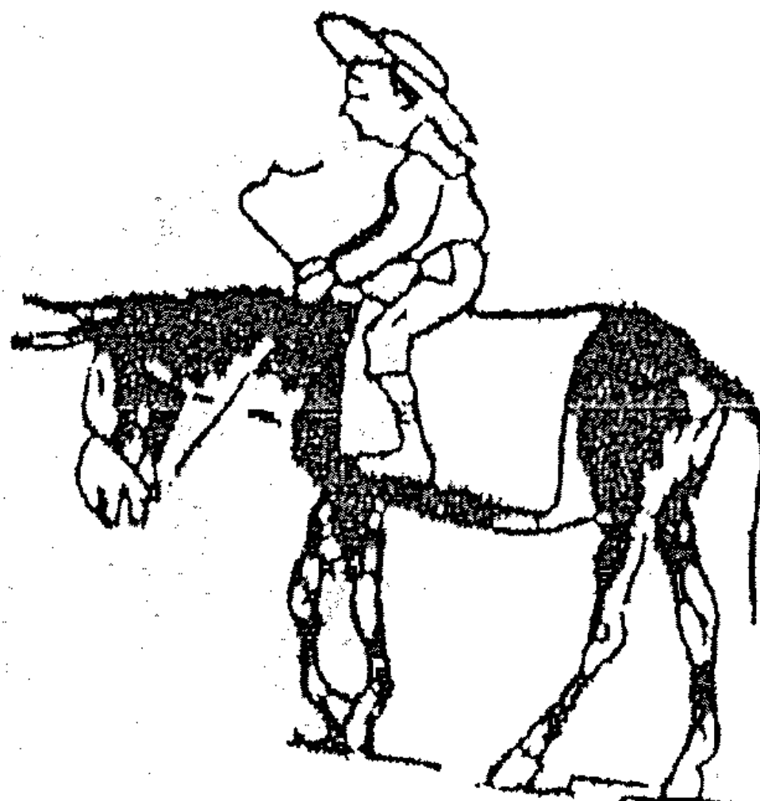

一一二

# 六壬易知 卷五

## 占斷下篇

### 占婚姻

（占男女）青龍男也，夫也。天后女也，妻也。日陽也，男也。支陰也，女也。如青龍旺相，則男為佳兒。天后旺相，則女為佳婦。青龍之陽神上乘貴人，則男為貴客。如申時庚申日占，青龍乘申，而龍之陽神乃在申，申上乘丑，丑為貴人，是龍化為貴矣。天后之陰神上乘太常，則女為貴類。如將巳時丁酉日占，后乘子，子之陰神乃在子，子上乘卯，卯為太常，為后化常矣。青龍所乘之神生后，或與后比和，則男益乎女。天后所乘之神生龍，或與龍比和，則女助乎男。此以龍后而占男女之何如也。日上神旺相，則男吉。辰上神旺相，則女吉。日上神乘貴人，則男貴。辰上神乘太常，則女貴。日上神生辰上神，或比和，則男與女相得。辰上神生日上神，或比和，則女與男相得。日之陰神旺相，則男家富。辰之陰神旺相，則女家富。

若龍后所乘之神刑沖剋害而不相合，或落空亡而見孤寡，日辰上之神刑沖破害而不相合，或落空亡而乘惡神，兼之龍所乘神剋后，與日上神剋辰者，則為妨婦之男。后所乘之神剋龍，與辰上神剋日者，則為損夫之婦。

（占成否）日上辰上神比和，而三傳三合（申子辰類、六合子與丑合之類、德合甲德在寅辰類）發用為亥之類、暗合為寅之類者，龍后所乘之神與日上辰上之神而無刑沖破害者（合媒也、男占重后、女占重龍）。發用龍合乘卯寅者，發用子加丑乘太常者，三傳比和相生乘吉將而非空亡刑害者（初男末女、中媒、欲其相和相生也、三傳見成神又乘龍合常后者，俱吉、皆婚姻成就之占也）。而成就之時期遠者，男以龍之陰神為成年，女以后之陰神為成年也。近者視龍后之陰神而定其月日。至占結婚之日，則大吉（即丑）所臨之辰是其期。

若日上辰上刑冲破害而不相合者，龍后六合所乘之神與辰日刑冲破害者，干支上下之神相尅，或日上神尅支上神，支上神尅日上神者，三傳相刑而白虎發用者，天空空亡發用者，日干尅天后，或天后尅日干者（以天后所乘神論，日尅后，女不肖，后尅日，男不肖），日生三傳后合不見者，男女行年上神刑冲破害相尅者，課傳不甚吉而斗罡加孟者，男家占而日財空亡，女家占而日官空亡者（男以日財為妻，女以日官為夫），皆婚姻不成之占也。

（占擇婦）第一當占女之邪正，如四課俱全，辰上神旺相，三傳吉神良將者，正。四課陰不備，傳見六合乘亥卯未酉，與天罡乘太陰者，邪。女子命上神為日之官乘貴人，太常與日德支德者，正。女子命上神為神后，乘元陰與桃花煞者，邪。第二當占女之情性，如女子命上神屬水，則智慧，若乘惡神或下尅，則詭詐輕淫。屬火則亢直，若乘惡神或下剋，則愚頑自用。若不知女子年命者，則以天后所臨地盤之神照前例推之。第三當占女之妍醜，如四課支上神乘貴，則貴重美好。乘蛇，有病面多紅色。乘雀，有目疾，如雀在巳午能文，在亥子麻面，在寅卯申亥少，在四季則雀斑。乘六合，姣好。乘勾陳，粗短。乘龍，美而青瘦。乘空，肥而醜。乘虎，醜而惡。乘常，好而能飲。乘元，黑而逸。乘陰后，俱美好。如支上神為支之六害，必有殘疾面目四肢，以類神決之，如亥為頭戌為足之類。大抵妍者，天后神后入課而旺相也。醜者，發用子加巳或加四季，與女子命上神見魁罡也。第四當占女子有子與否，六合與命相生者有子，六合與命相剋者無子。三傳為日之傷食者有子，三傳為日之父母者無子。臨命上則先女而後男，午臨命上則先男而後女也。

（附占）日上神乘天后，支上神乘六合，是未娶而先通也。傳課循環六合三合，是因親而致親也。日臨辰上，男即女家也。辰臨日上，女即男家也。子加申酉加寅，男有二婦。申加子寅加戌，則女有二夫。已亥相加發用，主兩心不定。六合乘神克后，主強橫奪妻。更有聞媒人之言而未知其虛實，以六合所臨之神為孟仲季觀之，臨孟實，臨仲半虛，臨季全虛。課體所喜者，三光六儀元胎三陽連茹軒蓋。課體所忌者，狡童泆女燕淫入單孤寡絕嗣。

### 占胎產

（占孕之有無）四課日辰上神相合，三傳旺相而發用為今日之子息者，虎后合入傳課而加干支者，發用辰戌乘后合兼血忌血支者，胎神即長生等十二名詞之胎乘生氣發用臨日辰年命者，夫婦年上神為三合六合德合，如已與申合，更值天月二德與生氣者，二人行年上神見今日之子息而無上下空亡六害者，太乙（即巳）臨婦人之行年而乘六合者，則孕主有。

四課日辰上神刑沖，三傳休囚空亡而子息不見者，課名四絕無祿絕嗣。三傳丑亥酉者，夫婦行年上神相刑害乘惡煞而子息不見者，則孕主無。

若發用寅未相加乘蛇虎作日鬼，或天鬼臨支剋日者，孕雖有而為鬼也。若天后乘天罡加日辰，與子息爻乘元武天空，或三傳剋日，傳見天狗煞者，孕雖有而終墮也。

子息爻乘死氣空亡與元胎課乘元虎蛇者，孕必死。已亥日返吟與子息又乘蛇勾而非空亡六害者，孕易動。

（占孕之男女）男女之占其法甚多，以理推之悉皆虛謬，惟以孕婦行年上神決之，斯為的確。年上神是陽則孕男（子午寅辰申戌），年上神是陰則孕女（丑未卯酉巳亥）。如以課傳論，則有一說：課傳四上克下者男，課傳四下賊上者女。課傳六陰者男（極陰生），課傳六陽者女（陽極陰生）。三傳二陰一陽者男，二陽一陰者女，明白簡易莫過於此。

如贊合龍常課傳並見者，三傳生日者，日辰上下相生旺相又得良將吉神者，太歲與日辰入傳相生者，青龍加占時發用者，則男女賢淑。

空勾元虎課傳並見者，日生三傳者，日辰上下刑沖破害又得惡將凶神者，太歲與日辰不入傳，或入傳而相刑者，白虎加占時發用者，則男女不肖。其或日上神吉則男必佳，辰上神吉則女必正。

（占孕之生期）干上神脫支上神，或三傳脫支者，三傳逢大煞空亡及傳退者，如戌亥發用子加戌，又作血支血忌者，傳內白虎乘子息爻者，日辰入傳而辰脫日者，如丁酉日，干上未，三傳酉未丑之類。天空乘日，日生三傳者，青龍乘酉而逢沖動者，則生期速而易。

干上神合支上神，或三傳合支者，三傳逢三合六合及傳退者，如亥子丑之類。發用血支血忌沖動浴盆煞而無水者，勾陳乘子息爻者，日入傳而辰合日者，課傳循環而不見刑沖空脫者，則生期緩而難。

月期則以發用之三合為定期，如用亥則卯未三合為誕生之月。日期則以發用之刑沖為定期，如用子則刑卯沖午主卯午日生。時辰則以用後之一辰為定，如發用是子則亥時是也。若天空白虎乘日干之脫神發用，與今日辰脫今日干作大煞一無羈絆者，不見合則無絆，則主當日生。其生時則以今日之長生定，若甲在亥之類。

（占產之吉凶）日辰上神各旺相相生乘吉神者，如龍合貴常。日辰上神不相剋害者，或三傳遞生而不乘惡將者，婦人行年上神旺相，未傳乘吉將而干上神亦吉者，凡此皆以吉斷。

干上神剋支上神者，或六合所乘之神剋天后所乘之神者，或墓神覆支而不見刑沖者，或三傳剋支蛇虎入傳而支乘死氣者，則損母。或支上神剋干上神者，或天后所乘之神剋六合所乘之神者，或墓神覆日而不見刑沖者，或三傳剋日蛇虎入傳而日乘死氣者，則損子。或干支互剋，后合相刑，而日辰上下四課三傳並無一吉將者，則母子俱損。凡此皆以凶斷。

（附占）三傳俱旺，未傳乘天后，與課不備，而日脫辰者，不足月而生。發用空亡，傳歸實地，或陰日昴星，或伏吟無丁馬者，必過月生也。

貴人乘子午卯酉加寅申巳亥，與壬戌日伏吟，乘天空者，雙生。貴順傳順，或戌加亥者，順生。傳逆貴逆，或亥加戌者，逆生。戌為足，亥為頭。

辰戌乘龍虎作月厭發用者，怪生。伏吟不動，干支刑剋，神將俱內外戰者，逆而不生。

課體伏吟元武加辰者，生有殘疾之類。庚辛日神后乘虎與卯加辰作天空者，生而缺唇。

### 占家宅

（占禍福吉凶）日為人，辰為宅。如日上神生辰，辰上神生日者，日辰各受上神之生者，日上見辰之旺神，辰上見日之旺神者（如甲申日一課卯甲，卯乃甲之旺神，三課卯申，卯乃申之旺神之類），辰各受上神之旺者（如甲申日一課酉甲，酉乃申之旺神之類），辰上見德合者（一要不空亡），日辰上見貴人者（亦不要空亡），日辰上見三合六合互合（日上神合辰，辰上神合日）而乘吉神者，辰加日生日者（如甲子日第一課子甲之類），貴合龍常乘日辰上並發用者，則人福宅吉。

日上神脫辰，辰上神脫日者，或日辰各受上神之脫者（主人病、宅壞）。日上神剋辰，辰上神剋日，或日辰各受上神之剋者（主人災、宅壞）。日上神墓辰，辰上神墓日，或日辰各受上神之墓者（主人宅昏晦）。日上神乃辰之敗氣，辰上神乃日之敗氣（如甲申日第一課午甲、第三課子申之類），或日辰各受上神之敗者，如甲申日第一課子甲、第二課午申之類，主人損宅圮。凶將臨，尤甚。日神上神空亡破碎者，犯破碎煞。日臨辰受剋，辰加日剋日者，主下犯上，外侮。無氣發用空亡者，勾元蛇虎乘日辰上併發用者，則人禍宅凶矣。

占人之禍福。日上神乘吉神作日德，或日貴日祿者。日上神生日者。辰上神生日者。或辰來生日者。日上神為月將，又乘吉神者，如貴合龍。課體吉，如三奇三陽，而三傳生日者。三傳生日而天將剋日者。或三傳剋日而天將生日者，是為官印顯赫。三傳遞生而生日者。三傳旺相發用日德乘吉將者。初傳乃日前一辰，末傳乃日後一辰者，如甲課在寅，初卯、末丑，為引從也。凡此皆為福占。

日上神乘凶神作日破，或日刑日害者。日上神剋日者。墓日者。辰加日而墓剋日者。日上神為死氣乘白虎者。辰上神剋日者。日臨辰受剋者。辰剋日上神者。日上神或空亡，或脫日，或敗日，又乘凶神者。課體凶，如孤寡、絕嗣、無祿、燕淫之類。而三傳剋日，不忌。或脫日者，三傳遮剋而剋日者，發用空亡。或日墓者，發用剋日，又乘凶神惡將者，如死神、死氣、蛇、虎之類。凡此皆為禍。

占當以日上神將之刑剋定其事。因如貴人生日，則貴人提挈本身近貴榮華。剋日干，謁無效。日剋貴人，慈禍招非。騰蛇生日，則憂疑解散。剋日，則人病火災。日剋蛇，脫力虛驚。朱雀生日，則文書喜氣。剋日，則是非口舌。日剋朱雀，主財物到門。六合生日，則婚姻成就。剋日，則提防哭泣。日剋六合，主進人口。勾陳生日，則田土進益。剋日，則因田致訟。日剋勾陳，主修造動土。青龍生日，則財喜恩榮。剋日，則家堂不安。日剋龍，則有財喜。天空生日，則奴隸得力。剋日，則下人欺算。日剋天空，主加工修築。白虎生日，則精彩發達。剋日，則孝服血災。日剋白虎，反有橫財。太常生日，則人送財帛。剋日，則孝服或口腹得疾。日剋太常，反主有酒食徵召。元武生日，則有是非。剋日，失脫防盜。日剋元武，反主喜事。太陰生日，則陰人助財。剋日，則僧道暗算。日剋太陰，金銀財物自來。天后生日，則婚孕有喜。剋日，則婦人爭門。日剋天后，則喜事臨門。

又當以三傳全體之生剋驗其人口。如三傳全財，則憂尊長（如日上見官）。三傳全印，則憂卑幼（如日上見同類則卑幼喜）。三傳同類，則憂妻妾（如日上見傷食）。三傳傷食，則憂官祿（如日上見財）。三傳全官鬼，則憂本身與兄弟（如日上見財，則官祿喜）。

又當究其空亡之爻，如父母空則父母有不測。又當視其類神之吉凶，如六合加為兄弟，六合受剋則兄弟不吉。又宜看其所乘之神虛實衰旺何如，更以家人行年上神決之，禍福無遺矣。

（占宅之吉凶）辰上神為太歲月將又乘吉神者，太歲乘貴加辰上者（庶人之辰上神生辰者，辰上神作生氣乘龍者，辰上神為支德或與天喜并者，辰上神旺相或辰自旺者（如日支祿木祿占旺），三傳旺相發用乘吉將支德不剋日者，發用為日之長生乘吉將不剋日者，凡此皆為吉占。

辰上神為休囚基絕又乘凶神者，如蛇虎勾。辰上神雖作生氣而剋日者，辰上神盜辰敗辰基辰者，辰上神空亡或辰自空亡者，辰上神與辰自相刑沖破害者，三傳休囚乘凶將而發用支德值空亡者，太歲乘白虎加辰上者（有官職不忌），辰上神剋辰者，辰上神作死氣或月厭乘凶神者，三傳盡為辰之鬼或發用為辰鬼而不生日者，凡此皆為凶占。

又當視辰上天將之美惡以定其興替。如貴人加宅，主家道興隆，生貴子，乘吉神貴人欽敬，乘凶神小口災多虛驚。

騰蛇加宅，主憂驚怪異，亂夢火燭，井有鬼祟，損害陰小。若乘伏尸煞，則宅有伏尸。

朱雀加宅，主求親作書，人患眼疾，內外喧噪。如午酉日占，則婦人不和，有口舌。

六合加宅，主進小口，眷屬入門，修造動作。如戊己日，則有人送物，主添丁進喜。

勾陳加宅，主屋宇毀壞，小口宿疾，又主傷風。若傳見朱雀，主爭田河訟不已。見白虎，主婦人久患血病。

青龍加宅，主有橫財，骨肉娛樂，子孫富貴，屋宇光華。傳見六合，進人口。傳見三合，積財寶。

天空加宅，主人多憂，財多散失，下人不足，陰小多災，宅神空廢，漸見凋零。

白虎加宅，主病亡變禍。傳見朱雀勾陳，主官訟。傳見貴人，主病瘳。傳見勾陳元武，主小兒病難治。

太常加宅，主宅常修飾，歌管懽呼，外家作主，女得外家財物，庫中豐滿。傳見蛇虎丁神，防孝服。元武加宅，主宅多失脫，盜賊逃亡，少婦墮胎，風水不吉，以致家長損陰小災，或有水鬼。

太陰加宅，主生貴女，主異姓過房，財帛暗積。又主生小口，多福祿。如乘死囚，財帛損傷，小口削弱，老婦病亡。

天后加宅，主生貴女。發用太常，主宅有寡婦。發用騰蛇，多災病。傳見龍常，主婚姻。傳見元武，損陰小。傳見六合，多淫泆。

又當視日辰四課三傳之旬丁以驗其未來。如丁乘貴人，主貴客來。丁乘騰蛇，主人走失。丁乘朱雀，主遠信至。丁乘六合，主子孫外合。丁乘勾陳，主兵卒勾攝。丁乘青龍，主遠行。丁乘天空，主奴婢逃亡。丁乘白虎，主孝服動。丁乘太常，主父母憂。丁乘元武，主失財不獲。丁乘太陰，主婢妾陰私。丁乘天后，主婦人適。日上丁馬，人不安宅。

又當明其類神之分屬。以子為房，為徑。丑為廚，為花楹。寅為前過道，又為蕃院。卯為前門，辰為續壞，巳竈，午堂，未井，申為後過道，酉為後門，戌為浴堂，亥為廁，又為樓臺。兼以家長本命配之，而吉凶無遺矣。

日上神為舊宅，辰上神為新宅。日上神旺相，舊宅好。如剋日，則自不欲住矣。辰上神旺相，新宅好。如剋辰，雖移住不久也。

辰左神為左鄰，辰右神為右鄰。觀其神將善惡而分。如辰是子，丑為左鄰，亥為右鄰。神將吉則善，凶則惡也。

青龍乘子臨辰，巳宅井有水。傳見巳乘天空，宅竈須修。辰加日乘龍，宅乃寄居。大煞臨辰，乘虎剋日，宅防血光。天后太陰臨辰，而陽不備，宅掌陰人。

子午龍蛇臨日辰而見血支，宅有孕婦。子午丑未相加而乘朱雀，兄弟不和而分居。墓加日作鬼休囚，宅墳不安。龍乘生氣臨辰生日，宅漸興旺且悠久也。虎乘生氣臨辰生日，宅必驟發，唯慮不永。凡此皆禍福吉凶之附占也。

### 占疾病

（占死生）大抵日為人，辰為病。日上剋辰吉，辰上剋日凶。細分之，如四課日辰俱墓，發用又墓而無刑沖者，白虎乘死氣死神剋日而無救解者，白虎臨日剋日，或辰作白虎剋日者，年命復墓而乘死氣者，月厭大煞飛魂喪車哭神及死神死氣填滿課傳內有剋日者，課傳中諸煞並現，青龍乘驛馬與元武乘浴盆煞加命上者，日德日祿發用及加年命上而俱空亡者，若辰上空，反吉，皆屬死徵。

為人占病而類神值空亡者，如占父與尊長病而貴人空，占母病而太陰空，占伯叔之病而太常空，占兄弟朋友病而青龍空，占妻妾病而天后空，占子息病而六合空，占奴婢病而天空空，酉戌空皆不吉。若四下剋上與傳中俱財，則憂父母。四上剋下三傳俱印，則憂子孫。

死期則以日干之絕神定，如甲日絕在申，看申臨何辰，臨歲則不出一歲，臨月不出一月，臨日不出一日。亦有以絕神下之辰為其死日，如絕神乘未臨午，則可斷定其為午日死也。

年命入墓而四課中有生氣者，課傳俱凶而類神在生旺之鄉者，課傳惡煞而不來傷日者，白虎乘神克日干而干上神反克白虎者，白虎乘神剋今日之支而支上神反克虎者，白虎乘神生日或日生白虎乘神，或白虎作今日之德神者，如甲日虎乘寅。白虎剋日而虎之陰神能制虎者，日德日祿發用而不空亡者，皆為不死之徵。其為愈之期，則以日干之子孫定，如甲乙日占病，丙丁日愈，子孫能制鬼故也。

（占病症）大抵日為人，辰為疾，而辰上神為受病之症，故當視辰上之神。子主傷風腎竭，如天后乘之，則男子精絕，女子血絕。亥主顛狂濕風，如元武乘之，則眼目流淚。戊主腹痛脾泄，如天空乘之，則行走艱難。酉主喘嗽勞傷，如太陰乘之，則損肺傷脾。申主男唇破女孕危，如虎乘之，則瘡腫骨病。未主翻胃嘔吐，如太常乘之，則氣噎療癆。午主心疼目昏，如朱雀乘之，傷風下痢。巳主齒痛嘔血，如螣蛇乘之，則頭面疼腫。辰主遺漏瘋癱，如勾陳乘之，則咽喉腫塞。卯主胸脅多風，如六合乘之，則骨肉疼痛。寅主目疼腹痛，如青龍乘之，則肝膽疾。丑主氣促傷殘，如貴人乘之，則腰腿痿痹。

十二支所專屬，則亥子屬腎，巳午屬心，寅卯屬肝，申酉屬肺，辰戌丑未屬脾。推其十二辰所變通，則亥子膀胱也，巳亥頭面也，寅申手足也，辰戌頂門也，丑未肩背耳也，卯大小腸也，午營衛也，酉肺與肝膽也。

詳其神煞所相加，則白虎加辰，霍亂吐瀉也。元武居子，腎衰也。辰戌乘后雀，痞瘧等症也。勾陳乘戌，咽塞也。太陰乘申，腰腫也。白虎乘卯酉，吐血勞怯也。貴人守辰戌，虛腫也。白虎乘丑，腹疾也。巳亥相加，心腹有癖也。子作血支，疾疽血痢也。太陰乘陽刃血支，臂腹有血疾也。丑加亥乘虎，女經不通也。

究其得病之原由，則曰上神乘貴人，因思想勞苦而得也。乘蛇，則驚恐憂疑而得也。乘雀，則口頭咒詛而得也。乘合，則喜慶婚姻而得也。乘勾陳，則情緒牽絆而得也。乘龍，則經營財物而得也。乘空，則欺妄隱忍而得也。乘虎，則弔喪問病而得也。乘太常，則醉酒飽食而得也。乘元武，則祭祀盜賊而得也。乘太陰，則奸私暗昧而得也。乘天后，則閨房酒色而得也。乘虎自巳至戌，白虎乘之，病在表也。自亥至辰，白虎乘之，病在裏也。

（占醫藥）男以天罡（即辰）加行年上，功曹（即寅）下是醫神也。如行年在寅，天罡辰加寅，屬北方，即發在北方也。行年在未，天罡辰加未，則功曹寅之下為巳，巳火屬東南方，即醫在東南方也。女以天罡加行年上，傳送下是醫神也。醫神若能剋支，或能制白虎所乘神，則善矣。不然，則于今日課前第二辰下求之，是為值日天醫辰也。天醫能剋支，能制白虎所乘神，則善矣。又不然，則于天醫之對沖下求之，是為值日地醫。地醫能剋支，能制白虎所乘之神，則善矣。又或不然，則直于制白虎所乘神之辰下求之。如虎乘申，則于午下求之。虎乘酉，則為巳下求之。陰陽須相比。無有則不善矣。其醫神屬木土者，宜丸散。屬水者，宜湯藥。屬火者，宜灸。屬金者，宜針砭。

### 占謀望

（占成敗）所謀望之類神，課傳不見者，如謀望財利，而課傳絕無財神之類。日上神與支上神沖刑破害不相合而復乘惡將者，干支坐墓而或干支互墓與墓神覆日者，日辰命上所乘之將皆凶而所傳之將復凶者，是為不成之占。

其所謀望之類神見於課傳者，干支上神比和復乘吉將者，發用所乘之吉將與日相合不落空亡者，三傳俱退而落空亡者，如丑午亥是退傳，遺值甲寅旬空，反宜進步以圖之也。年命上神與所謀之類神相合而不見刑沖不落空亡者，貴登天門神藏煞沒者，貴人覆日者，三傳俱吉將者，是為可成之占。

發用開格而乘惡將者，如子加卯午加酉戌加亥辰加巳而天將復凶也。干支俱吉三傳凶者，所謀望之類神雖見而落空亡與刑沖破害者，破碎發用復乘凶神者，歲破月破並見三傳而類神或為歲月破者，勾空元虎非類神而日上與發用並乘者，陰蛇與雀非類神而乘發用剋日者，三傳所乘之神先見元武復見勾陳者，命上神或剋日上神者，三傳初剋末傳者，三傳見類神休囚者，亦為不成之占。

發用日德日合又乘吉將者，干支雖凶三傳俱吉者，類神見而不落空亡不刑沖破害者，類神發用神煞無害者，太歲月將作貴人發用者，命上神或為貴人或為月將而與發用相比和者，日上神與命上神相合或日上神來剋命上神者，丑加巳子加丑更乘吉神者，三傳見類神而旺相者，三傳見成神者，日上發用龍常而不剋日者（若土日龍常反為凶矣），是亦謀望必成之占。

（占遲速）類神旺相者速，類神休囚者遲。劫煞發用者速，驛馬發用者遲。成神作初傳者速，成神作末傳者遲。日德作類神而發用者速，類神臨卯酉者速，類神臨辰戌者遲。三傳不離四課而末傳歸日上者速，三傳離四課而末傳空陷者遲。更以發用歲月日時參之，遲速了然矣（如用年不出年，用月不出月，用日不出日，用時不失時之類）。

## 六壬易知 卷五 占斷下篇

附占者宜於公而不宜於私者，課傳六陽也；宜於私而不宜於公者，課傳六陰也。所圖而知其實者，三合六合而類神見也；所圖而知其虛者，天空旬空而類神伏也。宜動而不宜靜者，丁馬並見也；宜靜而不宜動者，旺相發用也。

自干傳支，則我去求人；自支傳干，則人來求我。先刑後合，則初難後易；先合後刑，則初易後難。三傳迭尅而復來尅日，事雖小而終乖。太歲月將發用，大事官也；三傳平淡而乘吉將，小事可也。幹事宜託何人，須視類神。空則其卒或有服人敗事，係於何人，亦視類神。支上類神旺，則可圖現在；類神相之類，然當視支上神，則可圖將來；類神休，則可圖過去。鬼在孟，則尊者之事難圖；鬼在仲，則同輩之事難圖；鬼在季，則陰小之事難圖。至若上尅下，則事起男子在外；下尅上，則事起女子在內。知一課，事起比鄰。辰尅日，則言與日尅辰，則言偽。傳貴皆順，事順；傳貴皆逆，事逆。去辱喜空，求榮喜實。

### 占官祿

（類神）文視青龍，武視太常，朱雀為文書，白虎加官鬼為催官使者，且主威權也。

（所喜者）日祿印綬軒車之類（戌為印，未為綬，卯為軒車之類）。

（所忌者）空亡與沖墓之類。

（所主者）本命與行年。

（占在任之吉凶）如日上與發用，或日德日祿，或官上乘吉將，與中末兩傳不見空陷者吉也。如日上發用神將並凶，或神將雖吉而沖墓空亡者凶也。

（官祿之凶）干上天羅，支上地網，即以羅網發用，而年命上乘喪弔者，則為丁制之凶（干發用主于父憂，支發用主于母憂）。日上神與發用係日墓，或上乘白虎，或祿神作閉口，或神將不吉，或三傳為折腰為空陷者，年命上之神乘凶煞，諸凶煞者，則為疾病不測之凶（極則疾病，緩則不測）。三傳自下剋上，遞剋日干，或自上剋下，遞剋日干，而無日德解救，或朱雀乘閉口者，則為彈劾之凶。德祿官三者，落空亡，年命上之神，又乘凶將，或乘天空者，則為去位之凶。日干之祿，或寄支（如甲日，寅日干之祿，或寄支投墓（如辛丑日，酉加丑上），而無官德救解者，則為缺折，遜避之凶。

官祿之吉：太歲月將臨干發用，官印顯赫，祿馬扶身，貴臨天門，神藏煞沒，以及甲子庚寅日之伏吟，皆主官尊祿厚，悠久無疆。

占陞遷之遲速，須視龍常（文視龍，武視常），所臨之神，如臨日辰，則佳音可翹首而待。不然視其所臨之神，與日隔幾位，而因以定其年，與辰隔幾位，而因以定其月。龍常所乘之神，生日干者，內除也。日干生龍常所乘之神者，外除也。

占聞報之虛實，傳課旣佳，而太歲在日之前，又日上乘天喜，朱雀或畫貴者，實也。傳課不佳，太歲居日後，日上乘元武空亡者，虛也。

### 占求財

（占財之有無）取日干所剋者為財，而課傳俱有財現。（如甲乙日，課傳有辰戌丑未之類）或日上神，或支上神，或命上神，俱以下剋上為日辰命上之財。（如日是寅，寅上是丑，支是子，子上是巳，命是酉，酉上是寅之類）或發用是暗財乘青龍。（如辛日以寅為財，亥子生寅木，而寅木墓於未，故亥子未皆為辛之暗財）或課傳無一財，而三傳為傷食。（如丁日以金為財，課傳無金，三傳皆土，土能生金財，亦是暗財）或日財見於青龍之陰，或旺財臨於行年之上，或龍乘日上支上，而所乘之神為日之長生，或日剋初傳，而三傳遞剋，凡此求財必其有也。

三傳俱是財而財多化鬼。（如酉以木為財，而三傳寅卯辰，財多化鬼也）或發用是日財而乘天空，或課傳俱無財而青龍入廟，入墓，入墓即坐墓，青龍臨酉名入廟。或青龍乘空亡，而日辰上神與日相比和者，凡此皆為求而不得之象。

（占難易）支來生日則易，支來剋日則難。財為發用則易，財為末傳則難。財臨干則易，干臨財則難。日德日祿為發用則易，反吟伏吟為課體則難。支傳干則易，干傳支則難。日上辰上神和合則易，日上辰上神背馳則難。其先難後易者，初來剋日而中未被日剋也。求之宜緩。其先易後難者，初為日剋而中未來剋日也。取之宜速。

（占多寡）財逢旺相則多，財乘休囚則寡。發用為財則多，中未為財則寡。類神見則多，類神伏則寡。（如求金銀、欲見財、求衣服、見未之類）大歲作財神而乘青龍則多。時日作大耗小耗而不乘青龍則寡。定以先天之數。（如子午為九數，或十八、卅六、八十一，加以倍減之法。如水在冬則倍，在夏則減也。）而多寡明矣。

（占何人所與）財乘天后，則主婦人妻妾之財。財乘貴人，則主貴人尊長之財。乘青龍，則主公門賞客或道流之財。乘六合，則士大夫或術士沙門商旅之財。乘勾陳，則主惡人之財。乘騰蛇，則主婦人或醫匠之財。乘朱雀，則主使君長官妃或善士之財。乘太常，則主貴人老者或女親之財。乘白虎，則主兵卒僧醫或孝服之財。乘太陰，則主婦人姻親奴婢之財。乘天空，則主官吏或僕從之財。乘元武，則主小兒或盜賊之財。類推可也。

（占由何來）財乘天后，是水利或酒醋之財。乘貴人，是舊宅牛畜或橋梁之財。乘青龍，是書籍或柴薪錢帛之財。乘六合，是車船竹木買賣之財。乘勾陳，是水物田土或文書印信寶貨魚鹽之財。乘太常，是衣服緞疋或婚姻飲食之財。乘白虎，是田園大麥或湖池道路喪具之財。乘太陰，是金銀珠玉或小麥五穀之財。乘天空，是墓墳宅舍或印信獄具之財。乘元武，是鱗介樓臺倉廩或畜類之財。

（占求財之方向）視青龍所乘之地。如龍居午，南方求之。

占求財之時日，視財爻所臨之神。如財臨太歲，以年計；臨月建，以月計；臨日，則本日；臨時，則本時。

附占：以索債求者，則詳日辰時而推之。日為財，辰為債主，時為欠債人。辰上神生日，日上神生辰，或俱比和，或俱吉將，或辰上神剋時上神，或以類神發辰用，索之有得。

如財有空手求者，則財逢旺相，適值旬空是也。有無心而護者，則太陰乘神適作日財是也。

以借貸求者，則辨陽日陰日而推之。陽日看日上是何神，陰日看辰上是何神。丑寅乘吉將，可以立待。巳午主遲緩，終得。酉戌目下即得。亥子婦人嗔。申未空無所有。若類神見財爻旺相，不在此例。求無不得矣。

以博戲求者，則視支干。支為主，干為客。支剋干，則主勝。干剋支，則客勝。皆視上神。

以不正當求者，則視三傳。或先鬼後財，或傳鬼化財，或財元武附財者利。

若夫日上財為外財，辰上財為內財，臨丁馬則遠財。視何者之財為旺相，而或內或外，或遠或近，以求之，是求無不獲矣。

### 占行人

（暫出而未歸，以此人出門之時加於今日之支上，視天罡所臨下神為至期。）

假令行人是昨日巳時出門，今日是癸丑日占，即以巳加丑上順數前去，值天罡臨子，即斷其子日到，或當日子時到也。

（久出而地近未歸，以月將加正時，視天罡下之神。是孟未動身，是仲在半途，是季即至。）

假令酉將午時，則辰下是丑，丑為季，主其人即到也。

（遠遊行人久出未歸，視四課內或墓覆干，或墓覆支，或天馬驛馬乘支，或類神乘支，或日辰上見天罡者。視三傳內或行人本命臨初傳，或初傳是日之絕神。甲日初傳是申之例。或初傳是日之官鬼，或初傳是日而末傳是辰，或末傳是日之墓，或末傳是天馬驛馬之墓，或末傳是戌加卯加酉，或三傳內見類神，或三傳內見遊神臨墓貴人，或類神發用，或類神乘馬臨日辰之墓，或白虎乘二馬者，皆主歸也。其歸期則以遊神下神決之。如遊神是子，下是寅，或寅月寅日歸也。

行人久出絕無音信，課傳內不甚了了，則視行人之行年與今日之日干。將天盤之日干寄宮依貴人之順逆轉至地盤之日干寄宮。貴順則順轉，貴逆則逆轉。若從卯酉上經過，而卯酉上之神不剋日，不剋行年者，其人必歸。三千里外人視大將軍下之神。如巳午未煞在卯，卯下是子，則斷其子月子日歸也。千里外人視歲支下神。五百里外人視月建下神。百里外人視日干下神。無不應也。如不經過卯酉，或經過而日及行年為其上神所剋，則可決其不歸矣。

行人久出不知去向，視其行年上之神可知其何處去。假令行年是卯，上加酉，則知其在西方，酉屬西也。

行人出久不知其程，視行人命上之神與年上之神合定其程數。意其近則一進十，十進百；意其遠則自一而進，以至於千。若命上神與年上神旺相，則又當倍而進之，否則但有進而無倍。假令命上神是子，子數九；午上神是亥，亥數四，合成十三數，進作一百三十里，倍作二百六十里。意其遠則可進而至二千六百里。

（附占）若歸而病者，則未傳是墓而虎乘之也。若歸而無財者，則年命上與三傳皆無財，或見財而落空亡，或財爻乘元武也。若歸而不如意者，則年命上乘敗神，或貴落空，或成神喜神落空也。如課傳內日剋初傳者，初傳為日墓者，初傳空亡者，類神空亡者，二馬空亡者，馬臨長生者，馬被合者（如子日巳馬臨於申上，則巳與申合，馬不動矣），皆不歸之象也。

若為羈留而不得歸者，則視類神上所乘之神而斷其為何人所留。假令類神是戊，戌加本日之貴人，是為貴人留也；或乘天后太陰，決為婦女留也。

若以所至之方為樂地而不肯歸者，則類神臨長生或旺相，與驛馬臨長生也。

若中道而止不能歸者，則陽日昴星發用，戊加亥，或犯天車煞之類是也。

若病而不歸者，則去人行年上值病符乘凶將，馬臨空亡之類是也。

若死而不歸者，則行人本命上值墓神乘凶將，馬臨空絕，或犯空亡之類也。

至於人雖未歸而信則先至，則信神發用也（信神是酉，酉加子上，遠則子月，近則子日）。行人雖寄信而信不到家，則信神現而空亡也。或行人無書信而忽聞口信之傳，則須不犯謾語煞，或類神作信神，或日上神不傷支上神，而後可以斷其為實信也。若陰虎空蛇四將乘辰戌加日上者，其信不實。

### 占逃亡

（近逃亡）三日以內者為近逃亡。君子視日德，小人視支刑。（如甲子日，日德在寅，支刑在卯，屬君子者視寅下，屬小人者視卯下，即其逃亡之處也。）

（遠逃亡）宜視類神。貴者視太常，父視日德，母視天后，兄弟子友視六合，妻女視神后，子、孫視登明（亥），姊妹視太陰，傭工視朱雀，奴視河魁（戌），婢視從魁（酉），總之可從類神所臨之方以求也。（如占父逃亡，視日德臨午，則宜往正南方求之。）

（占所匿之處）應以方向而又參天將決之。如寅加於子，子是正北方，子上乘六合者，親戚朋友之家；天后，婦人之家；貴人，富貴之家；螣蛇，凶徒之家；朱雀，官吏之家；六合，牙僧之家；天空，獄吏之家；青龍，豪貴之家；白虎，死喪之家；太陰，陰私老婦之家；太常，善人燕樂之家；元武，奸盜之家；勾陳，公吏之家。

（占逃亡究竟）凡類神臨干者，外人獲來；臨支者，自來發用。作日德，或與日辰三合六合者，亦自來。類神在課傳不空亡者，可得。三傳不離四課，見類神者可得。類神見而空亡者不可得，見亦不來。傳俱不見類神者不可得，亦費力。類神作死乘墓神，又乘惡將者（白虎之類），其人縱要來，或病或不測而不可得。謀名斬關遊子者不可得。

### 占盜賊

（占可捕與否）如日辰上見魁罡，而課名斬關；或日鬼入傳而乘吉將（龍合陰之類）；或丁馬發用乘太陰；或玄武與盜神及盜神之陰神（地盤盜神上之神為盜神之陰神，如盜神是子，則地盤子上之神即其陰神，與其他陰神同理）皆比和相生；或盜神乘吉將；或盜神值旬空而天地盤比和；或玄武所乘之神為羊刃神煞（表又臨卯酉）；或玄武所乘之神剋日。凡此皆不可捕也。

（占賊人避處）至於可捕者，則視盜神即知賊人所避之處。盜神是子，則賊在北方水澤之區；盜神是丑，則賊在北方近東；盜神是寅，則賊在東北叢林之中，如乘貴人，則在舊吏之家；盜神是卯，則賊在東方大林或竹叢之內；盜神是辰，則賊在東方近南，或在蠶工之家；盜神是巳，則賊在東南方；盜神是午，則賊在南方；盜神是未，則賊在南方近西；盜神是申，則賊在西南方，近則州縣城郭之所，遠則村野衝要之地；盜神是酉，則賊在西方；盜神是戌，則賊在西南方，近則州縣城郭之所，遠則村野衝要之地；盜神是亥，則賊在西北方，居近水邊。此均從十二神之類消息而得，仿此細推，靡有不中矣。然必盜神之天地盤相比和，方可以此為據；若上下相剋，則賊不留，此須再視盜神之陰神也。

（占路程、道里之數）則以盜神之天地盤合而定之。休則相加，囚死則相加而折半；相則相乘，旺則相乘而倍之。例如盜神是子加亥，子數九，亥數四，旺則七十二里，相則三十六里，休則十三里，囚死則六七里也。如去失物之期已遠，則又當將各數倍之，乃至十倍百倍。

（占賊藏）視盜神所生之神。盜神屬陰，所生之神取陽；盜神屬陽，所生之神取陰。例如盜神是子，寅卯均為其所生，而子屬陽，當舍寅而取卯也。子為盜神，則物藏竹木之中，或舟車之內；丑未為盜神，則物藏祠廟之內，或城闕之旁；寅為盜神，則物藏爐竈之中，或磚瓦之下；卯為盜神，則物藏密治之內，或箱櫃之中；辰戌為盜神，則物藏倉庫之中，或碑碣之下；巳為盜神，則物藏廊廡石欄之下，或溝澮之中；午為盜神，則物藏園圃之中，或牆垣之下；申為盜神，則物藏廊廡石欄之下，或溝澮之中；酉為盜神，則物藏園圃之中，或牆垣之下；亥為盜神，則物藏敗棺之中，或屋柱之下。此亦從十二神之類消息而得之者也。至於方向，則亦視盜神所生之神。如盜神是寅，寅生巳，則在東南方；盜神是申，申生亥，則在西北方也。

（占賊何等人）視玄武所乘之神，而以其類神定之。乘寅，為公吏，為道士；乘卯，為術士，為沙門；乘辰，為惡徒，為軍人；乘巳，為廚夫，為火夫；乘午，為旅客，為女巫；乘未，為寡婦，為道人；乘申，為公人，為金銀匠；乘酉，為婢女，為酒人；乘戌，為乞丐，為僧道；乘亥子，為強盜，為積竊；乘丑，為農夫，為兵卒。旺相則為衰老。若欲知其人數，則視盜神隔玄武之位數而定之。例如玄武乘辰臨酉，則地盤辰上之亥即為盜神，自亥至辰隔六位，知為六人也。再視盜神之旺相休囚，而或增或減，斯更精矣。

（占賊形狀）亦視玄武所乘之神。乘子，面黑身長；乘丑，大腹闊口，顏醜多鬚，軀幹雄偉；乘寅，矮短美髯；乘卯，瘦小善走；乘辰，目大眉粗，鬚長貌兇惡；乘巳，瘦而長，善歌曲；乘午，身長目斜視；乘未，目露頭白，身有孝服；乘申，身長面白，少髮有痿病；乘酉，軀幹粗長，面有斑點；乘戌，顏醜黑多鬚；乘亥，體肥貌醜。若賊不止一人，則指為首者之狀也。

（占捕役勝任否）視未傳與勾陳所乘之神，然二者不可並視，並視則惑矣。如傳中見勾陳，則視其所乘之神。所乘之神作日德，或羊刃，或剋玄武所乘之神，則勝任。若勾陳所乘之神生玄武所乘之神，主得賍縱脫。玄武所乘之神作羊刃，而又剋勾陳所乘之神，主為賊所害。又勾陳所乘之神雖剋玄武所乘之神，而彼值旺相，此值休囚，則主賊太多而寡不敵眾。凡此皆當改捕或添捕而後可。如三傳不見勾陳，始視末傳，蓋初賊中賊末吏，本舊法也。其消息之法與視勾陳之例相同，不過彼以玄武所乘之神為賊，此則以中傳為賊耳。又有制玄武之法者，如玄武乘酉，則用丁命人往捕，取火能剋酉金，而又避丙之合也。丙寄巳宮，巳與酉合。至於遠年大夥賊徒，不得其方向者，則向天目（詳卷二神煞表）所臨之方可得。又玄武臨月將，名太陽照武，宜於急捕，是又不可不知也。

### 占詞訟

（占內外）內而與家人訟，則日為尊長，辰為卑幼；外而與他人訟，則日為原告，辰為被告。荷無對頭，則以日為官，辰為己。

（占勝負）觀日辰之吉凶剋制，而勝負自明。如日吉辰凶（指日辰上之天將而言），或日上神剋辰上神，則尊長與原告勝；日凶辰吉，或辰上神剋日上神，則卑幼與被告勝。日辰上神比和而不乘惡將，則和解可望矣。

投狀之初，則視朱雀。如朱雀所乘之神與天乙所乘之神相生相合，或相比和，而初傳又生日者，狀准；反是則否。及其既准也，則視勾陳。日剋勾陳所乘之神，則訟得直；勾陳所乘之神剋日，則訟不得直。若天空臨辰（日辰之辰），而關神（神煞表，詳卷二）入傳，或墓神覆支，而又自生投墓（即初傳生日，末傳生日），者，主監禁。遇關神（神煞表，詳卷二）即出。設鑪神值休囚之氣，臨死絕之鄉，或逢空落空，則又無效。傳遇曲直而剋日，主拘役。勾陳乘寅卯剋日，或白虎臨亥，主罰鍰。勾陳之陰神乘白虎帶破碎等凶煞而剋日，主重罪。勾陳之陰神乘貴人帶生氣而生日，主釋放。勾陳所乘之神剋日辰，主兩敗。勾陳所乘之神與日辰比和，主不決。朱雀開口，受枉屈而難伸也；白虎仰視，因嫌疑而遭罪也。斗罡臨日，子孫入傳，或貴人入獄，囚禁不出也。太歲兼貴人生日，罪雖重可望未減也。貴人臨日而順治，直者勝而屈者負也。天乙發用而剋日，宜聲請移轉管轄也。貴人值空亡，案久懸而不結也。三刑六害凶神惡煞見於日辰發用，訟必負也。玄武所乘之神，教唆鬼也，可視類神而知其為何等人也。神后之下，避罪方也。至於決大疑重獄而欲廉得其真情，則以日為我，辰為囚。日上神剋辰上神，則囚當吐實；若天空臨辰上，則囚終忍楚不供矣。簡括言之，凡占詞訟，所喜者貴人、青龍、太常、天后也；所忌者勾陳、朱雀、白虎、螣蛇也。課傳中見勾雀虎蛇剋日均凶，又丁神入傳逢羊刃亦凶。惟初傳白虎，未傳螣蛇，則雖凶而不為禍，以其為虎頭而蛇尾也。

### 占訪謁

（占見否）以日為我，辰為彼。日辰上神，宜相生，不宜相剋。日辰上逢三六合而不空亡，訪之有益。日貴日德發用者，必見。發用與所往方之神合（例如所往方是寅，發用為亥，亥與寅為六合；所往方是申，發用為子，子與申為三合），亦主必見也。此外，日上見巳亥，或辰上見小吉，亦可望見。斗罡加孟立見，加仲須稍待而後見，加季則決不出見矣。又當視所謂之類神，例如見文官視青龍，見武官視太常，餘類推。類神臨日辰或發用者，必見。類神落空，或不入傳者，必不見也。又課體得伏吟，或陰日昴星，亦不見之兆也。

（占利否）視日德之陰神（如甲日德在寅，地盤寅上之神，即日德之陰神也）。乘貴人，主彼極喜悅，我可進見。乘螣蛇，主彼有口舌，我當暫避。其餘可依類神而推之。若飽物而不知受否，則視日辰上神。辰上神剋日上神者，受；日上神剋辰上神者，不受。投書不知達否，則視朱雀。朱雀所乘之神與貴人所乘之神相合者達，否則不達。至於有所干求，則視類神。求財物視青龍，求文書視朱雀，求酒食視太常。若所乘之神與日生相合，或臨日辰發用，必達；否則不達。

### 占出行

（占吉凶）以日為行人，辰為行程。日上神旺相乘吉將，與辰上神相生或相合，天驛二馬入傳，不值空亡，臨地盤生旺德合之鄉者吉；反是則不吉。又辰上神生日及年命，大吉；日及年命剋辰上神，次之；辰上神剋日及年命，則凶矣。若日上神生年命，主戀家，行必緩。日辰上下相剋，或墓神覆日，或日上神值空亡，均主不行。中未傳逢空亡而初傳不空者，主行至中道而回；初末傳逢空亡而未傳生日者，主近方不利，遠方利。

（占水陸）以日為陸，辰為水。日上神乘吉將與日生合者，宜陸；辰上神乘吉將與辰生合者，宜水。日上神乘玄武劫煞尅年命，陸路須防盜賊；乘白虎尅年命，主途中抱病。日上神乘凶將，辰上神乘吉將，當急往他鄉；反是則宜安居，不利攸往。

（占喜忌）大抵出行最忌羅網關格，俱主阻塞不通。羅即天羅，網即地網。（見卷三天綱關格）則子加卯，午加酉是也。又天車、天坑（神煞表，詳卷二）等煞，臨日辰年命而尅害者，亦凶。所喜者驛馬與丁神也，然亦不宜尅害日干。

（占投宿）以日為行人，辰為旅舍。日辰上神生合比和，乘吉將者吉。若辰上神尅日上神，或辰上神乘蛇虎勾玄者，均不可宿。

（占渡江）視登明加孟，有大風；加仲，有小風；加季，則無風。

（占迷路）視天罡加孟，路在左；加仲，路在前；加季，路在右。

（占家中安否）視發用乘貴常龍合陰，家內平安。乘雀有口舌，乘蛇有驚恐，或火燭；乘勾有爭訟；乘虎有災病；乘玄有盜失。

（占來人善惡）視神后加孟，善良；加仲，商賈；加季，奸惡。如人自船上來者，則視天罡加孟，吏人；加仲，商賈；加季，奸惡。

### 占墳墓

（占吉凶）以日為生人，辰為亡人與墓。辰生日，或辰上神生日者，吉；辰剋日，或辰上神剋日者，凶。發用生日者，吉；日生發用者，凶。凡已葬之地，宜安穩，不宜刑害；未葬之地，宜生旺，不宜破敗。以亥為天柱，寅為青龍，申為白虎，子為水，以玄武所乘之神為主山，所對之神為案山。課傳中並見，則數者俱全；課傳中有缺，則數者不全。其吉凶，則視其上神而定之。例如寅是青龍，亥加之，則相生為吉；酉加之，則相剋為凶。次以青龍為主，以日鬼之墓為墓。青龍與墓生合而無刑剋者為吉，反是則凶。

## 六壬易知 卷五 占斷下篇

（附占視日辰課傳定其所蔭貴人順治傳見四孟者蔭長貴人逆治傳見四仲者蔭次日辰上見四季者蔭末視辰上所乘之神定其所應乘丁馬主遷移不定乘蛇雀空亡大煞飛廉破碎天鬼（詳卷二神煞表）主怪異蕩覆乘六合玄武作支鬼主門戶不潔若乘吉將旺相生無上下不相剋害則人鬼咸安富貴雙全大吉。

（占葬後）以五行發用定葬後吉凶木神發用旺相乘吉將子孫寬容仁惠為州縣之官休囚乘凶將子孫剛愎固執為竹木之匠火神發用旺相乘吉將子孫亢爽信實為文學之士休囚乘凶將子孫奸詐浮滑為爐冶之工土神發用旺相乘吉將子孫敦厚忠良為富家之翁休囚乘凶將子孫頑愚遲鈍為田舍之子金神發用旺相乘吉將子孫剛強堅毅為統兵之將休囚乘凶將子孫兇惡殘暴為屠狗之夫火神發用旺相乘吉將子孫聰慧智巧為發明之家休囚乘凶將子孫遊蕩輕浮爲破落之戶。至於葬後之代數則初傳爲第一代中傳爲第二代末傳爲第三代俱以其所乘之神煞定其吉凶若遇空亡而無生氣無救神卽斷其某代欲敗絕宜改遷別處方可挽救也

（占墓下何物）則視課傳五行之所勝者而決之金勝下有骸骨瓦石銅鐵等物木勝下有棺榔水勝下有湧泉火勝下有破石孔穴惟土勝則下無雜物平坦安穩至吉之穴也

### 占失物

（占尋獲與否）以日爲自己辰爲他人所失之物則視類神凡類神入課傳而不乘玄武不落空亡者當於類神所臨之地尋之例如所失之物爲金銀金銀之類神爲酉若酉加子上當與房內尋之蓋子爲房也類神不見或見而乘玄武者主為人盜去玄武臨卯辰巳午未申則白日盜去也臨酉戌亥子丑寅則夜間盜去也類神見而落空亡者則遺失不獲若辰上神乘天空而不見玄武者家人隱藏也日上神乘太陰隱藏之人不密而可尋也太陰六合與類神作三六合亦可尋類神作長生或入墓雖失必得也類神臨日辰本命或墓神發用物未失也貴人順行玄武不見自己遺失也若疑家人為盜而不知其為誰則玄武所臨之神即其人之行年也若失物為賊所盜而不知其為何等人則視玄武所乘之神而定屬陽為男屬陰為女旺相為少壯休囚為衰老至欲知盜之獲否則玄武所乘之神為日上神所剋者必獲為年上神所剋者亦可獲若為太歲所剋主年內獲為月建所剋主月內獲是數者均無則不可獲矣

（課體）知一鄉人取見機家內尋伏吟盜未出門龍戰家人寄鄰贅婿可見斬關難覓亦當參攷也。

### 占交易

占交易大概以日為人辰為物而買物則以辰為我日為人發用為物賣物則以日為我辰為人發用為物日辰上神相生買賣可成辰上神乘吉將則物貴而宜賣辰上神乘凶將則物賤而宜買日財旺相物雖濫而必售日財乘青龍物雖珍而必獲日上辰生日辰上神剋辰售雖速而利少日上神剋日辰上神生辰售雖遲而利厚類神乘螣蛇而帶囚死價雖賤而難脫類神入傳日辰相生乘吉將三傳均旺相或見成神則可居奇而待價若類神不入傳或入傳而逢空入墓休囚無氣日辰相刑害則交易難望成就財爻不宜太多太旺尤忌空絕兄弟爻不宜多見以其為劫財也至於交易之處則視青龍與驛馬長生所臨之方而往可卜利市三倍矣

### 占奴婢

凡占奴婢以日為主人辰為奴婢戌為奴之類神酉為婢之類神類神入傳乘吉將及辰上神生日上神者主奴忠婢良類神入傳乘凶將及辰上神剋日上神者主奴奸婢惡類神乘玄武主走失乘丁馬月厭飛廉主逃亡其訪尋之法大略與占盜賊同如傳中不見酉戌則視天空蓋天空亦奴婢之類神也天空所乘之神若與日相生相合則吉否則不吉所乘之神為魁罡必非良善如天空又不入傳可視地盤酉戌上之神而論斷之

### 三傳總覽

壬課每日有十二式，每占時、成算一式，以六十花甲日乘之，凡得七百二十課。三傳之取法，雖已詳述於卷一，然初學頗難記憶，茲特提出各課三傳，載明於後，以便占演耳。

#### 甲子日

戌亥干上 寅申寅

巳申寅

子干上 子未寅

丑干上 戌午寅

寅干上 亥申巳

卯干上 丑亥酉

辰干上 子亥戌

巳干上 巳

午干上 辰巳午

未干上 辰午申

申干上 申亥寅

酉干上 酉丑巳

戌干上 子巳

#### 丙寅日

戌 女干上 卯戌巳

寅卯辰

子干上 巳丑酉

丑干上 丑戌未

寅干上 亥酉未

卯干上 子亥戌

辰干上 辰丑戌

巳干上 巳

午干上 申戌子

未干上 未戌丑

申干上 酉丑巳

酉干上 寅未子

戌干上 戌辰

#### 乙丑日

寅 女干上 午卯子

申亥寅

子干上 辰申子

丑干上 子巳戌

寅干上 寅巳申

卯干上 辰巳午

辰干上 寅酉辰

巳干上 戌午

午干上 戌申午

未干上 丑子亥戌

申干上 寅申寅

酉干上 寅酉辰

戌干上 戌午

子干上 戌申午

丑干上 丑子亥戌

寅干上 寅申寅

卯干上 寅酉辰

辰干上 戌午

巳干上 巳

#### 丁卯日

子上 巳戌卯

丑上 卯酉卯

寅上 戌巳子

卯上 未卯亥

辰上 酉亥丑

巳上 酉子

#### 戊辰日

子上 亥卯未

丑上 子申辰

寅上 寅亥申

卯上 丑亥酉

辰上 卯寅丑

巳上 寅未

#### 己巳日

子上 亥巳亥

丑上 子未寅

寅上 午寅午

卯上 申戌子

辰上 亥寅巳

巳上 酉子辰申

午上 寅亥申

未上 巳上

子上 巳戌卯

丑上 巳亥巳

寅上 酉辰亥

卯上 卯亥未

辰上 辰亥卯

巳上 申亥

丑亥酉

午上 卯寅丑

未上 巳申寅

申上 申午

酉上 亥丑卯

戌上 申亥

#### 庚午日

干上 辰申子

丑上 辰酉寅

寅上 寅申寅

卯上 戌巳子

辰上 子申辰

巳上 巳上

巳寅亥

午上 寅子戌

未上 午巳辰

申上 申寅巳

酉上 戌未酉

戌上 申戌

子 亥上 酉子卯

#### 辛未日

干上 寅辰午

丑上 亥丑丑

寅上 亥卯未

卯上 巳戌卯

辰上 巳丑辰

巳上 巳上

酉辰亥

午上 卯亥未

未上 亥未未

申上 午辰寅

酉上 巳辰卯

戌上 未丑

戌 亥上 申亥申

#### 壬申日

干上 丑寅卯

丑上 子寅辰

寅上 巳申亥

卯上 未亥卯

辰上 辰酉寅

#### 癸酉日

寅申寅

午上 午丑申

未上 子申辰

申上 巳寅亥

酉上 午辰寅

戌上 戌酉

申 亥上 亥申寅

#### 甲戌日

子 未上 未午巳

午上 未子巳

未上 卯酉卯

申上 亥午丑

酉上 巳丑酉

戌上 午卯

巳上

子 亥上 未巳卯

#### 乙亥日

子 午上 午辰寅

丑上 子亥戌

寅上 寅巳申

卯上 辰巳午

辰上 辰午申

巳上

申 亥上 寅午戌

未上 子巳戌

申上 寅申寅

酉上 子未寅

戌上 戌午

寅 亥上 申巳寅

#### 丙子日

子上 未卯亥

丑上 丑戌未

寅上 酉未巳

卯上 戌酉申

辰上 辰亥巳

巳上 巳亥

丑上 丑戌子

未上 未戌丑

寅上 酉未巳

卯上 戌酉申

辰上 辰亥巳

巳上 巳亥

巳 亥上 午丑申

子上 未寅

丑上 申辰子

寅上 午卯子

卯上 丑亥酉

辰上 戌酉申

巳上 巳戌

巳申寅

午上 寅卯辰

未上 辰午申

申上 申亥寅

酉上 酉丑巳

戌上 巳戌

卯 亥上 午子午

子上 巳戌卯

丑上 亥未丑

寅上 卯戌巳

卯上 巳丑酉

辰上 酉亥丑

戌上 午戌

巳戌卯

午上 子亥戌

未上 丑戌未

申上 申酉戌

酉上 酉亥丑

戌上 午戌

辰 亥上 酉丑巳

#### 丁丑日

#### 戊寅日

干上 子未寅

丑上 戌午寅

寅上 寅亥申

卯上 丑亥酉

辰上 子亥戌

巳上 巳

巳申寅

午上 辰巳年

未上 辰午申

申上 申亥寅

酉上 丑午酉

戌上 子巳

戌 亥上 寅申寅

#### 己卯日

干上 巳戌卯

丑上 卯酉卯

寅上 戌巳子

卯上 未卯亥

辰上 子酉年

巳上 巳

亥酉未

午上 丑子亥

未上 卯子午

申上 辰巳午

酉上 亥丑卯

戌上 酉子

卯 亥上 亥卯未

#### 庚辰日

干上 辰申子

丑上 寅未子

寅上 寅申寅

卯上 午丑申

辰上 子申辰

巳上 巳

巳寅亥

午上 寅子戌

未上 卯寅丑

申上 申寅巳

酉上 午未申

戌上 申戌

#### 辛巳日

子 亥 寅 巳 申 干上

子 寅 辰 午 干上

未 寅 酉 干上

寅 亥 午 未 申 干上

子 丑 寅 卯 干上

午 子 午 午 丑 申 干上

申 亥 亥 午 子 干上

子 巳 辰 卯 干上

丑 申 亥 寅 干上

午 寅 戌 干上

未 寅 亥 申 干上

丑 申 戌 子 干上

丑 戌 未 干上

寅 酉 丑 巳 干上

申 丑 酉 干上

戌 午 寅 干上

寅 酉 子 卯 干上

寅 申 寅 申 干上

卯 申 丑 干上

丑 亥 酉 干上

巳 寅 亥 干上

卯 未 亥 卯 干上

卯 巳 未 酉 干上

辰 巳 亥 巳 干上

酉 卯 寅 丑 干上

辰 酉 寅 干上

辰 酉 寅 干上

辰 未 戌 干上

巳 申 干上

戌 巳 申 干上

戌 酉 干上

巳 干上

#### 壬午日

#### 癸未日

#### 甲申日

子 午辰寅

丑上 子亥戌

寅上 寅巳申

卯上 辰巳午

辰上 辰午申

巳上

申 亥寅

午上 辰申子

未上 子巳戌

申上 寅申寅

酉上 戌巳子

戌上 子申

辰 亥上 巳寅亥

#### 乙酉日

子 巳丑酉

丑上 丑戌未

寅上 未巳卯

卯上 申未午

辰上 辰酉卯

巳上

亥 子丑

午上 申戌子

未上 未戌丑

申上 申子辰

酉上 未子巳

戌上 卯酉

卯 亥上 亥午丑

#### 丙戌日

#### 丁亥日

子上 巳戌卯

丑上 巳亥巳

寅上 午丑申

卯上 未卯亥

辰上 巳寅亥

巳上 巳上

午上 戌酉申

未上 亥未丑

申上 申酉戌

酉上 酉亥丑

戌上 午戌

亥上 巳戌

#### 戊子日

子上 子未寅

丑上 酉巳丑

寅上 亥申巳

卯上 丑亥酉

辰上 卯寅丑

巳上 申丑午

午上 亥子丑

未上 子寅辰

申上 亥寅

酉上 酉丑巳

戌上 申丑午

亥上 巳上

子上 子未寅

丑上 巳申丑

寅上 寅亥申

卯上 丑亥酉

辰上 戌酉申

巳上 巳上

午上 寅卯辰

未上 辰午申

申上 卯午酉

酉上 辰申子

戌上 巳戌

亥上 午子午

#### 己丑日

子上 巳戌卯

丑上 亥未丑

寅上 卯戌巳

卯上 卯亥未

辰上 子辰戌

巳上 巳上

亥酉未

午上 子亥戌

未上 丑戌未

申上 寅卯辰

酉上 卯巳未

戌上 子辰戌

亥上 巳上

辰 亥上 酉丑巳

#### 庚寅日

子上 辰申子

丑上 子巳戌

寅上 寅申寅

卯上 戌巳子

辰上 子申辰

巳上 巳上

巳寅亥

午上 午辰寅

未上 子亥戌

申上 申寅巳

酉上 辰巳午

戌上 辰午

申 亥上 申亥寅

#### 辛卯日

戌巳子

午上 未卯亥

未上 子未子

申上 亥酉未

酉上 丑子亥

戌上 卯子

巳上

干上 巳未酉

丑上 酉子卯

寅上 亥卯未

卯上 卯申丑

辰上 卯酉卯

巳上

#### 甲午日

子上 寅子戌

丑上 子亥戌

寅上 寅巳申

卯上 辰巳午

辰上 辰午申

巳上

辰 亥上 丑亥酉

酉丑巳

午上 午亥辰

未上 巳亥巳

申上 卯戌巳

酉上 巳丑酉

戌上 戌未

干上 卯寅丑

丑上 丑戌未

寅上 未申酉

卯上 未酉亥

辰上 申亥寅

巳上

#### 癸巳日

申 亥上 亥辰戌

巳亥巳

午上 午丑申

未上 子申辰

申上 巳寅亥

酉上 寅子戌

戌上 戌酉

干上 丑寅卯

丑上 申戌子

寅上 戌丑辰

卯上 巳寅亥

辰上 寅未子

巳上

#### 壬辰日

午 亥上 辰巳午

#### 乙未日

子干上 卯亥未

丑干上 丑戌未

寅干上 亥寅巳

卯干上 戌卯午

辰干上 辰未丑

巳干上

戌 酉戌亥

午干上 申戌子

未干上 未戌丑

申干上 亥卯未

酉干上 巳戌卯

戌干上 戌辰

#### 丙申日

子干上 戌巳子

丑干上 子申辰

寅干上 巳寅亥

卯干上 丑亥酉

辰干上 卯寅丑

巳干上

丑 亥干上 寅申寅

#### 丁酉日

未干上 子寅辰

申干上 申亥寅

酉干上 酉丑巳

戌干上 卯申

#### 戊戌日

子上 未子巳

丑上 卯酉卯

寅上 亥午丑

卯上 巳丑酉

辰上 午卯子

巳上 申卯

丑上 巳巳

午上 申未午

未上 酉未丑

申上 亥子丑

酉上 酉亥丑

戌上 子卯

午上 亥卯未

亥上 亥卯未

#### 己亥日

子上 未寅

丑上 寅戌午

寅上 寅亥申

卯上 丑亥酉

辰上 卯寅丑

巳上 巳

巳上 申寅

午上 亥子丑

未上 子寅辰

申上 亥寅巳

酉上 寅午戌

戌上 申丑

午上 亥巳亥

子上 巳戌卯

丑上 巳亥巳

寅上 午丑申

卯上 未卯亥

辰上 巳寅亥

巳上 寅巳

卯上 丑亥

午上 戌酉申

未上 亥未丑

申上 丑寅卯

酉上 丑卯巳

戌上 寅巳

申上 亥卯未

#### 庚子日

子上 辰申子

丑上 巳戌卯

寅上 寅申寅

卯上 戌巳子

辰上 子申辰

巳上 巳上

午上 午辰寅

未上 戌酉申

申上 申寅巳

酉上 寅卯辰

戌上 辰午

#### 辛丑日

子上 卯巳未

丑上 巳丑丑

寅上 酉丑巳

卯上 卯申丑

辰上 亥未辰

巳上 丑戌

午上 巳丑酉

未上 巳未未

申上 亥酉未

酉上 子亥戌

戌上 丑戌

#### 壬寅日

子上 辰巳午

丑上 辰午申

寅上 申亥寅

卯上 未亥卯

辰上 子巳戌

巳上 巳上

午上 丑申

未上 戌午寅

申上 巳寅亥

酉上 戌申午

戌上 子亥

#### 癸卯日

干上 丑子亥

丑干上 戌未

寅干上 辰巳午

卯干上 未酉亥

辰干上 酉子卯

巳干上

酉丑巳

午干上 午亥辰

未干上 卯酉卯

申干上 卯戌巳

酉干上 未卯亥

戌干上 戌未

辰 女干上 亥酉未

#### 甲辰日

干上 寅子戌

丑干上 子亥戌

寅干上 寅巳申

卯干上 辰巳午

辰干上 辰午申

巳干上

申亥寅

午干上 申子辰

未干上 子巳戌

申干上 寅申寅

酉干上 午丑申

戌干上 子申

辰 女干上 申巳寅

#### 乙巳日

干上 酉巳丑

丑干上 丑戌未

寅干上 丑亥酉

卯干上 卯寅丑

辰干上 辰巳申

巳干上

未申酉

午干上 申戌子

未干上 未戌丑

申干上 酉丑巳

酉干上 寅未子

戌干上 巳亥

巳 亥干上 午丑申

#### 丙午日

子干上 子未寅

丑干上 戌午寅

寅干上 子酉午

卯干上 丑亥酉

辰干上 卯寅丑

巳干上

巳申寅

午干上 申酉戌

未干上 申戌子

申干上 申亥寅

酉干上 酉丑巳

戌干上 辰酉

寅 亥干上 午子午

#### 丁未日

子干上 巳戌卯

丑干上 巳丑丑

寅干上 酉辰亥

卯干上 卯亥未

辰干上 亥辰辰

巳干上

丑巳巳

午干上 卯午午

未干上 未丑戌

申干上 申酉戌

酉干上 酉亥丑

戌干上 亥戌

戌 亥干上 亥卯未

#### 戊申日

#### 己酉日

子上 未子巳

丑上 卯酉卯

寅上 亥午丑

卯上 卯亥未

辰上 午卯子

巳上 巳上

子上 子未寅

丑上 子申辰

寅上 寅亥申

卯上 丑亥酉

辰上 卯寅丑

巳上 巳上

#### 庚戌日

子上 辰申子

丑上 申丑午

寅上 寅申寅

卯上 戌巳子

辰上 子申辰

巳上 巳上

子上 巳申寅

丑上 戌酉午

寅上 子寅辰

卯上 寅巳申

辰上 辰申子

巳上 巳上

子上 丑申午

丑上 寅申寅

寅上 卯戌巳

卯上 辰巳午

辰上 巳午未

巳上 巳上

子上 亥卯未

丑上 子寅辰

寅上 丑卯巳

卯上 寅辰午

辰上 卯巳未

巳上 巳上

#### 辛亥日

干上 丑卯巳

干上 巳申亥

干上 未亥卯

干上 卯申丑

干上 巳亥巳

干上 亥戌

未 亥干上 丑寅卯

午丑申

午干上 未卯亥

未干上 巳寅亥

申干上 午辰寅

酉干上 戌酉申

戌干上 亥戌

#### 壬子日

干上 寅卯辰

丑干上 辰午申

未干上 未卯亥

寅干上 午酉子

卯干上 未亥卯

辰干上 巳戌卯

巳干上 戌酉

申 亥干上 亥子卯

午子午

午干上 午丑申

未干上 未卯亥

申干上 午卯子

酉干上 戌申午

戌干上 戌酉

#### 癸丑日

子干上 子亥戌

丑干上 丑戌未

寅干上 寅卯辰

卯干上 卯巳未

辰干上 辰未戌

巳干上 巳丑酉

戌干上 戌未

辰 亥上 亥酉未

#### 甲寅日

子上 戌申午

丑上 子亥戌

寅上 寅巳申

卯上 辰巳午

辰上 辰午申

巳上 戌午

午上 申午

未上 子巳戌

申上 寅申寅

酉上 酉辰亥

戌上 戌午

亥上 丑亥亥

#### 乙卯日

子上 未卯亥

丑上 丑戌未

寅上 亥酉未

卯上 丑子亥

辰上 辰卯子

巳上 卯酉

午上 申戌子

未上 酉子卯

申上 亥卯未

酉上 寅未子

戌上 卯酉

#### 丙辰日

子上 午丑申

丑上 子申辰

寅上 亥申巳

卯上 丑亥酉

辰上 卯寅丑

巳上

巳申寅

午干上 亥午午

未干上 申戌子

申干上 申亥寅

酉干上 酉丑巳

戌干上 寅未

子 亥干上 巳亥巳

#### 丁巳日

子干上 巳戌卯

丑干上 巳亥巳

未干上 巳申寅

申干上 申酉戌

酉干上 酉亥丑

戌干上 申亥

丑亥酉

午干上 卯寅丑

寅 亥干上 酉丑巳

#### 戊午日

子干上 子未寅

丑干上 戌午寅

寅干上 寅亥申

申干上 酉子卯

酉干上 寅午戌

戌干上 辰酉

巳申寅

午干上 寅午年

未干上 申戌子

申干上 酉子卯

酉干上 寅午戌

戌干上 辰酉

寅 亥干上 午子午

#### 己未日

#### 庚申日

#### 辛酉日

#### 壬戌日

子上 亥子丑

丑上 子寅辰

寅上 辰未戌

卯上 未亥卯

辰上 辰酉寅

巳上 戌酉

巳亥巳

午上 午丑申

未上 未卯亥

申上 巳寅亥

酉上 午辰寅

戌上 戌酉

申 亥上 戌未

#### 癸亥日

戌上 戌酉申

丑上 丑戌未

寅上 丑寅卯

卯上 丑卯巳

辰上 辰未戌

巳上

酉丑巳

午上 午亥辰

未上 巳亥巳

申上 卯戌巳

酉上 未卯亥

戌上 巳寅

亥 亥上 未巳卯

## 六壬指南

新文堂出版公司发行

## 小引

余初習舉業。先大人諭以八股。按時美技也。然而強天人與存帝王師非此書不爲功。每有奇聞。輒欣賞之。以故閱九流陳言。間廢寢食。一日讀三式帙。如自九天玄女爲滅蚩尤授之吁機內六王更饒繁劇。非九年面壁。莫竟其源。食精蘊可以養性全身。吐緒餘可以料敵知勝。上六千百年間。周有子牙。越有少伯。漢有子房。三國迄今。倣蜀孔明。青田而已。豈尋常章句之士。隨處不立人哉。崇禎甲申。督師史元輔羽檄徵余。再及而應。置之禮賢前席。題授中州司理。取道淮陰。得遇陳子公。印證所學。相嘆伯樂不常有也。公獻以維揚將家子。自祖父及昆季文苑武虎。著聲海內。又生而贅勇耽習奇技。太公陰符諸篇。以及黃老之術。了然胸次。向請纓於大司馬王霽宇先生。出門上書。屯田見知。受任勞有成效。忽爲讒阻。功志未竟。識者惜之。潛究六王。寒暑不輟。訪學燕京。與涼松亭何半鶴二公齊名。由是冠蓋問奇者。日無虛晷。縱口而談。無不翩翩奇中。

## 六壬指南 小引

好事者爲齋賞分類纂編摘計百數有奇乞以盡事之概外心印賦指掌賦爲之註解更歷試諸經編成會纂一冊併付剝劂以廣其傳加閱心鏡畢法互變中黃約而可徵管而能遠指南捷徑無踰於此此蓋迷津之筏夜行之炬也精而研之理入牛毛響應桴鼓又奚必泛求諸篇以滋惑也耶特爲首引南州周元曙龍隨氏題於邢之鷺湖社

## 六壬指南目錄

卷一 經緯集附

卷二 註心印賦

卷三 註捷徑指掌賦

卷四 六壬會纂

- 天時
- 婚姻
- 趨謁
- 買賣
- 田蠶
- 陽宅
- 孕產
- 選舉
- 山訟
- 六畜
- 陰地
- 疾病
- 武事
- 逃亡
- 遷移
- 出行
- 仕宦
- 亡逃
- 香火
- 行人
- 求財
- 賊盜

六壬指南 目錄

## 六壬指南目錄終

## 卷四

## 六壬指南

## 六壬占驗

## 目錄

## 卷五

- 天時
- 地理
- 婚姻
- 孕產
- 考試
- 鄉試
- 會試
- 仕宦
- 飲差
- 章奏
- 公訟
- 走失
- 賊盜
- 隱遁
- 逃亡
- 兵門
- 出行
- 行人
- 疾病
- 歲占
- 應候
- 覆射
- 神煞全圖
- 歲煞
- 月煞
- 旬煞
- 干煞
- 支煞
- 辨訛

## 六壬指南圖

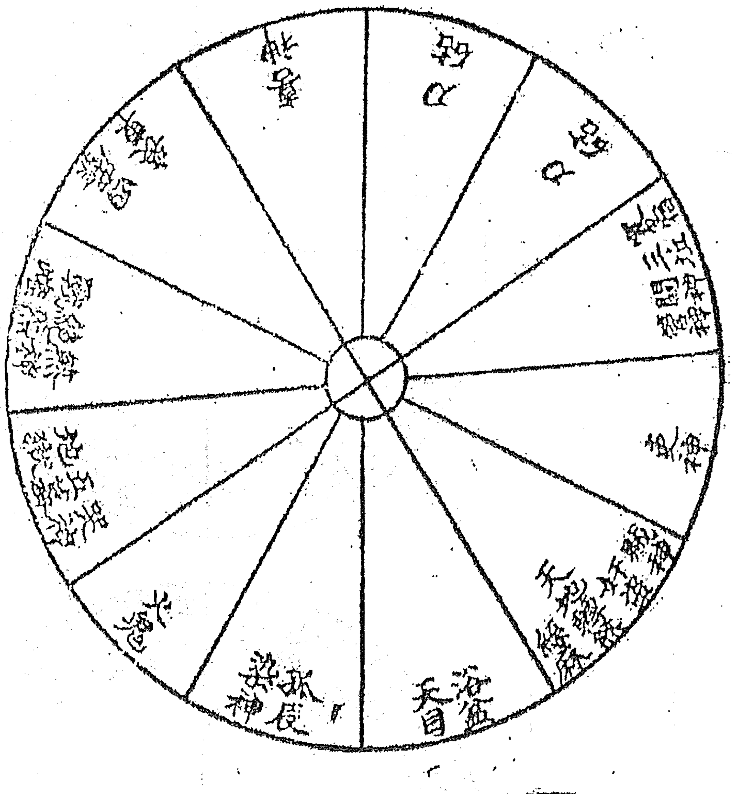

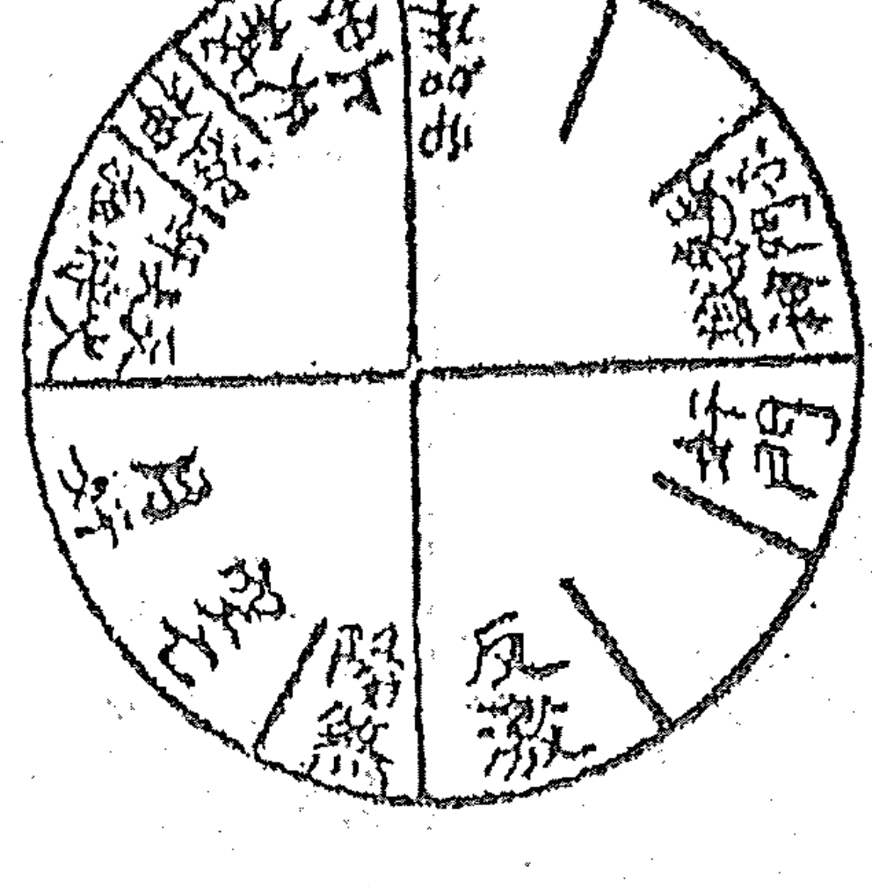

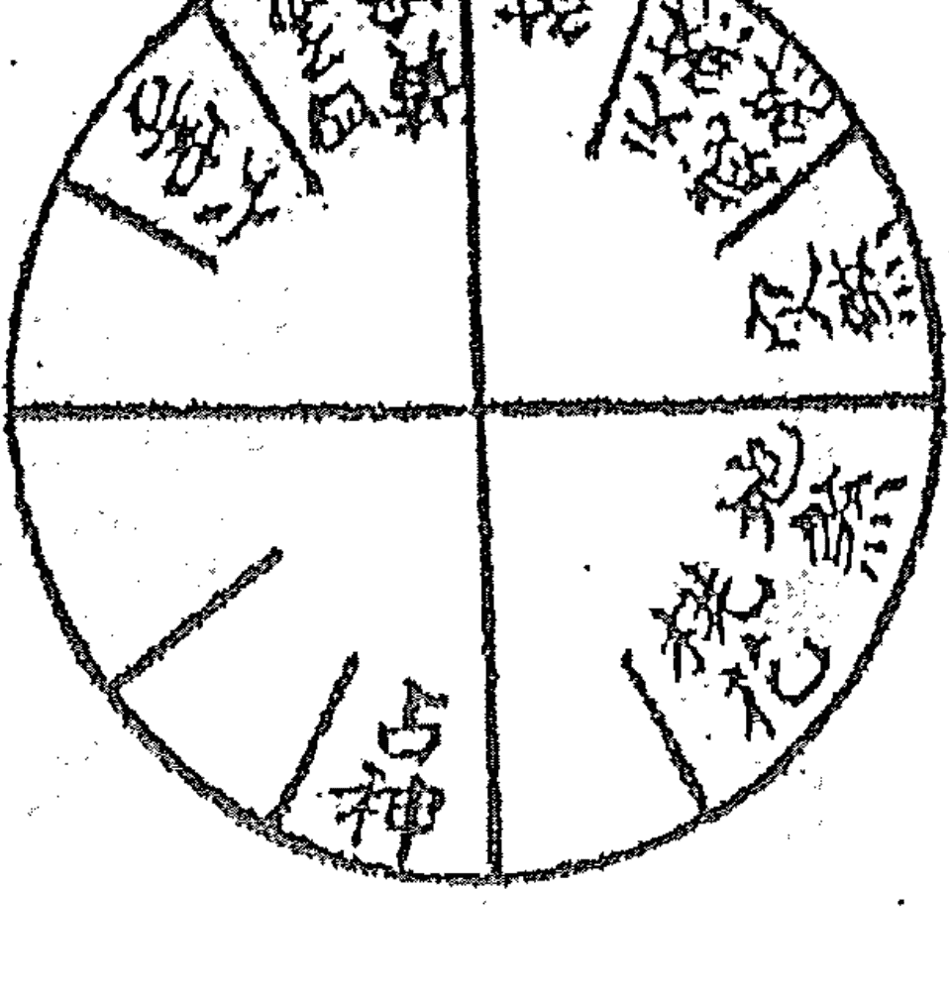

## 十一

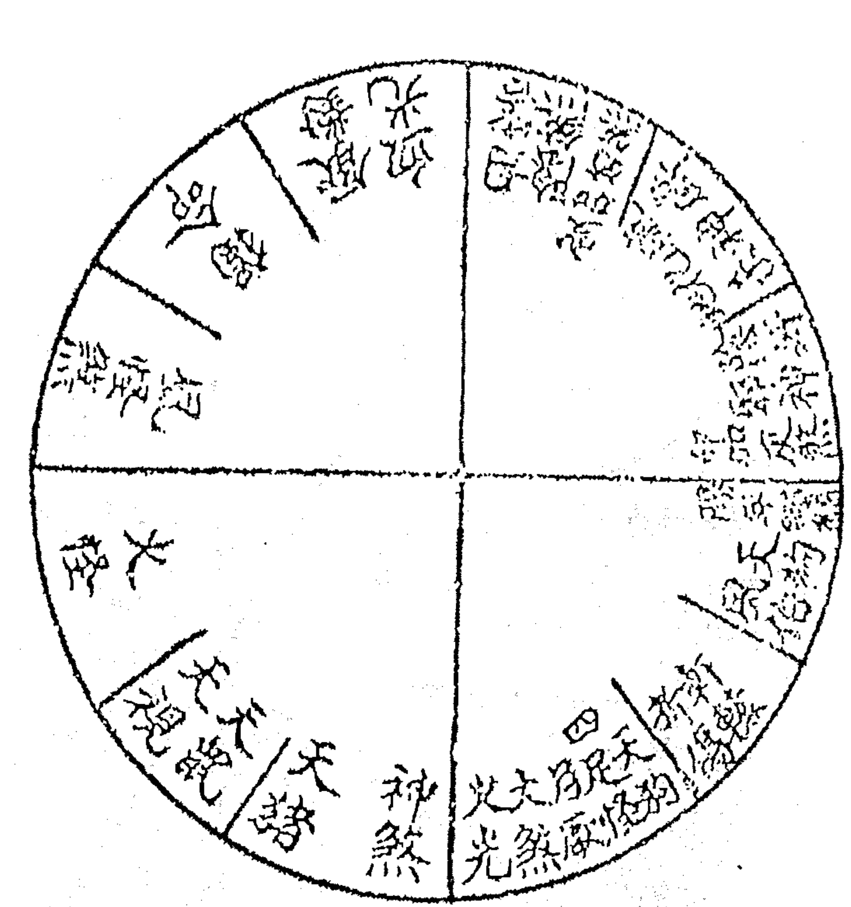

## 子平举要

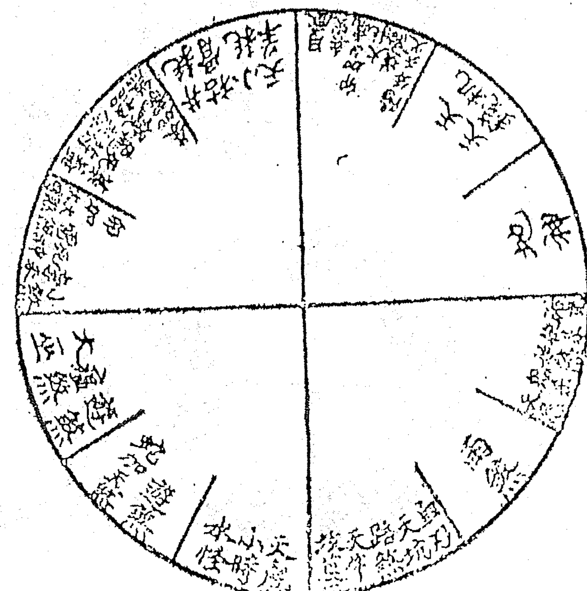

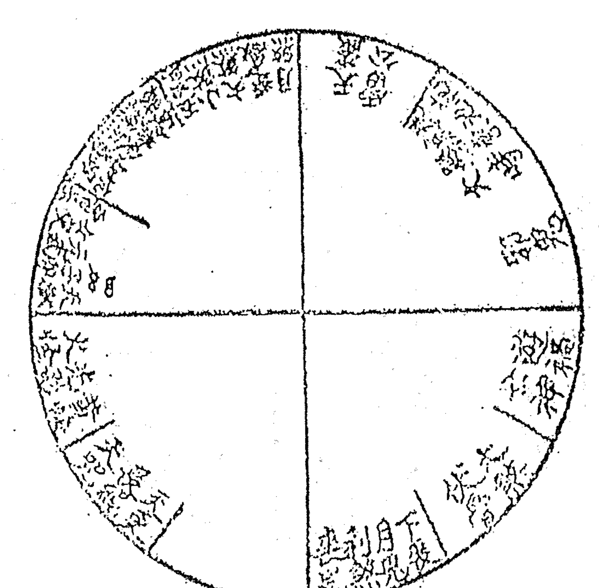

三

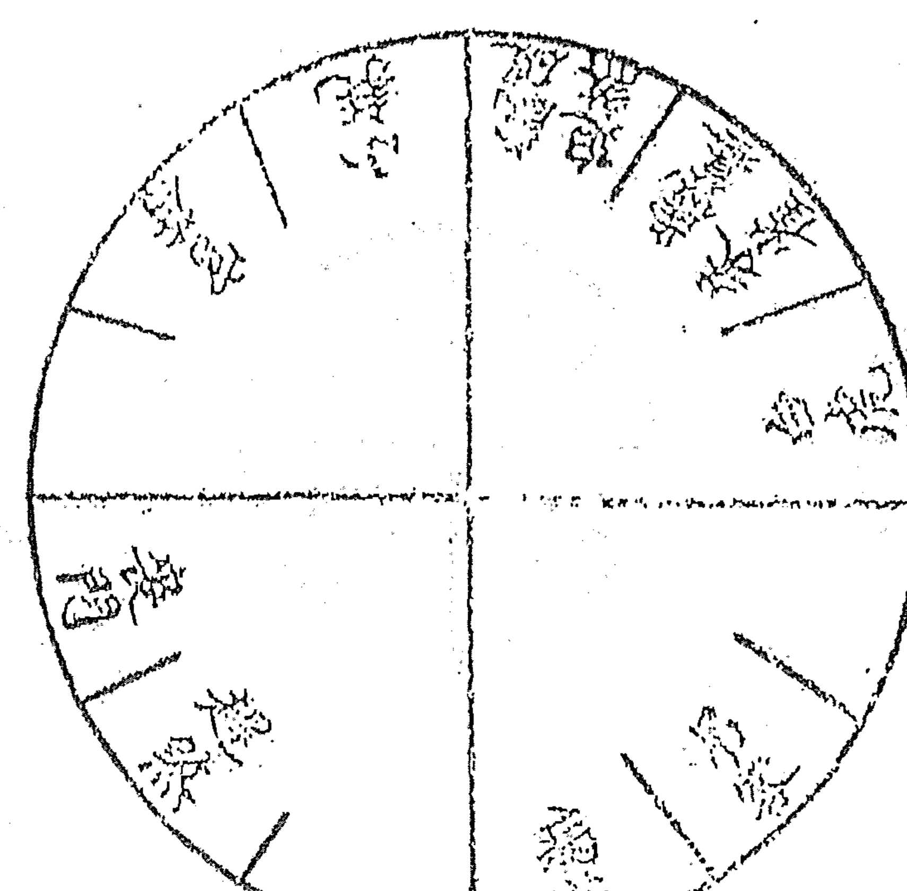

六 五 三 图

## 六壬卦图

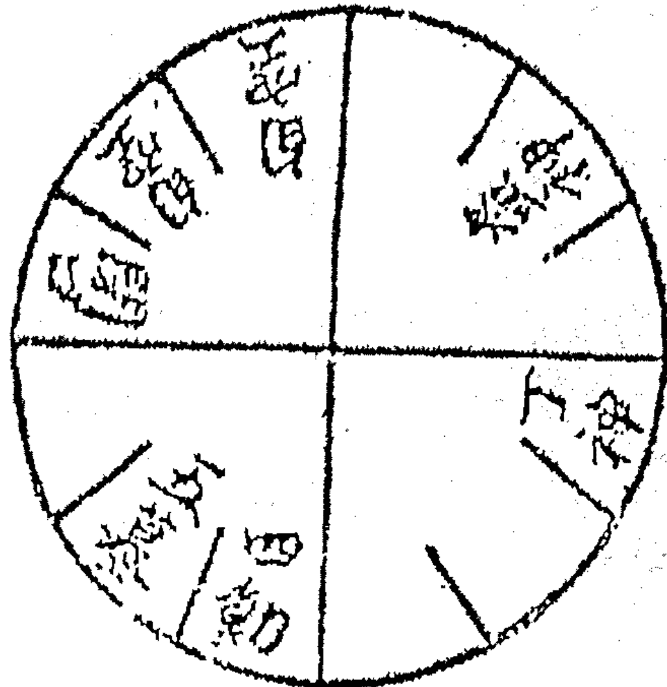

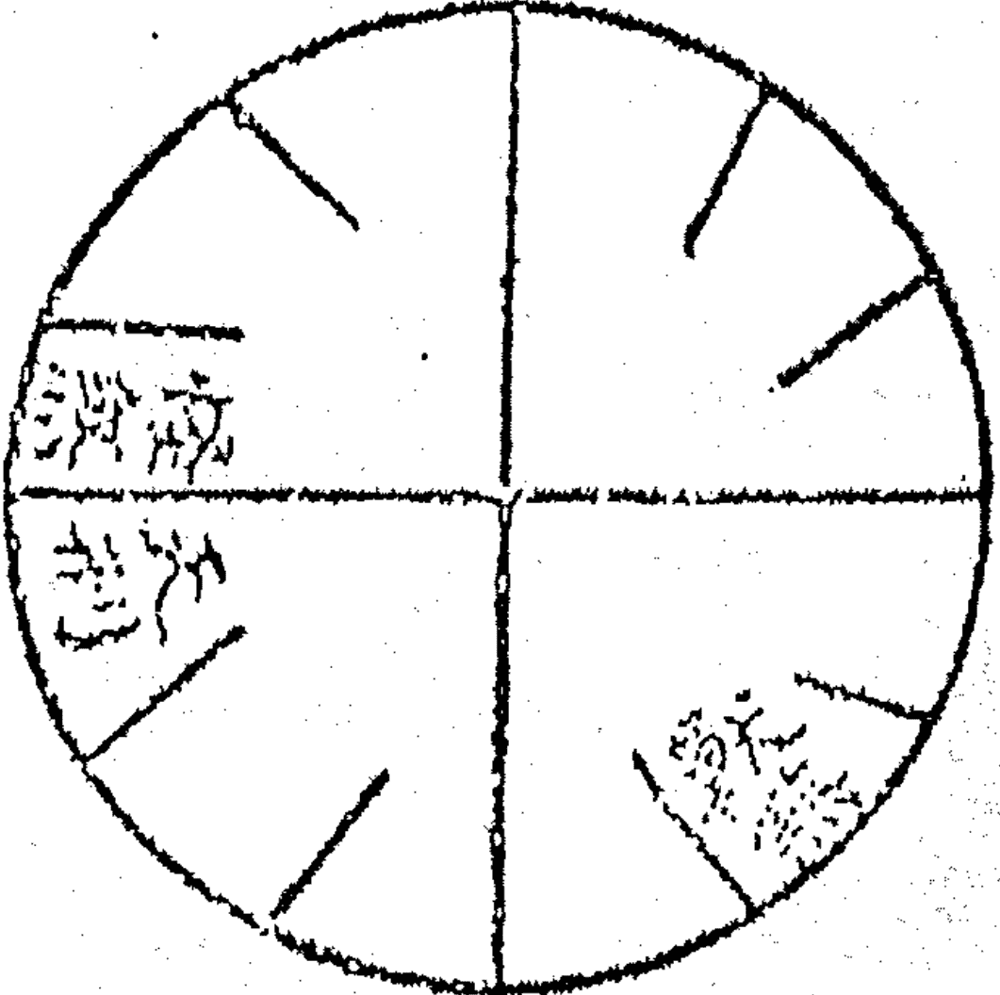

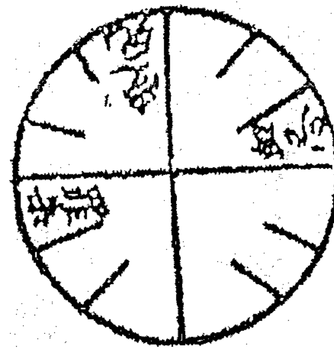

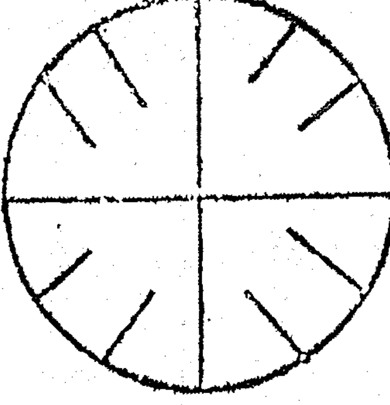

图

## 六壬指南卷一

廣陵陳良謨公獻增註

新安程起鵬翔雲鑒定

古歙莊廣之公遴校正

## 心印賦

六壬如人先明日辰。

六壬運式。先以日辰爲根本也。日尊故曰天干。辰卑故曰地支。亥子丑應於北方。寅卯辰應於東方。巳午未應於南方。申酉戌應於西方。即地盤也。天干者。甲乙東方木。丙丁南方火。戊己中央土。庚辛西方金。壬癸北方水。入式之法。甲課在寅。乙課在辰。丙戊課在巳。丁己課在未。庚課在申。辛課在戌。壬課在亥。癸課在丑。而不居卯午酉子者。以正位不敢當。故陽干居祿神所在。而陰干居祿神前一位也。

以月將加占時之上。

月將即日宿太陽也。正月雨水後，日躔娵訾之次，入亥宮，乃登明將也。二月春分後，日躔降婁之次，入戌宮，乃河魁將也。三月穀雨後，日躔大梁之次，入酉宮，乃從魁將也。四月小滿後，日躔實沈之次，入申宮，乃傳送將也。五月夏至後，日躔鶉首之次，入未宮，乃小吉將也。六月大暑後，日躔鶉火之次，入午宮，乃勝光將也。七月處暑後，日躔鶉尾之次，入巳宮，乃太乙將也。八月秋分後，日躔壽星之次，入辰宮，乃天罡將也。九月霜降後，日躔大火之次，入卯宮，乃太沖將也。十月小雪後，日躔析木之次，入寅宮，乃功曹將也。十一月冬至後，日躔星紀之次，入丑宮，乃大吉將也。十二月大寒後，日躔玄枵之次，入子宮，乃神后將也。每以此值月之將而加來人所占之正時上，順布十二宮辰，即天盤也。假令正月雨水後日躔娵訾，乃亥將登明也。如午時，則用亥加午，子加未，順行十二辰是也。餘倣此。

視陰陽為四課之分。天干陽也，干上得者曰日干，上陽神為第一課，乃陽中之陽也。地支陰也，支上得者曰日支，上陰神為第二課，乃陰中之陰也。日干上陽神為第三課，乃陽中之陰也。日支上陰神為第四課，乃陰中之陽也。

日辰支上陽神爲第一課乃陰中之陽也干上陰神爲第二課乃陽中之陰也支上陰神爲第四課乃陰中之陰也夫月將加時則無極而太極也加時而有天盤動而生陽地盤靜而生陰乃太極生兩儀也至於干支分而四課布非兩儀生四象乎故曰一陰一陽之謂道陰陽不測之謂神

賊克爲初用之始相因作中末之身

四象既布則八卦生矣四課陰陽既具須求三傳以爲發用則以四課上下敵之若有一下克上者雖有二三之上克下不論矣名曰重審課若四課中並無下克惟一上神克下取而用之名曰元首課重審者重複詳也元首者別無下克而亭亭然有首出庶物之象也俱以所得發用爲初傳以初傳地盤上所乘者爲中傳以中傳地盤上所乘者爲末傳故曰相因也

克多比用涉害

重審不過一下賊若四課中有二三四下賊者非審矣元首不過一上克若四課中有二三四上克者非首矣上克下曰克下克上曰賊今賊克紛紛則以甲丙戊庚壬為陽日而用一子寅辰午申戌之神陽與陽比雖二三四陰勿論也若乙庚丁己辛癸為陰日而用一丑卯巳未酉亥之神陰與陰比雖二三四陽勿論也故曰比用也然又曰知一者何也蓋陽知用一陽爻而不知有陰也陰知用一陰爻而不知有陽也若夫陰日止用一陰今而有二陰三陰四陰矣上曰止用一陽今而有二陽三陽四陽矣則名之曰涉害課先以寅申巳亥上乘之神為用則涉之深而建名曰見機蓋有害者不可不見機明哲保身之義也若子神上無克賊則以子午卯酉上乘之神為用此涉之淺又名曰察微蓋見於明者不可不究其精微履霜堅冰之意也其中末亦如賊克之相因無克是以遯暝

若四課上下全不相克賊則以日干為主而與第二三四課上神相對較之若有一上神克日子者取以為用名神遯克曰曰蒿矢課以彼能蓋傷於我而似矢也何以蒿名之蓋上下相克力勇而有賊克之稱斯遠力綿雖克而猶滿而已若無克日干者則視日干遙克彼之上神矣若有一上神被日干克者取以為用名曰遙克神曰彈射課以我能遙傷于彼而似射也何以彈名之蓋亦因其射遠力滿取象於彈丸而已如有一克或克二者亦如此用之法三傳相因亦如賊克之例

夫昴星當俯仰於酉上若四課既無克而復無遙則為昴星矣蓋遙克力懶取象於滿取象於彈況無遙克而獨天盤地盤之酉金作用其力尤懶之至而應事則未免明之微矣故以酉中之昴星為名言其明之微雖七星相聚非至明之目不能辨也陽日則取酉上所得之神為發用有日將出而難鳴仰首之義也陰日則取酉下所得之神為發用有日將暮而虎視俯首之義也陰日則日作中傳辰作末傳陽則辰作中傳日作末傳不惟陰陽迭遷而終有返本之象也

若取干支之合刑

如四課有首尾相同為三課者有一三課相同為三課者名曰不備言四課不全不完備也其不備課中無賊克無遙克不可以昴星例取四課昴星三課則實也若陽日得之以天干之合位上乘者取為用神合者甲己乙庚丙辛丁壬戊癸六合也無陽倘有動用之機也若陰日得之以地支之三合前一位用之而不用乘神亥衝之機也三合前一位者如巳酉丑亥卯未酉日用丑丑日用巳未日用亥是也中未不問陰日陽日併以干上所乘者爲之也

伏吟以刑沖爲定

若諸神歸於本位如子加子午加午之類乃伏吟之象也有克者取克不過癸乙二干而已無克者陽日自干上發傳陰日自支上發傳遶遶三刑而爲三傳也若初傳值日刑則中傳陽日用支陰日用干仍取刑爲末傳也倘逢中傳自刑者末傳以沖神爲之矣夫刑有三者一字刑乃午刑午辰刑辰酉刑酉亥刑亥自刑也二字刑乃卯刑子子刑卯也三字刑乃丑刑戌戌刑未未刑丑也寅刑巳巳刑申申刑寅也。返吟乃子加午卯加酉丁二神各臨沖射之位也克之少者重審元首取之多則別一涉害取之二傳初未相同而沖乎中傳若夫丁未己未辛未丁丑己丑辛丑四課無克乃名無依以支神之井欄沖射上所得之神以為初用而日支所乘為中傳日干所乘為末傳夫井欄者丑沖亥未沖巳也

八專以逆順爲真

若干支同處一位則四課中止得二課矣有克仍從賊克比用涉害三法取用無克不復取遙矣蓋遙者遠也干支同位何遠耶止用八專之法而用之如陽日則順從干上陽神得三而止陰日則逆從支上陰神得三而止是爲發用也中末二傳概用干上所乘神爲之

天乙居中後六前五

天乙乃貴人也此神居紫微垣之門主持上帝征伐以行令於人間應己丑之土有止戈之武統馭十二神在天門之前地戶之後則順行若居地戶之前天門之後則逆行其神後有六位乃天空白虎太常玄武太陰天后也前有五位乃螣蛇朱雀六合勾陳青龍也

解紛必囑事於童僕

貴人居子名曰解紛解除紛紜擾攘也蓋子乃夜半安居之神故解去紛擾而坦腹然既為至貴日有萬幾雖非君象貴臣宰輔代天宣化事亦同天子之勢恐其繁燕脫漏故委囑於有用之童僕庶不負國憂民矣

升堂宜投書於公府

貴人居丑曰升堂乃本位屬己丑故也升堂則有泰山巖巖之象非可私干必欲見之宜持書或移文必以正大光明然後可於公堂府第見之

憑几可謁見於家

貴人居寅曰憑几蓋功曹乃案牘瑣碎之象貴人有暇必親於典籍也當此有可乘之機雖細務亦可相干可就私第謁之而非公堂之比也

登車宜訴詞於路

貴人居卯曰登車。卯乃門戶之象。既升車，則非私家，又非公署，若無路之可登，何得不愧於路而哀達其情也。唐突於貴人之前耶。若認被屈，或避蒙難，非陳訴於有位之正人，何得雪斯沉辱。故

巳午受貢兮君喜臣懼。

貴人居巳居午曰受貢。乃相生助而非不遂之方。既貢，則以賤事貴，以貴下賤。君喜臣悅忘其授受之私。貢者受者，俱不越度之象也。

辰戌懷怒兮下憂上辱。

貴人居辰居戌曰天獄。非法之地，必非法之人而後入之。何世人而居此乎。文王羑里，亦莫非天所使耳。在上者有此非常之辱，則俯仰於彼者，焉得不憂乎。

### 移途則有求幹之榮

貴人居申曰移途。蓋傳遞乃道路之神。貴人在道，嬉戲遊衍，時也。因而獲便，以求其進用之私乘間而行必榮遂矣。

列席則有酒筵之娛。

貴人居未曰列席蓋未乃夜貴一貴相會貴人貴家故有宴會之象托貴以干貴事無不遂矣。

還絳宮坦然安居。

貴人居亥曰還絳宮又曰登天門此時六凶俱藏蓋螣蛇朱雀之火而伏於水勾陳天空之土而伏於木白虎之金而伏於火玄武之水而伏於土且亥乃夜方日之勞擾者至此而坦然安居矣。

入私室不遑寧處。

貴人居酉曰入私室蓋酉為日月出入之門有私門之號也夫貴人達而在上致君澤民修身行己自當持以至公難進易退若趨謁於私門則律己不正而清論所不容矣豈追夢處耶。

但見螣蛇驚疑擾亂。前一螣蛇乃丁巳火神也。主火光驚疑憂惶怪異。蓋凶神也。以其離寅人前一位。故日前一也。

掩目則無患無憂。螣蛇居子。曰掩目。不惟子水克螣蛇之巳火。而居夜方。有掩目之象。蟠伏棲息之時。其凶焰無所施。無患無憂矣。

蟠龜則禍消福善。螣蛇居丑。曰蟠龜。蓋丑中有暗食星。龜也。夫蛇與龜姤。亦離坎交濟之象。豈復有禍。心於人哉。是以禍消。占者修善以立身。斯福不窮也。

生角露齒禍福兩途。螣蛇居寅。曰生角。蓋火生於寅。榮旺之極。化蛟化龍。此為之基。貪榮不禍。是以為福。螣蛇居酉。曰露齒。蓋火制金鄉。猖獗得志之地。且金石空地無食。彼蛇肆毒。貪饕求口腹之計，為禍豈淺。得此者，退藏於密可也。

乘霧飛空，休祥不辨。螣蛇居巳，日乘霧，以霧為噬，雖蔽目，無所見，毒不得肆。占得此者，仍宜避之。蓋霧之蒙，彼固目迷矣，而我至此，獨不迷哉？倘誤犯此，為其所噬，悔何及矣。

螣蛇居午，日飛空，以蛇飛空，化龍化蜃之象也。彼有此大志，始有此大為，豈復毒人？縱彼不毒，在我仍宜避之。斯不失為明哲。

入林兮鋒不可砍。螣蛇居未，日入林。未乃木墓，以土有木，非林之象乎？林麓棲止，既有所蔽，其穴必深。雖有刀鋒，無所施其利也。彼螣蛇有此，優游之樂，必無肆禍之心。占者無所忌矣。然逢林有蛇，還當莫入。

墜水兮從心無患。螣蛇居亥，日墜水。蛇能水，居則隨波逐流，魚蝦為食，似無橫路毒人之欲也。在我則任其往返周旋豈不從心所欲哉

當門而銜劍總是成災

螣蛇居卯曰當門卯乃日月之門蛇當門則出門即被其害然有備者無害也得此者預為之計則不待彼奮起而攻其不意若趨而不顧斯墮其害矣

螣蛇居申曰銜劍申金刃之象也金刃乃斫彼之物而胡為彼所銜哉蓋火能克金得以猖獗逞妖銜劍蓋異且妖之象占得者惟潛而避之彼兇不能久妖氣息而吾復何患哉

入塚而象龍並為釋難

螣蛇居戌曰入塚戌乃火庫墓也有蛇入墓之象彼深居而簡出吾往過雖不免小心懦懦而彼非蟠伏路途之比矣

螣蛇居辰曰象龍蛇乃龍之從也有化之機若入龍之宿有隨進化之義夫彼貪上達必熟於中豈復深為我患哉故可釋難

朱雀南方文書可防。

前二朱雀乃丙午火神也故曰南方主文書詞訟草奏口舌之神火光怪異去貴人二位故曰前二

損羽也自傷難進

朱雀居子曰損羽朱雀乃丙午火而加臨水鄉有損羽之象羽翼不成進飛必難矣占得此者文書無氣而口舌詞訟不凶也

掩目也動靜得昌

朱雀居丑曰掩目丑亦北方水氣之餘制朱雀之火有投江破頭之驗蓋彼既目暗吾得有為矣動靜俱吉無口舌之擾訟息而文書不行也

安巢兮遲滯沉溺

朱雀居寅居卯曰安巢蓋二木皆火生助之神且有山林之象雀至山林結巢砌壘育子貪榮占者所喜有口舌消亡之義而曰遲滯沉溺者蓋下文草奏之事則未免於淹滯而沉溺也。

投網兮乖錯遺亡。

朱雀居辰戌曰投網辰戌名天羅地網且戌為朱雀火之庫而辰與戌對宮有邱墓之象故曰投網夫朱雀之凶入此不得飛揚占者之所喜也胡曰乖錯遺亡亦指文書之事言之耳。

勵嘴唧符怪異經官詞訟。

朱雀居申曰勵嘴申金也朱雀至此能克制其方得志之處也勵嘴鷙啄所以口舌尤旺也望文書固有氣而他占則詞訟之象凶不可免矣。

朱雀居午曰唧符古名真朱雀有微細之訟常人之憂也若士子入場斯高中矣。

臨墳入水悲哀且在雞窗。

朱雀居未曰臨墳言其結巢於古墓之象夫巳午未申俱在上有飛空而翱翔之義朱雀得肆時也主口舌不細故曰悲哀妻孥烏有不悲者哉。

朱雀居亥曰入水。火入水鄉。有投江之象。乃甚喜矣。凶神無氣。何曰悲哀。蓋亦指文書動用而言耳。若有急用文詞。不能得用。亦悲也。

官災起蓋因夜噪

朱雀居酉曰夜噪。亦火剋金鄉。得以奮志為惡。其性好亂。便生口舌。得此者必官非不免。又且酉為門戶。口舌入門。非官災而何。

音信至都緣晝翔

朱雀居巳曰晝翔。以巳未交午。乃白晝之象。雀至此。最為有氣。占凶則口舌詞訟。占喜則起用文書。望人信息俱至。

望有六合之神婚姻佳會

前三六合乃乙卯木神也。主和合成就。宴會婚姻。又名私門。以其離黃人二三位。故曰前三。

待命和同。

六合居亥曰待命亥乃天門也我欲成就公私事端而來天門之下待命必成故曰和同。

不諧驚悖。

六合居巳曰不諧蓋六合木也入於火鄉烟滅灰飛不吉故矣凡占婚姻不兌

反目兮無禮之事端

六合居子曰反目子水也六合木本相生助何乃曰反目也蓋子卯無禮之刑也凡事必起於無禮以致彼此不投而有反目之失

私竄兮不明之囚地

六合居酉曰私竄以卯酉為私門而六合又乙卯之屬以私併私以門復門乃出入私門逃竄之象且六合之木而臨從魁之金木受金傷故曰囚地重復私陰故曰不明得此者惟奸淫陰私是利而正大反殃也

乘軒結綬從媒妁而成權

六合居寅日乘軒居申日結髮蓋寅木乃軒車之象故曰乘軒申乃庚也卯乃乙也乙庚相合故曰結髮似從媒妁之言而有歡成之慶矣

違禮亡羞因妄冒而加罪

六合居辰日違禮居戌日亡羞蓋六合本屬乙卯卯辰有六害之凶故曰違禮若臨戌則以己之私門而自就戌以為六合苟求合會亡羞之似占得此者必因自不檢約以招罪愆非干人之害我也

升堂入室併為已就之占

六合居午日升堂居卯日入室午乃離位似為升堂卯則六合之本位故似入室二者合於堂合於室豈非已就乎凡占得此皆可成遂

納采粧嚴總是欲成之例

六合居未日納粧居丑日粧嚴六合臨丑乃貴之本垣也以賤謁貴粧飾不得不嚴所以事上也居未乃卯未有相合之慶且太常酒食帛物之鄉似納粧之喜也占得之者何事不可成耶。

或逢勾陳發用必然鬭訟爭官

前四勾陳乃戊辰土神也主征伐鬭鬩鬭訟爭論田土之事以其去貴人四位故曰前四。

更遇受越投機被辱暗遭毒害

勾陳居丑曰受越居子曰投機丑乃貴人之鄉以爭神而入貴地乃受其過越之訟訴而勾陳得肆其侮於人也若至子乃土能克制之適所以投其狂妄之機尤可以展其奮忿之心占得之者亦惟忍而已矣。

遭囚兮宜上書

勾陳居寅曰遭囚勾陳遇寅乃克制之方故有遭囚之象宜上書者彼凶既囚而我得以上書告發其積害成愆之狀若不於此時制之則過此仍肆虐噬而物受其害矣。

捧印兮有封拜。

勾陳居巳曰捧印。巳乃鑄印之方。勾陳鑄印之模範也。印鑄既成。捧以奉上。非封拜之象乎。君子見之。遷擢必速。常人見之。反爲可憂。自非有不法等情。何干於印信也。

臨門兮家不和。

勾陳居卯曰臨門。卯本日月之門。而勾陳爭鬭之神。入之是爭神進門矣。必家不和。以致搶攘紛更。人眷不寧。蓋亦破敗之徵矣。

披刃兮身遭責。

勾陳居酉曰披刃。以酉金似爲凶器矣。況又陰交肅殺之氣。與勾陳之戊辰生合。彼凶鬭之神。而持此器。豈有善念哉。然非理之舉。法所不容。終於遭責。占者惟避其凶可也。

升堂有獄吏以勾通。

勾陳居辰曰升堂。勾陳本屬戊辰。而入辰。非升堂而何。其神主鬭訟。勾連。故于辰地則有獄吏勾連之應知機君子生平無非禮之舉不過因他人之不法而及之耳

反目因他人而逆戾

勾陳居午曰反目午火生勾陳而何曰反目耶以勾陳好鬭訟而午火頂朱雀尤訟之最者也彼此皆反而相賊之神孰肯相容耶故有反目之象君子占之必被他人之逆戾餘波以及之耳

入獄下獄往來詞訟稽留

勾陳居未曰入獄居戌曰下獄未乃坦途如驛道也故曰入獄戌乃地網又曰地獄況與勾陳之戊辰相對沖射乃下獄之象也非詞訟之往來而何占者惟退避則吉

趨戶襲裳返復勾連改革

勾陳居申曰趨戶居亥曰褰裳夫申非門戶之神何以趨戶蓋申前即酉戶也立此可以入門故曰趨戶至亥而褰裳者亥方夜靜更闌必褰裳而憩息然曰勾連反復者申為坤地戶也亥為乾天門也門戶之前何立此等凶神君子至此即避而抽身稍遲則被彼勾執矣。

青龍財喜雖主亨通。

青龍前五甲寅木神也主財帛米穀喜慶亨通十二神中惟此最吉增福解禍以其去貴人五位故曰前五也

在陸蟠泥所謀未遂

青龍居未曰在陸居丑曰蟠泥未近南離之火故為陸丑近北坎之水故為泥夫龍飛於九天潛於九淵神變化而莫測也若失地亦阨且困矣蟠泥在於陸非失地而何欲望其遂也難矣。

登魁兮小人爭財。

青龍居戌曰登魁戌乃河魁也以青龍之吉神而入網羅之地則小人爭財之象矣。

飛天兮君子欲動。

由財喜之神落此所以致小人之爭也。

## 六壬指南 卷一

青龍居辰。曰飛天。以辰乃龍庭也。而曰天者。戊亥子丑象地。在下也。辰巳午未象天。在上也。故曰飛天。青龍吉神。飛騰在上。君子有為之時也。非欲動乎。

乘雲顯雷。利以經營。

在寅曰乘雲。居卯曰顯雷。寅乃青龍之宮。有乘雲出入之象。所謂雲從龍也。卯乃震卦。震為雷。龍得雲雷。非經營之時乎。故顯雷乘雲。而得以施為展布。

傷鱗撓角。宜乎安靜。

青龍居申曰傷鱗。居酉曰撓角。申乃陽金。酉乃陰金。金能克木。青龍之甲寅所深畏也。至此有退鱗折角之象。吉神遭厄。豈福祐於我哉。惟安居守靜而已。

燒身掩目。因財有不測之憂。

青龍居午曰燒身。居巳曰掩目。以青龍之木。得水為喜。而見火為仇。巳上為蛇穴。尤為不吉。故有掩目之象。午乃南離真火。故曰燒身。青龍有此不足。尚可賴之為財爵。獸若求謀財物。則有莫測之憂矣。

入海游江。因動有非常之慶。

青龍居子。曰入海。居亥。曰游江。蓋俱水也。青龍得水。何吉不生。吉福斯民。占者動則有非常之慶矣。

後一天后之神。蔽隱陰私之婦。

後一天后。壬子水神也。主陰私曖昧之事。蔽隱穢污之神。性似柔而實剛。以其後貴一位。故曰後一。

守闈治事。動止多宜。

天后居子。曰守闈。居亥。曰治事。天后婦人之象也。壬子乃天后之本家。故象守闈闔也。亥乃乾健。自強不息之地。有治事持家克勤之道也。二者動止相宜。得其道之正。且當旺相。其慶深矣。

倚戶臨門。奸淫未足。

天后居酉。曰倚戶。居卯。曰臨門。以穢污之神。而入卯酉之私門。非淫奔之象乎。除奸私之外而正大之舉反見偏狹矣。

褰幃伏枕非嘆息而呻吟。

天后居戌曰褰幃。居午曰伏枕。蓋戌土克水。病之象也。且戌昏然之時。有褰幃之象。午乃晝長午寐之時。故曰伏枕。二者皆臥而不快。故曰嘆息呻吟。非病則事不遂也。

裸體毀粧不悲哭而羞辱。

天后居巳曰裸體。居辰曰毀粧。壬子遇巳。有露暴之傷。為刑克之地。故曰裸體。辰為水之克賊。天后至此而毀粧。形體裸露而見傷。毀粧易容而不飾。非羞辱而何也。占得此者。悲災必矣。

優游閒暇蓋因理髮修容。

天后居寅曰理髮。居申曰修容。平日而早起。理髮時也。申晡而容殘。粧褪時也。故有理髮修容之義。二者非不遂也。且水與木金不克。故主優游閒暇。樂其和平也。

悚懼驚惶緣為偷窺沐浴。

天后居丑曰偷窺。居未曰沐浴。以天后之子。與丑為六合。有私。有私暱之情。窺之恐人知。是以偷窺。未有井宿。而壬子水入之。有浴之象。浴則畏人至矣。二者皆有懼疑之心。故曰悚懼驚惶。

太陰所為蔽匿禍福其來不明。

後二太陰。辛酉金神也。主陰私蔽匿。奸邪淫亂。暗昧不明。又為冥冥中之默助。以其後於貴人二位。故曰後二。

垂簾則妾婦相侮。

太陰居子曰垂簾。子正北也。端門向明。垂簾昏夜無見。所以妾婦居陰位。得肆其慢上之心。而欺侮之。不過嬰小別地生非而已。

入內則尊貴相蒙。

太陰居丑曰入內。丑乃斗牛之墟。天乙貴人之位也。至尊而受此陰蒙。則蔽其明矣。亂之始也。君子必謹焉。

被祭兮當憂怪異。

太陰居戌曰被祭。蓋太陰之辛酉。與戌六害。且河魁刑獄之方。非被料之象乎。欲飾其非。則愈怪且異矣。故當憂也。

造庭兮宜備乖爭。

太陰居辰曰造庭。夫辰乃龍庭也。且與酉合。而太陰之妖媚。必與天罡相得。然彼剛之奮龍。必風亦未常無也。烏得不爭龍而乖變哉。

跣足脫巾財物文書暗動。

太陰居寅曰跣足。居午曰脫巾。蓋寅方平旦晨起之時。有跣足之象。午則長晝晝眠。亦必有脫巾者矣。然太陰之金。能克寅木為財。而午則朱雀反制太陰。二者乃財物文書俱暗中動也。

裸形伏枕盜賊口舌憂驚。

太陰居亥曰裸形。居巳曰伏枕。亥乃夜深就榻。有裸形之象。而已則克制太陰。必伏不起。乃有伏枕臥病之義。併主發驚口舌盜賊。蓋巳乃螣蛇。主口舌驚恐。亥乃玄武。主盜賊憂疑也。

閉戶觀書。推士人之致。

太陰居酉曰閉戶。居未曰觀書。酉乃太陰之本家。陰好靜。故閉戶。未乃離明之次舍。土金生養。故有涵泳優游之象。二者安且吉也。

微行執政。偏宜君子之貞。

太陰居卯曰微行。居申曰執政。卯乃私門。必袒裸之象。以入之非微行乎。申乃太陰之旺地。得志行權之所有。執政之象焉。君子占之。非陰神之比。此時當微行也。持以貞一之操。或當執政也。亦持以貞一之操而已。

玄武遺亡。陰賊走失。

後三玄武。乃癸亥水神也。主賊盜陰私。走失遺亡。兵戈搶攘。以其後天乙三位。故曰後三。

散髮有畏捕之心。

玄武居子曰散髮。子乃夜半。其睡未醒。而子鼠乃虛驚之神。況玄武賊神。自多懷疑。被驚而夜起。有散髮之象。懷畏捕之心。不過虛疑不害耳。

升堂有干求之意。

玄武居丑曰升堂。丑乃天乙貴人之位。土能制水。玄武不能行盜。以禮謁見。實懷穿窬之心。有所干求。不以實對也。

愛寅兮入林難尋。

玄武居寅曰入林。寅卯山林之地。盜賊有所憑依。捕者難於追尋。非穿窬得志乎。

惡辰兮失路自制。

玄武居辰曰失路。辰土能制玄武之水神也。至此非失路之象乎。盜賊消亡。君子坦腹之時也。

窺戶也家有盜賊。

玄武居卯曰居卯曰窺戶。盜賊入門之象。亦惟謹之於預而已。

反顧也。應獲驚悸。

玄武居巳曰反顧。巳乃晝方。非盜賊之利也。縱無人追逐。亦必反顧。既無追逐者。豈非虛驚耶。

伏藏則隱於深邃之癖。

玄武居亥曰伏藏。亥乃夜方。又屬玄武本位。深邃之象。捕賊者必難獲也。

不成必敗於酒食之地。

玄武居未曰不成。未乃土也。克制玄武之水。所以欲盜不成也。又未太常之家。酒食之地。必因酒而敗。盜易獲也。君子之慶。小人之憂。

截路拔劍。賊懷惡。攻之而反傷。

玄武居午曰截路。居酉曰拔劍。午乃天地之道路。故取象於截路。酉陰金刃鋒之象。故曰拔劍。賊勢至此。猖獗已甚。豈宜攻之。攻之必反傷矣。

折足遭囚賊失勢擒之而可得。

玄武居申曰折足。居戌曰遭囚。申乃坤土。制元神之水。且晝方賊所深畏。有折足之象。剛金斬賊也。戌乃地獄。又土克水。故曰遭囚。一者賊失利矣。故捕盜賊者擒之最易。

太常筵會酒食相奉。

後四太常。巳未土神也。主筵會酒食。衣冠物帛。又為安常吉慶之神。以其後天乙之四位。故曰後四。

遭枷必值決罰。

太常居子曰遭枷。土值水鄉。有崩陷之象。又子未六害。以害而陷。有枷鎖之象。所以必值決罰。

側目須遭讒佞。

太常居寅曰側目。寅木克制太常之土。有虎豹在山之勢。而太常之土。何敢與為敵耶。况未羊逢虎。受其制伏。敢怒不敢言。亦惟側目而已矣。倘畏有讒佞於傍譖之。則凶仍不免。

遺冠也財物遭傷。

太常居卯。曰遺冠。以冠裳之神而入私門。有冠不正之象。故曰遺冠。然何以曰財物遭傷。太常亦主財物衣帛。主失去者。以土被卯木之克也。

逆命也尊卑起訟。

太常居戌。曰逆命。未與戌相刑。且河魁為獄網之凶。故曰逆命。未在上。其位為尊。戌在下。其位甚卑。二者相刑。非尊卑相訟乎。

卿杯受爵不轉職而遷官。

太常居申。曰卿杯。居丑曰受爵。申為傳送。太常酒食之神。一義詳之。似卿杯矣。然廢冠裳之象。而非轉職之吉也。丑乃天乙之宮。以太常而拜至尊。非受爵乎。故曰遷官。

鑄印捧觴。不徵召而喜慶。

太常居巳。曰鑄印。居未。曰捧觴。太常爲印綬之神。見巳乃鑄印之位。公器非徵召不用也。未乃太常之位。宴會之官。捧觴酬酢有喜慶也。

乘軒有改拜之封。

太常居午。曰乘軒。午乃天地之道路。乘軒之象也。又立南向北。面君之貌。故有改拜之封。君子大度也。

佩印有用遷之命。

太常居辰。曰佩印。辰乃天罡首領之神。而與太常印綬併之。乃佩印之義。必主遷除。

玄爲徵召。雖喜而必下憎。

太常居亥。曰徵召。亥乃天門。有徵召冠裳之象。但未土在上。亥水在下。水必侮土之克也。故雖喜而下憎之。

酉作劵書。雖順而防後競。

太常居酉。曰劵書。太常之未土。生從魁之酉金。得助於魁。則銘刃成功。宜書之左券。有何不順耶。但酉金強。自刑其方。終有後競。惟勿以身貴而賤人。勿以獨斷而違衆。則吉。

白虎道路。官災病喪。

後五白虎。庚申金神。主道路刀劍血光。官災疾病死亡。至凶之神也。以其後天乙五位。故曰後五。

溺水音書不至。

白虎居子。曰溺水。居亥亦然。白虎喜山林。主道路。今溺陷於水。則道路不通。不凶矣。蓋至凶之神。而陷沒。有何不利。勿以道路阻而音不達爲忌。

焚身禍害反昌。

白虎居午。曰焚身。居巳亦然。在彼白虎之金。固所深畏。而占者反昌矣。何則。白虎凶神。畏火而不能肆其毒也。

臨門兮折傷人。

白虎居卯。曰臨門。居酉亦然。白虎守卯酉之門。則一家驚惶不寧。輕出無備者。莫不爲之噬矣。故折傷人口也。

在野兮損壞牛羊。

白虎在丑。曰在野。居未亦然。丑未田野之象。白虎在此。固似無威。而丑中之牛。未中之羊。爲虎所噬。貪哺啖無復凶矣。

登山掌生殺之柄。

白虎居寅。曰登山。其威百倍。仕途占之。當有生殺之重柄。常人占之。凶不可當。

落阱脫桎梏之殃。

白虎居戌。曰落阱。戌乃地獄。吉神入之。則吉者必凶。凶神入之。則凶險狠毒。不復孔熾。占者不被其殃。往往返無虎截路。猶桎梏之脫也。

啣牒無凶。主可持其喜信。

白虎居申。曰啣牒。申乃白虎之本宮。彼貪其巢穴之榮。腴無復肆噬之心。故有喜信。可持而曰啣牒者。傳遞乃往來之神。牒信之象也。

咥人有告。終不見乎休祥。

白虎居辰曰咥人。辰中有尸。乃虎噬尸。既曰咥人。豈復有吉祥於人耶。得此凶占。亦惟避之而已矣。

天空奏書之神。以天乙尊者無對。

天空後六。戊戌土神也。其神無形無影。由正對天乙至尊。即空亡也。由無敢對至尊。而處其位。故曰天空。專主詐偽不實。曰奏書者。言惟執書以奏。則此片時可對至尊耳。

神將所主休徵。必察卦名之義。

元首象天。重審法地。象天者先喜而後憂。法地者先迷而後利。

象天者上位之動用也。法地者下位之動用也。以其上克下。故先喜後憂。以其下賊上。故先迷後利。

如一則得一爲宜。

比用卦。又名知一卦。知一不知其他。惟一得則永得也。

見機則不俟終日。

涉害之深者曰見機。見機不俟終日。言機貴速。時者難得而易失也。

遙克所卜難成。

遙克者。神遙克曰蒿矢卦。曰遙克神曰彈射卦。二者皆力不難也。故所卜難成。觀蒿與彈之意自明。

別責所占罔濟。

四課不備而無遙克曰別責。尤無力之甚也。故凡占罔濟。不過利守而已矣。

冬蛇掩目虛驚而終不傷人。

昴星卦有螣蛇發用曰冬蛇掩目卦。既曰掩目之蛇。則人得而害彼。彼不得而害人。不遍處凶不成實害也。

虎視轉蓬出外而稽留不起。

昴星卦有白虎發用曰虎視轉蓬卦。既曰虎視。則凶不可當。即猶轉蓬而避之可也。出外必稽留不回。

伏吟任信宜用靜。去盜非遠。

伏吟。剛日自任卦。柔日自任卦。主靜也。逃去之人。及盜賊失物。俱不遠也。貴顧支前一位尋之。貴逆支後一位尋之。

返吟無依則復舊。往來不一。

返吟來去不定。故曰無依。主無倚也。凡事不定。且主於遠。

八專之意不宜男子。波波蕩蕩之名不利婦人。嬉嬉。

八專卦。支干同位。內有怨女。外有曠夫。故曰蕩蕩。不修之卦。多淫泆之意也。

龍首累逢君命。恩賜頻加。

太歲月建月將貴人同為發用。曰龍首卦。君子則有恩命出自天子。常人利見大人。

龍戰屢見改非。災禍不定。

卯酉日辰行年發用。又值此者。名龍戰卦。不問君子常人。俱主更革。災禍不一。

官爵改拜升遷。

驛馬發用。名官爵卦。主改拜升遷。常人得之。反搖動不寧。

富貴增財吉慶。

貴人發用。主增財吉慶。君子常人皆吉。

斷輪鑄印。官職須遷。

卯加申發用曰斷輪卦。戊加巳發用曰鑄印卦。有官者必遷。無官者反不能當。而有官非口舌。

高蓋乘軒。鼎席必致。

午卯子三傳。曰高蓋乘軒卦。亦同斷輪鑄印斷。

無淫主琴瑟不調。

夫干也。妻支也。上神互克干支。名曰无淫卦。主夫妻異心。

決女必潰亂太甚。

初傳天后。末傳六合。更傳見卯酉。曰決女卦。主淫奔不正。

是知三交爲藏匿。

子午卯酉仲神。全見於三傳。曰三交。主藏匿陰私不明之人。蓋此神皆五行之敗氣。主人昏晦。收留此人。異日不利。

九醜定災殃。

乙巳戊辛壬日。更得四仲相併。而爻大吉。加仲上曰九醜卦。主占者家長有災。

斬關不利安居。波波不定。

罡魁加干支上。更得六合青龍。名斬關卦。主不能安居。而奔波不定。

遊子不遑寧處。碌碌無常。

辰戌丑未全四季在三傳。本靜。而丁神驛馬入之。曰遊子。主動。而碌碌奔波不免。

天獄憂刑罪訟。

凡用神囚死。更天罡加日本之上。曰天獄卦。主官非口舌刑罰及身。

天網囚繫災傷。

凡時與地支併克天干而發用者。曰天網卦。主訟必遭囚繫。常占多主病凶。

懸胎主隱匿懷藏。為胎孕。

寅申巳亥全在三傳。曰懸胎卦。主隱藏懷。或為胎孕。

贅婿主伏潛屈辱。或依傍。

支辰加天干之上。被克為用。曰贅婿卦。主屈身於人而受辱。必依棲於人而相傍。

無祿之名是上驕而下弱。

凡四上克下。曰無祿卦。上皆得意故驕。下皆受制故弱。無祿猶無路。最凶之占也。

絕嗣之意乃下逆而上傷。

凡四下克上。曰絕嗣卦。下皆得志而逾逆。上皆受制而全傷。尤凶之兆也。

又為厲德。以動搖為意。貴人當卯酉之地無上。曰厲德卦。貴人不自安而動搖也。

亂首以悖逆為心。日加辰而被辰克。曰亂首卦。悖逆之象也。

稼穡定自微而至著。辰戌丑未全在三傳。曰稼穡卦。土有生物之功。而日漸增長。故自微至著。

曲直必福善而禍淫。三傳亥卯未曰曲直卦。有福者愈增其福。有禍者愈益其禍。乃木日漸長之象也。

巳酉丑俱逢。則傷情革故。三傳巳酉丑全者曰從革卦。主革故從新之象。且金乃破物之神。主刑傷之凶也。

寅午戌全見。則意欲成親。三傳寅午戌全者曰炎上卦。主氣熾薰天。上進之象。而急於進用。有相親傍之義焉。

原夫潤下之道。惟宜施惠於人。三傳申子辰全者。曰潤下卦。主恩澤下流。惟宜施惠於人。不可獨利而招尤。

凡斷吉凶。占從將意。大抵功曹為用。木器文書。功曹寅也。寅乃木神。功曹乃奏書之神。故主文書。

傳送加臨行程信息。傳送乃郵驛之象。故主信息行程。

太衝盜賊及車船。從魁金銀與奴婢。辰為闘訟兼主死亡。

天罡主闘爭詞訟。亦名天牢。又名天羅。主死亡。戌為欺詐。或稱印綬。天魁主欺詐。亦名地獄。又主印綬之神。登明徵召太乙非災。

勝光火怪絲綿。

午主光明怪異。又主絲綿布帛。

神后陰私婦女。

子水天后之宮。主陰私不明事干婦女。

未為衣物筵賓。

小吉乃太常之宮也。主衣冠物帛。筵席賓客。

丑號田宅園圃。

大吉土神。主田宅園圃之事。

大吉小吉會勾陳。因田宅而爭訟。

丑未主田宅。見勾陳闘訟之神。必因爭田宅而起訟。

從魁河魁乘六合。為奴僕之逃亡。

酉主婢。戌主奴。乘六合之私門。乃奴僕逃亡之象。

文宜青龍不戰。武欲太常無爭。

文看青龍爲類神。武看太常爲類神。旺相相生必吉。上下克戰則凶。

登科者祿馬扶會。

登科者。祿神驛馬臨於干支之上。富貴干支乘祿馬是也。馬主前程遠大。祿乃臨官之神。

不第者刑害俱併。

三刑六害併臨干支之上。刑主有缺。害主有阻隔。

投書宜虎勾無氣。

投書獻策。見上貴也。若白虎勾陳無氣。自然無阻。

捕賊欲玄武相侵。

捕賊以玄武爲類神。若玄武臨克地。自然易獲也。

若候雨占風。須看青龍白虎。

白虎主風。青龍主雨。有氣旺相。有風有雨。囚死空亡。風雨必微。

若遷官進職。宜觀天吏天城。

寅爲天吏。申爲天城。若加年命發用。必主遷陞。

動望行人。視二八卯酉之限。

占東南行人。以酉爲中途。子上神爲至期。若西北行人。以卯爲中途。午上神爲至期。

追逃亡盜。捕四六玄武之陰。

占捕盜賊。看玄武之陰神上所得何神。便知其在何處。捕之必獲。

失件必詳勝光而可見。

勝光在日前。則向前追必見。在日後。則稍等立至。

亡財則察玄武而可尋。

失財物。以玄武之陰神上見。乃知方所。尋之必獲。

此皆略舉其綱要。在智者臨時而審情。

若夫旺氣求就官職。相氣經營利祿。囚氣囚繫呻吟。死氣死亡悲哭。休氣疾病淹延。詳在四時邱墓。

旺氣發用利求官。相氣發用利求財。囚氣發用訟則囚繫呻吟。死氣發用病必死亡。哭泣。休氣發用疾病淹纏。若邱墓同之必凶。

相加孟仲萬事新鮮。季上逢之五爲故舊。

孟仲之神發用主新事。動季神發用乃舊事矣。

歡欣在旺相之中。悲哀在死囚之處。

旺相發用皆主喜。休囚發用皆主憂。

凡見火加水上。亡遺口舌非寧。

乃巳午臨亥子也。火乃朱雀主口舌。水乃玄武主亡遺。

火入金鄉。淫泆奸邪未息。

火則螣蛇朱雀。金乃白虎太陰。淫泆奸邪皆太陰爲火所逼致也。

水加土位逢財。若在火官遷職。

水加土上。受土之克則爲財。水加火上。受火之克則爲官。

木逢水。則流落他鄉。

以木之少。而見水之多。有水漂木之象。故曰流落他鄉。

水遇土。則人財散失。

水加土上。本爲財而主散失者。亦水爲玄武之位也。

金居火上。則疾病死亡。

金加火上。白虎入朱雀螣蛇之位。故主疾病死亡也。

土臨木地。則田宅訟起。

土加木。乃勾陳受制之象。故主因田宅爭闘而興詞訟。

金加火位。中傳有水無妨。

若金加火。爲發用而中末見水。則有救矣。

火入水鄉。未得鎮星復喜。

若火加水上。為發用而中未有土。則不凶矣。

貴人順行。凶將少降禍殃。天乙逆行。吉將聊施恩惠。

天乙貴人順。則凡事順。逆則凡事逆。順貴雖凶將降禍必輕。逆貴雖吉將賜福不重。

逢災遇惱。上下皆凶。招利求祥。始終俱吉。

三傳中全無吉將吉神者。災惱並見。三傳中全吉者。主招財利。可求吉祥。

凶神刑害災禍連綿。吉將相生歡欣不已。

三傳中凶將更承刑害。災禍愈重。三傳中吉將更得生助。喜慶愈多。

凶神和合逢災不至深危。吉將逢傷賜福終非全美。

三傳中凶將見生合。雖凶不甚。三傳中吉將見傷克。雖吉亦不甚。

日辰有彼此之殊。神將有尊卑之異。

日干為自己。支辰為他人。貴神在上為尊。月將在下為卑。

辰來克日。諸事難成。日往克辰。所謀皆遂。

支辰來克日干。乃我受制於人也。日干去克支辰。乃人聽命於我也。

男逢災厄。須以日上推窮。女遇迍邅。但向辰宮尋覓。

日干又曰天干。故看男子之災祥。支辰又曰地支。故看女人之禍福。

先凶後吉。終成喜慶之徵。始吉終凶。必見悲哀之兆。

初傳凶末吉。終於吉也。初傳吉末凶。終於凶也。

初刑末位。災來果係無輕。末克初傳。禍至須知亦小。

先賢以時作先鋒。占萬事皆必可指。

若乃被刑。則侵欺詭詐。乘馬則搖動遷移。

時作支刑。子刑卯之類。乘馬主動搖也。

沖支沖干。彼己不遑寧處。同辰同日。爾我蹇滯逢疑。

時沖干已不寧。時沖支彼不寧。同辰蹇滯。同日逢疑。

時日相生迭爲恩惠。生克其辰宅有災祥。

時生日下報上。日生時上惠下。時生支宅吉。時克支宅災。

所以遇子遇午若往若來。值卯值酉爲門爲戶。

子午天地之道路也。往來之象。卯酉日月所出入也。門戶之司。

更宜視以用及傳終。當察其生與畏。

大抵克多則事繁。克少則事一。

涉害比用主繁。元首重審事一。克者動也。

鬼臨所畏當憂而不憂。財在鬼鄉開喜而不喜。

財而變鬼。禍難立至。

神將互克占及夫妻。同類來傷事因兄弟。

鬼乃夫也。鬼動事起夫。財乃妻也。財動事起妻。比肩爻動事起兄弟朋友也。

財遇天空兮產業須傷。鬼臨白虎兮官災不起。

## 六壬指南卷一

財爻空求妻財不得也。官爻空有官非不妨也。吉神臨凶卦之中無咎爭之道。惡煞臨吉卦之內無權忻之理。煞雖惡生我則其喜終至。將雖良克我則其憂不已。如虎勾生我其力尤雄。龍合克我其凶亦至。凶神無吉也。合干則訟休吉神無凶也。克日則禍起。與日合雖朱雀之口舌亦休。見若識其通變舉一隅而不待復矣。

# 六壬指南卷二

廣陵陳良謨公獻增註

新安程起鵬雲鑒定
古歙莊廣之公遠較正

## 九天玄女指掌賦

九天數玄天色女陰象黃帝陰符亦如此解言陰與之符也故九天之數以玄女名。包於陰而陰與符合意賦數其事而直言言一見而始終無餘蘊也。

六壬通萬變之機大為國而小為家日辰定動靜之位日為人而辰為事。變即窮變通久之變機發動所繇也家國要從地盤分野處看若單論家宅則惟在支上看可也。

月將加時局圖順佈日一課而辰二課合成四象生主和而克發用義法三才。

日上神為太陽日陰為少陽辰上神為太陰辰陰為少陰陰陽生合比和處吉凶之端倪不露惟於相克處一逗殺機而吉凶遂爾見形蓋不殺不成其為生而取克正所以觀五行相生之妙也。

一上克為元首理勢順而百事攸宜。上天下地天克地理勢皆順故百事宜。

一下賊為重審人事逆而謀為不利。地克天是下凌乎上故逆。

二三克賊知一總名神將凶而禍不單行神將吉而福祥變至。如二三克賊則看克處與本干有益無益而禍福之來可決矣。

用孟名曰見機當因時以致宜仲季號為察微事未萌而預料克賊重重比用涉害用辰主外災害已用日主我禍延人。涉害取地盤孟仲季發用涉四孟乃見機課涉仲季乃察微課是也涉害比用復等則剛用日比柔用辰比蓋人我以支干分日上發用乃我先發端辰上發用是人先發端也。

蒿矢神遜克日。一克者主兩事而合爲一事。單射日遜克神。一克者主一端而分作兩端。日止一日。克有兩克。是兩事合來作一事。一克。互觀自見。一課若見金土二煞。爲有鐵有丸。能傷人也。

昂星如虎對立。視俯仰以下遠近之憂危。俯愛近。仰愛遠。殺氣至酉而盛。故將曰太陰。俯仰皆以酉位言。陰陽無克。乃從至陰處討出消息來。正君子履霜之漸。而多憂懼之時也。

別責如花待時。合日辰以定人事之巧拙。課名不備。事屬有待。如花待時象可知矣。玩別責字。言事見端於此。而成就於彼之義也。

八專士女懷春。一名不修帷薄。凡陰陽施化以別而神。今干支同位。陰陽不分。主客未辨。故取象若此。

丁己辛同丑未。井欄射主災深。井欄射亦主前途憂危。

伏吟任信用刑而作事憂疑。諸課有加臨皆可信。任獨伏吟上無加爻。止堪自立主張。盤多憂疑之兆。

返吟無依迭傳而事多反復。無依謂十二神各居沖位。無可依倚。主反復不寧。

凡上克則事起男子。或屬他人。若下賊則事由女人。或因自己。大凡克處是動機。上客動在客在陽。故為男子為他人。下賊反觀可知。

將克神為外戰。災自外來。神克將為內戰。禍由內起。將謂月將神即貴神。將克神相戰在外。神克將相戰在內。災外來是因彼而有克也。

用在日前事情已過用居日後事起將來日辰發用應在今時辰日刑沖事成恍惚。月節旬發用事應年月節旬。如甲課在寅則卯為後而丑為前蓋前為已往後為未來故也日謂今日辰主十日。言日干發用事應在今時凡日寄辰辰仰於日要合德祿比合相生乃為足貴刑則人情不美沖則反復不寧故主多恍惚也年主一年月主一月節主半月作氣字看。如立春為節雨水為氣節字論氣非謂月也此二句論克應之理最為絕妙方朔克應歌云起歲年華間逢蟾月裏尋占旬旬日應值日日前陳氣動蟾分體候來旬折身諸門從此起萬類若通神苗公云七位克應訣季神總用同墓中見的實吉凶取合沖陰陽分墓絕七位應須通又云看發用是何季之神如見寅卯則應在辰月辰日辰時如見巳午則應在未月未日未時故言與日同也。

吉神旺相事皆吉凶神旺相事必凶。旺氣求官吉爭財相氣親死主喪禍起囚動見官刑休來憂病患五氣仔細尋此皆以克日论也吉凶二神谓三传日干年命兼岁月建正时来克支辰上神非搜此十一處也須要視何處生我克我還是生我者多克我者多助我生者多或助我克者多生我者得地還是克我者得地宜詳察。

已上九門定式次觀附卦加臨日臨辰而受克為亂首主行悖逆之道。加庚午日申加午是日臨辰而辰克之。

辰臨日而受克為贅婿不能自立其身。如庚寅日寅加中是辰臨日而日克之夫日者於辰今反克辰是自家竟無安頓處矣。

辰臨日而生日名自在有恢拓之志。辰來生我可云安享。

日臨辰而受生名俯就有榮顯之風。我就他生何榮顯。

日臨辰而生辰名歷虛主無稽之笑語。我去生他便爲脫氣。

辰臨日而受生名歸籠主福履之來崇。辰是我所履之境加我干上而與我合體生辰豈非福履之崇。

同類相加同諸和合。培植和合言比肩之妙。

日辰交生名爲脫骨主彼我舒情多實日辰交克號曰無淫主內外疑忌生猜。交生不認我而認人故爲脫骨乃相信之誠也交克反看。

傳課皆在年月日時名天心憂不成憂而喜中加喜三傳不離四課名迴環吉不全吉而凶不全凶。天地大化不離見在天之心也玩迴環意不特占解散事三傳所以變化四課不離殊少變動之意故吉凶不全。

# 六壬指南卷三

三上克为幼度厄。属纲维之象。三下贼为长度厄。越海无舟楫之形。

凡长幼课。看发用才官父子何如。是财则伤财。余可例推。又看馀课。或是上克。必主上下不安。争鬬致凶。若生日干。则凶可解。上下相生。凶亦稍解。

四上克为无禄。主孤单。得救神亦能免祸。四下贼为绝嗣。主贫苦。虽吉将到底成空。救神。如三传年命有一处生干。即是。若四下贼。则是我所遇皆仇敌。吉将其奈我何。

日辰见辰戌。又发用为斩关。阳逃亡。而阴主伏匿。辰戌动神。中传更遇寅字。为天梁。主万里飞腾。故阳日为逃亡。阴日为伏匿。总无踪迹可寻也。凡传遇寅卯未子。乘置阴合。为天地独通。出行吉。

贵人临卯酉。分前后为勣德。庶人吝。而君子亨通。视干支阴神。如立贵人前。是小人。恃势逞强。当纠。如阳神立贵人后。是君子。谦冲当进。此勣德之义。盖日阴辰阴为卑。不合安居于前。日阳辰阳为尊。不合退于后也。

天乙在卯酉。立私门。名微服。而各怀异志。天乙來臨二八門日辰陰陽俱後有即此是爲微服象惟利陰私費後存謂居費人後卯酉爲日月門陰私之象惟利安居不利有爲。

夫婦若年神交相克作無淫主琴瑟不調。夫婦年若相克上神更與日辰互克乃乖戾之象。

用卯爲龍戰用酉爲虎鬭主更改而變疑不定。凡卯日發用又卯行年又在卯上爲龍戰卦虎鬭做此蓋卯日陽氣南出陰氣北入。酉日陽氣北入陰氣南出陰主刑殺陽主德生相戰於門故名主事疑感反復不定。

后合爲決女合后爲佼童主厭翳而男女奔淫。卯爲六合私門也酉爲太陰私戶也凡卯酉作傳而前見天后後見六合爲陰往求陽非決女而何前見六合後見天后爲陽往求陰非佼童而何。

三傳四孟名曰玄胎非懷孕則有移舊更新之意。四孟五行生地故曰玄胎水色黑營方胎於中男女未分不可見也主事有根蒂曰漸長進之意。如入胎於母腹。鑄成五官之象。所以說移蕩。

三傳四仲。謂之三交。加日辰。則主隱匿罪人之占。凡仲日四仲相加一交。有克發用二交。課傳又見陰合三交卦也。子午卯酉所藏乃乙丁己辛癸五陰干。陰無刑偏陰無陽。故太公立課。將五陰干移於四季。正此謂也。蓋四仲當陰干之旺。如乙祿到卯。丁己祿居午。則其氣已極盛矣。而五陽干生於四孟者。以四仲為沐浴敗地。是這仲位刑旺而德衰也。若課傳年命全逢乎此。諸事不吉。故武侯云。德氣在內。刑氣在外。之日不可出兵。

四仲亦名二煩。主殺傷而更遭獄訟。凡太陽加仲斗係丑未。為天煩。太陰加仲斗係丑未。為地煩。是天地大小吉之氣俱為天罡所傷。而太陽加仲。是德為刑也。月宿加仲。刑氣太旺。故主殺傷獄訟之象。如斗不係丑未。名杜傳。德在內。刑在外。凡占利靜不利動。

四季名為遊子。乘天馬而將欲遠行。四土是遊行之地。天馬是遊行之象。故名遊子課。不止遠行。凡事主遊移不定。蹤跡無憑。

用天馬而中卯未子。名為高蓋。主公卿爵位。正月午為天馬。卯天車。子華蓋。利見大人之象。

卯發用而中戌未巳。號曰斷輪。為印綬俱全。卯加庚辛。木就金雕。中傳戌又。是辛之祿。當未傳巳火。煉辛金。而金又斷卯木成器。且戌中辛金。得巳火。又為鑄印。而戌又為印綬。所以說印綬俱全。猶築臺之象。

巳戌卯為鑄印乘軒。駟馬六合而陞官爵。丙辛合為鑄印。卯戌合為乘軒。駟馬星謂卯也。如卯發用。陞官之兆。

若逢真破。得罪於帝王之象。害氣交加。遠涉有江湖之患。凡刑沖破壞。皆謂之破。於仕宦則為得罪。於賈人則為江湖之患。以卯為舟車故也。

時逢太歲作貴人。總發用而乘月將。名時泰。有贊陞官之慶。日時月建會青龍而用歲氣作初傳。為當貴主利見大人之徵。天乙發用。又曰辰月建名青龍。歲支作天乙。是為歲氣。言一時而諸臻合也。

四離前一日為天寇。利居家而不利遠行。四絕前一日為天禍。事體絕而又復重興。分至前一日為四離。已非遠行吉兆。那堪月宿極陰。玄武陰私重加。故主遇盜賊。四立前一日為四絕。乃陰陽交卸之日。那堪立絕互交。是乘權卸肩。兩不得力。所以主事體絕而復興。

四時前孤後寡。或值旬空。苦楚無依。閉口旬尾加首。乘玄發用。病危訟失。如寅卯日當春之時。則已為孤。丑為寡。若無別吉象。則為孤寡課。閉口有一二格。如玄武加天地盤六甲合此成兩般。病逢閉口則不進飲食。訟逢閉口則枉屈難伸。

時克日而用又助之。名曰天網。有死喪之危。用死囚而斗加日本。名曰天獄。主囚繫之災。時用克日為天網。如春占甲干用土金死囚神。而辰復加日本亥。則木之根本受傷。運用不旺因繫可知。

上下旺相為三光。始終迪吉。神將順佈為三陽。作事皆成。用旺相一光。吉神臨用二光。干支當令三光。用旺相一陽。日在天乙前一陽。貴順三陽。忌克破刑沖害。

傳見六儀。病將瘳而獄囚出。三奇發用。疑惑解而喜氣生。旬首發用為六儀。子戌旬中奇在丑。甲午旬中奇在子。寅辰旬中奇在亥。丑為玉堂。雖鳴於丑。而日精備。子為明堂。鶴鳴於子。而月精備。亥為絳宮。斗轉於亥。而星精備。

用起天魁為伏殃。有殺傷之厄。傳虎死神為魄化。主死喪之變。用乘虎魄。健者衰而病者死。傳起飛魂。家有咎而人有災。天魁正酉逆四仲。非河魁也。死神正巳順十二。是虎乘死神加日主死。加辰主喪。有吉可解。魄正未逆四季。飛魂正亥逆十二。

卦曰始終視神將。玩克戰以方知。課名新故。用剛柔察死生而后見。

始終要兼旺相休囚細細推尋然亦就三傳說三傳原該本卦始終或始克終生或始生終克或始生終墓或始墓終生皆始終之義視神將者神將以生我為吉不生則雖吉將亦減力凡陽干發用得陰為故得陽為新陰干發用得陽為故得陰為新陽主生事方生而未艾也陰主死事已去而不乘機也死生即得令不得令之義。

八池立見憂危將主五福必主福祿駢臻。八池五福不是定然八件五件八是陰數一切惡神凶將克賊日辰兼帶刑害者是陰慘之極故名五乃天之中數極陽明之象如傳逢生旺貴人日德即有凶亦解救矣。

若順相加之卦傳列已亥寅春玄胎者生意已萌於中夏勵陽者機關略見於外秋占四牡駢馳不息冬占全福行止亨通。凡三傳順加以上加申起算四季是五行長生之地順加則水火木金各就所生是四生之神復各居長生之位也如春令寅木乘權勾萌甲坼生意方蒙乃生生之始也故曰胎四孟至於夏則生氣日長日盛日助陽者謂陽氣盛中伏衰君子當勉勵勿縱猶退藏意秋時生氣漸微殺氣漸盛日害中何為傳送天地之化至七月是生殺之轉關是送往迎來之會也蓋巳為海角巳酉丑三合為寬大坤為馬即四壯即傳送也以中加巳行寬大之地正驅馳不息蓋至於冬萬物歸根四生各歸生處是全福而無害行小有不寧快者乎。

四仲相加子卯酉春占關隔若抵羊之觸藩夏占觀瀾似游魚之吞餌秋占四平日逢望弦晦朔名曰三光不仁冬占匿陽時遇日月辰戌號為四門俱閉。四仲乃四敗地以卯加子起算四仲相加在卯為陰不備以日出於卯離太陰也在酉為陽不備以日入於酉離太陽也在子一陽初復陽氣不壯在午一陰始生陰氣不壯玩課體名義重陰互換知無一吉占矣春日觸藩言為陰所繩進退不得自如觀瀾意同蓋午生於寅敗於卯前見辰是水庫乃觀瀾而不故進為弦月漸進望月已滿晦月既虧朔月初生而陰相加又逢弦望晦朔更加四仲天官如六合太陰是陰翳之象故曰三光不亡日月卯酉也四仲相加更卯酉上見辰戌總是陰陽閉塞之意又子乃一陽初生今加於西方而閉塞之路那見生機故云匿陽。

四季相傳丑辰未戌春稼穡而生長以時夏遊子而飄流不定秋地角據一隅而忘天下冬五墓含朝市而守丘墟。稼穡者以辰加丑起算為順土生萬物故在春為稼穡且辰加丑土氣午開生生之意初動又土盛於夏乘巳午之生有千萬里之勢故云遊子至秋則土氣漸衰生物之功成矣曰據一隅而忘天下便與夏之通遲不同四土皆庫獨以冬為墓者休囚故也。

若逆相加勢情為悖三傳中巳寅亥六合一名六害春亢龍有始勸終息之形夏洪釣乘中正權衡之象秋含義而無中生有冬待慶而暗事將明。逆相加謂以亥上加中起算六合六害在加處見寅盛於春已統矣又值亥生則統之太過故曰亢龍且亥加於寅為休氣同事故云始勸終息寅加於巳木火通明是為洪鉤。已加于申。正火旺於夏。亨嘉之會。謂之中正權衡。固宜。申金斷制為義。已加申。是金生於巳。含義之意。故曰。申中生有。申加於亥。天乙生水。得申金之光。相涵相生。又為將明。從此而春而夏而秋。生長萬物之慶。皆為有待。

四仲逆傳。子酉午卯。春占陷穿。如鳥投籠。夏占正煩。若牛受刃。秋失友。既離而復合。冬出漸。除極而陽生。四仲以酉加子起算。則皆相逆。為五行死地。如金庫於丑。則酉死于子。餘可類推。投籠正表其象。正煩或作二煩。以日宿月宿臨四仲分曰受刃。則生氣盡矣。金主殺。酉加子為洩殺氣。氣既衰。故為失友。酉未為離隔之神。加於一陽初生之地。為陰滯而陽復。乃離而復合之象。

逆傳四季。丑戌未辰。春占越庫散財。不以其道。夏曰轉魁委任不得其人。秋殺墓勢將興而將起。冬伏陰機漸敗而漸藏。四季以辰加未起算。春季辰土受未中乙木之克。是發越庫財已散矣。曰不以其道者順則合道逆則不以其道也戌爲天魁中藏辛金夏未土木庫加戌而爲戌中辛金所克又戌爲火庫洩木之氣是木轉魁上爲委托非人也戌火庫丑金庫火加金則殺金金陰象原伏而不動遇火煉之將有發越之勢丑金庫辰水庫丑加辰則金水相涵象重陰又子見母故云收藏。

若順相合理勢自然中子辰爲潤下以和順爲義寅午戌爲炎上以發達爲名亥卯未爲曲直當與直錯枉巳酉丑爲從革官革故鼎新三傳稼穡田土稽留。子爲水申爲生地辰水庫自申而子而辰理勢自然有不和順者乎甲乙日爲生氣炎上順其次序自然烈烈彌天與和順同解更得驛馬眞位爲倚權利奏對也凡木之生先曲後直與直錯枉正去狗向直意金有革故之義幾言革故自有鼎新之勢。凡占得四土雖當作稼穡須玩順逆玩四時參上文方備耳。

子辰申爲出奇自新改過午戌寅爲間魁含鏠從庭卯未亥爲合縱彼我各懷其忿酉丑巳爲獻刃遠近俱被其傷辰子爲呈斗玩陰陽于天象戌寅午爲頂墓會消息於方與丑巳酉爲藏金。因事而蹈。未亥卯爲從吉。待時而動。

若逆三合。事主乖違。辰子申爲循順。貴母蹤等。戌午寅爲就燥。行合中庸。未卯亥爲正陽。發生之意。丑酉巳爲法罡。防肅殺之威。四土逆行。尚宜守正。水局逆行。言母蹤等者。欲其以順正之也。火不順則燥。故正之以中庸。玩選之一字。言當依木生生之理。而母蹤乎陽也。是殺氣。金逆而殺氣愈盛。故肅殺宜防。土能生金。若逆生。恐猶未出於正。故特用戒之。

子申辰爲仰玄。守凝寒之困。午寅戌爲正義。顯朱夏之形。卯亥未爲先春。未萌先動。非時過酉巳丑爲操會。已過受時。豈失宜。申辰子爲間斗。聚秀氣於懷中。寅戌午爲華明。彰精光於天表。亥未卯爲轉輪。因顯蹤而自反。巳丑酉爲反射。饅殺伐以酬恩。天罡加四仲爲關格。人事睽違。登明臨日辰爲萃茹。事情和美。卯酉日月門也。子午爲陰陽之門。辰戌爲網羅之煞。辰加四仲則門被阻隔。人事何由通快。子午爲關。卯酉爲格。卯酉既爲日出而作。日入而息之門戶。子午既爲陽死陰生陰死陽生之地則人事一動一靜能離此陰陽離此門戶乎今被此網羅煞阻隔人事豈得亨快亥爲乾位加日辰是統天之德聚于日辰也天德照臨人情自然和美矣。

用爲發端之門中爲移易之府末爲歸計之官。太公立三傳極重在發端歸結在末傳。

孟爲神之在室仲爲神之在門季乃在外之應。孟仲季乃泛論其理不在傳之例孟爲生地仲爲旺地季爲結果之地此正由微而著由小而大意。

初生中中生末名榮盛而多人推薦初克中中克末為進隘而受眾聲之欺末克中中克用為偕亡而致外人之侮。畢法云三傳遞生人舉薦重下生上不重上生下大凡發用之氣要無所分析一心聚于上方好若初生中末則益我之氣薄矣所以事久變夷惟從末生上專專益我故榮盛耳。又上吞下為洩噬。下賊上為僭亡。眾羣侵欺。即畢法眾人欺。然中初中緩急有辨。

三傳生日百事宜。日生三傳財源耗。日克三傳求財可羨。三傳克日眾鬼難堪。初傳克未成者罕。未克初傳事可成。傳見妻財利益多。傳見父母饒生意。傳見兄弟口舌生。傳見子孫福祿滿。傳見官鬼有兩途。病訟畏兮官位顯。子傳母兮逆且疑。母傳子兮順且便。干支吉兮三傳凶。謀事不成終不濟。三傳吉兮干支凶。事吉而成無少憚。支若傳干人求我。干若傳支我求人。

課遝茹傳逆速而順則遲。越三間向陽明而向陰暗。按順三間之課。亥丑卯為溟濛。而事多暗昧。子寅辰向三陽而漸望光明。丑卯巳為出戶。春雷震動。寅辰午出三陽。金鯉波中。卯巳未迎陽者。鳴高岡之鸞鳳。辰午申登三天。得雲雨之蛟龍。巳未酉變盈者。名秋場之登稼。午申戌出三天。似鳴鶴之在陰。未酉亥為入滿。主心勞而日拙。申戌子涉三淵。當隱於山林。酉亥丑乃凝陰。而憂不可解。戌子寅入三淵。而屈不能伸。

天地之氣東南為陽西北為陰自寅至酉為日自酉至丑為夜凡人日出而作與陽俱開故向陽則明日入而息與陰俱閉故向陰則暗凡人逆則歸歸則速順則遊遊則遠自然之理也若三傳俱在夜方豈不暗昧寅為三陽而傳之前後拱向之豈不光明卯為門戶出門而向陽正如雷之震蟄陽起地下也寅三陽之地出乎此一路向東南辰午之旺氣可知亨快魚得水之象午為陽而卯巳未迎之正高岡鳴鳳之象占事宜速就稍遲則無氣矣午申在南先天乾位同日天而辰在東南亦是陽明之位合之日三天登之故有蛟龍雲雨之象只一巳字在午之前而未西則向西去矣陽終陰始肅殺初進萬寶告成故曰登祿午當陽極而申戌巳流於酉矣在陰子和言聞其聲不見其形也未酉亥陰氣盛矣凡人心勞不休皆屬於陰書云為善心逸日休為惡心勞日拙善惡之際陰陽之別也申子水局有林之象戌土山象言人在方似幽人之守正也酉亥丑皆在夜位陰氣所凝何憂如之戊寅火局而子水居北乘旺為淵則火亦化而為水矣故日入三淵屈不能伸無非幽暗之意。

至若逆三間之課亥酉未爲時遁無出潛之意戌申午曰悖辰有追悔之心酉未巳勸明者出入從其所便申辰疑陽者動止罔戾於心未巳爲迴明而利有攸往午辰寅爲顧祖而喜氣和平巳卯丑爲轉悖當吉凶二者之間辰寅子爲涉疑入禍福雙關之道卯丑亥名斷潤義利分明寅子戌爲冥陽善人是寶丑亥酉爲橋陰如月隱西山子戌申名偃蹇似馬馳機道。亥酉未逆傳亥遁於酉酉遁於未有退而歸隱之意戌午火局中間一申反成克象不和同矣故曰悖辰酉至未巳有背暗投明意曰勸明者言策勵以從明也申午辰居東南陽位故曰疑聚於陽所以行止如意午爲明未巳卯迴繞而向之故利有攸往午火生於寅三傳午辰寅有顧母之意和平者謂得所生而安也巳酉金局爲殺機之悖令中傳不用酉而用卯是悖之轉則吉然猶未離於殺也亦主凶故爲二者之間辰子水局中傳見寅雖涉於疑而不沉於淵但兩局不純故云禍福雙開經曰斷潤如何涉忘前失後時君子宜退位小人須有悲蓋亥爲水丑卯有橋梁意。

# 六壬指掌 卷一

言難進也。高高下下，義利豈不明白。寅戌火局中傳見子，陽人於冥，乃懷寶不出意。

丑亥酉皆是夜方，不見光明。子申水局間一戌土在中，坎水見險，豈是坦道。

若順連茹亥將順行，亥子丑為龍潛，陽光在下，空懷寶以迷邦。子丑寅為含春和氣，若中勿衒玉而求售。丑寅卯為將泰，有聲名而未蒙寶惠。寅卯辰為正和，履經略而果浴恩。光卯辰巳日離漸，利用賓於王家。辰巳午為升階，親觀光於上國。巳午未為近陽，名實相須。午未申為龍明，威權獨盛。未申酉為迴潛，若午夜殘燈。申酉戌流金，似霜橋走馬。酉戌亥革故從新，小人進而君子退。戌亥子隱明就暗，私事吉而公事凶。

亥子丑俱在夜方，全無陽氣。故云即易潛龍勿用義。子丑寅得陽氣而未暢，仍宜韜養勿用。寅卯辰三陽開泰，此時從丑初履之，雖有將興之譽，而功業猶未成就。寅卯辰為日之始，正君子向明圖治之會。卯辰巳過近離火之位，是君子作賓於王朝也。午正陽有泰階之象，從辰巳升之，豈非觀光乎。午陽明君位，已未近之，君臣合德，功成名就之象也。午未申是聖主當陽，攬權御下之象。未申酉東南之氣減矣，是以比之殘燈勵之也。申酉戌乃金地肅殺。何險如之。曰霜橋走馬。危之也。酉戌亥純是夜方。乃小人道長。君子道消之時。戌亥子以公私分明暗。若占逃亡賊盜。又當用夜方也。

若逆連茹。亥位逆推。亥戌酉曰迴陰。心懷暗昧之私。戌酉申為返駕。主行肅殺之道。酉申未名出獄。主離醜出羣。疎者親而親者疎。申未午曰凌陰。主行險以僥倖。安者危而危者安。未午巳為漸晞。脫凡俗而漸入高明。午巳辰名登庸。舍井蛙而旋登月闕。巳辰卯名正己。人物咸亨。辰卯寅為返照。行藏攸利。卯寅丑聯芳悔吝。須知否極泰來。寅丑子遊魂乘凶。坐見事成立敗。丑子亥為入墓。有收藏之態。仕進無心。子亥戌為重陰。安嘉遯之形。寧甘沒齒。

自亥而迴戌。自戌而迴酉。一團陰氣用事。可以卜其心之所藏矣。戌酉申肅殺之地。昔孫臏占此。不滿期而出。刖足而返。故名戌為獄。酉不向戌而向申。是為出獄。不與戌之醜羣為伍。而往往西南。是平昔之親類反疎。而疎屬反親矣。申為陰。而午未凌之。陰陽交戰。安危之機也。晞指午未。漸而入之。是脫凡境入高明意。午巳辰逆轉。又未中有井宿午逆向巳。巳中有蟾月闕是也。巳寬大有正巳之象。從巳至辰卯。正巳而正物。人物皆歸於通達。寅中有生火。辰卯返而從之。是返照也。陽明相比。行藏自利。發洩太過。中藏烏有。反為吝象。今歸寅卯於丑。披枝歸根。方是泰來之兆。寅之陽氣。正好發舒。反入于丑子極陰之位。諸事不利。魂陽魄陰。向晦宴息。百事收斂。占者寧矢志沒齒。靜俟不敢進也。

局有進退之異。氣有旺絕之殊。衰墓總同退斷。胎生進氣無虞。退氣則吉事成凶。凶事反吉。進氣則安者益安。危者益危。

長生等十二位。所以象人之始終也。要從胎處說起。胎在母腹中。養在始生之時。長生則從始生漸漸長矣。宜竟接冠帶。何為有沐浴一位。蓋五行之氣。不鬱不舒。不凝聚不發散。正復卦安靜。以養微陽意。這一點生意。不得沐浴處一番閉藏。如何得冠帶而臨官而帝旺也。到帝旺處。一生事業盡矣。衰病死理勢必然。至墓之後。胎可言矣。又加一絕字者。五行之氣。不絕不生。不有十月之純陰。何以得一陽之生。絕正死矣。生互換之爻。人鬼轉關之路也。課義雖言五行。實字字切着人事。細玩自見。進退二字。全在旺相休囚死五字中分別。大抵吉氣進則聚。若散則吉者不吉矣。凶氣退則散。若散則凶者不凶矣。

順連茹空。名曰聲傳空谷。退吉而進則不宜。逆連茹空。名曰踏脚空亡。進宜而退則不可。三間之課。亦有緣由。課傳六陽。利於公幹。課傳六陰。利用陰謀。半陰半陽。原情審勢。陰多陽少。以理推求。

陽為德而陰為刑。陰從夫而陽自處。癸為閉而丁為動。閉主死而動主生。子午卯酉多是五陰所寄。而日德從於陽干。在四孟位上。如甲祿在寅。乙祿在卯。甲則合己。而以寅為德祿。乙則合庚。而從庚之申以為德也。餘例推。癸水潤下之性。干逢旬尾曰閉口。若言水氣在上。不能開口也。假如人在水中。一開口便不能生矣。丁火之性。主動。是生之象。正與癸相反。

空亡乃耗散之神。初斬首。中折腰。而末刑足。辰戌為網羅之煞。辰覆巢。日毀卯而用置。

# 六壬指南 卷二

空亡為天中煞。人只知旬空為十干不到處，不知惟虛能起化，此正天之中也，故曰天中煞。數中凡遇空亡，不可便說不好，要細察始見端的。天罡之氣鼓萬物而出，天魁之氣收萬物而入，為四時網羅之殺，言一網無餘也。在日辰上是靜位，所以為覆巢、為毀卵；在用上是動機，所以為置。連言一往便留礙也。

年命若立魁罡，動者靜而靜者動；日辰加臨卯酉，離者合而合者離。

立是年命所乘神立於地盤辰戌之上，非辰戌作年命也。

三傳純子孫，不求財而財自至；三傳純父母，勿慮身而身自安；三傳純妻財，而父母克害；三傳純官鬼，而兄弟成災。

畢法云：六爻現卦防其克，即此意也。

見克不從其鬼賊，臨岸迫而勒馬收韁；見生不生，不若無生，鳥死盡而藏弓烹犬；見救不救，須自受當，如燕雀處堂；見盜不盜，本根無耗，須識荊棘巢鳳。

凡見克神，要細看他立處。若是生地，他自戀生，不來克我；若是他之克地，他自受制，不能克我矣。下三句俱如此看。如人之臨於危嶮，尚可收韁，危而不危也。鳥兔盡言人之施恩於我者，今已盡矣。燕雀處堂而不知危機將至，救神無力也。荊棘解盜字，巢鳳則盜而不盜之意。

合中帶煞，蜜裏藏砒；煞遇空亡，飢餐甘李；交車人長生之地，苦盡甘來；交車坐刑害之宮，幸中不幸。

吉中凶，凶中吉，須詳之。干支門路，正在上下照射處，故曰交車。此處刑沖破害，極有關係。蓋交車一句，似指交車立地盤長生刑害也。玩位字宮字自見。不然與下節重複矣。

先生後克，樂極生悲；劫煞人支，蕭墻禍起。

樂極生悲，即畢法樂裏悲之意。劫煞如亥卯未劫在申，其應極速。蕭墻應辰字。

日支神將交生，龍虎聚明良之會；日支神將交克，猿鶴爭風月之巢。

龍虎是合氣的狀。猿鶴是不合氣的狀。交生交克，可謂極切。

交車入墓，瘡癰雙盲；交車沖刑，風癱痰膈。

瘡盲俱切墓字。風癱切刑沖字。凡斷當各從其類。

乙戊己辛壬同四仲，名曰九醜，天地歸殃。死絕休囚，氣加日辰，號爲二難，夫妻反目。

凡戊子戊午壬子壬午乙卯己卯辛卯乙酉己酉辛酉日，而大吉臨日辰，子午卯酉上者，爲真九醜卦也。蓋乙是雷電始動之日，震而不安；戊己是諸神下位之日，又戊己爲坤，諸神清虛之氣，合德於乾，轉入坤維，日下位是也。壬是三光不照之位，壬祿在亥，六陰俱足，日月之光，至此損照；辛是西方殺物之位，如何又居在四仲極陰之位。上大吉是十二宮神之主，爲貴人之本家，所以爲星紀，言諸星朝會於斗也。今又臨四仲極陰之位，是爲九醜。九陽數，九醜言陽之醜也。二難正配夫妻兩字。

上下六合，主客和同；上下刑害，冤仇相見。引從日辰，名曰用媒，家事興而人必旺；干首支尾名曰迴環，成事吉而散事凶。男年支而女年干，合後成婚。辰加羅而日加網，巧中反拙。太陽照武，宜擒盜賊。月將加辰，宅舍光輝。魁度天門，行多阻隔。罡填鬼戶，事任謀爲。

既定課傳，次觀神將。貴人爲百神之主，得位爲福，失位爲殃。螣蛇爲卑賤之神，旺相怪異，休囚亦主憂驚。朱雀文書，亦主刑戮，奸諂口舌。白虎道路，又爲官災疾病死亡。勾陳主遲滯勾連之事，囚主訟而旺主爭。玄武爲盜賊虛耗之神，休失人而旺失物。六合爲婚姻和合，婦女得之，則爲私門。太常主酒食衣裳，武職占之，則爲擢任。青龍所主財物，文官見之，尤爲恩寵。天后雖爲婦人，庶人得之，亦主亨嘉。天空奴婢妄誕，太陰暗昧不明。

太公前止用天將十二，後見丑位爲己土之精，北斗之樞，是十二宮氣化拱照之地。因而加一名曰天乙貴人。貴人即丑也。前五位引之，後六位從之。其間分文武貴賤男女。如天后貴人之妻，太陰貴人之妾，空勝武皆貴人奴婢，龍朱文臣常勾虎武將，所不可不知也。勝屬巽，風火搖動不寧，故主驚疑。離火外明內暗，故曰奸讒。火色赤，故主刑戮。虎主坤方，故主道路。又申金殺物，故主官災病疾。勾陳辰也，萬物勾萌甲拆未舒，遲滯勾連之象也。玄武爲亥水，陰私暗昧，故主虛耗。六合和合之意，婦人豈宜私合？未味也，言物至此月而始成味也。故曰酒食衣裳者，謂麻絮絲綿都於是月就緒。曰武職者，言巳午所生之金，得未土而剛銳之氣無聚，至申位方顯出純金來。可見未中之金已旺了，故爲武職。寅爲三陽開泰，號曰青龍，正應文武之德。世間財物吉凶嘉賓生死喪祭貴賤尊卑男女長幼，那一事少得？所以屬青龍。言其變化莫測也。天后有恩澤意，故亦云亨嘉。天空誕詐，太陰陰私是也。

寅功曹主木器文書，申傳送主行人消息。卯太沖主林木舟車，酉從魁主金刀奴婢。辰天罡爲詞訟，兼主死喪。戌天魁爲欺詐，或稱印綬。巳太乙驚怪癲狂，亥登明陰私哭泣。午勝光官訟連綿，子神后奸淫婦女。丑大吉咒詛冤仇，未小吉酣歌醫藥。

辰乘貴人合祿，公門役吏遇馬而爲奔走公人。戌逢空祿臨孟，爲暗哨巡軍。見丁而爲逃竄落陣。大吉小吉作勾陳，爭鬭田地。天罡從魁爲六合，奴婢逃亡。從魁若乘武合，妻妾懷娠。傳送會青龍，子孫財損。勝光如逢天馬，必問行人。太乙若逢白虎，家多疾病。未逢天后，婦人奸淫。丑合貴常，欲添財喜。天空臨酉，失家奴婢。遇登明，親朋酒食。辰戌上見空武，奴婢逃亡。小吉單逢六合，婚姻財禮。

辰上原無貴人。若天乙在地盤辰上，則貴而不費。若合日祿，主為公門役吏，但食其公食而已。更帶日馬，則為奔走公人。戌加天空，軍人之象。臨孟而為哨，哨者，言去路方瞭也。丁者壯也，惟壯盛善走，所以落陣中，亦能逃出。從魁，是妻妾。玄武為胎合，是懷孕子孫。歷代相傳，傳送之意。青龍為財，居申受克，非財損而何。勝光離火，為日之精，行遊之象也。更乘天馬，豈非問行人事。太乙在紫微垣內，家宅之象。家遇疾病刑煞之神，則抱恙可知。未地始離於陽，漸進於陰，再乘天后，奸淫必矣。丑為貴人本家，太常為財為田，合而得之，則財產之事，添進無疑。天空為奴，酉門戶也，奴臨門戶，背主逆行。亥卯未三合，故未亥為親朋也。又未中酒食，與亥共之。辰戌動而不靜，有奔逃之象。空是奴，武是婢，臨於辰戌，故云。小吉主禮儀酒食，又見六合牙媒之神，其為婚聘可知。

# 六壬課經 卷二

辰逢勾虎必問田墳。丑作虎勾墓田破損。太歲龍常來占官職。子乘龍合女受皇恩。寅乘龍合兒孫歡慶。二八如同陰武私通門戶。揺動巳亥若逢陰后二女爭淫不已。子作六合為蕩婦，見亥亦作孩兒。丑遇天空為矮子，會申名為和尚。寅作朱雀會卯為文章之士。寅乘玄武見巳為煉丹道人。卯上乘傳送為斷匠。辰上見白虎是屠人。巳入酉宮，為犯刑遭配，會太陰亦作淫娼。酉加午上為寵婢登堂，會六合必主淫亂。未加酉為繼母。申乘合作醫人。戌作天空健奴軍吏。亥乘玄武乞丐鬼神。

天罡主動，勾陳屬辰為田墳之象，更見白虎凶喪之神，則動問必在田與墳矣。丑土主靜，遇勾虎凶神必主田墓破損事。太歲君象，文視青龍，武視太常，二者如近太歲，豈非問官職之事乎。子為天后，龍為恩寵，女與龍合自是膺受皇恩之象。寅即青龍，喜神六合為兒孫，所主必喜慶事。二八謂卯酉，如乘太陰玄武蔽隱陰私之神，則門戶污淫必矣。巳為雙女，亥為雙魚，都是淫亂之象。子為婦女，見陰私六合之神，自然所主淫蕩。亥為幼子，乘六合兒孫之神，其為孩兒無疑。天空是戌，為足，而加於丑足，為丑刑，不能大長，故為矮子。天空亦作和尚。申解作身，身會空則身入空門矣。寅為書籍文章，卯為士，朱雀文明之象，課象值此，自是文人聲譽。寅為道士，玄武不正之神，乃竊取財物者也。巳為鼎竈，相會為一，煉丹可知。一說寅屬艮，成言乎艮，道在是矣。上玄武下巳火，水上火下，正丹經所云，取將坎位中心實，點化離中腹裏虛也。申者身也，身作木為匠作，又卯加申，琢成器物。罡乘虎，殺氣太旺，故為屠人。酉主殺，是天地之刑官，巳從巽入兌，相克犯刑之義也。又巳加酉為配，所刑必屬遠配。巳雙女，見太陰私蔽之將，所主必淫邪事。午正陽，有堂之象，從魁為婢，加午為登堂，若見六合陰私之象，其淫污可知。土生金者也，金旺於酉，土敗於酉，以敗氣生旺金，如子已長成，而母又生之，故為繼母。申身也，身入六合藥材之中，豈非醫流。戌者成也，天罡成之本位，故為軍奴。玄武脫耗，亥為天門，故云乞鬼神。虎踞二八之門，八難興而三災發；費立天門之地，四煞沒而六神藏。卯酉為一八之門，諸事所必由，今為虎踞，災難自興。惟丑貴加亥，方說得四煞沒六神藏。四煞即辰戌丑未，而加四孟地，則化凶為吉。六神藏者，蛇臨子，朱臨丑，勾臨卯，空臨巳，虎臨午，玄臨申是也。

太常乘破碎為孝服，加天獄螣蛇，生災致訟。天空會勾陳為鬪爭，並伏殃化鬼，家破人離。天后臨卯酉，一舉成名。月將乘貴龍，片言入相。勾龍同居旺地，財寶如山。常貴共入官鄉，當朝執政。

四孟金雞四仲蛇，四季丑日是紅沙。此破碎煞也。太常主衣服，而遇破碎，豈非孝服之象。天獄即天獄煞也，或值天獄卦，亦是常乘此，更會螣蛇驚恐之將，災訟必矣。天空即戌，勾陳即辰，辰戌相爭，又魁罡動搖，豈非鬪爭伏殃。正酉逆四仲，凡四仲為五陰之地，陰盛化鬼，家破人離之兆也。又天后為恩澤之神，月將君將之象，又青龍為恩寵，太陰屬金，乃財帛之神，勾陳積聚之神，妙在同居旺地四字。問功名一事，大抵要官星得地，若太常天乙共入官鄉，而他處更無克害，便是陞官遷職吉兆。

年臨孤寡，自甘半世孤燈；日遇空亡，多主首陽餓死。太陽加神后之位，有水火之災；太陰臨勝光之宮，主自縊之患。財過絕宮而上乘旺氣，定因白手成家。子作白虎而下見離明，多主螟蛉承嗣。年命加臨卯酉，作事朝移暮改。龍合下臨丑未，爲人佛口蛇心。武會太陰嘲風弄月，虎同天后戀酒迷花。財同朱雀主口舌上生財，武見官鬼因奸偽中成事。財爲天后主宅主妻，作太陰爲奴爲婢。年作卯酉而入空申，隨娘再嫁；時逢酉未而乘刃絕，市井呼鷹。合武乘旺臨酉寅，非雷驚必主沉溺。虎蛇帶煞臨未巳，非虎咬必主蛇傷。子午卯酉爲關格，謀望多主難成。辰戌丑未爲墓神，發用多因拖蔽。四時前孤後寡，或值旬空皆爲孤寡。若人年臨孤寡地，占婚最忌。日遇空亡，非日干上見空亡，則主空乏之事。水火相激而成災，干火克乾金，乾爲首，火爲心，心自害其首，故有自縊之象。財物遇絕，是白手之象，上乘旺氣，則絕而復興。虎傷子息，本應無兒，幸離火克虎，則絕而不絕。卯酉爲日月往來之門，故主移動不一。六合青龍乃東方生氣，主慈而臨于丑未上，又主克，是口慈而心毒。陰金生陰水象淫，又金水相涵，風月有情。白虎爲傳送之神，會天后則閉門那得貞靜。大凡成否要視官鬼。苗云：不成事者此也。申為坤為母，由空而母不安室矣。人年又加卯酉，必主變動，故云。凡酉為歌喉，未為酒肆，又乘刃絕，故不事正業，但日趨于敗耗也。六合屬震，玄武屬水，水雷屯，正雷雨之動滿盈也，故云。又蛇虎凶神，帶殺乘巳未之生，其凶愈甚，故主受傷掩蔽。要論旺相休囚。

占天看雲龍風虎，察水火升降，以辨陰晴；占地看玉藻金英，視神將生克，以知凶吉；占宅占人，看日辰而次詳課義；占婚姻視天后妻財與日辰比合；占胎孕看夫妻年命上，方判陰陽；占類神之位推詳；占獄占病，視勾虎而解救同論；捕亡三奸之下，可得鬼祟；謀望要成神合氣；占求財看旺相龍常；占功名先看吉神吉將；占官職當明天吏天城。

占地支之陽神是墓，支之陰神是穴。玉藻金英有之。勾主獄，虎主病，見此宜視救神。凡亥子丑有一位加於地盤仲上，則對沖處便為三奸。對沖視天盤。天后妻財日辰比合俱重，若一處併吉便可言吉。男女自夫妻年上推來方的。成神正巳順四孟，合氣是合旺相之氣，言成神有氣不休囚也。龍常是財神。

出行日為陸而辰為水，視神將之生克，以辦吉凶。經商辰為主而日為客，視神將之衰旺，以下合宜。子孫動而求官不吉，官鬼動則兄弟迍邅，兄弟動則妻財有損，妻財動則父母災危，父母動則子孫受克，官鬼動亦憂及己身。吉神宜旺宜相，凶煞要空要空。神空吉中不吉，凶煞空凶內不凶。吉居德祿之宮，出潛離隱而招祥致福；凶居生克之地，戀生解克而無暇害人。貴人順治，凶神少降災殃；天乙逆行，吉將聊施恩澤。子至巳為陽，亥至午為陰，乃天地一大開闢也。貴人順治向南，諸事吉；逆治向陰位去，則諸事主少吉。

凶神刑害日辰，連綿災患；將交加傳課，不絕憂忻。凶神和合，雖災而不致深危；吉將刑傷，有慶而終難全美。日辰有彼我之分，神將有尊卑之別。克日則災及己身，刑辰主禍延家宅。男推日而女推辰，於中玄妙。陽課明而陰謀暗，此際幽微。而仲發用事應驗，觀季作初傳，定應與幼。用神驗人事，比合為親、為近，不合為遠、為疎。神將斷吉凶，旺則日漸月盛，衰則漸退旋頹。貴神帶印克今日，有位有祿。申午相乘，天后為保為媒。虎克日辰，官災病；勾刑卯酉，路死扛屍。白虎會旺相之金而克本年命，難免一刀之患；勾陳合太歲之神而刑沖日辰，定遭屍解之厄。乍逢陰地暗地生災，日遇陽官叩中致福。

大凡合處為來之有路，帶印非生我之印，乃巳加戌為鑄印也，又戌為印綬，皆所謂帶印。經云帶印，皆指遁干主貴人說，此大有理。傳送象媒保，午為朱雀，乃口舌上生財是也。又傳送於道路而發用在天后，日主訟，辰主疾，勾主死屍，卯酉主道路。金旺虎愈旺，其凶愈甚。此歲君合勾陳刑沖日辰，凶不可解。專言勾虎者，以一煞原極刑極陰之氣故也。陰鬼是遁來之鬼，陽官則實見干上矣。

要見分類形狀，當視州野區分。子列青州，亦主江湖溝澗；丑為揚地，更為宮殿橋梁；寅主幽燕，亦主棟梁寺觀；卯為豫州，更為棺槨門窗；辰為兗州，亦主井泉墳墓；巳定荊楚，乘為弓弩筵席；午主三河，亦主山林書畫；未為雍地，亦主酒肆茶房；申主晉分，更主神祠鬼屋；酉為冀地，又為倉廩山岡；戌主徐州，亦主州城牢獄；亥為邳地，更為臺榭廄房。此特舉其大略，於中仔細推詳。

子作內房婦女鬼神兼池瀉；丑為庭院禿頭病腹懸脾腸；寅主道路，入長生則為道士，主髮鬚而病癲癇；卯為門戶，會玄武而為經紀，主手背而病在肩背；辰為墻垣書簿，主皮毛癰腫之災；巳為竈籠小口，主咽喉面齒血光；午為堂屋，主心目吐瀉瘟瘧；未為井院，主頭胃膈噎脊梁；申為驛遞，主骸骨心胸脈絡不利；酉為門戶，主口耳小腸喘嗽難當；戌為墻垣院足腿，亦主夢魂顛倒；亥為側閣癰痢，定隱脾疝膀胱。茲觸類而長，當遵此例推詳。

天后為婦女，天乙生水，鬼神變化之始。丑為星紀，鑒土不生毛，故云禿頭。木主肝，又膏上肓下，肝之表也。巽為風，主入膿。蛇火主血光。未井宿先天，午未屬乾為首，未者味也，故言胃。魂藏辰戌，魄藏丑未。癰癇寒熱往來。

先賢時察來情，端倪無不應驗。時遇空亡，必主欺詐偽；時乘驛馬，必主動改遷移。沖日沖辰，彼我流離願沛；同辰同日，事稍偃蹇遲疑。時日相生，迭為恩澤；時日克害，互作冠仇。日克時則為財，時克日則為鬼。遇子遇午，時往時來；值卯值酉，為門為戶。時乘日墓，雖沖而終成蒙昧；日得夜時，見貴而反為不祥。日逢時破，主走失之災；辰遇時刑，應訟獄之禍。時干日干相合，外事和同；時支日支相合，婚姻和會。日辰俱合，明時內外見一團和氣。正時沖刑月將，頃刻有不測災來。

古人以時為先鋒門，故未得課傳，先視正時，與日干祿墓生克何如。又以天上正時所乘神為直事，而事之原委可知矣。如甲日巳時，巳作騰蛇，便知其為子孫憂疑事也。

大抵四課三傳，多則事煩，克少則事一；生多則虛誕，生少則理明。三傳內有克，日子孫名為救神，無克則為脫氣。日辰交相入，與沖神號作天恩。遇墓終成破損。天地務致中和，陰陽不宜偏勝。鬼臨畏地，當憂不憂；財入鬼鄉，聞喜不喜。神將交克，占及夫妻；同類相傷，事因昆季。財遇天中，產業傾頹；鬼臨旬尾，官災不起。吉凶視其神將，生死辨其安危。條例多而同歸一理，舉一隅當反三隅。

天中謂空亡也。旬尾謂閉口也。

六壬指南卷二終

# 六壬指南卷三

廣陵陳良謨公獻著

古歙莊慶之公遠註

新安程起鵬翔雲定

## 天時

天象先占大角星。辰指陰主雨指陽晴。寅登絳明二官。亥子時雨淋像下陰晴此法精。龍入朧晴宜加升天雨。巳午未虎出山林主烈風。巳午未水足乎天歉霖澤。火離于地仰晴空。風雨之方看龍虎。風雨之期尋羊鼠。螣蛇朱雀加卯丁。電雹霹靂空中覷。壬癸亥子臨寅卯。甲乙之日見淋漓。若加季位等戊己。巳午丙丁依例推。課傳不見亥子臨。或見空亡可類尋。子乘龍神丑上住。青龍合處雨期靈。如子乘青龍以地盤斷雨期。旺空刑須細辨。剋日有氣滂沱見。無氣空亡微雨來。如響應聲真可羨。風雷絲動大風起。雲雨神臨驟雨來。猛烈潤下真足畏。迅速飛符疾雨雷。雨師北位驅西雨滿天。

風伯未會箕卯風滿谷干在貴後雨倒河干在貴前風拔木罡加四季天無雲去日幾位是其候月將加時再一看丙丁之下晴光透金爲水母申巽風從震爲雷卯兮兌酉爲澤更加神煞旺相推晴雨掌中端可索陽備不備時兮陰備不備雨曲直生風災災旱從革主晦潤下陰稼穡是土晴可斷占雪之法何以云太陰寅卯值用神青龍暫時天后久戌未白虎六合真太乙巽蛇頭有雪天干遁起丙辛加雨水入傳無尅戰玄后龍陰布六花

## 陽宅

支來干位宅就人干來支位人入宅刑沖尅害生旺看否二者有損益初末引從支貴神肯堂肯構氣維新周徧循環宜守舊外戰內爭動有迍三傳脫支生日干人多屋少從此斷三傳滋干生支辰屋旺人衰何必算三傳生支尅日干霞屋償人免災晦三傳生干尅支辰屋假他人棄家退三傳作財生兩鬼三四臨官非疾病一時生支干相加被脫尅居無正屋自然明內順外助三合格最嫌蜜裏暗藏砒神合旺相六合局切忌丁爻爲害之（合中帶刑，沖破害也）。日祿加支被脫剋，造屋防耗厄。墓神臨支少歡娛。如逢月將高明宅。太陽生辰顯者至。寶藏麟兒喜慶來。干支祿馬如逢吉。身動家遷事事諧。羅網來乘身宅下。須垣敗棟不堪居。干支乘鬼傷人宅。遇日刑沖凶豈虛。三四遇官災訟起。若逢歲破少安寧。干支上神如互脫。防脫防偷事不停。虎入宅凶蛇沖吉。龍乘生氣家日昌。居金谷分龍虎拱。臥陋巷分麟獸傷（虎沖支神也）。寅木虎傷崩攤見。支乘常死孝服招。死虎變陰司去。火鬼帶丁天火燒。午剋身凶忌見蛇。丁傷支動須防虎。血忌支厭煞入宅。更防嘔血墮胎苦。要吊干支兩處逢。姻親啼哭恨無窮。舊歲更乘天鬼煞。剋支災疫一家中。三交九醜妨白髮。選在三年近三月。全財化鬼親無妨。無鬼父母眉壽竭。傳官太旺傷兄弟。透印之時方得安。兄弟重逢防財損。子爻出現反成歡。父母乘傳嗣息憂。比肩若透反多子。傳中盪氣木傷官。六處有財偏吉喜。支之左右是傍麟。辰宮正沖即對門。金見騰蛇釜鳴怪。木逢白虎棟摧論。卯作門兮酉爲戶。須防官訟盜來侵。未爲泉井巳推籠。要得平安吉宿臨。震巽木星爲棟宇艮坤土宿作牆垣乘凶乘吉須先定安宅安人繼後言。

## 陰地

辰陰主山看坐落生合沖刑定吉凶沖位對山防剋害旺生德合最宜從。上下皆合風氣旺干支受剋沙水去青龍左輔空陷憂白虎右扶刑破慮。伏屍支上臨墓虎朱雀空刑山案差土神旺處龍不錯未秋戊冬丑勝蛇落處穴應佳。玄神乘水癸亥臨壬上水之玄土宿臨山臨四常勾空上山勢抱陰后水口蛇羅城勾陳明堂陰陽考爲勾之陽神爲內明堂。勾之陰神爲外明堂甲乙木神樹株森丙丁火宿問燈燭庚辛沖剋路歪斜戊己古塚休旺別。俱木火土金水分休旺。壬癸加臨水不澄旺相休囚仔細詳禍亂相見爲禍亂禎祥如遇斷禎祥。

## 遷移

周徧循環內外戰占逢此課莫更移前空後溢固魁度避動家中悔吝隨。不利移居是何課初生未墓羅無破墓刃臨身若動移吉變無分有大過。旺祿不空當守舊返吟空動亦如之。劫星如過傳蛇虎。舊宅遷遷新不宜。干支乘旺莫圖遷。遷遭羅網禍憂迍。兩儀支干但承死絕氣。最利更新獲福全。貴坐乾宮罡入艮。自墓傳生新室良。伏吟丁馬遷居吉。九醜如移未免殃。斷關發用遷移近。衆虎入傳守舊安。兩蛇夾墓無沖破。毀舊更新作咎看。

## 香火

天乙乘鬼斷神祇。天空作官許佛位。繪畫諸真當看玄。塑成衆聖土星類。木將見金雕刻像。金神遇火鍊鎔成。相生相合禎祥斷。逢剋逢沖禍患明。

## 婚姻

夫卜妻姻成不成。財居旬後亡空總無情。女推夫婿將何斷。鬼坐天中空向同此評。傳將生合百年配。干支刑剋朝夕背。男女年命孰相加。欲其事遂兩法對。欲知偕老是何術。全憑財官虛與實。財乘旬後鳳孤飛。官坐空亡鴛失匹。中不虛兮初末虛。水火脫歸兩相欺。遁生干合傍人贊。未傳合處驗成期。財常日木必占姻。財乘太常或常加。日木來意皆占婚。水逢丁馬吉祥新。河魁度亥風波動。牛女乘常晉合秦。傳財生鬼必貪淫。財剋生爻悔吝情。姑謂背逆公財乘暗鬼。即通官訟起財剋陽生生財爻剋夫命傾。日辰逢引兩不良。后合干支醜行揚。龍傷支兮婦先損。后剋干兮夫早亡。印綬公姑安可犯。子孫嗣息忌刑臨。女貌妍媸囂后次。天后神男才修短看龍陰。陰龍神四課無淫婚必外。九醜有剋定憂貌。無淫不陰陽解離。干上神剋干支。心腹禍外爭凶淺內爭深。陽課而九女爭夫陰。誤不備男競女。主二課婚後孤辰。算術多剋刑。狡童決女奸淫許。傳將見妻復入空。年絲斷無繼。姬空于其妻。又見妻初雖有傷後再娶。

## 孕產

受胎之期長生看。妻年上神此處算。月歸生年月歸時。又歸日再一玩。假如婦命乘木為胎神。看木之長生落何地盤。即知其日受孕。又看月之長生落何地盤。即知其時受孕也。婦孕中加夫命上。行年上一詳推。陰神生女端可必。陽曜生男卻莫疑。男女須觀日上神。剛干陽比是男身。若還陰比知為女。不比陰陽兩處巡。傳合西北為弄瓦。即從單傳合東南是弄離。上曲直二陽包陰女衣褐二陰包陽男衣裳。純陽之課多生女。課傳陰極復生男。罡加比日為男喜。不比端然作女參。陰陽昂星兩課舉。陰俯是男陽女不備。何能十月全陽備。即陰不備為男陰備不備為女。一乳二子理甚約。年命課傳須審確。建將日月是雙胎。男女陰陽再思案。建陰為女建陽男。卦象陰陽一法參。如酉胎為兌必長男也。以此男女雙生何處斷。干支胎位兩重探。欲識產期何者善。勝光所臨最為便。又有沖胎一法看。女命納音沖處驗。生養之下究產期。胎乘鬼死墮胎推。年命婦夫沖剋胎神者。生兒不育令人悲。懷胎凶吉古今難。全憑落處地盤看。生旺比和祥可。知刑害剋絕凶立驗。子母平安最為要。須用支干細參照。支傷損母干損兒。兩處無傷子母笑。又須盤中合后神。死生剋制細詳論。合受下剋傷兒命。下剋天后危母身。生兒順逆理通玄。卯戌相加細細研。卯加戌上手指地。戌加卯位足朝天。干加支上懸胎支臨干位。兒生逢胎加生方。子生母即干夾傳產門塞。羅網日暮時多變。蛇夾月厭亦同求。年命乘神若沖破。轉凶為吉爻何尤。黃傳俱逆生頗難。賞傳俱順生最易魁度天門阻滯多。煞沒神藏應快利。胎逢偏鬼及玄神。種子私娠斷却靈。天乙發傳名當貴。可知兒是石麒麟。懸胎五等詳宜忌。寅加亥上家祿利。臨子為敗已病推。甲辰衰絕君須記。

## 疾病

病源之源尋虎鬼。沉疴之際看生龍。生氣須防虎鬼駕。馬惡死墓絕空為最凶。福德即子孫。加臨名解厄。貴鬱年命病全安。喪吊死常分凶外。病符亡鬼死生看。引鬼為生忌收魂。玄墓因妻致病嫌。壞墓全然脫敗身。底贏鬼死所逢症。癒癇鬼戶宜關人惡。入命日下年加寅。天門魁忌賞登嘉。生空退茹尋死格。逆間遲痊倒拔蛇。

# 出行

出行先看天干蹤。所即天臨上日干。務求地道五成。天干臨地無生。中末兩儀玩其義。七戰當須斷是凶。謂利沖尅害。空墓絕也。中末逢空初不空。遊人半路欲回蹤。初中空陷末傳助。在此艱難在彼豐。更忌驛馬居天中。勸君不必似萍蹤。若逢攆土。即月及間隔。加四仲道路四塞何時通。逼迫令人難進退。干前之神測何因。狐假虎威休妄動。若還阻動有憂辛。遠行誰不渡江河。發用支干要合和。干逢生旺宜行陸。支上無傷聽棹歌。河井相加不可往。卯辰復立死不爽。太歲遭虛。子中有宜避之。登明加季須放樂。干乘玄劫剋命年。陸路防盜賊速。白虎臨干剋年命。斷然抱病客中眠。年命加支三與六。吾愛吾廬樂潛伏。驛馬居夜靜中看。必俟天明方駕轅。滅沒。旺方也。四季飛符去。

不見長生日德遇合奇方神最忌年相剋。丑酉未寅加酉未加主有風雨。一探之。干乘凶將支上吉急往他方應有盆。支見惡煞干上無若安本分憂疑。斗繫日本利家樓天網張時急避官。庶人占得大吉課出門有益在家危。初傳旺相末傳否前去行藏映。不偶初傳囚死末傳旺彼隨機緣真個有。未丁馬加季奔走吉傳課好兩法推。陰包陽二陰傳陽宜動傳陰靜須求數理不須猜。喪亡道路死絕臨羈絆旅程財墓見。惡謀體細推詳神煞乘之吉凶驗。旺祿出門羅網加墓空登路霧雲遮。虎遁鬼凶重至貴德登門吉事詩。

# 行人

行人占法實多門學者還當仔細論。二馬年命入傳課歸期有法後詩存。傳逆貴逆日用前白虎催程返故園。更求未足傳。初末抵辰日干支互臨又何延。支上傳干人固來干傳支上亦同測。干若剋支離彼方反此卜歸歸未得。剛日伏吟丁馬見立刻遊人到草堂。柔日丁馬逢刑戰關河雖遠亦還鄉。初傳若是逢空陷有阻還當逐類推。未遇天中驛近滯仍詳神將爲何遲。人必至雖見天中亦不歸四季玄臨法最奇。神乘季傳將入更在支神下位如。知蹤跡處遊年分野細推看。行年加孟他鄉吉加仲爲災加季凶。課傳看此法從來爲正理。期因是在寅申。晦云。臨三四來期速日之二課到時遲。季速用神墓絕日歸來。占若入課傳中逐其類。日支便觀天上日臨時若還發用居仙處。

須令看歲支五百之遊尋月建百里干臨五十時。須度門限與二至未度何須望遠征。更逢遊戲二馬到生日之神定何程。傳墓入墓不須疑征途攪轡歸心迫問進問退兩課名他鄉阻隔分明白。未傳與支會日干三會歸時早晚間魁罡二將乘二馬。雖不入傳回故山。罡加在日辰前千里迢迢必着鞭若要居在日辰後縱然咫尺不思旋。卯酉為隔子午關魁罡加處事多艱津梁風雨時時阻中路行人未得還。朱雀天雞及信神課傳乘馬信音頻三神若或逢空陷魚雁寥寥尺素淪。魁日生合書必來干剋用神書不寄天日臨時有便鴻逐類求之識何事。循環周遍兩課名。且夕遊人抵家下初剋末兮施已還末剋初兮車未駕。傳將若合三六中眷戀他鄉資斧豐。支干上逢羅網罩淹留客舍嘆飄蓬。遊子斬關退作傳丁馬再動歸舊處遊殺丁馬行不停退則來兮進則去。更詳年月節候日辰正時鱗次透應期再向此中求諸法精奇無註漏。

## 選舉

干謁之利三六合，彼我兩儀欲相洽。六陽公事和諧看，六陰私謀棄親狎。捨舊就損忌動用，根斷源消防耗失。逼迫旺祿守舊宜，周徧循環所求得。初空未吉終有獲，首上尾加旬首尾加。于何益度亥空鬼二者推，有阻無阻此處釋。引從告謁往必昭，任信尋訪必難諧。二貴合害分輕重，六親生剋吉凶排。日德陰神見長短，末傳合處是成期。斷輪空亡須圖改，昴星蛇虎安舊宜。

繫墓貴逢黃榜策，魁罡將遇青雲客。鬼斗臨干魁可揀，文華克賊犯時責。從魁生扶亞魁中，辰未來臨解首逢。萬里風雲看龍奮，化龍一生泉石有蛇封。化龍蛇，六陽月將生光輝。兩貴拱夾榮名遂，墓神覆日文理差。羅網經身書旨晦，德入天門中必榮。魁度亥失登庸，旬首冠羣詳五甲。甲戌甲子甲寅，真朱超眾忌三凶。一魁太歲一魁祿，一榜將出忌乘沖。丁格見天心異常，源消根斷生上也。費商量雨露潤澤，生下四上中無慮。刑害空亡取次詳。

## 武事

蛇蚓巳象弓心花忌發參 申 屬矢要如意仲禽中的孟角花午貫正鵠季落他。一矢一課二三課三矢四課四紀用箭數課中詳旺相休囚加減記。

# 仕宦

欲問前程有與無 日辰虛實定榮枯 臨官帝旺干支遇 爵祿榮遷任帝都 六陽數足。功名顯前後引從卿相薦傳神互剋妨爭章 課將遍生聲譽遍 三傳退間蛇倒拔三。傳引進龍飛天將逞內戰官超轉德祿天門名顯傳 鬼曜逢虎號催官祿神臨支當。督役凶喪羅網返遭遲當賁日辰丁見疾 魁度天門龍化蛇貴臨鬼戶蛇成龍吉課。殊情分仕庶大格異用別賢庸 天乙卯酉蹉跎格 踉 跎 微 朱雀值鬼防黜落六處生。旺遠大推凡占墓絕斷官銜 武視太常文視龍二神切記怕逢空龍常剋下鷸班列。丁魁龍常災廢發 帝旺臨官日辰上城天吏天 龍常仕途暢遷期千年支月推內外。日用生剋量 龍常生比日克龍常克日、遅在內、常無在外。

## 求財

財明休旺生官忌。彼我干支害合論。旺祿受脫名償債。干財傳助號還魂。順剋非凶。遞生吉妻防生計。兄爭力太比肩旺。未助初財暗助多。支干相加彼我益。難難陷也初中空。傳見財財坐空絕。克脫虎也如是便看日干坐未。塞戶度門驗發端。實坐生合。德長生避難干下坐財。此明避難之財坐身下也。財坐生合。求財吉財逢空墓最爲難。交車十法損益配。三吉害遇生合愁破敗。財乘丁馬忌庚辛壬癸見丁看事類。鬼財陰出須急求。絕財了結入墓憂。玄武防失內爭畏。龍生值。喜徐徐收。章儀周備枯木榮。閉口昴星皆不成。綢繆任信空費力。成期須將未合詳。

## 買賣

交車生合動無迷。末助三般遞生奇。互相生旺愁羅網。死墓如逢怕閉塞。財墓。難難喜未吉。謂初中空末不安。病符遇生舊更新。生涯遂意兩費拱。祿神乘旺靜無逸。登天度門分善惡。內戰外戰察重輕。生氣青龍財疊疊。常乘財印喜盈盈。龍背與。舟獨足利虎頭。覓利九醜忌閉口。源自不佳。天心周遍財如意。傳進當行間退止。有防生計爲財多損耗資財因切忌衆財交空絕必蹉跎。

## 占訟

占訟日辰分主客。日爲客，辰爲主。先課傳官鬼斷輸贏。日上有鬼不利客，支上有鬼不利主。發用克日客輸，克支主輸。如干上神受克及干上下交互相克亦然。勾陳帶木虎王并元遁中之壬也。或庭訊須知犯有刑。子孫制鬼患有救。父母化官禍無傷。常合區分解結。逢合事解，逢害事結。仍觀旺敗定災祥。祥逢旺者災，空亡喜懼推亭。忠墓庫欣憎分結散。傳互克干有衆欺。甲神內戰窩相犯。未助三般存細論。忌未生將傳間逆難禍伸。貴罡杜戶知殃退。虎鬼乘驥虎即馬，數藏禍頻。朱勾克日莫與訟。安舉輕爲自投死。二將若也生日干。勘官昭雪人欣喜。虎頭蛇尾初虎禍不凶。雀人勾鄉辰午加也。訟爲最重事情。若犯歲君坐死推。太朱雀克也，騰蛇夾墓小翻大。丁動刃逢刃即祿前羊刃也。避縱縱龍陽生遇禍消時。生青龍太陽生氣也。水土主徒禁。明天將一赦即四季天罡，解凶分地支。鬼戌卯足子相加防甲拷雞蛇加酉巳相配。發用定成徒。循環周偏日纏根斷源消終啓無。勾陳白虎同克日。犯下之人遭刑。

# 隱遁

天羅地網欲何之。塞鬼登天可遁馳。傳將見凶干上吉。逃生無困不須疑。干上子孫傳鬼賊。患門有救便無傷。丁馬最喜加年命。虎鬼臨身禍急防。有墓昏迷忌兩蛇。無遊混沌防虎蛇。即弔星虎長生月德避之佳。天日直符逃者苦。暗鬼剋日災患侵明大。當門禍自深。戊加亥上斷關遊子天涯去。內戰天心途路禁。遠近發用憑休旺。旺相近傳。將最嫌逢墓空。天地兩儀須細玩。避凶趨吉用無窮。

# 逃亡

追尋逃士詳日德。捕捉逃奴看支刑。德剋刑神必易獲。刑剋日德定難尋。父子夫妻屬六親。還將逐類細詳因。酉婢戌奴觀異姓。空陰兩魁落賤貧。吟主近無憑退里。數多寡測魁坐。看戊臨何宮，以推格善惡定凶嘉。

# 賊盜

占賊行藏須視鬼。玄神生剋看加臨。卜賊失得憑財斷。子孫休旺定追尋。玄武來方。看所好。地支臨處知賊去。謂玄武所臨地盤穿窗越牖是懸繩。神煞鑿壁踰牆因馬御。玄。居夜地越關梁。武在晝方身莫藏。丁馬交加遁必遠。太陽照曜捉還鄉。旬。首乘玄度四獲河魁度亥隔難捕遊都之下訪賊人公勝盜時官剋武。宅逢盜神家。人病。鬼乘生氣去來頻。子孫出現為趕賊。鬼遇刑沖自敗擒。發用為像即賊身。中傳。為賊未捕人。一敗至陰詳數目。五行生處物藏真。歲月剋玄彌年月日時傷彼期日。時。首尾相加問不說。財爻空陷賊難追。六處無武難安擬。貴順玄藏自失憂。課見勝。蛇鄉邑寇。年乘玄武室人偷。循環周徃去復來。羅網破財失資財。鬼脫乘玄遭盜竊。伏支前後返沖排。一位尋貴逆支後。貴人順治終玄捉。玄武天乙逆。行初武尋。初傳初將比和賊安處。玄神內戰分賊爭。歲勾朱虎應自首。如玄滋見太。官首龍合陰丁助有神。玄武三傳日辰上。賊人還歸莫告陳。三傳玄武賊居處。初中。有剋未神尋行年上神傷武盜發使追求早見擒。盜神未虎勾蛇合不死遭官被吏。繩更將玄武三傳算上剋下賊即敗旋。天乙順行賊遊走逆行方識賊藏滿里敗但。知玄武上上下相乘數若干。天賊亡神天目星。觀此擒大賊須。賊居其下莫教驚亡神。旬內甲居乙天目春辰順季行。

## 田蠶

金宜二麥不宜他水稻粱須種禾火防亢早宜黍豆土生萬物自溫和。早中晚田。三傳別旺相空亡刑害詳勝光鑑命忌見子太乙加午憂自殞。戌黃亥死丑則危寅。蘭卯祭申為絲辰薄相生本是吉婦命傷干凶隨之。

## 六畜

楚魚巳周鹿午伏星稽宋鬼卯秦麋未暗顯栖捕捉狠戌熊亥分魯衛獵敗狐卯雉。看東西。戌為犬今寅屬貓雞是酉兮馬在午丑牛未羊喜逢龍卯鼠亥豬怕見虎旺。相為吉絕墓凶六畜繁生可目觀。

## 天時

戊寅二月己巳日乙丑時天氣亢旱燕陽臺中遲父師因思宗祈雨占何日有雨

| 遊蛇 | 玄胎 |
|---|---|
| 常辰巳 | 青丑辰 |
| 空寅巳 | 寅亥申 |
| 官財子 | 寅卯辰 |
| 巳午未申 | 酉戌丑時 |

斷曰巳午之日先有狂風起出旬甲日小雨乙日大雨蓋斗罡加未為風伯發用功曹刑殺越日故主有狂風又貫登天門龍神飛天皆行雨之象因中未亥申空亡故言出旬有驗甲日小雨者乘休氣空亡也乙日大雨者子卯相刑也。

丁丑十二月丁酉日癸卯時江西前刑部兵長垣諱應遜曾先生因雪後天氣昏沉自。將禽數斷云明日必雪予以六壬斷。

| 別責 | 不備 | 勾卯巳 | 空巳丁 | 朱空空 | 午未申酉 |
|---|---|---|---|---|---|
| 閉口 | 常未酉 | 空巳未 | 子丑巳巳 | 辰巳戌亥 | 卯寅丑子 |

斷曰明日無雪且有日色太陽發用乘朱雀乃南方火之精也且三傳四課純陰陰。極陽生必有日出至庚日未時有暴風起西為風殺未為風伯酉與未會故也又日。祿乘白虎加庚上下剋戰故有此應。

甲申十二月甲申日癸酉時予住淮陰時鳳陽施揮使相召守歲見天氣昏沉占元日。有雪否。

斷曰。明日必雨。六日後進雨。天罡加卯。日居寅前。雖三傳火土。亦主大雨。況龍神飛。

| 比用 | 聯茹 |
|---|---|
| 后子亥 | 財子子 |
| 陰亥戌 | 辰巳午 |
| 六辰卯 | 未 |
| 朱卯甲 | 申 |
| 大勾龍 | 酉 |
| 戌 | 亥 | 子 | 丑 | 寅 | 卯 |

庚寅五月甲戌日辛未時途申偶遇一人因天氣亢旱問何日有雨口報未時。

斷曰。不但元日有雨。今晚亦雪。因斗罡加丑陰象也。況申為水母發用生中傳亥水。又乘騰蛇乃雙雪頭雙曲之形。是以斷今晚明日有雪。

| 虎寅亥 | 勾亥申 | 蛇申巳 | 陰巳甲 |
|---|---|---|---|
| 鬼父兄 | 申玄寅 | 蛇勾虎 | 申 酉 戌 亥 |
| 未 | 午 | 巳 | 辰 | 卯 | 寅 | 丑 | 子 |

重審 玄胎 沖破。

天。貴人店子皆行雨之象。第神后加亥。故知明日必雨。辛巳居中傳。壬午臨巳位。巳中丙火。暗與辛金作合化而為水。又辛壬上見亥子。壬癸加臨巳午。果六日後進雨。

庚寅五月甲寅日丁卯時。因天氣亢旱。聞鳩鳴。遂占一課。看有雨否。

## 絕嗣 八專

| 空未甲 | 蛇子未 | 空未寅 | 蛇子未 |
|---|---|---|---|
| 蛇常六 | 子巳戌 | 父子財 | 戌酉申 |
| 丑寅卯辰 | 子丑寅卯 | 巳午未申 | 酉戌亥子 |

斷曰。鳩雖喚雨。此課乃風大雨小之象。蓋以神后發用。旬空。中傳太常風殺。旬丁又風伯臨于支會寅。寅中有箕宿好風。豈不今日有風。夜子時填實旬空。豈不微雨。因休廢空亡。故略洒塵。

甲申五月乙丑日庚午時。偶見日有大暈圍繞。眾皆曰此祥瑞之氣。應於福藩。予袖傳一課。

## 元首 迎陽

| 六酉巳 | 蛇玄酉 | 玄卯丑 | 白巳卯 |
|---|---|---|---|
| 玄白龍 | 卯巳未 | 鬼父兄 | 戌亥子丑 |
| 申酉 | 未午巳辰 | 卯寅 | |

斷曰。發用玄武。賊符剋干剋支。蓋干爲天位。而乘敗氣。支爲社稷。而見死神。且歲君臨滅沒之方。貴人又不得地。中州吳越必失封疆。君國敗亡之象。後嗣溺濫登位一載。

## 地理

庚寅五月乙酉日戊寅時。庠友劉一兄占風水吉凶。

| 六酉乙 | 龍貴虎 | 丑寅卯 | 辰巳午 |
|---|---|---|---|
| 涉害 | 不備 | 陰寅酉 | 未子巳 |
| 子 | 亥 | 亂首 | 陰寅酉 |
| 財父子 | 亥 | | |

斷曰。此風水在西山無真龍正穴。然不備之中。亦有好處。何以論之。玄武為風水臨卯加戌。是西北山岡也。未為夾龍。雖空乘進氣。騰蛇為穴。加亥落空。喜乘旬丁長生。主穴活潑有情。然美中不全。亦有可取。喜貴人左旋逆水之局。四課下寅之對沖為對案。是申理合艮山坤向。兼丑未分金也。勾陳主明堂。陰陽二將見財官墓貴。朱雀河魁建丙臨巳。是對案山出文明富貴。利於中房也。但嫌子爻空戰。定艱於子息。酉為日之胎神。陰見寅木生巳火。子爻辰年十一月酉日。主婢妾有妊。連生兩兒。因巳為雙義故也。但玄武建辛主增邊小路。克比眉與兄弟宮有礙。況龍虎空戰。長季房分人財不旺。后陰為水口。騰蛇作羅城。喜其所關包固。但初中兩傳財貴逢空一二代虛利虛名。末傳子爻為支之長生。學堂陰神河魁乃文明之宿。三代中房長房子孫必出青衿科甲之貴。文兼武權之職。存此一案。以俟後學。依而斷之。

## 婚姻

己丑五月癸酉日辛酉時相知友人李庚省占繼絃婚姻成否。

| 龍子癸 | 空亥子 | 玄申酉 | 陰未申 |
|---|---|---|---|
| 蒿矢 | 遐茹 | 未午巳 | 辰卯寅丑 |
| 子亥戌 | | | |

斷曰占婚必成。成後必有訟。蓋因干支上下相合。支上神又生干。女願與男連姻。喜財官旺相。夫婦諧老。有子之象也。有訟者何。中未生助初鬼。剋害日上龍神。又財乘旬鬼必主因妻致訟。娶月餘前夫之弟告理。破財百金。庚寅歲果生佳兒。

## 孕產

丁丑十月癸丑日辛酉時大司禮韓化淳曹公奉上傳命羅羅牌子太監陳國用占東宮田妃六甲。

| 當未癸 | 寅卯辰巳 |
|---|---|

## 元首 返吟

| 朱丑未 | 常未丑 | 鬼鬼鬼 | 亥戌酉申 |
|---|---|---|---|
| 未午 | | | |

斷曰此男子之祥也。然生而難產。應在卯年。蓋因純陰返陽。支上神與支相比。故生男必矣。然而卯年不育者何也。胎神夾克無氣。此追魂之魔。卯為東宮子宿。受酉將陰殺冲克。是以知其卯年不吉。未幾田妃生第六子。卯年命殞。

庚辰三月辛卯日丙戌時。予寓埂子街。鄰人江右傅姓者求占六甲。

## 伏吟 龍戰

| 常戌辛 | 蛇阴蛇 | 申酉戌亥 | 未子 |
|---|---|---|---|
| 午丑 | 巳辰卯寅 | | |

斷曰此必雙胎。皆男子之主。八月戊日辰時生。母子清吉。何以知為雙胎。以月建重疊作胎神乘旺氣故也。何以知爲兩男。卯屬震爲長男。日上河魁。乾宮所屬亦男也。何以知八月生。酉沖卯。胎成日辰時著戌爲養神。俟辰來沖干上故也。

丁丑年四月乙酉日乙酉時嘉興馮爾忠占六甲。

| 重審 | 伏吟 |
|---|---|
| 勾辰乙 | 勾后青 |
| 后酉酉 | 辰酉卯 |
| 財鬼兄 | 巳午未 |
| 申酉戌亥 | 子丑寅卯 |

斷曰。產必雙胎。一男一女。然男必生。而女必死。何也。酉爲日之胎鬼死氣。偏房婢室之孕。不言矣。但未傳卯作支之胎神生氣。中傳酉兌爲少陰。未傳卯震爲長男。其男子生者。胎財生氣也。女子死者。作死氣日鬼也。

己丑二月辛丑日己亥時徽州有二回子。煩友孫石渠占生育。將所占課與予看斷吉凶。

## 重審 退茹 天獄

| 虎酉辛 | 空申酉 | 陰子丑 | 玄亥子 |
|---|---|---|---|
| 陰玄常 | 子亥戌 | 子子父 | 未 |
| 午 | 巳 | 辰 | 卯 |
| 寅 | 丑 | 子 | 亥 |
| 戌 | 酉 | 申 | 未 |

斷曰。占產難生。子母皆亡。友人曰。一手先出矣。據課子必難保。予曰。不然。先母生子時。先一日晚手出。次早腳出。母子無恙。此課河魁渡亥子被阻隔。天獄無沖。其子何由而出。日干上虎乘遁鬼。支上子乘遊魂。天后象母。受寅貴劫殺制剋。是以子母不保。幾子未出。母已死矣。

甲子四月癸卯日戊午時。予同公明長兄訪徽州戴羲宇占課。

| 陰卯癸 | 朱勾空 | 戌亥子丑 | 寅 卯 |
|---|---|---|---|
| 酉 戌 | 未酉亥 | 鬼父兄 | 申 |

| 貴巳卯 | 貴巳卯 | 未酉亥 | 鬼父兄 |
|---|---|---|---|
| 申 | | | |

蕩矢 不備。

余問戴曰。知來意否。戴曰。時爲日之胎神。必爲大甲占也。余曰。然男乎抑女也。曰。于上卯屬震長男之象。又是墓賞二傳四課純陰。陰極陽生。貴兄必矣。且支加干。仰首見子。生必順利。但四課不備。未能足月。生于何時。曰。六月生。後果一一如斷。余又細看之。子沖胎神。子上見寅。子日寅時生。

## 考試

庚寅七月甲申日丙寅時。但陰景兄占府院試。可入沖否。

| 重審 | 玄胎 | 龍申巳 | 朱后 | 常巳甲 | 玄子丑寅 |
|---|---|---|---|---|---|
| 交車 | | | | | |
| 朱亥申 | 申亥寅 | 鬼父兄 | 申酉戌 | 卯辰巳 | 未午巳 |

斷曰。不但府試高取。院考定然首薦。蓋因月建旬首發用。龍朱旺相現於初中末。傳德祿驛馬又干支交車生合傳將進引斗罡天喜加行年朱雀乘丁神進氣文字必貼主司之意且格合天心主非常喜慶掀天揭地也是以首薦無疑又問該就府送考該就司送考予曰六合加於辰未商籍穩妥後果首進。

壬午五月丙戌日己丑時予住淮安都府前有江陰六壬老友爲宿遷庠友請奮翼者占考試。

| 蛇子丙 | 常未子 | 空巳戌 | 蛇子巳 |
|---|---|---|---|
| 蛇常六 | 子未寅 | 鬼兄父 | 卯辰巳午 |
| 寅 | 丑 | 子 | 亥戌酉申未午 |

知一度厄不備。

斷曰院試必取科舉省試未能遂志問曰史撫臺已陞鳳督去否余曰必不能去蓋因驛馬坐墓干神歸支靜象也又問女病余曰胎鬼發用血忌加支又四課不備病主脈息虛弱心胸不利以致失血必因胎產所致冬月不保又問宿遷今歲安堵否。余曰賊符加干支冬月必有兵警然日之陰陽自是中傳制初來兵敗怯而退干神生支居守保固無破城之患後各事皆驗。

## 鄉試

癸酉七月辛卯日庚寅時揚州明經宗開先先生偕張向之來占科場事報寅時。

| 涉害 | 曲直 |
|---|---|
| 常寅辛 | 蛇龍玄 |
| 貴午寅 | 未亥卯 |
| 蛇未卯 | 父子財 |
| 龍亥未 | 酉戌亥 |
| 子丑寅卯 | 辰巳午未 |

余曰即今中矣曰何以報一時即知其中蓋因先鋒為幕貴且臨日上月將官貴又加寅命是以必中無疑然發用未作旬空必俟未年太歲填實方中甲榜。

戊子八月丙辰日余住金陵時石方伯東省孫興功老師寫本日辰時又寫酉時占兩入鄉試。

## 六壬指南 卷四

伏吟 玄胎
勾巳丙 勾巳巳
青辰辰 青辰辰
比财父 巳申寅
巳 午 未 申
辰 卯
丑 子 亥
酉 戌

断曰辰时者前列酉时者次之盖禄天罡为领袖之神从魁墓贵在后故云及排辰课三传巳中寅干乘德禄支见月将青龙又禄马入传凡士子已试后得伏吟必中酉时三传子未寅也初传太岁空战墓贵又入墓库故次之放榜时辰时者际可球中二十二名酉时者常熟赵姓中副卷此二者俱以时断中也

丁卯八月乙巳日甲申时浙金华何伴鹤来扬相访余老卦占他兄弟乡场中否

蒿矢 從革
勾丑巳 常申子
贵子乙 玄龍蛇
鬼子財 酉巳丑
寅 卯 辰 巳
午 未
申 酉

# 玄酉丑

丑子亥戌

昆弟皆中。午命在前。亥命在後。蓋因蒿矢見金。如箭有簇。自四發用。箭數合式。朱雀翱翔。文事武備。皆得之矣。且貴臨貴位。必得兩貴周旋。推薦而中。放榜後。果前後一不爽。問曰。何以前後。因三傳逆合。又午命甲寅。亥命丁未。故知之。

# 會試

丁丑正月己巳日己巳時。滕縣謝盛美張公祖。有八門生會試時。六壬諸友所斷之課。

持出與余再斷。

| 陰貴己 | 六常蛇 | 卯 | 辰 | 巳 | 午 |
| 六酉寅 | 酉辰亥 | 寅 | 丑 | 子 | 亥 |
| 貴子巳 | 子比財 | 丑 | 子 | 亥 | 戌 |
| 青未子 | 子 | 亥 | 戌 | 酉 | 申 |

無祿

斷曰。惟戊戌者必中。餘皆不然。眾友與余爭云。屬牛屬虎者中。余云。放榜時自驗。張

公曰。公之斷即與衆不同。此乃吾本房首卷。亦望其中。然昨閱其文。恐未必必然。余曰。初未暗拱戌命。月將申貴臨年。是以中甲無疑。朱雀又生幕貴。其文甚貼試官之意。及放榜果中。始知爲常熟蔣晚仙也。

甲戌二月戊辰日丙辰時。長興前刑垣禮部諱繼廉王公祖。令小僮持字來占。

返吟 玄胎

朱亥戌
常巳亥
六戌辰
玄辰戌

常朱常
寅卯辰巳
丑
子
亥
戌
酉
申
未
午
巳

父財父
巳亥巳
亥子丑

斷曰。素所占者皆不許中。惟此君必中高魁。曰何也。蓋因戌日返吟。是德入天門發用。又丑未兩貴相加。斗鬼合爲魁字。是以必中高魁。不須疑慮。冲魁生空。必荷聖恩之象。及放榜後王公祖三公子偕來相顧。乃長興周仲璉先生也。

癸未二月乙丑日己卯時。何九敘爲泰州孝廉宮子玄占會試。

涉害 從革

丁丑二月癸未日戊午時，問鄉孝廉孫大宜先生口報午時，占會試中否。予袖傳一課。

斷曰：此課古會試必中無疑。緣傳將遞生，格合周徧，且干支乘生合，文思滔滔，題曰合舉子之意。又喜朱雀遁丙乘旺，主文章華藻，正合時宜。主試官推薦高中，當符聲卓翁。

從革 周徧

| 貴子乙 | 常申子 | 玄酉丑 | 青巳酉 |
|---|---|---|---|
| 胎蛇玄 | 巳丑酉 | 子財鬼 | 丑子亥戌 |
| 辰巳午未 | 卯申 | 酉 | 未申酉戌 |

| 貴巳癸 | 勾酉巳 | 空亥未 | 陰卯亥 |
|---|---|---|---|
| 勾常貴 | 酉丑巳 | 印官財 | 酉申未午 |
| 子丑寅卯 | 戌亥 | 辰巳 | 午未申酉 |

斷曰：貴德財馬臨身，且居太歲之位，必應今年甲榜。況年上月將青龍主片言入相。

又何首河魁為官，乃文明之宿。二者會于行年，定是今年甲榜。後果然。

戊辰八月甲戌日乙亥時，占長兄公明進京會試。

| 六戊甲 | 后午戌 | 后午戌 | 白寅午 |
|---|---|---|---|
| 辰 | 巳 | 午 | 未 |
| 卯 | | | 申 |
| 寅 | | | 酉 |
| 丑 | 子 | 亥 | 戌 |

重審 斬關 炎上

吾兄必聯捷而去。蓋因河魁臨干發用，貴居命年上下，又太陰臨卯，傳將遞生格合。

燈珠喜朱雀遁乙奇乘長生旺氣，文字甚貼試官之意。傳送加子，箭中中垛，是以中。

甲無疑。放榜時果中三十九名。後官至大元戎，晉宮銜，封治安伯。

丁丑二月乙未日丙戌時，安慶保舉明經阮暨夫代劉若宜先生占會試。

六巳乙 酉 戌 亥 子

# 蒿矢 連茹

朱午巳
后陰玄
申
丑

常申未
酉戌亥
未

后酉申
鬼財父
午
巳辰卯

斷曰。為人代占。今年必中。蓋發用日鬼。皇恩。中傳天魁。天喜。未見長生。太陽。最利試場之象。支見慕賞官星。又朱雀生太歲。文字華藻合時。課名革故從新。鄉科而中甲榜。必無疑矣。但嫌干支上乘互絕。居官未能遠大。後補刑部主政。恬退不仕。又為代占會試。會中兩名。亦此課。

丁丑二月乙未日辛巳時。太倉吳孝廉請克孝者偶至安慶院賓夫出中相晤。占會試。

予曾占病。亦死二人。

朱戌乙
寅卯辰巳

常辰戌
戌辰戌
子
未

后丑未
亥
戌酉申

龍未丑

返吟
斬關

稼穡

六壬課經 卷四

九

斷曰三傳年命魁罡俱空如何敢許甲榜但丑未年丑未日丑未合而為魁又是必中之象但中後居官未能滿任即有丁艱之事蓋傳課純財則印爻被剋矣吾鄉閣和陽先生辛未會試乙丑日占得返吟而中亦此課也

# 仕宦

辛未三月甲申日辛未時萊陽遲芝萊吉安王施官兩父師代占陞遷

| 重審 玄胎 |
|---|
| 常巳甲 龍朱后 |
| 龍中巳 申亥寅 |
| 朱亥申 鬼父兄 |
| 后寅亥 申 酉 戌 亥 |
| 子 丑 寅 卯 辰 巳 未 午 巳 |

斷曰此課大吉推陞官爵必的何以言之課中龍常並見城吏全逢初傳青龍內戰必有奇遇超遷中傳朱雀生日中有公卿交譽末傳驛馬德祿俱入天門居官定然顯赫且寅為天吏天后為恩澤非天官而何後歷官乃推七夫終點閣總憲為冢宰

然式中貴履地網龍神下賊主自欲退位次年夏果請告歸里

丁丑七月戊辰日丁巳時淮陰蔡熙陽任北京中府時占楚省楊大司馬何日罷官

龍午戌 蛇龍龍 酉 戌 亥 子

空未午 貴午午 申 未 午 巳

勾巳辰 鬼印印 卯 辰 巳 午

龍午巳 卯 寅 丑 子

斷曰司馬尋入相出將矣而以去任卜之可乎蓋因發用驛馬騰蛇中未月將青龍生日辰年命又蛇化為龍太歲作貴居命皆入相之徵也天罡加卯靜有動機況課傳天吏二馬全逢干支上乘羊刃勾陳出入將相無疑戊寅六月思宗召對稱旨果入相已卯歲督師勦賊果出將

戊辰十二月庚寅日庚辰時徽州汪仙以邵無皆在京占少宗伯馮麋能拜相否

龍午庚

午 未 申 酉

涉害 顧祖

六辰午 龍六蛇 巳 戌

后子寅 午辰寅 辰 亥

玄戌子 兄印財 卯 寅丑 子

斷曰。馬宗伯不但不能大拜。且不日還鄉矣。何也。凡在朝官占得顧祖。又初中空亡。多不滿任。龍化為蛇。急宜猛省退步。且龍神尅下。倘欲強進。定遭不足。後果枚卜不就。次年祭處回里。未久棄人間事。從赤松子遊矣。

卯十一月甲子日己巳時。雲間楊方壺太史自燕京抵揚索占。

元首 高蓋

三交

陰亥甲 龍朱后 巳 午未申

白申亥 午卯午 辰 酉

常酉子 子比父 卯 戌

龍午酉 寅 丑子亥

斷曰。龍神發用無氣。又上尅下。是以暫歸林下。明春祿馬生龍神。定然出山。由此位

踐公卿太史曰星家云十二月欠利曰更有當塗薦曰前此何月不利余曰勾龍刑剋中時酉月月間不利曰因何不利答曰嫌德蛇相加有邪正同處之非耳又問何如曰傳沖太歲朱雀遶剋年上貴人必爲門戶是非太史遂默然次年春初果起官歷轉官曆

庚午十二月丁未日庚戌時遲王兩父師偕予人觀時行至東門請占之課

| 八事 | 斷關 |
|---|---|
| 后戌丁 | 常丑戌 |
| 后戌未 | 官子子 |
| 陰后后 | 亥戌戌 |
| 亥子丑 | 戌卯 |
| 中 | 酉 |
| 未 | 辰 |
| 午 | 巳 |

斷曰所占必是顯官何以知之蓋發用官貴日德而式中貴人又居歲祿旺位斷非常之官曰此公將來若何答曰不能久任何也干支乘墓祿馬空陷又太陽入山豈能久居廟堂乎次年三月因言請歸後知爲大家宰王射斗先生也

丁丑四月丙申日丁酉時，安慶阮實夫在京索占，不言所事。

伏吟 玄胎

| 勾巳丙 | 勾巳巳 | 蛇申申 | 蛇申申 |
|---|---|---|---|
| 勾蛇虎 | 已申寅 | 兄才父 | 巳午未 |
| 申酉戌亥 | 子丑寅卯 |

斷曰：仕途得此，主有臺省參劾，秋解任去。然係何命？曰：癸酉。余曰：此公必居相位，但不久留矣。何以知之？太陽日貴臨命，非宰相而何？獨嫌三傳遞剋，伏吟丁馬，定有參劾行動之事。況太陽西墜，揮戈返景，能幾人乎？後知為烏程溫首揆，占後果被論，秋間准融驛而歸。

丙子二月辛巳日辛卯時，湖州陸金吾占總鎮陳東明奉旨出師江東。

貴午辛
勾寅午 貴勾常
卯 辰巳午未
申

# 元首 炎上

青丑巳 子寅戌 寅 酉

玄酉丑 比财印 丑子亥 戌

斷曰。春得炎上進氣。又合元首三奇。清貴宰官不復言矣。但干敗支墓。且乘火鬼。天魁合中犯煞。透易旅之九三。旅焚其次。喪其僮僕。貞厲。不惟與師無濟。且有他處。即官至卯年。亦不見利。由卯上乘白虎驛馬。名為回馬。雖是剋官之神。幸結水局。生起初傳官星。故備徵回勦賊。庚辰太歲受剋。子水司令。倒傷火局。退位俱驗。

丁丑八月己未日戊辰時。經筵講官安慶阮眉少太史云。先日巽門申相公以八年講官拜相。吾今亦八年枚卜若何。

# 八專

常申己 虎常常 酉 戌 亥 子

玄酉申 未申申 申 未 午 巳

常申未 比子子 丑 寅 卯 辰

玄酉申

断曰太史虽有公卿推毂恐不能也曰何以见之盖因日比虎又自他处发用突有秦人任风宪兵刑之职者不由射馆入阁且中末干支年命俱见罗网是秦晋梁益之人在中阻隔又夜贵居本命太史必赋归来矣后果点秦中薛国观先生蜀中刘宗伯入阁

辛未四月己未日戊辰时东省兵晏垣仇庸起先生占

| 蛇 | 玄 | 蛇 | 玄 |
|---|---|---|---|
| 巳 | 卯 | 未 | 卯 |
| 蛇 | 玄 | 蛇 | 玄 |
| 亥 | 亥 | 未 | 亥 |
| 财 | 鬼 | 兄 | 财 |
| 亥 | 卯 | 未 | 亥 |
| 子 | 丑 | 寅 | 卯 |
| 戌 | 亥 | 巳 | 辰 |
| 酉 | 申 | 未 | 午 |

# 八专 曲直

断曰此课占功名将来远大非常格也曰何以论之传将木局官星临禄喜本命驿马恩星以化之为逢凶化吉遇难呈祥之象且木逢初夏正在荣旺之际又蛇化为龙将来事业日新功名显赫不待言矣后历任通州按察生南大司农大司马清節

歸里。

癸酉七月甲寅日壬申時浙嘉善韓龍正陳先生在京會試時占同鄉少宗伯韓士升錢太史可能入相否。

# 元首

| 后子甲 | 玄戌子 | 后子寅 | 玄戌子 |
| :--- | :--- | :--- | :--- |
| 玄虎龍 | 戌申午 | 財鬼子 | 卯丑子 |
| 午未申酉 | 巳辰 | 亥戌 | 寅丑子 |

斷曰發用干支旬空日敗本不許入相然終以入相許之何也因中傳驛馬皇詔未傳月將青龍又歲建乘太常作官星加臨年命經曰太常入官鄉當朝執政月將乘青龍片言入相非宰執而何但嫌龍神剋歲君將來必不獲意於君上而退位後如其占。

癸酉二月甲子日己巳時丹陽賀中恬先生居大黃臺時請占。

返吟 玄胎
龍申甲
后寅申
寅 卯 辰 巳

見機
虎午子
兄鬼兄
子 丑 寅 卯

蛇子午
亥 戌 酉 申

后龍后
寅申寅
未 午 巳

斷曰。朝官占此。必主去位。賀曰。未去。曰。是何年生。曰。己丑。曰。此必會狀之命。但不能久居於朝堂矣。蓋見任得夜貴。即爲不仕閉官也。況干支乘死絕。又德喪祿絕。四月尚有溫旨相留。交秋必馳驛而去。朱雀月將加巳生日。我知其四月有溫旨相留課傳二馬逢沖。我知其交秋馳驛而去。後知爲宜興周首揆占。

戊子四月丙子日壬辰時。余住金陵時。東省孫興功老師占左方伯趙福星公祖何日陞遷。

貴亥丙
空巳亥
青后龍
丑 寅 卯 辰
巳 午

# 知一 返吟

龍午子 午子午 子

后子午 比鬼比 亥 戌 酉 申 未

斷曰。在仕占得此課。不惟官難滿任。且有意外之變。何言之。龍神乘旺氣。發用理應陞遷。但惡太歲作鬼。沖剋青龍。驚災所不免。且財官祿馬俱入空絕。意外之虞必應。

六月陞揚州撫臺。余自嘆所占不驗。未幾疽發於背而死。余然後信其數莫能逃也。

丁丑七月甲戌日己巳時。浣中劉胤平太史占經筵講官曲沃李括蒼太史枚卜果否。

# 重審 升階

未卯甲 六勾龍 酉 戌 亥 子

六辰卯 辰巳午 未 申

陰亥戌 財子子 午 巳 辰 卯

后子亥 寅 丑 子

斷曰。太史將來大拜。目今尚未可得。還有丁艱之事。劉太史曰。括蒼無父母。如何丁艱。答曰。仕途逢羅網。主有此應。目下未得人相著。蓋嫌初傳辰卯相害。中傳勾陳脫

氣喜未傳月將青龍。是以將來大拜。後屢次枚卜。未點入閣。己卯丁艱。壬癸未冬。月始拜相。奉命督師勦賊。

丁丑八月丙申日癸巳時。浣中劉胤平太史占楚省袁副院鯨友同鄉大司寇鄒玄岳。兩先生枚卜果否。

| 伏吟 玄胎 | 空巳丙 | 空巳巳 | 玄申申 | 玄申申 |
|---|---|---|---|---|
| 空玄六 | 巳申寅 | 比財父 | 巳午未申 | 酉戌亥子 |
| 丑寅卯辰 |

斷曰。兩公俱不能入相。且主臺省彈劾而回。何也。三傳遞互刑剋。全無和洽之氣。剛日伏吟見馬歸象已兆。此非臺省有言而回乎。後兩公枚卜不果。袁公當被參去。鄭公為欽件下獄。擬罪而歸。因鄭命見地網日墓。是以罹罪尤重。

甲申十二月辛亥日丁亥時。余仕無為州時。長兄公身占藩鎮黃虎山功名。

# 知一曲直

斷曰。據此課象。滋蔓不得善後矣。何以明其然也。課中干乘絕氣。支見死神。兩貴空亡。祿神受制。功名安得久長。且官星空矣。誰與居位。營罡空矣。誰與禦侮。財星空矣。誰與生官。況太陽西墜。桑榆之返照無多。冬木逢空。腐朽之折傷必應。歲在大梁。餘

言必驗曰。以何故不利。曰明歲行年。酉為自刑。破壞木局矣。次年五月。纓敵自刎。

辛未四月丁酉日癸卯時。同鄉彭城衛經歷劉一純占梁大司馬今推冢宰可允否。

| 貴寅辛 | 常午寅 | 后卯亥 | 虎未卯 |
| :--- | :--- | :--- | :--- |
| 虎六后 | 未亥卯 | 父子財 | 酉戌亥子丑寅卯辰巳午未申 |

| 六寅丁 | 貴虎常卯辰巳午 |
| 陰酉寅 | 女午丑寅未 |
| 龍辰酉 | 鬼比子丑 |
| 申未午 | |

重審 斷關

貴亥辰 子亥戌酉

斷曰。不惟不遷。尋常退位。何也。日馬坐墓庫。祿馬臨絕地。傳又逆行。故耳。況命上官貴。腹天羅。年上螣蛇。作日鬼。交夏月。應有一番風波。幸官鬼俱空。官祿退位。却無大咎。後以浙省大行水公參劾。請告而退。東省萬公名應斗者。在辰時壬申日占此。

戊寅三月丙寅日辛卯時。東省沂州韓昌時王大行來燕京寓中索占。

| 知一 | 涉害 | 常未子 | 蛇子丙 | 卯 | 辰 | 巳 | 午 |
| 周備 | 陰酉寅 | 午未寅 | 蛇常六 | 寅 | 丑 | 子 | 亥 |
| 青辰酉 | 兒子父 | 子亥戌酉 | | 申 | 未 | 午 | 巳 |

斷曰。在朝官占得此課。主有臺省參劾。蓋因官貴腹天羅之地。祿馬入空墓之鄉。且身宅坐墓。必自甘受人欺。終難解脫。又傳將逆行。仕途得此理應請告而退。否則必

掛彈章後知爲田大家卒而占果如其言伊子仍被其下獄

壬午九月丁亥日丁未時余住埂子街一僧人偕十餘人相顧丙午命人來占

# 元首 玄胎

| 龍辰丁 | 朱丑辰 | 玄申亥 | 空巳申 |
|---|---|---|---|
| 空六貴 | 巳寅亥 | 比父鬼 | 寅丑子 |
| 巳午未申 | 辰卯戌酉 | | |

斷曰來意必爲功名公乃未年甲榜曰然蓋因貴德官星臨年月將青龍居于日羊角相加故應未年高第曰該做京官做外官曰歲居于後日生青龍理宜先京職而後外任嫌身祿不得地此去身不安而祿不養況歲君臨嗔怒之所此番皆爲國家起見耳後知吳門錢大鶴先生也李賊破京遂歸

壬午十二月甲午日辛未時江西南大司馬熊潭石先生因河北聲息緊急聘余上金陵隨占一課

# 知一 鑄印

空未甲
螣子未
朱亥午
玄辰亥

蛇常六
子巳戌
父子財
戌亥子

丑寅卯辰
巳午未申
酉戌亥子

斷曰。熊司馬功名非久遠之象。來年秋初必解任去。蓋初傳歲破。內戰命上龍馬剋下。必因卒執招非。上臺不足燕京有奏。自欲請退。且斗繫日本墓貴臨干。為仰瓦仇。干墓支絕。種種不佳。惟喜奇儀天赦發用。朱雀皇詔作恩。定然好旨歸里。悉如占。

戊寅二月辛丑日癸巳時。東省劉太史諱正宗者相召。座間索占。余袖傳課以答之。

# 重審 周備

玄卯辛
朱申卯
貴午丑
龍亥午

玄朱虎
卯申丑
財比父
戌亥子

丑寅卯辰
巳午未申
酉戌亥子

# 三回

斷曰太史所占是一外官曾經降罰者曰何以知之因日生青龍又上剋下故也日家兄任太平知府為錢糧降罰看有礙陞遷否余曰支首干尾格合用衝何礙陞遷在何時余曰青龍離支六位初傳月建催官中傳天馬催送為驛馬為直符七月內必然陞遷後果陞嘉湖驛傳兵憲

癸酉八月壬戌日戊申時丹陽賀中怜先生居大賓筮問陞遷吉凶若何

# 元首 玄胎

| 玄武 | 貴人 | 陰 | 膝 |
| --- | --- | --- | --- |
| 申 | 巳 | 未 | 辰 |
| 壬 | 巳 | 戌 | 未 |
| 貴 | 巳 | 財 | 財 |
| 六 | 寅 | 子 | 子 |
| 空 | 亥 | 比 | 比 |
| 巳 | 辰 | 卯 | 寅 |
| 午 | 未 | 申 | 酉 |
| 未 | 申 | 酉 | 戌 |
| 申 | 酉 | 戌 | 亥 |

斷曰目今必然榮轉日後因他人之事請告蓋因傳將遞互相生城吏二馬出現定有公卿推薦但嫌鬼臨三四必主他非退位曰應於何年曰丁丑行年蛇墓剋日必自驚憂而退月內陞天津巡撫後以標官劫皇餉事發請告回里

戊子六月乙未日癸未時山右司化南在淮陰占得此課已丑正月寫出求斷是何官

所占。

| 勾申乙 | 貴子申 | 膾亥未 | 玄卯亥 |
| --- | --- | --- | --- |
| 膾玄青 | 父兄財 | 亥卯未 | 酉戌亥 |
| 子丑寅卯 | 辰巳 | 午未申酉 |

重審 曲直

斷曰此是林木舟車官也非科甲中人却做科甲之官將來功名道大何以論之夏

占木局枝葉正見茂盛觀蛇化爲龍定然居官榮耀因墓貴坐空是以不由科甲也

卯爲林木舟車見於中傳故知爲舟車之官曰果何官曰印爻發用未傳皇恩必是

恩蔭之官曰可能陞兵憲否曰正官在日偏印居支先陞知府後轉司道曰此清江

劉工部所占也後果陞鎮江太守

丁卯正月丁巳日癸卯時京營參將涂松亭先生爲彭南淇占陞遷

# 蒼矢 玄胎

背辰丁
常丑辰
六寅巳
貴亥寅

貴玄空
亥申巳
鬼財兄

寅卯辰巳
午未
丑子亥
戌酉

斷曰。太歲月建生日。目今必然遷擢。多是山環水繞之地。蓋支為任所。寅艮為山。與亥水相合。故應此地。發用蒼矢。見金即箭之有簇。又貴德驛馬入傳。財官城吏全逢。催官迅速之兆。但忌日之陰神制官。須防陳王田姓人作祟。癸亥日隨授南京巡捕營都司。未幾田大司馬以添註參將罷之。

庚辰正月丁丑日癸卯時。同鄉潘雲從占安慶撫臺鄭潛菴公祖陞遷。

元首 從革

勾卯丁
貴亥卯
陰酉丑

空朱陰
辰巳午未

比子財
巳丑酉
寅卯

申 未

酉

## 六壬指南 卷四

空巳酉 丑子亥戌

断曰。不惟难以迁转，且当请退。盖传将递生空亡，大岁龙神落陷，互乘死气，诸事只宜休息。况春得金局，名四时返本，定然官难满任。一交巳年，即宜请告。巳年果被安庆绪绅参劾而回，又被徐抚台参，奉旨速问。李贼破燕方归。

庚寅二月癸卯日壬子时。偶会徽友程孝廷、程翔云，因引部孙杨二公京师议论未定，占看来否。

| 重审 | 乱首 |
|---|---|
| 勾亥癸 | 朱勾空 |
| 空酉亥 | 丑亥酉 |
| 朱丑卯 | 鬼兄父 |
| 勾亥丑 | 卯辰巳 |
| | 午未申 |
| | 酉戌亥 |
| | 子丑寅 |

断曰。引部四月必来赴任，但居官不久耳。以两贵旺相，且虚巳贵，以合三传之局，故知其四月赴任也。但嫌太岁克战，三贵空陷，虚营而已。况传将退入盘阴，格合回环，必主来而复去，故如其居官不久也。又干神临支，被支所克，离来亦失意之象。果五月奉旨征回，六月驿马加未行矣。

辛未四月己未日戊辰时。东省吏科朱太斗先生在仇兵科宅中占功名。

八专 绝嗣 铸印
贵子己 虎巳子 贵子未 白巳子
虎朱玄 巳戌卯 父兄鬼
丑 寅 卯 辰 巳 午 未 申 酉 戌 亥 子

断曰。月内定转长垣，居官难以久任。盖因月建虎马发用，其力更见雄矣。又铸印乘轩，定应迁转。但嫌贵临空害，故难久任耳。果随辖吏长垣，后因提武场事降大行。

辛巳十月己未日癸酉时。东省华县工部孙兴功父师仕扬刻文时占功名。

八专 铸印
贵子己 虎巳子
虎朱阴 巳戌卯
丑 寅 卯 辰 巳

三九

绝嗣

断曰。仲冬月令必有起官之征。曰何以见之？干上贵人虽空，幸乘进气，交仲冬子水司令，填实旬空矣。且喜虎马丁神发用，作岁君生日，又四墓覆生，已废复兴之象，起官何疑乎？后果然。凡有官君子得此，定主选官转职，面君奏事。次年冬推补兵部车驾司。

戊子七月丙寅日己亥时。扬州兵盐道胡公祖相召未去，随令乔中军来占，指一晚字。

算十二签用亥时。

| 贵子未 | 虎巳子 | 父兄鬼 | 戌亥 | 午未 |
|---|---|---|---|---|
| 六子丙 | 阴未子 | 贵酉寅 | 白辰酉 | |
| 大阴龙 | 子未寅 | 鬼子父 | | |
| 卯 | 寅 | 丑 | 子 | |
| 辰 | 巳 | 午 | 未 | 申 |
| 酉 | 戌 | 亥 | | |

涉害 周冲

断曰。日得夜时，见官贵旬空，返为不祥之占。曰何也？盖因太岁发用克日，传将递互相克，防墓谏封章。且龙神克下，主君上台谏不喜。况干支俱伤日禄，空墓秋冬未定，初定有他忧。后请告未久，随被北台参劾勘问。

戊寅二月丙午日戊戌时。准阴蔡熙阳任汉中府时，占推吴淞总戎可得否。

涉害
斩关
蛇戌丙
常卯戌
贵亥午
白辰玄
白朱玄
辰酉寅
子
丑寅卯辰
巳
午
未
戌亥子
申
酉

断曰。先推吾兄，后推翁也。曰何以见之？盖因亥贵作宫星临支，乃吾兄之命；辰乃翁之命。入辰阴发用，是以先推亥命者。且辰自亥发传，与陈姓同音，故知如此。果未及旬日，推吾兄吴淞总镇，两月后推蔡翁狼山提督。

丁丑六月己未日甲戌时。浣中刘胤平太史，占会推浣抚成否，曰后结局若何。

四一

曲直 八专

六卯巳
后亥卯
六卯未
后亥卯

六后虎
卯亥未
鬼财比
丑寅卯

辰巳午未
申酉戌亥

断曰。日今会推必遂，但结局不佳耳。何也？用合干支，传成官局，推陞必矣。但干支死伤，丧吊全逢，又贵履天罗，斗系日本，且行年酉合冲破官局，大有不如意事。若出兵击贼，必有被围失利之应。其后流贼犯界，统副将程龙、潘可大御之，全军覆没。已如岁抚军丁娘而归。

辛卯三月癸酉日乙卯时。偶有扬州府粮厅周公祖相召占课。

玄申癸
朱虎魁
卯辰巳
午未申

朱卯申
卯戌巳
寅卯辰

蛇辰酉
子官财
丑寅卯

涉害
断轮

四二

空亥辰

子亥戌酉

断曰。太岁乘朱雀发用，主有文书动事于朝廷。嫌中木财官空陷，功名必有始无终。第支上月建蛇墓克日，主上台不足幸。初未两贵拱支中，并虎鬼冲腾蛇，以凶制凶，目今虽为少解。然贵人空墓，龙禄克绝，终非善后之象。且太岁坐克方，玄中临日上，必有喜里成嗔，贪活败名之事。后果被总漕吴公祖参罢。

癸亥正月己亥日辛未时。余在金坛于圣瑞书房，偶有两客来占。

| 涉害 | 曲直 | 蛇亥巳 | 青蛇玄 | 子丑寅卯 |
| 迴环 | | 玄卯亥 | 未亥卯 | 辰巳 |
| | | 玄卯亥 | 比财鬼 | 戌亥 |
| | | 朱未卯 | 酉申未午 | |

断曰。龙神发用，传课结成官局，来意必占今年功名事。六月即有钦召之应。盖春得进旺之木，过夏则枝叶茂密，将来事业远大。曰六月之说何也？缘岁建皇恩发用，中传天诏，是以六月定有佳音。后知来占者即赵忻城昆弟也，果于是月奉诏进京，授京营提督。甲申又陞京营戎政。

四三

壬午十月辛未日甲午时。相城大中丞方督夫先生奉诏进京，住杨柳巷罗家索占。

| 后巳辛 | 空子巳 | 常寅未 | 六酉寅 |
| --- | --- | --- | --- |
| 六阴贵 | 酉辰亥 | 兄卯子 | 子丑寅卯辰巳午未申酉戌亥 |

断曰。此去必不得意而归，前途且遇大兵侵界。盖游都临支，贼符克干，无禄无路，安能得意乎？曰病乎？余曰：病符坐空，阴神又制之，何虑乎病？所虑者老母病耳。然母年生于甲子，寿合九九之数，因子命行年到申，见财则母被克矣。果至青州遇兵不能进，及至京授天津屯田巡抚。李贼破京遂归，母乙酉寿终。

庚午十一月己丑日辛未时。寅将，余谒山阳父师当事朱酉崑，占入觐考选何官。

重审 断论

断曰。考选不得铨部词林，定是风宪言官，且有贵子由科甲入翰院。盖因日上天吏官德空墓，阴神又制之，必有明暗相攻，不得铨部也。发用卯乘玄武为官，中传朱雀未见白虎，是以主黄门金玺风宪言官。果后考入垣中，历转山海巡抚都御史。因支上子乘廉贞贵人，又作辰生学堂，应子由科甲入内院也。

壬午十月己亥日辛未时。徽友程孝延，东省沂州明经任奉中州首王未山先生至堤子街访顾。

| 阴贵己 | 六酉寅 | 勾中丑 | 玄卯申 |
| --- | --- | --- | --- |
| 玄朱虎 | 卯戌巳 | 官兄父 | 子丑寅卯 |
| 辰巳午未 | 戌亥子丑 | 酉申未午 |

| 涉害 | 曲直 | 后亥卯 | 六卯巳 |
| --- | --- | --- | --- |
| 虎六后 | 卯辰巳午 | 未申 |

四五

王未山搨子某来谒。陈东明求官过小斋访道。余曰：先生少间，顷刻有三客至，内必杨姓者。果如言。余曰：干神归支，传将逆行，郎君理应回东省取功名。且贵地不日兵动，且有攻城破邑之事，督抚宜迁他处避之。曰：视老母九十寿，方可迁。曰：尊堂寿止八十有九，因乙发用，与地盘巳字合断，为八九之数也。此皆日后事，目今须防失脱。未山接住弯子街旧同寅陈宅书房，果被盗。主复来。余曰：玄武脱气居丑命，所盗者郎君物耳。曰：然。还防贼复来。果三日又来，将父子衣物尽盗去。曰：何以明其然也？余曰：课传回环，故知其窃之复来。未山问曰：山东兵动者何？盖因三传纯官鬼，又旧都虎鬼克支，贼符将星克干，是以知贵省中外兵动，攻城破邑也。果冬月一一如占。未山迁居淮安新安镇，其母未度九十而卒。

甲申二月乙丑日亥将申时。如皋铨部李大生先生持丹阳孙友所占进京谋与余看。

癸酉六月戊寅日己未时。余往昌平会陈东明坐总镇府时，寇道台拜东明言及六壬。

寇公索占。

断曰。必不能北行，即行亦必半途而旋。盖因干支乘墓，所为不通。况传课年命未见二马，干神归支，利静而不利动。又中未二传空亡，主半道言旋。青龙居干发用，今年却要起官，必补尚宝之职。因年上酉乃印也，阴神见贵生日，岂非司明乎？弘光时果官尚宝。

| 龙朱乙 | 朱戌未 | 常辰丑 | 龙未辰 |
|---|---|---|---|
| 龙朱后 | 未戌丑 | 财财财 | 申未午巳 |
| 玄子丑寅 | 卯辰 | 酉戌 | 亥子 |

重审 不备

稼穑

伏吟 玄胎

勾巳戌 勾虎蛇 申 酉戌亥 子

四七

勾寅寅
蛇申鬼
巳 辰 卯
午 丑 寅

蛇寅寅

断曰。仕途占得此课，当防台谏封章所劾，必解任而去。左右骇然。寇公随进后卫相昭曰：旧事乎？未来事乎？曰：岁君在日后，斗罡居支前，异日定有劾者。盖因课传互相刑克，且蛇雀官鬼入宅临门，龙神又克岁建。今秋除官必应。后果被侯大司农参劾解任。庚寅冬或占总漕吴公祖，亦得此课。辛卯春被台省参劾退位。

钦差

己巳二月乙巳日辛巳时。楚黄洪半石先生占差出，一成课已为何姓者批定大同饷部。

重审 斩关

六酉乙
阴龙贵
丑 寅 卯 辰
寅 卯 辰 巳

阴寅酉
寅未子
子 巳

朱戌巳
兄财父
亥 午

断曰。此南行数也。彼以禄临戌土，故云北差。不知守土官则论禄，钦差官只论马。今驿马长生居干，必是南差。曰明日堂上阖定看，该先拈，该后拈。余云后拈利。盖以初传中传空亡，未见贵人生日故也。次早阁中张主政先拈，得大同差。倘有九江钞关，洪先生得之。

辛卯二月戊子日戊午时。同乡亲友胡三兄占淮扬巡按差可复，吏胥缺可照旧否。

重审 铸印

六戊戊
常巳子
父比官
戊酉申
未

阴卯戊
巳戊卯
亥

常六阴
子
丑寅卯辰
巳
午
未

断曰。巡方官必复，吏胥缺未能如旧。何也？盖因铸印乘轩，主巡官掌职，而欠发事喜。日禄临支发用，未传太岁作官，定有差遣，代天子巡狩之官也。且居本宫，足风尘，有官之兆。爻格合回环，四墓加生，去而复来，已废复兴之象。未几工科上疏题复。不复更书者，以四课不全，故占一得一也。

章奏

己巳正月己未日庚午时。闰中张少司空维枢者叶占。

无禄 无路

阴寅巳 六酉寅 阴寅未 六酉寅

六常蛇 酉辰亥 子兄财

卯 辰 巳 午 未 申 酉 戌 亥 子 丑 寅

断曰。正时胜光值事天空，此为章奏而占。曰吉凶若何？余曰：四课克下，名为无禄。况贵乘旬空，龙神克下，主在上者不足，轻则降罚，重则削权。又财官禄马俱入墓绝之乡，急流勇退为佳，不则必有意外之虞。曰上疏旨意若何？余曰：朱雀乘天喜，阴神见丁马，还得好旨归里。后准冠带开住，回家未久仙逝矣。

癸酉七月庚子日丙戌时。云间董兑之为乃祖董玄宰太史辞大宗伯课。

重审 润下

| 玄辰庚 | 龙子辰 | 蛇申子 | 玄辰申 |
| :--- | :--- | :--- | :--- |
| 龙蛇玄 | 子申辰 | 子兄印 | 丑寅卯 |
| 辰巳午未 | 申酉戌亥 | 子丑寅卯 | 辰巳午未 |

断曰。此课不能坚退，请告亦不能退位，却有加衔恩荫之兆，何用辞为？盖因三传全脱，遯生空亡，虽有公卿推荐，不过口头虚誉。且日禄归支，印绶逢空，故不得掌篆正官。惟喜星诏德禄居中乘旺，必有加衔恩荫之征。又课传回环，进旺之气，岂退位之象？明年春未龙禄传墓，则当请告。次年春晋官衔驰归里。

丁丑八月壬寅日癸卯时。锐中刘退庵太史索占，看此是何如人。

| 重审 断关 |
| :--- |
| 临卯丑 |
| 常丑壬 |
| 后蛇六 |
| 辰午中 |
| 戌亥子丑 |
| 酉 |
| 寅 |

五一

后辰寅 蛇午辰 鬼财印 未午巳辰 卯

余玩之良久。断曰：此近阴贵人也。太岁常官临日阴，见夜贵。太阴又居岁位。此必近阴贵人也。曰：此公非也。然有何事可一决之。曰：此必荫子之事。盖太岁皇诏长生六合为孩儿。是以知之。倘旨意不允。余曰：传将六阳发用，必事连天庭。至传之前，但嫌初中空亡，必须两次方许封荫。果如其占。

戊寅三月丙寅日丙申时。余谒兵垣孙静山先生。有工垣姚永昌先生，户垣萧朝荐，父母在历鲁山先生请告占。

正密 登天

勾未丙 虎辰寅 朱酉未 青午辰

白符六 辰午申 子比财

戌 亥 子 丑 未 申 酉 戌 午 巳 辰 卯 寅 丑

五二

断曰。诸告不允，更主陞迁。盖因官登三天，又传将进引，安得退居林下乎？况龙神乘相气，太岁卯行年，又生青龙日干，将来功名远大。到后吏部复疏，旨意不允，旋历任宜大制臺。

丁丑六月乙未日甲申时。安庆张岸友占九江职方赵光休先生请纜行边。

| 卯星 | 周偏 |
|---|---|
| 大卯乙 | 朱寅卯 |
| 阴大空 | 戌卯午 |
| 未申酉戌 | 午巳辰卯寅丑子亥亥戌 |
| 空午未 | 财兄子 |
| 背巳午 |

断曰。凡阴阳卯星，虽无蛇鬼入传，只宜静守，不利动用。盖因贵居本位，驿马旬空，守旧为上。况河魁渡亥，中传断桥，凡事阻隔难行。且亦鸟犯岁君，上疏必触上怒。后果成。壬午岁授蓟辽总督，失机迷问，典刑。如占词讼，名避朝廷坐死。

辛未六月癸卯日乙卯时。台中王旋官父师占上疏。

五三

从革 绝嗣

断曰。传将递生，有疏荐人乎？曰非也，有疏奏人耳。余曰：虽三传递生，嫌初末逢空，独存中传。岁破为鬼，又朱雀乘太岁克日，太岁君也，岁破相也，恐得罪于君相，于公不利。后果以上章荐人，下狱拟配。

丁丑四月丁酉日乙巳时。皖中刘退斋太史，请假省亲之占。

| 贵巳癸 | 勾酉巳 | 朱未卯 | 空亥未 |
|---|---|---|---|
| 勾常贵 | 酉丑巳 | 父鬼财 | 酉戌亥子 |
| 丑寅卯 | 申未午 | 巳辰卯 |

元首 曲直

贵亥丁 常卯亥 阴丑酉 空巳丑

贵常勾 亥卯未 鬼父子 酉戌亥子

子丑寅卯 戌 亥 辰 巳 申 未 午

九丑

五四

断曰。此奏不允，所请必有温旨相留。何以知之？盖天驿二马加临，非命理应行动之象。但发用官贵德马来克天马，又恋长生，主不由己而动。日朱雀又空，为文书不就。中传卯与支上太岁相克，主君上阻隔，有温旨相留也。后果不允，假旋。

癸酉二月丁丑日丙午时。松江太仆沈云生先生，被京营曹大司礼参劾，占回奏吉凶。

| 重审 | 铸印 |
|---|---|
| 后子丁 | 空巳子 |
| 青午丑 | 比子印 |
| 贵亥子 | 巳戌卯 |
| 丑寅卯辰 | 子丑寅卯 |
| 子 | 亥 |
| 亥 | 戌 |
| 戌 | 酉 |
| 酉 | 申 |
| 申 | 未 |
| 未 | 午 |
| 午 | 巳 |

断曰。天空发用，主为章奏而占。曰何以知之？盖有官君子，占得铸印，必面君奏事，迁官转职。曰看回奏若何？余曰：日禄之阴，制克罚饼，止矣。官何碍乎？交仲秋时，天吏皇诏生日，青龙日禄居丑，必然荣擢。与越斗牛之分，虽嫌四课上下冲害，又喜交中合禄。先虽参差，而后和好。及回奏，果罚俸。秋陞闽抚，有功寻授两广总督。

五五

丁丑十一月丁亥日戊申时。东省户垣讳三杰孙科长代同乡丁科长占守科失红本回奏。

五六

重审 返吟

| 阴丑丁 | 勾未丑 | 空巳亥 | 贵亥巳 |
|---|---|---|---|
| 空贵空 | 巳亥巳 | 比鬼比 | 亥子丑 |
| 寅卯辰 | 巳午未 | 申酉戌 | 亥子丑 |

断曰。官必降罚，职必更改。目今朝廷责之已过当矣，矧又重其责乎？曰龙神克战，谋将返吟，居官定难满任。况已为驿马，上乘皇诏，主一任未了，一任又临。曰此更职无疑。及以降三级回青不准，以降五级又不准，拟降别衙门，然后定拟。

戊辰十二月戊申日庚申时。余在燕京，会高仁斋、夏客还、张琼玉游蜀中。礼部季裁溪先生座索占。

六戊戊

丑 寅 卯 辰

元首 斩关

阴卯戌
贵丑申
白午丑
官子兄
戌酉申
未
阴龙贵
卯申丑
亥
子
巳
午

仁斋断曰：卯与戌合为大六合，六合加戌为小六合，喜未传月将贵人，定然片言入相。余反其意曰：太阴临卯空，即不能成名。此乃旧事，又举行者二月还宜慎重。曰何以知其旧事？余曰：旧太岁发用，且四墓覆生，主已废复行，沉而又举也。嫌初中龙官空战，朱雀阴见玄墓，若上疏旨意不佳。后果以改授上疏见驳，几至察处。

公讼

辛未四月丙辰日甲午时。来阳迟芝来父师在京考选相会，偶占。

重审
玄胎
六申丙
贵亥申
勾未辰
六贵玄
申亥寅
财官父
亥子丑
酉戌
辰卯寅

蛇戌未 申未午巳

断曰。传将财官驿马城吏递互相生，大吉之兆。芝翁曰：此公已授重戮付刑部狱，生全即出望外，矧敢非分求乎？曰：月德发传，中传赞绝，末传见长生，此为绝处逢生。支上皇恩化成斗罡居命，指日出狱，难免谪戍。然后后来仕途显达。思宗因旱祈雨，壬戌日赦文武大臣七人，此公在赦内。后知其为张蓬玄先生也。十二年后果历仕途显要，今为少冢宰，寻转大司空。

丙子三月乙未日己卯时。御马监太监冯允升被逮刑部，已定重辟索占。

蛇亥乙 空午亥 阴寅未 合酉寅
空后勾 午丑申 子财官
卯辰巳 子丑寅 子亥戌酉
未午 申

重审

断曰。此课必遇恩宥，仍收重用之兆。盖以日上皇恩，支见天赦，又太岁贵人生日。罪虽至重，亦能转凶为吉。传将返生，初末引从子命，定主上荐推毂。果五月奏热审开豁，谪戍发京营立功。后监洪黑二将及予追勋有功复职。

丙子三月己酉日丁卯时。粤东少宗伯陈秋桃太史为宗藩建言被逮刑部占出狱。

无越 重审
阴寅巳 蛇空后 卯辰巳午
六酉寅 亥午丑 丑寅卯辰
常辰酉 才印兄 子亥戌酉
蛇亥辰 申未午

断曰。目今不能脱离，交四月甲戌日巳时方出狱也。同僚诸公缙绅皆曰指日即出。余曰不然。发用驿马坐墓，且赤鸟犯岁君，如上疏旨意必驳。众不然其说。三月冯大司寇上疏，旨意驳下。四月上疏依拟脱离。因四月建巳冲初传墓中驿马，方有出狱之应也。

壬午七月甲午日庚午时。偶有一客至埂子街寓中坐定，时余为之袖传一课。

五九

退茹

癸酉四月癸亥日丙辰时。宜兴周首辅因陕科长弹论，命医者周诚生来占。

断曰：公科第中人，非田姓即王姓也。然有朝廷之事连累。盖贵人临身，必科第中人。然贵被干克，岁破发用，课传退茹，是以失获罪朝廷之事。喜初中后阴为恩，然而无大咎也。后知为荆州知府王承曾，甲戌进士，以失城逮问，城破燕京始出。

| 贵丑甲 | 后子丑 | 勾巳午 | 六辰巳 |
| :--- | :--- | :--- | :--- |
| 后阴玄 | 子亥戌 | 父父财 | 辰卯寅丑 |
| 未申酉戌 | 午巳辰 | 子亥戌 | 丑寅卯辰 |

| 蛇午癸 | 空亥午 | 后辰亥 | 勾酉辰 |
| :--- | :--- | :--- | :--- |
| 蛇空后 | 午亥辰 | 财兄官 | 戌亥子丑 |
| 酉申未午 | 巳辰卯 | 寅卯辰巳 | 戌酉申未 |

重审

断曰。朝官占此，必主去位。盖因传将遶克，德不胜刑，主小人进用而君子去位。且贵禄财马俱逢空陷，岂能无后乎？又夜贵临行年，即不仕闭官也。交六月后，年上日禄天马冲动身命，是其行期矣。害四墓覆生，仍有复起之兆。果六月准辞驰驿回里。

丙子二月乙未日己卯时。东省登州戚都司讳司宗者，因失机已定重辟，入裁占吉凶若何。

重审

| 蛇 | 空 | 阴 | 六 |
|---|---|---|---|
| 亥 | 午 | 贵 | 酉 |
| 乙 | 亥 | 未 | 寅 |
| 午 | 丑 | 申 | 卯 |
| 丑 | 后 | 勾 | 辰 |
| 申 |  |  | 巳 |
| 子 | 丑 | 寅 | 午 |
| 财 | 官 |  |  |
| 亥 | 戌 | 酉 | 未 |
| 子 |  |  |  |

断曰。六月遇赦转凶为吉之象。缘长生临身，天赦加支。况太岁贵人俱作恩星，罪虽重亦减轻矣。且所喜者传将遶生，初末暗拱未命，仍有公卿推荐他日出仕之兆也。果六月奉命热审豁罪，谪戍发京营立功自赎。后辛巳年陞甘肃镇中军参将。

六壬指诀 卷四

## 六壬指南 卷四

辛未四月戊午日辛酉時。山東吏垣宋太斗先生相召占課云非己占代占。

玄胎 伏吟

| 朱巳戊 | 朱巳巳 | 蛇午午 | 蛇午午 |
|---|---|---|---|
| 朱后龍 | 巳申寅 | 父子鬼 | 巳午未 |
| 申酉戌亥 | 子丑寅卯 |

斷曰。在朝官占此。提防臺諫封章而回。還得好旨歸里。曰何以知之。蓋因傳將互剋。伏吟丁馬。且太陽無光矣。豈能久居廊廟乎。然喜朱雀德祿生日。故得好旨歸里。後如爲四明謀象坤錢相公所占。果因人言諧告而去。

丙子二月乙酉日辛巳時。淮揚巡撫振纓浙湖吳公祖因賊焚鳳畿被逮刑部已定軍辟索占吉凶。

涉害 天獄 陰寅酉 未子巳 子

六酉乙 龍貴虎 丑 寅卯辰 巳

癸未七月丁未日丁未時丹陽茸材盛順白被逮進京舟泊鄧關請占

斷曰日今必遇恩在六月必有出獄之徵曰何以言之蓋因皇恩臨於天赦居爻又中傳太歲作貴人生日罪雖至重亦能轉凶爲吉但嫌戌臨子位爻爲本命諳戌未

能免占後因曹大司禮奉命熱審開豁改戌

八專 斬關

陰寅酉 龍未寅 財父子 亥 戌 酉 申 未 午

龍辰丁 貴龍龍 巳 午 未 申
朱丑辰 亥辰辰 辰 卯 寅 丑 子 亥
龍辰未 鬼子子 戌 酉
朱丑辰

斷曰其事定然辨雪到京公訟前體蓋因月將青龍加臨干支勾陳生日官鬼空陷

是以公訟辨雪曰休息矣曰爲周相公占課何如于取棋子三十二枚以十二除之

六壬指南 卷四

六三

餘八枚亦是此課。曰己丑命見日墓。年乘三刑。與寅命相去甚遠。島能無罪。後相國賜死。李賊破燕。盛脫自歸。

丁丑五月甲子日巳時申將浙上虞顧友與徽友吳子遜爲人代占吉凶。

重審 玄胎
常甲 龍巳 陰子 虎卯
龍未后 申亥寅 鬼父比
亥 戌 酉 申
子 丑 寅 卯
辰 巳 午 未

斷曰。月將龍官內戰。必因宰輔窺裏生非而敗事者。但龍官與年神生合。斷非尋常可比。嫌干乘飛符。支見游魂。今人宅必有災非之事。且年命勾神紛祟。又丁動刀逢貴履地網。公訟拘繫。必見喜幻陰生日事必辨雪。曰後何如。予云喜德神祿馬會入天門。定然位居顯要。忌見旬空。難以久遠。後知爲常熟錢牧齋太史占也。甲戊歲官至大宗伯。

# 元首

丁丑七月丁亥日甲辰時。太倉外翰錢謙益占常熟陳南洲速問訟事。

重審 進茹

| 六申丁 | 未酉申 | 后子亥 | 隱丑子 |
|---|---|---|---|
| 朱朱蛇 | 申酉戌 | 財財子 | 午未申 |
| 酉戌亥子 | 丑寅卯辰 | 巳午未申 | 酉戌亥子 |

斷曰。占訟最凶。全無救解。蓋因發用皇詔坐空。又蛇虎二墓加臨卯酉。此為冢墓門開。必主重重死喪也。又傳將純劫殺。丁火病死墓絕俱見。原何有救。且年上勾刃帶木。是用刑人執杖。定遭凶死。其後奉旨廷杖枷死三人。

丁丑十一月丁亥日戊申時。山東撫臺諱懋芳舊輿化李父母。被總鎮劉澤清參劾逮問。占何日脫難。

虎戌癸 虎陰蛇 巳 午 未 申
陰未戌 戌未辰 辰 酉

六五

断曰。占訟最難辨雪。後却虎頭蛇尾。蓋課傳虎蛇鬼賊。又太歲歲破剋日。主君相見責。所喜支上皇恩。命乘天赦。又以初末觀之。以凶制凶。返無凶矣。但只今行年恩星洩鬼之氣。明春太歲為救。脫難出禁。當在彼時。丑年冬月上疏。新正旨下謫戍。

辛未四月癸亥日戊午時。商城請奮渭熊兵長垣為戊寅命人占。

斷曰。課象雖凶。終不為畏。曰較張遜玄課何如。余曰。張公課好。此課太歲剋日。君上不喜。須得本姓人救解。方可消釋。何也。三傳純官鬼。又關墓覆日。豈不為凶。喜兩貴

| 蛇辰未 | 勾丑辰 | 官鬼官 | 寅卯 | 寅丑子亥 | 戌 |
| 后辰癸 | 朱未辰 | 后朱龍 | 亥子丑寅 | 辰未戌 | 酉戌亥 |
| 貴巳寅 | 亥寅亥 | 官鬼官 | 申未午巳 | 辰卯 | |

斷關 稼穡

拱身福德儀神臨支。又丁馬貴德居命。且是皇書天詔定轉凶爲吉。其後刑長垣諱

覽斯李先生上疏救之。滅死謫戍後。知爲堅間錢相公也。

# 走失

庚寅十月癸卯日庚申時。同鄉王懷蔭占失馬往何方找尋何日可得。

知一 斷輪

| 玄申癸 | 朱卯申 | 虎戌卯 | 貴巳戌 |
| --- | --- | --- | --- |
| 朱白貴 | 卯戌巳 | 子官財 | 子丑寅 |
| 卯辰巳午 | 未 | 申 | 子亥戌酉 |

斷曰。此馬黑青色。在西北山岡。三日內必獲。曰何以見之。蓋因末傳之馬而乘旬中之空。必俟出旬。乙巳日填實。方能得馬也。何以知其色之爲黑青。因馬之陰神見子水乘青龍。故知之。何以知其在西北山岡。因馬居戌地也。果後三日自劉家集尋得。

# 賊盜

丙寅四月丙寅日庚寅時，維揚北關外建龍寺僧麗天在藍園住靜，偶晤問求占。

涉害　周遍

| 蛇 | 常 | 貴 | 虎 |
|---|---|---|---|
| 子丙 | 未子 | 酉寅 | 辰酉 |
| 蛇常六 | 子未寅 | 鬼子父 | 子丑寅卯辰巳午未申酉戌亥子 |

斷曰：神后蛇鬼臨於發用，必有陰人往來纏擾。僧默然久之，曰：凶吉若何？曰：干支首尾相見，一時不能拆離。且河魁加卯命，驛馬臨行年，必有相攆而逃之意。然而傳將互剋，提防鄰人有攻訟之事。因而眾施主送僧渡江，後復來揚攆歸，巧去。

# 隱遁

甲申五月乙未日癸未時，東省費縣譚四知張相公因高鎮兵馬屯北城外，偕住府河廳公署，占進退行止。

龍巳乙

酉戌亥子

# 蒿矢 連茹

空午巳
常申未
玄酉申

玄陰后
酉戌亥
鬼財父

申
未
午
巳
辰
卯
寅
丑

斷曰東南水鄉居住安穩蓋因歲貴劫殺臨支賊符驛馬加干此地異日還有兵戈擾攘幸日上羅網逢空相公必當解脫而去然昴星乘玄武剋日作來年太歲革故從新應在酉年必矣相公遂渡江而南

乙酉四月癸亥日戊午時余住淮陰欲回揚搬家眷用百原恩師汝占課看該城住鄉

# 元首 斬關

后辰癸
朱未辰
玄寅亥
貴巳寅

后朱青
辰未戌
官鬼官

亥
戌
酉
申
未
午
巳
辰
卯
寅
丑
子

六壬指南 卷四

六九

斷曰。此課正官歸隱住鄉。安穩住城。雖有衆賊飛攻。亦不足畏。何也。因遊子斬關發用。陽將傳入陰位。理應歸隱之象。住城雖有賊攻。實賴支上寅木以敵之。不若就西。北水鄉居安穩。及到邦關。船被兵據。入城史閣部命守西城。城破一家投水未死。

# 逃亡

庚寅四月乙酉日辛巳時。鬱子街一人來占子逃。看何方找尋。何日得見。

元首 九醜
潤下
勾甲乙 貴子申 后丑酉 虎巳丑
勾貴常 申子辰 官父財
子 丑 寅 卯
亥 辰
戌 巳
酉 申 未 午

斷曰。此子逃於西南四十八里。親戚之家。其家近水樓房。門前有羊二隻。柳數株。爾子與金山僧往來。尋之丙丁日可見。蓋申爲金。加辰爲山。又水局圍繞。豈非金山乎。玄卯居亥。即近水樓房。亥支居未。上下相乘。即西南四十八里。玄陰未加卯。門內有

鬼柳二宿。故言門前有羊有柳。後四日其子方自金山回於所云處見之。

# 兵門

甲申四月庚申日庚辰時。如皋銓部李六先生占燕京安危。

# 八專

| 貴丑庚 | 白子丑 | 貴丑申 | 白午丑 |
| :--- | :--- | :--- | :--- |
| 陰貴 | 卯丑丑 | 財父父 | 戌酉申 |
| 丑 | 子 | 亥 | 酉 |
| 寅 | 卯 | 辰 | 巳 |

斷曰。賊自西山出奇。用驟車木盤。先攻西南。後攻東北。且有凶變之虞。蓋賊符自成發用。剋中未干支貴人。而天空臨寅。此地疏虞。賊必乘虛而入。兩陰神虎鬼剋干支。及歲君。左右獻城之象。後聞李賊明攻張掖。暗蹤東直城中鼎沸。開門出降。帝自縊。

乙酉正月戊午日丙申時。總漕部院田百原老師住淮清江聞高鍾睢州被許定國圍困。占吉凶若何。

六壬 惟 南 卷四

七

# 重審 從革

朱酉丙
陰丑酉
蛇戌午
玄寅戌

朱陰空
酉丑巳
財子比
酉戌亥子
丑寅卯辰

斷曰。輿平公必被弒。課傳從革。合申刑干害支。春占金局。乃返射肅殺之氣。戌命長生。被其剋盡。全無一點化解。況干乘死氣。支乘干支之墓。不惟主墮客計。而主亦自被其愚矣。又干女年命上神。俱遭刑剋墓害死。又何疑乎。三日後果應。

乙酉四月丁丑日甲辰時。大兵用銃攻揚城。守西門將上索占吉凶。

# 重審 鑄印

后子丁
空巳子
青午丑
貴亥午

空蛇常
巳戌卯
兄子父
戌亥子丑
寅卯辰巳

酉
申
未

斷曰。遊都建旺。發用忌臨畏地。主敵人迫於不得已而死戰也。今日干支雖旺相。然旺相之氣在外。休囚之氣在內。城安能保乎。嫌中傳被支所刑。辰時又來沖破鑄印。見刑沖。則為破印矣。且戊為州城牢獄。勾陳又剋日上神。屠城放獄。應在咫尺。飯後步入舊城。城已破矣。

戊子二月乙亥日癸未時。興化臺中李少文先生相召。汪碧潭園處金兵東下占。

| 重審 | 曲直 |
|---|---|
| 勾申乙 | 貴子申 |
| 玄卯亥 | 青蛇玄 |
| 龍未卯 | 未亥卯 |
| 財父兄 | 戌亥 |
| 酉 | 申未午 |
| 丑寅卯 | 辰巳 |

斷曰。金兵不但不能東下。且不能持久。遊都居西南戀生。且離日辰遠。賊符臨干支。水陣佈有伏兵。然乘死絕之氣。且初傳休囚來剋末傳。建旺制初。是守堅敵弱。故知其必不東下。而又不能持久也。但太歲合木局。以生春夏之木。只今頗能堅守一交。

六壬指南 卷四

七三

丑年巳酉丑合金局。破壞傳中之木。即難支持矣。次年正月驗。

己丑五月辛巳日辛卯時。榆林王總兵諱樸者。其子金吾官在揚聞大同姜總兵亂。占吉凶。

# 元首 炎上

| 丑午辛 | 勾寅午 | 青丑巳 | 玄酉丑 |
| --- | --- | --- | --- |
| 貴勾常 | 午寅戌 | 官財印 | 丑寅卯 |
| 辰巳午未 | 巳午未申 | 午未申酉 | 未申酉戌 |
| 丑子亥戌 | 子亥戌酉 | 亥戌酉申 | 戌酉申未 |

斷曰。遊都居支前。賊符居西地。且貴人剋干發用。又合中犯煞。西北兵動。據城無疑。

初傳旺相生合。末傳定主內外奸人勾連。中傳月建剋末傳。必然破城殺將。又旬遁丁神臨辰。陽入辰陰。更有當地邊界盜賊蜂起。後來終歸降。蓋因遊都臨合處也。

但火局旺相於春夏。死絕於秋冬。又大吉日墓臨支。是主受客愚而墮客計。交秋冬事敗歸降矣。

己丑三月偶有六壬諸友相晤問持有丁亥日寅將子時課與余斷云有賊兵攻武昌看城池安危

重審 極陰

| 貴酉丁 | 陰亥酉 | 常丑亥 | 空卯丑 |
|---|---|---|---|
| 貴陰常 | 酉亥丑 | 財鬼子 | 未午巳辰 |
| 戌亥子丑 | 酉 | 申 | 卯寅丑 |

斷曰賊自西南而來城必無虞日遊都離日辰甚遠何以知賊之必來日酉貴臨干發用故知其來而自西南也日有幾何日遊都離日辰遠干上貴又空惟以正時上下合斷約有七九六千三百日城無虞者何日貴臨干受剋故知賊之不攻城而退也此課乃晉元帝時因毛寶叛兵屯邾城命華相截洋占後載之於史予初不知不意後人竟與古事相合然純陰之課子之陰神替都剋日主賊有埋伏又支為城上神剋之上神又被陰神所剋主居守不仁且欲自相攻擊又未傳生合初貴主

六壬指南 卷四

七五

内有暗降之人。此数事皆前人未尽之秘。今不惜笔之于书。以授后之学者。

庚申五月庚子日辛巳时。高兵自黄河北来。围困扬城。近半明江都令讳日成李父师占城池安危。

蒿矢 三交

| 朱亥庚 | 后寅亥 | 阴卯子 | 白午卯 |
| :--- | :--- | :--- | :--- |
| 鬼勾蛇 | 午酉子 | 鬼兄子 | 申未午 |
| 亥子丑寅 | 戌酉申未 | 辰卯寅丑 |

断曰。凶必无虞。不日围困可解。盖因干支休囚。旺气在内。故曰此城无虞。格合罗网。

初传鲁都虎鬼月建。彼兵虽凶。然末传游都。将星又係腾蛇冲剋初传。此为以凶制凶。不过虎头蛇尾而已。故曰不日围解。

甲申三月丙午日甲午时。同乡友卜孟井闻真定被贼围困。占城池安危。

六申丙

亥子丑寅

# 知一 玄胎

費亥申 六費玄 戌 卯
朱酉午 亥申寅 酉 辰
后子酉 財官父 申 未 午 巳

斷曰。不惟真定內變城破。即燕京亦有他虞。蓋因初傳財爻內戰。又乘相氣沖剋旬空之末傳。干支又被兩陰神所剋。支爻剋支上神。主居民心散。兵馬為鐵糧內變。右獻城獄主之象。且末傳寅為幽燕。被初傳申馬沖剋。燕京安能保無虞乎。即此日京城亦為賊所破。月餘聞報。余言俱驗矣。

乙酉四月辛酉日丙申時。左藩南侵總漕田百原恩師奉命勤王。已進發矣。諸將士索占吉凶。

重密 進茹
虎亥辛 虎青空 酉 戌 亥 子
空子亥 亥子丑 申 未 午 巳
常戌酉 子子父 未 申 酉 戌
子子父 未 申 酉 戌
寅 丑 子

六壬指南 卷四

七七

虎亥戌 午 巳 辰 卯

斷曰此行不吉主至半途而回何也白虎驛馬臨干雖有狐假虎威之勢賴戌土實能剋制如彼猖狂妄動定有阻塞但我兵此行中末俱空豈能前進況辛日南征為波沒旺方於軍不利干神臨支恐有銳卒前擾後至揚州高兵出城搶船遂與閣部商議抽兵而退

己丑十一月戊辰日甲戌時山西同化南占得此時課持來問予地方有事無事

| 彈射 | 潤下 |
|---|---|
| 朱酉戌 | 龍玄蛇 |
| 空丑酉 | 子辰申 |
| 蛇申辰 | 財比子 |
| 龍子申 | 酉戌亥 |
| 子丑寅卯 | 戌巳 |
| 午未申酉 | 巳戌 |

斷曰此地如何得無事蓋遊都滕蛇臨支定有兵戈擾攘但城中人民尚結居守糧草器械無一不備因支生支上神建壬為財且初傳子乃北方輕剽之兵必自北面

來幸中傳辰土山岡所隔干上昂星作日之敗氣來兵必敗怯而退城中人民終歸順器龍化爲蛇不能成其大事傳將三六相合未傳又生合初傳子必然歸順曰此敵地澤州也果一一如占

乙酉五月乙酉日庚辰時予避難務都同盟副帥楊九苞督舟師隨征時修書差官宣召同事余因幼兒隨身固辭仍占一課審之

| 元首 | 潤下 | 勾申乙 |
| 九醜 | | 貴子申 |
| | | 后丑酉 |
| | | 白巳丑 |
| | | 勾貴常 |
| | | 申子辰 |
| | | 官父財 |
| | | 子丑寅卯 |
| | | 辰巳 |
| | | 午未申酉 |
| | | 戌亥 |

斷曰南都定然歸順放心前行但防東南有兵變之虞蓋因未傳旺相才交生合初傳當貴且結水局生日又合中無煞是爲主者必歸順而貢降也且干支休囚則旺氣在內其城不可援亦無屠戮之慘辰陰見太乙白虎建旺合剋酉支因而陰防東

六壬指南 卷四

七九

南兵變也。後果如其占。

辛未四月丙子日丁酉時。萊陽遲父師與同鄉朱氏昆弟相召。占東省地方安否。

伏吟 玄胎

| 勾巳丙 | 勾巳巳 | 勾蛇虎 | 申 酉 戌 亥 |
| 玄子子 | 玄子子 | 已申寅 | 未 午 巳 辰 |
| 比財父 | 已申寅 | 丑 子 亥 戌 |

斷曰。東省齊分。主有伏地兵將作亂。兩軍敵戰。盡遭傷也。日上勾陳月建。被支之亥武將星剋制。且乘天鬼凶煞。是以有伏地兵將屠殺破城之虞。又傳將遶剋伏吟。見丁馬官防參劾。人民流亡。冬月水旺時。玄武得令。孔耿李三將兵起。破登府七州縣。人民逃竄。總兵張可大自縊。孫巡撫迷問典刑。

甲申正月丁亥日己酉時。程翔雲居廣陵。報聞兵儆。占歲內吉凶。

后戊丁

亥子丑寅

# 八專 絕嗣

| 陰卯申 | 六戊卯 | 陰卯庚 |
| :--- | :--- | :--- |
| 父官子 | 戊巳子 | 六常蛇 |
| 丑 | 寅 | 卯 |
| 申 | 未 | 午 |

# 庚寅五月庚申日丁丑時 徐盟鹿占得此課問遠行攜有妻子同往看吉凶若何

# 出行

翔雲斷曰。墓神覆日。虎符朝支。又變吊入傳。未見歲刑白虎。定有兵變不測之虞。勾陳遊都入辰陰。幽燕之地。又見死神陰煞。是以兵戈難免。且干支乘脫。內外空虛。支陰遊都刑剋太歲。於君不利。日陰剋辰。西北有共變急進之慮。支又剋辰陰。城東邊將兵民必生離異。其後賊果犯燕京城中內變。而有三月十九日之事。

# 昴星 炎上

| 常丑戌 | 虎寅亥 | 勾巳寅 |
| :--- | :--- | :--- |
| 常后虎 | 丑戌寅 | 兄子印 |
| 戌 | 酉 | 申 |
| 卯 | 辰 | 巳 |

# 六戊卯

子 亥 戌 酉

斷曰男女遠行俱不得意中途被劫死於他鄉有沉溺破舟之虞蓋因男干女支行
人空墓之地中傳劫殺旬丁刑剋支干未傳日死加已是陽生臨于陽絕合爲死字
且壬戌加卯發用是河井相加卯受干剋主車船破壞其禍必矣近江西百餘里男
女五人被盜而死。

# 行人

乙酉七月庚子日甲申時揚州兵監道諱漢式劉公祖占課不言其事。

涉害 顧祖

| 龍午庚 | 六辰午 | 玄戌子 | 白申戌 |
| --- | --- | --- | --- |
| 龍六蛇 | 午辰寅 | 鬼父財 | 卯辰巳 |
| 午 | 巳 | 辰 | 卯 |
| 未 | 午 | 巳 | 辰 |
| 申 | 未 | 午 | 巳 |
| 酉 | 申 | 未 | 午 |
| 戌 | 酉 | 申 | 未 |
| 亥 | 戌 | 酉 | 申 |
| 子 | 亥 | 戌 | 酉 |
| 丑 | 子 | 亥 | 戌 |
| 寅 | 丑 | 子 | 亥 |
| 卯 | 寅 | 丑 | 子 |

斷曰勝光同天馬來意問行人過月望赤龍眷屬到門庭曰蓋因中末空亡是以

月內不來。過月驛馬剋辰。故應丙辰日。此課看功名能復舊缺否。余曰。願祖中未空。有初必有終。龍化為蛇。例請告始得榮蓋。因初龍未蛇。止於兵憲。龍神剋下。上官不足。復任月餘。被劫逮問。

戊辰十一月壬戌日乙巳時。余在燕京。江都倪子玄占父何日到京。途路平安否。

# 元首 玄胎

| 玄申壬 | 貴巳申 | 陰未戌 | 蛇辰未 |
| --- | --- | --- | --- |
| 貴六空 | 巳寅亥 | 財子比 | 寅卯辰 |
| 巳午未申 | 辰酉 | 丑子亥 | 戌酉 |

斷曰。行人已抵燕界。丙寅日方到。但途遇馬賊劫奪。蓋二馬見於課傳之末也。寅乃幽燕之分。二陰夾陽。中傳見寅。故主寅日到。玄武驛馬天干。剋庚午命神。主大路有馬賊劫奪之應。果寅日至。雲中遇馬賊。劫銀四十兩。

庚寅七月丁丑日午將巳時。江西吉水少司馬李懋先生在揚時占行人。

六壬課 卷四

八三

# 重審 連茹

六 申 丁
朱 酉 中
玄 寅 丑
常 卯 寅

六 未 蛇
申 酉 戌
財 財 子
午 未 申 酉
巳 辰 卯 寅 丑 子

斷曰。行人尚未起程。九月節後。子丑日方能到揚。曰何以遲來。蓋因連茹逢空。玄武劫殺入辰之陰陽。主當地及交界。有兵戈盜賊擾害。宅中眷屬退居山水之間。遲來必矣。果九月公郎問親家劉左車臨揚。

辛卯九月辛巳日辛卯時。莊公遠在江寧。占看東翁程翔雲先生何日到省。

白 亥 辛
空 子 玄
貴 午 巳
后 午 未

貴 后 陰
午 未 申
鬼 印 兄
酉 戌 亥 子
午 巳 辰 卯 寅 丑

蒿矢

八四公遠斷曰。行人自宅中已起程矣。應於丙戌日到。何也。驛馬臨於貴人。入辰。又蒿矢。為用。行人速來。故知其起程。丙戌日者。因馬臨戌地。又為發用之墓。絕日。寅為本命。午為用神。與戌作三合也。後果以丙戌日到。

## 疾病

辛巳九月丁亥日辛丑時。庠友張泰初為乃弟觀初占病吉凶。余遂袖傳一課以答之。

| 重審 | 鑄印 |
|---|---|
| 后子丁 | 空巳子 |
| 白辰亥 | 巳戌卯 |
| 朱酉辰 | 比子印 |
| | 戌亥子丑 |
| | 寅卯辰巳 |
| | 未申酉戌 |

斷曰。課得鑄印。占病不吉。三日內必死。張友不言而去。頃焉。一人重占。得未亥卯三傳。白虎發用。喪弔全逢。且木空則折。病主風寒。三日內死。占者曰。適家伯先已來占矣。因不吉。故復占之。張友又請仙呂純陽下降。判曰。數合于數。吾無言焉。果二日死。

六壬指南 卷四

八五

## 六壬指南 卷四

巳卯六月巳酉日戊辰時。維揚項子街六如齋扇店。浙杭張潛庵相會占病。

蒿矢 三交

| 朱戌巳 | 常丑戌 | 貴子酉 | 蛇卯子 |
|---|---|---|---|
| 玄空六 | 卯午酉 | 鬼父子 | 申未午 |
| 亥子丑寅 | 戌 | 酉 | 辰卯 |

斷曰。當年病無妨。何須再三詳。黑馬自東來。跨土往西方。早覓玄空徑。教爾接命長。宅上見胎喜。一陰并兩陽。蓋太歲發用。作日破旬空。目今無妨。但嫌醫神發用剋日。主醫人用藥不當。但木火爲虎鬼。脾肺受病。未能脫體。須東南錢劉之醫。平肝清心。其病漸愈。曰何以言。玄門卯乃死我門。酉爲生我。況玄空長生在傳。宜避初鬼。就未生。須向玄空之門。求接命延年之術。否則壬午春必有他虞矣。曰有胎者何。余曰支上見胎神。曰三兒媳俱懷妊矣。余曰試言何命。曰丁未壬子甲寅。余以行年推之。丁未生女。餘二皆男。後果驗。寧壬午春死。

## 乙酉正月己亥日己巳時總漕潔官召賢參將盧承山盟兄占病吉凶

重審 交車

陰寅己
六酉寅
后丑午
空午亥
父兄子
子丑未
卯辰巳
午未申
酉戌亥

斷曰。脾土受病。目今無慮。蓋木爲官鬼。則脾經受症矣。必以平脾清心爲上。切勿健脾理肺。七月恐有不測之憂。蓋祿臨絕地。馬入墓鄉。且子巳相加。爲陽臨陽絕。又卯臨申位。是木被金離。病人非宜。且年帶二死剋日。故斷其七月必死。已而果然。

辛卯二月丁未日癸卯時偶有楠姓者爲董晉侯占病

八專

六壬指南 卷四

六寅丁
陰酉寅
六寅未
陰青貴
酉辰亥
財子鬼
卯辰巳
午未申
酉戌亥

八七

## 六壬指南 卷四

陰酉寅 子亥戌酉

斷曰此病主手足不舉全無一點生氣因日祿臨絕地驛馬投墓鄉又行年遊魂子巳相加合爲死字三傳死墓絕安能有救乎何以知痛在手足不舉因卯加申戌加卯故主風癱發搐之症在何日久病應卯字卯加申日子時死矣

乙丑十月辛亥日甲午時余往金陵成賢街會六壬王養吾索占之課

元首 玄胎

| 后 | 朱 | 陰 | 膽 |
|---|---|---|---|
| 未 | 辰 | 申 | 巳 |
| 辛 | 未 | 亥 | 申 |
| 蛇 | 巳 | 鬼 | 寅 |
| 勾 | 寅 | 財 | 卯 |
| 白 | 亥 | 子 | 丑 |
| 巳 | 卯 | 辰 | 巳 |
| 午 | 辰 | 巳 | 午 |
| 未 | 巳 | 午 | 未 |
| 申 | 午 | 未 | 申 |
| 酉 | 未 | 申 | 酉 |
| 戌 | 申 | 酉 | 戌 |
| 亥 | 酉 | 戌 | 亥 |

斷曰公爲陰人占病主胸膈不寬飲食少進曰果婦病其症若何曰傳得玄胎又四課德鬼發用已作閉口食神乘空故知病在胸膈不能飲食且祿臨死地何以養生目今子爻制鬼無妨恐來年初夏太歲生鬼可慮况夫占妻豈宜財空主半路斷

茲所以續終也。辛日亦不宜占病，因辛作亡神故也。

辛未正月戊申日己未時，同鄉親彭城衛慕劉一純占病。

## 元首 潤下

| 勾酉戌 | 貴丑酉 | 蛇子申 | 玄辰子 |
|---|---|---|---|
| 玄龍蛇 | 辰申子 | 兄子財 | 酉戌亥 |
| 子丑寅卯 | 巳辰 | 申未午 |  |

斷曰：病起少陰，目今無慮，但綿繏難脫體耳。微獨病也，且防賊至。病起少陰者何？但從魁臨干，為日之敗氣，是因少陰而敗身也。病難脫體者何？傳將合成財局，生起日之官鬼也。占病而言賊至者何？玄武發用，傳歸支上，主賊入我內室也。醫當如何？曰：木為官鬼，火作白虎，心脾二經受症，當覓東方之醫，理肝清心，切勿健脾補肺。何時當愈？曰：甲戌流年方且不保，遑問愈乎？緣戊日玄墓發用，是為收魂殺，又純財生卯木死氣，剋日，故是年冬可慮。果後二月一賊入室，劉復來言及，余乃以原課斷云：賊。

六壬指南 卷四

八九

## 六壬指南 卷四

北方道路往來陳姓少年人也作賊無伴一人耳然必告官方獲玄辰乘相氣主年少在子為道路辰與陳姓同音玄陰生水水合一數也官鬼遁剋玄武公命上神又制盜神必告官而後捕捉也何日可獲日告官三日即獲後果然及詢其姓名則陳忠也

九〇

巳丑八月庚戌日壬午時陳惟一占揚州道臺陳公祖病

伏吟 玄胎

蛇 申 庚
蛇 申 申
虎 蛇 勾
申 寅 巳
未 申 酉 戌 亥
午 巳 辰 卯 寅
丑 子

玄 戌 戌
玄 戌 戌
兄 財 官
巳 辰 卯 寅

斷曰此課不利占病丁巳日必死蓋因祿馬發用入傳中空絕之鄉病人見驛馬乃神氣出遊之象課傳玄胎主別處投胎之象虎鬼臨處為畏期傳課既無天醫而未傳巳火剋日故以是日決之

己丑八月乙未日辛巳時徽友程孝延爲同鄉鄭姓者占病。

蒿矢 連茹
龍巳乙
空午巳
常申未
玄酉申

玄陰后
酉戌亥

鬼財父
未

酉 戌 亥 子
申 未 午 巳
未 申 酉 戌
午 巳 辰 卯

斷曰此病不治且臨於床八九月之會是其死期乎何以知其病之不起干支互乘絕氣課傳革故從新且二馬臨身宅乘青龍太常謂之孝服紙錢殺也病人見驛馬又非所宜何以知其臥床因身加卯上爲床爲棺也何以知其死期一陰一陽中傳戌加酉位是八九交會之時果交九月節日死矣。

## 歲占

辛巳正月乙酉日癸未時程翔雲在新安見雪寒極途多凍餒因有感而占。

六壬指南 卷四
六酉乙
丑 寅 卯 辰

## 六壬指南 卷四

知一 亂首 陰寅酉 龍貴虎 子 巳

不備 陰寅酉 未子巳 亥 午

青未寅 財印子 戌 酉 申 未

翔雲斷曰。擬此課象。今歲天氣亢旱。風大雨少。田禾欠熟。且有疫癘死亡之患。蓋因初中風伯。會箕神后空陷。末傳虎乘遁鬼。又因未為田園。自四課發用。即田莊交界。子屬祿穀亦空。故知田禾欠熟。又天鬼支來剋干。此為上門亂首。種種凶象。而況劫煞入辰。三傳遁剋。全無和氣。凶荒之徵也。後果如占。

## 應候

己巳年十一月丁酉日庚戌時。偶有扣門聲。隨占一課。

后戊丁 亥空六 亥 子 丑 寅

常丑戌 子卯午 戌 卯

玄子酉 官父比 西 辰

蒿矢

九二

## 空卯子

申 未 午 巳

斷曰。來扣門者。必因盜賊之事。及開門時。是遲王兩父師相召。隨往見之。坐下即云。彼鄉有一舉人作亂。余袖傳一課答之。指曰。敗擒。無煩過慮。蓋因干支上乘死墓玄鬼。臨於敗地。日上神又制之。是以不能持久。一爻土旺時。自休息矣。又問家宅安否。曰。然。係何命。曰。乙亥戊子者。余云。亥年驛馬貴人。子年乘河魁。又二貴拱亥命。有功名而未成。子乃科第中人。俱遷居他處矣。曰。女命家兄。是秀才子命。舍弟是舉人。

果十二月為亂者事敗。家中安堵。

己丑三月乙丑日丁亥時。廣儲門外普賢菴僧敏若。半夜女時因鴉鳴占此課。來問主何吉凶。

重審 退茹

青卯乙 常玄陰 未 申 酉 戌
空寅卯 子亥戌 午 亥 戌
常子丑 父父財 巳
子

六壬指南 卷四

九二

## 六壬指南 卷四

玄亥子 辰卯寅丑

斷曰主有賊八九人自東北來劫鄰人衣物銀錢遂渡河而去汝若無妨也曰亥時右鄰木客被劫蓋因游都賊符臨干支右見驛馬玄武左見劫殺賊符故有此象限防復至然五日後必獲但子發用賊必東北而來因子加丑乃八九之數五日獲者因勾陳居支前丑辰遁越玄武又魁渡玄陰賊何所逃乎果次日北關外行劫遂獲

## 二名

乙丑六月乙未日丁亥時天寧寺半夜因外人驚江南吳三占此課問余主何應候

元首 曲直

| 勾子乙 | 贵申子 | 白卯未 | 六亥卯 |
|---|---|---|---|
| 白六后 | 卯亥未 | 鬼父财 | 丑子亥戌 |
| 辰巳午未 | 寅卯 | 酉申 | 未 |

斷曰主有賊船東來無攻城破邑之虞蓋因游都賊符臨干支自支發用故主東有

賊船至初中二傳休囚未傳太陽月建故主城邑無應已亥日報賊自東方來水陸並進人民驚走余以申時占課三傳戌酉申為返駕初旺生未雖有奸人勾引不戰自退官兵出賊遂奔散

庚寅十月辛巳朔甲午時日有食之公遠占常主何應

| 后未辛 | 朱辰未 | 勾虎陰 | 巳 |
|---|---|---|---|
| 勾寅巳 | 財子兄 | 寅亥申 | 午 |
| 白亥寅 | | | 未 |
| | | | 申 |
| | | | 酉 |
| | | | 戌 |
| | | | 亥 |
| | | | 子 |
| | | | 丑 |
| | | | 寅 |
| | | | 卯 |
| | | | 辰 |

彈射 病胎 勛德

公遠斷曰太歲作遊都臨翼軫發用且乘勾陳披刑帶煞楚地當有戰爭之象彈射有丸憂驚必重中傳虎馬居支陰沖剋日支未傳太陰拔刀乘歲破沖剋太歲然是旬空陰謀必敗又河覆井玄入穴虎出林來年定主風多海患奈何雷公雷煞併見以作病胎氣不收敗民生多病之徵也越次日雷電大作次年水滸為災餘占亦驗

六壬指南 卷四

九五

## 六壬指南 卷四

## 射覆

辛巳八月甲寅日壬申時。浙紹范玄同袖帨包有物件，占問何物。余遂袖傳一課以射之。

八專

| 陰亥甲 | 虎申亥 | 陰亥寅 | 虎申亥 |
|---|---|---|---|
| 貴陰陰 | 丑亥亥 | 財父父 | 寅丑子亥 |
| 巳 | 辰 | 卯 | 寅 |
| 午 | 未 | 申 | 酉 |
| 未 | 申 | 酉 | 戌 |

斷曰。剛日發用。乘日上神射之。發用丑為牛。其色黃兼黑。亥為雙義。必是黃黑二件。又為日貴。必貴重之物。乘天醫。必能醫病。其數四八。范大服。開帨視之。是牛黃二塊。每塊約重四分七八厘。

庚寅五月甲申日癸酉時。南京陳開子山右司化南相顧問。相問袖中是何物件。余袖傳一課以射之。

## 六壬指南 卷四

涉害 顧祖

后子甲
玄戌子
龍午申
六辰午

龍六蛇
午辰寅
子財兄

午
巳
辰
卯
寅
丑
子
亥
戌
酉
未
申

斷曰。此必文書之類。化南云。何以知是文書。乞講一理。余曰。昔東方朔射覆斷本課。

三傳純陽。取遁甲丁卯。仰視丑字。陰神是亥。取亥為初傳。三傳立酉未亥。主圖書。又

以日文書爻。果透易書一冊。余曰。八十四葉。果然。袁天罡本課。

九七

## 六壬指南卷四終

## 六壬指南卷四

## 九八

## 六壬指南卷五

古歙莊廣之公遠著

新安程起鵬雲翔鑒定
廣陵陳良謨公獻校正

神煞全圖
凡看神煞必須干支
神將刑剋其學乃發

上位圓圖一起太歲一起歲驛餘則直列干旁而歲煞備矣
下位圓圖一起天喜二起月建三起月令四起月驛五起成神六起天馬七起
聖心餘則方列於右而月煞備矣日煞列於方圖而干支備矣

月
[正] [二] [三] [四] [五] [六] [七] [八] [九] [十] [十一] [十二]
天德合
丁 壬 丁 丙 甲 己 甲 乙 壬 辛 甲 庚
天德
坤 壬 辛 乾 甲 癸 艮 丙 乙 壬 庚 乙
月德合
壬 丁 丙 辛 庚 己 庚 辛 丙 甲 壬 庚
月德合
丙 壬 庚 丙 壬 庚 丙 壬 庚 丙 壬 庚
月德
甲 丙 庚 壬 甲 丙 庚 壬 甲 丙 庚 壬
地解
申 申 酉 酉 戌 戌 亥 亥 子 子 丑 丑
天解
申 申 酉 酉 戌 戌 亥 亥 子 子 丑 丑
六壬指南
卷五

月
[正] [二] [三] [四] [五] [六] [七] [八] [九] [十] [十一] [十二]
皇恩
戌 丑 辰 未 酉 卯 子 午 寅 巳 申 亥
天赦
戊 寅 戊 寅 戊 寅 戊 寅 戊 寅 戊 寅
會神
未 戌 丑 辰 酉 子 午 巳 寅 亥 申 巳
信神
申 戌 丑 辰 酉 子 午 巳 寅 亥 申 巳
天德
午 巳 辰 卯 寅 丑 子 亥 戌 酉 申 未
游神
丑 子 亥 戌 酉 申 未 午 巳 辰 卯 寅
戲神
巳 子 丑 寅 卯 辰 午 未 申 酉 戌 亥

## 六壬指南 卷五

月神 素神 愛神 天赦 天刑 死神 奸神 風病 時盜 破碎 日衰

| 月 | 素神 | 愛神 | 天赦 | 天刑 | 死神 | 奸神 | 風病 | 時盜 | 破碎 | 日衰 |
|---|---|---|---|---|---|---|---|---|---|---|
| [正] | 丑 | 丑 | 辰 | 戌 | 巳 | 寅 | 申 | 巳 | 酉 | 未 |
| [二] | 丑 | 丑 | 戌 | 寅 | 巳 | 寅 | 申 | 巳 | 酉 | 辰 |
| [三] | 丑 | 丑 | 丑 | 丑 | 巳 | 寅 | 申 | 巳 | 酉 | 丑 |
| [四] | 子 | 子 | 未 | 辰 | 未 | 亥 | 寅 | 卯 | 酉 | 未 |
| [五] | 子 | 子 | 辰 | 甲 | 未 | 亥 | 寅 | 卯 | 酉 | 辰 |
| [六] | 子 | 子 | 午 | 戌 | 未 | 亥 | 寅 | 卯 | 酉 | 丑 |
| [七] | 戌 | 戌 | 丑 | 未 | 辰 | 申 | 巳 | 酉 | 酉 | 未 |
| [八] | 戌 | 戌 | 戊 | 未 | 辰 | 申 | 巳 | 酉 | 酉 | 辰 |
| [九] | 戌 | 戌 | 申 | 辰 | 未 | 申 | 巳 | 酉 | 酉 | 丑 |
| [十] | 亥 | 亥 | 戊 | 酉 | 丑 | 巳 | 亥 | 子 | 酉 | 未 |
| [十一] | 亥 | 亥 | 甲 | 丑 | 酉 | 巳 | 亥 | 子 | 酉 | 辰 |
| [十二] | 亥 | 亥 | 子 | 未 | 酉 | 巳 | 亥 | 子 | 酉 | 丑 |

## 二

月神 歸忌 飛廉 往亡 月刑 月賊 天鬼 五鬼 相負 枉屈 死氣 門煞

| 月 | 歸忌 | 飛廉 | 往亡 | 月刑 | 月賊 | 天鬼 | 五鬼 | 相負 | 枉屈 | 死氣 | 門煞 |
|---|---|---|---|---|---|---|---|---|---|---|---|
| [正] | 丑 | 戌 | 寅 | 巳 | 辰 | 午 | 亥 | 巳 | 巳 | 戌 | 戊 |
| [二] | 寅 | 巳 | 巳 | 子 | 酉 | 辰 | 亥 | 巳 | 巳 | 子 | 酉 |
| [三] | 子 | 午 | 申 | 辰 | 寅 | 寅 | 丑 | 未 | 丑 | 辰 | 辰 |
| [四] | 丑 | 未 | 亥 | 申 | 未 | 酉 | 丑 | 未 | 丑 | 寅 | 卯 |
| [五] | 寅 | 卯 | 午 | 子 | 卯 | 卯 | 子 | 午 | 卯 | 卯 | 戌 |
| [六] | 子 | 卯 | 丑 | 巳 | 申 | 巳 | 卯 | 酉 | 卯 | 酉 | 酉 |
| [七] | 丑 | 辰 | 寅 | 戌 | 丑 | 戌 | 丑 | 亥 | 巳 | 辰 | 辰 |
| [八] | 寅 | 酉 | 酉 | 卯 | 巳 | 卯 | 巳 | 亥 | 巳 | 卯 | 卯 |
| [九] | 子 | 未 | 辰 | 未 | 子 | 申 | 未 | 辰 | 子 | 子 | 戌 |
| [十] | 丑 | 申 | 未 | 亥 | 丑 | 亥 | 未 | 丑 | 丑 | 酉 | 酉 |
| [十一] | 寅 | 酉 | 卯 | 午 | 未 | 卯 | 戌 | 申 | 寅 | 辰 | 辰 |
| [十二] | 子 | 戌 | 戌 | 亥 | 戌 | 亥 | 戌 | 丑 | 酉 | 子 | 卯 |

## 六壬指南 卷五

| 干 | 天庭 | 死符 | 年 | 大岁将刑 | 日 | 干德 | 干合 | 日官 | 日禄 | 日生 | 日长生 | 日干 | 日干 | 日解 | 日奇 | 日败 | 日破 | 日贤 | 日星 | 文星 | 福星 | 众主务 | 进神 |
|---|---|---|---|---|---|---|---|---|---|---|---|---|---|---|---|---|---|---|---|---|---|---|---|
| [甲] | 申丑 | 申丑 | [子] | 酉卯 | [甲] | 未寅 | 酉申 | 未寅 | 酉 | 申 | 申 | 申 | 申 | 申 | 申 | 申 | 申 | 申 | 申 | 申 | 申 | 申 | 申 |
| [乙] | 申寅 | 申寅 | [丑] | 酉戌 | [乙] | 申申 | 申申 | 申申 | 申 | 申 | 申 | 申 | 申 | 申 | 申 | 申 | 申 | 申 | 申 | 申 | 申 | 申 | 申 |
| [丙] | 亥辰 | 亥辰 | [寅] | 子巳 | [丙] | 戌巳 | 戌巳 | 戌巳 | 戌 | 戌 | 戌 | 戌 | 戌 | 戌 | 戌 | 戌 | 戌 | 戌 | 戌 | 戌 | 戌 | 戌 | 戌 |
| [丁] | 亥巳 | 亥巳 | [卯] | 子子 | [丁] | 亥亥 | 亥亥 | 亥亥 | 亥 | 亥 | 亥 | 亥 | 亥 | 亥 | 亥 | 亥 | 亥 | 亥 | 亥 | 亥 | 亥 | 亥 | 亥 |
| [戊] | 寅辰 | 寅辰 | [辰] | 子辰 | [戊] | 丑巳 | 丑巳 | 丑巳 | 丑 | 丑 | 丑 | 丑 | 丑 | 丑 | 丑 | 丑 | 丑 | 丑 | 丑 | 丑 | 丑 | 丑 | 丑 |
| [己] | 寅巳 | 寅巳 | [巳] | 卯申 | [己] | 寅寅 | 寅寅 | 寅寅 | 寅 | 寅 | 寅 | 寅 | 寅 | 寅 | 寅 | 寅 | 寅 | 寅 | 寅 | 寅 | 寅 | 寅 | 寅 |
| [庚] | 巳未 | 巳未 | [午] | 卯午 | [庚] | 辰申 | 辰申 | 辰申 | 辰 | 辰 | 辰 | 辰 | 辰 | 辰 | 辰 | 辰 | 辰 | 辰 | 辰 | 辰 | 辰 | 辰 | 辰 |
| [辛] | 巳申 | 巳申 | [未] | 卯丑 | [辛] | 巳巳 | 巳巳 | 巳巳 | 巳 | 巳 | 巳 | 巳 | 巳 | 巳 | 巳 | 巳 | 巳 | 巳 | 巳 | 巳 | 巳 | 巳 | 巳 |
| [壬] | 辰戌 | 辰戌 | [申] | 午寅 | [壬] | 未未 | 未未 | 未未 | 未 | 未 | 未 | 未 | 未 | 未 | 未 | 未 | 未 | 未 | 未 | 未 | 未 | 未 | 未 |
| [癸] | 辰亥 | 辰亥 | [酉] | 午酉 | [癸] | 辰巳 | 辰巳 | 辰巳 | 辰 | 辰 | 辰 | 辰 | 辰 | 辰 | 辰 | 辰 | 辰 | 辰 | 辰 | 辰 | 辰 | 辰 | 辰 |
| [戌] | 午未 | 午未 | [戌] | 午未 | [戌] | 午未 | 午未 | 午未 | 午 | 午 | 午 | 午 | 午 | 午 | 午 | 午 | 午 | 午 | 午 | 午 | 午 | 午 | 午 |
| [亥] | 酉申 | 酉申 | [亥] | 酉申 | [亥] | 酉申 | 酉申 | 酉申 | 酉 | 酉 | 酉 | 酉 | 酉 | 酉 | 酉 | 酉 | 酉 | 酉 | 酉 | 酉 | 酉 | 酉 | 酉 |

| 日 | 退神 | 日 | 日 | 日 | 日 | 日 | 日 | 日 | 日 | 日 | 日 | 日 | 日 | 日 | 日 | 日 | 日 | 日 | 日 | 日 | 日 | 日 | 日 |
|---|---|---|---|---|---|---|---|---|---|---|---|---|---|---|---|---|---|---|---|---|---|---|---|
| [甲] | 未丑 | 申 | 未 | 未 | 未 | 未 | 未 | 未 | 未 | 未 | 未 | 未 | 未 | 未 | 未 | 未 | 未 | 未 | 未 | 未 | 未 | 未 | 未 |
| [乙] | 未丑 | 酉 | 未 | 未 | 未 | 未 | 未 | 未 | 未 | 未 | 未 | 未 | 未 | 未 | 未 | 未 | 未 | 未 | 未 | 未 | 未 | 未 | 未 |
| [丙] | 未丑 | 亥 | 未 | 未 | 未 | 未 | 未 | 未 | 未 | 未 | 未 | 未 | 未 | 未 | 未 | 未 | 未 | 未 | 未 | 未 | 未 | 未 | 未 |
| [丁] | 未丑 | 子 | 未 | 未 | 未 | 未 | 未 | 未 | 未 | 未 | 未 | 未 | 未 | 未 | 未 | 未 | 未 | 未 | 未 | 未 | 未 | 未 | 未 |
| [戊] | 未丑 | 寅 | 未 | 未 | 未 | 未 | 未 | 未 | 未 | 未 | 未 | 未 | 未 | 未 | 未 | 未 | 未 | 未 | 未 | 未 | 未 | 未 | 未 |
| [己] | 戊辰 | 卯 | 戊 | 戊 | 戊 | 戊 | 戊 | 戊 | 戊 | 戊 | 戊 | 戊 | 戊 | 戊 | 戊 | 戊 | 戊 | 戊 | 戊 | 戊 | 戊 | 戊 | 戊 |
| [庚] | 戊辰 | 巳 | 戊 | 戊 | 戊 | 戊 | 戊 | 戊 | 戊 | 戊 | 戊 | 戊 | 戊 | 戊 | 戊 | 戊 | 戊 | 戊 | 戊 | 戊 | 戊 | 戊 | 戊 |
| [辛] | 戊辰 | 午 | 戊 | 戊 | 戊 | 戊 | 戊 | 戊 | 戊 | 戊 | 戊 | 戊 | 戊 | 戊 | 戊 | 戊 | 戊 | 戊 | 戊 | 戊 | 戊 | 戊 | 戊 |
| [壬] | 戊辰 | 未 | 戊 | 戊 | 戊 | 戊 | 戊 | 戊 | 戊 | 戊 | 戊 | 戊 | 戊 | 戊 | 戊 | 戊 | 戊 | 戊 | 戊 | 戊 | 戊 | 戊 | 戊 |
| [癸] | 戊辰 | 申 | 戊 | 戊 | 戊 | 戊 | 戊 | 戊 | 戊 | 戊 | 戊 | 戊 | 戊 | 戊 | 戊 | 戊 | 戊 | 戊 | 戊 | 戊 | 戊 | 戊 | 戊 |
| [戌] | 戊辰 | 酉 | 戊 | 戊 | 戊 | 戊 | 戊 | 戊 | 戊 | 戊 | 戊 | 戊 | 戊 | 戊 | 戊 | 戊 | 戊 | 戊 | 戊 | 戊 | 戊 | 戊 | 戊 |
| [亥] | 戊辰 | 戌 | 戊 | 戊 | 戊 | 戊 | 戊 | 戊 | 戊 | 戊 | 戊 | 戊 | 戊 | 戊 | 戊 | 戊 | 戊 | 戊 | 戊 | 戊 | 戊 | 戊 | 戊 |

## 六壬指南 卷五

## 歲煞

歲君 [一] 陽起 [二] 及喪門 [三] 陷太歲為天子之權、主事於朝廷及歲內吉凶應任一年。○太歲趨煞若起干支死人敗家。

六合 [四] 官符 [五] 小耗宅 [六] 六合主會合、凡有成無破。○官符主官非勾連。○小耗破迫 [七] 墓龍 [八] 白虎神 [九] 迫歲煞若起干支死人敗家。○歲墓主大耗、主破耗財物、又為龍。

| 日 | 支破 | 破害 | 六刑 | 三冲 | 支鬼 | 支墓 | 死神 | 病符 | 勾神 | 絞神 |
|---|---|---|---|---|---|---|---|---|---|---|
| [子] | 酉 | 辰 | 亥 | 卯 | 辰 | 戌 | 辰 | 午 | 卯 | 未 |
| [丑] | 辰 | 戌 | 子 | 辰 | 辰 | 卯 | 未 | 戌 | 午 | 丑 |
| [寅] | 亥 | 巳 | 丑 | 巳 | 未 | 申 | 申 | 巳 | 巳 | 酉 |
| [卯] | 午 | 子 | 寅 | 午 | 未 | 酉 | 酉 | 子 | 辰 | 巳 |
| [辰] | 丑 | 未 | 卯 | 未 | 辰 | 寅 | 戌 | 辰 | 卯 | 丑 |
| [巳] | 申 | 寅 | 辰 | 申 | 戌 | 亥 | 亥 | 申 | 寅 | 酉 |
| [午] | 卯 | 酉 | 巳 | 酉 | 戌 | 子 | 子 | 午 | 丑 | 巳 |
| [未] | 戌 | 辰 | 午 | 戌 | 辰 | 卯 | 丑 | 丑 | 子 | 丑 |
| [申] | 巳 | 亥 | 未 | 亥 | 丑 | 午 | 寅 | 寅 | 亥 | 酉 |
| [酉] | 子 | 午 | 申 | 子 | 丑 | 巳 | 卯 | 酉 | 戌 | 巳 |
| [戌] | 未 | 丑 | 酉 | 丑 | 辰 | 寅 | 辰 | 未 | 酉 | 丑 |
| [亥] | 寅 | 申 | 戌 | 寅 | 辰 | 戌 | 丑 | 巳 | 亥 | 申 |

## 日

驛馬 華蓋 劫煞 災煞 四耗 成池 支亡 雷師 雨師 晴朗 白衣 嗑林

| 日 | [子] | [丑] | [寅] | [卯] | [辰] | [巳] | [午] | [未] | [申] | [酉] | [戌] | [亥] |
|---|---|---|---|---|---|---|---|---|---|---|---|---|
| 酉 | 午 | 申 | 辰 | 亥 | 酉 | 未 | 午 | 巳 | 辰 | 寅 | 酉 | 未 |
| 未 | 未 | 酉 | 辰 | 申 | 午 | 辰 | 卯 | 寅 | 丑 | 亥 | 戌 | 申 |
| 巳 | 申 | 戌 | 未 | 巳 | 卯 | 丑 | 子 | 亥 | 戌 | 申 | 未 | 巳 |
| 卯 | 酉 | 亥 | 未 | 寅 | 子 | 戌 | 酉 | 申 | 未 | 巳 | 辰 | 寅 |
| 丑 | 戌 | 子 | 戌 | 亥 | 酉 | 未 | 午 | 巳 | 辰 | 寅 | 丑 | 亥 |
| 亥 | 亥 | 丑 | 戌 | 申 | 午 | 辰 | 卯 | 寅 | 丑 | 亥 | 戌 | 申 |
| 酉 | 子 | 寅 | 丑 | 巳 | 卯 | 丑 | 子 | 亥 | 戌 | 申 | 未 | 巳 |
| 未 | 丑 | 卯 | 丑 | 寅 | 子 | 戌 | 酉 | 申 | 未 | 巳 | 辰 | 寅 |
| 巳 | 寅 | 辰 | 寅 | 亥 | 酉 | 未 | 午 | 巳 | 辰 | 寅 | 丑 | 亥 |
| 卯 | 卯 | 巳 | 寅 | 申 | 午 | 辰 | 卯 | 寅 | 丑 | 亥 | 戌 | 申 |
| 丑 | 辰 | 午 | 卯 | 巳 | 卯 | 丑 | 子 | 亥 | 戌 | 申 | 未 | 巳 |
| 亥 | 巳 | 未 | 卯 | 寅 | 子 | 戌 | 酉 | 申 | 未 | 巳 | 辰 | 寅 |

## 四

## 月煞

六壬指南 卷五

以上四位載直圖內。

病多凶。○歲刑主官非刑責。○大將軍主頭官領又占行人用之。

歲干祿後號天庭死符申亥寅巳辰歲刑太歲所刑者亥子丑順酉將軍天庭主朝廷。○死符占。

以上二輪載圓圖內。

亡神 [十] 將星 [十一] 迤煞 [十二] 占用神病。○凡占婚姻喜見星兵。

地煞 [七] 桃花 [八] 飛豹尾 [九] 三位諸將宜屠之方。○豹。

劫煞 [四] 災分 [五] 天歲看 [六] 三煞凶迷。○占不墓迷。

驛馬 [一] 六害 [二] 華蓋幡 [三] ○驛馬主行勳。○晦黃幡兵占用。

符作凶神將主陰謀口舌。○病。

福德 [十] 吊陰 [十一] 病符 [十二] 中未見主外服又為太陰大將宜吊惡之方作吉神將主婚姻。

又為加吉神將生干支功名。○白虎主凶災血光煞忍成。

## 五

六壬指南 卷五

春戌夏丑喜耳加。○天喜主喜慶恩澤官遙財喜。

返魂俱是刀砧煞。第二位與第三位同。○返。

寡宿三丘關管家。崩病凶。○關神喜無成失物亡婚娶忌。○管神訟遣葬。

拜命皇書雄吏至。○皇書主拜命功名祠訟喜之。○戰雄戰。

賊神奸盜轉絲麻。丙賊神奸盜主奸私賊盜。○旺天干為天轉春乙卯夏。

浴盆天目龍神位。兒浴盆墮水病凶。○天目主鬼祟宜捕盜尋人。○龍神占地。

喝散孤辰梁的查。寡喝散宿。○訟解散求事成。○孤辰占間。

火鬼傷支蛇雀忌。火鬼乘蛇雀主火厄。

哭神五墓獄為嗟。哭神作虎有哭聲崩病凶。○五墓墳塚凶。○子上見為哭神下旗大。

煞神絕氣戰雌敗。○煞神絕氣病凶。○戰雌戰敗。

秋辰冬未順無差。

## 六

## 酉子卯午

正起順行。

四廢無成即喪車。四廢百事無成。○。

## 寅順十二

月建小時龍虎木。月建利求名祿。○○遊煞忌出行入。

蛇加驚恐。○龍加為青龍煞吉。○小天時煞主阻滯忌行師。

木主怪樹。

## 卯順十二

天龍遊煞草蛇伏。天龍利求名祿。○○遊煞忌出行入。

## 辰順十二

天醫雎虎癘天巫。天醫病用。○雎虎虎狼苦。

天巫宜作福。○。

## 巳順十二

厄杖死神電鳥燭。厄煞家事損。○茅杖忌見子孫傳內。○死神病凶。○若火併。

身燭併蛇雀蛇辰宅災日。

## 午順十二

死氣官符孝漫花。死氣病瘡最忌。○官符有官事。○○奉服有。

孝。○○空官不實。○朱事加為花煞。○。

## 未順十二

井枯小耗印羊福。井煞併虎蛇。○忌開卯未財入宅加墓為用百不利。○天印利仕進。

○天羊占羊吉。○。

## 申順十二

破兵虎耗路陽癱。月破主破壞事散虎加為白虎煞凶。○大耗見前。

兵煞主破兵事散虎加為白虎煞凶。○大耗見前。

○天羊占羊吉。

大王指南 卷五

## 七

六壬指南 卷五

路神主道路事。○陽年占為橋梁。○病事。○訟忌。

## 酉順十二

書信天機錢聚卜。主書信口舌是非。○信臨門併賞有來音。○天機。

## 戌順十二

戌順天害願地醫。病有官避財喜。○願神占。

## 亥順十二

飛魂伏語病兒哭。凶夢鬼臨年命。○月辰發用為飛魂卦主神魂不定夜多。

○病煞忌同墓虎。○兒煞。

小兒災忌哭弊有哭。

## 子順十二

小氣子正雨煞來。生氣解凶增吉成就新事乘后合有。

## 丑順十二

支坑佛煞牛墳墓。血支主血光產孕病忌針灸。○天牛加六奇牛坑忌出填墓加宅。

未有葬尸。

## 正起逆行

## 亥逆十二

神豬月合方。神煞主神像事。○天合有吉疑。

## 子逆十二

鼠視捕追良。天鼠主鼠耗。○天。

## 丑逆十二

天怪占天變。天怪主。

## 申（九五正）

## 巳（十六二）

## 寅（十七三）

## 亥（十八四）

## 戌逆十二

## 酉逆十二

## 申逆十二

## 未逆十二

## 午逆十二

## 巳逆十二

## 辰逆十二

## 卯逆十二

## 寅逆十二

六壬指南 卷五

正申驛馬孟神逆。傳馬隔初傳末又逢生旺行凶人至利名吉中。

## 戌逆十二

狗足厭石光。不天成狗至主路占為。○卯加。○天解化猴忌出。

忌向北方。○日石煞主石怪。○火光。

並蛇雀刑方。○不天成狗至主路占為。○卯加。○天解化猴忌出。

忌向北方。○日石煞主石怪。○火光。

## 酉逆十二

軒轅天雞折。人軒主陰年占為。○○風作有風天解化猴忌出。

忌向北方。○日石煞主石怪。○火光。

## 申逆十二

繞猿風解詳。主陰年占為。○○風作有風天解化猴忌出。

忌向北方。○日石煞主石怪。○火光。

## 未逆十二

陰奸邪林卯。有陰邪氣。○卯加。○天解化猴忌出。

忌向北方。○日石煞主石怪。○火光。

## 午逆十二

破化地咒防。消破化不喜見之。○○地咒主咒詛事。

忌向北方。○日石煞主石怪。○火光。

## 巳逆十二

月害陰空竹。陰人皆忌口舌病凶。○○空加為竹煞主。

忌向北方。○日石煞主石怪。○火光。

## 辰逆十二

非災對血光。厥對血光有血災。○○。

忌向北方。○日石煞主石怪。○火光。

## 卯逆十二

巫焚看燭命。防燭火命忌婚娶。○○。

忌向北方。○日石煞主石怪。○火光。

## 寅逆十二

風煞卜風。有風煞風忌婚娶。○○。

忌向北方。○日石煞主石怪。○火光。

六壬指南 卷五

## 酉午卯子

## 戌未辰丑

## 亥申巳寅

鬼吏長繩天咒接。天鬼臨年命日辰發用為伏殃卦主兵亡產死病忌。○。

光影黃幡火怪神。光影火怪。○。

光怪火人昏晦。○。

獄門酒網女雷劫。天獄併朱勾。○。

女災陰人病。○。

雷煞占同雷公。○酒劫煞。○。

有劫盜病凶速諸占。

不吉土人應凶災舉作魁占。

坎魁災煞鏡披麻。坑坎煞主坑坎怪。○山魁主山怪。○災煞主孝服凶速。

五盜小天迷惑月。五盜主盜。○小煞口舌災。○月煞忌移遠病思。

天盜雷公下逆寅。天盜併蛇雀雷公併后陰雨併貴。

桃池懸索大時煞。桃花咸池主淫亂口舌。○大時煞忌出行兵捕必獲。

正辰邪鬼逆三輪。邪鬼有。

月德亡神遊禍說。月德化凶為吉。○亡神遊禍動有災禍防。

大煞午正伏骨同。大煞災禍家長凶。○伏骨病凶加。

下變月鬼截變魄。下人主下人服。○月鬼病。○截煞主乞覓物。○變魄人亦哀。

## 未辰丑戌

## 午卯子酉

## 巳寅亥申

## 辰丑戌未

## 卯子酉午

## 寅亥申巳

## 丑戌未辰

## 子酉午卯

下變月鬼截變魄。○。

臨年命日辰發用為伏殃卦主兵亡產死病忌。○。

六壬指南 卷五

| 巳 (九五正) | 午 (十六二) | 未 (十七三) | 申 (十八四) | 酉 | 戌 | 亥 | 子 | 丑 | 寅 | 卯 |
|---|---|---|---|---|---|---|---|---|---|---|
| 申亥寅 | 酉子卯 | 戌丑辰 | 亥寅巳 | 子卯午 | 丑辰未 | 寅巳申 | 卯午酉 | 辰未戌 | 巳申亥 | 午酉子 |
| 驛合旺成梯。天旺官遲。○卯加為梯旺相生 | 病占天破宜。天破吉。○卯加為梯旺相生 | 爐煞變門獄。香爐煞主。○獄神誕忌。○ | 奸門申孟移。奸門主。○ | 酉順占天信。天信主。○ | 戌正反激禽。反激煞。○ | 亥煞亥輪孟。人口煞生陰。○ | 邪怪火雨師。邪替雨陰火。○天火忌同蛇 | 月奸丑順季。月奸陰私。○ | 簽產廁奸私。簽神難。○主鍋叫○產煞見后陰立應見勾虎 | 盜神卯順仲。防盜盜神。○天則主算長不正○奸私主隱匿 |

六壬指南 卷五

辰未戌丑 天械上喪詩。天械官事凶。○。

以上五章俱依次順行十二支位。

## 未午 (七正)

## 酉申 (八二)

## 亥戌 (九三)

## 丑子 (十四)

## 卯寅 (十五)

## 巳辰 (十六)

午未天馬受皇恩。占天馬正七起午主朝庭用信之喜加大煞尤遂宜。

主。○皇恩正七起未。

主詔命選轉之喜。

天財正七辰陽遜。宜求。

天刑怪煞先寅卯。天刑起寅有凶事。○。

獸煞戌官以例論。主走。

改。

辰午申戌子寅。

卯巳辰午申戌。

寅巳辰午申戌。

丑子寅辰午申。

戌子寅辰午申。

(正)

(二)

(三)

(四)

(五)

(六)

(七)

(八)

(九)

(十)

(十一)

(十二)

亥巳子午丑未寅申卯酉辰戌。

卯酉辰戌巳亥午子未丑申寅。

辰戌巳亥午子未丑申寅酉卯。

聖心正月起亥宮。和合富神單月順行雙月沖。

玉宇卯正依例取。二龍更。

金堂辰上亦正遜。日德主。

有貴。

一一

戊辰亥巳子午丑未寅申卯酉。

午子未丑申寅酉卯戌辰亥巳。

丑未寅申卯酉辰戌巳亥午子。

受死戌正行關忌大一切。

午正罪主訟招凶占訟之訟。

丑血忌毋針灸血忌難單順雙沖法亦同。

以上七輪載圓圖內。

天德正丁宮二坤三壬四辛乾甲癸艮丙乙巽庚從月德逆行五丙甲壬庚詢二德合。

俱良凶消而福進德合月德合干神互合若是俱改禍成願。

天德百福助補之神月德五行生氣之神天。

天解正申逆十二地解申申酉酉次戌亥午未俱重臨申申順陽解神是惡逢之皆成諸。

皇恩天赦戌丑罡未酉卯分子午當寅巳申亥是其方。

會神春占未戌寅亥酉子為夏月神丑午巳分卯申辰至行人。

信神正二居申戌寅丑亥辰午年卒巳未巳未還申戌主有。

王占須識四時神天德午辰造子寅天赦戊寅夏甲午戊申甲子秋冬云遊神丑子亥。

兼戌巳子酉辰戲視臨丑子戌亥憂泰決巳辰未酉天車驚春戌逆回厭死別春寅遊。

六壬指南 卷五

三三

六壬指南 卷五

一四

孟是奸神。申寅巳亥為飛禍。巳卯酉子時盜尋。此十一位位以四時例起之。○天官淫。

一而加孟行人未未加仲在途加季即至。○泰變二神加季信實加孟信虛加仲信實。○死刑不利四季。○奸神併合后主。

實空亡價虛。○天軍忌出行主車敗馬亡兵役。○天煞改散凶事。○天游風。

○淫。○飛禍所臨皆忌。○時盜主有盜賊。

金神破碎雞蛇牛未辰丑上白衣愁。忌丑寅子便休。此三位以孟仲季例起之。○金。

忌速占墳井空亡子敗絕凡物破損不完。○白衣煞忌出行遠家。

忌加子孫六親上。○歸忌家神為祟。

飛廉起戌巳午未寅卯辰分此法最亥子丑分申酉戌畏。求事迅疾行人立至。及非常不測事凶速至。

正寅五卯九天罡隔二順行小往亡軍行還娶悉為殃。不利百事。

產婚官病月刑忌巳子辰申午丑值寅酉未亥卯戌記位也。月建所刑之。

滿破開兮天賊速辰酉寅未子巳在戌卯申兮丑午亥招盜。

五鬼之星忌出行午辰寅共酉卯申丑巳子亥未戌尋。大凶。

正二登明三四丑依例順陰人相背冤枉屈情沖位有枉煞被冤人負。

陽日瓦煞陰沖出正巳子丑寅卯辰七亥午未申酉戌。此陽日之死煞也。

陰日於沖位取之。

## 正五九分三合輪戊酉辰卯煞日門辰戌丑未夢神論

此二位以正五九例起之。○夢神主夢寐門。

## 以上諸煞載方圖內。

## 旬煞

子丑亥為日月星甲旬之內三奇名六儀用也旬甲一者解凶化吉神奇中戊二旬。

子奇辰寅二旬亥發此旬奇也外有遊奇三傳同的甲戌庚立乙丙丁者忌。○旬。

甲即旬儀也。○奇儀發用或入傳為三奇六儀之財遊凶化吉惟儀剋行年凶。○旬。

乙盜神庚晌動丁神動處六親詳旬辛便是五亡煞癸閉空為孤寡方主盜賊。○盜神。

庚晌動官病忌。○旬丁須視六親如壬癸丑見丁卯則因子動而有財之例。○旬。

辛為五巳七煞出遊盜賊若併空玄主逃失亡旬癸為門戶主禍關墓測病不貪人。

癸不。○空亡十干不利之地也主災脫。

憂不成凡凶神將落空吉神將忌空。

## 以上九位載圖內。

## 干煞

陽德自居陰在合剋偏為鬼正為官長生順逆行詳取祿須教此處看天月干支四。

助之神臨日人傳得凶為吉干德尤良但宜生旺不宜休囚忌逢空落空反神將外。

殿。○干合者甲己中正合乙庚義合丙辛威制合丁壬淫佚合戊癸無情合凡合。

六壬指南 卷五

一五

六壬指南 卷五

以干合支合次之行合又次之正德合周久入傳百事皆吉若乘凶神全無吉助反凶矣。○然鬼主孤詣是非花鬼之正德合周久入傳百事皆吉若乘凶神全無吉助反凶矣。○然鬼主孤詣是非花鬼之正德合周久入傳百事皆吉若乘凶神全無吉助反凶矣。○然鬼主孤詣是非花鬼之正德合周久入傳百事皆吉若乘凶神全無吉助反凶矣。○然鬼主孤詣是非花鬼之正德合周久入傳百事皆吉若乘凶神全無吉助反凶矣。○然鬼主孤詣是非花鬼之正德合周久入傳百事皆吉若乘凶神全無吉助反凶矣。○然鬼主孤詣是非花鬼之正德合周久入傳百事皆吉若乘凶神全無吉助反凶矣。○然鬼主孤詣是非花鬼之正德合周久入傳百事皆吉若乘凶神全無吉助反凶矣。○然鬼主孤詣是非花鬼之正德合周久入傳百事皆吉若乘凶神全無吉助反凶矣。○然鬼主孤詣是非花鬼之正德合周久入傳百事皆吉若乘凶神全無吉助反凶矣。○然鬼主孤詣是非花鬼之正德合周久入傳百事皆吉若乘凶神全無吉助反凶矣。○然鬼主孤詣是非花鬼之正德合周久入傳百事皆吉若乘凶神全無吉助反凶矣。○然鬼主孤詣是非花鬼之正德合周久入傳百事皆吉若乘凶神全無吉助反凶矣。○然鬼主孤詣是非花鬼之正德合周久入傳百事皆吉若乘凶神全無吉助反凶矣。○然鬼主孤詣是非花鬼之正德合周久入傳百事皆吉若乘凶神全無吉助反凶矣。○然鬼主孤詣是非花鬼之正德合周久入傳百事皆吉若乘凶神全無吉助反凶矣。○然鬼主孤詣是非花鬼之正德合周久入傳百事皆吉若乘凶神全無吉助反凶矣。○然鬼主孤詣是非花鬼之正德合周久入傳百事皆吉若乘凶神全無吉助反凶矣。○然鬼主孤詣是非花鬼之正德合周久入傳百事皆吉若乘凶神全無吉助反凶矣。○然鬼主孤詣是非花鬼之正德合周久入傳百事皆吉若乘凶神全無吉助反凶矣。○然鬼主孤詣是非花鬼之正德合周久入傳百事皆吉若乘凶神全無吉助反凶矣。○然鬼主孤詣是非花鬼之正德合周久入傳百事皆吉若乘凶神全無吉助反凶矣。○然鬼主孤詣是非花鬼之正德合周久入傳百事皆吉若乘凶神全無吉助反凶矣。○然鬼主孤詣是非花鬼之正德合周久入傳百事皆吉若乘凶神全無吉助反凶矣。○然鬼主孤詣是非花鬼之正德合周久入傳百事皆吉若乘凶神全無吉助反凶矣。○然鬼主孤詣是非花鬼之正德合周久入傳百事皆吉若乘凶神全無吉助反凶矣。○然鬼主孤詣是非花鬼之正德合周久入傳百事皆吉若乘凶神全無吉助反凶矣。○然鬼主孤詣是非花鬼之正德合周久入傳百事皆吉若乘凶神全無吉助反凶矣。○然鬼主孤詣是非花鬼之正德合周久入傳百事皆吉若乘凶神全無吉助反凶矣。○然鬼主孤詣是非花鬼之正德合周久入傳百事皆吉若乘凶神全無吉助反凶矣。○然鬼主孤詣是非花鬼之正德合周久入傳百事皆吉若乘凶神全無吉助反凶矣。○然鬼主孤詣是非花鬼之正德合周久入傳百事皆吉若乘凶神全無吉助反凶矣。○然鬼主孤詣是非花鬼之正德合周久入傳百事皆吉若乘凶神全無吉助反凶矣。○然鬼主孤詣是非花鬼之正德合周久入傳百事皆吉若乘凶神全無吉助反凶矣。○然鬼主孤詣是非花鬼之正德合周久入傳百事皆吉若乘凶神全無吉助反凶矣。○然鬼主孤詣是非花鬼之正德合周久入傳百事皆吉若乘凶神全無吉助反凶矣。○然鬼主孤詣是非花鬼之正德合周久入傳百事皆吉若乘凶神全無吉助反凶矣。○然鬼主孤詣是非花鬼之正德合周久入傳百事皆吉若乘凶神全無吉助反凶矣。○然鬼主孤詣是非花鬼之正德合周久入傳百事皆吉若乘凶神全無吉助反凶矣。○然鬼主孤詣是非花鬼之正德合周久入傳百事皆吉若乘凶神全無吉助反凶矣。○然鬼主孤詣是非花鬼之正德合周久入傳百事皆吉若乘凶神全無吉助反凶矣。○然鬼主孤詣是非花鬼之正德合周久入傳百事皆吉若乘凶神全無吉助反凶矣。○然鬼主孤詣是非花鬼之正德合周久入傳百事皆吉若乘凶神全無吉助反凶矣。○然鬼主孤詣是非花鬼之正德合周久入傳百事皆吉若乘凶神全無吉助反凶矣。○然鬼主孤詣是非花鬼之正德合周久入傳百事皆吉若乘凶神全無吉助反凶矣。○然鬼主孤詣是非花鬼之正德合周久入傳百事皆吉若乘凶神全無吉助反凶矣。○然鬼主孤詣是非花鬼之正德合周久入傳百事皆吉若乘凶神全無吉助反凶矣。○然鬼主孤詣是非花鬼之正德合周久入傳百事皆吉若乘凶神全無吉助反凶矣。○然鬼主孤詣是非花鬼之正德合周久入傳百事皆吉若乘凶神全無吉助反凶矣。○然鬼主孤詣是非花鬼之正德合周久入傳百事皆吉若乘凶神全無吉助反凶矣。○然鬼主孤詣是非花鬼之正德合周久入傳百事皆吉若乘凶神全無吉助反凶矣。○然鬼主孤詣是非花鬼之正德合周久入傳百事皆吉若乘凶神全無吉助反凶矣。○然鬼主孤詣是非花鬼之正德合周久入傳百事皆吉若乘凶神全無吉助反凶矣。○然鬼主孤詣是非花鬼之正德合周久入傳百事皆吉若乘凶神全無吉助反凶矣。○然鬼主孤詣是非花鬼之正德合周久入傳百事皆吉若乘凶神全無吉助反凶矣。○然鬼主孤詣是非花鬼之正德合周久入傳百事皆吉若乘凶神全無吉助反凶矣。○然鬼主孤詣是非花鬼之正德合周久入傳百事皆吉若乘凶神全無吉助反凶矣。○然鬼主孤詣是非花鬼之正德合周久入傳百事皆吉若乘凶神全無吉助反凶矣。○然鬼主孤詣是非花鬼之正德合周久入傳百事皆吉若乘凶神全無吉助反凶矣。○然鬼主孤詣是非花鬼之正德合周久入傳百事皆吉若乘凶神全無吉助反凶矣。○然鬼主孤詣是非花鬼之正德合周久入傳百事皆吉若乘凶神全無吉助反凶矣。○然鬼主孤詣是非花鬼之正德合周久入傳百事皆吉若乘凶神全無吉助反凶矣。○然鬼主孤詣是非花鬼之正德合周久入傳百事皆吉若乘凶神全無吉助反凶矣。○然鬼主孤詣是非花鬼之正德合周久入傳百事皆吉若乘凶神全無吉助反凶矣。○然鬼主孤詣是非花鬼之正德合周久入傳百事皆吉若乘凶神全無吉助反凶矣。○然鬼主孤詣是非花鬼之正德合周久入傳百事皆吉若乘凶神全無吉助反凶矣。○然鬼主孤詣是非花鬼之正德合周久入傳百事皆吉若乘凶神全無吉助反凶矣。○然鬼主孤詣是非花鬼之正德合周久入傳百事皆吉若乘凶神全無吉助反凶矣。○然鬼主孤詣是非花鬼之正德合周久入傳百事皆吉若乘凶神全無吉助反凶矣。○然鬼主孤詣是非花鬼之正德合周久入傳百事皆吉若乘凶神全無吉助反凶矣。○然鬼主孤詣是非花鬼之正德合周久入傳百事皆吉若乘凶神全無吉助反凶矣。○然鬼主孤詣是非花鬼之正德合周久入傳百事皆吉若乘凶神全無吉助反凶矣。○然鬼主孤詣是非花鬼之正德合周久入傳百事皆吉若乘凶神全無吉助反凶矣。○然鬼主孤詣是非花鬼之正德合周久入傳百事皆吉若乘凶神全無吉助反凶矣。○然鬼主孤詣是非花鬼之正德合周久入傳百事皆吉若乘凶神全無吉助反凶矣。○然鬼主孤詣是非花鬼之正德合周久入傳百事皆吉若乘凶神全無吉助反凶矣。○然鬼主孤詣是非花鬼之正德合周久入傳百事皆吉若乘凶神全無吉助反凶矣。○然鬼主孤詣是非花鬼之正德合周久入傳百事皆吉若乘凶神全無吉助反凶矣。○然鬼主孤詣是非花鬼之正德合周久入傳百事皆吉若乘凶神全無吉助反凶矣。○然鬼主孤詣是非花鬼之正德合周久入傳百事皆吉若乘凶神全無吉助反凶矣。○然鬼主孤詣是非花鬼之正德合周久入傳百事皆吉若乘凶神全無吉助反凶矣。○然鬼主孤詣是非花鬼之正德合周久入傳百事皆吉若乘凶神全無吉助反凶矣。○然鬼主孤詣是非花鬼之正德合周久入傳百事皆吉若乘凶神全無吉助反凶矣。○然鬼主孤詣是非花鬼之正德合周久入傳百事皆吉若乘凶神全無吉助反凶矣。○然鬼主孤詣是非花鬼之正德合周久入傳百事皆吉若乘凶神全無吉助反凶矣。○然鬼主孤詣是非花鬼之正德合周久入傳百事皆吉若乘凶神全無吉助反凶矣。○然鬼主孤詣是非花鬼之正德合周久入傳百事皆吉若乘凶神全無吉助反凶矣。○然鬼主孤詣是非花鬼之正德合周久入傳百事皆吉若乘凶神全無吉助反凶矣。○然鬼主孤詣是非花鬼之正德合周久入傳百事皆吉若乘凶神全無吉助反凶矣。○然鬼主孤詣是非花鬼之正德合周久入傳百事皆吉若乘凶神全無吉助反凶矣。○然鬼主孤詣是非花鬼之正德合周久入傳百事皆吉若乘凶神全無吉助反凶矣。○然鬼主孤詣是非花鬼之正德合周久入傳百事皆吉若乘凶神全無吉助反凶矣。○然鬼主孤詣是非花鬼之正德合周久入傳百事皆吉若乘凶神全無吉助反凶矣。○然鬼主孤詣是非花鬼之正德合周久入傳百事皆吉若乘凶神全無吉助反凶矣。○然鬼主孤詣是非花鬼之正德合周久入傳百事皆吉若乘凶神全無吉助反凶矣。○然鬼主孤詣是非花鬼之正德合周久入傳百事皆吉若乘凶神全無吉助反凶矣。○然鬼主孤詣是非花鬼之正德合周久入傳百事皆吉若乘凶神全無吉助反凶矣。○然鬼主孤詣是非花鬼之正德合周久入傳百事皆吉若乘凶神全無吉助反凶矣。○然鬼主孤詣是非花鬼之正德合周久入傳百事皆吉若乘凶神全無吉助反凶矣。○然鬼主孤詣是非花鬼之正德合周久入傳百事皆吉若乘凶神全無吉助反凶矣。○然鬼主孤詣是非花鬼之正德合周久入傳百事皆吉若乘凶神全無吉助反凶矣。○然鬼主孤詣是非花鬼之正德合周久入傳百事皆吉若乘凶神全無吉助反凶矣。○然鬼主孤詣是非花鬼之正德合周久入傳百事皆吉若乘凶神全無吉助反凶矣。○然鬼主孤詣是非花鬼之正德合周久入傳百事皆吉若乘凶神全無吉助反凶矣。○然鬼主孤詣是非花鬼之正德合周久入傳百事皆吉若乘凶神全無吉助反凶矣。○然鬼主孤詣是非花鬼之正德合周久入傳百事皆吉若乘凶神全無吉助反凶矣。○然鬼主孤詣是非花鬼之正德合周久入傳百事皆吉若乘凶神全無吉助反凶矣。○然鬼主孤詣是非花鬼之正德合周久入傳百事皆吉若乘凶神全無吉助反凶矣。○然鬼主孤詣是非花鬼之正德合周久入傳百事皆吉若乘凶神全無吉助反凶矣。○然鬼主孤詣是非花鬼之正德合周久入傳百事皆吉若乘凶神全無吉助反凶矣。○然鬼主孤詣是非花鬼之正德合周久入傳百事皆吉若乘凶神全無吉助反凶矣。○然鬼主孤詣是非花鬼之正德合周久入傳百事皆吉若乘凶神全無吉助反凶矣。○然鬼主孤詣是非花鬼之正德合周久入傳百事皆吉若乘凶神全無吉助反凶矣。○然鬼主孤詣是非花鬼之正德合周久入傳百事皆吉若乘凶神全無吉助反凶矣。○然鬼主孤詣是非花鬼之正德合周久入傳百事皆吉若乘凶神全無吉助反凶矣。○然鬼主孤詣是非花鬼之正德合周久入傳百事皆吉若乘凶神全無吉助反凶矣。○然鬼主孤詣是非花鬼之正德合周久入傳百事皆吉若乘凶神全無吉助反凶矣。○然鬼主孤詣是非花鬼之正德合周久入傳百事皆吉若乘凶神全無吉助反凶矣。○然鬼主孤詣是非花鬼之正德合周久入傳百事皆吉若乘凶神全無吉助反凶矣。○然鬼主孤詣是非花鬼之正德合周久入傳百事皆吉若乘凶神全無吉助反凶矣。○然鬼主孤詣是非花鬼之正德合周久入傳百事皆吉若乘凶神全無吉助反凶矣。○然鬼主孤詣是非花鬼之正德合周久入傳百事皆吉若乘凶神全無吉助反凶矣。○然鬼主孤詣是非花鬼之正德合周久入傳百事皆吉若乘凶神全無吉助反凶矣。○然鬼主孤詣是非花鬼之正德合周久入傳百事皆吉若乘凶神全無吉助反凶矣。○然鬼主孤詣是非花鬼之正德合周久入傳百事皆吉若乘凶神全無吉助反凶矣。○然鬼主孤詣是非花鬼之正德合周久入傳百事皆吉若乘凶神全無吉助反凶矣。○然鬼主孤詣是非花鬼之正德合周久入傳百事皆吉若乘凶神全無吉助反凶矣。○然鬼主孤詣是非花鬼之正德合周久入傳百事皆吉若乘凶神全無吉助反凶矣。○然鬼主孤詣是非花鬼之正德合周久入傳百事皆吉若乘凶神全無吉助反凶矣。○然鬼主孤詣是非花鬼之正德合周久入傳百事皆吉若乘凶神全無吉助反凶矣。○然鬼主孤詣是非花鬼之正德合周久入傳百事皆吉若乘凶神全無吉助反凶矣。○然鬼主孤詣是非花鬼之正德合周久入傳百事皆吉若乘凶神全無吉助反凶矣。○然鬼主孤詣是非花鬼之正德合周久入傳百事皆吉若乘凶神全無吉助反凶矣。○然鬼主孤詣是非花鬼之正德合周久入傳百事皆吉若乘凶神全無吉助反凶矣。○然鬼主孤詣是非花鬼之正德合周久入傳百事皆吉若乘凶神全無吉助反凶矣。○然鬼主孤詣是非花鬼之正德合周久入傳百事皆吉若乘凶神全無吉助反凶矣。○然鬼主孤詣是非花鬼之正德合周久入傳百事皆吉若乘凶神全無吉助反凶矣。○然鬼主孤詣是非花鬼之正德合周久入傳百事皆吉若乘凶神全無吉助反凶矣。○然鬼主孤詣是非花鬼之正德合周久入傳百事皆吉若乘凶神全無吉助反凶矣。○然鬼主孤詣是非花鬼之正德合周久入傳百事皆吉若乘凶神全無吉助反凶矣。○然鬼主孤詣是非花鬼之正德合周久入傳百事皆吉若乘凶神全無吉助反凶矣。○然鬼主孤詣是非花鬼之正德合周久入傳百事皆吉若乘凶神全無吉助反凶矣。○然鬼主孤詣是非花鬼之正德合周久入傳百事皆吉若乘凶神全無吉助反凶矣。○然鬼主孤詣是非花鬼之正德合周久入傳百事皆吉若乘凶神全無吉助反凶矣。○然鬼主孤詣是非花鬼之正德合周久入傳百事皆吉若乘凶神全無吉助反凶矣。○然鬼主孤詣是非花鬼之正德合周久入傳百事皆吉若乘凶神全無吉助反凶矣。○然鬼主孤詣是非花鬼之正德合周久入傳百事皆吉若乘凶神全無吉助反凶矣。○然鬼主孤詣是非花鬼之正德合周久入傳百事皆吉若乘凶神全無吉助反凶矣。○然鬼主孤詣是非花鬼之正德合周久入傳百事皆吉若乘凶神全無吉助反凶矣。○然鬼主孤詣是非花鬼之正德合周久入傳百事皆吉若乘凶神全無吉助反凶矣。○然鬼主孤詣是非花鬼之正德合周久入傳百事皆吉若乘凶神全無吉助反凶矣。○然鬼主孤詣是非花鬼之正德合周久入傳百事皆吉若乘凶神全無吉助反凶矣。○然鬼主孤詣是非花鬼之正德合周久入傳百事皆吉若乘凶神全無吉助反凶矣。○然鬼主孤詣是非花鬼之正德合周久入傳百事皆吉若乘凶神全無吉助反凶矣。○然鬼主孤詣是非花鬼之正德合周久入傳百事皆吉若乘凶神全無吉助反凶矣。○然鬼主孤詣是非花鬼之正德合周久入傳百事皆吉若乘凶神全無吉助反凶矣。○然鬼主孤詣是非花鬼之正德合周久入傳百事皆吉若乘凶神全無吉助反凶矣。○然鬼主孤詣是非花鬼之正德合周久入傳百事皆吉若乘凶神全無吉助反凶矣。○然鬼主孤詣是非花鬼之正德合周久入傳百事皆吉若乘凶神全無吉助反凶矣。○然鬼主孤詣是非花鬼之正德合周久入傳百事皆吉若乘凶神全無吉助反凶矣。○然鬼主孤詣是非花鬼之正德合周久入傳百事皆吉若乘凶神全無吉助反凶矣。○然鬼主孤詣是非花鬼之正德合周久入傳百事皆吉若乘凶神全無吉助反凶矣。○然鬼主孤詣是非花鬼之正德合周久入傳百事皆吉若乘凶神全無吉助反凶矣。○然鬼主孤詣是非花鬼之正德合周久入傳百事皆吉若乘凶神全無吉助反凶矣。○然鬼主孤詣是非花鬼之正德合周久入傳百事皆吉若乘凶神全無吉助反凶矣。○然鬼主孤詣是非花鬼之正德合周久入傳百事皆吉若乘凶神全無吉助反凶矣。○然鬼主孤詣是非花鬼之正德合周久入傳百事皆吉若乘凶神全無吉助反凶矣。○然鬼主孤詣是非花鬼之正德合周久入傳百事皆吉若乘凶神全無吉助反凶矣。○然鬼主孤詣是非花鬼之正德合周久入傳百事皆吉若乘凶神全無吉助反凶矣。○然鬼主孤詣是非花鬼之正德合周久入傳百事皆吉若乘凶神全無吉助反凶矣。○然鬼主孤詣是非花鬼之正德合周久入傳百事皆吉若乘凶神全無吉助反凶矣。○然鬼主孤詣是非花鬼之正德合周久入傳百事皆吉若乘凶神全無吉助反凶矣。○然鬼主孤詣是非花鬼之正德合周久入傳百事皆吉若乘凶神全無吉助反凶矣。○然鬼主孤詣是非花鬼之正德合周久入傳百事皆吉若乘凶神全無吉助反凶矣。○然鬼主孤詣是非花鬼之正德合周久入傳百事皆吉若乘凶神全無吉助反凶矣。○然鬼主孤詣是非花鬼之正德合周久入傳百事皆吉若乘凶神全無吉助反凶矣。○然鬼主孤詣是非花鬼之正德合周久入傳百事皆吉若乘凶神全無吉助反凶矣。○然鬼主孤詣是非花鬼之正德合周久入傳百事皆吉若乘凶神全無吉助反凶矣。○然鬼主孤詣是非花鬼之正德合周久入傳百事皆吉若乘凶神全無吉助反凶矣。○然鬼主孤詣是非花鬼之正德合周久入傳百事皆吉若乘凶神全無吉助反凶矣。○然鬼主孤詣是非花鬼之正德合周久入傳百事皆吉若乘凶神全無吉助反凶矣。○然鬼主孤詣是非花鬼之正德合周久入傳百事皆吉若乘凶神全無吉助反凶矣。○然鬼主孤詣是非花鬼之正德合周久入傳百事皆吉若乘凶神全無吉助反凶矣。○然鬼主孤詣是非花鬼之正德合周久入傳百事皆吉若乘凶神全無吉助反凶矣。○然鬼主孤詣是非花鬼之正德合周久入傳百事皆吉若乘凶神全無吉助反凶矣。○然鬼主孤詣是非花鬼之正德合周久入傳百事皆吉若乘凶神全無吉助反凶矣。○然鬼主孤詣是非花鬼之正德合周久入傳百事皆吉若乘凶神全無吉助反凶矣。○然鬼主孤詣是非花鬼之正德合周久入傳百事皆吉若乘凶神全無吉助反凶矣。○然鬼主孤詣是非花鬼之正德合周久入傳百事皆吉若乘凶神全無吉助反凶矣。○然鬼主孤詣是非花鬼之正德合周久入傳百事皆吉若乘凶神全無吉助反凶矣。○然鬼主孤詣是非花鬼之正德合周久入傳百事皆吉若乘凶神全無吉助反凶矣。○然鬼主孤詣是非花鬼之正德合周久入傳百事皆吉若乘凶神全無吉助反凶矣。○然鬼主孤詣是非花鬼之正德合周久入傳百事皆吉若乘凶神全無吉助反凶矣。○然鬼主孤詣是非花鬼之正德合周久入傳百事皆吉若乘凶神全無吉助反凶矣。○然鬼主孤詣是非花鬼之正德合周久入傳百事皆吉若乘凶神全無吉助反凶矣。○然鬼主孤詣是非花鬼之正德合周久入傳百事皆吉若乘凶神全無吉助反凶矣。○然鬼主孤詣是非花鬼之正德合周久入傳百事皆吉若乘凶神全無吉助反凶矣。○然鬼主孤詣是非花鬼之正德合周久入傳百事皆吉若乘凶神全無吉助反凶矣。○然鬼主孤詣是非花鬼之正德合周久入傳百事皆吉若乘凶神全無吉助反凶矣。○然鬼主孤詣是非花鬼之正德合周久入傳百事皆吉若乘凶神全無吉助反凶矣。○然鬼主孤詣是非花鬼之正德合周久入傳百事皆吉若乘凶神全無吉助反凶矣。○然鬼主孤詣是非花鬼之正德合周久入傳百事皆吉若乘凶神全無吉助反凶矣。○然鬼主孤詣是非花鬼之正德合周久入傳百事皆吉若乘凶神全無吉助反凶矣。○然鬼主孤詣是非花鬼之正德合周久入傳百事皆吉若乘凶神全無吉助反凶矣。○然鬼主孤詣是非花鬼之正德合周久入傳百事皆吉若乘凶神全無吉助反凶矣。○然鬼主孤詣是非花鬼之正德合周久入傳百事皆吉若乘凶神全無吉助反凶矣。○然鬼主孤詣是非花鬼之正德合周久入傳百事皆吉若乘凶神全無吉助反凶矣。○然鬼主孤詣是非花鬼之正德合周久入傳百事皆吉若乘凶神全無吉助反凶矣。○然鬼主孤詣是非花鬼之正德合周久入傳百事皆吉若乘凶神全無吉助反凶矣。○然鬼主孤詣是非花鬼之正德合周久入傳百事皆吉若乘凶神全無吉助反凶矣。○然鬼主孤詣是非花鬼之正德合周久入傳百事皆吉若乘凶神全無吉助反凶矣。○然鬼主孤詣是非花鬼之正德合周久入傳百事皆吉若乘凶神全無吉助反凶矣。○然鬼主孤詣是非花鬼之正德合周久入傳百事皆吉若乘凶神全無吉助反凶矣。○然鬼主孤詣是非花鬼之正德合周久入傳百事皆吉若乘凶神全無吉助反凶矣。○然鬼主孤詣是非花鬼之正德合周久入傳百事皆吉若乘凶神全無吉助反凶矣。○然鬼主孤詣是非花鬼之正德合周久入傳百事皆吉若乘凶神全無吉助反凶矣。○然鬼主孤詣是非花鬼之正德合周久入傳百事皆吉若乘凶神全無吉助反凶矣。○然鬼主孤詣是非花鬼之正德合周久入傳百事皆吉若乘凶神全無吉助反凶矣。○然鬼主孤詣是非花鬼之正德合周久入傳百事皆吉若乘凶神全無吉助反凶矣。○然鬼主孤詣是非花鬼之正德合周久入傳百事皆吉若乘凶神全無吉助反凶矣。○然鬼主孤詣是非花鬼之正德合周久入傳百事皆吉若乘凶神全無吉助反凶矣。○然鬼主孤詣是非花鬼之正德合周久入傳百事皆吉若乘凶神全無吉助反凶矣。○然鬼主孤詣是非花鬼之正德合周久入傳百事皆吉若乘凶神全無吉助反凶矣。○然鬼主孤詣是非花鬼之正德合周久入傳百事皆吉若乘凶神全無吉助反凶矣。○然鬼主孤詣是非花鬼之正德合周久入傳百事皆吉若乘凶神全無吉助反凶矣。○然鬼主孤詣是非花鬼之正德合周久入傳百事皆吉若乘凶神全無吉助反凶矣。○然鬼主孤詣是非花鬼之正德合周久入傳百事皆吉若乘凶神全無吉助反凶矣。○然鬼主孤詣是非花鬼之正德合周久入傳百事皆吉若乘凶神全無吉助反凶矣。○然鬼主孤詣是非花鬼之正德合周久入傳百事皆吉若乘凶神全無吉助反凶矣。○然鬼主孤詣是非花鬼之正德合周久入傳百事皆吉若乘凶神全無吉助反凶矣。○然鬼主孤詣是非花鬼之正德合周久入傳百事皆吉若乘凶神全無吉助反凶矣。○然鬼主孤詣是非花鬼之正德合周久入傳百事皆吉若乘凶神全無吉助反凶矣。○然鬼主孤詣是非花鬼之正德合周久入傳百事皆吉若乘凶神全無吉助反凶矣。○然鬼主孤詣是非花鬼之正德合周久入傳百事皆吉若乘凶神全無吉助反凶矣。○然鬼主孤詣是非花鬼之正德合周久入傳百事皆吉若乘凶神全無吉助反凶矣。○然鬼主孤詣是非花鬼之正德合周久入傳百事皆吉若乘凶神全無吉助反凶矣。○然鬼主孤詣是非花鬼之正德合周久入傳百事皆吉若乘凶神全無吉助反凶矣。○然鬼主孤詣是非花鬼之正德合周久入傳百事皆吉若乘凶神全無吉助反凶矣。○然鬼主孤詣是非花鬼之正德合周久入傳百事皆吉若乘凶神全無吉助反凶矣。○然鬼主孤詣是非花鬼之正德合周久入傳百事皆吉若乘凶神全無吉助反凶矣。○然鬼主孤詣是非花鬼之正德合周久入傳百事皆吉若乘凶神全無吉助反凶矣。○然鬼主孤詣是非花鬼之正德合周久入傳百事皆吉若乘凶神全無吉助反凶矣。○然鬼主孤詣是非花鬼之正德合周久入傳百事皆吉若乘凶神全無吉助反凶矣。○然鬼主孤詣是非花鬼之正德合周久入傳百事皆吉若乘凶神全無吉助反凶矣。○然鬼主孤詣是非花鬼之正德合周久入傳百事皆吉若乘凶神全無吉助反凶矣。○然鬼主孤詣是非花鬼之正德合周久入傳百事皆吉若乘凶神全無吉助反凶矣。○然鬼主孤詣是非花鬼之正德合周久入傳百事皆吉若乘凶神全無吉助反凶矣。○然鬼主孤詣是非花鬼之正德合周久入傳百事皆吉若乘凶神全無吉助反凶矣。○然鬼主孤詣是非花鬼之正德合周久入傳百事皆吉若乘凶神全無吉助反凶矣。○然鬼主孤詣是非花鬼之正德合周久入傳百事皆吉若乘凶神全無吉助反凶矣。○然鬼主孤詣是非花鬼之正德合周久入傳百事皆吉若乘凶神全無吉助反凶矣。○然鬼主孤詣是非花鬼之正德合周久入傳百事皆吉若乘凶神全無吉助反凶矣。○然鬼主孤詣是非花鬼之正德合周久入傳百事皆吉若乘凶神全無吉助反凶矣。○然鬼主孤詣是非花鬼之正德合周久入傳百事皆吉若乘凶神全無吉助反凶矣。○然鬼主孤詣是非花鬼之正德合周久入傳百事皆吉若乘凶神全無吉助反凶矣。○然鬼主孤詣是非花鬼之正德合周久入傳百事皆吉若乘凶神全無吉助反凶矣。○然鬼主孤詣是非花鬼之正德合周久入傳百事皆吉若乘凶神全無吉助反凶矣。○然鬼主孤詣是非花鬼之正德合周久入傳百事皆吉若乘凶神全無吉助反凶矣。○然鬼主孤詣是非花鬼之正德合周久入傳百事皆吉若乘凶神全無吉助反凶矣。○然鬼主孤詣是非花鬼之正德合周久入傳百事皆吉若乘凶神全無吉助反凶矣。○然鬼主孤詣是非花鬼之正德合周久入傳百事皆吉若乘凶神全無吉助反凶矣。○然鬼主孤詣是非花鬼之正德合周久入傳百事皆吉若乘凶神全無吉助反凶矣。○然鬼主孤詣是非花鬼之正德合周久入傳百事皆吉若乘凶神全無吉助反凶矣。○然鬼主孤詣是非花鬼之正德合周久入傳百事皆吉若乘凶神全無吉助反凶矣。○然鬼主孤詣是非花鬼之正德合周久入傳百事皆吉若乘凶神全無吉助反凶矣。○然鬼主孤詣是非花鬼之正德合周久入傳百事皆吉若乘凶神全無吉助反凶矣。○然鬼主孤詣是非花鬼之正德合周久入傳百事皆吉若乘凶神全無吉助反凶矣。○然鬼主孤詣是非花鬼之正德合周久入傳百事皆吉若乘凶神全無吉助反凶矣。○然鬼主孤詣是非花鬼之正德合周久入傳百事皆吉若乘凶神全無吉助反凶矣。○然鬼主孤詣是非花鬼之正德合周久入傳百事皆吉若乘凶神全無吉助反凶矣。○然鬼主孤詣是非花鬼之正德合周久入傳百事皆吉若乘凶神全無吉助反凶矣。○然鬼主孤詣是非花鬼之正德合周久入傳百事皆吉若乘凶神全無吉助反凶矣。○然鬼主孤詣是非花鬼之正德合周久入傳百事皆吉若乘凶神全無吉助反凶矣。○然鬼主孤詣是非花鬼之正德合周久入傳百事皆吉若乘凶神全無吉助反凶矣。○然鬼主孤詣是非花鬼之正德合周久入傳百事皆吉若乘凶神全無吉助反凶矣。○然鬼主孤詣是非花鬼之正德合周久入傳百事皆吉若乘凶神全無吉助反凶矣。○然鬼主孤詣是非花鬼之正德合周久入傳百事皆吉若乘凶神全無吉助反凶矣。○然鬼主孤詣是非花鬼之正德合周久入傳百事皆吉若乘凶神全無吉助反凶矣。○然鬼主孤詣是非花鬼之正德合周久入傳百事皆吉若乘凶神全無吉助反凶矣。○然鬼主孤詣是非花鬼之正德合周久入傳百事皆吉若乘凶神全無吉助反凶矣。○然鬼主孤詣是非花鬼之正德合周久入傳百事皆吉若乘凶神全無吉助反凶矣。○然鬼主孤詣是非花鬼之正德合周久入傳百事皆吉若乘凶神全無吉助反凶矣。○然鬼主孤詣是非花鬼之正德合周久入傳百事皆吉若乘凶神全無吉助反凶矣。○然鬼主孤詣是非花鬼之正德合周久入傳百事皆吉若乘凶神全無吉助反凶矣。○然鬼主孤詣是非花鬼之正德合周久入傳百事皆吉若乘凶神全無吉助反凶矣。○然鬼主孤詣是非花鬼之正德合周久入傳百事皆吉若乘凶神全無吉助反凶矣。○然鬼主孤詣是非花鬼之正德合周久入傳百事皆吉若乘凶神全無吉助反凶矣。○然鬼主孤詣是非花鬼之正德合周久入傳百事皆吉若乘凶神全無吉助反凶矣。○然鬼主孤詣是非花鬼之正德合周久入傳百事皆吉若乘凶神全無吉助反凶矣。○然鬼主孤詣是非花鬼之正德合周久入傳百事皆吉若乘凶神全無吉助反凶矣。○然鬼主孤詣是非花鬼之正德合周久入傳百事皆吉若乘凶神全無吉助反凶矣。○然鬼主孤詣是非花鬼之正德合周久入傳百事皆吉若乘凶神全無吉助反凶矣。○然鬼主孤詣是非花鬼之正德合周久入傳百事皆吉若乘凶神全無吉助反凶矣。○然鬼主孤詣是非花鬼之正德合周久入傳百事皆吉若乘凶神全無吉助反凶矣。○然鬼主孤詣是非花鬼之正德合周久入傳百事皆吉若乘凶神全無吉助反凶矣。○然鬼主孤詣是非花鬼之正德合周久入傳百事皆吉若乘凶神全無吉助反凶矣。○然鬼主孤詣是非花鬼之正德合周久入傳百事皆吉若乘凶神全無吉助反凶矣。○然鬼主孤詣是非花鬼之正德合周久入傳百事皆吉若乘凶神全無吉助反凶矣。○然鬼主孤詣是非花鬼之正德合周久入傳百事皆吉若乘凶神全無吉助反凶矣。○然鬼主孤詣是非花鬼之正德合周久入傳百事皆吉若乘凶神全無吉助反凶矣。○然鬼主孤詣是非花鬼之正德合周久入傳百事皆吉若乘凶神全無吉助反凶矣。○然鬼主孤詣是非花鬼之正德合周久入傳百事皆吉若乘凶神全無吉助反凶矣。○然鬼主孤詣是非花鬼之正德合周久入傳百事皆吉若乘凶神全無吉助反凶矣。○然鬼主孤詣是非花鬼之正德合周久入傳百事皆吉若乘凶神全無吉助反凶矣。○然鬼主孤詣是非花鬼之正德合周久入傳百事皆吉若乘凶神全無吉助反凶矣。○然鬼主孤詣是非花鬼之正德合周久入傳百事皆吉若乘凶神全無吉助反凶矣。○然鬼主孤詣是非花鬼之正德合周久入傳百事皆吉若乘凶神全無吉助反凶矣。○然鬼主孤詣是非花鬼之正德合周久入傳百事皆吉若乘凶神全無吉助反凶矣。○然鬼主孤詣是非花鬼之正德合周久入傳百事皆吉若乘凶神全無吉助反凶矣。○然鬼主孤詣是非花鬼之正德合周久入傳百事皆吉若乘凶神全無吉助反凶矣。○然鬼主孤詣是非花鬼之正德合周久入傳百事皆吉若乘凶神全無吉助反凶矣。○然鬼主孤詣是非花鬼之正德合周久入傳百事皆吉若乘凶神全無吉助反凶矣。○然鬼主孤詣是非花鬼之正德合周久入傳百事皆吉若乘凶神全無吉助反凶矣。○然鬼主孤詣是非花鬼之正德合周久入傳百事皆吉若乘凶神全無吉助反凶矣。○然鬼主孤詣是非花鬼之正德合周久入傳百事皆吉若乘凶神全無吉助反凶矣。○然鬼主孤詣是非花鬼之正德合周久入傳百事皆吉若乘凶神全無吉助反凶矣。○然鬼主孤詣是非花鬼之正德合周久入傳百事皆吉若乘凶神全無吉助反凶矣。○然鬼主孤詣是非花鬼之正德合周久入傳百事皆吉若乘凶神全無吉助反凶矣。○然鬼主孤詣是非花鬼之正德合周久入傳百事皆吉若乘凶神全無吉助反凶矣。○然鬼主孤詣是非花鬼之正德合周久入傳百事皆吉若乘凶神全無吉助反凶矣。○然鬼主孤詣是非花鬼之正德合周久入傳百事皆吉若乘凶神全無吉助反凶矣。○然鬼主孤詣是非花鬼之正德合周久入傳百事皆吉若乘凶神全無吉助反凶矣。○然鬼主孤詣是非花鬼之正德合周久入傳百事皆吉若乘凶神全無吉助反凶矣。○然鬼主孤詣是非花鬼之正德合周久入傳百事皆吉若乘凶神全無吉助反凶矣。○然鬼主孤詣是非花鬼之正德合周久入傳百事皆吉若乘凶神全無吉助反凶矣。○然鬼主孤詣是非花鬼之正德合周久入傳百事皆吉若乘凶神全無吉助反凶矣。○然鬼主孤詣是非花鬼之正德合周久入傳百事皆吉若乘凶神全無吉助反凶矣。○然鬼主孤詣是非花鬼之正德合周久入傳百事皆吉若乘凶神全無吉助反凶矣。○然鬼主孤詣是非花鬼之正德合周久入傳百事皆吉若乘凶神全無吉助反凶矣。○然鬼主孤詣是非花鬼之正德合周久入傳百事皆吉若乘凶神全無吉助反凶矣。○然鬼主孤詣是非花鬼之正德合周久入傳百事皆吉若乘凶神全無吉助反凶矣。○然鬼主孤詣是非花鬼之正德合周久入傳百事皆吉若乘凶神全無吉助反凶矣。○然鬼主孤詣是非花鬼之正德合周久入傳百事皆吉若乘凶神全無吉助反凶矣。○然鬼主孤詣是非花鬼之正德合周久入傳百事皆吉若乘凶神全無吉助反凶矣。○然鬼主孤詣是非花鬼之正德合周久入傳百事皆吉若乘凶神全無吉助反凶矣。○然鬼主孤詣是非花鬼之正德合周久入傳百事皆吉若乘凶神全無吉助反凶矣。○然鬼主孤詣是非花鬼之正德合周久入傳百事皆吉若乘凶神全無吉助反凶矣。○然鬼主孤詣是非花鬼之正德合周久入傳百事皆吉若乘凶神全無吉助反凶矣。○然鬼主孤詣是非花鬼之正德合周久入傳百事皆吉若乘凶神全無吉助反凶矣。○然鬼主孤詣是非花鬼之正德合周久入傳百事皆吉若乘凶神全無吉助反凶矣。○然鬼主孤詣是非花鬼之正德合周久入傳百事皆吉若乘凶神全無吉助反凶矣。○然鬼主孤詣是非花鬼之正德合周久入傳百事皆吉若乘凶神全無吉助反凶矣。○然鬼主孤詣是非花鬼之正德合周久入傳百事皆吉若乘凶神全無吉助反凶矣。○然鬼主孤詣是非花鬼之正德合周久入傳百事皆吉若乘凶神全無吉助反凶矣。○然鬼主孤詣是非花鬼之正德合周久入傳百事皆吉若乘凶神全無吉助反凶矣。○然鬼主孤詣是非花鬼之正德合周久入傳百事皆吉若乘凶神全無吉助反凶矣。○然鬼主孤詣是非花鬼之正德合周久入傳百事皆吉若乘凶神全無吉助反凶矣。○然鬼主孤詣是非花鬼之正德合周久入傳百事皆吉若乘凶神全無吉助反凶矣。○然鬼主孤詣是非花鬼之正德合周久入傳百事皆吉若乘凶神全無吉助反凶矣。○然鬼主孤詣是非花鬼之正德合周久入傳百事皆吉若乘凶神全無吉助反凶矣。○然鬼主孤詣是非花鬼之正德合周久入傳百事皆吉若乘凶神全無吉助反凶矣。○然鬼主孤詣是非花鬼之正德合周久入傳百事皆吉若乘凶神全無吉助反凶矣。○然鬼主孤詣是非花鬼之正德合周久入傳百事皆吉若乘凶神全無吉助反凶矣。○然鬼主孤詣是非花鬼之正德合周久入傳百事皆吉若乘凶神全無吉助反凶矣。○然鬼主孤詣是非花鬼之正德合周久入傳百事皆吉若乘凶神全無吉助反凶矣。○然鬼主孤詣是非花鬼之正德合周久入傳百事皆吉若乘凶神全無吉助反凶矣。○然鬼主孤詣是非花鬼之正德合周久入傳百事皆吉若乘凶神全無吉助反凶矣。○然鬼主孤詣是非花鬼之正德合周久入傳百事皆吉若乘凶神全無吉助反凶矣。○然鬼主孤詣是非花鬼之正德合周久入傳百事皆吉若乘凶神全無吉助反凶矣。○然鬼主孤詣是非花鬼之正德合周久入傳百事皆吉若乘凶神全無吉助反凶矣。○然鬼主孤詣是非花鬼之正德合周久入傳百事皆吉若乘凶神全無吉助反凶矣。○然鬼主孤詣是非花鬼之正德合周久入傳百事皆吉若乘凶神全無吉助反凶矣。○然鬼主孤詣是非花鬼之正德合周久入傳百事皆吉若乘凶神全無吉助反凶矣。○然鬼主孤詣是非花鬼之正德合周久入傳百事皆吉若乘凶神全無吉助反凶矣。○然鬼主孤詣是非花鬼之正德合周久入傳百事皆吉若乘凶神全無吉助反凶矣。○然鬼主孤詣是非花鬼之正德合周久入傳百事皆吉若乘凶神全無吉助反凶矣。○然鬼主孤詣是非花鬼之正德合周久入傳百事皆吉若乘凶神全無吉助反凶矣。○然鬼主孤詣是非花鬼之正德合周久入傳百事皆吉若乘凶神全無吉助反凶矣。○然鬼主孤詣是非花鬼之正德合周久入傳百事皆吉若乘凶神全無吉助反凶矣。○然鬼主孤詣是非花鬼之正德合周久入傳百事皆吉若乘凶神全無吉助反凶矣。○然鬼主孤詣是非花鬼之正德合周久入傳百事皆吉若乘凶神全無吉助反凶矣。○然鬼主孤詣是非花鬼之正德合周久入傳百事皆吉若乘凶神全無吉助反凶矣。○然鬼主孤詣是非花鬼之正德合周久入傳百事皆吉若乘凶神全無吉助反凶矣。○然鬼主孤詣是非花鬼之正德合周久入傳百事皆吉若乘凶神全無吉助反凶矣。○然鬼主孤詣是非花鬼之正德合周久入傳百事皆吉若乘凶神全無吉助反凶矣。○然鬼主孤詣是非花鬼之正德合周久入傳百事皆吉若乘凶神全無吉助反凶矣。○然鬼主孤詣是非花鬼之正德合周久入傳百事皆吉若乘凶神全無吉助反凶矣。○然鬼主孤詣是非花鬼之正德合周久入傳百事皆吉若乘凶神全無吉助反凶矣。○然鬼主孤詣是非花鬼之正德合周久入傳百事皆吉若乘凶神全無吉助反凶矣。○然鬼主孤詣是非花鬼之正德合周久入傳百事皆吉若乘凶神全無吉助反凶矣。○然鬼主孤詣是非花鬼之正德合周久入傳百事皆吉若乘凶神全無吉助反凶矣。○然鬼主孤詣是非花鬼之正德合周久入傳百事皆吉若乘凶神全無吉助反凶矣。○然鬼主孤詣是非花鬼之正德合周久入傳百事皆吉若乘凶神全無吉助反凶矣。○然鬼主孤詣是非花鬼之正德合周久入傳百事皆吉若乘凶神全無吉助反凶矣。○然鬼主孤詣是非花鬼之正德合周久入傳百事皆吉若乘凶神全無吉助反凶矣。○然鬼主孤詣是非花鬼之正德合周久入傳百事皆吉若乘凶神全無吉助反凶矣。○然鬼主孤詣是非花鬼之正德合周久入傳百事皆吉若乘凶神全無吉助反凶矣。○然鬼主孤詣是非花鬼之正德合周久入傳百事皆吉若乘凶神全無吉助反凶矣。○然鬼主孤詣是非花鬼之正德合周久入傳百事皆吉若乘凶神全無吉助反凶矣。○然鬼主孤詣是非花鬼之正德合周久入傳百事皆吉若乘凶神全無吉助反凶矣。○然鬼主孤詣是非花鬼之正德合周久入傳百事皆吉若乘凶神全無吉助反凶矣。○然鬼主孤詣是非花鬼之正德合周久入傳百事皆吉若乘凶神全無吉助反凶矣。○然鬼主孤詣是非花鬼之正德合周久入傳百事皆吉若乘凶神全無吉助反凶矣。○然鬼主孤詣是非花鬼之正德合周久入傳百事皆吉若乘凶神全無吉助反凶矣。○然鬼主孤詣是非花鬼之正德合周久入傳百事皆吉若乘凶神全無吉助反凶矣。○然鬼主孤詣是非花鬼之正德合周久入傳百事皆吉若乘凶神全無吉助反凶矣。○然鬼主孤詣是非花鬼之正德合周久入傳百事皆吉若乘凶神全無吉助反凶矣。○然鬼主孤詣是非花鬼之正德合周久入傳百事皆吉若乘凶神全無吉助反凶矣。○然鬼主孤詣是非花鬼之正德合周久入傳百事皆吉若乘凶神全無吉助反凶矣。○然鬼主孤詣是非花鬼之正德合周久入傳百事皆吉若乘凶神全無吉助反凶矣。○然鬼主孤詣是非花鬼之正德合周久入傳百事皆吉若乘凶神全無吉助反凶矣。○然鬼主孤詣是非花鬼之正德合周久入傳百事皆吉若乘凶神全無吉助反凶矣。○然鬼主孤詣是非花鬼之正德合周久入傳百事皆吉若乘凶神全無吉助反凶矣。○然鬼主孤詣是非花鬼之正德合周久入傳百事皆吉若乘凶神全無吉助反凶矣。○然鬼主孤詣是非花鬼之正德合周久入傳百事皆吉若乘凶神全無吉助反凶矣。○然鬼主孤詣是非花鬼之正德合周久入傳百事皆吉若乘凶神全無吉助反凶矣。○然鬼主孤詣是非花鬼之正德合周久入傳百事皆吉若乘凶神全無吉助反凶矣。○然鬼主孤詣是非花鬼之正德合周久入傳百事皆吉若乘凶神全無吉助反凶矣。○然鬼主孤詣是非花鬼之正德合周久入傳百事皆吉若乘凶神全無吉助反凶矣。○然鬼主孤詣是非花鬼之正德合周久入傳百事皆吉若乘凶神全無吉助反凶矣。○然鬼主孤詣是非花鬼之正德合周久入傳百事皆吉若乘凶神全無吉助反凶矣。○然鬼主孤詣是非花鬼之正德合周久入傳百事皆吉若乘凶神全無吉助反凶矣。○然鬼主孤詣是非花鬼之正德合周久入傳百事皆吉若乘凶神全無吉助反凶矣。○然鬼主孤詣是非花鬼之正德合周久入傳百事皆吉若乘凶神全無吉助反凶矣。○然鬼主孤詣是非花鬼之正德合周久入傳百事皆吉若乘凶神全無吉助反凶矣。○然鬼主孤詣是非花鬼之正德合周久入傳百事皆吉若乘凶神全無吉助反凶矣。○然鬼主孤詣是非花鬼之正德合周久入傳百事皆吉若乘凶神全無吉助反凶矣。○然鬼主孤詣是非花鬼之正德合周久入傳百事皆吉若乘凶神全無吉助反凶矣。○然鬼主孤詣是非花鬼之正德合周久入傳百事皆吉若乘凶神全無吉助反凶矣。○然鬼主孤詣是非花鬼之正德合周久入傳百事皆吉若乘凶神全無吉助反凶矣。○然鬼主孤詣是非花鬼之正德合周久入傳百事皆吉若乘凶神全無吉助反凶矣。○然鬼主孤詣是非花鬼之正德合周久入傳百事皆吉若乘凶神全無吉助反凶矣。○然鬼主孤詣是非花鬼之正德合周久入傳百事皆吉若乘凶神全無吉助反凶矣。○然鬼主孤詣是非花鬼之正德合周久入傳百事皆吉若乘凶神全無吉助反凶矣。○然鬼主孤詣是非花鬼之正德合周久入傳百事皆吉若乘凶神全無吉助反凶矣。○然鬼主孤詣是非花鬼之正德合周久入傳百事皆吉若乘凶神全無吉助反凶矣。○然鬼主孤詣是非花鬼之正德合周久入傳百事皆吉若乘凶神全無吉助反凶矣。○然鬼主孤詣是非花鬼之正德合周久入傳百事皆吉若乘凶神全無吉助反凶矣。○然鬼主孤詣是非花鬼之正德合周久入傳百事皆吉若乘凶神全無吉助反凶矣。○然鬼主孤詣是非花鬼之正德合周久入傳百事皆吉若乘凶神全無吉助反凶矣。○然鬼主孤詣是非花鬼之正德合周久入傳百事皆吉若乘凶神全無吉助反凶矣。○然鬼主孤詣是非花鬼之正德合周久入傳百事皆吉若乘凶神全無吉助反凶矣。○然鬼主孤詣是非花鬼之正德合周久入傳百事皆吉若乘凶神全無吉助反凶矣。○然鬼主孤詣是非花鬼之正德合周久入傳百事皆吉若乘凶神全無吉助反凶矣。○然鬼主孤詣是非花鬼之正德合周久入傳百事皆吉若乘凶神全無吉助反凶矣。○然鬼主孤詣是非花鬼之正德合周久入傳百事皆吉若乘凶神全無吉助反凶矣。○然鬼主孤詣是非花鬼之正德合周久入傳百事皆吉若乘凶神全無吉助反凶矣。○然鬼主孤詣是非花鬼之正德合周久入傳百事皆吉若乘凶神全無吉助反凶矣。○然鬼主孤詣是非花鬼之正德合周久入傳百事皆吉若乘凶神全無吉助反凶矣。○然鬼主孤詣是非花鬼之正德合周久入傳百事皆吉若乘凶神全無吉助反凶矣。○然鬼主孤詣是非花鬼之正德合周久入傳百事皆吉若乘凶神全無吉助反凶矣。○然鬼主孤詣是非花鬼之正德合周久入傳百事皆吉若乘凶神全無吉助反凶矣。○然鬼主孤詣是非花鬼之正德合周久入傳百事皆吉若乘凶神全無吉助反凶矣。○然鬼主孤詣是非花鬼之正德合周久入傳百事皆吉若乘凶神全無吉助反凶矣。○然鬼主孤詣是非花鬼之正德合周久入傳百事皆吉若乘凶神全無吉助反凶矣。○然鬼主孤詣是非花鬼之正德合周久入傳百事皆吉若乘凶神全無吉助反凶矣。○然鬼主孤詣是非花鬼之正德合周久入傳百事皆吉若乘凶神全無吉助反凶矣。○然鬼主孤詣是非花鬼之正德合周久入傳百事皆吉若乘凶神全無吉助反凶矣。○然鬼主孤詣是非花鬼之正德合周久入傳百事皆吉若乘凶神全無吉助反凶矣。○然鬼主孤詣是非花鬼之正德合周久入傳百事皆吉若乘凶神全無吉助反凶矣。○然鬼主孤詣是非花鬼之正德合周久入傳百事皆吉若乘凶神全無吉助反凶矣。○然鬼主孤詣是非花鬼之正德合周久入傳百事皆吉若乘凶神全無吉助反凶矣。○然鬼主孤詣是非花鬼之正德合周久入傳百事皆吉若乘凶神全無吉助反凶矣。○然鬼主孤詣是非花鬼之正德合周久入傳百事皆吉若乘凶神全無吉助反凶矣。○然鬼主孤詣是非花鬼之正德合周久入傳百事皆吉若乘凶神全無吉助反凶矣。○然鬼主孤詣是非花鬼之正德合周久入傳百事皆吉若乘凶神全無吉助反凶矣。○然鬼主孤詣是非花鬼之正德合周久入傳百事皆吉若乘凶神全無吉助反凶矣。○然鬼主孤詣是非花鬼之正德合周久入傳百事皆吉若乘凶神全無吉助反凶矣。○然鬼主孤詣是非花鬼之正德合周久入傳百事皆吉若乘凶神全無吉助反凶矣。○然鬼主孤詣是非花鬼之正德合周久入傳百事皆吉若乘凶神全無吉助反凶矣。○然鬼主孤詣是非花鬼之正德合周久入傳百事皆吉若乘凶神全無吉助反凶矣。○然鬼主孤詣是非花鬼之正德合周久入傳百事皆吉若乘凶神全無吉助反凶矣。○然鬼主孤詣是非花鬼之正德合周久入傳百事皆吉若乘凶神全無吉助反凶矣。○然鬼主孤詣是非花鬼之正德合周久入傳百事皆吉若乘凶神全無吉助反凶矣。○然鬼主孤詣是非花鬼之正德合周久入傳百事皆吉若乘凶神全無吉助反凶矣。○然鬼主孤詣是非花鬼之正德合周久入傳百事皆吉若乘凶神全無吉助反凶矣。○然鬼主孤詣是非花鬼之正德合周久入傳百事皆吉若乘凶神全無吉助反凶矣。○然鬼主孤詣是非花鬼之正德合周久入傳百事皆吉若乘凶神全無吉助反凶矣。○然鬼主孤詣是非花鬼之正德合周久入傳百事皆吉若乘凶神全無吉助反凶矣。○然鬼主孤詣是非花鬼之正德合周久入傳百事皆吉若乘凶神全無吉助反凶矣。○然鬼主孤詣是非花鬼之正德合周久入傳百事皆吉若乘凶神全無吉助反凶矣。○然鬼主孤詣是非花鬼之正德合周久入傳百事皆吉若乘凶神全無吉助反凶矣。○然鬼主孤詣是非花鬼之正德合周久入傳百事皆吉若乘凶神全無吉助反凶矣。○然鬼主孤詣是非花鬼之正德合周久入傳百事皆吉若乘凶神全無吉助反凶矣。○然鬼主孤詣是非花鬼之正德合周久入傳百事皆吉若乘凶神全無吉助反凶矣。○然鬼主孤詣是非花鬼之正德合周久入傳百事皆吉若乘凶神全無吉助反凶矣。○然鬼主孤詣是非花鬼之正德合周久入傳百事皆吉若乘凶神全無吉助反凶矣。○然鬼主孤詣是非花鬼之正德合周久入傳百事皆吉若乘凶神全無吉助反凶矣。○然鬼主孤詣是非花鬼之正德合周久入傳百事皆吉若乘凶神全無吉助反凶矣。○然鬼主孤詣是非花鬼之正德合周久入傳百事皆吉若乘凶神全無吉助反凶矣。○然鬼主孤詣是非花鬼之正德合周久入傳百事皆吉若乘凶神全無吉助反凶矣。○然鬼主孤詣是非花鬼之正德合周久入傳百事皆吉若乘凶神全無吉助反凶矣。○然鬼主孤詣是非花鬼之正德合周久入傳百事皆吉若乘凶神全無吉助反凶矣。○然鬼主孤詣是非花鬼之正德合周久入傳百事皆吉若乘凶神全無吉助反凶矣。○然鬼主孤詣是非花鬼之正德合周久入傳百事皆吉若乘凶神全無吉助反凶矣。○然鬼主孤詣是非花鬼之正德合周久入傳百事皆吉若乘凶神全無吉助反凶矣。○然鬼主孤詣是非花鬼之正德合周久入傳百事皆吉若乘凶神全無吉助反凶矣。○然鬼主孤詣是非花鬼之正德合周久入傳百事皆吉若乘凶神全無吉助反凶矣。○然鬼主孤詣是非花鬼之正德合周久入傳百事皆吉若乘凶神全無吉助反凶矣。○然鬼主孤詣是非花鬼之正德合周久入傳百事皆吉若乘凶神全無吉助反凶矣。○然鬼主孤詣是非花鬼之正德合周久入傳百事皆吉若乘凶神全無吉助反凶矣。○然鬼主孤詣是非花鬼之正德合周久入傳百事皆吉若乘凶神全無吉助反凶矣。○然鬼主孤詣是非花鬼之正德合周久入傳百事皆吉若乘凶神全無吉助反凶矣。○然鬼主孤詣是非花鬼之正德合周久入傳百事皆吉若乘凶神全無吉助反凶矣。○然鬼主孤詣是非花鬼之正德合周久入傳百事皆吉若乘凶神全無吉助反凶矣。○然鬼主孤詣是非花鬼之正德合周久入傳百事皆吉若乘凶神全無吉助反凶矣。○然鬼主孤詣是非花鬼之正德合周久入傳百事皆吉若乘凶神全無吉助反凶矣。○然鬼主孤詣是非花鬼之正德合周久入傳百事皆吉若乘凶神全無吉助反凶矣。○然鬼主孤詣是非花鬼之正德合周久入傳百事皆吉若乘凶神全無吉助反凶矣。○然鬼主孤詣是非花鬼之正德合周久入傳百事皆吉若乘凶神全無吉助反凶矣。○然鬼主孤詣是非花鬼之正德合周久入傳百事皆吉若乘凶神全無吉助反凶矣。○然鬼主孤詣是非花鬼之正德合周久入傳百事皆吉若乘凶神全無吉助反凶矣。○然鬼主孤詣是非花鬼之正德合周久入傳百事皆吉若乘凶神全無吉助反凶矣。○然鬼主孤詣是非花鬼之正德合周久入傳百事皆吉若乘凶神全無吉助反凶矣。○然鬼主孤詣是非花鬼之正德合周久入傳百事皆吉若乘凶神全無吉助反凶矣。○然鬼主孤詣是非花鬼之正德合周久入傳百事皆吉若乘凶神全無吉助反凶矣。○然鬼主孤詣是非花鬼之正德合周久入傳百事皆吉若乘凶神全無吉助反凶矣。○然鬼主孤詣是非花鬼之正德合周久入傳百事皆吉若乘凶神全無吉助反凶矣。○然鬼主孤詣是非花鬼之正德合周久入傳百事皆吉若乘凶神全無吉助反凶矣。○然鬼主孤詣是非花鬼之正德合周久入傳百事皆吉若乘凶神全無吉助反凶矣。○然鬼主孤詣是非花鬼之正德合周久入傳百事皆吉若乘凶神全無吉助反凶矣。○然鬼主孤詣是非花鬼之正德合周久入傳百事皆吉若乘凶神全無吉助反凶矣。○然鬼主孤詣是非花鬼之正德合周久入傳百事皆吉若乘凶神全無吉助反凶矣。○然鬼主孤詣是非花鬼之正德合周久入傳百事皆吉若乘凶神全無吉助反凶矣。○然鬼主孤詣是非花鬼之正德合周久入傳百事皆吉若乘凶神全無吉助反凶矣。○然鬼主孤詣是非花鬼之正德合周久入傳百事皆吉若乘凶神全無吉助反凶矣。○然鬼主孤詣是非花鬼之正德合周久入傳百事皆吉若乘凶神全無吉助反凶矣。○然鬼主孤詣是非花鬼之正德合周久入傳百事皆吉若乘凶神全無吉助反凶矣。○然鬼主孤詣是非花鬼之正德合周久入傳百事皆吉若乘凶神全無吉助反凶矣。○然鬼主孤詣是非花鬼之正德合周久入傳百事皆吉若乘凶神全無吉助反凶矣。○然鬼主孤詣是非花鬼之正德合周久入傳百事皆吉若乘凶神全無吉助反凶矣。○然鬼主孤詣是非花鬼之正德合周久入傳百事皆吉若乘凶神全無吉助反凶矣。○然鬼主孤詣是非花鬼之正德合周久入傳百事皆吉若乘凶神全無吉助反凶矣。○然鬼主孤詣是非花鬼之正德合周久入傳百事皆吉若乘凶神全無吉助反凶矣。○然鬼主孤詣是非花鬼之正德合周久入傳百事皆吉若乘凶神全無吉助反凶矣。○然鬼主孤詣是非花鬼之正德合周久入傳百事皆吉若乘凶神全無吉助反凶矣。○然鬼主孤詣是非花鬼之正德合周久入傳百事皆吉若乘凶神全無吉助反凶矣。○然鬼主孤詣是非花鬼之正德合周久入傳百事皆吉若乘凶神全無吉助反凶矣。○然鬼主孤詣是非花鬼之正德合周久入傳百事皆吉若乘凶神全無吉助反凶矣。○然鬼主孤詣是非花鬼之正德合周久入傳百事皆吉若乘凶神全無吉助反凶矣。○然鬼主孤詣是非花鬼之正德合周久入傳百事皆吉若乘凶神全無吉助反凶矣。○然鬼主孤詣是非花鬼之正德合周久入傳百事皆吉若乘凶神全無吉助反凶矣。○然鬼主孤詣是非花鬼之正德合周久入傳百事皆吉若乘凶神全無吉助反凶矣。○然鬼主孤詣是非花鬼之正德合周久入傳百事皆吉若乘凶神全無吉助反凶矣。○然鬼主孤詣是非花鬼之正德合周久入傳百事皆吉若乘凶神全無吉助反凶矣。○然鬼主孤詣是非花鬼之正德合周久入傳百事皆吉若乘凶神全無吉助反凶矣。○然鬼主孤詣是非花鬼之正德合周久入傳百事皆吉若乘凶神全無吉助反凶矣。○然鬼主孤詣是非花鬼之正德合周久入傳百事皆吉若乘凶神全無吉助反凶矣。○然鬼主孤詣是非花鬼之正德合周久入傳百事皆吉若乘凶神全無吉助反凶矣。○然鬼主孤詣是非花鬼之正德合周久入傳百事皆吉若乘凶神全無吉助反凶矣。○然鬼主孤詣是非花鬼之正德合周久入傳百事皆吉若乘凶神全無吉助反凶矣。○然鬼主孤詣是非花鬼之正德合周久入傳百事皆吉若乘凶神全無吉助反凶矣。○然鬼主孤詣是非花鬼之正德合周久入傳百事皆吉若乘凶神全無吉助反凶矣。○然鬼主孤詣是非花鬼之正德合周久入傳百事皆吉若乘凶神全無吉助反凶矣。○然鬼主孤詣是非花鬼之正德合周久入傳百事皆吉若乘凶神全無吉助反凶矣。○然鬼主孤詣是非花鬼之正德合周久入傳百事皆吉若乘凶神全無吉助反凶矣。○然鬼主孤詣是非花鬼之正德合周久入傳百事皆吉若乘凶神全無吉助反凶矣。○然鬼主孤詣是非花鬼之正德合周久入傳百事皆吉若乘凶神全無吉助反凶矣。○然鬼主孤詣是非花鬼之正德合周久入傳百事皆吉若乘凶神全無吉助反凶矣。○然鬼主孤詣是非花鬼之正德合周久入傳百事皆吉若乘凶神全無吉助反凶矣。○然鬼主孤詣是非花鬼之正德合周久入傳百事皆吉若乘凶神全無吉助反凶矣。○然鬼主孤詣是非花鬼之正德合周久入傳百事皆吉若乘凶神全無吉助反凶矣。○然鬼主孤詣是非花鬼之正德合周久入傳百事皆吉若乘凶神全無吉助反凶矣。○然鬼主孤詣是非花鬼之正德合周久入傳百事皆吉若乘凶神全無吉助反凶矣。○然鬼主孤詣是非花鬼之正德合周久入傳百事皆吉若乘凶神全無吉助反凶矣。○然鬼主孤詣是非花鬼之正德合周久入傳百事皆吉若乘凶神全無吉助反凶矣。○然鬼主孤詣是非花鬼之正德合周久入傳百事皆吉若乘凶神全無吉助反凶矣。○然鬼主孤詣是非花鬼之正德合周久入傳百事皆吉若乘凶神全無吉助反凶矣。○然鬼主孤詣是非花鬼之正德合周久入傳百事皆吉若乘凶神全無吉助反凶矣。○然鬼主孤詣是非花鬼之正德合周久入傳百事皆吉若乘凶神全無吉助反凶矣。○然鬼主孤詣是非花鬼之正德合周久入傳百事皆吉若乘凶神全無吉助反凶矣。○然鬼主孤詣是非花鬼之正德合周久入傳百事皆吉若乘凶神全無吉助反凶矣。○然鬼主孤詣是非花鬼之正德合周久入傳百事皆吉若乘凶神全無吉助反凶矣。○然鬼主孤詣是非花鬼之正德合周久入傳百事皆吉若乘凶神全無吉助反凶矣。○然鬼主孤詣是非花鬼之正德合周久入傳百事皆吉若乘凶神全無吉助反凶矣。○然鬼主孤詣是非花鬼之正德合周久入傳百事皆吉若乘凶神全無吉助反凶矣。○然鬼主孤詣是非花鬼之正德合周久入傳百事皆吉若乘凶神全無吉助反凶矣。○然鬼主孤詣是非花鬼之正德合周久入傳百事皆吉若乘凶神全無吉助反凶矣。○然鬼主孤詣是非花鬼之正德合周久入傳百事皆吉若乘凶神全無吉助反凶矣。○然鬼主孤詣是非花鬼之正德合周久入傳百事皆吉若乘凶神全無吉助反凶矣。○然鬼主孤詣是非花鬼之正德合周久入傳百事皆吉若乘凶神全無吉助反凶矣。○然鬼主孤詣是非花鬼之正德合周久入傳百事皆吉若乘凶神全無吉助反凶矣。○然鬼主孤詣是非花鬼之正德合周久入傳百事皆吉若乘凶神全無吉助反凶矣。○然鬼主孤詣是非花鬼之正德合周久入傳百事皆吉若乘凶神全無吉助反凶矣。○然鬼主孤詣是非花鬼之正德合周久入傳百事皆吉若乘凶神全無吉助反凶矣。○然鬼主孤詣是非花鬼之正德合周久入傳百事皆吉若乘凶神全無吉助反凶矣。○然鬼主孤詣是非花鬼之正德合周久入傳百事皆吉若乘凶神全無吉助反凶矣。○然鬼主孤詣是非花鬼之正德合周久入傳百事皆吉若乘凶神全無吉助反凶矣。○然鬼主孤詣是非花鬼之正德合周久入傳百事皆吉若乘凶神全無吉助反凶矣。○然鬼主孤詣是非花鬼之正德合周久入傳百事皆吉若乘凶神全無吉助反凶矣。○然鬼主孤詣是非花鬼之正德合周久入傳百事皆吉若乘凶神全無吉助反凶矣。○然鬼主孤詣是非花鬼之正德合周久入傳百事皆吉若乘凶神全無吉助反凶矣。○然鬼主孤詣是非花鬼之正德合周久入傳百事皆吉若乘凶神全無吉助反凶矣。○然鬼主孤詣是非花鬼之正德合周久入傳百事皆吉若乘凶神全無吉助反凶矣。○然鬼主孤詣是非花鬼之正德合周久入傳百事皆吉若乘凶神全無吉助反凶矣。○然鬼主孤詣是非花鬼之正德合周久入傳百事皆吉若乘凶神全無吉助反凶矣。○然鬼主孤詣是非花鬼之正德合周久入傳百事皆吉若乘凶神全無吉助反凶矣。○然鬼主孤詣是非花鬼之正德合周久入傳百事皆吉若乘凶神全無吉助反凶矣。○然鬼主孤詣是非花鬼之正德合周久入傳百事皆吉若乘凶神全無吉助反凶矣。○然鬼主孤詣是非花鬼之正德合周久入傳百事皆吉若乘凶神全無吉助反凶矣。○然鬼主孤詣是非花鬼之正德合周久入傳百事皆吉若乘凶神全無吉助反凶矣。○然鬼主孤詣是非花鬼之正德合周久入傳百事皆吉若乘凶神全無吉助反凶矣。○然鬼主孤詣是非花鬼之正德合周久入傳百事皆吉若乘凶神全無吉助反凶矣。○然鬼主孤詣是非花鬼之正德合周久入傳百事皆吉若乘凶神全無吉助反凶矣。○然鬼主孤詣是非花鬼之正德合周久入傳百事皆吉若乘凶神全無吉助反凶矣。○然鬼主孤詣是非花鬼之正德合周久入傳百事皆吉若乘凶神全無吉助反凶矣。○然鬼主孤詣是非花鬼之正德合周久入傳百事皆吉若乘凶神全無吉助反凶矣。○然鬼主孤詣是非花鬼之正德合周久入傳百事皆吉若乘凶神全無吉助反凶矣。○然鬼主孤詣是非花鬼之正德合周久入傳百事皆吉若乘凶神全無吉助反凶矣。○然鬼主孤詣是非花鬼之正德合周久入傳百事皆吉若乘凶神全無吉助反凶矣。○然鬼主孤詣是非花鬼之正德合周久入傳百事皆吉若乘凶神全無吉助反凶矣。○然鬼主孤詣是非花鬼之正德合周久入傳百事皆吉若乘凶神全無吉助反凶矣。○然鬼主孤詣是非花鬼之正德合周久入傳百事皆吉若乘凶神全無吉助反凶矣。○然鬼主孤詣是非花鬼之正德合周久入傳百事皆吉若乘凶神全無吉助反凶矣。○然鬼主孤詣是非花鬼之正德合周久入傳百事皆吉若乘凶神全無吉助反凶矣。○然鬼主孤詣是非花鬼之正德合周久入傳百事皆吉若乘凶神全無吉助反凶矣。○然鬼主孤詣是非花鬼之正德合周久入傳百事皆吉若乘凶神全無吉助反凶矣。○然鬼主孤詣是非花鬼之正德合周久入傳百事皆吉若乘凶神全無吉助反凶矣。○然鬼主孤詣是非花鬼之正德合周久入傳百事皆吉若乘凶神全無吉助反凶矣。○然鬼主孤詣是非花鬼之正德合周久入傳百事皆吉若乘凶神全無吉助反凶矣。○然鬼主孤詣是非花鬼之正德合周久入傳百事皆吉若乘凶神全無吉助反凶矣。○然鬼主孤詣是非花鬼之正德合周久入傳百事皆吉若乘凶神全無吉助反凶矣。○然鬼主孤詣是非花鬼之正德合周久入傳百事皆吉若乘凶神全無吉助反凶矣。○然鬼主孤詣是非花鬼之正德合周久入傳百事皆吉若乘凶神全無吉助反凶矣。○然鬼主孤詣是非花鬼之正德合周久入傳百事皆吉若乘凶神全無吉助反凶矣。○然鬼主孤詣是非花鬼之正德合周久入傳百事皆吉若乘凶神全無吉助反凶矣。○然鬼主孤詣是非花鬼之正德合周久入傳百事皆吉若乘凶神全無吉助反凶矣。○然鬼主孤詣是非花鬼之正德合周久入傳百事皆吉若乘凶神全無吉助反凶矣。○然鬼主孤詣是非花鬼之正德合周久入傳百事皆吉若乘凶神全無吉助反凶矣。○然鬼主孤詣是非花鬼之正德合周久入傳百事皆吉若乘凶神全無吉助反凶矣。○然鬼主孤詣是非花鬼之正德合周久入傳百事皆吉若乘凶神全無吉助反凶矣。○然鬼主孤詣是非花鬼之正德合周久入傳百事皆吉若乘凶神全無吉助反凶矣。○然鬼主孤詣是非花鬼之正德合周久入傳百事皆吉若乘凶神全無吉助反凶矣。○然鬼主孤詣是非花鬼之正德合周久入傳百事皆吉若乘凶神全無吉助反凶矣。○然鬼主孤詣是非花鬼之正德合周久入傳百事皆吉若乘凶神全無吉助反凶矣。○然鬼主孤詣是非花鬼之正德合周久入傳百事皆吉若乘凶神全無吉助反凶矣。○然鬼主孤詣是非花鬼之正德合周久入傳百事皆吉若乘凶神全無吉助反凶矣。○然鬼主孤詣是非花鬼之正德合周久入傳百事皆吉若乘凶神全無吉助反凶矣。○然鬼主孤詣是非花鬼之正德合周久入傳百事皆吉若乘凶神全無吉助反凶矣。○然鬼主孤詣是非花鬼之正德合周久入傳百事皆吉若乘凶神全無吉助反凶矣。○然鬼主孤詣是非花鬼之正德合周久入傳百事皆吉若乘凶神全無吉助反凶矣。○然鬼主孤詣是非花鬼之正德合周久入傳百事皆吉若乘凶神全無吉助反凶矣。○然鬼主孤詣是非花鬼之正德合周久入傳百事皆吉若乘凶神全無吉助反凶矣。○然鬼主孤詣是非花鬼之正德合周久入傳百事皆吉若乘凶神全無吉助反凶矣。○然鬼主孤詣是非花鬼之正德合周久入傳百事皆吉若乘凶神全無吉助反凶矣。○然鬼主孤詣是非花鬼之正德合周久入傳百事皆吉若乘凶神全無吉助反凶矣。○然鬼主孤詣是非花鬼之正德合周久入傳百事皆吉若乘凶神全無吉助反凶矣。○然鬼主孤詣是非花鬼之正德合周久入傳百事皆吉若乘凶神全無吉助反凶矣。○然鬼主孤詣是非花鬼之正德合周久入傳百事皆吉若乘凶神全無吉助反凶矣。○然鬼主孤詣是非花鬼之正德合周久入傳百事皆吉若乘凶神全無吉助反凶矣。○然鬼主孤詣是非花鬼之正德合周久入傳百事皆吉若乘凶神全無吉助反凶矣。○然鬼主孤詣是非花鬼之正德合周久入傳百事皆吉若乘凶神全無吉助反凶矣。○然鬼主孤詣是非花鬼之正德合周久入傳百事皆吉若乘凶神全無吉助反凶矣。○然鬼主孤詣是非花鬼之正德合周久入傳百事皆吉若乘凶神全無吉助反凶矣。○然鬼主孤詣是非花鬼之正德合周久入傳百事皆吉若乘凶神全無吉助反凶矣。○然鬼主孤詣是非花鬼之正德合周久入傳百事皆吉若乘凶神全無吉助反凶矣。○然鬼主孤詣是非花鬼之正德合周久入傳百事皆吉若乘凶神全無吉助反凶矣。○然鬼主孤詣是非花鬼之正德合周久入傳百事皆吉若乘凶神全無吉助反凶矣。○然鬼主孤詣是非花鬼之正德合周久入傳百事皆吉若乘凶神全無吉助反凶矣。○然鬼主孤詣是非花鬼之正德合周久入傳百事皆吉若乘凶神全無吉助反凶矣。○然鬼主孤詣是非花鬼之正德合周久入傳百事皆吉若乘凶神全無吉助反凶矣。○然鬼主孤詣是非花鬼之正德合周久入傳百事皆吉若乘凶神全無吉助反凶矣。○然鬼主孤詣是非花鬼之正德合周久入傳百事皆吉若乘凶神全無吉助反凶矣。○然鬼主孤詣是非花鬼之正德合周久入傳百事皆吉若乘凶神全無吉助反凶矣。○然鬼主孤詣是非花鬼之正德合周久入傳百事皆吉若乘凶神全無吉助反凶矣。○然鬼主孤詣是非花鬼之正德合周久入傳百事皆吉若乘凶神全無吉助反凶矣。○然鬼主孤詣是非花鬼之正德合周久入傳百事皆吉若乘凶神全無吉助反凶矣。○然鬼主孤詣是非花鬼之正德合周久入傳百事皆吉若乘凶神全無吉助反凶矣。○然鬼主孤詣是非花鬼之正德合周久入傳百事皆吉若乘凶神全無吉助反凶矣。○然鬼主孤詣是非花鬼之正德合周久入傳百事皆吉若乘凶神全無吉助反凶矣。○然鬼主孤詣是非花鬼之正德合周久入傳百事皆吉若乘凶神全無吉助反凶矣。○然鬼主孤詣是非花鬼之正德合周久入傳百事皆吉若乘凶神全無吉助反凶矣。○然鬼主孤詣是非花鬼之正德合周久入傳百事皆吉若乘凶神全無吉助反凶矣。○然鬼主孤詣是非花鬼之正德合周久入傳百事皆吉若乘凶神全無吉助反凶矣。○然鬼主孤詣是非花鬼之正德合周久入傳百事皆吉若乘凶神全無吉助反凶矣。○然鬼主孤詣是非花鬼之正德合周久入傳百事皆吉若乘凶神全無吉助反凶矣。○然鬼主孤詣是非花鬼之正德合周久入傳百事皆吉若乘凶神全無吉助反凶矣。○然鬼主孤詣是非花鬼之正德合周久入傳百事皆吉若乘凶神全無吉助反凶矣。○然鬼主孤詣是非花鬼之正德合周久入傳百事皆吉若乘凶神全無吉助反凶矣。○然鬼主孤詣是非花鬼之正德合周久入傳百事皆吉若乘凶神全無吉助反凶矣。○然鬼主孤詣是非花鬼之正德合周久入傳百事皆吉若乘凶神全無吉助反凶矣。○然鬼主孤詣是非花鬼之正德合周久入傳百事皆吉若乘凶神全無吉助反凶矣。○然鬼主孤詣是非花鬼之正德合周久入傳百事皆吉若乘凶神全無吉助反凶矣。○然鬼主孤詣是非花鬼之正德合周久入傳百事皆吉若乘凶神全無吉助反凶矣。○然鬼主孤詣是非花鬼之正德合周久入傳百事皆吉若乘凶神全無吉助反凶矣。○然鬼主孤詣是非花鬼之正德合周久入傳百事皆吉若乘凶神全無吉助反凶矣。○然鬼主孤詣是非花鬼之正德合周久入傳百事皆吉若乘凶神全無吉助反凶矣。○然鬼主孤詣是非花鬼之正德合周久入傳百事皆吉若乘凶神全無吉助反凶矣。○然鬼主孤詣是非花鬼之正德合周久入傳百事皆吉若乘凶神全無吉助反凶矣。○然鬼主孤詣是非花鬼之正德合周久入傳百事皆吉若乘凶神全無吉助反凶矣。○然鬼主孤詣是非花鬼之正德合周久入傳百事皆吉若乘凶神全無吉助反凶矣。○然鬼主孤詣是非花鬼之正德合周久入傳百事皆吉若乘凶神全無吉助反凶矣。○然鬼主孤詣是非花鬼之正德合周久入傳百事皆吉若乘凶神全無吉助反凶矣。○然鬼主孤詣是非花鬼之正德合周久入傳百事皆吉若乘凶神全無吉助反凶矣。○然鬼主孤詣是非花鬼之正德合周久入傳百事皆吉若乘凶神全無吉助反凶矣。○然鬼主孤詣是非花鬼之正德合周久入傳百事皆吉若乘凶神全無吉助反凶矣。○然鬼主孤詣是非花鬼之正德合周久入傳百事皆吉若乘凶神全無吉助反凶矣。○然鬼主孤詣是非花鬼之正德合周久入傳百事皆吉若乘凶神全無吉助反凶矣。○然鬼主孤詣是非花鬼之正德合周久入傳百事皆吉若乘凶神全無吉助反凶矣。○然鬼主孤詣是非花鬼之正德合周久入傳百事皆吉若乘凶神全無吉助反凶矣。○然鬼主孤詣是非花鬼之正德合周久入傳百事皆吉若乘凶神全無吉助反凶矣。○然鬼主孤詣是非花鬼之正德合周久入傳百事皆吉若乘凶神全無吉助反凶矣。○然鬼主孤詣是非花鬼之正德合周久入傳百事皆吉若乘凶神全無吉助反凶矣。○然鬼主孤詣是非花鬼之正德合周久入傳百事皆吉若乘凶神全無吉助反凶矣。○然鬼主孤詣是非花鬼之正德合周久入傳百事皆吉若乘凶神全無吉助反凶矣。○然鬼主孤詣是非花鬼之正德合周久入傳百事皆吉若乘凶神全無吉助反凶矣。○然鬼主孤詣是非花鬼之正德合周久入傳百事皆吉若乘凶神全無吉助反凶矣。○然鬼主孤詣是非花鬼之正德合周久入傳百事皆吉若乘凶神全無吉助反凶矣。○然鬼主孤詣是非花鬼之正德合周久入傳百事皆吉若乘凶神全無吉助反凶矣。○然鬼主孤詣是非花鬼之正德合周久入傳百事皆吉若乘凶神全無吉助反凶矣。○然鬼主孤詣是非花鬼之正德合周久入傳百事皆吉若乘凶神全無吉助反凶矣。○然鬼主孤詣是非花鬼之正德合周久入傳百事皆吉若乘凶神全無吉助反凶矣。○然鬼主孤詣是非花鬼之正德合周久入傳百事皆吉若乘凶神全無吉助反凶矣。○然鬼主孤詣是非花鬼之正德合周久入傳百事皆吉若乘凶神全無吉助反凶矣。○然鬼主孤詣是非花鬼之正德合周久入傳百事皆吉若乘凶神全無吉助反凶矣。○然鬼主孤詣是非花鬼之正德合周久入傳百事皆吉若乘凶神全無吉助反凶矣。○然鬼主孤詣是非花鬼之正德合周久入傳百事皆吉若乘凶神全無吉助反凶矣。○然鬼主孤詣是非花鬼之正德合周久入傳百事皆吉若乘凶神全無吉助反凶矣。○然鬼主孤詣是非花鬼之正德合周久入傳百事皆吉若乘凶神全無吉助反凶矣。○然鬼主孤詣是非花鬼之正德合周久入傳百事皆吉若乘凶神全無吉助反凶矣。○然鬼主孤詣是非花鬼之正德合周久入傳百事皆吉若乘凶神全無吉助反凶矣。○然鬼主孤詣是非花鬼之正德合周久入傳百事皆吉若乘凶神全無吉助反凶矣。○然鬼主孤詣是非花鬼之正德合周久入傳百事皆吉若乘凶神全無吉助反凶矣。○然鬼主孤詣是非花鬼之正德合周久入傳百事皆吉若乘凶神全無吉助反凶矣。○然鬼主孤詣是非花鬼之正德合周久入傳百事皆吉若乘凶神全無吉助反凶矣。○然鬼主孤詣是非花鬼之正德合周久入傳百事皆吉若乘凶神全無吉助反凶矣。○然鬼主孤詣是非花鬼之正德合周久入傳百事皆吉若乘凶神全無吉助反凶矣。○然鬼主孤詣是非花鬼之正德合周久入傳百事皆吉若乘凶神全無吉助反凶矣。○然鬼主孤詣是非花鬼之正德合周久入傳百事皆吉若乘凶神全無吉助反凶矣。○然鬼主孤詣是非花鬼之正德合周久入傳百事皆吉若乘凶神全無吉助反凶矣。○然鬼主孤詣是非花鬼之正德合周久入傳百事皆吉若乘凶神全無吉助反凶矣。○然鬼主孤詣是非花鬼之正德合周久入傳百事皆吉若乘凶神全無吉助反凶矣。○然鬼主孤詣是非花鬼之正德合周久入傳百事皆吉若乘凶神全無吉助反凶矣。○然鬼主孤詣是非花鬼之正德合周久入傳百事皆吉若乘凶神全無吉助反凶矣。○然鬼主孤詣是非花鬼之正德合周久入傳百事皆吉若乘凶神全無吉助反凶矣。○然鬼主孤詣是非花鬼之正德合周久入傳百事皆吉若乘凶神全無吉助反凶矣。○然鬼主孤詣是非花鬼之正德合周久入傳百事皆吉若乘凶神全無吉助反凶矣。○然鬼主孤詣是非花鬼之正德合周久入傳百事皆吉若乘凶神全無吉助反凶矣。○然鬼主孤詣是非花鬼之正德合周久入傳百事皆吉若乘凶神全無吉助反凶矣。○然鬼主孤詣是非花鬼之正德合周久入傳百事皆吉若乘凶神全無吉助反凶矣。○然鬼主孤詣是非花鬼之正德合周久入傳百事皆吉若乘凶神全無吉助反凶矣。○然鬼主孤詣是非花鬼之正德合周久入傳百事皆吉若乘凶神全無吉助反凶矣。○然鬼主孤詣是非花鬼之正德合周久入傳百事皆吉若乘凶神全無吉助反凶矣。○然鬼主孤詣是非花鬼之正德合周久入傳百事皆吉若乘凶神全無吉助反凶矣。○然鬼主孤詣是非花鬼之正德合周久入傳百事皆吉若乘凶神全無吉助反凶矣。○然鬼主孤詣是非花鬼之正德合周久入傳百事皆吉若乘凶神全無吉助反凶矣。○然鬼主孤詣是非花鬼之正德合周久入傳百事皆吉若乘凶神全無吉助反凶矣。○然鬼主孤詣是非花鬼之正德合周久入傳百事皆吉若乘凶神全無吉助反凶矣。○然鬼主孤詣是非花鬼之正德合周久入傳百事皆吉若乘凶神全無吉助反凶矣。○然鬼主孤詣是非花鬼之正德合周久入傳百事皆吉若乘凶神全無吉助反凶矣。○然鬼主孤詣是非花鬼之正德合周久入傳百事皆吉若乘凶神全無吉助反凶矣。○然鬼主孤詣是非花鬼之正德合周久入傳百事皆吉若乘凶神全無吉助反凶矣。○然鬼主孤詣是非花鬼之正德合周久入傳百事皆吉若乘凶神全無吉助反凶矣。○然鬼主孤詣是非花鬼之正德合周久入傳百事皆吉若乘凶神全無吉助反凶矣。○然鬼主孤詣是非花鬼之正德合周久入傳百事皆吉若乘凶神全無吉助反凶矣。○然鬼主孤詣是非花鬼之正德合周久入傳百事皆吉若乘凶神全無吉助反凶矣。○然鬼主孤詣是非花鬼之正德合周久入傳百事皆吉若乘凶神全無吉助反凶矣。○然鬼主孤詣是非花鬼之正德合周久入傳百事皆吉若乘凶神全無吉助反凶矣。○然鬼主孤詣是非花鬼之正德合周久入傳百事皆吉若乘凶神全無吉助反凶矣。○然鬼主孤詣是非花鬼之正德合周久入傳百事皆吉若乘凶神全無吉助反凶矣。○然鬼主孤詣是非花鬼之正德合周久入傳百事皆吉若乘凶神全無吉助反凶矣。○然鬼主孤詣是非花鬼之正德合周久入傳百事皆吉若乘凶神全無吉助反凶矣。○然鬼主孤詣是非花鬼之正德合周久入傳百事皆吉若乘凶神全無吉助反凶矣。○然鬼主孤詣是非花鬼之正德合周久入傳百事皆吉若乘凶神全無吉助反凶矣。○然鬼主孤詣是非花鬼之正德合周久入傳百事皆吉若乘凶神全無吉助反凶矣。○然鬼主孤詣是非花鬼之正德合周久入傳百事皆吉若乘凶神全無吉助反凶矣。○然鬼主孤詣是非花鬼之正德合周久入傳百事皆吉若乘凶神全無吉助反凶矣。○然鬼主孤詣是非花鬼之正德合周久入傳百事皆吉若乘凶神全無吉助反凶矣。○然鬼主孤詣是非花鬼之正德合周久入傳百事皆吉若乘凶神全無吉助反凶矣。○然鬼主孤詣是非花鬼之正德合周久入傳百事皆吉若乘凶神全無吉助反凶矣。○然鬼主孤詣是非花鬼之正德合周久入傳百事皆吉若乘凶神全無吉助反凶矣。○然鬼主孤詣是非花鬼之正德合周久入傳百事皆吉若乘凶神全無吉助反凶矣。○然鬼主孤詣是非花鬼之正德合周久入傳百事皆吉若乘凶神全無吉助反凶矣。○然鬼主孤詣是非花鬼之正德合周久入傳百事皆吉若乘凶神全無吉助反凶矣。○然鬼主孤詣是非花鬼之正德合周久入傳百事皆吉若乘凶神全無吉助反凶矣。○然鬼主孤詣是非花鬼之正德合周久入傳百事皆吉若乘凶神全無吉助反凶矣。○然鬼主孤詣是非花鬼之正德合周久入傳百事皆吉若乘凶神全無吉助反凶矣。○然鬼主孤詣是非花鬼之正德合周久入傳百事皆吉若乘凶神全無吉助反凶矣。○然鬼主孤詣是非花鬼之正德合周久入傳百事皆吉若乘凶神全無吉助反凶矣。○然鬼主孤詣是非花鬼之正德合周久入傳百事皆吉若乘凶神全無吉助反凶矣。○然鬼主孤詣是非花鬼之正德合周久入傳百事皆吉若乘凶神全無吉助反凶矣。○然鬼主孤詣是非花鬼之正德合周久入傳百事皆吉若乘凶神全無吉助反凶矣。○然鬼主孤詣是非花鬼之正德合周久入傳百事皆吉若乘凶神全無吉助反凶矣。○然鬼主孤詣是非花鬼之正德合周久入傳百事皆吉若乘凶神全無吉助反凶矣。○然鬼主孤詣是非花鬼之正德合周久入傳百事皆吉若乘凶神全無吉助反凶矣。○然鬼主孤詣是非花鬼之正德合周久入傳百事皆吉若乘凶神全無吉助反凶矣。○然鬼主孤詣是非花鬼之正德合周久入傳百事皆吉若乘凶神全無吉助反凶矣。○然鬼主孤詣是非花鬼之正德合周久入傳百事皆吉若乘凶神全無吉助反凶矣。○然鬼主孤詣是非花鬼之正德合周久入傳百事皆吉若乘凶神全無吉助反凶矣。○然鬼主孤詣是非花鬼之正德合周久入傳百事皆吉若乘凶神全無吉助反凶矣。○然鬼主孤詣是非花鬼之正德合周久入傳百事皆吉若乘凶神全無吉助反凶矣。○然鬼主孤詣是非花鬼之正德合周久入傳百事皆吉若乘凶神全無吉助反凶矣。○然鬼主孤詣是非花鬼之正德合周久入傳百事皆吉若乘凶神全無吉助反凶矣。○然鬼主孤詣是非花鬼之正德合周久入傳百事皆吉若乘凶神全無吉助反凶矣。○然鬼主孤詣是非花鬼之正德合周久入傳百事皆吉若乘凶神全無吉助反凶矣。○然鬼主孤詣是非花鬼之正德合周久入傳百事皆吉若乘凶神全無吉助反凶矣。○然鬼主孤詣是非花鬼之正德合周久入傳百事皆吉若乘凶神全無吉助反凶矣。○然鬼主孤詣是非花鬼之正德合周久入傳百事皆吉若乘凶神全無吉助反凶矣。○然鬼主孤詣是非花鬼之正德合周久入傳百事皆吉若乘凶神全無吉助反凶矣。○然鬼主孤詣是非花鬼之正德合周久入傳百事皆吉若乘凶神全無吉助反凶矣。○然鬼主孤詣是非花鬼之正德合周久入傳百事皆吉若乘凶神全無吉助反凶矣。○然鬼主孤詣是非花鬼之正德合周久入傳百事皆吉若乘凶神全無吉助反凶矣。○然鬼主孤詣是非花鬼之正德合周久入傳百事皆吉若乘凶神全無吉助反凶矣。○然鬼主孤詣是非花鬼之正德合周久入傳百事皆吉若乘凶神全無吉助反凶矣。○然鬼主孤詣是非花鬼之正德合周久入傳百事皆吉若乘凶神全無吉助反凶矣。○然鬼主孤詣是非花鬼之正德合周久入傳百事皆吉若乘凶神全無吉助反凶矣。○然鬼主孤詣是非花鬼之正德合周久入傳百事皆吉若乘凶神全無吉助反凶矣。○然鬼主孤詣是非花鬼之正德合周久入傳百事皆吉若乘凶神全無吉助反凶矣。○然鬼主孤詣是非花鬼之正德合周久入傳百事皆吉若乘凶神全無吉助反凶矣。○然鬼主孤詣是非花鬼之正德合周久入傳百事皆吉若乘凶神全無吉助反凶矣。○然鬼主孤詣是非花鬼之正德合周久入傳百事皆吉若乘凶神全無吉助反凶矣。○然鬼主孤詣是非花鬼之正德合周久入傳百事皆吉若乘凶神全無吉助反凶矣。○然鬼主孤詣是非花鬼之正德合周久入傳百事皆吉若乘凶神全無吉助反凶矣。○然鬼主孤詣是非花鬼之正德合周久入傳百事皆吉若乘凶神全無吉助反凶矣。○然鬼主孤詣是非花鬼之正德合周久入傳百事皆吉若乘凶神全無吉助反凶矣。○然鬼主孤詣是非花鬼之正德合周久入傳百事皆吉若乘凶神全無吉助反凶矣。○然鬼主孤詣是非花鬼之正德合周久入傳百事皆吉若乘凶神全無吉助反凶矣。○然鬼主孤詣是非花鬼之正德合周久入傳百事皆吉若乘凶神全無吉助反凶矣。○然鬼主孤詣是非花鬼之正德合周久入傳百事皆吉若乘凶神全無吉助反凶矣。○然鬼主孤詣是非花鬼之正德合周久入傳百事皆吉若乘凶神全無吉助反凶矣。○然鬼主孤詣是非花鬼之正德合周久入傳百事皆吉若乘凶神全無吉助反凶矣。○然鬼主孤詣是非花鬼之正德合周久入傳百事皆吉若乘凶神全無吉助反凶矣。○然鬼主孤詣是非花鬼之正德合周久入傳百事皆吉若乘凶神全無吉助反凶矣。○然鬼主孤詣是非花鬼之正德合周久入傳百事皆吉若乘凶神全無吉助反凶矣。○然鬼主孤詣是非花鬼之正德合周久入傳百事皆吉若乘凶神全無吉助反凶矣。○然鬼主孤詣是非花鬼之正德合周久入傳百事皆吉若乘凶神全無吉助反凶矣。○然鬼主孤詣是非花鬼之正德合周久入傳百事皆吉若乘凶神全無吉助反凶矣。○然鬼主孤詣是非花鬼之正德合周久入傳百事皆吉若乘凶神全無吉助反凶矣。○然鬼主孤詣是非花鬼之正德合周久入傳百事皆吉若乘凶神全無吉助反凶矣。○然鬼主孤詣是非花鬼之正德合周久入傳百事皆吉若乘凶神全無吉助反凶矣。○然鬼主孤詣是非花鬼之正德合周久入傳百事皆吉若乘凶神全無吉助反凶矣。○然鬼主孤詣是非花鬼之正德合周久入傳百事皆吉若乘凶神全無吉助反凶矣。○然鬼主孤詣是非花鬼之正德合周久入傳百事皆吉若乘凶神全無吉助反凶矣。○然鬼主孤詣是非花鬼之正德合周久入傳百事皆吉若乘凶神全無吉助反凶矣。○然鬼主孤詣是非花鬼之正德合周久入傳百事皆吉若乘凶神全無吉助反凶矣。○然鬼主孤詣是非花鬼之正德合周久入傳百事皆吉若乘凶神全無吉助反凶矣。○然鬼主孤詣是非花鬼之正德合周久入傳百事皆吉若乘凶神全無吉助反凶矣。○然鬼主孤詣是非花鬼之正德合周久入傳百事皆吉若乘凶神全無吉助反凶矣。○然鬼主孤詣是非花鬼之正德合周久入傳百事皆吉若乘凶神全無吉助反凶矣。○然鬼主孤詣是非花鬼之正德合周久入傳百事皆吉若乘凶神全無吉助反凶矣。○然鬼主孤詣是非花鬼之正德合周久入傳百事皆吉若乘凶神全無吉助反凶矣。○然鬼主孤詣是非花鬼之正德合周久入傳百事皆吉若乘凶神全無吉助反凶矣。○然鬼主孤詣是非花鬼之正德合周久入傳百事皆吉若乘凶神全無吉助反凶矣。○然鬼主孤詣是非花鬼之正德合周久入傳百事皆吉若乘凶神全無吉助反凶矣。○然鬼主孤詣是非花鬼之正德合周久入傳百事皆吉若乘凶神全無吉助反凶矣。○然鬼主孤詣是非花鬼之正德合周久入傳百事皆吉若乘凶神全無吉助反凶矣。○然鬼主孤詣是非花鬼之正德合周久入傳百事皆吉若乘凶神全無吉助反凶矣。○然鬼主孤詣是非花鬼之正德合周久入傳百事皆吉若乘凶神全無吉助反凶矣。○然鬼主孤詣是非花鬼之正德合周久入傳百事皆吉若乘凶神全無吉助反凶矣。○然鬼主孤詣是非花鬼之正德合周久入傳百事皆吉若乘凶神全無吉助反凶矣。○然鬼主孤詣是非花鬼之正德合周久入傳百事皆吉若乘凶神全無吉助反凶矣。○然鬼主孤詣是非花鬼之正德合周久入傳百事皆吉若乘凶神全無吉助反凶矣。○然鬼主孤詣是非花鬼之正德合周久入傳百事皆吉若乘凶神全無吉助反凶矣。○然鬼主孤詣是非花鬼之正德合周久入傳百事皆吉若乘凶神全無吉助反凶矣。○然鬼主孤詣是非花鬼之正德合周久入傳百事皆吉若乘凶神全無吉助反凶矣。○然鬼主孤詣是非花鬼之正德合周久入傳百事皆吉若乘凶神全無吉助反凶矣。○然鬼主孤詣是非花鬼之正德合周久入傳百事皆吉若乘凶神全無吉助反凶矣。○然鬼主孤詣是非花鬼之正德合周久入傳百事皆吉若乘凶神全無吉助反凶矣。○然鬼主孤詣是非花鬼之正德合周久入傳百事皆吉若乘凶神全無吉助反凶矣。○然鬼主孤詣是非花鬼之正德合周久入傳百事皆吉若乘凶神全無吉助反凶矣。○然鬼主孤詣是非花鬼之正德合周久入傳百事皆吉若乘凶神全無吉助反凶矣。○然鬼主孤詣是非花鬼之正德合周久入傳百事皆吉若乘凶神全無吉助反凶矣。○然鬼主孤詣是非花鬼之正德合周久入傳百事皆吉若乘凶神全無吉助反凶矣。○然鬼主孤詣是非花鬼之正德合周久入傳百事皆吉若乘凶神全無吉助反凶矣。○然鬼主孤詣是非花鬼之正德合周久入傳百事皆吉若乘凶神全無吉助反凶矣。○然鬼主孤詣是非花鬼之正德合周久入傳百事皆吉若乘凶神全無吉助反凶矣。○然鬼主孤詣是非花鬼之正德合周久入傳百事皆吉若乘凶神全無吉助反凶矣。○然鬼主孤詣是非花鬼之正德合周久入傳百事皆吉若乘凶神全無吉助反凶矣。○然鬼主孤詣是非花鬼之正德合周久入傳百事皆吉若乘凶神全無吉助反凶矣。○然鬼主孤詣是非花鬼之正德合周久入傳百事皆吉若乘凶神全無吉助反凶矣。○然鬼主孤詣是非花鬼之正德合周久入傳百事皆吉若乘凶神全無吉助反凶矣。○然鬼主孤詣是非花鬼之正德合周久入傳百事皆吉若乘凶神全無吉助反凶矣。○然鬼主孤詣是非花鬼之正德合周久入傳百事皆吉若乘凶神全無吉助反凶矣。○然鬼主孤詣是非花鬼之正德合周久入傳百事皆吉若乘凶神全無吉助反凶矣。○然鬼主孤詣是非花鬼之正德合周久入傳百事皆吉若乘凶神全無吉助反凶矣。○然鬼主孤詣是非花鬼之正德合周久入傳百事皆吉若乘凶神全無吉助反凶矣。○然鬼主孤詣是非花鬼之正德合周久入傳百事皆吉若乘凶神全無吉助反凶矣。○然鬼主孤詣是非花鬼之正德合周久入傳百事皆吉若乘凶神全無吉助反凶矣。○然鬼主孤詣是非花

## 支煞

以上干煞载方图上列

恩赦之星本十干禄前羊刃对飞安进神子午卯兼酉丑未戌辰返莫作羊刃静吉勸○可凶又主血光○飞刃血光凶事○退神凡事不可进进则多阻○退退则可惜○退神凡

甲乙福星子丑取子未丑巳双双语刑冲支位符官论癸干亥逆兼务举○福星来望吉

并龙加子大贵○此以甲乙同例起之

○不美○冲主反覆不宁○举主兼务官职双行

支德解凶巳顺支木三合事有成期支儀子日午行逆午日未官又顺之吉○支德解凶增

午寅合合亥破亥合合寅就卯合合戌新戌合合卯寅辰合合酉合合辰合合巳合合申刑申合合巳丑亥亥亥亥亥亥亥亥亥亥亥亥亥亥亥亥亥亥亥亥亥亥亥亥亥亥亥亥亥亥亥亥亥亥亥亥亥亥亥亥亥亥亥亥亥亥亥亥亥亥亥亥亥亥亥亥亥亥亥亥亥亥亥亥亥亥亥亥亥亥亥亥亥亥亥亥亥亥亥亥亥亥亥亥亥亥亥亥亥亥亥亥亥亥亥亥亥亥亥亥亥亥亥亥亥亥亥亥亥亥亥亥亥亥亥亥亥亥亥亥亥亥亥亥亥亥亥亥亥亥亥亥亥亥亥亥亥亥亥亥亥亥亥亥亥亥亥亥亥亥亥亥亥亥亥亥亥亥亥亥亥亥亥亥亥亥亥亥亥亥亥亥亥亥亥亥亥亥亥亥亥亥亥亥亥亥亥亥亥亥亥亥亥亥亥亥亥亥亥亥亥亥亥亥亥亥亥亥亥亥亥亥亥亥亥亥亥亥亥亥亥亥亥亥亥亥亥亥亥亥亥亥亥亥亥亥亥亥亥亥亥亥亥亥亥亥亥亥亥亥亥亥亥亥亥亥亥亥亥亥亥亥亥亥亥亥亥亥亥亥亥亥亥亥亥亥亥亥亥亥亥亥亥亥亥亥亥亥亥亥亥亥亥亥亥亥亥亥亥亥亥亥亥亥亥亥亥亥亥亥亥亥亥亥亥亥亥亥亥亥亥亥亥亥亥亥亥亥亥亥亥亥亥亥亥亥亥亥亥亥亥亥亥亥亥亥亥亥亥亥亥亥亥亥亥亥亥亥亥亥亥亥亥亥亥亥亥亥亥亥亥亥亥亥亥亥亥亥亥亥亥亥亥亥亥亥亥亥亥亥亥亥亥亥亥亥亥亥亥亥亥亥亥亥亥亥亥亥亥亥亥亥亥亥亥亥亥亥亥亥亥亥亥亥亥亥亥亥亥亥亥亥亥亥亥亥亥亥亥亥亥亥亥亥亥亥亥亥亥亥亥亥亥亥亥亥亥亥亥亥亥亥亥亥亥亥亥亥亥亥亥亥亥亥亥亥亥亥亥亥亥亥亥亥亥亥亥亥亥亥亥亥亥亥亥亥亥亥亥亥亥亥亥亥亥亥亥亥亥亥亥亥亥亥亥亥亥亥亥亥亥亥亥亥亥亥亥亥亥亥亥亥亥亥亥亥亥亥亥亥亥亥亥亥亥亥亥亥亥亥亥亥亥亥亥亥亥亥亥亥亥亥亥亥亥亥亥亥亥亥亥亥亥亥亥亥亥亥亥亥亥亥亥亥亥亥亥亥亥亥亥亥亥亥亥亥亥亥亥亥亥亥亥亥亥亥亥亥亥亥亥亥亥亥亥亥亥亥亥亥亥亥亥亥亥亥亥亥亥亥亥亥亥亥亥亥亥亥亥亥亥亥亥亥亥亥亥亥亥亥亥亥亥亥亥亥亥亥亥亥亥亥亥亥亥亥亥亥亥亥亥亥亥亥亥亥亥亥亥亥亥亥亥亥亥亥亥亥亥亥亥亥亥亥亥亥亥亥亥亥亥亥亥亥亥亥亥亥亥亥亥亥亥亥亥亥亥亥亥亥亥亥亥亥亥亥亥亥亥亥亥亥亥亥亥亥亥亥亥亥亥亥亥亥亥亥亥亥亥亥亥亥亥亥亥亥亥亥亥亥亥亥亥亥亥亥亥亥亥亥亥亥亥亥亥亥亥亥亥亥亥亥亥亥亥亥亥亥亥亥亥亥亥亥亥亥亥亥亥亥亥亥亥亥亥亥亥亥亥亥亥亥亥亥亥亥亥亥亥亥亥亥亥亥亥亥亥亥亥亥亥亥亥亥亥亥亥亥亥亥亥亥亥亥亥亥亥亥亥亥亥亥亥亥亥亥亥亥亥亥亥亥亥亥亥亥亥亥亥亥亥亥亥亥亥亥亥亥亥亥亥亥亥亥亥亥亥亥亥亥亥亥亥亥亥亥亥亥亥亥亥亥亥亥亥亥亥亥亥亥亥亥亥亥亥亥亥亥亥亥亥亥亥亥亥亥亥亥亥亥亥亥亥亥亥亥亥亥亥亥亥亥亥亥亥亥亥亥亥亥亥亥亥亥亥亥亥亥亥亥亥亥亥亥亥亥亥亥亥亥亥亥亥亥亥亥亥亥亥亥亥亥亥亥亥亥亥亥亥亥亥亥亥亥亥亥亥亥亥亥亥亥亥亥亥亥亥亥亥亥亥亥亥亥亥亥亥亥亥亥亥亥亥亥亥亥亥亥亥亥亥亥亥亥亥亥亥亥亥亥亥亥亥亥亥亥亥亥亥亥亥亥亥亥亥亥亥亥亥亥亥亥亥亥亥亥亥亥亥亥亥亥亥亥亥亥亥亥亥亥亥亥亥亥亥亥亥亥亥亥亥亥亥亥亥亥亥亥亥亥亥亥亥亥亥亥亥亥亥亥亥亥亥亥亥亥亥亥亥亥亥亥亥亥亥亥亥亥亥亥亥亥亥亥亥亥亥亥亥亥亥亥亥亥亥亥亥亥亥亥亥亥亥亥亥亥亥亥亥亥亥亥亥亥亥亥亥亥亥亥亥亥亥亥亥亥亥亥亥亥亥亥亥亥亥亥亥亥亥亥亥亥亥亥亥亥亥亥亥亥亥亥亥亥亥亥亥亥亥亥亥亥亥亥亥亥亥亥亥亥亥亥亥亥亥亥亥亥亥亥亥亥亥亥亥亥亥亥亥亥亥亥亥亥亥亥亥亥亥亥亥亥亥亥亥亥亥亥亥亥亥亥亥亥亥亥亥亥亥亥亥亥亥亥亥亥亥亥亥亥亥亥亥亥亥亥亥亥亥亥亥亥亥亥亥亥亥亥亥亥亥亥亥亥亥亥亥亥亥亥亥亥亥亥亥亥亥亥亥亥亥亥亥亥亥亥亥亥亥亥亥亥亥亥亥亥亥亥亥亥亥亥亥亥亥亥亥亥亥亥亥亥亥亥亥亥亥亥亥亥亥亥亥亥亥亥亥亥亥亥亥亥亥亥亥亥亥亥亥亥亥亥亥亥亥亥亥亥亥亥亥亥亥亥亥亥亥亥亥亥亥亥亥亥亥亥亥亥亥亥亥亥亥亥亥亥亥亥亥亥亥亥亥亥亥亥亥亥亥亥亥亥亥亥亥亥亥亥亥亥亥亥亥亥亥亥亥亥亥亥亥亥亥亥亥亥亥亥亥亥亥亥亥亥亥亥亥亥亥亥亥亥亥亥亥亥亥亥亥亥亥亥亥亥亥亥亥亥亥亥亥亥亥亥亥亥亥亥亥亥亥亥亥亥亥亥亥亥亥亥亥亥亥亥亥亥亥亥亥亥亥亥亥亥亥亥亥亥亥亥亥亥亥亥亥亥亥亥亥亥亥亥亥亥亥亥亥亥亥亥亥亥亥亥亥亥亥亥亥亥亥亥亥亥亥亥亥亥亥亥亥亥亥亥亥亥亥亥亥亥亥亥亥亥亥亥亥亥亥亥亥亥亥亥亥亥亥亥亥亥亥亥亥亥亥亥亥亥亥亥亥亥亥亥亥亥亥亥亥亥亥亥亥亥亥亥亥亥亥亥亥亥亥亥亥亥亥亥亥亥亥亥亥亥亥亥亥亥亥亥亥亥亥亥亥亥亥亥亥亥亥亥亥亥亥亥亥亥亥亥亥亥亥亥亥亥亥亥亥亥亥亥亥亥亥亥亥亥亥亥亥亥亥亥亥亥亥亥亥亥亥亥亥亥亥亥亥亥亥亥亥亥亥亥亥亥亥亥亥亥亥亥亥亥亥亥亥亥亥亥亥亥亥亥亥亥亥亥亥亥亥亥亥亥亥亥亥亥亥亥亥亥亥亥亥亥亥亥亥亥亥亥亥亥亥亥亥亥亥亥亥亥亥亥亥亥亥亥亥亥亥亥亥亥亥亥亥亥亥亥亥亥亥亥亥亥亥亥亥亥亥亥亥亥亥亥亥亥亥亥亥亥亥亥亥亥亥亥亥亥亥亥亥亥亥亥亥亥亥亥亥亥亥亥亥亥亥亥亥亥亥亥亥亥亥亥亥亥亥亥亥亥亥亥亥亥亥亥亥亥亥亥亥亥亥亥亥亥亥亥亥亥亥亥亥亥亥亥亥亥亥亥亥亥亥亥亥亥亥亥亥亥亥亥亥亥亥亥亥亥亥亥亥亥亥亥亥亥亥亥亥亥亥亥亥亥亥亥亥亥亥亥亥亥亥亥亥亥亥亥亥亥亥亥亥亥亥亥亥亥亥亥亥亥亥亥亥亥亥亥亥亥亥亥亥亥亥亥亥亥亥亥亥亥亥亥亥亥亥亥亥亥亥亥亥亥亥亥亥亥亥亥亥亥亥亥亥亥亥亥亥亥亥亥亥亥亥亥亥亥亥亥亥亥亥亥亥亥亥亥亥亥亥亥亥亥亥亥亥亥亥亥亥亥亥亥亥亥亥亥亥亥亥亥亥亥亥亥亥亥亥亥亥亥亥亥亥亥亥亥亥亥亥亥亥亥亥亥亥亥亥亥亥亥亥亥亥亥亥亥亥亥亥亥亥亥亥亥亥亥亥亥亥亥亥亥亥亥亥亥亥亥亥亥亥亥亥亥亥亥亥亥亥亥亥亥亥亥亥亥亥亥亥亥亥亥亥亥亥亥亥亥亥亥亥亥亥亥亥亥亥亥亥亥亥亥亥亥亥亥亥亥亥亥亥亥亥亥亥亥亥亥亥亥亥亥亥亥亥亥亥亥亥亥亥亥亥亥亥亥亥亥亥亥亥亥亥亥亥亥亥亥亥亥亥亥亥亥亥亥亥亥亥亥亥亥亥亥亥亥亥亥亥亥亥亥亥亥亥亥亥亥亥亥亥亥亥亥亥亥亥亥亥亥亥亥亥亥亥亥亥亥亥亥亥亥亥亥亥亥亥亥亥亥亥亥亥亥亥亥亥亥亥亥亥亥亥亥亥亥亥亥亥亥亥亥亥亥亥亥亥亥亥亥亥亥亥亥亥亥亥亥亥亥亥亥亥亥亥亥亥亥亥亥亥亥亥亥亥亥亥亥亥亥亥亥亥亥亥亥亥亥亥亥亥亥亥亥亥亥亥亥亥亥亥亥亥亥亥亥亥亥亥亥亥亥亥亥亥亥亥亥亥亥亥亥亥亥亥亥亥亥亥亥亥亥亥亥亥亥亥亥亥亥亥亥亥亥亥亥亥亥亥亥亥亥亥亥亥亥亥亥亥亥亥亥亥亥亥亥亥亥亥亥亥亥亥亥亥亥亥亥亥亥亥亥亥亥亥亥亥亥亥亥亥亥亥亥亥亥亥亥亥亥亥亥亥亥亥亥亥亥亥亥亥亥亥亥亥亥亥亥亥亥亥亥亥亥亥亥亥亥亥亥亥亥亥亥亥亥亥亥亥亥亥亥亥亥亥亥亥亥亥亥亥亥亥亥亥亥亥亥亥亥亥亥亥亥亥亥亥亥亥亥亥亥亥亥亥亥亥亥亥亥亥亥亥亥亥亥亥亥亥亥亥亥亥亥亥亥亥亥亥亥亥亥亥亥亥亥亥亥亥亥亥亥亥亥亥亥亥亥亥亥亥亥亥亥亥亥亥亥亥亥亥亥亥亥亥亥亥亥亥亥亥亥亥亥亥亥亥亥亥亥亥亥亥亥亥亥亥亥亥亥亥亥亥亥亥亥亥亥亥亥亥亥亥亥亥亥亥亥亥亥亥亥亥亥亥亥亥亥亥亥亥亥亥亥亥亥亥亥亥亥亥亥亥亥亥亥亥亥亥亥亥亥亥亥亥亥亥亥亥亥亥亥亥亥亥亥亥亥亥亥亥亥亥亥亥亥亥亥亥亥亥亥亥亥亥亥亥亥亥亥亥亥亥亥亥亥亥亥亥亥亥亥亥亥亥亥亥亥亥亥亥亥亥亥亥亥亥亥亥亥亥亥亥亥亥亥亥亥亥亥亥亥亥亥亥亥亥亥亥亥亥亥亥亥亥亥亥亥亥亥亥亥亥亥亥亥亥亥亥亥亥亥亥亥亥亥亥亥亥亥亥亥亥亥亥亥亥亥亥亥亥亥亥亥亥亥亥亥亥亥亥亥亥亥亥亥亥亥亥亥亥亥亥亥亥亥亥亥亥亥亥亥亥亥亥亥亥亥亥亥亥亥亥亥亥亥亥亥亥亥亥亥亥亥亥亥亥亥亥亥亥亥亥亥亥亥亥亥亥亥亥亥亥亥亥亥亥亥亥亥亥亥亥亥亥亥亥亥亥亥亥亥亥亥亥亥亥亥亥亥亥亥亥亥亥亥亥亥亥亥亥亥亥亥亥亥亥亥亥亥亥亥亥亥亥亥亥亥亥亥亥亥亥亥亥亥亥亥亥亥亥亥亥亥亥亥亥亥亥亥亥亥亥亥亥亥亥亥亥亥亥亥亥亥亥亥亥亥亥亥亥亥亥亥亥亥亥亥亥亥亥亥亥亥亥亥亥亥亥亥亥亥亥亥亥亥亥亥亥亥亥亥亥亥亥亥亥亥亥亥亥亥亥亥亥亥亥亥亥亥亥亥亥亥亥亥亥亥亥亥亥亥亥亥亥亥亥亥亥亥亥亥亥亥亥亥亥亥亥亥亥亥亥亥亥亥亥亥亥亥亥亥亥亥亥亥亥亥亥亥亥亥亥亥亥亥亥亥亥亥亥亥亥亥亥亥亥亥亥亥亥亥亥亥亥亥亥亥亥亥亥亥亥亥亥亥亥亥亥亥亥亥亥亥亥亥亥亥亥亥亥亥亥亥亥亥亥亥亥亥亥亥亥亥亥亥亥亥亥亥亥亥亥亥亥亥亥亥亥亥亥亥亥亥亥亥亥亥亥亥亥亥亥亥亥亥亥亥亥亥亥亥亥亥亥亥亥亥亥亥亥亥亥亥亥亥亥亥亥亥亥亥亥亥亥亥亥亥亥亥亥亥亥亥亥亥亥亥亥亥亥亥亥亥亥亥亥亥亥亥亥亥亥亥亥亥亥亥亥亥亥亥亥亥亥亥亥亥亥亥亥亥亥亥亥亥亥亥亥亥亥亥亥亥亥亥亥亥亥亥亥亥亥亥亥亥亥亥亥亥亥亥亥亥亥亥亥亥亥亥亥亥亥亥亥亥亥亥亥亥亥亥亥亥亥亥亥亥亥亥亥亥亥亥亥亥亥亥亥亥亥亥亥亥亥亥亥亥亥亥亥亥亥亥亥亥亥亥亥亥亥亥亥亥亥亥亥亥亥亥亥亥亥亥亥亥亥亥亥亥亥亥亥亥亥亥亥亥亥亥亥亥亥亥亥亥亥亥亥亥亥亥亥亥亥亥亥亥亥亥亥亥亥亥亥亥亥亥亥亥亥亥亥亥亥亥亥亥亥亥亥亥亥亥亥亥亥亥亥亥亥亥亥亥亥亥亥亥亥亥亥亥亥亥亥亥亥亥亥亥亥亥亥亥亥亥亥亥亥亥亥亥亥亥亥亥亥亥亥亥亥亥亥亥亥亥亥亥亥亥亥亥亥亥亥亥亥亥亥亥亥亥亥亥亥亥亥亥亥亥亥亥亥亥亥亥亥亥亥亥亥亥亥亥亥亥亥亥亥亥亥亥亥亥亥亥亥亥亥亥亥亥亥亥亥亥亥亥亥亥亥亥亥亥亥亥亥亥亥亥亥亥亥亥亥亥亥亥亥亥亥亥亥亥亥亥亥亥亥亥亥亥亥亥亥亥亥亥亥亥亥亥亥亥亥亥亥亥亥亥亥亥亥亥亥亥亥亥亥亥亥亥亥亥亥亥亥亥亥亥亥亥亥亥亥亥亥亥亥亥亥亥亥亥亥亥亥亥亥亥亥亥亥亥亥亥亥亥亥亥亥亥亥亥亥亥亥亥亥亥亥亥亥亥亥亥亥亥亥亥亥亥亥亥亥亥亥亥亥亥亥亥亥亥亥亥亥亥亥亥亥亥亥亥亥亥亥亥亥亥亥亥亥亥亥亥亥亥亥亥亥亥亥亥亥亥亥亥亥亥亥亥亥亥亥亥亥亥亥亥亥亥亥亥亥亥亥亥亥亥亥亥亥亥亥亥亥亥亥亥亥亥亥亥亥亥亥亥亥亥亥亥亥亥亥亥亥亥亥亥亥亥亥亥亥亥亥亥亥亥亥亥亥亥亥亥亥亥亥亥亥亥亥亥亥亥亥亥亥亥亥亥亥亥亥亥亥亥亥亥亥亥亥亥亥亥亥亥亥亥亥亥亥亥亥亥亥亥亥亥亥亥亥亥亥亥亥亥亥亥亥亥亥亥亥亥亥亥亥亥亥亥亥亥亥亥亥亥亥亥亥亥亥亥亥亥亥亥亥亥亥亥亥亥亥亥亥亥亥亥亥亥亥亥亥亥亥亥亥亥亥亥亥亥亥亥亥亥亥亥亥亥亥亥亥亥亥亥亥亥亥亥亥亥亥亥亥亥亥亥亥亥亥亥亥亥亥亥亥亥亥亥亥亥亥亥亥亥亥亥亥亥亥亥亥亥亥亥亥亥亥亥亥亥亥亥亥亥亥亥亥亥亥亥亥亥亥亥亥亥亥亥亥亥亥亥亥亥亥亥亥亥亥亥亥亥亥亥亥亥亥亥亥亥亥亥亥亥亥亥亥亥亥亥亥亥亥亥亥亥亥亥亥亥亥亥亥亥亥亥亥亥亥亥亥亥亥亥亥亥亥亥亥亥亥亥亥亥亥亥亥亥亥亥亥亥亥亥亥亥亥亥亥亥亥亥亥亥亥亥亥亥亥亥亥亥亥亥亥亥亥亥亥亥亥亥亥亥亥亥亥亥亥亥亥亥亥亥亥亥亥亥亥亥亥亥亥亥亥亥亥亥亥亥亥亥亥亥亥亥亥亥亥亥亥亥亥亥亥亥亥亥亥亥亥亥亥亥亥亥亥亥亥亥亥亥亥亥亥亥亥亥亥亥亥亥亥亥亥亥亥亥亥亥亥亥亥亥亥亥亥亥亥亥亥亥亥亥亥亥亥亥亥亥亥亥亥亥亥亥亥亥亥亥亥亥亥亥亥亥亥亥亥亥亥亥亥亥亥亥亥亥亥亥亥亥亥亥亥亥亥亥亥亥亥亥亥亥亥亥亥亥亥亥亥亥亥亥亥亥亥亥亥亥亥亥亥亥亥亥亥亥亥亥亥亥亥亥亥亥亥亥亥亥亥亥亥亥亥亥亥亥亥亥亥亥亥亥亥亥亥亥亥亥亥亥亥亥亥亥亥亥亥亥亥亥亥亥亥亥亥亥亥亥亥亥亥亥亥亥亥亥亥亥亥亥亥亥亥亥亥亥亥亥亥亥亥亥亥亥亥亥亥亥亥亥亥亥亥亥亥亥亥亥亥亥亥亥亥亥亥亥亥亥亥亥亥亥亥亥亥亥亥亥亥亥亥亥亥亥亥亥亥亥亥亥亥亥亥亥亥亥亥亥亥亥亥亥亥亥亥亥亥亥亥亥亥亥亥亥亥亥亥亥亥亥亥亥亥亥亥亥亥亥亥亥亥亥亥亥亥亥亥亥亥亥亥亥亥亥亥亥亥亥亥亥亥亥亥亥亥亥亥亥亥亥亥亥亥亥亥亥亥亥亥亥亥亥亥亥亥亥亥亥亥亥亥亥亥亥亥亥亥亥亥亥亥亥亥亥亥亥亥亥亥亥亥亥亥亥亥亥亥亥亥亥亥亥亥亥亥亥亥亥亥亥亥亥亥亥亥亥亥亥亥亥亥亥亥亥亥亥亥亥亥亥亥亥亥亥亥亥亥亥亥亥亥亥亥亥亥亥亥亥亥亥亥亥亥亥亥亥亥亥亥亥亥亥亥亥亥亥亥亥亥亥亥亥亥亥亥亥亥亥亥亥亥亥亥亥亥亥亥亥亥亥亥亥亥亥亥亥亥亥亥亥亥亥亥亥亥亥亥亥亥亥亥亥亥亥亥亥亥亥亥亥亥亥亥亥亥亥亥亥亥亥亥亥亥亥亥亥亥亥亥亥亥亥亥亥亥亥亥亥亥亥亥亥亥亥亥亥亥亥亥亥亥亥亥亥亥亥亥亥亥亥亥亥亥亥亥亥亥亥亥亥亥亥亥亥亥亥亥亥亥亥亥亥亥亥亥亥亥亥亥亥亥亥亥亥亥亥亥亥亥亥亥亥亥亥亥亥亥亥亥亥亥亥亥亥亥亥亥亥亥亥亥亥亥亥亥亥亥亥亥亥亥亥亥亥亥亥亥亥亥亥亥亥亥亥亥亥亥亥亥亥亥亥亥亥亥亥亥亥亥亥亥亥亥亥亥亥亥亥亥亥亥亥亥亥亥亥亥亥亥亥亥亥亥亥亥亥亥亥亥亥亥亥亥亥亥亥亥亥亥亥亥亥亥亥亥亥亥亥亥亥亥亥亥亥亥亥亥亥亥亥亥亥亥亥亥亥亥亥亥亥亥亥亥亥亥亥亥亥亥亥亥亥亥亥亥亥亥亥亥亥亥亥亥亥亥亥亥亥亥亥亥亥亥亥亥亥亥亥亥亥亥亥亥亥亥亥亥亥亥亥亥亥亥亥亥亥亥亥亥亥亥亥亥亥亥亥亥亥亥亥亥亥亥亥亥亥亥亥亥亥亥亥亥亥亥亥亥亥亥亥亥亥亥亥亥亥亥亥亥亥亥亥亥亥亥亥亥亥亥亥亥亥亥亥亥亥亥亥亥亥亥亥亥亥亥亥亥亥亥亥亥亥亥亥亥亥亥亥亥亥亥亥亥亥亥亥亥亥亥亥亥亥亥亥亥亥亥亥亥亥亥亥亥亥亥亥亥亥亥亥亥亥亥亥亥亥亥亥亥亥亥亥亥亥亥亥亥亥亥亥亥亥亥亥亥亥亥亥亥亥亥亥亥亥亥亥亥亥亥亥亥亥亥亥亥亥亥亥亥亥亥亥亥亥亥亥亥亥亥亥亥亥亥亥亥亥亥亥亥亥亥亥亥亥亥亥亥亥亥亥亥亥亥亥亥亥亥亥亥亥亥亥亥亥亥亥亥亥亥亥亥亥亥亥亥亥亥亥亥亥亥亥亥亥亥亥亥亥亥亥亥亥亥亥亥亥亥亥亥亥亥亥亥亥亥亥亥亥亥亥亥亥亥亥亥亥亥亥亥亥亥亥亥亥亥亥亥亥亥亥亥亥亥亥亥亥亥亥亥亥亥亥亥亥亥亥亥亥亥亥亥亥亥亥亥亥亥亥亥亥亥亥亥亥亥亥亥亥亥亥亥亥亥亥亥亥亥亥亥亥亥亥亥亥亥亥亥亥亥亥亥亥亥亥亥亥亥亥亥亥亥亥亥亥亥亥亥亥亥亥亥亥亥亥亥亥亥亥亥亥亥亥亥亥亥亥亥亥亥亥亥亥亥亥亥亥亥亥亥亥亥亥亥亥亥亥亥亥亥亥亥亥亥亥亥亥亥亥亥亥亥亥亥亥亥亥亥亥亥亥亥亥亥亥亥亥亥亥亥亥亥亥亥亥亥亥亥亥亥亥亥亥亥亥亥亥亥亥亥亥亥亥亥亥亥亥亥亥亥亥亥亥亥亥亥亥亥亥亥亥亥亥亥亥亥亥亥亥亥亥亥亥亥亥亥亥亥亥亥亥亥亥亥亥亥亥亥亥亥亥亥亥亥亥亥亥亥亥亥亥亥亥亥亥亥亥亥亥亥亥亥亥亥亥亥亥亥亥亥亥亥亥亥亥亥亥亥亥亥亥亥亥亥亥亥亥亥亥亥亥亥亥亥亥亥亥亥亥亥亥亥亥亥亥亥亥亥亥亥亥亥亥亥亥亥亥亥亥亥亥亥亥亥亥亥亥亥亥亥亥亥亥亥亥亥亥亥亥亥亥亥亥亥亥亥亥亥亥亥亥亥亥亥亥亥亥亥亥亥亥亥亥亥亥亥亥亥亥亥亥亥亥亥亥亥亥亥亥亥亥亥亥亥亥亥亥亥亥亥亥亥亥亥亥亥亥亥亥亥亥亥亥亥亥亥亥亥亥亥亥亥亥亥亥亥亥亥亥亥亥亥亥亥亥亥亥亥亥亥亥亥亥亥亥亥亥亥亥亥亥亥亥亥亥亥亥亥亥亥亥亥亥亥亥亥亥亥亥亥亥亥亥亥亥亥亥亥亥亥亥亥亥亥亥亥亥亥亥亥亥亥亥亥亥亥亥亥亥亥亥亥亥亥亥亥亥亥亥亥亥亥亥亥亥亥亥亥亥亥亥亥亥亥亥亥亥亥亥亥亥亥亥亥亥亥亥亥亥亥亥亥亥亥亥亥亥亥亥亥亥亥亥亥亥亥亥亥亥亥亥亥亥亥亥亥亥亥亥亥亥亥亥亥亥亥亥亥亥亥亥亥亥亥亥亥亥亥亥亥亥亥亥亥亥亥亥亥亥亥亥亥亥亥亥亥亥亥亥亥亥亥亥亥亥亥亥亥亥亥亥亥亥亥亥亥亥亥亥亥亥亥亥亥亥亥亥亥亥亥亥亥亥亥亥亥亥亥亥亥亥亥亥亥亥亥亥亥亥亥亥亥亥亥亥亥亥亥亥亥亥亥亥亥亥亥亥亥亥亥亥亥亥亥亥亥亥亥亥亥亥亥亥亥亥亥亥亥亥亥亥亥亥亥亥亥亥亥亥亥亥亥亥亥亥亥亥亥亥亥亥亥亥亥亥亥亥亥亥亥亥亥亥亥亥亥亥亥亥亥亥亥亥亥亥亥亥亥亥亥亥亥亥亥亥亥亥亥亥亥亥亥亥亥亥亥亥亥亥亥亥亥亥亥亥亥亥亥亥亥亥亥亥亥亥亥亥亥亥亥亥亥亥亥亥亥亥亥亥亥亥亥亥亥亥亥亥亥亥亥亥亥亥亥亥亥亥亥亥亥亥亥亥亥亥亥亥亥亥亥亥亥亥亥亥亥亥亥亥亥亥亥亥亥亥亥亥亥亥亥亥亥亥亥亥亥亥亥亥亥亥亥亥亥亥亥亥亥亥亥亥亥亥亥亥亥亥亥亥亥亥亥亥亥亥亥亥亥亥亥亥亥亥亥亥亥亥亥亥亥亥亥亥亥亥亥亥亥亥亥亥亥亥亥亥亥亥亥亥亥亥亥亥亥亥亥亥亥亥亥亥亥亥亥亥亥亥亥亥亥亥亥亥亥亥亥亥亥亥亥亥亥亥亥亥亥亥亥亥亥亥亥亥亥亥亥亥亥亥亥亥亥亥亥亥亥亥亥亥亥亥亥亥亥亥亥亥亥亥亥亥亥亥亥亥亥亥亥亥亥亥亥亥亥亥亥亥亥亥亥亥亥亥亥亥亥亥亥亥亥亥亥亥亥亥亥亥亥亥亥亥亥亥亥亥亥亥亥亥亥亥亥亥亥亥亥亥亥亥亥亥亥亥亥亥亥亥亥亥亥亥亥亥亥亥亥亥亥亥亥亥亥亥亥亥亥亥亥亥亥亥亥亥亥亥亥亥亥亥亥亥亥亥亥亥亥亥亥亥亥亥亥亥亥亥亥亥亥亥亥亥亥亥亥亥亥亥亥亥亥亥亥亥亥亥亥亥亥亥亥亥亥亥亥亥亥亥亥亥亥亥亥亥亥亥亥亥亥亥亥亥亥亥亥亥亥亥亥亥亥亥亥亥亥亥亥亥亥亥亥亥亥亥亥亥亥亥亥亥亥亥亥亥亥亥亥亥亥亥亥亥亥亥亥亥亥亥亥亥亥亥亥亥亥亥亥亥亥亥亥亥亥亥亥亥亥亥亥亥亥亥亥亥亥亥亥亥亥亥亥亥亥亥亥亥亥亥亥亥亥亥亥亥亥亥亥亥亥亥亥亥亥亥亥亥亥亥亥亥亥亥亥亥亥亥亥亥亥亥亥亥亥亥亥亥亥亥亥亥亥亥亥亥亥亥亥亥亥亥亥亥亥亥亥亥亥亥亥亥亥亥亥亥亥亥亥亥亥亥亥亥亥亥亥亥亥亥亥亥亥亥亥亥亥亥亥亥亥亥亥亥亥亥亥亥亥亥亥亥亥亥亥亥亥亥亥亥亥亥亥亥亥亥亥亥亥亥亥亥亥亥亥亥亥亥亥亥亥亥亥亥亥亥亥亥亥亥亥亥亥亥亥亥亥亥亥亥亥亥亥亥亥亥亥亥亥亥亥亥亥亥亥亥亥亥亥亥亥亥亥亥亥亥亥亥亥亥亥亥亥亥亥亥亥亥亥亥亥亥亥亥亥亥亥亥亥亥亥亥亥亥亥亥亥亥亥亥亥亥亥亥亥亥亥亥亥亥亥亥亥亥亥亥亥亥亥亥亥亥亥亥亥亥亥亥亥亥亥亥亥亥亥亥亥亥亥亥亥亥亥亥亥亥亥亥亥亥亥亥亥亥亥亥亥亥亥亥亥亥亥亥亥亥亥亥亥亥亥亥亥亥亥亥亥亥亥亥亥亥亥亥亥亥亥亥亥亥亥亥亥亥亥亥亥亥亥亥亥亥亥亥亥亥亥亥亥亥亥亥亥亥亥亥亥亥亥亥亥亥亥亥亥亥亥亥亥亥亥亥亥亥亥亥亥亥亥亥亥亥亥亥亥亥亥亥亥亥亥亥亥亥亥亥亥亥亥亥亥亥亥亥亥亥亥亥亥亥亥亥亥亥亥亥亥亥亥亥亥亥亥亥亥亥亥亥亥亥亥亥亥亥亥亥亥亥亥亥亥亥亥亥亥亥亥亥亥亥亥亥亥亥亥亥亥亥亥亥亥亥亥亥亥亥亥亥亥亥亥亥亥亥亥亥亥亥亥亥亥亥亥亥亥亥亥亥亥亥亥亥亥亥亥亥亥亥亥亥亥亥亥亥亥亥亥亥亥亥亥亥亥亥亥亥亥亥亥亥亥亥亥亥亥亥亥亥亥亥亥亥亥亥亥亥亥亥亥亥亥亥亥亥亥亥亥亥亥亥亥亥亥亥亥亥亥亥亥亥亥亥亥亥亥亥亥亥亥亥亥亥亥亥亥亥亥亥亥亥亥亥亥亥亥亥亥亥亥亥亥亥亥亥亥亥亥亥亥亥亥亥亥亥亥亥亥亥亥亥亥亥亥亥亥亥亥亥亥亥亥亥亥亥亥亥亥亥亥亥亥亥亥亥亥亥亥亥亥亥亥亥亥亥亥亥亥亥亥亥亥亥亥亥亥亥亥亥亥亥亥亥亥亥亥亥亥亥亥亥亥亥亥亥亥亥亥亥亥亥亥亥亥亥亥亥亥亥亥亥亥亥亥亥亥亥亥亥亥亥亥亥亥亥亥亥亥亥亥亥亥亥亥亥亥亥亥亥亥亥亥亥亥亥亥亥亥亥亥亥亥亥亥亥亥亥亥亥亥亥亥亥亥亥亥亥亥亥亥亥亥亥亥亥亥亥亥亥亥亥亥亥亥亥亥亥亥亥亥亥亥亥亥亥亥亥亥亥亥亥亥亥亥亥亥亥亥亥亥亥亥亥亥亥亥亥亥亥亥亥亥亥亥亥亥亥亥亥亥亥亥亥亥亥亥亥亥亥亥亥亥亥亥亥亥亥亥亥亥亥亥亥亥亥亥亥亥亥亥亥亥亥亥亥亥亥亥亥亥亥亥亥亥亥亥亥亥亥亥亥亥亥亥亥亥亥亥亥亥亥亥亥亥亥亥亥亥亥亥亥亥亥亥亥亥亥亥亥亥亥亥亥亥亥亥亥亥亥亥亥亥亥亥亥亥亥亥亥亥亥亥亥亥亥亥亥亥亥亥亥亥亥亥亥亥亥亥亥亥亥亥亥亥亥亥亥亥亥亥亥亥亥亥亥亥亥亥亥亥亥亥亥亥亥亥亥亥亥亥亥亥亥亥亥亥亥亥亥亥亥亥亥亥亥亥亥亥亥亥亥亥亥亥亥亥亥亥亥亥亥亥亥亥亥亥亥亥亥亥亥亥亥亥亥亥亥亥亥亥亥亥亥亥亥亥亥亥亥亥亥亥亥亥亥亥亥亥亥亥亥亥亥亥亥亥亥亥亥亥亥亥亥亥亥亥亥亥亥亥亥亥亥亥亥亥亥亥亥亥亥亥亥亥亥亥亥亥亥亥亥亥亥亥亥亥亥亥亥亥亥亥亥亥亥亥亥亥亥亥亥亥亥亥亥亥亥亥亥亥亥亥亥亥亥亥亥亥亥亥亥亥亥亥亥亥亥亥亥亥亥亥亥亥亥亥亥亥亥亥亥亥亥亥亥亥亥亥亥亥亥亥亥亥亥亥亥亥亥亥亥亥亥亥亥亥亥亥亥亥亥亥亥亥亥亥亥亥亥亥亥亥亥亥亥亥亥亥亥亥亥亥亥亥亥亥亥亥亥亥亥亥亥亥亥亥亥亥亥亥亥亥亥亥亥亥亥亥亥亥亥亥亥亥亥亥亥亥亥亥亥亥亥亥亥亥亥亥亥亥亥亥亥亥亥亥亥亥亥亥亥亥亥亥亥亥亥亥亥亥亥亥亥亥亥亥亥亥亥亥亥亥亥亥亥亥亥亥亥亥亥亥亥亥亥亥亥亥亥亥亥亥亥亥亥亥亥亥亥亥亥亥亥亥亥亥亥亥亥亥亥亥亥亥亥亥亥亥亥亥亥亥亥亥亥亥亥亥亥亥亥亥亥亥亥亥亥亥亥亥亥亥亥亥亥亥亥亥亥亥亥亥亥亥亥亥亥亥亥亥亥亥亥亥亥亥亥亥亥亥亥亥亥亥亥亥亥亥亥亥亥亥亥亥亥亥亥亥亥亥亥亥亥亥亥亥亥亥亥亥亥亥亥亥亥亥亥亥亥亥亥亥亥亥亥亥亥亥亥亥亥亥亥亥亥亥亥亥亥亥亥亥亥亥亥亥亥亥亥亥亥亥亥亥亥亥亥亥亥亥亥亥亥亥亥亥亥亥亥亥亥亥亥亥亥亥亥亥亥亥亥亥亥亥亥亥亥亥亥亥亥亥亥亥亥亥亥亥亥亥亥亥亥亥亥亥亥亥亥亥亥亥亥亥亥亥亥亥亥亥亥亥亥亥亥亥亥亥亥亥亥亥亥亥亥亥亥亥亥亥亥亥亥亥亥亥亥亥亥亥亥亥亥亥亥亥亥亥亥亥亥亥亥亥亥亥亥亥亥亥亥亥亥亥亥亥亥亥亥亥亥亥亥亥亥亥亥亥亥亥亥亥亥亥亥亥亥亥亥亥亥亥亥亥亥亥亥亥亥亥亥亥亥亥亥亥亥亥亥亥亥亥亥亥亥亥亥亥亥亥亥亥亥亥亥亥亥亥亥亥亥亥亥亥亥亥亥亥亥亥亥亥亥亥亥亥亥亥亥亥亥亥亥亥亥亥亥亥亥亥亥亥亥亥亥亥亥亥亥亥亥亥亥亥亥亥亥亥亥亥亥亥亥亥亥亥亥亥亥亥亥亥亥亥亥亥亥亥亥亥亥亥亥亥亥亥亥亥亥亥亥亥亥亥亥亥亥亥亥亥亥亥亥亥亥亥亥亥亥亥亥亥亥亥亥亥亥亥亥亥亥亥亥亥亥亥亥亥亥亥亥亥亥亥亥亥亥亥亥亥亥亥亥亥亥亥亥亥亥亥亥亥亥亥亥亥亥亥亥亥亥亥亥亥亥亥亥亥亥亥亥亥亥亥亥亥亥亥亥亥亥亥亥亥亥亥亥亥亥亥亥亥亥亥亥亥亥亥亥亥亥亥亥亥亥亥亥亥亥亥亥亥亥亥亥亥亥亥亥亥亥亥亥亥亥亥亥亥亥亥亥亥亥亥亥亥亥亥亥亥亥亥亥亥亥亥亥亥亥亥亥亥亥亥亥亥亥亥亥亥亥亥亥亥亥亥亥亥亥亥亥亥亥亥亥亥亥亥亥亥亥亥亥亥亥亥亥亥亥亥亥亥亥亥亥亥亥亥亥亥亥亥亥亥亥亥亥亥亥亥亥亥亥亥亥亥亥亥亥亥亥亥亥亥亥亥亥亥亥亥亥亥亥亥亥亥亥亥亥亥亥亥亥亥亥亥亥亥亥亥亥亥亥亥亥亥亥亥亥亥亥亥亥亥亥亥亥亥亥亥亥亥亥亥亥亥亥亥亥亥亥亥亥亥亥亥亥亥亥亥亥亥亥亥亥亥亥亥亥亥亥亥亥亥亥亥亥亥亥亥亥亥亥亥亥亥亥亥亥亥亥亥亥亥亥亥亥亥亥亥亥亥亥亥亥亥亥亥亥亥亥亥亥亥亥亥亥亥亥亥亥亥亥亥亥亥亥亥亥亥亥亥亥亥亥亥亥亥亥亥亥亥亥亥亥亥亥亥亥亥亥亥亥亥亥亥亥亥亥亥亥亥亥亥亥亥亥亥亥亥亥亥亥亥亥亥亥亥亥亥亥亥亥亥亥亥亥亥亥亥亥亥亥亥亥亥亥亥亥亥亥亥亥亥亥亥亥亥亥亥亥亥亥亥亥亥亥亥亥亥亥亥亥亥亥亥亥亥亥亥亥亥亥亥亥亥亥亥亥亥亥亥亥亥亥亥亥亥亥亥亥亥亥亥亥亥亥亥亥亥亥亥亥亥亥亥亥亥亥亥亥亥亥亥亥亥亥亥亥亥亥亥亥亥亥亥亥亥亥亥亥亥亥亥亥亥亥亥亥亥亥亥亥亥亥亥亥亥亥亥亥亥亥亥亥亥亥亥亥亥亥亥亥亥亥亥亥亥亥亥亥亥亥亥亥亥亥亥亥亥亥亥亥亥亥亥亥亥亥亥亥亥亥亥亥亥亥亥亥亥亥亥亥亥亥亥亥亥亥亥亥亥亥亥亥亥亥亥亥亥亥亥亥亥亥亥亥亥亥亥亥亥亥亥亥亥亥亥亥亥亥亥亥亥亥亥亥亥亥亥亥亥亥亥亥亥亥亥亥亥亥亥亥亥亥亥亥亥亥亥亥亥亥亥亥亥亥亥亥亥亥亥亥亥亥亥亥亥亥亥亥亥亥亥亥亥亥亥亥亥亥亥亥亥亥亥亥亥亥亥亥亥亥亥亥亥亥亥亥亥亥亥亥亥亥亥亥亥亥亥亥亥亥亥亥亥亥亥亥亥亥亥亥亥亥亥亥亥亥亥亥亥亥亥亥亥亥亥亥亥亥亥亥亥亥亥亥亥亥亥亥亥亥亥亥亥亥亥亥亥亥亥亥亥亥亥亥亥亥亥亥亥亥亥亥亥亥亥亥亥亥亥亥亥亥亥亥亥亥亥亥亥亥亥亥亥亥亥亥亥亥亥亥亥亥亥亥亥亥亥亥亥亥亥亥亥亥亥亥亥亥亥亥亥亥亥亥亥亥亥亥亥亥亥亥亥亥亥亥亥亥亥亥亥亥亥亥亥亥亥亥亥亥亥亥亥亥亥亥亥亥亥亥亥亥亥亥亥亥亥亥亥亥亥亥亥亥亥亥亥亥亥亥亥亥亥亥亥亥亥亥亥亥亥亥亥亥亥亥亥亥亥亥亥亥亥亥亥亥亥亥亥亥亥亥亥亥亥亥亥亥亥亥亥亥亥亥亥亥亥亥亥亥亥亥亥亥亥亥亥亥亥亥亥亥亥亥亥亥亥亥亥亥亥亥亥亥亥亥亥亥亥亥亥亥亥亥亥亥亥亥亥亥亥亥亥亥亥亥亥亥亥亥亥亥亥亥亥亥亥亥亥亥亥亥亥亥亥亥亥亥亥亥亥亥亥亥亥亥亥亥亥亥亥亥亥亥亥亥亥亥亥亥亥亥亥亥亥亥亥亥亥亥亥亥亥亥亥亥亥亥亥亥亥亥亥亥亥亥亥亥亥亥亥亥亥亥亥亥亥亥亥亥亥亥亥亥亥亥亥亥亥亥亥亥亥亥亥亥亥亥亥亥亥亥亥亥亥亥亥亥亥亥亥亥亥亥亥亥亥亥亥亥亥亥亥亥亥亥亥亥亥亥亥亥亥亥亥亥亥亥亥亥亥亥亥亥亥亥亥亥亥亥亥亥亥亥亥亥亥亥亥亥亥亥亥亥亥亥亥亥亥亥亥亥亥亥亥亥亥亥亥亥亥亥亥亥亥亥亥亥亥亥亥亥亥亥亥亥亥亥亥亥亥亥亥亥亥亥亥亥亥亥亥亥亥亥亥亥亥亥亥亥亥亥亥亥亥亥亥亥亥亥亥亥亥亥亥亥亥亥亥亥亥亥亥亥亥亥亥亥亥亥亥亥亥亥亥亥亥亥亥亥亥亥亥亥亥亥亥亥亥亥亥亥亥亥亥亥亥亥亥亥亥亥亥亥亥亥亥亥亥亥亥亥亥亥亥亥亥亥亥亥亥亥亥亥亥亥亥亥亥亥亥亥亥亥亥亥亥亥亥亥亥亥亥亥亥亥亥亥亥亥亥亥亥亥亥亥亥亥亥亥亥亥亥亥亥亥亥亥亥亥亥亥亥亥亥亥亥亥亥亥亥亥亥亥亥亥亥亥亥亥亥亥亥亥亥亥亥亥亥亥亥亥亥亥亥亥亥亥亥亥亥亥亥亥亥亥亥亥亥亥亥亥亥亥亥亥亥亥亥亥亥亥亥亥亥亥亥亥亥亥亥亥亥亥亥亥亥亥亥亥亥亥亥亥亥亥亥亥亥亥亥亥亥亥亥亥亥亥亥亥亥亥亥亥亥亥亥亥亥亥亥亥亥亥亥亥亥亥亥亥亥亥亥亥亥亥亥亥亥亥亥亥亥亥亥亥亥亥亥亥亥亥亥亥亥亥亥亥亥亥亥亥亥亥亥亥亥亥亥亥亥亥亥亥亥亥亥亥亥亥亥亥亥亥亥亥亥亥亥亥亥亥亥亥亥亥亥亥亥亥亥亥亥亥亥亥亥亥亥亥亥亥亥亥亥亥亥亥亥亥亥亥亥亥亥亥亥亥亥亥亥亥亥亥亥亥亥亥亥亥亥亥亥亥亥亥亥亥亥亥亥亥亥亥亥亥亥亥亥亥亥亥亥亥亥亥亥亥亥亥亥亥亥亥亥亥亥亥亥亥亥亥亥亥亥亥亥亥亥亥亥亥亥亥亥亥亥亥亥亥亥亥亥亥亥亥亥亥亥亥亥亥亥亥亥亥亥亥亥亥亥亥亥亥亥亥亥亥亥亥亥亥亥亥亥亥亥亥亥亥亥亥亥亥亥亥亥亥亥亥亥亥亥亥亥亥亥亥亥亥亥亥亥亥亥亥亥亥亥亥亥亥亥亥亥亥亥亥亥亥亥亥亥亥亥亥亥亥亥亥亥亥亥亥亥亥亥亥亥亥亥亥亥亥亥亥亥亥亥亥亥亥亥亥亥亥亥亥亥亥亥亥亥亥亥亥亥亥亥亥亥亥亥亥亥亥亥亥亥亥亥亥亥亥亥亥亥亥亥亥亥亥亥亥亥亥亥亥亥亥亥亥亥亥亥亥亥亥亥亥亥亥亥亥亥亥亥亥亥亥亥亥亥亥亥亥亥亥亥亥亥亥亥亥亥亥亥亥亥亥亥亥亥亥亥亥亥亥亥亥亥亥亥亥亥亥亥亥亥亥亥亥亥亥亥亥亥亥亥亥亥亥亥亥亥亥亥亥亥亥亥亥亥亥亥亥亥亥亥亥亥亥亥亥亥亥亥亥亥亥亥亥亥亥亥亥亥亥亥亥亥亥亥亥亥亥亥亥亥亥亥亥亥亥亥亥亥亥亥亥亥亥亥亥亥亥亥亥亥亥亥亥亥亥亥亥亥亥亥亥亥亥亥亥亥亥亥亥亥亥亥亥亥亥亥亥亥亥亥亥亥亥亥亥亥亥亥亥亥亥亥亥亥亥亥亥亥亥亥亥亥亥亥亥亥亥亥亥亥亥亥亥亥亥亥亥亥亥亥亥亥亥亥亥亥亥亥亥亥亥亥亥亥亥亥亥亥亥亥亥亥亥亥亥亥亥亥亥亥亥亥亥亥亥亥亥亥亥亥亥亥亥亥亥亥亥亥亥亥亥亥亥亥亥亥亥亥亥亥亥亥亥亥亥亥亥亥亥亥亥亥亥亥亥亥亥亥亥亥亥亥亥亥亥亥亥亥亥亥亥亥亥亥亥亥亥亥亥亥亥亥亥亥亥亥亥亥亥亥亥亥亥亥亥亥亥亥亥亥亥亥亥亥亥亥亥亥亥亥亥亥亥亥亥亥亥亥亥亥亥亥亥亥亥亥亥亥亥亥亥亥亥亥亥亥亥亥亥亥亥亥亥亥亥亥亥亥亥亥亥亥亥亥亥亥亥亥亥亥亥亥亥亥亥亥亥亥亥亥亥亥亥亥亥亥亥亥亥亥亥亥亥亥亥亥亥亥亥亥亥亥亥亥亥亥亥亥亥亥亥亥亥亥亥亥亥亥亥亥亥亥亥亥亥亥亥亥亥亥亥亥亥亥亥亥亥亥亥亥亥亥亥亥亥亥亥亥亥亥亥亥亥亥亥亥亥亥亥亥亥亥亥亥亥亥亥亥亥亥亥亥亥亥亥亥亥亥亥亥亥亥亥亥亥亥亥亥亥亥亥亥亥亥亥亥亥亥亥亥亥亥亥亥亥亥亥亥亥亥亥亥亥亥亥亥亥亥亥亥亥亥亥亥亥亥亥亥亥亥亥亥亥亥亥亥亥亥亥亥亥亥亥亥亥亥亥亥亥亥亥亥亥亥亥亥亥亥亥亥亥亥亥亥亥亥亥亥亥亥亥亥亥亥亥亥亥亥亥亥亥亥亥亥亥亥亥亥亥亥亥亥亥亥亥亥亥亥亥亥亥亥亥亥亥亥亥亥亥亥亥亥亥亥亥亥亥亥亥亥亥亥亥亥亥亥亥亥亥亥亥亥亥亥亥亥亥亥亥亥亥亥亥亥亥亥亥亥亥亥亥亥亥亥亥亥亥亥亥亥亥亥亥亥亥亥亥亥亥亥亥亥亥亥亥亥亥亥亥亥亥亥亥亥亥亥亥亥亥亥亥亥亥亥亥亥亥亥亥亥亥亥亥亥亥亥亥亥亥亥亥亥亥亥亥亥亥亥亥亥亥亥亥亥亥亥亥亥亥亥亥亥亥亥亥亥亥亥亥亥亥亥亥亥亥亥亥亥亥亥亥亥亥亥亥亥亥亥亥亥亥亥亥亥亥亥亥亥亥亥亥亥亥亥亥亥亥亥亥亥亥亥亥亥亥亥亥亥亥亥亥亥亥亥亥亥亥亥亥亥亥亥亥亥亥亥亥亥亥亥亥亥亥亥亥亥亥亥亥亥亥亥亥亥亥亥亥亥亥亥亥亥亥亥亥亥亥亥亥亥亥亥亥亥亥亥亥亥亥亥亥亥亥亥亥亥亥亥亥亥亥亥亥亥亥亥亥亥亥亥亥亥亥亥亥亥亥亥亥亥亥亥亥亥亥亥亥亥亥亥亥亥亥亥亥亥亥亥亥亥亥亥亥亥亥亥亥亥亥亥亥亥亥亥亥亥亥亥亥亥亥亥亥亥亥亥亥亥亥亥亥亥亥亥亥亥亥亥亥亥亥亥亥亥亥亥亥亥亥亥亥亥亥亥亥亥亥亥亥亥亥亥亥亥亥亥亥亥亥亥亥亥亥亥亥亥亥亥亥亥亥亥亥亥亥亥亥亥亥亥亥亥亥亥亥亥亥亥亥亥亥亥亥亥亥亥亥亥亥亥亥亥亥亥亥亥亥亥亥亥亥亥亥亥亥亥亥亥亥亥亥亥亥亥亥亥亥亥亥亥亥亥亥亥亥亥亥亥亥亥亥亥亥亥亥亥亥亥亥亥亥亥亥亥亥亥亥亥亥亥亥亥亥亥亥亥亥亥亥亥亥亥亥亥亥亥亥亥亥亥亥亥亥亥亥亥亥亥亥亥亥亥亥亥亥亥亥亥亥亥亥亥亥亥亥亥亥亥亥亥亥亥亥亥亥亥亥亥亥亥亥亥亥亥亥亥亥亥亥亥亥亥亥亥亥亥亥亥亥亥亥亥亥亥亥亥亥亥亥亥亥亥亥亥亥亥亥亥亥亥亥亥亥亥亥亥亥亥亥亥亥亥亥亥亥亥亥亥亥亥亥亥亥亥亥亥亥亥亥亥亥亥亥亥亥亥亥亥亥亥亥亥亥亥亥亥亥亥亥亥亥亥亥亥亥亥亥亥亥亥亥亥亥亥亥亥亥亥亥亥亥亥亥亥亥亥亥亥亥亥亥亥亥亥亥亥亥亥亥亥亥亥亥亥亥亥亥亥亥亥亥亥亥亥亥亥亥亥亥亥亥亥亥亥亥亥亥亥亥亥亥亥亥亥亥亥亥亥亥亥亥亥亥亥亥亥亥亥亥亥亥亥亥亥亥亥亥亥亥亥亥亥亥亥亥亥亥亥亥亥亥亥亥亥亥亥亥亥亥亥亥亥亥亥亥亥亥亥亥亥亥亥亥亥亥亥亥亥亥亥亥亥亥亥亥亥亥亥亥亥亥亥亥亥亥亥亥亥亥亥亥亥亥亥亥亥亥亥亥亥亥亥亥亥亥亥亥亥亥亥亥亥亥亥亥亥亥亥亥亥亥亥亥亥亥亥亥亥亥亥亥亥亥亥亥亥亥亥亥亥亥亥亥亥亥亥亥亥亥亥亥亥亥亥亥亥亥亥亥亥亥亥亥亥亥亥亥亥亥亥亥亥亥亥亥亥亥亥亥亥亥亥亥亥亥亥亥亥亥亥亥亥亥亥亥亥亥亥亥亥亥亥亥亥亥亥亥亥亥亥亥亥亥亥亥亥亥亥亥亥亥亥亥亥亥亥亥亥亥亥亥亥亥亥亥亥亥亥亥亥亥亥亥亥亥亥亥亥亥亥亥亥亥亥亥亥亥亥亥亥亥亥亥亥亥亥亥亥亥亥亥亥亥亥亥亥亥亥亥亥亥亥亥亥亥亥亥亥亥亥亥亥亥亥亥亥亥亥亥亥亥亥亥亥亥亥亥亥亥亥亥亥亥亥亥亥亥亥亥亥亥亥亥亥亥亥亥亥亥亥亥亥亥亥亥亥亥亥亥亥亥亥亥亥亥亥亥亥亥亥亥亥亥亥亥亥亥亥亥亥亥亥亥亥亥亥亥亥亥亥亥亥亥亥亥亥亥亥亥亥亥亥亥亥亥亥亥亥亥亥亥亥亥亥亥亥亥亥亥亥亥亥亥亥亥亥亥亥亥亥亥亥亥亥亥亥亥亥亥亥亥亥亥亥亥亥亥亥亥亥亥亥亥亥亥亥亥亥亥亥亥亥亥亥亥亥亥亥亥亥亥亥亥亥亥亥亥亥亥亥亥亥亥亥亥亥亥亥亥亥亥亥亥亥亥亥亥亥亥亥亥亥亥亥亥亥亥亥亥亥亥亥亥亥亥亥亥亥亥亥亥亥亥亥亥亥亥亥亥亥亥亥亥亥亥亥亥亥亥亥亥亥亥亥亥亥亥亥亥亥亥亥亥亥亥亥亥亥亥亥亥亥亥亥亥亥亥亥亥亥亥亥亥亥亥亥亥亥亥亥亥亥亥亥亥亥亥亥亥亥亥亥亥亥亥亥亥亥亥亥亥亥亥亥亥亥亥亥亥亥亥亥亥亥亥亥亥亥亥亥亥亥亥亥亥亥亥亥亥亥亥亥亥亥亥亥亥亥亥亥亥亥亥亥亥亥亥亥亥亥亥亥亥亥亥亥亥亥亥亥亥亥亥亥亥亥亥亥亥亥亥亥亥亥亥亥亥亥亥亥亥亥亥亥亥亥亥亥亥亥亥亥亥亥亥亥亥亥亥亥亥亥亥亥亥亥亥亥亥亥亥亥亥亥亥亥亥亥亥亥亥亥亥亥亥亥亥亥亥亥亥亥亥亥亥亥亥亥亥亥亥亥亥亥亥亥亥亥亥亥亥亥亥亥亥亥亥亥亥亥亥亥亥亥亥亥亥亥亥亥亥亥亥亥亥亥亥亥亥亥亥亥亥亥亥亥亥亥亥亥亥亥亥亥亥亥亥亥亥亥亥亥亥亥亥亥亥亥亥亥亥亥亥亥亥亥亥亥亥亥亥亥亥亥亥亥亥亥亥亥亥亥亥亥亥亥亥亥亥亥亥亥亥亥亥亥亥亥亥亥亥亥亥亥亥亥亥亥亥亥亥亥亥亥亥亥亥亥亥亥亥亥亥亥亥亥亥亥亥亥亥亥亥亥亥亥亥亥亥亥亥亥亥亥亥亥亥亥亥亥亥亥亥亥亥亥亥亥亥亥亥亥亥亥亥亥亥亥亥亥亥亥亥亥亥亥亥亥亥亥亥亥亥亥亥亥亥亥亥亥亥亥亥亥亥亥亥亥亥亥亥亥亥亥亥亥亥亥亥亥亥亥亥亥亥亥亥亥亥亥亥亥亥亥亥亥亥亥亥亥亥亥亥亥亥亥亥亥亥亥亥亥亥亥亥亥亥亥亥亥亥亥亥亥亥亥亥亥亥亥亥亥亥亥亥亥亥亥亥亥亥亥亥亥亥亥亥亥亥亥亥亥亥亥亥亥亥亥亥亥亥亥亥亥亥亥亥亥亥亥亥亥亥亥亥亥亥亥亥亥亥亥亥亥亥亥亥亥亥亥亥亥亥亥亥亥亥亥亥亥亥亥亥亥亥亥亥亥亥亥亥亥亥亥亥亥亥亥亥亥亥亥亥亥亥亥亥亥亥亥亥亥亥亥亥亥亥亥亥亥亥亥亥亥亥亥亥亥亥亥亥亥亥亥亥亥亥亥亥亥亥亥亥亥亥亥亥亥亥亥亥亥亥亥亥亥亥亥亥亥亥亥亥亥亥亥亥亥亥亥亥亥亥亥亥亥亥亥亥亥亥亥亥亥亥亥亥亥亥亥亥亥亥亥亥亥亥亥亥亥亥亥亥亥亥亥亥亥亥亥亥亥亥亥亥亥亥亥亥亥亥亥亥亥亥亥亥亥亥亥亥亥亥亥亥亥亥亥亥亥亥亥亥亥亥亥亥亥亥亥亥亥亥亥亥亥亥亥亥亥亥亥亥亥亥亥亥亥亥亥亥亥亥亥亥亥亥亥亥亥亥亥亥亥亥亥亥亥亥亥亥亥亥亥亥亥亥亥亥亥亥亥亥亥亥亥亥亥亥亥亥亥亥亥亥亥亥亥亥亥亥亥亥亥亥亥亥亥亥亥亥亥亥亥亥亥亥亥亥亥亥亥亥亥亥亥亥亥亥亥亥亥亥亥亥亥亥亥亥亥亥亥亥亥亥亥亥亥亥亥亥亥亥亥亥亥亥亥亥亥亥亥亥亥亥亥亥亥亥亥亥亥亥亥亥亥亥亥亥亥亥亥亥亥亥亥亥亥亥亥亥亥亥亥亥亥亥亥亥亥亥亥亥亥亥亥亥亥亥亥亥亥亥亥亥亥亥亥亥亥亥亥亥亥亥亥亥亥亥亥亥亥亥亥亥亥亥亥亥亥亥亥亥亥亥亥亥亥亥亥亥亥亥亥亥亥亥亥亥亥亥亥亥亥亥亥亥亥亥亥亥亥亥亥亥亥亥亥亥亥亥亥亥亥亥亥亥亥亥亥亥亥亥亥亥亥亥亥亥亥亥亥亥亥亥亥亥亥亥亥亥亥亥亥亥亥亥亥亥亥亥亥亥亥亥亥亥亥亥亥亥亥亥亥亥亥亥亥亥亥亥亥亥亥亥亥亥亥亥亥亥亥亥亥亥亥亥亥亥亥亥亥亥亥亥亥亥亥亥亥亥亥亥亥亥亥亥亥亥亥亥亥亥亥亥亥亥亥亥亥亥亥亥亥亥亥亥亥亥亥亥亥亥亥亥亥亥亥亥亥亥亥亥亥亥亥亥亥亥亥亥亥亥亥亥亥亥亥亥亥亥亥亥亥亥亥亥亥亥亥亥亥亥亥亥亥亥亥亥亥亥亥亥亥亥亥亥亥亥亥亥亥亥亥亥亥亥亥亥亥亥亥亥亥亥亥亥亥亥亥亥亥亥亥亥亥亥亥亥亥亥亥亥亥亥亥亥亥亥亥亥亥亥亥亥亥亥亥亥亥亥亥亥亥亥亥亥亥亥亥亥亥亥亥亥亥亥亥亥亥亥亥亥亥亥亥亥亥亥亥亥亥亥亥亥亥亥亥亥亥亥亥亥亥亥亥亥亥亥亥亥亥亥亥亥亥亥亥亥亥亥亥亥亥亥亥亥亥亥亥亥亥亥亥亥亥亥亥亥亥亥亥亥亥亥亥亥亥亥亥亥亥亥亥亥亥亥亥亥亥亥亥亥亥亥亥亥亥亥亥亥亥亥亥亥亥亥亥亥亥亥亥亥亥亥亥亥亥亥亥亥亥亥亥亥亥亥亥亥亥亥亥亥亥亥亥亥亥亥亥亥亥亥亥亥亥亥亥亥亥亥亥亥亥亥亥亥亥亥亥亥亥亥亥亥亥亥亥亥亥亥亥亥亥亥亥亥亥亥亥亥亥亥亥亥亥亥亥亥亥亥亥亥亥亥亥亥亥亥亥亥亥亥亥亥亥亥亥亥亥亥亥亥亥亥亥亥亥亥亥亥亥亥亥亥亥亥亥亥亥亥亥亥亥亥亥亥亥亥亥亥亥亥亥亥亥亥亥亥亥亥亥亥亥亥亥亥亥亥亥亥亥亥亥亥亥亥亥亥亥亥亥亥亥亥亥亥亥亥亥亥亥亥亥亥亥亥亥亥亥亥亥亥亥亥亥亥亥亥亥亥亥亥亥亥亥亥亥亥亥亥亥亥亥亥亥亥亥亥亥亥亥亥亥亥亥亥亥亥亥亥亥亥亥亥亥亥亥亥亥亥亥亥亥亥亥亥亥亥亥亥亥亥亥亥亥亥亥亥亥亥亥亥亥亥亥亥亥亥亥亥亥亥亥亥亥亥亥亥亥亥亥亥亥亥亥亥亥亥亥亥亥亥亥亥亥亥亥亥亥亥亥亥亥亥亥亥亥亥亥亥亥亥亥亥亥亥亥亥亥亥亥亥亥亥亥亥亥亥亥亥亥亥亥亥亥亥亥亥亥亥亥亥亥亥亥亥亥亥亥亥亥亥亥亥亥亥亥亥亥亥亥亥亥亥亥亥亥亥亥亥亥亥亥亥亥亥亥亥亥亥亥亥亥亥亥亥亥亥亥亥亥亥亥亥亥亥亥亥亥亥亥亥亥亥亥亥亥亥亥亥亥亥亥亥亥亥亥亥亥亥亥亥亥亥亥亥亥亥亥亥亥亥亥亥亥亥亥亥亥亥亥亥亥亥亥亥亥亥亥亥亥亥亥亥亥亥亥亥亥亥亥亥亥亥亥亥亥亥亥亥亥亥亥亥亥亥亥亥亥亥亥亥亥亥亥亥亥亥亥亥亥亥亥亥亥亥亥亥亥亥亥亥亥亥亥亥亥亥亥亥亥亥亥亥亥亥亥亥亥亥亥亥亥亥亥亥亥亥亥亥亥亥亥亥亥亥亥亥亥亥亥亥亥亥亥亥亥亥亥亥亥亥亥亥亥亥亥亥亥亥亥亥亥亥亥亥亥亥亥亥亥亥亥亥亥亥亥亥亥亥亥亥亥亥亥亥亥亥亥亥亥亥亥亥亥亥亥亥亥亥亥亥亥亥亥亥亥亥亥亥亥亥亥亥亥亥亥亥亥亥亥亥亥亥亥亥亥亥亥亥亥亥亥亥亥亥亥亥亥亥亥亥亥亥亥亥亥亥亥亥亥亥亥亥亥亥亥亥亥亥亥亥亥亥亥亥亥亥亥亥亥亥亥亥亥亥亥亥亥亥亥亥亥亥亥亥亥亥亥亥亥亥亥亥亥亥亥亥亥亥亥亥亥亥亥亥亥亥亥亥亥亥亥亥亥亥亥亥亥亥亥亥亥亥亥亥亥亥亥亥亥亥亥亥亥亥亥亥亥亥亥亥亥亥亥亥亥亥亥亥亥亥亥亥亥亥亥亥亥亥亥亥亥亥亥亥亥亥亥亥亥亥亥亥亥亥亥亥亥亥亥亥亥亥亥亥亥亥亥亥亥亥亥亥亥亥亥亥亥亥亥亥亥亥亥亥亥亥亥亥亥亥亥亥亥亥亥亥亥亥亥亥亥亥亥亥亥亥亥亥亥亥亥亥亥亥亥亥亥亥亥亥亥亥亥亥亥亥亥亥亥亥亥亥亥亥亥亥亥亥亥亥亥亥亥亥亥亥亥亥亥亥亥亥亥亥亥亥亥亥亥亥亥亥亥亥亥亥亥亥亥亥亥亥亥亥亥亥亥亥亥亥亥亥亥亥亥亥亥亥亥亥亥亥亥亥亥亥亥亥亥亥亥亥亥亥亥亥亥亥亥亥亥亥亥亥亥亥亥亥亥亥亥亥亥亥亥亥亥亥亥亥亥亥亥亥亥亥亥亥亥亥亥亥亥亥亥亥亥亥亥亥亥亥亥亥亥亥亥亥亥亥亥亥亥亥亥亥亥亥亥亥亥亥亥亥亥亥亥亥亥亥亥亥亥亥亥亥亥亥亥亥亥亥亥亥亥亥亥亥亥亥亥亥亥亥亥亥亥亥亥亥亥亥亥亥亥亥亥亥亥亥亥亥亥亥亥亥亥亥亥亥亥亥亥亥亥亥亥亥亥亥亥亥亥亥亥亥亥亥亥亥亥亥亥亥亥亥亥亥亥亥亥亥亥亥亥亥亥亥亥亥亥亥亥亥亥亥亥亥亥亥亥亥亥亥亥亥亥亥亥亥亥亥亥亥亥亥亥亥亥亥亥亥亥亥亥亥亥亥亥亥亥亥亥亥亥亥亥亥亥亥亥亥亥亥亥亥亥亥亥亥亥亥亥亥亥亥亥亥亥亥亥亥亥亥亥亥亥亥亥亥亥亥亥亥亥亥亥亥亥亥亥亥亥亥亥亥亥亥亥亥亥亥亥亥亥亥亥亥亥亥亥亥亥亥亥亥亥亥亥亥亥亥亥亥亥亥亥亥亥亥亥亥亥亥亥亥亥亥亥亥亥亥亥亥亥亥亥亥亥亥亥亥亥亥亥亥亥亥亥亥亥亥亥亥亥亥亥亥亥亥亥亥亥亥亥亥亥亥亥亥亥亥亥亥亥亥亥亥亥亥亥亥亥亥亥亥亥亥亥亥亥亥亥亥亥亥亥亥亥亥亥亥亥亥亥亥亥亥亥亥亥亥亥亥亥亥亥亥亥亥亥亥亥亥亥亥亥亥亥亥亥亥亥亥亥亥亥亥亥亥亥亥亥亥亥亥亥亥亥亥亥亥亥亥亥亥亥亥亥亥亥亥亥亥亥亥亥亥亥亥亥亥亥亥亥亥亥亥亥亥亥亥亥亥亥亥亥亥亥亥亥亥亥亥亥亥亥亥亥亥亥亥亥亥亥亥亥亥亥亥亥亥亥亥亥亥亥亥亥亥亥亥亥亥亥亥亥亥亥亥亥亥亥亥亥亥亥亥亥亥亥亥亥亥亥亥亥亥亥亥亥亥亥亥亥亥亥亥亥亥亥亥亥亥亥亥亥亥亥亥亥亥亥亥亥亥亥亥亥亥亥亥亥亥亥亥亥亥亥亥亥亥亥亥亥亥亥亥亥亥亥亥亥亥亥亥亥亥亥亥亥亥亥亥亥亥亥亥亥亥亥亥亥亥亥亥亥亥亥亥亥亥亥亥亥亥亥亥亥亥亥亥亥亥亥亥亥亥亥亥亥亥亥亥亥亥亥亥亥亥亥亥亥亥亥亥亥亥亥亥亥亥亥亥亥亥亥亥亥亥亥亥亥亥亥亥亥亥亥亥亥亥亥亥亥亥亥亥亥亥亥亥亥亥亥亥亥亥亥亥亥亥亥亥亥亥亥亥亥亥亥亥亥亥亥亥亥亥亥亥亥亥亥亥亥亥亥亥亥亥亥亥亥亥亥亥亥亥亥亥亥亥亥亥亥亥亥亥亥亥亥亥亥亥亥亥亥亥亥亥亥亥亥亥亥亥亥亥亥亥亥亥亥亥亥亥亥亥亥亥亥亥亥亥亥亥亥亥亥亥亥亥亥亥亥亥亥亥亥亥亥亥亥亥亥亥亥亥亥亥亥亥亥亥亥亥亥亥亥亥亥亥亥亥亥亥亥亥亥亥亥亥亥亥亥亥亥亥亥亥亥亥亥亥亥亥亥亥亥亥亥亥亥亥亥亥亥亥亥亥亥亥亥亥亥亥亥亥亥亥亥亥亥亥亥亥亥亥亥亥亥亥亥亥亥亥亥亥亥亥亥亥亥亥亥亥亥亥亥亥亥亥亥亥亥亥亥亥亥亥亥亥亥亥亥亥亥亥亥亥亥亥亥亥亥亥亥亥亥亥亥亥亥亥亥亥亥亥亥亥亥亥亥亥亥亥亥亥亥亥亥亥亥亥亥亥亥亥亥亥亥亥亥亥亥亥亥亥亥亥亥亥亥亥亥亥亥亥亥亥亥亥亥亥亥亥亥亥亥亥亥亥亥亥亥亥亥亥亥亥亥亥亥亥亥亥亥亥亥亥亥亥亥亥亥亥亥亥亥亥亥亥亥亥亥亥亥亥亥亥亥亥亥亥亥亥亥亥亥亥亥亥亥亥亥亥亥亥亥亥亥亥亥亥亥亥亥亥亥亥亥亥亥亥亥亥亥亥亥亥亥亥亥亥亥亥亥亥亥亥亥亥亥亥亥亥亥亥亥亥亥亥亥亥亥亥亥亥亥亥亥亥亥亥亥亥亥亥亥亥亥亥亥亥亥亥亥亥亥亥亥亥亥亥亥亥亥亥亥亥亥亥亥亥亥亥亥亥亥亥亥亥亥亥亥亥亥亥亥亥亥亥亥亥亥亥亥亥亥亥亥亥亥亥亥亥亥亥亥亥亥亥亥亥亥亥亥亥亥亥亥亥亥亥亥亥亥亥亥亥亥亥亥亥亥亥亥亥亥亥亥亥亥亥亥亥亥亥亥亥亥亥亥亥亥亥亥亥亥亥亥亥亥亥亥亥亥亥亥亥亥亥亥亥亥亥亥亥亥亥亥亥亥亥亥亥亥亥亥亥亥亥亥亥亥亥亥亥亥亥亥亥亥亥亥亥亥亥亥亥亥亥亥亥亥亥亥亥亥亥亥亥亥亥亥亥亥亥亥亥亥亥亥亥亥亥亥亥亥亥亥亥亥亥亥亥亥亥亥亥亥亥亥亥亥亥亥亥亥亥亥亥亥亥亥亥亥亥亥亥亥亥亥亥亥亥亥亥亥亥亥亥亥亥亥亥亥亥亥亥亥亥亥亥亥亥亥亥亥亥亥亥亥亥亥亥亥亥亥亥亥亥亥亥亥亥亥亥亥亥亥亥亥亥亥亥亥亥亥亥亥亥亥亥亥亥亥亥亥亥亥亥亥亥亥亥亥亥亥亥亥亥亥亥亥亥亥亥亥亥亥亥亥亥亥亥亥亥亥亥亥亥亥亥亥亥亥亥亥亥亥亥亥亥亥亥亥亥亥亥亥亥亥亥亥亥亥亥亥亥亥亥亥亥亥亥亥亥亥亥亥亥亥亥亥亥亥亥亥亥亥亥亥亥亥亥亥亥亥亥亥亥亥亥亥亥亥亥亥亥亥亥亥亥亥亥亥亥亥亥亥亥亥亥亥亥亥亥亥亥亥亥亥亥亥亥亥亥亥亥亥亥亥亥亥亥亥亥亥亥亥亥亥亥亥亥亥亥亥亥亥亥亥亥亥亥亥亥亥亥亥亥亥亥亥亥亥亥亥亥亥亥亥亥亥亥亥亥亥亥亥亥亥亥亥亥亥亥亥亥亥亥亥亥亥亥亥亥亥亥亥亥亥亥亥亥亥亥亥亥亥亥亥亥亥亥亥亥亥亥亥亥亥亥亥亥亥亥亥亥亥亥亥亥亥亥亥亥亥亥亥亥亥亥亥亥亥亥亥亥亥亥亥亥亥亥亥亥亥亥亥亥亥亥亥亥亥亥亥亥亥亥亥亥亥亥亥亥亥亥亥亥亥亥亥亥亥亥亥亥亥亥亥亥亥亥亥亥亥亥亥亥亥亥亥亥亥亥亥亥亥亥亥亥亥亥亥亥亥亥亥亥亥亥亥亥亥亥亥亥亥亥亥亥亥亥亥亥亥亥亥亥亥亥亥亥亥亥亥亥亥亥亥亥亥亥亥亥亥亥亥亥亥亥亥亥亥亥亥亥亥亥亥亥亥亥亥亥亥亥亥亥亥亥亥亥亥亥亥亥亥亥亥亥亥亥亥亥亥亥亥亥亥亥亥亥亥亥亥亥亥亥亥亥亥亥亥亥亥亥亥亥亥亥亥亥亥亥亥亥亥亥亥亥亥亥亥亥亥亥亥亥亥亥亥亥亥亥亥亥亥亥亥亥亥亥亥亥亥亥亥亥亥亥亥亥亥亥亥亥亥亥亥亥亥亥亥亥亥亥亥亥亥亥亥亥亥亥亥亥亥亥亥亥亥亥亥亥亥亥亥亥亥亥亥亥亥亥亥亥亥亥亥亥亥亥亥亥亥亥亥亥亥亥亥亥亥亥亥亥亥亥亥亥亥亥亥亥亥亥亥亥亥亥亥亥亥亥亥亥亥亥亥亥亥亥亥亥亥亥亥亥亥亥亥亥亥亥亥亥亥亥亥亥亥亥亥亥亥亥亥亥亥亥亥亥亥亥亥亥亥亥亥亥亥亥亥亥亥亥亥亥亥亥亥亥亥亥亥亥亥亥亥亥亥亥亥亥亥亥亥亥亥亥亥亥亥亥亥亥亥亥亥亥亥亥亥亥亥亥亥亥亥亥亥亥亥亥亥亥亥亥亥亥亥亥亥亥亥亥亥亥亥亥亥亥亥亥亥亥亥亥亥亥亥亥亥亥亥亥亥亥亥亥亥亥亥亥亥亥亥亥亥亥亥亥亥亥亥亥亥亥亥亥亥亥亥亥亥亥亥亥亥亥亥亥亥亥亥亥亥亥亥亥亥亥亥亥亥亥亥亥亥亥亥亥亥亥亥亥亥亥亥亥亥亥亥亥亥亥亥亥亥亥亥亥亥亥亥亥亥亥亥亥亥亥亥亥亥亥亥亥亥亥亥亥亥亥亥亥亥亥亥亥亥亥亥亥亥亥亥亥亥亥亥亥亥亥亥亥亥亥亥亥亥亥亥亥亥亥亥亥亥亥亥亥亥亥亥亥亥亥亥亥亥亥亥亥亥亥亥亥亥亥亥亥亥亥亥亥亥亥亥亥亥亥亥亥亥亥亥亥亥亥亥亥亥亥亥亥亥亥亥亥亥亥亥亥亥亥亥亥亥亥亥亥亥亥亥亥亥亥亥亥亥亥亥亥亥亥亥亥亥亥亥亥亥亥亥亥亥亥亥亥亥亥亥亥亥亥亥亥亥亥亥亥亥亥亥亥亥亥亥亥亥亥亥亥亥亥亥亥亥亥亥亥亥亥亥亥亥亥亥亥亥亥亥亥亥亥亥亥亥亥亥亥亥亥亥亥亥亥亥亥亥亥亥亥亥亥亥亥亥亥亥亥亥亥亥亥亥亥亥亥亥亥亥亥亥亥亥亥亥亥亥亥亥亥亥亥亥亥亥亥亥亥亥亥亥亥亥亥亥亥亥亥亥亥亥亥亥亥亥亥亥亥亥亥亥亥亥亥亥亥亥亥亥亥亥亥亥亥亥亥亥亥亥亥亥亥亥亥亥亥亥亥亥亥亥亥亥亥亥亥亥亥亥亥亥亥亥亥亥亥亥亥亥亥亥亥亥亥亥亥亥亥亥亥亥亥亥亥亥亥亥亥亥亥亥亥亥亥亥亥亥亥亥亥亥亥亥亥亥亥亥亥亥亥亥亥亥亥亥亥亥亥亥亥亥亥亥亥亥亥亥亥亥亥亥亥亥亥亥亥亥亥亥亥亥亥亥亥亥亥亥亥亥亥亥亥亥亥亥亥亥亥亥亥亥亥亥亥亥亥亥亥亥亥亥亥亥亥亥亥亥亥亥亥亥亥亥亥亥亥亥亥亥亥亥亥亥亥亥亥亥亥亥亥亥亥亥亥亥亥亥亥亥亥亥亥亥亥亥亥亥亥亥亥亥亥亥亥亥亥亥亥亥亥亥亥亥亥亥亥亥亥亥亥亥亥亥亥亥亥亥亥亥亥亥亥亥亥亥亥亥亥亥亥亥亥亥亥亥亥亥亥亥亥亥亥亥亥亥亥亥亥亥亥亥亥亥亥亥亥亥亥亥亥亥亥亥亥亥亥亥亥亥亥亥亥亥亥亥亥亥亥亥亥亥亥亥亥亥亥亥亥亥亥亥亥亥亥亥亥亥亥亥亥亥亥亥亥亥亥亥亥亥亥亥亥亥亥亥亥亥亥亥亥亥亥亥亥亥亥亥亥亥亥亥亥亥亥亥亥亥亥亥亥亥亥亥亥亥亥亥亥亥亥亥亥亥亥亥亥亥亥亥亥亥亥亥亥亥亥亥亥亥亥亥亥亥亥亥亥亥亥亥亥亥亥亥亥亥亥亥亥亥亥亥亥亥亥亥亥亥亥亥亥亥亥亥亥亥亥亥亥亥亥亥亥亥亥亥亥亥亥亥亥亥亥亥亥亥亥亥亥亥亥亥亥亥亥亥亥亥亥亥亥亥亥亥亥亥亥亥亥亥亥亥亥亥亥亥亥亥亥亥亥亥亥亥亥亥亥亥亥亥亥亥亥亥亥亥亥亥亥亥亥亥亥亥亥亥亥亥亥亥亥亥亥亥亥亥亥亥亥亥亥亥亥亥亥亥亥亥亥亥亥亥亥亥亥亥亥亥亥亥亥亥亥亥亥亥亥亥亥亥亥亥亥亥亥亥亥亥亥亥亥亥亥亥亥亥亥亥亥亥亥亥亥亥亥亥亥亥亥亥亥亥亥亥亥亥亥亥亥亥亥亥亥亥亥亥亥亥亥亥亥亥亥亥亥亥亥亥亥亥亥亥亥亥亥亥亥亥亥亥亥亥亥亥亥亥亥亥亥亥亥亥亥亥亥亥亥亥亥亥亥亥亥亥亥亥亥亥亥亥亥亥亥亥亥亥亥亥亥亥亥亥亥亥亥亥亥亥亥亥亥亥亥亥亥亥亥亥亥亥亥亥亥亥亥亥亥亥亥亥亥亥亥亥亥亥亥亥亥亥亥亥亥亥亥亥亥亥亥亥亥亥亥亥亥亥亥亥亥亥亥亥亥亥亥亥亥亥亥亥亥亥亥亥亥亥亥亥亥亥亥亥亥亥亥亥亥亥亥亥亥亥亥亥亥亥亥亥亥亥亥亥亥亥亥亥亥亥亥亥亥亥亥亥亥亥亥亥亥亥亥亥亥亥亥亥亥亥亥亥亥亥亥亥亥亥亥亥亥亥亥亥亥亥亥亥亥亥亥亥亥亥亥亥亥亥亥亥亥亥亥亥亥亥亥亥亥亥亥亥亥亥亥亥亥亥亥亥亥亥亥亥亥亥亥亥亥亥亥亥亥亥亥亥亥亥亥亥亥亥亥亥亥亥亥亥亥亥亥亥亥亥亥亥亥亥亥亥亥亥亥亥亥亥亥亥亥亥亥亥亥亥亥亥亥亥亥亥亥亥亥亥亥亥亥亥亥亥亥亥亥亥亥亥亥亥亥亥亥亥亥亥亥亥亥亥亥亥亥亥亥亥亥亥亥亥亥亥亥亥亥亥亥亥亥亥亥亥亥亥亥亥亥亥亥亥亥亥亥亥亥亥亥亥亥亥亥亥亥亥亥亥亥亥亥亥亥亥亥亥亥亥亥亥亥亥亥亥亥亥亥亥亥亥亥亥亥亥亥亥亥亥亥亥亥亥亥亥亥亥亥亥亥亥亥亥亥亥亥亥亥亥亥亥亥亥亥亥亥亥亥亥亥亥亥亥亥亥亥亥亥亥亥亥亥亥亥亥亥亥亥亥亥亥亥亥亥亥亥亥亥亥亥亥亥亥亥亥亥亥亥亥亥亥亥亥亥亥亥亥亥亥亥亥亥亥亥亥亥亥亥亥亥亥亥亥亥亥亥亥亥亥亥亥亥亥亥亥亥亥亥亥亥亥亥亥亥亥亥亥亥亥亥亥亥亥亥亥亥亥亥亥亥亥亥亥亥亥亥亥亥亥亥亥亥亥亥亥亥亥亥亥亥亥亥亥亥亥亥亥亥亥亥亥亥亥亥亥亥亥亥亥亥亥亥亥亥亥亥亥亥亥亥亥亥亥亥亥亥亥亥亥亥亥亥亥亥亥亥亥亥亥亥亥亥亥亥亥亥亥亥亥亥亥亥亥亥亥亥亥亥亥亥亥亥亥亥亥亥亥亥亥亥亥亥亥亥亥亥亥亥亥亥亥亥亥亥亥亥亥亥亥亥亥亥亥亥亥亥亥亥亥亥亥亥亥亥亥亥亥亥亥亥亥亥亥亥亥亥亥亥亥亥亥亥亥亥亥亥亥亥亥亥亥亥亥亥亥亥亥亥亥亥亥亥亥亥亥亥亥亥亥亥亥亥亥亥亥亥亥亥亥亥亥亥亥亥亥亥亥亥亥亥亥亥亥亥亥亥亥亥亥亥亥亥亥亥亥亥亥亥亥亥亥亥亥亥亥亥亥亥亥亥亥亥亥亥亥亥亥亥亥亥亥亥亥亥亥亥亥亥亥亥亥亥亥亥亥亥亥亥亥亥亥亥亥亥亥亥亥亥亥亥亥亥亥亥亥亥亥亥亥亥亥亥亥亥亥亥亥亥亥亥亥亥亥亥亥亥亥亥亥亥亥亥亥亥亥亥亥亥亥亥亥亥亥亥亥亥亥亥亥亥亥亥亥亥亥亥亥亥亥亥亥亥亥亥亥亥亥亥亥亥亥亥亥亥亥亥亥亥亥亥亥亥亥亥亥亥亥亥亥亥亥亥亥亥亥亥亥亥亥亥亥亥亥亥亥亥亥亥亥亥亥亥亥亥亥亥亥亥亥亥亥亥亥亥亥亥亥亥亥亥亥亥亥亥亥亥亥亥亥亥亥亥亥亥亥亥亥亥亥亥亥亥亥亥亥亥亥亥亥亥亥亥亥亥亥亥亥亥亥亥亥亥亥亥亥亥亥亥亥亥亥亥亥亥亥亥亥亥亥亥亥亥亥亥亥亥亥亥亥亥亥亥亥亥亥亥亥亥亥亥亥亥亥亥亥亥亥亥亥亥亥亥亥亥亥亥亥亥亥亥亥亥亥亥亥亥亥亥亥亥亥亥亥亥亥亥亥亥亥亥亥亥亥亥亥亥亥亥亥亥亥亥亥亥亥亥亥亥亥亥亥亥亥亥亥亥亥亥亥亥亥亥亥亥亥亥亥亥亥亥亥亥亥亥亥亥亥亥亥亥亥亥亥亥亥亥亥亥亥亥亥亥亥亥亥亥亥亥亥亥亥亥亥亥亥亥亥亥亥亥亥亥亥亥亥亥亥亥亥亥亥亥亥亥亥亥亥亥亥亥亥亥亥亥亥亥亥亥亥亥亥亥亥亥亥亥亥亥亥亥亥亥亥亥亥亥亥亥亥亥亥亥亥亥亥亥亥亥亥亥亥亥亥亥亥亥亥亥亥亥亥亥亥亥亥亥亥亥亥亥亥亥亥亥亥亥亥亥亥亥亥亥亥亥亥亥亥亥亥亥亥亥亥亥亥亥亥亥亥亥亥亥亥亥亥亥亥亥亥亥亥亥亥亥亥亥亥亥亥亥亥亥亥亥亥亥亥亥亥亥亥亥亥亥亥亥亥亥亥亥亥亥亥亥亥亥亥亥亥亥亥亥亥亥亥亥亥亥亥亥亥亥亥亥亥亥亥亥亥亥亥亥亥亥亥亥亥亥亥亥亥亥亥亥亥亥亥亥亥亥亥亥亥亥亥亥亥亥亥亥亥亥亥亥亥亥亥亥亥亥亥亥亥亥亥亥亥亥亥亥亥亥亥亥亥亥亥亥亥亥亥亥亥亥亥亥亥亥亥亥亥亥亥亥亥亥亥亥亥亥亥亥亥亥亥亥亥亥亥亥亥亥亥亥亥亥亥亥亥亥亥亥亥亥亥亥亥亥亥亥亥亥亥亥亥亥亥亥亥亥亥亥亥亥亥亥亥亥亥亥亥亥亥亥亥亥亥亥亥亥亥亥亥亥亥亥亥亥亥亥亥亥亥亥亥亥亥亥亥亥亥亥亥亥亥亥亥亥亥亥亥亥亥亥亥亥亥亥亥亥亥亥亥亥亥亥亥亥亥亥亥亥亥亥亥亥亥亥亥亥亥亥亥亥亥亥亥亥亥亥亥亥亥亥亥亥亥亥亥亥亥亥亥亥亥亥亥亥亥亥亥亥亥亥亥亥亥亥亥亥亥亥亥亥亥亥亥亥亥亥亥亥亥亥亥亥亥亥亥亥亥亥亥亥亥亥亥亥亥亥亥亥亥亥亥亥亥亥亥亥亥亥亥亥亥亥亥亥亥亥亥亥亥亥亥亥亥亥亥亥亥亥亥亥亥亥亥亥亥亥亥亥亥亥亥亥亥亥亥亥亥亥亥亥亥亥亥亥亥亥亥亥亥亥亥亥亥亥亥亥亥亥亥亥亥亥亥亥亥亥亥亥亥亥亥亥亥亥亥亥亥亥亥亥亥亥亥亥亥亥亥亥亥亥亥亥亥亥亥亥亥亥亥亥亥亥亥亥亥亥亥亥亥亥亥亥亥亥亥亥亥亥亥亥亥亥亥亥亥亥亥亥亥亥亥亥亥亥亥亥亥亥亥亥亥亥亥亥亥亥亥亥亥亥亥亥亥亥亥亥亥亥亥亥亥亥亥亥亥亥亥亥亥亥亥亥亥亥亥亥亥亥亥亥亥亥亥亥亥亥亥亥亥亥亥亥亥亥亥亥亥亥亥亥亥亥亥亥亥亥亥亥亥亥亥亥亥亥亥亥亥亥亥亥亥亥亥亥亥亥亥亥亥亥亥亥亥亥亥亥亥亥亥亥亥亥亥亥亥亥亥亥亥亥亥亥亥亥亥亥亥亥亥亥亥亥亥亥亥亥亥亥亥亥亥亥亥亥亥亥亥亥亥亥亥亥亥亥亥亥亥亥亥亥亥亥亥亥亥亥亥亥亥亥亥亥亥亥亥亥亥亥亥亥亥亥亥亥亥亥亥亥亥亥亥亥亥亥亥亥亥亥亥亥亥亥亥亥亥亥亥亥亥亥亥亥亥亥亥亥亥亥亥亥亥亥亥亥亥亥亥亥亥亥亥亥亥亥亥亥亥亥亥亥亥亥亥亥亥亥亥亥亥亥亥亥亥亥亥亥亥亥亥亥亥亥亥亥亥亥亥亥亥亥亥亥亥亥亥亥亥亥亥亥亥亥亥亥亥亥亥亥亥亥亥亥亥亥亥亥亥亥亥亥亥亥亥亥亥亥亥亥亥亥亥亥亥亥亥亥亥亥亥亥亥亥亥亥亥亥亥亥亥亥亥亥亥亥亥亥亥亥亥亥亥亥亥亥亥亥亥亥亥亥亥亥亥亥亥亥亥亥亥亥亥亥亥亥亥亥亥亥亥亥亥亥亥亥亥亥亥亥亥亥亥亥亥亥亥亥亥亥亥亥亥亥亥亥亥亥亥亥亥亥亥亥亥亥亥亥亥亥亥亥亥亥亥亥亥亥亥亥亥亥亥亥亥亥亥亥亥亥亥亥亥亥亥亥亥亥亥亥亥亥亥亥亥亥亥亥亥亥亥亥亥亥亥亥亥亥亥亥亥亥亥亥亥亥亥亥亥亥亥亥亥亥亥亥亥亥亥亥亥亥亥亥亥亥亥亥亥亥亥亥亥亥亥亥亥亥亥亥亥亥亥亥亥亥亥亥亥亥亥亥亥亥亥亥亥亥亥亥亥亥亥亥亥亥亥亥亥亥亥亥亥亥亥亥亥亥亥亥亥亥亥亥亥亥亥亥亥亥亥亥亥亥亥亥亥亥亥亥亥亥亥亥亥亥亥亥亥亥亥亥亥亥亥亥亥亥亥亥亥亥亥亥亥亥亥亥亥亥亥亥亥亥亥亥亥亥亥亥亥亥亥亥亥亥亥亥亥亥亥亥亥亥亥亥亥亥亥亥亥亥亥亥亥亥亥亥亥亥亥亥亥亥亥亥亥亥亥亥亥亥亥亥亥亥亥亥亥亥亥亥亥亥亥亥亥亥亥亥亥亥亥亥亥亥亥亥亥亥亥亥亥亥亥亥亥亥亥亥亥亥亥亥亥亥亥亥亥亥亥亥亥亥亥亥亥亥亥亥亥亥亥亥亥亥亥亥亥亥亥亥亥亥亥亥亥亥亥亥亥亥亥亥亥亥亥亥亥亥亥亥亥亥亥亥亥亥亥亥亥亥亥亥亥亥亥亥亥亥亥亥亥亥亥亥亥亥亥亥亥亥亥亥亥亥亥亥亥亥亥亥亥亥亥亥亥亥亥亥亥亥亥亥亥亥亥亥亥亥亥亥亥亥亥亥亥亥亥亥亥亥亥亥亥亥亥亥亥亥亥亥亥亥亥亥亥亥亥亥亥亥亥亥亥亥亥亥亥亥亥亥亥亥亥亥亥亥亥亥亥亥亥亥亥亥亥亥亥亥亥亥亥亥亥亥亥亥亥亥亥亥亥亥亥亥亥亥亥亥亥亥亥亥亥亥亥亥亥亥亥亥亥亥亥亥亥亥亥亥亥亥亥亥亥亥亥亥亥亥亥亥亥亥亥亥亥亥亥亥亥亥亥亥亥亥亥亥亥亥亥亥亥亥亥亥亥亥亥亥亥亥亥亥亥亥亥亥亥亥亥亥亥亥亥亥亥亥亥亥亥亥亥亥亥亥亥亥亥亥亥亥亥亥亥亥亥亥亥亥亥亥亥亥亥亥亥亥亥亥亥亥亥亥亥亥亥亥亥亥亥亥亥亥亥亥亥亥亥亥亥亥亥亥亥亥亥亥亥亥亥亥亥亥亥亥亥亥亥亥亥亥亥亥亥亥亥亥亥亥亥亥亥亥亥亥亥亥亥亥亥亥亥亥亥亥亥亥亥亥亥亥亥亥亥亥亥亥亥亥亥亥亥亥亥亥亥亥亥亥亥亥亥亥亥亥亥亥亥亥亥亥亥亥亥亥亥亥亥亥亥亥亥亥亥亥亥亥亥亥亥亥亥亥亥亥亥亥亥亥亥亥亥亥亥亥亥亥亥亥亥亥亥亥亥亥亥亥亥亥亥亥亥亥亥亥亥亥亥亥亥亥亥亥亥亥亥亥亥亥亥亥亥亥亥亥亥亥亥亥亥亥亥亥亥亥亥亥亥亥亥亥亥亥亥亥亥亥亥亥亥亥亥亥亥亥亥亥亥亥亥亥亥亥亥亥亥亥亥亥亥亥亥亥亥亥亥亥亥亥亥亥亥亥亥亥亥亥亥亥亥亥亥亥亥亥亥亥亥亥亥亥亥亥亥亥亥亥亥亥亥亥亥亥亥亥亥亥亥亥亥亥亥亥亥亥亥亥亥亥亥亥亥亥亥亥亥亥亥亥亥亥亥亥亥亥亥亥亥亥亥亥亥亥亥亥亥亥亥亥亥亥亥亥亥亥亥亥亥亥亥亥亥亥亥亥亥亥亥亥亥亥亥亥亥亥亥亥亥亥亥亥亥亥亥亥亥亥亥亥亥亥亥亥亥亥亥亥亥亥亥亥亥亥亥亥亥亥亥亥亥亥亥亥亥亥亥亥亥亥亥亥亥亥亥亥亥亥亥亥亥亥亥亥亥亥亥亥亥亥亥亥亥亥亥亥亥亥亥亥亥亥亥亥亥亥亥亥亥亥亥亥亥亥亥亥亥亥亥亥亥亥亥亥亥亥亥亥亥亥亥亥亥亥亥亥亥亥亥亥亥亥亥亥亥亥亥亥亥亥亥亥亥亥亥亥亥亥亥亥亥亥亥亥亥亥亥亥亥亥亥亥亥亥亥亥亥亥亥亥亥亥亥亥亥亥亥亥亥亥亥亥亥亥亥亥亥亥亥亥亥亥亥亥亥亥亥亥亥亥亥亥亥亥亥亥亥亥亥亥亥亥亥亥亥亥亥亥亥亥亥亥亥亥亥亥亥亥亥亥亥亥亥亥亥亥亥亥亥亥亥亥亥亥亥亥亥亥亥亥亥亥亥亥亥亥亥亥亥亥亥亥亥亥亥亥亥亥亥亥亥亥亥亥亥亥亥亥亥亥亥亥亥亥亥亥亥亥亥亥亥亥亥亥亥亥亥亥亥亥亥亥亥亥亥亥亥亥亥亥亥亥亥亥亥亥亥亥亥亥亥亥亥亥亥亥亥亥亥亥亥亥亥亥亥亥亥亥亥亥亥亥亥亥亥亥亥亥亥亥亥亥亥亥亥亥亥亥亥亥亥亥亥亥亥亥亥亥亥亥亥亥亥亥亥亥亥亥亥亥亥亥亥亥亥亥亥亥亥亥亥亥亥亥亥亥亥亥亥亥亥亥亥亥亥亥亥亥亥亥亥亥亥亥亥亥亥亥亥亥亥亥亥亥亥亥亥亥亥亥亥亥亥亥亥亥亥亥亥亥亥亥亥亥亥亥亥亥亥亥亥亥亥亥亥亥亥亥亥亥亥亥亥亥亥亥亥亥亥亥亥亥亥亥亥亥亥亥亥亥亥亥亥亥亥亥亥亥亥亥亥亥亥亥亥亥亥亥亥亥亥亥亥亥亥亥亥亥亥亥亥亥亥亥亥亥亥亥亥亥亥亥亥亥亥亥亥亥亥亥亥亥亥亥亥亥亥亥亥亥亥亥亥亥亥亥亥亥亥亥亥亥亥亥亥亥亥亥亥亥亥亥亥亥亥亥亥亥亥亥亥亥亥亥亥亥亥亥亥亥亥亥亥亥亥亥亥亥亥亥亥亥亥亥亥亥亥亥亥亥亥亥亥亥亥亥亥亥亥亥亥亥亥亥亥亥亥亥亥亥亥亥亥亥亥亥亥亥亥亥亥亥亥亥亥亥亥亥亥亥亥亥亥亥亥亥亥亥亥亥亥亥亥亥亥亥亥亥亥亥亥亥亥亥亥亥亥亥亥亥亥亥亥亥亥亥亥亥亥亥亥亥亥亥亥亥亥亥亥亥亥亥亥亥亥亥亥亥亥亥亥亥亥亥亥亥亥亥亥亥亥亥亥亥亥亥亥亥亥亥亥亥亥亥亥亥亥亥亥亥亥亥亥亥亥亥亥亥亥亥亥亥亥亥亥亥亥亥亥亥亥亥亥亥亥亥亥亥亥亥亥亥亥亥亥亥亥亥亥亥亥亥亥亥亥亥亥亥亥亥亥亥亥亥亥亥亥亥亥亥亥亥亥亥亥亥亥亥亥亥亥亥亥亥亥亥亥亥亥亥亥亥亥亥亥亥亥亥亥亥亥亥亥亥亥亥亥亥亥亥亥亥亥亥亥亥亥亥亥亥亥亥亥亥亥亥亥亥亥亥亥亥亥亥亥亥亥亥亥亥亥亥亥亥亥亥亥亥亥亥亥亥亥亥亥亥亥亥亥亥亥亥亥亥亥亥亥亥亥亥亥亥亥亥亥亥亥亥亥亥亥亥亥亥亥亥亥亥亥亥亥亥亥亥亥亥亥亥亥亥亥亥亥亥亥亥亥亥亥亥亥亥亥亥亥亥亥亥亥亥亥亥亥亥亥亥亥亥亥亥亥亥亥亥亥亥亥亥亥亥亥亥亥亥亥亥亥亥亥亥亥亥亥亥亥亥亥亥亥亥亥亥亥亥亥亥亥亥亥亥亥亥亥亥亥亥亥亥亥亥亥亥亥亥亥亥亥亥亥亥亥亥亥亥亥亥亥亥亥亥亥亥亥亥亥亥亥亥亥亥亥亥亥亥亥亥亥亥亥亥亥亥亥亥亥亥亥亥亥亥亥亥亥亥亥亥亥亥亥亥亥亥亥亥亥亥亥亥亥亥亥亥亥亥亥亥亥亥亥亥亥亥亥亥亥亥亥亥亥亥亥亥亥亥亥亥亥亥亥亥亥亥亥亥亥亥亥亥亥亥亥亥亥亥亥亥亥亥亥亥亥亥亥亥亥亥亥亥亥亥亥亥亥亥亥亥亥亥亥亥亥亥亥亥亥亥亥亥亥亥亥亥亥亥亥亥亥亥亥亥亥亥亥亥亥亥亥亥亥亥亥亥亥亥亥亥亥亥亥亥亥亥亥亥亥亥亥亥亥亥亥亥亥亥亥亥亥亥亥亥亥亥亥亥亥亥亥亥亥亥亥亥亥亥亥亥亥亥亥亥亥亥亥亥亥亥亥亥亥亥亥亥亥亥亥亥亥亥亥亥亥亥亥亥亥亥亥亥亥亥亥亥亥亥亥亥亥亥亥亥亥亥亥亥亥亥亥亥亥亥亥亥亥亥亥亥亥亥亥亥亥亥亥亥亥亥亥亥亥亥亥亥亥亥亥亥亥亥亥亥亥亥亥亥亥亥亥亥亥亥亥亥亥亥亥亥亥亥亥亥亥亥亥亥亥亥亥亥亥亥亥亥亥亥亥亥亥亥亥亥亥亥亥亥亥亥亥亥亥亥亥亥亥亥亥亥亥亥亥亥亥亥亥亥亥亥亥亥亥亥亥亥亥亥亥亥亥亥亥亥亥亥亥亥亥亥亥亥亥亥亥亥亥亥亥亥亥亥亥亥亥亥亥亥亥亥亥亥亥亥亥亥亥亥亥亥亥亥亥亥亥亥亥亥亥亥亥亥亥亥亥亥亥亥亥亥亥亥亥亥亥亥亥亥亥亥亥亥亥亥亥亥亥亥亥亥亥亥亥亥亥亥亥亥亥亥亥亥亥亥亥亥亥亥亥亥亥亥亥亥亥亥亥亥亥亥亥亥亥亥亥亥亥亥亥亥亥亥亥亥亥亥亥亥亥亥亥亥亥亥亥亥亥亥亥亥亥亥亥亥亥亥亥亥亥亥亥亥亥亥亥亥亥亥亥亥亥亥亥亥亥亥亥亥亥亥亥亥亥亥亥亥亥亥亥亥亥亥亥亥亥亥亥亥亥亥亥亥亥亥亥亥亥亥亥亥亥亥亥亥亥亥亥亥亥亥亥亥亥亥亥亥亥亥亥亥亥亥亥亥亥亥亥亥亥亥亥亥亥亥亥亥亥亥亥亥亥亥亥亥亥亥亥亥亥亥亥亥亥亥亥亥亥亥亥亥亥亥亥亥亥亥亥亥亥亥亥亥亥亥亥亥亥亥亥亥亥亥亥亥亥亥亥亥亥亥亥亥亥亥亥亥亥亥亥亥亥亥亥亥亥亥亥亥亥亥亥亥亥亥亥亥亥亥亥亥亥亥亥亥亥亥亥亥亥亥亥亥亥亥亥亥亥亥亥亥亥亥亥亥亥亥亥亥亥亥亥亥亥亥亥亥亥亥亥亥亥亥亥亥亥亥亥亥亥亥亥亥亥亥亥亥亥亥亥亥亥亥亥亥亥亥亥亥亥亥亥亥亥亥亥亥亥亥亥亥亥亥亥亥亥亥亥亥亥亥亥亥亥亥亥亥亥亥亥亥亥亥亥亥亥亥亥亥亥亥亥亥亥亥亥亥亥亥亥亥亥亥亥亥亥亥亥亥亥亥亥亥亥亥亥亥亥亥亥亥亥亥亥亥亥亥亥亥亥亥亥亥亥亥亥亥亥亥亥亥亥亥亥亥亥亥亥亥亥亥亥亥亥亥亥亥亥亥亥亥亥亥亥亥亥亥亥亥亥亥亥亥亥亥亥亥亥亥亥亥亥亥亥亥亥亥亥亥亥亥亥亥亥亥亥亥亥亥亥亥亥亥亥亥亥亥亥亥亥亥亥亥亥亥亥亥亥亥亥亥亥亥亥亥亥亥亥亥亥亥亥亥亥亥亥亥亥亥亥亥亥亥亥亥亥亥亥亥亥亥亥亥亥亥亥亥亥亥亥亥亥亥亥亥亥亥亥亥亥亥亥亥亥亥亥亥亥亥亥亥亥亥亥亥亥亥亥亥亥亥亥亥亥亥亥亥亥亥亥亥亥亥亥亥亥亥亥亥亥亥亥亥亥亥亥亥亥亥亥亥亥亥亥亥亥亥亥亥亥亥亥亥亥亥亥亥亥亥亥亥亥亥亥亥亥亥亥亥亥亥亥亥亥亥亥亥亥亥亥亥亥亥亥亥亥亥亥亥亥亥亥亥亥亥亥亥亥亥亥亥亥亥亥亥亥亥亥亥亥亥亥亥亥亥亥亥亥亥亥亥亥亥亥亥亥亥亥亥亥亥亥亥亥亥亥亥亥亥亥亥亥亥亥亥亥亥亥亥亥亥亥亥亥亥亥亥亥亥亥亥亥亥亥亥亥亥亥亥亥亥亥亥亥亥亥亥亥亥亥亥亥亥亥亥亥亥亥亥亥亥亥亥亥亥亥亥亥亥亥亥亥亥亥亥亥亥亥亥亥亥亥亥亥亥亥亥亥亥亥亥亥亥亥亥亥亥亥亥亥亥亥亥亥亥亥亥亥亥亥亥亥亥亥亥亥亥亥亥亥亥亥亥亥亥亥亥亥亥亥亥亥亥亥亥亥亥亥亥亥亥亥亥亥亥亥亥亥亥亥亥亥亥亥亥亥亥亥亥亥亥亥亥亥亥亥亥亥亥亥亥亥亥亥亥亥亥亥亥亥亥亥亥亥亥亥亥亥亥亥亥亥亥亥亥亥亥亥亥亥亥亥亥亥亥亥亥亥亥亥亥亥亥亥亥亥亥亥亥亥亥亥亥亥亥亥亥亥亥亥亥亥亥亥亥亥亥亥亥亥亥亥亥亥亥亥亥亥亥亥亥亥亥亥亥亥亥亥亥亥亥亥亥亥亥亥亥亥亥亥亥亥亥亥亥亥亥亥亥亥亥亥亥亥亥亥亥亥亥亥亥亥亥亥亥亥亥亥亥亥亥亥亥亥亥亥亥亥亥亥亥亥亥亥亥亥亥亥亥亥亥亥亥亥亥亥亥亥亥亥亥亥亥亥亥亥亥亥亥亥亥亥亥亥亥亥亥亥亥亥亥亥亥亥亥亥亥亥亥亥亥亥亥亥亥亥亥亥亥亥亥亥亥亥亥亥亥亥亥亥亥亥亥亥亥亥亥亥亥亥亥亥亥亥亥亥亥亥亥亥亥亥亥亥亥亥亥亥亥亥亥亥亥亥亥亥亥亥亥亥亥亥亥亥亥亥亥亥亥亥亥亥亥亥亥亥亥亥亥亥亥亥亥亥亥亥亥亥亥亥亥亥亥亥亥亥亥亥亥亥亥亥亥亥亥亥亥亥亥亥亥亥亥亥亥亥亥亥亥亥亥亥亥亥亥亥亥亥亥亥亥亥亥亥亥亥亥亥亥亥亥亥亥亥亥亥亥亥亥亥亥亥亥亥亥亥亥亥亥亥亥亥亥亥亥亥亥亥亥亥亥亥亥亥亥亥亥亥亥亥亥亥亥亥亥亥亥亥亥亥亥亥亥亥亥亥亥亥亥亥亥亥亥亥亥亥亥亥亥亥亥亥亥亥亥亥亥亥亥亥亥亥亥亥亥亥亥亥亥亥亥亥亥亥亥亥亥亥亥亥亥亥亥亥亥亥亥亥亥亥亥亥亥亥亥亥亥亥亥亥亥亥亥亥亥亥亥亥亥亥亥亥亥亥亥亥亥亥亥亥亥亥亥亥亥亥亥亥亥亥亥亥亥亥亥亥亥亥亥亥亥亥亥亥亥亥亥亥亥亥亥亥亥亥亥亥亥亥亥亥亥亥亥亥亥亥亥亥亥亥亥亥亥亥亥亥亥亥亥亥亥亥亥亥亥亥亥亥亥亥亥亥亥亥亥亥亥亥亥亥亥亥亥亥亥亥亥亥亥亥亥亥亥亥亥亥亥亥亥亥亥亥亥亥亥亥亥亥亥亥亥亥亥亥亥亥亥亥亥亥亥亥亥亥亥亥亥亥亥亥亥亥亥亥亥亥亥亥亥亥亥亥亥亥亥亥亥亥亥亥亥亥亥亥亥亥亥亥亥亥亥亥亥亥亥亥亥亥亥亥亥亥亥亥亥亥亥亥亥亥亥亥亥亥亥亥亥亥亥亥亥亥亥亥亥亥亥亥亥亥亥亥亥亥亥亥亥亥亥亥亥亥亥亥亥亥亥亥亥亥亥亥亥亥亥亥亥亥亥亥亥亥亥亥亥亥亥亥亥亥亥亥亥亥亥亥亥亥亥亥亥亥亥亥亥亥亥亥亥亥亥亥亥亥亥亥亥亥亥亥亥亥亥亥亥亥亥亥亥亥亥亥亥亥亥亥亥亥亥亥亥亥亥亥亥亥亥亥亥亥亥亥亥亥亥亥亥亥亥亥亥亥亥亥亥亥亥亥亥亥亥亥亥亥亥亥亥亥亥亥亥亥亥亥亥亥亥亥亥亥亥亥亥亥亥亥亥亥亥亥亥亥亥亥亥亥亥亥亥亥亥亥亥亥亥亥亥亥亥亥亥亥亥亥亥亥亥亥亥亥亥亥亥亥亥亥亥亥亥亥亥亥亥亥亥亥亥亥亥亥亥亥亥亥亥亥亥亥亥亥亥亥亥亥亥亥亥亥亥亥亥亥亥亥亥亥亥亥亥亥亥亥亥亥亥亥亥亥亥亥亥亥亥亥亥亥亥亥亥亥亥亥亥亥亥亥亥亥亥亥亥亥亥亥亥亥亥亥亥亥亥亥亥亥亥亥亥亥亥亥亥亥亥亥亥亥亥亥亥亥亥亥亥亥亥亥亥亥亥亥亥亥亥亥亥亥亥亥亥亥亥亥亥亥亥亥亥亥亥亥亥亥亥亥亥亥亥亥亥亥亥亥亥亥亥亥亥亥亥亥亥亥亥亥亥亥亥亥亥亥亥亥亥亥亥亥亥亥亥亥亥亥亥亥亥亥亥亥亥亥亥亥亥亥亥亥亥亥亥亥亥亥亥亥亥亥亥亥亥亥亥亥亥亥亥亥亥亥亥亥亥亥亥亥亥亥亥亥亥亥亥亥亥亥亥亥亥亥亥亥亥亥亥亥亥亥亥亥亥亥亥亥亥亥亥亥亥亥亥亥亥亥亥亥亥亥亥亥亥亥亥亥亥亥亥亥亥亥亥亥亥亥亥亥亥亥亥亥亥亥亥亥亥亥亥亥亥亥亥亥亥亥亥亥亥亥亥亥亥亥亥亥亥亥亥亥亥亥亥亥亥亥亥亥亥亥亥亥亥亥亥亥亥亥亥亥亥亥亥亥亥亥亥亥亥亥亥亥亥亥亥亥亥亥亥亥亥亥亥亥亥亥亥亥亥亥亥亥亥亥亥亥亥亥亥亥亥亥亥亥亥亥亥亥亥亥亥亥亥亥亥亥亥亥亥亥亥亥亥亥亥亥亥亥亥亥亥亥亥亥亥亥亥亥亥亥亥亥亥亥亥亥亥亥亥亥亥亥亥亥亥亥亥亥亥亥亥亥亥亥亥亥亥亥亥亥亥亥亥亥亥亥亥亥亥亥亥亥亥亥亥亥亥亥亥亥亥亥亥亥亥亥亥亥亥亥亥亥亥亥亥亥亥亥亥亥亥亥亥亥亥亥亥亥亥亥亥亥亥亥亥亥亥亥亥亥亥亥亥亥亥亥亥亥亥亥亥亥亥亥亥亥亥亥亥亥亥亥亥亥亥亥亥亥亥亥亥亥亥亥亥亥亥亥亥亥亥亥亥亥亥亥亥亥亥亥亥亥亥亥亥亥亥亥亥亥亥亥亥亥亥亥亥亥亥亥亥亥亥亥亥亥亥亥亥亥亥亥亥亥亥亥亥亥亥亥亥亥亥亥亥亥亥亥亥亥亥亥亥亥亥亥亥亥亥亥亥亥亥亥亥亥亥亥亥亥亥亥亥亥亥亥亥亥亥亥亥亥亥亥亥亥亥亥亥亥亥亥亥亥亥亥亥亥亥亥亥亥亥亥亥亥亥亥亥亥亥亥亥亥亥亥亥亥亥亥亥亥亥亥亥亥亥亥亥亥亥亥亥亥亥亥亥亥亥亥亥亥亥亥亥亥亥亥亥亥亥亥亥亥亥亥亥亥亥亥亥亥亥亥亥亥亥亥亥亥亥亥亥亥亥亥亥亥亥亥亥亥亥亥亥亥亥亥亥亥亥亥亥亥亥亥亥亥亥亥亥亥亥亥亥亥亥亥亥亥亥亥亥亥亥亥亥亥亥亥亥亥亥亥亥亥亥亥亥亥亥亥亥亥亥亥亥亥亥亥亥亥亥亥亥亥亥亥亥亥亥亥亥亥亥亥亥亥亥亥亥亥亥亥亥亥亥亥亥亥亥亥亥亥亥亥亥亥亥亥亥亥亥亥亥亥亥亥亥亥亥亥亥亥亥亥亥亥亥亥亥亥亥亥亥亥亥亥亥亥亥亥亥亥亥亥亥亥亥亥亥亥亥亥亥亥亥亥亥亥亥亥亥亥亥亥亥亥亥亥亥亥亥亥亥亥亥亥亥亥亥亥亥亥亥亥亥亥亥亥亥亥亥亥亥亥亥亥亥亥亥亥亥亥亥亥亥亥亥亥亥亥亥亥亥亥亥亥亥亥亥亥亥亥亥亥亥亥亥亥亥亥亥亥亥亥亥亥亥亥亥亥亥亥亥亥亥亥亥亥亥亥亥亥亥亥亥亥亥亥亥亥亥亥亥亥亥亥亥亥亥亥亥亥亥亥亥亥亥亥亥亥亥亥亥亥亥亥亥亥亥亥亥亥亥亥亥亥亥亥亥亥亥亥亥亥亥亥亥亥亥亥亥亥亥亥亥亥亥亥亥亥亥亥亥亥亥亥亥亥亥亥亥亥亥亥亥亥亥亥亥亥亥亥亥亥亥亥亥亥亥亥亥亥亥亥亥亥亥亥亥亥亥亥亥亥亥亥亥亥亥亥亥亥亥亥亥亥亥亥亥亥亥亥亥亥亥亥亥亥亥亥亥亥亥亥亥亥亥亥亥亥亥亥亥亥亥亥亥亥亥亥亥亥亥亥亥亥亥亥亥亥亥亥亥亥亥亥亥亥亥亥亥亥亥亥亥亥亥亥亥亥亥亥亥亥亥亥亥亥亥亥亥亥亥亥亥亥亥亥亥亥亥亥亥亥亥亥亥亥亥亥亥亥亥亥亥亥亥亥亥亥亥亥亥亥亥亥亥亥亥亥亥亥亥亥亥亥亥亥亥亥亥亥亥亥亥亥亥亥亥亥亥亥亥亥亥亥亥亥亥亥亥亥亥亥亥亥亥亥亥亥亥亥亥亥亥亥亥亥亥亥亥亥亥亥亥亥亥亥亥亥亥亥亥亥亥亥亥亥亥亥亥亥亥亥亥亥亥亥亥亥亥亥亥亥亥亥亥亥亥亥亥亥亥亥亥亥亥亥亥亥亥亥亥亥亥亥亥亥亥亥亥亥亥亥亥亥亥亥亥亥亥亥亥亥亥亥亥亥亥亥亥亥亥亥亥亥亥亥亥亥亥亥亥亥亥亥亥亥亥亥亥亥亥亥亥亥亥亥亥亥亥亥亥亥亥亥亥亥亥亥亥亥亥亥亥亥亥亥亥亥亥亥亥亥亥亥亥亥亥亥亥亥亥亥亥亥亥亥亥亥亥亥亥亥亥亥亥亥亥亥亥亥亥亥亥亥亥亥亥亥亥亥亥亥亥亥亥亥亥亥亥亥亥亥亥亥亥亥亥亥亥亥亥亥亥亥亥亥亥亥亥亥亥亥亥亥亥亥亥亥亥亥亥亥亥亥亥亥亥亥亥亥亥亥亥亥亥亥亥亥亥亥亥亥亥亥亥亥亥亥亥亥亥亥亥亥亥亥亥亥亥亥亥亥亥亥亥亥亥亥亥亥亥亥亥亥亥亥亥亥亥亥亥亥亥亥亥亥亥亥亥亥亥亥亥亥亥亥亥亥亥亥亥亥亥亥亥亥亥亥亥亥亥亥亥亥亥亥亥亥亥亥亥亥亥亥亥亥亥亥亥亥亥亥亥亥亥亥亥亥亥亥亥亥亥亥亥亥亥亥亥亥亥亥亥亥亥亥亥亥亥亥亥亥亥亥亥亥亥亥亥亥亥亥亥亥亥亥亥亥亥亥亥亥亥亥亥亥亥亥亥亥亥亥亥亥亥亥亥亥亥亥亥亥亥亥亥亥亥亥亥亥亥亥亥亥亥亥亥亥亥亥亥亥亥亥亥亥亥亥亥亥亥亥亥亥亥亥亥亥亥亥亥亥亥亥亥亥亥亥亥亥亥亥亥亥亥亥亥亥亥亥亥亥亥亥亥亥亥亥亥亥亥亥亥亥亥亥亥亥亥亥亥亥亥亥亥亥亥亥亥亥亥亥亥亥亥亥亥亥亥亥亥亥亥亥亥亥亥亥亥亥亥亥亥亥亥亥亥亥亥亥亥亥亥亥亥亥亥亥亥亥亥亥亥亥亥亥亥亥亥亥亥亥亥亥亥亥亥亥亥亥亥亥亥亥亥亥亥亥亥亥亥亥亥亥亥亥亥亥亥亥亥亥亥亥亥亥亥亥亥亥亥亥亥亥亥亥亥亥亥亥亥亥亥亥亥亥亥亥亥亥亥亥亥亥亥亥亥亥亥亥亥亥亥亥亥亥亥亥亥亥亥亥亥亥亥亥亥亥亥亥亥亥亥亥亥亥亥亥亥亥亥亥亥亥亥亥亥亥亥亥亥亥亥亥亥亥亥亥亥亥亥亥亥亥亥亥亥亥亥亥亥亥亥亥亥亥亥亥亥亥亥亥亥亥亥亥亥亥亥亥亥亥亥亥亥亥亥亥亥亥亥亥亥亥亥亥亥亥亥亥亥亥亥亥亥亥亥亥亥亥亥亥亥亥亥亥亥亥亥亥亥亥亥亥亥亥亥亥亥亥亥亥亥亥亥亥亥亥亥亥亥亥亥亥亥亥亥亥亥亥亥亥亥亥亥亥亥亥亥亥亥亥亥亥亥亥亥亥亥亥亥亥亥亥亥亥亥亥亥亥亥亥亥亥亥亥亥亥亥亥亥亥亥亥亥亥亥亥亥亥亥亥亥亥亥亥亥亥亥亥亥亥亥亥亥亥亥亥亥亥亥亥亥亥亥亥亥亥亥亥亥亥亥亥亥亥亥亥亥亥亥亥亥亥亥亥亥亥亥亥亥亥亥亥亥亥亥亥亥亥亥亥亥亥亥亥亥亥亥亥亥亥亥亥亥亥亥亥亥亥亥亥亥亥亥亥亥亥亥亥亥亥亥亥亥亥亥亥亥亥亥亥亥亥亥亥亥亥亥亥亥亥亥亥亥亥亥亥亥亥亥亥亥亥亥亥亥亥亥亥亥亥亥亥亥亥亥亥亥亥亥亥亥亥亥亥亥亥亥亥亥亥亥亥亥亥亥亥亥亥亥亥亥亥亥亥亥亥亥亥亥亥亥亥亥亥亥亥亥亥亥亥亥亥亥亥亥亥亥亥亥亥亥亥亥亥亥亥亥亥亥亥亥亥亥亥亥亥亥亥亥亥亥亥亥亥亥亥亥亥亥亥亥亥亥亥亥亥亥亥亥亥亥亥亥亥亥亥亥亥亥亥亥亥亥亥亥亥亥亥亥亥亥亥亥亥亥亥亥亥亥亥亥亥亥亥亥亥亥亥亥亥亥亥亥亥亥亥亥亥亥亥亥亥亥亥亥亥亥亥亥亥亥亥亥亥亥亥亥亥亥亥亥亥亥亥亥亥亥亥亥亥亥亥亥亥亥亥亥亥亥亥亥亥亥亥亥亥亥亥亥亥亥亥亥亥亥亥亥亥亥亥亥亥亥亥亥亥亥亥亥亥亥亥亥亥亥亥亥亥亥亥亥亥亥亥亥亥亥亥亥亥亥亥亥亥亥亥亥亥亥亥亥亥亥亥亥亥亥亥亥亥亥亥亥亥亥亥亥亥亥亥亥亥亥亥亥亥亥亥亥亥亥亥亥亥亥亥亥亥亥亥亥亥亥亥亥亥亥亥亥亥亥亥亥亥亥亥亥亥亥亥亥亥亥亥亥亥亥亥亥亥亥亥亥亥亥亥亥亥亥亥亥亥亥亥亥亥亥亥亥亥亥亥亥亥亥亥亥亥亥亥亥亥亥亥亥亥亥亥亥亥亥亥亥亥亥亥亥亥亥亥亥亥亥亥亥亥亥亥亥亥亥亥亥亥亥亥亥亥亥亥亥亥亥亥亥亥亥亥亥亥亥亥亥亥亥亥亥亥亥亥亥亥亥亥亥亥亥亥亥亥亥亥亥亥亥亥亥亥亥亥亥亥亥亥亥亥亥亥亥亥亥亥亥亥亥亥亥亥亥亥亥亥亥亥亥亥亥亥亥亥亥亥亥亥亥亥亥亥亥亥亥亥亥亥亥亥亥亥亥亥亥亥亥亥亥亥亥亥亥亥亥亥亥亥亥亥亥亥亥亥亥亥亥亥亥亥亥亥亥亥亥亥亥亥亥亥亥亥亥亥亥亥亥亥亥亥亥亥亥亥亥亥亥亥亥亥亥亥亥亥亥亥亥亥亥亥亥亥亥亥亥亥亥亥亥亥亥亥亥亥亥亥亥亥亥亥亥亥亥亥亥亥亥亥亥亥亥亥亥亥亥亥亥亥亥亥亥亥亥亥亥亥亥亥亥亥亥亥亥亥亥亥亥亥亥亥亥亥亥亥亥亥亥亥亥亥亥亥亥亥亥亥亥亥亥亥亥亥亥亥亥亥亥亥亥亥亥亥亥亥亥亥亥亥亥亥亥亥亥亥亥亥亥亥亥亥亥亥亥亥亥亥亥亥亥亥亥亥亥亥亥亥亥亥亥亥亥亥亥亥亥亥亥亥亥亥亥亥亥亥亥亥亥亥亥亥亥亥亥亥亥亥亥亥亥亥亥亥亥亥亥亥亥亥亥亥亥亥亥亥亥亥亥亥亥亥亥亥亥亥亥亥亥亥亥亥亥亥亥亥亥亥亥亥亥亥亥亥亥亥亥亥亥亥亥亥亥亥亥亥亥亥亥亥亥亥亥亥亥亥亥亥亥亥亥亥亥亥亥亥亥亥亥亥亥亥亥亥亥亥亥亥亥亥亥亥亥亥亥亥亥亥亥亥亥亥亥亥亥亥亥亥亥亥亥亥亥亥亥亥亥亥亥亥亥亥亥亥亥亥亥亥亥亥亥亥亥亥亥亥亥亥亥亥亥亥亥亥亥亥亥亥亥亥亥亥亥亥亥亥亥亥亥亥亥亥亥亥亥亥亥亥亥亥亥亥亥亥亥亥亥亥亥亥亥亥亥亥亥亥亥亥亥亥亥亥亥亥亥亥亥亥亥亥亥亥亥亥亥亥亥亥亥亥亥亥亥亥亥亥亥亥亥亥亥亥亥亥亥亥亥亥亥亥亥亥亥亥亥亥亥亥亥亥亥亥亥亥亥亥亥亥亥亥亥亥亥亥亥亥亥亥亥亥亥亥亥亥亥亥亥亥亥亥亥亥亥亥亥亥亥亥亥亥亥亥亥亥亥亥亥亥亥亥亥亥亥亥亥亥亥亥亥亥亥亥亥亥亥亥亥亥亥亥亥亥亥亥亥亥亥亥亥亥亥亥亥亥亥亥亥亥亥亥亥亥亥亥亥亥亥亥亥亥亥亥亥亥亥亥亥亥亥亥亥亥亥亥亥亥亥亥亥亥亥亥亥亥亥亥亥亥亥亥亥亥亥亥亥亥亥亥亥亥亥亥亥亥亥亥亥亥亥亥亥亥亥亥亥亥亥亥亥亥亥亥亥亥亥亥亥亥亥亥亥亥亥亥亥亥亥亥亥亥亥亥亥亥亥亥亥亥亥亥亥亥亥亥亥亥亥亥亥亥亥亥亥亥亥亥亥亥亥亥亥亥亥亥亥亥亥亥亥亥亥亥亥亥亥亥亥亥亥亥亥亥亥亥亥亥亥亥亥亥亥亥亥亥亥亥亥亥亥亥亥亥亥亥亥亥亥亥亥亥亥亥亥亥亥亥亥亥亥亥亥亥亥亥亥亥亥亥亥亥亥亥亥亥亥亥亥亥亥亥亥亥亥亥亥亥亥亥亥亥亥亥亥亥亥亥亥亥亥亥亥亥亥亥亥亥亥亥亥亥亥亥亥亥亥亥亥亥亥亥亥亥亥亥亥亥亥亥亥亥亥亥亥亥亥亥亥亥亥亥亥亥亥亥亥亥亥亥亥亥亥亥亥亥亥亥亥亥亥亥亥亥亥亥亥亥亥亥亥亥亥亥亥亥亥亥亥亥亥亥亥亥亥亥亥亥亥亥亥亥亥亥亥亥亥亥亥亥亥亥亥亥亥亥亥亥亥亥亥亥亥亥亥亥亥亥亥亥亥亥亥亥亥亥亥亥亥亥亥亥亥亥亥亥亥亥亥亥亥亥亥亥亥亥亥亥亥亥亥亥亥亥亥亥亥亥亥亥亥亥亥亥亥亥亥亥亥亥亥亥亥亥亥亥亥亥亥亥亥亥亥亥亥亥亥亥亥亥亥亥亥亥亥亥亥亥亥亥亥亥亥亥亥亥亥亥亥亥亥亥亥亥亥亥亥亥亥亥亥亥亥亥亥亥亥亥亥亥亥亥亥亥亥亥亥亥亥亥亥亥亥亥亥亥亥亥亥亥亥亥亥亥亥亥亥亥亥亥亥亥亥亥亥亥亥亥亥亥亥亥亥亥亥亥亥亥亥亥亥亥亥亥亥亥亥亥亥亥亥亥亥亥亥亥亥亥亥亥亥亥亥亥亥亥亥亥亥亥亥亥亥亥亥亥亥亥亥亥亥亥亥亥亥亥亥亥亥亥亥亥亥亥亥亥亥亥亥亥亥亥亥亥亥亥亥亥亥亥亥亥亥亥亥亥亥亥亥亥亥亥亥亥亥亥亥亥亥亥亥亥亥亥亥亥亥亥亥亥亥亥亥亥亥亥亥亥亥亥亥亥亥亥亥亥亥亥亥亥亥亥亥亥亥亥亥亥亥亥亥亥亥亥亥亥亥亥亥亥亥亥亥亥亥亥亥亥亥亥亥亥亥亥亥亥亥亥亥亥亥亥亥亥亥亥亥亥亥亥亥亥亥亥亥亥亥亥亥亥亥亥亥亥亥亥亥亥亥亥亥亥亥亥亥亥亥亥亥亥亥亥亥亥亥亥亥亥亥亥亥亥亥亥亥亥亥亥亥亥亥亥亥亥亥亥亥亥亥亥亥亥亥亥亥亥亥亥亥亥亥亥亥亥亥亥亥亥亥亥亥亥亥亥亥亥亥亥亥亥亥亥亥亥亥亥亥亥亥亥亥亥亥亥亥亥亥亥亥亥亥亥亥亥亥亥亥亥亥亥亥亥亥亥亥亥亥亥亥亥亥亥亥亥亥亥亥亥亥亥亥亥亥亥亥亥亥亥亥亥亥亥亥亥亥亥亥亥亥亥亥亥亥亥亥亥亥亥亥亥亥亥亥亥亥亥亥亥亥亥亥亥亥亥亥亥亥亥亥亥亥亥亥亥亥亥亥亥亥亥亥亥亥亥亥亥亥亥亥亥亥亥亥亥亥亥亥亥亥亥亥亥亥亥亥亥亥亥亥亥亥亥亥亥亥亥亥亥亥亥亥亥亥亥亥亥亥亥亥亥亥亥亥亥亥亥亥亥亥亥亥亥亥亥亥亥亥亥亥亥亥亥亥亥亥亥亥亥亥亥亥亥亥亥亥亥亥亥亥亥亥亥亥亥亥亥亥亥亥亥亥亥亥亥亥亥亥亥亥亥亥亥亥亥亥亥亥亥亥亥亥亥亥亥亥亥亥亥亥亥亥亥亥亥亥亥亥亥亥亥亥亥亥亥亥亥亥亥亥亥亥亥亥亥亥亥亥亥亥亥亥亥亥亥亥亥亥亥亥亥亥亥亥亥亥亥亥亥亥亥亥亥亥亥亥亥亥亥亥亥亥亥亥亥亥亥亥亥亥亥亥亥亥亥亥亥亥亥亥亥亥亥亥亥亥亥亥亥亥亥亥亥亥亥亥亥亥亥亥亥亥亥亥亥亥亥亥亥亥亥亥亥亥亥亥亥亥亥亥亥亥亥亥亥亥亥亥亥亥亥亥亥亥亥亥亥亥亥亥亥亥亥亥亥亥亥亥亥亥亥亥亥亥亥亥亥亥亥亥亥亥亥亥亥亥亥亥亥亥亥亥亥亥亥亥亥亥亥亥亥亥亥亥亥亥亥亥亥亥亥亥亥亥亥亥亥亥亥亥亥亥亥亥亥亥亥亥亥亥亥亥亥亥亥亥亥亥亥亥亥亥亥亥亥亥亥亥亥亥亥亥亥亥亥亥亥亥亥亥亥亥亥亥亥亥亥亥亥亥亥亥亥亥亥亥亥亥亥亥亥亥亥亥亥亥亥亥亥亥亥亥亥亥亥亥亥亥亥亥亥亥亥亥亥亥亥亥亥亥亥亥亥亥亥亥亥亥亥亥亥亥亥亥亥亥亥亥亥亥亥亥亥亥亥亥亥亥亥亥亥亥亥亥亥亥亥亥亥亥亥亥亥亥亥亥亥亥亥亥亥亥亥亥亥亥亥亥亥亥亥亥亥亥亥亥亥亥亥亥亥亥亥亥亥亥亥亥亥亥亥亥亥亥亥亥亥亥亥亥亥亥亥亥亥亥亥亥亥亥亥亥亥亥亥亥亥亥亥亥亥亥亥亥亥亥亥亥亥亥亥亥亥亥亥亥亥亥亥亥亥亥亥亥亥亥亥亥亥亥亥亥亥亥亥亥亥亥亥亥亥亥亥亥亥亥亥亥亥亥亥亥亥亥亥亥亥亥亥亥亥亥亥亥亥亥亥亥亥亥亥亥亥亥亥亥亥亥亥亥亥亥亥亥亥亥亥亥亥亥亥亥亥亥亥亥亥亥亥亥亥亥亥亥亥亥亥亥亥亥亥亥亥亥亥亥亥亥亥亥亥亥亥亥亥亥亥亥亥亥亥亥亥亥亥亥亥亥亥亥亥亥亥亥亥亥亥亥亥亥亥亥亥亥亥亥亥亥亥亥亥亥亥亥亥亥亥亥亥亥亥亥亥亥亥亥亥亥亥亥亥亥亥亥亥亥亥亥亥亥亥亥亥亥亥亥亥亥亥亥亥亥亥亥亥亥亥亥亥亥亥亥亥亥亥亥亥亥亥亥亥亥亥亥亥亥亥亥亥亥亥亥亥亥亥亥亥亥亥亥亥亥亥亥亥亥亥亥亥亥亥亥亥亥亥亥亥亥亥亥亥亥亥亥亥亥亥亥亥亥亥亥亥亥亥亥亥亥亥亥亥亥亥亥亥亥亥亥亥亥亥亥亥亥亥亥亥亥亥亥亥亥亥亥亥亥亥亥亥亥亥亥亥亥亥亥亥亥亥亥亥亥亥亥亥亥亥亥亥亥亥亥亥亥亥亥亥亥亥亥亥亥亥亥亥亥亥亥亥亥亥亥亥亥亥亥亥亥亥亥亥亥亥亥亥亥亥亥亥亥亥亥亥亥亥亥亥亥亥亥亥亥亥亥亥亥亥亥亥亥亥亥亥亥亥亥亥亥亥亥亥亥亥亥亥亥亥亥亥亥亥亥亥亥亥亥亥亥亥亥亥亥亥亥亥亥亥亥亥亥亥亥亥亥亥亥亥亥亥亥亥亥亥亥亥亥亥亥亥亥亥亥亥亥亥亥亥亥亥亥亥亥亥亥亥亥亥亥亥亥亥亥亥亥亥亥亥亥亥亥亥亥亥亥亥亥亥亥亥亥亥亥亥亥亥亥亥亥亥亥亥亥亥亥亥亥亥亥亥亥亥亥亥亥亥亥亥亥亥亥亥亥亥亥亥亥亥亥亥亥亥亥亥亥亥亥亥亥亥亥亥亥亥亥亥亥亥亥亥亥亥亥亥亥亥亥亥亥亥亥亥亥亥亥亥亥亥亥亥亥亥亥亥亥亥亥亥亥亥亥亥亥亥亥亥亥亥亥亥亥亥亥亥亥亥亥亥亥亥亥亥亥亥亥亥亥亥亥亥亥亥亥亥亥亥亥亥亥亥亥亥亥亥亥亥亥亥亥亥亥亥亥亥亥亥亥亥亥亥亥亥亥亥亥亥亥亥亥亥亥亥亥亥亥亥亥亥亥亥亥亥亥亥亥亥亥亥亥亥亥亥亥亥亥亥亥亥亥亥亥亥亥亥亥亥亥亥亥亥亥亥亥亥亥亥亥亥亥亥亥亥亥亥亥亥亥亥亥亥亥亥亥亥亥亥亥亥亥亥亥亥亥亥亥亥亥亥亥亥亥亥亥亥亥亥亥亥亥亥亥亥亥亥亥亥亥亥亥亥亥亥亥亥亥亥亥亥亥亥亥亥亥亥亥亥亥亥亥亥亥亥亥亥亥亥亥亥亥亥亥亥亥亥亥亥亥亥亥亥亥亥亥亥亥亥亥亥亥亥亥亥亥亥亥亥亥亥亥亥亥亥亥亥亥亥亥亥亥亥亥亥亥亥亥亥亥亥亥亥亥亥亥亥亥亥亥亥亥亥亥亥亥亥亥亥亥亥亥亥亥亥亥亥亥亥亥亥亥亥亥亥亥亥亥亥亥亥亥亥亥亥亥亥亥亥亥亥亥亥亥亥亥亥亥亥亥亥亥亥亥亥亥亥亥亥亥亥亥亥亥亥亥亥亥亥亥亥亥亥亥亥亥亥亥亥亥亥亥亥亥亥亥亥亥亥亥亥亥亥亥亥亥亥亥亥亥亥亥亥亥亥亥亥亥亥亥亥亥亥亥亥亥亥亥亥亥亥亥亥亥亥亥亥亥亥亥亥亥亥亥亥亥亥亥亥亥亥亥亥亥亥亥亥亥亥亥亥亥亥亥亥亥亥亥亥亥亥亥亥亥亥亥亥亥亥亥亥亥亥亥亥亥亥亥亥亥亥亥亥亥亥亥亥亥亥亥亥亥亥亥亥亥亥亥亥亥亥亥亥亥亥亥亥亥亥亥亥亥亥亥亥亥亥亥亥亥亥亥亥亥亥亥亥亥亥亥亥亥亥亥亥亥亥亥亥亥亥亥亥亥亥亥亥亥亥亥亥亥亥亥亥亥亥亥亥亥亥亥亥亥亥亥亥亥亥亥亥亥亥亥亥亥亥亥亥亥亥亥亥亥亥亥亥亥亥亥亥亥亥亥亥亥亥亥亥亥亥亥亥亥亥亥亥亥亥亥亥亥亥亥亥亥亥亥亥亥亥亥亥亥亥亥亥亥亥亥亥亥亥亥亥亥亥亥亥亥亥亥亥亥亥亥亥亥亥亥亥亥亥亥亥亥亥亥亥亥亥亥亥亥亥亥亥亥亥亥亥亥亥亥亥亥亥亥亥亥亥亥亥亥亥亥亥亥亥亥亥亥亥亥亥亥亥亥亥亥亥亥亥亥亥亥亥亥亥亥亥亥亥亥亥亥亥亥亥亥亥亥亥亥亥亥亥亥亥亥亥亥亥亥亥亥亥亥亥亥亥亥亥亥亥亥亥亥亥亥亥亥亥亥亥亥亥亥亥亥亥亥亥亥亥亥亥亥亥亥亥亥亥亥亥亥亥亥亥亥亥亥亥亥亥亥亥亥亥亥亥亥亥亥亥亥亥亥亥亥亥亥亥亥亥亥亥亥亥亥亥亥亥亥亥亥亥亥亥亥亥亥亥亥亥亥亥亥亥亥亥亥亥亥亥亥亥亥亥亥亥亥亥亥亥亥亥亥亥亥亥亥亥亥亥亥亥亥亥亥亥亥亥亥亥亥亥亥亥亥亥亥亥亥亥亥亥亥亥亥亥亥亥亥亥亥亥亥亥亥亥亥亥亥亥亥亥亥亥亥亥亥亥亥亥亥亥亥亥亥亥亥亥亥亥亥亥亥亥亥亥亥亥亥亥亥亥亥亥亥亥亥亥亥亥亥亥亥亥亥亥亥亥亥亥亥亥亥亥亥亥亥亥亥亥亥亥亥亥亥亥亥亥亥亥亥亥亥亥亥亥亥亥亥亥亥亥亥亥亥亥亥亥亥亥亥亥亥亥亥亥亥亥亥亥亥亥亥亥亥亥亥亥亥亥亥亥亥亥亥亥亥亥亥亥亥亥亥亥亥亥亥亥亥亥亥亥亥亥亥亥亥亥亥亥亥亥亥亥亥亥亥亥亥亥亥亥亥亥亥亥亥亥亥亥亥亥亥亥亥亥亥亥亥亥亥亥亥亥亥亥亥亥亥亥亥亥亥亥亥亥亥亥亥亥亥亥亥亥亥亥亥亥亥亥亥亥亥亥亥亥亥亥亥亥亥亥亥亥亥亥亥亥亥亥亥亥亥亥亥亥亥亥亥亥亥亥亥亥亥亥亥亥亥亥亥亥亥亥亥亥亥亥亥亥亥亥亥亥亥亥亥亥亥亥亥亥亥亥亥亥亥亥亥亥亥亥亥亥亥亥亥亥亥亥亥亥亥亥亥亥亥亥亥亥亥亥亥亥亥亥亥亥亥亥亥亥亥亥亥亥亥亥亥亥亥亥亥亥亥亥亥亥亥亥亥亥亥亥亥亥亥亥亥亥亥亥亥亥亥亥亥亥亥亥亥亥亥亥亥亥亥亥亥亥亥亥亥亥亥亥亥亥亥亥亥亥亥亥亥亥亥亥亥亥亥亥亥亥亥亥亥亥亥亥亥亥亥亥亥亥亥亥亥亥亥亥亥亥亥亥亥亥亥亥亥亥亥亥亥亥亥亥亥亥亥亥亥亥亥亥亥亥亥亥亥亥亥亥亥亥亥亥亥亥亥亥亥亥亥亥亥亥亥亥亥亥亥亥亥亥亥亥亥亥亥亥亥亥亥亥亥亥亥亥亥亥亥亥亥亥亥亥亥亥亥亥亥亥亥亥亥亥亥亥亥亥亥亥亥亥亥亥亥亥亥亥亥亥亥亥亥亥亥亥亥亥亥亥亥亥亥亥亥亥亥亥亥亥亥亥亥亥亥亥亥亥亥亥亥亥亥亥亥亥亥亥亥亥亥亥亥亥亥亥亥亥亥亥亥亥亥亥亥亥亥亥亥亥亥亥亥亥亥亥亥亥亥亥亥亥亥亥亥亥亥亥亥亥亥亥亥亥亥亥亥亥亥亥亥亥亥亥亥亥亥亥亥亥亥亥亥亥亥亥亥亥亥亥亥亥亥亥亥亥亥亥亥亥亥亥亥亥亥亥亥亥亥亥亥亥亥亥亥亥亥亥亥亥亥亥亥亥亥亥亥亥亥亥亥亥亥亥亥亥亥亥亥亥亥亥亥亥亥亥亥亥亥亥亥亥亥亥亥亥亥亥亥亥亥亥亥亥亥亥亥亥亥亥亥亥亥亥亥亥亥亥亥亥亥亥亥亥亥亥亥亥亥亥亥亥亥亥亥亥亥亥亥亥亥亥亥亥亥亥亥亥亥亥亥亥亥亥亥亥亥亥亥亥亥亥亥亥亥亥亥亥亥亥亥亥亥亥亥亥亥亥亥亥亥亥亥亥亥亥亥亥亥亥亥亥亥亥亥亥亥亥亥亥亥亥亥亥亥亥亥亥亥亥亥亥亥亥亥亥亥亥亥亥亥亥亥亥亥亥亥亥亥亥亥亥亥亥亥亥亥亥亥亥亥亥亥亥亥亥亥亥亥亥亥亥亥亥亥亥亥亥亥亥亥亥亥亥亥亥亥亥亥亥亥亥亥亥亥亥亥亥亥亥亥亥亥亥亥亥亥亥亥亥亥亥亥亥亥亥亥亥亥亥亥亥亥亥亥亥亥亥亥亥亥亥亥亥亥亥亥亥亥亥亥亥亥亥亥亥亥亥亥亥亥亥亥亥亥亥亥亥亥亥亥亥亥亥亥亥亥亥亥亥亥亥亥亥亥亥亥亥亥亥亥亥亥亥亥亥亥亥亥亥亥亥亥亥亥亥亥亥亥亥亥亥亥亥亥亥亥亥亥亥亥亥亥亥亥亥亥亥亥亥亥亥亥亥亥亥亥亥亥亥亥亥亥亥亥亥亥亥亥亥亥亥亥亥亥亥亥亥亥亥亥亥亥亥亥亥亥亥亥亥亥亥亥亥亥亥亥亥亥亥亥亥亥亥亥亥亥亥亥亥亥亥亥亥亥亥亥亥亥亥亥亥亥亥亥亥亥亥亥亥亥亥亥亥亥亥亥亥亥亥亥亥亥亥亥亥亥亥亥亥亥亥亥亥亥亥亥亥亥亥亥亥亥亥亥亥亥亥亥亥亥亥亥亥亥亥亥亥亥亥亥亥亥亥亥亥亥亥亥亥亥亥亥亥亥亥亥亥亥亥亥亥亥亥亥亥亥亥亥亥亥亥亥亥亥亥亥亥亥亥亥亥亥亥亥亥亥亥亥亥亥亥亥亥亥亥亥亥亥亥亥亥亥亥亥亥亥亥亥亥亥亥亥亥亥亥亥亥亥亥亥亥亥亥亥亥亥亥亥亥亥亥亥亥亥亥亥亥亥亥亥亥亥亥亥亥亥亥亥亥亥亥亥亥亥亥亥亥亥亥亥亥亥亥亥亥亥亥亥亥亥亥亥亥亥亥亥亥亥亥亥亥亥亥亥亥亥亥亥亥亥亥亥亥亥亥亥亥亥亥亥亥亥亥亥亥亥亥亥亥亥亥亥亥亥亥亥亥亥亥亥亥亥亥亥亥亥亥亥亥亥亥亥亥亥亥亥亥亥亥亥亥亥亥亥亥亥亥亥亥亥亥亥亥亥亥亥亥亥亥亥亥亥亥亥亥亥亥亥亥亥亥亥亥亥亥亥亥亥亥亥亥亥亥亥亥亥亥亥亥亥亥亥亥亥亥亥亥亥亥亥亥亥亥亥亥亥亥亥亥亥亥亥亥亥亥亥亥亥亥亥亥亥亥亥亥亥亥亥亥亥亥亥亥亥亥亥亥亥亥亥亥亥亥亥亥亥亥亥亥亥亥亥亥亥亥亥亥亥亥亥亥亥亥亥亥亥亥亥亥亥亥亥亥亥亥亥亥亥亥亥亥亥亥亥亥亥亥亥亥亥亥亥亥亥亥亥亥亥亥亥亥亥亥亥亥亥亥亥亥亥亥亥亥亥亥亥亥亥亥亥亥亥亥亥亥亥亥亥亥亥亥亥亥亥亥亥亥亥亥亥亥亥亥亥亥亥亥亥亥亥亥亥亥亥亥亥亥亥亥亥亥亥亥亥亥亥亥亥亥亥亥亥亥亥亥亥亥亥亥亥亥亥亥亥亥亥亥亥亥亥亥亥亥亥亥亥亥亥亥亥亥亥亥亥亥亥亥亥亥亥亥亥亥亥亥亥亥亥亥亥亥亥亥亥亥亥亥亥亥亥亥亥亥亥亥亥亥亥亥亥亥亥亥亥亥亥亥亥亥亥亥亥亥亥亥亥亥亥亥亥亥亥亥亥亥亥亥亥亥亥亥亥亥亥亥亥亥亥亥亥亥亥亥亥亥亥亥亥亥亥亥亥亥亥亥亥亥亥亥亥亥亥亥亥亥亥亥亥亥亥亥亥亥亥亥亥亥亥亥亥亥亥亥亥亥亥亥亥亥亥亥亥亥亥亥亥亥亥亥亥亥亥亥亥亥亥亥亥亥亥亥亥亥亥亥亥亥亥亥亥亥亥亥亥亥亥亥亥亥亥亥亥亥亥亥亥亥亥亥亥亥亥亥亥亥亥亥亥亥亥亥亥亥亥亥亥亥亥亥亥亥亥亥亥亥亥亥亥亥亥亥亥亥亥亥亥亥亥亥亥亥亥亥亥亥亥亥亥亥亥亥亥亥亥亥亥亥亥亥亥亥亥亥亥亥亥亥亥亥亥亥亥亥亥亥亥亥亥亥亥亥亥亥亥亥亥亥亥亥亥亥亥亥亥亥亥亥亥亥亥亥亥亥亥亥亥亥亥亥亥亥亥亥亥亥亥亥亥亥亥亥亥亥亥亥亥亥亥亥亥亥亥亥亥亥亥亥亥亥亥亥亥亥亥亥亥亥亥亥亥亥亥亥亥亥亥亥亥亥亥亥亥亥亥亥亥亥亥亥亥亥亥亥亥亥亥亥亥亥亥亥亥亥亥亥亥亥亥亥亥亥亥亥亥亥亥亥亥亥亥亥亥亥亥亥亥亥亥亥亥亥亥亥亥亥亥亥亥亥亥亥亥亥亥亥亥亥亥亥亥亥亥亥亥亥亥亥亥亥亥亥亥亥亥亥亥亥亥亥亥亥亥亥亥亥亥亥亥亥亥亥亥亥亥亥亥亥亥亥亥亥亥亥亥亥亥亥亥亥亥亥亥亥亥亥亥亥亥亥亥亥亥亥亥亥亥亥亥亥亥亥亥亥亥亥亥亥亥亥亥亥亥亥亥亥亥亥亥亥亥亥亥亥亥亥亥亥亥亥亥亥亥亥亥亥亥亥亥亥亥亥亥亥亥亥亥亥亥亥亥亥亥亥亥亥亥亥亥亥亥亥亥亥亥亥亥亥亥亥亥亥亥亥亥亥亥亥亥亥亥亥亥亥亥亥亥亥亥亥亥亥亥亥亥亥亥亥亥亥亥亥亥亥亥亥亥亥亥亥亥亥亥亥亥亥亥亥亥亥亥亥亥亥亥亥亥亥亥亥亥亥亥亥亥亥亥亥亥亥亥亥亥亥亥亥亥亥亥亥亥亥亥亥亥亥亥亥亥亥亥亥亥亥亥亥亥亥亥亥亥亥亥亥亥亥亥亥亥亥亥亥亥亥亥亥亥亥亥亥亥亥亥亥亥亥亥亥亥亥亥亥亥亥亥亥亥亥亥亥亥亥亥亥亥亥亥亥亥亥亥亥亥亥亥亥亥亥亥亥亥亥亥亥亥亥亥亥亥亥亥亥亥亥亥亥亥亥亥亥亥亥亥亥亥亥亥亥亥亥亥亥亥亥亥亥亥亥亥亥亥亥亥亥亥亥亥亥亥亥亥亥亥亥亥亥亥亥亥亥亥亥亥亥亥亥亥亥亥亥亥亥亥亥亥亥亥亥亥亥亥亥亥亥亥亥亥亥亥亥亥亥亥亥亥亥亥亥亥亥亥亥亥亥亥亥亥亥亥亥亥亥亥亥亥亥亥亥亥亥亥亥亥亥亥亥亥亥亥亥亥亥亥亥亥亥亥亥亥亥亥亥亥亥亥亥亥亥亥亥亥亥亥亥亥亥亥亥亥亥亥亥亥亥亥亥亥亥亥亥亥亥亥亥亥亥亥亥亥亥亥亥亥亥亥亥亥亥亥亥亥亥亥亥亥亥亥亥亥亥亥亥亥亥亥亥亥亥亥亥亥亥亥亥亥亥亥亥亥亥亥亥亥亥亥亥亥亥亥亥亥亥亥亥亥亥亥亥亥亥亥亥亥亥亥亥亥亥亥亥亥亥亥亥亥亥亥亥亥亥亥亥亥亥亥亥亥亥亥亥亥亥亥亥亥亥亥亥亥亥亥亥亥亥亥亥亥亥亥亥亥亥亥亥亥亥亥亥亥亥亥亥亥亥亥亥亥亥亥亥亥亥亥亥亥亥亥亥亥亥亥亥亥亥亥亥亥亥亥亥亥亥亥亥亥亥亥亥亥亥亥亥亥亥亥亥亥亥亥亥亥亥亥亥亥亥亥亥亥亥亥亥亥亥亥亥亥亥亥亥亥亥亥亥亥亥亥亥亥亥亥亥亥亥亥亥亥亥亥亥亥亥亥亥亥亥亥亥亥亥亥亥亥亥亥亥亥亥亥亥亥亥亥亥亥亥亥亥亥亥亥亥亥亥亥亥亥亥亥亥亥亥亥亥亥亥亥亥亥亥亥亥亥亥亥亥亥亥亥亥亥亥亥亥亥亥亥亥亥亥亥亥亥亥亥亥亥亥亥亥亥亥亥亥亥亥亥亥亥亥亥亥亥亥亥亥亥亥亥亥亥亥亥亥亥亥亥亥亥亥亥亥亥亥亥亥亥亥亥亥亥亥亥亥亥亥亥亥亥亥亥亥亥亥亥亥亥亥亥亥亥亥亥亥亥亥亥亥亥亥亥亥亥亥亥亥亥亥亥亥亥亥亥亥亥亥亥亥亥亥亥亥亥亥亥亥亥亥亥亥亥亥亥亥亥亥亥亥亥亥亥亥亥亥亥亥亥亥亥亥亥亥亥亥亥亥亥亥亥亥亥亥亥亥亥亥亥亥亥亥亥亥亥亥亥亥亥亥亥亥亥亥亥亥亥亥亥亥亥亥亥亥亥亥亥亥亥亥亥亥亥亥亥亥亥亥亥亥亥亥亥亥亥亥亥亥亥亥亥亥亥亥亥亥亥亥亥亥亥亥亥亥亥亥亥亥亥亥亥亥亥亥亥亥亥亥亥亥亥亥亥亥亥亥亥亥亥亥亥亥亥亥亥亥亥亥亥亥亥亥亥亥亥亥亥亥亥亥亥亥亥亥亥亥亥亥亥亥亥亥亥亥亥亥亥亥亥亥亥亥亥亥亥亥亥亥亥亥亥亥亥亥亥亥亥亥亥亥亥亥亥亥亥亥亥亥亥亥亥亥亥亥亥亥亥亥亥亥亥亥亥亥亥亥亥亥亥亥亥亥亥亥亥亥亥亥亥亥亥亥亥亥亥亥亥亥亥亥亥亥亥亥亥亥亥亥亥亥亥亥亥亥亥亥亥亥亥亥亥亥亥亥亥亥亥亥亥亥亥亥亥亥亥亥亥亥亥亥亥亥亥亥亥亥亥亥亥亥亥亥亥亥亥亥亥亥亥亥亥亥亥亥亥亥亥亥亥亥亥亥亥亥亥亥亥亥亥亥亥亥亥亥亥亥亥亥亥亥亥亥亥亥亥亥亥亥亥亥亥亥亥亥亥亥亥亥亥亥亥亥亥亥亥亥亥亥亥亥亥亥亥亥亥亥亥亥亥亥亥亥亥亥亥亥亥亥亥亥亥亥亥亥亥亥亥亥亥亥亥亥亥亥亥亥亥亥亥亥亥亥亥亥亥亥亥亥亥亥亥亥亥亥亥亥亥亥亥亥亥亥亥亥亥亥亥亥亥亥亥亥亥亥亥亥亥亥亥亥亥亥亥亥亥亥亥亥亥亥亥亥亥亥亥亥亥亥亥亥亥亥亥亥亥亥亥亥亥亥亥亥亥亥亥亥亥亥亥亥亥亥亥亥亥亥亥亥亥亥亥亥亥亥亥亥亥亥亥亥亥亥亥亥亥亥亥亥亥亥亥亥亥亥亥亥亥亥亥亥亥亥亥亥亥亥亥亥亥亥亥亥亥亥亥亥亥亥亥亥亥亥亥亥亥亥亥亥亥亥亥亥亥亥亥亥亥亥亥亥亥亥亥亥亥亥亥亥亥亥亥亥亥亥亥亥亥亥亥亥亥亥亥亥亥亥亥亥亥亥亥亥亥亥亥亥亥亥亥亥亥亥亥亥亥亥亥亥亥亥亥亥亥亥亥亥亥亥亥亥亥亥亥亥亥亥亥亥亥亥亥亥亥亥亥亥亥亥亥亥亥亥亥亥亥亥亥亥亥亥亥亥亥亥亥亥亥亥亥亥亥亥亥亥亥亥亥亥亥亥亥亥亥亥亥亥亥亥亥亥亥亥亥亥亥亥亥亥亥亥亥亥亥亥亥亥亥亥亥亥亥亥亥亥亥亥亥亥亥亥亥亥亥亥亥亥亥亥亥亥亥亥亥亥亥亥亥亥亥亥亥亥亥亥亥亥亥亥亥亥亥亥亥亥亥亥亥亥亥亥亥亥亥亥亥亥亥亥亥亥亥亥亥亥亥亥亥亥亥亥亥亥亥亥亥亥亥亥亥亥亥亥亥亥亥亥亥亥亥亥亥亥亥亥亥亥亥亥亥亥亥亥亥亥亥亥亥亥亥亥亥亥亥亥亥亥亥亥亥亥亥亥亥亥亥亥亥亥亥亥亥亥亥亥亥亥亥亥亥亥亥亥亥亥亥亥亥亥亥亥亥亥亥亥亥亥亥亥亥亥亥亥亥亥亥亥亥亥亥亥亥亥亥亥亥亥亥亥亥亥亥亥亥亥亥亥亥亥亥亥亥亥亥亥亥亥亥亥亥亥亥亥亥亥亥亥亥亥亥亥亥亥亥亥亥亥亥亥亥亥亥亥亥亥亥亥亥亥亥亥亥亥亥亥亥亥亥亥亥亥亥亥亥亥亥亥亥亥亥亥亥亥亥亥亥亥亥亥亥亥亥亥亥亥亥亥亥亥亥亥亥亥亥亥亥亥亥亥亥亥亥亥亥亥亥亥亥亥亥亥亥亥亥亥亥亥亥亥亥亥亥亥亥亥亥亥亥亥亥亥亥亥亥亥亥亥亥亥亥亥亥亥亥亥亥亥亥亥亥亥亥亥亥亥亥亥亥亥亥亥亥亥亥亥亥亥亥亥亥亥亥亥亥亥亥亥亥亥亥亥亥亥亥亥亥亥亥亥亥亥亥亥亥亥亥亥亥亥亥亥亥亥亥亥亥亥亥亥亥亥亥亥亥亥亥亥亥亥亥亥亥亥亥亥亥亥亥亥亥亥亥亥亥亥亥亥亥亥亥亥亥亥亥亥亥亥亥亥亥亥亥亥亥亥亥亥亥亥亥亥亥亥亥亥亥亥亥亥亥亥亥亥亥亥亥亥亥亥亥亥亥亥亥亥亥亥亥亥亥亥亥亥亥亥亥亥亥亥亥亥亥亥亥亥亥亥亥亥亥亥亥亥亥亥亥亥亥亥亥亥亥亥亥亥亥亥亥亥亥亥亥亥亥亥亥亥亥亥亥亥亥亥亥亥亥亥亥亥亥亥亥亥亥亥亥亥亥亥亥亥亥亥亥亥亥亥亥亥亥亥亥亥亥亥亥亥亥亥亥亥亥亥亥亥亥亥亥亥亥亥亥亥亥亥亥亥亥亥亥亥亥亥亥亥亥亥亥亥亥亥亥亥亥亥亥亥亥亥亥亥亥亥亥亥亥亥亥亥亥亥亥亥亥亥亥亥亥亥亥亥亥亥亥亥亥亥亥亥亥亥亥亥亥亥亥亥亥亥亥亥亥亥亥亥亥亥亥亥亥亥亥亥亥亥亥亥亥亥亥亥亥亥亥亥亥亥亥亥亥亥亥亥亥亥亥亥亥亥亥亥亥亥亥亥亥亥亥亥亥亥亥亥亥亥亥亥亥亥亥亥亥亥亥亥亥亥亥亥亥亥亥亥亥亥亥亥亥亥亥亥亥亥亥亥亥亥亥亥亥亥亥亥亥亥亥亥亥亥亥亥亥亥亥亥亥亥亥亥亥亥亥亥亥亥亥亥亥亥亥亥亥亥亥亥亥亥亥亥亥亥亥亥亥亥亥亥亥亥亥亥亥亥亥亥亥亥亥亥亥亥亥亥亥亥亥亥亥亥亥亥亥亥亥亥亥亥亥亥亥亥亥亥亥亥亥亥亥亥亥亥亥亥亥亥亥亥亥亥亥亥亥亥亥亥亥亥亥亥亥亥亥亥亥亥亥亥亥亥亥亥亥亥亥亥亥亥亥亥亥亥亥亥亥亥亥亥亥亥亥亥亥亥亥亥亥亥亥亥亥亥亥亥亥亥亥亥亥亥亥亥亥亥亥亥亥亥亥亥亥亥亥亥亥亥亥亥亥亥亥亥亥亥亥亥亥亥亥亥亥亥亥亥亥亥亥亥亥亥亥亥亥亥亥亥亥亥亥亥亥亥亥亥亥亥亥亥亥亥亥亥亥亥亥亥亥亥亥亥亥亥亥亥亥亥亥亥亥亥亥亥亥亥亥亥亥亥亥亥亥亥亥亥亥亥亥亥亥亥亥亥亥亥亥亥亥亥亥亥亥亥亥亥亥亥亥亥亥亥亥亥亥亥亥亥亥亥亥亥亥亥亥亥亥亥亥亥亥亥亥亥亥亥亥亥亥亥亥亥亥亥亥亥亥亥亥亥亥亥亥亥亥亥亥亥亥亥亥亥亥亥亥亥亥亥亥亥亥亥亥亥亥亥亥亥亥亥亥亥亥亥亥亥亥亥亥亥亥亥亥亥亥亥亥亥亥亥亥亥亥亥亥亥亥亥亥亥亥亥亥亥亥亥亥亥亥亥亥亥亥亥亥亥亥亥亥亥亥亥亥亥亥亥亥亥亥亥亥亥亥亥亥亥亥亥亥亥亥亥亥亥亥亥亥亥亥亥亥亥亥亥亥亥亥亥亥亥亥亥亥亥亥亥亥亥亥亥亥亥亥亥亥亥亥亥亥亥亥亥亥亥亥亥亥亥亥亥亥亥亥亥亥亥亥亥亥亥亥亥亥亥亥亥亥亥亥亥亥亥亥亥亥亥亥亥亥亥亥亥亥亥亥亥亥亥亥亥亥亥亥亥亥亥亥亥亥亥亥亥亥亥亥亥亥亥亥亥亥亥亥亥亥亥亥亥亥亥亥亥亥亥亥亥亥亥亥亥亥亥亥亥亥亥亥亥亥亥亥亥亥亥亥亥亥亥亥亥亥亥亥亥亥亥亥亥亥亥亥亥亥亥亥亥亥亥亥亥亥亥亥亥亥亥亥亥亥亥亥亥亥亥亥亥亥亥亥亥亥亥亥亥亥亥亥亥亥亥亥亥亥亥亥亥亥亥亥亥亥亥亥亥亥亥亥亥亥亥亥亥亥亥亥亥亥亥亥亥亥亥亥亥亥亥亥亥亥亥亥亥亥亥亥亥亥亥亥亥亥亥亥亥亥亥亥亥亥亥亥亥亥亥亥亥亥亥亥亥亥亥亥亥亥亥亥亥亥亥亥亥亥亥亥亥亥亥亥亥亥亥亥亥亥亥亥亥亥亥亥亥亥亥亥亥亥亥亥亥亥亥亥亥亥亥亥亥亥亥亥亥亥亥亥亥亥亥亥亥亥亥亥亥亥亥亥亥亥亥亥亥亥亥亥亥亥亥亥亥亥亥亥亥亥亥亥亥亥亥亥亥亥亥亥亥亥亥亥亥亥亥亥亥亥亥亥亥亥亥亥亥亥亥亥亥亥亥亥亥亥亥亥亥亥亥亥亥亥亥亥亥亥亥亥亥亥亥亥亥亥亥亥亥亥亥亥亥亥亥亥亥亥亥亥亥亥亥亥亥亥亥亥亥亥亥亥亥亥亥亥亥亥亥亥亥亥亥亥亥亥亥亥亥亥亥亥亥亥亥亥亥亥亥亥亥亥亥亥亥亥亥亥亥亥亥亥亥亥亥亥亥亥亥亥亥亥亥亥亥亥亥亥亥亥亥亥亥亥亥亥亥亥亥亥亥亥亥亥亥亥亥亥亥亥亥亥亥亥亥亥亥亥亥亥亥亥亥亥亥亥亥亥亥亥亥亥亥亥亥亥亥亥亥亥亥亥亥亥亥亥亥亥亥亥亥亥亥亥亥亥亥亥亥亥亥亥亥亥亥亥亥亥亥亥亥亥亥亥亥亥亥亥亥亥亥亥亥亥亥亥亥亥亥亥亥亥亥亥亥亥亥亥亥亥亥亥亥亥亥亥亥亥亥亥亥亥亥亥亥亥亥亥亥亥亥亥亥亥亥亥亥亥亥亥亥亥亥亥亥亥亥亥亥亥亥亥亥亥亥亥亥亥亥亥亥亥亥亥亥亥亥亥亥亥亥亥亥亥亥亥亥亥亥亥亥亥亥亥亥亥亥亥亥亥亥亥亥亥亥亥亥亥亥亥亥亥亥亥亥亥亥亥亥亥亥亥亥亥亥亥亥亥亥亥亥亥亥亥亥亥亥亥亥亥亥亥亥亥亥亥亥亥亥亥亥亥亥亥亥亥亥亥亥亥亥亥亥亥亥亥亥亥亥亥亥亥亥亥亥亥亥亥亥亥亥亥亥亥亥亥亥亥亥亥亥亥亥亥亥亥亥亥亥亥亥亥亥亥亥亥亥亥亥亥亥亥亥亥亥亥亥亥亥亥亥亥亥亥亥亥亥亥亥亥亥亥亥亥亥亥亥亥亥亥亥亥亥亥亥亥亥亥亥亥亥亥亥亥亥亥亥亥亥亥亥亥亥亥亥亥亥亥亥亥亥亥亥亥亥亥亥亥亥亥亥亥亥亥亥亥亥亥亥亥亥亥亥亥亥亥亥亥亥亥亥亥亥亥亥亥亥亥亥亥亥亥亥亥亥亥亥亥亥亥亥亥亥亥亥亥亥亥亥亥亥亥亥亥亥亥亥亥亥亥亥亥亥亥亥亥亥亥亥亥亥亥亥亥亥亥亥亥亥亥亥亥亥亥亥亥亥亥亥亥亥亥亥亥亥亥亥亥亥亥亥亥亥亥亥亥亥亥亥亥亥亥亥亥亥亥亥亥亥亥亥亥亥亥亥亥亥亥亥亥亥亥亥亥亥亥亥亥亥亥亥亥亥亥亥亥亥亥亥亥亥亥亥亥亥亥亥亥亥

## 六壬指南 卷五

一八

寅巳申三刑。寅刑巳，巳刑申，申刑寅。主无礼之刑。主官鬼、口舌、疾病、灾祸。主恩中生害，事终有变。主刑伤、破败、孤独。主官讼、口舌、灾祸。

## 神煞辨訛

以上支煞載方圖下列。

日月二煞，王式所載，然百家異同，噴駁尤甚。予因博訪者舊，詳搜秘史，刪蕪就簡，去謬標真，復參稽之星家曆紀，避日陰陽，期在符合，有微斯能用之不爽。如天喜為四季養神，是順十二者非；大煞為三合旺氣，正午逆四仲者是。雷公風伯位起先天之離，公申逆十二者是，餘說非。風伯正雨師晴期位起後天之坎，離子午順十二者是，餘說非。

## 六壬指南 卷五

行乎仲位。轉煞云者。言物極則必反也。是卯順四仲者。非四廢云者。言因死而無用也。酉春順四仲者。非四廢云者。言因死而無用也。

## 六壬指南 卷五

月勾煞也其日煞则于后列方图惟不免贪根之谓或可辟二家之讹其于壬式未内视之即此日之干支煞也余做此虽不冤根之谓或可辟二家之讹其于壬式未必无小补焉云岳山人庄广之再识。

## 六壬指南卷五终

## 六壬指南卷五

三三