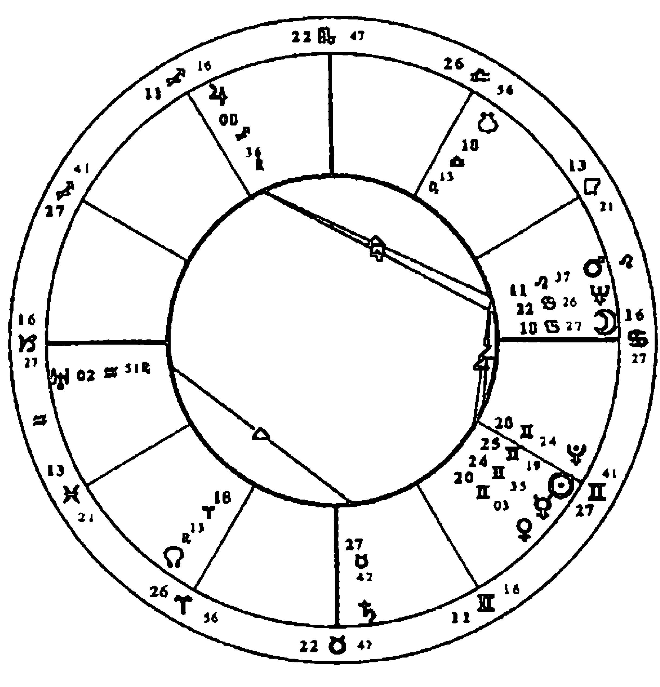
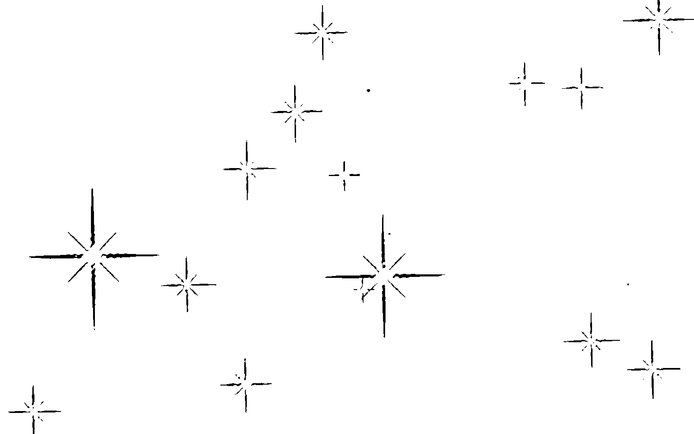
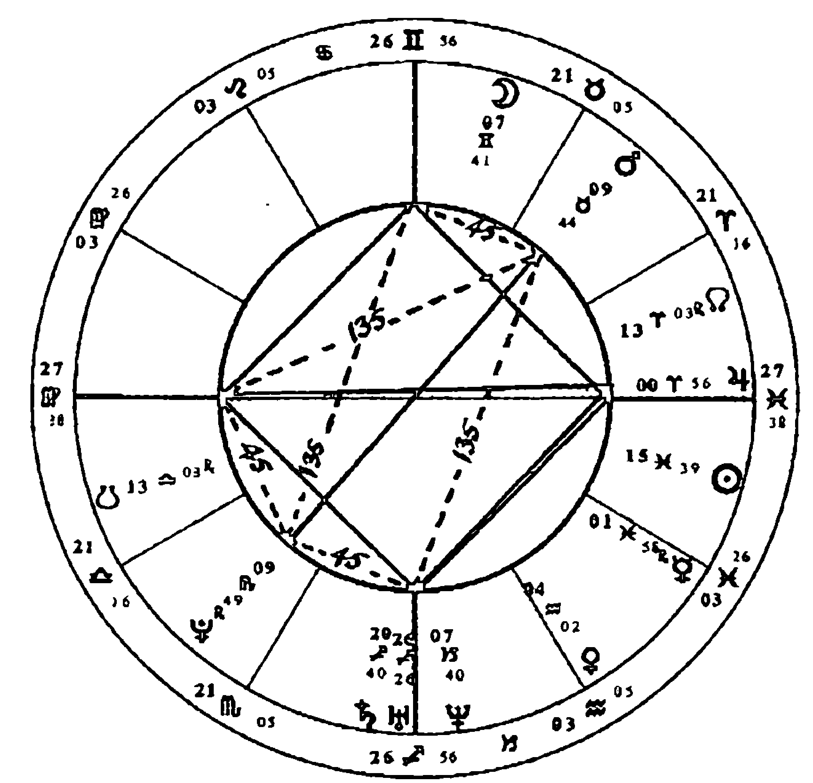
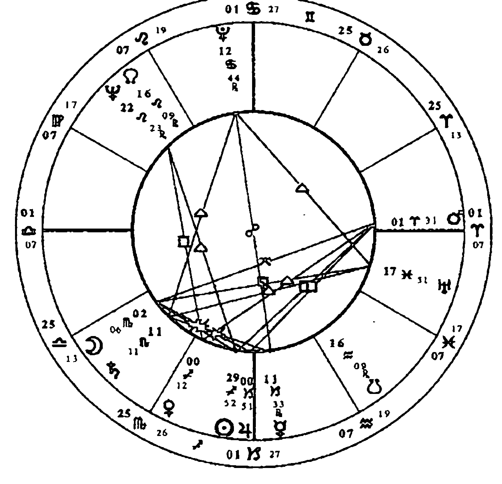
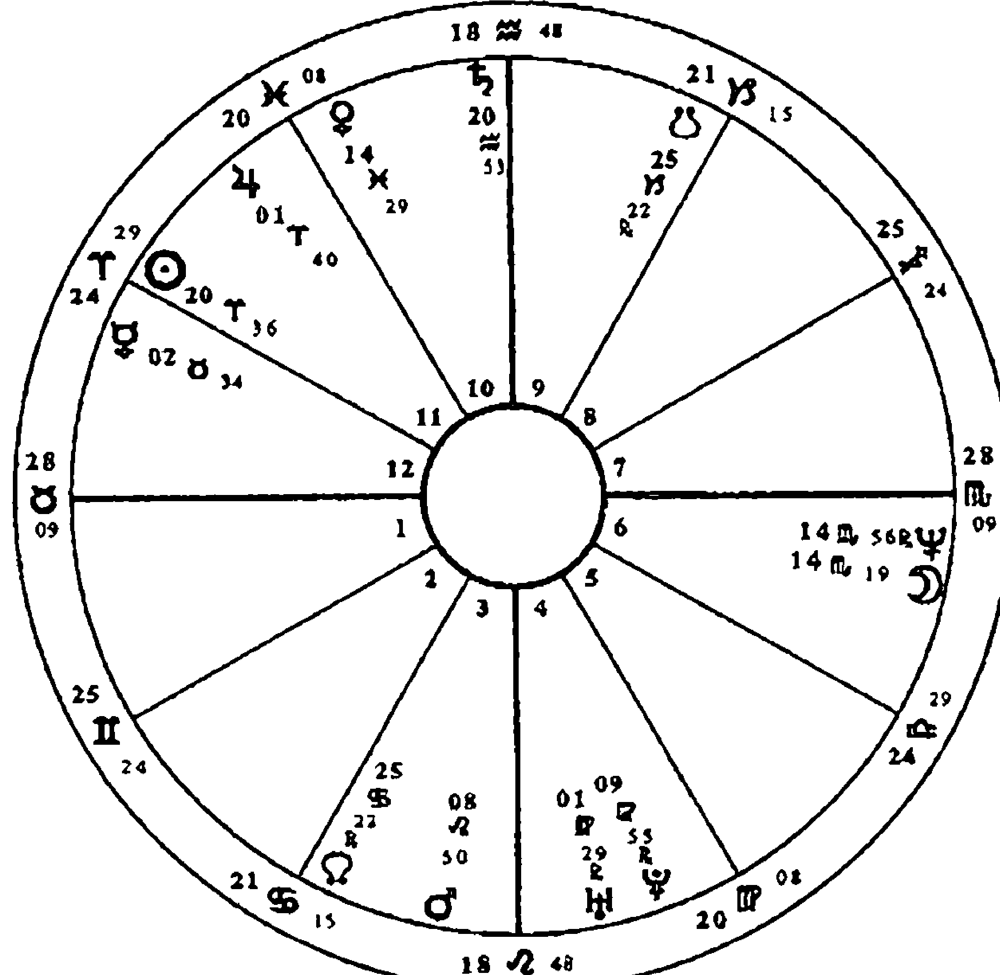
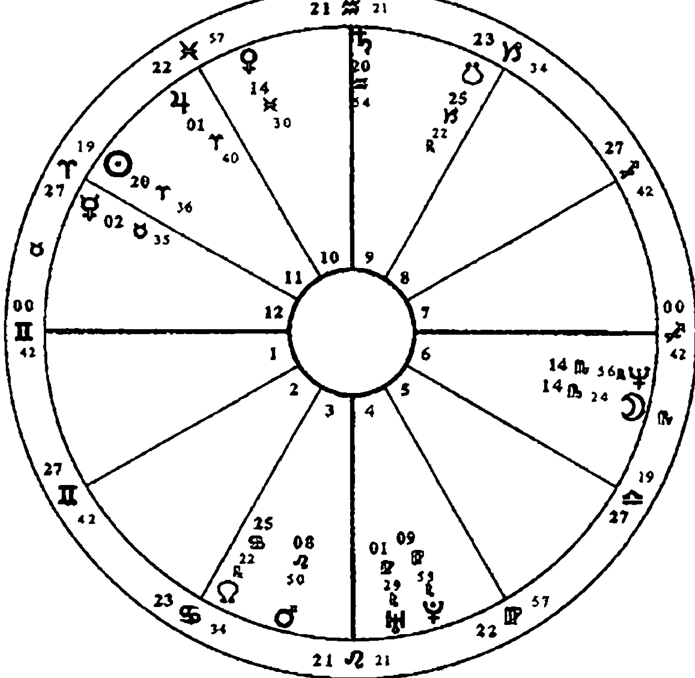
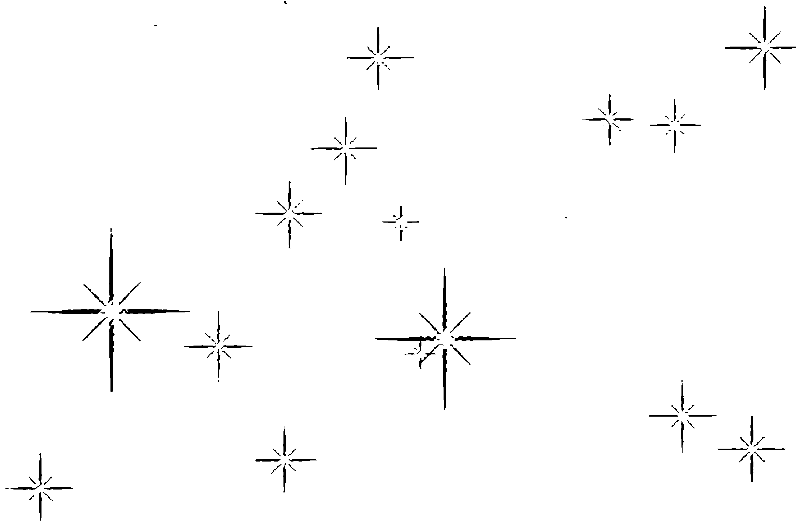

# ASPECTS IN ASTROLOGY
# 顺逆皆宜的人生

[英] 苏·汤普金斯 著
胡因梦 译

中国 广播电视出版社

# 改变，从心开始

立品图书·自觉·觉他
www.tobebooks.net
出品

# 顺逆皆宜的人生

[英] 苏·汤普金斯 著
胡因梦 译

# 图书在版编目（CIP）数据

顺逆皆宜的人生 / (英) 汤普金斯著; 胡因梦译.
-- 北京: 中国广播电视出版社, 2013.1
书名原文: Aspects in astrology
ISBN 978-7-5043-6784-6

I. ①顺… II. ①汤… ②胡… III. ①人生哲学-通俗读物 IV. ①B821-49

中国版本图书馆CIP数据核字(2012)第314443号

Copyright © Sue Tompkins 2001
First published as Aspects in Astrology by Rider Books, an imprint of Ebury Publishing.
A Random House Group Company.

本书译文简体中文版由城邦文化事业股份有限公司（积木出版事业部）授权使用
北京市版权局著作权合同登记号 图字: 01-2012-9005号

# 顺逆皆宜的人生

[英] 苏·汤普金斯 著
胡因梦 译

责任编辑 许珊珊
封面设计 大诚艺术设计机构

出版发行 中国广播电视出版社
电 话 010 - 86093580, 010 - 86093583
社 址 北京市西城区真武庙二条9号
邮 编 100045
网 址 www.crtp.com.cn
电子信箱 crtp8@sina.com

经 销 全国各地新华书店
印 刷 三河市华晨印务有限公司

开 本 787毫米×1092毫米 1/16
字 数 260 (千) 字
印 张 22.75
版 次 2013年1月第1版 2013年1月第1次印刷

书 号 ISBN 978-7-5043-6784-6
定 价 65.00元

(版权所有 翻印必究·印装有误 负责调换)

# 目录

作者序 用相位阐释星图上的能量互动 …… 1

译者序 从占星相位看因果业力 …… 1

# 第一部 占星相位导论

第一章 行星 …… 3

- 太阳 3
- 水星 9
- 火星 15
- 土星 22
- 海王星 30

- 月亮 7
- 金星 13
- 木星 19
- 天王星 26
- 冥王星 34

第二章 相位的计算与星图的划分

找出相位 47

第三章 相位的意义

合相 51

对分相 55

三分相 59

四分相 62

五分相系列 65

六分相 69

半四分相和八分之三相 70

十二分之五相 74

半六分相 77

第四章 咨询时的相位阐释

斟酌轻重 83

容许度 84

行星的重量 88

入相位与出相位 88

赤纬上的相位 90

第五章 相位的元素与星座特质

基本星座大十字 92

基本星座的对分相 93

基本星座的四分相 94

固定星座大十字 97

固定星座的对分相 98

固定星座的四分相 99

变动星座大十字 103

变动星座的对分相 104

变动星座的四分相 105

火象星座的三分相 108

土象星座的三分相 109

风象星座的三分相 109

水象星座的三分相 110

# 第二部 相位的组合

第六章 太阳的相位

115

太阳—月亮 115

太阳—水星 122

太阳—金星 125

太阳—火星 128

太阳—木星 132

太阳—土星 136

太阳—天王星 140

太阳—海王星 145

太阳—冥王星 152

第七章 月亮的相位

159

月亮—水星 159

月亮—金星 162

月亮—火星 167

月亮—木星 172

月亮—土星 176

月亮—天王星 180

月亮—海王星 185

月亮—冥王星 188

第八章 水星的相位

193

水星—金星 193

水星—火星 195

水星—木星 198

水星—土星 203

水星—天王星 207

水星—海王星 211

水星—冥王星 216

第九章 金星的相位

金星—火星 221

金星—木星 225

金星—土星 227

金星—天王星 232

金星—海王星 236

金星—冥王星 241

第十章 火星的相位

火星—木星 245

火星—土星 248

火星—天王星 254

火星—海王星 257

火星—冥王星 263

第十一章 木星的相位

木星—土星 269

木星—天王星 275

木星—海王星 276

木星—冥王星 279

木星和外行星 274

第十二章 土星的相位

土星—天王星 281

土星—海王星 285

土星—冥王星 289

第十三章 外行星之间的相位

# 第三部 星图上的四交点

第十四章 上升点和中天的复合面向 …… 297

- 上升点和下降点的对分性 297
- 中天与下中天的对分性 303
- 父母和中天、下中天的关系 306

第十五章 行星与四交点 …… 313

- 太阳与四交点 313
- 月亮与四交点 317
- 水星与四交点 320
- 金星与四交点 322
- 火星与四交点 325
- 木星与四交点 327
- 土星与四交点 330
- 天王星与四交点 333
- 海王星与四交点 337
- 冥王星与四交点 340

# 作者序
用相位阐释星图上的能量互动

我在 1970 年左右开始学习占星学，就像大部分学生一样，一旦发现这门学问，便无法自拔地迷上了它。不过当时我从未想过把它当成一项职业来发展；我只是对它着迷，而不急于拿它来做什么，所以我的学习过程非常缓慢冗长。后来当我有了深入的研究，而且已经取得了这方面的资质，才开始为客户做咨询。我越来越清楚星图里最重要的部分，也是极需要被了解和阐释的部分，就是行星的相位，可是我几乎找不到这方面的当代资料。

即使如此，市面上仍然有一些关于相位方面的卓越著作，譬如史蒂芬·阿若优（Stephen Arroyo）对外行星的阐释，丽兹·格林（Liz Greene）对土星的全新阐释，或是查尔斯·卡特（Charles Carter，英国占星学家，首任占星研究学院院长）的经典作品《占星相位》（*The Astrological Aspects*）。可惜的是，《占星相位》已经有些过时，而且没有把冥王星纳入讨论。此外，比尔·蒂尔尼的《相位动力分析》（Bill Tierney, *Dynamics of Aspect Analysis*）虽然对相位的图形研究做出了无价的贡献，却也没有进一步提出深入的看法。

由于我自己需要在这方面有更深的认识，而且教学之后发现学生们也很渴望更深入地学习，于是这本《顺逆皆宜的人生》便因此诞生了。我是以非常低调的经验式研究方法来观察相位意涵的，本书内容就是我研究的成果。

占星学的阐释艺术就在于如何把各种象征符号整合成一个综合性的结论，这也是占星阐释所要做的。举例来说，当一位占星师在考量水星落入射手座和第四宫的意涵时，必须先充分了解上述行星、星座及第四宫所代表的意义，以及由水星主宰的宫位里的情况。一般的占星学子都有能力把不同的元素拼凑起来，然而一旦意识到水星并不是一个孤立的元素，它会跟其他的行星或交点形成各式各样的关系——也就是“相位”——便开始有点无所适从了。发生这种情况是很自然的事，因为相位阐释是非常复杂和困难的功夫，即使是最有经验的占星师，也可能会面临一些问题。

尽管如此，我们还是应该努力发展出对相位的阐释能力，因为相位就是一张星图的能量所在。这些能量能够把星图从一张毫无生气的纸，变成能够象征人类生命力与活力、冲突与喜悦的符号。星图里的相位就是一个人建构人生的原料，而且星图不只局限于对人性或人生的研究，它同时还能揭示事件发生的时间、问题提出的时间等。

相位描述的是情节本身，星图描述的则是实际发生的事情。在个人层面上，相位组合代表的是心理学所谓的“情结”(complex)，然而就像荣格所言，与其说是一个人怀有情结，不如说是情结占有了一个人来得更贴切一些。换句话说，相位在描述所谓的“命运”上面扮演着重要的角色，同时也代表我们必须面对和转化的部分。

星图的本质是非常独特的，必须加以整体性的观察。像本书这样的工具书永远有它的局限性，因为我们只是从整张星图中撷取一部分内容来加以阐释。不过无论如何，我们仍然得从某个地方着手才行。我衷心希望本书能为研习占星学的读者带来一些实际的帮助。

# 译者序
从占星相位看因果业力

借由翻译阿若优和汤普金斯的占星力作，以及近十多年来的亲身经历和观察，我已经越来越被说服：占星学的确是一门精确无比的因果业力科学。

所谓的“因果业力”，按西方科学的解释，就是一种宇宙性的先决条件，也可以说是人和太阳系之间保持微妙平衡性的电磁场——中国道家的修炼者称其为“玄空造化场”。东西方的科学及玄学，均主张人类的神经系统会被宇宙行星强烈地影响，而且行星在人类的各种事务中，也扮演着超乎想象的重要角色。

如果说一张星图中的行星代表的是经验的面向，星座代表的是经验的特性，宫位代表的是让行星和星座的能量运作的领域，那么相位代表的就是各种经验面向的统合运作方式。由此可知，相位显然是出生星图中最重要的部分，而且在生命周期循环中行进的行星和星图中相位形成的角度，更是生命发生重大外在事件和内心产生转化及蜕变的关键所在。

从几个主要的相位，譬如四分相、对分相、合相、三分相、六分相或是十二分之五相等，我们可以很清楚地看出，所谓的“困难相位”的确会带来过度敏感、缺乏自信、需要证实自己的能力和强大的成长意愿，而“柔和相位”则会带来不假思索、运用自如、轻松懒散和顺利的特质。因此，相位不但能决定一个人将会在此生奋力达成某种具体成就，或是选择以放松的方式享受人生，同时也能决定重要关系的互动是否会遭遇显著的挑战和考验。

举个例子，一位女士的星图中有水星与火星的三分相，代表她的言语和意志力之间有高度的协调性，也代表她的表达和反应相当敏捷，而且有不假思索的倾向；此外她的水星与冥王星成四分相，代表在沟通表达时有一种强迫性的不信赖感，以及想要侦测他人真实动机的渴望。但是她的先生却有水星与土星的对分相，水星与海王星的四分相，水星与木星的三分相，以及水星与凯龙星的十二分之五相，这意味着先生的思想及表达方式受到土星的影响，有强烈的需要被尊重、被认真看待的渴望，但心底深处很怕自己的言语不够周详、无法说服别人，而他的水海相位却时常令他语焉不详、无法清晰地阐释内心细微的想法；落在第三宫的凯龙星则代表他在手足关系和求学时期，曾遭遇过智力方面的心理创伤；水木的三分相则有好为人师、善于表达宏观理念，却容易忽视日常现实的倾向。他的这些倾向自然会投射到亲密关系和下一代的身上，使他渴望在沟通时被家人视为权威和有理的一方，不幸的是家人却觉得他的言语不切实际，容易带给人压力，而他当不成权威也往往会立即发火。

占星师在辅导这对夫妻时，不但要指出这些水星相位带来的沟通障碍，以及背后的心理症结，还要替案主设想一些可能的改善方式，譬如建议先生通过研究某种学问或技艺（水土相位的潜能），或者教导他人某种文化现象背后的真理与意义（水木相位的才华），甚至发展出写诗或创作的能力（水海相位的内在驱力），来治疗智力上的深层创伤（水凯相位的内在意涵）。在妻子这方面，则要建议她相信自己的直觉，但同时要发展出三思而后言的客观意识，以及尊重先生意见的包容性，同时要减低言语的攻击性和怀疑他人动机的倾向。

当然，这个实例之中还有许多其他的重要相位必须考量，并且要观察两人星图比对之中的数十颗行星互动的关系，以及流年大运的相位所代表的人格及心理转化意涵，方能全盘地让个案了解生命遭遇背后的秩序和意义，以及宇宙大电脑的因果业力程式背后的善意。

诚如作者苏·汤普金斯所期许的，本书的确突破了以往占星学相位著作的不足与局限，而成为当代的一本相位研究的经典之作。但愿已经有些基础的占星学子能从中获得更清晰的洞见，切实地转化自己的执著习性，改善重要关系的互动品质，往更高的意识层次发展及成长。

胡因梦于台北
2010 年

# 第一部 占星相位导论

# 第一章 行星

本章的阐释乃是要改善和突显与行星相关的基本心理议题。

## 太阳

我们对自己的身份认同。我们认为重要和光荣的事情。我们最热衷的事物。生命力。重要性。自尊。启蒙。我们的意志。目的和未来的目标。我们获得的赏识。

对我而言，精确地阐释太阳的意义是很困难的事，有时它会被描述成代表自我的象征符号。

或许我们必须先弄清楚所谓的“自我”是什么，我个人会从荣格的角度来阐释它：自我代表的是人格的整体，包括意识和无意识的所有部分在内。这么一来，自我很可能会超越星图的阐释范围，或者至少包含了整张星图的内容。总之，太阳似乎是星图中最重要的部分，就像乐团里的指挥一样。它的确能代表我们的人格核心，如同原子之中的原子核一般，但这不表示这个核心部分很难被充分了解，你只是很难从最深的角度去定义它。

我认为太阳的确象征着我们的自我，也就是我们认为或认同的自己。因此和太阳形成相位的行星，也会影响我们认同自己的方式。譬如我们是对自己颇有好感，还是自我形象感很差，或者根本没有任何形象感可言？太阳的相位会在这些问题上面带来一些启发。与太阳形成相位的行星若不是能调和，就是会否定我们太阳星座的特质，譬如木星与太阳形成紧密相位，便可能夸大太阳星座的特质；土星则会压抑或阻碍太阳的特质，或是会驱使我们为这些特质下精确定义。

就像天空的太阳提供光与热一样，星图中被太阳触及的任何一个部分，也会立即变得光明和温暖。太阳触及任何一颗行星，光都会照到那颗行星上面，为其带来力量。但是“困难”的行星或是与太阳形成“困难”相位的行星，也会削弱太阳的力量，就像在晴天里戴着墨镜一样。

如果上升点及其主宰行星代表的是我们的人生之旅、交通工具，以及我们必须走的道路，那么太阳代表的就是我们的目的地以及可能会面临的挑战。太阳带有一种强烈的未来性，能描绘出我们将发展的方向，月亮则能描绘出我们的来处。

太阳的另一个关键词是“意志力”。其实太阳与火星都能描绘出我们的意志力、性格倾向、对未来的期望或欲望，也就是我们渴望成为的自己、想要形成的性格特质，以及想在人生中成就的事情。简而言之，太阳似乎能道出我们的人生目的、渴望达成的任务，以及如何带着觉知去活出那个目的。太阳落入的星座和宫位当然是我们所重视的，甚至可能是我们最重视的生命领域。被太阳触及的行星也格外受到我们的重视；这颗行星也能道出我们想要被看待的方式，以及在达成此目的的过程中可能面临的困难。

举例来说，太阳与土星形成四分相往往代表有权威议题。有这个相位的人很渴望被人看成某个领域里的权威，却很难接受别人的权威性，也可能在成为权威的过程中面临一些困难。

太阳会让我们说出：“这就是我的人生目的、我的方向和意图。”我们也会在太阳代表的领域中道出：“我要在这里展现出一股不可忽视的力量，我要在这里做我自己，变成一个独特的人，而且要以我自己的方式行事。”如果太阳描述的是我们的倾向和做事的方式，那么和太阳形成的相位，就会显示出是什么阻止我们实现自己的意志，又是什么推动我们完善自己。

太阳的确是自我核心的部分，与太阳形成的相位，则能道出以自我为中心的行事方式会不会遇到困难，接纳自己和认同自己的过程是轻松还是辛苦。

太阳落入的位置是我们寻求自我认同和发光发亮的生命领域；获得别人的赏识，我们才会更认同自己。如果得不到别人的赞赏，我们就会不断地寻求别人的注意。这些从太阳的相位和落入的宫位都可以看出一些端倪，我们可以举几个简单的例子来说明。太阳与火星的相位代表“注意我，我是强壮的”。太阳与海王星的相位则意味着“注意我，我是别人的救赎者”，或是“我是个受害者，你能不能拯救我？你不为我感到难过吗？”太阳与天王星的相位则代表“注意我，我和你是不一样的。”太阳与土星的相位道出的是“请注意我，因为别人很少留意到我的存在。”太阳触及到的行星都会让我们为其所代表的面向感到光荣。

如同任何一本占星学教科书所阐释的那样，太阳描述的是我们的活力、意志力，以及富有创造性的自我表现。我向来觉得“富有创造性的自我表现”是一种相当含糊的说法，但是不管怎样，与太阳形成相位的行星，的确能帮我们找到或表现出我们的独特性。太阳落入的星座和形成的相位，当然会影响到我们的生命力与活力，它跟火星一样也能帮助我们对抗疾病。

太阳同时也代表踏上人生之旅的那个英雄。星图里的太阳能够道出这位英雄注定要面对的挑战。荣格用“个体化”这个词来描述英雄之旅的过程。根据《牛津英语辞典》的解释，个体化的意思是：“形成一个独特的人或存在，为一个人带来具体的形式。让一个人和其他人产生区别。”这就是太阳真正的使命。在这趟英雄之旅中，使我们变成一个独特的人的能量，就埋藏在我们的内心深处。如同丽兹·格林所说的，橡实只可能长成一棵橡树，但是每棵橡树都是独特的，使它具有这份独特性的东西，就埋藏在橡实里面。所以太阳几乎能代表一个人寻找身份认同的整个过程。与太阳形成相位的行星，不但能帮我们定义这位英雄的模样，还能描绘出这个人将要面临的挑战。它所有的内在特质都会阻碍或者推进这一过程。

太阳也是星图中象征父亲的符号之一，这里指的是生身父亲，促使我们诞生出来的那个男人，也是提供孩子身份认同的典范。

## 月亮

感觉。反应。母亲。家。偏好的食物。家居生活习惯及一般的习惯。提供我们安全感的地方。我们能够退隐的地方。滋养及被滋养的方式。适应性。

月亮代表的是我们渴望滋养和被滋养的需求，也代表照料和保护的需要。即使是成年之后，我们的内在仍然有一个充满着需求、渴望、依赖，想要被保护的婴儿。从月亮的相位能够看出我们在滋养别人或是得到安全感方面，会不会遭遇困难。

月亮落入的星座往往能描绘出什么东西能抚慰我们；月亮的相位则代表获得抚慰的过程里会有什么助力或障碍。

月亮、下中天及其主宰行星都能广泛地描绘出我们的背景：我们情感的背景、家族根源和历史。月亮也代表我们的行为模式，特别是童年时在家庭环境里惯有的情绪反应；这种反应往往会延续至成年。月亮及其相位都代表我们会自动产生的反应。假如月亮与火星形成相位，我们的反应往往是快速的，好像随时准备要行动似的，也可能带着一股怒气；月亮和土星的相位，则会让一个人以小心谨慎的方式控制自己的反应。

月亮的相位也代表我们在表达感觉时是否轻松，或者那些感觉的本质是什么。

么。我们的感觉与眼前的情况和周围的情绪基调有关；虽然我们有时无法充分意识到这些情绪基调，但往往已经吸收进来了。

月亮也代表我们的家，以及我们在家居生活中的偏好。家是便利我们生活的地方，因此月亮也能描绘出我们的适应能力，包括对人和各种的生活情境的适应能力。理想的情况是我们应该有能力适应各种不同的人和经验，而每一种新的情况都会带来一些改变，造成不同的情绪和行为上的反应。

月亮同时也象征着我们可以退隐其中的家或地方，在这里我们会感觉很安全；我们可以穿着拖鞋到处走来走去，不必在意外界的看法。月亮同时也会影响我们对自己的感觉，而这又会进一步地影响我们和他人的互动，以及他人会产生的反应。当然月亮也能描绘出我们的源头，或者小时候是否有安全感，譬如月亮如果和天王星、土星或冥王星形成困难相位，就会令我们觉得世界不太安全。同时月亮也能道出我们的生活习惯，譬如边喝咖啡边抽烟久了，如果喝咖啡时不抽烟，就会感觉不怎么对劲。

同时月亮的相位也能描绘出我们是不是一个容易相处的人，或者与别人相处是不是一件容易的事。当然这仍旧与我们的适应能力和情绪上的安全感有关。如果我们觉得做自己是很安全的事，态度就会自然，也比较能适应别人的生活方式和习惯等等。

月亮也是代表母亲的重要象征符号。我们每个人都有生身母亲，我们的月亮代表的就是我们所体验的她；同时月亮也能道出影响我们至深的其他照料者。即使一个孩子被许多家庭领养或是从小在孤儿院里长大，我们仍然可以从他星图中的月亮，看出所有的照料者和生身母亲的情况。月亮代表的是“无论如何我都接纳你。我会保护你、照顾你。我会提供一个安全的地方，让你自在地探索自己和表达感觉。而且，不论你的感觉是恐惧、焦虑或愤怒，我都能包容。”

如果童年生活很理想，就能得到上述滋养。不管怎样，第一个与我们产生紧密联结的人就是母亲，毕竟我们在她的肚子里吸收了她所有的情绪和感觉，就像吸收食物里的营养一样。她是第一个与我们联结的人，也是第一个给我们无条件的爱的人。

月亮似乎的确代表我们的母亲，不过也有可能代表父亲或是其他的照料者。我们通常可以从月亮落入的宫位及此宫位的主宰行星或其他元素，看出母亲之外的照料者的情况。

不论如何，月亮落入的星座、宫位和相位，都能描绘出我们童年时的感觉，特别是跟安全感有关的情绪。我们目前有多少安全感，我们被保护时感觉如何，我们如何保护和照料别人，或者照料别人的时候有没有困难，这一切都受月亮的影响。

## 水星

思想。语言。书写。沟通。交流。理性思维。意见。与人联结。手足。学校。学习方式。

星图里的水星代表的是一切形式的交流，它的相位代表的则是我们表达自己的方式，至少能代表非感觉性的语言交流。被水星触及的行星或交点，会让我们产生强烈的书写、交谈和思考的欲望。水星是一张星图中负责将事物联系起来的要素，它扮演的角色有点像是中介，因此这颗行星对提升意识有举足轻重的作用。如果水星和土星形成相位，可能会让一个人更有机会思考和表达内心的恐惧；而水星形成这种相位，也会让一个人更能意识到土星代表的意义。即使水星与其他行星形成困难相位，也能带来一些成长，因为水星会让我们从不同的方面去检视和思考自己的心理状态。

提升意识当然有许多途径，水星提供的途径或许只是其中之一，但往往是比较容易领会到的。水星有一种命名的作用，当我们为一个东西命名之后，就比较容易了解它。我们可以从不同的角度来看它，或是扩大它的意义，也可能和别人谈论它。水星的相位也能显示出我们在认识自己的过程中遭遇的障碍，当然也包括学习的情况在内。譬如水星与土星形成相位的话，那么在自我认识和受教育的过程里，很可能会有许多恐惧。如果水星与火星形成相位，那么在认识自己的过程中，往往会伴随着许多愤怒和冲动。

当然我们思量最多的东西，不能只从水星落入的星座或宫位来观察，它会在星图的许多部分体现出来。譬如一个人的第七宫里如果有强烈的能量，或是天秤座被强化的话，显然会把焦点集中在关系上面，不论水星是否落在第七宫或是天秤座。总而言之，水星落入的星座、宫位和相位，都会影响我们思考、说话和沟通的方式。更重要的是，水星能描绘出我们将如何表达心中最重视的事情。

如同出生星图中的任何一颗行星一样，水星也不能以单一的方式来观察，它永远会受到星座、宫位以及其他要素的影响。如果我们从单一的角度来看水星的话，它代表的是比较客观的理性思维；这样的思维方式不但没有偏见，也没有任何道德意识。因为水星根本不关心对错的问题，所有的原则、伦理、道德和意义的问题，都是由木星管辖的，而木星管辖的星座与水星管辖的星座，刚好是对立的。水星可以说是神的使者而不是神本身，而有权力做出论断和提供意义的只有神。水星只关注眼前的信息，它并不关心获得的信息是否有用，甚至不在乎它是否真实。

水星同时也跟我们的意见有关，我们很难对任何一个主题有全盘性的认识，所以我们做出的论断永远是建立在不周全的意见上面，而我们的意见则反映出我们对一件事的信念和认知方式。我们都知道所谓的客观知识根本不存在，因此水星落入的星座和形成的相位，都会影响我们趋近客观性的能力。我们必须有客观性和理性，才能避免往偏见发展，但这种品质是跟我们的感觉是对立的，而我们通常会过度重视感觉。世界如果缺少了感觉和价值观，不但会变成一个无法想象的地方，而且可能会变得相当怪诞。因此，水星的相位和能量的高低，都可以让我们看出一个人重不重视理性思考。

如果水星形成的是困难相位，代表这个人的意见经常遭到挑战、质疑和他人的反对，或者他们会期待遭到挑战。如果形成柔和相位则会呈现相反的情况。一个人之所以会跟别人意见不合，经常是因为他们表达意见和想法的方式有问题。水星形成柔和相位的人比较不会被不同的意见威胁，所以比较能自在地表达自己。他们不会对水星落入的生命领域过度敏感，所以也不在乎别人是否赞同自己，他们甚至喜欢听到不同的意见。水星的柔和相位也意味着此人的意见容易得到他人的支持，或是得到自己人格其他面向的支持，故而会沿着特定的轨道思考。话说回来，由于意见总是建立在不完整的证据和理解之上，所以意见遭到挑战也不是什么坏事，反而能开阔我们的视野，拓宽我们的思维。水星的柔和相位，特别是三分相，也可能令一个人过于自满，困难相位却可能让一个人成长。

人在一生中到底能改变到什么程度是很难确定的事，但是我们的态度和想法的确可以改变，促成这种改变的就是我们的水星。我们的态度必须先发生变化，行为和生活方式才会跟着转变——能量永远会随着思想而改变。如果从这个角度来看，我们可以说水星握有使我们成长的那把钥匙。

水星最关注的是与人联结。“智力”则是很难被定义的东西。智力测验能够显示出一个人做智力测试的能力，但不能代表含义模糊的“智力”。如果智力测验能够揭露某些事实的话，那么它揭露的一定是受测试者的快速联想能力——这种能力是可以教导的，而且很显然是水星的特质之一。学校的象征符号也是水星，我们在学校里学习的就是如何将事物联系起来，同时学校也教导我们如何搜集信息、消化它们以及将它表达出来，换言之，我们在学校里学的就是阅读、书写、交流和各个层次的语言表达。水星落入的星座以及相位，可以显示出我们在学习上面是会碰到障碍，还是能获得支持。

水星还象征着运输，而运输代表的就是把某个人或某个东西从一个地方运到另一个地方。

水星也象征着兄弟姐妹。我们会很惊讶地发现水星加上三宫里的情况，往往能精准地描绘出我们与手足的关系。孩子可以从兄弟姐妹身上学到许多事情，因为兄弟姐妹扮演的是彼此之间以及和父母之间的中间人角色。

## 金星

合作。给予。分享。妥协。美。爱。价值。比较。艺术。品味。交换的方式。
金钱。让自己和他人快乐的方式。

金星象征的是分享与合作，给予和追求和谐的欲望，同时也象征着爱与被爱。金星的相位能道出受人欢迎和取悦他人对我们有多重要。金星触及的行星则描述了在达成合作与和谐性方面我们是否能获得支持。譬如金星与天王星成四分相的人，往往会觉得既想保持自己的独立性和独特性，又想追求人际的和谐互动；或者我们可以说，这个四分相会制造一种紧迫的需求而导致紧张，最后这类人也许会发现有关系比没有关系更自由。

我们都有一些关系上的问题，这也涉及金星的给予和火星的获取之间的冲突。与金星及火星形成的相位，可以描绘出这些问题的本质，也能促使我们找到解决和处理这些问题的方法。如果金星是一张星图的焦点所在，而且此人不惜牺牲火星的特质来达成金星的目的，譬如过度顺从或强调合作，那么他自己的原则就会被丢出窗外，以牺牲自己的做法来满足别人的需求。行星与金星形成相位可能有一种过度妥协或是不肯妥协的倾向，通常是这两种情况都存在。金星的法则就是维持和谐，如果没有受到其他行星的抑制，便可能不惜一切地追求和平。金星也喜欢从最美好的角度看事情，希望事情都有最好的结果。如同查尔斯·卡特所说：“金星容易聚焦在人与人之间的相似之处和共同兴趣上，而刻意去忽略彼此之间的差异。”

从表面上看，金星好像是给予的一方，火星好像是获取的一方，因此金星似乎代表好人，火星则代表坏人。然而事情并没有那么简单；金星的给予通常是想得到一些回报——爱、受人欢迎或是金钱。火星的法则虽然是获取，但至少它在这方面是诚实的，况且也有回报的能力。譬如我们给了人一件礼物，他收了这件礼物之后觉得非常开心，我们就会因此而觉得快乐和满足，所以他取得的同时也在给予。

金星的心声是“我要你想要的东西”。火星的心声则是“我要我想要的东西”。因为这两颗行星的法则是对立的，所以应该把它们看成是一组行星，不该只是单独地去观察其中的一个。由于金星不带有竞争性，所以特别关注和平的议题。

如果说月亮象征的是母亲，那么金星代表的就是年轻的女人（火星代表的则是年轻的男人）。如果我们从内在的女性角色来观察金星，以及观察这个内在角色和星图中其他角色的对话，将会很有帮助。

金星注重的是关系议题，例如给予和接受感情方面的能力，以及能带来浪漫爱情或是性关系的社交情况。我们的金星能道出我们以何种方式吸引人，譬如金天有相位的人往往会因为他们的独特和与众不同而吸引别人。在别人的眼里，金天型的人特别有魅力，充满着令人惊奇的特质。我们吸引人的方式以及我们看中别人的部分，反过来也会影响我们自己的穿着打扮和行为。金天型的人可能会把自己打扮成与众不同的样子，金土型的人在打扮上面则有许多恐惧，他们会穿得比较低调。但是重点并不在如何打扮，而是衣着代表的心态是什么。我们可以从与金星形成相位的行星，看出一个人如何以及为何有那些心态。

金星不但注视外表和各方面的品位，而且特别关注价值问题：我们如何看待自己和别人的价值？我们最重视的是什么？理由是什么？这颗行星也代表我们的美感和审美能力，同时也象征金钱；金钱本是换取我们重视的东西的一种工具。最重要的是，金星关注的是各个层次的交换方式。某些占星师把木星和金钱联系在一起，但是我认为这并不正确，虽然木星也象征着广义的财富，但木星并不像金星那么关注物质上的价值。

由于金星重视的是令我们愉悦、能带来美感的事物，所以也象征着艺术和音乐。艺术往往与享乐有关，而享乐则是金星的另一个关注点。事实上我们的金星完全能描绘出我们是如何追求美和享乐的，所以金星也能道出我们是否允许自己享受人生。我们的金星落入的星座、宫位和相位表明，什么能让我们快乐；我们喜欢什么或不喜欢什么，理由是什么；我们如何让别人觉得快乐，让别人觉得我们重视、感激和爱他们。金星的相位则能道出我们是否有能力令自己和别人感觉快乐、被爱和受到重视。

另外还有一个重点，当金星触及一颗行星时往往会“软化”对方。不管那颗行星代表什么，金星都会使它变得柔软，比较有伸缩性。同时金星也会帮助另一颗行星得到慰藉和享受，带来温柔与甜美的特质，感觉比较轻松自在，但这也可能会障碍另一颗行星发挥自己的能量。

## 火星

生存。应变能力和勇气。耐力和战斗力。自我确立。大胆。竞争。行动。

传统占星学观点认为火星有害的程度比某些行星要少一些。我个人不喜欢采用有害或有利之类的形容词，因为所有的能量都会带来一些助益，而且是必要的。同时它们也可能带来负面效应，如果我们不以妥当的态度来运用它们的话。

我们的确需要火星的能量，因为它最主要的作用就是在各个层面上帮助我们生存下去。对某些人来说，最好的生存方式是保持静默或是避开一些议题；有的人则会卷起袖子勇敢地面对冲突。正确地运用火星的能量可以为我们带来勇气和耐力，但是勇气并不意味攻击性或是战斗，它指的是面对那些使我们害怕的事情。对另外一些人而言，勇气或许意味着承认自己的脆弱和恐惧。火星的能量让我们能够“吃苦耐劳”，在事情变得棘手时站稳双脚，我们需要火星的能量来面对压力，以免在紧张的生活下折损自己。火星落入的星座、宫位和相位，能描绘出我们护卫自己时采用的工具，以及我们在运用这些工具时的感觉。困难的火星相位代表我们很难护卫自己。譬如火星与土星形成相位，意味着在护卫自己的时候会有恐惧。某些火星的相位也可能使人太急于保护自己，即使外界没有任何威胁，也仍然有这种倾向。

火星也关注自我确立的问题。自我确立就是宣示自己的兴趣所在，坚守自己的立场，以积极的态度保持自己的独立性，特别是在面对压力时。当然这不代表去欺凌别人，或是以粗鲁的态度对待别人——这是经常会见到的误用火星能量的状态，同时也解释了为什么这颗行星的名誉不佳。由于自我确立也意味着有伸缩性，能够以健康的态度面对别人的需求，所以也必须用到金星的法则。如果星图中有金火的相位，就会发现确立自己是件很困难的事，因为当我们想确立自己的时候，也很渴望受人欢迎，而且觉得两者无法兼得。另外我们也可能缺乏信心、恐惧、觉得自己无能（火土相位），或者认为选择轻松的方式会比较讨人喜欢（金火相位）等。

火星不但能帮我们对抗外界的压力，也能帮我们面对内在的冲突，以免被送进精神病院。但是压力太大的时候，我们也可能因为火星的反应模式不当，而被送进精神病院。同时，这颗行星也跟我们对抗疾病的能力有关，更重要的是，火星描述的是我们的欲望和生存的意志力。为生存奋斗意味着渴望活下去，因此火星加上金星的能量，带来的是享受人生的能力。

火星也跟一切形式的“竞争”有关。在运动和锻炼时，我们可以和自己或别人做良性竞争。研究显示，经常运动的人的自我形象和自我感觉，都比不运动的人要好，而且也比较有效率，不容易将错误归咎于人——运动的确能使我们的身心都健康。

火星的相位则代表我们对竞争的整体感受。譬如我们和金星的相应程度超过火星，就不会有明显的竞争倾向，但是生存反而会变成一个心理议题。另外我们也可能带有强烈的竞争性，因此容易陷入与人竞争的情况。反之，我们也可能完全避开竞争的情况，因为无法拔尖太令人难受了。

火星的能量是比较自私的，因为它只关注自己想要的东西。火星的相位则代表小时候大人如何教导我们面对自私这件事。有些父母会告诉孩子自私是不对的事（也许火土有相位），因此孩子长大之后很难要求什么或是去争取什么；还有的人是在充满竞争性的环境里长大的（譬如太火有相位，或者与上升点有相位），因此从小学到的就是人必须积极地争取一切，才能生存下去。这类人长大之后很难让事情自然地发展，总觉得必须不断地继续前进。火星的相位以及落入的星座也代表我们表达愤怒的方式、对事物的热切程度，以及在完成事情上面会不会遭到困难。

火星带来的行动也可能导致意外。意外往往源于错置的能量，也可能是未表达出来的愤怒所导致的——挫败感会找到一个释放的渠道。火星同时也跟发烧有关，而且的确掌控着我们的热能和性能量。

火星也代表我们做事情方面的胆量。当我们大胆地决定去做某件事的时候，其实会变得相当脆弱，因为我们也可能失败或是失去一些东西，因此火星也能显示我们会以何种方式来展现勇气和胆量。纯粹的火星能量是非常脆弱的，因为它会驱使我们大胆地向外获取某些东西，而当我们展示这种胆量的时候，手上的牌是完全摊在桌面上的。

火星和金星都象征着我们的性爱活动，金星和性行为中的和谐性及享受有关，火星则与性驱力有关，包括追求、征服和插入。当然这也会带来脆弱的感觉：你只要想象一下男性的生殖器，就能理解火星法则有多脆弱了。

火星的相位加上落入的星座，则能道出我们是否认为性是一件令人兴奋的事，或者别人会不会在我们身上找到性的吸引力。火星的相位能描绘出我们在性方面的恐惧和想象，以及我们的处理态度。

火星也会为它触及的行星带来加快速度的特质。那颗行星的速度不但会加快，而且会让人在展现其能量时缺乏耐性，也可能在相关的生命领域里显现出一股力量。火星的法则很容易转换成行动，因此被火星触及的那颗行星也会寻求行动上的表现。火星与太阳都跟意志力有关，《牛津英语辞典》将意志力解释成“导向有意识的行动的作用力”。

由于火星的法则是诚实追求自己想要的东西，因此星图中如果有明显的火星能量，往往会带来勇敢的精神，虽然误用它也会使人显现出一种强迫性。

## 木星

扩张。膨胀。夸大。智慧。财富。意义。信念。愿景。信心。信仰。贪婪。

木星的相位在某种程度上是比较容易阐释的，因为它最主要的特质就是带来扩张的能量。被木星触及的行星能量都会扩大，要留意的是，大并不一定就好，因为如果那颗行星已形成困难相位的话，木星反而会加剧它的困难。

在意外事件和灾难的星图中，木星一向有显著的影响力，特别是与火星、天王星或冥王星这些代表暴力及意外事件的行星形成困难相位时。木星之所以与这类问题有关，可能有好几个理由，其中一个是这类灾难往往涉及道德、宗教和哲学信念方面的问题——我们应该还记得宙斯曾经在奥林匹斯山顶投下霹雳闪电这件事。简而言之，被木星触及的任何一个元素都可能会放大。

木星的星座、宫位及相位，往往能道出一个人如何成长、扩张以及找到生命的意义。它会使我们渴望做“大事”，而且渴望在它落入的生命领域里拥有自由探索的空间。但更重要的是，木星代表的是生命的意义，它令我们超越眼前的现实和情况，看见背后更深刻的意义和目的。无论在宗教、哲学、政治或其他方面，它都会促使我们追求生命的意义，而每一次当我们试图看见事件背后的意义和目的时，我们都是在行使木星或第九宫的法则。当木星和其他行星形成相位时，我们就会把另外那颗行星哲学化；我们会思索那颗行星的法则代表什么，而且会在那颗行星代表的领域里展开双翼，尽可能地翱翔。

木星的相位同时道出了我们信仰的本质和态度，譬如与火星形成相位会带来攻击性，与土星形成相位会带来谨慎的特质。木星加上火星会让我们为自己的信仰出征，木土的相位则代表必须很努力才能发展出信仰。火木的相位也意味着渴望获胜、竞争性强、喜欢率先行动。火土的相位则意味着重视责任、信任物质和形式，以及我们的肉眼所能见到的东西。

因此木星的相位道出了我们在信仰上的态度，以及我们会相信什么。寻找生命的意义和目的，是我们不可或缺的一种需求；如果我们相信自己受苦有更高的意义和目的，就能以更积极的态度来面对人生的困厄。世上最主要的信念系统就是宗教，而木星的相位往往能道出我们和神的关系，不论我们认为的“神”是什么。木星同时也代表其他的信念系统，譬如让我们以宗教狂热式的激情去追求的政治。

《圣经》告诉我们上帝以他自己的形象创造了人类，因此我们的木星相位也能说明我们在生活中“扮演上帝”的方式。如果我们认为自己的信念系统是唯一正确的，那么我们不但自大，而且是在扮演上帝。这当然是把木星的法则扭曲了，因为我们都知道上帝是包容一切的，包括宗教上的一切表现形式和仪式，以及我们所抱持的不同世界观。木星的相位、第九宫里的行星，以及宫头星座的主宰行星，都能说明木星的法则是如何被扭曲的。木星的柔和相位代表的是能够以轻松的方式辨识出生命的意义，但也可能会满足于自己的信仰。柔和相位比较不会在信仰上遭到别人的挑战；这种能量不会让我们觉得不舒服而去过度表现，所以能够以比较轻松的态度面对信仰问题。困难相位则代表我们对自己的信仰不清楚也不确定，因此容易遭到挑战，不过最终这些挑战都会让我们在信仰上面变得更圆融。木星的困难相位与合相，也可能意味着必须付出努力才能找到人生的意义，而且会使我们过度想证实自己的信仰是正确的。

木星代表广义的人生信念，所以也象征我们内在的自信心和活力。如果木星形成的是柔和相位，我们就会在它触及的那颗行星上，展现出乐观与温和的扩张能量。如果呈现的是困难相位，则会在那颗行星的领域里展现过度乐观的态度。总之我们会被迫在那个领域里“试试”自己的运气。

木星也跟智慧有关。变得有智慧必须先拥有一些知识和信息，同时也得有能力从整体上来了解这些知识。木星代表一种宏观的作用力，因此会促使我们做出比较智慧的判断。木星的相位则代表在发展宏观能力的过程中会不会遭受阻碍。同时，木星也跟拓宽视野、理解力及博学有关，所以也掌管高等教育和远程旅行，因为这两者都能拓宽我们的视野。木星的相位、第九宫里的行星以及宫头星座的主宰行星，则能说明我们有多渴望旅行、接触高等教育和其中的经验。

此外，木星也会带来贪婪的倾向。木星触及任何一颗行星，都会使我们渴望在那个领域里有足够的斩获，通常那个领域的确会让我们收获丰富，因此木星也跟财富有关。富有代表我们和有价值的东西建立了联结。木星的相位能够阐明我们在财富的获取、运用和认同上有没有困难；它们落入的星座、宫位则能道出财富的本质是什么。

## 土星

恐惧。控制和否定。权威性。纪律。时间。以辛苦的方式学习。责任义务。

最能代表土星法则的应该是“恐惧”。这颗行星带来的各式各样的困难和问题，其实都是源自恐惧。土星触及任何一颗行星，都会让我们害怕在那颗行星所在的领域里展现出它应有的特质。我们甚至会觉得无法将其表现出来，因为我们会有一种尴尬、笨拙和严重受阻的感觉，很显然我们不愿意让人看到自己尴尬和笨拙的一面，因为我们认为别人不会接纳这些面向。但即使他们能接纳，又有什么意义呢？毕竟我们对自己的观点才是最重要的。难怪土星会跟荣格所说的“阴影”有关——我们不但想把这个面向隐藏起来，而且往往能很成功地做到这一点。

我们会以社会愿意接纳的方式，或者以假装适应了这个令我们尴尬的生命领域，来掩盖土星带来的问题，所以土星虽然代表我们的“阿喀琉斯之踵”，但我们还是有办法把这个面向隐藏起来。在考量土星的相位时必须注意上述观点，因为乍看之下我们不会在那个生命领域表现出明显的问题，甚至会在其中展现出一种老练的应对能力。当然老练不代表错误，因为带给我们最大困难的领域，也会使我们发展出最大的适应力——这就是炼金师所谓的把铅变成黄金的能力。不过我们仍然得付出长时间的努力，才能面对内心的恐惧和各种形式的失望。

通过经验来辛苦地学习，最后会使我们变成那个领域里的权威或专家，而这似乎就是土星坚持要我们达成的状态——彻底地熟悉一些问题。土星不像木星那样会让我们轻松过关。

因此土星触及另一颗行星，会让我们在年长后对那颗行星代表的事物有充分的了解，反之，我们则只能假装自己已经了解了。我们怎样分辨这两者的不同呢？如果是假装自己已经活出了土星的法则，就可能以一种形式化和刻板的方式将其表现出来。我们会以自认为应该有的或是社会所期待的方式将其表现出来，因此里面缺少一种自发性，而且会有一种无法避免的乏味和欠缺真诚感的成分，就好像一个孩子用很公式化的方式写圣诞卡一样。

发现与土星相关的问题是一个漫长和痛苦的过程，但是痛苦似乎总有其意义和目的，因为痛苦往往能告诉我们内在到底出了什么问题，有什么创伤需要我们特别留意。恐惧也有它的意义和目的；让兔子僵住不动，让羚羊拔腿逃命的就是恐惧。僵住不动或是拔腿逃命都是一种防卫机制，这种机制能够保护我们，就像冷天里穿上厚衣物保暖一样。土星的相位能够道出我们在哪个生命面向里，会过度防卫或过度不防卫。童年时期是建立这类防卫机制的重要阶段，长大之后这些防卫机制很可能变得不再恰当，甚至会勒死我们。如果我们的眼睛首先看到的总是一堵厚厚的墙，那就永远也看不到地平线了。被土星触及的那颗行星，会让我们在其周围筑起一堵砖墙。对许多有土星困难相位的人而言，他们的成年生活可能有一大半的时间都在一砖一瓦地拆掉这堵墙，因为“阴影”问题必须以谨慎和尊重的态度，慢慢地消除。

如果我们过度保护自己，外面的围墙砌得太厚了，就可能掩盖住自己的潜力，因为我们在那个领域里会太害怕冒险，此即土星之所以和痛苦相关的原因。使我们痛苦的往往是执著倾向，而土星的相位会让我们在那个领域里害怕放下，我们会认为一向能带来保护作用的防卫倾向是不能轻易放掉的。

土星的另一个法则是掌控，而这仍旧与恐惧有关，因为当我们害怕的时候，就会试图掌控眼前的情况，同时我们也渴望下清楚的定义。被土星触及的那颗行星代表的领域，会让我们在其中寻求明确的定义。譬如金土的相位代表的是害怕不被爱，所以会驱使自己的伴侣去定义他们的感觉。这类人会不断地问伴侣你爱我吗？你有多爱我？我们的关系能持久吗？这些问题通常无法带来期待中的答案，因为感觉是无法以这种方式来定义的，况且对方也可能不想被迫做出回答。因此典型的金土人会孤独地坐在屋子里，面对另一个孤独的夜晚，感伤自己得不到别人的关心。

土星的问题都可以回溯到童年时的心理议题。童年时我们容易在土星触及的那颗行星所代表的事物上遭到否定。由于我们觉得那方面被否定了，所以会特别想得到更多，甚至会以之当做存在的理由。或许我们遭到否定并不是任何人的错，也许只是命运被扭曲了，但是只要我们能跨出第一步，就会逐渐对这种无情的命运感恩。

虽然我们童年时无法为成年后的问题承担责任，但是探索童年时的心理议题仍然有必要，因为这样才能与过往和解，让未来变得更丰富。无论如何，童年的这些意象都有助于我们了解土星，因为被土星触及的那颗行星代表的面向，会让我们像小孩一样害怕权威人物的严厉态度。举个例子，水土有相位的人会觉得面对学习的情况，就像是遭到试炼或是在考试似的，即使他们在求学阶段里并没有太多严格的考试。总之，这样的意象可以帮助我们了解自己，而且可以和它开展一些对话。

感觉自己被否定或是渴望拥有某些东西，我认为都能帮助我们了解自己，因为土星触及的那颗行星，会让我们渴望得到相关领域里的东西。譬如土星与太阳形成相位，我们就会渴望得到赞美与认同；如果跟月亮形成相位，则会渴望有个家或家庭以及得到滋养；如果与金星形成相位，就会渴望爱和温情；如果与木星形成相位，往往会渴望拥有信仰。

土星涉及的宫位、相位和星座，代表的是我们缺乏信心的生命领域或面向，我们会觉得必须在这些领域变得更好。土星触及的领域会让我们有歉疚感，而歉疚感不但会让我们展现出懊悔的情绪，也可能令我们觉得自己不够好。有时我们也可能因此而合理化自己的过失，变得特别护卫自己。

如同许多占星师所说的那样，土星涉及的领域会让我们像个老师一样，不断地要求自己变得更好、做得更好、更加努力等等。土星会带来否定、拖延、限制，让事情变得缓慢，甚至使人裹足不前。这种否定和制约背后的目的，是在测试我们做的事情或渴望的事物的有效性。木星会使我们有信心，找到生命的意义，带来美好的感觉；土星代表的则是我们最不舒服、最恐惧、最尴尬和最脆弱的面向及领域。

我们可以用铅的性质来理解土星的特质。铅是非常沉重的，且表面没有光泽，可是却很持久——它不容易被腐蚀，所以经常用在屋顶的建造和水管的制造上面。如同铅一样，土星触及的行星和宫位，也带有一种缺乏活力和固定不变的特质。土星会让它触及的行星的速度放慢，也会确保那个领域有充分的发展，而且是没有捷径可循的。土星的能量虽然显得迟钝，但却有一种持久力。它坚持一切都需要时间，而且非常关注法则和规范、责任和义务，以及自我的纪律。法则或规范是为了保护社会及个人而设计的，父母为孩子制订规范也是为了保护孩子，让孩子学会在生活里负责和自制，如果规矩太严格，孩子就会惧怕内在和外在的权威，而无法表现出个人的特质。

传统上土星与父亲有关，有时也代表母亲。显然土星跟内化的父亲形象有关，它往往也代表父亲本人。无论是双亲之一还是任何一个权威人物，他们都是为我们制订规范的人，所以才会跟土星有关。规范其实不一定是负向的。土星也代表对危险的认识。困难的土星相位意味着心理上有权威议题；此人必须接纳别人的权威性，也需要发展自己的权威性。

土星代表我们越老越能处理好的事物，越老越能接受它所触及的生命面向，那就是真实的生活难免有恐惧、制约和局限，而且我们会发现大部分恐惧、制约和限制是自己强加给自己的。土星也与年资及责任和义务相关，它落入的宫位和相位往往能道出我们是如何面对责任和义务的。

## 天王星

想要获得自由与独立性的冲动。想要反叛和震撼别人的冲动。解放。顿悟。自由地追寻真相。剧烈的改变。革命。脱离常轨。

如同另外两颗外行星海王星和冥王星一样，天王星也会在心理状态、经济和外貌的改变上，带来巨大的影响。天王星在一个星座停留的时间大约是七年，它被视为高阶的水星能量，它的确象征集体观念的改变。那些有天王星与个人行星或重要的点形成相位的人，往往有意无意地成为一个社会新观念的创造者，也常会被那些有土星倾向的主流人士，视为反传统或者无法无天的人。

天王星促成了最新的观念，最先进、最原创的发明，以及最新式的科技，尤其是那些让人以更快的速度来传递想法的科技，譬如电子和电脑方面的发明。它带来的集体性改变似乎突然就冒出来了，而且一夜之间就改变了我们的生活方式。天王星如同许多新发明一样，能够穿透时间和传统，当然，同时也会制造出抗拒力，因为它带来的改变太突然、太激烈，也太前卫。天王星的行事方式一向是一不做二不休，也没什么合作的意愿，更不会考虑传统或是别人的感觉。如同所有的外行星一样，天王星的行动也带有一种非个人性。

天王星的法则就是要挑战土星所代表的一切，也就是传统、主流及保守的作风——这颗行星一向喜欢对抗权威和长者。它会挑战那些已经变得僵固、受到压制或是已经失败的事物。当天王星触及一颗行星时，它会促使那颗行星以最离经叛道的方式表现自己。由于主流社会比较倾向于土星的特质，所以“离经叛道”这个词可以阐释成“不正经”，不过这个词的真正意思是“另类途径”。

天王星的法则的确会促使一个人选择不同的途径，它象征的就是叛逆的渴望，当它触及星图中的某颗行星时，往往会创造出一种情况，让此人渴望在那颗行星所代表的事物上展现出叛逆特质。由于这类人挑战的是社会现状，所以很容易被孤立，但是也可能成为带来不可避免改变的媒介。举个例子，譬如天王星和月亮形成相位的人，很可能会挑战传统的母亲角色；天王星与金星或火星形成相位的人，则可能会挑战传统所认为的男女结合就该结婚的观念。跟天王星有关的事物大多带有英文前缀 un-（不或非的意思）的特质，譬如非传统、不寻常、不可能、非主流、非情绪化等。

与天王星形成的相位，特别是跟太阳或月亮形成的困难相位，通常会为生命带来阶段性最激烈的改变，这种改变之所以会发生，多半源于无法在日常生活的层面上做出细微的调整，因此会累积出想要变动的巨大冲动。这类人好像会被外境逼迫做出极端的改变，他们本身也可能回应内在的召唤来推翻现状。上述两种情况都势必会遭遇从别人那里来的压力，或是自己内在产生的压力。无论天王星走到哪里，都会为自己或别人带来缺乏伸缩性、极端以及很难合作的倾向。

被天王星触及的行星会渴望自由、独立和刺激，因此月天的相位显然意味着情绪上的独立及家庭生活的自由空间，而金天的相位则渴望社交生活的刺激和关系之中的自由。只要是跟天王星形成困难相位的行星，都会逼迫一个人去整合自己。这类人一方面渴望情感的交流、安全感和保护（月亮），一方面又非常需要独立、自由和刺激（天王星）。

由于天王星的法则似乎也会引发土星法则，所以也可能冻结发展的驱力。那些有强烈天王星能量的人，一方面觉得改变很刺激，一方面又很怕改变，而这就是他们一旦改变，往往会发展得很极端的原因。天王星的柔和相位则意味着能够享受改变、自由和外来的刺激，所以行为反而不会变得太极端，但是困难相位却会让一个人想要与众不同、脱离常轨、叛逆、追求刺激等。

天王星触及的行星，则会让一个人很早就展现出那个领域里的变动倾向，譬如很难被预料或者很难安下心来。这类人容易遭遇突发的事件或惊吓，如果呈现的是柔和相位，就会让他们觉得突发的事件很令人兴奋，但是也可能带来很深的不安定感，通常是两种情况都有。总而言之，有天王星相位的人（大部分的人多少都有这类相位）往往会在成年之后暗自期待，甚至习惯性地引发一些剧变。

天王星也跟震撼有关。任何一种震撼都可能扰乱我们，但也可能令我们兴奋，让我们觉醒，而为我们带来生命力或是活力。天王星一向是停滞状态的敌人，而且会驱使我们不接受法律或防卫机制的限制，无论这些限制是外来的还是自己设置的。

天王星的冲动背后的目的就是要带来觉醒和解放，同时这颗行星也与真相相关，并且与突然产生的顿悟有关，因为它能穿透一切的虚假。天王星的确能穿透它所触及的行星代表的法则和表现方式，它虽然能带来解放和刺激，但是也可能做得太过火。在最佳的情况下，天王星可以穿透父母和社会带给我们的制约，打破僵固的态度、恐惧以及对常规的上瘾，使我们顺利地改变，发展出自己的思想和行为上的独立性；最糟的情况则是忘了自己仍然需要某种规范、安全保障，以及生命的可预测性——因为这些东西可以带给我们稳定性和力量，使我们有足够的基础来做出改变。

天王星的关键词也许就是“激进”，因为这颗行星不但与拓展自由观念相关，而且会以最叛逆、最激进的方式来行动（译注：有些占星师认为它带来了“禅”的精神特质）。

## 海王星

提升。净化。欺骗。牺牲。渗透。转化或逃避。理想。梦想与幻想。着迷。

海王星会提升它所触及的行星。它寻求的是净化和提升，它渴望去除不完美或是有缺陷的部分。被海王星触及的行星既可能变得更精纯，也可能更难以掌握。海王星会去除低俗或粗糙的特质，为那颗行星带来更细致、更纯净以及更精微的特质。

海王星最大的才能就是对精微事物的辨识和欣赏能力，因此有强烈海王能量的人往往有创造力或是艺术倾向，正如无论是美术、音乐或戏剧领域里的艺术工作者，大部分都对形式、色彩或声音有高度的感知力。

但是海王星的精致化倾向也不尽然会带来好消息，愈是精致的东西，距离原来的状态就愈远。我们可以想象一下精致的糖或面粉，虽然尝起来味道很好，但是已经太人工化了。从这一点我们就知道海王星为什么有不诚实、自欺和虚假的名声。在提升和强化经验的同时，海王星也让我们脱离了那个经验本身，当我们脱离现实之后，就无法再看清楚它，也无法再掌握它了。如同所有的教科书告诉我们的，海王星主要代表的是超越和逃避现实的倾向。被海王星触及的部分都会使我们渴望超越琐碎的现实，突破日常生活带来的局限和疆界。

海王星也会使我们超越世俗的考量，它最佳的作用力就是启发我们将自己提升得更高，变得更卓越，这就是为什么海王星一向和理想主义有关的原因。被海王星触及的行星，会让我们在那颗行星的表现上带有理想主义倾向，我们会渴望展现出最高和最精纯的境界，但这么一来，也会使梦想和现实之间的距离变得越来越大。

此外，海王星也会使我们变成烈士或烈女式的牺牲者，所以才会跟损失有关。我们会把被海王星触及的行星代表的东西送走，这么一来我们就变成那方面的受害者或烈士了。受害者或烈士都会牺牲自己，但是烈士牺牲自己是为了得到某种荣耀，因为牺牲的背后带有一种精神上的意义。

被海王星触及的生命面向或领域，往往不受疆界带来的限制，就好像在达成期望、梦想和欲望的过程中不会遇到任何阻碍似的。这一点对理想的实现很有帮助，因为我们若经常意识到物质世界的局限，就不会有任何理想了。不接受任何限制是有用的，因为这能发展各种可能性，让我们接触到神奇的未知。这种倾向也会导致混乱、无政府主义与随波逐流的状态，如果我们没有什么疆界或限制，就会对各种经验保持开放，因此很容易被引诱，也可能会去引诱别人。没有界限的特质使得海王星能够去引诱别人，这是借由渗透性来达成的。

一幢房子有明显的内外之分，它有墙、天花板、窗户和门。假设某间屋子里的煤气漏气，那么无论这幢房子封闭得有多好，煤气都能渗透到其他房间里，这似乎也是海王星的运作方式。海王星也象征着泄露，包括泄露丑闻和秘密之类隐藏在深处的事情，没有任何东西可以阻挡这股渗透力，或许只有土星象征的围墙和疆界能够带来一些阻力吧。

被海王星触及的行星所代表的事物，都可能有泄露秘密的危险，譬如水海有相位的人很容易泄露别人的秘密，他们绝不是你倾吐秘密的最佳对象；有太海相位的人则容易把自我和他人的界限消融掉，于是自己和别人就会彼此渗透。

海王星不但会提升它所触及的行星，而且会渴望拥有更多由那颗行星代表的经验。海王星象征的是各种形式的水，所以它所触及的行星带有一种渴求的特质。我们会不愿意接受事情本来的面貌，而这会使我们觉得不满足或者不愿意接受事物的原状。举个例子，太海的相位会让人害怕变得平凡或世俗，而且渴望变成一个特殊的、拥有更高境界的人。金海的相位会使人渴望爱，得到完美和理想的关系，这类人要不是理想化或美化一个人，就是完全逃避关系，追寻像神一样的理想对象。

海王星喜欢魅力，因此我们会渴望被它触及的行星的特质，能够以最有魅力的方式表现出来。魅力的定义是：“像魔法一样，诱人的，令人着迷的……一种能够蛊惑人的吸引力。”总括来说，魅力意味着童话世界里的国王、王后、王子、公主，或是仙女之类的人物。童话、想象的世界、电视、电影、音乐，这些事情都能使我们远离恐怖的现实，因此海王星象征的就是逃避的途径。但是我们都很清楚，想象出来的世界比提供逃避的途径，显然更能带来启发性。布鲁诺·贝特尔海姆（Bruno Bettelheim）在其著作《魔法的作用》（*The Uses of Enchantment*）中解释了童话故事为儿童带来的益处：

> 孩子需要了解自己的意识里面发生了什么事，这样他才能处理无意识底端的问题。他无法借由理解力来了解和处理无意识的内容。他只能借着做白日梦，反刍、重组和幻想出一些适合的故事元素，来对抗无意识里的压力。

我怀疑布鲁诺·贝特尔海姆描述的不只是孩子和童话，也包括成人以及他们对电视、电影和皇室的需求。就像童话一样，这些媒介也能帮助我们了解什么是善恶对错，而且这些媒介很神秘地为我们的人生带来了意义。我们的梦想令我们和自己的无意识产生联结，继而为人生带来意义。也许它们以某种方式净化了我们。

代表媒体的象征符号当然是海王星。我们自己的皇室（他们自身当然是我们对魅力的这种集体需求的一个范例）也是借着媒体而成了家喻户晓的国王与王后。长久以来我一直在研究所谓的八卦小报为何如此受欢迎，我认为这些报刊里的新闻给了我们高剂量的海王星能量；由于它们提供给我们的故事距离真实生活是如此遥远，而且大部分是虚假的，所以才会有这么高的销量。海王星借由去除棱棱角角而令事物变得人工化。八卦小报的故事也许是假的，然而它们就像我们的梦境一样，是建立在扭曲的事实上的。我们的白日梦、电视节目和八卦小报全都提供了逃避的途径，它们以漫画的方式讽刺我们的真实生活，并且把故事膨胀到完全失真的地步。我们的梦境往往是以非黑即白的方式来表现的，所以能够使我们立即领会其重点。

海王星除了象征我们每个人的梦想之外，同时也代表集体的渴望。那些星图中有强烈海王星能量的人，特别是跟个人行星形成紧密相位的人，往往能成为集体意象和幻想的表达管道，而且通常会以艺术的形式表现出来。艺术家通过他们的工具和媒介道出了我们心中的渴望，特别是那些星图中有同样海王星位置的世代，尤其容易被打动。

海王星的使命就是为我们指出现实的另一面。或许现实本身也是虚假的，而且没有任何事与表面看上去的一样，所以观察海王特质的时候，也要考量魅力的作用。

## 冥王星

死亡。转化。再生。禁忌。生存驱力。执迷倾向。冲动。危机。强暴。偏执狂。

> 当你选择死亡的同时，也选择了埋藏在它底端的另一面。除非我们选择死亡，否则不可能选择生命。除非我们对生命说“不”，否则不可能对它说“是”，而且只会被它的集体驱力牵着走。
——詹姆斯·希尔曼（James Hillman）

当冥王星和某颗行星或四交点形成相位时，似乎会深化和强化与其相关的事物。如果呈现的是困难相位，那么冥王星的表现方式，就会跟那颗行星的表现方式起冲突。冥王星似乎会埋掉或干掉另一颗行星，因此月冥有相位的人往往会“埋葬”他们的感觉，或者与自己的感觉隔绝，有时这会持续很长一段时间。

在神话里，哈得斯从冥府冒出来，诱拐并强暴了天真无邪的珀耳塞福涅。而珀耳塞福涅似乎命中注定要跟哈得斯居住在冥府里，但是一年之中可以有几段时间和母亲德墨忒耳相聚。如同哈登·保罗（Hadyn Paul）在他的《火凤凰的跃升》（Phoenix Rising）这本书中提到的，“虽然哈得斯好像代表邪恶与腐败的力量，但是也象征着推动内在转化的一股力量。”他继续说道：

对珀耳塞福涅而言，成为女人的时刻已经来临。虽然她是被迫脱离原来的现实，去体验一个崭新的世界，并且做出了重大的改变。从她诞生的那一刻起，就已经注定要面临这样的蜕变过程；冥王星在这里扮演了她的启蒙者，也是她生命的计时员。冥王星带来的经验对成长来说是不可或缺的，其中包含着一种“方程式”，暗示着我们必须被无意识里的某种东西穿透，才能得到启蒙和洞见，带来完整的自我揭露与整合。珀耳塞福涅从被强暴这件事的阴影里走出来，变成了一个更成熟更有觉知的女性。她原先天真无邪的特质消失了，现在她是从再生与整合的层面去迎接她的母亲。当她再度回到冥府时，她的成长仍然会继续下去，因为真正的启蒙是无止境的；它有一个明显的开端，却没有结束的时刻。

当某颗行星触及我们的冥王星时，我们会觉得那颗行星代表的事物与某种肮脏丑陋的感觉有关，而且真的可能遭到侵犯、强暴或是亵渎的命运；这种事也可能会在未来发生。我们会在冥王星触及的行星所代表的领域里产生一种被迫害的感觉，至少合相或困难相位会造成这一类的经验。举个例子，月冥有相位的人会觉得他们的情感遭到了侵犯、亵渎或践踏，因此非常害怕这种情况会再出现；太冥有相位的人则会觉得自己的身份曾经被夺走，或是将来可能被夺走；金冥或是火冥有相位的人则可能有过被强奸或是被暴力侵犯的经验。

被冥王星触及的行星所代表的领域，往往令我们无法以轻松的态度面对。借由和冥王星的联结，我们才能瞥见冥府的真实情况，也就是集体无意识或个人无意识底端的丑陋面向。瞥见这样的情形当然不会令人太愉快，但却能转化或是深化我们对生命的了解。被冥王星所触及的行星会带来一种被剥夺的感觉，而且会被埋藏得很深，直到某些行星行进（transit）时才会再度浮现出来。在它还没有浮现，尚未有机会将其统合到整个意识里面之前，往往会有非常深的恐惧和一股强烈的冲动，想要把与这颗行星相关的事物排斥在外。我们在某种程度上似乎知道自己会被强暴，而且隐约地记得曾经发生过这类事，所以竭力不让它在未来发生。无论冥王星落在哪个位置，都会令我们紧闭门窗。

哈得斯在神话里代表的是一股看不见的力量，使它有这种隐形能力的就是他头上的钢盔。冥王星的词源带有“财富”的意思，也代表埋藏起来的宝物。或许被冥王星触及的行星代表的宝藏，就是对事物的深刻了解。我们很容易把冥府想象成一个黑暗的地方，因为看不见和无法理解的事物自然会令我们害怕。埋在地底下的东西往往隐藏着最大的力量，因此无法被意识到的人格面向，的确有可能是最危险的，不过这里面也埋藏着一些珍宝，而这就是进入冥王星的领域所能得到的回报。在神话里，冥府并不是一个很糟糕的地方，起码哈得斯很享受那里的生活，而且只会偶尔出来一下。在其他的神话里，冥府则是一个退隐的地方而非地狱。同时它也代表执行正义法则的场所，因为那里的每一个灵魂都得接受因果报应。

被冥王星触及的行星有一段时间会在“过渡地带”活动（过渡地带指的是天堂与地狱之间的中间地带，尤其是那些没有受洗过的灵魂）。冥王星被发现也有一段过渡期：珀西瓦尔·洛厄尔（Percival Lowell）及其他学者都认为 1915 年冥王星就被发现了，但是 15 年之后的 1930 年，它才被正式定义和确认，而且是由不同的人发现的（克劳德·汤博，Claude Tombaugh）。星图中的冥王星也是以这种方式运作的：某些秘密被隐藏多年之后才浮出表面。

冥王星不但象征着隐藏的事物和秘密，同时也跟揭露和浮出表面有关。鼹鼠总会找个时间冒出头来透气，而冥王星象征着的心理议题也会逐渐被我们看到。它们被埋得越深，被看见的时间就越晚；我们越是努力掩盖这些问题，它们带来的摧毁力量就越大，但是自我转化的潜力也越大。冥王星的关键词就是转化、死亡与再生。像我这样的占星师运用这些词，就像是早餐吃麦片那么稀松平常。这些词都非常精确，但是因为被用得太滥了，所以已经丧失了原意。其实关键词并不能帮助我们深刻地了解冥王星的意义，因为这颗行星必须通过亲身体验才能彻底地认识。冥王星象征的心理议题的广度和深度是无法言喻的。

以我的经验来看，肉体的死亡仍然与土星有关，但是当我们的亲人死亡的时候，冥王星的能量通常也一定相当活跃，因为死者能够为生者带来深切的转化。死亡当然不仅只是肉体的消亡，任何一个重大的蜕变和转化经验，也会带来心理上的死亡。把一些不恰当的价值观、态度或观念扫荡掉，让我们从某种状态转化到另一种状态，才是冥王星真正关注的死亡形式。

史蒂芬·阿若优把冥王星和“禁忌”联系起来。禁忌这个概念是由已故的占星师理查德·伊德曼（Richard Ideman）所提出的，我发现从禁忌的概念来了解冥王星是最容易和最有效的方式。禁忌的定义如下：

- 把某个东西分隔出来，只用在特定的目的上；只能被神、国王或神职人员使用的东西，一般人没有资格接触。
- 暂时或是永远禁止与特定的行为、食物或人接触。
- 让某个东西变成一种禁忌：把某个东西置于一个神圣的地方，或是让它变成有特殊用途的东西，并且不准将其用在平常的用途上。

因此冥王星带着一种强烈的“禁果”特质。禁忌这个词具有一种神圣性，是很有趣的一件事，因为冥王星带来的议题不可能随便地在橱窗里看到。冥王星的某个部分之所以很难被了解，是因为人们鲜少谈及和冥王星有关的议题。出生星图显示出来的冥王议题，必须经过长时间的心理治疗才会浮上台面，所以不是一次占星咨询就能解决的，虽然人们还是经常把冥王星行进时造成的问题，拿来和占星师探讨。人生中的重大转化经验都有其神圣的一面；我们只会和自己真正信赖的人分享它们。

被某个文化或某段历史视为神圣或禁忌的议题，不一定是另一个文化或时段里的禁忌。基于此，我们不妨把冥王星和集体阴影议题联系起来，这类问题不是我们自己的文化所独有的。被冥王星触及的行星会迫使我们认清其禁忌本质，而这些禁忌不但是个人的，也往往是整个文化都排斥的东西——通过与冥王星形成相位的行星，我们会发现这个事实。有时这意味着我们会被整个社会排斥，或是我们自认为如此，而这就是为何需要掩盖冥王议题的原因。

被冥王星触及的部分也带有守密的意思，譬如有太冥相位的人会守住自我的秘密；有金冥相位的人可能会有秘密恋情，或是有藏在某处的金钱；有火冥相位的人则有性方面的秘密。秘密指的是自己才知道的事。包含秘密成分的事物，通常比没有秘密的更具有力量——任何一个被隐藏起来、看不见、未知或是无法知道的事情，不可避免地都比公开的事物要有力量。那些无法探测到秘密领域里的人会害怕那个领域里面的东西，而那些知道这些秘密的人则可能会把它们当作武器。但是守密并不是为了伤害别人，通常是为了自保和生存下去。

因此，冥王星一向关注生存议题。如果我们有行星和冥王星形成相位，我们会非常渴望那颗行星代表的事物能够存留下去（至少得存留一些能干掉自己的力量），而且我们会认为别人很想夺走这个部分，因为冥王星带有一种偏执倾向。被冥王星触及的行星会带给我们极大的力量，也可能带来非常强烈的无力感，至于我们会怎么去运用那股力量，则因人而异。这股力量可以用在最具有摧毁性的目的上面，也可以用在有益的事情上。

现在让我们再回到禁忌的议题。在我们的文化里，盛怒、暴力，以及任何一种本能的、原始的或是不文明的感觉，都带有禁忌的成分；死亡和性也是如此。强暴或是被暴力所迫，也都是禁忌式的经验。冥王星显然不会以客气的方式对待任何人。由于冥王星关注的是生死攸关的议题和危机，所以也不应该太客气。

我最喜欢的有关冥王星的著作，与占星学没有丝毫关系，那就是詹姆斯·希尔曼的《自杀与灵魂》（*Suicide and the Soul*）。前文引用的文字即出自此书。这本书谈论的是死亡、自杀与灵魂的蜕变。希尔曼在他的书中推测，自杀的冲动其实是渴望急剧的蜕变，他说：“自杀并不像医学所说的，是一种提早出现的死亡；其实是把应该转化的时间延迟所产生的反应。”被冥王星触及的行星会让我们有一种感觉，好像那颗行星代表的面向企图自杀似的，也好像在以某种急剧的转变方式来暗中攻击自己。就像哈得斯的父亲克罗诺斯一样，冥王星也会造成反应上面的延迟和无法抵挡的蜕变。

如同希尔曼所说的，蜕变通常会在绝望的那一刻发生。当冥王星行进与星图中的某些行星形成相位时，就会启动内在的这种转变。只有当我们跌落到谷底，失去一切希望的时候，转化才会发生，也就是所谓的死亡和再生。被冥王星触及的行星带有一种倾向，它们会阶段性地坠落至最底层，而且会阶段性地处在过渡期的状态。

冥王星的相位可能是最难以了解的，但若是深入地探索，往往会有丰富的发现。如同希尔曼所言：“死亡经验可以帮助我们脱离集体意识的洪流，去发现属于自己的特质。”

# 第二章 相位的计算与星图的划分（新手可以采用的方式）

根据《牛津英语辞典》的解释，“相位”意指：“一种观察或思考事物的方式。一个面向。”

“相位”这个词首先被启用似乎就是用在占星学上。占星师通常用相位来代表行星之间的角度关系，方式是计算黄道上行星之间的经度。由于我们是从地球的角度来观察行星的，所以太阳和月亮之间也会形成相位。

从技术上来看，星图中所有的行星和交点彼此之间都有相位关系，这就像是十多个人坐在一张椭圆形的大桌子周围，里面的每个人都可以看到其他的人，而且每个人的角度都不一样。然而行星或是星图中其他重要的交点，并不像这些坐在桌子旁边的人，因为它们是可以移动的，所以形成的角度一直在改变。换句话说，随着行星的移动，相位不断地在形成，也不断地在消失，因此星图只是一张把某个时辰凝固住的生命地图。

有一个重点我们必须记住，那就是每颗行星与其他的行星其实都形成了一些角度，但整个情况就像有一群人聚在一起吃晚餐，坐在某些位置的人似乎比较容易彼此交谈（譬如面对面坐着的人），因此身为占星师的我们已经习惯于重视这类相位，譬如合相、对分相、四分相、三分相以及六分相。直到近年来大家才比较清楚，其实半四分相和八分之三相通常也很重要。

约翰·艾迪（John Addey，英国占星学家）和戴维·汉布林（David Hamblin）及其他的占星学者，都曾主张把星图的圆周划分成五、七、九甚至更多等份，也可能带来相当重要的信息。除了与五分相有关的相位之外，本书在相位上的讨论，比较集中在大家经常谈到的几个，尤其是跟二或三的倍数相关的等分相位。

在过往一些艰辛的时代里，相位的本质往往被描述成好或坏、有利或有害。但是从现代的观点来看，这样的阐释似乎太简化，甚至是完全荒谬的，更不用说那些被划分成对分相、四分相、半四分相和八分之三相的相位，也就是所谓的困难或挑战相位，相较于其他通常被描述成柔和或轻松相位的三分相和六分相位，在咨询时带来的有用信息更多。

此外还有合相，这或许是最重要的相位了。合相指的是两颗行星坐落在同样的位置上，或者非常接近的位置上。

**合相 (Conjunction)：**
合相如同图 1 所显示的，太阳和月亮都落在黄道上的相同位置：2°的金牛座。

## 困难相位——对分相、四分相、半四分相及八分之三相

**对分相 (Opposition)：**
对分相指的是两颗行星落在相互对立的位置上，就像图 2 中的太阳是落在 2°的金牛座，月亮是落在 2°的天蝎座。这个圆周被划分成两个部分，因此太阳和月亮的距离是六个星座或 180°。

44 : 顺逆皆宜的人生

### 四分相 (Square)：

图 3 中的太阳是落在摩羯座 0°，与落在白羊座 0° 的月亮形成 90° 角，或者距离三个星座，亦即整个圆周被划分成四个等份。

### 半四分相 (Semi-Square)：

图 4 中的太阳是落在摩羯座 0°，与落在水瓶座 15° 的月亮距离 45°，也就是 90° 角或四分相的一半，亦即成半四分相。

### 八分之三相 (Sesquiquadrate)：

图 5 中的太阳是落在摩羯座 0°，与落在金牛座 15° 的月亮，距离 135°。我们可以把这个相位看成是四分相 (90°) 加上半四分相 (45°) 所形成的八分之三相 (135°)。半四分相和八分之三相都是把圆周划分成八等份后所得的份额。

## 柔和相位——三分相和六分相

**三分相 (Trine)：**
图 6 中的太阳是落在白羊座 0°，和落在狮子座 0° 的月亮成 120° 角，也就是把圆圈划分为三个等份，距离四个星座，形成精确的三分相。

**六分相 (Sextile)：**
图 7 中的太阳和月亮距离两个星座或 60°，把圆周划分成六个等份，形成六分相。

## 其他相位

**十二分之五相及半六分相（Quincunx and Semi-Sextile）：**
图8中金星与火星的距离是150°，正好是五个星座之远，因此形成了十二分之五相。此外，当太阳和月亮刚好距离一个星座或30°时，形成的就是半六分相。

**五分相系列（Quintile Series）：**
五分相就是把圆周划分成五等份。图9中的金星是落在射手座0°，与落在水瓶座12°的火星距离72°，形成了一个正五分相。如果太阳和月亮距离144°，就形成了倍五分相。此外，36°角（72°角的一半）也应该纳入五分相的系列。

## 找出相位

算出行星之间距离的度数，是找出相位最保险也是最辛苦的方式。通常学生得完全掌握以下知识以后，才有能力做到这一点：

- 黄道上有十二个星座。
- 每一个星座的经度都是 30°。
- 每一度有 60′。
- 相位指的是行星与行星之间较短的距离。

所谓的“容许度”(orb) 指的是在多少度之内才算是有效相位；也就是我们可以称之为相位的影响范围。举个例子，某颗行星落在双子座 14°，距离落在处女座 18°的另一颗行星，有 94°之远。虽然我们都知道精确四分相的距离是 90°，但是这里的 94°，仍然应该当成四分相来看。

我们在别处会谈到容许度的问题，为了便于说明，先将相位容许度列出来：合相、对分相、四分相、三分相的容许度是 8°；六分相的容许度是 4°；其他相位的容许度都是 2°。(见 48 页图 10)

在第 48 页简·奥斯汀的星图中，太阳落在射手座 25°（我们可以将 24° 57′视为 25°），月亮落在天秤座 15°，因此这两颗行星的距离是 70°。根据第 49 页的图 12，我们可以看出太阳和月亮形成的是五分相。此外，太阳和水星的距离是 19°，所以它们之间没有任何相位。我们可以用同样的方法，按照图 12 来观察行星互动关系。

当我们熟悉了元素和模式的内容之后，就会更容易找出相位，也就是要彻底认识哪些星座的模式是基本的、固定的或是变动的，以及它们是属于地、水、火、风中的哪一种元素。要记住基本星座之间形成的是四分相与对分相；固定星座之间形成的是四分相与对分相；变动星座也是同样的情况。此外，火元素与水元素及土元素形成的是四分相，但是与风元素形成的则是对分相；水元素与火元素及风元素形成的是四分相，但是与土元素的相位是对分相。另外火元素与风元素的相位是六分相，土元素与水元素也是六分相。属于同样元素的星座彼此都是形成三分相。

因此，落在不同的基本星座上的两颗行星形成的通常是四分相或是对分相；落在不同的风象星座上面的行星则通常会形成三分相。我用“通常”这两个字是因为仍然有例外，所谓的例外多半指的是无关联性相位，而无关联性相位往往与原先的模式或元素的准则有出入。举个例子，狮子座 27°和摩羯座 1°形成的相位，星座之间的距离是 124°，所以仍然算是三分相，但是火元素与土元素

48：顺逆皆宜的人生

| 代表符号 | 相位 | 度数 | 相隔星座数 | 容许范围度数 |
| :---: | :---: | :---: | :---: | :---: |
| ☌ | 合相 | 0° | 0 | 8° |
| ⚻ | 半六分相 | 30° | 1 | 28°~32° |
| ⚼ | 半四分相 | 45° | | 43°~47° |
| ✱ | 六分相 | 60° | 2 | 56°~64° |
| ⚶ | 五分相 | 72° | | 70°~74° |
| □ | 四分相 | 90° | 3 | 82°~98° |
| △ | 三分相 | 120° | 4 | 112°~128° |
| ⚸ | 八分之三相 | 135° | | 133°~137° |
| ⚷ | 倍五分相 | 144° | | 142°~146° |
| ⚻ | 十二分之五相 | 150° | 5 | 148°~152° |
| ☍ | 对分相 | 180° | 6 | 172°~188° |

图 10 重要相位表

简·奥斯汀的星图资料：
1775年12月16日，地方平均时晚上11:45，英国汉普郡史蒂文顿，纬度：51N05，经度：1W20。

通常不会形成三分相，因为性质并不相容。同样的，我们也可以举出一个四分相的无关联性相位，例如天秤座 27° 和水瓶座 2° 的相位；虽然它们都是风象星座，距离却是 95°。

无关联性相位只可能发生在行星、四交点或其他星体落在星座的开端或尾端的情况，譬如图 13 中土星和天王星的相位。

在找出相位时请不要忽略无关联性相位，而进行阐释时，我们可以说无关联性的四分相比一般的四分相要轻松一些，无关联性的三分相则比一般的三分相有动力一些。任何一种无关联性相位都需要小心仔细地加以阐释。

伊诺克·鲍威尔 (Enoch Powell) 的星图资料：
1912 年 6 月 16 日，格林威治标准时间晚上 9:50，英国伯明翰 Stetchford，纬度：52N29，经度：1W54。

## 第二章
相位的意义

### 合相

以前的占星师认为两颗行星只有落在同样的星座上面，才能算是合相。现在的占星师把容许度放大到 8° 或 10°，因此合相可能会“跨”两个星座。这是因为某些占星师认为合相的影响力太大，所以应该把容许度放大。

约翰·艾迪和查尔斯·哈维（Charles Harvey）都提出，相位的意义某部分是来自于星图被划分成多少等份——换句话说，360° 的圆周必须被划分成某些等份，才能形成某些相位。

以合相而言，圆周并没有被划分成任何等份，因此这个相位和“1”这个数字有关，也就是带有“合一”的概念。我们可以说“1”就是合相的核心意义，因为这两股行星的能量是融合在一起的。如同所有的相位一样，越是接近精确相位的合相，其影响力越强。精确相位就像是两个铃铛同时被敲响，你很难区分它们发出的声音，同样的，成合相的行星也很难看见彼此。如果两颗行星形成的是精确合相，那么有此相位的人会觉得这两颗行星是同一颗；别人或许还能分辨出两者有不同的特质，但个案本身却觉得它们是同一股能量。

举个例子，如果某人的太阳与水星成合相，就会强烈地认同所谓的“理性”。他们会完全认同自己的观念、意见以及说出来的话。一个没有这类相位的人，很容易发现自己的观念、思想和意见并不是他这个人本身；亦即他的思想和话语只是整体人格的一部分，并不必然能代表他这个人。

因此合相带有一种相当主观的特质，拥有这个相位的人往往无法意识到它势不可挡的力量。有时这个相位的特质无法被看清楚，是因为你会假设每个人都是以同样的方式建构成的，所以你不带有自己的个人特质。尤其是太月合相的人，很容易受这种主观能量的影响，因为涉及太阳的合相一向会影响一个人的身份认同。

一般而言，合相就像是脸上长了胎记，只有在照镜子的时候才会看见它（特别是涉及太阳和月亮的合相）。我们虽然可以感觉脸上有胎记，但是因为无法直接看到它，所以很难描述它，因此我们需要一面镜子来看见自己的真相。只要一开始想到镜子或是其他人，我们就会跨出自我中心，开始谈论其他的人，也就是谈论关系、他者或是对分相位。

当太阳与月亮合相的时候，亦即所谓的新月时分，你其实是无法看到月亮的；这已经说明合相带有一种“盲点”的意思。

那些星图中有许多合相的人，往往有一种自动自发和自主的特质，他们不会向外寻找自我的定义，或是靠着外界来确认自己的身份，因此比较没有自我怀疑的倾向。这就好像他们不必借由镜子来看自己似的，显然这也代表他们很难通过与别人的互动来认清自己。你可以想象如果一位画家在画自画像的时候，从未照过镜子或是看过自己的照片，会是什么情况。我想这种画家画出来的自己，一定跟真实的状态不大一样。简而言之，合相会带来非常主观的倾向，而镜子或照片都能使它变得客观一些。

我发现新月出生的人很少寻求占星师或心理治疗师的帮助。他们对自己的方向或目标十分清楚，但是也可能认知不够周全，因为只有通过与他人互动，我们才能完整地认识自己，变成一个更圆融的人，也更能意识自己和整个社会的复杂面向。

合相很容易找出来，由于能量都集中在一个小小的区域里，所以它一向是观察星图的重点，特别是涉及个人行星的话。合相就像一幢房子里的壁炉一样，会立即成为注意力的焦点。

合相不带有好或坏、轻松或困难的成分，它就只是在那里罢了。至于这两颗行星相处的情况如何，就要看它们是否能融合在一起了。譬如月亮和金星合相，就不容易改变原先的柔顺特质。月亮如果合相土星，感觉上当然不会很舒服，因为此人的滋养能力和自发的情绪反应（月亮），会被谨慎、自制、恐惧、责任、义务和掌控的能量（土星）影响。

由于能量融合带来的效应，所以成合相的行星，特别是有好几个合相的情况，会变得很难阐释，必须做仔细的综合性判断。通常外行星对内行星的影响是比较强烈的。由于合相大部分都会联结到星图的其他行星或交点，所以必须仔细地考量。

如果有三颗或三颗以上的行星形成合相，而且是在 8° 之内，便是所谓的“星群”了。星群当然会强化合相代表的特质，因此星群显然是一张星图中非常重要或是应该关注的焦点，但由于星群的能量是联结在一起的，所以阐释会变得相当困难。有个说法是，星群可能会变成个案的盲点；他会很难意识到自己在相关领域里的态度有多么偏颇。由于我们必须找到阐释星群的方式，所以不妨将其中最强势或最显著的行星先独立出来。

以前文提到的伊诺克·鲍威尔（英国政治家）的星图为例（见 50 页图 13），我们可以先把水星和冥王星独立出来，因为它们是这组星群里面的关键点；水星是这一组行星所落入的双子座的主宰行星，而水星又落在它自己的星座上，而冥王星之所以重要，是因为它的能量是最沉重的。这组星群代表鲍威尔是一位强势的沟通者，很喜欢谈论一些禁忌议题，更是集体阴影的代言人。此人认同（太阳）的是理性逻辑（落在双子座，水星被极度强化），非常重视知识，而且热爱（金星）语言，可能把语言看成是美好的东西；但是他也可能执迷（冥王星）于概念（水星），习惯以强势的态度来沟通。我们可以像这样一直阐释下去，希望读者能从中理解大致思路。

在这个例子里，星群落在第五宫，但是通过守护关系，这组星群实际上影响了整张星图——至少会影响到由太阳、水星、金星或冥王星主宰的宫位。心理学家可能会把这种情况描述成“情结”。如果我们把这些宫位里的任何一颗行星及其相位也纳入考量的话，就可以把这组星群视为鲍威尔整个生命的关键所在。

伊诺克·鲍威尔是一位著名的英国议员，他的一些带有种族歧视色彩的激烈言论，老一辈的人都很熟悉，他的意见都是非常强势的方式表达出来的。他可以说是一位知识分子，但是有点过度强调理性思维，而且学术味浓厚的言论显得相当枯燥。他能够说八种语言，包括一些早已死去（冥王星）的语言，例如希腊文和拉丁文。战争期间他曾经在情报部门服务过，这也反映出了水冥相位掌握秘密信息的能力。从某次的公开访谈中我们可以得知，他觉得最舒服的示爱方式是写诗。他喜欢的是瓦格纳之类有力量的音乐（金冥相位）。

### 对分相

对分相就是把圆周分成两个等份。当我们开始思考“2”这个数字时，立即进入了二元对立的领域。这种哲学观点不但是占星学的基础，也是所有的哲学、心理学和玄学的基础。我们的存在就是建立在二元对立的法则之上的，譬如我与非我、阴与阳、光明与黑暗、男人与女人、意识与无意识、内与外、上与下等。有趣的是，所有对立的事物其实都很相似。

英国的小孩都知道杰克·斯普拉特（Jack Sprat）不吃肥肉，而他的太太不吃瘦肉（此为一首著名英国童谣歌词）。如同这对夫妇一样，星图中的对分相渴望的也是反向的东西，但反向的东西与正向的东西其实是息息相关的。我们所经验到的对分相，就像我们的内在既有杰克又有他的太太似的，这两者所渴望的好像都是对方拥有的东西。

另外有一个比较贴切的比喻是：当我们正站在屋子的中央，而前门和后门的铃声同时响起，那么我们到底应该去开哪一边的门呢？显然我们不可能同时出现在两个地方。处理对分相的秘诀就在于觉知及善用两个面向。重点是，虽然我们无法同时兼顾前门及后门，但仍然可以按顺序来回应它们，否则我们就会让那位陌生人站在紧闭的门外，而错过了一次重要的会面。就算这个陌生人是我们的敌人好了，但是忽略敌人也无法使他离开，反倒会让他增强进入屋内的决心。

我们只有意识到对立的一面时，才能觉知到自己的这一面，而对立的那一面可能会有一段时间被阻挡在紧闭的门外。所以通常能符合自我形象的那颗行星，是我们比较乐意接纳的，被我们排斥的那颗行星，则往往是比较“沉重”的，或是社会不太能接纳的面向。当然这并不是一成不变的法则，因为情况会随着一个人的性别和文化背景不同而产生不同的变化。生活在西方世界的人比较能接受月亮和金星的特质，而不太愿意承认火星、土星和外行星的特质。

或许我们会排斥某一股能量，但是我们的灵魂要求的是完整性，因此会让那颗被排斥的行星能量以某种方式侵扰我们的生活，它侵扰的程度就像我们排斥它的程度一样。如此一来，我们就会与这股看似陌生的能量相遇，而且是通过某个人、团体或事物看到的。我们会成为对方的“受害者”，此即所谓的“投射作用”。

每一回当我们在外面遇见自己所排斥的行星能量时，我们就被赋予了认识它和拥有它的机会。我们会一再地与它相遇，直到我们发展出对它的觉知为止。这种情况并不是不公平或是很糟糕，因为我们必须活出生命本质的所有面向，才能变得完整。如果只活出其中的一面，就等于只用了一半的能量。

显然不是只有成对分相的行星才会遭到我们排斥，而且我们也不需要把它们看成是负向的。正如在谈恋爱的时候，我们其实不可避免地会与爱人星图中的某个相位的能量相遇。同样的，当爱情幻灭时，代表我们已经把投射出去的那股行星能量拾回来了。

让我们再回到刚才说过的，对分相的星座特质虽然是对立的，但是也有互补的作用，就像政治上的反对党彼此监督，不让对方发展得太过分。更有趣的是，反对党往往会促使另外一个党走得更极端，因此右翼会变得更“右倾”，左翼会变得更“左倾”。如果我们认为每一个党都能够把对立的党看成是平衡自己的另外一方，那我们就太天真了。虽然如此，当两个党势均力敌的时候，仍然会在做决定时考虑对方的状态。

从东方哲学的观点来看，光明可以阐释成“黑暗”的消失，而黑暗则可以阐释成缺少光亮。如果从这个角度来看对分相，也许能带来比较正向的态度。在我们的文化里，对立的一面通常会被看成敌人，而且必须竭尽所能地压制。有一些嘲讽主义的观察家发现，冲突越极端，双方的相似度越高！这就像是朝着东面的方向去旅行，最终我们会发现自己又回到了原点，也就是西面的起点。

对分相的元素通常是彼此相容的，它们彼此可以共存。譬如风象星座与火象星座是对立的，但风是唯一不能灭火的元素。事实上，缺少了风，根本无法生火。尽管如此，当我们考量“相容”这个词的意义时，也必须想象一下风如何使一根火柴的火变成森林大火，这样我们就会很清楚对分相为何素有极端主义的声名了。风元素虽然与火元素相容，但这是只站在火元素的立场阐释的结果！

同样的，土元素也跟水元素是对立的，它们不但可以快乐地共存，而且非常需要对方。土需要水来变得肥沃；但是太多的水却会淹没土，太少的水则会使它荒芜。对立的星座需要彼此来达成最高的功效，不过首先得学会妥协、适应以及施与受的艺术……这也是让关系持久的条件。所以对分相与其他的困难相位最大的不同，就在于对分相通常会显现在关系的领域里。如果一个人的星图布满了对分相，很容易形成摆荡到两端的极端行为，也可能很难下决定，而变得凡事都想要与人商量，无法自己采取行动。

对分相能提升觉知；它们的存在就是为了让我们通过关系来发展觉知力。可是太敏锐地觉知到对立的两面，也可能使我们变成网球赛中的观众，不停地来回观察着。一直留意到事情的两面，可能会促使我们完全朝着一个特定的方向发展，但是也可能制止我们走得太极端，或者导致我们不采取任何立场；我们可能会一直站在中间的位置。有时这会是最能觉知整个情况的位置，然而一直坐在围墙上观望，也是很辛苦很不舒服的状态。

基本上，我们必须以整合的方式来运用对分相的能量。某种程度的左右摆荡或许是无法避免的，而且也不是很糟糕的事，因为这样我们才能看到自己的另外一面，变成一个更圆融，更有洞见和深度的人。在最佳的情况下，对分相不但能使我们通过自己的矛盾性来发展更完整的觉知，同时也能通过人生所有遭遇之中的矛盾性，来发展出完整的欣赏和接纳的能力。

对分相的目的就是要增强觉知和注意力，一旦拥有了完整的觉知，我们就可以与人分享自己的洞见。对分相是特别重视关系的相位，这不但为其带来了制造问题的战场，也带来了获得最大成长的舞台。

## 三分相

两颗行星如果成 120° 角，把 360° 的圆周划分成三个等份，就形成了三分相。传统认为三分相这个最主要的柔和相位，是星图中最轻松有利的要素。这里所谓的轻松有利，指的是行星或交点之间的相处很容易，能量互动得很和谐。通常这两颗行星都是落在相同的元素上面，它们的发展方向也许不同，却不会彼此干扰；它们会相互支持。因此三分相涉及的行星，能够道出我们在何种事物上会显现流畅自在的特质，就好像做这类事是与生俱来的能力，而且有一种享受的感觉。因此在某种程度上，三分相代表的是与生俱来的才华，使我们感觉愉悦和享受的事物，也有一种精神上的提振效果。

因此我们可以说三分相代表的是我们的动机，它会使我们追求享受和快乐，也带着一种“存在”而非“作为”的特质。当我们还年轻的时候，很自然会渴望过轻松舒服的日子，也许上半生应该努力完成一些事情，这样下半生就能过得舒服一点。随着年纪的增长，我们会发现自己越来越不在乎轻松与否的问题，反而会倾向于存在、反思、安住，甚至会渴望与“神”联结（不论你认为神代表什么）；心理学家也许会将其阐释成渴望与内在的核心本质联结。最后的这种说法，会使我们联想到三分相是把圆周划分成三个等份，在基督教的传统里，“三”这个数字象征的就是圣父、圣子与圣灵的三位一体本质。

当我们谈到四分相的时候，才会明白紧张的能量是成长和存在最重要也最有价值的驱动力。当然太紧张的能量也会造成压力，损害我们身心灵各个层面的健康。因此星图中的三分相所带来的轻松感觉是有疗愈功效的。困难相位带来的压力则会剥夺我们的能源，损耗我们电池的能量。三分相使我们借由做自己喜欢的事来充电，所以它可以说是最少阻力的相位。人们会通过各式各样的活动来放松自己，学习放下执著，这些活动就是由三分相所代表的。

困难相位则使我们觉得没有任何事情是足够好的，所以会造成挫败感以及快要被压垮的感觉，但三分相能够帮助我们接纳自己以及自己的成就，即使这些成就比我们期望的小。我借着去看骨科医师而了解了三分相的疗愈本质。那些年，我因为背痛而去看了好几位整脊医师，我接受的是扳来扳去以矫正脊椎的方法。每做完一次治疗，我就可以维持一段时间不痛，但是却无法产生长远的疗效。后来我发现了一位颅骨整治专家，他的手法细腻到我几乎无法感觉什么。总之，他把我的背治好了。重点是，这种治疗方法只是让我们的脊背自然地回归到它原来的位置。这位大夫运用的就是三分相的能量，而以往的那些整脊医师都是用强迫式的手法在治疗。

大部分的心理治疗师采用的也是三分相的治疗方式，有时也会选择用挑战或驱迫的方式来治疗病人（在这种时刻他们就是在使用四分相的能量）。理想状态是，治疗师应该创造出一种温暖的氛围来促进疗愈，借着治疗师的支持、包容以及最重要的接纳，个案才能逐渐接纳自己，也比较能处理内在的冲突，面对困难相位带来的议题时也显得比较成熟圆融。因此三分相会促成接纳和轻松的态度，但不一定能带来与和谐相位有关的幸运、利益，或是其他的正向状态。轻松和快乐的能量固然能治疗我们，但未必能带来成长。反之，四分相或是困难相位也未必会带来坏消息。好或坏都是观察者的主观感受，并且得视情况而定。

行星的元素能量若是能自然地融合在一起，就能产生每个人都羡慕的性格特质，但是行星本身并不一定能融合得很好，这就是三分相比较难阐释的部分。我认识的一位女士有一个水象星座的大三角图形，涉及的行星是土星、金星和冥王星。我们可以说这位女士有一种才能，可以让一份强烈而深刻（冥王星）的亲密关系（金星）持续下去，通过时间的考验（土星）。我们应该还记得水元素容易使人产生情感的依赖性，而大三角图形尤其带有一种强迫性，所以这位女士能够让婚姻持续下去，并不是令人惊讶的事。在她的观点里，爱是跟恐惧、损失及权力有关的，但是因为这三颗行星形成的是三分相，所以她没有去质疑这些心态和经验。她对丈夫很凶，对小孩也很严格，她总是以“为他们好”或是“爱他们”来合理化自己的作风。因此她的孩子继承了金土困难相位的特质，也是不足为奇的事。他们觉得自己不被爱，无法产生自我价值感，而且基本上也无法接纳别人。三分相和其他的要素造成的这种行为模式，写好几页也阐述不完，我要说的重点其实是，这位女士受了三分相的影响，变得很难觉知眼前的情况，也很难改变自己。因此，有困难相位的人反而容易看到自己的心理活动，因为这种相位会让人产生自我怀疑，也比较不能接受眼前的经验。三分相令我们有接纳的能力，但是不会去质疑与这个相位有关的事物。当然这种特质是很有帮助的，因为任何一个人都需要有某种程度的接纳能力，但是我们也需要困难相位带来的质疑和不确定性，才能有更多的成长。如果我们从不质疑自己和自己的作为，就会变得非常自满，无法有任何改善。

三分相是非常被动的相位，虽然它也能提供某种程度的动力，可是却无法像困难相位那样迫使我们去做一些事情。当事情变得很困难的时候，三分相会让我们被动地接受那种情况，因此三分相加上困难相位，可以减轻一些压力和紧张感，所以才会具有疗愈效果。有时也会发生不利的情况（特别是当三分相的容许度很小，而困难相位的容许度较宽的时候），因为三分相也可能使一个人太容易接受困难的情境，合理化自己的不当处理方式。

一张星图中如果有太多的三分相，代表这个人永远会拣容易的路走，也很容易“脱逃”。这类人可以说是很幸运的；好运似乎自然会降临到他们身上，令人不知道该说什么才好。而且这类人也往往认不出三分相带来的才华。当别人指出他们在三分相那方面的才华时，他们可能会耸耸肩，认为每个人都能轻易发展出这种才艺。很奇怪的是，他们可能花一辈子去做一些自己并不擅长的事（由困难相位代表的事物），或许想象一下克服困难之后的满足感，就能明白为什么会有这种倾向了——我们通常会比较重视必须付出努力的事情。总之，我们经常以不在乎的态度，来面对三分相带来的才华和回报。

### 四分相

四分相就是把整个圆周划分成四个等份，它跟对分相有好几个不同之处。

首先，四分相不像对分相那样，它是由不相容的元素构成的角度，因此这个相位里已经带有某种程度的紧张了。或许我们应该先思考一下“紧绷”（tense）和“紧张”（tension）是什么意思。《牛津英语辞典》对这两个词的定义如下：

> 紧绷：把某个东西拉长或是伸展之后的状态。
紧张：情绪上的张力；把兴奋感强压下去；把强烈的感觉压抑下来，让外在显现出平静的样子，但是很可能会突然瓦解，或者爆发成愤怒及某种暴力行为。

因此四分相比对分相更容易带来紧张和压力。这种感觉很不舒服，但也是非常有利的条件。譬如在生理的层面上，如果我们不绷紧身体的肌肉，甚至连坐、站或其他的动作都做不出来。反之，经常活在紧张的状态里，也会损耗我们的能量，令我们提早老化，甚至伤害我们的健康，以至无法再做任何事情。到了这种地步，我们就是四分相的受害者了。不过从正向的一面来看，紧张的感觉往往会促使我们行动，令我们成长，变得更卓越。

如果说对分相描述的是“上与下”、“左与右”的对立，那么四分相描述的就是“上与左”的冲突。因此形成四分相的行星不但渴望不同的东西，而且会彼此干扰。

四分相能够让我们意识到两个矛盾的面向，但是这两股能量经常会阻碍彼此的运作。由于这两股行星的能量干扰了彼此，所以我们会面临一种紧张的情况，继而产生一种不确定感，怀疑自己是否有能力面对未知。四分相如同土星一样会制造强烈的恐惧，但是这种恐惧和不确定感，也会促使我们寻求不同的解决办法。首先，为了让自己有能力处理四分相带来的问题，我们或许会以极端的方式，来强行解决相关生命领域里的问题，因而造成各式各样的挫败和外在世界带给我们的干扰。我们会有一种用头去撞墙的感觉，但是这种不断想证实的驱动力，也会增强我们的力量，促使我们做出伟大的事情。

四分相是很有用的，因为它可以使我们的态度和想法更圆融周全，内在变得更有力量。因此处理四分相的议题就像处理土星的能量一样，越老越有能力面对。努力解决四分相带来的问题，就是成长和成熟的重要经验。星图中缺少四分相的人通常成熟得比较晚，因为早期的生命经验没有带给他们足够的挑战，所以长大之后面临挑战时会觉得很难产生力量，这类人容易走捷径，选择阻力比较小的路去走。

查尔斯·哈维认为“4”这个数字与四分相有关，它代表的是物质与显化。四分相迫使我们努力地解决它所带来的问题，而且会借着外在事件和我们的行为举止，将这股能量具体地显现出来。我认为四分相之所以会具体地显现出来，是因为它带有过多的能量而倾向于过度兴奋。

四分相的英文是 square，在日常用语上也时常出现。譬如当我们不再欠彼此任何东西的时候，我们会说“我俩的账已经结清了”（We are all square）；当我们想要和解时，我们则会说“让我们的口径一致”（Let’s square something）。基本上，四分相的确与和解有关，因为这个相位带有一种冲突的意味。对分相会使我们从一端摆荡到另一端，但是面对四分相时却无法这么去做，因为把重量放在四边形的任何一边，结果都会变成长方形！我们不可能把四边形变成长方形，所以唯一的办法就是尽可能带着觉知有建设性地去运用这股能量。

四分相最负面的展现方式是无法做任何事，因为我们找不到方法让两颗行星达成和解。如果呈现的是这种状态，我们的能量就会因为受阻而停滞不前，尤其是落在固定星座上面或是触及冥王星时。这将会是很危险的状况，因为四分相的本质就是要行动，不行动就代表这个四分相会反过来操弄我们。四分相以及所有的困难相位最主要的问题，就是会带来过多的能量（手拉着手一定不会比以拳头相向的能量来得高）。总之，四分相一定得在物质世界找到能量的出口，否则它就会破坏我们或是去损伤别人。

如果能以建设性的方式来运用四分相的能量，我们甚至可以完成不可能的任务。四分相会创造出强大的意志力和力量来迫使我们成长。

## 五分相系列

五分相是 72° 的相位，倍五分相是 144° 的相位。按照泛音图（Harmonic）的理论，我们可以把五分相一直延伸下去，方式是把整个圆周继续按“5”这个数字的倍数划分下去，而发展出 18°、36° 和 108° 的相位。但是这些相位的容许度都很小，甚至不应该超过几分的度数。

我强烈推荐读者去阅读约翰·艾迪、查尔斯·哈维和戴维·汉布林的著作，他们在五分相系列和“5”这个数字的本质上面，带来了许多的洞见。

汉布林在五分相的阐释中一直提倡“风格”的概念，他认为五分相不但能道出一个人的风格，而且能描绘此人在创作上的风格。在 5 这个数字上面，汉布林引用了伦纳德·波斯南（Leonard Bosnan）曾经说过的一句话：

> 根据“5”（Five）这个词的词根来看，它代表的是“收获”，有点像把农作物捆成束状，使得一种东西的能量变成具体的物质产品……因此 5 这个数字代表的是把物质分类组合，像收获的农产品那样供人们使用。

这种描述的方式，令我觉得与 5 有关的事物带有一种处女座的特质。处女座是由水星所主宰的，在数字学家的眼里，这颗行星一向与 5 有关，因此把五分相和水星联想在一起，是了解这个相位的正确方式。

占星师一向把五分相与心智能力联系在一起，而这也跟水星有关。约翰·艾迪甚至把这个相位描述成“把自己的想法强加于世人身上”。

如果五分相代表的是风格，或许我们可以说这个相位也代表沟通，把思想通过说、写或双手的运用，变成具体的形式。汉布林同时也主张，星图中有五分相的人，往往很强调做、联结、安排以及让想法成形。

约翰·艾迪在他的《占星学的泛音图理论》(Harmonics in Astrology) 这本书里提到，五分相系列描绘的是一个人喜欢的艺术形式。他还认为五分相系列与掌握物质的欲望有关，也代表一切创造活动的前奏，可以说是一种对权力的渴望；知识就是权力，而概念则是创造背后的驱动力。艾迪同时也把“5”和婚姻的特质联系在一起。此外，我们也可以把水星的某个面向和婚姻联系起来，因为水星负责的就是联结。广义的结婚就是一种结合，而五分相最关注的也是把理念和物质形式结合在一起。如同艾迪所说的：

> 每一位艺术家（雕塑家、都市规划者、厨师、政客、医师等）都有自己的理想和内在的理念，而且都很渴望将其表达出来，所以经常会问自己该如何将这份理想变成现实。

况且，艺术家往往都嫁给了自己的艺术工作。比尔·蒂尔尼认为五分相似乎代表与生俱来的才华或能力，但是这份能力不一定会发展出来或是被外在的经验所局限。

把圆周划分成五、七、九等份形成的相位，的确带有很特殊的才能，因此这些相位无法以传统工具书的方式来加以阐释。工具书的本质是在处理一般的共通现象，而不是少数人所拥有的特殊才能。读者如果想了解五分相、七分相或九分相，必须参考更细致更精确的阐释，因此不妨阅读一下戴维·汉布林的精彩著作《泛音图》(Harmonic Charts)。

也许举出一些例子，我们会更了解五分相的意义。首先让我们研究一下太土的五分相。某人的星图中有这个相位，他显现出来的个人风格是自制、自律、自我保护和严肃认真。这个人的才华涉及规划和结构，他的头脑喜欢按照系统式的方式来运作。他的心理状态和太土有困难相位的人很像，但是工具书的解释并不适用于这个人。如果说五分相描述的是一个人的父亲，那么此人的父亲也带有自制和严肃认真的特质，在规划和结构上面也有一些才能。我就认识一位有这个相位的个案，他父亲的工作是为商店和花园做规划设计，他会先把平面设计图画好，一切都计划周全了，再决定如何下手去做。这个个案本身也喜欢在建筑上发表一些评论。

我自己的木星落在第十宫，与第三宫的土星成倍五分相。我的工作涉及写作及占星学方面的交流，可以说是在宣扬木土所代表的古老哲学。我会把这方面的知识推广给别人，这是十分吸引我的一种艺术形式，也是我经常思考的事情。

简·奥斯汀的星图中（见 48 页图 11）有许多五分相，包括水星与上升点的五分相。这是很符合作家特质的相位，但是因为她的出生时间不准，所以读者对这个相位不需要太在意。不过她的确有水星与海王星的五分相，这是很有利于想象力和创造力的相位，更有趣的是她的太阳与月亮、金星与火星都是五分相，而且金星与火星都跟木星成倍五分相。

如果一个人的金星、火星和木星形成困难或是柔和相位，我猜想这个人的爱情生活一定很有趣。这些行星的组合代表浪漫爱情和性生活一定很精彩，如果形成的是困难相位，那么此人就可能同时交往好几个对象。这种行为在 18 世纪是不太能被社会接受的。简·奥斯汀无疑是一个非常浪漫的人，而且一直梦想能找到完美的对象，却始终没有结婚。我想我们可以很确定地说她从不随便和人上床，这一点很容易从星图看出来；她的上升点落在处女座，与海王星合相，与金星成半四分相，而海王星又与落在射手座的太阳成四分相。这些全都代表珍是一位浪漫主义者和理想主义者，而这种人是不会随便进入不完美的关系的，因为她们不愿意让自己的梦想破碎。很显然这样的女人也不可能为了经济或生存的理由去嫁人。

简的金星、火星、木星之间的五分相和倍五分相，很清楚地道出了她的创作才华。她所有的著作描写的都是浪漫爱情，或是年轻女人（金星）与年轻男人（火星）交会的过程。她的父亲是一位教区牧师（太阳落在射手座与下中天合相、与海王星成四分相，而木星则与中天合相），向她求婚的人之中也不乏神职人员。

太阳和月亮的五分相则代表有创作才能，而且关心的是阴性法则与阳性法则的结合。

约翰·艾迪曾经指出五分相带有一种执迷的特质，我认为这句话的意思是五分相会令人朝着同样的主题去思考。简·奥斯汀的太月与金火都是五分相，我们可以说她执迷的就是关系议题。由于她的关注源自于五分相，所以并没有在外境里显现为婚姻的形式，而是更乐于把自己的想法以艺术形式公之于众。

## 六分相

六分相的阐释与三分相很相似，虽然六分相的特质不像三分相那么轻松和被动。比尔·蒂尔尼说四分相是一种驱动力，三分相是允许或促进的能量，六分相则是诱使（coax）的力量。我认为“诱使”对六分相而言是很贴切的形容。

三分相是由同样的元素联结成的，六分相则是落在不同却相容的元素上面，譬如火象星座与风象星座是六分相，土象星座与水象星座也是六分相。不同的元素结合在一起会提供某种程度的刺激，使得六分相比三分相的被动性要低一些。

“6”这个数字是由2×3形成的（或是1+5），因此“2”这个数字或许也能为这个相位带来一些动力。

一般而言，星图中的六分相会让我们有能力做出它所代表的事情；我们会有那方面的资质，但是还需要一些努力才行，因此六分相也被形容成“机会”的相位。六分相代表的事情不像三分相来得那么顺利，基于这个理由，我们往往会比较重视六分相的才华。

“6”这个数字通常是跟金星连在一起的，因此六分相也带有金星的特质。六分相是一个象征着享受、欢娱和价值的相位，特别是心智上的价值。

六分相也跟韵律和重复的节奏有关，因此象征着舞者或音乐人，这类人通常都带有金星特质。六分相显然是重视和谐性的相位，所以与这个相位有关的行星也会重视合作议题。不过六分相并不像三分相有一种手牵着手的感觉；它需要一番努力才能学会合作。

## 半四分相和八分之三相

我不太清楚这两个相位和四分相有什么不同，但是它们的能量不一定比四分相来得弱，而且也不是小相位。紧密的半四分相或八分之三相，无疑地比宽松的四分相要更重要一些。为了方便起见，所以下面的段落将会集中在半四分相的探讨上面，但是也可以将其运用在八分之三相上面。

我从观察意外事件的星图，发现了四分相与半四分相的差异。这类星图中通常有许多的三分相和对分相，但是显然缺少四分相。同时这类星图中的土元素和土星也往往很弱，最主要的是不乏半四分相和八分之三相。当然还是有例外，但例外多半指的是意外事件尚未变成既定事实，而当事者必须竭力求生、辛苦地挣扎奋斗。

三分相在意外事件的星图中之所以非常显著，是因为它们会让能量畅然无阻地流动。四分相在这种星图中比较少见，我认为这是因为它们会阻碍能量的自由流动。因此在代表火灾的星图中如果有四分相的话，就意味着这场灾难不会太严重，因为它会遭到一些阻力。这也说明了为何四分相不一定会带来坏消息，而三分相不一定会带来好消息。在火灾这个例子里，太多的三分相意味着从火灾的角度来看是个好消息，因为这个相位会带来畅然无阻的燃烧。对分相则会助长极端倾向，因此也经常出现在意外事件的星图中。合相也一样，因为它会增强行星的能量。

根据查尔斯·哈维的观察，半四分相和八分之三相都能具体地生产出一些东西。我认为这是因为这两个相位不像四分相那么迟疑，带有一种不确定性。这两个相位都有清楚的目标，就好像没有任何东西可以阻挡它们做出具体的事情。它们会以非常外向的方式来完成自我实现。换句话说，这两个相位都会促进事件的形成，但是其能量会一度受到干扰，因为我们在整合这两种能量时会遭到一些困难。半四分相则会强迫这些能量释放出来。

从我的观察来看，半四分相和八分之三相的童年心理议题，和其他的相位有些不同。人们似乎不太能与这两个相位代表的心理议题联结。也许这类议题根本不存在，或者与别的心理议题有所不同，因为我们比较容易将它埋藏在无意识里面。这些无意识里的问题可能会意外地爆发出来。我们如果能察觉某个问题，它就不会以太戏剧化的方式将其显现出来。能够觉察到内心深处的面向时，就会有较多的人生选择，也比较能掌握自己的生活。我认为半四分相和八分之三相之所以会显现成外在事件，主要是因为不易察觉它们带来的问题。连占星师也才刚刚意识到这两个相位的重要性，虽然它们已经存在好几个世纪了。我们也可以用同样的方式来看五分相，因为早在 17 世纪开普勒就发现了这个相位，但直到最近这几年人们才开始注意它。

总之，在实际观察的时候，我认为半四分相与八分之三相其实和四分相十分类似。

如果读者还有对这两个相位的疑问，以下的例子应该可以扫除你们所有的怀疑：

我们都知道，行星（月亮除外）每天不会移动太多，因此任何一个特定事件的星图，应该都会显现出一些涉及四交点的重大活动，因为上升点和中天的轴线一向攸关时空里的个人经验。

1987年“自由企业使者号”沉船事件的星图，清楚地说明了上述的观点。这张星图中也有许多的四分相，这可能是因为这个事件涉及极大的不确定性和挣扎。

这个事件的星图中有紧密的火冥对分相，分别落在第二宫和第八宫。这些要素都象征着意外死亡，以及为生存竭力挣扎的情况；数百人被困在这艘船里面，奋力地想逃出来。这种奋力逃亡的状态，是源自于火冥对分相还关联了天王星；因此我们应该说这种情况与火、天、冥代表的突发暴力有关。火冥对分相也代表生还者的愤怒和无力感，因为他们经验了亲属的死亡而被迫转化自己。同时这个相位也牵涉到保险公司巨额理赔的挣扎过程。但这个意外事件为什么会在泽布鲁日港（Zeebrugge）的某个特定的时间发生？答案之一是，拥有这艘船的公司的行进星图，还有英国的行进星图，以及泽布鲁日港本身的行进星图，都跟这个意外事件的星图一样。

基于研究的兴趣，我把汤森·托雷森（Townsend Thoresen）公司的星图也纳入观察。这张星图的运行和四交点的情况的确和出航星图有相似之处，如果再以沉船的时间绘出一张星图，而且算上半四分相和八分之三相，你就会发现这张星图的确够惊人的了。这张公司星图中的火星与上升点成对分相，冥王星与中天很接近，而出航星图的天王星也与火冥对分相产生相位，而且是落在下中天，与木星成90°。这些要素都很符合突发暴力事件的本质。

自由企业使者号出航时间：
1987年3月6日，格林威治标准时间晚上6:38，纬度：51N19，经度：3E12。

汤森·托雷森公司星图资料：
1924年12月22日，格林威治标准时间午夜，纬度：51N07，经度：1E19。

举出这两个星图的目的，主要是在阐明困难相位的意义，尤其是涉及半四分相和八分之三相，不过其他的象征符号显然也很重要。星座和宫位里的情况清楚地描绘出一个事件产生的舞台，而月亮和海王星的精确的十二分之五相，在描绘这个戏剧性的事件上面也有一些贡献。

从这艘船的名字“自由企业使者号”，也可以看出背后的哲学意义。此外，汤森·托雷森这家公司坐落在一幢名叫“企业大楼”的建筑物里面，它的许多其他船只也被冠上了与“企业”有关的名称。自由企业的概念不但突显出汤森·托雷森的星图之精神，同时也能代表当时英国的政治潮流。我暂时把这些部分留给读者自己去思考。很显然的，个人往往会遭遇反映出自己无意识面向的事件和人，国家或公司也一样。

## 十二分之五相

这个相位的星座不会像对分相那样挑战对立的一方，也不像四分相那样彼此干扰；它们是来自于不同的地方，而且发展的方向也不同；它们甚至不会去看对方一眼，就像两架飞机在自己的航线上飞行一样。若想意识到我们的十二分之五相的能量，似乎得付出更多的努力。但是我不认为这个相位的心理议题，比半四分相或八分之三相埋藏得更深，可能是因为比较不重要，所以才被推回到潜意识里面。

四分相或对分相描述的是必须解决的重大冲突，因此会被推出来变成外在的戏剧性事件，十二分之五相则代表某些额外的干扰和压力。想象一下某人的亲密关系正在面临危机，同时又快要失业了；这个人的生命正充满着严重的冲突，但是当他回到家的时候，竟然发现厨房也迫切地需要修整，眼前的情境更加重了他的冲突。我认为十二分之五相的运作方式就像这个厨房一样。此相位背后通常也有一些心理议题，不过这些议题大多是次要的。个案会被迫面对由主要相位代表的重大议题，然后才会留意到十二分之五相代表的内在冲突。

查尔斯·卡特和其他的一些占星师，将这个相位和疾病甚至死亡联系在一起，我认为这是因为第六宫、第八宫都和上升点成十二分之五相的缘故。以我个人的经验来看，我既不能肯定也不能否定这种说法，不过其中的确有某些逻辑，因为许多的健康问题都是由持续不断的压力造成的，但是不会紧迫到必须立即解决的程度。我怀疑这个相位之所以和健康问题有关，但是又不会带来致命的严重问题，是因为它导致的是潜藏在底端的愤怒和虚弱的体质。

十二分之五相也会导致缺乏韵律感、组织力和笨拙的倾向，或许就是因为这些原因，所以这个相位会带来吹毛求疵和不舒服的感觉。这就像是鞋子里有一颗小石头，如果你调整一下脚的姿势，感觉上就不会那么不舒服了。如同其他的困难相位一样，十二分之五相带来的不舒服感的目的，也是要我们留意和面对它所导致的问题。

如同其他的占星师所指出的那样，这个相位也会促使我们付出一番努力以解决它带来的冲突。事实上，与其说是冲突，不如说是一种不太严重的摩擦。

形成十二分之五相的星座既不属于同样的模式，也不属于同样的元素，所以乍看之下没有任何相似之处。试想巨蟹座和水瓶座，金牛座与射手座，双鱼座与狮子座，彼此之间有什么关系？因为金牛座和天秤座的主宰行星都是金星，白羊座和天蝎座的主宰行星都是火星，所以被视为例外。十二分之五相的行星之间似乎没有什么共通之处，所以这个相位既会带来一些能量，也会带来一些摩擦。假设某个星座的能量可以把另一个星座的能量修正得更完整、更不偏颇，那么这两个星座一定和十二分之五相有关。

举个例子，双鱼座由于过度无私，所以需要狮子座的自我中心倾向，反之亦然。此外，水瓶座可能需要巨蟹座的顾家和体恤的特质，而巨蟹座则能使水瓶座的抽离倾向减轻一些。十二分之五相落入的星座和半六分相落入的星座，都会使另一颗行星的能量变得不那么极端，当然对分相也带有这种功效，方式是将能量拉向对立的那一面。由于十二分之五相的星座能量是来自于完全不同的源头，因此不会像对分相那样带来极端的倾向。

我发现十二分之五相经常出现在星图比对中，但行星之间不一定会形成精确的相位，反而是它们所在的星座之间是此相位。在亲密关系或是伙伴关系的星图中，十二分之五相和对分相一样常见，而且其中一个人的太阳星座往往和另一个人的太阳或上升点成十二分之五相。这其中的意义我并不清楚，或许仍然涉及第六宫、第八宫与上升点的关系。如果其中一个人的行星落在伴侣的第八宫里面，而且涉及个人行星和上升点的相位，那么这两个人的关系就是重要的。由于重要关系会神奇地转化我们，而且与最深的情感交流有关，所以有上述的情况是不足为奇的。这一类的关系经常是由工作的互动开始，其成败会在我们的健康和安宁上带来极大的影响。

由于十二分之五相的星座没有什么共通之处，所以能带给对方许多成长，也许这就是它们会经常在星图比对中出现的原因。

十二分之五相也会带来洞见和新的信息，所以会强化星图中已经具备的特质。我认为这个相位应该被视为次要相位。

## 半六分相

查尔斯·卡特主张这个相位可以被忽略，除非涉及更多的要素，我的看法也是如此。如同十二分之五相一样，半六分相也能为星图的其他要素带来支持和确定感，尤其在推进（progression）上特别会发现这种情况。半六分相有时也会起联结作用。举个例子，如果星图中有两个完全没有关联的相位，但是和半六分相产生了联系，这时就会形成一组复杂的能量，而非两股不相干的能量。也许这两个独立的相位代表的次人格，会通过这个半六分相得到整合。如同卡特所说的：“连续的两个星座在本质上应该是和谐的，所以如果星图强化了连接在一起的两个星座的能量，应该会带有一种本质上的和谐性。这种情况往往会造成特定的事业形式，这和分散在各处的相位是不同的，因为后者暗示着兴趣太广泛，不够专注。”

# 第四章 咨询时的相位阐释

当我们试着去阐释某个相位时，通常会太在意那个相位的性质，这其实是没有必要的。从我的观点来看，与其注意某个相位是对分相、三分相或是四分相，不如把涉及的象征符号综合起来考虑。

两颗行星组合在一起所引发的议题，不会因为形成不同的相位而有不同的显现方式。举个例子，一个有火冥相位的人永远都会关注生存、勇气和胜利的议题，不论形成的是三分相、四分相或五分相，都不会有什么差异。

因此本书后半部以工具书形式解析相位的部分，我才会决定不去个别解释每个相位的意义。我认为工具书只能呈现出一般原则，具体地解释反而不利于了解。不过读者仍然得谨记在心，你在阅读后面工具书式的阐释时，每当涉及三分相和六分相时，你要淡化相关解释，而其他相位的解释也无法完全呈现真实生活里的现实。

阐释相位的最佳方式，或是看待任何一种占星信息的方式，都应该是通过自己的长期观察和仔细的检视，然后富于创造性地去运用它们。书籍所能提供的阐释只能为你带来一些启发。

各种不同的相位阐释方法中，有一种比较传统的“关键词提示法”是我个人比较喜欢的。或许举些例子，可以帮助读者理解这一点。假设我们想要研究的是土星和天王星的相位，这时我们可以先列出所有与土星相关的特质，然后再列出所有与天王星相关的特质，得到的结果可能如下：

| 土星 | 天王星 |
| :--- | :--- |
| 老旧 | 新颖 |
| 控制 | 叛逆 |
| 纪律 | 冷硬 |
| 死亡 | 独立 |
| 延迟 | 真相 |
| 时间 | 觉醒 |
| 传统 | 偏离正轨 |
| 结构 | 急剧的改变 |
| 父亲 | 震撼 |
| 权威 | 解放 |
| 责任 | 自由 |
| 骨骼/皮肤 | 革命 |
| 煞车 | 决裂 |
| 铅 | 铀 |
| 谨慎 | 改革 |
| 恐惧 | 集体理念 |
| 防卫 | 突然/无预警 |
| 考验 | 脱离 |
| 否认 | 不屈服 |
| 约束 | 不依常规 |

虽然这些关键词看似很简单，但如果将两边的字词排列在一起，就会带来令人非常惊讶的启示：

| 谨慎的改革 | 冰冷的皮肤 |
| :--- | :--- |
| 改变的时间 | 冻结的铅 |
| 与权威决裂 | 背离传统 |
| 无预警地煞车 | 拆除围墙 |
| 受到控制的改变 | 责任意识的觉醒 |
| 惧怕改变/惧怕真相/否认真相 | 解放的义务 |
| 反叛权威/与权威一起反叛 | 严苛的纪律 |
| 突发的死亡 | 技术造成的延迟 |
| 新时代 | 独裁型的激进分子 |
| 破裂的骨头 | 不传统的父亲 |

如果你在阐释相位的时候“卡住了”，上述的关键词是很有用的。这些关键词不但可以运用在相位阐释上面，其实举凡需要把占星符号组合起来运用的时候，都可以借助它们来提醒自己。这些句子虽然看似简单，实际上却颇能带来更深和更广的理解。我们可以利用关键词来联想已经知道的相位阐释。

神话也同样可以帮助我们深入地了解行星的关系。一个人的生命故事中的某个面向，往往能通过相关的神话故事反映出来，甚至到令你吃惊的地步。

我们可以借由神话、关键词或其他工具，来加深对占星符号的理解。也许一开始学习的时候，我们只懂得分析某个人的行为模式，但理想状况是我们还需要探究这个人或是我们自己为何会如此，相位背后的目的是什么，还有没有别的运用相位能量的方式。在咨询时，客户可以和占星师共同探索未来的可能性，这可以从试着去发现个案过往的重要驱动力着手。

我们都认为自己有某种程度的自由意志可以运用，实际上我们是被各种潜藏的影响力所驱动，而且不太能意识到它们。毫无疑问，这些影响力都跟童年的家庭背景有关，因此接下来有关行星相位的章节大部分都在探讨童年经验的背后究竟蕴藏着什么。未来永远都是建立在过去的基础上，成年生活的基础都是在早年打下来的，虽然早期的生活很难再回想起来，但追踪早期的经历仍然非常有用。这并不意味童年经历应该为成年的经验负责，如同占星师伊芙·杰克逊（Eve Jackson）所说的那样，童年经历和成年后的经验“都受到更早之前由星图象征的因果律的影响”。

换句话说，在我们投生到世界之前，我们已经被预先设定将会以某种方式反应，并因此而招来特定的生命经验；所以童年发生了什么并没有那么重要，重要的是我们如何去经验它们和消化它们。早期的经验之所以重要，是因为那时我们仍然是个脆弱的小婴儿，就像泰德·曼（Tad Mann）所说的：“当我们才两天大的时候，一天的经验就足以代表我们的半生。”等我们到了 55 岁的时候，一天里不论发生了什么事，都只会像大海里的一滴水珠那么微不足道。

不论这种情形背后的哲学是什么，很少有心理学家会认为早期的创伤不会延续到后半生。观察出生星图会使我们更清楚早期的心理创伤是什么，背后的原因为何，对目前有什么影响，以及我们为何会做出特定的选择。这些认识会使我们在未来更有选择的自由。

因此我们对待星图中的相位如同对待星图中其他的要素一样，既可以带着觉知去认清它们，也可能无意识地循着其中的能量去运作。既然我们注定得整合行星或四交点的能量，不妨试着以各种方法来达成这一点。

## 斟酌轻重

在阐释相位时最困难的一点，就是要把星图中的每个要素与个案的生命经验联系起来，加以深入地检视与理解。由于行星和四交点的重要性各不相同，因此占星师必须斟酌哪个元素是最重要的，哪个是次要的。譬如容许度比较大的相位在阐释时就不该过度强调，但是它也可能令那些比较受重视的部分变得更明确，或者得到修正和改善。简而言之，我们首先要纳入考量的是最重要的元素，然后再来考量次要的信息。斟酌时的重点如下：

1. 与四交点形成相位的行星。与四交点成紧密合相的行星，通常带有明显的重要性，但是出生时间如果不够精确，这类的合相就必须谨慎地考量，因为它们可能根本不存在！其他与四交点形成的紧密相位也有其重要性，虽然我不认为它们会比合相重要。
2. 精确相位。精确相位及接近精确相位的相位，一向是星图中最重要的元素之一。
3. 涉及太阳、月亮、上升点以及上升点的主宰行星的相位（我个人认为上升点的主宰行星与星图中的太阳一样重要），都比其他的相位来得重要。
4. 落在自己的星座或宫位里的行星，会显现出比较纯粹的特质，所以带来的影响力相对也比较大。
5. “双重撞击”（Double Whammies）是史蒂芬·阿若优经常采用的词汇，它代表的是重复出现被加强的特质。举个例子，玛格丽特公主的水星与火星形成的四分相颇能突显“双重撞击”的特质：她星图中的火星落在双子座、第三宫（双子座和第三宫都是由水星主宰），而水星又落在处女座、第六宫（处女座和第六宫都是由水星主宰）。由于她的上升星座是白羊座，其主宰行星火星就是整张星图的主宰行星，因此水火的能量互动是非常纯粹而明显的。

## 容许度

相位的容许度到底该怎样设定，一向是颇受争议的话题。我认为这种意见不一致的占星议题目前是找不到正确答案的。既然每个心理学家都发明了属于自己的一套心理学，而且是根据亲身经验和心理倾向建构出来的，那么占星师当然也有各自的看法，或许这就是容许度或其他的占星议题意见不容易一致的原因。

“占星研究学院”（The Faculty of Astrological Studies）建议大家采用以下的容许度：

| 相位 | 容许度 |
| :--- | :--- |
| 合相 | 8° |
| 对分相 | 8° |
| 三分相 | 8° |
| 四分相 | 8° |
| 六分相 | 4° |
| 十二分之五相 | 2° |
| 五分相 | 2° |
| 倍五分相 | 2° |
| 半四分相 | 2° |
| 八分之三相 | 2° |
| 半六分相 | 2° |

如果涉及太阳和月亮，容许度可以扩大到 10°。但如果形成的相位距离是 22.5°或是 36°，容许度通常只有 1°。相位的距离如果是 18°（五分相的四分之一），则容许度不可超过半度。

占星师虽然无法在容许度上面达成一致的意见，但应该都能接受相位的能量是不可能停止运作的，而非精确相位的相位能量显然会减轻一些。

约翰·艾迪在《占星学的泛音图理论》这本书里，就容许度的问题提出了许多恰当的意见。举个其中的例子，假设我们为对分相设下的容许度是 10°，那么圆周就会被划分成两个等份，这样我们就应该为四分相设下 5°的容许度，因为四分相是把圆周划分成两个等份的两倍，也就是四个等份。这就是约翰·艾迪提醒我们要注意的部分，也就是容许度的设定必须参照圆周被划分的等份数字。

每张星图的情况都不一样，某些星图有一打以上紧密相位，有的星图则大部分是不太紧密的相位，还有的甚至没有什么相位。也许我们应该按照每个人的特定情况来考量容许度的问题，如果一张星图中的相位很少，那么此人就会对那些容许度较宽的相位有强烈的感觉。

我认为大部分的情况下都应该采取紧密的容许度，特别是在出相位 (separating aspect) 时。容许度紧密的相位一向占有最重要的地位，不论这个相位的性质是什么。我所谓的紧密，指的是合相及重要的困难相位的容许度是 4°，三分相的容许度是 3°，六分相的容许度是 2°，其他的相位则是 1°。如果容许度放得太大，会让相位的性质全部搅在一起。举个例子，我一向觉得自己可以感受到星图中的太木三分相。事实上，这个三分相距离精确相位差了 6°，所以应该说是容许度宽了一点，至于我为什么会意识到这个相位的能量，可能是因为它们其实形成了与紧密五分相有关的相位 (72°+36°+18°=126°)。

在咨询时，我们会发现客户很难感受到容许度太宽的相位（包括 10°或 12°容许度的重要相位），除非他们星图中的相位很少。如果星图中有许多容许度紧密的相位，我们就不太能意识到容许度较宽的相位，除非刻意地去觉知它们。这就像在聆听交响乐一样：如果你知道有位乐师正在演奏三角铁这个乐器，你就会在各种乐器之中听到它的声音，但是缺少了对它的认知，它的声音就会被铜管乐器、木管乐器或弦乐器盖过去。

当容许度比较大的相位和其他行星形成精确的中点时，我们就会感受到它们的能量。举个例子，图 16 撒切尔夫人的星图中有紧密的木冥对分相，而木星、冥王星都跟太阳、火星形成 5° 容许度的四分相。这张星图中的太阳和火星距离是 10°，形成了较宽的合相，但是它们的中点是天秤座 14°，与木冥的对分相刚好形成四分相，因此太火的 10° 合相就可以看成精确合相，与木冥形成了精确的四分相。

一般而言，在决定相位的容许度时，还是要根据个人星图的本质而定。

**撒切尔夫人星图资料：**
1925 年 10 月 13 日，格林威治标准时间早上 9:00，英国格兰瑟姆，纬度：52N55，经度：0W59。

## 行星的重量

占星学中有一个理论，认为可以按照行星和太阳的相对距离，来决定这颗行星的威力。那些比较远的外行星，影响力往往大过于比较近的内行星。举个例子，在金星与土星的相位上，土星通常被阐释成为金星带来了限制、形式和约束，较沉重的外行星某种程度上为内行星带来了无法阻挡的力量。

这个理念无疑是有用的，不过我个人认为这种说法有点夸大。以刚才的金土相位为例，我们其实也可以说金星能软化土星的法则。在咨询时这个相位的意思是个案可能很难去管束别人，因为这会与有爱心或是受人欢迎的形象相抵触；这类人也可能很难管束自己，因为这种能力与自我沉溺或是活跃的社交生活相抵触。因此若想决定是哪颗行星为另一颗行星带来了无可阻挡的威力，还是得检视当事人的星图才能做决定。首先我们要考量的是，这张星图中哪一颗行星的能量是最强的，是金星还是土星；由土星主宰的摩羯座或者被影响得比较轻微的水瓶座，在星图中是不是比金星主宰的金牛座或天秤座来得重要；这个金土的相位是不是比其他的相位更有能量。同时我们还要看这两颗行星落入的星座和宫位是什么。

## 入相位与出相位

当某颗行星在容许度内接近另一颗行星而未形成精确相位时，就是所谓的“入相位”（applying aspect）。如果相位已经形成，而其中的一颗行星正在逐渐离开时，便是所谓的“出相位”。在这两种情况里，进行速度比较快的那颗行星，才带有入或出的作用力。

如果一个相位是入相位，那么这个相位会在此人诞生之后或者在生命的某个阶段里，形成精确相位。如果是出相位的话，那么此人诞生之前已经形成了精确相位。或许是因为这个原因，许多占星师，包括我个人在内，都认为入相位比出相位的能量要强一些。

测试这个理论的最佳方式，就是去观察人们在行星行进这个相位时会形成什么经验——这也是理解特定相位的好方法。如果行进的冥王星正在与太阳形成入相位，你就会在这个阶段里意识到太冥相位带来的感觉。人们似乎会按照行进行星的本质来经验这个阶段的感觉。譬如土星要离开时的感觉，甚至比它精确成相的时候还要强，这当然是因为土星与“延迟”有关。如果是火星行进的情况，则会有一种过早发生的感觉。当天王星行进的时候，带来的感觉则似乎没有一定的规律。

我不确定这样的说法能不能帮助读者了解入相位和出相位，总之还是得看涉及的行星的本质是什么。另外还有一个可能性，那就是入相位与行动和未来将要发生的经验有关，出相位则代表已经发生过的事情，对目前仍然有一些影响。因此出相位或许代表效应，入相位代表的可能是肇因。因此自由意志对入相位比较能产生作用。那些入相位比较多的人，也许外在的活动会比出相位多的人来得频繁。约翰·艾迪认为入相位和出相位的确有性质上的差异，在《出生星图最新解析》（Recent Advances in Natal Astrology）这本书里，约翰阐明了出相位和入相位的区别的重要性，在心理占星学上面，其重要性可能不亚于柔和相位与困难相位的区别。他把入相位阐释成努力、好动和富有攻击性，出相位则带有稳定、宁静和不活泼的特质。我个人的确觉得入相位比出相位要更活跃和努力，同时我也认为出相位的容许度应该比入相位小一些。

## 赤纬上的相位

虽然本书是从经度来计算相位的——从黄道的白羊座 0° 开始计算行星的度数——但我们也可以从其他的有利地点，来计算任何一颗行星、恒星或其他星体的位置。举个例子，从天球赤道的南北两侧计算出的行星位置，通常被称为赤纬。

两颗行星如果是落在天球赤道同侧相同度数的位置上，通常被称为“平行相位” (parallel)。如果两颗星体分别落在天球赤道两侧相对的位置上（譬如太阳是落在 3° 的北面，而月亮是落在 3° 的南面），它们形成的就是“反向平行相位” (contra-parallel)。这类情况下容许度都是 1°。

在阐释时，平行相位与合相很相似，反向平行相位则与对分相很相似。讨论这些相位已经超出本书的范围，不过它们的确有其重要性，而且能确定星图中其他要素的性质。

简·奥斯汀星图中的太阳、火星和冥王星在相位表里显现的是平行相位，水星和天王星则形成了反向平行相位。

# 第五章 相位的元素与星座特质

阐释相位的时候必须理解行星组合起来的特质是什么，同时也得了解相位所涉及的星座、宫位和主宰行星，而这当然不是一件简单的事。另外还有一种思考相位的方式，就是去考量不同的星座互动的情况。本章就将探讨这方面的内容。

为了整体性地阐释一张星图，占星师必须了解元素和模式是如何运作的。已经有许多精彩的著作和资料都在探讨元素和模式，所以我不在本书赘述。我想探讨的是基本、固定和变动星座的大十字，以及由相同元素形成的大三角图形的重点所在。

## 基本星座大十字

基本星座的对分相和四分相，似乎会在个人和家庭生活的领域里，制造出一些涉及严酷现实的冲突，譬如到底是应该直接追求自己想达成的目标（白羊座），还是去满足伴侣的需求，以及自己对伴侣关系的需要（天秤座）。这类人必须在社会闯出一番事业（摩羯座），同时又得挪出时间来享受家庭生活（巨蟹座），或许还得学习如何与父母相处，或是如何扮演父母的角色。

拥有基本星座困难相位的人，最主要的才华就是勇于面对冲突。这类人会在没有足够的计划或设想的情况下，直接地面对眼前的困境和问题。他们具有强大的驱力和活力，随时准备采取行动。那些星图中有许多基本星座的对分相和四分相的人，永远都活在忙碌的状态，他们会在不清楚方向的时候，就立即站起来行动，因此生活里一向充满着忙碌的活动，而且不断地在开创一些事情，但是不一定能完成（如果星图中有强烈的土星能量，或是有许多固定星座的话，就比较能弥补这种情况）。他们对于外界加之于他们身上的限制，往往听而不闻、视而不见。

这类人很容易和权威人物起冲突。他们坚持以自己的方式和速度做自己想做的事情。坚持以自己的方式行事，其实是白羊座的一种特质，因此这些相位如果涉及白羊座或火星的话，上述的倾向就会更明显。基本星座也缺少耐性、稳定性和平衡性。

## 基本星座的对分相

### 白羊座—天秤座

我与我们。我与你。我渴望的与社会常规。自我确立与妥协。抗争与合作。独立与关系。果决与犹豫不决。

人如何才能独立做自己的事情而又能跟另一个人合作？你如何能进入一份关系而不需要牺牲自己的原则？如何能保有自己的个性、坚持自己的立场，同时又能合作分享，从别人的观点来看事情？星图中如果这两个星座的能量很强，就代表注定得解决这些问题。

这种人非常在意关系，尤其是一对一的关系。这两个星座都跟战争或打斗有关，加在一起当然和这类议题更有关系。通常斗争的责任一定会落到白羊座跟前，天秤座则因为关注公正、平等的议题，所以也带有为正义而战的意思。天秤座是由金星主宰的，而金星象征的就是金钱与价值，大部分的人都是因为自己的价值而与人起争执，大部分的战争也都是因为金钱或经济的原因而引起的。这个对分相也会使人在婚姻之中为了彼此的差异而起争执。这两个星座的组合使人强烈地觉知一切事物之中的二元性，包括对人和关系在内。在最佳的情况下，白羊—天秤型的人很懂得平衡自我的兴趣与合作的需求，而且知道如何不带攻击性地确立自己。这类人需要学习的则是聆听、接纳，允许别人拥有不同的欲望和需求，又不至于丧失自己的立场和观点。

### 巨蟹座—摩羯座

流畅与僵固。家庭与事业。内在生活与公众生活。放任与自制。母亲与父亲。家庭与国家。

这两个星座的组合带有保守、负责和自律的特质，因此这类人大部分是家族、社会和现状的维护者，而且对历史和传统都很尊重。巨蟹座是敏感的、负责的及顺从的，摩羯座则能觉知到家族和社会的律法、界线及制约。巨蟹座往往会说：“我爱你，因为你是我的。”摩羯座则会说：“我爱你，是因为你能遵守规范，懂得分寸。”

如果这两个星座的特质能够调和得很好，或许会使这类人变成相当理想的父母。这两个星座的对分相显然与广义的父母有关；巨蟹座象征着家庭与家族，摩羯座则代表社会和国家。政治重视的是社会对个人的影响，心理学则主张社会是由家庭组成的。孩子在父母的教育之下才有能力适应社会，因此这类人对政治及社会议题十分关注，经常投入这类问题的辩论。

## 基本星座的四分相

### 白羊座—巨蟹座

查尔斯·卡特将这两个星座的组合形容成“热情的朝圣者”以及“会带来霉运的人”。如果月亮与火星分别落在这两个星座上面，的确很容易变得火爆。这类人在家族受到威胁时特别容易恼火，尤其是攸关房子或家的议题时。这两个星座之间的矛盾就在于白羊座的法则是独立、以自我为中心、富有开创精神，巨蟹座则带有强烈的依赖性、以家庭为中心、喜欢待在家里。这类人一方面想独自出击，一方面又被家庭、母亲和家族历史所拖累，这些冲突带来的张力会令这类人感到非常挫败。白羊座与巨蟹座的组合有利于摆脱过往的历史，或是为传统和历史而战，这类人既可能护卫这些议题，也可能对抗这些议题。这个相位有利于代表广义的家族去打一场圣战，也有利于社区开发的工作。

### 白羊座—摩羯座

这个相位会带来强大的野心、驱力和开创力，所以有利于一切形式的企业活动。

有时这类人会太急于爬到顶峰，因此不在乎自己采取的手段是否正当。这两个由火星及土星主宰的星座带有自私和粗鲁的特质，而且经常忽略他人的感觉和自己的原则。如果星图中有比较多的水元素和风元素，或是明显的金星能量，这种倾向就会减轻一些。

这种急于成功的倾向如果发展得太极端，就可能不断地产生挫败感，而且会遭到外在世界的制约和干扰，而这又会促使这类人更奋力地对抗权威。这个星座的组合有利于对抗政府、传统或建制，但是那些竭力想在社会架构里获得崇高地位的人，也往往有这个相位。不过这类人也可能缺乏事业上的野心，却为自己设定了很难达成的目标。这两个星座带来的勇气有利于各式各样的情况；那些喜欢登山或攀岩的人星图中往往有这个相位。

### 巨蟹座—天秤座

这两个星座被强化的人非常重视伴侣、家庭以及家的议题。有时四分相会显现成为了成家而结婚。这类人也可能觉得家、家庭和孩子会阻碍一对一的亲密关系。

巨蟹座是一个有明显依赖倾向的星座，因为它非常需要情绪上的安全感。天秤座则渴望有个伴儿来分享和反观一些事情，不过这两个星座如果过于被强化，就会使一个人无法独立自主地面对问题。这显然是个非常顺从、犹豫不决和带有伸缩性的星座组合，这类人很容易在心理上产生动摇，尤其是跟他们感觉的本质相关的事。他们的关系之所以会产生冲突，是因为天秤座对平等性的渴望，与巨蟹座渴望滋养和被滋养的需求相抵触。这类人经常发现自己无法摆脱不快乐的关系，他们会为了孩子而停留在一份关系里；同时他们也不信赖自己的感觉，特别是攸关眼前的情境是否公平的问题，这也可能是源于对独自生活的恐惧。

### 天秤座—摩羯座

那些星图中这两个星座被强化的人，通常会给人一种圆滑和不易被扰动的感觉。他们显得非常文明、老练及心平气和，所以很适合成为公众人物，或是扮演不得罪人的角色。

这类人很在意别人的看法，所以对外界的意见很敏感。他们有一种想要被尊重的强烈需求，有时也会为了提高地位而结成伙伴关系。他们容易面临的挑战，是一方面想照顾关系，一方面又想兼顾事业。天秤座追求的是公平、公正、协调与妥协，摩羯座注重的则是权威性和纪律。天秤座容易犹豫不决，摩羯座容易有权威倾向，因此它们的冲突是很明显的；人不可能同时保有大家长式的作风和民主式的作为。

这两个星座的组合带有“丝绒手套里的铁手腕”的味道。这类人很重视“对与错”的问题，因为这两个星座的确与法律有关：摩羯座掌管社会的法则，天秤座渴望公平。有时这种对法律和秩序的关注，也会显现成对宇宙律法的兴趣，譬如因果律。这类人一生都很渴望获得秩序以及达成秩序的方法，甚至在外貌和家庭环境里都很在乎这类事情。

## 固定星座大十字

那些星图中有许多固定星座的对分相及四分相的人，通常是可靠、稳定、果决和抗拒改变的人。固定星座的特质就是执著：金牛座执著于财物和安全感，天蝎座执著于情感、欲望和权力，狮子座执著于自尊和个人特质，水瓶座执著于理念和法则。

这些固定星座都很难放下执著，但坚持和可靠的特质，往往能让这类人发展出强大的意志力和力量，但也会使他们缺乏伸缩性和适应力，而变得非常抗拒改变。

有固定星座困难相位的人，经常会被迫放弃一些东西，如此才能解决某些深层的心理问题。他们紧抓着拥有物不放的态度往往会面临一些挑战，而当这类人面临挑战时会有两种反应模式，他们要不是决心忍耐到底，强迫自己接受眼前的情境（这类人的忍耐力是变动型和基本型的人所无法了解的），就是以谨慎、缓慢和果决的态度，一点一滴地解决问题。

有固定星座大十字图形的人，通常具有强大的意志力和源源不绝的能量，但是因为太不喜欢变动，所以会选择保留而非花掉精力。难怪在他们身上改变很难自然地发生，通常会以相当剧烈的方式爆发出来。在关系里面这类人也很难改变，他们拒绝被对方迫使或推动，这种不配合的态度既是一种美德，也是一种缺点。如果他们能觉知什么时候该执著，什么时候该放下，那么固定星座带来的力量，就可能使他们完成不可能完成的任务。

## 固定星座的对分相

### 金牛座—天蝎座

建造者与秘密破坏者。平稳与情绪风暴。安全与诱惑。维持现状与面临危机。性与禁忌。

这两个星座都与欲望的满足相关，特别是金钱、性、权力上面的满足。这类人很容易碰到此种议题，而产生嫉妒或愤怒等情绪。如果星图中有一个以上的这种对分相，情况就会更明显。弗洛伊德的上升点落在天蝎座，太阳落在金牛座，他的心理学理论强调的就是性，或是口腔期、肛门期的性心理状态等。天蝎座关注的是如何与人或自己的灵魂深切交融；金牛座则比较扎根于物质、安全保障、食物及财物的累积。金牛座在性上面注重的是感官的享受。

### 狮子座—水瓶座

个人与团体。个人特质与大众通性。专制与民主。艺术家与科学家。占有与自由。

水瓶座渴望的是成为一个民主团体里的成员，狮子座则渴望君临天下。狮子座会觉得没有观众（水瓶座）是无法活下去的，因此这两个星座的组合，会令一个人产生骄傲、固着和不依循常规的特质，或者至少会因为独特性而出众。他们解决专制与民主之间的矛盾性的方式，往往是爬到一个重要的位置之后，再去宣扬民主、自由和机会平等的理念。他们也可能以自己的原创性和怪异的特质而成名。这两个星座的组合也会令人重视爱和友情。玩乐（狮子座）往往是发展友情和团体关系（水瓶座）的第一步。狮子座会说：“我爱你，我以你为荣，你是我的。”水瓶座则会说：“因为我爱你，所以我要你自由。”

## 固定星座的四分相

### 金牛座—狮子座

这类人既稳定又可靠，但是会有顽固和欠缺伸缩性的倾向。自尊心很强也是他们的特质之一。由于这两个星座都渴望过美好的生活（美酒与美食！）所以非常想拥有稳定的基础。如果星图中这两个星座呈现的是四分相，上述的倾向就会加倍。这类人不但在食物上的胃口很大，在生活的各个层面也都要求舒适。他们可能因长期摄取过于丰盛的食物，或者因为没有投入于自己真正喜欢的工作，而形成健康问题。如果他们缺乏和谐的情感及性关系，往往会在物质上面过度沉溺。

这类人很适合经商或是在金融行业工作，因为他们重视金钱带来的力量与安全感，而且渴望拥有昂贵的好东西。这两个星座的组合之所以能在金融行业成功，是因为除了金牛座带来的稳定性和谨慎的特质之外，同时还具有投机冒险的能力。狮子座对游戏特别感兴趣、喜欢赌博和冒险，而获得大笔的金钱通常都与某种程度的冒险相关。这两个星座的组合也会带来贪婪的倾向，不过当然星图中的其他要素也得仔细地考量。这类人不会太在乎行为背后的准则和造成的反弹。

这个组合是非常有创造力的，而且不限于商业领域，因为金牛座永远想要生产出一些具体的东西。

### 金牛座—水瓶座

金牛座重视的是保存、传统、建构物质基础。水瓶座则是完全抽离和不依循传统的，并极为重视友情和团体生活，因此这两个星座的矛盾性是很明显的。不过这类人也会努力整合金牛座的务实性和水瓶座的理想主义。

他们十分重视社会在物质层面上的问题，也希望每个人都能得到自由。

卡特曾经说过，这两个星座的组合会带来“务实的理想主义”倾向。这类人很适合从事带有激进特质的企业，例如为物质世界带来巨大变革的电脑行业。

但是这类人也可能会寻求简单和接近大自然的生活，或者建构出公社似的生活方式；他们会以稳固的方式推动一种反传统的生活，所以嬉皮士的星图中经常有这类相位。这两个星座也会显现为“地球之友”之类的推广和平运动的形式。星图中如果有天王星落在金牛座的显著能量，也会有相同的倾向。

这类人有一种了解土地的本能，而且十分有发明才能。从事有机农业的栽培者、渴望改良大众食物的人，也往往有这类相位。他们喜欢为朋友或所属的俱乐部准备户外餐饮食物。

### 狮子座—天蝎座

这两个星座的组合会形成热情和温暖的特质，但是也可能制造出骄傲、嫉妒和顽固的倾向。这两个星座都喜欢权力，渴望维持现状。由于第八宫是天蝎座的宫位，而这个星座一向和他人的钱财有关，所以这两个星座的组合有利于银行业或大型的金融业。

这个组合带来的矛盾是狮子座这方面想要被赞美、被注意，天蝎座这方面却渴望保有隐私。不论怎样，这两个星座被强化的人通常都喜欢戏剧化的生活，因此很少过着平静的日子。他们对戏剧或多姿多彩生活的渴望，有利于在娱乐业或艺术创作上找到出口。

虽然这两个星座带来了深切的情感，但是也容易冻结情感，而且当事情出问题时不太容易驱散心中的烦恼。这些特质再加上强大的自尊（尤其是性上面的自尊），很容易带来报复和尖酸刻薄的倾向。若想免除这种倾向，这类人最好能找到某种具有创造性的出口来释放能量。这个组合非常有利于黑社会的地下活动，戏剧也是释放这类能量的理想途径。如果星图中有许多风象星座，就可以帮助这类人从眼前的情况抽离出来，以更宏观的视角看待事物。

### 天蝎座—水瓶座

如同卡特所指出的，这两个星座产生的矛盾是源自于天蝎座渴望拥有隐私，喜欢过孤独隐秘的生活，水瓶座却喜欢朋友、渴望群居生活，而且很在乎诚实与否的问题。

有时这类人会借着反传统的生活形式，来解决内在的这份冲突。他们会在日常生活的层面保有隐私，同时又拥有忙碌的事业活动。他们也会在天蝎座的议题上——性、玄学或死亡——展现非常反传统的观点。他们既想与人分享这类观点，又害怕不被大众接受，所以可能会投入由相同想法的人所组成的小团体。

卡特说这类人也可能会排斥人类。水瓶座与天蝎座的组合会使人有不信赖别人的动机，只对少数人展现热情。

这两个星座都对心理学有兴趣，但着眼的角度不大一样。如果一张星图中这两个星座被强化的话，就可能会投入心理学的研究，加入心理治疗团体。

这两个固定星座会制造强烈的意见和情绪以及最深的信念，但是也可能刚刚还热情地投入某件事情，下一刻又变得毫不在乎了。这类人有冷淡无情和强烈地想改造别人的倾向。

天蝎—水瓶型的人通常不会退缩，因为他们不在乎是否受欢迎，而且有强烈的反社会倾向，但是仍然要看金星的能量如何。在最佳的情况下，天蝎座的洞见和深刻的理解力，加上水瓶座的理想主义和人道主义精神，往往可以造就一个具有高度改革能力的人。

## 变动星座大十字

当这类人面临困难的时候，最典型的反应就是逃避。他们会为了逃避挑战而不惜做出任何牺牲。

双子座、射手座、处女座和双鱼座，全都跟理念、知识的搜集或是理想有关。如果形成的是对分相和四分相，会容易导致内外交战的情况，特别是理想、理念和信念上面的挣扎。

变动星座比较不在乎权力，所以是三种模式之中最不危险的一种，但是星图中如果有许多双子座和射手座的话，可能会造成明显的交通事故。

变动星座最有利的部分就是伸缩性和适应力都超强，但是不断地渴望改变和好动的特质，也会使这类人很难获得稳定的保障和安全感。不过他们在这方面并不怎么担忧，因为他们更渴望拥有探索和追寻的自由。被变动星座掌控的人，大部分的时候都不知道自己要什么，因此也会出现强烈的不满足感。

变动星座最能适应的就是要求伸缩性的情况——譬如教育和沟通（双子座和射手座）及服务他人（处女座和双鱼座）的工作。只要工作涉及改变和伸缩性，都会令他们觉得很舒服。

这类人不是目标导向的人，所以比基本型和固定型的人更能适应每个当下的活动。由变动星座形成的T型三角和大十字图形，最严重的问题就是缺乏一贯性，而且太容易妥协。这类人最糟的状态可能是漫无目标及摇摆不定。变动星座需要学习的就是集中精力在某件事情上，思想和行动不集中令这类人很难清晰地看待事情，因此会有一种担忧的倾向。他们也容易神经紧张，不断地变动。如果火星落入的星座和宫位能带来明确的方向，就可以减轻上述倾向。

## 变动星座的对分相

### 双子座—射手座

琐碎的信息与完整的画面。理性与直觉。知识与智慧。一般学校与大学。短程旅行与长程旅行。无道德与道德。

这两颗行星重视的是教育和旅行的各种面向，同时也注重资讯的搜集、联结和传播，以及长程和短程旅行。这类人对什么事都感兴趣，十分健谈，急于知道各式各样的信息。双子座就像个学生一样，什么都想知道；射手座则像个应该什么都知道的老师。双子座代表的是天真、无道德感的年轻孩子，喜欢不断地提出“为什么”之类的问题——有点像塔罗牌里的愚人。射手座重视的则是智慧、道德和判断。它们组合起来可能代表“永远的年轻人”，也就是卡特所谓的“小飞侠”和荣格所谓“孩子气的人”——他们很难褪掉稚气。

### 处女座—双鱼座

划分与合一。秩序与混乱。批判与慈悲。完美与完整。

有这个对分相的人性格十分柔顺，而且善于服务。处女座的辨认和批判能力，加上双鱼座的谦卑、仁慈和同情心，会让一个人变得有用、喜欢给予。处女座寻求的是实际的服务，双鱼座则倾向于奉献、牺牲，这两个星座组合起来会形成谦卑和仁慈的特质，所以也有明显的自我牺牲倾向。星图中这两个星座被强化的人，往往会扮演受害者、烈士或是救赎者的角色。救赎与被救赎是这类人在关系之中的常态。

这两个星座造成的冲突，源于处女座对纯粹性和秩序的渴望，以及双鱼座的混乱倾向。处女座会认为如果检视一个议题足够长的时间，就可以把不必要的东西剔除掉，把剩下来的整合在一起，然后就能找到正确的答案。双鱼座却不关心答案正确与否的问题；它认同的是相对性的价值。处女座渴望的是改善自己、他人和社会；双鱼座则会臣服于某个人或情况，有随波逐流的倾向。

## 变动星座的四分相

### 双子座—处女座

这两个星座的本质是冲突的，但是也有许多相似之处。处女座虽然是土象星座，却显然带有风象的特质，与双子座结合在一起就更带有风象的特质。简而言之，这两个星座都是由水星主宰的，因此占星师会很快地搜寻出水星落入的星座、宫位和相位，来判断这个四分相将会如何运作。

这个四分相带有特别明显的变动性。星图中如果这个相位的能量显著，个案往往很难下决定。卡特说变动星座最大的弱点就是“缺乏动机”，很难找到自己认为有价值的目标。这的确是非常贴切的总结。这种倾向也容易带来不满足感。双子座和处女座的四分相最糟的表现是喜欢批评、易怒以及永远在找茬；卡特称之为“吹毛求疵的态度”。此外，水星如果特别被强化，也可能带来语言和文学方面的兴趣及才华。这类人的兴趣十分广泛，相当有知识，但经常因为搜集过多的资讯，而无法充分消化吸收。双子座与处女座的结合会让一个人的兴趣和活动太分散，什么事情都知道一点，而导致肤浅的了解和自认为无所不知的态度，同时也容易感觉乏味无趣，觉得任何事都没什么价值。星图中如果有明显的火象星座或是带有爆发性的行星，就比较会有明确的方向、热情和信心。

这类人一旦有了清楚的方向，往往会努力地进行各种形式的研究。这两个星座的组合也很有利于资讯的搜集、分类和细部研究。如果工作很有趣，他们也能适应官僚体制里面的资料搜集和校对的工作。但这并不意味他们特别有条理——除非土星或摩羯座的能量很强；他们只是很善于处理资料罢了。双子座加处女座，会形成实际、理性、现实和枯燥无味的特质，但是也可能相当机智，有能力搜集奇闻轶事，所以利于各种形式的写作。

### 双子座—双鱼座

这两个星座的组合就像所有变动星座的四分相一样，会带来不安分的特质。双子座是一个理性的星座，它重视的是概念、事实和知识，双鱼座重视的则是理想而非概念，相对性的价值和内在经验而非事实。这类人可能会在客观现实和内在真相之间不断地挣扎，他们的人生目标就是要整合这两个面向。如果星图中的水星坐落的位置很好，那么这两个星座就会带来对非理性议题的研究才能。这个相位有利于诗词和富想象力的写作形式。

卡特将这个相位与恐惧、孤独联系在一起；这类人也很怕自己会精神失常，他们之中有些人的确会被头脑里的想法和意象淹没。他们也可能过度理性地分析自己的感觉，和那些自己不了解的事物。他们很渴望广泛地了解各种事情，也有一种想要让事实吻合自己想法的需求，如果不能吻合，他们往往会感到焦虑，因此容易有心智上的困惑。如同卡特所说的，交谈会是这类人的最佳解药，通过某种艺术形式与人沟通，也是很好的治疗方式。

### 处女座—射手座

由水星和木星主宰的这一组星座，经常显现出多话和不安分的特质。处女座关注的是日常生活的细节，这种倾向会令渴望冒险的射手座感到被局限。当这两个星座形成四分相的时候，往往带有“小题大做和吹毛求疵”的倾向。

这类人时常批判别人的信念，对自己的信念也有自大倾向。不过这两个星座的组合，的确有利于研究和分析各种意识形态及信仰，也善于研究和健康有关的治疗哲学。这个相位也很适合提供建议给别人。这类人往往会把他们的人生哲学和服务精神结合在一起，所以很适合在慈善组织里担任义工。

### 射手座—双鱼座

这类人会追求某种理想，容易变成做大梦的人。他们若不是真的到异国旅行，就是在心里面想象远游异国的情景。如果星图中还有天王星的强烈能量，就很适合写科幻小说。这两个星座都不喜欢被局限；他们渴望敞开大门，让奇妙的事情能够发生。这类人有不安分、不容易满足的倾向，因此往往成为浪迹天涯的人。

双鱼座能够让射手座的活力变得比较细致，射手座则能为双鱼座带来热情。它们组合起来会形成一种天真的渴望和洞察力，而且会对其他人很感兴趣，想要深入地了解别人。星图中有这两个星座的人，往往带有天真和无法轻信于人的矛盾特质。

这个四分相也有夸张和粗心大意的倾向。这两个星座都关注信念问题，如果形成四分相容易在政治和宗教方面产生冲突。这类人的信念和意识形态经常会对立，而且很难以理性的态度坚守自己的信念，如果水星的能量很强，这种倾向就会减轻。他们经常发现自己的宗教或政治上的信念，与眼前的环境相抵触，所以必须做出一些调整。

## 火象星座的三分相

火象星座大三角会增强一个人的热情，带来享受生命的能力，为直觉和自我中心倾向提供一些支持。这类人重视的是未来的动向，而且能够直觉地嗅到未来的可能性，但若是缺乏四分相的话，就很难让这些可能性成为现实。

这类人喜欢冒险，也很容易涉入需要冒险的情况。由于他们根本意识不到恐惧，所以并不觉得自己很勇敢。他们追求的大多是能够令他们兴奋的活动，他们喜欢热切地投入某些事情，保持一种活力充沛的状态，而且不相信会发生任何糟糕的事。至少他们很有信心自己会受到保护，而这份信心也往往使他们不至于受伤害。这类人比较享受别人带给他们的娱乐，但并不会真的去演戏或是做出戏剧化的举动。

## 土象星座的三分相

土象星座的三分相会强调物质层面的保障，对金钱议题通常很在意。星图中有土象星座大三角的人，相对不必担忧没有饭吃之类的贫穷问题，这是因为他们最关心的就是如何在经济上独立，在物质上获得安全感。这个相位会带来实际、可靠、现实和社会化的特质，而且会渴望在物质世界生产出一些具体的东西。这类人对自己的身体和现实世界都能料理得很好，他们知道什么时候该吃东西，该如何照料自己和他人。他们了解金钱，也懂得如何切实可行地在物质世界中生活。

## 风象星座的三分相

我永远记得最初教授占星课的情形。班上有一位学生每周都来上课，而且总是坐在前排。她的脸上虽然显现出兴趣浓厚的表情，但从不做任何笔记，也似乎没什么进展。她买了许多这方面的书，但似乎都是浅尝即止。由于她非常聪明且讨人喜欢，当时我又没什么经验，所以我怀疑自己是不是出了什么问题。我的课是不是令她觉得很乏味？她是不是真的明白我在说些什么？如果她真的明白了，又为什么会一直来上课呢？后来我才发现她的星图中有风象星座的大三角，而她已经上遍了镇上的所有占星课，但是都没什么进展。她上课是因为她很享受这种学习各种知识的状态，她追求的就是心智上的刺激。

我想指出的重点是，风象星座并不代表博学、智力或用功，它们也不一定主宰思维能力或智力，如同水象星座不一定主宰感觉次元一样。其实风象星座或是它的三分相，代表的是一个人消化信息和概念的能力。风象星座的三分相会增强一个人的交流能力，还有对各种社交情况的适应力，但不一定能增强智力；它更多的是带来兴趣和好奇心。除非星图中有其他的要素，否则风象星座的三分相，特别是大三角，反而会造成肤浅的认知和理解。这类人很满足于自己在心智上的才能，所以不觉得有必要进一步发展。不过如果有行星落在第三宫和第九宫里面，或者水星形成了许多困难相位，上述的情况就不太可能发生。

## 水象星座的三分相

这类人会有强烈的依赖性，如果形成了水象星座的大三角，那么需求很容易被满足，所以就不需要去面对依赖性的问题了。

水象星座的三分相带来了支持和保护他人的能力。这类人最主要的动机就是追求安全感。他们对自己的感受有一种敏锐的觉知。不管他们喜不喜欢自己的感觉，在判断上面都不容易受应该如何的标准影响。基本上，我们可以说水象星座的三分相会增加对本能反应的觉知，比较能体会他人的感觉。不过我们必须认清“感受”和“了解”并不是一回事，因此水象星座的三分相不代表一定能了解自己的感受，也不一定能与人分享自己的感受。事实上，这类人的才华是立即能与自己对某些事物的感受建立联结，但是不一定比其他类型星座的人有更多或更好的“感受”，只是能够更快速地处理这些感受。

举个例子，如果一个缺少水象星座的人和一个有许多水象星座的人起争执的话，那么缺少水象星座的人比较容易生气、流泪或担忧，而那些水象星座较多的人则容易消化自己的情绪，甚至不会像缺少水元素的人那么担心争执可能损害两个人的关系。由于他们在这方面的灵活度比较高，所以不会被各种感觉弄得手忙脚乱，或者即使是如此也不会被困扰。这类人不会阶段性地为某个人着迷；他们能够接纳和维持住一份关系。水象星座的三分相使人容易知足，显得比较被动。

## 第二部
相位的组合

## 第六章
太阳的相位

## 太阳—月亮

渴望／需求。未来／过去。父亲／母亲。性格／人格。显意识／潜意识。

如同在别处曾经说过的那样，星图中的太阳和月亮通常是格外重要的部分，因此这两颗行星形成的合相、困难相位及柔和相位，都必须加以清楚的识别。

### 合相

诚如丹恩·鲁依尔（Dane Rudhar，法国作家及占星学家）和其他人所建议的，假设这两颗行星呈现的是“入相位”（译注：运行速度较快的月亮正在接近速度较慢的太阳），其意义应该有别于“出相位”（译注：精确相位已经形成，月亮正在远离太阳），虽然我个人并不清楚这两者有何区别。从技术上来看，如果月亮是落在太阳之后，便是所谓的“香酯月”，或者说是“消散月相”（Balsamic Moon），为了方便起见，我将采用“新月”这个名词来代表太阳与月亮的合相。

太阳与月亮的合相显然会强化它们坐落的星座、宫位和元素，而成为星图中的重要焦点。如同其他所有的合相一样，和新月形成的相位的确需要仔细检视。

太阳代表的是我们的未来，以及我们努力达成的目标，月亮代表的则是我们的过去，以及能够带来舒适感和满足感的事物。当这两颗星体形成合相时，一个人的需求和目标通常是一致的，也就是具有统一的焦点、方向和目的。我们可以说这个人将所有的鸡蛋都放在一个箩筐里面；而此合相落入的星座与宫位，则可以描绘出这个箩筐的模样。

新月人往往来自父母角色单一的家庭背景，甚至可能从小就寄宿在学校或孤儿院里，而其中的某个人或整个组织，同时扮演着母亲和父亲的角色。更常见的情况是父母的态度及人生目标很相似，他们总是以相似的方式回应孩子。这种现象的影响是孩子无法听到其他的权威的观点，所以长大之后也很难从别人那里寻求建言或是向别人学习。这类人渴望自己是最高权威，似乎无须借由别人的协助来界定自己的目标或身份。基于上述的理由，新月人很少会出现在占星师或治疗师的咨询室里。当新月人变成父母时，也不太愿意和另一半分享交流，而径自扮演起双亲的角色。

新月人是非常主观的，他们认同的是自己以及自己的完整性；他们不太容易认同别人，也不容易察觉别人的需求，因此这个相位与褊狭的心性有关。

由于此相位在星图中会呈现出阴阳两面的融合，所以这类人也可能有雌雄同体的倾向，或是对自己的性别感到困惑，特别是在年轻的时候。新月型的男孩童年时经常有许多女人环绕在周围，而且会被自己的女性倾向所困扰；女孩则会显现出阳性特质，或者家里有许多男性，而且同样会感到困扰。但是这类情况不一定是个问题，它之所以会造成困扰，显然是源于社会抱持的阴阳两极看法，更危险的是将它和男女的角色混淆在一起，要求每个人都必须臣服于特定的角色。

有这个合相的男性经常有一张满月似的脸孔，通常对母亲的认同会大于父亲。我认识的女人之中有这个合相的并不多，所以不太有资格说些什么，其中的一个可能性是她们比较认同父亲。

新月人通常十分敏感，相当重视需求上的施与受以及滋养的议题，但是由于他们的褊狭倾向，所以对别人的需求感受得很慢。这跟满月人永远能清晰地察觉别人的需求很不一样，后者对周围的人每一个微小的反应都很敏感。

太月有相位的人与家庭的关系十分紧密，成合相的人尤其很难“离开原来的窝”，甚至可能到45岁都很难脱离家庭！不过其他的情况也可能发生，譬如完全摆脱家族的历史、观念和态度。月亮代表的是我们的历史，当它被太阳强化的时候，童年经历的影响力就会变得极为明显，因此往往有深埋在潜意识里的一些惯性。新月指的是一个月份里最暗的夜晚，而这可以被视为一种象征，意指新月人完全被内心和社会无意识底端的运作模式所操纵。从定义上来看，无意识指的是无法被觉知的部分，而新月人的确很难接受无意识这个概念，当他们察觉到无意识里的活动时，通常会感到相当困惑。

这类人的人生目标乃是借由专注于过去来影响未来；他们必须意识到过往的历史，认清童年曾经发生过什么。新月人专注的特质可以从马克思的身上清楚地体现出来，他的太月合相在金牛座、落在第二宫里面。他对所有权以及缺乏所有权的关注，完全反映出上述的相位和宫位的特质；对他而言，人的划分方式只有两种，一是拥有生产工具的人，另一半则是无法拥有的人。马克思是以非黑即白的观点在观察这个现象，而且始终坚信不疑。

如同马克思一样，典型的新月人也从不妥协，只是一味地勇往直前，至于是以积极果决的方式，还是以较为被动的方式展现这种特质，就要看涉及的星座是什么了。基于上述的理由，新月人似乎带着白羊座人的特质，具有一种开拓者的拓荒精神。太月合相的人若非发起人，也会乐于参与事业的草创期。这类人可能会说：“什么事我都能做，因为我永远是我自己。”不过这个合相落入的星座显然会影响此合相的特质，但即使是内向型的人，也可能显现出缺乏伸缩性的强烈性格。果决、聚焦、强势、目标清晰，是这类人的共性。

### 对分相

太月对分相即所谓的“满月人”。满月人与新月人有显著的差异，他们不太能集中焦点，也比较不果决。由于他们对关系有强烈的需求，再加上内心有不安全感，所以经常从外界的人或事物上寻求满足。你可以在占星师和心理治疗师的咨询室里，发现许多这类满月型的人。关系就是这类人存在的理由，他们深知如何借由一对一的关系，来进一步地界定自己和厘清目标。这种倾向能够为满月人带来客观性和觉知力；他们既能觉知自己也能觉知别人，而且能意识到各式各样的可能性，也颇能欣赏内心和人生的暧昧性和各种悖论。虽然这能令他们显得比较周全，但是在达成目标上却有困难，因为人若是一直意识到凡事还有其他可能性，或看待事物的不同方式，势必很难果决地推动任何事情。试着想象一下，假如马克思的想法是“事情可能是这样的，但或许也有别的可能性……你认为呢”会是什么结果。我们可以说马克思的太月若成对分相而非合相，那么马克思主义很可能不会产生。

满月人也经常来自于一个和新月人完全不同的家庭，因为他们眼中的父母扮演的是截然不同的角色；也许其中的一位极为内向，另一位则极为外向，或者一位老是待在家里做家事，另一位则永远在外面忙碌。这个议题可能以任何一种方式显现出来，关键就在于父母双方在人生态度和面对孩子的反应上截然不同。

有时这类人的父母也可能选择分居或离异；对大部分的孩子来说，这种情况并不一定会造成极大的困难，但是对满月型的孩子来说，却会因为渴望留在双亲身边，而对父母分居两地的情况感到相当难过，继而发展成极大的不安全感。这类人的父母经常争执，因此他们很难确定南辕北辙的父母，是否真能提供角色上的典范。不管真实的情况如何，这类孩子时常觉得自己像个夹心饼一样，长大之后也很难把这两种人格面向统合到一块儿。满月型的孩子和满月型的成年人一样，都显得极为敏感、容易发脾气；我们可以把他们的脾气看成是一种需要被人关注和不安全的表现。和四分相一样，成对分相的人的双亲或父母之一，很可能没有把自己最真实的感觉表达出来，于是孩子就替他们发泄了出来。

### 四分相

四分相和对分相的议题很类似，但是我认为它更容易带来焦虑不安。这类人必须下许多苦工才能获得情绪上的安全感，认清自己究竟是谁。他们在适应环境和发挥创造力上面，往往会觉得冲突矛盾。我们可以说太月所有的困难相位，都会显现成渴望（太阳）和需求（月亮）之间的分裂性，因此这类人的目标就是要统合这两种心理要素。可是当他们找到自己的人生目标时，似乎又会出现某些现实层面的障碍，有时困难是源自于他们自己的惯性模式。

譬如我认识的一位男士本来很想成为有机产品的杂货商，但最后还是作罢，因为他无法在清晨起床去市场办货。他一向起得很晚，而他无法也不愿打破这个习惯。有时这类人的家庭或家庭情况也会阻碍他们达成目标，摆脱过往的束缚。譬如某个年轻人正准备上大学，但是家里的亲人突然生病，亟须他的照料。这类人似乎很难弄清楚自己渴望的究竟是什么，也很难将其表达出来，如果我们允许这种现象存在，那么家族和过往的历史就会不断地干扰未来的人生目标。

成四分相的人似乎真的需要达成某些成就，让家人为他们感到骄傲。孩童时期的他们可能会觉得父母并不以他们为傲，这份欠缺感会促使他们不断地成长和发展，但也可能是阻碍他们发展的理由之一。尽管如此，太月成四分相的人还是能逐渐认清父母对他们的评价并不重要；他们来到这个世界已经被设定好必须接受某种暗示，变成一个和过去世截然不同的人。

四分相的人比对分相的人的童年更困难一些，因为他们的父母会不断地产生冲突，彼此阻挠。这些孩子对父母也有同样的感觉，有时甚至觉得自己就是家庭起冲突的原因所在，因而变得羞于表现自己；他们以为说任何话都可能令情况变得更糟。这种压抑自我的倾向可能也涉及土星的能量。四分相经常会带来家庭的分裂；父母之一可能意外地或是被设定好不再扮演双亲之一的角色，或者如对分相的情况一样，孩子会卡在父母之间变成夹心饼。

成四分相的孩子通常不愿意和双亲保持紧密的关系，或者父母之一会阻碍他们和另一方建立紧密的关系。有时他们也可能不断地跟着父母搬家，但是这种一直有事故发生的情况，也可能令他们觉得很兴奋，或者因此而缺乏内在的安全感。他们比其他人更能体会人必须借由父母的关系来转化自我，或者人必须重复父母的模式，然后学会将其转化成更富有创造性的运作方式。

如同所有的太月困难相位一样，四分相带来的挑战也是要整合个人目标上面的矛盾需求，并且要整合家族和家庭的过去、现在和未来。

### 三分相与六分相

太月成柔和相位的人，似乎对自己和自己的人生感到相当舒服。他们不觉得自己人格里的显意识和潜意识是分裂的，也不觉得过去、现在和未来有什么冲突。这类人的双亲通常有稳定的关系，早期的家庭生活也能带来一种安全感，而这并不意味他们的家庭生活或父母的关系是快乐或不快乐的，而是比较不会去破坏父母的安排。

有柔和相位的人比较能自在地表达自己，特别是自己的感觉。从负面来看，这些有三分相的人容易感到自满，因为他们不像有困难相位的人那样，时常质疑自己或是自己的人生。当然三分相也会带来一些问题，因为一个人如果太接纳自己，势必很难转化星图中的其他困难议题。从另一方面来说，柔和相位也代表对自己有足够的好感，所以比较有能力应付人生中的困境。

## 太阳—水星

自我认知。独立思考者。强烈的意见。知识的重要性。

由于太阳和水星的距离不会超过 28°以上，所以出生星图中出现的唯一太水相位，很显然就是合相。

传统的阿拉伯占星学主张，某颗行星如果和太阳的距离在 5°之内，往往会被太阳“燃烧掉”。如果是在 30′之内，就算是一种“极度燃烧”(casimi) 的现象。某些占星权威认为极度燃烧的水星代表的是卓越的智力，而燃烧程度较轻的水星则是智力偏弱。以我的观察来看，我们既不能否定也不能肯定极度燃烧的说法，或许我们应该说水星和太阳如此接近的相位并不多见，所以很难证实哪种说法是正确的。我所认识的水星极度燃烧的人，在智力上面和其他人几乎没什么不同。以我看来，太阳和水星合相不但不会把水星的能量燃烧掉，反而会带来力量。

基本上，太水合相的人会借由他们的意见伸张自我；他们强烈地认同所谓的“理性”思考。这类人十分认同自己的想法、概念以及说出来的话，并且渴望自己的话受到重视，被人看成“我就是我说出来的话，我就是我的思想”。

对太水合相的人而言，知识是值得骄傲和极为重要的东西，也是展现力量、权威性和信心的方式，他们的人生目标就是成为某个领域里真正的权威。如果这两颗行星的组合是落在有利的星座上面，而且和其他行星形成有利的相位，那么这类人就会信心满满、热情十足地表达他们的意见。这个合相代表的是有机会成为真正的独立思考者，或是拥有独立想法的人。

这个合相最大的问题就在于无法接纳别人的意见。虽然大部分的人都有主观的倾向，但太水合相的人特别难意识到自己的这种倾向，而且永远无法明白别人的看法也是有效的，或者别人的确会有截然不同的看法。约翰·艾迪在《自选集》（*Selected Writings*）里说过的一段话，应该算是对上述特质的最佳阐释：

> 卡特先生在他的《占星相位》里曾经指出，太水合相的人似乎有思想过于固执的倾向，他们最糟的一面就是冥顽不灵、坚持己见、傲慢自大，又意识不到自己的骄傲和主观特质。占星学子们可以从这些倾向去思考这类人的水星受到了何种影响，包括他们的观察力、记忆力、视野、说话的方式以及适应力……我们可以借由希腊神话的伊卡洛斯（Icarus）来比喻这个相位的特质：他天真的父亲为他打造了一对由蜡制成的双翼，当他飞到高空逼近太阳时，蜡翼被太阳的高热熔化，以至于坠海而死。此外，神话里的柏勒洛丰（Bellerophon）也带有这个相位的特质。他骑着飞马珀伽索斯（Pegasus）上天，但因为自己的放肆自大而丧失了众神的恩宠，最后落得眼瞎腿瘸地在世上游荡。

由于天空里的太阳和水星是如此接近，所以我们可以说人人皆凡人。我们拥有的知识都是主观的，我们的意见都是建立在不完整的信息之上的，因此根本无法从完整的角度来观察任何一种情境。

很显然有关水星过度燃烧的传统观念，乃是源于太水合相之人的观点的确有盲点。从最佳的角度来看，他们是真正的独立思考者；从最糟的角度来看，他们过度主观的倾向令他们的观点变得极为狭隘。当人们不赞同他们的看法时，他们往往会把对方的意见当成是对自己的人身攻击。

这个合相落入的星座和相位显然十分重要。如果这个合相和土星形成四分相，就会造成对自己的想法不确定，对自己的沟通能力缺乏信心。如果是这种情况，那么这个合相代表的就是：此人极度渴望自己的想法和说出来的话受到重视。如果这个合相落入的是固定星座，便可能展现出坚持己见和顽固的特质，但如果是落在水象星座和风象星座，则比较不会有这种倾向；属于固定星座的水瓶座却是个例外。

太水合相的人通常会重视兄弟姐妹的情谊，以及眼前环境里的其他人。除非这个合相与土星或冥王星形成相位，否则通常是来自于大家庭，而且里面的人总是进进出出的，很喜欢交谈。有时这类人的父亲也很健谈。来自于大家庭的背景，说明了这类人为何擅长与人谈天说地。他们十分好奇，对什么主题都感兴趣，他们本身也十分有趣、擅长学习。

如果这个合相的距离很近，而且是落在有利的星座上面，就会像太阳落在双子座的人一样善于表达、充满着好奇心、喜欢说话，而且不时地会用手去碰触他们的听众，以确保这些人继续听下去。甚至可能当你一走进门来，他们就对你提出了好几十个问题。这类人通常十分勇于谈论自己及自己的人生目标。

这个合相有利于所有和水星本质相关的行业及活动：一切形式的沟通交流、教育工作、中介工作、运输业，以及涉及人、地方和概念的任何一种活动。

## 太阳—金星

重视关系。在意自己是否受欢迎。性格柔顺。自爱。有爱心。父亲有爱心。追求心灵的宁静。

由于太阳和金星永远不会超过 48° 的距离，因此出生星图中的这两颗行星只可能形成合相、半六分相及半四分相。在以下的论述里，我主要想谈的是合相，因为我们的确很难对半六分相的影响做出任何解释。

太金合相的人最渴望的就是爱与被爱。不论是否属实，他们都自认为是有爱心和温暖的人，同时也很渴望被看成是受欢迎、心地仁慈和亲切的人。这类人由于渴望受人欢迎，而且懂得取悦别人，所以人缘通常很好，尤其受女性青睐。对他们而言，成为一个有爱心的人或是被别人视为如此，是世界上最重要的一件事，但显然星图中的其他要素也必须仔细检视。由于他们渴望受欢迎的需求太强烈，所以很难面对不愉快的议题，也很难展示自己令人不愉悦的一面。他们会发现难以坚持己见，因为这会掀起波澜，他们宁愿不去冒这种险。

他们愿意相信眼前的情况是美好的，其中的人也是美好的，即便自己或他人其实并不完美。这种倾向会使他们变得短视，只看自己想看到的一面。但是从正向的角度来看，这类人的确很能接纳别人，懂得给别人“留余地”。这个相位一向和真正的爱心有关。由于这类人喜欢从同情的观点看事物，所以能够接纳旁人无法接纳的情况。他们连打死一只苍蝇都下不了手，何况是别人的自我呢？

太金合相的人一向愿意妥协和提供帮助。由于他们非常强调关系的和谐性，同时有逃避痛苦和渴望受欢迎的倾向，所以在别人的压力之下会显得懦弱，容易被人制服。如同天秤座的人一样，这种不计一切要维持和谐的倾向的确是个问题。这两颗行星的组合显然不利于领导者的工作，因为性格太过于柔顺，很难坚持自己的原则，固守自己的立场。

不足为奇的，太金合相的人最重视的就是关系；从这两颗行星落入的星座和宫位，可以看出他们关系的类型。太金成紧密合相的人通常会从他们重视和爱恋的对象来反观自己，换句话说，他们似乎只能通过人际关系来看清楚自己的真相。

这类人的父亲或者父亲的某个面向也可能带有这种倾向。在这类人的眼里，父亲是个有艺术细胞、不喜欢粗野作风的优雅之人。他可能真的是个有爱心的男人。他也可能经常逃避眼前的挑战，或者无法有效地扮演父亲的角色，甚至会对受欢迎这件事上瘾，或是坚持要让婚姻维持下去，尽可能地保持讨人喜欢的作风。总之，有此相位的孩子往往会觉得他们是爸爸的好女儿或是好儿子。

太金合相的关键词之一就是自爱，而且要发展出对这个概念的理解、形成一种对话。如果这个合相与其他的行星成困难相位，那么达成真正的自爱就不是一项简单的任务了。这个合相如果和其他行星（譬如木星）形成柔和相位或困难相位，则可以阐释成虚荣心。太阳一向代表我们努力想达到的状态，而非我们已经达到的状态，因此这两颗行星的组合，意味着人生的英雄之旅涉及的是发展出自爱的能力。事实上除非我们懂得爱自己、与自己和平相处，否则永远无法真正爱任何人。

但太金合相的人似乎很难与自己和平相处，他们对自己的某些面向总是感到不满，因此他们的长程目标就是追求内心的安宁，得到内在与外在的宁静。

这类人通常有艺术鉴赏力和优雅的品位，也可能有这方面的才华。他们只消看一眼美丽的脸孔、优美的风景或是欣赏和谐的音乐，精神就会为之一振。他们也可能为自己的艺术才华感到自豪。这两颗行星形成的任何相位都格外喜欢音乐。半四分相和半六分相经常出现在歌手的星图中，但我认为合相却不常见。

有此相位的男女两性都特别重视阴性法则。整体看来，不论是合相或其他两种相位，都显得较为被动或懒散。这类人的性情愉悦和顺，喜欢过轻松的生活，逃避各种粗糙的状态。如同月亮和金星的相位一样，这两颗行星的组合也爱甜食和味道浓重的食物。太金合相的人通常有奢华倾向，喜欢过舒适日子。金钱对他们来说是十分重要的，因为他们总想逃避辛苦的工作，沉溺于感官享受。这类人因为太被动、太随性，也太喜欢社交生活，所以不愿投入竞争激烈的商业领域，不过仍然要视星图中的其他相关要素而定。

这两颗行星落入的星座的元素也非常重要，如果是落在风象星座上面，往往会有特别理性和公平的倾向；如果是落在水象星座上面，则会显现出关怀和慈悲的倾向；如果是落在土象星座上面，则会格外乐于助人，有自我沉溺倾向，也可能有生意头脑；落在火象星座上面，则特别温暖和富有爱心。

## 太阳—火星

与自己作对。与父亲对抗。从胜利中获得荣耀感。重视勇气和胆识。

这两颗行星形成的强烈能量，通常会带来显著的人格特质。这类人是真正的个人主义者，他们喜欢当领袖和参与者，而非追随者或旁观的人。除非星图中有相反的元素，否则他们通常是充满着精力的，而且很渴望积极地做些事情，不喜欢被动地等待事情发生。因为有这种人生观，所以许多事情自然会发生在他们身上。

那些有太火相位的人是非常专注的，他们知道自己要的是什么，并且会以最快的速度得到它。当他们渴望某样东西时，态度会非常急切，立即就想得到，因为他们认为借由强力获得某样东西是最快的方式。有时这会让一个人涉入不法活动，而且很容易被逮住！

这类人通常有极大的野心、富竞争性，如同白羊座一样，他们也急于争先。他们认为成就和作为是非常重要的，并且会为自己的勇气、胆识和追求成功的能力感到自豪。除非星图中有强烈的土星能量，否则太火型的人并不如自己渴望的那么容易获得成功，因为这两颗行星的组合会带来冲动和鲁莽的特质，可能会不假思索地栽进某种情况里，犯下非常严重的错误。太阳加上火星的鲁莽性格，通常会被星图中的其他元素冲淡，也会因为时间、年纪和经验而逐渐减轻。

不管怎样，这类人的确有顽强的战斗力，特别是有困难相位的人；他们充满着内在的驱力和领导潜力。他们一味地想赢！赢！赢！而且一旦获胜，又会渴望征服新的领域。他们不怕为自己所渴望的事情奋斗，因此善用这股能量的最佳方式，就是为那些力量较弱的人抗争。

在平等心、稳定性和平衡性上，这类人通常缺乏良好的纪录。他们永远是准备好要行动的人，因此不善于平静地解决问题，除非星图中有突出的天秤座和金星能量。

不过这类人的确善于发现和修理故障，也很适合发动事情。他们在利己的倾向上，通常持健康和诚实的态度，虽然有时也可能完全忽略别人的需求，而呈现出这两颗行星组合之下的负面倾向。这类人的性情很少是温和的，而且容易践踏那些过度软弱的人。他们也可能假设每个人都是以相同的利己立场行事。

基本上，太火的相位就像月火的相位一样，最好是找到可以奋斗的目标，以便将自己的勇气、行动力和热情展现出来，并善加利用自己的行动力和快速做决定的能力。这些人是天生的斗士，如果找不到表现的通道，很可能会惹是生非。

如同上升点与火星的相位一样，太火的相位也可能会使人碰壁、撞上电线杆、涉入危险的暴力场面，或者经常有刀伤、碰伤或擦伤，特别是在头部。这两颗行星的组合有利于从军，或是必须展现战斗力的工作。侠盗罗宾汉很可能有太火的相位，许多为不公不义现象抗争的人也可能有这一类相位。这两颗行星的组合也有利于具有竞争性的运动，譬如网球、拳击、壁球，或是和自己、过往的历史或他人竞争的活动。那些星图中有太火相位或是强烈火星能量的人，也可能把后果设想得很糟而选择不去竞争，其实内心仍然有强烈的竞争性。

我们可以说太火型的人经常与自己为敌，或是早期和父亲对立。这种对父亲的愤怒很可能促使他们达成各式各样的成就，但也可能令他们一辈子都与男人为敌，同时又暗自认同阳性特质。他们的父亲本身也可能是好战分子，孩子从小到大都为了自卫而和他对立。他们的父亲也可能有自己意识不到的强烈性欲，导致孩子不明所以地感觉受威胁。有时父亲和孩子之间也会出现竞争性，或者父亲的工作领域带有火星特质，譬如经常会用到金属工具的军人、外科大夫和屠夫，亦即他的手时常会染上血迹，或者其职业会让他运用到太火的能量。

这类人的父亲在人生的某个阶段可能会遭遇勇气方面的挑战，譬如必须上战场打仗，或者他们本身必须挺身为父亲抗争。我认识的两位有太火合相的人，他们的父亲不但不是战士，反倒成了拒绝服兵役的人。其中一位的父亲坚持留在家里务农和养猪；他展现出来的还是太火相位的行为模式，因为他仍旧是为了自己的信念而与体制为敌——在战争时期选择不参战的人，比参战的人更需要勇气。这位父亲的女儿就是有太火的相位，所以经常在学校里遭到其他同学的攻讦，指责她和她的父亲是胆小鬼。但是称这类人为胆小鬼，简直就像是对蛮牛挥舞红旗一般，结果很可能是一场血战！

那些有太火四分相的人很难确定自己是否有勇气，他们很怕自己是懦夫或者被视为如此，因此经常会制造一些情况，使他们展现出无惧的精神以证实自己是勇敢的。那些有对分相的人更容易陷入一对一的战争中，特别是年轻的时候，因为他们很容易把别人看成具有攻击性或好辩之人。那些有太火合相的人则比较会认同自己的火星面向——勇敢、大胆、热情，而且不知道自己的果决倾向该展现到什么程度。我认为太火相位的关键词应该是“勇气”，虽然我们经常把这个词和骁勇善战或大胆冒失连在一起。“勇气”这个词真正的意思是“用心投入”，它的字根 cor- 原来的意思是“爱心”。

许多占星师包括卡特和埃贝廷（Ebertin）在内，都认为太火的相位代表罹患心脏病的可能性。有这类相位的读者在开始担忧自己可能得心脏病之前，我必须进一步指出，其实和太阳有关的一切相位都可能造成心脏方面的问题；太金的相位可能造成心跳缓慢，太木的相位会造成心室肥大，太土和太天的相位则可能造成心律不齐或心肌梗死。无数有这类相位的人，包括有太火相位的人在内，虽然并没有心脏方面的问题，但是从推进和行进来看，上述的现象仍然是成立的，尤其是成对分相的情况。太火的相位之所以会造成心脏方面的问题，主要是因为这类人一向过度忙碌，很难停下来休息，除非被迫如此，所以他们的心脏及他们的精神都可能消耗过度。这类人容易用心过度，因此必须学会让事情自然发生，不要一味强求，应该学会“存在”而非不停地“作为”。然而反过来看，有太火相位的人更可能因为手上没有事情可做，而出现健康问题。缺少可以展现自己才能的通道，会令他们相当恼火和挫败，这对身体是非常不利的，特别是中年之后。但是这股愤怒不需要以负面方式表达，因为它也可能促使这类人采取行动，改善令他们感到恼火的情况。

从约克公爵夫人（Duchess of York）的星图可以看出太火合相的特质。以她的身份地位来看，她显得相当大胆而率性。她一向勇于做自己，似乎很难适应媒体加诸在她身上的王妃形象。由于她非常敢于做自己，所以仍然十分受欢迎；甚至她还带有另外一个太火合相的特质——红头发。

由于太阳和火星都代表阳性的元素，所以女人有这两颗行星的组合，很可能被展现出火星特质的男人吸引，譬如军人、开拓者或是勇于冒险的人。

## 太阳—木星

探险家或远征之人。机会主义者。梦想家。志向远大。自我扩张。认同上帝。

不论这两颗行星的相位是什么，似乎都带有乐观主义和充满信心的倾向。如果呈现的是柔和相位，就会显现出乐天知命的温和心性；困难相位则会带来过度的自信心和比较显著的活力；合相则可能在不同的时段里展现出这两种特质，或是其中的一种。这类人也往往是非常慷慨的，而且不仅在外在层面。大体而言，太木型的人多半有善良的动机，也容易从友善的角度去阐释别人的动机。这类人也会有自大的特质，最糟的情况是同情心变成了纡尊降贵、施恩于人的傲慢态度。他们可能无法从平等的角度去看自己的同胞，反而将其视为低于自己的人，所以才需要以宽容的态度相待。太木型的人也可能很傲慢地假设认同上帝是绝对必要的事，因此他们的行为有时会被视为高高在上，带有大家长式的作风。他人的这种反应会令这类人感到泄气，不明白为何自己的慷慨大方和慈悲心，竟然被如此无礼地看待。

他们的确很容易泄气，不过为时很短。从外形上看，木星就像个大气球一样，显得又大又轻，而这会激起人们的一种冲动——用针去泄掉它的气。木星会夸大太阳的自尊倾向，所以这类人很可能相当骄傲，就像孔雀开屏一般，这也令我们联想起古老的格言：骄兵必败。

太木的困难相位最糟的一面就是自我膨胀和浮夸——一种缺乏现实基础的自大倾向。他们的自我虽然看似很大，实则非常脆弱。他们认为自己就像上帝一样无所不能，而且坏事都不会在自己身上发生。他们对生命以及对自己的信心都似乎过高了一点。“似乎”是个很正确的字眼，因为有太木相位的人其实并不像他们显现出来的那么自信；因为如果真的具有信心，就不需要这么辛苦地展现出过度自信的姿态了。

这类人是伟大的梦想家，能够直觉地看到自己在整个事件中的位置，而且能够从更大的画面来看任何一种情况，同时能看到未来更佳的可能性。他们的目标似乎过高，但令人感到意外的是，他们往往有能力使美梦成真（通常得涉及土星落在固定星座上面），这是因为对生命以及对自己的信心使然。这类人骨子里是个赌徒，很喜欢冒险，而且很少意识到失败的可能性或是危险。他们深信自己的计划是受神庇佑的，所以不会有任何灾难发生。他们对冒险的热爱以及对自己所做的事的信心，再加上深信未来一定会成功，所以颇能带给别人信心。

这两颗行星的组合带来了高超的领导能力，而且对于权威以及成为权威都持正向态度！撒切尔夫人就有这两颗行星的四分相（同时与火星及冥王星成四分相），可以说是很显著的一个例子。

这类人深信成长和自由的重要性，理想状况下也会重视每个人的成长及自由，而这会形成对政治的兴趣，虽然这并不是一个特别具有民主精神的行星组合，因为这类人喜欢按照自己的方式做事，对民主进程中必要的谦虚和自我收敛特质并不是十分热衷。

如果星图中的其他元素也能配合的话，太木的相位会促使一个人成功，在自己的领域里变得越来越显赫。此刻读者可能会以为这类人受到了迈达斯的眷顾（译注：Midas 是希腊神话里的点石成金之神），但是我必须指出一点，那就是太木成困难相位的人仍然可能遭逢困难，而且是相当严重的困难。不过太木的组合最气人的一点，就是不必负太多责任便能过关。他们受欢迎的程度只会因此而下滑一点，甚至还能从不幸之中看到更伟大的命运安排。没有任何类型的人能够像他们一样，毫不在乎地又重新开始。

太木成困难相位的人由于粗心大意、误以为自己一向受神的庇佑，所以很容易发生意外，特别是火星和天王星也牵涉进来的话。那些有柔和相位的人通常比较幸运，而且不像太木成困难相位及合相的人那么过度扩张自己，或是过度粗心大意。因此太木成困难相位的人必须碰碰运气，看看自己是否能通过考验。

这类人是天生的探险家和远征者，他们只想不断地成长，拥有更大的空间。他们也喜欢积极地拓宽视野，拥有更多的经验，而且不太可能依循成规，或是以谨小慎微的方式行事。他们的视野极为宏大，不喜欢被小事干扰，除非碰上最严重的阻碍。这类人通常是肉体和精神层面的伟大探险家，就像射手型的人一样。他们对法律、宗教及教育都很感兴趣，也非常重视人生的意义和人类的未来，因为这些领域通常能提供进一步的探险空间。

这两颗行星的组合也利于咨询行业，因为这类人可以在其中扮演上帝的角色。他们也适合在舞台上表演，因为戏剧让他们有机会用夸张、讽刺和宣扬自我的方式来表现自己。虽然太木的相位（特别是合相和困难相位）会呈现出过度膨胀的人格，但这两颗行星的组合也可能出现在较为内向的人的星图中；这类人比较无法忍受聚光灯下的生活。不论是内向或外向型的人，基本上都渴望不断地拓展自己的视野。

太木成困难相位的人（特别是落在变动星座时），很容易因为失望而感到痛苦；他们总觉得别处的草比自己脚下的草要绿一些，而这种不满足感往往会促使他们做出重大改变。反过来看，当他们面临困境时也很懂得以最佳方式自处，并且能激起别人的希望和乐观心态。有时这种乐观倾向也会令这类人拒绝落到实处，面对严酷的现实。太木型的人的确像个被神庇佑的大孩子，让这些孩子踏实下来就等于把他们变成了凡人。

有这类相位的人并不一定会隶属于正统教会，但通常有强烈的信仰。困难相位一向与“信仰上的困难”有关。这类人的父亲也可能有信仰上的问题，特别是父亲的信念和道德观容易阻碍孩子的发展。这类人本身也容易遭遇信念系统和人生目标统合上的困难。道德意识过强也可能是他们的问题之一，他们的父亲也经常被视为道德观很强的人。这类人的父亲通常是喜欢旅行的人，他们需要很大的空间和自由，拒绝被人约束；这意味着父亲可能经常不在家，留给孩子一种探险家的印象。有时孩子也会把父亲看成是神一样的人物，或者很难接触到远在天边的父亲。如果呈现的是柔和相位，父亲就比较带有哲学倾向，而且慷慨大方。无论如何，这类人往往会把父亲的信念内化在心里，因此必须将其和自己的信念整合到一起，仔细地审视和消化一番。

## 太阳—土星

自我否定。自律。自制。自我防卫。权威的重要性。认清恐惧。时间的重要性。

当星图中的某颗行星被土星触及时，就会让人特别渴望被触及的那颗行星所代表的事物，这是因为此类人会对那个相关的领域产生缺憾感。由于太阳的关键词是“重要性”，因此有太土相位的人十分渴望变成重要人物，因为他们认为或者害怕自己是微不足道的，而且这种感觉从小就有了。

每个小孩都有权认为自己是世上最重要的人，也鲜少有父母不认为自己的孩子是最重要的，但是有太土相位的小孩对自己的重要性却没有强烈的感觉，也不觉得世界是绕着自己在转的。基于某种理由，这些孩子的独特性和个性并没有被父母接受、认可和强化；孩子童年时与自我重要感有关的出风头倾向，或是一些能展现出自我重要性的行为，往往都遭到了打压。另外一个可能性是，父母并没有从孩子的角度去看事情，只把孩子当成了自己的附属品。这类人的父母或照料者小时候也可能没有被父母肯定，因此转而在下一代身上寻求自己的价值。基于此理，有太土相位的人的身份认同经常是受到严重压制的。

这类人小时候很可能被父亲忽略，他们感觉父亲的时间似乎不够用，只能挤出一点时间来滋养和发现孩子独特的价值。父亲似乎无法扮演强而有力的至亲角色，但是错又不完全在他身上，因为在这种情况下母亲往往会扮演起土星代表的规范者角色，她会持强烈的看法，去规划孩子的性格发展；孩子的独特性非但没有被认可，还时常被母亲紧密地监督着。这类人的照料者通常意见强烈，认为孩子应该发展出特定的性格，所以一直严密地掌控和监督孩子，以确保其发展能符合这些设定。因此这类孩子很早就接收到一些信息，认为自己必须成为某种类型的人，于是真实的自己就被否定了。

不论原因是什么，有太土相位的人主要的问题多半出在身份认同上。我们的确可以说太土的相位（特别是合相与困难相位），就是要一个人建构出真正属于自己的身份，而且要通过非常辛苦的方式才能了解、接纳和建构自己。早期遭到父母忽略的感觉（有时太阳落在第十二宫的人也有类似的感觉），会让这些人无意识地渴望被关注、发现和认同，或是渴望自己是很重要的人。有太土相位的人很想成名，同时又有一点羞于出风头。他们一方面渴求名望、荣耀以及被认可，而且的确需要这些外在的支持，另一方面则由于小时候父母不准他们强化自己的独特性，所以很难认清这份需求，故而无法自在地成为众人的焦点。这有点像老师问课堂上的学生有谁想把自己的照片挂在墙上，其中至少会有一个小孩半举着手带点迟疑地表达这份渴望，因为这个孩子某种程度上认为自己的照片不够好看，或者还不足以成为别人瞩目的焦点。更重要的是，有太土相位的人或许认为自己的照片很好看，但并不想让别人看出心里的这种念头——典型的“自卑情结”。

有太土困难相位的人小时候经常对权威人物失望，所以也很难让自己成为权威，虽然心中暗自渴望这个位置。他们会给人一种印象，好像他们深信自己才是最佳的权威，但只有不再害怕自己的无限潜能时，才可能让自己成为权威。这种矛盾性的另外一面也必须加以面对，那就是他们很怕自己是微不足道的人。这类人最重要的任务就是在内心发现自己真正的权威性。他们到了中老年之后，往往除了自己之外别的权威都不相信。他们学到的一切都是经过千辛万苦才领悟到的，所以自然会变成只依靠自己而不仰仗任何人。

他们渴望成为权威者和负起重责大任的人，以肯定自己的价值。他们要么倾全力达到这个目的，要么半推半就地希望别人将他们推上这个位置。这类人很怕自己的表现遭到别人批评（其实是他们在批判自己），所以会试图在世上做出一些有意义的事。他们希望自己是值得自豪的人，因此必须创造出一些具体的成就（请记住土星一向看重具体的事物），或是对人类做出一些特殊的贡献，而且是经得起时间考验的。换句话说，有太土相位的人渴望的是成为真正的英雄。

这类人不论成就了什么丰功伟业，仍然不认为自己足够好，所以会不断地努力下去。从许多层面来看，这种倾向的确比太木型的人要强得多，因为后者很容易对自己的成果自满。太阳和土星的组合会让一个人不停地努力下去，最后变成人人欣羡的卓越人士，即使他们没有实现自己的愿望也不打紧，因为他们的确有了真实的成长。每通过一次考验，他们就会获得进一步的信心和自知之明，通常他们的努力也多半能获得认可，这种正向的支持颇能帮助他们疗愈自己的创伤。反过来看，这类人内心深处缺乏信心的倾向，也可能使他们无法有任何建树，因为他们无法承受自己创造出来的东西被视为二流货。如果他们不能认清自己对失败的恐惧，那么他们的恐惧很可能会变成事实。如果一个人太仰仗别人的抚慰或是外在的支持，就会强化自己的弱点，继而被别人的赞赏所掌控。这种情况一旦发生，他们的完整性就不见了；这才真的是对自我的否定呢！

太阳一向会促使我们认清它所触及的部分，因此有太土相位的人必须认清自己的恐惧。意识到这个心理议题一向是自我治疗的第一步。如果这类人无法察觉内心的真相，就会出现严重的后果，因为强烈的不妥当感会促使他们掌控其他人或情况，以确保无人能胜过他们。通常他们掌控得最厉害的对象，不可避免地就是自己的孩子，如此一来我们就强化了我们父亲的罪恶。另外还有一种恶性循环倾向，就是过度果决和依赖自己，永远不让别人穿透到内心深处，而导致别人无法真的重视和珍惜我们。这类人的自保机制通常非常强烈，或许他们年轻时的确需要保护自己，但成年之后这种倾向如果仍旧发展得过于极端，反倒会让自己变得孤立无援。

他们往往是认真严肃的人，而且很容易把周遭发生的事看成和自己息息相关，特别是在身份认同必须靠外在环境反映出来的童年阶段。不过他们通常能随着年龄的增长而找到真实的身份，获得十足的自信心。这类人的自信心不像太木型的人那么脆弱浮夸，因为是从对自己的真实评价和局限中产生的。

## 太阳—土星

的确会限制自己，以非常谨慎的态度建立自己的目标，这些目标一旦通过考验并且实现了，他们就会有真正的信心。土星带来的自我否定一向会随着时间而消失。

虽然太土有相位的人总是认真严肃的，但是这类相位却经常出现在谐星的星图中，因为他们必须有良好的节奏感，譬如“我爱露西尔”中的露西尔·鲍尔（Lucille Ball）和埃里克·莫克姆（Eric Morecambe）。我发现太土的合相经常出现在丑角的星图中，因为小丑喜欢戴上面具来保护自己。就大部分的人来说，皮肤都是身体最重要的防护罩，也是我们和外在世界的藩篱，而小丑的面具就是一种双重防护罩和藩篱。小丑比其他的谐星更欢迎“嘲笑我”这件事，这里面有一种带着挖苦意味的反讽，其中的信息是：“不要太认真地看待我”，然而说这句话的人往往是以最认真的态度在看待自己。有太土相位的人喜欢藏身在面具之后以保护自己，因为他们很怕面对彻底裸露真相的后果。

有太土相位以及月土相位的人都很难活出真实的年龄，他们要么很小就得满足父母的要求，要么是在晚年时才会展现童稚的一面，也许这些倾向都源自于童年遭到过否定。童年是成年的见习阶段；对太土有相位的人而言，这个见习阶段并未完成，所以很难真的成熟。我认为大部分有太土相位的人，其生命会随着年龄的增长而变得越来越轻松，越来越舒服，因为那时他们的内在孩童才会被允许充分展露出来。

## 太阳—天王星

改革者。无政府主义者。创新者。激进分子和革命家。坚持保有自由和独立性。重视真相。以自己的独特性和原创性为荣。改变和抗拒改变。

太天成合相及困难相位的人，通常会展现出强烈的想要与众不同的渴望。另外一个常见的特质就是明显的独立性。不过这类人有时也会一方面想要与众不同，一方面又渴望符合常规。这两颗行星形成的困难相位，尤其会令人觉得自己是古怪的、与众不同的局外人，因此最渴望的就是被别人接纳。与众不同的特质也可能使他们得到家族成员的关注，但又觉得自己是个局外人。卡特曾经谈及这类人也可能完全误解别人的话。我怀疑这种焦躁倾向是源自于怕被人嘲笑，或是被视为怪异的人。

他们不论早年的经历如何，似乎都有一种强烈的欲望，想要摆脱过往的一切，向家族的传统或价值观宣战。他们不想和年轻时遇到过的权威人物或体制有任何关联，这种叛逆倾向其实是在对抗早期的父权形象，或是对抗所属的国家及政治氛围，也可能是其他的集体影响力。星图中太天成柔和相位的人，这种叛逆和求异不求同的倾向当然会弱一些；他们对自己的独特性感到很满意，所以不急于向世界证明这一点。

成困难相位的人最主要的问题，就在于总是以坚持己见的方式行事，有时这是因为他们曾试图这么去做，但是遭遇过强大的阻力。这类人非常难与人合作，不过星图中如果有强烈的金星能量，这种倾向就会减轻一些。如果你想和他们达成协议的话，最好以彻底诚实的态度相待（他们最受不了的就是被人操控），而且要给他们许多空间和自由。指导这类人如何做事，或者告诉他们什么是最佳的方式，通常不会有什么好结果；即使他们的意见和你相同，也会选择相反的做事方式。他们在合作方面之所以有困难，是因为他们很怕自己的灵魂被抹杀；他们认为如果妥协的话，就会丧失自己的个性。

这也意味他们可能会变成局外人或独行侠，一个被异化和冷落的人。有时这种被异化的现象，也可能源于他们表达的观点太过于超越时代或太前卫，所以他们的观点经常会遭到他人的排斥。不过这种现象之所以会产生，也可能源于这类人的态度而非观点；由于他们一直在预期自己会遭到排斥，所以经常以强烈的方式表达意见，但星图中如果有水星和金星的能量，就可能缓和这种倾向。太天合相或成困难相位的人，很可能是非常乖僻、难以预料、顽固及任性的人，而这也经常会引发别人的强烈反弹。

比较极端的太天型人也可能非常缺乏持续力，他们也许在某一天展现出坚定的支持态度，十分热衷于追求特定的目标，但几天之后又去鼓吹其他的理想了。更令人感到挫败的是，他们似乎很难察觉自己的善变倾向。太天型人的观点通常是非常极端的，而且会以最不妥协的方式表达出来。不过这一阐释也可能偏颇了一点，因为只有当星图中有强烈的水瓶座特质，或者太天成困难相位时，才会出现极端的行为和革命倾向。这类人也时常会发现自己处在不该或无法妥协的情况里，譬如我就认识好几位激烈的反种族隔离政策的南非白人，他们的星图中都有太天的相位。他们的强烈意见不单是针对种族隔离政策，也是在强调自己有别于所属的体制。他们的主张背后埋藏着一种恐惧：很怕自己被视为一丘之貉，可是他们的白人背景的确使他们成为与众不同的人。

基本上，这些有太天困难相位的人很难真的“改变”，虽然他们看似在促成各式各样的改革，其实内心里非常害怕变动。在日常的层面上，这类人是很难往前行进的——如果缺乏风象星座或变动星座的话，这种倾向就会更明显。但这么一来变动却会突然发生，而且是来自外在世界，不是由这类人主动选择的，那些戏剧化和急剧的改变，可以看成是他们内心的改革和求变所需而导致的结果。

在任何一个层面上，改变都会造成他们内心的抗拒。同时他们也可能顽强地拒绝改变他们的人生，或者可能遭到现实及社会层面的阻力。不但他们的内心对改变有恐惧，而且别人似乎也不允许他们改变；他们也很怕别人会试图改变他们。人毕竟得先有坚强的自我，才能伸缩自如地应变，因此太天型的人必须花很长的时间，才能发展出坚定的自我形象和人格。我认识的好几位盲人都有太天的四分相，对他们而言，即使是环境里出现最微小的变动，都意味着会带来行动上的不便，或者必须非常谨慎地行动。

太天型的人一向喜欢和主流唱反调，或者喜欢破坏既定的计划，但这并不需要从负面的角度来评论，因为这两颗行星的组合就是要为这类人带来此种特质。这两颗行星的组合就是要促成改变。这类人非常善于为眼前的情境注入新气象，因为这些情况已经变得无效、矛盾或是被视为理所当然。许多在电脑及高科技领域工作的人都有强势的太天相位，因为这类科技会不断地为以往的建树带来挑战——电脑挑战的是土星的结构，而它就像其他的发明一样能够节省时间。太天相位的任务不但是要挑战落伍的传统，还要帮助人发现自己的独特性，以及在真相之中找到自己的尊严。太天型的人往往是进步的代言人和拓荒者，而这两种身份正是他们的最佳体现；他们虽然缺乏伸缩性且顽固，但是这些人格特质的确能促成改变。

太天型的人可以成为极佳的改革者，他们鲜少尊崇权威，所以也不会被权威束缚，所以在超越传统和保守主义方面相当有才能。他们不会因为既定的常规而接受事情的运作方式，也不会轻易认同某些权威人物在未来做法上的主张。

不过即便他们有这些优点，仍然可能在促成改革方面变得过于极端。这些人可能会采取非常激进的手段，将过往的一切连根拔起，而这也许也不见得是恰当的。因此，极端型的太天人经常遭到别人的阻抗，因为那些人会被连根拔起的震荡所影响。

有时这种行为是来自对家族根源的反抗，特别是父亲这方面的亲人。我们不难发现这类人的父亲带有权威倾向，或是喜欢欺凌弱小，因此他们很渴望有别于父亲或其他的父权人物。具有讽刺性的是，他们执意要脱离常轨的做法，恰好展现出那些父权人物的法西斯作风。这类人的父亲也可能不再扮演父亲的角色，或是以疏离冷淡的态度对待孩子，因为他发现自己很难一面渴望空间和自由，一面又负起做父亲的责任。他也可能抛家弃子，或者孩子根本无法确定自己能否见到父亲，也无法预料父亲会有何种举动。基于某种理由，这类人的父亲和其他人的父亲往往有极大的不同，而这可能令孩子感到很兴奋，但也会造成深埋在内心的不安全感。

作为一名激进分子，很可能变成一个团体的局外人，不过太天型的人并不担忧这种情况。或许他们根本不想加入任何一个俱乐部，因为他们鄙视他人，甚至会以退席的方式来显示自己是更有价值的。选择不按家族或社会其他人的方式行事，能够让他们活得无拘无束，当然有时也会被孤立。

虽然慈悲心并不是这类人的特质之一，但是他们也经常为不幸的人争取权益。那些不幸的人通常也是被社会放逐的人，而太天型的人最容易认同的就是被异化的族群；由于他们坚持拥有个人自由，所以也会支持他人争取权利和自由。

那些有柔和相位的人不像困难相位及合相的人，展现出那么极端的顽强、乖张和一意孤行的特质。柔和相位也不会带给人改变世界的潜力，它们会让人展现出比较温和的反传统倾向；这类人会觉得自己与众不同，而且对这种状态很满意。但那些有四分相的人反倒对自己的特殊性不太确定，也不太确定自己是否渴望与众不同。合相与四分相都会使人变得紧张，必须以不寻常或是最戏剧化的方式展现自己。他们会觉得自己就像小提琴的琴弦上得太紧似的。他们可能介于天才和歇斯底里症之间。

弗洛伊德早期的研究对象就是歇斯底里症病患，他的那些富有革命性的观点一直历久不衰，而他本身就有太天合相的相位。精神病学家莱恩（R.D.Laing）的星图中也有紧密的四分相，他以精神病领域的激进疗法驰名，经常提到“异化”这个概念。瓦妮莎·雷德格雷夫（Vanessa Redgrave）的太阳则是落在水瓶座、与天王星成四分相，而且与中天合相，她在政治上的激进理念比她在舞台上的精彩演出更为人所熟知。另外一位激进人士杰曼·格里尔（Germaine Greer）也有太天的四分相。

## 太阳—海王星

自欺。自我美化。父亲是受害者。丧失自我。逃避自我。媒介体。自认是受害者或救赎者。对愿景的重视。以拥有慈悲心为荣。

不论相位如何，太海型的人都会渴望活出理想的人生，譬如渴望成为独特的人、以某种方式和神性联结。这两颗行星成紧密相位的人往往带有一种伤感的特质。卡特用了下面这句话完美地描述了这种倾向：“一种与平庸、具体及确凿的事物保持距离的纤细特质。”

海王星一向会提升它所触及的元素。我们的经验如果被海王星所提升，就会使我们更脱离现实情况。当太阳被海王星触及时，就会使有这类相位的人渴望提升和美化自己的经验，随之而至的则是一种对自己的失望、失落或困惑感。

渴望成为特殊人物的问题，就在于很难接受自己和人生平凡的一面，因此这两颗行星的组合与自我怀疑及不满有关，是不足为奇的。这类人会一直渴望变得更好，拥有更多的经验，也可能在自己和自己的动机上面编织许多幻想。有太海相位的人一向以自欺著称，不是没有理由的，他们最极端的倾向就是对自己和自己的动机编造许多妄想，最糟的是他们可能扭曲事实，紧紧抓住自己的幻觉不放，包括身份认同和眼前的情况在内。

每个人都需要有强壮和稳定的自我，才能照亮自己的其他部分。有太海相位的人童年时往往没有发展出一个强壮的自我，所以一直在寻找灵性上的救赎，其实是在寻找自己。

这类人的双亲之一，特别是父亲，很可能在他们童年时就消失了，或是很少在他们身边。如果第四宫里没有其他元素，那么父亲通常是在身边的，却无法参与孩子的自我发展。虽然如此，太海型的人仍然会把父亲理想化（特别是成困难相位的人），而且要花很长的时间才能意识到父亲一向难以被接触到，而当这类人意识到这种情况时，往往会把自己看成是父亲的受害者。他们早期对父亲抱持的形象通常和真实的情况大不相同，他们可能把父亲的形象扭曲成自己喜欢或不喜欢的模样，不论理由是什么，这个形象对此人的发展似乎是必要的。想象出来的父亲形象取代了父亲本人——或许这么做是必要的。

更精确地说，太海型的人通常很难描述父亲的真实状态，也很难以切实的方式来了解他。同样的，这类人也必须花很长的时间来了解自己。他们的父亲可能在海上工作，或者跟孩子有一海之隔的距离。他也可能是行善之人，譬如当传教士或是别人的救赎者，因此经常不在家。他可能是艺术家或神秘学家，也可能是商人、清洁工或酒鬼。孩子会把他看成追求梦想或理想的人，或逃避现实或超越现实生活的人。孩子可能会在父亲身上编织许多浪漫的幻想，甚至根本不知道他是谁、身处何处；也可能觉得父亲的梦想或逃往的对象比自己重要得多，或者把父亲看成是追求灵性经验的人。不论情况如何，这种设计都是要这类人把父亲当成追求海王式生活的典范，以便超越平庸的现实，去实现自己的梦想。不过父亲也可能被视为一名受害者，譬如他也许很有艺术才华和潜力，却被现实生活束缚，必须负起沉重的责任及重担。他也可能对精神层面的事物上瘾，或是对酒精、药物上瘾。

这两颗行星的组合有各种的可能性，我发现最常见的情形是童年时缺乏教育上的界线或原则，也缺乏权威人物的引领（如果星图中有土星，这种情况就会改变）。这说明有此类相位的人，特别是困难相位，似乎没什么正确、正常或可能性的概念。他们对人生很早就感到幻灭了，主要是因为他们不知道该抱什么样的期待，对自己对任何一方面都是如此。他们也很难决定自己的工作、家庭和关系究竟是可以接纳的，还是真的糟透了。他们似乎很难对现实做出任何论断和衡量。这种缺乏衡量准则的倾向也许非常有利，但也可能使人丧失方向。如果我们不知道什么事是正常的或是可以接受的，那么很显然任何事都可能发生；我们不需要接受他人设定的标准。反过来，如果对自己对人生设定的标准太高，那么眼前的情境就不可能是很好的。

困难相位最主要的问题就在于无法如实接纳事物的状态，但是也由于有这种倾向，所以会产生一股想要改变和改善的驱动力，因此困难相位也会带来利益。太海型的人对自己和世界都抱持着非常高的理想，他们渴望超越平庸的现实，但挑战就在于得设法让这种状态发生而非一直逃避，或者误以为不该被接受的事是可以接受的。有太海相位的人就像太阳落在双鱼座一样，通常都非常敏感、能够察觉物质世界的痛苦和粗糙性，所以经常想逃离。

那些有困难相位或合相的人对命运时常感到不满，他们很难决定该朝哪个方向发展，该跟什么样的人合作，或者该选什么类型的工作。他们要不是期望过高，就是觉得选了某个方向会丧失其他的可能性。接纳现实会令这类人觉得出卖了自己，无法完成内心的远大抱负。其实他们得通过接纳某种情况或是与人合作，才能使自己的梦想成真。在我看来，这些困难大多和自我接纳的议题有关，因为他们不接纳自己，困境才会以各种方式显现出来。有时太海型的人也可能太快接纳某种情况，而且容易变得太被动。同时他们也不太能接受眼前的现况；或许表面上接受了，但内心并没有真的接受。

太阳和自我概念有关，当海王星触及太阳时，会让一个人的身份认同和疆界感变得模糊。太海型的人或海王星能量很强的人，几乎可以变成任何一种人。他们的自我和别人几乎没什么界线，就像变色龙一样，可以变成眼前的任何一种情境，或是任何一个人的颜色。这种疆界模糊的情况，也会让这类人产生自我怀疑和挫败感，他们不只在身份认同上容易产生困惑，而且从小就觉得很难决定将来该成为什么样的人。他们虽然渴望变成特殊而有魅力的人，但那会是什么模样呢？

由于他们太渴望拥有某种身份，又意识不到什么疆界，因此往往会变换成他人的身份，借由他人来活出自己。由于我和非我之间的界线很模糊，所以有这类相位的人才能轻易地渗透其他人和情况。就因为对身份认同十分渴望，所以他们会试图去接近自己所崇拜的人，但并不是源于喜爱而是很想变成对方，正如门徒一向渴望变成他们的上师。基本上，太海型的人既渴望与人合一，也渴望跟宇宙及上主合一。当然太海型的人也会把自己开放给别人，所以很容易受到引诱。

这种缺乏疆界感的倾向，也有利于将理想变成现实。那些不容易受物质现象束缚或是不易察觉现实性的人，可能也不会有什么远大的志向，但是太海型的人即使发现自己的理想不易实现，仍然会有远大的抱负。他们的无疆界感以及忽视规范的倾向，往往是非常有利的一种特质，因为这会使他们接触到神奇、非凡或是无形的次元。不过缺乏疆界感也可能导致混乱和失序，如同卡特曾经说过的，“太海型的人对眼前的障碍和事实的局限经常视若无睹。”

他们的缺乏疆界感以及渗透的能力，在关系里面会展现得更清楚。他们能悄悄地贴近任何人，而且不论社会设定了什么尺度，都能自在地和眼前的对象交谈。他们和街坊上的牧师、流行歌手或是小提琴家都能自在地交流。他们也可能把某个人理想化，当成父亲一样来崇拜，并且建立紧密的关系。有时他们也不一定会与别人建立这样的关系，而是会把对方看成神一样的形象来崇拜。他们年轻的时候经常寻求上师救赎，中年之后也可能扮演别人的救赎者之类的角色。

有时太海型的人也会与公众人物成为朋友，因为这类人十分有魅力和吸引力，足以成为他们的榜样。和那些比较特别的人交往，会使太海型的人发现对方何处是恰当或不恰当的，所以也很容易感到幻灭。他们会把某些人和事物理想化，然后又发现人其实都很平凡，也都有低下的一面。每当他们对自己尊崇的人或是梦想感到幻灭时，都会有强烈的失落感和失望感。由于他们经常把别人的人生看成比自己的更重要、更特别、更美好或是更有魅力，所以这种幻灭感恰好就是他们需要的经验——只有幻灭才能迫使他们如实接纳事情的真相。不幸的是，典型的太海人似乎非常需要别人的拯救，所以也很难让他们从幻灭之中清醒过来。他们必须亲自去发现自己就是自己梦想的受害者，才有能力扮演他人的救赎者。

这类人既可能认同受害者，也可能认同救赎者。他们必须发现这两种角色其实是一体的两面，否则很难发展出属于自己的身份认同。与其活出别人的梦想，或换成别人的角色来生活，太海型的人必须追求自己的理想。他们的确有“救世主情结”，有时这种情结会通过他们选择的行业表现出来，特别是此类相位如果涉及第六宫或第十宫，或是它们的宫头星座的主宰行星。这类人也可能会和那些被视为救赎者的人建立关系。他们很喜欢领养小孩，尤其是涉及第五宫的话。他们很清楚迷失和随波逐流的滋味是什么，所以格外善于治疗这一类的创伤。

平心而论，这类人是极为友善、敏感和慈悲的，虽然他们自我牺牲的动机并非永远出自利他的想法。不论如何，太海型的人都很能理解慈悲心的重要性，而且会以此为荣。卡特对他们的描述是：“富同情心，友善，爱护动物，而且几乎都是‘善类’。”

由于他们缺乏界线感，所以似乎命中注定要活出海王星的法则，譬如扮演救世主、牺牲者或烈士的角色，但也可能以其他的方式展现出来。他们也经常成为他人的思想、感觉或身份认同的媒介。他们之中有些人真的具备灵媒的天分，有的则是借由艺术或创作工作来成为媒介，譬如将情感投入于角色之中的演员工作，或是从事把我们的感觉描绘出来的艺术家或音乐家等。

太海型人的神秘主义倾向既是一种才华，也是问题的源头。他们和无形次元之间的管道是非常畅通的，而且很容易洞察到非理性的存在面向。他们不像其他人那么执著于现实世界或是自我。他们既想逃离自我，又想深入地探索自己，同时又想超越一般的生活经验。这可能会带来一些问题，或许只有通过某种能摆脱掉自我的工作，或是献身于他们认为非常重要的事情，才能真正发现属于自己的身份。

因此，投入某种形式的艺术表现，对他们是非常有利的，这样他们才能保持客观性，一方面探索世界的真相，一方面又能逃离粗糙的现实。这类人和创造领域、戏剧、音乐、写作及美术，都有密切的关系。在戏剧和写作方面，他们拥有罕见的才华，能够深入于角色的内心世界，精准而深刻地表达角色的复杂心态。伊丽莎白·泰勒（太阳、水星及火星都落在双鱼座，与海王星成对分相）、艾伦·贝内特（Allan Bennett，太海成三分相）、简·奥斯汀（太海成四分相）、莫扎特（太海成对分相）都是著名的例子。卡特将太海的相位和占星师连在一起，因为占星学或心理学的某个部分，就是要渗透到另一个人的心中，成为对方的媒介。

占星学当然也可以被视为一种神秘学。或许最能代表太海相位的人就是荣格了，因为他把占星学纳入了他的心理研究工作之中。他的精神分析非常重视人的“个体化过程”（清醒地意识到自己独特的心理现实），而且在分析的过程中比较不按牌理出牌，甚至把梦境、童话和艺术也当成探索心理问题的工具——这些都是太海相位的特质。荣格强调，“情结”和内心的冲突矛盾不但是可以被接纳的现象，而且是人类创造力的源泉。荣格本身后来也成为某种程度的“上师”，一个被理想化的父权人物，而他也有一段时间把弗洛伊德当成父亲来看待。此外，精神分析师也像演员一样，某种程度上是在代人受罪。太海型的人会借由对个案的同情以及承受他们的痛苦，来找到自己的生命表现方式。

## 太阳—冥王星

隐藏自我。重视权力。认清禁忌。强而有力的父亲。转化骄慢。执迷于自我。

太阳与冥王星的相位组合，特别是合相与四分相，代表的是竭尽所能地隐藏自我的倾向，但这种倾向并不是出自显意识的决定。总之，太冥型的人很可能使你觉得认识他们多年，还是无法深入于他们内在的心理动力活动。这不意味你和他们没有亲近的感觉——反而感觉往往是很强烈的——而是无法真正了解他们在童年时究竟经历过什么，或者曾经有过什么样的感受。太冥型人的自我保护倾向严重到甚至会让太土型人的自我防卫倾向，看起来像是儿戏一般。

这类人通常给人强而有力的感觉，而且会散发超凡的魅力，却很难被看透。他们能够以自己的方式展现强大的力量，但似乎察觉不到自己的力量，或是已经被这股力量压倒了。他们从小就发现自己很难拥有力量，而且很难直截了当将其行使出来。他们有强烈的自我意识，似乎很难摆脱掉自我，也很难客观地看待自己；同时他们会假设别人也像他们一样容易意识到自己，而形成了一种多疑和偏执的倾向。除此之外，他们还有一种想要逃避自己的渴望。

这一类相位既可能在极外向的人的星图中出现，也可能出现在较为内向、防卫心强、无法展现光芒的人的星图中。他们似乎为自己挖了一个洞，而且已经钻了进去。即使是那些外向和强有力的人，也仍然会费尽心力隐藏真实的自我。有这类相位的人似乎觉得自己无处可藏，所以必须费力地创造出一个藏身之处。如同月冥型的人一样，太冥型的人也需要自己的私密空间，而且很怕被人侵犯。他们非常害怕自己的身份遭到威胁，这可能是因为童年有过某种遭遇，而导致他们形成了这种人生观。

某些这两颗行星成困难相位的人，曾经有过反常的家庭背景，里面发生过一些社会认为应该隐藏起来的事，这些历史可能包括冥王星代表的禁忌议题在内：性侵害、家庭暴力、犯罪活动或是精神失常。这些孩子被带进了冥府，很小就接触到人生阴暗的一面。这不代表一定发生过什么事，也可能意味着父母掩盖了许多阴暗的事实，导致孩子放不掉心中的那些阴影。太冥型人的父亲可能有强大的掌控欲，虽然他很少被如此描述，但他的确会被孩子视为掌控性极强的人。太冥型的人不像太土和太海型的人那样，他们童年时父亲经常在身边陪伴着；而且会觉得在父亲面前好像无处可逃似的。父亲往往被视为一个多疑的人，或是像警察一样的监管者（我见过几位有太冥相位的人，父亲真的是警察）。因此对太冥型的孩子而言，父亲似乎无所不知，孩子的任何一个微小的不端行为父亲都知道，甚至当孩子兴起某种想要犯规的企图时，都会被父亲察觉。有时父亲的工作也带有冥王星的特质，譬如他接触的都是社会和人性的阴暗面，或是社会的一些禁忌行为，譬如暴力、虐待、精神失常或是死亡之类被社会排斥、忽略或隐藏起来的面向。这类人的父亲可能从事如下行业：警察、殡葬业从业者、心理学家、清洁工、铅管工人、污水处理者，他们的工作经常涉及社会秘密，或是物质及心理层面不为人接受的事情。

总之，这类人往往会被父亲严密地掌控。父亲的死亡通常也会带来巨大的影响，他们很难忘掉父亲，仍然会把他放在心中一个神圣的角落里。他们在早期可能会跟父亲形成强烈的对立，但是从正向的一面来看，这也会形成非常真实而深刻的父子关系，继而带来真正的自我转化。太冥型的人不论男女都缺乏和男性的关系，在他们的无意识底端，父亲似乎留下了过于强烈的印象，所以没有太大的空间可以容纳其他强而有力的男人了。

他们的父亲通常也能意识到自己和人性的阴暗面，所以会像超人似地保护他们的孩子，让孩子避开他们曾经犯下的错误，或是家族曾经遭遇过的伤害。这类人心中的沉重感似乎是源于父亲的罪恶感；他们因为这份罪恶感而接触到人生的丑陋面，而且被暗示那些事情有多糟。基本上，这类孩子并没有被允许去认识自己和父亲的阴暗面，更何况是接纳了。在这种情况下，孩子不知道该如何处置自己的丑陋念头和冲动，所以不是把它们深埋到无意识底端，就是完全被它们淹没。如果是后面一种情况，他们就会觉得自己既然和这些阴暗面分不开，那么只好认同它们了，于是便形成了把自己看成是魔鬼、反基督或是充满兽性的人的倾向。从某个层面来看，太冥型的人似乎注定要为社会负起这一类的心理重担，而且可能得承受许多年。事实上他们根本无须为世界的破坏性力量负责，可是接触这些被集体意识排拒的事物或人，似乎就是他们的道途，因为如此才能产生真正的转化，彻底揭露内心深处的问题。

许多成对分相的人会努力排除冥王星的特质，而且经常以夸张的方式来面对这股能量，譬如成为它的受害者，和掌控性极强甚至带有暴力倾向的人建立关系，或者因为身体残障而饱受痛苦。那些有太冥相位的人往往是意志力超强的人，也可能经常被迫面对一些情况来发展出这股力量。

太冥型的人会把心理的阴影面隐藏起来，视其为一种禁忌，直到自我已经坚强到足以将这些东西统合进来为止。这类型人的挑战，就是必须接纳自己的光明和黑暗两个面向，不被其中任何一面压倒，也不去排斥任何一面。除非他们发展出了真正的力量，否则其自我形象往往是很差的；他们年轻时可能会把自己看成某种类型的毁灭者，或是残缺不全的“畸形人”，因此成困难相位的人经常有自杀倾向是不足为怪的。他们会把所有的愤怒、嫉妒、暴力和灭绝的冲动全部内化，变成一股对自己的破坏力。这听起来像是个比较极端的例子，但是他们的自杀企图实在不该被看成一种戏剧化的表现，因为他们的确会以自我破坏的方式展现内在的暴力。

太冥型的人如果没找到一个行使权力的安全地位，也可能会不自觉地去破坏那些掌权的人；他们的自我太过脆弱，所以无法面对有权有势的人的威胁。反之，他们也会被权势吸引，但是觉知力较弱的人却会试图毁掉有权力的人的地位，他们可能会设计一种情况来揭露对方的丑闻。这类相位的力量是以非常隐微的方式运作的，所以也可能以相反的方式呈现出来，譬如当太冥型的人正要成功、已经成为众人的焦点或是拥有了权力时，突然会遭到某件事或某个人的打击。我怀疑他们可能无法真的面对成功，因为这会招惹到内心的那个善妒的父亲，即使父亲已经死亡或不在身边了。他们可能很小就接受了一些有力的信息和警告，令他们无法拥有野心，以免篡夺了父亲的权力和权威性。或许他们在某种程度上意识到父亲宁愿他们死掉，也不愿意看见他们成功，虽然表面上孩子的成功就是父亲最大的胜利。这类人的父亲似乎无意识地想让孩子留在冥府里，所以企图篡夺父亲的权力的心理禁忌，就会投射到其他的权威人物身上。

这种不自觉地想要破坏自我的倾向，也可能源于别的议题。当太阳和任何一颗外行星形成相位时，都会使人期待不凡的事情在自己身上发生。或许有太冥相位的人之所以不自觉地破坏既定的计划，是为了实现某种破纪录的成就。他们真正想要的是成为最杰出的人物（特别是成困难相位的人），但是这份渴望可能会严重削弱他们的力量，或是令他们精疲力竭。

在前文谈到冥王星的时候，我曾引用詹姆斯·希尔曼说过的一句话，他认为太冥型人的自杀倾向代表的是“急剧改变的渴望”。这类人的确想干掉自己或是毁掉自己的努力成果。在某种程度上，这是从内化的父权形象之中产生的反应，也可能像希尔曼所说的，是一种想要急剧改变的无意识反应。太冥型的人会把极大的力量花在外在事件上面，所以必须有某种东西驱使他们将觉知转向内在，而对自己进行不自觉的破坏，往往可以确保这种情况能够发生。基本上，太冥型的人或许就是应该花一段时间待在冥府里面。

和冥王星形成相位的行星都会呈现不耐烦的倾向。有太冥相位的人会渴望一夜之间就变成超人或超女，或者一下子就把坏人都杀光，让自己得到净化或是拯救全世界。虽然他们的确需要干掉或埋掉自己的某个面向，才能发现内在的创造潜力和属于自己的特质，但其实真正应该消除且不断会在人生里遭到挑战的，却是他们的“自尊”。这类人必须允许自己失败一下，做个不完美的人。与其一直想干掉自己不太理想的一面，不如试着接纳自己的不完美，培养某种程度的谦虚精神。这类人一方面自我形象很低，一方面又自视甚高，以为自己应该对所有的事负责，而且应该拥有足够的权力和工具去操纵一切，让别人都服膺于自己的想法。他们必须花很长的时间才能发现自己不过是集体力量的管道，并不是拥有者。

这类人的确拥有强大的操控力。“操控”这个词似乎带有藐视的意味，也代表以不太光明的手段使人或情况屈服于自己的意志之下，其实它真正的意思是“以机巧的方式诱使他人臣服”，所以不一定是负向的。或许操控他人的能力恰好是某种情况下需要的才干，虽然如此，这类人的操控力还是可能令人不知不觉。他们有能力请君入瓮，连逃都逃不了。

有这类相位的人通常会对心理学感兴趣，从最佳的一面来看，他们会积极地发展自知之明，深刻地认识自己的真相。这两颗行星的组合有利于任何一种形式的探索，也利于协助他人转化自我。还有的人会帮助那些肉体或心智有残疾的人，或者成为心理学家和心理治疗师。这两颗行星的组合可以使人带着觉知，有效地行使权力来帮助他人转化自己的生命。

冥王星一向拒绝以轻松的方式看待生命，当太阳和冥王星结合在一起的时候，会令人无法以肤浅的方式来对待自己和人生。如果这类人落到了肤浅的层次，某些危机就会出现，猛力地将他们撞回到冥府里面。太冥型的人很小就被迫去除天真无邪的本质，而且似乎没有恢复的可能性了。太冥组合在一起的目的，就是要人认清那些隐藏起来的东西，然后将它们暴露在阳光下，重新被人们认清并赋予价值。换句话说，他们必须把聚光灯照到社会禁忌的议题上面，然后转化集体意识对待这些议题的态度。

有太冥相位的人如下：伊丽莎白·库伯勒-罗斯（译注：Elisabeth Kübler-Ross，瑞士著名的生死学家）和米克·贾格尔（译注：Mick Jagger，滚石合唱团的主唱），这两位都是太冥成合相；艾尔弗雷德·阿德勒（Alfred Adler），其心理学理论特别关注权力议题，他的太冥成四分相；荣格的太冥则成五分相。

# 第七章 月亮的相位

## 月亮—水星

常识丰富。同情的回应。用理性处理情感。善于变通的心智。变化无常的意见。喜欢写日记。

月亮和水星的组合与常识有关。《牛津英语辞典》将“常识”定义为：“良好、健全和实际的辨别力；以机敏和老练的方式应对日常事物，富有睿智。”或许也可以将其描述成精明伶俐。从最佳的一面来看，这种组合意味着水星的冷静、抽离的沟通技巧和推理能力，被月亮的保护、关怀和同情的特质所转化，而营造出体恤和反应流畅的倾向，而且有能力融会贯通不同的观点和意见。从各方面来看，这的确是非常通情达理的行星组合，因为水星关注的是事实，当它和月亮凑到一起时，让人有能力将事实和有效的解决方法结合起来，将过往的经验和目前的感受融会到一起。这当然是常识，可以帮助我们从困境中解脱出来。无论是柔和相位或是合相及困难相位，都具有这种才能，不过合相和困难相位必须下一番工夫，才能获得。

这两颗行星的组合最糟的表现是感觉过多，情绪反应偏颇，总是考虑自家人的利益，甚至连莫德阿姨在 1923 年发生的事都记得（莫德阿姨是著名童书《埃迪·狄更斯》三部曲中疯狂的女主角）。这会影响人们观察眼前形势的能力，使人无法以最理性的方式解决问题。聆听是月水型人的重大议题，他们之中有些人特别具有聆听的能力，有些则似乎完全不懂得聆听。不停地讲话的习惯，会阻碍其中的某些人发展出听别人说话的能力。月水型的人可能会倒出一连串的家族史和生活琐事，而且是和眼前讨论的话题毫不相干的。基本上，你很难和这类人探讨怎样做决定或是解决眼前的问题，因为他们的心不容易专注，尤其是月水成困难相位以及落在变动星座上面的人。这种无法专注的特质，也可能导致学习上的障碍，因此月水型的学生往往无法在课本上找到重点，最后变成做了一大堆笔记却不得要领。更极端的情况是无法选择性地聆听；他们会把所有的信息都吸收进去，最后变成信息消化不良的情况。缺乏专注力也可能导致沟通时思维紊乱、说话没重点，于是听者只能等待、等待、再等待，最后仍旧听不出什么重点！或许我这样的说法，对这个友善、敏感、富同情心的行星组合是不够友善的。

月水的相位对沟通非常有利，特别是那些不需要强调任何观点的情况。这类人很善于谈些典故轶闻，其中没有任何戏剧化的内容或危机，也没有清楚的开场、中段或结尾，只是对每日的琐事做出一些机敏的观察罢了。

这种善于观察日常琐事的能力，特别是人与人之间的感觉，我认为是月水型的人最大的潜力所在。他们叙事的方式相当风趣搞笑，而且完全是从真实的生活里面撷取谈话的资料。他们的言语之中充满着奇想，许多笑星都有明显的月亮和水星的能量，即使这两颗行星没有相位也一样。他们大部分的笑料都是源于对日常事务的观察。人们也经常把月水的相位与公开演讲的能力联系起来，因为月水型的人既能通过演讲或写作来表达自己的感觉和经验，又能与观众建立真正的情感交流；如果聆听的能力也发展得很好，就可能有模仿才华。典型的月水人很喜欢也善于聊天，但是这种倾向也可能会花掉大笔的电话费。他们很需要把日常的试炼和考验带来的感觉表达出来，包括家庭成员的心情起伏，或是左邻右舍发生的事。

这类人的姐妹似乎多于兄弟，而且经常得扮演兄弟姐妹的母亲角色；他们往往是付出同情心的一方。他们也会在自己的社区里扮演照料者或代理人的角色。

此外，月水型的人有时会过于随和，乃至于感觉、观点和意见都时常改变，随着新资讯或新的感受而见风使舵。这类人的情绪和意见都变得很快，他们很少是强硬、粗糙或刻板的。在最佳的情况下，月水型的人很能觉知自己的感受，而且能轻易地将一直在改变的感觉表达出来；但是从另一方面来看，这类人也可能以情绪化的方式执著于自己的意见，以至于将纯理性的观点变成源自不安全感的意见；他们的观点会随着情绪改变。这意味着月水型的人对你的感觉会随着时间流逝而产生巨大的变化。那些有困难相位的人很难将内心真实的感觉和理性思考协调一致。

月水的组合显现的方式，主要取决于哪颗行星的能量比较强一些。如果月亮的能量比较强，特别是困难相位，那么此人就很难以客观理性的方式表达自己。如果水星的能量比较强，则可能以过度理性的方式来阐述自己的感觉。同样的一个人也可能在不同的时段里，以其中的任何一种方式表达自己。

无论如何，一个人的星图中如果有显著的月水能量，往往能以敏感的方式表达自己的意见和概念。虽然这类人在表达时欠缺清晰度或尖锐性，但是他们特别能圆融地理解事物，而且能以和缓的方式与人沟通。

这类人也很善于写日记，把每天的事情、感觉及反应记录下来。本世纪最著名的一位日记作家就是安妮·弗兰克（Anne Frank），她星图中的水星落在双子座，与合相的月亮及海王星成五分相，而且水星也与上升点成四分相。

电视剧《加冕街》（Coronation Street，英国家喻户晓的知名肥皂剧）的星图中也有月亮和水星的相位。这张星图的主宰行星是月亮，分别和火星及水星成四分相。还有什么相位比月亮、水星和火星的组合更能代表八卦消息呢？而如果没有八卦消息，又怎么会有《加冕街》呢？

## 月亮—金星

热爱和平的人。善于合作。很在意公平性。母亲有爱心。美丽的家。尊重女性。

这两颗行星的本质都很温和顺从，组合在一起会令人乐意合作。由于这种温顺的本质，所以当其他的行星和月金形成相位时，就必须仔细地衡量其影响力了。

假设星图中没有其他的复杂因素，那么这两颗行星的组合可能会带来高度的适应性。月亮和金星的合相及困难相位，的确会令一个人过于顺从他人。不论是合相或困难相位都会使人变得过度敏感、容易受伤，或者经常觉得自己遭到排斥。他们很怕伤害到别人，也会尽量躲开困难的情境和挑战。这类人也很难接受批评或批评他人，如果星图中有其他要素，就可能不计一切地取悦别人。我发现某些有月金相位的孩子（以及成年的学生）在交出家庭作业时，似乎只听得到老师的负面评语；老师可能对学生做出了一堆的赞美，只提出了一点小小的建议，但这类学生听到的通常只有批评而没有赞美。他们会力求完美，而且似乎很容易受伤。

他们大多是坚定的和平主义者，不过也可能以粗鲁的外表来掩饰内在的这份敏感性，特别是有火星与土星涉及进来的话。对公平与否过度敏感，会令他们以自我矛盾的方式与人起冲突；若是和火星形成困难相位，就可能采取一些行动。

这两颗行星的组合会有善于照料人的父母，特别是母亲。她可能很受欢迎，也很有魅力和风度，但是有被动和屈服于压力的倾向。因此月金型的人会从母亲那里学到如何获得自己想要的东西，长大之后也懂得运用外交手腕来达成自己的目的。他们永远和蔼可亲，很难以直截了当的方式说出内心真正的渴望。

有这类相位的人已经被设定好有一位懂得无条件付出的母亲，他们从母亲那里遗传了这种自我形象——很少有凡人能达成的形象。总之，月金型的人会试图活出那个形象，或是期待他人能将其活出来。

基于某种理由，星图中月金成困难相位的人时常觉得自己不被爱，或是童年遭遇过被抛弃的经验。然而如果星图中没有其他强而有力的行星，这种被抛弃、被排斥的情况通常很少会发生。困难相位也会让一个人缺乏身体上的温暖感，不过仍旧得看涉及的星座是什么。成困难相位的人也可能有“惧内”倾向，或者害怕两人的关系会出差错。

这类人的母亲或家族成员，往往带有金星象征的创造力或艺术才华。除非土星或外行星也牵涉进来，否则他们的母亲应该很善于满足孩子的需求——或许太善于此道了。

这类人对排斥和批评过于敏感，可能是因为以往从未面对过这种情况。有时他们的母亲本身也需要爱或是会向孩子讨爱，以至于很难放手让孩子离去。还有的人会觉得母亲放弃了社交、浪漫爱情及性生活，为的是专注于人母的角色。也有人把母亲体认成过于重视性需求或创造活动的人，而且母亲会因此而有罪恶感。最典型的情况是父亲无法负起滋养的责任，故而强化了女人就等于母亲的概念。由于这类人的家庭背景通常很传统，所以很难把女人看成母亲之外的任何角色，至少她得是一个懂得关怀、保护或滋养的人，而这或许会也或许不会制造出问题，关键仍然在于星图中的其他需求和情况是什么。

那些主张女人不该只扮演妻子和母亲角色的人，星图中也往往有这两颗行星的组合。认为女人只能扮演母亲的角色，这种想法不但源于童年经验，而且会投射到外界。有这类相位的女人总觉得扮演传统妇女的角色是一种束缚。星图中的其他要素，特别是土星和天王星的能量，将会道出她们对这种压力的感觉，包括扮演这种角色是否觉得恰当、面对的态度是什么等等。有这类相位的女孩可能被教育成在头上绑丝带、穿漂亮衣裳、学芭蕾舞的标准女孩；男孩则会被警告行为不可以粗鲁。这样的教育方式可能与孩子的期待很吻合，但也可能完全南辕北辙，端看星图中的整体情况而定。这里面的可能性当然很多，但无论男女都可能被教育成重视阴性法则的人，特别是那些出生于 20 世纪四五十年代的人，因为这类人的母亲多半认同传统的女性角色。对那些出生得比较晚一点的人来说，尊重女性则意味着不以传统的角色画地自限，不过对大部分人而言，尊重女性都意味着必须重新定义女性气质和女人的身份。

这类人无论家庭背景如何，在物质层面经常是被宠溺的，特别是在饮食方面。这可能是源于母亲有内疚感，所以想拿食物来弥补孩子。在现实层面，这类人也许缺乏或不缺乏被爱的经验，比较常见的情况是母亲本身希望自己是最好的妈妈，而且会对没有活出这份理想感到内疚。因此有些月金成困难相位的孩子容易觉得母亲给得不够多，还有的情况是母亲照料得越周到，孩子越觉得饥渴，因为他接收到了母亲的内疚感。有的男人则会觉得他们的母亲本来很想生女孩，结果却生了男孩。不论怎样，这类小孩童年总是有许多玩具，还有许多甜食可吃。这或许能解释为什么月金型的人不论家庭经济情况如何，似乎都很期待或习惯于舒适的物质生活。那些成困难相位的人则会开销过多，甚至令自己陷入极大的经济困境。如果星图中有强烈的土星能量，这种倾向就会改变。如同太金型的人一样，这类人也往往是慷慨大方和自我沉溺型的人。偶尔这两

## 月亮—金星

颗行星的组合也会带来犯罪动机，因为很渴望生活里没有挑战，物质丰盛，活得平静、舒适和轻松。

在关系方面，月金成困难相位的人会以矛盾的心情看待妻子和爱人的角色，而且很渴望统合这两种角色。就异性恋男子而言，这类相位意味着他们可能会跟典型的女人形成关系；她们要不是非常具有母性，就是非常妩媚。当这类人拥有了其中的一种女性之后，又会想要另一种类型的。当然，他们的功课就是要统合内在的这两个面向，深入地去了解内心的这两个面向。

月金的相位组合经常出现在同性恋者的星图中，因为这类人不但会被内在的阴性面向淹没，而且很难面对和异性之间的差异性。

这两颗行星的相位，很有利于滋养和照料性质的活动或行业，也适合从事园艺、室内设计或宴席服务的工作，如果星图中还有其他元素，则这两颗行星的组合就会使人变成卓越的大厨。不论形成的相位为何，这类人通常喜爱美食，而且很在意食物的呈现方式，也特别爱吃甜食，经常抱着饼干桶寻找慰藉。这类相位也可能反映出过度甜美或过度热心的人格特质。

这类人十分浪漫、善感。他们很珍惜过往的一切，而且热爱历史，经常凝视着相册里的留影。

不论相位如何，这两颗行星的组合都会使人渴望保护、关爱、照料及保有；他们自己也渴望被滋养。如果星图中还有其他的相关元素，那么这类人天生就带有温暖、友善、慷慨及好客的特质，而且非常有同情心、外交手腕，并且易感。他们对美尤其敏感，也渴望创造出一个舒适的家。他们特别欣赏花艺、音乐及舞蹈。

这类人也很适合从事室内设计的工作。他们特别在意品位，尤其是和家有关的布置。他们对居家环境的和谐性非常重视，也很注重家庭氛围。

如果星图中这两颗行星的组合被强化，最好能培养一些“火星”的特质，以直接和诚实的方式确立自己，或者在压力之下仍然保有自己的立场。由于他们过度被动、容易逃避困难，所以也很容易在外面遇上火星型的能量。人们会对他们的懦弱、被动以及不计一切想维持和平的倾向而发火。月金型的人经常和火星特质强烈的人建立紧密关系。

月金型的名人包括甘地（成四分相，同时和木星及火星成相位）和英国著名女演员瓦妮莎·雷德格雷夫（土金合相，与月亮成对分相）。瓦妮莎的星图中还有许多天王星相位，而且火星也有相位，她在反种族隔离政策上的投入，清楚地显示出她对不公不义现象的关注。她饰演的角色也反映了月金对分相的特质。

## 月亮—火星

强烈的保护欲望。快速的滋养反应。对不和谐状态的敏感性。情绪中带有一股愤怒。冲突矛盾的情绪。敏感地觉知性爱过程。

月火成困难相位的人如同太火型的人一样，非常渴望行动、做事情、卷起袖子将手上的计划付诸实践。他们的家里经常有许多活动在进行，而他们的家也不是可以退隐充电的地方，反倒是消耗体力的处所。典型的月火型人总是匆匆忙忙地吃饭，冲进冲出地忙碌着。这种情况究竟会令这类人觉得振奋或是消耗能量，就要看整张星图及第四宫的状况而定了。

通常这类人的生命里会有许多情感活动，也有许多情绪上的冲突矛盾。他们会觉得很难统合情感需求和其他会形成矛盾的需求。举个例子，他们一方面渴望拥有安全感，过着舒适熟悉的家庭生活，另一方面又渴望独立，在性上面得到更大的刺激。他们也可能和伴侣产生争执，譬如摔杯子、砸盘子之类的激烈冲突。他们的原生家庭也往往带有这样的氛围，而且很难避免重复此种模式。所有的月火相位都会使人对冲突或任何一种威胁过度敏感。

虽然这类人的行为模式带有易怒特质，而且很容易失控，但是这类人，特别是成困难相位的人，也往往很难表达自己的愤怒。这会导致他们竭尽所能地表明自己的立场，或者因害怕面对结果而无法表达自己的愤怒。这两颗行星如果落在固定星座上面，特别容易压抑怒气，通常只能偶尔释放一点；如果落在变动星座上面，则会借由暴躁和吹毛求疵的行为来展现他们的愤怒。

某些月火型的人谈到早期的家庭生活时（特别是对分相），往往会提及家庭成员“从不争论”，却经常对彼此恼火。月火型的孩子会接收这些未表达出来的愤怒，就像海绵一样将其全部吸收进来。

卡特把这类人描述成友善、富同情心、愿意助人的人。这类人也可以说一向善于保护别人。

基本上，他们必须统合自我确立与追求安全感的需求。整体而言，月火型的人是可以陪伴在你身旁的好朋友，因为他们喜欢照料别人，若是成困难相位，就会展现出急于保护人的母性特质。但困难相位的问题就在于行为过度极端，所以月火的困难相位也会使一个人太快采取保护措施。

这类人的情绪多半很容易被挑起，因为他们已经习惯活在缺乏安全感的状态里。他们很容易嗅到危机，而且会以极快的速度产生反应——这种反应有时甚至能拯救性命。月火型的人如同太火型的人一样，也可能是勇敢无惧的进取者。对他们而言感觉就是行动，但问题是他们的反应可能出自一种惯性模式；这种模式里面带有对冲突的预期心态。成困难相位的人必须花很长的时间，才能明白他们及他们所爱的人并不是一直活在威胁之下，所以没有必要认为第三次世界大战随时会爆发，或者只要反应错误就会有灾难发生。由于这类人太害怕冲突，所以很容易产生防卫反应，结果反倒变成了第一个开火的人。

月火的所有相位都会使人渴望保护自己和家人，以及和自己有情感牵连的人。童年时他们的家人可能遭受过威胁，这些威胁也许是从外面来的，也许是家人之间的愤怒或暴力使然。

有这类相位的人可能来自很不稳定的家庭，而且母亲随时会发脾气。有位男士的星图中有月火的对分相，他告诉我说只要他看到非常果决的女性，就会觉得受威胁。他觉得母亲的脾气非常暴躁，父亲则显得被动，无法以直截了当的方式表达愤怒。他的母亲显然是那种很容易在餐厅里表达不悦情绪的人，也很容易到学校去和老师理论。这位男士把自己描述成一个对不和谐状态极度敏感的人，而且不知道该如何打破负面氛围。这两颗行星组合起来的关键词可能是“强烈的保护欲望”，或者很容易用夸张讽刺的方式来描述他们的母亲。我知道有某些个案的母亲竟然夸张到觉得孩子随时会遭遇危险，所以到哪里都紧跟在孩子身边。有时这类母亲也会跟孩子竞争，或者潜意识里渴望不幸的事将会发生在孩子身上。（月火型的人也可能幻想自己用枪射杀母亲！）

回到我们刚才谈到的状态，其实我真的认识一个有这类相位的人，他的母亲竟然跟着他去度蜜月。这一点实在有趣，因为这类人和母亲的确有强烈的性上面的联结。

这类人的母亲也往往会与孩子竞争（一般的或性上面的竞争）。有时月火型的人本身也有强烈的竞争性，或者很怕展现这种特质。

我发现月火的相位和堕胎、小产及早产有关，特别是落在第五宫里面，或者第五宫的宫头星座是由月火主宰的。这意味着这类人的滋养驱力太过急切，甚至无法充分完成怀孕的过程。这种快速而缩短的滋养过程，往往是月火型的人小时候经验到的状态，就好像他们嘴里的奶瓶随时会被夺走似的，难怪这类人的行为有时就像个哭着要喝奶的婴儿。有关食物和喂养的议题经常是激发他们愤怒的主因，月火成困难相位的人可能有消化不良和胃溃疡方面的问题，这类人之所以会有这方面的问题，多半是源于吃饭时心里有愤怒，或是借由吃来压抑愤怒。他们的母亲早期在喂养他们的时候也经常带着愤怒的心情，或者母亲永远在忙其他的事；她也可能在婚外发展别的性关系，所以孩子觉得必须和第三者竞争，才能赢得她的关注。

有时这类人的母亲也可能很早就结婚生子，或者母亲的性能量很强，而月火型的女人本身生产的速度也很快。

他们要不是对母亲恼火（几乎是不可避免的），就是觉得母亲是个满怀愤怒的人（经常是如此），或者想替母亲出气。月火成合相的人通常比较能意识到自己的愤怒，也比较能意识到自己对母亲恼火，成对分相的人则会有很长的时间一直误以为是别人在生气，而且会认为别人必须为关系的不和谐负责。月火型人的愤怒就像他们的性能量一样，往往是令人透不过气来又郁闷的。他们很像童话里的火龙；其实这种龙极有同情心，但总是爱从鼻孔喷气。

月火型的人经常为自己的家族抗争，或者努力想脱离家族根源。他们也可能在离婚后和伴侣争夺房产。这类人会为了自己的安全保障而与人抗争，和伴侣争房产只是其中的一个例子罢了。命运的安排似乎不让他们在物质层面获得安全感，以迫使他们发现真正的安全保障是什么，或者情绪层面缺乏安全感的原因是什么。

这类人通常很早就结婚生子，他们会觉得再老一点似乎就没时间做这些事，也可能找不到任何伴侣了。基本上，这类人总是急着成家。

月火成困难相位的人有时会饮食过量，或者有酗酒倾向，也可能体重超重，特别是这两颗行星如果落在与肥胖有关的星座上面。他们在孩童时期可能没有被妥善地喂养，包括情绪和肉体层面在内，也可能过早断奶。他们也可能和兄弟姐妹争夺母亲的注意力，或者必须争夺食物。总之，有明显月火议题的人都可能把吃东西当成一种竞赛，就好像食物随时会被夺走似的。体重超重也可能是一种保护自己的方式，因为他们经常觉得自己缺乏保护——脆弱易感的人往往会借由厚厚的脂肪层来保护自己。月火型的人不但在吃方面展现出冲动的特质，而且对所有形式的滋养（对自己及对他人），都有冲动的倾向。我认为月火成困难相位的人时常会基于对“酒后之勇”（Dutch courage 意指必须借着酒意来装出神勇的行为）的需求而大吃大喝。

月火型的人最大的美德，就是能够以诚实而直接的方式表达自己的感觉（成困难相位的人也可能太过于直接）。他们渴望清楚地表达自己的感觉，不喜欢情绪上的暧昧性，所以这两颗行星的组合一向和勇于表达真实情感有关。

这类人对性上面的反应也很敏感，在性的议题上显得十分直截了当。

有这类相位的男人有时会在性上面展现出情绪化、容易嫌恶和令人透不过气来的抑郁特质，同时带有一种天真的表情。马龙·白兰度可能是最明显的例子了，他的星图中有太阳、月亮、火星、冥王星的T型三角，而且月亮与火星分别落在巨蟹座和白羊座上面。月火型的人不但有一张娃娃脸，行为也像婴儿一样充满着需求，我认为这都跟母亲把性需求投射到孩子身上有关。

这两颗行星的组合有利于木工、室内设计或布置之类的DIY活动。我会建议那些有月火相位的人可以进行一些家中的体力劳动，譬如刷油漆或是把墙壁敲掉之类的重建工作。同时这类人也很适合做提供酒席方面的工作，或者任何一种涉及积极滋养的工作；激进的政治活动或是传教活动也很适合，因为这样可以把愤怒的情绪宣泄出来。

## 月亮—木星

夸大感觉。夸张的行为举止。信仰的需求。渴望保护别人。重视教会组织。

不论月木的相位如何，都带有善良的本质、夸大的情绪和关怀他人的特质。这类人的同情心很强，往往以慷慨大方的方式回应别人。成困难相位的人则可能会反应过度或是容易轻诺，因为他们认为应该展现慷慨大方的态度。这类人会表现出“超级母亲”的关怀特质，但是他们想要无微不至地照料所有人的倾向，也可能使他们连一个人都照顾不好。

当木星涉及任何一颗内行星时，都可能使人有“扮演上帝”的需求。他们通常有强烈的教导和布道的需求；不是向人解说自己的信念，就是炫耀自己的知识。这两颗行星的组合的确非常利于教育和传教的工作，这类人也会把自己奉献给促进“成长”的工作，而且能意识到知识带来的自由。除非星图中有其他要素（譬如和土星或天王星形成相位），否则月木型的人通常拥有与生俱来的信仰，能够在人生的考验及试炼上面找到意义。基本上，这类人既乐观又有哲学倾向；他们强烈地需要某种信念体系，不论这是宗教、政治还是哲学方面的信念。这样的信念系统不但能增加安全感，也能成为这类人行为举止的依据。他们在政治和信仰上面，更容易与教条主义或是带有局限性的想法对立。不过月木的相位并不会带来旗帜鲜明的对立性，因为这类人关注的是某个议题内含的精神，而非细部观点。对这类人来说，理想的教会应该展现出拥抱一切的母性精神，而且能够为所有的文化和信仰体系里的人带来安全感和庇佑。这类人在政治和其他信仰层面，也比较倾向于慷慨的态度和自由思想。

月木型的人经常是来自于母亲很戏剧化的家庭背景，而且母亲的行为多半出自于直觉式的宏观理念。这两颗行星的组合也可能带来贪婪倾向，不过贪求的多半是能够滋养和维生的东西。如果我们把贪婪体认成过度饥渴的反应，那么贪婪就会变成能够被接受的人性弱点。有时这份贪婪是源于母亲小时候没有在正确的时间断奶，所以不论是身体或情绪上面，仍然渴望被滋养——她无法彻底满足孩子情感上的需求。这么一来，家族的模式就被设定了，因此月木型的人才会培养出温暖、体恤和富有同情心的反应模式，为的是得到童年以来就缺乏的温暖。由于这类人必须发展敏感性来回应母亲的需要，所以长大之后这种倾向就变成了第二天性，而从此戴上了笑脸迎人的人格面具。月木型的人一旦觉得情感得到了足够的滋养，也会有超出常人的滋养能力。

由于这两颗行星都关注保护的议题，所以在童年时这类人不是过度被保护，就是缺少保护。通常他们的生理需求会得到过度的保护，情感需求却缺乏保护，因此很难真的成熟。基于这个原因，他们才会有显著的呵护别人的倾向，同时很容易被别人的悲惨故事打动。他们的这种呵护和照料的特质，往往是非常受人欢迎的，但也可能表现得过度。他们的母亲经常过于保护小孩，而且会强迫孩子吃下过多的东西。吃东西这个议题会被放大，甚至会导致成年之后的饮食问题。过度保护一个人其实是让对方依赖自己的一种方式，如此一来反而夸大了自己的重要性和扮演上帝的渴望。月木这种令人不愉悦的过度保护倾向，在希特勒的身上有所体现。他的月木合相在摩羯座、落在第三宫里，他误以为迫害犹太人就是在保护他的祖国（摩羯座）。我们会发现他的木星令他深信自己的哲学信念和精神信仰，是世上唯一正确的。也许上述观点对月木这样并非不善良的相位组合而言，稍嫌不慈悲了一点，因为整体而言这类人还是很有耐性和同情心的。他们最大的问题就在于意识不到自己对别人的偏见缺乏容忍力。有月木相位的人，特别是月木成对分相的人比较缺乏谦和的心胸，而且比一般人认为的更自大一些。

月木型的人往往是不安分的（特别是落在变动星座上面），有强烈的冒险需求，非常害怕在情感和生活上受到束缚。他们的行为模式比较倾向于轻松自在，不拘小节。月木型的人可能会把自己描述成平易近人，别人却觉得他们糊里糊涂、粗心大意和奢侈。如果星图中还有其他元素的影响，那么他们就会太依赖运气和逃避责任。

月木型的人可能会在一生中花一段时间住在国外，理由之一是渴望自由，想要摆脱家庭责任；海外生活很适合这类人的探险本质，以及情绪上的夸大倾向。月木型的人是不安分的，无论心智或肉体层面，他们都需要展翅高飞。

这两颗行星形成的任何相位，都有自我沉溺、感情用事和放任的倾向。在他们人生的各个领域里，都很难发现温和适度的美德，所以展现出来的多半是极端的行为。举个例子，他们通常有极端的饮食习惯，譬如有时吃得太饱，有时又把自己饿得半死（后面这种倾向可以在甘地身上发现，他曾经为了自己的理念而绝食抗议）。这类人的饮食议题和信念会结合在一起，那些喜欢以绝食来抗议的人，星图中都有明显的月木相位。素食主义者也有这类相位。还有人会做出二十人份量的食物给两个人吃。月木型的人虽然有凡事过度的习惯和随性的生活态度，但似乎也不会遭到什么惩罚。人们对这类人的反应都还算友善，而且多半会忽略他们的瑕疵，因为他们大体来说还是相当有幽默感，待人总是温暖而轻松。他们真的十分重视别人的福祉，所以很适合从事为人谋福利的工作，而这会为他们提供一个善用保护本能的机会。不过太木型和月木型的人的确容易显现出大家长作风，以及高高在上的态度。

这两颗行星形成的柔和相位，也会使人自我沉溺、浪费和爱冒险，但比较不会展现出自以为是和不安分的特质。他们也有仁慈友善的本质，但是到处照顾人的需求比较不明显。事实上，成三分相的人反而期待受到他人的宠爱或纵容。

这类人对宏伟华丽的古老建筑、服饰和传统，有十分强烈的感觉。

## 月亮—土星

自我保护倾向。善于控制情绪反应。行为谨慎小心。母亲有强烈的责任感。渴望恒常性和具体结构。家庭氛围阴郁。家庭业力沉重。

> 家庭带来的安全感是非常虚幻的。基于血缘而期待家人给予情感上的支持，是一种危险的预期，因为父母可能死亡，伴侣可能离去，孩子也会长大成人。有月土相位的人如果一味地想把这些身外之物和自己的情感需求绑在一起，可能会导致更多的痛苦和失望。
——丽兹·格林

月土型的人往往有一种“内在孩童受困”的感觉，这一点可以从那些梳辫子的女人或是一接近女人就脸红的男人身上看出来。这类人似乎从小就被迫当大人，有点像太土型的人一样，因而丧失了自然成长的机会，情感上的发展也会遭到拖延。

他们很小就必须负起责任，被迫扮演母亲的角色，也有可能是身为长子，所以必须照料幼小的弟妹。他们的母亲也往往责任沉重，因此他们必须扮演母亲的母亲之类的角色。他们从小就缺乏被父母无条件地爱的机会。无条件的爱意味着：“无论如何我都爱你、支持你、保护你。你的焦虑、恐惧、愤怒和伤感，我都会留意与呵护。”这些正向的教养方式，月土型的人在童年时是非常缺乏的。基本上，他们必须在毫无基础的情况下，学会将这种品质展现出来，或是靠自己去获得。

月土型的小孩很小就得学会在情感上自给自足。他们自小就接收到一种信息：必须符合父母的要求才会得到爱。他们必须学会为自己负责，不去妨碍大人的活动，而大人也很少有时间顾及孩子的需求。他们的母亲可能凡事都得靠自己，而且责任沉重，整天都在工作，很少有闲暇的时间。孩子因此而对母亲的需求极度敏感，很早便学会按照母亲的反应来应对，这种情况造成的影响是长大之后很难以自在的方式产生反应，因为他们的内心不自觉地一直期待被苛责。成困难相位或合相的人则会以小心谨慎和强烈的防卫态度，来表达自己的感觉。

这类人早期的生活或许没有那么大的压力，但仍然会有丽兹·格林所说的“工作重于娱乐”的情况，长大之后也会保持这种人生态度。有一回我在工作坊里发现四个学员都有月土相位，而他们都阅读过狄更斯的小说，因此我认为这两颗行星的组合与“家庭氛围阴郁”有关。

家族是务农人的星图中经常有月土的相位，因为他们的家就是工作场所。这类人的家族也许世代以来都住在同一栋房子里，或者从事同样的工作，结果很难摆脱掉原生家庭的责任、义务及历史。

从外人的眼光看来，月土型人的行为模式都十分类似。这类人的行为很讨人喜欢，但稍嫌乏味和刻板。其实大部分的土星相位都带有这种特质，尤其是能量比较柔和的相位，因为柔和相位会使人更敏感一些。这类人的确会竭尽所能地讨好别人。月土型的人是十分脆弱易感的，因为很怕受到伤害，所以会以社会接受的方式来行事，而这会令他们臣服或寻求别人的赞同。土星会令人按照公式化的原则来反应，当它和月亮形成相位时，就会使人过度控制自己的反应，或者会保持低调谨慎的态度，也可能过度热情或迎合。

也许月土型人最大的需求就是获得安全保障。只有在觉得安全的情况下，他们才能按照内心真实的感觉来行动，允许自己去发现真实的感觉是什么。这类人越是缺乏安全感，情绪的藩篱就越厚，而这会演变成一种习性。我们在童年时也许真的需要一些保护，但成年之后就必须发展出足够的安全感，才会有能力放下内心的防卫机制，因此这类人必须在情绪反应和情感生活上冒一点险。土星会让它所触及的行星展现出某种形式的渴望，因此当月亮和土星形成相位时，通常会让一个人渴望得到滋养——和他人建立最深的情感联结，获得最真实的安全保障，建立一个家或是家庭，虽然丽兹·格林告诉我们这种安全感是虚幻的。月土型的人非常渴望拥有自己的家，一种非常具体的结构；他们在涂鸦时会不由自主地画一些砖块、石头和砖墙之类的围墙。

这类人最好的一面就是能够严肃地看待情感。他们永远不会令你失望，至少现实层面是如此。他们最大的问题就在于以过度认真的态度看待自己的感觉和过往的历史，进而把整个情感国度看得很恐怖，也害怕暴露内在真实的情感，因此无法敞开心门，接受他人的情感回馈。

月土型的人一向执着于熟悉或曾经走过的老路，对待关系的态度也是如此。他们最后会跟那些类似父母的人结成伴侣，或许这是源于“任何一种爱都是美好的爱”的隐微感觉。他们很怕独自生活，也可能害怕为家庭负责。月土型的人最渴望的就是当个母亲或是拥有一个母亲。

我发现有几个罹患厌食症和善饥癖的女性，星图中都有强烈的月土能量。这类人要不是控制饮食的摄取，否认自己需要食物，就是以过量饮食来滋养自己，以弥补早期没有被喂饱的匮乏感。有的心理学家把厌食症阐释为抗拒当母亲，不想滋养别人、长大成人或是展现阴性的一面。也有的人会无意识地和父亲建立强烈的情感联结。月土型的男人或女人都可能为自己的阴性面向感到困窘，因为阴性法则代表的就是母性、滋养能力、保有，以及表达自己的需求。

虽然我早先曾经说过，月土型的小孩自小便接收到必须独立自主的信息，但同时也接受到另外一种信息：“不要完全长大成人，因为我需要你。不要成家立业，不要搬走。”这类人长大之后还是会照料兄弟姐妹和父母，或是基于某些理由而无法照料自己的亲人。孩子经常会因为这种情况而被父母掌控。

有这类相位的女人很急于拥有小孩，也可能无法忍受这种情况。对其中的某些人而言孩子就像凭证一样，能够证实一个女人的滋养能力和女性特质。月土型人的父母也可能向孩子索取自己从未拥有过的照料。这个相位比较正向的展现方式，应该是给予别人自己所渴望的东西，因此月土型的人一旦当了父母，便拥有了治疗童年创伤的机会，他们会意识到渴望拥有家庭，是源自于对安全感的需求。不过当然，家庭提供的恒常性的确是个幻象；其实家提供的是一个认清幻象的机会，以便让我们学习和获得自信心，知道自己有能力照料别人以及被照料。只有面对了情感需求背后的恐惧，月土型的人才能在情绪上发展为一个成熟的人。

## 月亮—天王星

情感的独立性。突然迁居。需要自己的空间。叛逆的感觉。情绪多变。文化震撼。前后矛盾的行为。

月亮代表的是我们的需求，当它和天王星组合在一起的时候，代表一个人最需要的就是日常生活的空间和自由，包括情绪及生活层面在内。这类人的感觉随时可能改变，而且非常需要这方面的自主权。他们痛恨被约束，特别是情绪或生活层面的束缚。生活方式的改变会令他们感觉振奋、有活力，难怪他们会不安分、期盼改变。这类人对例行的日常活动很不习惯，他们不可避免地会去寻求别人眼中的反传统生活方式。

那些成困难相位的人容易有童年创伤和令他们震撼的经验——一种突如其来的事件。这类孩子可能会目睹或经验到某种情感上的“切割”，譬如突然丧母或者家里发生了某些事件，让他们再也接触不到母亲，故而有一种被抛弃、排斥或切割的感觉。我有一位朋友星图中有这两颗行星的四分相，她的月亮是落在代表兄弟姐妹的第三宫里，因此创伤涉及的是她的小弟弟。她的弟弟在很小的时候目睹擦窗户的工人坠楼而死，那次的震撼实在太强烈，而他的年纪又太小，所以无法彻底消化这个经验。当时他没有哭也没喊叫，但不久之后就得了糖尿病。他和自己的情绪做了切割，导致整家人都跟着封闭起来。他的疾病十分严重，家人因此而遭到剧变和震撼。

不论真实情况如何，月天型的孩子通常会过早发展出情感的独立性。人在童年时总有一些事件是需要大人抚慰和支持的，但基于某些理由，这类人得到的都是冷淡的回应。他们在接受照料或是安全感上面的经验，几乎都是反复无常的。这种遭到排斥和切割的过往经验，会在成年后演变成一种预期心态，令人变得十分敏感、容易误解别人的意思。如果别人的回应带有一点犹豫，月天型的人就会把这种感觉扩大，甚至无中生有。他们的直觉通常很强，但问题在于他们的直觉不一定正确。当他们感觉被排斥时，往往会以唐突、抽离和不假思索的态度来掩饰受伤的感觉，对方甚至不知道究竟发生了什么事，只是觉得自己被断然拒绝。童年遭遇还会带来另一种反应，那就是这类人很难求助于人。即使别人很愿意帮助他们，他们也还是持保留态度，这会让别人觉得他们过于独立和冷淡，很难接近。月天型的人的确非常敏感，他们只允许自己去感觉逼近眼前的事件带来的震撼，一旦感觉有可能受到一些伤害，他们就会与自己的感觉切割，或是采取立即搬家之类的激烈手段。我认识的几位个案之中，有些会以突然昏倒作为保护自己的方式，这有点像是用电过度时的断电机制。

月亮有点像是一个代表内在婴儿的符号，当这两颗行星形成困难相位时，意味着内在婴儿和成年人的特质亟须整合。这暗示着他们不但无法展现独立的行为举止，而且太渴望被照料，而这不全然是源自童年情感被切割的经验。对其中的某些人来说，独立意味着母亲会离开去做自己的事，或是母亲将会抛弃他们。如果是这种情况，他们就会强化不独立的习性，而且很难靠自己脚踏实地地生活。

如果星图中的第四宫被涉及的话，那么这类人的缺乏安全感，便可能源于童年经常搬家的经验。我认识一位女士的月天合相落在下中天，她的父亲是一个声名狼藉的珠宝窃贼；她小时候搬了四十次左右家，因为要躲避警察的追捕。回顾过往的历史，她说她觉得那时的生活挺令人兴奋的，但毕竟还是留下了月天变动不安的影响，而很难安顿下来。

月天型的人很少有时间安顿下来；他们根本不相信血浓于水的观念，对那些和家人有紧密联结的人相当不耐烦。他们比较能接受四海为家的概念。

这类人会一直想摆脱掉过往的一切，而且有叛逆倾向，对象多半是母亲或其他的照料者。让母亲震惊是这类人一生的目标，而这会以各种方式显现出来。举个例子，我认识好几个有这类相位的犹太人，几乎都是在非常传统的家庭里长大的，但是到了可以离家的年纪时，追求的却是家庭认为非常叛逆和震惊的生活方式。他们回避了传统的宗教形式、家庭的联结、食物以及生活方式，而他们交往的人都是一些非犹太教徒。

摆脱过往的历史，指的不但是早期的家庭生活背景，也包括昨日或上个星期的经验。这类人渴望在日常层面上不断地改变，这种倾向比太天型的人更明显。他们每搬一次家，开始都会觉得很开心，不久就会渴望搬到别处居住，有时外在的情况也会逼迫他们搬家。成困难相位的人通常很难安顿下来，这种倾向之所以会形成困扰，是因为在心理上他们还是渴望拥有一个稳定的家和安全的基础。那些有柔和相位的人相对没有这样的矛盾冲突。

月天型的人通常来自一个和一般家庭截然不同的背景，如果原生家庭的背景很传统，这类人就会把家人内在的变动不安显现出来。他们的母亲可能对为人母的角色有爱恨交织的心态，视其为对以往的自由和独立性的破坏，于是月天型的孩子就会把母亲渴望活出的野性和冒险性表现出来。不过当然，这可能是在不自觉的情况下表现出来的。

有时月天型的孩子也可能把母亲或家庭看成是古怪的，且可能为此感到尴尬。那些成柔和相位的人，则可能把母亲看成温和的反传统者或是怪人；这类孩子通常很欣赏母亲或家庭背景的这种特质，而且不觉得有必要反叛母亲。

这类人在母性上的施与受，往往会以不同的方式展现出天王星的特质。有时他们的母亲是非常前卫的人，而他们对母亲的感觉可能很舒服，也可能不是很舒服，这需要看整张星图的情况以及这类相位的星座本质是什么。这类人对自己的独立性非常看重，也许会选择不生小孩，但也可能借由生小孩来唤醒过往从未出现的感觉。通常他们怀孕都是无预警地发生了。总之，月天型的人会觉得传统的家庭结构非常令人窒息，特别是亲属关系；他们痛恨家庭成员潜意识底端的暗流，非常不想重复这样的模式和情况。这类人的双亲会给孩子许多空间去做他们想做的事，而孩子要么接受这种情况，要么觉得遭到了抛弃。认为家庭是一种虚伪造作的结构，是这个相位比较典型的情况，但是躲避家庭也会让这类人丧失内在的安全感，因为安全感永远源于熟悉的事物。因此他们的心理阴影层里面，埋藏着一种不易觉察的依赖性。他们可能借由和朋友的关系，建立不寻常的家族网络来解决这一议题，而他们的朋友往往散居各处，却觉得像家人一样。

月天成困难相位的人，也可能觉得自己是家庭中或所属文化里的异类。他们会选择和家庭背景十分不同的居住环境，在这种环境里他们反而觉得非常自在。他们也许会落脚在和原来的背景完全不同的国家或文化里。那些成困难相位的人则可能反叛自己内在的母性形象，也可能扩大成对社会的反叛。除了会逃避为人父母的角色之外，他们也会厌恶身体的某个部分，譬如胸部、胃部或是比较浑圆的部分，因为这些部分会令他们联想起母性。放弃传统的母性原型，反而使他们得到了情感的独立性，意识到属于自己的情绪本质。

由于这类人倾向于和自己的情感切割以便保护自己，所以一旦意识到内心的感觉，反而会对这些感觉持相当诚实的态度。他们会承认一些别人没有勇气揭露的事实，这样的自我揭露能够和别人或自己立即贴近。月天型的人往往是非常好的朋友，因为他们能快速地洞悉别人的感觉。他们自己的情绪也改变得很快，而这会使他们对人类的行为产生包容力和洞见；他们有能力以各种方式展现他们的关怀。这类人觉得自己不受社会道德约束，所以能够自由地回应别人。他们有一种直觉力，知道什么才是恰当的反应方式，不过他们并不是可以被完全依赖的人。特别是成困难相位的人，行为经常是反复无常的，比较极端的表现是前一分钟还显得很独立，下一分钟却开始乞求你帮助；或者前一分钟还是笑脸迎人的，下一分钟已经忘了你的存在。

总之，这类人大体而言还是富有人道精神，待人很平等。他们渴望刺激、冒险和改变的特质，使他们能够结交各种年龄层、背景和想法的朋友。人们会觉得他们很令人兴奋。

如同太天型的人一样，这类人也适合从事改革工作，尤其适合改革家庭生活、住宅和社会方面的问题。杰曼·格里尔（澳洲女性主义作家）的星图中就有月天的合相，而且和上升点及太阳成四分相。

## 月亮—海王星

对受苦敏感。捉摸不定的感觉。被情绪淹没。把母亲理想化。母亲是受害者。喜欢扮演救赎者。理想的家。

> 母亲是一位高挑苗条，有点不食人间烟火的浪漫女性，即使是最微不足道的不愉悦情境，她都很难接受。事实上，这些不愉悦的情况根本不存在；她把情况误解了，或是加上了错误的解读。
……这样的谈话是必要的，而且我必须在黑暗中摸索一阵子，希望能在她身上发现某个我不会伤害到的部分。
——雪莉·麦克雷恩（Shirley Maclaine）

有关这两颗行星组合起来的特质，可能再也没有比这段文字更贴切的描述了，特别是作者本身就有月海的合相，落在处女座和第十二宫里面。
雪莉·麦克雷恩在别处也谈到她无法了解她的母亲，也无法“抓住”她，而这是许多有月海相位的人对母亲的一种感受。更精确一点地说，这也是一般人对他们的月海型朋友所持的感觉！
这是一个极为敏感和容易受影响的行星组合，因此星图中有这类相位的人，很难拥有清晰的界线感。他们的疆界感甚至比太海型的人更模糊；他们很难分辨自我与他人之间的分野在哪里。这类人对一切事物都很敏感，而且会把他人的情绪和感觉都接收进来，以至于分不清是自己的还是别人的。换句话说，他们很善于感觉，却不一定有能力定义和理解这些感觉，但如果星图中有强烈的风象星座或水星的能量，情况就会改善一些。

月海型的人如同金海型的人一样，也会使我联想到美人鱼：变化莫测、难以掌握、十分迷人，好像魔法一般难以理解。月海型的人很难把自己奉献给任何事物，也极难被洞悉，他们时常会问：我们现在必须讨论这个问题吗？他们很怕被套牢，也不想面对任何不愉悦的情境。他们永远在逃避困难的议题，不想具体地说出自己的感受。他们把周遭人的感觉和环境里的信息全都吸收进来，就像海绵一样，很难分辨里面的水是自己的还是别人的。

他们对任何一个受苦的人都很敏感，包括地球上正在挨饿的人、踽踽独行的老妇、街上的流浪狗，或是孤儿院里的孩子；这类人最大的挑战就是必须采取行动来解决众生的苦难。那些成困难相位的人通常很难承受这些痛苦，因此会求助于人而无法面对残酷的现实。他们借着认同受害者来自怜——自怜是他们很显著的特质。这两颗行星的组合带有明显的被动性，所以必须把能量导向星图中其他的部分（譬如火星的部分），学习积极地运用这股想要保护和照顾的需求。

无论是不是救赎者，这类人多半有慈悲心和同理心，很会从别人的角度看事情。

卡特和阿若优曾经指出，这类人的母亲或父亲通常带有海王星的特质。他们可能沉湎于孩子的需求之中，甚至像鬼火般飞快地满足孩子的需求。他们的父母也可能有精神不稳定的倾向，带有一股艺术家或神秘学家的气质。他们似乎对一般的现实事物不怎么感兴趣，更常见的情况是母亲是受害者，孩子和母亲之间的界线很不明显。月海型的人经常为母亲感到难过，而且认同她的痛苦。他们会把母性法则和女性气质理想化，非常能接受具有母性的人。他们本身也渴望当母亲。此外他们也很容易被洗脑，情感容易遭到背叛。由于他们对自己真正的感觉不太清楚，所以容易受人影响，误以为自己有了某种感觉。

这类人有强烈的逃避倾向，这也许是他们保护自己的一种方式。他们喜欢过雅致的生活，不喜欢粗糙低俗的东西。他们不愿意接触不美好的事物，如果被迫面对不愉悦的情境，宁愿逃进想象世界，借着看电视来获得慰藉。

或许我们会认为月海的组合带来了幻想力，但是成柔和相位的人往往不承认自己喜欢做白日梦或幻想，而真相是他们的幻想已经成了下意识的活动，所以几乎察觉不到了。

月海的组合如同其他的海王星相位一样，经常在有创意的人身上显现，特别是演员，但是这两颗行星的组合也许并不喜欢活在聚光灯下。

演员不但能展现角色内心的情感，而且能在真实生活里转换成自己扮演的角色。他们不必真的投入现实生活，就能反映真实生活里的情境，将星图的其他部分活出来。譬如雪莉·麦克雷恩就有太火合相在第八宫，她在许多部电影里都扮演妓女的角色，因而体现了第八宫的某些性议题。演员有能力反映集体意识的情感，戏剧则能把日常生活和文化里的神话体现出来。

有月海相位的人带着一种寄生虫的特质，他们渴望过舒服日子，所以会对那些照料他们的人上瘾。如同阿若优所说的：“他们非常渴望情感上的关怀和抚慰，而且极难被满足；没有人能符合月海型人投射在别人身上的那种无私的形象。”

的确，这类人需要把自己奉献给某个人或事物，也不该太过依赖别人对自己的奉献。

基本上这类人有一股想要融合的渴望，包括和宇宙或母神融合，或是缩回到子宫里面。

不论童年是何种情况，他们都可能将其理想化，然后戴上面具编织出一些美梦。他们渴望未来能变得更好，又会将过往的一切美化，所以很难善用当下。

这类人最难感到满足的就是和家有关的事物。如同海王星与下降点合相一样，月海型的人也渴望拥有理想的家；他们希望家不但能带来情绪上的宁静，而且环境应该优美、安全和舒适——一个可以让他们停泊的港湾。这类人往往有害羞及退缩的一面，他们很容易被情绪淹没，极渴望有个避难所。

这两颗行星的组合有利于为他人建立理想的家，譬如为儿童寻找理想之家的社会工作，或者从事室内设计和装潢工作。

## 月亮—冥王星

深埋的情绪。强烈的感情生活。感情的蜕变。家庭危机。情感勒索。强势的母亲。

月冥型人的情感生活，令我联想起一种叫做“塘鹅”的海鸟，这种鸟会俯冲到水里找寻食物，然后飞出水面消化它捉到的食物。月冥型的人在面对感情生活时也有类似的态度；他们会潜伏到自己的感觉和关系之中，而且需要花一段时间去消化那些吸收进来的感觉。

这类人在家庭和感情生活上需要空间，也需要深刻而强烈的交流。那些有合相及困难相位的人特别容易觉得受侵犯和打扰。他们的家庭或情绪层面，的确可能有过类似的被侵犯的情况，所以会竭力避免再度发生这样的情况。

月冥成困难相位的人感情生活往往十分激烈，但究竟会以何种方式显现出来，就要看当事人对自己的情绪本质有多深的觉察了。他们可能很想深入探究自己的感觉，或是想将它们彻底铲除。还有的人会想把它们连根拔起，或者完全不去经验它们，因为冥王星带有一种抹杀情绪的倾向，不过这些情绪还是深埋在内心，时机成熟又会浮现出来。月冥型的人渴望将深埋的情绪连根拔起，或是完全不予理会，这其实是在逃避一些具有破坏性的感觉，譬如痛苦、嫉妒和报复心态。这些感觉不但是他们自己的，也有一些是出自原生家庭。成困难相位的人容易有家族创伤，或是曾经发生过违反社会原则的事，也许是一些不被当时的社会接纳的事情，譬如性侵害或是生下私生子。也有的人经历过家庭无法充分消化的困难：家族成员之中有人是残障或行动不便，也可能有精神分裂症或是过早死亡。

无疑地，所有的家庭都有过一些创伤，但月冥型的人却会无意识地被推选出来承担和治疗家族创伤，或者负责让大家认清其中的真相。他们也可能发展出治疗创伤的专业能力，让个案内在的毒素逐渐浮出表面。

有时月冥型的人也会变成家族成员的眼中钉，因为他们好像戴了一枚徽章，不断地让家人意识到过往的历史，或是一些家人不愿去面对、深埋在潜意识底端的东西。他们就像海绵一样，将漂浮在大气里的负面情绪吸收进来，并且会累积起来。

只要有危机发生，这类人不知怎地就会卷入其中，即使和他们一点关系都没有。危机似乎令他们感到兴奋，甚至会像秃鹰一样从创伤的腐肉中获得养分。在很远的距离之外，他们就能嗅到创伤的气味，有时他们涉入危机是因为有足够的力量和洞见。处在危机中的人经常寻求月冥型人的帮助，因为他们能够处变不惊，而且很愿意保护别人。他们似乎什么事都见怪不怪，而且对人性的阴暗面深富观察力和同情心。在最佳的情况下，月冥型的人不但不会把情感隐藏起来，反而会将它们表露出来，继而创造出一个安全的环境，让别人自在地揭露家庭创伤。

如果月亮代表的是我们在喂养和滋养方面的直觉，那么月亮和冥王星形成的相位，代表的就是对强烈的情感互动的渴望。有的月冥型人也很喜欢扮演麦克白夫人的角色，或者很喜欢和这一类型的人相处。月冥型人的情绪和家庭生活很少是平静无波的，他们的情感生活就像莎士比亚戏剧的情节一样，充满着黑暗、不祥或是骚动不安的暗流，而且随时可能爆发出来。说他们不在意这些暗流绝不是公平的，因为他们只是很熟悉人性的阴暗面，特别是家庭生活的这个面向。

这类人即使有情感和家庭生活的危机，旁人也不容易看出来。他们不会把私生活和家庭生活里的细节透露给别人，或是将其公开出来。那些有困难相位的人尤其不信赖别人，而且觉得没有必要让其他人知道自己的秘密，或是自己真实的感受。他们的家庭背景使他们觉得暴露情感是很不安全的事，因为这么做会被人控制、操纵和敲诈。

月冥型的人很沉迷于当母亲或者对母亲很执著，所以反过来也会对他们的孩子很执著。他们的母亲多半掌控性强，过度保护，无法让羽翼渐丰的孩子独立。月冥型的母爱或许带有高度的操控性，但手段是比较隐微的。如果这两颗行星的能量很强，而整张星图都展现出极端倾向，那么母亲就会像女巫或吸血鬼一般，把孩子的生命之血全都吸光。母亲会不断地侵入孩子的空间，让孩子无处可躲，没有任何秘密或私生活。这可能源于她害怕不祥之事会发生在孩子身上，所以会过度保护他们。成柔和相位的人也有类似的经验。有时他们的照料者是祖父母，特别是祖母，如果不是这种情况，其家族背景仍然是由女性掌权。

我认为月冥的相位和非常原始的情感有关。这类相位被强化的人，似乎命中注定必须转化集体无意识底端的一些本能情绪，这些情绪往往是文明化的过程里，社会一直试图迫使我们排除的感觉。

这类人可能试图侵入到别人的情绪里面，但也可能害怕做出这样的事。这种侵略性也许恰当、也许不恰当，归根结底要看他们的原始动机是什么，其动机也许是渴望建立强烈的情感联结，也可能出自怀疑。月冥型的人本身就很怕被人侵犯，也不信赖别人的动机，所以才想要潜入他人的心中，作为一种自保的方式。或许他们的想法是：如果你能彻底认清一个人，包括他们的弱点，他们就不可能伤害到你，因为你会变成掌权的一方。因此，月冥型的人往往是情绪敲诈高手。

不论他们的动机是什么，若是能以正向方式运用这种心理上的侵略性，就能达成净化和疗愈创伤的功效，但也可能令那些被侵犯的人感觉情绪毫无遮拦。这类人通常有丰富的情绪被侵犯的经验，所以已经习以为常；这或许就是他们

# 第八章 水星的相位

## 水星—金星

美丽的辞藻。对文字的喜爱。美妙的想法。对爱与和平的思考。优美的举动。

这两颗行星不可能超过 75° 的距离，所以只可能形成六分相、半四分相以及合相。我对这两颗行星的组合并不是很熟悉，不过它们的确意味着和蔼可亲、迷人的风度和做人的技巧。它们懂得以美和优雅的方式表现自己，而且可以找到各种方式释放自己的创造力，这类相位也会在嗓音美妙的人或歌者的星图中出现。有时我们会爱上一个人的声音，而那些能够以嗓音吸引人的人，很可能有水金的相位。

但是著名作家的星图中，不知怎的却很难发现这类相位。这类人喜欢思考和说话，特别是爱或关系这方面的主题，因此即使这类相位和写作没有太大的关联，至少能代表喜欢阅读的倾向。

其他形式的艺术譬如音乐，也可能跟水金的相位有关，不过这类相位比较代表艺术技巧，特别是运用到双手的技艺。许多舞蹈家也有这类相位，所以我们会将它们和优美的动作联想到一起。达·芬奇的星图中有精确的水金半四分相。

艺术经纪人或是美容业从业者的星图中也有强烈的水金能量，因为他们必须为艺术或美容产品代言，或是扮演中介的角色。举个例子，我认识某位女性经常举办香水发布会，她的星图中就有这两颗行星的精确半四分相。

水金型的人经常思考和谈论他们的价值观，对金钱议题也很感兴趣。马克思的一生都在思考、探讨和撰写价值及资源方面的议题，他的星图中有水金合相（水星落在双子座，金星落在金牛座，但这两颗行星的合相距离接近 6°）。

如果星图中还有其他元素的支持，那么水金的相位就会带来外交手腕。这类人很喜欢思考和平的议题，所以十分有利于外交或公关工作，他们的外交手腕会带来持久和快乐的关系。他们知道说出什么样的话容易被接受，而且会在表达上面尽量符合理性与公平的原则。

## 水星—火星

果决的沟通方式。清晰而快速的思维。心智富有竞争性。手足失和。将思想付诸行动。

这两颗行星形成的困难相位，喜欢用“别啰唆”之类的方式来说话。水火型的人会越过各种繁文缛节和废话，当然也包括你说的话在内！他们喜欢以诚实、敏锐、清晰和简明的方式沟通，所以不要期待他们以温和、细腻或体贴的方式来表达自己。他们的技巧通常会通过直言不讳的勇气和能力展现出来。

在心智层面，这类人带有高度的竞争性、精准度和敏捷的思维能力，他们会借由快速的思考能力来确立和保护自己。这类人也可能是课堂里的笑料来源，因为他们的反应非常敏捷，不过他们也很容易感到乏味，而且对那些反应较慢的人很不耐烦。这类人在当学生时，可能会在桌子底下偷偷阅读和上课内容完全不同的书籍，这不但是确立自己的一种方式，同时也表现出了内心的厌倦感。对他们来说，头脑就是他们的武器，而且有充分磨利头脑的需求。

在心智层面，水火型的人需要很多的“肉”来磨牙。但是这类相位本身并不代表专心于知识的追求，因为追求知识意味着深入思考和高度的毅力，而这些都不是水火型人的强项，除非土星的能量很强。他们可能会对学术领域不耐烦，而且会觉得受威胁。

已故的英国占星师约翰·艾迪就有水火的四分相，他发现水火和水天的相位经常出现在小儿麻痹症患者的星图中，并认为这些人都有头脑敏捷的特质。

小儿麻痹症是水火相位罕见的生理现象，但是神经紧张和易怒却是常见的倾向。从我的经验看来，水火成困难相位或紧密相位的人要么是老烟枪，要么会习惯性地咬手指甲，他们的健康问题多半涉及神经系统，包括所谓的精神崩溃都不是罕见的现象。基本上，水火型的人在沟通时多半带有不耐烦和爱发火的倾向，因此他们必须找到发泄的渠道，譬如写作、写讽刺文学，或是帮助别人克服沟通障碍。火星一向需要为某个目标奋斗，这类相位的任务就是要活出文胜于武的金科玉律。

人们通常能意识到这类人的挫败感；他们的头脑反应实在太快了，所以笔和嘴都赶不上头脑的速度。他们的话语经常脱口而出、来不及修饰或形成妥善的想法。这并不代表水火型的人不愿以和缓的方式说话，他们只是非常信任直截了当的表达方式罢了。在写作和演讲时，这类人的风格之中带有一种讽刺性和正中核心的特质。如果这两颗行星的组合恰好出现在一个不太外向，或是温和的人的星图中，这个人仍然会以简明的方式表达自己。

这类人多半来自于争执不休的家庭。他们从小就没有太多机会确立自己的意见和想法，甚至没有机会让大人听到他们说话，因此长大之后就会借由沟通来展现主宰权。他们会以快速、强势或尖锐的方式沟通，而且带有一种威胁他人的态度，就好像随时准备与人对立似的。有时他们的原生家庭里并没有太多的争执，却有明显的竞争性，譬如兄弟姐妹不和，因为大人总是会强调哥哥姐姐在学校的表现有多好。当然剧情的展现可能有许多方式，但主要的议题就在于长大之后会有愤怒的情绪，而且很难以社会接纳的方式表达自己，甚至可能会发展出小偷小摸的行为，或是性方面过于早熟。

水火型的人不一定喜欢与人争执，因为他们很清楚自己的心智能力，所以对合作并不感兴趣，也不想赞同别人（凡是涉及沟通方面的事，这类人都喜欢我行我素）。他们对别人的意见还没感兴趣到要改变自己的程度。他们之所以与人争执，是因为他们太习惯于争论，所以很难想象还有其他的沟通方式。水火成对分相的人尤其爱指责别人、激起纷争，甚至会忘了争论必须有两个人才能成立。他们即使不爱争论，也有一种热切的倾向，而且是以非黑即白的方式在思考，或是没有足够的信息支撑便骤下结论。

这类人总觉得“行胜于言”，这也是他们为什么不喜欢讨论事情的原因（他们通常很怕开会）；或许这也是他们不肯合作或是不民主的理由之一。其实水火型的人并不一定是行动派，他们的挑战乃是要将想法和行动结合起来，把自己的理念付诸实践，而且不能否定别人也有自己的意见。

这两颗行星的组合也很容易出现在罪犯，特别是小偷或扒手的星图中。由于水星是无道德感的行星，而火星又有我行我素的倾向，所以形成上述罪行是不足为奇的。偷窃也需要具备水火的某些特质，譬如敏捷的思考和行动，勇敢、冲动和胆大妄为的倾向。

善用这类相位的方式就是投入一种勇于发言的情境，如果不能善用敏锐的头脑，这类人很容易变成啰唆、不满足、易怒和充满偏见的人。

有水火相位的人小时候就对性很好奇，经常令他们的父母感到窘迫。我认识一位有这类相位的个案，他因为好奇心而变成了兄妹乱伦的受害者。

困难相位最糟的情况可能是好辩，或者把别人的意见看成是对自己的人身攻击，这类人也可能把过剩的竞争性展现在沟通上面，把每一次的沟通都看成是一种威胁或对立。冲动和不耐烦也是常见的状态，同时还伴随着紧张、易怒或是找别人的茬。他们的不耐烦倾向，也会显现在其他的沟通形式或交通运输上面——没有人比水火型的人更痛恨等公车或是遇见塞车了。从好的一面来看，这类人有能力和勇气诚实地表达自己，同时头脑也非常敏锐清晰，他们的言语富有机智，能够机敏地运用语言文字。有这类相位的人可能变成讽刺文学或侦探小说作家，也可能成为评论家、发言人、辩论家或智力游戏专家，甚至成为舞台灯光师。任何一种需要为某人或某事的正向需求而发言的情形，都很适合水火型的人参与，毕竟得有一个人有胆量说出国王没穿衣服这个事实；那些会说出这类话的人，无疑一定有水火相位，也可能有水天的相位。

能言善道的玛格丽特公主也是这类相位的明显范例，她的星图中有这两颗行星的紧密四分相。成柔和相位的人言语相对不辛辣，但仍然喜欢用强烈的辞藻或是善辩，而且表达很清晰。水火六分相在心智层面特别会展现出清晰和精确的特质，也格外能把想法付诸实践。

## 水星—木星

小题大做。思索未来。期待最好的事情会发生。哲思者。宏观理念。对自己的意见有信心。

水木型的人比较倾向于哲学思考而非事实的撷取。他们喜欢向内观察，外表显得温和有耐性。如果星图中有紧张的水木能量，那么在说话之前就必须思索一番，才能表现出机智的一面（除非是哲学辩证或是面授机宜的情况）。这类人只喜欢观察自己感兴趣的事情，而且心中经常塞满了想法。如果妻子问他喝茶时要配蜂蜜还是果酱，他可能连蜂蜜和果酱是什么都想不起来，更何况是自己想要什么了。他的举止是逍遥自在的，经常会忘记别人都能记住的事情。那些没有成为他心不在焉倾向的受害者的人，或许还能仁慈地搂住他的肩膀，在他需要帮助的时候提供帮助。

> ——约翰·艾迪

在同样的段落里，约翰·艾迪还提到水木型的人并不特别爱说话，这是由于他们比较喜欢向内观察，而且表达的方式很和缓。虽然我也发现这是常见的情况，不过还有别的可能性。有时水木型的人也会出现说话像腹泻的情况，特别是涉及双子座或冥王星的时候（强迫性的沟通欲望），不过这毕竟是比较极端的例子。

不论水木型的人的沟通倾向是什么，都可能同时研究五十个以上的主题。或许不到五十个，但也少不到哪儿去；这样的描述方式很能代表水木型人的缺点——夸大！这两颗行星的组合的确会在涉猎博杂的人的星图中出现。如果星图中的水木能量非常明显，那么博杂的程度就会到令人咋舌的地步，特别是有关哲学、宗教、法律、旅游或政治方面的主题。

木星会带来扩张的力量，当它触及水星时，就会扩张一个人的心智活动。有这类相位的人往往会从宏观的角度去看事物，他们也会去探索事物背后的意义。成困难相位的人则不一定有这种倾向。

我们可以把柔和相位与平衡的论断或全观能力联系起来，有时成困难相位的人可能会被迫发展出这种能力。木星会带来自信心和自大倾向，因此水木的所有相位，特别是困难相位，都带有这种特质。这类人的观点可能缺乏完整性，只强调一小部分的资讯。水木型人最大的缺点就是在意见上有自大倾向，容易自以为是，对自己说话的能力过度自信。美国人所谓的“卖弄学问”(grandstander)型的老师，我认为也可能受了这类相位的影响。这类老师对自己要讲的主题有许多庞杂的知识，虽然很有魅力，却没有做真正深入的准备，只是把一堆的概论以夸大的方式表达出来罢了。

反之，水木型的讲师也可能相当善于启发学生。他们会以极大的热忱来谈论自己的主题，而这的确很能激发学生的兴趣。水木型的人最可能出现的状况就是夸大地叙述事情，以搪塞的方式去阐述与自己的观点相左的观点和信息。这类人也可能以粗心大意的方式说话，或者不去觉知说话的对象是谁。但如同所有的木星相位一样，水木的相位也会让人不至于因为说话随便而出纰漏。这与我观察到的水土型的人相当不同，后者随便犯一个小错都可能出大纰漏。

水木型的人比较不像水土型的人那样会成为学者；后者比较需要高等学历来证实他们的心智成就或思想的精确性，但水木型的人一般来说并不特别在乎这类事情，而且不觉得有必要证实自己的智力。

水土型的人往往会成为专家，水木型的人则是什么都知道一点的杂家。除非有土星牵涉进来，否则水木型的人容易涉猎得太广，但是不够深入。特别是成合相或困难相位的人，很容易说的比自己真正知道的多。

由于这类人什么都想知道，所以即使把完整的画面给了他们，仍然只有一堆的信息而没有清晰的认识，如果这两颗行星落在变动星座上面，就更难找出重点了。这类学生即使写了数百页的笔记，也没法儿凑成一篇论文，如果有强烈的火星能量，或许能改善这种倾向。他们必须学会设定好目标，然后把所有的信息都导向那个目标，并且要好好地消化一番才行。水木的相位如同所有的木星相位一样，都不喜欢受制约；这种倾向有好的一面，也有坏的一面。这类人既可能发展出真正的折中思想，也可能变成思想上的玩家。

水木型的人比较倾向于哲学而非科学。他们不像水土型的人那么需要看到事实，或是为事情下定义。对水木型的人来说，太多的定义反而会带来局限。

如同约翰·艾迪所言，水木型的人就像一个心不在焉的教授，脑子里输入了一堆知识，却忽略了日常生活的细节。如果水星是落在土象星座上面，或是整张星图的土元素很多，便可能增强思想上的现实性。

木星为水星的心智活动带来了直觉力，因此有水木相位的人很能抓住一个主题的精神。这类人痛恨那些学究型或表达过度精准的人，因此在必须注重细节的工作或思想方面会出现一些困难。多年来我留意到一件事，那就是学生如果在行进的木星和水星形成相位的阶段去考试的话，成绩往往很糟，因为他们会过度自信而犯下不该有的错误，或者无法深入课本的内涵。

水木成困难相位也可能和误解有关。有时这是源于过度热切的倾向；这类人的心经常投向未来，去猜测别人将要说什么话，或者书本的结论是什么。他们在聆听和沟通时也有夸大倾向，容易听错别人说的话，将某个元素夸大，而忽略了重点。

除非星图中有相反的影响力，否则有水木相位的人通常很喜欢上学，对各种学习都有兴趣。他们会不断地在心智层面有所成长，但也可能成长得过快而无法充分消化吸收。

当人生出现问题或者必须面对困境时，他们往往能从哲学的观点来看待自己的情境。因此这两颗行星的组合，可以使人发现严酷现实背后的意义和目的，但是也可能无法直接面对现实造成的痛苦，只是一味地寻找背后的意义。譬如邻居家着火了，那些比较实际的人会卷起袖子提供实质的帮助，水木型的人却会忙着寻找这个事件背后的哲学意义，而且事发之后还可能夸大那个事件的恐怖程度。

由于水星和木星都与身心的短途及长途旅行有关，因此有明显水木相位的人（特别是困难相位），可能会花许多时间在旅行上，无论是旅游或游学都是运用这类相位的最佳方式。这类相位的目的很明显就是要探索人生。水星加上木星十分有利于写作，而且经常出现在那些预测未来的作家的星图中。水木型的沟通者容易夸大他们要表达的内涵，目的只是为了呈现社会、哲学或宗教上的论点，但是这种夸张倾向也会使他们的表达富有戏剧性，而变得非常受人欢迎。因此，这两颗行星的组合有利于当老师、牧师、政客和哲人。那些探讨宏观理念或是未来性，特别是如何能改善未来的人，都可以得益于水木相位。思考未来，自然会导向与青年人有关或帮助青年人的工作。这两颗行星的组合也经常会出现在科幻小说家的星图中。这类人对遥远异国的兴趣，往往会发展成热衷于旅游和天文学的研究；水木的相位也有利于这方面的写作。

## 水星—土星

权威之见。语言障碍。负面思考。训练有素的头脑。以艰辛的方式学习。为自己的想法下定义。

如同所有的土星相位一样，水土的困难相位也会带来两种典型的行为模式和心理背景。

水土的相位和认真、严肃、审慎的心智有关，但是也可能代表畏惧思考。

水土型的人会三思而后言，在没有确定自己该说什么之前，通常不会轻易表达自己的想法。这种在表达上的审慎态度，通常和家庭背景及童年教育有关。他们总觉得自己说出来的话不够好，表达得不够正确，或是不足以吸引人。这类人在表达时会想起父母总是对他们说出来的话不感兴趣，或者没有人在身边花时间聆听他们说话。他们通常来自于一个大家庭，里面有太多人同时在说话，因此他们小小的声音经常被忽略。有时是他们在学校里说出来的话没有被老师听见，或者老师令他们觉得自己很愚蠢，所以长大之后仍然对自己的智力缺乏信心，必须很谨慎地表达想法，以免让自己显得愚蠢无知。这类人也可能在早期被迫以艰辛的方式学习，故而丧失了学习的乐趣。这类孩子的意见和想法或是想要聊天的倾向，往往遭到了打压。水土型的人也经常在生命的某个阶段被迫面对语言上的障碍，譬如时常碰到自己的话被曲解的情况。有时问题并不是出自语言障碍，而是口音的不同造成了偏见。譬如在英国，如果你的口音属于某个阶层，就会透露出你的教育背景和社会地位。从自己的出生地搬到另一个区域去生活，会因为语言的不同而造成障碍，这是有水土相位的小孩最容易碰到的情况。这类孩子会因为自己说话的方式而非内容遭到排斥。

害怕智力不够高或者表达得不够精确，是这类人不容易意识到的心理问题，而且可能发展成各种的对治方式。当他们面临必须表达意见或是参加考试时，经常会觉得是在遭受“试炼”。特别是成困难相位的人，很容易觉得自己是在面临被考验的情况。他们也可能因此而成为学术界的人，或者会不断地累积自己的学历。基本上，水土型的人很渴望从权威那里得到一纸文凭，以证实自己的智力、知识和表达能力。同样的，他们也会认为你必须有某些头衔才是有学识的人，这反映出了一种不信任的态度，好像一个人的知识必须被权威认可了，才值得信赖。

某些水土型的人很害怕考试，他们不允许自己面临考验，因为太害怕失败了。只要涉及土星的相位，都会让我们对眼前的情境过于认真。这类人究竟会变成学历的累积者，还是不敢面对考验的人，就要看整张星图的能量基调和水星的位置，以及这类相位在星图中的重要性了。

有时这类人是来自于一个没有书籍、没有交流的家庭背景，甚至没有太多机会受教育，这可以转化成对学习和沟通交流的恐惧；他们可能会害怕面对这份恐惧，或是不敢去克服它。这意味着他们过度相信权威之见，而低估了自己的意见和想法。举个例子，他们会全然相信医生的诊断，觉得自己对身体或治疗方式的感觉及看法，都是不足以采信的。反过来看，他们也可能变成完全不接受权威之见的人，或者对这类人说的话总是持怀疑态度。从正面的角度来看，这会让他们对任何一个议题都发展出自己的看法。

水土的相位经常和迟缓或乏味的心智有关，但也可能和特别卓越的心智有关。爱因斯坦的水土呈现的是合相相位，很显然属于后者。某些人的确可能因为这些相位而显现出思维上的迟缓和狭隘倾向，但是仔细检视之下你会发现，他们其实是害怕表达或是害怕思考，而不是真的在智力上面有什么问题。土星和水星的组合似乎会让思想立即变得清晰、审慎和周密。

心智会因为这类相位而变得精准、明确、能够仔细地为事物下定义。多年来我在教导水土型的学生时经常发现，他们如果无法充分理解某个问题，最容易出现焦虑反应。他们不相信水到渠成这件事，而且经常被教科书或老师们的不同意见所困扰。

他们会觉得只有一位老师或是一本特定的书，就能涵盖所有的权威之见，是最安全的事。这类学生具备高度的精算才能，在依循公式上面相当有信心。水土型的人对科学和数学很有把握，因为这里面可以找到正确的答案。但是占星学的阐释并没有明确的准则，通常必须冒一点险，而且必须运用到非逻辑性的直觉，水土型的人在这方面很容易遭到挫败。这意味着他们不敢冒险犯错，而不是缺乏观察力或“正确”的答案。他们总觉得必须对一门科目有彻底的了解，所以会发展出对这门科目的掌握能力，而这就是水土的困难相位要达成的目标。

不论这类人的学术背景是什么，通常都会渴望自己的知识、机警的反应和迷人的谈话能力受到重视，但是他们必须付出努力才能发展出自然而纯熟的表达能力。正如马娅·安杰卢（Maya Angelou，非裔美国女作家及诗人），这位诗人和作家已经在这方面成功了。她的水星和土星成精确的四分相，而她竟然能在广播节目里以最幽默的方式主持脱口秀，当然她星图中的太木合相落白羊座，无疑地带来了一些帮助。另外一个理由是她谈论的都是自己的经验，所以无须涉及书本里的内容，或许这就是水土相位的目的之一——借由经验来辛苦地学习。英国剧作家汤姆·斯托帕德（Tom Stoppard）也有这两颗行星的精确四分相，写剧本当然也涉及某种程度上的审慎性，而且剧本是用来排练的。

老师和演讲家通常有这两颗行星的相位。这类人渴望自己的知识和表达能力受到尊崇是不足为奇的。这一类的演讲者会非常周密地准备讲稿，逐字逐句地写下自己的想法，然后在实际演讲中几乎完全照着讲稿来说；这种仔细规划好的讲词，是没有空间让人犯错的。这一类的老师也会以严肃认真的态度教学，而且课程内容非常扎实，让学生有具体的资料可以研究。但是他们的授课通常很枯燥，完全是按照传统的学术形式僵化地呈现出来，故而丧失了相关主题的生命力，甚至让人不知道背后的意义是什么。

水土型的人通常不多话，只有当别人主动找他谈话时才会回应，而且必须觉得很安全，否则会害怕出丑。典型的水土人最渴望的就是自己的意见能够被认真看待，受到尊崇。

某些水土型的人似乎无法停止说话，或许这也是一种控制他人、确保自己的话被听见的方式。不幸的是，这种情况反而造成别人无法听他们说话，因为别人不会觉得这类人是在平等地和他们对谈。当水土型的人发现他们说的话受到重视时，会比较容易聆听对方，也不再需要掌控了。我有几位这一类型的个案，他们都喜欢不停地说话，部分原因是他们的确需要说话以及被倾听。

但也有一部分的原因是他们想要控制我，让我根本没机会说什么。可能他们心中已经做了预设，以为我会把他们的人生或是他们的星图说得很惨。水土型的人总是把情况想得很糟，容易担忧以及往负面去思考，难怪这两颗行星的组合与听力困难有关；他们总是担忧不论听到什么消息都可能是负面的，因此就把听觉关上了。这种过于喜欢说话的倾向也可能很有用，因为这种倾向可以帮助个案厘清自己的想法。水土型的人也可能觉得日常的闲聊、与别人轻松地交换意见，是很困难的事。但是这类人也有弥补过失的才华；他们非常善于系统地思考，有明显的专注倾向，能够按照特定的模式来思考，而且能够记住你所说的每句话，也善于规划和仔细咀嚼信息。这两颗行星的组合有利于需要做规划、建档和归纳的工作。这类人善于揣摩结构和形式，所以适合当建筑师和雕塑家。

## 水星—天王星

不拘形式的演讲。思想激进。原创的构想。突然产生的洞见。持相反意见。先进教育。反叛学校。独特的沟通方式。道出真相。

这两颗行星的相位和激进的想法有关。这类人的思想往往超越他们的时代，和同一辈人的想法截然不同，特别是成困难相位的人。他们的观点、看法和意见，对那些比较传统保守的人来说似乎太极端了，有时他们说出来的话可能会吓到别人，或者只是为了捉弄人而语出惊人。沟通是他们展现叛逆性的方式，也是确保自己的独特性和独立性的通道。有时他们表达意见的动机也不一定是为了叛逆，而只是不想被他人或传统的观点约束。他们勇于独立思考，并有自己独特的见解。他们对真相的重视胜于任何形式的忠贞，即使在衡量自己的想法时也一样。

水天型的人最佳的一面就是能穿透所有的虚伪和暗流，把自己最真实的想法如实道出，同时又能为别人带来解放和震撼的效应。他们会从截然不同的观点来看眼前的情况，而且能穿透传统、暧昧性和恐惧，做出完全另类的选择。因此他们可以借由言语和直截了当的态度来解放别人，他们根本不在乎意见是否受欢迎，只关切自己看到的真相。但你可能会说根本没有真相这种东西，因为“真相”永远是带有相对性的，没有任何事和表面的状况一样，因此任何一个人得到的结论，都只是部分的真相。总之，某人认为的真相，在另一个人眼里也许不是真相，但水天型的人（特别是成困难相位的人）很容易忘掉这个道理，而且不在意自己说的话带有什么暗示。有这类相位的人很善于宣扬先进和解放的思想，但容易忽略现实性和他人的感受。此外我必须强调的是，水天型的人也许认为自己讲话的动机是为了揭示真相，其实潜意识里只想反叛或是去搞破坏，更极端的情况是把黑的说成白的，目的只是为了作对，至少在他们的对手看来如此。

如果一个人的星图中有这两颗行星的紧密困难相位，便可能过度坚持己见，即使当时的情况已经显示这么做是完全违背真相的。因此我们可以说，有这类相位的人“必须”亲自去发现什么是真相。他们似乎必须证实自己有独立思考的能力。

如果有必要的话，他们也可能为了坚守原则而自我放逐，不过当然要看他们的原则是否值得坚守了。那些有困难相位的人不会为了渴望受欢迎而软化自己的说辞，因此这类相位有利于坚守不合时宜的信念或理念。他们也可能有极端的党派观念，但这种极端的观点也许就是那个时代需要的，因为可以改革社会的集体意识。

那些有困难相位的人也很难与人沟通，这不只是因为他们的观点带有极端性，而且表达方式也太唐突和直接。在沟通时他们没有能力与人合作或让步，只认为自己的信念才是正确的。他们通常不善于协调，但如果星图中有强烈的金星能量，这种情况就会改善。这类人比较擅长联合抵制行动，或是在工会里当领袖或担任工会发言人，因为这类角色是不能太急于达成协议的。

卡特认为有困难相位的人也不擅长保守秘密，或许这是因为他们太急于沟通，所以很难不吐露真相。我们也可以说他们比较喜欢揭露事实，不擅长保密或护卫他人的感觉，所以卡特才会把他们形容成不太受欢迎的人。我认为他们之所以不受欢迎，是因为喜欢和社会唱反调，甚至到没有人可以交流的地步。

但水天型的人不一定会成为完全不受欢迎的人，他们也可能用话语激起别人的兴趣，给人一种机智的感觉。那些自我坚强又重视诚实性的人，也许会十分看重水天型的人，因为他们不会在别人背后说闲话，也不会因为渴望受欢迎而说出某种观点。他们只是想把自己的看法明白地表达出来（虽然经常忘掉别人也可能对他们的观点不感兴趣），这类人似乎极难与含糊不清或不诚实的想法共处。

这两颗行星的组合与良好的记忆有关，阿若优主张这类相位代表“图像式记忆”。的确，水天型的人善于记住和学习自己感兴趣的事物，不过我怀疑他们对自认为乏味的主题是不太容易接受的。

这类人智力很高，有沟通方面的才能，消化信息的速度就像闪电一般。他们的心智有发明能力、直觉很强，不过就像荣格提醒我们的，瞬间出现的直觉并不是永远都正确，也不一定前后一致。除非星图中有强烈的土星倾向，否则水天成困难相位的人的直觉并不足以信赖。这类人适合从事科技或电器方面的发明工作，善于维修高科技和电器产品，比如电脑或任何一种电器用品。

这类人在思考和说话时偶尔会断电。虽然他们有高度的才华，但是困难相位带来的洞见经常是反复无常的。他们在交谈时也会显现“破音”现象，或者通电话时线路突然在不恰当的时间中断。这种现象背后的理由有许多种，其中一种是如果继续讲下去的话，可能会说出令自己都后悔的事情。有时则是因为沟通管道好像塞爆了，所以基于保险的理由而突然中断。这类人的神经系统非常紧张，有跳电的保险设备或许是必要的，他们的断电状态有时是源于过度兴奋，而忘了自己正在说什么，或是说到一半脑子突然空了。这类人的沟通方式非常特别，这也是他们的才华之一。

他们极为重视思想和言论自由。从正向的一面来看，他们不会在嘴上宣扬一下自己的想法就算了，而会真的将理想或信念实现出来。不过他们也可能认为自己的理念是唯一有价值的，所以思想自由、诚实性和沟通技巧，是成困难相位的人必须面对的试炼。他们也可能因为争取自己的权益而锒铛入狱。

如同阿若优曾经说过的，这类人对传统教育体制很不耐烦。他们偏好各种形式的先进教学法，有反抗纪律的倾向，对教材也有强烈的意见。他们不认为应该维持现状，因此主张教育的目的是要培养思想的自由性和开放性。这类人也可能在家里受教育或是由自己来教育小孩，这种反叛的行为模式多半源于童年时对教育不满。现代的水天型人或许会反对目前的教育方式，但早期的这类人却可能是自由教育的创始者。在自由教育根本不可能出现的地区里，奋起反抗且创立这种教育体制的人，很可能就是水天有困难相位的人。

基本上，这类相位的目标似乎就是要关注社会改革，至于自己的改革工作是否有效，则取决于社会是否把改革看成是必要的。虽然水天的相位会带来极端的言论和观点，但这些观点也许是改革的必要条件。那些态度比较温和的人，永远不可能为世界的思维模式带来革命。

罗素的星图中就有木天合相落第九宫，与水星成四分相。他在宗教、道德及教育议题上面，都有相当激进的看法。1950年代他获得诺贝尔文学奖，当时他获奖的原因就是展现了“捍卫人性及思想自由”的风范。他甚至因为坚持自己的原则而被关进了监狱。其他的例子，譬如贝特·迈德尔（Bette Midler，水天成对分相）以喜欢震撼观众而驰名；弗洛伊德也有水天的合相，他以心理学理论为世界带来了革命；道格拉斯·亚当斯（Douglas Adams）则以《银河系漫游指南》（The Hitch-Hiker's Guide to the Galaxy）一书而驰名世界。

## 水星—海王星

启发人心的话语。非逻辑性思维。意见被消融掉。扭曲信息。将现实理想化。对集体意识的渗透力。创作力。

典型的水海型人有一种扭曲事实的才华，特别是这两颗行星成合相或困难相位。这种扭曲的能力可以带来高度的创造力，但是也可能误导别人。这类人有许多是在媒体工作，特别是广告界。马丁·弗里曼（Martin Freeman）很文雅地将水海的相位描述成“真相是可以修饰的”，因此这类人有一种才华，能够把眼前的情境以最美好的方式描绘出来。我所谓最美好的方式，指的是阐释者以隐微的方式影响他人的感受和思想，例如启发他们朝着新方向去思考，或是逐渐侵蚀掉他们的意见。这两颗行星的组合与新闻或报纸的报道有关，因为报纸不但能提供资讯，也能启发人心，同时也会夸大消息，以十分有技巧的方式宣扬八卦和丑闻。即使是最忠于事实的记者也可能将真相理想化，因此不会据实报道事情的所有面向，而且我怀疑社会大众是否真想看到全部的事实。媒体记者势必会做出某种程度的歪曲，这种歪曲事实的倾向，还有一部分是源自于记者将事实看得比神还大，故而忽略了眼前情境带来的内在感受和意义。报纸上的故事或任何一种虚构的故事，都会把粗糙的情节润饰得比较精致一些，以便更吸引人来阅读，乃至于变得人工化，因此水海人的才华也是一种诅咒。

海王星会逐渐侵蚀掉水星的逻辑思考和客观性，而强化了一个人的非理性觉知和非语言的沟通能力。因此，这类人多半有影像和音乐方面的才华，但是不善于通过语言或其他艺术形式，来传达他们看到的影像。

那些有困难相位的人也容易感到挫败，尤其是语言方面的表达。那些有阅读障碍的人星图中经常有水海的困难相位，当然有学习障碍的人也一样。在拼写、看地图、学数学和依照公式来思考时，水海型的人都会有些困难。

有这类相位的儿童，最好以较为不寻常的方式来教导他们，譬如借由图像解释知识。他们需要受到启发。水海的相位也带有高度的想象力和丰沛的创作力，要先满足这类人的想象力之后，他们才会有学习的意愿。背诵和强记对他们而言是一种诅咒，也可能根本无法生效。他们也不欣赏纯报道式的资讯；他们丰富的想象力可能会把起初听到的事实，变成越来越离谱的虚构故事，对他们来说事实和虚构之间没有太大的差别。

水海型的小孩宁愿世界里住的都是女巫或精灵，成年之后他们也可能把政府、邻居或任何人看成是完全美好，或是完全邪恶的人。他们会扭曲事实以符合自己的想法，所以很适合做宣传工作。

水海型的人一般并不像别人想象的那么糊里糊涂和漫不经心，但如果木星也牵涉进来的话，就可能会出现这种情况。太空人帕特里克·摩尔（Patrick Moore）的星图中就有这三颗行星所形成的紧密T型三角，他虽然是个极有学养的人，却显得有点迷糊和漫不经心。他把科学事实理想化这件事令人觉得十分有趣，因为这也是水海的另一种特质，尤其是对分相。他对占星学的态度是众所周知的；他似乎认为占星学就像童话故事一样荒诞，而且可能是一种蛊惑大众的方式。我们可以说他把自己的海王星投射到研究占星学的团体身上，他对这个议题的强烈主张则可能是受了木星的影响。

典型的水海人对外界的影响格外敏感，他们似乎能渗透到别人的头脑中去。他们的思想和别人的思想之间的界线是很模糊的，这不但带来了心理学方面的才华，同时也有为人洗脑的能力。在渗透到别人头脑中去的过程中，水海人不但能觉知那里的信息，而且能为了自己的缘故隐微地改变它们，所以这类相位才会和广告及宣传有关。

这类人之所以有学习上的困难，是因为太容易受外界影响。他们的心是完全敞开的，很容易被别人的思想或观念影响，故而觉得学习方面有困难。若想掌握事实，我们的头脑就不能去注意过多的资讯，但是有水海相位的人的头脑，会把外面所有的资讯全部吸收进来，因此很难厘清或加以组织。这就像个非常敏锐的收音机的接收器，会接收到所有频道的信息，所以必须细腻地微调才行。我们的确可以说水海型的人有一种微调能力。他们也会觉得如果不把某些感觉写下来或是列出清单，他们的想法就会石沉大海。

从我的经验来看，水海型的人如同收音机的接收器，很少会忽略任何信息。这类孩子能捕捉父母未说出的秘密，然后在最不恰当的时刻当众说出来。

那些有水海困难相位的人也可能是惯性撒谎者，至少儿童时期有这种倾向。这类孩子在大人面前说出的骇人故事，其声波可以传到好几里以外。即使是年纪很小的时候，他们就已经展现出对八卦消息的高度兴趣。他们能够轻易地编出荒诞的故事，也能借由这些故事转移别人的注意力。也许他们真正的目的只是为了不想成为别人闲聊的对象。水海型的人不但会沉溺于谈别人的八卦，也可能成为八卦的主角。

水海型的年轻人或许善于说一些没有事实根据的故事，不过这些故事还是带有某种心理上的真相，能够鲜活地描绘出这个年轻人的内在现实，所以必须以认真和尊重的态度看待它。

水海型的成年人虽然不会说出离谱的谎言，但是仍然有能力曲解信息，至少会以手舞足蹈或是绘声绘色的方式传递消息。词曲创作者和诗人经常有这类相位，譬如莫扎特有对分相，鲍勃·迪伦有四分相（水星和交点有相位），约翰·列侬有半四分相，李斯特则有六分相。

音乐可能是水海型的人最了解的语言，即使是有这类相位的一般人，也有哼哼唱唱的能力。那些成柔和相位的人则有欣赏音乐的能力，但真正有才华或是能够把音乐具体创作出来的人，多半带有困难相位。

我也曾经见过这类人投身于织品设计的工作，可以说是善于在布料上说故事的人。

海王星通常和集体意识的渴望及感受有关，也代表一个社会的神话意象。那些水海成困难相位的人主要的作用，就是为社会提供语言或非语言式的神话意象。因此，这两颗行星的组合经常出现在作曲家、诗人或小说创作者的星图中；他们能够为我们的视野带来难以意识到的改变。有这类相位的人需要一个通道来表达他们的想象力，因此必须在社会里找到适当的位置，来抒发他们的那些具有启发性的想法。缺少了这种通道，他们很可能成为水海相位的破坏性的受害者，变成随便散播流言的人或是丑闻主角。这类相位不但可能使人成为八卦小报的记者，也可能成为下流媒体的受害者。在日常生活的层面上，这类人也可能在邻居之间谈别人的丑闻。他们最负面的展现形式就是自欺或是扭曲事实。虽然他们并不是每个人都能成为下一个莫扎特或拜伦，但仍然可以期待在小范围之内展现创意。

童话作家安徒生也有这两颗行星的八分之三相，研究撰写有关个人和集体梦境及神话的荣格，也有这两颗行星的五分相。

## 水星—冥王星

知识就是权力。语言的力量。语言可以杀人。秘密消息。研究者。刻薄的言论。借着交流进行秘密破坏。社会的阴暗思想。

有水冥相位的人往往会表现出一种强迫性的交流欲望，以及对真相着迷的倾向。水冥型的人会毫不退缩地探究一件事的根由，他们总觉得事情一定有隐藏的一面，所以必须搜证和查询，其实动机多半是自我保护。他们擅长挖掘别人的秘密，但本身却很少透露什么。这两颗行星的合相有明显的沟通上的强迫性，柔和相位也有这种倾向，四分相却可能封闭沟通之路，把自己的想法隐藏起来。那些有困难相位的人在公开场合仍然很善于说话，但是在一对一的情况里，却鲜少透露真实的想法。

这类人很少从表面看事物。他们对别人的话语、行为举止及表象不感兴趣，而且不喜欢肤浅或不假思索的回答。他们这种对真相的渴望，其实是一种求生机制。他们认为知识就是力量，知道正确答案好像是攸关生死的事。也许他们的童年真的出现过这种情况，似乎知道事情最底层的真相，是唯一能够令他们不丧失理智的方法。

知道正确的答案也可能象征自己的教育程度。如同水土型的人一样，这类人也有“智力上的心结”。他们认为知识如果真的代表力量，那么当然要找到最佳的学习方式，因此这类相位会让一个人在学术上有杰出的表现，也可能带来高度的洞察力，以及对最深刻动机的兴趣。

水冥型的人善于写讽刺文章，也是言论刻薄的作家。他们擅长挖掘最深的秘密，特别是当他们嗅到阴暗或五味杂陈的情况时。这类人能比其他人更快速地嗅到肮脏下流的秘密，而且擅长挖掘别人深层的动机，这些都很难瞒过水冥人的眼睛。成困难相位的人最大的问题，就在于把任何事都想得很糟，怀疑心太重。

这类人有高度的专注力，当他们在探究一个主题时，会呈现无情的倾向。他们渴望暗中获得机密文件，甚至会捏造小道消息。侦探或核物理学家之类的人，星图中经常会出现这类相位，尼克松也有这两颗行星之间的对分相；只要回想一下水门事件，就能了解这类相位的意义了。就尼克松的情况而言，秘密消息几乎害死他，当时之所以会出现丑闻，完全是因为他秘而不宣的倾向。就水冥型的人来说，言语很可能造成破坏性，而秘密则可能带来杀身之祸。水冥型的小孩在家庭里就像个储藏秘密的仓库，他们要么是自己发现家中的秘密，要么是由别人告诉他们的。

这类人可能会成为强而有力的演说家，也可能成为完全无法沟通的人。但是星图中必须有其他代表沟通困难的要素，才会造成后面那种情况。早期他们会认为自己深刻的洞见很难用语言表达出来，甚至会畏惧自己的恶毒想法和话语。我们可以想象这类孩子发现家里的禁忌议题或深埋的创伤时，如何震惊地一语不发，或者无法完全理解他发现的真相是什么意思。他们这种以无情手段挖掘真相的欲望，其实只是想了解和保护自己。

那些有沟通障碍的人，则可能无意识地以为自己的语言是带有杀伤力的。在某种程度上，他们或许真的有这种能力。这两颗行星的组合显然是为了揭露从未被探讨过的秘密。

我知道几个星图中有水冥相位的人早期曾经历过手足的死亡，因而深深影响了他们的沟通能力，就好像自己的语言或思想杀掉了他们的手足一般。这类悲剧令这些孩子失去了交流的伙伴，继而影响了日常自发的交流能力。我发现如果这类相位涉及第十二宫的话，那么水冥型的孩子在未诞生之前，家里很可能死过小孩或母亲流产过。当然，家里的人不会告诉孩子这类事情，但孩子隐约地知道曾经发生过不幸的事；不幸到没人敢提及这件事。

举个例子，某位水冥型的人童年时手足过世，她几乎三年多不能说话。她觉得自己的话很丑陋，甚至连发出声音都很恐怖，所以决定不再开口。某种程度上她觉得开口说话生命就会遭到威胁。当然她的家庭也有别的令她不愿涉入的事。她觉得沉默不语是一种掌握情况的方式，这样家人就必须配合她；她借由不说话来操纵他们。沉默也可能是一种强而有力的沟通方式，水冥型的人将这种技巧琢磨得如同艺术一般。

那些帮助沟通能力受损者的治疗师，星图中往往有这类相位。因此这类相位十分有利于语言治疗师、音乐治疗师，或是帮助智障者的治疗师。

笑星的星图中也经常出现这类相位，因为他们有能力正中一件事的核心，而且表达的方式经常令观众笑倒。我们时常把这类人形容成“杀手”，或是用“他几乎快让我笑死了”之类的形容词。笑星经常提及生活里的禁忌议题，他们会谈到性和死亡，而且会以搞笑的方式揶揄那些掌权者。

水冥的相位也有利于写侦探小说或是阅读侦探小说。

这类人也喜欢谈论玄学、性、死亡或核时代等禁忌议题。有水冥相位的人能够用强而有力的方式表达自己的想法（可能是恶毒的），乃至于令对方招架不住而变得哑口无言；他们也会强迫别人改变原来的想法。由于这类人经常预期别人会反抗他们的意见，所以才会用如此强烈的态度来表达自己的想法。

伊诺克·鲍威尔是水冥相位的一个明显的例子。他对英国移民的看法，的确代表了未公开表达出来的种族歧视思想。水冥型的人很容易成为揭露社会大众阴暗思想的通道。

这类人也会对语源学有兴趣，或者对拉丁文及希腊文这样已经“死去”的古老语言感兴趣。这类相位十分有利于研究或侦探工作，也适合从事八卦专栏的撰写工作！

# 第九章 金星的相位

## 金星—火星

爱情冒险家。爱的竞争性。三角关系。带有性渴望的爱。自我确立和妥协。把能量倾吐于美。为钱奋斗。

这类相位经常在那些展示魅力的人的星图中出现。他们很善于突显自己的性格特质。

火星为金星带来了活力，金星则软化了火星的能量。

这是非常有创造力的行星组合。如同一贯的法则，成困难相位的人比较有创造方面的动力，成柔和相位的人则比较喜欢欣赏，或是在玩乐中展现创造性。金火型的人时常将才华用在织品、衣料及色彩上面，很擅长设计布料。即使星图中没有金火相位，只要金星是落在白羊座或者火星落在金牛座，也会有这种倾向。这类人也善于剪裁。我认识的一位女士有这两颗行星的紧密四分相，她是一位蜡染布设计师，她用这些丝质布料做成各式各样的靠枕、衣服，或者将其裱成框。

这类人也可能成为歌星、音乐家和演员，但我不认为这两颗行星的组合和纯艺术有关，因为他们比较喜欢把美变成有用的产品。我们也可以说他们有艺术上的竞争性，这种情况会令他们必须靠自己的才艺赚钱。如果说金火型的人有艺术方面的能力，那么在关系层面他们就更有力量了。缺少温暖的性爱关系，他们是不可能快乐的。这类相位如果是落在有力的星座和宫位里面，则往往会有强烈的性驱力。典型的金火人即使不刻意，也能展现性魅力。这类人不但对异性有兴趣，也善于和异性建立关系——可能是因为与同性之间有强烈的竞争性，特别是成困难相位的人。金火型的人很少能长期独处，而且很容易坠入情网，俗话说的“来得快，去得也快的爱”，颇能代表金火困难相位的遭遇。这类人通常在很年轻的时候就结婚了，而且对方可能是青梅竹马的玩伴。他们在保守的年代里容易变成所谓“奉子成婚的人”，现代社会对这类情况的确友善得多，因此这种说法已经不适用于他们了。

那些有困难相位的人童年可能经历过爱的竞争性。他们的父母要不是彼此竞争，就是孩子和父母之一竞争另一个人的爱。他们的父母也可能有婚外情，因此待在家里的那一方，可以说是和外面的第三者竞争爱。有时这类人的手足都是同一性别，而且年龄相仿，所以会在男友或女友的交往上展开竞争。

不论怎样，金火成困难相位的人似乎有一种模糊的概念，好像一不小心便可能被打入冷宫一辈子。对金火型的人而言没有比这种下场更惨的事了，所以才会冲动地投入爱情关系之中。他们总想以最短的时间搞定一个理想的爱人。他们也可能认为别人都在觊觎自己心爱的对象，而情况真的经常如此。我的经验是，没有任何其他相位如金火的相位这么容易涉入外遇关系，或是复杂的三角关系——也有可能是他们的伴侣涉入三角关系。

这类人喜欢他们的爱情冒险带有趣味和刺激性，而且会把巨大的能量投注在性爱上面。对他们而言活得有声有色不但意味着有伴侣，还得在情感及性上面深刻地投入。知道早餐时对面有个人陪伴，对这类人是不够的；他们渴望温暖、热情，以及能够表达真实感觉的关系。如果关系里面没有这份活泼的特质，他们就会往别人身上去寻找这种可能性；假如拥有一份活泼的关系意味着扔盘子或争吵的话，他们也愿意接受。这两颗行星的组合代表典型的“床头吵床尾和”的爱情故事场面。这类人的爱与愤怒是并存的，就好像内心深处有一套“性战争”的脚本似的。

他们有时也会给人一种粗俗的感觉，不过是要看两颗行星落在什么星座上面，展现出什么样的相位能量。金火成困难相位尤其和缺乏社交优雅性有关，而且带着一种露骨的特质，不过火星的能量较强才会显现出这种特质。金火型人在性这件事上面是非常诚实的，对自己对别人都是如此，他们不觉得有必要把性议题藏在台面下。他们对身体有一种健康的态度，不像假装上流的人那么拘谨。基本上，金火型的人对关系也非常直接，他们不像其他相位的人那么容易失去对性的兴趣。

金火的合相及柔和相位代表的是良好的社交技巧，因为这类人非常了解该在何时以及如何确立自己，也懂得何时该与人分享及合作，而又不丧失自己的立场。而有困难相位的人，则会在亲密关系或生命的某些领域里遭到一些挑战。他们会发现自己的态度过于果断，其实只要懂得妥协或多一点合作的意愿，事情就会顺利许多；他们也可能在必须确立自己时，变得过度消极与配合。那些有困难相位的人很容易混淆肉欲和爱，也容易把友情和激情搅到一起。

法国的国家星图中就有金火的相位，这个以浪漫著称的国度有紧密的金火三分相。凯瑟琳·赫本这位才华横溢的女演员，和斯宾塞·屈塞及其妻子一直维持了多年的三角关系，她的星图中就有这两颗行星之间的四分相。拉奎尔·韦尔奇（Raquel Welch，20世纪60年代美国超级性感偶像）的金星落在第八宫，与火星成半四分相；伊丽莎白·泰勒的金星落在第五宫，与落在第七宫成合相的火星和天王星形成半四分相，希特勒的金星与火星精确合相，落在第七宫的金牛座上面，与土星形成四分相。无论我们多难相信，希特勒在女人的眼里的确是有吸引力的。他年轻时很想成为艺术家——浪漫的金星行业，但最重要的是，希特勒是个种族歧视者。种族歧视可以定义成对人的敌意，不过对方的缺点通常都是自己想象出来的，弗洛伊德可能会说种族偏见是一种错置的攻击性。许多研究显示偏见和性压抑有关，因此种族歧视的受害者几乎一律被指控为性欲或性倾向太强，至少犹太人是这么被看待的。

在我看来，这是源于希特勒的星图中有重要的土星四分相。他星图中的金火合相落在金牛座，也意味着必定有强烈的性议题（落在金牛座容易因性而生妒），但因为和土星成四分相，所以没有能力面对这些议题，于是就把性的挫败感压抑到潜意识底端，然后将其投射到一整个族群上。由于犹太人一向被视为在金钱经营上十分成功的族群，因此希特勒的金火合相落在金牛座，很显然代表对此种现象的嫉妒。为金钱而战也是金火相位的重点之一。

## 金星—木星

**夸张的感受。美好的人生。财富。重视生命的意义。享乐即是上帝。**

有这类相位的人通常十分友善、性情怡人，能适应大部分的社交场合。因为木星扩张了（若非夸张的话）金星的法则，所以典型的金木人非常热衷于社交，喜欢玩乐。即使是比较沉默不爱夜夜笙歌的类型，也不太可能没有朋友或伴侣。

金木成困难相位的人必须学习适可而止，特别是花钱、浪漫爱情和享受方面。如果还有别的元素强化了这类能量的话，便可能意味着人生过得非常轻松、沉溺和肤浅，亦即标准的享乐主义者。

基本上，这类人渴望受人欢迎，被所有的人爱，不想冒犯任何人，而受人欢迎最简便的方式，似乎就是以随和的态度来应对。他们会跟与自己志趣相投的人或是背景年龄相仿的人形成小圈子，但是他们迟早会发现以这种方式取得的爱和名望缺乏实质性，而且顶着的是一圈虚假不实的光环。有时金木的另外一面也会显现出来，譬如重视宗教法则、敬奉上主，或是热爱哲学和能够提供生命意义的思想。如果这两颗行星成紧密相位的话，则可能经常与人探讨宗教，也有许多宗教体验。除非星图中有别的元素影响，否则这类人通常会把上帝看成慈悲、爱和力量。

金木型的人几乎一向感情用事，甚至有滥情和虚假的倾向，不过他们也是心胸宽大、情感丰沛之人；如同月金型的人一样，这类人也可以被描述成“我杯子里的爱已经溢出来了”。他们总是慈悲为怀、乐于助人、从布施中获得快乐，因而备受欢迎。由于他们在各个方面都慷慨大方，所以很适合从事照料人的工作。

这类人在童年时在物质方面也可能备受宠溺，对金钱的态度因而显得放任，或者即使缺钱也能找出哲学上的意义。有时他们的亲戚也会要求他们施舍金钱。成困难相位的人长大之后则会认为，“我如果爱你，就该宠爱你。你如果爱我，就该送我许多礼物。”由于他们很热心、爱享受，喜欢过奢华生活，抗拒辛苦的生活方式，所以为了金钱而结婚并不足为奇。即使他们不是为了钱和地位而成婚，也容易和有钱人结婚；婚后他们也可能会浪费资源。即使是困难相位，钱似乎也会自动出现，而且通常不会长期缺钱用，不论多么浪费都一样。这类人总是“觉得”自己很富有。因此很明显的，这两颗行星的组合的确与财富、爱及丰沛的情感有关。

金木型的人也可以被描述成追求享受及爱的人。他们在爱上面往往有不知足的倾向，因此最重要的功课就是得学会：内在的祥和、爱及自尊都是无法买来的。他们在关系上面也经常觉得别处的草比较绿一点，手中的鸟永远不及树林里的鸟可爱。我们可以说金木型的人是通过亲密关系在寻找上帝。他们谈恋爱时，会过度夸大对方的价值和美，但不论他们所爱的对象是谁，势必会逐渐令他们失望。如同宙斯一样，金木型的人也可能不断地换伴侣或自命唐璜，来摆脱掉应负的责任。

还有的人会把他们的木星投射到伴侣身上，嫁给那些不愿负责、不断花钱的人。这类人对自己或别人都很大方，特别是家族以外的人。

金木型的人也很重视外表，在个人层面上这会导致虚荣和自欺（有时是为了掩饰潜意识里对外貌缺乏信心）。在选择伴侣方面他们也容易被有成就的人吸引。成困难相位的人则容易被外境逼迫，去学习“会发亮的东西不一定是金子”的道理。

金木型的人容易和异国人士或不同信仰背景的人成婚，有时也会选择和老师或是能扩大生命经验的对象结婚。以这种方式来接触不同的宗教和哲学，可以让他们拓宽生命经验，扩大自己的视野；但是与不同背景的人生活在一起，也可能制造出一些困难，或许这就是此类相位要学习的事物。

柔和相位也许不会呈现出过度极端的倾向，但仍然渴望享受美好的社交生活。渴望过轻松日子，可能是这类人做人生选择时的一个强烈的动机。

## 金星—土星

否定情感。爱的克制。爱与纪律。严肃的关系。为美下定义。爱的证明。时间与金钱。爱与时间。

如果你对金土型的人说他们身上的衣服很好看，他们可能会脸红地回答你：“哦，这是件旧衣裳……没错，的确挺好看的。这是我花50英镑在大减价时买的。”或者说：“没错，它的确挺好看，不过可惜破了个洞。”这些话披露的是一种强烈的自我评判倾向。如果是女人的话，这类相位则会与美貌议题有关。她们从小就被教导虚荣是不对的态度，而且长相也不重要，或者她们的外表本来就不出色，所以也不会强调长相这件事。

金土型的人可能真的不在乎外表而去培养其他的才华；但经常出现的情况是，他们和别人一样能意识到外表的重要性，却十分痛恨被看成虚荣的人。他们也不喜欢以美自居，或者认为有吸引人的外表是重要的条件。这一点在女人身上尤其明显，因为女人比较容易被教育成重视外貌。

许多金土成困难相位的人会把重点放在月亮上面；由于金星的发展受到了阻碍，所以会选择在关系里呈现月亮的特质，也可能被月亮型的人吸引。他们往往以保护、关怀和支持取代对外貌的重视。

他们的童年可能缺乏温暖，特别是得不到父爱。父亲也可能得不到爱，或是不重视自己。当你问起这类人的童年时，他们往往不记得自己曾经坐在父亲的膝头，更何况是得到父亲的拥抱和关爱了。他们的母亲则比较有爱心，但是操控性很强，而且纪律严明。成困难相位及合相的人，在爱的施与受上面是相当不自在的，基于这个理由，他们渴望拥抱、亲吻以及身体上的接触，尤其渴望受人欢迎。他们会把展现温暖的爱看成一件大事，但也可能完全逃避关系，否定它的重要性。

基于某种理由，金土型的人来到这个世界，似乎有一种与生俱来的不被爱的感觉。他们需要花很多年的时间，才会发现这是自我价值出了问题。在没有领悟到这一点之前，他们会一直认为是别人缺乏爱和关怀的能力。

土星永远会延迟它所触及的行星的发展，因此对金土型的人而言，要学会施与受的课题，特别是无条件的施与受，的确需要很长的时间。

李尔王说过这么一句话：“我想我观察到了一丝怠慢。”我们不知道李尔王是否有金土相位，但是这种情绪很符合此类相位的特质。因为这类人几乎永远在期待被拒绝，而且对被拒绝这件事相当敏感，所以一直在观察情人的爱是否有衰退的征兆。他们会不断地要求对方证实心中的爱，乃至于在关系上面造成可观的压力。他们也经常会说“我很抱歉”之类的话。

不过也可能出现相反的情况，由于投射作用，金土型的人既可能是被爱者，也可能是付出爱的一方。如果是异性恋的关系，那么金土型的男人往往会无尽地付出爱给冷淡的女性，而金土型的女人则可能不允许她们的男性伴侣付出爱给她们，或是回报她们的爱。这类人也可能爱上得不到的人，这通常源自于童年的模式。总之，金土型的人必须花很长的时间才能意识到自己的关系是安全的，而且的确得到了对方的爱。这类人真的认为关系里只有一方该付出爱，另一方则是被爱的对象，因此他们需要认清关系绝非如此简单。

金土型的人控制关系的方式，可能是心甘情愿地为对方付出爱和时间。

对金土型的人而言，爱和时间是息息相关的，如果他们花时间在你身上，你就知道他们是关心你的，而他们也可能用时间来衡量你的爱。父母不给这类孩子时间和持续不断的爱，是这类人童年经常出现的议题。另外还有一种非常典型的情况。以我认识的某位女士为例，她小的时候母亲一直避免让丈夫和女儿建立关系，父亲则基于自己的某种理由，不知不觉地配合着这样的安排。这位金土型的孩子被母亲强迫待在床上，直到父亲上班之后才能下床，而且一定要在父亲还未回家之前上床睡觉。因此这位女士很难见到父亲，长大之后父亲又转到外地工作，只能在周末回来见她一面。她没有兄弟姐妹，特别是没有兄弟，因此对男人很陌生。成年之后她才意识到母亲可能嫉妒她和男人交往，而且她一直没跟父亲建立真正的关系，父母之间又缺乏爱和身体的接触，所以她才会忽略和害怕男人以及性关系。她必须学习亲密关系的交流与互动，将其视为正常的事。

这类人也会以低调的方式打扮自己。他们喜欢自然而不炫耀的衣着，但也可能出现企图弥补的倾向。举个例子，这类女人可能会浓妆艳抹，很认真地打扮自己。选美皇后的星图中经常会出现这类相位；她们渴望得到一纸凭证来证实自己的美貌。我一向将金土相位描述成“公式化反应”，这种反应是为了掩饰某些东西，而且是受到调控或小心掌控的。我们可以说选美皇后对自己的外貌、女性气质及性魅力，是用一种调控的方式来处理这方面的反应，因此呈现出了掩饰内在的不恰当感而过度弥补缺失的倾向。

丽兹·格林把金土的相位和妓女联系起来（你可以说选美也是一种卖身行为），我自己的观察也是如此。不过妓女往往有性侵害历史，但我不认为这两颗行星的相位和性侵害有关，至少不代表身体上的侵害。我们可以把卖身这件事和时间、性及金钱联系在一起，而所有带有这类相位的人，特别是成困难相位的人，都认为爱与时间及金钱有关。此外，社会也把妓女定义为在性上面非常有技巧的人。同时这类人也可能否定爱、控制爱，或是认为爱与惩罚有关。我还认识一些有这类相位的女性，她们的父亲经常嫖妓。其中有位女士的父亲后来寻求某位女性咨询师的帮助，而跟这位咨询师发展出了深刻的情感关系。接受咨询对他来说是非常正向的经验，因为他终于和自己的情感建立了联结。这里面有许多议题，我不准备解析太多，就留给读者自己去想象吧。

金土型的人对爱有恐惧，他们不相信自己可以得到爱，即使得到了爱，也觉得可能会衰退。有的人甚至完全否决掉关系。最糟的情况是竖立起一道心墙，然后暗自为无人爱他们而哀伤，因为他们不允许别人接近，所以自然不会有人爱他们。还有的人则会长期停留在不快乐的关系里面，因为不敢寻求更适合的对象。

最佳的情况是借由对痛苦，特别是对孤独的洞察，而发展出给予爱的能力，或者终于能面对自己在关系上面的恐惧和需求。土星永远会带来持续力，因此金土型的人可以说是克服万难而终于学会了关系的真谛，懂得如何施与受。借由关系上面的努力，这类人会发现这其实是件快乐有趣的事，他们可能在这件事上面太过认真了。

另外一个金土相位带来的缺点，就是不懂得享受。这类人似乎不允许自己享受，也不允许自己拥有钱。他们可能在工作上得到的薪资很低，或者索取的酬劳很低，所以无法外出享乐。不外出会阻碍社交生活，如此一来便形成了恶性循环。

土星永远要我们以困难的方式学习，因此有金土相位的人最终还是能体悟关系最深的面向。他们能够在关系初期的吸引力和幻觉消失之后，踏实地面对其中的现实和困难，设法让它长久维持下去。如同金冥型的人一样，这类人也可能在美容业活跃地工作（维达·沙宣就有紧密的金土合相），或者从事咨询、婚姻顾问的工作。他们必须无止境地付出爱和关怀，但是在时间和人与人的界线上面，却是设限的。

## 金星—天王星

反传统的关系。不受拘束的爱。对自由的重视。感受的诚实性。不寻常的外表。带有磁性的吸引力。

> 金天成四分相和对分相的人往往害怕遭受拒绝和受到伤害，因此这类人的行为有点像金星落水瓶座一样，带有一种冷淡疏离的特质。在爱、情感及性上面，他们十分有实验精神，也相当自我中心。
——史蒂芬·阿若优

金天型的人必须面对的功课，就是如何整合爱与各种关系的需求，以及对空间、自由及独立性的需要。无论实际的相位是什么，这类人通常会散发出强烈的个人魅力，人们会像飞蛾扑火一般被他们吸引，因为他们的电力超强。

这类人比其他任何类型的人都更拥护开放式的关系，他们在关系之中极需要空间和自由，他们也不会被同性恋或反传统的关系触怒。婚姻契约对这类人来说并不是必要的，因为他们希望关系的结合是基于真实的渴望。总之，金天型的人喜欢维持关系的开放性，也会选择一些不是建立在例行公事基础之上的关系，因此飞行员或空乘人员是很理想的伴侣。除了渴望自由之外，他们也需要刺激。若想让金天型的人对一份关系保持兴趣，对方必须时常带来惊奇；与其容易被预料，不如偶尔夜不归宿。金天型的人本身也会带给对方各种震惊和意外。他们与伴侣的争执几乎都环绕在个人空间的议题上面，但我们不该假设他们永远是坚持拥有空间的一方。由于投射作用，这种倾向也可能出现在对方身上。

男人特别容易将自己的金天倾向投射到女性身上，爱上无法拥有的女人；也许这是源自于其他的情感障碍，或是不愿放弃自己的自由。我认识的某位男士有月亮、金星和天王星的T型三角，至少有三位太太离他而去。她们快速离去的原因之一是他拒绝与她们合作；公平地与对方相处对他来说是十分陌生的事。他以前打电话和我预约占星咨询时，如果我无法配合他选择的时间，他就会认为我是在故意拒绝他。星图中缺乏风元素，使得他更难与人合作。目前他与一位空姐生活在一起，对方大部分时间都不在家。他们两人都在学占星学，他还谈到这份新关系是多么刺激有趣。由于坚持拥有个人自由，因此那些成困难相位的人特别不容易与人合作。改变一向会带来抗拒，而金天型的人对改变自己和妥协特别抗拒，所以伴侣才会被迫离开，而且离开的速度很快。大部分的人配合别人是为了维持良好的人缘，金天型的人却认为这么做很虚伪，而且认为这只是一种把戏罢了。他们觉得受人欢迎，永远比不上诚实或是与众不同的特质来得重要。此外，金天型的人也不一定能探讨自己的感觉。如同卡特所言，这类人会认为这是我自己的经验，所以拒绝讨论内心的理由和动机。

如同所有的天王星相位一样，金天相位就像阿若优告诉我们的那样，也会使人变得自我中心和顽固。有时他们的确得顽固一点，因为他们选择的伴侣、服装或是外表的打扮，都会遭到外界的排斥。玛格丽特公主就是一个很好的例子，她的天王星落第一宫，与第七宫的金星成对分相，她选择的伴侣令八卦小报喧腾了好多年。

金天型的人会借由选择伴侣来反叛社会。他们会坚持按照自己的方式择偶，即使这份选择会吓到所有的人。这类人的关系充满着风暴和变化，但是也非常富有刺激性。当他们的关系变得乏味时，其中的一位可能会选择离开。他们会骤然坠入情网，突然又失去了爱的感觉。

这类人的诚实、反传统倾向和令人兴奋的特质，令他们相当受欢迎。他们会以与众不同的作风引人注目，而且通常属于另类阵营，但是这并不会令他们担忧，因为他们从不合群。从外表上看来，这类人似乎什么都不在意，其实只是不愿意或无法向社会认同的高尚或正当性妥协。他们最极端的作风是完全忽视礼貌以及对别人的体恤。他们往往被视为对抗社会习俗的人。

这两颗行星成紧密相位的人，几乎永远会涉入别人认为的反传统但令人兴奋的关系。不过我们必须记住，奇特而新颖的事很快会变成陈腐老旧的事。天王星永远会促成改变，当它和金星组合在一起的时候，改变会借由与他人的关系来达成。若不是有金天型的人出现，我们可能还停留在1880年左右的关系类型上面。

这类人重视友情，也比较喜欢人道主义式的人际关系。他们可以和任何人交朋友，不论对方的背景和身份是什么。事实上，对方愈是与众不同，愈令他们兴奋。金天型的人对人道主义的重视，就像对各式各样人的重视一样，同时他们也认为所有的人都应该拥有自由。

我们经常发现这类人的关系有许多空间和自由，双方都根据自己的兴趣和目标去发展，乃至于两人的距离越来越远，最后连关系也不见了。

或许就像阿若优所说的，金天型的人对遭到排斥非常敏感，甚至会产生愤怒的反应。他们在童年时也许曾经有过被人排斥的经验。总之，这类人像月天型的人一样，会隐约地期待自己的爱随时遭到拒绝，或者伴侣会跟别人发生关系，因而形成“一脚跨在关系里，一脚留在外面”的态度。

金天型的人也经常对伴侣的离去抱持冷淡和不关心的态度，甚至可以说是他们造成了伴侣的离去。措手不及的分手是他们经常遇到的情况，而且他们似乎不太在乎这种事。他们给出的信息往往是“没问题，好极了，希望你能在外面过得很好”。以如此独立和抽离的态度处理关系，会让所爱之人觉得没有理由待在这份关系里，因为没有被需要的感觉。

这类人对社交、情绪及性刺激的需求，也可能导致嗑药和酗酒问题。金天型的人仍然需要借由社交来得到某种程度的刺激，如果星图中还有其他类似的要素，就可能以非常极端的方式追求刺激。

他们也会以相当独特的方式打扮自己。这类人的风格极富个人性及原创性，但也可能是他们本身穿着正常，伴侣却显得很不寻常。基于某种理由，有这类相位的人似乎很容易形成明显的投射作用。

在艺术和创意领域里，这类人也有显著的原创力。他们会脱离典雅的风格，背离早期家庭的训练或传统。

## 金星—海王星

浪漫爱情。爱梦想。美妙的音乐。秘密恋情。神话式的浪漫史。合乎众人理想的美。

我很高兴他住在另一个城市里，而且有一份稳定的关系——这样我就没有压力了。没错，我也想要一份稳定持久的关系，但是我对理想关系抱持的观念，和现实根本沾不上边。小时候我最想嫁的就是水手。

这段话是一位有金海对分相的女士说出来的，话里清楚地呈现出这类相位的问题，特别是有关承诺的议题。这类人很难把自己交给任何一个伴侣，因为不想放弃做梦的可能性：还有更浪漫、更完美的天作之合。

金海型的人容易受美与祥和的启发，他们不想知道丑陋或不和谐的事。这种倾向往往会在艺术、音乐和关系里呈现出来。

金海型的人对关系抱持着浪漫和理想化的态度，即使坠入了情网，也很难对普通人或日常生活的缺乏浪漫情调和严酷性，维持长久的兴趣。

莎士比亚告诉我们爱情是盲目的。当我们疯狂地热恋时，显然无法看清楚自己，但逐渐就会发现对方掩饰不住的缺点。金海型的人很不愿意发现这些缺点，当他们意识到自己已经不再沉醉时，往往会产生巨大的幻灭感，不过这种情况也不会持续太久，因为很快他们又会开始编织一些新的梦幻。这类人可能会以几种方式来处理这份幻灭感。有时他们会从眼前的情境里退缩回去，去感受自己的痛苦和疗伤，有时则会促使伴侣去做这些事。还有的人会假装关系没什么问题，然后暗地里和别人发展出浪漫的亲密关系，因此我们才会说这类相位与秘密恋情有关。

有金海柔和相位的人很容易接受别人或自己的关系，他们的浪漫和理想化倾向不比困难相位的人低，却无须强化辨识力，因为他们鲜少对人产生幻觉。他们似乎能渗透到别人的内心深处，看见里面的真相。

那些有困难相位的人就不这么实事求是了，因为他们的期望过高，而且没有任何凡人能达成他们的理想。他们很想与另一个人谱出和谐的音乐，却忘了排练时弹奏出来的音乐一点也不美妙。他们的期望过高，乃至于很难接受不符合理想的人或事物。金海型的人也可能决定不和任何人形成浪漫关系，但也可能不断地换伴侣，特别是在初期的浪漫感消逝的阶段。他们也可能会假装关系没什么问题。

他们在伴侣的辨识力上面一向声誉不佳，因伴侣而损失金钱是经常会发生的。这类人一向以相信自己想要相信的著称。很可能金海型的人并不想看清楚事实，因为幻象总是比较令人愉悦，或是更浪漫和更富有启发性。金海型的人寻找的是天堂般的神秘体验，方式是借由亲密关系去达成。这类相位经常在追求宗教生活的人的星图中出现，因为这种生活里的关系比较接近天堂体验。

金海型的人也可能选择过独身生活，或是选择柏拉图式的关系。他们也可能把自己保留给对的人，特别是星图中的处女座能量牵涉进来的话。海王星会进一步提升金星的法则，甚至会将肉体之爱视为下流粗俗而将其排除于外。金海型的人渴望的是灵魂的融合而非肉体的满足。

他们会对关系不断地失望，最后只好活在想象而非真实的关系里面。对他们而言想象的世界就是现实。

我刚开始做占星咨询时，上过好几次金海型个案的当，以为他们真的是要做星图比对。在直截了当的询问之后，我才发现他们根本没有和自己渴望的对象建立任何关系，他们认为的关系其实是自己想象出来的，对方显然并没有真的参与进来！可能他们的关系只限于温暖的微笑和几句友善的对话罢了。很显然这类个案的想象世界是非常重要的，而他们渴望与某人建立关系也是很值得深究的，因为这些倾向已经提供了研究他们的基础；譬如他们为什么会爱上特定的人，他们的梦想是什么，等等。有时金海型的人会花许多时间诉说多年前失去的爱情，虽然现实可能和他们想象的记忆有很大的差别，但是谁又在乎呢？有一位个案甚至谈到她为了某人而丧失了自我，其实她和那个人并没有建立任何关系！

典型的金海型人很容易进入一份关系，虽然有时他们也选择不进入。他们的浪漫主义倾向、对温情的渴望以及对爱情抱持的开放态度，令他们极容易上当和被引诱。不过他们对别人的情感也有较强的穿透力，所以也很善于扮演引诱者的角色。

真正进入一份关系以后，他们会很容易理想化他们所爱的对象（但是也容易在发现对方的真相之后感到幻灭），即使对方在别人眼里并不值得如此被看重。

这类人最大的问题是很难建立平等的关系，他们不是把对方看得非常高，就是比自己低许多；前者会变成值得仰慕的神，后者则被视为必须拯救的受害者。对方可能因为疾病、贫困或犯罪，而必须由金海型的人来拯救或牺牲奉献。这类人往往把自己看成唯一懂得同理心和救赎的人。这也可能是真相，因为他们的确有最仁慈和最无私的爱。泪水与爱、爱与牺牲，经常伴随着金海型的人，他们也很能启发别人的爱与奉献精神。

有时他们也可能扮演受害者的角色，以便让关系持续下去，或是促使一份关系发生。他们经常和有艺术才华、有魅力或是有灵性倾向的人谈恋爱，而且对方往往无法被拥有。无法被拥有，是这类人之所以爱上他们的理由之一，对方的迷人魅力，则似乎能够让这类人提升到更高的层次。

这样的关系虽然还是避开了真实性，但是进入这种关系会令金海型的人有机会织梦，将其想象成一种现实。

与金海型的人形成关系最大的问题，就在于你会觉得你的伴侣爱的并不是你这个人，而是你代表的某种模糊的形象。这会使人觉得拿个模特儿来代替自己就行了。

同样的，金海型的人也会掩饰自己的真相，以另一种形象来吸引人。他们经常爱上那些带有公主、王子或美人鱼形象的人，或者他们本身也会以这种虚幻的形象来吸引人。他们借着强烈的伤痛、渴望、捉摸不定和迷人的作风，隐微地诱惑和吸引别人。

由于这类人很难找到理想的爱人，所以会发展出对全人类的慈悲心及关爱。这是金海型人的优点和缺点。他们具有罕见的爱每个人的能力，却经常发现爱特定的人是很困难的事。当这类人开始如实接纳自己并重视自己的时候，才会有能力接纳另一个人，然后才有机会发展出理想的关系。与其在别人身上寻找理想，他们必须在自己身上发现宇宙大爱、慈悲心，以及对别人的同理心。他们可以将这些特质用在需要牺牲奉献和利他精神的任何一种行业，因此十分适合从事照料人的工作。

有时他们也会为了追求艺术以及为大众带来快乐，而牺牲个人的小爱。

这两颗行星的组合是极富创造性的，适合从事各种类型的艺术工作，特别是音乐，在美容业或媒体工作也有可能。金海型的人会被爱和美所鼓舞，有时也能通过自己的创造力来启发别人的爱；拥有音乐才华或是欣赏音乐的能力，都是这类人可能具备的特质。也许每个人在某种程度上都有对美和爱的理想化概念。媒体诱使我们相信真的有所谓的理想身材、脸孔或外表，但是在现实层面，却鲜少有人能像媒体塑造出来的这些女性形象一样完美，就算是能达到这些标准，也会显得过于人工化。但是人类似乎需要某种美的理想，满足对完美标准的渴望，或是从中得到一些鼓舞。因此小说、电视剧以及其他的媒介，都在强调男孩、女孩相遇之后从此过着快乐生活的概念，但是我们大家都知道现实绝非如此，可能有许多人也不想过这样的生活，因为这种生活相当乏味。况且这种想象出来的关系也不利于我们成长。只有经历过关系之中的痛苦、磨难和厌倦之后，我们才能真的变得成熟。总之，人类似乎需要幻觉。如同童话里所描述的帮助孩子找到生命意义的故事，这些幻觉也能帮助我们成年人渴望更多并继续繁衍下一代。

或许金海型人的人生角色，就是要满足人们对浪漫爱情或美的需求。他们的确可能成为我们在这方面的投射对象。如果这类人能带着觉知体现金海的这些特质，尤其是借由创造性的媒介来达成，就能减轻他们带给关系的压力，因为他们已经找到表达浪漫情怀的工具了。

莫扎特具有金海的对分相，简·奥斯汀有半四分相。简·奥斯汀的亲密关系特别有趣；她虽然非常浪漫，而且写的小说几乎全都在描述亲密关系，但是她本人却选择独身。简·芳达也有金海的四分相，对许多人而言她的确体现了完美女人的形象。

## 金星—冥王星

爱的力量。强制性的关爱。关系的危机。改变外貌。美与权力。金钱与权力。

典型的金冥型人在密切的个人关系和一般社交关系上面，都很害怕遭到拒绝，因此会用各种方式来操纵或维系对方的关注及热情。如同史蒂芬·阿若优所说的，金冥型的人在情感上相当不知足，需要大量的关注。这种需求加上强大的魅力和懂得如何取悦人的能力，带来了超凡的操控技巧，因此这类相位特别有利于外交工作。

这类人会让每个人都觉得自己是世界上最重要的人，但不久之后就会发现其他的人也都得到了同样的待遇。金冥型的人对自己的各个层面，都可能抱持负面看法，另一方面却又无法接纳别人对他们不感兴趣这件事。总之，他们很难放下这种挂碍。其实金冥型的人不见得对另一个人如此感兴趣，只是他们内心有一种驱力，想要征服对方——一种想要拥有对方的身体和灵魂的强烈需求，至少得确保别人无法拥有对方。强烈的嫉妒和占有欲是金冥人经常会产生的情感。

觉，特别是金星或冥王星落在金牛座、巨蟹座、天蝎座或狮子座时。

他们会很快地涉入激烈的感情关系或是这一类的私密恋情。他们也可能像金海或金天型的人一样完全避开这类议题。

这类人需要强烈的爱恋关系，他们可能会说出“如果我们真的爱彼此，就应该准备为对方牺牲”之类的话。他们的关系之中带有一种强烈的戏剧性，只有最深刻的关系才能满足金冥型的人。但是成困难相位的人却很害怕关系会出现这样的前景，就好像他们觉得这份关系里的强烈情绪，将会杀掉他们似的。其中的某些人会避开这么深的承诺带来的痛苦，或者会紧密地控制与他们产生关系的人，包括朋友或家人，但同时又保持着一定的距离。金冥型的人会用魅力和专注力淹没你，乃至于你很难拒绝他们。

许多金冥成困难相位的人会把深埋的不被爱的感觉变成一种驱力。当他们投入复杂、痛苦而又曲折的关系时，伴侣可能基于情绪上的封闭性或是某种复杂的情况，而无法和这类人生活在一起。如同金火型的人一样，金冥型的人也经常会涉入复杂的三角恋情，但金火型的人形成这种关系的原因，是为了寻找刺激和兴奋感；金冥型的人却似乎是基于害怕承诺带来的痛苦，而形成这类关系。这两颗行星的组合与“得不到回报的爱”有关，会令他们着迷似地投入恋情，却往往无法完全拥有对方。无论是不能拥有还是三角式的关系，都会让金冥型的人深深地渴望对方的陪伴，又无须设想永远相处在一起会是什么情形。换言之，金冥型的人似乎需要非常深刻而强烈的关系，却不希望相处的时间太长。事实上，这么强烈的关系也不可能维持得太久。

如同我们早先曾经说过的，金冥型的人一旦发现他们的伴侣把注意力稍微移向别处，即使是短暂的转移目标，都可能形成强烈的嫉妒心。他们的这种情绪不一定很明显，因为冥王星一向会以最隐秘的方式运作。金冥型的人也可能令他们的伴侣嫉妒得发狂。

金冥成困难相位的人有强烈的性需求，而这就是令他们展现出无情举动的内在驱力。这些成困难相位的人似乎需要不断地测试他们在性上面的力量，而且不惜打破禁忌来达成这一点。禁忌越是严重，越能证实他们的性魅力。

金冥型的人不时地会散发性吸引力，即使在和性无关的情形下也是如此。这类人很小就学会了这套技巧，而这可能是他们小时候唯一拥有的力量。童年遭到性侵害是这类人可能会遇见的事，他们就是在这种情况下学会了如何运用性的力量，而且和爱的感受毫无关系。

金冥型人最佳的一面就是不怕面对“真实的关系”。他们比其他任何相位的人都更能面对关系的危机，事实上他们不但能面对危机，还能使戏剧化的情绪加速爆发。这是金冥型的人必须面对的议题，因为他们会坚持探究问题产生的原因。

从最佳的一面来看，金冥型人的关系之所以痛苦，是因为他们坚持关系应该真实，拒绝佯装问题不存在。这种毫不妥协的勇气和诚实的态度，的确能将关系的艺术提升到截然不同的层次。因此，金冥型的人的确能转化自己和伴侣，让双方从青蛙蜕变成王子和公主。

这两颗行星成紧密相位的人，对外表，尤其是自己的外表，有强烈的执著倾向。如果美貌是他们唯一拥有的力量，就可能以各种方式将其展现出来，譬如永远盛装打扮。但是他们的品位不一定符合一般人对美的标准，因为他们只想突显自己的独特性。更精确地说，他们绝不想被人忽视。

金冥型的人特别擅长在大拍卖中找到好东西，因为他们有化腐朽为神奇的能力。他们也擅长在拮据的情况下过日子，即使是那些不太懂得节俭的类型，也有办法把老衣服穿成令人惊喜的模样。

这两颗行星的组合也经常在化妆师的星图中出现，因为他们的工作与改变人的外貌相关。在美发师、整形师和美容师的星图中也时常会出现这类相位，因为这类人很了解外表的力量，而且能借由将一个人变得更美更有价值，来满足自己对权力的需求。

对金冥型的人而言，金钱也是一种力量；因为金钱代表有能力买到美好的东西，让自己变得更漂亮，而美貌的确会让一个人受重视及欢迎。

这类人往往试图或成功地买到爱，也会被有钱有势的人吸引，因此这两颗行星组合可能会带来相当贪婪的心性。金冥型的人也会用钱来展现力量，譬如可能会在你破产时借钱给你，这种行为表面看起来很慷慨，其实只是操控你的一种方式。基本上，金冥型的人很少奢侈大方，既然钱即是力量，就该把钱储存起来，所以他们很少以不在乎的态度对待自己的财物。某些金冥型的人会在最后一刻才将欠款付清，因为这可能是一种维系他们和另一个人的关系的方式。

对困难相位的人而言最大的问题就是“放不下”。他们必须信赖伴侣爱的是他们本身，不是他们的美貌、性魅力，或是他们的权力和财力。这类人必须学习的功课就是要让对方拥有足够的空间，来发现他们是否真的在乎这份关系，然后在没有约束的情况下，去发现他们是不是真的想留在这份关系里。

# 第十章 火星的相位

## 火星—木星

圣战士。为信念而战。攻击别人的信仰。自找麻烦。性游戏。宣传推广。自由企业。恶作剧。

有这类相位的人十分重视自己的信念，所以很难不对抗别人的信念体系。这类人的信念有许多种形式，最常见的就是宗教信仰或是政治主张。他们往往会找到战斗的理由，就好像在为上帝奋战一般，这使我联想起十字军东征这件事——这类相位的确象征着圣战士和社会运动者之类的人。我猜想那些有困难相位的人之所以过度为自己的信念奋斗，是因为面对内心的怀疑是非常痛苦的事。也许火木的阴影面就是怀疑，如果这两颗行星的能量太强，势必很难虚心地面对内在的质疑。

这类相位也很容易出现在那些对抗宗教组织、信仰和上主的人的星图中。薇拉·布里顿（Vera Brittain，英国著名女作家）既是一位真诚的无神论者，也是伟大的和平主义宣扬者，她是这类相位非常显著的一个范例。

有这类相位的人一方面可能成为反暴力的宣扬者，也可能成为涉入战争的人。成对分相的人尤其会激烈地对抗暴力，成其他相位的人则可能涉入争斗，至少会推崇英雄主义和爱国主义。火木相位也代表到海外打仗或是到国外去冒险。我认识的每一个在和平时期从军的女人，星图中都有这两颗行星的强烈能量，因此这类相位不一定象征男人，况且男性参战也可能有其他的理由。斯派克·米利根（Spike Milligan，爱尔兰喜剧作家）或许是火木三分相的最佳范例，他的那本描述战争经验的幽默著作，是让他成名的最重要作品之一。

火木型的人也可能为更高的权威而战，譬如为国家或上帝出征。投入这种活动之中，可以为困难相位带来的过度热切的能量及勇气，找到抒发的管道。

这类人非常热情，他们能热切地确立自己、寻求成长、不断地探索，同时还能启发别人，为别人带来信心、信仰和热情。

火木成困难相位（包括合相）的人最大的问题，就在于过度宣扬自己的理念、理想或产品。不过这类相位的确十分有利于宣传工作，所以经常出现在营销人员的星图中。但是有的时候，销售产品并不需要你去兜售你的信仰，这时此类人就会显得过于执著于自己的想法，甚至到惹人生厌的地步。

卡特在那本谈论意外事件的著作里，把火木的相位和烫伤联系到一起，或许这种关联并不让人感到奇怪，因为这两颗行星的组合的确和“把自己扔进热水中”有关（译注：getting oneself into hot water，这句话真正的意思是自找麻烦）。这类人非常有冒险精神，在生命的各个领域，包括在卧室里，都很喜欢冒险。这使我联想起早期的布赖恩·瑞克斯（Brian Rix，英国演员）的闹剧，里面有许多恶作剧和低俗的嬉闹场面；演员半裸着身体，匆匆忙忙地进出卧室，以免和其他的伴侣撞个正着。在神话里，宙斯一直有性上面的冒险活动，令他善妒的妻子赫拉遭到了冷落，于是赫拉也开始半认真地发展外遇，来激起宙斯的嫉妒。宙斯以他自己的方式展现了对赫拉的忠贞，虽然他不断地在性上面冒险。如同宙斯一样，火木型的人也需要很大的空间来探索性，还有生命的其他领域。一夫一妻制不容易被火木型的人接受，虽然他们既可能扮演赫拉的角色，也可能扮演宙斯的角色。这令我们想起了投射作用，同时也想到宙斯出外拈花惹草，等于给了赫拉一些时间去探索她自己的兴趣，也算是一种对她的补偿吧！总之，火木型的人需要很大的空间来成长。

在各式各样的生命领域里，火木型的人都可能展现出不理智的倾向。他们的确认为自己无论做什么都能过关（正因为有这种想法，所以往往真的过关了）。他们之所以容易惹是生非，是因为过度伸张自我的缘故。他们很容易不断地承揽事情，以至于负荷过重。如果星图中有强烈的土星能量，就可以减轻火木相位造成的潜在危险。

火木型的人经常会被阐释成有勇无谋之人。

火木的柔和相位比合相或困难相位的危险性要低许多，因为柔和相位比较会以理智的方式行动，而困难相位则会显现缺乏耐性和冲动的倾向。20世纪20年代时，汤森·托雷森（Townsend Thoresen）搞垮了泽布鲁日港，此人就有紧密的火木四分相。以他的名字命名的这间公司素以竞争力超强著称；它不断地并购其他小公司，变成了一只吃小鱼的大鱼。当这家公司的这个四分相的能量被其他行星启动时，就开始呈现出火木四分相的负面情况，导致这家公司出了许多意外，最后连带整垮了哈洛德自由企业（Herald of Free Enterprise）。即使是“自由企业”这几个字也带有典型的木火意味，因为有这类相位的人一定会认同这种企业法则。撒切尔夫人也有这两颗行星的四分相，另一个例子则是萨尔曼·拉什迪（Salman Rushdie），这位《魔鬼诗篇》（The Satanic Verses）的作者，也有这两颗行星的对分相。

尽管这类相位会带来某些危险，不过的确有利于推展大计划，因为这需要巨大的能量和热情以及真正的冒险精神。这类相位非常有利于运动、宗教或政治。

## 火星—土星

害怕抗争或对抗权威人物。害怕竞争。力量和勇气的试炼。耐力。持久力。操控力。性方面的控制能力。苦役。重金属。

如同所有的相位一样，火土的相位也会以各种方式显现出来，但我认为比较保险的阐释是：有这类相位的人会有意无意地制造出一些情况，来测试他们的力量、耐力和持久力，有时甚至被逼到近乎崩溃的程度。那些需要持久力的情况，可能涉及生理、情绪或心智的任何一个层面，这取决于整张星图的其他要素是什么。

所有的火土相位都代表必须把彼此不熟悉的能量整合起来：恐惧和勇气，断言和自制，冲动和纪律。

火土合相及困难相位一向与意志力的瘫痪，以及无法确立自己有关。另一方面，它们也代表极端的意志力、勇气和带有攻击性的操控力。我怀疑火土相位之所以会展现出暴力，是因为星图中的金星能量无法被当事人意识到。

火土型的人会选择为权威而战，譬如加入军队，或是向其他的权威宣战。与权威人物起冲突，不可避免地和童年的意志力受阻有关。

火土型的人经常变成某种情况里的代罪羔羊，或是被操控的人，他们也可能变成威吓别人的人。总之，这类人的人生功课就是要跟自己的内在权威联结，而无须操控别人或被人操纵。他们会发现自己经常处在必须自制的情形下，譬如在学生不受管束的学校里当老师。

无论这类人是不是权威，通常都很难生气、确立自己，或是追求自己想要的目标。如同火冥型的人一样，火土型的人会为盛怒所苦，而且不知道该怎么办。这类人小的时候大人经常告诫他们不能发脾气，或者发脾气是徒劳无益的。虽然如此，他们的愤怒一旦被激起，往往会演变成完全无法收拾的盛怒，就好像所有未表达出来的怒火、创伤或急躁感，全都在一瞬间爆发了出来。这类人控制自己的情绪太久了，所以一旦真的发火，就会完全失控。不过他们容易在比自己弱的人或是不可能报复他们的人面前，展现心中的愤怒。

火土的相位可能会带来极大的勇气，那些成四分相的人尤其害怕自己缺乏勇气，所以必须经常测试自己。他们只有在面对了恐惧之后，才会发现内在的勇气。火土型的人也害怕竞争，而且会把带有竞争性的情况看得太过严重，因此我们可以推测他们很怕失败，这意味着他们会尽量避开与人竞争的场面，甚至会避免和自己竞争。反之，他们也可能不断让自己遭遇带有竞争性的情况，这样他们获胜的能力就可以不断地被测试出来，并得以强化。

利用这股能量的方式，就是带着觉知投入需要测试力量的情境里，这样他们会被迫面对失败及无能的恐惧。如果他们害怕面对挑战和失败，而遏制了自己的开创力、竞争力和胆识，很可能会发生悲剧。

火土最佳的一面是具有审慎的胆识，以及行使意志和控制意志的能力，这些特质会让他们达成伟大的成就。这两颗行星的组合非常需要纪律、勇气、持久力、控制力和组织能力。火土型的人不会随便浪费精力，他们能够把每一刻的能量用在自己要达成的目标上面。

火土成困难相位的人也会经常测试自己的体能和耐力，因此容易成为矿工、铁匠、登山专家、工程师、焊工，或是从事和重金属有关的工作。他们也可能在运动场上展现超人的耐力，因此这类相位很有利于竞技运动。土星触及火星会让一个人渴望得第一，变成以及被视为最强悍和最勇敢的人。

火土的相位一向和暴力有关，包括遭受到以及施展暴力。虽然暴力并不是这类相位常见的显现方式，但也绝不是罕见的。这两颗行星为什么会跟暴力有关，理由并不难了解。首先，典型的火土型人很怕被人视为懦夫，通常也害怕自己或别人的暴力。追溯这类人的历史，往往会发现这份恐惧的基础是什么。他们会确保自己不会陷入容易受伤的情况，也会避开别人的挑战。这样的态度容易让他们变得消极无能，但也可能因过度想弥补这份缺失，而企图证实自己有能力自保，以至于变得完全失控，展现出令人惊讶的盛怒（更大的可能性是心中想这么做，但仍然懂得自制。）此外，年复一年的挫败感也可能累积许多愤怒，而必须找到释放的渠道。

这种盛怒反应可以追溯到童年时的受虐经验（身体或性上面的）。年幼的小孩受制于身高和体力，不可能反抗或反击，这样的童年经历会使人长大之后决心成为最强悍的人，变成拳击冠军或是战争英雄等。这类人不但渴望自己的力量和勇气被世界认可，同时还会挑战别人来测试自己的力量。还有人童年遭到虐待或感觉意志力受阻，长大之后仍然不愿弄清楚自己是否真的无能。女人特别容易选择这种消极的路线，因为社会鼓励女人走上这条道路，因此女人有火土的困难相位，往往会害怕男人以及内在的阳性法则。我认识的许多有这类相位的女性（我不认为柔和相位是免疫的），都很容易和粗暴残酷的男人建立关系，至少会完全受这类人操控。这样的剧情多半源自于童年的受虐经验。

这类女性通常有不够自信的问题，某种程度上她们相信自己如果是善良或美丽的，就不会遭到这样的虐待，所以一定是活该受虐。她们觉得自己无能为力，早期的教育也使她们觉得没有力量解决问题。她们甚至会无意识地透露出一些信息，让对方知道她们是脆弱的，如此一来心中未表达出来或是未被认清的愤怒，就会借由外面的人展现出来。换句话说，助长暴力的人就是她们自己——这就是同类疗法所说的物以类聚的原理。难怪许多占星师都把火土相位和虐待狂及受虐狂连在一起；萨德侯爵（The Marquis de Sade）就有金火合相、与土星成紧密的四分相，和希特勒一样。为了更了解这类相位的潜力，我们应该说明史怀哲博士也有这两颗行星的紧密四分相，分别和天王星及冥王星形成一个大十字。

有时这种暴力倾向也可能在盲目的盛怒时刻之外，展现出极大的对自己脾气的控制力。火土型的人在愤怒和性冲动上面，时常出现忽冷忽热的情况。

希特勒自身就遭受过残酷无情的父亲的虐待，有这类相位的人许多都遭遇过同样的命运。这种有暴力倾向的父亲，通常不敢在与他们旗鼓相当的人面前展现力量，他们就像所有施暴的人一样，无意识地选择了最弱的受害者（女性伴侣或孩子）。他们自己在童年时也往往遭受过虐待。

这类人的父亲更为常见的表现是体现出辛勤工作的特质。他可能是严酷或带有暴力倾向的人，但也可能是在简陋、严酷的环境下做一份繁重的工作，或者从事的行业需要极大的耐力，譬如园艺、登山或体力劳动等，也可能在军队里待过。另外还有一种可能，他本质上是个温和无法表达挫败感的人，因此压抑愤怒的倾向非常严重。

检视过火土相位令人不愉悦的一面之后，或许我们也该强调一下这类相位不一定代表暴力经验，因为其中也有许多人童年未遭受过任何虐待，因此占星师必须全面地考量整张星图才对。相位的显现方式有许多种形式，合相及困难相位可能代表家庭氛围里隐藏着一些压抑下来的愤怒或是性能量。这类人的父母往往不同床共枕，孩子模糊地接收到性方面的恐惧和紧张感，而觉得做爱是不好的事，甚至认为性行为就是由一方掌控另外一方。这类人的原生家庭对性方面的好奇和经验，通常会加以打压及否定。

就火土型的人而言，性行为和自我控制是并行的，而且会害怕做爱的行为中涉及操控。这种操控的感觉可能被他们体验成深刻的满足感，也可能带来强烈的恐惧，总之要看此人或者其伴侣是什么情形而定。这类人之中的某些人会被性的不妥当感驱使，而变成性方面的运动选手，一个具有惊人持续力的情人，却无法显现做爱之中温柔的一面。从正向的角度来看，土星永远会让我们通过辛苦的方式学习一些功课，而我们通过亲身实践也确实能学会。因此火土型的人也可能成为性方面的权威，或是与火星有关的议题的权威。那些对拙火瑜伽感兴趣的人就是一个显著的例子，因为这种瑜伽涉及性能量的调控，而且多半是成困难相位的人才会有兴趣。瑜伽对火土型的人是很有力的锻炼，因为这种锻炼强调的是身体上的调控而不是强迫。

害怕被操控是火土型的人容易夸大的感觉，而且男女都一样。这就是他们之所以会操控别人的理由。他们选择的伴侣某种程度上要比他们弱一些，这样就不会带给他们威胁或是和他们竞争了。至于带来的威胁是哪方面的，就要看这两颗行星落入的星座或宫位是什么，同时也要看这个人的过往，譬如这种威胁感是源自于智力、情绪，还是赚钱的能力等。

抑郁症一向被视为心理疾病上的普通感冒，这两种病症都跟火土的相位有关。未表达出来的愤怒及无能感，显然就是火土型的抑郁症的根源。这类人的愤怒通常源自于童年时的权威人物。

治疗这种问题的方法，就是要把星图中的火星能量发挥出来，认清心中未表达出来的愤怒。无论困难是什么，火土型的人还是有许多潜力的，譬如有能力控制火星的确立自己、战斗和赢得第一的冲动。同时土星也能提供火星持续力。任何一种需要力量或勇气的情境，火土型的人都能以正向的方式应对，这类人在别人垮下来的时候，仍然能坚持下去。

## 火星—天王星

行动的原创性。果决的行为。轻率的举动。性上面的兴奋感。突发的暴力。电光石火。放烟火。自由斗士。革命家。

典型的火天型人有过动倾向，就好像每天紧绷着神经在过日子似的。他们几乎无法完全安静止下来，精力也是时有时无的，特别是在晚年；不过心智的活力仍然能保存下来，尤其是还牵涉到水星的星座或宫位的话。这类人很清楚自己想要的是什么，而且能以最快的速度达成目的。他们没有耐性等待，也不会等待。在街上走路时他们很少选择走过街天桥，也不喜欢等红绿灯。

这类人相当果决，一旦下了决定，没有任何事可以阻挠他们。成困难相位的人特别缺乏耐性，不但缺乏耐性，甚至显得过于决断和顽强。星图中若是有其他要素，这种倾向就会缓和一些，特别是金星的能量很明显的话。成柔和相位的人就不那么戏剧化了，意志力也不会显得过强。

这类相位一方面会制造极端倾向，不过也有利于需要决断和立即采取行动的情形。火天的能量不但会带来果决倾向，对资讯也特别能掌握。这类人擅长于脱困，做事情的方式相当具有原创性。

火天相位以容易发生意外著称，多半是由轻率的举动或不必要的冒险造成的。这类人必须遵守原则和谨防意外，但是他们行事匆忙，经常不留意安全问题，也不愿听从别人的意见和警告，因此事故的发生往往是突发的，而且非常戏剧化，可能涉及刀、尖锐的金属或其他的武器，也可能涉及电。尤其是火，特别能象征火天的相位，所以它们经常出现在消防员的星图中。我认识的一位吞火表演者的星图中，也有这两颗行星的合相，分别与象征食物的月亮成四分相。火天相位的确代表放烟火或是突发的暴力，约翰·肯尼迪的星图中有火天合相在第八宫，他就是突然遭到枪击而身亡。

如果说火星或天王星代表一个人的工作形式，那么这份工作一定涉及尖锐的工具。事实上，火天型的人很善于运用器械，或者擅长修复失灵的机器，但这不意味他们一定懂得器械的运作原理，更常见的情形是他们对冒险毫不迟疑（如果冒险可能让事情变得更糟，也仍然会去尝试）。总之，把东西拿到店里去维修，对他们来说需要的时间太长了。某些火星有困难相位的人似乎经常被电器用品伤到，就好像他们自己的电力阻碍了电器用品的运作似的。我猜想这是因为他们太缺乏耐性的缘故。

火天相位会促使一个人行动，也能激发别人采取行动，但有时也会令别人陷入麻烦。这类人经常对人说：“快点来嘛，这件事真的很刺激！”他们本身也会立即回应这样的召唤。

“早泄”也可能是这类人在性上面的倾向，虽然他们很能激发别人的性快感，但问题是很难持久。当他们发现你和其他人一样乏味时，很快就会感到厌倦。有这类相位的女人则容易和令人兴奋的男人建立亲密关系，这里所谓的“令人兴奋”，指的是他们的生活步调很快，或者时常处在剃刀边缘式的危险情境里。这类男士每天都在从事冒生命危险的工作。如同金天型的人一样，火天型的人也很容易把这种能量投射出去。我认识的几个有这类相位的女性，本身并没有展现火天的行为模式，但伴侣却有明显的火天倾向。

基本上，喜欢冒险和刺激的倾向并不一定是负面的，或者像听上去的那么充满着暴力。譬如我认识的一位女士的火天四分相牵涉到第八宫，她是一位在医院的加护病房工作的修女。她负责照料那些刚刚动完手术的病人，她的工作和一般护理工作不一样，因为那不是一种例行公事，是必须立即做出生死攸关的决定，而且要以最快的速度运送病人。我们可以说她的工作每天都得面对死亡。她也很擅长组合械具，而她这个单位的用具都是最先进的，这听起来完全是火天的特质。埃贝廷一向将这类相位和外科手术连在一起，由于火星和天王星都带有刀割的意味，所以这样的说法并不奇怪。手术和意外事件都涉及突然流出的血液（火星比较能象征这种现象）。

我听过丹尼斯·埃尔韦尔（Dennis Elwell）在演讲里提到，火天的相位和“露阴者”（Flashers）有关。显然火天的相位是经常出现的，但是喜欢露阴的人却不多见。不过典型的火天人的确渴望得到性方面的刺激，也可能激起别人的兴奋感。当然，大部分的火天型人都会以有别于露阴的方式传送他们的性能量，不过他们宽衣解带的速度的确很快；天体营里也时常能见到这类人。总之，这两颗行星的组合很有利于当模特儿或脱衣舞娘，因为这类人是以刺激性欲作为谋生的方式，特别是脱衣舞娘一向以嘲弄保守作风为乐。典型的火天型人的确喜欢嘲讽传统，方式可能有许多种；他们对社会大众在性上面的表里不一倾向相当不耐烦。

如果星图中没有其他元素的影响，那么火天人最纯粹的表现可能是“我就是要这样做……管你喜不喜欢”。这类人痛恨且忽略任何一种制约，难怪那些追求反传统或另类性生活的人，星图中大多有火天的相位。这类人最佳的表现是有勇气选择他们想走的路、性生活或其他事物。

火天型的人也喜欢开快车或是进行任何一种形式的速度竞赛。对他们而言，速度不但不会带来恐惧，还十分令人兴奋。

这类相位也有利于为人道议题、先进思想或任何一种形式的改革奋斗，所以那些从事工会运动的人，星图中很可能有这类相位。比较极端的例子是变成自由斗士、雇佣兵和革命者。这类人像典型的革命者一样渴望立即采取行动，“当下”就能改变现状。他们也很适合推动性方面的改革。这类人甚至有可能变性。火天的相位比金天的相位更能代表社会在性上面的进展和改变。

## 火星—海王星

暴力的受害者。力量上面的幻觉。为不幸的人抗争。消极的攻击性。把理想变成行动。诱惑力。性幻想。

如果说金海代表的是美化或人工化的媒体女神形象，那么火海的相位代表的应该是童话里的王子或性感的男人。这样的男性形象如同金海型的女性形象一样，能够使浪漫爱情延续下去，并帮助人类这个族群繁衍下去。

因此，阿若优将这类相位和特别有魅力的男演员或运动员联系起来，就不足为怪了——戏剧和运动的确可以使火海困难相位的能量释放出来。任何一个有强烈海王星能量的人，都会渴望成为社会大众梦想及幻想的对象。当海王星和火星凑到一起时，往往会借由运动或是火星的其他活动，来体现社会的性幻想，满足这类人的渴望。火海的相位与英雄崇拜有关，特别是那些为了理想而奋斗的人。从字面上来理解，我们可以把这类相位想象成在海上作战；加入海军或海军陆战队的人星图中经常有这类相位。我们都有可能把自己的相位能量投射到别人身上，而你的确会感到吃惊，竟然有那么多带有这类相位的女人和水手交往！

那些能够把运动变成一种艺术的竞技明星，星图中也往往有这类相位。运动可以培养力量、耐力和竞争力，这对火海型的人而言是很有力的。运动也能使这类人释放愤怒。那些有困难相位的人会把胜利和奋斗的概念理想化，而这会促使他们采取行动，但也可能因为自我怀疑而裹足不前。他们格外需要把胜利、成功和征服的梦想，借由种种测试来证明自己的能力；当然这不仅止于运动而已。

成困难相位的人会按照自己的梦想、愿景及理想来行动，并将其实现出来。他们很适合从事与海王星有关的工作，譬如摄影、拍电影、纯艺术或是舞台工作等。这类艺术媒介可以提供一个表现渠道，让这类人呈现出社会的神话面向，譬如借由电影来表现戏剧化的暴力场面，或是英雄拯救受害者的剧情。电视和电影也能提供展现集体性幻想的渠道，或是体现编剧、演员、摄影师及导演的性想象力。

我认识的许多有这类相位的男女都非常喜欢健身。如果这两颗行星的能量十分明显，往往会锻炼出一身的肌肉。我认为他们之所以经常展示身体的力量，是因为他们怀疑自己力量不足或不够勇敢，因此强烈地想得到别人和自己的认同。他们会把身体的力量美化和理想化，但也很怕成为暴力的受害者，同时又梦想自己能拯救他人脱离这类经历。

善用火海困难相位的方式之一，就是带着觉知为不幸的人抗争，所以这类相位经常出现在社会工作者的星图中。

火海型的人真正的力量，其实埋藏在他们的敏感性、慈悲心和想象力之中。

这类人不论男女，都时常提到“真正的男人”之类的概念。男性很可能以上健身房的方式来表现这个概念，女人则会爱上能满足这份幻想的男人。但是在实际的生活里，当她把他带回家之后，却发现他不是穿着盔甲的武士，而是脆弱的受害者。有火海相位的女人扮演的是救赎男人的角色，她们会帮助对方从缺乏安全感、脆弱、没有人生方向、酗酒和其他的问题中解脱出来。

这类相位更极端的例子是成为累犯，或是在监狱门口等待伴侣出狱的人。有火海相位的演员也时常扮演这种角色。近年来有许多人因为涉及迷幻药而入狱，这也是相当符合火海相位的情况。

火海型的人之所以会入狱，是因为他们经常想象自己的行为不受任何约束；其实是他们很难约束别人的行为。另外一个理由是他们常常被人牵着鼻子走。火星的法则是给予方向，知道自己想做什么，而且能意识到这股冲动，但当它和海王星联系在一起时，这种方向感反而会丧失，变得困惑不明。这类人什么事都想做，因此把自己承诺给一个特定的计划，或某个可能会失败的计划，也许会觉得相当困难。他们如果没有清楚的方向，很容易受别人引诱，为他人作嫁衣，特别是对方的计划听起来十分美好，或者承诺了未来的绚丽生活方式。我们可以想象一下那种犯罪的场面，最后总是火海型的黑社会成员被抓进监狱。

任何一个火海的困难相位，都会制造出与愤怒有关的经验以及愤怒的释放。困难相位偶尔会出现在那些无法控制怒气的人的星图中，而且会像火星的困难相位一样制造出攻击性的行为。这类人无法把愤怒发在特定的方向或人身上，故而可能四处乱发泄，所以火海的愤怒比火土的愤怒更危险。

更常见的情况是愤怒会自然消失；当事人正想大叫时，却发现自己哭了。典型的火海人是非常情绪化的，他们不喜欢或者没有耐性面对别人的脆弱情绪，甚至不愿展现温情。这类人一向将力量理想化，但又不清楚力量究竟是什么。如同我们曾经提到过的，他们真正的力量其实是埋藏在敏感性、慈悲心、同理心和想象力之中，似乎这类相位背后的意义，就是要让当事人发现上述的特质。

有火海的相位，特别是成对分相的人，往往会把自己和他人视为受害者；他们很容易把人分成好人或坏人。那些成四分相的人尤其不容易确立自己，他们的这种能力似乎被自我怀疑或是和平主义阻隔了。

当然火海相位的可能性太多了，最主要的是海王星把火星的攻击性软化了，所以会厌恶对外展现出力量，以至于很难有能力自卫。这类人容易变成受虐者或是被动呈现攻击性的人。他们的敏感度过高，使得他们很难粗暴地表达内在的愤怒，因此在面对外界的势力时，很容易成为他人的暴力或愤怒能量的受害者。事实上，他们是自己未表达出来的愤怒的受害者。举个例子，我认识的某位有这种相位的女士，有几个特别难管教的孩子，他们在学走路时已经显现出强烈的攻击性，而且脾气非常火爆，经常毫不迟疑地动手打他们的妈妈，这是因为他们的火海型母亲很难以强硬的态度管教他们。这位母亲其实完全被孩子的魅力吸引，所以无法以权威的姿态对他们说“不”。由于她的态度太温和，所以就从孩子那里接收到自己未表达出来的愤怒。

许多竞技运动也有受虐的一面，譬如赛车选手可能车毁人亡，拳击选手则等于自己找揍。

火海型的人也往往会在目睹不公不义的情况之下，决定要惩罚不义的一方，却很难真的做出这件事，因为他们很可能会认同那个人（这种时候，对方已经变成他们眼中的受害者了）。

那些有火海困难相位的人，也很容易变成自己的攻击性的受害者。最负面的显现方式就是特别容易感染奇怪的慢性病，或是因为饮酒、嗑药而导致身心失调。生病是这类人惩罚自己的方式之一，也是确立自己、惩罚他人，让对方负疚的方式之一。

某些占星师说火星的法则之一是有能力摆脱疾病，火海成困难相位的人，特别是有合相的人，却会发现自己很难办到这一点。病菌很容易渗透到这些人的生理系统之内，而且容易感冒或是被流行性的病毒感染。

即使火星容易带来愤怒和攻击性，这类人还是有能力保持自己的慈悲心，以及对他人的敏感觉知，别人也容易被他们的这种特质吸引。

这类人的性生活可以写成一整本书，我只想在这里引用一些阿若优的卓越

## 火星—海王星

见解。基本上，他们在性上面很容易被引诱而做出任何行为。那些成困难相位的人根本不知道自己要的是什么，他们本身也很善于引诱别人。他们经常把性行为美化，而且不可避免地会渴望借由性经验来摆脱自我。在最极端的情况下这类人可能会涉入毫不浪漫的恋情，譬如完全不被对方重视，只是在性上面被利用一阵子罢了。这类人必须做许多性上面的实验，才能找到适合自己的性表达方式。困难相位会造成一个人忙着向外追求超人或超女，因而无法在自己实际拥有的关系上面下工夫。

对火海型的人而言，宇宙的神秘合一性必须跟性行为结合在一起；只有通过性上面的实验，他们才能达到这种境界，找到最适合自己的人或方式。那些有柔和相位的人经常在性关系中发现天堂般的经验。成柔和相位的人也容易接纳自己所拥有的一切，或是美化自己的浪漫爱情和性关系。

成困难相位的人也时常以为自己进入了天作之合的性关系，就好像他们投身到这个世界之前曾经有过这类经验似的，所以才会不断地想重复它。

虽然我们说困难相位有可能带来最不愉悦的反弹，但或许这也是一种夸张的说法。星图中如果有强烈的土星能量，也许可以让这种极端的情况缓和下来，但是土星与火海的相位结合在一起，这种张力也可能会增强。

伦纳德·伯恩斯坦（Leonard Bernstein，美国剧作家）或许是火海相位展现创造力的最佳典范之一。他创造了“西城故事”这个现代版本的“罗密欧与朱丽叶”。他星图中的金星合相海王星落在狮子座，与落在天蝎座的火星成紧密的四分相。作家罗尔德·达尔（Roald Dahl）也有同样的四分相，他写的童书不但与儿童的梦想相关，而且主题大多是拯救那些被压榨的受害者。西德尼·波蒂埃（Sidney Poitier）这位银幕斗士饰演的大多是来自下层社会的人，他也有紧密的火海四分相。他可以说是比较温和的大男人形象的代表。劳伦·白考尔（Lauren Bacall）早期的影片总是饰演一些爱上恶棍的女性，她的火海成对分相；她经常被视为非常有诱惑力以及容易被诱惑的人。

## 火星—冥王星

誓死抵抗。为生存而战。渴望获得胜利。权力的确立。性的力量。深埋的愤怒。

> 让我不乞求庇护，无惧地面对危险。
> 让我不求痛苦止息，有勇气征服它。
> 让我不寻找人生战场上的盟友，试着去发现自己的力量。
> 让我不渴求被拯救，有耐性赢得自身的自由。
> 让我不变成一个懦夫，能够在成就中感受你的悲悯，在失败中发现你手中的力量。
> ——泰戈尔

这两颗行星的组合一向以极其无情和十分具有竞争性著称，但如同所有的冥王星相位一样，这种特质并不容易被观察出来，甚至连这类人本身也不容易意识到这一点。他们的这种无情倾向有时会转而针对自己，他们经常有意无意地对自己说：“我一定会战胜，无论如何我一定会存活下来。”“存活”是这类人非常重视的议题；他们会展现出一种渴望胜利的冲动。无论在网球赛或独占专利权上面，他们都必须是赢家，否则根本不会参与眼前的竞赛。不论相位是什么，这类人都会显现出求生和战斗的强烈需求，对分相和四分相的这种倾向更明显一些。不过他们也可能完全无法展现战斗力，就好像冥王星把火星的能量“干掉了”。

如同火土的相位一样，火冥的紧密合相或困难相位，也代表童年时曾经有过“强权就是公理”的家庭背景。这类孩子没有权力说“我想要这个”或是“我不想要那个”，而这往往会造成他们在今后的人生中缺乏确立自己的能力，或者有一种无力感。等到他们成年之后，很可能会过度强调以自己的方式行事，但也可能完全不在乎，反而以妥协的方式或是外交手腕来应对世界。因为他们认为自己根本没有赢的希望，所以没有必要去抗争什么。这也可能令他们发展出一种操控的能力，借着比较隐微的方式来得到自己想要的东西。

后面这种情况虽然时常见到，但更常见的态度是过度强势。

冥王星一向会掩盖被它所触及的行星法则，当它和火星碰到一起时，被掩盖的往往是愤怒、精力以及纯兽性的性倾向。不过这些特质也可能会在某些行星行进时被激发。一旦它们被激发，就会以最强而有力的方式显现出来。

火冥的愤怒不是一般的愤怒，而是如同号哭的婴儿般的盛怒。这些人小时候不敢把怒火发泄出来，所以这些怒气一直没有得到释放而凝结住了。这类人的童年环境里有许多根植于性的愤怒，这些感觉多半没有表达出来，而且是意识不到的。

火冥碰到一起通常代表“强暴”，我们可能立即联想到性方面的强奸；火冥的相位的确带有强暴或是被强暴的意味，不过强暴真正的意思是“借由暴力来取得”，而这可以从不同的角度来看待。那些有火冥相位的人深知什么是“以暴力取得”，因为他们的成长环境就带有这种特质。臣服于这样的行为并不是这类人时常会有的表现，不过仍然有这种可能性；可想而知，这类孩子会一直觉得无力和愤怒。“以暴力取得”或是抗拒外界的压力，可能从正面也可能从负面表现出来，如同阿若优所言：“此类相位带有一种冲动的权力欲。”但是这股力量也可能促使一个人做出伟大的事情，或是带来真正的转化和蜕变，当然也可能转变成暴力或残酷的特质。

那些有紧密的困难相位，特别是合相的人，也许真的经历过性侵害或是被残忍地对待过。这类相位也经常显现成强奸别人的行为。我认识的几位个案并没有真的受过性侵害，却有一种精神被强奸的感觉，而且吸收了许多隐藏在底端的和性有关的愤怒。我也认识一些有这类相位的人，他们的母亲是因为被强暴而生出了他们。

火冥型的人不论男女都不太信任男性，我们可以说这是把内在的阳性能量投射到其他男性身上了。有这类相位的女性也可能寻求同性恋的生活方式，而男性则几乎不和男人来往。

火冥型的人经常涉入一种生命情境，让自己不得不面对性或其他方面的禁忌；诸如同性恋或是与不同文化背景的人产生性关系，而且对方和自己的肤色完全不同，是经常出现的情况。当然每个家庭或社会的性禁忌都有所不同，并且会随着时间而改变。举个例子，我有位信奉印度教的朋友，可以说是触犯了她的家族最大的禁忌，因为她离了婚之后又和一名英国男人同居。

对火冥型的人来说，性往往被体验成黑暗、愤怒和带有兽性的行为，而这既可能被视为一种带有威胁性的经验，也可能带来强烈的兴奋感。这类人对性行为抱持着一种野蛮的意象，而且会把插入的行为看成是对自己的侵犯。他们一旦承认自己也有想要谋杀人的冲动，而且发现他们并不是唯一有这种感觉的人，上述的倾向就会减轻许多。无法和自己的愤怒联结，也可能使他们吸引来有暴力倾向的人和生命情境，逼着他们发展出超人的勇气和耐力。这类人会被迫和自己的无情倾向、愤怒及强烈的求生本能联结。

因为火冥型的人深知什么是侵犯，所以很能洞悉埋藏在社会底端的面向，特别是带着人格面具的社会大众所不承认的生命体验。因此有这类相位的人会变成被侵害者的辅导老师或治疗师，是不足为奇的。

这类相位也跟“誓死抵抗”或是向死亡宣战有关。伊丽莎白·库伯勒-罗斯这位生死学大师，星图中就有太冥合相、与火星成四分相。她是第一位研究和死亡有关的禁忌议题的人，同时也教导活着的哲学。本文一开头的那首泰戈尔的诗，就是她的那本《论生死与临终》（*On Death and Dying*）的引言，其中的精神反映出了火冥相位最正向的特质。

这类人因为有强烈的求生本能，所以也有强大的抵抗疾病的能力，特别是感冒之类的小毛病。我也看过艾滋病及癌症病患的星图中带有紧密的火冥相位。这类人不但能从威胁生命的疾病中存活下来，而且身体达到了前所未有的巅峰状态。还有的人会利用这类经验洞察到心灵深处的问题，从而转化了自己的生命。这类人即使没有遭到威胁，也可能以上述的态度面对眼前的情境。

有这类相位的人通常是勇气十足和持续力超强的人；他们的勇气源自于情感而非身体。不过有这类相位的人仍然能超越体能的极限，变成舞者、运动员或登山专家等。火冥落在固定星座，特别能忍受可能会让一般人崩溃的情况。

善用这类相位的方式就是投身需要超人般意志的活动，也可以投入健身或是一般的运动；网球和壁球也可以提供一个让这股能量痛快释放的渠道。由于愤怒非常能促进此类行动，而火冥型的人又十分惧怕生气，所以他们的能量的确可以借由身体的运动得到释放。

舞蹈也是适合这类人的治疗活动。他们也可以把能量宣泄在性行为上面。这类人很擅长非洲丛林式的击鼓和自发的舞蹈，与动物相处或是畜养动物也都是和内在的兽性联结的方式。火冥型的人对魔法、玄学和各种隐藏的力量很感兴趣，而且会认同用念力操控物质的概念。

在音乐上的体验或表演，则可以让他们释放强烈的情绪能量。由于火冥相位代表的是双重的火星能量，所以需要用双重的金星能量来治疗，包括音乐、爱、接纳和宽恕。爱的表达最能治愈这类相位带来的创伤。

代表火冥相位最佳的例子诸如史怀哲博士（火冥成对分相）、神秘学家阿莱斯特·克劳利（Aleister Crowley，火冥成精确的三分相）、歌手雪莉·巴锡（Shirley Bassey，火冥成四分相）和披头士的林戈·斯塔尔（Ringo Starr，火冥合相）。

# 第十一章 木星的相位

## 木星—土星

信仰的试探。为财富下定义。物质主义哲学。害怕拥有财富。巨大的超我。

这两颗行星的组合很容易了解，只要想象一下它们如何影响着彼此，就能明白其中的意涵了。土星倾向于制约、下定义、设限，也会为与木星相关的一切事物，诸如信仰、意义、喜悦和热情，染上恐惧的色彩。木星则会在土星代表的秩序、责任、纪律和谨慎心态方面，带来扩张和伸展的能量。

我们可以把土星想象成一个内化的老师，他喜欢用“应该”或者“必须”之类的字眼。对这位老师而言没有一件事是足够好的，亦即弗洛伊德所谓的“巨大的超我”，一种无意识底端被夸大的道德感；也由于无法活出这么高的标准，所以很容易造成强烈的沮丧感。

这类相位正向的一面则是能带来耐力、毅力和坚持力，同时会有一种审慎的乐观心态和远见，这些特质比较会显现在柔和相位或是合相上面。成困难相位的人则会在乐观与悲观之间摆荡；有一段时间深信自己什么事都能达成，另一段时间却突然觉得生命毫无意义，自己没有任何价值，只能做些微不足道的小事。在物质世界的层面，这类相位可能会令一个年轻人时而想象自己是公司的董事长，随后又觉得自己只能充当别人的助理、学徒或下属；他们的真实人生也可能出现这两种情况。总之，这类相位和稳固的物质成就有关。成柔和相位的人特别容易在这方面迅速获得成就；他们通常是明智的。根据字典的解释，明智意味着：“能够智慧地判断，谨慎小心，能干，有能力运用智慧来达成目的。”那些有困难相位的人则需要付出努力才会变得明智，但仍然得视整张星图的情况而定。这类人也会有不懂得抓住时机的问题，他们要么是在应该冒险的时候过度谨慎，要么是在不该过度乐观或不该投机时，很不明智地做出了冒险的决定。

总之，这两颗行星形成的紧密相位，可以为土元素不足或是已经有许多土元素的星图，增加落实的感觉。这类相位也时常出现在那些经济学家的星图中，我们可以说他们重视的是物质主义哲学。这类人对财富有一种责任意识，想要为其下定义。

木土相位最大的问题就在于信念。这类人的教育背景里可能有非常严格的道德意识，或是有宗教方面的戒律。他们的宗教信仰带有强烈的诅咒或责难的成分，而且宗教体验并不愉悦，因为主要是用来控制行为的，所以其中带有一种威胁性，譬如做错了事会遭到神的惩罚等。这类人内化的造物主形象绝不是友善和慈悲的，而是比较喜欢惩罚、有着严格正义感的神——这显然是犹太基督教信奉的神。这类人究竟对神抱持何种意象，显然要看他们的背景和信念是什么，不过他们对神的感受是相似的，通常是一种父权式的感觉。有时他们的背景里并没有宗教信仰，但仍然有哲学或政治上的理念，而且会以宗教狂热式的态度去追求，或是在对与错方面有强烈的信念。

不论这类人的信念系统是什么，通常是源自于父亲或学校。父亲在他们的心中就像神一样巨大，他们会把父亲当成仿效或畏惧的对象。这类人的特质和荣格所谓的“senex”原型有关，拉丁文里这个词的意思是“老人”。我认识的几个有这类相位的年轻人，他们的行为比起同辈的确显得老成许多，即使只有十八岁，也永远穿西装和皮鞋，从不穿牛仔裤或运动鞋，行为举止也不像同年龄的年轻人那么狂野或傻里傻气。

土星一向会让它所触及的行星带有渴望的特质。有木土相位的人渴望的是人生真正的意义，包括个人和宗教层面的意义。如果是成困难相位或合相的人，就会把寻找人生意义当成最主要的目标。我认识的许多有这个困难相位的人，都曾经逃避过原生家庭的信仰，但最终还是会回归其中，或是以另一种结构严明的信仰形式取代之。这类人选择的信仰必须有明确的形式，譬如明文规定的教条和仪式。对木土型的人而言，人生真正的目的和意义之所以难捉摸，主要是因为他们坚持上帝或信仰应该被明确定义。然而存在的本质也许永远无法被当成事实来看待，也无法在实验室或法庭里下定义。诚如丽兹·格林对木土相位做出的评论：“真正的信仰必须以直观力和非理性的方式来体悟。一个人的经验的确有其意义和目的，而且会依照某种带有智慧和目的性的模式，逐渐被揭示出来。”

典型的木土型人喜欢从真假的角度来看事情，因此特别不容易和怀疑心共处。由于他们很难面对怀疑的感觉，所以既可能显现出过度热切、开心或信心十足的模样，也可能对任何事或任何人说的话都不相信。或许这类人的确不该听信别人的话，因为他们的人生就是要发现自己真正相信的是什么。

有时木土型的人并不会永远排拒童年的信念体系，他们也可能经常上教堂或是成为神职人员。他们真正的挑战是必须面对内心的恐惧和怀疑，特别是在缺乏教会结构的情况下，该如何面对人生之类的议题。上教堂或是入寺庙的生活形式不该掩盖住真正的信仰，也不该呈现出土星的过度补偿作用，但是一开始很可能会有这样的倾向。我认为对许多木土型的人而言，接触真实信仰的方式可能得先通过传统的教会组织，经历其中的教条和仪式，以及不可避免的质疑。

这类人也会渴望或达成某种社会地位及影响力。他们对各个层面的律法都很关注，可能会从事法律、教育或神职方面的工作。

那些有柔和相位的人很容易在物质层面有所成就，成困难相位人也有这种可能性，但必须付出较多的努力。木土的困难相位不一定会带来安全的地位或是银行存款，因为这类人也可能选择借由自我否定和各种损失，来找到人生的意义。除非星图中有其他元素，否则他们是不会自我沉溺的。成困难相位的人如果有物质成就的话，即便是拥有豪宅、跑车或夜夜笙歌的社交生活，仍然会以吝啬俭朴的方式对待自己。他们一方面畏惧拥有过多的财富，一方面又害怕贫穷，物质和精神两个层面都是如此。

木土型的人也害怕冒险，但是成困难相位的人可能出人意料之外地变成赌徒，因为土星的困难相位会造成过度补偿的作用。木土的相位既能使人永远不冒任何险，也可能使人经常冒险。成柔和相位的人，其财富不一定是靠自己挣来的，而成困难相位的人虽然不比前者的物质生产力低，但若是不靠自己赢得这些利益，往往会有某种罪恶感。这类人的内心有一种感觉，似乎非得在上年纪之前干出一番大事业才行；这种冲动会导致他们在赛马或股市交易上赔钱，特别是没有找到人生意义之前。他们会以为借由物质上的财富，可以避开内心找不到人生意义的痛苦。有时木土的困难相位也会在教育领域里发生作用。这类人通常会受高等教育，也可能是年轻时没有受高等教育的机会，而一直觉得被教育程度高的人所威胁。虽然他们没有高等学历的文凭，但仍然有一种世俗智慧或是灵巧机敏的头脑。总之，他们在中年之后如果能回到高等教育领域里面，还是能治愈心中的创伤，重拾内在的信心。

已辞世的达格·哈马舍尔德（译注：Dag Hammarskjöld 是联合国第二任秘书长，为了执行联合国停火谈判而死于空难。美国前总统约翰·肯尼迪为此发表感言：“我现在才发觉，和他比起来我只是个小人物。”哈马舍尔德过世后被追授诺贝尔和平奖。）这位著名的外交家和经济学者，可以说是木土相位最佳的案例之一，他的童年背景、信仰、事业和自杀倾向，都带有木土的特质。他活着的时候把自己的想法和感受记录了下来，死后这些文字以《印记》（*Markers*）为名结集成书出版发行。这是一本非常有深度的好书，而且提供了有关木土相位生命历程的研究资料。哈马舍尔德的木星落在双子座，和落在双鱼座的土星成精确的四分相。他书中的话语精确地描述了这些相位的意涵：

> 宗教语言是一套程式，能够把根本的心灵经验记录下来。我们不该将其视为哲学上的定义，因为心灵体验是我们的感官能够觉知到的实相，而且可以用逻辑来加以分析。我很迟才洞悉个中的意义。当我终于到达那个点的时候，早期接受过的信念，事实上也是人生方向上的一种指引（即便我的心智仍无法认同其有效性），才终于通过我自己的选择，成为真正属于我的信仰。

这段话或许确切地说明了木土的相位带来的挑战和目的：借由个人经验，以困难和周全的方式，来成就某种信念。只有面对人生意义和目的上的怀疑及恐惧，才能使木土型的人找到真正的自信心。

## 木星和外行星

木星和三王星形成相位，在几天或几周里就会出现一次，但这不意味此类相位不会带来个人性的意义；其重要性必须仔细权衡之后才能下论断。如果这类相位和个人行星或中点（midpoint）形成角度，影响力就会更大。

## 木星—天王星

激进的宏观理念。信仰与真理的整合。改变信念。认同自由。突发的旅行。突然出现的幸运。

木星和天王星都象征空间和自由，当这两颗行星组合在一起时，这类渴求会变得非常突出，同时也会影响身体、情绪、心智各个层面。这是具有高度独立性的行星组合，它们会让一个人的想法、概念和信念变得激进而自由。困难相位及合相则会使一个人产生原创力，令人格变得比较极端。不论呈现的相位是什么，木星都会扩张一个人的天王星议题，因此会产生反叛的需求，至少人生中的一个小角落会出现此种倾向。天王星代表的是顽强和不屈服的行为模式，当它被木星触及时，往往会形成双倍的力量。

这类相位最主要的目的和作用，就是渴望以自己不合时宜的信念来震撼整个社会（政治、宗教和其他层面），或者揭露社会的双重道德标准。

更重要的是，这类相位重视的是信仰、意义和真理的整合。木天型的人会借由不寻常和反传统的方式来发现生命的意义，譬如占星学。不过这类人有时也会忘记：自己认为的真理不一定是别人认同的真理。

有这类相位的人基本上必须发现属于自己的真理，对早期成长过程里接触到的信念系统或道德观，譬如犹太教或天主教的信仰形式，多半不太能接受；他们会展现出想要摆脱的渴望。他们的学校环境和家庭环境里可能带有明显的道德氛围，不论真实的情况如何，他们通常有强烈的反叛需求。这类人关注的是自己所目睹的伪善现象，譬如教会组织拥有庞大的财富，外面的世界却一贫如洗，也可能注意到教会的道德教条的狭隘性。

这类相位经常出现在无神论者的星图中是不足为奇的；他们一心想摆脱宗教上的束缚。那些有反传统或激进信仰的人，星图中也往往有这类相位。有时在追求新的信仰形式的过程中，这类人甚至比他们想要摆脱的宗教狂热分子还要狂热。

某些木天型的人的确会停留在早先的政治或宗教信念里，但仍然会在体制内展现叛逆特质。他们不论抱持的是什么信念，都会在自由和个人自由的议题上面展现出强烈的观点。他们也会支持先进的教育改革理念。

这类人也可能热衷于另一种木星的嗜好——旅行。突发的旅行计划，或是去不寻常的地方，都会令木天型的人异常兴奋。他们在身体和心智层面都喜欢开阔的空间，对不同的人种及其文化背景也相当好奇，因此很适合当人类学者。他们也会对其他文化的习俗及信仰感兴趣，特别是木天的相位如果涉及月亮、第四宫或第四宫的主宰行星的话。

## 木星—海王星

大梦想。宏大的愿景。神秘体验。强烈的逃避倾向。灵性的傲慢。海上冒险家。

这是非常具有慈善倾向的相位。这类人渴望牺牲自己促进人类的福祉。他们对世界的苦难相当敏感，很想拯救世界。他们无疑地有强烈的人道主义和慈悲倾向，不过偶尔也会展现出灵性的虚荣或傲慢特质，或者误以为自己是圣人。

他们渴望宗教上的神秘体验；有强烈木海能量的人会渴望与上主合一，至少能和某个可以转化琐碎生活的对象合一。这份渴望或许可以借由在巴哈马度三个星期的假，或是学佛、研究卡巴拉秘教等，来获得满足。

木海型的人特别能理解非具体性的事物，而且会寻求无限量的境界。对他们而言上主是没有限量的，是一种渗透在万物和众生之中的能量。在最佳的情况下，他们的确能通过一粒沙子看到整个宇宙。

这类人渴望朝着终极实相发展。他们最糟的表现就是不断地寻求逃避的管道，而神秘主义也可能是一种逃离现实的方式。因此，神秘主义可能会被他们当成逃避现实生活的管道，而非达成高层意识的途径。

尼姑、和尚、神父或修女的星图中经常会出现这类相位。这类人选择的生活方式既可以看成一种超验经验，也可以视为一种逃避的途径，端看个人的观点是什么了。对木海型的人而言，自由可能埋藏在逃避之中，也可能存在于超验的次元里。

这类人很容易对自己的人生感到失望。他们的一切梦想都可能变成巨大的泡泡，等待着被刺穿。

我认识一位年轻的男士很长一段时间了，他是劳斯莱斯汽车的见习机械师。他如果具备了正式的机械师资格，应该可以赚到丰厚的薪水。他的木海成对分相，分别和上升点及下降点合相，落在金牛座和天蝎座上面。他时常梦想自己能逃到热带小岛上，成天喝着鸡尾酒，过着享受的生活。这是他的一个大梦，而他修理的劳斯莱斯汽车，也可以说是一个美丽的大梦，因为对多数人来说，这种车都是买不起的。后来当他被裁员时，这个大泡泡很不幸被戳破了，这可以说是木海成困难相位的典型问题。

这类人与上主的关系，也可能膨胀成一种相当不实际的神秘渴望，而这几乎不可避免地会带来失望和幻灭，但是如果有强烈的土星能量，就可以减轻这类困扰。

迈克·哈丁（Mike Harding，英国占星咨询师）告诉我们，木海的相位经常会出现在股票经纪人的星图中。这类人对股市的动向显然有预知能力，他们在自己的工作上几乎有一种神秘的直觉。

这两颗行星的困难相位，既可能在逃避物质世界的人的星图中出现，也可能促使一个人在世间寻求灵性解答。对这类人之中的某些人而言，宗教体验可能是一种狂喜状态；而对另一部分的人来说，狂喜则意味着赌五百英镑在赛马上面，最后赢得了那场赌注。

木海的相位都很容易使人做大梦，而且很难判断他们是真的受到天启，听到了天乐，看见了异象，还是（从土星的观点来看）完全活在幻觉中。这类人的确容易上当受骗、糊里糊涂，因为他们希望所有的事情都是美好的，乃至于想逃避任何丑陋的事物。他们往往很难面对现实，可以说这类相位带来的挑战就是把梦想变成现实。木海型的人也会重视旅游，幻想某个夏季能够花三个月的时间到印度去徒步旅行，可以帮助这类人度过眼前的乏味生活。偶尔逃到国外去，是面对这类相位比较无害的方式。

借由心智或身体上的长途旅行，木海型的人真的能忘掉自己，转化乏味的日常生活。德蕾莎修女和约翰·保罗二世（Pope John Paul Ⅱ）的星图中，分别有木海的四分相与合相。

因为海王星与海有关，所以这类相位也有利于海上冒险或是当水手。

## 木星—冥王星

隐藏的财富。埋藏在地底的宝物。巨大的权力。探索幽冥世界。矿业和回收业。

有这类相位的人，一生的主题都跟被埋藏的事物中的财富相关。这种财富可能以不同的形式显现：有时是以物质形式显现，譬如从事的工作涉及挖掘煤矿、石油、金矿或其他矿石；有时则是要挖掘无意识底端的资源。

我们通常会把无意识描述成“阴影”，但是有许多心理学家，包括荣格在内，都曾指出这些不被社会接纳的丑陋面向，往往埋藏着丰富而有用的资源。这就像花园里的堆肥是由腐败的东西堆成的，却能奇迹式地转换成富含矿物质的肥料。

有木冥相位的人特别能意识到埋藏在废弃物之中的财富，所以才会跟回收业有关。心理治疗师和回收业者都关注废物再生的问题，也都关注如何能不浪费资源的议题。

我认为木冥的相位也跟经济上的隐秘财富有关。我指的是银行、金融公司、保险公司里流动的巨额金钱，那些钱是社会大众看不到的，却拥有最庞大的势力。

木冥型的人时常经手巨额的金钱；这类相位和上流社会遗留下来的财富有关，但是那些本身没什么钱，在银行、股市或保险公司上班的人，也可能有这类相位。木冥的相位也和矿业有关，因为像石油这样的燃料，的确隐藏着巨大的财富。木星和冥王星本身都不代表金钱，但是结合在一起之后，却象征了巨大的势力，而且涉及巨额财产。它们也跟秘密有关，特别是大秘密。

当这类相位涉及个人行星时，往往会让人变得野心勃勃。典型的木冥型人很渴望做出一番大事业，至于是什么样的大事业，则要看这两颗行星触及的是什么星座和宫位了。这类人也可能有无情和残忍的倾向。

他们很渴望带来改革，包括政治、宗教、法律各个层面。他们也渴望在心理层面转化自我，不断地改善存在的方式。《占星玩家手册》（*The Astrologer's Handbook*）的两位作者把木冥的相位描述成“愚公移山式的信心”。这句话可以从宗教的角度来阐释，但是也代表这类人在各个层面的信心。他们相信任何事都能达成，只要把心专注在目标上面就够了。因此对魔法感兴趣的人的星图中，也经常有这类相位，因为魔法要达成的就是心能转物的境界，而这可以被用在好的方向上，也可能用在坏的方向上。木冥无情的人生哲学，有时会显现成为了集体的利益不惜严惩或处死他人。撒切尔夫人的星图中就有最显著的木冥能量，因为这两颗行星形成了紧密的对分相，落在第二宫和第八宫里——十分贴切地象征着此人在经济层面的巨大权力。

# 第十二章 土星的相位

## 土星—天王星

谨慎的改革。惧怕改变。突破传统。打破权威。意料之外的分离。有自制力的叛逆者。

土星和天王星代表的是相互对立的法则，因此当它们碰到一起的时候，特别是合相或困难相位，往往会制造出强大的张力，而其中的冲突性是很明显的：土星重视的是传统、权威性、纪律、义务和责任，天王星则会带来个人主义、反建制和高度的叛逆性。

最近的一次土天合相是在 1987 年，它促成了苏联和其他地区的重大改革。在戈尔巴乔夫掌舵期间，苏联脱离了传统，大量裁减国防军备，他的星图中就有土、天、冥的 T 型三角。

天王星是最早被发现的外行星，任何一本教科书都会指出，它被发现的那个阶段地球正在发生各种革命，包括法国大革命、西方的工业革命及美国独立战争。那个阶段一般人的想法也在发生变化，因为个人开始挑战权威者的统治权，以及模塑社会的观念的权力。也许当天体的土星碰上天王星时，都会激发挑战权威和传统的欲望。

在土天相位的时段里诞生的人，往往会在集体意识发生急剧变化，或是观念上发生重大变化的背景里长大。当个人做出自由选择的决定时，很可能与社区里其他人的状态起冲突。许多的传统和制度会被迫改变，譬如工厂可能被迫关闭，老旧的秩序或既定的行事方式被扫荡一空。这样的改变一定会造成强大的阻力，这些阻力通常来自土星，因为它会企图保留传统，也可能害怕改变来得太快太突然。

天王星关注的是集体观念的改变和进展。土天的相位则代表为社会的新观念带来了具体的形式，譬如科技上的进展、想法的改变，或是掌权者决策方向上的变化。几年前被视为极端而令人震惊的想法，很快就会变成人们能接受的具体形式，并且会制度化。汽车、电话、高空飞行、电力的发明、为女性投票、电脑等，都曾经是过于先进或者不可能实现的现象。人们最初接触上述的事物时，往往有抗拒的倾向，但是不久它们就变成了日常生活的一部分——时间会将新的变成旧的。天王星促成的新观念、发明和态度，一旦遇上土星就会落实下来，并且物质化。那些在土天相位时段里诞生的人，生长的背景可能就像上述的情况那样。如果他们星图中的这两颗行星的相位有显著的重要性，便可能会为新观念带来具体的形式。

土天的相位也代表老旧的事物以新的方式显现出来的阶段，而且可能带来令人振奋的影响力。这两颗行星都跟占星学有关，1987 年占星学变成了报纸的头版消息，当时人们都在猜测，到底里根总统有多少国事是靠着星星来决定的。这个古老的议题制造了巨大的震撼，有好几个星期都是报纸新闻探讨的主题。

在个人层面上，有这类相位的人会从全新的角度去看待老旧议题。他们生命的许多面向都可能遭遇内在的冲突，譬如何时该对抗建制、坚持主张先进的思想，何时该尊崇能禁得起时间考验的传统。这类人似乎必须整合这两极，因为他们同时会显现出激进和害怕改变的倾向。

这两种状态的互动会如何显现，必须看两颗行星之中哪个能量比较强。如果土星的能量比较强（特别是困难相位），那么这个人就会害怕改变，对新的事物抱持怀疑态度，也无法接受带有一丝反传统倾向的人或事；他们会企图打压先进的想法。不过当然，先进的科技或想法也需要检验，特别是人们的情绪也需要纳入考量。如果天王星的能量比较强，就会使一个人不断地对抗权威，反叛既定的行事方式——这种态度也可能是个人和社会需要的。

土天型的人也许在年轻时很保守，随着年纪的增长会变得越来越叛逆，特别是在行进的天王星和出生星图的土天成对分相之后。有时这类人也会追随其他人尊崇的时尚潮流，不过年长之后仍然执著于原先的潮流，所以会被视为怪人。因此，这类相位既可能出现在反对改变的人的星图中，也可能代表那些为改变而奋斗的人。通常这两种态度都会存在。

查尔斯·卡特将土天的相位描述成“有民主精神，但手段是专制的”。这类相位一向和缺乏伸缩性及专制的态度有关。这类人可能一面握着拳头，一面对大众说我们应该民主一点，或者我们应该把电脑系统引入到公司里。但在引入新的体制和新的秩序时，土天型的人可能和他们要推翻的人一样专制。这类人在坚持自己的观点时也会变得非常极端，甚至会遭遇到意料之外的打击。当其他的行星行进触及这两颗行星时，可能会出现骨折的情况，或者其他形式的破坏。土天带来的力量非常有用，但也可能让一个人无法放下身段，适应新的情况；命运似乎会确保这类人遭遇最戏剧化的打击或破坏。

我的确认识一些有土天相位的人遭到过权威人物或父亲的暴力对待。他们成年之后不是叛逆地对抗那个权威人物，就是对抗社会上所有掌权的人；最极端的情况是越来越像自己的父亲，或是自己一直对抗的体制及权威人物。如果星图中的这两颗行星的能量比较不显著，那么这两颗行星便可能代表当时政治人物的特质。偶尔这类人的父亲也会显现出反传统、与众不同的行事风格。

有这类相位的政客或是其他人，有时也必须对抗军事叛变之类的活动。这类相位有利于促进重大的改革，对抗不受欢迎的改变，而且会形成明显的毅力、意志力和果决力。

## 土星—海王星

超越疆界。逃避责任。害怕失控。把权威人物理想化。漠视权威人物。净化和精微化。罪恶感和补偿。

当我在写这本书的时候（1989 年的春天），天上的土星和海王星正形成精确的合相，与 1801 年英国星图的太阳及中天形成相位。这个合相让蛋类中出现了沙门氏菌，乳酪中出现了李氏杆菌，报纸也报道了许多饮水和食物遭到污染的情况。当时谁都不知道这些事件危险到什么程度，也不知道该由谁负责。其他有关土海相位的故事则跟雨水的缺乏有关，生态议题也开始受到关注，社会越来越意识到大地遭受的破坏及污染带来的危机，人们开始倡导无铅汽油和减低海洋的污染。社会大众对生态议题产生了罪疚感，人们开始意识到地球遭受的忽略和损失，这可以说是土海合相带来的正向展现方式。

我们会发现那一年诞生下来的孩子都是在这类议题之中长大的，由此我们可以意识到这些重大但是与个人无关的能量运作方式。

埃贝廷、查尔斯·哈维和其他几位占星师，一向把土海的中点与疾病联系在一起，因此出现与食物有关的危机是不足为奇的。更精确地说，土海的相位可以用来描述中毒的情况，广泛地说则跟净化和精微化有关。

土海的相位会持续较长的时间，所以它们本身不代表疾病，但如果和宫位放在一起来看或者涉及中点时，以我的经验来看的确和疾病有关。这会带来一种心理上的封锁感，而且没有方法可以对治，甚至可能出现身体不能动弹的倾向。典型的土海人很怕失控，但命运似乎会确保他们放弃掌控倾向，学习不执著的功课。

我认识的某些人，他们的土海刚好落在中天和下中天的轴线上，这表现为父亲生病。有位女士的土海落在这一轴线上，形成紧密的对分相，她的父亲罹患了怪异的神经系统失常疾病。这不但使他卧床不起，而且令他对噪音和各种干扰格外敏感。他通过自己的疾病控制了全家人，大家搬动他的时候就像是在对待珍贵的瓷器一般，好像他随时会破碎似的；他当然也因此而无须承担任何责任，包括金钱和其他层面的事务在内。我也认识另外两位个案的土海合相在第四宫，他们的父亲行动不便，变成了家人的负担和付出慈悲心的对象。这类人的父亲似乎不需要执著于真实的世界。

土海的相位除了代表父亲之外，也象征性情温和而被动的男性；他们似乎无法或不愿意承担责任，甚至可能急于逃避责任。他们无力处理事务，导致其他人必须为他们打理一切。阿加莎·克里斯蒂（Agatha Christie，英国侦探小说家）有这两颗行星的紧密四分相，她的父亲就是这样的人。他从不工作，永远把日子消磨在俱乐部里。他的性格显然非常随和、完全没有自制力，他过世之后没有为家人留下任何遗产。他是在阿加莎 12 岁时去世的，而这完全符合土海的典型模式。这类人若不是父亲不见了，就是父亲很虚弱，但是父亲并没做错什么事，只是无法或不愿意变成权威。有这类相位的人因此而渴望在生命中找到权威，或者在各式各样的人身上寻找这样的特质，最终则会在自己的内心发现它。

星图中还有别的元素可以代表父亲，譬如与太阳形成相位的行星，因此不该把重点完全放在土海的相位上，除非还有其他强烈的能量足以支持上述的看法。大体而言，土海描述的都是父亲的某个面向，以及社会当时对权威人物的感受。

阿加莎·克里斯蒂在两次大战中充当过药剂师，她从中学到了毒药方面的知识，这些知识后来变成了她写侦探小说时最爱用的武器。此外她还有一项土海的特质，就是曾经消失过一段时间。她之所以消失，很明显是想要逃避责任，特别是在母亲过世丈夫离开她之后。

这类人也很难扮演父亲的角色，因为他们不容易守纪律或是守规矩。

总的来看，土海型的人很难积极地掌控什么，虽然通过生病或行动不便，也可能被动地控制别人，不过星图中必须有明显的相位能量。这类人似乎缺少或是害怕自己会缺乏权威性，也许他们诞生的那个时期，他们的父亲或当时的政府缺乏权威性。

有时土海型的人也会把责任理想化或夸大，他们似乎很难从真实的角度看待责任这件事。他们的确会意识到自己愈是投入现实生活，就愈无法追求理想，而这也可能就是这两颗行星成困难相位的另一种恐惧。土海的挑战就是将自己的理想落实在现实世界里，并且在其中找到令他们着迷的成分。有时这类人也会觉得居高位是很难承受的事，他们想避开所有的责任义务。另外的可能性则是，扮演负责的公民或家庭成员的角色，会让他们觉得牺牲了自己的梦想。

罪恶感是这类相位也会有的感受，不过这种罪恶感并非源自于真正的失败或是无法应付物质世界，通常是被夸大的童年心理议题所导致的。根据《牛津英语辞典》的解释，“罪恶感”这个词的词源可能是 geld，意思是“偿还”，而这正是土海的行为模式的关键所在。这类人在某种程度上觉得自己必须为某个对象还债，而且必须一直付出。通常他们是为父亲或社会还债，但也可能会去报复那些欠他们债的人。当然，“父亲”也可以理解为宗教上的天父或是自己的父亲。

海王星代表的是想象力，当它被土星触及时，往往会把想象力导向最糟的情况，特别是海王星主宰的那个生命领域，也就是宫位；在那个宫位里会产生一种不对劲的感觉。这类人的白日梦多半环绕着痛苦或牺牲的种种可能性，而且会以各种方式来扮演殉道者的角色。土海的相位也跟弃世修行有关。

20 世纪最著名的放弃世俗权位的人，应该算是温莎公爵了，他有这两颗行星的三分相。他的选择就是受了弃世理念的影响。在一般的生命故事里，这类相位可能意味着有意识地放弃某种东西，或是付出努力来追求某种梦想、愿景或理想。难怪那些追求宗教生活的人的星图中经常会出现这类相位，因为它们的确代表苦行者；这可能使你联想到和尚或隐士（苦行者真正的意义）。

我认识的一位修女有这两颗行星的紧密相位，她来自于一个富有的家庭。她称她的家人为“有钱有闲”的人，却对他们的生活方式感到内疚，而把自己的大半生都花在为家人赎罪上面。她把自己的人生贡献给赎罪的活动，也就等于在逃避或超越（取决于你如何看待它们）辛苦的生活方式。在西方世界里，那些追求佛教信仰的人、倡导不执著的道理、思考人类受苦原因的人，星图中也经常会出现这类相位。

不过当然，这类人不可能全都追求冥想、祈祷或禁欲的生活，也许他们只是把人生的某个部分牺牲掉，把不必要的东西排除掉，然后以自律的方式让梦想变成具体的现实。这可以看成是此类相位的目的，而且会以各种方式表现出来。土海的相位也跟无私的奉献以及对他人的服务有关——一种实事求是的慈悲。困难相位或合相的挑战，就是整合自己世俗的一面和超凡脱俗的另一面。在最佳的情况下，此类相位会展现出实事求是的理想主义倾向，这类人能够意识到自己和眼前情境的局限，但仍然会在现实世界里实现他们的梦想。

土海的理想生活方式，可以看成是木海型人所渴望的生活的相反面；木海型的人想要的是奢华、光彩和富足的生活，土海型的人却只想过简单朴实的生活。

这类人也可能成为艺术家、音乐家，或是投入电影或影片的制作工作。这类艺术家能够把梦想、想象力和感受变成具体的形式，也能提供一种结构和媒介，把自己的恐惧和幻想表达出来。

## 土星—冥王星

运用权力时的自制力。秘密破坏权威者。害怕被歼灭。生存课题。对秩序过度执著。

丽兹·格林曾经说过土冥型的人有一种倾向，“你如果试图将任何意识形态强加给他们，或是想控制他们的时候，他们往往会有激烈的反应或反感。”土冥的相位在个人层面上会有对权力的恐惧，这类人若不是害怕展现自己的权力，就是害怕拥有权力，同时也怕集体势力带来的破坏性。有这类相位的人不但不信赖那些掌权者，而且不喜欢主导任何事情，虽然接受权威的位置可能正是他们需要的经验。

星图中这类相位被强化的人（请记住，这类相位若是和个人行星或四交点形成相位，才会带来明显的影响力），天生就带有一种权威性，而且格外有责任心，虽然如此或正因为如此，他们不愿意掌权。

土冥型的人经常觉得自己被迫害，但是这种感觉并没有十足的理由。他们也会认同那些遭到社会排斥的人，或是因残酷命运而受苦的人。这里所谓的被迫害，指的是因种族、肤色、性向、宗教信仰或是社会禁忌而遭到排挤。不论土冥型的人是否属于或是否有条件加入这类团体，都会认同这些人的苦难，他们也可能为社会的受害者抗争或者与他们建立关系，但星图中必须有活跃的海王星能量，才有这种可能性。

这类人虽然认同那些受迫害的人，也愿意为他们负责，却很难为集体的需求扮演起迫害者的角色。他们似乎会无意识地为所有受压迫的人负起责任，因而有意识地远离代表压迫者的团体。

丽兹·格林曾经说过，土冥型的人是在人们特别受到迫害的年代里或之后诞生的，譬如第二次世界大战后。某些土冥型的人则是在 1940 和 1950 年代之间诞生的，这类人的父亲曾亲眼目睹或犯下暴行，这样的创伤势必会带到家庭里面，因此土冥型人的记忆里可能深埋着早期受威胁的经验。试想那些诞生在奥斯维辛集中营期间，或是诞生在切尔诺贝利事件、华尔街股市崩盘期间的人，会有什么感觉？很显然，那些经验都会烙印在这类人的无意识底端。

事实上，土星和冥王星并不是这类事件的主要象征符号，但土冥的相位的确和恐怖事件的余波有关，特别是集体社会正从那类事件中蹒跚地走出来，而且开始意识到其影响是什么的阶段。土冥的相位似乎和集体的暴行造成的延迟反应有关。我有时会鼓励这类人去弄清楚自己诞生时发生了什么事，我希望他们能带着觉知认清这种集体事件会造成什么后果，才不至于无意识地为过往发生的事承担个人责任。土星经常会与冥王星发生关联，这些时段不一定永远代表明显的暴行，但仍然可能会发生地震或是坠机之类的集体灭亡现象。某种程度上有这类相位的人会一直觉得受到迫害。土冥的相位同时也代表恢复期的开端，这时社会才刚开始发现当年的情况有多么恐怖。

土冥的相位或许也跟生存课题有关，有时威胁是来自于疾病（譬如小儿麻痹症、肺结核、艾滋病），而这会导致行为受到约束，或者会有骇人听闻的谣言被散布出来，也可能是害怕经济上的损失。土冥的相位一般来说的确代表经济大萧条的阶段，譬如这两颗行星曾经在 1930 年形成对分相。更正确地说，人们是在 1931 年才开始意识到 1929 年股市大崩盘造成的影响，如何存活下去的议题也开始浮出台面。土冥形成相位的时段也可能代表对核能危机的恐惧提高了，或者开始意识到核战的威胁。

这一切都需要进一步地研究才行，不过这样的推测都是朝着正确的方向行进。这类人有强烈的自我防卫倾向也是不足为奇的。星图中这两颗行星形成紧密相位的人对心理学往往抱持怀疑态度，也可能害怕自己无意识里面的活动。他们对核战的威胁比一般人更恐慌，因为他们害怕整个人类和自己都会因此而灭亡。其实在我们的时代里产生这样的恐惧是很正常的，不过这类人的恐惧多半源自于内在的炸弹，一种对心理阴影面的畏惧，还有对集体潜意识里的痛苦、暴力和巨大破坏性的恐惧。

丽兹·格林把土冥的相位和想要秘密破坏权威者联系起来，而此类相位的确不断地和这类事情扯上关系。土冥的相位一方面和个人的防卫性有关，一方面也跟权威人物、城墙、藩篱和疆界的瓦解有关。权威者的阴暗脸孔有时必须被消灭，才会有新的东西诞生。戈尔巴乔夫的星图中就有土、冥、天的T型三角。

这类人很适合从事各种摧毁的工作，但心理上的城墙必须一砖一瓦地拆掉才行。他们也很适合为人类的集体力量负责，包括物质、心理和文字的力量。土冥的最佳表现方式就是关注权责问题，在权力的运用上懂得自制，而这会显现在身体、情绪及心智的各个层面上。

# 第十三章 外行星之间的相位

由于外行星的运行速度非常缓慢，所以它们之间形成的相位会持续很长的时间，而且会在全球性的基础上，显现出政治、心理和物质层面的重大变化。这些行星的周期循环构成了地球的历史，不过其中的内涵超出了本书的探讨范围。

我必须强调的是，凡涉及出乎意料的危机、突发的凶死、让集体感到震惊的事件，都跟星图中的天王星及冥王星的紧密相位有关，而且太阳往往正落在这两颗行星的中点上面。

我建议读者可以阅读丽兹·格林的《外行星及其周期》（*The Outer Planets and Their Cycles*），埃贝廷的《行星相位的影响力》（*Combination of Stellar Influences*）、贝金特（Baigent）的《事件派占星学》（*Mundane Astrology*），以及坎皮恩（Campion）和哈维（Harvey）关于外行星周期的论文。

# 第三部 星图上的四交点

# 第十四章 上升点和中天的复合面向

## 上升点和下降点的对分性

> 坐落于地平线上的行星能量确实会被扩大！不妨想象一下地平线上金黄色的满月，它看起来非常巨大，比往常的直径要大出一倍之多。
> ——史蒂芬·阿若优

当我们在考量任何一个上升点的相位时，必须留意对面的那个下降点，因为它们是一组元素。任何一颗行星和其中的一个点形成相位，必定会跟另一个点形成相位。

星图中的上升点及下降点是最具有个人性的部分，因为它们和一个人的诞生时刻及地点有关。我们诞生的那一天可能也是数百万人的生日，或者我们虽然和自己的双胞胎有许多相似的性格，但也有许多不同之处，造成差异的就是诞生的时刻。诞生的时刻决定了整张星图的结构，还有相位及宫位。这些理由都能让我们意识到四交点的重要性。

在阐释上升点和下降点的时候，我们要掌握的不仅仅是它们坐落的星座。如同阿若优曾经指出的那样，我们要观察的是一些复杂的相关要素；这些要素包括星座、与其成合相的行星、与其产生相位的行星，还有上升点的主宰行星落入的星座、相位和宫位。任何一个与上升点有关的相位，以及与它的主宰行星相关的所有细节，都会强烈地影响上升星座的性质。和四交点形成的相位都具有明显的重要性，但如同阿若优所言，最重要的还是与上升点形成合相的行星。以下的内容是以工具书的形式呈现的，所以很难充分阐释与上升点相关的复杂内涵。我鼓励读者在阐释时要谨慎小心，而且要考量到星图中的其他要素。

上升点（我指的是与其相关的所有要素）往往能生动地描绘出一个人诞生时的情况，虽然我们大多已经不记得了，除非运用回溯技巧来回忆，或是仰赖其他人的记忆。有一个案例我觉得特别有趣，这位女士的上升星座是水瓶座，但是木星落在双鱼座与上升点合相。她诞生之前的气候相当严寒（水瓶座），而且家里的水管被冻结，屋子里积了满地的水（双鱼座）。她的母亲因为辛勤地拖地而过早将她生下来。更奇特的是，这位女士一直梦想能够在船上生活，到世界各地旅游。

上升点与下降点以及相关的行星和主宰行星，不但能描述诞生时的经验，也能描绘出这个孩子早期的情况和感受。这些早期的经验会一直影响我们面对外在世界时的态度。我们会期待事情以那样的方式运作，因此我们和当前环境的关系并不是消极的，往往会相互影响。在某种程度上我们可能选择了我们的外在环境。事情并不是无缘无故地发生在我们身上，而是我们将其吸引来的。

总之，上升点能清晰地描绘出我们迎接世界的方式，以及面对人生或当前环境里的人的方式。如同刚才说过的，这仍然要看我们对环境的期待是什么，而且要看早期的经验是什么。我认为诞生那一刻的经验更具有影响力。

我听说林赛·拉德马赫尔（Lindsay Radermacher，伦敦占星学院院长）把上升点描述成温布尔顿球场，或是其他的大型竞技场，里面的每个人都在看相同的演出，但观察的角度却因不同的位置而有所不同。我们的上升点代表的是我们观察事物的有利地点，我们碰巧坐着的位子，以及它所提供的视角。我们是从那个角度来看一切活动，其他的表演者也会从他们的位置来观察我们，因此上升点代表的就是我们的人生视角。

上升点也经常被描述成镜片，我们是通过这个镜片来看世界的，世界也是通过这个镜片来看我们的。当验光师为我们测视力时，通常会为我们换不同的镜片，每副镜片都令我们看到了不同的画面。我们可以把这些镜片想象成不同的色彩，譬如墨镜、粉红镜片或平光镜。上升点落在天蝎座或是与冥王星成相位，最符合墨镜看到的世界！如果眼睛代表的是灵魂之窗，那么镜片既可能让别人看到我们，也可能阻止别人看到我们。镜片也可能改变人的世界观。如果世界在一个人的眼中是个黑暗的地方，就会像带着墨镜一般，觉得处处都潜伏着危险，也因为觉得不安全，所以这类人自然会想藏匿起来。

上升点通常被描绘成一个人的人格面具，这个点是我们和外在环境互动的部分。人格面具既可能与一个人的整体人格协调一致，也可能代表某种虚假的形象。上升点彰显的是我们佩戴的徽章，或是自我宣传的广告招牌。

上升点也可以描绘出我们房子的大门，我们的每样东西都得从这扇门进进出出，别人若想和我们接触或认识我们，也必须穿过这扇门进到屋里来。我们如果想认识自己，看清楚屋子里其他房间的情况，似乎也必须从上升点的角度来观察。太阳代表的是此生的任务、目的和英雄之旅，或是我们必须进入的房间，上升点则明显地指出了哪条路是我们必须走的，换句话说上升点代表的是我们的旅程和媒介。

《牛津英语辞典》对“媒介”这个词的定义，或许可以帮助我们加深理解：

- 一种可以和其他物质混合，或是可以融合在其他物质里的液体或东西。
- 可以用来传导或是让某个东西体现及显现出来的事物。
- 可以让概念或意象表达出来或是让别人明白的方法。
- 将某个东西体现或显现出来的形式。

我们诞生的时刻就是我们显化成人的那一刻，而一个事件的发生，则是让那个事件显现出来的能量形成的那一刻。譬如当外在的某些东西正形成具体形式的时刻，暴动就可能发生。促成或制造暴动的那股能量也许已经存在一段时间了，但暴动真正发生的那一刻，才是我们为其绘制星图的时间点。

除了上述定义，辞典对“媒介”还下了一种定义：

- 让某个东西从一个点传送到另一个点的管道、工具、物质或手段。

上升点一向和一个人的身体相关。它像是一个可以传送信息的程式，带着一副包在外围的壳子。这副外壳也许可以保护也许保护不了内在的部分，可能曝露也可能掩盖内在的部分。

人类拥有头脑、肝脏、肾脏以及体内的各种器官，但我们看到的彼此都是那个外壳。我们的皮肤、我们的衣着、我们带给人的印象遮盖了内在的一切，可是从另一面来看，这个外壳也会透露内在的真相。假设我们非常胖，皮肤一定会出现纹路，如果我们生病了，脸和眼睛必定会显露出病容。我们通常可以从洋芋的表面看出里面的情况。

我们的皮肤就是我们的体表组织；它像是防水的外壳一样，保护着我们不受伤害，不被细菌入侵。虽然它会自我更新，但是也掩盖了身体的其他部分。我们也应该从这种角度来观察上升点；它既能移动也能生长，既能供应某些东西，也会展现出强悍的一面。如果上升点的能量太强或是缺乏伸缩性，譬如与土星或冥王星形成相位，就会像穿了紧身衣一般，把自己局限在某种形象里。这类人被裹在厚厚的保护层里，什么东西也不能穿透他们，他们自己也无法获得自由。让我们再回到皮肤的比喻；皮肤也会让我们产生压力感、触觉和痛苦，或者冷和热的感觉，这些感觉则会借由出汗或起鸡皮疙瘩，来改变身体的温度。同样的，我们的上升点也会让我们以某种方式适应外在世界。

研究显示，一般人的外貌并不一定像他们的上升点，或是与其形成相位的行星代表的长相，而比较是太阳、月亮、上升点及上升点的主宰行星混合起来的样子，也可能是其中的一两个元素代表的模样。总之，与我们的上升点形成的相位，特别是合相，往往代表我们给别人的印象，或是我们面对外界的态度。阿若优将其描述成一个人在别人眼中的形象。

下降点的特质也很容易被人察觉。有时我们很难区分这两个对立点的特质，比较简单的解释是，上升点代表我们的行动和主动展现的特质，下降点则代表我们的反应或是被动的回应。

以上升点落在白羊座为例，它象征的是一个人会以迎上前去的态度面对世界，而且勇于采取行动、有争先的倾向，也很善于开创、富有果决力和竞争力。童年时这类人会把世界看成一个充满着竞争性的地方，他们的态度是“我必须走到外面，向别人证实我的能力”。由于这类人的下降点是天秤座，因此别人可能会说：“我很难下决定，既然你喜欢领导，我就跟随你吧。”这样的态度会强化上升点落在白羊座的人的力量。但是他人或外在世界也可能会说：“等一等，你这么做公平吗？你有没有考虑过x、y、z或是我？”而上升点落白羊座的人的反应则可能是：“没错，也许你说的是对的。”

借由关系的互动，这类人才会发现自己有多么需要别人，因为有了别人，他们才有竞争的对象。通过关系，上升点落白羊座的人学会了合作的功课。

为了达成自身的完整性，我们的确应该尝试另一种行事的方式。上升点落天秤座的人关注的则是如何为生命带来平衡性。这类人对每件事都要求和谐友好的氛围，同时也会考量合作与公平的问题。他们可能会说：“我要的就是你们要的。不论我做任何事，都希望能带来和谐、愉快及乐意合作的氛围。”

但因为下降点是白羊座，所以他们的伙伴的反应可能是：“这是否意味着我必须做出所有的决定？好，我愿意。我的决定是这样的。”然后上升点落天秤座的人便可能觉得“这很不公平……我要向你提出抗议”。通过与他人互动，这类人学会了直接、果决、率先发动和彻底投入战争中！

上升点和下降点是一对互补的元素；有时我们很难认清自己究竟是站在哪一端，因为我们会在它们之间摆荡。下降点落入的星座以及和下降点形成相位或合相的行星，往往和与上升点相关的行星及星座一样重要。这是因为下降点描述的是我与非我的关系。

## 中天与下中天的对分性

如同上升点与下降点的对分性一样，中天与下中天也应该被视为一套复杂的系统。与这两个点合相的行星固然重要，与这两个点形成的其他相位也需要留意，以外还要注意它们的主宰行星落入的星座、宫位及相位。

中天和下中天的代表形象通常是一棵树，我觉得这是一个非常好的比喻，因为树如果缺少强而有力的根，就无法长成枝叶茂盛的大树。

中天是一张星图的最高点，我们仰望它就像仰望一棵树的树梢一样。我们会羡慕中天代表的特质，但是要达成那种状态，需要很长的时间。最接近中天的行星一向被视为具有重要和值得崇敬的特质。

当我们走进一间正在开派对的屋子里，如果里面的人我们都不认识，就可能以上升点的特质与人互动，因为这样我们才会感觉安全；和熟悉的人互动时，我们的行为则比较像月亮或其他元素的特质。接下来我们可能会跟这个派对里从未见过的人聊天，那个人可能会问：“你是做什么的？”这是我们经常碰到的问题，但重点并不在我们的工作为何，对方其实是对我们的社会地位感兴趣。因此，我们的答案既可能代表自己的社会地位和角色，也同时道出了成长的背景和阶级。这个问题看起来好像带有土星的意味，其实是一个中天式的问题，而中天代表的答案一向是用来赢得自己和别人的赞赏的。

与中天相关的复杂元素可以看成是我们企图给世界的好印象。在世上我们第一个想要赢得赞赏的人就是我们的父母，而父母也是模塑我们的行为以适应社会的人。这已经可以看出中天和下中天代表的复杂内涵与父母有关，因为父母会给我们各式各样的引导，促使我们达成事业的成就或者遭到失败，或是成为社会上某种类型的人；同时它们也代表我们未来要达成的目标，而我们自己的生命召唤则可能与父母的引导相左。中天与下中天的各种相位及象征符号，都能描绘出这些内在的对话。

基本上，中天的星座代表的是我们想要达成社会地位的方式。此星座、其主宰行星以及任何一个与中天形成相位的行星，都能描绘出我们事业的本质。第十宫里面的行星如果是落在不同的星座上面，也能透露出一些信息。我怀疑第十宫代表的是我们的事业本身，中天的星座则代表想要培养出来的形象（可能跟真正的工作没什么关系），以及年长之后的理想或是渴望活出的人生方式。总之，中天的星座描述的是我们对未来的梦想和目标。包括第十宫在内的一些复杂要素，则似乎象征着我们想要被人记住、让我们感到荣耀的贡献及成就，所以它们道出了我们的人生目标；中天则描绘出了我们的人生方向。

假设我们采用的是等宫制，那么中天和下中天就可能不落在第十宫或第四宫里面，虽然这会带来一些复杂性，但我认为这不应该成为我们不采用等宫制的理由。其实等宫制反而会带给我们一些额外的信息。中天落入的宫位其实能描绘出我们的事业，或是我们的社会形象的另一面。举个例子，中天如果是落在第九宫，代表的事业活动也许和教育、出版、法律、旅游或异国文化有关。同时也代表有这个中天位置的人很想给上述行业里的人留下好印象，而不是渴望给商业领域或父母之一留下好印象。

一张星图中最低的点是下中天；我们必须挖到最深才能触及到它。下中天代表的是我们的个人历史，而且是永无止境的，因为它能带我们回溯到恐龙时代，甚至更远古的时期，因此下中天或许象征着我们和集体潜意识的关系。

下中天能描绘出我们的源头，中天则代表我们渴望发展的方向。源头指的是原生家庭的氛围，包括父母和其他家人的互动。下中天的星座则能描绘出童年的情感经验，它代表的是我们的家庭历史、根源、种族根源等等。它是我们的生命平台和根基，也是我们寻求私人生活、不被社会看到的部分。因为下中天和中天是对分相，所以任何一个与下中天形成相位的行星，都会跟中天产生相位，因此和中天形成相位的行星，也可以描绘出家族根源或其他的下中天议题。传统认为下中天和事情的结尾或人生的结局有关，但我无法确定这是否能代表一个人将来被埋葬或火化的地点，不过星图中的这个部分，包括第四宫在内，的确能道出我们的肉身结束时的情况——这个说法很符合刚才提过的那个树的比喻。最后树的果实会落到地面，里面的种子又开始生根发芽。在第十宫里我们向外发展事业，在第四宫里我们回归到自己的根源，享受努力的成果。下中天代表的是个人的家，中天代表的是社会，里面有无数的家庭。

## 父母和中天、下中天的关系

到底中天、下中天、第十宫和第四宫代表的是父亲还是母亲，一直存在着争议。丽兹·格林、丽莉（Lilly）和马尼·柳斯（Mani Lius）都主张中天比较能代表母亲，而第四宫比较能描绘出父亲（详参马尼·柳斯所著的《占星学》，1985年）；虽然传统认为巨蟹座和第四宫有关，摩羯座和第十宫有关。占星学的刊物里已经刊发了不少这方面的文章，许多都很有见地。

我不想涉入这场争辩，我自己的经验是母亲和第十宫有关，父亲和第四宫有关。但是也不尽然如此，因为我们往往发现这两个宫位都能描绘出双亲。我们可以说整张星图都能反映我们的童年，不过某些行星和星图的某些部分显然更能代表童年。我们也可以把出生星图看成是和母亲第一次见面的情况，却不能代表和父亲第一次见面的情况，因为我们不一定能见到他。同样也可以把出生星图看成是自己和母亲的关系，以及我们和当时在产房里的任何一个人的关系，譬如助产士或接生的医生！

而且我们必须记住，某些人并不是由父母带大的，那么上述的阐释又代表什么呢？我们当然知道上述的说法意味着亲生父母，但我认为亲生父母应该是由太阳和月亮代表的，包括内在的母亲和父亲。某些人是在孤儿院里长大的，有的人则是由单亲抚养长大，甚至可能由同样性别的两个人抚养长大，还有的人是在社区里长大的，这所有的情况都可以从出生星图显示出来。我觉得我们在父母的议题上应该有更大的伸缩性，特别是涉及中天或下中天的时候。不同的文化里父母的角色往往有很大的差异性，从我的观点来看，我们可以说中天和下中天代表的是最广义和最狭义的生命根基。

我认为这两个点都能代表我们的父母，我想以琼（June）和詹妮弗·吉本斯（Jennifer Gibbons）这对双胞胎为例，来说明太阳、月亮、中天和下中天的意义。读者如果不熟悉这对双胞胎的故事也无妨，因为我只想检视他们的父母及祖父母的基本状况，来显示他们整个家族的复杂性。凡是复杂的故事，都不能单靠占星学来深入探究，因为星图的主人也必须带着觉知加入整个探究过程才行，而且必须观察一段时间才能下定论。

简而言之，琼和詹妮弗从童年起就不和其他人说话，除了她们彼此之外。当她们交谈时，通常是在私下交谈，或者会以飞快的速度以及一种特殊的无人能听懂的语言来交流。她们彼此的联结紧密到无法分开，也无法生活在一起；她们之间有强烈的爱，也有强烈的敌意。她们在青春期的时候曾试图纵火和偷窃，结果被送到位于布罗德摩尔（Broadmoor）的一间监管严密的特殊医院里，多年之后才被释放出来。不幸的是，詹妮弗在 1993 年就过世了。如此年轻就离开人世真是一件悲剧，不过这也让琼从受捆绑的身份和心理状态之中解放出来，摆脱了其中的压力和困惑。

这对双胞胎出生的时间只有十分钟之隔，但詹妮弗的上升点落在双子座，而琼的上升点则落在金牛座。在泛音图占星学中，这两张星图的差异性更明显一些。戴维·汉密尔顿（David Hamilton）在这个议题上写了一篇非常精彩的文章，我建议读者可以进一步阅读。（详见 *The Astrological Journey*，1987 年，6/7 月刊）

以下引用的阐释都是从玛乔丽·华莱士（Marjorie Wallace）的《沉默的双胞胎》一书中摘录下来的。（译注：以下关于星图的阐释，都是针对双胞胎的出生星图相位来说明的。）

琼·吉本斯的星图资料：
1963 年 4 月 2 日，当地时间早上 8:10（格林威治标准时间早上 5:10），也门亚丁，纬度：12N47，经度：45E02。

图 17

詹妮弗·吉本斯的星图资料：
1963 年 4 月 2 日，当地时间早上 8:20（格林威治标准时间早上 5:20）也门亚丁，纬度：12N47，经度：45E02。

图 18

这对双胞胎的母亲名叫格洛丽亚（译注：Gloria 的意思是荣耀），刚好这对双胞胎的下中天星座都是狮子座。格洛丽亚似乎是女儿们的好朋友：第四宫的主宰行星落在第十一宫里，中天落在水瓶座与月亮成四分相！父亲奥布里非常喜欢和朋友一起喝酒聊天：太阳落在第十一宫里，中天是水瓶座。奥布里“渴望被朋友接纳和喜爱，但是他的这份渴望已经影响到整个家庭，因为家人越来越难见到他了”。这是因为双胞胎的土星合相中天落在水瓶座，与月亮及海王星的合相成四分相。

格洛丽亚是个非常有爱心的母亲，她拒绝以异样的眼光看待自己的女儿。书中描述人们似乎很难接触到她，因为她负起了照料孩子的职责，工作得相当辛苦：月亮合相海王星落在第六宫里，与第十宫里的金星成三分相，而且月海都落在第六宫里，与第十宫头的土星成四分相。奥布里似乎觉得“提供一个居住的地方，就是他对家庭全部的贡献了”：月亮和土星成四分相。

格洛丽亚的父亲是一名“严格的巴贝多人，他对自己的长女抱持很高的期待，希望她能成为一名教师”，后来格洛丽亚当了一阵子幼儿园老师，“但十分痛恨这份工作”：土星与中天合相落水瓶座，而且土星是代表教育的第九宫宫头星座（摩羯座）的主宰行星。土星与中天合相也可以解释为母亲本身未达成的事业野心。格洛丽亚遇见奥布里之前一直是个电话接线员——月亮主宰着这对双胞胎的第三宫宫头星座。格洛丽亚的母亲曾经在教堂里弹奏管风琴——月亮合相海王星，与落在双鱼座的金星成三分相。

奥布里在军中服务过——太阳落在白羊座，太阳是第四宫的主宰行星。奥布里小时候是个非常聪明的孩子，可是他的家庭生活氛围十分恐怖，双亲经常激烈争执。他的母亲离开他的父亲至少十几次，最后还是回来了。奥布里无法应付这种局面，他只能对抗他的父亲以及家庭对他的期待：土星落在水瓶座和中天合相，天王星又落在第四宫里。奥布里反抗他的父亲，这对双胞胎女儿则反抗他。他渴望成为被社会尊重的一员，可是这对双胞胎却把自己送进了布罗德摩尔！由于叛逆倾向，所以奥布里无法实现“家人对他的期望，成为一名律师或医生”，他说：“我觉得我是失败的，我令家人彻底失望。我没有成为他们希望的样子。”——土星和中天合相。

由于父亲在军中服务，所以这家人必须经常搬家。他们第一次搬去的地方是英国，但他们的根源在巴贝多，这对双胞胎则出生在也门——天王星与冥王星合相在第四宫。这两颗行星描述的是无根的感觉，还有一种无法安顿下来的感觉，因为她们确信根随时会被拔起。当然这种无法安顿下来的感觉也并非不让人兴奋。

如果从这两张星图来看这对双胞胎的话，我们可以把中天的土星描述成害怕不被社会认同。这个土星的位置代表会付出许多努力来达成这个目标，而且父母之一也花了许多精力来赢得社会的敬重。从传记来看，这一直是奥布里的期望。中天落在水瓶座代表的是奥布里想要为人类做出某种特殊的贡献，土星和中天合相则意味着很难实现这这份心愿。这类人多半起步较晚，就好像土星在对自己说：“我必须有某种成就，而且是禁得起时间考验的。”这代表某种发明和创造的欲望，而且会通过反传统的途径来实现目标。我们或许可以视其为古怪的目标和野心，土星落在水瓶座、天王星落在第四宫，则意味着强烈的想要反叛家庭压力的需求。从另一个层面来看，这对双胞胎的行径也可能是替奥布里做出了反叛的行为。这或许是奥布里和格洛丽亚潜意识里的反叛需求使然，不过这只是一种猜测罢了。

总之，这对双胞胎变得非常有名，因为不说话而出了名：土星和水星成精确的五分相。她们以身为家庭的“怪胎”而成名。土星还和太阳成精确的六分相，落在代表羊的星座（白羊座）上面。我们也可以把天冥落在第四宫看成是无根的感觉，土星和下中天成对分相则代表对安全感的需求，也代表她们被监禁了许多年。

# 第十五章 行星与四交点

## 太阳与四交点

那些太阳与上升点合相的人，往往会发现自己很难不引人注意。不论他们在哪里或是做什么，总会被当前环境中的人注意到。

太阳与上升点合相的人是在黎明时诞生的，所以性格上喜欢开创，很有领导的潜力。这类人能够自动自发地开创事业，成为自己命运的主宰。他们通常不是宿命论者。

他们的诞生为家庭带来了新气象，可能会制造一些幽默的话题或是受到重视；你只要想象一下你诞生的那一刻，如果所有的鸟儿都开始歌唱，会是什么状况！

这类孩子在童年时经常觉得被大人监视或注意，从太阳的相位可以看出他们对这种情况是接受还是不接受。大人会期待这类孩子展露光芒，并鼓励他们在人前表演。他们的父亲尤其会以他们为荣，这会使他们变成一个有信心和自给自足的人，不过一切还是要仔细考量整张星图才行。

总之，太阳合相上升点或是落在第一宫里的人容易有明显的自我意识，很难跳出来看自己，或是从别人的角度来看自己。如果上升点和太阳都落在同一个星座上面，那么不但会显现出那个星座的强烈特质，而且会显得很有风采，性情真实，不会藏在人格面具后面。或者我们可以说，他们和自己的人格面具已经合一了。

这类人的父亲对他们有极大的影响，通常会在产房里等待他们诞生。这类人会认同父亲的长相或态度等，或者真的会“追随父亲的脚步”。

如果太阳落在第十二宫，或是不在与上升点合相的容许度之内，就会令一个人觉得童年是被忽略的，没有被如实接纳；他们长大以后可能会选择幕后工作。但是根据高奎林（Gauquelin）的研究，这个位置的太阳也经常出现在世界领袖的星图中（撒切尔夫人就是一个明显的例子，不过她的星图采用的是等宫制，如果是四分仪宫位制的话，她的太阳就落在第十一宫）。我个人的看法是这样的，如果一个人曾经被忽略的话，他就会确保自己以后不会被忽略。此外，身为公众人物必须牺牲自己的私生活，这的确很符合太阳落在双鱼宫位的意义。

那些太阳和下降点合相的人，则似乎会把自己的太阳让给别人，也就是把权力让给别人。我发现太阳合相下降点的个案，往往会过度重视咨询师的意见，容易仰仗别人为他们做决定。占星师和个案的关系就像其他的咨询关系一样，本该是建立在平等和分享之上的，如果这种关系里面有一方比较重要，那显然应该是个案本身，但是太阳落第七宫的人如果发展得太极端，是很难接受这一点的。他们会试图操纵整个局面，让咨询师成为舞台的焦点，甚至成为那个操纵他们生活的人。如果有这种情况发生，那么这类人其他的伙伴关系，譬如和亲密伴侣或工作伙伴，也会出现相同的情况。他们会认为一切都是命定的，人只是老天手上的一件典当品罢了。

太阳与下降点合相的人如同太阳落天秤座的人一样，也喜欢和另一个人共同生活、做决定。关系和伙伴对这类人是非常重要的，所以这个位置的太阳有利于合作，也适合从事一对一的咨询工作。这类人可能会说：“缺少了伙伴，我什么也不是；没有伴侣的人生是没有意义的。”他们也许会更积极地说：“通过与另一个人的紧密互动，我找到了我自己。”

弗洛伊德、荣格和莱恩的太阳都与下降点合相或是落在第七宫里。他们借由和另一个人的紧密互动找到了自己的身份认同，也通过一对一的咨询启发了别人。我们可以说他们像父亲一样地保护自己的个案，所以这是一个十分有利于心理分析或治疗的太阳位置。当然，这些著名的精神分析师也通过和个案的关系获得了显赫的成就。律师的星图中也经常有这样的太阳位置；他们的工作同样得跟顾客合作，而且进行诉讼时往往会制造出“公开的敌人”（译注：第七宫一向被视为公开的敌人的生命领域）。

太阳与下降点合相的人很容易把父亲视为母亲的丈夫，而不是自己的父亲。这种说法也可能是事实，因为他们的父亲也许和他们没有血缘关系。他们会觉得父亲对伴侣的重视胜于一切，因此长大之后也会特别看重婚姻（我指的是有婚约而不是同居的关系）。这类人会借由婚姻来补偿和父亲的关系；他们既可能扮演父亲，也可能期待对方扮演父亲。如果一个人特别重视工作伙伴的关系，那么太阳通常是落在第六宫这边，或者第六宫的宫头星座的主宰行星是落在第七宫里面。不论怎样，这类人很容易扮演父亲的角色，借此来获得对自己的认同。

太阳与下降点成合相的人往往以伴侣为荣，即使到了七八十岁，还是可能与伴侣手挽着手，很骄傲地说他们已经结婚五十多年了。但这不代表太阳落在第七宫里的人一定会有持久的关系，或是关系一定比别人的好；这类人只是特别以关系为荣罢了。

传统一向认为太阳与中天合相的人，容易有显赫的名望或成就。当然成功有很多种，衡量成功的标准也有很多种。不论是否能成功，太阳在这个位置的人都渴望得到社会的重视和尊敬。这类人的确容易成名，至少会在事业里获得一些成就。

他们很容易成为某个领域里的领袖，譬如公司、学校或医院的主管。他们也跟太阳合相上升点的人一样很难不被人注意到，而且更容易成为公众人物。他们通常会成为一个社团里的支柱，拥有让人尊崇的声望和地位，不过，与这个合相形成相位的行星也要仔细地考量进来。

我认为这个合相与获奖有关，也许得到荣耀是更正确的说法。我发现当行星推进或刚刚离开中天及太阳时，这类人特别容易得到某种奖励。如果此人还是个孩子，那么得到的就可能是学校或运动竞赛的奖项；如果是成年人，便可能得到大众认可的荣耀。赛珍珠的太阳与水星就合相在中天，她不但得到了诺贝尔文学奖，还得过普利策文学奖。太阳合相中天的人童年时父母会鼓励他们追求地位和名望。他们的父亲也可能很有名，因此而成了他们的典范；即使父亲不怎么有名，这类孩子也会渴望以出名来荣耀父亲。

太阳与下中天合相的人则不怎么希望被社会注意到，也不想被当成明星来看待，但是这不代表他们不会成功，他们只是更重视家庭生活一些，而且情感上也会有寻根的需要。

这类人有时会从外在世界退回到内在，变成一名隐士。不管怎样，他们大多很渴望保有自己的私生活，也可能以各种方式躲藏起来，比较极端的情况是被送进医院或监狱。他们的父亲也可能过着不太与社会互动的生活。

太阳如果和中天或下中天形成四分相，代表此人必须付出长时间的努力，才能登上事业的顶峰，而且会有许多障碍。有时也代表这类人的终极目标和真实的性格出入很大，所以需要一些时间来整合自己。他们也可能夹在私人生活与事业之间，为此而感到相当矛盾。

太阳与中天或下中天成柔和相位就不会有这种冲突了。这类人很容易成功，而且成功的驱力很强，但成就不会是破纪录的，当然星图中的其他元素也可能带来不同的影响。

## 月亮与四交点

月亮与上升点合相，意味着渴望照料和保护世界以及其中的人。如果星图中还有其他的元素助长这种倾向，就会变成反应迅速、适应力强、觉知敏锐，能快速满足自己和他人需求的人。

这类人会认同母亲的角色以及带有母性的人，他们在童年时身边总是围绕着许多女人。我认识一位月亮在这个位置的男士，童年时是由母亲、祖母和阿姨带大的。她们都会立即满足他的需求，而他也会满足她们的需求。这类人对女性照料者的需要特别敏感，也可能必须保护对方，而成了母亲的母亲。进入社会之后则会在情感上滋养别人或是被别人滋养。

月亮与上升点合相的人就像海王星与上升点合相的人一样，对每件事和每个人都很敏感，因此很难分清楚自他的界线在哪里。我认识的好几位月亮有这个相位的个案，母亲都有精神问题，因此孩子从小就得扮演“母亲的母亲”这样的角色。霍华德·萨司波塔斯（Howard Sasportas）把这类孩子形容成“有着雷达般的侦测能力”，可以立即觉知和解读母亲发出的信号，继而发展成有能力解读每一个人的信号。他们的母亲比较喜欢被幼小的孩子依赖的感觉，所以这类人长大之后仍然可能对母亲有强烈的依赖需求。这个位置的月亮似乎代表早期和女性照料者之间的关系，也能透露出他们内在孩童的状态（内心有一个需要被保护和照料的小婴儿）。

月亮与下降点合相则意味着情感上非常需要亲密关系，因为这种关系能够提供像家一样的安全感。不论关系的本质是什么——亲子关系、雇佣关系或是恋人的关系——这类人都会视其为一种亲子关系，而他们可能扮演这两种角色中的任何一种。他们会发现结婚多年的对象非常像母亲，或者关系的本质很像母子。这代表他们可能把早期的照料者体验成妻子一般的人，或者是他们的照料者如此看待他们的关系，而这种情况会在他们成年之后形成母亲和配偶不分的关系。不管怎样，这类人的母亲议题和亲密关系往往是混在一起的。

他们在亲密关系或一对一的关系中的确有滋养的能力，虽然如同霍华德·萨司波塔斯所说的那样，月亮落在第七宫的人会过度敏感地配合伴侣的需求。这个位置的月亮意味着与女性有紧密的联结，如果这类人去找心理治疗师的话，多半会选择女性。

他们也可能有高超的厨艺，喜欢从事备办食物或餐饮方面的工作，也可能从事家具修复的工作。他们很可能会提供包括照料和安护在内的某种服务。

月亮无论是跟中天或下中天成合相，都代表亲子关系特别紧密。月亮与中天合相的人会扮演众人之母的角色，譬如成为一家公司里的主管或是形成凝聚力的人。有时他们也可能选择照顾自己的家庭，但也可能从事更大范围的滋养、照料和保护的工作。如果月亮落在双子座，那么此人关注的可能是保护语言或通过语言来给予滋养的事情；如果落在金牛座或巨蟹座，便可能从事农业、农艺或餐饮方面的工作。

如同太阳和中天合相的人一样，月亮和中天合相的人也需要社会的认同，而且对大众的想法和感觉特别敏感。因此这个位置的月亮与满足大众需求的工作有关。

月亮和下中天成合相的人往往有丰富的历史，这些历史对这类人有很大的影响。这里所谓的历史，指的是久远以前的家族史，因此这个位置的月亮有利于史学家或是族谱研究者。

这类人需要安全感，很渴望拥有自己的私生活，一个可以隐居的地方。他们不想让自己的感觉曝光，对保护地球这件事有强烈的意识，可以从事园艺或生态保护工作。他们也可能会关注房地产方面的议题。这个位置的月亮代表父母之一不喜欢社交生活，如果星图中还有其他相仿的元素，就会从这个亲人身上获得安全感。月亮和下中天合相也常常代表一个人对父亲的感觉。总之，这类人的父母之一可能过着隐秘的生活，晚年甚至可能选择隐居，也可能选择与孩子住在一起。

## 水星与四交点

水星与上升点合相的人，给人的第一印象是聪明、好奇、有活力、很喜欢说话。他们有一种想要说话和写作的需求，特别是有关自己亲身经历过的事。水星和上升点及下降点形成的所有相位，都喜欢用自传的方式写作。这个位置的水星落入的星座、和其他行星形成的相位或落入的宫位，还有双子座与处女座落入的宫位，都会对水星产生影响。

我认识的一位女士水星与上升点合相、落在摩羯座，同时双子座落在第六宫、处女座落在第九宫，她在民意调查公司做调查工作。我们可以说她的工作是到社会上去搜集意见，看看一般人对信仰或政治之类的议题有什么看法。她搜集以及整理人们的想法，然后将其表达出来。在这之前她是一个骨科学会里的秘书，而且很渴望别人能重视她说出来的话，这些都很符合水星落摩羯座的意义。我们可以说她的生命之旅的目标，就是要成为一个有知识的人，而且要运用这些知识来变成一个权威人物。她的工作（第六宫）以及她的研究和信念（第九宫），都可以帮助她实现这个目标。

由于上升点代表的是一个人的人格面具，因此她的能言善道和丰富的手部动作，也很符合水星与上升点合相的意义。此外水星落在摩羯座所显现出的水土相位特质，则反映出她喜欢为事物下精确定义的习惯，尤其是涉及信念体系（第九宫）或是跟身心健康及工作（第六宫）有关的事物。你可以说她的人生之旅一部分的目标就是要为自己的想法和观点下定义，并且要和他人交流、分享这些观点。

水星与上升点合相的人很小就有手足之间的心理议题，也可能有学业上面的问题。他们会立即和人谈及他们的手足关系或是其中的议题。

水星与下降点合相的人，或者水星与上升及下降点成困难相位的人，也同样渴望与人交流，但不像水星与上升点合相的人那么明显地展露出人格面具的特质。

水星与上升点或下降点合相，都会使人渴望在一对一的关系里探讨自己，或是探讨与另一个人的关系。这类人喜欢做心理咨询，因为他们渴望有个人听他们说话；借由言语的沟通他们才能找到自己的定位。

鲍勃·迪伦的水星落在双子座、与下降点合相，跟海王星形成四分相。他借由音乐和歌曲的创作来接触社会大众，而且他的妻子是学校里的一位老师。那些水星与上升点合相的人，比较渴望被视为有知识、言语精确的人，水星与下降点合相的人则喜欢在伴侣身上寻找这种特质，继而让自己也培养出这种特质。在关系的层面上，水星与下降点合相的人很渴望在伴侣身上看到兄弟姐妹的影子，和对方形成一种能够轻松交流的关系。

水星与上升点或下降点形成困难相位，则代表早期有沟通方面的困难，尤其是涉及土星或冥王星的话，而这又会造成十分渴望沟通交流的倾向。我还看过水星与上升点或下降点形成 45° 或 135° 相位的人，他们不但有出生时的创伤经验，四肢或是呼吸器官也可能受到损害（译注：水星掌管的就是四肢或呼吸器官）；这些人的星图中同时也有火星的影响。

水星与上升点合相或是跟上升点、下降点形成相位的人，往往有两个以上的名字，这的确反映出水星的“二心”特质。他们在诞生时可能会有许多人在产房里进进出出，交谈得很热络。

水星与中天或下中天形成相位，则代表渴望自己的沟通技巧或学识能得到社会的认可，这或许就是此类人的终极目标或是被人怀念的特质。水星与中天合相，有时也意味着父母之一很希望此人往水星方向发展。水星如果和中天成困难相位，则代表此人不管父母的期待是什么，仍然想往水星的方向发展。总之，这类人的事业往往涉及写作和说话，也可能成为教育者或是中介。

水星与下中天合相则代表家庭背景有书卷气，至少父母会喜欢探讨事情，而且家里有许多藏书。这类人会对自己的个人历史或家族根源有兴趣，所以这个位置的水星有利于研究族谱。

水星合相中天或下中天，有时代表兄弟姐妹之一会像父母一样照料此人。父母之一可能特别带有水星的特质，或者很像此人的兄长或姐姐。

## 金星与四交点

金星与上升点合相，代表善于运用外交手腕来应对当前环境里的人。这类人很渴望创造出和谐的氛围，甚至会不惜压抑自己内在的期待，来实现关系的和谐。

金星与上升点成合相的人很乐于妥协、与人合作，而且渴望受人欢迎，他们会找出与别人之间的共同点。童年时他们的父母十分强调善良的重要性，特别是金星接近上升点或是落在第一宫的话。他们不喜欢事情变得太复杂，因此会逃避不必要的人际纷扰。他们对外表或思想都有分辨和比较能力，我们可以说这类人非常关注品位的议题；这里的品位指的是行为和外表是否恰当。

他们非常关注外表，因而相当善于包装自己，或是任何一种产品及观念。这类人不喜欢穿旧衣服，渴望在外表上保持吸引人的特质。传统认为金星与上升点合相的人通常长得很好看，实际的情况也经常如此，至少他们对色彩相当有品位。这类人在童年时可能因为美貌而得到大人的赞赏，但金星如果是落在第十二宫里面，却会觉得自己不够有吸引力。金星如果与上升点、下降点形成困难相位，则代表穿着打扮也许不够恰当。金星和上升点或下降点合相的人，不论男女都显得很年轻，而且带有一种女性气质；通常脸部的线条会比较柔和，不过还是要看落入的星座是什么。

某些金星与上升点或下降点合相的人，非常重视金钱议题，他们可能天生就懂得如何在物质上获利。他们也很重视自我价值的议题。

这类人也有一种使人觉得被爱或被喜欢的能力，而且会因为这种能力变得受人欢迎。金星与四交点形成任何一种相位，都会带来不爱与人竞争的特质，但是星图中的火星如果发挥作用，这种特质就会减轻。金星与上升点合相的人会给人一种比实际上温和的感觉。

## 金星与四交点

金星与下降点合相的人则十分关心他人的外表。举个例子，我认识的一位发型设计师的金星与下降点成合相，他借由修饰别人的外表，来解决自己在外表上的心理问题。这类人很容易在美容领域里获得声誉。其中有些人会把自己的金星投射在别人身上，把对方看成是美好、善良或是富有的人；这么做会使他们发现自己内在的这些品质。有这类金星位置的人在关系里面会觉得自己比较有价值。我认识的某位有这个金星位置的人，因为亲密关系而收入增加，变得相当富有。

金星落在上升点或下降点上都会使人特别重视关系，他们对伙伴的需求是非常强烈的。海王星如果与下降点合相，也会渴望拥有一个外人看起来很不错的伴侣。如果金星有别的相位或是第七宫里有别的行星，则会令人难以接受关系之中的复杂面向，而且永远想让事情保持和谐与美好。

金星与中天合相的话，则代表一个人的事业带有金星的特质，譬如在艺术、美容、外交或是强调品位与和谐性的领域里工作。无论工作属于哪个领域，他们都会把外交技巧带入其中。这类人很了解怎样迎合权威，能够轻松地与他们相处。金星合相中天则容易获得社会大众的喜爱，或者很渴望创造出这种局面。其中有些人会因为自己的亲密关系或浪漫史而闻名，还有的人会渴望成为有爱心的父母亲。

金星与中天或下中天合相，都代表父母很有爱心、受人欢迎，也可能代表父母的事业性质，或是父母期待孩子发展出来的事业形式。这类人也可能把父母之一看成是性魅力很强的人。我经常发现金星与下中天合相的人的父母之一有外遇。

金星与下中天合相的人也可能来自于富裕的家庭，这会让人觉得那是一个美好的家庭，而美好的家庭可能有很多种层面上的含义。如果没有困难相位影响，他们的家会让人感觉上很舒服，或者氛围很温暖。当然通常还会有一些其他征兆表明个案的祖辈或家庭情况，这些情况是他们引以为豪的。这类人也会渴望创造出一个美好的家，其中有和谐的色彩，令人愉悦的音乐，没有任何情绪纠葛。

## 火星与四交点

火星与上升点成合相的人往往把世界看成一个必须竞争的地方，而且总觉得任何时刻都可能会爆发冲突。这类人的原生家庭可能会有许多冲突，甚至他们出生和被养育的方式都是不和谐的，譬如母亲采取剖宫产，或者很快就把他们生出来了。

总之，火星与上升点合相的人渴望立即行动，甚至会期待冲突的发生，他们外表显现出来的力量和勇气，也许只是一种用来保护自己的演出或人格面具。

火星与上升点合相的人很善于发动事情。这种类型的个案来做咨询时会急于开始，而且会提早出现，甚至谢绝你为他们奉茶。我认识的一位十四岁的男孩，星图中有强烈的狮子座和白羊座特质，他的上升点落在狮子座，火星落在处女座，与上升点非常接近。有这么多的火象星座，令他不太喜欢做家庭作业或读书，但是当他决定去做这些事的时候，又会非常要求完美。如果他在作业上写下的句子错了，他不会用涂改液修正，他会把整张纸都撕掉，然后重新来过。最后他不是费尽力气完成作业，就是变得火气十足。很显然狮子座渴望的是最佳的表现，白羊座则渴望拔尖领先，而落在处女座和上升点合相的火星，则代表想要以最完美的产品来跟世界竞争。

火星与上升点合相的人外表显得格外有力量，甚至会锻炼出一身的肌肉，就像带着盔甲随时准备应战似的。

这两个元素的组合会令人变得非常诚实，善于发动事情，但是必须看星图中的其他星座的影响，才能决定此人是否会变得太冲动，太急于达成自己的目标。从正向的角度来看，这类人有领导的潜力，善于竞争和坚持到底。这个位置的火星也会立即使人联想到运动。

火星与下降点合相或是跟上升点或下降点成困难相位，都可能比火星与上升点合相更富有竞争性。那些火星与下降点合相的人，往往会把别人看成是带有攻击性的人，也可能仰仗别人来帮助他们发现自己的报复性。这个位置的火星有利于律师或是为别人抗争的角色。这类人必须花很大的精力才能学会合作。这个位置的火星的关键词就是“努力学习合作”；他们也可能为正义或公平而战。

如同金星与火星的相位一样，这个火星的位置也会使人急着进入亲密关系，而且是不假思索地投入到关系里。这个位置的火星有利于带有竞争性的亲密关系或是伙伴关系，这种关系通常不会显现出甜美的特质。与这类人形成关系或许会觉得很有活力、很刺激，但也可能觉得第三次世界大战随时会爆发。

火星与中天合相意味着人生方向很清楚，而且企图心很强。火星与中天或下中天合相或是成困难相位，则代表此人的事业可能涉及一段辛苦努力的过程，而且维持住一份事业也颇为辛苦。你可能会在军队、警察局、营销部门、运动场、政治领域以及其他许多行业发现他们，这类人的工作往往涉及有技巧地运用工具或是必须采取果断的行动。当然，中天的星座及其主宰行星也非常重要，如果落在金牛座，代表可能会从事建造业；如果落在巨蟹座，则跟木工、装潢或餐饮有关；如果落在处女座，可能会涉及精细的技艺；如果落在天蝎座，则可能从事外科手术的医疗工作。

火星与下中天合相，意味着这个人是带着愤怒的情绪在运作的。这类人的家庭里面往往会有许多冲突，但是他们会将这些情绪隐藏起来，有时甚至连自己也意识不到了。他们对父母之一也可能有巨大的愤怒，不过这股愤怒会驱使他们完成许多任务。这类人喜欢在家里工作，但即使是待在家里也一直忙个不停。如果火星落在第三宫这边，他们的工作就会带有水星的性质。这个位置的火星也有利于进行体育运动或做些体力活，因为这可以释放他们的怒气。

火星与下中天合相的人容易觉得体力不足，除非他们积极行动来提升自己的能量。如果火星和比较沉重的行星形成困难相位，就可能发生意外或遭到火灾肆虐，但这样的显现方式多半源自于没有积极地运用火星的能量。火星与下中天合相也意味着渴望挖掘家族的历史根源。对这类人而言，毫不畏惧地探索家族、情感和性方面的根源，以及自己的心理问题的源头，乃是一种勇敢的行为。

## 木星与四交点

木星与上升点合相的人通常非常急于进入世界，尽可能地抓住各种机会。他们很渴望探索世界，对生命抱持着极高的愿景。宫头星座是射手座的宫位，也可能显现出上述的特质。宫头星座是双鱼座的宫位，虽然也可能显现出这种探险的渴望，不过强度会减轻一些。

木星与上升点合相的人会给人一种乐观、充满活力的感觉，而且会从哲学角度去看生命的试炼和苦难。这类人会把自己快乐的一面呈现给世界，即使星图中的其他部分都带着谨慎、严肃和迟疑的特质。他们总是以非常直截了当的态度面对别人。其中有的人则会展现某种程度的自大倾向；如果落在某些星座上面，这种倾向会更明显。他们往往把别人看成是积极、有信心、对自己很确定的人，他们自己也会培养出这样的人格面具。如果星图中的其他部分显现出外向的人格特质，那么这个木星的位置就会强化这种倾向。如果是个性比较害羞的人，则容易在陌生人的面前展现上述的特质，但是在熟悉的人面前，这种特质却不明显。

这类人也会表现得很老练或是学养丰富的样子，也可能云游四海，累积丰富的阅历。他们的人生之旅就是要探索自己，尤其是在教育领域或异国文化中探索自己。这类人年轻的时候喜欢不断地旅行，大量接触各种文化和不同的信念体系。

木星与上升点或下降点合相的人是很好的人生顾问，他们渴望被看成慷慨以及有学养的人。木星与上升点或下降点形成困难相位的人，则会有内在的信念与外在的形象冲突矛盾的情况。

木星与下降点合相，代表此人的伙伴或伴侣可能来自于别的文化背景，或者伴侣是教师或宗教人士。教育在这类人的关系里面占有重要地位；他们要不是教育对方，就是被对方教育。木星与上升点或下降点合相，都需要很大的空间和自由度。如果是落在第七宫这一边，会特别善于探索关系的各个维度，而且不喜欢被特定的人绑住。不论怎样，木星与下降点合相的人都会借由关系找到自己的信心。他们会希望对方为他们提供信心或是让对方产生信心。他们也可能把伴侣当成神一样来看待，有时则希望自己被视为像神一样的人物。

木星与中天成合相的人对自己的事业目标相当有信心，虽然目标很大，而且很难达成。这类人的目标大多环绕在木星的专长上面：教育、出版、旅游、宗教、政治、哲学或法律。他们渴望被大众视为慷慨和善良的人。这个位置的木星会让人渴望在事业领域里扮演上帝的角色，或者变成别人的顾问及贵人，这类人在模塑他人的信仰上面很有影响力。

木星与中天成合相的人总是以未来为导向，而且对不太美好的过往历史或是眼前的情境相当有容忍力，因为他们深信未来一切都会改善，而他们的职业也可能和别人的未来有关。他们的父母之一往往有强烈的宗教或政治上的主张，而且他们会把父母看得很伟大或是带有一种戏剧性。

木星与下中天合相的人，家庭成员往往对教育、宗教或旅行十分重视。他们可能来自于一个大家庭或是有良好的家世。木星与中天或下中天合相的人都渴望住在宽敞的房子里，他们希望自己的家有很大的空间，最好大到可以宴客的程度。木星与下中天合相的人对自己很有信心，虽然这种倾向比木星合相上升点的人要轻一些，但可能显得更坚定、更全面性。

## 土星与四交点

土星与上升点合相的人会以比较谨慎的态度面对自己，就好像世界不是一个很安全的地方——至少得穿上一层盔甲，才能到世上去冒险。他们会觉得自己得随时准备面对灾难。我曾经照料过一个大约 11 岁的男孩，他的土星就与上升点合相。每次我们要外出之前，他总会把整幢房子检查一遍，看看门窗有没有关好，插头有没有拔掉等，因此他的人格面具是非常严肃认真的。他给人的第一印象比他的实际年龄要老成许多，而且非常有责任感。他的防卫工作做得如此之好，所以你很难看到他里面的那个脆弱的小男孩。他是父母的长男，当他们离婚之后，他就开始扮演起父亲的角色，这是土星落在第一宫很典型的情况。

有“铁娘子”之称的撒切尔夫人，也有土星与上升点的合相，落在天蝎座，她似乎永远在防卫着什么，也不怎么有自发性。当她还是首相的时候，经常被讽刺漫画家描绘成一个严格的学校老师，随时准备管训她那些烦人的大臣们。

土星与上升点合相的人的确会把这个世界看成不太安全的地方，所以经常采取行动来掌控眼前的环境和其中的人。他们不想冒任何险，也不想犯任何错。这种不想犯错的倾向，是土星与上升点合相的人最常见的特质。

这类人虽然喜欢控制外在环境，但不一定是严肃或是有责任感的人；这更多的是他们带给人的第一印象。

这类人的诞生通常会遭到延迟，就好像这个婴儿不太想进入世界似的。或许这个孩子某种程度上觉得自己必须主导外在的情况，所以不愿意配合大人轻易地出生。不论怎样，他们这种不想赤裸裸地面对世界的倾向，可能会持续一辈子。

我认识一位有土星合相下降点的女士，她的出生之所以遭到拖延，是因为当时的那位助产士必须同时处理另一位产妇即将生产的情况，因此要求这位女士的母亲忍住，不要立即把孩子生下来。这则故事完全道出了土星与下降点合相的人的一般感受：他们很怕别人会控制他们。他们在亲密关系和一对一的关系里面，都会制造掌控与被掌控的议题。

土星与上升点合相的人面对世界的时候，喜欢扮演父亲的角色，或是被看成一位纪律严明、有责任感、比自己实际年龄要老成的人。土星与下降点合相的人，则渴望别人能活出这些特质，虽然他们本身也愿意对关系负责，或者喜欢掌控对方。土星与上升点或下降点的合相都会使人对关系产生恐惧；他们不是害怕进入一份关系，就是害怕没有关系。而这一位置的最佳表现是，这类人会负责面对关系之中的障碍和困难。

土星与中天合相的人则觉得自己必须拥有某种程度的社会地位，或者必须追随父母的脚步变成一个有责任在身的重要人物，他们认为自己别无选择必须达成这种状态。他们对自己的职业有一种宿命的感觉，所以不一定真的喜欢自己从事的行业。这个位置的土星经常出现在皇室成员的星图中，他们在大众面前必须懂得自制，有许多责任义务要完成，又不能犯任何错误，且随时得注意自己的仪容。

土星与中天或下中天合相的人总觉得必须臣服于父母的期待，或者肩膀上担负着沉重的责任。他们的家庭通常属于保守的中产阶级，父母也会鼓励他们往这个方向发展。土星与中天合相的人往往觉得职业的选择限制很多，这是因为他们渴望在主流社会获得保障以及受人尊崇。

我见过的几个有这类土星位置的人，父母之一的事业相当成功，但成就是辛苦得来的。也有的情况是父母并没有实现愿望，在事业上有一种愧对自己和家人的感觉，因此土星与中天合相的人同时也会背负起至亲在事业上的恐惧；他们也会害怕成功，因为这会伤害曾经遭到挫败的父亲或母亲。

拥有一份正当的职业和人生方向，是这类人心中的重要议题。他们会觉得很难在事业方面做决定。这类人多半较晚才开始发展，因为他们很怕冒险，但是只有冒一点险进入一份工作或是下一份工作，才能找到真正适合自己的职业，继而获得一种内在的满足感。我认识几个有这类土星位置的人，终其一生都在责怪他们的父母让他们选择了错误的行业，他们觉得工作只是在服刑罢了。其实该责怪的并不是他们的父母，是他们太害怕冒险，所以不敢做自己真正想做的事情。

土星合相中天有利于长时间才能发展出来的事业技巧，而且这种事业比较跟年资、传统、时间和组织结构有关。与中天或下中天形成合相或其他的相位，都跟辛苦地工作或迟来的成就有关。

土星与下中天合相，则代表一个人会因为家庭责任或是未解决的家庭议题，而遭到事业上面的困扰。这类人必须为原生家庭或是自己的家辛苦地付出，而且感觉往往是不舒服的。他们早期的家庭生活里可能有许多恐惧，譬如畏惧父亲或母亲，害怕面对自己的家族历史，也可能是父母之一缺席。他们极其需要家庭带来的安全感，一个不会被夺走的稳固基础。有些土星与下中天合相的人也会害怕成家；他们把家庭象征的安全保障视为一种制约，这显然是源于早期的经验。不论这类人的心理议题是什么，背后总是有一种与童年有关的恐惧心态。这个位置的土星有利于建构稳定的物质基础；我看过一些房屋建造业者的星图中有这个土星的位置。这类人的人生目标之一，就是要逐渐挖掘出自己和家族的情绪问题。

## 天王星与四交点

天王星与上升点或下降点形成相位的人，往往有异于常人的外貌，譬如身材特别高大。天王星一向会增加高度，即使天王星和上升点没有形成任何相位，如果有其他的重要相位，也会造成这种情况。

天王星落在第十二宫里的人也可能是强烈的个人主义者，但是会把自己反传统的性格、世界观或生活方式隐藏起来。天王星与上升点合相的人则会坦白地展露这些面向。

当然上升点的主宰行星落入的星座，以及和其他行星形成的相位，也都非常重要。天王星与上升点合相的人似乎会对世界说：“我和你们有什么不同？”他们从小就觉得自己是特别的，甚至会把自己的与众不同当成一种徽章，他们和家人的不同之处也可能被强化或夸大。所以这类人的人生目标就是要发现自己真正独特的部分，而不是仅仅表面上看起来与众不同而已。

那些天王星与上升点形成四分相的人，其家人往往不会去强化他们的特异之处。他们也会觉得自己和别人不太一样，或者觉得别人认为他们很古怪，但是这种感觉并不舒服，而且很难把反传统的一面整合到自己的人格或生活方式之中。

天王星与上升点合相的人通常没有臣服的意愿。他们是强烈的个人主义者，坚持拥有自己的空间和自由，特别是在追求激进或反传统的生活方式上面。

天王星与上升点或下降点合相的人都可能突然地被诞生出来，或者他们的诞生为周围的人带来了某种震撼，也可能是他们诞生时被周围的环境所惊吓，所以一直期待随时会发生突发事件或灾难。至少我认为这可以解释他们为什么会有神经紧张的表现。

从我的经验来看，天王星与上升点或下降点形成合相的人，最容易变成占星师。但是占星学如果变成了大众都能接受的学问，我怀疑他们还会不会选择这个行业。

天王星与下降点合相的人，则会期待别人活出他们人格里原创和反传统的面向。他们必须靠别人唤醒他们，去活出更令自己振奋的生活。与别人互动才会让他们意识到无须臣服于社会的潮流，可以诚实地表达内心的想法。

天王星与上升点合相的人可能会说：“我是独特的。”天王星与下降点合相的人则会说：“我们的关系是激进的，反传统的，而且比别人的有趣。”天王星与下降点合相的人，关系往往会涉及某种震撼，譬如有意外的事情发生，或是找到出人意料的伴侣，也可能突然进入或离开一份关系，或者突然提出婚姻的要求。这一切经历都是要唤醒一个人，让这个人做出巨大的改变。

天王星与下降点合相的人也会借由关系来反叛，他们会以选择伴侣作为一种反叛的行动，或者以叛逆的方式去追求一份关系。他们会坚持以自己的方式，去追求他们所选择的人和关系。天王星与上升点或下降点合相的人，都可能在关系里坚持拥有自己的自由，所以会有开放式的婚姻或是开放式的伴侣关系，他们的亲密关系就像朋友一样。这类人会在伴侣身上寻求刺激、个人的觉醒和振奋感。如果关系不再充满活力，他们很可能会到别处去寻找这种感觉。

天王星与中天合相的人，则会反叛社会在父母角色设定上的制约，或者会违反显意识的期待，去追求完全相反的事业形式。他们也可能活出父母潜意识里的渴望，做出父母不敢做出的反传统行为。天王星与下中天合相的人也有类似的倾向，但是比较不明显。

天王星合相中天代表职业涉及高科技，也可能会脱离以往的工作方式，开创出新的事业形式。几十年前这类人选择的也许是电子业，现在则会选择电脑行业。

天王星与中天或下中天合相的人不论选择什么行业，都比较偏好个体户的形式，他们喜欢以自己的方式做自己想做的事。他们早年的反权威需求可能会一直延续到成年，演变成在工作岗位与上司对立的情况。性格过于诚实，使得他们很难遵守别人的规则。他们选择的行业或是追求事业的方式，都必须符合自己真正的兴趣，而且完全不会因为渴望得到尊重或保障而选择某种职业。他们选择的职业必须使他们觉得开心和有趣，一旦失去了这种感觉，就会有一种想要离开去做完全不同的事情的冲动。天王星合相中天的人不但渴望在事业里得到自由，也希望别人能在世上获得自由，因此他们往往会从事解放别人的工作，譬如支持言论自由，解决世界的饥荒问题，或者利用高科技帮助人们从乏味的例行公事之中解脱出来。

天王星与下中天合相，甚至是落在第四宫里，都代表早期的生活有过巨大的变动，譬如父母搬到和以往的环境截然不同的地方，甚至可能搬到国外，或者把他们寄养到另一个家庭里。也许这种早期的变动并不是很严重，但孩子的感觉却不是如此。还有一种情况是父母之一被迫离开，或者突然选择离去，如果是这种情况，那么这类人就必须靠自己建立生存的基础；他们会觉得自己被家庭或文化排除在外。

我认识的一个男孩，他的天王星与下中天成精确的合相，由于他是个私生子，所以很小就被送进孤儿院。他从未见过他的母亲，也不知道父亲是谁。大约 11 岁的时候，他又被孤儿院送到澳大利亚去，因为英国政府要帮助澳大利亚执行殖民计划。他可以说是一个完全没有根的人，因此从小到大都在寻根。

这样的童年经历也可能使一个人永远无法落实下来，因为他们不相信自己能拥有安全保障。如果有其他相位的影响，这种缺乏根基的感觉也可能令某些人觉得很刺激，但是也有许多人会特别想建立一个稳定的家，尽可能地获得安全感。尽管没有根的情况会带来许多困难，但是就像大部分的遭遇一样，也可能会带来一些助益，因为这类人从小就比别人自由。他们可以随心所欲地做自己想做的事，无须考虑家庭和传统规范。

不论剧情怎么发展，天王星与下中天合相的人从小就得学会仰赖自己的资源，所以往往会变得相当独立自主——无论是行为举止、生活方式、想法或意见都很独立。他们不像天王星与中天合相的人那么需要被看成是与众不同的人。反之，他们会把自己不寻常的家庭背景、古怪的家庭成员、家族的反传统观念

## 海王星与四交点

海王星与上升点合相的人会给人一种迷人、超尘出世、糊涂和混乱的感觉。这类人不会立即给人深刻的印象，因为他们没有固定不变的人格面具，虽然上升星座的特质还是很明显。

那些在诞生时被催生的孩子往往都有海王星和上升点之间的合相。这是因为海王星与上升点的合相会使人不太愿意降生到物质世界。举个例子，那些出生后没有几分钟或几小时就夭折的孩子，星图中不是有木星就是有海王星与上升点或下降点合相。

海王星与上升点合相的人的人格面具往往有多重面向，这类人就像水晶一样，能够反映来到他们面前的任何一个人。他们会以极高的敏感度来面对外在世界，如同带着无形的天线似的，能够接收周围环境里的任何一种微小的信息。他们不像月亮与上升点合相的人那么情绪敏感，而是比较能接收任何一种外来的刺激或印象。其他的人多少会有一层保护膜，但是海王星与上升点合相的人就像太海或月海有相位的人一样，几乎没有什么自他之间的界线。他们好像是藏在镜片的后面看世界，或者说他们有一面能够反映外在环境和人的镜子。因此这个位置的海王星十分有利于摄影工作，或是其他能够映照出周围现象的艺术工作。

海王星与上升点合相的人就是要充当别人的思想与感觉的媒介。通过这种媒介他们才能忘却或是找到自己。海王星与上升点或下降点之间的合相都代表容易受外界影响，而且缺乏耐力。

他们之中有的人是从救赎者或受害者的角度在看世界的。在别人的眼里他们也往往是救赎者或受害者。海王星无论是落在上升点或下降点，都可能变成剥削者或是被剥削的人。

海王星与下降点合相如同与上升点合相一样，都代表在关系里面不是被拯救，就是必须拯救对方。海王星与下降点合相的人会在关系里面寻求上主或救世主；他们也可能在别人身上扮演这样的角色。他们似乎很难清晰地看待别人，不是把对方理想化，就是扭曲对方真实的本质。他们不清楚自己到底要什么样的关系，而且会把对方理想化或浪漫化。他们的界线感十分薄弱，就像鬼魂穿墙一般，随时可以进入别人的生命，也允许别人以这样的方式进入他们的生命。海王星与上升点或下降点合相，也可能借着想象来体验别人的生命。这类位置的海王星有利于消融自他的界线，融入于他人的痛苦之中。这类人有反映他人真相的才能，适合在各种创造领域里工作。

海王星与中天合相意味着早期缺乏清晰的事业方向和目标。这种缺乏目标的感觉，可能源自于父母之一不清楚孩子该以何种方式被世界看到。许多海王星与中天合相的人很希望被世界看成充满着魅力的人——王子或公主、有创造力的人，或是符合社会理想的人物，甚至是救赎者。这类人自小就很难找到符合自己才华的发展方向，比较极端的情况是遇上写书的人就会渴望当作家，遇上搞政治的人就会渴望追求政治方面的事业等等，他们会渴望拥有别人的事业形式。这类人对自己的未来充满着梦想；最佳的情形是，他们会落实自己的梦想。他们的梦想通常不是个人性的，而是渴望以某种方式拯救世界，因此他们适合的职业是艺术、音乐、为人们谋福利的工作，慈善事业、与海洋或水相关的工作也很适合。

海王星与中天或下中天合相的人有时也会把父母之一理想化，但也可能认为自己是受害者而扭曲了父母之一的形象。海王星与下中天合相或是落在第四宫里，也代表父亲可能不见了，或者失去了家庭和家人。某些海王星与中天合相的人会编织出各式各样的美梦，期待自己能得到父母的赞赏；他们会认为一旦获得了世界的赞赏，就会得到父母的认同。

海王星与下中天合相的人对早期的家庭历史可能不太清楚，有时这是因为家中有一些令他们困惑的秘密。这样的秘密往往跟宫头星座是双鱼座的宫位有关。他们有一种把早期的家庭状况理想化的倾向，也可能对自己的成长背景或是祖先有误解。这类人在心理、情绪或生理上面，都有一种基础不稳的感觉。譬如他们可能住在船屋里面，或者父母的精神不太稳定。我还认识一个有此种海王星相位的人是在酒吧里长大的。他们早期的家庭环境可能相当开放，别人随时可以来造访，故而形成了基础不稳的感觉。

那些有海王星与下中天合相的人往往渴望有一个理想的家，而且会努力让这个梦想成真，还有的人会想逃避自己的家庭背景。他们渴望拥有一个庇护所或是闭关中心一样的家，来逃离不完美或是乏味的外在世界。

## 冥王星与四交点

我认为有冥王星合相任何一个交点的人，都会有强烈的权力欲，同时又坚持拥有自己的隐私权。冥王星与上升点合相的人非常关注生存议题，他们跟土星与上升点合相的人很类似，都不会把世界看成一个安全的地方；他们认为到处都有致命的地雷。这类人有强烈的自我意识，对人生的阴暗面以及人性的丑陋面特别敏感。

冥王星与上升点合相的人在面对别人的时候，总想把自己隐藏起来，特别是落在狮子座的话。我们一向认为狮子座的人很渴望别人注意，但是冥王星与上升点合相落狮子座的人却会觉得一旦成了注目的焦点，就会被每一个人监视。他们喜欢戴墨镜，当你和他们说话的时候，他们很容易脸红。早期他们往往被大人过度地关注，这种被监视的感觉令他们很难发展出自己的身份认同，所以才会渴望隐藏自己。

冥王星与上升点合相也代表有不可告人的家族秘密，而且是这类孩子无法理解、消化，甚至回顾的。所谓的秘密指的是与性、死亡、疯狂或盛怒有关的议题。我知道的一个案例，竟然把被领养这件事也看成了不可告人的秘密。总之，基于某种理由，冥王星与上升点合相的人往往会培养出所谓的“遮人眼目”的人格面具。他们会紧紧掌控眼前的各种情况，以免让自己或别人透露太多的秘密。

有时他们的出生也涉及创伤经验，可能是母亲或者他们自己在童年时面临过死亡，导致他们日后面对世界有一种强烈的恐惧。他们会有一种挥之不去的感觉，认为只要有一步走得不对，就会造成巨大的伤害。

长久以来我一直觉得冥王星可能代表祖母，经过许久的观察之后，我十分确定冥王星与上升点合相或是落在第一宫里的人，早年的确可能受到祖母的掌控。这类人与祖母往往有超越其他家人的紧密联结，不过这样的大家族文化已经越来越罕见了。我还看过一种情况是祖母不在身边，但是有其他的强悍女性，譬如保姆，扮演了掌控者的角色。有关祖母掌控家人这件事，其实不一定是负面的；她只是在整个家族里扮演强而有力的女性至上角色，而且是以自己的金钱、人格特质或生病这类事情控制全家。她也可能在这类孩子的父母之间引起争端，从而导致孩子害怕与人亲近；就好像他们被禁止和别人建立真正的关系。这类孩子会无意识地撷取或吸收家庭成员对祖母的负面情绪，可能某种程度上家人暗自期待祖母快点死掉，因此孩子一直卡在祖母和这样的负面能量之间。

不管怎样，冥王星和上升点或下降点成合相或困难相位的人，经常觉得很难与另一个人亲近，特别是冥王星和土星之类的行星形成困难相位的话。

冥王星与上升点的合相比较典型的情况是渴望掌控别人，让别人臣服于他们深埋在心底的钢铁意志。如果说上升点描述的是人生之旅的交通工具，那么冥王星与上升点合相，特别是落在固定星座上面，就好像驾着一辆坦克车似的，被严密地保护着。这类人是无法被穿透，也很难臣服于人的。

他们也可能活出社会所谓禁忌式的生活方式。这里的“禁忌”指的是社会认为偏离正轨的事。这似乎意味着你必须先接纳他们的秘密，才能够和他们有真正的联结。

冥王星与下降点合相的人则倾向于把权力交给别人，他们很容易把别人看成有权力、喜欢掌控、无情或是无法被穿透的人。借由一对一的关系，他们被赋予了发现自己阴暗面的机会。冥王星不论与上升点或下降点形成什么相位，都很难避免权力斗争，特别是跟下降点合相时更是如此。只有通过一对一的关系以及权力上的挣扎，这类人才能转化对自己的看法以及和他人互动的方式。冥王星与下降点合相的人的关系议题，很类似金冥有相位的人面临的议题；这个位置的冥王星有利于危机处理和帮助他人转化自我。

冥王星与中天的合相则代表有超强的野心，而且选择的事业通常会涉及权力的运用、意志力的行使，以及往顶峰攀爬的决心。我们有时会在运动健将的星图中发现这个冥王星的位置，因为他们必须有获胜的决心，才能有最高的成就。

我也在几位有专业训练的亚裔妇女的星图中，发现过这个位置的冥王星。在她们的文化背景里，追求如此专精的事业几乎是一种禁忌。我甚至看过殡葬业从业者的星图中有冥王星与中天的合相。

冥王星与中天或下中天的相位，也可能代表父母的掌控性很强。

冥王星与中天的合相意味着童年时家庭里有过违规的事情，譬如有位个案发现他是母亲被强暴之下的产物。有时甚至代表父母之一早逝或遭到放逐，或者经历过心理上的死亡；还有的情况是搬到完全不同的文化或家庭中去生活。

这类人也可能企图连根拔起过往的历史。他们就像是坐在一个定时炸弹上面，随时等着它爆炸，把自己建立的基础全部炸毁，这样才能把过去的历史连根拔起。

还有的冥王星与下降点合相的人，也可能不断地挖掘过往的历史，这当然是比较正向的显现方式。

冥王星与中天和下中天的相位也表示个案被逼着必须经由对子女的养育或工作，去接触人类生活的黑暗面。

占星学是个充满符号的诠释系统，但这些符号并非孤立的元素。当行星之间或与其他交点形成某些特定的角度，便构成所谓“相位”。相位是星盘的能量所在，是代表一个人的生命力与活力、冲突与喜悦的象征符号，可作为理解个人心理及事件发展背后影响力量的工具。

相位有柔和与困难之分，柔和相位有助于行星间的能量互动，困难相位则可能形成紧张和压制，但这份张力也往往能为人生带来意想不到的成长。

苏·汤普金斯倾注多年从事占星研究和实践的心血完成此书，以幽默而精准的语言，讲解各种相位所代表的能量运作方式，有助我们理解心理模式的复杂面向，又举出多种名人为例，使相位含义变得更为生动和容易理解。

建议陈列类别：占星 心理

定价：65.00元