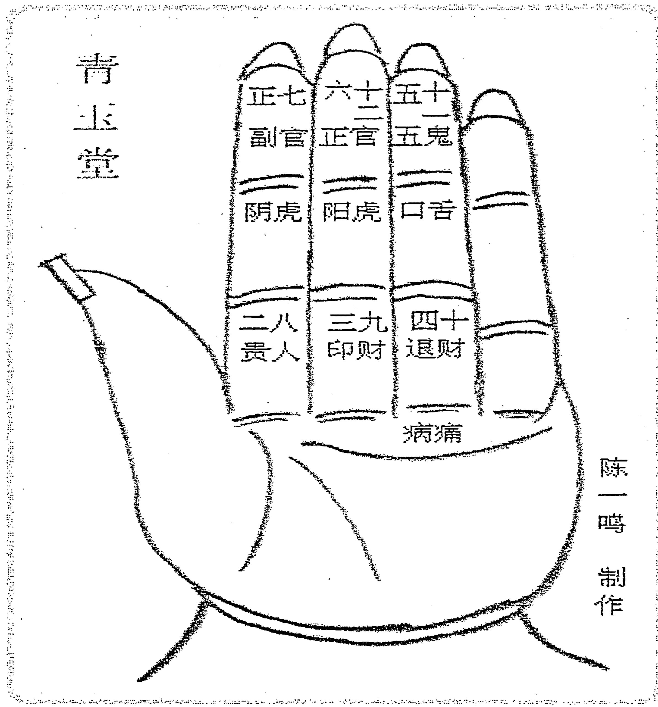
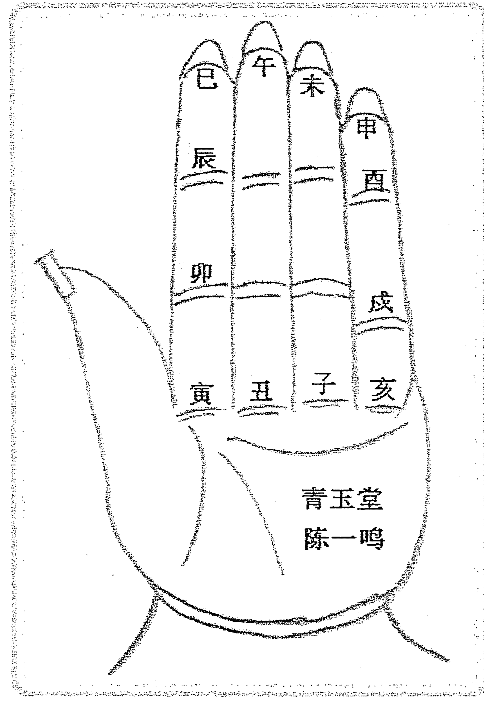
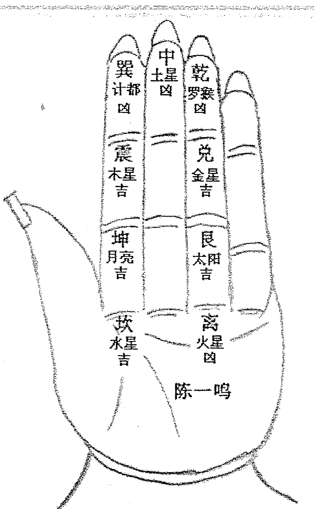
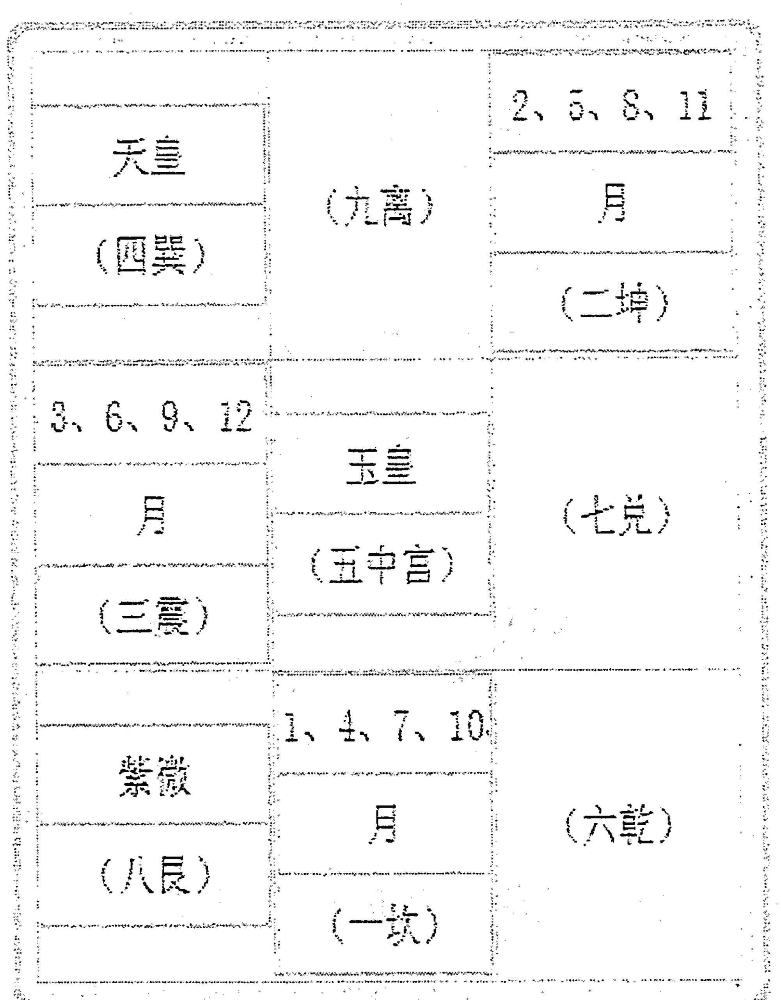
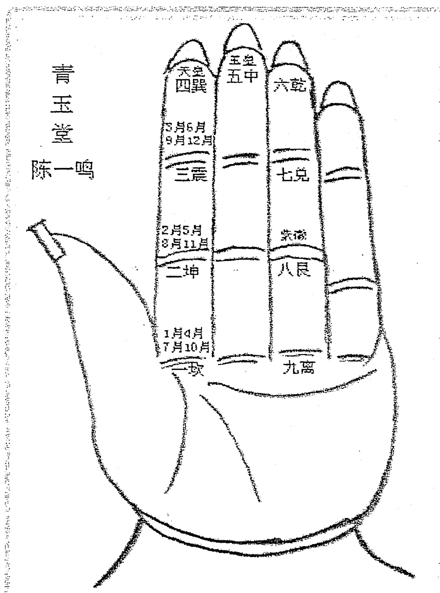

# 风水师高级日课秘本

（含神像开光法）

内部资料

## 目 录

- 第一章 秘传九星日课(主体)-----------------------------------------------------------------01
  - 一、九星---------------------------------------------------------------------------03
    - 1、九星名称-----------------------------------------------------------------------03
    - 2、九星顺序-----------------------------------------------------------------------03
    - 3、九星值日吉凶-------------------------------------------------------------------03
      - 金神七煞日-----------------------------------------------------------------------04
  - 二、二十八宿星---------------------------------------------------------------------09
    - （一）、二十八宿吉凶---------------------------------------------------------------09
    - （二）、二十八宿四季宜忌-----------------------------------------------------------14
    - （三）、二十八宿与星期耀日对照表---------------------------------------------------15
  - 三、十二建星-----------------------------------------------------------------------15
    - 1、十二建星的概念----------------------------------------------------------------15
    - 2、黄道与黑道----------------------------------------------------------------------16
    - 3、十二建星的吉凶内涵和实际应用----------------------------------------------------16
      - （1）十二建星应用变通--------------------------------------------------------------17
      - （2）十二建星吉凶内涵--------------------------------------------------------------17
  - 四、六十甲子日时辰吉凶-------------------------------------------------------------23
    - 1、黄道六神------------------------------------------------------------------------23
    - 2、黑道六神------------------------------------------------------------------------24
    - 3、黄道、黑道十二神释义------------------------------------------------------------24
    - 4、六十甲子时辰吉凶表--------------------------------------------------------------25
  - 五、时上起刻法----------------------------------------------------------------------30
  - 六、时刻吉凶------------------------------------------------------------------------30
  - 七、神煞吉凶----------------------------------------------------------------31
    - 1、吉神----------------------------------------------------------------31
      - 1）天德、月德------------------------------------------------------------31
      - 2）天乙贵人------------------------------------------------------------31
    - 2、凶神----------------------------------------------------------------32
      - 1）红沙日------------------------------------------------------------32
      - 2）十恶大败------------------------------------------------------------32
      - 3）天翻地覆------------------------------------------------------------33
      - 4）灭门大祸日------------------------------------------------------------33
      - 5）地虎月食日------------------------------------------------------------33
      - 6）地虎日食时------------------------------------------------------------33
      - 7）太上老君忌------------------------------------------------------------33
  - 八、择日步骤------------------------------------------------------------35
    - 第一步：查九星与六十甲子每月排列表，选出用事月的煞贡、直星、人专三吉星日----------------35
    - 第二步：择选出二十八宿中的吉宿日----------------36
    - 第三步：择选出十二建星中的吉星日----------------36
    - 第四步：查六十甲子时辰吉凶表择出吉----------------37
  - 九、日课实例------------------------------------------------------------39
- 第二章 三指神掌日课（辅助）------------------------------------------------------------42
  - 一、掌诀（图诀）------------------------------------------------------------42
  - 二、日课神煞与组合吉凶------------------------------------------------------------43
    - （一）、日课吉凶神煞与吉凶转------------------------------------------------------------43
      - 1、神煞名称与顺序------------------------------------------------------------43
      - 2、吉凶神煞------------------------------------------------------------43
      - 3、吉凶转化----------------------------------------------------------------43
    - （二）、日课神煞组合吉凶--------------------------------------------44
  - 三、课格起法------------------------------------------------------------45
  - 四、实例推算------------------------------------------------------------46
  - 五、祖师传诀------------------------------------------------------------49
- 第三章 乌兔太阳日课（辅助）--------------------------------------------50
  - 第一节、十二地支掌----------------------------------------------------51
  - 第二节、排山掌----------------------------------------------------------51
  - 第三节、推演法则--------------------------------------------------------52
    - 一、乌兔太阳日的推算--------------------------------------------------53
      - 1、查朔前卯日----------------------------------------------------------53
      - 2、入地支掌------------------------------------------------------------53
      - 3、入排山掌------------------------------------------------------------53
      - 4、查太阳日------------------------------------------------------------54
    - 二、乌兔太阳时的推算--------------------------------------------------56
    - 三、择取用事日、时----------------------------------------------------57
  - 第四节、太阳日课用事宜忌----------------------------------------------58
    - 1、九星断诀------------------------------------------------------------58
    - 2、真太阳时法----------------------------------------------------------60
  - 第五节、乌兔太阳吉日吉时----------------------------------------------61
    - 一、乌兔太阳值日------------------------------------------------------61
    - 二、乌兔太阳值时------------------------------------------------------62
- 第四章 鸾驾日课（参考）------------------------------------------------63
  - 一、九宫八卦定位------------------------------------------------------63
  - 二、排山掌--------------------------------------------------------------63
  - 三、天皇、玉皇、紫微吉日的推算----------------------------------------------------------------64
  - 四、举例说明----------------------------------------------------------------65
  - 五、每月天皇、玉皇、紫微查找表----------------------------------------------------------------66
- 第五章 神像开光秘法----------------------------------------------------------------67
  - 1.请神咒----------------------------------------------------------------67
  - 2.作法咒----------------------------------------------------------------67
  - 3.开光咒----------------------------------------------------------------68
  - 第一节 民间开光咒语----------------------------------------------------------------69
    - 1、净水咒----------------------------------------------------------------70
    - 2、盐米咒----------------------------------------------------------------70
    - 3、敕灵鸡咒----------------------------------------------------------------70
    - 4、开光笔咒----------------------------------------------------------------71
    - 5、开光镜咒----------------------------------------------------------------71
    - 6、神像开光咒----------------------------------------------------------------71
  - 第二节 佛教开光咒----------------------------------------------------------------72
  - 第三节 道教祈福开光咒语----------------------------------------------------------------73
  - 第四节 开光咒语大全----------------------------------------------------------------73
    - 一、加持咒----------------------------------------------------------------73
    - 二、开光仪式----------------------------------------------------------------73
    - 三、十小咒心经----------------------------------------------------------------74
    - 四、开光法事仪轨----------------------------------------------------------------76
    - 五、貔貅开光法----------------------------------------------------------------77
    - 六、（传承开光神咒法）----------------------------------------------------------------77
    - 七、观音菩萨咒语----------------------------------------------------------------78
- 第六章 招财法：招财、入门添财----------------------------------------------------------------79
- 第八章 画符秘法、转
  - 一，符缘
  - 二，符仪
  - 三，咒秘
  - 四、符咒诀的关系
- 第九章 书符秘诀
  - 一、画符程序
  - 二，祭祀礼仪
- 附一、画符应注意事项
  - 一、书符十戒
  - 二、注意事项
- 附二、学符禁忌
  - 一、巧圣先师留言
  - 二、学法禁忌
  - 三、书符禁忌日
- 附三、书符禁忌日
- 附四、诵咒的要诀
- 附五、畫符的程序

## 第一章 秘传九星日课（主体）

九星日课是一门传统秘传高级日课，是一种集合吉利神煞（九星）、天地变化（二十八宿）和六十甲子时辰运动变化的综合择吉方法。九星日课不但择日灵活，简单易学，而且安全实用，快速灵验，对比奇门、太阳日课高出许多，可与些子、河洛等日课比美，是一门不可多得的、少见的民间秘传高级日课。

在实际的择吉用事中，有可静候佳期之事，也有急用日时之事。如嫁娶、建房，作灶等用事是可静候佳期之事，而安葬死人之事，则是急用日时之事。

对于安葬死人，尤其是对没有火化的死人，会经常碰到因天气、工作、民俗等因素的影响，必须要在三、五天内择吉下葬。若用奇门、五行、斗首、吊星、些子等日课方法，则难以在短期内择出吉日吉时，而九星日课则正好填补了这一空白，其法可以在短期内择出一个急用日课。因九星日课只要择得煞贡、直星、人专三吉星其中之一星，再结合六十甲子吉时，即使二十八宿或十二建星中有一项是凶，也可保证平安。

九星择日方法，不依节气，只以农历月为基础，找出每一个月内煞贡、直星、人专之吉日，结合二十八宿及十二建星，定出用事之日，然后根据用事日的天干地支，找出一天十二时辰内的吉时，这样整个日课的选择就算完成了。

九星日课的主体是九星中的“煞贡、直星、人专”三吉星，至于二十八宿、十二建星，六十甲子日十二时辰中的吉时，是次吉星。因此，对于一个上吉九星日课，可以快速达到聚集“天地灵气”、接纳“富贵吉祥”的神奇功效。若能再有机结合奇门、五行、斗首、河洛、先天、易卦等日课的综合运用，则用事日课安全系数、人丁数量、富贵程度将会倍增。故希望本门弟子善加珍惜，灵活运用。

更不要轻传于他人！

### 一、九星

#### 1、九星名称

妖星、惑星、禾刀、煞贡、直星、卜木、角己、人专、立早

#### 2、九星顺序

妖星→惑星→禾刀→煞贡→直星→卜木→角己→人专→立早

#### 3、九星值日吉凶

妖星：凡上官、嫁娶、起造、开店、移徙（zhi）入宅，若犯此星，一年内人口灾凶、官司、失盗、田宅退败、损长男或有口舌自东方、南方来。

惑星：凡上官、嫁娶、造作、开店、移徙入宅、造葬，若犯此星，一年内百事衰败、六畜死伤、生不肖之子、妇人淫乱、官司、失盗、被人欺骗、小口有灾。

禾刀：凡造作、起盖、嫁娶、开店、移徙，若犯此星，一年内则主疾病、孝服、虎伤、杀人之事、血光之灾、奴仆不到。

煞贡：凡造作、起盖、嫁娶、上官、造桥、造葬，若逢此星，三年内有官者禄位高升、无官者田宅进入，主有贵子、父慈子孝，奴仆成行、所行多吉。

直星：凡开店、嫁娶、上官、修建、造葬，若逢此星，三年内有吉庆之事，居官者加官进禄、无官者百事称心、生财致富。

注：此日虽是直星吉星值日，但若正好碰上是金神七煞日，此日也不能用，用之则必凶。

##### 金神七煞日：

| 年 | 日 | 年 | 日 |
|---|---|---|---|
| 甲 | 午未 | 己 | 午未 |
| 乙 | 辰巳 | 庚 | 辰巳 |
| 丙 | 子丑寅卯 | 辛 | 子丑寅卯 |
| 丁 | 戌亥 | 壬 | 戌亥 |
| 戊 | 申酉 | 癸 | 申酉 |

卜木：凡开店、嫁娶、上官、修建、造葬，若犯此星，三年内出风疾之人、主大惊、悲哭、官司口舌、兄弟不和、财物耗散、六畜不安、百事衰败。

角己：凡造作、开店、嫁娶、上官、造葬，若犯此星，二年内主有腹疾、失盗、家业退败之祸。

人专：凡上官、嫁娶、修造、开店、移徙（zhi）、赴任、造葬，若逢此星，一年内主有贵子、三年内有官者升官、无官者吉庆、得外人力、大发财谷、僧道用之大吉。

立早：凡造作、嫁娶、修造、开店、赴任，若逢此星，一年内人口失散、所为不利、家宅败退，竖宅上梁、主匠人血光之灾、阴人有口舌。

注：九星中，煞贡、直星、人专三星能解诸凶、百事大吉。

#### 4、每月九星查找表（不依节气，只按农历月查找）

| 九星 60甲子 | 正月、4、7、10月 | 2、5、8、11月 | 3、6、9、12月 |
|---|---|---|---|
| 甲子 | 妖星 | 惑星 | 禾刀 |
| 乙丑 | 惑星 | 禾刀 | 煞贡 |
| 丙寅 | 禾刀 | 煞贡 | 直星 |
| 丁卯 | 煞贡 | 直星 | 卜木 |
| 戊辰 | 直星 | 卜木 | 角己 |
| 己巳 | 卜木 | 角己 | 人专 |
| 庚午 | 角己 | 人专 | 立早 |
| 辛未 | 人专 | 立早 | 妖星 |
| 壬申 | 立早 | 妖星 | 惑星 |
| 癸酉 | 妖星 | 惑星 | 禾刀 |
| 甲戌 | 惑星 | 禾刀 | 煞贡 |
| 乙亥 | 禾刀 | 煞贡 | 直星 |
| 丙子 | 煞贡 | 直星 | 卜木 |
| 丁丑 | 直星 | 卜木 | 角己 |
| 戊寅 | 卜木 | 角己 | 人专 |
| 己卯 | 角己 | 人专 | 立早 |
| 庚辰 | 人专 | 立早 | 妖星 |
| 辛巳 | 立早 | 妖星 | 惑星 |
| 壬午 | 妖星 | 惑星 | 禾刀 |
| 癸未 | 惑星 | 禾刀 | 煞贡 |
| 甲申 | 禾刀 | 煞贡 | 直星 |
| 乙酉 | 煞贡 | 直星 | 卜木 |
| 丙戌 | 直星 | 卜木 | 角己 |
| 丁亥 | 卜木 | 角己 | 人专 |
| 戊子 | 角己 | 人专 | 立早 |
| 己丑 | 人专 | 立早 | 妖星 |
| 庚寅 | 立早 | 妖星 | 惑星 |
| 辛卯 | 妖星 | 惑星 | 禾刀 |
| 壬辰 | 惑星 | 禾刀 | 煞贡 |
| 癸巳 | 禾刀 | 煞贡 | 直星 |
| 甲午 | 煞贡 | 直星 | 卜木 |
| 乙未 | 直星 | 卜木 | 角己 |
| 丙申 | 卜木 | 角巳 | 人专 |
| 丁酉 | 角巳 | 人专 | 立早 |
| 戊戌 | 人专 | 立早 | 妖星 |
| 己亥 | 立早 | 妖星 | 惑星 |
| 庚子 | 妖星 | 惑星 | 禾刀 |
| 辛丑 | 惑星 | 禾刀 | 煞贡 |
| 壬寅 | 禾刀 | 煞贡 | 直星 |
| 癸卯 | 煞贡 | 直星 | 卜木 |
| 甲辰 | 直星 | 卜木 | 角巳 |
| 乙巳 | 卜木 | 角巳 | 人专 |
| 丙午 | 角巳 | 人专 | 立早 |
| 丁未 | 人专 | 立早 | 妖星 |
| 戊申 | 立早 | 妖星 | 惑星 |
| 己酉 | 妖星 | 惑星 | 禾刀 |
| 庚戌 | 惑星 | 禾刀 | 煞贡 |
| 辛亥 | 禾刀 | 煞贡 | 直星 |
| 壬子 | 煞贡 | 直星 | 卜木 |
| 癸丑 | 直星 | 卜木 | 角巳 |
| 甲寅 | 卜木 | 角巳 | 人专 |
| 乙卯 | 角巳 | 人专 | 立早 |
| 丙辰 | 人专 | 立早 | 妖星 |
| 丁巳 | 立早 | 妖星 | 惑星 |
| 戊午 | 妖星 | 惑星 | 禾刀 |
| 己未 | 惑星 | 禾刀 | 煞贡 |
| 庚申 | 禾刀 | 煞贡 | 直星 |
| 辛酉 | 煞贡 | 直星 | 卜木 |
| 壬戌 | 直星 | 卜木 | 角巳 |
| 癸亥 | 卜木 | 角巳 | 人专 |

### 二、二十八宿星

#### （一）、二十八宿吉凶

##### 1、角宿—木

角星修造主荣华 文人及第见君王
婚姻嫁娶多贵子 修坟埋葬见双亡

##### 2、亢宿—金

亢宿造作大华堂 十日之中必有殃
埋葬婚姻用此日 定当寡妇守空房

##### 3、氐宿—土

氐宿造作主灾殃 婚姻嫁娶祸定当
出行不利必遇害 埋葬此日子孙穷

##### 4、房宿—日

房宿造作归丁财 富贵荣华福禄来
埋葬若然逢此日 加官进爵应三台

##### 5、心宿—月

心宿造作本为凶 事事叫君莫始终
埋葬嫁娶皆不利 三年之内祸重重

##### 6、尾宿—火

尾宿造作发丁财 开门放水子孙兴
埋葬婚姻依此日 代代公候近帝君

##### 7、箕宿—水

箕星造作主高堂 开门放水招财谷
嫁娶修坟大吉昌　筐满金银谷满仓

##### 8、斗宿—水

斗宿造作金银多　修坟埋葬子孙隆
开门放水六畜兴　婚姻嫁娶喜庆多

##### 9、牛宿—金

牛宿造作多灾危　六畜不利主人啼
嫁娶开门灾祸起　牛羊猪马亦悲哀

##### 10、女宿—土

女宿造作损婚娘　兄弟相残如虎狼
埋葬婚姻逢此日　家财衰败郎离乡

##### 11、虚宿—日

虚宿造作主人亡　男女孤眠各一方
内乱家庭无礼节　儿孙媳妇伴人床

##### 12、危宿—月

危宿不可造高堂　埋葬修坟见血光
开门放水见刑仗　二年三载亦悲伤

##### 13、室宿—火

室宿造作进田庄　儿孙世代近王候
创业兴财家宅旺 婚姻埋葬永无忧

##### 14、壁宿—水

壁宿造作日兴隆 嫁娶婚姻喜庆多
埋葬招财人口旺 开门放水子孙多

##### 15、奎宿—木

奎宿造作有贞祥 家门和顺大吉昌
若是埋葬阴卒亡 开门放水遭灾殃

##### 16、娄宿—金

娄星立柱造门庭 家旺添财事业兴
婚姻逢此生贵子 世代相逢禄位升

##### 17、胃宿—土

胃宿造作事如何 富贵荣华喜事多
埋葬加官爵位升 婚姻逢此世代和

##### 18、昴宿—日

昴宿造作进田庄 埋葬官非永不休
开门放水遭灾害 婚姻嫁娶两姓愁

##### 19、毕宿—月

毕宿造作吉光前 田业庄稼多丰年
门户相逢多吉庆 婚姻嫁娶喜连绵

##### 20、觜宿—火

觜宿造作受官刑 埋葬不久家退败
三丧不此皆因此 仓库金银尽消去

##### 21、参宿—水

参星造作甚旺盛 文星照耀放光华
开门放水皆吉昌 埋葬婚姻主破家

##### 22、井宿—水

井宿造作旺田蚕 金榜提名取状元
埋葬放水阴卒死 开门放水招金银

##### 23、鬼宿—金

鬼宿造葬令人亡 堂前不见主人郎
埋葬此日加官爵 婚姻唯恐守空房

##### 24、柳宿—土

柳星造作主官非 灾殃盗贼见家厄
埋葬婚姻同逢立 三年二载亦悲伤

##### 25、星宿—日

星宿分明利造房 进禄加官近帝王
请别埋葬与放水　妇别夫君另嫁郎

##### 26、张宿—月

张宿此星造华堂　世代栋梁近帝王
埋葬放水招财宝　婚姻和睦福绵长

##### 27、翼宿—火

翼宿最忌造华堂　三年二载主人亡
埋葬婚姻俱不利　归家定是不相当

##### 28、轸宿—水

轸星用此起龙宫　婚姻同是受王封
埋葬此星高照耀　堆金积玉日兴隆

#### （二）、二十八宿四季宜忌

##### 1、春天

宜用四木宿吉，忌用四土宿。

##### 2、夏天

宜用四火宿吉，忌用四金宿。

##### 3、秋天

宜用四金宿吉，忌用四木宿。

##### 4、冬天

宜用四水宿吉，忌用四火宿。

#### （三）、二十八宿与星期曜日对照表

| 星期 | 四 | 五 | 六 | 日 | 一 | 二 | 三 |
| :--- | :--- | :--- | :--- | :--- | :--- | :--- | :--- |
| 曜日 | 木 | 金 | 土 | 日 | 月 | 水 | 火 |
| 二十八宿 | 危 | 亢 | 氐 | 房 | 心 | 尾 | 箕 | 东方七宿 |
| | 斗 | 牛 | 女 | 虚 | 危 | 室 | 壁 | 北方七宿 |
| | 奎 | 娄 | 胃 | 昴 | 毕 | 觜 | 参 | 西方七宿 |
| | 井 | 鬼 | 柳 | 星 | 张 | 翼 | 轸 | 南方七宿 |

### 三、十二建星

#### 1、十二建星的概念

建除满平定执破危成收开闭，此十二星则称为建。建者，月建也。即每个月月令逢值的日期开始起建星之意。比如，正月建寅月，则立春后的第一个寅日就是建星，二月是卯月，惊蛰后的第一个卯日就是建星……依顺序排列其它十一星即可。

但要注意的是，每逢节气这一天是重复前一天的星，假设惊蛰节前一天是破星，则惊蛰日仍然是破星日。清明节前一天是收日，则清明这一天仍然是收日，余依此类推。

正因为每个月都是节气的那一天重复，一年十二个月正好重复十二天，才保证了第二年的寅月的第一个寅日是建星。

#### 2、黄道与黑道

黄道日与黑道日，对应十二地支，一共是十二个称之为十二建成星，其中六个是黄道日，六个是黑道日。

黄道日：除、危、定、执、成、开。
黑道日：建、满、平、破、收、闭。

黄道日也不是万事可为，黑道日也不是百事莫做，因其皆有用事的侧重点不同。

#### 3、十二建星的吉凶内涵和实际应用

##### (1) 十二建星应用变通歌

除危定执黄，建满平收黑。
成开皆可用，闭破不吉祥。
黑中平不爱，黄中危不强。
建宜出行收嫁娶，定宜冠带满修仓。
破除疗病执宜捕，危本安床开丈量。
成开所作成开吉，平乃做事总平常。

注：在择吉中尽量选择黄道吉日，若无法避开黑道日，只要符合本门日课也可用。

##### (2) 十二建星吉凶内涵

**建：黑道**
此日一般主吉，但修造动土这事不宜做。
此日与月令合二为一，至高无上，非极端大富大贵之人不能受用。故对平常百姓来说是黑道日。

吉：宜泥饰舍宇、修置产室、解安宅舍、出行、祭祀、入学冠带、作事求人、参谒贵人、上书。

凶：忌起工动土、开仓、祈福、新船下水、行船装载、竞渡。

**除：黄道**
此日为除旧布新之日，大吉。故此日很少有不宜之事。万事开始，皆需除旧迎新，故除日适宜万事之开端。

吉：宜祭祀、祈福、纳表章、安宅舍、出行牧养、交易、求医、解除冤愆、栽接花木、祀福、祛邪、除灵罢服。

凶：忌移徙出行。

**满：黑道**
此日只宜祭祀、祈愿，其它均不吉利。特忌赴官上任、婚姻嫁娶。

吉：宜扫舍、牧养、修置产室、牧养、裁衣、经络、出行、移接栽种、入仓、开库、店市求财、祭祀、祈福、合帐、塞穴、修饰舍宇。

凶：忌动土服药，正、四、七、十月忌经商、兴贩、移徙、造宅。

**平：黑道**
此日万事平平。若对饱经风雨、历经沧桑之老者，则平安就是福。而要求上进、辉煌腾达之少者，则很不理想。故此日为黑道日。

吉：宜泥饰垣墙、平治道途、平基定磉、修置产室、祭祀、祈福、安机、起泥动土、修造。

凶：忌开渠、种植、经络。

**定：黄道**
此日宜宴饮、协定。忌医疗、诉讼、出师。
宴饮、协定是一种约定行为，故定日宜宴饮、协定。而医疗、诉讼、出师是要随机应变的，若是约定成规的做法，是要失败的。故定日忌医疗、诉讼、出师。

吉：宜入学、祭祀、祈福、裁衣、结婚纳彩、问名、求嗣、牧养、纳畜、冠带、交易。

凶：词讼出行。

**执：黄道**
此日宜建屋、种植、捕捉。忌移居、出行、开市。
执是有执行、掌握、控制、捉拿等意思，建屋、种植、捕捉有类似这类意思，而移居、出行、开市与其类意思相差较远。故此日宜建屋、种植、捕捉，忌移居、出行、开市。

吉：宜祭祀、祈福、纳表、进章、攻猎捕捉、结婚嫁娶、立契。

凶：忌入宅、移居、出行、开仓、出财、新船下水、主招虫蛀、修六畜栏枋、主招狐狸野兽。

**破：黑道**
此日万事不利。只宜破垣坏屋之事。此日为与月令地支相冲之日，冲则破，破则坏，不破不立，无败无立，失败乃成功之母，故此日虽为黑道，但适宜破旧与反思。

吉：宜求医、破屋坏垣、作灶、服药、破贼、行船装载、嫁娶、进人口、祀福、立契、纳畜。

凶：忌修工动土、出行远回、新船下水、修作。

**危：黄道**
此日万事皆凶，是对“危”字的误解而致。危，本为“高”之意。高则有险，故有“危险”之说。然而，“高”乃出人头地，出类拔萃，故危星值日为黄道之日。

吉：宜祭祀祈福、纳表进章、结婚纳彩、问名、捕捉、攻猎、安床、交易、立契。

凶：忌入山伐木、行船装载。

**成：黄道**
此日宜开业、入学、婚姻嫁娶、赴官上任。忌诉讼。
常言道“学业有成、事业有成”，这是对少年、青年、壮年三个年龄阶段的良好祝愿，故成日适合开业、入学、婚姻嫁娶、赴官上任。若已成定局的事实，是不需要再诉讼的，故不利诉讼。

吉：宜祭祀、祈福、入学、裁衣、结婚、纳彩、嫁娶、纳表、进章、解安、宅舍、放弃、安置、交易立契、求医、种植花木、出行、远回、移徙、冠带、纳畜。

凶：忌词讼。

**收：黑道**
此日宜于收获之事，开始的事业则不利。忌出行葬礼。
出行为事物的起点、刚开始，而葬礼是为人送行，故收日忌出行、葬礼。

吉：宜捕捉、攻猎、收敛财货、修置产业、种植、祭祀、入学、嫁娶、修仓、捕鱼、纳财、纳畜、索债。

凶：忌造宅、安葬、丧事、出行、针刺经络。

**开：黄道**
此日万事皆吉，但破土安葬等则凶。因为人的追求是永无止境的，而人生就是这样在一次又一次的开始中度过，直到入土方歇，故开日万事皆吉，但破土安葬则凶。

吉：宜祭祀、祈福、纳表、安宅舍、入学、裁衣、结婚、牧养、开塘、挖井、砌路、安置、交易、立契、安产室、栽种、出行、开仓、开库。

凶：忌正、四、七、十（孟月）经商、兴贩、动土。

**闭：黑道**
此日万事皆凶，修筑堤防之类的事则吉。有开就闭，新的创业需要闭门休整策划，以便新的开创更为理想，休整策划时期最忌乘虚而入，故要修筑堤坝，加强防御。故闭日利于闭门思过、运筹帷幄、修筑堤防。

吉：宜祭祀、祈福、牧养、立契交易、收敛财货、塞穴堤防、移花接木、安床设帐作府。

凶：忌针刺、炙火、出行、种植，正、四、七十（孟月）忌远行、动土、竖造、移徙。

注：十二建星的内涵和运用，有时要具体情况具体解决，如选择嫁娶佳期，其它方面这一日课的条件确实很符合，是一个好的嫁娶日课，而又碰上了黑道日，这时新娘出嫁时，则要穿上一双黄色的鞋子则可，以化黑道日之凶。

### 四、六十甲子日时辰吉凶

#### 1、黄道六神

青龙、明堂、金匮、天德、玉堂、司命。

#### 2、黑道六神

天刑、朱雀、白虎、天牢、玄武、勾陈。

#### 3、黄道、黑道十二神释义

青龙：太乙星、天贵星，所谋必成、大吉大利。

明堂：贵人星、明辅星，利见大人，谋求如意。

金匮：福德星、月仙星，利道释、嫁娶。忌入伍。

天德：宝光星、天德星，其时大吉，做事有成。

玉堂：少微星、天开星，百事百吉。

司命：月辇星、月仙星，寅申时吉、酉至丑凶，昼吉夜凶。

天刑：天刑星，利出师伐战，余事不宜，大忌词讼。

朱雀：天讼星，利公事，常人凶，诸事忌用。

白虎：天杀星，宜出师、围猎、祭祀，余事不利。

天牢：镇神星，阴人用事吉，余事不利。

玄武：天狱星，君子用吉，小人用凶。

勾陈：地狱星，有始无终、先喜后悲，求谋不利，起造安葬、犯此绝嗣。

#### 4、六十甲子时辰吉凶表

| 时辰 | 子 | 丑 | 寅 | 卯 | 辰 | 巳 | 午 | 未 | 申 | 酉 | 戌 | 亥 |
| :--- | :--- | :--- | :--- | :--- | :--- | :--- | :--- | :--- | :--- | :--- | :--- | :--- |
| 吉凶 | 吉 | 凶 | 吉 | 凶 | 吉 | 凶 | 吉 | 凶 | 吉 | 凶 | 吉 | 凶 |

| 甲子日 | 乙丑日 | 丙寅日 | 丁卯日 | 戊辰日 | 己巳日 | 庚午日 | 辛未日 | 壬申日 | 癸酉日 | 甲戌日 | 乙亥日 | 丙子日 | 丁丑日 | 戊寅日 |
|---|---|---|---|---|---|---|---|---|---|---|---|---|---|---|
| 子午 金司 贵命 吉吉 | 子午 天天 刑牢 凶凶 | 子午 背白 龙虎 吉凶 | 子午 司金 命贵 吉吉 | 子午 天天 牢刑 凶凶 | 子午 白背 虎龙 凶吉 | 子午 金司 贵命 吉吉 | 子午 天天 刑牢 凶凶 | 子午 背白 龙虎 吉凶 | 子午 司金 命贵 吉吉 | 子午 天天 牢刑 凶凶 | 子午 白背 虎龙 凶吉 | 子午 金司 贵命 吉吉 | 子午 天天 刑牢 凶凶 | 子午 背白 龙虎 吉凶 |
| 丑未 天勾 德陈 吉凶 | 丑未 朱玉 雀堂 凶吉 | 丑未 明玄 堂武 吉吉 | 丑未 勾天 陈德 凶吉 | 丑未 玄朱 武雀 凶凶 | 丑未 玉明 堂堂 吉吉 | 丑未 天勾 德陈 吉凶 | 丑未 朱玄 雀武 凶凶 | 丑未 明玉 堂堂 吉吉 | 丑未 勾天 陈德 凶吉 | 丑未 玄朱 武雀 凶凶 | 丑未 玉明 堂堂 吉吉 | 丑未 天勾 德陈 吉凶 | 丑未 朱玄 雀武 凶凶 | 丑未 明玉 堂堂 吉吉 |
| 寅申 白背 虎龙 凶吉 | 寅申 金司 贵命 吉吉 | 寅申 天天 刑牢 凶凶 | 寅申 背白 龙虎 吉凶 | 寅申 司金 命贵 吉吉 | 寅申 天天 牢刑 凶凶 | 寅申 白背 虎龙 凶吉 | 寅申 金司 贵命 吉吉 | 寅申 天天 刑牢 凶凶 | 寅申 背白 龙虎 吉凶 | 寅申 司金 命贵 吉吉 | 寅申 天天 牢刑 凶凶 | 寅申 白背 虎龙 凶吉 | 寅申 金司 贵命 吉吉 | 寅申 天天 刑牢 凶凶 |
| 卯酉 玉明 堂堂 吉吉 | 卯酉 天勾 德陈 吉凶 | 卯酉 朱玄 雀武 凶凶 | 卯酉 明玉 堂堂 吉吉 | 卯酉 勾天 陈德 凶吉 | 卯酉 玄朱 武雀 凶凶 | 卯酉 玉明 堂堂 吉吉 | 卯酉 天勾 德陈 吉凶 | 卯酉 朱玄 雀武 凶凶 | 卯酉 明玉 堂堂 吉吉 | 卯酉 勾天 陈德 凶吉 | 卯酉 玄朱 武雀 凶凶 | 卯酉 玉明 堂堂 吉吉 | 卯酉 天勾 德陈 吉凶 | 卯酉 朱玄 雀武 凶凶 |
| 辰戌 天天 牢刑 凶吉 | 辰戌 白背 虎龙 凶吉 | 辰戌 金司 贵命 吉吉 | 辰戌 天天 刑牢 凶凶 | 辰戌 背白 龙虎 吉凶 | 辰戌 司金 命贵 吉吉 | 辰戌 天天 牢刑 凶凶 | 辰戌 白背 虎龙 凶吉 | 辰戌 金司 贵命 吉吉 | 辰戌 天天 刑牢 凶凶 | 辰戌 背白 龙虎 吉凶 | 辰戌 司金 命贵 吉吉 | 辰戌 天天 牢刑 凶凶 | 辰戌 白背 虎龙 凶吉 | 辰戌 金司 贵命 吉吉 |
| 巳亥 玄朱 武雀 凶吉 | 巳亥 玉明 堂堂 吉吉 | 巳亥 天勾 德陈 吉凶 | 巳亥 朱玄 雀武 凶凶 | 巳亥 明玉 堂堂 吉吉 | 巳亥 勾天 陈德 凶吉 | 巳亥 玄朱 武雀 凶凶 | 巳亥 玉明 堂堂 吉吉 | 巳亥 天勾 德陈 吉凶 | 巳亥 朱玄 雀武 凶凶 | 巳亥 明玉 堂堂 吉吉 | 巳亥 勾天 陈德 凶吉 | 巳亥 玄朱 武雀 凶凶 | 巳亥 玉明 堂堂 吉吉 | 巳亥 天勾 德陈 吉凶 |

### 五、时上起刻法（供参考选用）

一个时辰为 2 小时、为 120 分钟，一个时辰分成八刻，每刻为 15 分钟，这就是时上起刻法。

### 六、时刻吉凶表（供参考选用）

为趋吉避凶，达到“天人合一”的效应，就必须要运用好每个时刻吉凶的奥秘。

| 时、刻（每刻15分钟） |
| --- |
| 子：一凶、二平、三四旺财丁、五旺人丁、六平、七凶 |
| 丑：三生贵子、五大吉、一二四六七八大不祥 |
| 寅：二子孙兴旺、三发财、五六大兴旺人丁、一四七八凶 |
| 卯：一发福、四吉、六发丁、八横财、二三五七凶 |
| 辰：一七旺财、三横财人丁、四六旺财丁、八发福、二五凶 |
| 巳：一二三四横财入手、五六大富贵、七八凶 |
| 午：一节、二平、三吉、四旺财、六旺畜、五六七八凶 |
| 未：三四五六旺丁财、七旺畜、一二八凶 |
| 申：一二三四七八凶、五六旺财丁 |
| 酉：一二三四发财、五吉、六发横财、七八凶 |
| 戌：一二吉发财丁、三四五六七八凶 |
| 亥：一吉、八不可用、二三四五六七八凶 |

注意：择日选时，应该以当地太阳为准，不能以北京时间为准。北京时间是根据东经经度 120 度来确定的。由于中国的地大辽阔，各地区的经度不同而产生了时间的误差。凡是比 120 度大 1 度的地区其时辰均早到 4 分钟，凡是比 120 度小 1 度地区的时辰均迟到 4 分钟（1 度为 4 分钟）。例如：南雄区域的经纬度是 114 度 20 分和北京时间相差 5 度 40 分，与标准时间相差 21.6 分钟，即是当地时间与北京时间相差 21.6 分钟，当地的标准时间（以午时为例）正午时应该是 12 点 21.6 分钟，午时应从 11 点 21.6 分开始-1 点 21.6 分结束。

### 七、神煞吉凶

#### 1、吉神

##### 1）天德、月德

天德、月德，大吉大利。

##### 2）天乙贵人

甲戊并牛羊 乙己鼠猴乡 丙丁猪鸡位
壬癸兔蛇藏 庚辛逢虎马 此是贵人方

#### 2、凶神

##### 1）红沙日

红沙日，大凶之日。

红沙日起法：四孟月见酉，四仲月见巳，四季月见丑。

一四七十碰着酉，三六九腊遇着丑。

二五八冬逢着巳，犯着红纱必为愁。

注：

1、以上四句是说：一四七十月碰着酉日，二五八冬月逢着巳日，三六九腊月遇着丑日，都算犯红纱日。

2、冬月，指十一月。腊月，指十二月。

择日有云：

起造犯红沙，百日火焚家；嫁娶犯红沙，夫死往别嫁；

埋葬犯红沙，重重带苎麻；出门犯红沙，必定不回家。

##### 2）十恶大败

正月七月辰日 二月八月丑日 三月九月戌日
四月十月未日 五十一月寅日 六十二月子日

##### 3）天翻地覆

正月七月巳亥 二月八月辰戌 三月九月卯酉
四月十月寅申 五十一月丑未 六十二月子午

##### 4）灭门大祸日

正月七月巳亥 二月八月子午 三月九月丑未
四月十月寅申 五十一月卯酉 六十二月辰戌

##### 5）地虎月食日

正月见甲申 二月见乙亥 三月见丙寅
四月见辛未 五月见丙子 六月见乙巳
七月见丙戌 八月见丁亥 九月见己酉
十月见庚申 十一月乙酉 十二见乙酉

##### 6）地虎日食时

甲己日忌辰时 乙庚日忌子时
丙辛日忌申时 丁壬日忌巳时
戊癸日忌寅时

##### 7）太上老君忌日

正月初七、初十
二月初四、初九
三月十五、廿六
四月初九、廿、廿三
五月初一、初六
六月初十、二十
七月初八、廿三
八月十八、十九、廿五
九月初三、初九、廿二
十月初十、十四
十一月初三、十一、十二
十二月初一、初六、初八、廿五

见太上老君忌日：

行兵到此万里血　此日埋葬绝子孙
起造此日破家绝　婚姻同夫妻离别
出行同定有口舌　买卖同本定消灭
耕田同下物皆吉　祈福同招灾鬼邪

吉神、凶神，远不止以上这些神煞。但本门秘传九星日课，只要避开以上这些凶煞就是吉课。

### 八、择日步骤

九星日课择吉方法比较简单，只要熟悉了九星、十二建星、二十八宿星的吉凶，便可快速选出吉日、吉时。主要有下列四个步骤：

第一步：查九星与六十甲子每月排列表，选出用事月的煞贡、直星、人专三吉星日。

例 1、2010 年农历八月，查历书表可知，八月初一为辛酉，至九月初一寒露节为止。

由九星与六十甲子每月排列表可知：

| 丙寅 | 煞贡 |
| 丁卯 | 直星 |
| 庚午 | 人专 |
| 乙亥 | 煞贡 |
| 丙子 | 直星 |
| 己卯 | 人专 |
| 甲申 | 煞贡 |
| 乙酉 | 直星 |
| 戊子 | 人专 |

从表中查出以上 9 天为九星大吉之日，除去丁卯、己卯两个破日还有 7 天，第一步确定丙寅、庚午、乙亥、丙子、甲申、乙酉、戊子 7 天为九星大吉日。

#### 第二步：择选出二十八宿中的吉宿日。

根据第一步查出了九星大吉日，然后，根据九星吉日对应的吉宿，选出吉星吉宿大吉日。

| 丙寅 | 煞贡 | 心 | 执 |
| 庚午 | 人专 | 牛 | 收 |
| 乙亥 | 煞贡 | 壁 | 满 |
| 丙子 | 直星 | 奎 | 平 |
| 甲申 | 煞贡 | 鬼 | 闭 |
| 乙酉 | 直星 | 柳 | 建 |
| 戊子 | 人专 | 翼 | 平 |

| 乙亥 | 煞贡 | 壁 | 满 |
| 丙子 | 直星 | 奎 | 平 |

从二十八宿营表中可知，心、牛、鬼、柳、翼宿凶，由此可用吉日只有乙亥、丙子两天。

#### 第三步：择选出十二建星中的吉星日。

根据前两步择选，只余乙亥、丙子两天，现排列如下：

从十二建星中可知，满、平两星为黑道日，为平常之日，故这个九星日课虽合格，但不属于上吉九星日课。

#### 第四步：查六十甲子时辰吉凶表择出吉时

| 时\日 | 子 | 丑 | 寅 | 卯 | 辰 | 巳 | 午 | 未 | 申 | 酉 | 戌 | 亥 |
|---|---|---|---|---|---|---|---|---|---|---|---|---|
| 乙亥 | 白虎 | 玉堂 | 天牢 | 玄武 | 司命 | 勾陈 | 青龙 | 明堂 | 天刑 | 朱雀 | 金贵 | 天德 |
| 丙子 | 金贵 | 天德 | 白虎 | 玉堂 | 天牢 | 玄武 | 司命 | 勾陈 | 青龙 | 明堂 | 天刑 | 朱雀 |

由此表查得：

乙亥日，丁丑时玉堂、庚辰时司命、壬午时青龙、癸未时明堂、丙戌时金贵、丁亥时天德。

丙子日，戊子时金贵、己丑时天德、辛卯时玉堂、甲午时司命、丙申时青龙、丁酉时玉堂。

以上查出的吉时，可依据白天或晚上用事而选取用吉时。

能过以上四个步骤，用九星择出的日课，可用以动土、起造、作灶、安床、安葬、出行、嫁娶、上官、赴任等吉利之事。

以上四个步骤，熟练了可一步到位、快速择日。

例 2、2010 年农历九月，查历书表可知，九月初一为辛卯，至十月初二辛酉日为止。

| 壬辰 | 煞贡 | 氐 | 破 | × |
| 癸巳 | 直星 | 房 | 危 | √ |
| 丙申 | 人专 | 箕 | 开 | √ |
| 辛丑 | 煞贡 | 危 | 平 | √ |
| 壬寅 | 直星 | 室 | 定 | √ |
| 乙巳 | 人专 | 娄 | 危 | √ |
| 庚戌 | 煞贡 | 参 | 建 | √ |
| 辛亥 | 直星 | 井 | 除 | √ |
| 甲寅 | 人专 | 星 | 定 | × |
| 己未 | 煞贡 | 亢 | 收 | × |
| 庚申 | 直星 | 氐 | 开 | × |

由上表可知：7 个打勾的都是吉星、吉宿、吉建的大吉之日，只要选出了吉日，然后根据六十甲子时辰吉凶表，查出每日的吉利时辰。这样一个月的吉日吉时，用不了半个小时就全部选出了，至于用何日何时，则要根据用事的具体事项来确定。

### 九、日课实例

例一、庚寅年、辛巳月、壬戌日、己酉时，调整立向、安碑。

查壬戌日、己酉得：

日：直星    时：天德

参宿、

执日

查：直星，凡开店、嫁娶、上官、修建、造葬，若逢此星，三年内有吉庆之事，居官者加官进禄、无官者百事称心、生财致富。参宿大吉星，执日黄道吉日，故壬戌日为大吉日，己酉时为天德吉时，辛巳月庚为天德、辛为月德，壬戌日巳为天乙贵人，课中吉星汇集拱照，为上吉九星日课。

此日课，为笔者所选，因同学父坟风水不佳，经常引起家人生病，子女夫妻不合，常有口舌、破财。经本人择其吉课，重新调整立向、安碑后，家庭和睦了，子女听话了，生意也开始红火了，全家人开心得笑哈哈。

例二、庚寅年、辛巳月、丁丑日、乙巳时，迁坟重葬日课。

丁丑日是：直星、斗宿、成日
乙巳时是：玉堂

此课，不合奇门日课、不合些子日课，但妙在符合九星日课规则，故能催福纳祥。

例三、葬课，丑山未向，2010年9月6日巳时，四柱为庚寅 丙戌 丙申 癸巳。

丙申日是：人专日    癸巳时是：天德时
箕宿日
开 日

此课用后，一切顺利、百日内进财，家运大旺。

#### 例四、安碑，丑山未向，2012年9月12日巳时，

四柱为庚寅 丙戌 壬寅 乙巳。

壬寅日是：直星日 乙巳时是：天德时

室宿日

定日

此课用后，百事顺利、财运大旺，全家称心。

## 第二章 三指神掌日课（辅助）

天地人三指神掌日课，是民间秘传高级日课，是当今世上罕见的一门稀有日课，不但操作简便，而且应事神验。望得之者惜之如目，爱之如妻，既不轻传他人、又不妄传匪人。

### 一 掌诀（图诀）

### 二、日课神煞与组合吉凶

#### （一）、日课吉凶神煞与吉凶转化

##### 1、神煞名称与顺序

贵人→印财→退财（病痛）→五鬼（口舌）→正官（阳虎）→副官（阴虎）。在掌诀中的运用，是逆时针推算。

##### 2、吉凶神煞

吉神：贵人、印财。

凶神：退财（病星）、五鬼（口舌）。

##### 3、吉凶转化

（1）副官、正官课中见印财，则为真正的副官、正官。若不见印财，则为阴虎、阳虎，若再碰上退财生阴虎、阳虎，则为助虎生威，此时副官、正官就相应变为阴虎、阳虎就会吃人了。为什么？因阴虎是副官、阳虎是正官，而在四柱学中，财是生官的。

（2）阴虎、阳虎二神，见吉助吉、见凶助凶。

（3）五鬼见印财，为五鬼运财日课。

（4）二虎凶，主杀内人，多自己死伤。五鬼凶，主杀外人。

#### （二）、日课神煞组合吉凶

- 1、阴虎吉则为副官，如阴虎见贵人，阴虎见印财，则为阴虎吉。
- 2、阳虎吉则为正官，如阳虎见贵人，阳虎见印财，则为阳虎吉。
- 3、贵人、印财为二吉神。病星、五鬼为二凶神。阴虎、阳虎二神，若见吉，则助吉，如见贵人、印财。若见凶，则助凶，如见退财。此时则是“伤处洒盐、雪上加霜”。
- 4、虎凶才会主死人，但五鬼凶则不会主死人。
- 5、有印、有财，则为副官、正官。无印、无财，则为阴虎、阳虎。若再碰上退财，生阴虎、阳虎，虎则会吃人了。
- 6、阴虎、阳虎、五鬼碰在一起，平平过、有口舌。
- 7、贵人、印财、退财碰在一起，平平过。
- 8、阴虎、阳虎、五鬼、退财，碰在一起，会死人，退大财。
- 9、阳虎、五鬼、贵人、印财、退财，若不死人、也要退大财。
- 10、五鬼、退财，再后碰上贵人、印财，主先败后发、死牲畜、有口舌。
- 11、副官、正官、贵人、印财，碰在一起，主有财、做事顺、有贵人。
- 12、正官、贵人、印财、五鬼，碰在一起，名“五鬼运财”，会发横财。
- 13、贵人、印财、退财，后碰上五鬼，主先发后败，有口舌。
- 14、阴虎、阳虎、贵人、五鬼，碰在一起，有贵无财、还有口舌。
- 15、副官、正官、印财，碰在一起，主有财但无贵人帮。

### 三、课格起法

- 1、起课时，只用农历月、日，不用节气界定之农历月、日。本课起法，用左手大拇指在左手食指、中指、无名指上轮点即可。
- 2、推算时先点住农历月份，再过位上起日，日之过位上起时；又从时之过位上起月，月之过位上起日，日之过位上起时，即可。
- 3、第一个农历月份位神煞因其固定，不算具体吉凶。日上与时上神煞，主前阶段吉凶应事，而后面月、日、时三位上神煞，主后阶段吉凶应事。

### 四、实例推算

例1、2008年农历8月25日午时葬坟，乾山巽向

8月在贵人位（贵人在此固定不算吉凶），过位起初一，则初一在印财，初二在退财，初三在五鬼……则25日在印财；过位起时辰，则子时在退财，丑时在五鬼，寅时在正官……午时在退财；又过位起月，则正月在五鬼，二月在正官，三月在副官……则八月在正官；又过位起日，初一在副官、初二在贵人，初三在印财……则25日在副官；再过位起时，子时在贵人，丑时在印财，寅时在退财……则午时在贵人。

分析：

- （1）由掌诀得：印财、退财、正官、副官、贵人
- （2）组合吉凶：正官、副官见退财，当为阳虎、阴虎，凶。
- （3）最后结论：此课不可用。用后120天内，即使不死人，也要退大财。

例2、2008年农历8月24日午时用事

8月在贵人位（此时贵人固定的不算），过位起日，初一在印财位，初二在退财位，初三在五鬼位……二十四日则在贵人位；过位起时辰，子时在印财位，丑时在退财位，寅时在五鬼位……午时则在印财；又过位起月，正月在退财位，二月在五鬼位，三月在正官位……则八月在五鬼位；过位起日，初一在正官位，初二在副官位，初三在贵人位……二十四日则在五鬼位；再过位起时辰，子时在正官位，丑时在副官位，寅时在贵人位……午时则在正官。

分析：

- （1）由掌诀得：贵人、印财、五鬼、五鬼、正官
- （2）组合吉凶：
  - A、正官，见印见财，为真正的正官，吉。
  - B、正官，不见退财，非为阳虎，并不为凶。
  - C、五鬼，见印见财，为五鬼运财，吉。
- （3）最后结论：此课可用。

例3、2012年农历9月16日丑时用事

点九月在印财位，过位起日，初一在退财位，初二在五鬼位，初三在正官位……十六日则在副官位；过位起时，子时在贵人位，丑时在印财位；又过位起月，九月在正官；过位起日，十六日在退财位；再过位起时，丑时在正官位上。

推得：副官、印财、正官、退财、正官

分析：副官、正官，见退财为阴阳虎，凶。此课不可用。用后120天内见损丁退财。

例4、葬课，丑山未向，2010年9月6日巳时，

四柱为庚寅 丙戌 丙申 癸巳。

五神所落位：印财、印财、正官、正官、正官

此课用后，一切顺利、百日内进财，家运大旺。

例5、安碑，丑山未向，2012年9月12日巳时，

四柱为庚寅 丙戌 壬寅 乙巳。

五神所落位：印财、印财、正官、正官、正官

此课用后，百事顺利、财运大旺，全家称心。

### 五、祖师传诀

- 1、此课法中，不应分前后阶段，关键是看所落的五个位上的神煞中，有无退财（病痛）星即可，有则不吉，无则不凶。
- 2、此法熟练后，开手即来。如初一、初七、十三、十九、二十五都在同位上，子时午时也在同位上。

## 第三章 乌兔太阳日课（辅助）

太阳是万宿之首，万物生长靠太阳，故天星日课是以太阳为首。太阳星宿在日课中有两种用法，一是太阳配台帝将三星，二是太阳太阴合朔，日月合壁。此处说的乌兔太阳日课，是太阳星宿在日课中用法的第二种，是本门秘传日课之一，传说是风水大师杨筠松择日所用，也是历代仙师经常运用的简捷、有效的日课方法，三煞五黄及一切诸般凶神恶煞均于此回避。凡二十四山，无论修造、作灶、开张、安葬等事，用太阳值日值时大吉大利。

太阳日课为历代师父，择其有德有福之弟子，私底下秘密心传口授的日课，不准用笔记，只能用心记。太阳日课，只有掌诀、没有长篇理论，日课推演的全部过程，都在掌诀上完成。

太阳日课，主要以十二地支掌和排山掌配合推演，只要选到太阳日配太阴时，则为阴阳相配、日月交辉、不惧诸煞、大吉大利。

### 第一节、十二地支掌

### 第二节、排山掌

### 第三节、推演法则

太阳日课的推演法则：阳顺阴逆。

甲己、乙庚、丙辛、丁壬、戊癸，在这五组中，甲己、丁壬、戊癸为阳，顺推。乙庚、丙辛为阴，逆推。

编者按：甲己合化土，土为有形、高或凸，丁壬合化木，木为有形、性条达、高或直，戊癸合化火，火为有形、性热、尖而向上，故甲己、丁壬、戊癸为阳，顺推。

乙庚合化金，金藏于地下、土下或山内，丙辛合化水，水为无形、性寒、聚于低处，故乙庚、丙辛为阴，逆推。

#### 一、乌兔太阳日的推算

##### 1、查朔前卯日

查出用事月初一（朔日）前的第一个卯日（乙卯、丁卯、己卯、辛卯、癸卯）。

##### 2、入地支掌

将初一（朔日）前的第一个卯日纳入十二地支掌子位，依该日的天干、阳顺阴逆排序推算，每日一宫至次月朔日（即初一日）止，看朔日（即初一日）落在何支上，再查该支位上是何卦（坎一、坤二、震三、巽四、乾六、兑七、艮八、离九）。

##### 3、入排山掌

将朔日（即初一日）纳入排山掌相应的宫位上，然后由该宫起，依朔日（即初一日）之天干，阳顺阴逆，从朔日（即初一日）起逐日排序，看其何日到吉位上，若是太阳、太阴值日则上吉，金星、木星、水星值日则次吉。若是罗猴、土星、计都、火星值日则大凶，切不可用。

##### 4、查太阳日

排山掌艮八为太阳宫，排入艮宫之日，即为太阳日是。同理，月亮宫（坤二）排入之日是，即为月亮日……，余此类推。

例1：2003年农历3月14日，卯时用事
日课四柱：癸未年、丙辰月、戊午日、己卯时
查得3月初一为乙巳日，乙巳日前的第一个卯日为癸卯日，把癸卯日纳入十二地支掌的子位，按天干阴阳顺，进行逆推算，癸卯日天干为阳、顺推，癸卯日在子、甲辰日在丑、乙巳日在寅、寅属艮宫，即初一在艮宫，即太阳日，因初一乙巳日天干属阴逆推，依排山掌，故得初二、初三、初四、初五、初六、初七、初八、初九、初十、十四在巽宫为计都、凶。

例2：葬课，择2012年农历11月14日戌时
日课四柱：壬辰年、壬子月、辛酉日、戊戌时
查得11月初一为戊申日，戊申日前的第一个卯日为癸卯日，把癸卯日纳入地支掌的子位，按天干阴阳顺，进行逆推算，癸卯日天干为阳、顺推，癸卯日在子、甲辰日在丑、乙巳日在寅、丙午日在卯、丁未日在辰、戊申属在巳，巳属巽宫，即初一在巽宫，为计都日，因初一戊日天干为阳顺推，依排山掌，故得初二在中宫、初三在乾宫、初四在兑宫、初五、初六、初七、初八、初九、初十、十四在艮宫，为太阳日，吉。

例3：葬课，择2012年农历10月29日巳时
日课四柱：壬辰年、壬子月、丁未日、乙巳时
查10月初一日为己卯日，即为朔日前卯日是，将己卯纳入地支掌子位，子为坎卦宫，即初一日在排山掌坎一宫上。又甲己为阳，故在排山掌中顺推用事日29，是在何宫上，属何星。初一坎、初二坤、初三震、初四巽、初五中宫、初六乾宫、初七兑宫、初八艮宫（太阳日）、初九日离宫、初十坎宫、十七艮宫（太阳日）……廿九在坤宫，故廿九日为月亮日，吉。

#### 二、乌兔太阳时的推算

- 甲己日：从坎宫起子时，顺行九宫。
- 乙庚日：从兑宫起子时，逆行九宫。
- 丙辛日：从震宫起子时，逆行九宫。
- 丁壬日：从离宫起子时，顺行九宫。
- 戊癸日：从中宫起子时，顺行九宫。

例1：2003年农历3月14日，卯时
此日为戊午日，取乌兔太阳时，戊癸日从排山掌中宫起子时，顺行九宫，顺行九宫至卯为艮宫，艮为太阳，故卯时为太阳时，吉。

例2：2012年农历11月14日戌时
壬辰年、壬子月、辛酉日、戊戌时，取乌兔太阳时，丙辛日从排山掌震宫起子时，逆行九宫至戌为坤宫，坤为月亮，故戌时为月亮时。

例3：葬课，择2012年农历10月29日巳时
壬辰年、壬子月、丁未日、乙巳时，取乌兔太阳时，丁壬日从排山掌离宫起子时顺行九宫，巳时为土星，凶。

#### 三、择取用事日、时

例1：2003年农历3月14日，卯时用事
2003年农历3月14日（戊午）、为太阳日课的计都日、凶，卯时（己卯）为太阳时、吉。但非吉日，不可取用。

例2：2012年农历11月14日戌时
2012年农历11月14日为太阳日、吉，戌时为月亮时、吉，日时阴阳相配，日月交辉、不惧诸煞，此日可用。

例3：葬课，择2012年农历10月29日巳时
2012年农历10月29日为月亮日、吉。但巳时为土星、凶，故此日不可用。

### 第四节、太阳日课用事宜忌

- 1）、凡以天元乌兔经为用，即选择乌兔太阳日、时，乌兔太阳到山等，不怕犯太岁、三煞、阴府、空亡、退气、金神、年克等绝大部分凶煞。
- 2）、若逢五黄会力士、五黄会三煞，仍不可用。
- 3）、若遇日蚀、月蚀，则七日内断不可用（因日、月已失去吉之作用）。
- 4）、乌兔太阳值日、值时，又合乌兔太阳到山，用之大吉；若再逢真太阳到山、到向、三合照，则用之最吉。
- 5）、太阳值日上吉、太阴值日次吉，金星，水星，木星值日为可用，但毕竟力小。
- 6）、用太阳日者，宜用太阳时；用太阴日者，宜用太阴时。

#### 1、九星断诀

- 1）、太阳星
第一太阳星最吉，时日逢之长房起，
二男三子次第成，富贵荣华履福祉。

- 2）、太阴星
太阴吉星亦堪取，时日相逢事事宜，
人发财兴真可羡，文章潇洒姓名驰。

- 3）、木星
第二催官名木星，时日值此产英雄，
众房长幼俱多福，代代儿孙拜帝君。

- 4）、金星
好个金星最特奇，时日逢之事事宜，
田园广置人英杰，巳酉丑年姓名驰。

- 5）、水星
水星用善不为灾，福禄盈门日日来，
子孙能文科第续，田园广置发丁财。

- 6）、土星
土星原来是恶星，生灾作祸太无情，
水火刀兵一齐至，时日逢之恶事生。

- 7）、火星
火星最恶起瘟蝗，八载须防五口亡，
官讼火灾田地尽，家门不睦定分张。

- 8）、罗猴
罗猴恶毒不堪言，青春年少哭皇天，
犯着刀枪并水火，官非鼎镬祸连连。

- 9）、计都
计都恶曜祸无边，财败人亡横事连，
巳酉丑年辰巽岁，产亡禄绝旅沉船。

#### 2、真太阳时法

真太阳时法，就是一天十二时辰。

- 1）、用此法，必须是白天要见到太阳出现在天空，力量则大，否则小。而晚上没有太阳，故没有真太阳时。
- 2）、修方用冲合之法。冲，六冲。合，六合、三合。如修亥方，可用巳时相冲修，也可用卯时或未时三合修。未方可用卯时修。
- 3）、见太阳的时辰，从早上卯时至下午酉时，其他时辰不为真太阳时。
- 4）、开门、作灶，安床、安办公室桌子，可以用真太阳时。

### 第五节、乌兔太阳吉日吉时图

#### 一、乌兔太阳值日

| 每月初一日之干支 | 乌兔太阳吉日 |
| :--- | :--- |
| 庚子、丙午、庚午、丁未、癸未、甲申、壬申、戊申、戊戌、壬戌、己亥、癸亥 | 5、14、23 |
| 乙丑、辛丑、壬寅、丙寅、甲辰、戊辰、庚辰、乙巳、己巳、辛巳 | 1、10、19、28 |
| 丁丑、己丑、癸丑、甲寅、戊寅、乙卯、辛卯、壬辰、丁巳、癸巳 | 3、12、21、30 |
| 乙未、丙申、庚申、丙戌、庚戌、乙亥、辛亥 | 4、13、22 |
| 戊子、壬子、甲午、戊午、乙酉、辛酉 | 2、11、20、29 |
| 庚寅、丁卯、己卯、癸卯、丙辰 | 8、17、26 |
| 丙子、丁酉、己酉、癸酉 | 9、18、27 |
| 甲子、壬午、辛未 | 6、15、24 |
| 己未、甲戌、丁亥 | 7、16、25 |

#### 二、乌兔太阳值时

| 日干\时辰 | 甲己日 | 乙庚日 | 丙辛日 | 丁壬日 | 戊癸日 |
| :--- | :--- | :--- | :--- | :--- | :--- |
| 水星吉 | 子、酉 | 午 | 寅、亥 | 丑、戌 | 巳 |
| 太阴吉 | 丑、戌 | 巳 | 丑、戌 | 寅、亥 | 午 |
| 木星凶 | 寅、亥 | 辰 | 子、酉 | 卯 | 未 |
| 计都凶 | 卯 | 卯 | 申 | 辰 | 申 |
| 土星凶 | 辰 | 寅、亥 | 未 | 巳 | 子、酉 |
| 罗喉凶 | 巳 | 丑、戌 | 午 | 午 | 丑、戌 |
| 金星吉 | 午 | 子、酉 | 巳 | 未 | 寅、亥 |
| 太阳吉 | 未 | 申 | 辰 | 申 | 卯 |

说明：本门民间秘传日课的运用，是以“九星日课”为主体，加上“三指神掌日课”和“乌兔太阳日课”作辅助，快速择取安全、可靠的造葬日课。

## 第四章 鸾驾日课（参考）

### 一、九宫八卦定位

### 二、排山掌

### 三、天皇、玉皇、紫微吉日的推算

农历1、4、7、10月由坎宫起甲子，2、5、8、11月由坤宫起甲子，3、6、9、12月由震宫起甲子。欲选之日非甲子日，仍要由此日所属之月的宫位数由甲子数起，顺飞九宫，数至该日之干支即停。

农历月份以初一为准，不依节气。以所标月份之宫起甲子日，按1坎2坤3震4巽5中6乾7兑8艮9离（排山掌）之顺序，顺数六十花甲，由甲子数到癸亥，一日跳一宫，看所选日之干支落在“天皇”、“玉皇”、“紫微”之宫即为吉日，落在其余之宫即为凶日，不可用。

### 四、举例说明

例一、1998年农历二月十一日，当日干支乙卯，二月是由坤宫起甲子，按1坎2坤3震4巽5中6乾7兑8艮9离之顺序，连数九天，癸酉在坤，再连数九天，壬午在坤，再连数九天，辛卯在坤，再连数九天，庚子在坤，再连数九天，己酉在坤，则庚戌在3震，辛亥在4巽，壬子在5中宫，癸丑在6乾，甲寅在7兑，乙卯在8艮。所选乙卯日即为“紫微”所在，为吉日。

例二、公历2008年8月8日上午8时，农历二00八年七月初八上午8时，戊子年庚申月庚辰日庚辰时，北京奥运会开幕，此日吉凶如何？

此日，月令七月，查上表七月在①坎宫，即①坎宫起甲子，顺飞九宫，则②宫乙丑，③宫丙寅，④宫丁卯，⑤宫戊辰，⑥宫己巳，⑦宫庚午，⑧宫辛未，⑨宫壬申，接着顺飞九宫①宫癸酉，②宫甲戌，③宫乙亥，④宫丙子，⑤宫丁丑，⑥宫戊寅，⑦宫己卯，⑧宫庚辰，庚辰日即北京奥运会开幕之日，落在⑧宫，紫薇所在，为吉日。

### 五、每月天皇、玉皇、紫微查找表

| | 正、四、七、十月 | 二、五、八、十一月 | 三、六、九、腊月 |
|---|---|---|---|
| 天皇 | 丁卯、丙子、乙酉、甲午、癸卯、壬子、辛酉 | 丙寅、乙亥、甲申、癸巳、壬寅、辛亥、庚申 | 乙丑、甲戌、癸未、壬辰、辛丑、庚戌、己未 |
| 玉皇 | 戊辰、丁丑、丙戌、乙未、甲辰、癸丑、壬戌 | 丁卯、丙子、乙酉、甲午、癸卯、壬子、辛酉 | 丙寅、乙亥、甲申、癸巳、壬寅、辛亥、庚申 |
| 紫微 | 辛未、庚辰、己丑、戊戌、丁未、丙辰 | 庚午、己卯、戊子、丁酉、丙午、乙卯 | 己巳、戊寅、丁亥、丙申、乙巳、甲寅、癸亥 |

望本门弟子善加珍惜，灵活运用、更不要轻传于他人！

## 第五章 神像开光秘法

一、选择吉日良辰。准备红棉布三市尺，新毛巾1条，香蜡纸钱适量。红棉布预先盖在神的头上。

二、请神，供奉神灵，还可卜卦以定神灵是否降坛。

三、法师揭开神像头上的红布之后，开始念请神咒，作法咒，开光咒，在念开光咒时，用新毛巾轻轻的擦拭神像，咒语念到哪里，毛巾就擦到哪里，神光就自然显现到了哪里。

附：1.请神咒

请动神灵接动兵，请动伏威大将军，天上请动雷公电母，地下请动龙王太子，得罪龙宫不下雨，得罪地府神不应，得罪爷娘遭雷打，得罪师父法不灵。万真堂中姜钧师父，请帮助弟子显威灵。

2.作法咒

茅山祖师、红山祖师、迷山祖师、雪山祖师，弟子请你们都降临，护持弟子道法灵。普庵祖师大神通，六惠尊王在虚空，六惠尊王虚空起，弟子要动功。横五里直五里，五五二十五里，

### 3. 开光咒

神不开光不降临，人不洗脸不洁净。
□□□□（神佛）坐在中央，东家□□□请我来开光。
开了头光头顶神光照十方，
开了眼光眼看十方亮堂堂，
开了鼻光鼻闻十方都是香，
开了口光口吃十方天厨粮，
开了耳光耳听十方声音响，
开了胸光胸中能装十方，
开了腹光腹中容纳十方，
开了手光手伸天地十方，
开了腿光飞行宇宙十方，
□□□□（神佛）全身开了光，显灵显圣在十方。
信则神，诚则灵，有求必应，有应必灵。

四、神像开光之后，法师拜神，接着东家（祈求者）拜神，法事即结束。

五、神像开光之后，东家要诚心的大供养三天，以后则初一或十五上供，其他时间酌情。

注：寺庙和民间有些开光方法是，用公鸡冠上的血，调合朱砂和白芨点眼开窍，有的还要人配合用圆镜子将太阳的光反射到神灵的眼睛上去等等。总之，开光点眼之仪式，都是为了诚心的祈祷神的分灵降临人间，并附在神像之上，使之成为具有通神启灵的分灵身，以后能够使祈求者有求必应，有应必灵。因此，不管是用哪种方法，哪种程序开光，其关键是要神能够显灵，而并不在于仪式之隆重的程度。

神像开光最灵最有效的秘法是：用法师修行的一颗真心去开光，这才是最灵验的。

#### 第一节 民间开光的咒语

一张黄表四个角，信手拈来拜神佛，十指尖尖来掐起，清油点灯亮煌煌，菜籽撒在荒野上，开花结果收成忙，农夫收在酿窑内，巧手匠人打成油，夜晚拿来神前照，白天又上美人头。正月十五龙华会，照亮周朝八百秋。凡人拿来无大用，弟子拿来去开光；开光不开灯火光，灯火原来不久长，开光要开日月光，日月光轮照四方。今日财神像开光，列师列祖显灵光；开头光，亮头光，头顶乾坤照上苍；开眉光，亮眉光，眉毛八字排两行；开眼光，亮眼光，右眼为阴左眼阳，元看千里无阻挡，近看八百无遮碍；开耳光，亮耳光，耳听祖师作主张；开鼻光，亮鼻光，鼻闻灯火入宝香，开口光，亮口光，口含银牙十八双；开喉光，亮喉光，喉咙以下走通肠；开手光，亮手光，手拿财宝到家乡；开脚光，亮脚光，脚踏九州走十方；开膝光，亮膝光，两个脚膝配鸳鸯；开心光，亮心光，心明朗朗照天堂；开大肠，亮大肠，大肠一丈二尺长，能管一年十二月，月月保佑多安康；开小肠，亮小肠，二十四节节气忙；开五脏，并六腑，能管金木水火土。开了三百八十四骨节，开了八万四千毛孔；浑身上下显灵通，日日夜夜放光明。今有缘人敬财神，保佑财宝满库银。

##### 1、净水咒

祖师为我敕净水 本师为我敕净水 你未敕是凡间水 敕了化成观世音菩萨金瓶水 洒天天清 洒地地灵 洒人人兴旺 洒神神复兴 洒了凶神恶鬼慢走不停留

##### 2、盐米咒

祖师为我敕盐米 本师为我敕盐米 你未敕是盐米 敕了化成飞沙与石子 青的化成青面将军 红的化成红面将军 黄的化成黄面将军 白的化成白面将军 黑的化成黑面将军 打天天清 打地地灵 打人人兴旺 打神神复兴 打了凶神恶鬼慢走不停留

##### 3、敕灵鸡咒

祖师为我敕灵鸡 本师为我敕灵鸡 你未敕是凡间鸡 敕了化成开光鸡
点天天清 点地地灵 点人人兴旺 点神神复兴
点了凶神恶鬼慢走不停留

##### 4、开光笔咒

祖师为我敕文笔 本师为我敕文笔 你未敕是凡间笔 敕了化成开光笔
点天天清 点地地灵 点人人兴旺 点神神复兴
点了凶神恶鬼慢走不停留

##### 5、开光镜咒

祖师为我敕灵镜 本师为我敕灵镜 你未敕是凡间镜 敕了化成开光镜
照天天清 照地地灵 照人人兴旺 照神神复兴
照了凶神恶鬼慢走不停留

##### 6、神像开光咒

祖师为我来开光 本师为我来开光 良时吉日开光眼
点你头上一点红 呼你豪光串万光
点你左眼光 右眼光 左眼看世界 右眼看四方
点你左耳光 右耳光 左耳听世界 右耳听四方
点你鼻中光 呼你鼻中穿气会流通
点你嘴中光 呼你嘴中吟诗作对会流通
点你肚脐光 呼你肚脐满腹诗文配合嘴光 吟诗作对句句会流通
点你左手光 右手光 呼你左手接来千里财 右手接来万里宝
点你左足光 右足光 呼你左足腾云驾雾 右足保家堂
点你后背光 呼你后背镇宅保家庭
点你座底光 呼你座底 化作千千万万药草 救世千千万万年
点你三十六骨节 七十二小节
点你一千八百万毛管孔齐起动
良时吉日开光完满 赐你（某）宝器 请你镇守本宅保平安 四时无灾 八节有庆（圆满完成）。

#### 第二节 佛教开光咒

注意：念开光咒的时候必须要念七遍才会有作用。

唵（ang），珂暮伽（qie），钵头摩，逊那隶，驮罗驮罗妮，漫拏（nu）隶吽（hong）。唵 拶（za）克刍（chu） 拶克刍 萨满怛（da）拶克刍 尾刷达尼娑诃。

天之神光。地之神光。日月神光。我今为（五营官将 00 大将军）来开光，开眼光观视世界。开口光开口度众。开耳光闻声救苦。开心光慈悲救世。开手肢摄受降魔。开神足飞行万里。开金身毫毫放光。恭请上神降来临。弟子奉先天无极正法。紫微大帝律令敕。

#### 第三节 道教祈福开光咒语

日吉时良，天地开张，安神财符，万事吉昌，人兴财旺，启请武财神赵公明，利市仙官降来临，招财使者亲到此，到吾弟子某某家中或商店（地址），招财又进宝，利市大发财，奉请财神仙官使者，财帛星君，五路财神到吾家庭，家庭来（店内来）。焚香奉敬，时时催财进宝，入降临来，时时招财催财进宝，入降临来，神兵火急 如律令（三称）。

#### 第四节 开光咒语大全

##### 一、加持咒

嗡桑巴Ra（上面为一个日字，下面为一个阿字，读音：Ra，第一声，下同）桑巴Ra。波玛纳萨Ra，玛哈臧巴巴吽帕的娑哈。

##### 加持念珠咒

嗡wēng 噜lū西xī惹rà嘛·mā尼ní 札zhá尔ěr瓦wǎ打dǎ雅yǎ 吽hōng

##### 二、开光仪式

- （1）、鸣炮，撞钟，击鼓
- （2）、礼佛三拜
- （3）、举严净赞，大悲观世音菩萨（三称）
- （4）、主者说水文偈，大众齐念大悲咒（三遍），
- （5）、主者洒水
- （6）、唱甘露王菩萨（三称）
- （7）、讚佛偈 佛面犹如净满月 亦如千日放光明 圆光普照于十方 喜捨慈悲皆具足 如于此会见佛坐 一切尘中悉如是 佛身无去亦无来 所有国土皆明现
- （8）、迎请 香花迎 香花请 弟子众等 一心奉请南无娑婆世界 千释迦 千百亿释迦牟尼佛 东方世界药师如来 西方世界弥陀如来 观音菩萨 地藏菩萨 弥勒菩萨 韦驮天尊 惟愿不违本誓 愍悯有情 分身现相 居兹莲座 （如上三请三礼）
- （9）、唱献座偈 佛身充满于法界 普现一切群生前 随缘赴感靡不周 而恒处此菩提座
- （10）、大悲会上佛菩萨（三称）诵大悲咒语开光
- （11）、主者说偈 愿因秘密 俱蒙光临 众等拈香 虔诚礼拜 主者及大众礼佛三拜
- （12）、唱十佛吉祥偈

归命世尊无有上 菩萨贤圣共垂慈 我今依教安圣位 唯愿慈悲哀纳受 迦叶如来具大悲 诸吉祥中最无上 彼佛曾来入此殿 是故此处最吉祥 拘那牟尼见无碍 诸吉祥中最无上 彼佛曾来入此殿 是故此处最吉祥 迦罗鸠驮如金山 诸吉祥中最无上 彼佛曾来入此殿 是故此处最吉祥 毗舍浮佛无三垢 诸吉祥中最无上 彼佛曾来入此殿 是故此处最吉祥 尸弃如来离分别 诸吉祥中最无上 彼佛曾来入此殿 是故此处最吉祥 毗婆尸佛如满月 诸吉祥中最无上 彼佛曾来入此殿 是故此处最吉祥 佛沙明达第一义 诸吉祥中最无上 彼佛曾来入此殿 是故此处最吉祥 提舍如来辩无碍 诸吉祥中最无上 彼佛曾来入此殿 是故此处最吉祥 波头摩师净无垢 诸吉祥中最无上 彼佛曾来入此殿 是故此处最吉祥 然灯如来大光明 诸吉祥中最无上 彼佛曾来入此殿 是故此处最吉祥 开光咒语大全

- （13）、唱消灾吉祥咒

唵 娑摩囉 娑摩囉 弥摩曩 斯哈囉 摩诃咱哈囉吽（三遍）

愿昼吉祥夜吉祥 昼夜六时恒吉祥 一切时中吉祥者 愿诸上师哀摄受 愿昼吉祥夜吉祥 昼夜六时恒吉祥 一切时中吉祥者 愿诸三宝哀摄受 愿昼吉祥夜吉祥 昼夜六时恒吉祥 一切时中吉祥者 愿诸护法常拥护

- （14）、三皈依 自皈依佛 当愿众生 体解大道 发无上心 自皈依佛 当愿众生 深入经藏 智慧如海 自皈依佛 当愿众生 统理大众 一切无碍 上供……

> 【按】：此仪轨是福建省福鼎市太姥山界诠法师所属寺院所用，是谁作的，未知。尚符法理，可用。

##### 四、开光法事仪轨

- 礼佛三拜
- 举严净赞 杨枝净水 遍洒三千 悟空八德利人天 润济妙无边 灭罪消愆 火焰化红莲 南无清凉地菩萨摩诃萨（三称）
- 南无大悲观世音菩萨（三称）
- 主法 水文偈 海震潮音说普门 九莲花里现童真 杨枝一滴真甘露 散作山河大地春
- 教有真言 大悲咒 洒净水 南无甘露王菩萨（三称）
- 请圣 香花迎 香花请 弟子众等 一心奉请补怛洛迦 琉璃世界 大慈大悲 www.yw11.com 救苦救难 光大灵感 观世音菩萨 光明会上 寄位诸天金刚力士 护法神王 唯愿不违本誓 哀悯有情 分身现相 居兹莲座（三请三礼）
- 主法说法开光
- 观音菩萨赞 菩萨号圆通 降生七宝林中 千手千眼妙真容 端坐普陀宫 杨柳枝头显神通 普滋法界蒙薰 千层浪头显神通 光降道场中 千层浪头显神通 光降道场中
- 回向 开光功德殊胜行 无边福胜皆回向 普愿沉溺诸众生 速往无量光佛刹 十方三世一切佛 一切菩萨摩诃萨 摩诃般若波罗密

##### 五、貔貅开光法

因为貔貅开光不同于财神，麒麟，金蟾等。貔貅一般不容易开光，财神开光一般烧符，念咒就可以了，但是貔貅要先念经、请神，要不然开不了。

##### 六、（传承开光神咒法）

- 选择一吉日。
- 将貔貅面向当日财神所在方。
- 站在貔貅身后或侧旁，面向当日财神所在方位，双手合十，闭目默意催财神咒三遍。
- 默意完成，将貔貅面向自己。开光咒语大全
- 取出白露日的雨水或经过吸收了日月精华的山泉水或茶籽油。用棉签蘸少许，点开貔貅眼睛，先点左眼，后点右眼，反复三次。同时默意开光神咒三遍。
- 用红线或红绸子把貔貅的脖子给系上。
- 用红纸把貔貅的双眼分别蒙上。
- 左手拍貔貅头三下，即开光完成。

##### 七、观音菩萨咒语

一柱茗香透天庭 二柱茗香请神明
三柱茗香三拜请 八卦仙师降来临
神通广大昭三界 道法无边显威灵
头戴太极芙蓉冠 身穿紫色八卦衣
左手执掌八卦印 右手执持仙拂尘
腰佩葫芦七星剑 卜卦推算游通行
百草药房千百种 化作仙丹救良民
天干地支分乾坤 金木水火土五行
先天后天随两边 天罗地网开八方
一勒乾卦西北将 二勒坎卦水将军
三勒艮卦东北灵 四勒震卦木星君
五勒巽卦东南兵 六勒离卦火龙神
七勒坤卦西南明 八勒兑卦金星降
太极变化分乾坤 阴阳两气生天地
两仪四象生八卦 八卦显化变无穷
六十四卦排布阵 卦卦分明通天地
身受玉皇上帝勒 勒下凡间救万人
身骑麒麟出天门 威风凛凛下天庭
天兵神将身边守 六丁六甲护两旁
驱邪逐煞收鬼怪 治魔斩恶杀妖精
若有邪魔并祸鬼 押去坛前化为尘
千家有求千家应 万家有求万家灵
弟子一心专拜请 八卦仙师降来临

## 第六章 招财法：招财、入门添财库

招财法：招财、入门添财库。
聚财法：聚财、入门补财库。

利市催财符：求正财、偏财生意的人士。使用方法 1：将此符折藏于利是封之内，贴在住宅、公司或店铺的大门外的门楣之上，又可放在神位之内。方法 2：将此符连同 8 张元宝及 8 张寿金，在大门外焚烧。方法 3：将此符折成三角形随身携带，或藏在银包或手袋之内好让我们为您量身打造灵符。

五路招财法：能力是分兵成「东、南、西、北、中」五方五路，为善信招正财、横财及偏财。适合：渴望求得正财、横财及偏财的人仕使用。方法 1：将此符折藏于利是封之内，贴在自宅、公司或店铺大门外的门楣之上，又可贴放在神位之内。方法 2：将此符连同 8 张元宝及 8 张寿金，在大门外焚烧。方法 3：将此符折成三角形随身携带，或藏在银包或手袋之内。方法 4：可将「五路招财符」贴放或收藏在流年「财星」位。此符适合渴望求得正财、横财及偏财的人仕。若急于催旺生意，可将三种使用方法共同使用。需要本人姓名八字地址，效果会更好。

八马追财符：对于求财、求晋升、远行作生意的人仕使用。在使用灵符之前，向着灵符诚心祈祷有关之愿望。所谓心诚则灵。方法 1：将此符折成三角形随身携带，或藏在银包或手袋之内。方法 2：将此符连同 8 张元宝及 8 张寿金，在公司或自宅大门外焚烧。方法 3：可将「八马追财符」贴放或收藏在「驿马星」需要本人姓名八字地址，效果会更好。

土地催财贵符：趋财及求贵人相助的人仕使用，方法 1：将此符贴藏在自宅或公司的土地神牌之后。方法 2：将此符连同 8 张元宝及 8 张金银或 8 张溪钱，在公司或自宅大门外焚烧。

赵公明五路催财符：最合做生意或渴望改善经济环境的人仕。方法 1：将此符折成三角形随身携带，或藏在银包或手袋之内。方法 2：将此符连同 8 张元宝及 8 张寿金，在公司或自宅大门外焚烧。方法 3：可将此符贴放或收藏在流年的「财星」位。方法 4：可将此符贴或藏在自宅或公司神位之内（若贴藏在赵公明的神位内灵应更加显着。

财神镇宅八卦大符：是由八卦八方位八张符咒构成 1；财利符：求财顺利如意，财源滚滚，财源广进，获得更多更大的财富利益。2；护财符：借着符咒的力量，保护财富，才不会财来财往，积财不易。3；广开运财符：带来更多更广更易获得的好财运，从四面八方运财来，天财地财。4；招财进宝符：能为你带来财富财力，甚至能或更多更大的财富。5；镇财光明符：能为你居家带来安全，家运昌隆且多财多利。6；家运昌隆符：能为你全家带来平安、顺利、吉祥如意、和睦、富裕、幸福美满。7；心愿达成符：能让你一切所思所欲，心想事成，顺心如意，达成愿望。8；生意兴隆符：能让你生意兴隆，门庭若市，高朋满座，财源滚滚财神镇宅八卦大符：后方是由暗财神，来帮你或助你的财库能让你财源广进活络财路，能让你财库饱满源源不断不竭效果会更好。

五方贵人符：召集五方贵人来助求财者无论事业生意皆能亨通，

财库符：增加财运并使赚进之财不流失，守住财源，开源节流。

交际圆满符：令人在交际之时使对方产生良好印象，进而交际圆满。

旺缘显达符：增进人际关惜良好能使工作顺利，人缘好合。

太上招财符：不论开店，业务或提升已身财运效果绝佳。

阴兵招财符：请到地头阴兵助求财者求财顺利不限正偏财。

神鸟招财术：这是一种奇特之术广招财源。

四方得利符：请到地主众神召得贵客到使求财者交易成功大吉。

正偏外财符 召请五路财神降临助求财者求得正财偏财外财得身。

五鬼运财符：法令五鬼运财，使求财者如愿得财，不论正偏财皆可求之。效果会更好

赌博符：提升自己赌运，使其博得赌财，提醒大家切莫因此沉迷否则后果自行负责，偏财这种东西易聚却也是易散，来得快去得也急。

商店招财神符：专门兴旺店之用共有 19 道符。

五方福德运财符：这是拜请五方土地公引入五方财兴旺法

小孩惊吓一般有两种情况发生，第一种是撞到了脏东西。因为小孩小，抵抗力弱所以容易遇到脏东西，所以晚上的时候尽量不要带小孩走夜路，也不要带小孩参加葬礼一类的事情，这样很容易让小孩招上脏东西。这种情况发生的时候，通常小孩都是高烧不退，多数的情况都是固定的时间高烧，特别明显的是晚上加重。较小的孩子容易嗜睡，睡觉的时候眼睛通常闭不严。眼珠子乱动。这个时候如果摸小孩的手心，你会感觉到手心的鬼脉跳动，这是诊断小孩冲到阴性物体是最准确的诊断方法。左手为阳，所以左手心跳是撞到了男性的鬼魂，右手为阴，所以右手心跳的是撞到了女性的鬼魂。

解决方法：在晚上，最好是小孩睡着的时候，拿几张烧纸（最少三张，但不宜过多，这次给的多了，就容易招惹下次，因为你出手大方，鬼魂就都愿意来找的，会给小孩留下后患）在孩子的身上左三圈、右三圈画圈，画圈的同时嘴里要叨咕：不管是那位在孩子的身上，请你放开孩子，一会给你送钱去，你拿着钱走吧，不要再来了。说完了，圈也画完了。拿着这几张纸钱到附近的十字路口（实在没有三叉路口也可以）把纸钱烧掉。烧完纸钱后，转身回家，通常要求不要回头，路上不要和人说话，为的是防止鬼魂会再来。一般以 100 步为限，超过了一百步就不用忌讳了。回到家里把外门关上，整个程序完成。通常一次就会好的。

第二种情况是小孩受到突然出现的大的声音吓到了，就是通常说的吓掉魂了。这种情况的症状通常白天孩子看不出什么，晚上睡觉的时候，眼睛闭不严，眼珠子有时候乱动，最明显的症状是孩子睡觉的时候会突然会动，就像刚听到什么大的声音的那样的反应。通常这种情况发烧的比较少，但有的小孩会忽然啼哭，而且显示出很害怕的样子。和前一种的区别是手心不跳或跳的很弱。

解决方法：一，这个方法是大神用的，用收魂手收魂。方法是，左手伸出张开，手心向上，右手成剑指，指向左手的手心，然后用剑指在左手上顺时针画圆，当感觉左手手心有风吹的感觉或有物落到手上的感觉的时候，就是收魂童子将孩子的魂魄找回来了，马上将左手握成拳头，将魂灵抓住，然后走到小孩身边，张开左手，从小孩的头顶将魂魄轻轻的按入小孩的身体，就可以了。二.这种方法也是大神用的，是为了那些孩子不在身边的时候用的。就是画一道收魂符，通常是用 9×27 厘米的红纸，用黑色的笔写字，符的内容是：敕令收魂童子送魂来，（字是竖着写的），把这个符交给来人带回去，等小孩晚上睡着的时候在头顶的位置烧掉，写符人的仙家就会将孩子的魂魄找回了送到身体里，但这个方法只有有仙家的人写好使。三. 这种方法谁都可以用，就是稍微麻烦一点。用一杆旧的盘秤，那种老式的盘秤，拿掉秤砣。放上一件小孩穿过的衣服，最好是内衣效果更好。在晚上星星出全了以后到十字路口去，从十字路口往回走的时候，嘴里叫着孩子的名字，一般的叫法是：**（孩子的名字，最好是小名）呀，跟**（孩子跟这个人叫什么就说什么，例如妈妈）回家，一遍走一遍叫，走回家里以后关上外门，说一句：孩子，到家了，魂魄归位吧。全部过程就算结束了。

由于老九头道行有限，所知有限，加上地域不同，所用的方法也不一定都相同，所以仅供参考。另外本人声明，这个方法请你用来救人，不要用来骗钱，否则，业障是你自己的。和本人无关，现在发现个别人利用了本人的文章在抬高自己的身价（其中还有出家人，让我心寒），我不想追究，只是提醒你，用别人的成果去骗取别人的信任和钱财，罪过是加倍的。还请好自为之。我写的文章都是用来救人的，不希望被人利用了骗人，如果你将文章发表在公开的地方，还请你加上一个《转贴》。我不需要你写我的名字，只是希望你的目的是让更多人知道，而不是故意误导别人以为是你自己写的，这样做很不道德的。

说实话，现在我都不敢写实质性的文章了，真的怕被人利用了去骗人，我的心会不安的。唉，人在做，天在看，举头三尺有神灵，多行不义必自毙。

## 第八章 画符秘法、转贴

### 一、符缘

符咒法术家，不同于凡家，所用符法器物必须经过祭炼，注入灵气灵光才能使用。具体如何祭炼将在后面叙述。画符前应先念敕水咒，敕砚咒，敕笔咒，敕墨咒，敕纸咒，然后烧香诚心祈祷。取笔雄姿，眼开全不注视纸心，松静心身，凝神注于笔峰，才开始运气念咒画符。念咒画符一气呵成，不可间断，错乱。不能与人说话，更不能心神不定，否则符咒不灵。初修习时可口中含水，符画好后，将姿势威灵入符胆，持符在香炉之前置举时，其姿势更应雄风，以降龙伏虎，鬼神伏藏之力注入符咒之中。念咒时应咒从心出，非于口舌之间念念了事。

### 二、符仪

符咒法术忌用刑破日，最佳时为阴阳交接，灵气最显的亥时，基次是子午卯酉时亦可，每年农历四日不可施法画符，当慎之。当然，如果法术高强，也可不拘时日。但是也有另一种说法是：

- 子日——丑时
- 丑日——巳时
- 寅日——申时
- 卯日——巳、申、亥时

### 三，咒秘

修炼符咒法术，应熟悉天地间日月星辰风云雷电，阴阳五行，山川河流之灵气力场，以古人说，它们相应都有神灵神职。古有万物有灵之说，因为在符咒之内都有请各方大小神灵及神兵鬼将之意。

符咒法术多允邀请主神借兵将相助护法，接着请属下神兵神将相助，打鬼斩煞，祛疾镇宅，消灾解厄。所以法术有效否与鬼神之是否熟悉息息相关。咒自心出，符由心写，如此才能动天地而惊鬼神。咒语结句如”奉太乙真人急急如律令”是咒的敕令句，再如”奉九天玄女神兵火急如律令”等等是告诉神兵神将，说明术若是奉某某神灵所定的敕令叫他们行事的。要他们急速依照，天律敕令而兴兵不可怠慢。“急急如律令”“神兵火急如律令”，是押咒之句。一般说人要驱使神鬼兵将是不可能的，他们不听从，必须奉太上老君，太乙真人，瑶池金母，九天玄女的神威才能伏从你的命令。咒语的结构是先请主神或下级神，次嘱他们干什么事，最后对他们说奉某某敕令执行符令，要他们依照所敕的律令急救进行。

### 四，符咒诀的关系

符为法术之魂，咒为法术之魄，诀手印和身印为法为法术之形。

## 第九章 书符秘诀

### 一、画符程序

书符有一定之式，并非随便可以为之，常人不可以为胡乱书即成，及不免贻笑大方。
书符之前，必须吃斋沐浴，洗手漱口，这是虔诚的表示。后将案桌置于大厅门外，清静之地，或神像之前。备置书符的工具（笔，黑，纸，砚，水〈取画符的水，以无根水最佳，次取天水，又叫自然水，再次取阴阳水。念敕水咒。〉，朱砂），烛台，香，花，茶，果，想茗，桌围，拜垫，慈怀普度，打开灵符部，端放于香炉后，焚香路拜天地神祈，向神明或上天祷台表明为何事，如消灾解厄，或医病作法等，然后咒水咒朱（墨），咒笔，咒纸，而后念咒书符。书符时必须意念集中，一气呵成，不能有杂念，不可停顿，这样符篆才会发生神奇效力。决非随时随地，随意随手能操笔书符的。古人所谓“一诚可感格天地鬼神。”

将符书好之后，将笔反向，以全身之精气全神贯注在笔头，用笔头，撞符纸三次，（由下往上撞）然后用剑指或金刚指敕符，敕符时，手指要用力，要有一种仿佛接受神力指三次，如此才算是功德圆满。根据需要还必须加盖印章。(注:安胎符千万不能倒跺笔头,切记!)。

灵符用后，效果良好，则必须“谢符”，所谓“谢符”，只是一种仪式，略备四果，清香，清茶，感谢诸神恩师的佑助，不求铺张浪费，最重要是心诚，意要真，简单隆重的仪式，最表达主人心诚之意。

### 二，祭祀礼仪

祭祀的利用牲畜祭品，花酒，焚香，烧冥钱以告神明及其兵将的一种仪式。在祭祀中，我们焚香及念请神咒拜请神明降临，也可以掷杯筷与神明进行接触。一般祭祀的用意在敬神，或求神，而其礼仪如下：

- 1、在神桌上排列品，水果，鲜花，茶，酒等祭品；
- 2、燃点神案蜡烛，点蜡烛又叫“发蜡”，表示对神佛的尊敬；
- 3、神前献茶三杯；
- 4、焚香迎神，不可用檀香，用檀香恐神不降，不受；
- 5、敬酌第一次酒；
- 6、掷杯筷，问神明是否已降临，须等片刻后再掷杯筷，问神明是否已降临；
- 7、神明降临后敬第二次酒；
- 8、有事求神明者，可掷杯筷问神明是否允诺；
- 9、双手捧持冥纸和爆竹，拜请神明查看；
- 10、焚烧冥纸，燃放爆竹；
- 11、敬第三次酒；
- 12、掷杯筷问神明是否餐毕，若餐毕收取祭品，若未毕，须等片刻向再掷杯快问于神明。

注：每次敬酒，须把前一次的酒淋于冥纸灰炉周围，以防纸灰乱飞。如有特殊情况，可用其他方法请神。

## 附一 画符应注意事项

### 一、书符十戒

当在书符之际，心中应屏除一切妄念，邪想，诚心诚意书符，所谓“十戒”者：首戒心有二念；再戒荤口；三戒手秽；四戒笔墨不洁；五戒方向不正（书符须依方向，有须向南方，有须向东方者，不可任意为之）；六戒造次；七戒复笔（书符不比写字，须一笔出之，不可如写字描顺。）八戒口不应笔；九戒吐痰作恶；十戒改笔（书符既成不可改动笔画）。

### 二、注意事项

- 1、符纸有一定尺寸，不可乱用，一般以门公尺星上之吉祥尺为之。
- 2、书符之纸一般为红色或黄色之纸张，不可乱用。
- 3、书符之工具虽到处可买，但必须经过敕咒，祭祀，通灵后方可使用。所用朱砂以上等为佳。
- 4、书符之前，必须诵咒。
- 5、取笔书符时必须雄姿，全神注视符纸，不可不定神或与他人讲话，不可有污秽在周围。
- 6、下笔时，必须念下笔咒三次。
- 7、书符完毕，将笔反向以笔头压符三次，由下而上摇符纸三次。
- 8、书好符后以指诀压符，敕符时以雄姿贯力直接指触符纸。
- 9、焚符时将符头折成令符，焚符时先点符尾。
- 10、书好或未书好之符，如果不用，不得乱抛弃，须用寿金一起火烧化。

## 附二、学符禁忌

### 一、巧圣先师留言

- 1、不忠不孝、不仁不义之徒勿用，以免鬼怪缠身，自取灭亡，绝己后代。
- 2、翁姑婆媳妯娌兄弟姐妹不合，亦勿乱用。
- 3、不尊师重道之徒，切勿乱用，免以绝自己之路。
- 4、心术不正，举止轻浮者，不可授。

### 二、学法禁忌

- 1、每月农历初一、十五日斋戒，最好吃长素；
- 2、九独日夫妻分离，不可行房；
- 3、青蛙，鳝鱼，狗，龟，甲鱼，鸽子，无鳞鱼，蛇，驴马不可食；
- 4、多行善以积功德，不可杀生；

### 三、书符禁忌日

- 1、三月初九日
- 2、六月初二日
- 3、九月初六日
- 4、十二月初二日

## 附三。书符禁忌日

符法之用与灵气同样，但其妙在秘玄中而取之。有时书灵符灵验颇有功效，有时不应，总是其时空灵气不引接关系，或者其身之精神与静关欠佳等等，不得其效能。所谓施符也应择吉为要。
书符最佳时刻应选在子时和亥时两刻最灵，此是子亥交脱之候，阴阳交代之时。或是子午卯酉四时，均可灵验。有特殊情况和高功者，只要不是刑破之日，同样灵验。
书符不可用刑破之日，用之不灵，而发生不灵，反之为害。

## 附四 诵咒的要诀

诵咒者，其意既与神鬼讲话，将所受之痛苦。所求之要者，告诉鬼神，而祷其默佑也，这是何等郑重之事，必须恭而敬之，心中目中有神明昭乎于上方，方寸之间别无他念，则处能感动鬼神。所谓“志诚可以格天地”即是此意。诵咒的方法各有不同，有先诵咒后书符，也有先书符后诵咒，有的随咒随书，其方法虽然不同，但其志诚者都出自于心，其中随咒随书随诵的方法最适宜。

念咒时，身心意念要深深地溶化于咒语的意境之中。每一道咒语都有其独特的特殊作用和意境，必须全身心地投入其中，才能为我所用。这样就要求对咒语要熟练如流，念咒速度不宜过快，必须精、气、神集中于一体，其关键是以心应咒，心咒统一，这样才能产生效验。

画符的程序：符录的种类很多，各种符有各自的画符程序和方法，例如“百解消灾符”，画符的程序是：一：须斋戒浴身、净口（禁荤酒），具虔诚之心，备办果、酒、香、焚香祝告，礼拜（三拜九叩），放置画符用具，如水（或醋精或酒）、纸（以黄裱纸为佳）墨（或朱砂）笔等。二：敕水咒语：“此水非凡水，一点在砚中，云雨须臾至。病者吞之，百病消除，邪鬼粉碎，急急如律令”。三：敕纸咒语：“北帝敕吾纸，书符打邪鬼，敢有不服者，押赴都城急急如律令”。四：敕笔咒语：“居收五雷神将，电灼光华纳，一则保身命，再则缚鬼伏邪，一切死活灭道我长生，急急如律令。” 五：然后握笔在手，做好画符准备，密咒：“天园地方，律令九章，吾今下笔，万鬼伏藏，急急如律令”，接着叩齿三通，合净水一口，向东喷之，聚精凝神，一笔画下，边画符，边念咒：“吒叱郝郝阴阳日出东方吾敕此符普扫一切不祥口吐三昧之水服飞门邑之光使捉怪使天蓬力士破病用秽迹金刚降伏妖魔化为吉祥急急如律令敕。”咒完符成。符成之后，还必须结煞。俗语：“刀无钢不快，符无煞不灵”，“画符容易结煞难”。据天师府的老道士说：“结煞要用三种煞（天罡煞`涌泉煞`肘后煞），而常用的是天罡煞和涌泉煞。什么符，结什么煞，念什么咒。自古以来均系师传口授，不形成文字。道教的符分红色与黑色是文武分法，红色为文，黑色是武。禳解、安胎、治病等多是朱砂所画，丹属南，寓意长生；诛妖、斩鬼、神将、镇宅等多为黑色，黑为皂属北寓意凶杀。一般用做阴符，如五鬼符之类以青、白、赤、皂、黄五色符纸书之，其中皂纸即为黑纸，以白色书写！其他四色纸都可以用黑色书写，

道教在画符方面也是有戒律的。有道是“画符不知窍，反惹鬼神笑；画符若知窍，惊得鬼神叫。”务必要遵守规范也不要瞎搞，即对神明不敬，也对自己不利。

“十戒”，如下：

- （一）戒贪财无厌。
- （二）戒迟疑不决。
- （三）戒鲁莽从事。
- （四）戒假公济私。
- （五）戒亵渎神明。
- （六）戒无帮杀生。
- （七）戒好色酗酒。
- （八）戒铺张扬厉。
- （九）戒朋比为奸。
- （十）戒滥收学徒。

## 散形

指道符的各别构成部分，也指画符的逐项次序。凡复杂的大符皆有多个符字，图形依一定程式拼合而成。书符时须依次书之，然后聚形为完整的一符。每一散形在书写时，都有不同的咒、诀，须准确施行。在实际书写时，散形可以在同一平面上展开，故在聚形中仍可见其散形，但有时常在同一平面上递次层累书之，聚形后不复可见散形之貌。

## 聚形

又称合形，指道符各散形汇合成的整体，也是画符最终结果。有的聚形为散形在同一平面上拼合，故可分清其结构；但也有不少聚形是各散形在同一处层层涂抹累积而成，故不复可再见其散形。

## 附五、畫符的程序

畫符的程序：符錄的種類很多，各種符有各自的畫符程序和方法，例如“百解消災符”。

畫符的程序是：

- 一：須齋戒浴身、淨口（禁葷酒），具虔誠之心，備辦果、酒、香、焚香祝告，禮拜（三拜九叩），放置畫符用具，如水（或醋精或酒）、紙（以黃裱紙為佳）墨（或朱砂）筆等。
- 二：清水咒語：“此水非凡水，一點在硯中，雲雨須臾至。病者吞之，百病消除，邪鬼粉碎，急急如律令”。
- 三：清紙咒語：“北帝敕吾紙，書符打邪鬼，敢有不服者，押赴 都城急急如律令”。
- 四：清筆咒語：“居收五雷神將，電灼光華納，一則保身命，再則縛鬼伏邪，一切死活天道我長生，急急如律令。
- 五：然後握筆在手，做好畫符準備，

密咒：

> “天圓地方，律令九章，吾今下筆，萬鬼伏藏，急急如律令”，接着叩齿三通，合净水一口，向东喷之，聚精凝神，一笔画下，边画符，边念咒：“赫赫阴阳，日出东方，敕收此符，扫尽不祥，口吐三昧之水，眼放如日这光，捉怪使天蓬力士，破病用镇煞金刚，降伏妖怪，化为吉祥，急急如律令敕”，

也有念：“赫赫阴阳，日出东方，吾今书符，普扫不祥，口吐三昧真火，服一字光明，捉怪使天蓬力士，破七用来疾金刚，降伏妖魔，化为吉祥，急急如律令”。

咒完符成。符成之后，还必须结煞。俗语：“刀无钢不快，符无煞不灵”，“画符容易结煞难”。据天师府的老道士说：“结煞要用三种煞（天罡煞、涌泉煞、肘后煞），而常用的是天罡煞和涌泉煞。什么符，结什么煞，念什么咒。自古以来均系师传口授，不形成文字，故《道藏》无载，史籍无考，口授时还要起誓为盟，不得泄露天机。最后老道长说了四句天罡煞歌诀：“月月常加，时时见破军，破军前一位，誓不愿传人。”