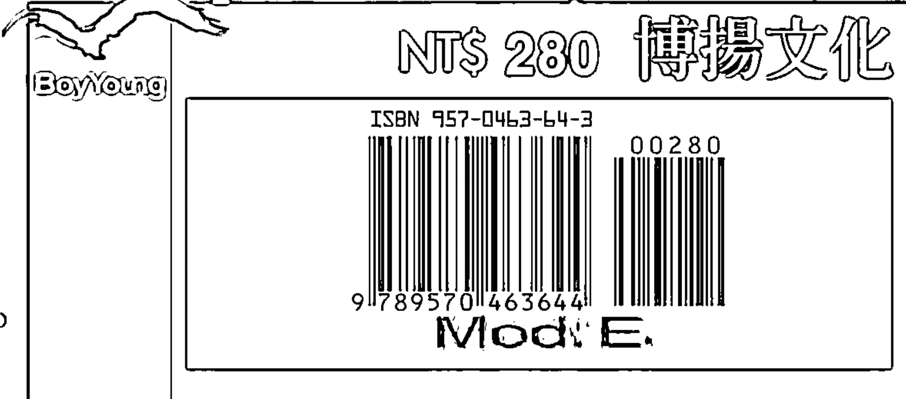

12宮位的飛星專論，是研究占星術中一項非常重要、非常基本的課題，現代行星的發現，更讓有心研究占星術的朋友們對宮位的判定產生混淆。故本書除提供判定的方法及建議，更將12宮宮主星飛入12宮位所產生之效應，做詳細的解說，是醉心研究占星的你，不可或缺的一本好書。

## 飛星十二宮位研究

作者／洪能平

福利公告：

凡在【天使神秘学院】购买任何电子资料赠送实体书，详情请咨询店铺客服！

备注：如客服不知道这活动你可能进了盗版店铺！赠书活动仅在以下正版店铺购买有效哦！

## 【天使神秘学院】淘宝店
手机淘宝扫以下二维码

## 【天使神秘学院】微店
手机微信扫以下二维码

用手机微信扫码进店

制作说明：

本书由《天使神秘学院》出重金从台湾购入的原版书籍扫描制作完成。为达到最好阅读效果，特地把书全部切开后，再经由专业扫描设备高精度扫描完成，并经过一张张的PS后期处理最终成书，其间花费大量的人力、物力以及时间，只为能给大家提供经济并优质的神秘学学习资料而努力。

本学院强力谴责某些机构和个人，把本学院花心血制作完成的电子书籍，包装后直接放在自家网上低价倾销的行为，以谋取不劳而获的经济利益。如果长此以往最终将无人愿意再为大家花心思制作电子书，那以后可能大家再无新书可读。

为让大家以后能够读到更多的好书，也为了本学院的良性发展。本学院恳请大家尽量做到如下几点：

-   一、尽量在天使神秘学院的官方网站购买电子书籍。
官网访问地址：http://www.ac2011.cn
短网址：ac2011.cn
网址含义：(Archangel College 成立时间：2011年)

-   二、在收到电子书后小范围传阅即可，千万不要公开传播，更别挂到网上低价销售。

同时为答谢广大支持者，学院电子书将做如下调整：

-   一、学院会把一些早已收回制作成本的电子书折价销售。

-   二、最新制作的电子书籍会开放打印功能，大家购买后有条件的可自行打印成书。

天使神秘学院
2021年3月

## 洪能平 著

## 占星十二宮位解析

Cancer

Libra

Scorpio

Taurus

Sagittarius

Gemini

Aquarius

Aries

Virgo

Leo

Capricorn

Pisces

## 目錄

自序

前言：宮位系統的爭議與飛星論斷的思考脈絡

第一宮內的宮主星

第二宮內的宮主星

第三宮內的宮主星

第四宮內的宮主星

第五宮內的宮主星

1

7

25

43

59

75

91

第六宮内的宮主星

第七宮内的宮主星

第八宮内的宮主星

第九宮内的宮主星

第十宮内的宮主星

第十一宮内的宮主星

第十二宮内的宮主星

107

121

137

153

169

185

201

## 自序

本占星系列書籍的寫作動力，以較自私的角度來看，在於替自己解決一些困擾，因為許多人都會向我詢問有關占星各方面的問題，例如：白羊座的個性應該是如何？月亮落入巨蟹座會如何？火象星座有何特徵？甚至問我我為何會知道這麼多有關星座的知識，而現在我可以回答說：你們只要詳細閱書中的內容，就可以和我同樣瞭解星座了。

其實我不是不願意回答任何有關星座的問題，而是在回答問題的過程中，總是發生三個重大的難題：一是總是必須修正對方對於星座某些錯誤的觀念；二是總是必須提供對方如何瞭解星座的方法；三是總是必須解釋占星學家如何在實際論斷上應用星座，最後甚至還必須說明對方的個性，是由哪幾個主要的星座所形成的。這些問題所造成的困擾，是任何一位專業的占星學者會面臨的，而背後最大的原因就是：太陽

洪能平

自序

# 飛星十二宮位解析

## 星座的誤導！

於是，在為了推廣正確的現代占星學，及掃除太陽星座所形成的誤導的雙重目的下，我決定把有關星座部分的所學出版，與讀者分享。然而，在我寫作完成之後，有不少關心我的朋友認為其內容不具普遍性，可能會大大影響銷售量，甚至還有人認為，讀者大部分都是只需要太陽星座的說明而已，只有相當少數的人會有興趣去深入研究占星學，況且，占星學的論斷又如此複雜，不同的命盤又如此的多，所以很難確保一定的銷售量，甚至還有虧本的可能。

針對關心我的朋友所提到銷售量的問題，我自己其實相當清楚且有數，但是我一直認為真正的專業是應該要堅持的，不可以為了銷售量而隨波逐流，寫一些對讀者不但沒有幫助，甚至灌輸錯誤觀念的低俗作品。對於一個知識份子及專業占星學者，這種做法不但低估了讀者的鑑別力，就探討人類命運的角度來說，簡直就是「草菅人命」！

我承認占星學如同其他的學問一般，有它複雜和艱深的地方，然而這絕對不是它難以

## 自序

學習的關鍵所在，真正的關鍵在於我們還無法熟悉現代占星學的論斷方法「意識流的論斷手法」。我時常向我的朋友及學生一再強調，在現代占星學的領域中，心理占星學已經成為論斷的主軸，如果無法把心理占星學研究得很透徹的話，將很難成為一位卓越的占星學家；如果認為我的著作很難懂，那麼當你看到西方占星學家所寫的「夢境式」的心理描述，將更難以理解當中的意涵，永遠只能停留在古代占星學的層次，無法趕上新時代的新潮流。

因此，我時常向朋友開玩笑說：我的占星學書籍是「無心人不宜觀賞」！這絕對不是我劃地自限限制自己的銷售量，而實在是因為研究占星學需要投入相當的時間與心力，絕對無法以「休閒式」、「速成式」的方法來學習。

我更時常告訴他人：現代占星學是一門與個人人生課題有關的知識，如果你關心自己的一生，並且以謹慎關注的態度來面對自己的人生的話，你就會想要更深入瞭解學習占星學。所以我不求銷售量的大增、也不求讀者的大量，我

# 飛星十二宮位解析

只希望我的讀者千萬不要以休閒好玩的態度看待占星學，甚至以這樣對占星學相當不足的理解，去評斷自己甚至是別人的人生，就如同朋友不求多，但求幾個知心的就夠了。

每當我想到占星學是由天王星和寶瓶座所主宰的時候，就深深地體會到它的創業精神、堅持理念和人道主義色彩，也就更加深了我的專業主義走向。同時，我更肯定中國人的文化與智慧的深度，且中國占星學也有著西方占星學家所認同的一席之地，華人讀者實在不需盲目追求東洋的占星方法。此外，

我相信每一個人皆有理性的能力、求知的本能及分辨知識深淺、真假的能力，更具有不願永遠停留在「一知半解」的研究能力。人們會想要對占星學有更深一層的理解，不論是為了要用來解讀自己的個性和命運，或是要用來透視某種宇宙的神秘力量，或者是

用來證明占星學根本是一種迷信，種種這些截然不同的學習動機，都有賴專業的資料來解決，而單看

## 自序

太陽星座的占星學論在先天上就缺乏了滿足這些學習動機的功能，所以我決定提供讀者更多的選擇，幫助更多有心的讀者對占星學有更深的瞭解、有更正確的資訊管道。

Cancer

Aquarius

Libra

Aries

Scorpio

Virgo

Taurus

Leo

Sagittarius

Capricorn

Gemini

Pisces

# 飛星十二宮位解析

## 前言：宮位系統的爭議與飛星論斷的思考脈絡

我曾經接到過多位讀者的來函詢問，問及有關宮位系統的問題。其最重要和共同的問題之一，就是在應用不同的宮位系統時，所造成的行星可能會落入不同的宮位內時，應該如何去作論斷；到底是應該歸於上一個宮位？另外，我也曾經被問及，說某位自稱占星大師的人，專門以宮位的飛星來作為論斷的主軸，而且號稱其準無比，不曉得國外是否有這樣的講法？

對於前一個問題，我的回答是：目前尚無定論，有待作更進一步的研究（詳細原因，請見後文）。至於後一個問題，我的回答是：此自稱占星大師的人，對於國外最新的占星學資訊，可以說是一無所知，甚至連最基本的宮

## 前言

位系統所涉及到的問題，也是一無所知。

有關宮位宮主星的飛星論斷，必然涉及到三項問題：一是，那一個宮位系統比較準確，如果這個問題沒有解決，那麼宮位宮頭所在的星座位置就會發生問題，連帶地宮位宮主星的決定也會發生問題，那麼宮主星所飛入的宮位的論斷（即飛星的論斷），自然也就有了問題；二是，如果宮位系統的問題可以被解決，那麼接下來有關宮位宮頭所在的星座位置，是應該如何進行論斷，亦即空宮的宮位（即沒有行星落入的宮位），與不是空宮的宮位（即有行星落入的宮位），在論斷上有何差異？三是，如果以上的兩個問題都解決了，那麼接下來就是飛星的論斷，到底其發生的頻率有多少，在什麼樣的情況下其會引發事件產生的可能性最高？亦即在何種條件下，飛星才足以構成是可以被拿來作為論斷的參考？我將以上的三個問題，歸結為「宮位系統的問題」和「飛星論斷思考脈絡的問題」等兩個問題來作說明。

# 飛星十二宮位解析

首先，就宮位系統的問題來說，到目前為止，仍然是十分地具有爭議性（有關宮位系統的種類，以及其宮位劃分的依據，我會在往後作介紹）。其爭議的焦點和原因，無非是在於沒有任何一種宮位系統可以得到占星學家的共同認可，雖然目前大部份的占星學家是應用 "Placidus" 和 "Koch" 這兩種宮位系統，但是這兩種宮位系統同樣有其弊端存在，無法讓全部的占星學家感到滿意。

探究宮位系統之劃分所導致的問題，其根源乃是在於天體是立體的，而占星命盤是平面的。於是，當我們把天體的立體空間轉換成平面的命盤繪製時，自然會有「偏差」產生，特別是立體空間所產生的「偏角」（或稱之為「傾斜」），往往會讓行星所落入的宮位位置產生一些誤差。為了儘可能地減少誤差的程度，占星學家通常是採用以下的三個辦法：

第一，視出生地點所在的南北緯度位置，來選擇宮位系統。特別是越接近

## 前言

近兩極的地區，其宮位系統的選擇更是需要謹慎（有一些宮位系統是無法在兩極地區使用的，而且越是接近兩極地區，其誤差的程度就越高）。最常見的選擇宮位系統的原則，就是應該盡可能地把握住兩項基本原則：一是，命度要確實地落在第一宮的宮頭位置上；二是，天頂要確實地落在第十宮的宮頭位置上。這兩項基本原則，有時候是難以兼備的；如果真的是難以兼備的話，那麼是以第一項原則（命度要符合第一宮的宮頭位置），來作為最主要的選擇基準。

第二，視出生時行星所在的實際天體位置，來選擇宮位系統，而且是幾種宮位系統同時被應用到。這是因為不管在何時出生，行星的實際天體位置一定會有偏角的情況發生，而為了減少偏角所導致的誤差，比較專業的占星學家會針對不同的行星偏角，採用不同的宮位系統。換句話說，針對不同的行星，採用不同的宮位系統。例如，水星的確實宮位位置是採用某一種宮位

# 飛星十二宮位解析

系統，而金星的確實宮位位置，則是採用另一種不同的宮位系統。採取這種方法的占星學家並不多，因為這必須繪製好幾張占星命盤。

第三，乾脆不使用任何的宮位系統，而直接以中點來作論斷。這是漢堡學派占星學所最常用的方法，同時也是現在西方占星學家蠻流行的論法。而之所以會乾脆不使用宮位系統，其原因有二：一是，既然宮位系統存在著那麼多的爭議，而且尚未有所定論（每一種宮位系統都曾經試圖證明自己的準確性，但卻也都曾經遭遇過確實證據的反駁），於是基於任何宮位系統所引導出來的結果，都將面臨方法論上的批判，形成是科學主義者所嚴厲批判的對象，甚至被拿來當作是反駁占星學的論據，也因此，乾脆不用；二是，如果相關的事件徵象，都可以從中點或其他的論斷途徑來取得的話（亦即不使用宮位系統，也可以取得相同的預測效果的話），那麼有無宮位系統，是無所謂的，也就可以乾脆不用了。

## 前言

由上可知，宮位系統是問題叢叢的，不是可以放諸四海而皆準的，也因此，任何強調以飛星來作為論斷主軸的人，可以說是一廂情願，或異想天開，或甚至是孤陋寡聞的。

回頭來看臺灣的占星學研究現況，恐怕對於宮位系統有所瞭解的人並不多，而能夠不使用宮位系統來作論斷的人，那就更少了。況且，中國傳統占星學是有宮位系統的，也因此，我並不排斥使用宮位系統來作論斷（西方占星學家所持的觀點是，宮位系統雖然爭議甚多，可是還是有其一定的參考價值），特別是對於初學者來說，應用宮位系統來作論斷，往往是其熟練論斷技巧的必要過程。可是，我認為任何有心研究占星學的人，都有必要瞭解到宮位系統所存在的問題，如此才不至於完全迷信於宮位系統（或迷信於那一種特定的宮位系統），也才不至於在論斷不準確的時候，完全沒有懷疑到可能是宮位系統所導致的問題。

# 飛星十二宮位解析

至於由於使用不同的宮位系統，所導致的行星可能會落在不同的宮位內的問題，其一般的解決方式是：一是，如果某一顆行星是落在某一個宮位的後面度數（在臺灣可以採用 "Placidus" 或 "Koch" 這兩種宮位系統），並且已經是很接近下一個宮位的宮頭位置了（一般是以五度來作為範圍的界定，比較嚴格的界定是三度範圍），那麼該顆行星基本上仍然是屬於上一個宮位，只能說該顆行星會多少影響到下一個宮位，但是絕對不能將其直接劃歸於下一個宮位；二是，如果某一顆行星是已經落入下一個宮位了，除非該顆行星在別種宮位系統下，有呈現出是落在上一個宮位的情況，不然一律劃歸於下一個宮位，同時不能說該顆行星會對於上一個宮位產生多大的影響（一般是認為不會產生影響的）。

其次，是有關飛星論斷的思考脈絡的問題。既然宮位系統有了爭議，那麼飛星的論斷當然也有爭議。在此，先暫時把宮位系統的問題放下，而僅就

## 前言

飛星的論斷來作探討，也必然要涉及到三項問題：一是，宮位宮頭所在的星座位置的論斷參考性問題；二是，傳統行星與現代行星所代表的宮主星的代表性問題，亦即天蠍座是應該以冥王星來當宮主星，還是應該以火星來當宮主星，寶瓶座是應該以天王星來當宮主星，還是應該以土星來當宮主星，以及雙魚座是應該以木星來當宮主星，還是應該以海王星來當宮主星？三是，宮位本身及其宮主星所飛入的宮位，彼此之間是什麼樣的關係，而這種關係的建立是需要什麼樣的條件？亦即彼此之間是在何種情況下，才能夠產生互動？同時互動的頻率有多大？這三個問題乃是環環相扣的，在論斷時必須同時進行思考。以下就針對這三個問題略作說明，至於詳細的說明，我會在《占星漫談》系列中作補充。

第一，當宮位與星座進行整合之後，有兩種情況：一是宮位內有行星落入；二是宮位內無行星落入。當有行星落入時，宮位宮頭所在的星座位置的影響力，將會是比較明顯的；而當無行星落入時，宮位宮頭所在的星座位置的影響力，將會是比較隱藏的。前一種情況，可以被視為是「意識層面」的作用；而後一種情況，則可以被視為是「潛意識層面」的作用。也因此，前一種情況所反應出來的頻率是比較高的，而後一種情況所反應出來的頻率是比較低的。

例如，同樣是第二宮宮頭位置落在獅子座上，如果有行星落入的話（暫時不考慮該顆行星本身所產生的影響），那麼對於錢財事務的採取獅子座的作風，是比較常見的。相對地，如果沒有行星落入的話，那麼只能說對於錢財事務的採取獅子座的作風，只是偶然為之而已。至於何時為之？就必須從過運（Transits）的角度來看。基本的判斷原則是：當行星的過運，如果是走到接近第二宮的宮頭位置時，其影響力就會逐漸明朗化；換言之，此時的獅子座由於受到行星的影響，從潛意識的層面被提昇到意識層面。

例如，以月亮來說（因為月亮的過運是最快速的，而且月亮本身就扮演著意識層面和潛意識層面的溝通者角色），當月亮走到空宮的第二宮宮頭時，獅子座的潛在特質會被引發起來，這時對於錢財事務採取獅子座作風的可能性，提高了不少，但是還是不足以以下肯定的判斷，去說此人在這個時候會突然想花錢買東西；而是必須再配合此時的月亮所形成的相位關係，才能夠作比較明確的論斷。假設此時的月亮被太陽、火星、天王星或木星所刑剋到的話，那麼我們就可以說，對於錢財採取獅子座作風的可能性，提高了很多。

由上可知，連宮位宮頭所在的星座位置，其所能產生的影響力，都必須是有待更多的條件來作配合的，那麼飛星的論斷所必須具備的條件也就更多了，豈能隨隨便便地說那一宮的宮主星飛入那一宮，就會發生什麼樣的事情？

第二，在現代行星尚未被發現之前，宮主星是以傳統的太陽、月亮和五大行星來作代表。而在現代行星發現之後，宮主星的歸屬也就產生了問題。如果說天蠍座、寶瓶座和雙魚座等三個星座，應該是以冥王星、天王星和海王星來當宮主星的話，那麼明顯的事實是，將會有許多人的三個宮位的宮主星，是落在相同的星座和宮位內（其機率是大約十二分之一，如果彼此的出生年份相差不多的話）。以此來看飛星，就會造成有許多的三個宮位的宮主星，是飛入相同的宮位之中（如果這許多人是具有相同的宮頭所在的星座位置的話），如此一來，僅從飛星的角度來作論斷，豈不是說這許多人都將會發生相同的事件？這也是西方占星學家之所以儘量避免應用飛星來作論斷的原因之一。

以目前西方占星學家的普遍用法來看，保留傳統行星的火星、土星和木星，來當作是天蠍座、寶瓶座和雙魚座的宮主星的人，可以說是不少（特別是在卜卦占星學的論斷上，有些西方占星學家主張只使用傳統的火星、木星和土星，而不使用天王星、海王星和冥王星）。不過，比較常見的用法，乃是兩顆宮主星皆被拿來當作參考。如此一來，也就更增添了飛星論斷的可疑性，在無法確定單一宮主星的前提下，其參考價值減弱了不少。

與此情形有點類似的是，水星同時是雙子座和處女座的宮主星，金星同時是金牛座和天秤座的宮主星。如此一來，就造成了有兩個宮位的宮主星是落入相同的宮位之中，這同樣是增添了飛星論斷的可疑性。然而，這種情形是比較好解決的，以水星來作舉例說明：假設雙子座是第十二宮的宮頭所在位置，同時又是第三宮的宮頭所在位置（第一宮宮頭位置假設是落在巨蟹座的話），並且水星是落入第七宮之中；那麼就形成了第十二宮宮主星飛入第七宮，以及第三宮宮主星飛入第七宮等兩種可能的論斷線索。於是，當行星的過運是走到第十二宮的宮頭位置時（即雙子座），飛星的論斷徵象是呈現出第十二宮宮主星飛入第七宮時的情形，而當行星的過運是走到第三宮的宮頭位置時（即處女座），飛星的論斷徵象是呈現出第三宮宮主星飛入第七宮時的情形。也因此，第十二宮宮主星的飛入第七宮，以及第三宮宮主星的飛入第七宮，其論斷徵象的呈現，不會是同時出現的。

第三，有關宮位本身與宮位飛星彼此之間的關係，可以從「因果關係」和「涉及關係」兩種角度來作觀察。然而，在進行觀察之前，必須以該宮位宮頭所在的星座位置來作為觀察的前提。以下直接採用舉例的方式來作說明。

例如，第二宮宮頭位置是落在獅子座上（暫時不涉及到是否有行星落入宮位內），其第二宮的宮主星是太陽，假設是落入第八宮之中，而且是落在寶瓶座內。那麼，從「因果關係」來作觀察，可以說錢財的來源可能會與第八宮的事物有關，亦即有機會從第八宮所代表的事物之中，諸如醫藥、神秘主義、生意、死亡、遺產等，來獲得錢財。而從「涉及關係」來作觀察，可以說錢財的來源可能會是在寶瓶座的環境中所產生的，亦即有機會從寶瓶座所代表的特質之中，諸如奇特的想法、突然的事件、團體組織等，來獲得錢財。於是，如果將以上的兩種觀察角度作整合的話，那麼論斷的結果有：可能基於自己的奇特生意想法而獲得錢財、可能基於某件意外事故的發生而獲得錢財、可能基於搞團體性的秘密活動而獲得錢財，可能。。。，讀者可自行類推（最好是配合第二宮和第八宮內的徵象顯示，來取得更為明確的論斷線索）。

可是，以上的論斷乃是屬於「結果」，或者稱之為是「已發生的事件」。在判斷結果之前，還必須先知道該結果是在何種前提下才會產生，以及在何時才比較有可能產生。從結果發生的前提來看，必須是在獅子座的特質已經有所揮發的情況下，第二宮的飛星作用才有可能被引發起來，亦即獅子座的特質呈現，就是第二宮飛星產生作用的前提。換句話說，如果想要從第八宮來獲得錢財的話，那麼採取獅子座的作風是避免不了的。於是，我們的論斷就有了前提條件：如果此人漸漸有了知名度，或者是比較敢冒險了，或者是比較敢花大錢了，或者是創作的才能越來越好了（這些是獅子座的個性特質），那麼從第八宮來獲得錢財的可能性就提高了不少。

至於何時才是最有可能從第八宮來獲得錢財，就必須從過運的角度來看（請參見前面已提過的行星過運到第二宮宮頭位置的講法）。假設金星是正好過運到第二宮的宮頭位置，而且金星又有著許多的吉相位，同時獅子座的特質又已經有了發揮的話，那麼從第八宮來獲得錢財的可能性，可以說是相當高的。

由上可知，飛星的論斷並不是簡簡單單地說：那一個宮位的宮主星飛入那一個宮位，就會發生何種事件那麼地簡單。還必須顧及到事件發生的前提、事件發生的時間，以及「因果關係」和「涉及關係」等。特別是飛星所導致的事件，往往是屬於短暫性的情況比較多（如果宮位內有行星落入的話，比如前面所提到的第二宮內如果有行星落入的話，那麼發生的頻率會比較高，甚至有可能會是一種長期性的情況），所以其發生的時間性是相當重要的，絕對不能貿然地說：此人一生都可以從第八宮中獲得錢財。

以上的說明，都只是針對飛星所作的說明。如果我們將飛星的論斷，放置在整體性的論斷過程來看，那麼飛星論斷的重要性，也就更顯得微乎其微了。因為飛星的論斷往往必須被安排在最後面，那是在缺乏論斷訊息的情況下，才被拿來當作參考的，也因此，西方占星學家在談及飛星論斷的功效時，時常是以「更進一步的線索」來作形容，絕對不足以構成是論斷的主軸。況且，以目前的占星學研究現況來看，有許多的論斷途徑（比如說泛音盤）可以用來解決宮位空宮時所導致的論斷線索的缺乏，不一定要使用到飛星的論斷。所以說，那些基於占星大師自己的空想所臆造出來的飛星論法，其胡亂飛舞般的解釋，無非是在混淆學生的思路，偏離了正常的論斷程序，完全是捨本逐末的論法，甚至掉入莫名其妙的宿命論而不自知。

最後，自命不凡的占星大師，近來又空想出許多的股市預測論法，同樣是號稱其準無比。試問：如果真的那麼準的話，那用得著還辛辛苦苦地幫人算命呢？乾脆自己去炒股票就好了？換另一種角度來看，以自稱擁有「秘訣」而高價求售的人，又豈肯把股票預測的秘訣教給別人，讓別人來與自己競爭呢？再換另一種角度來看，如果不懂得經濟學理論、不曉得貨幣銀行學為何物、也沒有看過十幾本有關財經和股市預測的占星書籍，甚至可能連財務報表和股市分析技巧、波浪理論，以及景氣循環理論等都搞不太懂的人，其大談自己可以準確地預測股市，你信嗎？我第一個不相信。

## 第一宮內的宮主星

由於第一宮是主宰著個人的基本特質、體質和外形等，所以第一宮的宮主星（又稱之為「命主星」或「盤主星」）可以說是最重要的宮主星。一般來說，第一宮的宮主星所飛入的宮位，乃是指示著個人一生中的重要生活課題所在；而飛入第一宮內的飛星，乃是指示著個人一生中所注重的生活課題。

以下的各項說明，並沒有把飛星所落入的星座列為考量因素，而僅就宮位方面來作說明，所以有關飛星與星座的關係，請讀者自行推演（請參見前面所提到過的論斷基本原則）。再者，以下所列出的論斷內容，只是一種「參考」而已，必須配合著整體命盤的徵象顯現，然後才能作比較明確的論斷。

### 第一宮宮主星落入第一宮

1. 有長壽的徵象。因為當第一宮宮主星落入第一宮內時，表示著個人的生命力是比較強韌的；這種情況時常是發生在「命主星」是入垣時。
2. 體質方面的健康情況，往往是比較好的。但是，如果「命主星」被第六宮、第八宮或第十二宮的宮主星，或者被第六宮、第八宮或第十二宮內的行星所刑剋到的話，那麼健康情況就會比較差。
3. 個性上比較樂觀和有自信，同時人生的歷程也會比較少有波折。這種情況必須是「命主星」為吉星，而且命度星座是比較開朗的星座。
4. 個性上比較自卑和羞怯，同時人生的歷程也會比較有所波折。這種情況是發生在「命主星」為凶星，而且命度星座是比較悲觀的星座。
5. 在面對敵對或有所挑戰的狀況時，可以展現出強力的戰鬥性，或堅持到底的韌性。

### 第二宮宮主星落入第一宮

1. 對於錢財事務比較在意，亦即對於金錢相當敏感。有成為鐵公雞的可能（如果凶相位太多的話），或者是成為揮霍的凱子（如果吉相位太多的話）。
2. 有機會可以比較輕鬆地獲得錢財，特別是如果與第八宮宮主星、木星或金星形成吉相位的話。
3. 有可能會遭遇到意外的大量錢財損失，特別是如果與第五宮、第八宮、第十二宮的宮主星，或火星、天王星、海王星和冥王星等形成凶相位的話。
4. 賺錢的過程可能會是相當辛苦的，這種情況比較容易發生在有凶相位的時候。但是，有吉相位時也往往指示著想要憑著自己的努力去賺取錢財。
5. 會努力地去證明自己的存在價值，亦即有想要透過自己所擁有的物質資源，來證明自己的生命意義的心理動機。

### 第三宮宮主星落入第一宮

1. 有可能會比自己的兄弟姐妹較有出息，或者是結交到對自己有幫助的鄰居，這種情況比較容易發生在有吉相位的時候。
2. 有可能必須為自己的兄弟姐妹而有所犧牲，或者是與自己所討厭的鄰居相鄰而居，這種情況比較容易發生在有凶相位的時候（要注意該形成凶相位的行星本身是凶星或吉星，如果是凶星的話，情況是比較糟的；如果是吉星的話，情況是比較無所謂的）。
3. 有著不錯的溝通才能和喜歡思考，特別是在面對可以對生命有所啟示的事物，或者是在面對可以增添生活情趣的事物時，思考能力可以得到很好的運作。
4. 個人的主觀意識可能會是比較強烈的，亦即一旦確立了自己的觀念或想法之後，除非遇上了有強而有力的反駁，不然不輕易更改自己的想法和觀念。
5. 有很多的機會去作短程旅行，而且這些短程旅行，一般是自己所主動促成的。

### 第四宮宮主星落入第一宮

1. 可以在土地、房地產和礦產等方面有較好的運氣，這種情況是發生在吉相位的時候；如果是凶相位的話，情況正好相反。
2. 有可能會比自己的兄弟姐妹在房地產、農業和投機方面，有著較好的成果，這種情況是發生在吉相位的時候；如果是凶相位的話，情況正好相反。
3. 有機會可以得到不動產方面的遺產，特別是如果與第一宮、第八宮、第十宮的宮主星，或木星、金星等形成吉相位的話。
4. 一般來說，與家庭和家族的緣份是比較深厚的。可是，如果凶相位太多的話，那麼就有可能會遭遇到家庭或家族方面的困擾。
5. 有著不錯的想像力，但是這種想像力是偏重在對於安全感的需求，所造成的渴望自己能夠擁有一個安定的生活空間。特別是在凶相位的時候，其需求的壓力會增強。

### 第五宮宮主星落入第一宮

1. 投資的運氣會是比較好的，或者是娛樂的運氣會是比較好。但是，一定要適可而止，以避免成為賭徒，或者是只懂得享樂，而不知道努力工作。
2. 孩子將可以給自己帶來好運，或者是孩子會對於自己有所幫助，比如說，孩子可以協助自己處理某些事情，或在老年時盡力照顧自己。也可以說是與孩子的緣份是比較深厚的。
3. 有可能會從事於與經商有關的工作，或者是自己所從事的工作，往往是必須發揮創作才華的。另外，做起工作來，可能會是比較缺乏耐性的。
4. 對於自己的名聲、地位的追尋，可能會是比較熱衷的，而且可能會是一位很注重外表打扮的人，甚至會想要成為一位擁有獨特風格的人。
5. 有可能會比較早展現出自己的才華，但是這往往也會造成喜歡控制場面的特質。另外，對於金錢的運用，有著自己的看法，比較不容易接受別人的意見。

### 第六宮宮主星落入第一宮

1. 幼年時的健康情況，可能會是比較差的。即使成年以後，健康情況也往往必須多加注意，因為體質上的抵抗力，可能會是比較差的。如果從疾病的角度來看，還必須配合著第六宮宮頭所在的星座位置，以及第六宮內的行星，才足以用來論斷疾病的種類。
2. 有可能會雇用到讓自己造成損失的職員，這種情況特別容易發生在凶相位的時候。另外，較多的凶相位，也比較容易造成寵物，或自己所飼養的動物，莫名其妙地死去。
3. 往往會在生活壓力的驅使下，不得不去學習另一種新的技能。同時，希望自己所從事的工作，不但可以讓自己生活無慮，更希望這份工作是自己的興趣所在。
4. 有可能會成為一位專業技術人員，或者是在工作的領域中，往往必須時常接受新的訓練。
5. 如果自己的工作情況，一直頗為相當順利的話，那麼時常是指示著在成年以後，幼年時的不佳健康情況已經有所改變了。

# 飛星十二宮位解析

## 第七宮主星落入第一宮

1. 比較不必擔心會缺乏異性朋友，因為在愛情的路途上，可以比較容易被某位異性所看上。另外，配偶將可以在生意上協助自己，如果自己是在經商的話。這種情況，是發生在吉相位的時候。

2. 有機會可以從配偶方面得到利益，也許是錢財方面的利益，但也有可能是才華方面的相得益彰。這種情況，是發生在吉相位的時候。另外，有可能因為結婚，而導致自己的人生走向起了很大的變化。

3. 如果是凶相位較多的話，那麼有可能會因為配偶或合夥關係而造成損失，或者是往往容易因為競爭對手的強勢競爭而造成損失，同時自己的競爭對手往往會是比較多的。如果造成凶相位的行星是凶星的話，那麼情況可能會更為激烈。

4. 喜歡去建立起比較親密的人際關係，亦即在人際關係的交往過程中，不一定要朋友很多，可是卻希望自己所結交到的，是知心的好友。

5. 在朋友的面前，往往會把自己最好的一面表現出來，甚至可以忍受朋友的有點無禮。

## 第八宮宮主星落入第一宮

1. 在幼年的時候，生命有可能會遭受到意外事故的威脅，特別是如果被凶星所刑剋到的話。因此，往往必須參照第一宮內的其他行星和第八宮、第十宮內的行星，以及特殊的相位格局。

2. 如果凶相位實在太多的話（有超過三個以上），那麼應該隨時注意自己的健康情況，因為可能會有致命的病因潛藏著。

3. 如果與第二宮的宮主星或金星，形成吉相位的話，那麼很可能會得到遺產，或得到意外之財，這同時也必配合著第二宮內的行星情況來作論斷。

4. 死亡的方式可能會是比較奇特的，或者是有自殺的傾向。這種情況，是發生在凶相位的時候，同時也必須參照第八宮內行星情況來作論斷。

5. 有著相當不錯的性能力，或者是試圖在性伴侶面前展露自己的性熱情，同時接吻的方式可能會有點粗魯。另外，有一顆相當冷靜的頭腦。

## 第九宮主星落入第一宮

1. 可能會很喜歡到國外去旅遊。此外，外語的學習能力，也可能會是比較好的。

2. 有可能會對宗教或哲學發生濃厚的興趣，或者是成為一位科學主義的信仰者。

3. 力氣可能會是比較大的，或者精力是比較旺盛的。同時，對於自己的能力有著比較強的自信，相信自己有能力去克服一切困難。

4. 對於自己的功成名就，有著較高的期許，時常在思索著如何去突破限制，以便取得較高的成果。同時，有可能會與別人發生銳利的競爭。

5. 對於自己的理念，可能會是相當堅持的，特別是如果這個理念，是配合著自己的實際人生經歷，以及一步一步思索推演後所形成，並且又正好與某些哲學家的理念相一致的話。

## 第十宮主星落入第一宮

1. 可能會擁有很榮耀的名聲，特別是如果與木星、太陽或月亮形成吉相位的話。但是，也有可能會聲名狼藉，或者是很很好的名聲被毀於旦夕之間，特別是如果與凶星形成凶相位的話。

2. 自己的外表、氣質和地位，將會是事業成功的保證。換句話說，自己對於在追求事業成功的過程中，所必須具備的各種良好外在表象，相當注重和有所瞭解。

3. 事業的成功往往就是自己對自己進行肯定的最佳方式。因此，也可以說是事業心比較重，或者說是相當重視別人世俗眼光中對自己的肯定。

4. 熱切希望能夠擁有自己的舞台，亦即比較重視自己的名聲和榮耀，或者是對於權力的擁有是比較注重的，甚至有可能會成為是一位風格獨特的人。

5. 比別人更容易獲得榮耀，或者說可以比較容易得到別人的尊敬，或者說對於可以獲得榮耀的事情，比較容易身先士卒地去從事。

## 第十一宮宮主星落入第一宮

1. 在面對強力競爭對手的時候，往往可以透過朋友的幫助，或透過自己所擁有的不錯的人際關係，而增強自己的競爭優勢。這種情況，是發生在吉相位的時候；如果被第四宮、第十宮的宮主星或凶星所刑剋到的話，那麼這些助力將會弱化許多。

2. 在達成自己的理想和願望的過程中，往往也可以透過朋友的協助，或透過新的人際關係的建立，而讓自己的願望得到實現。這種情況，是發生在吉相位的時候；如果被第四宮、第十宮的宮主星或凶相所刑剋到的話，那麼這些助力將會弱化許多。

3. 自己所承受的責任，可能會是比較輕的，因為有一部份的責任，可能是被朋友所承擔了。這種情況，是發生在吉相位的時候；如果被第四宮、第十宮的宮主星或凶星所刑剋到的話，那麼自己所承擔的責任，將可能會是比較重的。

4. 比較重視人際關係的往來，亦即會是一位比較主動去接近別人的人。另外，在談話的時候，可能會流露出理想主義的色彩。

5. 將可能會得到某位好友的全力協助。這種情況，是發生在吉相位的時候；如果凶相位較多的話，可能會受到某位好友的拖累。

## 第十二宮主星落入第一宮

1. 在中年以前，可能必須面對許多競爭對手的阻礙，亦即會因為強力競爭對手的出現而有所麻煩，並且這些對手的競爭方式，可能會是採取暗中行事的方式。

2. 如果第十二宮宮主星本身是凶星，而且又被凶星所刑剋到的話，那麼比較嚴重的情形是會有牢獄之災（有可能是被別人托下水的），比較輕微的情形是會行事多所不順，心情充滿鬱悶、憂傷和消沈。要等到中年過後，才會平順。

3. 有家道沒落和名譽受損的可能，除非第十二宮的宮主星本身是吉星，不然也可能會因為某事而不得不有所逃避（比如說，因為破產被通緝而不得不遠走國外）。

4. 有可能會沈溺在飲酒和嗑藥之中，同時在個性上可能會有比較多的弱點（這些弱點以因為懦弱所導致的沮喪和逃避居多）。所以，有可能會成為是一位空想主義者，執行力落後於想像力（如果是攝影師或藝術家的話，空想倒是無所謂。）

5. 一般來說，第十二宮宮主星落入第一宮，時常是一種有所失望的象徵；然而，同時也是一種良好潛能的指示，就看個人是如何去作發揮。如果是把潛能引導向精神修為方面去的話，那麼將可以提昇自己的心靈感應能力。

## 第二宮內的宮主星

由於第二宮是主宰著個人的錢財狀況、收入和資源等，所以一般來說，第二宮的宮主星所飛入的宮位，乃是指示著與個人的錢財產生互動的生活課題所在；而飛入第二宮內的飛星，乃是指示著個人所想要去掌握的生活課題。

## 第一宮宮主星落入第二宮

1. 主要是透過自己的辛勤努力，來獲得自己所想要的錢財。如果吉相位較多的話，那麼自己所想要追逐的錢財目標，將會是比較容易達到的。

2. 對於錢財比較在意，雖然未必會是一隻鐵公雞，斤斤計較，不過卻會是相當有金錢概念的，彷彿錢財就是自己的安全保障。

3. 如果第一宮宮主星入弱或入陷的話，那麼有可能會是應該得到的錢財，卻突然機會消失了，或者是家庭背景的經濟情況並不好，或者會是比較缺錢的。

4. 如果第一宮宮主星的凶相位太多的話，那麼有可能會是對於金錢有著相當高的期待，好像有再多的錢，也不能滿足。

5. 如果第一宮宮主星逆行的話（天王星、海王星和冥王星的逆行，是為例外），那麼有可能會是比較貧窮的，這是因為賺錢的能力，往往是比較不能夠充分顯現的；除非是有遺產可以繼承。

## 第二宮宮主星落入第二宮

1. 錢財的賺取，主要是透過自己的專業技巧和辛勤努力，亦即在別人的眼中，可能會是一位蠻會賺錢的人，但是別人卻往往不知道自己所付出的努力。

2. 如果凶相位太多的話，那麼有可能會是一位揮金如土的人，或者說是一位過往財神——金錢來得容易，也去得容易，甚至可能會落到晚年貧窮的下場。

3. 如果吉相位較多的話，那麼也同樣多少會有揮霍的特質，只是在錢財的賺取方面，其運氣將會是比較好的。

4. 錢財是自己得到安適的最主要來源，同時也會把錢財使用於讓自己的生活可以過得更為舒適，或者說認為賺錢的目的，就是要豐富自己的生活。

5. 如果能夠認清楚自己所要追求的價值意義是什麼的話，那麼將可以成為一位更為富有的人——不只是物質層面的富有，也包括了精神層面的富有。

## 第三宮宮主星落入第二宮

1. 有可能會與自己的兄弟姐妹，在錢財或資產方面發生爭執。一旦發生了爭執，如果是吉相位較多的話，那麼自己的損失將會是比較少的；如果是凶相位較多的話，那麼自己的損失將會是比較多的。

2. 如果是凶相位較多的話，也應該盡量避免在錢財方面與別人多所爭執，因為很有可能會是愈爭執，情況愈糟糕。

3. 自己的閒聊話題，可能會是時常圍繞著金錢、物質享受、流動資產、錢財運用和價值觀等方面，或者說一談起有關第二宮的事情時，興趣就比較濃厚了起來。

4. 如果本命盤上的其他個性特徵，顯現出是一位口才不錯、溝通能力蠻強的人的話，那麼有可能可以從溝通能力的展現而獲得額外的錢財。

5. 自己的理念和想法，將可能會讓自己在財務方面的經營，取得相當大的成功，亦即對於財務的運用和管理，是相當有概念的。

## 第四宮宮主星落入第二宮

1. 有可能可以從父母方面，得到不動產方面的遺產。這種情況，是發生在吉相位較多的時候，特別是如果第五宮的宮主星也同時落在第二宮中的話。

2. 對於不動產方面的買賣（所謂的不動產，主要是包括了土地和房屋），有著比較好的運氣，這對於從事不動產方面的買賣的人來說，是一個相當有力的助力。

3. 對於投資方面，也將會是有著比較好的運氣。可是，如果凶相位較多的話，就必須在投資之前詳加考慮，以避免資金運轉不靈。

4. 家人或家族的成員，將有可能會在錢財方面提供支援。但是，如果凶相位太多的話，那麼家人或家族成員，將有可能會讓自己的錢財有所損失。

5. 往往需要有較多的財富，才能夠讓自己建立起基本的生活安全感，或者說是一位想要擁有自己的不動產的人（自己的房子是愈值錢，愈有安全感）。

## 第五宮宮主星落入第二宮

1. 自己的孩子將會是蠻聽話的，而且可能會是孩子如果有什麼的要求的話，自己會儘可能地去答應孩子的請求，亦即比較不願意看到孩子的有所失望。

2. 如果第五宮宮主星本身是吉星，而且又有較多的吉相位的話，那麼孩子的降臨，將可能讓自己在錢財方面的困境，有所轉機。

3. 如果本命盤上的土象星座特質比較強烈的話，那麼將會增加固執的特性；特別是在有關錢財運用方面，往往比較難以接受別人的意見。如果是吉相位較多的話，往往可以因為自己的某些創造性的想法，而獲得錢財。

4. 在愛情的表現上，比較容易展現出自己的物質實力，或者是會透過向對方表達自己在錢財運用方面的才能，以便讓對方感受到自己的理財能力。

5. 錢財、資產、價值觀和賺錢方法等，在個人的生活領域中，將扮演著相當重要的角色。

## 第六宮主星落入第二宮

1. 自己所付出的努力，可能會比自己所獲得的收入，來得多出許多，亦即如果是憑努力來賺取錢財的話，其過程將會是頗為辛苦的。如果第六宮宮主星本身是凶星的話，那麼就會更辛苦了。

2. 有可能會在工作場合中遺失錢財；特別是身為老闆者，如果凶相位太多的話，可能會因為用人不當，而導致於錢財方面有所損失。

3. 自己所從事的工作，有可能會是與動物有關。另外，在工作領域中，比較肯協助別人一起完成工作。

4. 希望自己的工作環境是比較單純的，並且工作的項目和內容，不會是太過於複雜的；如果工作的內容，是需要發揮錢財概念的話，那是最好不過的了。

5. 如果是從事於與健康或營養方面有關的工作的話，那麼將可以擁有不錯的專業技巧，以及現金的收入（比較少受到市場變動或經濟景氣的影響）。

## 第七宮主星落入第二宮

1. 對於愛情的重視程度，是大於金錢的，亦即有「不愛金錢，愛配偶」的徵象，所以往往即使是貧窮夫妻，也會有百世恩。

2. 如果是被凶星所嚴重刑剋到的話，那麼有可能配偶會比自己早逝，以致於有兩次婚姻的徵象，這必須參照第七宮內的行星情況來作論斷。另外，自己的公開對手，有可能會比自己早逝（這種情況，不一定要被凶星所刑剋到）。

3. 如果是被凶星所刑剋到的話，那麼自己的錢財將會有遭到搶奪或欺騙的可能。

4. 自己的配偶可能會是一位理財的能手，同時在婚姻生活中，錢財、資產和賺錢等，將會扮演著相當重要的地位，所以錢財往往成為是婚姻安全的保障。

5. 有得到意外之財的可能，或者是在某段時間內，同時從事兩項以上工作，以致於有較多的金錢來源。另外，必須妥善選擇合作夥伴，特別在價值觀上相一致的夥伴，以免雙方在處理錢財上發生爭執。

## 第八宮宮主星落入第二宮

1. 配偶將可以給自己帶來好運，或者是帶來錢財。這種情況，是發生在吉相位的時候。如果是凶相位的話，那麼配偶有可能會讓自己的錢財有所損失。

2. 自己的債務將會是比較容易被清償掉的，亦即自己對於債務相當敏感，如果是有所負債的話，將會想辦法先行清償。

3. 如果第八宮宮主星是吉星，而且又有吉相位的話，那麼將有得到遺產的可能；如果第八宮宮主星是凶星，而且又有凶相位的話，那麼配偶有可能會是一位亂花錢的人，或者是自己有被倒債的可能。

4. 性生活將會是比較活躍的，甚至有外遇的可能，或與某位異性糾葛不清。

5. 有得到意外之財的可能，或者是投資的運氣很不錯；特別是在吉相位的時候，額外的錢財收入是相當可觀的。

## 第九宮主星落入第二宮

1. 有機會到國外去受訓，或者是學習到國外的專業技術。另外，有擔任駐外代表的可能，或者是到國外去擔任顧問。這些情況都將可能會讓自己得到較為豐厚的收入。

2. 如果是凶相位較多的話，有可能會因為宗教信仰、法律訴訟或長程旅行，而使得錢財有所損失，或者是因為配偶的親戚的關係，而導致錢財有所損失。

3. 有熱心助人的傾向，所以不只是注重物質生活層面的滿足而已，也相當重視精神生活層面的滿足。

4. 對於自己的財富的未來展望，可以說是充滿信心的。因此，將會有許多的理財構想，並且試圖以這些理財構想去克服財務方面的困境。

## 第十宮主星落入第二宮

1. 錢財將會是別人肯定自己的主要依據，亦即自己的名聲、地位和榮耀，可能會是建立在自己的錢財上。

2. 有機會從長輩那裡得到錢財，或者是在工作領域中，由於受到高級主管的賞識，而職位有所提昇，或者是薪資有所提昇。

3. 在錢財事務的處理方式上，可能會是比較決斷的，不喜歡別人對於自己的理財方式多所置喙。同時，自己在財務管理方面，可以說是相當有概念的。

4. 在事業的經營上，往往特別注重錢財、資產和財務的管理與運用，並且這將會影響到事業經營的成功與否，或者是從事於與金融、財政有關的職業。

5. 如果是從事於與國外有關的行業的話，那麼將可能會有意外之財。另外，有可能會因為要處理錢財事務，而必須出國。

6. 在事業的經營上，將有得到意外之財的可能。然而，如果有凶相位的話，卻必須多加注意其是否涉及違法情事。

## 第十一宮宮主星落入第二宮

1. 有機會透過朋友的關係，而得到錢財，或者是朋友將可以在錢財方面提供支援。這種情況，是發生在吉相位的時候。

2. 如果土星或火星是第十一宮的宮主星，並且有凶相位的話，那麼有可能會因為朋友的緣故，而錢財有所損失，以借錢不還或托下水的情形較多。

3. 在自己的朋友關係中，將會有較多的朋友是相當富有的，其中會有一位朋友是出名的有錢人。

4. 可以透過社交的關係，而吸收到某些價值觀，或者是學習到別人的理財觀念。

## 第十二宮主星落入第二宮

財技巧和理念，這有助於增進自己在錢財運用方面的能力。

5. 在錢財的收入方面，可能會是比較理想化的，或者說是對於自己的錢財收入有著較高的期待，這很可能是因為朋友的富有情況所影響。

1. 可能會因為別人的欺騙，而導致於錢財有所損失，甚至導致財務狀況發生危機。如果是凶相位的話，那麼情況可能會是比較嚴重的。

2. 有可能會因為別人的嫉妒於自己的富有（這必須參照第二宮內行星的情況），而對自己採取犯罪的行為，或者是因為自己的入獄或不在家，而導致於別人對自己的錢財或財產進行侵占。

3. 如果第十二宮的宮主星是吉星，而且又有吉相位的話，那麼將可以克服秘密敵人對於自己的錢財謀取，並且在中年以後，財務狀況趨於平順。另外，雖然會有秘密的敵人來對自己的錢財構成威脅，可是卻也潛藏著許多不錯的契機。

4. 有可能會去從事於暗中的生意勾當，並且因此而獲得額外的錢財，甚至是快速致富。另外，有可能會是往服務別人的方向去作發展，強化自己的精神生活，這將有助於化解不幸的降臨。

5. 有時候喜歡作些與金錢有關的白日夢，或者是有時候會突然覺得身體頗為虛弱。

# 飛星十二宮位解析

## 第三宮內的宮主星

由於第三宮是主宰著個人的短程旅行、溝通和學習等，所以一般來說，第三宮的宮主星所飛入的宮位，乃是指示著與個人的旅行產生互動的生活課題所在；而飛入第三宮內的飛星，乃是指示著個人所想要去溝通的生活課題。

## 第一宮宮主星落入第三宮

1. 個性上會傾向於喜歡旅遊，亦即喜歡到四處去走一走、看一看，享受遊歷的樂趣，順便在旅遊的過程中，增加自己的見識，也因此，可以說是有不安定的特質，不喜歡待在固定的地方太久。
2. 有可能會與自己的親戚居住得比較近，或者說是與親屬比較有緣，見面的機會比較多，日常往來也比較頻繁。

## 第二宮主星落入第三宮

1. 一般來說，有可能會因為兄弟姐妹、親戚或鄰居，而導致於錢財上有所損失；特別是如果與第一宮或第三宮的宮主星，形成凶相位的話，其損失的情況，可能會是比較嚴重的。
2. 如果是與第一宮或第三宮的宮主星，形成吉相位的話，那麼情形正好相反，有可能兄弟姐妹、親戚或鄰居，可以在錢財方面給自己帶來助益或支援。
3. 如果凶相位較多的話，那麼有可能會與親屬發生爭執，或者是親屬很容易給自己帶來麻煩，或者是自己與某位親戚形同水火，彼此敵視。
4. 可能會有著濃厚的好奇心，喜歡去探知或瞭解別人的動態，或者是對於小道消息特別敏感，甚至喜歡去扮演傳遞消息的使者。
5. 如果吉相位較多的話，那麼可能會有著很好的學習能力，同時記憶力也不錯，可以比較快速地吸收到各種知識。

## 第三宮宮主星落入第三宮

1. 可以得到兄弟姐妹或親戚的協助。如果是吉相位較多的話，那麼這些助益將會是比較大的；而如果是凶相位較多的，那麼這些助益將會是比較小的。
2. 有許多短程旅行的機會，或者說旅行將會是自己生活中的重要課題。如果第三宮、雙子座和水星的特質被強化的話，甚至有可能會是從事於與旅遊有關的行業。
3. 如果凶相位太多的話，那麼在旅行的過程中，就必須多加小心，因為很有可能會與別人發生爭執，特別是如果被凶星所刑剋到的話。
4. 個性上傾向於喜歡把自己的觀念和想法表達出來，所以有可能成為是一位理念的傳達者，透過自己的寫作或演講的才能。
5. 生活的意義，有可能是表現在對於資訊和知識的整理與變換上，亦即喜歡去建構起屬於自己的觀念。同時，透過口才、文字和理性力量的應用，可以妥善地處理好自己的日常生活事務。

## 第四宮主星落入第三宮

1. 如果凶相位較多的話，那麼有可能父母必須承擔起自己的兄弟姐妹的某些麻煩，這特別是指父親，或者說自己的兄弟姐妹，有可能會讓家庭蒙羞。
2. 如果凶相位較多的話，那麼有可能是兄弟姐妹、親戚或鄰居等，會給自己帶來一些困擾，甚至這些人有可能會成為自己的秘密敵人。
3. 有可能自己必須承擔起扶養某位兄弟姐妹或沒有父母的親戚的責任。
4. 學習良好的溝通能力，是相當重要的。因為與別人的良好溝通，往往可以讓自己得到安全感，亦即透過溝通來與別人保持表面上的和平，是穩定自己情緒的力量來源之一。
5. 如果凶相位較多的話，那麼在簽約有關不動產方面的契約時，必須多加小心，以免發生糾紛。

## 第五宮主星落入第三宮

1. 將會有比較多的旅遊機會，而且這些旅遊，往往是出自於單純的玩樂動機，並不具有其他的附屬動機，所以可以說，是一位比較喜歡旅遊的人。
2. 如果吉相位較多的話，那麼有可能可以從旅遊當中，來獲得某些利益，這也許是透過旅遊，而結識到對自己有所幫助的朋友，或者是透過旅遊，而得到某些投資的契機。
3. 可能會由於自己的比較熱心，而與自己的兄弟姐妹、鄰居或社區內的朋友們，保持著比較親近的關係。另外，透過溝通能力的發揮，將可以豐富自己的生活內涵。
4. 新聞和消息將會是自己生活中的關注重點，甚至有可能透過自己獨特的、創造性的表達方式，來影響到別人的觀念。
5. 人性中的狡猾和對於謠言的聽信與散佈，將可以被發揮出來，所以在展現自己的才華的時候，應該儘可能地避免誇大其詞或虛有其表。另外，在愛情的表達方式上，往往也會是比較快速和誇張的。

## 第六宮主星落入第三宮

1. 與自己相當親近，或相當密切的親戚，有可能會是身體健康情況比較差的，甚至有可能會是在自己幼年的時候，就去世了。
2. 在短程旅行中，有生病的可能，或者是有不幸的事件發生。因此，在出外旅行的時候，必須多加注意飲食情況，並且多加提防意外事故的發生。這種情況，是發生在凶相位比較多的時候。
3. 有可能會與鄰居反目成仇。這種情況，是發生在凶相位比較多的時候。
4. 有可能會基於生活壓力所迫，而不得不同時從事於兩項工作。另外，有可能會是從事於記帳的工作，或者是喜歡為善不予人知；同時，在工作領域中，將可以訓練自己的寫作、講話和傳播的才能。
5. 在想法上往往會是比較實際的，亦即所談論的話題比較偏重在日常生活中的現實問題上。另外，有機會與兄弟姐妹在工作上進行合作，或者是得到兄弟姐妹的協助。

## 第七宮主星落入第三宮

1. 與親屬的關係將會是比較複雜的，有些親屬是合作關係，有些親屬是爭吵關係，以至於自己很難從親屬網路中脫離出來，亦即只要親屬間有事發生的話，自己時常會被捲入其中。
2. 自己的配偶有可能會與自己有親戚關係，亦即有親上加親的可能。
3. 自己與配偶的親戚的相處情況，可能會是比較不和諧的；同時，自己與鄰居的相處情況，也可能會是比較不和諧的。這種情況，是發生在凶相位較多的時候。
4. 在婚姻生活中，社區活動、鄰居、兄弟姐妹、短程旅行和新聞等，將扮演著比較重要的角色。例如，有可能是透過自己的兄弟姐妹或鄰居的介紹，而認識了自己的配偶。
5. 溝通能力的發揮，在婚姻生活中將是相當重要的，所以往往必須在配偶面前，把自己的想法明確地表達出來。

## 第八宮主星落入第三宮

1. 兄弟姐妹在運氣上，有可能會是比自己來得較差，或者是兄弟姐妹之一，是比較短命的。
2. 如果是凶相位較多的話，那麼在短程旅行的運氣上，將會是比較差的；而如果第八宮主星本身是凶星，並且又有許多的凶相位的話，那麼要小心在短程旅行中遭到搶奪、受傷、殺傷，甚至是殺害。
3. 對於性有著比較高的好奇心，或者說喜歡談論與性有關的話題。可是，如果凶相位太多的話，就必須提防得到性病，特別是如果在旅程中去買春的話。
4. 表達能力可能會是比較差的，甚至會有舌頭打結的困擾，無法很順暢地表達出自己的意思；然而，思考上將會是相當冷靜的。另外，有可能會在溝通上，與別人發生嚴重的爭執。
5. 在個性傾向上，可能會是比較喜歡與別人建立起秘密的關係，或者是不願意明白地表示自己與某人的親密關係。

## 第九宮主星落入第三宮

1. 可能會是住所比較缺乏穩定性的，亦即有可能會是時常在變換居住地點，從一個地方搬到另一個地方。
2. 有可能會移居到國外去居住，而且移居的理由，可能是與兄弟姐妹或親近的鄰居有關。
3. 傾向於自由地表達出自己的理念，而且在表達理念之前，往往是由於受到某種理念的洗禮，而改變了自己的精神狀況，進而肯定地信仰了某種理念，並且試圖把某種理念傳遞給別人。
4. 對於自己的語言或文字的表達能力，是相當有信心的，說起話來有點理直氣壯的樣勢，同時有機會超越目前的限制，而發展出更精緻的或更新的溝通技巧。
5. 在日常生活中，兄弟姐妹、鄰居、短程旅行、社區活動和報紙等，將扮演著影響自己的生活態度的重要地位。

## 第十宮主星落入第三宮

1. 自己的兄弟姐妹的人數，將會是比較少的。如果凶相位較多的話，有可能會是獨生子或獨生女。
2. 有機會從配偶的親戚方面得到某些協助，甚至是得到名聲，或者說配偶的親戚將會在自己的一生中，提供不少的助力。
3. 如果第十宮宮主星本身是凶星，而且又是凶相位較多的話，那麼有可能是自己的親戚，將會在暗中搞鬼，甚至是與親戚發生法律訴訟，嚴重的話，將會有入獄的可能。
4. 在事業的經營上，社區活動、鄰居、兄弟姐妹、短程旅行和消息的傳遞等，將扮演著相當重要的地位。另外，更加發揮自己的溝通才能，將有助於獲得更多的收入。
5. 在公眾場合上，比較喜歡表達自己的理念，而且有可能會因為自己的敢言，而得到別人的尊敬。

## 第十一宮主星落入第三宮

1. 自己的兄弟姐妹或親近的親戚，有著相當卓越的成就，或者是相當具有知名度，並且會對於自己提供幫助。這種情況，是發生在吉相位的時候。
2. 旅遊的運氣是相當不錯的，亦即在旅遊的過程中，往往是相當平順的，並且會在旅遊時結識到一些好朋友。這種情況，是發生在吉相位的時候。
3. 如果是凶相位較多，特別是如果被凶星所刑剋到的話，那麼不但是兄弟姐妹或親近的親戚，將難以對自己提供協助，而且旅遊的運氣也會是比較差的。
4. 如果是凶相位較多，特別是如果被凶星所刑剋到的話，那麼自己有可能會遭受到政治或宗教方面的迫害或損失，同時也有可能會發生意外事故。
5. 在自己的社交圈中，有一些朋友的口才是相當好的，甚至有從事於寫作或當自己的朋友，同時自己的朋友也會是比較多的。另外，在與別人溝通當中，往往可以顯露出自己所想要追尋的理想。

## 第十二宮主星落入第三宮

1. 自己的親戚可能會給自己帶來一些不愉快，並且有可能會在因為生意關係而不得不出外旅行的過程中，遭遇到某些倒楣的事。這種情況，比較有可能會發生在凶相位的時候。
2. 如果是凶相位太多，而且又是被凶星所刑剋到的話，那麼有可能會因為兄弟姐妹的緣故而入獄。
3. 在與別人閒聊的時候，可能會突然發生有所失言的情況，甚至導致於彼此的不愉快。另外，可能會因為潛在的敵人或自己的弱點，而導致於有所損失。然而，這同時也許就是一種轉機的顯現。
4. 如果自己總是把事情往壞的方面去想的話，亦即如果老是有太多的灰色思想的話，那麼幸運之神可能將永遠不會降臨。
5. 應該儘量認清實際的情況，減少作白日夢的可能，並且把自己想像成是一位擅長於溝通的人，以此來增強自己表達能力的信心。

# 第四章

## 第四宮內的宮主星

由於第四宮是主宰著個人的家庭狀況、不動產和父母等，所以一般來說，第四宮的宮主星所飛入的宮位，乃是指示著與個人的家庭產生互動的生活課題所在；而飛入第四宮內的飛星，乃是指示著個人所想要去依歸的生活課題。

## 第一宮宮主星落入第四宮

1. 自己的出生背景或家庭環境，可能會是相當不錯的，亦即自己的父母所從事的行業，將可能會是比較高尚的，同時自己也得到了父母的良好遺傳。這種情況，是發生在吉相位的時候。
2. 如果是吉相位較多，並且又是與金星、木星或第二宮的宮主星，形成吉相位的話，那麼有可能會是出生在頗為富有的家庭環境中。
3. 如果是凶相位較多，並且又是與第七宮、第十宮、第十一宮或第十二宮的宮主星，形成凶相位的話，那麼有可能會是出生在頗為貧困的家庭環境中。
4. 如果凶相位太多，並且又是與土星、火星、天王星、冥王星或第八宮的宮主星，形成凶相位的話，那麼有可能會是死於獄中。
5. 自己與家庭或家族的緣份，可以說是比較深厚的，亦即只要家族有任何事情的話，自己往往是重要的參與者。

## 第二宮宮主星落入第四宮

1. 有機會從父母那裡得到不動產。這種情況，是發生在吉相位較多的時候。
2. 一般來說，當自己在處理或銷售土地、房屋、農田等的時候，往往會是運氣比較好的，亦即有可能可以把不動產以較高的價格賣出。這種情況，是發生在吉相位較多的時候。

# 飛星十二宮位解析

情況，是發生在吉相位較多的時候。

- 3. 如果是凶相位較多的話，那麼有可能會在有關不動產的銷售方面，有所損失。如果自己是從事於農業的話，那麼也有可能會是在農作物的收穫上有所損失。
- 4. 有可能會因為家庭的緣故，而背負上債務；或者是为了家庭，而辛勤地工作著。
- 5. 有機會因為工作的緣故，而由公司或政府單位提供住所。另外，也有可能是自己的工作，往往是必須在別人的家中，比如說，建築工人或室內裝璜工人等。

## 第三宮宮主星落入第四宮

- 1. 有可能會與兄弟姐妹在不動產的遺產繼承上，發生爭執。這種情況，是發生在凶相位的時候較多，特別是如果第八宮的宮主星也同時落入第四宮內的話，那麼情況可能會是更形激烈的。

## 第四宮主星落入第四宮

1. 可能會有意外的收穫突然降臨，而且很有可能會是與某位男人有關。
2. 有機會透過與旅行有關的事務，而累積自己的財產；同時，也有機會透過處理鄰居的某些事務，而獲得資產上的增加。
3. 在兄弟姐妹當中，可能會有一位是扮演著類似於父母的角色，來照顧自己；或者是自己對於某一位兄弟姐妹比較嚴肅，就好像自己是父母一般地擁有權威感。
4. 可以透過家庭或家人的協助，而讓自己在生意的經營或工作上，獲得比較好的成果。這種情況，是發生在吉相位的時候。
5. 在與別人閒聊的時候，可以很順暢地談論有關不動產或社會環境的相關話題，因為自己平常對於這些事物的變動情況，是頗為關注的。

# 飛星十二宮位解析

種情況，是發生在吉相位較多的時候，特別是如果與木星或金星，形成吉相位的話。

- 2. 自己的父親可能會是比較長壽的，或者是自己的父親對於自己所提供的幫助，是相當大的。這種情況，是發生在吉相位較多的時候，特別是如果與木星或太陽，形成吉相位的話。
- 3. 有可能會因為不動產的銷售或處理，而讓自己累積了相當多的財富，或者說自己在不動產的銷售運氣上，是相當不錯的。
- 4. 與一般的家庭來作比較的話，自己家庭中的成員的親近度，可以說是比較高的，亦即家人彼此之間的相聚機會是比較多的。
- 5. 自己的住家所在的附近地方，可能會有河流、池塘、水塔或水源等，水比較多的地形或人工建築物。

## 第五宮宮主星落入第四宮

- 1. 如果第五宮的宮主星本身是入垣或入廟的話，那麼將有機會可以從父母那裡得到不動產方面的遺產，特別是如果又與木星、金星或第二宮的宮主星，形成吉相位的話，其遺產可能會是頗多的。
- 2. 如果是吉相位較多，而且又與金星、木星或第二宮的宮主星，形成吉相位的話，那麼有機會成為是家財萬貫的人，同時也有可能在投資的運氣上，是相當不錯的。
- 3. 在濃厚興趣的促動下，有可能會把自己的嗜好轉變成是自己的事業，亦即可能會把自己在家中的嗜好變成是可以賺錢的行業。
- 4. 在個性的傾向上，可能會讓自己的家庭成為是一個相當熱鬧的場所，亦即自己時常可以在家中展現熱情的一面，所以有許多的朋友喜歡來訪。

# 飛星十二宮位解析

## 第六宮主星落入第四宮

- 5. 在家庭中，自己是一位擁有主導權的人，家中的決策往往必須經過自己的同意。另外，自己時常也是家中熱絡氣氛的帶動者。
- 1. 自己的父親的運氣，可能會是比較差的，或者是父親的身體健康情況不佳，或者是父親的經濟情況不佳。這種情況，是發生在凶相位較多的時候。
- 2. 自己有可能會因為使用藥物的不適當，而導致於身體健康受到影響。如果是凶相位較多，而且又被第八宮或第十二宮的宮主星所刑剋到的話，那麼發生的可能性將會是更高的。
- 3. 有可能會因為生活壓力的緣故，而不得不在家中從事另一個工作。同時，自己的工作可能會與寵物或動物有關，或者是與食物有關，或者是與某種專業技術有關，或者是與健康有關，或者是在家做家事。

## 第七宮主星落入第四宮

- 1. 有可能會繼承父親的事業，亦即可能會是與父親從事相同的工作。如果是吉相位較多的話，那麼將可以做得比父親更好。
- 2. 配偶的傳統道德感，有可能會是比較強烈的。但是，如果第七宮的宮主星本身是凶星的話，那麼情況就並不一定。
- 3. 有可能會在繼承父親不動產的過程中，必須與一些親戚多所爭執，特別是如果凶相位太多的話，那麼爭執的情況，將會是頗為劇烈的。
- 4. 如果是一位從事於例行公事的人，而且又是凶相位比較多的話，那麼有可能自己工作所賺來的錢，只能取得收支平衡，而難以有較多的積蓄。
- 5. 如果是從事於與修理或養育有關的工作的話，那麼將可以賺到比較多的錢。

# 飛星十二宮位解析

## 第八宮宮主星落入第四宮

- 1. 有可能自己的父母，將會是比較早逝的，特別是如果第八宮或第十一宮的宮主星，與第四宮的宮主星，形成刑剋或對沖的話，那麼發生的可能性是相當高的。
- 2. 自己的死在於自己家中的可能性，是相當高的；除非第一宮的宮主星是被第九宮的宮主星所刑剋到，而導致於有死於他國或他鄉的可能。
- 4. 有可能會是比較晚婚的（晚婚的理由，有可能是受到父親的影響，或者是受到父親所延遲），但是卻有機會獲得美滿的婚姻生活，特別是在五十六歲～六十歲的時候。另外，為了安全感的理由，不動產和居住環境的舒適，將在婚姻生活中扮演著相當重要的地位。
- 5. 配偶將可以給自己帶來不少的安全感，並且有可能配偶是一位蠻喜歡待在家裡的人。

## 第九宮宮主星落入第四宮

- 1. 有機會透過配偶的親戚的關係，而獲得某些利益，或提昇名聲、地位。這種情況，是發生在吉相位較多的時候。
- 2. 有機會可以從與國外有關的事物方面，來獲得某些錢財。這種情況，是發生在吉相位較多的時候。如果第九宮的宮主星本身是凶星，或者是第九宮的宮主星被凶星所刑剋到的話，那麼機會將會減少許多。
- 3. 死亡有可能是因為財產的損失，或者是因為憂慮過度所導致的。這種情況，是發生在凶相位較多的時候。
- 4. 比較注重性生活中的情趣，喜歡與性伴侶多所調情。另外，有可能因為自己身體的某一部份受到別人的賞識，而引起某些糾葛。
- 5. 有可能會在家中計劃某項秘密事情，或者是從事於日常生活用品的銷售。

# 飛星十二宮位解析

## 第十宮宮主星落入第四宮

- 1. 自己所從事的行業，可能會與農業、不動產代理、礦產，或任何由土地所生產出來的產品有關。同時，如果是吉相位較多的話，那麼將可以在這一方面有所成就。
- 2. 如果第十宮的宮主星本身是凶星，而且又被凶星所刑剋到的話，那麼就必須在事業的經營上多加注意，特別是如果從事於與土地生產有關。
- 3. 家庭生活將會是比較熱絡的，亦即當家人相處在一起的時候，彼此之間的嘻笑，往往可以讓家庭有著快樂的氣氛。
- 4. 在不動產方面和居住環境方面的運氣，可以說是相當不錯的。另外，自己對於如何去建立起一個理想的家庭，可以說是相當有自信心的。
- 5. 在自己所居住的城市中，可以突破既定的限制，而發展出新的或更廣闊的人際關係脈絡。

## 第十一宮宮主星落入第四宮

1. 自己的父母可能會擁有較多的不動產，並且生活過得頗為舒適，同時對於自己也頗為寵愛。這種情況，是發生在吉相位較多的時候。另外，對於自己的家庭生活和國家，有著比較高的理想和期待。
2. 如果第十一宮的宮主星本身是凶星，而且又具有凶相位的話，那麼父母可能會是比較早逝的。
3. 如果第十一宮的宮主星本身是吉星，而且又具有較多的吉相位的話，那麼自己所擁有的不動產的增值，將會是頗為可觀的，並且可以結交到與自己共渡晚年的好朋友。
4. 在自己的社交圈中，女人是比較多的，並且可能有幾位朋友是從事於不動產業。同時，自己對於朋友的生活情況，將會是比較關心的。
5. 在社交活動中，飲食的品嚐可能會是頗為重要的，亦即可能會是自己下廚作些餐點給朋友享用，或者是享用朋友的烹調技術。

## 第十二宮宮主星落入第四宮

- 1. 自己的父親有可能會是自己的困擾來源之一，比較嚴重的話，還有可能會與自己的父親反目成仇。但是，如果吉相位較多的話，還是有機會可以從父母方面得到少許的助益。
- 2. 自己童年時的家庭生活，可能會是頗為不快樂的，或者是自己比較早離開了家庭，而搬到別處去居住。如果是吉相位較多的話，那麼情況會是有所緩和的。
- 3. 如果是男人的話，可能會與岳母相處不來，甚至有可能會遭到岳母的敵視。但是，如果吉相位較多的話，那麼情況將可以慢慢地有所改善。
- 4. 應該多加注意家中的水管或水槽等，因為有水的地方，可能會讓自己帶來損失。同時，也應該多加注意門戶的安全，特別是如果不在家的時候，因為有可能會遭小偷光顧。
- 5. 自己對於家庭的高度期待，時常會給自己帶來多餘的憂慮和不必要的失望感，所以大可不必與別人作比較，只要過得平順即可。

## 第五章

## 第五宮內的宮主星

由於第五宮是主宰著個人的愛情、投機、小孩和才藝等，所以一般來說，第五宮的宮主星所飛入的宮位，乃是指示著與個人的才華或愛情產生互動的生活課題所在；而飛入第五宮內的飛星，乃是指示著個人所想要去創作的生活課題。

## 第一宮宮主星落入第五宮

- 1. 孩子可能會對於自己有所幫助，亦即自己與孩子的緣份是比較深厚的，並且孩子在長大成人之後，將會相當關心自己。
- 2. 有機會透過自己的投資，或某些投機的行為，而獲得意外的利益。這種情況，是發生在吉相位較多的時候，特別是如果與第二宮的宮主星、金星或木星，形成吉相位的話。

## 第二宮主星落入第五宮

1. 在孩子長大成人，並且有能力賺錢之後，將會拿出一些錢，或購買自己所喜歡的東西，來當作孝敬。這種情況，是發生在吉相位較多的時候。
2. 可能會有比較多的玩樂機會，亦即娛樂活動在自己的日常生活中，將扮演著相當重要的地位。如果是吉相位較多的話，還有可能可以從娛樂當中獲得利益。
3. 如果是凶相位較多，特別是如果又與凶星形成凶相位的話，那麼在進行投資或投機的時候，應該多加小心評估，因為造成損失的可能性會是蠻高的。
4. 有機會認識較多的異性朋友，或者是自己的才華，是可以比較早展現出來的。

## 第二宮主星落入第五宮

- 1. 自己的親近的親戚，有可能會到一個陌生的國家去，或者是移民到國外。
- 2. 如果是從事於旅館行業的話，那麼將可以在旅館業的投資上，取得相當不錯的成就。這種情況，是發生在吉相位較多的時候。
- 3. 有機會成為一位頗為出名的演講者，或表演者。但是，如果凶相位較多的話，那麼想要依靠演講或表演而出名的話，其過程可能會是比較辛苦的。
- 4. 如果是從事於娛樂業，而且又是凶相位較多的話，那麼在經營娛樂業的時候，其所遭遇的麻煩，將可能會是比較多的。
- 5. 可以把自己的創作才能，妥善地發揮在職業上。所以，有可能成為是一位專業的投資者、投機者、餐飲業者或娛樂業者。

## 第四宮主星落入第五宮

- 1. 自己的父親所擁有的錢財，將會是相當可觀的。這種情況，是發生在第五宮的宮主星是入垣或入廟，並且是有較多的吉相位的時候，有可能可以從父親那裡得到遺產。這種情況，是發生在吉相位較多的時候，特別是如果與第二宮的宮主星、金星、木星或太陽，形成吉相位的話，或者是第五宮的宮主星，是落入第二宮內的話。
- 2. 自己與孩子的相處情形，將會是相當愉快的，或者是自己的孩子，在長大成人之後，對於自己的幫助是很大的。這種情況，是發生在吉相位較多的時候。
- 3. 有機會可以透過投資或投機，而獲得意外的利益。這種情況，是發生在吉相位較多的時候；如果是凶相位較多的話，那麼有可能會造成投資上的損失。
- 4. 有可能會成為一位頗為出名的作家、歌唱者或作曲家，或者是自己對於運動，是感到相當有興趣的。
- 5. 在社交的場合中，自己可能會時常扮演著講笑話的人，或者是與某位很會講笑話的人結識為好朋友，所以可說是一位蠻喜歡開玩笑的人。

## 第五宮宮主星落入第五宮

1. 有可能會對於音樂有著濃厚的興趣，或者是喜歡待在娛樂場所之中。另外，只要自己肯專心的話，那麼將可以有許多的創作產生出來。
2. 如果沒有實行家庭計劃的話，那麼自己的孩子將會是比較多的，亦即有多子多女的徵象。但是，如果第五宮的宮主星本身是凶星，或者是被凶星所刑剋到的話，那麼孩子可能會是相當少的。
3. 有可能是一位成功的投資者、投機者，或證券商，或捐客。但是，如果第五宮的宮主星本身是凶星，或者是被凶星所刑剋到的話，那麼有可能會在投資上，造成錢財的損失。
4. 對於自己的孩子照顧或栽培，可以說是相當用心的，亦即望子成龍或望女成鳳的心，可以說是相當強烈的，很肯為自己的孩子多所付出。
5. 在愛情的表達上，可以說是相當熱情的。另外，如果自己不是一位頗為出名的人的話，那麼自己的孩子將會是一位頗為出名的人。

## 第六宮主星落入第五宮

- 1. 自己與孩子之間的相處情況，可能會是比較不和諧的。如果是凶相位太多的話，那麼甚至有可能會與孩子發生嚴重的衝突，導致孩子離家出走。
- 2. 應該多加注意自己的身體健康情況，因為有可能會由於飲酒太多，或者是由於消耗太多的精神或體力在娛樂場所之中，而導致於健康情況受到損害。
- 3. 如果是從事於旅館業或娛樂業的話，那麼就應該多加注意經營情況，特別是應該注意員工的情況，因為造成錢財損失的可能性，將會是蠻高的。
- 4. 有機會把自己的創作才能，在工作場合中展現出來。同時，希望自己所從事的工作，就是自己的嗜好或興趣的所在，以便讓自己的工作成為是一種樂趣。
- 5. 工作之餘的渡假旅遊，是相當重要的，這有助於緩和工作所帶來的緊張。另外，有可能會在對待孩子和投資的看法上，是別人有所不同的。

## 第七宮宮主星落入第五宮

- 1. 如果是男人的話，那麼自己的太太的年齡，可能會是相當年輕的；如果是女人的話，那麼自己的先生的年齡，可能會是比自己較年輕。另外，自己的配偶可能會是蠻擅長於表達肢體語言的。
- 2. 自己的配偶有可能會是蠻喜歡音樂的，甚至有可能是一位音樂的表演者，或者是一位熱衷於公眾生活的人，社交圈可以說是相當廣闊的。
- 3. 如果第七宮的宮主星本身是凶星，而且又被凶星所刑剋到的話，那麼孩子將可能會讓自己感到很困擾，或者孩子是比較早逝的。

# 飛星十二宮位解析

## 第八宮主星落入第五宮

1. 如果第八宮的宮主星本身是凶星，而且又有較多的凶相位的話，那麼很可能會是白髮人送黑髮人，或者是自己的孩子將在意外事故中去逝。
2. 如果第八宮的宮主星本身是凶星，而且又有較多的凶相位，同時自己的孩子又未在幼年時去逝的話，那麼孩子將可能會是反抗性相當強烈的，或者是時常給自己帶來一些麻煩。
3. 自己可能會是一位相當浪漫而熱情的人，並且有一見鍾情的衝動，然後展開猛烈的愛情攻勢。
4. 自己與配偶將可能會在生意的經營上，發揮出不錯的創作能力，或者是與配偶同時是從事於藝術行業。另外，也可以與配偶在照顧孩子方面，發揮出相當不錯的專業性。

## 第九宮主星落入第五宮

1. 有可能會在婚姻生活之外生有孩子，亦即可能會除了與法定的配偶生有孩子之外，也會與另外的異性生有孩子，或者是未婚生有孩子，或是在同居關係下生有孩子，特別是如果第九宮的宮主星，與第一宮的宮主星，形成凶相位的話。
2. 有可能會因為法定婚姻關係之外的孩子，而必須到國外去，或者是出外去旅遊。
3. 在性生活的表現上，將會是有點戲劇化的，或者是有喜歡談論性話題的嗜好。另外，對於愛情的表現方式，也將會是相當強烈的，可以表現出激烈的愛意。
4. 有機會外遇，或邂逅某位異性，在娛樂場所、俱樂部、音樂會、散步、逛街或郊遊等場合中，並且又機會發展成比較親近的一對一的倆人交往關係。
5. 可能會有縱慾的傾向，或者說自己會把性能力充分地發揮出來。另外，由於在性生活方面是相當浪漫的，所以自己的愛情生活，有可能會是相當引人注目的。

## 第十宮宮主星落入第五宮

1. 自己的孩子的身體健康情況，可能會是比較差的，比較容易生病，或者是體質上的抵抗力較弱；特別是如果凶相位太多的話，那麼將有可能會是早逝的。
2. 自己的婚姻生活有可能會是相當幸福的，甚至有機會透過配偶而獲得某些資產。這種情況，是發生在吉相位較多的時候。
3. 如果是凶相位較多的話，那麼有可能會因為自己的飲食起居的不當，或縱慾，或過度消耗精力，而損害了自己的健康，甚至還有可能會導致於英年早逝。
4. 自己的職業有可能會是與娛樂、休閒、股市等有關，亦即自己所從事的職業，有可能是會給別人帶來歡樂的。
5. 自己的職業也有可能會是與小孩子有關的，或者是必須為某位小孩子，而付出相當多的精力和錢財。

## 第十一宮主星落入第五宮

1. 社交圈將會是比較寬廣的，亦即朋友將會是比較多的，並且可以享受友誼的樂趣，或者說友誼關係將可以讓自己的生活過得更為豐富而精彩。
2. 自己與孩子的相處情況，也將會是比較和諧的。但是，如果是凶相位較多，特別是如果被凶星所刑剋到的話，那麼孩子可能會給自己帶來一些麻煩。
3. 在自己的朋友圈中，會有幾位特別喜歡談天說笑的人，或者說會有幾位擅長於開玩笑或講笑話的人。
4. 在與朋友相處的時候，往往可以展現出自己的創作力、活力、開銷能力和精力充沛的一面。

## 第十二宮宮主星落入第五宮

1. 自己的孩子很可能會是一位比較不守規矩，或者說是比較難以管教的小孩，所以孩子可能會給自己帶來一些煩惱、麻煩和憂傷。
2. 如果第十二宮的宮主星本身是凶星，而且又是凶相位太多，特別是如果又被凶星所刑剋到的話，那麼有可能會因為受到孩子的牽連，而損失相當嚴重，甚至有因此入獄的可能。
3. 自己的投資或投機的運氣，可能會是比較差的，並且可能要時常面對秘密敵人的暗中搞鬼。如果是吉相位較多的話，那麼損失的情況將可以獲得減緩。
4. 有可能會因為賭博，而造成重大的損失。然而，如果個性上是偏向於相當重視精神生活層面，特別是如果一直在追尋著一定的心靈境界的話，那麼精神生活內涵反而會是相當豐富的。
5. 會去思考和學習如何讓自己的愛情生活過得更為浪漫，並且對於愛情有著比較高的期許，或者是說賦予愛情有著較高的理想性。
6. 如果能夠培養正當的休閒娛樂，比如說，音樂欣賞、登山或攝影等，那麼將可以減緩在娛樂方面的過度開銷。

## 第六宮內的宮主星

由於第六宮是主宰著個人的健康、工作和服務特質等，所以一般來說，第六宮的宮主星所飛入的宮位，乃是指示著與個人的工作產生互動的生活課題所在；而飛入第六宮內的飛星，乃是指示著個人所想要去服務的生活課題。

## 第一宮宮主星落入第六宮

1. 身體的健康情況可能會是比較差的，因為身體的體質比較差，抵抗力比弱，特別是如果凶相位太多的話，可能會在幼年時候時常生病。
2. 自己的精神狀況也可能會是比較差的，或者說是神經比較衰弱，這容易導致在日常生活中有所焦慮。這種情況，是發生在凶相位較多的時候。

## 第二宮主星落入第六宮

1. 如果是從事於與養育、飼養、醫師或旅館業等有關的行業的話，那麼在職業經營的運氣上，將會是比較好的，可以因此而獲得錢財。
2. 如果第六宮的宮主星本身是凶星，或者是凶相位較多的話，那麼就必須在雇用員工的時候多加小心，因為有可能員工會給自己造成錢財上的損失。
3. 有可能自己的住家環境是比較寬大的，亦即有機會住在比較寬廣的寢室中。
4. 可能會有許多不必要的苦惱或麻煩，在困擾著自己，特別是如果凶相位太多的話，將有可能會庸人自擾，或受人拖累。
5. 如果是從事於與養育、飼養或醫師（特別是指內科醫師）等有關的行業的話，那麼在職業的運氣上，將會是比較好的。

## 第三宮主星落入第六宮

1. 自己與兄弟姐妹的相處情況，可能會是比較不和諧的，或者說自己與兄弟姐妹彼此之間的緣份較淡薄。如果是凶相位較多的話，還有可能會與兄弟姐妹反目成仇。
2. 如果第三宮的宮主星本身是凶星，而且又有較多的凶相位，特別是被凶星所刑剋到的話，那麼自己的兄弟姐妹有可能會給自己帶來一些麻煩，或者是造成自己的錢財損失。
3. 如果第六宮的宮主星本身是凶星，或者是凶相位較多的話，那麼在飼養寵物的時候應該多加小心，因為寵物有可能會突然死亡。
4. 自己所從事的行業，可能會是與服務業有關，或者是必須對顧客提供比較多的服務，或者說自己的服務精神，是相當不錯的。
5. 如果是從事於修理業或餐飲業的話，那麼將可以展現出相當不錯的才幹。另外，自己對於健康和營養等相關事務，可以處理得相當不錯。

## 第四宮主星落入第六宮

1. 如果是從事於與養育、飼養、醫師或服務業等有關的行業的話，那麼將可以擁有很多的顧客，或者說自己的服務精神，時常就是顧客增加的最好保證。
2. 可能會喜歡飼養寵物或小動物，或者只是喜歡談論和喜歡閱讀與寵物或小動物有關的話題。另外，自己對於健康情況是相當注意的。
3. 如果是從事於餐飲業，或投資於餐飲的話，那麼將可以獲得不錯的收入。這種情況，是發生在吉相位較多的時候。
4. 比較重視生活中的規律性，比如說，自己的日常生活行程，以及日常的生活開銷或預算等，可能都有事先經過規劃，所以將可以逐漸累積錢財。

## 第五宮主星落入第六宮

1. 如果是從事於飼養或照顧小寵物的行業，或者是從事於旅館業的話，自己所雇用的員工，將可以給自己帶來錢財上的好運。但是，如果第六宮的宮主星本身是凶星，或者是凶相位太多的話，那麼員工將可能會造成錢財上的損失。
2. 如果第六宮的宮主星本身是凶星，而且又具有較多的凶相位的話，那麼自己的健康情況可能會是比較差的，常常會有體力或精力不支的情況發生。
3. 自己對於工作上的安全性，是相當注重的，同時也希望自己的工作是比較穩定的。另外，有可能會在自己的住家附近工作。
4. 家人或家族中的成員，可能會對於自己所從事的工作有所意見，或者是自己有機會透過家人或家族成員的協助，而在工作上有所進展。

## 第六宮主星落入第八宮

1. 除非是第六宮的宮主星本身是凶星，而且又具有太多的凶相位，不然生意可能是相當好的，特別是如果吉相位較多的話。
2. 自己的對於疾病痛苦的忍受程度，可以說是比較堅忍的，比較能夠經得起病痛的考驗。
3. 如果是凶相位較多的話，那麼自己的孩子在幼年時候的運氣，可以說是比較差的，或者是健康情況不佳。
4. 自己對於工作的苛責程度，可能會是比較重的，亦即比較會要求工作上的完美。另外，對於自己的才能的展現，將會是比較有自信的。
5. 對於自己所熱衷的嗜好，不喜歡受到別人的干擾，同時也可以在嗜好當中，發揮自己的創作力，所以可能會對於嗜好的培養，是相當投入的。

## 第六宮主星落入第九宮

1. 第六宮的宮主星在此，是表示著擁有相當不錯的體質，健康情況相當良好。
2. 如果是吉相位較多的話，那麼將可以在養育、飼養、醫療、照顧和旅館業等方面，具有相當不錯的運氣，可以從這一方面來獲得錢財。
3. 自己所雇用的員工，將可能會是蠻努力工作的，可以給自己帶來助益。這種情況，是發生在吉相位較多的時候。
4. 相當注重工作上的服務精神，甚至會連許多服務的小細節，也都考慮到了。同時，自己很可能會是一位事必躬親的人，有許多的事情都是親自處理的。
5. 在工作的過程中，時常可以發揮出技巧上的才能，所以有可能成為一位擁有精湛技巧的人，並且因此而得到別人的肯定。

## 第七宮宮主星落入第六宮

1. 有可能會與自己所雇用的員工結婚，或者是與自己的下屬結婚，或者是與比自己的社會地位較低的人結婚。
2. 自己的配偶有可能會因為自己的緣故，而獲得社會地位上的提昇，或者是獲得工作位階上的提昇。但是，如果是凶相位較多的話，那麼自己反而可能會因為配偶的緣故，而降低自己的社會地位，或降低自己的工作位階。
3. 如果第七宮的宮主星本身是凶星，而且又具有較多的凶相位的話，那麼自己所雇用的員工，將可能會給自己帶來許多的麻煩，或者是家中住著較多的外人。
4. 有可能與自己的配偶，是因為工作的關係而認識的，或者是自己將與配偶共同成立公司，或共同創業。

## 第八宮主星落入第六宮

1. 自己所雇用的員工的忠誠度，可能會是頗有問題的，亦即員工有可能會把公司的重要機密外洩。這種情況，是發生在凶相位較多的時候。
2. 自己所飼養的寵物或家禽，可能會缺乏繁殖的能力，特別是如果凶相位較多的話，還有突然死亡的可能。
3. 自己的身體健康情況可能會是相當差的，甚至還有可能會死於突發疾病，或者是遇上了醫德不佳的醫師，或者是遇上了醫術不高明的醫師，而導致病情加重。
4. 試圖在性生活方面培養出健康的情趣來，或者說相當注重與性有關的健康問題。
5. 自己對於配偶的健康情況，將會是比較有所注意的，同時自己與配偶之間的和諧性，將會嚴重地影響到工作的情緒。

## 第九宮主星落入第六宮

1. 有機會透過寵物或家禽而獲得利益，這將有助於從事這一方面工作的人，特別是如果與第二宮的宮主星，形成吉相位的話，那麼情況將會是更好的。
2. 有可能會與出身較差的人結婚，亦即自己的配偶的家庭環境，有可能會是比較貧窮的，甚至是從事於比較低賤的行業。
3. 自己在工作的時候，時常可以保持著比較愉快的心情。另外，有可能會因為工作的關係，而必須前往國外，或者是自己所從事的工作，是屬於例行性質的工作。
4. 對於自己的工作能力是相當有信心的，同時在工作的時候，可以學會如何去事先妥善安排自己的時間。
5. 可以藉由飲食習慣方面的改變，來改變健康情況，特別是應該儘量避免暴飲暴食。

## 第十宮宮主星落入第六宮

1. 如果是從事於與健康有關的行業，而且又是吉相位較多的話，那麼將有可能在健康方面得到名聲和錢財，或者是開發了新的醫藥產品。
2. 如果第六宮的宮主星本身是凶星，而且又具有太多的凶相位的話，那麼自己將可能要面對人生中的許多挫折，特別是在中年的時候，必須面對許多困境的考驗。
3. 如果是凶相位較多的話，那麼自己的出身可能會是比較貧賤的，亦即自己的家庭環境的經濟情況，可能會是比較不好的。
4. 對於小動物可能會是頗有愛心的，所以有可能會從事於與寵物有關的職業，或者是從事於與飲食有關的職業。
5. 比較注意工作對自己的健康所造成的影響，如果是吉相位較多的話，那麼將可以突破工作上的瓶頸，並且也妥善地照顧到自己的健康。

## 第十一宮主星落入第六宮

1. 自己的身體健康情況，可能會是比較差的，甚至會有短命的可能，如果凶相位太多的話。
2. 自己的工作份量可能話，可能會掛冠而去，另謀出路。

## 第十一宮主星落入第八宮

1. 一般來說，如果是經營旅館業，或者是與員工同住在比較大的房子內的話，其運氣可能會是比較差的。
2. 如果凶相位較多的話，那麼與自己的祖父母同住在一起，將可能會是運氣比較差的，或者說自己與祖父母的緣份，是比較淡薄的。
3. 如果是吉相位較多的話，那麼對於從事醫師或醫藥行業的人來說，是相當有所助力的，可以在這一方面經營得相當成功。
4. 在飲食方面可能會是比較不規律的，特別是如果想要節食的話，往往會功敗垂成。另外，自己的工作精力可能會是比較缺乏的，或者是在工作上有讓自己體力透支的可能。
5. 應該儘量避免讓悲觀的想法影響到自己，或者避免老是往壞處想，或者不要一味地只看到自己的缺點，而忽略了自己的優點。

# 飛星十二宮位解析

# 第七宮內的宮主星

由於第七宮是主宰著個人的合夥、夫妻和敵對狀況等，所以一般來說，第七宮的宮主星所飛入的宮位，乃是指示著與個人的合夥產生互動的生活課題所在；而飛入第七宮內的飛星，乃是指示著個人所想要去挑戰的生活課題。

# 第一宮宮主星落入第七宮

1. 自己對於社交活動深感興趣，亦即很熱心參與各種社交活動，並且可能會與許多的人有合作的關係。
2. 有機會透過婚姻關係，而獲得某些利益或運氣，亦即配偶或配偶的親屬，將可能會提供自己一些協助或機會。
3. 如果是凶相位太多的話，那麼配偶很可能會讓自己造成重大的錢財損失，甚至有可能會嚴重到導致破產。
4. 有機會透過婚姻關係，而從配偶那裡得到不動產。這種情況，是發生在吉相位較多的時候。
5. 有機會透過合作關係（比如說事業上的合夥），或者透過貿易，或者透過處理與協調或仲介等有關的事務，而獲得可觀的利益。這種情況，是發生在吉相位較多的時候。
6. 如果第一宮的宮主星本身是凶星，而且又具有太多的凶相位，特別是如果落入天蠍座的話，那麼有可能會因為配偶的關係，而有牢獄之災。
7. 如果第一宮的宮主星本身是凶星，而且又具有較多的凶相位的話，那麼配偶可能會在錢財方面欺騙自己，或者是因為婚姻的關係而錢財被騙。
8. 自己的配偶有可能會是比較早逝的，並且留下不動產給自己。但是，如果被第一宮的宮主星所刑剋到的話，那麼自己可能會被配偶騙去不動產。
9. 自己在參與公眾活動的時候，可以有相當不錯的表現，亦即自己可以與別人和平相處，懂得考慮到別人的立場和觀點。
10. 傾向於建立起更為親近的人際關係，亦即比較喜歡一對一的人際關係。另外，自己在賺取錢財的時候，意志力的堅持可以發揮出賺錢的潛能。

# 第二宮宮主星落入第七宮

1. 在合夥關係上的運氣，將會是比較好的，亦即有機會透過合作關係，而獲得某些助益。這種情況，是發生在吉相位較多的時候。
2. 可能會有比較多的旅行或投資的機會，特別是如果吉相位較多，而且又與木星、金星或第二宮的宮主星，形成吉相位的話，那麼將可能會因為投資，而獲得相當可觀的財富。
3. 如果第三宮的宮主星本身是凶星，而且又被凶星所刑剋到的話，那麼在旅行或投資的運氣上，將會是比較差，甚至可能會發生一些法律上的糾紛。
4. 喜歡與朋友聊天，特別是會比較喜歡一對一的溝通方式，所以如果是從事於顧問或諮詢性質的工作的話，將可以展現出相當不錯的溝通才能。
5. 在事業經營方面，配偶或合夥人將扮演著相當重要的角色，同時自己也樂於與別人合作，尤其是在與別人分享自己的理念時，會感到心情很愉快。

# 第四宮宮主星落入第七宮

1. 有機會透過婚姻關係，而獲得不動產，或者是透過合作關係，而獲得不動產。這種情況，是發生在吉相位較多的時候。
2. 在有關土地、礦產、農地和房屋等事務上，其運氣將會是比較好的，特別是如果吉相位較多的話。
3. 如果第四宮的宮主星本身是凶星，而且又是凶相位較多的話，那麼將會有貧窮的可能，亦即自己的家庭經濟情況，可能會是比較差的，甚至還可能會因為不動產的緣故而入獄。
4. 自己的配偶或合夥人，將會是自己的安全感的來源，亦即如果是有別人來作伴的話，那麼將可以增加自己許多信心。
5. 雖然表面上是可以與許多人相處得很不錯，但是知心的朋友可能並不多，因為別人往往難以進入自己的私人生活中，同時自己的許多私事，也不願意告知別人。

# 第五宮宮主星落入第七宮

1. 如果是男人的話，有可能會因為女人的緣故，而遭受到名聲或錢財上的損害。這種情況，是發生在凶相位較多的時候。
2. 自己的配偶可能會給自己帶來一些麻煩，或者自己的配偶可能會是一位蠻會花錢的人。
3. 如果第五宮的宮主星是火星，並且又與金星形成九十度或一百八十度的話，那麼自己的配偶將有可能會在婚後不久過逝。
4. 對於社交活動是相當感興趣的，所以生活當中可能會有不少的交際和聚會，同時希望與異性朋友之間，能夠建立起更為親近的關係，也肯熱心地協助異性朋友。
5. 對於感情的表白，可以說是比較直接的，然而對於伴侶的掌控或指使，卻也是比較絕對的，所以自己時常是合夥關係中的主導者。

# 第八宮宮主星落入第七宮

1. 有可能會與別人一起合作開創事業，或者是與同事一起合作開公司。
2. 如果是吉相位較多的話，那麼將可以透過合夥關係，而讓自己的工作有所進展，或者是自己在工作方面所作的交際活動，將可以對工作的進展提供相當多的幫助。
3. 自己的配偶有可能是因為工作上的關係而認識的，或者說自己的配偶，將可以在工作方面提供自己一些助力。
4. 在工作領域中，合作關係和交際手腕將是促進工作順利進展的重要因素，並且可能會在工作上，與別人組成一對一的合作關係，因此選擇適當的拍檔，可以說是相當重要的。
5. 如果是凶相位數多的話，那麼自己在工作上的拍檔，可能會是比較笨拙的，往往需要自己多付出一些心力，以便工作進度被延誤了。

# 第七宮宮主星落入第七宮

1. 自己的配偶的出身背景，可能會是相當不錯的，亦即配偶的家庭經濟環境和名聲，可能會是屬於比較好的。同時，與配偶的相處情況，也可能會是比較和諧的，比較少有爭吵的情況發生。
2. 如果凶相位較多，特別是如果被凶星所刑剋到的話，那麼自己與配偶的爭吵情況，可能會是比較時常發生的。
3. 如果第七宮的宮主星本身是凶星，而且又是凶相位較多的話，那麼在婚姻關係中，可能會因為有第三者的介入，而導致於自己與配偶發生嚴重的爭吵。
4. 自己的配偶可能會是一位相當熱情，或者是擁有不錯的魅力的人，或者是一位浪漫色彩相當濃厚的人。

# 第八宮主星落入第七宮

1. 自己的配偶可能會是相當有錢的，或者說自己有機會透過配偶的關係，而獲得意外的錢財；或者是透過與別人的合作，而獲得意外的錢財。這種情況，是發生在吉相位較多的時候。
2. 如果是凶相位較多，特別是如果被凶星所刑剋到的話，那麼很有可能會結婚兩次以上。
3. 如果第八宮的宮主星本身是凶星，而且又具有太多的凶相位的話，那麼自己的配偶有可能會早逝，而導致於自己的再婚。
4. 在合夥關係上，是相當講究忠貞性和隱密性的，亦即可能會有秘密的合作關係，或者是特別強調在合作關係中，不得損及彼此的利益。
5. 配偶可能會是因為與自己有合作關係而認識的，或者配偶是透過與自己很親近的朋友所介紹而認識的。
6. 性生活的和諧，對自己來說是相當重要的，所以不管是同居關係或有婚姻關係，伴侶的性能力必須能夠與自己取得協調，不然可能會發生外遇。

# 第九宮主星落入第七宮

1. 有可能會與外國人結婚，或者是與居住在遠地的人結婚，或者是經由媒妁之言而結婚。另外，自己的配偶的教育程度，可能會是比較高的。
2. 自己的配偶的親屬，與自己的相處情況，可能會是頗為和諧的。這種情況，是發生在吉相位較多的時候。
3. 如果是凶相位較多的話，那麼有可能自己的配偶的親屬，將會與自己發生爭吵，特別是如果被凶星所刑剋到的話，其爭吵的情況將會較為嚴重。

# 第十宮宮主星落入第七宮

1. 如果是吉相位較多的話，那麼當自己與合作夥伴或朋友發生法律上的訴訟時，獲勝的機會將會是比較大的。
2. 如果是吉相位較多的話，那麼將可能有機會透過婚姻關係，而獲得某些利益，比如說，實質上的錢財收入，或者是社會地位上的提升。
3. 如果第十宮的宮主星本身是凶星，而且又被凶星所刑剋到的話，那麼有可能會發生信用危機，而導致於名聲不佳，並且帶來一些麻煩，甚至有嚴重缺錢的可能。
4. 有機會因為配偶的關係，或因為合夥事業的關係，而前往國外。另外，在與別人合作的時候，時常可以表現出精力旺盛的特質來。
5. 對於新的技巧或新的知識的學習，可以說是相當有自信的，因為自己本身就相當熱衷於學習。因此，時常有機會透過與朋友的交往，而學習到不少的新事物。

# 第十一宮主星落入第七宮

1. 自己的配偶可能會是蠻有錢的，或者是自己的配偶的個性是比較溫和的，同時自己與配偶的相處情況，也會是比較和諧的。這種情況，是發生在吉相位較多的時候。
2. 自己的早年生活，可能會是比較貧困的，必須為生活問題而多加勞碌，而後在中年的時候，經濟問題才得以獲得全面的改善，並且累積財富。
3. 如果第十一宮的宮主星本身是凶星，而且又具有較多的凶相位的話，那麼可能會與朋友發生較多的爭吵，甚至是與朋友發生法律上的訴訟。
4. 在自己的朋友圈中，可能會有一些人是從事於藝術工作，或者是從事於學術研究的人。另外，對於社交活動可以說是頗為熱衷的，所以會有不少泛泛之交的朋友。
5. 對於合夥關係可能會有比較高的期許，亦即希望合夥關係不只是利益的組合，同時也是默契和交情的組合。

# 第十二宮主星落入第七宮

1. 自己與異性的交往關係，可能會是比較差的，亦即可能會比較缺乏異性緣，或者是在與異性相處的時候，難以獲得異性的充分信任。
2. 如果是凶相位較多的話，那麼在與異性交往的過程中，就必須多加小心，因為異性朋友可能會給自己帶來麻煩，甚至會導致憂傷和不幸。
3. 如果第十二宮的宮主星本身是凶星，而且又具有太多的凶相位的話，那麼配偶或合作夥伴，可能會陷害自己入獄，或者是成為自己的敵人。
4. 雖然在合作的關係中，可能會潛藏著許多的危機或損失，然而如果能夠以比較寬容的態度來面對的話，那麼將有助於提昇自己的心靈境界。
5. 也許過度的幻想，時常會給自己帶來更多的失望感，但是如果能夠妥善運用自己的想像力，來肯定自己，讓自己更有信心的話，未嘗不是一種自我激勵的方式。

# 第八章

# 第八宮內的宮主星

由於第八宮是主宰著個人的生意、死亡、性和秘密等，所以一般來說，第八宮的宮主星所飛入的宮位，乃是指示著與個人的生意產生互動的生活課題所在；而飛入第八宮內的飛星，乃是指示著個人所想要去暗中從事的生活課題。

# 第一宮宮主星落入第八宮

1. 如果第一宮的宮主星本身是入弱或入陷，或者是被凶星所刑剋到的話，那麼自己在個性上，可能會比較傾向於沈思、焦慮和憂鬱。
2. 如果第一宮的宮主星本身是凶星，而且又具有太多的凶相位的話，那麼可能會有自殺的念頭產生。
3. 如果是凶相位較多的話，那麼可能時常會有突然降臨的麻煩，導致自己的憂傷彷彿是不間斷的。
4. 如果是凶相位太多的話，那麼將會有短命的可能。除非第八宮的宮主星本身是入廟或入垣，或者是有其他增強生命力的徵象顯示來作輔助。
5. 如果吉相位較多的話，那麼自己的洞察力將會是比較敏銳的，甚至有可能具有神秘的潛力，或者是有意外錢財突然降臨。

# 第二宮主星落入第八宮

1. 可能會有比較浪費的傾向，亦即花起錢來，往往會是比較不懂得有所節制，特別是如果凶相位較多的話。
2. 如果第八宮的宮主星本身是凶星，而且又具有較多的凶相位的話，那麼可能會時常留不住錢財，即使自己很想存錢，也往往會因為某些事故而花錢。
3. 有機會可以得到遺產，或者是透過配偶的關係，而獲得錢財。這種情況，是發生在吉相位較多的時候。
4. 如果是從事於銀行業、保險業、金融業或與資金運作有關的行業，或者是從事政治活動的話，那麼將可以發揮自己的才能。
5. 自己的性魅力有可能在錢財的獲得上，給自己帶來一些助力，或者說自己的性原慾，往往可以激勵自己想要去賺取更多的錢財。

# 第三宮主星落入第八宮

1. 自己可能會是兄弟姐妹較晚去世，亦即自己有機會參與兄弟姐妹的葬禮。
2. 可能會為了避開生意上的糾紛，或者是為了避開法律上的控訴，而不得不遠走他鄉。這種情況，是發生在凶相位較多的時候。
3. 比較喜歡去探查別人的心思，或者說是擅長於揣摩別人的想法，甚至有時候會透過開玩笑的方式，來探知別人的想法。
4. 對於神秘事物、死亡、靈魂、陰謀等感到有興趣，喜歡去閱讀或談論有關這一方面的話題，甚至還有可能會實際去從事這一方面的工作。
5. 如果是從事於心靈的探索、錢財的暗盤運作或犯罪動機的研究的話，那麼將可以充分發揮出探查的才能。另外，自己對於性的表白，可以說是相當有技巧的。

# 第四宮宮主星落入第八宮

1. 如果第四宮的宮主星是入弱或入陷的話，那麼自己的父親可能會是比較早逝的。
2. 有機會可以透過遺產而獲得不動產，或者是憑著自己的堅強意志，克服困難而獲得利益。這種情況，是發生在吉相位較多的時候。
3. 如果是凶相位較多的話，那麼在取得遺產的過程中，將會是充滿著較多的麻煩，或者是無遺產可得。
4. 對於自己的隱私，可以說是相當敏感的，所以可能會有許多不願意告知別人的事情。另外，對於玄學、神秘事物、生意經營或性知識，可能會有濃厚的興趣。
5. 在人生歷程的某一個階段中，可能會突然發生觀念上的轉變，讓自己在許多看法上有異於往常的想法，這往往有助於提昇自己的心靈境界。

# 第五宮主星落入第八宮

1. 在獲得遺產的運氣方面，將會是比較好的，或者是在自己的意志力的展現方面，可以表現得相當出色。這種情況，是發生在吉相位較多的時候。
2. 自己的孩子的壽命，可能會是比較短的，或者是自己可能會因為意外事故而身亡，特別是如果第五宮的宮主星本身是凶星，而且又是凶相位較多，或者是被第八宮的宮主星所刑剋到的話。
3. 人類所具有的暴力色彩，可能會被強化並展現出來，所以一旦面對別人有所攻擊或批判的時候，自己時常會直接採取辯駁或反擊的作法。
4. 喜歡把自己的才華展現在資金運作方面，亦即往往會比較坦率地表達出自己對於資金運作的看法。如果是吉相位較多的話，可以教導別人如何進行投資。
5. 喜歡秘密戀情的感覺，所以外遇是可能的，特別是如果與配偶無法在性生活方面取得和諧的話，至少也會是有不少的異性朋友。

# 第六宮宮主星落入第八宮

1. 自己的敵人可能會是比自己早逝的，或者是自己必須面對員工或下屬的比自己早逝，亦即有可能參與員工或下屬的葬禮。

# 飛星十二宮位解析

2. 自己的配偶在錢財運用方面，可能會遭遇到損失，特別是如果配偶是一位喜歡從事投資或投機的人的話。這種情況，是發生在凶相位較多的時候。

3. 如果第一宮的宮主星是與第六宮的宮主星，形成九十度或一百八十度的話，那麼有可能自己的母親必須面對死亡的挑戰，或者是自己必須面對自殺的挑戰。

4. 權力的擁有和強勢的作為，將會是自己在面對生活際遇之挑戰時，用來渡過難關的法寶；特別是在工作領域中，如果愈投入的話，將愈可以扭轉局勢。另外，有機會負責處理別人的錢財，或者是提供別人有關資金運用方面的訊息。

5. 在自己的工作領域中，往往必須發揮深入分析的才能，有時候還必須加上強烈的直覺力。如果是凶相位較多的話，那麼工作的內容將可能會是頗為低賤的。

## 第七宮宮主星落入第八宮

1. 自己的配偶的家世或家庭環境，可能會是比自己來得較好，亦即自己的配偶的生活環境是優於自己，或者是自己的配偶可能會給自己帶來財富。這種情況，是發生在吉相位較多的時候。

2. 可能會有某些麻煩或法律上的訴訟，而這些麻煩或訴訟，往往是與自己的某位朋友在去世後所留下的遺產有關。

3. 如果是凶相位較多，或者是被凶星所刑剋到的話，那麼有可能會因為自己的過度浪費，而損失了錢財。

4. 比較有機會得到別人所提供的合作機會，這是指吉相位較多的時候；如果是凶相位較多的話，那麼可能會因為朋友的關係，而掉入感情糾紛之中。

## 第八宮

## 第八宮主星落入第八宮

5. 比較擅長於處理別人的秘密事務或私房錢，所以有機會透過這種暗中的活動，而讓自己獲得某些利益。

1. 這時常是一種生命力頗為強韌的指示，或者說自己的體質是比較強健的，所以有可能在一生中是比較少生病的，同時也有可能是死於壽終正寢的自然死亡。

2. 如果第八宮的宮主星本身是凶星，而且又具有較多的凶相位，特別是如果被第六宮或第十二宮的宮主星所刑剋到的話，那麼自己有可能會死於意外事故，或遭受到秘密敵人或員工的強烈攻擊。

3. 對於親密的人際關係有著高度的期許，亦即如果能夠擁有一對一的親密關係的話，那麼將可以帶給自己較多的安全感。

4. 有機會透過遺產的取得，或者是透過別人的錢財支援，而讓自己在事業發展的旅程上，獲得突然性的進展。

5. 可能會有相當不錯的性技巧，或者說一直在嘗試著如何去改進性技巧，甚至教導配偶如何配合。另外，自己的精力可能會是比較旺盛的，因此可以經得起較多的操勞。

## 第九宮土星落入第八宮

1. 自己的長程旅行的機會，可能會是比較多的，亦即可能會因為生意上的緣故，而必須時常到遠方去旅行。如果是吉相位較多的話，有可能透過長程旅行，而獲得可觀的利益。

2. 自己的配偶是有機會獲得遺產的，或者是自己的配偶將可以在意志力方面，提供不少的鼓勵。這種情況，是發生在吉相位較多的時候。

3. 具有暗中進行策劃工作的潛在特質，亦即可以在進行策劃的時候，保持著高度的隱密性和敏感度，並且在不為別人所知的情況下，完成策劃的工作。

## 第十宮宮主星落入第八宮

1. 有機會在中年以前，建立起相當不錯的名聲或社會地位，或者是擁有可觀的財富，而這些成就，很可能是與自己的家庭背景或遺產的取得有關。這種情況，是發生在吉相位較多的時候。

2. 如果第十宮的宮主星本身是凶星，而且又具有較多的凶相位，特別是被凶星所刑剋到的話，那麼有可能自己的母親將會是比較早逝的。

4. 如果是從事於與金融業、保險業、投資業等有關的行業的話，那麼將可以展現出相當不錯的才幹，特別是如果吉相位較多的話，時常可以藉由別人的錢財運作，而獲得可觀的利益。

5. 對基於工作上的要求，而所必須進行的深入研究或探查，是充滿著高度自信的，認為自己有能力去作更深入的研究。

## 第十一宮主星落入第八宮

1. 在經商方面可能會有所損失，特別是可能會因為朋友的拖累，而遭受損失。這種情況，是發生在凶相位較多的時候。

2. 有機會得到遺產，特別是如果吉相位較多的話；或者是經由自己的意志力，而克服了頗多的困難，進而在生意經營上有所成就。

3. 在事業的經營上，如果有必要進行某種程度的秘密行動的話，那麼自己將可以在這一方面發揮出才能來，不但可以行事隱密，而且也比較可以確保成功達成。

4. 如果是吉相位較多的話，那麼在從事於有關金融業、保險業、投資業、政商掛勾等行業時，將可以展現出相當不錯的才幹來，並且因此而累積財富。

5. 如果自己所從事的職業，是有必要在錢財、投資或醫藥、玄學等方面，進行更為深入的研究的話，那麼自己的能力將是可以勝任的。

## 第十一宮宮主星落入第八宮

1. 有機會看到自己的敵人的比自己早逝，或者說自己的敵人，可能會是有較多的麻煩或不幸。

2. 有機會得到遺產，但是在獲得遺產的過程中，可能會充滿著較多的困難，或者說所獲得的遺產，並不如自己所想像中的那麼多。

3. 自己的配偶所獲得的遺產，或者自己的配偶的錢財，將有被騙的可能。這種情況，是發生在凶相位較多的時候。

4. 渴望擁有屬於自己的財產的心態，可以說是比別人來得更為強烈。另外自己有可能會在追求物質生活的富裕，與精神生活的滿足之間，形成相互矛盾或掙扎的心裡。

5. 擁有相當不錯的直覺力和想像力，但是這種直覺力摻雜著較多的提防心，而想像力也往往比較傾向於疑心，所以在待人處事上，可能會處處顯得比較謹慎。

## 第九宮內的宮主星

由於第九宮是主宰著個人的長程旅行、信仰和國外事物等，所以一般來說，第九宮的宮主星所飛入的宮位，乃是指示著與個人的遠行產生互動的生活課題所在；而飛入第九宮內的飛星，乃是指示著個人所想要去追尋體驗的生活課題。

## 第一宮宮主星落入第九宮

1. 自己在宗教信仰、法律或長程旅行等方面的運氣，可能會是相當不錯的。這種情況，是發生在吉相位較多的時候。

2. 有機會得到陌生人的協助，亦即可能會有初相識的人，願意提供幫忙，進而與該初相識的人結為朋友。

3. 在自己的日常生活中，可能會有很多的機會去國外旅行，甚至有可能會長期地居住在國外，或者是自己對於國外的事物，感到相當有興趣。

## 第二宮主星落入第九宮

1. 有機會透過長程旅行、商業或國外貿易，而獲得利益。這種情況，是發生在吉相位較多的時候。

2. 在宗教信仰、書籍銷售、法律或科學研究等方面的運氣，將會是比較好的，並且有機會得到配偶的親戚的協助。這種情況，是發生在吉相位較多的時候。

3. 如果是凶相位較多的話，那麼在宗教信仰、書籍銷售、法律或科學研究等方面的運氣，將會是比較差的，甚至可能會有思想上的偏激傾向。

4. 在錢財的賺取上，可能必須依靠自己的高學歷，或者是依靠自己的努力學習，同時自己可能會因為工作的關係，而必須時常出外旅遊，或變換地點。

5. 精神生活對自己來說，是相當重要的，亦即希望自己在追求物質滿足的同時，也能夠擁有豐富的精神內涵，甚至會去教導別人如何提昇自己的精神生活層次。

4. 如果是凶相位較多，特別是被凶星所刑剋到的話，那麼將有遭小偷的可能，或者是有發生船難的可能。

5. 如果第一宮的宮主星本身是凶星，而且又被凶星所刑剋到的話，那麼自己在法律事務或宗教信仰上的運氣，可能會是比較差的，或者是自己時常會有心神不寧的情形發生。

## 第三宮主星落入第九宮

1. 自己的兄弟姐妹可能會是蠻喜歡到國外去旅遊的，或者是自己的兄弟姐妹到國外去定居。

## 第四宮主星落入第九宮

1. 有機會透過宗教事物、法律訴訟或長程旅行，而獲得某些利益。這種情況，是發生在吉相位較多的時候。

2. 可能會成為公務員，而且可能是在政府的中央直屬部門工作，或者是自己的昇遷運氣還蠻不錯的。

3. 對於法律事務或宗教事物感到有興趣，或者是對於旅行感到有興趣，或者是對於各種知識的傳遞感到有興趣。

4. 腦海中會隱隱約約地產生一個大的理想，甚至會為了達成理想，而努力地去學習或吸收知識，並且還有可能會因此而結交到外國朋友，或到更遠的地方去。

5. 比較重視世界性的眼光，或者是強調生命哲學，並且可能因此而去找尋一個公眾場合，以便讓自己有機會傳達自己的理念。

## 第五宮宮主星落入第九宮

1. 自己的孩子的長相，可能會是長得頗為清秀的。同時，自己與孩子的相處情形，也會是比較融洽的。這種情況，是發生在吉相位較多的時候。

2. 有機會得到配偶的親戚的協助。這種情況，是發生在吉相位較多的時候。

3. 可能會對於政治活動，或科學研究感到有興趣。但是，如果凶相位較多的話，那麼在政治或科學的理想追尋上，可能會充滿著較多的困難和阻礙。

4. 想要去擴展自己的生活領域，所以如果不是去參與更多的社交活動的話，就是去不斷學習新的事物，或者是到國外去增廣見聞。

5. 對於自己的想法是充滿自信的，比較容易具有堅定的信念；同時這種信念，可能會多少帶有宿命論的色彩。

## 第六宮宮主星落入第九宮

1. 自己與配偶的親戚之間，可能會有較多的摩擦，特別是如果凶相位較多的話，那麼爭執可能會是比較厲害的；或者是自己與配偶的親戚之間，彼此是很少往來的。

2. 當自己前往國外去旅行的時候，可能會生病或感到身體有所不適，這也可以說是對於國外的物候比較難以適應。

3. 如果第六宮的宮主星本身是凶星，而且又具有太多的凶相位，特別是如果又被凶星或第八宮的宮主星，所刑剋的話，那麼有可能會死於他鄉。

4. 如果是從事於廣播或宣傳媒體方面的行業的話，那麼將可以展現出良好的溝通才華，可以把自己的理念傳達給別人，甚至也傳達了自己的工作態度。

5. 比較理想的工作環境，應該是不但需要自己親自動手處理，而且還要具有精神訴求或傳達觀念的作用，這樣才能夠在工作中，也同時激勵自己的精神生活。

## 第七宮主星落入第九宮

1. 可能會與一位相識不久的人結婚，或者是與一位住在國外的人或外國人結婚，或者自己與配偶是在長程旅行中認識的。

2. 有可能會在宗教信仰方面，由於受到教友的牽連而有所損失。這種情況，是發生在凶相位較多的時候，如果凶相位太多的話，還有可能會在宗教方面承受不少精神上的痛苦。

3. 如果第七宮的宮主星本身是凶星，而且又具有較多的凶相位的話，那麼自己的配偶或親戚，有可能會給自己帶來不少的麻煩。

## 第八宮主星落入第九宮

1. 自己的配偶的親戚，可能會讓自己的錢財或財產有所損失，或者是自己將與配偶的親戚，在有關財產的事務上，發生嚴重的爭執。

2. 如果是凶相位較多，特別是如果與第八宮的宮主星，形成九十度或一百八十度的話，那麼自己的財產往往有被配偶的親戚所謀奪的可能。

3. 頗為關注配偶的教育程度，亦即可能會比較在意配偶的學歷是否與自己的學歷相差不是太大；如果配偶的學歷比自己較低的話，那麼會頗為注意配偶的學習能力，比較難忍受一位反應遲鈍的配偶。

4. 如果自己覺得孤獨的話，那麼不妨到國外去旅遊，因為旅遊將可以讓自己得到心情的放鬆，甚至結交到新的朋友。

5. 可能會對於擁有特殊的交際作風、不同種族或信仰不同宗教的人，感到比較有興趣，進而與其交往。

## 第九宮主星落入第九宮

1. 宗教信仰將可以帶給自己在心靈上的許多安慰，亦即宗教信仰活動將會是自己的生活重心之一，同時自己也將熱衷於宣傳宗教的教化功能。

2. 可能會非常喜歡旅遊，特別是喜歡到國外、遠地或陌生的地方去旅遊，以享受不同於本國的風土人情所帶來的樂趣。

3. 如果是從事於宗教、哲學或法律等相關行業的話，將可以展現出相當不錯的才幹。另外，除非是被凶星所刑剋到，不然自己的理想將是很有機會達成的。

4. 有著相當不錯的冒險精神，如果是吉相位較多的話，那麼往往可以透過冒險而獲得額外的進展。

5. 心中充滿著想要有所擴展的動機，所以可能會為了想要有所擴展，而單獨一人前往陌生的地方，或獨自進行冷門的學問研究，開拓出一片屬於自己的新領域。

4. 透過前往國外去旅行，或者是透過教育的學習，往往可以讓自己的心境有所轉變，而且這種轉變，可能會是一種人生觀的改變。

5. 當自己與愈多的外國朋友交往，或者是自己閱讀愈多思想性方面的書籍，或者是愈多機會到國外四處去旅遊時，將可以發現自己的精神生活慢慢有了改變。

## 第十宮主星落入第九宮

1. 自己所從事的行業，很可能會與國外有所關連，比如說，從事於國外貿易、國外代理或國外旅遊等，而如果是吉相位較多的話，那麼將可以在這一方面獲得不少的錢財。

2. 比較有機會時常到國外去旅行，甚至可能會移民到國外，或者是老死於他鄉。

## 第十一宮主星落入第九宮

1. 幸運之神可能會時常降臨，因為自己總是以樂觀的態度來面對生活，自己似乎覺得世間上沒有什麼事情是解決不了的。

2. 比較有機會到國外去旅遊，甚至可能會到國外去工作，或者是任職於於他鄉。

3. 在人生的歷程中，時常可以應用自己的科學精神、學習新事物的能力或追尋於理想的執著力，而獲得相當可觀的成就。

4. 可以透過到國外去旅遊或見識，或者是透過更為精進的研究，而讓自己的冒險精神有所提昇，並且因此而勇於開拓屬於自己的新領域。

5. 比較重視自己的世界觀和人生觀，所以如果是凶相位較多的話，有可能會掉入宿命論的觀點而不自知，或者是對於別人的不同的世界觀和人世觀，採取極端反對的立場。

# 飛星十二宮位解析

國外的公司，如果吉相位較多的話，還有可能會擔任高級主管。

- 3. 如果是凶相位較多，特別是被凶星所刑剋到的話，那麼有可能會與朋友發生爭吵，而爭吵的重點，可能會是與宗教或政治觀點有關，或者是與朋友發生法律上的訴訟。
- 4. 在自己的朋友圈中，可能會有一些外國朋友，或者是有朋友到國外去定居，或者是朋友總是會拉著自己去做某些冒險。
- 5. 在人生歷程中的某一個階段，可能會發生世界觀和人生觀的轉變，而這種轉變，時常會讓自己的個性產生相當大的改變。

## 第十一宮主星落入第九宮

- 1. 自己的配偶的親戚，可能會給自己帶來一些困擾，甚至還可能會與自己有法律上的糾葛。這種情況，是發生在凶相位較多的時候。
- 2. 自己有可能會與宗教界人士，發生不少的爭執，亦即自己可能會有許多宗教界的敵人。這種情況，是發生在凶相位較多的時候。
- 3. 對於自己的思想理念，可以說是相當重視的，甚至可能會投入於哲學的研究，或者是喜歡研究一些比較深入或冷門，而不受大眾所普遍歡迎的課題。
- 4. 自己的宗教信仰，可能會讓自己傾向於宿命論，或者是自己對於宗教信仰呈現出教條主義的形態，難以忍受不同的宗教信仰。這種情況，是發生在凶相位較多的時候。
- 5. 自己的心靈境界的提昇，往往是有賴於人際見識的增加，或者是有賴於書籍的閱讀和新事物的學習，如果缺乏這一方面的努力，則有可能會沈淪在迷信之中。

## 第十二宮

## 第十宮內的宮主星

由於第十宮是主宰著個人的事業、名聲、地位和權力等，所以一般來說，第十宮的宮主星所飛入的宮位，乃是指示著與個人的事業產生互動的生活課題所在；而飛入第十宮內的飛星，乃是指示著個人所想要去達成目標的生活課題。

## 第一宮宮主星落入第十宮

- 1. 將可以擁有相當高的知名度與榮耀，並且時常是可以成為一位有所成就的人。如果是吉相位較多的話，那麼在榮獲知名度的過程中，將會是頗為順利的。
- 2. 在事業的經營上，通常是可以經營得有聲有色，成功的機會是相當高的，甚至是可以白手成家立業的。如果是吉相位較多的話，那麼事業的話，往往可以很快地擴展自己的經營規模。
- 3. 如果是凶相位較多的話，那麼在事業的經營過程中，其困難和波折將會是比較多的，甚至有可能自己的權利或權力遭到別人的損及或剝奪。
- 4. 自己在事業經營過程中所具有的機會和幸運，將可以讓自己擺脫競爭對手的惡意競爭，以及避免各種被騙的可能。
- 5. 在人生的歷程中，事業將會是自己的生活重心所在，甚至可能會因此而忽略了家庭生活。

## 第二宮宮主星落入第十宮

- 1. 有可能受僱於政府機關單位，成為一位公務員的領薪者，或者是從事
- 2. 如果第二宮的宮主星本身是吉星，或者是入垣或入廟，並且又具有較多的吉相位的話，那麼將來自己的錢財資產有可能會是比較豐碩的。
- 3. 如果第二宮的宮主星本身是凶星，或者是入弱或入陷，並且又具有較多的凶相位的話，那麼自己有可能會因為法律或親戚的緣故，而在錢財上有所損失。
- 4. 如果是與別人有事業上的合作關係的話，那麼將有機會可以透過合作夥伴的協助，而獲得錢財上的收入。
- 5. 事業經營的成果所帶給自己的價值感，可以說是相當重要的，亦即自己往往會以事業上的成就的大小，來當作是人生在世的價值所在，相對地也會以別人的事業成就，來作為判斷別人的價值感的依據。

## 第四宮宮主星落入第十宮

- 1. 如果能夠持續地從事於某項工作或職業的話，那麼將可以擁有頗高的位階，並且因此而獲得榮耀，以及許多人的尊敬。這種情況，是發生在吉相位較多的時候。
- 2. 有機會成為一位擁有高知名度或掌握權力的人。如果是吉相位較多的話，那麼所可能掌握到的權力將會是比較多的。
- 3. 有可能因為事業的緣故，而必須時常到四處去旅行。另外，對於事業的經營，擁有自己的獨到見解，並且喜歡談論有關事業成就的話題。
- 4. 可能會是一位相當渴望有聽眾的人，亦即每當自己有什麼樣的構想或理念時，總是期待著別人來提供肯定的回應，似乎這樣才能夠凸顯自己的想法的對於別人來說，是相當具有建設性的。
- 5. 當自己愈能夠發揮出表達的才能時，也就是愈靠近於成功一步，所以口才或寫作才能的發揮，往往可以成為是事業經營的成功保證。
- 6. 如果第四宮的宮主星本身是吉星，而且又具有較多的吉相位的話，那麼將來自己的資產可能會是比較豐富的，甚至會擁有不少的不動產。
- 7. 家人或家族成員，可能會在自己的事業經營上，提供一些幫助，或者說是自己繼承了家族事業。但是，如果凶相位較多的話，那麼家人或家族成員可能會在自己的事業經營上，造成一些麻煩或困擾。
- 8. 父母對於自己的個性養成，可以說是相當重視的，或者說自己的個性，與父母的個性有著更多的相似性，這是與別人來作比較的情況下來說的。
- 9. 家教可能會是比較嚴格的，或者家庭背景是具有一定的社會地位或名聲，或者父母的事業企圖心是蠻強烈的。

## 第五宮主星落入第十宮

- 1. 有機會得到許多人的讚賞或尊敬，這是因為自己可能會是一位蠻喜歡出風頭的人。
- 2. 在不動產的投資或投機方面，其運氣可能會是相當不錯的，特別是如果吉相位較多的話，甚至有可能會擁有不少的不動產；或者是有機會得到不動產方面的遺產。
- 3. 在事業的經營上，其冒險精神是頗為濃厚的，敢於從事比較大膽的投資，因此只要眼光敏銳，將可以把事業經營得令人刮目相看。但是，如果凶相位較多的話，將存在著一敗塗地的危機。
- 4. 事業心可以說是比較重的，而且期待著有一天可以突然致富，或者是期待著有一天，自己可以成為相當知名的人物，這是因為在自己的心中，一直期待著對於自己多所肯定。
- 5. 在愛情的表達上，除了熱情之外，也往往會把自己的責任感和事業企圖心，坦誠地展露給對方看，同時也相當肯定自己的愛意是永遠不變的。

## 第六宮宮主星落入第十宮

- 1. 可能必須為父母而有所擔心或憂慮，或者是與父母之間的相處情況並不融洽，有許多的爭執時常會發生。如果是凶相位較多的話，自己與父母之間的緣份，將可能會是比較淡薄的。
- 2. 存在著罹患某種比較嚴重的疾病的可能，並且會因為該疾病而讓自己的事業無法順利發展，造成有志難伸的遺憾。這種情況，是發生在凶相位較多的時候。
- 3. 如果第六宮的宮主星本身是吉星，而且又具有較多的吉相位的話，那麼不管在事業的經營上，將面臨到何種困難或阻礙，結果都將被自己廢自己的老闆或上司，可能會給自己帶來一些麻煩，或者是突然去世，或者是在不動產方面受到別人的欺騙，或遭受到一些損失。
- 4. 團體、組織將可能會是自己賺取生活所需的重要依靠，所以有可能會成為是一位從事於例行公事的人。另外，在工作的內容上，可能往往會是必須注意細節問題的。
- 5. 在工作的過程中，往往可以培養出自己的領導和管理才能，同時有可能成為是一位單人的工作者，自己是員工兼老闆。

## 第七宮宮主星落入第十宮

- 1. 自己的配偶可能會是一位頗有知名度的人，或者說自己的配偶將可以得到許多人的讚賞和尊敬。
- 2. 如果第七宮的宮主星本身是吉星，而且又具有較多的吉相位的話，那麽將有可能透過配偶的關係，而得到不動產，或得到名聲。
- 3. 如果第七宮的宮主星本身是凶星，而且又具有較多的凶相位的話，那
- 4. 自己對於婚姻的要求標準，可以說是相當高的，不但是希望擁有感情和諧的婚姻，同時也要求婚姻生活中的物質生活的充裕。
- 5. 自己的配偶的事業心，可能會是比較濃厚的，或者是自己將會被比較具有事業企圖心的異性所吸引。

## 第八宮宮主星落入第十宮

- 1. 如果第八宮的宮主星，與第十宮的宮主星形成九十度或一百八十度，而且又具有太多的凶相位的話，那麼將可能會因為職業的緣故，而遭到意外傷害，甚至可能會危及生命。
- 2. 如果第八宮的宮主星本身是凶星，而且又具有較多的凶相位的話，那麼有可能會遭遇法律上的麻煩，或者是自己的名聲有毀於一旦的可能。

## 第九宮宮主星落入第十宮

- 1. 有可能透過長程旅行有關的事務，或者是透過親戚的關係，而讓自己的名聲有所提昇，或者是給自己帶來某些榮耀。這種情況，是發生在吉相位較多的時候。
- 2. 在事業的經營上，有可能會因為性關係而讓自己的名聲受損或提昇，或者是因為性關係的糾葛，而給自己帶來一些困擾。
- 3. 性能力可以說是相當不錯的，因為在自己的內心中，潛藏著征服異性的企圖，所以比較會想要去掌控異性。
- 4. 對於權威有著一股莫名其妙的崇拜感覺，所以內心中是相當渴望權威的。另外，如果是凶相位太多的話，有可能會在公眾場合中遭遇到意外事故。

## 第十宮宮主星落入第十宮

- 1. 具有不錯的事業經營才幹，特別是如果從事於與商業貿易有關的行業的話，往往可以很快地擴展自己的經營規模。
- 2. 有機會透過事業的經營，而累積相當可觀的財富。另外，隨著經營規模的擴展，以及錢財的累積，相對地自己的社會名聲和地位，也將跟著水漲船高。這種情況，是發生在吉相位較多的時候。
- 3. 不管是從事於何種行業，往往可以位居要職，亦即可以掌握住重要的決策。但是，如果凶相位較多，特別是如果被凶星所刑剋到的話，那權力與錢財的獲得，將可能只是短暫的，並且有名聲受損的可能。
- 4. 事業企圖心往往是比較強烈的，而且相當注重自己的社會形象、名聲和地位；在自己的內心中，似乎把自己當成是有點高人一等，相當肯定自己的將來必定有所成就。
- 5. 自己的責任心和自我要求，將會是比較重的；然而相對地，對於別人的要求，也可能會是比較多的。

## 第十一宮主星落入第十宮

- 1. 有可能會受到許多人的歡迎，甚至有機會成為公眾人物，並且因此而擁有社會影響力。
- 2. 有機會得到朋友的幫忙，或者說朋友對自己來說，將是一大助力，可以透過朋友而解決不少事情。這種情況，是發生在吉相位較多的時候。
- 3. 如果第十一宮的宮主星本身是吉星的話，那麼自己的榮耀和名聲，將是可以有所提昇的；但是，如果第十一宮的宮主星本身是凶星的話，那麼朋友可能會反對自己，或者是給自己帶來一些麻煩。
- 4. 在自己的朋友圈中，可能會有不少人是具有權威特質的，甚至有可能會與某位權威人士結交成為好友。
- 5. 在事業的經營上，往往會是充滿著較多的理想色彩，亦即不只是把事業當成是自己謀生的手段而已，更希望自己的事業發展，是可以對別人或社會作出點貢獻的。

## 第十二宮宮主星落入第十宮

- 1. 有可能會遭受到上司或年長者的迫害或污蔑，或者是刻意地阻撓自己的昇遷。這種情況，是發生在凶相位較多的時候。
- 2. 在事業的經營上，可能會充滿著較多的困難，特別是可能會有不少的暗中敵人，時常在阻礙自己的進展。如果第十二宮的宮主星本身是凶星的話，那麼阻礙的情況，將會是更為嚴重的。
- 3. 自己的敵人可能會製造某些謠言，進而讓自己產生一些困擾。另外，也應該盡量避免法律上的糾紛，以免讓自己遭受到嚴重的損失。
- 4. 時常會把自己的野心和企圖隱藏起來，這雖然不是一件不好的事，可是如果凶相位較多的話，往往容易給別人一種有點危險的感覺。
- 5. 自己在事業的經營上，可能會感到有點手足無措，因為自己有時候是展現出相當強勢的作為，可是有時候卻又顯得相當軟弱無力或優柔寡斷。

# 第十章

# 飛星十二宮位解析

## 第十一宮內的宮主星

由於第十一宮是主宰著個人的團體生活、人際關係和願望等，所以一般來說，第十一宮的宮主星所飛入的宮位，乃是指示著與個人的人際關係產生互動的生活課題所在；而飛入第十一宮內的飛星，乃是指示著個人所想要去認識的生活課題。

## 第一宮宮主星落入第十一宮

- 1. 對於自己的期許，可以說是相當高的，亦即可能會是理想主義色彩比較濃厚的，追求人生的完美，不希望自己的人生留下空白。
- 2. 將會擁有許多的朋友，亦即朋友將在自己的生活中，佔據著相當重要的地位，所以社交圈也將會是比較廣闊的，結交五湖四海之內的朋友。

## 第十一宮主星落入第十一宮

- 1. 有機會透過朋友的關係，而讓自己獲得某些利益，或者當自己在錢財方面有所困難的時候，往往可以藉由朋友的幫助而得到解決。
- 2. 朋友往往可以提供某些投資的機會，特別是如果有關農作物或土地方面的投資的話，在吉相位較多的情況下，可能會有意外之財的收穫。
- 3. 如果是凶相位較多，特別是如果被凶星所刑剋到的話，那麼朋友可能不但不會提供協助，而且還會扯後腿，或者是對自己構成嚴重的傷害或損失。
- 4. 如果第一宮的宮主星本身是凶星，而且又具有較多的凶相位的話，那麼有可能會因為朋友的緣故，而加入某個可能會觸犯法律的團體。
- 5. 如果第一宮的宮主星本身是吉星，而且又具有較多的吉相位的話，那麼將有機會得到許多人的歡迎，甚至有可能成為民意代表。

# 飛星十二宮位解析

或者是每年有相當不錯的利息收入。

- 3. 如果是凶相位較多的話，那麼可能會在錢財方面受到朋友的牽連而造成損失，情況嚴重的話，還可能會讓自己掉入貧窮的困境。
- 4. 自己的朋友可能會對於自己的價值觀，產生相當大的影響，亦即朋友的遭遇或事業的成就，往往會成為是決定自己的價值觀的重要因素。
- 5. 如果自己能夠比較坦誠地面對自己的內心的話，那麼將可以發現自己的個性，其實並不如外表上的安份，而是渴望著能夠有較多的出軌情況。

## 第三宮主星落入第十一宮

- 1. 自己的兄弟姐妹和親戚，將可能會對自己提供不少的機會，但是相對地，他們對於自己的期待也會是比較高的，期盼著自己能夠有更好的成就。
- 2. 如果是凶相位較多的話，那麼自己的朋友、兄弟姐妹或親戚，有可能會給自己帶來一些麻煩，或者是製造某些不利於自己的謠言。
- 3. 可能會由於朋友的邀請，或者是因為某個團體、組織的緣故，而必須出外去旅行。另外，有可能成為某個團體的代言人，代表該團體表達意見。
- 4. 與朋友聊天好像是生活中最快樂的一件事，或者說提供自己的想法給朋友作參考，可以讓自己覺得這個世界上是存在著知己的；同時，自己的想法有可能會被某個團體或組織所接納。
- 5. 有可能會同時去參加許多的團體或組織，亦即有遊走四方的可能，而不會被某個團體所堅持的固定意識形態所限制住，是一位比較可以同時接納不同觀點的人。

## 第四宮主星落入第十一宮

- 1. 有可能會得到鄰居的讚賞或歡迎，亦即在與鄰居相處的時候，是頗得人緣的，所以有可能成為是社區裡的活躍份子。
- 2. 有機會得到鄰居、家人或朋友的幫忙，而且這種幫忙可能會是與自己的名聲有關，或者是與自己的職業昇遷有關。如果是吉相位較多的話，那麼機會將會是比較多的。
- 3. 如果是凶相位較多的話，那麼就有多加小心親戚所介紹的朋友，或者是鄰居所介紹的朋友，因為這些人有可能會給自己帶來一些困擾。
- 4. 可能會有比較多的朋友來家中拜訪，所以家庭可能會成為是朋友的聚會場所，時常把朋友當成是家人一般。
- 5. 可以結交到少數幾位相當知心的好友，而且這幾位好友可能會時常在自己的家中過夜，甚至是與自己相談到天亮。

## 第五宮主星落入第十一宮

- 1. 如果是凶相位較多的話，那麼孩子有可能會當面與自己發生衝突，嚴重的話，孩子冒犯自己的程度，將會是比較強烈的。
- 2. 自己的才華將可以得到朋友的肯定，或者是因為自己的才華展現，而讓自己結交到許多的朋友。
- 3. 自己的投機或投資的意願，可能會是比較強烈的，同時也期待著有比較多的回收。但是，如果凶相位較多的話，這些回收可能會只是短暫的。
- 4. 有可能會成為是某個團體或組織中的活躍份子，亦即自己在團體活動當中，往往可以展露出活力來，甚至有機會因此而得到某位異性的關注。
- 5. 自己的朋友的配偶，或者是自己的朋友的合作伙伴，將會提供給自己某些協助。這種情況，是發生在吉相位較多的時候。

## 第六宮宮主星落入第十一宮

- 1. 在個性的傾向上，可能會有較多的沮喪和失望色彩；雖然自己的期待是蠻高的，可是卻時常會自己打破自己的期待。
- 2. 如果第十一宮的宮主星，與第一宮的宮主星形成凶相位的話，那麼在自己的朋友圈中，可能會是損友多於益友。
- 3. 有機會透過工作的關係，而結交到不少的朋友，或者因此而參加某個團體、組織，或者是自己所從事的工作，是必須與大眾有所接觸的。
- 4. 有機會把自己所具有的專業才能或技巧，為某個團體或組織奉獻點心力。另外，相當講求理想與實際的相互配合。
- 5. 如果是從事於有關電腦、電子、電訊、占星學、玄學、科學、天文學或電視等相關研究的話，將可以展現出相當不錯的研究成果來。

## 第七宮宮主星落入第十一宮

- 1. 自己的配偶可能會是已經喪偶的，或者是離過婚而與父母住在一起的，或者是已經有小孩的。
- 2. 如果是凶相位較多，特別是被凶星所刑剋到的話，那麼自己的小孩，或離過婚的配偶的小孩，將有可能會給自己帶來一些麻煩。
- 3. 在自己的人生歷程中，社交活動將扮演著相當重要的角色，亦即自己可能會成為是社交場合中的活躍份子，喜歡結交更多的朋友。
- 4. 比較不會被傳統的婚姻觀念所束縛住，所以是可以接受婚前同居或性行為的觀念，或者說自己實在是對於尋找一位伴侶，有著比較迫切的心。
- 5. 自己與小孩子的緣份，可以說是比較濃厚的，可以與小孩子和諧相處，所以有可能會是奉子成婚。

## 第八宮宮主星落入第十一宮

- 1. 自己的朋友有可能會是比較早逝的，所以自己可能會時常去參加朋友的喪禮。
- 2. 如果第八宮的宮主星本身是凶星，而且又具有太多的凶相位，特別是如果第一宮的宮主星又被凶星所刑剋到的話，那麼自己在中年以前，必須多加提防意外事故，因為可能會有生命之憂。
- 3. 有可能會與朋友從事某些比較秘密的計劃。如果是吉相位較多的話，那麼計劃的實現可能性，將會是比較高的；如果是凶相位較多的話，那麼有可能會因為朋友的牽連而入獄。
- 4. 可能會有一段時期冷落了自己的配偶，甚至還可能會因此而造成婚姻危機。另外，對於與性有關的玩具，可能會感到有興趣。

## 第九宮主星落入第十一宮

- 1. 有機會透過住在國外的朋友，而獲得某些利益或協助。這種情況，是發生在吉相位較多的時候。
- 2. 可能會承受著較多思想上的困擾，這或許是在宗教信仰上有所搖擺不定，或許是宗教信仰無法讓自己的心靈獲得安慰，或許是覺得自己的價值觀不夠高尚。
- 3. 如果是凶相位較多的話，那麼有可能會因為朋友的牽連，而讓自己捲入法律上的糾紛，或者是讓自己捲入宗教上的糾紛。
- 4. 自己所表達出來的人生觀或哲學思想，往往可以得到許多人的認同，而這同時也可以用來強化自己和別人的自信心。
- 5. 比較容易產生肉慾與情慾之間的掙扎，亦即有時候難免會懷疑自己對異性的喜好，到底是肉慾強於情慾，還是情慾重於肉慾。

## 第十宮主星落入第十一宮

- 1. 有機會沾朋友的光，亦即自己所結交到的朋友，有可能會是具有知名度的人，或者說朋友把某些光彩或榮耀，分享給自己。
- 2. 對於朋友的協助可以說是相當熱心的，願意提供一些幫忙給朋友，即使只是認識不久的朋友，也同樣會提供幫助，所以有成為公眾人物的可能。
- 3. 在取得錢財、權力或權益的過程中，往往會是比較順利的，因為可能時常會有朋友、團體、上司或長輩，願意提供幫助。這種情況，是發生在吉相位較多的時候。
- 5. 有可能會在加入某一個團體或組織之後，成為該團體或組織的意見領袖，特別是如果該團體有著某種精神方面的訴求的話，自己往往可以顯露出思想方面的特長。

## 第十一宮主星落入第十一宮

- 1. 自己的社交圈可以說是相當廣闊的，可以用四海之內皆兄弟來形容，所以有機會擔任會長、主席、理事長、董事長、代表人等具有頭銜的人物。
- 2. 如果是從事於顧問性質的工作的話，那麼將可以讓自己的才幹得到充分的發揮，因為自己可以在協助別人，或提供別人意見等方面，有著相當不錯的表現。
- 3. 如果第十一宮的宮主星本身是凶星，而且又具有較多的凶相位的話，那麼自己所做的對於別人的幫助，所得到的回報，可能會是相當少的，甚至可能會成為是狗咬呂洞賓，不知好人心，白忙一場。
- 4. 有機會透過某位朋友的關係，而找到自己的職業。同時，自己的第一個工作，有可能會是在比較大的公司、團體或組織中工作。
- 5. 有機會成為某個團體或組織的主導人物，所以在社會上應該略有知名度，可以影響和帶動某些人。

## 第十一宮 宮主星落入第十一宮

- 1. 在自己的朋友圈中，可能會遇上幾位虛情假意，或比較喜歡有所隱瞞的人，特別是如果凶相位較多的話，這些人還可能會成為是自己的秘密敵人。
- 2. 不管相位關係是吉或凶，自己所可以依靠的朋友，可以說是相當少的，因此可能必須有凡事靠自己的心理準備。
- 3. 在個性的傾向上，可能會充滿較多的灰暗和悲觀色彩，凡事比較容易往壞的結果方向上去想。
- 4. 朋友間的交情對自己來說，可能會是一種情感上的包袱，因為自己比較容易擔心朋友會對自己不利，然而自己卻又時常經不起朋友的懇求。
- 5. 應該儘量以坦誠的心來與朋友交往，同時也不必期待著自己對於朋友的付出，將可以獲得什麼樣的回報，這樣一來，真心交往的朋友一定會比虛心的朋友較多。

## 第十二宮內的宮主星

由於第十二宮是主宰著個人的隱私、逃避、冥想和損失等，所以一般來說，第十二宮的宮主星所飛入的宮位，乃是指示著與個人的秘密產生互動的生活課題所在；而飛入第十二宮內的飛星，乃是指示著個人所可能會受傷害的生活課題。

## 第一宮主星落入第十二宮

- 1. 可能會覺得自己的人生歷程，好像充滿著許多的不幸與阻礙，這一方面是因為自己的憂傷意識比較濃厚，另一方面是因為自己在中年以前，比較難以表現出強勢的作風來。
- 2. 如果第一宮的宮主星本身是凶星，而且又具有較多的凶相位的話，那麼有必要多加注意法律上的問題，因為有因違法而入獄的可能。

## 第二宮宮主星落入第十二宮

- 1. 如果是凶相位較多的話，那麼就必須多加注意住家的防盜措施，因為可能會遭小偷，並且因此而損失不少的錢財。
- 2. 如果第二宮的宮主星本身是凶星，而且又具有較多的凶相位的話，那麼有可能會在有關法律的事務上，因為律師的關係而損失錢財。
- 3. 如果是吉相位較多的話，那麼在從事於有關畜牧、宗教靈修或玄學研究等工作時，將可以得到不錯的成果，甚至是獲得錢財收入。
- 4. 有機會憑著自己的直覺力來賺取錢財，或者是依靠著比較隱密的作為來獲得錢財。
- 5. 直覺力或深層的感應力，可以說是自己的一項相當重要的才能，不但是可以用來深入地瞭解自己，以及透視他人，甚至也可以用來憑著感覺賺錢。

## 第三宮宮主星落入第十二宮

- 1. 有可能會受到鄰居、兄弟姐妹或親戚的拖累，而讓自己在錢財方面有所損失，即使是吉相位較多，也恐怕難以避免，只能說是損失較少而已。

## 第四宮主星落入第十二宮

- 1. 每當自己的心情感到鬱悶或煩憂的時候，不妨整理行李，準備到國外去旅遊，因為出外旅遊將可以讓自己的心緒有所轉變。
- 2. 如果是凶相位較多的話，可能會由於受到兄弟姐妹或親戚的牽連，而不得不離開自己的出生地。
- 3. 旅行的運氣將會是比較好的，特別是在旅行的過程中，往往可以得到陌生人的幫助。這種情況，是發生在吉相位較多的時候。
- 4. 可能會是一位喜歡擁有「筆名」或「假名」的人，甚至可能會同時擁有好幾個筆名。另外，談天說笑的才能，可能會是相當不錯的，甚至可以把一件虛假的事情，說成像真的一樣。
- 5. 往往可以在不經意或不刻意的情況下，說出了別人的心事，或者是可以以生動的口才或文筆，來描繪出別人的心理狀態。

## 第五宮宮主星落入第十二宮

- 1. 如果是從事於與畜牧、玄學研究或宗教靈修有關的工作的話，那麼將可以展現出相當不錯的才華來。這種情況，是發生在吉相位較多的時候；如果是凶相位較多的話，有可能會在宗教靈修過程中，遇上修為比較差的人。
- 2. 自己的孩子將可能會給自己帶來憂傷，比較嚴重的話，還將可能會時常惹自己生氣。
- 3. 如果是凶相位較多的話，那麼在從事於投機、投資或賭博的時候，必須多加小心，因為可能會惹上一些麻煩，甚至是因此而入獄。
- 4. 浪漫的色彩可能會迷漫著自己的心靈，所以可能會有比較理想化的傾向；然而，一旦遭遇到打擊或挫折的話，自己很可能會採取退縮或逃避的作法，不願意面對不愉快的情境。
- 5. 在愛情的表達上，可能會是比較隱秘的，有愛在心裡口難開的可能，或者是有秘密的戀情；或者說自己所編織的愛情美夢，往往無法在現實的世界裡獲得實現。

## 第六宮宮主星落入第十二宮

- 1. 如果自己是身為老闆或主管的話，那麼在雇用員工的時候，以及在對待員工和下屬的態度上，必須多加小心，因為員工或下屬可能會讓自己遭受損失，或者是自己相當不受員工和下屬的歡迎。
- 2. 如果第六宮的宮主星本身是凶星，而且又與第四宮或第一宮的宮主星，形成九十度或一百八十度的話，有可能會因為意外事故而身亡，或者是在牢獄裡待上一段蠻長的時間。
- 3. 如果覺得自己的身體有所不適的話，最好趕快去醫院作健康檢查，因為可能會有比較難以查覺的疾病，長期潛伏著。這種情況，是發生在凶相位較多的時候。
- 4. 在工作的過程中，其研究精神可以說是相當不錯的，總是喜歡去探討背後的原因，或者是去重視工作的精神價值所在。
- 5. 對於自己所信仰的理念，可以說是相當注重的，而這個信仰理念，除了必須讓自己感到可以得到心靈的慰藉以外，還必須具有可以落實的可能。

## 第七宮主星落入第十二宮

- 1. 必須多加小心提防自己的競爭對手或敵人，因為對手或敵人所可能會採取的打擊攻勢，往往會讓自己防不勝防，甚至會讓自己一敗塗地。
- 2. 自己的配偶的健康情況，可能會是比較差的，特別是如果凶相位較多的話，自己的配偶將會有早逝的可能。
- 3. 如果自己的實力並不是很足夠的話，最好不要與任何人發生正面衝突或競爭，因為自己失敗的可能性將會是比較高的，而一旦失敗之後，甚至會因為失敗而入獄或避走別處。

# 飛星十二宮位解析

## 第八宮主星落入第十二宮

1. 自己的競爭對手或敵人，時常會讓自己感到相當困擾，因為對方很可能會是一位難纏的人物，甚至有可能會是一位採取不擇手段的人。
2. 如果是凶相位較多的話，有可能會在人生歷程中，由於某項重大的打擊，而讓自己感到心灰意冷，甚至喪失了以往的鬥志，從此難以重新振作。
3. 如果是有興趣從事於有關神秘事物方面的研究的話，那麼將可以在這一方面展現自己的才華。
4. 有可能會去從事於隱秘性的合作關係，比如說，生意上的秘密交易或外遇。如果是凶相位較多的話，要提防事情的曝光。
5. 有可能會是一位相當有愛心的人，會去幫助那些貧窮的人或弱勢團體，甚至會是默默地付出，而不為別人所知。

## 第九宮宮主星落入第十二宮

1. 在人生歷程的前三十年，將可以說是過得蠻幸運的，似乎有不少人可以提供給自己許多的協助。這種情況，是發生在吉相位較多的時候。
2. 在人生歷程中的晚年，可能會有比較多的秘密敵人，並且給自己帶來一些困擾或麻煩。
3. 如果凶相位較多的話，那麼就必須多加注意有關法律方面的問題，因為有可能會被法律訴訟所困擾住，嚴重的話，還可能會因此而入獄。
4. 雖然是對於性有著比較多的幻想，可是卻不願意表露自己對於性的看法和態度，亦即在有關性的方面，是採取比較隱密的作風，所以即使是有外遇的話，也往往可以掩飾得相當好。
5. 如果第八宮的宮主星本身是凶星，而且又具有較多的凶相位的話，有長期保持單身生活的可能，或者是有性冷感的可能。

## 第十宮宮主星落入第十二宮

1. 有可能會結交到一些個性上比較狡猾、虛偽的朋友，並且這些朋友將會對自己的事業經營造成某些損失。這種情況，是發生在凶相位較多的情況。
2. 如果第十二宮的宮主星本身是凶星，而且又被凶星所刑剋到的話，那麼有可能會在法律的訴訟方面，遭遇到有罪的審判，導致影響自己的名聲，或構成錢財上的損失。
3. 自己的精神生活似乎是比別人來得更為豐富，因為自己好像隨時都在檢視著自己的思想或精神內涵，並且不斷地吸收各種精神糧食，豐富自己的精神內在。
4. 自我肯定的信念，往往就是自己成功的最佳保證，每當自己遭遇挫折的時候，總是會默默地作自我鼓勵，雖然這種信念往往是別人難以從外表上看出來的。

## 第十一宮主星落入第十二宮

1. 有可能會受到朋友的欺騙，進而導致錢財上有所損失，甚至還會惹上官司。這種情況，是發生在凶相位較多的時候。
2. 秘密敵人的數量往往是超乎自己所能想像的，亦即將會有許多的秘密敵人，而且這些秘密敵人的實力，往往也是相當可觀的，所以很容易對自己造成某些傷害。
3. 在人際關係的交往過程中，比較容易遭受到謠言的困擾，或者是遭受到朋友的拖累，或者是在不自覺的情況下，豎立了許多的秘密敵人。
4. 如果第十一宮的宮主星本身是凶星，而且又具有較多的凶相位的話，那麼在人生的歷程中，可能會有一段比較墮落或缺乏道德感的時期。
5. 在自己的朋友圈中，可能會有不少人是相當重視精神生活的，比如說藝術家、音樂家，甚至有可能會與精神有點問題的人結交為朋友。
6. 應該多多學習朋友之間交往的好聚好散，以避免友誼關係在面對破裂時，所造成的對於別人或對於自己的傷害。
7. 如果是凶相位較多，而且又被凶星所刑剋到的話，那麼在有關法律和宗教方面的運氣，可能會是比較差的，有可能會遇到能力比較差或職業道德比較差的律師，或者是遇到修養不夠的宗教界人士。
8. 可能會去從事於慈善工作，或者是對於宗教修行感到有興趣。另外，自己所從事的職業，往往可能會是屬於幕後的工作，隱藏在後面而不為別人所知道的。
9. 有可能會是一位從事於夜間工作的人，或者是喜歡過夜生活的人，或者是在工作的時候，總是關起門來，不喜歡別人的打擾。

## 第十二宮

1. 可能會因為一些錯誤的訊息，而讓自己造成錢財上的損失，比如說，由於不正確的訊息，而讓自己做了錯誤的投資決定。因此，有必要多加求證有關訊息方面的正確性。
2. 如果第十二宮的宮主星本身是凶星，而且又與第一宮的宮主星或月亮，形成九十度或一百八十度的話，那麼暗中敵人的殺傷力可能會是相當有力的，或者說自己嚴重地自甘墮落，其結果可能會是入獄，甚至是死於獄中。
3. 自己的憂傷意識往往會是比較濃厚的，特別是如果遇到什麼樣的變故的話，時常會把自己推向於失望，甚至是絕望的境地。
4. 當自己愈強化自己的心靈訴求時，往往愈可以以不同的觀點來看待人世間，而一旦慈善的心靈被開發出來之後，就不會去在乎別人是如何對待自己了。

# 【占星大師】叢書

## 西洋占星學入門（現代占星學基礎） 作者／洪能平 定價／380 元

用星座來評論一個人的特質已經是非常普遍的方式，但只單從對方的「太陽星座」來論斷，其實是有失偏頗的。本書對現代占星學的基本概念，還有命盤繪製、星座、宮位、行星、行星落入星座、宮位和相位等，所做的精闢解說，正有助於讀者釐清某些錯誤觀念，也能更瞭解現代占星學，並且應用在你的日常生活中。
購買本書即送您「占星生活大師（http://www.hiastro.com.tw）」占星論命儲值卡 250 點。可上網免費算流年喔！

## 西洋占星學進階（現代占星學進階一、二） 作者／洪能平 定價／350 元

本書完全是從實際論斷的角度來作出發，針對占星學上所涉及到的各種生活領域事項，進行簡要的說明。其所涵蓋的範圍相當廣泛，可以讓讀者透過本書的簡要說明，而學到專業性的占星學論斷技巧，以及知曉專業占星學家的實際論斷過程，有助於任何有心研究現代占星學的朋友們，更進一步地知道占星學家是如何透視命盤，及如何整合本命盤上的各種命理徵象。此外，本書也有助於讀者釐清現代占星學和古代果老星宗在論斷上的差異，使得讀者可以學到符合新時代潮流的命理學。
購買本書即送您「占星生活大師（http://www.hiastro.com.tw）」占星論命儲值卡 250 點。可上網免費算流年喔！

## 占星學家談星座 作者／洪能平 定價／360 元

本書除了說明星座的基本概念以及如何從各種不同的角度來解讀星座以外，還透過各種人可能會受到那幾個重要星座的影響，使得讀者可以透過本書而學到專業性的星座知識。更可分辨十二星座彼此之間在特質上的細緻區別。

## 星座關鍵字解讀 洪能平著 定價 300 元

本書分成星座綜合說明和星座個論等兩部份，分別針對與星座有關的關鍵字，來作一種歸納式的整理和分析，以便讀者可以很快地查閱有關星座的各種應用層面，並且也有助於讀者對於每一個星座所存在的內在機制，可以作進行貫串式的的連想，縮短學習星座的時間。

# 讀者回函卡

為答謝您對我們的支持與愛愛，特別提供購買本書的讀者，價值250元的「占星論命儲值點數（250點）」給您，讓您除了有書看，更可上「占星生活大師」免費算流年喔！(www.hiastro.com.tw)

請您撥冗填寫下列資料，並附上10元郵票，寄回本公司，我們將盡快把「儲值卡」寄送到您手中，日後也將提供您我們最新的出版訊息及最完整的服務。

購買的書名：西洋占星學入門

購自：________縣(市)________________書店 □劃撥 □其他________________

姓名：________________ 性別：□男、□女 出生日期： / /

聯絡電話：________________ E-mail：________________

通訊地址：□□□

您從哪裡得知本書消息：(可複選)

- □逛書店 □報紙廣告 □書評 □廣播 □書刊雜誌 □廣告 DM □親友介紹 □本社不定期資訊 □其他________________

本書吸引您注意的是：(可複選)

- □封面 □書名 □作者 □內容 □文筆 □印刷 □定價 □促銷廣告 □其他________________

您對本書的評價：(請填代號 1. 非常滿意 2. 滿意 3. 尚可 4. 待改進)

書名____封面設計____版面編排____印刷____內容____定價____整體評價____其他____

您經常閱讀的報紙：

- □中國時報 □聯合報 □自由時報 □民生報 □其他________________

您經收聽或收看有關書籍介紹的節目或雜誌：

________________電台(電視台)________________節目或________________雜誌

市面上同類型的書籍中，您最喜歡的是哪一本書？

書名：________________ 出版社名稱：________________

因為：________________□封面設計 □書名 □內容 □版面編排 □文筆 □印刷

閱讀嗜好：

- □本土人文 □文學 □傳記 □企管 □理財 □生活小品 □漫畫 □心理勵志 □童書繪本 □浪漫愛情小說 □攝影集 □電腦 □流行時尚 □其他________________

廣告回函
臺灣北區郵政管理局
北台字第10633號
免貼郵票

地址：
縣市
鄉鎮
市區
段
巷
弄
號
街路
樓之

姓名：
電話：
傳真：

247
台北縣蘆洲市長安街二六九號二樓

# 衛生福利部同意設立/變更登記證

> 飛星十二宮位解析/洪能平.--初版.--
> 臺北縣蘆洲市:博揚文化,2005〔民94〕
> 面： 公分. -- (占星大師 : 5)
> ISBN 957-0463-64-3(平裝)
> 1.占星術
> 292.22 94013263

# 占星大師05

飛星十二宮位解析

作 者／洪能平
發 行 人／楊蓮福
執 行 編 輯／陳昌祥、莊舒淳、游可韻
封 面 設 計／黃國洲設計工作室
行銷企畫主任／江青衛
讀 者 服 務／陳佩蘭
出 版 者／博揚文化事業有限公司
247台北縣蘆洲市長安街269號3樓
電話：(02)2848-7732 傳真：(02)2281-2104
E-mail：boyoung@tpts6.seed.net.tw
郵政劃撥帳號：18871684 戶名：博揚文化事業有限公司
法 律 顧 問／永然聯合法律事務所
印 刷 廠／皇城廣告印刷事業股份有限公司
總 經 銷／貿騰發賣股份有限公司
台北縣中和市中正路880號14樓
電話：(02)8227-5988 傳真：(02)8227-5989
ISBN 957-0463-64-3(平裝)
售價 280 元
2005年8月 初版一刷
版權所有 翻印必究・如有缺頁破損，請寄回更換

# 飛碟十二星座解析

