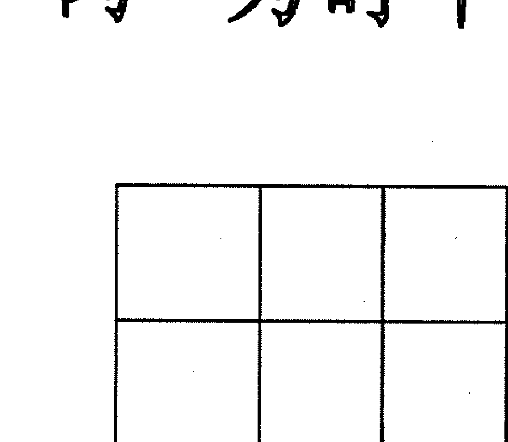
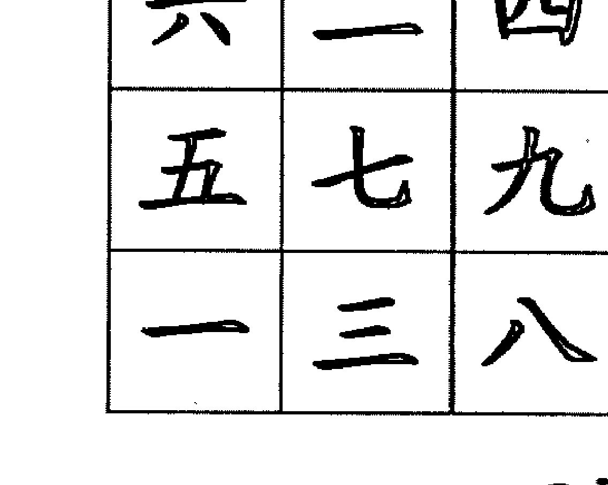
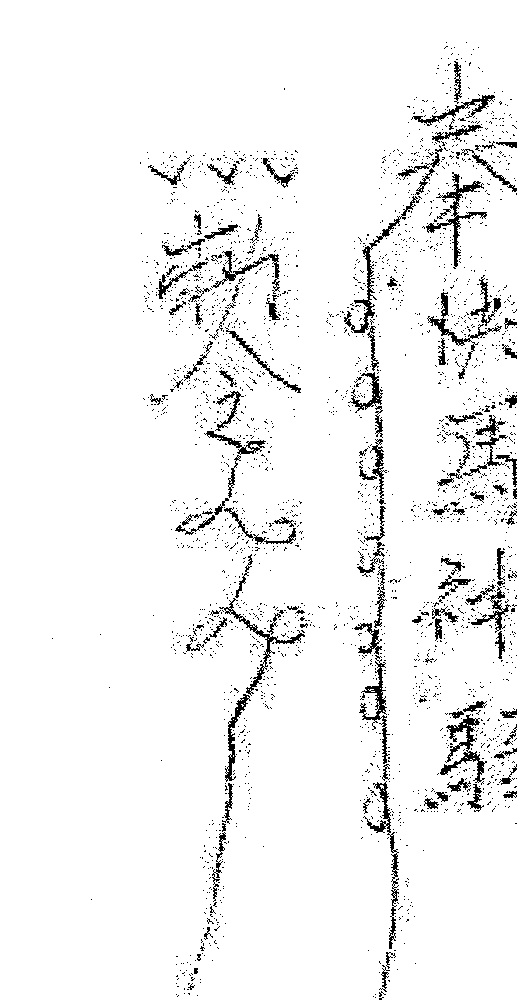
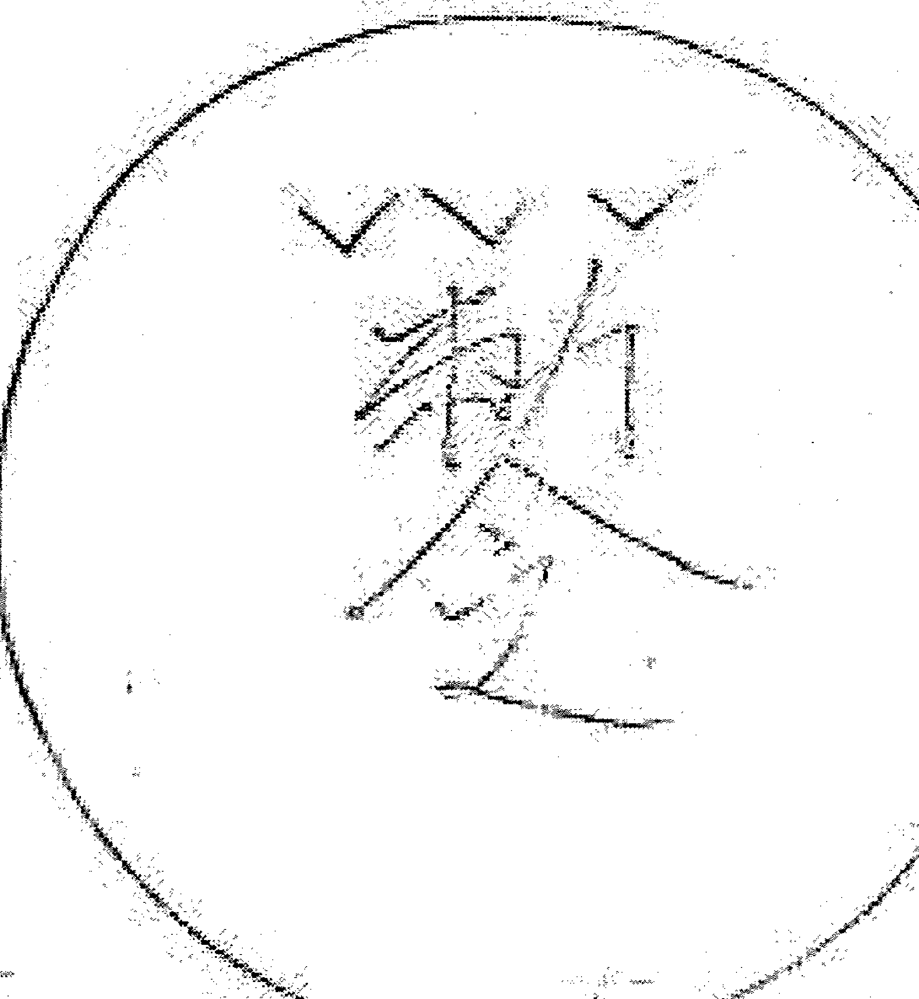

# 飞龙道人亲笔手稿传授
## 太公奇门遁
## （全卷）

十二月三十日
上午

# 速断秘法

- 1. 太公奇门八门定位法：
  - a. 太公奇门八门定位法；
  - b. 坎为合门（又名虎门、虎口）；
  - c. 震为阴门；
  - d. 巽为凶门；
  - e. 离为官门（又名珍珠门、富贵门）；
  - f. 坤为恶门；
  - g. 兑为阳门；
  - h. 乾为地门。

如图所示：

## 2、指掌乾坤推演法

- ①正月起于坎宫，一月一宫，递进顺数。
- ②月上起日，日上起时，时上起刻。
- ③一刻为10分，10分进一宫；不足10分作10分计。

例一、十一月十九日，巳时

十九日

如上指掌推演：

正月在坎宫；二月在艮宫；三月在震宫；
四月在巽宫；五月在离宫；六月在坤宫；七月在兑宫；八月在乾宫；九月在坎宫；十月在艮宫；十一月在震宫。这是起月推演法，也是指掌乾坤推演法的第一步；

再从十一月所临的震宫，起初一，那么初二在巽宫；初三在离宫；初四在坤宫；初五在兑宫……十九日在离宫。这是月起日推演的方法，也是指掌乾坤推演的第二步；

再从十九日所临的离宫起子时，那么丑时在坤宫；寅时在兑宫；卯时在乾宫；辰时在坎宫；巳时在艮宫，这是日上起时的推演方法，也是指掌乾坤推演的第三步。

余仿此。

例二、十一月十五日，午时（11：39）（11-13）

如上指掌图所示：

十一月在震宫；十五日在坎宫；午时在兑宫；这是月上起日、日上起时的方法。

那么，午时为两小时，时间区域在十一点到一点。起局时为午时——十一点三十九分，时上起刻，一刻10分，进一宫，三十分为三刻，9分不足10分照10分计，共四刻。

依据时上起刻的推演方法，午时为11:10，从兑宫起，那么11:20在乾宫；11:30在坎宫；9分不足10分照10分计，也同样进一宫在艮宫；十一点三十九分（11:39）即在艮宫。

这样就完成了，月上起日、日上起时、时上起刻的全部起局推演的过程。

太公奇门在实战预测中，按照月、日、时、刻的时间起局最为重要，时间的流动和空间的变迁，于指掌之间成为天衣无缝的高度统一与整合，预测的结果其准确率是不言而喻的。

为了学友们更能灵活运用，抓住时空中所显现的一切信息进行预测，再提供以下几种以供参考。

### 3、灵应快速起局法

- 1. 数目起局法
- ②笔画起局法
- ③方位起局法
- ④着色起局法
- ⑤外应起局法

## 4、定命宫与运宫（简称命运）

在太公奇门的实战预测中，如果以月为命宫，那么日即为运宫；如果以日为命宫，那么时辰即为运宫；如果以时辰为命宫，那么即以刻为运宫。

命宫代表自己，即求测者本人；
运宫代表自己的运，同时问官即为官运、问财即为财运、问一切即代表一切运。

例一、某人七月二十四日 问财运

分析：
- 1. 七月在兑，兑为命宫，兑为金；
- 2. 二十四在坤，坤为土，坤为运宫。

此以月为命，日为运。

例二、某人四月二十日巳时，问官

分析：
- 1. 四月在巽
- 2. 二十日在兑
- 3. 巳时在巽

此以日为命宫，在兑宫，兑为金；以时为运宫，在巽宫，巽为木。

例三、某人六月十五日，午时（12:45） 问婚

分析：
- 1. 六月在坤宫；
- 2. 十五日在巽宫；
- 3. 午时在艮宫；
- 4. 12：45分在巽。

此命宫在艮宫，运宫在巽，此以时为命，以刻为运。

## 5、八门定十二宫秘法

- a：八门
  - ①八门即合门（坎宫）
- b：十二宫
  - 运、兄、偶、子、财、疾、迁、友、官、田、福、父
- c：
  - ①以上我们学习且掌握了定命宫和运宫的方法，这是太公奇门大格局的初步判断，如果掌握了定命运二宫的方法，起十二宫就十分简单了。
  - ②起十二宫的方法是从运宫逆行一周与十二地支对齐。
  - ③每逢乾、坤、艮、巽四维宫，即从辰、戌、丑、未四土上起运逆行一周。

例一、三月十五日 某人问病

分析：
- 1. 三月在震宫，震为命宫，震为木；
- 2. 十五日在坎宫，坎为运宫，坎为水；
- 3. 从运宫坎上起十二运宫，即运宫在子、兄宫在亥、偶宫在戌、子宫在酉、财宫在申、疾宫在未、迁宫在午、友宫在巳、官宫在辰、田宫在卯、福宫在寅、父宫在丑。

这样，从运宫子（坎）逆布十二宫为周毕，就完成了逆布十二宫的流程。此以月为命宫，日为运宫，再从运宫逆布十二宫。

例二、三月十五日，卯时（掌图略）

分析：
- 1. 三月在震、十五日在坎、卯时在巽。
- 2. 以日为命宫、以时辰为运宫。
- 3. 时辰卯在巽宫，巽宫中藏两个地支辰与巳，依据上述每逢乾、坤、艮、巽四维宫即从辰、戌、丑、未四支上起运逆布一周的秘诀，我们可以推知，卯时运宫在巽，（巽宫中的辰巳两个地支）即可从辰上起运宫连布一周，余仿此。

此是以日为命宫，以时为运宫，再从运宫逆布十二宫一周。

例三、八月初十日 午时（12:21）（掌图略）

分析：
- 1. 八月在乾宫；
- 2. 十日在坎宫；
- 3. 午时在兑宫。午时的时间区域在11-13点，也即中午的11点到下午1点整，午时临兑宫，应从兑宫起刻，即11：10分在兑宫；11：20分在乾宫；11：30分在坎宫；11：40分在艮宫；11：50分在震宫；12：00点在巽宫；12：10分在离宫；12：20分在坤宫；12：21分在兑宫（因一分不足十分照十分计，进一宫）。此是以时为命宫、以刻为运宫。命运二宫同宫都在兑宫。

即从兑宫起运宫，兑宫酉为运、坤宫申为兄、未为偶、离宫午为子、巽宫巳为财、辰为疾、震宫卯为迁、艮宫寅为友、丑为官、坎宫子为田、乾宫亥为福、戌为父。

此十二宫逆布一周毕。

十二月三十日
下午

# 太公命理神断

## 1、如何装八神

- 八神：
  - 龙
  - 雀
  - 陈
  - 蛇
  - 虎
  - 武
  - 地
  - 天

装八神必须熟记天干九宫图。掌握每一天干在九宫图中位置，以日干所在的宫按顺序顺时针方向起青龙，如图所示：

| 辛 | 乙 | 己 |
|---|---|---|
| 庚 | 壬 | 丁 |
| 丙 | 戊 | 癸 |

假如为辛巳时，那么青龙应从天干辛所在的巽宫起布，青龙在巽宫、朱雀在离宫、勾陈在坤宫、腾蛇在兑宫、白虎在乾宫、玄武在坎宫、地运在艮宫、天运在震宫。此八神顺布在八门八卦的宫位上。

例如为丙午日，那么天干丙在九宫图的艮宫上，即从艮宫起青龙，顺布八神，方法同上；
假如为癸卯日，天干癸在九宫图中的乾宫，那么青龙应起于乾宫，顺布八神。

通过上例可知，八神随日干所在九宫图中天干顺布，此必须熟记。

天干在九宫中的顺序排列为：
戊→己→庚→辛→壬→癸→丁→丙→乙。
如图所示：

但有四种特殊的寄宫情况，必须记住，即寅、卯、辰、春三月，日干逢壬或甲，将壬或甲寄于巽宫，壬与甲这两天，青龙皆从巽宫起；巳、午、未夏三月，日干逢壬或甲，将壬或甲寄于坤宫，壬与甲这两天，青龙皆从坤宫起；申、酉、戌秋三月，日干逢壬或甲，将壬或甲寄于乾宫，壬与甲这两天，青龙皆从乾宫起；亥、子、丑冬三月，日干逢壬或甲，将壬或甲寄于艮宫，壬与甲这两天，青龙皆从艮宫起顺布。

例：十二月初一（甲午）
十二月的月建为丑，丑为冬月，日干为甲，应寄于艮宫，从艮宫起青龙，顺布八神。

| 巽辛 | 离乙 | 坤己 |
| 震庚 | 壬（中宫） | 兑丁 |
| 艮（丙） | 坎（戊） | 乾（癸） |

## 2、如何飞九星

九星：一白、二黑、三碧、四绿、五黄、六白、七赤、八白、九紫。

九星的五行属性为：
- 一白为水星
- 二黑为土星
- 三碧为木星
- 四绿为木星
- 五黄为土星
- 六白为金星
- 七赤为金星
- 八白为土星
- 九紫为火星

九星在九宫的原局图如下：

此为九星配十天干九宫图（原局）

九星的吉凶祸福判断，是以九星的五行属性生克十二宫的用神来决定的，生助用神或和用神比和者，为用神旺相，主吉；如克制用神或泻用神之气的，为用神休囚，主凶，不吉。

九星中的一白水星永随时干落宫依次序飞宫，这必须熟记。

如果时干为甲，那么一白起于坎宫，为原局飞。

例一、0四年三月十三日，壬午时

时干为壬，壬在九宫原局的中宫，那么一白水星即起于中宫，依照顺序飞宫，如图所示：

飞星次序：一白在中宫；二黑在乾宫；三碧在兑宫；四绿在艮宫；五黄在离宫；六白在坎宫；七赤在坤宫；八白在震宫；九紫在巽宫。

例二、0四年五月初六日，乙卯时

时干为乙，乙在九宫原局的离宫，那么一白水星即起于离宫，依照顺序飞宫，如图所示：

| 5 | 1 | 3 |
| 4 | 6 | 8 |
| 9 | 2 | 7 |

- 乙卯时的飞星次序：
  - 一白在离宫
  - 二黑在坎宫
  - 三碧在坤宫
  - 四绿在震宫
  - 五黄在巽宫
  - 六白在中宫
  - 七赤在乾宫
  - 八白在兑宫
  - 九紫在艮宫

例三、0四年五月初六、甲寅时

| 4 | 9 | 2 |
| 3 | 5 | 7 |
| 8 | 1 | 6 |

时干为甲，那么一白在坎宫。为原局飞星，记住，只要时干为甲，一白皆在坎宫，为原局飞星。

飞星次序如上图。

## 3、太公流年批运法：

- ① 所谓流年即是十二地支的逐年轮值。如甲申年，申为十二地支的轮值年；乙酉年，酉为十二地支的轮值年。申酉是代表流年符号的地支，俗称“太岁”，余仿此。
- ② 所谓流年运，即是求测者命宫落在八宫卦的某卦中，以此卦所代表的五行属性及卦宫中所藏的地支与流年地支（太岁），发生生克形成旺衰的运势，同时也要考虑到刑、冲、害、合的因素，而十二宫的用神一般情况下不必纳入，只看十二地支的流年与命宫五行属性的关系，这样断流年运就十分简单明了了。

而八门、八神、九星的运用，现在不必考虑，待以后熟能生巧时，再加以运用，否则欲彰反盖，不利于目前的学习思路，先从简单的入手，循序渐进，功到自然成。

例、0四年十月初三日 戌时（7：08）

丁丑月 丙申日 戊戌时

第一步：确定命宫、运宫。

| 巳辰 | 午 | 未申 |
| :--- | :--- | :--- |
| 卯 |    | 酉   |
| 寅丑 | 子 | 戌亥 |

十二月在巽；初三日在坤；戌时在乾；刻在乾。（此以时定命宫，以刻定运宫）

这样，戌为运宫，亥为命宫，戌亥都藏在乾宫，又称命运同宫。

求测者本人的命宫推寻出来了，亥为命宫的信息代码，直与每年的“太岁”相比较，进而分析运势的旺衰，受太岁相生的则旺，相克的则衰，与太岁比和则旺。

如：流年为子，子为水，亥也为水，为比和，此年则吉，运气很好。（96年）
流年为丑，丑为土，亥为水，为土克水，此年受太岁克制，为不吉，运气不好（97年）
流年为寅，寅为木，亥为水，寅亥合与太岁相合，能得贵人相助（98年）
流年为卯，卯为木，亥为水，水生木，被太岁所泻，此年耗财或身体有疾（99年）
流年为辰，辰为土，亥为水，土克水，被太岁辰土所克，此年易有伤灾，破财之事（00年）
流年为巳，巳为火，亥为水，水克火，太岁被克为此年有进财之喜，克太岁主辛苦，巳亥相冲，必主走动、外出（01年）
流年为午，午为火，亥为水；水克火，太岁被克，此年有进财之喜，但辛苦，有外出之象。（02年）
流年为未，未为土，亥为水，土克水，太岁克命宫，此年不顺，事业难以发迹，身体易生疾病。（03年）
流年为申，申为金，亥为水，金生水，太岁生我，为财运大旺，但申亥相害，会有不愉快的事情发生，会有小人出现（04年）
流年为酉，酉为金，金生亥水，其年太岁生命宫，也主有贵人相助，财运亨通（05年）
流年为戌，戌为土，亥为水，土克水，太岁克命宫，一要注意身体健康，二要注意破财等意外之事（06年）
流年为亥，亥为水，命宫亥为水，为比和，但亥见亥为自刑，注意对自己不要太苛刻，学会宽容自己，不走极端（07年）

上述为流年运气的具体断法，十二年为一周，轮转不变，在将来的熟断中，还可加上八门、八神、九星，进行综合论断，但现在不必急于求成，我们只要学会定八门，装八神，飞九星的方法就行，同时还要掌握八门、八神、九星的含义，以便将来运用自如。

尽管如此，我们还是要学习一下定八门，装八神、飞九星的方法，使大家了解并掌握演局的全过程。

第二步：定八门：
- 虎门在坎宫
- 天门在艮宫
- 阴门在震宫
- 凶门在巽宫
- 恶门在坤宫
- 阳门在兑宫
- 地门在乾宫。

第三步：装八神（初三为丙申日，日干为“丙”，“丙”在艮宫，在艮宫起青龙，顺布八神）

| 左上（陈 凶门 巽） | 上中（蛇 官门 离） | 右上（虎 恶门 坤） |
| --- | --- | --- |
| 左中（雀 阴门 震）<br>巳<br>辰 | 午 | 未<br>申<br>右中（武 阳门 兑） |
| 左下（艮 龙 天门）<br>寅<br>丑 | 子 | 戌<br>亥<br>右下（命宫 运宫 乾 地门） |

第四步：飞九星（为戊戌时，飞星以时干所在宫起一白星依顺序飞宫，换句话说，飞星时一白水星永随时干飞宫）。

九宫格图表：
| 巽（辰四绿，凶门） | 离（蛇九紫，官门） | 坤（虎二黑，恶门） |
| :--- | :--- | :--- |
| 辰、巳 | 午 | 未、申 |
| 卯 | （中宫） | 酉 |
| 寅、丑 | 子 | 戌、亥 |
*注：图表周围标注有震（二碧，阴门）、兑（七赤，阳门）、艮（八白，天门）、坎（一白，合门）、乾（六白，地门，命宫/运宫）等。*

第五步：装十二运宫。从运宫起逆布一周。
十二运宫：运、兄、偶、子、财、疾、迁、友、官、田、福、父。

以上的八门、命宫运宫、八神、九星、十二运宫整个系统已全部装毕，这必须在指掌练习、熟记。
- 一白水星、合门、天运、福德在坎宫；
- 八白土星、天门、青龙、官禄田宅在艮宫；
- 三碧木星、阴门、朱雀、交友在震宫；
- 四绿木星、凶门、勾陈、迁移疾厄在巽宫；
- 九紫火星、官门、腾蛇、财帛在离宫；
- 二黑土星、恶门、白虎、子女配偶在坤宫；
- 七赤金星、阳门、玄武、兄弟在兑宫；
- 六白金星、地门、地运、运父在乾宫；

## 九星含义略释：

- ①九星五行属性：生我者旺、比和者相、我生者休、克我者囚。
- ②一白水星，代表小人；一白入中宫主小人就在身边；一白在福德主一生犯小人；一白在迁移宫为外出犯小人、桃花、失眠；一白临玄武为犯桃花劫、失窃、小人等；一白临青龙为酒食、桃花等。一白水星和坎宫的性质是一样的。
- ③二黑土星，代表疾病、妖魔鬼怪。二黑入中宫主身体有疾病，入命宫也如此，入六亲宫皆如此，和坤宫、恶门的性质是一样的。
- ④三碧木星，代表太阳初升，为施舍型，助人。三碧星飞临离宫，为事业到了顶峰，离宫为官门，财又落此官门，一般为吃国家俸禄，人到此地步易生烦恼，有升迁的欲望，但只要一动就会下来。三碧星属木，和阴门、震卦的性质是一样的。
- ⑤四绿木星，飞落田宅宫，家中易出凶事。主五灾凶事。四绿逢金为刀伤、逢土为车前马后之灾。四绿为凶门星和巽宫性质一样。
- ⑥五黄土星（甲在中宫为元帅）为吉星，五黄在中宫，掌管生杀大权，生谁谁旺，克谁谁衰，如在原局一般都有统领众人的能力。如五黄星飞到疾厄宫，若生则有救，若克你则为凶事。（如何化解，则需要看五黄土星能否飞临乾兑二宫，让病人住在此宫）
- ⑦六白金星，金本为财，入中宫为此人有财，刚武，果断，若男求测落入兑宫，一般都有外遇，为精神富有型的。六白星和地门、乾宫的性质都一样。
- ⑧七赤金星，金本为财，男性求测，此星若入中宫、命宫、或福德宫一般为一等异性缘旺。有技巧或心灵手巧。为文、金银首饰等。也为精神富有型的。七赤金和阳门、兑卦的性质是一样的。
- ⑨八白土星，主名望，入中宫为认真，忠厚，固执，入命宫也是如此。若女人求测，八白星入中宫或命宫，为一生易犯桃花，异性缘旺，入福德宫也如此；入迁移宫外出时易犯桃花等，（丁火为兑，为第三者女人；丙火为艮，为第三者少男）。桃花星落福德宫可能一辈子易犯桃花。八白土星和天门、艮卦的性质是一样的。
- ⑩九紫火星，为富贵，名望，有观音的慈悲心肠，乐于助人。天乙贵人，凡事逢凶化吉，为人见人爱，光明无私的人，与财同宫为收入较固定。一般为政府、行政职员。九紫火星和官门、珍珠门、离卦的性质是一样的。九紫在田宅宫，一般主家中过去或现在有人点香。

如命宫在震，三碧星也在震，为星与命宫比和，三碧星在震卯宫，逢酉年遭太岁相冲，如吉冲则吉；如凶冲则凶。星与命宫比和，逢酉年冲之则吉。余仿此。

## 4、太公大运速断法

太公奇门的大运一般以 20 年为一期，第一期是为九个星所决定的；第一星代表 20 年运，九个星共 180 年运。

九星原局：一白水星在坎宫；二黑土星在坤宫；三碧木星在震宫；四绿木星在巽宫；五黄土星在中宫；六白金星在乾宫；七赤金星在兑宫；八白土星在艮宫；九紫火星在离宫。如图：

| 巽 | 离 | 坤 |
| :---: | :---: | :---: |
| 四绿 | 九紫 | 二黑 |
| 震 |  | 兑 |
| 三碧 | 五黄 | 七赤 |
| 艮 | 坎 | 乾 |
| 八白 | 一白 | 六白 |

在飞星的时候，还是以来人预测时的时干定一白水星的位置，也就是说，一白水星永远随时干落宫起飞，前已陈述。

如丙午时，“丙”为时干，在原局的艮宫，如图：



## 时干

那么，一白水星当从艮宫起飞，如图：



## 一白星

| 星名 | 宫位 |
| :--- | :--- |
| 一白水星 | 艮 |
| 二黑土星 | 离 |
| 三碧木星 | 坎 |
| 四绿木星 | 坤 |
| 五黄土星 | 震 |
| 六白金星 | 巽 |
| 七赤金星 | 中宫 |
| 八白土星 | 乾 |
| 九紫火星 | 兑 |

飞九星的方法，前已所述，但作为大运来说，一星代表 20 年运，这是不变的，须记住。

那么，大运年限是如何划分的，我们初习此道之人，不必在这里面花费心血和精力，只要牢记：84 年到 03 年的 20 年为兑七大运；04 年到 23 年的 20 年间为艮八大运；24 年到 43 年的 20 年间离九紫大运，往后为一白坎运；再往后为坤二黑运，依次类推，周而复始，循环无端。

在为人预测时，大运的影响力是不可忽视的，大运五行，如果生助命宫或运宫，那就旺相；如果克泄命宫或运宫，那就休囚无力，运气就会受到一定的影响。也即说大运生助终是有；大运克泄终是无，如财来了能否受用或积蓄，就看大运能否生助了。

现在我们举一大运速断的例子，供学友们参考：
例：二 00 四年五月十八日，辰时，问财
庚午月乙酉日，庚辰时

| 二 官<br>田 辰 | 七<br>友 午 | 迁 九<br>未 申 疾 |
| :---: | :---: | :---: |
| 一 福 卯 |  | 酉 财 五 |
| 父 寅<br>六 运 丑 | 子 兄<br>八 | 戌 子<br>亥 四 偶 |

+   1. 五月在离
+   2. 十八日在坤
+   3. 辰时在艮

日干为“乙”，“乙”在离宫，青龙从离宫起，顺布八神，朱雀在坤宫；勾陈在兑宫；腾蛇在乾宫；白虎在坎宫；玄武在艮宫；地运在震宫；天运在巽宫。八神顺布完成。

时干庚在震宫，一白水星从震起飞，那么二黑在巽；三碧在中宫；四绿在乾宫；五黄在兑宫；六白在艮宫；七赤在离宫；八白在坎；九紫在坤宫。九星飞宫完毕。

以日为命宫，以时为运宫。

命宫在坤；运宫在艮。

从艮宫的丑起十二运宫逆布，那么，丑为运宫；子为兄宫；亥为偶宫；戌为子宫；酉为财宫；申为疾宫；未为千宫；午为友宫；巳为官宫；辰为田宫；卯为福宫；寅为父宫。十二宫逆布完毕。

## 分析：

因为问财，就要看十二宫中的财帛宫，看这个宫落在哪一宫，这个财帛宫即是求测者问财所使用的用神。

在这个例子中，财帛宫落在兑宫，因兑宫为七赤，在七运时，财运较好，但现在已跨入八运，八白为土，生财帛所在的兑酉金。财帛在八运中，为八白土所生助，故在八运中此求测者有20年的好运（同时又得五黄生助。）

坎宫的八白只是对坎宫有影响，对其它宫没有任何作用力。艮坤对冲，但月令午火即贪生忘冲。这个即是速断大运的例子。

余仿此。

## 5、速官六亲吉凶祸福法

太公奇门虽然能够一局多断，但还是强调专神专用，也即对号预测，这样所断信息才能准确。如果一局多断，因为用神不专，预测的准确性，就会受到质疑，其预测结果就受到相对的影响，所以太公奇门不提倡一局多断。

如果要测自己，这个格局就属于自己的格局，如果测子女，这个格局就属于子女的格局；如果测父母，这个格局就属于父母的格局等。

### 例一、五月初八日卯时，问父母关系如何？

(庚午月乙亥日 己卯时)

| 巽 | 离 | 坤 |
| :---: | :---: | :---: |
| 财 疾 辰 巳 | 子 午 | 偶 未 申 兄 |
| 迁 卯 |  | 酉 运 |
| 友 寅 丑 官 | 子 田 | 戌 亥 父 福 |

图周围标注八卦方位：巽（左上）、离（上中）、坤（右上）、兑（右）、乾（右下）、坎（下中）、艮（左下）、震（左）。

五月在离；初八日在巽；卯时在兑。
巽为命宫；兑为运宫。
那么命宫为父亲，运宫为母亲。

### 分析：

+   - 父命宫为巽，巽为木
+   - 母运宫为兑，兑为金

八神，日干为乙，乙在离宫，那么从离宫起青龙，顺布。朱雀在坤；勾陈在兑；腾蛇在乾；白虎在坎；玄武在艮；地运在震；天运在巽。

九星，时干为己，己在坤宫，一白在坤；二黑在震；三碧在巽；四绿在中央；五黄在乾；六白在兑；七赤在艮；八白在离；九紫在坎。

父亲在巽、三碧、天运、都在巽宫。

巽为木，三碧为木，巽木得三碧木所助。

为你父亲一生多得官、贵之人相助，因三碧为天星，天星为上司、长辈、领导；三碧的原局在阴门，同样具有阴门的意义；八神的天运临巽宫的父亲，主你父亲一生多得天佑，遇到难事都能自然化解，巽为驿马，主你父亲一生多走动，是付出型的人，同时为外刚内柔，思想丰富之人。巽为凶门，但凶已不凶，因天运临此，如果吉为更吉，凶则更凶。

母亲在兑，六白、勾陈、都在兑宫。

兑为金，六白为金，为比和，六白原局在乾金的宫位，也为领导、长辈，主你母亲一生多得上级、长辈的关爱和帮助，同时你母亲口才好，皮肤白，异性缘旺，男朋友多，一般都较自己的年龄长，性格外柔内刚。

你父母的工作都与文、笔有关，同时父母都很有气质。

父母之间的关系：生活中常有争吵，因兑金克巽木，母亲总是想克你的父亲，一般情况下你父亲不会多说话，因巽为柔木，多于思考，有时就是忍让，只要发起火来，你母亲就不再说话了，反过来又要顺着你父亲了。原因为巽宫中藏有己火。不会有离异之可能，因巽宫中藏有辰土，辰与酉合，所以不会离异，请你放心。己酉为六合，只是吵闹，不会离异，不要担心。

### 例二、李某问女儿的学习情况（子女）

0四年十二月初五日 酉时
丁丑月戊戌日辛酉时

| 左（巽） | 中（离） | 右（坤） |
| :---: | :---: | :---: |
| 友<br>官 辰 巳 | 迁 午 | 疾 未<br>财 申 |
| 田 卯 |  | 酉 子 |
| 福 丑 父 | 子 运 | 戌 偶<br>亥 兄 |

问子女，此格局即代表子女。

+   1、12月在巽；初5日在乾宫；酉时在坎宫。
+   2、乾为命；坎为运。运泻命，也即命生运。
+   3、再看八神；青龙在坎；朱雀在艮；勾陈在震；腾蛇在巽；白虎在离；玄武在坤；地运在兑；天运在乾。

4、再看九星：一白金星在巽；二黑在中宫；三碧在乾宫；四绿在兑宫；五黄在艮宫；六白在离宫；七赤在坎宫；八白在坤宫；九紫在震宫。

## 分析：

从大格局来分析属劳而无功的格局，命生运，孩子平时学习虽然刻苦，一考试成绩就滞后，对孩子来说，可能对学习都推动信心了，而且孩子有早熟现象，因命宫为乾，乾为老夫。孩子脾气犟，不听话，但天运，三碧在命宫，将来自有福气，现为八白土运20年的大运走乾金命宫。

在十二宫中父母还代表文书、功名，本格局的父母宫在艮宫，艮为土，土生乾金，为文书、功名来生命宫，所以你的孩子为有福自来，将来会很好的。

这是凶中藏吉的格局。

建议：如果能将学习和睡觉都放到东北方就好了。

### 例三：杨某问大哥的身体如何
0四年六月十三日，巳时
辛未月己酉日己巳时

| 巽 | 离 | 坤 |
| :---: | :---: | :---: |
| 财 疾 辰 巳 | 子 午 | 偶 未 兄 申 |
| 震 | | 兑 |
| 迁 卯 | | 酉 运 |
| 艮 | 坎 | 乾 |
| 友 寅 丑 官 | 子 田 | 戌 亥 父 福 |

+   1、命宫在艮；运宫在兑；
+   2、八神：日干为己土，己在坤宫，当从坤宫起青龙，顺布，朱雀在兑宫，勾陈在乾宫；腾蛇在坎宫；白虎在艮宫；玄武在震宫；地运在巽宫；天运在离宫。
+   3、九星：时干为己土，己在坤宫，当从坤飞一白星，那么二黑在震；三碧在巽；四绿在中宫；五黄在乾宫；六白在兑宫；七赤在艮宫；八白在离宫；九紫在坎宫。

命宫为自己，代表本人。
运宫问病则代表病。

### 命宫生运宫

运宫兑为肺、呼吸系统，所以主要疾病在肺，又疾厄宫在巽，巽为风，也为呼吸系统。

### 白虎、七赤在艮宫——命宫。

> > “白虎入命来，破财当大灾”。白虎也为疾病。七赤为金星泻命宫艮土，为身体较虚或瘦弱、其病人性格犟，个子不高，此为艮宫的性质决定的。

> > 以上的三个例子是断六亲的修正案，希望大家在预测实践中能举一反三，多动脑筋，开动思维，在最基本的概念上下功夫，才有登高望远的希望，老子说：“高以下为基”，信哉诚然，不可小视。

# 十二月三十一日
# 上午/下午 太公奇门布阵运筹风水术

## 1、风水运气预知术

太公奇门的风水预知，强调的是运气，不强调峦头，也就是说，在古代兵家利用奇门排兵布阵，考虑的不是峦头如何，主要是看此地的运气能否生我方，如此地的运气能生我方，此地就有隐蔽、保护我方的潜在能力，当然这里面要充分运用时间和空间的作用，发挥其特有的效力，灵活运用，不守教条，才能克敌制胜。若地利于我方，我方就必须提前占领；地利于敌方，那我方就挂免战牌，以待时日，或移师有利我方之处。古言：“天时不如地利”，此语可鉴，不过要补充一点，强调地利，并非不要“天时”，其实是得“天时”后，必须再寻“地利”，有了“地利”和“天、地、人”三才兼得，才能手握胜算，运筹帷幄。此是一层进一层关系。

随着历史的变迁和发展，到了现代，奇门运筹风水术，已经不是运用于战场了，而是用在住宅风水运气的旺我衰我生我克我的预测预知上，这里我不想编造什么理论，牵强附会的说上一大戴盆望天道理，误导学友走向神秘境地，浪费时间。只需要学友们能通过太公奇门格局中的田宅宫，判断出田宅运气之好坏及田宅宫对六亲的影响或造成的后果就够了。

### 如何去判断住宅运气之好坏

+   ① 住宅运气之好坏，主要看十二宫中的田宅宫是否刑、冲、克、害、合六亲等。
+   ② 看田宅宫所临八神。
+   ③ 看田宅宫所临九星。
+   ④ 同时要参考年、月、日、时对田宅宫的刑、冲、克、害、生、合的关系。
+   ⑤ 兼看大运对田宅宫的生克泄的关系，但凡是不住在本宅中的人都不会受到此宅风水的影响。

以上是判断阳宅风水好坏的重要条件，只要我们将前面所学的基本知识掌握了，就轻而易举不费尽力了。

现举例如下：

### 二00四年五月十八日辰时，问阳宅运气 庚午月己酉日庚辰时

| 巽 | 离 | 坤 |
| :---: | :---: | :---: |
| 官<br>田<br>辰<br>巳 | 友<br>午 | 迁<br>未<br>申<br>疾 |
| 福<br>卯 | | 酉<br>财 |
| 父<br>运<br>寅<br>丑 | 子<br>兄 | 亥<br>偶<br>戌<br>子 |

+   1. 命宫在坤
+   2. 运宫在艮
+   3. 月令午火在离

### 解析：

+   1. 在艮宫丑逆布十二宫，那么田宅宫在巽宫辰土。
+   2. 日干为乙，乙在离宫，青龙在离；朱雀在坤宫；勾陈在兑宫；腾蛇在乾宫；白虎在坎宫；玄武在艮；地运在震；天运在巽。

3、时干为庚，庚在震宫，那么一白星在震宫；二黑星在巽宫；三碧木在中宫；四绿星在乾宫；五黄星在兑宫；六白星在艮宫；七赤星在离宫；八白星在坎宫；九紫星在坤宫。

再看：

田宅宫在巽，巽宫同时有两个信息，除田宅之外，还有官禄。

本来命宫、运宫，也即坤宫、艮宫对冲主不吉，但月令为午火，火不仅生艮土，同时也生坤土，象这种情况的出现，把命运二宫对冲的局面化解了，化干戈为玉帛，这叫贪生忘冲，象这种类型的必须记住。

再讲田宅宫，在巽宫为辰土，官禄宫在巽宫为巳火，火生土，此宅为官地，或与官贵为邻，或到九紫大运时宅中一定有人为官，因九紫为官门，官门之火生田宅辰土之故，不过这是未来的预言，仅作学友们参考。

此田宅巽木，生月令午火，木得火主通明之象，此宅中一定会出名望、声名之人。

此财运也旺，因宅与财合，即辰酉合。

又田宅辰土见辰时，辰见辰为自刑，主家宅中易生刑伤。

此宅为巽，巽为驿马，为主人常于外走动，在家不宜时间长（辰见辰为自刑），同时此宅的主人易患肝胆之疾。

艮八大运为土，生兑酉财，酉财又与宅辰合，在三十年，此宅财运相当好，五黄土也生酉金之财。

### 再举一例：

0 四年十二月十五日 亥时（10：20）问 宅运

丁丑月戊申日癸亥时（董某）

| 兄（偶辰） | 运（午） | 父（未申福） |
| :---: | :---: | :---: |
| 子（卯） | （空） | 酉（田） |
| 财（寅丑疾） | 子（迁） | 戌（亥官） |

+   1、艮为命宫　　土
+   2、离为运宫　　火
+   3、田宅在兑　　金
+   4、八神：日干为戊，在坎宫，坎宫起青龙，艮为朱雀；运在震宫勾陈；巽宫腾蛇；离宫白虎；玄武在坤；兑宫地运；乾宫天运。
+   5、九星：时干为癸，在乾宫，乾宫起一白飞星；二黑在兑；三碧在艮；四绿在离；五黄在坎；六白在坤；七赤在震；八白在巽；九紫在中宫。

+   a：田宅宫，地运临此，二黑临此。
+   b：八白艮土大运又生田宅宫。

这样，田宅宫酉兑，得运地护持，地运为土生田宅宫酉兑金，此宫当有医生或卜卦之人；在此宅中易出与玄学有关之人；二黑土也生田宅宫兑酉金，为宅之运气旺，二黑土为天之九星生田宅宫，为此宅有通灵之人；此宅有灵物护佑；田宅宫酉与官禄宫戌，为酉戌相害，不仅此宅不出官人，同时与官贵之人打交道的时间都不会较长。

田宅宫在酉，子午卯酉为桃花，所以田宅宫为桃花地，主子女们婚姻不顺或因桃花而离婚的有之。

田宅宫为酉，子女宫为卯，田宅和子女相冲，尤其七赤兑金大运，田宅宅气旺，冲克子女，主孩子常生病，现为艮八大运，此种情况相对好转了。

## 2、风水推运速断六亲法

宅运的具体预测方法和宅运吉凶断判方式都已在上面讲过了，只要我们熟练掌握了，就可以通过田宅宫的运气判断对六亲吉凶祸福的影响。

举例如下：

0 四年十二月 初七 申时 (3: 25)

### 丁丑月庚子日甲申时

| 父 运 巳 辰 | 福 午 | 田 未 官 申 |
| :---: | :---: | :---: |
| 兄 卯 | | 酉 友 |
| 偶 寅 丑 子 | 子 财 | 戌 亥 疾病 迁 |

+   1. 田宅宫在未坤宫。
+   2. 八神：青龙在震、朱雀在巽、勾陈在离、腾蛇在坤、白虎在兑、玄武在乾、地运在坎、天运在艮。
+   3. 九星：时干为甲，甲从坎宫起一白（原局），一白在坎宫、二黑在坤宫、三碧在震宫、四绿在巽、五黄在中宫、六白在乾宫、七赤在兑、八白在艮、九紫在离。

首选看田宅宫：田宅宫在坤宫所藏的未土上，上临腾蛇和二黑星。

腾蛇其性虚伪，遇吉门无防，如遇凶门则助纣为虐，但在此格局中腾蛇临恶门，此宅的运气已经大打折扣了，加之坤宫为纯阴之气，有诸多不利之事发生，虽然二黑星飞临此宫，本宅运气得天星相助，但毕竟二黑星本身和坤宫的性质一样，也容易使家中的老年妇女得皮肤病和肠胃消化系统的疾病，总而言之，此宅的运气不是吉格，大家可以根据自己掌握的基础知识，好好分析。

再看此宅的运气对六亲的影响如何（对子女）

子女宫在丑，与田宅的未相冲，主孩子都会远离此宅在外面工作，即使回家也不会住太长时间。现为申时预测子女得时运所冲，主眼前子女有疾病发生，原因是：申时进行预测的，田宅宫在坤的未或申；或者是未时进行预测，田宅宫同样在坤宫的未或申，主田宅运气得时运所助，去冲动子女宫艮宫中的寅或丑，在这种条件下作冲克断，主子女不旺，但子女若不在此宅中住了，就不会受到影响，这是一种情况。

如果在寅时或丑时进行预测，子女在艮宫的寅或丑上，为子女冲克坤宫中的田宅宫，主田宅运气不旺，因子女宫得时运所助。这是第二种情况。

如果子女宫或田宅宫都不得时运的帮助，换句话讲，即是预测时的时辰既不是田宅宫的地支也不是子女宫的地支，那么，就不作冲克论，因为宅宫和子女宫永远是对着的，冲克与否主要看预测时的时辰了。余仿此，要记住这是第三种情况。

不过，还有一种情况，提出，让大家考虑一下。

福德宫午火与田宅宫未土，为午未合，合中又生，午火生未土。不仅是福德宫临午，还有官门，九紫都在午离宫，都挂在离宫午火上，也就是说都与田宅宫未土有生合的作用，都成了田宅宫的护佑之神，又九紫星也代表大慈大悲的观世音，此星与宅生合，主宅中有点香供神佛的现象，实际情况确实如此，我想对此化凶灾也可能起到一定的作用。

什么事情都是一分为二的，要综合全面地分析判断，才能将事物的吉凶透析得入理入微。

易学是博大精深的，易技是永无止境的，提出来让大家在实际运用中去参考去发现。

不过要是在午日午时，那就直接起到午未合的作用了，尤其是午未之间无间隔，紧紧相邻的，俗话说，远亲不如近邻，还是有点符合情理的。

太公奇门教授学友们的，不仅是起局，装神、飞星的方法，而且传授的是判断格局的独特思路，你接受了这种体系，又掌握了最基本的常识，判断格局中吉凶祸福时，就看自己发挥得如何了，全在自己的真知灼见，不可拘泥于他人，要做到熟能生巧，还须待些时日方可。

受到时辰相生或相冲克，主事情快；如此例申时预测冲克子女宫，主眼前孩子要生病，果然在第三天下午孩子生病，咳嗽、高烧，去医院打点滴、吃药。

0五年元月一日
# 上午/下午 太公门将帅鉴名法

## 1、快速断姓名吉凶法

太公门的鉴名原为古代打仗时选择战将而使用的。在今天同样可以从姓名上鉴别在人生运气、未能得逞上的吉凶祸福。

## 方法：

姓氏的笔画数为命宫，笔画大于8的，除以8，余数为命宫；

名字的笔画数为运宫，笔画数大于8的，除以8，所得余数为运宫。

八卦先天数：乾一、兑二、离三、震四、巽五、坎六、艮七、坤八。

但必须配合日干、时干装八神飞九星

## 举例如下：

0四年十二月八日 未时 为张某

测名字

丁丑月辛丑日乙未时

-   1、命在艮宫 土
-   2、运在震宫 未
-   3、运克命

依此鉴名的方法，从大格局的：“运克命”来分析，此名确实不吉，为破败，招灾等大凶之兆。如图

运宫 天震四 | 运 | 卯 | 六
命宫 地艮九 | 寅 | 丑 |

但命宫在艮，天门在此；运宫在震，阴门在此。天门与阴门皆主名声、名望之脉，尤其是阴门，为付出型的，此人性格直爽。在八门中占据了两个最吉祥之门，但更奇妙的是九紫星飞落命宫艮土宫，这颗星的到来简直是化腐朽为神奇，使运克命的大格局发生天翻地覆的变化，虽然天运在震宫，地运在艮宫，都起不到调和运宫克命宫的作用，现在九紫星落艮宫起了通关的作用，使天运、地运真正发起吉祥的作用，这样运宫木克命宫上，其木即被九紫大化解而生助艮宫命之土了。

再看天星四绿，四绿为文昌、文曲、为学历高，为都是或医生，落在阴门，为付出型的，四绿星与巽卦的性质是一样的，对玄学应有兴趣，尤其是得到八神天运的护卫，主其人天生聪慧，性格开朗。

再看天星九紫，九紫为文人、作家、或军人，与官门、离宫，午火的性质是一样的。九紫又为观音代表慈悲，落于命宫艮土，且为火生土，为现在或将来一定会对佛学产生浓厚的兴趣，运宫中的天星四绿也有这样的信息内涵。而艮宫本来即是天门，九紫星临天门代表有特别的智慧，有超觉感知的潜能，或有第六、第七的预知能力，八神的地运又临此命宫，得地运土帮助，为基础稳固，有大地的养育之能，现在从0四年至二三年此20年为行艮八大运，大运又助命宫，可以预言将来的发展是令人仰目的。

如果以运宫为配偶，主配偶身带官印，在八神得天运所助，四绿为文昌、文曲、为学历较高，作事辛苦，得异性缘。(子午卯酉为桃花)卵木、寅木为比和，主夫妻感情好，但双方口才都好，时有争执。

在0四年0三年命宫丑寅受未申太岁冲克，有烦心之事，0二年犯小人、口舌。运气佳。

此人肌肤红白亮丽，额头宽，下巴稍尖，中年之双下马。身上有朱砂痣(红)。

住宅的西边有学校，有医院或诊所，或有超市，可见信息发射塔(包括西南、西北)

兄弟姐妹为三个左右。

注意脚部、腿部扭伤。中年之后也要注意心脏、眼睛或脑部的保养。

此人在学校读书时是非常勤奋刻苦的。

## 2、姓名断妻、财、子、禄、官秘法

例：段某某(女)0四年十二月初九未时
丁丑月壬寅日丁未时

| 段 | 某 | 某 |
| :--- | :--- | :--- |
| 9 | 7 | 11 |
| ...1 | 18 | ...2 |

| | 子午 | | 子田 | |
|---|---|---|---|---|
| 财 疾 | | 偶 | 兄 | |
| 巳 辰 | | 未 申 | | |
| | | | | |
| 迁 | 卯 | | 酉 | 运 |
| | | | | |
| 友 官 | 寅 丑 | | 戌 亥 | 福 父 |
| | | | | |

**周围标注**：
- 左上：蛇离、陈巽
- 右上：虎坤
- 左侧：雀震
- 右侧：一兑武运宫、九乾地命宫
- 左下：艮龙
- 下方：坎癸

## 分析：

-   1. 命宫乾为本人、金、九紫、地
-   2. 运宫兑为偶宫、金、一白、武。
-   3. 命运二宫都得未时所生。

命宫为本人，运宫为配偶。此二宫皆为金，为金碰金，金碰金主有声响，表示夫妻二人经常吵闹，这是其一。

子午卯酉为桃花，酉为兑宫，主配偶犯桃花，尤其一白星，玄武神临兑宫，皆为桃花。

旺或因桃花而犯小人，因一白、玄武又较一般桃花为重，可称桃花劫，这是其二。

配偶宫的酉，与命宫中的戌，为酉戌相害，即相互伤害，综合如上的情况看，婚姻不会维持久远，易离婚，或已离婚。

九紫火落命宫乾金，为火克金，好在乾宫藏戌土化九紫克星为助星，虽命宫在乾，性格刚直，但逢九紫为心地慈悲，八神中的地运临乾金命宫，得地运土所生，有宗教信仰，或喜欢神秘学，父亲的戌土又生乾金，主父母非常关心爱护自己。此命不缺钱，将来很好。因命宫中又有福德宫护持保佑。

兄弟临申，0四年为太岁，主兄弟不顺，申与乾宫的亥相害，为兄弟姐妹关系不是十分好。

官禄宫丑落艮宫，艮宫为天门主名声、名望。八神的青龙又临艮宫，二黑土星也临艮宫，现又为八白艮土大运，都来生命宫乾金，为身带官印，而且在此地有名声、名望。

因结婚没有多长时间就离异了，还没有子女

## 3、速断姓名生克六亲秘法

例：0四年十二月初九 酉时
丁丑月壬寅日己酉时 王某某

王 4
某 9
某 8

...4     17...1

| 巽 | 离 | 坤 |
| :--- | :--- | :--- |
| 疾 迁 辰 巳 | 财 午 | 子 未 申 偶 |
| 友 卯 | | 酉 兄 |
| 官 寅 丑 田 | 子 福 | 戌 亥 父 运 |

-   1. 命宫在震；木、（卯）
-   2. 运宫在乾；金
-   3. 时运为酉时、金（酉）

运宫克命宫，在大格局上为大凶之兆，但乾运宫中的亥与震命宫的卯为半合木局，为克中有生，凶中藏吉。

五黄土，地运土生乾金，乾金又生亥水，亥水又生卯木，这样曲曲折折化克为生，也主一生坎坎坷坷，颠波流离，但终为吉祥之兆，其关键是亥水起了通关合化的作用。这样，乾卦中所包含的领导，有权等就可以作为参考，来定他的职务，这是其一。

再看命宫震卯木，也有单位领导的含义，这是其二。

综上两点，可以断其人身带官印，当过领导。

因预测时的时辰为酉，与命宫中卯冲克，为卯酉相冲克，酉又为兄弟宫，主其人与兄弟相距较远，且关系不和。

命宫卯受时运酉相冲克，主日前要注意身体健康，冲动又主走动，静不下来（此在预测时即已证实，无误），因时辰所代表的时运，一旦刑、冲、克、害、生、合十二宫的某一用神，主吉凶祸福的发生就在眼前，不会太远。

命宫卯木，克子女未土，主管教孩子太严格，子女运气不旺，虽卯未为半合，但合中有克，不利子女。

二黑为病符落入命宫，为其人肠胃消化系统有病。

配偶申在坤宫，命宫卯木克坤土，外表看起来，妻子是惧他的，但实际是申金克卯木，只要妻子发怒，发脾气，自己就忍气吞声不敢作声了。

妻子易患肠胃、消化道疾病；湿重浮肿、中气虚弱等慢性病。

## 4、太公奇门起名法

太公门鉴名法，不同于世面上所讲的各种方法，更没有套用的痕迹，它有自己一整套独特的体系，它的优点即是通过本人姓名所藏的信息可以读出姓名中的妻、财、子、禄、官及六亲、风水运气的吉凶祸福，还有性格、相貌、疾病、桃花，甚至职业等等的情况。

但必须明白，就目前本人所了解的情况来看，100%的准确率还没有被发现。

能鉴名，自然就能够起名、改名，这是运用反推的方法及原理所获的真知。

### 如何起名、改名：

### 起名、改名的方法如下：

-   ①将姓氏笔画数的命宫定下来，也即是先定下命宫的卦宫五行
-   ②再寻找能生命宫五行的运宫卦
    这样就能达到运生命的格局了。

例如：原名王泽亚
王4  泽8  亚6
...4        14...6

此名字虽然运水生命木，因坎水中藏子，震木中有卯，为子卯相刑，此吉中有凶，为不吉。

改名 (即重新起名) 如下：
王4 亚6 洲9
...4 15...7

| | | |
|---|---|---|
| 巽 (辰巳) | 离 (午) | 坤 (未申) |
| 命震 (卯) |  | 兑 (酉) |
| 艮运 (寅丑) | 坎 (子) | 乾 (戌亥) (偶) |

这样，命宫震木克运宫艮土。但运宫的寅木和命宫的卯木比和，现为八白艮八大运，也能说，同样可得八白艮八大运的比扶帮助。且配偶亥水又生卯木又和寅合，对本命宫十分有利。

又举例如下：
原名何俊

-   何 7
    ... 7
-   俊 9
    ... 1

| 巳 辰 | 午 | 未 申 |
| 卯 |    | 酉 |
| 寅 丑 | 子 | 戌 亥 |

命生运，显然不是吉兆，此名不可取。

### 改名何东旭（重新起名字）

```
何7 东5 旭6
↓ ↓
...7 11...3
```

改后的名字为运生命，且寅、午、戌化三合火局又生助命宫(寅为财)，配偶在巽宫，巽为木，木生午火运宫，午火又暗生辰土，主夫妻感情笃深。

0五年元月二日

# 上午/下午 太公奇门疆场占卜术

-   1. 快速掌握太公战卜捷法

乾三连
离中虚
震仰盂
兑上缺

坤六断
坎中满
艮覆碗
巽下断

方法：备三枚铜钱，摇三次，有字的一面为阳爻，无字的一面为阴爻；

摇时，只有一个背的两个字（阳多），记为阳爻，有两个背的一个字的（阴多），记为阴爻；有三个背的记为○为老阴；有三个字的记为×为阴阳。

> “○”“×”为卦中动爻，动则有变；三个爻都不动的，则不变。

## 2、速占吉凶秘法

-   第一摇得三个字记为阳 “—” ×
    第二摇得两个背记为阴 “--”
    第三摇得三个背记为阴 “--” ○
    艮 震

命 - x -- 运
宫 -- -- 宫
土 -- ○ - 木

在摇卦之先，须将月、日、时的干支写出来，必须以日干顺布八神，以时干飞布九星。

0五年元月三日

上午/下午　　太公奇门安民改运术

## 1、风水运气解灾改运调理法

### a、奇门阴阳宝镜符咒秘法。

风水运气解灾改运调理法，需来人的时间起局，把格局定下来，这是第一步。

格局定下来后，分析田宅宫的运气衰旺，这是第二步。

再请来人摇卦，用太公奇门占卜捷法选时日，看什么时间具体实施为佳。

具体实施时应在第一步格局中的福德宫画符念咒，这是第三步。

### 具体方法如下：

各用：朱砂、白芨、毛笔(狼毫更好)、圆镜、砚、少许白水研磨。

### 1、念净身咒：

嗡咄龄嗡 天地三光
九江八河水 王母玉池浆
入我阴阳窍 漂荡由昌
三魂双灵 由亮太光
三四九宫 五行满昌
神水一束 五祖之光
吾奉上帝敕令

念时掐子午诀：
左手拇指掐住中指端；

右手拇指掐左手子午，中指捏于子午外侧。

念至“吾奉上帝”深吸一口气于丹田，同时子午诀手印上提喉轮，分手沿颈部两侧至后脑从头顶下行至喉轮，再结子午印，吹气，边吹气边存想“敕令”，默念“敕令”。

手印下行丹田，收印

注：净身咒也是净宅咒，也是净一切物咒。

### 2、净笔咒（吹笔咒）

乾剑金 坤顺轮
魁雷电 震玄峰
云星星 哄霹雳
罡星至 月星斗
喻、乾、元、亨、利、贞、笔开。

对天门深吸气至丹田，呼出吐在笔峰上，吹时心想“笔开”。

### 3、阴阳宝镜上边画符，边念咒，边念咒边画符：

### 咒曰：

> 寒风和月朝万宗
> 邪妖立绝鬼化风
> 二十四气尊神镜
> 乾坤万里镜面行
> 安宅立善紧护道身
> 吾奉吾佛玄天上帝敕令

完毕，将此阴阳宝镜符挂在门楣上或窗上，禁忌，作法时女人月事。

事无要洗手。

### b、奇门镇宅符法

依时起局，在福德宫作法

备用、步骤与上法同

写毕，从√(天)、√(地)、√(人)开始念，念毕，再念“雷”字，再念右边“巽离坤兑”，念毕，再念右边“乾坎艮震”，念毕，再念“万神通正镇邪精”，念毕深吸气与丹田，呼出吹吐于符上，吹时从“上到下”，边吹边想“诚”字，后用红布包好，挂在门或窗户上。

### 2、改运旺财秘法

备用：葫芦一个

根据时间起局，先把财位找到，到财宫方位，拿着葫芦念咒49遍，挂财位上。

> 咒曰：

葫芦好比一座山  肚大腰圆嘴又尖
它是佛道无价宝  三教九流用周全
一挂佛珠有佛头  佛珠求到我的手
慈悲悲慈说根由
保佑弟子×××时来运转，财源丰。
此咒有护持、护宅、旺财之功效。

### 3、解灾避难秘法 (针对个人)

### 护身咒

哪吒三大子  土地共山神
我在危难处  急急护我身
护前身，护后身，护左身，护右身
急请南斗六星、北斗七星
吾奉上帝敕令

注：此咒可护身，也可护物，出行于车上也可念此咒。配有《护身符神妙法》此符可以挂在车上，佩在身上，晚上要挂在净洁处。画符时，照符上标的顺序，不能说话，应静心来一气呵成，灵光圈不能断开。

### 4、平安护持秘法 (针对个人)

### 十方护持法

我走四面八方
到处都有老佛像站像
你要问我我是谁
我是土地指南佛

### 5、解催桃花秘法 (针对个人)

五色纸：红、黄、白、黑、绿
另备一张白纸剪小人

-   1. 男的犯桃花，剪五个女小人
    女的犯桃花，前五个男小人
-   2. 在胸部横肉写本人的名字
-   3. 再竖写 “桃花开”
-   4. 反面贴在五色纸上，字向里即可
-   5、晚上黄表纸或金元宝，在十字路口烧，烧时念十方护持法，3-7遍即可，要天晴，星星满天。

## 太公奇门格局的运用：

命宫：命宫犯桃花，要犯一生
运宫：运宫犯桃花，只犯一时
一般情况是这样的。

要自己犯桃花就在命宫所在的方向找十字路口烧

要配偶犯桃花就配偶宫所在的方向找十字路口烧。

要福德宫犯桃花就福德宫所在的方向找十字路口烧。

看哪一宫犯就在哪一宫的方向找十字路口烧；如果地理环境不具备条件，就可北方找十字路口烧。

忌：桃花旺，但又没有结婚，造成不可解，不犯桃花煞，不影响家庭夫妻感情不要解，只是桃花运。

经多次恋爱，或别人介绍的都没有成功的，可以烧四个，留一个挂在配偶宫即可，找到对象之后，再把它拿掉去十字路口烧。

催桃花运，要找飞星，尽是不要找一白位置，男的找七赤，女的找八白（七赤为兑为少女，八白为艮为少男）。如果迁移宫坐上桃花，犯起运的。如果福德宫有桃花，比如一白落在福德宫，福德宫若落在土宫（艮、坤）说明他自己有制约力，这种人不可解；落入木宫同样要化解，入金宫得生不好。

念十方护持法时，每念完一遍就要说，弟子今天给× × ×解桃花，或催桃花，希望过往神灵护持弟子× ××

一白（主小人）落入中，经常犯小人、口舌、

是非，像国君身边有小人，走到哪都带是非。

## 化小人：

方法如上，只要在小人身上写“小人散”。如果小人落入官禄宫(事业宫)，到官禄宫方向找十字路口去烧；在福德宫一生犯小人，在财宫求财犯小人；在迁移宫为出行犯小人

〇五年元月四日

# 上午/下午    太公奇门回营疗伤化病术

## 1、惊吓速收秘法

-   a、小孩受惊吓：
    摸他(她)手心，跳得厉害
    食指有青筋，到第一节为刚吓不久
    到第二节有7-8天
    到达第三节，很严重了
    指上青筋如果发叉，是有毛动物哺养的
    青筋弯曲，吓后拉肚子
    红色、紫色表实证。

如果青筋-惊风，有邪气，必须扎针

用针点一下，然后挤出血或浓

在晴天晚上，画完符，晚上孩子睡了，床上放纸盒(防火)，拿符在孩子头上顺，照各转三圈，边转边咕小孩子名字：回来吧，转完后在小孩头上把符烧掉(忌猫狗在屋内)第二天将包好放小孩枕下三天后，原则上扔到河里。惊风的符什么时候画都行(画符时，不能说话)

### b、治大人惊吓速收法

### 收魂法（咒）

无生老母尘莲台
金童玉女两边排
千里童子送魂到
收回本性入窍来
吾奉上帝敕令

-   1. 先念净身法（咒）
-   2. 再念收魂咒
-   3. 边念边在头顶上画圆
-   4. 念毕，将手伸向太虚，边往回抓，边呼召其名，说：×××回来啦，人头顶上贯入，吹气
-   5. 如是三次，再在手心放点水，念收魂咒，边念用手在头顶上划圆，念毕，说一声：×××回来啦，把手心的水，轻轻拍在头顶生命处，默想封住了。

### c、如何断五黄是吉是凶

天上太岁为流年太岁，克冲只是一年
地上太岁克冲，少则三年、六年、九年或十二年。

五黄——五方太岁，如果田宅宫入五黄又受克，为犯五黄太岁，或是时运相冲、克都称犯五黄太岁。

五黄入中以吉论。但田宅宫是不入中宫的，只有五黄犯田宅宫时，才胆，其他无事。

> 五方咒
> 太岁太岁本姓阴
> 五方太岁护我身
> 金头又金身
> 十二金龙护我身
> 吾奉上帝敕令

烧纸：借口放在田宅宫凶的方位，供猪头（黑、花、白）公猪，鼻上插葱，在夜里供最好。烧纸时念咒，供毕埋掉，晚上埋，供时需晴天，皓月星空时，最好是良辰吉日，作法时，放在田宅宫的凶位做。

## 2、奇门化病秘法

> > 迁病咒
> 天清地宁
> 神知鬼明
> 六丁六甲
> 迁去百病
> 化做光明
> 吾奉上帝敕令

方法：用香三根，有拇指、食指、中指捏着，于病灶处画圈，从外向内画圈，边念边画，念完后向青龙所临之方吸气一口，吹于病灶入，遍数49遍，或愈多越好。如图：

注意：别灼伤皮肤。

## 3、止血咒法

日出东一点油
手提金鞭倒骑中
一口喝住长江血
止住血门血不流
化筋筋相连
化肉肉相连
化皮皮相连
化骨骨相连

# 急请南斗六星，北斗七星
吾奉上帝敕令

方法: 手捏剑指，从外向里划圈，念 49 遍, 或更多遍, 思想专一, 集中精神, 念毕 从青龙方吸气一口慢慢嘘吹于伤处

《太公奇门》已整理完毕

> 飞龙道人传授

# 拾遗:

命宫落在恶门的, 一般都邪气上身, 只要 落入恶门, 祖上都有早亡的。

流年、大运是活的, 盘是死的

解桃花, 烧纸时, 要念十方护持咒

五黄只要入田宅, 或受年或受月或受日时 冲克的, 是最凶恶的一个神。

# 太公奇门护身符：

经常跳动、或开车……

-   ①净身咒②净笔咒③画符时先要写“奉”字，再画灵光圈七个④写青龙佛⑤写云凉佛⑥写“哈”字，最后画火龙，写时不能中断一笔下来，上面是四个火，下面是五个火。

画完符，拿着笔凭空点，默念，奉请青龙佛哈，去凉佛哈，火龙骄子哈，最后念：吾奉上帝敕令。折叠时灵光圈朝外，可用一红包低子装上，晚上符要放在干净的地方。

(3) 要掌握

人要掌握正确的方法

要以效果

方法
（交叉符号）

Hello World

## 佛光普照

无量寿经

## 开经偈

> 如来妙色身
世间无与等
无比不思议
是故今敬礼

- 南无无量寿佛
- 南无无量寿佛
- 南无无量寿佛
- 南无无量寿佛
- 南无无量寿佛
- 南无无量寿佛
- 南无无量寿佛
- 南无无量寿佛
- 南无无量寿佛
- 南无无量寿佛

南无本师释迦牟尼佛

南无本师释迦牟尼佛

南无本师释迦牟尼佛

南无本师释迦牟尼佛

南无本师释迦牟尼佛

南无本师释迦牟尼佛

南无本师释迦牟尼佛

南无本师释迦牟尼佛

南无本师释迦牟尼佛

南无本师释迦牟尼佛

## 千里江陵一日还

## 天仙配故事有人间梦

我爱上那间茅舍
在此有上等享受

80



## 大学的科学精神

