# 香氛时光

专业调香师的
天然
×
经典配方

适用香水·香膏·手工皂·蜡烛

调制幸福感的香氛！让我们闭上双眼，拾回对嗅闻的感知能力。
[恋香] 俯拾即是的香氛印象带领你我嗅闻记忆……
[练香] 38支常用精油介绍、金字塔调香法、空间香氛学……
[敛香] 从60年代席卷法国的东方鸦片香水到现代名牌的香氛调制配方……
在家就能调出顶级品牌香气！

F.I.R./飞 (Faye)
跨国调香公司/王惠宁
原流学堂/原文嘉
专文推荐

海天出版社 (中国·深圳)

# 香氛时光

专业调香师的
天然
×
经典配方

适用香水・香膏・手工皂・蜡烛

▲ 海天出版社（中国・深圳）

# 图书在版编目（CIP）数据

香氛时光：专业调香师的天然×经典配方 / Aroma 著. — 深圳：海天出版社，2014.7
（香雅生活）
ISBN 978-7-5507-0950-8

Ⅰ. ①香… Ⅱ. ①艾… Ⅲ. ①香料—配制 Ⅳ. ①TQ65

中国版本图书馆CIP数据核字（2013）第313374号

著作权合同登记号 图字：19-2013-189号
本书中文繁体字版本由城邦文化事业股份有限公司电脑人文化/创意市集在台湾出版，今授权海天出版社在中国大陆地区出版其中文简体字平装本版本。该出版权受法律保护，未经书面同意，任何机构与个人不得以任何形式进行复制、转载。

项目合作：锐拓传媒copyright@rightol.com

# 香氛时光：专业调香师的天然×经典配方
XIANGFENSHIGUANG : ZHUANYE TIAOXIANGSHI DE TIANRAN × JINGDIAN PEIFANG

出品人 陈新亮
责任编辑 何志红
责任技编 梁立新
内文插图 陈汉娜
封面设计 种子设计

出版发行 海天出版社
地址 深圳市彩田南路海天大厦（518033）
网址 www.htph.com.cn
订购电话 0755-83460293（批发）0755-83460397（邮购）
排版设计 深圳市龙瀚文化传播有限公司 0755-33133493
印刷 深圳市华信图文印务有限公司
开本 787mm × 1092mm 1/16
印张 9.75
字数 135千
版次 2014年7月第1版
印次 2014年7月第1次
印数 1 — 7000 册
定价 38.00元

海天版图书版权所有，侵权必究。
海天版图书凡有印装质量问题，请随时向承印厂调换。

特别感谢娜娜妈提供本书手工皂与蜡烛的步骤制作教学。
关于娜娜妈：热爱手作的双子座，无时无刻都在手作里打转，喜欢母乳皂、手工皂、花草、杂货。

在时光的阡陌里，谁也无法留下些什么，
只有那香气，是一缕线索，将我们带回记忆里的某处。

# 香氛时光

专业调香师的
天然
×
经典配方

适用香水·香膏·手工皂·蜡烛

海天出版社（中国·深圳）

# 推荐序

## 今天，我们不谈“疗愈”

原文嘉
原流学堂 负责人

身为芳疗师，最常被问到的问题（不论是陌生人、初次见面或老朋友），就是“针对某某问题，用什么精油有效？”

每当我和个案进行咨询时，大部分的个案都会出现一个动作：拿起一瓶精油（或是我给他），打开，闻一闻（此时出现各类表情、肢体和语言的反应），然后就问“这个有什么功效？”在课堂上教学时，学生总是好奇哪种精油能做什么事、这个配方有什么疗效。特别是一讲到情绪心灵层面的“疗愈”特性，保准所有瞌睡虫通通跑光，振笔疾书记下每个细节，仿佛那些都是真理。

其实，这些是许多人接触芳疗的态度与初衷，没有对或错。只是这令我不禁开始思考，究竟芳疗人常挂在嘴边的“疗愈”是什么？

关于这一点，或许我一时之间没办法找到绝对的真理，但是多年以来，当我面对那些渴望寻求用精油解答的人们时，实在很想淡定地问：“你有时间吗？坐下来闻闻香气吧！”有几次真的这么问了，对方总是一脸疑惑与不解地看着我，或许觉得我的邀请很突然，不知该如何回应。而我有时候也不忍折磨对方的焦急，还是直接给了建议。

可是给了建议之后，身为芳疗师的我发现并没有那种“刚才帮了某个人解决问题”的喜悦浮上心头，反而感到有些失落。几经思索，才发现原来我们都急于向外寻求解套的方法。我们对于“问题”的处理方法，几乎都是把从学校教育系统里所学到的直接套用，于是“问题”就一定要找“解答”，身心“失衡”就要找“疗愈”方法。芳香治疗的解决之道似乎与精油配方画上等号，而“疗愈”这一词，似乎已经成为市场上广泛宣扬的显学，甚至有点被滥用消费了。

如此“结果论”的寻求疗愈过程，不仅累人，有时候方向还完全不对，挺令人沮丧的。如果说“疗愈”一词涵盖到身、心、灵三方面的整体性，芳疗师对于精油的认识也应当符合同样的逻辑，不光是着重在精油的疗效、化学结构及配方组合，而是要更深地进入每一种精油的个性里面，最终回归到气味的本质。当然，还有拾回你真正的——嗅闻气味的能力。

我们的嗅觉是所有感官里开发程度最低、最不受重视的一项，特别在这个知识爆炸的时代，声音、影像和美食的讯息强烈放送，以压倒性的胜利盖过我们对气味的敏锐度。还有环境中的人工化学成分，几乎无孔不入地存在于每个人家中的洗剂、保养品、香水，甚至食品里。当我们把自己的嗅觉交付在这样的环境里，久而久之，我们便失去了辨识大马士革玫瑰与摩洛哥玫瑰之间差异的嗅觉天分，也越来越不懂得欣赏真正玫瑰精油里那一抹“臭灰搭”的特别。（不过这对某些追求“疗愈”的人来说可能并不是那么重要，只要有配方让他们去使用就满足了。）

香气的世界之所以有趣，就在于在那里几乎是没有绝对答案的。每一种气味都有它的性格与色彩，值得我们花够久的时间去细细解读其中的层次。有时候在学堂工作告一段落之时，如果不赶着回家，我会闭上眼睛，感觉自己的心在当下向往怎样的气息，然后拿出一只空瓶，开始玩起调香来。我没有设定任何“疗愈目标”，甚至没有运用任何“技巧”或是“法则”，就是单纯地与这些香气相处，让我的鼻子带领我的意识和想象，走一趟奇幻的芬芳之旅。而这短暂的十来分钟，我可能已经去过了摩洛哥的古城，看见夕阳将古城墙与天际染成一片炙热的火红，听见清真寺钟塔上清亮缭绕的吟唱声，走过市集间各式香料与杂货的铺子，最后坐在围满苦橙树的园子里啜着沁凉入喉的薄荷茶……光是这样，对于一个身兼数职的创业妇女和三个小孩的妈来说，算是某种疗愈的获得了吧！

有些时候，我真的想在芳疗师的课堂上谈到单方精油档案时，请所有学生都把讲义和笔记全部收起来，然后告诉大家：“各位同学，今天我们谈精油，但是我们不谈疗效，只谈香气。”我相信那堂课对许多学生来说不太容易，但是每一支精油的香气轮廓与特色绝对会深深烙印在他们心里。所以对于芳疗，我相信不论再怎么资深的经历、再怎么精准的处方，一切最终都必须回到香气、嗅觉，和自己。

所以，当你翻开 Aroma 的这本书时，请记得，今天我们不谈“疗愈”，只是单纯地回到自己，面对上帝为你我量身打造的身体和与生俱来的本能。先别急着向外寻找答案，花点时间从生活中、你我存在的每个角落里，去看、去听、去触摸、去品尝、去嗅闻，因为生命中的美好，就在那些我们经常忽略的细节里。然后，你的本能便会被开启，感觉到那些精微的存在。而疗愈，或许就在那个当下发生。

# 推荐序

## 追寻记忆之味

王惠宁
跨国调香公司（知名品牌）
日化香精经理

还记得高中课堂上，阳光从窗子里洒下来，那同桌的你肩上的夏日芳香？或者春天雨后，湿漉漉的泥土上，草和树叶混合的清香？又或者，转角处迎面而来，那陌生人长发里暗藏的一缕幽香？还是那久别不见的朋友，茶室里一杯乌龙的栗子香气？

那最深挚，最温暖，最动人的记忆，常常是来自我们最不常注意到的嗅觉。隐隐在内心深处，我们将生命里体验过的气味安好收藏，偶尔再次邂逅，能记起的或许不是气味本身的曼妙身影，却是收藏起来的情感和心情。

正是如此，调香才是令人心动的神秘领域，是安息香点燃你宁静的祷祝，还是小苍兰释放你与自然的融合？是古龙水让你回忆夏日水上假期，或者栀子香气引你回去那怦然心动之夜？对香气的追寻，有一种静水深流的禅意。那慎重的混合，以及之前细心的考虑，以及再之前对各种原料的一一探寻，各有美妙。

对气味怀抱敬仰之心，自然对调香心向往之。在法国的香水小镇格拉斯，市中心的博物馆种着柑橘树，街边的小店喷洒香水到路上。八月的茉莉花节，白色花朵遍布。喜欢香水的人，是应该去看一看的。然而那对味道的追寻，是一种自己的美妙，并不需要华丽的包装和喧闹，一个人就可以建立一个香气的王国。

Aroma 的书，是通向这气味王国的小路。她将一个调香之路先行者的经验，毫无保留的交付到你面前。

那是调香师最珍贵的财富：不仅仅是对原料的了解和描述，更是对各种原料相互作用的分析和试验。很多时候看上去简单的几句话，却是经过了无数人的经验累积。这样的文字，初看到的时候是惊讶的，毕竟调香一直披着神秘的外纱。如此慷慨的分享绝对是令人难以想象的。

在现代商业化的香气世界，有时候调香师需要科学精确地计算原料比例，寻找符合大众的香精，原料模块的加减乘除，不再单纯是自己的喜好与灵感。这样也许可以调配出符合各个品牌的香味，也许某日会成为时尚潮流的尖端，但是那与你自己的记忆与情感，又有多少关联？

那一千朵保加利亚玫瑰的精魂，你如今可以自己将它们放入瓶中。向左睡莲是它的清爽，向右茉莉是它的妩媚，你可尽自己的双手细细勾勒。

最复杂也最简单的，人的心和记忆，也许只有自己能追寻。

如若能将这记忆通过香气和别人分享，那你也就是最好的调香师了。

# 推荐序

## 香味之于……

飞 (Faye)
F.I.R. 飞儿乐团

你们觉得今天的天空是什么味道?

- 香味之于音乐
- 香味之于记忆
- 香味之于想象

- 在阅读间
- 在自我探索之间
- 在一本 香味之书里

# 前言

## 调香师：调制幸福感的香氛

很多人问我，调香师的工作在做什么啊？

以前我会说是“日用化妆品调香”，当我解释完洗发精、沐浴乳、浴厕芬芳等等调香之后，这职业的梦幻光晕差不多也就消失殆尽了，而“香水调香”又过于狭隘，不足说明。如果我回答“疗愈人心”，那大概会被以为是芳香疗法师。

最后，我选择告诉他们调香师跟卖棉花糖的小贩差不多，当然这答案也让许多人吃惊不已，伴随许多疑惑。我们都曾有过真心喜爱这甜腻食物的岁月，那是出自最初的天性。街边小贩飞快转动的棉花糖机，蔗糖粗粒转瞬融化，散出焦糖的气味，丝丝层层包裹着甜蜜，一球球五颜六色、蓬蓬的、飘散着幸福感的暖香。

还记得第一次咬下一口棉花糖，失望之情油然而生。那蓬松的巨大期待只化为些微的糖霜，一咽口水，仿佛刚刚丝丝云朵般的棉花糖只是美梦一场。这样的甜蜜虽然很短暂，但我们在长大的过程中，却依然愿意努力去寻找生命中的棉花糖。

棱角鲜明的我们，就是那一颗颗的砂糖，等待着一件事或是一个人的触动，让我们愿意改变自身的形状，在这融化的过程中，也许是痛得淌下炙热的泪水，但更多的是让我们开心到飞上天，轻飘飘的幸福。岁月的阡陌中，尽管我们努力的拿着、保护着，手里的棉花糖，它终究是会萎缩变形，流下黏腻的糖汁。

在憧憬与失落循环中，身处现实生活的我们，并没有以芯片保存记忆的方式，也无法将甜蜜浪漫的梦想放在保鲜盒里，所以调香师的工作并不是努力研发保存棉花糖的方式，我们制造棉花糖的气味，让味道带你追寻幸福与美好。打开一罐罐的原料，气味在空气中随风飘动，吹过回忆的长廊，吹动晾着衣服的竹竿，阳光的气味、情人的衬衫，一点一滴的计量，只待你将那琥珀般的液体开启，重现往日的幸福回忆。

# 目录

推荐序 今天，我们不谈“疗愈”

推荐序 追寻记忆之味

推荐序 香味之于……

前言 调香师：调制幸福感的香氛

- 021 | 古代生活中的香气
- 021 | 以香传情
- 023 | 衣食住行、美容用香

- 029 | 现代生活中的香气
- 030 | 俯拾即是的香氛印象
- 038 | 新品牌战略：空间香氛学
- 039 | 香氛潮流

040 | 无香、天然、合成

# Chapter 02 练香

- 046 | 练香元素
- 046 | 给初学者的 28 支原料
- 060 | 进阶调香原料

- 065 | 闻香说味
- 065 | 记忆抽象的气味
- 069 | 气味强度练习
- 071 | 闻香练习曲
- 072 | 舒缓嗅觉

- 073 | 乐理调香
- 074 | 香气的挥发度与音阶
- 075 | 音阶与金字塔结构
- 078 | 从音符到和弦：香调

# Chapter 03 致香

- 093 | 香水调香 VS 生活里的调香

- 096 | 香水
- 096 | 倾听西方香水的时代之音
- 099 | 东方文化里的香气：茶
- 102 | 临摹香水

- 103 | 香水调制步骤
- 105 | 香水浓度 EDP 或 EDT？
- 106 | 香氛配方：娇兰风格——姬琪香水
- 108 | 香氛配方：东方元素与香水——鸦片 Opium
- 110 | 香氛配方：Chypre de Coty 1917 by Coty
- 112 | 香氛配方：风华绝代——香奈儿

# 114 | 香膏

- 114 | 旧约中的圣香
- 115 | 香膏调香
- 115 | 香膏调制步骤
- 117 | 香氛配方：森之茉莉
- 118 | 香氛配方：异国风情
- 119 | 香氛配方：冥想
- 120 | 香氛配方：柚花飘香

# 121 | 手工皂

- 121 | 肥皂源起
- 122 | 香氛与肥皂
- 123 | 手工皂调香
- 126 | 香皂调制步骤
- 128 | 香氛配方：古典玫瑰
- 129 | 香氛配方：中性馥奇香调
- 130 | 香氛配方：静沐纯香
- 131 | 香氛配方：森林浴

# 132 | 蜡烛

- 132 | 思君如明烛
- 133 | 蜡烛调香
- 133 | 蜡烛调制步骤
- 136 | 香氛配方：一盏茶香
- 137 | 香氛配方：春之颂
- 138 | 香氛配方：秘密花园
- 139 | 香氛配方：檀

# 141 | 后记：香氛记事

- 142 | 春日清明
- 144 | 夏日冷香飞上饭桌
- 146 | 秋日落叶
- 148 | 冬雨蜡梅

# 150 | 附录：共用表格

# Chapter 01

> “回忆这东西若是有气味的话，那就是樟脑的香，
甜而稳妥，像记得分明的快乐；甜而怅惘，像忘却了忧愁。”
——张爱玲《更衣记》

当我读到了这段话，百般惆怅的情绪涌上，替张爱玲徒生许多遗憾，但我并非叹息鲥鱼多刺，或海棠无香，而是——张爱玲应该要当调香师啊！

“嘎……吱……”地缓缓打开木柜，一股气味袭来，许多人对于樟脑的气味记忆来自“合成萘丸”，它的气味虽然比起天然来源还要刺鼻许多，但两者都是驱逐害虫的良药，只是这味道却不甚讨人喜欢，甚至还有人为此一状告上法院，控诉邻居喷洒樟脑油造成自己身体不适，而这“空污”也让这位仁兄被判十天拘役。《更衣记》里的这段名言，倒是替樟脑平反了不少。

张爱玲笔下的人物个个特色鲜明，字里行间对于衣着与举止的相关描述，就足以立体化角色的内心个性。游走于五彩斑斓世界的张爱玲，最大的乐趣就是在那衣橱里，据载，她的衣着品味十分前卫，大红配大绿是其次，她能随手抓条桌巾往身上披裹，就出门到出版社交稿去了。我想，她在木柜里获得的满足，也与她对樟脑的喜好相关吧！

爱香的她，唯独对那白玉兰有着嫌恶的情结。

> “花园里养着呱呱追人啄人的大白鹅，唯一的树木是高大的白玉兰，
开着极大的花，像污秽的白手帕，又像废纸，抛在那里，
被遗忘了，大白花一年开到头。从来没有那样邋遢丧气的花。”
——张爱玲《私语》

熟悉她童年的人说，这是因为她曾被父亲罚禁闭，幽暗的房间里，窗外张牙舞爪的树就是往后她笔下的破烂花“白玉兰”（正确名称应该叫洋玉兰）。想想，以前调皮的时候，的确也被父母亲罚过，打骂都还好，最怕的就是罚禁闭，密室里，什么鬼怪都能凭空想象出来。不过，要说“禁闭”是阴影未免太严重，毕竟幼时的张爱玲与父亲之间是亦师亦友的关系，这也是她成年后的甘甜回忆。

合上书本，她笔下的邋遢花朵与樟脑香气，不仅成了名言，也点出了调香配方的秘密。咀嚼文字的同时，洋玉兰糜烂的甜香似乎近在鼻尖，在调香里，加什么才会让花儿尽吐芬芳，使人迷醉呢？答案就是在那时光深处里，点点星光般的细碎香气——樟脑。这如盐般熠熠生辉的白色晶体，它的香气走过民初灰扑扑的色调，在今日的调香师手中，开出了一朵烂漫的花儿。

一点点的剂量，即成张爱玲笔下的“甜而稳妥，像记得分明的快乐；甜而怅惘，像忘却了忧愁。”若说到张爱玲的人生三恨（一恨海棠无香，二恨鲥鱼多刺，三恨红楼梦未完），第三还未解，我想不是红楼梦未完，而是她没当调香师啊！ *1

> *1： 关于樟脑的气味，一般人都是形容成气味清凉、刺鼻带有浓厚药味，很少人能够将它往甜味联想，更别提在没能参考“顶空分析”的年代，写出这样的香气叙述。樟脑在调香的配方中，1%以下即能加强白色花香的甜味。

# 古代生活中的香气

## 以香传情

荧荧烛火，她独坐桌边，借着跳动的烛光缝制手中的香囊，五彩绣线随银针穿梭，一对怡然自得的戏水鸳鸯逐渐成形。她将绵绵情意一针一线伴着香料寄托在这囊中。

等不及十字军东征将炼金术与香水传入欧洲，数百年后在格拉斯开枝散叶形成香水工业。公元 736 年，时逢唐朝开元盛世，那时的女子不必假调香师之手，自行配置香料，丁香、藿香、甘松、芸香等等，缝制成香囊赠予心上人，香丝传情胜过诗词的万语千言。

## 衣食住行、美容用香

走过中国千年文化，“香”从帝王官吏的专属之物逐渐普及至民间。

拿前阵子热播的宫廷剧来说吧！争宠用香、害人小产用香、就连迷惑皇上也得用香，这根本成了中国古代版的香水恐怖片。

麝香一时之间成了毒药，许多中医师也跳出来澄清，这绝对是“戏剧效果”，中药所使用的麝香绝对没有致流产之虞。至于香水产业，麝香鹿由于濒临绝种，现在几乎是使用所谓的合成麝香，其种类大致包含硝基麝香、多环麝香以及大环状麝香。其中，硝基麝香与多环麝香对于人体的危害性较大，但也因为价格较为便宜，香氛制品大多都可以闻到它的踪迹。大环状麝香是这三种当中唯一接近于天然植物的麝香，像是所谓的黄葵内酯（Ambrettolide）也可来自于天然的黄葵籽（Ambrette seed）中。因应环保问题而衍伸出的环保麝香与接近大环状的黄葵内酯，价格都较一般麝香贵上许多。

Note.
存在于天然植物中，气味似麝香的还有欧白芷根与黄葵籽中的大环内酯。

撇开宫廷剧中害人用的香气，其余的香，来头可不小。

《后宫甄嬛传》中安陵容所用的“帐中香”，可是出自南唐李后主这位才子之手。生在帝王家的悲哀，让李煜这样一个懂得生活情趣的艺术家，在亡国沦作他人臣子后，下场是被赐酒而死。要是他晚个一千年生在法国格拉斯，今日香水工业的历史又将增添一位传奇人物了。李后主精通用香，他的寝宫有专门的侍香宫女，将他所研制的“帐中香”熏香于寝室之中，不管是用于衣物、棉被，甚至是随身携带的香包，都有专用的香谱配方。“香”在中国古代几乎是非常普及的生活用品。

而中国在唐宋之间食用花草植物的风气开始盛行，除了拿来作诗“冷香飞上诗句”，还可以入馔打牙祭。《后宫甄嬛传》中惠贵人做的藕粉桂花糕，玲珑剔透的藕粉，夹杂着桂花香，连吃惯山珍海味的一国之君，品尝后都还久久念念不忘哪！藕粉桂花糕出自《红楼梦》一书所载，此外《红楼梦》叙述的美食可不只这一道，像是小梅花香饼，不仅能吃，还能装在小荷包闻香；碧梗粥，居然留有田野青草的清香；重阳节北京时兴吃的白菊锅，软脆清凉的花瓣一涮就熟，专门给那些吃不得火锅的娇弱小姐们吃的。看到这儿，我想美食家都恨不得生在古代吧！

以花卉植物食补养颜的同时，古代的美女们也时兴“内外兼具”，提到外在的美容方子，那可真是多到可以做成系列产品来销售了。

《红楼梦》四十四回中，宝玉将瓷盒揭开，拿起其中一根的玉簪花苞，拈了一根，递给平儿理妆。这花苞中的香粉可大有来头，是碾成香粉的紫茉莉花种子。根据清初屈大均《广东新语》卷二十五所载，这种茉莉花瓣可以做胭脂点唇，种子可以辗碎后加入珍珠粉、金箔、银箔、麝香、龙脑香等多种贵重的原料，作为涂脸用的白粉，或再加入朱砂可以做颊彩、口红。这样奢侈的配方可不是每户人家都用得起，一般人家多用的是和粉香或是十和香粉。一般香粉除了涂脸以外，还能涂抹身体，散发香身之余，还是古早的止汗剂、爽身粉。

根据记载，杨贵妃非常怕热，每到夏天，一定得要身边的宫女不断扇风，她所流的汗“红腻而多香”，用手帕擦，常将巾帕染成一片桃红。如果不是明朝周嘉胄的《香乘》所介绍的利汗红粉香，我想杨贵妃大概会被现代人误以为她罹患了怪病，不仅“流血汗”，居然还带有异香！

当时，流红汗的不只杨贵妃一人，唐宋时期，用这样的爽身粉来美容护肤、遮除汗味，已经成为一种生活必需的社交礼仪。

“晚暑冰肌沾汗，新浴香绵扑粉”在许多的诗词中，都曾写过美人拿出丝绵粉扑，稍稍松开上半身的薄罗裳，而这样惹人遐思的大半冰肌与扑打香粉的撩人动作，成了当时文人的缪思女神。像是避暑佳人、半解香绡扑粉肌这类的描写，在唐宋的诗词中比比皆是。当时，不少的化妆品已经具备现代流行的“BB霜”概念，化妆的同时还兼具保养功效，根据南宋《事林广记》所载的玉女桃花粉，除了能够涂脸上妆之外，还兼有消除疤痕、回春养颜之妙用。

除了吃的香、擦的香，保养用的补鬓油、润面油、乌发香油，到化妆用品如胭脂、腮红，以及眉妆用的香料，当时的夫人小姐们“无一不香”，连出门时的座驾中也要悬挂香囊，所谓的“香车宝马”指的就是这个。

古人的社交礼仪除了使用香粉以及随身携带香囊遮蔽体味、芬芳周围之外，上朝晋见皇帝王公大臣，都得口含鸡舌香（丁香），使自己口气芬芳。而当时还有所谓的香身丸，是以各种香料磨成粉，加入糖蜜炼制，将其捣制成丸，根据记载它的功用可比现在的口香糖或是口含锭还要神奇！据说，口含一丸就能够香口五天，身上能够散发馨香十天，衣服则能撑到十五天，以致旁人都能够闻到这香身丸的馨香，但基本上广告嫌疑居多。

只可惜当时没人有柯提（Francois Coty）的商业奇才 *2，将香气包装成套贩卖，或故意将香油于街市打翻，再自立品牌开店，否则单凭请画家绘制美人轻敷香粉的海报，再打着“上妆还能同时保养”的名号，肯定会大行于市卖到缺货哪！

> *2：西方直到 1904 年柯提（Francois Coty）一改香水的包装，以平价玻璃瓶器替代昂贵水晶包装，让香水售价平民化。他同时也将护肤品与香水包装成同系列，提供香水试香品给消费者，成为香妆品营销的先驱范例！他曾带着他的新品香水到南法当时著名的百货公司，却遭到拒绝，他愤而将香水当场砸在地上，霎时芳香四溢，他的香水也因此名噪一时。

古时生活对香的用法也是颇多方式与情趣，
而今唯有从诗词篇章中
去寻找古人调香、用香的蛛丝马迹，
唯一幸存的古代用香
也寥寥仅存宗庙祠堂、寺院道观里的香烟缭绕了。

## 现代生活中的香气

无声的力量——香气，
从私密的日用品到公共空间，我们无不生活在香气的“算计”当中。

一般人对于调香师的想象就是“调制香水”，殊不知，上至香水、香膏，下至衣物柔软精、地板清洁剂、浴厕芳香剂都是我们的工作范围，涵盖日用品（功能性产品），诸如沐浴乳、洗发精、洗衣粉、发蜡、刮胡膏等一系列的用品都是。电视广告中，家庭主妇轻松使用地板清洁剂而赢得婆婆的欢心，像这样满室芳香的产品，其背后的调香功夫可不亚于香水。

调制香氛固然是调香师的工作，但在香水公司里有一职位叫作“香气分析师”（Fragrance Evaluator），他们不调香，基本上也不碰原料，他们具备调香的专业背景，但却要更了解顾客的“鼻子”，他们的工作除了要将顾客想要的气味与描述化为调香师懂得的原料名称外，也要了解顾客对于香气的“感觉”（高级或俗气、年轻或老、自然或人工，甚至让人想到哪类的香气产品）。对于香水公司而言，这些抽象的感官信息比起调香师又调制出哪些“前所未有”的组合更为重要。

消费者对于香气的感觉，经常来自于生活中充斥的香氛用品。接下来，我们先来介绍这些熟悉却又难以言语形容的“香氛印象”背后的推手原料。

## 俯拾即是的香氛印象

### 公共厕所

这里指的不是臭气熏天的公厕 Indole 味，或是洗厕剂的味道，而是大量被调和在除臭剂中的二氢月桂烯醇（罐装果冻状除臭香氛剂），只要有这种气味出现，消费者很自然地就会想到公共厕所。二氢月桂烯醇最初是使用在高价香水中，现在仍然可以在许多男性香水嗅到它的踪迹，主要是用来营造出莱姆的清新感。只是，这样“普世流行”的香气，成本价格允许的话，最终都会流落到产业的下端，也就是“日用品香氛”中。

### 枝仔冰

童年常吃的“枝仔冰”气味，添加香蕉水，即为水果香蕉的成分，也就是所谓的乙酸异戊酯（Iso Amylacetate），可用于食品添加剂。

### 咖喱香气

综合数种辛香料，主要气味成分为小茴香籽。而在香水工业中，有时会在有小茴香元素的香水中加入带点“动物原始煽情气味”的麝香*3。

*3：香水所用的麝香原料很广，可以从婴儿痱子粉的白麝香到费洛蒙催情香水的麝香味。

### 油腥味

汽油味略带油氧化后的草腥——叶醇。有时你不得不佩服大自然这神奇的调香师总是将“最不可能的组合”完美调和，被形容成油腥味的叶醇其实是鲜花铃兰的灵魂成分。清新如水与油腥味之间，往往只有一线之隔啊！

### 洗厕剂

市售洗厕剂的成分为稀盐酸，本身味道浓重刺鼻，为了要掩盖这刺鼻味，通常会使用便宜的苯甲醛，这也因此让许多人对于“杏仁茶”没好感，因为苯甲醛是现磨的杏仁茶的主要香气成分。

### 指甲油

指甲油的气味刺鼻到让你需要暂时屏住呼吸吗？它的气味主要成分是乙酸苄酯，别小看这成分，它可是一公斤十万元以上的茉莉原精的主要成分。人工调和的茉莉香味也少不了这一味，但调不好的下场往往就是味道有如指甲油一般。

### 签字笔、麦克笔

这两种笔独有的臭味，是由有着香水树称号的“伊兰”抑或被芳疗人称作“穷人的茉莉”当中的成分 P-cresol 所散发出来的。

### 情迷花香

许多白色花朵之所以闻起来如此令人销魂，就是因为那微量不到万分之一的吲哚素（Indole），很多人捧着大把银子想购买高价花朵萃取的灵魂成分，像是茉莉原精、橙花原精、玉兰等等令人着迷不已的香气，都是因为有着吲哚素这种成分。未经稀释下，这成分闻起来只会令人直想到“排泄物”，但在万分之一的用量之下，却能够让花朵产生令人迷醉的香气。

### 湿泥土、大地的气味

主要是由天然精油广藿香所营造出来的香气，醇类含量较低的岩兰草也会有这样的香气。

### 大地矿石

常用于男性香水，用以表现矿石或硝石味的就是“1-辛烯-3-酮”（1-octen-3-one）。气味介于金属血腥与蘑菇之间，还有两种原料在香水当中也会让人想起似金属与血的味道——葵醛、壬醛。天然精油中会带有金属味特质的当属高山薰衣草，有的甜到闻起来像是手摸过湿湿的金属时的气味，含过高比例玫瑰氧化物的天竺葵也会带有金属的气味。

### 焦糖香气

不仅大量用于甜品添加物，加了焦糖香气的香水，在冬天时节也卖得呱呱叫。所谓的焦糖香气，主要是由香草素作为主成分，加上一些乙基麦芽醇。

### 书法

小时候写书法磨墨时都非常熟悉的气味——冰片、龙脑以及避之唯恐不及的脚臭味穗柑松，以上这些都是古早制墨的香气原料之一。

### 爽身粉、痱子粉

几乎清一色都是以白麝香或是橙花为主调。橙花能够让粉类产品闻起来更加清新、舒爽，最著名的产品当推强生的婴儿爽身粉，成分以柑橘、香草、薰衣草为主。

### 性感的体味

性感与否，其实端视个人喜好。基本上，体味的香气指的是身体汗水淋漓时所散发的气味，主要是指硫化物，诸如大蒜、葡萄柚、洋葱这些原料。在天然精油中，所谓性感的体味可以从快乐鼠尾草（年轻运动员挥汗伸展年轻胴体时所散发的香气），或是女生私密部位的气味（高地杜松、松红梅）。好玩的是男性亟欲掩盖的体味，却是调香师手上常用来带出所谓“调情”“性感”的原料，像是小茴香。台湾的肖楠木可说是十足的“男人味”，可惜价比黄金，只有珍藏而没有量产的价值。

### 娃娃的味道

每个女孩小时候最爱帮自己的娃娃变换发型。你曾注意到娃娃头部的味道与身体的塑料气味不太一样吗？有时我们会形容闻起来像是芭比娃娃的香味，就是指混合了许香草素与洋茉莉醛的香气。

### 葡萄浓缩汁

不论是食品添加的香气或是现在流行的少女果香，带点巨峰葡萄的气味就是由邻氨基苯甲酸甲酯、氨茴酸二甲酯所营造出的气味。

### 胶水味

综合洋茉莉醛、茴香醛、香豆素的气味。苏和香精油的气味介于胶水与塑料燃烧的气味之间。

### 培乐多黏土

如此充满童年回忆的气味，很难想象竟与经典香水扯上关系，娇兰的蓝调时光（L' Heure Bleue）被许多人认为闻起来像是培乐多黏土，其实是因为洋茉莉醛的缘故，这成分被许多化学家公认是培乐多黏土的特殊气味。培乐多黏土除了此特色香气之外，其实还多了点面粉混合杏仁的香气。气味图书馆 Demeter 曾推出一款名为“培乐多”的香水。

### 瓦斯味

瓦斯的主要成分是甲烷，但人类闻不到这个气味分子，天然气公司为了防止顾客瓦斯中毒，都会添加闻起来像是烂掉鸡蛋味道的四氢噻吩。

上述生活中俯拾即是的“香气印象”，对于香精公司而言攸关产品的销售量，这些一旦转化成了调香师熟悉的语言，我们就能驾驭香气，赢得消费者的心。

> “香气道尽了商品的状态（高雅、廉价、过时）、功能（清洁、调理、治疗）与自我认同（女性化、前卫、稳健），气味充满信息，消费者正在解析它。香气道出情感，而且更甚于情境音乐，它能传达心理讯息。生意人一旦精通这种复杂的语言，嗅觉将成为完备的广告媒体。”
——《异香》

近几年欧美日用清洁产品的市场中，无香产品的销售额仅占整体市场的4%，绝大多数消费者倾向购买带有香味的产品。值得玩味的是，许多实验均证实不论是合成的香味或是天然的香味都会影响人的情绪以及行为模式，甚至操弄消费者的购买欲望。

气味勾起情感记忆的链接，我们称之为“普鲁斯特效应（Proust effect）”，最实际的例子便是占据美国婴幼儿沐浴用品市场约半世纪之久的强生品牌。在市场中，深植人心的并不是强生的品牌形象，而是伴着绝大多数人度过童年的“形象香氛”——柔柔带点香甜，恍若回到孩提时代洗完澡后，母亲为我们拍上薄薄一层痱子粉的香气。在过去的五十年中，任何品牌想在这块市场分一杯羹，不论是打成分战（更好的成分或效果）或是形象战，都比不上直接将产品中的香气直接改为“类似”强生的特有气味更有效果。因此，市场上一系列的婴幼儿洗沐用品在那时代闻起来，清一色几乎都是那样的调调。

香味于清洁用品中最基本的功用，并不只是引起消费者使用以及购买的欲望，而是以下三点：

- 一、遮蔽产品基剂本身的气味（比如手工皂本身的油味以及碱味）。
- 二、传递产品本身有效的讯息（比如洗完头后的馨香气味，有别于使用前头皮本身的油味，绝大多数消费者是以气味来判断洗干净了没）。
- 三、遮蔽体味（洗完澡后细菌仍会不断地在头皮以及肌肤上滋生，因此香味必须也要能遮盖住这些新生的体味）。

由此可知，香味对于清洁类产品而言相当重要。试想，你是怎么判断衣服是不是洗干净了呢？除了视觉上的洁白以外，大多数的人都会将衣服拿起来闻一下吧？除了衣服以外，其实我们也是以香气来判断我们的身体是否“清洁干净”了！

## 新品牌战略：空间香氛学

香气不仅影响着人的行为，还能帮助我们在学业或职场上表现得更好，甚至影响到我们的抉择，包括我们的购买欲望以及停留在购物场合的时间长短。除了在自家商品上塑造出品牌香氛的印象以外，越来越多的品牌商店在自家空间施放特定的香气，例如三星电子在美国纽约旗舰店内施放品牌识别气味，饭店在大厅使用独有气味作为识别，透过品牌识别气味让消费者有正面美好愉快的购物经验，而这样的体验将会提高消费者对此品牌经常光临且购买的意愿。

不过，“气味也要对味”，并不是所有的香气都能够提高消费者对于购物经验的快乐指数，根据研究指出，要让消费者掏出更多的钱来购买该样商品，购物时的背景情境以及气味要能够符合“一致性”才行。研究使用了两种备受女性喜爱的香味“百合”以及“海雾”，分别施放的同时让受测者一面观看展示女性丝缎睡衣的屏幕，结果发现喷洒百合时受测者愿意出较高的价钱购买睡衣，原因出自该种香气能让女性产生较多闺房氛围的联想。

除了空间香氛要与背景情境符合一致性以外，从消费者有意识感知的产品外观、颜色、触感，一直到消费者无意识被影响的香气，都需要符合此一原则。因此，当我们在为顾客量身定做香味时，必须充分了解产品的市场定位、消费族群、通路，乃至于产品设计的外观细节，这些都必须一并考虑。

## 香氛潮流

近年使用在香妆品中最受欢迎的前十名香型：

1. 天然香料：是指天然精油以及芳香疗法复方香味。
2. 健康的香味：萃取自天然植物或是具有疗效的香味。
3. 有机的香味：具有有机认证或栽植过程符合有机来源的精油。
4. 浪漫的香气：复合式花香或单一花香，如玫瑰、栀子花、百合。
5. 热带或异国风情香味：如木瓜、番石榴、菠萝、芒果、百香果、石榴。
6. 水果混合异国风情香味：哈密瓜、金橘或橘。
7. 水果混合花香：葡萄柚茉莉香型、葡萄柚伊兰香型，或是其他种柑橘类混合花香的气味。
8. 辛香调：姜、白茶及绿茶。
9. 模仿知名香水的香味：模仿知名香水的香气并应用在香妆品甚至洗剂类品，这是近几年的趋势，消费者在嗅闻到洗发精具有类似某知名高价香水的气味时，通常对于选购产品的好感度及购买意愿较高。
10. 高档较贵的香味：多数的营销人都知晓香气是一种讯号，能让你的消费者在嗅闻的瞬间定位产品的价值与品质，故推出高品质商品时，通常也必须在香味上多花点成本与心思，符合消费者的期待。

## 无香、天然、合成

> “天然产品纷繁庞杂，轮廓明晰，恒久不变，不容易别创新格，但它的优点却是辨识度强，具包覆力，搭配得当可以表现出我觊觎的香水样貌。合成产品轮廓较不鲜明，灵活运用度高，可用于表达抽象的概念。”
——法国爱马仕专属调香师艾连纳（Jean-Claude Ellena）

1966年 Dior 发行了被誉为 20 世纪最重要的男性香水“清新之水”（Eau Sauvage），在柑橘草本的柑苔调中，幽微的明亮的白色花香，轻盈地穿透整体香调，如绿色藤蔓上所开出的白色花朵，这样的香气让当时所有香精香料公司惊艳，同时他们无不想找出这背后的成分秘密。曼妙香气背后的功臣即为 Hedione（Dihydrojasmonate），微弱的白色花香，却又具备无比的扩散力。细数 60 年代的 Eau Sauvage、90 年代的 Acqua di Gio for men 与 CK one，这些时代的经典可都得归功于 Hedione 的出现。通常会令消费者闻之色变的合成原料，没想到却是影响香水历史半世纪之久的重要成分。香水调香，在原料的挑选上，天然固然较易使人接受，但有时合成原料更能让香气丰富而多变。

天然或合成的香味，乃至于无香的产品，好坏的界定究竟在哪呢？

从历史的角度来看，无香产品的衍生无疑是文明的“退化”。香氛带来的并不只是感官上的愉悦与美丽瓶装的香水，细数上至祭祀下至餐桌美味，香料香氛可说是一场精神上的时空之旅。西方、东方，纵贯南北，从罗马人的厨房到古希腊、埃及、印度的神庙，从法国格拉斯的香水文化到东方的香道，香氛香料亘古越今。

文明一路从芳香走来，一个国家或是一个民族的精神文明程度与使用香料的平均数量成正比。从历史这看似枯燥的纸本中，也夹藏着大量的香味，屈原《九歌》载有“蕙肴蒸兮兰藉，奠桂酒兮椒浆。”在《尚书·君陈》中有“至治馨香”，不论是君子佩香囊以提醒自己不可违道行事或是以香陶冶身心，香料都在中华文化的发展上有着不可切割的重要地位。

古埃及以香料涂抹逝者的身体，相信借由香料的香味以及逝者身体的保存，能够帮助他们到达更好的境界。古希腊则是最早出现调香概念的文明，公元前 370 年古希腊植物学家西奥佛拉斯塔最早提出“留香”的问题，并且首次将植物油作为调香的定香剂，并使用酒精为溶剂进行调香。古印度的香料主要使用于宗教，起初香料仅用于宗教仪式与贵族的奢侈品中，后来才逐渐用在食品与日用品。

对香味的喜好并不等于对物质的依赖，而是更高意识层次的开展，香与人类在精神领域的发展上是密不可分的，只是现代科技对合成香味的滥用已经让很多人的鼻子与肌肤开始抗议起来。消费者被教育：“没有香气的产品等于没有负担”，甚至是塑化剂话题沸腾当时，一堆吓人的新闻标题“越香越毒？！”决定消极选用无香产品前，我们更该思考的是对人体没有负担、对地球没有污染的香气，还给香气最初的意义与本质。

合成或天然之争，始终是广告商的卖点，但从调香师的角度，我们又是怎么看待它们的好坏呢？天然精油不见得都是对环境或人体友善的，而合成原料也不是全都恶名昭彰。大家最熟悉的磷苯二甲酸酯类（塑化剂）的确是香精中最常见的定香剂，还有被滥用的各种具有环保以及致癌疑虑的麝香（如硝基麝香），但在调制香味时，调香师能够透过对原料的筛选，改用环保可降解或天然的麝香，以及避免使用对人体有健康疑虑的原料。除了自律选用原料以外，像是 IFRA 机构对各种天然或合成原料所制定的限用、禁用规范，也是调香师都必须遵守的基本规则。

## 从消费者的角度又该如何挑选原料呢？

市售的玫瑰或樱花香氛产品，所含的成分并不只是单一一种花香，而是由多种单一香氛分子所调制而成的复方，因此消费者在无法得知香味全成分的情况下，可以说是完全“被动选购”，产品包装上的标示的确会写出成分以及防腐剂，但在香味上却常常以“Fragrance、香料”一语以蔽之。因此，如果你想安心地享受香味所带来的愉悦，最好的方式就是以唾手可得的“精油”来自己 DIY 香味产品。毕竟，比起不可知的市售香味产品，精油还是较为安心的选择！

## 精油的基本选购原则

- 1. 可信赖的商家。
- 2. 明确的标示：拉丁学名、英文俗名、萃取部位、萃取方式、保存期限。
- 3. 合适的包装：深色遮光玻璃瓶。
- 4. 合理的价格：精油是农产品，价格会随着产量多寡波动，并不会出现 100ml 玫瑰精油低于一万元这种价格。
- 5. GC-MS 或 MS-DS 迷思：有不法商人谎称此为精油身份证或认证，MS-DS 的全名为“MSDS，Materials Safety Data Sheet”物质安全资料表，主要会标明该物质当中是否有任何足以造成危害的成分，提供危害辨识数据（包含接触后会产生哪些症状）以及急救措施，甚至是物质不慎渗漏后的处理程序，根本无法说明精油的纯度或是品质，仅提供运输过程中参考使用。而所谓的 GC-MS，又分为有全成分分析检附以及部分成分检附。

# Chapter 02

练香

044 / 045

初进公司，我跟着资深调香师从头开始学习认识原料。

高山薰衣草如同鲜剥的多汁龙眼，甜味中带着金属的气味；
Cashemeran 木质麝香般的气味则是雨水将落前，
土壤蒸散热气，并带有沙尘的粗糙感……
从合成原料、天然原料再到瞬息万变的天气状态，
从植物的根、茎、叶、花、果再到金银铜铁、木制家具，
嗅觉带领我重新认识这个世界，甚或延伸至味觉体验。
就算是再简单不过的水煮红萝卜，咀嚼的同时，食物在口中绽放开来的香气，
与昂贵的鸢尾花根原精是多么的相似。

从外在到内在，我学会重新诠释香气，
而不仅止于教科书中关于精油的生理、心理疗效。
童年的记忆、情绪的悲喜随着香气的逸散，逐一被悄然唤醒，
我好似获得一把神奇的钥匙，自此开启尘封许久的奥秘之境。
了解原料并不需要专业的化学背景，
香气的价值也不在于其化学成分是否能够达到神奇的美容效果，
而是香气对你而言的珍贵意义。
且让香气穿透你的思绪，与之共鸣。

## 练香元素

最早将香味进行分类的是古希腊哲学家亚里士多德（Aristotle），他将香气简略分为五类：甜味、粗糙、刺激、涩味、丰富。李曼（Eugene Rimmel）在他的著作《The Book of Perfumes》发表了他的分类法，将香气分为十八个类别：（1）杏仁，（2）龙涎香，（3）茴香，（4）香脂，（5）樟脑，（6）丁香，（7）果香，（8）柑橘，（9）茉莉，（10）薰衣草，（11）薄荷，（12）麝香，（13）橙花，（14）玫瑰，（15）檀香，（16）辛香，（17）晚香玉，（18）紫罗兰。

调香师杰里内克（Stephan Jellinek）曾说：“原料之于调香师，就如五彩斑斓的颜料之于画家、文字之于诗人。”对画家或是作家而言，色彩或文字绝非胡乱拼凑而成，在创作的过程中，更是需要经过缜密的思考、构思，方能成就作品。调香也是如此，香味与香味之间的层叠、衬托，绝对不是一股脑儿东加西减，同样需要通晓各香味的特性，才能创作出余韵缭绕的作品。

根据气味的共同特性加以分类，是引导初学者进入芳香世界的必备地图，由此可见分类原料的必要性。

## 给初学者的 28 支原料

市面上的香氛精油繁多，在此筛选出 28 支适合初学者使用的原料，并且将它们简单分为六大家族，足以提供初学者调制手工皂、蜡烛以及基本香气的基本需求。篇末并提供进阶调香原料建议，这部分则视初学者的需求与预算自行斟酌是否添购。

> Note. 常见的原料萃取法

大部分柑橘类若经过高温蒸馏，部分成分容易分解变质，故一般常以冷压法萃取。蒸馏法提取出的香气并不完全，除了水溶性的香气容易流失以外，也不易提取出分子大的成分，不过萃取设备较溶剂萃取法的便宜，故为最常见的萃取法。而对热敏感的植材如茉莉、晚香玉，则不适合使用蒸馏法，改以溶剂萃取法提取香气。

有时为了要表现理想中的香气，会在配方中混用不同的萃取方式，如香奈儿 5 号的原始配方混用了玫瑰原精与精油。随着香水工业的蓬勃发展，各种萃取提炼的技术也让香味选择变得多样，调香师则是根据需求来加以选择。

## ｜柑橘家族｜

柑橘精油随处可见，但却不是洗剂产品中会使用的香料。囿于柑橘本身的香气并不耐碱，故家用清洁剂中所采用的柑橘香气大多并非出于天然，而是所谓的合成酯系列。在手工皂中，如果想要让柑橘的香气持久，建议选用甜橙花、苦橙叶与佛手柑，定香则建议选择香脂家族中的安息香。光敏性疑虑*4在洗剂产品中无须考虑，手工皂为清洁用品，使用时原本就需要冲洗干净，不像添加了柑橘的按摩油会停留在身上。柑橘家族中的甜橙花是香水工业常使用的原料，传统的做法会将苦橙花混合甜橙花一起蒸馏，提高香气的品质。甜橙花气味强度强，使用于日用品调香中的效果较苦橙花佳。

*4：光敏性疑虑（Phototoxicity），光敏性是由于精油内含呋喃香豆素，会与皮肤以及紫外线产生交互作用，意即暴露在日光浴或阳光的辐射下会导致过敏。

### 甜橙

英文名称：Orange Sweet
拉丁学名：Citrus aurantium var. dulcis / Citrus sinesis / Citrus dulcis

萃取方式：冷压法　　萃取部位：果皮

气味描述：
甜美而强烈的柑橘香气，平易近人。

香气用途：
香气挥散的瞬间，消费者会立即以第一印象判断是否购买该产品。因此，将柑橘类的香气用于前调是张安全牌，毕竟有谁不爱这带点果甜，却无啮人酸意的馨香呢？
柑橘香气除了是古龙水的必备原料外，还会用于食品工业中，借此增添饮料的风味。

### 柠檬

英文名称：Lemon（Citrus limonum）
拉丁学名：Citrus limonum

萃取方式：冷压法　　萃取部位：果皮

气味描述：
清新尖锐的柑橘香气，扑鼻而来的微酸感如同现榨的柠檬汁。

香气用途：
无辜的柠檬自从被使用于洗剂中，并且意外大行于市后，从此，它的香气再也无法与清洁用品完美切割了。香水制品倒是不一定得避用这类令消费者产生“廉价清洁剂”印象的原料。
调香时，我喜欢将柠檬与乳香以及白松香搭配，配方虽简单，却已具备香水的美感。

### 佛手柑

英文名称：Bergamot
拉丁学名：Citrus bergamia

萃取方式：冷压法　　萃取部位：果皮

气味描述：
午茶时光的芬芳，隐约的佛手柑香调，这优雅的馨香让伯爵茶成为许多人的最爱。
佛手柑本身可说就是一支香水，丰富细致的层次，甜美的橙橘、清新的花香，却又带着一抹胡椒似的干燥辛香。

香气用途：
佛手柑的明亮与和煦气味，让它成了最广为人用的香水原料之一。

### 甜橙花

英文名称：Neroli
拉丁学名：Citrus aurantium

萃取方式：蒸馏法　　萃取部位：花朵

气味描述：
馥郁优雅的花香中，带着平易近人的橘香。

香气用途：
气味比苦橙花强劲，使用在功能性产品中能够带出鲜明的“橙花”气味。
中古世纪的欧洲仕女常将甜橙花作为香水使用，常在一举一动间，香气袭人款款而来，所以又被视为贵族的用香。

### 苦橙叶

英文名称：Petitgrain
拉丁学名：Citrus aurantium

萃取方式：蒸馏法　　萃取部位：叶片

气味描述：
它的香气应以“采果乐”形容，以指甲掐断柑橘的枝梗，摘下带枝叶的橙橘，或坐或站享用今日劳动的成果。站立于微风中，身上无不沾染这苦橙叶的芬芳。

香气用途：
常用于男性的功能性产品与中性古龙水。

## 草本家族

舒爽清新的草本家族，常用于男性清洁用品。此类原料添加在洗剂产品中并不会产生肌肤刺激性的疑虑，唯一要注意的是澳洲尤加利以及茶树的香气，容易使消费者产生药用或廉价清洁产品的感觉。建议调制时适量添加杜松浆果精油，可以使气味醇和、香气圆润。草本家族适合与柑橘家族、木质家族、香脂家族搭配；若希望增加气味的变化，建议可以适量添加绿薄荷、胡椒薄荷精油。

### 澳洲尤加利

英文名称：Eucalyptus Australiana
拉丁学名：Eucalyptus radiata

萃取方式：蒸馏法 萃取部位：叶片

气味描述：
香气穿透力强，带有凉味与樟脑的香气。一般带樟脑香的原料，建议都不要单独使用在产品中，容易使产品有药味或老气。

香气用途：
广泛用于日用品的调香中，例如加入肥皂、去污剂或是药类的产品。如果想要改善木质与香脂较为沉闷的气味，可以加入少量澳洲尤加利，呈现出清凉爽利的气味。在手工皂中，以澳洲尤加利替代迷迭香来搭配柑橘香调，所表现的古龙水香调效果较佳。

### 迷迭香

英文名称：Rosemary
拉丁学名：Rosmarinus officinalis

萃取方式：蒸馏法 萃取部位：植株

气味描述：
清香，带有青草的舒爽凉意。

香气用途：
迷迭香的拉丁学名意义为海之朝露，其名字也反映在气味上，不论是与柑橘家族混合，调制为古龙水，或是搭配薄荷，都令闻者有微风夹带水气的清凉之感。按油醇迷迭香较樟脑迷迭香更为刺鼻，手工皂调香建议采用桉油醇迷迭香，调制香水则建议选择樟脑迷迭香。

### 醒目薰衣草

英文名称：Lavandin Grosso
拉丁学名：Lavandula burnatii

萃取方式：蒸馏法
萃取部位：植株及花朵
气味描述：
不若真正薰衣草柔和的花香，醒目薰衣草的气味更为偏向草本樟脑。

香气用途：
气味虽不似真正薰衣草甜美，但用途多且广，常用于功能性产品。
在香精香料公司中，受限于不同产品的成本考虑，我们常在原料间上演乾坤大挪移之法。例如同样是薰衣草香味，从香水产品换成蜡烛，预算就缩减了十倍以上，这时就会将原本配方中较贵的薰衣草以醒目薰衣草替代。

### 丝柏

英文名称：Cypress
拉丁学名：Cupressus sempervirens

萃取方式：蒸馏法    萃取部位：针叶
气味描述：
典型针叶树的香味，略带内敛的木质香。

香气用途：
常用于芬多精的香气中或古龙水、馥奇香调以及柑苔香调中。
若不喜欢琥珀香调过甜腻的香气，不妨加入些丝柏，香味将更加清澈怡人。

### 桧木

英文名称：Hinoki
拉丁学名：Chamaecyparis obtusa var. formosana

萃取方式：蒸馏法　　萃取部位：木质

气味描述：
宁静悠远的香气，有如漫步在古木参天的森林当中。

香气用途：
近几年才逐渐开始使用在香水工业中的原料，囿于桧木本身的药味，大部分配方都是低量使用。
其实调香需要大胆的尝试，例如“茗香水（Mor tea）”这支香水中含高比例桧木（8%），稍以冷杉、乳香以及茶香修饰，即营造出杉林溪的清新氛围。

### 山鸡椒

英文名称：May Chang
拉丁学名：Litsea cubeba

萃取方式：蒸馏法　　萃取部位：果实

气味描述：
强烈的柠檬与青草新割下来的气味。山鸡椒与柠檬香茅最大的不同在于山鸡椒的气味干净清亮，部分产地的柠檬香茅则会带有油腥味。

香气用途：
在香水中带出持久的柑橘以及青草的香气，也用于香水工业中分馏柠檬醛单体。至于像是柠檬香茅或香茅的气味，对台湾人而言，此香味容易产生“廉价”之感（水晶肥皂及观光景点常贩卖此类香味的肥皂），想要扭转此印象不妨参考本书香膏中的冥想配方（请参考 P.119）。

### 杜松浆果

英文名称：Juniperberry
拉丁学名：Juniperus communis

萃取方式：蒸馏法　　萃取部位：浆果
气味描述：
舒爽的松树气息，带有果实的甜韵及松脂的香气。
香气用途：
杜松浆果常使用在中性以及男性香水中，香调清新。
也是我最喜欢的天然原料之一，不论与柑橘类精油，还是沉重的木质原料，甚至是气味强韧的岩玫瑰等等，都能良好搭配。

### 茶树

英文名称：Tea tree
拉丁学名：Melaleuca alternifolia

萃取方式：蒸馏法　　萃取部位：叶
气味描述：
刺鼻、粗糙的药味。
香气用途：
常使用于芳香疗法与功能性产品中。本书的闻香说味（请参考 P.065），举出常带给消费者廉价与药味印象的原料，当作气味强度的练习示范，完成的成品可用于熏香、室内芳香。

### 真正薰衣草

英文名称：Lavender True
拉丁学名：Lavandula angustifolia

萃取方式：蒸馏法　　萃取部位：植株及花朵
气味描述：
糅合草本与果香特质，香气甜美。
香气用途：
真正薰衣草是十分好用的原料，可以说完全不具备天然原料“鲜明的特色”，任调香师随用途塑型，广泛用于各类香调之中，从果香、花香到木质、草本，都能发现它的踪迹。

## ｜花香家族｜

早期天然原料取得便宜，所以常见昂贵的花精油与原精用于制皂工业。关于使用原精入皂这点，特别以茉莉原精的效果最佳，气味强度强，又能修饰整体香氛。现今，受限于成本因素等考虑，大多使用较便宜的精油调配出茉莉的香气。有着“穷人的茉莉”称号的伊兰，与茉莉同样具有香甜的热带花香，在众多知名的香水中，L'Air du Temps（Nina Ricci）与Opium（Yves Sanit Laurent）就像天使翅膀，华丽又轻盈的迷醉感等等，都是伊兰所营造出的香气效果。若使用在洗剂中，伊兰适量加上白玉兰叶，则能呈现清晨茉莉犹带露珠的花香。伊兰根据分段蒸馏分为三个等级：一级、二级与三级，入皂建议使用三级伊兰。

乍闻之下带着玫瑰影子的天竺葵，是调制玫瑰香气的主要原料，但在洗剂产品中，玫瑰香气若要调得好，建议选择波本天竺葵，气味较埃及、摩洛哥、法国、南非所产的玫瑰天竺葵柔软，气味强度较够。

### 伊兰

英文名称：Ylang
拉丁学名：Cananga odorata

萃取方式：蒸馏法
萃取部位：花朵

气味描述：
花形丰腴，绽放时卷曲妖娆的花瓣，伴着细致、极具热带奔放的香味。

香气用途：
迷醉而浓郁的花香，从古至今就是香水产业中不可或缺的原料。女性花香水中，几乎都能找到它的踪迹。

### 玫瑰草

英文名称：Palmarosa
拉丁学名：Cymbopogon Martini

萃取方式：蒸馏法
萃取部位：全草

气味描述：
有着情人果的酸甜香味，味道不似玫瑰柔软，较偏草本。

香气用途：
一般调香用于调整玫瑰香型，加强果香面向。也会添加在烟草以及食品当中。本书音阶调香法一章中的皮革香调，再加入玫瑰原精或玫瑰草，不失为一支帅气的女用香氛。

配方建议：
柑橘家族 + 玫瑰原精或玫瑰草 + 皮革香调。

### 波本天竺葵

英文名称：Geranium
拉丁学名：Pelargonium Graveolens

萃取方式：蒸馏法　　萃取部位：叶

气味描述：
与玫瑰同样有牻牛儿醇与香茅醇的天竺葵，常用于造假玫瑰精油。刚沾闻时，天竺葵透着薄荷般的辛辣凉味，品质好的天竺葵，在调香纸上直到最后甚至都还会有玫瑰草本的香气。

香气用途：
现代香水，男香、女香的原料不再局限，玫瑰（甚至茉莉）也会被使用在男香中。

配方建议：
若想来支低调的中性“玫瑰香氛”，不妨参考天竺葵 + 胡椒薄荷 + 馥奇香调。

### 白玉兰叶

英文名称：Michelia alba leaf
拉丁学名：Michelia Alba

萃取方式：蒸馏法　　萃取部位：叶片

气味描述：
清新如水的绿意，令人联想到花梨木与茉莉。

香气用途：
在香水工业中常以白玉兰叶精油替代沉香醇或是芳樟、花梨木。

### 芳樟

英文名称：Howood
拉丁学名：Cinnamomum camphora CT linalool

萃取方式：蒸馏法　　萃取部位：叶片

气味描述：
清新果香中夹杂着温暖的花香味。

香气用途：
精油常用于分馏出天然来源的沉香醇单体，除了用来替代花梨木精油外，也大量使用于香水工业中。

Note. 白玉兰叶与芳樟的超强用途
除了真正薰衣草以外，还可供调香师搓圆捏扁的原料当属白玉兰叶与芳樟！有什么配方太过沉重吗？想要加重花的清新与果香的甜味吗？那么，非这两支原料不可了！

## ｜木质家族｜

可用于定香的精油，并不一定都是木头萃取来源（例外像是广藿香与岩兰草均萃取自植株）；萃取自木头的桧木，也不具定香效果，在分类上则归类为樟脑或草本家族。以下归类在木质家族中的精油都能定香。需要注意的是，每种香气的特质不同，因此也分别适用不同香型来做定香。

广藿香囿于初闻的气味就像是湿泥土般，许多人将它分入草本家族，殊不知广藿香的气味再加入高比例柠檬香茅、安息香、一点天竺葵、伊兰，就能营造出知名品牌热卖的冥想香氛。

### 岩兰草
英文名称：Vetiver
拉丁学名：Vetiveria zizanoides

萃取方式：蒸馏法　　萃取部位：根部

气味描述：
强烈的根部与大地香气，产地不同的岩兰草会带有坚果、花香、泥土等不同特质的香气。

香气用途：
与其他木质家族成员搭配，岩兰草将能加强木质的面向，且赋予木质香调辽阔深沉的大地气息。

配方建议：
以下配方可柔和岩兰草刚硬的气味，岩兰草精油 4.5g + 弗吉尼亚雪松 3g + 波本天竺葵 0.5g + 古巴香脂 2g。

### 阿特拉斯山雪松
英文名称：Cedarwood Atlas
拉丁学名：Cedrus atlantica

萃取方式：蒸馏法
萃取部位：针叶

气味描述：
新蒸的阿特拉斯山雪松带点油漆的刺鼻味，陈置过后则转为甜暖的香脂。

香气用途：
在定香方面能与草本家族搭配良好，与花香、香脂家族搭配则可做出偏中性的花香调。
皮革香调中的木质类原料，可以部分以阿特拉斯山雪松替代，将更能加强皮革的特质（请参考 P.081 皮革香调）。

### 弗吉尼亚雪松

英文名称：Cedarwood Virginia
拉丁学名：Juniperus virginiana

### 红檀雪松

英文名称：Juniperus virginia & Santalum album
拉丁学名：Juniperus virginia & Santalum album

萃取方式：蒸馏法　　萃取部位：木材
气味描述：
干燥的木头甜香，就像是削铅笔的气味。
香气用途：
此支原料是我架上的常用香气，除了能够带出檀香干燥粉感的底调，也能与甜点原料搭配良好。例如我最近参与设计的香水，为了在前调突显巧克力的特色，除了添加了可可原精以外（高剂量会让香水变得很咸），也加入了弗吉尼亚雪松，这样的混合即能创造出巧克力香脂的粉感特色。

萃取方式：蒸馏法
萃取部位：木质、檀香
气味描述：
红檀雪松为雪松加入檀香碎屑一起蒸馏而得，香气柔软深沉。
香气用途：
红檀雪松使用在制皂产业当中，是良好的定香剂，与各家族的精油搭配性高。除了本书中搭配的范例以外，初学者若不擅操作广藿香及岩兰草等木质类香气，建议可以加入红檀雪松一起搭配使用。

### 广藿香

英文名称：Patchouli
拉丁学名：Pogostemon cablin

萃取方式：蒸馏法　　萃取部位：全株药草
气味描述：
像刚拔起的药草，根部仍沾着腥湿的泥土味。
香气用途：
初次接触广藿香的人，他们都难以相信带有“浓郁中药味”的广藿香竟是香水工业“举足轻重”的原料。第一支大胆使用高剂量的广藿香的香水是“禁忌”（Tabu）*5，这样的高剂量并没有毁了整体香气，而是让广藿香的特色发挥得淋漓尽致，尽显水果酒、带点辛香木头的特色。

> *5：1930年代Tabu推出的当时，其他调香师仍将广藿香视为低比例添加的成分。第二支高比例广藿香的香水问世，也已是60年后的事了（1992“天使”by Thierry Mugler）。

## ｜香脂家族｜

香草甜味是洗剂产品常使用的原料，常用于沐浴乳及洗发精中，稳定性高，是大众都喜爱的香气。一般的香脂诸如香草、安息香、秘鲁香脂等等，除了带有香草甜味以外，用于制作手工皂也是搭配性高的定香剂。

香脂家族中的秘鲁香脂，在使用时要特别留意剂量，添加量必须在 1% 以下，而且敏感性肤质请避用。秘鲁香脂有两种规格，一种为深褐色稠状，另一种为透明微黄流动性佳，若是用于入皂，建议使用深褐色稠状，其树脂成分能延长手工皂的保存期限，适合与木质家族、草本家族搭配定香。

安息香经处理后为结晶状，再加入溶剂后才是市售常见的流动状。而醇类溶剂比例越高，安息香加速皂化的速度就越快，定香效果也越差，建议选择 40% 以上的安息香，才能发挥定香的效果。

### 秘鲁香脂
英文名称：Peru Balsam
拉丁学名：Myroxylon balsamum

萃取方式：溶剂萃取法
萃取部位：树脂
气味描述：
甜腻中带点辛辣感。
香气用途：
早期的婴儿痱子粉大多会使用秘鲁香脂，后来因为过敏的案例越来越多，才将其限用于功能性产品当中。囿于秘鲁香脂深褐色的性状与刺激性，建议使用在制皂用途，若不介意肥皂颜色因此变深，这将是支实惠的原料。

### 安息香
英文名称：Benzoin
拉丁学名：styrax benzoe

萃取方式：溶剂萃取法
萃取部位：树脂
气味描述：
甜腻如香草，似感冒糖浆的味道。
香气用途：
早期香水工业会将安息香、岩玫瑰与香草搭上花香及动物香料，借此仿制出龙涎香；现今广为流传的琥珀香调，就是将此配方精简为安息香 + 岩玫瑰原精 + 香草原精。
搭配性高，不论单独使用或混合各类家族及香调，都能让香气更为圆润。

## ｜薄荷家族｜

清凉的香气特征，从香水、保养品、洗剂产品到食品、药品都有其踪迹。

添加在手工皂中，若想增添清凉感，可加入 3% 以内的薄荷脑。带甜味的胡椒薄荷适合与柑橘家族搭配，绿薄荷则适合与草本家族搭配。

### 绿薄荷

英文名称：Spearmint
拉丁学名：Mentha spicata

萃取方式：蒸馏法
萃取部位：植株

气味描述：
清凉有劲、提神醒脑的气味。

香气用途：
常用于日用品、制药产业、食品调香中。高剂量单独使用会变成青箭口香糖，建议调和使用，剂量控制在 0.2% ~ 0.5% 以内。
Annick Goutale 的星夜女香，以冷杉原精及绿薄荷来呈现漫步在辉煌星空下与蓊郁森林中的清新与悠闲。

### 胡椒薄荷

英文名称：Peppermint
拉丁学名：Mentha piperita

萃取方式：蒸馏法
萃取部位：植株

气味描述：
清凉中带点如香脂般的甜味。

香气用途：
常用于分馏出薄荷脑单体，广用于日用品、制药、食品调香。若用于香水，务必要低剂量（0.5% 以内），此外在海洋或水感的香调当中，会使用些薄荷营造出喷泉的清凉感。Miaroma 的杉语不同于 Annick Goutale 使用绿薄荷所呈现的夜凉如水，低剂量的胡椒薄荷带出雨后干净的大地气息，空气里饱满的水气吐露着杉林的绿意与幽微的花香。

## 进阶调香原料

进阶原料囊括了经典香水常使用的天然原料，大部分都属于高价位的精油或是原精。建议读者先熟悉基础原料的香气特性，再以 28 支原料为主轴创作出不同风格的香气作品，等到娴熟各香型及配方，再依照需求加入进阶原料。

### 玫瑰原精

英文名称：Rose Absolute
拉丁学名：Rosa damascena / Rosa centifolia

萃取方式：溶剂萃取法
萃取部位：花朵

气味描述：
原精的气味多了精油所没有的成熟娇媚，土耳其玫瑰原精花香最为浓郁，接近玫瑰带给人的印象。千叶玫瑰又称五月玫瑰，散发水蜜桃般的清甜果香，蜜甜味明显，略带茶叶与稻禾香气。大马士革玫瑰原精则偏草本辛香、蜜甜味淡。摩洛哥玫瑰清扬如蜜，似台湾的红玉红茶。

香气用途：
低量使用可以圆润修饰香调。
玫瑰原精、茉莉原精、鸢尾花根原精、橙花原精这四剑客，几乎是经典香水中的必备元素。

### 茉莉原精

英文名称：Jasmin Absolute
拉丁学名：Jasminum sambac /
Jasminum grandiflorum

萃取方式：溶剂萃取法
萃取部位：花朵

气味描述：
小茉莉原精甜美的果香微带青涩。大茉莉则是千娇百媚、扩散力十足的花香。我偏爱使用大茉莉调香，独特的熟果香与迷醉的花香，不同浓度效果各异，从清淡茶香到浓郁的东方调，都有令人惊艳的表现。

香气用途：
茉莉原精与玫瑰原精都能够修饰圆润各种香调。

### 零陵香豆原精

英文名称：Tonka Bean
拉丁学名：Dipteryx odorata

萃取方式：溶剂萃取法
萃取部位：种子

气味描述：
带有水果酒的香气（似梅子酒）、高级雪茄的烟草香以及杏仁糖霜的粉感甜香。

香气用途：
茶香的清甜与温暖、复古的粉香味、清爽的男性馥奇香水、丰厚浓郁的东方调，都少不了零陵香豆原精的存在，多变的香气让它在各式香调中浓妆淡抹两相宜，剂量高或低都表现出不同的风情。

### 岩玫瑰原精

英文名称：Labdanum absolute
拉丁学名：Cistus ladaniferus

萃取方式：溶剂萃取法    萃取部位：香脂

气味描述：
岩玫瑰原精气味深沉，带有动物香气，是仿制龙涎香不可或缺的原料。

香气用途：
东方香调中不可或缺的原料，国外调香师用来呈现奢华的香气。之所以说是“奢华”，是因为在天然原料中，唯一就只有岩玫瑰原精的气味近似比价黄金的龙涎香。
若真想体会这稀有的龙涎香，不妨参考 Amouage*6 的第一款同名香水，其中就添加了这一支原料。

> *6：Amouage 是阿曼王室为了恢复古代阿拉伯高级香水的风光而创建的香水品牌。

### 白松香精油

英文名称：Galbanum
拉丁学名：Ferula galbaniflua

萃取方式：蒸馏法
萃取部位：树脂

气味描述：
白松香青绿带苦的香气令人想到生菜叶的气味。

香气用途：
香奈儿 19 号中清新而年轻的前调，得归功于白松香精油所带来的效果。
白松香是油画中的明亮色调，存在感十足（不同于针叶所营造的水墨画清新氛围），为香水带来层次分明的香气，适合与茉莉、鸢尾花根或东方调搭配。

### 丁香花苞精油

英文名称：Clove Bud
拉丁学名：Eugenia caryophyllus

萃取方式：蒸馏法
萃取部位：花苞

气味描述：
高浓度丁香直让人想到牙医诊所，建议不妨将精油稀释到 1%，你将会对它独特的酒香与花香印象深刻。

香气用途：
常用来调配康乃馨香调、装点玫瑰花香，能为香水带来清甜如蜜或干燥的木质辛香。

### 姜

英文名称：Ginger
拉丁学名：Zingiber officinale

萃取方式：溶剂萃取法
萃取部位：根部

气味描述：
有植物根部湿润的特殊气味。稀释后的姜，有着柑橘的清香以及生姜般的辛辣。

香气用途：
说到清新如水，许多人的刻板印象都是“合成原料”所带出的效果（例如 Calone 1951），除去薄荷如水的凉意，姜也是我常用在夏天香水中的原料。草本、木质或果香配方中加入低剂量的姜（建议混用 CO₂ 萃取法与蒸馏法的姜），能营造出漫步在雨中的气味。

### 东印度檀香精油

英文名称：Sandalwood
拉丁学名：Santalum album

萃取方式：蒸馏法
萃取部位：木材

气味描述：
温润如奶脂般的木质香气，东印度檀香在闻香纸上的变化不大，且持香度极佳。

香气用途：
几乎各种香调的调配都能用东印度檀香，除了定香之外，还能使香气更为柔软。
若用在香水中的比例过高，会让气味显得老派，建议适量即可，如此就能带出特色。

### 橡树苔原精

英文名称：Oakmoss
拉丁学名：Evernia prunasti

萃取方式：溶剂萃取法
萃取部位：树苔

气味描述：
气味丰富带有海水的咸味，木头、绿叶以及高级皮革的特色。

香气用途：
常使用在馥奇香调、柑苔香调以及东方香调。搭配花香类原料，能突显花朵的明亮感。
橡树苔原精虽广为使用，但剂量需要小心控制，因为它是一支后劲强烈的原料，往往一开始闻不太到它的踪迹，但若提高比例则会造成作品味道几天后变得“死咸”无比。

### 黑胡椒

英文名称：Pepper
拉丁学名：Piper nigrum

萃取方式：蒸馏法
萃取部位：果实

气味描述：
黑胡椒温暖而辛辣，虽带有柠檬皮的清新，但整体是带油味的木香。而粉红胡椒却有着柑橘酸甜的香气，辛辣中透出如松脂的清新。

香气用途：
在调香中，粉红胡椒与黑胡椒的效果不同，黑胡椒能丰富木质调，但过量会让香调会显得闷沉。若要避免带出黑胡椒的油味与粗粝沉滞，不妨改用粉红胡椒。

## 闻香说味

### 记忆抽象的气味

首先，准备一本用来书写原料的记事本，或自行绘制表格也可，需要记录的栏位有：原料名称、萃取方式、产地、原料稀释的浓度。
大部分原料的稀释浓度都是 10%，仅气味强烈的原料会以 1% 或 0.1% 进行稀释嗅闻。10% 稀释的方式是取 10g 原料加入 90g 香水酒精，并以深色精油瓶保存，瓶身外标明原料名称、萃取方式、稀释浓度以及稀释的媒介（稀释的媒介若是酒精，会以缩写 ALC 表示）。

| 原料名称 | 萃取方式 | 稀释浓度 |
| :--- | :--- | :--- |
| 归纳原料 | | |
| 比较原料 | | |
| 原料的挥发度 | | |

以调香纸的一端黏附约 0.5cm 的原料稀释液，将此端折立，另一端写上原料的名称与时间、日期。对于气味的描述方式，则请参考以下示范！

1. 归纳原料：
原料的气味是属于花香、果香、木香还是草香？

2. 比较原料：
同一家族成员彼此之间的异同，例如同属柑橘家族的甜橙与佛手柑，它们气味的相似与差异为何？

3. 原料的挥发度：
每支原料在调香纸上所呈现的气味变化都不同，记下沾闻的时间，每隔十分钟或半小时就重复嗅闻一次，直到此支原料在调香纸上失去它主要的特性。例如柠檬，刚开始的气味有如新鲜的柠檬汁，时间一久则会逐渐转变为萜烯的气味。柑橘类原料重复嗅闻的间隔时间短，约五到十分钟嗅闻一次。木质或香脂可拉长至三十分钟嗅闻一次。

### 示范一

| 原料名称 柠檬 | 萃取方式 冷压法 | 稀释浓度 10% in ALC |
|---|---|---|
| 归纳原料 | 柑橘 | |
| 比较原料 | 与同分类家族中的甜橙比较，柠檬较酸但清香十足，气味强度较甜橙稍弱 | |
| 原料的挥发度 | 1 ~ 5 分钟：像鲜榨的柠檬汁、微酸 5 ~ 10 分钟：仍有柠檬汁的香气但多了皮的苦味 10 ~ 20 分钟：像手挤柠檬汁、手上残留的香气、多了一点像萜烯针叶木头的气味 | |

### 示范二

| 原料名称 佛手柑 | 萃取方式 冷压法 | 稀释浓度 10% in ALC |
|---|---|---|
| 归纳原料 | 柑橘 有像薰衣草的花果香气 伯爵红茶 胡椒干燥辛香（一点木质香气） | |
| 比较原料 | 与同分类家族中的柠檬比较，柠檬的清新属于冷香，佛手柑则有像是辛香料的激励明亮 | |
| 原料的挥发度 | 1 ~ 10 分钟：柑橘与柔和似薰衣草的果香，带一点胡椒的干燥辛香 20 ~ 30 分钟：带果香的伯爵红茶，柑橘味较淡了 | |

### 探索自我的芳香之旅

（以下表格可依照需求，复印使用，作为闻香说味的练习）

| 原料名称 | 萃取方式 | 稀释浓度 |
| :--- | :--- | :--- |
| 归纳原料 |  |  |
| 比较原料 |  |  |
| 原料的挥发度 |  |  |

| 原料名称 | 萃取方式 | 稀释浓度 |
| :--- | :--- | :--- |
| 归纳原料 |  |  |
| 比较原料 |  |  |
| 原料的挥发度 |  |  |

### 气味强度练习

“原料的气味强度”为拿捏配方剂量的基准。一般运用气味强度的调香方式，常见于芳香疗法书中，除了依照个案本身状况调油外，整体气味的调整则以强度为基础。

平常所做的气味强度练习，建议可以先从单一个家族成员开始，之后进阶至依照主题挑选原料，然后再进行原料间的气味强度评比。直至，对原料特性娴熟之后，便可不需要记录“气味强度”此项。

气味强烈且常令人联想到药味的原料，像是茶树、桧木、澳洲尤加利、薄荷，许多调香初学者都会在香水配方中避用，但我曾在调配桧木香水时，利用少量的茶树精油加强桧木特有的“沙士味”。这几支原料，搭配不好的确容易产生廉价的印象，但初学者可以借由气味强度的练习与其他原料相搭配，就能将不讨喜的药味扭转为清新的芬多精。

> Note.
原料挥发度以及气味强度都会影响整体配方的平衡，比如要在配方中使用“橡树苔原精”，由于它的气味强度强，只要少量就能改变整体的香气，且持续力极佳，所以要平衡它就必须选用气味强度同属“中～强”，持香度佳的原料如广藿香、香草原精、岩玫瑰原精……

下方示范这几种原料的搭配方式，读者可以依自身喜好再添加其他原料（如：薄荷）。
气味最为强劲的原料排名第一，以此类推，以数字注记方便参考。

| 原料名称 | 萃取方式 / 产地 | 稀释浓度 | 气味强度排序 | 剂量 |
| :--- | :--- | :--- | :--- | :--- |
| 茶树 | 蒸馏 | 10% | 2 | 3d |
| 桧木 | 蒸馏 | 10% | 2 | 5d |
| 澳洲尤加利 | 蒸馏 | 10% | 1 | 4d |
| 迷迭香 | 蒸馏 | 10% | 3 | 6d |
| 真正薰衣草 | 蒸馏 | 10% | 4 | 7d |
| 杜松浆果 | 蒸馏 | 10% | 5 | 15d |

（以下表格可依照需求，复印使用）

| 原料名称 | 萃取方式 / 产地 | 稀释浓度 | 气味强度排序 | 剂量 |
| :--- | :--- | :--- | :--- | :--- |
| | | | | |
| | | | | |
| | | | | |
| | | | | |
| | | | | |

### 闻香练习曲

依据上文提及调香的气味强度，芳疗师惯常使用的调香方式，主要将原料分为以下三组类型。

#### ｜平衡者：修饰原本尖锐不和谐的香气，使其变得圆融｜

归类在此组的原料，闻起来几乎都是香气强度中等、气味讨人喜欢这类的特性，像是一般常见的真正薰衣草、花梨木、芳樟、甜橙、佛手柑。

#### ｜矫正者：大幅度改变不易被接受的味道｜

这一组原料属于气味强度强、少量就能改变整体气味，像是德国洋甘菊、岩兰草、锡兰肉桂、丁香、绿薄荷、胡椒薄荷、罗勒。

#### ｜强化者：加强特定香气面向｜

归类在此组中的原料通常气味强度属“中～强”，剂量不用多就能表现出该香气面向。呈现柑橘香气面向的有橙花、佛手柑、山鸡椒；加强玫瑰香气特质的有天竺葵、玫瑰草；加强木质香气特质的有檀香、大西洋雪松。

芳疗师调制香氛时，重视疗效考虑，但同时也会斟酌气味表现（即为气味强度的调和），除了参考上述调香领域的气味类型概念外，通常也会根据客户的喜好来选用精油与调配剂量。基本上，气味强度强或惹人讨厌的味道剂量较低，气味强度弱或引人喜欢的味道剂量较高。

### 舒缓嗅觉

当你发现自己不大能分辨出调香纸上的气味时，就是嗅觉需要休息的时候了。初学者嗅闻香味的数量，端视自身的嗅觉耐受度而定，一般建议为五支以内，之后再慢慢增加。当你嗅觉疲劳时，建议可以尝试以下几种舒缓方式。

#### 嗅闻自己的肌肤

练习调香时，不建议在身上涂抹任何香味制品，除了容易干扰嗅觉以外，也是为了透过嗅闻自己肌肤的方式，让自己的嗅觉回到基准点。就如同美食评论家在每道菜之间会以水洗漱口腔而非刷牙，我们则是借由嗅闻肌肤来恢复状态。

#### 喝杯热茶

缓缓喝杯热茶或白开水，借由水蒸气舒缓鼻腔充血的不适感。

#### 起身至户外呼吸新鲜空气

#### 嗅闻咖啡豆

一般嗅闻咖啡豆要视个人习惯而定，咖啡豆并无醒鼻或清鼻子的功效。

### 乐理调香

> “气味不比乐高积木，不是堆堆叠叠就能把香水搭建起来，而是一种我想让众人理解的无形之物。”
——法国爱马仕专属调香师艾连纳（Jean-Claude Ellena）

高、中、低音的调香论点就像作文的“起、承、转、合”一样，帮助初学者以有系统逻辑的方法，熟悉了解原料的特性、挥发度、配方剂量与整体平衡的练习，但并非用来当成创作香水的方式，而且现在的调香师普遍不以这样的方式来调制香水。

最重要的是，香水是接近诗的语言，最终还是要以简洁恰当的香气（词汇）来表达感觉或意象，有时寥寥可数的几支原料远胜于前中后调浓油厚酱、赘词堆叠的组合。

### 香气的挥发度与音阶

作者：英国化学家兼调香师 George William Septimus Piesse（查尔斯·皮瑟尔的兄弟）
出处：著作《the Art of Perfumery (1857)》

19世纪末有一位调香师查尔斯·皮瑟尔（Charles Piesse）试着用对应音阶的方式来分类各种原料，他的理论基础是认为各种原料的特色就像音乐的音调一样有其秩序。虽然，这种方式最后并未成功推广，但和音乐有关的术语却流传至今。

1954 年 4 月法国著名调香师 Poucher 在其著作《Perfume & Cosmetics（1923）》发表了他按照香料香气挥发度进行分类的结果，他评定了 330 种天然、合成香料以及其他香料物质，依据它们在闻香纸上挥发留香的时间长短区分为“高音”（top note）“中音”（middle note）与“低音”（base note）。Poucher 将香气在不到一天就消散殆尽的原料系数定为 1，以此类推，不到两天的系数为 2，最高的系数则为 100。他将 1 ~ 14 划分为高音、15 ~ 60 为中音、61 ~ 100 为低音。

Poucher 的分类法使用嗅觉来判定香料的挥发度，这样的方式对于初学者较为浅显易懂，但并非绝对。针对天然精油进行音阶分类时，因其成分复杂，而且挥发过程中最初的香气与最终的香气特质也会不同，甚至有些在挥发过程中会逐渐丧失其原本的香气特征，而这就得借由评辩香气者的个人嗅觉来判断，所以原料究竟分类在哪一个音阶就会因人而异了。

#### 音阶与金字塔结构

金字塔式香味的基本结构，将香气依照挥发度区分为高音、中音、低音三个基本的香味阶段，而将这抽象概念具体化为香水产品，则是在 1899 年由娇兰所发行的 Jicky（姬琪）。金字塔香气的结构影响了后来的香水调制方式，也成了学习调香的重要方式之一。

#### |高音 Top/Head note|

整体香气予人的第一印象。原料挥发度最高、持香度弱。

#### | 中音 / 低音修饰音 Middle note|

能修饰低音原料过于尖锐的香气，且为整体香气的核心主题。此分类的原料挥发度与持香度中等。

#### | 低音 Base note|

挥发度最低、持续力最佳。故分类于低音的原料多半又具有定香效果。低音的影响力贯穿三个音阶，且攸关整体香气的和谐度与香水的成败。

| | 高音 / 前调 | 中音 / 中调 | 低音 / 底调 |
|---|---|---|---|
| 特性 | 高挥发度
低持香度 | 中挥发度
中持香度 | 低挥发性
高持香度 |
| 扮演角色 | 开瓶味 | 修饰者 | 多数归类在低音的原料
可以定香 |
| 原料名称 | 花梨木
芳樟
龙艾
芫荽种子
真正薰衣草
醒目薰衣草
白玉兰叶
姜
玫瑰原精 | 丝柏 | 橙花原精 |

| | | |
|---|---|---|
| 柠檬
桧木
月桂
佛手柑
甜橙
胡椒
茶树
绿薄荷
胡椒薄荷
白松香 | 罗勒
苦橙叶
白松香
柠檬马鞭草
百里香
澳洲尤加利
玫瑰草
玫瑰天竺葵
薰衣草原精
香茅
山鸡椒
甜橙花精油
伊兰精油
丁香花苞精油
迷迭香
杜松浆果 | 快乐鼠尾草原精
茉莉原精
弗吉尼亚雪松
阿特拉斯山雪松
岩兰草精油
广藿香精油
东印度檀香精油
橡树苔原精
芹菜籽精油
红檀雪松
秘鲁香脂
安息香
零陵香豆原精
岩玫瑰原精
麝香 |

所谓的“开瓶味”是指香水或日化香氛品，在黏附香味或开罐瞬间给人的气味第一印象，包含了基底原本的气味以及挥发性较高的香气，除了必须要能够直接吸引消费者外，也要能让消费者对此气味产生好感，甚至购买该产品。

中音或低音的香氛分子，则是在使用该产品时所挥散的气味；而属于低音的精油，在配方中通常具备定香的功效。但，一瓶香水的好坏并不是完全由“是否能够留香或遮蔽体味”来决定，否则香水的配方每个看起来大概就跟止汗剂、腋下除臭剂差不多了。

对于初学者而言，这样的规则看似局限，其实是熟悉原料特性最好的方式。

在配方中加入一定比例的定香元素，使用得当，香气将达到迷人的效果；弄巧成拙、失衡，香水有可能沉闷，味道无法挥散，或是整罐都是底调的香气，浪费了前调与中调的原料。

归类于低音的原料并不一定都能够定香，像是橡树苔原精，本身是因为气味强度强，所以它的香气往往能够持续到底调，但不具定香功效。

香水中常使用麝香作为圆润香气甚至定香的原料，主因是麝香对于其他原料香气的影响最小，并不会因为大比例添加造成失衡的情况，有些定香精油会因为添加比例或配方失衡的缘故，使整体气味变成中药五塔散，如：广藿香原精以及快乐鼠尾草原精。

#### 从音符到和弦：香调

音乐家运用音符组合出悦耳的和弦，不同的和弦能够创作出风格迥异的乐曲，每一支原料就好比音乐家运用的音符，本身的气味刺鼻或柔顺与否，都无法界定它们的价值。想象一下，当你同时按下钢琴的八十八个琴键，将会是荒腔走板的噪音，这样的结果就如同没有充分理解原料的分类与和弦，胡乱以自身喜好而搭配的“嗅觉噪音”，故所谓的和弦对于初学者而言绝对是了解原料特性的必要练习。

这里的和弦又被称为香调（Accord），它能是一支简单的香水小品，也可以是香水配方中的其中一个部分。

接下来，列出六种调香常见的香调：花香调、木质香调、皮革香调、柑苔香调、馥奇香调、东方香调，并且运用东方香调为读者示范平衡练习，大家跟着操作完东方香调之后，可以继续进行其他香调的练习。

#### | 花香调 (Floral) |

由一种或多种不同花香所构成的主题。玫瑰香调的主要天然原料有玫瑰原精或精油，玫瑰草与天竺葵能够增加玫瑰不同的面向，诸如：果香以及金属绿香，丁香花苞则能让玫瑰带出蜜甜。加入大茉莉原精（1% ~ 5%）会呈现出娇艳、绽放的玫瑰（配方 2）；添加柑橘家族的佛手柑或甜橙花（5% ~ 10%）玫瑰则显得清爽无比（配方 3）。

| 基本玫瑰香调 / 原料名称 | 萃取方式 / 香氛名称 | 浓度 | 气味强度 | 配方 1 范例 | 配方 2 范例 | 配方 3 范例 |
| :--- | :--- | :--- | :--- | :--- | :--- | :--- |
| 玫瑰原精 | 溶剂 | 10% | 3 | 50% ~ 80% | 60% 以上 | 50% 以上 |
| 玫瑰精油 | 蒸馏 | 10% | 4 | 20% | 20% | 20% |
| 玫瑰草 | 蒸馏 | 10% | 3 | 1% ~ 10% | 3% | 3% |
| 波本天竺葵 | 蒸馏 | 10% | 2 | 1% ~ 10% | 5% | 5% |
| 丁香花苞 | 蒸馏 | 1% | 1 | 5% | 5% | 5% |
| 大茉莉原精 | 溶剂 | 10% | 2 | X | 1% ~ 5% | X |
| 甜橙花 | 蒸馏 | 10% | 3 | X | X | 5% ~ 10% |

#### | 木质香调 ( woody ) |

以木质香气为主，通常是由檀香、雪松、广藿香等原料所调制而成。木质香调大部分会混合香脂的元素，加入少量香草后的木质香调，除了适合用于日化香氛以外，也更能与其他香调搭配良好（例如配方 2 加入玫瑰香调）。

| 基本木质香调 / 原料名称 | 萃取方式 / 香氛名称 | 浓度 | 气味强度 | 配方 1 范例 | 配方 2 范例 | 配方 3 练习 |
| :--- | :--- | :--- | :--- | :--- | :--- | :--- |
| 岩兰草 | 蒸馏 | 10% | 1 | 5% ~ 10% | 5% ~ 10% | |
| 弗吉尼亚雪松精油 | 蒸馏 | 10% | 3 | 15% ~ 20% | 20% | |
| 红檀雪松 | 蒸馏 | 10% | 4 | 20% ~ 30% | 30% | |
| 广藿香精油 | 蒸馏 | 10% | 2 | 5% ~ 8% | 5% | |
| 安息香 | 蒸馏 | 10% | 5 | 10% ~ 30% | 15% ~ 25% | |
| Miaroma 白香草 | 复方香氛 | 10% | 5 | X | 5% ~ 10% | |

#### | 皮革香调 (Leather) |

皮革香调一如其名，采用的原料特质通常具有烟熏、烟草、木质的特色香气，搭配上桦木，会予人鞣制过的皮革香气感觉。使用天然原料来表现，建议最好以木质混合香草作为基底，这样表现出的烟熏皮革香气较为讨喜。
混合 Miaroma 黑香草（配方 2）后，能够带出皮革特殊的烟熏感，也能够以天然的咖啡原精、香草原精再混合少量广藿香原精来替代。

| 烟熏皮革 / 原料名称 | 萃取方式 / 香氛名称 | 浓度 | 气味强度 | 配方 1 范例 | 配方 2 范例 | 配方 3 练习 |
| :--- | :--- | :--- | :--- | :--- | :--- | :--- |
| 岩兰草 | 蒸馏 | 10% | 1 | 3% ~ 5% | 4% | |
| 橡树苔原精 | 溶剂 | 10% | 2 | 2% ~ 4% | 4% | |
| 桦木 | 精馏 | 1% | 1 | 3% ~ 5% | 3% | |
| 弗吉尼亚雪松精油 | 蒸馏 | 10% | 3 | 30% ~ 40% | 40% | |
| 东印度檀香或红檀雪松 | 蒸馏 | 10% | 4 | 30% ~ 50% | 40% | |
| Miaroma 黑香草 | 复方香氛 | 10% | 5 | X | 2% ~ 5% | |

#### | 柑苔香调 (Chypre) |

由法文的 Cyprus 所衍生而来。常用的原料有佛手柑、橡木苔、广藿香、岩玫瑰原精加上花朵类香气（如玫瑰及茉莉原精）。此香调的由来与命名是源自 1917 年 Coty 所发行的香水 “Chypre”。

柑苔调的主成分有佛手柑搭配橡树苔，岩玫瑰扮演的角色仅是圆润气味，非必要。

| 柑苔调 / 原料名称 | 萃取方式 / 香氛名称 | 浓度 | 气味强度 | 配方 1 范例 | 配方 2 范例 | 配方 3 练习 |
| :--- | :--- | :--- | :--- | :--- | :--- | :--- |
| 佛手柑 | 冷压 | 10% | 4 | 30% ~ 50% | 50% | |
| 甜橙花 | 蒸馏 | 10% | 3 | 20% ~ 30% | 15% | |
| 玫瑰香调练习 | 配方 No.__ | 10% | 3 | 1% ~ 4% | 15% ~ 20% | |
| 广藿香 | 蒸馏 | 10% | 2 | 3% ~ 6% | 5% | |
| 岩玫瑰原精 | 溶剂 | 10% | 1 | X | 5% ~ 10% | |
| 橡树苔原精 | 溶剂 | 10% | 1 | 5% ~ 10% | 5% | |

#### | 馥奇香调（Fougère）|

在法文中代表羊齿类植物（Fern），主要是由薰衣草、零凌香豆原精、橡木苔所构成，许多男性香水都属于这个香调。馥奇香调在草本原料的部分，建议可以试着使用真正薰衣草或醒目薰衣草，将能表现出不同风格的馥奇香调。在前调的选择上，柑橘元素可以使用冷压莱姆精油、各种松类及杉类精油来替换。在皮革香调的部分，也可以使用木质香调替代。配方 1 为基本的馥奇香调，可以再加上玫瑰香调变化为配方 2，或是加上皮革香调变化为配方 3。

| 馥奇香调 / 原料名称 | 萃取方式 / 香气名称 | 浓度 | 气味强度 | 配方 1 范例 | 配方 2 范例 | 配方 3 范例 |
|---|---|---|---|---|---|---|
| 佛手柑 | 冷压 | 10% | 4 | 10% ~ 20% | 10% ~ 20% | 10% ~ 20% |
| 玫瑰香调练习 | 配方 No.__ | 10% | 4 | X | 2% ~ 5% | 2% ~ 5% |
| 甜橙花 | 蒸馏 | 10% | 3 | 5% ~ 10% | 5% ~ 10% | 5% ~ 10% |
| 薰衣草精油 | 蒸馏 | 10% | 3 | 30% ~ 40% | 30% ~ 40% | 30% ~ 40% |
| 烟熏皮革香调 | 配方 No.__ | 10% | 1 | X | X | 2% ~ 5% |
| 零凌香豆原精 | 溶剂 | Coumarin 含量 30% 以上 | 2 | 0.5% ~ 2% | 0.5% ~ 2% | 0.5% ~ 2% |
| 橡树苔原精 | 溶剂 | 10% | 1 | 5% ~ 10% | 5% ~ 10% | 5% ~ 10% |

### 东方香调（Oriental）

有些调香师认为也是琥珀香调（Ambery），主要是由香草或零陵香豆原精以及具动物气味特质的原料（如龙涎香、岩玫瑰原精），再衬以花香、木质原料所构筑而成。一般而言，在前调使用佛手柑，借此让整体原本沉重的气味变得明亮。

东方香调的香水可以繁复如巴洛克般的华丽，透过中后调层叠、并列的香调组合，香气在时间的催化下，并不会削减，反而会演绎出不同的风情。

初学者若想要练习各种香调的搭配，从东方香调开始是最适合的了。除了能够利用本章节上述香调的配方再加上东方香调的元素，或是以进阶原料来练习，都能呈现不同华丽风格的东方调。

下面我们以玫瑰香调、木质香调以及皮革香调加上进阶原料来作为练习示范。

初学者着重在“平衡”与“持香度”的练习，建议初学者一开始调香的设定比例为低音 55%、中音 20%、高音 25%。等到对于各种原料以及香气的呈现效果都熟悉后，便不需要依照这样的比例来调香。

下方是简单的东方调原料建议：
- 高音 25%：甜橙花精油、白松香精油、佛手柑
- 中音 20%：大茉莉原精、玫瑰香调、伊兰精油
- 低音 55%：香草原精、岩玫瑰原精、木质香调、皮革香调

东方调中主要的重点在于低音，所以我们由低音开始来做调制练习。东方调最重要的元素是香草的甜味与岩玫瑰原精的温暖动物气味，再搭配上广藿香以及东印度檀香等木质香调的元素。

### 低音的建构

调制日期：

| Base note | No.1 | No.2 | No.3 | No.4 | No.5 |
| :--- | :---: | :---: | :---: | :---: | :---: |
| 岩玫瑰原精 | 5 | 6 | 7 | 8 | |
| 香草原精 | 5 | 4 | 3 | 2 | |
| 总量 | 10 | 10 | 10 | 10 | |

注：单位均为 d

我们先取岩玫瑰原精与香草原精进行气味的平衡，在不同的配比当中选出最恰当的组合。

气味强度差不多的原料，建议读者先以 5 : 5 进行配置，再逐渐增加或渐减比例来调整气味的平衡。表 A 的 No.4 中，岩玫瑰与香草的比例为 8 : 2，岩玫瑰的气味几乎遮盖了香草的甜味，所以最恰当的选择是 No.1 ~ No.3 之间的配方。

决定岩玫瑰与香草原精的配比后，将组合好的原料再与广藿香精油以及东印度檀香精油或是直接以木质香调进行调配，一样再选出气味和谐的一组。进阶变化可以再加入皮革香调加以平衡。

表B
调制日期：

| Base note | No.6 | No.7 | No.8 | No.9 | No.10 |
| :--- | :---: | :---: | :---: | :---: | :---: |
| No.1 | 7 | 6 | 5 | | |
| 木质香调 | 3 | 4 | 5 | | |
| 总量 | 10 | 10 | 10 | | |

或是

表B
调制日期：

| Base note | No.6 | No.7 | No.8 | No.9 | No.10 |
| :--- | :---: | :---: | :---: | :---: | :---: |
| No.1 | 7 | 6 | 6 | | |
| 广藿香 | 1 | 1 | 3 | | |
| 东印度檀香 | 2 | 3 | 1 | | |
| 总量 | 10 | 10 | 10 | | |

### 中音的平衡

在调制中音时，可以以玫瑰香调为主搭配少量的伊兰精油与大茉莉原精。这样的搭配在底调浓厚的香气下，一样能突显花香带一点温暖的特质。如果要将整体香气变得更加轻盈明亮，不妨提高玫瑰香调中的天竺葵。

表C

| Middle note | No.11 | No.12 | No.13 | No.14 | No.15 |
| :--- | :---: | :---: | :---: | :---: | :---: |
| 玫瑰香调 | 7 | 6 | | | |
| 大茉莉原精 | 2 | 2 | | | |
| 伊兰精油 | 1 | 2 | | | |
| 总量 | 10 | 10 | | | |

### 高音的平衡

高音是最好发挥的部分，原料选择甚广、搭配弹性高，也不容易失败。在此选用白松香精油，主要是提升东方调较沉重的香气，且让前调闻起来有自然清新的绿意。甜橙花精油可以让优雅的柑橘香气延长到中音阶，也能使用苦橙叶精油让香水增添草本清爽，加入少量佛手柑精油能让整体香气更加明亮。

表D

| Top note | No.16 | No.17 | No.18 | No.19 | No.20 |
| :--- | :---: | :---: | :---: | :---: | :---: |
| 甜橙花精油 | 4 | | | | |
| 白松香精油 | 4 | | | | |
| 佛手柑精油 | 1 | | | | |
| 总量 | 9 | | | | |

各组成品静置约一个星期后，使用闻香纸蘸取适量香味并写下对香气平衡度的评语与记录，再从各组中选出最满意的成品。依照建议比例配置即完成基础的东方香调。

### 配方示范一

- 高音 Top note: 25%
  - 白松香: 2
  - 甜橙花精油: 5 ~ 8
  - 佛手柑: 15
- 中音 Middle note: 20%
  - 玫瑰香调: 14
  - 大茉莉原精: 4
  - 伊兰精油: 2
- 低音 Base note: 55%
  - 广藿香精油: 15
  - 东印度檀香精油: 20
  - 香草原精: 10
  - 岩玫瑰原精: 10

注: 单位均为 d

### 配方示范二

皮革香调 + 玫瑰

调制日期：

| 香调名称 / 原料名称 | 萃取方式 / 香氛名称 | 浓度 | 气味强度 | 剂量 (d) |
|---|---|---|---|---|
| 玫瑰香调 | 配方 No. 2 | 10% | 3 | 12 |
| 岩兰草 | 蒸馏法 | 10% | 1 | 4 |
| 橡树苔原精 | 溶剂萃取法 | 10% | 2 | 5 |
| 桦木 | 精馏 | 1% | 1 | 3 ~ 5 |
| 弗吉尼亚雪松精油 | 蒸馏 | 10% | 3 | 20 |
| 东印度檀香 | 蒸馏 | 10% | 5 | 50 |
| Miaroma 黑香草 | 复方香氛 | 10% | 4 | 6 |

心得评语

桦木的气味搭上香草木质后，原本像“臭药丸”的气味圆润许多，搭上玫瑰香调，原本以为会很女性化的香氛，却是意外的呈现中性的感觉。

P.S. 下次想再试试加入白松香或是馥奇香调。

（以下表格可依照需求，复印使用）

调制日期：

| 香调名称 / 原料名称 | 萃取方式 / 香氛名称 | 浓度 | 气味强度 | 剂量 |
|---|---|---|---|---|
| | | | | |
| | | | | |
| | | | | |
| | | | | |
| | | | | |
| | | | | |

心得评语

## Chapter 03

敛香

092 / 093

## 香水调香 vs 生活里的调香

“香水”给人印象是一罐罐华丽精致的瓶装，
然而，对于发展中国家的人们而言，
香水的吸引力远低于洗发精、沐浴乳、化妆品……等产品的香气。
清洗衣服时飘散空气的清香、
刷牙令人精神为之一振的薄荷凉味、洗碗时干净的橘香，
以上这些在功能性产品中的香味，为日常生活增添了许多调味，
相较之下，
香水调香（Fine Perfumery）在现实生活中则要显得乏味、无趣多了。

这类容易被忽略的香气——日化香氛（Functional Perfumery），
是所有香精香料公司最重要的研发项目，
每个科学家、化学家、调香师无不绞尽脑汁开发新的创意，
甚至许多这类产品中的香料也会被使用在香水当中。
虽然肥皂、衣物柔软精、除渍剂、保养品这类用品的香气并不具备唯美的香水光环，
但却对我们的生活与回忆产生深远影响。
对于调香师而言，这类调香工作相当具有挑战性，
不仅是因为各类基底的化学特性不同，间接局限了所能使用的香料，
再加上 IFRA 的法规，
使得调香师常需要变出“无米之炊”的魔法。

顾客挑剔的要求、紧绷的预算、香料稳定度的考虑，
在这些苛刻的条件下，
日化香氛可说是培养调香师的最佳环境。

“香奈儿5号”的调香师恩尼斯·鲍（Ernest Beaux）出身于香皂产业的实验室中，
新一代的“尚·巴度”（Jean Patou）香气掌门人杜里埃（Jean-Michel Duriez）
在这之前也不断地在此产业里修炼自己的功夫。

许多香水工业的个中翘楚无不出身于日化香氛，雅诗兰黛最受欢迎的香水“欢沁”、
全球最畅销的男香“寄情水”（GIORGIO ARMANI Acqua di Gio pour Homme）
出自于安妮·布赞蒂安之手，
他与调制出YSL经典女香“巴黎”的调香师都是先从脱毛膏之类的日化香味开始做起的。

此外，创办了奇华顿调香学校的大名鼎鼎的调香师Jean Carles，
手下的经典香水不知凡几，但他最引以为傲的竟是他能用微薄的预算做出华丽的香气，
不仅能用于香皂中，也能制成大卖的香水。

若说调制香水是耕耘了调香师的深度，
那么日化香氛的经验足以扎实地开拓广阔的视野。
学习原料不同面向的应用，使得调香师更能妙手调香，
带给消费者更多美好的芳香之旅。

## Note. 调制香氛成品的注意事项

1. 较为黏稠的精油或原精，如橡树苔原精、岩玫瑰原精，可以将原精隔水加热（约 50℃），待原精呈现流动状后，取出需要的剂量加入香氛中。若复方香氛中仍有未溶解的香味，同样可以再隔热水加热搅拌（约 50℃）。
2. 调制好的复方香味，请以深色精油瓶盛装，置于阴凉干燥处保存。
3. 瓶身外请贴好标签，写明：香氛名称、香氛制作日期。
4. 调制好的香氛须陈置二到三个礼拜，待香气成熟圆融后，即可放入基底使用。
5. 只要是会接触到肌肤的香妆品，不管是天然的精油产品或任何保养品，在使用前都需要先进行过敏测试：取一片化妆棉黏附少量香妆品贴于手臂内侧，经过 24 小时若没有引起红肿、发痒症状，就代表此产品适用于自己的肌肤。
6. 赋香率：根据基底与香氛配方的不同，所建议的香精添加浓度。例如“赋香率 5%”是指基底 95g、香氛 5g。

## 香水

### 倾听西方香水的时代之音

香气引领我们走向历史的深处，开启广阔的文明视野，记录着人类对疾病的抗争，对神明的虔诚信仰，甚至是人性与商业斗争的黑暗面。

早期的基督教会（约公元四世纪）明令禁止使用香料，他们主张修道者应该过着清贫、刻苦与灵修的生活，普遍认为食用辛香料会刺激人们的性欲，使人堕落，而点燃香料熏香则会引来恶魔。后来，当基督教的神职人员提倡以圣经中的文字来解释教义时，香料就转变成为来自天堂的恩赐，这样的宗教观一度助长了香料对人们的吸引力。自文艺复兴后，人们对香料的需求量上升，当时香料贸易仍是掌控在威尼斯商人的手上。中世纪由于缺乏地理位置的概念，欧洲人认为香料的产地即是天堂的所在，而这充满传奇的神秘乐园即是所谓的“东方”（orient）。

这笼罩着奇幻色彩的果实，让当时的西方人愿意以天价来换取，于是所谓的“Spice”（香料）原意是指量小而昂贵。香料对于治病、防疫的效果与其带来的庞大利益，驱使探险家开发新的海上航线，葡萄牙、西班牙还有欧洲新兴的海上强权国家，无一不觊觎这来自天堂的黄金。最后，欧洲成功打开了剥削西印度群岛与美洲大陆的大门，不仅改写了世界饮食史，香水的元素也进入新的篇章。

18 世纪开始，不轻易洗澡的欧洲人，终于不再视“体味”为健康的表征。他们开始建造公共澡堂，也使用香氛制品，从此香水的使用逐渐从预防疾病的药用功能转变为遮蔽体味的美化功能。随着第一支古龙水横扫欧洲，贵族与富豪纷纷投资香水产业，格拉斯温暖的气候，有利于栽植各式香草植物，也让该地演变为香水重镇。随着萃取技术日新月异，溶剂萃取法与合成技术的发明则奠基了现代香水的发展。

19 世纪以降，西方香水的演进可说是反映了不同年代的精神，埋藏着丰富的人文历史。下次，当你开启属于妈妈或祖母那个年代的收藏时，不妨闭上双眼仔细聆听属于那个年代的音韵。

泰坦尼克号的沉没似乎预告了这个陈旧保守、井然有序的年代即将落幕。在第一次世界大战前夕，女性的解放呼声达到最高点。一次战后女性褪去裙装，梳起利落的发型，从家庭走入社会。1918 年德国女性为自己争取到投票权，在那样解放的氛围下，加入中性元素一扫百花竞艳的“蝴蝶夫人”应声问世。蝴蝶夫人（Mitsouko）是娇兰在 1919 年发行的西普（Chypre）香水，巧妙地融合了橡树苔（当时仍使用于男性香水为大宗）与清透的果香。

后十年的机械年代，带点“不自然”元素的香水才是此年代的写照，香奈儿女士的一句话：“我的香水要闻起来带点‘人工’。”混合脂肪醛类的香奈儿 5 号一时蔚为主流，并开创了香水中的“醛香调”分类。20 世纪 30 年代到 20 世纪 40 年代，香水市场燃起复古风潮，融合花香与火辣浓烈的东方调*7，反映了当时人们呼之欲出的叛逆欲望与日益高升的自我意识，看看温莎公爵弃江山爱美人的惊世之举，还有 Dana Tabu 香水问世时所绘制的海报*8，不正是这类香调的最佳代言品吗？！

*7：随着 19 世纪贸易市场的自由化，香料的供给逐渐大于需求，应声而跌的价格，使得各式香料逐渐普及，成为民间一般的调味料。不过，承袭历史中“催情”与“奢靡”意象的香料，在 19 世纪法国调香师的巧手混合下，结合动物香料与香草、香脂或木质与柑橘原料，香调浓郁、丰富迷人，成为香水分类中的“东方调”，普遍被视为神秘而奢华、性感而挑逗的香调。

*8：Tabu 上市时的海报所绘制的是男教师与女主人之间的暧昧，下方文案写着 “Does this mean I won't have to pay for lessons anymore ? ”

第二次世界大战爆发，战争所带来的巨大冲击，让欧洲的奢华在一夜之间如烟火般销声匿迹，在严格的战时配给制度下，各式服装转为朴素。二战结束的第二年，时尚如冰消雪融后吐露的春意，束腰与裙撑如同春天绽放的花朵，清新的香水如枯枝上的萌萌生机，一扫大战时期的阴霾。此时所推出的香水像是 Ma Griffe、Miss Dior 花香里的葱郁、刈草的清新，无一不是以香气铺展出春意盎然的景象。

随着 20 世纪 50 年代摇滚乐的风行，灵活大胆的表现形式和激情的音乐节奏感，将香水从“内敛的含蓄”推向直接感官的刺激（例如融合动物香调与大量花香的“Youth Dew”）。20 世纪 60 年代后，披头士实验性的音乐狂潮则将这股狂热抛向设计师——不再强调曲线，而是渴望身体和精神的双重解放，如同此年代的香水一样，飞扬轻快的花香、歌咏青春热情的辛香料与香脂调（Fidji by Guy Laroche）。此后，香水产业就如同披头士多变的音乐风格，随着合成技术的纯熟与优势，香水的风向球倏忽多变，市场上同时可见年轻优雅的香气（香奈儿 19 号）与鎏金迷醉的嬉皮风格（鸦片香水）。

近半个世纪以来，香水业几乎由大厂垄断，香水的香气从调香师手里转由化学家调配，新原料的发明竞技、机器取代人工创作、模仿成了趋势下的默契。但我在此不禁提出质疑：如果一百美元的香水，扣掉包装、营销、通路的成本之后，其香气原料成本仅剩一美元不到，那么这个十年甚至是下个十年，我们如何期盼让香气引领我们重新听见时代的声音？！

### 东方文化里的香气：茶

16 世纪中叶的大航海时代，中国并未缺席，胡椒与辣椒等各式香料也随之传入，但却仅在饮食与药用发扬光大。虽说中国古代在用香的普及程度并不输给当时的欧洲，技术上也已有蒸馏得来的花露，不仅用于香水，也会加入菜肴。可惜的是，西风东渐，在欠缺商业化与工业技术的前提之下，中国古时的香道便逐渐式微了。

上个世纪 80 年代，西方意欲在中国扩大香水版图，却不得其门而入，原因出自于此类香气对于东方人而言太过浓烈。直到中国时尚产业全盘西化后，西方香水才备受追捧。而今，扣除名牌的光环效应，亚洲市场所热卖的香型仍属茶香调和清淡的香气为主。

对于香气喜好的不同，也突显了“香文化”的差异性。茶在欧洲贵族的宫廷中属珍奇玩意儿，但却不比咖啡或巧克力的香浓迷人。反之在茶的原乡——中国，诗人墨客视茶水为精、茶香为气、茶叶为神，这清淡的茶香不知是多少文人的谬思。唐朝陆羽爱茶，为其写了《茶经》，言茶之原、之法、之具尤备。如果说墨的形态腴美了中国的字与画，茶则浇灌了无数文人的精神思想。北宋苏轼一生嗜茶，司马光与他有过一段所谓的“墨茶之辩”，司马光曰：“茶欲白，墨欲黑；茶欲重，墨欲轻；茶欲新，墨欲陈，君何以同爱此二物？”苏轼回答：“二物之质诚然，然亦有同者。”（因为这两者都很香啊！）

当写着“茶（tea）”字样的香水透过营销来到了亚洲，同样受到宋代所传承的茶文化影响的日本与中国、中国台湾地区无不对其趋之若鹜，全因这熟悉的香气唤起我们深处的共同记忆。宝格丽、雅顿在亚洲所缔造的“茶”系列销售奇迹，正说明了香水冠上茶香后，似乎就能令我们增添几分购买欲。

*9： 与我们惯喝的茶有所不同的是，茶香在西方香水中主要分有两类：一类是在亚洲狂卖的柑橘草本（像是雅顿绿茶、宝格丽绿茶），而另一类则是辛香料添加香草之类的甜香。
但不论是哪一种，由于中西文化的隔阂，这些茶香调似乎都少了文人骚客所认为的“精、气、神”。有些茶香过于甜腻还带着粉香，十足西式午茶风格，早已脱离东方文化里山清水秀，伴着缕缕茶香的文人意象了。

### ｜极简香水大师的东方美学｜

爱马仕御用调香师尚－克罗德·艾连纳（Jean-Claude Ellena）的香水销售主要以亚洲市场为主，相较之下，在香水文化起源地欧洲的销售量却不甚亮眼，这也说明了亚洲市场偏爱清淡的写意香气。尚－克罗德·艾连纳的香水，除了香气符合东方人的喜好外，他一贯的调香方式“精简调香原料、化繁为简，将大自然的元素化为抽象符号，用以表达他的所见、所闻与心情”，不也正是西方香水与东方美学的完美融合吗？！

在中国文学中，文人的情绪与意念化作各式植物，以文学的形态被保留了下来。在西方被视为价比黄金的香料，换到东方则跳脱出物质成了抽象的精神符号，火辣的丁香化作绕指柔，成为中国诗人比喻情愁的默契，宋词《眼儿媚》写着“相思只在，丁香枝上，豆蔻梢头”。

学习调香的那段日子，每每闻着尚－克罗德·艾连纳的香水时，幽微的冷香，在诗句里、香水瓶中嫣然摇动，引人入胜，令人直欲跟随寻香，只为一探那香气里老者江边垂钓，飘逸潇洒的景象。

### 茗香水 Mor tea

“Mor tea（墨茶）”这案子，讨论了一年才将主题定案。我并没有使用来自格拉斯的玫瑰或特定茉莉花田的原料，也不是仿造知名香水的安全牌，毕竟以上这些经常出现在电视里的景物，对多数人而言未免过于遥不可及。香气的印象应该来自于对家乡的眷恋、文化的记忆与土地的情感，而非陌生的地名与珍奇的原料。

远在欧洲求学的友人，曾托我寄些茶叶过去。在异乡的求学生活，让他更怀念家乡的阵阵茶香，他告诉我茶是故乡浓啊！当这浓郁的思念转为清淡的茶香，我在香水中放入了生长于高山云雾中的金萱茶，清灵洋溢、飘而不杂的花香，透着温暖的奶韵；放入一点香豆素，是大片已经结穗的稻田，循着气味，微风轻拂过回忆的长廊，吹过晒衣的竹竿，啪搭、啪搭地吹起沾染在洁净床单上的阳光气息；放入一点桧木气息，母亲在后头收拾着衣服，“嘎～啦”打开柜子，一阵桧木清香袭来，久久不散，房里的我端正而坐，一笔一画尽是浓郁的墨香记忆。

美学大师蒋勋曾说：“许多人试图保留历史，以各种方式收存视觉和听觉的记忆，但嗅觉其实是更贴近真实的一种记录。” Mor tea（墨茶）的取材来自我们对“墨”“茶”的嗅觉记忆，包含了文化的温度与乡愁情怀。茶香缕缕墨香浓，依循气味叩开朱红门扉，锈蚀的铜环依稀留有余温，不妨坐下独啜淡薄的茶香，翻阅散发墨香的词卷。

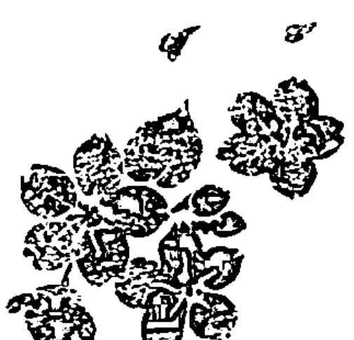

Note. 墨茶
杉、桧木、乳香
金萱茶
墨（龙脑、穗甘松、香豆素）

### 临摹香水

不同于其他产品，香料在酒精中几乎不会出现排斥，所以对于调香师而言，香水的复杂性最低，但也因此更要求对原料的娴熟与香气的审美。透过临摹，不论是艺术学院的学生或是调香师学徒，都能在过程中观察大师的笔触、用色、构图，进而精进技巧。前人已杳，他们的作品穿越悠悠历史，成了每个学徒的必学经典，每一次的嗅闻学习，就好比大师亲自教授我们该如何搭配与运用香味。

模仿是必经的学习之路，如同尚－克罗德·艾连纳拜师 Edmond Roudnitska *10 门下，作品风格明显从早期的浓妆艳抹、装饰繁赘，转变为如今的极简香水诗人，艾连纳的风格不似 Edmond Roudnitska 师法自然，而是将自然化为符号诠释出自我风格。艺术可以互相借鉴与学习，甚至可以是对大师的致敬，也许不一定全部出自原创，但可以在前人的基础上革新与改良，再加入自己的诠释与观点。

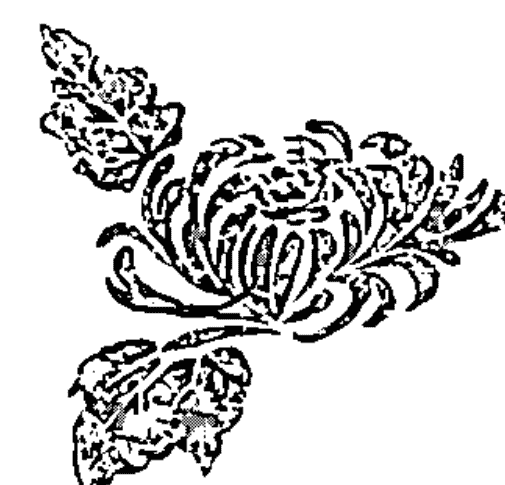

*10：70年的职业生涯里，Edmond Roudnitska 仅调制了十七款香水。他的大半生都致力于使香水艺术化，他所提出的概念，香气的“形状”与“抽象形态”影响后代调香师深远。1956年 Dior 的 Diorissimo 在现代仪器的分析下，证实他与铃兰顶空分析的结果几乎吻合。每年花季，他必定捧着铃兰花在工作室里研究，这气味游走在玫瑰、茉莉之间却更水漾绿意，状如小巧铃铛的花朵，Edmond Roudnitska 费了七年时光才成就 Diorissimo 这支作品。

### 香水调制步骤

#### 准备材料

- a 透明玻璃烧杯、玻璃棒
- b 深色精油玻璃瓶
- c 香水酒精
- d 滴管、精密磅秤（若使用滴管计量，1d 约等于 0.02g、1g 约等于 50d）
- e 依照配方准备原料以及计算剂量

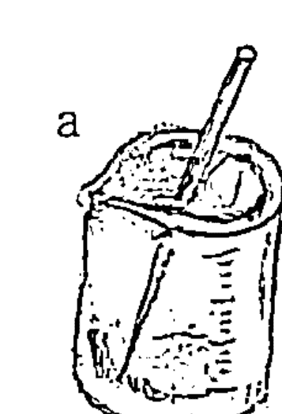

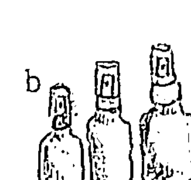

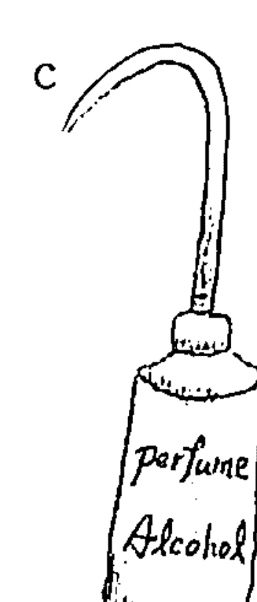

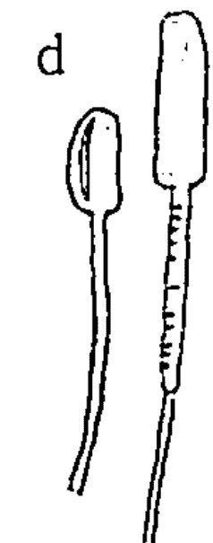

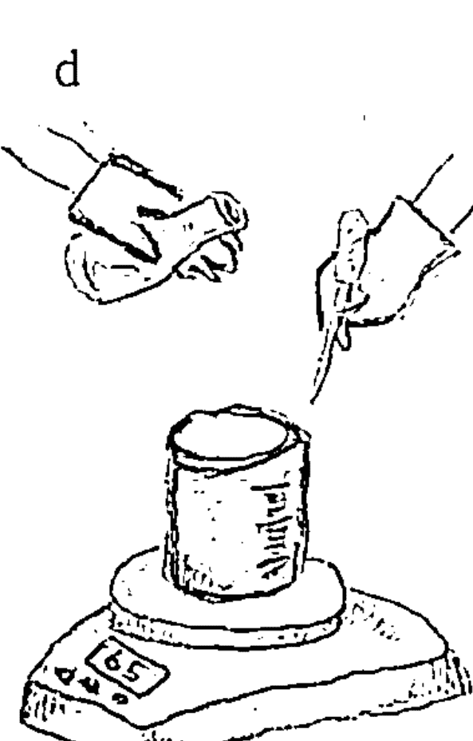

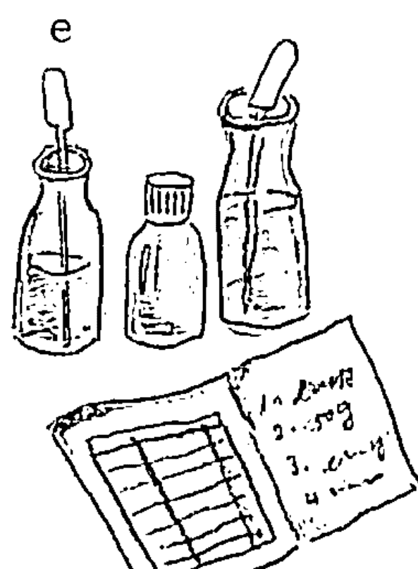

#### 制作香水步骤

##### Step 1

依照表中配方，将原料在玻璃烧杯中混合均匀，若有固态难溶解的原料如岩玫瑰原精、鸢尾花根原精、橡树苔原精，可将烧杯隔热水加热搅拌（约 50℃），均匀溶解后即可取出。

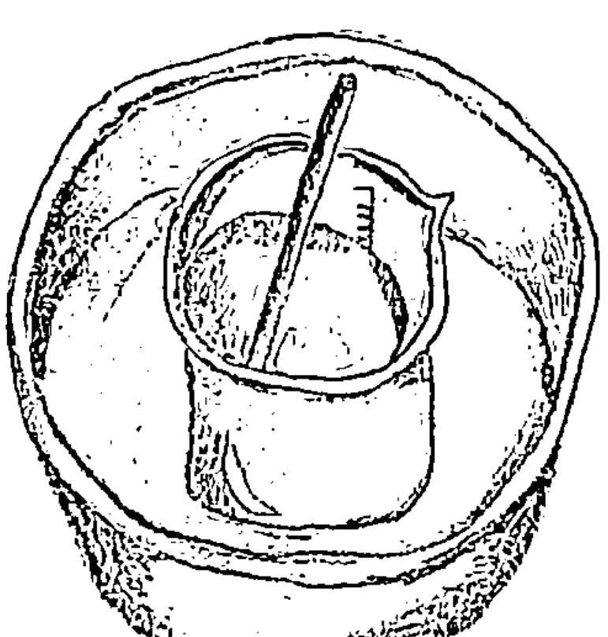

##### Step 2

在烧杯中依照香水浓度加入香水酒精。

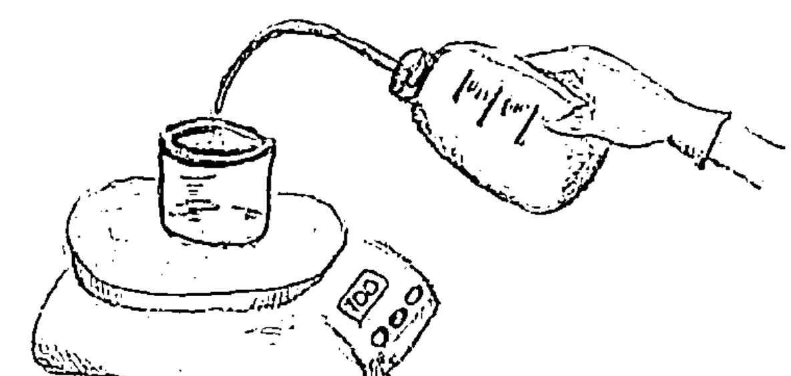

##### Step 3

使用玻璃棒搅拌均匀后，倒入深色玻璃瓶。

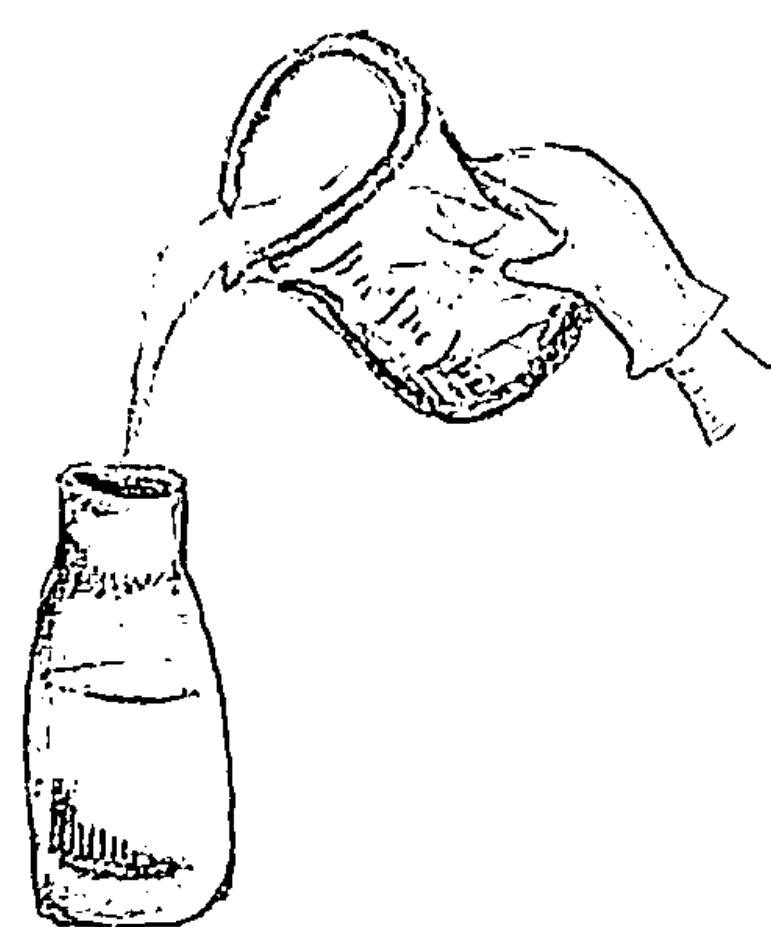

##### Step 4

将成品静置于阴凉处约二至三个星期即可使用。

### 香水浓度 EDP 或 EDT？

针对香水浓度，读者能够依照自己的喜好来调整。一般市售香水所列出的标示，如 EDT、Parfum 等等，每家香精香料公司的浓度都不同，美国的香精公司在 EDT 浓度上会比欧洲浓上许多，这与使用香水的方式息息相关，因为美国民众习惯喷一次香味就维持一天，而欧洲的民众则会在一天中多次补喷香水。

一般常见的浓度有：

- 香精（Parfum）含香料的浓度大约在 20% ~ 30%；
- 香水 EDP（Eau de parfum）含香料的浓度大约在 12% ~ 20%；
- 淡香水 EDT（Eau de Toilette）含香料浓度大约在 5% ~ 12%；
- 古龙水 EDC（Eau de Cologne）含香料浓度大约在 2% ~ 5%；
- 清淡香水（Eau Fraiche）含香料浓度在 1% ~ 3%。

调制香水时，通常会等到配方确定，才会决定最适合的香水浓度。不同浓度但名称相同的香水商品，指的不仅是含香料浓度的不同，在配方以及产品香气上也会有所差异。

## 香氛配方

### 娇兰风格——姬琪香水

临摹香水，建议从娇兰家族的作品开始着手，不只是因为娇兰家族创办了享誉国际的香水学校*11，更是因为他们的作品对后世香水有着深远的影响。娇兰每一代的调香师，他们的作品就像是一扇窗口，带领你体验古老的爱情故事（Shalimar）、漫步秋日落叶的林里（Vetiver），或是登高静观日暮时分的苍穹变化（L'Heure Bleue）。

姬琪香水（Jicky by Guerlain, 1889）的问世，树立起娇兰香水的一贯风格——清新绝伦的柑橘配上浓郁性感的东方调，甜美却个性十足，也让香豆素（coumarin）与香草素（vanillin）的结合，成了后世柑橘草本香调中的常客。因为这支香水，从此调香师的地位从小贩商人摇身变为艺术家。在姬琪之前，香水仅有乏味单调的元素，光从香水瓶身的标示就能猜透其中的香气（那时的香水，瓶外若写着茉莉，毫无惊喜与意外地，你只会在香味中闻到单纯的茉莉花香）。而姬琪香水的重要性是，它游走在天然与合成间，创造出丰富的变化，完美融合了花香、清新、辛香、东方调、动物不同的面向。

*11：法国国际高等香料学院（ISIPCA）在国际间有着“调香师摇篮学校”的称号，由娇兰香水世家第三代传人所创办，历史悠久，培育了无数知名的调香师。

姬琪香水当时在三音阶上所罗列的原料如下：

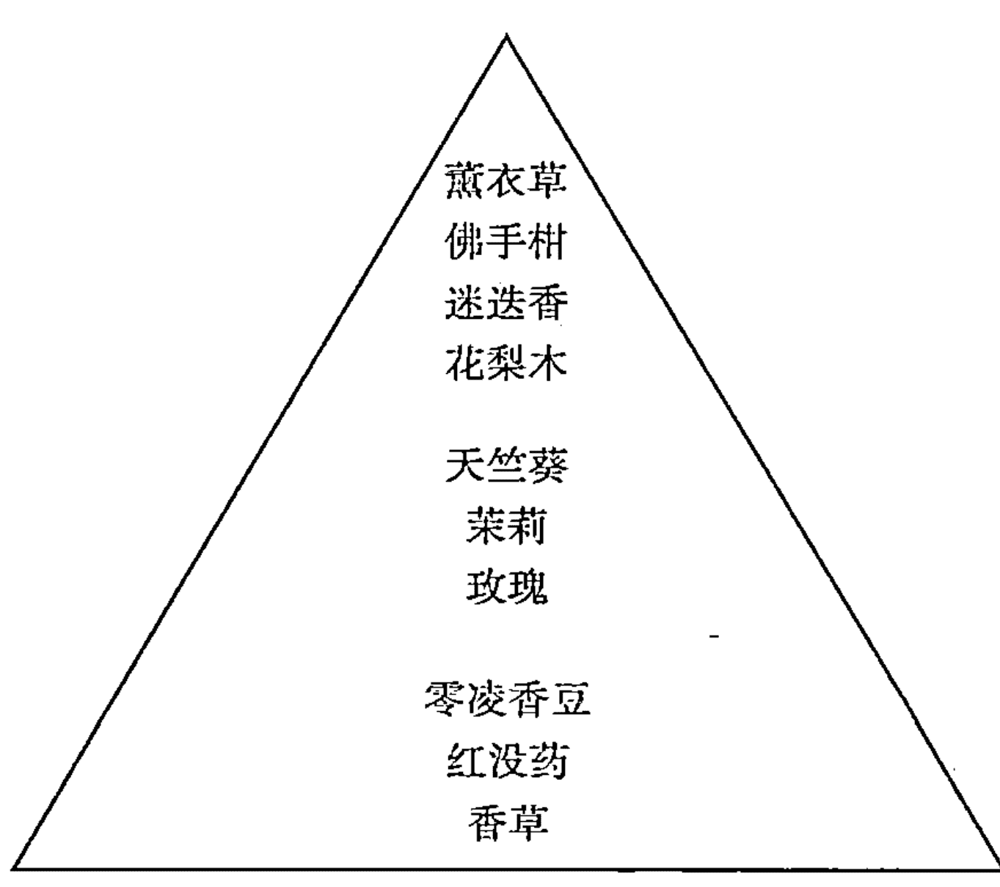

读者若想重现姬琪的香气，上述三音阶上的成分仅供参考。普遍而言，香水在三音阶所列出的成分只代表“香水所呈现的香味”，而非“内含原料”。要想呈现姬琪既甜美又个性的丰富香气，建议可参考下面的配方来调制。

接下来，我们使用天然精油做出近似姬琪香水的味道，浓度建议：10% ~ 15%，取 1 ~ 1.5g 的成品加入 8.5 ~ 9g 的香水酒精，即为建议的浓度（10% ~ 15%）。

| 原料名称 | 原料浓度 | 剂量 (g) |
| :--- | :--- | :--- |
| 柠檬精油 | 100% | 0.4 |
| (FCF) 佛手柑精油 | 100% | 3.3 |
| 甜橙花精油 | 100% | 0.7 |
| 甜橙精油 | 100% | 0.7 |
| 龙艾精油 | 10% in ALC | 0.5 |
| 醒目薰衣草精油 | 100% | 0.6 |
| 大茉莉原精 | 100% | 0.8 |
| 玫瑰原精 | 100% | 0.7 |
| 波本天竺葵精油 | 100% | 0.36 |
| 红没药 | 100% | 0.36 |
| 零陵香豆原精 | Coumarin 30% 以上 | 1 |
| 鸢尾花根原精 | 鸢尾酮 15% 以上 | 0.14 |
| 东印度檀香精油 | 100% | 0.3 |
| 广藿香精油 | 100% | 0.14 |
| 麝香葵种子精油 | 100% | 0.2 |

## 香氛配方

### 东方元素与香水——鸦片 Opium

1970 年代的时尚圈掀起了一股东方热，异国情怀与华丽素材在伸展台上屡见不鲜，这样的视觉冲击与东方意象也燃烧到了香水产业。在 “Opium”（鸦片）的设计过程中，Saint Laurent 希望团队能够做出让他联想到中国皇后 的设计，不过那时的西方人还不大清楚中国、日本以及其他东南亚国家的区别在哪，最后 Opium 的第一个版本 Parfum 所采用的设计神似中国漆器，外观样式却采用了所谓的日本印笼（Inro）。

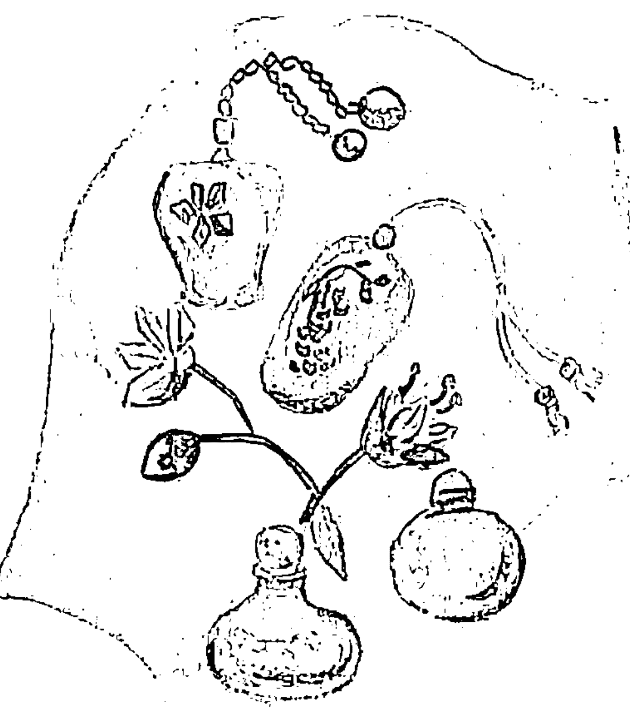

> Note. 印笼
是日本武士随身携带的药盒，小巧精致，两端系有绳子，华美无比。虽然 YSL 在设计上血统并不完全承袭中国文化，倒是尚·巴杜（Jean Patou）的香水 “1000” 原汁原味采用了中国鼻烟壶的设计。

许多香水评论家会将 Opium 与 Tabu、Youth Dew、Shalimar 相比较。也许 Opium 并不是第一支加入东方调元素的香水，但却开创了一个崭新风格——花香东方调（Floriental），更多的康乃馨、橙花、伊兰与辛香、香脂交融，细腻层叠，在嗅觉的光谱上濡染出柑橘与东方花香调，清新浓烈各异的笔触。Opium 发行后，也掀起了香水产业另一个十年的复古风潮*12。

*12：Opium 一扫当时的主流——清新西普（Chypre）与柔软醛香，让东方调再次风靡流行。此后，市场上陆续出现在东方调占重要地位的作品，如 Coco、Poison、Boucheron Femme 等等。

接下来，我们使用天然精油做出近似 Opium 香水的味道，浓度建议：15%，取 1.5g 的成品加入 8.5g 的香水酒精，即为建议使用的浓度 15%。

| 原料名称 | 原料浓度 | 剂量 (g) |
| :--- | :--- | :--- |
| (FCF) 佛手柑精油 | 100% | 0.5 |
| 甜橙精油 | 100% | 0.3 |
| 花梨木精油 | 100% | 0.4 |
| 芫荽种子精油 | 100% | 0.02 |
| 玫瑰草精油 | 100% | 0.4 |
| 波本天竺葵精油 | 100% | 0.3 |
| Miaroma 花漾 | 100% | 0.02 |
| 伊兰精油 | 100% | 0.25 |
| 桂花原精 | 100% | 0.02 |
| 鸢尾花根原精 | 鸢尾酮 15% 以上 | 0.6 |
| 丁香花苞精油 | 100% | 0.3 |
| 岩兰草精油 | 100% | 0.05 |
| 岩玫瑰原精 | 100% | 0.3 |
| 红没药 | 100% | 0.4 |
| 橡树苔原精 | 100% | 0.3 |
| 广藿香精油 | 100% | 0.5 |
| 零陵香豆原精 | coumarin30% 以上 | 0.9 |
| 玫瑰原精 | 100% | 0.5 |
| 大茉莉原精 | 100% | 0.6 |
| Miaroma 经典岩兰 | 100% | 0.9 |
| 东印度檀香 | 100% | 1.3 |
| 麝香葵种子精油 | 100% | 0.6 |

## 香氛配方

### Chypre de Coty 1917 by Coty

说到 “Chypre de Coty” 这罐香水，相信香水迷们应该不陌生吧？！柑苔调中最著名的香水，它并不是第一罐使用 “橡树苔” 或是使用 “Chypre” 名字的香水，但它却是第一罐驯服了橡树苔这难缠香料的香水， “Chypre de Coty” 让 Chypre 这香调变得穿在肌肤上不显得突兀却清爽，如同秋天的树林，凉风夹杂着苔藓与木头的香味。Chypre 的命名是以法国的小岛 Cyprus（塞浦路斯）为名，塞浦路斯小岛是爱神阿芙萝蒂特的诞生地，也是香水贸易的重要据点，岛上以制作加了橡树苔粉末熏香的皮革手套闻名。

此款香水的组合——清新的柑橘搭配低沉浑厚的苔藓与岩玫瑰——并非原创，而是源自古罗马时代的配方，若说 Francois Coty 是调香奇才一点也不为过，他将这配方再加上了皮革的合成原料与新的花香，调制出翠意轻灵的花香与粗砺沉滞完美共存的香调，对比鲜明，就算是今日早已闻惯各式香氛的现代人，仍然会为此感到惊艳。

接下来，我们使用天然精油做出近似 Chypre 香水的味道，浓度建议：5% ~ 8%，取 0.5 ~ 0.8g 的成品加入 9.2 ~ 9.5g 的香水酒精，即为建议使用的浓度 5% ~ 8%。

| 原料名称 | 原料浓度 | 剂量 (g) |
| :--- | :--- | :--- |
| (FCF) 佛手柑精油 | 100% | 22 |
| 甜橙精油 | 100% | 2 |
| 山鸡椒 | 100% | 0.2 |
| 柠檬 | 100% | 1 |
| 大茉莉原精 | 100% | 3 |
| 金合欢原精 | 100% | 0.6 |
| 鸢尾花根原精 | 鸢尾酮 15% 以上 | 4 |
| 玫瑰精油 | 100% | 4 |
| 橙花原精 | 100% | 0.4 |
| 白玉兰叶精油 | 100% | 7 |
| Miaroma 白香草 | 100% | 3 ~ 5 |
| 橡树苔原精 | 100% | 6 ~ 9 |
| 零陵香豆原精 | 30% coumarin 以上 | 10 |
| 安息香 | 50% in ALC 或 DPG | 4 |
| 岩玫瑰原精 | 100% | 5 ~ 10 |
| 广藿香精油 | 100% | 5 |
| 岩兰草精油 | 100% | 0.4 |
| 东印度檀香精油 | 100% | 4 |
| 丁香花苞精油 | 100% | 0.6 |

## 香氛配方

### 风华绝代——香奈儿

“香奈儿5号”不仅成功地将香水与时尚结合，也造就众多精品名牌争相涉足香水领域。

这支创下每30秒就卖掉一瓶记录的香奈儿5号香水，创作起源不过来自香奈儿女士的寥寥几句描述，她想要一款香水闻起来像是夏天的花园，但不要过多的玫瑰、铃兰，香味不要过于天然，允许带有人工斧凿的痕迹。当时的调香师恩尼斯·鲍（Ernest Beaux）将成品简单地以1到5号、20到24号命名，让香奈儿女士从中选择她所喜欢的气味，并再做进一步的修正。

香奈儿5号的原料，除了来源讲究，价格也不菲，原始的版本包含了大量天然原料：来自格拉斯的茉莉、五月玫瑰以及伊兰，底调则是大比例使用麝香、灵猫香……动物性原料。当时恩尼斯·鲍建议香奈儿小姐提高配方的成本，让香水无法被其他调香师模仿重制，于是加重了格拉斯茉莉原精的比例，但却让香水产生了变色的问题。为了克服这个问题，恩尼斯·鲍采用较一般规格更昂贵的脱色茉莉原精。颜色问题固然克服了，只是高比例的格拉斯茉莉原精让整体气味过于圆融，失去了显著的特色与个性。

为了改善这点，恩尼斯·鲍想了以下三个方案：

- 方案一 增加橡树苔的比例，但整体香气会变脏并带咸味。
- 方案二 增加香草的比例，却会让香水变得太像甜品（这是香奈儿女士所不乐见的）。
- 方案三 增加脂肪醛类的比例。

恩尼斯·鲍最终采用方案三，增加脂肪醛的比例到1%（通常配方中所使用脂肪醛的浓度约是千分之一，再依照香水的浓淡调配后，比例约为万分之一）。

香奈儿5号的成功，让许多调香师注意到脂肪醛这支原料，也在业界谣传起了这段故事：香奈儿5号中过量的脂肪醛，是因为调香师助理误解了恩尼斯·鲍的意思而误加了十倍剂量。但根据恩尼斯·鲍家族的说法，误放十倍剂量的故事只是谣传，原本的配方就是这个剂量。假设香奈儿5号只放了谣传中十分之一的比例，那么原本百花绽放宛若春之颂般的感觉就会消失了，醛类不仅让花朵如百花般绽放，还充满了跃动的生命力。

接下来，我们使用天然精油做出近似香奈儿5号香水的味道，浓度建议12% ~ 15%，取1.2 ~ 1.5g的成品加入8.5 ~ 8.8g的香水酒精，即为建议使用的浓度12% ~ 15%。

| 原料名称 | 原料浓度 | 剂量 (g) |
| :--- | :--- | :--- |
| Miaroma花漾 | 100% | 5 |
| (FCF)佛手柑精油 | 100% | 10 ~ 15 |
| 甜橙花 | 100% | 2 ~ 5 |
| 五月玫瑰精油 | 100% | 10 |
| 五月玫瑰原精 | 100% | 15 |
| 大茉莉原精 | 100% | 25 |
| 鸢尾花根原精 | 鸢尾酮15%以上 | 3 |
| 岩玫瑰原精 | 100% | 2 |
| 零陵香豆原精 | 30%coumarin以上 | 5 |
| Miaroma白香草 | 100% | 2 |
| 安息香 | 50% in ALC或DPG | 8 |
| 橡树苔原精 | 100% | 4 |
| 东印度檀香精油 | 100% | 5 |
| 海地岩兰草 | 100% | 1 |

## 香膏

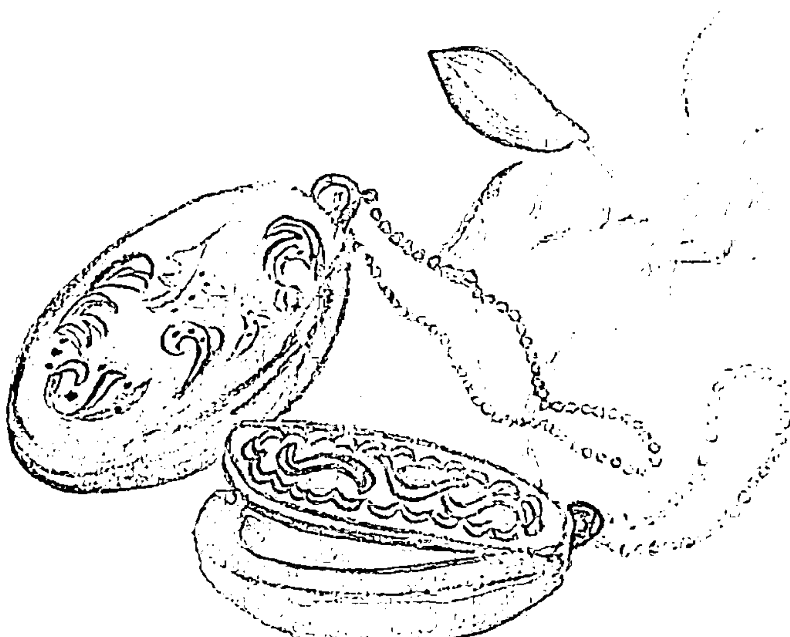

### 旧约中的圣香

3300 年后的今天，当考古学家开启埃及法老王图坦卡蒙的陵墓时，一抹幽香从那曾经装满香膏的陶罐中飘散而出，充斥着整个墓室。

在《旧约圣经》的《出埃及记》中，上帝命令摩西：“你要取馨香的香料，就是拿他弗、施喜列、喜利比拿*13；这馨香的香料和上净乳香，各取相同的分量。你要用这些加上盐、按做香之法制为清净圣洁的香……” 此外，当中也记录了使用肉桂与丁香所制作的圣膏油，关于圣香以及圣膏更明确记录了使用方式，以上这些神圣的芳香制品只能用来敬拜耶和华神。

香膏的历史比香水更为悠久，那芬芳意味着与神灵的贴近。许多宗教仪式都会点燃香料，让散发的香气营造出信仰的氛围，也让参与的信众们感到舒畅与愉悦。现代，此风已杳，香膏从高高在上的神坛走进寻常生活，成为市井小民都能使用的芳香小物，却不及香水普遍。倘若你不爱扩散力强的香水，香膏是较佳的选择，它的芬芳只有近身于你的人才能感受。

*13：拿他弗为苏合香，施喜列则提取自软体贝壳，喜利比拿为白松香。

### 香膏调香

香膏调香比起香水更为简单，不需要考虑定香的问题，因为植物油、蜡以及固态植物油（又称 fixed oil），本身就有定香效果。膏状的基底除了能隐藏调香的缺点，也能让香气更为温润和谐。

香膏原料的组成一般分有固态与液态，固态主要是增加硬度，材料有蜂蜡、堪地里拉蜡或其他固态油脂（乳油木果脂、棕榈蜡等）；液态则多半为植物油，避免选用容易酸败的油脂，采稳定性高的荷荷芭油，少量的甜杏仁油则能增加香膏涂抹时的延展性。凝香体与花蜡也能用来制作香膏，除了代替配方的固态蜡以外，本身的香味也能用于调香。便宜的茉莉花蜡拿来制作香膏，低量就能够有茉莉的香味，是初学者容易入手的材料。

### 香膏调制步骤

#### 准备材料

- a 蜂蜡 5g（或以部分花蜡替代）
- b 乳油木果脂 10g
- c 荷荷芭油 15g
- d 复方香氛 1.5 ~ 2g

#### 制作香膏步骤

##### Step 1

将材料置入烧杯隔水加热溶解，并使用竹筷或小汤匙搅拌，均匀融解后即可离火。

##### Step 2

加入香氛约 1.5 ~ 2g 至烧杯中，拌匀。

##### Step 3

倒入香膏盒中，静置待凉，即可使用。

## 香氛配方

### 森之茉莉

雨后，漫步在花园的小径中。
感受
泥土上的青苔、
杉的绿意
还有那随风婉转飘送的茉莉花香。

调制日期：
赋香率：香膏 5%

| 原料名称 | 原料浓度 | 克数 / 滴数 |
| :--- | :--- | :--- |
| 西伯利亚冷杉精油 | 100% | 1g |
| 绿薄荷精油 | 100% | 4d |
| 白玉兰叶精油 | 100% | 6g |
| Miaroma 月光素馨 | 100% | 2g |
| 东印度檀香精油 | 100% | 0.2g |
| 橡树苔原精 | 100% | 5d |

### 异国风情

茴香轻快的气息，
一扫木质的沉重，
清新辛香
交织
浓郁的伊兰与薰衣草，
散发着慵懒的中性芳香。

调制日期：
赋香率：香膏 5%

| 原料名称 | 原料浓度 | 克数 / 滴数 |
| :--- | :--- | :--- |
| 伊兰 | 100% | 5g |
| 真正薰衣草 | 100% | 5g |
| 甜茴香 | 100% | 25d |
| 大西洋雪松 | 100% | 3g |
| 波本天竺葵 | 100% | 2g |
| 弗吉尼亚雪松 | 100% | 2g |
| 橡树苔原精 | 100% | 0.7g |
| 岩兰草 | 100% | 0.5g |
| 安息香 | 50% ~ 70% 安息香树脂含量 | 5g |
| 广藿香 | 100% | 0.8g |

### 冥想

疗愈系的宁和芬芳，
香草的温暖搭上柑橘木质香气。
一种相思，两处闲愁，
谁说此情无计可消除？

一抹，香气袭上心头，
愁绪即下眉头。

调制日期：
赋香率：香膏 3% ~ 5%

| 原料名称 | 原料浓度 | 克数 / 滴数 |
| :--- | :--- | :--- |
| 甜橙花 | 100% | 3g |
| 波本天竺葵 | 100% | 1g |
| 甜橙 | 100% | 2g |
| 伊兰 | 100% | 0.4g |
| 广藿香 | 100% | 1g |
| 岩兰草 | 100% | 10d |
| 姜精油 | 100% | 10d |
| 柠檬香茅 | 100% | 2.4g |
| 香草原精 | 100% | 2g |

### 柚花飘香

洁白的柚花衬着油绿的叶片，
三月的春日里，
那香气迎面拂来
勾动城市里的乡愁。

调制日期：
赋香率：香膏 5%

| 原料名称 | 原料浓度 | 克数 / 滴数 |
| :--- | :--- | :--- |
| (FCF) 佛手柑精油 | 100% | 2.7g |
| 甜橙花精油 | 100% | 3g |
| 绿薄荷精油 | 100% | 2d |
| 伊兰 | 100% | 15d |
| Miaroma 白柚精粹 | 100% | 3g |
| Miaroma 月光素馨 | 100% | 1g |

## 手工皂

### 肥皂源起

植物木材燃烧后的灰烬，混合动物脂肪，形成了早期的肥皂。17 世纪基督教将“洁净”的概念视为接近神的方式，透过清洁与洗涤将“罪恶”的气味从身体除去，肥皂的“净化”意义从外在延伸到了内在。

肥皂真正地开始普及于民间，是直到工业革命之后，当时的人们惧怕无所不在的污染与细菌，相信借由肥皂的清洁与香味，能够达到所谓的“隔离”效果。清洁杀菌之余，有“香”肥皂成了上流社会彰显身份的方式（在当时若无一定的财力，势必无法负担每天以热水沐浴的开支），洗澡只是附加价值，香皂沐浴后在身上所留下的馨香，才是当时贵族所欲达到的目的，毕竟无形的香气就是一种对地位与财力的最佳宣传管道。

### 香氛与肥皂

从基本的洗涤功能发展为社交手段，有商业头脑的制造商开始将肥皂赋予各式各样的香味，此举同时影响了香水的历史，“香皂味”（soapy）一词因而衍伸。

真正让“香皂味”定型的香水，可得归功于香奈儿5号的问世。在此之前，肥皂闻起来仍是带有浓厚的碱味以及微弱的香气，但因为香奈儿女士的一句话：“我的香水要让女人更加女人，而不只是大量玫瑰铺叠的香气”，促使当时的调香师恩尼斯·鲍使用了混合脂肪醛类（C10、C11、C12），赋予香水前所未有的“洁净感”。

香奈儿5号一上市便瞬间风靡欧洲，肥皂制造商也从中“嗅”到了商机，他们在肥皂的香味里加入脂肪醛类与大量花香，让消费者在选购时能立即联想到“香奈儿5号”，此后，“香皂味”便与脂肪醛类及花香的混合香气画上等号了。“洁净感”与“香皂味”之流的芳香不仅席卷了整个市场，连带高级香水也跟着蹭这芬芳，像是尚·巴杜所推出的喜悦（Joy by Patou），让消费者擦上后如同刚洗了奢华的玫瑰花瓣澡。

模仿一直存在于功能性产品与香水之间，大胆创新为品牌树立自己的独特香味，当推“多芬”为首。在当时仍是花香、醛香当道之下，多芬推出了自己的香气肥皂，像是添加了鸢尾根酮，让肥皂香气柔顺而优雅，还有以麝香取代花香的产品。多芬的一战成名，让今日许多人闻到这类麝香时，直想到沐浴后的舒爽香气。

### 手工皂调香

除去视觉效果的包装设计与文字营销，香气可以说是女性消费者决定是否购买该款肥皂的关键。在 DIY 手工皂潮流的风行之下，以天然精油为手工皂赋香，比香水的技术难度更高，除了要考虑碱性环境以外，还有晾皂期的考验。坊间制作手工皂者通常会购买芳香疗法书作为调香时的参考，但两者的基底与调香方式相去甚远，分析如以下：

#### 芳香疗法与调香

芳香疗法以植物的精粹，如植物油、精油、原精、纯露，依照个案身心以调配出对应配方。使用方式以不破坏植物成分的前提下达到最完整的疗效，但当精油使用在手工皂中时，所要考虑的因素将更为复杂，下面表格清楚列出两者的差异。

| | 芳香疗法 vs 精油 | 手工皂 vs 精油 |
|---|---|---|
| **基质特性** | 多为植物油基底。  植物油与大部分芳香分子的兼容度佳，并不会引起芳香分子产生水解或裂解之类的破坏。 | 碱性基底。  碱性环境中芳香分子稳定性差，酯、醛、酮、醇易被破坏。 |
| **生理疗效** | 精油生理疗效取决单一芳香分子的研究，如：沉香醇（存在于花梨木、芳樟、百里香精油中）证实具有镇定、抗菌等功效。 | 芳香分子于碱性环境中易被破坏，疗效不如将精油稀释在植物油中涂抹。故无法宣称香皂具精油的疗效（消炎、紧肤、抗痘等等）。 |
| **心理疗效** | 嗅觉是人类连结记忆和情感最紧密的感官，所以不一定只有精油的香气才能达到安抚情绪的功效，情人身上的香水味、家的味道都能勾起我们情感记忆，进而达到疗愈的效果。透过调香，沐浴时沉浸在怡人的香氛中，不也是一种情绪芳香疗法？！ | |

#### 皂香的功能与选材

传统肥皂工业的赋香率（赋香率是指香气添加于基底中的比例）为 0.6% ~ 2%，DIY 手工皂则为 1% ~ 5%，赋香比例的不同取决于香味成分与强度的差异。

选用精油或原精制作手工皂，请留意以下注意事项：

1. 香气必须要能遮蔽皂体本身的油味与碱味。
2. 若香皂本身有颜色的考虑，要避免使用会使皂体变色的香料。
3. 对肌肤有高度刺激性的香料要避免使用。
4. 香料于皂中的稳定度。
5. 音阶调香法并不适合皂类以及餐具洗剂。皂类基底无法表现高、中、低音的层次，其他如洗碗精也应注重清洗时的香气，因为香气若滞留在碗盘上将会影响使用者的饮食。

#### 手工皂调香取材注意事项

##### 一、单方精油

单方精油取材时，请注意以下三点：

1. 多采用气味强度强的精油：关于气味强度，请参考本章闻香说味中的气味强度练习（P.069）。
2. 变色问题：精油或原精不只会使手工皂变色，对于蜡烛或香膏的影响也相同。
   a. 存在于精油中的芳香分子
      柠檬醛、香茅醛（天然存在于山鸡椒、柠檬香茅、柠檬尤加利、台湾香茅）成皂，经一段时间后会转为鹅黄色或深黄色。丁香酚（为丁香花苞、丁香叶、肉桂叶的成分之一）使皂体转变为粉红色或暗红色。香草素（天然存在于香草原精、秘鲁香脂、安息香）使皂体转变为奶茶色或焦糖色。
   b. 天然精油或原精的颜色
      如广藿香、岩兰草、德国洋甘菊等颜色明显及较深的精油。
3. 加速皂化：多数精油不会加速皂化，一般导致加速皂化的原因有以下两个。
   a. 精油中的芳香成分
      香酚（存在于丁香花苞精油、肉桂叶）、肉桂醛（存在于肉桂精油）、水杨酸甲酯（存在于冬青）、醇类的芳香分子高浓度（5%以上）使用下会微加速皂化（如花梨木、天竺葵、芳樟）。
   b. 溶剂
      使安息香树脂呈现流动状的醇类溶剂，大多都会加速皂化。醇类溶剂比例越高的安息香，加速皂化的速度越快，定香效果差。调香用的安息香建议使用 40% 以上树脂含量的安息香。

##### 二、调制为复方香氛后，要注意气味强度与定香的协调比例

若是整体气味较不强烈，定香比例为 20% ~ 30% 才会达到效果；若是多放些气味强度强的原料，配方中的定香剂量可以降低（10% ~ 15%），甚至不放也能达到显香的目的。

### 香皂调制步骤

香皂调制步骤由娜娜妈提供。

#### 准备材料

- 橄榄油 170g
- 椰子油 60g
- 棕榈油 60g
- 米糠油 60g
- 氢氧化钠 50g
- 冰块 116g
- 复方香气 10 ~ 15g

#### 制作香皂步骤

##### Step 1

将电子秤归零，以不锈钢锅分别测量配方中的油脂。

##### Step 2

依照配方，分别测量氢氧化钠以及冰块分量。

##### Step 3

将椰子油和棕榈油以小火加热至 45°C（或隔水加热），融化后加入橄榄油、米糠油备用。

##### Step 4

将氢氧化钠分三至四次加入冰块当中，搅拌至完全融化。

##### Step 5

当氢氧化钠温度与油脂两者温度约为 30°C ~ 40°C时，将氢氧化钠溶液缓慢倒入油脂中，并且一边搅拌。

##### Step 6

以打蛋器搅拌至美乃滋状。

##### Step 7

将香氛加到搅拌好的皂液当中，均匀搅拌。

##### Step 8

将皂液倒入预先准备好的模型当中，放入保丽龙或保温箱中，待两到三天凝固，较为干燥后，即可脱模。

## 香氛配方

### 古典玫瑰

浓郁优雅的玫瑰芬芳，伴着温暖香甜的木质调，
一层层
在肌肤上轻扑上花香，
感受复古香气中的浪漫时光。

调制日期：
赋香率：手工皂 2%

| 原料名称 | 原料浓度 | 克数 / 滴数 |
| :--- | :--- | :--- |
| 波本天竺葵精油 | 100% | 4g |
| 玫瑰草精油 | 100% | 1.5g |
| 芳樟精油 | 100% | 2g |
| 安息香精油 | 50% ~ 70% 安息香树脂含量 | 1g |
| Miaroma 月季玫瑰 | 100% | 1.5g |
| 丁香花苞精油 | 100% | 1d |
| Miaroma 清新精粹 | 100% | 0.8g |

### 中性馥奇香调

在飒爽的秋风里，
依稀留有柑橘、薰衣草的踪迹，
馥郁的层次，交叠着厚实的木香
与沾露绿叶的清新。

调制日期：
赋香率：CP皂 2% ~ 3%

| 原料名称 | 原料浓度 | 克数 / 滴数 |
| :--- | :--- | :--- |
| 甜橙花 | 100% | 3g |
| (FCF) 佛手柑精油 | 100% | 4g |
| 柠檬 | 100% | 1g |
| 波本天竺葵 | 100% | 1g |
| 迷迭香 | 100% | 0.5g |
| 醒目薰衣草 | 100% | 1g |
| Miaroma 紫恋薰衣草 | 100% | 0.3g |
| 橡木苔原精 | 100% | 0.2g |
| 广藿香精油 | 100% | 0.2g |

### 静沐纯香

氤氲的蒸气悬在浴室，盘成一圈又一圈，静静地挥散着香味，
宁谧中，只剩下你与芳香的对话，
借着流动的水带走今天的沉重，
只留下沐浴后的轻盈朝气与舒服的柑橘木质香气。

调制日期：
赋香率：手工皂 2% ~ 3%

| 原料名称 | 原料浓度 | 克数 / 滴数 |
| :--- | :--- | :--- |
| 甜橙 | 100% | 1g |
| 甜橙花 | 100% | 4g |
| 波本天竺葵 | 100% | 0.7g |
| 佛手柑 | 100% | 2g |
| 伊兰 | 100% | 0.6g |
| 广藿香 | 100% | 0.5g |
| 岩兰草 | 100% | 0.2g |
| 胡椒薄荷 | 100% | 1g |
| Miaroma 白香草 | 100% | 0.1g |

The request was rejected because it was considered high risk

| 原料名称 | 萃取方式 / 产地 | 稀释浓度 | 剂量（克数或滴数） | 调制日期 |
| :--- | :--- | :--- | :--- | :--- |
| | | | | |
| | | | | |
| | | | | |
| | | | | |
| | | | | |
| 评语 | | 使用基底以及添加浓度 | | |

| 原料名称 | 萃取方式 / 产地 | 稀释浓度 | 剂量（克数或滴数） | 调制日期 |
| :--- | :--- | :--- | :--- | :--- |
| | | | | |
| | | | | |
| | | | | |
| | | | | |
| | | | | |
| 评语 | | 使用基底以及添加浓度 | | |

| 原料名称 | 萃取方式 / 产地 | 稀释浓度 | 剂量（克数或滴数） | 调制日期 |
| :--- | :--- | :--- | :--- | :--- |
| | | | | |
| | | | | |
| | | | | |
| | | | | |
| | | | | |
| 评语 | | 使用基底以及添加浓度 | | |

| 原料名称 | 萃取方式 / 产地 | 稀释浓度 | 剂量（克数或滴数） | 调制日期 |
| :--- | :--- | :--- | :--- | :--- |
| | | | | |
| | | | | |
| | | | | |
| | | | | |
| | | | | |
| 评语 | | 使用基底以及添加浓度 | | |

| 原料名称 | 萃取方式 / 产地 | 稀释浓度 | 剂量（克数或滴数） | 调制日期 |
| :--- | :--- | :--- | :--- | :--- |
| | | | | |
| | | | | |
| | | | | |
| | | | | |
| | | | | |
| 评语 | | 使用基底以及添加浓度 | | |

| 原料名称 | 萃取方式 / 产地 | 稀释浓度 | 剂量（克数或滴数） | 调制日期 |
| :--- | :--- | :--- | :--- | :--- |
| | | | | |
| | | | | |
| | | | | |
| | | | | |
| | | | | |
| 评语 | | 使用基底以及添加浓度 | | |

今天我们谈精油，但是我们不谈疗效，只谈香气。——原流学堂/原文嘉

## 本书特点

专业调香师教你香水、手工皂、蜡烛、香膏调香原理
运用最天然的精油、最合乎成本的预算，调制出市售等级的香氛配方
香水、手工皂、香膏、蜡烛的基底配方与制作步骤
从历史人文角度认识香水、手工皂、蜡烛、香膏的发展轨迹

- 香水香氛配方/姬琪香水、鸦片、Opium、Chypre de Coty 1917、香奈儿
- 香膏香氛配方/森之茉莉、柚花飘香、冥想、异国风情
- 手工皂香氛配方/古典玫瑰、中性馥奇香调、静沐纯香、森林浴
- 蜡烛香氛配方/一盏茶香、春之颂、秘密花园、檀