# 香草
HERBS NOTE
植物
記事

鷹谷宏幸 / 著
劉詠綾 / 譯

138種香草植物の栽培重點、
特徵、功效與利用法

東販出版

本書將114種世界性香草植物 &
24種日本香草植物，
以全彩寫真詳實地記錄植物的種子、發芽、
開花等時期的狀態，
讓您可以藉由真實的照片呈現，
更加貼近書中的每一種植物。

ISBN 978-986-176-903-5
00340

東販出版
定價340元

Hiroyuki Takaya

## HERBS NOTE

# ※ CONTENTS

- 植物的構造

## 植物的構造

以圖片解說本書中所使用之花與葉的形狀或花序（指花排列於花軸上的次序）、葉序（葉在莖上的排列方式）的用語。為了讓讀者更方便了解，部分圖形略有簡化，尚祈見諒。

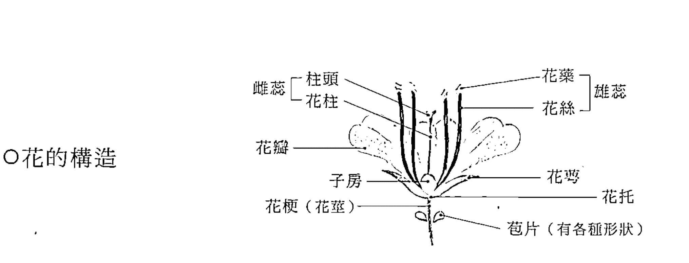

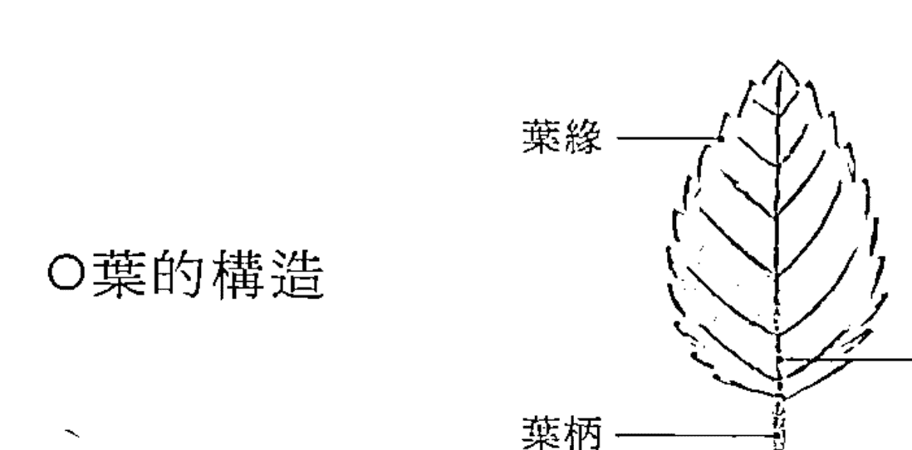

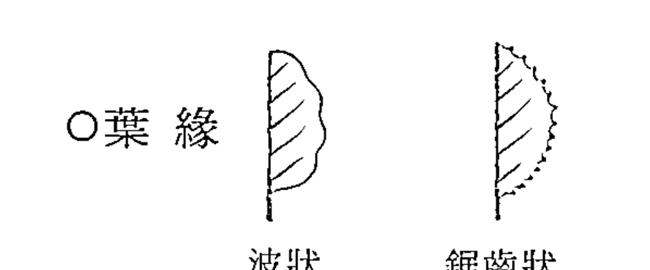

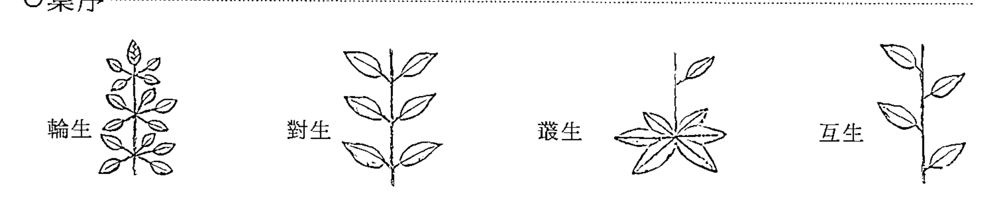

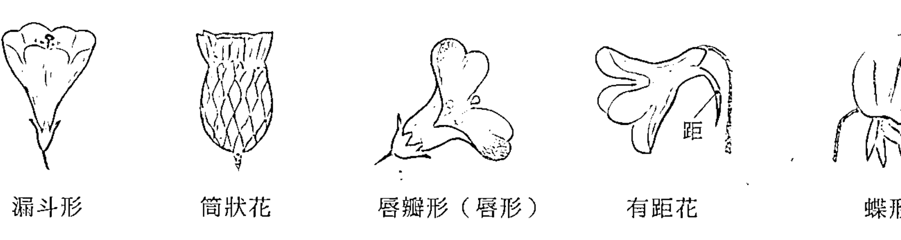

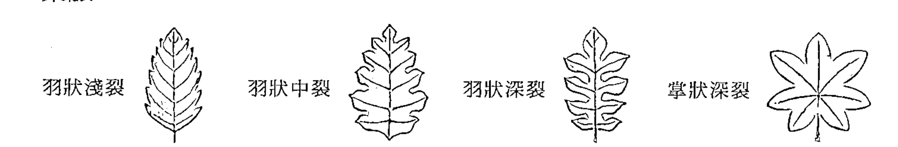

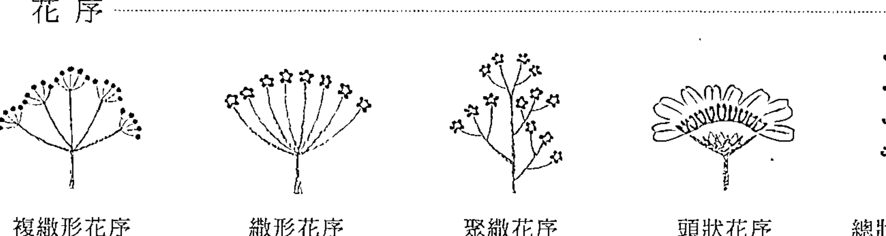

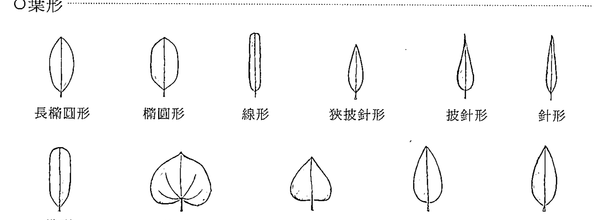

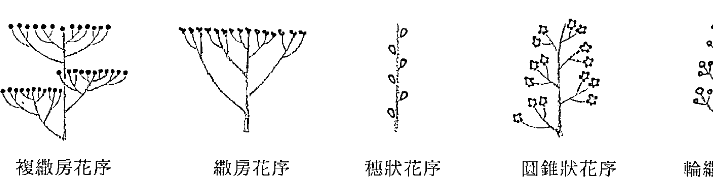

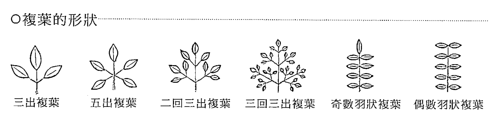

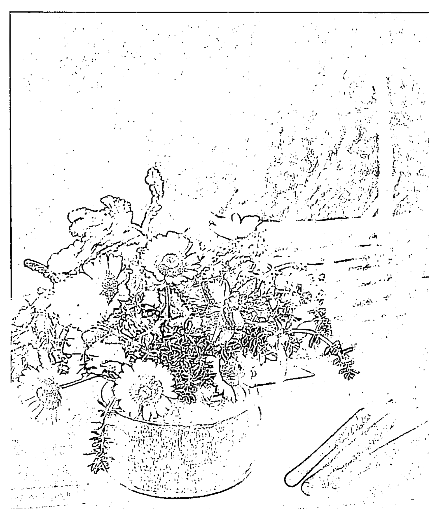

## Chapter 1

## 世界の香草植物

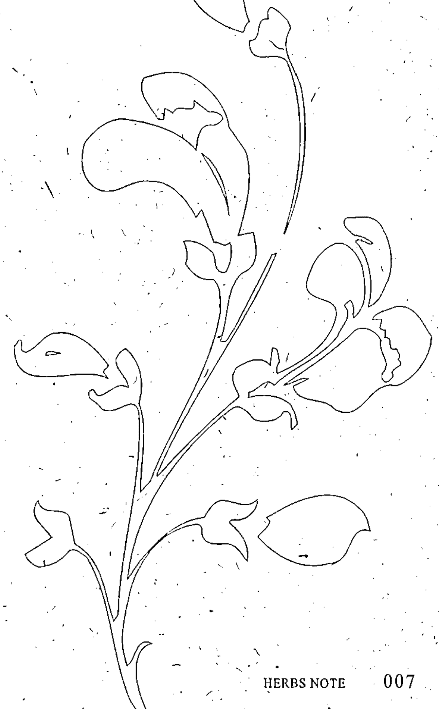

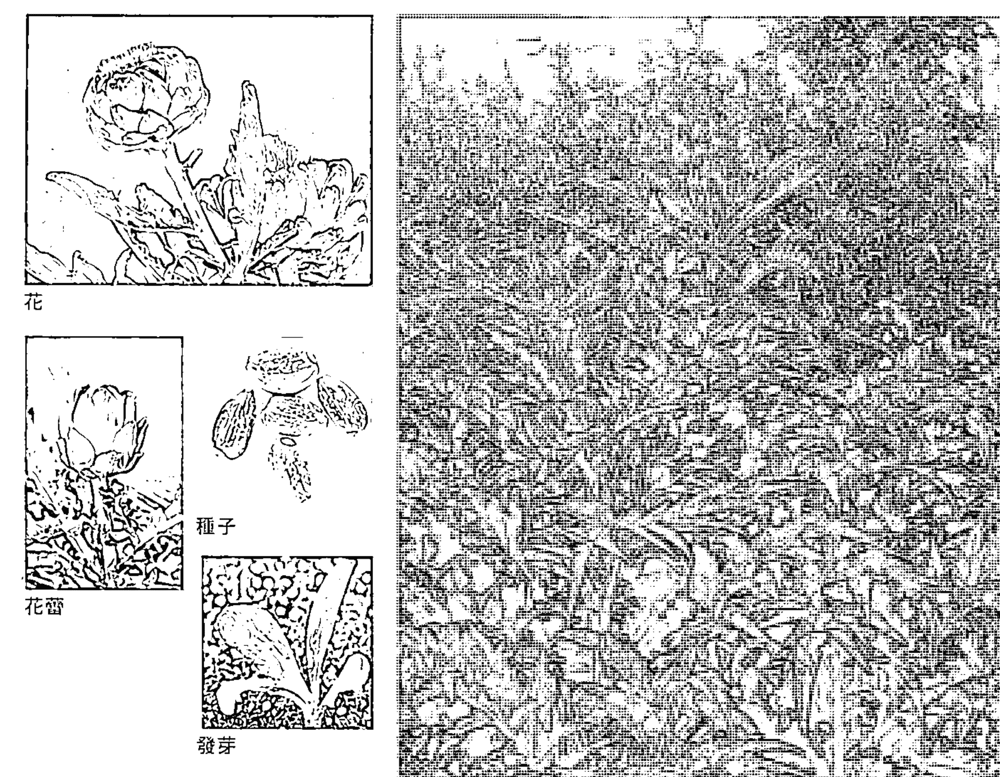

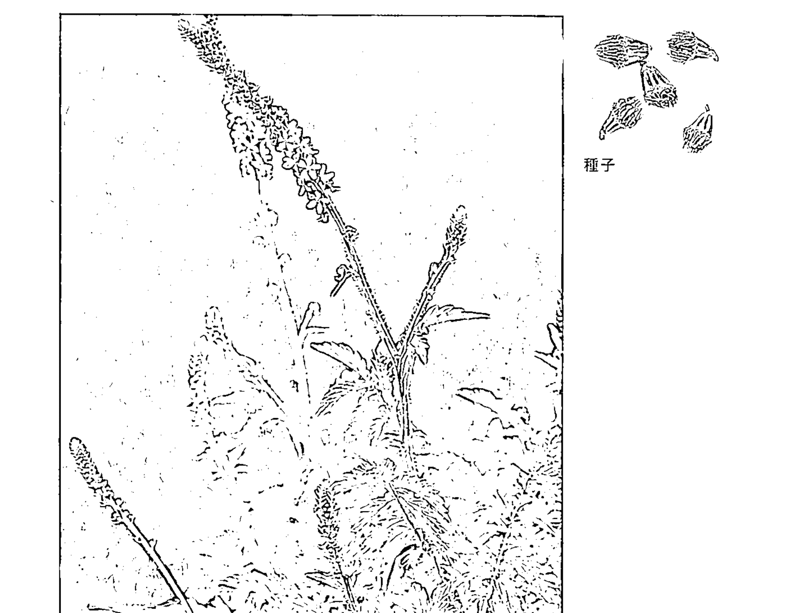

### 朝鲜蓟 Artichoke

学名：Cynara scolymus
别名：洋蓟、洋百合、法国百合、荷花百合
科目：菊科朝鲜蓟属／多年生草本
开花时期：6～9月
利用部位：全草
株高：1～2m
耐寒性：强

◆特征 分布于欧洲、地中海地区。叶子呈银绿色且非常大片，羽状叶上具有深刻痕，叶子背面有绒毛。花形则如同将蓟的花直接放大一般，为桃紫色的筒状花，直径有6～10cm以上。一株最多可开出20朵以上。
◆利用法 当花蕾变大、趁开花之前即可摘下。煮熟之后将花萼部分一片一片地剥下来，沾自己喜好的酱料来食用。而已经绽放的花朵，则可用于插花或制作干燥花。
◆栽培重点 根部可生长到直径1m左右的范围，所以每株之间需间隔1m。于9月份左右播种，放入氯乙烯材质的花盆内育苗，并于翌年4月份左右定植，这样就很容易长出花苞。将土壤犁深一点、施以基肥，并于5月份左右追肥，收成之后，再次追肥。
◆预期效果 强健身体、消解便秘、促进消化。

### 龙牙草 Agrimony

学名：Agrimonia eupatoria
别名：仙鹤草、仙鹤莲、脱力草、子母草、黄龙尾、马尾丝、石打穿、黄龙牙、牛尾草
科目：蔷薇科金水引属／多年生草本
开花时期：7～9月
利用部位：全草
株高：0.3～1m
耐寒性：强

◆特征 分布于欧洲、北非等地。在日本也有同种的金水引（龙牙草）野生于山间甚至是路边。叶子为羽状复叶，小叶的背面或茎部长有许多毛。由于其花朵为黄色且附着于细长的花序上，所以将之与蓼科的「水引」做比拟，而有了「金水引」这个名称。全草皆散发甘甜的香味。由于花萼上有钩状的毛，所以会附着在动物或衣物上。
◆利用法 嫩芽可食用，而叶子的渗透液则可做为化妆水或沐浴剂的原料，全草可用于制作染料。
◆栽培重点 喜好阳光充足、排水性佳的土壤。3～5月或9～10月播种，或是以分株方式繁殖。
◆预期效果 促进消化、收敛。治疗口腔炎。

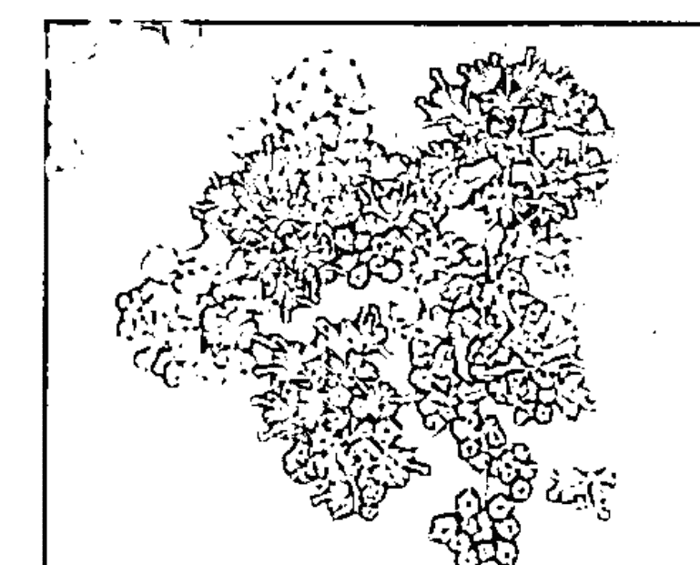

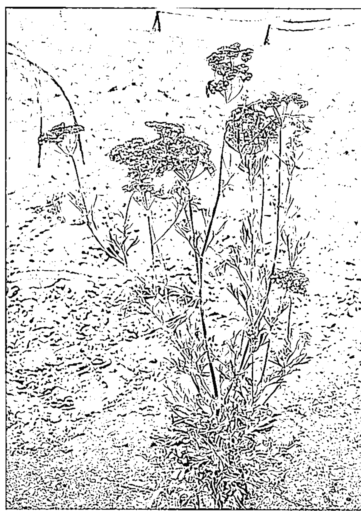

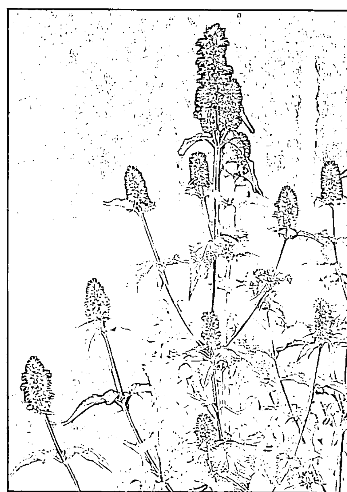

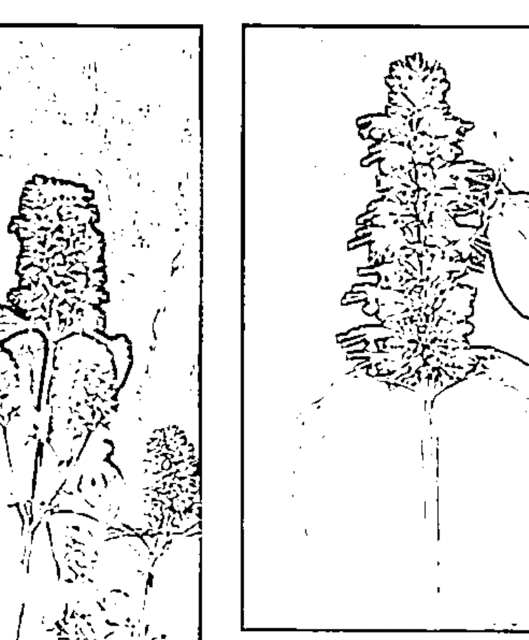

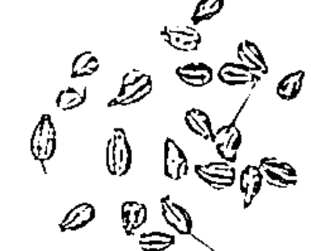

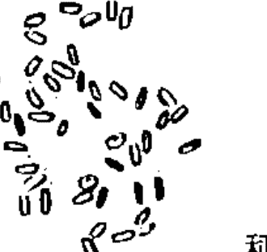

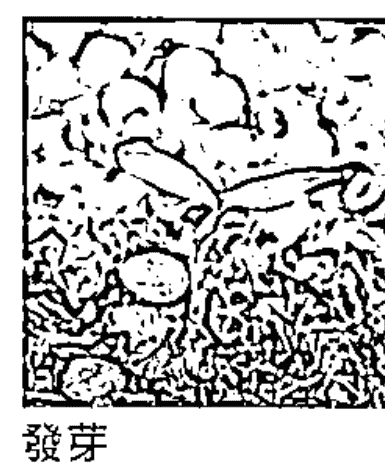

### 大茴香 Anise

学名：Pimpinella anisum
别名：八角、八月珠、八角茴香
科目：伞形花科大茴香属／1年生草本
开花时期：7～8月
利用部位：嫩叶、种子
株高：40～50cm

◆特征 原产地为中东。上部叶子的形状如鸟类的羽毛一般，故其学名的由来即为拉丁语的「羽毛」之意。为复伞形花序，长出许多白色的小花。种子具有独特的甘甜香味，自古以来就被当成帮助消化的草本植物，而被利用于甜点等食物的制作上。
◆利用法 可加入牛奶里，或做为制作饼干、蛋糕的材料，也可加入使用了鸡肉或乳酪的料理中；其嫩叶也可做生菜沙拉。
◆栽培重点 在半日照的肥沃土地，每隔20cm各直播3粒种子，待长出本叶之后，再进行间苗作业。嫩叶可随时采收，已结果实的种子变成褐色之后，可连同花穗一起采收，并干燥保存。
◆预期效果 促进消化、防虫。

### 茴藿香 Anise Hyssop

学名：Agastache foeniculum
别名：Giant hyssop、茴香海索草、大海索草
科目：唇形科藿香属／多年生草本
开花时期：6～10月
利用部位：全草
株高：0.5～1m
耐寒性：强

◆特征 原产地为北美洲。茎部直立、顶端具有分枝。叶片对生，呈锯齿状的心形。花朵附着于穗状花序上，颜色为桃紫色或白色。叶子具有类似大茴香的香味。
◆利用法 叶子可做香草茶或生菜沙拉，也可利用做为干燥花或芳香花包的素材。
◆栽培重点 喜好阳光充足的地方，但只要有半日照的地点就可以栽种了。在4月或9月播种，以6～8片左右的本叶定植。冬天的时候长出地表上的部分会枯萎，但翌年春天还会再长出来。可用分株方式繁殖，而用撒播法也很容易繁殖。
◆预期效果 健胃、治疗感冒。

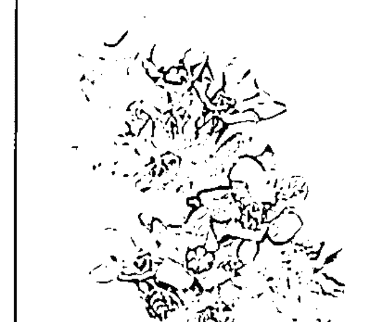

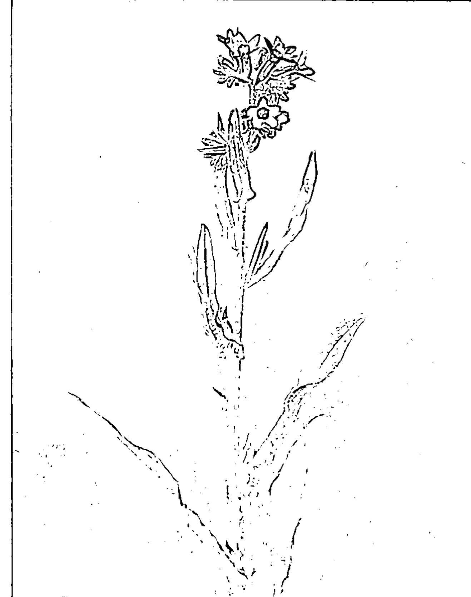

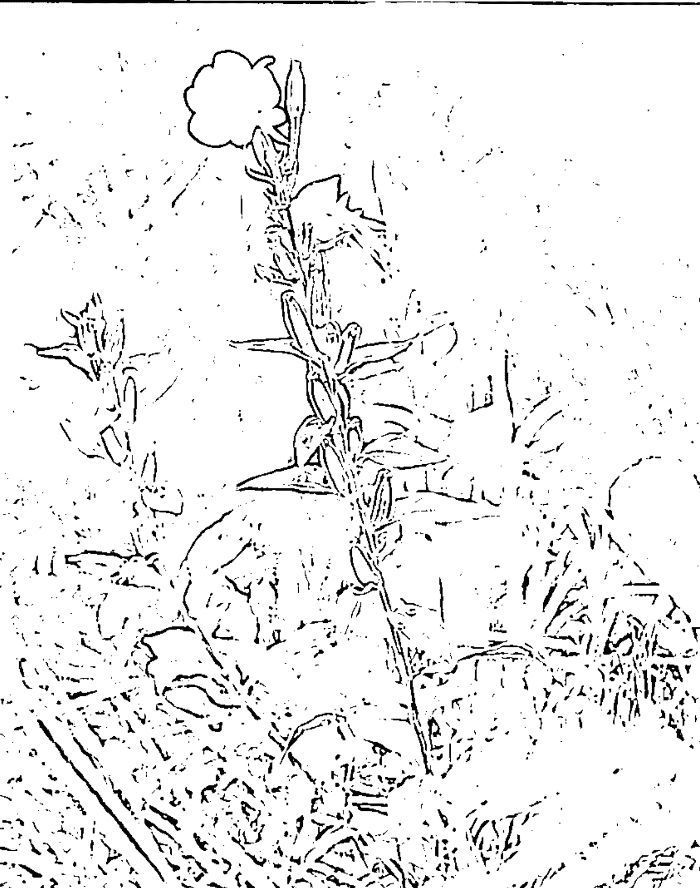

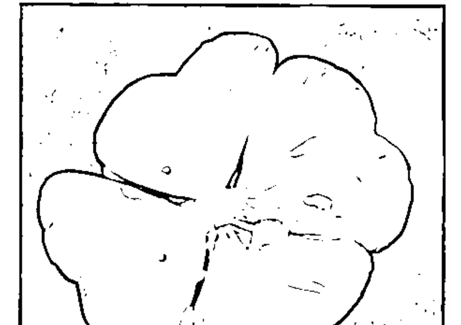

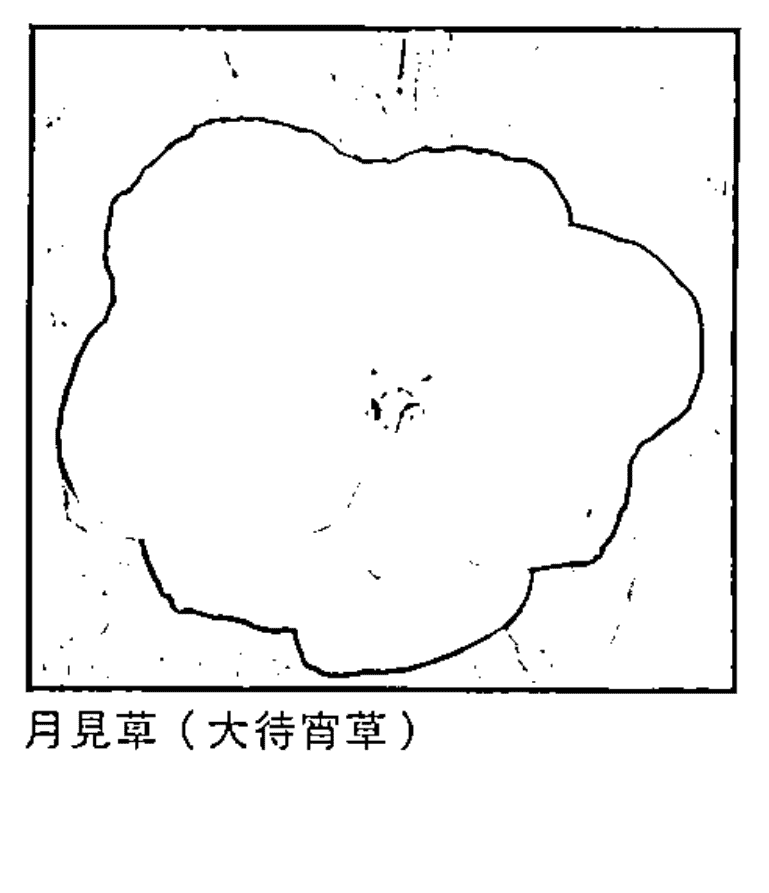

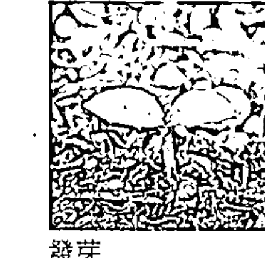

### 紫朱草 Alkanet

学名：Anchusa officinalis
别名：Anchusa、Bugloss（牛舌草）
科目：紫草科牛舌草属／2年～多年生草本
开花时期：6～10月
利用部位：全花、叶／根部含有有毒成分
株高：0.5～1m
耐寒性：强

◇特征 原产地为欧洲北部，整体具有细毛。茎部为多汁质并从根株开始分枝，一圈一圈地卷曲延伸，并开出漏斗形的蓝紫色花朵。根部很粗，可提取出红色的染料，但也含有对哺乳动物有毒性的生物碱（alkaloid）。另有白花与黄花的品种。
◇利用法 可做为花圃的色彩点缀，或其花朵可做为制作芳香花包的素材。
◇栽培重点 不喜高温多湿，适合栽种于砂地。也是喜好酸性的嫌石灰植物。

### 月见草 Evening Primrose

学名：Oenothera biennis
别名：待宵草、夜樱草、樱草、夜星
科目：柳叶菜科待宵草属／2年生草本
开花时期：6～9月
利用部位：全草
株高：0.5～1.5m
耐寒性：强

◇特征 原产地为北美洲，于明治中期流传至日本，野生于路边等地。茎从根部开始分枝，并长出向上竖立的毛。叶为浅锯齿状。白天的日照当中花会枯萎，而从傍晚到早上之前会开出黄色的花。同种当中有待宵草和大待宵草，并各自以待宵草、月见草的名称为人所熟知。而待宵草枯萎之后会变成橘色，所以可以此为区别。
◇利用法 叶与茎可做为蒸气浴使用，而根部则可水煮做为生菜沙拉食用。
◇栽培重点 不适合移植，所以将种子直播于大型钵或地面上较佳。喜好阳光充足与排水良好的场所。
◇预期效果 肌肤细致、收敛效果。

### 冬季香薄荷 Winter Savory

学名：Satureja montana
别名：冬日风轮菜
科目：唇形科香薄荷属／常绿亚灌木
开花时期：7～9月　利用部位：叶
株高：25～45cm　耐寒性：中

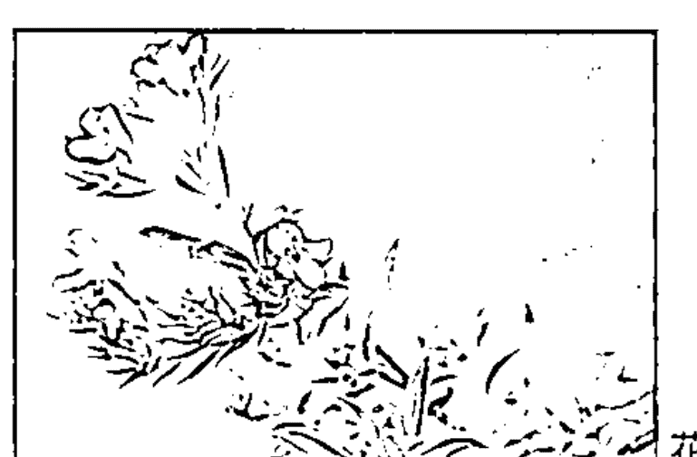

◆特征 原产地为地中海沿岸一带，野生于石灰岩地质众多的地区。叶枝直立或倾斜生长并分枝，且从基部开始木质化。叶子含有类似百里香的甘甜芳香与强烈辛辣味，叶形为线形披针形，叶片前端尖锐，没有叶柄。花朵与迷迭香类似，长出许多从白色到淡紫色的唇瓣形花，一朵接着一朵长时间持续地开花，另外还具有多种斑纹的不同品种。

◆利用法 因其香味与辛辣味皆很强烈，所以利用上的诀窍在于酌量使用。新鲜叶片可拿来加入热狗、炖煮料理或香草油，干燥之后也可做为制花圈的素材。

◆栽培重点 喜好阳光充足、碱性且较不肥沃的土壤。从幼苗的状态开始栽培会比较容易，以每株间隔30cm的间距定植，随着其生长，可于采收的同时进行修剪整枝，以整理其根株的形状。在冬天来临之前将株高修剪成10cm，并在根部铺上稻草以利达到防寒作用。用扦插或分株等方法也可繁殖。

◆预期效果 促进消化。

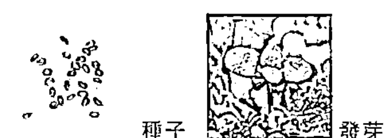

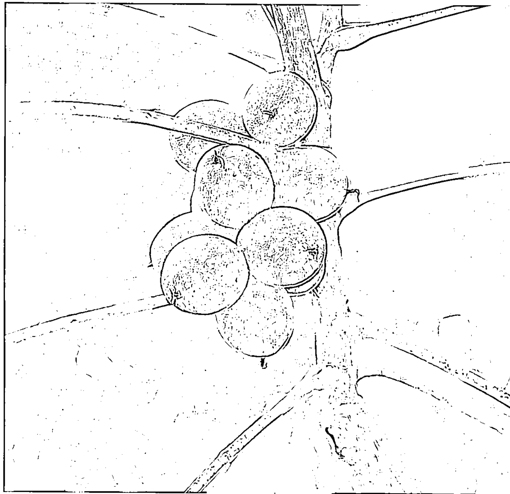

### 夏季香薄荷 Summer Savory

学名：Satureja hortensis
别名：夏日风轮菜
科目：唇形科香薄荷属／1年生草本
开花时期：7～9月　利用部位：叶
株高：30～45cm

◆特征 原产地为南欧。茎部带有紫色且具有细毛，直立并分枝。叶子具有类似百里香的芳香与辛味。花朵则是从叶子基部附近长出来的淡紫色唇瓣形花。因为经常使用于豆类料理中，所以在德国也被称为「豆的香草植物」。

◆利用法 将新鲜叶片剁碎后可加入生菜沙拉，煮豆子的时候也可加入一整枝叶片。

◆栽培重点 春天播种，株高4～5cm时即可定植。栽培于阳光充足且土壤肥沃的土地。

◆预期效果 促进消化。

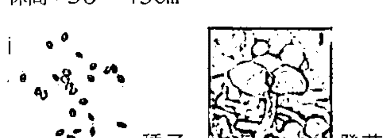

### 胡桃 Walnut

学名：Juglans regia
科目：胡桃科／落叶乔木
开花时期：4～5月
利用部位：种子
株高：10～30m
耐寒性：强

◆特征 可生长到30m之高的落叶乔木，春天时长出雄花与雌花。花朵后面所附着的球形果实种子的内部可拿来食用。

◆利用法 种子在煎炒之后内部可直接食用，或是做为制作甜点的素材。种子可做为制花圈的素材，或是壳壳渗入香味后也可以直接当作装饰品。

◆栽培重点 比较喜好凉爽的气候，但几乎所有的地区都很容易培育成功。

◆预期效果 强健身体。

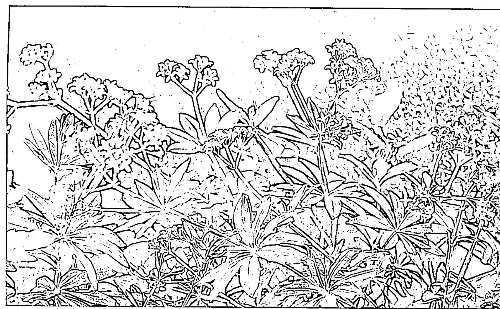

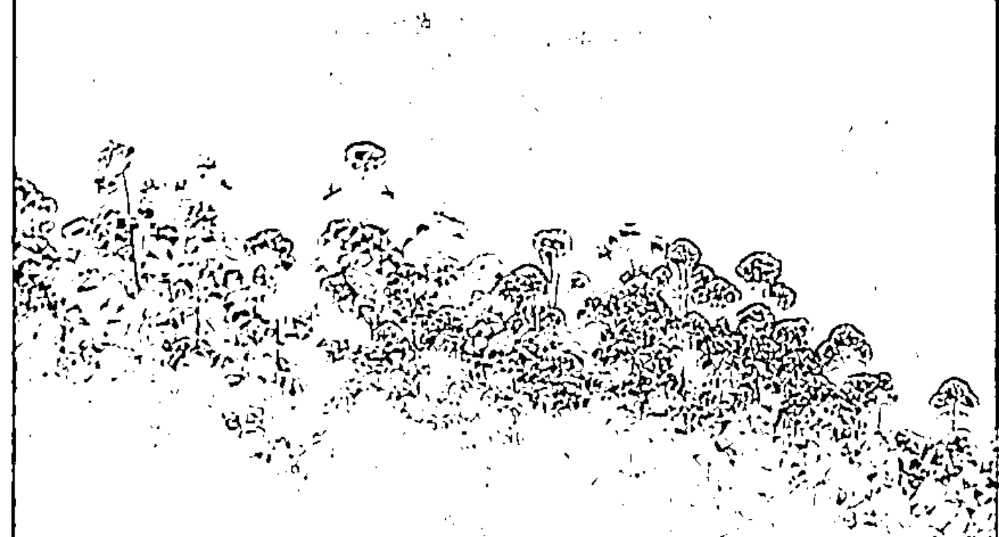

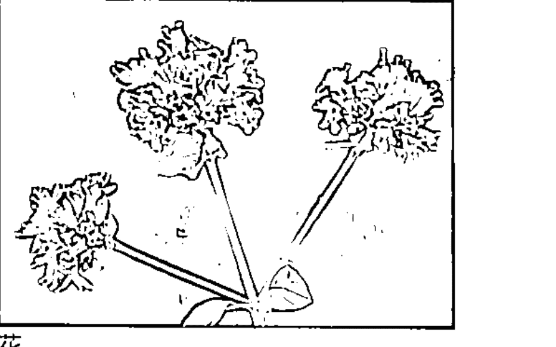

### 奥勒冈 Oregano

学名：Origanum vulgare
别名：披萨草、牛至、蘑菇草、花薄荷、野马郁兰
科目：唇形科花薄荷属／多年生草本
开花时期：6～9月　利用部位：茎、叶
株高：50～80cm　耐寒性：强

◇特征 从根部长出许多茎，直立或倾斜延伸。叶上有细毛，呈现小卵形。白色、粉红色、紫红色的小花附着于伞形花序上，叶或茎部具有柔和的薄荷香味。
◇利用法 干燥叶比起新鲜叶片的香味更佳，所以烹调料理时使用干燥叶较佳，是非常适合搭配番茄的草本植物，也是披萨酱中不可缺少的素材。制成干燥花后，也很适合做为芳香花包或花圈的素材。
◇栽培重点 于春天或秋天播种，选取其中香气较佳的，定植于阳光充足且排水良好的土地。每隔2～3年筛选一次香味较佳的，以扦插或分株方式栽培。
◇预期效果 舒缓神经性胃炎、胃酸过多、肌肉酸痛。

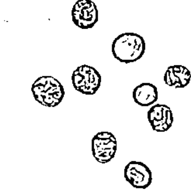

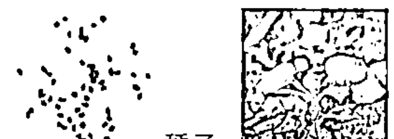

### 车叶草 Woodruff

学名：Asperula odorata
别名：木麝香、香车叶草
科目：茜草科车叶草属／多年生草本
开花时期：6～8月
利用部位：叶
株高：20～40cm
耐寒性：强

◇特征 野生于北非、欧洲、北海道。叶片为披针形的轮生叶，并长出小巧白色的漏斗形花朵。由于含有一种称为香豆素（coumarin）的芳香成分，所以其干燥叶片会散发出甘甜干草般的香味，据说古代曾被利用做为床垫的填充物。
◇利用法 新鲜叶片、干燥叶片都可做为茶叶，或是用于增添香槟、干邑白兰地、果汁的风味。填装在枕头里也具有安眠作用。
◇栽培重点 虽然可以用种子加以栽培，但使用苗株则更为容易。不喜直射日光与高温多湿，所以可以种植于树荫底下做为庭园树木底下的草丛。因为很可能变得如同杂草一般四处丛生，所以需要加以修剪管理。
◇预期效果 偏头痛、切伤。

### 黄金奥勒冈 Golden Oregano

学名：Origanum vulgare ‘Aureum’
别名：叶、花　株高：30～70cm
整体、特别是叶缘处呈现带有黄色的颜色；与奥勒冈相比，会开出较为深紫色的花朵。运用其叶子的颜色，很适合用于插花或制作干燥花。

### 奥勒冈 斑纹品种

学名：Origanum vulgare ‘polyphant’
株高：20～30cm
小形的斑纹品种。叶子宽度0.7～1.2cm、长度1.5cm左右，并带有淡黄色的斑纹，且表面具有光泽。可做为花圃的色彩点缀以观赏用。

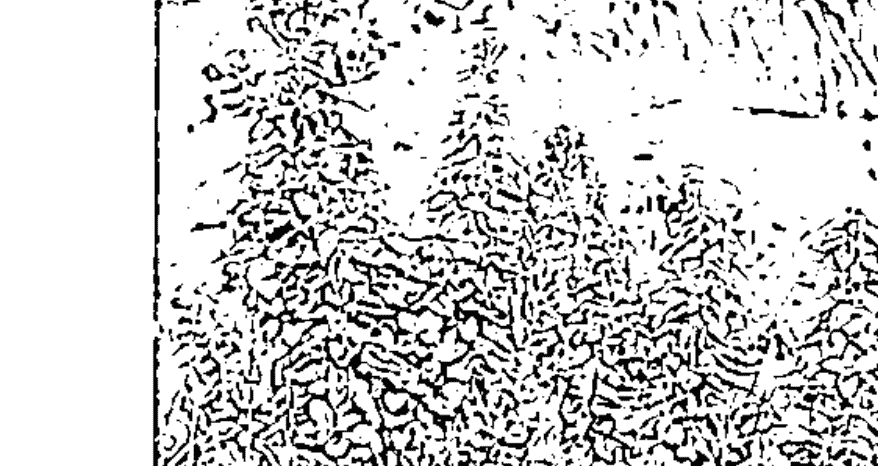

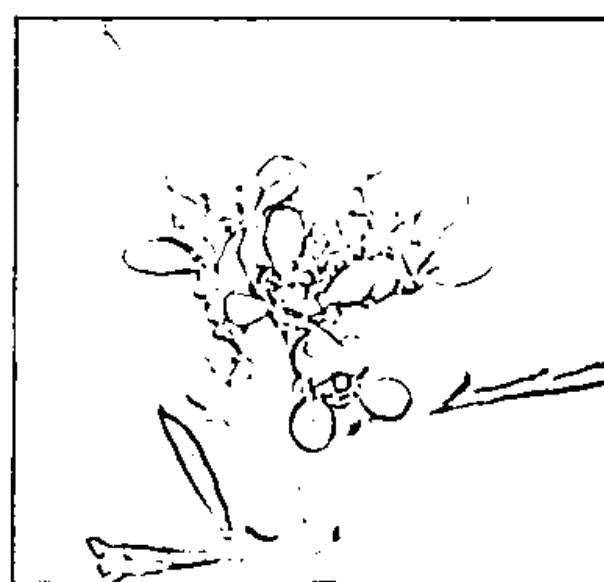

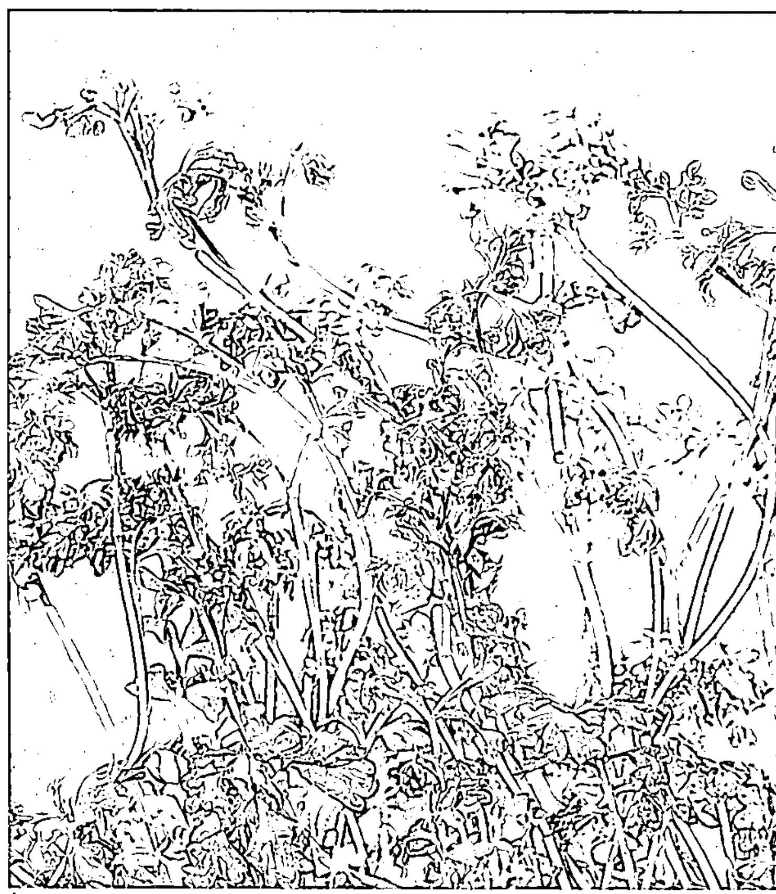

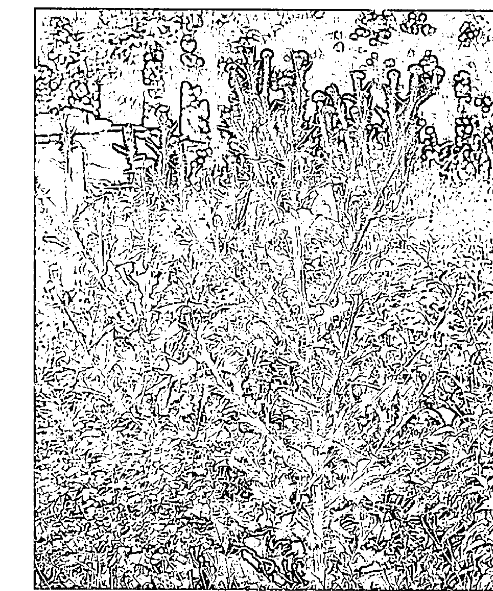

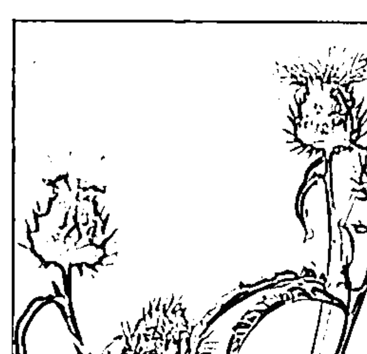

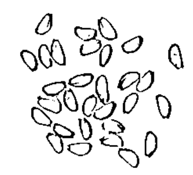

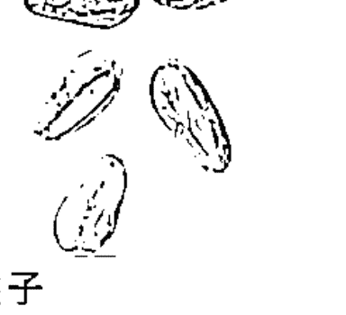

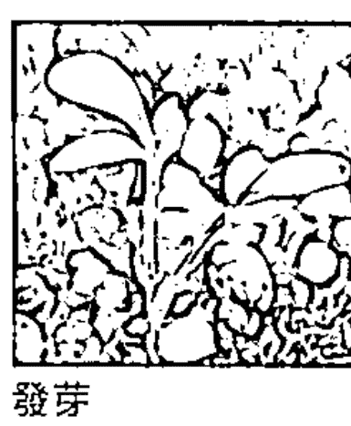

### 独行菜 Garden Cress

学名：Lepidium sativum
别名：胡椒草、芥荠
科目：十字花科／1年生草本
开花时期：6～7月
利用部位：茎、叶
株高：20～45cm

◆特征 原产地为伊朗。茎部看起来像是有白色粉末覆盖住，此非病虫害。叶片为类似香芹的羽状叶且叶脉很深，而白色小花则附着于总状花序上。叶子具有独特的辛味，据说营养价值很高。

◆利用法 生长至芽菜程度者可做成生菜沙拉或配菜加以食用。

◆栽培重点 在花盆或浅钵里以条播法或撒播法播种，在室内利用海绵的水耕栽培也很容易栽培成功。经过约20天、长至7～10cm时，即可收成利用。

### 刺菜蓟 Cardoon

学名：Cynara cardunculus
科目：菊科朝鲜蓟属／多年生草本
开花时期：6～9月
利用部位：叶、花
株高：1～2m
耐寒性：强

◆特征 与朝鲜蓟（Artichoke）为同种的植物，花托与嫩叶可用于制作料理。花萼呈细尖状、叶脉深且尖端呈现锐利的尖刺状，是与朝鲜蓟（Artichoke）不同的差异处。

◆利用法 食用方面与朝鲜蓟相同。另外还可利用于插花、制作干燥花、染色。

◆栽培重点 与朝鲜蓟相同。

### 可可树 Cacao

学名：Theobroma cacao
科目：梧桐科可可树属／常绿乔木
开花时期：周年（温室）
利用部位：种子
株高：5～7m
耐寒性：弱

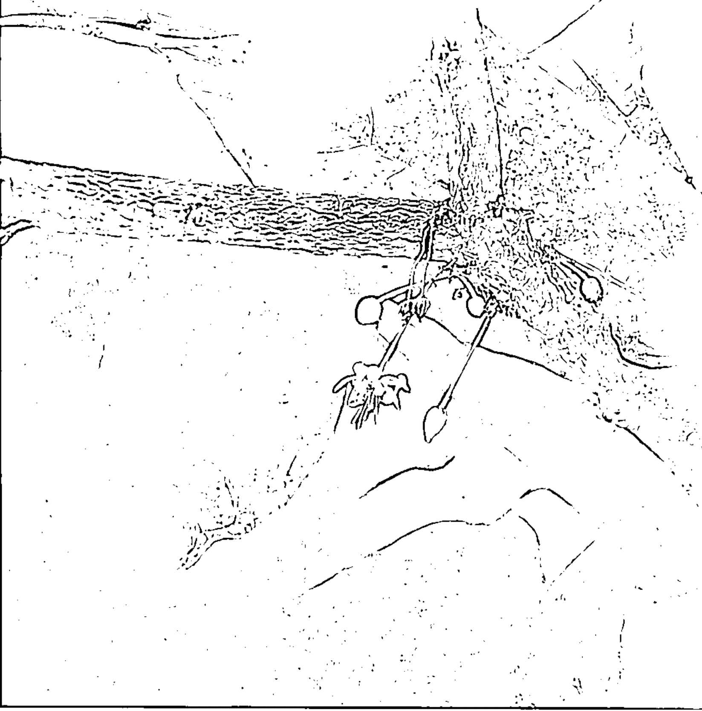

◆特征 大量栽种于南美洲等地，以巧克力的原料而知名。叶片为大型的长椭圆形，而树干与树枝上长有不太显眼的白花。花后附着着橄榄球形状的果实。

◆利用法 将果实的种子发酵干燥之后，做为制作可可亚或巧克力的原料。

◆栽培重点 属热带植物，所以必须栽种于高温多湿的温室内。

◆预期效果 强健身体。

### 甘菊 Camomile

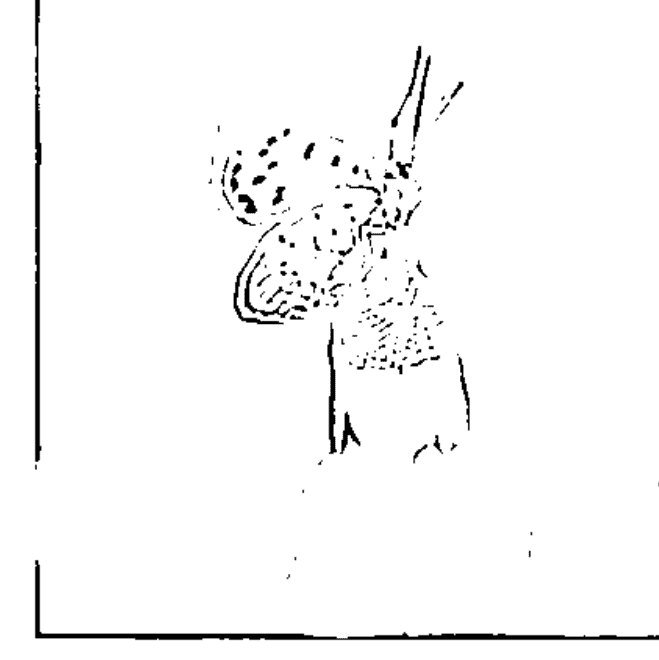

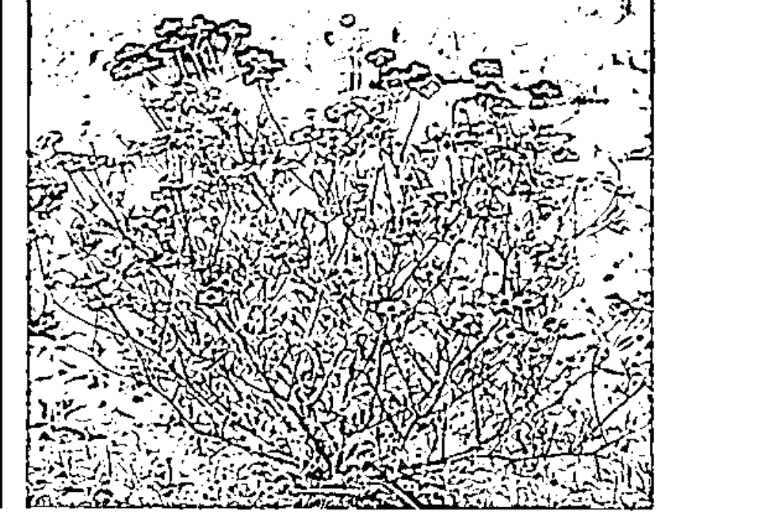

### 德国甘菊 German Camomile

学名：Matricaria recutita
别名：洋甘菊、母菊、春黄菊
科目：菊科鹿菊属／1年生草本
开花时期：4～6月
利用部位：花
株高：30～60cm

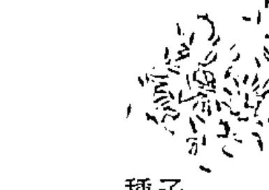

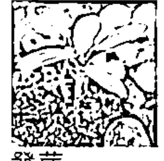

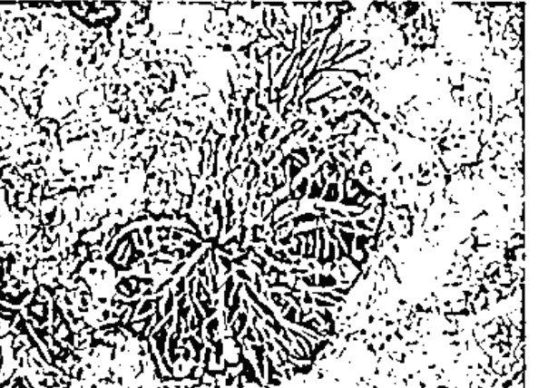

◆特征 茎部直立且大量分枝，叶片为羽状叶上有细裂痕。茎部前端附着着白色花瓣的花。中心的黄色部分如隆起一般地鼓起来，当花瓣向下弯曲时即可收成。花朵具有如同苹果般的甘甜芳香。为1年生草本，但只要开过一次花之后，其掉落的种子每年会再发出新芽。收成摘取花朵时勿附着茎部，并阴乾。泡成香草茶饮用时，稍微泡久一点会更好喝。与干燥剂或脱氧剂一起填入密封瓶里，放置约3星期。

◆利用法 鲜花或干燥花可作成香草茶、甜点与料理的素材。除了泡澡、蒸气浴和头发润丝之外，也可用于染色。

◆栽培重点 只要向阳、通风、排水良好的地方，任何土壤都可栽培。春天播种为3月份、秋天播种为9～10月份进行。建议于秋天播种较为稳定且会开出大量的花朵。在箱子或钵内以条播法或撒播法播种，覆盖上3～5mm的土壤，为了不让种子流失，所以从下方吸水。待本叶长至5cm左右时，即可定植。若栽种于花盆内，施以有机质或化成肥料做为基肥，以左右交互的方式种植7～10株。若栽种于地上，株距约20cm，种植于预先施以堆肥的场所。用直播法栽种时，需在充分浇过水的土壤上播种，发芽之前需用不织布或塑胶袋覆盖，发芽之后再取下。拥挤的地方需疏苗，并保持通风。

◆预期效果 镇静、发汗、保湿、解热、抗过敏、消炎、软化皮肤、通经、治疗感冒。

## 甘菊的種類

### 羅馬甘菊
Roman Chamomile

學名：Chamaemelum nobile
別名：黃金菊、英國春黃菊
科目：菊科可都多花菊屬／多年生草本
開花時期：6～8月　利用部位：花
株高：30～60cm　耐寒性：強

莖部也有直立的，但大多數彎曲傾斜生長。與德國甘菊的香味有些微差異，花也比較大朵，葉子也具有芳香氣味。也有不附著花朵的品種～草地甘菊 Lawn chamomile（Chamaemelum noble Trenegue'）。

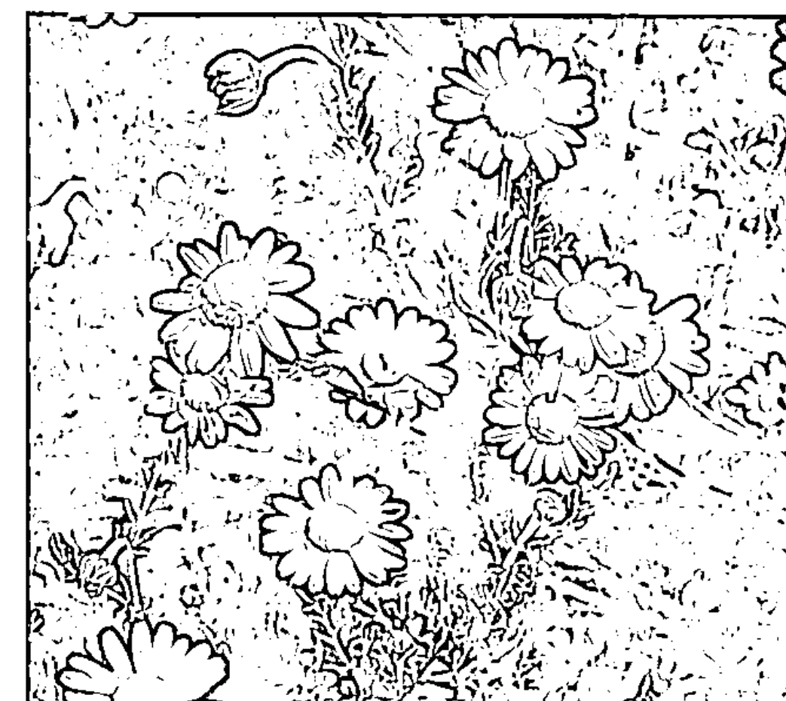

### 奶油色重瓣花
Double-flowered chamomile

學名：Chamamelum nobile 'Flore Pleno'
別名：八重瓣羅馬洋甘菊
開花時期：5～8月　利用部位：全草

附著著重瓣的白色花朵，不以播種方式、而是以根株或地下莖繁殖。全草皆具有似蘋果般的芳香。用腳踩下去就散發出香味，而且越踩其根部就越強健地生長。

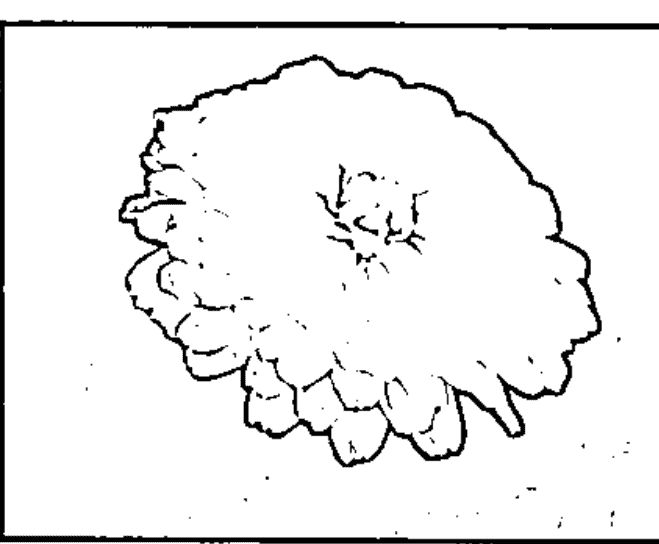

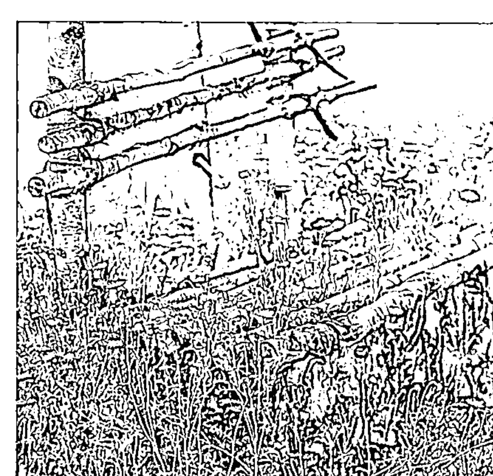

### 染料甘菊 Chamomile

學名：Anthemis tintoria
科目：菊科黃春菊屬／多年生草本
開花時期：7～8月　利用部位：全草
株高：50～80cm　耐寒性：強

◇特徵　主要應用於染色的品種。無香味，葉子也具有寬度且平整、葉緣呈鋸齒狀。莖部直立，開出鮮豔的黃色花朵。
◇利用法　染色、插花或乾燥花。
◇栽培重點　春天播種的話，當年不會開花，要等到翌年才開始開花，所以建議秋天播種。

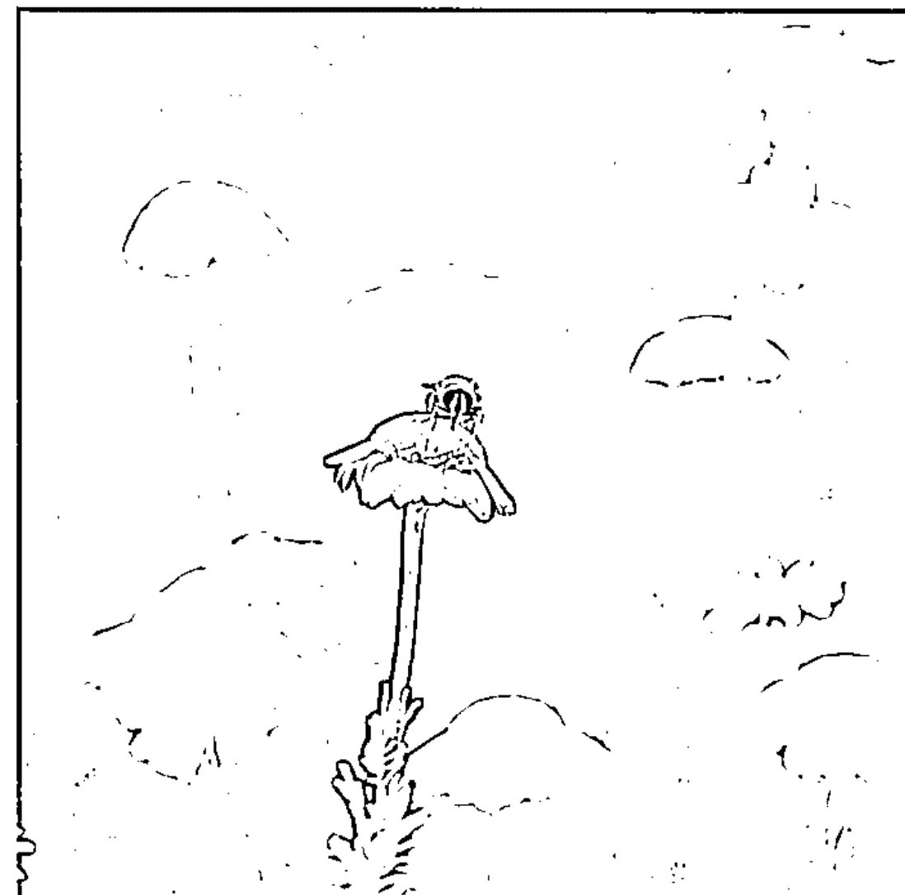

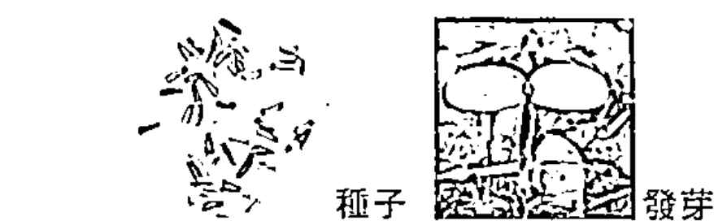

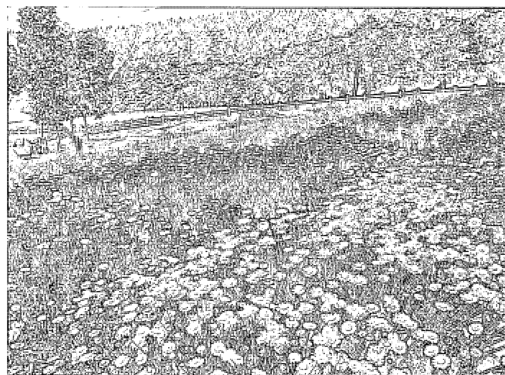

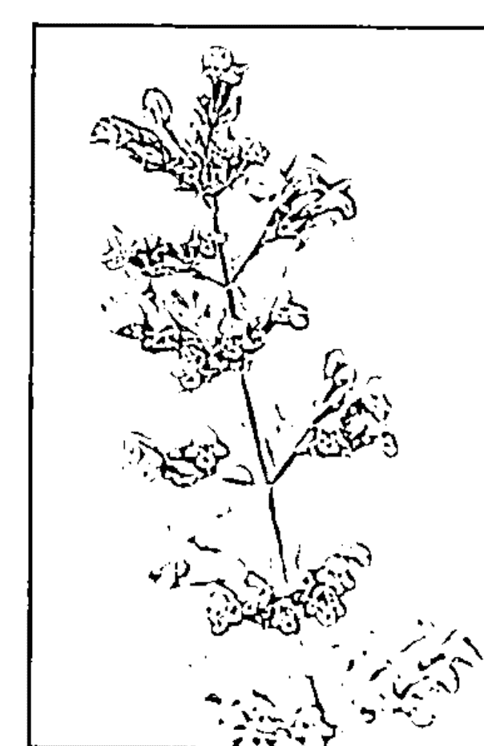

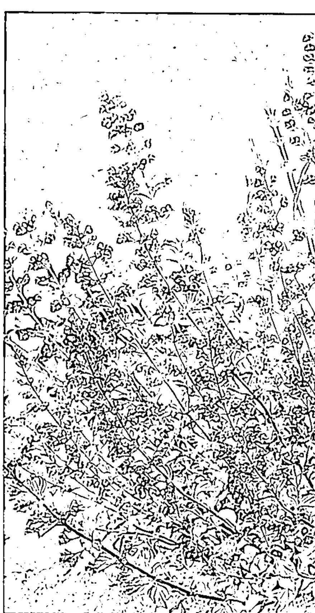

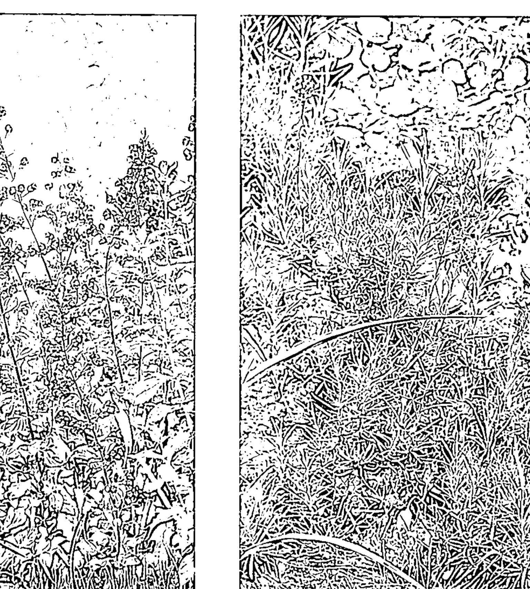

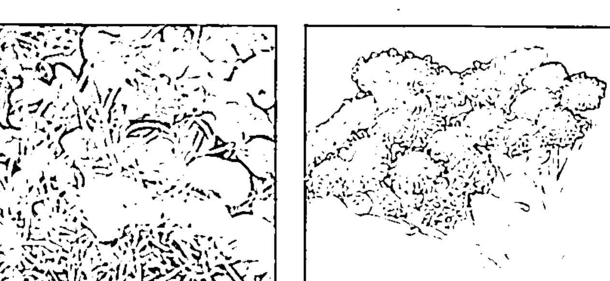

### 塔花 Calamint

學名：Calamintha nepeta
別名：光風輪菜、剪刀草
科目：唇形科風輪菜屬／多年生草本
開花時期：7～10月
利用部位：葉
株高：30～70cm
耐寒性：強

◇特徵 莖在基部大量分枝，成為如同灌林叢一般。葉片為卵形且呈鋸齒狀，為對生葉。藍紫色的唇形小花大量地生長於輪繖花序上。另有花朵為白色或紫紅色等的品種。
◇利用法 葉片可做為茶葉。為數眾多的花一朵接著一朵地長時間持續開花，所以也很適合用來裝飾花圃。
◇栽培重點 只要陽光充足且排水良好，不挑土壤皆可栽培。可用播種、分株或扦插等方法皆很容易栽種。由於會長出大量分枝、很佔空間，所以株距最好保持50cm以上較佳。
◇預期效果 強健身體、去痰。

### 咖哩草 Curry Plant

學名：Helichrysum angustifolium
別名：蠟菊、永久花（Everlasting）
科目：菊科麥稈菊屬／常綠小灌木
開花時期：7～9月
利用部位：葉、花
株高：30～60cm
耐寒性：中

◇特徵 幼小時根株直立，隨著逐漸生長而分枝，長出的枝葉傾倒成半立形。葉片為線形且細長，質厚且覆蓋著絨毛，呈現銀灰色，具有似咖哩般的強烈香氣。花形為黃色筒狀花，附著於繖房花序上，並與葉子一樣散發出咖哩的香氣。莖部隨著生長而從基部開始木質化。
◇利用法 做為花圃的外緣、製作成乾燥花或花圈的素材。乾燥之後放於儲藏室等處，可以驅蟲或防臭。
◇栽培重點 比較上較適合乾燥，只要通風良好之處，不挑土壤皆可栽培。用扦插法也很容易繁殖。長出來的枝葉很容易垂倒，所以可趁收成花朵的時候，同時將草長修剪剩下1/3；而花朵收成之後所長出來的枝葉也需趁冬天來臨之前，再一次修剪整枝較佳。
◇預期效果 驅蟲、防臭。

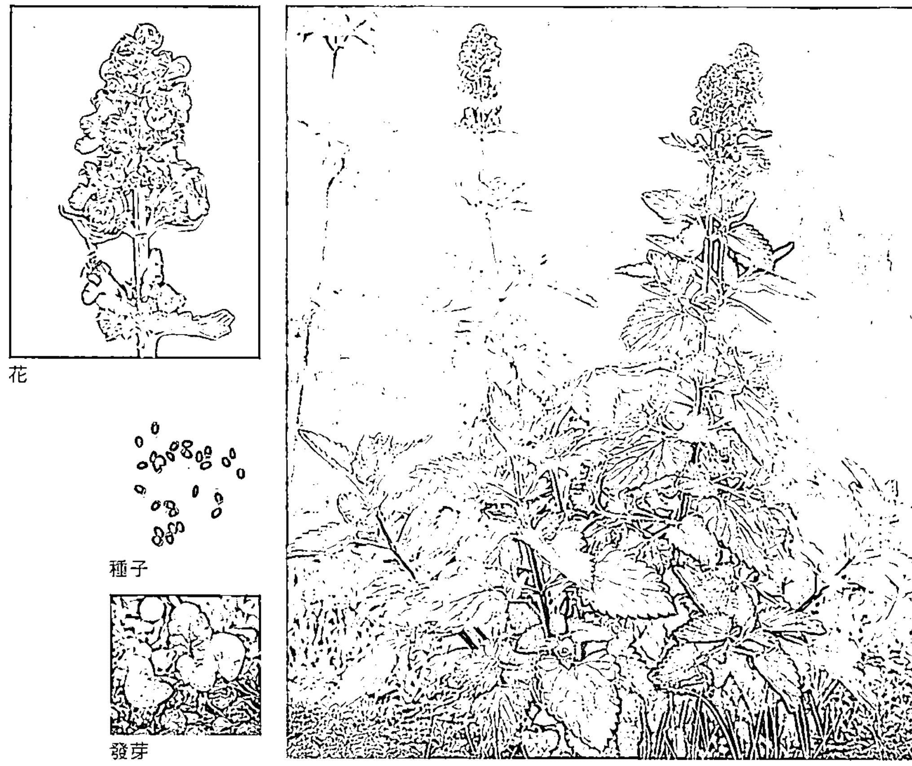

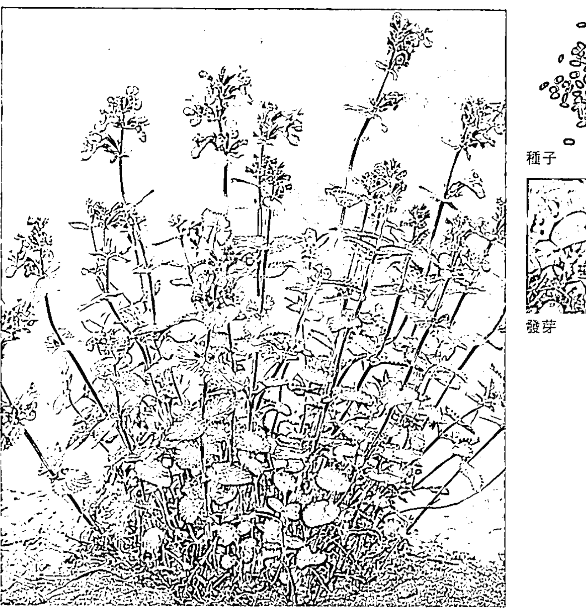

## 猫草 Catnip

学名：Nepeta cataria
别名：猫薄荷
科目：唇形科荆芥属／多年生草本
开花时期：6～8月
利用部位：叶、茎
株高：0.5～1m
耐寒性：强

◆特征 直立分枝，整草皆覆有细毛。叶片为对生叶，而白花附着于轮伞花序上。茎与叶具有类似猕猴桃（silvervine）的香味，也因为是猫所喜爱的香草植物而为人所熟知。
◆利用法 干燥叶可做为茶叶，或填充在香包、小型绒毛玩偶里面做为猫的玩具，也可做干燥花。
◆栽培重点 只要阳光充足且排水良好，不挑土壤皆可栽培。种子的发芽率也很高，用自然掉落的种子即可充分繁殖。
◆预期功效 健胃。

## 猫薄荷 Catmint

学名：Nepeta mussunii
别名：穆西尼猫薄荷
科目：唇形科荆芥属／多年生草本
开花时期：4～7月
株高：20～40cm
耐寒性：强

◆特征 从根株生长出大量的细茎。叶子为对生叶且具有细毛。具有天鹅绒般触感、宽度约1cm的小叶子散发出水果一般的薄荷香味。花为小朵且为蓝紫色，大量附着于茎部前端的总状花序上。
◆利用法 制作干燥花或芳香袋，也很适合做为花园的外缘植物。
◆栽培重点 只要阳光充足且排水良好，不挑土壤皆可栽培。收获时期或收获之后，其根部附近需进行修剪整枝。每年根株都会繁殖，所以需于秋天掘土，用刀子等工具纵切开成好几株以分株。而自然掉落的种子也可繁殖。

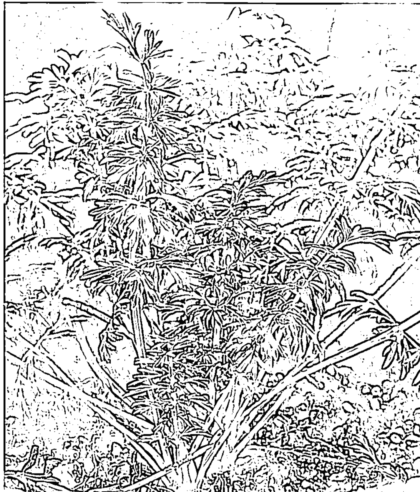

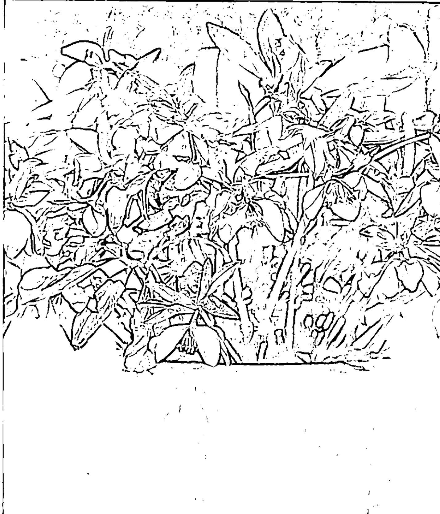

### 葛缕子 Caraway

学名：Carum Carvi
别名：姬茴香、藏茴香、凯莉茴香、孜然、罗马小茴香
科目：伞形花科葛缕子属／2年生草本
开花时期：6～7月
利用部位：整株（特别是种子）
株高：40～80cm
耐寒性：中

◆特征 据说从中石器时代的遗迹当中，也曾发现其种子的化石，是具有古老历史的香草植物。茎部直立且大量分枝，叶片在2～3回羽状叶上有深裂脉，基部的叶子环绕着茎部而互生。通常于第二年长出白色小花会大量附着于复伞形花序上。照片为第一年的苗。
◆利用法 嫩叶可当做生菜沙拉食用。含有独特香味的种子可当做各式料理的辛香料，特别是面包、饼干之类的点心和烤苹果等。
◆栽培重点 喜好阳光充足且排水佳的肥沃土壤。由于不适合移植，所以直接播种于钵内或地面上以繁殖。种子的收成是待其变色之后连同茎部一起收割下来，以阴干法使其干燥并保存。
◆预期效果 促进消化、增进食欲、促进肝功能。

### 圣诞蔷薇
Christmas rose

学名：Helleborus niger
科目：毛茛科铁筷子属／多年生草本
开花时期：12～4月
利用部位：根
株高：20～50cm
耐寒性：强

◆特征 从根部长出长的叶柄。叶子为复叶，花朵为白色，而且一枝花柄上通常只附着一朵花。现在还有其他花朵颜色、高的或矮的等各式品种出现。
◆利用法 可供观赏用，而根部可用以制作强心剂，但必须在医师的指导下进行。
◆栽培重点 在春天移入钵内种植的同时施以基肥。夏天放置于明亮凉爽之处，需避免极度干燥。可以分根方式繁殖。
◆预期效果 强心效果（遵照医师指示）。

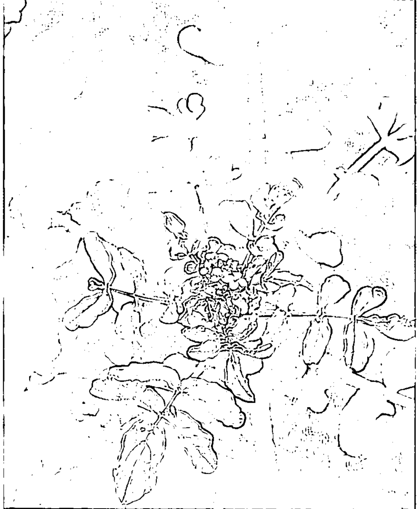

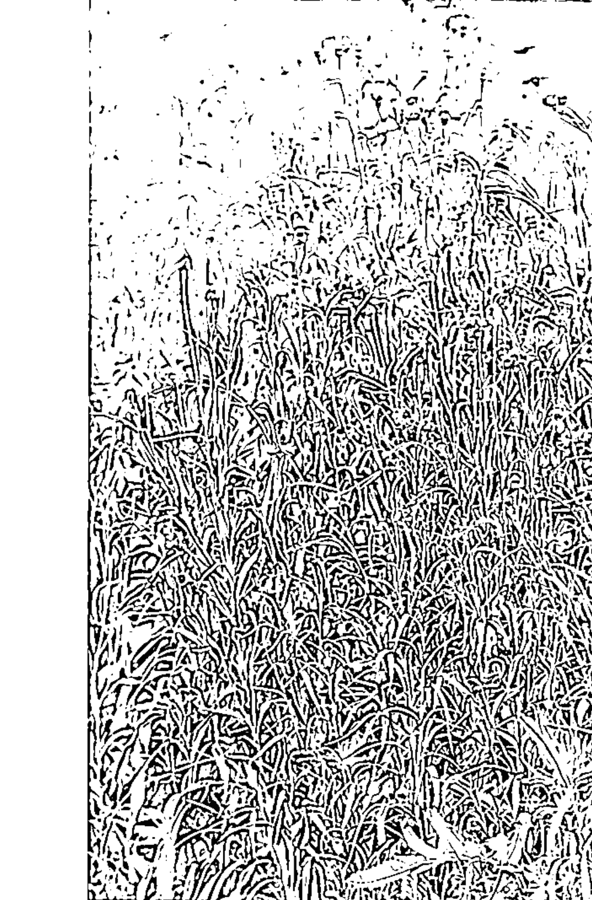

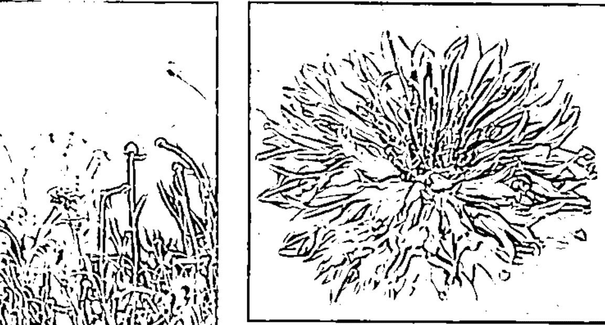

花

種子

### 水芹 Cresson

學名：Nasturtium officinale
別名：水田芥（Watercress）
科目：十字花科和蘭芥子屬／水生的多年生草本
開花時期：4～6月
利用部位：葉
株高：10～50cm
耐寒性：強

◆特徵 原產於歐洲的水生植物，明治初期流傳到日本，是針對外國人而栽種的。從莖的下部長出如鬍鬚般的根。葉片為奇數羽狀複葉，花則為白色十字形且很繁盛。經常培育於清澈流水當中，由於其繁殖力旺盛，現在據說野生化的狀況已遍及日本全國。
◆利用法 具有獨特的辛香味，可用以製作肉類料理的配菜或生菜沙拉等的料理。
◆栽培重點 也可由種子開始栽培，但據說經常在生長之前就被蟲給吃掉了。將超市等地所販售的水芹插入水中，很容易發根，而其中也有附帶根部的，以此方式栽培較佳。在室內利用海綿、砂或鉢底石等，並勤於換水即可栽培。

### 矢車菊 Cornflower

學名：Centaurea cyanus
別名：姫矢車草、藍芙蓉、車輪花
科目：菊科矢車菊屬／1年生草本
開花時期：5～7月
利用部位：花
株高：30～90cm

◆特徵 原產地為歐洲。是野生於歐洲的玉米田或麥田中的雜草，也是德國的國花。莖部具有絨毛且直立。葉片互生、呈線形且根株的葉稍微寬一點，花是由筒狀花演變成的單生頭狀花。除了有藍、白、粉紅、紫、紅等花色的品種之外，還有宿根品種。
◆利用法 插花、乾燥花、芳香花包、茶葉、化妝水。
◆栽培重點 只要陽光充足、排水佳的肥沃土地，可用直播法栽種。一般為秋天播種，但寒冷地帶則是春天播種。
◆預期效果 收斂、利尿。

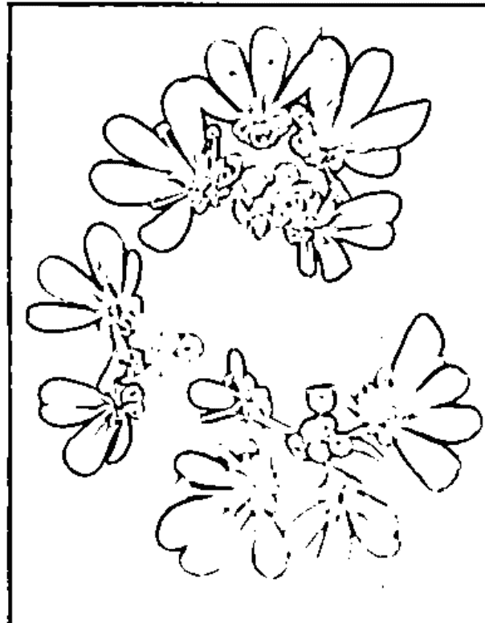

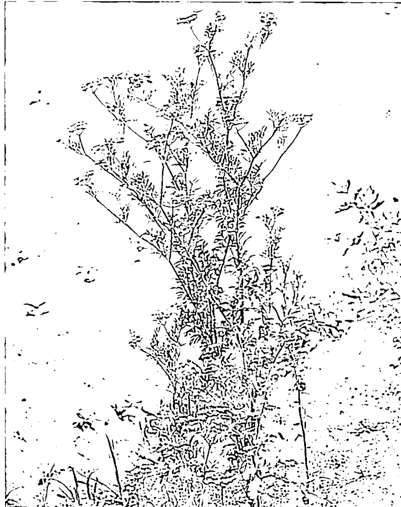

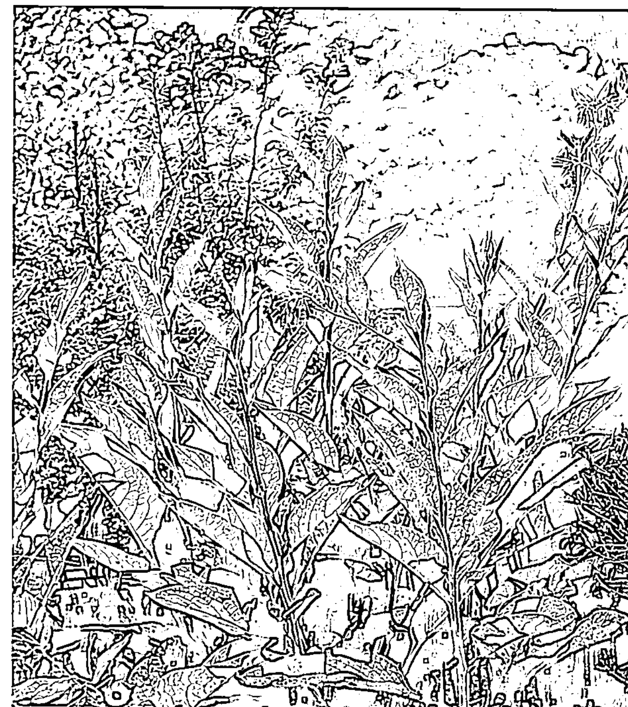

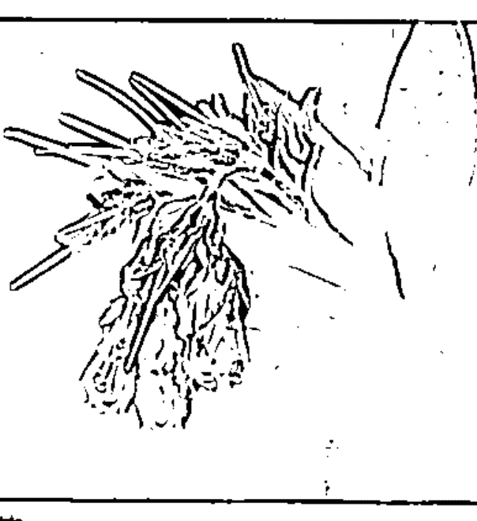

花

花

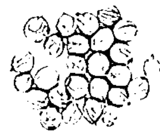

種子

種子

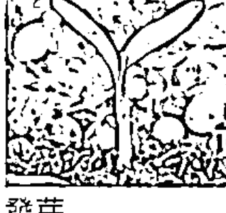

發芽

### 芫荽 Coriander

學名：Coriandrum sativum
別名：香菜、胡荽、香荽、延荽
科目：繖形花科芫荽屬／1～2年生草本
開花時期：7～8月
利用部位：嫩葉、種子
株高：30～60cm

◆特徵 原產地為歐洲。莖細且直立、並大量分枝，葉片為羽狀複葉。白色小花附著於繖形花序上。莖、葉、幼小種子具有臭蟲般的獨特香氣，而種子成熟之後，則變成辛辣的香氣。
◆利用法 嫩葉可加入湯品或異國料理，以泰式酸辣湯與中國的粥為代表。種子可做為辛香料來使用。
◆栽培重點 種子約6顆集結成一個球形，可分開並以條播法栽種。以株距15cm間苗，待生長至20cm時，再依序收成嫩葉。
◆預期效果 增進食慾。

### 康富力 Comfrey

學名：Symphytum officinale
別名：康復力、康固力
科目：紫草科康復力屬／多年生草本
開花時期：6～8月
利用部位：全草
株高：0.7～1.2m
耐寒性：強

◆特徵 整株皆覆蓋有短毛。有類似琉璃苣（borage）般質厚的葉子，並具有小黃瓜般的風味。淡紫色的筒狀花為向下開花。富含維他命C與鉀。
◆利用法 嫩葉可炸成天婦羅、炒物或做成蔬菜汁。用於蒸氣浴可預防皺紋，而做成泥狀可當面膜使用。
◆栽培重點 也喜好陰涼的溼地。株距必需保留70cm以上，於春天或秋天播種。以分株或分根方式也很容易繁殖。
◆預期效果 美顏，扭傷、瘀傷。

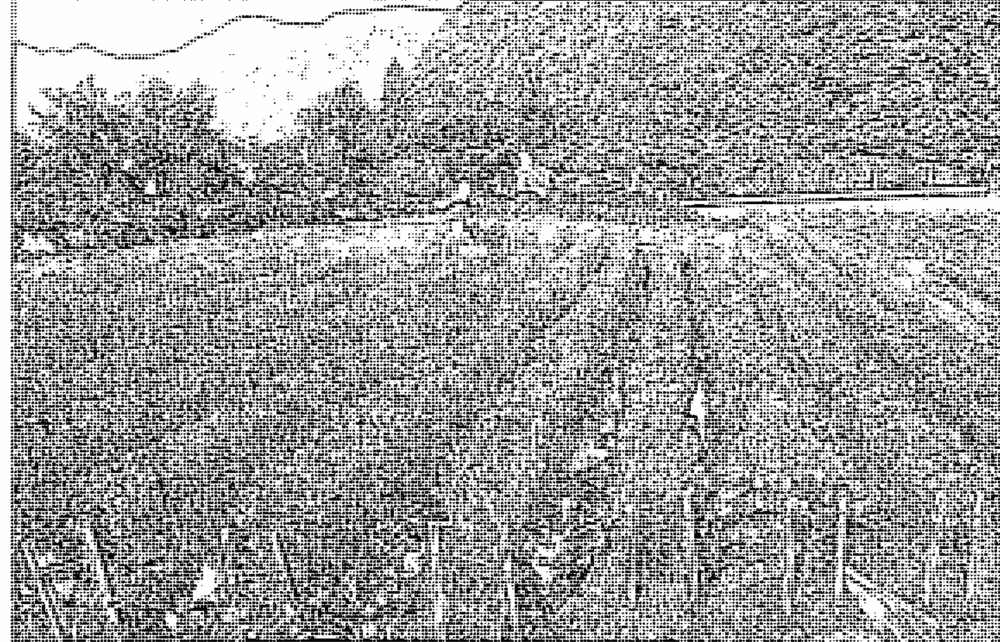

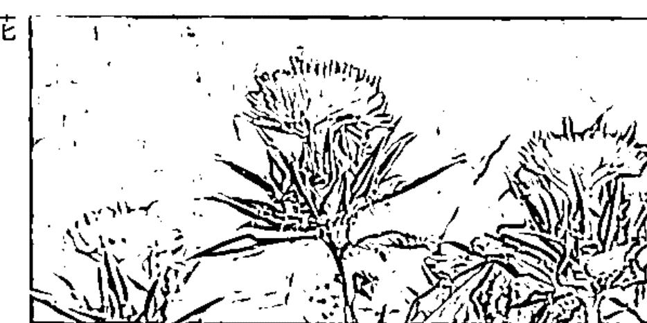

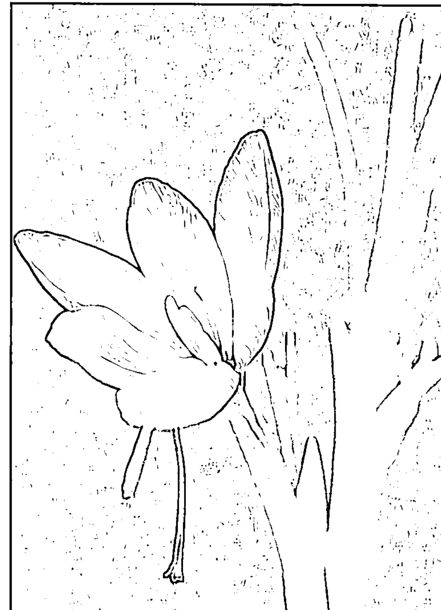

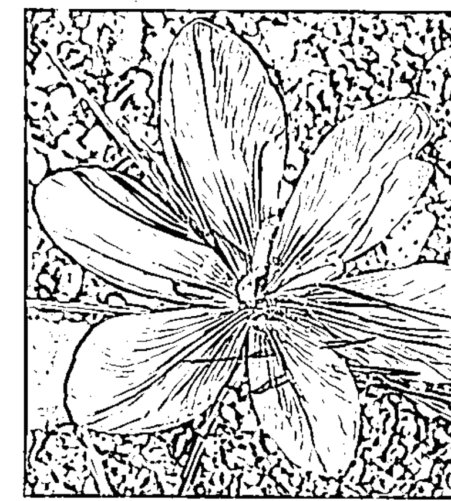

## 紅花 Safflower

學名：Carthamus tinctorius
別名：川紅花、草紅花、紅藍花、紅毛花
科目：菊科紅花屬／1年生草本
開花時期：7～8月
利用部位：花、種子
株高：0.5～1m

◇特徵 花朵與薊很相似，剛開花時是黃色，然後再漸漸變成紅色。花萼與葉子的前端有尖銳的刺，莖部則在前端分枝。另外也有不具刺的品種、花色為白或黃色的品種。可從花朵中提取出極微量的紅色色素，做為染色或口紅用，自古以來即是受到珍視的高價香草。從其種子當中可提取出良質的亞麻油酸與含有維他命E的油分。自古即栽種於中國、印度與歐洲南部。在日本的山形縣，過去是為了提取染料而栽種，而現在則有一部分的農家為觀光用途而栽種。

◇利用法 乾燥後的花瓣可做為茶葉或漬物的染色用。也可用於製作乾燥花或花圈的素材。

◇栽培重點 喜好較乾燥的鹼性土壤。以直播方式播種，待長出本葉時，將株距間隔20cm疏苗，待長至20～30cm高時，則可架立支柱。

◇預期效果 動脈硬化、高血壓。

## 番紅花 saffron

學名：Crocus sativus
別名：藏紅花、西紅花
科目：鳶尾科／多年生球根植物
開花時期：10～11月
利用部位：柱頭
株高：10～20cm
耐寒性：強

◇特徵 原產地為南歐。栽種地當中，以西班牙瓦倫西瓦省最為有名且良質。葉片為松葉狀。花朵則與番紅花crocus很相似，一朵花附著3個紅色的柱頭，將此使用於料理染色等用途。據說收集1公克的柱頭必需要160朵番紅花，是高價的香草植物。

◇利用法 乾燥後的柱頭除了可用以烹調西班牙菜飯（paella）或法式馬賽海鮮湯（bouillabaisse）等料理之外，也可當做茶葉或染色用（孕婦不宜飲用番紅花茶）。

◇栽培重點 喜好陽光充足的砂地。從8月下旬至9月上旬之間種植球根。開花之後，於翌年5～6月將球根挖出，乾燥之後分球、保管於涼爽的場所，並再度種植。

◇預期效果 生理不順、更年期障礙。

### 綿杉菊 Santolina chamaecyparissus

學名：Santolina chamaecyparissus
別名：山多利娜、薰衣草棉
科目：菊科綿杉菊屬／常綠小灌木
開花時期：5～7月　利用部位：葉、花
株高：30～60cm　耐寒性：強

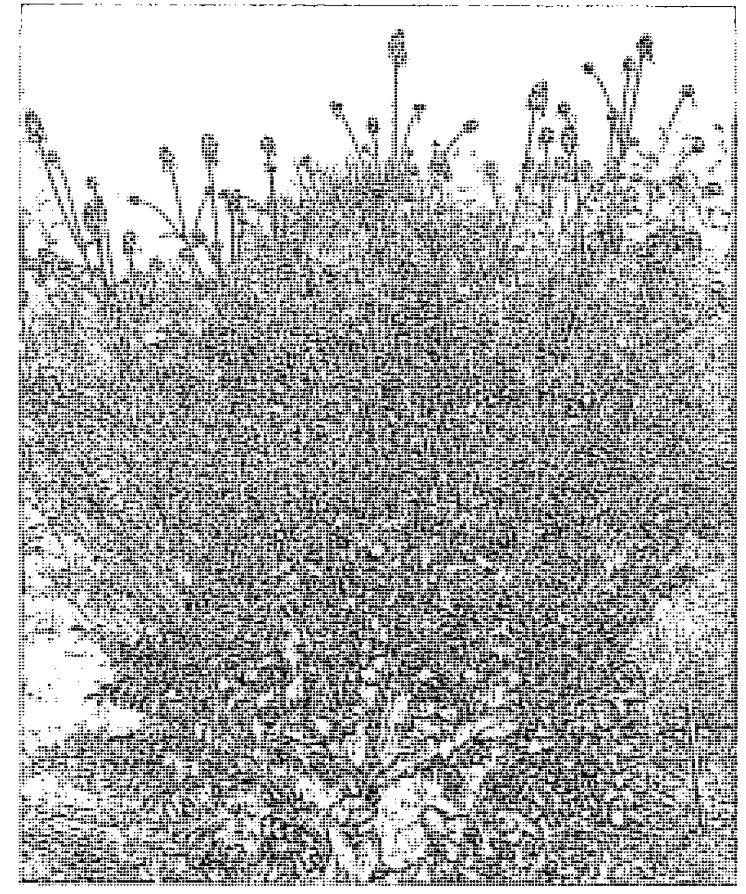

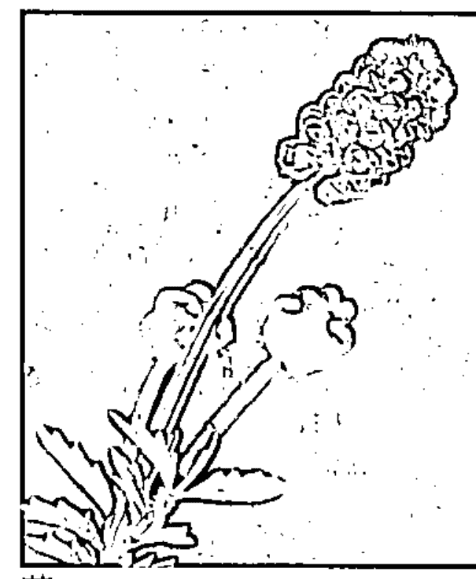

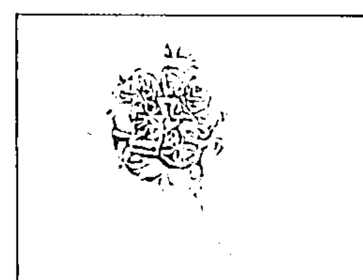

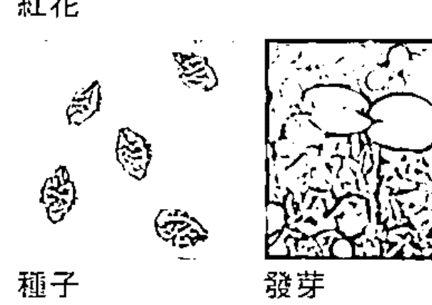

◇特徵　枝大量分枝，葉片為銀灰色且覆蓋絨毛、質厚且具有獨特芳香。每1枝花莖的前端只附著一朵直徑約1.5cm的黃色花朵。從基部開始木質化，若種植於地上，需4～5年的時間生長成樹幹直徑3～4cm、高度50～60cm。

◇利用法　葉或花可作為花束、插花或花圈的花材，也適合做為花圃的外緣或圍籬。

◇栽培重點　喜好排水良好的砂地，如果通風不佳，會因悶熱而容易枯萎。比較上生長較為快速，而枝葉較容易混雜，所以需常修剪整枝。做為花壇外緣時，可修剪整枝成四角形，或是取間隔圍成圓形。因花朵重量的擠壓會使得根株形狀變雜亂，所以建議及早將花朵收成下來。

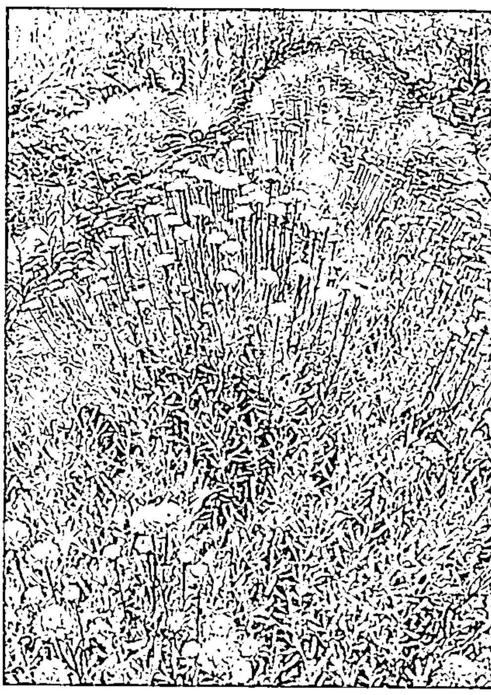

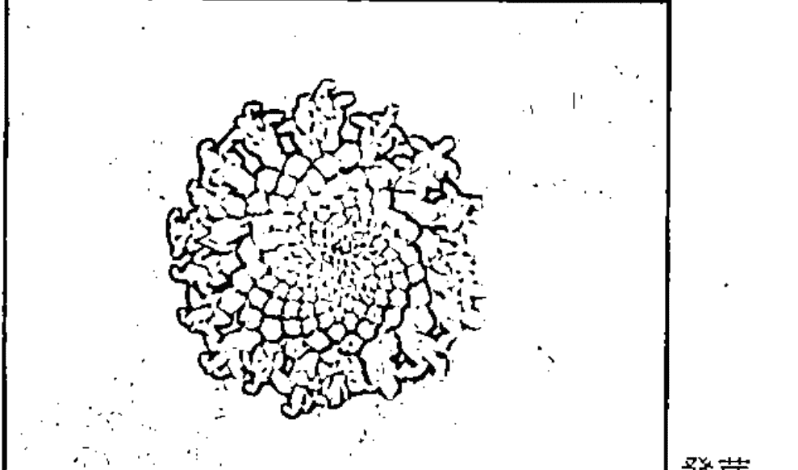

### 小地榆 Salad Burnet

學名：Sanguisorba minor
別名：沙拉地榆
科目：薔薇科吾木香屬
開花時期：5～7月　利用部位：葉
株高：30～80cm　耐寒性：強

◇特徵　嫩葉具有類似覆盆莓的風味。如果栽培過熟會變硬而無法食用。

◇利用法　嫩葉可做成生菜沙拉、香草乳酪。可以撒在湯品表面或是葡萄酒、冷飲的表面做為裝飾。

◇栽培重點　只要陽光充足，不挑土壤皆可栽種。用種子很容易栽培成功，而種植於鉢內也很顯眼。待根株變擁擠之後，可施以分株再培育出新的根株。

◇預期效果　收斂。

### 綠綿杉菊 Santolina viridis

學名：Santolina viridis
科目：菊科綿杉菊屬／常綠小灌木
開花時期：5～7月　利用部位：葉、花
株高：30～60cm　耐寒性：強

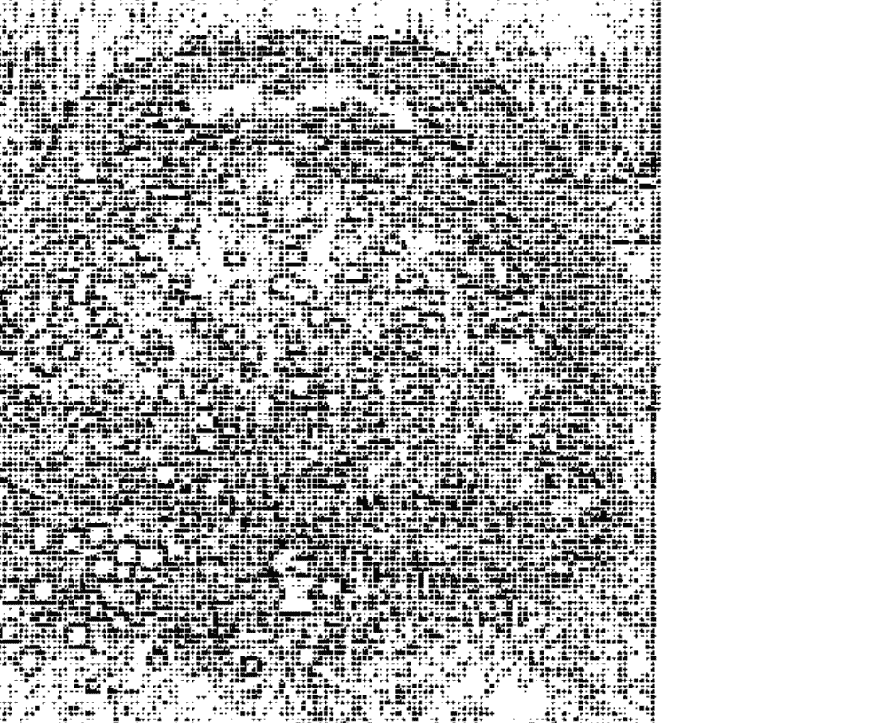

◇特徵　葉片為具有光澤的綠色，比綿杉菊更硬，花色也是稍微淡一點的黃色。

◇利用法・栽培重點　與綿杉菊相同。

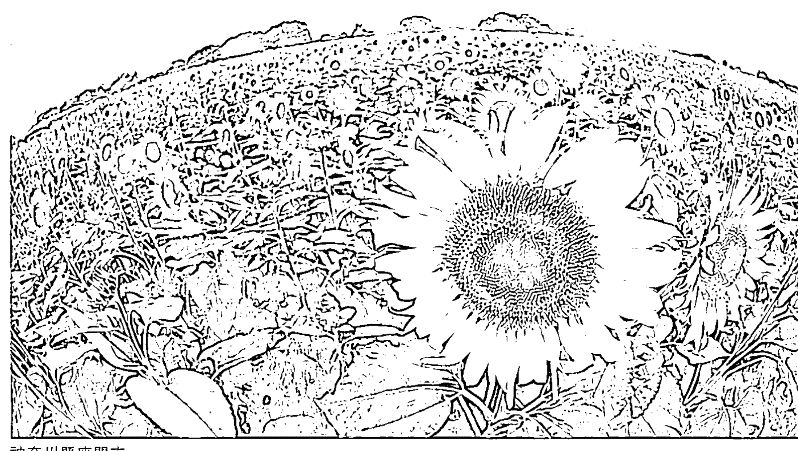

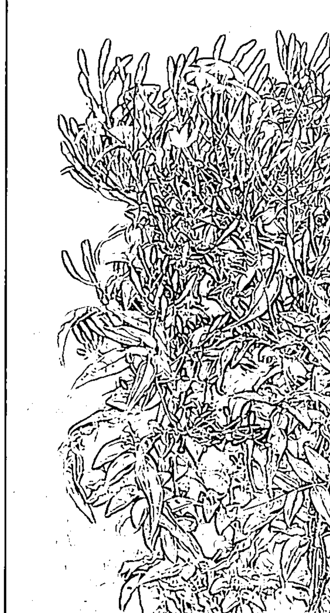

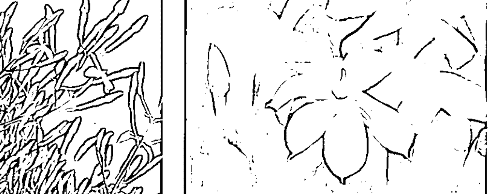

神奈川縣座間市

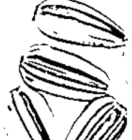

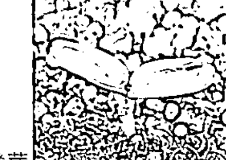

種子

發芽

## 向日葵 Sunflower

學名：Helianthus annuus
別名：太陽花、日頭花、日車、迎陽花、葵花、望日蓮
科目：菊科向日葵屬
開花時期：7～9月
利用部位：種子
株高：0.6～5m
耐寒性：中

◇特徵 從園藝用的肥料到飼料用的，有相當多品種，其株高、花的大小、花色等也不盡相同。可從其種子當中提取出含有亞麻油酸的良質油分。

◇利用法 煎炒種子可當做堅果類食用。也有不落花粉的品種，可做為插花的花材。

◇栽培重點 於塑膠花盆等器皿內播種。取約6片本葉，在日照充足且排水佳的土壤上充分施以基肥，並將株距間隔30～60cm定植。

◇預期效果 動脈硬化。

## 茉莉 Jasmine

圖片為羽衣茉莉。

學名：Jasminum officinale
別名：抹厲、木梨花
科目：木犀科素馨屬／蔓生常綠灌木
開花時期：7～9月
利用部位：花
株高：1～3m

◇特徵 原產地為伊朗、北印度。雖然義大利、摩洛哥、埃及、法國等地都有栽種，而以香水的原料而言，還是法國產的最為高級。在中國使用於茶葉的是Jasminum sambac～虎頭茉莉，而一般在日本的園藝店所販售的羽衣茉莉則是葉子較小且較為耐寒的品種。

◇利用法 開花時期將植鉢放置於室內，會飄散出甘甜的香氣。泡茶則使用市面販售的。

◇栽培重點 原以植鉢種植的，可待其花期結束後，移植到更大的鉢內為佳。

◇預期效果 鎮靜、催情、抗憂鬱。

## 白藜

學名：Chenopodium album
別名：灰菜
科目：藜科藜屬／1年生草本
開花時期：7～10月
利用部位：嫩葉、嫩果實
株高：0.5～1.5m
耐寒性：強

◇特徵 原產地為歐亞大陸。大量生長於乾燥地或海岸附近的砂地、路邊等。嫩葉或葉子背面看起來偏白色。葉片為菱形、卵形，且為不規則的鋸齒狀；花為黃綠色且集中開花於穗狀花序上。同種的赤藜（Chenopodium album ver. centrorubrum）為白藜的變種，其嫩葉帶有紫紅色，很美麗，而葉片也比白藜稍微大一點。據說是古時從中國流傳而來並且為了食用而栽種，現在則已野生化，在日本各地的路邊或荒地上很常見到。

◇利用法 嫩葉水煮過可食用，將葉子壓碎之後可做為治療蚊蟲叮咬的貼布。

◇栽培重點 喜好乾燥的鹼性土壤。於4～5月間播種。由於很容易野生化，所以需注意。

◇預期效果 健胃、強健身體。治療蚊蟲叮咬。

## 湯芹 Soup Celery

學名：Apium graveolens var.dulce
科目：繖形花科／多年生草本
開花時期：4～5月
利用部位：莖、葉
株高：40～50cm
耐寒性：中

◇特徵 如同普通的芹菜一般，莖株不會變大且莖部細長直立。外型與鴨兒芹很相似，葉片為羽狀複葉。白色小花附著於複繖形花序上，全草具有比芹菜更強烈的香味。

◇利用法 撒在沙拉或湯品上，或拌炒到料理裡。因其風味強烈，所以最好酌量使用。

◇栽培重點 春天或秋天在花盆內，以條播法或是株距間隔10～20cm播種，比較上是較為密生栽種。如果過度曝曬直射日光，味道會較強烈且葉筋會變硬，所以等到發芽而本葉長成4～6片之後，可移置於陰涼的場所，如此可栽培出較順口的湯芹。

## 鼠尾草 Sage

## 普通種鼠尾草 Common Sage

學名：Salvia officinalis
別名：藥用鼠尾草、庭園鼠尾草、來路花、洋蘇草
科目：唇形科鼠尾草屬／常綠小灌木
開花時期：5～7月　利用部位：整株
株高：30～80cm　耐寒性：強

◆特徵　自古以來即是可以醫治百病的藥草。莖大量分枝且直立，並從基部開始木質化。葉片為卵狀披針形並覆有細毛，且具有天鵝絨般的觸感，呈現灰綠色。花莖延伸的同時開出紫色的輪生筒狀花，大量附著於間隔生長的穗狀花序上。即將開花之前被視為是藥效最佳的時期。

較為乾燥的土壤。需有日光且20～25℃的溫度才能發芽。定植時以堆肥做為基肥，如果種在花盆則3～4株，如果種在地上則株距需間隔30～40cm。由於不喜酸性土壤，所以需在約二個星期以前利用苦土石灰來中和土壤。收成則是生長到30cm以上、並留下幾片枝下面的葉子即可進行。

◆利用法　具有防止腐敗、防止氧化、抑制肉類腥臭味的效果，是烹調豬肉料理或熱狗時不可或缺的素材。除了茶之外，也可浸漬於油、醋、葡萄酒內，甚至裹麵糊油炸或做成沙拉。園藝、插花、乾燥花、染色、入浴劑、肥皂、洗髮精或潤髮乳等等，利用範圍很廣泛，而且也非常適合做為製作花圈的素材。

◆預期效果　強身、解熱、收斂、通經、淨血、促進消化、抗菌，預防更年期障礙。

◆栽培重點　喜好向陽且排水良好之處、肥沃且

## 鼠尾草的種類

### 櫻桃鼠尾草 Cherry sage

□學名：Salvia coccinea
□開花時期：整年
□株高：0.5～1.2m □耐寒性：中

從各枝長出數根花莖，並開出紅色鮮豔花朵。主要為觀賞用。

### 北美苦草 Wood sage

□學名：Teucrium scorodonia
□科目：唇形科苦草屬／亞灌木
□開花時期：7～9月
□利用部位：整株
□株高：30～50cm □耐寒性：強

名稱雖為鼠尾草（sage），但實際是不同屬種的植物，過去是用於藥用的植物。葉片可做茶葉等。

### 三色鼠尾草 Tricolor sage

□學名：Salvia officinalis 'Tricolor'
□別名：斑葉鼠尾草
□開花時期：7～8月（極少開花）
□株高：30～70cm

葉緣具有白色斑紋，而接近葉柄的部分則為紅色，香味清淡。

### 西班牙鼠尾草 Spanish sage

□學名：Salvia lavandulifolia
□開花時期：6～8月
□株高：20～60cm

整株皆具有芳香，開出藍紫色的花。可做香草茶。

### 闊葉鼠尾草 Broadleaf sage

□學名：Salvia officinalis 'Broad Leaf'
□開花時期：7～8月（極少開花）
□株高：30～70cm

闊葉的品種，味道也很芳香，堅固且容易栽培。

### 墨西哥灌木鼠尾草 Mexican Bush Sage

□學名：Salvia leucantha
□別名：墨西哥鼠尾草、紫水晶鼠尾草（Amethyst sage）
□科目：唇形科鼠尾草屬／多年生草本
□開花時期：9～11月
□株高：0.8～1.6m □耐寒性：中

從秋天至晚秋，開出紅紫色之天鵝絨般的花。

### 彩繪鼠尾草 Painted Sage

□學名：Salvia horminum
□科目：唇形科鼠尾草屬／1年生草本
□開花時期：6～9月
□株高：30～60cm

莖部直立分枝，頂端的苞葉則有桃、紫、白等顏色。主要為觀賞用，佈置花壇或製作乾燥花。

### 紫色鼠尾草 Purple sage

□學名：Salvia officinalis 'Purpurea'
□開花時期：7～8月
□株高：30～70cm

嫩葉為紫紅色所衍生出的品種，並隨著其生長而逐漸變成綠色。

### 耶路撒冷鼠尾草 Jerusalem Sage

□學名：Phlomis fruticosa
□科目：唇形科糙蘇屬／多年生草本
□開花時期：6～9月
□株高：40～70cm □耐寒性：中

名稱雖為鼠尾草，但實際是不同屬種的植物。開出輪生的黃色筒狀花。

### 金黃鼠尾草 Golden sage

□學名：Salvia officinalis 'Icterina'
□開花時期：7～8月（極少開花）
□株高：30～70cm

明亮綠色的葉緣上具有黃色斑紋。清淡的風味為其特徵。

### 鳳梨鼠尾草 Pineapple sage

□學名：Salvia rutilans
□科目：唇形科鼠尾草屬／多年生草本或小灌木
□開花時期：9～10月
□株高：50～90cm □耐寒性：中

從各枝長出數根花莖，並開出紅色鮮豔花朵。主要為觀賞用。

### 快樂鼠尾草 Clary sage

□學名：Salvia sclarea
□科目：唇形科鼠尾草屬／2年～多年生草本
□開花時期：7～8月
□株高：0.8～1.8m

是鼠尾草系列當中最大的品種。大形的花穗延伸，長出大且具有桃色苞葉的花朵。可提取精油。

[預期功效（精油）] 強健身體、降血壓、催情、強健子宮、鎮靜、消炎、促進分娩、防臭。

### 俄羅斯鼠尾草 Russian sage

□學名：Perovskia atriplicifolia
□科目：唇形科分藥花屬／落葉灌木
□開花時期：7～9月
□株高：0.6～1.3m

名稱雖為鼠尾草，但實際是不同屬種的植物。整體呈現銀灰色，而大且分枝的枝前端開出紫色的花朵。

## 香葉天竺葵 Scented Geranium

學名：Pelargonium spp.
別名：防蚊樹、防蚊草
科目：牻牛兒苗科（亦稱香葉草科）
天竺葵屬／亞灌木
開花時期：4～9月　利用部位：葉、花
株高：0.3～1m　耐寒性：弱

冬的天氣狀況之外，用扦插法即可輕易地繁殖。切取約10cm的嫩枝，並拔除其下方的葉子，插於鹿沼土等土壤即可，或是有2片葉子的5cm左右的枝梗也可以繁殖。約2週時間即可發根，生長非常快速，只要於春天定植，就可在秋天之前生長到相當大的程度。但如果直接以原狀迎接冬天，下葉易枯萎掉落讓整株不美觀，而且也會成為過冬的負擔，所以11月前後，需嚴格進行剪定。剪定的重點在於儘量減少接觸到外部空氣的表面積，這麼一來就可以安然過冬，而翌年的花也更加盛開。至於平日的管理，則需勤於摘除枯萎的葉子，溫暖時期也需儘量培育於戶外通風的場所。如果一直只放在室內栽培，整株外觀會變得纖細瘦弱，且香味也不佳。

◆特徵　天竺葵屬植物的品種有200種以上的交配種、雜種、變種，而其中具有類似辛香料或水果芳香的品種稱之為香葉天竺葵，並以香味的種類做區別。為多年生草本或亞灌木，葉片為互生或對生，大多數形狀為心臟形或掌狀，羽狀葉面上有深裂痕，且依品種不同而各異。莖部為半木質化或木質化的皆有，莖的前端或葉與莖之間附著花朵。花色有白、桃、紅、紫紅等各種顏色。

◆利用法　玫瑰天竺葵可提煉出香料，葉子可當作製作蛋糕的素材來食用，或用在芳香花包、插花、泡澡等方面。至於其他品種，除了可享受其芳香之外，也利用於插花或觀賞用。而用於芳香療法的精油則是從玫瑰天竺葵中提煉出來的。

◆栽培重點　喜好陽光充足、肥沃且稍微乾燥的土壤。不適合高溫多濕，也不太耐寒，所以在寒冷地帶最好能在室內過冬。除了部分的品種與寒

◆預期效果（精油）　促進細胞成長、殺蟲、收斂、軟化皮膚、收縮血管。

## 夏枯草 Self Heal

學名：Prunella vulgaris ssp.vulgaris
別名：下枯草、夏枯花、六月乾、枯草穗
科目：唇形科西洋勒草屬多年生草
開花時期：6～8月
利用部位：整株
株高：10～30cm
耐寒性：強

◆特徵　葉片為長橢圓狀、披針形的對生葉。莖的前端附著約3～5cm的花穗，開出大量紅紫色的唇形花。在日本也有同種的勒草（Prunella vulgaris var. lilacina）分布於各地，而由於其花期結束之後會依然直立著，所以也被稱為夏枯草。

◆利用法　將花穗乾燥處理之後可做為花草茶。

◆栽培重點　大多數的地區皆可栽培。因為很容易雜草化，所以建議栽培於花盆等有範圍限制的地方。

◆預期效果　利尿。

## 香葉天竺葵的種類

### 檸檬天竺葵 Lemon Geranium

□學名：Pelargonium crispum
□株高：0.3～1m

具有類似檸檬的清爽芳香。也有葉緣具有黃色斑紋的品種。

### 蘋果天竺葵 Apple Geranium

□學名：Pelargonium odoratissimum
□株高：20～40cm

具有蘋果般的甘甜芳香。開出直徑約1cm的白色小花。

### 豆蔻天竺葵 Nutmeg Geranium

□學名：Pelargonium×fragrans
□株高：30～50cm

是與蘋果天竺葵的交配種，所以外觀相似，散發出稍微辛辣的香味。

### 美人天竺葵 Beauty Geranium

### 杏仁天竺葵 Apricot Geranium

### 雪花天竺葵 Snowflake Geranium

□學名：Pelargonium capitatum 'Snowflake'
□株高：0.4～1m

葉子較大片且輕柔，具有白色斑紋。為柑橘系的香味，開出桃色花朵。

### 生薑天竺葵 Ginger Geranium

### Mrs. Taylor天竺葵 Mrs.Taylor Geranium

### 松香天竺葵 Pine Geranium

□學名：Pelargonium denticulatum
□株高：0.4～1m

葉子帶有褐色的葉脈，散發出木頭的香味。

### 葡萄柚天竺葵 Skeleton's Unique Geranium

### 肉桂天竺葵 Cinnamon Geranium

□學名：Pelargonium gratum×limoneum
□株高：40～70cm

葉片稍微捲曲，開出桃紅色花朵。具有類似肉桂的芳香。

### Shrubland rose 天竺葵 Shrubland rose Geranium

### 波旁天竺葵 Bourbon Geranium

### Rita Scheen天竺葵 Rita Scheen Geranium

### Dr. Livingstone 天竺葵 Dr. Livingstone Geranium

□學名：Pelargonium radens 'Dr. Livingstone'
□株高：0.3～1m

開出與玫瑰天竺葵相似的花朵，散發出含有檸檬味的玫瑰香。

### Clorinda天竺葵 Clorinda Geranium

□學名：Pelargonium clorinda
□株高：0.4～1m

開出深桃色的鮮豔花朵，葉子具有類似尤加利的香味。

### 檸檬天竺葵（斑紋品種）

□學名：Pelargonium crispum 'Vaiegatum'

### Mrs. Joy Red天竺葵

### 豔紅天竺葵 Brilliant Geranium

### 斑葉薄荷天竺葵 Mint Variegata Geranium

### 玫瑰天竺葵 Rose Geranium

□學名：Pelargonium graveolens
□株高：0.3～1m

為代表性的品種，含有似玫瑰的芳香，開出淡桃色2～3cm的花朵。

### 小雪花天竺葵 Atomic Snowflake Geranium

□學名：Pelargonium capitatum 'Atomic Snowflake'
□株高：0.4～1m

含有類似薄荷的柑橘系香味，開出桃色且稍微大的花朵。

### 薄荷天竺葵 Peppermint Geranium

□學名：Pelargonium tomentosum
□株高：0.3～1m

具有似薄荷的刺激性味道。葉子大片且質厚，開出直徑約1cm的白色小花。

### Lady Marie天竺葵 Lady Marie Geranium

## 聖約翰草 St. John's Wort

學名：Hypericum perforatum
別名：金絲桃
科目：金絲桃科／多年生草本
開花時期：6～8月
利用部位：花、葉
株高：0.5～1m
耐寒性：強

◆特徵 歐洲、亞洲原產。莖部直立且大量分枝，葉片從圓形到心臟形都有，花為黃色的5片花瓣綻放成星形，葉片與花上有黑點與黑線。在日本也有同種的金絲桃（Hypericum erectum）或變種大量野生。
◆利用法 自古即是治療傷口的秘方藥，將花或葉浸入油內，以此利用於做為傷口、跌打損傷、神經痛等的藥。現今則有人將葉子用來製作為香草茶。
◆栽培重點 春天與秋天播種。栽培於向陽且排水佳的砂地。
◆預期效果 強身，治療夜尿症。

## 肥皂草 Soapwort

學名：Saponaria officinalis
別名：皂質草、朱樂
科目：石竹科無患子屬／多年生草本
開花時期：7～9月
利用部位：整株
株高：0.4～1m
耐寒性：強

◆特徵 在英國以「洗衣店的香草植物」之名稱而為人所熟知。整株含有皂素，將其葉與根煮成汁液之後就成為肥皂精。由於不會破壞纖維，所以適合清洗毛織品。
◆利用法 花朵繁盛茂密地集中綻放，所以可做為花園的點綴。
◆栽培重點 喜好半日照和潮濕的土壤，適合地植。

## 百里香 Thyme

## 普通種百里香

學名：Thymes vulgaris
別名：麝香草
科目：唇形科百里香屬／常綠小灌木
開花時期：5～7月　利用部位：整株
株高：10～35cm　耐寒性：強

各種百里香的枝
葉或莖的顏色、形狀等，依品種不同而各異。
左起為銀斑百里香、普通種百里香、檸檬百里香
（斑紋品種）、野生百里香

◆特徵　自古以來即是可以醫治百病的藥草。莖大量分枝且直立，並從基部開始木質化。葉片為卵狀披針形並覆有細毛，且具有天鵝絨般的觸感，呈現灰綠色。花莖延伸的同時開出紫色的輪生筒狀花，大量附著於間隔生長的穗狀花序上。即將開花之前被視為是藥效最佳的時期。

置著維持原狀不管裡，容易乾燥枯萎，所以需修剪整枝至剩下整體的1/2為止。待各株之間變攤擠時，需進行間苗或3年進行一次分株，並當作新株即可培育。

◆利用法　葉或枝可用於烹調肉、魚、紅燒等各種料理。除了芳香花包、花圈等各種手工藝品之外，也廣泛利用於花園的外緣、乾燥花。

◆預期效果　強身、去痰、驅蟲、高血壓、殺蟲、抗微生物、抗風濕、防腐、通經。

◆栽培重點　喜好向陽、排水與通風良好的場所。將種子以條播法播種於箱子內，待生長到高度約5cm時，再移植到塑膠花盆內。當根部從盆子下方長出來時，以株距間隔30cm定植，用扦插法也很容易生根。當枝葉變得攤擠雜亂時，可利用此時邊收成邊修剪整枝。花期過後如果放

## 百里香的種類

柳橙百里香 Orange Thyme
□學名：Thymes vulgaris 'Fragrantissimus'
屬直立型。整株散發出類似柳橙的水果香味。葉片呈帶灰色的青綠色，開出淡藍紫色的花。

Pot百里香 Pot Thyme

銀斑百里香 Silver Thyme
□學名：Thymes vulgaris 'Silver Posie'
□株高：10～20cm
屬直立型。葉緣上具有偏白色的斑紋，並茂盛地開出淡桃色的花。到了冬天斑紋會轉變成紅色將葉子染成紅葉。

檸檬百里香（斑紋品種）
□學名：Thymes×citriodorus 'Aureus'
□別名：黃斑檸檬百里香　□株高：10～20cm
為檸檬百里香（Thymes×citriodorus）的園藝改良品種。屬半匍匐型，葉緣有黃色斑紋，整株散發出淡淡檸檬般的芳香。開出淡桃色的花。

紅花百里香 Creeping Thyme Creeping Flower
□學名：Thymes p.a. 'Coccineus'
□別名：鋪地香　□株高：5～8cm
為小形品種且茂密散佈，香氣較弱。紅紫色的花很美，最適合做為地被植物。

野生百里香 Wild Thyme
□學名：Thymes serpyllum
□株高：10～30cm
屬匍匐型。在與土壤接觸的地方發根，並漸漸地擴散。開花時期莖部向上直立，開出淡紫色的花。

## 龍蒿 Tarragon

學名：Artemisia dracunculus
別名：草蒿草、茵陳蒿、茵陳、蚊仔煙草、環保蚊香青、Honokazu（布農）、Taraozyon（排灣）
科目：菊科蒿屬／多年生草本
利用部位：葉
株高：40～60cm
耐寒性：強

◇特徵 直立的莖變得如同灌木林般，葉子細長且前端尖銳。會開出花蕾，但大多數不會開花，所以無法取得種子。也有苦味強烈、香味拙劣的俄羅斯龍蒿（Artemisia dracunculoides），但不太拿來利用。
◇利用法 嫩葉可做醬汁或歐姆列滋蛋捲之類的蛋料理，也利用於製作香草醋。
◇栽培重點 因為沒有種子，所以可購買苗株或是當做食材販售的龍蒿，用扦插方式即可栽培。種植於陽光充足、排水佳的場所，2年進行約一次的分株作業。
◇預期效果 驅蟲、促進消化。治療風濕。

## 艾菊 Tansy

學名：Tanacetum Vulgare
別名：菊蒿
科名：菊科菊蒿屬／多年生草本
開花時期：8～10月
利用部位：葉、花
株高：0.6～1.5m
耐寒性：強

◇特徵 莖於上部分枝，並於其頂端有直徑約8mm的黃色筒狀花開在圓錐花序上。整株具有類似樟腦般的香氣。
◇利用法 因含有毒素所以不做為食用。可做為乾燥花或花圈的素材、染色、或是衣櫃除蟲用。
◇栽培重點 只要陽光充足，不挑土壤，以播種或分株方式皆可輕易栽培成功。因為生長的高度較高，所以不適合缽植。
◇預期效果 驅蟲。

## 蒲公英 Dandelion

學名：Taraxacum officinale
別名：黃花地丁
科目：菊科蒲公英屬／多年生草本
開花時期：3～8月
利用部位：嫩葉、根
株高：10～30cm
耐寒性：強

◇特徵 原產於歐洲。葉片為根生、羽狀上有深裂紋，花莖的前端開出黃色的頭狀花。於明治時代傳至日本，並生存繁殖於各地。在日本也有關東蒲公英（Taraxacum platycarpum），但最近幾乎很少見。
◇利用法 嫩葉可做生菜沙拉或天婦蘿。將根切小、乾燥之後，可煎焙做成蒲公英咖啡。根與葉也可用於染色。
◇栽培重點 只要陽光充足且排水佳，大多數的地區都很容易用種子栽培成功。
◇預期效果 強肝、強壯、利尿。

## 菊苣 Chicory

學名：Cichorium intybus
別名：苦苣（endive）
科目：菊科菊苣屬／多年生草本
開花時期：6～8月
利用部位：花、根、軟化後的根出葉
株高：1～1.5m
耐寒性：強

◇特徵 原產於歐洲。第1年長出大量根出葉，第2年莖延伸並開花。根為直根且粗，花莖大量分枝，從葉子基部附近開出藍色的頭狀花。軟化栽培的根出葉結球部分可用以料理食用，另外也有結球成紅紫色（義大利紫菊苣）的品種。
◇利用法 除了軟化栽培的根出葉之外，它的嫩葉或花也可做生菜沙拉等。將根部切碎，乾燥後煎焙，可做成菊苣咖啡。
◇栽培重點 在日光充足、排水佳的肥沃土地，從春天開始到秋天都可以播種，於10～11月份（秋播則為翌年）將根部挖掘上來，埋入日光照射不到的場所並覆蓋約20cm厚的砂。約1個月時間即可收成。如欲收成花朵，直接栽培即可。
◇預期效果 強肝、利尿。

花

種子

發芽

## 細香蔥 Chive

學名：Allium schoenoprasum
別名：蝦夷蔥
科目：百合科蔥屬／多年生草本
開花時期：5～6月
利用部位：整株
株高：20～40cm
耐寒性：強

◇特徵 形狀類似慈蔥，株高40cm以內，葉片為中空且有寬度3～5mm的白色小鱗莖，分開可充分繁殖。筒狀的花莖延伸約30cm，紅紫色的花開在繖形花序上。具有纖細的風味，含有大量的鈣質與維他命。
◇利用法 葉子若經過加熱調理會使其風味消失，所以都用於生食或在烹調完成時再加入料理內。剁碎撒在沙拉上、拌入奶油裡，或是在嫩煎肉和魚完成時加入。而花除了製作為乾燥花之外，還可將生的花浸漬在酒醋裡做成香草醋。
◇預期效果 強肝、利尿。

## ○栽培重點與收穫

喜好半日照且稍微潮濕的肥沃土壤。如果水分吸光、照射強光的話，葉子前端會變黃色。基肥是將過磷酸石灰與硫安（硫酸銨）的等量混合物與雞糞一次取1㎡對1公升攪拌而成。在春天或秋天的時候，取種子以15～20cm的株距，各直播5～6粒種子。待葉子生長到約20cm時，即可收成並餘留根部以上2～5cm的株高，不久就會再發芽，1年可收成3～4次。
要是以種子的狀態開始栽培的話，第2年才會開花。由於開花之後葉子會變硬，此狀態則不建議再做為食用了。將花製作為乾燥花時，將根部餘留2～5cm，其餘部分都割取下來，在洞孔較粗的網子上，將花朝上一根一根地插上去且勿重疊，並吊掛在日光充足的地方放置乾燥（如照片）。

## ○分株

由種子栽培而成的細香蔥不需要疏苗，並約在1年之後分株較佳。將1年前播種生長而成的細香蔥，如右邊照片一般，連根拔起並各取5～6根成為一束，以每束間隔15～20cm的株距移植。

雪中的細香蔥

過冬後的細香蔥（4月初）

雖然冬天會枯萎，但因其耐寒性強，所以翌年春天還會再發芽。初夏時會開出紅紫色的花，所以也可以做為花圃外緣。

## 茴芹 Chervil

學名：Anthriscus cerefolium
別名：細葉芹、山蘿蔔
科目：芹科峨參屬／1～2年生草本
開花時期：6～7月
利用部位：嫩葉
株高：25～50cm

◆特徵 是法國料理當中經常使用的香草植物。莖部分枝且直立，於莖上部有白色小花開在複傘形花序上，整株皆具有隱含甘甜的獨特風味。
◆利用法 被使用在蛋、魚、雞肉料理、湯或沙拉的製作上。因為加熱後風味會變差，所以可於烹調最後再加入或是以短時間加熱完成製作。
◆栽培重點 喜好半日照且稍微有一點潮濕的肥沃土壤，不喜強烈日光與乾燥。由於不適合移植，所以於春天或秋天將種子以直播法每幾粒間隔10cm播種於花盆內，並於收成的同時進行疏苗。

## 新疆藍刺頭 Thistle Grove

學名：Echinops ritro
別名：琉璃玉薊
科目：菊科藍刺頭屬／多年生草本
開花時期：7～8月
利用部位：花
株高：0.5～1m
耐寒性：強

◆特徵 根出葉為長橢圓形且前端尖銳，上部的葉片為羽狀中裂，有許多尖銳的棘。葉子背面具有子背面具有絨毛，莖直立且分枝的頂端上茂密生長著直徑3～5cm的球形、琉璃色的筒狀花。
◆利用法 有些國家將花煎焙後做為藥方用。而一般則是將花利用於插花、乾燥花或花圈的素材。
◆栽培重點 喜好向陽、排水佳且肥沃的土壤。由於容易有蟲寄生，所以需保持通風並適量地使用含氮肥料。製作成乾燥花時，可於整體1/3～1/2開花的時候，即早收成花朵。

## 萱草 Day Lily

學名：Hemerocallis hybrida
別名：金針、黃花菜、忘憂草、宜男草、療愁、鹿箭
科目：百合科黃花菜屬／多年生草本
開花時期：6～8月
利用部位：整株
株高：40～80cm
耐寒性：強

◆特徵 從根部直接長出大量長線形的葉子，於長的花莖頂端開出似百合的喇叭形大花朵。花朵為一日花，早晨開花到了夜晚便凋謝。是由萩萱草、日光黃萱等的同屬植物經過品種改良後的園藝種，野生種則總稱為萱草。與漢方的甘草很容易被誤認，而甘草則屬於豆科的多年生草本。
◆利用法 花可做為觀賞用。而嫩葉、花蕾與花也可做為食用，但有些品種含有有毒成分，所以要多加注意。
◆栽培重點 喜好較為多濕且肥沃的土壤。盡量以地植栽培，2～3年進行一次分株。

## 莳蘿 Dill

學名：Anethum graveolens
和名：洋茴香、野小茴、上茴香、小茴鄉、野茴鄉等、臭前胡
科目：傘形花科／1～2年生草本
開花時期：5～7月
利用部位：葉、種子
株高：0.6～1.2m
耐寒性：強

◆特徵 原產於地中海沿岸、俄羅斯南部，日本則是於江戶時期傳入的。莖部中空且直立，並於上部分枝，黃色小花大量開在複傘形花序上。
◆利用法 新鮮葉子可利用於魚料理、蛋料理、沙拉、醋。種子則利用於製作醃菜或甜點。
◆栽培重點 只要陽光充足、排水良好不挑土壤皆可繁殖。因為不宜移植，所以在春天到秋天之間以30cm的株距直接定植。種子連同花穗一起摘取下來，乾燥後加以保存。
◆預期效果 鎮靜、預防口臭。

## 飛燕草 Delphinium

學名：Delphinium elatum
別名：千鳥草、小鳥草、彩雀草、翠雀
科目：毛茛科／多年生草本
開花時期：5～7月
利用部位：花
株高：0.6～2m
耐寒性：強

◆特徵 是擁有許多品種的園藝植物。葉片為掌狀且有裂痕，而長長延伸的花莖頂端，其花朵開在總狀或穗狀花序上。有藍、紫、白、桃、紅等花色、八重瓣、鉢植用的小株、達2m大的大型種等等，擁有許多不同的品種。

◆利用法 種在土壤裡做為花園的點綴，或是花可做為製作芳香花包的素材。

◆栽培重點 喜好向陽、排水佳、肥沃且含有腐蝕質的土壤。由於是直根，所以可於春或秋天播種於較深的鉢內，或是株距間隔30cm以直播法播種。為了防止傾倒，可立起支架較佳。

## 德國鈴蘭

學名：Convallaria majalis
別名：君影草
科目：百合科／宿根草本
開花時期：5～7月
利用部位：花
株高：15～25cm
耐寒性：強

◆特徵 長出長橢圓形的葉子，花莖延伸，開出數朵釣鐘形且含有芳香的白花。其他還有被視為德國鈴蘭之變種的北海道鈴蘭，以及粉紅色花朵的品種。與毛地黃（Foxglove）相同，含有具強心作用的物質，過去可由醫師等專業人士的處方做為強心劑來使用，而現在則種植做為觀賞用。

◆利用法 種植於花壇做為觀賞用。可做為芳香花包的素材或香料。

◆栽培重點 喜好微濕的涼爽氣候。於秋天將地下莖分割以進行分株。

## 柳穿鱼 Toadflax

学名：Linaria vulgaris
别名：彩雀花、姬金鱼草、小金鱼草
科目：玄参科／多年生草本
开花时期：5～9月
利用部位：茎、叶
株高：30～90cm
耐寒性：强

◆特征 原产于欧洲、北亚。是繁殖力旺盛、易杂草化的植物。茎部直立，叶片为极细的线形，于苗株上部开出大量有距的黄色筒状花。
◆利用法 也有人将茎、叶煎焙后，用以做为利尿剂或皮肤病等药草，而一般则拿来插花等。
◆栽培重点 可由种子轻易栽培成功。只要阳光充足，不挑土壤皆可栽培，但由于很容易杂草化，所以需注意。

## 香青兰 Dragonhead

学名：Dracocephalum moldavica
别名：小兰花、山青兰、山薄荷、巴德兰古、华日阳古、青兰、野青兰
科目：唇形科／1年生草本
开花时期：7～8月
利用部位：叶、花
株高：40～60cm

◆特征 整株皆具有芳香。茎从基部开始分枝且直立，叶片为披针形，叶缘为锯齿状，青紫色的花开在穗状花序上。
◆利用法 花可做成生菜沙拉，也可做为花坛装饰或蜜蜂植物。
◆栽培重点 喜好稍微阴凉处，不挑土壤。春天以直播法播种即可轻易栽培成功。而自然掉落的种子也可繁殖。

## 金莲花 Nasturtium

学名：Tropaeolum majus
别名：旱荷花、荷叶莲
科目：金莲花科／1年生草本
开花时期：5～9月
利用部位：叶、花、种子
株高：0.3～3m

◆特征 茎为多肉质的蔓生茎，从小型品种到可以长到高达3m的大型品种都有。叶片为圆形且具有长的叶柄，花为五瓣而直径为5～6cm、有距，花色则有红、黄或橙色等。另外也有八重瓣或斑纹叶的品种。花、叶、种子皆具有类似山葵般的气味，叶子与种子也具有刺激的辛辣味。

◆利用法 叶片或花可做料理或沙拉，而幼种可做西式腌菜。

◆栽培重点 在向阳且排水佳的土壤上直播。如果种植于含氮量高的土壤，则只会让叶子繁茂。若施以适量的磷酸并摘蕊，会分枝且开出大量的花朵。夏季则放置于半日照之处。

## 黑种草 Nigella

学名：Nigella damascene
别名：黑子草
科目：毛茛科／1年生草本
开花时期：5～7月
利用部位：花、裂果
株高：0.3～1m
耐寒性：中

◆特征 茎部直立且分枝，于顶端开出五瓣或八重瓣、直径约4～5cm的花。花期过后长出裂果，其种子具有芳香气味。花色有蓝、白、紫红、桃色等。

◆利用法 插花的花材或种植于花坛。裂果可做成干燥花，或是种子可用于增添甜点的香味。

◆栽培重点 只要排水良好且有适度湿气，不挑土壤皆可栽培。种子有嫌光性且不适合移植，所以可用直播法播种，并直到其发芽之前皆用黑色塑胶袋覆盖住较佳。秋播较佳，翌年可大量繁殖。过冬时管理使其勿受冻，并于翌年春天进行定植。

## 粉蝶花 Nemophila

学名：Nemophila menziesii
科目：田亚麻科／1年生草本
开花时期：4～5月
利用部位：花
株高：15～20cm

◇特征 茎部大量分枝且横向延伸扩张。叶片为羽状且有裂痕，由于很类似蔓藤花纹，所以日本人将之称为琉璃色花。于茎的前端开出蓝色且中心部为白色的五瓣花。
◇利用法 主要为观赏用，种植于花坛或钵内。花瓣也可做为制作芳香花包的素材。
◇栽培重点 只要阳光充足且排水良好，不挑土壤皆可繁殖。9～10月份，于平钵内适度地施以堆肥并播种，过冬时管理使其勿受冻。并于春天移植换盆到较大的钵内、或移植到花坛。若施肥过度，会使得开花情况变糟，此点需注意。

## 马齿苋 Purslane

学名：Portulacea oleracea
别名：猪母乳、猪母菜、马马菜、马舌菜、马苋菜、马齿菜、马蛇子菜、五行菜、长寿菜、安乐菜、蚂蚁菜、耐旱菜、酸苋
科目：马齿苋科马齿苋属／1年生草本
开花时期：4～5月
利用部位：整株
株高：10～30cm

◇特征 大多生长于南半球，而在日本各地也已杂草化。多肉质，茎为红紫色且铺地延伸扩张。叶片为匙形，并开出黄色的五瓣花，含有维他命C。
◇利用法 嫩叶可做生菜沙拉，但食用过量易引发腹泻，此点需注意。
◇栽培重点 喜好阳光充足、含氮量高的砂地。可用种子轻易栽培成功，由于繁殖力佳，故容易杂草化，所以必须进行管理。
◇预期效果 解毒、利尿。

## 马鞭草 Vervain

学名：Verbena officinalis
别名：马鞭梢、铁马鞭、白马鞭、疮马鞭
科目：马鞭草科马鞭草属／多年生草本
开花时期：6～9月
利用部位：花、花穗
株高：0.6～1m
耐寒性：强

◆特征 欧洲原产。在日本除了北海道之外，也野生于原野或路边。叶片为对生、羽状有三深裂痕，叶缘为锯齿状。茎部直立并于上部分枝，并于前端有5～10朵花好似攀附花茎般地先后绽放。花色有白、桃、蓝紫色等。
◆利用法 叶子可做花草茶。也可用于漱口、蒸脸、泡澡等。
◆栽培重点 喜好阳光充足、排水良好的土壤或砂地。可用播种或分株方式轻易栽培成功，而自然掉落的种子也可繁殖。
◆预期效果 镇静、收敛、解热、利尿。

## 蓝锭果

学名：Lonicera caerulea var. edulis
科目：忍冬科忍冬属／落叶小灌木
开花时期：4～5月
利用部位：果实
株高：1～3m
耐寒性：强

◆特征 爱奴语为“低木枝上长出许多果实”的意思，自古即以珍贵的秘方而受到重视。果实中富含有铁质、钙质、维他命C、A、B1、B2等。野生于北海道，开出淡黄色的花。
◆利用法 果实酸味强烈且呈鲜红色，在北海道有贩售其果汁。可做成冰沙、冰淇淋、果酱。
◆栽培重点 喜好凉爽的气候。将几株混植较容易结果实。于11～2月进行整枝作业并将粗枝余留下来。

## 罗勒 Basil

## 甜罗勒 Sweet Basil

学名：Ocimum basilicum
别名：西洋九层塔
科目：唇形科罗勒属／1年生草本
开花时期：7～10月
利用部位：叶、茎、花
株高：50～80cm　耐寒性：弱

◆特征　广泛分布于热带地方。在日本据说是从江户时代从中国流传过来当作药草的。茎部直立且大量分枝，叶片为对生、卵形锯齿状、表面具有光泽，于茎上部有白花开在轮伞花序上。整株具有独特的香气。种子只要沾到水就会被凝胶状的黏膜包覆起来，且由于过去曾用此黏质清除眼睛的异物，故在日本又被称为“目箒”。

以建议等气候变温暖之后再播种。如果是地植，可以30cm的间隔距离播2～3粒种子，等长出本叶之后，选择香味佳的，间苗成一株。以60cm的花盆为例，可种植约5株。以保留8～12片本叶、4～6片下叶的方式施以摘蕊，即可充分分枝。分枝之后的枝长出约10片叶子之后，再将延伸出来的新枝以保留2～4片下叶的方式施以摘蕊。于收成的同时重复进行此项作业。

◆利用法　是意大利菜不可或缺的香草植物之一，非常适合搭配番茄和乳酪，使用于意大利面、肉料理、沙拉或汤品等各式料理。也可浸渍于油或醋之内，或干燥处理后当作香草茶。如果加热过度会使其风味降低，所以须在短时间内完成、或是完成时再加入较佳。种子也可用于制作甜点或点心。

◆栽培重点　喜好阳光充足、肥沃的土壤。必须有充足的阳光与20℃以上的温度才会发芽，所

◆预期效果　强身、健胃、驱虫、解热、通经。

## 罗勒的种类

茴香罗勒 Anise Basil
□学名：Ocimum basilicum 'Anise' □株高：45～60cm
花带有红紫色，整株皆具有类似茴香的芳香。

希腊罗勒 Greek basil
□学名：Ocimum basilicum 'minimun' (Greek)
□株高：15～30cm
为小型品种且茂密分枝。香气类似甜罗勒，但较为淡一点。

肉桂罗勒 Cinnamon Basil
□学名：Ocimum basilicum 'Cinnamon'
□株高：35～50cm
茎为红紫色，整株皆具有类似肉桂的芳香。

灌木罗勒 Bush Basil
□学名：Ocimum basilicum 'minimun' (Bush)
□株高：30～40cm
稍小型的品种，具有类似甜罗勒的芳香。

柠檬罗勒 Lemon Basil
□学名：Ocimum basilicum 'Citriodorum'
□株高：40～70cm
为较小株的品种，具有类似柠檬的芳香。
为园艺品种，不利用于烹饪料理。

紫叶罗勒 Dark Opal Basil
□学名：Ocimum basilicum 'Purpurasce'
□株高：50～80cm
整株呈现深红紫色，花色也带有红紫色。
使用方式与甜罗勒相同，但浸渍到醋里面时，醋会变成红紫色。

紫罗勒 Purple Ruffles Basil
□学名：Ocimum basilicum 'Purple Ruffles' □株高：50～80cm
整株呈现深红紫色。浸渍于醋之内，成为颜色美丽的罗勒醋。

## 意大利荷兰芹Italian Parsley

## 荷兰芹 Parsley

学名：Petroselinum crispum
别名：欧芹、巴西利、美国香菜、洋芫荽
科目：伞形花科荷兰芹属／2年生草本
开花时期：5～8月
利用部位：叶
株高：30～80cm
耐寒性：强

◆特征 烹调料理时为人所熟知的香草植物。根出叶具有长叶柄，三回羽状复叶的叶缘呈卷曲形；第二年延伸出花茎之后，乳黄中带绿色的花朵便会开在伞形花序上。含有丰富的维他命A、B、C、钙质、铁质。而平叶种意大利荷兰芹（Petroselinum crispum ‘Neapolitanum’）的气味和卷叶种的比起来则较为温和。
◆利用法 广泛地使用在料理上。
◆栽培重点 于半日照、排水佳且微湿的环境下，以条播法播种，直到发芽之前皆以报纸等物覆盖住。待长出2～3片本叶时，以10cm的间隔距离进行疏苗；而长出约10片时，再以20cm的间隔距离进行疏苗。收成时通常余留约10片叶子。

## 忍冬 Honeysuckle

学名：Lonicera periclymenum
别名：忍冬、金银藤、鸳鸯藤、鹭鸶藤、通灵草
科目：忍冬科忍冬属／蔓生落叶灌木
开花时期：6～9月
利用部位：花
株高：5～6m
耐寒性：强

◆特征 原产于欧洲、北非。叶片为卵形对生叶，蔓生茎可延伸达6m。花型为筒状，而颜色则呈现带有红色的乳黄色。向上且成群般地茂盛绽放，储存大量的花蜜，具有甘甜的芳香。
◆利用法 除了花朵可做为芳香花包的素材之外，也可当作庭园的树篱笆或拱门。
◆栽培重点 生命力强韧，只要不是环境过于恶劣的背阳处，不挑土壤皆可轻易栽培成功。以堆肥做为基肥并于3～4月填肥，并在支柱或篱笆上使茎攀援，于1～2月份进行剪定以去除多余的茎。用扦插法也可繁殖。

## 黄花茅 Vernal Grass

学名：Anthoxanthum odoratum
别名：甜芽菜、香黄花茅
科目：禾本科春茅属／多年生草本
开花时期：5～7月
利用部位：叶
株高：20～50cm
耐寒性：强

◇特征 原产于欧洲、西伯利亚。日本则是于明治初期进口做为牧草用，之后则本土化并野生于日本各地。叶子为宽3～6mm、长约10cm的线状披针形。花呈黄褐色且为宽度3～7cm的凹锥状，花序的枝短、看起来像穗状。
◇利用法 干燥后的叶子可做为枕头或坐垫的填充物，也可做为饲料。
◇栽培重点 不太挑土壤，用种子就能很简单地栽培成功。因为非常容易延伸并杂草化，所以有必要进行管理。

## 牛膝草 Hyssop

学名：Hyssopus officinalis
别名：神香草、柳薄荷
科目：唇形科海索草属／多年生草本
开花时期：6～9月
利用部位：叶、花
株高：40～60cm
耐寒性：强

◇特征 自古以来即做为药草使用。犹太教视其为“圣的香草”，故有食用牛膝草来洁净身心的习俗。于其基部大量分枝且直立。叶片为对生的披针形，外型如同细的柳叶一般，所以有“柳薄荷”的别称。花为唇形，且集中在茎的其中一侧、大量地开在总花序上。花色有蓝紫、桃、白等。蓝紫色的品种远易被误认为是薰衣草。
◇利用法 叶子具有类似香薄荷的苦味与风味，可花草茶、或利用于肝酱、羔羊、豆料理，可做成干花或点缀花坛。
◇栽培重点 只要向阳且排水佳，不挑土壤。于春或秋天播种，待长出6片本叶时移植到3号钵内，待从底部长出来之后，将主枝进行摘蕊作业，并将株间隔约40cm进行定植。由于不耐闷热，故需保持通风且待花期过后，将之修剪整枝至余留剩整体的1/3并扇形，则翌年长出的株枝形状会较佳。

## 茴香 Fennel

学名：Foeniculum vulgare
别名：香丝菜、蘹香、客人芫荽、臭芫荽、茴香八角珠
科目：伞形花科茴香属／多年生草本
开花时期：6～8月
利用部位：整株
株高：1～2m
耐寒性：强

◇特征 茎部中空，分枝且可生长达2m高。根出叶有长的叶柄，上部的叶柄稍短，为3～4回羽状复叶且细分成丝状。无花瓣的黄色小花大量开在枝前端的复伞形花序上。花期过后长出米粒状的种子。
◇利用法 根出叶可利用于烹调肉、鱼料理，或制作西式腌菜、香草醋、沙拉，而茎与种子可泡茶，种子也当作香辛料使用。花则可做成干燥花。
◇栽培重点 喜好向阳且排水佳的肥沃土壤。由于不耐移植，所以可以直播法播种或是播种于插盘，待长出3～4片本叶时，可以间隔50cm以上的株距进行定植。以堆肥做为基肥。由于花与种子会遭受到黑条红椿象或黄凤蝶的幼虫病虫害，故需注意。收成种子时，须等到种子多少带一点褐色，再连同花梗一起摘取下来，放入纸袋内使其干燥后，保存起来。虽然秋天会枯萎，但会冒出大量的侧芽，翌年再重新生长。而自然掉落的种子也可繁殖。
◇预期效果 催乳、强身、增进食欲、健胃。

## 意大利茴香 Florence fennel

学名：Foeniculum vulgare var. dulce
别名：俄罗斯茴香
科目：伞形花科茴香属／1～2年生草本
开花时期：6～8月 利用部位：整株
株高：0.7～1m 耐寒性：强

◇特征 株高比茴香矮，种子则稍大。根株大，软化之后可当蔬菜食用。
◇利用法 软化栽培后的茎具有甜味，所以推荐给不敢吃西洋芹的人。大多是生吃，做成生菜沙拉。因富含纤维质，所以便秘时可以吃。
◇栽培重点 大致上与茴香相同，随着根株的生长同时加土覆盖，施以软化栽培。在刚好的时间点收成根株，并直接过冬的话，翌年可再度收成。如果不去采收，待其花茎生长并开花之后，就会自行枯萎。

## 紫茴香 Bronze fennel

学名：Foeniculum vulgare 'Purpurascens'
科目：伞形花科茴香属／多年生草本
开花时期：6～8月 利用部位：整株
株高：1～2m 耐寒性：强

◇特征 根出叶为独特的紫铜色，上部的叶子也呈现出带一点绿色的紫铜色。花色则是微深的黄色。或许是因为颜色的关系，所以不太受到病虫害。
◇利用法 不做为食用，可运用其颜色做为插花的花材。
◇栽培重点 与茴香相同。

## 小白菊 Feverfew

學名：Tanacetum parthenium
別名：玲瓏菊
科目：菊科菊屬／多年生草本
開花時期：6～7月
利用部位：整株
株高：30～60cm
耐寒性：強

◇特徵 莖部於上部大量分枝，並於頂端的繖房花序上開出許多直徑約2cm、很像洋甘菊的頭狀花。葉片為互生、羽狀上有深裂痕，葉緣則為鋸齒狀。另外還有八重瓣、黃綠葉的金黃小白菊（Tanacetum parthenium ‘Aureum’）等品種。
◇利用法 含有苦味且風味也不佳，但據說可治療頭痛，以前是藥房兜售的香草植物。現在則主要利用於驅蟲，或種植於花壇做為色彩點綴。
◇栽培重點 只要陽光充足且排水佳，可由種子輕易栽培成功。
◇預期效果 頭痛、防蚊蟲咬、驅蟲。

## 毛地黃 Foxglove

學名：Digitalis purpurea
別名：洋地黃、毒藥草、紫花毛地黃、吊鐘花
科目：玄參科毛地黃屬／2年生草本
開花時期：5～7月
利用部位：因有毒性故不可食用
株高：1～1.5m
耐寒性：強

◇特徵 一直以來是利用於治療心臟疾病用的藥草，整株皆含有具強心作用的物質，但除了專業人士以外，嚴禁自行使用。根出葉為寬的卵狀披針形，有長的葉柄且內側具有細毛。莖從根基部開始直立，且於其頂部有鐘形且呈紅紫色的花大量長在穗狀花序上並集中於其中一側。其他還有黃色花或多年生草本的園藝品種。
◇利用法 插花花材或做為花壇的色彩點綴。
◇栽培重點 只要排水佳，即使稍微陰涼的環境也可以栽培，於第二年開花。5～6月間播種，待長出3～4片本葉時，移植到塑膠花盆內，並在9月份前後，保持30cm的株距，以堆肥做為基肥進行定植。過冬時在根部鋪上稻草的話，翌年的生長會更佳。

## 宿根亞麻 (Perennial Flax)

## 亞麻 Flax

學名：Linum usitatissimum
別名：鴨麻、胡麻
科目：亞麻科亞麻屬／1年生草本
開花時期：6～7月
利用部位：整株、種子
株高：0.4～1m

◆特徵 自古埃及時代以來，即是栽培成為纖維的作物。可從莖部提取出亞麻線（堅固的麻纖維）；而從種子提取出的亞麻仁油，可做為油畫顏料的溶油或塗料的原料。莖部頂端開出五瓣的淡藍色花朵。另有多生的宿根亞麻（Perennial Flax）品種、或黃色的品種等。
◆利用法 一般種植於花壇做為色彩點綴，或是製作成乾燥花。
◆栽培重點 於陽光充足且排水佳的土壤上以條播法播種，可較為密集地栽種使苗株之間如互相支撐一般。

## 金雀花 Broom

學名：Cytisus scoparius
別名：金雀兒
科目：蝶形花科金雀花屬／落葉灌木
開花時期：4～6月
利用部位：因有毒性故不可食用
株高：1～3m
耐寒性：強

◆特徵 纖細且柔軟易曲折的枝莖延伸向四方，並密集地長出寬約5mm、長約1～2cm的小葉子。黃色且形狀如蝴蝶般的花朵大量開在枝莖的前端，而花期過後則長出豆莢。另有花色為紅色漸層的品種或小型品種。
◆利用法 因有毒性，故除了專業人士以外，嚴禁食用。可做為庭園樹木或樹籬笆或用於染色。
◆栽培重點 在陽光充足、排水佳且微酸性的土壤上，架起支架種植，且花期過後需立刻進行整枝作業。

## 孔雀草
### French marigold

學名：Tagetes patula
別名：紅黃草、西番菊、細葉萬壽菊
科目：菊科／1年生草本
開花時期：6～8月
利用部位：整株
株高：20～50cm

◇特徵 是常見於花壇的花，對於易寄生在番茄上的溫室白粉蝨，具有趨避的效果。莖分枝且直立，葉片則為奇數羽狀複葉，葉緣有鋸齒。於莖部的前端開出頭狀花，種子則含有芳香。有一重、八重、紅、黃、混色等許多品種。
◇利用法 點綴花壇。
◇栽培重點 只要是向陽且排水佳的環境，不挑土壤皆可栽種。由於發芽率不太高，所以可於花盆內大量播種。疏苗並培養成一株，以20cm的株距間隔進行定植。花朵可長時間盛開。

## 月桂 Bay

學名：Laurus nobilis
別名：桂冠樹、月桂冠
科目：樟科／常綠高木
開花時期：5～6月
利用部位：葉
株高：7～20m
耐寒性：中（視品種而定）

◇特徵 是雌雄異株*的常綠高木，樹皮呈現暗褐色，嫩枝則呈現綠色。葉片為長橢圓形且前端尖銳，並有短葉柄。從葉子的根基部附近長出幾朵淡黃色的花於圓錐花序上。另外尚有葉子寬度較窄而耐寒性強的細葉月桂（Laurus nobilis ‘Angustifolia’），葉子為黃色的金黃月桂（Laurus nobilis ‘Aurea’）等品種。
◇利用法 葉子可做為辛香料加入燉煮、紅燒料理、湯品或西式醃菜等等。也可做為製作花圈的素材。由於不太需要修剪整枝，所以可當做樹籬笆，也可種於鉢內做盆景。
◇栽培重點 喜好陽光充足、排水良好的土壤。用扦插法也可繁殖。由於其生長需要一段很長的時間，所以可依目的尋求適當大小的苗木。因為容易有寄生蟲，所以有必要於通風良好的環境下進行管理。

雌雄異株*……個體有雌株、雄株的區別。

## 長春花 Periwinkle

學名：Vinca minor
別名：日日春、長春花、日春花、日月草、四時春、時鐘花
科目：夾竹桃科／蔓生常綠多年生草本
開花時期：4～7月
利用部位：因有毒性故不可食用
株高：50～70cm
耐寒性：強

◇特徵 莖具有匍匐性並如同鋪地般地延伸擴張，且稍微木質化。葉片為卵形且具有光澤，花莖則直立，並開出紫色的五瓣花。另有斑紋葉的品種或稍大型的藤本長春花（great periwinkle／Vinca major）。
◇利用法 整株皆含有有毒成分，所以除了專業人士以外，嚴禁使用。可做為花壇或岩石花園的矮樹叢。
◇栽培重點 不挑土壤，即使稍微陰涼的環境也可栽種。適合地植，用扦插法也可繁殖。

## 天芥菜 Heliotrope

學名：Heliotropium peruvianum
別名：洋茉莉、香水草
科目：紫草科天芥菜屬／常綠小灌木
開花時期：4～9月
利用部位：花
株高：50～70cm
耐寒性：弱

◇特徵 原產於南美洲。整株皆具有細毛，莖大而直立。葉片為卵狀披針形的互生葉。紫色的五瓣小花開在繖房花序上。含有類似玫瑰的芳香。另有大天芥菜（Heliotropium corymbosum）。
◇利用法 插花或小花束的花材。
◇栽培重點 喜好陽光充足且微濕的肥沃土壤。不耐寒，所以可移植到缽內並置於室內過冬。

## 苦薄荷 Horehound

學名：Marrubium vulgare
別名：歐夏至草
科目：唇形科苦薄荷屬／多年生草本
開花時期：6～9月
利用部位：整株
株高：0.5～1m
耐寒性：強

◇特徵 原產於歐洲。如其名，具有強烈的苦味。莖直立且於上部分枝，葉片為對生，葉緣為細鋸齒狀。白色的花大量盛開如同包圍住莖上部、葉子的根基部附近一般。自古埃及時代以來即為民間草藥，具有很好的止咳效果。
◇利用法 葉子可泡茶，但因具有苦味，所以可加入蜂蜜等調味。也利用於製作乾燥花或做為觀賞用植物。
◇栽培重點 只要不是太過潮濕的場所，都很容易栽培成功。於4月份播種，或用分株、扦插方式皆可繁殖。
◇預期效果 止咳、治療支氣管炎、皮膚炎。

## 辣根 Horseradish

學名：Armoracia rusticana
別名：西洋山葵、西洋芥末
科目：十字花科辣根屬／多年生草本
開花時期：4～5月
利用部位：葉、根
株高：0.5～1m
耐寒性：強

◇特徵 葉片為根出葉且非常大片，形狀為長橢圓形，有細鋸齒與長葉柄。春天時莖部生長，並開出白色的四瓣花。其粗根的使用方式與山葵相同。
◇利用法 嫩葉可做生菜沙拉，根部則可磨碎當成辛香料使用。而市售的粉末產品則可用於增添醬汁的辛辣味。
◇栽培重點 因為種子不容易取得，所以可以取其苗株或根來種植。由於根部延伸很長，所以不適合盆植。可將其根部深耕於陽光充足的場所來栽種。如果水分不足會造成根部變硬，這一點需注意。可用分根或分株方式來繁殖，10～11月左右收成的時候，則將根部挖掘出來。而取其從側邊長出來根或主根的一部分再度重新種植的話，還可以再繁殖。
◇預期效果 促進消化、降血壓。

## 金盞花 Pot Marigold

學名：Calendula Officinalis
別名：金盞菊、萬壽菊、瑪莉黃金、金盞草、常春花、唐金盞、醒酒花、今金鐘、盆上金盞
科目：菊科金盞花屬／1～2年生草本
開花時期：3～6月
利用部位：花
株高：20～40cm
耐寒性：弱

◇特徵 葉片互生，形狀為長橢圓形或匙形且質厚，並具有細毛。莖分枝，其頂端開出直徑約7cm之黃色或橘色的頭狀花。
◇利用法 做成香草茶或料理的著色用。也可做芳香花包或染料的素材。
◇栽培重點 喜好向陽、排水佳的土壤，不喜好酸性土壤。寒冷地帶可於2～3月時，於室內用溫室播種。而溫暖地帶若是於春天播種會長出弱小的苗株，所以可於秋天播種或利用市售的苗株。
◇預期效果 發汗，治療感冒。

## 蛇麻草 Hop

學名：Humulus lupulus
別名：蛇麻、香蛇麻、蛇麻花、蛇麻草、酵母花、野酒花、忽布花
科目：菊科蛇麻草屬／蔓性多年生草本
開花時期：7～9月
利用部位：雌花
株高：5～10m
耐寒性：強

◇特徵 為雌雄異株*。葉片互生，形狀為心臟形或掌形上有3～7條大裂痕，葉緣則為鋸齒狀。雌株上開出大量黃綠色的球形花朵。而此雌花內含有一種酒花的成分，用於增添啤酒的苦味與風味。
◇利用法 針對失眠症的人，可做成香草茶、芳香花包或舒眠枕。也可連同藤蔓一起摘取下來做成花圈。
◇栽培重點 喜好較為涼爽的場所。野生的蛇麻草則生長於溪邊。從種子開始栽培也很容易。攀援於支柱、籬笆或拱門上也很美觀。
◇預期效果 鎮靜、催眠。

雌雄異株*……個體有雌株、雄株的區別。

## 罂粟 Poppy

学名：Papaver rhoeasa
别名：老鼠菫
别名：Corn Poppy、Field Poppy
科目：罂粟科罂粟属／1年生草本
开花时期：5～7月
利用部位：花、种子
株高：0.7～1.2m

◆特征 为观赏用的品种。茎于上部分枝，并于顶端开出大朵的四瓣花。叶片为披针形或长椭圆形、羽状且有裂痕。而使用于制作面包或甜点类的可食用种子则是鸦片罂粟（Papaver somniferum）的种子，但一般而言是禁止栽种，而且只可施以不发芽处理，另有东方罂粟或多年生品种等为数众多的品种。
◆利用法 插花、花坛等观赏用。
◆栽培重点 只要是阳光充足的环境，不挑土壤，但较不耐于移植。于9～10月间，将细土放入盆内或育苗箱内，并将充分浸泡过水的种子松散地播种，待长出3～4片本叶时进行定植。若从上方洒水会造成种子流走，所以需从下方给水或是用喷雾器轻轻地湿润。若用直播法播种时，为了不让雨水流走种子，需用塑胶袋或不织布覆盖住。定植时需保持20～30cm的株距。

## 琉璃苣 Borage

学名：Borago officinalis
别名：玻璃苣、琉璃花
科目：紫草科琉璃苣属／1～2年生草本
开花时期：6～10月
利用部位：嫩叶、花
株高：50～80cm
耐寒性：中

◆特征 根出叶为长椭圆形的大叶片，而附着于茎的叶子则为互生且前端尖锐。粗茎直立、大量分枝，叶子与茎皆有粗毛覆盖。茎的前端有大丛的星形蓝色花朵开在聚伞花序上。含有钾、钙、镁等成分。另外尚有白花品种。
◆利用法 叶子具有小黄瓜般的风味，其嫩叶可做生菜沙拉或炸天妇罗。花可以撒在饮料表面或蛋糕、甜点当作装饰，而做成糖渍品也很美观。
◆栽培重点 只要向阳且排水良好，不挑土壤。于春或秋天以直播法播种，并保持40～60cm的株距间隔即可培育。秋播的种子只要能够渡过冬天的，都可以栽培得很大株，而自然掉落的种子也可繁殖。
◆预期效果 利尿、镇痛，治疗擦伤。

## 野苣 Mache

學名：Valerianella olitoria
科目：敗醬科新絛草屬／1～2年生草本
開花時期：4～6月
利用部位：嫩的根出葉
株高：10～30cm
耐寒性：強

◇特徵 原產於歐洲。莖大量分枝，葉片為對生的根出葉，而上部的葉沒有葉柄。約2mm的小白花密集地盛開於莖的尖端。原本是雜草，但在日本因為會被使用做成生菜沙拉，所以有了玉米萵苣（corn salad）這個名稱。
◇利用法 將嫩的根出葉摘下來，做成生菜沙拉或各種料理的裝飾菜、配菜。也可以讓它浮在湯品或燉煮料理的表面當作裝飾。
◇栽培重點 在春天或秋天用撒播法播種於花盆或栽培箱內，凌亂擁擠的地方可於剪枝收穫的同時進行疏苗作業。不要集中一次播種，錯開約二週的時間，分2～3次播種的話，就可以長期收穫。秋播可收成到較柔軟、較不會有寄生蟲的葉子。

## 毛蕊花 Mullein

學名：Verbascum thapsus
和名：天鵝絨毛蕊花
科目：玄參科毛蕊花屬／2年生草本
開花時期：7～9月
利用部位：葉、花
株高：1～2m
耐寒性：強

◇特徵 整株皆覆有灰白色的絨毛。根出葉的寬度為10cm以上、長約30cm。莖直立而頂端有黃色的花大量開在穗狀花序上，株高甚至可能超過2m以上。
◇利用法 花園的點綴重點。花或葉可做成香草茶，但由於其絨毛會刺激喉嚨，所以可過濾過後再飲用。
◇栽培重點 不耐濕氣，所以需種植於陽光充足、排水佳的環境。由於其自然掉落的種子也可以繁殖，所以需注意勿使其雜亂蔓延。
◇預期效果 去痰、鎮靜。

## 馬郁蘭 Marjoram

學名：Origanum majorana
別名：香花薄荷、香牛至
科目：唇形科花薄荷屬／多年生草本
開花時期：5～8月
利用部位：整株
株高：30～60cm
耐寒性：中

◇特徵 莖大量分枝且細，頂端開出大量白花。葉片與莖具有溫和的香味，可促進消化。盆栽馬郁蘭（Origanum onites，別名法蘭西馬郁蘭）具有耐寒性，直立且有粉紅或白色的花色。而皺葉盆栽馬郁蘭（Origanum onites ‘Crinkle Leaf’）的苗株較小，葉捲曲且有黃斑紋。
◇利用法 新鮮葉、乾燥葉、粉末可使用在蔬菜、肉料理或熱狗的料理。
◇栽培重點 只要不是直接被雪覆蓋受凍，可以過冬。
◇預期效果 鎮靜、強身、通經、促進消化。

## 芥菜 Mustard

學名：Brassica juncea
別名：褐色芥菜
科目：十字花科蕓薹屬／1～2年生草本
開花時期：4～5月
利用部位：葉、種子
株高：0.6～1.2m

◇特徵 莖直立且在上部分枝，於其頂端有四瓣的黃花開在總狀花序上。花期過後長出內含數粒種子的裂果。根出葉有深裂痕，而附著於莖上的葉子則為長橢圓形且葉緣為波狀。其他尚有白芥菜、黑芥菜、葉子可食用的綠芥菜、以及在來品種的芥子菜等。
◇利用法 嫩葉可做生菜沙拉等料理，種子則當做辛香料使用。
◇栽培重點 只要陽光充足，可於大多數的場所栽培成功。以20cm的間隔用直播法各播2～3粒種子，栽培成1株。

# 錦葵 Common Mallow

學名：Malva sylvestris
別名：藍錦葵、紫羅蘭
科目：錦葵科／多年生草本
開花時期：5～9月　利用部位：葉、花
株高：1～3m　耐寒性：強

◇特徵　長出許多有長葉柄且具掌狀淺裂紋的根出葉。不久之後，隨著莖生長延伸的同時，於葉的根基部附近開出大量具有長度約3cm的細花柄、且直徑約6cm大的紅紫色五瓣花。種植的當年苗株較小且莖的支數也較少，但從隔年以後開始，可長出十幾支莖，苗株也變大。大型花品種只要陽光或肥料等條件佳，可以長到高達3m左右，而即使是小型花品種，也能長到約2m的高度。小型花品種是稍小的品種，花色為粉紅色中帶有紅紫色條紋。

◇利用法　花可加入沙拉裡生吃，或以乾燥處理之後成為香草茶。因為沒有怪味，而且可使風味變溫和順口，所以用於調和其他茶的味道時，效果佳。而其萃取液也具有美肌的作用。嫩葉也可做成天婦羅或生菜沙拉。

◇栽培重點　喜好陽光充足、排水良好的土壤。長出3～5枚本葉時，取1株植入10號以上的缽內。而如果是地植，則須保持1m的株距進行定植。待莖生長延伸之後，可架起支柱讓其攀援，且凌亂擁擠的葉子需進行疏苗作業，如此開花情況會更佳。開花時期需充分給水。收穫期以開花前或開花後較佳，而收成後則需連同花萼的部分也確實施以乾燥處理。

◇預期效果　軟化肌膚的作用，過敏、支氣管炎。

# 藥蜀葵 Marsh Mallow

學名：Althaea officinalis
科目：錦葵科／多年生草本
開花時期：7～8月　利用部位：葉、花、根
株高：1～2m　耐寒性：強

◇特徵　是錦葵各品種當中最具有藥效成分的，自古以來即利用於治療支氣管炎、去痰或止咳等藥用。莖大量分枝且直立，葉片則覆有絨毛具有如同天鵝絨般的觸感，葉形為掌狀且有淺裂紋。葉的根基部附近則開出直徑2～3cm、白色中帶有粉紅色的花。從前會利用從根部提取出的澱粉質來製作棉花糖甜點。

◇利用法　葉、花可做香草茶，根部則水煮之後可食用。

◇栽培重點　與錦葵相同。

◇預期效果　去痰、支氣管炎、止咳、止喉嚨痛。

# 麝香葵 Musk Mallow

學名：Malva moschata
別名：黃葵、假三稔、香葵
科目：錦葵科／多年生草本
開花時期：6～8月　利用部位：葉
株高：0.6～1m　耐寒性：強

◇特徵　為小型且莖也較細的較細的錦葵。莖直立且大量分枝，下部的葉子為掌狀且有淺裂紋，而越上部的葉子則越具有深裂紋。含有類似麝香的芳香。花形為直徑約5cm的五瓣花，並大量盛開於莖的前端。具有花色為白色（Malva moschata ‘Alba’）與花色為粉紅色（Malva moschata ‘Rosea’）的品種。

◇利用法　主要是種植於花壇的色彩點綴。葉子也可用於製作芳香花包的素材。

# 薄荷 Mint

薄荷的種類與葉片形狀
由於薄荷很容易雜交，所以有許多變種，可欣賞到它各式的草姿與葉形。照片為唇形科薄荷屬（檸檬香蜂草 lemon balm為西洋山薄荷屬）的葉子，其形狀、大小、顏色都各異。
上排左起為薑薄荷（Ginger Mint）、普列薄荷（Penny royal Mint）、皺葉薄荷（Curled Mint）、檸檬香蜂草（Lemon Balm）。下排左起為綠薄荷（Spearmint）、胡椒薄荷（Pepper Mint）、蘋果薄荷（Apple Mint）、鳳梨薄荷（Pineapple Mint）。

# 胡椒薄荷 Pepper Mint

學名：Mentha piperita
別名：辣薄荷、歐薄荷、瑞士薄荷
科目：唇形科薄荷屬／多年生草本
開花時期：7～9月　利用部位：整株
株高：50～80cm　耐寒性：強

用地植的話，需間隔約30cm的株距進行定植。而若是種植於花盆內，可種植3～5株，但由於還不到隔年即會大量生長，所以可以選擇香氣佳的苗株進行分株或扦插，並當做新的苗株來培育。即使根或匍匐莖只剩下幾公分，仍足以生長。

◆特徵　莖部直立或傾斜生長並於上部分枝。葉片為對生且有短葉柄，卵狀披針形且前端尖銳，葉緣則具有尖銳的鋸齒。於莖的頂端有淡紫色或淡桃色的花朵開在穗狀花序上。整株皆具有薄荷腦的涼爽芳香，用地下莖就可以繁殖。薄荷很容易雜交，而胡椒薄荷即是水薄荷與綠薄荷的交配品種。

◆預期效果　去痰、驅蟲、驅風、解熱、收縮血管、消炎、鎮痛、清醒頭腦、冷卻、刺激。

◆收成　將即將開花之前的莖部前端用手摘取下來並折開，是其香氣與味道都最佳的時機。這與摘蕊的條件相同，由於之後會開始冒出側芽，所以用同樣的訣竅可再度收成。由於氣溫升高時香氣會變差，所以可於清晨氣溫低的時候進行。收成之後放置於通風良好的陰涼處使其乾燥。放入密封瓶內，並加入乾燥劑或脫氧劑以防止發霉，置於陰涼處約一個月之後，其生臭味消失，即可品嚐到美味的薄荷茶。

◆利用法　新鮮葉或乾燥葉可用於增添茶、料理或甜點的香味。另可利用於沐浴劑、芳香花包、肥皂等用途廣泛。

◆栽培重點　喜好微濕的肥沃土壤。不耐極度乾燥與悶熱，適合種植於不受西曬照射的場所。由於種子細小，所以用條播法播種，待長出6枚本葉時，選擇香氣佳的，移植到塑膠缽內。由於很容易擴散，所以不太建議地植，而如果要

# 含羞草 Mimosa

學名：Acacia decurrens
別名：見笑草、感應草、喝呼草、知羞草、怕醜草
科目：豆科含羞草屬／常綠高木
開花時期：7～8月　利用部位：花
株高：5～10m
耐寒性：中

◆特徵　原產於澳洲。長出為數眾多的枝、小枝。葉片為二回羽狀複葉，小葉為寬1～3mm、長1cm左右的線形。小枝的前端或葉的根基部有許多約7mm的圓形黃色花開在總狀花序上。花具有芳香氣味，也可做為香水的原料。

◆利用法　花可利用做為製作芳香花包的素材。

◆栽培重點　喜好陽光充足、排水佳的場所。可取得苗木或盆栽來培育，或用扦插法也可栽培。即使在寒冷地帶，只要不被雪覆蓋、不受凍，即可過冬。

# 薄荷的種類

## 蘋果薄荷 Apple Mint
□學名：Mentha suaveolens
□株高：50～80cm
葉片為圓卵形且花色為白色。整株皆具有蘋果般的芳香。

## 綠薄荷 Spearmint
□學名：Mentha spicata
□別名：香薄荷、青薄荷、荷蘭薄荷、留蘭香、香花菜、魚香草、魚香菜、血香菜
□株高：0.6～1m
莖直立且結實，葉子也較大片且有厚度。具有溫和的香氣，是最適合做料理與香草茶的品種。

## 冷薄荷 Cool Mint
□學名：Mentha arvensis □株高：50～70cm
具有清涼感的強烈芳香，開出淡紅紫色的花。是最適合做成乾燥花的品種。

## 鳳梨薄荷 Pineapple Mint
□學名：Mentha suaveolens 'Variegata'
□別名：斑葉蘋果薄荷 □株高：30～60cm
葉有白色斑紋，開出偏白色的花。

## 古龍薄荷 Eau-de-Cologne Mint
□學名：Mentha piperita 'Citrata'
□別名：佛手柑薄荷、柳橙薄荷 □株高：40～60cm
整株具有柑橘系的香味。花為淡紅紫色。

## 科西嘉薄荷 Corsica Mint
□學名：Mentha requienii □別名：Corsican Mint
□株高：0.3～3cm □耐寒性：中
如鋪地般地茂密擴散。開出不顯眼的桃色小花。可做為鋪地植物。

# 日本薄荷

學名：Mentha arvensis var. piperascens
科目：唇形科薄荷屬／多年生草本
開花時期：7～9月 利用部位：整株
株高：30～80cm 耐寒性：強

薄荷自古以來即在日本栽培，且曾有一段時期大量地出口到海外。之後規模縮小，現在則於北海道北見的部分農家栽種做為薄荷腦、薄荷油、土產品的原料。當地設有北見薄荷紀念館。

## 薑薄荷 Ginger Mint
□學名：Mentha x gentilis 'Variegata' □株高：40～60cm
整株具有類似生薑般的香味。葉上有黃色斑紋，而莖則帶有紅紫色。

## 普列薄荷 Penny royal Mint
□學名：Mentha pulegium □株高：2～60cm
有直立與匍匐兩種類型。含有強烈的獨特香氣，防蟲效果佳。

萬葉

包葉

花

薄荷腦
是薄荷油冷卻而成的結晶。使用在製作廟會中常被販賣的薄荷煙。

# 蜂香薄荷
Monarda didyma

學名：Monarda didyma
別名：佛手柑（Bergamot）、香蜂草（Bee Balm）
科目：唇形科香蜂草屬／多年生草本
開花時期：7～9月
利用部位：葉、花
株高：0.6～1m
耐寒性：強

◆特徵 由於其香氣類似柑橘系佛手柑，所以一般也稱為佛手柑；由於常招來蜜蜂，所以也稱為香蜂草（Bee Balm）。莖部直立，葉片為卵狀披針形且前端尖銳，於莖的頂端開出正紅色的花。另有Blue stocking香蜂草（Monarda didyma ‘Blue stocking’）開出紅紫色的花，而野生香蜂草（Monarda fistulosa）則開出粉紅色的花。
◆利用法 插花、點綴花壇或製作芳香花包的花材。
◆栽培重點 種植在向陽、通風良好的場所，於春天或秋天以分株方式繁殖。

# 西洋蓍草 Yarrow

學名：Achillea millefolium
別名：千葉蓍、西洋鋸草
科目：菊科蓍草屬／多年生草本
開花時期：7～9月 利用部位：整株
株高：50～80cm 耐寒性：強

◆特徵 原產於歐洲。原本栽培來觀賞用的已在日本各地野生化了。整體皆覆有絨毛。莖直立，葉子為長橢圓形或線狀橢圓形，二～三回羽狀葉上有深裂紋。莖前端的繖房狀花序上，有白色、淡紅色或紅色的頭狀花大量集中盛開。地下莖橫向延伸擴散，冬天仍有根出葉餘留。
◆利用法 葉或莖可做香草茶，嫩葉可做生菜沙拉，花則做成乾燥花。
◆栽培重點 只要陽光充足，不挑土壤，以地下莖快速地繁殖。將充分濡濕過的種子以條播法播種，待長出3～5枚本葉時，移植到塑膠花盆內或是保持20～30cm的株距進行定植。當苗株變擁擠時，需進行分株或疏苗作業。
◆預期效果 止血、發汗、強身。預防感冒。

# 黃花蓍草 Yellow Yarrow

學名：Achillea filipendulina
科目：菊科蓍草屬／多年生草本
開花時期：7～9月 利用部位：整株
株高：0.8～1.5m 耐寒性：強

◆特徵 整株具有香氣且苗株高，葉子也不像西洋蓍草那樣細且較大片。黃色的頭狀花大量地集中開花。
◆利用法 不做為食用，適合做乾燥花的素材。
◆栽培重點 與西洋蓍草大略相同。

# 薰衣草 Lavender

◇特徵 廣泛分布於地中海沿岸地區、法國、西班牙與義大利等地的高地，為野生的唇形科薰衣草屬常綠小灌木。主要有5個亞屬與28種類的原種，其花色、花或葉的形狀、芳香等各有不同，據說有多達幾百種的品種。整株含有芳香，整株皆可利用。除了當做香料之外，也使用於花園的栽培植物、乾燥花、手工藝品的素材、芳香花包、茶或料理。

◇日本的薰衣草歷史 日本香料公司的創始者於1937年，從法國馬賽的香料公司取得種子並帶回日本為起始。經過於札幌、長野、岡山、千葉等地進行試驗栽培的結果顯示，在花色與香氣等方面，以札幌栽培的結果最佳，於是從1940年開始於札幌栽種。而富良野地方則是從1953年開始正式栽培，並於1960年代選拔出丘紫、羊蹄、花藻岩這些優良品種，據說全盛時期的精油產量高達5噸之多。然而，1970年代，由於合成香料問世與貿易自由化的影響，至使無法獲利，於是薰衣草田的景象也逐漸消失了。之後則是因為電視連續劇與香草植物盛行等的影響，招來許多觀光客造訪，而現在薰衣草可以說成了富良野地方不可或缺的觀光資源。

粉紅色的花

種子

發芽

# 飛燕草 Larkspur

學名：Delphinium consolida
別名：千鳥草、小鳥草、彩雀草、翠雀
科目：毛茛科／1年生草本
開花時期：5～6月 利用部位：花
株高：0.3～1m

◇特徵 莖細且直立，並大量分枝。葉片為掌狀且有深裂紋，而上部的葉子沒有葉柄。於莖上部有青紫色的花稀疏地開在總狀花序上。花為有距花。另有粉紅、藍色等花色。

◇利用法 插花或花圈的素材，種子與帶花的花梗可驅蟲。不可食用。

◇栽培重點 喜好向陽、排水佳的肥沃土壤。由於不耐移植，且發芽溫度也需在10～15℃的低溫時期，所以在4月或10月以直播法播種。

# 丘紫

□學名：Lavandula angustifolia ‘Okamurasaki’
□開花時期：6～8月
□株高：60～80cm □耐寒性：強
花莖與花穗較長，呈紫色，含有清爽的香氣。

種子

# Spica薰衣草亞屬

耐寒、最具代表性的亞屬。原種有英國薰衣草系（English lavender）、寬葉薰衣草系（Spike Lavender）等，而兩者的交配種則有大薰衣草雜交系（Lavandin）。左起為藍色薰衣草（L.a. ‘Folgate’）、紫色精靈薰衣草（Twickle purple）、3號薰衣草、海德冠薰衣草（Hidcote）、丘紫薰衣草、羊蹄薰衣草（L.a. ‘Yotei’）。

# Stoechas薰衣草亞屬

雖然不耐寒，但大多四季花，一整年都可以欣賞到主要的原種有西班牙薰衣草（Stoechas）、齒葉薰衣草（L. dentate）。左起為齒葉薰衣草（L. dentate）、西班牙薰衣草（Stoechas）、齒葉薰衣草的變種。

# 薰衣草的種類

3號薰衣草
學名：Lavandula angustifolia 'No. 3'
開花時期：6～7月 株高：40～60cm 耐寒性：強
於北海道開發出的品種。提前開花，從長出花苞開始即呈現深紫色。強健且耐寒。

紫色精靈薰衣草 Twickle purple
學名：Lavandula angustifolia 'Twickle Purple'
開花時期：6～7月 株高：40～60cm 耐寒性：強
葉片呈現綠中帶灰的顏色。有提前開花的傾向，為多花性，開出淡紫色的花。

西班牙薰衣草 Stoechas
學名：Lavandula stoechas 開花時期：四季皆開花
株高：40～60cm 耐寒性：弱
為Stoechas薰衣草亞屬的原種。生長快速且大致上為四季開花，有不耐寒的傾向。花穗前端長出花苞，從基部開始木質化，大量分枝且變茂密。芳香帶有一點點甜味。

白色薰衣草 Stoechas Alba
學名：Lavandula stoechas 'Alba'
開花時期：四季皆開花
株高：40～60cm 耐寒性：弱
是西班牙薰衣草的白花品種，花與苞都呈現白色

寬葉薰衣草 Spike Lavender
學名：Lavandula latifolia
開花時期：8～9月 株高：0.7～1.2m
耐寒性：強
生長稍遲，較晚開花。花為紫色，而花苞則帶有灰色。

Loddon Pink
學名：Lavandula angustifolia 'Loddon Pink'
開花時期：6～7月 株高：40～60cm 耐寒性：強
花莖細，開出淡粉紅色的花。

阿拉伯之夜 Arabian Night
學名：Lavandula x intermedia 'Arabian Night'
開花時期：6～7月 株高：50～80cm 耐寒性：強
屬大薰衣草雜交系（Lavandin），是於紐西蘭開發出的品種。花穗越往前端變越細。

甜薰衣草 Sweet Lavender
學名：Lavandula x heterophylla
開花時期：四季皆開花
株高：0.7～1.2m 耐寒性：中
真薰衣草（Lavandula angustifolia）與齒葉薰衣草（Lavandula dentata）的交配種。可生長到高度1m以上，花色為紫色。

Helmsdale
學名：Lavandula stoechas 'Helmsdale'
開花時期：四季皆開花
株高：60～80cm 耐寒性：弱
紐西蘭的Marshwood花園所開發出的品種。花穗前端的苞稍短，為紅紫色

海德寇薰衣草 Hidcote
學名：Lavandula stoechas 'Hidcote'
開花時期：6～7月
株高：40～60cm 耐寒性：強
提前開花。從長出花苞開始即呈現深紫色，開出的花也是深紫色。

# 薰衣草的栽培、管理

## 扦插

若從種子開始栽培需花費時間且容易雜交化，所以可購買品質佳的苗株回來用扦插方式栽培較佳。除去開花期的春天或秋天時，將枝剪成5～10cm長，並將下方的葉子拔除（如圖1）。將切口斜切，並插入扦插箱內（如圖2）。於3週到1個月之間發根。

## 花的收成、花後的修剪整枝

花如果一直讓它開著不收成的話，會造成苗株的負擔以至於無法結成果實，對日後的生長造成不好的影響。且花開到三～五分開的程度時採收下來製作成乾燥花也是正恰當的時機。採收花時，需一次將同一株的所有花朵都修剪下來。而花穗下方葉子之間的芽可做為翌年的花枝來栽種。如果將葉子與芽上的枝梗留得長長的而不去修剪的話，到秋天之前會持續生長且再次開花，造成枝梗變細長並成為易折斷、易變雜亂的苗株。在花期過後（如圖1）進行修剪整枝並只留下最小限度的葉片與芽（如圖2），將整體修剪成如同扇形一般（如圖3）。而寒冷地帶則是於收成的同時進行整枝作業。

若從1的位置剪下去的話，每年枝梗都會變長，成為易雜亂的苗株。
從2或3的位置修剪下去較佳。翌年的花穗數量會變4倍。即使是從比3更下方的位置剪下去，由於薰衣草的生命力強、冒出新芽的可能性高，所以不要放棄繼續觀察看看。

## 羊耳石蠶 Lamb's Ears

學名：Stachys byzantina
別名：綿草石蠶、綿毛水蘇
科目：唇形科水蘇屬／多年生草本
開花時期：7～9月　利用部位：整株
株高：30～60cm
耐寒性：強

◇特徵　葉片為卵狀披針形，連同莖一起覆有銀灰色的柔軟絨毛。除了開花期以外，莖部鋪地且於接地的地方發根並擴張。莖部於開花時期向上直立，並於其上部開出大量紅紫色的花。由於葉片的外觀與觸感而被取了「羔羊的耳朵」這個意思的名字。
◇利用法　可當作花壇的色彩點綴，也可製作成乾燥花。
◇栽培重點　喜好向陽、排水佳的肥沃土壤。可用種子、分株或扦插方式輕易地栽培成功。因為不耐濕氣，所以梅雨時期需注意勿使其腐爛。

## 菩提 Linden

學名：Tilia europaea
別名：印度菩提樹、思維樹、畢鉢羅樹
科目：椴樹科椴樹屬／落葉高木
開花時期：6～7月
利用部位：苞葉、白木質部分
樹高：20～30m以上
耐寒性：強

◇特徵　葉片為卵形且前端尖銳，而在葉柄根基部附近則有數朵附著苞葉的乳黃色花朵開在繖房花序上。在日本也有科之木（椴樹）、大葉菩提樹等野生於山上；長成大樹且枝葉也很茂盛。
◇利用法　花、苞葉、白木質部分可做香草茶。
◇栽培重點　只要陽光充足，大多數場所皆可栽培。從種子開始栽培需要相當長的年月才會長大，所以建議從苗木開始栽培。但由於會長成大樹，所以需有寬廣的場所。
◇預期效果　鎮靜、軟化皮膚、降血壓、利尿。治療腎結石。

## 芸香 Rue

學名：Ruta graveolens
別名：臭芙蓉、心臟草、臭節草、臭草、恩寵之草
科目：芸香科芸香屬／常綠小灌木
開花時期：6～8月
利用部位：整株
樹高：50～70cm
耐寒性：強

◆特徵　古代曾利用於藥用，但由於含有幾種毒性物質，所以現在已不做為食用。由於具有殺蟲效果，所以可用來驅趕蒼趕蒼蠅等。莖直立且分枝，並從基部開始木質化。葉片為湯匙狀的橢圓形且較小，為2～3回羽狀複葉。莖前端有黃色花大且開在聚繖花序上。
◆利用法　做為花壇的色彩點綴或做成乾燥花。
◆栽培重點　只要排水良好，不挑土壤，喜好稍微陰涼的環境。於春天將種子以直播法播種栽培，或是用扦插法也可輕易栽培成功。由於耐於剪定，所以可剪成喜好的形狀來欣賞。自然掉落的種子也可繁殖。

## 大黃 Rhubarb

學名：Rheum raponticum
別名：錦大黃、川軍、將軍、生軍、錦紋、箱黃
科目：蓼科／多年生草本
開花時期：6～7月
利用部位：葉柄
樹高：1～2m
耐寒性：強

◆特徵　花莖中空且可生長到1～2m之高，其前端有偏白色的小花開在圓錐花序上。冒出許多根出葉，葉片為心臟形且可大達30cm以上，並有長形且顏色帶有紅色的葉柄。根出葉的嫩葉柄可做為食用，葉片則因含有草酸所以不做為食用。
◆利用法　嫩葉柄可利用於製作果醬或派。
◆栽培重點　喜好向陽、排水佳的土壤。由於不耐極度乾燥，所以若種植於砂地上，不太容易長大。春天播2～3粒種子在塑膠缽內，進行疏苗成1株，並於秋天進行地植，翌年可收成。

114 HERBS NOTE

## 紅花苜蓿 Red clover

學名：Trifolium pretense
別名：紅菽草、紅車軸草、紅花三葉草、紅三葉草、紅荷蘭荷蘭翹搖、翹搖、紅詰草
科目：豆科三葉草屬／多年生草本
開花時期：5～8月
利用部位：花
株高：20～50cm
耐寒性：強

◇特徵　明治初期進口到日本當做牧草用，而現在則已在日本各地野生化。整體具有軟毛，莖鋪地並擴散。小葉為橢圓形，並有V字型的斑紋與長形葉柄，通常為3枚。於莖的前端長出約70個蝶形的花集中而成的球形花。
◇利用法　當作鋪地植物或製作成乾燥花。乾燥花也可做為香草茶。
◇栽培重點　只要陽光充足，不管任何環境皆可培育。由於容易雜草化，所以建議栽種於花盆等限定的空間內較佳。
◇預期效果　改善痛風等體質、去痰。治療感冒。

## 斗篷草 Lady's Mantle

學名：Alchemilla vulgaris
別名：淑女面紗、淑女斗篷
科目：薔薇科斗篷草屬／多年生草本
開花時期：6～9月
利用部位：葉
株高：20～30cm
耐寒性：強

◇特徵　在日本有「聖母瑪利亞的斗篷」之稱，是有益於女性健康的香草植物。從根株長出許多具有長形葉柄的根出葉。葉片為腎臟形或掌狀並有淺裂紋，有軟毛與鋸齒，剛長出來時為扇子褶起來的形狀，再逐漸地張開。於莖的前端有無花瓣的黃綠色小花大量開在繖房狀花序上。另有高山品種的高山斗篷草（Alchemilla alpina）。
◇利用法　乾燥葉可做香草茶或利用於蒸氣浴。也很適合種植於岩石花園。
◇栽培重點　喜好半日照或稍微向陽，不喜暑熱與石灰土壤。於春或秋天播種或用分株方式可輕易栽培成功。由於不耐悶熱或夏季的酷暑，所以需保持通風。
◇預期效果　收斂、生理不順、更年期障礙、腫瘤。

## 檸檬 Lemon

學名：Citrus limon
科目：芸香科／常綠低木
開花時期：5～7月
利用部位：果實
株高：3～6m
耐寒性：弱

◆特徵　原產於印度。現在則於加州等地大量地栽種。葉片為橢圓形且枝上有刺。開出表面為白色、背面則帶有紅紫色的花朵，而花期過後則結出長球形的果實。果皮含有油脂，可萃取出含有檸檬醛（citral）與香茅醛（citronellal）等成分的精油。
◆利用法　果實與果皮可廣泛地使用於製作甜點、料理上。果汁也可當作飲料。放入澡盆內等等，也可做為製作水果香丸的材料。
◆栽培重點　喜好溫暖的場所。而在寒冷地帶則可用鉢植，並於10～5月間放置於向陽的室內。只要氣溫不低於0℃以下，都可栽培。
◆預期效果　恢復疲勞、軟化皮膚。

## 檸檬香茅 Lemon Grass

學名：Cymbopogon citratus
別名：檸檬草、香茅草、檸檬茅、西印度香茅、菁茅、大風茅
科目：禾本科香茅屬／多年生草本
開花時期：8～10月
利用部位：葉
株高：1～1.5m
耐寒性：弱

◆特徵　大量地栽種於熱帶或亞熱帶等氣候炎熱的地區。寬約1.5cm的線狀葉子如稻草般地從根株生長上來。莖短、碰地並彎曲，有輪狀的節。花不太顯眼，於圓錐花序上開出大量的小花穗。與檸檬同樣含有檸檬醛（citral）的成分，整株皆具有檸檬般的香氣。
◆利用法　新鮮葉、乾燥葉可做成香草茶、湯、咖哩、肉、魚等各式料理。使用其萃取液可利用於增添果凍等甜點的香氣，或是製作芳香花包、染料。長時間擺放的乾燥葉也可做為製作花圈等手工藝品的素材。
◆栽培重點　只要向陽、排水佳，不挑土壤，但由於不耐寒，故需注意此點。
◆預期效果　促進消化、消臭。

## 檸檬馬鞭草 Lemon Verbena

學名：Aloysia triphylla
別名：馬鞭梢、鐵馬鞭、白馬鞭、瘧馬鞭、鐵釣竿、鐵馬鞭、鳳鞭、鳳頸草、鶴膝風、紫頂龍芽
科目：馬鞭草科檸檬馬鞭草屬／落葉低木
開花時期：7～8月
利用部位：葉
樹高：1～8m
耐寒性：中

◇特徵　原產於南美洲的智利。依環境條件可生長至5～8m高，而一般則生長至1～3m高。枝大量分枝，於其先端有白色小花大量開在總狀花序上。葉子有極短的葉柄，為長披針形、3枚輪生，且具有類似檸檬般的芳香。
◇利用法　新鮮葉或乾燥葉可做香草茶。也利用於增添果凍等點心的風味，或是製作芳香花包。
◇栽培重點　只要向陽、排水良好，不挑土壤。用扦插法即可輕易地紮根。長大之前盡量不要進行剪定作業，讓枝數增加也可使葉的收穫量增加。雖然聽說其不具耐寒性，但根據經驗來看，即使是零下10℃的環境之下，只要不讓枝或根受凍，仍可過冬。
◇預期效果　鎮靜。

## 檸檬香蜂草 Lemon Balm

學名：Melissa officinalis
別名：香蜂草（Melissa）、香水薄荷
科目：唇形科西洋山薄荷屬／多年生草本
開花時期：6～7月
利用部位：葉
株高：0.5～1m
耐寒性：強

◇特徵　莖直立且大量分枝，葉片為寬卵形且對生，並有短葉柄與鋸齒。花形為唇形偏白色、各幾朵輪生。葉子含有類似檸檬般的芳香。另有黃斑葉的黃金檸檬香蜂草（Melissa officinalis var. variegata）。
◇利用法　葉片可做生菜沙拉或香草茶，也是製作花圈的素材。
◇栽培重點　栽培於排水佳的肥沃土壤上，而且只在中午以前受日照的話，香氣會更加。用種子、分株或甚至自然掉落的種子皆可輕易栽培成功，但據說較不耐乾燥。
◇預期效果　強身、降血壓、促進消化、發汗。

## 玫瑰 Rose

學名：Rosa
別名：薔薇、刺玫花、徘徊花
科目：薔薇科薔薇屬／落葉灌木
利用部位：強

被稱為玫瑰果的玫瑰裂果。以犬薔薇的裂果最廣泛被使用。

◆特徵　野生玫瑰主要分佈於北半球，且若連同改良品種算起來的話，據說有數千個品種。一般而言，做為香草植物的玫瑰總稱為古典玫瑰（Old Rose），其主要是一年開花一季且香氣佳。大量地栽種用於萃取香料、精油或做為香草茶。

◆栽培重點　建議從苗木開始栽培。選擇向陽、通風良好的環境，並於富含腐蝕質與磷酸成分且排水良好的土壤上，溫暖地帶於11～12月、寒冷地帶則於2～3月植入苗木。在黏質土內混入腐葉土、堆肥、雞糞，且將根部稍微提高，並用稻草覆蓋保護。如欲栽種做為食用，需避免使用農藥。剪定作業則是將當年生長出來的葉枝修剪到剩下約一半。於開花前、開花後與二月時，施用有機肥料。

◆預期效果　收斂、鎮靜、健胃、強身、治療便秘。

### 法國薔薇 Rosa gallica

學名：Rosa gallica officinalis　別名：藥材玫瑰（Apothecary's Rose）、法國玫瑰
開花時期：5～7月　利用部位：花　樹高：1～1.5m
花朵呈桃紅色且具有芳香香氣，可製作成果醬、茶或芳香花包。

### 香葉薔薇 Rosa eglanteria

學名：Rosa eglanteria
別名：愛南薔薇、歐洲野薔薇（sweetbriar）
開花時期：5～7月
利用部位：花、裂果
株高：1～3m
葉子具有類似蘋果般的芳香，花期過後長有裂果。花可製作芳香花包，裂果則是香草茶或手工藝品的材料。

### 多花薔薇 Rosa multiflora

學名：Rosa multiflora
別名：野名：野名：野薔薇、薔薇刺花
開花時期：5～6月
用部位：花、裂果
樹高：2～4m
為日本各地皆可見的一種野薔薇。枝的前端大量開出白花，花後則長有裂果。可製作芳香花包或花圈。

### 紫葉薔薇 Rosa rubrifolia

學名：Rosa rubrifolia
開花時期：5～7月
利用部位：花、裂果
樹高：1～3m
開出中心為白色的紅花，花期過後長有裂果。可利用於插花、押花、手工藝品。

### 迷迭香 Rosemary

### 迷迭香的種類

### 迷迭香 Rosemary

學名：Rosmarinus officinalis
別名：海洋之露、聖馬麗亞的玫瑰
科目：唇形科迷迭香屬／常綠小灌木
開花時期：一年當中2～3次
利用部位：整株　耐寒性：中

聖塔芭芭拉迷迭香 Rosemary Santa Barbara

約瑟普小姐迷迭香 Miss Jessopp's Rosemary
□學名：Rosmarinus officinalis 'Miss Jessopp's'
□株高：1～2m
屬直立性品種。開出接近白色的淡藍色花朵。株的生長快速，是適合做樹籬笆或大型造景樹木的園藝植物。

◇特徵　原產地為地中海沿岸，由於在原產地是野生於面海的懸崖至山谷間，所以海（marinus）之露（ros）為其語源由來。主要有直立性、半匍匐性、匍匐性這三大類型。整株具有類似樟腦般的強烈芳香，而且此香氣具有提升記憶力並使頭腦清晰的作用。莖從基部開始木質化，葉片為對生、內側呈現捲曲的線形，莖的前端或葉的根基部開出許多唇形的花。而匍匐迷迭香（creeping rosemary）為匍匐性的品種，雖基部稍微向上直立，但枝幾乎都如同彎曲般地橫向延伸。開出極淡藍色的花。

◇栽培重點　喜好排水佳與通風良好的場所。若從種子開始培育，待其發芽需花費相當長的時間。若種植於塑膠缽，可播2～3粒種子並疏苗成一株。若種植於栽培箱或缽內，可用撒播法播種，待長出6～10枚本葉時，移植到塑膠缽內。待根部充分扎根，並且從缽底跑出來時，進行定植。進行地植時，以堆肥做為元肥，若為直立性品種需保持株距40～50cm，若為匍匐性品種則保持株距50～70cm。而進行缽植時，以堆肥或化成肥料做為元肥，並施以緩效性肥料來追肥，並隨著其生長更換更大的缽。

賽汶海迷迭香 Rosemary Seven Sea Blue

◇利用法　當年度所冒出的偏白色新枝可利用於肉料理、紅燒料理、甜點、麵包、香草茶等。也是製作芳香花包、花圈等手工藝品的素材，或利用為花圃外圍、樹籬笆的園藝植物。在歐洲也是具有驅魔效用的護身符。此外，精油具有很好的收斂作用，並且也具有改善鬆弛肌膚與消除水腫的功效。

◇預期效果　強身、強肝、健胃、收斂、頭腦清晰化、鎮痛、高血壓、促進膽汁分泌、抗風濕、促進毛髮生長。

匍匐迷迭香 creeping rosemary
□學名：Rosmarinus officinalis 'Prostratus'
□別名：匍匐性迷迭香
□株高：20～40cm（枝的長度0.5～1.2m）

Fota Blue迷迭香 Rosemary Fota Blue
□學名：Rosmarinus officinalis 'Fota Blue'
□株高：30～50cm（枝的長度0.6～1.2m）
屬半匍匐性品種，主枝生長到30～50cm為止是直立，而其前端或側枝則向下垂。開出深藍色的花朵。

粉紅迷迭香 Rosemary Majorca Pink
□學名：Rosmarinus officinalis 'Majorca Pink'
□株高：0.7～1.2m
屬直立性品種，但生長太高時會垂下來。開出帶有紫色的桃色花朵。

左：匍匐性、右：直立性

## 洛神葵 Roselle

學名：Hibiscus sabdariffa
別名：希比斯克斯花（Hibiscus）、卡凱蒂（Karkade）、紅角葵、萼葵、葵萼果
科目：錦葵科木槿屬／1年生草本
開花時期：11月
利用部位：花苞、花萼
株高：1～2m

◆特徵　開出鮮豔紅花的希比斯克斯花（Hibiscus）是觀賞用的改良品種，而洛神葵（Roselle）則是栽種於東南亞或埃及等亞熱帶地區的食用品種。於栽培地區據說是以鹽醃漬之後食用。莖呈現深紅色且分枝，葉片為有裂紋的掌狀。花色為帶有橙色的黃色，花萼與中心部則呈現紅褐色。花期過後有花萼生長且變得肉質，將此部分乾燥之後拿來利用。
◆利用法　紅寶石色的洛神茶富含維他命C，最適合用以恢復疲勞。也可製作果醬、沙拉醬、果凍或醃漬零食。
◆栽培重點　喜好高溫，所以必須進行溫度管理並盡量調整日照時間。於春天播種，但若栽種於溫暖地帶以外的地區，要開花相當地困難。
◆預期效果　恢復疲勞、利尿、強身。

## 芝麻菜 Rocket

學名：Eruca sativa
別名：火箭生菜（Rocket Salad）、Eruca、Rucola
科目：十字花科芝麻菜屬／1～2年生草本
開花時期：6～8月
利用部位：嫩葉（根出葉）
株高：0.3～1m
耐寒性：強

◆特徵　根出葉為長橢圓形且具有淺裂紋。莖直立且分枝，開出具有紫色條紋的乳黃色十字形花朵。花期過後長出充滿種子的裂果。葉子具有芝麻的香氣與辛辣味，且含有豐富的維他命C。
◆利用法　嫩的根出葉可利用於不須加熱的料理上。
◆栽培重點　半日照的環境可栽培出較為柔軟的葉子。容易發芽，經過40～60天、待葉子生長到10cm程度時，即是收成的最佳時期。可錯開時間分成幾次播種較佳。

## 半邊蓮 Lobelia

學名：Lobelia inflata
別名：鐮刀草、細米草、急解索、半邊花
科目：桔梗科／1年生草本
開花時期：7～8月
利用部位：含有毒成分，不宜食用
株高：0.3～1m

◆特徵 莖直立且分枝，葉片為卵狀的長橢圓形且前端稍尖銳。於莖上部有藍紫色的花開在總狀花序上。可做為氣喘或擦傷的藥，或據說北美洲的印地安人也以此做為香菸的替代品來吸用，但整株皆含有有毒物質，故嚴格禁止一般的使用。
◆利用法 插花或花壇的色彩點綴。
◆栽培重點 喜好向陽、排水佳的肥沃土壤。可由種子輕易栽培成功。由於屬於比較大型的植物，所以株距需間隔70～100cm，而自然掉落的種子也可充分繁殖。

## 艾 Wormwood

學名：Artemisia absinthium
別名：鑽葉火絨草、小火草、火絨草、白特
科目：菊科艾屬／多年生草本
開花時期：6～8月
利用部位：葉、花
株高：0.6～1.2m
耐寒性：強

◆特徵 原產於歐洲。由於整株皆覆有白毛，所以看起來呈現銀灰色。葉片為2～3回羽狀複葉且有深裂紋。枝的頂端有黃色的花開在圓錐狀的總狀花序上。自古以來即當作藥草使用，但因具有毒性，所以不可用於食用。
◆利用法 Worm即是蟲的意思，自古即用來驅蟲。可填入防蟲袋內放入櫃子裡，也可做為花壇的色彩點綴植物。
◆栽培重點 喜好稍微陰涼處，不挑土壤。可用播種、分株或扦插等方式輕易栽培成功，但由於容易雜草化，所以需進行管理。
◆預期效果 防蟲。

## 野草莓
### Wild Strawberry

學名：Fragaria vesca
別名：刺莓、虎婆刺、虎梅刺、虎刺莓、刺波、腺斑懸鉤子、和平懸鉤子、空心泡
科目：薔薇科／多年生草本
開花時期：5～6月
利用部位：葉、果實
株高：15～30cm
耐寒性：強

◇特徵 根出葉是由細長的葉柄與3枚小葉所形成，小葉為卵形且葉緣有鋸齒。生長出長形花梗並於頂端分枝且開出白色的五瓣花。花期過後長出約1～1.5cm的紅色果實。另有四季常開且花為桃紅色的紅花草莓（Pink Panda）等改良品種。
◇利用法 其乾燥葉所做成的茶具有調整腎臟與肝臟機能的功效。果實可直接食用或製作成果醬等。
◇栽培重點 喜好向陽、排水佳的肥沃砂地。用種子或苗株栽培。需進行管理勿使土壤變乾燥。
◇預期效果 調整腎臟、肝臟功能。預防膽石。

## Chapter 2
## 日本の香草植物

## 梅樹（梅）

學名：Prunus mume
科目：薔薇科桃李屬／落葉喬木
開花時期：2～3月　利用部位：果實
樹高：3～10m　耐寒性：強

◆特徵　據說原產地為中國，於日本各地皆有種植。五瓣的白花具有香氣，果實則於6月左右收成。另有開出深桃紅色花等約300種的品種。

◆利用法　製作梅酒、梅乾、果醬。

◆預期效果　增進食慾、治感冒。

## 車前草（車前草）

學名：Plantago asiatica
別名：車前、當道、車輪草、牛舌、牛遺、蝦蟆衣
科目：車前科／多年生草本
開花時期：4～10月　利用部位：整株
株高：10～50cm　耐寒性：強

◆特徵　從根生長出長度約15cm左右的寬卵形葉子，延伸出10～20cm的花莖，小花大量開在穗狀花序上。

◆利用法　乾燥葉可做香草茶。

◆預期效果　止咳、解熱。

## 紫蘇（荏胡麻）

學名：Perilla frutescens
別名：蘇麻
科目：唇形科紫蘇屬／1年生草本
開花時期：8～9月　利用部位：種子
株高：0.6～1.2m

◆特徵　葉片為對生的短卵圓形且葉緣有葉緣有鋸齒。莖分枝且苗株直立，白花開在總狀花序上。

◆利用法　種子的利用方法與芝麻相同。

◆栽培重點　播種於半日照且稍微潮濕的場所，或是取苗株間隔株距30cm進行定植。

## 豬牙花（片栗）

學名：Erythronium japonicum
別名：山芋頭、母豬牙
科目：百合科豬牙花屬／球根植物
開花時期：4～5月　利用部位：花、嫩葉、鱗莖
株高：15～20cm　耐寒性：強

◆特徵　從地面長出具有紅紫色斑紋的葉且為對生，而從葉之間長出花柄，紅紫色的花向下開花。可從鱗莖取出片栗粉（日本太白粉）。

◆利用法　花、嫩葉、鱗莖可做成天婦羅或湯品等料理。

◆栽培重點　於9～10月間深植入球根。從早春至葉子枯萎為止勿停止給水，之後則進行乾燥管理。

## 木瓜（花梨）

學名：Pseudocydonia sinensis
科目：薔薇科／落葉喬木　開花時期：5月
利用部位：果實　樹高：5～8m　耐寒性：強

◆特徵　原產地為中國，於元祿時代流傳到日本做為藥用植物。樹皮隨著生長而變成雲紋狀，於枝的前端開出淡紅色的五瓣花，而花後則長出黃色橢圓形且含有芳香的果實。

◆利用法　顏色變黃且散發出香味的果實可做成果實酒、糖煮水果或果醬等。

◆栽培重點　於2～3月或10～11月間，將苗木種植於陽光充足的場所。於1月左右時，進行剪定將必要的枝修剪至除留20cm左右，並於2月與9月施肥。

◆預期效果　止咳。

## 葛藤（葛）

學名：Pueraria lobata
別名：乾葛、甘葛、葛麻藤、大葛藤、山肉豆、山葛、台灣葛、葛藤草、葛、山葛、野葛、雞齊、黃斤
科目：豆科葛屬／蔓生的多年生草本
開花時期：7～9月　利用部位：根
樹高：10m以上　耐寒性：強

◆特徵　野生於日本各地的山野間。整體具有粗毛，紅紫色的花大量開在總狀花序上。從根部提取出的澱粉即為葛粉，而乾燥後的根部則用於製作感冒藥的葛根湯。

◆利用法　一般取其具有強烈芳香的花來做為芳香花包的材料。

◆栽培重點　不挑土壤，可用種子輕易栽培成功。

◆預期效果　解熱，治感冒。

## 桔梗（桔梗）

學名：Platycodon grandiflorus
科目：桔梗科桔梗屬／宿根草本
開花時期：7～9月　利用部位：根
樹高：0.5～1m　耐寒性：強

◆特徵　粗且帶有黃色的根部深深地落在地底下，葉片則為窄卵形且葉緣有鋸齒。花形為藍紫色的鐘形，另有白花。

◆利用法　自古其根部即做為止咳的藥來使用，但因含有少許的毒性，所以現在一般種植於花壇或當做插花的花材。

◆栽培重點　於春或秋天播種，或將變大的根挖出來並縱切以進行分株。喜好黏質土。

## 牻牛兒苗（現の証拠）

學名：Geranium thunbergii
別名：御輿草
科目：牻牛兒苗科牻牛兒苗屬／多年生草本
開花時期：7～9月　利用部位：整株
樹高：30～60cm　耐寒性：強

◆特徵　野生於路邊或山野間。莖如匍伏般地延伸，葉互生且有深裂紋，開出白色的五瓣花。由於一吃見效，所以被取了「現の証拠」這個名稱。

◆利用法　自古以來即將整株風乾之後，當做止瀉、治療手腳冰冷的民間用藥。

◆栽培重點　喜好通風良好、具有保水性的土壤。可用種子輕易栽培成功，但容易雜草化，所以需進行管理。

◆預期效果　止瀉、預防高血壓、預防便秘、手腳冰冷。

## 櫻樹（櫻）

學名：Prunus
別名：櫻桃
科目：薔薇科櫻屬／落葉喬木
開花時期：3～4月
利用部位：花、葉
樹高：7～15m
耐寒性：強

◇特徵 於日本各地有各式各樣的品種。
◇利用法 葉片或花可鹽漬來使用。花可泡成櫻花茶用於慶賀的筵席上，而葉片則可用於製作櫻餅。也有將其樹皮貼在茶罐或茶盤上所做成的櫻皮手工藝品。
◇栽培重點 於2～3月進行種植。即使放任不管，也可生長出美觀的樹形，只需將多餘的枝進行剪定作業即可。

## 紫蘇（紫蘇）

學名：Perilla frutescens var. acuta
別名：白蘇、赤蘇、紅蘇、香蘇、黑蘇、白紫蘇、青蘇、野蘇、蘇麻、蘇草、唐紫蘇、桂荏、皺葉蘇
科目：唇形科紫蘇屬／1年生草本
開花時期：7～9月
利用部位：葉、花穗、種子
樹高：0.5～1m

◇特徵 莖直立且大量分枝。花為白色或淡紫色，開在總狀花序上。另有紅紫色的紅紫蘇或葉子呈皺褶狀的皺葉紫蘇等。
◇利用法 葉片可做為調味香料或生魚片的配菜，而花穗則使用於佃煮料理上。
◇栽培重點 於陽光充足的肥沃土壤上播種繁殖。
◇預期效果 治神經痛、糖尿病。

## 花椒（山椒）

學名：Zanthoxylum piperitum
別名：巴椒、南椒、漢椒、點椒
科目：芸香科花椒屬／落葉灌木
開花時期：4～6月
利用部位：葉、果實
樹高：2～7m
耐寒性：強

◇特徵 為雌雄異株*，枝與葉的根基部具有尖銳的刺。雄花上有5根雄蕊，而雌花上則有變成2個子房的雌蕊，沒有花瓣。
◇利用法 嫩葉可當做料理的裝飾菜或食用，果實則可做為辛香料使用在蒲燒鰻魚或佃煮等料理上。
◇栽培重點 喜好肥沃的土壤，從苗木開始栽培。
◇預期效果 驅蟲。

*雌雄異株……指個體有雌株、雄株的區別。

## 木賊（杉菜）

學名：Equisetum arvense
別名：節節草、節骨草、接骨木、筆頭草、接骨筒、接骨草、接骨筒、剉節草
科目：木賊科木賊屬／多年生草本
開花時期：3～4月
利用部位：整株
株高：20～50cm
耐寒性：強

◇特徵 生長於堤岸或路邊等處的多年生草本。前端長出含有孢子的孢子囊穗，而孢子散落之後，馬上枯萎，並從相同的根莖生長出葉子，製造出營養成分並蓄積於根部。
◇利用法 嫩的孢子囊穗可除去澀味用於湯類等料理上，而葉子則可當做香草茶，或利用於草本蒸氣浴。
◇栽培重點 由於繁殖力旺盛，所以不建議栽種於花壇。而若生長於農地，可撒上石灰氮，具有一定程度預防其過度繁殖的功效。
◇預期效果 收斂，預防泌尿系統的感染症。

## 茶樹 (茶)

學名：Thea sinensis
科目：山茶科／常綠小灌木
開花時期：10～4月　利用部位：葉、莖
樹高：1～10cm　耐寒性：強

◇特徵　原產於中國、西藏。花為淡黃色或白色，與山茶花相似。綠茶、紅茶、中國茶皆以此種茶為原料，並依產地、製法來區分。
◇利用法　蒸餾葉子以停止酵素之作用而製成的是綠茶，完全發酵而製成的是紅茶，而半發酵製成的是烏龍茶。另外尚有許多依發酵法、製法不同的各式種類。
◇栽培重點　可用苗木或扦插來栽培。依氣候條件不同，其風味也有微妙的變化。
◇預期效果　解毒，預防動脈硬化、不良生活習慣所引發的文明病。

## 魚腥草 (十藥)

學名：Houttuynia cordata
別名：蕺菜、臭臊草、魚鱗草
科目：三白草科三白草屬／多年生草本
開花時期：5～7月　利用部位：葉、莖
樹高：15～40cm　耐寒性：強

◇特徵　叢生於半日照的微濕場所。於莖上部長出1～3cm的花穗，並開出大量的小花。白色且看起來像花瓣的是總苞片，共有4枚。自古即利用為民間用藥，且由於其具有十種藥效，所以也稱之為十藥。另有八重開（Houttuynia cordata 'Flore Pleno'），或葉子有紅與黃斑紋的品種（Houttuynia cordata 'Chamelcon'）等。
◇利用法　於開花時期將地上部分剪下來並曬乾，將此煎過之後即成為民間用藥。
◇預期效果　解毒、抗菌、整腸，預防便秘、高血壓。

## 辣椒 (唐辛子)

學名：Capsicum annuum
別名：棒椒、番椒、辣子、辣茄
科目：十字花科辣椒屬／1年生草本
開花時期：7～10月
利用部位：果實
樹高：60～80cm

◇特徵　以辛香料、調味香料而為人所熟知，有許多種類。
◇預期效果　發汗、消耗體脂肪。

## 金針花 (野萱草)

學名：Hemerocallis longituba
別名：宜男草、忘憂草、黃花菜、一日百合、萱草
科目：百合科金針屬／多年生草本
開花時期：7～8月　利用部位：花蕾、根
樹高：70～90cm　耐寒性：強

◇特徵　野生於原野與山間。
◇利用法　可用於解熱，但一般栽種做為觀賞用。

## 玫瑰（浜茄子：浜梨）

學名：Rosa rugosa
科目：薔薇科薔薇屬／落葉灌木
開花時期：6～8月　利用部位：花、果實
樹高：0.7～1.5m　耐寒性：強

◆特徵　野生於海岸的原野等地。莖上具有細小的刺，開出紅紫色的花，於花後則結出紅黃色的果實。另有八重開或白花的品種（Rosa rugosa alba）。

◆利用法　果實含有豐富的維他命C，利用於製作果醬或花草茶。花瓣可用於製作芳香花包。

◆栽培重點　將苗木種植於向陽、排水佳的場所，並大量施以堆肥與腐葉土。

◆預期效果　恢復疲勞。

## 款冬（蕗）

學名：Petasites japonicus
別名：蜂斗菜、蝙蝠草、山菊
科目：菊科款冬屬／多年生草本
開花時期：3～5月　利用部位：嫩芽、葉柄
樹高：30～70cm　耐寒性：強

◆特徵　為雌雄異株*，雄株開黃色花，而雌株開白色花。於早春所冒出來的嫩芽稱之為款冬花莖，其與葉柄一起利用於各式料理。

*雌雄異株……指個體有雌株、雄株的區別。

## 珊瑚菜（浜防風）

學名：Glehnia littoralis
別名：北沙參、萊陽沙參、遼沙參、條沙參
科目：繖形科珊瑚菜屬／多年生草本
開花時期：6～8月　利用部位：嫩芽、根
樹高：10～20cm　耐寒性：強

◆特徵　野生於海岸的砂地。葉片厚且具有光澤，於地面上擴散延伸，而小白花則開在複繖形花序上。根部深深地延伸於地底下。

◆利用法　嫩芽可當做生魚片的配菜，而根部乾燥之後利用為民間用藥。

◆預期效果　治感冒。

## 茗荷（茗荷）

學名：Zingiber mioga
科目：薑科薑屬／多年生草本
開花時期：6～10月　利用部位：苞葉、花莖
樹高：0.6～1.5m　耐寒性：強

◆特徵　長橢圓形、前端尖銳的葉如同被莖環抱住一般。從根莖直接冒出花莖，並從與紅紫色的苞葉重疊的空間中，開出淡黃色的花。

◆利用法　嫩苞葉與花莖可利用於味噌湯、調味香菜、漬物等的料理。

◆栽培重點　於陰涼、不要太硬的土壤上種植入地下莖。由於不喜乾燥，所以可用稻草覆蓋較佳。

## 山烏兜（山烏兜）

學名：Aconitum japonicum var. montanum
科目：菊科山烏兜屬／多年生草本
開花時期：8～10月　利用部位：含有毒成分，不宜食用
株高：0.8～1.5m　耐寒性：強

◇特徵　野生於山林等處。在日本據說有20種以上的品種，但很難作區別。莖延伸如弓形般並分枝，葉片為掌狀且有深裂紋，並為互生。花為藍紫色，且呈現盔甲狀。整株、特別是根部含有劇毒成分。嫩葉很容易與其他的山菜混淆，也曾經發生過中毒或死亡的案例，故需注意。
◇利用法　由於含有劇毒，所以嚴禁一般的使用，而也有經過減毒處理而使用的漢方藥材。

## 斑葉艾草（蓬）

學名：Artemisia species
科目：菊科艾屬／多年生草本
開花時期：9～10月　利用部位：葉
株高：0.6～1.2m　耐寒性：強

◇特徵　葉片為羽狀並有深裂紋，且內側有絨毛密生，看起來呈現白色。而艾蒿mugwort（Artemisia vulgaris）也是艾草的一種。
◇利用法　嫩葉可做艾草麻糬。將葉子乾燥處理並只收集絨毛，可做為針灸的艾草。
◇預期效果　治腹痛、腰痛。

## 香橙（柚子）

學名：Citrus junos
科目：芸香科／常綠小灌木
開花時期：5～6月　利用部位：果實
株高：4～6m　耐寒性：強

◇特徵　葉片為卵狀的披針形，枝上則有尖銳的刺。於葉的根基部附近開出白色的五瓣花，花後結有果實。
◇利用法　果汁可用於烤魚等料理，而果皮則用於增添各種料理或甜點的香味。濃縮果汁可做成果汁。也可以直接放入澡盆內做沐浴用。
◇栽培重點　於4～5月將苗木種植於半日照的場所。於8～10月將變綠色或變黃色的果實收成下來，於3月進行剪定作業。

## 山葵（山葵）

學名：Eutrema wasabi
科目：十字花科山葵屬／水生的多年生草本
開花時期：4～5月　利用部位：莖、葉、根莖
株高：15～40cm　耐寒性：強

◇特徵　為多年生的水生植物。葉片為心臟形而波狀上有不規則的鋸齒，白色小花則開在總狀花序上。整株皆具有辛辣味，特別是根莖不僅肥大也是辛辣味最強烈的部位。
◇利用法　根莖可當做調味香料或辛香料，而葉或莖則用於漬物或佃煮等料理。
◇栽培重點　於清澈的溪流內，於水溫13℃左右之下栽種。

## 鷹谷宏幸 (Hiroyuki Takaya)

秋田縣出身。攝影師、香草植物研究者。
經歷過攝影師、舞台音響、民宿主廚、機械設計等工作後，接觸到香草植物，於是回到秋田縣並成立了有限會社ハーバル。除了經營香草植物店舖外，開始進行香草植物的栽培，並開始拍攝香草植物。之後則專心致力於攝影本業與執筆活動。
2004年，設立了舞台音響服務工作室『DFS』Dream Fascination Studio。
現在為攝影師、香草植物教室的講師、香草植物相關書籍的執筆與監修，也是活躍中的臨場音響樂師。

HERBS NOTE
Copyright©HIROYUKI TAKAYA 2008
Originally published in Japan in 2008 by Graph-sha Ltd. Tokyo.
Chinese translation rights arranged with Graph-sha Ltd. Tokyo.
through TOHAN CORPORATION, Tokyo.

國家圖書館出版品預行編目資料

| HERBS NOTE香草植物記事／鷹谷宏幸作；劉詠綾譯 |
| --- |
| --初版.--臺北市：臺灣東販，2009.05 |
| 面；公分 |
| ISBN 978-986-176-903-5 (平裝) |
| 1.香料作物 2.栽培 |
| 434.193 98005474 |

## HERBS NOTE
香草植物記事

2009年5月1日初版第一刷發行

作　者　鷹谷宏幸
譯　者　劉詠綾
編　輯　陳其衍
發行人　小宮秀之
發行所　台灣東販股份有限公司
　　<地址>台北市南京東路四段25號3F
　　<電話>(02)2545-6277~9
　　<傳真>(02)2545-6273
　　<網址>http://www.tohan.com.tw
郵撥帳號　1405049-4
新聞局登記字號　局版臺業字第4680號
法律顧問　蕭雄淋律師
總經銷　聯合發行股份有限公司
　　<電話>(02)2917-8022
香港總代理　萬里機構出版有限公司
　　<電話>2564-7511
　　<傳真>2565-5539

Printed in Taiwan
本書若有缺頁或裝訂錯誤，請寄回調換。