# 高阶占星学解盘技巧

# 前言 Foreword

# 占星學的龐大體系

占星學是一個非常龐大的體系，如果你以為占星學就是大家閒聊的12星座，那就太小看占星了，12星座在占星中的份量，就如圖1中的那一小角，只是整座冰山最上面那一角角而已，也許你的認識更深一點，還知道除了12星座外，還有12宮位，除了太陽星座，還有上升星座、月亮星座、水星星座……，要看愛情其實是要看金星，你可能還更深入一些，你還知道除了行星落的星座，還要看行星落在什麼宮位，要看財運你要看第二宮，要看戀愛除了金星還要參考第五宮，想知道工作事業狀況，你要看第六宮跟第十宮。

或許你已經有點專業了，你已經會看星盤了，你知道星座加上宮位會有12種基本命格，你知道十大行星落的星座是先天特質，知道行星落的宮位是後天作用，你也知道行星跟行星之間會產生特殊相位角度，行星彼此間的相位會產生順逆好壞的相互作用，瞭解到這一步，你算是對占星有一定認識了，不是只懂12星座的皮毛而已，然而你所知道的，也不過是占星中浮在海面上的冰山一角而已。

而在這個冰山下還有一大塊是你所不知道的，你所瞭解在海面上的那一部份只是占星學的入門磚而已，而要真的瞭解占星，你還要知道行星因為相位會構成不同的格局與結構，所謂的大三角、三刑衝會格局……等，你還要會判斷行星的先天與後天尊貴狀態，這包含行星所落位置而產生的廟、旺、三分、界、面、弱、陷、外來的強弱狀態，行星的順逆、日生夜生、焦傷、得時、東升，行星落的吉凶宮、喜樂……等狀態的判斷。

瞭解了相位格局與行星先後天狀態判斷還不夠，占星還有一塊最大的隱藏部分，就是透過定位關係產生的飛星系統，主宰星與定位星，相容、互容與容納的關係，透過飛星關係產生的宮主星飛佈。這一塊可說是占星真正的精華所在，不懂飛星系統，那你對占星的認知只是冰山一角，加入飛星才能看清冰山底下的全貌。

當然，你可能還有聽過什麼婚神星、穀神星等現代發現的小行星，這也在占星的範疇中，另外黃道帶上的重要恆星也是重要的參考依據。而更重要的是自古占星就廣泛運用的南北月交點，這兩個點跟日月蝕息息相關，同時還有月孛（又稱為莉莉斯）。除了月交點外，經由阿拉伯占星發揚光大的阿拉伯點也是論命很重要的參考，像是福點、婚姻點、榮耀點……等等，尤其是福點，這是判斷大富的重要依據，另外還有所謂的映點、反映點、宿命點……等經過特殊計算出來的點，還有現代占星發展出來的中點。

# 本命占星冰山圖

瞭解了這麼龐大的元素，你以為你就可以稱為占星師嗎？還不夠，你必須把這所有的元素整合起來判斷，你還要會判斷命盤格局，要能夠判斷財運、婚姻、六親、事業……等等層面的論斷。當然這每一項的判斷都是很複雜跟專業的，有其步驟與順序。到了這一步你大概可以稱得上是占星師了，但是占星學可還不只於此而已，如果再深入研究，還有很多地方是可以繼續探索的，例如數律圖，又稱為泛音盤，或是印度占星中的分盤體系，這是把命盤再更深入解構的方法。

講了這零零總總一大推，這只是占星學在分析本命盤的體系而已，在整個占星學應用的大結構中，就差不多是圖2中冰山上端的那一角，因為占星不是單純分析命盤而已，它還能預測未來，也就是運勢的體系。以一個基本懂占星的人來說，你大概知道流年這個概念，也大概知道流年星的走動會牽動本命盤，產生不同的運勢事件。會看命並且搭配流年推運，算是一個占星師的基本功而已，你也只算在占星應用技巧上會使用冰山上透出海面那一角。而除此之外，在海面下，還有龐大的技巧可以運用。

單純會解命盤與流年，這只是一個占星師必備的基本能力，但是占星學的應用遠遠不只於此，以預測運勢來說，流年也只是運勢系統中的其中一種，除了流年外，占星學在推運時還有各種不同的方法，這可大致分為幾大類：限運法、向運法、期運法、回歸法。而光限運法，又衍生出主限法、次限法、三限法、月限法。向運法脫胎於限運法，又衍生成太陽弧、月亮弧……等各種弧運。期運法中以法達星限最為人所知，但除了法達星限外，還有好幾種不同的時間分割星限法，另外還有小限法、太陽返照法、月亮返照法……等各種運用方式。只會解本命跟運勢還不夠，占星的應用還可以推及看兩個人關係的配對系統，配對的方法也很多樣，包含比較盤、中點組合盤、時空盤，甚至更衍生出組合比較盤的應用方式。

你以為占星只能用來解本命、測運勢、看配對而已嗎？當然不只，自古以來，占星學就廣泛運用在各種層面，這主要分為四大類，時事占星、卜卦占星、擇日占星與醫療占星。最早占星是用來預測國家與時事變化的，透過天象的變化來推測時局，所以最早的占星運用可說是時事占星學。另外如同占卜一樣的觸機系統，占星學也被拿來運用為占卜的工具，發展出類似占卜系統的卜卦占星學。除了當作預測宿命的工具，拿來趨吉避凶外，難道人類沒有主動決定命運的方法嗎？基於此種念頭，占星同時發展出擇日占星學，讓我們可以透過選擇好的時間，來祈求所需求事務可以順利進行的方法。另外在古代醫生是必須具備占星知識的，這是占星的一個重要分支，也就是醫療占星學，透過星象的對應與變化來推斷健康與進行療癒。

占星學經過數千年的發展，一直發展到近代，隨著各種現代學術的蓬勃發展，占星的應用也有更多元的新發展。有納入大量的心理學知識，而朝向心理層面解析的心理占星學，結合身心靈面向而發展的靈魂占星學，從時事占星衍生出對經濟金融預測的財經占星學等等。另外將空間的因素也納進來，類似中國風水的概念，發展出從地域位置變化來對應天星影響的置換占星學。這些都是占星學的各種運用發展，此外，還有德國的漢堡學派體系與印度占星學的體系。這些不同的占星應用體系，任何一種都可以獨立成一門專業的學術。

整個占星體系實際上是如此的龐大，浩瀚無邊、窮盡一生也很難窺探完全！

# 參考書目：

- 《榮格與占星學》，Maggie Hyde 著/趙婉君譯，立緒出版。
- 《占星術》，Christine Grenard 著/吳岳添譯，聯合出版。
- 《占星學》，Maggie Hyde 著/丁致良譯，立緒出版。
- 《占星學》上/下，秦瑞生著，于天網路出版。
- 《實用占星學》，秦瑞生著，于天網路出版。
- 《寶瓶世紀全占星》，韓良露著，方智出版。
- 《西洋占星術入門》，黃淑芬編譯，益群書店。
- 《西洋占星術進階》，洪能平著，博揚文化。
- 《占星小百科》，貓頭鷹出版社。
- 《占星玩家手冊》，Sakoian & Acker 著/李逸民譯，方智出版。
- 《太陽系的華爾滋》，馬蒂諾&希思著/葉偉文譯，天下出版。
- 《占星業力與轉化》，Stephen Arroyo著/胡因夢譯，心靈工坊。
- 《占星心理學與四元素》，Stephen Arroyo著/胡因夢譯，心靈工坊。
- 《當代占星研究》，Sue Tompkins著/胡因夢譯，積木文化。
- 《占星十二宮位研究》，Howard Sasportas著/韓沁林譯，積木文化。
- 《占星相位研究》，Sue Tompkins著/胡因夢譯，積木文化。
- 《阿若優的星盤詮釋指南》，Stephen Arroyo著/亞瑟譯，木馬文化。
- ◎以及網路上許許多多先進的偉大貢獻。

痞客邦網址：http://fly3701.pixnet.net/blog
FB社團～宇宙象徵占星社：
www.facebook.com/groups/147498928716420/
占星課程介紹：
https://fly3701.pixnet.net/blog/post/286535449

# 目錄 Contents

# 前言

# 第一部 基本解盤技巧

- 1-0 基本解盤重點 Key point explanation
- 1-1 解盤基礎 Basic explanation
- 1-2 宮位的星座 House at Sign
- 1-3 行星的星座 Signs of planets
- 1-4 行星的宮位 House of planets
- 1-5 相位的解法 Explanation of aspects
- 1-6 行星的稟賦 Dignities of planets
- 1-7 飛星系統 Ruler of planets
- 1-8 運勢盤的解法 Explanation of fortune
- 1-9 配對盤的解法 Explanation of Synastry

# 第二部 事件分析法則

- 2-0 星盤的解讀 Birth chart explanation
- 2-1 本命格的論斷 Explanation of fate
- 2-2 財帛運的論斷 Explanation of wealth
- 2-3 愛情運的論斷 Explanation of love
- 2-4 六親運的論斷 Explanation of family
- 2-5 志業運的論斷 Explanation of success
- 2-6 人際運的論斷 Explanation of relation
- 2-7 健康運的論斷 Explanation of health
- 2-8 禍福運的論斷 Explanation of karma

# 第三部 占星應用技巧

- 3-0 占星學的應用體系 Application of Astrology
- 3-1 擇日占星學 Election Astrology
- 3-2 卜卦占星學 Horary Astrology
- 3-3 時事占星學 Mundane Astrology
- 3-4 置換占星學 Astrolocality Astrology

# JUPITER

# # 1
## 第一部
# 基本解盤技巧

- 1-0 基本解盤重點 Key point explanation
- 1-1 解盤基礎 Basic explanation
- 1-2 宮位的星座 House at Sign
- 1-3 行星的星座 Signs of planets
- 1-4 行星的宮位 House of planets
- 1-5 相位的解法 Explanation of aspects
- 1-6 行星的稟賦 Dignities of planets
- 1-7 飛星系統 Ruler of planets
- 1-8 運勢盤的解法 Explanation of fortune
- 1-9 配對盤的解法 Explanation of Synastry

占星學的功能主要在為我們提供一個人生指引的方向，讓我們能夠趨吉避凶的好工具。在此，有幾個層面是我們會關注的，也就是本質上的優勝劣敗，優勢在哪？劣勢在哪？我的命運好壞？我的桃花好不好？我的另一半是什麼特徵？事業運好不好？我適合什麼樣的工作？我是一個什麼樣的人？我有什麼樣的才能天賦？哪邊是我的危機？什麼樣的危機？我的健康哪裡容易出狀況？我的交友？我的家庭？我有沒有錢？這種種的疑問都是我們渴望能夠瞭解的，而占星學就是可以提供我們答案的技巧。

# 1-0 基本解盤重點
Key point explanation

# 占星解盤的重點

占星學的功能主要在為我們提供一個人生指引的方向，讓我們能夠趨吉避凶的好工具，在此，有幾個層面是我們會關注的，也就是本質上的優勝劣敗，優勢在哪？劣勢在哪？我的命運好壞？我的桃花好不好？我的另一半是什麼特徵？事業運好不好？我適合什麼樣的工作？我是一個什麼樣的人？我有什麼樣的才能天賦？哪邊是我的危機？什麼樣的危機？我的健康哪裡容易出狀況？我的交友？我的家庭？我有沒有錢？這種種的疑問都是我們渴望能夠瞭解的，而占星學就是可以提供我們答案的技巧之一，這是屬於第一個層面，也就是透過本命星盤來分析個人特質的層面。

當我們從星盤上看出了這些我們的基本設定後，我們會關注的下一步是，那我的財運什麼時候會來？我什麼時候會有桃花？什麼時候有婚姻？現在是不是創業的好時機？最近身體會有狀況嗎？最近投資會有風險嗎？什麼時候我會走大運？這種種何時是好時機？何時會發生？有關事件預知與時間的應驗問題。也就是何時是應期的問題，這是第二個層面，也就是屬於運勢的部分。

但是人生於世不是只有你一個人存在，人世中有各種關係會跟你互動，跟你交集，跟你產生化合作用，我跟父母合不合？我的某個手足為何總是成為我的羈絆？我跟伴侶為什麼總是爭吵不斷？老闆對我有沒有重視？我該怎麼對待某個人？我能不能跟這個人合作？找這個人幫忙有沒有用？這一類牽涉到他人與我之間的好壞，這是屬於第三個層面，透過彼此星盤之間的交涉，我們可以知道誰對我們有利，誰對我們有害，這是屬於配盤的部分。

當我們知道自己的優劣，何時會有好事或壞事發生，自己跟他人之間的好壞狀態，那該怎麼辦？該怎麼應對？該怎麼解決？該如何因應與處理？這部分就屬於第四個層面，我們可以透過星盤的結構好壞、時機的好壞來決定該做或不該做，另一面我們也可以透過選擇較有利的時間點，找對我們有利的人，往對我們有利的方向，或是驅動星盤中對我們有利的能量，來促使事情往我們有利的方向來進行。

## 本命盤

所以在第一個層面中，我們透過解析本命盤來找出個人的有利與有害的徵象，這也是整個解盤中最為重要的部分，因為一切的論斷都脫離不了本命結構，人生中的大大小小，人格特質、家庭、事業、婚姻、財富、學業、手足……的密碼都預先刻畫在本命盤中。因此如何解讀本命盤，可以說是解盤中最首要與最重要的課題。

在解讀本命盤上，透過行星的分佈狀態可以大致看出一個人的基本趨向，然後我們要將命盤給解構，從不同面向去找出其相關徵象星、徵象宮與徵象宮主星，例如愛情，徵象星是金星，徵象宮是5宮，徵象宮主是5主星。這每一個徵象因子是我們用來判斷事件好壞的基本依據。在衡量一個事件的狀態上，大體可以從幾個面向來觀察：

- 1. 格局高低：這可以從徵象星的先後天稟賦強弱，以及與尊貴的先後天吉星的關連狀態來判斷。
- 2. 狀態的好壞與難易：這可以從構成事件的徵象結構與格局狀態來判斷。
- 3. 事件的吉凶：這可以由徵象星與宮的先後天凶性，整體構成的相位好壞來做大致的判定。
- 4. 事件的牽連：這可以從徵象星或徵象宮與其他事件因子之間的相位或是定位飛星的連動來理解。
- 5. 應期：何時引發事件？這可以藉由運星對於徵象結構何時引動來判斷，是長期性的影響，還是短期性的影響，是好的引動還是壞的引動，這些都牽涉到大運與流年的配合判斷。

所以整體來說，要完全掌握星盤的解讀上，我們必須具備的基本能力、技巧與涉及的層面是非常複雜與多樣的。我們要先對於本命盤的解讀有充分的認知，除了對占星學的基礎含意要明確的瞭解，還要對一些古典占星中判斷的準則融會貫通。最簡單的星座、宮位、行星、相位的定義要先了然於胸，然後從這些基本要素互相作用衍生出來的意義：

- 1. 宮位的星座：判斷人生12基本場景的狀態。

## 第一部 1-0 基本解盤重點

2. 行星的星座：判斷能量的呈現模式
3. 行星的宮位：判斷能量影響的層面
4. 行星的相位：判斷能量與能量之間的互動狀態

更進一步的對於定位關係所衍生出的飛星系統，互容、容納、宮主星、宮內星、宮主星飛宮等，也必須清楚知道，從飛星系統衍生出的：

- 1. 12宮主星：作為12宮位的主宰者，管轄該宮事物，並呈現出該宮的影響力。
- 2. 12宮主星飛宮：該宮事物的目的之所在，也是該宮影響力展現的地方。

此外，判斷的依據中最重要的一塊就是判斷行星的力量，這包含先後天稟賦，以及行星構成的先後天狀態，透過這些判斷，才能細緻的分析出格局高低、狀態好壞順逆，還有分出誰為主體，誰為客體，誰是作用方，誰是接受方。行星依據其本質狀態構成的結構，好結構還是壞結構，行星間組成的特殊格局，好格局還是壞格局……等等。這部分的判斷大致分為幾個面向：

- 1. 行星的得時與否：行星是否在正確的時機出生。
- 2. 行星的先天稟賦與無力：可從行星落的星座位置是否能夠發揮該行星特性，來判斷其強弱高低。
- 3. 行星的後天稟賦與無力：可從行星的落宮、速度狀態、相位狀態、與太陽的關係等狀態來確定。

人生的面向如此繁雜，一張星盤所捲藏在內的訊息是如此的龐大，因此我們必須有一套明確的機制，來找尋分析的切入點，因此，面對各式各樣的不同層面，各種不同的問題，一個占星師必須就問題本身去抓取其關鍵之所在，也就是找尋不同事件的徵象星，以及理出該事項相關的所有徵象結構，因此，我們必須先將人世間的事物大致做出分類，並依照其分類找尋其最關鍵的徵象因子，如此才能有脈絡的解析下去，依照人生事件的不同，我們大致分出八大面向，並且依據各個面向的主題差異，找出相關的徵象因子。這也是這本書的主體部分，也是我們會著墨最多的一塊。

- 1. 命運格局：整體命運。
- 2. 財帛：財運、合夥運。
- 3. 愛情：戀愛桃花運、婚姻運、性愛運。
- 4. 六親：家庭運、子女運。
- 5. 志業：讀書運、事業運、工作運。
- 6. 人脈：交友運、社會人際運、遷移運。
- 7. 疾厄：健康運。
- 8. 禍福：福德運

## 運勢盤

本命盤所呈現是基本原始的命定狀態，是靜態不動的，然而時間是繼續流動的，因此，解命盤時不會只有解析本命盤的訊息而已，還有動態的運的訊息，運的訊息除了可以看出由本命所延伸出來的趨勢，還有論斷何時事件的趨勢會演進到什麼狀態，何時是趨勢最強，水到渠成，產生事件的時機點。這一部份就牽涉到大運與流年的技巧，這其中還要分出兩個概念：

- 1. 大運：作為本命的延伸，是屬於靜態本命繼續發展後所出現的動態呈現，呈現出生命中重大事件的發生時機。
- 2. 流年：這多半作為事件的觸發引動，也就是何時應驗的主要判斷依據。

因此在運勢系統中，本命盤作為本體也是接受影響的一方，透過運勢的流動來牽引出本命盤中所透露的訊息。運勢作為作用方，來讓本命接受影響。由此引伸出本命星與運星的區別，本命星受到運星牽引，將捲縮在內部的訊息能量給展拓出來。由此：我們需要判斷：

- 1. 運星入本命宮所產生的環境作用。
- 2. 運星對本命星構成相位的能量觸發作用。

上面有提到運勢本身有大運跟流運兩個體系，大運又有限運、向運、期運等多重的技巧，所以判斷時，會依照需求而有不同的運用手段：

- 1. 流年星對本命。
- 2. 大運星對本命：大運星又依照不同的技巧有各種對應本命的判斷技巧。
- 3. 流年星引動大運加本命。

大致上的運勢論斷是先看本命結構狀態，然後看大運對本命的重點提示時間，最後透過流年看有沒有來催動這個重點提示。

## 配對盤

除了解析個人狀態，我們也會面臨與他人產生互動而從彼此行星互動狀態好壞來判斷誰對誰產生的影響，因此，兩張星盤的對應就產生主星盤與客星盤之間的交互作用，在這樣的配對體系中，我們也要考量兩個面向：

- 1. 主客盤相互之間的物理影響，這部分由比較盤來判斷。
- 2. 當主客結合後，所產生的化學變化，這部分由組合盤來判斷。

當推測判斷出事件的趨勢好壞，我們需要找出解決與因應的方法，這就可以靠擇日占星來人為的找尋有利時間，或是利用置換占星找到對自己有利的地方來趨吉避凶。從命盤的解析中，我們可以找出趨勢的發展，但是趨勢經常是模糊的，在同一趨勢下，有些時候我們無法區隔出不同選擇的好壞，這時我們需要運用另一個工具，卜卦占星，透過觸機系統的觀察，來輔助我們對事物的判斷。

人世間的事物如此廣博，人非獨立於世間而存活，跳開我們自己、家人、親友、伴侶之外，我們都在這萬千世界中生活著，因此，世界的演進與變化也與我們息息相關，因此藉由天星所構成的天象結構，我們可以觀察推測世局的趨勢，這也是身為占星師必須涉略的部分，所以從論斷自身到論斷他人，再到論斷世界，都是我們必須掌握的技巧，這部分就是屬於時事占星學的部分。

## 星盤的訊息

在學習解盤時，我們必須要知道解盤的順序，以及要解什麼？如何解？一個占星師能夠從星盤中解讀多少訊息呢？一張星盤中捲藏的訊息非常的龐大，有直接的訊息，也有捲縮的訊息。當我們拿到一張盤後，一個最粗淺的占星師他至少要會看到四個占星要素所呈現的訊息，也就是由星座、宮位、行星、相位所構成的訊息，這是最基本的，另外至少要懂得如何看流年，還有簡單的配盤概念。

再高階一點的占星師，他必須要能讀出捲藏在裡面的訊息，也就是定位飛星所呈現的內在訊息。行星作為宮主星後，所附加的後天意義，透過定位關係看出人生不同層面的內在牽涉關連與動機，而不只是由相位關係所構成的表象關係。而在推運上，必須要有大運系統的觀念，並且學習如何整合本命、大運、流年的三合一論斷。在配對關係上，也必須將定位飛星納入觀察。除了本命、運勢、配對的論斷外，一個高階的占星師還必須要懂得更多占星的應用技巧，這包含了時事占星、卜卦占星、擇日占星、置換占星的運用。從這些附加的訊息來完善論斷。

# 1-1 解盤基礎
### Basic explanation

所有接觸過命理的人應該都有所感受，我們講出來的命理分析到底有多少的踏實性，在每次的論命過程，既使當天狀況靈感再好，分析的再順，也多多少少會有一種踏在雲上的不確定感，這尤其在觸機系統的命理論斷時，狀況的好壞會影響巨大。但是占星卻能夠補足這個缺陷，占星有清楚的邏輯基礎，它能夠有相對明確的計算方式來當作論命的依靠，當基本功越紮實時，越能夠在論斷時能夠不那麼感到心虛。

## 解盤基本功

開始進入解盤的階段，首先我們從最基礎的地方開始，一步步的深入，對於如此龐大的訊息，沒有紮實的基本功是不行的，如果從源頭就走錯方向，那到後頭就會陷入混亂，占星學的可貴在於，除了跟所有命理體系一樣，很多時候要用豐富的想像與靈動力來感應訊息，但是它又有很明確的邏輯方式，來當作靈動的基礎。

所有接觸過命理的人應該都很有感受，就是我們講出來的命理分析到底有多少的踏實性，在每次的論命過程，既使當天狀況靈感再好，分析的再順，也多多少少會有一種踏在雲上的不確定感，這尤其在觸機系統（例如易掛、塔羅、抽籤……等吃靈動力的）的命理論斷時，狀況的好壞會影響巨大。但是占星卻能夠補足這個缺陷，占星有清楚的邏輯基礎，它能夠有相對明確的計算方式來當作論命的依靠，當基本功越紮實時，越能夠在論斷時能夠不那麼感到心虛。

基本功就如同武俠小說中的內功修為，是可以累積修練的，基本功越是實在，論斷時就越感覺到口說有憑。

解盤主要有三個階段與面向，解本命盤來分析本體的各種基因好壞，解運勢盤來推測何時會發生事件，以及解配對盤來看客體與本體之間的好壞影響。

## 本命盤解讀

首先我們要有一個認知，本命盤是一切的源頭，所有事件都不會背離本命的結構，既使是走了好的大運或流年，遇到好的搭配對象，用擇日選出好時間，用置換到好的地方，都不可能推翻本命的主體結構，只能對本命產生調整與修正的作用。

例如一個本命婚姻格局非常差的人，就算他在最好的婚姻運中結婚，遇到最好的伴侶，去到對婚姻最有利的地點，他的婚姻還是會出現問題的，差別在於透過其他的有利條件，可以使他的婚姻往好的方向修正，但是這些修正是不可能讓他從壞婚姻格局轉身變成好婚姻格局的，這一點是絕對要有體認的。因此，一切人生中的好壞優劣基本上已經是架構好了，在本命盤中已經將你人生的基因編碼好了，唯一能改變的就是學會趨吉避凶，趨向引動吉的密碼，想辦法不引動凶的密碼。因此，在解盤過程中，解析本命盤絕對是重中之重，把本命盤的好壞基因分辨出來，抓中徵象星與徵象結構，那整體論命就八九不離十，不會離實際狀態太遠。

解讀本命盤前，我們先來複習一下，每一個占星中的基本要素的含意：

## 陰陽：

陰陽是開展與捲縮的兩個相對作用，陽是凸起來的那一面，陰是凹進去的那一面，想像一朵蓮花，陽從捲縮的狀態開展出來，陰則從展開的狀態捲藏起來。

## 三特質：

三特質代表事物發展的三個過程的演化，一開始只要向前，然後繞著核心，最後向上提升。基本特質是開始，最原初根本的狀態。固定是延續基本的開始，集中發展成穩定的主體。變動特質則是最後階段，主體發展到一定程度會到達極限，這時需要進化，做分化與改變，從主體跳升，延伸出新的發展。

## 四象：

四象是同一個點（趨向）所呈現的四個層次，是世間事物的四種狀態，每個事物都同時存在這四種狀態，但是只有一個面向會突顯出來，當其中一面突顯出來，另外三面就會被捲藏，彼此互相牽制。火象集中為一個點的趨向，是能量狀態，表現為精神。風象是點的分化造成趨向產生的相對性，是頻率的來回，表現為心智。水象是由這些點構成的虛界，使趨向的能量封存在領域內，在結界構成作用場，表現為心靈。土象則是讓趨向的能量結構出來，構成如同真實的物質狀態，表現為感官。

## 12基本原型：

12基本原型是由陰陽、三特質、四象所組合出來的12種基本型態法則，是最純粹的12種基本樣貌，由這12種原型將宇宙萬物分類成12個基本面向，在不同領域、層次、事物……都可以對應，在占星上最單純的由星座來呈現，藉此推演到宮位、行星甚至相位，都在12種原型的結構下。

例如5這個原型，在星座上是獅子座，在宮位上是第5宮，在行星上是太陽，他們都是這個原型的基本主題在不同層次上的呈現，以5這個原型來說，就是向核心集中這個主題，衍生出重視、凸顯、強力……等特徵。在星座上以獅子座來呈現這個主題的樣式，例如集中的、中心的、受重視的……等。在宮位上以戀愛、子女、舞台、受寵這些人生層面來呈現5這個主題的人生領域。在行星上以太陽的主導力、向心力、活力…等這些能量作用方式來呈現5這個主題。

## 12星座：♈♉♊♋♌♍♎♏♐♑♒♓

黃道12星座又稱為先天宮，作為天象中的背景，星座作為形容詞，賦予各種事物樣貌、形式，並且是當作主星來源的重要依據。星座如同土壤一般，賦予落其內的行星或宮位相應的養分，提供該宮或該星的內在驅動。同時作為行星天先稟賦好壞的重要判斷依據。

## 12宮位：①②③④⑤⑥⑦⑧⑨⑩⑪⑫

後天12宮展示了我們人生的12個重要領域與層面，是「我」所投射的12個面向，12宮位當作人生中的重要場景，演繹出人生中各種劇情需要的場所。

## 行星：☉☽☿♀♂♃♄♅♆♇

在星盤中，行星代表我們可以展現的不同能力，藉由每個行星，我們發揮出自己的功能，也藉由行星的投射，讓我們跟這個世界的各種人事物相互作用，從而演繹出各種的劇情。行星作為星盤中最重要的角色功能與力量的作用，扮演人生中各種重要人事物的投射依據，每顆星都是一個萬能的演員，藉由這些演員，我們將人生大戲中的各個角色藉由行星來演出。

行星也是判斷格局高低與吉凶的最關鍵因子，行星本身就自帶吉凶特質，透過扮演的後天吉凶宮主星，又使得吉凶的狀態更佳的精緻與細膩。可以說，行星本身的吉凶狀態與稟賦高低，行星之間構成的主題結構與相位格局，是整個星盤論命時最重要的課題。

## 相位：☉ ☽ ☿ ♀ ♂ ♃ ♄ ♅ ♆ ♇

相位作為行星之間串連的最顯性模式（行星之間的連結不只有相位而已，還有容、映、緯照、中點與定位，但是相位是最明顯的行星關係），是判斷行星與行星之間產生交互作用的狀態，相位本身對於吉凶不具有絕對影響因素，它只負責行星能量作用的好壞順逆，對於吉凶具有加成或減緩的作用，但不是判斷吉凶的主要因素，這一點是常常被誤解的，許多初學者習慣以相位好壞來決定吉凶，這實際上是不完全正確的。

## 基本元素的組合判斷

我們大致釐清了本命盤上的這些基本要素的功用，接下來我們才能開始進入最初淺的解盤階段，也就是這些基本要素之間產生的組合變化，這些組合依順序如下：

### 1. 宮位的星座：

宮位所落的星座，代表12個人生層面的基本配置模式，透過該宮所在的星座，可以得知跟該宮相關事物有關環境的基本樣貌，星座就像建構宮位的土壤，在此扮演提供該宮人事物需求的土壤養分與內在動機。命宮的星座作為人生的主體土壤環境，其他11宮星座相對於命宮，呈現出與命宮星座環境相映或是背離的差異，每個宮位環境都不同於命宮，因此都是必須去適應的場景。同時，宮位透過星座定義了屬於它的環境狀態，也藉由星座的主宰找到該宮位的主人。

### 宮主星：

每個宮透過宮位座落的星座，以該星座的守護星來作為該宮的主人，作為該宮象徵人事物的代理人，來行使該宮的影響力，將該宮的事物帶到其飛臨的地方。同時作為主人，必須供應自己宮內的行星所要的需求。

### 宮內星：

也可稱為客星，如同客人一般，來到別人的領域，發揮力量作用在別人的地盤，影響了該宮的發展，作為客人，接受該宮主人供應需求，也受到該宮主人定位制約。

命宮星座就像是自己所該屬的原始環境，例如上升巨蟹好像是水生生物所屬的環境，相對於上升巨蟹的10宮牡羊座，就像是一個火熱生物所屬的環境，對一個水生生物的巨蟹座來說，牡羊的環境就是他必須克服適應的地方，一個軟弱的巨蟹必須克服自身的弱點，學會牡羊的勇敢堅強，那他才能夠取得10宮的事業成就。

### 2. 行星的星座：

行星的星座代表行星能力展現出來的模式，星座提供行星以何種方式發揮力量，賦予行星發揮作用的內在動機，星座作為土壤提供行星發揮作用時的原料。每個星座透過其主宰的行星將捲藏的徵象力量發揮出來，並透過其主宰星供應該星座上的行星原料，成為它的定位星，並影響行星的表現。每顆行星都有天然的屬性，有其適應的星座土壤，透過行星所落的星座與其屬性的適合度，我們從行星的星座可以計算出一顆行星在星盤上的先天體質好壞，其先天的層次高低。

### 3. 行星的宮位：

行星的宮位是行星發揮作用的領域場景，是行星展現力量的舞台，宮位藉由行星來扮演該宮相關領域的角色。藉由行星本質的吉凶特性，給予宮位產生吉凶的影響。同時行星透過自身主宰的宮位，將主宰宮位的人事物影響帶到其所落的宮位。行星作為作用方，帶給宮位影響，宮位作為接受方受到行星支配，行星如同一個房客進入宮位的房間中，對房間有支配權，宮位作為房間，提供房間內的所有物品，給予行星這個房客使用。宮主星就是房東，房客有什麼需求時，就要聯繫房東請求供應需求。

### 4. 行星之間的關係：相、容、映、緯、中點、定位

行星與行星之間藉由幾種方式產生交互影響，形成關係，這幾種關係中，以相位最為明顯，除了相位外，行星之間還可以透過容、映、緯照、中點與定位的方式，構成關連。

相位是行星關係中最基本的模式，當行星在星盤上構成特殊角度時，會產生交互的共鳴，而形成影響。相位的影響是直接的，彼此能量直接交互作用。

容是藉由行星所主管或強旺的領域所產生的關係，包含互容與容納，容是一種隱性的關係，行星之間藉由容的作用，產生親近的反應。

映是一種折射的關係，就像現實世界與鏡中世界的對映一樣，這種影響是一種投影，兩顆星藉由自身的投影發生關連。

相位是兩顆星在經度上的共鳴，緯照則是兩顆星在緯度上產生的共鳴，當兩顆星落在相近的緯度時，會如同相位一般，產生交互作用。

中點是兩顆星之間的敏感點，是兩顆星能量的融合位置，引動這些敏感點會誘發兩星反應。

定位則是兩顆星最後的一層關係，也就是主客關係，當一顆星進入別人主管的星座時，該星就受到星座主人定位。

透過行星之間的關係，我們可以抓出星盤中的重要主題，以及這個主題呈現出來的狀況，透過星與星之間產生的好壞相位、容的狀態，我們可以判斷兩個角色、兩個宮位或是兩股能量之間的互動方式，是相互排斥、提升、阻礙還是得到調整。行星的關係如同人生劇情中的高潮起伏，透露出行星能量交流的狀態，兩個角色或事物之間如何對應，如何作為。

### 5. 宮主星飛宮

宮主星飛的地方代表該宮事件最容易關連到的其他宮位層面，也代表該宮事件的目的之所在，例如2主星飛到7宮，這代表個人財運與婚姻、合作、對手有重要的關連性，也代表賺錢的目的往往是因為他人、婚姻伴侶、合作關係……等。

## 運勢盤解讀

分析完本命盤的各種主題結構後，我們要知道何時會發生？這時就需要透過運勢盤來抓出應期。在解釋運勢時主要是靠天象的變遷對應本命盤的主題基因來作為引動。除了流年星外，我們還要考量由本命盤所延伸出來的大運訊息。因此在論斷運勢時，本命—大運—流年的三位一體論斷是必須要體會清楚的。分析運勢必須瞭解基本的運行星意義，運行星當做作用方來對本命星形成影響，在解析運勢時，每顆行星的速度與週期是比需了然於胸的，快的星影響短暫，但是常常是重要的促動能量，慢的星影響長久，會造成一個趨勢，但經常需要快的星來催動。同樣一顆星，在流年與本命上扮演的意義是不同的，同樣的大運星與流年星在意義上也有所不同，他們關注的點也不一樣。

在論斷運勢影響時，我們要分出本命星與流年星、大運星之間代表的差異。例如流年太陽與本命太陽，流年太陽是運的呈現，表現出來的是照亮凸顯強化的作用，是外在的影響能量，本命太陽則是接受方，代表的往往是事件徵象，本命太陽被引動，往往是跟自己的權力、形象、生命力、爸爸或是心臟有關的事件徵象。因此，流年太陽合相本命金星，與流年金星合相本命太陽，在解釋上是完全不一樣的。的，一個顯化了愛情，一個是美化了形象，意義完全不同。

大運是本命盤的延伸，因此大運星（或點）對本命的影響往往是人生中的一個重要的徵象點，簡單的說，大運就像一本書的目錄，他告訴我們人生中的一些重要事件的時間安排，就像是安排好的例行計畫一樣，預定在什麼時候要做這件事，但是往往時間到了我們未必會真的去執行，它經常只是一個強烈的傾向，未必會真的發生，很多時候需要流年來幫忙催動，才會真的發生事件。

在運勢論斷上，主要有幾個方面：

## 運行星入宮：

運行星進入本命宮位造成的是環境狀態變化，如果宮內無星的的話，運星只會影響該宮相關的環境，造成該宮相關事件的體質出現變化，變成比較容易誘發的環境。但不一定會造成事件發生，運星入宮只是活化了製造事件的土壤而已，增加事件的發生可能性，事件的發生通常要有星被促動，才會產生力量的作用。因此若該宮內有星，那當星被促動時就容易引發事件。

## 運行星對本命星：

運行星與本命行星形成相位會造成該星有關的人事物變化。運行星是發動源，本命星是受引方，運行星所在的宮位是發動的領域層面，本命星所在的宮位是被影響的領域。最明顯的作用會在該星所在的宮位，另外該星本身的先天徵象與後天徵象也會被引發而產生變化。

## 配對盤解讀

配對盤的分析包含兩大類，一種是比較盤，用來比較兩張星盤的行星互動作用，把彼此本身當作本命，對方當作運勢的方式，看彼此之間產生的好壞作用。另一種是組合盤，組合盤是把兩者的星盤合而為一，形成一張新的盤，用來看出，當兩個人形成緊密結合後，會產生何種化學變化，當兩個人互動越多時，就越容易將組合盤的狀態也引發出來。例如兩人的比較盤衝剋嚴重，代表這兩個人的互動上有很多矛盾跟困難，彼此很不合拍，還會造成對方的阻礙。但是他們的組合盤卻出現非常吉利的第二宮，這代表他們的緊密結合會產生出金錢財務方面的化學作用，好像兩個人越親近，就會對彼此帶來越多財運，但是他們就是不合。

用另一種方式解釋，有一個雙人團體，他們自己的本命都沒有出名的徵象，比較盤也衝剋，彼此討厭，看不慣對方，但是他們的組合盤有很好的名聲跟事業，他們組成雙人團體一炮而紅，私下卻彼此厭惡，合而為一就很容易受人喜歡，一旦解散了，兩個人都不再紅了。

## 比較盤的解讀

比較盤的解讀是雙向的，主要看A的星落到B哪一宮造成B的環境影響，B的星落到A的哪一宮造成A的環境影響，這是星對宮的影響。另一部份就是看彼此之間的行星產生的影響，在解讀比較盤的相位關係時，都要雙向的分析。

例如A的太陽合B的火星，這時當解A對B影響時，A的太陽是作用方，B的火星是事件徵象星，反過來以B對A影響時，B的火星是作用方，A的太陽是事件徵象星。所以這個解法是：從A對B來看，A的太陽給予B的火星熱力，A活躍鼓舞（太陽）了B的行為、原欲或是精力（火星）。反之B促動激發（火星）了A的表現、個性或是生命力。

## 組合盤解讀

組合盤的解讀就是把這個組合當作一個新的個體，解讀的方式就如同本命盤一樣來分析，只不過組合盤是一個全新的個體，就像氫跟氧化合成水時，水本身有它自己的特性，看起來跟原來的氫跟氧已經完全不同。組合盤本身無法區別對誰有何作用，當要區分出這個組合對誰有利時，必須以組合盤來跟各自本命盤來比較。

## 星盤的基因密碼

星盤中的每一個組合都是我們人生中的密碼，每一條密碼都象徵著某個事件、某個特質或某個傾向，這些密碼可能是獨立的，也可能會串連起來，構成較明確的主題，密碼有重要的，也有不重要的，有些有專屬性，有些則是整體性的，有些密碼是顯性的，也有隱性的，這些一條條的密碼構成我們的人格模式、本質傾向與人生劇碼。這些基因透過運星引動，就會發生人生中的一個個事件與劇情。顯性基因代表的事件是容易觸發的，只要運星稍微引動就會產生相應的事件出現，隱性基因是不容易觸發的，當有運星去觸發時，經常不會發生任何事件。

一般來說，宮位的星座是屬於大狀態的基因，行星的星座與行星的宮位則要區別出行星是個人星還是集體星，基本上來說：日月水金火的基因是屬於顯性基因，木土算半顯性，天海冥則是隱性基因。日月水金火的星座是個人特徵的基因，也是比較重要的。木土的星座則屬於半個人特徵的基因，其個人性往往透過入宮或是當作宮主星來呈現。至於天海冥的星座，就幾乎不屬於個人特質的一部份，而是呈現為一個世代的共同特質徵象。

日月水金火不論落在宮位何處，其基因都是顯性的，木土的宮位則是半顯性，至於天海冥的宮位則是屬於隱性基因，必須透過跟顯性基因結合，或是在星盤四角或宮頭等敏感點強化，才有機會轉成顯性基因。

## 本命密碼

所以在解本命盤時，會有這些基本基因徵象：

- 1. 十二宮宮頭位置坐落於12星座組合成的12種基本布局。
- 2. （日、月、水、金、火、木、土、天、海、冥）十顆星體坐落於12星座的120種基本力量展現模式。
- 3. （日、月、水、金、火、木、土、天、海、冥）十顆星體坐落於12宮位的120種基本力量展現的人生層面。
- 4. （日、月、水、金、火、木、土、天、海、冥）十顆星體彼此間形成的相位所產生的45種關連組合。
- 5. 行星彼此間45種關連組合產生的214種基本相位（托勒密相位）模式。
- 6. 十二宮的主星飛布所形成的144種宮位串聯關係。

## 大運密碼

本命盤所呈現的基因是靜態的，是一輩子存在的，另外由本命盤衍生出來的大運系統，這則是本命基因的延伸發展，這則是屬於動態的基因，動態的基因隨著不斷的發展會改變，所以這樣的基因是有時效性的，往往過了時效就引動不了。

- 1. 大運星與本命星產生關係的象徵事件密碼。
- 2. 大運星與本命重要點（四角、福點、月交點）產生會合的象徵事件密碼。
- 3. 大運重要點（四角、福點、月交點）星與本命星產生會合的象徵事件密碼。
- 4. 大運星換位所代表的重要人生環境轉變的象徵密碼。

### 配對密碼

在配對關係上，當兩個人互相配對後，會出現屬於這兩人的共同基因密碼，比較盤呈現出彼此互動狀態優劣影響的密碼，組合盤呈現結合後的新個體所帶有的基因，我們可以看到：

- 1. 甲方（日、月、水、金、火、木、土、天、海、冥）進入乙方12宮的120種基本象徵事件。
- 2. 甲方（日、月、水、金、火、木、土、天、海、冥）與乙方（日、月、水、金、火、木、土、天、海、冥）產生對應的50種反應組合。
- 3. 彼此間50種反應組合所產生的250種基本相位（托勒密相位）模式。

## 啟動密碼

不論是本命、大運或是配對的密碼，都需要流年運星來觸發催動：

- 1. 運行（日、月、水、金、火、木、土、天、海、冥）進入本命盤12宮的120種基本象徵事件。
- 2. 運行（日、月、水、金、火、木、土、天、海、冥）與本命（日、月、水、金、火、木、土、天、海、冥）產生對應的100種運勢反應組合。
- 3. 運行星與本命星間100種反應組合所產生的500種基本相位（托勒密相位）模式。

## 作用方與接受方

星座、宮位、行星之間產生互動，會有作用方與接受方的差異，基本上是星座影響行星，行星作用宮位，在行星與行星之間又可以區分出強星與弱星，通常強星是主動方，弱星是被動方。行星又依速度來區分為快星與慢星，因為快星是偏向個人的能量，慢星是偏向集體的能量，因此通常是慢星比較會影響快星的能量狀態，快星會促動慢星的能量作用出來。除此，行星又可分為命星、運星、他星，命星對運星時，運星是作用方，命星是接受方。至於配盤時，命星對他星時，就看彼此形成關係的行星之間的強弱來判斷。

## 宮位的星座：

星座作為原型背景，影響宮位的呈現模式，並配置了該宮的主人，以該星座的主星對該宮主宰。

## 行星入星座：

## 天象：

星座影響天星，造成天星能量的模式變化。另一面，在天象的層面，星座可看成是整體世界的宮位，天象上行星入星座猶如行星進入整體世界的宮位，例如木星獅子座，可以看成是木星在整個世界的5宮。因此天星也影響星座（世界的宮位），造成所屬該宮位象徵的世界性變化。

## 人象：

星座影響行星，星座的主人（主宰星）對行星產生定位的影響。

## 行星入宮位

星對宮，星是作用方，宮是被動接受方，星影響宮，宮潛移默化星。

## 本命星入宮：

行星影響宮位，對宮位發揮作用，宮位接受行星影響，但也會產生反作用力，行星在宮位也會慢慢的被宮位潛移默化，產生些許內質的改變。

## 運星入本宮：

運星對本命宮產生直接的作用，宮位只有接受影響，幾乎不對運星有任何反作用。

## 他人星入本宮：

星是作用方，宮是被動接受方，宮的一方受到影響明顯，星的一方被宮的一方牽引，產生施力的動機。

## 行星關係作用（相、容、映、縫）

### 1.本命星之間的關係：

本命星之間互相產生作用與反作用，外行星對內行星（慢星對快星），外行星是集體力量，內行星是個人力量，通常外行星影響內行星多，內行星影響外行星少。慢星（集體星）對快星（個人星）的影響比較明顯。強星對弱星，強星是主動方，弱星是被動方，彼此產生影響，強星影響大過弱星。

### 2.運星對本命星的關係：

運星對本命星時，則運星是影響方，本命星是受影響方，本命星對運星的反作用力很弱。慢的運星影響長久持續，但引動性不高，快的運星影響短暫，但通常是引動源，慢的運星對本命星的影響常常需要快的運星來引動，尤其是運火或是運日這樣的強星。從運星對本命的影響可以大致分為四種：

#### 運內行星引動本命內行星：

對個人的影響是重要的，是屬於短期的影響，很容易觸發。

#### 運外行星引動本命內行星：

對個人的影響是重要的，影響期很長，需要配合運內行星來觸發事件。

#### 運內行星引動本命外行星：

對個人影響不大，影響期也很短。除非本命外行星有跟內行星有結構，或是落在重要位置，不然這種事件不是個人性的。

#### 運外行星引動本命外行星：

同上，除非本命外行星被顯性化，不然對個人影響不大，是屬於集體性的長期影響。

### 3.他人星與本命星的關係：

他人星與本命星的影響也是互相的，彼此都會有作用與反作用的狀態。在關係上可以分為四個層次。

#### 他人內行星對本命內行星：

這是屬於重要的影響關係。

#### 他人外行星對本命內行星：

這是屬於對方世代對我個人的影響，這種影響是隱性的，但是一旦引動（機率不高），會對個人有強的影響。

#### 他人內行星對本命外行星：

這是屬於對方對我的世代的影響，這種影響是微弱的。

#### 他人外行星對本命外行星：

這是屬於不重要的影響關係，這種影響是隱性的，影響也是薄弱的。

## 關鍵字法

關鍵字法是解釋占星條例很有效的方法，也就是透過將每一個元素的特徵簡化為一個字或幾個字，來解釋占星的含意，對於每一個符號，基於自己的認知與印象，給予它對應的簡單字詞，最好是能簡化到一個單字。當你一聽到某個星座或某顆星，你的腦袋就自然會聯想到某些字詞，這些字詞聯想到越多，你對一個星座的詮釋能力就會越強。例如牡羊座的關鍵字是直、衝、動、火、暴……等，雙子的關鍵字是多、換、趣、轉、流……等。太陽關鍵字是核心、光、能、顯、集中……等，7宮關鍵字是非我、他、伴、婚、對手……等。

對於星座、宮位、行星這些基本符號的關鍵詞聯想只是第一步，接下來就是將他們組合起來，成為一個字詞，就像代公式一樣。當把基本符號的關鍵單詞組合起來要先有基本認知，就是行星、星座、宮位的詞性會有不同，星座多作為形容詞來使用，宮位多為名詞，行星則多為動詞或動名詞，組合之後的每一個字詞就可以成為解盤時的聯想關鍵字詞。

例如太陽牡羊座，太陽單詞是光、顯、照亮，牡羊單詞為直、初、主動，組合起來星座的形容詞在前，行星的動詞在後，組合後太陽牡羊的詞就可以是直光、初光、動光、直顯、初顯、主動顯、直照、初照、主動亮這些關鍵詞，所以每次看到太陽牡羊，先聯想太陽的基本詞，牡羊的基本詞，然後組合成太陽牡羊的關鍵詞。以上例來說，例如我看到直光或直顯這些詞，我就可以聯想出太陽牡羊都是直接的顯現自己的光芒，直接的展現自己的個性與形象。又或是初光、初照、初顯這樣的詞，我就可以聯想到太陽牡羊都是一開始很顯要，只有初始會發光，只關注一開始時，或是總是照亮一件事的開頭，只看最初的狀態。

再舉例宮位的星座，雙子5宮，雙子的單詞是多、短暫、趣、流、聰，5宮的單詞是戀、樂、玩、子，組合起來是可以是多戀、多樂、短暫戀、趣玩、流戀、聰子，所以我們看到雙子5宮就可以聯想到這是一個戀愛多元、玩樂多樣化，容易短暫，有很多趣味的遊樂，流通的戀愛環境，或是容易有聰明小孩的子女環境。

## 1-2 宮位的星座
### House at Sign

在解釋除了命宮外的任一宮星座時，我們必須有一個先決的觀念，就是要先看他的命宮是什麼星座，他的本性是什麼？一個牡羊座命的人，他的本性就是自我、強勢、野蠻、主觀、勇敢的，不管他用錢、交友、戀愛、工作、跟人合作、犯險、追尋理想、事業努力……等等。本性都是牡羊特質的，不會因為這些宮位落在其他星座就變成花錢被動保守、交友多元化、工作謹慎、跟人合作優雅、追求事業成熟有計畫。

## 解宮位星座的基本認知

在解釋宮位的星座時，有一點必須要認清的，就是很多人用直接的解法去解釋宮位的星座，例如7宮牡羊，就直接解他跟他人的合作是強勢的、自私的，二宮摩羯就解他用錢是克制的、有計畫的，基本上這種解法在本質上就犯了很大的錯誤。

一個7宮牡羊的人，代表他的命宮是天秤座，他的本性是柔弱、優雅、配合性高的，怎麼會跟人合作時強勢呢？同樣的，一個2宮摩羯的人，代表他的命宮在射手，試想，一個本質樂觀、大方、粗率隨性的人，怎麼會花錢就變成克制有計畫呢？這完全不合邏輯。

所以在解釋除了命宮外的任一宮星座時，我們必須有一個先決的觀念，就是要先看他的命宮是什麼星座，他的本性是什麼？一個牡羊座命的人，他的本性就是自我、強勢、野蠻、主觀、勇敢的，不管他用錢、交友、戀愛、工作、跟人合作、犯險、追尋理想、事業努力……等等。本性都是牡羊特質的，不會因為這些宮位落在其他星座就變成花錢被動保守、交友多元化、工作謹慎、跟人合作優雅、追求事業成熟有計畫。一個上升牡羊的人表現出花錢被動保守的2宮金牛特徵，不是他天性如此，是後天環境把他慢慢塑造成這樣的，因為一隻牡羊如果不去調整自己在用錢如金牛的模式，他就很難取得利益，因為為了擁有資源，牡羊必須去調整自己的本性，想辦法變成金牛的處理資源方式，他才能在金牛的環境中獲得利益。因此，2宮金牛不是這個人花錢像金牛，而是資源環境是金牛的，他在資源處理上必須要適應金牛的環境，才能得到2宮的成果。

## 12個宮位星座相對命宮星座的意義

12個宮的星座彼此之間的佈局是有其意義的，命宮火象的人，5、9也是火象，因為這兩個宮位跟命宮氣息相通，是命宮喜歡的環境。火象命宮的人會配上土象的2、6、10宮，這代表火象的人必須要克服的就是土象，火象的人必須克服土象的環境，才有機會取得世俗性財富、工作、地位的成功。火象命宮的人會配上風象的3、7、11宮，風象是火象對立的一面，火象必須跟風象建立關係，才有機會從風象那裡得到互補，取得完整。火象命宮的人會配置水象的4、8、12宮，這代表水象是火象封藏的起來的部分，是火象的內在面，火象必須適應水象的土壤，才能夠將封藏的內在潛能提取出來。

同樣的，風象的命宮要克服水象、互補火象、適應土象。水象的命宮要克服火象、互補土象、適應風象。土象的命宮要克服風象、互補水象、適應火象。對命宮主星來說，命宮星座是祂的原生環境，是天生就適應的地方，另外11個星座土壤對命宮主星來說都是不同的環境，有些土壤是難適應的，有些土壤可以讓他更能發展，命主必須去適應這些不同的環境，才能夠得到該宮相關的果實。例如對一個巨蟹座命的人來說，他被配置到的10宮環境是牡羊的土壤，這對巨蟹來說是很難適應的，但是當巨蟹能夠克服這個環境對自身本性的制約後，他就有機會取得10宮的果實，獲得事業成就與地位。

## 第一部 1-2 宮位的星座

# 一宮：本性、驅動

1是人生的驅動與開啟模式，面對命運的特徵，前進與決定方式。

例如上升牡羊，牡羊的星座特徵就是他們的人生驅動與開啟模式，上升牡羊面對人生是直進的、衝動的，面對命運的特徵是直接跟他面對與戰鬥，前進與決定的方式是獨斷的。如果換成金牛座命，那他們的人生驅動就是金牛特徵利益的、價值的驅動，開啟模式是被動的，慢慢來的，等待時機的方式。

# 二宮：資源、籌碼

1用2來當做籌碼，2可以讓1得到益處，幫1維持，增加人生的成果。1必須用2的方式，才容易獲得享受與資源。

2宮星座特質可以滋養與延續1宮的人事物，2宮星座可以成為第一宮星座的籌碼與資源。雙子座命的人必須要用巨蟹座的方法，才容易得到利益，增加人生的成果。例如上升獅子的君王的資源籌碼就是處女的奴僕工具，處女可以讓獅子得到益處（養命資源），幫獅子維持生存，增加人生的成果。獅子必須適應處女的土壤環境，用處女的方式，才容易獲得享受與資源。

# 三宮：轉機、交流

1透過3接觸世界，了解外界的訊息。3可以讓1增加通路與交流，得到轉機，學習到知識與方法，透過3的媒介與串連，加快1人生的進展。

3宮的星座就是我們的學習與交流的環境土壤。例如處女座命的人，3宮天蠍，天蠍的人事物，會帶給處女學習模式，上升處女的人透過天蠍的環境接觸世界，了解外界的訊息。天蠍可以讓處女增加通路與交流，得到轉機，學習到知識與方法，透過天蠍的媒介與串連，加快處女人生的進展。

# 四宮：內在需求、安全

1對4容易感到匱乏，需要4的滿足，4使1累積厚底內涵，得到呵護與滿足。4也容易讓1封閉自囚與陷落，成為1的包袱與拖累。

4宮星座的環境是封起來的地方，也代表容易產生匱乏的地方，像上升牡羊是很想要得到巨蟹情感慰藉的，牡羊就像軍人其實是有情的，但是不能懦弱，所以被封起來。牡羊座命的人巨蟹的能量太強，就情感包袱很重，無法勇敢了。牡羊對巨蟹容易感到匱乏，需要巨蟹的滿足，巨蟹可使牡羊累積厚底內涵，得到呵護與滿足。但也容易讓牡羊封閉自囚與陷落在裡面，成為牡羊的包袱與拖累。

# 五宮：快樂、展現光芒

5可以讓1活旺，得到力量，創造新生命。1用5得到快樂，5是1的快樂來源。5是1的熱愛，1用5的模式得到名聲。

5宮的星座可以讓第一宮得到能量，雙魚的環境可以讓天蠍感到活旺，得到力量，創造新生命。天蠍用雙魚的材料得到快樂，雙魚是天蠍的快樂來源，雙魚的環境容易引發天蠍的熱愛，天蠍可以用雙魚的模式得到名聲。所以5宮的星座土壤提供快樂，例如上升處女就要用壓抑嚴肅的魔羯材料提供快樂，所以也沒有多快樂。

# 六宮：耗損、病因

6會讓1耗損與疲累，6是1的附屬特徵與勞動的模式，1需要用6的秩序來完成使命，6可以讓1專精，得到技能。

6宮對1宮來說是一個壓榨的地方，很容易疲累的環境。對上升雙子來說，天蠍就是他的奴役環境，雙子的流通傳播特質遇到天蠍隱密封鎖的環境就會感到很疲累。又例如牡羊就是直率衝動，你要一個軍人去做處女針線活，這就是一種奴役，一定很容易耗損。但6宮的環境又可以讓1宮人學會專精，雙子需要用克服天蠍的環境，學會天蠍的專業技能，就能夠完成使命。6宮也是1宮的附屬特徵與勞動模式，天蠍很容易變成雙子的奴僕投射。

# 七宮：缺乏、互補

7可以反射出1的缺失。1必須跟7妥協，讓1修正與調整，進而得到認同，1才容易與對立面7結合與合作。

7宮的星座就是1宮星座的對立面，是1宮所沒有的，需要互補的部分，7宮星座的環境是1宮人學會妥協並調整自己的方式。例如巨蟹可以反射出上升摩羯不懂人情的缺失。摩羯的嚴肅必須學會跟巨蟹的溫情妥協，才能得到修正與調整，進而得到認同，摩羯才容易與對立面結合與合作。又例如讓野蠻人牡羊去學會天秤禮儀是很困難的，牡羊經過天秤座的調整後，才會得到他人的認同，才能跟別人合作。如果很多星在7宮，他就非得跟別人互動、學習不可，才能運用這些能量。

# 八宮：隱藏、潛能

1深鎖8的秘密與禁忌，8會使1感到誘惑，8容易使1進入危險，造成虧欠減損，使1感到恐懼。1克服8的恐懼與執念，可以得到潛藏在深處的巨大寶藏。

8宮的星座土壤對1宮人來說是危險的地雷區，對1宮星座來說，8宮星座是埋藏最深的誘惑禁忌，也是可怕的風險。例如水瓶座命，代表叛逆的水瓶遇到井然有序的處女，就會使得水瓶的改變無法進行。對一個自由叛逆者來說，他必須深鎖著處女奴性的秘密與禁忌，處女會使水瓶感到誘惑，使水瓶感到恐懼。處女井然有序會造成水瓶未知希望死亡，使改革虧欠減損，水瓶的變數若能克服處女規律性干擾，就可能得到更大的變革突破。又例如代表勇敢的牡羊最深層是害怕恐懼的，軍人其實是怕死的，所以軍人要把怕死這件事情壓到最底下，恐懼容易使牡羊不勇敢，天蠍好像牡羊的地雷區，讓牡羊不敢直直往前衝，牡羊如果克服了天蠍的恐懼、執念、危險，他就能找到潛藏的寶藏。

# 九宮：探索世界、升級進化

9是1的升級，可以讓1得到自信與樂觀，讓1開放，擴大自我的發展，9讓1得到指引與方向，給予1助力，讓1得到智慧，提昇層次。

9宮星座是1宮升級的環境特徵，1宮人容易在9宮星座環境感到自信樂觀，得到解放。例如多元變化的雙子環境可以讓二元性的天秤升級，獲得更多發展，喜歡交誼的天秤可以在多元交流的雙子環境得到更多的發展，感到自信樂觀，並讓天秤的雙向交流更為開放，擴大天秤關係的發展可能性，雙子以讓天秤得到指引與方向，給予天秤助力，讓天秤得到智慧，提昇層次。

# 十宮：克服關卡、成就

10是1必須克服的人生課題，1必須經過10的歷練，才能夠成功，得到經驗而成熟，10讓1建立功業，攀爬到人生的高峰。

10宮星座是1宮人必須克服的環境，10宮星座的特質是1宮星座特質的障礙。1宮人如果能夠克服10宮，他就有機會成功。例如魔羯的規律制約與成熟特質是衝動牡羊必須克服的人生課題，牡羊必須經過魔羯歷練，才能夠成功，得到經驗而成熟，魔羯讓牡羊建立功業，攀爬到人生的高峰。又例如保護性高的軟弱巨蟹，人生必須克服的就是學會牡羊的勇敢。好大喜功的獅子人生要克服的就是金牛的實際。

# 十一宮：未知邊緣、改變超越

1透過11改變自我，得到自我超越的機會。11是1的叛逆面，會使1脫離人生核心主舞台，1經由11與陌生層面結合，形成群體關係。

11宮的星座對1宮來說是最邊緣陌生的特質，1宮人在11宮的土壤環境可以發現到跟自己本質非常不同的東西，在這個地方可以超越改變原有的狀況。例如摩羯可以透過天蠍改變自我，得到自我超越的機會，邪惡的天蠍是規律摩羯的叛逆面，會使摩羯脫離制約的核心主舞台，摩羯經由天蠍的環境與陌生層面結合，進而增加群體關係，得到集體認同。又例如獅子是天秤的叛逆面。柔和的天秤透過獅子學會主導性，因此天秤也容易加入獅子特徵的人群，會把他的叛逆性投射給獅子座的人。

# 十二宮：遺忘忽略、復原補償

12容易讓1感覺迷惘不切實際而想逃避。1需要12來復原，從12得到救贖。12是1的結尾與歸屬，1需要回歸12才能感覺放空與放下一切。12是1的因果，同時孕育了1的新生。

12宮星座對1宮人來說是感到無力的地方，1宮從12宮而來，但是卻不斷將12宮拋棄在後，因此對1宮來說，12宮星座的特質是他無法理解的東西。就像賽跑選手，鳴槍後他一路往前跑，他對他起跑前的地方，也就是終點完全沒有概念，直到他跑了一圈後，他才會知道原來是什麼樣子。例如天秤的二元對立容易讓纏繞融合的天蠍感覺迷惘不切實際而想逃避。天蠍的禁忌來自於天秤的關係，天蠍需要回歸天秤的相對性來復原，得到救贖，找到終點與歸屬，才會感覺放空與放下一切。天秤的關係又常是天蠍慾望造成的因果，同時關係又孕育了天蠍禁忌的新生。

# 宮位的星座意義

宮位的星座代表人生中主要的12個領域層面的環境狀態，12個宮位就像是12個房子，宮位的星座就像是房子蓋在什麼樣的星座土壤，星座土壤會供應這個房子材料與資源，例如3宮獅子的人，就好像手足、學習的房子蓋在獅子座的土壤上，所以這個房子裡需要的手足、同儕、學習、通路等事物，就由獅子座的材料來供應，會有獅子座特徵的手足、好友、鄰居、學習環境。

# 一宮星座象徵：

12種人格特質，人生角色設定的特徵。面對命運的模式，何種命運特徵？生存環境的狀態。

命宮星座代表12種人格特徵，1宮的星座土壤用來長出個人本質的那顆種子，基本設定所用的材料，成為什麼樣的人，在人生扮演什麼角色。例如處女座命要成為有用處的人或服務貢獻者。牡羊座命的角色是競爭者。魔羯座命則是一個建立者，完成者，比較拘謹、嚴肅、有野心。

1宮星座也是造成人格特質養成的環境徵象，也就是生存環境的基本狀態。由1宮星座構成的人格本質會呈現出個人面對命運的模式。

例如雙子座把人生當作看報紙一樣，人生是有趣的，有很多訊息知識可以讀取。摩羯座命就是覺得人生都是關卡，要一關一關的過。水瓶則是採叛逆模式，命運要我怎樣我越不要怎樣，要超越命運，所以命運特徵是波折的。金牛則是讓命運推著走，人生盡量的平穩。像是上升在暴戾星座的牡羊、天蠍、魔羯、水瓶，人生基本上就比較波折，但也越挫越勇，他們的靈魂不是來看溫馨喜劇的，是來看比較刺激的片子的。而上升金牛、雙魚、射手、天秤，算是本質比較好命出生的人，但也比較不能吃苦，人生出現問題就容易一蹶不振。

# 上升12星座的基本特徵：

- ♈：直率主观的人格特质，征服竞争的命运观，冲动单纯的开创与决定。
- ♉：温驯稳定的人格特质，被动等待的命运观，缓慢踏实的开创与决定。
- ♊：灵活多元的人格特质，随机转换的命运观，轻浮短视的开创与决定。
- ♋：敏感软弱的人格特质，封闭保护的命运观，迂回情绪性的开创与决定。
- ♌：热情开朗的人格特质，强势主导的命运观，高调表象的开创与决定。
- ♍：挑剔谦卑的人格特质，服从勤奋的命运观，谨慎龟毛的开创与决定。
- ♎：随和客观的人格特质，中庸平衡的命运观，犹豫不决的开创与决定。
- ♏：深沈低调的人格特质，负面投机的命运观，隐藏谋略的开创与决定。
- ♐：豁达豪爽的人格特质，乐观自信的命运观，粗率放纵的开创与决定。
- ♑：成熟坚毅的人格特质，忧患实际的命运观，保守有计划的开创与决定。
- ♒：冷冽疏离的人格特质，变动超越的命运观，颠覆反常的开创与决定。
- ♓：无我包容的人格特质，因果混沌的命运观，浪漫模糊的开创与决定。

# 二宫星座象征：

12种财的特征，培养理财价值观的环境，有什么类型的资源筹码？有何种物欲需求，供需消费环境状态。

2宫星座是12种财的特征，相对于1宫，2宫是用来供应1宫资源的环境，你必须要怎么做才会有资源，例如双鱼座命的人，就配给他牡羊的财宫，牡羊是动财，双鱼座被配到会动的财，这种财的环境就像猎物场，你要快狠准，要学会用直觉去抢钱，但是双鱼很懒，等到他起身，动物已经跑掉了。所以上升双鱼的人如果学不会牡羊的模式，他就很难收获资源。

又例如2宫水瓶代表创新变动的资源环境，财要经常性重分配，不断的做改变。水瓶的财是未来财，旧的不去新的不来，要不断分裂重组你的财，这个环境很容易排斥舊的財，換來新的財，也可能是突發財，突然來突然走，因此很不穩定。而2宮水瓶，上升就是摩羯，魔羯處事是努力、節省、有計畫的，但是這樣是賺不到錢的，摩羯在獲利上反而要學會變革，學會重組，才能在水瓶的環境結出果實。

又像2宮天蠍的財環境是地下的，有風險的。而2宮天蠍，上升就是天秤，天秤座是溫和的星座，是講究平衡的，因此天秤座不能再用溫良恭儉讓的模式，他可能要變狠，有心機一點，壞一點，就會有錢。要敢入風險才會有錢，溫和不會有錢。天秤座的人生經常是要跟別人配合的，他經常會妥協、會讓，但是天秤要有錢，要在天蠍的土壤得到利益，他要學會不讓，要會計較，才會有錢，要學會比較自私一點，但又不是牡羊的那種比較粗俗的方式，是比較細膩的不讓。

簡單的說2宮星座的環境就是要培養出什麼樣的理財價值觀？這種理財觀是後天慢慢會培養出來的狀態，2宮有星的話，就好像有一個工具或武器可以使用，這樣2宮的狀態就比較容易被培養出來。所以要有收穫，就要適應2宮的星座環境，天秤座要培養出天蠍型的理財價值觀。射手座命的人，天性是浪費的，所以配給他魔羯，太樂觀就容易花光導致財物拮据，就會後天培養出節儉的理財觀念，射手要學會摩羯的管理、節制他的金錢，他就會有錢。所以2宮星座代表容易有什麼樣的資源環境，例如射手座命，提供他資源環境是摩羯，土星管轄的地方，所以陰性的土星就會提供他資源，只會提供魔羯模式的資源利益。

# 二宮12星座的基本特徵：

- ♈：動財、初始財、競爭財、開創財、狩獵財，動態競爭的資源環境。
- ♉：靜財、耐久財、實物財、培養財、蒐集財，靜態培養的資源環境。
- ♊：流財、知識財、仲介財、通路財，流通多元的資源環境。
- ♋：庫財、內需財、土地財、祖財、儲蓄財，封閉積存的資源環境。
- ♌：權財、名財、形象財、歡樂財，集中精華的資源環境。
- ♍：勞財、附屬財、技術財、服務財，緊縮專精的資源環境。
- ♎：共財、交際財、關係財、合作財，互惠合作的資源環境。
- ♏：暗財、地下財、債務財、投機財、禁忌財，風險隱密的資源環境。
- ♐：外財、遠方財、出口財、引導財、跨界財，開放移動的資源環境。
- ♑：老財、辛苦財、企劃財、地位財、建構財，管制規範的資源環境。
- ♒：眾財、逆反財、波動財、邊緣財、變革財，波動未知的資源環境。
- ♓：虛財、夢財、因果財、救贖財、回收財，混沌夢幻的資源環境。

# 三宮星座象徵：

12種窗口、通路的特徵，手足、朋友的特徵，與同儕學習交流的環境特徵，資訊環境的狀態。

基本上3宮、7宮、11宮都是屬於別人的宮位，因此這些宮位都跟自己有相對性，都是屬於他人的環境，其性質都與命宮相對互補，在這些地方我們可以聯合與我們相反的元素來調整自我，從他人身上學習自我的不足，並且學會得到他人的認同。

3宮的星座土壤會長出我們的化身，我們的手足、親朋好友。他們有與我們不同的特質，透過跟他們交流，我們得到自我的轉換。所以3宮星座是手足與好友的特徵，如果3宮獅子通常是風光、愛現的朋友。這個地方是與同儕學習交流的環境，3宮獅子，同儕環境比較開放，3宮巨蟹，同儕環境就比較封閉。

3宮星座代表12種鄰近通路環境，是從個人地盤延伸出去的，就像我們對外的窗口，可以從3宮星座看交友圈的大小，例如3宮射手交友圈很大，3宮天蠍交友圈很小，3宮巨蟹通路常是比較封閉的。我們從3宮的通路窗口獲得第一手消息，因此3宮星座也是資訊環境的狀態，3宮射手的資訊環境很大，常常得到遠方的訊息。3宮天蠍資訊環境很封閉，都是密友，交友圈可能分好幾層，能夠真正進入核心的不多，天蠍3宮對朋友容易執著，容易遇到綁架友誼的朋友。

# 三宮12星座的基本特徵：

- ♈：單一窗口，直路、開路、新路，單純競爭的朋友，動態的交流環境。
- ♉：固定窗口，實路、交會路、久路，溫馴穩定的朋友，靜態的交流環境。
- ♊：仲介窗口，多路、近路、連通路，活潑多元的朋友，流動的交流環境。
- ♋：隔離窗口，內路、凹路、舊路，敏感情緒化的朋友，封閉的交流環境。
- ♌：集中窗口，明路、主路、正路，熱情開朗的朋友，熱鬧的交流環境。
- ♍：分類窗口，小路、低路、專路，挑剔謹慎的朋友，緊縮的交流環境。
- ♎：互動窗口，對路、共路、雙向路，隨和客觀的朋友，和諧的交流環境。
- ♏：隱藏窗口，暗路、深路、地下路，深沈情義的朋友，隱密的交流環境。
- ♐：對外窗口，大路、高路、跨界路，豁達豪爽的朋友，開放的交流環境。
- ♑：管制窗口，老路、山路、限路，成熟堅毅的朋友，規範的交流環境。
- ♒：集體窗口，逆路、脫路、邊緣路，冷冽疏離的朋友，波動的交流環境。
- ♓：回收窗口，虛路、迴路、迷路，無我包容的朋友，混沌的交流環境。

# 四宮星座象徵：

12種家（領域）的特徵，內部環境狀態。何種庫？庫存環境特徵。何種根？家世後靠的環境如何？

4宮、8宮、12宮的星座是我們封在裡面的部分，是我們的內在面，例如偏向不動的土象星座，他們的火象動能就被封在4宮、8宮、12宮。

4宮星座是我們向內走的環境特徵，在這個環境可以讓我們找到封閉起來的部分，在這裡得到安全與紓壓，例如4宮獅子座，在明亮的地方比較能紓壓。4宮射手：空曠、廣大的地方比較紓壓，4宮牡羊則在動態的環境反而比較紓壓。從4宮星座可以看出我們的內在特質，外顯為我們的地盤，屬於自己的內部環境狀態，例如4宮雙魚的內部環境通常比較混亂、空泛、沒有規範。4宮星座也是我們的家庭特徵，容易投射出什麼樣的家人，我們有什麼樣的後靠。也是我們的根源特徵，家世背景的特徵？同時4宮星座也代表我們的庫存環境，我們有什麼樣的撲滿，裡面可以積存什麼類型的材料。

例如4宮天蠍的根源紮的比較深，後靠的範圍很小。4宮天蠍命宮是獅子座，王者內心世界經常是幽暗的，猜忌心很重，怕他的王位被搶走，光芒無法發光，獅子座都是人前風光的人，顯化出很活躍的樣子，但是他們內心世界反而容易陰暗負面，這些部分就常藉由家庭投射出來，就如同王室內總是鬥爭不斷。獅子的光越強，內部天蠍影就越暗，光明總是要將黑暗封閉起來，但是黑暗其實是光明的內在與根源。

# 四宮12星座的基本特徵：

- ♈：動庫、開庫、火庫，新生的根，動態直進的界，競爭的內部關係。
- ♉：靜庫、實庫、久庫，穩固的根，固定厚實的界，平靜的內部關係。
- ♊：流庫、多庫、淺庫，分支的根，隨機暫時的界，變通的內部關係。
- ♋：積庫、舊庫、富庫，傳承的根，封閉區隔的界，情感的內部關係。
- ♌：明庫、主庫、貴庫，主要的根，明亮打開的界，熱鬧的內部關係。
- ♍：小庫、緊庫、乾庫，細小的根，清楚分類的界，拘謹的內部關係。
- ♎：共庫、和庫、美庫，聯合的根，相對平衡的界，和諧的內部關係。
- ♏：暗庫、深庫、濃庫，負面的根，隱藏扭曲的界，激烈的內部關係。
- ♐：大庫、外庫、高庫，外放的根，開放擴張的界，放鬆的內部關係。
- ♑：老庫、瘦庫、熟庫，受制的根，僵硬藩籬的界，嚴謹的內部關係。
- ♒：眾庫、裂庫、邊庫，逆反的根，波動變化的界，冷漠的內部關係。
- ♓：虛庫、混庫、雜庫，漂浮的根，模糊虛幻的界，混亂的內部關係。

# 五宮星座象徵：

12種舞台，什麼樣的玩樂環境，戀人的特徵，戀愛環境的狀態。小孩的特徵？展現熱愛的創生環境狀態。

5宮星座代表什麼樣的舞台，有什麼樣的玩樂環境，戀愛環境的狀態，由星座供應的戀人特徵。也是

## 第一部 1-2 宮位的星座

展現熱愛的創生環境，由這個創生環境創造的事物徵象，包含小孩的特徵、才華天賦的徵象。5宮的星座土壤是用來建立個人玩樂室的，從這個土壤長出所有的玩具，會使我們投注生命力去熱愛與創造的事物。

例如上升處女5宮魔羯的舞台是過關的、歷練型的舞台，比較限制性的表現環境，歷練、關卡，可以引發出產生熱愛。很像溜滑梯要先爬上階梯才能享受到辛苦有成的快感，摩羯的玩樂環境比較沒那麼輕鬆，這也比較符合處女謹慎小心的天性。戀愛環境比較嚴肅、無趣、守規矩，戀人是比較成熟嚴肅型的。生小孩是一個責任，比較會規劃。小孩比較懂規矩，行為舉止比較成熟。創生環境也比較嚴厲，創生的動機需要責任壓力來激發，在天賦才華展獻上也比較是刻苦練習的。五宮魔羯，陰性土星要提供他玩具、戀人、小孩、天賦，土星能提供的只會是老的、嚴肅的、削瘦的、自閉的特徵。

## 五宮12星座的基本特徵：

- ♈ : 動樂、鬥樂，直接單純的熱愛，幼稚衝動的小孩，動態競爭的舞台環境。
- ♉ : 靜樂、物樂，穩定持續的熱愛，乖巧溫馴的小孩，靜態固定的舞台環境。
- ♊ : 知樂、交樂，隨機多元的熱愛，活潑聰明的小孩，流動暫時性的舞台環境。
- ♋ : 內樂、情樂，迂迴情緒性的熱愛，敏感溫柔的小孩，封閉安全的舞台環境。
- ♌ : 光樂、生樂，熱情活躍的熱愛，開朗自傲的小孩，熱門閃耀的舞台環境。
- ♍ : 專樂、勞樂，拘謹制式的熱愛，謙卑謹慎的小孩，專業有序的舞台環境。
- ♎ : 共樂、美樂，溫和幽雅的熱愛，隨和客觀的小孩，互動合作的舞台環境。
- ♏ : 禁樂、慾樂，深沈濃烈的熱愛，深邃激烈的小孩，幕後隱藏的舞台環境。
- ♐ : 升樂、外樂，豪邁放縱的熱愛，豁達樂觀的小孩，外放自由的舞台環境。
- ♑ : 成樂、苦樂，節制保守的熱愛，成熟堅毅的小孩，規範艱辛的舞台環境。
- ♒ : 逆樂、眾樂，冷靜突發的熱愛，疏離叛逆的小孩，波動另類的舞台環境。
- ♓ : 迷樂、夢樂，氾濫痴迷的熱愛，慈悲作夢的小孩，夢幻混沌的舞台環境。

## 六宮星座象徵：

12種病耗特徵，健康環境的狀態。何種職業特徵？工作環境的狀態。有什麼奴？底層附屬的特徵。

6宮星座是12種病耗的徵象，造成身體耗損的環境特徵，12星座各自掌管的部位是容易發病的地方，例如上升獅子6宮魔羯，骨頭容易有問題。上升雙魚6宮獅子，心臟容易出問題，在光亮太多、太活躍的地方可能造成他健康問題。光很強的地方容易刺激心臟，造成能量耗損太多，太活躍的工作環境，就容易產生疲累、病、傷。又例如上升處女6宮水瓶，處女是一個明確流程、按照次序的特質，遇到無法預測的水瓶，這樣的環境很容易讓處女過度耗損，造成病害。

6宮星座也是提供工具的環境，在身體上就是器官部位，或是我們會使用的各種工具的特徵，剪刀、鋤頭、鐵鎚、電視、洗衣機、電腦，這些可用工具都是，或是所有服務我們，具有功能性的人，這些都是我們奴性的投射，6宮實際上就是奴隸場。因此6宮星座代表何種奴隸場的環境，有什麼樣的奴，或是當什麼樣的奴，也就是你是一個什麼樣的工具，所以6宮星座也是我們的職業徵象，代表我們以何種專業技能來成為社會或世界的工具。例如6宮牡羊的工具徵象是武器，這個奴隸場就如同戰場，所以職業徵象容易是拿刀、拿劍，需要競爭戰鬥的。6宮雙子則是運轉與動腦的工具，所以思維的、交流的、資訊有關的、仲介性的就符合其職業特徵。

## 六宮12星座的基本特徵：

- ♈ : 燥病、頭病、撞傷、割傷、發炎，衝動自我的附屬，競爭的工作環境。
- ♉ : 喉病、食病、頸病、感官病、滯症，溫馴穩定的附屬，靜態的工作環境。
- ♊ : 流病、耳病、呼吸病、手傷，靈活多元的附屬，流動的工作環境。
- ♋ : 心情病、胃病、婦女病、過敏、濕症，敏感軟弱的附屬，封閉的工作環境。
- ♌ : 心臟病、血病、背傷、氣力問題、熱症，熱情開朗的附屬，活旺的工作環境。
- ♍ : 腸病、勞病、腹病、神經緊張、乾症，拘謹謙卑的附屬，勞累的工作環境。
- ♎ : 腎病、腰病、筋病、糖尿病、失衡，體貼配合的附屬，互動的工作環境。
- ♏ : 性病、暗病、潰爛、毒症、膿，陰沈心機的附屬，隱密的工作環境。
- ♐ : 腿病、臀病、發症、中風、肥胖症，隨性樂觀的附屬，開放的工作環境。
- ♑ : 關節病、骨病、牙病、硬症、痛，刻苦耐勞的附屬，壓抑的工作環境。
- ♒ : 踝病、經脈病、癲癇、冷症、怪症，叛逆古怪的附屬，波動的工作環境。
- ♓ : 腳病、淋巴病、復原問題、虛症、感染，迷糊懶散的附屬，混沌的工作環境。

## 七宮星座象徵：

12種婚姻特徵，有什麼樣的伴？關係互動的環境狀態。非我的特徵，敵對的模式。合作的模式？契約共識的環境狀態。

7宮星座是關係互動的環境特徵，這個環境跟1宮本質截然相反，是我們的反向與對立面，可能是敵對，也可能是互補，在這裡我們跟他人互動，互補我們的所缺，調整我們的本質。所以7宮星座代表我們要學習的合作模式，是形成契約共識的環境特徵，這裡有我們的對手，也有我們的伴侶。

7宮的星座就是非我的特徵，投射出你伴侶的特質，或者是敵人、對手，7宮星座的土壤會提供你伴侶或對手的成份。在這個環境可能會形成一種敵對模式，面對重要對手的模式，或是形成合作的模式，在這裡跟非我產生契約共識。例如7宮牡羊代表單純的契約模式，因為上升天秤的人容易跟牡羊特質的人互動。同樣的對上升處女來說，7宮雙魚的環境很容易讓專精的處女在契約關係上呈現出混雜、混沌不清的狀態。處女座明明是很精明的星座，但在面對人跟人的關係反而會產生混亂，很容易投射出雙魚型的人形成伴侶或形成對手。處女座對任何事情都斤斤計較，但可以從伴侶身上學會隨便與包容。

## 七宮12星座的基本特徵：

- ♈ : 獨婚、早婚，直率主觀的伴侶，單純的契約，競爭直接的互動關係。
- ♉ : 利婚、實婚，溫馴穩定的伴侶，踏實的契約，穩定持久的互動關係。
- ♊ : 多婚、淺婚，聰明理性的伴侶，暫時性的契約，流動隨機的互動關係。
- ♋ : 情婚、家婚，敏感溫情的伴侶，人情性的契約，封閉內斂的互動關係。
- ♌ : 名婚、貴婚，熱情閃耀的伴侶，公開的契約，活躍熱鬧的互動關係。
- ♍ : 淨婚、勞婚，拘謹有功用的伴侶，精確的契約，奉獻服務的互動關係。
- ♎ : 美婚、和婚，隨和客觀的伴侶，公平的契約，和諧親密的互動關係。
- ♏ : 暗婚、禁婚，深奧陰邪的伴侶，隱藏的契約，激情操控的互動關係。
- ♐ : 外婚、遠婚，智慧外向的伴侶，大方向的契約，開放自由的互動關係。
- ♑ : 老婚、晚婚，成熟堅毅的伴侶，嚴謹的契約，制約古板的互動關係。
- ♒ : 離婚、怪婚，古怪冷漠的伴侶，變數的契約，波動疏離的互動關係。
- ♓ : 虛婚、夢婚，空靈虛幻的伴侶，模糊的契約，病態救贖的互動關係。

## 八宮星座象徵：

12種風險的特徵，何種風險環境。何種鎖、密室，隱私環境的狀態。內驅（貪淫性慾執）的特徵，何種內驅環境。偏財的特徵，隱藏資源與債欠環境狀態。

8宮星座是12種風險的類型，也是我們遇到危機與死亡威脅的環境特徵，由這些風險激發出的內驅動能，內驅來源於貪淫性慾執等慾望，慾望不一定是壞事，有慾望才會產生內驅動能，它可能成為致命傷，也可能激發出潛能。

例如上升雙子8宮魔羯，高峰頂端、高樓、山、懸崖、石頭多的地方是他們的風險地。又例如上升魔羯配獅子8宮，名聲權勢常常是魔羯的致命傷，對魔羯來說真正想要的是位子，但平常他不是那麼愛發光的人，他常常在爬到高位出名了之後，就會開始出問題了，有名後就可能會驕傲，失去土星的本質，摩羯座是苦幹實幹很實在的，當他開始重名聲的時候，他就開始驕傲往下墜了。上升處女8宮牡羊，處女本質謹慎，而牡羊是大膽的，當一個處女開始大膽的時候，就開始有風險了。

8宮是被我們埋藏起來的地方，8宮星座則是被隱藏的資源材料，有什麼樣的地下資源與偏財，8宮提供我們暗藏的各種慾望與秘密隱私，引誘我們墮落。就像盤絲洞一樣，什麼樣的盤絲洞，就有什麼樣的妖怪，用什麼樣的事物來誘惑你，例如8宮金牛就像金角銀角，用錢來誘惑你。當我們受了誘惑，就掉進陷阱，出賣了靈魂而有了債欠，所以8宮也是容易產生債務的環境，8宮星座是誘惑我們的債主特徵。

8宮星座也是我們犯罪的禁忌環境特徵，這裡是我們無法曝光的地方，是我們的秘密地下室的樣子，這個地下室上了鎖，8宮星座也是這個鎖的樣子，例如8宮射手代表他的鎖不會太難開，他的鎖就是信仰。上升魔羯8宮獅子，他的密室基本上就是很亮的，把亮的東西藏在裡面，8宮獅子可能會貪名，跟名譽自尊有關的隱私，會引發恐懼感與風險。8宮也跟性等私密行為的環境有關，代表性伴侶的特徵。

## 八宮12星座的基本特徵：

- ♈ : 火險、早險、鬥險，佔有領先的慾，簡單剛硬的鎖，動態單純的債務環境。
- ♉ : 物險、固險、獲險，真實感官的慾，穩固持久的鎖，靜態實質的債務環境。
- ♊ : 流險、媒險、轉換險，多元隨機的慾，輕巧便利的鎖，流轉轉動的債務環境。
- ♋ : 內險、情險、根險，感受滿足的慾，迂迴保護的鎖，封閉累積的債務環境。
- ♌ : 名險、樂險、生險，展現追崇的慾，公開明顯的鎖，透明集中的債務環境。
- ♍ : 微險、緊險、勞險，節制謹慎的慾，精細有序的鎖，緊縮調控的債務環境。
- ♎ : 共險、他險、潤險，平衡依附的慾，彈性共通的鎖，互動平衡的債務環境。
- ♏ : 暗險、深險、執險，禁忌激情的慾，深藏扭曲的鎖，隱密風險的債務環境。
- ♐ : 高險、升險、外險，擴張外放的慾，寬大神聖的鎖，寬鬆開放的債務環境。
- ♑ : 山險、熟險、硬險，保守壓抑的慾，結構堅固的鎖，計畫管制的債務環境。
- ♒ : 逆險、群險、波險，顛覆超越的慾，分離裂解的鎖，波動重組的債務環境。
- ♓ : 迷險、終險、染險，混沌虛幻的慾，模糊虛假的鎖，混亂泡沫的債務環境。

## 九宮星座象徵：

12種天空的特徵，道德信仰的環境。何種師？人生引導方向的特徵，教育環境的狀態。向外跨越的環境特徵，何種遷移探索環境。

9宮星座代表12種天空或世界，你的世界有多大，是什麼樣子，9宮星座是構成你的天空的原料，給你更寬闊的視野。例如9宮巨蟹是封閉的天空，這個世界是往內在面與根源走的。9宮也是指引的燈塔，告訴我們最高的方向，所以9宮星座是那個指引燈塔的樣子，也是我們人生中的神或老師的特徵，9宮是個人的道德信仰環境，9宮星座也會是你的神性投射，成就你智慧的老師樣子。例如9宮巨蟹的神性如同聖母瑪利亞一般，所以容易是具有母性溫暖的老師。9宮天蠍的神性像黑帝斯、阿修羅或地藏王菩薩，是比較神秘低調陰沉有謀略性的老師。9宮雙子的引導者則是聰明多變的樣子，也代表他的世界、天空有好多個。

9宮也是冒險的地方，好像大航海時代去發現新大陸，9宮星座代表想要探索的環境徵象，向外跨越的遷移環境，想要跨越到哪裡。例如9宮金牛會探索有利的地方，跨越到比較安定的地方。比較勇敢的9宮牡羊、射手、天蠍，比較敢去有風險的地方，9宮水瓶去探索沒人會去的陌生未知領域。9宮星座也代表遠外關係的特徵，容易接觸到的外國人或是旅遊的地域特徵，看你比較想去的國家，你容易遇到什麼類型的外國人。例如日本就是很處女特徵的國家，德國就很有摩羯的味道，法國就很像金牛跟雙魚的結合體。

9宮星座是提供智慧的素材與教育環境的狀態，所以也是科系的徵象，你容易讀什麼科系，發展何種智慧，例如9宮魔羯可能是比較邏輯結構性的智慧，類似建築、土木工程、數學、偏工科一點的，或是跟遠古有關的古文、考古。

## 九宮12星座的基本特徵：

- ♈ : 動天、火天，單一直進的大道，主觀直率的師，競爭的探索環境。
- ♉ : 靜天、實天，真實長久的大道，誠懇踏實的師，培養的探索環境。
- ♊ : 多天、流天，隨機轉換的大道，靈活智性的師，流動的探索環境。
- ♋ : 昔天、內天，凹陷迂迴的大道，關懷保護的師，封閉的探索環境。
- ♌ : 亮天、核天，宏偉主流的大道，熱情開朗的師，打開的探索環境。
- ♍ : 繁天、淨天，專門有序的大道，挑剔龜毛的師，辛勞的探索環境。
- ♎ : 和天、共天，雙向彈性的大道，隨和客觀的師，互動的探索環境。
- ♏ : 黑天、激天，地下深邃的大道，神秘恐怖的師，風險的探索環境。
- ♐ : 大天、高天，神聖寬闊的大道，豁達豪爽的師，引導的探索環境。
- ♑ : 壓天、古天，規範艱辛的大道，成熟嚴肅的師，管制的探索環境。
- ♒ : 冷天、逆天，顛覆奇特的大道，古怪冷漠的師，波動的探索環境。
- ♓ : 幻天、混天，迷幻模糊的大道，浪漫包容的師，混沌的探索環境。

## 十宮星座象徵：

12種成就志業的特徵，事業環境的狀態。人生目標的徵象，什麼樣的老闆權威。攀登什麼樣的山，歷練環境的狀態。

10宮星座是成就志業的環境特徵，代表有什麼樣的事業環境，10宮星座的土壤是作為堆積個人成就高塔的材料，所以是事業或行業別的徵象。這是個人必須歷練與克服的領域，10宮星座用來製造歷練我們的功課。例如穩固的上升金牛就會配給充滿變數的水瓶，金牛要克服的就是波動與變數，水瓶座的土壤就會製造一堆變數的功課讓金牛來歷練跟克服。又例如上升天秤10宮巨蟹，要克服的就是巨蟹的人情，喜歡建立關係，善於交際的天秤，就要想辦法適應在封閉保護的巨蟹環境。

10宮也是我們向頂峰攀爬的地方，因此10宮星座就是攀爬目標的徵象，容易有什麼樣的老闆權威或是成為什麼樣的老闆權威。例如上升雙子10宮雙魚的老闆感覺都很廢，夢想很多，沒有邏輯方向，而這就是雙子最怕的東西，因為他最怕不清不楚沒有邏輯的人。10宮星座是山的樣子，要攀登什麼樣的山，10宮雙魚是虛無飄渺的山，偏向夢幻、救贖、休息放鬆的事業，如果沒有太強的星來幫忙，常不知道自己要做什麼。10宮雙子往往想爬的山很多座，但都不會太高，經常爬不到頂就換爬另一座，進去山裡是為了要找趣味的，10宮雙子常常是多行業徵象。

上升摩羯10宮天秤，魔羯講邏輯重規範，彈性很差，天秤則講求的是人際的平衡拿捏，因此很有彈性，所以學會有彈性是摩羯的課題。爬這種人際的山，關係的山對魔羯來說是痛苦的事情，在爬的過程要跟人對應，要去弄關係，處理人，這是摩羯的障礙。又例如上升金牛10宮水瓶代表很邊緣的山、奇特的山、未開發的山，水瓶的環境對金牛來說是很困難的，考驗的課題是不確定，你去爬一座從沒聽過的山，對金牛這種要確定的人來說就很痛苦，但金牛在事業上就很容易遇到這種不確定性的人事物，金牛醞釀一件事情要一段時間的準備，但他常會遇到會突然打破計畫的老闆。

## 十宮12星座的基本特徵：

- ♈ : 動成、早成、爭成、創始成，凶悍主觀的老闆，競爭的事業環境。
- ♉ : 靜成、利成、久成、固成、養成，厚實誠懇的老闆，靜態的事業環境。
- ♊ : 流成、多成、知成、仲介成、通路成，聰明多變的老闆，流通的事業環境。
- ♋ : 庫成、內需成、軟成、祖成、積成，柔軟情緒化的老闆，封閉的事業環境。
- ♌ : 權成、名成、形象成、貴成、顯成，熱情霸氣的老闆，公開的事業環境。
- ♍ : 勞成、附屬成、技術成、服務成，拘謹龜毛的老闆，緊縮的事業環境。
- ♎ : 共成、美成、關係成、合作成，隨和搖擺的老闆，互動的事業環境。
- ♏ : 暗成、幕後成、毀成、險成、禁忌成，深沈城府的老闆，風險的事業環境。
- ♐ : 外成、遠方成、跨界成、引導成、上成，樂觀放縱的老闆，開放的事業環境。
- ♑ : 老成、辛苦成、企劃成、管成、建構成，成熟嚴肅的老闆，管制的事業環境。
- ♒ : 眾成、逆成、波動成、邊緣成、變革成，古怪冷漠的老闆，波動的事業環境。
- ♓ : 虛成、夢成、福德成、救贖成、靈成，浪漫虛假的老闆，混沌的事業環境。

## 十一宮星座象徵：

12種群盟的特徵，何種意識分割模式，何種社群環境狀態。人生變數的特徵，什麼樣的變革環境。何種未來？實現理想的環境狀態。

11宮代表人生的未知領域，就像是實驗室，11宮星座則是實驗室的樣子，星座土壤提供實驗用的材料，來製造集體的未來。在11宮環境充斥著各種人生的變數，11宮星座則是這些變數的特徵。例如上升巨蟹11宮金牛，人生變數的環境很固定，變化性不高。11宮火象的變革環境都比較強烈。11宮魔羯的變革環境是結構性的變，有計劃的變，不是突發變化的。

個人的改變有限，但是在11宮可以結合集體眾人的力量，來改變世界，實現大眾的理想，創造未來，因此11宮星座也代表我們會有什麼社會人脈、群體關係、我們容易加盟什麼樣的團體，參加什麼社團。例如11宮牡羊是偏向運動、競爭性的社團，巨蟹是封閉性一點的，近親繁衍的社團，天蠍則是神秘性，有很多禁忌，非常小圈圈的社團。獅子則通常是名氣主流的社團。

11宮也是讓我們超越自我的環境，透過與陌生大眾的聯合，從群體關係中改變自我，11宮星座則是我們容易遇到的陌生大眾與社群關係特徵，培養出何種集體意識型態。例如上升雙子11宮牡羊就會遇到意識型態很明確的組織，是左是右，是敵是友，很清楚。上升金牛11宮雙魚的組織意識型態就很不明確，很隨性。11宮是集體趨勢變化的地方，11宮星座提供你什麼樣的未來，也是與集體前進未來的模式，實現何種共同理想，創造什麼樣的未來。例如11宮雙子會有很多可能性的未來，快速的在變換。11宮處女則是循序漸進的未來，有次序的一點一點變化。

## 十一宮12星座的基本特徵：

- ♈ : 動盟、單盟，主觀偏頗的識態，單純的理想，動態競爭的群組環境。
- ♉ : 靜盟、實盟，固定持久的識態，踏實的理想，靜態穩定的群組環境。
- ♊ : 多盟、易盟，靈活多元的識態，多樣的理想，流動活潑的群組環境。
- ♋ : 內盟、舊盟，感覺根性的識態，情緒性的理想，封閉柔軟的群組環境。
- ♌ : 主盟、顯盟，正派向心的識態，光明的理想，公開熱鬧的群組環境。
- ♍ : 專盟、勞盟，分類服從的識態，聖潔的理想，緊縮勞碌的群組環境。
- ♎ : 共盟、互盟，客觀中庸的識態，和平的理想，互動和諧的群組環境。
- ♏ : 暗盟、禁盟，偏執極端的識態，禁忌的理想，隱藏風險的群組環境。
- ♐ : 外盟、上盟，宏觀哲理的識態，神聖的理想，外放自由的群組環境。
- ♑ : 嚴盟、制盟，保守邏輯的識態，實際的理想，制約規範的群組環境。
- ♒ : 逆盟、冷盟，逆反抽離的識態，超脫的理想，波動疏離的群組環境。
- ♓ : 虛盟、混盟，包容模糊的識態，夢幻的理想，混沌散漫的群組環境。

## 十二宮星座象徵：

12種空無，何種靈性狀態。什麼樣的迴圈，因果的輪迴狀態。何種迷宮，想像作夢的環境。什麼樣的醫，療癒補償、休養的環境狀態。

12宮是一切得以了脫與復原的環境，也是丟棄的地方。12宮星座就是這個休息室或是垃圾桶的環境特徵。一切的因在12宮結尾，因此12宮星座是個人的因果徵象，冤親債主的樣子，他可能是救贖者醫生，也可能是被救贖者病人，可能是來討債的，也可能是來還債的，而12宮星座就是這些因果關係的特徵。

12宮是最終也是開始之前的零，是拋棄自我，無我的環境，一切循環的最終，也是醞釀開始的地方。這裡是自我與無意識融合的地方，也就是我們的靈性與福德的養成領域，12宮星座是提供靈性與福德的土壤，在這裡得到補償救贖，最後歸零，因此也是度化我們的心靈導師徵象。例如上升處女12宮獅子，處女有種服務人的偉大節操，這種節操必須是卑下的，因此處女要把他的王者、貴族之氣丟棄，對處女座來說，尊貴性是他無法理解的，會被丟到無意識去，因此處女的靈性環境是光明的，代表明亮的層面被虛化了，被丟掉了，在世俗層面處女不明亮，但靈性面卻很明亮。上升魔羯12宮是射手，悲觀的摩羯把射手的樂觀丟掉了。又例如上升射手12宮天蠍，樂觀的射手把恐懼跟陰暗面遺忘了。

## 第一部 1-2 宫位的星座

每個星座都容易把前一個星座的東西丟掉，但是被你丟掉的東西也是你的東西，會累積在無意識上，上升射手12宮天蠍如果有冤親債主的話，他的冤親債主就會很天蠍，很難纏，射手本質很神聖，但他們的靈性那塊反而容易陰暗。上升金牛12宮牡羊，金牛靜態把牡羊的動態丟掉，因此金牛就是動能不足。上升天秤12宮處女，天秤是隨和彈性的，他就要把處女的流程次序丟掉，所以天秤反而靈性很緊張，他很難好好休息，他的休息環境很忙碌。

## 十二宮12星座的基本特徵：

- ♈ : 動空、燥空，直接簡單的因果，獨斷強烈的療癒救贖，動態的休養環境。
- ♉ : 靜空、物空，實質持久的因果，穩定物化的療癒救贖，靜態的休養環境。
- ♊ : 流空、知空，媒介轉換的因果，隨機靈活的療癒救贖，流動的休養環境。
- ♋ : 內空、情空，封閉累積的因果，溫情柔軟的療癒救贖，舒壓的休養環境。
- ♌ : 亮空、熱空，明顯聚焦的因果，活旺鼓舞的療癒救贖，歡樂的休養環境。
- ♍ : 緊空、功空，次序分類的因果，奉獻勞動的療癒救贖，緊縮的休養環境。
- ♎ : 潤空、互空，對應平衡的因果，相互調和的療癒救贖，平和的休養環境。
- ♏ : 暗空、執空，糾纏扭曲的因果，深濃激烈的療癒救贖，極端的休養環境。
- ♐ : 外空、信空，開放宏觀的因果，引導提升的療癒救贖，自由的休養環境。
- ♑ : 壓空、制空，規範管控的因果，磨難歷練的療癒救贖，壓抑的休養環境。
- ♒ : 逆空、波空，集體超脫的因果，顛覆另類的療癒救贖，波動的休養環境。
- ♓ : 混空、迷空，統合報償的因果，痲痺放空的療癒救贖，了脫的休養環境。

## 1-3 行星的星座

### Signs of planets

我們出生時，當時的行星分佈在不同的星座，每顆星的星座都呈現出不同的短中長期的天象，而我們在此刻出生，因此我們就接了這個天象，而受到這個天象的徵象影響，產生我們個人的特質。因為行星在一個星座的時間長短不同，所以這代表了跟我們一起接天象的人有多有少，例如月亮走一個星座2天半左右，因此在我們出生後，有約2天半的人，會跟我們有一樣的月亮星座。

### 解行星星座的基本認知：

要解釋行星星座的意義時，首先最重要的就是要知道行星的週期長短，每顆行星都有其運行週期，有的長，有的短，例如月亮週期是28天左右，太陽的週期是1年，木星的週期12年，最長的冥王星週期則有248年之久。因為週期的不同，就造成行星對我們的影響產生個人性與集體性影響的差異。

基本上行星的星座就是一種天象的狀態，因為週期的差異，會有長期性的天象與短期性的天象的不同作用，例如月亮每2～3天會換一個星座，因此，月亮星座是一個2～3天的短期天象。太陽在一個星座一個月，太陽星座是約1月左右的中期天象。木星差不多每年換一個星座，所以木星星座是一個1年左右的中長期天象。又例如天王星大概在一個星座會待7年之久，因此，天王的星座是一個長期的天象。

我們出生時，當時的行星分佈在不同的星座，每顆星的星座都呈現出不同的短中長期的天象，而我們在此刻出生，因此我們就接了這個天象，而受到這個天象的徵象影響，產生我們個人的特質。因為行星在一個星座的時間長短不同，所以這代表了跟我們一起接天象的人有多有少，例如月亮走一個星座2天半左右，因此在我們出生後，有約兩天半的人，會跟我們有一樣的月亮星座。同樣的，跟我們出生時間附近約一個月的人，我們會有同樣的太陽星座。跟我們出生附近一年左右的人，會有同樣的木星星座，而跟我們出生附近7年的人會有同一個天王星座。

這代表什麼呢？這代表我們跟兩天半的人分享了同一個月亮星座天象，跟一個月的人分享了太陽星座的天象，跟一年的人分享了木星星座的天象，跟七年的人分享了天王星座的天象。因此，週期越短的星，因為共享的人越少，所以對我們的個人意義就越強，週期越長的星，因為共享的人太多，對我們個人的意義就越小，而呈現出的是一種集體意義。也就是說，我們可以說你是月亮牡羊，所以你很容易情緒暴躁，你是太陽雙子，你的個性善變。但是我們不能說你木星獅子，所以你的道德感是光明的，你是天王摩羯，所以你的改革是有計畫的。因為木星獅子是一個年份出生的人的共同特徵，祂雖然還有一些個人意義的部分，但已經偏低了。更不用說天王星星座了，因為不可能這七年生的人都改革保守，我們只能說生在天王摩羯這七年的世代，是偏向改革保守的，這種徵象是偏向集體性的，不是個人的。

所以我們大致將行星依照週期速度分為內行星：日月水金火（快星）與外行星：木土天海冥（慢星），內行星對我們的個人特質比較有意義，外行星比較傾向集體特質，因此在論命時，內行星的重要性遠高於外行星，內行星的能量是個人比較能夠控制的，至於外行星中的木土，我們大概可以控制一半，另一半偏向集體的了。天海冥則幾乎完全是世代能量，除非天海冥落到四角，或跟內行星產生相位關係，那才會有個人性的影響。不然單純的天海冥星座基本上不太屬於自己的事，對個人影響力很弱，他們對個人的影響在落宮或跟個人行星產生相位。

因此，在行星星座的解釋上，內行星星座會有個人特質的影響，例如水星巨蟹，代表思維模式比較是累積、封閉的，金星牡羊，代表愛情模式是直接主觀的。至於外行星星座，尤其是天海冥，基本上就是一種時代徵象，比較像是那個年代發生了什麼重要的時代事件。例如冥王射手，就以911恐怖主義事件來展現這個天象意義。如果有一個占星師說因為你冥王在射手，所以你會有什麼個性、特質或發生什麼事件，那他絕對是一個不入流的占星師。

### 行星星座的意義

行星星座在運用上有兩層意義，一是天象，二是人象。天象的部分，我們運用行星星座的換位來看出世局的變遷，這部分主要運用在時事占星的部分，另外在看運勢時，行星的星座也主要在看世局狀態與演變。人象的部分則是在解本命盤時，代表行星的特性與運作方式？

行星的星座代表的意義有幾個面向：

#### 1.代表每顆星展現能力時的模式：

星座是該星的內在動機，例如金星雙子，代表這個人的愛情動機通常是因為好奇、有趣、想嘗試不同的事物，也就是知（雙子）是愛情（金星）的內在動機，所以要驅動一個金星雙子的人有想要愛的動機，就是讓他覺得有趣、感到好奇。

#### 2.行星的星座代表該星象徵的人事物的樣子：

例如木星是貴人星，木星的星座代表貴人的特徵是該星座的樣子，例如木星摩羯，代表貴人可能是個有地位、嚴肅或是比較成熟老練的人。

因此我們在解行星星座時大概會有這兩種面向：一是行星的作用力模式，二是行星代表事物的樣子。例如太陽雙魚，他代表向心力的集中是以雙魚的方式，混沌統合的向心模式，另一面太陽又是先天父親的徵象，他可能代表一個愛作夢、慈悲包容的父親。

#### 1.太陽星座象徵：

12種氣、光、力量、核心、英雄（父、夫）。

- 氣：氣的特徵與形式，有何種的氣質？。一個人的顯性人格與意志是以什麼樣的形式來外顯？什麼樣的個性意志？給人何種的印象與形象？
- 陽性：生命中重要陽性投射出的特徵，何種父親、丈夫、男生自己，陽剛特質的展現模式。
- 中心：中心的特質，何種核心特徵？對權力核心的態度，如何主導一切？用什麼模式來主導中心。向心的崇拜模式，對主流的態度，追崇何種特徵的主流？崇拜什麼種類的英雄？
- 能量：什麼樣的力量、能力被強化？投注生命力、展現活力的方式？如何的投注生命活力。活力的動機為何？生命力與活力的來源是什麼？
- 快樂：耍孩子氣的模式，追求快樂的方式？得到快樂的心理動機是什麼？快樂的來源是什麼？因什麼而快樂，玩樂的模式？熱情鼓舞的模式？如何的鼓舞。用什麼特質發揮影響力。
- 光：發出何種的光與色。如何炫耀自我，讓自己出名，感到驕傲的模式？自尊在乎的榮耀特徵？以何種方式發光出名，榮耀自己。
- 展現：彰顯重視事物的方式？如何表現自己、秀出自我？以何種方式告白，展示自己的羽毛與顯現自己的能力。

#### ♈太陽牡羊：

直接急躁的顯現能力，動態直進的中心、爭奪開創中心、以領頭為中心，野蠻專斷的主導，勝利領頭的崇拜，戰鬥力、競爭力、野性力量、開創能力。

#### ♉太陽金牛：

準備充實的顯現能力，靜態不動的中心、固定維續中心，以實用為中心，穩定被動的主導，實質物資的崇拜，持續力、凝固力、物質力量、生產能力。

#### ♊太陽雙子：

活潑靈巧的顯現能力，流動多元的中心、連結轉換中心，以隨機為中心，靈活變通的主導，心智趣味的崇拜，溝通力、媒介力、心智力量、學習能力。

#### ♋太陽巨蟹：

內斂迂迴的顯現能力，封閉陷落的中心、包覆保護中心，以內部為中心，感覺情緒性的主導，內涵根源的崇拜，內力、儲存力、軟性力量、感受能力。

#### ♌太陽獅子：

熱烈活旺的顯現能力，明亮聚焦的中心、強化彰顯中心，以榮耀為中心，號召鼓舞的主導，光采權名的崇拜，向心力、領導力、權力、形象力量、創造能力。

#### ♍太陽處女：

拘謹小心的顯現能力，層級分散的中心、分類解構中心，以效用為中心，分層有序的主導，效用專業的崇拜，分析力、勞動力、微小底下力量、專業能力。

#### ♎太陽天秤：

優雅圓滑的顯現能力，共同彈性的中心、互動協調中心，以平衡點為中心，合作協調的主導，中道文明的崇拜，平衡力、調和力、共力、合作力量、社交能力。

#### ♏太陽天蠍：

暗中謀略的顯現能力，深藏地下的中心、隱藏吞噬中心，以隱密為中心，幕後操控的主導，禁忌暗慾的崇拜，洞察力、念力、毀滅力、潛能、禁忌力量、謀略能力。

#### ♐太陽射手：

自信樂觀的顯現能力，開放崇高的中心、擴張進化中心，以信念為中心，引導方向的主導，神聖信念的崇拜，引導力、進化力、遷移力、信願力量、探索能力。

#### ♑太陽摩羯：

克制限縮的顯現能力，堅實結構的中心、管制規範中心，以頂峰為中心，規劃嚴謹的主導，權位成就的崇拜，實踐力、忍耐力、抗壓力、過關力量、抗壓能力。

#### ♒太陽水瓶：

反常顛覆的顯現能力，排斥逆反的中心、脫離變革中心，以邊緣為中心，集體平等的主導，未知超限的崇拜，排斥力、創新力、離心力、集體力量、變革能力。

#### ♓太陽雙魚：

曖昧模糊的顯現能力，混沌虛構的中心、消容氾濫中心，以幻象為中心，無為空泛的主導，幻夢痴迷的崇拜，復原力、靈動力、包容力、因果力量、想像能力。

#### 2.月亮星座

月亮星座象徵：12種心（瓶子）、情緣、門（界）、奶水（母、妻）。

- 靈魂：內在靈魂的特徵？有什麼樣的靈魂內涵。容易有什麼樣的心態？情緒表達的模式？容易有什麼樣的情緒脾氣，如何的感覺與感受？對何種特徵狀態特別有感覺？處理人情的方式？如何的處理人情事故。
- 陰性：生命中重要陰性投射出的特質，何種呵護者、母親、妻子、女性自己。想要得到何種的關心？如何的關心與照顧關懷他人？
- 內：影響內部的內化感染模式？如何的內化，內部有什麼特徵？對自我領域的態度？在內部空間地盤上容易呈現出什麼樣子。分別內外與自我封閉的模式？封閉區隔的模式。結界的模式？以何種方式劃歸地盤。
- 包：安全感來源的內在動機為何？何種的保護模式，如何自我保護與保護他人？保護者的特徵？什麼樣的保護者。包覆的模式？以什麼方式去包覆所需。容易有哪樣的包袱累贅？何種類型特徵的包袱累贅。
- 柔軟：呈現柔軟的模式？紓解壓力的方式？用什麼特徵模式來紓壓。如何得到幸福？以何種方式取得幸福。
- 凹陷：容易陷落的特徵？造成陷落的內在動機為何？累積記憶、填滿庫存的模式為何？如何的累積填滿。想要填滿什麼？滿足什麼樣的基本需求。
- 根源：有什麼樣的根性特徵？扎根的方式。受過往影響的模式？如何形成習慣。在熟悉環境與自己人的相處態度如何？對熟人容易呈現什麼樣子。

#### ♈月亮牡羊：

純真熱血的心，直接衝動暴躁的情緒，主動強勢的內化適應，自我主觀對抗的封閉保護，競爭佔領地盤，直覺單純的感受反應，急躁快速的積存。

#### ♉月亮金牛：

安定踏實的心，穩定溫和真誠的情緒，被動持續的內化適應，穩靠持久的封閉保護，固定維續地盤，自然平靜慢半拍的感受反應，緩慢踏實的積存。

#### ♊月亮雙子：

游移多變的心，流動善變理性的情緒，靈活交流的內化適應，隨機理智暫時的封閉保護，串連分散地盤，隨機變通的感受反應，淺薄隨機多樣的積存。

#### ♋月亮巨蟹：

封閉敏感的心，內斂陰鬱豐富的情緒，迂迴積累的內化適應，區隔軟性安全的封閉保護，包覆積存地盤，累積內化的感受反應，封閉沈澱的積存。

#### ♌月亮獅子：

光明坦白的心，活躍鼓舞誇張的情緒，強勢主宰的內化適應，高調強勢打開的封閉保護，領導榮耀地盤，明顯誇大的感受反應，集中精華的積存。

#### ♍月亮處女：

緊張拘謹的心，節制緊縮神經質的情緒，條理有序的內化適應，分層過濾挑剔的封閉保護，整理品管地盤，制式清楚的感受反應，緊縮分類的積存。

#### ♎月亮天秤：

客觀搖擺的心，平和優雅配合的情緒，互動協調的內化適應，緩衝退讓合作的封閉保護，共有調和地盤，反射對應的感受反應，共享合作的積存。

#### ♏月亮天蠍：

深邃濃烈的心，負面激烈極端的情緒，暗中滲透的內化適應，深鎖謀略佈局的封閉保護，操控挖掘地盤，隱藏沈著的感受反應，深度秘密的積存。

#### ♐月亮射手：

樂觀豁達的心，放縱奔放豪爽的情緒，自信輕鬆的內化適應，外放輕鬆的封閉保護，擴張遷徙地盤，直爽輕率的感受反應，向外擴大的積存。

#### ♑月亮摩羯：

嚴謹成熟的心，苦悶壓抑憂慮的情緒，限縮有計畫的內化適應，高牆管制的封閉保護，堅固結構地盤，嚴肅壓制的感受反應，計畫節制的積存。

#### ♒月亮水瓶：

孤獨冷漠的心，疏離冷靜顛覆亢奮的情緒，排斥群集的內化適應，疏離排斥的封閉保護，獨立分離地盤，冷淡疏離的感受反應，獨立分離的積存。

#### ♓月亮雙魚：

慈悲包容的心，混淆氾濫迷茫的情緒，氾濫融合的內化適應，模糊偽裝逃避的封閉保護，空虛擴散地盤，感染虛幻的感受反應，雜亂空泛的積存。

#### 3.水星星座

水星星座象徵：12種連線、路、風、流、心智、知、思維、觸媒。

- 思想：心智運作與思考的模式，形成概念的方式，有什麼樣的思維？思考的內在動機是什麼徵象？
- 學習：學習理解的模式，想學習什麼？什麼特徵的學習動機。容易有何種類型的聰明才智？容易對什麼特徵的事物感到好奇興趣？
- 連結：對外接觸連結的模式，如何串連，容易形成何種通路？什麼類型的連結通路，容易串連的特徵。變通的模式，如何改變路線？用何種方式來變通路線，有什麼樣的路線？
- 溝通：溝通說話的型態，運用文字的模式？習慣表達的方式？如何的溝通？說話或文字容易呈現什麼特質。接收訊息的方式？以何種模式接收傳達訊息。瞭解事物的內在動機，想瞭解什麼類型的訊息。
- 交流：交往的模式，交朋友的方式，如何的與外界交流，喜歡交流什麼類型的訊息。交哪一類的朋友？容易交流什麼特徵的朋友。
- 媒介：媒介的模式？以何種方式媒介。如何催化事件的進行？容易催化什麼樣的徵象。
- 整理：分析歸納的模式，以何種方式分析歸納事物。如何分類整合訊息？辨別事物的方式？

#### ♈水星牡羊：

直覺思考、競爭思想、單純幼稚衝動的思緒想法。爭奪路線，主動直接的連線，衝動強勢的交流，急躁主觀強硬的說話溝通，急躁快速的媒介。

#### ♉水星金牛：

現實思考、被動思想、固定緩慢持續的思緒想法。維持路線，被動持久的連線，穩定誠懇的交流，慢條斯理穩重的說話溝通，停滯功利的媒介。

#### ♊水星雙子：

便捷思考、變通思想、靈活多元迅速的思緒想法。流通路線，隨機暫時的連線，理性膚淺的交流，風趣機智知性的說話溝通，加速流通的媒介。

#### ♋水星巨蟹：

記憶思考、內化思想、感覺內省慣性的思緒想法。封閉路線，內部區隔的連線，敏感保護的交流，迂迴感性柔軟的說話溝通，內部侷限的媒介。

#### ♌水星獅子：

中心思考、正向思想、活躍創造主流的思緒想法。凸顯路線，向心集中的連線，熱情高調的交流，主導誇大熱力的說話溝通，集中公開的媒介。

#### ♍水星處女：

歸納思考、分析思想、清晰謹慎條理分明的思緒想法。清晰路線，分類次序的連線，謹慎功能性的交流，階級瑣碎批判的說話溝通，制式有效的媒介。

#### ♎水星天秤：

互動思考、中庸思想、客觀平和搖擺的思緒想法。彈性路線，雙向平衡的連線，配合妥協的交流，客套優雅體貼的說話溝通，吸附聯合的媒介。

#### ♏水星天蠍：

深度思考、負面思想、執著偏激洞察的思緒想法。秘密路線，幕後秘密的連線，激烈隱密的交流，毒辣偏激隱藏的說話溝通，操控暗中的媒介。

#### ♐水星射手：

哲理思考、宏觀思想、開放樂觀大方向的思緒想法。開放路線，跨越遠端的連線，大方豪邁的交流，直爽放縱玩笑的說話溝通，引導跨界的媒介。

#### ♑水星摩羯：

結構思考、成熟思想、嚴謹實際邏輯的思緒想法。管制路線，控管有計畫的連線，節制規範的交流，老成嚴肅無趣的說話溝通，受限僵硬的媒介。

#### ♒水星水瓶：

革新思考、前衛思想、叛逆分裂古怪的思緒想法。脫離路線，波動邊緣的連線，集體疏離的交流，冷漠無理頭反逆的說話溝通，群體邊緣的媒介。

#### ♓水星雙魚：

混沌思考、氾濫思想、包容浪漫混雜的思緒想法。模糊路線，統合虛假的連線，氾濫曖昧的交流，空靈混淆虛假的說話溝通，擴散感染的媒介。

#### 4.金星星座

金星星座象徵：12種愛、喜好、利（果實）、桃花（吸引）、美、情人、雌性。

- 愛：戀愛的模式，如何的愛？重視愛情的何種徵象，引發愛的內在動機為何？自愛的特徵，愛什麼類型的情人？桃花的類型？什麼樣的桃花徵象，容易招來什麼樣的戀人。
- 吸引：雌性（女孩）特質的投射，什麼樣的雌性徵象？想吸引什麼？展現什麼樣的吸引力。誘惑引誘他人的模式，如何得到人緣？用什麼特質來吸引。
- 喜好：喜歡的類型？如何的喜好。喜歡什麼樣的東西。想得到何種類型的感官體驗享受？如何得到喜悅？從何種徵象事物得到喜悅。
- 美：對美的態度，審美的模式為何？欣賞何種類型的美？喜好的美色類型？如何美化？修飾事物的模式？如何打扮？以何種態度去美化修飾。如何協調與平衡？用什麼樣的方式做協調平衡。
- 關係：與他人的互動方式，有什麼樣的互動能力。如何與他人互惠？跟他人結合的方式？以什麼樣的狀態做結合。
- 得利：對利益的態度？如何獲取利益？以何種方式得到收穫。獲取的特徵，容易得到什麼？容易收集到什麼樣的好處。

## 第一部 1-3 行星的星座

○凝聚：如何凝聚與增加？物質化的模式，該如何實體化？使事物實質化的狀態特徵。如何維持與維護？以何種模式維持凝聚，容易維持什麼？

## ♈金星牡羊：

一見鍾情，直接主動強烈的吸引，純真衝動、急速點燃的愛，單純主觀的喜好，原始野性的美，原始強硬獨斷的修飾，急速單純的凝聚，主動競爭開頭的獲益。

## ♉金星金牛：

日久生情，被動緩慢穩定的吸引，平靜長久真實的愛，實質感官性的喜好，靜態實體的美，溫馴緩慢踏實的修飾，靜態穩固的凝聚，等待培養持久的獲益。

## ♊金星雙子：

花心多情，多元風趣隨機的吸引，膚淺速食多線的愛，心智多元趣味的喜好，知性流線的美，隨機變通的修飾，流動串連的凝聚，媒介轉手動腦的獲益。

## ♋金星巨蟹：

感性柔情，內涵溫柔迂迴的吸引，封閉保護包袱的愛，熟悉感覺情緒性的喜好，感性內涵古典的美，柔軟內化的修飾，沉澱累積的凝聚，包覆積存封閉的獲益。

## ♌金星獅子：

活躍熱情，光彩力量高調的吸引，坦白外顯熱烈的愛，追崇亮麗熱門的喜好，華麗高貴光力的美，表象光彩的修飾，強力聚焦的凝聚，主導創造顯化的獲益。

## ♍金星處女：

聖潔純情，次序拘謹制式的吸引，挑剔緊縮奉獻的愛，細緻乾淨小巧的喜好，精緻有序微小的美，匠氣剔除的修飾，細碎次序的凝聚，細微勤奮緊縮的獲益。

## ♎金星天秤：

親密甜情，取悅討好修飾的吸引，喜悅依附共鳴的愛，平衡優雅的喜好，和諧中庸韻律的美，調整平衡的修飾，黏合依附的凝聚，共同互動合作的獲益。

## ♏金星天蠍：

濃情密意，禁忌致命濃烈的吸引，隱密偏執恐怖的愛，神秘扭曲的喜好，深邃破滅激烈的美，暗中操控的修飾，吞噬濃縮的凝聚，挖掘投機佈局的獲益。

## ♐金星射手：

豪爽縱情，跨越直射高遠的吸引，坦率外放寬大的愛，遠外高上的喜好，神聖宏大的美，大略引導的修飾，放鬆擴大向上的凝聚，擴張跨界推廣的獲益。

## ♑金星摩羯：

壓抑苦情，克制受阻成熟的吸引，辛苦現實嚴謹的愛，成熟規律的喜好，結構淬鍊堅硬的美，規範框架的修飾，壓縮結構框架的凝聚，辛苦努力規劃的獲益。

## ♒金星水瓶：

冷漠孤情，突發邊緣逆反的吸引，冷漠排斥疏離的愛，特殊怪異的喜好，另類孤寂的美，重組顛覆變革的修飾，波動排斥分裂的凝聚，變革突破結盟的獲益。

## ♓金星雙魚：

浪漫濫情，迷幻虛無混沌的吸引，氾濫虛幻救贖的愛，夢幻想像的喜好，空靈朦朧的美，混淆假象虛構的修飾，模糊統合混雜的凝聚，補償回收虛擬的獲益。

## 5.火星星座

火星星座象徵：12種火、燒、動力、鬥、武器、災、對手、雄性。

○行動：依什麼動機而行動，受什麼徵象驅動。投注精力做事的方式？行動的模式？以何種態度行動做事，動作的特徵。如何的開始啟動，開創起頭的動機是什麼？領頭的方式？想領先的特徵。

○原始：有什麼類型的原始慾求，什麼樣的慾望？原我野性的特徵？有什麼樣的本能？獸性的特徵，有什麼樣的野性？

○性：精力發洩的方式，對性愛的態度？什麼模式的性愛發洩。容易受刺激的內在動機。內在雄性（男孩）的投射樣貌？什麼樣的雄性。

○火：生命之火的特徵，什麼樣的火？為了什麼而煩躁與衝動？容易因為什麼狀態而憤怒躁動。破壞的模式？什麼樣的破壞。容易犯錯的方式？什麼類型的錯誤。有什麼樣的意外與災害？意外災害的特徵。什麼部位容易亢奮發炎或傷害。

○競爭：競爭的態度，如何的競爭？競爭對手的特徵，容易有什麼樣的競爭者？為了什麼而打鬥？想捍衛與贏得什麼？

○獵：狩獵的方式？攻擊侵略的模式？如何的狩獵攻擊？想征服什麼樣的獵物？

○剛硬：剛硬的模式？決斷的模式？偏頗獨斷的態度特徵？展現何種勇氣與魄力？想掙脫什麼？

## ♈火星牡羊：

單獨主動出擊，直覺衝動急躁的行動，動作迅速粗魯野蠻，直接草率的點燃開啟，勝負優先的競爭，勇猛凶悍的戰鬥，征服佔有的性發洩，火炎爭鬥衝撞的災禍。

## ♉火星金牛：

等待被動出擊，持久踏實有益的行動，動作緩慢穩定拖延，充實準備的點燃開啟，實力利益的競爭，穩定持續的戰鬥，感官肉慾的性發洩，利益美色維繾的災禍。

## ♊火星雙子：

多頭隨機出擊，多元變換沒定性的行動，動作快速靈活伶俐，隨機暫時的點燃開啟，通路心智的競爭，動腦機伶的戰鬥，知性技巧的性發洩，連坐溝通交流的災禍。

## ♋火星巨蟹：

保護迂迴出擊，封閉內斂情緒性的行動，動作畏縮溫柔迂迴，敏感保護的點燃開啟，軟性區隔的競爭，防衛退縮的戰鬥，感性舒壓的性發洩，內部人情根源的災禍。

## ♌火星獅子：

領導強勢出擊，主導高調光明的行動，動作誇大強勢華麗，高調熱烈的點燃開啟，公開明顯的競爭，領導指揮的戰鬥，熱烈活旺的性發洩，玩樂名聲顯化的災禍。

## ♍火星處女：

井然有序出擊，制式勤奮專精的行動，動作龜毛機械化，謹慎細緻的點燃開啟，專業次序的競爭，服從勤奮的戰鬥，緊縮挑剔的性發洩，細微錯弊耗損的災禍。

## ♎火星天秤：

配合共同出擊，搖擺妥協聯合的行動，動作優雅柔弱，平衡協調的點燃開啟，聯合文明的競爭，退讓防守的戰鬥，依附親密的性發洩，互動聯合失衡的災禍。

## ♏火星天蠍：

深沉暗中出擊，隱密幕後激烈的行動，動作沈著隱藏神秘，暗中隱密的點燃開啟，心機謀略的競爭，潛伏秘密的戰鬥，濃烈激情的性發洩，暗藏情慾犯禁的災禍。

## ♐火星射手：

朝向目標出擊，樂觀自信引導的行動，動作豪邁粗獷，直率隨性的點燃開啟，外擴晉升的競爭，智慧信念的戰鬥，粗獷直射的性發洩，遠外遷移擴張的災禍。

## ♑火星摩羯：

規範計畫出擊，制約控管目的性的行動，動作嚴謹刻板僵化，研究規劃的點燃開啟，耐力權謀的競爭，堅毅刻苦的戰鬥，壓抑嚴謹的性發洩，攀登擠壓受困的災禍。

## ♒火星水瓶：

顛覆突發出擊，冷靜叛逆群盟的行動，動作反常怪異，突然抗進的點燃開啟，超脫變革的競爭，結盟邊緣的戰鬥，抽離亢奮的性發洩，集體未知變數的災禍。

## ♓火星雙魚：

混沌不明出擊，混亂想像逃避的行動，動作曖昧虛假，模糊不清的點燃開啟，虛無飄渺的競爭，渙散虛幻的戰鬥，幻想虛夢的性發洩，欺騙痴迷想像的災禍。

## 6.木星星座

木星星座象徵：12種發、翅膀（進化）、神（信）、引導（貴人）。

○幸運：造成積極樂觀的徵象，有什麼類型的機會？幸運的特徵？什麼樣的幸運。解厄的方式，容易得到的幫助特徵。貴人的類型？什麼樣的貴人？

○神：神聖力量的特徵，何種樣貌的神？願力展現的方式？什麼樣的願力。相信的方式，集體信仰力的展現模式？什麼類型的主義信仰？什麼樣的集體道德觀？道的特徵？什麼樣的道？

○智慧：如何得到智慧？以何種方式得到智慧？朝聖的特徵，如何的朝向？什麼樣的方向引導特徵？引導者的類型？容易投射出什麼樣的引導者？

○提升：如何進階與進化？進修深造的方式？提昇進修的內在動機是什麼？容易提昇的事物特徵？向上飛的模式，如何的飛翔？

○膨脹：發的模式，如何的發？擴充發展的方式，如何的擴張發展？膨脹擴大的類型特徵？什麼部位的膨脹擴大？放鬆的方式，解放什麼？

○過度：容易過度的模式，如何的浪費放縱？浪費在什麼樣的徵象事物上？粗心疏忽的特徵，容易粗心疏忽什麼？

○外：外化的方式，如何的對外開放？開放的內在動機為何？如何向外跨越，空間移動的模式？什麼樣的遷移方式？向外探索的方式？探索什麼？引發探索的內在心理動機為何？

## ♈木星牡羊：

開頭幸運，開創競爭的機會，強勢獨斷的引導，直進單向的提升，急躁衝動的膨脹。鬥爭之道、叢林主義、領頭信仰、火力動力發展擴張。

## ♉木星金牛：

持續幸運，等待投資的機會，實質持續的引導，緩慢穩固的提升，靜態厚實的膨脹。收穫之道、功利主義、價值信仰、資源經濟發展擴張。

## ♊木星雙子：

轉換幸運，媒介串連的機會，多元隨機的引導，短暫連動的提升，催化淺薄的膨脹。溝通之道、便利主義、多元信仰、通訊媒體發展擴張。

## ♋木星巨蟹：

積存幸運，內化滿足的機會，保護傳承的引導，封閉迂迴的提升，包覆向內的膨脹。幸福之道、保護主義、根源信仰、領域內需發展擴張。

## ♌木星獅子：

主導幸運，榮耀發光的機會，正向光明的引導，集中向心的提升，核心鼓動的膨脹。中心之道、英雄主義、權力信仰、能源娛樂發展擴張。

## ♍木星處女：

效用幸運，完成任務的機會，次序流程的引導，緊縮精細的提升，細微底層的膨脹。格物之道、完美主義、階級信仰、勞動力技術發展擴張。

## ♎木星天秤：

結合幸運，合作調整的機會，相互對應的引導，互動協調的提升，共同和諧的膨脹。中庸之道、和平主義、公平信仰、關係社交發展擴張。

## ♏木星天蠍：

禁忌幸運，投機解厄的機會，操控誘惑的引導，隱密洞察的提升，深層受禁的膨脹。投機之道、報復主義、禁忌信仰、地下慾惡發展擴張。

## ♐木星射手：

提昇幸運，進化擴張的機會，真理道德的引導，進級跨層次的提升，向外擴張的膨脹。提升之道、神聖主義、宗教信仰、外貿觀光宗教發展擴張。

## ♑木星摩羯：

建構幸運，過關成功的機會，規範邏輯的引導，磨練困難的提升，框架管制的膨脹。成功之道、實用主義、制度信仰、建設制度發展擴張。

## ♒木星水瓶：

改革幸運，超越突破的機會，另類希望的引導，變革集體的提升，邊緣波動的膨脹。改革之道、另類主義、希望信仰、科技邊緣發展擴張。革新之道、自由主義、科學信仰、科技社群發展擴張。

## ♓木星雙魚：

結尾幸運，因果復原的機會，想像催眠的引導，統合迴圈的提升，氾濫擴散的膨脹。回歸之道、虛無主義、因果信仰、醫療靈性發展擴張。

## 7.土星星座

土星星座象徵：12種關、山（囚牢）、壓力、業（制約）、難。

○壓力：壓力的特徵，何種壓力？負什麼樣的責任？有什麼樣的痛苦？容易引發憂慮壓制擠壓的事物徵象，造成壓力責任的內在動機為何？

○關卡：有什麼類型的關卡？集體面對難關的特徵。受限的方式，如何的受限阻礙？有什麼樣的限制阻礙。

○制約：制約的特徵，如何受制約？被何種事物徵象制約？藩籬的類型，有什麼樣的囚牢與高牆？

○邏輯：定義邏輯的方式，什麼樣的邏輯？規範的類型？什麼類型的法則。管理的模式，如何的管理？管理什麼？結構化的方式，結構化的事物徵象。

○建立：攀登的模式，攀登何種類型的高峰？實踐的模式，建立何種野心高塔？企劃的方式，以何種方式達成目的。如何鍛鍊與努力？什麼樣的折磨與試煉？磨練的徵象，什麼樣的磨練者與功課？

○停止：停止、段落、終止的模式，如何的停止？終止什麼？如何的節制？造成節制的內在動機為何？

○老：集體面對時間壓力的態度？對時間壓力容易產生何種狀態？如何熟練，形成經驗的模式？造成熟練的徵象，形成什麼樣的經驗。老化的模式，如何老化成熟？老化、硬化的特徵，容易老化、僵化、硬化的部位與徵象。

## ♈土星牡羊：

開頭關卡，直接蠻橫的壓制管理，起頭競爭行動的困難阻礙，果斷直進創新的建構，急躁啟動建設，單純原始的邏輯、基本原理，火力動力的制約控管。

## ♉土星金牛：

持續關卡，溫馴靜態的壓制管理，持續停滯凝聚的困難阻礙，緩慢被動踏實的建構，被動持續建設，價值功利的邏輯、供需原理，資源經濟的制約控管。

## ♊土星雙子：

連通關卡，隨機變通的壓制管理，流通暫時媒介的困難阻礙，短暫靈活便利的建構，多元轉換建設，靈活理智的邏輯、變通原理，通訊媒體的制約控管。

## ♋土星巨蟹：

積存關卡，柔軟人情的壓制管理，陷落封閉軟性的困難阻礙，侷限保護情緒性的建構，封閉積存建設，感覺習性的邏輯、內化原理，領域內需的制約控管。

## ♌土星獅子：

彰顯關卡，強力權威的壓制管理，核心明顯表象的困難阻礙，公開表面雄偉的建構，集中強力建設，主流正統的邏輯、核心原理，能源娛樂的制約控管。

## ♍土星處女：

解構關卡，流程精細的壓制管理，分類次序細微的困難阻礙，挑剔繁瑣緊縮的建構，分散細緻建設，分析歸納的邏輯、分類原理，勞動力技術的制約控管。

## ♎土星天秤：

互動關卡，相互約定的壓制管理，聯合協調依附的困難阻礙，和諧設計平衡的建構，共同合作建設，公平中庸的邏輯、槓桿原理，關係社交的制約控管。

## ♏土星天蠍：

禁忌關卡，壟斷操控的壓制管理，隱藏風險毀滅的困難阻礙，深度投機禁忌的建構，暗中秘密建設，隱藏偏激的邏輯、深層原理，地下慾惡的制約控管。

## ♐土星射手：

進化關卡，寬鬆道德性的壓制管理，跨越提升外擴的困難阻礙，高大神聖開放的建構，放大擴張建設，形而上哲理的邏輯、大方向原理，外貿觀光宗教的制約控管。

## ♑土星摩羯：

建構關卡，戒律嚴格的壓制管理，登頂成熟壓制的困難阻礙，實際保守堅固的建構，規劃實踐建設，實用結構的用結構的邏輯、邏輯性原理，建設制度的制約控管。

## ♒土星水瓶：

變革關卡，冷酷科學的壓制管理，未知波動重組的困難阻礙，另類突破未來性的建構，超越革新建設，顛覆變數的邏輯、科學原理，科技社群的制約控管。

## ♓土星雙魚：

了結關卡，空泛混亂的壓制管理，虛幻迷惘循環的困難阻礙，虛擬浪漫模糊的建構，想像結尾建設，因果循環的邏輯、混沌原理，醫療靈性的制約控管。

## 8.天王星星座

天王星座象徵：12種波、變數、未知、排斥、分裂、驚、革。

○波動：波動的型態，變化的模式，如何的波動變化？什麼樣的震撼與驚嚇。容易產生突發性的徵象，什麼類型的變數？

○離心：反中心的模式，脫離分裂的模式，如何的脫離分裂？集體爭取自由獨立的模式，排斥的模式，用何種方式來獨立排斥？排斥的內在動機為何？爭取什麼樣的自由？

○變革：變革的模式，如何的改革？改變現況的方式，改革的特徵為何？集體叛逆的方式，什麼樣的叛逆模式？

○超：集體超我的特徵，超越的模式，如何突破限制？以何種模式超越突破。突破什麼？引發突破的內在動機為何？無常未知的狀態，發生無常的模式，什麼樣的未知？實驗研發的模式，如何發明？什麼類型的發明創新？

○奇怪：怪異的狀態，反常的類型，變態瘋狂的模式，什麼樣的集體狂熱？何種類型的特殊非主流。與眾不同的模式？用何種徵象來與眾不同。

○邊緣：集體邊緣性的特徵，面對陌生領域的態度，對什麼感到冷漠疏離？以何種方式疏離邊緣化？

○群盟：有什麼樣的集體意識型態，集體理想的特徵，這一世代對群體的態度，什麼樣的群體化模式，趨向什麼類型的社會？集體平民化的特徵，如何的平均化？追求什麼樣的平等？

## ♈天王牡羊：

頭部分裂，直接主動的排斥脫離，大膽衝動強硬的改革叛逆，從初始變，單純本質的變，競爭開創躁進的超越突破，急速決斷的疏離，動能火力的重組。

## ♉天王金牛：

匯聚口分裂，緩慢被動的排斥脫離，踏實平靜溫馴的改革叛逆，從結點變，實體質量的變，穩定有益持續的超越突破，自然緩慢的疏離，資源經濟的重組。

## ♊天王雙子：

鄰近分裂，加速催化的排斥脫離，隨機短暫淺薄的改革叛逆，從通路變，簡易多元的變，嘗試靈巧變通的超越突破，快速短暫的疏離，通訊媒體的重組。

## ♋天王巨蟹：

內面分裂，軟性封閉的排斥脫離，累積安全感覺性的改革叛逆，從根源變，內在積習的變，迂迴敏感保護的超越突破，醞釀區隔的疏離，領域內需的重組。

## ♌天王獅子：

核心分裂，集中強力的排斥脫離，熱烈高調公開的改革叛逆，從主體變，精華焦點的變，主導強勢鼓動的超越突破，強力集中的疏離，能源娛樂的重組。

## ♍天王處女：

底下分裂，挑剔過濾的排斥脫離，緊縮有秩序瑣碎的改革叛逆，從環節變，細節次序的變，歸納解構精細的超越突破，制式有步驟的疏離，勞動力技術的重組。

## ♎天王天秤：

聯合分裂，平和協調的排斥脫離，共同相互對應的改革叛逆，從反向變，交互緩衝的變，調整緩和協調的超越突破，來回調節的疏離，關係社交的重組。

## ♏天王天蠍：

深層分裂，暗中秘密的排斥脫離，危險深沉佈局的改革叛逆，從暗藏面變，極端徹底的變，隱密深度風險的超越突破，激烈封鎖的疏離，地下面慾惡的重組。

## ♐天王射手：

上層分裂，向外擴張的排斥脫離，引導進化跨越的改革叛逆，從外遠變，大方向粗略的變，放縱宏觀粗率的超越突破，遠離外跨的疏離，外貿觀光宗教的重組。

## ♑天王摩羯：

結構分裂，受制嚴謹的排斥脫離，制約規劃管制的改革叛逆，從規範變，框架邏輯的變，艱難辛苦顧慮的超越突破，阻困藩籬的疏離，建設制度的重組。

## ♒天王水瓶：

邊緣分裂，逆反分裂的排斥脫離，另類反常突破的改革叛逆，從未知變，超越顛覆的變，創新抽離集體的超越突破，排斥冷漠的疏離，科技社群的重組。

## ♓天王雙魚：

尾端分裂，捨棄逃避的排斥脫離，曖昧混亂渙散的改革叛逆，從循環變，混亂模糊的變，了脫想像混容的超越突破，逃遁空泛的疏離，醫療靈性的重組。

## 9.海王星星座

海王星座象徵：12種空（泡沫、虛）、癡、迷宮、夢（幻象、假）、補償。

○包容：集體融合的模式，用何種方式包容？如何的包容統合？融合的內在動機為何？消融的模式，以何種方式消融。集體混沌的特徵，如何的混亂混淆？容易混亂的徵象，混亂什麼事物？

○回歸：集體回歸於一的模式，如何歸零？結尾的模式，以何種模式循環結果？如循環的徵象，怎麼樣的循環？集體因果的類型特徵，什麼樣的集體因果？

○還：補償彌補的模式，如何的還原？如何了結因果、消除業障？集體犧牲奉獻的方式，以什麼方式去救贖治療與了結？引發救贖的內在動機為何？療癒治療什麼？

○空無：集體靈性的特徵，什麼樣的集體靈動力？氾濫擴散的模式，以什麼方式氾濫擴散？受集體無意識影響的狀態，什麼樣的無意識大海？集體面對空無的態度，空無虛化什麼？泡沫化的徵象，引發何種的集體泡沫。

○夢幻：集體休養放空的方式，以什麼模式放空？集體幻象的特徵，如何的想像？集體做夢的模式，做什麼樣的大夢？集體面對虛假的態度，如何偽裝與欺騙？集體催眠暗示的徵象，因何種內在動機受催眠與暗示？

○迷：集體上癮的模式，用什麼徵象來麻痺？容易沉迷在什麼徵象事物中？因為什麼而迷失？集體曖昧的特徵，曖昧模糊的模式。

○丟棄：集體逃避的方式，如何的逃避？逃避忽略什麼？丟棄什麼？將何種徵象事物遺忘在無意識大海中。

## ♈海王牡羊：

從頭消融，動態直進的氾濫，開頭初始的混亂模糊，快速急躁的還原補償，單純直接的救贖，原始佔有的痴迷，初始新生的泡沫，動能火力的虛化。

## ♉海王金牛：

實體消融，穩定持續的氾濫，現實體驗的混亂模糊，緩慢恆久的還原補償，被動真誠的救贖，物質感官的痴迷，緩慢凝聚的泡沫，資源經濟的虛化。

## ♊海王雙子：

鄰近消融，分支串連的氾濫，媒介交流的混亂模糊，催化加速的還原補償，隨機暫時的救贖，知性趣味的痴迷，多元短暫的泡沫，通訊媒體的虛化。

## ♋海王巨蟹：

內化消融，封閉包覆的氾濫，源頭內部的混亂模糊，回溯填補的還原補償，感覺情緒性的救贖，感性滿足的痴迷，封存醞釀的泡沫，領域內需的虛化。

## ♌海王獅子：

核心消融，集中強勢的氾濫，主體表象的混亂模糊，強力活化的還原補償，高調虛榮的救贖，光彩榮耀的痴迷，閃耀表象的泡沫，能源娛樂的虛化。

## ♍海王處女：

細部消融，緊縮有序的氾濫，次序分類的混亂模糊，階段性修補的還原補償，制式使命性的救贖，專門精粹的痴迷，細微瑣碎的泡沫，勞動力技術的虛化。

## 第一部 1-3 行星的星座

## ♎海王天秤：

聯合消融，調和交互的氾濫，二元相對的混亂模糊，互補調整的還原補償，相互協調的救贖，親密和合的痴迷，結合美化的泡沫，關係社交的虛化。

## ♏海王天蠍：

吞噬消融，暗中滲透的氾濫，禁忌深層的混亂模糊，濃烈極端的還原補償，偏執毀滅性的救贖，禁忌扭曲的痴迷，濃縮危險的泡沫，地下面慾惡的虛化。

## ♐海王射手：

遠跨消融，擴張外放的氾濫，層次方向的混亂模糊，引導幫助的還原補償，指引啟示的救贖，神聖追尋的痴迷，膨脹巨大的泡沫，外貿觀光宗教的虛化。

## ♑海王摩羯：

結構消融，制約受阻的氾濫，邏輯法則的混亂模糊，辛苦實際的還原補償，考驗磨練的救贖，現實傳統的痴迷，壓縮結晶的泡沫，建設制度的虛化。

## ♒海王水瓶：

邊緣消融，集體離心的氾濫，變數未知的混亂模糊，均化重分配的還原補償，平等人道的救贖，怪異超脫的痴迷，邊際突發的泡沫，科技社群的虛化。

## ♓海王雙魚：

尾端消融，混沌虛無的氾濫，虛實真假的混亂模糊，循環休養的還原補償，犧牲補償的救贖，氾濫假像的痴迷，虛假夢幻的泡沫，醫療靈性的虛化。

## 10.冥王星星座

冥王星座象徵：12種惡（魔）、吞噬、毒、滅、執。

○暗化：集體陰影的特徵，集體面對暗黑的態度？何種集體陰影。埋藏深鎖的模式，以什麼方式埋藏深鎖？隱藏什麼？隱藏什麼徵象的集體秘密隱私。地下化進行的模式？將什麼封鎖地下化？用何種模式進入風險？在風險中取得什麼樣的神祕寶藏，得到什麼樣的集體潛能？

○黑洞：吞噬的模式，以何種方式吞噬？如何侵占操控他人？受到什麼類型的枷鎖控制。集體危機的類型，有什麼特徵的風險？集體面對危機的態度，如何的處理危機。投機的模式，怎樣的投機？集體恐懼的徵象，有什麼類型的恐懼？

○毀滅：集體毀滅破壞的模式，如何淘汰再生？如何脫胎換骨？容易破壞的徵象，破壞什麼？集體自殘的模式，如何的自殘？

○禁忌：集體暗慾的類型，有何種暗慾禁忌？集體墮落的模式，貪婪什麼徵象？容易受什麼徵象事物誘惑？陷阱的特徵，容易遇到什麼類型的陷阱圈套。

○罪惡：集體罪惡的特徵，邪惡的類型，什麼樣的集體惡性？如何觸犯禁忌？有什麼樣的集體劣根性（魔性）。

○毒：毒害的類型，什麼類型的毒？腐敗的特徵，如何腐敗侵蝕？污染的模式，如何的污染？什麼類型的汙染？

○恨：集體仇恨的特徵，有什麼樣的集體偏執？策劃謀略與復仇的模式，如何的謀略與復仇？引發心機的內在動機，容易有什麼樣的集體負面心結。

## ♈冥王牡羊：

從頭吞噬扭曲，衝動野蠻爆裂的毀滅破壞，單純野蠻粗暴的隱藏禁錮，前進生存動態的危機，自私爭勝的執念，初始天然火暴的毒惡，動能火力的濃縮激化。

## ♉冥王金牛：

實體吞噬扭曲，緩慢持續平靜的毀滅破壞，厚實遲鈍安定的隱藏禁錮，繼續凝聚停滯的危機，實質感官的執念，貪婪滋養凝結的毒惡，資源經濟的濃縮激化。

## ♊冥王雙子：

鄰近吞噬扭曲，隨機串連加速的毀滅破壞，變通靈活轉換的隱藏禁錮，媒介流通間接的危機，多元流動的執念，流通散布催化的毒惡，通訊媒體的濃縮激化。

## ♋冥王巨蟹：

內部吞噬扭曲，包覆隔離保護的毀滅破壞，軟性封閉躲避的隱藏禁錮，內面累積根源性的危機，囤積內化的執念，封存醞釀沈澱的毒惡，領域內需的濃縮激化。

## ♌冥王獅子：

核心吞噬扭曲，集中強力主體的毀滅破壞，公開強勢主導的隱藏禁錮，表象核心顯化的危機，光明向心的執念，集中精華熱性的毒惡，能源娛樂的濃縮激化。

## ♍冥王處女：

細部吞噬扭曲，解構粉碎有序的毀滅破壞，謹慎制式過濾的隱藏禁錮，次序細節緊縮的危機，挑剔瑣碎的執念，細微萃取乾性的毒惡，勞動力技術的濃縮激化。

## ♎冥王天秤：

反面吞噬扭曲，平衡柔弱交互的毀滅破壞，修飾防守配合的隱藏禁錮，依附黏合聯合的危機，平衡和諧的執念，甜蜜吸附黏滑的毒惡，關係社交的濃縮激化。

## ♏冥王天蠍：

深層吞噬扭曲，激烈極端侵蝕的毀滅破壞，封鎖深埋佈局的隱藏禁錮，禁忌污染崩潰的危機，濃烈扭曲的執念，滲透腐敗潰爛的毒惡，地下慾惡的濃縮激化。

## ♐冥王射手：

向外吞噬扭曲，大方向擴大的毀滅破壞，開放粗略隨性的隱藏禁錮，跨越上升擴張的危機，神聖偉大的執念，發酵昇華外來的毒惡，外貿觀光宗教的濃縮激化。

## ♑冥王摩羯：

結構吞噬扭曲，有計畫嚴謹克制的毀滅破壞，建構藩籬管制的隱藏禁錮，壓制硬化阻塞的危機，規範制度的執念，擠壓老化結晶的毒惡，建設制度的濃縮激化。

## ♒冥王水瓶：

邊緣吞噬扭曲，震動分裂顛覆的毀滅破壞，疏離冰封集體的隱藏禁錮，變革波動突破的危機，超脫逆反的執念，冰寒突變怪異的毒惡，科技社群的濃縮激化。

## ♓冥王雙魚：

空無吞噬扭曲，虛化消容淹沒的毀滅破壞，虛假偽裝混雜的隱藏禁錮，循環復原幻象的危機，暗示迷戀的執念，痴迷麻痺感染的毒惡，醫療靈性的濃縮激化。

# 1-4 行星的宮位
## House of planets

在解本命盤行星的宮位時，要分成個人星（日月水金火）、社會星（木土）、世代星（天海冥）來看。個人星入的宮位代表我們個人能力發揮的場景與領域。社會星落的宮位代表我們在什麼層面比較受到社會力量的影響，這個影響力量是我們還勉強可以掌控的。至於世代星落的宮位就幾乎不是我們能夠掌控的了，我們只能被動的接受而已。

# 解行星宮位的基本認知：

在解釋星盤時，行星星座代表的是一種力量模式的呈現，而行星的宮位才是主要的事件徵象，一般來說我們在解行星的星座與宮位時，都是先看行星落宮，再看是什麼星座，舉例來說，金星牡羊3宮，我們的解法是先解金星3宮，再解金星牡羊，所以整合起來就是，將愛、喜好（金星）發揮在手足、好友、知識學習（3宮）上，以直接、主動、急躁（牡羊）的方式呈現。

在解本命盤行星的宮位時，要分成個人星（日月水金火）、社會星（木土）、世代星（天海冥）來看，個人星入的宮位代表我們個人能力發揮的場景與領域，社會星落的宮位代表我們在什麼層面比較受到社會力量的影響，這個影響力量是我們還勉強可以掌控的。至於世代星落的宮位就幾乎不是我們能夠掌控的了，我們只能被動的接受而已。

# 行星宮位的意義

行星的宮位是行星發揮力量的場景，也是行星容易產生動機的人事物層面。宮位透過行星呈現出該宮相關的人事物徵象。行星入宮對於該宮發生直接作用，例如太陽入3宮，太陽直接強化與顯耀了3宮的人事物，使3宮代表的事物被直接看見與照亮。行星對於宮位有強勢的作用，個人星的入宮是顯性的，在我們人生中是明確的事件徵象，社會星的入宮也是重要的，至於世代星的落宮所代表的事件通常是隱性的，觸發率是低的，除非他落在重要的敏感點（四角或宮頭點很近）或是跟個人星有構成結構，不然在論斷上世代星的落宮是不那麼重要的，舉例，天王落7宮不一定是會離婚，但是天王落7宮頭或是天王在7宮跟火星有相位，那就會是離婚徵象。

# 吉凶宮與始續果宮

行星在黃道12星座代表其先天能量秉賦、強弱狀態。行星在後天12宮則是發揮力量的舞台。宮位依照其本身的世俗特徵，有其人事上的吉凶徵象，這種吉凶徵象是對於世俗面向的地位、財富、土地、人脈……等面向而認定的，其吉凶特徵來自於人類的社會定義，就如同傳統認為的凶宮12宮，它對於一般世俗來說是所謂的下九流的位置，但是對於身心靈或是求仙求道者就反而是很適性的宮位。

除了傳統認定的吉凶宮外，宮位透過四角的分割，而會產生始續果的宮位劃分，這種劃分主要在認定行星能量的發揮狀態，行星接近四角會有放大與強化作用，能力的展現會很直接，離四角越遠，其力量越無法呈現，需要經過一番時間醞釀才能發揮，因此行星落在始宮力量最明顯呈現，落在續宮需要經過凝聚才能發揮出來，若是落在果宮，力量最難呈現，需要經過進化跳階後，其力量才會發展出來，因此行星落果宮不一定真的不好，他反而有進化的機會。

因此傳統吉凶宮的概念比較適合整宮制的星座底氣適應性，而始續果宮基於四角則比較是以不等宮制來做劃分。

- 1. 行星在始宮，不論先天狀態如何，都有能力表現，成為觀點主流。
- 2. 行星在續宮類似在等待，無法充分展現能力，必須凝聚集中後才能發揮。
- 3. 行星在果宮，無力量表現自己，總是為人作嫁，無法有效表現在實質世界。
- 4. 始宮主星飛果宮會大大減弱其促進跟開創性。
- 5. 始宮主星飛始宮，則會更顯其積極性。
- 6. 始宮主星飛續宮，則可藉由他人協助或團隊合作來得到成果。

# 1.太陽宮位象徵：

在哪裡發光發亮、出名，容易展現力量與個性意志的領域。以什麼為中心追求崇拜。陽性象徵影響哪裡？

- ○氣：顯性人格，正面人格強化的地方。正面顯化什麼樣的人生層面？展現個性與意志的人生領域，在什麼地方容易展現自己的個性與意志？
- ○陽性：跟生命中重要陽性（父親、兄長、女命丈夫）相關連的地方。容易呈現陽剛特質的領域。容易受重要陽性影響的人生層面。
- ○中心：人生的重心與中心是哪裡？容易以什麼人生層面為中心。重視什麼樣的領域？展現意志力，想主導的生命領域，主導什麼層面的關係與事物？與崇拜容易關連的地方，容易發生崇拜與被崇拜的生命領域？崇拜什麼層面的人事物。
- ○能量：發揮力量與能力的生命領域，在什麼地方展現能力？在何種人生層面發揮影響力？燃燒生命力的地方，在何種人生層面容易被活化，投注活力在什麼地方？
- ○快樂：容易得到快樂的地方，展現童心的生命領域，在什麼人生領域形成熱愛？在什麼樣的人生層面感到快樂，容易展現熱情？
- ○光：人生中容易發光的地方，容易展現光明面的生命領域，在什麼樣的人生層面有機會發光發熱。在什麼人生層面容易得到名聲、自我榮耀，與尊嚴相關連的生命領域，何種人生領域的關係事物容易影響到自尊？
- ○展現：被凸顯的生命領域，在何種人生層面容易凸顯自己，想要表現自我，展示羽毛。

## ①太陽一宮：

自我發光，重視顯化人格特質，展現自我的力量&生存意志。崇拜自己，以自我為中心，人生命運容易受陽性象徵影響。

## ②太陽二宮：

資源發光，重視顯化利益資源，展現資源的力量&獲利意志。崇拜金錢，以利益為中心，財運容易受陽性象徵影響。

## ③太陽三宮：

知識發光，重視顯化資訊通路，展現知識的力量&求知意志。崇拜知識，以鄰近窗口為中心，交友學習運容易受陽性象徵影響。

## ④太陽四宮：

內面發光，重視顯化家庭根源，展現內在的力量&需求意志。崇拜根源，以家庭為中心，家運容易受陽性象徵影響。

## ⑤太陽五宮：

熱愛發光，重視顯化舞台名聲，展現創造的力量&熱愛意志。崇拜舞台，以熱愛為中心，快樂運容易受陽性象徵影響。

## ⑥太陽六宮：

工作發光，重視顯化底層附屬，展現專業的力量&完成任務意志。崇拜專業，以任務為中心，工作健康運容易受陽性象徵影響。

## ⑦太陽七宮：

非我發光，重視顯化非我關係，展現合作的力量&共同意志。崇拜對手，以另一半為中心，婚姻運容易受陽性象徵影響。

## ⑧太陽八宮：

暗室發光，重視顯化隱私禁忌債欠風險，展現深層的力量&執念意志。崇拜禁忌，以執（慾）為中心，偏財危厄運容易受陽性象徵影響。

## ⑨太陽九宮：

遠外發光，重視顯化精神信仰道德，展現上聖的力量&進化意志。崇拜神聖，以信仰為中心，遷移升學運容易受陽性象徵影響。

## ⑩太陽十宮：

事業發光，重視顯化責任成就地位，展現承擔的力量&野心意志。崇拜權威地位，以志業為中心，事業運容易受陽性象徵影響。

## ⑪太陽十一宮：

邊緣發光，重視顯化集體理想未知，展現改革的力量&群集意志。崇拜異類，以理想為中心，群體運容易受陽性象徵影響。

## ⑫太陽十二宮：

靈性發光，重視顯化因果福德休養，展現救贖的力量&了脫意志。崇拜虛無，以幻夢痴迷為中心，福德運容易受陽性象徵影響。

# 2.月亮宮位象徵：

在哪裡內陷，需要封閉保護？發生感受，引發情緒，容易用情的領域。哪一種層面心靈缺乏，需要滿足積存。陰性象徵影響哪裡？

- ○靈魂：隱性人格，內面人格凸顯的地方，潛意識容易影響什麼樣的人生層面？對什麼人生領域用心？容易情緒化的地方，引發情緒感受的生命領域，造成情緒化的人生層面。對什麼層面的關係與事物容易敏感？
- ○陰性：與重要陰性呵護者關連的地方，在什麼人生層面容易受重要陰性影響？想照顧與關懷的人生領域，容易獲得關心呵護的地方，容易產生依賴的人生關係與事物，從什麼地方得到依賴？
- ○內：與內在關連，容易內化感應的生命領域？容易與什麼領域的關係或事物相互感染，在什麼人生層面上容易分別內外，形成封閉的範圍。
- ○包：想保護什麼領域，容易有保護性的人生層面。容易有何種宮位人事務的累贅包袱。容易不安，需要獲得安全感的地方？對什麼人生層面容易不安，在什麼地方尋求安全感。
- ○柔軟：展現柔軟性的人生領域？對哪種宮位關係與事物容易表現溫柔、軟性的一面。在哪裡追尋幸福感，躲避紓解壓力的人生環境？用何種人生層面的關係或事物來紓壓？
- ○凹陷：容易陷落的生命領域，陷落在何種宮位環境或人事之中。有基本需求，需要滿足的地方？滿足何種人生層面的需求？需要累積的生命領域，容易產生記憶、形成回憶的地方，累積何種人生領域的記憶？
- ○根源：容易受過往影響與根源關連的人生層面？容易受親緣影響的地方？人生中容易有熟悉感的地方，容易親近的生命領域？親近關心何種人生關係與事物。

## ①月亮一宮：

內化自我，保護封閉自我，讓自己舒壓，對自己親切。人格特質情緒化，對人生容易引發感受，需要滿足生存欲求，人生命運容易受陰性象徵影響。

## ②月亮二宮：

內化資源，保護封閉利益，讓感官舒壓，對供給源親切。消費情緒化，對利益容易引發感受，需要滿足物慾，財運容易受陰性象徵影響。

## ③月亮三宮：

內化訊息，保護封閉通路，讓知性舒壓，對朋友手足親切。交流情緒化，對訊息容易引發感受，需要滿足求知，交友學習運容易受陰性象徵影響。

## ④月亮四宮：

內化情緣，保護封閉領域，讓心靈舒壓，對自己人親切。內在情緒化，對親緣容易引發感受，需要滿足親緣根性，家運容易受陰性象徵影響。

## ⑤月亮五宮：

內化熱愛，保護封閉舞台，讓熱愛舒壓，對追崇子嗣親切。創生情緒化，對熱愛容易引發感受，需要滿足追崇熱愛，快樂運容易受陰性象徵影響。

## ⑥月亮六宮：

內化底層，保護封閉勞動耗損，讓工作舒壓，對附屬親切。工作情緒化，對錯弊環節容易引發感受，需要滿足使命感，工作健康運容易受陰性象徵影響。

## ⑦月亮七宮：

內化非我，保護封閉關係，讓互動舒壓，對另一半親切。關係情緒化，對互動容易引發感受，需要滿足認同感，婚姻運容易受陰性象徵影響。

## ⑧月亮八宮：

內化陰影，保護封閉隱私風險，讓情慾舒壓，對惡懼親切。陰影情緒化，對禁忌容易引發感受，需要滿足暗慾，偏財危厄運容易受陰性象徵影響。

## ⑨月亮九宮：

內化信念，保護封閉遷移智慧道德，讓精神舒壓，對上聖遠外親切。探索向外情緒化，對信仰容易引發感受，需滿足進化慾，遷移升學運容易受陰性象徵影響。

## ⑩月亮十宮：

內化經驗，保護封閉成就地位，讓制約舒壓，對長輩上司親切。志業歷練情緒化，對責任容易引發感受，需要滿足成就感，事業運容易受陰性象徵影響。

## ⑪月亮十一宮：

內化集體意識，保護封閉群盟，讓逆性舒壓，對同好異己親切。群體關係情緒化，對理念容易引發感受，需要滿足超脫感，群體運容易受陰性象徵影響。

## ⑫月亮十二宮：

內化靈性，保護封閉因果救贖，讓靈性舒壓，對救贖親切。靈性情緒化，對無意識因果容易引發感受，需要滿足補償作用，福德運容易受陰性象徵影響。

# 3.水星宮位象徵：

在哪裡流通，容易轉換變通？容易媒介的領域，加速催化哪裡。什麼地方容易受思維影響，引發思想，形成認知，心智影響哪裡？

- ○思想：容易動腦的生命領域，受心智想法影響的人生層面，思考什麼樣的人生課題？展現想法的地方，在何種人生領域上運用心智？
- ○學習：容易產生學習狀態的生命領域，發揮學習成果的地方，在何種宮位環境與人事中學習？展現聰明才智的人生領域，在何種人生層面展現聰明才智？對什麼人生層面的人事物會想知道對應的方法。
- ○連結：容易發生連結，想接觸嘗試的生命領域，連結什麼樣的人生層面？在什麼宮位環境與人事關係形成通路管道？人生容易發生轉換的地方，透過什麼樣的人生環境出現轉機？容易變通的生命領域？在什麼人生環境或人事容易多元變通。
- ○溝通：經常溝通的生命領域，容易發表意見或說話的地方，為了什麼人生層面的人事物而溝通？想了解知道的人生面向，容易接收什麼宮位環境或人事的訊息？
- ○交流：容易發生交流的地方，與何種層面的人事物交流？增加何種人生領域的流通機會。在什麼樣的人生層面容易產生交誼？容易受交誼訊息影響的地方。
- ○媒介：容易發生媒介催化的地方，加速生命變換的人生層面，催化加速何種人生關係與事物？
- ○整理：經常需要整理分析歸納的人生領域，整理歸納分析何種人生環境與人事？

## ①水星一宮：

流通自我，轉換變通人格特質。接觸理解自己，用腦袋來面對命運。增加人生的串聯機會，媒介催化自我慾要，容易受心智思維影響命運。

## ②水星二宮：

流通資源，轉換變通利益投資。接觸理解物慾感官，用腦袋來面對資源。增加獲利的串聯機會，媒介催化收穫成果，容易受心智思維影響財運。

## ③水星三宮：

流通資訊，轉換變通路線通路。接觸理解訊息知識，用腦袋來面對交流。增加交流的串聯機會，媒介催化知識學習，容易受心智思維影響交友學習運。

## ④水星四宮：

流通內部，轉換變通領域庫存。接觸理解心靈根源，用腦袋來面對親緣。增加內在需求的串聯機會，媒介催化情緣庫存，容易受心智思維影響家運。

## ⑤水星五宮：

流通快樂，轉換變通舞台熱愛創作。接觸理解追崇，用腦袋來面對熱愛。增加舞台的串聯機會，媒介催化名聲創生，容易受心智思維影響快樂運。

## ⑥水星六宮：

流通底層，轉換變通流程順序。接觸理解任務弊病，用腦袋來面對任務。增加工作的串聯機會，媒介催化效用流程，容易受心智思維影響工作健康運。

# 第一部 1-4 行星的宮位

### ⑦水星七宮：
流通關係，轉換變通關係契約。接觸理解另一面，用腦袋來面對合作婚姻。增加關係的串聯機會，媒介催化互動合作，容易受心智思維影響婚姻運。

### ⑧水星八宮：
流通債欠，轉換變通禁忌執念。接觸理解陰影，用腦袋來面對風險債欠。增加禁忌隱暗的串聯機會，媒介催化禁忌慾惡，容易受心智思維影響偏財危厄運。

### ⑨水星九宮：
流通智慧，轉換變通方向探索信願。接觸理解真理外界，用腦袋來面對道德。增加上聖遠外的串聯機會，媒介催化引導遷移，容易受心智思維影響遷移升學運。

### ⑩水星十宮：
流通制約，轉換變通志業計畫規範。接觸理解考驗，用腦袋來面對事業。增加權威成就的串聯機會，媒介催化計畫歷練，容易受心智思維影響事業運。

### ⑪水星十一宮：
流通社群，轉換變通理想組織意識。接觸理解未知，用腦袋來面對變革。增加邊緣群體的串聯機會，媒介催化改革創見，容易受心智思維影響群體運。

### ⑫水星十二宮：
流通靈性，轉換變通因果補償。接觸理解靈性，用腦袋來面對迷幻。增加因果救贖的串聯機會，媒介催化因果療癒休養，容易受心智思維影響福德運。

## 4.金星宮位象徵：
發揮吸引力，容易美化、修飾、維持和諧的領域。容易得到凝聚，實質獲得好處的領域。愛戀喜好影響哪裡？

- ○愛：投注愛的人生領域，容易受愛影響的人生層面，投注愛戀在什麼人生層面？受愛情觀影響的人生環境，在什麼人生領域容易與重要戀人關連？容易找到愛情的地方。
- ○吸引：展現吸引力的人生領域，容易有人緣的地方，在何種人生環境與人事關係中發揮吸引力？桃花容易開的位置，從什麼人生環境中出現的桃花？
- ○喜好：容易產生喜好的人生領域，在何種人生層面中感到歡愉喜悅？得到感官享受的地方，享受那個人生環境與人事的甜美成果。
- ○美：特別在意美的人生領域，喜歡修飾美化的地方，美化什麼樣的人生層面？需要經常調整與平衡的人生層面，在何種人生環境與人事關係上調整平衡？人生中容易感受到美的地方，在意美感的人生環境，會去品味與欣賞的人生領域。
- ○關係：容易發生互動和合的人生領域，與何種人生環境跟人事關係互動？在什麼人生層面與他人結合形成關係？
- ○利益：人生容易收穫利益的地方，容易在何種人生層面獲取好處與收益？人生吸收寶物的位置，在什麼人生領域收穫寶物？容易增加利益的人生層面，在何種環境與人事關係中容易產生增長？
- ○凝聚：產生凝聚作用的人生領域，容易實質化的地方，讓何種人生層面的人事物凝聚成現實？可以維持穩定的人生領域，維持何種人生環境或人事關係的穩定。

### ①金星一宮：
自我桃花，自戀愛戀自己，美化修飾自我，增加自我吸引力，維持人格特質的完美和諧。生存欲要得到凝聚，給自己得到好處，容易受愛戀人緣影響命運。

### ②金星二宮：
資源桃花，愛戀利益，美化修飾價值，增加資源吸引力，維持資本的完美和諧。資源收益得到凝聚，從投資得到好處，容易受愛戀人緣影響財運。

### ③金星三宮：
通路桃花，愛戀交流，美化修飾友誼，增加交流吸引力，維持通路的完美和諧。訊息知識得到凝聚，從交流得到好處，容易受愛戀人緣影響交友學習運。

### ④金星四宮：
內部桃花，愛戀親緣，美化修飾內在領域，增加情緣吸引力，維持家的完美和諧。親緣內需得到凝聚，從家庭根源得到好處，容易受愛戀人緣影響家運。

### ⑤金星五宮：
舞台桃花，愛戀追崇子嗣，美化修飾才華名聲，增加舞台吸引力，維持熱愛的完美和諧。熱愛才名得到凝聚，從創生得到好處，容易受愛戀人緣影響快樂運。

### ⑥金星六宮：
工作桃花，愛戀奴僕附屬身體，美化修飾工作技術，增加附屬吸引力，維持環節流程的完美和諧。功能效用得到凝聚，從勞動得到好處，容易受愛戀人緣影響工作健康運。

### ⑦金星七宮：
互動桃花，愛戀另一半，美化修飾關係合作，增加關係吸引力，維持互動合作的完美和諧。關係約定得到凝聚，從結合得到好處，容易受愛戀人緣影響婚姻運。

### ⑧金星八宮：
債欠桃花，愛戀禁忌慾貪，美化修飾禁忌陰影，增加暗利吸引力，維持風險債欠的完美和諧。慾貪得到凝聚，從風險禁忌得到好處，容易受愛戀人緣影響偏財危厄運。

### ⑨金星九宮：
遷移桃花，愛戀上聖遠外，美化修飾道德信仰，增加精神吸引力，維持道德真理的完美和諧。願信得到凝聚，從探索提升得到好處，容易受愛戀人緣影響遷移升學運。

### ⑩金星十宮：
事業桃花，愛戀上司事業，美化修飾企圖志業，增加長輩吸引力，維持成就地位的完美和諧。志業得到凝聚，從歷練承擔得到好處，容易受愛戀人緣影響事業運。

### ⑪金星十一宮：
社群桃花，愛戀同盟，美化修飾理想群識，增加群眾吸引力，維持同盟改革的完美和諧。理念得到凝聚，從結盟變革得到好處，容易受愛戀人緣影響群體運。

### ⑫金星十二宮：
因果桃花，愛戀救贖，美化修飾夢想痴迷，增加靈性吸引力，維持因果循環的完美和諧。福德得到凝聚，從救贖復原得到好處，容易受愛戀人緣影響福德運。

## 5.火星宮位象徵：
捍衛什麼？在什麼領域競爭，開啟行動？在哪裡發洩精力，容易受到驅動，引發欲求。行動力體能影響哪裡？

- ○行動：容易受驅動的地方，容易被何種人生層面的人事物所驅動？具有行動力的人生領域，發揮行動力在哪裡？想奮鬥的人生領域，容易開啟什麼宮位的人事物？想在什麼地方領先與奮鬥？
- ○原始：發揮本能的地方？在什麼領域層面上發揮本能，展現野性的一面。受本能影響的生命領域，有什麼人生層面的原始慾望。
- ○性：發洩精力的地方，與性衝動關連的地方，在什麼人生層面發洩精力？
- ○火：容易憤怒與煩躁的人生領域，為了何種人生環境與人事關係而憤怒煩躁？容易犯錯損耗的地方，因什麼宮位的人事物而耗損？容易發生意外災害的環境，發生何種層面的人事物有關的災禍？
- ○競爭：容易出現競爭者的地方，在何種人生層面競爭戰鬥？想獲勝的生命領域？為了何種人生層面的人事物而戰。容易出現衝突與不和的環境領域，衝撞何種人生層面的關係與事物？
- ○獵：具有侵略性的人生領域，狩獵的地方？在什麼樣的人生層面狩獵？征服挑戰哪裡？想佔有與征服的人生層面。
- ○剛硬：想掙脫的環境領域，在什麼地方展現勇氣與魄力。容易在何種人生層面的人事物處理上武斷偏頗？

### ①火星一宮：
捍衛自己，為自己戰鬥，開創人生。點燃驅動本性，發洩精力在自我慾要，人格原始化，躁動獨斷的決定，帶來自己相關的災禍，受行動力體能影響命運。

### ②火星二宮：
捍衛資源，為利益戰鬥，開創資源。點燃驅動物慾，發洩精力在消費賺錢，感官原始化，躁動獨斷的投資花費，在資源投資帶來災禍，受行動力體能影響財運。

### ③火星三宮：
捍衛朋友，為求知戰鬥，開創通路。點燃驅動知慾，發洩精力在溝通交流，通路原始化，躁動獨斷的溝通，在交通交流帶來災禍，受行動力體能影響交友學習運。

### ④火星四宮：
捍衛領域，為親緣戰鬥，開創地盤。點燃驅動心靈內需，發洩精力在內部，內在原始化，躁動獨斷的自我保護，在內部親緣帶來災禍，受行動力體能影響家運。

### ⑤火星五宮：
捍衛舞台，為熱愛戰鬥，開創名聲。點燃驅動熱愛，發洩精力在創生，熱愛原始化，躁動獨斷的才華展現，在名聲玩樂帶來災禍，受行動力體能影響快樂運。

### ⑥火星六宮：
捍衛使命，為工作戰鬥，開創功能。點燃驅動使命，發洩精力在勞動，底層原始化，躁動獨斷的完成使命，在工作健康帶來災禍，受行動力體能影響工作健康運。

### ⑦火星七宮：
捍衛關係，為伴侶戰鬥，開創互動。點燃驅動關係，發洩精力在互動，非我原始化，躁動獨斷的關係結合，在婚姻互動帶來災禍，受行動力體能影響婚姻運。

### ⑧火星八宮：
捍衛隱私，為禁忌戰鬥，開創債欠。點燃驅動惡性，發洩精力在情慾，陰影原始化，躁動獨斷的情慾債欠，在禁忌風險帶來災禍，受行動力體能影響偏財危厄運。

### ⑨火星九宮：
捍衛信仰，為信念戰鬥，開創智慧。點燃驅動信願，發洩精力在求道，道德原始化，躁動獨斷的外放探索，在遠外高上帶來災禍，受行動力體能影響遷移升學運。

### ⑩火星十宮：
捍衛志業，為成就戰鬥，開創事業。點燃驅動野心，發洩精力在事業，志業原始化，躁動獨斷的成就建構，在頂峰名位帶來災禍，受行動力體能影響事業運。

### ⑪火星十一宮：
捍衛群體，為改革戰鬥，開創組織。點燃驅動理想，發洩精力在變革，同盟原始化，躁動獨斷的變革結盟，在邊緣群盟帶來災禍，受行動力體能影響群體運。

### ⑫火星十二宮：
捍衛夢想，為救贖戰鬥，開創福德。點燃驅動因果，發洩精力在救贖，靈性原始化，躁動獨斷的療癒補償，在因果復原帶來災禍，受行動力體能影響福德運。

## 6.木星宮位象徵：
哪裡幸運，引發信心，容易受到保佑？受到引導，能夠擴張提升？什麼領域容易向外開放，追尋探索？信仰道德影響什麼？

- ○幸運：人生中容易幸運的領域環境，容易積極樂觀的地方，人生的機會機運在哪裡？有何種人生層面相關的幸運？容易獲得受助解厄的地方，與貴人容易關連的人生領域，在何種人生層面容易得到福氣、遇到貴人、獲得援助。
- ○神聖：與神聖性關連的地方，在什麼人生領域容易受到神聖性影響？容易受道德觀影響的人生層面，信仰信念影響人生中那個領域環境的人事物。
- ○智慧：容易受到引導的地方，與引導者關連的領域，在何種人生層面的人事物上受到引導？得到智慧的地方，在什麼樣的人生場景中得到智慧？容易找到方向的領域，朝向什麼層面的大道？得到什麼領域相關人事物的智慧？
- ○提升：容易提昇向上的領域，不斷進化升級的地方，在何種層面相關人事物上提升？往上飛的地方，在何種環境領域中容易感到逍遙自在？
- ○膨脹：容易感到輕鬆，自我容易膨脹的生命領域，容易得到發展擴張的地方，擴張發展何種人生層面有關的人事物？
- ○過度：容易過度、疏忽，造成揮霍浪費的人生層面？容易感到爽快的環境領域，對何種人生層面相關的人事物容易放縱？
- ○外化：容易外化，對不同領域開放的地方，對何種人生層面開放？想探索的人生領域，探索何種人生層面相關的人事物？容易發生遷徙移動的環境領域，容易與遠方關連的人生層面？

### ①木星一宮：
幸運自己，相信保佑自我，指引人生方向，引導提升自己。擴張開放人生，向外遷徙去探索自我，追尋更寬廣的人生，受信仰道德影響命運。

### ②木星二宮：
幸運資源，相信保佑財利，指引獲利方向，引導提升價值。擴張開放資源，向外遷徙去探索利益，追尋更寬廣的財富，受信仰道德影響財運。

### ③木星三宮：
幸運訊息，相信保佑友誼，指引學習方向，引導提升知識。擴張開放交流，向外遷徙去探索知識，追尋更寬廣的交流，受信仰道德影響交友學習運。

### ④木星四宮：
幸運親緣，相信保佑家運，指引歸屬方向，引導提升內在庫存。擴張開放領域，向外遷徙去探索根源，追尋更寬廣的親緣，受信仰道德影響家運。

### ⑤木星五宮：
幸運追崇，相信保佑創生，指引熱愛方向，引導提升才名。擴張開放舞台，向外遷徙去探索熱愛，追尋更寬廣的舞台，受信仰道德影響快樂運。

### ⑥木星六宮：
幸運勞務，相信保佑健康，指引使命方向，引導提升技術效用。擴張開放工作，向外遷徙去探索技能，追尋更寬廣的職場，受信仰道德影響工作健康運。

### ⑦木星七宮：
幸運結合，相信保佑婚姻，指引合作方向，引導提升關係。擴張開放關係，向外遷徙去探索伴侶，追尋更寬廣的關係，受信仰道德影響婚姻運。

### ⑧木星八宮：
幸運投機，相信保佑風險，指引暗利方向，引導提升陰暗面。擴張開放債務，向外遷徙去探索投機，追尋更寬廣的債務，受信仰道德影響投機運。向外遷徙去探索禁忌，追尋更寬廣的情慾，受信仰道德影響偏財危厄運。

### ⑨木星九宮：
幸運升級，相信保佑遷徙，指引信仰方向，引導提升智慧學識。擴張開放信念，向外遷徙去探索智慧，追尋更寬廣的信仰，受信仰道德影響遷移升學運。

### ⑩木星十宮：
幸運成功，相信保佑事業，指引志業方向，引導提升成就地位。擴張開放事業，向外遷徙去探索成就，追尋更寬廣的成功，受信仰道德影響事業運。

### ⑪木星十一宮：
幸運變革，相信保佑群盟，指引改革方向，引導提升組織。擴張開放同盟，向外遷徙去探索理想，追尋更寬廣的突破，受信仰道德影響群體運。

### ⑫木星十二宮：
幸運休養，相信保佑福德，指引迷惑方向，引導提升靈性。擴張開放療癒救贖，向外遷徙去探索靈性，追尋更寬廣的因果了脫，受信仰道德影響福德運。

## 7.土星宮位象徵：
在什麼領域遭受磨練，容易成熟？哪裡有阻礙困難，容易遇到壓力責任，引發悲觀，壓抑自限？規範法則影響哪裡？

- ○壓力：容易壓抑的地方，受壓力折磨的環境領域，必須面對壓力的人生層面，有何種人生層面帶來的壓力？人生責任義務之所在，必須面對什麼領域的人生功課？壓抑什麼人生層面相關的人事物？擠壓出何種宮位環境相關的問題？
- ○關卡：人生容易產生關卡與阻礙的環境領域，容易遇到困難的地方？容易有何種人生層面相關人事物的關卡阻礙？在什麼樣的人生環境領域遭遇問題跟困難？
- ○制約：人生容易受到侷限，制約限制的地方，在何種人生層面受到制約限制？容易自囚、自卑限縮的環境領域，在什麼的人生層面中感到自卑限縮與自囚？在哪裡形成高牆與藩籬？
- ○邏輯：在何種人生層面容易形成框架，受邏輯規範制約？對何種人生環境的人事物容易結構化，並且規範管理？
- ○建立：人生中容易有企圖野心，容易有目的性的領域，在哪一種人生層面建立高塔？努力鍛鍊的地方，與磨練者關連的人生領域，在何種人生領域環境受到修煉與折磨？
- ○停止：容易被暫停終止的地方，受到節制的人生領域？什麼樣的人生層面相關人事物容易被阻斷停止？
- ○老：容易成熟老化的領域環境，跟何種人生層面相關的人事物容易呈現的成熟、老化或僵化的狀態？形成經驗的地方，在什麼人生層面容易受經驗影響？

### ①土星一宮：
磨練自己，讓自己成熟，制約管理自我，人生容易受到阻礙困難，給自己壓力責任，建構企劃人生，克服自我的侷限，受規範法則影響命運。

### ②土星二宮：
磨練身價，讓培養成熟，制約管理資產，資源容易受到阻礙困難，給消費壓力責任，建構企劃投資，克服資本的侷限，受規範法則影響財運。

### ③土星三宮：
磨練求知，讓通路成熟，制約管理交友學習，訊息容易受到阻礙困難，給交流壓力責任，建構企劃求知，克服知識的侷限，受規範法則影響交友學習運。

### ④土星四宮：
磨練親緣，讓內在成熟，制約管理領域庫存，內需容易受到阻礙困難，給家庭壓力責任，建構企劃地盤，克服根源的侷限，受規範法則影響家運。

### ⑤土星五宮：
磨練創生，讓才華成熟，制約管理熱愛玩樂，舞台容易受到阻礙困難，給才名壓力責任，建構企劃追崇，克服創生的侷限，受規範法則影響快樂運。

### ⑥土星六宮：
磨練勞務，讓技能成熟，制約管理底層，工作使命容易受到阻礙困難，給工作壓力責任，建構企劃使命，克服功用的侷限，受規範法則影響工作健康運。

### ⑦土星七宮：
磨練互動，讓關係成熟，制約管理互動，婚姻合作容易受到阻礙困難，給關係壓力責任，建構企劃婚姻，克服關係的侷限，受規範法則影響婚姻運。

### ⑧土星八宮：
磨練禁忌，讓陰影成熟，制約管理惡性風險，貪淫慾性容易受到阻礙困難，給償欠壓力責任，建構企劃投機，克服禁忌的侷限，受規範法則影響偏財危厄運。

### ⑨土星九宮：
磨練求道，讓智慧成熟，制約管理遷移探索，向外追尋容易受到阻礙困難，給精神提升壓力責任，建構企劃求道，克服智慧的侷限，受規範法則影響遷移升學運。

### ⑩土星十宮：
磨練成就，讓志業成熟，制約管理企圖野心，事業地位容易受到阻礙困難，給成就壓力責任，建構企劃事業，克服成就的侷限，受規範法則影響事業運。

### ⑪土星十一宮：
磨練改革，讓理想成熟，制約管理群盟，改革突破容易受到阻礙困難，給結盟壓力責任，建構企劃組織，克服變革的侷限，受規範法則影響群體運。

### ⑫土星十二宮：
磨練靈性，讓因果成熟，制約管理痴迷幻夢，休養療癒容易受到阻礙困難，給靈性壓力責任，建構企劃償還救贖，克服靈性的侷限，受規範法則影響福德運。

## 8.天王星宮位象徵：
排斥顛覆什麼？在哪裡容易叛逆疏離？在什麼領域有變數驚奇，容易分裂重組，引發變革。集體未知影響哪裡？

- ○波動：人生中容易波動有變數的地方，在什麼樣的人生層面容易遇到波動變化？無法預測、經常改變的環境領域，容易無常的人生層面，容易發生突發變化與驚奇震撼的生命場景，在何種人生面的人事物容易有突發事件？
- ○離心：容易反中心主流的人生層面，容易分裂重組的地方，跟何種人生層面的人事物關係容易造成分裂脫離？容易造成解脫、爭取自由的人生領域？解放哪個人生領域。容易排斥的領域，排斥什麼人生層面相關的人事物？
- ○改革：容易發生變革，產生改革狀態的人生層面，跟何種領域環境有關的變革？容易叛逆的人生領域，在什麼人生層面的人事物上叛逆？
- ○超：容易不安現狀，超越的人生領域，超脫何種人生環境所相關的人事物？什麼樣的環境領域容易受集體超我影響？容易有預知性，與未來未知關連的地方，在什麼樣的人生層面實驗未知？容易創新發明的人生領域，創新發現什麼人生層面的人事物？
- ○奇怪：容易反常的人生層面？與非主流關連的領域？什麼樣的人生環境容易出現另類奇異人事物？
- ○邊緣：容易孤僻邊緣化的地方，對何種人生層面的人事物感覺邊緣化？容易感到疏離冷漠的環境領域，對何種人生層面相關人事物感到疏離冷漠？
- ○群盟：容易群盟集體的環境領域，受集體性變化影響的人生層面，意識型態影響哪裡？對何種人生場景的人事物容易意識型態化？被平均化的地方，在何種人生層面容易大眾化，要求集體平等。

### ①天王星一宮：
排斥自己，叛逆顛覆自我，人格疏離邊緣化。人生容易波動驚奇，增加命運的變數。革新突破自我，超越脫離本性，受未知集體影響命運。

### ②天王星二宮：
排斥資源，叛逆顛覆價值，收穫疏離邊緣化。財運容易波動驚奇，增加投資獲利的變數。革新突破資源，超越脫離物慾，受未知集體影響財運。

### ③天王星三宮：
排斥交流，叛逆顛覆知識，求知疏離邊緣化。鄰近周邊容易波動驚奇，增加交流學習的變數。革新突破知識，超越脫離路線，受未知集體影響交友學習運。

### ④天王星四宮：
排斥親緣，叛逆顛覆家庭，領域疏離邊緣化。內部容易波動驚奇，增加後靠慰藉的變數。革新突破親緣庫存，超越脫離歸屬，受未知集體影響家運。

### ⑤天王星五宮：
排斥熱愛，叛逆顛覆追崇，舞台疏離邊緣化。玩樂容易波動驚奇，增加創生的變數。革新突破才華，超越脫離熱愛，受未知集體影響快樂運。

### ⑥天王星六宮：
排斥使命，叛逆顛覆次序，工作疏離邊緣化。勞耗容易波動驚奇，增加底層環節的變數。革新突破技能，超越脫離使命，受未知集體影響工作健康運。

### ⑦天王星七宮：
排斥關係，叛逆顛覆約定，互動疏離邊緣化。婚姻容易波動驚奇，增加互動合作的變數。革新突破關係，超越脫離共識，受未知集體影響婚姻運。

### ⑧天王星八宮：
排斥陰影，叛逆顛覆慾執，情慾疏離邊緣化。禁忌面容易波動驚奇，增加債欠的變數。革新突破劣根性，超越脫離禁忌恐懼，受未知集體影響偏財危厄運。

### ⑨天王星九宮：
排斥上聖，叛逆顛覆信仰，探索疏離邊緣化。向外遷移容易波動驚奇，增加晉升的變數。革新突破智慧，超越脫離信仰朝向，受未知集體影響遷移升學運。

### ⑩天王星十宮：
排斥責任，叛逆顛覆權威，志業疏離邊緣化。事業建設容易波動驚奇，增加成功的變數。革新突破事業，超越脫離成就經驗，受未知集體影響事業運。

### ⑪天王星十一宮：
排斥社會，叛逆顛覆集體意識，理想疏離邊緣化。變革容易波動驚奇，增加未知面的變數。革新突破社會，超越脫離組織，受未知集體影響群體運。

### ⑫天王星十二宮：
排斥靈性，叛逆顛覆因果，痴迷夢想疏離邊緣化。休養療癒容易波動驚奇，增加復原的變數。革新突破靈性，超越脫離因果循環，受未知集體影響福德運。

## 9.海王星宮位象徵：

在哪裡包容救贖，需要療癒復原？什麼領域易虛無混沌，受到暗示幻象迷惑，容易逃避放棄。無意識因果影響哪裡？

○包容：展現包容統合的地方，在什麼樣的領域環境容易慈悲包容，沒有邏輯原則？被消融的人生層面，容易在何種人生場景相關的人事物上被消融統合？

○回歸：被集體因果影響的人生層面，不斷循環輪迴的人生領域，需要了解結尾的地方，跟何種人生層面的人事物關係了解歸零。

○還：產生補救還原狀態的地方，在什麼人生層面需要還原補償？犧牲奉獻的人生領域，為何種人生層面的人事物犧牲奉獻？獲得救贖與被救贖的地方，救贖何種人生場景有關的人事物？

○空無：容易感到無力、虛無混沌的地方，在何種人生領域感到虛無飄渺？對何種人生層面的人事物容易放空？在什麼地方容易受無意識影響？容易與靈性導師關連的場景。容易造成氾濫與感染的地方，對何種人生環境的人事物氾濫或受到感染？容易發生泡沫虛化的地方，對何種人生場景的人事物容易泡沫虛化？

○夢幻：容易夢幻不切實際的地方，跟夢想關連的人生層面，在何種人生場景上做夢？容易需要放鬆休息的地方，對何種人生層面失去意圖，想要放鬆休息？容易虛假欺騙搞曖昧的地方，虛假曖昧的人生層面。在何種人生場景上容易受到催眠與暗示？

○迷：容易迷失的地方，產生痴迷上癮的人生層面，痴迷於何種人生場景的人事物中？容易混亂不清的地方，發生模糊曖昧的人生場景，在什麼樣的人生層面上模糊不清？

○丟棄：容易逃避不願面對現實的地方，在何種人生層面中自我逃避？容易感到失落遺憾的環境領域，因而對什麼樣人生場景的人事物選擇放棄、遺忘與忽略？

## ⑪海王星一宮：

包容自我，救贖療癒自我，人格氾濫混沌化，人生容易混亂。放空麻痺自己，人生受幻夢假象暗示，容易放棄慾望，施捨自我，受無意識因果影響命運。

## ②海王星二宮：

包容物慾、感官，救贖療癒物慾，價值氾濫混沌化，財務容易混亂。放空麻痺物慾，投資受幻夢假象暗示，容易放棄利益，施捨資源，受無意識因果影響財運。

## ③海王星三宮：

包容手足、親友、資訊，救贖療癒手足，交流氾濫混沌化，訊息容易混亂。放空麻痺求知，訊息受幻夢假象暗示，容易放棄學習，施捨朋友，受無意識因果影響交友學習運。

## ④海王星四宮：

包容家人、親緣，救贖療癒家人，根性氾濫混沌化，內部容易混亂。放空麻痺親緣，內需受幻夢假象暗示，容易放棄包袱拖累，施捨家人，受無意識因果影響家運。

## ⑤海王星五宮：

包容子女、寵愛，救贖療癒熱愛，才名氾濫混沌化，追崇容易混亂。放空麻痺熱愛，追崇受幻夢假象暗示，容易放棄舞台，施捨寵愛，受無意識因果影響快樂運。

## ⑥海王星六宮：

包容程序、附屬，救贖療癒病耗，細節氾濫混沌化，次序容易混亂。放空麻痺使命，工作健康受幻夢假象暗示，容易放棄使命，施捨附屬，受無意識因果影響工作健康運。

## ⑦海王星七宮：

包容伴侶、對手，救贖療癒另一半，關係氾濫混沌化，契約容易混亂。放空麻痺關係，婚姻受幻夢假象暗示，容易放棄認同，施捨伴侶，受無意識因果影響婚姻運。

## ⑧海王星八宮：

包容惡性、禁忌、忌諱，救贖療癒債欠風險，慾貪氾濫混沌化，隱私容易混亂。放空麻痺執念，陰影受幻夢假象暗示，容易放棄執恨，施捨債欠，受無意識因果影響偏財危厄運。

# 第一部 1-4 行星的宮位

## ⑨海王星九宮：

包容信仰、道德、外界，救贖療癒外界，信願氾濫混沌化，方向遷移容易混亂。放空麻痺精神，信仰受幻夢假象暗示，容易放棄追尋晉升，施捨上聖，受無意識因果影響遷移升學運。

## ⑩海王星十宮：

包容制約、權威、長輩，救贖療癒壓力，志業氾濫混沌化，事業容易混亂。放空麻痺心志，目的受幻夢假象暗示，容易放棄成就，施捨名位，受無意識因果影響事業運。

## ⑪海王星十一宮：

包容異己、未知、意識形態，救贖療癒大眾，理想氾濫混沌化，群盟容易混亂。放空麻痺理想，變革受幻夢假象暗示，容易放棄理想，施捨大眾，受無意識因果影響群體運。

## ⑫海王星十二宮：

包容眾生、靈性，救贖療癒病患，靈性氾濫混沌化，因果容易混亂。放空麻痺靈性，救贖受幻夢假象暗示，容易放棄夢想，施捨眾生，受無意識因果影響福德運。

## 10.冥王星宮位象徵：

在哪裡有黑洞，易扭曲濃縮，引發執念，腐敗毀滅。容易受到禁忌，有風險的地方，哪裡容易受到集體陰影惡業影響？

○暗化：容易產生暗黑負面的領域，受集體陰影影響的人生層面，什麼人生層面容易有暗化的狀態？在什麼樣的人生場景相關人事物容易地下暗中進行？想要隱藏的領域，藏有不為人知秘密的地方，隱藏何種人生層面？可能引發潛能的地方，在何種環境領域中引發出潛能？

○黑洞：想要佔有吞噬的人生領域，佔有吞噬何種人生層面的人事物？容易引發危機感，必須面臨恐懼的人生層面，有什麼人生層面的恐懼？人生中容易投機，想要深入風險以取得暗藏寶藏的領域，容易有危機風險的人生場景。

○毀滅：容易發生崩潰破壞的地方，崩壞何種人生層面的人事物？容易與死亡、毀滅相關連，容易經歷淘汰消滅的人生場景。重生脫胎換骨的地方，在何種人生場景中毀滅再生？

○禁忌：容易犯禁與突破禁忌的地方，與暗慾關連的地方，在何種人生層面的人事物感到羞恥與禁忌性？人生中容易受誘惑的領域，容易引發貪婪陷阱，被操控的領域，被何種人生場景的人事物給貪婪引誘？

○罪惡：容易產生罪惡感的人生層面，被引發劣根性的人生領域？被何種人生場景相關人事物引發邪惡性。

○毒：容易滋生毒素，受集體陰影污染的人生層面，容易腐敗的地方，在何種人生層面容易受污染而腐敗？

○恨：容易引發仇恨，產生偏執的生命領域，容易偏激負面的人生場景。何種人生層面的人事物容易產生仇恨？易引發負面情緒的地方，施展心機謀略的領域，在何種環境領域容易有心機，操控何種人生層面的人事物？

## ①冥王星一宮：

隱藏自我，操控禁錮自我，人格容易偏激扭曲。人生受到禁忌，容易帶來生存的風險陷阱，引發自我的執念恐懼，受集體陰影惡業影響命運。

## ②冥王星二宮：

隱藏資源，操控禁錮利益，物慾容易偏激扭曲。獲利受到禁忌，容易帶來投資的風險陷阱，引發財利的執念恐懼，受集體陰影惡業影響財運。

## ③冥王星三宮：

隱藏通路，操控禁錮交流，友誼容易偏激扭曲。交友受到禁忌，容易帶來交流的風險陷阱，引發認知的執念恐懼，受集體陰影惡業影響交友學習運。

## ④冥王星四宮：

隱藏內在，操控禁錮親緣，根性容易偏激扭曲。內在受到禁忌，容易帶來內部的風險陷阱，引發親緣的執念恐懼，受集體陰影惡業影響家運。

## ⑤冥王星五宮：

隱藏才華，操控禁錮熱愛，追崇容易偏激扭曲。舞台受到禁忌，容易帶來創生玩樂的風險陷阱，引發熱愛的執念恐懼，受集體陰影惡業影響快樂運。

## ⑥冥王星六宮：

隱藏弊耗，操控禁錮附屬，使命容易偏激扭曲。工作受到禁忌，容易帶來勞動健康的風險陷阱，引發工作細節的執念恐懼，受集體陰影惡業影響工作健康運。

## ⑦冥王星七宮：

隱藏關係，操控禁錮另一半，認同容易偏激扭曲。關係受到禁忌，容易帶來合作契約的風險陷阱，引發關係的執念恐懼，受集體陰影惡業影響婚姻運。

## ⑧冥王星八宮：

隱藏慾執，操控禁錮隱私，惡性容易偏激扭曲。情慾受到禁忌，容易帶來債欠惡貪的風險陷阱，引發慾執的執念恐懼，受集體陰影惡業影響偏財危厄運。

## ⑨冥王星九宮：

隱藏信念，操控禁錮道德，信仰容易偏激扭曲。追尋受到禁忌，容易帶來提升遷移的風險陷阱，引發朝向的執念恐懼，受集體陰影惡業影響遷移升學運。

## ⑩冥王星十宮：

隱藏企圖，操控禁錮心志，志業容易偏激扭曲。成就受到禁忌，容易帶來事業名位的風險陷阱，引發成功的執念恐懼，受集體陰影惡業影響事業運。

## ⑪冥王星十一宮：

隱藏理想，操控禁錮群體，意識形態容易偏激扭曲。變革受到禁忌，容易帶來群盟改革的風險陷阱，引發叛逆超越的執念恐懼，受集體陰影惡業影響群體運。

## ⑫冥王星十二宮：

隱藏因果，操控禁錮救贖，靈性容易偏激扭曲。休復受到禁忌，容易帶來痴迷療癒的風險陷阱，引發救贖補償的執念恐懼，受集體陰影惡業影響福德運。

# 1-5 相位的解法

## Explanation of aspects

任何兩星的相位構成一種關係主題，當三顆星構成關係時會成為一種事件結構。例如火星合木星跟月亮三合，這個火木月的組合就會是一個結構，火木月通常是一種容易移動擴張地盤的徵象。何謂結構？結構是由行星性質結合後所形成的特殊主題，例如金月木的結構是大聚寶盆結構，日月木是尊貴神聖結構。火土冥是恐怖災難的結構。結構也可以結合後天象徵來達成。例如日木十主的結構是成就顯耀的結構。

## 解行星相位的基本認知：
格局&結構

兩顆星構成關係的方式不只有相位而已，實際上除了相位外，兩顆星還可以藉由其他方式構成關係，主要有以下幾種：

- a.相位
- b.容
- c.映
- d.緯照
- e.定位

這其中相位關係是最為明顯的。行星之間透過在星盤上的特殊角度，產生連動關係，稱為相位。相位是兩顆星直接相互作用的模式，也是星盤中最明顯的連動狀態，透過星與星的相位關連，兩個宮位事件被連動在一起，產生交互作用。

相位本身沒有吉凶，所謂的吉相位與凶相位是指兩星能量的互動模式，容易在作用後變得更好或是更差，實際上的吉凶論斷是由行星的特質決定的，相位只是用來強化或緩和這個現象的因素。

## 兩顆星成為關係：主題

行星跟行星構成關係，不論是相、容、映、緯、定，依據其星性的結合，就會是一個特別的主題，例如月亮跟木星形成相位，那就會形成一個木月的主題，木月的主題通常跟大的土地，或豐厚的情感有關。

## 兩星以上構成格局：結構

任何兩星的相位構成一種關係主題，當三顆星構成關係時就會成為一種事件結構，例如火星合木星跟月亮三合，這個火木月的組合就會是一個結構，火木月通常是一種容易移動擴張地盤的徵象。何謂結構？

結構是由行星性質結合後所形成的特殊主題，例如金月木的結構是大聚寶盆結構，日月木是尊貴神聖結構，火土冥是恐怖災難的結構。結構也可以結合後天象徵來達成，例如日木10主的結構是成就顯耀的結構。

三顆星形成結構，如果這三顆星又成為特殊相位配置就稱為格局，例如圖中的日月木三顆星，月木對衝，太陽則分別跟月木成四分相，三顆星形成了一個T型三角的特殊配置，就是一種相位格局，那結構跟格局有何不同？

例：金木月構成大三角，大三角是一種良性順利的格局，金木月這三顆星的結合則成為一種聚寶盆的結構，所以金月木的大三角是一種順利相生的聚寶盆結構。同樣的，如果是金木月的T三角，T三角是一種困難不順的格局，那金木月的T三角一樣代表聚寶盆結構，但是是比較不順的，需要克服困難才有的聚寶盆。

## 解相位次序法則

在相位的解讀上，有一定的次序，按照這樣的次序解讀，一層層的分析下去，才不會混亂，分不出層次與輕重。

### 1.行星關係的45種主題：

首先我們要先看的那兩顆行星構成相位，任何兩顆星構成關係，就會呈現出該兩星結合的主題，以主要的10顆星，兩兩配對，會有45種配置模式，這45種關係有依照屬性可以大致區分為三類：

#### a.內行星關係10個：

月日、月水、月金、月火、日水、日金、日火、水金、水火、金火

#### b.內行星VS外行星關係25個：

月（木、土、天、海、冥）、日（木、土、天、海、冥）、水（木、土、天、海、冥）、金（木、土、天、海、冥）、火（木、土、天、海、冥）

#### c.外行星關係10個：

木土、木天、木海、木冥、土天、土海、土冥、天海、天冥、海冥

這些相位中，以內行星相位是對個人來說較重要的相位，這是屬於本質上的事件，通常是重要的人事徵象。再來是內行星對外行星的相位，解內外星相位時，是以內行星為本質，外行星作為集體性的影響，附加於內行星的能力。外行星的相位尤其是三王星的相位是屬於集體世代性的相位，這種相位比較不是單純個人相關的事件，而是一種世代性的趨勢，除非個人星結合了這種外行星相位，才會產生個人特質的連結。

除了大致區分出這三類相位來看相位的個人性與集體性徵象外，我們依照相位週期長短可以區分出：

**短期相位：**

所有跟月亮有關的相位，月日、月水、月金、月火、月木、月土、月天、月海、月冥，週期約一個月左右，短期相位的影響很短暫，這樣的天象影響大概一天而已，這一類的相位通常是讓事件產生感應或是感受到。

**中期相位：**

除了跟月亮有關的相位，包含日、水、金、火的相位，日水、日金、日火、水金、水火、金火，日木、日土、日天、日海、日冥，水木、水土、水天、水海、水冥，金木、金土、金天、金海、金冥，火木、火土、火天、火海、火冥，週期約1～2年，這樣的天象影響大概幾週到一個月，本身的事件不大，但是通常作為大事件的重要觸發。

**長期相位：**

包含木土、木天、木海、木冥、土天、土海、土冥，週期約13年～45年，這樣的天象影響大概一年左右，通常是大事件，但需要中期相位來配合，才會將事件表現出來。

**超長期相位：**

包含天海、天冥、海冥，週期超過百年，這樣的天象影響長久，往往5～10年以上，是屬於世代性的長期事件，不會很明顯的呈現，也需要透過長期或中期相位的配合，才會呈現出來。

### 2.徵象好壞（行星關係+相位）：

先抓出兩顆星構成關係的主題後，再來看兩顆星是什麼相位，從相位的狀態來瞭解這個主題的順利吉凶與否，例如木金四分相，木金代表資源愛情的擴張進化這個主題，四分相代表的是一個功課，與必須克服的障礙，因此金木四分代表在資源愛情的擴張進化上容易產生問題跟障礙。經常因為過度樂觀或眼界太高而無法在資源收穫或愛情的追尋上順利圓滿。

### 3.相位宮位（關係作用場景）：

瞭解主題與該主題的狀態後，我們再來看看這個主題戲碼發生在什麼場景，例如前例金木四分在木2-5金宮，這代表這個愛情擴張事件最容易牽涉的領域層面是錢與歡樂，會常常在金錢與歡樂的面向中無法兼容。

### 4.相位星座（關係作用模式）：

然後我們可以把星座帶進來，星座代表這個主題的互動模式，以前例來說，如果是木獅子2宮四分金天蠍5宮，這代表的是木星追尋的是獅子光明閃耀的徵象，但是金星要的是天蠍隱密低調又內斂的愛情。

### 5.宮主星代入（引伸層面）：

最後我們還要將行星所主宰的宮位帶進來，以前例來說，木星是6主、9主，金星是4主、11主，這代表木星追尋的理想牽連到工作與信仰，而金星的愛情需求牽連到家庭與社會觀感。木星的擴張中除了對原本財運外，也跟個人的工作與信仰有所關連，金星的愛情需求除了在玩樂這個層面外，也跟家庭與社會交際相關。

## 相位的不同層面意義

任何一個相位主題可能發生在不同的層面中，在解釋論斷上都會有意義上的差異，例如同樣一個日月三合的相位主題，它可能是在本命盤呈現，也可能是在當時的天象意義，可能會是配對關係產生的狀態，它也可能是流年運勢對我們產生的作用，同一個日月三合，在不同層面的解釋重點都不一樣。

### 1.天象意義：

行星相位的天象意義代表一種局勢的狀態傾向，以日月三合來說，象徵的是一個短期的趨勢，是一種陰陽和諧的氣氛。

### 2.本命盤的個人意義：

行星相位在本命盤中則象徵個人的某種特質、能力或是人生中的一個事件密碼，同樣以日月三合來說，代表這個人的本質是陰陽和諧的，可能象徵他會有比較的父母關係、夫妻關係，也可以說他的內在與外在是和諧的，他可能在陰陽互動上天生就能夠處置的很好。

### 3.運勢盤的影響意義：

行星相位在運勢上的解釋就必須要看運對命的影響，運是作用方，命是接受方，所以同樣的日月三合這個相位，就會有運月對本日與運日對本月的不同，運月對本日的三合是一個短運，可能代表這一兩天個人的榮耀被滿足，或是跟爸爸親近一些。而運日對本月則是一個中期的運，可能這幾週內心受到鼓舞，或是對媽媽的關注比較明顯。

### 4.配對盤的相對作用意義：

跟運勢一樣，在比較盤的相位解讀中，要清楚分出甲方的星與乙方的星的差異，同樣是日月三合，甲的日三合乙的月跟甲的月三合乙的日，在解釋上就不一樣。甲日對乙月是甲能夠鼓舞乙的情緒，乙配合甲。甲月對乙日則是甲能夠照顧保護乙的形象名聲，甲配合乙。也就是在雙人配盤時，要看某方是用什麼能力在對應另一方的能力。再舉一個例，金火相剋的關係中，通常是火星一方會傷害金。

## 關係主題&影響主題

行星構成相位時產生相互的影響，從彼此的影響狀態，我們可以分為兩種狀態，一是由該兩星特質的結合所構成的主題，我們稱為關係主題。二是以某顆星為主體，看另一顆星對其產生影響的主題，我們稱為影響主題，行星的影響主題是雙向的，所以通常從兩面的觀點來論斷：

### 1. 行星關係主題：

行星關係主題是由兩行星特質所構成的議題，這種主題是兩星結合而成的特殊主題，是一種共同性的主題，不牽涉誰影響誰的問題。例如日月是陰陽關係的主題，金火是性愛關係的主題，金海是浪漫藝術的主題，火土是災禍困難的主題……等。

### 2. 行星影響主題

行星影響主題是兩行星彼此力量影響產生的效應，因此從影響的主體來看，會有相對的主題。例如日月關係，就可以從日影響月跟月影響日的角度，來看不同的影響面向。

## 關係主題的相位解法

首先我們要確認出主題，確認出主題後，再看祂們是什麼相位，然後依照該相位的狀態套用主題即可。例如太陽與月亮的相位，也就是日月關係這個主題，我們可以聯想出許多的主題徵象，諸如日月的連結代表陰陽關係，由陰陽關係又可以衍伸出父母關係、夫妻關係、內外關係……等很多很多的聯想，如下：

☉☽日月關係：

陰陽、父母、夫妻、開關、凹凸、表裡、感覺與意志、個性與情緒、光與靈、外顯與內在、顯意識與潛意識、富與貴、名與情、中心與界線、核心與根源、榮耀與幸福、強勢與柔軟、能與場、鼓舞與安慰、快樂與滿足、

日月結合起來代表的主題有以上這麼多，一個人星盤如果有日月關係，我們找出這些主題後，將關係主題套入相位的狀態，如下：

## 第一部 1-5 相位的解法

- ☌ (合相符號) 合相：代表兩行星是融合、同一的，關係主題強化重要。
- ☍ (對相符號) 對相：代表兩行星是對立、相斥、擺盪，關係主題衝突不和諧。
- △ (三分相符號) 三分相：代表兩行星相生、相助，關係主題容易順利和諧。
- □ (四分相符號) 四分相：代表兩行星互剋、相制，關係主題容易阻礙困難。
- ✱ (六分相符號) 六分相：代表兩行星相交、靈活轉換，關係主題容易調整改變有轉機。
- ▽ (12分相符號) 12分相：代表兩行星相補、互利、輔助，關係主題容易獲得好處（不強）。
- Λ (補12分相符號) 補12分相：代表兩行星相耗、互損、不均衡，關係主題容易耗損有弊害（不強）。

延續前例的日月主題中，我們用陰陽關係跟父母關係來舉例，當日月這個主題形成不同相位時的解釋：

- ☌ (日月合相符號) 日月合相：陰陽融合、同一，陰陽關係強化重要，父母特質一致同心，父母關係在命主生命中是一個重點。
- ☍ (日月對相符號) 日月對相：陰陽對立、相斥、擺盪，父母關係容易衝突不和諧，彼此容易競爭、對立、相互否定。
- △ (日月三分相符號) 日月三分相：陰陽相生、相助，父母關係容易順利和諧，彼此互助融洽。
- □ (日月四分相符號) 日月四分相：陰陽互剋、相制，父母關係容易阻礙困難，彼此拖累牽制。
- ✱ (日月六分相符號) 日月六分相：陰陽相交、靈活轉換，父母關係常調整改變，交流多元化，靈活有彈性。
- ▽ (日月12分相符號) 日月12分相：陰陽相補、互利、輔助，父母關係互利協助，相互扶持。
- Λ (日月補12分相符號) 日月補12分相：陰陽相耗、互損、不均衡，父母關係互損相害，小問題不斷。

## 影響主題的相位解法

影響主題通常以某一星當作事件徵象，另一星代表產生作用，因此，兩星形成相位時，就會互相當作事件，互相產生影響。所以我們可以將行星分為作用方的力量影響與當作受影響方的事件徵象，事件徵象中，日月水金火是屬於個人事件，木土是半個人事件，天海冥是世代性事件。力量影響也是，日月水金火是個人的能量，木土是半個人的能量，天海冥是集體性能量。所以在影響主題上，內行星之間的相位，彼此影響的主體都要重視，內行星對外行星的相位，比較重視以內行星當作事件的主題，至於外行星彼此相位的影響主題，就比較沒那麼重要，我們比較重視外行星形成的關係主題意義：

## 行星代表的事件徵象

- ☉ 太陽：意志、個性、陽性、力量、光、形象、核心、權、崇拜、貴
- ☽ 月亮：心靈、情緒、感覺、陰性、根、庫存、環境、需求、領域、富
- ☿ 水星：思想、心智、學習、交流、友、媒介、路線、訊息、通路、交通
- ♀ 金星：愛、美、喜好、利、價值、關係、互動、人緣、平衡
- ♂ 火星：行動、原欲、精力、本能、獵獲、競爭、性、災禍、決定
- ♃ 木星：神性、智慧、道、信仰、願、方向、師、發展、遷徙、層次
- ♄ 土星：制約、壓力、責任、邏輯、經驗、框架、規範、關卡、成就、位
- ♅ 天王星：叛逆性、自由、集體、變數、變革、未知、徵兆、同盟、超脫
- ♆ 海王星：靈性、因果、無意識、夢、救贖、休養、復原、癮、迷
- ♇ 冥王星：陰影、隱私、禁忌、邪惡、魔、咒怨、執、潛能、恐懼、洞察

## 行星的力量影響

- ☉ 太陽：表達展現、集中主導、照亮顯化、鼓舞活旺、核心影響、崇拜重視
- ☽ 月亮：儲存累積、滿足、封閉保護、內化、親近柔化、滋養照顧
- ☿ 水星：流通、轉換變通、媒介串連、學習思考、解析整理、接收傳播
- ♀ 金星：喜愛吸引、凝聚物化、美化修飾、收穫、平衡調和、享受
- ♂ 火星：驅動欲求、征服獵獲、開創啟動、鬥爭對抗、燃燒發洩、掙脫破壞
- ♃ 木星：幸運幫助、保佑、提昇進化、擴張膨脹、引導探索、開放外化
- ♄ 土星：壓抑制約、阻礙暫停、結構管制、磨練、建構實踐、老化成熟
- ♅ 天王星：波動變化、排斥分離、改革、反常超越、群聚平均、邊緣化。
- ♆ 海王星：包容消散、模糊氾濫、了結放空、復原補償、夢幻痴迷、逃避丟棄。
- ♇ 冥王星：隱藏暗化、吞噬侵蝕、毀滅再生、誘惑操控、負面惡化、偏執仇恨。

當我們看到一個相位時，我們就以其一當作事件徵象，另一當作力量影響，同樣以日月三合這個相位來舉例：可以從兩面來看，日對月的影響代表的主題跟月對日的影響代表的主題。可以看出力量影響與事件徵象組合起來後可以產生這麼多的主題，例如日對月可以是表達情緒這件事，也可以是主導內部這件事，又或是鼓舞內在這件事。在月對日的影響事件可以是積存力量這件事，或是滿足權力這件事，還是滋養活力這件事。這些都是彼此影響所可能的主題。其搭配如下：

### A：日對月 ☉→☽

表達展現：情緒、心靈、感覺、陰性、根源、關懷、需求。
集中主導：領域、內部、親緣。
照亮顯化：感覺、界域、根源。
鼓舞活旺：內心、情緒、滿足感、安全感、庫存、情感。
核心影響：感覺、環境、慣性。
崇拜重視：根源、母性、環境。

### B：月對日 ☽→☉

儲存累積：力量、氣、光、陽性、形象。
滿足：權力、榮耀、快樂、光彩。
封閉保護：核心、生命力、形象、父親、尊嚴。
內化：意志、崇拜、核心、權力。
親近柔化：意志、個性、力量、形象。
滋養照顧：生命、活力、名聲、中心、陽性。

同樣的當我們找出影響主題後，就將這個影響主題套入相位狀態中，如下：

- ☌ 合相：代表主題特質在人生中明顯強化，展現這件事情很直接、很本能。
- ☍ 對相：代表主題很容易有衝突、容易失衡，展現這件事情容易極端過度，很容易引發一個關係來反對或否定這件事。
- △ 三分相：代表主題發展順利、自然發揮、得到發展，展現這件事如天賦一般非常輕鬆。
- □ 四分相：代表主題容易困難受制，是一個難題、一種阻礙，展現這件事是人生中的一個課題，必須努力克服。
- ✱ 六分相：代表主題很容易有機會發展，只要調整改變一下，就有轉機，對這件事容易靈活有彈性。
- ▽ 12分相：代表主題發展平順、容易受到輔助、可以自然延續，發展這件事容易獲得好處，但不多。
- Λ 補12分相：代表主題發展不平順、容易出錯、無法均衡，發展這件事容易有耗損，但不會太大。

接著我們從前面日對月、月對日的影響主題中找一個例子來說明，我們以太陽展現月亮的情緒、心靈與感覺這個主題來看，當日對月的影響以不同相位呈現時的解釋模式就如下。

- ☌ 日月合相：展現情緒、心靈、感覺這件事在人生中變得重要，展現這個特質時會明顯強化，發揮很直接、很本能。
- ☍ 日月對相：展現情緒、心靈、感覺這件事容易有衝突、容易失衡、極端過度，做這件事很容易出現否定與反對的關係。
- △ 日月三分相：展現情緒、心靈、感覺很順利，很容易得到發展，非常輕鬆，好像天賦一般，可以自然的發揮。
- □ 日月四分相：展現情緒、心靈、感覺困難受制、是一個難題跟阻礙，必須要努力克服。
- ✱ 日月六分相：展現情緒、心靈、感覺很有機會得到發展，只要調整一下就能發揮，可以很靈活。
- ▽ 日月12分相：展現情緒、心靈、感覺很平順、容易受到輔助，從中得到一點好處。
- Λ 日月補12分相：展現情緒、心靈、感覺不平順、易出錯，常因做這件事造成一些耗損。

## 太陽的相位

事件：陽性、個性、意志、名聲、形象、崇拜、榮耀、光明面、貴、核心、主流、快樂、能力
人物：父親、丈夫、偶像、重要陽性
力量：活力、領導力、向心力、生命力、權力、點亮、影響力、凸顯、集中力、鼓舞、熱力、重視

### ☉ ☌ 0度：太陽的合相

意志、權力、核心、名氣、貴顯的結合。光明面、影響力、向心力、崇拜的集中投入。父親、形象、崇拜、權力的重要性。生命力、活化、光明、榮耀的啟始驅動。

### ☉ ☍ 180度：太陽的對分相

意志、權力、核心、領導、主流的對立衝突。父親、權力、光明面、向心、形象、個性的對抗。核心、重要陽性、榮耀、名聲的競爭互動。主流、個性、意志、中心的擺盪拉扯。

### ☉ △ 120度：太陽的三分相

意志、權力、形象、領導力、能力的順利展現。父親、重要陽性、權力、光明面、核心的助力。核心、榮耀、名聲、形象、影響力的擴張發展。主流、生命力、主導、尊貴的幸運強旺。

### ☉ □ 90度：太陽的四分相

意志、權力、主導、表現、活力的阻礙困難。父親、重要陽性、光明面、核心的壓制。核心、生命力、名聲、尊貴、影響力的封閉陷落。主流、榮耀、崇拜、形象的包袱拖累。

### ☉ ✱ 60度：太陽的六分相

意志、權力、主導、榮耀、表現的轉機希望。父親、重要陽性、光明面、核心的交流媒介。核心、生命力、形象、崇拜、個性的變通。主流、名聲、尊貴、影響力的連通分散。

## 月亮的相位

事件：陰性、感覺、情緒、內在、心靈、根源、過往、安全感、富、地盤、界線、情緣、需求、環境
人物：母親、妻子、呵護者、重要陰性
力量：滿足、庫存力、感受力、保護力、包覆、柔軟化、封閉、照顧、位能、慣性、記憶力

### ☽ ☉ 0度：月亮的合相

情緒、感覺、內在、心靈、根源的結合。心靈、記憶、情緣、情感的集中投入。母親、需求、地盤、庫存、界線、環境的重要性。感受力、儲存、記憶、滿足感的啟始驅動。

### ☽ ☍ 180度：月亮的對分相

情緒、感覺、需求、心靈、記憶的對立衝突。母親、根源、地盤、內在、情緣的對抗。核心、重要陰性、需求、感覺、界線的競爭互動。情緒、感受、滿足感、安全感的擺盪拉扯。

### ☽ △ 120度：月亮的三分相

感受、心情、滿足、內在、庫存力的順利展現。母親、重要陰性、根源、環境、過往的助力。心靈、內在、領域、滿足感、庫存的擴張發展。根性、環境、安全、情緣的幸運強旺。

### ☽ □ 90度：月亮的四分相

情緒、感覺、根源、滿足、積累的阻礙困難。母親、重要陰性、需求、環境的壓制。內在、感受力、記憶、過往、領域的封閉陷落。根源、過往、親緣、感情的包袱拖累。

### ☽ ✱ 60度：月亮的六分相

富足、安全、感受、根源、內化的轉機希望。母親、重要陰性、庫存、記憶、心靈的交流媒介。心靈、慣性、情感、界線、需求的變通。情緣、需求、心靈、感受、積累的連通分散。

## 水星的相位

事件：想法、心智、知識、才藝、通路、轉機、技巧、友、交通、媒介、訊息、文字、語言
人物：手足、好友、串連者、媒介者
力量：思考力、智力、交流、學習力、連結力、溝通、表達力、變通、轉換、接收力、解析力、傳播

### ☿ ☉ 0度：水星的合相

思想、心智、媒介、路線、交流力的結合。智力、學習力、知識、思考的集中投入。手足、交流、訊息、學習、心智、變通的重要性。思維、交易、轉換、認知的啟始驅動。

### ☿ ☍ 180度：水星的對分相

思想、交流、溝通、路線、學習的對立衝突。手足、智力、技巧、路線、想法的對抗。心智、言語、學習、友誼、通路的競爭互動。意念、連結、媒介、變換、交流的擺盪拉扯。

### ☿ △ 120度：水星的三分相

心智、才藝、想法、學習、交流的順利展現。手足、媒介者、通路、友誼、媒介的助力。智力、通路、學習、思想、傳播的擴張發展。路線、智力、變通、交流的幸運強旺。

### ☿ □ 90度：水星的四分相

心智、求知、交流、串連、接收的阻礙困難。手足、媒介、學習、思想的壓制。知識、交流、思考、通路、友誼的封閉陷落。手足、連結、媒介、思維的包袱拖累。

### ☿ ✱ 60度：水星的六分相

求知、交流、媒介、學習、通路的轉機希望。手足、友誼、訊息、技巧、想法的交流媒介。心智、路線、學習、交流、理解的變通。訊息、知識、媒介、通路、友誼的連通分散。

## 金星的相位

事件：愛、喜好、美色、桃花、歡愉、藝術、品味、關係、價值、資源、利益、恩惠、物慾
人物：戀人、美人、重要雌性、吸引者
力量：吸引力、親密、美化、享受、修飾、調和力、合作、社交、收穫、互動、凝聚力、物化、真實化

### ♀ ☉ 0度：金星的合相

愛情、喜好、歡愉、價值、物欲的結合。吸引力、愛、利益、凝聚力的集中投入。戀愛、情人、資源、美色、真實、社交、關係的重要性。美化、愛、物化、吸引力、收穫的啟始驅動。

### ♀ ☍ 180度：金星的對分相

愛情、價值、利益、美感、關係的對立衝突。戀人、愛情、親密、互動、感官的對抗。合作、價值、愛、社交、吸引力的競爭互動。喜好、愛情、協調、擁有、供需的擺盪拉扯。

### ♀ △ 120度：金星的三分相

愛情、喜好、互動、吸引力、收益的順利展現。戀人、桃花、關係、合作、美化的助力。愛、美感、凝聚力、資源、物慾的擴張發展。戀愛、收穫、享受、桃花的幸運強旺。

### ♀ □ 90度：金星的四分相

愛情、物慾、關係、收穫、吸引、維持的阻礙困難。戀人、互動、感官、利益的壓制。享受、戀愛、供需、美色、喜好、凝聚力的封閉陷落。戀愛、關係、物慾、價值、社交的包袱拖累。

### ♀ ✱ 60度：金星的六分相

愛情、關係、收益、享受、合作的轉機希望。戀人、美色、資源、所有、關係的交流媒介。愛情、價值、收穫、調和、互動的變通。吸引力、凝聚力、愛、資源、喜好的連通分散。

## 火星的相位

事件：原欲、野性、驅動、本能、生存、直覺、性、精力、煩躁、意外、災禍、鬥爭、武力、勇氣
人物：對手、獵人、重要雄性、征服者
力量：行動力、開創、戰鬥力、狩獵、對抗、競爭力、決斷力、損害、破壞、征服、佔有、發洩、點燃

### ♂ ☌ 0度：火星的合相

原欲、野性、行動力、精力、本能的結合。競爭力、驅動、發洩、武力的集中投入。動機、生存、競爭、開創、勇氣、直覺、對手的重要性。行動、狩獵、原欲、災禍、對抗的啟始驅動。

### ♂ ☍ 180度：火星的對分相

行動、競爭、開創、狩獵、原欲的對立衝突。生存、征服、對手、武力、本能的對抗。對抗、開創、野性、發洩、征服、武力的競爭互動。欲求、行動、決斷、發洩、獵獲的擺盪拉扯。

### ♂ △ 120度：火星的三分相

本能、行動、開創、征服、獵捕的順利展現。對手、直覺、驅動、生存、勇氣的助力。欲求、精力、戰鬥力、野性、開創的擴張發展。征服、獵獲、性、行動、競爭的幸運強旺。

### ♂ □ 90度：火星的四分相

行動、原欲、開啟、競爭、發洩的阻礙困難。性、競爭、精力、武力、燃燒的壓制。野性、驅動力、災禍、原欲、精力、決斷力的封閉陷落。意外、野性、行動、爭鬥、開創的包袱拖累。

### ♂ ✱ 60度：火星的六分相

行動、欲求、獵獲、發洩、開創的轉機希望。武力、本能、行動、原欲的交流媒介。行為、開創、欲求、征服、競爭的變通。戰鬥力、災禍、精力、欲求、行動的連通分散。

## 木星的相位

事件：幸運、機運、順利、樂觀面、信仰、神性、道德、主義、智慧、方向、教育、遠方、見識、願
人物：貴人、老師、引導者、外地人
力量：保佑、解厄、助力、升級、願力、引導、提昇力、發展、膨脹、擴張、探索、遷移、過度化、外力

### ♃ ☉ 0度：木星的合相

幸運、信仰、助力、神性、願力的結合。發展、樂觀面、引導、智慧的集中投入。教育、信仰、道德、方向、提昇、幸運、探索的重要性。探索、進化、機運、發展、遷移的起始驅動。

### ♃ ☍ 180度：木星的對分相

信仰、主義、方向、道德、願望的對立衝突。神性、遠方、引導者、發展、擴張的對抗。信念、智慧、發展、教育、探索、遠方的競爭互動。信念、方向、發展、道德、遷移的擺盪拉扯。

### ♃ △ 120度：木星的三分相

發展、願力、智慧、探索、擴張的順利展現。外來、貴人、引導、保佑、信仰的助力。樂觀面、智慧、神性、進化、信仰的擴張發展。探索、機運、助力、擴張、願力的幸運強旺。

### ♃ □ 90度：木星的四分相

求道、探索、發展、遷移、引導的阻礙困難。智慧、神性、提昇、擴張、教育的壓制。神性、助力、願望、發展、信念、機運的封閉陷落。道德、信仰、擴張、過度化、外來的包袱拖累。

### ♃ ✱ 60度：木星的六分相

信仰、機運、助力、願力、發展的轉機希望。智慧、信仰、神性、遷移、貴人的交流媒介。主義、方向、發展、探索、引導的變通。智慧、幸運、信仰、見識、探索的連通分散。

## 土星的相位

事件：壓力、重担、关卡、悲观面、困难、制约、戒律、制度、逻辑、规范、阻碍、经验、框架
人物：权威、师傅、磨练者、管理者
力量：忍耐力、阻力、警戒、考验、限制、结构化、管理、建构、磨练、停止、节制、老化、成熟、实践

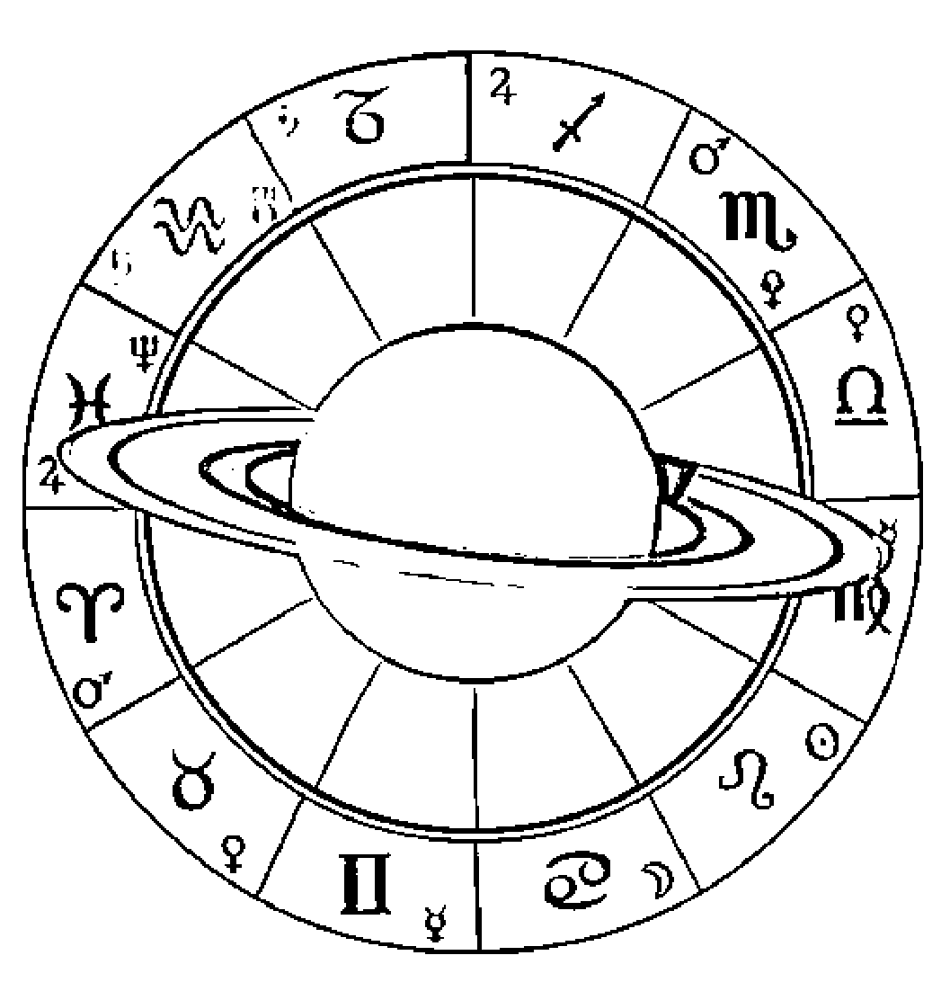

## ♄ ☌ 0度：土星的合相

压力、制约、逻辑、经验、考验的结合。实践、悲观面、建构力、规范的集中投入。戒律、管理、磨练、计划、经验、警戒、关卡的重要性。制约、阻力、建构、老化、企划的起始驱动。

## ♄ ☍ 180度：土星的对分相

逻辑、阻力、规范、经验、制约的对立冲突。权威、制度、磨练者、阻碍、管控的对抗。关卡、经验、企图、耐力、实践力的竞争互动。规范、框架、管理、逻辑、难关的摆荡拉扯。

## ♄ △ 120度：土星的三分相

压力、建构、规范、管理、实践力的顺利展现。磨练、关卡、警戒、制约、成熟的助力。自制面、框架、戒律、承担、经验的扩张发展。阻碍、考验、过关、制度、经验的幸运强旺。

## ♄ □ 90度：土星的四分相

制约、压力、关卡、实践、管控的阻碍困难。权威、框架、规范、阻力、重担的压制。逻辑、经验、管理、建构、困难、考验的封闭陷落。阻力、压力、戒律、权威、责任的包袱拖累。

## ♄ ✱ 60度：土星的六分相

压力、阻碍、关卡、实践、制度的转机希望。经验、逻辑、磨练、志业、计划的交流媒介。制度、规范、架构、管制、实践的变通。压力、阻力、重担、制约、经验的连通分散。

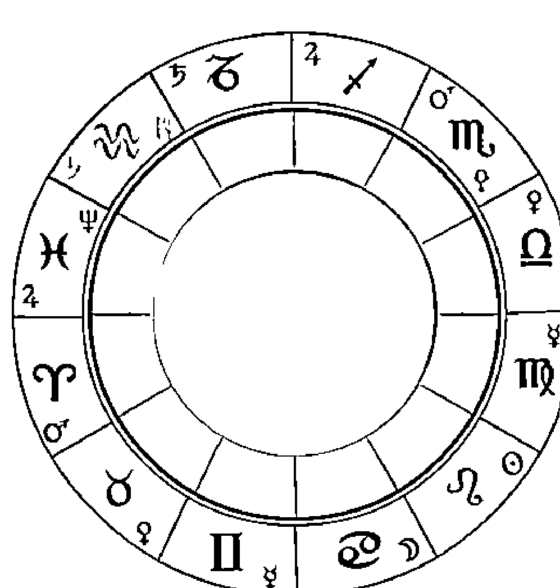

## 天王星的相位

事件：变数、自由、叛逆面、震撼、未知、征兆、社会、集体、组织、科技、发明、非主流、怪异、疯狂
人物：大众、同志、怪人、改革者
力量：波动、突变、改革、排斥力、离心力、超越、突破、预知力、群聚力、冻结、平均、边缘化

## 0度：天王星的合相

变数、未知、群聚力、改革、非主流的结合。集体、叛逆面、波动、排斥力的集中投入。改革、未知、社会、创新、超越、大众、组织的重要性。变革、边缘化、突变、平均、排斥的起始驱动。

## 180度：天王星的对分相

集体、改革、独立、超越、离心的对立冲突。社会、组织、群众、非主流、反叛的对抗。群体、边缘、创新、突破、改革的竞争互动。逆反、变革、离心、群聚、意识分割的摆荡拉扯。

## 120度：天王星的三分相

改革、自由、群聚、超越、预知力的顺利展现。集体、组织、边缘、变革、大众的助力。叛逆面、排斥力、社群、非主流、自由的扩张发展。发明、波动、变革、预知、群聚的幸运强旺。

## 90度：天王星的四分相

改革、自由、群聚、突破、叛逆的阻碍困难。超越、创新、集体、变革、独立的压制。叛逆面、创新、超脱、社群、自由、革新的封闭陷落。集体、变数、改革、意识形态、群众的包袱拖累。

## 60度：天王星的六分相

改革、超越、突破、脱离、创新的转机希望。社群、发明、同好、非主流、边缘的交流媒介。改革、派系、超越、意识分割、实验的变通。群体、非主流、边缘、未知、社团的连通分散。

## 海王星的相位

事件：因果、循环、报应、救赎、牺牲、泡沫、灵性、无意识、梦想、痴迷、虚幻、休养、逃遁、混沌
人物：医师、灵性导师、病人、救赎者、天使
力量：包容力、泛滥、回归、了结、医治、还原力、补偿、空无化、想像力、虚化、迷惑、暗示力、孕育

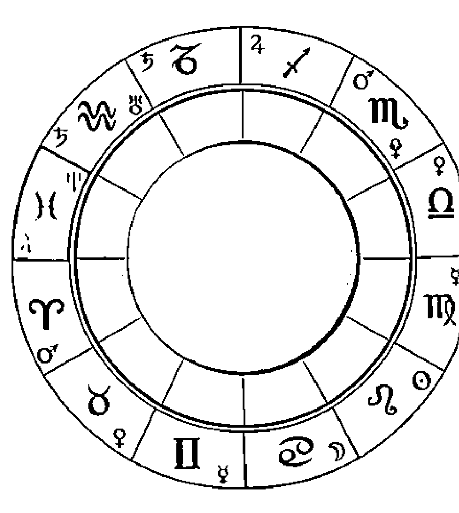

## 0度：海王星的合相

因果、灵性、想像力、梦想、空无的结合。包容力、救赎、无意识、复原力的集中投入。循环、灵性、休养、梦、暗示、补偿、了结的重要性。报应、泡沫、泛滥、回归、结尾的起始驱动。

## 180度：海王星的对分相

梦想、因果、空无、救赎、回归的对立冲突。灵性、想像力、痴迷、循环、无意识的对抗。虚幻、混沌、了结、灵性、幻梦的竞争互动。包容、牺牲、因果、迷惑、回归的摆荡拉扯。

## 120度：海王星的三分相

梦想、循环、灵性、想像、还原力的顺利展现。因果、救赎、无意识、包容、暗示的助力。灵性、想像力、梦幻、休养、痴迷的扩张发展。结尾、无我、复原、医疗、因果的幸运强旺。

## 90度：海王星的四分相

梦想、因果、无意识、救赎、休养的阻碍困难。想像力、回归、灵性、痴迷、泛滥的压制。灵性、梦幻、虚无、迷惑、牺牲、想像力的封闭陷落。因果、包容、牺牲、痴迷、无意识的包袱拖累。

## 60度：海王星的六分相

了脱、治愈、施舍、还原、补偿的转机希望。无意识、灵性、梦想、因果、循环的交流媒介。灵性、救赎、因果、了结、复原的变通。灵性、非现实、混沌、泡沫、报应的连通分散。

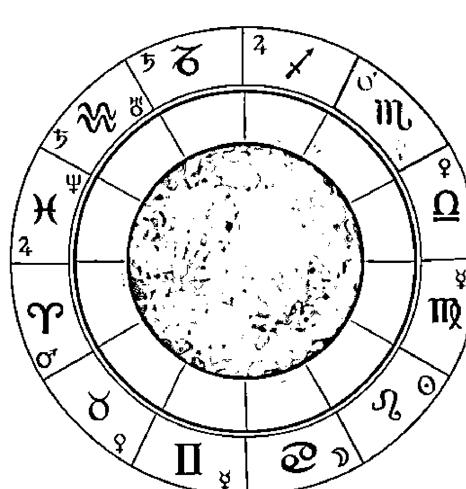

## 冥王星的相位

事件：阴影、秘密、禁忌、危机、保险、淫欲、贪婪、毒、罪恶、心魔、负面、执念、心机、仇恨、恐惧
人物：坏人、恶人、引诱者、恶魔
力量：暗化、深化、毁灭、蜕变、潜力、洞悉力、吞噬、魔力、污染、诅咒、怨力、操控、诱惑力、腐败

## ♇ ☉ 0度：冥王星的合相

阴影、禁忌、洞悉力、负面、暗欲的结合。操控力、心机、执念、魔力、毒害的集中投入。隐私、秘密、蜕变、引诱、洞悉、深化、潜能的重要性。暗化、危机、毁灭、怨念、腐败的起始驱动。

## ♇ ☍ 180度：冥王星的对分相

阴影、禁忌、执念、恶性、暗欲的对立冲突。魔鬼、负面、怨念、罪恶、贪婪、恐惧的对抗。心机、操控、禁忌、深层、谋略的竞争互动。罪恶、贪婪、腐败、心魔、负面的摆荡拉扯。

## ♇ △ 120度：冥王星的三分相

暗欲、隐藏面、潜能、执念、洞察力的顺利展现。负面、暗中、禁忌、魔鬼、谋略的助力。暗欲、潜力、阴影、魔力、操控力、腐败的扩张发展。投机、风险、隐藏、逞欲、再生的幸运强旺。

## ♇ □ 90度：冥王星的四分相

禁忌、暗欲、贪婪、谋略、阴影的阻碍困难。心魔、潜能、罪恶、腐败、负面的压制。阴影、潜力、洞察力、谋略、执念、恐惧的封闭陷落。隐私、劣根性、心魔、恐惧、亏欠的包袱拖累。

## ♇ ✱ 60度：冥王星的六分相

重生、暗欲、深化、风险、禁忌的转机希望。罪恶、隐私、风险、贪婪、秘密的交流媒介。禁忌、执念、谋略、风险、忌讳的变通。危机、毒害、污染、恶性、负面的连通分散。

## 行星相位的45种主题：

任何两星形成关系会构成一个特殊的主题，这些主题都呈现出特殊的主题意义，10大主要星体之间的组合，可以形成45个主题。从行星对个人的重要性来区分，可以分为三组，一是内行星间组合的主题，这是属于个人性的主题，也是人生中最基本的主题。二是内行星与外行星组合的主题，这个主题的重点在内行星，是内行星的衍生主题，外行星赋予内行星附加能力。最后是外行星间组合的主题，这通常是集体性的大主题，比较不是属于个人特质的，要跟个人星结合，才会呈现出个人性，不然就只是一个世代集体特征。

## 一、内行星VS内行星相位

内行星关系共有10个，是由日月水金火这五颗星所构成的关系，这五颗星的能量是属于个人可控制与认知到的力量与能力，是我们可操控的工具，因此这五颗星都是我们自己可以去扮演的，都有属于自我的成分，是与个人息息相关的能量。因此由这五颗星构成的10个主题是人生最基本的组成，也是最基本的10个关系与课题，星盘中出现这10种关系，都会是人生的重要剧情，可以说是每个人生大戏中都会出现的基本戏码。

## ☉ ☽ 01 太阳与月亮的相位 相位周期：一个月

象征关系与主题：
阴阳、父母、夫妻、开阖、感觉与意志、个性与情绪、外显与内在、显意识与潜意识、富与贵、快乐与幸福。

## ☉ ☿ 02 太阳与水星的相位 相位周期：不定，约每年六次多

象征关系：
意志与心智、个性与想法、意与理、表现与表达、光与风、力与流、权力与智力、能力与知识。

## ☉ ♀ 03 太阳与金星的相位 相位周期：不定，平均约一年一次

象征关系：
意志与喜好、热与爱、名与利、形象与人缘、荣耀与价值、父女、贵与财、快乐与享受。

## ☉ ♂ 04 太阳与火星的相位 相位周期：约两年

象征关系：
意志与行动、权力与武力、动与能、活力与精力、主导与领头、向心与向前、光与火、父子、翁婿。

## ☽ ☿ 05 月亮与水星的相位 相位周期：约一个月

象征关系：
心灵与思想、理性与感性、情与理、知识与记忆、感觉与认知、场与流、封闭与交流、库存与通路、门与窗、根源与分支。

## ☽ ♀ 06 月亮与金星的相位 相位周期：约一个月

象征关系：
情与爱、浪漫与感性、感觉与感官、收获与库存、财库、喜与富、缘份与桃花、累积与凝聚、亲人与爱人、母女、婆媳。

## ☽ ♂ 07 月亮与火星的相位 相位周期：约一个月

象征关系：
感受与行动、需求与原欲、动与场、心与欲、满足与发泄、灵与火、同化与征服、开创与守成、刚硬与柔软、母子。

## ☿ ♀ 08 水星与金星的相位 相位周期：不定，平均约一年两次

象征关系：
心智与爱情、思想与感官、财与才、关系与媒介、交流与互动、喜好与趣味、情人与朋友、甜言蜜语。

## ☿ ♂ 09 水星与火星的相位 相位周期：不定，平均约一年两次

象征关系：
想法与行动、知与行、动与流、思与欲、理性与直觉、单一与多元、风与火、知识与武力、沟通与征服。

## ♀ ♂ 10 金星与火星的相位 相位周期：不定，平均约一年一次

象征关系：
爱与性、雌雄、收获与猎获、文明与野蛮、猎人与猎物、主动与被动、吸引与驱动、拥有与占有、爱与被爱、和平与斗争、合作与竞争、和谐与破坏、攻击与防守。

## 二、内行星VS外行星相位

内行星与外行星的相位主题，重点在内行星，可分为五组，也就是日月水金火各自与木土天海冥的相位。这个主题是个人性与集体性的结合，我们本身通常扮演的是内行星的部分，而外行星的能量是集体性的，我们个人比较无法直接运用的能力，因此外行星对内行星的关系主题，外行星多半呈现为外在的影响力（木土如果是命主星时例外），来赋予内行星的能力延伸，成为内行星能力的附加工具。例如金海相位，海王的幻象跟想像力就成为金星美与吸引能力的外在影响与附加能力。

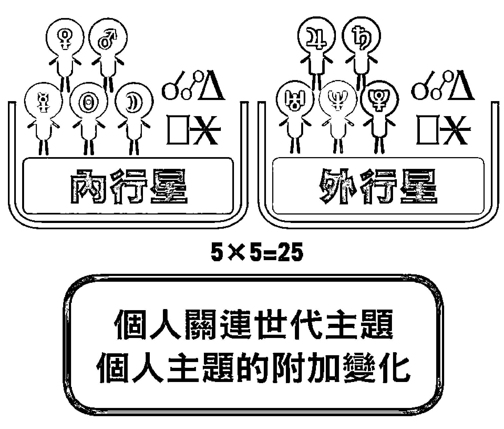

## ☉ ♃ 11 太阳与木星的相位 相位周期：约一年多

象征关系：
意志与智慧、权力与神圣、名声与道德、活旺与幸运、主导与引导、向心与向上、光与圣、崇拜与信仰、鼓舞与保佑、父与师。

## ☉ ♄ 12 太阳与土星的相位 相位周期：约一年多

象征关系：
意志与企图、名与位、权力与规范、活力与耐力、主导与管控、荣耀与压抑、鼓舞与阻碍、快乐与悲苦、父与老。

## ☉ ♅ 13 太阳与天王星的相位 相位周期：约一年多

象征关系：
意志与超我、核心与边缘、向心与离心、主力与众力、主流与非主流、尊贵与平凡、光与波、菁英与群体、崇拜与排斥、统合与分离、热与冷、光电、正道与歪道。

## ☉ ♆ 14 太阳与海王星的相位 相位周期：约一年多

象征关系：
意志与灵性、权力与因果、名声与梦想、活力与休息、核心与空无、光与幻、崇拜与痴迷、鼓舞与救赎、凝聚与消散、强化与虚化。

## ☉ ♇ 15 太阳与冥王星的相位 相位周期：约一年多

象征关系：
意志与阴影、力量与潜能、正义与邪恶、光明与黑暗、生与死、主导与操控、正向与负面、外显与隐藏。

## ☽ ♃ 16 月亮与木星的相位 相位周期：约一月

象征关系：
情感与信仰、心与神、富与福、感觉与智慧、空间与方位、灵与圣、封闭与开放、根内与远外。

## ☽ ♄ 17 月亮与土星的相位 相位周期：约一月

象征关系：
感觉与逻辑、情与法、幸福与地位、柔软与僵硬、界线与藩篱、陷与困、舒服与压力、包袱与重担、富足与枯竭、空间与结构。

## ☽ ♅ 18 月亮与天王星的相位 相位周期：约一月

象征关系：
心灵与超我、有情与无情、亲与疏、感觉与科学、同化与分裂、过去与未来、熟悉与陌生、根性与群性、习惯与变异、地震。

## 19 月亮与海王星的相位 相位周期：约一月

象征关系：
心灵与无意识、根源与因果、灵与梦、纾压与休息、回溯与回归、空间与空无、感觉与感应、情与痴、照顾与救赎、区隔与模糊、记与忘。

## 20 月亮与冥王星的相位 相位周期：约一月

象征关系：
心灵与阴影、包与吞、内力与潜力、灵与暗、情与欲、感觉与洞察、陷落与堕落、门与锁、界线与鸿沟、封闭与封藏、安与危。

## 21 水星与木星的相位 相位周期：约一年多

象征关系：
思想与信仰、心智与神性、知识与智慧、学与教、路与道、理解与引导、路线与方向、观念与哲理、高与低、远与近。

## 22 水星与土星的相位 相位周期：约一年多

象征关系：
思想与逻辑、心智与经验、路与关、理与法、通路与障碍、变通与限制、加速与暂停、活泼与古版、轻浮与成熟、方法与计划。

## 23 水星与天王星的相位 相位周期：约一年多

象征关系：
思想与意识形态、邻近与边缘、转换与变革、尝试与实验、学习与发明、媒介与群聚、流与波、同侪与同志、分支与分裂、连与斥。

## 24 水星与海王星的相位 相位周期：约一年多

象征关系：
思想与无意识、心智与灵性、流与空、清晰与混沌、知与梦、理解与灵感、路线与回圈、思维与想像、流通与传染、分化与融合、文字与影像。

## 25 水星与冥王星的相位 相位周期：约一年多

象征关系：
思想与推测、学习与洞悉、思与欲、清淡与浓烈、浅薄与深入、讯息与秘密、理智与谋略、交流与隐藏、通路与暗道、转换与蜕变。

## 26 金星与木星的相位 相位周期：约一年多

象征关系：
爱与信、供给与助力、吸引与祈愿、利与福、喜悦与幸运、享受与放纵、凝聚与扩张、美与圣、价值与智慧、恩惠与保佑、美好与丰盛。

## 27 金星与土星的相位 相位周期：约一年多

象征关系：
爱与责任、享受与承担、利益与地位、甜与苦、喜与忧、收获与成就、设计与企划、弹性与严谨、互动与藩篱、价值与逻辑。

## 28 金星与天王星的相位 相位周期：约一年多

象征关系：
爱与自由、利益与理想、吸引与排斥、合作与群聚、黏贴与分裂、稳固与变革、美与怪、磁与波、平衡与平均、结合与分离、喜与惊。

## 29 金星与海王星的相位 相位周期：约一年多

象征关系：
爱情与渴望、关系与因果、真实与虚假、利与梦、拥有与舍弃、吸引与感染、美与幻、喜好与痴迷、供给与救赎、美好与幻象、真化与虚化。

## 30 金星与冥王星的相位 相位周期：约一年多

象征关系：
爱情与情欲、美好与阴影、吸引与吞噬、善与恶、爱与恨、得与失、甜蜜与激情、增益与减损、喜好与偏执、和谐与偏执。

## ♂ ♃ 31 火星与木星的相位 相位周期：约两年多

象征关系：
行动与信仰、野性与神性、精力与精神、生存与进化、直觉与智慧、向前与向上、火与圣、开创与提昇、灾祸与保佑、勇气与自信、征服与扩张。

## ♂ ♄ 32 火星与土星的相位 相位周期：约两年多

象征关系：
行动与企图、欲与限、直觉与经验、挣脱与约束、精力与耐力、破坏与管控、发泄与压制、竞争与建构、前进与阻碍、烦躁与忧虑、灾与难。

## ♂ ♅ 33 火星与天王星的相位 相位周期：约两年多

象征关系：
行动与改革、独与孤、挣脱与排斥、直觉与预知、开启与发明、征服与超越、动与波、竞争与改革、单一与平均、前进与逆反、火与冰。

## ♂ ♆ 34 火星与海王星的相位 相位周期：约两年多

象征关系：
行动与想像、野性与灵性、驱动与梦想、动与空、开启与了结、欲要与舍弃、灾祸与救赎、伤害与治愈、发泄与休息、直进与回圈、锐利与模糊、起因与结果、头与尾。

## ♂ ♇ 35 火星与冥王星的相位 相位周期：约两年多

象征关系：
行动与内驱、驱动与诱惑、本能与潜力、原欲与暗欲、存活与毁灭、征服与吞噬、怒与恨、火灾与暗毒、性与淫、灾与险、直接与隐藏、战斗与谋略。

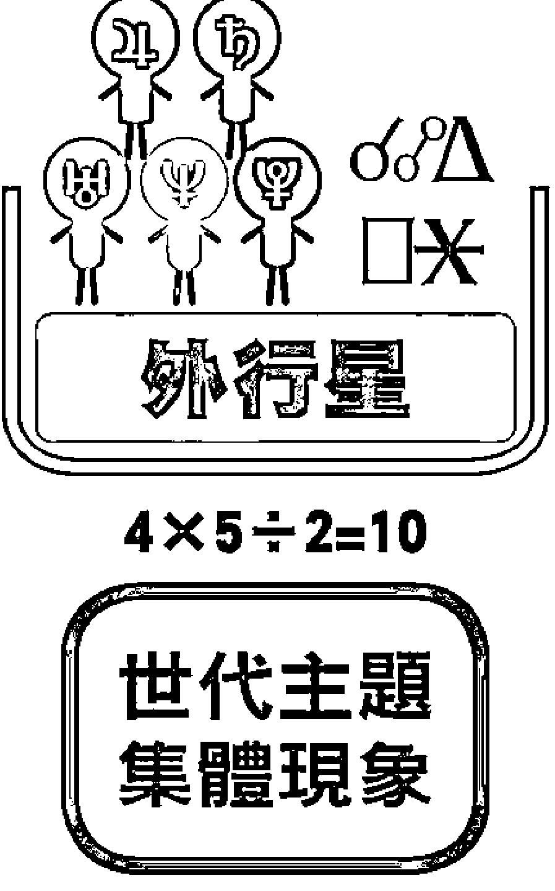

## 三、外行星VS外行星相位

外行星之间的相位主题，主要是集体世代性的主题，比较不是属于个人可控制的题目，代表的也都是长期性的影响，是一个世代性的共同主题，因此这样的主题通常要看他们有没有跟内行星形成结构，当作影响内行星的一种集体影响，在星盘中的外行星相位除非跟内行星结合或是落于四角被放大，不然这样的相位所代表的个人性不高，一旦被引动，也都是个人受世局影响的状态，几乎是只能面对而无法抗拒的状态。这样的相位多半以隐性基因的方式呈现在命盘中，引动性也不高。

## ♃♄ 36 木星与土星的相位 相位周期：约20年

象征关系：
乐观与悲观、扩张与收缩、方位与结构、松与紧、智慧与经验、助力与阻力、信仰与逻辑、道德与法规、解厄与困难、机运与关卡、神圣与地位、外放与压抑、天空与高峰。

## ♃♅ 37 木星与天王星的相位 相位周期：约14年

象征关系：
信仰与意识形态、提昇与超越、开放与改革、进化与突变、外界与异界、远方与边缘、神与怪、启示与预知、观察与实验、愿望与希望、天空与太空。

## ♆♃ 38 木星与海王星的相位 相位周期：约13年

象征关系：
信与迷、愿望与想像、神性与灵性、愿与梦、圣与空、引导与救赎、帮助与治疗、放松与放空、解厄与消厄、真理与虚无、远观与统观、师与医、天空与海洋。

## ♇♃ 39 木星与冥王星的相位 相位周期：约12年多

象征关系：
信仰与执念、神性与魔性、道德与禁忌、愿与贪、扩张与浓缩、愿力与怨念、幸运与风险、天空与地狱、提昇与堕落、智慧与神秘、开放与隐藏。

## ♄♅ 40 土星与天王星的相位 相位周期：约45年

象征关系：
压抑与自由、逻辑与变数、藩篱与排斥、制约与叛逆、企划与发明、止与变、规范与变革、传统与创新、僵固与分裂、惊与苦、地位与理想、时间与未来、高山与边际。

## 41 土星与海王星的相位 相位周期：约36年

象征关系：
压抑与放空、业力与因果、制约与灵性、现实与梦想、逻辑与混沌、承担与逃避、藩篱与无边、困与迷、建构与想像、暂停与回圈、忧愁与失落、苦难与救赎、高山与大海。

## 42 土星与冥王星的相位 相位周期：约33年

象征关系：
压力与恐惧、制约与禁忌、野心与诱惑、苦难与风险、戒与贪、管理与操控、牢囚与枷锁、痛苦与执着、攀登与堕落、停止与毁灭、警与匪、业与罪、挤压与浓缩、高山与地底。

## 43 天王星与海王星的相位 相位周期：约170多年

象征关系：
超意识与无意识、机率与因果、变数与回圈、希望与梦想、变与幻、排斥与包容、改革与还原、疯狂与痴迷、分裂与融合、统与独、未知与混沌、冷漠与滥情、边缘与虚空、无法预料。

## 44 天王星与冥王星的相位 相位周期：约120年

象征关系：
超意识与暗意识、颠覆与禁忌、排斥与封锁、超越与蜕变、改革与破坏、分裂与缠绕、疯与执、邪怪与妖魔、逆反与恶性、抽离与禁锢、冷漠与激情、冰山与火山、未知与隐密。

## 45 海王星与冥王星的相位 相位周期：约490多年

象征关系：
无意识与暗意识、灵性与阴影、因果与孽缘、天使与恶魔、复原与毁灭、泛滥与吞噬、救赎与仇恨、天堂与地狱、梦与欲、痴迷与堕落、放下与执着、舍与贪、还与债、虚与浓。

## 1-6 行星的禀赋
### Dignities of planets

行星力量的状态是解读星盘中最重要的一块，行星作为星盘中最重要的主体，作为各种事件的代理征象，祂本身的能量强弱与状态优劣就攸关该事件本身的好坏与层级高低。决定行星力量状态的因素很多，大体上有得时、先天禀赋、后天禀赋以及整体构成的格局结构。这其中最为重要的是先天与后天禀赋的判断。

对于行星的吉凶基本的分类为：
- 吉星：木星、金星。
- 凶星：土星、火星。
- 发光体：太阳、月亮，太阳为贵星，月亮为富星，整体性为偏吉。
- 中性：水星（容易被染色，视其和吉星、凶星的相互关联决定吉凶）

## 行星的阴阳性

行星本身有阴阳性，因此对于落在星座的阴阳性就会造成行星能量的适应与否，传统上太阳、木星、火星、土星被归属在阳性，这其中土星的原本质是倾向阴性的，祂是由月亮的凹陷而来，不断的凹陷最后反而被推挤成山，反而呈现出阳的状态。月亮、金星为阴性，都是偏向内缩的能量。水星则为中性，本身没有阴阳，也可阴可阳，端看其跟什么样的星座结合。

一般来说，偏向干热特征的行星属于阳星，太阳（干热）、土星（干冷）、木星（湿热）、火星（干热）被视作阳性行星。偏向冷湿性质的行星被认为阴星，所以月亮（湿冷）和金星（湿冷）被视作阴性，水星同时具有潮湿和干燥两种性质，被认为中性星。

## 行星的昼夜性

除了考量行星所在黄道度数带来的尊贵状态外，希腊时期还根据行星的状态属性分为两组：白天行星及夜间行星。

白天的行星有：日、木、土。

夜间的行星有：月、金、火。

水星则视其是先于太阳升起或晚于太阳升起决定其日、夜性质。

根据出生时的地平区分，星盘被分为白昼的一边与黑夜的一边，白昼时充满光热与活跃，行星会显得更为阳性外放，而夜间较为湿润与沉静，行星会显得更为阴性内敛。古典占星学中将太阳与木星归类为昼星，月亮与金星归类为夜星。至于火土这两颗凶星在昼夜的分配原则与其阴阳性则有所区别，因为要考量昼夜性是否可以使行星的性质容易发挥，或是让凶星的破坏性削弱，增强其有利性。因此土星基于冷酷特质而被归类到昼星中，减缓其阴寒特质。火星本身非常燥热，因此被归到湿润的夜星，减缓其干燥特质。日木土属于昼星阵营，太阳为老大，木土为跟班；月金火为夜星阵营，月亮为老大，金火为跟班。水星则为中性，没有被归类。

## 行星得时

所谓的行星得时，就是行星在不同的昼夜区段，可以凸显该行星的特性。白天自然太阳最为明亮，所以太阳的辅星木土也跟着凸显祂们的力量。同样的夜晚月亮最为明亮，月亮的辅星金火也就跟着提升力量。行星的得时与否可以分为广义与狭义的定义，广义的得时依据行星的昼夜性来决定。当星盘为白天星盘时，所有的白天行星（日、木、土）便得时，夜间星盘则会使得所有夜间行星（月、金、火）得时。

得时会让该分类的行星升级，更正向的发挥其行星本质，因此得时的吉星跃升为盘中最大吉星，凶星则转换性质偏向中性，不再太过逞凶。在白天的星盘时，木星为最大吉星远强过转趋于中性的金星，而土星不再是一般认知中的最大凶星，祂转向为比较可克服的困难，其阻碍变得比较可以承受。而火星在白天星盘反成了最大凶星，其破坏力可能超越土星。

白天星盘行星吉凶性排列：木星 > 金星 > 土星 > 火星

而夜间星盘则使金星的吉性强化，成为最大吉星，木星则转向为中性偏吉，火星的燥热受到调控，其冲突竞争性也变为比较可以调解的中性性质，又冷又干的土星则更为孤冷，更为让人不舒服。

夜间星盘行星吉凶性排列：金星 > 木星 > 火星 > 土星

而狭义的得时定义除了日夜性要符合外，还要看行星是否刚好在正确的位置，古典占星中，在地平线上的天体会有特别强的表现能力。如果一个行星符合其昼夜性，并且也落在星盘上半部，同时落在符合其阴阳性质的星座，我们才称之为得时。例如日生人的日、土、木三颗星，必须要落在星盘上半部且落在阳性星座，那就得时。夜生人月、金、火三颗星，必须要落在星盘上半部且落在阴性星座，那就得时。

如果一颗星没有符合其昼夜性，且落在不合适的区间，不符合阴阳性的星座，则为失时。例如日生人月金火落在星盘上方且落在阳性星座，那就失时。夜生人木土（夜生盘太阳一定在星盘下方）落在星盘上方，且落在阴性星座，那就失时。得时星体会发挥比较正面的影响，而失时星体容易发挥比较负面的影响。得时的征象就像是行星在正确的时间，正确的地点表现本身的能力，是非常吉利的附加状态。反之失时则是行星会在不合时宜的时间与错误的地点表现。

## 行星空亡

行星空亡是指一颗行星不会再跟其他行星形成托勒密准相位的关系。最早空亡只应用在月亮上，后来其他行星也沿用这样的方式。最基本空亡的定义是当月亮在运行在某星座到某个度数后，一直到月亮换位到下一个星座前，月亮都不会再跟任何行星形成托勒密相位，从这个度数到月亮换位的这一段期间，我们就称为空亡期。假设星盘上的月亮是在狮子座18度跟某颗星形成相位后，从月亮在狮子座18度到处女座0度这段期间，都没有其他行星跟月亮形成准相位，这段期间就是月亮空亡期。

行星的入相位代表即将发生，出相位代表过去发生。当这期间月亮和星盘上的其他行星都无法建立关系，因此月亮在这段期间几乎没有什么作用，不再累积新的记忆了。在卜卦占星中，月空亡指的是当前景况不变的状态下，所问事项也就维持原样。空亡并不一定是坏事，仅是代表没有事件会发生、改变而已。当行星在空亡的时期，大部分的事情都很难发生作用，施力不会产生具体效果，一切都容易混沌，无能为力。

## 行星的先天禀赋—必然尊贵（Essential Dignities）

### 宇宙诞生图：Thema Mundi

在古典占星中，有一个重要的概念是神话中世界诞生时的星象，被称为宇宙诞生图，被认为是世界诞生时的行星分布状态。是用作解释主宰系统、相位、行星擢升等概念的来源。在宇宙诞生图中，每一颗传统行星都位于被称作是祂统治的星座中，这是传统主宰体系的最初概念基础。首先月亮分配给巨蟹座，太阳分配给狮子座，然后将其余的行星按照黄道带的顺序分配给其他星座，这取决于行星与太阳的距离。

水星在逆行之前与太阳的距离不会超过28度，因此被分配给狮子座之后的处女座。金星与太阳的距离不会超过48度，所以被分配到天秤座。依此类推。火星属于天蝎座，木星分配给射手座，最后土星被分配到与月亮相对的摩羯座。

行星在黄道上所在的星座、度数会影响到该行星的作用方式，在古典占星的判断中，行星基本上有五种不同的尊贵模式，这五种尊贵力量是在解读命盘时的重要评估，影响到行星在命盘上正面、负面的力量呈现。

### 庙与陷：Domicile & detriment

入庙是五种先天尊贵中最重要的，行星因为身在主管的星座中，如同主人，能主导宫内的一切决策，拥有实质主控一切的权力，能充分发挥效率运用资源。每颗行星都是一位天神的征象，他的家就是庙，当行星落在其主管星座时，就如同来到天神自己的家庙，因此就称为入庙，当行星落在其主管星座对面的星座时，就像落入对手的地盘，就称为陷。举例来说，金星主管天秤座，当金星落在天秤座时，便称金星入庙。相对的，当金星落在天秤座对面的牡羊座时，便称金星入陷。

在自己控管的地盘，行星的力量容易朝向正面的方式呈现，因此火星在牡羊座时容易呈现火星的正向特质，包含有勇气、积极进取、战斗力强、体魄强健、充满开拓性……等。庙主星如同该星座的主人或管理者，其担负的责任之一就是提供资源，为该宫事务与宫内星提供该宫相关的需求。例如当金星落土星祂家摩羯时，摩羯的主星土星就会提供摩羯的原料给金星，金星是桃花、爱情或是婚姻的征象，所以土星就会提供金星比较老成、成熟、严肃的桃花对象，或是供应比较辛苦、传统、有压力的爱情或婚姻模式。

行星入陷则是来到与自己性质不合的地方，行星入陷并非没有能力发挥力量，而是其呈现的方式是跟祂自己的能力比较不吻合的，就好像火星天秤入陷，火星是一个粗犷的勇者，结果被打扮得很文明优雅，这会让火星自身的刚猛性出不来，就像一把不锐利的刀，切起东西来就是不利落。又或是太阳在水瓶入陷，太阳代表集中能量于一点，形成意志与力量，成为核心，因而具有尊贵性。但是在水瓶变成多核心，力量无法集中于一点，分散在集体中，无法形成强烈的意志与能量，核心权力分散到大众后，也失去了独特与尊贵性。就如同现代的民主社会选出的总统，他的尊贵性就远不及以前的国王。

### 旺（曜升）与弱：Exaltation & fall

行星入庙是在自己的地盘，行星入旺就如同在贵宾区，受到重视又尊贵。传统7大星体的入旺区分别是，太阳曜升于牡羊座、月亮曜升于金牛座、水星曜升于处女座（现代为水瓶座）、金星曜升于双鱼座、火星曜升于摩羯座、木星曜升于巨蟹座、土星曜升于天秤座。

行星落在其曜升星座称为入旺，象征行星的地位超崇高，或是处在显著的位置受人注视，有着权贵般的地位或形象。入旺与入庙的差别在入庙主星对于该主管星座有完全的主导权，而旺主星则有着较高的位阶。就像英国首相与女王之间的关系，真正在治理国家的是英国首相，但是女王在国民的心目中的地位远高过首相。

入旺的行星就如同是一家餐厅的VIP，他一入餐厅就受到尊崇，享受各种福利。反之，当行星落在其曜升星座的对面星座则称之为入弱，入弱则代表的是容易受人忽视、地位低落，就好像是一家餐厅的黑名单，不受欢迎与重视。当行星入弱时，他们在呈现力量与能力时就容易受到忽略，无法有效展现，因此就可能用各种手段希望引人注意或是受到重视，但因为位阶低落，常常不走正道而以不恰当的手段来达成目的。

一颗星进入别人的地盘，就要受到该星座主星定位，该星座主星会提供资源给你，因此当一颗星在某星座入旺时，则该星座的主人就会以对待贵宾的方式提供资源。当A星在B星主宰的星座曜升时，则B必须负有责任曜升A，把A当成贵宾一样款待。例如金星曜升于双鱼座时，双鱼座的守护星木星就负有曜升、抬高、荣耀、提高金星的义务和责任，相当于金星的VIP服务，其他行星位于双鱼座时，木星就没有义务服务祂们。又例如土星在天秤曜升，金星作为主人就必须尊荣土星。火星在摩羯曜升，作为摩羯的主人土星就必须提供最好的资源来款待火星，但是土星能提供的就是土星的东西，跟金星曜升在双鱼由木星提供资源还是大有差异的。

从星座的曜升状态还可以同时看出星座的某些隐藏本质。例如太阳天秤的人也经常有冷漠的面向，他们表面看似金星的温和讨喜，但是也有很实际很冷漠的土星一面，因为天秤虽然由金星主宰，但是却是土星曜升。又例如双鱼座，除了有木星跟海王的慈悲、浪漫，实际上还有金星的可爱讨喜。

### 三分：Triplicity

行星落三分地如同到了一个同类的环境，就好像来到亲戚好友家里，会觉得舒服谐和，可以获得一定的助益。在现代三分性的力量比较不受到重视，在五种尊贵中也比较强调庙跟旺而已，但在中世纪以前，则是相当看重三分性的力量。三分主星可以说是基于三位一体的原则，将三分主星作为任何事物的开端、过程及结果的象征。尤其是运用于对任何状况的象征性概括方面。当一个行星落在其三分性位置的时候，如同三位一体的概念一般，会多少将其他两个行星的能量一并带进来。

基本上三分主星可视为一种误打误撞、水到渠成的好运，是一种天然而成的机会。三分主星展现的是盘主在某领域或某方面的动力与动机，有点类似印度占星的敌友概念，可算是入庙守护的同僚或类似亲戚的关系，在某些状况下三分主是辅助庙主星管理该宫事宜的，可以协助该宫的事宜。但是因为星性的不同，他们也可能有自己的目的，甚至可能阻碍庙主的管理事宜。因为你的亲戚好友未必一定跟你友好相处。

每一组三分星座有其自身的守护星，威廉里利认为火土风水四组的三分性有两种守护：日间守护和夜间守护。而以Dorotheus这类占星师所使用的早期体系来看，在该体系中，每一个三分守护主要根据日生或夜生盘的区别分为两套守护星配置，另外还有第三个共管守护星。

数字三象征着完成、完整，以及所有事物的起始、中间经过与终结，三分之间的关系很明显存在着与生俱来的和谐性。运用这种三分阶段的特性，古典占星有一套三分主星判断人生三阶段的方法，这个方法后来又延伸到其他各种面向。希腊时期，三分主星法仅运用于得时光体（日生的太阳与夜生的月亮）所落星座的三分主星，来判断命盘主的整体格局、天赋、能力和对世界的影响力。例如日生盘，太阳落在双子风象星座，因此其三分主分别为土星、水星、木星，因此就可以用这三颗星的好坏来判断其人生三阶段的好坏状况，原则上以25年来划分一个阶段，出生到25岁看土星，25岁到50岁看水星，50岁到75岁看木星。

到了泛中世纪时期，则更多的延伸，将三分主星广泛运用于命度、星体、宫位等层面。例如，日生盘用太阳代表父亲，因此可以用太阳落星座的三分主星标志着命盘主父亲的状况，而月亮及其三分主星则告诉了我们命盘主母亲的信息。或是要看婚姻爱情，就可以用金星落的星座去取三分主星，来看人生中婚姻爱情的三阶段状态。

### 界：Terms（bounds）

界是将一个星座分为五个不等大小的区间，将这五个区间分配给水、金、火、木、土等五个行星掌管，依照分法的不同，有托勒密界、伽勒底界与埃及界等差异影响行星的状态除了星座之外，界也会对行星的行为显现发生重要的修饰作用。从某方面来说界是让星座的区分更为细致的状态，例如在一间装饰高雅的天秤座房屋内，可能会有一间比较不修边幅的火星房间，但是毕竟是在高雅的房屋中，这间房间也不会太不修边幅到哪里。

庙主星座为提供资源的对象，而界主星则是作为界定特征的作用，界的运作方式像是赋予行星一个形容或是副词，例如水星在土星的界上时，水星就会带有一些土星式的思考，太阳落在金星的界上，那么太阳就会以金星的模式来运作。简单的讲，界主代表一种倾向或是界定来形容词描述一个行星，庙主星就是提供行星资源，界主则是在这些资源中又挑出某个类型出来，因此界主在宫主星和宫内星的互动中会产生重要的影响。他使得庙主给予的资源又更清楚的界定出来。

例如金星落摩羯座，则土星提供金星像年长的人、老人、地位低下的人或是权威、长官、上司之类的人给金星交往、结婚、享受等等。而当金星落火星界时，祂会在土星提供的这些资源中，抓出比较火星特征的，例如比较强势的、刚猛的老人、权威或是年长者给金星。就如同一家餐厅，庙主是主厨，他提供一定的菜色，界主则是负责你这一桌的侍者，他会推荐你他觉得好吃的主厨餐点。因为他的建议，就使得你会有一种趋向，会特别去吃这家餐厅供应的哪一类料理。也就是界主星会去更明确的界定出某个特征出来，例如上升牡羊但是命宫开在金星界，那这个人的外型特征可能会是刚硬中带一点柔和感。

### 面（十分性）：Face（decanate）

面又可称为十分性，是将每个星座再分为三个十度的区间，由日、月、水、金、火、木、土来分别掌管。面本身有好几种系统，以下列举常用系统：

#### A、Chaldean Order迦勒底版本：

按照迦勒底星序的土木火日金水月的顺序安排星曜守护36个区间，从牡羊座的第一个区段火星开始按照迦勒底顺序排列。迦勒底版本的区段侧重星曜守护和区段的描述，这是目前比较常用的版本。

#### B、ManiLius版本：

从牡羊座开始，牡羊座第一个区段也是牡羊座，然后按照十二星座顺序排列，牡羊座的三个区段依次为牡羊座、金牛座、双子座，然后到金牛座开始排巨蟹座、狮子座、处女座，依次类推，排完到双鱼座后，又从狮子座的三个区段开始排牡羊座、金牛座、双子座，以此类推，最后到双鱼座的摩羯座、水瓶座、双鱼座。

#### C、Elemental元素版本：

这个版本是每个星座按照所属元素，划为三个区段，三个区段为星座同属元素的三个星座，排列顺序自己的星座开始，例如牡羊座的三个区段为牡羊座、狮子座、射手座，狮子座的三区段为狮子座、射手座、牡羊座，射手座的三个区段则为射手座、牡羊座、狮子座。其他风象、土象、水象也都是同样的模式去排列。

面主星代表的是一种表象的属性，就实际含义来说类似一种形貌、外貌的描述状态，这种描述大概只是看起来的样子而已。但是看起来怎样不代表实际上是怎样，就是一个外观的状态呈现而已，例如7主星在金星面，这可能只是他的伴侣看起来漂亮而已，但是他的婚姻未必幸福。行星的面主作为五种尊贵的最后一阶，尊贵性实际上不太高，就是勉强挤上尊贵的行列而已，就像一个人只是入到门口，随时有可能会被推出去，需要时时警惕。只能当作为最后的喘息，对行星的帮助不大，机会有限。

### 外来的（浮游）：Peregrine

古典的判断法则中，行星处于外来的状态被视为一种不佳的位置。Peregrine这个字在拉丁文与阿拉伯文的原意为旅行者、陌生人、外地人或是外来移民。当行星所处的位置都没有以上所列的五种尊贵力量时则称之为浮游状态，或是外来的。这代表这颗行星在黄道上没有特别的归属，就像是游荡在异地的流浪者，处在一种人生地不熟的环境中，没有好的管道取得资源，来运作其行星的特质。

例如太阳在金牛座或是双鱼座时就是属于外来的状态。行星在外来的状态时就很像当你孤身流落在国外，又不会讲当地语言，这时就必须依赖其他人的好心帮助才能生活。行星在这样孤立无援的地方容易感到困惑又无依，行星的能力展现无法得到太大的发挥，但是一点办法都没有。

因此，当行星在外来的位置时，祂的状态与作用就必须看庙主星，也就是该星座的主人脸色了。如果该庙主星落在一个很好的位置，且具有一定的必然尊贵，而且相位结构都很好，这时这个外来的行星就会因为该星座主人本身状态很好，而得到不错的施舍与帮助，就有机会可以运作得比较好。但如果庙主星本身

## 這五種尊貴大致來說：

整合來說，除了入廟以外，其他的尊貴與無力狀態都還要取決他們所在位置的主星，因為主星負責提供資源，就算是一顆行星入旺，被當作VIP尊崇，但是如果主人狀況不好，他能夠提供的資源還是會有所打折。這五種尊貴以及無力的狀況，其對行星的影響所呈現的地位狀態大致如下：

- 1、入廟相當於一個人在自己家裡，很舒服，想怎樣就怎樣，家裡的資源隨便自己運用，非常輕鬆愜意。
- 2、曜升相當於一個人作為貴賓，到其他人家裡，雖然很爽，但是不及在自己家裡自由，畢竟還是要依賴別人給自己資源。
- 3、三分相當於一個人到親戚好友家，大家都是自己人，容易得到一定資助。
- 4、界相當於一間房子中分租的房客，房子是房東的，但在自己所屬的那間房間，擁有使用權。
- 5、面相當於一個人穿著體面，剛剛擠身在尊貴圈，但是也沒有多尊貴，就是最邊邊的貴族而已。就好像你有棒球入場券，可以進場，但是在最差的座位區。
- 6、入陷如同來到對手敵人的地盤，很不舒服，不受歡迎。
- 7、入弱如同到了地位低落的地方，受人忽視。
- 8、外來的如同流浪者到了陌生的地方，沒有能力作為。

## 行星的後天禀賦—偶然尊貴（Accidental Dignities）

除了行星的必然尊貴與無力外，行星因為某些特殊條件也會發生偶然的尊貴或無力現象。基於行星的落宮、速度、與太陽的關係或是與吉凶星、吉凶恆星的關係，而會有後天的力量變化，這些力量變化與先天禀賦不同，不是原始狀態，而是一種可能性，先天禀賦是這一顆星天然的狀態，天然的好壞，是本質的。而後天禀賦則是一種外加的影響，你到了一個環境，而發生了變化。

所以先天禀賦是一種持續的狀態，而後天禀賦則是一種外來附加產生的可能性狀態。例如一顆星先天禀賦為+5分，那+5分是這顆星的基本級數，如果後天禀賦為+3，則代表這一顆星以+5分為基準，在狀態配合得當時，有機會發揮到+8分，但是祂平常呈現的狀態就+5分。每一種後天禀賦所代表的狀態都是不同的，不應該做加減。而且這些威廉里利所定義的加減數字的量表是很難量化的，無法當作很客觀的評量，原則上當作一種行星可能在位階級數上的變化參考依據即可。後天禀賦基本上可大分為以下幾種狀況：

### A.落宮狀態：

1宮、10宮（+5），4、7、11宮（+4），2、5宮（+3），9宮（+2），3宮（+1），6、8宮（-2），12宮（-5）

### B.運行速度的吉凶情形：

順行（+4），快（+2），慢（-2），逆行（-5）

### C.月亮狀態：

月亮增光（+2），月亮減光（-2）

### D.東出西入：

火木土在東方（+2），月金水在西方（+2），火木土在西方（-2），月金水在東方（-2）

### E.太陽焦傷：

沒有焦傷（+5），完全重合（+5），在日光下（-4），焦傷（-5）

### F.和其他星的重合情形：

軒轅十四重合（+6），與大角重合（+5），與金木重合（+5），和北交重合（+4），和金木120度（+4），和金木60度（+3），和火土相刑（-3），和火土相沖（-4），和南交重合（-4），和火土合相（-5），被火土所夾（-5），和大陵五相會在5度內（-5）

### A.落宮狀態：

行星落在後天宮會產生偶然的尊貴變化，這一部份主要是後天環境造成的影響。基本上落在吉宮會加強其尊貴性，落凶宮會減低其尊貴性。根據威廉里利的評分標準，行星落在1宮跟10宮最能發揮，給予5分，落於4宮、7宮、11宮次佳，給予4分，落於2宮跟5宮給予3分，落在9宮給予2分，3宮1分。如果落在6宮、8宮凶宮，扣2分，落在12宮则减5分。在这个评量中2宫得到3分，9宫只得2分，虽然分数如此，但是威廉里利又说，每个宫位的尊严顺序如下：1、10、7、4、11、5、9、3、2、8、6、12。很显然9宫的尊贵性又是高过2宫的，因此这个评量本身很显然是以世俗的眼光来看，对于世俗性的财富、地位、权势来说。9宫的精神地位就不如2宫的财富有利了，但是9宫的尊贵性明显是高过2宫的。

### B.运行速度的吉凶情形：

行星的速度状态也会对行星力量的发挥带来影响，基本上当行星速度高于平均速度时，行星的发挥能力增强，反之低于平均速度时，则会造成弱化。如果不只速度变慢，而是慢到反转的现象，这种状态我们称为逆行，行星一旦逆行就无法正常发挥力量，会呈现出很反常的状态。

除了太阳跟月亮外，行星都会有逆行的现象，这是由于地球与行星间彼此运行速度不同而造成的，因为速度的差异，因此相对来说在某些时候我们会觉得看起来行星在后退，这就是「行星逆行」现象。行星运动从顺转逆或逆转顺时，会在黄道上某一点停下来。这个点称为停驻点（station）。在停驻这个点，行星留下重要的印记，产生一个关键位置，无论是逆行起始点，还是顺行起始点，都是关键的重点。由于逆行的关系，行星在运行时有时会在同一个点来来回回经过3次或5次。

**逆行意义：退行、重来、回头看、反省、反转。**

行星的逆行象征退缩与反省，有回到原点重新尝试的含义，使行星的能力产生倒退与受阻碍，功能变弱。当逆行时，行星往往会转性，使行星产生如下的影响：

- 1. 产生混乱。当行星逆行时，因为状态改变，会造成该行星力量的作用发生混乱的现象，例如水星逆行时容易发生交通、沟通、讯息混乱的状态。
- 2. 带来延迟。逆行时，常常会使本来要达成的事件发生倒退的现象，例如金星逆行，本来要开始约会交往却因为临时被征召出国工作而无法顺利达成。
- 3. 发生矛盾。逆行常常会有倒转的现象，例如金星逆行，本来喜欢的人事物，会变得不喜欢，反而本來不喜歡的卻覺得很討喜，往往在逆行結束恢復正常時才發現買了一堆自己並不喜歡的東西。
- 4. 回復原狀。逆行有一種時光倒流的味道，往往會有回溯到過去的徵象，例如火逆時，本來已經離職了，卻又因為某些因素又回到來的職場。
- 5. 重來一次。這是逆行最容易發生的狀況，很多事情無法一次了結。必須一而再、再而三的重複做，才能達成目的，例如土逆時，做好的計畫會不斷的被推翻，一再的更改計畫。
- 6. 會失去正常的力量。逆行時行星的作用好像被點了暫停鍵，然後又按了倒退鍵一樣，造成整個節奏改變，因此很容易使行星的力量作用無法正常，難以控制。

水星、金星、火星由於與地球接近的關係，逆行現象特別明顯，所以也比較有重要性。三王星每年逆行的時間都將近半年，因此對個人影響來說，逆行的意義上較不明確，但是對整體世界來說，意義就很大，當三王逆行時，往往是整個世界集體進化的退潮期。

☿ 水逆：每隔三到四個月左右，每次大約20天左右。
天象意義：催化劑失效、連結不通、流轉退行、重新串連、流向轉換、逆流。
影響層面：交通、思維、文書、通訊、信息、友誼、心智、傳播。
可能發生：講錯話、溝通不良、文書錯亂、交通不順、訊息錯誤、通訊設施問題。

♀ 金逆：每一年半左右，逆行週期約40天左右。
天象意義：磁性衰退、黏性減弱、吸不住、重新凝聚、反磁。
影響層面：愛情、人際、桃花、美感、藝術、投資。
可能發生：愛錯、關係退化、找回舊關係。

♂ 火逆：每兩年逆行一次，每次逆行時間大約是兩個多月。
天象意义：火力衰退、速度减慢、动力减弱、无力点燃、重做、反冲。
影响层面：体力、行动、性、精力、斗争、战争、纠纷。
可能发生：行动失误、欲速则不达、失去欲求。

♃ 木逆：每年都会有逆行，大概4个月左右。
天象意义：景气衰退、发展减慢、上升无力、重发、反进化。
影响层面：迁移、旅游、教育、信仰、公义。
可能发生：迁移不顺、没智慧、引导错误、失去助力。

♄ 土逆：每年都会逆行，大约4～5个月左右。
天象意义：压力退行、建构减慢、野心减弱、重建、反制约。
影响层面：建设、制度、企业、官僚、权威、逻辑。
可能发生：压力减除、不受期望、责任减少、失去耐力、功课重做。

♅ 天逆：每年都会逆行，大约5个月左右。
天象意义：斥力退行、变革减慢、波动减弱、重新超越、反分裂。
影响层面：集体变革、社会趋势、科技、社群。
可能发生：改革不顺、无力创新、失去变革动力、重新改革。

♆ 海逆：每年都会逆行，大约5个多月左右。
天象意义：梦想退行、融合减慢、泡沫消退、重空、反循环。
影响层面：集体想象、因果、无意识、医疗、生态循环。
可能发生：想像力退行、失去梦想、身心灵退化、重新疗愈。

♇ 冥逆：每年都会逆行，大约6个月左右。
天象意义：吞噬退行、浓缩减慢、阴暗消退、禁锁减弱、重挖、重埋、反噬。
影響層面：集體陰影、惡、暗意識、隱私秘密、禁忌。
可能發生：禁忌減縮、內驅退化、惡性失控、重新深化。

### C.月亮狀態：

月亮的增光減光是月亮這一顆星特有的判斷狀態。月亮增光就是日月從合相到對相這個階段，也就是新月到滿月時，這段期間月亮從缺一點點的積滿，因此月亮增光有積存的徵象，因此加分。反之月亮減光就是從日月對相到下一次合相，也就是從滿月到新月的過程，這個過程月亮從飽滿開始一點一點的虧蝕，因此有積存越來越少的徵象，所以減分。簡單的說如果出生在農曆初一到十五，就在月亮增光期，出生在農曆十五到三十，就在月亮減光期。

但是實際上的增光減光判斷應該還要看月滿的狀態，例如初一到初五時，月亮雖然在積存，但是還屬於缺的狀態，這時的增光還不是很充實。反之初十五到初二十，月亮雖然在減光，但是月亮這時還很飽滿，還是屬於狀況很豐沛的月亮。此外，剛新月時的月亮因為受到太陽焦傷，也是不利的狀態，必須要過了新月約12到18小時後，月亮脫離太陽的焦傷區，才會是比較好的狀態。

### D.東出西入：

東出西入是古典占星的一個重要判斷概念，但是在現在的運用比較式微了，它的定義也是有不同派別的看法差異。可以用廣義跟狹義來區分，廣義來說，以太陽為基準畫一條線，將星盤切成兩半，行星在太陽順時鐘（左半邊）方向的就是東出，在太陽逆時鐘（右半邊）方向的就是西入。

狹義的東出西入定義則是古人是用肉眼觀天，也就是當有行星在日出、日落時，出現在東方或西方的天空，那這顆星就會給人有象徵意義，因此狹義的東出定義是行星必須是在asc到mc這個區間，並高於太陽才叫东出。狭义的西入则是行星要在mc到des这个区间，并高于太阳才叫西入。

东出（oriental to the Sun）：是指比太阳先升起的行星，当太阳还在地平下时，东出星会在地平上，可被见到。

西入（occidental to the Sun）：是指比太阳后落下的行星，也就是当太阳已落至地平下时，西入星仍在地平上，可被见到。

一般来说东出西入要离开焦伤区才算。而地外行星（土木火等比太阳慢的星）喜东出，地内行星（月金水等比太阳快的星）喜西入。东出星代表行星正往mc高挂，其性质较为加强与凸显，较能有效率地运作，其实现力量的手段较能受到社会认可或称赞，东出星容易变得快速、年轻，有如初生之犊勇于前进想绽放活力。而西入星从高挂之处准备退下，容易变得缓慢、老旧，有如日暮垂垂的老人一样，稳健而缓慢。

大致来说慢星（火木土）适合东出，不适合西入。快星（如月亮、金星、水星）适合西入，不适合东出。行星东出则代表该星体象征的事物将来得较早较快，反之西入则较晚较慢。当土星、木星、火星东出时，是一个积极的位置，可以加2分，如果这些行星是西入，那么它们就会变得无法积极，要扣2分。反之，如果水星、金星、月亮是西入，反而是有利的位置，可以加2分。如果金星、水星、月亮东出，反而较为不利，要扣2分。简单的来说，火木土东出时，会离开太阳，不被焦伤，西入时会被太阳追上而焦伤，所以火木土东出有利，西入不利。同样的月金水东出时会追上太阳被焦伤，西入时会远离太阳，所以月金水东出不利，西入有利。

### E.太阳焦伤：

在古典占星中，由于太阳的光芒太强，当行星靠近太阳时会出现被太阳光掩蔽的现象，这种状况称为被太阳焦伤，行星被太阳焦伤会被太阳给凌驾，本身的力量难以呈现出来，被太陽給掩蓋掉了。太陽如同君主一般，行星就像是大臣，行星接近太陽後，會對太陽產生「染色」的效果，就如同大臣可以多少影響君主，但是太靠近君主就會使的自己該扮演的功能都受到君主左右，受到權威者強力干涉，無法自在發揮本性。

星盤中有被太陽焦傷的行星，代表該行星的事件常常受到權威者、意志、尊嚴、面子凌駕，無法自主。例如水星被太陽焦傷，意志尊嚴往往凌駕理智，事情只要一牽涉到面子，就容易失去理智。或者也可能是想學習的東西都受到父親這樣的權威者嚴重干涉，無法自己作主。焦傷的狀態還要考量太陽的強度與被焦傷行星的強度，太陽本身如果弱勢或是行星本身廟旺，那焦傷的現象就會小一些，行星的能力還可以展現出來。

古代依據行星與太陽的距離，分成核心區（Cazimi）、焦傷（Combust）、在太陽光束下（Under the Sunbeams）三種狀態，從行星接近太陽的度數，會有不同的效應，基本上有三種：

- 1.在太陽光束下：當行星與太陽在8.5度到17度之間，行星受太陽光遮蓋本身光芒，因而減弱能力，在這個狀態下，行星的能力還可以發揮，還不至於完全被太陽給凌駕。
- 2.焦傷：當行星與太陽接近在8.5度到0度17分時，行星被太陽焦傷，在這種狀況下，行星的能力完全被太陽掩蓋無法彰顯出來，在這種狀態下行星的光芒完全被太陽遮蓋，無法展現出來，本身的能力會受到太陽給控制，無法順利呈現。
- 3.核心：當行星與太陽接近到17分內時，這時行星成為太陽的核心，這種狀況下，行星從焦傷狀態整個豬羊變色，反過來主宰了太陽，太陽的能量完全供應給行星，行星能力大大的增強，行星得到君王權杖的完全付託，如同挾天子以令諸侯一樣，在期能力狀態下被附加了太陽的榮耀與權勢，反轉成為非常吉利的狀態。

### F.和其他星的重合情形：

另外當一顆星與吉星或凶星形成關係，或是與吉利的恆星或凶險的恆星準合相時，也會帶來行星地位的影響。當一顆行星與吉星木星或金星精確地結合在一起，尤其是入相位時，由於這些吉星的有益性質，該行星因此被提高等級，加5分。如果該行星與北交點準合，跟木星或金星三分相，則該行星被加4分。如果一個行星與木星或金星有六分相，則加3分。

另一方面，當行星與凶星土星或火星合相，由於這些火土的惡意性質，祂極度虛弱了該行星，降低了其尊貴性，要扣5分。如果這顆行星與南結點相交，則會使降低4分。如果行星與土星或火星對衝，則該行星要扣4分，如果跟火土四分相則將扣3分。此外，當一顆行星被土星和火星包圍時，在該行星的容許度內，被認為會極大地衰弱該星地位，必須扣5分。

此外，黃道帶上有幾顆特別重要的恆星，威廉里利也特別提出會造成行星層級的影響，這三顆恆星分別為軒轅十四、大角星與大陵五，如果行星與軒轅十四（目前處女0度附近）準合，那麼這顆星將在具有最高級的偶然尊嚴，可以加6分。如果一顆行星與大角（目前在天秤24度附近）準合，那麼這顆行星被認為是令人難以置信的尊貴，可以被加5分。由於這些吉利恆星的有益性質，這些固定恆星賦予行星尊貴的力量。但是，如果一顆行星與大陵五（目前在金牛座26度附近）準合，由於該大陵五的凶惡性質，該星被認為嚴重降低尊貴，必須扣5分。

## 1-7 飛星系統
### Ruler of planets

我們知道透過定位系統，行星之間產生了定位的主客關係，也因為定位系統，我們為每個宮位找到了它的主宰行星，也就是宮主星，在運用飛星系統時，有一點必須說明就是飛星系統是基於星座的底氣而來，因此在宮位制的選擇上，應該以整宮制來取其宮主星。行星之間形成關係有相位、容、映、緯照、中點這些方式，這其中又以相位跟容最為重要，相位是行星構成特殊角度所形成的關係，容則是透過定位關係所構成的關係。

飛星系統的基本認知：
我們知道透過定位系統，行星之間產生了定位的主客關係，也因為定位系統，我們為每個宮位找到了它的主宰行星，也就是宮主星，在運用飛星系統時，有一點必須說明就是飛星系統是基於星座的底氣而來，因此在宮位制的選擇上，應該以整宮制來取其宮主星。行星之間形成關係有相位、容、映、緯照、中點這些方式，這其中又以相位跟容最為重要，相位是行星構成特殊角度所形成的關係，容則是透過定位關係所構成的關係。

### 1.主宰星與定位星

**主宰星**
每一顆星都有各自所掌管的星座，有屬於自己的勢力範圍。行星依各自的特性，分別掌管適合的星座，成為星座的主人，我們稱祂們為星座的主宰星。

**定位星**
當一顆行星進入別人的星座中時，就像是跑到別人家時，你就得遵守別人家的規矩，而受到主宰該星座的行星規範，這樣的情形就稱為定位。定位星會對其定位的行星發生影響，也會間接影響被定位星主宰星座內的行星。當行星在自己家時，他定位了自己，成為一連串力量的最終定位源頭，稱為最終定位星。

- a.當一顆星是最終定位星時，祂將成為星盤極為重要的點，祂成為一連串事物的最終目的，在星盤中具有主導作用，成為生命中的重點。
- b.命盤中出現循環式的定位星，也就是沒有最終定位星時，容易原地打轉，人生無所依循。

### 2.行星的兩種主要關連：相位與定位

**相位關係**
行星的相位關係是一種平行的力量對應連結關係，彼此之間的地位是平等的，是純粹的相互力量作用的關係。

**定位關係**
行星的定位關係則是一種垂直的層級附屬，或者可稱為一種主客關係，當一顆星到了一個星座後，就會受到該星座主人定位，必須靠主人供應資源，因此這種關係是有前後上下的因果串連關係。

### 3.相容、互容與容納

**相容**
兩個行星各自在彼此主宰的星座上，則稱這兩個行星為相容，代表這兩星的完美融合。相容的狀況會給兩個行星帶來額外的積極力量，以及特殊的才華與能力。

**互容**
互容定義比相容更為寬廣，傳統占星學中認為行星各自進入對方五種尊貴狀況時，則成為互容狀態，不過一般只考量行星的廟旺。在互容的狀態下，兩顆星的關係變得融洽親近，原來的衝剋的狀態可以得到減緩，原來弱陷造成地位處境低落的狀態可以得到些許提升，原來順利的狀態可以更為吉利，就好像兩顆星彼此結親，有了多一層的關係，很多事變得可以商量了。就好像你欠黑道大哥錢，但是黑道大哥是你親人，這個欠債就比較好商量，不會逼的太緊。互容的作用會給兩星帶來額外的力量，彼此支援對方的功能。互容依照五種尊貴之間的互容模式，有廟廟、廟旺、廟三分、廟界、廟面、旺旺、旺三分……等20種互容模式，依照所落的位置尊貴高低，受到容的程度也有不同。

- 1.互容一般我們主要看廟廟、旺旺、廟旺的互容，三分、界、面較不考量。
- 2.吉吉互容，吉上加吉。

## 容納

容納是指當一行星進入某星座位置與主宰該星座的五種尊貴主星形成重要相位（托勒密相位）時，就稱為容納，簡單的說就是一顆星到一個星座時，跟該星座的主人、旺主、三分主、界主、面主透過相位取得聯繫，這些該星座的五種尊貴主星就必須送好處那顆星。如圖，火星在金牛座，金牛的主星為金星，旺主為月亮，火星在金牛座跟其主星金星以及旺主月亮有相位，所以火星會受金星跟月亮容納。行星形成容納會使兩星關係增加吉祥，即使是不好的相位關係，也能使凶相減弱。像贈與禮物一樣，該星座的五種主星就必須給予被容納星好處。

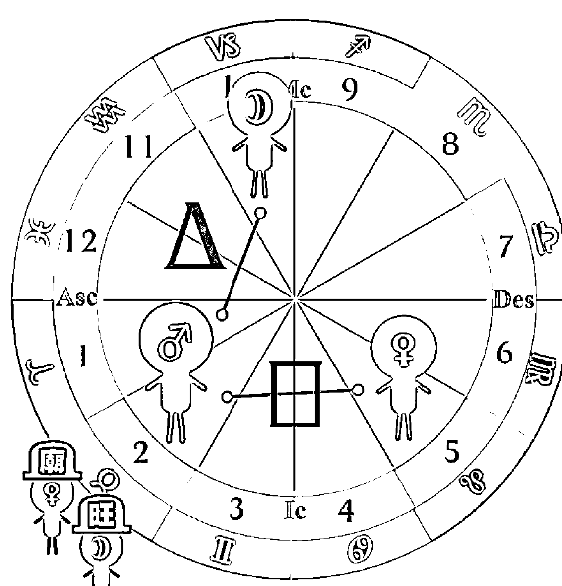

1. 兩吉星容納：兩吉星吉相容納，大大增強吉性。若為凶相容納，仍可提升吉祥，但隱藏一些凶性。
2. 一吉一凶容納：凶星宜在吉星之廟旺宮，也就是吉星容納凶星，若彼此吉相會降低凶星凶性，提高吉星吉性，若凶相仍比無容納時吉祥。若吉星在凶星廟旺地，也就是凶星容納吉星的狀態，當彼此吉相時，仍屬佳。若凶相則仍然容易呈現凶相，但比無容納時稍減凶性。
3. 兩凶星容納：兩凶若吉相容納，則不至全凶，隱藏著吉象。若凶相容納，則仍為凶，但比無容納時稍減凶性。

### 4. 被容納星的狀態：
被容納的行星若是逆行或焦傷，或在果宮凶宮，會減低其收受禮物的能力。

### 5. 容納星的狀態：
容納的行星最好本身狀態要好，具備行星尊貴在始宮或續宮，若容納失敗，則容納行星不至於被反傷，尤其當容納的是自然凶星時。容納星若本身力量薄弱，能夠給予的禮物也有限。

## 主客的地位狀態

形成互容與容納時，要注意主客本身的地位狀態，互容是彼此進入對方的五種尊貴領域，這五種尊貴也決定了主人對這個領域有多少管轄權，例如A星入B星的廟地跟A星入B星的界地來說，B能夠給的資源就不同，入廟地時B的管轄權有5分，入界地時B只有2分，因此能夠給A的資源就有落差。

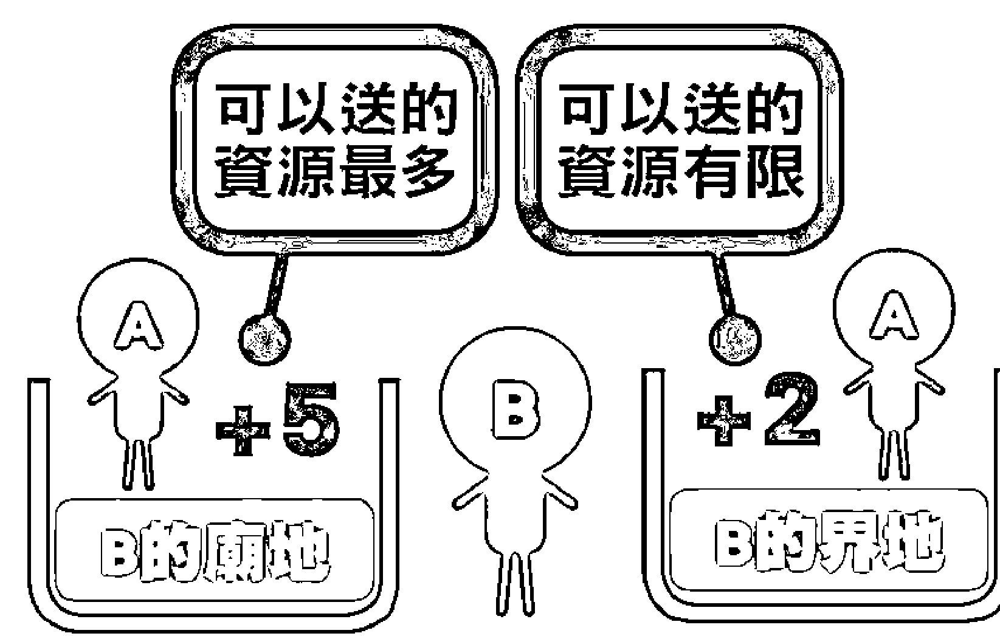

再以容納來說，同樣A星入B的廟地被B星容納，A在此地本身的五種尊貴狀態也會決定B以什麼態度對待A，例如金星在雙魚被木星容納，跟金星在射手被木星容納，雖然同樣被木星容納，而且都是木星廟地，但是因為金星在雙魚本身是旺，因此比起在射手，金星在雙魚的地位遠高於在射手，木星雖然都是有5分的資源可以提供金星，但是在雙魚是以VIP的貴賓等級被招待的，而在射手則只是一般顧客的等級而已。當然主人本身的狀態也是要考量的，同樣容納金星，木星本身在巨蟹跟在摩羯容納金星就會有很大的落差，木星在巨蟹代表木星本身狀態很好，想供應什麼就供應什麼，而木星在摩羯本身狀態不佳，能供應的資源就有限。另外，這個主客關係的配合能不能順利還要看彼此之間的相位好壞。

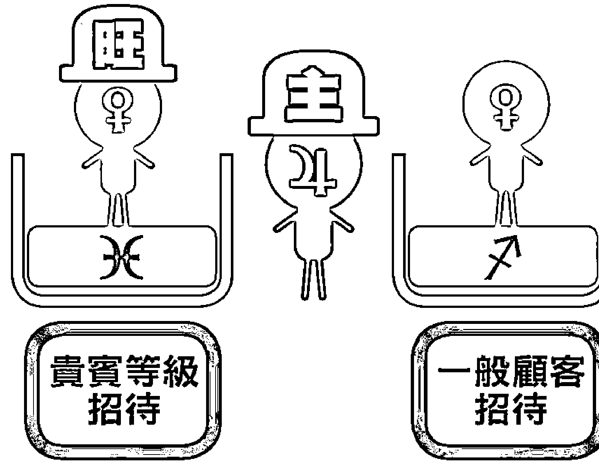

1. 客星入主星的尊貴領域，決定主星能供應的權限。
2. 客星本身的尊貴狀態，決定主星以何種層級供應客星。
3. 主星自己的尊貴狀態，決定主星能供應客星資源的能力。
4. 客星與主星的相位關係，決定主星供應客星的狀態好壞。

## 宮位主星

### 宮主星
宮主星代表宮位的影響力量。12個宮頭點對應到各自的星座位置，透過12星座各自的主宰行星，形成後天12宮位各宮的宮主星，其重要性要高於宮位的自然主宰星。例如一宮對應牡羊，自然主宰星是火星，但是上升金牛的命主星是金星，金星作為上升金牛的人的一宮主星，其重要性遠高於火星（一般來說，宮位的自然主宰星，我們比較忽略不看）。命宮的宮主星稱為命主星，是命盤的主要重心。二宮星座對應的星座主宰星，便稱為2主星，其他依此類推。

### 飛星
各宮主星產生後，由宮主星飛佈的宮位來看出宮與宮、星與星之間的上下前後聯繫關係，這種宮主星飛佈的方法稱為飛星。透過宮主星的飛佈，串聯宮與宮的相互作用，在宮位論斷上更為深入，了解更多的細節與來龍去脈。

### 宮主星與宮內星
宮位主星主宰整個宮位的資源，透過宮位主星將宮位的影響力傳遞出去。宮主星作為宮的主人，決定相關宮位發展的等級狀態。非入宮內的行星對宮產生直接影響，對宮本身的好壞狀態具有直接明顯的影響。宮內星受宮主星定位，因此也仰賴宮主星提供資源，因此宮主星本身的好壞也會決定宮內星能否在宮內充分發揮，宮主星必須照應好宮內星這個客人，這個客人好壞也會牽連到宮主星，所以宮內星也常會成為宮主星的幫手或是拖累。宮主星跟宮內星之間如果存在良好順暢的關係，那對該宮事物會非常有利，整體來說，宮內星對宮的影響是強烈明顯的，但是宮主星決定最終結果。例如2宮內有木星，但是宮主本身狀態不佳，那這個人雖然賺錢順利，但是他的財富層次不高，可能只是千萬富豪，他賺錢輕鬆，但是不會想去賺很大的財富。反之2宮帶土星，但是2主星狀態很好，那這個人賺錢很辛苦，但是他可能是億萬富豪，他可能常常為錢煩惱，財運波折不斷，但是他的財富格局高，他會去賺很大的利益。

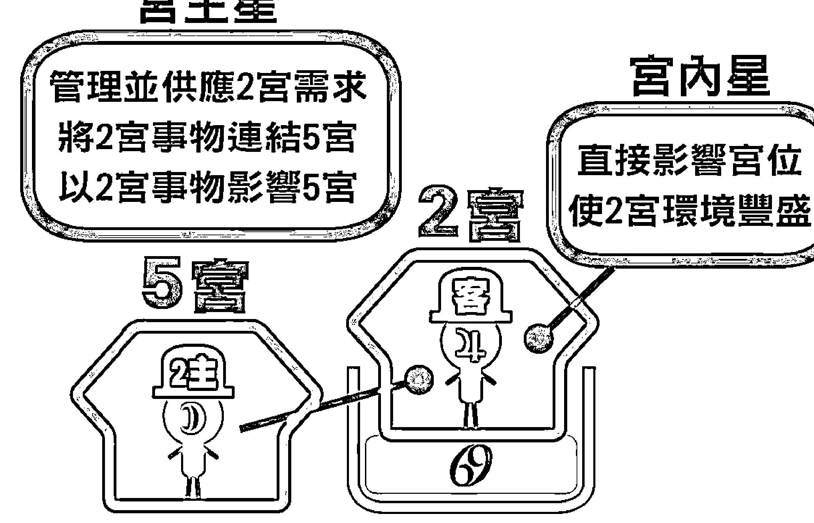

## 行星的自然&後天徵象

行星本身依其先天特性有其主管的自然象徵，而當行星成為不同各宮主星後，便賦予了後天宮位的身分，對命盤主人帶有專屬個人的後天意義。自然行星象徵著整體性的天象對個人的影響，宮主星則更專屬於個人，祂所象徵的意義更趨向自我人生相關的層面所帶來的影響。

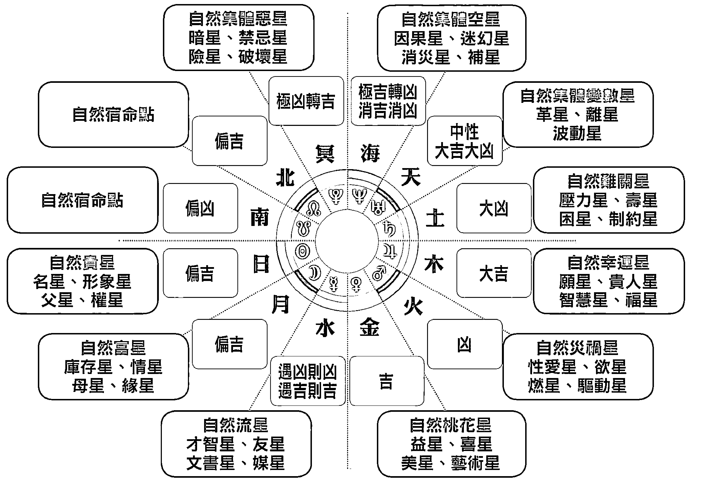

### 先天自然徵象
行星依其自然天性，本身就帶有其天然主宰的徵象，例如太陽主管權力，金星主管愛情，這些都是自然呈現的狀態，當判斷事物牽涉領導、權力時，太陽是天然相關的徵象。當判斷愛情狀況時，金星是自然不能遺漏的重點。每顆星都有其天然的性質，有其吉凶好壞的本質狀態。就像木星的天性就是幸運樂觀，土星的天性就是困難阻礙，這是他們的天性，他們會自然的展現出這樣的能量。但是木星雖然天性是幸運樂觀，但是木星也可能帶來壞事，因為幸運樂觀造成浪費或過度擴張。土星雖然本性是困頓阻礙，但是也可能困頓阻礙使的一切事物規矩有準則。所以問題不在星得本質好壞，而是在如何運用這些能力。

- ☉ 太陽：偏吉，屬於自然尊貴之星，主宰名聲、形象、光彩、權力之事，也是先天父星，女命夫星的徵象。
- ☽ 月亮：偏吉，屬於自然富裕之星，主宰親緣、情感、內部領域、庫存之事，也是先天母星，男命妻星的徵象。
- ☿ 水星：中性，遇凶幫凶，遇吉幫吉，是自然流轉之星，主宰聰明才智、認知、口才、溝通、文書之事，也是先天親友手足之星。
- ♀ 金星：先天吉星，屬於自然喜利之星，主宰愛情、美好、利益、實惠、文藝之事，也是先天桃花徵象。
- ♂ 火星：先天凶星，屬於自然耗損之星，主宰原始動機、性愛、爭鬥、衝突、慾要之事，也是先天災禍徵象。
- ♃ 木星：先天吉星，屬於自然豐富之星，主宰願望、幸運、智慧、信仰、神聖之事，也是先天貴人徵象。
- ♄ 土星：先天凶星，屬於自然制約之星，主宰壓抑、規範、阻礙、責任、磨難之事，也是先天難關徵象。

三王星一般不作為宮主星之用，或只作為附加參考的第二主星，所以其徵象都是先天性的，而且屬於集體性的徵象。

- ♅ 天王星：中性，吉凶無法預測，屬於自然集體變數之星，主宰變革、超越、波動、離異之事，也是未知徵象。
- ♆ 海王星：無吉無凶，消吉消凶，損有餘而補不足，屬於自然集體因果之星，主宰夢幻、虛無、補償、救贖之事，也是空無徵象。
- ♇ 冥王星：極凶藏吉，屬於自然集體陰影之星，主宰著負能量、邪惡、危機、風險、禁忌之事，也是毀滅徵象。

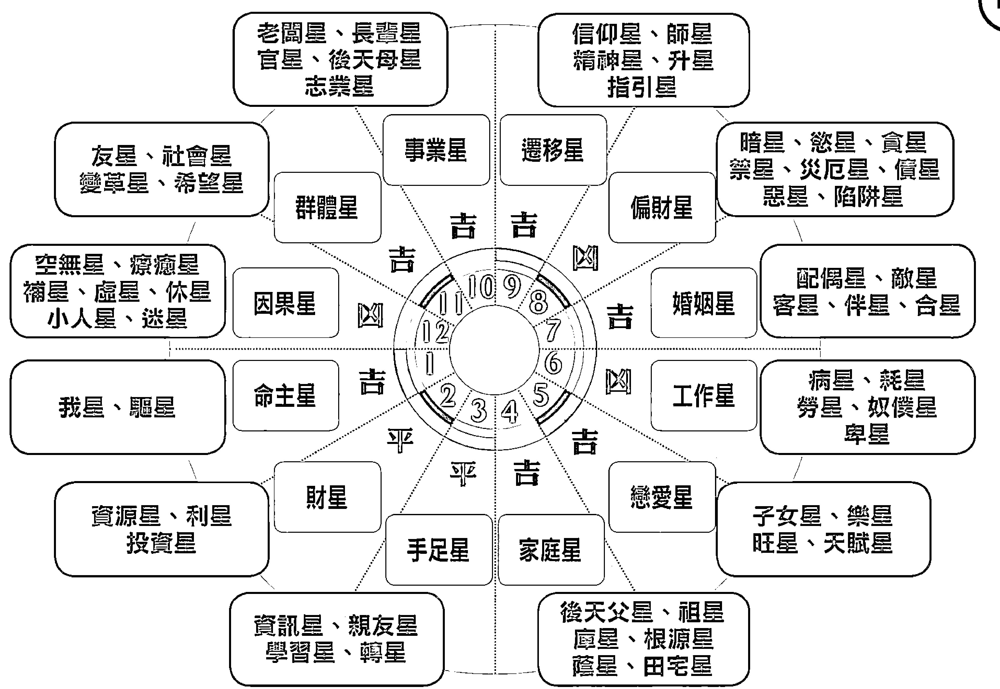

### 後天徵象
行星本質以先天的自然呈現其本身的影響，但是行星作為後天宮主星後，便帶有後天宮位的徵象，行星在成為後天宮主星後便會對其先天徵象產生修正變化，除了扮演本來的天然功能外，也附加了後天的宮位特質進來，例如金星在先天上是吸引力與桃花徵象，當金星成為3主星後，金星的桃花吸引力中還附加了交流學習等3宮的附加後天意義，又例如土星先天是制約跟壓力徵象，當祂扮演5主星時，祂就有提供玩樂與戀人的功能。當然，同樣是5主星這樣提供玩樂功能的後天主星，如果是金星來扮演跟土星來扮演，那絕對大大不同。金星能夠提供的是金星的玩樂材料，土星能夠提供的是土星的玩樂材料，所以同樣是後天桃花星5主星，金星當5主其桃花性絕對遠高過土星當5主。不過當一顆星成為5主星時，不管祂是金星還是土星，都會使其天然性中附加了5宮的後天歡樂性。

1. 1主星（吉）：行星成為命主星有點類火星加太陽的性質，將會大大加強其重要性，增加此星的自我特質與強勢性。
2. 2主星（平）：行星成為2主星就成為財星，有點類金星的性質，會增加一顆星的利益性，帶有一點利益特質，但也會物慾化。
3. 3主星（平）：行星成為3主星有點類水星的性質，會增加一顆星的靈活性與轉換性，帶有催化與流通作用。
4. 4主星（吉）：行星成為4主星有點類月亮的性質，會增加一顆星的保護性與安全性，具有積累傳承與庇蔭的作用。
5. 5主星（吉）：行星成為5主星有點類太陽加金星的性質，會增加一顆星的歡樂性與可見性，具有活旺與鼓舞的作用，也是後天桃花星之一。
6. 6主星（凶）：行星成為6主星有點類火星加土星的性質，會增加一顆星的勞耗性與卑微性，具有勞累病耗與弊害的作用。
7. 7主星（吉）：行星成為7主星有點類金星的性質，會增加一顆星的和諧性與客觀配合性，具有平衡調整與結合互補的作用，也是後天桃花星之一。
8. 8主星（凶）：行星成為8主星有點類火星加冥王的性質，會增加一顆星的負面性與禁忌性，具有偏執貪婪與災厄的作用。
9. 9主星（吉）：行星成為9主星有點類木星的性質，會增加一顆星的層次與開闊性，具有指引與提升的作用，也是後天貴人星。
10. 10主星（吉）：行星成為10主星有點類土星加太陽的性質，會增加一顆星的位階與建設性，具有提高地位與成就的作用，也是後天官星。
11. 11主星（吉）：行星成為11主星有點類木星加天王的性質，會增加一顆星的變化與超脫性，帶有轉機希望與改革的作用。
12. 12主星（吉）：行星成為12主星有點類海王的性質，會增加一顆星的無力與非世俗性，帶有因果與空無虛弱的作用。

### 先天吉凶與後天吉凶
因為後天宮位有吉凶宮的差異，因此，當行星成為後天宮主星後，就會對其先天吉凶性產生些許的變化。使其本質的吉凶有了改變。日月是富貴之星，金木是先天吉星，這四顆星本質偏吉，但是太陽本身雖然光芒閃耀但是有耗損特性。月亮的增光跟減光狀態也影響月亮的富裕度。水星本質中性，祂本身只負責催化加速事物的進行，因此要看祂結合吉星還是凶星，結合吉星就催快吉利，結合凶星就催快凶惡。火土是先天凶星，本質就是偏負面的。三王星基本上不論後天意義，其本質天王是變數，無法預測吉凶。海王是空無，無好無壞，好的也消、壞的也消，一切歸於空無。冥王本質非常凶，凶性甚至高過火土，但是冥王的凶之中潛藏巨大利益，祂是透過凶惡激發出隱藏的潛能。

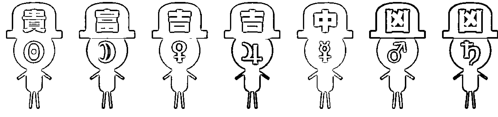

行星先天的吉凶性因為成為後天主星，因此受到後天狀態影響，使得祂們的吉凶性產生細微的變化，依據先天吉凶星掌管的後天吉凶宮，而會有以下四種基本的變化狀態。

1. 純吉星：當日月金木這樣的吉星其主宰宮位沒有6、8、12凶宮時，這時這樣的吉星稱為純吉星，這是吉星最佳狀態。

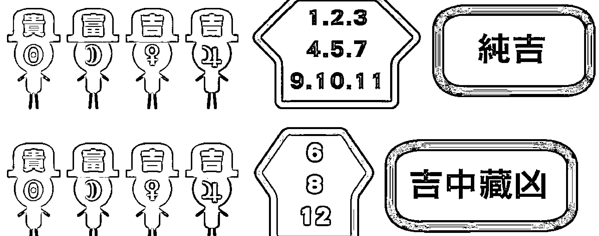

2. 不純吉：當日月金木這樣的吉星有主宰宮位6、8、12凶宮時，這時的吉星不是純吉星，他們本質還是發揮吉利的，但是會附加一些後天的負面問題，吉中藏凶。
3. 不純凶：當火土這樣的凶星其主宰宮位沒有6、8、12凶宮時，這時的凶星不是純凶的，他們雖然本質是發揮凶惡的，但是會附加後天吉宮的有利機會，凶中藏吉，尤其是其主宰的兩個宮都是吉宮時。
4. 純凶星：當火土這樣的凶星其主宰宮位有6、8、12凶宮時，這時的凶星是純凶的，這是凶星最惡劣的狀態，特別容易帶來凶險與危害。

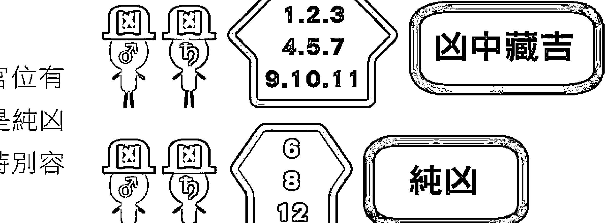

## 宮主星飛佈：宮位影響力的作用與關連層面

透過宮主星之間的飛佈，人生中的所有層面人事物之間就產生了豐富的互動與連結，當行星成為後天宮主星後，就成為這個宮位的管理員，除了負責提供宮位內的資源，管理宮內的行星，並且會把該宮所發展出的影響力，透過宮主星展現出來，發揮在其飛落的地方。例如7主星飛2宮，7主星就會將一個人在婚姻合作的環境所形成的關係或契約，這些互動合作所展生的效應，透過7主星影響到他個人的財運、感官體驗與價值觀。

### 一宮主星：命主星、自我星、驅動星
1主星扮演個人本我、本能、慾望或自主意識等屬於自我層面的影響，1主本身就代表整張星盤的主人，一顆星成為1主後，其在星盤中的重要性就大大提升，影響到一個人的整體命運，是人生好壞的重要關鍵。

### 一宮主星飛宮
1主星代表我們自己，1主飛的地方就是自己跑去哪裡了？代表生存競爭是為了什麼？為了什麼領域層面的人事物而活？人生的目的所在，容易引起自我驅動的領域層面，例如命主飛7宮，人生的目的是找到非我來互補，尋求對立面的認同。

1. 人生目的為了自己，比較自我，為自己而活，強調自我的重要性。
2. 人生目的為了價值、利益，強調資源的重要性，把自己當籌碼。
3. 人生目的為了知識、交流，強調親朋好友的重要性。
4. 人生目的為了家庭、後靠、歸屬，強調根源的重要性。
5. 人生目的為了快樂、戀愛、子女、才華展現，強調天賦的重要性。
6. 人生目的為了服務、勞動、工作、附屬，強調功能的重要性。
7. 人生目的為了他人認同、婚姻、互動合作，強調對手的重要性。
8. 人生目的為了刺激、隱私、情慾、深層體驗，強調禁忌風險的重要性。
9. 人生目的為了信仰、學歷、眼界、探索智慧，強調自我進化的重要性。
10. 人生目的為了事業、成就、野心，強調地位的重要性。
11. 人生目的為了集體、理想、未來，強調社會的重要性。
12. 人生目的為了萬物眾生、救贖、了脫、夢，強調靈性的重要性。

### 行星飛入一宮
飛入1宮的星代表什麼事物來到身邊，成為面對命運的重要能力與工具，容易想要影響自我、人生決定，成為人格特質一部份的力量，例如太陽1宮，個人的意志與光明性會影響命運與自我，又或者是爸爸或權威者會想要影響自己。飛入一宮的星也代表做什麼是為了自己？例如金星飛1宮，愛的目的是為了自己，所以通常金1有自戀徵象。又假設金星是2主星，則代表吸引金錢利益的目的也是為了自己。

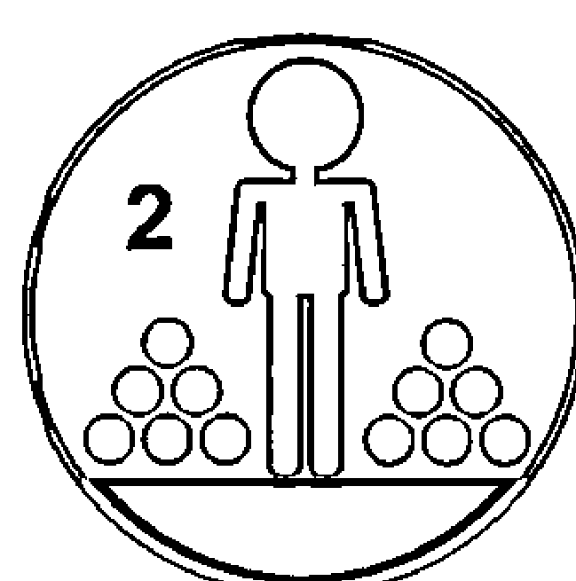

### 二宮主星：財運星、資產星、益星
2主星是我們的財運管理員，2主星主管了我們的資源、籌碼、物質供應與價值觀，負責提供我們收穫的來源與管道。並將我們在2宮環境所成就的價值影響力，發揮在其所在的人生層面。

### 二宮主星飛宮
2主飛的地方代表我們賺錢消費為了什麼？我們獲取金錢、投資收穫的目的之所在，為什麼要賺錢？例如2主飛10宮，賺錢的目的是為了事業，為了得到成就與地位。2主飛的地方也代表財星去哪裡了？跟你賺錢有關的領域是什麼？例如2主飛9宮，你的財星在遠方。2主飛的地方也代表你把錢運用在那個人生層面？在哪裡花錢，形成供需關係？例如2主飛4宮，可能代表你把資源運用在家人、親緣或投資房地產了。

1. 賺錢為了自己，財星跑到自己身邊，資源影響人生。
2. 賺錢為了擁有感、感官享受，在乎利益，善於理財賺錢的徵象。
3. 賺錢為了手足、知識、交流，財星跑到親朋好友那裡。
4. 賺錢為了家庭、安全感，財星跑到家裡，積存資源的象徵。
5. 賺錢為了快樂、戀愛、子女、爭寵，財星跑到熱愛的地方。
6. 賺錢為了奴僕、健康、任務，財星跑到底層的地方，辛苦賺錢的徵象。
7. 賺錢為了他人、婚姻、被認同，財星跑到伴侶那邊，合作入財的徵象。
8. 賺錢為了貪、情慾、債務、保險，財星跑到債主賣家那邊，火山孝子、容易借貸的象徵。
9. 賺錢為了學業、信仰，財星跑到遠方，異地得財的象徵。
10. 賺錢為了地位、成就、志業，財星到事業、老闆那邊，為老闆賺錢，財星高掛，事業受到資助的象徵。
11. 賺錢為了社會集體、理想，財星跑到朋友大眾那邊，賺四方財的象徵。
12. 賺錢為了救贖、因果、夢，財星跑到冤親債主那邊，財務容易混亂，捐獻的象徵。

### 行星飛入二宮
行星飛入2宮代表什麼事物跑到財房？什麼事物跟自己產生供需買賣，成為個人資源的一部份，例如5主飛2宮，個人的才華、創作或是小孩就會成為個人的資源，入2宮的事物可以成為資產，但是也可能是負資產，例如凶星入2宮，這個資產可能會導致個人身價籌碼的減損。飛入2宮的星會成為影響個人財運的力量與工具，可以被當作賺錢的能力與工具，例如火星入2宮就可以用行動力、直覺或戰鬥競爭的能力來獲得利益。

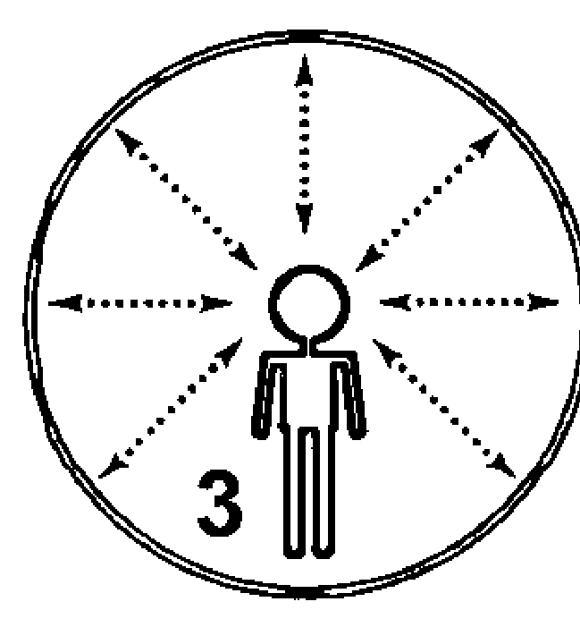

### 三宮主星：友星、轉機星、流通星
3主星是我們訊息交流環境的管理員，通常作為親朋好友的投射，扮演我們人生中重要的同儕、鄰近、學習、交流通路關係，也代表我們在3宮所串連、接收、學習、交流來的訊息認知、鄰近通路、周邊關係、親朋好友所產生的影響力，透過3主星作用在人生的其他層面上。

### 三宮主星飛宮
3主飛的地方代表手足親友跑到哪裡了？鄰近關係容易連結到的人生領域。這些鄰近的人脈通路容易影響到我們人生哪個層面？例如3主飛7宮，可能代表手足親友會影響你的婚姻，又或者是好朋友跑去成為了你的伴侶。3主飛的地方也代表我們交友溝通為了什麼？學習認知的目的所在，為什麼要交朋友？為什麼要學習？例如3主飛5宮，交朋友的目的就是為了玩樂，又或是學習的目的是為了表現自己的才華。

1. 學習交流為了自己，親友、知識來到身邊，親朋好友影響自己。
2. 學習交流為了賺錢，親朋好友影響財運，把親友、通路、知識當作籌碼。
3. 強調通路、溝通交流、學習認知、親朋好友的重要性。
4. 學習交流為了家庭、歸屬，親朋好友影響家運，親友關係親近的徵象。
5. 學習交流為了快樂與熱愛，親朋好友影響戀愛運、親子關係，朋友變成情人，親友同樂的徵象。
6. 學習交流為了工作、技能，親朋好友影響工作運，親友較低階的徵象。
7. 學習交流為了他人、被認同，親朋好友影響婚姻，親友合作，朋友變成伴侶的徵象。
8. 學習交流為了情慾、債務、犯禁，親朋好友影響隱私禁忌，親友容易複雜危險，朋友一起作惡的徵象。
9. 學習交流為了學歷、信仰，親朋好友影響學業、信仰，親友像老師一樣，層次較高。
10. 學習交流為了地位、成就、志業，親朋好友影響事業，親友地位較高。
11. 學習交流為了理想、社群認同、公眾形象，親朋好友影響群體意識，親友較為陌生。
12. 學習交流為了救贖、了脫、夢，親朋好友影響福德靈性，親友容易有因果關連，交友混亂的徵象。

### 行星飛入三宮
飛入3宮的行星會成為我們的訊息、媒介與通路人脈，這些行星的能力可以成為我們拿來交流資訊與學習認知的能力，例如土星3宮，邏輯規範與計畫管理就會成為我們在學習認知或交友時的手段。飛入3宮的星也代表經常在鄰近邊緣出現，成為交流管道的人事物，並且容易影響我們的學習認知，例如6主飛3宮，工作常常會在鄰近交流中出現，或是下屬容易成為我們的訊息管道，或是部屬成為朋友。

## 四宮主星：家星、根星、庫星、陷星

4主星是我們的內部管理員，祂負責供應我們內部所有安全需求的事物，給我們提供家人、親緣與後靠，4主星代表我們個人的根與家，我們經營內在、累積內涵庫存、發展親緣與歸屬所形成的影響，就藉由4主星來發揮影響，藉由4主星將祖先根源的傳承、家人親緣的歸屬、領域結界的積存展現出來。

## 四宮主星飛宮

4主星飛的地方代表我們尋求安全歸屬與守護領域為了什麼？找尋心靈慰藉的目的，為什麼要成家？例如4主飛5宮，得到心靈慰藉的目的是為了得到快樂，又或者是成家的目的是為了生子，傳宗接代。4主飛的地方也代表心靈歸屬、家、根源在哪裡？例如4主飛11，心靈歸屬在陌生大眾身上，也代表家在邊緣的地方。4主飛的地方也是容易連結親緣關係的領域，祖先的庇蔭或親緣的包袱到哪裡？例如4主飛2宮，祖先可能庇蔭你的財，但也可能是親緣包袱造成你的財物損失，好或壞則是取決在4主星本身的狀態好壞與吉凶。

- ①：領域守護為了自己，家庭根源影響自己，庫星入命，庇蔭自己。
- ②：買房成家為了賺錢，家庭根源影響財運，庫星入財，家、根源成為籌碼，得祖產的徵象。
- ③：領域守護為了親朋好友，家庭根源影響學習認知，親近親友，
- ④：強調家庭、根源、歸屬的重要性，受庇蔭得後靠的徵象。
- ⑤：領域守護為了小孩與熱愛，家庭根源影響戀愛運、生育，庇蔭子孫的徵象。
- ⑥：買房成家為了義務，家庭根源影響工作運、健康，家族遺傳疾病，家族較低階的徵象。
- ⑦：買房成家為了婚姻，家庭根源影響婚姻，同族的連結，家族連姻的徵象，庇蔭他人、伴侶。
- ⑧：領域守護為了隱私、防護風險，家庭根源影響情慾、惡性、債務，家庭根源容易複雜危險，家人一起作惡的徵象。
- ⑨：買房成家為了精神寄託、信仰，家庭根源影響學業，家族層次較高，外地生根的徵象。
- ⑩：買房成家為了地位、成就、志業，家庭根源影響事業，家族地位較高。
- ⑪：領域守護為了集體、社會認同、公眾形象，家庭根源影響群體意識，家人較為陌生，群聚地盤的徵象。
- ⑫：領域守護為了救贖、眾生，家庭根源影響福德靈性，家人容易有因果，根源不清的徵象，親緣比較薄的徵象，對親緣有無力感。

## 行星飛入四宮

飛入4宮的行星會成為被封起來的能力與人事物，要在安全領域範圍內才表現得出來，同時也會是我們處理內部的重要能力與工具，也是家人、祖先或房子的徵象，例如木星入4宮，信念與智慧就是內在的能力，會透過從家人關係中得到，也象徵有智慧的家人，層次高的祖先或是寬廣的家。飛入4宮的星也代表什麼事物容易來到家裡，影響家庭內部，將什麼層面的人事物同化成自己人，例如8主飛4宮，禁忌是非關係容易成為內部問題，容易將孽緣關係同化進來，造成家裡的風險。

## 五宮主星：樂愛星、子嗣星（生）、旺星、名星

5主星是我們遊樂區管理員，祂負責供應玩具、遊戲、戀人、小孩等讓我們熱愛的事物，提供我們表現的舞台，激發我們的熱愛。5主星代表我們投注生命力在舞台上去追求或創造出來的名聲、才華、創作、子女、戀愛等事物，藉由5主星將這些歡樂的活旺因素呈現出祂們的影響。

## 五宮主星飛宮

5主飛的地方代表我們玩具在哪裡？戀人、玩伴、歡樂在那邊？例如5主飛8宮，玩具在禁忌的地下室裡，這代表個人的戀愛、玩樂很容易跟是非秘密的地方關連。5主飛的地方也代表個人的舞台、熱愛在哪裡？才華展現的目的所在，容易連結熱愛關係的領域，例如5主飛6宮，工作就容易是個人發揮能力與得到榮耀表現的地方。5主飛的地方也代表我們追崇快樂是為了什麼？例如5主飛3宮，想要去玩樂的目的其實是為了交朋友，討朋友開心。

- ①：追崇熱愛為了自己，天賦才華、子女影響人生，戀愛星入命，桃花格。
- ②：追崇熱愛為了利益，感官享受，天賦子女影響財運，把小孩當資產。
- ③：追崇熱愛為了親朋好友，熱愛影響學習認知，戀愛星在親朋好友那裡。
- ④：生孩子為了家庭、晚年歸屬，戀愛星跑到家裡，家庭歡樂的象徵。
- ⑤：強調戀愛、子女、玩樂，遊戲人生，有才華天賦，強運的徵象。
- ⑥：戀愛、生小孩是為了義務，戀愛星跑到底層的地方，小孩容易生病的徵象。
- ⑦：戀愛、生小孩是為了他人、婚姻，戀愛星跑到伴侶那邊，戀愛結婚的徵象。
- ⑧：追崇熱愛為了貪、情慾、性，戀愛容易禁忌枱面下，好賭、淫慾、偷情的徵象，小孩容易有問題。
- ⑨：追崇熱愛為了信仰，熱愛影響學業，戀人層次較高，戀愛星跑到遠方，異地豔遇，在外地留下小孩的徵象。
- ⑩：戀愛、生子為了地位、成就、志業，天賦才華、榮耀影響事業，受長官賞識的徵象。
- ⑪：追崇熱愛為了社會集體、理想，戀愛星到集體大眾那邊，領養小孩的徵象。
- ⑫：戀愛、生子為了救贖，戀愛星跑到虛幻的地方，戀愛曖昧混亂、子嗣緣薄的徵象。

## 行星飛入五宮

飛入5宮的行星會成為我們可以展現的天賦能力，這樣的行星能量會變得活躍，成為我們表現的工具，例如月亮入5宮，心靈感受或是文學風采就有機會發展成為天賦才華。入5宮的行星也代表什麼事物容易進入核心舞台，成為戀人、熱愛的玩具或歡樂的玩伴，例如7主飛5宮，伴侶就容易受到重視，成為重要的玩伴。入5宮的事物也會影響到我們的快樂與榮耀，例如4主土星飛5宮，家人容易造成自己不快樂或感到不榮耀。

## 六宮主星：工作星（勞）、附屬星、疾病星

6主星是勞動場的管理員，負責給予我們任務跟勞動，提供我們勞動需要的各種工具，也是我們產生勞耗與累病的負責人，6主星代表我們附屬工具的投射，是我們在6宮獲得的專業技能與可用性，透過6主星來發揮影響。同時我們所有的可用工具，包含身體器官、部屬、各式工具，也是藉由6主星發揮作用。另外在6宮造成的傷病疲累的效應，也是透過6主星來產生影響。

## 六宮主星飛宮

6主星飛的地方代表奴僕工具去哪裡？在什麼地方會使用到工具？也代表自己到哪裡當工具，執行任務，例如6主飛11宮，代表為了社會大眾當工具，也可能是拿社會大眾當工具使用。6主飛的地方也代表努力工作為了什麼？勞動貢獻的目的所在，工作容易跟什麼事物層面相關，例如6主飛9宮，為了信仰、神、開眼界、出國深造而努力工作，同時這也是工作在遠方的徵象。6主飛的地方也是容易受勞累耗病影響的領域，代表病星到哪裡？例如6主飛1宮，病累耗容易跟著自己，這是容易生病的徵象。

- ①：努力工作為了自己，奴僕、健康影響人生，奴星、勞耗星入命。
- ②：努力工作為了錢，工作、奴僕、健康影響財運。
- ③：努力工作為了親朋好友，技能、奴僕影響學習，工作跟人脈通路有關。
- ④：努力工作為了家庭，工作、奴僕影響家庭，家人容易生病，在熟悉的環境工作，內部耗累的象徵。
- ⑤：努力工作為了快樂、子女、舞台，奴僕工作成為熱愛，在歡樂的地方工作，小孩容易生病的徵象。
- ⑥：強調工作、附屬、健康的重要性，有專業技能的徵象。
- ⑦：努力工作為了他人、婚姻、被認同，工作、奴僕健康影響婚姻，奴僕成為伴侶。
- ⑧：努力工作為了貪、情慾、債務、保險，工作比較見不得光，健康容易有風險的徵象，跟奴僕一起作惡。
- ⑨：努力工作為了學業、信仰，到遠方工作的象徵，奴僕、專業層次較高。
- ⑩：努力工作為了地位、成就、志業，從基層往上攀登的徵象，以技能成就事業，奴星高掛。
- ⑪：努力工作為了社會集體、理想，工作職業影響集體關係，服務大眾，集體工作的徵象。
- ⑫：努力工作為了救贖、因果、夢，工作星跑到休息的地方，無力工作的徵象。

## 行星飛入六宮

飛入6宮的行星容易成為工具，容易被操被壓榨而耗損，因勞耗而生病，因此6宮內的星經常是疾病徵象，影響個人的健康，例如月亮入6宮，容易造成胃的問題。6宮是奴僕附屬宮，因此落6宮代表的事物容易變得較低階，成為奴僕工具，例如10主星飛6宮會造成事業、老闆上司容易低階化，事業容易著重在小細節，既使當老闆也像員工一樣事必躬親，校長兼工友。6宮的星會影響工作，也是執行工作任務時的能力，可發展成的專業技能，因此常是個人職業別的徵象，例如6宮水星，代表工作通常需要運用到腦袋或是口才。

## 七宮主星：婚姻星、伴星、對星、缺星

7主星是與他人互動合作的管理者，負責提供我們互動的對手、伴侶、合作夥伴。7主星通常作為我們直接互動的對象，因此祂代表的就是我們的婚姻伴侶或是重要的對手，人生中所有經歷過的互動所互補來的合作夥伴、伴侶、對手等所形成的關係、契約與客觀面，也都是透過7主星來發揮影響的效用。

## 七宮主星飛宮

7主星飛的地方代表跟我們互補的非我投射在哪裡？在什麼人生層面會遇到我們的伴侶或是對手敵人？例如7主飛3宮，可能你的婚姻對象就會在親友圈中出現。7主飛的地方也代表契約到哪裡？在哪邊容易發生爭訟或合作，例如7主火星飛2宮就很容易有財物契約的糾紛出現。另外7主飛的地方也代表婚姻結合為了什麼？妥協認同的目的所在，人生中容易受非我投射影響的領域，例如7主飛5宮，結婚的目的可能是為了快樂，或是奉子成婚，同樣的這也代表一個人的快樂與否會受到伴侶或對手所牽動。

- ①：結婚為了自己，婚姻影響人生，伴侶星跑到自己身邊。
- ②：結婚為了利益，婚姻影響財運，伴侶重視價值。
- ③：結婚為了親朋好友、溝通交流，伴侶在親朋好友那裡。
- ④：結婚為了家庭、安全感，婚姻影響家運，婚緣在同宗族內，伴侶延續宗族的象徵。
- ⑤：結婚為了快樂、戀愛、子女、爭寵，伴侶受寵愛，奉子成婚的徵象。
- ⑥：結婚為了工作、義務任務，伴侶層次較低，伴侶容易有病的徵象。
- ⑦：強調婚姻、伴侶的重要性。
- ⑧：結婚為了性、情慾、債欠，伴侶容易複雜墮落，另一半做壞事，偷偷合作、結婚的徵象。
- ⑨：結婚為了信仰、精神寄託，伴侶跑到遠方，伴侶層次較高，異地結婚的象徵。
- ⑩：結婚為了地位、成就、志業，伴侶地位成就較高，婚姻影響事業運。
- ⑪：結婚為了社會集體、理想，伴侶影響社會人際，伴侶較為陌生。
- ⑫：結婚為了救贖、因果、夢，伴侶通常是冤親債主，婚姻無力感、不切實際、跟伴侶緣薄的徵象。

## 行星飛入七宮

飛入7宮的行星容易成為非我的徵象，通常代表人生中的重要關係特徵，什麼事物容易跟我們形成契約或默契，成為伴侶或對手，影響到婚姻，例如6主飛7宮，部屬容易成為自己的伴侶或是敵人，或是工作或部屬會影響到個人的婚姻選擇。7內星也可以成為我們與他人互動的能力，基本上7宮內的行星代表他人的能力，這些能力通常自己呈現不出來，是必須透過互動合作才會學習到的，或是與他人結合後才能運用的能力。

## 八宮主星：暗利星、危厄星、禁忌星、負惡星

8主星是我們禁忌地下室的管理員，負責提供我們秘密與隱私的慾望，供應我們惡性與陰影的發洩管道，給予情慾、執念、貪婪、犯禁、淫邪、恐懼等魔鬼的誘惑，並且製造人生中的風險、危機與陷阱，也讓我們有機會挖掘出隱藏的潛能與地下寶藏。因此8主星通常作為負面陰影的投射，我們在黑暗地下室所累積的惡性、隱私、禁忌、暗慾、污染，以及在風險危機中所激發的潛在力量，都透過8主星來發揮影響。

## 八宮主星飛宮

8主飛的地方代表哪邊容易有風險誘惑？哪個地方容易引發犯禁，製造是非，受到污染？例如8主飛7宮，婚姻關係上容易有誘惑陷阱，引發禁忌關係，造暗藏的是非。8主飛的地方也代表秘密隱私在哪裡？跟那個人生層面有關，例如8主飛4宮，家中常有不可告人的秘密。8主飛的地方也代表為什麼要作惡？投機犯禁為了什麼？為了什麼事物願意觸犯風險。同時也是隱蔽保險的目的所在，為了什麼必須把自己隱蔽起來，什麼事物容易觸發危機。8主飛的地方也是容易受深層陰影影響的領域，陰暗邪惡面容易影響什麼層面，例如8主飛9宮，深層陰暗面容易影響學業或是信仰。8主同時是他人的資源星，有可能是別人的資源變成我們的，成為我們的偏財。也可能別人用資源誘惑我們，使我們為了獲取而成為負債，因此8主飛的地方也代表債主在哪裡，或是偏財在哪裡？

- ①：投機犯禁為了自己，陰影影響人生，債欠跑到自己身邊。
- ②：投機犯禁為了利益，債主到財房，容易背債被討債的徵象。
- ③：投機犯禁為了手足、學習，債務在親朋好友那裡。
- ④：投機犯禁為了家庭、安全感，債務在家裡，家族原罪，在家做壞事的象徵。
- ⑤：投機犯禁為了快樂、戀愛、子女、爭寵，戀愛有禁忌，債留子孫的徵象。
- ⑥：投機犯禁為了健康、工作任務，抬面下的事物影響工作，找奴僕幹壞事，陰影執念影響健康。
- ⑦：投機犯禁為了他人、婚姻、被認同，陰影執念影響婚姻，債欠到伴侶那邊。
- ⑧：強調情慾、債務、風險、隱私與陰影禁忌。
- ⑨：投機犯禁為了信仰、自我提升，陰影惡性提升，跑到遠方做壞事。
- ⑩：投機犯禁為了地位、成就、志業，債主有地位，承擔事業債務的徵象。
- ⑪：投機犯禁為了社會集體、理想，債務在社會，社會原罪，集體作惡的徵象。
- ⑫：投機犯禁為了救贖、因果、夢，債務在因果，因果原罪，還債消業的徵象，債務混亂的徵象。

## 行星飛入八宮

飛入8宮的行星代表被深埋起來的潛能，這樣的能力必須要透過危機風險才能激發出來，或是在隱密的地方才能夠展現出來，例如太陽8宮的人，他的光芒與統御能力通常顯化不出來，只有在秘密隱私的環境，才能展現，一公開就發揮不了。8宮內的星也代表什麼事物來到禁區，不能公開，必須低調偷偷進行，例如5主星入8宮，這代表戀愛容易成為禁忌，不能公開，必須偷偷進行。飛入8宮的事物也代表什麼事物容易造成自己犯禁，一起作惡，例如3主飛8宮，親友常會造成自己觸犯禁忌，跟親友一起做壞事。另外入8宮的事物容易受到污染腐敗，容易造成虧欠，成為風險陷阱，也會影響個人的禁忌隱私，例如金星入8宮，愛情容易受到污染，也容易在愛情上感覺虧欠，愛情容易成風險與陷阱。

## 九宮主星：遷移星、指引星、願星、升星

9主星是我們聖殿的管理員，負責提供我們向上升級與向外移動的所有事物，管理我們的智慧、信仰、哲理、道德、升學、遠行等事項，通常作為引導者與傳道者的投射，以神或老師的樣貌出現。個人在聖殿發展智慧、信仰、神性、見識、遠外關係所形成的精神地位與神聖高我，則藉由9主星發揮其影響。

## 九宮主星飛宮

9主星飛的地方代表老師、智慧、道、神到哪裡？與引導者關連到的層面，例如9主飛2宮，在財物上容易遇到老師引導。9主會帶來外界的事物，經常以外來者的角色出現，帶來遠方人事物的影響，例如9主飛7宮，可能是外來者成為自己的伴侶的徵象。9主飛的地方也是向外追尋與信仰的目的所在，遷移、進化為了什麼？以及容易受上聖遠外關係影響的領域，例如9主飛12宮，追尋信仰的目的可能是為了得到解脫，或是出國遠行的目的是為了休養、度假。

- ①：追尋信仰、讀書為了自己，遷移星入命，遠方、老師影響人生，有學歷智慧的徵象。
- ②：追尋信仰、讀書為了賺錢，學歷、智慧影響財運。
- ③：追尋信仰、讀書為了學習認知，信仰影響交友，交通奔馳的徵象，三人行必有我師。
- ④：追尋信仰為了家庭安全感，學歷影響家運，遷移星入宅，迎外人入內的象徵。
- ⑤：追尋信仰、讀書為了快樂、才華展現，與外人一起歡樂的地方。
- ⑥：追尋信仰、讀書為了工作、任務，老師層次較低，學業從底層做起，精神耗弱的徵象。
- ⑦：追尋信仰、讀書為了他人、伴侶，信仰影響婚姻，跟外人結合的象徵。
- ⑧：追尋信仰、讀書為了深層慾望、暗利，信仰影響陰影，神性墮落，老師有問題的象徵。
- ⑨：強調信仰、學歷、精神寄託、遷移。
- ⑩：追尋信仰、讀書為了地位、成就、志業，信仰、學歷影響事業。
- ⑪：追尋信仰、讀書為了社會、理想，信仰、學識影響人際，推廣理念到社會。
- ⑫：追尋信仰、讀書為了救贖、因果、夢，信仰影響靈性，學業無力感，方向指引混亂的徵象。

## 行星飛入九宮

飛入9宮的行星能量會得到提升與進化，這樣的能力是必須向外跨越會是進化提升後才會顯現的高能，飛入9宮的星也代表什麼事物的層次較高，變得比較神聖，例如7主飛9宮，代表另一半的層次較高，比較有智慧。9宮是外面的天空，因此飛到9宮的事物代表容易在遠方遇到的事物，例如金星飛9宮，愛情容易在遠方出現。飛到9宮的星也容易影響個人道德、信仰、升學、旅行，例如太陽9宮，爸爸可能會干涉自己的升學選擇。

## 十宮主星：志業星、成就星、關卡星、制約星

10主星是我們人生事業高塔的管理員，提供一切讓我們可以達到成就的歷練與經驗。管理我們的企圖、野心、志業與位階。通常作為歷練者或管制者的投射，以老闆或上司的身份呈現。個人經過歷練所得到的社會地位、經驗、事業成就、官位就藉由10主星發揮其影響。

## 十宮主星飛宮

10主飛的地方代表官印、地位責任、上司到哪裡？例如10主飛1宮，官位自然來到身邊，被賦予管理的權力與責任。10主飛的地方也是與個人事業成就、社會地位容易關連的地方，例如10主飛3宮的人，他的事業徵象可能就會跟人脈通路息息相關。10主飛的地方也代表成就志業為了什麼？歷練難關的目的所在，為了什麼努力往上爬？也是容易以地位權威影響的領域，例如10主飛7宮，為了伴侶努力往上爬，也會用個人的地位權勢來影響伴侶。

- ①：成就志業為了自己，官星入命，職責地位跑到自己身邊，事業影響人生。
- ②：成就志業為了利益、感官享受、踏實感，事業影響財運。
- ③：成就志業為了親朋好友、學習、通路人脈，成就地位影響交友。
- ④：成就志業為了家庭、安全感，事業跑到家裡，接家業的徵象。
- ⑤：成就志業為了快樂、戀愛、子女、榮耀，在歡樂的地方成就事業，成就地位影響熱愛。
- ⑥：成就志業為了奴僕、健康、任務，官星跑到底層的地方，事業操勞，校長兼撞鐘的徵象。
- ⑦：成就志業為了他人、婚姻、被認同，成就地位影響婚姻，合作事業的徵象。
- ⑧：成就志業為了貪、情慾、債務、危機感，事業比較禁忌風險的徵象，在較不正當的地方成就事業。
- ⑨：成就志業為了學業、信仰，事業在遠方，異地成就的象徵。
- ⑩：強化地位、成就、志業、事業的重要性，有事業的象徵。
- ⑪：成就志業為了社會集體、理想，在邊緣成就事業，成就影響大眾、社會。
- ⑫：成就志業為了救贖、因果、夢，對事業無力感，志業容易迷失、不切實際。

## 行星飛入十宮

飛入10宮的行星會受到歷練而變得高階，10宮內的星是必須歷練克服後才會得的能力，也是用我們實現志業企圖的能力與工具，因此10宮內星經常是事業的徵象，例如火星10宮，競爭戰鬥能力就是我們必須歷練的課題，也是往上爬的武器，因此這也象徵帶有戰鬥征服特徵的行業。飛入10宮的星代表什麼層面的事物地位會較高，容易成為標竿、上司、老闆，影響事業成就的發展，例如某人的命主星飛到你的10宮，你會不自覺的比較尊重他，他也容易影響你的事業成就。

## 十一宮主星：群體星、變革星、超星、希望星

11主星是我們人生實驗室的管理員，管理人生中陌生未知的領域，提供可以讓人生超越改變的實驗變數，陌生大眾、同好、異己、社群關係、社團組織等。11主通常作為集體性的投射，以陌生人、同好、一般朋友、異己的方式呈現，我們透過加入集體所形成的團體、組織、意識形態、集體理想藉由11主星來發揮變革的影響。

## 十一宮主星飛宮

11主星飛的地方代表路人大眾跑去哪裡？人生中容易與陌生大眾關連，受集體大眾影響的層面，例如11主飛4宮，陌生人來到家裡，也象徵集體大眾容易影響到你的家庭、內在層面。11主飛的地方也代表集體希望理想在哪裡？改革超越為了什麼？理想希望的目的所在，例如11主飛5宮，對於社會的期待，希望世界是什麼樣子，這樣的意識形態觀念會影響到你生小孩的意願，或者說你想改革這個世界的目的是為了後代子孫，或是比較通俗的狀態11主飛5宮也可以解為去參加社團活動的目的是想要找戀人。

- ①：改革同盟為了自己，社會人際、社群公眾影響人生。
- ②：改革同盟為了利益，社會人際、社群公眾影響財運，把社會人脈當資產。
- ③：改革同盟為了親朋好友、知識交流，與陌生人結拜，人脈廣泛的徵象。
- ④：改革同盟為了家庭、安全感，陌生人跑到家裡，收養外人的徵象。

## 行星飛入十一宮

飛到11宮的行星代表未知的能力，必須加入群體，透過集體的力量才能發揮的能力，也是可以用在處理群體關係的工具，例如太陽11宮，可以透過集體關係，展現出光芒與影響力。飛到11宮的星也代表什麼事物跑到邊緣去了，變得較為陌生未知，容易親緣疏離，例如4主飛11宮，跟家人的親緣關係容易感覺陌生。飛入11宮的事物容易有群聚同盟的現象，成為路人大眾、異己、叛徒，影響集體社群關係，例如6主飛11宮，附屬關係容易群聚同盟，集結起來反叛你或是造成你的變革。

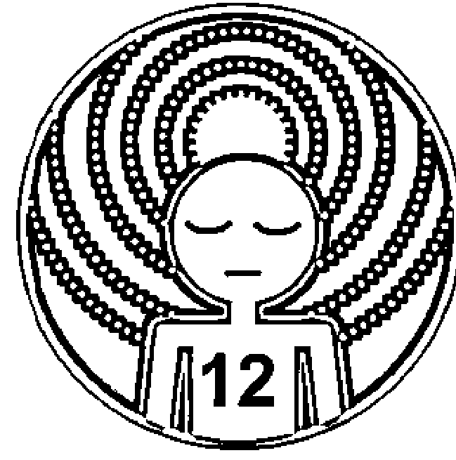

## 十二宮主星：福德星、因果星、休星、補星

12主星是我們療癒休息室的管理員，管理我們的靈性、福德、復原補償，提供夢想、因果、醫療、福報、罰則等所有讓我們可以得到了脫的事物，通常以療癒者、救贖者、靈性導師、冤親債主的姿態出現。我們人生中一切因果福德、夢想、身心靈發展、催眠暗示的總結，就藉由12主星發會作用。

## 十二宮主星飛宮

12主星飛的地方代表因果、冤親債主、醫生或病人去哪裡？人生中容易跟個人因果關連的層面，例如12主飛7宮，你的婚姻跟個人因果有關，在婚姻這一部份容易很宿命，不知道為什麼？另一半可能是來報恩的，也可能是來討債的。12主飛的地方也代表犧牲救贖是為了什麼？捨棄了脫的目的所在，人生中容易受福德影響的領域，例如12主飛2宮，你積陰德，累積福報的目的可能是為了得到現實中物欲的滿足，或是你的財運受到你的福德影響，常常莫名其妙就有錢，或是莫名其妙就錢不見了，這部分要取決於12主星本身的狀態好壞與吉凶。

- ①：犧牲救贖為了自己，因果福德影響人生，冤親債主到自己身邊。
- ②：犧牲救贖為了利益，因果福德影響財運，把福德當資產。
- ③：犧牲救贖為了親朋好友，因果福德影響交友、學習，冤親債主成為親友。
- ④：犧牲救贖為了家庭，因果福德影響田宅家運，冤親債主成為親人。
- ⑤：犧牲救贖為了熱愛，因果福德影響天賦、戀愛、子女，冤親債主成為熱愛。
- ⑥：犧牲救贖為了奴僕、任務，因果福德影響工作、健康，冤親債主成為奴主成為奴僕。
- ⑦：犧牲救贖為了他人、婚姻，因果福德影響婚姻，冤親債主成為伴侶、對手。
- ⑧：犧牲救贖為了貪、情慾、債務、執念，因果福德影響災厄風險，因果比較糾纏複雜，冤親債主比較負面，暗小人的徵象。
- ⑨：犧牲救贖為了學業、信仰，因果福德影響宗教、學業，與神、遠方有因果的象徵，冤親債主層次較高。
- ⑩：犧牲救贖為了地位成就，因果福德影響事業，冤親債主成為老版、長官。
- ⑪：犧牲救贖為了社會集體、理想，因果福德影響人際同盟，冤親債主在邊緣，與集體大眾有因果。
- ⑫：強調救贖、因果、夢、福德、靈性的重要性。

## 行星飛入十二宮

飛入12宮的星的力量會消散到無遠弗界，變得非常虛幻淡薄而無法控制，這樣的能力是要在無我放空或是想要救贖時才會出現，越是想發揮越發揮不出來。飛入12宮代表什麼事物跑到迷宮，容易成為因果、醫生、病人、冤親債主，例如金星入12宮，愛情如同迷宮一樣不清不楚，愛情關係容易製造因果，成為救贖關係。飛到12宮的星代表什麼層面事物容易空泛混亂，感到無力，失去意義，影響個人的因果福德，例如10主星飛12宮，個人的志向與事業就容易失去動機，感到無能為力，找不到往上爬的意義，但是如果為了救贖或是公益等無私的行為就可以發揮。

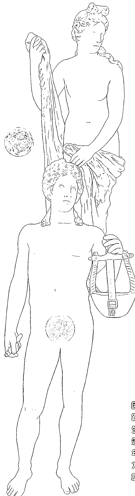

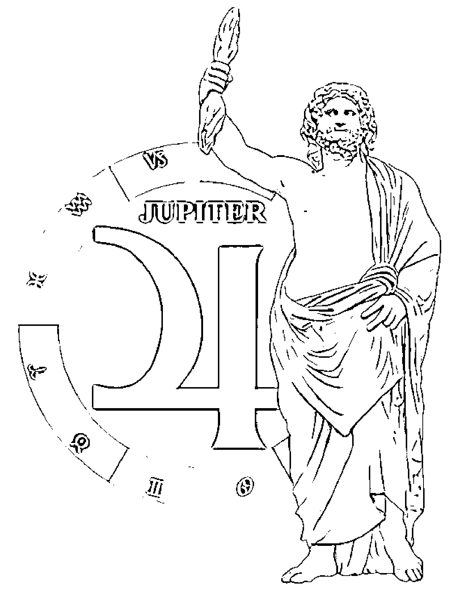

## 1-8 運勢盤的解法

Explanation of fortune

解讀運勢的目的就是要對事件的預測，何時會發生？因為行星的週期有重複性，因此我們可以預知行星何時會跟我們本命盤的行星產生影響，進而推測出什麼時候會發生事件。可以預知本命盤中代表的事件發生的應期。所以運勢盤的解讀是占星預測學中非常重要的一塊，經過幾千年的發展，這些古代的先知先覺們發現了各種預測未來的方法，透過這些不同的方法，我們都可以從中獲得未來的訊息，讓我們提前知道未來的可能走向。

## 運勢盤的解讀

## 命與運

解讀運勢時我們要先分清楚什麼是命？什麼是運？「命」是專屬於你個人的那個時間點，也就是你的本命盤所呈現的訊息。而「運」就是從那個時間點之後流動的所有時間點對個人命時間點的影響，簡單的說，運就是流動的命，運勢所看的都是流動的時間對於本命的那個時間凝結點作用後所代表的意義。

## 應期

解讀運勢的目的就是要對事件的預測，何時會發生？什麼時候可能會有什麼事件會出現。因為行星的週期有重複性，因此我們可以預知行星何時會跟我們本命盤的行星產生影響，進而推測出什麼時候會發生事件。也就是可以預知本命盤中代表的事件發生的應期。所以運勢盤的解讀是占星預測學中非常重要的一塊，經過幾千年的發展，這些古代的先知先覺們發現了各種預測未來的方法，透過這些不同的方法，我們都可以從中獲得未來的訊息，讓我們提前知道未來的可能走向，而能夠趨吉避凶。

## 運勢預測重要觀念，三合一推運

推運預測命運的重點，其實就是看星盤的密碼何時被引動，本命盤就是我們人生事件的密碼庫，流年星就是引動源，而大運是從本命盤延伸而來，也是本命密碼的延伸，是屬於動態的密碼，具有時效性。相對於本命的靜態密碼，大運的動態密碼也具有促進本命密碼的作用，而不管是本命還是大運的密碼，都需要透過流年來催動才容易引發出事件。因此我們在論斷運勢時要養成三合一推運模式，就是「本命—大運—流年」的三合一論斷，先從本命找出徵象基因，再用大運找出重點時間，再看流年有沒有來促發催動。

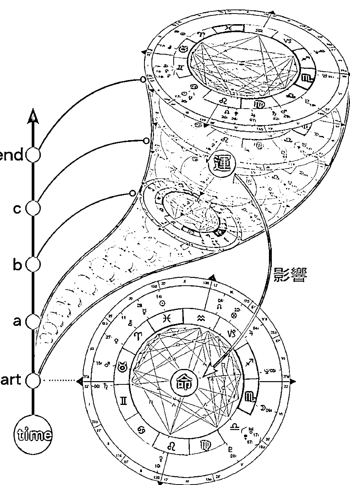

大運的方法很多，大體有兩大類，推運與期運。其中推運又可分出限運與向運，限運依照週期對應不同有很多種模式，基本上有主限法、次限法、三限法、月限法。向運依照參考推移速度的行星不同，常用的有太陽弧與月亮弧。期運法也大致可以分三種：一是以每顆星來掌管一定時期的星限法，還有以宮來劃分時期的小限法，以及用行星回歸週期來劃分的返照法，常用的有太陽返照與月亮返照。

這麼多的大運法都是用來看出人生大綱的，只是看的角度不同，抓的重點不同而已，就像瞎子摸象，有些是摸骨頭的，有些是摸表皮的，有些摸到頭，有些摸到腳，有些摸到身體，不管摸到什麼，都能夠讓大象的體態呈現出一部份，摸的越多，就能越明確的解析出大象的樣貌。

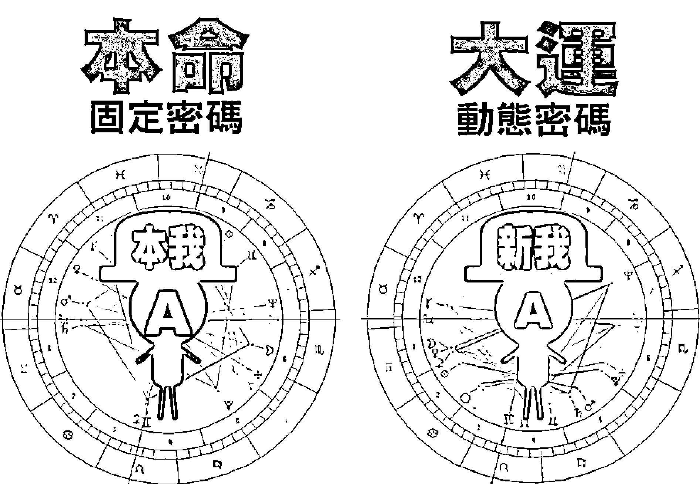

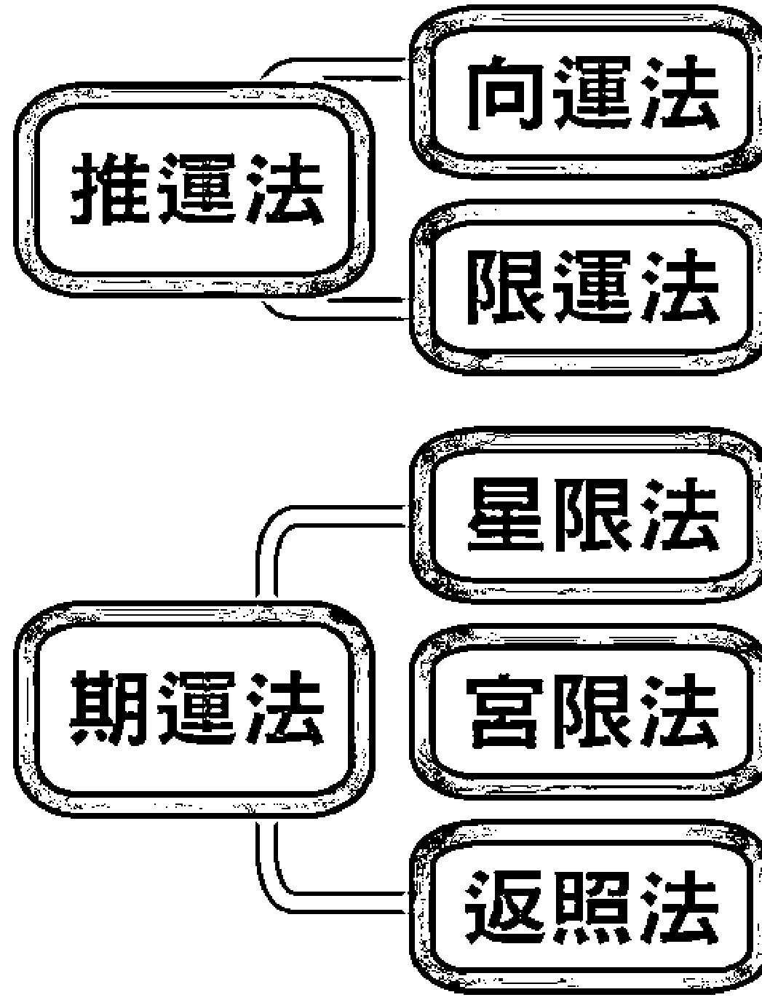

運勢密碼：

- 1. 本命（靜盤）：固定密碼，一輩子存在，只要有流年星引動，就可能發生事件。
- 2. 大運（動盤）：動態密碼，只有在特定時間出現，有時效性，在一定時間被引動就可能發生事件，動態密碼也會促進本命事件的發生。大運如同人生的章節目錄重點，宣告我們人生中重要事件的時機，不同的大運可能著重的重點不同，我們都可從中得到重要的人生訊息，大運系統主要有兩大類，推運系統與期運系統，比較重要的大運法有下：
    - a. 推運法：限運（主限、次限、三限、月限）、向運（太陽弧、月亮弧）
    - b. 期運法：星限（法達）、小限、反照（太陽返照、月亮返照）
- 3. 流運（天象）：啟動密碼，流年星作為開啟密碼的促發作用，是發生事件的重要條件，不論是本命盤的靜態密碼或是大運盤的動態密碼，都需要流年星才幫忙催動，才容易呈現出事件。

## 論命黃金律

> 『不論推運行星形成的相位是吉或凶，都必須將本命盤原有的性質帶進來』

本命盤是一切的主體本質，而大運則是這個本質的演變作用，大運本身具有時效性，會隨著時間流動而變化其型態，而這些作用的形態都是從本命盤的本質來的。因此一切的主體還是在本命，大運無法推翻本命的意義，例如一個本命桃花格局很爛的人，他就算走了一個很好的桃花運，但是他本質桃花格局爛這件事不會因為有好的桃花運就消失了，不會發生了，這是不可能的，就好像一顆主幹虛弱的樹，它很難生出厚實的枝芽。

## 大運心法

進入運勢論斷時，我們要把握一些重點，也要有一定的論斷順序與步驟，這樣才能夠比較清楚的解析出正確的訊息。

## A.星象、宮象、宮主象

在論斷任何事時，找尋代表該事件的徵象星是非常重要的，徵象星只要抓準，論斷就八九不離十了。例如要看財，就要先確認財的徵象是什麼？論財要看哪些地方，財宮、財星、幸運點、木星、金星都是跟財有關的徵象，要論財就等觀察這些重點。每一種事件的徵象都不會只有一個，大致上會有三個面向，第一是跟事件相關性的行星所構成的象，第二是跟事件相關的領域層面所構成的象，也就是宮位的象，第三則是由該宮主星所構成的象。每種事件都大致可以從這三個面向來找到要觀察的事件徵象。

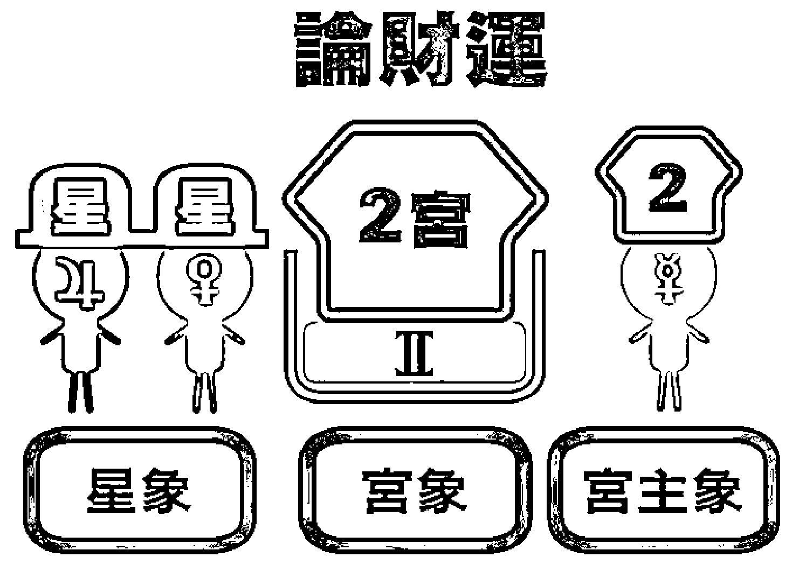

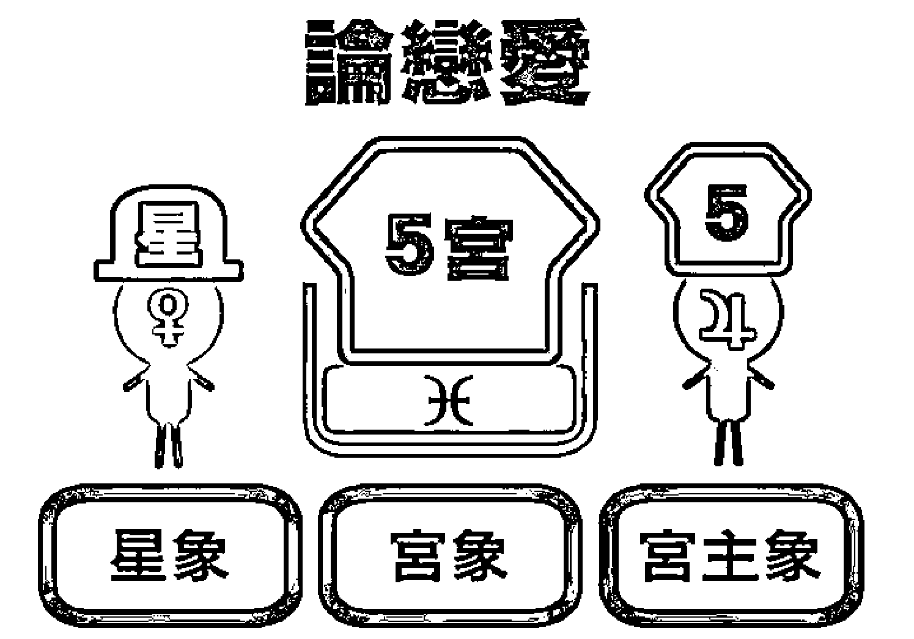

- 1.星象：行星自然徵象，例：看財，星象看金星跟木星。桃花看金星
- 2.宮象：宮位的後天人事象徵，例：看財，宮象看二宮，二宮內星。看桃花，宮象看五宮，五宮內星。
- 3.宮主象：後天人事的主宰者，例：看財，宮主象看二主星狀況。看桃花，宮主象看五主星狀態。

找到事件徵象條件後，我們要判斷運對事件的影響，有兩個觀察重點，一是運對宮的影響，二是運對星的影響。

## B.運星入宮

運星入宮會對宮位環境造成影響，運星將力量作用在宮位內，對宮的土壤產生改變，當運星入宮時，會因為宮內的行星狀態而有不同的影響作用。

- 1.空宮：當運星入的宮位中沒有星時，對於該宮事件的促發不會太強，運星會將能量累積在該宮內，造成環境狀況的變化，這時必須運星跟外面的宮主形成相位時，才會有機會催動該宮相關的事件。
- 2.宮內有星：當運星入宮時，宮內有行星在，事件引動的機率就會很高，當宮內星受運行星引動時，會使運星力量透過宮內星直接作用於環境，引發出該宮有關的事件。同時要注意宮內星是哪宮的主星，運星除了促發該宮事件外，宮內星主宰的宮位事件也會連動發生。
- 3.宮主星：注意宮主星的狀況，當運星入宮時，如果有跟宮主星形成相位，或者是運星入宮期間，該宮主星受到其他運星引動，那該宮事件也很有機會發生。

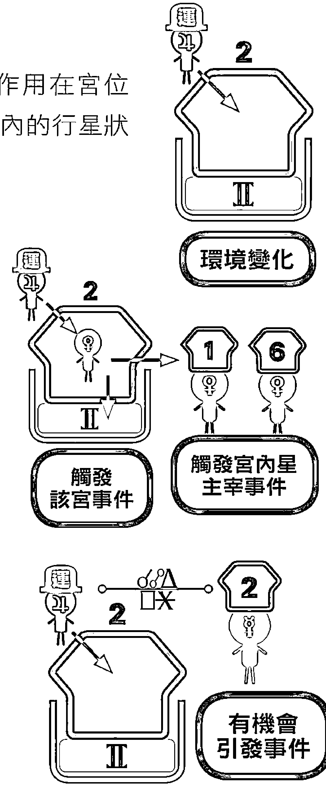

## C.運星VS本命行星（相位）

除了觀察運星入宮的狀態，在解運勢時，最重要的就是看運星對本星的相位引動，運星的力量作用必須要有本星當作媒介，才容易呈現出事件。在解運星對本星的影響時我們要注意幾個要點：

- 1.本命行星自然象徵：例如金星是自然桃花星，金星被運星引動，會引發愛情相關的事件。
- 2.本命行星落宮位置：如前例，若金星落3宮，金星在3宮被引動，會在交友、學習環境引發愛情相關事件。

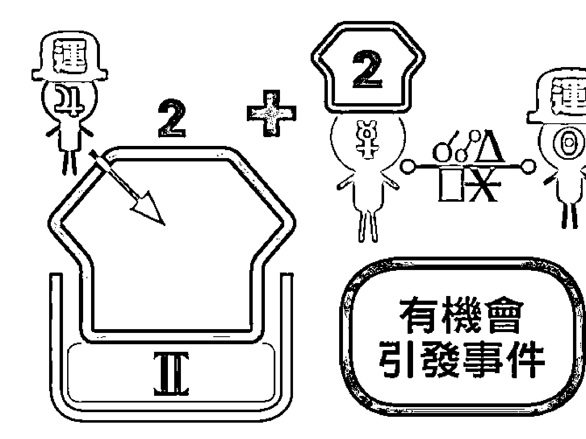

- 3.本命行星的後天象徵（宮主星）：接續前例，若金星是10主星，則這個愛情事件可能會關連到母親或是長輩，或是跟事業有關。
- 4.運星落宮：運星是引動來源，命星是受引動的事件徵象，接前例，運木在9宮對衝本金，那造成這個愛情事件的原因可能是老師、宗教信仰，或是一場旅遊。
- 5.運星的後天徵象（宮主星）：最後考慮運星的後天徵象，看引動源的相關事物，接前例，假設運木是5主，則可能促成這個愛情事件的來源可能跟一個活動或遊樂有關。

## D.主看運外行星，次看運內行星的引動

運外行星構成趨勢狀態，運內行星引動趨勢，尤其以火日為主要引動源。

## E.從事件找尋徵象

依照事件的特徵找尋相應的徵象宮與徵象星，例：要看財運，可以從財運的幾個徵象去觀察，2宮、2內星、2主星、金星、木星、幸運點、8宮……等跟財有相關的徵象，然後由這些徵象延伸出來的相位好壞、接吉接凶、後天宮主關係來判斷命主財富的本質基因密碼狀態。

## F.多重徵象判斷：三腳凳理論

三腳凳理論是判斷占星很重要的準則，通常一個徵象引動不一定會構成事件出現，要有同類的徵象共同引動才可能發生事件。

### 1.單純一個運星的引動不一定會成象：

光只靠一顆運星來引動，通常不易成象，只會造成一些效應而已。例如運木準合金星，那一陣子桃花很旺，很受喜愛，但是沒有發生什麼愛情事件。

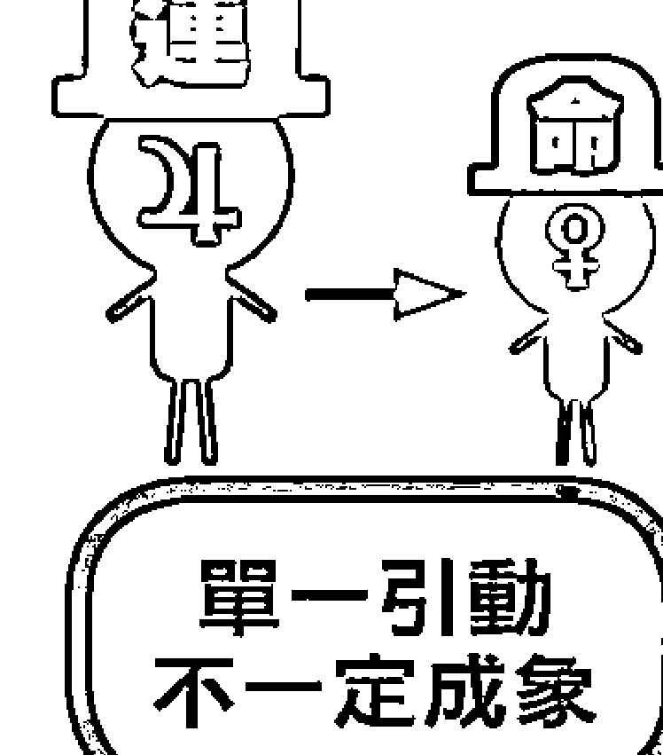

### 2.當同時有兩顆運星都引動A，成象的可能性大增：

同一星被外行星引動造成趨勢後，如果又有一顆內行星來引動，使趨勢促發實現，就容易造成事件成象，尤其是火星或太陽這樣的強星，引動力最高。例如運木合本金那年，運火四分本金那個月，就發生金星的事件了。可能被追求了，但是卻是喜歡男孩的好友。

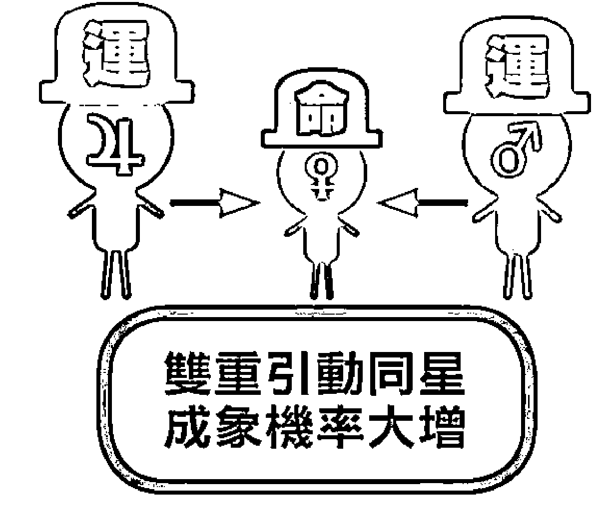

### 3.同類徵象被同時引動：

當某運星引動A，某運星引動B，而A與B具有共同事件徵象，會成為某事件的引動。例如同樣的運木合本金那年，某月份運火入5宮合7主，這兩個條件都跟愛情有關，因此發生了愛情事件。可能在一次派對聚會中很出風頭，被心儀對象注意到自己，主動過來要電話。

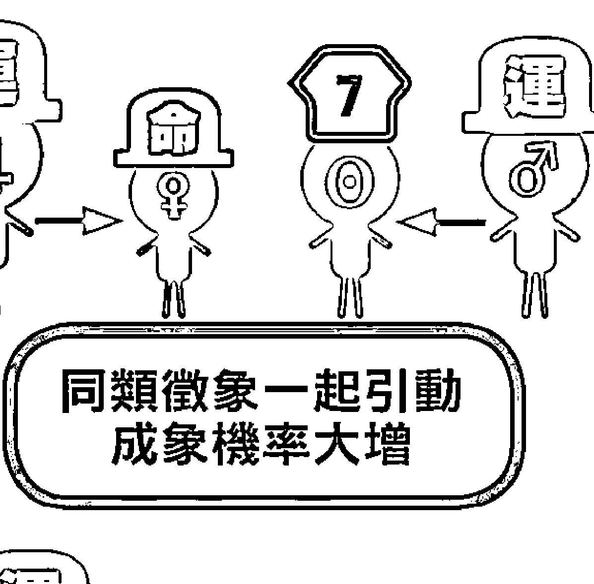

## G.一顆星被引動，整個相位或格局都引動

當星盤中行星構成相位或格局時，相位或格局中的任一星被引動，會間接牽動整個相位或是格局內的所有行星、宮位與後天徵象。例如命盤中有月金天的大三角，運木剋本月，卻發生愛情事件，因為運木引動月亮也牽動整個人月金天大三角。

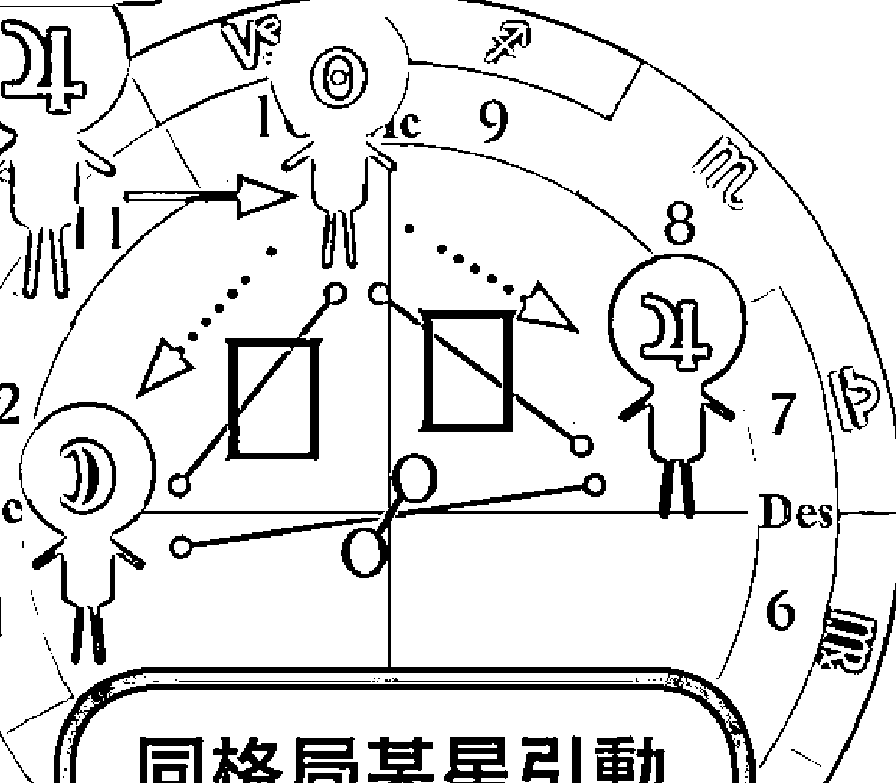

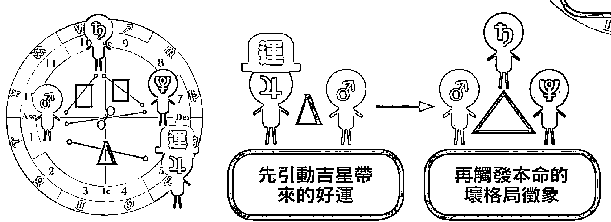

## H.不論運行星引動是吉還是凶，本命盤的吉凶徵象具有一定的份量

本命盤的結構會影響整個狀態，吉星吉相引動壞結構，事件雖吉但仍然會有壞的狀態發生，凶星凶相引動好結構，事件雖凶仍然會有好的狀態發生。例如本命盤有火土冥T三角，運木三合本火，雖然運木會引動火星徵象的好事，但是間接引動本命火土冥T三角的壞格局，所以可能是被選上國手資格，結果訓練時撞傷，造成腳扭傷了。

## I.注意運行星的後天徵象

運行星的後天徵象有時候也會帶來影響，例如運木合本金，運木是3主，所以造成這個桃花機會的可能是親友促成的。

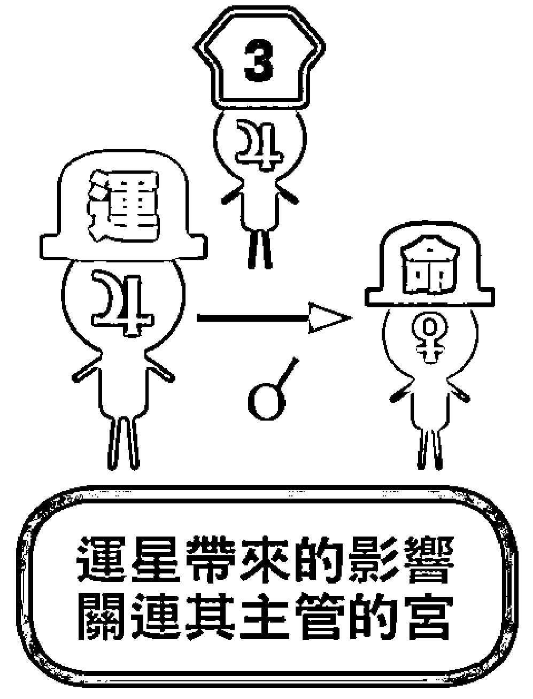

## J.運行星也可以套用本命盤的狀態，而有吉凶的變化

例：本命金星受剋嚴重，運行金星也會沾染這個受剋狀態。或是本命土星廟旺接吉星好格局，那這個人天性上可能比較沒那麼怕土星，連帶運土對他的壞影響也會減弱一些。

## K.行星的引動方式

行星的引動除了相位以外，還可以透過互容（定位）、映射、緯照、中點等方式。這其中相位的引動最明顯，容的引動狀態比較隱蔽一些，但也容易有作用，至於映、緯照、中點就比較不明顯。

## 流運法（Transit）：星動

我們在解運勢盤時，最簡單的方法就是看實際天上的行星移位，看天星如何觸發我們本命盤的基因密碼，來推斷何時會有什麼事發生，這種方法稱為流年過運法。因此最簡單的推運方是就是用流年星來對應本命盤的推運方式。

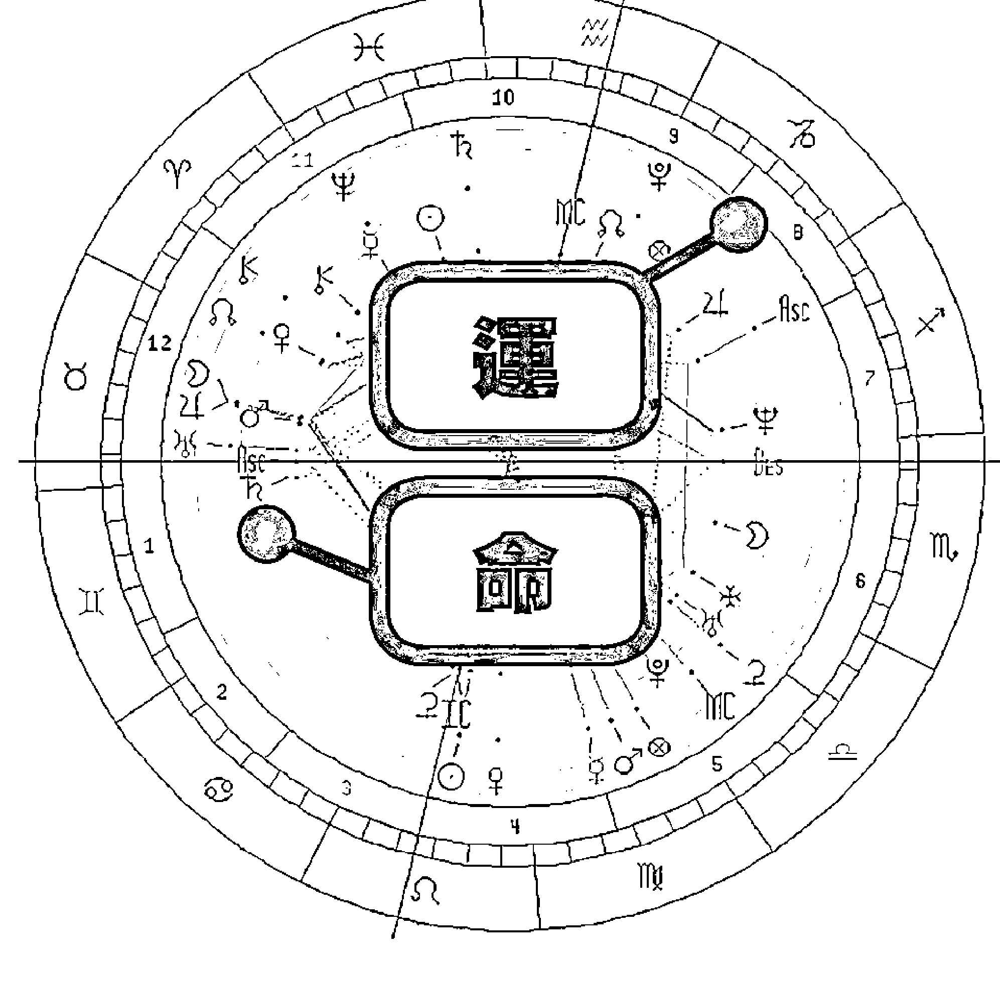

流年推運勢一切推運的基礎，透過每顆行星固定的週期循環，我們可以預測出每一此運行星引動命盤徵象的可能時間。每一個行星週期都代表一種能量作用的循環過程，流運行星會觸發本命盤或推運盤上所碰星點的潛能，而將捲藏在星盤中的事件徵象觸發出來。最基礎的推運就是看流年星對本命盤的影響：

本命（靜盤）：固定密碼
流運（天象）：啟動密碼

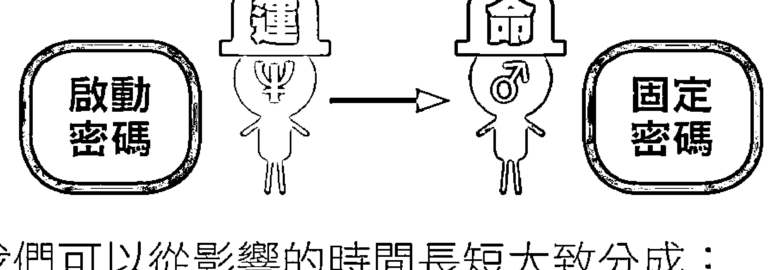

通過流年星週期的長短，我們可以從影響的時間長短大致分成：

- 1. 年運星：以木土為主，配合天海冥
- 2. 月運星：看日、火、金、水，主要以太陽為主題，火星、太陽為強勢引動源，金水是較弱的引動源。
- 3. 日運星：以月亮為主題，運月單獨的引動力不高，通常是配合日火水金，作為事件催動的藥引，是對事件產生感受，寫入記憶體的引發源。
- 4. 時運點：配合asc、mc等四角的放大作用，往往可以抓到哪一個時辰發生事件。

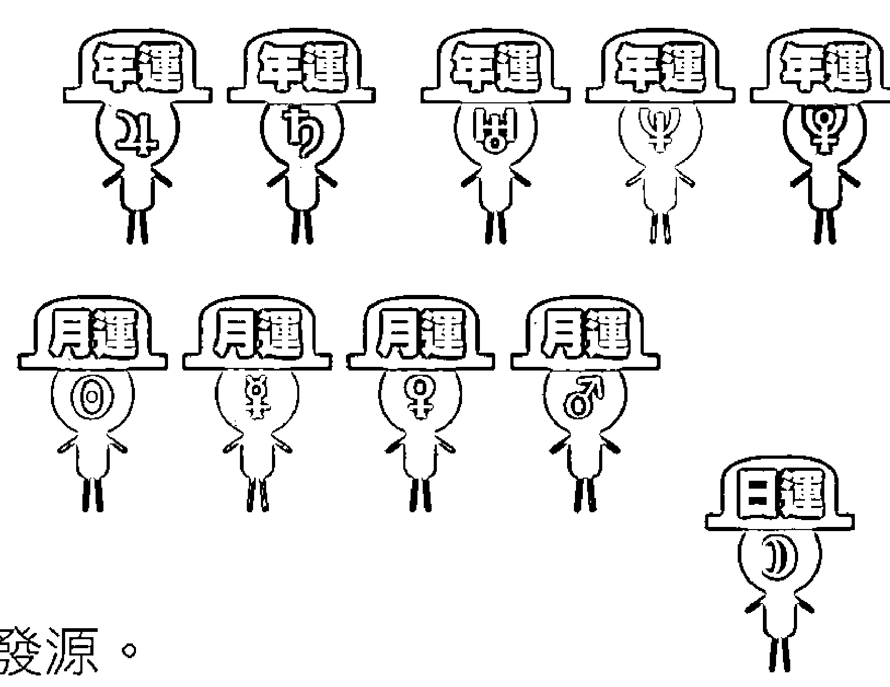

行星週期的長短對於引發事件大小會有重要的影響，週期越長的運星引發的事件越大，而且時效長久，週期越短的運星引發的事件越小，而且時效很短。也就是說像升官、結婚、失戀、生病、中樂透……這種重要的事件，不可能是單獨運月造成的，因為運月的引動是每個月都會發生一次的事件，你不可能每個月結婚一次。同樣的像跟家人口角、路上被狗咬一口、不小心掉了100塊……這一類小的事件，也不會是像運土、運冥這種長期效應的星引發的。因此在判斷上要清楚熟悉每顆星的週期長短，以及可能引發的事件大小。

當然，大部分的事件都不會是由單獨一顆星引發的，所有的事件都像是齒輪一樣，大齒輪扣中齒輪，中齒輪扣小齒輪，環環相扣的。發生的時間也往往不是在準相位時，準相位只是發生機率最高的時機，但經常不是發生事件的時候。長運的星

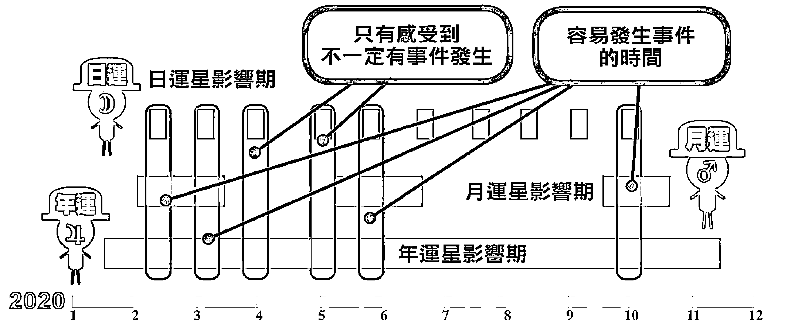

## 第一部 1-8 運勢盤的解法

會造成一種趨勢，影響比較深遠長久，但其引動性比較弱，往往需要短運的星來幫忙催動，短運的星引動性比較強，但是造成的事件影響有限而且短暫。如果依照事件大小來大致區分的話：

大事件：由年運星引動，月運星催動，日運星感受事件。

這種事件通常劇情持續較久，影響也比較大。例如被某人告白，發生戀愛事件，舉例：金星水瓶座，運木進水瓶開始這個事件的醞釀，可能會在太陽或金星進雙子與本金三合那個月，或是太陽金星入5宮那個月發生戀愛事件，然後在運月進7宮那幾天有明確感受，也許被告白了，或開始約會了。

中事件：沒有年運星參與，由月運星引動，日運星感受事件。

這種事件通常過程較短，大概一兩個月的影響而已。例如生了一場小病，舉例：本水巨蟹在六宮跟土星牡羊剋。運火入牡羊時會合土星引發這個水土剋，開始這個運，可能會在運月入6宮那幾天發病。

小事件：沒有年運星、月運星參與，只有日運星引動。

這種事件通常很短暫，大概一兩天的效應而已。例如走在路上一個分心擦撞到別人，被白了一眼。舉例：這可能是他本命盤有木星雙魚在11宮跟火星處女對衝，可能運月在雙子跟木火剋相，引動出這個木火衝的事件而已。

另外，對於本命星的影響，也要看本命星體的週期長短，來看出其對個人的影響與重要性。本命盤上越短期的星對個人的影響越重要，越長期的星對個人的影響越不重要。因此從本命的角度來看，運行速度越快的星越重要，但是從運的角度看，運行越慢的星影響越大。因此我們可以大致分類出四種狀況：

1. 運行長期星對本命短期星：例如運行木合相本命金，這通常是長期且重要的事件。
2. 運行短期星對本命短期星：例如運行火對衝本命金，這通常是短期但重要的事件。
3. 運行長期星對本命長期星：例如運天三合本命天王，這通常是長期的集體事件，對個人影響不大。
4. 運行短期星對本命長期星：例如運月合相本命冥王，這是短暫發生的集體事件，對個人影響微乎其微。

所以有些對占星略懂得人看到運行月亮剋他本命冥王（冥王沒有跟其他內行星有相位）在2宮，就緊張的說他會有破產的運。或是看到運行土星衝他7宮內的天王（天王沒有跟其他內行星有相位，也沒有靠近7宮頭）就論斷會有離婚運，只能對此一笑置之。

## Ex 流年法—案例1

## 中六合彩

這是一個中六合彩的案例，上圖為當事人本命盤，下圖為中獎當日的流年盤。首先我們要先判斷他的中獎結構。中獎通常跟5宮的天賜資源，太陽、木星的歡樂旺運，另外也常跟8宮的偏財關連。

1. 命宮內金星在上升點附近，金星跟5宮內的廟旺5主火星三合。
2. 木天在8宮，木星廟旺入8，這是容易突發橫財的徵象，而且木星還跟8主月亮三合，且受到月亮容納。月亮落在12宮福德宮，容易因為福報得到偏財。
3. 此外他的木日火月構成風箏格局。

再來看看該日流年星的引動狀態。

4. 先看大趨勢，運冥合相本金，醞釀本命金火三合的中獎結構。當年木星入雙魚與本命金星互容，中獎時，運木幾乎準合IC，放大幸運的影響。
5. 再看當月的狀態，當月份，運火入5宮引動本命火金三合結構。運日在雙魚合相運木，催發運木的吉利，帶著運木的吉利三合8宮中的本命木天-月三合的結構。
6. 最後看當日的運月狀態，中獎當日，運月在天秤對衝本命火星，六合本命金星，再一次催動本命金火三合的中獎結構。

## 流年法—案例2

## 感染到梅毒

這是感染到梅毒的案例，我們先來看本命盤的染病徵象，生病狀態先看6宮的狀態，跟病毒有關的現象也要參看8宮的徵象。

1. 6宮雙魚，疾病徵象容易跟感染、傳染有關。6宮內的太陽雙魚與6主木星剋相，這是他的染病結構。另外次要6主海王在3宮，這也是容易流通傳染的徵象。
2. 命主金星對衝冥王，金星也是8主，冥王準合命宮頭，這是中毒的結構。火星也跟金冥構成較為寬鬆的T型三角結構。

我們來看該日流年星的引動狀態。

3. 先看大狀態，運海在6宮與本海（次要6主）剋相。運冥土木會合在IC附近對衝本火，剋相金冥，醞釀金火冥的T型三角火毒徵象。
4. 再看當月狀態，運火合相本命海王，運金合相運海，剋相運火本海，催動傳染的結構。
5. 再來看當日狀態，前兩天運月入雙魚，合相了運海金，帶了這個火海金剋相的能量後在當日當時準合本命太陽，引動了6宮的日本剋相結構。

## 流年法一案例3

## 刮刮樂刮到10萬

這是一個刮中10萬的案例，這種中獎的徵象，通常會跟5宮、太陽或木星的徵象有關，我們先看他本命的中獎徵象。

1. 5主火星飛2宮摩羯廟旺，福點在雙魚，福點主星木星，太陽9主。火星與太陽、木星剋相，形成5主~9主~福主的樂透結構。
2. 8主月亮與金星、天王三合，金星廟旺，且金天水木日構成星群格局。
3. 2主土星與金星互容，且受到8主月亮容納。

我們來看該日流年星的引動狀態。

4. 大結構，運木入2宮合本火，同時運土、運冥剋相本命太陽、木星，運木土冥醞釀其本命的火日本樂透結構。另外運天也接近本命2主土星。
5. 再來看當月狀態，運火（火星為5主）合相ASC六合天秤座的那堆星群，運日合相本月，催動8主月亮容納2主土星的結構，該月運金入雙魚與本命木星互容。
6. 當日狀態，運月入雙魚引動運金互容本木的徵象，且運月六合2主土星，也催動了本命8主容納2主的偏財徵象。

## 推運系統：限運 & 向運

本命盤是出生當下瞬間的凝結，所以本命盤是不變的，是靜態的凍結狀態，因此本命盤上的訊息是永久不變，一直存在的。但是實際上命運是會流動的，本命盤也會隨著時間有些許的延伸與發展，就如同同一顆樹木一樣，本命盤是它的主幹，主幹不會動，但是主幹會延伸出枝幹，這些枝幹隨著時間推移，會成長，會長出新枝新葉，也會隨著時間凋落，這就是大運的概念，大運跟流年不同，大運是從本命延伸出來的，因此它是架構在本命盤上的，它不會凌駕本命盤的訊息，它是從本命盤的基因發展出來的，是動態的基因，會隨著時間的改變而發生，隨著時間改變而不見，因此大運的密碼是有時效性的。也許某幾年才會有這個徵象，只有在某幾年催動這個基因，才會發生事件，不在這幾年催動，就可能錯過。

本命盤代表的是最根本的主體，大運則是從這個主體延伸出來的枝幹、葉子、花苞、花蕊、果實，這些枝葉、花果就像是我們人生中不斷孕育成長中的事件，會隨著時間生長也會隨著時間而凋落，流年就像是外在的那些風、陽光、雨水，影響著這顆樹的成長，當契機成熟，一道風剛好吹過某個準備綻開的花苞，這時所有的趨勢都匯集，一個重要的人生事件就開花結果了。而這顆樹上有大大小小的花苞等待流年的風來催動，當季節過去，很多的花苞沒有遇到及時的風來催動，錯過了時機就只能凋落，無法讓事件開花結果。

大運透過本命盤延伸，因此以本命盤在出生後一段小的時間的流動變化來對應整個人生，這一類的大運法我們稱為限運法。類似天上一天，地上一年的概念，限運法基於小循環與大循環的對應，因此有好幾種限運模式，例如主限法，是以地球自轉一圈（一天）在黃道上走的度數（約1度）。用這個度數為基準，地球每日自轉這個度數的時間（約4分鐘）對應地球公轉一圈的時間（一年），依照這個方法，如果以一個人活了90歲來看，那就差不多是從出生當下經過6小時的星象變化，用這6小時的變化來看這個人一生的大概。同樣的，次限法則是以出生後一天對應一年，因此同樣以活了90歲來說，則相當於出生後90天的星象變化，來看透其一生。

限運法如同將一生濃縮為一小段時間，就像網路上很多什麼10分鐘看完40集劇情、3分鐘看完一部電影這一類的影片，把一個長期的劇情重點濃縮在幾分鐘內快速的講完，從一小段時間我們看到一生的重點。

限運盤中的行星都是按一定比例加速的。例如次限法一天對應一年，太陽一天差不多走一度，所以相當於太陽走一度的星象變化對應一年的大運趨勢，同樣的太陽一天走一度，而月亮一天走了12～13度，火星大概兩天才走一度，木星可能12天才走一度。也就是說，在限運法中，各行星的速度都是依照他們原本的速度以同比例濃縮的。

向運法則不同，向運法是脫胎自限運法而來。限運法每個星點有祂們自己的速度，而向運法則以某顆星的運行度數當作基準，將整張星盤中所有的星與點都依照這個度數一起運轉，例如太陽弧就是以太陽一天走一度對應一年，因此所有的行星跟點都跟著太陽的速度一起運轉，月亮也是一天一度，水星、金星……海王、冥王都是，連四角ASC、MC、DES、IC都是，就如同將整張盤拿起來轉一樣。太陽弧以太陽的速度為基準，月亮弧則以月亮的速度為基準。

1. 主限法：約4分鐘等於1年，主限法呈現的是人生中的重點事件，類似書本目錄中的大綱。
2. 次限法：一天一年，次限法的事件比主限法小一些，類似大綱中的章節。
3. 三限法：一天一月，比次限又更小的重點事件，類似書中的各章節裡的標題。
4. 月限法：一月一年，跟三限差不多等級。
5. 太陽弧推運法：跟次限差不多等級。
6. 月亮弧推運法：跟三限差不多等級。

## 限運法：Progression

限運法是以濃縮的時間作為運行星來對應本命行星。流年過運是真實環境的變化，而限運法則是一種從本命的基礎上再長出來的延伸脈絡，像是本命流動的內在心境變化。限運法的概念來自宇宙的碎型結構，一段小週期的變化可以對應、擴張成一段大週期的變化。

## 重要週期

對人類來說，有幾個週期是極其重要的，第一個是我們地球的自轉週期一天二十四小時，第二個週期是地球繞太陽的週期一年，第三個週期是月亮繞地球的週期約27天，透過對地球人最重要的三個週期相互對應與再延伸對應，可以組出非常多種限運模式。最常見的限運法有三種：

### a.主限法：約四分鐘（一天/一年）VS一年

基本上就是用地球自轉一圈在黃道上的度數（約1度），然後對應到地球自轉同樣的度數（約1度），將這個時間對應地球公轉一圈的方法，因此，地球自轉一度約4分鐘對應地球公轉一圈一年的時間。因此以一人活90歲來計算，大約出生後6小時內的天象，來對應一生的狀態。

### b.次限法：一天VS一年

以地球自轉一圈的時間一天來對應地球公轉一圈的時間一年，也就是一天等於一年的對應法，同樣以活90歲來說，大概出生後3個月的天象決定了一生的狀態。

### c.三限法：一天VS一月

以地球自轉一圈的時間一天來對應月球繞地球一圈的時間一月，也就是一天等於一月的對應法，同樣以活90歲來說，大概出生後3年的天象決定了一生的狀態。

### d.月限法：一月VS一年

以月球繞地球一圈的時間一月來對應地球公轉一圈的時間一年，也就是一月等於一年的對應法，同樣以活90歲來說，大概出生後7年多的天象決定了一生的狀態。

## 主限法：地動

主限法的重點在地球的轉動造成的四角變化，出生後東升點經過地球公轉一天的度數（約一度）代表出生後一年的變化。主限的變化主要是由地球轉動所形成，以約四分鐘代表一年，若某人活到90歲，代表出生後約360分鐘，大概六小時的星象變化就對應了這個人一生的運勢變化，這六小時的天象變化中，天星幾乎不動，除月亮會動個3、4度外，其他行星看起來幾乎不動，唯一會出現改變的只有地球自轉造成的變化，也就是上升點等四角軸點會有變化，因此在解主限法時，主要就在看四角軸點（ASC、MC、DES、IC）的變遷，或是可以延伸到另外八個宮位的宮頭點。從四軸點的變遷可以看到：

### A.主限四角VS本星（可延伸到12宮頭點）：

主限四角大概一年走一度，因此一生大概會走三個星座左右，透過四角轉動到本命星的位置，去放大該星代表的事件。我們可以抓出人生中的主要重點時機。例如主限MC在32歲合太陽，這可能代表那幾年會有地位榮耀、升官的機運。

### B.主限四角的換座：

除了四角對應本命星外，我們還要觀察四角換星座的時間，例如15歲時主限ASC從巨蟹座換位到獅子座，這時該命主可能會出現比較明顯的人生環境改變，或是人格特質從本來較為封閉內向轉得比較陽光外向。四角換位除了產生環境變化外，也因為換位造成限運主星的改變，以此例來說，命主0到15歲的限運主星跟命主星一樣都是月亮，15歲後限運主星就變成太陽了，這時除了要觀察他的命主月亮外，也要參考他的太陽。

## 次限法：星動

次限法就是以地球自轉一圈對應地球公轉一圈，以一天來對應一年。也就是以出生後一天的星象變化來代表個人一年的運勢變化。出生後三個月（代表推運約90年）是人生最重要的時期，因為這三個月決定了一生的基本走向。主限法的變化是由地動產生，因此重點在四角的變化。而次限、三限與月限的變化則在於天動一行星的移動。在考量次限法時，由於一生相當於只有幾個月的變化，因此，次限外行星基本不做考量，比較重視的是次限的內行星，太陽、火星、金星、水星，另外次限月亮是運轉最快的星，一個月就會走一度，因此，常常是事件顯化月份的觀察重點。至於次限木星與土星，一生中還是會走個幾度，因此常常是長期大運的觀察重點，是屬於可遇不可求，不是很容易發生的事件，例如次限木星合命主，這代表的是十多年以上的大好運。至於次限三王星，基本上一生動不到1度，因此，不做為判斷依據，這些跑得慢的外行星，只有在三限或月限時，才有參考價值。

### A.次限對本命

解次限盤時可以先觀察次限對本命的影響，有以下幾個觀察重點：

1. 次限四角VS本星（可延伸到12宮頭點）：次限四角可以作為本命盤徵象的放大器，當次限四角合到本命的行星時，就會突顯出該行星的徵象，使本命盤中的基因給活化，就像是將本命盤所蘊藏的事件給打開，喚醒該事件的基因。例如次限MC合相太陽，太陽被高昇出來，有關個人的榮耀與權力的事件被MC的活化，這經常是得獎或被頒發榮耀的事件徵象。
2. 次限行星VS本星：次限行星與本命星形成的相位，具有催化本命星事件的作用，讓本命事件開始運轉，並且醞釀出該事件的狀態，就好像幫本命盤的枝幹長出一個事件花苞一樣。例如次限金星對衝7主星，金星用戀愛或吸引力的方式讓婚姻事件醞釀出來，這經常是結婚運的徵象。
3. 次限行星VS本命四角（可延伸到12宮頭點）：次限星合到本命盤四角時，會使次限星代表的徵象意義被突顯出來，並呈現出該星所造成的環境影響，例如次限木星合IC，木星的機運效應突顯出人生的家庭重心，並且造成家庭運的有利影響，這樣的徵象往往與成家買房有關。

### B.次限本身的變化

除了次限對本命的影響，次限本身的變化也是觀察的要點，次限是本命的延伸發展，可以說是本命的動態化呈現，因此次限的演變也會在人生不同時期呈現出特殊的風貌。

1. 次限四角的換座：次限四角的換座常常是人生出現較大變化的時候，這代表本命在不斷成長過程出現的蛻變，例如上升巨蟹13度的人可能會在17歲左右次限上升換位到獅子，這將使得他的本性出現較大的修正，可能從比較內縮封閉的本性變的開朗一些。
2. 次限命宮的換座，會造成次限大運宮主星的變化：而當次限上升換座時，也會連帶的造成主星的煥然一新，同上例，本來2主為太陽，換位後變成水星，因此，在這個新的時期，命盤主在財物的運用上就會增加理性一些。這個修正作用是有時效性的，當次限再次換位時，這時就會換下一次的新宮主來修正本命宮主。
3. 次限行星的換座：同樣的，當次限行星換座時，會使行星的星性發生變化，例如原本金星在雙子的人，次限金星跑到巨蟹後，他的愛情狀態就會變的稍微內斂封閉一些，同時金星本來主管的宮位事件也會有些許修正，例如金星本是3主星，他可能會開始對文學性的知識有一些興趣。
4. 次限行星形成相位：次限自己行星形成相位，這代表由本命延伸出來的時效性事件，本命盤因為是靜盤，其相位徵象是永久性的，而次限星之間的相位，則是後來衍生出來的事件徵象，但是這個徵象是短暫出現的，一旦相位開始遠離，就不會有效應出現。例如本命有金木合相2宮的人，是一生都財運豐沛的徵象，只要流年來催動，就會有財運。但是次限金木合相2宮的人，這個財運豐沛的徵象大概只有短短幾年，如果這幾年內沒有等到強的流年星來催動，等到次限金星開始遠離次限木星，就算有流年星來催動，也沒有效用了。
5. 次限行星與次限四角會合：次限與次限四角的會合，代表次限行星象徵事件的凸顯，同樣也是有時效性的。

### C.次限對本命的徵象要配合流年星引動來判斷

次限將本命的靜態密碼流動出來，幫忙將本命的枝幹延伸出新的枝芽，並結成花苞（事件徵象），這些推運所構成的命運事件徵象，需要流年的春風來催動，才能使花苞開花結果，才容易成象。

### D.綜合：次限對本命+流年對本命來共同判斷

先從次限對本命來看出人生的要點，再看流年有沒有來幫忙催動這些要點，例如看婚姻，先看次限對本命找出婚姻運的徵象點，假設我們找到某人2022年次限DES會合7主水星，那這個婚姻運的趨勢大概會有個兩三年，接著我們再看流年狀態，我們找到2021年7月運木合相7宮內的月亮，同時金星也即將在8月份會和7主水星，那2021年的7、8月前後，就很可能是結婚的時機點。

### E.最後可以注意流年引動次限的徵象

次限的徵象是有時效性的，只會是暫時性的事件，通常只是作為本命盤事件的附帶徵象而已，因此流年引動次限的徵象通常不會是主要事件，最後留意就行。

## 向運法：星動

向運法最常見的就是太陽弧與月亮弧推運法，向運法脫胎自限運法，與限運法不同的地方是限運法的行星速度是相對比例的增減，每顆星按照本來的速度運行，而向運法則是以某重要星體或點的移位為基礎（基本上只看太陽或月亮，因為這兩顆星不會逆行，速度是穩定的），然後所有的行星跟重要點都跟著這顆行星的速度一起移位。因此行星之間的相對位置完全不變，這樣的移位就如同將整張星盤拿來轉。以太陽弧為例，整張星盤中的所有星點都跟著太陽的速度一起跑，因為太陽大約一年走一度，因此，所有的星點也都一樣一年走一度，所以太陽弧只要看星盤中任兩個星點相差幾度，就可以大致推論幾歲會發生什麼事。例如本命盤中金星與DES相差16度，那就可以知道大概16歲時會發生太陽弧金星與DES會和的徵象，我們就可以大致推論命盤主16歲時可能會發生重要的戀愛事件。

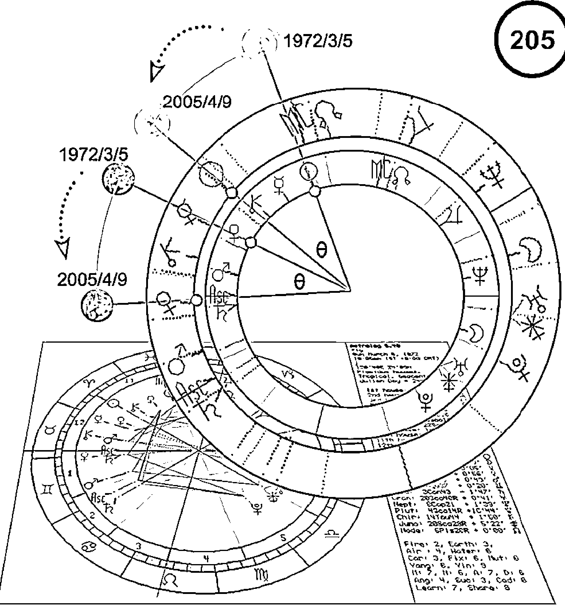

## 太陽弧

1. 引動來源：

原則上太陽弧之行星為向運中產生吉凶的原因，可由行星之性質與主宰後天吉凶宮，來推論造成運勢事件的特性與人事。向運法的弧星是運勢中的引動源。

2. 影響事件：

被弧星所影響的本命盤之敏感點與行星，是被影響者，引動吉凶的徵象，可由被影響者之特性、落宮、後天主宰來推斷被引動的事件。

3. 吉凶論斷：

向運吉凶應思考行星本身的吉凶、相位、後天吉凶、廟旺弱陷，弧星吉凶決定事件發生狀態的好壞，被引動的本命星結構吉凶狀態則是引發出來的事件狀態。例如弧星木星引動本命2主，本命2主星與火土相剋，事件的造成是好的，帶來很豐沛的財運，但是後果可能是凶的，引發財務糾紛。

4. 向運影響：

當同時有兩個向運影響，一個吉、一個凶，它們不會直接抵銷，而是兩個事件都會發生。

5. 注意向運四角，其意義常可作為出生時間的校正依據

向運的四角經常是重要事件的觸發來源，因此人生中的大事往往與向運四角的指向有關，例如太陽弧DES指向木星，往往是結婚的徵象。因此，當出生時間不確定時，可以透過人生中發生的大事件，看向運中有沒有行星被四角指向，因為1度4分鐘，因此如果發現結婚那年，太陽弧DES離木星3度，那就可以往前或往後調整本命盤12分鐘，讓太陽弧DES對準木星，用這種方式調整好後，再用其他事件來確認，如果好幾個事件都吻合，那大概就是正確時間，如果不對，就要再找其他事件來校對。

### A. 成相：只看合相跟凶相，0、180、90、45、135，容許度一度（吉相位亦可參考用）

太陽弧的成象主要以硬相位為主，主看合相、對衝、四分相，因為硬相位對事件的產生會比較有感受性，實際上吉相位也可以參考用，只是事件的發生狀態比較和緩，較不易有感受而已。如圖假設太陽弧月亮在最高的位置，那本命太陽在圖中8個位置都算成相。就統一記成Arc月亮＝太陽

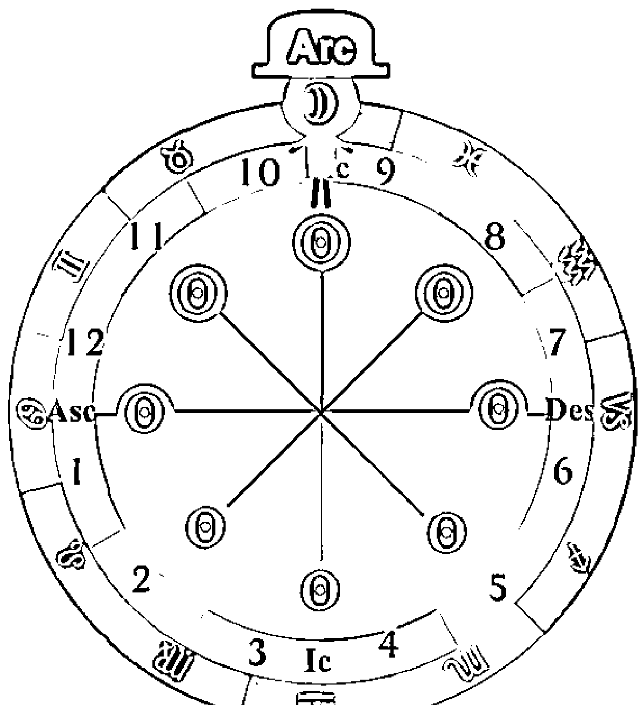

### B. 影響期：前1Y，後6M

太陽弧的影響期大致以準合時間為基準，往前推1年，往後推6個月，因為入相位代表事情在準備發生，效應較強。出相位代表事情發生的後續影響，效應較弱。但是實際上產生的影響不需要這麼硬性，大概是前後1～2年內都是在影響期中。

### C. 主要因子：十主星+ASC+MC+南北交

太陽弧主要看星盤中的十顆主星、四角軸與南北交軸之間的相對關係，因此就是13個星點之間產生的效應，所以是78種事件組合。

### D. 太陽弧星對本命

太陽弧的論斷基本上不太看相位好壞，只論斷形成關係的兩顆星之間的組合徵象，也就是弧星對本星所構成的事件徵象，弧星是引動源，本星是被引動的事件，如果兩者皆吉，則事件多為好事，這者皆凶，則事件多為壞事，若一吉一凶，則弧星的吉凶比較影響事件好壞。

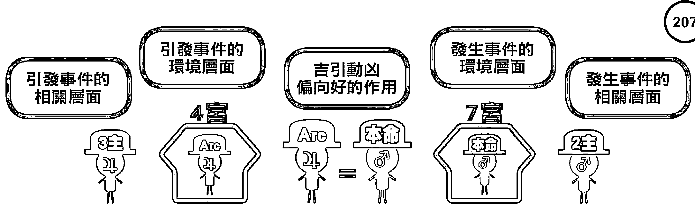

1. 本命星落宮（被引動的事件場景）：
先從本命星所在的宮位來推測發生的事件場景徵象，是與人生中那個領域層面關連的事件，例如被引動的是本命火星在7宮，那很可能是跟婚姻、合作、契約有關的衝突事件。

2. 本命星的吉凶性、自然徵象與守護關係：
再來看本命星的徵象，延續上例，火星本身通常是糾紛衝突的徵象，如果火星是2主，那這件事會跟財物金錢相關。

3. ARC星的吉凶性、自然徵象與守護關係：
從本命星確定事件徵象，再從太陽弧星的吉凶來判斷事件的好壞，並且從其來源判斷造成事件的原因，與什麼相關。例如太陽弧木星引動7宮火星，木星為吉星，所以基本是好事，但是火星是凶星，可能一個好的機會促成了匆促的結婚決定。

4. ARC星落入的宮位（造成影響的事件來源）：
在看太陽弧星來自哪裡，例如太陽弧木星是從4宮來引動，這可能是因為內部、家人的因素而促成了這一段關係的發展。假設木星是3主，那這個內部因素可能是來自於手足。

### E. 綜合：太陽弧對本命+流年對本命的徵象組合
跟次限法一樣，透過太陽弧對本命找出命運徵象的重點，再看流年有沒有來幫忙催動事件的發生。

## 大運綜合判斷順序

整體來說，本命—大運—流年要整合來判斷，基本上本命盤最為重要，先看本命盤的結構狀態，例如要看婚姻就要先抓出本命盤中的婚姻徵象與結構。初學者論斷運勢時，可以先不要看大運，先從流年對本命來論斷就好，先習慣流年引動本命徵象的判斷，對每一個流年星的影響有一定體會後，再將大運系統加進來。

當你已經對流年推運有一定經驗後，就要學會整合本命、大運與流年來一起論斷，同樣的本命盤的徵象要先掌握好，然後用大運來快速抓出重點時間，最後用流年來看是否有催動。大運要用次限法還是太陽弧呢？基本上先取一套來用就行，用習慣後，可以兩套並用來看，增加驗證的準確性。

1. 本命→2. 流年對本命→3. 次限（太陽弧）→4. 次限對本命→5. 太陽弧對本命
參考用：流年對次限（太陽弧）

## 大運星點引動的作用：

大運星點通常作為引動源或是凸顯事件的作用，因此通常會呈現出力量的影響特徵，大運星點本身是造成事件的引發來源，依其星點的特徵會呈現出對事件作用的狀態，基本上如下：

- 上升：驅動、啟動、本質化、主要化、前進、重要決定
- 中天：高掛、受期望、奠定地位、成就、晉升、登基、目標化
- 下降：關係化、婚緣、合作、結合、調整、選擇
- 底天：情緣化、回溯（根）、沈潛、奠基、家庭化、歸屬
- 太陽：歡樂、彰顯、照亮、得權、高貴、重要化、集中
- 月亮：富足、保護、封閉、軟化、有情、生根、敏感
- 水星：轉換、分支、催化、流通、理解、串連
- 金星：和諧、有利、美化、喜悅、吸引、桃花、享受
- 火星：衝突、意外、鬥爭、對抗、決斷（裂）、災禍、激化
- 木星：幸運、提升、進化、擴張、移動、跨越、保佑
- 土星：不幸、壓抑、制約、阻礙、承擔責任、建設、停止、枯竭
- 天王：突變、分離、改革、顛覆、排斥（舊）、驚異、反叛
- 海王：虛弱、無力、幻象、混亂、迷惘、欺騙、救贖、歸零、迴圈
- 冥王：執著、糾纏、貪婪、腐敗、負面暗化、罪惡、埋藏、風險、毀滅重生
- 北交：未來宿命、心靈進化、未來牽引、潛能開發
- 南交：過去宿命、心靈回溯、前世遺留、習性制約

## 本命星點激引動關連的徵象意義：

被引動的本命星是主要的事件徵象，例如說金星被火星引動會衝動的引發桃花、愛情或婚姻有關事件，反之，如果是金星去引動火星，那會發生的就是火星事件，金星則是造成緩和或是美化的影響，可能是緩和了一場糾紛，或是一個有利益的鬥爭事件。

- 上升：自身、本質、命運、決定
- 中天：母親、事業、地位、成就
- 下降：婚姻、配偶、合作、對手
- 底天：父親、家庭、祖先、土地
- 太陽：權力、名聲、形象、得獎、父親
- 月亮：情緣、地盤、庫、根源、母親
- 水星：文書、交友、交通、學業
- 金星：桃花、人緣、愛戀、利益、喜事
- 火星：性、鬥爭、災禍、欲求、血光
- 木星：機運、教育、宗教、遷移
- 土星：責任、地位、難關、野心、麻煩、苦痛
- 天王：變數、徵兆、驚奇、變局
- 海王：因果、幻境、迷夢、迴圈
- 冥王：慾、執念、陰影、禁忌、風險
- 北交：未來宿命
- 南交：過去宿命

## 第一部 1-8 運勢盤的解法

### Ex 次限法—案例1

女命，2011結婚、買屋，2013年生女，2014生子。

這是某女的結婚、買房、生小孩的次限盤，我們先看本命徵象。結婚徵象看7宮、7主木星，買房徵象看IC、4宮、4主水星。子女徵象看5宮、5主金星、女命月亮，我們來看次限盤呈現的徵象。

1. 次限木星在這幾年準合IC，次限木星的運通常都非常的久，案主在這幾年陸續完成了人生中成家的所有大事，結婚、買房、生女、生子，都在這個運中完成。
2. 2011年，次限金星準合本命水星（4主）、木星（7主）。在這一年買房並且結婚。
3. 2013年，次限火星引動本命金星（5主）跟月亮，這一年生了女兒。
4. 隔年，還在這個運中，次限火星還在這個月金生子結構中，另外，次限太陽也準合IC，合相次限木星（木星是5-3主星，第二個小孩可以用轉宮法以小孩的手足，5-3也就是7宮來看），這一年生了兒子。

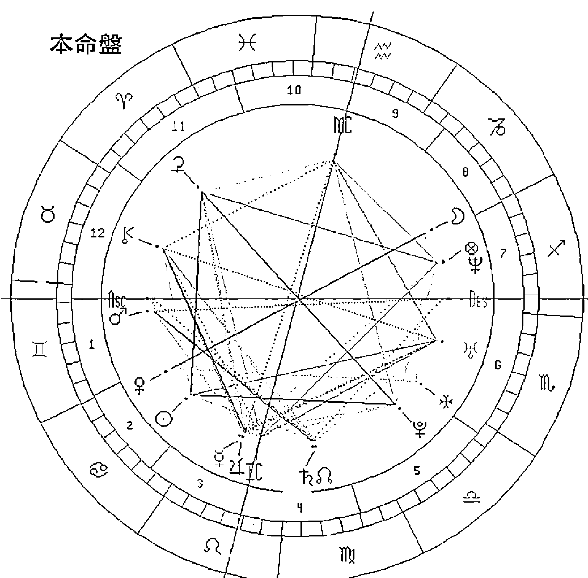

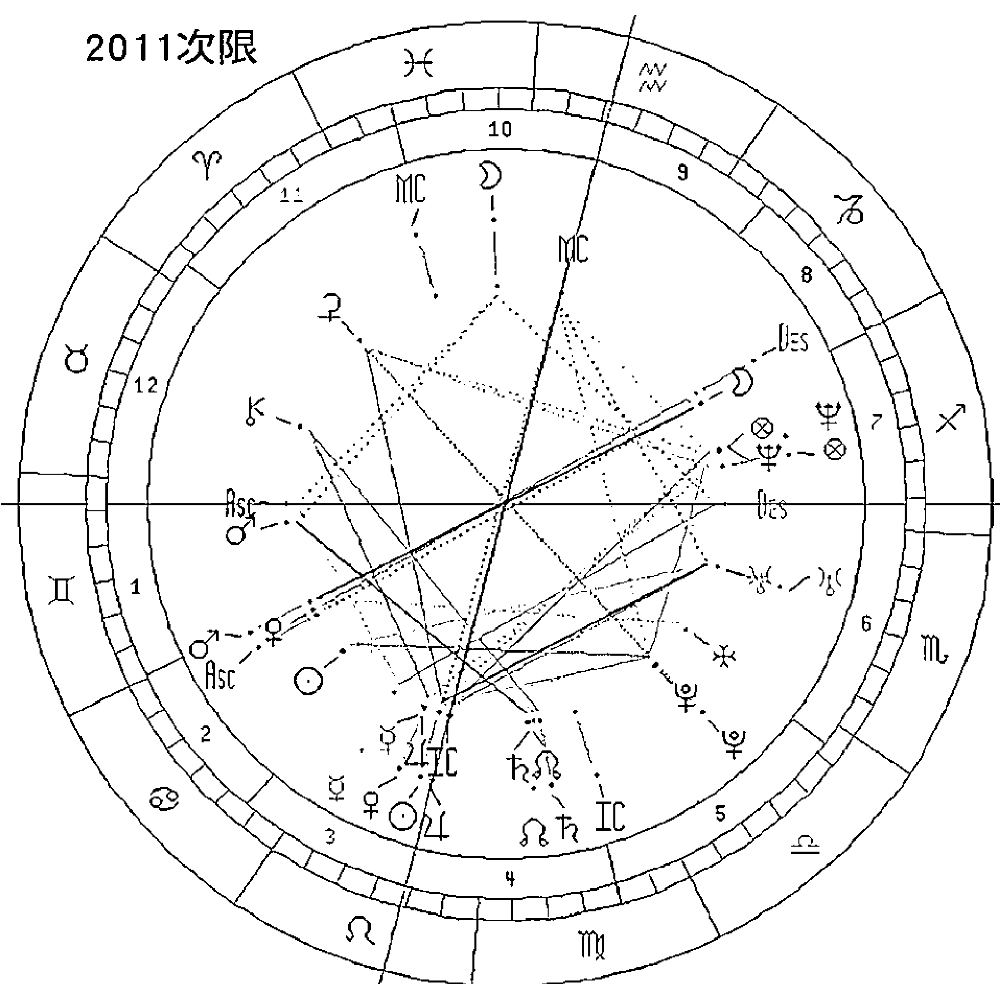

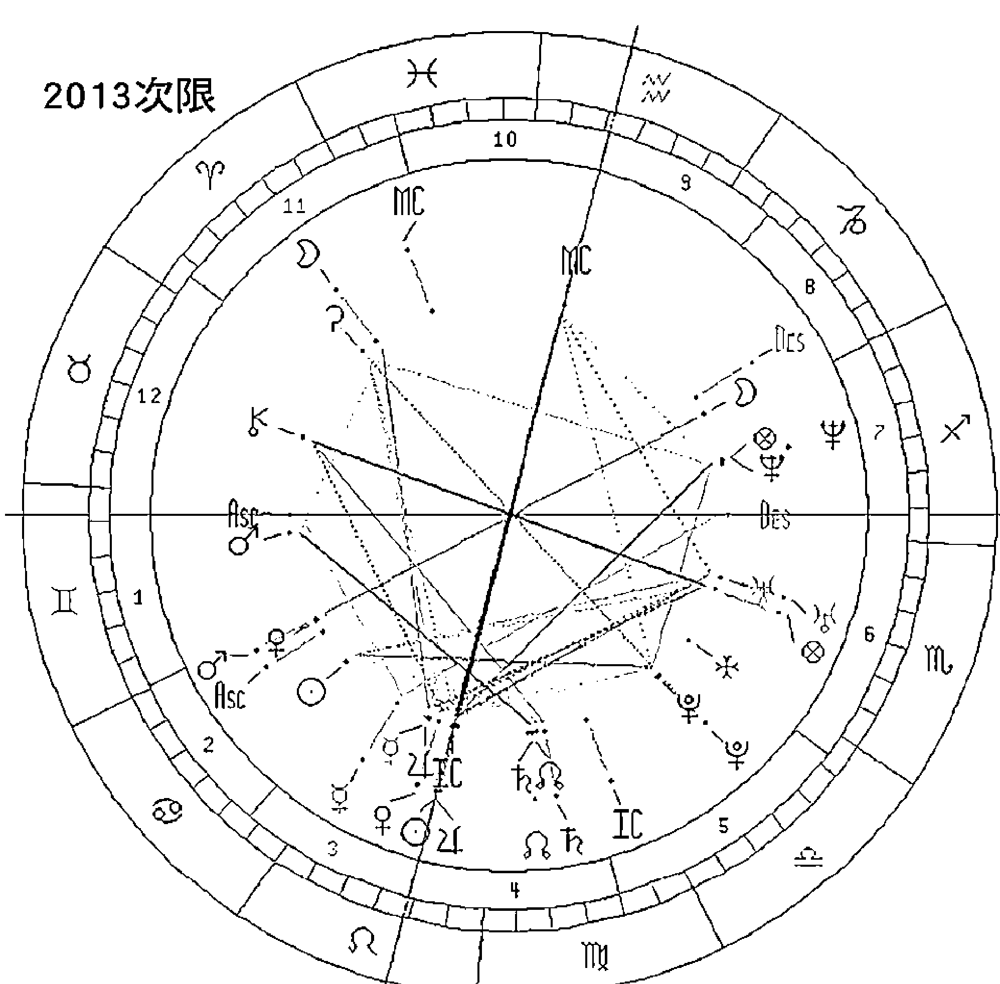

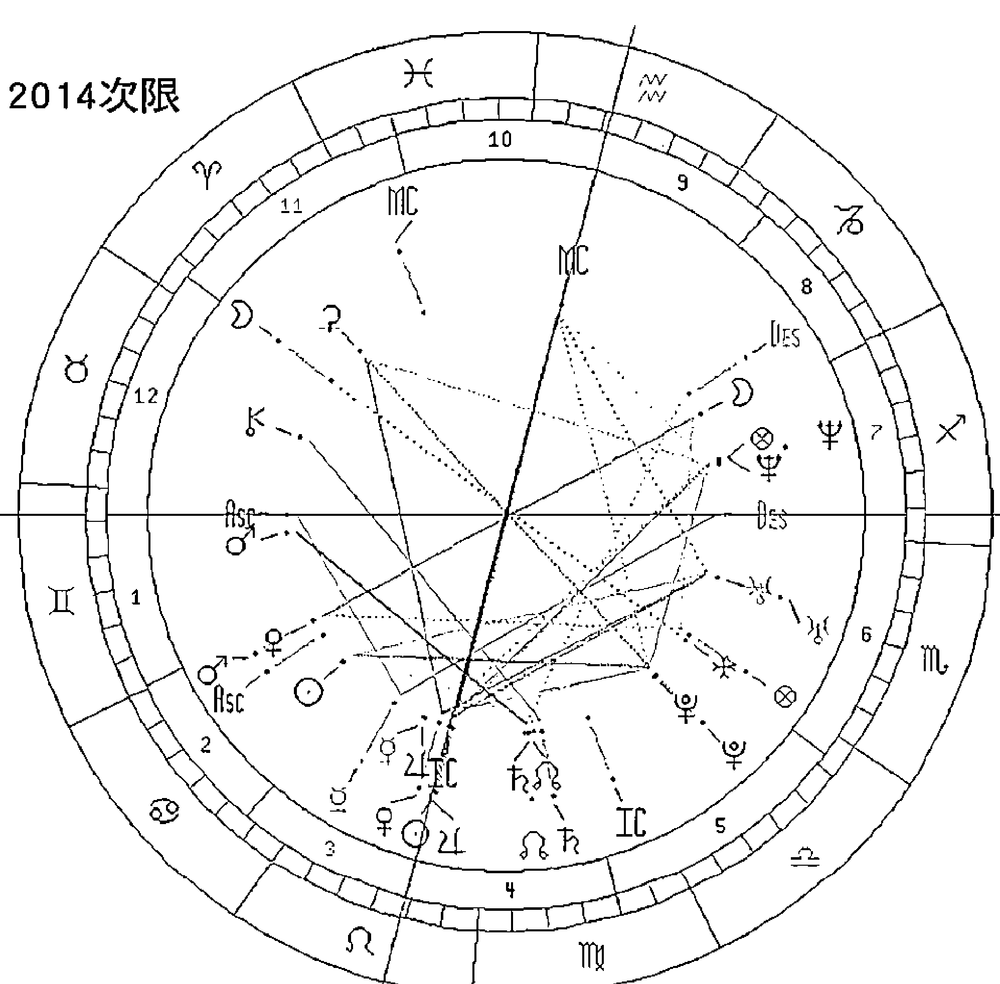

### Ex 次限法—案例2

女命，2007結婚，2014年生女，2017再生一女。

這是某女結婚、生小孩的次限盤，我們先看本命徵象。他的婚姻徵象為7主火星，另外先天婚姻徵象金星，金星跟月、海有結構。子女徵象為5主水星，5宮內的木土火，還有先天懷孕徵象月亮。

1. 2007年的次限盤次限太陽合IC，有成家之象，這幾年DES也一直在引金月海結構。同年，次限金星合福點，並跟本命火星（7主）4分相，引動婚姻徵象，結婚該月份，次限月亮也剛好準合本命月金。
2. 2014年，次限火星四分本命水星（5主）引動子女星，而且也跟本命月金三合，更強化生子的徵象，生產該月，次限月亮準合IC在子女宮，看其子女環境，5宮處女陰性，5主飛巨蟹也是陰性，生女機率較高。
3. 2017年，還在這個次限火星的引動結構中，另外次限水星（5主）準合IC，生產該月，次限月亮也進入次限火星的引動結構，這一年再生一個女兒。

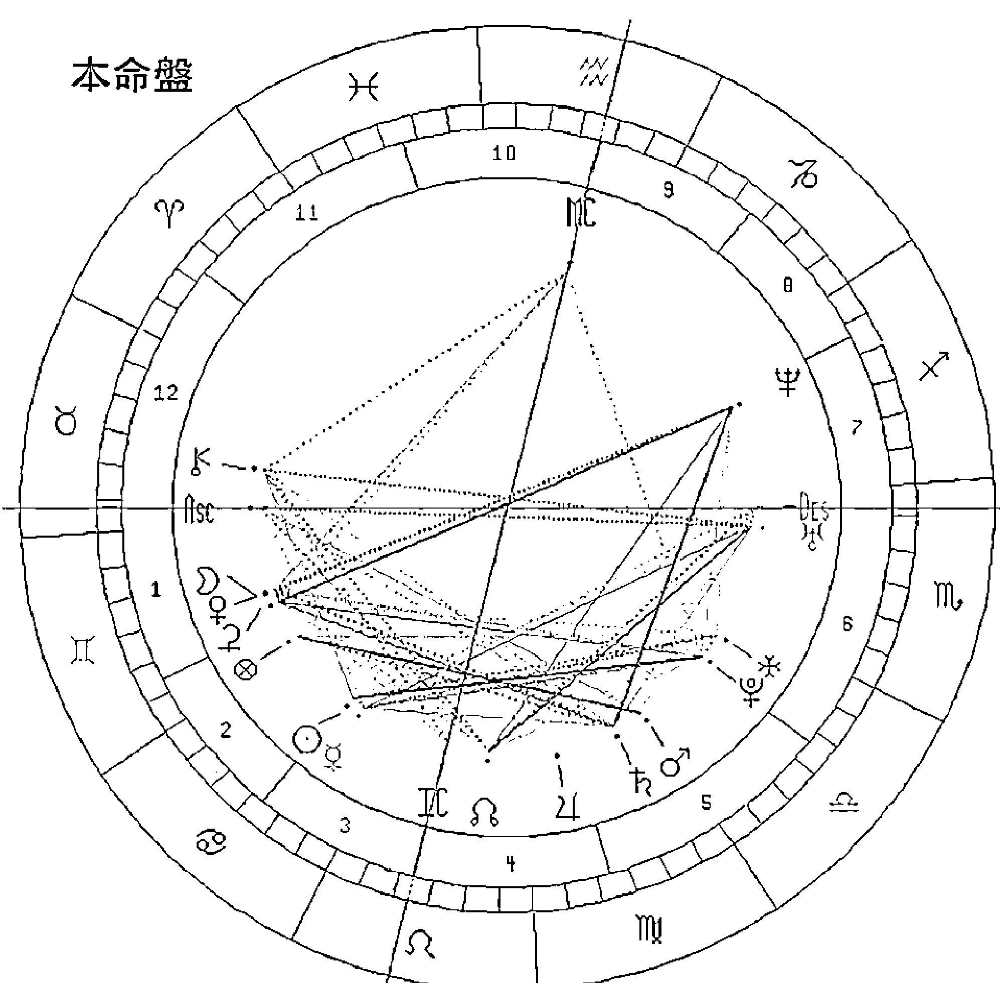

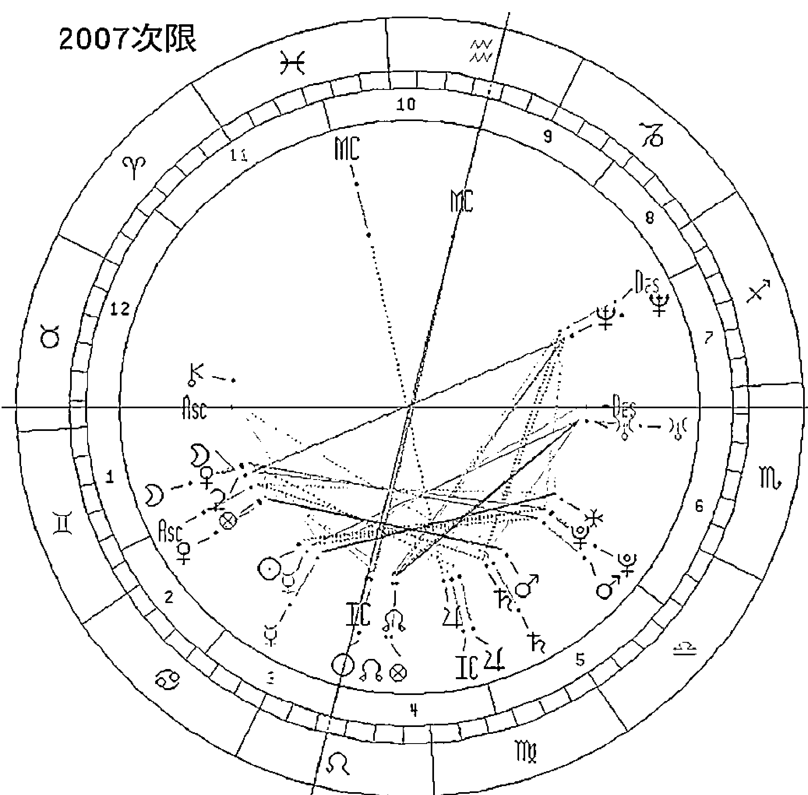

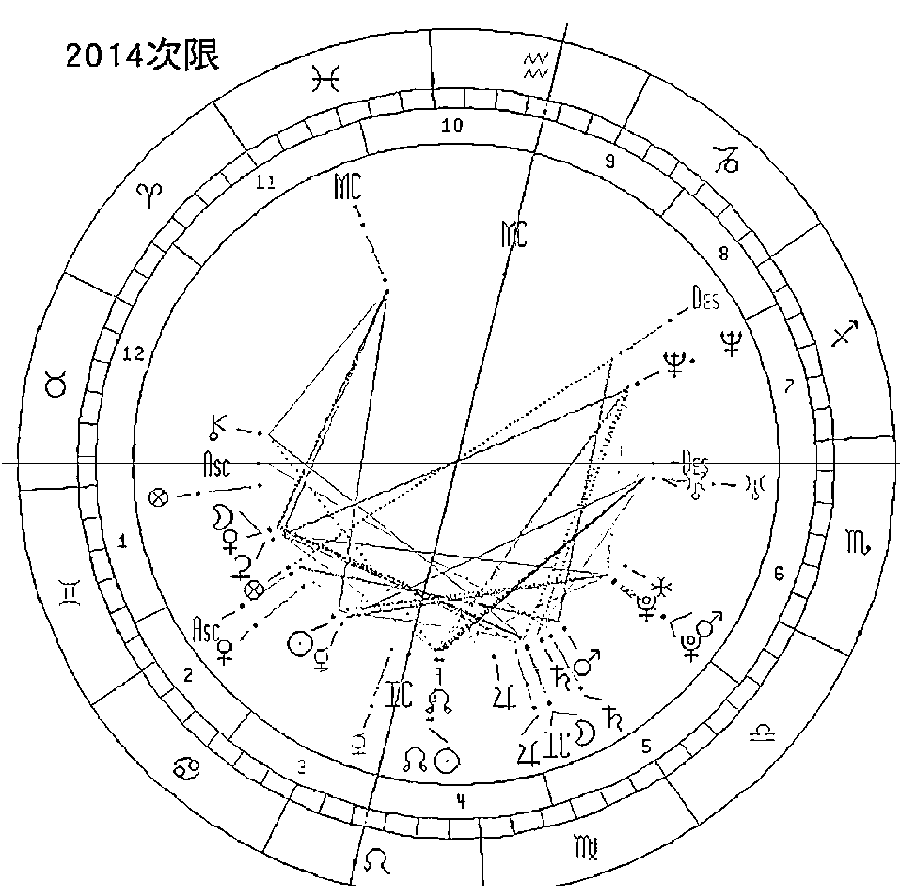

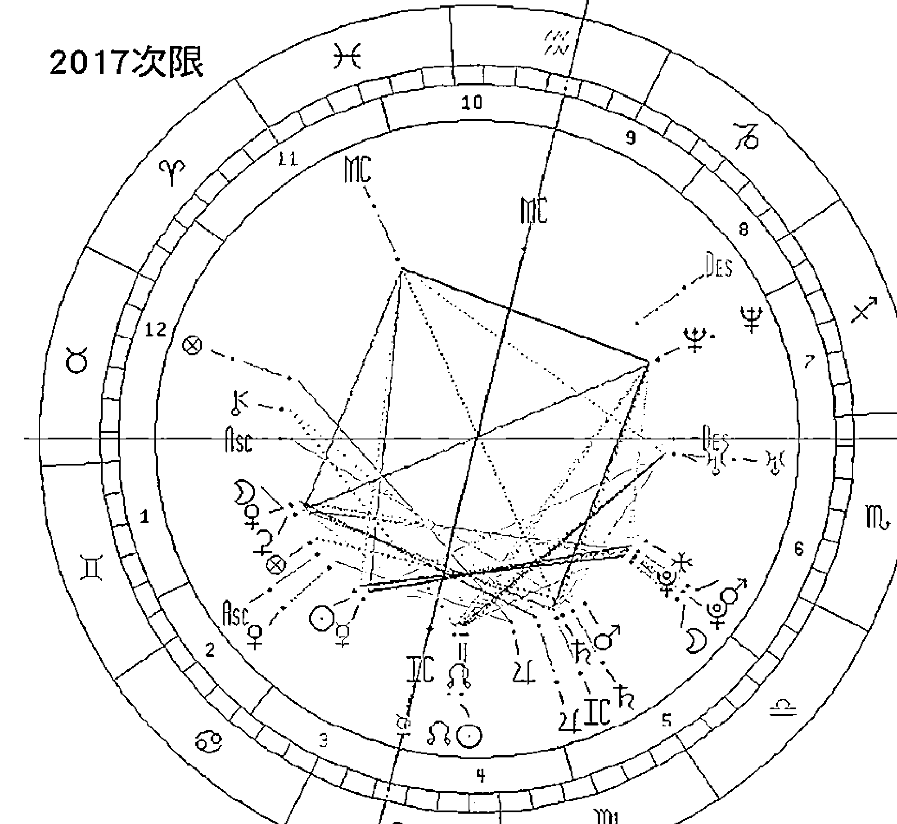

### 太陽弧法—案例1

維多利亞女王，1819年生，1820父親過世，1837.6.20登基，1840.2.10結婚、11.21生女。

這是維多利亞女王一生比較重要的事件太陽弧盤。她的日月準合ASC並且三合MC，10主木星高掛9宮與10宮內土星互容，這是富貴名望的格局。

1. 她出生沒多久，弧角ASC合太陽，弧角太陽合月亮，這原本是繼承榮耀權力的徵象，跟父親有關的重要事件，卻是以父親過世的方式呈現，因為她父親的過世，她得到了權力的繼承資格。以轉宮法來看，弧角火星合北交在父親的8宮，這個父親的死亡似乎是一個宿命。
2. 1837年，弧角MC準合10主木星，弧角木星也四分ASC、日、月，她在這一年登上了王座。
3. 1840年，弧角金星四分木星（7主），弧角DES也合相7宮內的天王。弧角水星也合福點，這一年她結婚，也生了女兒。

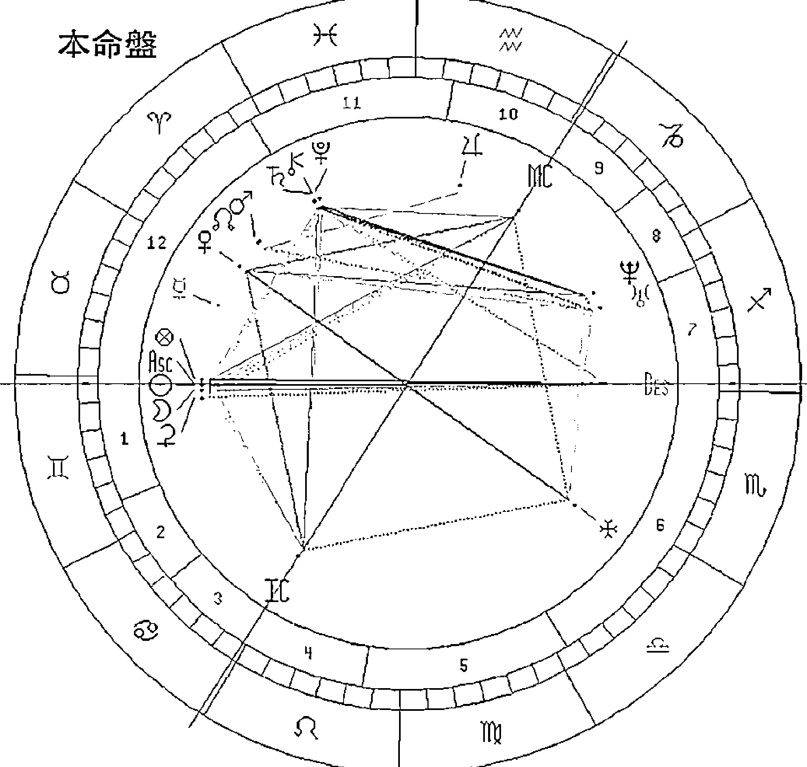

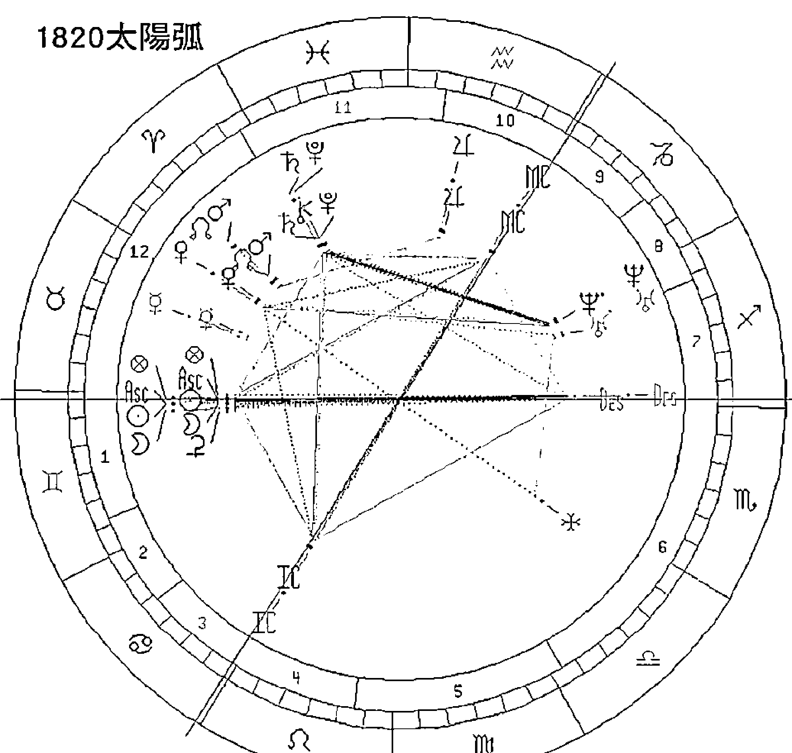


### Ex 太陽弧法—案例2

伊莉莎白二世，1947.11.20結婚。
1952.2.6父親過世，隔年1953.6.2登基女王。2003年健康不佳，動了三次手術。

這是英國女王一生重要時間的太陽弧盤。她的命主、2主土星高掛MC與2宮內的火星互容，且容納木星，這是有權有錢的結構


1. 1947年的弧角DES准合7主月亮，弧角木星合相金星，弧角金星也合相水星，好幾個婚姻徵象都動了，她在這一年結婚。


2. 1952年，弧角太陽合相IC對衝土星，剋相火木，這個徵象一方面有父親太陽遇到關卡的徵象，一方面也是太陽的榮耀傳承給土星，也就是她的命主的徵象，而且弧角MC主星火星也引動10主金星，1953年，弧角ASC也接近火木，所以她出現父親死亡，接著登基王位。
3. 2003年弧角ASC合相6主水星，弧角太陽也合相冥王，弧角土星也接近對衝月亮，三大生命主都出現問題，原本健康的她在這一年動了三次手術。


## 期運系統：星限、小限、返照法

除了大運系統，還有另一種推運模式，我們稱為期運系統，大運系統是將人生濃縮在一小段時間，看這一小段時間對整個人生的對應。而期運系統則是將人生切割成一段一段，每一段都呈現出它自己的特色，這就好像將一個人切割成少年的你、青年的你、中年的你……一樣，每一個不同時段的你都有自己的獨特性，但是這些你又都是整體的你的一部份，這種推運方式是用特殊的方式將時間分割成一段一段，然後去論斷這每一個時間區段的運勢特徵。這種以時間切割的論命方式有很多，比較常見的有星限法、小限法與返照法。星限是將人生切割出不同時段，然後將每個時段配給一顆星來掌管，透過這顆星的狀態來論斷這一時期的命運重點與狀況，這種推運法很多，例如希臘時間主星法、法達星限、十年推運法……等。小限法則是用宮來切割時間，一年經過一宮的方式。返照法則是依照行星的回歸週期，以這個回歸週期來當作時間切割的方法。


期間運法是將整個生命期間作切割，讓命盤中的行星分別掌管人生中某一區段時間的運勢，藉由行星在星盤中的落宮與強弱狀態，來推論該行星主宰期間的個人運勢走向。期運系統大致可分為三類，星限法、宮限法與返照法，星限法主要以行星來作為切割期間的依據，每一個時間段交由一顆星去掌管，每顆星掌管的時間不等。宮限法則是用宮來區分，按照順序配置，例如小限法就是從命宮開始，一年輪一宮的方式，然後由該宮的狀態來看當年度的運勢。返照法則是以行星的週期來切割時段，但比較特別的是運用回歸到原點的時間，另外起一張新盤，從該星盤呈現的狀態來看該迴圈時段內的運勢。

基本上期運法是作為本命盤徵象的點明作用，也就是說期運法實際上只是告訴我們，在哪一個時間段，我們本命盤的事件結構被點亮了，例如本命盤有2主水星與木星的三合，這是一個發財的徵象，因此這個徵象往往會在水星或是木星是某時段的重要行星時，就會點亮活化這個發財徵象。

### 希臘時間主星法：

1. 取福點、日、月、ASC所在星座，當作起始點
2. 以該星座作為人生大運第一階段，接下來星座為第二大運，依此類推
3. 取各星座之主星掌管之行星年限：
日19、月25、水20、金8、火15、木12、土30
4. 各階段又可按步驟2之順序，細分各星座掌管月數

### Decennia 時間主星法：

1. 日生以太陽為起點，夜生以月亮為起點
2. 根據黃道順序，按步驟1分別排列其他行星
3. 若日或月配置不佳，則改用ASC後第一個行星為起點，依此順推
4. 各星主管年數一律10年9個月
5. 各星主管期間，又可細分出副期間，以該星為第一個主管，按黃道順序排列每顆星掌管月數
日19、月25、水20、金8、火15、木12、土30

### Firdaria 法達星限：

白天盤：
太陽（10年）→ 金星（8年）→ 水星（13年）→ 月亮（9年）→ 土星（11年）→ 木星（12年）→ 火星（7年）→ 北交點（3年）→ 南交點（2年）

夜間盤：
月亮（9年）→ 土星（11年）→ 木星（12年）→ 火星（7年）→ 北交點（3年）→ 南交點（2年）→ 太陽（10年）→ 金星（8年）→ 水星（13年）

### Planetary Period 行星期間法：

依照人的生命成長對應主星：
月：0～4，水：5～14，金：15～22，日：23～41，火：42～56，木：57～68，土：69～壽終。

### 月相大運法：

根據出生後每個月相時間起盤，代表人生各階段運勢。沿自次限法，日月合相週期約30天，從日月合相開始，經歷日月四分相，然後日月對分相，又一次日月四分相，最後又重新日月合相，每次的重要月相約7天多，故每個月相大運約7年多。

## 第一部 1-8 運勢盤的解法

### 小限法：

以宮為單位，出生後到一歲生日看第1宮，一歲生日到兩歲生日看第2宮，其他依此類推。從該年度掌管的宮位狀態判斷這一年的重點跟吉凶好壞。

### 太陽迴歸法：

以太陽週期為單位（約一年），太陽回到原點當刻起盤，以該星盤徵象看這一太陽週期的趨勢狀態

### 月亮迴歸法：

以月亮週期為單位（約28天），月亮回到原點當刻起盤，以該星盤徵象看這一月亮週期的趨勢狀態

### Firdaria 法達星限

法達星限將人生切割，讓每個行星或交點各自掌管一個主期間。並且為每個行星定義出掌管的時間。除了南北交點的主期間以外，另外的七個行星主期間可以再細分，平均切割為七個副期間，每個副期間也對應一顆主星，稱為「副期間」主星。第一副期間跟「主期間」主星一樣，然後照伽勒底行星順序依次分配。


第一要了解主期間與副期間主星的分別，主期間主星象徵的是大區間範圍的運勢，而副期間主星就是這個大區間運勢本質的型態。第二要判斷行星強弱、吉凶與相位。第三要注意行星落宮與主宰宮位，透過該期間主星所落入的宮位與主宰的宮位來觀察判斷這一期間的人生重點。

主期間/副期間就如資料/形式，主期間行星管轄事物會透過副期間行星管轄事物來實現。

例：日/水限，日在二宮，水星是命主。此時太陽為質料，水星為型式的表現。太陽的財富潛能透過水星的形式來實現，因水星為命主，因而詮釋為個人想要賺取財富，至於成功或失敗，則依日水之間的關係與各自力量的呈現而定。

如圖為某人的法達時間，此盤為日生人，所以從太陽起大運，如果可以察看目前2021年1月份他的法達值星，可以看到從2020年1月12日開始他走土/水限，也就是土星主限，水星副限。他的土星主限從2012年3月5日開始走，目前走到第六副限水星限，這個限會走到2021年的8月8日，然後換限為土/月限。

| 主 | 次 | 起始日期 | 主 | 次 | 起始日期 | 主 | 次 | 起始日期 | 主 | 次 | 起始日期 | 主 | 次 | 起始日期 | 主 | 次 | 起始日期 |
|---|---|---|---|---|---|---|---|---|---|---|---|---|---|---|---|---|---|
| ☉ | ♀ | 1972-03-05 | ♀ | ♂ | 1987-11-21 | ☽ | ♂ | 2007-01-12 | ♃ | ♂ | 2024-11-20 | ♂ | ♃ | 2041-03-05 | ♀ | ☽ | 2059-06-17 |
| ☉ | ☿ | 1973-08-09 | ♀ | ☉ | 1989-01-12 | ☽ | ☉ | 2008-04-26 | ♃ | ☉ | 2026-08-09 | ♄ | ♃ | 2042-03-05 | ♀ | ♄ | 2060-08-08 |
| ☉ | ♄ | 1975-01-12 | ☿ | ♄ | 1990-03-05 | ☽ | ♀ | 2009-08-08 | ♃ | ♀ | 2028-04-26 | ♅ | ♃ | 2045-03-05 | ♀ | ♃ | 2061-09-29 |
| ☉ | ☽ | 1976-06-17 | ☿ | ☽ | 1992-01-13 | ☽ | ☿ | 2010-11-21 | ♃ | ☿ | 2030-01-12 | ♄ | ♄ | 2047-03-05 | ♀ | ♂ | 2062-11-21 |
| ☉ | ♃ | 1977-11-21 | ☿ | ♃ | 1993-11-21 | ♄ | ♃ | 2012-03-05 | ♃ | ☽ | 2031-09-30 | ♄ | ☉ | 2048-08-08 | ♀ | ☉ | 2064-01-12 |
| ☉ | ♂ | 1979-04-27 | ☿ | ♂ | 1995-09-30 | ♄ | ♂ | 2013-09-30 | ♃ | ♃ | 2033-06-17 | ♄ | ☿ | 2050-01-12 | ☿ | ☿ | 2065-03-04 |
| ♀ | ♀ | 1980-09-30 | ☿ | ♀ | 1997-08-09 | ♄ | ♀ | 2015-04-27 | ♂ | ♂ | 2035-03-05 | ♄ | ☽ | 2051-06-17 | ☿ | ☽ | 2067-01-12 |
| ♀ | ☿ | 1982-03-05 | ☿ | ☉ | 1999-06-18 | ♄ | ☉ | 2016-11-20 | ♂ | ☉ | 2036-03-04 | ♄ | ♃ | 2052-11-20 | ☿ | ♃ | 2068-11-20 |
| ♀ | ☽ | 1983-04-27 | ☿ | ♀ | 2001-04-26 | ♄ | ♀ | 2018-06-17 | ♂ | ♀ | 2037-03-05 | ♄ | ♂ | 2054-04-26 | ☿ | ♂ | 2070-09-29 |
| ♀ | ♃ | 1984-06-17 | ☽ | ☽ | 2003-03-05 | ♄ | ☿ | 2020-01-12 | ♂ | ☿ | 2038-03-05 | ♄ | ♀ | 2055-09-30 | | | |
| ♀ | ♂ | 1985-08-09 | ☽ | ♃ | 2004-06-17 | ♄ | ☽ | 2021-08-08 | ♂ | ☽ | 2039-03-05 | ♀ | ♀ | 2057-03-05 | | | |
| ♀ | ♄ | 1986-09-30 | ☽ | ♂ | 2005-09-30 | ♃ | ♃ | 2023-03-05 | ♂ | ♃ | 2040-03-04 | ♀ | ☿ | 2058-04-26 | | | |

## 法達星限心法：

簡單說法達星限就是每顆星輪流當值星官，還分為大值星官與小值星官，我們透過該段時間的值星官狀態，就可以推斷這段時間會發生什麼事件。因此，先要瞭解本命盤有什麼結構，再看這個結構的星何時成為法達的值星官，這個結構最可能在那時發生。例如右圖，我們想知道這個人何時會有發財徵象，首先我們看到他2宮帶土星，土星跟他的財運有關，他的2主水星六合容納2宮土星，土星是10主，這是事業發財的結構，因此，我們可以大概知道當水星或土星是值星官時，他可能會有機會發財，然後我們就可以去找他走水/土限或是土/水限的時段，那段時間可能就是他發財的時機。


法達星限主要看該年由何星輪值主限與副限，再看該星在本命盤中所掌管的宮位，以及受剋與得吉程度，來斷定該年的吉凶。基本上法達星限不會單獨運用，通常會配合小限法或是返照法，才能更準確判斷該年的狀態與吉凶。論斷法達時要注意幾個要點，首先要看該時段的值星官是否有構成特殊結構，值星官是事件的引動源，他本身會有事件效應，另外與值星官構成結構的星體通常會是受值星官影響的事件徵象。

## A.重要事件特殊結構：

首先看值限星是否有以下的特殊結構，包含會合、互容與容納還有相位，相位的話，凶星凶相與吉星吉象的事件會比較明顯，吉星凶相或是凶星吉相的事件會比較小，基本上行星與值限星有這些結構時，都容易受引動出重要事件。

- 1.會合。2.互容 & 容納。3.相位（凶星凶相、吉星吉相）

## B.值限星：引動源

值限星作為該時段的值星官，具有促發事件的作用，祂本身所在的宮位就會是造成事件的源頭，因此，首先要判斷的就是值限星本身的狀態。例如值限星為金星，金星是引動源，金星的自然徵象是喜好、人緣、愛，金星落在5宮，這一限的基本主題自然跟感情、歡愉有一定的關連性，假設金星是3主，那這一限的主題會牽連到交友或是學習，然後我們看看金星本身的稟賦高低，如果金星廟旺，那這一限的狀態基本不會太差。


- 1.值限星的自然徵象。2.值限星的所落宮位。
- 3.值限星的主宰宮位。4.值限星的先天稟賦。

## C.受引星：

受引星是與值限星形成關係的行星，所有與值限星構成關係的行星都可能被引發出事件，每一個受引星可能都是一個重要事件，基於受引星在本命盤中的結構，我們可以看到什麼樣的事件可能被值限星引動出來。從受引星的自然徵象、所在宮位、主宰宮位與先天稟賦狀態，我們就可以判斷事件的好壞。例如受引星是火星在2宮弱陷，祂本身有火天剋的相位，那這代表一個破財的事件，如果火星是8主，那很可能是因為債務或是投機導致的一件破財事件。


- 1.受引星的自然徵象。2.受引星的所落宮位。
- 3.受引星的主宰宮位。4.受引星的先天稟賦。

## D.判斷法則：

從值限星與受引星的關係與狀態，有以下幾點必須注意：

- 1.當值限星在特殊結構時，除了值限星事件，受引星的事件要特別重視。
- 2.如果沒有特殊結構，主要看值限星的事件，如果只有一般相位（吉星凶相、凶星吉相）代表引動的是小事件。
- 3.如果值限星都無相位，那同宮與對宮的星可以注意，可能引動小事件，另外要觀察其定位星狀態。
- 4.當主限星和副限星在同一個結構內時，則彼此互相引動，這通常是該大限的重要事件，因此要特別注意這個結構的意義，然後再看副限星引動的其他行星事件。
- 5.月交點的限要先看有沒有會合的行星，如果沒有就看定位星狀態。
- 6.引動弱陷星會讓命主產生較不好的影響，如果該星不是凶星（先後天），比較不會引發太大問題。如果是凶星（先後天），則會有較大損害。
- 7.引動廟旺星，則該行星象徵的事物會有正面影響，如果該行星是凶星（先後天），也會多少帶來一些不利。
- 8.值限星所形成的所有受引星結構中最緊密的星，其代表的事件徵象影響力會最快最大。
- 9.換限時容易發生下一限的事件，在換限前後一個月。

## E.應注意主副期主星彼此關係

最後可以留意主/副限主星之間的關係，基本上副限是主限的延伸，是用來實現主限的，如果他們關係良好，那副限期間會對主限的目的有效實現，如果關係不佳，則副限事件反而會造成主限發展的阻礙。

- 1.主/副限行星彼此吉象，副限期間常常是這一大限的發展順利時期。
- 2.主/副限行星容納互容，關係緊密，副限期間常常是這一大限的發展重點。
- 3.主/副限行星若彼此不合意，副限發生的事件與主限關連較低。
- 4.注意主/副限行星是否有定位關係，如果有，定位星廟旺時易顯現吉象，弱陷則凶象多。
- 5.主/副限行星呈現衝剋易見摩擦衝突，副限期間常常是這一大限的發展困難時期。

## Ex 法達星限—案例1

女命，走木/土運時結婚，火/火限時買房，火/金限時生小孩

先看本命結構，木星主限時，木星為7主與10主，落在3宮，這一限重點在交友、婚姻、事業。火星主限時，火星在命宮，火星為11主與6主，火星引動的事件徵象星有土星與水木，水星容納火星，為主要事件，火星在命宮，水星為命主，這一限對案主來說是重要的限運，這一限運的重點在手足、家庭與婚姻。

- 1. 木/土限時，土星在4宮，土星引動的事件徵象星為火星，火星在命宮與水木六合，水星為命主，木星為7主，案主在這一限尾巴結婚，而實際上，下一限火/火限更符合結婚徵象。
- 2. 火/火限時，引動源為火星，火星跟4主水星，7主木星六合，跟4宮內的土星剋相，都跟房屋有關，在這一限剛開始，案主就因為結婚而買房。
- 3. 火/金限，金星為引動源，金星為5主，金星受月亮容納，主要事件為月亮，因此在這一運懷孕生女。

## Ex 法達星限—案例2

男命，走土星限時，發財賺了很多錢

先看本命結構，他的2主木星飛牡羊互容2宮內的火星，2主木星容納命主土星，且福點的主星也是土星，土星在福點的吉宮，福點與2宮內火星六合。木火土構成大財的結構。

- 1. 走土星限時，土星受木星容納，因此木星是主要事件。
- 2. 看木星的結構，木星互容火星，引動發財徵象，並容納給了命主土星，也催動了福點主星的大財徵象，因此，案主在這一運時發了大財。

## Ex 法達星限—案例3

男命，走水/日限時，發生交通意外

先看本命結構，3主水星與8主火星同宮，但是離很遠，交通意外徵象不強，但是仔細看，太陽剛好在水火的中點，且太陽有一個日海土的剋相結構，太陽也容易成為水火的引發徵象。

- 1. 走水/日限，水日會合，構成一個明確的結構。副限為太陽，引發的事件為土星，以及水火的事件。
- 2. 土星的事件可能是健康問題，水火的事件則為交通意外，因此發生交通意外導致身體受損。


## Ex 法達星限—案例4

走木/火限時發生骨折意外導致分手，木/金限時轉行，木/水限時教瑜珈課程，木/月限時結婚，兩家不合。

這是案主木星大限時，不同小限發生的狀況，先看木星的狀態，木星主要事件結構只有跟金星的四分相以及跟水星的三合。木星落在2宮，木星為3主與6主，因此這一運的主要事件是金錢、工作、戀愛，以及學習教育。

- 1. 木/火限時，火星會合土星，受到金星容納，火星在1宮，跟個人狀態有關，土星構成火土冥結構，火土有骨折徵象。另外土星與金星互容，火星也是7主，土星壓7主，也牽連到5宮與戀愛，因此這一限也分手了。
- 2. 木/金限，兩顆星在同一個結構，金星是引動源，引發木星的事件。金星5宮，與個人發展有關，木星2宮，與利益相關，木星是6主也跟6宮水星三合，因此在這一限轉行。
- 3. 木/水限，兩顆星在同一結構，牽連到2宮與6宮的事件，水木有教學的徵象，雙魚與天蠍的組合，符合瑜珈的特徵。


- 4.木/月限，月亮是引動源，月亮與土星互容，因此土星是主要事件徵象，月亮在4宮，土星4主，有成家徵象，土星合相7主火星，因此結婚。月亮與火土冥相剋，月亮是7-4主星，代表伴侶的家人，土星是4主星，代表自己的家人，彼此形成火土冥-月的相剋結構，因此兩家不合。

## Ex 法達星限—案例5

黛安娜王妃，1981.7.29，水/月限與查爾斯王子結婚，生下威廉王子。水/土限生哈利王子。1992年12月份，月/月限與查爾斯王子分居，1996年8月走月/火限正式離婚。1997年8月走月/日限時因遭到狗仔追逐而車禍身亡。


這主要經歷水星跟月亮兩個主限，水星為黛安娜7主與10主，水星會合太陽，互容月亮，這一運重點在婚姻與榮耀，但是水日都在8宮，隱私與秘密也是重點。

月亮為8主星，月亮落3宮，受到媒體關注其隱私成了這一運的徵象。

| 主 | 次 | 起始日期 | 主 | 次 | 起始日期 | 主 | 次 | 起始日期 |
|---|---|---|---|---|---|---|---|---|
| ☉ | | 1961-07-01 | ☉ | ☿ | 1977-03-19 | ☽ | ☿ | 1996-05-10 |
| ☉ | ☿ | 1962-12-05 | ☉ | ☉ | 1978-05-10 | ☽ | ☉ | 1997-08-22 |
| ☉ | ☿ | 1964-05-10 | ☿ | | 1979-07-02 | ☽ | ☿ | 1998-12-05 |
| ☉ | ☽ | 1965-10-14 | ☿ | ☽ | 1981-05-10 | ☽ | ☿ | 2000-03-18 |
| ☉ | ♄ | 1967-03-19 | ☿ | ♄ | 1983-03-19 | ♄ | | 2001-07-01 |
| ☉ | ♃ | 1968-08-22 | ☿ | ♃ | 1985-01-26 | ♄ | ♃ | 2003-01-26 |
| ☉ | ♂ | 1970-01-26 | ☿ | ♂ | 1986-12-05 | ♄ | ♂ | 2004-08-22 |
| ♀ | | 1971-07-02 | ☿ | ☉ | 1988-10-13 | ♄ | ☉ | 2006-03-19 |
| ♀ | ☿ | 1972-08-22 | ☿ | ♀ | 1990-08-22 | ♄ | ♀ | 2007-10-14 |
| ♀ | ☽ | 1973-10-14 | ☽ | | 1992-07-01 | ♄ | ☿ | 2009-05-10 |
| ♀ | ♄ | 1974-12-05 | ☽ | ♄ | 1993-10-13 | ♄ | ☽ | 2010-12-05 |
| ♀ | ♃ | 1976-01-26 | ☽ | ♃ | 1995-01-26 | ♃ | | 2012-07-01 |

- 1. 水/月限，水月互容，同一個結構，水星為7主，女命月亮跟懷孕有關，水星也跟5主火星六合，因此在這一限結婚生子。
- 2. 水/土限，土星為引動源，土星只有跟金星三合的結構，金星為事件徵象，金星跟月亮、天王、火星、冥王有一個T型三角格局，牽連了月亮跟5主火星，因此在這一限生下次子。
- 3. 進入月亮主限後，黛安娜的狀況就越來越不好了，月/月限時，月亮互容水星，容納金星與太陽，水日與金星是主要事件徵象。水星為7主，金星與天火冥星群相剋，她在這一限與查爾斯分居，月火限時，這一個T三角結構再被觸動，她正式跟查爾斯離婚。
- 4. 月/日限時，太陽為引動源，太陽在8宮，跟隱私秘密有關，引動月亮、水星，水月結構，秘密隱私受到媒體關注，月亮也是8主，月亮對沖天火冥引動意外危機，8內的水星同時代表著交通以及記者的徵象，太陽為鎂光燈，符合其死亡徵象。

## 小限法

小限法的原理就是從上升點開始，將上升點設為0歲，一個星座代表一年，然後依序往後推移，以整宮制為主，亦即一個單位推移一整個星座。1宮為0歲、2宮為1歲、3宮為2歲……，循環一週為12歲，因此，12歲整、24歲整、36歲整都會由上升點代表。要注意一點，小限的歲是從生日到下一年生日來計算，不是從每年1月1日來計。


基本上小限法的判斷與法達是雷同的，只是引動源換成了宮位，用該宮的宮內星與宮主星來呈現。跟法達一樣都是用來將本命盤的事件徵象給呈現出來的方法。

## A.小限到何宮？

小限到的宮位是該年預測的主軸，通常是事件發生的引動源頭，例如25歲小限走2宮，財物會是一個基本的主題。先看小限宮內有沒有星，如果有，這些行星是重要的事件徵象，然後再判斷該年小限主星的狀態，小限主星飛到哪一宮。如圖，這一年走2宮雙子，宮內有土星，是重要事件徵象，2主水星飛11宮。水星跟土星有相位，土星是10主與9主。這一年的重點很顯然是財運與事業，並且與11宮和9宮相關，他在這一年跑去參加漫畫比賽，得了佳作（小限主星同宮的太陽徵象），後來又回到原出版社工作，薪水升了很多。


## B.判斷年主星的基本特性

首先要判斷的是該年度小限主星的狀態，年主星是主要引動源，年主星本質為吉星或凶星通常是引動事件的模式，是輕鬆愉悅的，還是困難激烈的，年主星本質為吉星廟旺結構佳易見吉祥，為凶星弱陷結構差易見麻煩，但必須充分考量年主星的先後天狀態如何，年主星的廟旺弱陷可以看出這一年度的主控權多少，面對各種事件能否有效的因應。一般來說，日生人，年主星屬晝劃分的年度較易發揮，反之受限。夜生人，年主星屬夜劃分的年度較易發揮，反之受限。年主星能夠廟旺最好，三分尚佳，界其次，如果弱陷，該年主星主管的年份，命盤主通常較難有效掌控局面。

## C.年主星飛往何宮？

小限主星飛的宮位是主要受影響的環境，例如小限走2宮，2主星飛到7宮，發動來源是2宮，受影響的地方是7宮，從小限主星飛的地方可以看出該年度發展的領域層面，先看小限主星位在始宮、續宮或果宮，這代表這一年度的基本面向，在始宮偏向積極主動，在果宮都有沈潛預備的徵象。然後觀察小限主星運行狀態，有無停滯或逆行，比平均速度快或慢。看小限主星有否被焦傷，當小限主星被焦傷，其光芒容易被掩蓋、壓制、隱蔽，無法展現實力。最後看小限主星在本命中的結構，是否與其他行星產生關係，他構成何種事件徵象。


## D.其他重要星點的小限法

另外，除了可以用ASC推小限外，其他日、月、幸運點、MC等重要因子也可推小限，模式都是一樣，以該因子所在星座當作第1宮推0歲到1歲的運，下一星座當第2宮，推1歲到2歲的運，其他依此類推。用這些不同因子推小限，其代表的意義與上升略有不同，意義分別為：

- ASC：生命、身體、命運。
- 月：旅行、婚姻、妻子、女性親屬、內在情緒。
- 日：榮譽、尊崇、父親、貴人、成就名聲。
- 福點：財富、收益、好運。
- MC：事業、職位升遷、權威、首長、母親。

## E.配合流年，尤其是小限宮有沒有行星過運

對於小限所指出的事件徵象，可以配合流年來判斷最可能發生事件的時間。此外，也可以配合返照盤來參看，針對小限代表因子在太陽返照盤的強弱，觀其先後天狀態，若在四角、廟旺，則其呈現出的效力會非常顯著。

## 小限心法：

### A.小限徵象星

首先要找該小限年度的重要徵象星，小限是以當年輪值12宮位的吉凶趨向來判斷事件與吉凶，本命盤的論法是以宮主星、宮內星等徵象星及宮位相位吉凶等加以論斷，因此，論小限也須參酌小限宮年所落宮、宮主星與宮內星，如某人25足歲時，小限值宮年為2宮落雙子，則必須找出觀察當年吉凶的徵象星即2宮主星水星以及看2宮內之星體。

### B.小限重點宮位

找出小限吉凶徵象星之後，接著是找出當年可能發生明顯變動的領域，我們稱為重點宮位，重點宮位可以判斷該年度強調的人事徵象，重點人事徵象可以從以下幾個方向尋找：

- 1.根據小限年主星的自然徵象加以判斷
如當年小限年主星為金星，可能暗示在婚姻、金錢及人際關係上有變動。

- 2.看當年小限落本命宮位
如當年小限落2宮，往往暗示當年在財務方面可能會有變動。

- 3.看年主星飛落本命宮位
如當年主星落本命7宮，往往暗示當年在人際關係及婚姻上可能有變動。

- 4.看年主星主宰本命宮位
如某人牡羊座命，當年年主星為金星，金星為本命2宮與7宮宮主，則暗示當年在財務與人際關係方面可能有變動。

- 5.若小限宮位與年主星飛落之宮位，有其他星體，必須考慮該星體的自然徵象與主宰宮位來參酌判斷。

例如：小限主星金星飛落2宮，2宮內除金星外，尚有木星與月亮，木星為9宮主星、月亮為4宮主星，可能暗示當年在財務（2宮）上的變動，此變動會牽連宗教（9宮）或家庭（4宮）。

### C.判斷吉凶狀態

接下來根據徵象星在原命盤的狀態好壞與重點領域宮位的吉凶來判斷運勢。

#### 1.判斷年主星狀態

例如小限主星為金星落本命7宮天秤，落於始宮且入廟，可以初步判斷當年在婚姻或合作關係是不錯的。反之，若小限主星金星落本命6宮牡羊，落於果宮且入陷，則可初步判斷當年在健康與工作上需要多加注意。

#### 2.決定星體質量與狀態的因素

除了「始續果宮」與「廟旺弱陷」還需考量相位、互容、速度、逆行……等，看起整體結構狀態。

又假設當年小限主星飛落本命2宮雙魚，2宮內有金木二星，一旺一廟，則可初斷在財務方面運氣不錯；反之，若年主星飛落本命2宮巨蟹，2宮內見火土二星，一弱一陷，在財務上可能有破耗連連的情形，須極為注意。

### D.小限與本命徵象的關係

前面兩個步驟，我們找出小限當年的重要「徵象星」與「重點宮位」，然後我們就要來判斷當年度小限點亮了本命盤中的哪些事件。

#### 1.小限引動本命。

小限作為該年度的引動來源，引動本命的事件結構，這是小限法的主體用法，透過該年被強調的徵象星與重點宮位，可以看出本命中哪個事件主題被強調出來，是吉利的徵象還是凶險的徵象，或是都有。

#### 2.再來觀察小限盤自己各宮的吉凶。

我們從小限觀察到這一年度哪些主題被凸顯後，接著可以用當年小限宮為命宮，透過轉宮法，進一步找出小限盤自己的各宮與宮主星的徵象來確認吉凶趨向，假設當年主星金星落本命7宮天秤，入廟且落始宮為吉，如果該年度小限宮為2宮，因此小限的7宮就是本命的8宮，那我們就可以透過觀察本命8宮與8主的狀態，作為判斷這一年度婚姻徵象的輔助判斷。

#### 3.從本命盤的各種事件徵象，可藉由小限推算大概於何年發生。

當我們知道本命盤的徵象後，就可以用小限來知道這個徵象容易引動的年份，例如某人問何年可能會結婚？假如他的本命7宮落牡羊，婚姻徵象星為火星，火星落3宮，我們就可以根據推測，小限走7宮值年與3宮值年時，婚姻徵象容易引動。用這方式就可以大致判斷命盤主於哪一年容易有婚姻上的變化。

### E.小限應期

#### A.配合流月小限法

小限法可以分為流年小限（annual profection）與流月小限法（monthly profection），當我們利用年小限法找出當年重點宮位的跡象後，就可以使用月小限法來找出事件最有可能發生的月份。流月小限法與流年小限法原理一樣，使用方法是以流年小限命宮當作一月，亦須以足歲計算，如某人生於1991年2月18日，原命第2宮為小限值年命宮，管2016.2.18～2017.2.17一整年12個月運勢，而原命第2宮就是小限值月命宮，同時也主小限值年第一個月，亦即2016.2.18～2016.3.18的運勢。前述流年小限重點宮位已找出，接下來就看該宮位為哪一個流月小限的命宮，如原命2宮為流年小限命宮，原命5宮為重點宮位，那麼當流月小限命宮推移至5宮，也就是在流月小限4月時，事件剋應最有可能發生；此外流月小限之始宮，亦即除了包含命宮1宮之外，還有4宮、7宮、10宮等宮位推移至重點宮位時，皆有可能是事件的應期，也要納入參酌。

#### B.配合流運(transit)

使用小限法時避不開12年144月固定循環的模式限制，因此我們可以配合流運法找出較為細膩之應期，在此我們提供幾種主要方法：

## 第一部 1-8 運勢盤的解法

1.地外行星（木火土）與小限徵象星或重點宮位內星體產生主要相位。
僅考慮外行星的原因是因為三者公轉週期較慢，其中流年木星與小限徵象星、重點宮位產生主要相位多半主喜慶與順利，而流年火土則多主災難與不幸。成相的方式以合相跟衝相的引動性最高，其他相位較小一些。

2.當流年自然徵象星與同徵象的小限徵象星與重點宮位徵象星合相。
當同類徵象呼應時，也容易引動事件，例如金星為婚姻自然徵象星之一，而小限婚姻徵象星為土星，當流年金星與土星合相，可能為事件發生之應期。

3.當流年星與小限徵象星相同並產生主要相位。
如小限徵象星為金星，當流年金星與原命小限徵象星產生主要相位時，可能是事件發生之應期。

4.當流年星與小限重點宮位主星相同並產生主要相位
如小限重點宮位在本命7宮牡羊，宮主星為火星，當流年火星與本命火星產生主要相位時可能為事件發生之應期。

### Ex 小限法—案例1

女占星師 Naucy hasting，29歲成為占星家，小限6宮。35歲離開丈夫，小限12宮。39歲出版第一本書籍，小限4宮。44歲出版第二本書籍，小限9宮，發現健康不利徵象。45歲診斷出結腸癌，小限10宮。46歲死亡，小限11宮。
這是一個美國女占星師的小限案例，從其本命盤來看，可以看到一個明顯的火水月土海的大十字結構。

1.小限6宮，這一年的事件跟工作有關，6主木星飛12宮，與身心靈相關，6宮內金星為命主與8主，金星與命宮內海王互容，很明顯的占星徵象。
2.小限走12宮那年，這一年事件與身心靈或出世逃避有關，12主星水星飛IC附近，引動她的火月土海大十字，水火合相，火星為主要事件，火星為7主，與婚姻相關，因此她在這一年離開丈夫。

3.小限走4宮那一年，這一年跟家庭或內在的累積有關，宮內帶火水，4主星土星為引動源，又引動她的大十字，包含水星、火星、月亮、海王的事件，土星與水星的相位最緊，水星為9主，與出版有關，他在這一年出了第一本書。

4.小限走9宮那年，這一年的事件主要跟旅遊、遷移、讀書或出版有關，9主水星是引動源，所以這年她又出了第二本書。水星又引動她的大十字，火星是12主，月亮被火土海衝剋，月火又互容，這是腸胃病徵象，因此這年發現到身體不利的徵象。

5.隔年走小限10宮，宮內土星，10主為月亮，這很明顯就是這個結構的引動，因此這一年確診出結腸癌。

6.小限走11宮這年，宮內帶冥王，已經有風險徵象，11主太陽飛4宮沒有特別結構，看同宮內星，最近的是火星，一樣是大十字的衝剋局面，延續前面的病局，最終在這一年過世。

### EX 小限法—案例2

查爾斯王子，9歲成為王子，小限10宮。32歲與黛安娜王妃結婚，小限9宮。33歲大兒子出生，小限10宮。35歲二兒子出生，小限12宮。

這是查爾斯王子的小限案例，從其本命盤可以看到月亮大部分星都在下方，月亮廟旺高掛，很顯然他一聲都受到女人強烈影響。

1.小限10宮，這一年跟地位有關，10宮內的月亮廟旺，月亮與5主木星三合，這一年得到榮耀，成為王子。另外10主金星合相IC，也有傳承到地位的徵象。

2.小限9宮那年，9宮空宮，9主火星是引動源，火星飛5宮，有戀愛歡樂徵象，火木互容，木星是重要事件徵象，木星構成木土月天風箏格局，木星5主，土星是7主，天王也算第二7主，月亮是男命妻星，他在這年跟黛安娜演繹了一場王子公主的夢幻婚禮。

3.小限10宮，跟上一次他成為王子一樣，這次是他生了另一個王子，威廉王子出生。

4.小限12宮，12宮空宮，12主為月亮，月亮是引動源，引動月木土大三角，木星為5主，這一年二兒子哈利王子出生。

## 返照法

返照法是以行星回歸到原點的時間起盤，以這個當下時間的星盤徵象作為當次回歸到下次回歸的整體運勢。返照法可以看作是以一個特殊時間起點當作一個週期的出生圖，來看出一個週期的整體運勢。每一個小週期都可以看成一個獨立的個體，有其個別的命運徵象。由於太陽的週期與月亮的週期對地球人有其重要性，另外也沒有逆行的問題，因此，太陽返照與月亮返照是返照法最常運用的兩種週期法。事實上返照法可以運用在任何一個週期中，例如我們可以用日月合相的時間點來看這一次合相到下一次合相這段時間的趨勢特徵，或是用日月蝕的時間點起盤，來看這個日月蝕的意義，這一類的模式廣泛運用在時事占星中。或是用某顆星與自己星盤的星有重要相位時，用這個時間點另外起盤，來看這個相位有什麼更細節的意義徵象。

### 基本考量

跟其他期運法一樣，解讀返照盤時要先看本命結構，太陽返照盤本身的星盤狀態代表這一年度的狀態呈現，返照盤對應本命時，則會突顯出人生事件特徵，論斷返照盤時，可以先看返照盤的狀態，那些星的徵象被凸顯，這些星的徵象有沒有跟本命呼應，然後要兩張盤一起參看，看返照星對本命發生的觸發作用。

- 1. 返照盤的上升ASC開在本命的哪一宮位，該宮之領域層面為本年度焦點。
- 2. 返照盤四角附近的星具有重要意義。
- 3. 返照盤的命主飛何宮，是該年的重要線索。
- 4. 返照太陽落的宮位，顯示該宮為年度力量用最多的地方，該年被凸顯的狀態。
- 5. 返照盤如同卜卦盤一樣，重視月亮最後形成的入相為何星，推論當年度事件之結果，若月空亡返照盤這一年度較容易一事無成。
- 6. 返照盤上升ASC星座為基本星座，當年較積極主動，在固定星座比較容易守成不動，在變動星座則多變不定。
- 7. 本命盤與返照盤相互參照，若有本命行星會合返照盤之四角，容易有影響力。
- 8. 返照盤若有特殊格局型態，與本命盤的結構呼應，則該型態在當年有特殊意義。

## 日月返照心法：

### 一、解盤重點

解讀返照盤時，可以依下列順序來注意星盤呈現出的重點：

1.是否有很多星體落在返照盤四角。

星盤的四角具有放大的效應，行星落在四角會使其力量容易發揮，突顯出該星的影響力，四角為行星能量的釋放提供了出口。如果有星體落四角，你就可以根據星體的特質來論斷今年被強調的徵象。例如金星落四角，今年的人緣與桃花現象會被強調出來。或如圖，火星在四角ASC附近，這強化了這一年可能會有自身的風險、衝突與意外。

2.星體在星盤中的分佈情況如何？

多數行星落入上半部意味著對外活動的增加和頻繁的交流；多數行星落在地平線以下預示這一年你將對自身或家人投入更多的關注。大量星體落入左半盤，強化個人的發展、決定與發揮，群星落入右半盤，個人的決定將更多的受他人的影響。

3.某一宮或某一星座內是否有三顆以上的星體落入，即是否有星群結構出現。

星群結構意味著能量的聚集，所有形體的特質都容易集中融合到一起，群星落入的星座或宮位會特別被凸顯。如果返照盤某宮的星群和本命盤中的星群相同，它意味著此宮代表的領域在這一年中將倍受關注。

4.返照盤的命宮，命主飛何宮，是該年的重要線索。

太陽返照中上升星座也是考慮的重點之一，它代表你在這一年中所表現出的特質，也代表這一年的主要人生目的。如圖中，這一年的命主高掛MC合相金星，這一年的重心是擁有地位與事業，同時也與愛情相關。

5.作為太陽返照盤中的主角，太陽為一年的運勢推斷提供了大量的資訊。（月亮返照則看月亮）

太陽代表成就、創造力、核心意志、事業、領導能力和提升的潛力。作為生命力量的源泉和顯意識的象徵。太陽影響著其周圍的一切星體，木星或金星同太陽相合於返照盤四角通常預示著一年的好運氣。

6.一年中最繁忙的時期也可以通過返照太陽來推算出來。

如果太陽位於返照盤四角中的一宮，那麼年初將會是一年中活動最多的時期；如果太陽在二、五、八或十一宮，那麼年中將是你最繁忙的時期；如果在三、六、九、十二宮，那麼一年中的大部分時間你都是在做準備和協調工作，直到年末才會開始進一步的行動。

7.反轉現象：返照盤的上升是否開在本命盤的對宮，尤其在DES附近。

這種逆轉意味著這一年度人生會有比較大的調整，生活中的某些因素發生了徹底的改變，可能是主控權的喪失、突然的虛弱或者錯誤計畫的制定。

### 二、返照盤與本命盤對照

1.返照盤必須要參考本命盤來解釋

解返照盤時不能忽略本命盤的狀態，特別要注意本命盤的星體是否落入了返照盤的四角，這是本命星體的潛在力量在這一年度得以發揮的徵象。本命星體和返照星體代表的含義是不同的，本命星體表示由你本身代入到新一年的能量，而返照的星體則代表外界賦予你的能量。因此，本命木星顯示你在某一領域的力量需要進化，而返照的木星則意味著這一年中外界環境的機運將造成你在某一領域發展擴張。

2.返照盤的上升開在本命盤哪一宮

返照盤上升開在本命的宮位也必須給予足夠的重視，對個人來說，這一年和這一宮相關的領域將會佔用你大部分的精力。如圖這一年的太陽返照上升開在本命的12宮，這代表這一年的主要發展都容易在成就原有的靈性領域或身心靈的發展上。

#### 3.本命盤的徵象結構是否在返照盤中出現。

當該年返照盤的某個事件徵象被突顯出來後，這個事件徵象的結構與本命盤結構一致，那就容易引發出本命盤代表的事件徵象，例如右圖本命盤有日、月（7主）、金星構成的結構，日月互容，日金合相。這一年的返照盤剛好也有日金合相，日月六合，又構成日月金的結構，而這一年的返照盤上，命主太陽合相金星高掛MC，返照盤上這個日月金的結構被突顯出來，因此，那這一年本命盤的日、月、金象徵的結婚徵象就容易被突顯出來。

### 三、返照盤星體的象徵意義

返照盤代表的是這一年度的狀態，可以把他當作是一張卜卦盤一般的來解釋這一年的大致樣貌，什麼事物被凸顯。星盤的詮釋方式就如同一般的本命解釋一樣，每一顆行星的所在星座與宮位，都代表這一年度的能量特徵。

不論是否落入返照盤的四角，每一顆行星的宮位與星座都有其代表的意義，例如這一年的返照盤火星在5宮，火星象徵衝突、經歷發洩或是競爭戰鬥。5宮代表孩子、戀情、活動、投機和娛樂。所以，如果太陽返照盤中火落5宮，象徵這一年度會花很多精力在玩樂、活動、小孩這些領域，如果本身已經有小孩，那麼這一個運有可能是跟你的子女相關的，你可能會在孩子身上投入很多的精力，可能你小孩要學騎自行車，或者參加社團，或是小特別好動。如果火星的狀態不佳，受刑沖，那麼這一年除了自己可能會在玩樂活動時有意外，也要注意小孩的狀態，他們可能會受傷，因此必須提前作好保護措施。如果你本身是單身，那這一年可能會有感情的糾紛，或是爭風吃醋的狀況。

基本上，返照盤中如果有某顆星被凸顯時，例如落在四角，或是這一年的命主星等，那就代表這一年度容易呈現出該星象徵的狀況，例如金星在四角，今年容易有桃花喜悅的事，土星在四角，今年容易受到壓力與制約，每一顆星都有祂代表的特別意義，其意義大致如下。

### 返照盤中星體的象徵意義：

- 1.太陽：
權力、特權、榮耀、受人注目、活躍、目標的達成、意志、創造力、驕傲、父親、丈夫、遊樂、陽性的事物。
在中天和上升附近，這一年名望權勢運有很大的發展，受人注目，表現機會很多，是榮耀的徵象。

- 2.月亮：
公眾、情感、緣分、庫、根源、敏感、富足、匱乏、內在、生活、母親、妻子、陰性、家的事物。
在中天和上升附近，這一年親緣運有很大的發展，緣分增多，土地庫存或是內部事務很多。

- 3.水星：
心智、變動轉換、交通、閱讀、語言和思想的交流、學習、友誼、親戚、年輕人、兄弟姐妹。
在中天和上升附近，這一年交流訊息運有很大的發展，通路人脈交通增加，交流學習機會很多。

- 4.金星：
愛、婚姻、戀情、愉悅、財產的獲得、和諧的傾向、美感、親和力、年輕的女性、妻子。
在中天和上升附近，這一年感情運有很大的發展，桃花多多，戀愛機會很多。容易有喜悅與獲得贈與的事件。

- 5.火星：
動力、行動、性、繁重的勞動、煩躁、火、煽動性、爭吵、敵對、鬥爭、年輕的男性、丈夫。
在中天和上升附近，這一年體能行動增加，會很勞累，容易有衝突或是競爭的事件出現，或有血光之災。

- 6.木星：
增長、機運、智慧、擴張、進展、財產的獲得、愉悅、遷移、旅行、教育、法律相關事務、宗教和哲學。
在中天和上升附近，這一年的整體運勢都很好，各種機運增加，智慧得到良好的發展。

- 7.土星：
鞏固、收縮、自律的需求、延遲、阻礙、限制、絕望、焦慮、不滿、困苦、艱苦的任務、責任、父親、權威、老人。
在中天和上升附近，這一年整體運勢辛苦壓抑，容易有關卡或功課，各方面有較大的損失或挫折。

- 8.天王星：
變數、改革、離異、未知、波動、亢奮、啟發、突發事件、沒有預料到的變化、陌生人。
在中天和上升附近，這一年變動很大，變革與變化增加，或有突如其來的事情打亂原來的生活。

- 9.海王星：
消災、束縛的解脫、因果、渙散、心醉神迷、夢想的浮現、遺失、迷惑、失望、欺騙、逃避、自我犧牲、休養。
在中天和上升附近，這一年容易受無意識因果影響，容易迷惘不切實，各種事物容易混亂，感覺無力虛弱。

- 10.冥王星：
恐懼、危險、秘密、地下化、執著、大改變、重生、淘汰、強制、綑綁、死亡、毀滅、罪惡、陰邪、詛咒。
在中天和上升附近，這一年容易感受陰暗邪惡，會感到恐懼危機，容易有偏執負面的傾向。

## 第一部 1-8 運勢盤的解法

### Ex 返照法—案例1

### 黛安娜王妃，1997.8.30車禍意外

這是黛安娜王妃1997年的返照案例，她在這一年因為躲避狗仔而造成交通意外身亡，從該年度的返照盤我們來看為何會發生這個遺憾。先看本命結構，本命盤有日水火連動的結構，火星12主，水日八宮，火水日六合，雖有車關徵象，看起來還不至於有太大的意外。在看8主星月亮，月亮與對宮的天火冥星群對衝，風險偏高，水星與月亮互容，這使得8主被接回8宮，強化了風險的徵象。她的風險徵象是日水火月的結構。


1. 1997反照圖，火星在ASC附近，這是比較容易有衝突意外徵象。
2. 火星天秤互容土星刑剋太陽水星，水星是9主與國外相關，太陽11主與公眾有關，火星是7主，與伴侶有關。返照盤中，月亮雙子跟水星互容，又呈現出本命盤的日水火月結構。


### Ex 返照法—案例2

### 甘迺迪總統，1963年11月遇刺

本命盤金水互容，水星會合火星在8宮，8主金星與8宮水星互容，成為意外災害的結構。火水與天王剋相，為突發意外徵象。本命弱陷土星高掛MC，並且跟他的凶險結構六合，這是容易因為地位引發風險的徵象，他的8主金星跟12宮月亮剋相，人生的風險也容易跟桃色女人有關，月亮也容納8宮的火水木，顯示他的私生活非常豐富。


1. 先來看1963年日返照盤，冥王高掛MC，合相月天火高掛呈現凶相，冥王剋8宮內的太陽，跟本命對照，本命命主金星也在返照8宮。返照冥王合相本命月亮，與本命命主與8主都剋相。
2. 返照水星合在DES與火星相剋，水星也是8主，這也是風險的徵象。
3. 再來看發生意外當月1963年11月的月返照圖，月冥天在四角剋火金的結構，金星是8主，也是呈現風險徵象。命主木星與火星互容，進入這個結構。在看跟本命盤的關係，這個月冥天剋金火的結構也都衝剋本命盤的命主與8主金星，因此呈現出風險。

### Ex 返照法—案例3

### 男命，2006年離婚

本命盤7主金星合火星與天冥、月亮以及較遠的土星相剋，這是婚姻容易有問題的徵象。月金的剋相也容易有婆媳問題，月亮為9主，也代表理念或階級層次上的不合。


1. 當年的返照盤上，7主土星與火星、太陽、海王構成大十字的格局，土星在2宮，可能是因為財物上的糾紛造成的離異現象。
2. 當年的日返照盤中，命主月亮與天王相剋，同宮還有金冥的合相。也都顯示案主當年有重要關係或緣分離異的徵象。
3. 與本命盤比較，返照火星的壞結構入本命7宮，返照的月金冥-天的剋相結構也引動本命的金火壞結構，因此在這一年出現了離婚的狀況。


### Ex 返照法—案例4

### 女命，2008年結婚

先看本命的結婚結構，7主月亮與太陽互容，月亮與命主土星以及木星六合，太陽跟金星也同宮。日金月土木是他的婚姻結構，尤其是日月的結構。

1. 當年的返照盤上，返照命主太陽與金星高掛MC，並且與月亮六合，有陰陽和合之象，月亮容納日金，命主合相金星高掛，有喜慶之象。
2. 返照太陽、金星也跟木星三合，月亮也跟土星六合，跟本命盤的婚姻結構一致。
3. 與本命盤對應，返照盤開在獅子座，對應本命盤，獅子座內有7主月亮，也就是本命7主星入返照命宮，本命7主月亮也與返照命主互容，返照月亮廟旺也入本命婚姻宮。


## 1-9 配對盤的解法

### Explanation of Synastry

配對盤如同中國命理合八字的概念，基本上就是用占星學來判斷兩個個體之間的關係，或是兩個個體結合之後發生的變化。基本上有兩類，一種是比較盤，兩個人的星盤是各自獨立的，看彼此行星的相位關係與落宮關係。另一種是組合盤，組合盤概念來自於中點理論，也就是取兩張星盤中元素的中點，將兩個人的星盤合而為一成一個全新的星盤，還可以延伸到三個人甚至更多人，取出共同平均值，組成一張象徵這一整體的共同星盤。

### 配對盤的解讀

配對盤如同中國命理合八字的概念，基本上就是用占星學來判斷兩個個體之間的關係，或是兩個個體結合之後發生的變化。基本上有兩類，一種是比較盤，兩個人的星盤是各自獨立的，看彼此行星的相位關係與落宮關係。另一種是組合盤，組合盤概念來自於中點理論，也就是取兩張星盤中元素的中點，將兩個人的星盤合而為一成一個全新的星盤，還可以延伸到三個人甚至更多人，取出共同平均值，組成一張象徵這一整體的共同星盤。

### 比較盤與組合盤的差異

比較盤呈現的是相互關係的作用，彼此個體都還是獨立的，比較像是物理作用。組合盤則是兩個個體產生化學作用，變成了一個新的產物，就像是氫原子跟氧原子化合成了水分子一樣，水分子是從氫跟氧組成的，但是水跟氫氧已經完全性質不同了。比較盤像是氫原子跟氧原子的碰撞作用，氫還是氫，氧還是氧，但是組合盤就是化合成水分子了，完全是一個新的產物。

所以比較盤跟組合盤是不同的論斷概念，我們用比較盤可以看出兩個人之間的相互作用產生的彼此好與壞的影響，而組合盤則不一樣，組合盤是兩個或多個關係的全新產物，是兩個物體連結越深，就越會產生組合盤的狀態，例如A跟B都不是有錢的命格，但是他們的組合盤C是有錢的命格，那當A跟B結合得越深，就能產生C的效應，當他們彼此遠離沒有互動，C的效應就不會出現。所以要論斷兩個人適不適合，彼此之間有什麼問題，這要從比較盤來看，要看兩個人結合後產生什麼變化，這要從組合盤來看，所以有可能比較盤衝剋嚴重，兩人視如水火，但是組合盤很好，他們在一起可以創造很多好處，就像一對當紅的團體組合，他們私下不合，但是合在一起就是會紅。組合盤又依組合的模式不同而有中點組合盤與時空組合盤兩種組合方式。另外又可用A或B去跟組合出來的C做比較盤，來看他們各自跟這個全新組合之間會有什麼樣的互動。


### 配對密碼

每個人都有專屬於自己的人生密碼，當兩個人互動後，彼此行星對應到各自行星與宮位，就會產生專屬於兩人的對應密碼，從比較盤可以看出彼此行星落入對方宮位，以及彼此行星形成相位的影響密碼。從組合盤可以看出兩個人融合為一體後產生的新個體密碼。這些密碼也都要靠流年星來引動，才容易發生屬於兩人專屬的共鳴事件。

1. 本命（靜盤）：個人密碼
2. 客命（靜盤）：他人密碼
3. 本命與客命組成的密碼：
   a. 比較盤、b. 組合盤、c. 時空盤
4. 流運（天象）：啟動密碼

### 比較盤的論斷

以一人當作主盤，把另一人的行星分布套進來，就像是以另一人的行星當作運行星般，看對方行星落入主盤的什麼宮位，同時與主盤行星產生什麼相位。從兩人行星間的相位與落宮，來推出兩人間的關係。在看彼此關係時，我們可以看兩個方向：


1. 彼此的星落入對方的宮產生的影響。
   例：A的木星入B的2宮，A容易對B在財物資源上大方、給予幫助。
2. 彼此的星對星形成的相位，來看彼此互動出什麼重要人生主題。
   例如A的太陽合相B的月亮，這是陰陽結合的主題，如果是在男女的配對上，這往往是夫妻的緣分徵象。
3. 彼此的宮主星飛佈到對方那個宮位。
   例如A的命主落B的6宮，A容易成為B的工具或是附屬。又例如B的7主飛到A的3宮，B的婚姻狀態或伴侶可能對A的手足、通路造成影響。
4. 彼此的宮主星之間的相位。
   例如A的2主被B的土星剋，B可能會限縮A的價值觀或是利益的獲取。


### 個人星與集體星

看兩人比較盤時，很重要的一個基本觀念，就是要區分出個人星與集體星的差異，當兩人配對時，個人星與個人星的組合才會是比較重要的事件徵象，集體星對集體星的組合對於彼此結合的重要性基本上不大，例如兩人有日月合這件事跟兩個人有天海合這件事來比，日月合是很重要的緣分徵象，對兩人關係有重大意義，而天海合對兩個人的關係則根本沒有太大意義，這是兩個世代的關連，因為天王跟海王走很慢，一年走幾度而已，因此跟AB年紀差不多的人都會有這個共同相位。同樣的A的金星對衝B的冥王這件事也意義不大，除非B的冥王本身被突顯出重要性，例如有結合內行星的相位或是在B的四角被強化，不然跟B差不多前後幾年生的人，他們的冥王都對衝A的金星。

1. 個人星：日、月、水、金、火。☉ ☽ ☿ ♀ ♂
   這是屬於自我能夠操控的能力與人格特質，關連到的也是自身的事件。
2. 集體星：木、土、天、海、冥。♃ ♄ ♅ ♆ ♇
   這是屬於集體的共同特質，自我比較無法操控的能力，關連到的也多半是集體事件。因此兩人之間以集體星形成關係時，這種關係是不強的。
3. 宮主星：
   除了彼此行星產生的先天徵象關係外，當行星成為宮主星後，祂就帶有個人不同人生層面的後天意義，因此當某人的命主飛到對方的命宮時，就會成為重要的關連徵象。或比如A的火星衝剋B的2主時，A就容易使B造成財損的現象。
4. 四角星：
   當一顆星在個人星盤四角出現時，他就會被融入到個人特質中。例如冥王是世代星，星盤中的冥王本來個人性是低的，但是如果某人冥王準合ASC，那這顆冥王就容易成為他人格特質的重要成分。

### 緣分關係

因此人跟人之間的緣分，我們可以大致區分出重要緣分與集體緣分的差異：

1. 個人星對個人星的關係：
   是最重要的緣分關係，兩個人星盤有很多這種關係，會強化兩人的實質性互動，彼此的參與都有自主性，彼此的互動狀態也比較有感受。
2. 個人星對集體星的關係：
   如果是個人星對木土，還有一定的重要性，個人星對天海冥，這種是個人與對方的世代性關連，個人星那方感受會比較明顯，集體星那方沒什麼感受。
3. 集體星對集體星的關係：
   這是兩方之間的世代性關連，彼此感受不深，對彼此個人來說是不太重要的關係。彼此集體星的影響需要透過個人星來連動才會發揮效應，例如A有火天相位，B有金冥相位，A跟B的天冥關係是藉由火金關係帶進來的，如果沒有火金關係，單純只有天冥關係，那這種關係一點都不重要，因為只要跟A出生在同一年前後，跟B出生在同二年前後的這一堆人，他們都會有天冥相位。另一種狀況是當集體星合相四角時，那集體星對當事人的重要性會放大，那此人的集體星就帶有他的個人意義，例如A的海王星準合ASC，當A的海王與B的金星有衝剋相位時，這時A就容易讓造成B在愛情上的混亂，A可能欺騙B的感情。
4. 男女緣分關係：
   男女緣分的論斷也是在做配對時很重要的一塊，基本上在兩人緣分上，彼此月亮的關係是最重要的依據，因為月亮跟人與人之間有沒有緣分息息相關。另外在論斷男女間的緣分時，更需要注意彼此陰陽行星（日月、金火）的配合，彼此有陰陽行星的關係才容易產生兩性的吸引狀態，除此外也要看彼此的1主與7主是否有參與介入在這些陰陽互動上，如果有，就會大大增加彼此的緣分。


### 主動方與配合方

兩個人之間的配對比較過程中，我們也要注意誰是主動的一方，誰是配合的一方，或是說誰是發動者，誰是被動者。誰的動機較強，誰的感受較多。我們分成幾種狀態來說明：


1. 星對宮：
   當某方的星入對方的宮時，星的那一方是主動方，宮的那一方是被動接受方。星的那一方會不自覺的作用到宮的那一方，會比較在意，宮的那一方只能被動受影響，因此會比較有感受。例如A的木星入B的5宮，A會不自覺的提供B快樂的機會，B會覺得A是一個好的玩伴或是玩具。


2. 強星對弱星：
   當兩邊都是以行星互動時，強星的一方是比較積極主動的，弱星的一方是偏向被動回應的。弱星一方會激發強星一方的動機，強星一方會造成弱星一方被迫回應。例如A火三合B金，在戀愛關係上A會比較主動追求B，如果是女火男金，女方通常扮演肉食女，男方扮演草食男。


### 組合盤的論斷

組合盤由漢堡學派的中點理論推演而來。以中點的取法有兩種模式，一種稱為中點組合盤，一種稱為時空中點組合盤。比較盤看的是彼此之間的關係、利害、彼此相處的合適點、問題點，是相對性的。而組合盤所透露的訊息則是兩個個體結合成一個新個體後，這個組合體本身的優劣狀態。另外也有結合組合盤與原盤來比較的方法。

### 中點組合盤

中點組合盤是將兩張星盤中所有的元素包含星與點，都取其中間點的位置，將這些星點的中間點結構出來一張全新的盤，例如A跟B的命盤，分別將他們的太陽與太陽在黃道上的位置，找出中點，月亮與月亮也找出中間點，ASC-ASC也找出中點……等所有星盤的相同元素一一找出其中間點，然後合成一張盤。例如A太陽在牡羊15度，B太陽在雙子15度，那他們的太陽中點就是在金牛15度，依照此方式，找出所有元素。

### 時空中點組合盤

時空盤又稱為戴維森盤，也是組合盤的一種。與中點組合盤不同的是，時空組合盤取的中點是出生時與出生地的中點，是將兩個人的出生時間與出生地點經緯度加起來除以二，再用這新的出生時間與地點去重新產生的一張星盤。


### 馬克思盤

馬克思盤是從時空組合盤再推演出來的，A與B先構成一張時空盤C，再用A對C來看他們的比較關係，用A與C再形成一張時空盤AC。同樣的也可以用B對C看比較關係，用B跟C再形成一張時空盤BC。

### 配對心法：

配對盤的論斷首先要分清比較盤與組合盤的差異，原則上比較盤在論的是兩個個體關係之間的狀態，這是配對論斷上的主體部分，因此最基本的配對關係就是論比較盤，比較盤呈現出彼此關係的互動好壞、緣分高低、有沒有男女吸引，彼此相互產生什麼影響，誰對誰有利，誰對誰有害，有利在哪裡？有害在哪裡？這些都是比較盤在看的。

組合盤則是為兩個人的結合提供了額外的訊息，這些訊息是結合後發生的作用，彼此的融合度越高，就越會呈現出來，所以組合盤看的不是兩人之間的互動，而是結合後造成的運勢改變狀態。

### 比較法：相互對應

個人彼此的命盤有屬於自己的命運徵象，例如A有一個火土冥的T型三角結構在2、5、8宮，這個結構是玩物喪志的破財結構，當B與A互動時，A的這個結構就可能對B產生影響，假設A這個結構在B的星盤的1、4、7宮，那A的玩物喪志就可能造成B婚姻與家庭的問題。這是比較盤最基本的反應，也就是個人的狀態會造成對方的影響。

除了個人的命運徵象會影響對方外，兩個人的星盤經過結合後，會產生彼此行星之間的相位關係，這是專屬於彼此的，這些因為互動所產生的事件徵象，同樣的需要流年星來引動。例如A的太陽合到B的月亮，日月和經常是男女有夫妻緣的徵象，如果剛好流年木星跑來引動了這個日月合，哪可能就會使他們產生進一步的男女交集。從兩人彼此行星的相位關連，我們就可以知道這兩人之間容易發生什麼樣的人事徵象，而這一塊也是我們再論斷雙人關係的主要重心。

所以論斷比較盤時，可以依據以下的法則來一步一步的循序論斷：

1. 先看緣分，雙人關係主要重視彼此四角、日月、水金火木土之間的相位關係，木土主要作為宮主星來觀察，天海冥基本上意義不大。
2. 看彼此的行星、重要點或是格局落入對方的宮位產生何種影響。
3. 看彼此的行星、重要點形成的相位或是格局，這代表兩人關係的重要徵象。
4. 主要行星落入對方四角越多，彼此相位越多，關係越深。
5. 彼此任何兩星相位重複出現具有重要意義。
   例：A的月☌B的日，B的月△A的日，他們有雙日月關係，這強調了陰陽的連動。
6. 當彼此重要行星或點進入彼此的格局中，或者是透過對方的星構成格局，這樣的關係帶有較為強烈的必然性。兩人會不自覺的去演繹出某個特殊事件。
7. 彼此的ASC、DES、命主、7主跟對方合相行星越多，越容易成為重要關係。
8. 男女關係要特別注意：
   a. 日/月，金/火，日/金，月/火，1主/7主，另外月/越會強化緣分。
   b. 彼此日、月、金對上四角，尤其是1主、7主也介入時。
9. 男女之間有重要關連時，如果還有南北交、12主介入，有宿世姻緣的徵象。

### 行星對彼此的影響

- ☉ 太陽：重視、彰顯、激勵、活躍、快樂對方
- ☽ 月亮：親近、保護、照護、富足、封閉對方
- ☿ 水星：交流、串連、溝通、媒介、分析對方
- ♀ 金星：喜愛、美化、調和、利益、愉悅對方
- ♂ 火星：佔有、傷害、鬥爭、發洩、激化對方
- ♃ 木星：幸運、幫助、擴張、引導、提升對方
- ♄ 土星：壓抑、管制、限制、痛苦、囚困對方

世代影響，參考用：

- ♅ 天王：變革、波動、驚嚇、亢奮、排斥對方
- ♆ 海王：混亂、迷惑、欺騙、虛化、施捨對方
- ♇ 冥王：禁錮、暗化、腐敗、操控、糾纏對方

## 配對法—案例1

## 一對夫妻，A男 & A女

這是一對夫妻的配對關係，上圖是男命為主，看女命對他的影響，下圖反過來，女命為主，看男命對她的影響。夫妻關係主看日、月、命主、7主的連結，女方的命主水星，7主木星。男方命主土星，7主月亮。男方有月火土冥結構，有渴望母愛徵象，女方太陽、金星巨蟹，且月亮準合男方上升點，給予了男方情感的慰藉。


1. 先看彼此的緣分，A女的月亮準合A男的ASC，這是典型夫妻緣分的徵象，A女有自然想要照顧A男的動機。A女的金星也合A男的DES，A女友想要從跟A男的關係中得到喜悅與愛。
2. A男的命主土星、月亮與A女的命主水星、7主木星六合，彼此在人生的走向上是可以配合的。
3. A女在命宮頭附近的火星與A男的金火構成大三角，A男的命主土星、火星、月亮入A女的5宮，這是戀愛關係的徵象，A男容易成為A女的戀人或是玩具。
4. A女命主落A男8宮，A男命主落A女5宮，這是一種情慾與玩樂的關係。


## 配對法—案例2

## 查爾斯王子 & 黛安娜王妃

這是查爾斯王子與黛安娜王妃的比較盤以及組合盤，查爾斯王子的命主為太陽，7主土星。黛安娜王妃的命主為木星，7主為水星。

### 查對黛

1. 彼此的日月關係，查爾斯的太陽剋相黛安娜的月亮，查爾斯的月亮六合黛安娜的太陽以及7主。


2. 查爾斯的太陽對衝黛安娜的金星，他無法扮演好她的白馬王子。
3. 黛安娜的命主準合查爾斯的DES，黛安娜對查爾斯來說是重要的存在，是伴侶，但也可能成為對手。查爾斯的火星合黛安娜的ASC，他對她有敵意，容易造成她傷害。
4. 查爾斯的7主會引動黛安娜的月金天火冥的T三角壞格局，跟查爾斯的互動讓黛安娜情感受傷很重。
5. 查爾斯的命主太陽飛黛安娜12宮，他的光芒與英雄特質無法彰顯，查爾斯對黛安娜感到無力，漸漸的黛安娜把他當成空氣。

### 黛對查


這個關係日月普通，也沒有強的金火關係，彼此的主星、7主的關連性也不高，這樣的比較盤陰陽的連動不是很好，引動的格局也不佳。但是他們的組合盤卻非常令人驚豔，難怪會成為世界注目，如同童話般的王子公主的婚姻關係。

1. 木星高掛MC，與太陽、福點完美大三角，10主土星與這個大三角形成完美風箏格局，整個看起來就是一個地位神聖崇高，帶有榮耀的關係組合。
2. 7主金星獅子5宮，看起來就是一個受人注目的愛情組合，有一個可發揮的舞台。

### 組合盤


3. 命主火星弱陷飛7宮合相海王，這個組合就是來配合演出的浪漫童話。這個組合盤的命主同時剋相天王，實際上這個關係組合是很不穩定地，既虛幻又多變數。火星也互容8宮內土星，這個組合關係背地裡其實充滿壓力與痛苦。
4. 整體來說，這個看起來神聖光彩的美麗城堡，實際上只是個充滿虛幻跟不穩定變數的夢幻假象。

## SATURN


## 第二部

### 事件分析法則

- 2-0 星盤的解讀 Birth chart explanation
- 2-1 本命格的論斷 Explanation of fate
- 2-2 財帛運的論斷 Explanation of wealth
- 2-3 愛情運的論斷 Explanation of love
- 2-4 六親運的論斷 Explanation of family
- 2-5 志業運的論斷 Explanation of success
- 2-6 人際運的論斷 Explanation of relation
- 2-7 健康運的論斷 Explanation of health
- 2-8 禍福運的論斷 Explanation of karma

占星盤就像是我們人生的一部腳本，行星就是演員，宮位是這部戲的場景，而星座則是演員、場景的類型特徵。當行星與行星之間產生相位，就好像演員與演員之間產生了互動，而有了劇情的高低起伏。必須先從整體來看，然後慢慢找出重點徵象，再從這些重點徵象發散出去，一層層的撥開分解，最後再將分解出來的一堆線索統合串聯起來。定命宮是基本解盤的第一要務，一旦命宮錯誤，整個命盤的格局都會完全錯亂，因此，確認命宮星座是最重要的開頭，一旦命宮錯誤，那命運的解釋就可能會天差地別。

## 2-0 星盤的解讀
Birth chart explanation

## 星盤的解讀重點次序

占星盤就像是我們人生的一部腳本，行星就是演員，宮位是這部戲的場景，而星座則是演員、場景的類型特徵。當行星與行星之間產生相位，就好像演員與演員之間產生了互動，而有了劇情的高低起伏。

解讀星盤必須先從整體來看，然後慢慢找出重點徵象，再從這些重點徵象發散出去，一層層的撥開分解，最後再將分解出來的一堆線索統合串聯起來。


## 解盤重點1：定命宮

定命宮是基本解盤的第一要務，一旦命宮錯誤，整個命盤的格局都會完全錯亂，因此，確認命宮星座是最重要的開頭，一旦定錯命宮，那命運的解釋就可能會天差地別，命宮的星座決定出命主星，命主星的確定又會連動到另外的11宮主星，主星一旦改變，那主星落宮、星座、相位結構格局、主星的強弱，接吉接凶都不一樣了，所以第一要務就是確定命宮對不對，確定命宮的方式如果是命宮頭開在大致在兩個星座之間，那可以先從外貌氣質來大致判斷，因為星座分布都是一陽一陰的排列，所以從氣質的放與收可以大致先確認看看，之後以大致定出的星座，先看看一些人生大事的徵象，看看有沒有符合：

1. 從盤主的個性氣質、外貌特徵，具有哪些天賦才能，從命主飛的宮位看當事人對人生在意的事物來判斷符不符合。
2. 看盤主的職業狀態，何種行業，扮演什麼樣的職責，財運狀態如何等。
3. 看盤主配偶或是交往的對象的狀態，對方個性、背景、兩人的互動狀況。
4. 看盤主六親狀態，父母的個性、職業背景、盤主與雙親的互動好壞，手足的狀態如何，子女的狀態如何等。
5. 看盤主近幾年印象深刻的人生重要大事，以及發生事件時間為何？何時結婚？何時生子？何時發生意外？何時有什麼重要事件，然後從運勢上去判斷符不符合情況。

基本上由這些狀態就可以大致定出命宮了，接著就是要定出上升點的位置，這一部分就比較複雜，主要從第五點的人生大事件中，利用推運法與流年去慢慢反推，來抓出上升點的準確度數。

如果完全沒有出生時間，那就會更為複雜了，可以先由日生夜生來抓，日生人的外向性會高一些，比較社會化。夜生人的地域性會高一些，比較親緣化，然後從星盤的強化地方去推敲，例如有三顆星在雙子座，那就看他可能偏向四象宮的哪一個，例如知道對方職業是郵差，那雙子座很可能是在6宮或10宮的土象宮，之後再一一從星盤中的重要點與星盤主實際狀態去對應，慢慢縮小範圍，找出幾個較可能的上升星座，最後再用前面步驟的方式去驗證哪個上升的符合性最高。

## 解盤重點2：看行星分布

行星的分布可以先大致看出一張星盤的傾向，如果群星聚集在那個區域，或是某個區域都沒有星，這些都會突顯出某些狀況的強化與弱化。最簡單的方式從四角的切割來論斷，ASC—DES代表地平線，可以將星盤切成上下或是南北兩個半球，上為南半球，下為北半球。MC—IC代表最高與最低，將星盤切成左右或是東西兩個半球，左為東半球，右為西半球，而這四角又可以組合起來，將整個星盤切成四個象限，形成四種人生趨向。

除了看行星的四角切割外，還可以看行星的星座與宮位的陰陽、四象、三特質的分布狀態，看哪些部分被強化，哪些部分是有缺的，可以先大致瞭解一個人的基本特徵狀態。

## 半球：以四角軸線劃分半球

從四角軸線的行星分布可以很快的大概判斷個人人生偏向主觀為自己還是客觀為他人，唯物為志業還是唯心為家庭。

### 1.南北半球：

行星分佈在南半球代表可看見的，在北半球則看不見。南半球著重在外面世界、非私人的，因此會注意外界評價，往未來可能性發展，生活領域較廣闊，注意社會脈動。北半球著重自家事物跟內在世界，不關心外界，重視過往，生活領域較狹隘。


### 2.東西半球：

行星在東半球代表行星從地平下往地平上走，代表行星處於上升狀態，按照自我的方式行事，較為積極主動，由自己掌控。行星在西半球代表從地平上往地平下走，處於下降狀態，必須取決於他人，依賴他人，較難自我掌控，因而被動行事，注重他人感受。


## 象限：四象限宮位的分布形態

四角兩軸線的對分切割，分出自我與非我，社會與內在的兩個主題，這兩個主題兩兩對應，將星盤切割為四個象限，行星在這四個象限的分布，可以大致看出人生的主題是偏向自我的內在層面、非我關係的內在層面，還是自我的社會層面、非我關係的社會層面。


1. 第一象限1-2-3：自我的內化性，非常主觀。
2. 第二象限4-5-6：非我的內化性，強化與他人的感情，與他人的融合。
3. 第三象限7-8-9：非我的社會性。
4. 第四象限：10-11-12：自我的社會性。

## 星座的陰陽

行星的陰陽分布可以先大概看出一個人整體命運特徵是偏向積極外放動態還是消極內縮靜態。


## 星座的三特質

行星的三特質分布可以看出命盤整體特質上，是偏向初始源頭開創的基本單純特質，還是主體核心中繼的等待持續特質，又或是偏向未來結果發展的多層次複雜特質。


## 星座的四象

行星星座的四象分布，可以看出個人整體顯現出的是主動單向絕對性的直覺偏向，還是互動雙向相對性的思維偏向，又或是堅固穩定唯物性的感官偏向，還是柔弱封閉唯心性的感覺偏向。


## 宮位的陰陽

行星在宮位的陰陽分布，可以看出偏向的人生層面，陽性宮位重視的是人的層面，是自我跟他人的關係。陰性宮位重視的是事物環境，包含了現實的層面以及心靈的層面。


## 宮位的三特質

行星宮位的三特質分布，可看出個人能力發揮偏向人生的三個階段性，始宮偏向早期過去層面，是人生四大基本需求。續宮偏向中期現在層面，是人生四大核心的追求。果宮偏向晚期未來層面，是人生四大層次領域的提升。

## 始續果

行星在黃道12星座代表其先天能量秉賦、強弱狀態。行星在後天12宮則是發揮力量的舞台。


1. 行星在始宮，不論先天狀態如何，都有能力表現，成為觀點主流。
2. 行星在續宮類似在等待，無法充分展現能力。
3. 行星在果宮，無力量表現自己，總是為人作嫁，無法有效表現在實質世界。
4. 始宮主星飛果宮會大大減弱其促進跟開創性。
5. 始宮主星飛始宮，則會更顯其積極性。
6. 始宮主星飛續宮，則可藉由他人協助或團隊合作來得到成果。

## 宮位的四象

行星宮位的四象分布，可看出比陰陽分布更細緻的人生偏向，火宮的人生重點就是自己，風宮的人生重點是透過他人的投射來看到自己，水宮的人生重點是內在的層面，被封閉起來的部分，土宮的人生重點則是現實的層面，是人生必須努力克服才能得到的部分。


## 解盤重點3：看格局與結構狀態

再來要從行星之間的相位與容的關係來看一張星盤有沒有構成特別的結構或是格局，形成特別的局勢狀態，從這些相位或容的關係有次序的去分析其對應層次關係，一層一層的推敲下去。先從構成的相位格局或主題來看是什麼樣的事件，再來看牽涉到的宮位環境與人生層面，最後再將宮主飛星系統帶進來，做整合性的分析。

### 1.行星的相位、格局關係：

每兩顆行星產生了相位關連或格局，就會呈現出特別的主題，也代表一種特別的能力或心理特質，或者暗示某種事件。例如火日對衝就是一個陽性衝突的主題，會導致一種跟權威對抗的能力，在心理特質上容易呈現出過動燥熱的特質，在事件上可能是父子衝撞、頂撞上司或是跟權威者鬥爭的現象。


### 2.相位所在的宮位與星曜組合

主題劇情大致上確認了，再來就看形成相位的行星所坐落的宮位，來了解到彼此關聯到的生活層面，例如日火對衝在3宮跟9宮，那就可能是這個陽性衝突的事件容易發生在學習教育這個人生層面上，這時可能事件判斷上就不是頂撞上司，而是頂撞老師、教授、校長了。


### 3.定位星與守護星：

大概知道劇情的模式跟發生的場景後，再來就要從行星的定位關係來瞭解行星能量之間的相互關聯性與因果脈絡關係，例如火星是4主星，太陽是命主星，那這時的事件解釋可能又會有所轉變，4主星代表爸爸，太陽是自己，那這時的父子衝突解釋就會有些立場上的不同，這時反而是爸爸來挑戰或破壞自己的權威與意志，在學習教育上，可能會發生父親不滿自己的學業選擇，或是因為學習教育的事情而生氣憤怒，製造衝突。

## 解盤重點4：看問題點 & 優勢點

接下來我們要在星盤中這些主題、結構、格局狀態中，先大致抓出星盤中有哪些是好結構，哪些是壞結構，也就是找出星盤中的優勢點與問題點。例如說星盤中有一個火土對衝的壞結構，有一個金木三合的好結構，有一顆獅子廟旺高掛的太陽，有一顆天秤弱陷落凶宮的火星，或是有一個火、土、冥三顆凶星構成的T型三角壞個格局……等等，每一張盤都一定有優勢或劣勢，每一顆星也一樣，例如火土對衝，但是火木六合，同樣的火星引動會有好的事件發生也會有壞的事件發生。


## 解盤重點5：按順序分析，依事件的類型判斷

星盤蘊藏的意涵包羅萬象，沒有清楚主題切入，會非常籠統複雜，拿到一張星盤時，首先做初步整體的認識，大概了解一張盤的特性，抓到這張盤的重點後，瞭解了星盤主人所具有的本質特性。之後就必須從事件的主題下手，針對問題找到答案，而針對不同事件自然就該找有相對應的行星與宮位主題去分析，最後對應整體星盤的本質去做判斷解釋。

## 事件分類法

人生中的事件千變萬化，會不會賺錢，人格特質好不好，受不受人喜歡，地位高不高，家庭和不和諧……等等，各式各樣，所以每一種事件都有其觀察的重點與解釋的步驟，因此，當遇到問題時，我們就必須先想，這樣的課題要從哪邊下手，每一張星盤都有非常可怕的訊息量，如果不做分類，找出重點來切入，很容易頭腦混亂，沒有頭緒，解命盤就像是醫生要幫病人治病一般，你需要從問命者身上先瞭解他有什麼樣的狀況，才能夠對症下藥，一個病人不跟醫師說他胃不舒服，醫生就必須先全身檢查一遍才能找出病因，但是病人先把症狀講出來後，醫生就可以很有方向的針對病症抓出問題，同樣的論命也是一樣，我們除了前面幾個階段先為命盤做一個全面性的大略檢查後，接著就要抓出病症的細節，從每一個不同的事件去對症下藥。依人生事件的類型大致可分為8大項16類運勢：

## 1.命運格局：整體命運

命運格局主要看一個人的人格特質、命運的好壞、命格的高低層次與個人命運走向相關的一切狀態。


## 2.財帛：財運、合夥運

財帛主要就是看一個人人生中有多少資源的議題，這裡面包含兩個重點，一是財運的部分，看個人擁有的資源狀態與製造資源的能力。另一部份是有關合夥的論斷，因為合夥牽涉到的不只是自己的利益，還有共同利益的部分，因此在論斷的重點跟看財運會有所不同。


## 3.愛情：戀愛桃花運、婚姻運、性愛運

愛情是論斷上很重要的一塊，幾乎所有論命的人都一定會問到這個部分，在論斷愛情時又可以區分出戀愛運，看戀愛狀態，歡不歡樂的部分。婚姻運看婚姻運狀態，配偶好壞等。另外愛情中多少會牽涉到性愛的部分，所以性愛運也是愛情論斷中不能忽略的一塊，這三個部分在論斷上所關注的重點也都不相同。


## 4.六親：家庭運、父母運、手足運、子女運

人生中充滿各種緣分，最重要的緣分就是所謂的六親，跟我們有血緣的關係，這包含我們的父母、手足、子女，這些都是屬於家庭運的部分，也都有其代表的徵象與宮位。


## 5.志業：讀書運、事業運、工作運

人生的志業成就也是非常重要的一塊，這包含讀書升學的狀態，聰明才智與學歷高低。出社會後的工作狀態，職業判斷。以及個人的地位成就，往上爬能到什麼樣的位階，也就是事業運的部分。


## 6.人脈：交友運、社會人際運、遷移運

人生中除了血緣至親外，人脈的建立也是非常重要的一塊，每個人都要跟他人互動，與他人建立關係，這包含了從親緣延伸出來的鄰近通路人脈，與社會大眾關連的社群人脈，還有跨越界線，與外界關連的遠外人脈，這三種狀態所注重的點也都不同，但都息息相關。


## 7.疾厄：健康運

健康也是命運論斷上很重要的一塊，哪個地方容易有病因，要注意什麼樣的病，什麼時候容易生病，有沒有好的療癒狀態，遇到好的醫生，這些都是健康運的重點。

## 8.禍福：福德運

人生也經常會有意外災禍以及福運，有什麼樣的災禍？何時有災禍？福德多少，怎樣的因果宿命，壽元多少，這些也都是可以透過占星來預先瞭解，趨吉避凶的。


## 尋找徵象因子（星、宮、結構）

不同的面向事件就有不同的徵象因子，因此，尋找徵象星可以說是占星論斷最為重要的部分，只要抓對徵象星，那代表該徵象的事件好壞吉凶，何時容易發生……等，也就簡單明瞭。每一種事件都不會只有一個徵象，徵象可以是星、宮或宮主，一個事件的徵象也可能跟另一個事件的徵象串連，甚至構成結構，因此，抓取徵象星是一門非常高超的技巧。

例如看財運，2宮內星、2主星就是主要徵象星，此外，2宮稟賦最強的星也跟

## 第二部 2-0 星盤的解讀

個人財運有關，例如火星在2宮跟11宮土星剋相，同時火星跟8宮的木星互容，那這個火土剋跟火木互容是財的徵象之一，另外2主月亮飛到4宮跟命主水星合相，那4宮內的水月合是另一個財運徵象。當然實際上判斷財不只2宮，我們姑且抓這三個徵象來說，這裡面有破財結構—火土剋。有利財結構—火木互容，也有獲利結構—月水合在4宮，這三個的判斷都不相同，火土剋在2—11宮，一般的交友關係或是社會變遷就容易造成財損。火木這一部份可能是透過學歷或是遠方的接觸能夠帶來獲利，水月4宮這一部份，可能是從家裡繼承祖產而拿到利益。

這每一條都跟個人財富有關，都是財富的徵象星、徵象宮或徵象結構。所以每當這些結構被引動時，就會引發不同的財運，例如運木引動土星就會促發這個火土結構，運木帶來11宮人脈的擴張並帶來一些來自一般交友關係帶來的機會，但是引動的是壞的財運結構，那就容易先吉後凶，運木帶來的一些財運，但是後頭引發損財結構，結果倒賠更多。反之運土引動8宮木星，會先帶來從遠方或是學業上的問題，但是引動好的結構，那結果反而能夠先凶後吉，解決那個遠方的困難後反而帶來的更多的獲利。那如果是引動火星呢？那就會火土跟火木這兩條徵象都會引發，一方面會跟朋友之間有財務糾紛，一方面也從遠方獲得利益。

當然實際上判斷不會這麼單純，大部分都是不同事件的結構會混雜在一起，例如財的結構混雜家庭或是婚姻或名聲……等等，所以有些時候在判斷拿捏上就會非常複雜。總之，任何一條結構都是獨立的徵象，都有機會發生事件，好結構與壞結構交纏在一起，不會因此就抵銷，而是會好事也會發生，壞事也會發生。星盤中沒有全好或全壞的狀態，每個人都有吉星與凶星存在，只是配置的地方不同，財運吉利可能六親就不利，婚姻吉利可能事業就不利，有一吉必有一凶，只不過好的結構比較能可以趨吉避凶。

## 占星論命基本原則

在開始進入各種事件的解盤前，我們必須先釐清一些狀態的差異，有一些基本原則是必須先釐清的，不然在判斷上會很難拿捏準確。例如宮內星跟宮主星誰比較重要？吉星凶相跟凶星吉相到底是凶還是吉？凶星廟旺跟吉星弱陷該怎麼看？吉星是後天凶星跟凶星是後天吉星，這樣誰吉誰凶？相位跟容又有什麼差異？這些不同層次問題的整合，也有一定的規則。

## A.行星與宮位的關連判斷

宮位的判斷主要先看宮位內有沒有星，無星、單星、雙星還是多星的狀態，這些狀態會造成強調的重點的不同。另外宮位之間是否有強烈交集，宮位透過相位或是容產生宮與宮的交互作用狀態如何？宮內如果有星的話，宮、宮主、宮內星之間的關係，彼此代表的差異如何？還有轉宮法如何運用，這些都是解命時的基本課題。論斷星入宮的狀態時，有一個很重要的法則就是：

> 「宮內星對宮的影響或是造成的現象會強過宮主星，但是宮主星的好壞決定該宮事件的結果與層級高低。」

## 宮主與宮內星的搭配

宮主與宮內星的搭配是非常重要的考量，基本上宮主是該宮管理員，宮內星是直接住在房內的房客，因此宮主星必須要供應房客資源，讓房客對該宮造成作用。宮主要盡量跟宮內星有關連，這樣管理員才能夠透過宮內星接回本宮，這樣才能有效管理該宮，也才能有效的供應宮內星資源。例如2宮來說，宮內有吉星，賺錢輕鬆容易，宮內星凶，賺錢辛苦。宮主星好，則財富可能是上億等級，宮主星壞，財富可能只有百萬等級。所以宮內星好，宮主星差，賺錢輕鬆但是可能只是百萬的級數，反之宮內星差但宮主星好，賺錢非常辛苦波折，但是卻是上億的等級。宮內星與宮主星的關連要注意以下幾點：

- A.若宮位有行星落入，則所落宮位的行星對該宮影響是明顯的。
- B.如果該宮為空宮，則宮主星是該宮最重要的決定因素。
- C.宮內有星時，還要參酌宮主星來看更多訊息。
- D.如果宮主星徵象與宮位徵象一致，則加重該徵象。例如2宮主管財富，2主星就是金星或木星這一類的財富徵象，與2宮徵象一致，引動時很明顯就是財富徵象。
- E.如果宮主星徵象與宮位徵象不一致，但無矛盾，宮主星的徵象會比較慢呈現。例如7宮是婚姻，7主是水星，水星是交流學習徵象，與7宮徵象不一致，但是沒有矛盾，水星被引動時會比較呈現水星的先天徵象，然後才呈現7宮的意義。
- F.如果宮主星徵象與宮位徵象存在矛盾，則先以落宮為優先，但最終決定結果還是宮主星。例如5宮是玩樂，5主是土星，土星的徵象與玩樂矛盾，這時5宮的歡樂徵象容易由宮內星呈現，土星被引動時也會有歡樂徵象，但是比較弱。
- G.如果宮主星徵象與落宮行星徵象存在矛盾，則宮內星的徵象會先呈現，然後才呈現宮主星狀態。例如2主是木星，宮內有土星，木星花錢是大方的，但是土星卻是節儉的，木土的能量是矛盾的，這時土星對財運的影響會比較明顯，木星的用錢大方會受到土星壓抑，只能在木星所在宮位呈現出來。

## 行星落宮論法：

### A.宮內無星：
一個宮位是空宮無星時，這時這個宮位事件的主要判斷因子就是宮主星，狀態的好壞主要就是取決於宮主星的狀態，吉凶、廟旺弱陷、相位等。如果對宮有星，對宮的星是判斷的參考依據。例如看財運，2宮雙子空宮，這時看財的主要徵象星就是水星了，如果8宮有一顆木星，那木星也是看財的參考因素。

### B.單星落宮
如果宮內有一顆星，那就先看此星狀態、吉凶、相位，並注意此星是何宮主星，判斷步驟如下：

- 1.先看該行星先天徵象對該宮影響。
- 2.再看該行星的後天徵象對該宮影響。
- 3.該宮對行星先天徵象的反作用力。
- 4.該宮對行星後天徵象的反作用力。

看完宮內星的狀態後，再來看宮主星。舉例，火星入2宮，首先火星的先天性是消耗發洩，所以火2基本上一定洩財，這是第一個徵象。然後看火星是幾主星，假設火星是命主，則代表命主入財宮，這個人會很重視錢，對錢會比較積極，這是第2徵象。然後是2宮對火星的反作用力，會使得火星變得比較現實或是物慾一些，在行動上會先考量利益價值，這是第三徵象。最後是2宮對命主的影響，所以這個人的人生觀會變得比較重視價值。

### C.雙星落宮

雙星的論斷同單星的步驟，先個別論斷星對宮的影響，宮對星的反作用力之外，還要看兩顆星之間相互影響的徵象。兩顆星的互動要注意幾個要點：

- 1.雙星結構中如果有純凶星，該星起主導作用，不論另一星是否純吉，都容易造成該宮很大的損害，同時該凶星對跟祂同宮的星也會造成破壞。
- 2.如果兩顆星吉凶各半，則需要參酌其他條件來判斷吉凶。當有凶星的刑剋則偏凶，有吉星的吉相則偏吉。與凶星或凶宮的接納互容也會偏凶，與吉星或吉宮的接納互容則偏吉。沒有其他狀態時，對宮行星的吉凶也會造成吉凶偏向。
- 3.如果兩顆星吉凶皆有，則好事壞事都會發生，不會有相抵銷的狀況。

### D.多星落宮

多星落同一宮，那個宮必然是命主人生中非常重要的主題，當多星同宮時，首先要找出重點星，重點星的依據基本上以最接近宮頭、稟賦最高或最符合宮性為依據，同時要注意行星的順序，通常事件會呈現行星順序的效應，例如吉星、凶星、吉星，事件就容易先吉，再凶，最後又吉的方式。當多星同宮時，這時該宮主星的重要性會大大強化，如果該宮主星也在宮內，那這顆星基本上決定事件的主體狀態。

## 舉例：金火雙魚入命

- 1.首先判斷行星強弱：金星雙魚旺，金星較強，金星的特質會比較凸顯。
- 2.看行星自然徵象：金星使人格特質帶有美麗、和善、真誠、讓人喜悅的特質（強）。火星使人格特質具有野蠻、自私、大膽、勇敢的特質（弱）
- 3.再看命主星木星飛佈的狀態，木星稟賦強弱，木星構成的相位關係好壞。例如木星飛射手10宮廟旺高掛三合太陽，這個人的人格特質積極樂觀向上，容易有一定地位名望。
- 4.金星是3主、8主，代表兄弟、性、債務、暗桃花對命主一生容易有影響，而且影響明顯。
- 5.火星是2主、9主，代表金錢、遠外關係、信仰對命主一生容易有影響，但影響沒有金星明顯。

## 宮位之間藉由互容或容納的交互作用：

兩宮位透過容納或互容被彼此連結，形成宮與宮的交集，這樣將兩宮與兩星的意義融合起來。兩個宮位的行星有容納互容，則兩宮意義會互相融合，行星彼此主宰的宮位與落宮之間的意義也會相互滲透影響。多個宮位互相的接納互容，會將這些宮位的意義全部串連起來。

### 1.互容狀態：

5主金星與7主火星互容，金星將對7宮產生影響，並帶來5宮的影響。火星也將對5宮產生影響，並帶來7宮的影響。並且金火的結合意義也會結合5跟7的主題。

### 2.容納狀態：

2主金星在5宮容納火星在7宮，這時要考量的首先是容納的一方（金星）對被容納的一方（火星）的影響，並同時藉由火星影響到7宮。然後是透過金星將5宮的影響帶到7宮，以及金星2主對7宮的影響。然後才考量火星反過來對金星的作用。

## 行星落宮意義的整合判斷

所以整體來看行星落宮位的意義，整合起來的判斷基本上是先判斷行星本身狀態，再看行星落宮所產生的人生世俗層面影響，再看行星因相位或容所形成的結構，所連動出來的宮位關係，步驟如下：

- 1. 先看行星的本質與屬性（冷熱乾濕）與本性的吉凶狀態。
- 2. 次看行星落星座的先天狀態稟賦高低。
- 3. 再看行星落宮的世俗狀態以及定位飛星狀態，亦可參考旺主星或三分主星。
- 4. 行星與其他行星的相位狀態，看彼此牽連到何種人生層面。
- 5. 行星之間所形成的特殊格局結構，從這些格局結構所關連到的人事層面組合具有特殊的人事意義。

行星所落星座並非獨立運作，需考量星座的自然狀態影響，同時行星會受該定位星影響。另外要重視行星之間容的現象，行星之間的互容或容納會使行星產生更緊密的關連。容的現象往往會有豬羊變色的巨大效應，很多星盤從表面上看沒什麼特別，但因為有容，就出現意義上的翻轉，在論行星對後天宮的影響時，要注意以下要點：

- 1. 論後天宮時，宮內星的影響強過宮主星，但是宮主星決定最後狀態。
- 2. 後天宮主星廟旺，其性質類似後天宮意義，將高度呈現該宮事件的吉祥狀態，即使落在凶宮也會大大減緩其負面意義。
- 3. 後天主星落其他宮位，也會呈現該後天宮的意義，但是程度比較弱。
- 4.後天主星在其他宮位，不必然引發兩宮的組合意義，要有相位或容的關係才容易產生組合意義。
- 5.行星落某宮而主管其他宮，通常先呈現其影響所落該宮的徵象，之後才引發主管宮位的徵象。
- 6.後天宮主星飛他宮，不僅影響所落宮位主管之事件，而且也受該宮主星影響，產生額外的效應。
- 7.兩宮主星互飛時，或跟彼此宮內星有相位或容，兩宮之組合意義才比較明確。

## 論轉宮

當要看星盤中的他人狀態時，例如父、母、伴侶，則當以該宮為命宮主軸，其本身的財、事業、風險、病……等則皆以其命宮之轉宮為論，不以本命盤之宮位來論。例如要看父親的財運，不能看2宮，而是要看父親宮4宮的2宮，也就是本命盤的第5宮。要看伴侶的事業，不能看10宮，而是要看7宮的10宮，也就是本命盤的第4宮。所以如果一個人的7主星是木星飛10宮，這代表的不是伴侶事業很好，而是伴侶對命主的事業有好的影響。

## 整宮結合不等宮的組合論法

在宮位制的論斷上，以整宮制為主，不等宮制為輔，尤其是飛星系統，主要是架構在整宮制的星座系統，因此不論飛星的話，不等宮制的效應是明顯的，但是論飛星的話，就必須架構在整宮制的系統。

當出現一顆行星在整宮制與不等宮制不同宮時，認定上以行星落整宮制宮位為主要論斷，但是這個效應會延伸到不等制的宮位，例如木星在整宮制是3宮，不等宮制是2宮，那在論斷上先論木星3宮的效應，他會有很多人脈通路與知識，這些人脈通路與知識會幫他帶來很多的機運，這些從人脈獲得的機運會延伸到第2宮，幫他帶來財物上的機會。

如圖中的水星，整宮制在射手2宮，不等宮制為1宮，在論斷上我們會先解水星2宮的效應，也就是他花錢會動腦筋，會運用口才，接著才解水星1宮的效應，他運用頭腦處理價值資源這件事會影響到他的人格特質，使他的人格特質也會偏向理智一些。

## B.行星的力量判斷

行星力量的判斷是所有徵象事件的層級高低以及行星發揮力量強弱好壞的重要依據，基本上行星的力量狀態可以分為兩個部分，必然的狀態與偶然的狀態，這部分我們在前面行星稟賦中已經著墨很多了，不再贅述。

### 1.必然的狀態：

行星的星座是先天狀態，是整體世界性的共同狀態，影響性是全面的，集體共同的，因此一顆行星在什麼樣的星座位置，會有其本質性的力量高低狀態。

### 2.偶然的狀態：

是僅對個人有效，非共同性的，是判定僅屬於個人的特別事件，與他人有區別的，偶然狀態主要決定在後天宮位。

除了行星的先後天稟賦外，行星的狀態可以大致區分成比較先天本質性的自然狀態，以及比較偏向後天人生各種人事層面的世俗狀態。

## 行星的自然狀態法則

行星的自然狀態主要在判斷行星本質上的能力狀態與力量的尊貴級數高低所產生的吉凶好壞影響。其考量可分為本質狀態與外部狀態兩部分因素。

### 本質狀態考量：

行星自然狀態的本質考量包含，行星的星座位置所形成的廟旺弱陷等五種尊貴狀態。還有行星自身運行的順逆、停、快、慢等速度狀態。

### 外部狀態考量：

行星的外部狀態要考量的首先是與日月發光體的關係，其次看跟其他星的吉凶相位。然後要看受主宰之星（定位星）的狀態影響。另外可以看所在星座的其他尊貴主星的影響，特別注意旺主星、三分主星的影響，界主星跟面主星比較可以忽略。

整體來說，行星的自然狀態考量要注意以下幾個法則：

- 1. 即使是凶星，任一星在任一宮都可能帶來吉象：只要不跟凶星有不利的關係，或是被凶星定位，定位星處於不利的狀態。若行星本身狀態佳，運行比平均快，並與吉星吉相位。
- 2. 行星的影響好壞，不論其本質或自然狀態如何，不會因落宮而改變。後天宮僅判定行星展現力量的目標跟領域。行星本質越一致於他的自然狀態越具有決定性，吉星入凶宮依舊發揮其吉利性去減緩凶宮的負面特質，凶星入吉宮則依舊發揮其凶星造成吉宮事物的破壞。
- 3. 凶星有好的自然狀態，廟旺又跟吉星吉相，也能有好的效應。但其吉利效應多少會伴隨困難辛苦或不道德。這種狀態落10宮，也會有地位名望，在凶宮8宮，也會有危機，落在7宮，引發有力的敵人。
- 4. 行星在凶的自然狀態，必然對其落宮造成凶象，若是凶星必定造成損傷。行星一旦自然狀態不佳，就容易發揮其負面的效應，吉星自然狀態不佳，雖不至於逞凶，但其吉象也很難呈現。凶星一旦自然狀態不佳，就很容易製造凶禍。
- 5. 行星半吉半凶狀態（外來的、吉星凶相、凶星吉相），要視該星本質及自然狀態吉凶因素多寡而定。
- 6. 本質為吉的行星處於良好的自然狀態，又有吉星吉相，會非常的吉利。
- 7. 本質為凶的行星處於不佳的自然狀態，又有凶星凶相，會非常的凶險。

## 行星的世俗狀態法則

行星的後天世俗狀態主要在考量行星跟後天宮位的關係。以及行星是否出現在對的時機，對的位置。後天狀態一樣可分為本質狀態與外部狀態的考量因素。

### 本質狀態考量：

行星的世俗狀態考量屬於本質性的考量因素最基本的是看行星所主管後天吉凶宮的狀態。然後要考量行星落吉凶宮的狀態（吉：1.4.7.10.11.5.9）（凶：6.8.12），這邊的吉凶宮主要以整宮制來劃分。接著看行星落始、續、果宮的狀態，始續果宮的區分主要跟四角有關，因此這邊的判斷以不等宮制來看。

### 外部狀態考量：

至於行星世俗狀態考量的外部因素，主要看行星的晝夜狀態，日生宜：日木土在上方，月金火在下方。夜生宜：月金火在上方，日木土在下方。

整體來說，行星的世俗狀態考量要注意以下幾個法則：

- 1. 行星會因該主管的後天宮位事項而呈現不同意義。
- 2. 正面的行星能量能使所在宮位的正面事項得以實現，反之，負面行星能量較易呈現該宮負面意義。
- 3. 負面行星會阻礙所在宮位的正面事項，相對的正面行星也會減低所在宮位的負面意義。
- 4. 負面的行星能量能破壞已經實現的目標。例如10宮的地位會受到負面行星破壞。
- 5. 行星能轉換已實現的目標，成為命主的幸福或災難。例如土星在10宮可能會摧毀已經有的地位，木星在7宮能帶來婚姻的幸福。
- 6. 行星的性質與宮位有類似性時容易發揮，例如10宮宜見同屬性的太陽。
- 7. 當行星不在自己的廟，就必須注意所在宮位的主星，其定位星的影響。
- 8. 數個行星在同一宮，會強化其主星的重要性。
- 9. 注意行星在宮位中的順序，事件狀態的順序會按照行星徵象出現。

## C.行星的吉凶定義：

行星的吉凶定義是論命中最難的一部份，整體來說是非常細膩的，大部分狀態都不會純吉或是純凶，多半是吉中藏凶，凶中帶吉，或是先吉後凶，先凶後吉，成分、比例、層次都不同。行星除了有先天的吉凶之外，還有後天的吉凶變化，行星本身的稟賦高低也會對吉凶產生影響，行星落吉凶宮也會使吉凶影響作些許改變，另外行星的得時與否，有沒有逆行，是否焦傷，行星之間的相位好壞，行星有沒有跟吉星或凶星相接，有沒有得救或是被衝破，這些因素都會影響到吉凶變化。當然在這麼多的因素考量下，很容易會搞到完全分不出吉凶，因此，論吉凶上還是有考量的次序與主體考量的要素，基本上最主要考量的就是先天吉凶性與後天吉凶性。先後天吉凶星的組合這部分我們在前面已經論述過了，基本上分成三類：


## 日月水：☉☽☿

日主貴，月主富，水主智。日月本質偏吉，日月若後天為吉宮主，則為純吉星。為凶宮主，則一開始發揮較正面，後續會將吉性拉低，呈現出後天的凶性。水星本質為中性，如果主管的兩宮都吉，則水星會呈現吉性，如果主管的宮位有一凶宮，那就容易呈現凶性。

## 先天吉星金木：♀♃

如果主宰的兩宮皆無凶宮，則該星為純吉星。如果一吉一凶，則仍偏向吉利，但會被後天凶性拉低吉利，也會多少呈現一點凶的一面。

## 先天凶星火土：♂♄

如果主宰的兩宮都是吉宮，則該星的先天凶性會發揮，但後天的成長會慢慢轉吉，倒吃甘蔗，苦盡甘來。如果有一宮為凶宮主，則該星為純凶星。

行星的吉凶主要看先天吉凶，也就是只要是吉星一定呈現吉利，凶星一定呈現凶性，這是本質性的部分，行星成為後天吉凶星後，是在本質上產生的變化，但基本不脫離本質，也就是後天的吉凶不會推翻先天的吉凶，後天的吉凶在定義上比較是世俗狀態的好壞呈現，例如10主星附有名位的徵象，8主星帶有是非禁忌的徵象，但是這種吉凶是人為定義的好壞，不是本質的好壞。所以論斷一顆星的影響時，會先判斷先天的狀態，後天的狀態則是藏在先天狀態中的，例如金星合相木星，木星是8主，在判斷上先解釋木星的先天性，愛情桃花是豐沛且幸運的，然後才解8主，這個豐沛幸運的桃花愛情中會藏著一些感情的是非禁忌。


對於星盤中吉凶星所造成的影響與產生的事件現象，有幾點要注意：

- 1. 除非有明顯的純凶星主導事件，不然多條凶相才能論斷凶禍。這一條的意思是說，單純看到土星在8宮或火星在6宮，並不一定會有災禍或生病，但如果土星或火星是純凶星，那就真的容易發生災禍或生病。
- 2. 純吉不受先後天凶星污染的吉星對所落的宮位是非常有利的。先天吉星若帶了後天凶性，則其產生吉利的宮位事件不能長久，好運用完了會帶來麻煩。反之若先天凶星後天純吉，則有苦盡甘來的意涵。
- 3. 相位本身無特別的吉凶，主要看相位連結的行星先後天吉凶，以及所落宮位的吉凶。相位吉凶不是主要判斷吉凶的依據，吉凶狀態主要是由先後天吉凶性構成，落宮的吉凶呈現人事狀態，相位吉凶則是作為增強或減緩事件吉凶的因素，相位吉凶主要在呈現吉凶狀態的特徵，例如跟木星的四分相，這代表跟木星的吉利關係是受阻的，但是還是容易呈現吉利。
- 4. 古典占星中廟旺弱陷對吉凶的影響低於主宰宮與落宮，但在格局層次上的重要性遠大於所落的宮位。廟旺弱陷對吉凶的影響不在製造吉利或是凶險，它的主要作用在呈現一顆行星的力量狀態與格局高低，能夠使吉凶的狀態產生質量的變化，例如弱陷的木星還是吉星，但是祂的吉利能力會降低，就好像同樣是遇到貴人，弱陷木星的貴人是一般路人等級，廟旺木星的貴人可能是郭台銘這種等級。


## 行星入吉凶宮狀態：

不同的吉凶行星入吉凶宮位在發揮作用上會有些許不同，因為行星本身先天自然狀態的好壞，在不同的吉凶環境會有不同發揮狀態：

- 1. 吉星先天狀態佳，落吉宮，有效發揮該宮正面意義。
- 2. 吉星先天狀態佳，落凶宮，有效防止該宮負面意義。
- 3. 吉星先天狀態不佳，落吉宮，有限發揮該宮正面意義，必須付出辛苦。
- 4. 吉星先天狀態不佳，落凶宮，有限防止該宮負面意義，吉中藏凶。
- 5. 凶星先天狀態佳，落吉宮，能發揮該宮正面意義，但是過程辛苦。
- 6. 凶星先天狀態佳，落凶宮，無法防止該宮負面意義，但可能減輕一些凶相。
- 7. 凶星先天狀態不佳，落吉宮，完全壓制該宮正面意義，或造成一些負面的凶相。
- 8. 凶星先天狀態不佳，落凶宮，非常凶險，高度呈現負面狀況。

## D.行星關係（相位與容）的判斷

行星之間構成相位或容，因為行星間的吉凶性組合，以及形成的吉凶相位的不同，會使得判斷的狀態有不一樣的差異，再加上行星本身的先天狀態好壞，在判讀上就會更加複雜，同樣的相位，狀態好的吉星跟狀態差的吉星，所產生的效益就不同，吉星跟吉星的相位，或是吉星跟凶星的相位，因為先天狀態差異與相位吉凶也會不同，因此，每一種狀態都是必要考量的，大致判斷狀態如下：

### 1.吉星先天狀態佳：
- a. 跟某吉星有相位，該吉星先天狀態佳：充分發揮吉利在所落宮位的正面意義，防止凶宮的負面狀態。
- b. 跟某吉星有相位，該吉星先天狀態不佳：吉利效應次佳。
- c. 跟某凶星有相位，該凶星先天狀態佳：會有一些狀況，但仍會有吉利效應。
- d. 跟某凶星有相位，該凶星先天狀態不佳：產生困難阻礙、受限。

### 2.吉星先天狀態不佳：
- a. 跟某吉星有相位，該吉星先天狀態佳：吉利效應還是不錯。
- b. 跟某吉星有相位，該吉星先天狀態不佳：吉利效應很少。
- c. 跟某凶星有相位，該凶星先天狀態佳：吉利受損，多少會有傷害的效應。
- d. 跟某凶星有相位，該凶星先天狀態不佳：吉利受損嚴重，非常凶的效應。

### 3.凶星先天狀態佳：
- a. 跟某吉星有相位，該吉星先天狀態佳：經過努力克服，仍能帶來成功。
- b. 跟某吉星有相位，該吉星先天狀態不佳：過程非常辛苦，僅能獲得一些好處。
- c. 跟某凶星有相位，該凶星先天狀態佳：在凶宮是不吉的，在吉宮有些利益，但是不穩定。
- d. 跟某凶星有相位，該凶星先天狀態不佳：在凶宮非常不利，在吉宮能緩和凶象。

### 4.凶星先天狀態不佳：
- a. 跟某吉星有相位，該吉星先天狀態佳：開始有些吉利，但之後會受損或倒退。
- b. 跟某吉星有相位，該吉星先天狀態不佳：吉利很少，還會帶來不利的效應。
- c. 跟某凶星有相位，該凶星先天狀態佳：在凶宮仍會帶來一定凶禍。
- d. 跟某凶星有相位，該凶星先天狀態不佳：極為凶險，必然成災。

以上的這些狀態都先不管相位好壞，相位的作用在於產生效應這件事的順利與否，造成事件能否順利達成，好事件的凶相位會使事件難以達成，或減損了該得到的好處，壞事件的好相位也是，它可以緩衝壞事的發展，讓壞事可以呈現的比較緩和，因此真正造成吉凶的是行星本身的狀態好壞以及行星之間的結合狀態。

例如兩個狀態佳的吉星對衝相，還是會發揮吉利的狀態，只是這個吉利的狀態在過程中比較會產生矛盾的對立，可能會因此延緩了吉利的狀態發生，或是造成吉利的狀態有些損失，但是不會影響吉利狀態的達成，至少不會從吉利狀態轉成凶禍狀態，只是吉利狀態變少變弱了。如果是好相位，則這個吉利狀態會很順利的進行，很容易就達成。但是如果是狀態差的吉星凶相位，就可能好事變壞事，好心做錯事了。

反之如果是兩個狀態差的凶星吉相位，這個狀態反而會帶來凶禍，只是這個凶禍的呈現會較為讓人可以接受，或是呈現的不那麼讓人不舒服，但是不論是怎樣的調和，想要從這個凶星的吉相位中得到好處，基本上也是很難的。那如果是狀態好的凶星吉相位，就可能會從壞的事件獲得好處，遇難呈祥，塞翁失馬，焉知非福。

## E.相位與互容、容納：

除了相位的考量，行星一旦發生互容與容納，常常會讓狀態產生內在本質的變化，會使本來相位構成的關係狀態發生難以言喻的變化。容的效應來自於定位，定位就會有主與客的關係產生，行星之間因為定位形成主客，因為互容或容納使得主客關係更進一步發展，而帶有了情份了。

### 1.相位是實際的互動行為，互容接納則是一種內在的動機。

兩星有相位構成一種明顯的互動行為，而兩星互容則是形成一種潛藏的關係，成為一種內化的影響與動機，簡單的說，互容可以說是一種暗的合相。至於接納則是既有相位又有容，不僅有檯面上的關連，還加上一層隱藏的動機。


### 2.相位構成關係，互容接納構成情份。

兩星形成相位，彼此成為一種關係，彼此個體是獨立的，而當有了容的狀態，就會構成一種內化的情份，彼此的能量會形成融合交纏的狀態，變的有一體性。

### 3.客星為吉會讓主星感覺舒服，帶來吉利跟好處。

客星會直接影響所在的宮位，因此客星的好壞也會間接對該宮主星有所影響，這如同家中來了好的房客，幫忙帶來了一堆家電，也準時繳納房租，讓房東無後顧之憂。


### 4.客星為凶會讓主星不舒服，帶來麻煩跟壞處。

相反，租到壞房客，每天抱怨投訴，破壞房間設施，房東就得天天操煩，非常頭痛。


### 5.客星依靠主星提供資源，客星落入主星的尊貴之地高低，代表主星以何種方式提供資源與款待客星。


客星在別人地盤必須靠主星來供應所需，例如太陽巨蟹，太陽要靠月亮提供他發光或展現生命力的材料，所以月亮會提供太陽心靈的能量，比較內斂的光芒。如果某星在該地是弱陷的，例如土星在巨蟹弱陷，那月亮主人就不會提供資源太積極。反之，木星在巨蟹廟旺，那月亮主人就會對木星另眼相看，積極熱切的提供資源給木星客人。


### 6.客星與主星有互容、容納，主星提供資源會比較積極。

當客星與主星出現了互容或容納的關係後，狀態就會有些改變，客星與主星有了情份，即使是壞關係，主人還是會基於情份多分一些給客人。


行星透過相位構成關係的互動，透過容則形成情分。當行星既有了相位又有容的狀態，這時原來的關係就加上了情份進來，原有的關係就會很不一樣。例如本來金星被火星對衝，金星受到火星傷害，但是當金火有互容或容納之後，這個關係就出現了情的成分在裡面，這就好比本來互相看不順眼的兩人，意外發現彼此曾經是小學同學，因為這個情分，就會使得這個衝突相位發生變質，而變得沒有那麼對立的，甚至反而更有關係了。因此相位與容之間的結合，會產生很奇妙的化學效應。

### 1.兩星吉相有容，關係好又有情份，事情不費吹灰之力完成。

當兩星之間已經有吉相關係時，如果又出現互容或是容納的狀態，彼此不僅是關係良好，還擁有情份，這就好像你跟某個人關係良好，而他又剛好跟你是親朋好友自己人，因此這個良好關係又增添了自己人的情份，自然是做起事來非常順利。

### 2.兩星吉相無容，關係好沒有情分，事情依舊容易完成。

如果兩顆星相位好，他們的關係還是好的，雖然沒有容，少了一些情份，但是事情還是容易完成的。


### 3.兩星凶相有容，關係不好但有情份，必須努力克服才有機會完成。

如果兩顆星相位不好，彼此關係不佳，但是因為彼此有容，有一定情份，因此雖然狀態不會太好，但是還是勉強可以完成，這就好像兄弟兩個人關係不佳，但是畢竟是手足自己人，因此基於情份還是可以勉強合作，把事情完成。


### 4.兩星凶相無容，關係差又沒情分，事情很難完成。

如果兩顆星相位不好，也沒有容的狀態，那彼此關係不佳，也沒有任何情份，基本上很難調和，事情通常難以完成。

## 其他判斷因素

除了以上這些基本判斷因素外，另外還有一些在解盤時會運用到的因素，我們也要先行瞭解，例如星座土壤與行星的肥沃與枯竭，這常常在判斷數量上是一個參考要素，例如要判斷子女數量或手足數量時，會參考這些因素。此外，除了十大行星外，月交點、阿拉伯點這一類點的效應也有其判斷法則，另外恆星的運用在古典占星上也是很重要的一塊，也要先瞭解在判斷時要注意什麼部分。

### 1.肥沃與荒地

星座的肥沃與荒地代表的是星座土壤的營養與枯竭狀態，越肥沃的土地越容易產出數量，肥沃行星與荒地行星就好像造成土地變肥或是枯竭的因素，肥沃星就好像幫土地施肥的肥料，荒地星就好像造成土地枯竭的壞東西。


肥沃星座：水象星座。半肥沃星座：金牛、天秤、摩羯。

荒地星座：處女、雙子、獅子。半荒地星座：射手、水瓶、牡羊。

肥沃星點：木、月、金、北。荒地星點：火、土、日、南。

### 2.月交點

月交點是地球、太陽、月亮這三者能夠交會的地方。太陽是生命力、意識與力量，個人意志的表達與展現，屬於顯意識的層面。月亮反射太陽，被動吸收反應，構成情感與情緒，累積為記憶，像容器一樣，屬於潛意識的部分。而月交點就是太陽的意識與月亮的潛意識跟代表自我的地球相交會的地方。北交點是顯意識流向潛意識的點，代表未來影響過去。南交點是潛意識流向意識的點，代表過去影響為未來。因此只有在日月蝕發生時，地球、太陽、月亮透過南北交連結在一起，因此日月蝕時也就是陰陽兩股能量，顯意識與潛意識經由南北交連通的時候，在這個時候陰陽進行流通轉換，顯意識與潛意識交互作用。


北交是靈魂進入新的意識領域，讓我們用全新的角度去開發靈魂的體驗，南交則是將目前的意識轉換到潛意識中，成為過去的記憶。南交是靈魂的過去，是我們的業，過去的遺留。北交則是靈魂可能的未來，是有意義的報，未來的牽引。就心靈層次來說，北交是應該去開發的心理意識，南交則是應捨棄的心理羈絆。跟南北交點有連結的話，就容易有宿命徵象。

### 3.阿拉伯點

阿拉伯點這一類的點的論斷必須要看其所落星座的主宰星，這個主宰星就是主導阿拉伯點的主要力量，因此阿拉伯點必須要與其主宰星相配合才能論斷，在論斷阿拉伯點時，要注意以下要點：

- 1. 阿拉伯點的運用以整宮制為主。
- 2. 要注意點落的星座跟宮位，吉祥的點落吉星星座、四角較佳。凶惡的點落暴戾星座、凶宮則更凶。
- 3. 注意點的定位星先天狀態，吉點主星尊貴時能量強，無力能量低則無用。凶點定位星尊貴凶性減低，無力凶性增強。
- 4. 點的定位星要落在以點算起的吉宮。
- 5. 注意跟點構成主相位的星，其吉凶狀態、先天稟賦、後天宮屬性。
- 6. 構成點之因子或點的定位星，若與點成相位，較具有重要影響，例如幸運點是由日、月、asc組成，因此日、月、命主若與幸運點有相位，合相最佳，那幸運點的作用就比較能呈現。

### 4.恆星

恆星在古典占星中是佔有重要份量的，這主要是古代占星是服務達官貴人之用，因為這些人對社會、國家、世界比較有重要影響。而到現代，對於一般芸芸眾生，恆星的作用通常不容易顯現，因為恆星的影響是集體性的，不是個人性的，恆星本身無法發出力量，祂必須透過行星才能將祂的力量發揮出來，影響的層面是世界性的，因此，對我們一般人來說，恆星不會藉由我們呈現出來。舉例來說，川普就是上升點跟軒轅十四合相，軒轅十四是藉由川普來影響世界，讓川普個人能成為總統不是軒轅十四的目的，川普成為總統是軒轅十四要藉由川普的行星呈現對世界的影響，所呈現出來的手段而已。所以不是一個普通人星盤有跟軒轅十四合相，他就一定會被軒轅十四影響而地位高尚，軒轅十四不會保障每一個人都當總統。也就是除非你有對世界影響的重要性，這些恆星才會透過你的行星發揮對世局的影響性。所以對我們一般人來說，恆星的影響只是一種可能性，跟行星影響的必然性不同，接到恆星就好像大家都有一張樂透彩票，但是只有少數人會中獎，大多數人基本上可能什麼影響都沒有，所以恆星的影響是有機率性的，而且機率其實很小，但是一旦這個機率發生，就會產生非常強大的影響，就像川普當上了總統。在論斷恆星時要注意以下幾個重點：

- 1. 恆星若與ASC、MC重合，會給命主有重大影響的可能性。
- 2. 非常邪惡的恆星與吉祥有力的金木會合，不會影響金木的正面意義，但會有修飾效果。
- 3. 非常吉祥的恆星與非常兇惡的火土會合，不會影響火土的負面意義，但會調整其凶性，使其不會過度惡化。
- 4. 非常吉祥的恆星與吉祥有力的金木會合，將增加正面效應。
- 5. 非常邪惡的恆星與非常兇惡的火土會合，將增加負面效應。


## 2-1 本命格的論斷

### Explanation of fate

基本上一切的論命都脫離不開本命宮，所有的人生事件都會跟本命宮有所關連，不管你要看財、看事業、看桃花、看禍福、看健康、看六親，本命格的好壞就幾乎決定了大半。在篇章開頭我們已經介紹了看整體命運要先看整個星盤狀態，行星分布趨勢、有什麼格局、哪個星座宮位強化、三方四正狀態、整體優劣……等，這些大概了然於胸後，我們要進行最重要的分析，就是整體命格的好壞。


論斷本命的重點：
基本上一切的論命都脫離不開本命宮，所有的人生事件都會跟本命宮有關連，不管你要看財、看事業、看桃花、看禍福、看健康、看六親，本命格的好壞就幾乎決定了大半。在篇章開頭我們已經介紹了看整體命運要先看整個星盤狀態，行星分布趨勢、有什麼格局、哪個星座宮位強化、三方四正狀態、整體的優劣……等，這些大概了然於胸後，我們要進行最重要的分析，就是整體命格的好壞。

命運因子：1宮、1宮主、1宮內星，太陽、月亮
人生命運的好壞與個人的人格特質息息相關，人格特質決定個人以何種方式面對運命，也同時代表命主容易遇到什麼樣的命運。主導命運最重要的三個因素就是上升、太陽、月亮。一個人的命格高低基本上由這三個要素來判斷。
第一宮的狀態呈現出一個人的自我特質，從一宮好壞可看個人的先天體質、本能驅動、外表身型、人格特質與命運狀態。太陽則看出個性、意志、形象與生命力強弱，月亮則是我們面對環境的適應能力、反應狀態與情緒感受。

Asc的狀態：
命宮是個人命運最重要的參考依據，一個人好不好命？人生順不順利？就看命宮。命宮狀態的優劣決定人生命運環境的好壞，是人格特質的養成環境，以及早年狀態對人生的影響。
ASC星座可以看人格特質的基本狀態。容易培養出何種命運觀？如何面對命運，有什麼樣的命運環境特徵，人生開創與決定的模式。

命主星：主要命運因子。
命主代表自己本身，命主飛的宮位看人生目的，為何而活，人格特質關連什麼層面。命主的稟賦高低決定一個人的層次與世俗命格的高低。

命主的星座（後天環境的影響）修正了命宮星座（先天本質）的狀態，命主與其他星的相位關係可看出對命主產生的重要主題。

## 命內星：

影響人生與人格的重要力量，容易拿來用的人格面具，也是自我容易擁有的本能。

## ☉ 太陽：自然權星。

太陽是一個人的能量狀態，其散發出來的氣，意志的展現，生命力的強弱，具有何種主要能力。也看個性的特徵，名望形象的好壞，有沒有貴氣與權勢。

太陽的稟賦：決定一個人的名聲權勢的格局高低。

太陽星座：看一個人的個性形象特徵，他如何展現自己的光芒榮耀，展現熱忱的方式。

太陽落宮：一個人在哪裡展現光芒與意志，在什麼地方受到重視。

## ☽ 月亮：自然富星。

月亮看一個人的內在狀態，有什麼樣的心性，情緒EQ的感受反應狀態，保護膜的好壞，環境適應的能力，有沒有後靠根基，一個人富不富足也從月亮的狀態來判斷。

月亮的稟賦：一個人的根基與富裕的層次高低。

月亮星座：內顯的樣子，什麼樣的情緒呈現，與人親近的模式。

月亮落宮：容易產生情緒感受的地方，形成結界，具有保護性的領域。

## 本命論命心法：

### 1. 判斷人格特質

論命首先要判斷人格特質，人格特質決定一個人面對命運的態度，也造成命運的狀態，我們從人格特質可看出一個人的大概天性是如何：

- ASC星座是命主人格特質的基調，一個人的本質：例如上升牡羊的人格特質比較衝動直接，上升摩羯的人格特質比較成熟嚴肅。
- 命主星提供基本的人格素材，命主飛的星座提供輔助的人格素材。
- 命內星是人格特質習慣用的面具。對人格特質有重要影響。
- 命內星、命主、命宮頭的相位修正人格的細節。
- 太陽的星座是外顯給人看的樣子，與外在形象有關，比較像是風格樣式。
- 月亮星座是在安全範圍內，對熟人展現的樣子，命主的內在情緒狀態，靈魂的樣貌。
- 命盤的三方四正構成人格主軸，三方是人格的延伸與發展，四正是人格的限制與修正。
- 星盤中明顯強化的星，該星特徵會成為人格特質的重點。
- 行星集中的星座，或特殊格局。會成為人格特質的重點或主題。
- 南交的星座容易是前世遺留的習慣。

## 第二部 2-1 本命格的論斷

### 2. 判斷外表身型與氣質

外表身型的判斷常常是定命宮時很有用的方法，透過觀察命主的一些身型特徵與氣質呈現，我們可以大致判斷初期上升星座在哪？外表身型的判斷除了用在命宮，也可以運用在判斷戀人、配偶的樣子，好友的樣子、貴人或小人的樣子……等地方。方法都一樣。

- ASC星座是個人外表的基本型態。
- ASC附近有行星上升，應特別注意此星，對身型氣質有大的影響。
- 命主星飛去的星座，修正基本型態。
- 跟命宮頭、命宮內星、命主星形成主相位的行星，影響身型的細節。例如上升天秤命主金星跟土星有相位，可能腰會比較瘦。
- 命盤中最明顯最強的星、四角星或多星在同一星座，都強化該星或星座特徵，往往是身型被突顯出的重點，例如水星或雙子被強化，他的手可能會突顯出某些徵象，例如手特別的細長。

### 3. 行星影響身型氣質徵象

行星對於外表身型氣質具有重要影響，因此往往是判斷的關鍵，每顆行星都有其容易呈現的特徵，有其觀察的重點。

☉ 日：強壯、明亮、活躍、有力、陽剛（樂）
太陽被強化容易顯現出陽剛雄壯的特質，有尊貴感，充滿生命力與熱情活力，容易有頭大臉圓、髮色黃紅、眼灰等徵象。

☽ 月：矮胖、軟、白、娘（鬱）
月：性悶而有情，陰柔，軟胖白嫩，矮短有肉、豐滿胸寬，髮色棕，眼睛明亮柔和。

水：細瘦、靈巧、單薄、年輕（猴急緊張）
水：性急緊張，說話快，心思多變。手長輕盈偏瘦，唇鼻較薄，髮色眼睛較深。

金：美、優雅、柔弱、潤滑（喜）
金：性溫和，易微笑愉悅，均勻比例適中，討喜有氣質，唇紅，嘴型優美，髮柔棕黑，聲音悅耳。

火：銳利、MAN、肌肉、有傷疤、剛烈、乾燥（怒）
火：怒顏，性急躁，眉骨顴骨尖而突出，肌肉較發達，頭型如倒三角，鼻尖，臉易有疤，髮色偏紅易卷，眼神卷，眼神銳利，膚色偏紅。

木：高大、壯碩、胖、粗獷、福態（爽朗）
木：豪爽大方，愛笑，高大健壯，易肥胖，額頭高，方眉，男易有落腮鬍，髮色棕黑。

土：枯瘦、骨感、老態、僵硬（憂苦）
土：嚴肅悲苦，老態憂慮，枯瘦單薄，大耳、長鼻、濃眉，髮色棕黑，眼睛色暗，牙齒差，膚色蒼白，容易駝背。

天：冷、醜（怪）、奇異、孤寂（無情緒）
天：冷漠孤獨，無表情，形貌奇異。

海：鬆散、靈氣、模糊、可憐、無神（茫然）
海：混沌不清，空靈，眼睛不對焦。

冥：帶鉤、深邃、神秘、邪氣、惡、壞（陰狠）
冥：陰沉神秘，眼神深邃，形貌帶勾。

### 4. 星座身型徵象

每個星座也都有其基本的型態，星座對於行星或宮位賦予其特殊的樣貌。產生曲直、長短、大小、方圓、尖鈍、輕重、虛實、軟硬……等的變化。

#### ♈ 牡羊（頭）中偏高：火紅、尖銳、剛硬、多角
- 精瘦，向前傾，頸長肩寬，手腳薄短。
- 頭上圓下尖，上唇長、下唇薄短。
- 髮色紅，硬而捲曲，眉濃密而黑。
- 鼻薄而彎，齒白而強。

#### ♉ 金牛（頸）中偏矮：厚實、方形、和善、好看
- 厚實而方，頸肩短而強，背微彎，手腳寬厚。
- 頭寬圓方，臉方前額寬，厚唇嘴闊。
- 髮黑茂密，曲而波浪，濃眉大眼。
- 鼻挺，鼻翼厚。

#### ♊ 雙子（手）高直：細長、輕薄、瘦、聰慧、靈活
- 單薄輕盈，胸窄，手長，手指細長。
- 頭長而窄，臉長額寬，薄唇嘴寬。
- 髮直而軟細，眼明眉細。
- 鼻直長。

#### ♋ 巨蟹（胸）矮短：軟嫩、短胖、豐滿、水腫、圓
- 矮短軟嫩，頭重腳輕，肉包骨，豐胸，手指短而多肉。
- 頭圓臉圓，額下垂，嘴大。
- 髮色棕亮，細軟，眼大帶水。
- 鼻短，齒不齊。

#### ♌ 獅子（背）高：強壯、圓、寬大、熱力、亮
- 強壯寬肩，骨大肌肉強，背厚，手大，指甲月型。
- 頭大而圓，臉圓，唇型良好整合。
- 髮亮易禿，硬而波浪，眼亮而有光。
- 鼻小而直挺，鼻翼大，齒大而強。

#### ♍ 處女（腹）中：小巧、乾淨、細緻、瘦、乾枯
- 精緻瘦小，整潔清爽，肩寬，手腳細緻。
- 頭不大，臉圓額高，唇薄小巧，下唇稍凸。
- 髮黑亮而細，乾枯而易脆，眼黑而清澈。
- 鼻薄而直。

#### ♎ 天秤（腰）中：柔和、平均、優雅、油滑、圓方
- 均勻協調，頸長肩寬，手腳小而圓，手指中等，指甲型漂亮。
- 頭小稍圓，臉圓，唇美而悅。
- 髮色棕黑，柔和滑順，笑眼。
- 鼻挺而直，齒小而整齊。

#### ♏ 天蠍（陰）中高：尖勾、深黑、魅力、壞、深沈
- 厚重，方而結實，背略彎，手骨頭明顯，手指方而略尖。
- 頭方臉寬嘴大，前額低，太陽穴厚。
- 髮色黑，波狀而捲曲，眼黑而逼人，眉亂。
- 鼻彎而勾，齒強。

#### ♐ 射手（臀、腿）高巨：高壯、腿長、寬胖、粗獷
- 高大健壯，頸肩寬長，手腳長而粗。
- 頭寬，臉橢圓，前額寬。
- 髮色紫，大波浪而曲，眼睛明亮，眉粗。
- 鼻長而薄直。

#### ♑ 摩羯（骨）中矮：枯瘦、骨感、髮硬、衰老
- 骨骼明顯，枯瘦而硬，胸頸手腳皆弱而單薄。
- 頭小臉薄，唇薄。
- 髮黑而暗，硬直。
- 鼻長內彎，齒不佳。

#### ♒ 水瓶（小腿）中偏高：冷硬、怪、醜、奇、孤寒
- 剛毅方型。
- 頭低垂，臉圓長有些肌肉，嘴大，笑露牙。
- 髮黑灰，微曲。
- 鼻直，齒不佳。

#### ♓ 雙魚（腳）中矮：虛軟、混沌、空靈、渙散
- 鬆弛，骨弱，胸窄，肩厚圓。
- 頭大而寬向前垂，臉圓而多肉，前額低而寬，嘴大唇滿。
- 髮黑，柔軟而捲曲。
- 鼻短而寬，齒小。

### 5. 其他一些身體特殊徵象的判斷

#### 身材高矮

高大因子：木星、火象、風象
木星容易高大，雙子、射手、水瓶、獅子偏高。月亮增光、火風特徵多較高。命宮頭開在前端、主星廟旺、高掛，命主易高大。

矮小因子：土星、月亮、水象、土象
土星、月亮容易矮，金牛、巨蟹、摩羯、雙魚偏矮。月減光、水土特徵多較矮。命宮頭開在尾端、主星弱陷、逆行，命主易矮小。大量行星在土象與月亮，跟ASC或命主成相位時，容易矮。

#### 肥瘦

肥胖因子：水象、射手、月、木、海
水象上升，且月木海強而有力，身體易肥胖。木星巨蟹易因多食而豐滿，若逢刑剋，則容易因新陳代謝不良而肥胖。

消瘦因子：摩羯、雙子、處女，土、水
上升巨蟹，日月合，即朔月，會使命主暗淡無光或是貧乏，逢火土衝剋更明顯。雙子、處女、水星容易緊張、跳動，易呈現輕薄的特徵。

肌肉因子：火象、日、火
日、火、火象強化，容易是運動型特徵，肌肉比較發達。

#### 禿頭無毛

乾枯無毛因子：火星、水星、太陽，獅子、處女、天蠍、射手
火星與男性賀爾蒙分泌有關，也容易造成燥熱，是主要的禿頭因子。水星跟鹼性有關，尤其是跟處女有關的水星，容易造成剝落的現象。太陽不斷發熱容易造成土壤變貧瘠，天蠍通常性慾過於強旺，射手常因營養過甚，成長太快導致。

- 上升獅子、處女、天蠍、射手，且火星入命。
- 上升巨蟹帶火星，或帶月亮受火星衝剋。月亮巨蟹潮濕，上升主宰頭部，火星在命宮內或是衝剋命主，會使巨蟹的土壤變得乾燥。
- 火星揚升天頂刑剋命主，易導致頭髮散落。

#### 視覺

視力因子：日：男右女左，月：男左女右

視力的判斷要看日月，男女的主管相反，日月本身如果弱陷無力、落果宮、受到凶星刑剋，就容易有視力的問題，V.E Robson 提到，日月合在cingula orionis（銀河帶，約雙子22度）會導致眼盲、視力弱或眼睛傷痛。

- 日月衝剋嚴重，視力容易有問題，如果落陷受刑剋嚴重，甚至可能眼盲。
- 太陽在水瓶（太陽弱陷）受土星嚴重衝剋或月亮在摩羯（月亮弱陷）受土星嚴重衝剋，容易眼盲。
- 上升點、命主、日、月跟昴宿星團、鬼宿三、心宿二（比較有掩蓋光芒特徵的恆星），一度內合相，可能有眼盲徵象。
- 日月對衝在果宮，可能會有斜視。
- 日月於8宮衝剋火土，或是被來自天蠍的凶星刑剋，或是在天蠍被凶星刑剋，或是被凶星刑剋的結構中有冥王參與，就容易有眼睛的問題。
- 月亮合衝剋火土在巨蟹、摩羯，或是月亮在4宮、8宮、12宮刑火土。
- 眼盲屬於大殘殺徵象，可以注意阿拉伯點的悲劇點：ASC+土-日。

#### 聽覺

聽力因子：水星

聽力的判斷主要看水星的狀態好壞，水星弱陷、落果宮、逆行、焦傷，被凶星嚴重刑剋就容易有聽力相關的問題。

- 水星受凶星（尤其是土星）衝剋在6、12宮或水星是6主、12主受剋嚴重，沒有救助。
- 水星為6主、12主被太陽焦傷。
- 水星焦傷受凶星刑剋。
- 水摩羯受火土刑剋，本因容納較無傷，但若火土弱陷無力、逆行、落果宮、焦傷時。

#### 說話

說話因子：水星、金星

說話的判斷要看水星跟金星，水星掌管運用文字的能力，金星掌管喉嚨、聲帶的發聲系統。

- 水星入水象（沈默星座）受凶星衝剋，或被太陽焦傷，容易有說話問題（語言障礙、口吃等），如果水星是6主、12主或是在6宮、12宮，或是土星在四角會更嚴重。
- 水星在沈默星座合南交於6、8、12凶宮。
- 土星在沈默星座上升衝剋水星。
- 火星衝剋水星，說話快速急躁，愛爭吵爭辯，說話容易傷人。
- 金星落陷、入果宮、焦傷，受凶星刑剋，容易有喉嚨聲帶的問題，尤其金星入6宮、12宮，或是金星是6主、12主。
- 命主被來自金牛座的凶星或6主、12主刑剋，或是被6主、12主的金星刑剋。容易有發聲的問題。
- 上升在雙子、處女、天秤、射手、水瓶，水星不受剋，說話流利。
- 星盤風象強化有助表達。
- 金水有關係，尤其是金星落在廟旺的星座，容易聲音優美好聽。

#### 味覺 & 嗅覺

味覺因子：金星。嗅覺因子：火星

金星主導舌頭與味覺，對美味或香味特別敏感，火星主導鼻子跟嗅覺，對刺激性味道、臭味特別敏銳。

#### 畸形 & 殘疾

殘疾因子：弱陷的凶星

身體因子：命主、命內星、日、月、月亮定位星

身體畸形殘疾主因凶星刑剋身體因子，特別是在土象星座（代表物質肉體），凶星如果在四角被強化，或是在6宮、12宮，或是6主、12主。身體因子在果宮、弱陷、焦傷、無吉星救助，或與ASC無吉相。凶星所在或受凶星刑剋之身體因子落在牡羊、金牛、巨蟹、天蠍、摩羯、雙魚，容易導致此現象。

- 本命、日、月、月亮定位星，被凶星嚴重衝剋，有殘疾徵象。
- 月亮近南北交，受來自四角的凶星嚴重刑剋且無救助，命主易駝背或身體畸形。
- 凶星在四角或凶星為凶宮主衝剋身體因子。
- 日月在凶宮，且其定位星受凶星嚴重衝剋。
- 來自火星的刑剋，身體傷殘之主因為火傷或衝撞受傷所致。土星則為土石崩落或由高處摔落。
- 凶星構成意外T型三角結構，頂點星所在星座常是身體畸形部位。剋在基本星座，多為頭部。固定星座是身體，變動星座為手腳。
- 土星刑身體因子，命主易畸形傷殘。水星為手臂，木星為腿，若嚴重刑剋，該部位易受傷畸形。
- 凶星在四角尤其是mc、asc，刑剋命度（附近有星）、命主，無救助，易畸形傷殘。
- 日、月在6、8、12宮，且其定位星受凶星嚴重刑剋，無救助，易畸形傷殘。
- 凶星在四角為6、8、12主，且刑剋身體因子，無救助，易畸形傷殘。

#### 命格高低判斷

命格高低的判斷是可以看出一個人在人生中能夠展現多少的重要性跟影響力，可以看出一個人比較世俗面向的層級高低。

#### 人生格局判斷

命格因子：命主、10主、太陽、月亮。
先天貴星：太陽、木星，如果日木是凶宮主，則貴氣降低或喪失。
後天貴星：10主、5主、9主。
先天賤星：火星、土星。
後天賤星：6主、8主、12主。

A. 觀察命主、10主、太陽、月亮與貴星、賤星的關係。
B. 命格因子與貴星是否形成結構。
結構包含會合、三合、六合、衝剋，當命運因子與貴星有結構則增加尊貴。如果有容納互容，則更為尊貴。結構越乾淨（沒有賤星污染），命格的級數就越高。
C. 觀察行星之間的結構所連結的宮位，容易在連結的宮位主題取得有利發展。

- 1-10：官貴的主題，容易有成就地位。
- 1-11：社會人脈組織的主題，容易因為遇到達官顯要，或是加入有力的組織而翻身。
- 1-9：精神地位與智慧的主題，容易有學歷高，很有公信力，受人敬重。
- 1-5：名望的主題，容易有舞台，才華洋溢，名聲顯赫。
- 1-2：財富的主題，容易獲得利益，很會賺錢。
- 2-10：財官雙美的主題，事業資產相輔相成。
- 2-11：社會財富的主題，透過組織人脈或是股份投資獲利。
- 2-5：名利雙收的主題，透過名聲才華得利，也是機運財。
- 2-9：智慧獲利的主題，賺錢的眼界寬廣，賺到很遠的地方。
- 5-10：名聲地位的主題，名聲與地位相輔相成。
- 5-11：名聲人氣的主題，容易利用名聲招來人脈，造成很高的人氣。
- 5-9：名聲廣播的主題，名氣傳得很遠，聲名遠播。
- 9-10：學歷襯托地位，君權神受，有社會公信力。

D. 尊貴結構組成大致有兩種模式，一是透過命運因子結合貴星，二是透過行星將吉宮串連在一起。

1. 命格因子，尤其是命主、10主連結貴星成結構就是一種尊貴的徵象。連結的貴星越是純吉，級別就越高，如果這個結構混入了賤星，受到賤星污染越重，級別就會降低越多。
2. 兩顆以上的行星透過互容接納結合在一起，並把吉宮連結起來，就成為吉宮結合的結構，這個結構越乾淨，沒有受到賤星污染，貴氣就越強。

基本上構成尊貴結構，在結構中越是沒有受到先後天賤星污染，結構就越高貴，但是有一些特殊結構，也會造成尊貴的徵象。例如命主與10主本身混濁，但接了純吉貴星，得以提升貴氣，由賤轉貴。

E. 看命格因子與貴星是否形成特殊相位格局

當尊貴結構又形成特殊相位格局時，這樣的尊貴結構會產生更不同一般的尊貴，如名人、總統等。例如純吉木星與10主、太陽、命主形成大三角格局、風箏格局、信封格局。或是T-三角格局中，純吉木星作為頂點與太陽、10主、命主、金星、月亮構成T三角，木星跟什麼事物有關連，那邊就得到機運。還有從T三角延伸的大十字，還有星群、六芒星、小三角、半風箏等。另外還有一種特殊的格局稱為定位三角，也就是三顆星互相定位對方，構成一個定位循環。如命主、太陽、10主、木星中三顆星互為定位星，這也會成為一種隱藏性的尊貴格局。

## 古典命格判斷法

古典占星有很多判斷命格高低的方法，這些判斷的角度都不相同，但都是可以當作判斷命格高低的重要依據。

### 1. 福點判斷法：

福點是阿拉伯點中最重要的一個點，是日、月、ASC（地球）所構成的點，另一個是精神點。所以它是這三個對人生最重要元素的集合體，在判斷這些阿拉伯點時，都要強調它們的定位星，福點就像是一座金山，而它們的定位星就是這座金山的鑰匙管理員，兩者缺一不可。在判斷福點時有以下幾個重點：

#### 1. 福點與命主關連狀態

首先要看的是福點落在本命的哪裡，福點有沒有落在本命的吉宮，命主星或命內星有沒有接到福點（最好是會合，如果是以其他相位接，那最好福點附近有星）。如圖，福點落在本命盤5宮射手，福點主星是木星，木星是福點這座金山的管理員。命主太陽跟福點有對衝相，關係不算太好，但是有接到福點。

#### 2. 福點的主宰星狀態

第二要判斷福點的主宰星狀態，福點的主宰星如果廟旺、沒有逆行、沒有焦傷、沒有被凶星衝剋，這個福點金山的管理員權限是高的，祂可以帶來的福運是多的。如圖福點的主宰星木星飛到雙魚廟旺。

#### 3. 福點的主宰星與命主關連狀態

第三要判斷福點主宰星在命盤的哪一宮，有沒有落在本命吉宮，福點定位星是否有跟命主星或命內星有相位關係。這代表命主跟這個金山管理員關係好不好。如圖福點主星在本命8宮位置較差，但是祂跟命主太陽有四分相，關係雖然不是太好，但是還是有接到。

#### 4. 福點的主宰星落在福點的吉凶宮狀態

再來要判斷的這點是很關鍵的部分，就是福點這座金山與它的管理員的關係。這邊要以轉宮法的概念來看，也就是以福點落的星座當作第一宮，然後看福點的主宰星落在福點的第幾宮。基本上福點的主宰星不能落在福點的凶宮，這代表金山跟管理員之間的連結是不通的，金山與管理員無法配合，你遇到金山也沒什麼用，因為沒有管理員鑰匙。反之，你跟管理員關係再好也沒用，因為也很難遇到金山。如圖福點定位星木星在以福點起算的第4宮，是落在福點的吉宮，這代表福點管理員與金山是可以聯繫的。

#### 5. 命主星（或命內星）落在福點的吉凶宮狀態

這是用來判斷命主跟這座金山的關係，命主容不容易從金山那邊獲得資源。命主太陽落在福點的第7宮吉宮，而且有相位，命主容易接到福點。

所以整體來說，福點判斷法是看命主、福點、福點定位星這三者的相對關係，福點跟其定位星落在命盤的位置是命主容不容易找到金山跟金山管理員。福點定位星落在福點的宮位是金山跟金山管理員有沒有好的聯繫，找到金山有沒有管理員來配合，容不容易找到鑰匙來打開金山。福點定位星的狀態是這個管理員的能力好壞，他能夠運用這座金山的能力。最後命主在福點的宮位位置是看命主找到金山後，他能在這座金山拿到的資源好壞。

### 2. 日月狀態判斷法：

日月是天上最亮的兩個發光體，主宰人生的富貴狀態與名望，日主貴月主富，富貴能否相互幫襯，富貴有沒有結合，命主有沒有接收到富貴，對人的命格也會有重要的影響。因此日月狀態判斷法主要在判斷一個人的富貴程度。日月關係也是EQ的重要參考指標，一個人日月調和代表陰陽和諧，內外平衡，EQ自然高，這樣的人在待人接物上自然能呈現好的樣貌，自然容易帶來富貴與名望。

#### 1. 日月關係好壞

首先要判斷日月之間有沒有關連，基本上日月如果有相位或是互容，就會構成富貴這個主題，差別只在於好相位富貴來得輕鬆，壞相位，富貴來得辛苦。從日月在命盤上的位置也可以看出富貴從哪兒來，例如日月三合在5-9宮，這代表富貴來自才華與學識。

#### 2. 日月本身強旺狀態

再來要判斷日月本身的狀態，太陽如果廟旺、吉星吉相，沒有被凶星衝破，貴

## 3.日月落吉凶宮狀態

日月如果在四角附近，富貴的特徵會更凸顯，如果落吉宮，富貴比較容易上身，如果落凶宮，富貴比較隱密或難得。

## 4.日月與命主的關連狀態

另外日月有沒有跟命主接，命主跟日月的關係好壞是決定命主能不能享有富貴的重要條件。命主或命內星如果接不到日月，那命主自身的富貴性就不高，可能得靠其他手段獲得，例如10主接富貴，要透過事業地位才有，或是7主接富貴，靠婚姻合夥，借別人的光。

## 3.古典三分主星法：

古典三分主星法是希臘時期運用在得時光體（如日生人的太陽，夜生人的月亮）所落星座的三分主星，來判斷命主的總體格局、福德以及對世界的影響力的一種方法。透過這種方式找出三顆三分主星，再用這三顆主星在星盤上的狀態好壞，來判斷人生三個時期的狀態高低。這種方法也可以運用到任何地方，可以看出三個時期，或三個階段，或三個順序所對應的人事物狀態好壞。

判斷好壞是看這三顆星的狀態。如果計算出來的三分主星全部落在角宮，且入廟曜升、得時，與得時光體互動良好，則命主具有卓越的影響力，能夠影響大範圍的人群，能夠靠該三分主星賦予自己的力量影響世界。簡單說得時光體的三分主星代表一個人的總體格局、天賦、能力，以及對世人的影響力。

## 三分主星取法：

1. 先看日生或夜生，日生取太陽，夜生取月亮，看祂們落在星座的哪一個四象。
2. 取三分主星，依照得時發光體所落四象取三分主星。

火象一日：太陽、木星、土星，夜：木星、太陽、土星
土象一日：金星、月亮、火星，夜：月亮、金星、火星
風象一日：土星、水星、木星，夜：水星、土星、木星
水象一日：金星、火星、月亮，夜：火星、金星、月亮

3. 判斷三分主星狀態，是否強旺，落宮吉凶，相位狀態，接吉接凶。

從三顆主星吉凶來判斷早期、中期、後期狀態。基本上每顆星管25年，按順序，第一顆星管0～25歲，第二顆星管26～50歲，第三顆星管51～75歲。

4. 亦可推演到其他星，看不同狀態的三個階段發展。

例如金星可以看桃花狀態的三階段，7主星可以看婚姻運的三階段。

例1：

日生盤由太陽主管，太陽落天秤風象，其三分主星依次為土星、水星、木星。第一階段土星落果宮且與火星剋相，早年非常艱困。第二階段水星落12宮果宮，但是與木星三合，且接10主貴星太陽，廟旺的金星，這一階段有起有落，也逢牢獄之災，妻子也發生意外。最後一階段為木星，木星落始宮，木星與日月金水三合，火星六合，這一階段的運程最佳，成為一國之尊。

例2：

夜生盤由月亮掌管。月亮落天蠍座水象，其三分主星依次是火星、金星、月亮。這三顆三分主星都落在果宮，火星9宮，月亮6宮，金星3宮，第一階段火星9宮，火土互容，且與土星剋相。第二階段金星3宮，受火土衝剋。第三階段月亮在凶宮6宮合土星，受火星剋，這些主星跟吉星的關係也是衝剋。看起來三個階段都不太好，因此多羅修斯認為此人常處在生活條件貧乏的狀態中，為了日常生活所需必須掙扎求生存。

例3：Vettius Valens的案例，西元50年的著名人物的出生盤

夜生盤由月亮掌管。月亮落巨蟹座水象，其三分主星依次是火星、金星、月亮。第一階段為火星，火星廟旺在續宮，接太陽並與廟旺月亮三合，雖有受土星剋，但土星也廟旺。第二階段為金星，金星廟旺在命宮始宮，不受凶星刑剋，狀態頗佳。第三階段為月亮，月亮高掛10宮廟旺，跟太陽三合，不受凶星刑剋，狀態也很好。Valens認為這顯然預示著案主為顯要之人，因為其所有的三分主星都廟旺，而且金星與月亮都位於角宮。

## 例4：利用三分主星法看桃花

日生人，金星落在天蠍水象，三顆主星分別為金星、火星、月亮。第一階段金星落始宮7宮但弱陷，受到火星剋相容納以及土星對衝，桃花狀態不錯，但是帶有一些麻煩。第二階段火星，火星高掛10宮始宮，但是與土月金衝剋，但得到木星三合，日水六合，這一階段桃花比較激烈，結婚但也離婚。第三階段月亮，月亮在4宮始宮，受到太陽三合容納，木星六合，但也跟火土金衝剋，這一階段桃花也是很好，但是麻煩問題還是很多。整體來說，他一生桃花都很強，但是也問題多多。

## 4.Vetti Valens尊貴法則判斷法：

瓦倫斯法則是一套判斷命格高低的方式，可以分辨出命主的世俗成就高低，對社會的影響力以及在社會上的聲望、知名度等。這方法來自古希臘時期，瓦倫斯根據四大阿拉伯點來論述命主的才能與地位高低，這四點分別為：幸運點、精神點、基礎點跟旺點。

## 幸運點：財富、元氣、壽命

幸運點又稱為月亮點，人生中感覺到好運氣的所在，幸運之神對我們微笑的地方，帶給我們福份與財富，給予我們內在靈魂與世俗物質上的滿足，供給我們元氣跟壽命，賦予身心的健康。

## 精神點：聰明才智、智慧

精神點又稱為太陽點，明譯天文書裡提到精神點是「一等聰明才智之箭」。代表人生的希望、意志和追求，它比較強調的是宗教信仰、信心崇拜、意志實現等精神的層面。瓦倫斯提到精神點與其定位星提供精神、思維能力、舉凡一切思維的運作，像是水星與木星的完美結合。

## 基礎點：根基、基礎

基礎點是以上升+福點-精神點，或是上升+精神點-福點，取地平下的那一點，因此就像人的根基與基礎一樣。

## 旺點：權勢、成就

旺點代表權勢與尊貴，賦予個人成就地位與特權，受人重視，容易因為領導、政治、權力等受人信賴的特質而躍升。

## 尊貴法則判斷

1. 這四點或其定位星是否落入本命盤始宮。
2. 這四點的定位星，是否位於以它們自己起宮的第十宮，這代表尊貴的象徵。
3. 這四點的定位星，是否位於以它們自己起宮的始宮（特別是一宮），這具有卓越的徵象。
4. 這四點的定位星，是否飛入這四點彼此的命宮。
5. 這四點或其定位星是否與明亮的恆星會合，特別是四個皇冠恆星：軒轅14、畢宿五、心宿二、北落師門。

## 本命格—案例1

## 比爾蓋茲

曾經世界首富，微軟創辦人比爾蓋茲，他的星盤有一個特點，命主月亮單獨高掛天空，其他行星都在地平面下，月亮高掛10宮受到10主火星容納，這是事業地位的徵象。以尊貴法則來看，先計算其四個重要點：

幸運點：水瓶16度13分，落本命8宮，主星土天蠍21度35分，落起算10宮
精神點：射手21度49分，落本命6宮，主星木獅子27度46分，落起算9宮
基礎點：處女12度00分，落本命3宮，主星水天秤16度34分，落起算2宮
旺 點：獅子14度13分，落本命2宮，主星日天蠍5度0分，落起算4宮

符合法則的條件有：

1. 幸運點主星土星在幸運點起算的第10宮。
2. 精神點主星木星與冥王會合，冥王與軒轅十四1度會合，木星又是本命MC主星。
3. 精神點在獅子座與旺點同宮。
4. 旺點主星太陽位於幸運點的10宮，也是旺點本身的四宮，增添吉象。
5. 其命宮巨蟹，命主星月亮高掛10宮。夜生人，月亮位於地平面上，符合夜間配置。
6. 福點落在水瓶，正好符合高科技產業，若以天王為主星來看，天月（命主）也成三合，天王落獅子2宮，也在幸運點的7宮，並與旺點同宮。
7. 另外福點的主星土星合了吉星金星，並且跟ASC、MC構成大三角。
8. 2主太陽四分相容納於2宮的天王，冥木合相2宮，透過日冥互容，2主太陽又接回財宮，並得木冥之大財。木冥又跟金土（福點主星）有結構，幾乎所有大財因子都會合了。

## 本命格—案例2

## 美國總統小布希

小布希的命主太陽飛12宮，且同宮弱陷土星，看起來命格不是太好，但是實際上並非如此，還當上了總統。

1. 命主太陽雖然飛12宮，但是太陽巨蟹座得到廟星月亮與旺星木星容納。構成日月木的神聖富貴格局。
2. 10主金星入命，且金星也與命主太陽形成廟-三分的互容。日宮的結合，這是權力地位的徵象。
3. 命主太陽與MC主星火星三合，MC開在9宮，火星是9主，這也是君權神授的徵象。火星也是福點主星，且火星在福點11宮吉宮，這更添吉利。
4. 10主金星入命與木月六合，和MC三合。命主太陽、10主金星、月、木、MC主福點主火星，形成一個結構，非常的尊貴。
5. 2主水星合ASC與冥王，財星入命，福點主星入2宮，冥王是福點次主星，也會合2主水星。福點也跟2主有相位，財富的結構也非常漂亮。
6. 命主太陽會合吉利的恆星天狼星與老人星，更添吉利。

## 本命格—案例3

## 美國總統川普

川普2016年在大家不看好的狀態下，打敗希拉蕊當選總統，其命格的特殊處在，他是月蝕的時候出生，而其命主太陽就是來掩蓋月亮的，滿月時本來是陰性能量強旺之時，但是卻豬羊變色反被太陽給吞了，這完全符合了大選的劇情，如日中天的希拉蕊竟然意外被他給吞噬了。這種入日月蝕結構的多為天選之人，馬克斯就是在金牛座日蝕出生的，所以他的共產主義就是要消滅金牛的資本主義。

1. 命主太陽飛11宮與月亮、木星構成日月木結構，這是神聖且富貴的結構，而且具有一定的名望，有強的群眾煽動力，不過他月亮為12主，木星是8主，這個結構隱藏著欺騙與禁忌。
2. 他的10主金星飛12宮合弱陷土星，看起來事業運不是太好，浮浮沈沈，所幸有金木互容，木土互容，土星是福點主星，10主金星結合福點主星，讓他起死回生，結構反轉變好。
3. 其命宮頭準合代表皇冠權勢徵象的大吉恆星軒轅十四，命宮頭帶火星，火星與命主六合，有力量可以催動。
4. 看他的財富，2主水星飛12且跟海王剋相，財務狀況不是很好，有靠騙術詐財的徵象，但是其4主火星與月亮三合，有家庭後靠，他的8主木星在日月木的榮耀格局中，他獲得很多的偏財，越倒閉越有錢。
5. 來看2016年他當選總統那年，次限太陽準合ASC與軒轅十四，得到權勢榮耀的徵象，次限木星（5主）準合次限ASC，次限金星（10主）合5主木星，多個徵象的結合，很明顯，他這一年的運勢非常強旺，難怪可以跌破眾人眼鏡，登上王座。

## 2-2 財運的論斷

基本上論財運先看2宮好壞，看2宮因子是否有接到木星、金星、福點……等財富因子，2內星與2主星好壞，構成什麼結構，來看出財富的多寡，哪邊容易獲利，哪邊會破財，然後看這些命主有沒有跟這些財富因子連結。接著從8宮結構判斷債欠狀態，有沒有遺產，容不容易借貸。接著看個人的財與庫的關係，財庫好不好，財富能不能守住，有沒有祖產的遺留。最後可以再看看5宮與11宮的天賦資源以及社會資源狀態。

## 2-2 財帛運的論斷

論斷財運的重點：

財富的論斷要牽涉的層面很多，除了正財2宮，8宮、5宮、11宮也都跟財有關連，另外4宮跟庫存相關，也是必須考量的因素。跟財相關的論斷除了判斷一個人的財富格局外，容不容易有錢？哪邊有錢？哪邊會破財？有沒有庫？債務狀況如何？這都是論財會觀察的地方。另外跟他人合夥也容易牽涉到財務，所以合夥運也是判斷財運的一個重點主題。

基本上論財運先看2宮好壞，2宮因子是否有接到木星、金星、福點等財富因子，2內星與2主星好壞，構成什麼結構，來看出財富的多寡，哪邊容易獲利，哪邊會破財，然後看這些命主有沒有跟這些財富因子連結。接著從8宮結構判斷債欠狀態，有沒有遺產，容不容易借貸。接著看個人的財與庫的關係，庫好不好，財富能不能守住，有沒有祖產的遺留。最後可以再看看5宮與11宮的天賦資源以及社會資源狀態。

財運因子：2宮、2宮主、2宮內星，還有8、4、5、11等次要財因子
利益因子：木星、金星、福點及其定位星

主要財因子看2宮、2主星、2內星，基本上由財運因子構成的結構好壞，我們可以大致判斷一個人的財運狀態。另外金星是先天收穫享受之星，木星是機運豐盛之星，對於能不能有豐沛的財富，這兩顆星的好壞也是很重要的。另外也要看8宮的債務與偏財狀態，4宮本身的庫與不動產好不好，5宮老天爺恩賜的財富，以及11宮來自社會的資源，透過事業獲得的財富。

財的分類：

- 2宮（正財）：身價、動產、所有權、投資、生產
- 4宮（庫）：不動產、土地、儲蓄、祖產
- 5宮（天財）：名權財、樂透、賭運、機運財、天賦資源
- 8宮（偏財）：配偶財、合夥財、保險、遺產、投機風險財、債務借貸
- 11宮（社會財）：事業獲利、社會資源

## A.個人財運：

整體來說財運先考慮2宮頭、2主星、2內星，然後看幸運點及其定位星，論大財富以福點為主，托勒密認為物質財富以幸運點來判斷，其定位星的狀態好壞，以及落幸運點之宮位決定財富的程度。跟它們產生相位的行星，若是吉星廟旺落四角，命主將是富有的，尤其是得到日月之助，增加個人的富貴性。

詳細計算代表因子的行星力量強弱，從而判斷命主整體動產、不動產、債務、天賦資產、社會資產……等好壞，從財因子構成的相位與財主星飛的宮位，來判斷與財物牽連的層面，以及受到的好壞影響。若財因子行星力量強旺，整體結構優美並與吉星相接，不受凶星破壞，就可推斷命主會有一定財富，生活容易優渥。反之則可能貧困潦倒。若吉凶參半，則依其吉凶因子之相關層面來判斷命主適合的財富層面。所有財因子構成的相位，不論好壞，都代表不同的財務事件，有可能是破財徵象，有可能是發財徵象，有可能是接獲祖產徵象。

1. 財富因子強旺有力，與命主、命宮吉相，命主容易獲得財富。若衝剋，雖然一樣可得財，但過程較艱難。若命主與財富因子都無相位關連，則不易得。
2. 財富因子前後有吉星夾，又有日月吉相，很容易有錢。
3. 財因子跟福點定位星與吉星有相，福祿有財，被凶星破，則易貧賤，求財不得。
4. 財富因子是吉星或是配置良好的凶星，命主獲得財富是合法正當的。若是凶星弱陷、焦傷、逆行……財富容易是經由非法或不正當手段獲得。
5. 大部分財因子在ASC-MC象限，命主多於年輕即獲得財富。在MC-DES象限，約在青壯年獲得。DES-IC象限，約在中壯年獲得。若在IC-ASC象限，則在老年才獲財。
6. 財富因子東出、順行、比均速快，會加速獲得財富的時間。財富因子西入、逆行、比均速慢，會延遲財富獲得的時間。
7. 2內星帶來的財富狀態，可依行星本性來推斷財富性質，如太陽為權勢名聲、月亮為土地、木星為文化遠外……等。是否富有或是貧困，依宮內星或其主星狀態而定。
8. 2、8宮之間有好的狀態，容易獲得遺產、配偶財、合夥利益。若受到刑衝，則易造成貧困或負債。

## 2宮狀態：

2宮看正財、投資，屬於你生產出來的價值，你的身價多高。2宮決定資源收穫環境的好壞，可以看我們怎麼培養出個人的利益，你有多少資產，你的擁有權。

2宮星座代表何種財務環境，命主必須克服自身本性，適應該宮環境，才有機會得財。2宮星座是賺錢的環境土壤，該星座提供2宮賺錢的材料，什麼樣的土壤適合種什麼樣的果樹，適合賺什麼樣的財，容易由後天財務環境培養出何種理財價值觀。例如2宮獅子，那適合種的是明亮、尊貴、主流的果樹，要集中資源，培養出精華才能賣出好價錢。

## 2宮主：主要財因子。

2主星決定財富格局的高低，善不善於賺錢，賺錢的等級高低，你擁有權的權限。

2主飛的地方代表跟財富相關的領域，財去了哪裡？2主飛的地方代表賺錢目的，2主飛的地方也是跟資源利益賺錢容易關連的領域層面。例如2主飛7，賺錢的目的跟婚姻伴侶有關，個人財富也容易牽扯到婚姻、伴侶、合作的層面。

## 2宮內星：

2內星影響財宮的土壤狀態，吉星如同施肥一樣，凶星如同使土壤變貧瘠。是影響財運的重要力量與工具，可以成為獲取資源籌碼的能力或要素。2內星負責將利益接回財宮，也帶來其他宮位對個人財富的影響。

2內星代表影響財務的力量，跟賺錢有關的能力，也是與財物相關的重要人事物徵象。

### 8宮狀態：

8宮看偏財，潛藏的利益。8宮也是7-2宮，是屬於他人的財，從他人那裡拿到的利益，因此看個人債務借貸狀態好壞，容不容易拿到他人的資源。

8宮星座是債欠風險的環境特徵，別人提供什麼樣的商品造成個人的虧欠，也是容易造成債務的徵象。8宮星座也代表我們有什麼樣的潛藏資源環境，有什麼寶藏被深埋在地下，必須面臨風險可以獲取的東西。

## 8宮主：主要債欠因子。

8主星決定偏財的層級，善不善於從別人那裡得到好處，能夠借貸到的層級高低。

8主飛的地方代表偏財在哪？你的債務會影響哪個人生層面。是看個人投機與債欠的緣由，容易跟債務關連的層面。

### 8宮內星：

8內星是影響風險債欠的重要力量，也是容易被隱藏起來的潛藏資源，8內星常是引發貪婪的徵象，想要從他人處佔有的事物。

### 4宮狀態：

4宮看財庫特徵，一個人容不容易有好的庫來積存資產，就要看4宮狀況好壞。個人的儲蓄、不動產或有沒有祖產就要從4宮來判斷。

4宮星座看有什麼樣的後靠環境，土地、不動產的環境特徵，還有你容易有什麼樣的祖產遺留。

## 4宮主：主要庫因子。

4主星決定庫的高低，一個人的後靠根基等級，一個人受到祖輩的庇蔭好壞，家世根底等繼承權的層級高低。

4主飛的地方看庫在哪裡？儲蓄積累到哪邊？為了什麼層面的事物積存？也是容易跟庫存、後靠、土地、祖產關連的人生層面。例如4主飛3，個人的庫存容易跟手足有關。

## 4宮內星：

影響財庫的重要力量與因素，與庫存相關的重要工具，家庭或祖先傳承來的能力。例如水星4宮，容易從家庭或祖先傳承到知識或想法，腦袋也會是個人處理庫存的重要工具。

## 金星：自然利星。

金星是吸引利益之星，一個人的金星好壞代表能否吸引來所需求的利益，容不容易收穫利益，容不容易得到喜好享受。財因子如果能夠接到金星就會增加吸引財富的能力，讓事物容易實質化為財富。

金星的稟賦決定利益實質化能力的強弱，能夠吸引來的利益資源層級高低。

金星星座代表一個人吸引利益的方式。

金星宮位代表一個人容易吸引好處的地方。

## 月亮：自然富星。

月亮可看一個人的積存富裕能力，月亮要跟4宮一起看，4宮是庫存的環境狀態，有沒有好的倉庫，而月亮是積累的能力，容不容易將倉庫填滿。財因子如果能夠接到月亮就會增加財富的積存能力，讓財富可以儲存起來，越積越多。

月亮的稟賦看儲存資源能力的強弱，庫存積累的能力，可以看出富裕的層級。

月亮星座代表一個人累積庫存的方式。

月亮宮位代表一個人容易累積庫存的地方。

## 火星：自然耗星。

火星是慾望之星，因此火星有損耗之天性，從一個人的火星狀態可以看出其花費與消耗資源的狀態。財因子如果接到火星，就會有強烈的獵獲性，會不惜花費去得逞慾望，因此接到火星常常是敗財的徵象。

火星的稟賦看其獵獲獵物的層級高低。
火星星座代表其獵獲事物與消耗的方式。
火星宮位是引發其獵獲動機的環境，也是最容易敗家的地方。

## 木星：自然豐星。

木星是自然的豐富因子，具有膨脹資源的能力，木星天生會帶來富裕發財的機運，財因子一旦接到木星，就有大發的機會。

木星的稟賦決定富裕發財的層級多高。
木星星座提供發財的原料，是造成發財的人事物徵象。
木星宮位則是容易帶來富裕機會的領域層面，例如木星9宮，可能學歷、遠方關係會幫忙帶來發財的機運。

## 土星：自然枯竭星。

土星是自然枯竭之星，具有收縮資產的能力，容易帶來財物資源的困頓，財因子一旦接到土星，就容易在財物上受到限制，容易匱乏。

土星的稟賦決定其承擔努力能夠達成目標的層級。
土星的星座是造成財物枯竭的人事物徵象。
土星的宮位是容易造成資源匱乏的領域層級，容易貧困的地方。

## 福點：財富成就。

福點如同一座金山寶庫，是個人獲得至寶的關鍵，財富因子接到幸運點就如同接到一座資源豐沛的寶山。一個人有沒有機會成為巨富，就要看命主與財因子跟福點和其定位星之間的狀態好壞。命主與財因子本身結構稟賦若高，又有機會接到福點以及福點定位星，那就有成為巨富的格局。

## 其他參考因素：

除了以上看財運的這些要點，另外還有一些元素也會跟財有關連，首先是5宮的天賦資源，也就是老天爺送的恩賜，例如中樂透，或是賭運特別好都跟5宮有關，另外5宮也掌管天賦才華，是老天爺送的資產。另外也要注意到11宮，因為11宮是10-2宮，所以也代表事業的獲利，因此11宮可以看一個人的社會資產，或是透過投資事業的股利。除此之外，2宮的三方宮也會對財有影響，因此6宮的工作能力與人力資源狀況，以及10宮的事業發展與社會地位高低也會是影響財運的因素。另外冥王星也是可以觀察的重點，冥王星本身代表著風險，但也是集體的潛藏資源，因此財富因子如果接冥王星，容易引發對財富的貪婪，可能會造成財務危機，但是也可能挖掘到恐怖的龐大利益。

- 5宮：天賦資源，賭運、樂透。
- 11宮：社會資源、人脈資源、事業成就的獲利。
- 6宮：看工作技能、勤奮努力的收穫，奴僕附屬資源。
- 10宮：看事業成就、社會地位。
- 冥王：集體潛藏資源。風險致富、貪婪、財務破產的因子。

## B.合夥運

合夥因子：7宮、7宮主、7宮內星，8宮、8宮主、8宮內星，金星

除了判斷個人財富狀態，我們經常會在財務上發生合夥的狀態，因此，如何判斷合夥的狀態好壞，能不能合作獲利，彼此能不能順利合作，合夥後的財務分配問題，這都是必須考量的。合夥運可以從多個面向來切入，個人有沒有合夥獲利機會，也可以透過看對方的星盤，看對方是不是適合合夥的人。

從7宮我們可以看合作狀況好不好，和不和諧，是不是一個善於合作的人。另一面，合夥最重要的目的就是獲取利益，因此我們必須判斷8宮的狀態，8宮就是7-2宮，也就是合夥的利益，因此8宮可以看共有利益的好壞，一個人如何的面對共同利益&利害關係，以及能不能從他人處獲利。但是不是8宮好就代表適合合夥，8宮好只是容易合夥賺錢，但是能不能對自己有利，還是要看2宮，因此如果8宮不錯，而8的因子都對2的因子呈現吉利，這才是最佳狀態。

## 7宮狀況：

7宮主管合作關係，因此一個人善不善於與他人合作可以從7宮來論斷，我們可以從7宮來看一個人會不會有契約上的糾紛，合作環境的好壞，容不容易遇到好的合作對象。我們也可以透過合作對象的星盤來看出對方在互動倫理以及公正客觀性上是否是值得合作的對象。

7宮星座代表容易有什麼類型的合作對象，也可以看出一個人的契約環境，以何種協調共識模式跟人相處才容易進行合作。

## 7宮主：

主要夥伴因子。從7主飛的地方看合作目的，也是合作對象容易出現的地方，7主飛的地方也是容易產生契約共識的領域層面。

## 7宮內星：

7內星是影響合作的力量與相關因素，經常我們需要結合的能力，是從互動合作中取得的，也常是重要的合作夥伴徵象。

## 8宮狀況：

8宮看共同獲利的狀態好壞，以及共有利益容易產生的利害鬥爭與可能的風險，8宮好壞決定合作的利益多寡，能從他人處獲取多少資源。

8宮星座代表合夥利益的環境，容易產出共有利益的資源樣式。

## 8宮主：

主要共同利害因子。8主飛的地方看投機共利目的，以及合夥利益容易關連到的層面。例如8主飛7，合作產生的利益或債務容易到合作夥伴那邊。

### 8宮內星：

8內星是影響共同利益與風險的力量，透過合夥而能夠挖掘到的隱藏利益，8內星的好壞會影響共同利益的收成。例如土8，這會限縮與阻礙共同利益的成果。

## 金星：自然合作星。

金星天性有和諧配合的特質，可以看一個人的配合性。當金星狀態良好或是合夥因子跟金星接上時，對於合夥會有比較好的促進作用。

## 火星：自然衝突星。

火星看人生是否容易有衝突競爭，也可以看一個人的自私性。當合夥因子跟火星接上時，對於合夥會有比較大的破壞作用。

## 財富論命心法：

## 1.行星的富貴徵象：

每一顆星對於財富都有其影響作用，依照行星屬性容易對財運產生的好壞趨向，我們分成發財因子與敗財因子兩大類。冥王星是比較極端的特質，祂代表龐大的暗藏利益，但是又有很強的風險性，所以既是發財因子也是敗財因子。另外水星偏向中性，其財運好壞依照其連結發財因子還是敗財因子而定。

水星：理財、流通財、分財。

## 發財因子：

- 金星：得財、聚財、吸財能力。
- 月亮：積財、祖產、富足能力。
- 太陽：權勢財、名氣財、主導財的能力。
- 木星：福、豐富、擴大、探尋財能力。
- 幸運點：大富的徵象。
- 冥王星：隱藏的龐大資源、巨富徵象、險財。

## 敗財因子：

- 太陽：虛榮、敗家。
- 火星：耗財、敗財、搶財。
- 土星：阻財、困財、老財。
- 天王星：破財、斥財、分財。
- 海王星：空財、散財、虛財。
- 冥王星：大破財、險財、敗光家產。

## 2.大財富的徵象：

大富因子主要有三種，一是福點，二是木星，三是冥王星，首先要先判斷這三個大富因子的等級高低，然後是看個人的財富因子有沒有接到這三個大富因子。大富因子如果廟旺、吉星吉相、落吉宮四角、沒有逆行、沒有被凶星衝破，那它的級別就非常高，如果財富因子能夠跟大富因子吉相或容，那就接大富，人生很容易有大發財的機會。

1. 看幸運點及其定位星，定位星廟旺、多吉相，落幸運點之吉宮，有大富徵象。當幸運點及其定位星與財因子有吉相，就有機會接到大富。
2. 木星是自然豐富星，木星廟旺、多吉相、落吉宮，與財因子有吉相，大富之象。
3. 冥王為隱藏大財富，冥王廟旺、多吉相、落吉宮，與財因子有吉相，暴富之象。

## 3.富裕與否：

一個人的富裕狀況主要可以透過財因子的狀態來判定，加上金星與月亮的狀態來共同判定。財因子若與發光體日月、金、木或幸運點關連緊密，或是會合跟財富有關的明亮恆星，如角宿一、大角、天狼星……等，則基本上是富裕的。日月的結合是富貴的象徵，如果日月三合，特別是日月廟旺，沒有被凶星衝剋，就已經有一定的富貴徵象，如果財因子有與之結合，則財富是加成的。財因子為吉星，獲利方法正當。財因子為凶星，獲利方法易非法不正當。

1. 金、月、財因子廟旺，跟吉星多吉相、落吉宮、無逆行，富裕之象。
2. 金、月、財因子弱陷，跟凶星多凶相、落凶宮、逆行，貧乏之象。
3. 命主接2主或金木日月等吉星，多吉相或互容，富裕之象。與2主或金木日月吉星凶相位，亦可得財，但過程比較困難。無相位，不易得財。
4. 財因子廟旺、前後有吉星夾、又跟日月吉相，富貴之象。
5. 財因子廟旺，福點定位星亦強旺，又有吉星吉相，很有財，大富之象。若跟凶星凶相，容易貪財，但不易得。
6. 月入命、木入2宮，或木入命，月入2宮，廟旺，易得財富。
7. 2、8宮主或宮內有吉星、廟旺、有良好相位，易得遺產、因婚得財、合夥得財。
8. 發光體日月、財因子與金、木、幸運點相合，易得財之象。
9. 日月三合，廟旺，無凶星刑剋，富貴之象。若跟財因子連結，富貴又有財。
10. 金木、金北或木北同在7宮，易因配偶而擁有財富。
11. 幸運點或其定位星落8宮，與命主、命宮頭、命內星多吉相，易得遺產或借貸得利。
12. 北交與月木金會於2宮，財富穩定。木金月在2宮頭，多吉相，易得財富。
13. 月亮2宮與木星離相位，並與太陽三合入相位，此為月亮在2宮被木日吉星圍攻之狀態，成日月木結構，既富且貴。

## 4.財富繼承徵象：

財富繼承主要有兩方面，一是繼承於祖先家庭的祖產，這比較屬於固有傳承來的，本身有繼承權的。一是所謂的遺產，是來自他人的遺留。祖產一般偏向土地、不動產一類，判斷的依據是4宮、月亮，另外土星也有土地象徵，但比較偏向貧瘠之地或是山地。遺產的徵象則主要看8宮，獲得不屬於自己的利益。

1. 月土為土地因子，月亮多為肥沃地，土星則屬於山地、貧瘠之地，月亮或土星與木金吉相在4宮、8宮，尤其是金木在地平線上，容易繼承土地。
2. 財因子飛入4宮內，廟旺、吉星吉相，易得父母庇蔭。
3. 8主廟旺落1、10宮，易得遺產。如果8因子為吉星吉相2因子更佳。
4. 幸運點的定位星在8宮廟旺，與命主吉相，易得遺產。這一點還要考量福點主宰星有沒有落在福點吉宮。
5. 4宮、8宮始點在巨蟹（月廟）、金牛（月旺）、摩羯（土廟），且主星廟旺、多吉相，易得繼承。
6. 4宮、10宮內見日、月、木、金，且廟旺多吉相，易得父母庇蔭。
7. 日生盤土星（土地因子得時）入8宮與木、金吉相，容易繼承土地或事業。
8. 日或月入相於始宮之行星，尤其是4、10宮（父母宮）的星，命主較能持續獲得祖產或祖業，若日月在果宮入相，則容易慢慢遞減。

## 5.庫破徵象：

庫的徵象星主要看月亮與4因子，月亮如果有破代表積存狀態不好，4因子有破代表倉庫有破損，這些狀態都比較難積存，賺了錢留不住。月亮有問題是庫存能力的問題，就如同一台貨車載了100噸米去倉庫，但是最後只剩10噸入庫。4宮有問題是庫存環境的問題，就像存入倉庫100噸米，但90噸都被老鼠吃掉或是發霉壞掉。

1. 月亮、4因子與凶星剋相，庫破。月土合或4主合土星在四角，庫受限。
2. 財因子與月、土、4因子刑剋，又弱陷、焦傷或逆行。這是財跟庫不通的徵象，這種狀態如果庫好，勉強可以積一點，就像錢想存在銀行，但銀行只收100萬有利息，超過100萬就不給利息。
3. 月亮及其定位星皆弱陷，沒有落吉宮、焦傷、凶相多。

## 6.財破徵象：

財的徵象星主看2因子，另外參考8、5、11、4宮，2因子受到敗財因子衝破，就容易造成耗損，如果2因子本身弱陷、逆行、焦傷，沒有吉星來救，那就容易破財而貧困潦倒。

1. 土、火、日、天、海、冥、南入2宮或衝剋2因子，2因子又弱陷無力，財易破。
2. 幸運點或其定位星受凶星刑剋或是會合大陵五、心宿二這類凶的恆星，會破壞大富的機會。
3. 財因子行星多逆行在地平線下，財富容易不穩。
4. 木星在6宮逆行、剋相多（木星是生發之星，木星狀況不佳，很難有發的機會），2主又弱陷無力，容易貧困。
5. 2主剋相火、土、天、海、冥，若逆行在果宮，又弱陷焦傷，容易一生困頓。
6. 8因子受剋，如果又剋到2因子，易因債務而貧困。
7. 財因子宮位，2、4、8、5、11內，不宜見火土凶星弱陷、凶相，破敗之象。

## Ex 論財運—案例1

## 突發賺很多

本案例為女企業家，在因緣際會下老闆分配了20張未上市股票，又認領了20張，結果意外漲了20多倍，她因為不貪心所以賣出，沒想到賣出後就開始跌，意外暴賺了一筆。

1. 2主金星與命宮內的木星三合，木星為福點主星，且木星落在福點的吉宮10宮。8主火星也三合容納2主金星。
2. 8主火星飛命宮頭合福點主星木星，木星弱陷逆行，反而與火星互入相位。
3. 8主火星與命主水星互容，構成火（8主）木（福點主）一水（命主）天結構，具有突發橫財的徵象，且2宮內有冥王，也都是隱藏的大財徵象。
4. 爆發那年，次限水星（命主）合相本命2主金星，引動金木三合的發財結構，另外次限金星也四分相命主水星，催動了她本命的木火水天突發格局。
5. 實際上在爆發的前幾年，她的次限ASC換位到2宮天秤，這時主星的變化，變成次限主星金星與次限2主財星火星三合了。

## Ex 論財運—案例2

## 中樂透的命

這是一個經常中獎，中樂透的命盤案例，樂透這種幸運財多跟5宮、9宮或太陽有關，突發的財會跟天王關連，另外也經常跟8宮的偏財運有關。這張盤開在星座尾巴，因此我們會更多著重一些不等宮制的論法。

1. 命主水星廟旺高掛，合相太陽金星，金星是2主星，水日金與3宮（不等宮2宮）火星以及6宮（不等宮5宮）月亮形成大三角，火星為8主且廟旺。水星還是福點主星且落在福點命宮而且廟旺。
2. 5主土星飛命宮（不等宮2宮），月亮與天王互容。木星在9宮（不等宮8宮）與天王六合，這都有突發得到好運的徵象。
3. 整體來說主要在水（命主與福點主）日（樂透旺星）金（9主）火（8主）月（互容天王）的大三角結構，實際上光水日金高掛的結構已經有樂透徵象了，再加上其他條件的襯托，整個結構就更加漂亮。

## Ex 論財運—案例3

## 股神巴菲特

股神巴菲特是美國的投資家、企業家及慈善家，世界上最成功的投資者。波克夏公司的最大股東，董事長及執行長。在2008年全球富豪排名第一。巴菲特常被稱為「奧馬哈的神諭」（The Oracle of Omaha），以長期的價值投資與簡樸生活聞名。巴菲特投資股票的眼光獨到又奇特，信奉所謂「價值投資法」，投資哪種產業的股票該產業就會走紅。因此巴菲特被眾多投資人尊稱為「股神」，是現今投資界最傳奇的人物。

1. 命主木星飛8宮廟旺，8主月亮飛1宮，木月互容，金星高掛MC且廟旺，10主水星也高掛，本身命格已經頗高。
2. 福點主星木星也是命主廟旺，木星落在福點5宮吉宮，更添吉利。
3. 命主合相吉利恆星天狼星與老人星，更是錦上添花。
4. 看他的財富徵象，2主土星在財宮廟旺，可看出他的理財偏向計畫與長期等待，也符合他生活儉樸的徵象。
5. 2主土星受到5主火星容納，且跟太陽三合，這強化其財富地位與名聲的徵象。
6. 看他8宮的結構，火冥夾木星，且跟天王、金星構成T三角格局，這是投機風險的徵象，他在股市上也不是一帆風順，而是驚濤駭浪。

然而其投資也並非穩賺，例如2010年後諸多投資虧損，投資IBM更曾經大賠34%以上出場，2020年他投資航空股也很快認賠殺出。

1. 2020年2月份，流年木土冥都入他2宮，對衝他8宮的木冥，引動他的T三角壞格局。
2. 2月流年火星合他2宮土星時也引動他火土衝的壞結構，造成他很大的虧損，認賠殺出。

## 2-3 愛情運的論斷

論斷愛情可以大致分為三個主題，戀愛桃花、婚姻跟性愛。在論斷上注重的重點會有些許不同。論斷愛情非常重視陰陽關係，例如看愛情就必須注意金火關係的好壞。論婚姻就必須注意日月關係的好壞。而且男女扮演的角色也有不同，以金火關係來說，通常金星偏向女性扮演，火星由男生扮演。因為愛情是兩個人的事，因此在論斷愛情時，除了個人本命的愛情狀態外，判斷彼此的配對狀態也是非常重要的。

## 論斷愛情的重點：

愛情論斷是占星非常重要的一塊，也是大多數問命者關注的主題。愛情的第一徵象星就是金星，在論斷與愛情相關課題時，金星絕對是論斷的重點。論斷愛情可以大致分為三個主題，戀愛桃花、婚姻跟性愛，在論斷上注重的重點會有些許不同，論斷愛情非常重視陰陽關係，例如看愛情就必須注意金火關係的好壞。論婚姻就必須注意日月關係的好壞。而且男女扮演的角色也有不同，以金火關係來說，通常金星偏向女性扮演，火星由男生扮演。因為愛情是兩個人的事，因此論斷愛情時，除了個人本命的愛情狀態外，判斷彼此的配對狀態也是非常重要的。

在本命盤中，掌管婚姻與愛情的分別是7宮和5宮。從落在這兩宮內的星體，以及宮主星的綜合判斷，可以知道婚姻與戀愛的大致情況，7主是伴侶的重要徵象，5主是戀人的重要徵象。除了7主與5主的判斷，男命主看月亮和金星，女命著重太陽、火星，金星則是不管男女都是喜愛的情人徵象。

愛情需要兩個人的結合，金星主宰我們的吸引力，是一切愛情能量的源頭，因此判斷愛情都是先從金星的好壞來觀察。愛情的過程有兩大階段，一開始的追求與戀愛，然後確立關係成為伴侶。因此前半段屬於歡樂的戀愛部分，是5宮主導的範圍。之後建立關係、形成默契、彼此約定，進而進入婚姻的契約關係，這一部分就比較屬於7宮的範疇。另外兩性的親密結合，進入到性愛的部分，彼此完全卸下隱私，坦誠相見，這一部分就偏向是8宮的範疇。

- 戀愛因子：金星、5宮、5宮主、5宮內星，火星
- 婚姻因子：7宮、7宮主、7宮內星，男月女日，金星
- 性愛因子：火星，8宮、8宮主、8宮內星

我們先從金星看一個人的異性緣狀態，桃花吸引力強弱，吸引的模式與領域。然後看5宮的戀愛環境與戀人徵象，戀人在哪裡？容不容易有戀愛機會？從金火關係來判斷兩人的吸引與被吸引關係，以及性愛狀態的和諧性，從火星來判斷性能量的狀態。至於婚姻則以7宮為主，看婚姻的環境狀態，容不容易有婚姻？伴侶在哪裡？另外日月關係也是婚姻中重要的參考依據，男主外、女主內，一個人的陰陽調不調和，這關係到夫妻之間的內外協不協調。

## A.戀愛運

看戀愛運先從金星來判斷個人的喜好類型，個人有沒有魅力，吸引力強不強，容易吸引來什麼，也是桃花旺不旺的重點，通常1因子有接到金星，就容易有桃花。5宮看戀愛的環境，5宮肥沃會帶來豐沛的快樂果實，有好的戀愛舞台，展現愛情的快樂活力，受到戀人注目，獲得寵愛。因此一個人桃花好壞看命主與金星、5因子有沒有好的關連。

對男生來說金星是他的雌性投射，是男性的夢想女神，女生則通常自己扮演金星。對女生來說，火星是他想引誘的男性勇者（征服者），比較偏向生理性慾望的投射，金星則是女生的白馬王子，是屬於喜歡的美好投射，男生則通常自己扮演火星。

## ♀ 金星：自然桃花星。

金星是人緣桃花之星，看一個人愛的能力、吸引人的能力、與人和諧互動的能力，金星也可以看個人桃花的狀態與好壞。金星的好壞決定一個人能否吸引所愛，與所愛結合。

金星的稟賦決定桃花層級高低，吸引力的強弱。

金星星座代表吸引的模式，愛一個人的方式，容易吸引的情人特徵，喜好的美色、喜愛者，也是雌性魅力的特徵。

金星宮位代表一個人容易吸引人的地方，也是容易招來桃花的領域層面。

## ♂ 火星：

火星在愛情關係中看對愛情的獵捕能力、性愛能力還有勇氣。兩性關係中火星扮演的是被金星吸引，而採取行動的一方，通常由男生來扮演，火星的好壞決定一個人能不能征服所愛。在男命中火星也常是競爭對手的徵象。

火星的稟賦決定征服的能力高低，獵捕所愛的能力強弱。

## 第二部 2-3 愛情運的論斷

火星星座代表狩獵的模式，如何征服對象，對女命來說是容易有何種征服者、能激發生理慾望的雄性魅力特徵。
火星宮位代表一個人在哪邊容易被引發慾望，男命是容易展現雄性特質的地方，對女命來說是雄性徵象容易在哪個領域出現。

## 金火關係：

個人命盤的金火關係可以看能否順利征服喜好，吸引與被吸引的關係是否和諧。金星是引誘的獵物，火星是受刺激的獵人，或者說金星是賣家，火星是買家。金火的好壞可以看出一個人容不容易捕獲自己喜歡的獵物，或相反一個人能不能吸引適合的買家來購買自己。
另外金火關係也是判斷愛與被愛狀態的因子，尤其在男女配盤上，火星一方通常是愛人者或征服者，金星一方是被愛者或吸引者。火星一方通常是主動方，金星一方是被動方。如果男女關係出現女火男金，那通常女方比較容易扮演肉食女，男方則容易扮演草食男。

### 5宮狀態：

5宮在愛情中主管的就是求偶這件事，包含展示羽毛的戀愛求偶環境、求偶的對象，以及整個求偶過程，你追我逐的狀態。5宮可以判斷一個人有沒有好的戀愛環境，容不容易有戀人，投注生命熱愛的場所，也可以看容不容易受到寵愛。
5宮星座是產出戀人的土壤，有什麼樣的戀人，什麼樣的求偶環境。

**5宮主：主要戀愛因子。**
5主星通常代表熱愛對象，5主飛的地方代表戀人容易在哪裡出現，也看戀愛求偶目的，容易與戀人連結的人生層面。

**5宮內星：**
5內星會影響戀愛環境，是戀愛求偶時的重要能力，用什麼工具來展現自己，用來投注生命熱情的能量。也經常是重要的戀人徵象。

**戀愛參考因子：**
另外在戀愛中，太陽與月亮也是必須參考的因素，太陽是一個人的展現能力與受寵狀態，也是告白的能力，男命是自己能呈現出何種英雄特質，女命則是他們的父親或英雄投射。月亮則是緣分的重要連結，是彼此親近的狀態，對男命來說月亮是母性慰藉的投射，女命則是他們有沒有女人味。

- ☉ 太陽：看展現能力、求偶能力、英雄的投射。
- ☽ 月亮：看緣份、親近能力、慰藉的投射。

## B.婚姻運

婚姻運主要看7宮的伴侶環境，伴侶的特徵從7主以及男月女日的狀態來看。7宮是婚姻的環境土壤好壞，命主容不容易有伴侶出現，婚姻的土壤肥不肥沃看7宮的狀態。7主代表伴侶本身，男生的月亮是他的照護者與母性投射，女生的太陽是他的英雄與父性投射。命主的伴侶好壞由7主與男月女日來判斷，命主與伴侶之間的狀態則看1因子與7因子之間的關係。

## 7宮狀態：

7宮狀態佳代表容易有婚姻的機會，7宮的土壤肥沃容易幫命主產出伴侶，7宮也是夫妻相處的環境，一個人容不容易找到共鳴對象的環境，後天養成的客觀性與對契約承諾的態度都從7宮狀態來判斷。

7宮星座是伴侶的基本特徵，容易有什麼樣的伴侶。7宮星座也代表有什麼樣的互動與婚姻環境，也是我們缺乏的原料素質，必須透過婚姻互補來的特質。

## 7宮主：主要配偶因子。

7主代表伴侶本身，7主飛的地方可以看婚姻目的，也是容易遇到伴侶的地方，跟婚姻容易關連的人生層面。

## 7宮內星：

7內星是影響婚姻伴侶的特別力量，是我們容易缺乏，需要透過婚姻才能互補到的能力，除非7內星是命主星，不然7內星多由對方扮演，7內星也經常是重要的配偶徵象。例如火7，通常另一半會比較凶悍。

## 1 & 7宮關係：

1因子與7因子的關係看自我與非我的對立模式與互動狀態。1、7如果衝剋很多，那麼個人跟伴侶的相處容易格格不入，這樣的人不善於與人親密相處，在互動配合上很容易有問題。

## 第二部 2-3 愛情運的論斷

## ☉ 太陽：自然夫星。

老公、丈夫、崇拜者、父親的投射。

太陽是父性崇拜徵象的投射，對女命來說是先天夫星，是選擇老公時的重要參考指標，對女生來說是能不能找到照耀他的英雄。對男命來說太陽是他自己展現英雄的樣子，他能不能扮演好一個有能力的丈夫。

太陽星座代表什麼樣的英雄，追尋崇拜的特徵。

太陽宮位在女命代表他的老公在哪裡，對男命代表他在哪裡逞英雄。

## ☽ 月亮：自然妻星。

老婆、妻子、關懷者、母親的投射。

月亮是母性保護者的投射，對男命來說是先天妻星，是選擇老婆時的重要參考指標，對男生來說是能不能找到能夠讓他無後顧之憂，照料他內部生活起居的安穩後靠。對女命來說月亮是他展現關懷照護的母性樣子，他能不能扮演好一個溫柔賢淑的妻子。

月亮星座代表什麼樣的關懷照護者，心靈慰藉的特徵。

月亮宮位在男命代表他的老婆在哪裡，對女命代表他在哪裡發揮女性特質。

### ☉ ☽ 日月關係：

看陰陽關係、夫妻關係。

日月關係好壞也是婚姻關係中必須考量的重點，日月關係代表陰陽之間的配合性，日主外、月主內，夫妻之間的內外搭配的和諧性就可以從日月狀態來看。

## 婚姻參考因子：

此外，在婚姻關係中有些因素的好壞也會對婚姻有所影響，例如月金的陰性關係狀態與日火的陽性關係狀態。如果月金衝剋，這代表月亮的母性（大女孩）象徵與金星的雌性（小女孩）象徵是衝突的，如果是男命，他自己的母親經常扮演月亮一方，他的老婆就會扮演金星，因而因為他自身的問題，常常引發婆媳衝突。

或者如果不是婆媳衝突，因為他無法整合母性與雌性於他的妻子一身，而這時很容易妻子只能扮演其中一方，另一方就會感到匱乏而需要外求，在古代就容易找妾來填補，引發妻妾之間的衝突。如果是女命，因為她自己無法調和好母性與雌性的部分，因此當她扮演雌性女兒或媳婦角色時，她就會引來月亮母親或婆婆與她對立。反之當她自己是母親或婆婆的月亮角色時，她就會引出一個金星女兒或媳婦來與自己對立。同樣的日火關係也是如此判斷，他是一個人的父性（大男孩）與雄性（小男孩）投射關係的好壞。

另外金星在婚姻中也扮演潤滑與愛的功能，如果婚姻因子跟金星關係好，命主容易有和諧的婚姻關係。火星則在婚姻關係中負責生理性慾的功能，而火星也容易引發衝突對立，因此婚姻因子如果跟火星有好關係，夫妻間的生理慾望較能獲得抒解，如果跟火星衝剋，那對婚姻關係中的衝突與爭執自然不可免。

- (月亮)(金星) 月金關係：看婆媳關係、妻妾關係。
- (太陽)(火星) 日火關係：看翁婿關係。
- (金星) 金星：看婚姻的潤滑協調能力、配合性、關係的維持、小三。
- (火星) 火星：衝突模式、性關係、關係中的競爭、獵捕對象的能力、偷情、小王。

## C.性愛運

性愛關係也是愛情中重要的一環，基本上性愛運以火星為主，火星是生理發洩的能力，以男命來說火星主宰性能力，而以女命來說，火星代表其性慾望能否得到發洩，8宮則是看性愛的環境，有沒有好的慾望提供環境，容不容易產出性愛關係。另外也要判斷金火關係的好壞。

(火星) 火星：
火星是判斷跟性有關議題的重要徵象星，是性能量的主要來源，性能力的狀況好壞，主管精力的發洩狀態，火星一旦受剋就容易在生理性發洩上容易有問題，例如火土容易有性壓抑的現象，火海容易造成性渙散虛弱。
火星星座看精力發洩的方式，容易產生性衝動、生理慾望的特徵。
火星宮位看精力發洩的地方，容易與性衝動、生理慾望關連的人生層面。

(8宮) 8宮狀態：
8宮主宰兩性的私密關係環境，看個人後天養成對禁忌的態度，也是個人隱藏的情慾面。8宮好壞看一個人有沒有好的性愛環境，容不容易得逞慾望，以及性伴侶的條件好壞。8因子與1因子關係好時，命主容易得到情慾的滿足機會。

8宮星座看禁忌環境的特徵，容易產出何種性伴侶，有什麼樣的性愛關係，如何吞噬對手。

8宮主：主要性愛因子。

8主代表性伴侶或禁忌的情慾關係，8主飛的地方看情慾發洩的目的，也是容易跟禁忌關係關連的層面。

8宮內星：

影響情慾環境的特別力量，跟性愛有關的能力或工具，也是重要的性伴侶徵象。

♀♂ 金火關係：

金火關係決定個人在愛情上能否得到性愛的愉悅，愛情關係中能否得到性的滿足。命盤中有金火關係是愛情與性連結的象徵，雄性賀爾蒙與雌性賀爾蒙的交互作用，金火關係好的人，對氣味特別敏銳，也容易散發誘人的氣味，誘發性的吸引魅力。

性愛參考因子：

性愛關係上也要考慮金星，金星是誘導火星的重要能量，特別是女命，金星是她們對性的接收配合能力，對性愛的互動性以及能否享受到性愛的歡愉。另外冥王常與內驅動能的爆發有關，性愛因子接冥王時，會強化其刺激感與高潮。天王星與性愛因子的結合常常跟性向的顛覆或不尋常有關，常常是判斷同性戀的徵象。

- ♀ 金星：看歡愉、配合度。
- ♇ 冥王：看高潮、刺激性、內驅力、禁忌、性虐待。
- ♅ 天王：性的特殊化，同性戀特徵。

## 愛情論命心法：

## 1.桃花的基本論斷

桃花主看金星、5宮、7宮，這其中金星是吸引力的狀態，5宮重點在歡樂與求偶過程，7宮在雙人的結合與互動，契約的形成，另外火星是性的征服，月亮是緣分。因此以桃花星來說，金星是先天桃花星，5主、7主算是後天桃花星，另外火星跟8主也有桃花徵象，但是屬於比較負面的桃花，有點類似中國命理的咸池這樣的味道。金星是最主要桃花徵象星，因此金星的星座、宮位、相位狀態，呈現出命主喜愛的類型？桃花是什麼類型。容易吸引來什麼對象？容易在哪裡有桃花？對愛情有何期待？桃花順不順利？5宮是戀愛的環境，7宮是互動的環境，如果金星好、5宮差、7宮普通，這樣該如何判斷呢？這種狀況通常是吸引力很好，容易有對象，但是戀愛過程不是很歡樂，彼此交往後，互動配合的狀況也很普通。

1. 戀愛狀態看戀愛因子的吉凶、強弱，但是要注意彼此管轄範圍不同，金星管人緣吸引力，5因子管戀愛求偶，7因子管交往互動。
2. 喜好特徵：男金（雌性象徵、美好象徵）、女火（雄性象徵）、女金（美好象徵）。
3. 男命中，金星是代表喜歡的雌性類型，女命中，金星是自己喜歡成為什麼類型的雌性。
4. 男命中，火星是其成為的男性氣概類型，女命中，火星是其喜歡的男性氣概類型，金星是其喜歡的白馬王子類型。
5. 男命金星與7因子、月亮形成相位，通常配偶容易是自己喜歡的樣子。
6. 女命金星與7因子、太陽形成相位，通常配偶容易是自己喜歡的樣子。
7. 金星、5因子若與7因子多為吉相，多半戀愛成婚，佳偶天成。若為凶相，結合後問題多多。
8. 5宮連8宮，金星火象，金火有相位，易有婚前性行為，愛情與性分不開。

## 2.戀愛過程順不順的判斷

戀愛是否順利主要看戀愛因子本身的好壞，戀愛因子本身廟旺多吉相、不逆行、沒有被凶星衝剋，其基本戀愛能力是強的。另外還有戀愛因子之間有沒有互相配合，如果彼此吉相互容，則戀愛過程容易順利。

## 戀愛過程順利徵象：

1. 命盤中水象多而強旺，如果桃花因子多落於此，或與水象內的星有相位，桃花土壤肥沃，桃花機會多。
2. 金星、5因子、7因子與日（快樂）、月（幸福）、木（幸運）等吉星呈吉相，愛情機會多且順利。
3. 5內、5宮頭與5主、金星呈吉相，不受凶星刑剋，愛情容易順遂。
4. 金星、5因子、7因子廟旺、多吉星吉相、無逆行，愛情豐沛且順利。
5. 5宮內帶金、木、月、日等吉星，並多吉相，這是戀愛環境肥沃，求偶順利的徵象。
6. 金星、5因子與1、7、11因子多吉相，無凶星衝破，愛情交往順利。
7. 5因子與1因子、7因子、獅子座內星形成吉相位，無其他凶星刑剋，愛情運佳。
8. 金火的結合具有強的性魅力，在愛情上主動勇敢，金火若吉相無凶星衝剋，愛情的獵捕能力極高。

## 戀愛過程不順徵象：

1. 金星VS火（暴、傷）、土（苦、憂）、天（離、孤）、海（假、騙）、冥（暗、危）剋相，愛情問題多。
2. 金星、5因子、7因子與火星衝剋，戀愛衝突多，很容易有情傷。
3. 金星、5因子、7因子與土星合衝剋，戀愛過程不順，阻礙很多。
4. 金星、5因子、7因子與天王合衝剋，戀愛不易長久，很容易離異。
5. 金星、5因子、7因子弱陷、逆行，不容易找到合適對象，被凶星刑剋，戀愛過程波折不斷。
6. 5宮內帶火、土、天、冥等凶星，且多凶相，這是戀愛環境不佳，求偶不順的徵象。

## 3.同性戀徵象

同性戀的成因狀態很多，也很複雜，沒有辦法用單純的方式來斷定什麼樣的星盤一定是同性戀，只能從一些徵象來看出可能有同性戀的傾向。

1. 天王8宮，火星、金星、8因子跟天王有相位或容。這種比較傾向性向的顛覆。
2. 海王8宮，火星、金星、8因子跟海王有相位或容。這種比較傾向性向的混淆不清。
3. 金星、火星、8主落11、12宮。
4. 金星、火星、8主在水瓶、雙魚。
5. 陰陽失調，日或月一方過旺、一方太弱。男命火日太弱、金月太強。女命火日太強、金月太弱。

## 4.成婚順不順的判斷

婚姻的徵象星主看7因子，男月女日，男命看月亮，女命看太陽，另外也要看金星，7宮狀態好壞決定一個人容不容易有結婚的環境，7主星的狀態主要在判斷伴侶的條件高低，男生的月亮是男性找尋內部後靠的老婆條件，女生的太陽是女性找尋外部榮耀的老公條件。婚姻順不順主要先看7宮的土壤好不好，容不容易有促成婚姻的機會，另外7主、男日女月是找尋伴侶的條件，也是容易找到的伴侶特徵。

婚姻因子廟旺、吉星吉相、不逆行、沒有凶星衝剋，比較容易成婚，7宮狀態好，容易有好的婚姻環境，促使命主容易成婚，7主、男日女月狀態好，通常容易遇到好的對象，另外1因子與婚姻因子有相位或容，命主容易成婚。婚姻因子多為吉星，較易幸福快樂，若為凶星既使有力，仍然容易有波折。

## 易成婚徵象：

1. 7宮內見日月金木吉星，且多吉相，或跟婚姻因子多吉象，容易成婚。
2. 婚姻因子男月、女日、7因子、金星落肥沃地，廟旺多吉相、無凶星衝剋，容易成婚。
3. 婚姻因子男月、女日、7因子、金星落肥沃地，且多在1、5、7、10、11宮，容易成婚。
4. 命主入相於婚姻因子，或者1、7主互容，命主比較積極於婚姻。
5. 婚姻因子多為吉星、吉相、廟旺、互容，越容易成婚。

## 不易成婚徵象：

1. 婚姻因子男月、女日、7因子、金星落荒地、果宮、弱陷、逆行、受凶星刑剋，容易不婚。
2. 婚姻因子弱陷，與土星合衝剋，金星也弱，容易單身。
3. 婚姻因子多落6、8、12宮，虛弱無力受刑剋，既使戀愛多次仍難成婚。
4. 土星揚升，高于男月、女日、7主，無吉星救助，容易因壓力責任而不婚。
5. 金星跟火土凶星有相位，又多弱陷，且無日月之吉相，容易不婚，剋相越多，愛情波折越多。
6. 金星與土火成相位，這三者都沒有必然尊貴，無日月之吉相。易陷於肉欲，不易結婚。
7. 男月女日在天蠍與土星剋相。月亮在摩羯、水瓶、天秤焦傷，受土星剋。金星受土星剋，這些條件容易不婚或老婚。
8. 婚姻因子越多凶星、凶相、弱陷、逆行、焦傷，婚姻波折越多。
9. 男月女日在荒地、果宮，其他婚姻因子也多在荒地、果宮，容易不婚。
10. 土星落7宮，成婚較遲，如果在7宮頭與火星衝剋，土火合或土火衝在1、7宮，這些條件都容易造成成婚困難。

## 婚姻因子、金星跟各星關連的婚姻徵象

- ☉ 日：貴婚、名婚、豪門。
- ☽ 月：富婚、親婚、青梅竹馬。
- ☿ 水：多婚、早婚。
- ♀ 金：甜婚、美婚。
- ♂ 火：急婚、暴婚。
- ♃ 木：遠婚、高攀、高婚。
- ♄ 土：不婚、老婚。
- ♅ 天：閃婚、離婚。
- ♆ 海：虛婚、騙婚、空婚。
- ♇ 冥：惡婚、懼婚。

## 5.配偶的判斷

配偶的樣貌以7宮星座為基本型態，7內星是重要的影響特徵，7主的星座修正基本特徵，另外男生的月亮與女生的太陽也是伴侶的特徵因素。另外跟婚姻因子產生相位之行星也是伴侶特徵的參考因素。

伴侶的狀態好壞，品行優劣或是出身高低可由7主、男月女日的狀態、稟賦來判斷。

## 伴侶特徵

1. 土星為醜陋自然主星，婚姻因子刑剋土，對象較老醜。（可加上天王）
2. 婚姻因子關連土星，金土有相、土7宮、土7主有相，對象年紀大。
3. 金土合，金星在土星界，或土星金星有相位，命主將與年紀較大的人結婚。
4. 男命木金與月、7主、7宮頭、7內星成相位，得美妻。女命木金與日、7主、7宮頭、7內星成相位，得俊夫。或是金木落7宮也容易有這個現象。
5. 男命可以參看跟月亮入相位的行星，從該星的性質還有與月亮的相位來當作妻子特徵的參考依據。

## 伴侶的品行層次高低

1. 男月女日、7主與吉星吉相、廟旺，伴侶出身較佳。與凶星凶相、弱陷，伴侶出身較差。
2. 7宮內帶吉星廟旺，另一半品行佳層次高。帶吉星弱陷，另一半品行佳但層次較低。帶凶星廟旺，另一半品行差但層次不錯。帶凶星弱陷，另一半層次低品行又差。
3. 7主落10或10主落7，配偶會影響地位。7主落2或2主落7，配偶影響你的財富。
4. 7主落8宮、12宮或8主、12主落7宮，配偶容易造成問題，容易引發外遇、桃色醜聞的事件。
5. 7主落2宮（7-8）、6宮（7-12）或2主、6主落7宮，配偶出身容易有問題，容易有是非、外遇、桃色醜聞等事件。
6. 男命月木吉相，廟旺互容，妻子出身佳。女命日木吉相，廟旺互容，老公出身佳。
7. 7主落7宮，7主星落廟地，另一半較自我，能力好層次高。
8. 7主是吉星飛8宮（7-2），如果廟旺，另一半很富有，伴侶幫命主帶來隱藏利益。
9. 7主是吉星飛2宮（7-8），如果廟旺，另一半容易有遺產，伴侶幫命主帶來財富。
10. 7主飛6宮或6主飛7宮，另一半容易是命主的工具，出身比自己低。
11. 土火凶星入7宮，另一半易剋自己，若有吉星吉相位可解，但是吉星落在果宮幫助有限。
12. 月亮主管幸福，7宮巨蟹、7主月入8，減光，會降低婚姻幸福，尤其是男命。
13. 7宮頭與吉利的恆星如大角、角宿一、軒轅十四等1度會合，配偶佳。

## 6.夫妻關係的判斷

夫妻關係的判斷先從本命盤來看個人容易造成什麼樣的夫妻關係，7宮是婚姻互動的環境，7宮內多吉星，夫妻的相處互動比較和諧，7宮內多凶星，夫妻之間的互動很容易有狀況。7主、男月女日等伴侶因子的狀況主要在看一個人容易找到的配偶特質，伴侶因子有問題，另一半品行性格容易不好，或是身體狀況有問題。另外要看伴侶因子與1因子的關係，可以判斷一個人容易找到相互成長或相互牽制的伴侶關係。

夫妻關係除了從本命盤來判斷外，還必須藉由配對盤來看彼此星盤的行星互動造成的相互影響，彼此的緣分狀態，彼此人生的交集多寡。另外還可以由彼此的組合盤來看結合後會發生好或壞的化學反應。

## 本命徵象

1. 吉星與男月女日、7主吉相，夫妻關係容易恩愛，幸福美滿。
2. 吉星與男月女日、7主衝剋，夫妻感情尚佳，雙方會容忍，但依然潛藏問題。
3. 凶星與男月女日、7主吉相，夫妻感情觀念看法不一致，但尚能溝通。
4. 凶星與男月女日、7主凶相，夫妻感情不好，易有爭端，完全無法溝通。
5. 婚姻因子吉星吉相多，夫妻同心。多凶星凶相，同床異夢。
6. 婚姻因子與1因子多吉相，夫妻互相幫助，關係容易和諧。衝剋多，夫妻互相傷害，關係容易不好。
7. 7宮內見火星，或是婚姻因子被火星刑衝，夫妻容易爭執不合。
8. 7宮內見土星，或是婚姻因子被土星刑衝，夫妻關係痛苦，相互制約否定。
9. 7宮內見水星，或是婚姻因子被水星刑衝，容易有二婚徵象。
10. 7宮內見天王（接近7宮頭），或是婚姻因子被天王刑衝，容易有離婚徵象。
11. 日月本身吉相，多在人形星座，吉相於吉星，夫妻容易和合。
12. 日月本身凶相，多在暴戾星座，凶相於凶星，夫妻爭執不斷。
13. 金土合跟火星有相位，容易產生夫妻間的嫉妒。

## 配對徵象

1. 重要夫妻配對徵象：男月女日、女月男日、月/ASC、月/月、1主/7主，有緊密相位或互容。
2. 男女彼此太陽、月亮、金星互為吉相，容易有感情的緣分。
3. 男女日月吉相，有夫妻緣，容易成為伴侶關係。金火吉相，有戀愛緣，容易產生兩性關係。
4. 彼此日月關係吉相多，關係順利。彼此金火關係吉相多，關係甜蜜。月月關係好，容易有緣分，感覺熟悉，容易親近。
5. 男女之間的配盤，彼此日月、金火、日金、月火這樣的陰陽能量連動要多，才會有感情的火花。
6. 彼此命主、7主與日月金火（男重金月，女重日火）的相位多，容易產生感情連結。

## 7.婆媳翁婿關係：

婚姻不只是兩個人之間的結合，也是兩個家族的結合，因此由婚姻帶出的關係也常會影響婚姻的狀態，這裡面最常見的就是婆媳、翁婿這樣的問題。

## 姻親關係的徵象因子：1為命主，10為配偶父母，7為伴侶，4為命主父母

1. 1因子為命主，10因子代表配偶父母，1因子與10因子之間行星刑剋嚴重，易呈現與配偶父母不和的徵象，若是凶星介入，衝突更多。
2. 7因子為配偶，4因子為命主父母，若7因子與4因子之間行星刑剋嚴重，易呈現配偶與自己父母不和的徵象，若是凶星介入，衝突更多。
3. 男月女日、7主與4內星衝剋嚴重，配偶容易與父母不和。
4. 命主與10內星衝剋嚴重，命主容易與配偶父母不和。

## 8.婚外情徵象

婚姻過程中不只是夫妻兩人的問題而已，也常常會牽扯到第三方所形成的感情連結，因此婚外情經常是婚姻劇碼中常會出現的劇情，因此我們也可以透過星盤來看出是否容易有這樣的徵象。會有婚外情多半來自婚姻本身有問題，感情無法得到滿足。滿足等因素。因此本身婚姻徵象與戀愛徵象出問題，愛情能量無法發洩，就潛藏著婚外情的可能性，當愛情無法得到滿足時，可能就會藉由其他管道來滿足。金星能量太強的人容易引來桃花，火星能量太強性慾強烈，這樣的人本身就像一台愛情發電機，如果婚姻因子與戀愛因子又跟8宮、12宮這樣容易有是非的環境過多牽扯，就比較容易產生婚外情的徵象。另外重婚的論斷，整體還是以7宮為主，第一段婚姻看7宮，第二段婚姻看9宮，其他類推，並搭配三分主星法。

1. 男月金、女日火、7因子與1因子相衝剋，命主跟伴侶感情容易有問題，容易因此導致婚外情。
2. 戀愛因子多在水象星座，或5宮在水象，月金木等肥沃星也在5宮，這是桃花豐盛的徵象，如果金火相位又多，更加強桃花徵象。
3. 絕大部分婚姻因子在水象星座，或7宮在水象，月金木等肥沃星也在7宮，為多妻多夫之象，如果男月女日相位又多，更加強這個徵象。
4. 1因子、金星多在變動星座，金星又受剋，命主通常不會僅滿足一位配偶。
5. 男月女日、7主與1內星或命主之間逢他星挫敗、禁止，感情容易有第三者介入。
6. 月減光會合火星在基本星座，老婆容易偷人。
7. 命主飛8宮、12宮，或8主、12主飛命宮，命主容易招惹外遇關係。7主飛2宮（7-8）、6宮（7-12），配偶容易招惹外遇關係。
8. 5主入8宮、12宮，容易有桃色是非，若涉及金、海，愛情曖昧混亂，容易出軌。
9. 金星多相位於火天海冥、8主、12主，情慾重，容易出軌。
10. 火冥合剋相、火星天蠍、火星8宮，剋相多，性慾濃烈難克制，易跟性虐待關連。
11. 5因子為金木月日落雙子、射手、水象，多剋相，易發展多角關係，如果被火土天冥剋，容易因為桃色帶來災禍。
12. 8主飛5，易因性慾而外遇，若涉及金火天冥在獅子、天蠍，情慾更強，若再遇凶星刑剋，容易造成致命吸引力或醜聞。
13. 9主飛5宮、5主飛9宮或9主、5主有相位，這是愛情流浪者的徵象，流浪到哪邊就在哪邊發生戀情。容易有異國戀曲，婚外情生子，未婚生子。
14. 12主飛5宮、5主飛12宮或12主、5主有相位，這是愛情曖昧混亂的徵象，易產生不倫戀、因果戀的病態救贖關係。
15. 金水瓶、天王入5宮、7宮、8宮或金天有合剋相，或天王與5宮、7宮、8宮內星衝剋，命主愛情觀比較特殊戀愛易生變而離異。
16. 金雙魚、海王入5宮、7宮、8宮或金海有合剋相，或海王與5宮、7宮、8宮內星衝剋，命主戀愛不切實際，容易有病態關係。若受剋嚴重，感情容易受騙。金海剋相在5、8、12宮，易因為曖昧、同情、救贖，不小心成外遇第三者。
17. 金天蠍、冥王入5宮、7宮、8宮或金冥有合剋相，或冥王與5宮、7宮、8宮內星衝剋，命主對愛情佔有慾強，易嫉妒、報復。若受剋嚴重，常常成為恐怖戀愛。金冥剋相在5、8、12宮，易發展外遇、偷情、地下戀，成為第三者。

## 第二部 2-3 愛情運的論斷

### 論愛情—案例1

#### 女神級藝人

某女神的星盤，戀愛婚姻運一直不順，與某男星的關係一直曖昧不明。最後嫁給外國人，很晚才結婚。

1. 桃花的部分，太陽、金星、海王、北交高掛，與命宮頭的廟旺木星四分相，木星容納日金海。金星與木星互容，這是一個夢幻美名的結構，在事業上的桃花人緣非常的旺。
2. 戀愛的部分，土星落5宮弱陷，戀愛很辛苦，戀人特徵可能屬於消瘦骨感型，5主月亮與對宮的火水日海金星群相衝剋，戀愛運不佳，容易受到事業名聲影響，無法順利進行。
3. 婚姻的部分，7主水星飛9宮合火星，太陽金星射手，都有遠方國外的徵象，水火日金都跟月亮衝，這個婚姻不容易快樂，同時子女運也不佳。

### 論愛情—案例2

#### 性醜聞男星

某男星的星盤，平日形象給人壞壞的感覺，因為電腦送修，意外流出與多名女星的性愛照，而名噪一時。

1. 天蠍座命，命主火星在命宮頭廟旺，火星天王合相，有群交的徵象，8主水星也入命，性需求很高，性伴侶多而不定，喜歡性感特徵的性關係。這個結構也符合他給人叛逆酷壞的印象。
2. 火天與11宮月木六合，水星也與11宮金星六合，性愛關係不錯，性需求容易得到滿足。木月金都在處女，他喜歡性感的，但是也喜歡純潔特徵的。
3. 10主太陽飛12宮合冥王，這是容易名氣聲望被污穢，造成負面形象的徵象。
4. 5主木星與7主金星都在處女，月亮也在處女，他的戀愛觀其實是很純情的，在愛情上其實反而很有潔癖，與他的性愛徵象差異很大。

### Ex 論愛情—案例3

#### 男同志

這是一張男同志的星盤，基本上同志的成因非常複雜，我們只能夠從中找出較相關的徵象，不能用星盤去定義一個人是不是同志。

1. 火星雙魚在8宮與天王星剋相，火雙魚有性向比較混濁的徵象，火天有閹割生殖器的徵象，因此火天的剋相是比較明顯的男同徵象。
2. 火星合相水星，這是多性或是性比較多元的徵象，水星是11主，具有實驗嘗試的特徵。
3. 金星水瓶，愛情的模式比較有顛覆性。
4. 日海對衝，陽性徵象容易混淆或是找不到陽性投射。

### Ex 論愛情—案例4

#### 瑪麗蓮夢露

16歲那年結婚。1944年遇到了一位攝影師，並開始了自己成功的海報模特生涯。夢露混亂的私生活受到了廣泛關注，掙扎於吸毒成癮、抑鬱和焦慮當中。她與棒球運動員和劇作家有兩段婚姻，但都以離婚告終。1962年8月5日，夢露因服用過量的藥物死於洛杉磯的家中，終年36歲。

1. 命宮內帶海王星與金星三合，且ASC與命主太陽六合，日金海結構是夢幻美名的徵象，她的金星牡羊，呈現出野性純真的美。
2. 海王星也與7宮內的5主木星、月亮對衝，整體構成日月金海木的結構，所以其魅力非常強大。
3. 火星雙魚八宮與12宮冥王三合，夢幻又性感，金火互容，這兩個結構結合起來，使她的性感形象能夠流傳至今，幾乎成為經典。
4. 7宮水瓶，7主土星剋海王與7宮內的月亮，婚姻易離異又空泛。
5. 火天雙魚8宮，有因為吸毒或是藥物導致的突發意外死亡徵象。

### Ex 論愛情—案例5

#### 不婚族

這是一張秉持不婚主義的女性星盤，不婚的狀態很多，有些是想結沒有對象，有些是找不到合適條件的婚姻伴侶，有些是因為家庭或事業因素無法成婚，也有這種個人因素不想成婚的。

1. 命主太陽飛12宮，比較出世，不願受世俗規範，也比較逃避人生。
2. 太陽、天王、水星、火星、金星、冥王，六星匯集在命宮頭，這樣的人比較自我，比較做自己，無法配合他人，加上7宮也空宮，更強化這種自我特質。
3. 天王星離ASC度數很緊，這樣的人多半孤僻，比較難與人親密互動。
4. 7主土星與月亮廣義剋相，5主木星弱陷，月木土形成一個廣義的T三角，這些因素都加重她不婚的徵象。

## 2-4 六親運的論斷

### Explanation of family

六親是我們人生中重要的親緣對象，人的一生中家庭這塊是一切的根基。在我們生命中，父母、手足、親戚對我們人生容易有重大的影響，這些都是人生中不可或缺的重要關係，血脈相連。結婚後有伴侶，伴侶帶來的關係，另外跟伴侶的結合，我們延伸了新生命，傳承新的血脈，也就是子女。判斷六親關係要先抓好六親的徵象星與徵象宮位。在占星上都有屬於它們相應的行星跟宮位。

### 論斷六親的重點：

六親是我們人生中重要的親緣對象，人的一生中家庭這一塊是一切的根基。在我們生命中，父母、手足、親戚對我們人生容易有重大的影響，這些都是人生中不可或缺的重要關係，血脈相連。結婚後有伴侶，伴侶帶來的關係，另外跟伴侶的結合，我們延伸了新生命，傳承出新的血脈，也就是子女。判斷六親關係要先抓好六親的徵象星與徵象宮位。在占星上都有屬於它們相應的行星跟宮位。

### 宮位關連的六親象徵

- 1宮：看命主自己。
- 3宮：看手足。另外也是親戚、鄰居、親友、同事、同學等同儕關係的徵象宮。
- 4宮：後天父親宮，4主星是父親的主要徵象星，另外要參考先天父星太陽。4宮也看根源與祖先。
- 10宮：後天母親宮，也是伴侶的家庭宮。
- 5宮：看子女，也是看戀人的徵象宮。
- 6宮：奴僕，古代奴僕也屬於六親之一，算是家庭的附屬。現代則用來看部屬或員工的徵象宮位。
- 7宮：看伴侶，非血緣的親人。
- 9宮：看姻親，9宮是7-3宮，所以代表透過婚姻連結的親戚關係。

除了這些主要的六親關係，還有一些在人生中可能不親近但是有重要影響的關係，例如性關係、同盟關係、因果救贖關係，我們也一併抓其徵象。

- 8宮：看性伴侶或偷情對象。
- 11宮：看一般朋友、同好、同志，有時也代表伴侶帶來的小孩，或是年紀差別較大的手足徵象。
- 12宮：看人生中偶爾會關聯到的因果關係，冤親債主等。

### 4宮狀態：

4宮看內部環境狀態好壞，家庭狀態好壞，命主對家庭的感受，有沒有一個安全後靠，與家人的相處狀態，容不容易受到家庭保護，家庭教養如何。另外從4宮好壞可以看到一個人能不能得到好的傳承，有沒有好的DNA遺傳，另外4宮也是判斷祖產狀態的重要依據。4宮也是形成我們生活習性等的家庭教養來源，也是造成一個人的心性狀態的重要環境。

4宮星座代表容易有什麼樣的家庭環境，4宮的星座土讓提供一個人的基本生活需求，家人、祖先、地盤與根源的特徵，可以看個人有什麼樣的領域界限，在什麼樣的環境會感到安心舒適。

4宮主：主要家宅因子。

4宮主是個人歸屬的主要依據，通常也代表後天父星。4主飛的地方是成家、親緣歸屬目的，你的家或根在哪裡。也是跟家庭根源容易關聯的人生層面。

4宮內星：

4內星是個人在內部能夠運用的能力，也是影響內部家庭的特別力量，經常是重要的家人徵象。

### 4宮 & 10宮：後天父母宮（傳承者 & 期望者）

4宮與10宮是後天父母的宮位，一般以4宮為父親，10宮為母親。4宮是傳承者的徵象，也就是從哪一個根脈傳承來的，所以一般做為父親宮。10宮是被期望的成就，是對你有期望的，給予你目標責任的，所以當做為母親宮。但是有些人會反轉，所以論斷時要注意跟命主父母狀態是否吻合，如果差異很大，就反轉論斷。

### 月亮：自然母星。

月亮跟10主星一起看母親的特徵，10主代表母親的基本特質，層次狀態。月亮則看一個人的母性供應有多少？受到的照料狀態、如何與人親近內化、區隔保護的模式、滿足心靈需求的能力，還有從根源傳承的能力。

### 太陽：自然父星。

太陽跟4主看父親的特徵，4主代表父親的基本特質，層次狀態，太陽則看一個人的父性權威的狀態，如何捍衛家人與主權，主導統御的模式，崇拜的核心象徵。

## 3宮狀態：

3宮是主要的手足徵象宮，3宮如果肥沃，比較容易有數量較多的手足。3宮也是手足同儕互動的環境狀態，與我們最鄰近的交流與學習對象。3宮是我們最基本的訊息來源環境，相互學習的的地方。3宮的好壞代表命主有沒有好的鄰近通路人脈。

3宮星座作為產出手足的土壤，代表我們容易有什麼類型的手足特徵，也是容易在什麼樣的環境跟鄰近的人脈溝通交流。例如3宮巨蟹的手足環境會比較封閉。

### 3宮主：主要手足因子。

3宮主是主要的手足徵象星，一般來說是跟自己年紀最近的那個，下一個看5宮（3-3），再下一個看7宮（3-3-3），依此類推。另外參考3宮頭的三分主星。3主飛的地方是發展手足關係的目的，也是容易跟手足關連到的人生層面。

## 3宮內星：

3內星是影響手足關係的重要力量，也是我們透過手足可以得到的能力，3內星也是手足的重要特徵，例如月3，通常代表一個比較情緒化、溫柔的手足。

### 水星：自然手足星。

水星是媒介者與串連者，經常扮演各種人生中的重要配角，因此常成為手足投射的徵象星。水星的好壞決定我們有沒有好的交流工具與觸媒劑，水星星座可以看我們跟手足間的溝通交流模式。

### 5宮狀態：

5宮是主要的子女徵象宮，5宮的好壞決定子女創生環境的優劣，5宮如果肥沃，比較容易產出數量豐富的子嗣。5宮也是與小孩關連的玩樂環境，也是我們內在小孩的投射環境，是我們容易以什麼歡樂環境給予我們的小孩或內在小孩成長。

5宮星座是創生的土壤原料，可以用來看容易產出的子女特徵，有什麼樣的創生環境，我們的玩具室是什麼樣的，容易有何種親子關係。

### 5宮主：主要子女因子。

5主星是主要子女徵象星，除了是命主的子女基本徵象外，通常代表第一個小孩，第二個小孩看7宮（5-3），接下來看9宮（5-3-3），依此類推，另外參看5宮頭的三分主星。另外5主飛的地方可以看繁衍子嗣的目的，命主與子嗣容易關連到的層面。

### 5宮內星：

5內星是影響子嗣與親子關係的重要力量，是個人創生的重要能力與工具，也是重要的子嗣徵象。

### ☉ ♂ 男日、火星

太陽是生命力的象徵，因此男命的子女運也要看太陽，太陽主宰男性的生殖力以及創造生命的原動力。另外火星跟性能力有關，因此如果火星狀態很差，可能成為不孕的因素。

### ☽ ♀ 12 女月、4宮、12宮

月亮則是創造生命的容器，也是女生子宮的徵象，因此女命的子女運也要看月亮，月亮主宰女性的懷孕能力，子宮的特徵。此外女命在看子女運時還要看4宮的懷孕環境，4宮若有問題，生產的懷孕過程可能容易有狀況。另外還要看12宮，小孩能否順利產出，瓜熟蒂落，經常會跟12宮有關，12宮如果有問題，容易在最後產出過程出狀況，例如火12的女性容易有早產的徵象。

### ☉ ☽ 日月關係：

看陰陽關係、父母關係。

日月關係好壞用來判斷個人的陰陽投射狀況，也就是他容易接受到的父母關係特質影響，不一定是他父母的真實狀態，不過一個日月三合的人，他的出現容易使父母關係變的和諧。

### ☉ ♂ 日火關係：

看陽性能量關係、父子關係、父兄（弟）關係、兄弟關係、翁婿關係、老公與小王關係。

星盤的日火關係代表一個人的陽性能量好不好，男命自己會在裡面，女命則多半投射出去。一個日火衝剋的人，他的陽性能量是失衡的，如果是男命，他自己當兒子時容易跟爸爸衝突，當爸爸時容易跟兒子衝突。女命的話就投射出去，他在的場合很容易引發陽性衝突，例如父兄不合，老闆跟男同事不合等等。

### 月金關係：

看陰性能量關係、母女關係、母姐（妹）關係、姊妹關係、婆媳關係、老婆與小三關係。

星盤的月金關係代表一個人的陰性能量好不好，女命自己會在裡面，男命則多半投射出去。所以一個有月金衝剋的人，他本身陰性能量是有問題的，如果是女命，她自己容易跟母親或婆婆關係不好，當母親又容易跟女兒不好。如果是男命，就容易因為他本身的特質，容易引發他母親與老婆的衝突，或是他母親與姊妹的衝突，只要有他在，身邊的陰性關係就容易失和。

### 日金關係：

看父女關係、兄妹關係。

日金關係是一種英雄捍衛美人，或是權威者對於嬌弱者的寵愛關係，所以有日金關係的人，容易產生這樣的寵愛狀態，如果是男命，他會對女兒有嬌寵的特質，如果是女命，他容易受到父兄或權威者所寵愛，這也容易是戀父情結的徵象。

### 月火關係：

看母子關係、姊弟關係。

月火關係是一種母性本能提供小男孩奶水的徵象，也是男孩本能想佔有母親的徵象，所以有月火相位的人就有一種本能的母性佔有以及掙脫的原欲。如果是男命，他會有一種佔有母性的本能，但是又想掙脫母親的束縛，這尤其是在衝剋相時。如果是女命，她會有一種母性本能在滿足照顧男孩的慾望，讓對方佔有自己。這也容易是戀母情結的徵象。

### 六親參考因子：

除了上述基本的六親關係外，透過婚姻結合的關係以7宮為主，另外透過婚姻帶來的姻親關係，則主要看9宮（7-3），另外配偶的家庭父母以10宮（7-4）為徵象依據。同時10宮也代表人生中的各種長輩、老者，因此一個金星10宮的人多半很有長輩緣。

- 7宮：看另一半、配偶。7宮主：看配偶影響層面。
- 9宮：看姻親（7-3）。
- 10宮：長輩關係、配偶父母。10宮主：看長輩影響層面。

### 六親論命心法：

判斷六親首先要看的就是家庭狀態，家中的主要成員，父、母、手足、子女等重要親緣。先從4宮狀態來看個人家運狀態、家世後靠、祖先傳承，透過月亮來看個人的親緣能力。接著從個別狀態來看父母、手足、子女的因子來判斷這些親人的狀態，以1因子與六親因子之間的好壞，來看個人與六親的關係，彼此能否有助益或傷害。

### 1. 論家庭狀態，家世背景

家庭徵象主看4宮與月亮。家庭狀況主看是4宮，一個人家運的好壞的主要徵象就以4宮狀態好壞來判斷，從4宮可以看祖蔭有多豐厚，能不能承接豐厚的祖產，個人家庭環境如何，是否在一個安穩的生活環境成長，從家庭中獲得好的教養與傳承。另外家庭關係中月亮也是重要的徵象星，從月亮可以看出一個人與親緣之間的融合能力，能不能與人親近，受到照顧與保護。

1. 4宮內見吉星廟旺吉相，或4主廟旺跟吉星吉相，沒有凶星衝剋，命主通常有良好的家世背景，受到家人關照，家庭生活美滿。
2. 4宮內多見凶星弱陷凶相，或4主弱陷跟凶星凶相，沒有吉星解救，命主通常家世背景不佳，得不到家庭關愛，經常受家庭拖累。
3. 月亮廟旺受吉星吉相，沒有被凶星衝剋，命主容易有好的親緣關係。
4. 月亮弱陷受凶星凶相，沒有吉星解救，命主不容易與人親近，親緣關係容易不好。
5. 日廟旺跟家庭因子關連，家世背景雄厚，出身尊貴，太陽4宮常是嫡系的徵象。
6. 木月金廟旺跟家庭因子關連，家庭環境優渥，幸福美滿，常是土地很多的徵象。
7. 火星落7宮或合衝剋4主、4內星、月亮，家庭問題多，容易教養比較差，內在心性容易有問題。
8. 土星落7宮或合衝剋4主、4內星、月亮，家庭容易困頓，家庭關係冷漠，容易背負家庭包袱。
9. 天王落4宮或合衝剋4主、4內星、月亮，容易脫根的徵象，跟家人容易疏離。
10. 海王落4宮或合衝剋4主、4內星、月亮，浮根的徵象，找不到歸屬，像小船飄在大海找不到靠岸的港灣，親緣比較空虛。
11. 冥王落7宮或合衝剋4主、4內星、月亮，纏根的徵象，容易受家庭綁架，背負家族的罪業。
12. 4宮頭在基本星座，易居住在街角或較突出明顯的地方，較高位置或是十字路口處。在固定星座，易居住在街道中央，或稍低之。在變動星座，易居住在街尾，平坦不顯眼的地方。

### 看祖業成敗

1. 4主、10主跟吉星吉相，廟旺，無凶星衝剋。月亮增光在2、4宮。2、4宮狀態不錯，容易繼承祖業，發揚光大。
2. 4主、10主跟凶星剋相，弱陷，無吉星解救。月亮減光在2、4宮。2、4宮亦不吉，容易敗壞家產徵象。
3. 土合四宮主在12宮，容易耗光祖產。（布施可解）
4. 凶星落4宮合5主（玩樂）、8主（情慾）。日月（父母因子）沒有必然尊貴，合剋相2主，皆為敗家徵象。
5. 夜生人，月亮減光且受火土刑剋，2主也受刑剋，或4主跟4內星多刑剋，2宮凶或2主凶，命主將耗盡其繼承之遺產。

### 2. 論父母

論斷父母首先看父母的徵象因子，父親看4宮、4主、4內星，太陽（夜生人可再參考土星）。母親看10宮、10主、10內星、月亮（日生人可再參考金星）。從父母因子可以推斷父母本身的層次、狀態的好壞。父母對於命主的影響，以及彼此的關係好壞則看1因子與父母因子的關連狀態。父母自己的關係則看4因子與10因子的關係，以及日月關係來做判斷。

### 父母的狀況

1. 父親因子大多強旺和吉星吉相，父親品格好，命主出生後，父親運勢發展佳。母親看法同理。
2. 父親因子大多弱陷和凶星凶相，父親品格容易有問題，命主出生後，父親運勢不佳，容易有狀況。母親看法同理。
3. 4宮內帶吉星，4主配置良好，無凶星衝剋，父親品格層次較高，對命主多所庇蔭。

## 4.4 宮內帶凶星，4主配置不佳，受凶星衝剋，父親品格層次較低，對命主容易帶來麻煩拖累。

5. 太陽稟賦大於月亮，顯示遺傳多來自於父親，反之則為母親。日月合在陽性星座，父親容易比母親優勢。反之日月衝在陰性星座，母親容易強於父親。

6. 日木落4宮，可推論父親品格高尚，若父親因子廟旺配置好，父親格局很高，很有地位聲望。

7. 父母因子與木金吉星入相吉相，且本身力量強，父母容易長壽。

8. 父親因子與北交會合，月亮落4宮配置好，父親比較慈愛，照顧家人。

9. 父親因子落12宮弱陷，無吉星救助，或受凶星刑剋，父親層次較低。

10. 父親因子弱陷合土星在果宮，父親容易短壽，若土刑剋父親因子，父親容易憂愁、鬱鬱寡歡。

11. 母親因子在10宮或4宮，與月金木等吉星吉相，母親幸福健康。與火土等凶星合衝剋，母親容易不幸困難。

12. 母親因子廟旺在始續宮，與金木吉星吉相，母親容易長壽且幸福快樂。

13. 母親因子弱陷在凶宮，與火土凶星合衝剋，母親容易勞碌辛苦。

14. 月亮被土火衝剋在果宮，減光或是逢月亮行度緩慢，10因子也不佳，母親可能容易身體不佳。若行度快，或月金在1、10、11等吉宮，狀況會好一些，但也不會好到哪。

15. 火星刑日在左側，父親容易比母親先往生，火星在太陽下一個星座也會。若凶星刑剋太陽嚴重，父親易早亡。

16. 火星刑月在左側，母親容易比父親先往生，火星在月亮下一個星座也會。若凶星刑剋月亮嚴重，母親易早亡。

## 母親生產命主時的狀態

1. ASC在短上升星座（摩羯～雙子），且凶星刑剋命宮，或南交在命內，命主出生時，母生產較多波折。

2. ASC在長上升星座（巨蟹～射手），有吉星吉相，或北交在命內，命主出生時，母生產較順利。

3. 凶星在12宮，母生產較波折，若月亮受凶星嚴重刑剋，母生產易有危機。火星12宮容易早產，土星12宮產出時容易有困難，拖延痛苦。

4. 月亮在長上升星座得到吉星助力，或與運行速度快的行星在一起，母生產時會比較快。

5. 月亮在短上升星座與逆行、停滯或運行速度慢的行星在一起，母生產時會拖很久。

## 第二部 2-4 六親運的論斷

## 父母與命主的關係如何？

- 1. 父母因子，若他們與命主因子彼此有相位或互容，命主與父母關係密切。
- 2. 如果父母因子與命主因子彼此多三合、六合或容，命主與父母關係良好。
- 3. 如果父母因子與命主因子多刑剋且無容，則命主與父母關係不佳。
- 4. 如果父母因子與命主因子無相位與容，則命主與父母關係不深。
- 5. 母親因子吉相命主，母親較疼命主。父親因子吉相命主，父親較疼命主。
- 6. 命主與父母因子多互容或容納，彼此關係密切，感情深厚。

## 4. 父母之間的關係

- 1. 父母因子，若他們彼此有相位或互容，父母關係密切，互動很多。
- 2. 如果父母因子彼此多三合、六合或容，父母關係良好，感情深厚。
- 3. 如果父母因子彼此多刑剋且無容，則父母關係容易不和。
- 4. 如果父母因子彼此無相位與容，則父母對命主來說彼此沒有交集，沒什麼互動。
- 5. 日月或4主與10主如果入相位，父母容易趨近。如果出相位，父母容易漸行漸離。
- 6. 日月衝、10主衝4主或10內星與4內星多相衝，父母容易對立不和，10主為凶星或10內多凶星，起因為母親，反之則為父親。

## 3. 論手足

論手足主看3因子，3主星是主要手足徵象星，水星為先天手足星，看手足的交流狀況。3宮是手足相關的環境，3內星則是不同手足的重要特徵。從3主星的狀況可以判斷手足本身的狀況優劣，是否有成就，另外3宮土壤的肥沃與否，可以判斷手足的多寡。從手足因子與命因子的關係，可以判斷手足與命主關係好壞，能否成為助力，而個別手足的徵象判斷則由3宮內星或3主的重要相位、轉宮法與三分主星法來參酌判斷。依照三分主星法，取三宮始點星座，找出三分主星，依照順序，147、258、369，計算三分主星強弱，來斷手足之成就或失敗，並依照命主、命宮與三分主星的關係狀況，推測與命主之關係。

## 手足的狀況

- 1. 手足因子大多強旺和吉星吉相，手足品行能力較優，發展不錯，對命主容易成為助力。
- 2. 手足因子大多弱陷、逆行、焦傷，和凶星凶相，手足品性能力較差，發展不好，容易成為命主的包袱拖累。
- 3. 3宮內帶吉星，3主配置良好，無凶星衝剋，手足品格層次較高，對命主多所助益。
- 4. 3宮內帶凶星，3主配置不佳，受凶星衝剋，手足品格層次較低，對命主容易帶來麻煩。
- 5. 手足因子嚴重受剋、焦傷、弱陷，手足容易有傷或早夭。

## 手足數量、男女

- 1. 手足因子多為肥沃星，多落在肥沃星座，手足偏多。反之為荒地星落荒地星座，命主手足不多。
- 2. 若荒地行星落肥沃星座，或肥沃星落荒地星座，手足數為平均一般。
- 3. 吉星造成肥沃，凶星易造成枯竭。日月的行星性質，太陽偏乾，較近於荒地行星，月亮偏濕，較近似於肥沃行星，水星則視其與誰合而定。
- 4. 手足因子中某星與許多行星構成相位，依這行星所在星座之肥沃度論手足多寡，若手足因子多為陽性星落陽性星座，則兄弟多，反之則姊妹多。
- 5. 手足因子多吉星吉相位易存活，凶星凶相則手足易見刑傷。

## 命主與手足關係

- 1. 手足因子，若他們與命主因子彼此有相位或互容，命主與手足關係密切。
- 2. 如果手足因子與命主因子彼此多三合、六合或容，命主與手足友愛，彼此互助。
- 3. 如果手足因子與命主因子多刑剋且無容，則命主與手足關係不佳，彼此不合、容易吵鬧。
- 4. 如果手足因子與命主因子無相位與容，則命主與手足彼此比較無交集，感情平淡，各自為政。
- 5. 3宮內見土、火逆行或南交，手足之間冷漠多衝突，命主與其衝剋，手足毫無感情可言。
- 6. 3主為火土，但跟命主吉相、容，手足可能品行不佳，但尚可與命主和諧相處。
- 7. 3主飛1，或與命主會合、吉相、容，手足感情甚佳。
- 8. 3主與幸運點或命主吉相在始宮，命主可獲得手足之好處或資助。

## 4. 論子女

論子女主看5因子，5主星是主要子女徵象星，男命以太陽判斷生殖力強弱，女命以月亮判斷懷孕能力。5宮是醞釀子女的環境，5內星則是不同子女的重要特徵。從5主星的狀況可以判斷子女的狀況優劣，是否有成就。5宮土壤的肥沃與否，可以判斷子女的多寡。從子女因子與命因子的關係，可以判斷子女與命主關係好壞，子女是否孝順。而個別子女的徵象判斷則由5宮內星、5主的重要相位、轉宮法與三分主星法來參酌判斷。另外論子女要參看11宮，代表非血緣的子女，伴侶帶來的小孩或是領養的小孩，11宮也常與人工受孕有關。

## 子女的狀況

- 1. 子女因子大多強旺和吉星吉相，子女品行優，狀態好有出息，容易庇蔭父母，對命主比較孝順。
- 2. 子女因子大多弱陷、逆行、焦傷，和凶星凶相，子女品性能力不佳，發展較差，容易成為命主的麻煩。
- 3. 5宮內帶吉星，5主配置良好，無凶星衝剋，子女品格層次較高，對命主多所助益。
- 4. 5宮內帶凶星，5主配置不佳，受凶星衝剋，子女品格層次較低，對命主容易帶來麻煩。
- 5. 手足因子嚴重受剋、焦傷、弱陷，子女容易有傷或早夭。
- 6. 土、火、6主、12主刑剋月亮、5主或5內的星，子女易生病。
- 7. 5主飛6宮、12宮或6主、12主飛5宮，或南交入5宮，小孩容易健康狀態不佳。
- 8. 5主受凶星、8主、12主（5-8）嚴重刑剋，小孩易夭折。
- 9. 日與凶星會合在MC刑剋月亮或5主，小孩易夭折。
- 10. 土火合在5宮、11宮，或分別在5宮、11宮對衝，小孩易夭折。
- 11. 月亮入5宮與凶星、南交點同宮，或是月亮在5宮受凶星衝剋，小孩容易體質差。
- 12. 凶星入5宮又衝剋4主、月亮嚴重，小孩容易夭折。
- 13. 5主合剋相凶星、8主、12主，小孩容易受到損傷。5主入6受刑剋，小孩健康不佳。
- 14. 日土火合相在5宮或在四角與月亮、4主剋相，小孩少或易夭（現代不一定）。

## 子女數量、男女

- 1. 子女多寡，主要以5宮星座跟宮內星的肥沃狀態，參考1宮、11宮，子女因子越肥沃，子嗣越多。
- 2. 5宮星多且多相位，生子機率也會增加。星少無相位，生子機率會減少。
- 3. 越多肥沃星落在5宮、11宮，且為肥沃星座，子女數多。相對越多荒地星落在5宮、11宮，且在荒地星座，子女少。
- 4. 肥沃星或子女因子在5宮，而荒地星在11宮，則以5宮為判斷基準，相反荒星在5宮，11宮有肥星，命主仍可能少子女。
- 5. 若5、11無星，則考慮1，若命主或命內是肥沃星，命主有子嗣，若為荒地星，則稀少。
- 6. 子女因子與月木金吉象在肥沃地，或子女因子與月金木合相在始宮，大部分行星落肥沃地，容易生子。
- 7. 木金月入5宮，5主不受剋，5宮肥沃，為多子徵象，若多成吉相，子嗣更多。天王亦主多子，但多為非血緣關係。
- 8. 女命月亮與木金三分在水象，或月亮與金木合相在始宮，大部分行星落水象，容易生子。
- 9. 肥沃星在肥沃地，且在5宮，多產徵象。肥沃星在荒地，在5宮，中等。荒地星在肥沃地，要看5主星狀況判斷。
- 10. 5主飛1宮且為肥星肥地，子女眾多，這是子女自己來的徵象。
- 11. 土星在5宮或日土剋相，或日入5宮受土星刑剋，不易有小孩。
- 12. 日土火入5宮（參考1、11宮）或為5主（參考1、11宮），荒地星座，無吉星吉相，不容易有小孩。
- 13. 5主、1主為凶星，焦傷、逆行，月亮弱又受剋，不易有子嗣。
- 14. 生兒方法：流年日月角度與本命日月角度相同的時間容易受孕，流年月亮在陽性星座，易懷男生，反之懷女生。
- 15. 土木火日陽星入5宮且為陽性星座，男孩多，月金陰星入5宮且為陰性星座，女孩多。
- 16. 子女因子在雙元星座，且本命盤有多子徵象，或落肥沃星座有來自雙元星座的強相位，容易有雙胞或多胞傾向。

## 命主與子女關係

- 1. 子女因子，若他們與命主因子彼此有相位或互容，命主與子女關係密切。
- 2. 如果子女因子與命主因子彼此多三合、六合或容，命主與子女關係良好，命主慈愛子女，子女孝順父母。
- 3. 如果子女因子與命主因子多刑剋且無容，則命主與子女關係不佳，命主對小孩不好，子女容易不孝。
- 4. 如果子女因子與命主因子無相位與容，則命主與子女關係不深。
- 5. 命主與子女因子多互容或容納，彼此關係密切，感情深厚。
- 6. 若容納則視誰容納誰，誰對誰較有利。例如子女因子容納命主，子女孝順自己。

## 第二部 2-4 六親運的論斷

## Ex 論六親—案例1

### 女命，父親嚴厲打罵，與母親關係較佳

這張星盤的案主父親從小對她特別嚴厲，經常打罵，很少給予鼓勵。看父母時一般父親看4宮，母親看10宮，但是常有例外，會翻轉，因此看父母時，要先弄清案主實際父母狀況，看有沒有對應，如果沒有，可以反過來論斷。

- 1. 代表父親的因子4主火星飛5宮合IC，火星剋相月亮，父親對其玩樂、榮耀的事物容易用責罰的方式，讓她心靈受創。
- 2. 另外先天父親因子太陽在金牛與天王對衝，其父親比較固執，也很容易歇斯底里。
- 3. 代表母親的主星金星與命主土星三合，金星合水星，與母親之間多交流溝通，關係不錯。


## Ex 論六親—案例2

### 父親位高權重

這張星盤的案主父親是資深法官，有一定的社會地位。透過轉宮法，我們也可以大致判斷其父親的事業徵象。

- 1. 代表父親的宮位4宮內帶廟旺木星，福點也準合IC，木星同時是福點主星，月亮也在4宮，木月入4宮通常是家庭環境優渥的徵象。且代表其父親的木星廟旺，父親的狀態頗佳。
- 2. 父親宮是射手，木星強旺，父親的9主星太陽合相廟旺的父親10主水星，這些徵象都符合法官的特徵。
- 3. 日冥在命宮焦傷命主水星，父親的權威性很高，不過水星處女廟旺，他比較有一點自主性。
- 4. 整張星盤中1宮、4宮、10宮有一個T三角，雖然家世背景很好，但這象徵他自己與父母之間容易關係緊張，彼此受制很多。


## Ex 論六親—案例3

### 受手足拖累而大破財

這張星盤的案主因為聽信手足的建議，結果投資錯誤，導致巨大虧損。他的手足結構中有一個壞的格局，也有一個很好的格局，基本上是有利有弊，整體來說是利大於弊。

- 1. 代表手足的宮位3宮內帶海王，海王對衝命主與2主，並且與12宮內的木天構成T三角，海王跟12宮都有被欺騙蒙蔽的徵象。
- 2. 然而他的手足也不是全然不好的，因為3主金星入他8宮廟旺，與12宮木天、4宮土星構成大三角，這顯示他的手足平時也為他帶來不少偏財暗利。


## Ex 論六親—案例4

### 手足眾多

這是一張手足眾多的盤，基本上判斷有關數量的徵象時，要看該宮的土壤環境是否肥沃，有沒有接到肥沃的星。

- 1. 手足宮在天蠍肥沃的地方，但是帶土星，土星是枯竭的星，看起來手足數量應該一般。
- 2. 不過土星與巨蟹座的太陽木星水星三合，巨蟹座的土壤非常肥沃，尤其是木星也是肥沃之星，在巨蟹座廟旺，因此手足的土壤變的非常的肥沃。
- 3. 代表先天手足的徵象星水星也在巨蟹內，並且跟月亮互容，因此更增加肥沃度。
- 4. 命主水星也在這個結構中，與3宮土星三合，手足關係尚佳。
- 5. 3主火星飛5宮對衝巨蟹座的星群，手足間容易因為玩樂或表現而競爭。這是爭奪玩具跟舞台的徵象。

## Ex 論六親—案例5

### 不孕症

這一張不孕症的案例，不孕的成因很複雜，有時候不是當事人的因素，也有可能是配偶造成的，因此，我們在星盤上主要在判斷與小孩的緣分好不好。懷孕的條件高不高。

- 1. 先看懷孕的土壤肥沃狀態，5宮處女帶天王冥王，子女的土壤環境不佳。
- 2. 子女星5主水星在天蠍，土壤肥沃，但是受太陽焦傷，也受土星在水瓶剋，子女星受到壓制很大，另一半的子女土壤環境看起來頗佳，問題應該在他自身的佔比較多。
- 3. 月亮在雙子，也是不肥沃的土壤，且跟5宮內的天冥剋相。
- 4. 綜合看下來，他的子女環境不佳，土壤貧瘠，因此容易導致不孕的現象。


## Ex 論六親—案例6

### 與女兒關係不佳

這張星盤的案主很疼愛其女兒，給予女兒很好的物質生活條件，但是也對女兒很頭痛，女兒從小就很有主見，嬰兒期時就非常凶悍有個性。

- 1. 命主本身有金星月亮對衝相位，本身的陰性關係就不調和，與母親雖然沒有衝突，但是常感受到壓力。
- 2. 5主金星對衝月亮，本身就容易跟小孩有衝突的結構，尤其是女兒。
- 3. 子女宮內帶冥王，有日冥剋的相位，他自己對小孩有權威綁架的心態，小孩也容易呈現這種霸道的徵象。
- 4. 不過金星與土星有六合吉象，小孩經過家庭教養後也會比較懂的規矩。5宮內的冥王與3宮內的水木六合，水星是命主，小孩開始上學後，霸道的狀況就漸漸有所改善了。


## 2-5 志業運的論斷

### Explanation of success

人生的成就與社會上的地位與層級有關，一般用來認定的有三個層面，一是比較偏向精神層次的聰明才智與智慧高低認可，也就是以學歷為認證。一是以個人能力才華與精神智慧能得到多少彰顯，有沒有舞台，以多少名氣聲望與社會公信力來認證。一是以世俗的事業成果或專業技能，對世界與社會能產生多少影響，有多少的貢獻，這部分一般是以個人的工作事業成果來作為認證。


論斷成就的重點：
人生的成就與社會上的地位與層級有關，一般用來認定的有三個層面，一是比較偏向精神層次的聰明才智與智慧高低認可，也就是以學歷為認證。一是以個人能力才華與精神智慧能得到多少彰顯，有沒有舞台，以多少名氣聲望與社會公信力來認證。一是以世俗的事業成果或專業技能，對世界與社會能產生多少影響，有多少的貢獻，這部分一般是以個人的工作事業成果來作為認證。

- 讀書因子：3宮、3宮主、3宮內星，9宮、9宮主、9宮內星，水星
- 名聲因子：5宮、5宮主、5宮內星，太陽
- 公信因子：9宮、9宮主、9宮內星，木星
- 事業因子：10宮、10宮主、10宮內星，太陽
- 工作因子：6宮、6宮主、6宮內星，火星

人生的成就是多方面向組成的，每一個層面都是成就的一部份，每個人也都有不同的發展屬性，這些都可以從星盤的結構來看出。有些人透過學術智慧的傳達來顯化自己的影響，有些人透過才華天賦累積的名聲來影響社會，有些人以專業技術或事業發展來達到人生高峰。每個人成功的屬性都不相同，我們可以從星盤中所強化的特徵來看出該走的模式與方向。讀書學歷的參考因子主要看3-9線的學習教育環境，以及水星的思維能力。名聲的參考因子看5宮的才華天賦以及展現名望的舞台，有沒有伯樂，另外要看太陽是否明亮，有沒有知名度。個人受不受人信任，有沒有公信力則以9宮為參考因子，另外要看木星的好壞，決定一個人的神聖性，有沒有高度。事業發展的參考因子則以10宮為主，看社會歷練的環境，以及一個人攀爬的高峰層級，另外要參考太陽的領導統御能力。工作專業的參考因子主要為6宮的工作與專業技能培養的環境，另外要參考火星的行動力。

## 1. 讀書學歷

讀書的因子主要是3因子看學習環境狀態，知識訊息來源的豐富與否，9因子看教育環境，有沒有好老師，升學狀態好不好，學歷高不高，基本上從9因子來判斷，同時9宮也是自我創知的環境。另外看讀書學習絕對不能忽略文昌星水星的重要性，水星主管一個人的學習能力與聰明才智的發展，是判斷IQ的重要參考依據，另外還要看有沒有接到智慧星木星，能不能將學習的知識進升為智慧理論。一般來說，升學順不順利主看9宮，但是還要參考10宮的考試環境。

## 3宮狀態：

3宮主管基礎教育環境，重點在知識的取得，是與他人交流學習知識的地方，重點在學。3宮狀態的好壞決定一個人有沒有好的學習環境，知識交流狀態，以及同學同儕環境的影響。

3宮星座是提供知識的土壤，可以看容易學習到哪樣的知識，或對哪類的知識有興趣。學習求知的環境特徵，容易有什麼樣的同儕、同學。

3宮主：主要學習因子。

3主星是提供知識訊息的來源，3主飛的地方看學習知識的目的，容易與知識交流關連的層面。

3宮內星：

3內星是影響學習環境的特別力量，是我們在學習認知中得到的能力，並運用來求知的工具，也是我們求知的重要動機。

### 9宮狀態：

9宮主管高等教育環境，重點在創造個人的知識，9宮是用來將3宮學習的知識給整合昇華成自己的認知，並發酵出智慧的地方。也是我們的高我引導我們創知的環境，9宮好的人比較能在知識上進化開竅，受到好的引導，得到智慧啟發。也比較能夠順利進升到下一階段，因此跟升學運好壞有關。

9宮星座是提供智慧的土壤，容易創造出何種智慧，適合在那個科系發展，看出國深造等高等教育環境的特徵，如何受到引導探索，也是高我（老師）的特徵。

9宮主：主要教育因子。

9主星是提供智慧與引導的來源，9主飛的地方看求學深造目的，以及與個人創知、智慧發展、教育學識容易關連的人生層面。

## 第二部 2-5 志業運的論斷

### 9宮內星：

9內星是影響智慧提升的特別力量，是我們升級後得到的能力，在教育升學時可以運用的能力，經常是適合深造的科系徵象，也是引導者顯化徵象。

## 水星：自然智商星。

水星看思維狀態，是決定IQ的重要指標，一個人的學習認知能力、變通能力、聯想能力、分析歸納能力都由水星呈現，基本上水星決定個人聰不聰明。不過究竟如何透過星象判斷一個人智商高低是很難的，經常跟水星的稟賦高低或是相位好壞無關。明譯天文書第三類第八門，人生性智識由水星主之，水星是一個人聰明才智的高低重點，主宰學習、理解、計算、分析、聯想等部分。3宮則在學習理解，9宮在將知識整合，領悟出道理，並得到延伸發展出學理。

水星的稟賦決定心智層級高低，腦力運作的強弱，但不是IQ高低的判斷依據。

水星星座是給予心智材料的土壤，代表何種類型的腦袋，以何種方式理解思考，學習聯想的模式，擁有那一類型的智能。

水星宮位代表一個人容易用腦的地方，也是容易好奇，產生思考求知動機的領域層面。

## 木星：自然智慧星。

木星看引導狀態，是智慧發展的能量，一個好的木星配置，就如同有導航器一樣，可以被導引到正確的方向，當讀書因子與木星有良好的連結時，就容易在知識學習上得到進化，發酵為智慧。

木星的稟賦決定智慧的層級高低，引導能量的強弱。

木星星座是給予智慧的材料土壤，看探索提升能力的特徵，什麼樣的引導模式，智慧引導者（老師、教授）的特徵。

木星宮位代表一個人容易開竅的地方，在哪個領域容易被引導啟發智慧。

## 讀書參考因子：

另外在判斷讀書學習狀態時，也可以參考跟土星還有天王星的關係，土星與邏輯性相關，讀書因子跟土星有連結時會強化一個人的思維邏輯。天王則與變數邏輯有關，對事物的分裂重組，當讀書因子與天王星連結時，經常會有跳脫性思維，常常是怪異的天才徵象。另外土星是面對試煉的能力，10宮是試煉的環境，因此當讀書牽涉到考試相關的事項時，就必須判斷它們的好壞。

- ♄ 土星：看邏輯能力、考試能力。
- ♅ 天王：看創新發明、變數邏輯、天才特質。
- ♑ 10宮：考試、試煉環境。

## 2.名氣聲望

名氣聲望的判斷看兩個層面，一是個人透過才華能力在舞台上的展現所累積的名氣，個人受人注目的程度，這主要來自5宮。另一個面向是個人所呈現的道德智慧高度所展現出的精神地位，由此所受到的社會信任度，這一部分主要來自9宮。

## ☉ 5宮狀態：

5宮是展現自我天賦的舞台環境，5宮的好壞決定一個人是否有可以表現的地方，有沒有好的天賦才華培育環境，容不容易受到賞識，遇到伯樂慧眼識英雄。容不容易發光發熱，擁有名氣聲望。

5宮星座是提供才華天賦的材料土壤，看有什麼樣的才華天賦，什麼樣的舞台環境。

**5宮主：主要才華因子。**
5主星是提供才華天賦的來源，管理個人的舞台環境，5主飛的地方看追求名聲的目的，與個人名望容易相關的層面。

**5宮內星：**
5內星是影響舞台環境的特別力量，是個人獲得名望的能力與工具，也是才華天賦運用的能力，也經常是才華天賦的象徵。

## ♃ 9宮狀態：

9宮是個人提升道德智慧的環境，也是個人公信力的發展環境，個人能不能受到信任以及信任什麼事物，都是屬於9宮的範疇。我們對自己有多少信心，能讓別人信任我們多少，都取決在9宮的好壞。

9宮星座提供道德智慧的材料土壤，看有什麼樣的神性信念，什麼樣的信任環境。

**9宮主：主要公信因子。**
9主星是提供一個人道德與神聖性的來源，管理個人的公信力環境，9主飛的地方看培養公信力的目的，也是個人道德公信力容易展現影響的層面。

9內星是影響信任環境的特別力量，是個人獲得信任的能力與工具，也是展現公信力的能力。

## 太陽：自然名氣星。

太陽看一個人的出名狀態，一個人如果太陽漂亮，就容易發揮個人的光芒，呈現出個人的名望與影響力，太陽影響個人的榮耀與聲望，能否受人注目，成為眾人焦點，有多少知名度，有多少光芒，這些都跟太陽息息相關。

太陽的稟賦決定名聲層級高低，發光發熱的強弱。

太陽星座是給予名聲材料的土壤，代表何種類型的光彩榮耀。如何展現自己，能力展現的模式，也是重要才能類型的徵象。

太陽宮位代表一個人容易發光的地方，也是容易獲得榮耀，受到注目的領域層面。

## 木星：自然公信星。

木星看信仰狀態，是道德與信念的能量，一個好的木星配置，能夠帶來神聖性的提高，強化個人的精神層次，當個人因子與木星有良好的連結時，就容易增加道德智慧與信念，進而造成信任度的提高，呈現出一定的神聖高度，受到信仰或是信任。

木星的稟賦決定道德信仰高低，神聖性能量的強弱。

木星星座是提供神聖道德性的材料土壤，是信任狀態的內在動機，代表什麼樣的信任模式，也是神聖信任者的特徵。

木星宮位代表一個人容易展現道德信仰的地方，在哪個領域容易發揮個人的神聖高度，受到信任。

## 3.工作事業

社會地位的判斷主要以10因子為主要判斷依據，6因子看個人對社會的付出，10因子看付出的努力可以攀爬到多高的地位。6宮的重點在工作，一個人如何貢獻自己的專業，10宮則是個人的志業，想要成就什麼樣的事業。因此6宮比較是當員工或是下屬，10宮則是當老闆或是上司。10宮是人生的歷練環境，看一個人面臨責任重擔的承擔能力，6宮則是人生的奴隸場，是受到運用，呈現自己功用的地方。

另外太陽是名望與權力的徵象，因此一個人有沒有主導能力，能否統御領導一切，就要從太陽的狀況來判斷，太陽也是一個人有沒有能力，能不能把能力展現出來的重要指標。此外，木星可以看一個人的機運，土星看挑戰，有沒有承擔能力與計畫管理能力，火星判斷一個人的行動能力與決斷力。

## 10宮狀態：

10宮是人生的目標、志向、地位與計畫規範。是判斷個人社會位階高低的重點，一個人適不適合創業，有沒有野心企圖，能不能面對歷練，承擔重責大任，就從10宮來判斷。另外10宮也是老闆上司的宮位，代表你的老闆或是你成為老闆的狀態。

10宮星座提供你成就地位的材料土壤，給你各種功課的歷練，可以看事業的類別，必須克服何種關卡，要攀爬什麼樣的高峰，什麼樣的事業環境。也可以看老闆權威的特徵，什麼樣的管制者。

## 10宮主：主要事業因子與老闆因子。

10主提供一個人往上爬的動機，10主飛的地方是努力志業與歷練承擔的目的，與個人事業與成就地位容易關連的人生層面。容易與老闆權威者關連的地方。

## 10宮內星：

10內星是影響成就地位的特別力量，是克服歷練後能夠得到的能力，10內星也是重要的事業徵象，重要的歷練者特徵。

## 6宮狀態：

6宮主要在判斷工作狀態的好壞，有沒有好的專業養成環境，是否有好的專業技能，也是判斷職業的徵象宮。6宮也是個人的工具性，看個人奴性的投射，自己是不是一個好工具，好奴僕，同時也是我們可用的人力資源與工具環境。

6宮星座是提供工具的土壤，可以看附屬人力資源、奴僕部屬的特徵，你是一個什麼樣的工具，你容易用什麼樣的工具。6宮星座也代表什麼樣的工作環境，容易培養何種專業技藝，是職業類型的徵象。

## 6宮主：主要工作因子。

6主星是主要職業任務的徵象星，6主飛的地方看工作、完成使命的目的，也是容易跟職能專業關連的人生領域。

## 6宮內星：

6內星是影響工作技能的特別力量，是我們完成任務的工具與能力，也是重要的職業徵象。

## ⊙ 太陽：自然權勢星。

太陽看一個人的權勢與名聲，看主導統御力的狀態，善不善於使用權力，一個人容不容易獲得權力，展現個人意志的影響力。

太陽的稟賦高低決定其權勢與榮耀的高度，主導統御能力強弱，有多高的尊貴性。
太陽星座代表其統御主導的模式，重要的權威特徵。
太陽的宮位代表容易得到權力與榮耀的地方，能夠統御主導的領域層面。

## ♂ 火星：自然行動星。

火星看一個人的行動力與精力狀態，有沒有足夠的動能與動機。火星也主管競爭力，看膽識與氣魄，面對挑戰的決心，有沒有勇氣去執行任務。

## ♃ 木星：自然發展星。

木星看一個人的機運強弱，一個人有沒有機會遇到良機，容不容易有事業貴人。有沒有進化升級的能力，要看事業因子與木星的關係來判斷。

## ♄ 土星：自然壓力星。

土星看一個人的困境，看困難壓力的作用模式，從跟土星的關係狀態可以看出個人有沒有企劃建構的能力，有沒有抗壓能力，耐力如何？實踐計劃的能力如何？

## 成就參考因子：

地位成就的論斷還要參考跟2因子與4因子的關係，2因子看事業能否得到金錢資源的滋助，地位成就能否帶來報酬。另外事業的建立常常需要有厚實的底盤來支撐，所以需要從4因子判斷根基後靠的狀況，事業成就能否長久需要看4宮的底盤後靠夠不夠穩固，如果4宮不好，不只是沒有安穩的後靠，還常會因為內部家庭的拖累，造成事業無法繼續發展。

## 2宮：看資本籌碼、成果。

## 4宮：看後靠、底盤穩固、地基、家庭拖累。

## 成就論命心法：

## 1.論學歷高低

學歷高低的判斷主要有三個因素，一是聰不聰明，二是學習環境，三是升學環境，這三者都對學歷高低有其影響。基本上論斷學歷高低的判斷因素中，9宮是主要判斷依據，因為9宮與晉升狀態有關，但是一個人聰不聰明，學習狀態也會影響到學歷，因此可以透過水星來看個人的學習能力與聰明才智，透過3宮好壞來看個人的學習環境與求知的狀態。

## 1.讀書升學

1. 水木、3主、9主為讀書因子，能在命宮或MC最佳，但不能受凶星刑剋，能跟命主或1內星會合吉相，通常讀書資質不差。
2. 水木、3主、9主落3宮、9宮，或跟命主有相位，通常有一定的讀書能力，如果是吉相更佳，凶相過程較為辛苦。
3. 水月吉相會合、互容或容納，記憶好。水天吉相會合，智商高，有利讀書。
4. 3因子與1因子吉相、互容，讀書狀態好。3因子與1因子刑剋，讀書狀態差。
5. 吉星尤其是水木入3宮，或3因子廟旺、吉星吉相或容，沒有逆行、焦傷，被凶星衝破，讀書運佳。
6. 9因子與1因子吉相、互容，升學狀態好，學歷高。9因子與1因子刑剋，升學狀態差。
7. 吉星尤其是木星入9宮，或9因子廟旺、吉星吉相或容，沒有逆行、焦傷，被凶星衝破，升學運佳，容易有高學歷。
8. 3因子或9因子與10因子多吉星吉相或容，升學考試運不錯，很會考試。

## 2.各行星思考傾向：

- ☉ 日：表象、現象思考，創意性思維。
- ☽ 月：感受、記憶性思考，文學。
- ☿ 水：分析、比較、歸納、轉換、多元性思考，理科。
- ♀ 金：中庸、平衡、相對性思考，美感。
- ♂ 火：動態、直覺性思考。
- ♃ 木：引導、哲理性思考，哲學。
- ♄ 土：制約、邏輯性思考，數學。
- ♅ 天：變數、創建、科學性思考。
- ♆ 海：想像、影像、混沌性思考。
- ♇ 冥：猜疑、洞察、推理性思考。

## 2.論名氣聲望

名氣聲望主要來自個人本身發展進化的狀態，主看5因子的天賦才華有沒有舞台來展現，還有從9宮看一個人具備的道德文化層次所體現的公信力。

1. 太陽、5主、9主為名聲因子廟旺，跟命因子吉相或容，容易得到名望。
2. 日月金木吉星入5宮多吉相，5主廟旺多吉相，這是容易得到舞台名聲的徵象。
3. 火土冥凶星入5宮多衝剋，5主弱陷無力、逆行，這是容易名聲不佳的徵象。
4. 日月金木吉星入9宮多吉相，9主廟旺多吉相，這是容易得到社會公信力的徵象。
5. 火土冥凶星入9宮多衝剋，9主弱陷無力、逆行，這是不受信任，缺乏社會公信力的徵象。
6. 命盤中太陽廟旺與吉星吉相，結構漂亮的人，容易出名，受人重視。
7. 命盤中木星廟旺與吉星吉相，結構漂亮的人，容易成為道德典範，受人信任。
8. 1因子、5因子、9因子構成好結構，個人發展高，人生貴人多，容易遇到伯樂，有名氣聲望。

## 3.職業徵象星的取法

- 10宮：代表一個人的事業類型，行業別（也要參考MC的狀況）。
- 6宮：代表一個人的職責，工作技能。
- 太陽：代表一個人的主要能力，權勢名望。

職業選擇是一個比較複雜的問題，需要考慮的影響很多，包括人格特質、才華天賦、能力、野心期望、興趣、利益取向等。個人的職業徵象可以分為兩個層次，一是屬於自我期望的志向，這一部分主要看10宮，另一是純粹負責他人交辦的任務，以自己的專業技能來受僱於他人，這一部分從6宮來判斷。

基本上，主要職業徵象主看MC、10宮與6宮。6宮又名奴僕宮，顧名思義，是受僱類的工作，6宮強調的是工作職務與環境，包括各種各樣的工作職別。10宮則代表你的事業，是終生為之奮鬥的志向，是職業目標，偏向於從事的行業類型。太陽則跟個人的權勢名望以及重要的主導能力有關，是工作事業上會運用的重要能力徵象。在職業分析判斷上，首先要找出職業徵象星，職業徵象星往往不只一顆。基本上職業徵象順序是10宮、6宮、太陽，但如果10宮無星，而6宮很強勢的話，可以直接以6宮因子作為職業徵象星的選取，甚至如果6宮、10宮不彰顯，而2宮很強勢的話，也可以用2宮當作職業徵象判斷，但是這種情況多半是帶有買賣特徵的職業。

## 現代職業徵象判斷：

取職業徵象星是很重要的技巧，現代的取法與古典的取法有些不同，由於現代的行業分化遠比古代複雜，古代職業也多半具有世襲性，比較宿命而定，現代則不同，個人意志的選擇提高，而且通常不會只有一種職業，可能性很多。

現代職業徵象的選取大概從10宮（參考MC）、6宮、太陽來取，先看10宮與6宮何者被強化，如果條件相當，則先以10宮為優先。

1. 10宮主的結構：先看10宮星座，然後看10主飛的星座與宮位，再看10主構成的行星結構，看10主形成相位或容的行星、宮位特徵來判斷。
2. 10宮內的結構：10宮內的行星，與10內星有相位或容的行星、宮位。
3. 6宮主的結構：先看6宮星座，然後看6主的星座與宮位，再看6主構成的行星結構，看6主形成相位或容的行星、宮位特徵來判斷。
4. 6宮內的結構：6宮內的行星，與6內星有相位或容的行星、宮位。
5. 太陽的結構：太陽的星座與宮位，太陽構成的行星結構，與太陽有相位或容的行星、宮位。
6. 最後參考命主、命內星的結構。

將這些條件結合後，如果有某星被重複彰顯，或強化了某原型的因子，例如木星、12宮、雙魚的因子頻繁出現，則可能象徵醫療、公益、海事相關的產業。徵象星找出來後，依照徵象星的星座、宮位，形成相位或容的行星結構來綜合判斷職業的徵象。

## 古典職業徵象判斷：

古典占星的職業論斷理論與現代占星完全不同，徵象星只從水星，金星，火星中選取，選取的方法也有不同的方式，比較常見的有托勒密的取法以及中世紀的取法。依照托勒密的說法，主要以水金火為主，以這三星搭配其他行星來論斷。確定了徵象星，再把該星所在星座、宮位，與其他星形成相位或容的結構做綜合分析，就能大體分析出職業狀況，再結合大運等推運工具就能大致推定出什麼時候會從事什麼樣的工作。

- ☿ 水星代表理性，腦力，口才，經商一類的工作。
- ♀ 金星表示感性，美感，藝術一類的。
- ♂ 火星表示體力，武力，甚至暴力類的工作，警察軍人，建築師，砍伐者等等。

## A.托勒密的方法：

托勒密的取法主要觀察命盤中太陽東升星及MC星座內的行星，祂們需符合下列二條件，其取法條件如下：

1. 東出且近太陽的行星，特別有來自月亮的入相位，僅限水金火。
2. 任何在MC星座內的行星，特別有來自月亮的入相位，僅限水金火。

由以上這兩種條件衍生出：

1. 若某行星獨自有這兩種基準，東出太陽且在MC星座，該行星為命主職業徵象星。
2. 若有兩星符合這兩種基準，該兩星都主宰命主職業徵象，但以尊貴為主，另一為輔。
3. 若沒有行星符合這兩條件，就看MC主星。
4. 找出職業徵象星後，祂的本質、星座、宮位……等狀況可以描述其職業狀況。
5. 如果都沒有符合條件，則找月亮形成下一個入相的行星。

## B.中世紀的方法：

中世紀的徵象星取法原則是先看四大角宮有沒有水金火三星，沒有的話再依日生或夜生找新滿月或福點最早成相位的星。其取法順序如下：

1. 1宮10宮7宮4宮，如果水金火在角宮，就能快速找出。
2. 如果角宮內沒有這三顆星，白天盤看出生前新滿月點下一次與哪顆星體最早成相位，夜生盤看哪顆星與福點最早成相位，僅限水金火。
3. 在日生盤中，與太陽同星座但不被燃燒，不在日光下的行星也具備徵象星的資格，同樣的夜生盤中，與月亮同星座的行星。

找出徵象星後，再依水金火這三顆星所構成的結構來判斷命主的職業傾向與類別關係，依其與他星的組合特徵，大致可對應到相關的行業特徵如下：

- ☿ 水星：商業、作家、占星、哲學、推理、推銷、詩文、謀略計畫、數學、交通運輸。
- ☿♄ 水土：受雇他人、企劃、編輯。
- ☿♃ 水木：辯論、律師、法官、書記官、神學家、修辭學教師、教授、交易員、出版。
- ☿♂ 水火：機械設計、外科醫生、軍師參謀、技工。
- ☿♀ 水金：詩人、音樂家、歌唱家、作詞作曲。
- ☿☉ 水日：行政秘書、幕僚、工頭、顧問。
- ☿☽ 水月：占星、靈媒、文學家。
- ♀ 金星：色彩、餐飲、飲料、花草、藝術、設計、音樂、美容、美髮、園藝、金融、財務、寶石設計。
- ♀♄ 金土：土地買賣、建築設計、飾品製造、陶土藝術。
- ♀♃ 金木：牧師、醫生、布商、美酒、模特兒、國際貿易、舶來品。
- ♀♂ 金火：裁縫師、染匠、馬口鐵、香水交易、罐頭製造、金屬用品製造。
- ♀☉ 金日：演員、廣告、拍照、藝術表演。
- ♀☽ 金月：保母、餐飲、護士、室內設計。
- ♂ 火星：五金、玻璃製造、鋼鐵、機械、體力活、運動、軍人、屠夫。
- ♂♄ 火土：牧羊人、烘烤麵包、礦工、勞工、皮革、清潔夫、燒磚。
- ♂♃ 火木：焊接工、機械商、導遊、煙草商、執行官、牧人。
- ♂☉ 火日：行政官員、舞蹈家、軍事將領。
- ♂☽ 火月：廚師、捕魚、水手。

## 4.看職業徵象

職業種類繁多，因此在分析上，必須將所有的星曜都列入考量，並分析各職業類別所需的徵象，以此來推論。即使現代的職業推論較傳統複雜許多，但是只要掌握了星性、星座、宮位，並充分了解各職業的特性，要推斷出命主最適合的職業，一樣有跡可循。

## A.徵象因子的基本狀態，三特質與四象。

找出職業徵象星或結構後，先從徵象因子落的三特質與四象狀態，可以大致判斷其職業的適性與基本狀態。一個人不見得只有一種職業徵象，不同的職業徵象所代表的職業也就會不同。

## 基本強：開創性。

當徵象因子落在基本星座時，這樣的人具備獨立、開創、起頭、有企圖的特質，所以適合從事具有管理、開拓、開創性的工作。在職業的選擇上，會偏向在全新的事業領域發展自己的技能，類似企業第一代的草創特質。

## 固定強：守成性。

當徵象因子落在固定星座時，這樣的人具備了堅持、耐性、不變、守成的特質。適合從事持久、穩定、延續、專研的工作。在職業的選擇上，會偏向在相同的事業領域持續開發類同的技能，類似企業第二代的守成特質。

## 變動強：變化應用性。

當徵象因子落在變動星座時，這樣的人具備適應、彈性、多元、全整的特質，適合從事應變、轉換、全方位、多層次、應用發展性的工作。職業的選擇沒有固定，他會隨著行業的變動，而調整自己的適應能力，在不同的職業環境中找到適合自己技能的位置，類似企業第三代的創新應變特質。

## 火象強：力量、活動性。

火象強的人，具備積極、主動、征服、外放的特性，適合從事動態、主導、競爭、外向性、體力、精力、強勢、危險有害的工作，例如軍人、外科、機械工程師、外科醫生、理髮師、表演、領導、飛行員、運動相關性的行業。

## 風象強：交流、媒介性。

風象強的人，具有構思、互動、多變、機智、交流的特性，適合從事趣味、思考、說話、溝通、轉介性質的工作，如作家、記者、推銷、直銷、研發。比較偏向用腦力或溝通性的工作，如會計，中介，講師，科學家，電工等。

## 土象強：穩定、規律性。

土象強的人，具有耐性、安定、實際、保守、規範的特性，適合從事比較制式、穩定、謹慎、按部就班、技術性的工作，如農業、園藝、土地、礦產、木材、建築材料、實業、製造、公務員、餐廳、化學、紡織。

## 水象強：感覺、文藝性。

水象強的人具有敏感、想像、多情、感受性的特質，適合從事與水有關的，需要想像力的工作，海員、漁業、造船業、海洋工程師、藝術家、文學、心靈的、隱密、軟性、內化、情感的工作，如畫家、保母、小吃、心理學、小說。

## B.星座象徵的職業徵象

星座的徵象比較是呈現出職業或行業的樣貌或型態，具有什麼樣子的特質徵象。

## 牡羊：競爭、體能性、精力發洩。

牡羊的職業徵象比較偏向跟火、體能、競爭特質的，需要拿武器的，例如武器、軍事相關的、鬥爭、格鬥、軍警、執法、體育競技、使用刀具的、外科醫生、肉販、安全警衛、保安、機械性、五金、技工。

## 金牛：穩定、培養、品味、物質性。

金牛的職業徵象偏向靜態不動，穩定持續性的行業，也跟物品的品味，價值的鑑賞相關的，例如藝術品買賣、珠寶、銀行、金融、裝潢、美食家、糖果、農業、畜牧、園藝、木工、開店、商品販售、商品生產、市場、演唱、聲樂家。

## ♊ 雙子：流通、運轉、仲介、動腦、說話

雙子的職業徵象通常具有交流溝通性，通訊、交通、聯絡、汽車、銷售、廣播，報紙撰稿、編輯、記者、律師、傳媒、郵政、駕駛、交通工具、媒介、送貨等需要說話，文字書寫，運用腦袋，比較多元性，需要隨機變化的行業。

## ♋ 巨蟹：室內、陰柔、照護、感受性

巨蟹的職業徵象比較偏向女性的、內部、軟性、感受、具有保護性的職業，護理、保母、生活用具、家具、土地、房地產、女性用品、烹飪、小吃、餐館飯店、乳品業、照護員、倉儲、倉管、內務、文學、歷史等有記憶傳承與感性的行業。

## ♌ 獅子：主導、發光、玩樂、熱愛性

獅子的職業徵象偏向領導、掌權的、舞台展現、光彩、歡樂性的職業，戲劇、舞蹈、表演、主持、娛樂、與兒童相關的、遊戲、玩具、領導、政府官員、活動、博弈、遊樂園、服裝、包裝、廣告這一類重視表象的行業。

## ♍ 處女：潔淨、工具性、專業、服務性、井然有序、分析歸納

處女的職業徵象是比較需要處理細節，需要按照步驟次序，帶有服務性的職業，審核、質量控制、會計、品管、評審、清潔員、寵物相關、修理員、養身、飲食營養、速記、手工藝、技師、藥物、藥劑師、護士、秘書、紡織等行業。

## ♎ 天秤：平衡、韻律、設計、社交性

天秤的職業徵象偏向美的協調平衡，需要互動磨合性，展現彈性的職業，設計、音樂、化妝、時尚、婚紗業、塑化產業、仲裁員、外交官、裁判、花卉、香水、飲料、甜點、禮品，以及客服、公關、行銷等需要柔軟身段的行業。

## ♏ 天蠍：隱密性、謀略、推理、風險相關

天蠍的職業徵象比較偏向秘密性，比較不公開，暗中進行的，帶有研究調查特質的，例如偵查員、刑警、檢察官、間諜、軍師幕僚、遺產管理、八大、殯葬業、地下採礦、石油、下水道、污染性的、毒物相關、核能、保險業、稅務、債務管理、心理分析、偵探、情色、股市等比較偏向隱密不公開的行業。

## 射手：外放、移動、推廣、國際、遠方、高層次

射手的職業徵象具有向外移動與擴張性，另外具有高層次的徵象，出版、法院、哲學、學術教育、學者、老師、教授、國際、旅遊業、導遊、翻譯、外語、航運、航空、體育、業務、宗教信仰、社論、評論員、導遊、酒類、國貿等與國外相關的產業。

## 摩羯：管理、官僚、制度性、堅硬特質、結構性

摩羯的職業徵象通常是比較有規範制度的，具有管理性比較制式堅硬特徵的職業，商業管理、內閣、政府相關、政治、公務員、執法、警察、管理員、工程、企劃、數學家、採礦、玉石、雕刻、考古、建設業、皮革、古董、鐘錶、安全部門人員、冶煉、重工業等。

## 水瓶：實驗性、未來性、科技、邊緣性、群體性

水瓶的職業徵象偏向非主流、創新發明特徵的，比較另類邊緣化的職業，帶有人道主義特徵，社會服務、社團組織、社群、高科技事物、程式開發、發明創造、科學、航太，議員、電子相關、計算機、占星學、自由業、人工智能、網紅、趨勢預測，這一類比較未來性的產業。

## 雙魚：夢幻想像、療癒、放鬆、休養、沒有規範

雙魚的職業徵象是屬於比較非世俗性的，帶有夢幻想像特徵的，具有影像的或是與海洋相關的，藝術家、導演、小說家、玄學、靈性、身心靈、漁業、航海、船舶、水族館、鞋業、詩人、攝影、電視、電影、催眠、超心理學、醫療、生技、化學、環保、福利機構、休閒度假相關等產業。

## C.宮位象徵的職業領域

宮位的職業徵象是跟職業容易相關的環境特徵，容易與工作事業有關連到的場景或人生層面。

## 一宮：與個人特質相關的，屬於個人本質性可發揮的行業。

## 二宮：金融、買賣、投資理財，容易產生買賣或供需關係的行業。

## 三宮：交通運輸、訊息傳遞、通路、媒介，容易與交流溝通環境關連，形成媒介關係的行業。

## 四宮：房地產、生活居家、內部事務，容易屬於內部相關，與領域地盤相關的行業。

## 五宮：藝術、遊戲、創作、娛樂，容易跟個人天賦才華展現，具有舞台性，與熱愛相關的行業。

## 六宮：專業性、技術性、勞動服務、基層，比較帶有服務性與專業技術性，具有勞動服務性的行業。

## 七宮：諮詢、協調、合作性、公關，容易牽涉互動交流與合作，具有契約性質的行業。

## 八宮：投機、幕後、保險、挖掘秘密、謀略、深層心理，容易帶有禁忌性，需要私下秘密進行的行業。

## 九宮：學術、教育、推廣、國際、航空、出版、外貿、宗教，比較跟遠外關係相關，或是跟道德神聖性相關連的行業。

## 十宮：管理階層、企管、計畫，容易與權威關連，具有管理制度性，或是與個人志向相關的行業。

## 十一宮：大眾相關、公共產業、社會性、特殊邊緣，容易與群體大眾交流，經常接觸陌生未知事物的行業。

## 十二宮：靈學、醫療、休閒、身心靈、公益，容易與休養生息，具有療癒救贖性的行業。

## D.行星的職業徵象

行星的職業徵象是判斷職業最主要的部分，行星代表該職業會運用到的力量，是該職業最容易發揮的能力與工具徵象。

### 太陽：主導力、顯化力、作秀、鼓舞、玩樂

太陽具有主導核心的特質，因此與統御領導、權威有關的工作，例如行政官員、政治家、公務員、行政、掌權者、主宰者、領導者這一類的職業是太陽能夠發揮的。另外太陽有顯化展現的特質，有希望成為中心人物與出名的動機，因此演員、表演、娛樂圈、廣告、宣傳、照相、遊戲、遊樂園、博弈，帶有賭博性質的行業等也是太陽的職業徵象。另外太陽有源源不絕的活力與生命力，因此運動家、舞者、辦活動都跟太陽有關，另外跟能源、黃金、心臟、小孩或是表象相關的產業，例如流行服飾、品牌、毛皮、童裝、金匠、心臟醫生這些也是太陽相關的行業。

### 月亮：保護力、積存力、記憶力、結界、感覺

月亮是母性之星，具有保護性與照護性，感覺性很強，也主導界線的包圍，構成內部的範圍，因此與土地、不動產、日常生活需求、內部性、領域性以及帶有母性特徵的工作。因此月亮所主宰的職業有：照顧者、管家、守衛、麵包業、廚師、廚具業、護士、婦科醫師、酒館業、咖啡館、餐飲業、旅館住宿業、營養專家、洗衣業、靈媒、氣象專家、小吃、倉儲、收納、土地、看護業、雜貨店、家居用品業、歷史學家、婦產科醫生等。

### 水星：溝通力、思考力、應變、媒介、分析歸納

水星主管計算、分析、思考等心智能力，以及溝通、寫作和推銷等文字、口才與聽覺有關的能力，經常作為媒介與串連的仲介者。因此水星所主宰的職業有，作家、文學家、廣告撰寫、代書業、推銷員、出納員、書店業、文具店、廣播業、傳媒業、精算師、查帳員、聽覺專家、手工業、科學家、研究調查員、律師、運輸業、汽車業、通訊業、統計家、女僕、商品經理、會計、簿記員、登錄員、辦事員、郵政人員、司機、打字員、語言專家、新聞採訪、雜誌業、編輯業、印刷業、策略、顧問、仲介、信息傳播、分析能力、零售商、企劃人員、演說家、秘書、健康衛生事業。

### 金星：吸引力、美化、和諧、收穫、設計力

金星代表著與藝術美感、韻律性、親近媒合和利益收穫有關等運用到吸引力與維持平衡和諧的能力，讓事物美好的能力。因此金星所主宰的職業有，仲裁業、協調者、銀行業、金融業、出納員、裁縫師、設計師、畫家、漫畫家、雕刻師、美食業、室內裝潢、園藝業、糖果業、禮品業、花藝業、電影業、美術館、音樂家、聲樂家、鋼琴家、歌手、詩人、鑑賞家、女帽業、服飾業、色情業、公關、美學家、美容、美髮、化妝、婚紗、美容業者、裝飾品、藝術家、服裝設計、珠寶首飾業、室內設計、外交官、投資理財顧問等。

### ♂ 火星：活動力、體能、直覺力、戰鬥、破壞

火星主導身上的肌肉活動，強化於體能的運作，具有競爭戰鬥與直覺的野性，有行動力與開創性，容易帶有衝動、破壞與剛硬的特徵，因此代表火星所主宰的職業有，警察、守衛、軍人、軍火商、軍需用品業、拳擊家、運動員、機械工程師、武器製造、鐵匠、鋼鐵業、燒窯業、與火有關的工作、焊接工、肉販、木匠、理髮師、棒球員、危險工作、五金行、金屬業、消防員、外科醫師、牙科醫師、化學家、雕刻師、裁縫師、藥劑師、藥材商、伐木工人、體育相關的、拿刀的。

### ♃ 木星：遷移力、擴張、提升、引導力、神聖

木星代表著空間移動與向上提升的能力，具有引導、跨越、外擴性以及膨脹發酵的作用，容易跟與宗教、國外或教育相關的工作。木星所主宰的職業有，外交人員、司法人員、法官、哲學家、教育家、老師、教授、校長、宗教家、牧師、運動員、馬術、圖書館、出版業、精神專家、國際貿易業、評論家、海關人員、旅遊業、導遊、觀光、翻譯、外語、騎師、理論大師、預言家、機師、航空業、航運業、空姐、業務、釀酒業、與外國產品有關的行業。

### ♄ 土星：制約力、建構力、規劃、管理、承擔力

土星具有規範管理與計畫的能力，善於企劃與建構，本身也有很強的承擔與實踐能力，代表著構造、組織、土石、框架性有關的工作。因此土星所主宰的職業有，農業專家、建築業、製陶業、窯業、煤礦業、卡車司機、顧問、行政管理、牙科專家、製圖業、建築業、汽車修理、金屬業、編輯企劃、皮革業、水泥業、鐘錶業、骨科專家、專業研究員、物理學家、土木工程師、工業工程師、礦業工程師、考古學家、數學家、礦冶專家、鉛工業、印刷排版業、苦力業、廢物處理業、官僚、組織管理、企業家、公務員、工匠等。

### ♅ 天王星：發明、改革、超越、排斥力、預知

天王星具有創新前衛、發明改革特質，具有趨勢變遷的預知能力，因此容易跟未來或未知有關的職業關連，擁有極度理性的科學實驗精神，無法受到制約，經常與獨特性的智能有關。因此天王星所主宰的職業有，航太業、通訊技術業、電機業、電氣專家、電子業、無線電業、電信專家、社會運動專家、民意代表、神經專家、趨勢預測專家、占星學家、天文學家、放射線業、生化學家、電池業、晶體產業、立法專家、魔術師、超物理學家、高科技產業、太空飛行員、電信行業、與電器電波有關的行業、發明家、革命家。

### ♆ 海王星：想像力、療癒、復原、靈動力、救贖

海王星具有想像力以及療癒復原的能力，帶有浪漫不切實際的混沌特質，以及無意識的感應能力。代表著與海洋、夢幻影響以及慈善救贖相關的工作。海王星所主宰的職業有，海運、遊輪業、船員、漁業、文藝家、詩人、漫畫家、演員、藝術家、攝影師、電影業、麻醉科醫師、醫療機構、心靈專家、醫生、占卜家、靈媒、玄學家、催眠師、神話專家、寓言專家、細菌學家、化學家、慈善工作者、海軍、醫院工作者、社工、命理業者、社會救濟工作、藥品製造、影視業、出家人、環保業。

### ♇ 冥王星：挖掘力、洞察力、地下化、謀略、禁忌

冥王星具有挖掘洞察以及謀略佈局的能力，善於對事物深入挖掘，往地下發展，有隱蔽與禁忌的特徵，代表著與偵查、秘密和地下有關的工作，與死亡重生有關的行業。冥王星所主宰的職業有，殯儀業、廢物處理業、屠宰業、八大行業、放射線技術業、地下礦工、偵探、刑警、探勘業、挖掘業、地質專家、心理專家、魔法師、巫師、海底專家、保險業、病毒學家、核子物理專家、間諜、外科醫師。

## 5.事業運的判斷：

先判斷整體格局看命主可以達到的命格，再看10宮、10主、太陽、命主、命宮涉入的結構，是否有凶星凶宮干擾，或是吉星吉宮的助力，是否有清貴的吉星來提升格局，或是污濁的凶星降低格局。事業運大致可以分出幾種模式，都有其強調的特點。

- 1.正職格：工作事業主要在固定的單位，財主要來自正職，主要特徵2宮、6宮、10宮有穩定結構的。
- 2.偏財格：跟正職無關的財物來源，財因子、命因子與8宮、12宮有關連的結構，例如炒房、放貸、股票……等。
- 3.才名格：透過天賦才華的展現，找到舞台發揮，靠天賦累積的名聲獲利，主要特徵是太陽、1宮、5宮、9宮有結構的。
- 4.創業格：10宮有強星，10主得貴，太陽狀態純淨，落吉宮，與吉星連結，吉星吉宮的連動，太陽、10主、命主沒有受凶星所破。
- 5.富庫格：有祖產或可以靠不動產致富的格局，主要2宮、4宮、月亮有漂亮結構。
- 6.人脈格：透過人脈的結合成就事業，主要是金星、3宮、7宮、11宮有漂亮結構的。

## 1.適合創業還是就職：

判斷是否適合創業主要看10宮，還要看是否有強星，事業必須要克服的挑戰跟壓力很多，必須要有強動機才能夠支撐，基本上10宮必須強勢且有好結構才適合創業。如果沒有強勢的10宮或是1宮強勢，那就比較傾向於就職為佳。

- 1.10宮較強，6宮較弱，適合獨立創業。
- 2.日火木土冥為強星。1宮、10宮有強星狀態佳，1因子與10因子彼此互成良好結構，適合創業。
- 3.月金海為弱星，1宮、10宮若為弱星狀態佳，1因子與10因子彼此互成良好結構，適合在穩定的機構一路往上爬。
- 4.1宮、10宮若為水天狀態佳，1因子與10因子彼此互成良好結構，適合在變動的事業環境，不斷跳轉，越跳越高。
- 5.1宮、10宮見日木廟旺，與吉星、2因子、4因子吉相或容，創業環境好，貴人相助，容易成就高，功成名就的徵象。
- 6.1宮、10宮見火土冥廟旺，與吉星、2因子、4因子吉相或容，在困境中創業，一樣有機會成功。
- 7.上升火象，命主入10宮或10主入命宮多廟旺吉相，命主比較積極主動，適合創業，如果有2因子與4因子吉相配合更佳。
- 8.10宮無星，但6宮強旺，若1宮也有強星，亦可創業，但比較偏技能性。
- 9.10宮有星但不是強星，若1宮有強星強旺，亦可創業。
- 10.10宮無星，命宮也弱，只有6宮強勢，就業為宜。
- 11.10、6皆無星，只有命宮有強星廟旺，命主雖然積極但無工作事業的能力配合，除非是日木等吉星，勉強可以創業。如果是火土冥等凶星，仍不宜創業。

## 2.判斷事業狀態好壞

事業狀態的好壞主要看10宮與6宮的狀態好壞，並且看太陽、月亮的狀態，以及看跟木星的連結，基本上命主、10宮、6宮之間關係吉利，容易有好的工作事業發展，10因子、6因子若廟旺接吉星，則工作事業偏向順利。若受凶星衝剋，則工作事業容易困阻不順。

- 1.太陽、10主等事業因子廟旺，跟命因子吉相或容，容易得到地位。
- 2.日月金木吉星入10宮多吉相，10主廟旺多吉相，這是容易升遷升官的徵象。
- 3.火土冥凶星入10宮多衝剋，10主弱陷無力、逆行，這是事業困頓多難的徵象。
- 4.日月金木吉星入6宮多吉相，6主廟旺多吉相，這是工作輕鬆順利的徵象。
- 5.火土冥凶星入6宮多衝剋，6主弱陷無力、逆行，這是工作艱辛，受奴役的徵象。
- 6.命盤中太陽廟旺與吉星吉相，結構漂亮的人，容易在事業掌權，擁有權勢的徵象。
- 7.木星、太陽、月亮互成吉相的結構，這是大富貴徵象。（日月發光體、木星神聖性）
- 8.太陽射手高掛MC，木星在獅子或牡羊（太陽廟旺地，日木互容），這是權貴的徵象。
- 9.月亮巨蟹（木星旺地），又跟木星吉相位（得到木星容納），這是大富裕的徵象。
- 10.太陽火象高掛MC，跟月亮吉相或容，或月亮在金牛（月廟），這是富貴的徵象。
- 11.木星、月亮、金星合衝剋在四角成為結構（尤其是入命或高掛MC），或成為大三角，這是聚寶盆的徵象。
- 12.北交木星合在火象或北交月亮合雙魚、巨蟹，並準合MC，這是大富徵象。
- 13.午時生人，太陽高掛10宮，如果太陽入牡羊或獅子（日廟旺），這是官貴有權勢的徵象。
- 14.月亮金牛（月廟）命宮，太陽在獅子（日廟），這是家世顯赫的徵象。
- 15.夜生人月亮得時在ASC廟旺，並且滿月，或是太陽、金星合相對衝月亮，這是富裕顯貴的徵象。
- 16.月亮木星會合在巨蟹（月木廟旺），合MC或ASC，這是大土地的徵象。
- 17.10因子與命因子廟旺吉相或容，形成結構，這是帶官印的徵象。
- 18.命主吉相太陽在10宮或命主合相、互容10主星，如果命主、10主又是日月金木更吉利，這是官有權的徵象。
- 19.夜生人，火星得高掛10宮在火象，有機會靠膽識勇氣成功，但容易霸道。

## Ex 論志業—案例1

## 台大高材生法學博士

這是一個台大法學博士高材生的命盤，從小讀書順遂，一路考進最高學府，拿到博士學位。但是卻生活潦倒，因為自恃甚高，也不願屈就，導致財務拮据，生活困頓。

- 1. 先看他的3宮，3宮內土海與命主太陽三合，3主金星飛10宮廟旺。讀書狀態不錯。
- 2. 水星跟天王同宮12宮，與3宮內的土海剋相，這代表他的想法很獨特，邏輯性與非邏輯性都有，因為是巨蟹跟天秤的結構，偏向文科一些。
- 3. 9主火星飛雙子與命主太陽、木星同宮，這很有律師或法學的徵象。
- 4. 10宮內帶金月廟旺，金星是10主，實際上事業結構也不錯，看起來就是一個有名望有地位的人。
- 5. 他的2主財星飛12宮合天王，財本身很虛也不穩，而且跟土海剋，財的狀態確實不好，但實際上他的不動產、偏財、社會財的結構都很好，事業格局也不差，只要有些作為，不要執著在利益，反而有機會翻身。

## Ex 論志業—案例2

## 愛因斯坦，天才的同義詞

愛因斯坦是20世紀最重要的科學家，出生於德國，他創立了相對論。他在科學哲學領域頗具影響力，特別是發現了光電效應的原理，他榮獲1921年度的諾貝爾物理學獎，這一發現為量子理論的建立踏出了關鍵性的一步。

愛因斯坦於1915年發表了廣義相對論。他持續研究統計力學與量子理論，這讓他給出了粒子論與對於分子運動的解釋，1940年定居美國。他一生總共發表了300多篇科學論文和150篇非科學作品。

卓越的科學成就使得愛因斯坦成為「天才」的同義詞。

1. 太陽高掛天頂準合MC，MC開在9宮，以學術理論成就名聲。太陽也是光的徵象，愛因斯坦的理論就跟光有關。
2. 另外考量聰明才智還可以看精神點，愛因斯坦的精神點在天秤28度，主星是金星，金星也跟水土同一結構。
3. 主水星合土星在牡羊，這代表基礎理論法則，他創出了相對論是重要的物理法則。
4. 9主木星飛8宮水瓶，8主土星合相水星，這代表對深度未知事物的探索。
5. 金星與太陽互容包圍土水，且土火互容接回10主火星，10主火星廟旺容納10宮土星，同時火星也是福點主星，透過他的知識理論得到名聲與極高的成就。

## Ex 論志業—案例3

## 美國總統拜登

拜登曾6次連任參議院議員，在1973年至2009年擔任德拉瓦州參議員。1970年，他被選為新堡郡議員，1972年29歲的他從德拉瓦州當選美國參議院議員，成為美國歷史上第六位最年輕的參議員。他在1988年和2008年競選民主黨總統候選人，但都沒有成功。2008年擔任歐巴馬的副總統，2012年總統大選連任。2019年拜登宣布參加2020年美國總統大選，獲得民主黨提名。2020年11月7日，拜登在2020年美國大選中成功擊敗川普，成為美利堅合眾國第46任總統當選人。


1. 命主飛8宮廟旺，三合12宮內的太陽（9主）、金星（福點主）、水星（10主）、火星（5主），福點主星金星也落在福點7宮吉宮，整體格局非常完美。
2. 其命主木星本身廟旺，命主的主宰星月亮也廟旺。月亮也容納木星，木星也是4主，後靠非常豐厚。
3. 10主水星、MC主金星、太陽都落在12宮，命主木星也落8宮，能力與光芒容易被隱藏，比較有幕後的特質。12宮特質很強，容易關心環保、生態或醫療等議題。
4. MC開在11宮，海王高掛，公眾形象容易是假象。11宮多為選舉出生，他6次連任參議員。

## 第二部 2-5 志業運的論斷

## Ex 論志業—案例4

## 畢卡索

畢卡索為西班牙著名的藝術家、畫家、雕塑家、版畫家、舞台設計師、作家和前法國共產黨黨員，出名於法國，是20世紀現代藝術的主要代表人物之一，遺作逾兩萬件。

1. 10宮金牛，10宮內有土星、海王、木星、冥王，且10主金星與10內土星互容，金土結構是主要的職業徵象，有美感、雕塑的徵象，海王也與藝術有關。
2. 他的MC主星火星也飛12宮，也是靈性藝術的徵象。12主月亮又跟10宮內的5主木星互容，這又具有神聖與靈性的味道，也強化了他的才華天賦。
3. 天王星與10宮的群星三合，也增加他的創新特質。


## Ex 論志業—案例5

## 教宗若望保祿二世

教宗聖若望保祿二世是第一位波蘭裔及斯拉夫裔教宗，從事聖職前曾擔任過運動員、戲劇演員、礦工、化學工廠員工。擔任教宗後總共進行過102次國際訪問，是歷史上出行最多的教宗。

1. MC開在11宮，他的志業與世界大眾有關，木海高掛MC獅子座，木海是明顯的神聖靈性的宗教結構，獅子是王者，完全符合教宗的徵象。
2. 10主月亮飛9宮，也是宗教信仰徵象，木星與9宮月亮六合，符合他到處跑的徵象。
3. 9主月亮與8宮水星互容，命主金星也合相9主水星，這些徵象都強化了9宮的宗教徵象。
4. 10主與命主都跟8宮水星有關係，還有海王最接近MC，這也符合他做過各種行業的特徵，海王就像演員一樣，演什麼像什麼。


## 2-6 人際運的論斷

### Explanation of relation

人生於世無法獨活，每個人都必須跟別人相處，在人與人的接觸中，有些人會帶給我們好處，有些人會造成我們傷害，因此能否有好的友誼，良友還是益友？有沒有小人？犯什麼小人？能不能因為交往到達官貴人而翻身，個人能否透過眾人的力量實現理想。你的世界有多大，能否跨越不同文化、界線將人際發展到更高更遠的地方，這些都是論斷人際的重點。


## 論斷人際的重點：

人生於世無法獨活，每個人都必須跟別人相處，在人與人的接觸中，有些人會帶給我們好處，有些人會造成我們傷害，因此能否有好的友誼，良友還是益友？有沒有小人？犯什麼小人？能不能因為交往到達官貴人而翻身，個人能否透過眾人的力量實現理想。你的世界有多大，能否跨越不同文化、界線將人際發展到更高更遠的地方，這些都是論斷人際的重點。

交友因子：3宮、3宮主、3宮內星，水星
社群因子：11宮、11宮主、11宮內星
遷移因子：9宮、9宮主、9宮內星，木星

人際關係的論斷主要看個人與他人宮的關係，也就是交友的狀態。除了婚姻伴侶等親密關係的互動，一個人的人脈通路主要就在3宮與11宮的環境，3宮主看的是比較小圈圈的鄰近人際關係，這種關係具有血緣性或地域性的限制，是屬於內部的人脈。11宮則主看個人與陌生人的關係，小到社團組織，大到社會世界的關注，是屬於社會性的人脈。此外，9宮代表我們的世界有多大，一個人能否跨越出去，與不同文化、地域的人相處，相對於3宮的鄰近關係，9宮則是遠外的關係。另外水星是個人的連結交流能力，是判斷人際關係的串連因素，金星是一個人的互動協調能力，也是人際關係是否順利的重要因素。

## A.交友運

人脈的因子主看3宮與11宮所構成的人際網絡，3宮看親近的友誼通路，有沒有好朋友，由家族手足延伸出來的通路人脈。11宮則是群體性的友誼通路，屬於陌生大眾的交流，也代表一個人的派別性，如何同盟選邊站，容不容易從集體人脈中獲得機運。另外要看水星，水星是觀察友誼狀態的重點，一個人的友誼能力。還要參考金星的人緣狀態，水星對人與人之間的交流有重要作用，而金星則是如何處理這些人與人關係互動的能力。

## 3宮狀態：

3宮是我們學習交友的地方，看鄰近周邊等同儕關係的交流環境，是最基礎的訊息來源與溝通場所，3宮的好壞可看出容不容易串連出通路人脈，容不容易得到同儕認同，有沒有好的媒介環境，是快速可取得的訊息環境。

3宮星座是提供友誼的材料土壤，是同儕、好友、鄰居、同學、同事的特徵。也代表有什麼樣的溝通窗口與交友環境。

## 3宮主：主要交友因子。

3主星是提供交友的來源，3主飛的地方是發展友誼的目的，也代表容易跟朋友、同儕等鄰近關係關連的層面。

## 3宮內星：

3內星是影響交友溝通的特別力量，可以作為發展友誼的能力與工具，是透過交流學習從朋友處得來的，也是重要的朋友徵象。

## 11宮狀態：

11宮是我們與集體、社會連結的地方，是透過集體共同意識或是理想來結合的。11宮的狀態可以看社群環境的好壞，群體關係、陌生環境、意識形態、派系結盟環境，從集體互動養成的合群狀態。是屬於不是太熟的一般友誼關係，看同志、同好、同群的關係好壞，容不容易受到群體認同。

11宮星座是提供社會人際的材料土壤，是容易連結的社群特徵，同盟的模式。在社群交流中培養出什麼樣的社群意識與理想性，如何選邊站。有什麼樣的社會大眾交流環境，容易有何種同好、同志，傾向加入何種社團組織。

## 11宮主：主要社群因子。

11主星是提供社群關係的來源，11主飛的地方看社會交流的目的，是容易與公眾關係關連的人生層面。

## 11宮內星：

11內星是影響社群關係的特別力量，可以作為發展社會人脈的能力與工具，是透過集體才能呈現的能力，也是重要的組織社團徵象。

## 水星：自然友誼星。

水星作為自然友誼的基本徵象星，影響我們交友的能力，水星的好壞影響我們與朋友的溝通與交流，水星一旦有問題，就很容易在串連的關係網絡上無法順利傳遞。

水星星座看溝通交流模式，如何的媒介串聯，本質的說話特徵。
水星宮位看我們善於交流溝通的環境，容易串連關係的地方。

## 金星：自然人緣星

金星掌管人和、人緣、親和力，是人與人之間相處，如何互動、互惠與社交的能力，金星強的人多半懂得人情事理，懂得相處的禮貌與禮數，懂得應對進退的拿捏，善於在關係中協調磨合。

金星星座看協調的模式，如何的社交互動，用何種方式來取得平衡和諧。
金星宮位看我們擅長在什麼領域協調平衡，容易展現人和的地方。

## 7宮狀態：

另外人際關係中還要參考7宮的社交合作環境，7宮也代表像閨密一樣的好友，一個人的配合性以及對於與他人約定的態度，能不能站在對方立場，這也都會影響到交友關係。

## B.遷移運

除了透過人際的發展，我們可以將自我拓展出去，另外我們也可以透過空間的移動來拓展我們的世界，擴大我們的眼界與視野。透過空間的遷移，我們接觸不同的世界，連結不同的文化，連結到遠外的關係。

在現代飛機輪船的發明，人類已經可以輕易跨越到不同的世界土地，從一個人的遷移運我們可以看出一個人有沒有往遠方發展的命，他在遠方的狀況如何。現代出國旅遊非常的普遍平常，因此我們也可以透過星盤來看適不適合出國、旅行、求學深造。

### 9宮狀態：

9宮代表我們有多大的天空，個人的世界有多寬廣，因此從9宮的狀態我們可以判斷一個人與外界的關係，跨層次的交流，他能不能跨越不同世界、不同文化、不同種族的藩籬。容不容易在遠方有所發展，容不容易與外面的人事物有好的對應，從遠方的關係中帶來自我的提升。

9宮星座是提供個人視野擴張的材料土壤，看遷移環境的特徵，有什麼樣的跨越環境，什麼類型的旅行，有何種外緣，遇到什麼樣的外國人。

## 9宮主：主要遷移因子。

9主星是提供遠外關係的來源與遷移的動機，9主飛的地方看向外探索的目的，容易受遠方、國外、遠外關係關連的層面。

### 9宮內星：

9內星是影響外地關係的特別力量，是向外跨越後得到的能力，在遠方可以運用的能力與工具，也經常是重要的遠外關係徵象，或是遠外的國家地區特徵。

## ♃ 木星：自然驛馬星。

木星主宰空間移動的能力，因此看遷移運時，木星是重要的考量，如果木星本身狀態不佳，則會使個人的遷移能力降低，如果一個人有好的木星關係，那就很有機會往外擴張。木星有強的開放性，具有跨接兩邊的能力，因此也跟個人的翻譯能力與外交能力有關。

木星星座看向外遷移探索的模式，如何橋接不同的兩邊，使其可以一致。
木星宮位看個人容易在哪個領域有開放性，容易有大的移動與擴張。

## ☽ 月亮：

月亮代表我們的根源性與排外性，是我們與外界區隔保護的能力，因此在判斷遷移運時，月亮是反向的判斷依據，月亮會限制我們的跨越性，使我們被圈在小的範圍內，因此一個人月亮太強將使其容易固著在原生環境中，並且容易對外有區隔性。

## 人際論命心法：

## A.論交友運

交友運的判斷首先以朋友因子的星座與行星狀態來看其朋友的特徵樣貌，從朋友因子的好壞來判斷朋友是否良善。從3宮、11宮環境與水星、金星的能力狀態來判斷個人容不容易交朋友，另外從朋友因子與1因子的關係好壞來判斷朋友對自己是否有益。

### 1.命主是否易交朋友

1. 命主跟3主、11主相位多，命主入3宮、11宮，或3主、11主落命，命因子與3因子、11因子多相位或容，容易交友。
2. 命主跟3主、11主無相位，或命因子跟3因子、11因子沒有交集，不易交朋友。
3. 水星的相位多，水星在風象、火象，水星在1宮、3宮、7宮、11宮，容易交友。
4. 水星空相位，或水星弱陷、逆行、焦傷，被凶星衝剋，交流能力不佳導致沒有朋友。
5. 水星、3因子、11因子在4宮、8宮、12宮，水象星座，太過封閉導致沒有朋友。

### 2.朋友特徵，良友或是損友

1. 朋友因子多在固定星座，朋友較長久固定。基本星座，易交新朋友。變動星座，朋友交流廣泛多元。
2. 3主、11主離相位命主，朋友容易離去。
3. 土星落3宮、11宮，弱陷、刑剋，易招損友。火星落3宮、11宮，弱陷、刑剋，朋友不忠，爭執多。
4. 太陽落3宮、11宮，廟旺、吉相，易交有權勢、名氣、尊貴的朋友。
5. 月亮落3宮、11宮，朋友關係較為親近像家人，但是交友圈封閉，搞小圈圈。
6. 3宮、11宮見吉星、北交，廟旺、吉相多，朋友多助力，若弱陷受凶星衝剋，助力有限。
7. 3宮、11宮見凶星、南交，廟旺、吉相多，朋友多但不一定忠誠。若弱陷多凶相，損友多。

### 2.論小人運

另外人與人交流就不免有所衝突，導致傷害，因此小人的判斷也是人際關係中重要的一環，從與小人因子的連結，來判斷一個人是否容易犯小人。8宮與12宮是小人容易產出的環境，7宮、11宮則是對手、反對派容易產出的環境。

當3因子、11因子、7因子跟小人因子有負面關連時，這些他人關係就容易轉成小人出現。小人徵象可從8宮、12宮的徵象來判斷，另外7宮徵象代表我們的公開敵人或對手特徵，從對衝日、月、命主、命內星、5主、5內星之行星的徵象，看其為何宮主，可判斷對手來源。命主能否戰勝小人則要從代表命主與代表小人的星之間彼此的行星力量強弱，來看誰的力量與狀態較高。

小人因子：公開的對手：7宮、7主、7內星。隱藏的小人：8宮、8主、8內星。忽略的討債鬼：12宮、12主、12內星。跟日、月對衝的星。

1. 1宮、7宮或5宮、11宮對相多，尤其是有凶星相衝。1主、7主相衝剋或5主、11主相衝剋，或7宮、11宮凶星多，容易樹敵或招來敵人。
2. 跟命主、5主、日、月對衝的行星多，容易樹敵。
3. 星盤中對衝相位多的人，很容易出現敵人對手。
4. 12宮、8宮內凶星多，或12主、8主與3因子、11因子、7因子連結，易招小人。
5. 命主飛8宮、12宮與3因子、11因子、7因子相衝剋，容易受誤解，犯小人。
6. 小人星逆行、弱陷、入6宮，命主較能戰勝小人。
7. 日生的太陽，夜生的月亮，若祂們是在火星的必然尊貴，或與火星互容，不在8宮、12宮，命主比較能戰勝小人。
8. 小人宮主星為金木，命主的小人不會太壞，比較不會造成太大傷害。

### 3.論遷移運

遷移運的判斷先看9宮的環境，有沒有出國的機會。次看木星是否強旺，遷移能力強不強。再看命主是否跟9宮、木星有好關連，判斷命主容不容易往遠方發展，適不適合往遠方移動，最後參考月亮的狀態，看命主的根源性，會不會排外。

1. 命主入9宮，或9主落命，命因子與9因子、木星多相位或容，容易有遷移運。
2. 命因子跟9因子、木星沒有交集，不容易有遷移狀態。
3. 木星空相位，或木星弱陷、逆行、焦傷，被凶星衝剋，遷移能力不佳，導致無法出國。
4. 凶星落9宮弱陷、逆行，衝剋命主、8主，或9主為凶星衝剋命因子、8因子，不宜遷移遠行，容易在遠方有災禍。
5. 吉星落9宮廟旺、吉相命主，或9主為吉星吉相命因子，有利遷移遠行，容易在遠方帶來機運利益。
6. 月亮落9宮，有遠方生根的徵象，但容易在遠方跟外人區隔，與同族群聚在一起。

## Ex 論人際—案例1

## 受朋友排擠

這是一個從小就容易受到朋友競爭跟陷害的盤，他為人很懂禮貌，也不會不懂得做人處事，但就是很容易引發同儕對他的敵意。

1. 11主火星飛3宮，火星3宮本來就是兄弟鬩牆，友誼失和的徵象。除了火星外，他3宮還有一顆合相IC的土星，土星的效應被放大。這是同儕關係容易出問題的徵象。
2. 火土都在3宮，以剋相的方式包圍在6宮的月亮，讓他在工作上常常感到心力交瘁。他的月亮弱陷且合天王，因此造成與同事之間較難親近的現象。
3. 他的3主太陽落在8宮被5宮的冥王剋，這是容易受到抹黑或是能力光芒被掩蓋的徵象。
4. 3主太陽跟3宮的火土都互容，一方面容易因友誼帶來麻煩，一方面又有情分。


## Ex 論人際—案例2

## 交遊廣闊

案主本身交遊廣闊，三教九流，各種朋友都有，一生跟手足朋友關連很深。但是也經常為親朋好友而煩惱，有很多的友情包袱。

1. 命主木星飛3宮水瓶，3主土星、7主水星、11主金星全部匯集在3宮。水瓶本來就是群聚的徵象，所有的關係主星都匯聚在一起，命主也在這個結構中，因此案主本身很會串連不同圈的朋友，很善於聚集一整群人眾。
2. 8主月亮飛12宮弱陷合海王，並且與3宮內的群星相剋，命主常在親情與友情間掙扎，也很容易受到友誼的人情包袱，為朋友煩惱。
3. 這種結構容易不斷的交新朋友，一旦熟悉成為感情包袱後，就會想逃避，再去開發新的交友圈。


## 2-7 健康運的論斷

### Explanation of health

自古人類就知道草藥與天象的連結，瞭解到大自然與身體之間的和諧，世間所有事物包含金屬、礦石、水晶、藥草，都可以用占星象徵對應，透過這些對應可以從星盤中找出個人的疾病徵象。希臘時期將古希臘哲學的四元素論結合四種體液論。這四種體液，由四個基本物質組成，也就是熱冷乾濕。乾和熱結合為火元素，濕和熱結合為風元素，乾和冷結合為土元素，濕和冷結合為水元素，四個要素有它們的特殊作用，並且與行星、四季做對應。


## 論斷疾厄的重點：

占星在疾病的論斷有其特別的專門領域，是屬於醫療占星學的部分，在古代占星師通常都有一定的醫療專業。他們根據星盤做出診斷，透過元素跟行星找出疾病的特性並加以治療。古典醫療占星還透過關於疾病問題的卜卦盤，來顯現疾病徵象的暗示，可能的緊急狀況與深層問題所在。

醫療占星學是以四種體液論為核心，自古人類就知道草藥與天象的連結，瞭解到大自然與身體之間的和諧，世間所有事物包含金屬、礦石、水晶、藥草，都可以用占星象徵對應，透過這些對應可以從星盤中找出個人的疾病徵象。希臘時期將古希臘哲學的四元素論結合四種體液論，將四元素對應身上的四種體液。這四種體液，由四個基本物質組成，也就是熱冷乾濕。乾和熱結合為火元素，濕和熱結合為風元素，乾和冷結合為土元素，濕和冷結合為水元素，這四個要素在古典醫學占星有它們的特殊作用，並且與行星、四季做對應。

1. 熱是能量放射和活動。
2. 冷是能量的停滯或限制。
3. 乾不與外物連結，結構僵化有區隔。
4. 濕打破界線，容易失去結構。

如果命盤中呈現出某元素過多的狀態，或是失衡的狀態，就可能導致健康問題。基本上有四種疾病類型：火、風、水、土。所有的疾病皆源自於這四元素。黃膽汁與火象對應，黃膽汁質多的人勇敢、積極而容易魯莽。血液與風象對應，血液質多的人理性、風趣、善變。黏液與水象對應，黏液質多的人感性、內斂，容易封閉退縮。黑膽汁與土象對應，黑膽汁質多的人憂鬱、保守，容易悲觀。

生命因子：1宮、1宮主、1宮內星，太陽、月亮
疾病因子：6宮、6宮主、6宮內星，火星、土星、冥王

## 療癒因子：12宮、12宮主、12宮內星，木星、海王

健康運的論斷主要看生命因子強旺與否，生命因子是先天的體質、能量與心靈狀態的表徵，生命因子一旦出問題，個人可能就會生病。造成生病的因素為疾病因子，主要由6因子的耗損，以及凶星造成的殘害。當生命因子受到疾病因子衝剋嚴重時，就會造成耗損病害的出現。另外身體有自然的復原機制，作為在病害時發生治療的作用，療癒因子主要是12因子，還有木星的解救能力，海王的復原能力，療癒因子如果不佳，將造成個體生病後難以復原。

## 1宮狀態：

1宮是我們的本質狀態，可以看體質狀況（先天健康問題）。包含生理、心理、心智、精神狀態。1因子尤其是命主如果受疾病因子衝剋，就容易引發先天本質性的健康問題。1宮狀態佳，代表先天本質好，就算受到疾病因子干擾，也不會有太大的受損。

1宮星座提供先天體質的原料土壤，是個人體質的基本特徵，因此1宮星座對應的部位常是先天帶來的身體問題部位。

## 1宮主：主要生命因子。

1主星是代表命主本身，1主星的行星代表身體器官的特徵，1主星如果跟疾病因子連結，則1主星所掌管的器官會有問題，1主飛的地方，是發生問題的環境，1主的星座則是相關問題的部位。

## 1宮內星：

1內星是影響身體本質的重要力量，1內星代表的器官也是身體要注意的地方，是健康問題的重要徵象。例如木星飛1宮，肝臟會是重要的器官徵象。

## 太陽：

太陽主宰我們的能量狀態，身體的氣力，個人生命力的狀態，如何運用生命力。太陽一旦受剋嚴重，生命活力降低，身體將沒有足夠能量去灌注給受損的部位。太陽也主管心臟，一旦太陽出問題，身體最重要的能量來源—心臟，就無法順利提供我們足夠的生命力。

## 月亮：

月亮是身體的防護、保護能力，就像一層安全膜一樣，幫我們防護住損害，月亮一旦狀態不佳，就容易失去身體的防護。另外月亮主宰心理狀態，一旦月亮受剋嚴重，就容易導致心理問題，並引發心因性疾病。

## 第二部 2-7 健康運的論斷

## 6宮狀態：

6宮是容易產生耗損的宮位，掌管身體的耗損狀態，引發生病的地方。6宮代表的是後天造成的生理損害、疲累與病因的形成。

6宮的星座是提供耗損的材料土壤，因此6宮星座對應的身體部位常是容易產生病害的地方。

## 6宮主：主要病因子。

6主星是病害的體現，6主飛的地方是造成勞累耗病的源由，也是疾病狀態關連的層面（後天健康問題），容易與生病關連的地方。

## 6宮內星：

6內星是影響身體健康的特別力量，6內星是用來壓榨的能力與工具，因此6內星常會被耗損，其對應的身體器官是重要的病耗徵象。

### 12宮狀態：

12宮是身體恢復的休息環境，可以看療癒復原的狀態，12宮會使身體暫時失能，才能得到復原，主管睡眠與充電狀態好壞，也是跟療癒者關連的地方。12宮使身體復原但會造成心靈的耗損，因此會造成心理的耗病，跟心理症候有關。

12宮星座提供療癒的原料土壤，容易有什麼樣的休養環境，也是療癒者的樣子。

## 12宮主：主要復原因子。

12主星提供療癒復原的動機，12主飛的地方是休養復原的目的，也是跟休息療癒容易關連的層面。

## 12內星：

12內星是影響身體復原的特別力量，是放空狀態才會出現的力量，可用為療癒復原的能力與工具，也是重要的心理症狀徵象。

## 疾厄參考因子：

除了以上對健康的重要參考因子外，另外我們還要看木星與海王星，木星具有護佑、解毒與康復的能力，海王星具有復原、免疫與促發自癒能力，生命因子如果有好的木星或海王星關係，發病時比較容易得到療癒，恢復健康。火星、土星、冥王星具有強勢的害損作用，生命因子一旦受到他們衝剋，就容易造成破損生病，火星多為急速的病症，土星多為慢性的病症，冥王則跟腐敗後導致的毒素污染有關，此外還要參考8宮，疾病因子一旦連結到8宮，就可能是嚴重到致命的病情。

實際上，3、6、9、12都跟病因有關，這四宮都會造成耗損，6宮是物質的耗損，屬於生理性的疾病，因此是主要的病因徵象，12宮造成心靈耗損，屬於心理潛意識層面的疾病，3宮是心智上的耗損，屬於心智頻率層面的疾病，9宮是精神上的耗損，是屬於精神能量方面的疾病。

- ♃ 木星：看解毒、康復能力。
- ♆ 海王：看復原、免疫自癒能力、麻醉。
- ♂ 火星：燒燙、肉體創傷。
- ♄ 土星：看長期壓力累積病痛。
- ♇ 冥王：看自滅自殘、再生能力、毒、癌症、汙染。
- ♏ 8宮：看隱藏問題、深層心理、致命的問題。
- ♊ 3宮：心智耗損，心智、頻率、律動相關的疾病。
- ♐ 9宮：精神耗損，精神、能量相關的疾病。

## 疾厄論命心法：

### 1. 健康狀態

健康的判斷主要看生命因子是否強旺，生命因子是否受疾病因子給破壞。另外身體的陰陽、四元素是否平衡，如果有所偏頗，某元素太多或是太少，都容易引發身心的不平衡，而造成病因。再看疾病因子的狀態，疾病因子如果強旺，吉星吉相多，不受凶星刑剋，疾病因子比較不會造成太大的耗損，既使生病也容易有救治的管道。ASC星座跟與生俱來的疾病相關，ASC主星或ASC內星受剋，體質較有問題。男重日、女重月，太陽是生命力，太陽強弱決定生命力的狀態。月亮主管心靈，月亮強弱會對應到心理層面的健康問題。6宮是容易耗損之處，6宮象徵的比較偏向後天或個別器官的問題。

1. 疾病因子弱陷、焦傷、逆行，凶星凶相多，易導致耗損嚴重，如果生命因子碰到它們，容易引發疾病。
2. 大部分生命因子在6宮、8宮、12宮，身體容易虛弱，不好治療。
3. 生命因子在6宮，弱陷受凶星刑剋，或跟6主刑剋，易病。在12宮，身虛，經常處在療癒狀態，容易呈現虛弱的樣子。
4. 生命因子和多星同一元素、星座，容易出現該元素或星座相關的病症。
5. 月亮土星合衝剋，心情容易鬱悶，易有憂鬱傾向。月亮跟火星合衝剋，心情容易煩躁，易有躁鬱傾向。
6. 月亮南交合相在1、12宮，生病跟前世遺留有關，或容易有遺傳性疾病。
7. 月亮跟海王、冥王或南交合相在4、8、12，容易卡陰。
8. 火星入命，容易臉傷破相，或身體經常有衝撞割裂傷。
9. 生命因子跟疾病因子多見到150度疾病相位，易病。

### 2. 疾病論斷

疾病的種類和性質的論斷，是非常複雜的，除非你是非常專業的醫療占星師，本身也有一定的醫學背景，不然占星師不該對疾病作隨意的判斷，我們可以幫命主看到該注意的那些生病徵象，幫他看健康運勢的狀態，但是對於疾病本身，還是該交由專業醫師來判斷，占星師不該介入太深。

疾病論斷首先考量疾病因子的星座，來看疾病相關的部位，然後從代表因子的行星，來判斷該行星對應的器官，從影響因子的凶星，凶星所在的星座，來判斷引發病因的特徵，從什麼部位引發出來的。基本上有幾個方向可以找出疾病徵象。

1. 上升星座是先天的可能疾病部位徵象，如果命主星或命內星受剋嚴重，那該行星是先天可能的疾病器官徵象。
2. 6宮星座是後天的疾病部位徵象，6內星是後天容易耗病的器官徵象。
3. 三刑衝會之頂點若為火土等凶星，其落的星座是疾病部位象徵。
4. 過多行星匯聚之星座，常為疾病部位徵象，若帶有火星跟土星會更明顯。該星座主星因能量釋放過多，也常是疾病器官的徵象。
5. 火土弱陷、逆行、焦傷，刑剋生命因子，火土所在星座有潛在病因。
6. 150度的疾病相位，命盤中生命因子若本身力量弱，有凶星的150度相位，則易致病，若生命因子本身強旺則無礙，有病也是小事。
7. 太陽為生命力所在，火星是生存力強之星。太陽（氣力）火星（體魄）吉相，廟旺，體質佳抵抗力強。若衝剋，則容易因運動衝撞而受傷，或有熱炎方面的症狀。
8. 命宮見太陽、火星受剋，易燥、發炎、發熱、血衝頭。上升牡羊更明顯。
9. 太陽衝剋土星，生命力受限，太陽月亮相刑，生命力得不到累積，很容易消耗後得不到補充。
10. 滿月時，月亮主管身體部位不宜開刀，容易衝血。
11. 土星弱陷無力又有刑剋，其所在星座可能是身體最弱的部位，最易受疾病侵襲。

### 3. 星座、行星對應的疾病徵象

每個星座都有其對應的身體部位，因此當疾病因子呈現出某星座特徵時，就容易有該星座相關部位的病徵，同樣的，每顆行星有其對應的功能與器官，因此當疾病徵象由某行星呈現時，就容易跟該行星掌管的器官對應。

疾病徵象若強化出三特質與四象特徵時，就容易呈現出某些疾病徵象。若多為基本星座，則病情較強烈，直接單純，急性，屬於本質性的問題。若是固定星座，病情容易持續，轉變成慢性，較難根治，屬於一個要點構成的問題。若是變動星座，病情較易引發併發現象，或有轉換性，延伸性的問題。若疾病徵象為火象特徵，則多屬身體肌肉、意志、直覺、膽汁分泌、精神能量狀態有關的病徵。若為風象，則多與血液、動脈、靜脈，氣體運行、神經組織，心智頻率有關。若是水象，則跟淋巴液、黏液、唾液……等流質，心靈感覺有關的病症。如果是土象，則多半與骨骼、腱、關節、韌帶、礦物質、無機物，肉體感官有關的疾病。

## 十二星座對應的病徵

12星座的疾病徵象主要在於身體部位的對應，當疾病因子落於某星座時，對應該部位範圍內的身體器官或功能，就可能出現狀況。

### ♈ 牧羊座：頭部、臉、鼻子、眼睛、腦

牡羊的病徵通常跟燥熱、發炎、發燒相關，牡羊控制著頭部、大腦以及所有頭部方面的傷害，所有關於頭部的疾病，偏頭痛、頭部受傷、腦熱、腦炎、腦中風、發炎、發燒、猩紅熱，天花、痘症，粉刺面皰、割傷、燙傷、角膜炎、視網膜病變、眼睛發炎、視力受損、鼻病等，都跟牡羊有關。

### ♉ 金牛座：頸部、喉嚨、食道、聲帶、舌頭、甲狀腺

金牛的病症主要跟凝固與滯塞有關，主要控制著脖子到肩膀一帶，是營養的主要入口，金牛是支援人體機能和增強身體持續力的星座。與金牛有關的病徵有甲狀腺機能亢奮、咽喉發炎、白喉、扁桃腺發炎、感冒、咳嗽、聲音沙啞、聲帶發炎、頸部不適、口吃、發聲障礙。

### ♊ 雙子座：肩部、手臂、肺部、支氣管、神經系統

雙子的病徵主要跟流通、轉換與跳動性有關，主管肩部到手臂的部位，控制著人體內的各種管狀器官，同時也對整個神經系統和肺部起著決定性的作用。與雙子有關的病症有肩胛骨傷痛，手臂傷痛、肺結核、肺功能不良、支氣管炎、百日咳、肺氣腫、哮喘、肺炎、神經失調、失神失憶，神經緊張、神經過敏、呼吸系統之各項疾病。

### ♋ 巨蟹座：胃部、胸腔、膽囊、消化器官、子宮、皮膚

巨蟹的病徵主要跟情緒、鬱悶、潮濕有關，主管胸部，是代表養育與保護的星座，掌管著人體內所有類似覆蓋物和容器的器官。屬於巨蟹的病徵有胃炎、胃潰瘍、胃黏膜炎，幽門病變、反胃、消化系統疾病、女性乳房病變、乳癌、膽囊炎、膽汁分泌障礙、膽結石、肋膜炎，橫隔膜炎、濕疹、過敏、鬱症。

### ♌ 獅子座：心臟、脊椎、背部、心包絡、血液循環

獅子的病徵主要跟過度的集中、活旺以及過熱有關，主管身體的背部以及主要核心，是代表著能量與活力的星座，掌控著心肌、脊梁骨以及背部的中間部分。與獅子有關的病徵有心律不整、心臟病、心絞痛、心臟衰竭、心悸、背部酸痛、脊椎硬化、傴僂彎曲、熱中風、血液循環疾病、高血壓，膽固醇偏高、血管阻塞。

### ♍ 處女座：大腸、小腸、腹部、十二指腸、交感神經系統

處女的病症主要跟乾燥、緊張以及疲累有關，主管身體的腹部，控制著人體消化的過程以及識別分類過程，與處女相關的病症有腸道阻礙、腸中風、腹部絞痛、十二指腸潰瘍，胃腸乳糜系統病變、盲腸炎、腸燥症、腹膜炎、痢疾、腹瀉、秘結、疝氣、營養失調、吸收不良、交感神經緊張。

### ♎ 天秤座：腎臟、腎上腺、膀胱、輸尿管、腰椎

天秤的病症主要跟身體的沾黏、彈性的狀態以及平衡有關，主管身體的腰部，掌管著血管收縮、韌帶、筋等彈性組織。與天秤有關的病症有腰痛、腎功能失調、膀胱結石、腎結石、尿蛋白失衡、腎發炎、腎衰竭、糖尿病、尿毒症、腎上腺亢進、腰椎病變、腰扭傷。

### ♏ 天蠍座：生殖器、攝護腺、肛門、直腸、卵巢、子宮頸

天蠍的病症通常跟過度的濃縮、污染或毒素有關，主管下陰部位，有關身體的排泄和生殖功能，包括了結腸、膀胱、大腸、直腸、陰道、睪丸和前列腺。與天蠍有關的病徵有生殖器病變、性病、卵巢病變、子宮頸癌、子宮肌瘤、月經不順、睪丸炎、攝護腺腫大，排尿不順、肛門直腸病變、痔瘡。

### ♐ 射手座：肝臟、尾椎、坐骨神經，臀部、大腿

射手的病徵通常跟膨脹、發胖或是鬆弛等過度發展的狀態有關，主管臀部、大腿、坐骨神經和肝臟以及精神狀態。與射手有關的病徵有肝功能失調，肝臟疾病、骨刺、坐骨神經病變、臀部酸痛、大腿傷痛、肥胖、生長過度、脂肪性的病變、精神狀態的問題。

### ♑ 魔羯座：骨骼系統、膝蓋、關節、牙齒、指甲

摩羯的病症通常跟壓抑、阻塞與乾枯有關，主宰身體的骨骼，代表身體控制及趨向於穩定的過程，同時也掌管膝蓋、頭髮、指甲、牙齒等堅硬的部分。與摩羯相關的毛病有骨骼系統病痛、痛風、風濕、硬化症、脫臼、癱瘓、牙痛，白癬、乾癬、膝蓋酸痛、骨折、悲觀、憂症。

### ♒ 水瓶座：腳踝、脛骨、下半身血液循環、經脈

水瓶的病症主要跟冷寒、波動、抽動等狀態有關，主管小腿、小腿肚、踝關節以及心血管，往往跟罕見的疾病以及神經抽動顛波而導致的疾病相關，也與身體內的末梢血液循環以及電氣傳導有關。與水瓶相關的病徵有腳踝、脛骨傷痛、小腿抽筋、痙攣、靜脈瘤、末梢血液循環不佳、手腳冰冷、怕冷、神經兮兮、神經錯亂、神經短路。

### ♓ 雙魚座：腳趾、腳盤、淋巴腺系統、體內組織液

雙魚的病症主要跟虛弱、復原狀態、感染以及身心靈相關，主管腳盤、淋巴系統，常代表著難以捉摸的疾病。與雙魚相關的疾病有腳盤傷痛、腳氣病、體內組織液病變、淋巴腺病變、酒精中毒、夢遊、妄想症、上癮、難以診斷的病症、藥物過敏、鬼神附體。

## 行星對應的病徵

行星本身帶有功能性，因此行星的疾病徵象主要是某個器官或功能所代表的問題，與星座不同，星座主要在部位或是類別，而其對應的器官病徵也往往是透過該星座主星所呈現。

### ☉ 太陽：生命力、大腦、心臟、動脈、視力、眼睛（男右女左）

太陽屬性熱、乾，具有活力與放射性，特別與心臟熱能有關，所在星座常是能量發揮最多之處，故該星座掌管部位易過旺而衰弱，太陽是整個太陽系的中心，帶給生物所需的光與熱，維持生命活力。在身體之中，太陽主宰著生命中樞—脊椎跟心臟，負責供應所有的器官與系統生命活力，是身體熱能的源頭。

### ☽ 月亮：情緒、記憶、腦室、胃腸、內臟、卵巢、乳房、子宮、膚、嘴唇、眼睛（男左女右）

月亮屬性濕、冷，與營養吸收與積存有關，主宰體內體液循環和水的盈滿，故若體液或水過剩或不足，會引發情緒的變化，對於生物而言，體液的循環跟月亮有很大的關係，女性的月經週期與月亮的週期同為28天就是很好的例子。因此，月亮象徵著我們身體的迴圈、消化系統，同時影響著我們的基本生活需求，飢、渴、悲、歡、喜、樂等情緒反應。

### ☿ 水星：腦神經、理解、耳朵、說話、手臂、支氣管、肺、呼吸、神經系統

水星屬性中性，容易緊張與神經質，主管神經系統，心智活動，若失調易頭痛、腦神經緊張，水星管轄大腦、神經傳導、神經突、自律神經等與訊息傳遞相關的部位。神經系統可說是我們體內的通訊網路，負責身體的傳達工作，一旦無法正常運作，重要訊息無法從大腦發出，導致身體不受控制。另外水星也跟身體的呼吸狀態有關，同時祂也主導聽覺以及對文字符號的認知，以及說話的問題。

### ♀ 金星：喉嚨、發聲、甲狀腺、腎臟、膀胱、精液、胸腺、聲帶、舌

金星屬性冷、濕，容易放鬆、懶散，易與桃色有關的病情，因自我放縱引起，當保有太多水易致腎功能不佳。金星主要掌管兩部分，一是喉嚨、舌頭、食道、甲狀腺與聲帶，跟味覺以及聲音的發出有關，另一部份與腎臟和膀胱的身體水分平衡有關，金星負責身體各系統之間的平衡以及緩衝，身體的彈性組織還有潤滑劑的分泌，筋膜以及韌帶等避震系統，也都是金星所掌管的。

### ♂ 火星：血液中鐵質、血紅素、生殖器、肌肉、頭部、焦急、憤怒、外傷、鼻子

火星屬性熱、乾，與精力發洩有關，易引發發炎、燒燙、發燒、憤怒、出血、腦充血、開刀等狀態。火星象徵著戰鬥以及捍衛自身疆域的功能，火星掌管著血液，也就是免疫系統捍衛自我疆界的戰場。在身體中火星掌管著我們的肌肉與性器官，身體的運動拉伸，精力動能的狀態，火星可以說是我們的發動機，引發身體行動的動機與慾望。火星也主宰我們的嗅覺以及生物原始性的直覺，是對於生存危機的及時反射能力。

### ♃ 木星：肝、肝醣、肋骨、坐骨神經、臀部、血液中纖維素

木星屬性溫暖、潮濕，容易得到滋養而外發、膨脹、肥胖、浪費，主管肝臟，使事物成長，循環加快、故易腫脹、肥胖、容易過度發展。木星常與身體的過度及成長過剩有關，發展與成長是木星主要的功能，一旦過度刺激木星就容易長得過高或過重。木星掌管肝臟，人體內最大的器官，其功能是轉換並儲存養分，另外負責解毒功能，木星也與臀部及腿部有關連，讓我們可以行走於世界的身體部位。

### ♄ 土星：脾臟、迷走神經、牙齒、骨骼系統、皮、關節、接合處、韌帶

土星屬性冷、乾，容易使狀態延緩，進而妨礙、阻塞、結晶化，使身體功能發揮不佳，易導致慢性病，造成疼痛，主管骨骼系統，維持身形架構，土星掌管結構，在身體中主要代表骨骼與骨架，另外牙齒、指甲、毛髮，這些身體中堅硬的部分也是土星所管。此外，聽力也跟土星有一些相關，主管耳朵內部有一塊小軟骨是接收聲波的重要部位。土星是限制者及阻擋者，與木星相反，祂容易抑制事物的生長，造成枯竭，也容易因為阻塞不通而長期壓抑變成病痛，或是造成僵硬與結石。

## 現代行星

天海冥這三個近代才發現的外行星對我們身體運作究竟有何影響，至今尚無定論。比較可以確定的是，天王星與神經系統的電氣傳導有關係，海王星與淋巴腺體有關，而冥王星則與內分泌有關。

- 天王星：神經末稍、腦下垂體、經脈、身體脈衝、痙攣、抽筋、小兒麻痺、神經系統失調。天王星通常跟冷寒、痙攣、抖動、間斷性以及突發變化的病症有關，因為間接性的震動、抖動，神經系統的電氣脈衝、經脈相關的病症。
- 海王：松果體、昏睡、上癮、藥物過敏、機能退化、麻痺、復原系統。海王星通常跟身心靈狀態有關，容易造成昏迷、虛弱、退化的現象，主管身體的維護與復原狀態，容易造成器官的暫時退化，跟嗜睡、夢遊、麻痺、酒癮、藥癮這一類的病症有關，或是跟身心靈有關的病症。
- 冥王：生殖系統、隱藏性、中毒、膿、再生系統。冥王跟身體的淘汰與再生系統有關，容易與潛伏性、污染、毒素、癌症等身體自殘的病症關連，也與再生系統或排泄、生殖系統相關，或是深度心理疾病。

## 論疾厄—案例1

### 肝硬化

這是一張肝硬化患者的星盤，論斷先天性疾病時看第1宮，後天疾病時主看6宮，另外凶星所形成的壞結構也要注意。

1. 他的疾病徵象中命主火星弱陷在金牛，不過有得到金星容納，所以金牛徵象的病徵比較弱，可能會有一些喉嚨或扁桃腺相關的問題。
2. 6宮處女，6主星水星受火星剋，因此可能會有腸燥症這一類的大小腸發炎現象。


## 3.6 宮內有弱陷木星，肝病可能是病徵之一，木星與土星廣義剋相，且土星在射手剋日月，土星所在的星座有發病徵象，射手也是肝的徵象，木星落在處女乾燥貧瘠之地，木星主管的射手也受到土星給壓縮壓抑，土星造成的病徵常與硬化有關，因此符合肝硬化的徵象。

## Ex 論疾厄—案例2

### 胃病

這是一張患有胃病的星盤，胃病的徵象非常明顯，很經典的一張疾厄盤。

1. 先看6宮，6宮雙子空宮，6主水星飛3宮雙魚弱陷，受太陽焦傷，這是容易有神經問題或是流行傳染病的徵象，不過水星沒有受凶星衝剋，問題應該不大。
2. 再看命宮，月亮摩羯弱陷準合ASC，月亮管胃，這已經有胃受壓的徵象，月亮與土星、木星、天王構成大十字，顯示出他的胃一下子壓縮、一下子膨脹、一下子有抖動的徵象，這樣的胃不出問題才怪。
3. 這個結構也是他的情緒忽高忽低，一下子憂鬱，一下子狂樂的徵象。這個人看起來也容易會有憂鬱與歇斯底里的徵象。


## Ex 論疾厄—案例3

### 攝護腺癌

這是攝護腺癌的患者，一般來說癌症徵象通常與負面情緒有關，尤其是天蠍或冥王的徵象。

1. 先看6宮結構，6宮天秤帶太陽與海王，天秤的疾病徵象多跟腎臟或糖類相關，6主金星飛天蠍，容易連動到泌尿系統或是生殖器。
2. 太陽在6宮弱陷合海王，容易有心臟虛弱，生命力不強旺的徵象，但是他的太陽沒有凶相位，狀態還好。
3. 再來看命宮，命宮帶月亮廟旺，胃強，但是月亮與對宮天蠍群星對衝，這可能容易有腸胃中毒的徵象。月亮除了與天蠍的火水木對衝，還受到4宮的土冥剋，加上月亮的定位星金星弱陷，這個月亮雖廟旺，但是可能會撐不住，月亮是我們身體的保護膜，一旦衝破就失去保護作用。


4. 命主跟6主金星都飛天蠍，天蠍帶四顆星包含凶星火星，且跟土冥成剋相結構，天蠍與冥王都跟生殖器官有關，月冥是癌症徵象，因此符合攝護腺癌的徵象。

5. 月亮－木水火－土冥構成T三角結構，火土冥三凶星都在，T三角的頂點獅子是容易有病因的徵象，獅子跟心臟有關，呼應6宮的太陽，因此他的心臟也是容易出問題的疾病徵象。

## 論疾厄－案例4

### 三歲時發現血癌

這是一個在三歲時診斷出血癌的患者星盤。一般來說早年的疾病徵象都比較容易跟1宮的先天性疾病有關，所以我們先忽略6宮，看1宮的狀態。


1. 命宮內帶冥王，冥王、火星、天王、木星構成大十字格局，這個結構中因木星為吉星，另外三顆星火天冥凶星構成T三角，火星還弱陷逆行，T三角頂點就在命宮內的冥王，冥王跟癌症有關，摩羯跟骨頭、骨髓相關，火星是血液的徵象。因此符合血癌徵象。

2. 命主土星也與冥王互容，所幸是六合互容，土星也跟火星互容，命主土星跟木金海大三角並且木星、金星、海王皆廟旺，冥王也跟日月水三合，因此看起來危而不危，凶中藏吉。


3. 發現血癌那一年，木星高掛天頂，引動命主土星與木金海的大三角格局，這都是很強的療癒徵象，因此對於病情的治癒非常有利。吉人天象，遇難呈祥。


## 2-8 禍福運的論斷

### Explanation of karma

個人的福禍來自於造福與造惡兩個層面，而個人作惡或做善的最後結果，就成了我們的功德，個人造孽的地方主要在8宮，這是容易產生污染墮落的地方，也是個人最容易與負能量連結的位置。個人最容易製造福氣的地方則在9宮，一個人的願景與希望的上升能量所關連的領域，個人的信仰與願力產生作用的地方。無論作惡或是從善，這些作用的因果最終都會在12宮做了結，有罪業就受罰，有從善就得福。這些都在12宮進行歸零。


### 論斷福禍的重點：

個人的福禍來自於造福與造惡兩個層面，而個人作惡或做善的最後結果，就成了我們的功德，個人造孽的地方主要在8宮，8宮是容易產生污染墮落的地方，也是個人最容易與負能量連結的位置。而相反，個人最容易製造福氣的地方則在9宮，一個人的願景與希望的上升能量所關連的領域，個人的信仰與願力產生作用的地方。無論是作惡或是從善，咒怨或是祈願，這些作用的因果最終都會在12宮做了結，有罪業就受罰，有從善就得福，善有善報，惡有惡報，這些都在12宮進行歸零。判斷個人福禍先看福禍的狀態，然後看生命因子是否與福禍因子產生關連，生命因子與福禍因子關係良好，個人福德深厚，冥冥中受到保佑，反之則災禍纏身，受盡苦難。

- 生命因子：1宮、1宮主、1宮內星，太陽、月亮
- 福氣因子：9宮、9宮主、9宮內星，木星
- 災禍因子：8宮、8宮主、8宮內星，火星、土星、冥王，凶的恆星
- 消災因子：12宮、12宮主、12宮內星，木星、海王

### 12宮狀態：

12宮看一個人的福德好壞，是最後總結的地方，一個人的因果業報的好壞，就從12宮來體現，8宮犯的罪在12宮受罰，6宮的病在12宮治療，9宮的祈願在12宮成為功德。所以12宮狀況好的人，容易獲得因果福報，狀況差的人就容易受到業報，冤親債主小人多。

12宮星座是提供因果福德的材料土壤，有什麼樣的因果福德環境，報應救贖的模式，也是一個人的靈性特徵。

### 12宮主：主要福德因子。

12主星是福德因果的影響來源，12主飛的地方看因果救贖的目的，也是個人福德因果容易關連的人生層面。

### 12宮內星：

12內星是影響因果的特別力量，是作為因果救贖的能力與工具，也是重要的因果徵象。

### 8宮狀態：

8宮是個人風險有關的環境，是個人容易受到各種慾望陷阱誘惑的地方，那裡有我們恐懼的禁忌，但也潛藏著各種寶藏與潛能，8宮可以看個人的死亡狀態、危機狀態，也是我們容易產生虧欠，犯下罪業的地方，是一個人容易展現劣根性的場所，個人容易受到污染，因而偏執墮落的領域。

8宮星座是提供各種禁忌誘惑與風險的材料土壤，有什麼樣的禁忌慾望，什麼樣的惡性陰影，也是意外風險與死亡的環境特徵。

### 8宮主：主要災厄因子。

8主星是罪業禁忌的影響來源，8主飛的地方看作惡犯險目的，那邊容易有禁忌是非，也是個人罪業陰影容易關連的人生層面。

### 8宮內星：

8內星是影響災厄的特別力量，個人被隱藏的潛能，在危機風險中才會激發的能力，也是犯罪作案的能力與工具，是重要的危機惡性徵象。

### 9宮狀態：

9宮是個人產生福氣的地方，跟一個人的宗教觀、精神提升有關，掌管一個人的信仰祈願環境狀態，好的9宮環境可以帶給個人較好的神性與信心，增加個人的福氣。9宮也是個人道德培養的環境，一個人的助人特質，救助與引導人的天性，個人願力的生成環境，因此9宮是個人福份的來源。

9宮星座是提供道德神性的材料土壤，有什麼樣的信仰環境，培養什麼樣的智慧道德觀，也是上蒼高我的特徵，你有什麼樣的神來引導你。

### 9宮主：主要福氣因子。

9主星是個人信心神性的影響來源，9主飛的地方看信仰祈願的目的，也是個人道德信仰關連的人生層面。

### 9宮內星：

9內星是影響精神面的特別力量，是個人容易提升的能量，可用來作為神性進化的能力與工具，也是重要的神性徵象。

### 木星：自然福星。

木星是自然福氣星，是集體信仰願力所構成的能量，一個人星盤如果有凸顯的木星，那基本上他的人生是幸運的，受老天爺眷顧的，木星的好壞決定願力的強弱，人生有沒有強的助力，有沒有貴人就看木星的狀態。

木星星座是看福氣的特徵，願力作用的模式，也是幸運的特徵，有什麼樣的助力與貴人。
木星宮位是看一個人在哪個領域層面是容易樂觀自信的，在哪裡發揮助人的道德性。也代表一個人的幸運之地，哪邊容易有貴人與助力。

### 土星：自然難星。

土星是自然困難星，是集體的制約與壓力構成的能量，一個人的星盤中土星如果太強，就容易帶來各種壓力責任與磨難，土星會逼我們面對現實，讓業力顯化，製造各種課題與難關，產生各種的不幸。

土星星座看業力的特徵，制約作用的方式，是不幸的特徵，有什麼樣的難關與麻煩。
土星宮位是看一個人在哪個領域層面容易是悲觀壓抑的，也是容易有關卡跟困難的地方，在什麼領域層面會受到業力的壓制，哪邊容易有麻煩。

### 火星：自然禍星。

火星是經常導致衝突、糾紛、意外傷害的自然災禍星。一個人星盤火星太過強勢常會導致各種競爭敵對的爭執狀態，到處惹是生非。火星容易點燃各種慾望，讓個人產生佔有慾望，造成各種的破壞與失衡，進而導致災禍。

火星星座看災禍的特徵，野性展現的模式，容易引發何種類型的糾紛衝突，產生什麼樣的傷害與意外。
火星宮位看一個人容易在哪裡衝動躁進，容易引發糾紛災禍的領域，也是一個人容易受激而憤怒失去理智的地方。

### 福禍參考因子：

除了以上這些因素要考量外，另外海王星是自然因果星，具有將福禍歸零的能量，在消災解厄上有很強的能力。一旦有海王星的好關係，那個人遇到災禍都容易化為虛空。另外要看冥王，冥王是自然罪惡星，具有強的製造罪惡特質，容易產生糾結的罪業，一旦與冥王星有強的連結，就很容易受到誘惑而犯下罪孽，引發禁忌風險，造成可怕的業力。

### 海王：看集體無意識、解脫、復原、救贖能力。

### 冥王：看集體陰影、罪咎、惡性的影響、隱藏風險。

### 福禍論命心法：

### 1.論意外災難

論意外災難首先可以看福氣狀態好壞，如果生命因子命主、命內、太陽、月亮有福氣因子的護佑，個人比較容易逢凶化吉，不受災難侵擾。再則考慮意外因子是否對生命因子有強力的衝剋，這會使人生容易有災難，最後考量12宮的因果了結狀態，可以判斷容易得福還是受業報。

1. 福氣因子廟旺，與生命因子吉星吉相，命主一生受到保佑，容易有福無災。
2. 12宮內多吉星，或12主吉星廟旺與生命因子吉相或容，命主容易積功德，得到福報。
3. 12宮內多凶星，或12主凶星弱陷、逆行，與生命因子凶相，命主容易有冤親債主小人，受到業報。
4. 8宮內多吉星，或8主吉星廟旺與生命因子吉相或容，命主較不會有災難，還常因危機得到意外收穫。
5. 8宮內多凶星，或8主凶星弱陷、逆行，與生命因子凶相，命主容易偏執受禁忌誘惑，跳入危機風險，容易引發災禍犯罪。
6. 1因子與9因子有結構，9主飛1或生命因子多在9宮，廟旺吉星吉相，命主容易有好的精神，宗教緣佳。
7. 1因子跟12因子有結構，12主飛1或生命因子多在12宮，命主有脫離世俗，出世的徵象。
8. 1因子跟8因子有結構，8主飛1或生命因子多在8宮，命主情慾執念繁多，容易陷在情緣執念中無法自拔。

### 災難徵象

1. 暴戾星座牡羊、天蠍、摩羯、水瓶是否有行星受到刑剋，尤其是災禍因子。
2. 是否有行星在危險度數（基本：1度、13度、26度。固定：9度、21度。變動：4度、17度）受災禍因子刑剋。該星是災難徵象。
3. 會合凶的恆星也代表隱藏災禍。
4. 行星度數如果跟南北交點度數相同，具有宿命注定徵象。
5. 交通意外，國內看3宮，國外看9宮，水星是交通因子。3宮、9宮、水星被災禍因子衝剋，或3宮、9宮內帶凶星，或宮主星為凶星受刑剋。
6. 最忌火/天、火/土、火/冥、火/海、土/天、土/冥之凶相或其中點，任何三星的三刑衝會頂點，且為凶星，該頂點宮位是災難容易發生的環境。
7. 任一行星或宮頭不宜在星座末端29度，這可能是個警訊。
8. 參考阿拉伯點中有關災難的點：
   a. 復仇點。b. 敵意點。c. 暗殺點。d. 死亡點。e. 竊盜點。f. 悲劇點。
9. 1宮、8宮、12宮見災禍因子，且有凶星刑剋，並且弱陷，容易遇到災禍。
10. 涉及死亡的意外，要看8宮，涉及犯罪與刑罰的意外要看8宮、12宮。

### 災禍恆星：

1. 大陵五：金牛26度13分。
2. 昴宿六：金牛29度58分。
3. 參宿五：雙子20度57分。
4. 北河二：巨蟹20度14分。
5. 心宿二：射手9度46分。
6. 人馬球形星團：摩羯8度18分。
7. 室宿一：雙魚23度29分。
8. 室宿二：雙魚29度22分。
9. 積屍氣：獅子7度20分。
10. 車次將：天秤9度56分。

### 行星關連的災難型態

- ☉ 日：名聲、權勢、形象。
- ☽ 月：水災、內災、情感。
- ☿ 水：交通、文書、口災。
- ♀ 金：桃色、利益。
- ♂ 火：槍砲、殺傷、刀劍、火災。
- ♃ 木：遠行、騎馬、空難。
- ♄ 土：墜落、倒塌、重壓、骨折、山難。
- ♅ 天：電力、突發意外、冰凍。
- ♆ 海：藥物、瓦斯、昏迷、麻痺、溺斃。
- ♇ 冥：綁架、窒息、兇殺、中毒、黑道。

### 2.論官訟入獄

論官非基本上會涉及的層面有8宮的犯罪，7宮的訴訟，9宮的司法，以及12宮的牢獄。訴訟因子：7宮、7主、7內、火星。犯罪因子：8宮、8主、8內、火星、土星、冥王。入獄因子：12宮、12主、12內、土星。司法因子：9宮、9主、9內。生命因子：命主、日、月。入獄服刑多久可由對衝12宮之凶星的力量來判定，若祂們旺，不受吉星壓制，則服刑較久，若有吉星吉相來注視，則較易釋放。

1. 7宮內多凶星，或7主凶星弱陷、逆行，與生命因子凶相，命主容易有訴訟官非徵象。
2. 8宮內多凶星，或8主凶星弱陷、逆行，與生命因子凶相，命主容易有犯罪觸法徵象。
3. 12宮內多凶星，或12主凶星弱陷、逆行，與生命因子凶相，命主容易有坐牢入獄徵象。
4. 日、月、12主、8主弱陷在始宮暴戾星座，剋相火土，罪獄之象。
5. 生命因子在8宮合土火，容易犯罪徵象，在12宮合土火，且弱陷無力，有入獄之象。
6. 火7、火8、火12於暴戾星座或弱陷，受太陽或月亮刑剋，容易衝動入獄。
7. 火土有相位，不在廟旺地，落於4宮、8宮、12宮，或是衝剋月亮。容易心理有問題而入獄。
8. 火金合相在8、12宮剋相土星，容易因桃色入獄。
9. 12主落7宮（訴訟），位於火星廟旺地，且受凶星刑剋，容易有訴訟糾紛。
10. 命主逆行、焦傷、弱陷於始宮，且衝剋8主，犯罪之象。衝剋12主，入獄之象。
11. 12主弱陷，命主與12主有結構，受凶星刑剋，入獄之象。

### 3.論風險死亡

死亡的論斷主要看8宮，8宮如果結構好，多吉星吉相，命主容易壽終正寢，死亡的過程比較沒有痛苦。8宮如果多凶星凶相，且與暴戾星座關連，命主容易死於非命，死亡過程比較煎熬。如果生命因子受到8因子或災禍星嚴重衝剋，人生就容易招逢風險與危難。

1. 生命因子如果多弱陷、逆行，落暴戾星座，被災禍因子合衝剋，沒有吉星救助，容易有暴死徵象。
2. 命主、日、月與8主、4主成吉相，比較容易自然死亡。
3. 吉星落8宮，與命主、月亮、太陽吉相，比較容易自然死亡。
4. 命主、日、月、8主都不在暴戾星座，沒有跟災禍因子有不好的關連，比較不會橫死。
5. 8主、8內星廟旺、吉星吉相多，命主死時自在、無痛苦。
6. 日月都在暴戾星座，分開無相位，不合意，有橫死之象。
7. 日月都在暴戾星座，命主、8主合相日月其一，有凶死之象。
8. 日月皆受火土刑剋，而日月之一與凶星合相在暴戾星座，暴死之象。
9. 凶星合剋相或互容在四角，落於暴戾星座，刑剋生命因子，暴死之象。
10. 8主飛1宮，暴戾星座，弱陷，同時剋相生命因子，暴死之象。
11. 命主在暴戾星座，受凶星刑剋，且日生的太陽，夜生的月亮之定位星也在暴戾星座受剋，暴死之象。
12. 命主入8，且為凶星受刑剋，暴戾星座，暴死之象。
13. 8主、命主是日月其一之定位星，弱陷並受凶星刑剋，日月又在暴戾星座，暴死之象。
14. 上述的暴死狀況，若吉星之一在ASC，另一在8宮，則有救助，不至於暴戾死亡。

## 論禍福—案例1

### 偶像劇女星車禍身亡

這是一個偶像劇女星的案例，因連夜趕往拍攝偶像劇現場，因車子故障而導致後車追撞車禍與其助理雙雙重傷，兩日後去世。災禍的徵象主看8宮以及凶星構成的結構。


1. 她的8宮雙子，死亡的環境跟流通運轉有關，容易是跟交通有關的環境，8主水星飛射手合凶星火星以及海王，並且跟3主土星剋相，這是一個很凶險的結構，火水本身就有車關的徵象，火星命主也落在這個結構中，土星是3主，也跟交通相關，因此符合意外徵象。

2. 看左下圖為發生車禍的次限盤，次限ASC走到8主水星附近，次限水星也合命主火星。雙雙引動他的災禍結構。

3. 看右下圖為發生車禍當時的流年，運木在2宮引動這個結構，這一年她走財運，但是運天也剋這個火水海土的凶禍結構，成為T三角的結構，且當時運土高掛合相MC，與命宮內的金天日剋相，且運水海也剋相命宮內的金天日。死亡那天，運月剛好入8宮引動她的凶險結構。


## Ex 論禍福—案例2

### 科技業總裁腦幹出血過世

這是一個知名科技業總裁的命盤，曾大力投入公益及出版事業，他在55歲因中風腦幹出血逝世，成為科技業的遺憾。

1. 太陽弱陷在8宮，日水在8宮水瓶，水瓶跟氣脈的傳遞以及末稍血液循環的狀態有關，水星跟神經大腦有關，太陽與心臟相關。

2. 8主土星飛獅子合冥王，太陽與土星互容，8主土星與冥王剋命主月亮。因此他的死亡徵象與獅子太陽的徵象關連性很高，日土有心臟血管受阻礙的徵象，冥王跟8宮內水星對衝，水星水瓶跟腦神經傳遞有關，因此符合他中風造成腦幹出血而身亡的徵象。

3. 看右下死亡當時的次限盤，次限上升合相火星，這是容易有凶禍的徵象。次限火星逆行合8主土星，引發他的凶險結構，因而發生憾事。


## 論禍福—案例3

### 2020年5月出車禍，跟戀人分手，與家人口角。

這是一個在2020年5月份出車禍後，又遭逢愛情創傷，同時跟家人關係也鬧的不愉快的星盤。我們先看他的災禍徵象，再來看愛情與家庭。

1. 災難徵象，水星、太陽、冥王都在8宮，日水與雙子月亮對衝，月亮為3主，交通意外的徵象很明顯。8內水星與8主木星互容，更強化交通意外徵象。


## 流年盤


2. 再來看發生事件時的次限盤。次限ASC準對衝冥王，次限水星也合太陽，同時次限月亮（3主）合土星，好幾個災禍條件都匯聚齊全，因此發生災禍徵象很明顯。

3. 再來看流年，發生事件當時流年天王接近命宮頭，流年土冥高掛壓命主金星，雖然也有木星在，但是木星弱陷，助力有限，同時流年水星也來準對衝冥王，流年火星也剋冥王，因此在這個時間發生災禍。

4. 再來看愛情狀態，5月份流年木土冥合金星，土星合金是感情中斷與枯萎的徵象，但同時木星也在附近，也有機會有新戀情出現。

## 本命盤


5. 那個月份火星在雙魚座引動日水月的衝突相，月亮與家人相關，太陽是4主，都是內部親緣的徵象。

## Ex 論禍福—案例4

## 心肌梗塞，財產被淘空

這是一個企業家的星盤，他當年出現外遇的狀況，後來突發的心肌梗塞入院，入院期間他老婆乘機將他名下所有資產轉移出去，使他變成身無分文的狀態。

1. 他的風險結構，8宮空宮，8主火星飛11宮合日天，並且剋土海在2宮，這個結構有心臟發生突發狀況的徵象，也是名譽突然受損的徵象，並且會牽連到2宮的財務損失。

2. 發生事件當年流年木星高掛合金星，他走桃花發生了外遇事件。

## 流年盤


3. 發生事件當時運土跟運火都入2宮，天王也在8宮構成衝剋的局勢，運火引動他的風險結構，發生了突發的心肌梗塞，財產都被淘空。


# # 3
## 第三部
## 占星應用技巧

- 3-0 占星學的應用體系 Application of Astrology
- 3-1 擇日占星學 Election Astrology
- 3-2 卜卦占星學 Horary Astrology
- 3-3 時事占星學 Mundane Astrology
- 3-4 置換占星學 Astrolocality Astrology

占星學除了用作個人命運的推斷，預測運勢以及與他人配對等運用，占星學還可以推演出各種不同的應用方式，這些應用主要可分成四大類：一是擇日占星學，利用占星學的概念，找尋有利時機的方法。二是卜卦占星學，運用占星作為觸機系統的論斷方法。三是時事占星學，有關世局、國家、政治、經濟、醫療、自然、災害的論斷預測方法。四是置換占星學，利用占星學尋找適合的位置與地點的方法。這幾大占星應用體系都可以自成一脈，都有其運用的地方。

## 3-0 占星學的應用體系
Application of Astrology


## 占星學的四大應用體系

占星學除了用作個人命運的推斷，預測運勢以及與他人配對等運用，占星學還可以推演出各種不同的應用方式，這些應用主要可以分成四大類：一是擇日占星學，利用占星學的概念，找尋有利時機的方法。二是卜卦占星學，運用占星作為觸機系統的論斷方法。三是時事占星學，有關世局、國家、政治、經濟、醫療、自然、災害的論斷預測方法。四是置換占星學，利用占星學尋找適合的位置與地點的方法。這幾大占星應用體系都可以自成一脈，都有其運用的地方。

這四種占星應用技巧，在運用的時機上都有所不同。本命占星、運勢占星、配對占星、卜卦占星、擇日占星、置換占星、時事占星，這些運用的時機都不一樣，如果你問的是我的婚姻運好不好，我的配偶個性特徵如何？他會在那裡出現？那是本命占星要告訴你的。如果你要問何時有結婚運？什麼時候會遇到另一半？那是運勢占星的範疇。如果你問的是我跟對方合不合適，我們有沒有婚緣？我們之間有什麼問題？這是配對占星可以告訴你的。如果你要問的是結這個婚好不好？我該選那個對象比較好？這用卜卦占星比較會得到答案，那如果你想知道我在什麼時間結婚比較好，我應該選哪一個時間點結婚，對我最為有利？這就是擇日占星的長處。如果問的是我在哪個國家婚姻運會比較好，那這就是置換占星的範疇。至於時事占星，可能關心的就不是你個人的事情了，它看的是一整個世局的狀態，是一個大趨勢的狀態，例如木星入天秤這一年，對整個世界來說，這一年可以說是一個紅鸞星動的年份。

## 主動選擇命運

擇日顧名思義就是選擇時間，我們解本命盤時是先抓事件徵象，然後判斷吉凶，擇日剛好反過來，我們自己製造徵象，在運用的概念上跟看本命盤的方式無異，只是一個是已經存在，看如何面對，一個是主動製造，化被動為主動，簡單的說擇日就是一種造命的魔法，造命的基礎就是占星學的基礎。例如求財，我們就必須選擇對財有利的天象，在好的財運時機點啟動，創造有利的開始。概括擇日占星學就是「有意識的創造機運」，每一個時間點都有該時間點的意義，擇日占星的目的就是找到符合我們需求意義的時間點，對於時間點來說，這是大家共通的，但是每個時間點對於個人又會有不同意義的呈現。因此在擇日上分為兩個層面，一是為該事件找到好的時間，一是這個時間對命主的影響，這部分就如同運勢占星一樣，透過天象與本命的對應來判斷。

## 觸機法則

卜卦占星學是西洋占星體系中很重要的一部分，主要用於解決生活中實際的一些問題與困惑。卜卦是屬觸機系統，觸機的形式很多，有使用錢幣的易經系統，有運用塔羅牌的象徵意義的，或是什麼鳥掛啦，也有人用象棋，或是喝完咖啡後用咖啡渣來判斷事物，千奇百怪。觸機系統的重點在解命者，實際上的運作模式可以用心理大師榮格的同時性法則來解釋，同一個時間點不相關的兩件事有其共通性，某個人問了一個問題，然後當下起了一個掛，或是抽出一張塔羅，這兩個不相關的事物就出現了莫名的關連，然後就如同觀察者效應一般，解掛者就是命運觀察者，解掛者面對這個徵象所觀察到的心理狀態，就決定了問事者的命運。觸機系統的重點是觀察者看到了什麼，至於用什麼工具不是重點，觀察者跟他的工具建立了一個觀察者的小宇宙，問事者選擇了觀察者後，就進入了觀察者的小宇宙中，他的命運就依照觀察者的系統來運作。


用塔羅當作例子來說，假設在兩個不同的平行宇宙，問事者分別選擇了A跟B的塔羅師來幫他解惑，在兩個平行宇宙中，問事者都問了同一個問題，也抽到了同一張牌卡，假設都抽中死神逆位，在A的習慣認知中認為死神逆位雖有機會重生，但是機率不高，但是B的習慣認知中，他對死神逆位的解釋是傾向會有重生脫胎換骨的機會的。因為A與B這兩個觀察者他們對牌卡的認知有些許的不同，因而解釋出來的狀態也有所差異，那問事者所問問題的命運就可能因為不同觀察者心理狀態的認知不同而出現不一樣的發展。也就是觀察者啟動了你的命運。所以觸機系統重要的不是用什麼工具，而是觀察者的心理認知，從某方面來說，觸機系統只要觀察者自己有一套他相信的邏輯，他依照這個邏輯去詮釋出來的預測，就有其效力。

## 天象世局

時事占星學是占星學中最古老的分支，在古代，占星的預測主要是為了知道國家君王的盛衰，從天象中對應世事的變化。最初的占星學就是用來推測世局變化與國家運勢的，透過行星的位置、順逆、交會，日月蝕、恆星與行星的會合，彗星、流星的出現來推斷可能發生什麼世界大事，時事占星主要研究的就是天象週期與世間的一切人事物的對應，從國家、團體的運勢、氣象的變遷、農作的豐收與災荒、到各種商品的價值、股市的波動變遷、貴金屬的價格變化、科技發展的循環，這人世間的種種都可以從天星的週期變遷找到對應。


## 轉換環境

占星命盤是由出生時間與地點構成的，出生時間雖然不會改變，但是人卻可以改變自己所處的位置。所以置換占星學的意義，是指個人透過離開出生地到另一地，使得星盤中行星位置與四角的關係出現變化，雖然同一個時間點，行星在黃道上的位置完全一樣，但卻因為出生在不同的地點，上升、下降、中天、底天四個角則不會一樣，因此投影到黃道帶上，就會有不同的上升星座、下降星座、中天星座、底天星座，因此就會有完全不同的命運走向。


當一個人離開原生地到新地點時，若以該地的經度、緯度重新起盤，則因為各宮宮始點位置的改變而產生命運的變化。因此，如果本命盤位置不佳，透過更換地點的方式，可以使行星位置改變分布的宮位，藉由改變位置，讓吉星可以高掛增強吉利，讓凶星可以隱藏凶性，藉由改變位置來趨吉避凶，這就是置換占星的概念。


## 3-1 擇日占星學
### Election Astrology

在古典占星三大應用，卜卦、時事、擇日這三者中，唯一一個我們可以主動選擇命運的就是擇日。占星學本身是一門趨吉避凶的學問，然而我們既然學會這一門學問，除了默認天象對我們的控制，難道沒有辦法運用天象的力量去做改變嗎？這樣的想法衍伸出來的技巧就屬於占星魔法的體系，透過星盤，我們可以人為性的去推動對我們較為有利的能量，使得比較好的星盤結構去發揮，讓壞的結構能夠不被啟動，這具有一點人定勝天的味道。

## 擇日占星學的重點

擇日占星學顧名思義就是挑選良辰吉時的方法，在古典占星三大應用，卜卦、時事、擇日這三者中，唯一一個我們可以主動選擇命運的就是擇日。占星學本身是一門趨吉避凶的學問，但是大部分狀態我們只能被動選擇趨吉或是避凶，星象的狀態基本上是確定的了，然而我們既然學會這一門學問，除了默認天象對我們的控制，難道沒有辦法運用天象的力量去做改變嗎？這樣的想法衍伸出來的技巧就屬於占星魔法的體系，說穿了不是什麼怪力亂神的東西，就是透過星盤，我們可以人為性的去催動對我們較為有利的能量，例如用金屬寶石、用香精、用草藥、用方位、用同類徵象物質，甚至透過他人的行星來引動……等方式來催發對我們有利的星象，使得比較好的星盤結構去發揮，讓壞的結構能夠不被啟動，這具有一點人定勝天的味道，雖然無法改變全局，但至少我們可以改變一些局部的狀態。

以這個概念衍伸出來，例如配戴有力的寶石，在吉方放催吉的物品，甚或是找一個星盤結構對我有利的人來合作，又或是既然我們懂星象，我們乾脆自己找一個好的星象時間，直接用天星來幫我們啟動有利的能量，這就是擇日占星學的概念，利用天星的能量作為一件事物的開啟時間，就使得這個事物跟當時天象產生對應。就像我們平日使用的農民曆就是一種擇吉的觀念。就是選擇好的時間點以求帶來好運的方法，當我們決定要做一件事時，找到正確採取行動的時間，看此時間的行星分布是否吉利。這包括各種日常生活中的大小事物，例如：新居落成、成立公司、挑選結婚時刻，甚至於總統就職時刻都可以運用擇日占星來挑選好的時機。

運用擇日占星只有一個目的：已經決定要做一件事，找到開始啟動的時間。星盤的構成往往是吉凶相間的，要進行擇日占星，在一段時間中挑選一個適合各種因素配合完善的時間，並不是一件簡單的事。你必須能夠清楚的掌握整個全局，針對事物的特性來挑選。你必須要對整個占星學有通盤的了解，必須涉獵各種推運法，限運法等多種領域。

擇日占星的範圍非常廣泛，大到選擇結婚時間、公司成立時間、房屋入宅時間，小到何時出門就醫、何時去應徵、什麼時間下訂單，都可以運用擇日，甚至在什麼時間去買彩券也是可以的，只不過有一個前提，擇日不是萬能的，擇日能夠讓事情在比較良好狀態接受比較好的能量，但是它無法推翻本質，例如你本命格的婚姻運非常糟糕，就算你找到再好的時間點結婚，你也無法推翻你婚姻運不好的本質，擇日只是讓你的婚姻往較好的方向修正的手段，但是無法改變全貌。又例如說你在財運不好的流年選了一個好的時間點去買彩券，這個行為無法推翻流年的財運差狀態，它只能增加一點中獎的機率而已，從千萬分之一提高到了百萬分之一，僅此而已。反之，如果是一個流年運勢有中樂透運的人，運用擇日找一個好時機去買，就很有機會催發他中獎的可能。

## 擇日占星學心法

## 簡易的擇日法

最簡易的擇日法是利用值日星與值時星的配合來判斷的方式，這種方式可運用在各種面向，包含要許願、製造精油、冶煉藥草、服藥、作法等占星魔法的手段，也可以運用在一般的何時出門、重要的約會時間、下訂單、告白，甚或是買彩券等這些日常事務都可以運用，這種方法就像我們平常看農民曆挑時辰一樣，是一種比較簡易但流於粗糙的方法，但是就是簡單方便，表查一下就可以，例如想要找一個好的約會時間，就可以找金星日木星時或是金星日月亮時，想要考試順利，可以選木星日水星時去拜文昌。又或是想要招財，可以在木星日月亮時去補財庫。

這種方法還可以進階使用，配合本命盤來運用，例如某人2主星是土星跟木星三合，跟水星四分相，那要做跟金錢有關的事情時，就可以選土星日木星時，而絕不能選土星日水星時。

## 擇日盤的基本考量

簡單的說，擇日占星就四個字——趨吉避凶。然而實際上的擇日是非常複雜又繁複的，要顧慮的東西非常多，每一張星盤的選取，都不會是完美無瑕的，都有凶星、凶宮的存在，你很難完全避免，你強化了某個層面吉利，就可能造成另一處是不吉，我們只能盡量的去強化吉星對事件的吉利影響，去弱化凶星的干擾。


擇日占星最重要的就是要挑選好的時間，然而要以哪個時間點當作擇日標準？任何事件總會有一個起頭，或是一個宣告的儀式，因此擇日要清楚以哪件事情當作起盤時間。出生擇日就很單純，就是剖腹的時刻，那結婚呢？基本上我們以確定兩人關係的時間點，例如去登記或是被牧師認證。事業一般以掛牌為時間選擇，入宅則以第一件重要物品入屋為時間。時間的挑選往往無法非常精確到哪一分哪一秒，因為事情很多時候是延續的，當下狀況變數很多，你沒有辦法決定的。例如出生擇日，你沒辦法控制醫生哪一分鐘下刀，因此，在選擇時間時，往往必須考慮到留下預度，例如選剖腹時間，我們會給一個明確的時間，例如最好在某年某月某日的凌晨3點20分，然後要給一個預度，不要早於2點50分，晚於3點45分。

然而好的時間經常是可遇不可求的，因為每個擇日事件往往都有其時間限制，例如要挑出生剖腹的時間，你不可能挑離預產期太遠的時間，能夠選擇的時段往往只有半個多月而已，在這半個多月中很可能會出現像火土合這樣的星象，或是木天剋，或是日火衝，這樣的壞天象往往持續非常的久，你是根本避不掉的，小孩不可能乖乖的等你到這些壞星象都走了，離預產期一個多月了才蹦出來。因此，擇日最難的就是拿捏，在好跟壞的配置上做一個相對較好的選擇。因此很多時候必須有所犧牲，例如你可能選擇一個事業有成的星盤，但是婚姻不佳，又或者家庭、事業、婚姻都是上選，但是沒錢。所以當占星師在幫人擇日時，是必須要將所有可能的優劣弊害告知當事人的，由他們來決定取捨的條件。

再者就是如何找時間的問題，差不多每兩小時就會產生一個不同的上升，因此粗略的看，一天就會有12張星盤，如果可選擇的期限有20天，那就相當於有240張星盤的選擇，每一張星盤都是獨立的狀態，都有其特殊性。既使現代電腦發達，可以很快打出星盤，但是一次要看看這麼多的星盤訊息，再厲害的占星師也吃不消。因此必須有一套方式，能夠快速的縮小範圍。

首先要看可選的時間限制，如果是有一整年的時間可選，那就從太陽的狀態來看，太陽一個月經過一個星座，我們當然盡可能的選到太陽能跟大吉星木星構成好的星座關係的月份。當然有些時候不一定要用太陽來當作優先考量，例如要擇日的是結婚時間，那金星在星盤的結構一定要好，祂的重要性可能就高過太陽。所以先從太陽、金星這一類的星體，我們先挑出哪個月份左右太陽或金星是結構良好的，所謂的結構良好是指這些星體可能是廟旺或是跟吉星有相位，沒有逆行，同時不被凶星給衝剋等等。

基本上從太陽或金星來抓，可以將時間限縮在一個月的範圍內，然後就看月亮的狀態，月亮每個月走一圈，是所有星體中最快速的，因此也是對個人或是擇日來說影響最重要的星體，因此月亮的狀態一定要好。從月亮的考量，我們可以大致將期限抓在幾天內。


關於月亮，有兩條最重要的原則需要牢記：第一，除非需要用到空亡，否則不要選擇空亡的時間來起盤。第二，確保月亮在進入空亡狀態以前與其他星體所呈的相位將有利於事情的發展，也就是月亮在一個星座的最後一個相位最好是好的相位，而且對事件徵象是有好處的，例如擇日婚期，如果月亮最後一個相位是月金三分相，那代表這個婚姻的最終狀態是吉利的。基本上月亮的考量是擇日時必須先確認的重點，要盡量避開這些狀況：


1. 避開月亮與火土的凶相位，衝比刑好一些，會合凶星也不宜。
2. 月盈優於月虧，新月時要在日月準合16小時之候（離開焦傷區），月增光之時。
3. 避開月空亡，月空亡時所有事情都容易呈現無能為力狀態，難以帶來預期效應。
4. 月亮不能被太陽焦傷，也不宜跟太陽衝剋。
5. 避免月亮在天蠍3度（陷），還有月亮盡量不要在暴戾星座（天蠍、摩羯、牡羊、水瓶）。
6. 避免在月交點12度內，容易有運勢的日月蝕現象。
7. 月亮不要在星座後面度數，一是容易空亡，二是容易入火土界，如果接近火土更是不宜。
8. 月亮不宜在燃燒途徑（via combusta：天秤15度到天蠍15度），事件可能會有不可預期的突發意外。
9. 月亮行度緩慢，月亮速度比平均速度慢。

從月亮的狀態我們抓出大概幾天的時間後，再來就要進入擇日的最重點，也就是透過選擇上升，來找到對事件最有利的行星分布，例如婚姻擇日，我們可能會盡量讓金星或木星高掛，讓命主跟7主有好關係。這裡面要考量的有幾個重點。

## 考量命主和事件徵象的關係

通常代表命主本身的是1宮，事件徵象則是依事件的特徵來找徵象宮位，例如事業的擇日，就主要看10宮，這時代表命主的徵象星是命主，代表事件的徵象星是10主。那麼命主與10主就必須盡量和諧，命宮與10宮就要盡量的吉利，命主與10主也要盡量吉利，不受凶星侵犯。星盤中的四角要盡量納吉，並且與命主和事件徵象有強烈的關連，凶星則要盡量的弱化，讓他們對命主與事件徵象無法構成威脅。這裡有一個法則必須重視，在考量納吉的狀況時，凶相位不一定不好，寧願跟吉星凶相，也不要跟吉星無相位。

## 4. 定命宮選時辰


## 5. 命主星的狀態


我們要盡量的讓命主與事件徵象產生良性關係，如果彼此之間根本就不存在相位，那我們就得重新起盤了。透過改變上升，使命主與事件徵象的星體之間呈一定的相位。或者讓彼此的宮位產生關連，例如讓命主飛到事件宮內，或是讓事件徵象星飛到命宮或跟命內星有好關係。同時命宮與事件徵象宮要盡量納吉避凶。例如婚姻擇日，如果讓土星入7宮或天王、火星入7宮，那將對婚姻產生非常不利的影響。

當我們大概選了某個日子，決定了上升後，我們還可以做一些微調，利用四角與福點，來強化吉星或是化解凶星，採取趨吉或是避凶的手段。例如火星會對事件產生不利影響，那我們可以透過四角來跟火星三合或六合，或是利用福點讓火星成為福點定位星，藉此化解火星的凶性，這是避凶的方法。又或是讓某顆吉星接近四角，或是讓四角會合吉利的恆星，或是讓福點會合吉星等手段來趨吉。舉例擇入宅時間，4主星為水星，水星旁有月亮，這時我們可以用福點在雙子、處女或是巨蟹來使水星或是月亮成為福點的主宰星，藉以提昇該星的層級。

## 6. 考量命主與徵象星關係

所以在選擇時辰上，最基本的技巧就是要先讓命主、月亮、太陽、事件徵象星之間有好相位，讓命主、月亮、太陽、事件徵象星能夠跟吉星吉相，避開凶星凶相。讓吉星能夠強旺並接近四角，凶星盡量被化解並落在果宮，無法逞兇，此外我們可以注意以下原則，來作為選擇的依據：

## 7. 以四角、福點福點主星微調

- 1. 命主、MC主星要盡量強旺不受剋，不可逆行，並且喜與事件徵象星或宮成吉相。
- 2. 事件宮及其宮主星，事件宮內不喜有受剋星或凶星進入，不喜逆行。宮主星要有力、吉相、不受剋、不入果宮。
- 3. 注意事件之自然掌管星及星座的狀態，例如婚姻要看金星還有天秤座。
- 4. 星座三方四正的考量：會將事件星、命度放在事件相關星座來支持事件性質。基本星座宜創新、啟動之事，固定星座宜持久穩定之事，變動星座適合多元、變化之事。
- 5. 事件星受剋，則需與其掌管星座內的星成吉相才可用。
- 6. 命宮不可有凶星落入，尤其接近ASC，命主本身不可逆行。
- 7. 不喜南交點會合命度、命主、太陽、月亮。
- 8. 福點及其定位星要不受凶星刑剋，盡量與吉星吉相，跟命主會合或吉相，月亮不要落在福點的2、6、8、12宮。
- 9. 納吉要用入相位，以整個星座為範圍，越近的度數越好。
- 10. 星盤相位主看托勒密相位的狀態，除非跟健康有關的擇日，才需考量150度相。
- 11. 要納吉時，避免月亮要成相前，該行星已經進入下一星座。
- 12. 土星要離開四角，除非土星為事件星（動土、建築、管理、架樑），土星盡量放到果宮為宜，但不要在12宮，土入12會有隱藏問題。
- 13. 天王、火星、冥王、海王這一類的星也盡量不要入四角。
- 14. 日、月、金、木等吉星最好能在地平上，能夠高掛更好。
- 15. 留意各行星本質，每顆行星都有適合的相關運用。
    太陽：表演名聲。月亮：家宅房屋。水星：汽車交通。金星：藝術愛情。火星：活動戰鬥。木星：遠行旅遊教育。土星：建築事業。
- 16. 命主、事件徵象星或納吉的星被劫奪或逆行，會造成事物本身被削落或是一波三折的徵象。
- 17. 行星凶相可用四角、四角主星、福點、福點主星成吉相來化凶。當凶星受剋無力時，要避免落四角。吉星有力時要盡量落四角。
- 18. 可以考量恆星或中點的運用。
- 19. 留意該擇日時間的值日星與值時星。

## 最後與本命盤的比較

一旦你選好了一張盤後，最後一步就是要跟命主來比較一下。也就是用這張擇日當作流年盤來看對命主本身的影響。原則上，要選出一張好的擇日已經是非常艱難了，除非第一種狀況，這張星盤的命主或徵象星對命主本命與事件徵象極其不利，第二種狀況這個天象對命主衝剋非常嚴重，不然只有一些小衝剋是無損這個擇日的。一般來說第一種狀況我們比較會重新選時辰，至於第二種狀況，因為通常當擇日盤的天象對命主有嚴重凶星衝剋時，往往代表那一段時間，短則數週，長則數月，天象都是對命主不利的。

當我們想盡辦法，最終找到了一張滿意的盤後，剩下的事情就交給當事人了。因為一張再好的盤也無法扭轉命主自己本命性格造成的狀況，在現實狀況中，本來就沒有真正完美的盤，我們要做的只是盡可能去選擇最好的，並且要如實的告訴求問者這張盤對他而言，有利的地方有哪些，不利的地方又有哪些。交由對方自己去選擇，占星師千萬不要以自己的主觀意見來幫對方抉擇，這是身為擇日占星是必須要有的體認。

## Ex 擇日占星—案例1

### 出生擇日

- 1. 命主太陽飛10宮高掛合相10主廟旺金星，有地位與榮耀徵象。
- 2. 木星2宮三合2主水星、命主太陽、10主金星以及福點主星月亮，財運豐沛，有因事業與理財而致富之象。
- 3. 福點主星月亮（12主）高掛合MC，也在福點11宮吉宮，一生福德豐沛。
- 4. 事業宮內10主金星廟旺受日月雙夾，且接2主水星的水木三合結構，財官雙美，社會成就很高。
- 5. 不過木星與5宮火土、8宮海王成T型三角格局，容易因為戀愛、玩樂、情慾而損財。
- 6. 7主土星飛5宮合火星，婚姻狀態不佳，但得木星容納，且用ASC－DES這條線來做三合、六合的調和，雖不美但勉強。
- 7. 命主、太陽、月亮都吉，本體夠強健。六主土星合火星在射手剋弱陷木星，要注意肝臟的保養，所幸木星得日月金水三合，不至於太耗損。
- 8. 整體判斷，這是一個事業、財富、名聲、地位很好的盤，但是在婚姻、戀愛上比較差，人生不可能十全十美，有得就會有損。

## 各種事件主題的擇日重點

### 1. 婚姻的看法

婚姻擇日以正式成為伴侶或契約時間當作擇日起盤時間，例如登記時間或是婚禮被牧師認證的時間。婚姻的擇日重點在金星與7宮，另外日月、金火等陰陽的關係要好，基本上婚姻擇日要注意以下狀況：

- 1. 基本考量原則 & 月亮的考量
- 2. 婚姻要穩定，以固定星座為佳（這一條我個人有所保留，因為水瓶有離異性，主星又是土星，不是很好的婚姻徵象），次為基本星座，尤以天秤、摩羯、巨蟹。牡羊與變動星座有短暫不穩的徵象。
- 3. 1主與7主要有好相位或容。
- 4. 讓太陽與月亮有好相位，才能陰陽調和。讓金火有好關係，兩性較和諧。
- 5. 土星帶來限制與阻礙，不能在始宮，最好在果宮，盡量讓行星與土星無合衝剋。
- 6. 天王不能在始宮，尤其在1宮、7宮，容易有離異徵象。日月跟天王凶相入相，暗示分離或離婚。
- 7. 讓金木與ASC、DES有好相位，跟1宮、7宮內星吉象更佳。
- 8. 讓月亮與金星有好關係。
- 9. 月亮避免入天蠍，月亮入天秤極佳，入獅子亦佳。
- 10. 任何婚姻盤都不喜金星逆行。

## Ex 擇日占星—案例2

### 婚姻擇日

這是一個時間有限，在不是很好的時間中勉強選出的一張婚姻盤，只能盡量使其在婚姻徵象上吉利，但是問題點一樣很多。

- 1. 命宮選固定星座天蠍，月亮出相土星避開凶星衝剋，且跟火星（命主）三合吉相，月亮增光。而且月亮也六合日水金，受到太陽容納。
- 2. 命主、7主金火六分入相，日月六分，陰陽、兩性關係和諧。
- 3. 日月金木吉星皆在地平面上，木星高掛天頂，也避開了凶星落角宮。
- 4. 問題點1，命主火星受到三宮天海剋，容易有來自親友所帶來的不確定糾紛。
- 5. 問題點2，冥王準合命宮頭，且七主金星與日水（8主）都在8宮，雖然已經調整在不等宮的7宮內，但是還是接近8宮頭了，這可能會有一些禁忌關係的可能性，或是這個婚姻會有很多不可告人的隱私。

### 2. 搬遷入宅的看法

入宅的擇日以第一重要私人物件進房為時間起盤，也有人用安床的時間起盤。入宅的擇日重點在4宮與月亮。除了一般基本考量，基本上入宅擇日要注意以下狀況：

- 1. 基本考量原則 & 月亮的考量。
- 2. 以固定星座座命為佳（長期穩固）。
- 3. 命主（主事者）與4主（房屋）有吉相、會合或容，4主跟4宮要盡量納吉避凶。
- 4. 月亮要特別吉利，跟吉星有好結構，命主要跟月亮有吉相、會合或容。
- 5. 避開火土天在四角宮，最好讓凶星入果宮。
- 6. 讓日月金木落在四角，尤其是4宮。
- 7. 避免金星、木星逆行時買房，但是不影響搬家入宅。
- 8. 入宅主要求內部順利穩定，因此一般擇日喜歡吉星高掛，但是入宅的擇日也可以吉星落底天，不一定要高掛。

## EX 擇日占星—案例3

### 入宅擇日

入宅的重點在IC、4因子、月亮與命主的關係要好，盡量讓吉星在4宮，或是高掛凸顯。

- 1. 命宮選固定星座金牛，命主金星和吉星木星都高掛。IC主星月亮六合命主金星，有跟土地關係良好之象。
- 2. 4主太陽六合10宮木星、6宮冥王，木冥三分，代表這個房子對工作事業有利。
- 3. 福點落4宮，福點主星太陽落8宮受木星容納，代表土地隱藏著豐厚的福份與利益。
- 4. 5主星水星落7宮三合月亮（3主）在11宮，有利人際關係的互動。另外這張盤對生育跟小孩有利。
- 5. 不利點，金火天T型三角，1主與7主相剋，伴侶關係上可能容易有突發的衝突，還好是離相位，且火星落12宮剋6主金星，可能會有健康問題。

### 3. 買賣交易的看法

買賣交易基本上以買賣簽約為時間起盤，特別著重在2宮，並依照買賣物件的不同，而有不同的考量因素，例如買房就要著重4宮，買車要著重3宮。買賣的基本考量如下：

- 1. 基本考量原則 & 月亮的考量。
- 2. 買物時1宮為買家，7宮為賣家。賣物時1宮為賣家，7宮為買家，這兩宮主最好構成吉相入相。
- 3. 買物以固定星座座命為佳。賣物以基本星座座命為佳，其次為變動星座。
- 4. 讓1宮強過7宮，命主比較能掌控對方，最好讓7主容納1主。
- 5. 2宮要吉利，不能逆行，2因子要盡量利益1因子。2因子也要盡量跟買賣的事物因子有好關係。
- 6. 金木逆行時不宜做貴重物品的買賣，水逆時不宜簽訂文書、契約。

#### A. 買房或土地

- 1. 4宮代表房屋土地狀況，盡可能增強其力量，讓其吉祥。
- 2. 4宮不能落凶星，4主星不逆行，並且讓1宮、4宮、7宮互成吉相。
- 3. 讓2宮跟4宮形成好關係。

#### B. 買車

- 1. 3宮（車子），2宮（車價）喜與1宮吉相，代表有好的利益。
- 2. 水逆對交通很不利，買賣車一定不能選水逆，火逆時不宜購買任何器械、汽機車類的東西。
- 3. 3宮跟水星一定要吉利，3主不能逆行，讓2宮與3宮形成好關係。

## Ex 擇日占星—案例4

### 買屋擇日

買屋的擇日要點在房子要跟命主關係好，代表房子的4宮與金錢的2宮也要盡量有好關係。所以觀察重點在4因子、土地因子、月亮要跟1因子與2因子好關係。

- 1. 取固定星座獅子座命，代表買到的房子可以持續穩定。
- 2. 代表房子的主星火星在摩羯廟旺，火星與先天土地徵象星月亮六合。
- 3. 命主太陽與2宮木星3合，容易在價錢上得到好處，太陽與木星也都六合IC。
- 4. 月亮得到金木的容納，且跟命主太陽六合。
- 5. 福點主星水星合相4主火星，增加房屋的吉利。

### 4. 公司事業的看法

公司事業的擇日以開始營業或掛牌為時間起盤，主要重點在10宮與太陽，並依行業別強化個別行星。考量如下：

- 1. 基本考量原則 & 月亮的考量，另外加重太陽的重要性。
- 2. 除了考量命主，天頂的重要性要特別加強，天頂要能夠有吉星高掛，讓1因子、10因子、太陽彼此間有良好的相位或容。
- 3. 屬於該行業的徵象星，要吉利且凸顯，避免該行業徵象星逆行。試著將太陽或10主置於該行業相關宮位內。
- 4. 10宮、11宮、3宮盡可能吉利。企業獲利：11宮，企業名聲：10宮，通路人脈：3宮。
- 5. 土星要有吉相，尤喜太陽吉相土星，讓土星離開四角，除非土星是事業徵象星才凸顯。
- 6. 日木吉相有利初期成長，避免日、月、10主與火土天海冥入相合衝剋，這意味事業開展一開始會有極大困難。
- 7. 想辦法安排月亮到適當位置，例如從事美的事業，讓月亮在天秤、金牛，或是跟金星吉相。溝通文教產業讓月亮在雙子、射手，並跟水星、木星吉相。

## Ex 擇日占星—案例5

### 伊莉莎白一世登基擇日

這是伊莉莎白一世的登基擇日盤，這是一張很好的擇日盤參考，基本上都符合了擇日法則。

- 1. 命主水星飛水瓶廟旺合相高掛MC的太陽，這對於權力的強化有一定效用。
- 2. 命主水星飛9宮受日木夾，這強化了其登基的神聖性，增強君權神授的意義。
- 3. 福點主星太陽高掛MC，且太陽、命主都在福點吉宮，福點還跟木星有相位。
- 4. 月亮與木星六合，福點三合，日月也是廣義六合。
- 5. 火土凶星被安排在6宮與12宮，金木日月都在星盤上方。

## 擇日占星—案例6

### 開業擇日

這是一家餐廳的開業擇日，開業後，MC開在射手11宮，MC主星木星在射手，顧客多為外國人團客，大運木星合MC時，小弟回來幫忙，天王合MC時，大哥有事離職。大運火星三合木天，金星三合MC時，受到朋友資助，擴大店面。大運火星三合MC時，又另外開分店。由此我們也可以得知，一張擇日盤，也可以透過大運的變化看其後續發展狀態。

- 1. 木星廟旺高掛，月亮六合木星（MC主星 & 11主，有利社群與社會眾望）與天王。
- 2. 5主水星合ASC，月亮三分5主水星（有利名聲）。
- 3. 水海冥構成小三角在1-11-9，對於外來客源開發有利。
- 4. 2主木星廟旺高掛跟金火成三分在11宮與3宮，都呈現客源廣闊，門庭若市的徵象。
- 5. 太陽2宮，靠知名度獲利，日金互容在2-3宮，太陽受2主木星容納，是知名店家的徵象。

## 3-2 卜卦占星學

### Horary Astrology

卜卦占星就是利用占星命盤來當作觸機系統工具的一種方法，利用占星象徵符號作為占卜的意象工具，來占問吉凶的方法。以某個特定時間為求問事件起盤，然後將命盤的行星狀況顯示的吉凶，來預測問卜事物的發展。簡單的比喻，卜卦占星就是把星盤當作塔羅牌一樣來解釋問題的一種卜卦方式，差別在塔羅是從圖像中獲得訊息，卜卦占星是從星盤的符號中獲得訊息，如此而已。

### 卜卦占星學的重點

卜卦占星就是利用占星命盤來當作觸機系統工具的一種方法，利用占星象徵符號作為占卜的意象工具，來占問吉凶的方法。以某個特定時間為求問事件起盤，然後將命盤的行星狀況顯示的吉凶，來預測問卜事物的發展，簡單的比喻，卜卦占星就是把星盤當作塔羅牌一樣來解釋問題的一種卜卦方式，差別在塔羅是從圖象中獲得訊息，卜卦占星是從星盤的符號中獲得訊息，如此而已。

所以卜卦占星跟我們解星盤是有些不同的，我們平常解星盤是命理系統，或者說是一種命數系統，它有一定的邏輯跟規律，必須符合大家一致性的邏輯。而卜卦占星只是借用占星盤來當作觸機的工具，所以它比較屬於解命者可以自行定義的邏輯，只要解命者用的習慣，解釋的準就可以。例如說小行星在星盤中起得作用非常的小，但是如果卜卦占星師他喜歡運用小行星的徵象，那他可以自行提高卜卦占星時小行星的重要性，作為詮釋星盤的重要徵象，只要他自己建立的那個解釋系統是符合他的邏輯體系的就行。

所以卜卦占星就是先有一個問題，然後找出一個時間來跟它對應，這個時間可以是問事者問問題的當下，又或是問事者自己心有靈犀的一個時間點，找到時間點後我們就以此時間來起盤，這時間問題與星盤產生的連結，然後由解命者來當作命運觀察者去探測這件事情會有什麼樣的發展徵象。

卜卦占星學上，是特別注重靈動時間的，因為一開始有靈感的時間點最具有象徵意義。同一個問題提出後，第一個決定的時間最具有代表性，之後再找的時間其意義就會非常薄弱。另外要注意的是卜卦盤不是單純靜態的一張盤，它是有時間發展性的，有時間效力的，因此在論斷時，我們常常要再看到之後星象的發展來做事情的延續論斷。

基本上要進行卜卦占星可以參照以下步驟，並且注意這些重點：

### 1. 決定問題，找出特定時間起盤

決定問題後，選擇特定時間作為起盤的依據，通常是問卜的時間。

### 2. 判斷盤的有效性

起盤後，首先要判斷這張星盤是否有效用。卜卦占星學有一套特別的判斷依據，在某些條件下，這張星盤對詢問事件將不會有太大意義，例如當命宮落在一個星座前三度與末三度時，通常代表事情還太早或已經來不及了。

### 3. 找出徵象星

再來就是要從星盤中找出各自徵象，行星的最大作用，乃是作為問卜者與詢問事件的宮主星，並作為論斷占卜的主角。比如說，所卜問的事項與第二宮有關（屬於錢財事項），上升開在獅子，所以主要問卜者徵象星為太陽，金星在命宮，金星是影響問卜者的參考因素，月亮則是問卜者的共同徵象星，月亮的變化往往代表問卜者整個過程的變化。而第二宮宮頭落在處女座（宮主星為水星）上，那麼水星就具有最主要的論斷作用，是主要事件徵象星，另外落在2宮的海王也對該事件有重要影響，找到所有代表因子的徵象星後，並依照問卜者與事件徵象星之間的關係好壞，徵象星的強弱與發生的相位來論斷相關的錢財事務。

通常問命者的徵象星為上升星座的主宰星、月亮（月亮永遠代表問卜者）、第一宮內的行星、上一個與月亮有交角的行星。問事徵象星主要為主宰問卜事件宮位的宮主星、主宰問占事項宮位內的行星、下一個與月亮有交角的行星。另外，自然主宰星具有原始的意義，必須參考：例如金星是愛情的自然主宰，當卜問的事與愛情相關時，金星的強弱與相位就具有參考價值。

### 4. 判斷吉凶

最後，就是從星盤中這些徵象星之間的關係好壞來判斷事情的吉凶與發展狀態。看問占者象徵星與事件象徵星所落的位置，象徵星的好壞強弱以及象徵星彼此之間的相位關連。同時必須注意與象徵星形成相位的行星，祂們通常是影響事件結果的重要關鍵。並且要評估即將形成的重要相位，尤其是月亮的相位，這象徵所問事件的未來變化，注意月亮離開原星座時，所形成的最後一個主要相位，往往暗示事情發展的最終狀態。

### 卜卦占星學心法

#### A. 解盤的基本常識

- 1. 問占者的象徵宮位是第一宮，1宮主（ruler）也代表問占者。
- 2. 若問題涉及明確的對象時，該對像以第7宮及其宮主為象徵。例如某男問「我跟她能否成為情侶？」，她是7宮來代表。
- 3. 月亮是問卜者的共同象徵星（co-ruler），也代表問卜者。
- 4. 考慮相位時以入相位（Applying Aspects）為主。出相位表已發生的事，入相位表示將來的事。
- 5. 當問占者的象徵星與問事的象徵星有吉相位（60度, 120度）時通常答案是Yes。有凶相位（90度, 180度）時，通常答案是No。當與太陽金星木星合相（0度）答案通常是Yes。與火星土星冥王星合相答案常是No。
- 6. 注意提問的方式。例如「我該離開A男，另外找對象嗎？」與「我該繼續跟A男在一起嗎？」若星盤中1主與7主有吉相位，這兩個問題有完全不同的解答。兩個問題答案都是Yes，但第一個問題的解釋是你應該離開A男，第二個問題的答案卻是你應該繼續跟A男在一起。因此，因為問題的差異，往往會有相反的結論。
- 7. 土星入第7宮，通常代表解命者會有問題。但是在遇到婚姻、合夥、敵人等等問題上時，可能代表土星型的狀況、婚姻、合夥人、或敵人。
- 8. 整個卜問占星是建立在主宰星系統（ruler）上。有的占星家只用傳統的日月五星主宰關係，也有占星家採用現代三王星的主宰關係（基本上都可以，隨論命者自定義）。
- 9. 同一事情不二問，且短期內不要同一件事問卜好幾次，除非事情有所變化。一般認為問占盤效力在三個月內，但這只是參考。問及長遠的事情時，一般是用本命占星來解決。

## B.如何找徵象星

徵象星的選取是卜卦占星最重要的部分，因為認定的差異，就容易產生截然不同的判斷，一般來說最重要的兩個徵象就是問卜者與問事的徵象。

何星代表問占者呢？問卜者基本上以1宮為其宮位，最主要的徵象星是1主星，1內星是參考因子，月亮是問卜者的共同徵象星，由於月亮速度最快，因此月亮所形成的相位常代表問卜者的整個過程的心境變化。另外上一個與月亮有相位的行星與下一個與月亮有相位的行星也分別代表問卜者與問事徵象星。

- 1.命主星。
- 2.第一宮內的行星。
- 3.月亮。
- 4.上一個與月亮有相位的行星。

何星代表問事徵象呢？這部分就要依照問卜的事件去釐清，例如問婚姻，7宮是徵象宮，7主星就代表該事件的主要徵象星。

- 1.主宰問占事的宮主星（House Ruler）。
- 2.若該問占宮位有截奪時，被截奪的主宰星也是（以整宮制論，此條可以忽略）。
- 3.主宰問占事宮位內的行星。
- 4.下一個與月亮有相位的行星。

## 衍生宮轉宮法

當問事者試幫別人問問題，而問事者自己也有可能涉及問事之中時，則這第三人要用轉宮法來論斷，如某位媽媽問孩子的健康，則媽媽是獅子1宮，代表他的是太陽。她的孩子為5宮射手，代表孩子的是木星，孩子的健康為5宮的6宮，也就是10宮金牛，所以孩子的健康徵象星就是金星。

問事時除了與事件相關的徵象宮位考量外，還要考慮自然主宰該事的行星，例如問愛情，金星是愛情的自然徵象星，問關於學習、寫作、友誼時，水星是自然徵象星。

## C.問題的根本性：確認卜卦盤的可用性

當取出一張星盤時，首先要判斷這張星盤是否有效，通常一張有效盤往往會有很明顯的象徵對應，例如問學業，就很明顯看到水星被強化，或是問旅遊，上升就開在射手，很多時候會讓人感到驚奇，這張盤跟問題本身會有很強烈的對應。除此之外，卜卦占星也有一些基本判斷卜卦盤有效性的條件，如果符合以下條件，這張星盤就可以拿來論斷。這裡必須特別說明，這些法則只是運用的參考方式而已，不用死板的一定要照這樣的規則，畢竟有沒有感應比較重要，有些盤一看就有感應，那就可以用。

- 1. 時主星是否與ASC主星一致。
- 2. 時主是否為ASC三分主星。
- 3. 時主是否與ASC星座純質料一致。
- 4. 時主星是否與ASC主星或月亮有主相位。
- 5. 其他判斷（例如卜卦盤的上升符合問卜者外型特徵，或是同本命上升）

## D.判斷的侷限性

一張盤大致確認其有效性後，我們還可以從一些訊息來判斷這張盤的侷限性，或是以這張盤來論斷是否會有一些問題存在，可能會使判斷的結果不如預期。

- 1. ASC是否在星座前3度（問題太早，事情趨勢還不明顯，例外：詢問者非常年輕）
- 2. ASC是否在星座後3度（問題已確定，問了也改變不了，例外：詢問者年紀較大）
- 3. 月亮是否在燃燒路徑（天秤15～天蠍15），這代表這件事的判斷可能會有不可預期的意外，影響到判斷的結果。
- 4. 月亮是否空亡（事情混沌不明，沒有新的變化，難以改變現狀。如果是假設性的狀況則不會發生，例外：月亮在金牛、巨蟹、雙魚、射手，能夠完成某些成果）
- 5. 月亮是否在星座最後度數，月亮在最後度數除了很容易空亡外，也代表事情即將會有新的變化，會影響判斷的結果。

> 燃燒路徑（Via Combusta）：古人認為燃燒路徑是黃道帶上的邪惡地帶，常常代表了生病，傷害，危險，恐懼，限制和死亡。

## E.判斷的警告

另外星盤出現有些狀況時，通常代表對論命者的警告，提醒論命者在判斷上可能容易錯判。

- 1.土星是否在1宮或逆行（這代表問卜者本身有狀況，或是不信任、懷疑算命者，通常問題沒有好結果）。
- 2.ASC主星或問題徵象星是否焦傷（可能象徵詢問者受制於占星師，無法提供太多訊息）。
- 3.ASC主星或問題徵象星是否在燃燒路徑，這代表有不可預期的因素，可能會造成判斷失誤。
- 4.土星是否在7宮內，或土星是否為七主星（代表算命者本身判斷容易有問題）
- 5.7宮主是否弱陷，或在火土界，7宮主是否逆行或受阻礙，7宮頭是否受凶星刑剋。這通常象徵占星師本身容易有狀況，而影響判斷的正確性，可能誤判（若論事與7宮有關，則不受此限）。
- 6.是否有行星跟月交點同度數（命定度數），這代表事情可能具有不可理解的宿命特徵，無法用常理判斷。
- 7.徵象星是否位於緊要度數，啟動星座：0度，13度，26度。固定星座：9度，21度。變動星座：4度，17度。
- 8.是否有徵象星跟恆星1度會合。
- 9.是否有徵象星與阿拉伯點有主相位。
- 10.月亮最近通過的主相位行星是？（月亮是詢問者的共同徵象星，月亮的離相位代表已經發生的事，入相位代表未來將發生的事）。
- 11.水星是否逆行？或是過幾天逆行會跟ASC形成相位（想法容易出問題）。
- 12.是否有行星逆行？是否有徵象星逆行。
- 13.是否有行星被劫奪。

月亮大概28天繞地球一圈，緊要度數是以月亮劃分黃道為28等分，我們可以用28月宮來稱呼，所以換成黃道12星座度數就是0度、70/9度、140/9度……，算起來就大概是上面的那些度數。這些度數剛好是每個月宮的交接點，也就是在換月宮的地方，就跟行星在星座29度的意義差不多，代表事情很快就會出現新趨勢。

## F.事件能否完成的判斷

確認了一張盤的有效性以及可能造成判斷影響的狀況後，接下來我們就要進行解盤，解盤大致可分為兩種結果，一是問事的事件是可以完成的或容易完成的，能完成的狀態也有容易跟困難的差異。二則是事件傾向不能完成的判斷。

### a.事件能完成

當問卜者行星入相位於事件徵象星的狀況時，通常傾向於可以完成。例如問戀愛對象跟自己有沒有機會交往，當命主與5主或是金星有相位時，往往彼此之間會有交集。但是還要判斷其相位為何，是合相、吉相還是凶相，同時要判斷是入相位還是出相位，如果是離很遠的出相位，雖然會有交集，但是彼此的關連已經越來越遠了。

- 1.兩者會合的狀況：
落會合在始宮且廟旺，事情容易完成。在續宮，花費時間久一些。在果宮時間最久，而且容易有不確定性。

- 2.兩者吉相的狀況：
若彼此三合、六分合，事情最易完成，落廟旺更強。

- 3.兩者凶相的狀況：
若彼此四分相，代表過程辛苦。在始宮廟旺、無逆行，雖辛苦但能夠完成。落是弱陷、逆行在果宮，就會很困難。若彼此對相，如同四分相的判斷，而且經常發生完成後，當事人會後悔的狀況。

- 4.兩者無相的狀況：
若彼此徵象之間完全沒有相位或容，也沒有其他條件讓其發生關係，代表根本沒有交集，幾乎沒有完成的機會。

除了上述的基本判斷法則外，還有一些情況會有機會導致事情有所轉圜，使事件可以完成。

- 1.光線傳遞（Translation of light）
光線傳遞是發生於當一顆行星與其一象徵星形成出相位，又立刻與另一顆象徵星形成入相。透過此行星將前一顆行星的影響力帶給下一顆行星並在祂們之間創建了連接的狀況。當有以下兩種狀況發生時：

  - 1. 如果兩代表因子彼此之間形成離相位的關係，無法逐漸靠近完成正相位。
  - 2. 或是兩者之間即使是入相位，卻是彼此刑剋的關係，使得事情產生結果的過程佈滿荊棘與困難。

此時，卻有一個比兩者運行都更快速的行星，以第三者的姿態串連這兩者。這個第三者行星與第一個代表因子形成離相位的和諧相位關係，同時與另一個代表因子形成入相位的和諧相位關係。這個第三方行星扮演與雙方建立的和諧關係的使者，就像是在兩個不對盤的人之間，搭起友善的橋梁，促使兩個代表因子透過祂而結合在一起。這個第三者所象徵的人事物，就是促成事情完成的間接因子。

例如兩個徵象星是金星跟火星，火星在天蠍座20度，金星在金牛座12度，金星對衝火星，這時火星跟金星之間有一顆水星在雙魚座17度。這時水星作為一顆快速運行的星體與金星出相位，火星入相位，並將金星的能量傳遞給火星。

- 2. 光線集中（Collection of light）

跟前面一樣條件，兩個代表因子彼此之間離相位，無法完成正相位，或是兩者之間是彼此刑剋的關係，使得事情無法順利完成，此時，卻有一個比兩者運行速度都慢速的行星出現。兩個行星都會因為與此第三者慢速行星形成入相位的和諧關係，使得兩個代表因子因為這個第三者，而把彼此行星光線集中在這第三者之處。串連雙方的第三者所象徵的人事物，成了雙方都會請益的調停者，使得事情可以順利完成。

- 3. 互容或容納

兩個代表因子之間沒有交集或是離相位或是凶相位的困難關係，但是因為彼此互容或是有容納的現象，而使得兩者之間有暗中的管道做調和，而能促使事情完成。

- 4.置放（Emplacement）

當所問的事件象徵星剛好位於問卦人的宮位時，或是命主剛好進入問事宮時，會有利於事件達成，如果問事宮位見吉星木金不受刑剋，且狀態完美，更為有利。

例如問事業，事業主星正好落入命主1宮，或是10宮內見金木吉星，這提供了達成的期望，但通常也需要有其他的支持因素加強這種期望。

- 5.互入相位（Mutual Application）

當兩重要因子形成較大容許度的的吉相，但其中之一以逆行方式趨近另一代表因子，兩個都互相趨近對方，來使吉相位形成，稱為互入相位。

例火星天蠍4度與土星雙魚26度，超過容許度的三分，由於土星逆行，使得兩方有趨近完美相位的趨勢。

- 6.月亮與太陽吉相入相位

不管兩個代表因子是否形成關係，只要卜卦盤中月亮以三分、六分入相位於太陽，也會讓事件形成，這個法則只能當作參考，作為強化事件成形的徵象。

- 7.映點或映射（Antiscia）

一顆行星可以從另一顆行星接收到類似鏡子反射的影響，稱為映射。這會帶來隱蔽性的事件，例如不公開會面、秘密的行為、不引人注意事件。例如金星在天蠍6度，以巨蟹0度－摩羯0度這條線鏡射就是水瓶24度，而木星就在那邊，所以金星與木星構成鏡射的關係。

映點在看不見的倒影下運作，有著隱蔽性的影響，有時甚至會讓整個結果翻盤。具象的物質會有一個一模一樣的倒影透過水面或鏡子映射出來，因而這個映射的影像在星盤上對事件也會產生影響力。當任何一顆行星的映點在過運或是推運時被形成相位時，它顯示出在原有的狀態中會出現有些事情是被隱藏或存在於幕後進行，映點揭露關於當事人不容易察覺的事。

### EX 卜卦占星—案例1

問能否如期出國旅行（光線傳遞）

星期四：日主星木星，時主星火星。命宮開獅子有玩樂徵象，時主星火星飛9宮，也都符合問題徵象，這張盤的有效性很高。

- 1. 命主太陽弱陷3宮與6宮木冥土相剋，木星是先天旅遊徵象，也是5主象徵玩樂，土星是6主，看起來這趟旅遊要成行似乎很難，可能受制於朋友的狀態，或是工作拖延。
- 2. 出國徵象宮為9宮，徵象星為9主火星，先天徵象星為木星，命主與先後天徵象星都衝剋，很顯然出國狀態不是很好。看起來可以判斷答案是不行。
- 3. 幫他找看看有沒有解救的機會，太陽14度，火星23度逆行，兩者成互入相位，但是對衝，發現到月亮19度與火日成六合、三合，月亮可以成為光線傳遞。月亮為12主星飛11宮，問他平日有沒有在做善事，請他去做一些捐獻給社會大眾，看看有沒有機會。

結論，該案主平日就有捐獻社福機構的習慣，他又特別捐獻了2000元給平日捐的慈善組織。結果公司因為疫情改變計畫，朋友手上業務停頓，所以可以抽身，但是後來因為考量出國回國都必須隔離多天，很不划算，最後決定跟朋友一起做國內旅遊，沒有出國。

### EX 卜卦占星—案例2

問婚姻狀態（光線集中）

星期一：日主星月亮，時主星太陽。命宮開射手，時主星為三分主星，此盤有效。命主飛7宮，符合問題徵象。

- 1. 命主木星落雙子7宮，7主水星飛12宮天蠍，案主對婚姻感覺到無能為力，另外7主飛12宮也有老公外遇不倫徵象。
- 2. 命主木星落陷且逆行，對命主本身不利，在這個關係中他沒有主導權。
- 3. 命宮內帶冥王與7宮命主星相衝，命主本人太過鑽牛角尖。命主與7主無相位，彼此無交集。
- 4. 火星四分命宮頭成火冥剋，命主有受暴力之苦徵象，7主也在天蠍成水天剋，其伴侶容易歇斯底里。
- 5. 整體來說這個婚姻關係狀態不是很好，看看有沒有挽救的徵象。本身水木無交集，但水星四分入相3宮天王，木星也三分入相天王，兩者集中於天王，天王在3宮，這象徵可透過親友來連結水木，但是水天為四分相，代表其丈夫與這個協調者的關係也不會太好。

結果：命主大哥出面對其夫說之以理，其夫並不是很愉悅，僅表面附和而已，命主在婚姻上依舊痛苦。

### Ex 卜卦占星—案例3

### 問投資600萬可行嗎？

星期四：日主星木星，時主星水星。問投資問題，命宮開在金牛，符合問題徵象，命宮頭開在很前面，代表問題狀態還很早，後續可能還會有新狀況。這是有人要找案主一起投資，對方看中案主公司在業界有一定的聲望，所以想找他合夥。對方負責產品推廣，案主負責生產與技術支援。

- 1. 命主金星飛6宮廟旺，符合為對方代工的徵象。
- 2. 投資主看2宮，合作看7宮，2主星飛7宮與木星合相7宮頭，並且跟7主火星互容，且水星也是5主，與品牌名聲相關，看起來是以名聲合作獲利的徵象，且獲利不少。
- 3.日月合相在6宮與命主同宮，月亮最後一個相位為太陽，也有因專業技術而展現名聲的徵象，整體看來可以獲得更多名聲。
- 4.福點在命宮頭，木星、2主財星都在四角，看起來對投資獲利有益。
- 5.10主土星與日月六合，對事業的名聲有提高徵象。
- 6.冥王高掛MC與12宮天王、6宮日月成T型三角，可能會有一些公信力上的問題。

結論：整體判斷這個投資狀態可行，但是要注意與社會上有一點精神地位的人要處理好。最後結果這個投資狀態一開始很不錯，案主的產品也得到更多關注，獲利也不少。但是一次產品評估時，無意中冷落了一位教授，結果引發教授不悅，私下在其社群上給予產品負面評價，造成商譽有些受損。

### EX 卜卦占星—案例4

### 應徵工作會不會上？

星期四：日主星木星，時主星土星。問應徵問題，命主飛到10宮，與工作事業相關，基本上有效。

- 1.命主月亮飛10宮，月亮六分入相於10主火星，呈現吉相。幸運點在命宮，定位星是命主又落在幸運點的10宮，增添吉利。
- 2.太陽準合MC且廟旺，並與命主月亮同宮，看起來有受長官賞識的徵象。
- 3.2宮見落陷土星，而且逆行，不等宮也落命宮，但是跟2主太陽三合。命主對自己的身價沒有自信，在薪資上不敢要求太高，但是從盤中顯示，他的價值是受到老闆認可的。
- 4.木星在5宮天蠍逆行三分入相命宮頭，ASC、木星、水星大三角，有倒吃甘蔗的徵象。
- 5.日月發光體高掛，木星5宮三合ASC，都有受到重視，被看中的徵象。

結論：整體判斷，會被錄取，一開始薪水可能會比較少，但是能力會被看中，薪資也會越來越高。

### b.事件不能完成

當上述的狀況無一成立時，通常代表事情是無法完成的。另外出現一些現象造成事件的阻礙，也容易讓事件無法完成。若代表因子本身的狀態不佳，就很容易是阻礙事情產生結果的情況。例如：當事人詢問感情對象能否順利交往。如果所問對象的代表因子就是土星，落在第12宮，所在星座又是落陷的位置，又被太陽焦傷等負面狀況，可以想見所問對象可能正陷於一堆的困難之中。或許這個代表因子跟當事人形成好的入相位，代表兩人當下是互相吸引的。但陷入許多困境的對象，已毫無多餘心力再去經營這份關係。因此，如果代表因子符合下述的狀況越多，所產生的阻礙就越多，事情的發展就越困難。以下的徵象總稱為阻礙：

- 1.代表因子在凶宮（6、8、12宮）或果宮（3、6、9、12宮）。
- 2.代表因子落在陷、弱、外來的星座位置。
- 3.代表因子逆行。
- 4.代表因子被焦傷。
- 5.代表因子會合凶恆星（例如會合凶恆星大陵五）。
- 6.代表因子受凶星刑克（例如與火土天海冥星90度、180度等衝突相位）。

此外，有一些狀況本來是符合可完成的，但是因為一些特殊狀況，卻造成事與願違，最後事件無法完成。這些狀態有：

### 1.返回（Refranation）

返回也可以稱為逆轉，大致上有兩種情況，是當兩個徵象星成入相狀態，看起來事情可以完成時。但卻發生：

- 1.在成相之前，較快的星發生逆行，造成事件無法達到理想結果。
- 2.當快星正要追上慢星之前，慢星已經到下一個星座了。

當兩個代表因子越來越靠近，本來即將要完成正相位的關係，此時，其中較為快速的那顆行星，在後面突然轉向變成逆行，反而讓兩者之間的距離拉開若這個情況持續到慢速行星已經進入到下一個星座，快速行星才又轉成順行去追趕慢速行星，但因為慢速行星已經不在原本的星座上，原本可以達成的正相位狀態就無法順利實現，這種情況稱為返回。

通常返回的徵象，如同現實生活中原本極有把握完成的事情，發展態勢卻突然逆轉，當事人因而希望落空。例如：詢問應徵的結果能否成功。當事人的代表行星為水星，落在摩羯座13度，若代表事業的10宮主星為金星，落在天蠍座16度。水星原本就要入相位於金星，但水星卻在摩羯15度時開始逆行。而在水星逆行期間，金星持續地往前行進到射手座，也不再回到天蠍座，如此一來，水星與金星即將成為正相位的狀態便落空了。在這種情況下，可能命主已經有內線得到消息會應徵上，然而卻意外有了變卦，出現不利的消息，老闆決定由他人遞補。

### 2.挫敗（Frustration）

兩個代表因子也是逐漸靠近，即將變成正相位，但是，當較快速的行星快要追上慢速行星完成正相位之前，這個慢速行星卻先與其他行星完成正相位。如此一來，使得較快速行星無法順利達到預期而希望落空，這種情況稱為挫敗。在挫敗中，這個第三行星的自然徵象或主管宮位，或是所在宮位，代表造成挫敗的干擾因素。

通常挫敗的徵象如同當事人期望追求的對象，卻先喜歡上別人與之交往，當事人的期望因而挫敗。例如：當事人的代表行星是太陽，落在摩羯座15度，他的感情對象是火星，落在雙魚座20度，火星旁邊的木星落在雙魚21度。就在太陽快要追上火星前，火星卻先會合木星，先愛上了木星。木星在這個問題中扮演了第三者的角色，挫敗太陽追求火星的心願。

### 3.禁止（Prohibition）

兩個代表因子逐漸靠近，即將形成正相位，但就在此時，另一個比兩者都更快

## 第三部 3-2 卜卦占星學

速的行星介入於兩者之間，與其中一個行星搶先完成正相位。這種情況就如同有第三者主動來破壞干擾這兩者的交會，稱為禁止。

通常禁止的徵象如同當事人追求某個對象，卻出現一個更為主動、腳步更快的第三者，搶先追走了這個對象。

例如當事人的代表因子為火星，落在獅子座10度，他的感情對象為木星，落在牡羊座15度。在火星即將與木星完成正相位之際，卻出現第三者太陽落在牡羊9度。因為太陽的速度比火星為快，所以太陽較火星搶先一步與木星會合，此時太陽便造成火星的干擾，禁止了火星與木星六合的正相位，就像是第三者後來居上，贏得先機。


## 4.圍攻（Besiegement）

圍攻是指一個點、一顆行星或一個宮位處於被包含於兩個或兩個以上的行星之間。圍攻可以通過合相或其他相位發生。如果圍困發生在吉星之間則吉，但如果是發生在凶星之間，則反之。被凶星圍攻則狀態往往會使事情非常困難，進也不是，退也不是，進退兩難。

例如徵象因子是金星射手18度，火星在雙子14度，土星在雙魚21度，火金對方離相位，土金四分入相位，金星被火土凶相包夾住，往前是土星，後退是火星，無法脫身。


## Ex 卜卦占星—案例5

詢問計畫在假期返家的兒子，是否如期歸來？（返回）

星期四：日主星木星，時主星太陽。時主太陽跟月亮以及命主金星有相位，基本判斷有效，但是土星準合ASC，似乎是有判斷上的警告，這張盤的解讀可能會有些狀況。這張盤是一個卜卦占星的舊經典案例，當時沒有如今的手機可以隨時通訊，因此婦人想知道出門在外的兒子會不會如期回來，所以問了占星師。


1. 命主金星代表該婦人，5主水星象徵其兒子，5主水星飛9宮遠方，符合他兒子在遠方的徵象
2. 5主水星摩羯13度六分入相於金星天蠍14度，初看狀態很圓滿，似乎符合婦人期望。只差1度，應該很快就會回來，答案應該是會回來。
3. 但是土星準合ASC，且對衝弱陷的命主金星，代表判斷上可能有所忽略，不會這麼單純。
4. 果然查詢星曆表後發現水星在還未準六分金星時發生逆行，因此水星不會跟金星碰面，這象徵其子可能臨時有其他事或是改變心意，而無法與詢問者共度假期。

結果，其子果然未如期歸來，因為發生了一些狀況，無法準時回家。


## EX 卜卦占星—案例6

### 可以要回那筆債務嗎？（挫敗）

星期一：日主星月亮，時主星木星，時主星木星與命主有相位，算有效盤。

1. 命主水星處女21度廟旺，代表債務關係的是8宮，8主土星摩羯25度，水星入相位三合土星，看起來應該要回債務沒有問題。
2. 8宮帶木星，木星合土星，水星也三合木星，這代表債務人狀況應該不差，也有意願要還錢的樣子。應該可以判斷要的到。
3. 但是再仔細看，金星在巨蟹座23度，入相位對衝8主，查星曆表後發現，水星還未三合土星前，金星已經準對衝土星了，這符合挫敗的徵象，金星是12主，也是債欠人的5主，研判必須要快點去討，對方的錢可能會先被劫走。所幸金星在命主財宮，也跟命主星六合，應該還有機會。

結論，對方正準備買禮物幫其女友慶生，已經先花掉一半預算了，正準備要花光剩下的一半，案主即時跟他要債，要回了一半的欠債。

## G. 卜卦占星學的行星與宮位象徵意義

### 1. 宮位意義

- 第一宮：代表詢問者，當有行星落入時，可呈現詢問者的某些狀況。
- 第二宮：有關錢財、資產、投資、買賣、價值事物的宮位。
- 第三宮：有關兄弟姊妹、鄰居、同學、親戚、學習、好友的宮位，第三宮也用來作為同類性事物的衍生宮，例如有兩家公司，第一家用10宮，第二家則可用10-3宮，也就是12宮。
- 第四宮：代表卜問的結果，同時也是跟家庭相關事物的宮位，也主宰父親。
- 第五宮：有關才華表現、遊戲、賭博、活動、孩子和戀愛事物的宮位。
- 第六宮：有關工作、下屬、工具、疾病、健康以及找尋失物有關的宮位。
- 第七宮：代表相對的一方，例如問簽約或買賣能否達成時，第七宮就代表對方。也代表被詢問者（占星家本身），也代表無關係的第三人。同時也是婚姻、合夥、對手、配偶的宮位。
- 第八宮：有關性、死亡、意外、犯罪、債務和他人錢財事物的宮位。
- 第九宮：有關旅行、遷徙、法律、宗教和國外事物的宮位。
- 第十宮：有關事業發展、職業、地位的宮位，也主宰母親。
- 第十一宮：有關朋友、同志、團體、社團、社群、社會的宮位。
- 第十二宮：有關醫療、休養、退休、遺失、身心靈、因果的宮位。

### 2. 行星意義

太陽：在卜卦盤上象徵著生命力，是一種強勢的象徵。如果太陽落入所問之事宮位內，表示問題的凸顯，與事件的明朗化，代表問卜者對該事件所展現出來的意志力。

☽ 月亮：是卜卦占星學中最重要的一顆星，通常用來決定事件的結果。同時月亮也是詢問者的共同徵象星，與命主星共同代表詢問者。另外月亮也代表就該卜問事件來說，詢問者所展現出來的環境適應能力，亦即月亮可用來透視詢問者對該卜問事件所準備作出的心理反應與感受。

☿ 水星：主宰溝通交流與思考，凡是跟學習、考試或資訊、文件相關的卜問事件，水星是觀察的重點。

♀ 金星：主宰價值和愛情，凡是有關愛情和錢財事務的卜問，金星是觀察的重點。因為金星乃是一顆吉星，所以當金星落入所卜問事件的宮位內時，通常代表吉兆的加強。

♂ 火星：主宰行動和競爭，是一顆具有傷害與攻擊性的行星，具有行動的徵象，通常有助於事件的觸動。

♃ 木星：主宰遷移、國外、旅行、法律等相關事物，凡是有關此類事件的卜問，木星是觀察的重點。由於木星是一顆大吉星，所以當木星落入所卜問事件的宮位內時，通常特別加強幸運。

♄ 土星：主宰事業、挑戰、困難，所以當土星落入所卜問事件的宮位內時，通常是象徵著事件的達成有其難度與障礙。

♅ 天王：主宰革新、改變、新科技，所以當天王星落入所卜問事件的宮位內時，通常是象徵著事件的突發變化。

♆ 海王：主宰幻想、休息、無意識，所以當海王星落入所卜問事件的宮位內時，通常是象徵著事件的不可預測與陷入混亂。

♇ 冥王：主宰大轉換、重建、神祕，所以當冥王星落入所卜問事件的宮位內時，通常是象徵著事件的結束或重新開始的契機。

## H.方位與特徵

當卜卦事項涉及方向或是地域特徵時，也有相對應的元素：

1. 以星座來看方向：
    - 火象：牡羊\東，獅子\東偏北，射手\東偏南。
    - 土象：摩羯\南，金牛\南偏東，處女\南偏西。
    - 風象：天秤\西，水瓶\西偏北，雙子\西偏南。
    - 水象：巨蟹\北，天蠍\北偏東，雙魚\北偏西。

2. 以宮位來看方向：
    - 1宮\東，2宮\東北東，3宮\北北東。
    - 4宮\北，5宮\北北西，6宮\西北西。
    - 7宮\西，8宮\西南西，9宮\南南西。
    - 10宮\南，11宮\南南東，12宮\東南東。

3. 以元素來看地域特徵：
    - 火象：接近熱或火災之處，例如煙囪或火爐、暖氣之處，靠近鐵器的地方，東邊，中高處。
    - 土象：在地面附近，近走道或地板下，泥土或土堆、土壤，厚實塊狀的地方，南邊。
    - 風象：較高的地方，或開放看得見的地方，有風流通，房子的上層或頂端，近窗戶或是樹上，西邊。
    - 水象：靠近水邊，浴室、廚房，室內潮濕之處，低窪內凹的場所，近坑洞、水槽，北邊。

## I.應期

卜卦占星除了可以論斷事情可否完成外，經常我們問事時會需要得到何時會完成？多久會出現盤中呈現的現象，因此卜卦占星也有其應期的判斷方式，基本上依照問題的類型，會有兩種應期模式。第一種是事先知道所問事項需在期限內完成，得到「yes」或「no」的結果。這一種因為問題本身已經有下期限了，所以就不需做應期的判斷。第二種則是推測事件何時可能完成，這一類在卜卦占星的運用上是觀察相關代表因子間的度數，以該度數為時間單位，來推測完成時間。可以用來作為應期的代表因子如下：

1. 能完成的兩個代表因子之度數差。
2. 月亮與兩代表因子之一的度數差。
3. 月亮改變星座前的距離度數，特別是當祂在星座的較後面度數。

時間單位以入相位行星所在的宮位對應星座來判斷時間單位，最常用到的通常是月亮。單位判斷如下：

- 基本：（始）天、（續）星期、（果）月。
- 固定：（始）月、（續）年、（果）長久。
- 變動：（始）星期、（續）月、（果）年。

這種時間單位的判斷方式並不太好用，也往往會失真，因此大部分狀態都是依照事件的狀態來大致抓取時間單位。例如問何時有機會買房跟何時適合告白這兩件事，如果得到的度數差都是4度，那買房的判斷可能是四個月或是四年後，而告白這件事在判斷上就可能傾向快一點，四天或是四週後。除了以時間單位來論斷應期的方式外，也可以直接把卜卦盤當作本命盤，看運行星何時啟動徵象因子的方式。根據行星實際運行狀況來判斷的方式。


## Ex 卜卦占星—案例7

跟好友有機會和好嗎？多久會和好？

星期六：日主星木星，時主星太陽。時主星太陽與月亮有相位，算有效盤。土星在7宮，可能提醒算命師判斷上要注意，也許會誤判。

1. 命主月亮代表問事者，好友以3宮代表，3主星水星代表好友，命主月亮飛2宮入相位於水星，看起來和好機會很高。
2. 整體盤勢看起來很單純，但是土星7宮的警告，所以再仔細察看，發現水星正在逆行，與月亮互入相位，這代表對方也想回頭和好，狀態似乎更為有利。月亮剛脫離天王的離異。
3. 另外發現到月亮與水星正共同跟5宮的木星四分入相位，這代表還有另外一個因素在促使他們交集。月亮先行一步與木星有相位，有捷足先登的徵象，但是剋相，也不是很順。
4. 判斷何時和好，月亮9度，水星14度，相差5度，5個時間單位。以月亮為基準在固定星座續宮，時間單位為年，不合理，不用。以流年來看，代表結合的金星（天秤3度）會在6天後到獅子9度與月亮六合，因此判斷應該一週內就有機會和好。

結論，他們因為一個學妹而失和，彼此都對學妹有好感，案主找了學妹出面邀約，在一週後大家約出來聚餐，案主與好友和好，之後兩人都跟學妹若有似無的保持距離。


## EX 卜卦占星—案例8

### 家貓走私，問貓在哪？何時回來

星期日：日主星太陽，時主星月亮。時主星與命主金星入相三合，命主飛命主飛獅子，獅子是貓的徵象，所以有效。

1. 6主木星落6宮，代表失物在原來的地方，沒有不見。6主木星廟旺無剋，顯示吉祥，貓咪應該安全無虞。
2. 6主落在雙魚，可能在水邊、淋濕了或是在舒適休息的地方，而且木星逆行，顯示牠正在回來。
3. 看月亮的狀態，月亮離相火星、冥王，入相太陽、水星、金星、木星，且跟6主木星互入相位，這顯示問卜者從恐懼焦躁，轉向快樂喜悅。
4. 再來看應期，命主與6主無法成相，那看月亮，月亮與木星差17度互入相位，17個時間單位，以月亮來看變動星座果宮，時間單位為年，不合理，從事件狀態來看，時間不會太久，且貓並沒有走失，因此可以判斷為17小時會回來。

按：此案例應期原占星師是取ASC與月亮的相位，ASC天秤9度，月亮射手8度，月亮六分入相命宮頭，差一度，代表一個時間單位，取時間單位為天，因此判斷24小時內會回來。但實際上用月亮來斷，時間單位為年，不合理，如果用ASC來論應期，那就會是天為單位，符合論斷，基本上論應期不要太死板，要依照事件狀態來判定，另外感應很重要，感應覺的是天、週、月還是年，就該以此來斷。


## 3-3 時事占星學

### Mundane Astrology

透過許多天象，例如日蝕、月蝕、重要的行星相位、行星與重要點的會合，或者突發的超新星或彗星的出現，這些特殊天象都會在人世間發生效應。這些影響通常是普遍性的、共通性的，像是我們常說的寶瓶時代，就是透過從春分點從雙魚移動到水瓶的徵象，而這個大時代就表現出科技、社群化、電子發展、人道主義等水瓶座的象徵。透過這些行星關連的方法，占星學除了運用在國家、世界的預測上，也應用在許許多多不同的領域中。


### 時事占星學的重點

時事占星是透過天象狀態來預測整體局勢的一種技巧，人世間的所有事物都有其類比的徵象，都可以透過占星來找到與之對應的特徵，藉由這些徵象抓初期趨勢與週期變化。

各種大事都可以找重要的起始時間來起盤，作為推測的依據，例如官員就職典禮的事件盤、國家成立的時間盤、領導人的命盤、公司掛牌的時間……等。對於個別國家、團體組織、城市、一個機構，例如一個家族、一家銀行、一所學校或是一個企業的運勢來說，時事占星把這些個體當作個人一樣，根據個體誕生的時辰繪製星盤，來推斷這些個體的命運。除了以一個國家誕生時間立星盤來推算的方式外，占星上還會以重要的天象發生時間，以該地區來起盤，藉以判斷該地區的運勢，例如二分二至法或新月滿月法等。

透過許多天象，例如日蝕、月蝕、重要的行星相位、行星與重要點的會合，或者突發的超新星或彗星的出現，這些特殊天象都會在人世間發生效應。這些影響通常是普及性的、共通性的，像是我們常說的寶瓶時代，就是透過從春分點從雙魚移動到水瓶的徵象，而這個大時代就表現出科技、社群化、電子發展、人道主義等水瓶座的象徵。


透過這些行星關連的方法，占星學除了運用在國家、世界的預測上，也應用在許許多多不同的領域中，古代占星師除預知國運，也經常充當氣象員預測天氣變化，此外，在各種社會層面中也都有占星的介入。

在現代，12星座預測法幾乎成了大家生活中不可或缺的訊息與話題，12星座運勢的方法也是一種簡化的時事占星法，這種簡易的將所有人分成12大類，來預測某段時期的運勢走向，基本上也都是透過天象的變化，行星的週期性來預測未來可能性的一種方法。以太陽所在星座當作第一宮，接著順著星座分布第2宮、第3宮……，然後看天上行星進入哪一宮，推算某星座全部人的運勢，這對於某個個人當然是非常不準的，因為將全部的人分成只有12等分，很顯然是過於粗糙，但是對於整個星座的集體來說，還是有一定意義的。

時事占星可大分為兩大類，一種是看整體性的狀態，單純看天象與人世的對應，例如2020年初，火土木冥匯聚在摩羯，就呈現出世界性的徵象，大家都因為肺炎病毒被隔離關起來了，非常符合摩羯的徵象事件。又或是水逆在巨蟹時，全世界容易有內部溝通問題。又或是2021年木土到水瓶會跟金牛的天王星相剋，我們就可以根據這個天象徵象來預測2021年可能會發生金融的重要變革。這一類的預測是沒有特別針對哪個個體的，比較廣泛性的對整體的預測，基本上12星座預測法也可以算是這一類。

另一種就是有個體性的，運用天象的變化來預測一個國家或一個地區，或是一個機構的未來趨勢，這一種的預測比較有針對性，比較屬於個體性的預測。例如用天象對國運盤的影響，可以推測一個國家的命運走向。這一類的發展就很多元，方法很多，包含機構誕生盤、二分二至法、新滿月法、日月蝕法、木土週期法等。


### 時事占星學行星、星座、宮位的含義

時事占星學論斷時運用的行星、宮位、星座徵象是一樣的，但是看的角度會跟本命有所不同，時事占星看的主要是一個大整體的狀態，因此這些行星、星座、宮位在意義的解釋上就會比較大，是屬於集體性的徵象，例如5宮在個人盤代表的是玩樂、戀愛、子女。但在時事占星上的意義就可能是遊樂產業、娛樂圈或是兒童議題這樣比較大的層面。

另外如果是看整體性的狀態，也就是純粹看天象變化，沒有針對性的個體星盤時，星座多半當作宮位來使用，例如現在天王在金牛，對全世界來說，就是天王在全世界的2宮。如果是有針對性的國家盤、企業盤、城市盤等，那論斷方式就如同本命，只不過要將其象徵意義與該機構的大小同等對應。就像前面說的，你不可能用國家盤的5宮去看生小孩或是談戀愛這種個人性的事。

每顆行星在時事占星學中都有其特殊的含義，因為祂們各自描述了每個國家中特定的社會階層，由行星支配不同階層與特定的事件。

### 行星的象徵

- ☉ 太陽：象徵著國家最高權威，總統、君主、貴族、權貴、名人，同時象徵了公眾英雄和主流。
- ☽ 月亮：一般代表女人，還有平民大眾以及所有的公共公營性質的事務、土地、族群。
- ☿ 水星：支配了新聞輿論、文壇、報紙、商業貿易、國家通訊、電信行業、交通運輸業。
- ♀ 金星：掌管藝術時尚、藝術家、音樂家和文藝事業、和平協議與外交決議。
- ♂ 火星：掌管著軍隊、士兵和軍事領袖，暴力衝突、戰爭、恐怖攻擊、社會糾紛以及動力、機械、火災、消防機構、縱火和煽動。
- ♃ 木星：支配宗教和司法領域，教宗、神父、牧師、法官等，還有國家發展、外交領域、高等教育、文化、進出口、外貿。
- ♄ 土星：掌管官僚、制度、老年人口、基礎建設、礦藏、煤炭、山脈。
- ♅ 天王：掌管反對力量、國家改革，還代表科技發展、科學突破發現、革命、社會團體。
- ♆ 海王：掌管社會福利、慈善機構、影劇事業、醫療、生技產業，有關欺詐和詐騙等社會不道德行為。
- ♇ 冥王：掌管大財閥、黑道、犯罪、性產業、偵查機構，社會危機與潛在問題。

### 宮位的象徵

- 第一宮：整個國家或地區，整體居住公民，社會整體的特徵與前進目的。
- 第二宮：國家經濟資產、國庫、稅收、銀行、證券交易所、金融機構、貨幣市場和買賣。
- 第三宮：基礎教育，運輸系統，一般的車輛交通等等。媒體、郵局、通訊網絡、電話、報紙雜誌等即時性的刊物，同時還支配了鄰邊國家和地區。
- 第四宮：民眾的生活需求，建築業、土地與住屋，土地上的農作物和農產品。
- 第五宮：社會流行、一切娛樂消費場所、體育活動、投機買賣、博弈業。還有人口出生率以及兒童事務，另外代表了主流的社會上層。
- 第六宮：勞動階級、工人、人力資源、就業環境、工會、社會義務、兵役。也代表公共醫療衛生、流行病、衛生機構。
- 第七宮：國際外交事務、協約、國家結婚率和離婚率。
- 第八宮：公共死亡人數、一般死亡率、保險、國家債務、地下經濟、股市。
- 第九宮：航空港口、海運、飛機產業、國際通信、國際貿易、宗教、教會、法院、司法機關、高等教育。
- 第十宮：政府、官僚體系、警察體系、社會達人、國家聲譽、企業。
- 第十一宮：議會、反對黨、地方政府、社會邊緣、國際同盟。
- 第十二宮：福利慈善機構、監獄、醫院、救濟院。

## 時事占星學心法

時事占星是以天象變遷來觀照整體世局的變化狀態，在預測天象時要觀察幾個重點，一是行星的換位，也就是行星轉換到不同星座時，會使局勢發生變化，二是行星逆行，行星逆行是重要的星象，行星逆行時會使該星掌管的事物發生逆轉的狀態，三是行星之間發生相位，尤其是會合，這往往代表重要的事件徵象。

不同行星因為速度的不同，會產生不同期限的變化反應，而大致可以分為大長期、長期、中期、短期性的影響狀態。掌握行星的週期就是時事預測最重要的關鍵，透過週期性輪迴，每一次的輪迴都會有一定的雷同性，因此我們就能預測可能發生的事件。不只是行星本身的週期是關注的重點，行星之間構成的相位週期也是重要的觀照因素。依照這些週期的不同，也大致可分為：

- **大長期性：** (天王星) (海王星) (冥王星) 三王星的週期，三王星之間的相位週期。
- **長期性：** (木星) (土星) 木土的週期，木星、土星之間的相位週期，木土與三王星構成的相位週期。
- **中期性：** (水星) (金星) (太陽) (火星) 水金日火的週期，水星、金星、太陽、火星之間的相位週期，水星、金星、太陽、火星與外行星構成的相位週期。
- **短期性：** (月亮) 月亮的週期，月亮與其他行星構成的相位週期。

大長期性的週期都近百年到五百年之久，在一個星座短則7年，長則40多年。因此這一類的週期所代表的影響多是長期性的時代變遷，例如大航海時代、工業革命、啟蒙運動、電腦的發明、網路時代等這一類延續影響長久的事件。

長期性的週期從10多年到40多年，在一個星座1～4年左右，這一類的週期影響大概是3、5年左右的事件，例如某一支手機出現或是某個流行文化的風行，或是像FB、LINE的出現，造成大家的影響，這種影響可能1～2年，可能5～10年，都是一個小世代的影響趨勢。

中期性的週期大概1～2年左右，在一個星座幾個月，這一類的事件通常就幾個月的趨勢而已，事件本身不大，例如某部重量級電影上映，某個明星鬧緋聞了，川普得新冠肺炎了，或是發生了哪個重大新聞，造成集體的討論或關注一段時間。中期性週期往往會配合長期性週期，而成為長期性大事件中的重點事件。

短期性週期大概只有1個月，在一個星座只有幾天，這一類的事件每個月都會來一次，通常就是造成一時的感受或氛圍的小事件而已。短期性週期多半是配合長期或中期性事件，引發出大家對一件事產生感受而已。例如月土剋的天象，可能這一兩天整個世界會比較感覺到壓力，或是出現一個事件讓大家感覺心情沉重。

如果用股市大盤來舉例，大長期性週期就像是10年線、20年線，長期性週期就如同年線，中期性週期就像是月線，短期性週期就如同日線的影響。

## 12星座運勢法

12星座運勢基本上就是從上述的天象觀察，來對應到各個星座可能受到的影響。稍微不同的是觀察天象對應的是集體性的人世狀態，而12星座運勢法則有針對性，但又不是以一個完整星盤來針對，而是大分出12個集體，因此是虛擬出12個集體星盤，用天象的轉變來對應這12個星盤會發生何事。12星座論命大多以太陽星座宮位制來看，這是因為大部分人都不知道自己的上升星座，而太陽星座是比較容易取得的，因此，為求方便跟普及，用太陽星座來看運勢變成了一種主流共識。然而實際上，個人與地球的關係是跟上升有關，人世間的不同領域層面也是來自宮位的劃分，用太陽當作宮位的劃分法實際上是很不準的，除非你是上升獅子座或牡羊座，可能準度會高一點。所以如果你知道自己的上升星座，用上升來看12星座運勢，準度會高很多。

所謂太陽星座宮位制，是以一個人的太陽星座當第一宮，下一個星座當第二宮，依此類推下去，（例如一個太陽在雙子的人，雙子就是他的命宮，巨蟹就是他的2宮財宮，獅子就是他的3宮手足親友宮……依此類推）。接著就把天星的運動當作運行星的影響，例如一個獅子座的人，最近木星在摩羯座，以獅子來說摩羯是獅子的6宮，那就可以用木6這個徵象來預測獅子這一年工作運會有不錯的發展，因為木星在獅子的工作宮。同樣的如果是天蠍的人，摩羯在天蠍的3宮，因此就可以預測說天蠍這一年容易有親友手足的助力，在學習上很有發展等等。其實也算是一種簡易化的流年推運法，就12張沒有星的命盤，看流年星怎麼產生影響。

12星座論命法最基本的方式就是看運星入宮造成的影響，行星入宮，這個宮代表的生活領域就會受到這個星作用的影響而有所不同。另外還要看行星的相位，行星之間形成的特殊相位有特別的意義，例如日木代表強旺的氣、大歡樂與被重視的機會，如果日木三分相在1宮跟5宮，我們就可以判斷某星座的人這幾週會很受注目，容易歡樂，賭運特別強。除了看運星入宮以及運星相位的判斷外，還可以將運星以宮主星的方式來帶入，來判斷更多的細節。例如獅子座命，太陽在獅子座三合木星射手，除了前面判斷的訊息外，因為太陽是獅子座命的命主，木星是獅子座命的5主，因此我們可以知道命主與5主三合這個訊息，就可以判斷這段期間跟戀人、玩伴或子女關係很好很融洽。同樣的太陽獅子三合木星射手，換成雙魚座命就又不同了，雙魚座命太陽是6主，木星是10主，這時日木三合對雙魚座命的意義就變成是老闆與員工的關係融洽，這幾週工作事業很旺。

同樣的，要預測12星座運勢，也要看預測的趨勢長短而有不同的觀察重點，基於週期的長短，有不同觀察的行星。基本法則如下：

1. 年運：看外行星換位與相位 ♃ ♄ ♅ ♆ ♇
看每年度運勢主要看木星跟土星落宮的影響，再參考外行星的相位引發的兩宮關係。我們看每一年狀態時主要就看木土這兩顆星，例如木星到2宮那年財運不錯，土星在10宮那兩年多事業壓力很大。

2. 月運：看日火金水換位與相位 ☉ ♂ ♀ ☿
看每月運勢時主要看的就是日金水火這幾顆星的換位，還有這幾顆星彼此的相位，以及跟外行星的相位。例如金星到4宮，這個月可能家庭關係和諧，或是添購新的家具。

3. 日運：看月亮換位與相位
看每日運勢時則主要看月亮的換位，還有月亮的相位，月亮每兩天半換一個星座，每個月都會跟其他星合相一次，因此月亮對於每日的變化具有重要的引發作用。例如月亮合相土星在9宮，土9這件事就容易受月亮引發，造成精神沮喪，或是受到師長的壓力。

4. 以命宮或太陽整宮制來看流年星換位或形成相位帶來的影響
先確定要看的運勢是長期的、中期的還是短期的，你不可能用月亮的換位然後說某某星座今年運勢如何，也不該用木星換位然後說某星座今天運勢怎樣，因為每個星影響的時限不同，重要性也不同。決定觀察的行星，然後看這些星體以太陽星座或是上升為命宮劃分出12個宮位，看這些星體進入哪一宮，或形成相位在哪些宮，然後就可以判斷了。

5. 將流年星套入宮主星系統
基本上解到行星入宮或行星相位影響就很夠了，將流年星套入宮主星系統是更高段的手法，可以解出的訊息會更細，更清楚。

12星座論命最基本就是要有一份星曆表來查詢行星的走向，以及知道行星發生相位的時間，有一點必須瞭解，同一個星象，例如月亮到雙魚座的時間，在各地是不同的，在台灣可能是晚上8點15分，但是在日本則已經是9點15分了，因為日本的時間比我們早一小時，所以當運用星曆表時，要看這個星曆表是以那個時區為基準的，不然就會有時間上的落差。

如圖的星曆表，我們可以看到左上角的內行星變遷圖，月亮在哪一天的什麼時間換星座，太陽、水星、金星、火星每天的星座度數。另外也可以看到下方有每一天發生的星象，例如圖中有顯示10月13號這一天的凌晨0點38分發生了水星在天蠍與金星在處女11度的六合，另外在這一天的中午12點56分，月亮換位到處女座。

## 機構重要時間法：國運盤、公司盤、股市盤

時事占星除了看整體天象對人世的影響外，另一個重要的運用是在判斷一個國家、機構或是地區的整體運勢，如果該機構是有誕生點來當作參考依據的，那就比較簡單，跟解運勢盤一樣，將該機構的星盤當作本命盤，然後看天象對這個機構的影響，這一部分像是國運盤、企業盤或是財經占星學中會用股市交易所掛牌、銀行開始的時間盤、企業開創的時間盤或是主事者的命盤，藉由天象對該星盤的影響來判斷運勢的發展狀況。

## Ex 時事占星—案例1

中華民國在台灣，取1950年3月1日早上10點台北，蔣公在台灣復行視事

中華民國歷經好幾個階段，這張盤則是中華民國在台灣階段的重要時間點，因此取這個時間來作為中華民國政權在台灣的命盤。另外如果是以台灣本土為角度，而不是中華民國政權來看，也可以用日本戰敗，台灣光復，日本轉讓台灣主權的時間起盤，來看台灣這個地區的狀態。

1. 這是一張運勢跟財運很好的盤，命主金星飛10宮合MC高掛，與7主火星（代表對手）三合，火星弱陷在6宮低階，命主10宮高階，對手狀態變低，而且反過來三合了命主，成為命主的工具。這符合後來國共關係反轉，台灣向上發展，大陸整個衰弱，大陸後來改革開放，台灣到大陸投資當老闆，大陸成為台灣繼續發展的助手工具。金星也是福點主星，落在福點5宮吉宮合MC強化，這是明顯大富徵象。

2. 10宮水瓶，10宮內見金木高掛，且木星合廟旺水星，水瓶是科技的徵象，代表高科技產業的發展，這符合台灣後來發展為高科技島的徵象。10主土星（也是9主）飛處女5宮，處女是服務的徵象，因此象徵透過代工而聞名，這也符合台灣發明第一個加工出口區的事實。

3. 2主財星飛10宮高掛且廟旺合木星，而且受金木雙吉夾，沒有受凶星破壞，財運非常好，台灣在短短幾十年間從貧窮困頓的小島快速累積財富，創造世界性的經濟奇蹟，很符合這個徵象，然而這個水金木的發財結構是在水瓶，有突發創新獲利的徵象，但也同時代表產業的起落很大。

## 重要星象起盤法

另外天象變化是全球性的，但是對於個別地區如何區分出其不同呢？我們知道同一個時間點，行星在天上的佈局是一樣的，但是地球是圓的，天上行星在星座上的位置一樣，但是在地球不同地區的人看到的卻不會一致，同樣一個時間點，有人看到太陽正在東昇，有人看到太陽正高掛，有人看到的卻是太陽正在落下。因此，當一個重要星象形成時，我們可以當地時間跟地點來起盤，就可以看出這個星象對該地區的影響，因為一個星象發生的時間雖然一樣，但是所在地跟當地時間卻不同，因此就可以分出不同地區的影響。這一類取重要天象發生時間起盤的模式，比較常用的有二分二至法、新月滿月法、日月蝕法，以及木土週期法，除此之外，實際上任何天上發生的重要天象，都可以拿來取盤，例如用水逆的時間起盤，可以看出這個水逆天象對當地的影響主要在什麼方面。

### 1. 二分二至法

以當地太陽合春分點的時間起盤，可以看當地一年運勢，另外可以再做細分，分別以太陽合春分、夏至、秋分、冬至時間起盤，各看當地三個月運勢。

### 2. 新月滿月法

以當地新月時間起盤，看當地一個月運勢。另外可以再做細分，以當地新月、滿月時間起盤，各看15日運勢。

### 3. 日月蝕法

以當地日月蝕時間起盤，看該地區有沒有受該日月蝕天象影響，會有哪些特別的狀態發生。日月蝕是非常重要的天象，經常點明重要事件的發生，影響力短則半年，長則延續好幾年，因此經常是判斷的重點，基本上日月蝕盤中日月的結構在星盤中沒有被強化，那可能這個重要天象意義與該地區較無關連。

### 4. 木土週期法

以當地木土合相的時間起盤，看當地20年的發展趨勢，另外可以細分為，木土合相、木土對相，看各10年的趨勢，還可以更細分成每個木土的相位都可以看更短的時間趨勢。以這一次東亞地區2020年12月22日的木土合相在水瓶0度來說，這一次的木土20年週期就明顯宣告了跟水瓶有關徵象的發展跟意義，社群、集體通訊、人工智能將是這未來20年的重要主題。

## 時事占星—案例2

木土水瓶合相的台北星象盤，
2020.12.22，2：20，台北

這是2020.12.22木土兩星準合於水瓶座的台北時間所繪製的星盤，木土合相是一個20年大趨勢的發展與計畫徵象，因此這張盤具有台灣地區這20年發展狀態的徵象意義。

1. 首先看木土合相在哪裡？木土合相在第4宮宮頭，這代表這20年的發展傾向內部事物或是舊有的基礎。重視的課題很封閉，專注在內部事物上，在原有的小圈圈內閉門造車的感覺。

2. 上升天蠍，命主火星廟旺飛6宮，有勞碌勞動的徵象，火星跟3宮冥王衝剋，與鄰近周邊的競爭很大，周邊關係不好，有受到壓榨或暗中重傷的徵象，也可能會有壓榨勞工的醜聞出現。

3. 注意4角的星，木土在IC，天王在DES，內部的變革，要開放還是閉鎖是重要的主軸，與對手或是合作關係上也是變化不定。

4. 2宮射手，靠開放獲利，但財星木星飛4宮被土星壓，有閉關鎖國導致財運發展容易封閉受困的徵象，不過福點高掛MC，福點主星太陽（也是10主）在2宮，太陽在宮尾，因為政策目標的正確會有大機運，但是會在比較晚期才會出現。金星（7主、12主）在2宮前頭，靠合作、對手跟累積的福報還是有不錯的利益發展。

5. 10宮開在獅子，10主飛射手與命主三合，政府會因為利益導向傾向開放，但是土星壓在IC，以及日月相剋，很可能受到民族主義的干擾，造成內部容易分裂，或是有民粹性的分裂勢力造成發展受限。

## 財經占星學

財經占星學是近代發展出來的一個時事占星分支。雖然發展時間很短，卻很快的成為一門重要的占星門派。同樣是透過星象的變化與金融商品的對應，透過行星週期的循環，占星師將經濟的循環、股市的波動與行星週期對應，不論是股匯市、黃金、石油、農產品的價格都有個別的波動週期。

從事財經專業的人士都瞭解到經濟的循環有一定的週期變化，他們透過各種統計數據發現這些起起伏伏的波動，都具有一定的規律可循，而這些規律的週期變化，很顯然的可以與行星週期做某種關連，藉由現代電腦科技的分析，將這些相關因素繪製成量化圖表，可以明顯地看出行星之間錯綜複雜的波動關係，再配上流年、流月或流日的波動，形成一種頗為符合科學分析的量化技巧。

講到財經占星就不能忽略金融占星學的鼻祖——江恩。江恩曾說過「我們擁有一切天文學及數學上的證明，以決定市場的幾何角度為什麼及如何影響市場的趨勢。」江恩認為行星的運行週期、換位及相位關係會對人類的心智行為作出影響，從而對金融市場作出影響。有接觸股市的人都應該聽過江波圖，這就是江恩發明的。

江恩將180度對衝，90度剋相，120度三分相變成江恩角度線等工具，轉以角度幾何等數學入手，這些自然法則，都隱藏在數學、幾何及天文學之中，更重要的是，隱藏在江恩線這些工具中，實際上江恩金融占星的操作是非常複雜的，既高深又神秘，不是一般人容易理解的。由於股市的波動是變化萬千的，需要考量到的因素極為複雜。把這些錯綜複雜的波動關係，配合上行星的波動以及波浪理論相結合，找出彼此之間的相關性，進而用來預測股市的變動趨勢。我們可以透過占星的徵象系統來找出這樣的規則，就可能預測股市未來的走向，而這就是財經占星師想找尋的。

簡易的財經占星就是透過天象來預測的方式，除了直接看天象狀態外，還可以以當地的重要星象起盤法，或是找相關事物的重要時間點來起盤，例如要看台灣股市，就可以參考台灣證交所正式開業的時間，台灣股市第一次交易時間是1962年2月9日上午9時，以這個時間起盤當作本命盤，看流年天象對這張盤的影響，又或者你投資了某張股票，也可以去找看看這家公司開始營業的時間，又或是這家公司主事者的出生時間，來當作參考的依據。在判斷財經占星時要注意幾個要點：

1. 週期循環與股市起伏的對應。
主要的重要長期週期有太陽黑子11年週期、木土合相的20年週期、月交點的18.6年週期等，短期的影響有太陽、水星、金星的週期、太陽與火星的合相週期等，另外要考慮月亮的影響。

2. 行星、星座象徵的行業與整體經濟循環的關聯。
例如射手跟航空、國際貿易、旅遊、教育、文化產業相關，土星在射手時期，這些產業都容易受到壓抑。

3. 行星相位的影響，會對整體波動具有修正效果。
例如主要看黃金，主要因子是太陽，太陽所形成相位的好壞就會對黃金波動產生修正，重要相位的發生也往往是波段轉折的時間點。

4. 找尋該金融商品相關的重要時間起盤。
例如股市命盤、國家命盤、中央銀行命盤、所選的股票公司命盤等。

## 3-4 置換占星學
Astrolocality Astrology

天地人之間相互作用與影響，所謂天是天空中的天象變化，地則是我們踏足的領域，天地人彼此作用成就了命運的變化，天就是時間的變化，地則是空間的變化，我們人降生在地，與天象地象相互感應，構成我們的命運。我們無法改變天象的變化，只能選擇，而擇日占星是透過天時的選擇調整命運的方式。但是我們可以在不同的空間中移動，因此藉由空間的改變，我們一樣可以調整命運，這就是置換占星學的源頭。

### 置換占星學的重點

人生於世，一面對於天，二立足於地。天地人之間相互作用與影響，所謂天是天空中的天象變化，地則是我們踏足的領域，天地人彼此作用成就了命運的變化，天就是時間的變化，地則是空間的變化，我們人降生在地，與天象地象相互感應，構成我們的命運。我們無法改變天象的變化，只能選擇，而擇日占星是透過天時的選擇調整命運的方式。但是我們可以在不同的空間中移動，因此藉由空間的改變，我們一樣可以調整命運，這就是置換占星學的源頭。

### A*C*G圖

置換占星學是近代才開始發展的占星學領域，由於現代電腦技術的精進，我們可以快速計算出改變環境造成的個人星盤的星象變化。現代置換占星學之父Jim Lewis，發明Astro-Carto-Graphy的方法，簡稱A*C*G。這是種結合行星路線和世界地圖的工具。圖的方法，利用出生當刻地球上行星能量分布位置的不同，而讓當事人可以選擇對自己有利的位置，接收有利的能量。A*C*G圖可供個人作為出國發展、移民、留學、生意往來的極佳工具，可以充分掌握全球哪一地區是個人最佳幸運區。因不同空間的選擇來增強或改變命運，是一種相當創新的方法，而且驗證性很高。1982年Jim Lewis再接再厲地完成A*C*G推運和過運，這種技巧他稱為Cyclo-Carto-Graphy，簡稱C*C*G。

## 測定圖（Geodetic Map）

另外還有一種測定圖，它的概念是將全世界地圖分割，以英國格林威治天文臺之經線為起點作為牡羊0度，然後以每30度之地理經度劃分，對應天空黃道的星座。經過這樣的人為分割，來得知全球各地區或國家歸屬哪一星座，看行星過運或重大行星會合之重要占星學徵象出現在哪一星座，就可判斷對應國家或地區的運勢發展。


## 地平空間（Local Space）

置換占星學經過不斷發展，同時加入了東方風水的概念而展現不同的風貌，將陽宅風水的概念與占星學結合成一種新的技巧，這發展為地平空間占星學。地平空間占星學是以地平座標所衍伸，除了可用於擇日占星學中的太陽到山外，亦可求算個人的地平空間圖，從其中顯現的行星線來安排個人陽宅住居的各種功能使用，從地平空間盤的行星座落狀態，來找尋有利的方位，提供事業、求職、桃花、財運、就醫……等的適當方向。


## 不同的地點有不同的命運

在同一個時間點，會有一模一樣的行星黃道位置，但是在地球上不同地點的人，他們看到的星象卻是不同的，如圖某人原出生地為A，他出生時看到的是太陽正要升起，海王星高掛，月亮正要下降。同樣的時間點，出生在B這個位置的另一個人看到的星象卻是火星跟月亮高掛，木星正在落下。你會發現到，A與B同一時刻出生，他們擁有一樣的黃道行星分布，但是他們看到的天象卻不一樣，某人看到的是太陽即將升起，而同一時間生的另一個地區的人看到的是黑夜的星空，我們將B點的那個人當作A的分身，當A這個人來到B這個位置時，他看到的星象不同了，是B的星象。


因為地點的不同造成上升、下降、中天、底天這四角改變了，因此原來行星分布的宮位位置也跟著產生了的轉變，他在出生地因為天王在下降而出現的婚姻離異現象因為到了B地後，變成木星守護下降，婚姻反而有機會調整得比較幸運美滿了。這裡面有一個認知必須清楚，置換到再好的地方，也無法推翻原有命盤的徵象，置換能做的是修正，無法改變全貌，因此以同一案例來說，他原本天王7宮的婚姻容易離異徵象還是會存在，新的置換盤所呈現的木星7宮效應，可以修正這個離異現象，讓他的婚姻關係變得比較順利，但是婚姻關係的離異性依舊，可能會從離婚狀態變成聚少離多的現象。

## 置換占星學心法

當一個人因為改變位置而產生置換時，當下的行星先天狀態是完全一樣的，但是後天狀態則會出現變化，因為命宮的改變導致行星落宮整個改變，行星對於個人的影響就會出現差異，會出現哪些改變呢？

1. 行星落的宮位會出現變化。
2. 命宮頭的改變，會出現新地點的命主以及其他11宮主星的改變。
3. 因為行星落的宮位改變，會影響行星的偶然尊貴狀態。
4. 各行星與四角的相對關係會出現改變，行星與四角的相位會有不同。
5. 幸運點的位置會出現變化，幸運點的定位星會改變，幸運點與行星、四角的相位會不同。


如圖，上圖為本命盤，下圖為置換到紐約的星盤，從兩圖的比較，在台灣上升為金牛，在紐約上升變成天秤，本命盤的命主金星飛12宮，在台灣比較無為而為，沒有方向。去紐約後，新的命主也是金星飛到7宮，在紐約會比較在意他人認同，容易找到伴侶或與人互動。在台灣他的太陽在11宮，他在社群關係上比較能展現能力，在紐約他的太陽飛到6宮，則比較能在工作環境得到表現。在台灣他的四角ASC附近有土星，他很容易感到壓力與責任，對自己比較沒自信，在紐約，四角附近有ASC的天王星以及DES的金星，他會變得比較有突破性，人生也會比較喜悅一些，桃花也比較強。新的命宮頭開在本命的六宮，去紐約會影響到本來的工作與專業，原來的本命宮頭在紐約這張盤的8宮，原來的自我會在紐約被隱藏起來。


也就是說因為改變了環境，造成行星的重新分布，會使得行星所落的領域產生調整，人生的重點也改變了，可以造成一些修正。在判斷置換盤時有幾個要點：

1. 新的命宮頭為何？命主星飛去哪裡？這會是新地點容易產生的人生動機。例如新的命主飛7宮，在新地點會強化互動、合作、他人認同的動機。
2. 新的命主星在本命盤的第幾宮，這是新地點會強調的原本狀態領域，例如新命主在原有命盤的12宮，新地點的發展會強調原有的靈性層面。
3. 新的命宮是原本命盤的哪一宮？這代表新地點會從本來的那宮層面開始延伸，例如新的命宮是舊命盤的6宮，這代表新地點會從舊的工作或專業領域產發展出來。
4. 舊的命宮在新的命盤的哪一宮？這代表舊的狀態會展現在新地點的什麼領域，例如舊的命宮在新命盤的8宮，這代表舊的自我會影響新環境的隱私、禁忌或檯面下的事物。
5. 看新命盤的四角有哪些行星？這會是新地點被突顯出來的能力，例如新命盤金星落在四角，命主的吸引力、人緣、桃花能力會被強調出來。

再來我們來看A*C*G圖的使用方法，如圖，上圖為星盤圖，下圖為此星盤的A*C*G圖，這張圖可以說是這個星盤主人的全球能量圖，例如圖中紅色圈木星MC的那一條藍線，它經過西伯利亞到新疆到印度，還劃過斯里蘭卡，這代表當此人來到這些地方時，都會是木星高掛中天，在這些地方可能對個人的志業發展是有利的，我們再回看他的本命盤，他木星落在9宮（整宮制），他在台灣可能學業還不錯，或是可以成為一個老師一樣的引導者，但是他的事業宮沒有星，也許他可以到這些地方，讓木星高掛，讓他的智慧可以轉化成實際的社會地位。

又例如藍色圈圈指的金星AC的那條黃色曲線，這條曲線劃過印尼西部、泰國南部、緬甸、西藏到新疆北部、一直延伸到俄羅斯中西部，這代表在這些地方，命主的金星都會準合命宮頭，命主在這些地方容易特別討喜，受人喜愛，桃花很旺。回看本命盤，命主金星落12宮，愛情很容易找不到方向，容易感到空乏，沒有愛的動機，對愛情無能為力。也許他來到這些地方，他的愛情就會甦醒，能夠找到愛情的動機目的了。再例如綠色圈圈土星MC那條黑色直線，它經過阿拉斯加東部然後就只有越過太平洋東部了，這代表命主在這些地方，土星會高掛，他會很有事業壓力，或是受到長輩的制約。所以從這張行星能量圖我們就可以知道哪個地方，我們星盤中的那顆星會被突顯出來，跟這顆星相關的結構或事件也就容易在這邊被引發。例如這張盤中有一個金火（1主與12主）互容的結構，這可能代表自我的了脫或是得到救贖，命主來到金星AC那條黃色曲線經過的地方時，可能就會引動這個結構，而發生相應的事件。

除了本命盤的所呈現的行星能量分布，隨這流年與推運的變遷，也可以看出當年的行星能量變遷，下圖為同一案例2020年11月16日的C*C*G圖，這張圖主要呈現出流年的外行星（木土天海冥）以及推運的內行星（日月水金火）在該時間點的能量分布，例如紅色橢圓圈圈是目前流年木土冥合相對應到該命主的能量影響區域，這三顆星所形成的虛直線劃過西伯利亞、蒙古中部、大陸中部、中南半島到印尼東部，結合其運勢盤，我們看到木土冥正在剋本命金星，這可能代表一個有問題的感情事件。因此，如果該命主最近跑去這些地方，就可能會強化這個徵象，引發出這個感情事件。


再來看次限盤對本命盤的狀態，在這張盤中我們看到次限金火合相在2宮的徵象，金星是命主，火星是7主，這可能代表與他人的合作獲得利益的一個事件，結合C*C*G圖來看，我們找到藍色圈圈次限金火MC的這一條線，這條線經過加拿大到美國西岸，因此，如果命主到這些地方，就會出現次限金火高掛天頂的狀態，在那些地方就容易出現事業上的合作獲利的可能性。


最後我們來看地平空間圖的運用，最下面這張圖就是該星盤轉換為地平空間的行星方位圖，在運用方位圖時，必須先注意本命盤的結構，例如想知道桃花方在哪裡？首先，金星是先天桃花徵象，另外水星是5主星，火星是7主星，水火是後天桃花徵象。我們從方位圖來看，金星在正東方附近，火星在東方偏北，水星在東方偏南。金火互容，金星又是命主，且金星也與太陽互容。水星弱陷，且跟冥王對衝，因此，金火這個方位的桃花比較好，水星這個方位的桃花比較差，所以可以大概確定此人的桃花方在正東方偏北一點的地方。


## Ex 置換占星—案例1

### 波斯灣名將諾曼將軍，置換到巴格達

1. 先看本命盤結構，上圖中其命主太陽廟旺在命宮，10主星金星在ASC附近。官星入命，有獲得權力榮耀的徵象。
2. 太陽與MC三合，MC開在9宮，有志業在遠方的徵象，MC主星火星飛12宮弱陷，火冥結構，月火互容又容納，木星也容納火星。因為火星在12宮，比較難以發揮，有志業難以實現的徵象。
3. 看其置換到巴格達的星盤，新的命主火星飛到遠方合冥王，有在遠方戰鬥徵象。
4. 新的命盤太陽高掛MC，有榮耀彰顯的徵象，太陽又是原命盤的命主，代表命主走向事業高峰。
5. 原命盤的10主金星也高掛在新命盤10宮，這也是個人事業走高的徵象。
6. 新命盤命宮開在原命盤4宮，代表新命盤的目的跟舊命盤的家庭、國家有關，其出發點是為了保衛國家。
7. 本命盤福點落在8宮雙魚，福點主星木星並沒有落在福點吉宮，新命盤福點落在6宮牡羊，福點主星火星落在福點吉宮，又同時增強了其火星的力量。
8. 整體來說，當諾曼將軍置換到巴格達後，使得他的命主、10主高掛，MC主星火星也從混沌不明的12宮來到吉宮9宮，使得他的這些代表志業的星都被凸顯了，新地點的10主、MC主太陽又廟旺高掛，新的命主火星又在吉利位置受到木星容納，因此，讓本來被掩蓋的火星有機會出頭。


## Ex 置換占星—案例2

### 甘迺迪達拉斯遇刺身亡

美國總統甘迺迪在達拉斯遇刺身亡，我們可以看到在甘迺迪的A*C*G圖中，紅色圈這一條線是冥王星高掛的地區，達拉斯就在這條線的東邊不遠處，另外看綠色圈那條線是火星高掛經過的地區，這條線與天王星的下降曲線交會在一個點，從這個點所在的緯度畫出一條緯度線，可以發現達拉斯就在這條線下方不遠處，冥王象徵死亡、危機，火天這條線代表突發的意外、災禍，因此我們可以看到這兩條線交叉附近對甘迺迪來說是容易有意外風險的地方，達拉斯就在這個範圍內。


1. 我們來看本命盤結構，甘迺迪的命主星金星飛9宮，金星同時是8主，命主與8宮內水星互容。這帶有一點風險徵象。
2. 看甘迺迪的死亡風險結構，8主飛9宮雙子，死亡可能跟遠方相關。8宮內有火水合，死亡的徵象容易跟交通有關，8宮金牛，死亡的狀態是偏向靜態緩慢的。
3. 8宮也有火木結構，這是射傷的徵象。這個8宮火水木結構還跟天王剋相，有突發意外的徵象。
4. 8主星與月亮12宮剋相，這代表死亡因素可能牽扯到女人，也有死因不明的徵象。
5. 土星弱陷高掛MC，冥王海王也高掛，容易有高位的危機或關卡。
6. 然而甘迺迪8宮內的木星跟月亮、北交大三角，且受月亮容納，本是容易逢凶化吉的徵象。但在他到了人生風險區後，最終還是沒有躲過這場死亡危機。

## Ex 置換占星—案例3

### 小布希—911恐怖攻擊事件

美國總統小布希任內發生著名的911恐怖攻擊事件，造成紐約雙子星大樓崩塌，之後開始反恐戰爭，並出兵阿富汗，我們可以看到在小布希的A*C*G圖中，冥王ASC這條曲線經過紐約附近，冥王星代表死亡，這條線其實還跟水星ASC這條線緊密的連結著，而水星就是雙子座的主宰星，這對應到雙子星大樓的崩塌。


小布希的火星MC這條線則筆直的穿過阿富汗，火星MC象徵武力的彰顯，也是以戰爭展現地位的徵象，這條線經過的地區是小布希容易展現其武力的區域，阿富汗就剛好在這條線經過的區域。


1. 我們來看本命盤結構，小布希本命上升就是水冥合在ASC，水星為2主與11主，對小布希來說這容易有金錢以及群體交流帶來的危機。
2. 小布希的MC開在牡羊9宮，9主飛2宮，這是以武力行使神聖使命的徵象，正義的目的實際上是利益，火星也是4主星，保家衛國的目的很顯然也是利益，冥王合2主水星在命宮，也強化了利益的徵象，冥王獅子也象徵地底下的能源，這顆火星經過中東地區，因此這場小布希的正義之戰，後來給人很多的負面評價。
3. 小布希的福點在天蠍，福點主星火星飛2宮。次主星冥王又合2主，天蠍也是地下資源徵象，所有結構都明顯指向家族利益。


限運法、向運法、法達星限、小限法、返照法、配對法
卜卦占星、擇日占星、時事占星、置換占星、人生事件分析

占星學中最常用的技法，每一種技巧都有其運用的面向，
透過本書的學習，你將可以輕鬆掌握住每一種解盤的訣竅。

這本高階占星大致分為兩部分，一是如何論命，二是論命中必須有的知識與技巧，並配以各種案例做實際說明。在技巧這一部份將占星學中的飛星系統與行星力量判斷做更有系統的整合，並對運勢系統的大運體系作深入闡述。學習如何整合本命、流年、大運，在運勢篇中學習運勢的類別與原理法則，包含流年運法、推運法、主限、次限法入門、三限、月限、向運法、太陽弧、月亮弧推運法、期運法、小限法、法達星限法，以及回歸反照法。並教導配對盤系統，瞭解配對法則，比較、組合、時空盤的運用。還有占星學的幾大重要應用體系：包含時事占星、卜卦占星、擇日占星、置換占星的原理跟實際應用，這每一種技巧都包含各種案例來輔助，讓大家可以輕鬆的學習。

解命部份，我們會完整的學習解盤的法則與順序，並且依照事件來論斷，從事件分析法中，依照人生不同面向，帶領大家一步步從各種層面進行論斷，這包含幾大部分：論人格特質 & 格局命運、論財運、論桃花婚姻、論六親、論事業、論學業、論人際關係、論疾病、論福德凶險……等，每一部份都搭配論斷法則與心法，有步驟的教授論斷的技巧，並搭配相關的星盤案例，讓大家能夠紮實有效、循序漸進的學會占星論命。

