# 心灵鸡汤
星云大师

星云大师 著
佛光山出版社

# 怎么做，都会顺心

——金刚经的智慧—— 星云说

湖南文艺出版社

## 摩羯座

12月22日-01月19日

(CAPRICORN) 12月22日-01月19日
Earth Sign

## 水瓶座

01月20日-02月18日

(AQUARIUS) 01月20日-02月18日
Air Sign

## 双鱼座

02月19日-03月20日

(PISCES) 02月19日-03月20日
Water Sign

## 白羊座

03月21日-04月19日

(ARIES) 03月21日-04月19日
Fire Sign

## 金牛座

04月20日-05月20日

(TAURUS) 04月20日-05月20日
Earth Sign

## 双子座

05月21日-06月21日

(GEMINI) 05月21日-06月21日
Air Sign

# 巨蟹座

06月22日-07月22日

(CANCER) 06月22日-07月22日
Water Sign

## 狮子座

07月23日-08月22日

(LEO) 07月23日-08月22日
Fire Sign

## 处女座

08月23日-09月22日

(VIRGO) 08月23日-09月22日
Earth Sign

## 天秤座

09月23日-10月23日

(LIBRA) 09月23日-10月23日
Air Sign

## 天蝎座

10月24日-11月22日

(SCORPIO) 10月24日-11月22日
Water Sign

## 射手座

11月23日-12月21日

(SAGITTARIUS) 11月23日-12月21日
Fire Sign

# 心灵鸡汤星座版

朱玉娟 徐旺 朱莉 ◎ 编著

## I love Cancer

### 魅力星座智慧书之巨蟹座

如何认识自我并影响他人

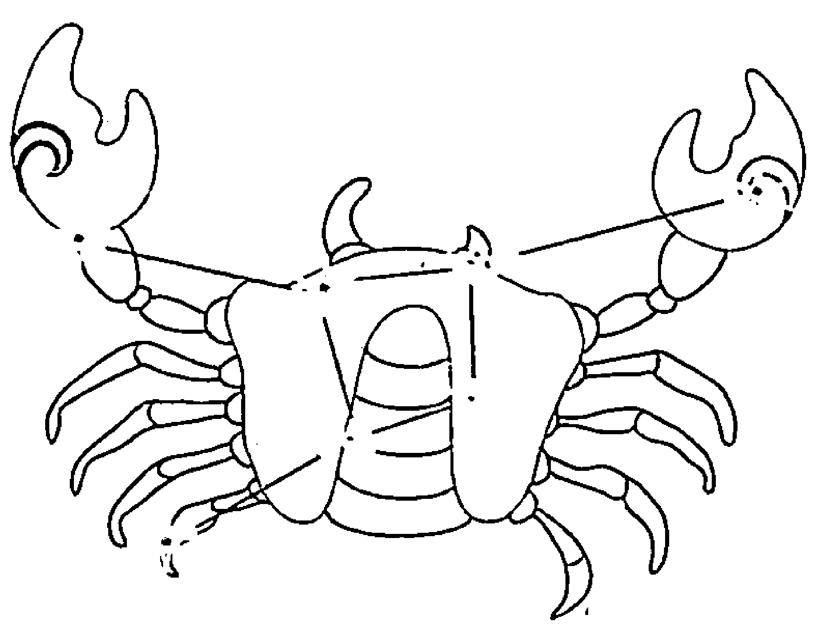

一个故事对应一个星座秘密

湖南文艺出版社

#### 图书在版编目（CIP）数据

心灵鸡汤魅力星座智慧书. 巨蟹座读本 / 朱玉娟, 徐旺, 朱莉编著. -- 长沙 : 湖南文艺出版社, 2011.1

ISBN 978-7-5404-4704-5

I. ①心… II. ①朱… ②徐… ③朱… III. ①成功心理学—通俗读物 IV. ①B848.4-49
中国版本图书馆CIP数据核字(2010)第239216号

#### 心灵鸡汤魅力星座智慧书. 巨蟹座读本

编 著: 朱玉娟 徐旺 朱莉

出版人: 刘清华

责任编辑: 傅 伊

出版、发行: 湖南文艺出版社

（长沙市雨花区东二环一段508号 邮编: 410004）

网址: www.hnwy.net

经销: 湖南省新华书店

印刷: 湖南新华精品印务有限公司

印次: 2011年1月第1版第1次印刷

开本: 710*1000mm 1/16

印张: 14

字数: 180,000

印数: 1-10,000

书号: ISBN 978-7-5404-4704-5

定价: 25.00元

本社邮购电话: 0731-85983015 若有质量问题，请直接与本社出版科联系调换

#### 内向而敏感的巨蟹

重视家庭和睦及自己的声誉，是巨蟹座人的最大特点。他们观察力敏锐，直觉能力强。有较强的防护能力，虽不具攻击性，但反击性却很强。丰富的想象力及梦想爱的浪漫，使他们总有新奇的想法产生，令人刮目相看。内向，温文尔雅，远离纠纷矛盾，多为与世无争的好人。

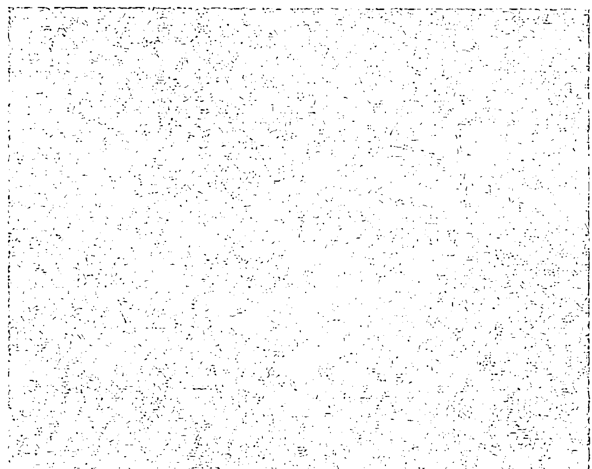

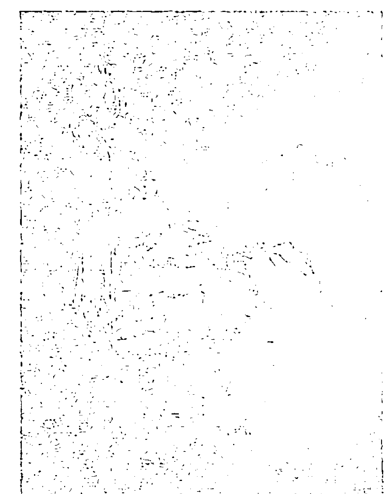

健康：多是能跑爱动、精力充沛的人。健康的身体使你能应付方方面面的挑战。如注意修身养性、随遇而安，到晚年除会患些老年病外，一般无大的病症。因爱活动，要特别注意外伤，尤其是胸外伤。因好吃好喝，也要注意胃病。

事业：学习对你来说是轻松的事，只要稍微下点气力，成绩便会直线上升。小学时你未意识到学习的重要性，不太注重学习，上中学后，你开始明白学习的重要，竞争意识增强，不甘落后，在关键考试时有优秀表现。

婚恋：多数婚姻不是自己由相识到相恋而缔结的、通常是经朋友、家人介绍撮合，初恋有种新鲜有趣的感觉，在不太长的时间便结为夫妻，由于思想准备不足，一部分人婚姻会有变故的危险，多数是因一方不能适应另一方造成的。

多数人现在从事的不是自己理想中有作为的职业，主要原因是你无法选择职业，而多数情况下是职业选择你，但个人的兴趣爱好及技能是可以根据所从事的职业慢慢改变的。专心工作一段时间，你会对所从事的职业逐渐感兴趣，并且激发潜在才能。

在经济上是属于保守派的人，既不愿开拓财源，也不肯花销。有点钱不是存银行，就是买具有保值性质的用品，或是添置坚实耐用的大件家具。出手小气，即便是亲戚朋友来借钱，也多以各种借口推托，给人以守财奴、小气鬼的印象。

事业发展比较平稳，进步缓慢，不会有大起大落，谋得一官半职，也多是靠熬年头、比资历而获得的。如果遇到喜欢你这种性格的领导，还会委以重任。但与同期工作的人相比，你仍是落伍者，其他人不少已成高官、经理、董事长。

- 强烈不安全感、情绪化、极端敏感、经不起打击……
- 目光短浅、自卑、心肠太软、缺乏情趣、有强

对孩子虽很严格，但是管理比较宽松。有空爱和孩子进行大人式的对话，愿与孩子一同出游。

对孩子关怀备至，不希望孩子离家远游，如孩子利用假期外出，总有沉重的失落感。

在妻子面前愿装作什么都不会的样子，被妻子宠惯着。对妻子多是百依百顺，干点活，就让妻子惊喜不已。

喜欢扮演家庭主妇的角色，懂得疼爱丈夫，对丈夫百般体贴，反而惯他一身毛病。

小时候比较爱哭闹，稍大时是个活泼伶俐的机灵鬼。上学后在某些科目显露的才华令人吃惊。

# **[4] 魅力 星座智慧书之巨蟹座 charismatic**

## 目录

003

刘翔：一个飞翔的故事 009

### 魔方第一面：

- 魅力失分——目光短浅 017
- 魅力失分——不知适可而止 025
- 魅力失分——自卑 033
- 魅力失分——提不起放不下 043

### 魔方第二面：

- 魅力失分——钻牛角尖 051
- 魅力失分——好大喜功 059
- 魅力失分——贪得无厌 069
- 魅力失分——心肠太软 075
- 魅力失分——心机重 083
- 魅力失分——装腔作势的正派 091

### 魔方第三面：

- 魅力失分——占有欲强 101
- 魅力失分——抠门 109
- 魅力失分——缺乏情趣 119
- 魅力失分——超级黏人和啰嗦 129
- 魅力失分——让人捉摸不透 137
- 魅力失分——有强烈的不安全感 145

### 魔方第四面：

- 魅力失分——情绪化 151
- 魅力失分——善变 159
- 魅力失分——性格傲慢 169
- 魅力失分——过度保护自己 177
- 魅力失分——缺乏宽大心胸 185

### 魔方第五面：

- 魅力失分——极端敏感 193
- 魅力失分——经不起打击 199
- 魅力失分——缺乏理性思考 207

### 魔方第六面：

- 魅力失分——不在意形象 217

# agic

名人的榜样

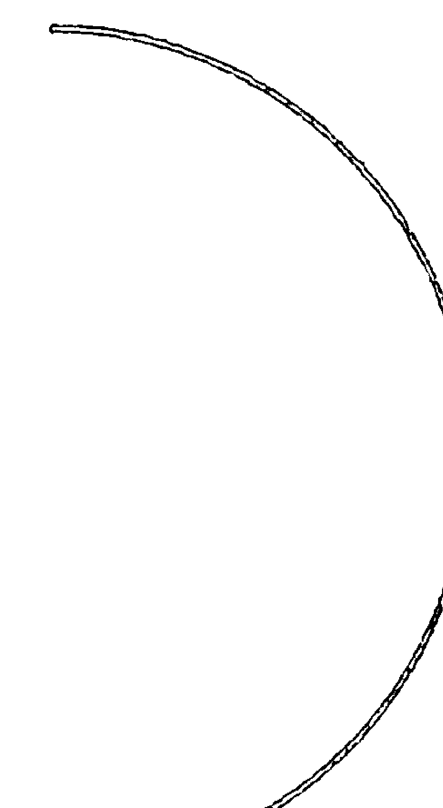

# Magic

- 姓名：刘翔
- 生日：1983年7月13日
- 星座：巨蟹座
- 籍贯：上海
- 身高：189cm
- 体重：87kg
- 项目：田径110米栏
- 特点：拥有体校男生特有的自信，能吃苦，成熟稳重和勇往直前。
- 弹跳/摸高：垂直起跳高度：80cm；摸高：3.46米；会扣篮
- 喜欢的运动：篮球，跳高，田径
- 喜欢做的事：耍酷，搞笑
- 目标：打破美国黑人垄断的110米栏的局面，让110米栏成为中国男生的运动。
- 最敬佩的对手：拉基·杜库雷（法国男子跨栏名将）

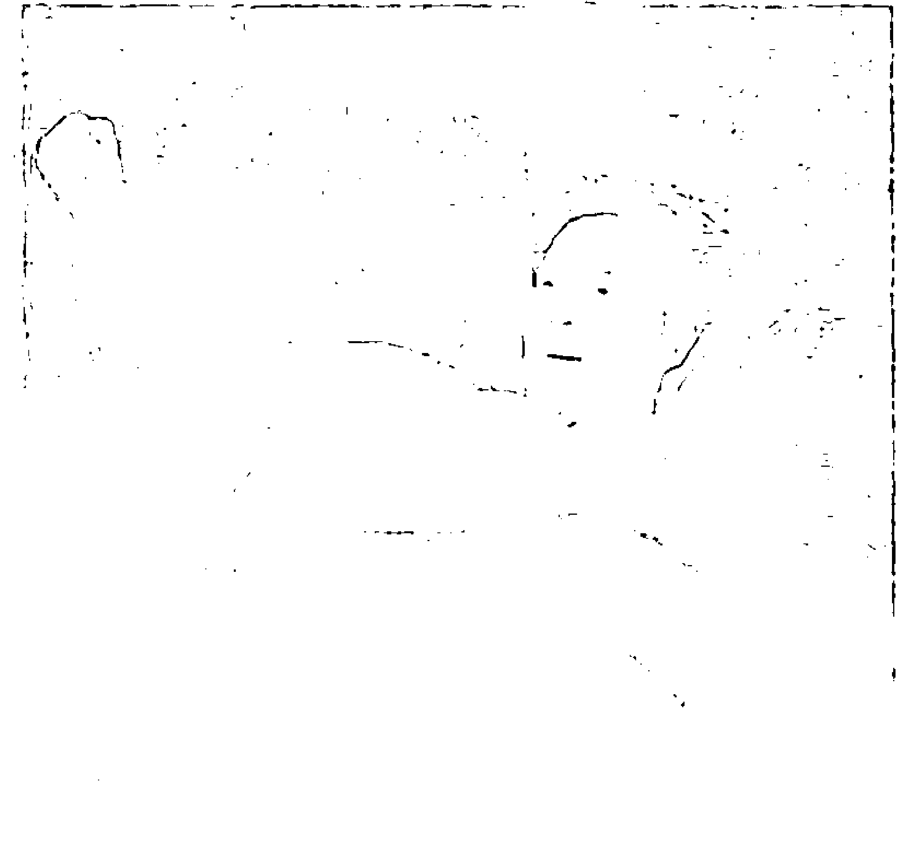

> “有了奖金，我就可以实现我一直以来的心愿，给爸爸妈妈买一套房子，让他们住得更宽敞。有了奖金，爷爷年纪大了，看病、装心脏起搏器，也不愁钱不够。有了奖金，爸爸妈妈可以不用再省吃俭用，有空的时候也可以出国旅游旅游，生活可以过得更好。”

刘翔的体育天赋越来越突出，而父母间的分歧也越来越明显，母亲吉粉花坚持，“我们翔翔是要读书考大学的，不练体育。”而刘学根的心里一直相信，儿子是真的有灵气，不练就浪费了。

1983年7月13日，上海又多了一个新生儿，男孩儿，足足九斤重，名字还未定。夫妇俩喜上眉梢，想不如将两人的姓氏合二为一，就叫刘吉吧。话一出口，便遭反对，刘吉？“留级”！刘吉不成，那么“刘强”呢？孩子长大了身体强壮些，总是父母的愿望。但强强，犟犟，上海话念来便成了犟头犟脑的意思，不好。这也不好，那也不行，那么“刘翔”呢？“翔”和“吉祥”的“祥”谐音，把妈妈的名字融合进去，又有展翅高飞的意思，而且上海话里“翔”跟“强”也很接近，简直怎么听怎么顺耳。“好，就叫刘翔！”刘学根一拍板，这个还未睁眼的孩子，在大人们的绞尽脑汁后有了一个满意的名字。顶着这个名字，小男孩儿在慢慢长大。一个还没学会走路，只能躺在摇篮里的孩子，没事干就喜欢自己蹬腿，以至于父母印象里那个时候的刘翔，最喜欢做的一件事，就是蹬腿。用妈妈的话说起来，就是“两条小腿像小榔头一样，拼命地蹬”。穿在脚上的小鞋子，一会就被蹬得不知去向了。为了保护他的小脚丫子，也为了省去一次次找鞋的烦恼，妈妈干脆在他脚上套了两只小棉套，这样任凭孩子怎么蹬都无所谓了。谁也不知道他是否曾从那种无意义的蹬腿过程中得到什么乐趣，但苦头倒是吃过的：2岁的时候，忽然一天，孩子面色发黄，乱哭乱闹，吓得父母赶紧把他送进医院。经过检查，原来是因为腿蹬得太激烈，造成了肠套叠。这个孩子的幼年生活就是如此的惊险刺激。

在父母看来孩子通常是转眼便长大了，而刘翔也在这转眼间上了小学二年级。学校田径队的仲老师看中了刘翔，想召他进队。父亲刘学根满口答应下，“拿不拿奖不重要，关键是让他有个好身体。”尽管初衷是让宝贝儿子增强体质，但之后从区少体校再到市二少体，刘翔的体育天赋越来越突出，而父母间的分歧也越来越明显，母亲吉粉花坚持，“我们翔翔是要读书考大学的，不练体育。”而刘学根的心里一直相信，儿子是真的有灵气，不练就浪费了。两人间的这种分歧到了刘翔15岁那年被正式摆上了桌面。终于，在刘学根的奔波以及区少体校顾教练的帮助下，宜川中学校长同意，让刘翔插班进初二，同时体育也不放，每天再到区里训练。

那时候的刘翔已经有了些现在的模样，进了二少体之后，有些田径队的女孩子开始打他的主意。体校的女生大多很外向，直接找上门聊天示好如小儿科般正常。为此，一些举重队、柔道队的“大块头”还经常气势汹汹地跑来警告，“不许和某某某走得那么近。”其实这哪里是他的错？无端被冤枉，刘翔气不过，嘴上便硬了许多，“大块头”们见嘴仗打不过便要动手，殊不知这小子的腿脚太利索，又有心捉弄他们，专门找楼梯跑，眼见他们在后面气喘吁吁地爬，边爬边叫：“站住！你别跑！”刘翔总是笑到肚子痛。然而转学去了普通中学，他却再没这么得意。虽然也有过和女生传纸条、打趣老师、一同回家的经历，但总的来说不如原来吃香了。有时他就会对好友冯霖毅说：

> > “其实啊，我们班级里还是有几个美女的。”

不过他接着就会神色一黯：

> > “但她们都喜欢成绩好的男生，对于我这样的体育生，只是喜欢我高高大大罢了！”

说完这话，傻小子马上又作不屑状，说：

> > “哼！以后让她们都拜倒在我的石榴裤下！”

但这也说明刘翔这个人，好胜心真的很强。甚至从小时候打玻璃球开始，别人比他厉害，他就想着要比别人更厉害，对于这一点他自己倒是很坦然：

> > “不知道这点是否影响了我以后的跨栏生涯。但我觉得，给自己设立个目标，总是好事。”

对于运动，他也一直没有放弃，也有人一直在惦记着他。

在宜川中学度过了难忘的一年后，孙海平教练找上门了。早在一年前，孙教练就注意到二少体里有个好苗子，但那时他正潜心带着陈雁浩和谈春华他们，等孙海平结束国内外赛事回到上海莘庄的训练基地，却发现那个小孩儿不见了。问明原因后，一向性格温和的他对同事发了一通火。接着，孙教练亲自来到刘家，晓之以理、动之以情。但一番话却并不见效，刘翔的爷爷奶奶、外公外婆，甚至舅舅姑姑之类的全都站在刘妈妈一边——翔翔以后是要念大学的，市体校是绝对不会回去的，唯独刘学根一人沉默不语。

而孙海平也从老刘的神色中读懂了什么，他当即从刘家告辞，却在两天后独自找到了刘学根。

> > “刘翔爸爸，别的不多说，我向你保证三点：第一，他回来后，绝对不会再受到欺负了。第二，在训练上，我肯定会尽力把他训练成一个出色的运动员。第三，刘翔和我在一起，我会教他许多做人的道理。”

在莘庄基地的办公室里，孙海平对刘学根这样说。有了这样的保证，刘学根拿定了主意。就是这个主意，将刘翔推上了走向圣坛的路。

这个阶段他要超过哪个队友，下个阶段他又要超过哪个对手，他心里都有一本账。而这时他的母亲也明白了，那个曾经她希望像其他学子一样好好学习进入大学的儿子，是不同的。体育是他的事业，他应该在田径场上。

> > “人的一生，总会遭遇各种各样的对手，我的看法是，没有对手，就没有动力。我永远感谢我的对手，那些曾在跨栏上成为我目标，激励我不断前进的对手们。”好胜心作祟，刚进孙指导队里的时候，他是队里年龄最小的一个，也是水平最差的一个，师兄们大多是有冠军头衔在身了。而他的目标，最终锁定在和他同跑110米栏的师兄沈真声身上，他的种种辉煌战绩并没给小刘翔造成什么心理压力，反而让他觉得更加刺激，对手越强，超过他不就显得更有意义吗？

多少个傍晚，自己留下来单独加练，其实那个年纪的孩子，谁不想和伙伴们一起去玩、但刘翔知道他不可以。他的底子差，要超过别人，就必须付出加倍的汗水和努力。结果是不言而喻的，他击败了沈真声。同时他也盯住了另一个人——陈雁浩。在那个时候，这个人在中国跨栏界的名声如同乔丹于NBA，然而这个仿佛遥不可及的对手，在短短几年之后，也变成了刘翔的手下败将。这之后，刘翔开始声名鹊起，一个又一个名将倒在他身后，他是怎么做到的？那些在他身边看着他成长起来的人，他们清楚：在刘翔心里一直有一个超越的目标。这个阶段他要超过哪个队友，下个阶段他又要超过哪个对手，他心里都有一本账，一个又一个新目标会激励着他不断去刻苦训练，超越极限。而这时他的母亲也明白了，那个曾经她希望像其他学子一样好好学习进入大学的儿子，是不同的。体育是他的事业，他应该在田径场上。

天赋、努力、支持、些许的运气，这些成就了刘翔。雅典一战他成名了。命运，从此拐弯，开始不得不向另一个方向前行。练签名练到手抽筋；无论去什么地方都需要严密保护，不然就会有被狂热的人群撕碎的危险；觉不够睡，活动不断，训练反而要硬挤时间才能完成……这样的日子持续了很久。许多人在出了名之后，都会怀念以前不被打扰的平凡生活，说“宁愿回到过去”。刘翔却不想这么说，不是他看重物质或者虚名，而是想实事求是地说一下他自己的看法。

的确，谁不讨厌被无尽地追逐、围堵，他也受不了整天面对一堆话筒和各种各样的社会活动。但无论如何，奥运一战成名后，他得到了各方面给他的物质奖励。“有了奖金，我就可以实现我一直以来的心愿，给爸爸妈妈买一套房子，让他们住得更宽敞。有了奖金，爷爷年纪大了，看病、装心脏起搏器，也不愁钱不够。医生若是知道他是刘翔的爷爷，说不定还会对爷爷照顾得更周到些。有了奖金，爸爸妈妈可以不用再省吃俭用，有空的时候也可以出国旅游旅游，生活可以过得更好。
所以，他宁愿自己受点累，也不愿意把时光的大钟一下子拨回到过去。他对父母说过，这条路，他是肯定要走下去了，没有回头路可寻。只要一家人都开开心心的，叫他吃怎样的苦都愿意。

# agic

缺点改造

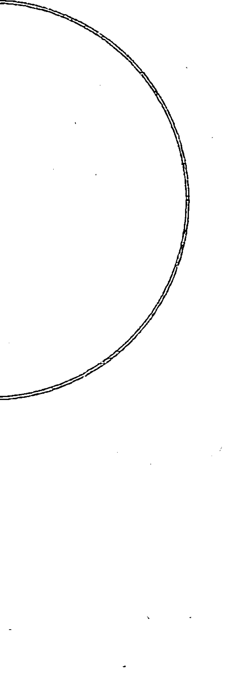

### 魅力失分

巨蟹座的人是缺乏远见卓识的，他们一般只顾眼前的利益，或者只贪图一时的享乐。

#### 吃鸡的猫

田牧

从前，赵国有户人家，家中老鼠泛滥成灾，于是，他就到附近的中山国寻找一只善于捕捉老鼠的猫。中山国的人给了他一只在中山国是有名的捕鼠好手的猫。只是，它有个比较特别的习惯，即不仅善于捕捉老鼠，还喜欢吃鸡。一个多月后，赵国人家的鼠患被消除了，老鼠带来的困扰不见了，可是随之而来又产生了新的问题，家里的老鼠被捉干净的同时，饲养的鸡也被猫吃了个精光。

儿子觉得这是个严重的问题，便对父亲说：“这只馋猫吃光了我们家的鸡，为什么不把它赶走呢？”“你有所不知啊，我们家的祸患是老鼠，而不是有没有鸡。试想一下，假如家里没有鸡，顶多在饿时我们不吃鸡就是了，还不至于挨饿和受冻！但是假如家里有老鼠，它就会偷吃我们的粮食，毁坏我们的衣物，损坏我们的家具，打穿我们的墙壁，到那时我们就要忍饥受冻了。那样，岂不是比没有鸡更可怕？照这样讲，我们能把猫赶走吗？”父亲告诉儿子说。

魅力提示：
学会站在整体效益的角度和高度上去考虑问题，用长远的目光权衡事物的利弊。

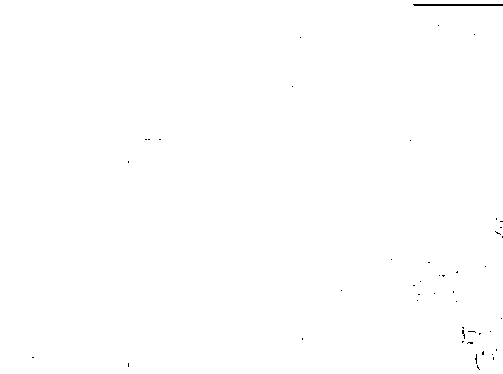

#### 聪明的报童

陈琛

某一个地区，有两个报童在卖同一份报纸。

第一个报童很勤奋，每天沿街叫卖，嗓门也响亮，可每天卖出的报纸并不是很多，而且还有减少的趋势。

第二个报童肯用脑子，除去沿街叫卖外，他还每天坚持去一些固定场所，先给大家分发报纸，过一会儿再来收钱，地方越跑越熟，报纸卖出去的也就越来越多，当然也有些损耗，但很小。渐渐地，第二个报童的报纸卖得更多，第一个报童能卖出去的越来越少了，不得不另谋生路。

# # 魅力星座智慧书之

为什么会如此？第二个报童的做法大有深意：

第一，在一个固定地区，对同一份报纸，读者客户是有限的。买了我的，就不会去买他的，我先把报纸发出去，这些拿到报纸的人就肯定不会去买别人的报纸，等于我先占领市场，我发得越多，对手的市场就越小，这对竞争对手的利润和信心都构成打击。

第二，报纸这东西不像别的消费品，有复杂的决策过程，随机购买多，一般不会因质量问题而退货，而且钱数不多，大家也不会不给钱，今天没零钱，明天也会一块给，文化人嘛，不会为难小孩子。

第三，即使有些人看了报，退报不给钱，也没什么关系，一则总会积压些报纸，二则他已看了报，肯定不会去买别人的报纸，还是自己的潜在客户。

魅力提示：

要做事情，不要斤斤计较一些小事或小钱，而要从大局、长远角度考虑，先多花些时间精力以联络感情，示人以慷慨，让些小利，占领市场，然后再逐步巩固市场，获取事业的稳定与成功。

## 贪甜头的苍蝇
佚名

一天，一个孩子追逐一只猫，想抓住它，这只猫仓皇奔跑，一头钻进厨房里，突然，“砰”的一声，它将一瓶蜂蜜打破了。

蜂蜜洒了出来，甜味弥漫在院子里。有一群苍蝇被蜂蜜的甜味吸引，纷纷从窗外飞进来，停在蜂蜜的黏液上大快朵颐。

它们没注意到双脚已被蜂蜜粘住了，依然享受着蜂蜜的甜味。没多久，它们飞不开也动不了，身体渐渐地凝固在蜂蜜里。

这群苍蝇越是想挣脱，越是被粘得牢，最后，用尽了力气也没有逃离。断气前，它们嘶吼着：“我们真是傻，为了一点甜头，竟然害了自己。”

### 魅力提示：

目光短浅的人为了享受一时之快、贪图蝇头小利，结果只会遗祸无穷、葬送自己的大好前程甚至性命。

## 青年与富翁
佚名

一个青年非常渴望成功，当地有一位富翁取得的成就让他非常羡慕，于是他跑到富翁那里询问他成功的诀窍。

富翁弄清楚了青年的来意后，什么也没有说，转身到起居室拿来了一个大西瓜。青年迷惑不解地看着，只见富翁把西瓜切成了大小不等的三块。

“如果每块西瓜代表一定程度的利益，你会如何选择呢？”

“当然是最大的那块！”

“那好，请用吧！”

富翁把最大的那块西瓜递给青年，自己却吃起了最小的那块。青年还在享用最大的那一块的时候，富翁已经吃完了最小的那一块。接着，富翁得意地拿起剩下的一块，还故意在青年眼前晃了晃，大口吃了起来。其实，那块最小的和最后一块加起来要比最大的那一块大得多。青年马上就明白了富翁的意思：富翁吃的瓜虽没自己的大，却比自己吃得多。如果每块代表一定程度的利益，那么富翁赢得的利益自然比自己多。

吃完西瓜，富翁讲述了自己的成功经历，最后，对青年语重心长地说：“要想成功就要学会放弃，只有放弃眼前利益，才能获得长远大利，这就是我的成功之道。”

### 魅力提示：

放弃眼前利益才能获得长远大利。要想成功，要想获得更多，就要先学会放弃，舍得放弃。

书名：别为小事烦恼
作者：冯丽莎 编著
出版社：中国商业出版社
出版时间：2008-2-1
印刷时间：2008-2-1
开本：16开
ISBN：9787504460585
包装：平装

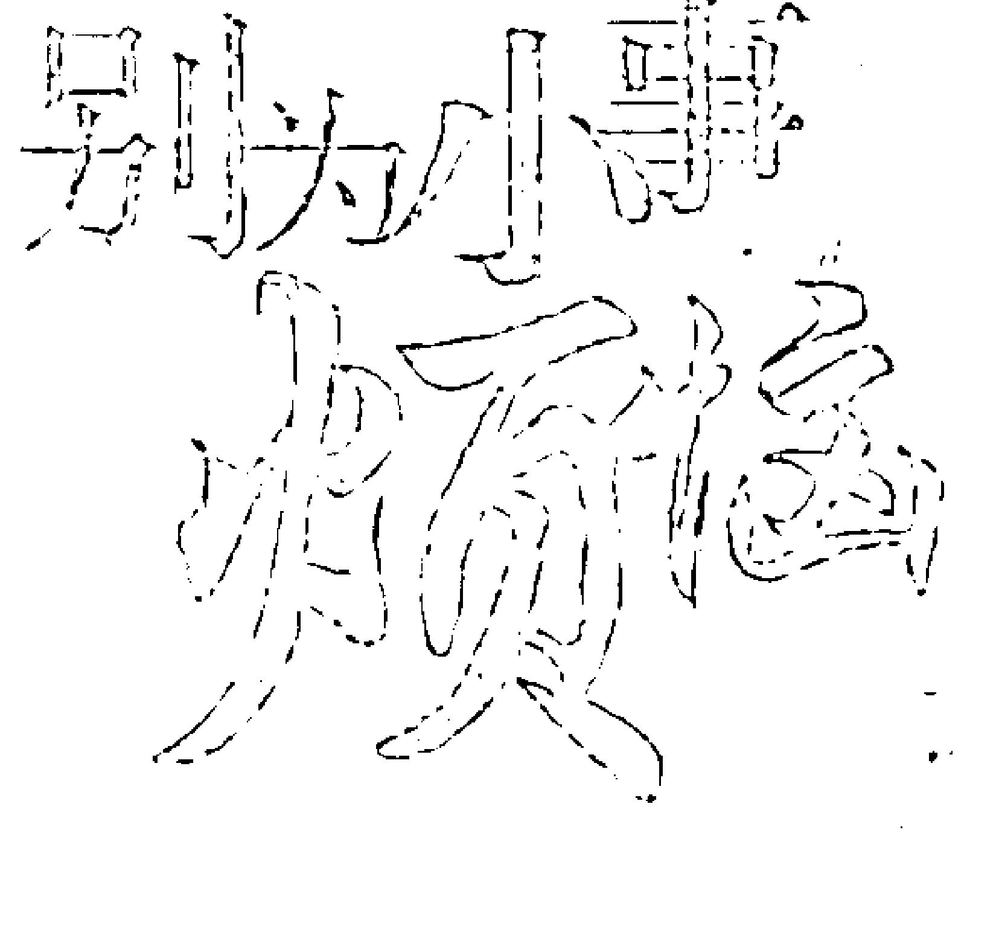

### 内容简介：

超然淡泊，洞察人生冷暖，看开世事，走过风雨人生。

我们无法选择自己的老板、无法选择自己的出身、无法选择自己的机会，但是我们可以选择换一种心态去看待问题。

凡事就要看得开：世界上有太多的不公和后悔，也有太多的事让我们的心境难以平复。其实，这正是每个人所必然经历的事情，对待它们，我们能做的就是凡事要看得开。

凡事就要看得远：人生处世，要想没有烦恼和过错，除了平日行事要慎思熟虑、考虑周详，以免挂一漏万外，尤其不能目光短浅，凡事要看得远，不可只图眼前小利。明知非法，还是心存侥幸。

凡事就要看得淡：凡事要看得淡一些，在平凡中感受那份来自内心的宁静，简单和快乐才是最幸福的。所以，我们不妨学会做平凡中的自我，做知足中的自我！

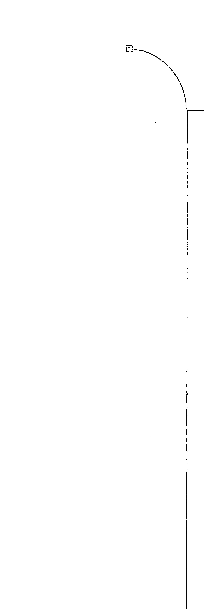

### 魅力失分

巨蟹座是不知道适可而止的，他永远掌握不好那个度，因此，也就做不到凡事留有余地。

# 魅力星座智慧书之
## 鲁庙里的怪酒壶
佚名

孔子带着他的弟子瞻仰鲁桓公宗庙，在案桌上发现一只形状古怪的酒壶。

孔子问守庙人：“这是什么酒器？”守庙人回答：“是君王放在座右作为铭志用的酒壶。”“啊，我知道它的用处了！”孔子回头对弟子们说，“快取清水来，灌进这只酒壶里。”

弟子舀来一大瓢清水，徐徐注入酒壶，大家都屏息静气地看着。只见水注入不多时，壶身开始倾斜了。接着当水达到壶腰时，酒壶却又重新立得端端正正的。再继续灌，水刚满到壶口，酒壶就砰的一声翻倒在地。大家都莫名其妙，一齐抬头看着孔子。

孔子拍手叹道：“对啊，世上哪有满而不覆的事物啊！”

子路问：“老师，请问这个酒壶虚则倾，中则正，满则覆，其中可有道理？”

“当然有！”孔子对大家说，“做人的道理也同这只酒壶一样，聪明博学，要看到自己愚笨无知的一面；功高盖世，要懂得谦虚礼让；勇敢孔武，要当作还很怯弱；富庶强盛，要注意勤俭节约。人们常说的不偏不倚，截长补短，也就是这个道理。”

### 魅力提示：

一切事物无不存在着一个确定的“度”——事物的界限、分寸、火候。它反映了事物质和量的统一关系，量变在一定限度内不改变事物的性质，但超过一定限度，就会引起质变，走向反面。

## 树和鸦
李晨宇

有一个人下山去看朋友，走到山路上时，看见几棵巨大的树，枝叶茂盛，可是伐木的工匠却站在一边，谁也不去砍伐。这人便问：“这么大的树，你们为什么不动手去砍伐呢？”工匠说：“这些树木质不好，没有什么用处。”这人想了想才明白：这些树正是因为没有用，所以才能长得这样高大。

下了山之后，到了朋友家，两人相见十分高兴，主人忙吩咐仆人杀鹅请客。仆人问道：“我们家的鹅一只会叫，一只不会叫，杀哪一只才好呢？”主人不假思索地说：“杀那只不会叫的好了。”

这人又糊涂了：刚才山上的树因无用而终其天年，而今这只鹅因无用而被杀，到底是有用好还是无用好？

### 魅力提示：

生存是一门学问，太强了树大招风，招人嫉妒；太弱了被人看不起，被人一脚踢开。把握好之间的度，才可以游刃有余。

## 昼夜荣辱各半
佚名

周朝时期，有一个姓尹的财主家大业大，在他家劳动的奴役，从早到晚得不到休息。

有个在尹家已经工作了几十年的老仆人，已经累得筋疲力尽，但是尹家对他奴役得一直非常严重，苦活累活都让他去干，并且还经常挨打受骂。他白天呻吟着去劳动，到了夜间拖着疲劳的身体，躺下就呼呼睡着了。他精神恍惚，夜夜做梦当了国王，高踞于民众之上，总揽全国政事，在离宫别院宴饮游乐，任意满足自己的欲望，无比快乐。但是每次醒来以后，仍然是个奴仆，从事艰苦的劳动，但是他从来都不觉得苦、累。

有人问及他的劳苦，他说：“人活百年，昼夜各占一半。我白天当奴仆，劳苦是有的，但是晚上当国王，其快乐说不尽。还有什么可怨恨的呢？”

仆，劳苦是劳苦，但是夜间当国王，快乐无比，我还有什么可怨恨的呢！

姓尹的财主苦心经营世间之事，时时都在思虑积累家业，心理、身体都很疲劳，每日夜间也昏沉沉地入睡。他夜夜做梦给别人当奴仆，奔波劳碌，什么苦活累活都干，还经常遭受斥骂毒打，什么侮辱都尝遍了。在梦中他呻吟，说梦话，求饶，直到天亮才解脱，又去苦苦经营他的家业了。

姓尹的财主对这种情形很担心，害怕日久天长身体坚持不住，便去询问朋友，讨寻解决的办法。

他的朋友听他述说了梦中的痛苦，便对他说：“你的地位很高，可以使得自身无比荣耀，家大业大，钱财多得用不完，远远胜过其他的人。到了夜间，你梦见当奴仆，也不奇怪。因为安逸和劳苦是循环往复、互相转化的，这也是自然的常理。你想要睡梦和白天都富贵尊荣、快乐无比，这怎么可能呢？”

姓尹的财主听了朋友的开导，顿时豁然开朗，觉得很有道理。这番话就像一副治病的药方，于是他就放宽了奴仆们的劳动要求，不再那么刻薄狠毒，减少了自己心中思虑的事情。天长日久，由于心理压力减少了，梦中的痛苦也逐渐减轻了。

### 魅力提示：

“日中则昃，月满则亏”。无论什么事情，做得过分，就会向相反的方面转化。

## 蜈蚣的脚
佚名

据说上帝在创造蜈蚣时，并没有为它造脚，但是它可以爬得和蛇一样快速。有一天，它看到羚羊、梅花鹿和其他有脚的动物都跑得比它还快，心里很不高兴，便嫉妒地说：“脚多，当然跑得快。”

于是，它向上帝祷告说：“上帝啊！我希望拥有比其他动物更多的脚。”

上帝答应了蜈蚣的请求。他把好多好多的脚放在蜈蚣面前，任凭它自由取用。

蜈蚣迫不及待地拿起这些脚，一只一只地往身体上贴，从头一直贴到尾，直到再也没有地方可贴了，它才依依不舍地停止。

它心满意足地看着满身是脚的自己，心中窃喜：“现在我可以像箭一样地飞出去了！”

但是，等它一开始要跑步时，才发觉自己完全无法控制这些脚。这些脚劈里啪啦地各走各的，除非全神贯注，才能使一大堆脚不致互相缠绕而顺利地往前走。

这样一来，蜈蚣反而走得比以前慢得多了。

### 魅力提示：

有时候所拥有的东西不是越多越好。凡事都有一定的限度范围，缺少固然有其不足，但若超过了最大的允许范围，便有可能难以调节控制，反而成为拖累，适得其反。

## /魅力星座智慧书之

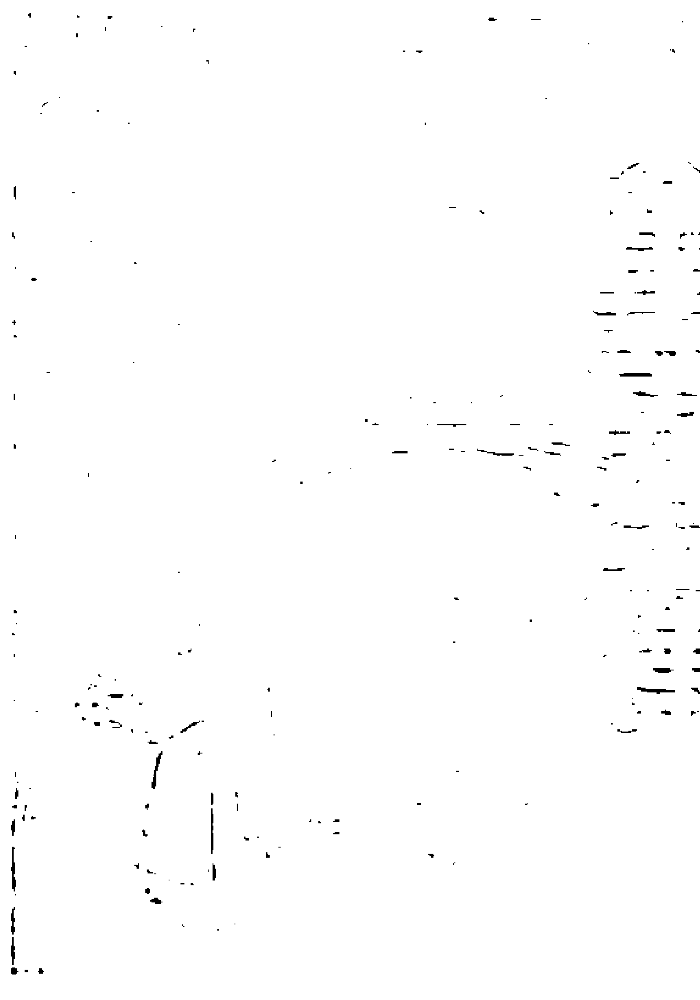

书名：5/8人生黄金律
作者：（日）野村正树 著，龙利方 译
出版社：金城出版社
出版时间：2009-6-1
印刷时间：2009-6-1
开本：16开
ISBN：9787802511002
包装：平装
凡事只求 一半幸福生活 金城方

### 内容简介：

八分之五这个美丽的分割点在不经意间为我们的生活增添了许多乐趣，许多偶然和巧合都和这个美丽的分割点联系到了一起，从名片、明信片、各种卡片、晚报到香烟的外壳……生活中处处充满了黄金比例。在艺术世界里，雕塑、建筑、绘画都令我们无法摆脱黄金分割所带来的诱惑，它让人为之着迷，让我们成为了这一美丽的追求者。

它为什么会令我们着迷呢？因为它代表了一种平衡，然而最美丽不是这个单纯的数字，而是一种闲适、适可而止的心境。

在本书中，野村正树先生提到了要将黄金分割用于生活、学习和工作中，显然这是一种追求自然与和谐之美的生存态度。在现在激烈的生存环境下，人人都在争做强者、胜者，使一些人几乎丧失了注视和享受美丽的机会。但是毕竟不是所有人都可以成为胜组中的一员，勉强而为必然会让一个人迷失方向。人只有找到了属于自己的位置，适可而止、适度而为，才能实现平衡生活之美。

### 魅力失分

巨蟹自我感觉很好，但是却又难以克服时时刻刻想躲进壳里的自卑感，他们是一群喜欢低头行走于人烟稀少的路上的人。

## 傻子的价值
澜涛

他16岁那年，升入了高中二年级，他虽然更加刻苦努力地学习着，但因为他的智商偏低，他和同学们的差距越来越大。校方婉转地示意他退学。那是一个连太阳都暗淡的日子，他辍学了。因为没有文凭，又没有经验，一直没有什么地方肯用他这个“傻子”。父母开始无奈地叹息起来，他开始觉得自己是父母的一个累赘，陷入了痛苦的深渊中。

这天，他来到家附近的一个公园，坐在一个角落，凄凉地想着心事。不知道过了多久，一位老人走过来和他搭话，他注意到老人装着一条假腿，少了一只胳膊，并且瞎了一只眼睛。一种同病相怜的感觉让他将自己的所有痛苦愁绪都说给了对方，他问老人：“我什么都做不了，我是一个傻子，一个累赘，我该怎么办？”老人看了看他，笑了，没有说什么，开始吹起了口哨。随着老人的口哨声，他注意到，开始不断有鸟儿飞来，落在他和老人附近的树上，欢快地鸣叫着……良久，老人停了下来，对他说道：“每个人都有一样是别人比不了的，你也有。”

他记住了老人的话，他激励着自己：“我一定有一样是比别人强的。”

大约半年后，他终于得到了一份替人整建园圃、修剪花草的活儿。虽然这是一个忙碌劳累的工作，但他异常珍惜这个机会，因为他发现，他是那样地喜欢和花草交谈。他非常勤勉用心地做着。不久，人们发现，凡经他修剪的花草无不出奇的繁茂美丽。他也开始经常替人出主意，帮助人们把门前那点有限的空隙因地制宜精心装点，经他布设的花圃无不令人赏心悦目。

一天，他路过市政府，注意到有一块污泥浊水、满是垃圾的场地，觉得和周围的美丽非常不和谐。他主动向有关部门申请要免费整治这块空地。当天下午，他拿了几样工具，带上种子、肥料来到目的地。一位热心的朋友给他送来一些树苗，一些相熟的顾主请他到自己的花圃剪用花枝，一家家具厂表示愿意免费承做公园里的条椅……不久，这块泥泞的污秽场地就变成了一个美丽的公园，绿茸茸的草坪，曲幽幽的小径，人们在条椅上坐下来还能听到鸟儿在唱歌……

一年一年，时光流逝着，他一直没有学会外语，微积分对他更是个未知数，但他对色彩和园艺却异常敏感。他不断地为人们设计着花圃园林，他工作到哪里，就把美带到哪里，他的名字也开始蜚声世界，他就是加拿大风景园艺家琼尼·马汶。

### 魅力提示：

永远不要看低自己，因为，哪怕是一个“傻子”，也总有一样比别人强。

## 三只动物与风
佚名

很久以前，有一种叫夔的动物，长得像牛却没有角，只长了一只脚。夔因为只有一只脚，所以走路一跳一跳的。

它很羡慕有多只脚的动物炫，炫的俗名叫百足。它认为炫有很多的脚，走路一定也很快，可是没想到炫也有羡慕的动物，它很羡慕没有脚而能走得比它快的蛇。可是蛇却很羡慕无形而能飘动的风。

有一天，夔和炫、蛇遇到一起了，它们自由自在地攀谈起来。

夔对炫说：“我用一只脚一跳一跳地行走，这是只有我才能办到的。可是你用上万只脚行走，是怎么走的呢？”

炫回答说：“是这样的，你没见过人吐唾沫吗？他们吐出的唾沫，大的像珠子那么大，小的像雾滴那么小，混杂在一起落下来，数也数不清。我凭借自然本能行动，为什么能行走，其实自己也不知道是什么原因。”

炫也不理解蛇为什么没有脚也能走得很快，它问蛇说：“我用很多只脚行走，却不如你没有脚走得快，这是为什么呢？”

蛇回答说：“我是凭借自己腹部的鳞来摩擦地面行走的，至于没有脚却能行走这么快，我也不知道其中的原因，但是我却能够逮住有脚的动物。有时候我真的很庆幸自己没有长脚，要不然像你一样有那么多的脚却跑这么慢，还不得饿死啊！”

炫惭愧地低下了头，看到炫的样子，蛇显得极为得意。

这时候，一阵风刚刚过去，又吹来一阵风。蛇不解地对风说：“我运动着我的脊背和两肋行走，好像有脚行走一样。可是你呼呼地从北海刮起来，又呼呼地刮到南海去，像没有形迹似的，但是速度却比我快得多。这是什么缘故呢？”

风回答说：“你只看到我风光的一面，却不知道我也有我的痛苦。我从北海刮起来到南海去，虽然速度很快，但这只是一个方面。从另一个方面看，我还有小的失败之处。在我前进的途中，有人用手指挡住我，我不能吹断人的手指，人的手指胜过了我；有人用脚踢我，我不能吹断那人的脚，那人的脚也胜过了我。这都是我小的失败之处啊！虽然这样，刮断大树，吹飞房屋，却只有我能够办得到。所以，我是用许多小的失败来换取大的胜利的，这是只有圣人才能够做到的啊！”

听了风的话，夔、炫、蛇这三个动物都瞪着大眼睛，听得入迷了，对风佩服得五体投地。

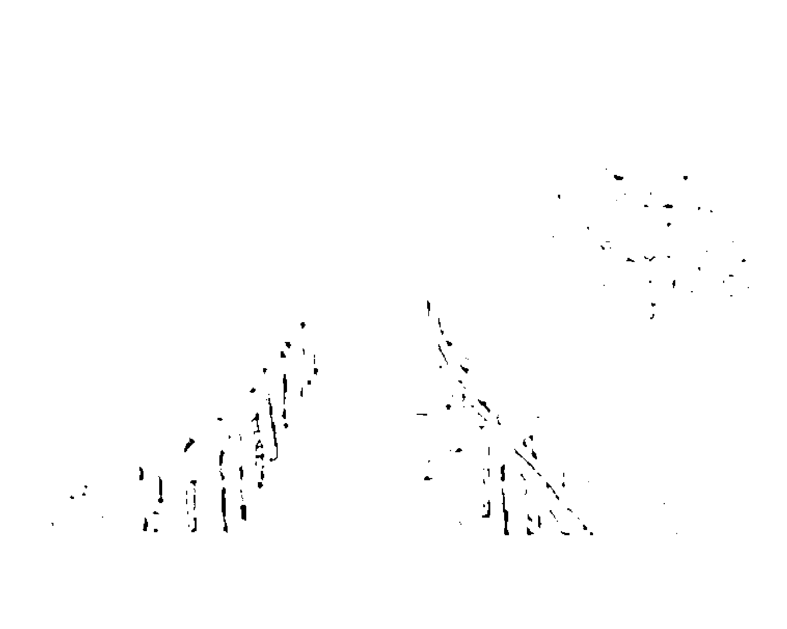

## 最优秀的人是谁
马志国

古希腊的大哲学家苏格拉底临终前有一个不小的遗憾——他多年的得力助手，居然在半年多的时间里没能给他寻找到一个最优秀的关门弟子。

事情是这样的：苏格拉底在风烛残年之际，知道自己时日不多了，就想考验和点化一下他的那位平时看来很不错的助手。他把助手叫到床前说：“我的蜡所剩不多了，得换另一根蜡接着点下去，你明白我的意思吗？”

“明白，”那位助手赶忙说，“您的思想光辉是得很好地传承下去……”

“可是，”苏格拉底慢悠悠地说，“我需要一位最优秀的承传者，他不但要有相当的智慧，还必须有充分的信心和非凡的勇气……这样的人选直到目前我还未见到，你帮我寻找和发掘一位好吗？”

“好的，好的。”助手很温顺很尊重地说，“我一定竭尽全力地去寻找，以不辜负您的栽培和信任。”

苏格拉底笑了笑，没再说什么。

那位忠诚而勤奋的助手，不辞辛劳地通过各种渠道开始四处寻找了。可他领来一位又一位优秀的人，却总被苏格拉底一一婉言谢绝了。

有一次，当那位助手再次无功而返回到苏格拉底病床前时，病人膏肓的苏格拉底硬撑着坐起来，抚着那位助手的肩膀说：“真是辛苦你了，不过，你找来的那些人，其实还不如你……”

“我一定加倍努力，”助手言辞恳切地说，“找遍城乡各地、找遍五湖四海，我也要把最优秀的人选挖掘出来，举荐给您。”

苏格拉底笑笑，不再说话。

半年之后，苏格拉底眼看就要告别人世，最优秀的人选还是没有眉目。助手非常惭愧，泪流满面地坐在病床边，语气沉重地说：“我真对不起您，让您失望了！”

“失望的是我，对不起的却是你自己。”苏格拉底说到这里，很失意地闭上眼睛，停顿了许久，才又不无哀怨地说，“本来，最优秀的就是你自己，只是你不敢相信自己，才把自己给忽略、给耽误、给丢失了……其实，每个人都是最优秀的，差别就在于如何发掘和重用自己……”话没说完，一代哲人就永远离开了他曾经深切关注着的这个世界。

### 魅力提示：

人，最大的敌人是自己，最难认识的人也是自己。一个人对整个世界来说纵然算不了多少，但对于自己来说，却是独自世界的全部和唯一。清醒地认识自己，完全相信自己，珍惜爱护自己，充分发掘和重用自己，这样你一定能获得自己人生的成功！记住，相信自己是世界上最优秀的人，至少，在你独自世界之中！

## 生命的价值
于凤静

有一个生长在孤儿院里的小男孩，常常悲观地问院长：“像我这样没人要的孩子，活着究竟有什么意思呢？”

院长总是笑而不答。

有一天，小男孩又一次发出这样的感叹。于是，院长交给男孩一块石头，说：“明天早上，你拿着这块石头到市场上去卖，但不是‘真卖’，记住，无论别人出多少钱，绝对不能卖。”

第二天，男孩拿着石头蹲在市场的角落，竟然意外地发现有不少人对他的石头感兴趣，而且价钱愈出愈高。回到孤儿院，男孩兴奋地向院长报告，院长意味深长地笑笑，要他明天把石头拿到黄金市场去卖。于是，第二天，小男孩又把石头带到了黄金市场。在黄金市场上，有人想出比昨天高十倍的价钱来买这块石头。

最后，院长叫孩子把石头拿到宝石市场上去展示。结果，石头的身价又涨了十倍，由于男孩坚决不卖，这石头竟被传扬为“稀世珍宝”。

男孩兴冲冲地捧着石头回到孤儿院，问院长为什么会这样。院长没有笑，望着孩子慢慢说道：

“生命的价值就像这块石头一样，在不同的环境下就会有不同的意义。一块不起眼的石头，由于你的珍惜、惜售而提升了它的价值，竟被传为稀世珍宝。你不就像这块石头一样吗？只要自己看重自己，自我珍惜，生命就有意义，有价值。”

### 魅力提示：

人生在世，首先要自己看重自己，珍惜自己，这样才能不断地进取，充实自己、发掘潜能、完善自己，积极而有力地掌控自己的命运。如果一个人不珍重自己，把自己都不当一回事，那么别人就更不会把他当一回事。

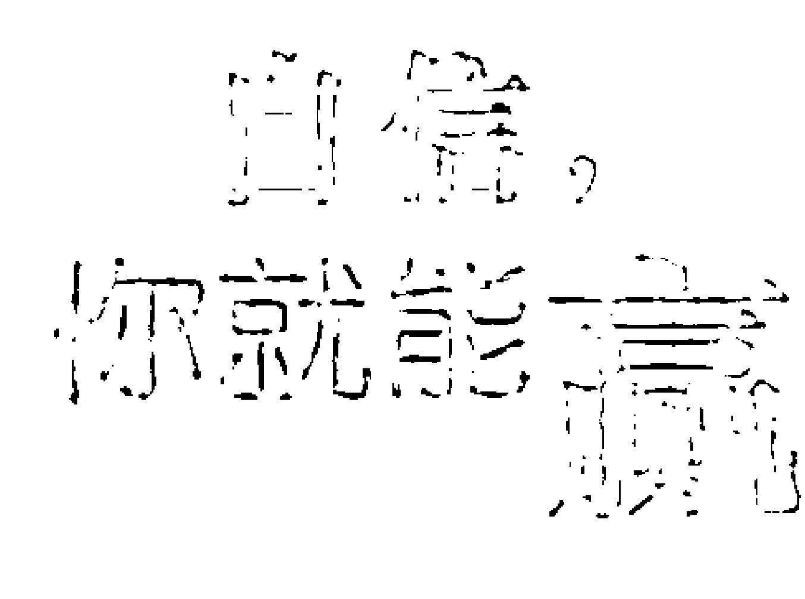

**书名：** 自信，你就能赢
**作者：** 张璞 著
**出版社：** 江西美术出版社
**出版时间：** 2007-5-1
**印刷时间：** 2007-5-1
**ISBN：** 9787807490753
**包装：** 平装

### 内容简介：

当你发现人生最大的敌人就是你自己，这场战役，你就注定无路可逃。你必须接受自己不完美的事实，即使这是很残酷痛苦的；你必须适应这个凡事不如意的世界，尽管你已经很努力。在自卑面前，每个人都无可逃避，你如何面对自己的自卑，就决定了你的命运。个体心理学大师阿德勒告诉我们：面对自卑，你唯一能做的事，就是拥抱它，然后超越它。超越自卑，你才能释放被封印已久的潜能。活用自卑，你才能拥有面对不如意的抗体。在与自卑的战役中，没有人可以帮你，更没有人可以代替你；事实上，超越困境和自卑的钥匙，就是你自己。如果自卑是诅咒，你就是解除咒语的法师；如果自卑是毒，你自己就是解药。

本书是以心理学的观点，分析了日常生活的事件，明确指出哪些行为是自卑的表现，并找出动机，让各位了解“自卑情结”如何影响我们的人生。

### 魅力失分

巨蟹座的人总是沉溺于往事，无法面对现实，对往事放不下，对憧憬的未来又拿不出勇气去追求。

## 随手关上身后的门

周平

被英国大众誉为优秀首相的劳合·乔治有一个习惯——随手关上身后的门。

一天，有一个朋友来拜访他，两个人在院子里一边散步，一边交谈。他们每经过一扇门，乔治总是随手把门关上。

朋友很是纳闷，不解地问乔治：“为什么你要把这些门都关上呢？”
乔治微笑着回答：“哦，我这一生都在关我身后的门。这是必须做的事。当你关门时，也就是把过去的一切留在了后面，不管是美好的成就，还是让人懊恼的失误。当你关上它们的时候，你才可能重新开始。”

在狄更斯的小说《庞大的遗产》中，女主人公非常富有，但就在她结婚的当天，却被新郎抛弃了。从那以后几十年过去了，女主人公却丝毫没有改变她新婚房间的布置，也始终没有脱下那件当年的结婚礼服，在一天一天的等待中，慢慢衰老下去，生命也随之枯萎……

谁能说这个女主人公会是幸福快乐的呢？之所以会有这样的悲剧的结局，就在于女主人公始终不能放下那块心病。如果她可以勇敢地关上身后的那扇门，重新振作起来，寻找另一个爱人，她又怎么能找不回自己的幸福呢？

### 魅力提示：

把失误和烦恼关在身后，有利于做一个快乐的人，快乐则有益于健康，能激发创意，使我们把事情做好。沉湎于懊悔和烦恼的情绪之中，是快乐不起来的。所以，我们要学会将过去的失误、错误统统忘记，让一切从新开始。

## 最后一课

满晓明

一位哲学家带着一群学生去漫游世界。十年间，他们游历了所有的国家，拜访了所有有学问的人，现在他们回来了，个个都满腹经纶。进城之前，哲学家在郊外的一片草地上坐了下来，对学生说：“十年游历，你们都已是饱学之士，现在学业就要结束了，我们上最后一课吧！”

弟子们围着哲学家坐了下来。哲学家问：“现在我们坐在什么地方？”
弟子们答：“现在我们坐在旷野里。”
哲学家又问：“旷野里长着什么？”
弟子们说：“旷野里长满杂草。”
哲学家说：“对。旷野里长满杂草。现在我想知道的是如何除掉这些杂草。”
弟子们非常惊愕，他们都没有想到，一直要探讨人生奥妙的哲学家，最后一课问的竟是这么简单的一个问题。

# 魅力星座智慧书之

一个弟子首先开口，说：“老师，只要有铲子就够了。”哲学家点点头。
另一个弟子接着说：“用火烧也是很好的一种办法。”哲学家微笑了一下，示意下一位。
第三个弟子说：“撒上石灰就可以除掉所有的杂草。”
接着讲的是第四个弟子，他说：“斩草除根，只要把根挖出来就行了。”
等弟子们都讲完了，哲学家站了起来，说：“课就上到这里了，你们回去后，按照各自的方法除去一片杂草，没除掉的，一年后再来相聚。”
一年后，他们都来了，不过原来相聚的地方已不再是杂草丛生，它变成了一片长满谷子的庄稼地。弟子们围着庄稼地坐下，等待哲学家的到来，可是哲学家始终没有来。

数年后，哲学家去世，弟子们在整理他的言论时，私自在书的最后补了一章：要想除掉旷野里的杂草，方法只有一种，那就是在上面种上庄稼。同样，要想让灵魂没有纷扰，唯一的方法就是用美德去占据它。

### 魅力提示：

要想除掉旷野里的杂草，方法只有一种，那就是在上面种上庄稼；要忘掉失恋的痛苦，最好的办法是重新找到一位两情相悦的情人；要摆脱往事的纠缠，最好是将精力全力投入到自己未来的事业中。因此，为了获得更美好的生活，我们要懂得引入新的种子、新的水源、新的追求

### 事理问答

町原

一个后生从家里到一座禅院去，在路上他看到了一件有趣的事，他想以此去考考禅院里的老禅者。来到禅院，他与老禅者一边品茗，一边闲扯，冷不防他问了一句：“什么是团团转？”

> “皆因绳未断。”老禅者随口答道。

后生听到老禅者这样回答，顿时目瞪口呆。老禅者见状，问道：“什么使你如此惊讶？”

“不，老师父，我惊讶的是，你怎么知道的呢？”后生说，“我今天在来的路上，看到一头牛被绳子穿了鼻子，拴在树上，这头牛想离开这棵树，到草地上去吃草，谁知它转过来转过去都不得脱身。我以为师父既然没看见，肯定答不出来，哪知师父出口就答对了。”

> 老禅者微笑着说：“你问的是事，我答的是理，你问的是牛被绳缚而不得解脱，我答的是心被俗务纠缠而不得超脱，一理通百事啊。”

后生大悟！

### 魅力提示：

一段情缘，常常让我们愁肠百结；一次得失，常常让我们痛心疾首；一回成败，常常让我们终生牵挂。缚得牛团团转而难以吃草的是绳，约束人团团转而不得解脱的是无形的欲望。然而，人又何时才能割断这欲望之绳呢？

## 双面神石雕

李广辉

一位哲学家途经荒漠，看到很久以前的一座城池的废墟。岁月已经让这个城池显得满目沧桑了，但仔细地看却依然能辨析出昔日辉煌时的风采。哲学家想在此休息一下，就随手搬过一个石雕坐下来。

他点燃一支烟，望着被历史淘汰下来的城垣，想象着曾经发生过的故事，不由得感叹了一声。

忽然，他听到有人说：“先生，你感叹什么呀？”

他四下里望了望，却没有人，他疑惑起来。那声音又响起来，是来自那个石雕，原来那是一尊“双面神”神像。

他没有见过双面神，所以就奇怪地问：“你为什么会有两副面孔呢？”
双面神回答说：“有了两副面孔，我才能一面察看过去，牢牢吸取曾经的教训；另一面又可以瞻望未来，去憧憬无限美好的明天。”
哲学家说：“过去的只能是现在的逝去，再也无法留住，而未来又是现在的延续，是你现在无法得到的。你不把现在放在眼里，即使你能对过去了如指掌，对未来洞察先知，又有什么具体的实在意义呢？”
双面神听了哲学家的话，不由得痛哭起来，他说：“先生啊，听了你的话，我才明白，我今天落得如此下场的根源。”
哲学家问：“为什么？”
双面神说：“很久以前，我驻守这座城时，自诩能够一面察看过去，一面又能瞻望未来，却唯独没有好好地把握住现在，结果，这座城池便被敌人攻陷了，美丽的辉煌都成了过眼云烟，我也被人们唾骂弃于废墟中了。”

魅力提示：辉煌的过去、美丽的未来，都需要现在这座正踏足其上的桥梁。现在是过去的将来，也是将来的过去，是时间长河中最为鲜活美丽、最值得珍重的一段。只有把握好现在，我们才可以更好地回顾过去、放眼未来；若是没把握好现在，那么就会丧失过去，将来也无从谈起了。

# 魅力星座智慧书之

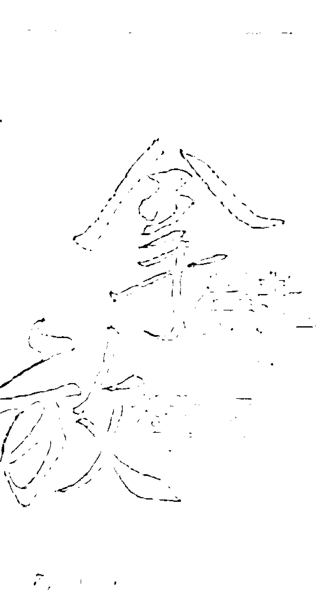

| 项目 | 内容 |
|------|------|
| 书名 | 拿得起 放得下 |
| 作者 | 燕鸣泉 编著 |
| 出版社 | 九州出版社 |
| 出版时间 | 2007-6-1 |
| 印刷时间 | 2007-6-1 |
| 开本 | 16开 |
| ISBN | 9787801956583 |
| 包装 | 平装 |

### 内容简介：

平凡众生最大的苦恼不是没有选择，而是选择太多。关键时刻，是勇敢向前还是明智地撤退，是执著拿起还是洒脱地放下，确实需要慎之又慎的思量。不管哪种选择，都可能影响一生的成败。“拿得起，放得下”是做人处世的真谛。

## CANCER

### 魅力失分

巨蟹欠缺向现实挑战的勇气，对于尚未发生的事耿耿于怀

## 烦恼箱

邱美荣

有一个心理学家做了一个很有意思的实验。
他要求一群实验者在周日晚上把未来七天会烦恼的事情都写下来，然后投入一个大型的“烦恼箱”。第三周的星期日，他在实验者面前打开这个箱子，与成员逐一核对每项“烦恼”，结果发现其中90%的担忧并没有真正发生。

接着，他又要求大家把那些真正发生的10%的“烦恼”重新丢入纸箱中，等过了三周，再来寻找解决之道。结果到了那一天，他开箱后，发现那些剩下的10%的烦恼已经不再是那些实验者的烦恼了，因为他们都有能力对付。

魅力提示：
快乐是一种智慧，与其在自找的忧虑和烦恼的迷宫里受折磨，还不如为自己找一个个简单快乐的理由，让自己慢慢快乐起来。

### 答案掌握在你手中

矫友田

有位神秘的智者，具有非常丰富的知识和洞悉事物前因后果的能力。他答复任何问题从来不会答错。

有一个调皮的男孩对其他男孩子说：“我想到一个问题，一定可以难倒那个智者。我抓一只小鸟藏在手中，然后问他，这只小鸟是死的还是活的？如果他回答是活的，我就立刻将手里的小鸟捏死，丢到他脚边；如果他说小鸟是死的，我就放开手让小鸟飞走。不论他怎样回答，他都肯定是错。”

打定主意之后，这群男孩子跑去找那位智者。调皮的男孩问智者：“聪明人啊，请你告诉我，我手上的小鸟是死的，还是活的？”

那位智者沉思了一下，回答说：“亲爱的孩子，你要它如何，它就会如何。”

### 魅力提示：

在事情没有结果之前，谁也不能肯定其成败好坏究竟如何，所以我们应该做好两手准备，而待到结果一出，答案自见分晓。这个不到时候就不能确定的答案，或许就是命运吧。我们应该尽最大努力以积极的心态去掌控事情的发展方向和进程，朝着自己理想的目标前进。从这一方面来说，一个人的命运，大多还是掌握在自己的手中。

## 苦恼的小和尚

郎悦洁

寺庙里有个小和尚，他的工作就是负责每天早上清扫寺庙院子里的落叶，只是这些，就需要花费许多时间。

尤其在秋冬之际，更让小和尚头痛不已。他竭力思考，每天都在想办法，而且还讨教庙里的师兄弟：怎么让自己轻松些。

后来，这件事让住持知道了，住持就找他谈话。小和尚很老实，就实话对住持说了。住持跟他说：“你在明天打扫之前先用力摇树，把树叶统统摇下来，后天就可以不用扫落叶了。”

小和尚一听，心想：还是住持的脑子好，我来这么长时间，想了很多种办法，竟然还不如住持一句话。
于是隔天他起了个大早，连脸都顾不得洗，直接奔到后院，使劲地猛摇树，这样就可以把今天跟明天的落叶一次扫干净了。一直摇到他认为差不多了为止，随后，又用笤帚扫了一遍，才放心地回去吃饭，一整天小和尚都非常开心。
第二天，小和尚到院里一看，不禁傻眼了：昨天的工夫全都白费，照样，院子里落叶满地。
这时，住持走过来了，对小和尚说：“傻孩子，你知道我为什么给你出那个主意吗？就是要让你明白：无论怎么用力，明天的落叶还是会飘下来。”
小和尚终于明白了，世上有很多事是无法提前的，唯有认真地活在当下，才是最真实的人生态度。

### 魅力提示：

人生最愚蠢的事是预支烦忧。每一天都有每一天不同的生活，今天有今天的欢乐和烦忧，明天又有明天的欢乐和烦忧，明天才能做的事情，明天的欢乐和烦忧，今天都无法解决。因此，不要更多地费心于明天及以后的事情，快乐地度过今天的时光吧！

### 最残酷的报复

托尔斯泰

托尔斯泰的作品中，有这样一个故事。

有一个女人，为了报复一个曾深深伤害过她的男人，劫走了他的婴儿。她把孩子交给一个巫师，要求巫师在这个孩子身上，用最残酷的方法施行报复。不久，巫师通知这个女人说，已经用了最残酷的方法，要她到指定地方看一看。女人不看则罢，一看大怒——那个孩子居然被当地一位富翁收养了！

她立即跑去责问巫师，巫师叫她不用急，等着瞧。

而最后的结果，连这个凶狠的女人，也觉得如此报复太过分了。

原来，孩子在骄奢中成长，没有强健的体魄、坚忍的意志和吃苦耐劳的精神。在家庭突然破产和贫困的沉重打击下，软弱无能，每况愈下，卑贱污秽，生不如死。在徒然挣扎一段时间后，终于疯狂自杀。

魅力提示：

> > 对生命最残酷的，不是灾难，而是缺少面对灾难的勇气与实力。就像敌人来临，最悲惨的，不是敌人有多么强大，而是自己丝毫没有绝境求生的信心和勇气。

| 项目 | 内容 |
|------|------|
| 书名 | 成大事的三种能力 |
| 作者 | 龙小语 编著 |
| 出版社 | 北京工业大学出版社 |
| 出版时间 | 2008-10-1 |
| 印刷时间 | 2008-10-1 |
| 开本 | 16开 |
| ISBN | 9787563920020 |
| 包装 | 平装 |

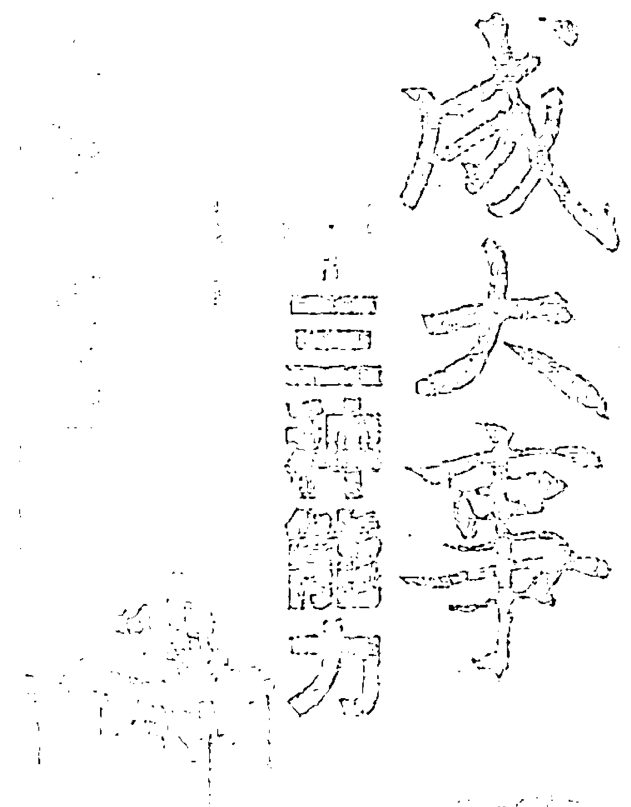

### 内容简介：

成大事的人多精明睿智，可是，还有许多人像他们一样精明睿智，却未能获得成功。其中，运气是一个原因，但更多的人失败是因为缺乏三种能力，即：能想、能干、会办事。

### 能想

成功伴随敢想而来，敢想为成功扬帆起航。能想的人，头脑长在自己肩上；会想的人，从不钻牛角尖；敢想的人，随时都在追寻目标，准备前进。

### 能干

能干更是一种做事的能力。人，能一心一意地做事，世间就没有做不好的事。这里所讲的事，有大事，也有小事，所谓大事小事，只是相对而言。

### 会办事

办事倾向于一种谋略。会不会把一件事办成功，关键看使用什么方法和技巧，只要有正确的方法、明确的实施方案和清晰的目的，一切按计划运作，成功指日可待。

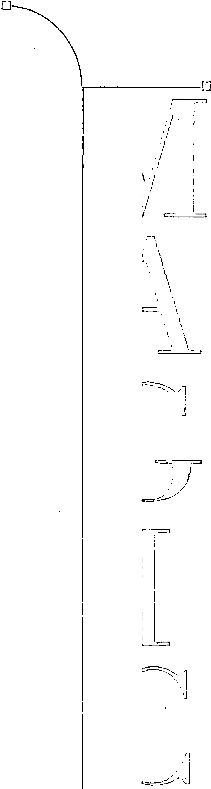

### 魅力失分

巨蟹座的人很爱出风头，一心想做大事业立大功。有时候会显得有点不切实际。

## 只差三度

郝俊杰

在东亚国家中，日本是一个蜂蜜消费大国，然而，本国的蜂蜜产量却一直上不去，原因是土生土长的日本蜜蜂不善采蜜。为了增大蜂蜜产量，有人引进了采蜜高手欧洲蜜蜂，期待它能创造奇迹。

然而，欧洲蜜蜂引进不久，却遭遇到蜜蜂的天敌——大黄蜂的大举进攻，它们成群结队而来，残忍地杀死所有成年蜜蜂，然后把尚处在幼年的蜂蛹掳去，给它们的幼蜂当美餐。这样，欧洲蜜蜂的引进计划遭到惨败。

虽然引进欧洲蜜蜂失败了，可人们并未因此放弃，他们把注意力重新移向了老朋友——日本蜜蜂。同样是受到大黄蜂的生命威胁，欧洲蜜蜂绝迹了，日本蜜蜂却安然无恙，这一切是为什么呢？

带着巨大的疑问，人们找到了一个日本蜜蜂的蜂巢，细心地观察，终于发现了日本蜜蜂对付大黄蜂的独特办法：大黄蜂对蜜蜂发动袭击时，先派了一个信使出来侦察，想打探好虚实后再集体出动。当大黄蜂的信使飞到日本蜜蜂蜂巢确定方位、标出记号时，蜂巢内的数万只日本蜜蜂发现了这个不速之客！它们很快倾巢而出，飞到大黄蜂的身上，眨眼间就里三层外三层裹紧了它。人们想象着悲壮的一幕：数千只蜜蜂把它们体内的毒刺刺入大黄蜂体内把它毒死，然后自己也随敌人死去！因为蜜蜂的毒刺没有了蜜蜂也就活不长了。
可是，这一幕并没有发生，相反，蜜蜂们不断同时扇动着翅膀，形成巨大的嗡嗡声。过了十几分钟，奇迹发生了：大黄蜂在群蜂的包裹下渐渐失去了活力，不再挣扎，最终死亡！这不禁让围观者目瞪口呆。
原来，蜜蜂虽然弱小，它的生命极限温度却比大黄蜂的高3℃，即49℃，而大黄蜂的为46℃。当大黄蜂信使来打探时，日本蜜蜂知道只有把它杀死才能避免灭顶之灾，而又不能同对方硬拼，于是采取了最聪明也最危险的一招：它们集体合围大黄蜂，利用扇动翅膀产生的热量使大黄蜂的体温上升，达到46℃，前后过程持续十几分钟，这样，恰好使大黄蜂体液沸腾而被热死，同时又使自己的体温始终保持在49℃以下，从而成功地完成了自救的目标。
日本蜜蜂利用集体的力量和智慧，战胜了大黄蜂，保存了群体。而它们所凭借的，竟是看似微弱的3℃的极限体温优势。

### 魅力提示：

与日本蜜蜂相比，人类有着好大喜功和盲目乐观、盲目悲观的天性，对比小小的蜜蜂，我们是否该深刻反省？

## 成功的过程

佚名

已经去世的网坛名将亚瑟·艾虎大家一定很熟悉，他在生命后期，曾全力与艾滋病抗争，来唤起人们对这个“人类杀手”的重视。

但艾虎的伟大之处并不仅仅是在这里。在他之前，网球界一直是白人的天下，艾虎是打破网球界人种限制的第一人。

艾虎的成功是一个不断积累的过程，他的一生可以说是一个不断设定目标并完成的过程。他通过不断定立目标的方法，使自己登上了网坛的王座，他说：

> > “我早期的教练常给我定下清楚明确的目标，并且这些目标正是我愿意遵循的。这些目标不见得一定要像赢得巡回赛那么的重大，而是将一些有待克服

的困难、需要努力和做计划的事定为目标。如果能达成这个目标，一定会有某种收获。当然，不是只有赢得巡回赛才可以作为目标的。往往一些小目标渐渐一个个地达成后，我自己都会意外地发现，嘿！大奖离我越来越近了！

艾虎一直以这种方式参加高难度的比赛。他说：“参加巡回赛，你总想能进入复赛。比赛时，你总希望漏接的反手球不超过某个数字。或者是你必须锻炼体力到一定的程度，气候太热时，你才不至于很快就感到疲倦。这一类的小目标，可以帮助你把成为世界第一或赢得巡回赛这类的远大目标分解为几个较易达成的小目标。”

艾虎一生都以这种方式过日子。他实现一个具体的目标，就再定立一个新的目标。他说：“每次你定立一个目标，然后完成那个目标，其实就是一个不断增强自信的过程。”

### 魅力提示：

成功人士和平庸之辈的区别，就在于前者注重积累，将生活中一个个平凡的目标当成自己实现卓越的阶梯。而平庸之辈只会好高骛远，轻率冒进，或者因为目标过于困难而放弃了奋斗的勇气。

### 爱出风头的将军

蒋正明

盟军中，道格拉斯·麦克阿瑟将军的好大喜功、爱出风头，已是尽人皆知。但因此而颇有微辞的同僚，也不得不佩服他擅长表演。与他夙嫌很深的马歇尔将军便这样说过：“如果脱下军装换上戏服，麦克阿瑟会成为一代名优。”

1944年的秋天，历史又一次为这位“上帝的宠儿”安排了施展演技的舞台。这年10月，美军经过血战从日本人手中夺回了菲律宾，流亡澳洲4年的太平洋战区司令部将迁回该群岛。无疑，迁师之日将被视为太平洋战争的里程碑而得到世人的关注。身为战区总司令的麦克阿瑟激动不已，下定决心借助镁光

的闪耀一展威武雄姿。

10月20日，在菲律宾雷特岛的海滩上，站满了翘首南望的人群。尽管将迎庆仪式选在如此荒芜的海隅令人费解、但希冀一睹将军百战而归的热情使人们如期而至。

接近中午，麦克阿瑟的专机终于飞出海际，人们焦灼的心情顿时烟消云散。眼见飞机越来越近，几分钟后，机身符号已清晰可辨。激动的人们张大了嘴巴刚要欢呼，飞机却在半空中一顿，竟落在离岸近百米的洋面上。岸上的人们惊呆了，僵住了大张的嘴巴、目光里满是无助和绝望，仿佛一幕古希腊悲剧即将重演。

随后的几秒钟慢得如同静止。突然，舱门开启，一个熟悉的身躯露了出来。嘴上悠然地衔着那著名的玉米秆烟斗，肩上的五颗将星熠熠生辉，这位将军在广袤海面的映衬下，显得越发的自信和神秘。

似乎无视足下海水，麦克阿瑟徐徐走下舷梯，等他站定后，海水已没过腰际。

接着，他嘴角嚅动了几下，本来微笑的表情忽然沉了下来，露在水面的上身开始雕塑般的移向海岸。脚一踏岸，便振臂高呼：“胜利的彼岸，我们到了！”人们如梦初醒，欢声雷动。

这就是麦克阿瑟煞费心机的杰作：把飞机降在齐膝深的海面，然后涉水登岸（当然要穿高统皮靴），以此象征在他率领下，美军已从海上保卫战转为向日本本土的进攻战。

麦克阿瑟一时间确实令岸上人众倾倒欲狂。但激情过后，人们很快发现他半身湿透的样子滑稽可笑，仿佛一个打了败仗的逃兵。麦克阿瑟窘迫地站着，懊恼自己百密一疏，遭到了大海的戏弄。

原来，潮汐的变化已使预先测定的齐膝深海水涨到了腰部。

### 魅力提示：

有时候，出风头的结果就是被人嘲笑。

## 猴子和猫

李异鸣

有一只名叫贝特朗的猴子，还有一只猫叫哈东，他们住在一起，是亲密无间的好朋友，并且同属一个主人。

他们俩太坏了，做了很多损人利己的事情。像家里有什么东西被损坏，东西丢了，奶酪没有了，就准保是他们俩干的好事。

一次这两个家伙看到炉火的一角搁着些栗子。能偷吃些栗子，那可真妙不可言了。但是让谁从火中取出栗子呢？这成了个难题，猴子奸诈些，他要让猫去掏。

“兄弟，今天可是你展现才华的时候了，这可是你的看家本领哦。”

话才说完，这个好大喜功的哈东就行动了，他用灵活的爪子拨开炉灰，接着缩回脚爪，又连续几次，从火灰中把栗子一个个取出来，而这个狡猾的贝特朗却抓紧时机大嚼栗子。

### 魅力提示：

好大喜功的人往往容易头脑发热，从而被别人利用！

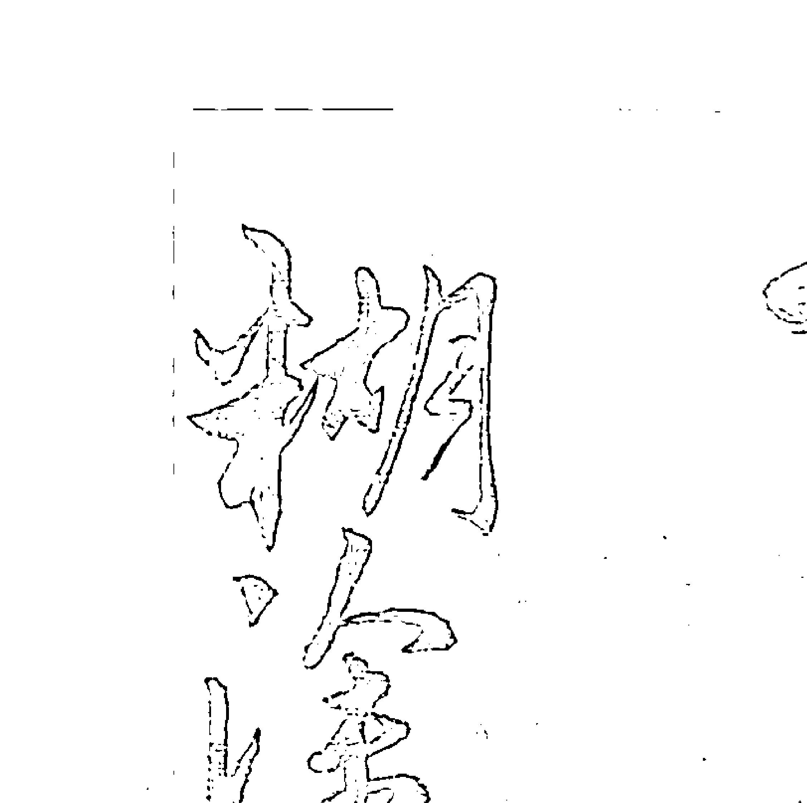

- 书名：糊涂做人必须掌握的策略
- 作者：魏晋风 编著
- 出版社：中国华侨出版社
- 出版时间：2009-4-1
- 印刷时间：2009-4-1
- 开本：16开
- ISBN：9787802228238
- 包装：平装

### 内容简介：

世上聪明人不少见，因聪明而致祸的人更是不胜枚举。孔子在评价宁武子时说：“其智可及也，其愚不可及也。”其实，真正的聪明人正是像宁武子这样“愚不可及”的人。

老子说，“夫唯不争，故天下莫能与之争”，糊涂的智慧正在于此。糊涂就是教人凡事退一步，不去硬碰对手的锋芒，然后瞅准时机，以退为进。糊涂的人，才是最聪明的人，他们通于世故，洞悉人性，坏事不会落到他们头上，好事十有八九纳入其怀，这就是糊涂的智慧。表面上似乎什么都不知道，其实心里比谁都清楚。

本书分别从守拙、口讷、隐忍、包容、生存、交际等几个方面谈如何为人处世。本书立足现实而高于现实，旨在使人从形形色色的现象中，洞悉处世之道。本书语言精练，叙事简明，论理透彻，希望给那些想拥有幸福生活、成功事业、辉煌未来的人以帮助。

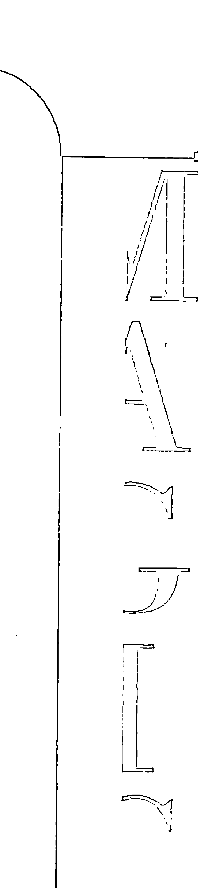

### 魅力失分

巨蟹座很贪心，你永远也看不到他满足的时候。

## 金银珠宝与快乐

佚名

有个阔佬，背着许多金银珠宝去远方寻找快乐，可是走遍了千山万水也没有找到。

一天，他正愁眉不展地坐在路边叹息，一位衣衫褴褛的农夫唱着山歌走过来。阔佬向农夫讨教快乐的秘诀，农夫笑笑说：“哪里有什么秘诀，快乐其实再简单不过了，只要你把背负的东西放下就可以。”

阔佬忽然顿悟——自己背着那么沉重的金银珠宝，腰都快被压弯了，而且住店怕偷，行路怕抢，成天忧心忡忡，惊魂不定，怎么能快乐得起来呢？

于是，他放下行囊，把金银珠宝分发给过路的穷人。这样，不仅背上的重负没有了，还看到一张张快乐的笑脸，他终于成了一个快乐的人。

### 魅力提示：

人生中，我们背负的贪婪太多了。很多时候，不是快乐离我们太远，而是我们根本不知道自己和快乐之间的距离；不是快乐太难，而是我们活得还不够简单。

## 装满一屋的东西

沈选

一位睿智的父亲，为了考验三个儿子的聪明才智，经过苦心设计，想出了一道试题。父亲分别给三个儿子每人100元钱。要他们用这100元钱去买他们所能想到的任何东西，再将买回来的东西，设法装满一个占地超过100平方米的巨大仓库。

长子思考了很久，决定将100元钱全部去买最便宜的稻草。结果，稻草运回来之后，连仓库的一半都装不满。

次子稍微聪明一些，他将那100元钱全部买了棉花，将棉花包拆开，希望能装满仓库。但是依然没有装满巨大仓库的三分之二。

小儿子看着两个哥哥的举动，等他们试过并失败之后，小儿子轻松地走进仓库，将所有的窗户牢牢关上，请父亲也走进仓库中。然后小儿子把仓库的大门关好，整个仓库霎时变得伸手不见五指，黑暗无比。这时，小儿子从口袋中拿出了1元钱买来的火柴，点燃了也是用1元钱买来的蜡烛。

顿时，漆黑的仓库中充满了蜡烛所发出的光芒，虽然微弱，却是温暖无比。

### 魅力提示：

一味地追求物欲或仅仅用物质来满足自己，那是无法满足空虚的心灵的。只有光亮和真情才能带给人以温馨和安慰，驱散黑暗、寒凉与冷漠，填满人们那容易空虚孤独的心灵。

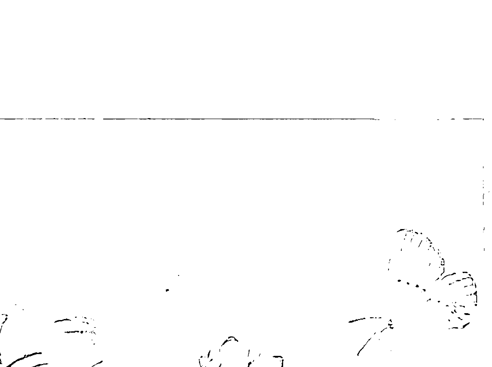

## 捉火鸡

刘国臣

一天，一个人布置了一个捉火鸡的陷阱，他在一个大箱子的里面和外面撒了很多玉米粒，在大箱子上有一道门，门上系了一根长绳子，他抓着绳子的另一端躲在旁边，只要等到火鸡一进入箱子，他就拉扯绳子，把门关上，这样火鸡就被逮住了。

一边等，那人一边做着美梦：十只卖了钱去买酒，还有两只留着自己烤着吃。想着一边喝着酒一边吃着烤鸡的情形，他的口水就流了下来。忽然，有十二只火鸡啄着玉米粒进入了箱子，就在他要拉绳子的那一刻，一只火鸡溜了出来，他想了想，决定等箱子里有十二只火鸡后，再拉绳子。

然而就在他等第十二只火鸡的时候，又有两只火鸡跑出来了，于是他又决定等箱子里再有十一只火鸡时，再拉绳子，可是在他等待的时候，又有三只火鸡溜出来了。最后，箱子里一只火鸡也没有了。他始终没有拉绳子。

### 魅力提示：

凡事要见好就收，过于贪婪到头来什么也得不到。

## 穷人的钱袋

陈涛

在一间很破的屋子里，有一个穷人，他穷得只能能够躺在一张长凳上。“我真想发财呀，如果我发了财，决不做吝啬鬼……”穷人自言自语地说。

这时候，上帝出现在穷人面前，说道：“好吧，我现在就让你发财，我会给你一个有魔力的钱袋。”

“这钱袋里永远有一块金币，是拿不完的。但是，要注意，在你觉得够了时，要把钱袋扔掉才可以开始花钱。”上帝又说。

说完，上帝就不见了。在穷人的身边，真的有了一个钱袋，里面装着一块金币，穷人把那块金币拿出来，里面又有了一块。于是，穷人不断地往外拿金币。穷人一直拿了整整一个晚上，金币已有了一大堆了。啊，这些钱已经够我用一辈子了！他想。

到了第二天，他非常饿，很想去买面包吃。但是，他想起了上帝的话，在他花钱以前，必须扔掉那个钱袋。他还舍不得就这样扔掉钱袋。

于是，他又开始从钱袋里往外拿钱。每次当他想把钱袋扔掉时，总觉得钱还不够多。

日子一天天过去了，穷人的钱已经多得完全可以去买世界上任何好吃的、买最漂亮的房子、买最豪华的车子了。

可是，他还是对自己说，“还是等钱再多一些吧。”

他不停地拿，金币已经快堆满一屋子了。同时，他的身体变得越来越虚弱，头发也全白了，脸色蜡黄。“我不能把钱袋扔掉，金币还在源源不断地出来啊！”他虚弱地说。

终于，他倒在长凳上，死了。

### 魅力提示：

> 人要学会知足，这样你才会快乐。贪得无厌的人得到的多，失去的也多，到头来只是一场空。

## /魅力星座智慧书之

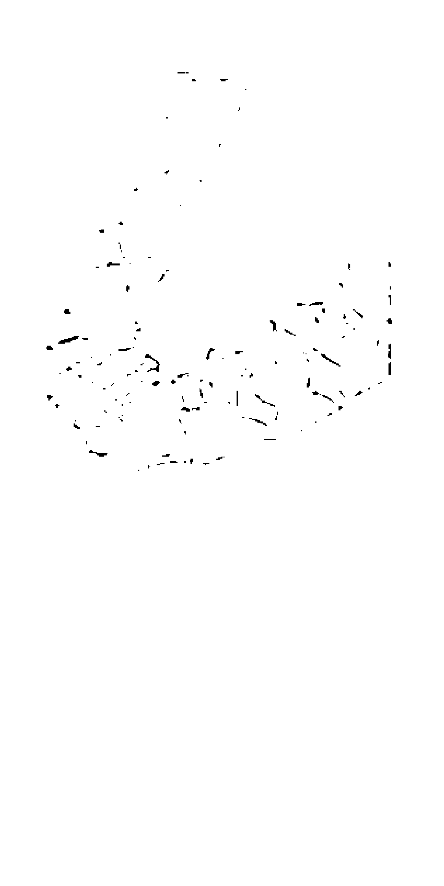

- 书名：多数人死于贪婪
- 作者：慕容雪村
- 出版社：万卷出版公司
- 出版日期：2009-1
- 开本：大32开
- ISBN：780759370
- 包装：平装

### 内容简介：

三块钱的东西卖三百块，你说他是骗子；三块钱的东西卖三百块，再开张发票，那就成了商业。 这世界有三种谎言最可恶：广告、广告，以及广告。 “阿琉达希卡”是什么？一种化妆品。这个词什么意思？没意思。 这世界骗来骗去的，骗子都被骗子骗了。 股评家都是好人啊，拿着庄家的工资冒充散户的亲戚。骗人不是罪恶，骗不成才是。
作者慕容雪村，极尽讽刺了人贪婪的丑陋。这黑暗的黑暗中这苍白的脸 / 这血红的血中这酸楚的心 / 这冰雪下的花蕾 / 这盘中的婴孩 / 这无人掩埋的尸啊 / 一条路还在生长 / 一条无声断开……

### 魅力失分

巨蟹座的耳根子软，心肠更软，他看不得别人受苦，更经不住别人的死缠烂打。

## 受伤的狼与羊

伊索

一只狼在准备袭击羊圈里的羊的时候，被牧羊犬狠狠地回击了一番，被咬得遍体鳞伤。狼伤势很严重，落荒而逃，找了一块较为僻静的地方躺了下来，舔自己的伤口。一个夜晚过去了，它仍然不能动弹，痛苦地在地上呻吟。它腿上的伤口还没有愈合，走起路来就有一种撕裂般的疼痛，不能外出觅食，它只好乖乖地躺在那里。又是一天过去了，狼没有吃任何东西，也没有喝一口水。
“再这样下去我想我不饿死，也要先渴死了！我的嗓子！我的嗓子冒烟啦！”狼呻吟着。这时，一只小羊发现了这块草地，正欢快地啃着小草。狼便请求小羊，说：
“我很渴，你帮我到附近的小河里取一点水来吧，我会感激你救了我的命的！”
小羊吓了一跳，想起了那天晚上羊圈里的动乱，不禁有些害怕。狼继续柔声劝说：“我知道小羊是世界上最善良的动物，只要你给我一点水解渴，我就不会要求你为我做更多的事，因为喝水之后我就能自己去寻找食物了。”
羊转身就跑，并扔下一句话：“如果我给你水喝，那么我就会成为你的食物。”

### 魅力提示：

面对坏人的时候，决不能心慈手软，因为，帮助坏人就是助纣为虐，会祸害自己和其他好人。

## 狼的下场

佚名

春秋时期，有个东郭先生要到中山国去。

他早晨起来赶着瘸驴驮着图书在路上走。突然有一只狼跑到他面前，伸长脖子可怜地望着东郭先生，哀求他说：“先生，现在赵简子打猎正在追赶我，我眼看就没命了。如果您肯把我藏到口袋里，救我一命，您的恩德就好像让死者复生，使白骨生肉了，我一定会报答您。”

东郭先生说：“啊呀！我私藏你这只狼，触怒了赵简子我可是要犯死罪的，他可是赵国的相国。到时候，我连我自己的命都保不住，哪里还能保得住你的性命呢？更不敢指望你报恩！不过，看你怪可怜的，即使有祸我也在所不辞。”

于是东郭先生就倒出袋子里的书，把狼小心翼翼往袋子里装，前边怕碰了狼的下巴，后边怕窝了狼的尾巴，装了三次才装好。然后把口袋放到驴背上，牵着驴躲到路边。

不一会儿，赵简子带着一群武士追来了，他看见狼突然失踪就有些怀疑，愤怒地拔出剑来砍断车辕一头，对着东郭先生骂道：“谁隐瞒狼逃跑的方向，就让他和这车辕一样。”

东郭先生急忙跪在地上说：“我早晨起来迷了路，怎么会知道狼的踪迹呢？您位高权重，我再愚蠢也不会隐瞒狼逃跑的方向。狼的本性贪婪狠毒，作恶多端，您除掉它是大快人心的事呀。再说大路岔道很多，谁知狼从哪条路逃走了。”

赵简子听了觉得东郭先生的话很有道理，便掉转车头走了。

过了一会儿，见赵简子走远了，东郭先生便把狼从口袋里放出来，让它赶快逃命。

狼得救了，却一点也没有像它承诺的那样报答救命恩人，反而咆哮着对东郭先生说：“现在我饿极了，如果吃不到东西就会饿死，那还不如死在猎人手里呢。既然你救了我，那就救到底，请把你的身躯献给我填饱肚子吧！”狼说着便扑向东郭先生。

东郭先生和狼一边搏斗一边骂道：“你这个忘恩负义的狼，真是丧尽天良，我救了你一命，你不报答我就算了，竟然还恩将仇报！”眼看着东郭先生就快支撑不住了，满头大汗。狼很得意，因为它知道，东郭先生马上就会成为它的口中餐。

这时有个砍柴的老人经过，他看到这种情形，他立即劝住了狼，问狼：“你为什么要吃东郭先生？”

狼狡辩说：“是他想把我装到口袋里闷死。”

老人又问东郭先生：“你为什么要把狼装进口袋里？这好像就是你的不是了。”

东郭先生把刚才事情的经过对老人讲了一遍，老人这才明白了一切，对狼说：“我不信，这么小的口袋怎么会装下你这么大的狼？”

狼为了证明自己有理，又钻进口袋让老人看。

老人连忙把口袋用绳系住，然后拿起手中砍柴的斧头将狼砍死，并对东郭先生说：“对害人的禽兽决不能手软。”

### 魅力提示：

绝不能怜惜像狼一样的恶人，因为他们害人的本性是不会改变的。

## 胡桃的阴谋

佚名

一只乌鸦叼了个胡桃，飞上了一座高大钟楼的楼顶，用它的爪子抓住胡桃，开始用自己的喙去啄它。突然间，那胡桃滚了下来，消失在一道墙壁的裂缝里。

“墙啊，美好的墙，”胡桃核知道它已不必再害怕乌鸦的利喙了，就向墙壁哀求道，“请看在上帝的分上，它对您是这样好，把您造得这样高大坚强，还给您装上这些声音如此美妙的大钟，救救我，可怜可怜我吧！我原是注定落在我老爸爸的枝丫下面的。”它继续讲下去，“而且要在那富沃的泥土里休息，盖上黄叶。我求您，别抛弃我。当我被那凶恶的乌鸦抓住，躺在它可怕的爪下时，我曾起了个誓，我说，如果上帝让我逃出来，我发誓要在一个小洞里结束我的生命。看来，是上帝接受了我的请求，让我到您这里来。”

大钟柔声嘀咕着，警告钟楼要小心提防，因为胡桃核是危险有害的。但是墙壁却大发慈悲，决定收留它，让它留在了落下的地方。

但过了不久，胡桃核裂开来了，不久后就把根伸进石头的缝隙，接着根又从砖石间穿过，枝丫也从小洞里探出头来，树枝长大起来，变得更加粗壮，从钟楼顶上直伸出去。

### 魅力提示：

你周围肯定存在着一些好人好事、一些坏人坏事。对于前者，我们当然应该大力提倡，发展弘扬，共同学习；而对于后者，我们决不能心慈手软，听之任之。

## 有心计的狼

佚名

有一只很有心计的狼懂得人性的弱点，为了得到味道鲜美的羊，它决定实施一个阴险的计划。

有一天，它来到牧羊人的面前，对牧羊人说：“我以前的确是干了许多坏事，但我已经决定改头换面，做一只有良心的狼了。请宽恕我吧，让我们把恩怨都一笔勾销吧。如果可以，我愿意做您忠实的仆人，像狗一样跟随在您的左右。对于您的羊，我更会像亲兄弟一样对待它们，我要保护它们，绝不让任何其他动物伤害它们。听说，狐狸一直在觊觎您的羊群，您放心，只要有我在，狐狸是不会得逞的……”

狼一边忏悔着自己以往的过错，一边流下了悔恨的泪水，接着信誓旦旦地保证。善良而天真的牧羊人被感动了，以为狼真心悔改了，便收留了它。

接下来的日子里，狼真的如它所说，老老实实地守护着羊群，并且一点坏事也没干。牧羊人开始还对它小心防范，提心吊胆，十分警惕地看护着羊。然而，狼始终一声不吭地守护着羊群，丝毫没有要伤害羊的迹象。

于是，牧羊人渐渐对狼放松了警惕，不再提防狼。

一天，牧羊人因事进城去，便把羊留下交给狼独自守护。于是，狼乘此机会，咬死了大部分的羊。牧羊人回来，看见这么多羊被咬死了，十分后悔，懊恼地说道：“我真活该，我为什么会这么轻易相信狼的话，把羊群托付给狼呢？”

## 公关专家不告诉你的“人际厚黑学”

书名：公关专家不告诉你的“人际厚黑学”
作者：张潜 著
出版社：东南大学出版社
出版时间：2009-4-1
印刷时间：2009-4-1
开本：大16开
ISBN：9787564116262
包装：平装

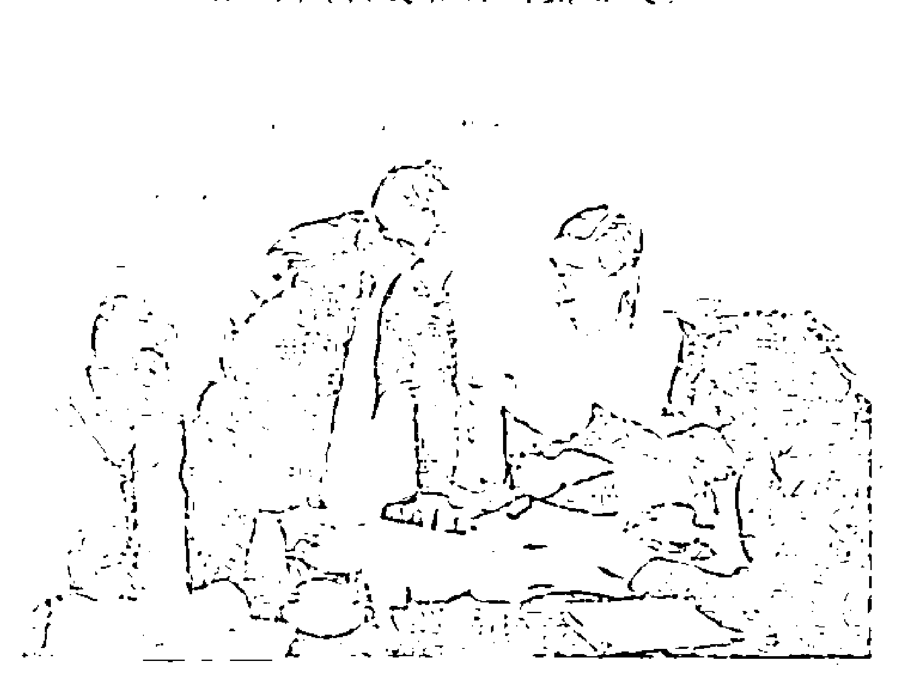

### 内容简介：

前GE集团总裁杰克·韦尔奇曾说：“找对人，就能做对事。”在M型社会中，广结人脉不再是成功的保证书，懂得品人、识人、用人，才能透过人脉创造永续的成就和财富。本书将揭露公关专家无法在演讲或课堂上告诉你的人际厚黑法则，让你了解：人没有好坏之分，关键在于如何为你我所用。如你能领悟厚植人脉的心法，用人时心黑如曹操、不要脸如刘邦，黑道白道和三教九流，都将是你的贵人，而不是你的敌人。

### 魅力失分

巨蟹座的人城府很深，很有心机，他算计起来，会让旁人觉得可怕。

## 流浪汉

佚名

有一个愣头愣脑的流浪汉，常常在一个市场里走动。市场里有很多卖菜的、还有卖水果的，一天人来人往的有很多人。由于那个流浪汉经常来这里，说起话来总带一些傻气，大家都以为他是傻瓜，因此很喜欢开他的玩笑，并且想出不同的方法捉弄他。

市场里常常有一些人想看他傻到什么程度，于是便在手上放了两枚硬币，一个五元的和一个十元的，让流浪汉来挑一个拿走。流浪汉对着这两枚硬币，思考了半天，最后选择了五元的硬币拿走。

那些捉弄他的人，看到他竟然傻到连五元硬币和十元硬币都分不清楚的程度，大家都捧腹大笑。从此，那些人只要每次看他经过，都用这个手法来取笑他，而他倒觉得也很开心，能够见到大家笑，他以为是件非常高兴的事情。于是，每次让他挑硬币的时候，他从未让大家失望过，每次都会拿走五元的硬币。

过了一段时间，一个善良的老妇人看他可怜，每次都被人欺负，便决定帮他，就叫住他说道：“我教你怎样区分五元和十元，以后他们再取笑你，你就拿十元的让他们看看。”

流浪汉露出狡黠的微笑对老妇人说道：“不，谢谢您，我知道怎么区分，我如果拿十元的话，他们下次就不会再让我挑选了。”

老妇人听到他的话以后，才知道：他并不傻，而是那些捉弄他的人傻。

### 魅力提示：

为了生存，人们常常绞尽脑汁，机关算尽也未必能够如愿；大智若愚，有时候也不失为一个好办法。

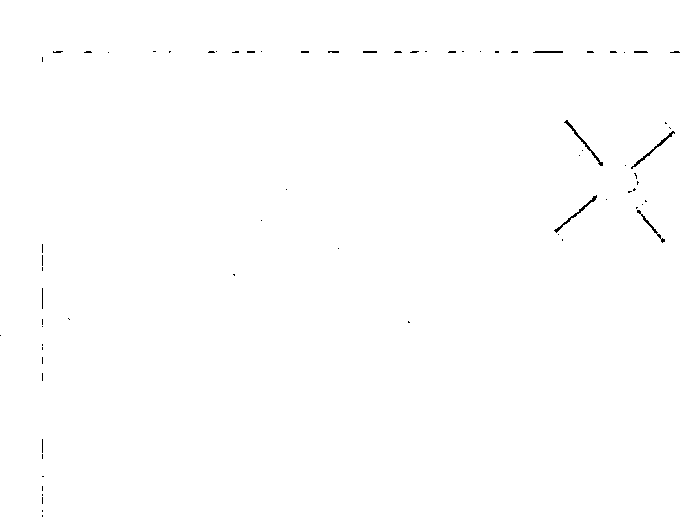

## 幸福藏在糊涂里

春江

有两个落水者，一个视力极好，一个患有近视。两个落水者在宽阔的河面上挣扎着，很快就筋疲力尽了。突然，视力好的那位看到了前面不远处有一艘小船，正在向他们这边漂来。患有近视的那位也模模糊糊地看到了。于是，两人便鼓起勇气，奋力向小船划去。

划着划着，视力好的那位便停了下来，因为他看清了，那不是一艘小船，而是一截枯朽的木头。但患有近视的人却并不知道那是一截木头，他还在奋力向前划着。当他终于划到目的地，并发现那竟然是一截枯朽的木头时，他已离岸不远了。视力好的那位就这样在水里丧失了生命，而患有近视的那位却获得了新生。

有两个患有癌症的病人。一个人耳朵灵便，从医生的谈话中听到他们只能活三个月时间了。于是，整天郁郁寡欢，结果还没到三个月就死了。另一个人的耳朵有些背，别说偷听医生的谈话，就是你跟他直接说，他还听不大清。奇怪的是，他不但活过了三个月，到现在已是两年过去了，他还好好地活着。

在美国，有两家同样大小的公司，它们的总裁一个叫罗伯特，一个叫史蒂夫。罗伯特是一位精于算计的人，凡事都比别人看得长远。因为他早就预测到了2008年美国的金融危机，所以他决定将公司解散，还能给自己和员工们留一些生活费，不然到时肯定会负债累累。因为他分析到，在2008年，美国有30%的公司要倒闭，像他现在这样的小公司，肯定在那30%之中。

史蒂夫不但不是一个善于算计的人，甚至还给人一种愚笨的感觉。他憨憨地认为，未来永远是无法预测的，就算你将世界上最完美的计划放在他的面前，他也不会相信，因为未来还没有真正到来。他觉得自己的公司只要能够生存一天，他就一定要让它支撑下去。结果，他的公司竟然奇迹般地度过了这场席卷全球的金融危机。最终，会算计的人将公司解散了，而不会算计的人，却将公司办得比以前更红火了。

### 魅力提示：

人生中，很多事，不知道的比知道的好，不灵便的比灵便的要好，不精明的比精明的要好。这就是人们常说的难得糊涂。其实，人生本来就是糊涂的，所有的快乐和幸福都藏在糊涂中，如果太清醒了，反而会让所有的快乐和幸福也就跟着烟消云散。

# 猫与小碟子

林楚

巴黎古董收藏家安达列先生下乡搜集古董，他在一个农夫家发现了一个中世纪时期的古董小碟子。而这个小碟子，却正被主人用来给小猫喝牛奶。安达列惊喜极了，便问那农夫：“您这只小猫可真漂亮。我真想给我的小儿子买下来，那他准会高兴透了。你同意卖吗？”
“当然，你如果非常想买的话。”
安达列付了一笔钱之后，说：“这小猫一定习惯用这个旧碟喝奶啦，我可以把这个碟子也一块儿拿走吗？”说着便伸手去拿那碟子。
“那可不行，先生。”农夫嚷道，“您把碟子放下吧，它使我两天之内卖掉了6只猫。”

### 魅力提示：

> > 自以为聪明的人，耍心机时往往会忽略了别人的聪明。

# 猴精

张维新

稍不注意，一只猴子把我的包抢走了。着实吓了我一跳，庆幸的是包里没有贵重物品，除了吃的还是吃的。

那只猴长得瘦小，但很活泼可爱。导游说那是一只很有心计的猴子，外号叫“猴精”，它能巧妙地骗过别的猴子，独自得到最好吃的食物。导游的话引起了我的兴趣，我要看看“猴精”是怎样施展骗术的。

猴精跳到高处，立刻把我的包翻了个底朝天。它把最好吃的苹果香蕉“孝敬”给威风凛凛的猴王，把其他食物分发给兄弟姐妹。它好像很懂得孝悌友爱，完全不像导游说的那样狡猾多端。

在别的猴子大快朵颐的时候，猴精偷偷把一个鲜黄的东西扔到石缝里，把空包给我抛过来。我突然想起来，猴精扔到石缝里的不是好吃的水果，而是一块黄姜。我这个人爱吃姜，五冬六夏，不管是吃还是喝，都是就着姜。就是外出旅游也随身带着一块黄姜。都知道猴子怕吃辣椒，肯定也怕吃辣味十足的黄姜。看起来这只猴真是个精，竟然知道黄姜辣，不能吃，把它扔到石缝里。

过了一会儿猴精又抢了个包。这一次它把好吃的水果高高举起，大肆炫耀，生怕别的猴子不知道似的。待猴王和其他猴民围过来抢水果时，猴精用力把水果扔得远远的，把整个猴群都引了过去。这时候猴精迅速从石缝里捡起黄姜，用怀疑的眼光反复审视着，不敢吃，也舍不得扔。看来猴精并不认识黄姜，不知道这鲜黄的东西到底是什么味道。

猴精看到其他猴子就要回来了，再犹豫不决，这块黄色的东西就可能被猴王抢走，那太遗憾了。于是它下定了决心，狠狠地咬了一大口。

于是，我看到猴精龇牙咧嘴，样子狰狞而又可笑。我想，猴精可能无数次用诱饵骗走猴群，自己平心静气地独吞其他猴子从未尝过的美味。而这次它吞下去的却是辣味毫不亚于辣椒的黄姜。

### 魅力提示：

很多人和这猴精不是一样吗？经常犯一些得不偿失的错误，不是因为愚昧无知和无所用心，而是因为聪明透顶和过于算计。

| 项目 | 内容 |
| --- | --- |
| 书名 | 人气管理幸福学 |
| 作者 | 吴淡如 著 |
| 出版社 | 安徽教育出版社 |
| 出版时间 | 2009-11-1 |
| 印刷时间 | 2009-11-1 |
| 开本 | 大32开 |
| ISBN | 9787533653750 |
| 包装 | 平装 |

### 内容简介：

人气，指的是你的人际关系状况。
有人需要你，喜欢你，欣赏你，和你在一起如沐春风，开心的时候想与你分享，悲伤的时候需要你的陪伴。
让你觉得自己有一点重要，对别人也有一点责任。
人气，也与你可以接纳多少关怀、愿意付出多少有关。
人气学里头有一些必要的真理，诚恳是最重要的法则。
如果你值得信任，如果你总是怀抱著乐观的态度，你的人气一定少不了。
如果你出尔反尔，如果你心机用尽，只顾获取自己的利益，那么久而久之，不会有任何人愿意靠近你。
你用什么样的脸孔对待这个世界，世界会依样奉还给你。
吴淡如帮你善用圆融的观念、灵巧的方法，打造幸福人生、赢得好人气!

# MJLF

### 魅力失分

他们喜欢照顾人，帮助人，尤其喜欢以过来人的身份，说着感性的智慧传承，但请记住，一定要说谢谢，他不介意帮助你、付出爱，但他非常介意你竟不知感激。

# 把上帝买回来

熊向洋

一个小男孩捏着1美元硬币，沿街一家一家商店地询问：“请问您这儿有上帝卖吗？”店主要么说没有，要么嫌他在捣乱，不由分说就把他撵出了店门。

天快黑时，第29家商店的店主热情地接待了男孩。老板是个60多岁的老头，满头银发，慈眉善目。他笑眯眯地问男孩：“告诉我，孩子，你买上帝干吗？”男孩流着泪告诉老头，他叫邦迪，父母很早就去世了，他是被叔叔抚养大的，叔叔是个建筑工人，前不久从脚手架上摔了下来，至今昏迷不醒。医生说，只有上帝才能救他。邦迪想，上帝一定是种非常奇妙的东西，“我把上帝买回来，让叔叔吃了，伤就会好。”

老板眼圈也湿润了，问：“你有多少钱？”“1美元。”

“孩子，眼下上帝的价格正好是1美元。”
老板接过硬币，从货架上拿了瓶“上帝之吻”牌饮料说：“拿去吧，孩子，你叔叔喝了这瓶‘上帝’，就没事了。”
邦迪喜出望外，将饮料抱在怀里，兴冲冲地回到了医院。一进病房，他就开心地叫嚷道：“叔叔，我把上帝买回来了，你很快就会好起来！”
几天后，一个由世界上顶尖医学专家组成的医疗小组来到医院，对邦迪的叔叔进行会诊。他们采用世界上最先进的医疗技术，终于治好了他的伤。
邦迪的叔叔出院时，看到医疗费账单上那个天文数字，差点吓得昏过去。可院方告诉他，有个老头帮他把钱付清了。那老头是个亿万富翁，从一家跨国公司董事长的位置上退下来后，隐居在本市，开了家杂货店打发时光。那个医疗小组就是老头花重金聘来的。
邦迪的叔叔激动不已，他立即和邦迪去感谢老头。可老头已经把杂货店卖掉，出国旅游去了。
后来，邦迪的叔叔接到一封信，是那老头写来的，信中说：“年轻人，您能有邦迪这个侄儿，实在是太幸运了。为了救您，他拿1美元到处购买上帝……感谢上帝，是他挽救了您的生命。但您一定要永远记住，真正的上帝，是人们的爱心！”

### 魅力提示：

那些充满爱心帮助别人的人就是上帝，他们不计较回报，更不在乎别人知不知道他的付出。

# 陌生的守护

郭言

护士领着一位疲惫而又急切的士兵来到病床边。“你的儿子来看你了。”她对老人说。护士说了好几遍，老人的眼睛才睁开。因为心脏病注射了很多药，他双眼模糊地看到一位年轻的海军士兵站在氧气瓶旁边。他伸出了一只手。

士兵马上握住了老人干枯瘦弱的手，用无声的语言传达着安慰。护士给他搬来了一把椅子让他坐在床边。他就这样握着老人的手，整夜陪伴在光线暗淡的病房里，给老人鼓励和安慰。

护士不时提醒他休息一会，但他每次都拒绝了。护士进病房的时候，她知道士兵一定注意到了自己，但是她给病人换氧气瓶、夜班人员互致问候、其他病人的呻吟，这些吵闹的声音好像对士兵没有什么影响。老人躺在床上什么也没说，只是紧紧握着儿子的手。

到黎明的时候，老人去世了。士兵放下老人的手，走出去通知护士。当护士来处理的时候，他就在旁边等待。最后，护士把一切做完后，开始安慰他，但是他打断了护士的话。

“这个老人是谁？”他问。护士吃了一惊，说：“他是你的父亲。”“不，他不是，”士兵回答，“我从来没有见过他。”

“那么，为什么在你刚见到他的时候不说呢？”

“叫我来守候老人的时候，我知道一定误会了，但我更知道他需要他的儿子，而他却不在。他已经病得认不出自己的儿子，但希望他在身边守候，所以我就决定留下来。”

> > 魅力提示：如果有人也需要你陪伴的时候，请你也留下来。这不会让你后悔。发自内心地帮助别人，又怎会在乎别人是否会对你感激呢？

# 晏子赎越石父

刘向

春秋时期，齐相晏婴出使晋国，路过中牟地方，看见一个人头戴破帽子，反穿皮袄，身背饲草，正坐在路边休息。

晏子一眼就看出他是一位有修养的君子，于是就派人问他：“你叫什么名字？从哪里来？”

那人回答说：“我是齐国人，名叫越石父。”

晏子就把他叫到跟前问道：“为什么来到这里？是不是家里遭到什么不幸？”

越石父说：“我在中牟卖身为奴，看见了使者路过，打算跟您回国。”

晏子问：“为什么要卖身为奴？”

越石父回答说：“由于饥寒交迫，我便卖身为奴了。”

晏子问：“当奴仆几年了？”

越石父回答：“已经三年了。”

晏子问：“可以赎身吗？”
越石父回答：“可以。”
晏子便把拉车左套的马解下来，用这匹马把越石父赎买下来，并与他一起坐车回国。

回到相府，晏子没跟越石父告辞就进了自己的房门。越石父很生气，要与晏子绝交。

晏子派人传话说：“我不曾与你结交，谈何绝交？你当了三年奴仆，我今天看见了才把你赎买回来，我对待你总算可以吧？你怎么可以恩将仇报？说什么绝交？”

越石父说：“士人不在知己朋友面前，可以受屈辱；在知己朋友面前，可以得到舒展。所以君子不因为对人家有恩而轻视人家，也不因为人家对自己有恩而向人家屈服。我给人家当了三年奴仆，却没有人理解我。现在您把我赎买回来，我认为您理解我了。先前您坐车，不同我打招呼。我以为您是一时疏忽了。现在您又不向我告辞就直接进入屋门，这同把我看做奴仆是一样的。既然我还是奴仆的地位，就请再把我卖到社会上去吧！”

晏子听了越石父的回话，走出来，请求和越石父见礼。晏子说：“以前我只看到了客人的外表，现在理解了客人的内心。我听人说过：考察他人行为的人不助长人家的过失，体察他人实情的人不讥笑人家的言辞。我可以向您道歉，您能不抛弃我吗？我诚心改正错误的行为。”晏子命令人把厅堂打扫干净，用酒席盛情款待越石父。

越石父说：“我听说过，最高的尊敬不讲究形式，用尊贵的礼节待人不会遭到拒绝。先生以礼待我，我实在不敢当。”

晏子于是就把越石父奉为上宾。

魅力提示：

只有以礼待人才能结交知心朋友，帮助人也不要以恩人自居。

# 农夫和老鹰

丁令

猎人猎到一只老鹰，老鹰的翅膀受伤了，正在罗网里伤心地哭泣。农夫见状动了恻隐之心，便对猎人说：“老哥，把这只老鹰卖给我吧，我很喜欢它。”猎人同意了农夫的请求。农夫把老鹰带回家，为它洗净了伤口，包扎好后，还给它喂了一些粮食。老鹰在农夫的精心照顾下，伤口好得很快。

农夫从地里回来，发现老鹰已不知什么时候从他家里飞走了。农夫很后悔，自言自语地说：“真没良心，我救了它一命，现在连谢谢都没说就飞走了，我以后再也不做好事了。”

某个冬日，农夫正靠着墙晒太阳，碰巧那堵墙快要倒塌，农夫却没有觉察到，正在这时，天上飞来一只老鹰，它用爪子抓走了农夫头上的帽子飞走了。农夫起身去追，发现抓走他帽子的刚好是被他救过一命的老鹰，农夫愤怒至极，他边追边骂：“你这个该死的家伙，我先前救了你一命，你不曾报答，现在又来抢我的帽子……”

农夫话还没有说完，突然听到“轰隆”一声，农夫回头一看，刚才自己靠着的那堵墙已倒塌了，而他的帽子，已从天空掉到了他的脚跟前。

### 魅力提示：

怀有一颗善良的心、多行善事的人，必会得到好报。但若为了报答而做善事，无疑会给自己平添烦恼。

# Magic

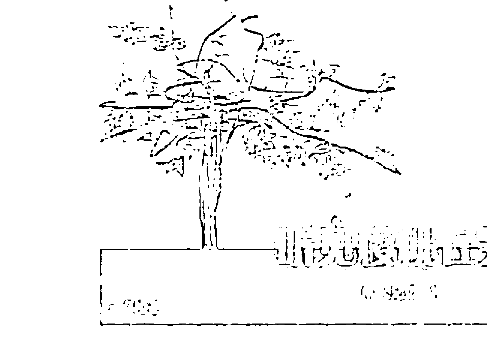

| 项目 | 内容 |
| --- | --- |
| 书名 | 听见樱桃在哭 |
| 作者 | 单人兄弟 著 |
| 出版社 | 中国社会出版社 |
| 印刷时间 | 2005-1-1 |
| ISBN | 9787508703456 |
| 包装 | 平装 |

### 内容简介：

对自己朋友的诚意不加怀疑，这是一种美德，可要是总企望人家的回报就显得不大高尚了。那还有什么纯洁的友情可言，不成了奸商了吗？你以为你的友情是什么，是爱的核反应堆呀？
不对，真正纯洁的友情应当是不图回报的。我当然知道这种朋友关系在现实生活中很少见，但是正因为少才显得尤其珍贵，尤其需要我们去追求和捍卫。不然你忏悔了半天，还以为自己是全世界最冤枉，最高尚的人呢，那还叫什么忏悔，那不成了声讨全人类的檄文了吗？

### 魅力失分

巨蟹的占有欲非常强，即使面对跟他还没有明媒正娶的暗恋对象，也是见不得意中人和别人打情骂俏的，他会随时打翻醋坛子。

# 爱是一捧沙

高兴

女孩即将出嫁，她向母亲提了一个问题：“妈妈，婚后我该怎样把握爱情呢？”

母亲听了女儿的问话，温情地笑了笑，然后慢慢地蹲下身子，从地上捧起一捧沙子送到女儿面前。

女孩发现那捧沙子在母亲的手里，满满的，没有一点流失，没有一点散落。

“来，接着。”母亲说。

女儿伸出手接住沙子，母亲说：“把它抓紧。”

女儿用力将双手握紧，沙子立刻从她的指缝间滑落下来。当她再把手张开时，原来那捧沙子已所剩无几。

女孩望着手中的沙子，全然明白了母亲的良苦用心。

### 魅力提示：

爱是一捧沙，越是想抓紧，流失得越多，人们都希冀爱情，却都不想被爱束缚。所以，我们有时越是刻意去把握爱情，反而越容易失去自我，失去彼此之间应该保持的距离和自由空间。

# 美丽的侧影

佚名

这是一个现代都市里的浪漫爱情故事。他得了绝症，她辞掉了自己的工作，专心地在医院里照顾他。两年并不是一个很短的时间，她始终不渝地在床前端饭端药，跑前跑后地伺候着，虽然没有正式结婚，但他们纯洁的恋情打动了所有的人。他们的病友换了一个又一个，而小伙子的病情不见好转也不见恶化。

终于有一天，医生告诉他们一个沉痛的消息：小伙子挺不过这一周了。女孩痛哭失声，小伙子却长舒了一口气。报社的记者们知道了这个感人的故事也匆匆赶来了。

他们诉说了自己的挚爱，说自己美好的愿望；他们倾听，听两人怦怦的心跳，听悲苦但无憾的美丽。听得每个人脸上淌满了泪水。

> “还是不要拍了吧？”
“为什么？”
“将来她还要嫁人呢！我不能打搅她以后正常的生活。”

她扑进他怀里失声痛哭。

第二天报纸上登出的是女孩的侧面照——一张美丽得让人心碎的侧影。

### 魅力提示：

爱情不是自私地占有。爱情本身就是生命，它不会死亡，只会迁徙。

# 爱的翅膀

林青玄

在遥远的森林里，住着两只鸟，它们深深相爱了。

它们舍弃了各自的巢，一同筑了一个大巢在中间，这样，它们除了白天一起飞翔、玩耍、觅食，夜里还可以一起回巢、依偎、睡眠。

但是，两只鸟太相爱了，它们觉得这样还是不够。因为它们偶尔在林间觅食，还会失去对方的踪影，遇到天空中的老鹰，也会因惊慌失措而失散。

“为了证明我们的爱，不如把我们的翅膀绑在一起，我们就永远也不会分开了。”一只鸟说。“我也正有这个意思。”另一只鸟回应。它们找来森林中最坚韧的枝条，把翅膀紧紧地捆在一起，互相说：“全天下再也没有比我们更相爱的鸟了。”才安心地在巢中睡去。第二天清晨，灿烂的阳光把它们唤醒，两只鸟一起唱着歌准备去觅食，当它们跳出鸟巢时，却同时重重地摔在地上。它们挣扎着爬起来，不管多么努力，都无法让自己起飞。它们这时才知道，两只鸟有四只翅膀，绑在一起，却一只也不能起飞。它们一起把枝条啄开，振翅飞向空中。一只鸟说：“亲爱的，你不能没有翅膀。”另一只鸟说：“亲爱的，你也不能没有翅膀。”这两只鸟，从此过着幸福快乐的日子。白天，因为空间与自由，各自飞翔和觅食。夜里，因为爱，回到共同的巢中，依偎和缠绵。

### 魅力提示：

也许有人会笑为爱将翅膀绑在一起的笨鸟，然而生活中，又有多少人为爱干脆折断了自己的翅膀呢？

# 天使之恋

佚名

一个天使路过山涧的时候，遇到了一位女孩。他们相爱了。就在山上建造了爱的小屋。

天使每天都要飞来飞去，但他真的很爱这位女孩，得空就来陪伴她。

一天，天使带着心爱的女孩，在山间散步。忽然，他说：“如果有一天你不再爱我了，我会离开你。因为没有爱的日子，我活不下去。那时候，我就会飞到另一个女孩的身边。”

女孩看了天使一会儿，坚定地说：“我永远爱你！”

他们的日子过得挺幸福。但是，每当女孩想起天使的那句话，就开始烦躁不安了。她觉得天使说不定哪天会离开她，飞到另一个女孩的身边。于是，一天晚上，女孩趁着天使睡熟的时候，把天使的翅膀藏了起来。

天亮以后，天使生气地说：“把我的翅膀还给我！为什么要这样？你不爱我了？你不爱我了……”
“我没有，我还是爱你的！我没有藏你的翅膀，真的，相信我好吗？”
“你骗人，你说谎，我不相信你了，我感觉你不爱我了！”
当他从柜子里找出翅膀后，就头也不回地飞走了。

女孩很难过，也很怀念那段美好的生活。她后悔了，就独自坐到山头的风口上，默默地忏悔：“纵然我爱你爱得发狂，也不能剥夺你飞翔的权利，是吗？我应给你足够的自由，让彼此有喘息的空间。我现在真的懂了，你还能回来吗……”

忽然间，天使出现了。他温柔地说：“我回来了，亲爱的！”
“你真的不走了，真的还爱着我？”
天使微笑着说：“我感觉到，你还是爱我的，对吗？只要你还爱着我，我就一直爱着你，直到你不再爱我的时候。”

### 魅力提示：

生活中有些人，就像那个女孩一样，把爱当做借口，约束着对方。这样的爱情不但苦了自己，也苦了对方。时刻都不要忘了：爱情只能拥有，不可占有。不管你如何爱一个人，也不要剥夺他自由飞翔的权利。

# 魅力星座智慧书之

| 项目 | 内容 |
| --- | --- |
| 书名 | 弗洛姆：有爱才有幸福 |
| 作者 | 吴光远，李慧 编著 |
| 出版社 | 新世界出版社 |
| 出版时间 | 2006-1-1 |
| 印刷时间 | 2006-1-1 |
| ISBN | 9787801879721 |
| 包装 | 平装 |

### 内容简介：

弗洛姆是现代思想中的“情爱大师”。他对现代人的研究和批判，对现代人心理状况的准确诊断，被称为“综合了弗洛伊德和马克思的学说”，使他成为现代心理学领域最权威的典范。他提出爱是一门实践的艺术，呼吁只有用爱才能拯救人类，使他成为美国最著名、最受欢迎的心理学家。

本书将让你领略什么是“情爱大师”，教你明白现代人的孤独、焦虑、迷失和缺乏生气，了解现代人孤立无援的心理处境，认识欲望使现代人越来越俗气，懂得什么是生命中真正的幸福，如何寻找情爱的精神家园，明了只有爱才能拯救自己，以及男人、女人的爱的艺术。

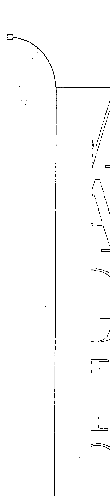

### 魅力失分

很会精打细算的巨蟹，总认为既然两人都这么亲密，还分什么彼此，反正我的是我的，你的也是我的，抠门程度令人受不了。

# 幸福的一百万

廖颖

一对青年男女双双步入了婚姻的殿堂，甜蜜的爱情高潮过去之后，他们开始面对日益艰难的生计。妻子整天为缺少财富而忧郁不乐，他们需要很多很多的钱，一万，十万，最好有一百万。可是他们的钱太少了，少得只够维持最基本的日常开支。

她的丈夫却是个很乐观的人，他不断寻找机会开导妻子。

有一天，他们去医院看望一个朋友。朋友说，他的病是累出来的，常常为了挣钱不吃饭不睡觉。回到家里，丈夫就问妻子：“假如给你钱，但同时让你跟他一样躺在医院里，你要不要？”妻子想了想，说：“不要。”

过了几天，他们去郊外散步。他们经过的路边有一幢漂亮的别墅。从别墅里走出来一对白发苍苍的老者。丈夫又问妻子：“假如现在就让你住上这样的别墅，同时变得跟他们一样老，你愿意不愿意？”妻子不假思索地回答：“我才不愿意呢。”

他们所在的城市破获了一起重大团伙抢劫案，这个团伙的主犯抢劫现钞超过一百万，被法院判处死刑。罪犯押赴刑场的那一天，丈夫对妻子说：“假如给你一百万，让你马上去死，你干不干？”妻子生气了：“你胡说什么呀？给我一座金山我也不干！”

丈夫笑了：“这就对了。你看，我们原来是这么富有：我们拥有生命，拥有青春和健康，这些财富已经超过了一百万，我们还有靠劳动创造财富的双手，你还愁什么呢？”

妻子把丈夫的话细细地咀嚼、品味了一番，也变得快乐起来。

### 魅力提示：

人生的财富原本就很丰富，钱财之外还有很多很多更重要的东西，可惜，世间有很多人看不到这一点，因此，让许多烦恼由此而生，他们难与幸福结缘，却常常要和不幸结伴同行。

## 小钱袋里的爱

鲁小莫

他们是大学时的恋人。那时候，两人都是穷学生，家境不富裕，没有多余的钱去溜冰，看电影，逛街……不过这并没有妨碍到他们的爱情。吃饭也是节俭的，打两份普通的菜，两人凑在一起，你一口我一口，吃得津津有味。时间久了，他将自己的钱交给她，说，我最不善于理财了，交给你，我放心。她也不客气，莞尔一笑，将钱收起来。

一次晚饭后，他们拉着手在校园外的马路上散步，看见路边小摊儿上有卖钱袋的，他买了一个，说，这是我们的基金管理处。钱袋是粉红色的，她很喜欢，以后就将两人的钱放在钱袋里，小小的钱袋总是鼓鼓囊囊的。

毕业后，他在南方一座城市找到一份不错的工作。虽然她的工作一直没着落，但还是跟着他来到这里。最初的生活是艰苦的，物价很贵，连青菜也不便宜。两人要交房租，要放弃以前的学生装，穿得好一些，正规一些。每个月，他将工资原封不动交给她。她笑盈盈地接过来，露出可爱的小虎牙，将钱点好，小心地放在钱袋里，像是收存一件重要的宝贝。他很喜欢看她接钱时俏皮的样子，而他心里也明白得很，这些钱远远不够他们的生活费用。常常不到月底，钱袋就空空如也。那时他最大的愿望就是能把很多很多钱交给她，那样她会多快乐啊。而她的快乐，就是他的快乐。

他更努力地工作，工资一路上涨，她也找到一份工作。生活开始好起来，两人可以在月底去看场电影，偶尔为她买件时尚的衣裙，逢年过节可以给双方家里寄回不少钱。

生活中还略有遗憾，那就是她的工作时间太长，加班加点是常有的事。但他每天晚上总要到她下车的站点去等她。

那天，他因为有事，去晚了。她下了车，匆匆往回赶，竟真的遇上了歹徒。那人在一处坏了的路灯下拦住她，亮了刀子，让她把包留下来。他就是在那时候急急赶来的，扑上去夺过歹徒手里的刀，却不知什么时候后面多了一个人，一棒打在他头上。有路人过来，歹徒跑了。他昏迷不醒，被送进医院。在医院里的几天，她度日如年，最后却被告知，他或许会醒来，但不知是一年后，两年后……还是一辈子。

她抹着眼泪，将他从医院接回家，开始了更加艰难的日子。

每个月，她的工资发下来，她会拿着钱在他眼前晃一晃，露出小虎牙，笑着说，钞票又有啦，然后把钱放在钱袋里。钱袋就在他枕边，从钱袋里拿钱时，她说，要交房租啦，或者说，洗手盆坏了，今天去买新的。她什么话都跟他说，她相信他听得见。那一次，她涨了工资，高兴地将多出的钱在他耳边啪啪地甩出声响来，说，怎么样，我很能干吧？

是真的，有钱多好啊！有钱就可以在天冷时，为他多加一床被子了。而她自己的生活是那样拮据，吃最便宜的饭菜，穿最普通的衣装，甚至不敢在白天出去逛街，因为满大街的流行时装会深深刺痛她的心。她在工作中认识的一位客户，被她沉静的气质吸引，提出用三十万养她三年。晚上，她讲给他听，说，呸，想得美，他配吗？

他终于醒了，在昏睡了五年之后。尽管他行动不便，但他们可以像所有夫妻一样过正常的日子了。他将自己摆摊儿卖报的钱，一分不少放在小钱袋里，她也是。他给她买漂亮衣服，她每天早晨亲自为他刮胡须。更多的时候，他们执手无言。

他和她，是我的大学同学。

毕业十周年聚会上，同学们一起起哄，让他们讲讲他们的爱情故事。因为校园里劳燕分飞的故事太多了，而他们又经历了那么多的曲折。他便站起来，给我们讲小钱袋的故事，说家里的存折一张一张越来越多，但那个粉红色的小钱袋一直在他们身边……讲的时候，有好几次，他哽咽着，讲不下去。

大家都落了泪，说有机会要看看他们的小钱袋。他含着眼泪笑了，小钱袋现在就在她贴身的小包里。大家挨个传看，终于传到了我手上——那是个多么普通的钱袋啊，颜色已褪，接缝处用红色细线重新缝过。

钱袋很旧，可他们每天的劳动是新的，付出是新的，爱情也是新的。

### 魅力提示：

只要有爱在，两个人彼此付出，金钱又算得了什么呢？

## 女友的考题

佚名

男友事业有成，但其对金钱的追求真到了别无所求的程度。一天，女友给一向标榜自己心算能力很强的男友出了一道题：

“一辆载着457名旅客的列车驶进车站，这时先下来98人，又上去103人。”

男友紧张的情绪松弛了下来。

“在下一站下去73人，又上去132人。”

男友的嘴角挂了一丝微笑，开始把左腿压在了右腿上。

“再下一站下去91人，上来67人。”

女友拿着本子的手有些抖，念的速度也在加快。

“再下一站下去84人，上来65人；再下一站下去114人，上来37人；再下一站下去52人，上来97人。”女友念得飞快并努力使每个发音都清楚。

男友有些心疼起女友，关怀地问：“完了吗？” “没有，你听仔细了！” 女友摇晃着那满头秀发的脑袋接着说，“列车继续往前开。到了下一站，这是个小站，只下去10个人，又上来8个人；下一站也是个小站，下去6个上来9个。” 女友的态度很认真，男友却觉得该结束了。“再下一站又下去101个，上来18个；再下一站是终点站……”

还没等女友说完，男友就站起来：“你是想马上就知道车上一共下来多少人吗？” 男友的口气中透着一股得意。

“不！”女友微笑着说，“我只想知道这趟车究竟停靠了多少次站台？”

男友一下子蒙了。

女友的语气变得严肃而沉重：“人的一生不要只计算一辈子能积攒多少钱，一辈子做金钱的奴隶，钱再多死的时候也不能带走。应该留意人生的每一个站台；哪个站台付出得少，哪个站台得到的多；哪儿有欢乐，哪儿有痛苦……认真地体会人生的每个细节，认真地过好生活的每一天，这样你才算拥有实实在在的生活，才不枉活一世。” 女友拉着发呆的男友的手说，“不要太在乎金钱的得失，而忘了做人的真谛！”

### 魅力提示：

人生有许多值得追求和珍惜的事物。比如爱情，比如友情亲情，人类的任何一种感情都比金钱来得重要，不要本末倒置，因为金钱而忽略了感情。

## 你所有的财富买不到一天时间

佚名

阿拉伯有个守财奴，他一生吝啬节俭，积攒了100万元，不想死神突然降临，要夺去他的生命，守财奴这才意识到自己没有好好享受过人生，他对死神说：“我把我的财富的三分之一给你，你卖给我一年活着的时间吧。”

“不。”死神的口气不容商量。

“那就分50万给你，我现在只求你给我半年的时间，总可以吧？”守财奴恳求道。

“不行。”死神还是不同意。

守财奴有点急了，说：“那……我把我所有的财富都给你，你给我一天时间行吗？”

“不行。”死神说完，走过来伸手要他的命。

守财奴绝望了，他向死神提出最后一个请求：“请你给一分钟时间，我要写遗嘱。”

死神这次同意了守财奴的请求。守财奴用颤抖的双手艰难地写下一行字：“人们，请记住，你所有的财富买不到一天的时间。”

### 魅力提示：

人们为金钱的获取付出了一生的努力，却换不来多一秒的时间，金钱是为人们服务的，只有正确认识金钱，正确使用金钱，金钱才会产生它的价值，你才会享受到成功快乐的人生，反之只会死守金钱的话，那你只能成为金钱的奴隶。

# 魅力星座智慧书之

| 项目 | 内容 |
| :--- | :--- |
| 书名 | 别让金钱毁了你 |
| 作者 | 何国松 |
| 出版社 | 吉林大学出版社 |
| 出版日期 | 2010-1 |
| 开本 | 小16开 |
| ISBN | 756015122 |
| 包装 | 平装 |

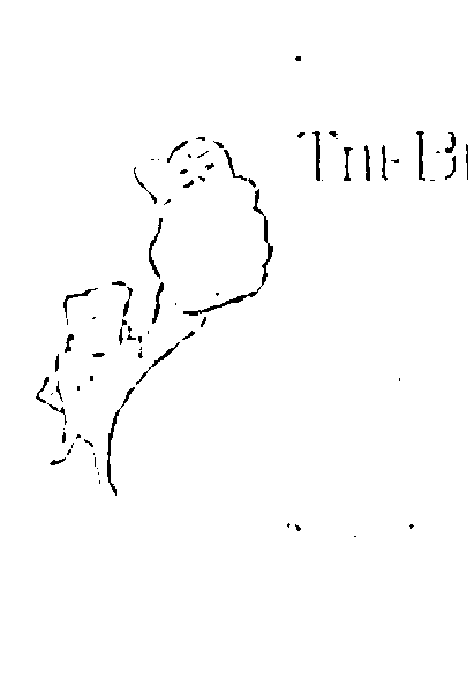

### 内容简介：

工作中当常怀律己之心，常思贪欲之害，虽然君子爱财，但是也要取之有道啊！金钱应该用来寻求幸福与安定，寻求爱与情谊，而不是用来寻求金钱本身，那样我们才能回答“一个人一生需要多少财富才够”。我们的社会应该变成一个让幸福感、安定感，让爱和情谊也可以在数量上不断增加的社会；应该让越来越多的人相信，世界上除了金子，还有很多好的东西也在不断增加。

### 魅力失分

巨蟹座在爱情方面过于内向，不懂浪漫，缺乏情趣，这正是爱情最大的忌讳。爱情萌生于激情，谁都希望自己的爱情似一把火，不管将来能不能走到一起，都希望爱得轰轰烈烈，是将来一生中最美好的回忆。

## 倾情一裸

胡秀清

英国有位已婚三十年的女士，年轻的时候和自己的先生一起看电影，曾为片中一个男士裸身求爱的镜头乐不可支。作为生命中一晃而过的镜头，在三十年岁月里，想来她已经将之封存心底，更可能早已忘了。

但是她的丈夫却没有忘记——在她五十周岁生日那天下班回家时，在必经的一个路口处她碰到了自己的丈夫。

英国人一向谨小慎微，循规蹈矩，她丈夫自然也不例外。可这一天，他正在被人围观——因为他没穿衣服。裸着五十多岁的苍老身躯，用一张生日卡片遮挡着重要部位的他，嘴叼一枝玫瑰花，向老伴祝贺生日。他还记得当年她笑得花枝招展的样子。果然，她再一次笑了，隔了三十年，她还是乐不可支，甚至开不了车。

> **魅力提示：**
> 在爱情里徜徉的人儿，幸福总离他很近。这个故事就是爱情，故事里的男士与女士就是在婚姻圣殿里享受幸福的人儿。聪明的你，发现了吗？

## 结婚纪念日

佚名

威尔斯本来不打算近几天给妻子科拉买任何礼物，但当他看见红色玻璃水果盘时，不由心头一动，那几乎是他见过的最漂亮的水果盘。他心想无缘无故地给她买件礼物肯定会让她大吃一惊，她太喜欢这一类东西了，不过他自己对这些东西可一窍不通。

“让我看一下这个吧。” 威尔斯对售货员说。

“好的，先生，您要不要和水果盘配套的水果碟？”

他突然想起带的钱不够，连忙抱歉地说：“今天不买了，谢谢，以后再买吧。”几分钟后，他踏上了回家的路。

他们住在一套面积不太大的房子里。尽管这套房子相当古老，可位置很佳，这儿离威尔斯工作的办公室不远。在屋前拐弯处，有一个车站，过两条横马路就是大商场，科拉在那儿几乎能买到她需要的所有东西。邻居都非常友好，他们经常在一起度过一些美好的时光。总之，他俩在这儿生活得非常幸福。

第二天早上，当威尔斯离家上班时，发现科拉似乎心事重重。她是一个温柔、多情的女人。每天，她都要吻别他，说声“再见”，然后，有点不舍地目送他去上班。可今天她很少说话，只提醒他一定给弗兰克大伯送去生日卡片。

威尔斯问她是不是不舒服。

“不。”她答道。

但威尔斯明显感觉到肯定有什么事情搅乱了她的心。会是什么事呢？

“晚上回来不要迷路。”她说。

“她说这句话是什么意思？”威尔斯问自己，“算了，人一年四季不可能天天高兴。”

威尔斯倚坐窗前，眺望车外，心里还想着科拉那奇怪的举动：“是不是我说的什么话惹她生气了？不可能，因为如果她不喜欢我说的话，会给我指出来的。既往不咎，一切会好起来的……”

一到办公室，威尔斯就埋头工作，把科拉忘得一干二净，当他下班路过前一天去过的商店时，蓦地，想起那个水果盘，它肯定能让她忘掉心中的烦闷。他非常爱她，不想让这个世界上的任何事情伤害她的心。就他来说，使妻子高兴是他的首要责任。

这车为什么开得这么慢？威尔斯抱怨起来。他小心翼翼地打开裹着水果盘的纸包，放在膝盖上独自欣赏起来。他好像看见妻子双手捧着水果盘，像小孩似的，高兴地跳了起来。一位年轻的妇女羡慕地对水果盘看了一眼，然后看了看威尔斯，最后又以责备的目光看着自己的丈夫。

威尔斯心想：对呵，让你丈夫也给你买个吧！

下车后，威尔斯兴奋地向家里奔去。当科拉打开门，接过纸包，高兴得几乎晕过去。他看她身着盛装，有点异常，良久，才懵懂地说：“你真漂亮！”科拉激动得说不出话来，好半天，才喃喃地说：“我还以为你忘了。”

“忘了？”

“看来，你比我记得更清楚，你真沉着，早上走时对今天的日子不露声色，我不由得伤心起来。现在，我才明白你故意这样，真会捉弄人。” 趁着她打开纸包这个间隙，威尔斯用手捶着头想，这天究竟是什么日子。

“噢，真好看，这是我见过的最漂亮的水果盘，哪位妻子在结婚周年能收到比这更好的礼物？” 她欣喜若狂地吻着他。

他心有余悸地接受着她的亲吻，不免恨起自己：“今天是我们结婚5周年，我怎么这么大意？”

### 魅力提示：

浪漫不需要刻意地去追求，爱不一定要在特定的日子去表达. 只要你为他的幸福而高兴，为使他能够更幸福而去做需要做的一切，这就是最浪漫的爱情。

## 亲爱的

戴忠

远在国外的丈夫到邮局去给他的妻子拍电报，全文是：
亲爱的，我在国外很想你，祝你圣诞快乐！
当他掏钱付款时，发现身上带的钱不够，于是他对邮局的小姐说：“为了省钱，我想去掉几个不必要的字！”
小姐说可以，但当她接过那男子删改过的电文时，发现去掉了“亲爱的”三个字。
于是，邮局那位小姐说：“先生，你还是把‘亲爱的’三个字添上吧，钱由我来付。你不知道，这三个字对于一个女人来说有多重要。”

### 魅力提示：

鲜花、金钱固然重要，但你可知道，最真挚、最浪漫的爱往往就在简单的几个字中，如果你不觉得，那只能说明你仍不懂爱。

## 爱情花椰菜

佚名

琼已经结婚25年了。她时时感到，她和丈夫几乎成了一个人：思想、经历、观点和处理事情的办法已经完全融为一体。

有时琼会奇怪，在这25年间，她究竟都为他做了些什么，而他又做了什么，让他们互相不能割舍。他不是个兴趣广泛的人，只是偶尔和不多的好友一起散散步，钓钓鱼；琼也并不是个脾气温顺的女人，每一个或者两个星期中都要有一次把蔬菜扔在他身上，怒气冲冲地告诉他，她不喜欢总吃同样的食品。现在，琼第一次想到，他是否知道她有什么烦恼，是否想过什么办法为她解忧？

丈夫从烤架上拿起最后一个汉堡包，问琼想不想吃。

“你知道，理查德给利丝买了一枚贵重的钻戒，利丝给理查德买了一件长毛皮大衣。”琼说。

“住在这么热的地方，毛皮大衣有什么用？”他笑着回答。

他开始收拾东西。琼看着他。他们一起经历了两次经济危机，3次流产，住过5所房子，养育了3个孩子，用过9辆汽车，有23件家具，度过7次旅行假期，换过12种工作，共有19个银行存折和3张信用卡。

琼给他剪头发，掖好过33488次右边的衬衣领子；琼每次怀孕时，他就给她洗脚；有18675次在她用完车后，他把车子停到它该停的地方。

他们共用牙膏、橱柜，共有账单和亲戚，同时，他们也相互分享友情和信任……难道这就是他们在一起生活了25年的一切？

他走过来，对琼说：“我给你准备了一件礼物。”

“什么？”琼惊喜地问。

“闭上你的眼睛。”

当琼睁开眼睛时，只见他捧着一棵养在泡菜坛子里的花椰菜。

“我一直偷偷地养着它，叫孩子们看见，就该把它毁了。”他乐滋滋地说，“我知道你喜欢花椰菜。”

### 魅力提示：

不能让爱情在平淡的生活中消磨殆尽，偶尔来一点浪漫，为平淡的生活添点油加点醋，爱情才能保鲜，生活才会更加有滋有味。

| 项目 | 内容 |
| :--- | :--- |
| 书名 | 与爱人一起分享的50种浪漫 |
| 作者 | 指尖 著 |
| 出版社 | 中国对外翻译出版社 |
| 出版时间 | 2006-11-1 |
| 印刷时间 | 2006-11-1 |
| ISBN | 9787500116202 |
| 包装 | 平装 |

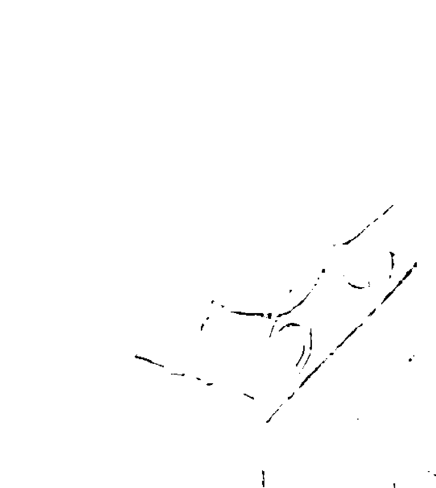

### 内容简介：

有一种浪漫是无声的，对两个人的深情来说，没有比浪漫更温柔、更贴身的词汇了。浪漫是爱情的保鲜剂，是系住我们的手，一起走向彼岸的红线。总是抱怨浪漫已经消亡，爱情缺乏情趣，其实，无论何时何地，只要有一颗善于发现的心，关于你和她的浪漫，便无处不在。

### 魅力失分

超级黏人的巨蟹座，喜欢和恋人一起分享私密时光，这时，你要准备好当一台录音机，接受他给你灌输的家族史、个人成长经历等等你可能已经早就会背的往事回忆哦。

## 豪猪取暖

叔本华

一群豪猪在一个寒冷的冬天挤在一起取暖。但是它们身上的刺开始互相攻击，于是它们不得不分散开。可是寒冷又把它们聚在一起，于是同样的事又发生了。最后，经过几番的聚散，它们发现最好是彼此保持相当的距离。用这种方法，不但可以满足彼此取暖的需要，而且可以不致互刺。

### 魅力提示：

距离是一种美，也是一种保护。人与人之间的相处，彼此需要有一定空间，要想爱情长久，一定不要忘记“恋人也要保持距离”这一简单道理。

## 真爱无言

佚名

我告诉你说：“我今天扫楼梯时，差点儿从楼梯上摔下来。”本来我以为你会安慰说：“亲爱的，小心点儿。”但你说：“扫慢点，不就得了。”

我伤心，我觉得你一点儿不爱我，不在乎我。

后来，我发现我们的楼梯异常干净，干净得都不用我扫；一个月后我才发现，那是你每天抽出5分钟的结果。

我告诉你：“我的车子坏了，我走了半个小时才到车站。”本来以为你会关心地说：“你怎么不坐出租车，累不累？”但你说：“反正很近，你也顺便减肥。”

我生气，觉得你不爱我、不关心我。

第二天，我发现你留在桌上的你的车钥匙，以及为我准备的丰富的早点。

我告诉你说：“我想去北海道、荷兰等地，欣赏那一大片壮观的花海。”本来以为你会关心地说：“你想去哪，我们来计划。”即使敷衍几句也好，但你说：“真无聊，花大把的银子去那种无聊的地方。”

我生气，觉得你不爱我，不懂我。

后来，我发现家里的旅游杂志，不管是国内还是国外的报道，只要有赏花介绍的那一页，页角就有折痕，里面就有你的笔记。

我告诉你说：“我跟朋友出去，晚上会晚点回来。”本来以为你会关心地说：“跟谁出去，小心点儿，记得拨电话或早点儿回家。”但你说：“随便你，你高兴就好。”

我生气了，觉得你不爱我，不关心我。后来，我负气拖到深夜3点多回家，我看到你坐在沙发上的睡容。

我告诉你说：“我真高兴嫁了你，你是最好的老公。”本来以为你会开心地回答我说：“我也是这么觉得，你是最好的老婆。”但你说：“嫁都嫁了，不然，你还想怎样？”

我生气了，觉得你不爱我，不懂我。

后来，我无意中发现你在睡前用卫生纸擦拭床头那张40英寸的结婚照，然后望着照片傻笑好久。

我想我终于懂了，在你不在乎的外表下，有颗不善用言词表达的心，一颗最爱我的心。原来你是爱我的，只不过不说。这是你爱的方式，跟大家不同。

魅力提示：

爱不是形影不离，不是嘴上说说，而是用行动用真心来表达的情意。

# 猴和小鸟

达·芬奇

夏天，一只年幼的小猴子在树枝上跳来跳去，发现了一个鸟窝。小猴像过年那样高兴，伸手就去抓。那些会飞的小鸟受到惊吓都逃走了，只有一只最小的鸟没有飞。我们的小猴子乐得欢蹦乱跳。它捉住小鸟，把它带回家去。

可怜的小鸟是那么柔弱、娇嫩和不壮实。小猴不断地亲吻、抚摸，把它紧紧地抱在胸前。老猴子望着小猴子，什么也没有讲。小猴子忘乎所以地喊道：“多么可爱的小鸟！我是多么爱你！”它不停地亲吻，紧紧地拥抱。可怜的小鸟死在它的怀里了。

### 魅力提示：
如果爱的方式不正确的话，爱得越深，给别人也给自己带来的伤害就越重。

# 金翅雀和猫

谢·米哈尔科夫

金翅雀对主人说：“主人，为什么你要把我锁在笼子里？为什么不让我在花园里飞翔，不让我在枝头欢跳？你要知道，对于歌声嘹亮的歌手来说，铁笼子虽然舒适却过于狭小了！”

“一旦把你放出去，你就会只剩下两只爪子和一堆羽毛！你要知道，锁住你正是为了保护你，不受猫的骚扰！”主人说。

金翅雀说：“既然你这样爱护我，就放我出去，把猫锁在笼子里，岂不更好！”

### 魅力提示：
如果你真心关爱一个人，那就应给其幸福——体谅那人本身的感受。

书名: 爱的最佳距离
作者: （美）伯恩斯坦, （美）朗古兰德 著; 欧阳敏, 石孟磊 译
出版社: 化学工业出版社
出版时间: 2009-9-1
印刷时间: 2009-9-1
开本: 16开
ISBN: 9787122059741
包装: 平装

### 内容简介：
世界上没有处不好的人，只有不想学会如何相处的人！
觉得自己无论如何努力付出，也得不到对方的认可？
觉得两个人天生不对盘，总是“火星撞地球”？
你知道吗？

所有人际关系的问题，很大程度上是相处方式的冲突。
你的相处方式是哪一种？

是过度依赖型？疏离型？还是健康依赖型？
过度依赖的人，会紧紧抓住身边的人不放；疏离的人，觉得别人都靠不住；健康依赖的人，则会保持最合适的距离。

这三种不同的相处方式，会让身边的人产生完全不同的反应……

### 魅力失分
巨蟹座的人心中都有自己的小世界，这个世界是没有人能够进得去的，他有他的心情，而且每天都不一样，有什么不顺心的事情都喜欢在心里藏着憋着，有时候会让另一半无所适从。

# 一封匿名求爱信

张玉庭

有个大学三年级的女生，不漂亮，甚至还有点丑。见同班的女同学皆有了男朋友，唯自己形影相吊，很是自卑，常常在背地里偷偷地流眼泪。

学校某系一位细心的老师觉察到了这件事，就假冒一个男生的名义，给她写了一封匿名的求爱信。

> ××：
你好！
很久了，我一直默默地观察着你！你是个极有特色的好女孩儿——当你的女同胞接二连三地有了男友，你却一如既往地保持着女性的庄重，与你的女同胞相比，你显然比她们更有内涵，更有古典色彩，更有分量！因此，在我的心目中，你格外神圣、格外圣洁！自然，也正是因为你格外庄重、格外严谨，我才不敢放肆失礼——请恕我暂时不公开我的姓名，但我肯定会天天关注你，在得到你的认可之前，就让我从一个遥远的地方，小心翼翼地、满怀希冀地看着你吧！没有你，我将失望至极！

我一直坚信，你是我心目中最优秀的女孩。

一个一直渴望着得到你的青睐的关爱你的人
×月×日

果然，就这样一封信，从此彻底由身到心地改变了一个人。
想一想那原本自卑的女孩子吧，自打收到了这封信，就恢复了勇气和信心——她抬起了高贵的头，她的步伐从此充满了自信，她不再暗自垂泪，她奋发图强，到了年终，她以全优的成绩得到了全班师生的热切关注！

> 魅力提示：
爱情是伟大的，它不仅给你力量，给你自信，有时在不知不觉中会改变你的一生。

# 原来你不会飞啊

佚名

有一位妻子聪明能干，丈夫却没有一点儿上进心，但是，在家里还要摆架子，以家长自居，这让妻子很是郁闷，她知道直接批评丈夫会激化夫妻之间的矛盾，所以，有一天，妻子讲了一段寓言。

坐在飞机上，一个乘客向空姐要饮料，要了半天，无人理睬，乘客只好作罢。

过了一会儿，忽然那边也有人向空姐要饮料，并且满口骂骂咧咧，却原来是一只鹦鹉，也奇怪，只见空姐竟乖乖地将饮料给鹦鹉送上，这鹦鹉还不罢休，继续骂骂咧咧要这要那，每次骂过，空姐都赶紧把东西送上。乘客茅塞顿开，原来这飞机上的空姐吃硬不吃软，得骂！乘客学着鹦鹉的样子骂骂咧咧，果然，他要的饮料，空姐给送来了。这下，乘客乐了，也跟着鹦鹉一起嘴里不停地骂着，跟空姐要这要那。

乘客骂得正起劲，机长从驾驶舱走出来，一把抓住他就扔到飞机外边去了。倒霉的乘客从空中往下跌落，对于为什么被扔下飞机仍然是一头雾水。可是很快，飞机舱门又一次打开，鹦鹉也被扔了出来。

鹦鹉飞到乘客身边，绕着他转了几圈，很惊讶地说：“原来你不会飞啊！那你在飞机上牛什么牛啊？”

丈夫听了这则寓言之后沉默了很久，终于认识到了自己的错误，从此以后改变习惯，发奋努力，事业蒸蒸日上，更重要的是，他再也不在妻子面前摆架子了。

### 魅力提示：
夫妻生活中不能没有沟通，而委婉幽默的表达方式，能使爱情更甜美。这则寓言就让一家人感受到幽默的乐趣，笑过之后，丈夫意识到自己的问题，于是开始改变自己。

# 爱情砝码

杨树培

有这样一个游戏，一台天平，两盒砝码，邀请三对不同年龄段的夫妻，用黑布将他们的眼睛蒙住，在天平两端的托盘上分别放置砝码，时间是三十秒，看看谁能在规定的时间内放的砝码重量相同，使天平保持平衡，指针停在刻度中央，就算胜利。

一对年轻的夫妇手忙脚乱地放置砝码，不是多就是少，始终找不到平衡，最后还不小心碰翻了托盘，砝码散落一地。

一对中年夫妇手端砝码，不慌不忙地往托盘里放，规定的时间到了，只见两边托盘上的砝码明显不一样，指针偏向一边。

最后是一对老年夫妇，在被蒙上双眼的情况下，在托盘里瞬间放好砝码，指针在刻度中央纹丝不动，然后他们神态安详地微笑着。原来他们把所有的砝码毫不迟疑地全部放上去了。自然，老年夫妇获胜。问及他们是怎么想的，男的说：“我们结婚近四十年了，正因为在爱情的天平上把所有的砝码都放上去了，我们才平安走过了几十年的风风雨雨。”女人说：“是呀，爱情砝码是两个人共享的，爱就要毫无保留地真正去爱。”

### 魅力提示：
我们的爱情就像天平，任何一方有了闪失，指针就会偏向，天平就会倾斜，大大小小的砝码分别代表着真诚、奉献、理解、宽容、关爱……只有放上相同的爱情砝码，生活才能和谐甜美。

# 一杯冷却的热茶

佚名

一个周末的傍晚，心理学教授在阳台上整理白天拿出来暴晒的旧书，却观察到一幕生活的悲喜剧。与教授相隔一条防火墙的邻居在阳台上洗碗。她动作十分利落，水声与碗盘声铿锵作响，像发自她内心深处的不平与埋怨。

这时候，她丈夫竟从客厅端来一杯热茶，双手捧到她面前。

这个画面很让教授感动，为了不惊扰他们，他轻手轻脚地收起一摞书本，往屋里走。正要转身时，女人突然对男人没好气地说：“别在这里假好心啦！”惊讶不已的教授，从眼睛的余光中瞄到丈夫低着头又把那杯茶端回屋里——那杯热茶一定在瞬间冷却了，像他的心。

继续在洗碗的她，还是边洗边抱怨：“端茶来给我喝？少惹我生气就好了。我真是苦命啊！早知道结婚要这么做牛做马，不如出家算了。”

也许她需要的不是一杯热茶，而是他来分担她的家务。但是，这是可以商量的，而且也并不需要把情绪发泄在对方身上，特别是在对方对你献殷勤的时候。

### 魅力提示：
> 没有人是天生注定要不幸福的，除非你自己已关起心门，拒绝幸福之神来访

书名: 卡耐基沟通的艺术
作者: (美) 卡耐基 著, 刘祐 编译
出版社: 中国城市出版社
出版时间: 2007-5-1
印刷时间: 2007-5-1
ISBN: 9787507418491
包装: 平装

# 内容简介:
这是一本教人行动的书。全书共分八部分，内容包括：人际沟通必须掌握的基本技巧，如何让他人喜欢并乐意帮助你，如何让他人赞同你的想法，如何更好地说服他人，男性专用的家庭沟通技巧，女性专用的家庭沟通技巧，如何克服沟通中的忧虑心理，如何掌握演讲的沟通技巧等。

最初，作者只是把这些规则写在各种小卡片上；在下一个学期，作者又将它们印在较大的卡片上；然后是印在一本小册子中；再接下来就成了一小本书。它的篇幅和内容不停地扩充，在经过15年的实验和研究之后，终于成了现在这本书。作者在这本书中所说的不是空洞的理论，而是有着令人难以相信的神奇功效。作者确确实实看见这些原则改变了许多人的生活，使他们走上了成功之路。

### 魅力失分
巨蟹座这种不安全感可能是从胎教中就已培养雏形，成长过程中又遭遇不断的刺激，所以在没有感情时倒还能安然自若，一旦有可能和异性产生亲密关系的机会，反而疑神疑鬼、坐立难安，总觉得自己无力消受这份爱情，因此很难进入亲密关系。

# 闭眼看到的爱情

冯雪峰

他送她回家，她任性地闭上眼睛让他牵着走。

现在，她眼前一片漆黑了。没有视觉，没有色彩，来往的车辆声不绝于耳，刚开始的刺激很快便被惧怕所取代。尽管她知道他会尽力为她挑选每一步路，会避开一切可能的磕绊，可她还是忍不住睁开了眼睛。睁开眼睛，她便仿佛恢复了生命握在自己手中的塌实。

她提议他也试一试，他顺从地将手放入她的掌心，坦然地闭起了双眼。在她的牵引和指挥下，他们穿行于呼啸的车声中，他却不见半点胆怯，没有丝毫犹豫……她本以为他会很快就睁开眼睛的，可好长一段路过去了，他依然双目紧闭。

到家了，她告诉他可以睁开眼睛了。她问他，被人牵着手走路，怕不怕？他怔了怔，拉过她的手，笑着说：“被心爱的人牵着手走路，怎么会怕呢？” 望着他满眼的真诚，她的眼中渐渐盈满了泪水，为自己心中一份黯然的惭愧，也为掌中这份生死可托的厚重。

### 魅力提示：
有些东西，闭上了眼睛反而看得更真切 比如爱和信任

# 死神也怕咬紧牙关

霍忠义

罗伯特和妻子玛丽终于攀到了山顶。

但悲剧发生了，罗伯特一脚踩空，高大的身躯打个趔趄，随即向万丈深渊滑去。周围是陡峭的山石，没有抓手的地方。短短的一瞬，玛丽就明白发生了什么事情，下意识地，她一口咬住了丈夫的上衣，当时她正蹲在地上拍摄远处的风景，同时，她也被惯性带向岩边。仓促之间，她抱住了一棵树。

罗伯特悬在空中，玛丽牙关紧咬，你能相信吗？两排洁白细碎的牙齿承担了一个高大魁梧的躯体的全部重量。他们像一幅画，定格在蓝天白云大山峭石之间，玛丽的长发像一面旗帜，在风中飘扬。

一个小时后，路过的游客救了他们。而这时的玛丽，美丽的牙齿和嘴唇早被血染得鲜红鲜红。

有人问玛丽如何能挺那么长时间？玛丽回答：“当时，我头脑里只有一个念头，我一松口，罗伯特肯定会死。”几天后，这个故事像长了翅膀一样飞遍了世界各地。人们发现，死神也怕咬紧牙关。

### 魅力提示：
在爱情的世界里，鲜活、芳香、美丽、浪漫、迷人、艰苦等等，都有其最大的活动空间。这其中，自然也包括一个又一个几乎令人难以置信的奇迹了。相信了爱情，便也选择了相信奇迹。

# 你怎么知道她不爱你

佚名

小伙子深爱姑娘，可是一直鼓不起勇气去表白。
后来，姑娘嫁给了别人。小伙子失望之下，娶了另外一位他根本就不爱的姑娘，做了终身伴侣。
若干年后，当年的小伙子与当年的姑娘不期而遇。
这时，已成为父亲的小伙子对已是母亲的姑娘讲起了他年轻时对她的爱慕，并十分肯定地说姑娘根本就不会爱自己——因为在他看来，姑娘从来就没有注意过自己。
可是，姑娘却说：“你又没有表白过，你怎么知道我不爱你呢？”
小伙子吃了一惊：“你是说，你也曾经爱过我？”
姑娘一笑答道：“虽然我当时并没有爱上你，但是，我对你很有好感，感情可以慢慢发展嘛。”
然而，这一切都太晚了，两个人谈过话之后也只能无奈地分道扬镳了。

### 魅力提示：
爱只有一个字，却如此让我们难以启口！是啊，你又没有表白过，你怎么知道她不爱你呢？你一味退缩，是羞于启齿，还是怕接受其伤呢？如果你的爱是光明的无私的，又怎会在表达时想到自己会因此怎样呢？

# 爱的考验

啸 徐

临街的阳台上，站着一位明眸似水、秀发如云的妙龄女郎。不断引来路人驻足观望。一位雅士途经此处，他被女郎的美貌摄去了魂魄，大胆向女郎示爱。“如果你喜欢的话，请在阳台底下待上一百天时间，我自会下楼来会你。”女郎对雅士已很满意，但仍得意地说。九十九天过去了，只剩一天。女郎轻挑窗帘，偷窥那三个多月纹丝不动坐在那里的雅士。太阳快落山了，女郎正欣喜间，突然发现那个“忠诚的骑士”缓缓地直起身，夹起椅子，若无其事地走了。女郎顿时昏倒在地。九十九天！雅士欠缺的看来并不是耐心，他恰如其分地表达了自己的爱，又恰如其分地保持了自己的尊严。

### 魅力提示：
相爱的人，总会出一些形形色色的招法，来考验对方爱自己的程度。爱情需要检验，但是要掌握一个“度”，超过了这个“度”，伤了对方的尊严，考验就成了——种折磨，一种痛苦。

书名：不抱怨的世界2
作者：（美国）威尔·鲍温 著；裴卫芳，刑爽 译
出版社：陕西师范大学出版社
出版时间：2010-1-1
印刷时间：2010-1-1
开本：大32开
ISBN：9787561349830
包装: 平装

### 内容简介：
终此一生，我们都处在各种各样的关系中，与父母、与朋友、与兄弟姐妹、与爱人、与同事或者与某位萍水相逢之人……你决定着关系的路线。是你——不是上帝，不是其他人，不是你的命相，不是命运，不是职业、年龄、种族、教养，也不是你有多少钱——决定了你的关系走向何方。关系现在是，而且将来会一直是，人生的一部分。它是人类最大的难题。本书将告诉你如何在各种关系中，实现爱、平和、喜乐，使人生变得美好而圆满。

### 魅力失分
地雷超多的巨蟹常让人不知所措，不懂为何翻脸如翻书，前一刻还大晴天，下一秒却乌云密布，打雷刮风也就罢了，闷住死不下雨才叫人满头大汗呢！

# 寄存的烦恼

张笑恒

秦先生开车在山里游玩归来的时候，看到一辆车陷在了泥坑里，站在旁边的一位中年男人向他挥挥手要求搭车，他请他坐了上来。

这位中年男人告诉他，他住在山下的一个镇上，周末到山里的一个水库来钓鱼，但运气特别不好：去的路上，轮胎爆了，换备用轮胎耽误了一个小时。来到水库以后，钓鱼竿又被水底的树根挂住，拉断了。返程时车又陷在了泥坑里，怎么挣扎也挣扎不出来，所以只好搭车回家。

在中年男人的引领下，秦先生把车开到了镇上。中年男人邀请他进去坐坐，走到门口，垂头丧气的中年男人并没有马上走进去，而是站到门口，伸出双手，抚摸门旁一根突出的栅栏。大约停了一两分钟的样子，他才敲门，门开后，他笑逐颜开地和孩子紧紧拥抱，又给妻子一个热吻。然后，他高高兴兴地向家人介绍这位新朋友，并留秦先生吃了一顿饭。

秦先生离开的时候，中年男人送他出来。他问中年男人：“刚才你在门口的动作，有什么用意吗？”中年男人说：“这是我解决烦恼的方法。我到外面时，总会遇到心情不好的事情，可是无论怎样，我都不能将坏心情带进门，不能带给老婆和孩子，所以，我就把它们挂在门口，准备明天出门再带走。可是，它们通常在第二天就消失了。”

那位中年男人的做法无疑是聪明的，他将烦恼寄存在家门口，带着轻松的愉悦的心情与家人拥抱，尽情享受家的温馨，而让人欣慰的是，第二天，那被寄存的烦恼，常常就会不见了。

### 魅力提示：
与其每天被这样或那样的突发事件搞得神经紧张，心情恶劣，不如平静下来，调整心态，用积极乐观的态度去面对。

# 每天的微笑都是崭新的

佚名

一位衣衫褴褛的妇人领着小女儿在百货店里转。
小女孩儿走到一架立拍得相机旁拉着妈妈的手说：“妈妈，我们照张相吧。” 不料妈妈却小声地告诉小女儿她们的衣服太旧了，照出的照片不好看。
孩子沉默了片刻，抬起头来说：“可是，妈妈，我的微笑每天都是崭新的呀！”
于是，摄影师就免费为她们照了一张相。

### 魅力提示：
也许我们比那个小女孩儿幸运得多，却没有她单纯的快乐。我们就像被快乐遗弃的孩子，守在一大堆琐碎的烦恼前，愁眉不展，甚至会把在外面遭遇的烦恼带回家，对着家人乱发泄一通，使得原本不好的心情更加糟糕。

# 别让情绪吓跑鱼

佚名

一位年轻人在岸边钓鱼，坐在他旁边的一个老人也在守望着一根长长的鱼竿。

一段时间过去了，奇怪的是，老人不时地就能钓到一条银光闪闪的鱼，可是年轻人的浮标却没有动静。年轻人迷惑不解地问老人：“我们钓鱼的地方相同，您也没有用特别的诱饵，为什么我就毫无所获呢？”

老人微笑着说：“这就是你们年轻人的通病，浮躁，情绪不稳定，动不动就烦乱不安。我钓鱼的时候，常常达到了浑然忘我的地步，不像你会时不时地动动鱼竿，叹息一两声。我这边的鱼根本就感觉不到我的存在，所以，它们咬我的饵，而你的举动和心态只会把鱼吓走，当然就钓不到鱼了。”

### 魅力提示：
有的时候，我们得不到朋友或者失败是因为我们没有调整好心态，没有控制好情绪，一切都流于浮躁。

# 小青的烦恼

张笑恒

小青因为一份文件出了差错，挨了领导一顿批，心情非常郁闷。

回到家，又恰逢家里的保姆请假回老家了，她只好自己去幼儿园接孩子，然后边哄孩子，边做饭，炒菜的时候，不小心又把刚拌好的凉菜打翻了，油汤溅到了她的衣服上、冰箱上、地上。

这时，老公进了家门，她就开始抱怨他不管孩子，不管这个家了；老公的心情似乎也不好，两人就争了几句，孩子又开始哭闹……小青的情绪低落到极点，最后连晚饭也没吃。

### 魅力提示：
无论是工作中还是生活中，每个人都会遇到不顺利的事情，都会有心情郁闷的时候。如果让这种心情任意发展下去，郁闷的程度一定越来越厉害，不仅于事无补，还会积郁成疾，影响身心健康。

书名：情绪的解析
作者：（美）艾克曼 著，杨旭 译
出版社：南海出版社
出版时间：2008-1-1
印刷时间：2008-1-1
开本：16开
ISBN：9787544238977
包装：平装

### 内容简介：
你兢兢业业却总不能升职，你是忍气吞声还是据理力争或者干脆炒老板鱿鱼？一时冲动和爱人吵架，你能不能先冷静下来，还是各不相让以致感情破裂？你苦口婆心，可孩子就是不听话，你能否保持心平气和，还是暴跳如雷，甚至拳脚相加？有什么样的情绪反应，就有什么样的生活！正确调节自己的情绪，并理解他人的情绪，可以让生活顺风顺水，错误表达自己的情绪，忽视甚至误解他人的情绪，就可能招致不可估量的损失。
本书科学地解析了产生情绪时体内的生理变化、外在的肢体语言、声音、面部表情等方面，并提供小测试和练习，考察你对情绪的了解、帮你认清自己和他人最细微的情绪表现，提高你对情绪发生的敏感度。
我们的生活中不能没有情绪，我们要在情绪的世界里生活得更好！

## AI人格分析
> 魅力失分
只要心情不好，就会摆出脸色，对旁人不理不睬的。

### “抱怨”柜台
佚名
有一家中型超市，地段并不算很好，可是生意却做得有声有色。他们的特色之一，就是设置了让顾客尽情倾诉抱怨的柜台。在这里，经常可以看到这样的情形。
在超市受理顾客提出的“抱怨”的柜台前，许多女士排起了长龙，争着向柜台后的那位年轻女郎讲理，有的甚至讲出了很难听的话。
柜台后的这位年轻女郎一一接待这些愤怒和不满的顾客，但是没有表现出丝毫的嫌恶。她脸上带着微笑，指点这些妇女们前往相应的部门。她的态度优雅而镇静，其自制的修养令人大感惊讶。
站在她背后的是另一位年轻女郎，她在几张纸条上写下一些字，然后把它们交给站在前面的那位女郎。这些纸条很简要地记下了队列中妇女们抱怨的内容，但省略了这些妇女的“尖酸”话语及怒气。
柜台后面那位年轻女郎脸上亲切的微笑，对这些愤怒的妇女们产生了良好的影响。她们来到她面前时，个个像是咆哮怒吼的野狼，但当她们离开时，个个像是温驯柔和的绵羊。
事实上，她们中的某些人离开时，脸上甚至露出了“羞怯”的神情，因为这位年轻女郎的“自制”已使她们对自己的作为感到惭愧；当然，为了表示自己的歉意，她们很愿意为超市做些什么，因此从超市出来的时候，她们总是手提肩挎着满满当当的大包小包。

### 魅力提示：
> > 自制是一种美德，这种美德不仅有精神价值，也有功利价值。自制地做人，可以为自己赢得声誉、赢得实惠；自制地做事，可以为自己赢得伙伴、创造利益。拒绝或忽视运用自制力的人，实际上是在把好机会一个一个地丢掉。

## 亨利的选择
佚名
看过电影《监狱风云》的人，对那位由影星吉尼威尔德饰演的名叫亨利的男子印象一定非常深刻。
亨利被误判入狱，所有狱官看他都不顺眼，常常找他麻烦，他却没有大喊冤枉，义愤难平，而是始终保持着一份快乐的心情。
有一次，狱官用手铐将他吊起来，几天之后，他竟然还一脸笑容地对狱官说：“谢谢你们治好了我的背痛。”之后，狱官又将亨利关进一个因日晒而高温的锡箱中，但是当他们放亨利出来时，亨利央求道：“喔，拜托再让我待一天，我正开始觉得有趣呢。”
最后，狱官将他和一位体重100多公斤的杀人犯古斯博士一同关进一间小密室。古斯博士的凶恶在狱中十分有名，就连最凶狠的犯人也像躲避瘟疫一般躲着他。然而当狱官们回来时，却看见古斯博士和亨利坐在地上大笑着玩牌，他们惊讶得不得了。
其实亨利只不过是选择了以快乐作为自己的守护神，而没有让自己的情绪受外在的客观因素影响。
---
### 魅力提示：
世间的诸多事情，像天气的阴晴雨雪一样是我们所不能控制的。但是，我们可以做自己心情的主宰者。记住，无论在任何时候，只要自己不主动抛弃好心情，无论是谁都不能将坏心情强塞给你。

### 小晴与小文
易建斌
公司要裁员，内勤部的小晴与小文，规定一个月后离岗。那天，大伙看她俩都小心翼翼，更不敢和她们多说一句话。她俩的眼圈都红红的——这事搁在谁身上谁都难受。
第二天上班，小文的情绪仍很激动，有同事想劝她几句，她都怒冲冲的，像吃了一肚子火药似的，谁跟她说话就向谁开火。小文心里憋屈得很，只好找杯子、文件夹、抽屉撒气。“砰砰”、“咚咚”，大伙儿的心被她提上来又摔下去，空气都快凝固了。但人之将走，其行也哀，大伙也就忍着，不再说什么。
小文的情绪一直都糟糕极了。原先她负责的为办公室员工订盒饭、传递文件、收发信件的工作，现在也懒得去理了；同事们看她一副愁容满面的样子，也就不再支派她工作。她的心也变得异常敏感，每当别的同事之间小声说个什么，她就怀疑他们在背后嘲笑她。她每天用异样的目光在每个人脸上扫来刮去，仿佛有谁在背后捣她的鬼。许多同事开始怕她，都躲着她，大家都有点讨厌她了。
裁员名单公布后，小晴哭了一个晚上，第二天上班也无精打采，可打开电脑、拉开键盘，她就把工作以外的事都抛开了，和以往一样地勤恳工作。小晴见大伙不好意思再吩咐她做什么，便特地跟大家打招呼，主动揽活。她说，是福跑不了，是祸躲不过，反正都这样了，不如干好最后一个月，以后想干恐怕都没机会了。小晴仍然勤奋地打字复印，随叫随到，坚守在她的岗位上。
一个月满，小文如期下岗，而小晴却被从裁员名单中删除，留了下来。主任当众传达了老总的话：“小晴的岗位谁也无法替代；小晴这样的员工，公司永远不会嫌多！”
> > 魅力提示：
人非圣贤，免不了七情六欲，有情绪是免不了的，关键是如何把握好它，不让它信马由缰地破坏我们的形象、关系和工作。而自信的人也不是要完全抑制情绪，而是要掌控它，让它以合适的方式流露、宣泄。

## 生气的代价
佚名
李志是一家家具销售公司的副总经理，临近中秋节的一个早上，他和老婆商量给在农村老家的父母寄点过节费，李志认为自己一年才回家一趟，怎么一次也要寄5000元吧，而老婆觉得过节费也就是个意思，再说老人家也花不了多少钱，2000元就够了，两人为此大吵一通。
最后，李志摔门而出，每次给自己的父母寄钱，老婆都不高兴，大加阻拦，而给她的父母寄钱买东西，她都会自己再偷偷添上一些。这样越想越生气，一路上总觉得看什么都不顺眼，心情糟糕透顶。
带着满腔怨气，李志来到了办公室，见工程部的刘经理正和下属们聚在一起有说有笑，李志的脾气因此一触而发。
“刘东，公司请你来做事，还是请你来讲笑话的？”平常都叫“刘经理”，现在是直呼其名，语气严厉。
“老大，我是在安排今天的工作。”刘东委屈地辩解。“老大？什么老大？你以为这里是黑社会啊？”李志对着刘东越吼越凶。而以前，他也是这样称呼他的，他每次也都会哈哈一乐，从没有责怪过。
刘东为自己莫名其妙地挨批非常生气，想自己在外面累死累活地做事情，在公司还要受这样的怨气，这哪里是人过的日子？于是，就和李志争吵了起来。后来的结果是，刘东一气之下辞了职，带走几个工程大户投奔到了竞争对手的门下，处处与李志的公司作对。
魅力提示：
人非草木，孰能无情？人与动物的最大区别就是情感丰富、智力发达，心情也许难以控制，但是，至少表情应该受到理智的约束，否则，就会给自己带来无穷无尽的麻烦，也会伤害到别人。

| 书名 | 杰出大脑的7种能力 |
| :--- | :--- |
| 作者 | （英）雷诺德 著；杨吉春，房利娟 译 |
| 出版社 | 中国大百科全书出版社 |
| 出版时间 | 2004-3-1 |
| 印刷时间 | 2004-3-1 |
| ISBN | 9787500069898 |
| 包装 | 平装 |

### 内容简介：
雷诺德博士认为，大脑的潜能不可限量，而且人类对大脑的开发比例还不到脑潜能的1%。尽管人们对大脑潜能的浪费极其惊人，但大部分人对此却毫无知觉。
《杰出大脑的7种能力》告诉我们，借助正确的方法，通过对大脑的开发和训练，你可以在所有方面变得更加出类拔萃，甚至无可匹敌——无论是学习技能、思考能力，还是管理才能、工作成就。
本书包含许多科学、有趣的原理，以及大量妙趣横生的能力训练，让我们能够清楚了解自身的状态，及时发现不足和弱点，并进行极具针对性的脑力开发训练。

### 魅力失分
巨蟹座的人总是表情傲慢而沉默，所以即使本性不傲慢，也会让不熟悉的人觉得傲慢。

## 小孩与花
王善云
乡道上，一个小孩正低下身子，和路边的花说着一些我听不明白的话。我问他：“你对花说些什么呢？”他听不清，我只好蹲下来对他又说一次。他说：“我对花说：‘你今天开得真好看。’ ”
他还告诉我，如果我要对花说，一定要蹲下来在花边耳语，花才能听见，就像我对他说话也要蹲下一样。
小孩的话使我呆站路边良久，想着：如果我们不能蹲下平视，就不能了解孩子，也不能看清路旁的花；如同我们不赤足伸进溪水，就永远不会知道溪水的温度。
### 魅力提示：
不蹲下身子，你就不能与花“耳语”也闻不到花香；不倾身向前，你就不能与他人轻声细语倾心交流；不潜心前行，你又怎能摘取成功的花朵？

### 妙高禅师
佚名
从前有个妙高禅师，他修行非常精进，但有个缺点，就是爱打瞌睡，每次坐到蒲团上，腿一盘就开始打瞌睡。他后来想了一个方法，在寺庙后面找到了一个台子，把台子放在悬崖上面。他坐上去，把腿一盘，一半伸出悬崖。心里想：如果我打瞌睡，就会摔下悬崖，当场摔死，所以应该不会再打瞌睡了。
没想到，当他双腿盘上去，坐好后，又打起瞌睡来，结果真的摔下悬崖。跌落在半空中猛然惊醒，发现有个菩萨将他接住，重新托到台子上。妙高禅师问菩萨：“你是谁？”菩萨说：“我是韦陀，看你这么精进，特别来为你护法。”妙高禅师听了很高兴，说：“这个世界上像我这么精进、坐在悬崖上打坐的人有多少呢？”说话时一副洋洋自得的神情。韦陀菩萨说：“像你这样坐在悬崖上打坐的人很多，但是像你这么骄傲的人很少。所以，从此20世我不会再来为你护法！”说完转身走了。
妙高禅师大吃一惊，立刻观照自己的傲慢，当场跪下来礼拜、忏悔道：“以后我不会傲慢了，请您继续为我护法吧！”说完痛哭流涕。
此时，菩萨已经走远，怎么办呢？“虽然没有人护我的法，但我还是要继续修行。”他爬到高台上，继续盘腿打坐，心里想：“经过这么重大的教训，我一定不会再打瞌睡了！”但不多时，又打瞌睡了，再次摔下山崖，跌落到半空中，惊醒过来：糟糕！韦陀菩萨不会再来救我了，这次我真的要死了啊！在离地面两寸的时候，突然有个菩萨又托住了他，把他托回到高台上。他问：“你是谁？”“我是韦陀。”妙高禅师说：“你不是说从此20世不再来护我的法了吗？”韦陀菩萨说：“我本来说20世不来护你的法，但你刚刚一念忏悔心起，已经超过20世矣！所以我现在继续来护你的法。”

### 费奥娜的命运
佚名
费奥娜在大学毕业后就应聘到一家大公司担任秘书，由于她特别聪明特别能干，不久就被公司提拔到一个关键部门担任主管。
升迁后的费奥娜心理和态度发生了变化，渐渐地摆起了架子。半年以后，公司又决定提拔她到分公司去担任经理，这下她的架子摆得就更大了。
她在离开部门前的最后两周里，不断地责备呵斥别人。几乎同她打过交道的人都被她责备过。她指责办公室里的每个人有这样的缺点那样的错误，还经常搞得她整夜不得入睡，然后她又说其他管理人员如何对她不好。
她走了之后，大家才喘了一口气。这个精通工作、既有动力又很能干的人，由于她发了两个星期的脾气，人们把她多年所取得的业绩置之脑后，对她只有怨言和指责。
费奥娜担任分公司经理后，由于摆架子和同事不团结，总公司派人调查她过去在部门任主管时的情况。可以想象，调查的结果会是如何不利于她。没多久，费奥娜就被免了职，又成了公司的一名普通职员。
> > 魅力提示：
>
> 有位哲学家说过这样一句名言：“骏马骨大了值钱，为人架子大了招嫌。”这句话中隐含着为人处世的深刻道理，它告诫人们：不要傲慢无礼，务必谦虚谨慎。过分自高自大或倚仗他人炫耀自己的能力，都是非常有害的。

## 傲慢与非偏见
吕麦
1929年，钱钟书以英文满分的成绩，考入清华大学外文系，成为吴宓教授的得意门生。
1933年，钱钟书即将从清华外文系毕业，冯友兰亲自告诉他，将破格录取他留校继续攻读西洋文学研究硕士学位。钱钟书却一口拒绝，并狂妄地说：
> “整个清华，叶公超太懒，吴宓太笨、陈福田太俗！没有一个教授有资格充当钱某人的导师！”
吴宓获知后，平静地说，Mr. Qian的狂，并非孔雀亮屏般的个体炫耀，只是文人骨子里的一种高尚的傲慢。这没啥，1937年，钱钟书分别在牛津大学、巴黎大学学习。在此期间，“浪漫”的吴宓打算和情人毛彦文举行婚礼。消息传出，钱钟书特撰文一篇，发表在国内某知名大报上，刻薄地调侃恩师的新娘为“Superannuated coquette”（徐娘半老）。
1940年春，钱钟书学成回国，许多知名学府想聘请他，这其中包括清华大学。可是，却遭到时任外文系主任陈福田和叶公超的竭力反对。吴宓得知此事后，愤愤不平，斥之为“皆妄妇之道也”，并奔走呼吁。经过几番努力，“忌之者明示反对，但卒通过”。吴宓很是欣慰。
1993年春，钱钟书忽然接到吴宓先生女儿的来信，希望他为《吴宓日记》写序，并寄来书稿。当钱钟书读完恩师日记后，心内慨然，立即回信自我检讨，谴责自己：“少不解事，又好谐戏，逞才行小慧……内疚于心，补过无从，唯有愧悔。”且郑重地要求把这封自我检讨的信，附入《吴宓日记》公开发表。师生各自的人格风范，跃然纸上。
魅力提示：
再有才华，都需要有人欣赏和支持。自视甚高的人，往往让人敬而远之。

### 心灵暗礁
| 书名 | 心灵暗礁 |
| :--- | :--- |
| 作者 | 陈栋墀 著 |
| 出版社 | 重庆出版社 |
| 出版时间 | 2008-12-1 |
| 印刷时间 | 2008-12-1 |
| 开本 | 16开 |
| ISBN | 9787229002800 |
| 包装 | 平装 |

### 内容简介：
现代社会人性脆弱，心理问题日益突现，人性中隐藏的傲慢、虚荣、贪婪、嫉妒、固执等性格缺陷及其负面心理，仿佛潜藏在心灵深处的暗礁，危机四伏，让人们自我怜悯、自我放弃、自我毁灭。如何摆脱这种绝望？追根溯源，本书从人性弱点入手，用轻松的笔调、有趣的故事、典型的案例，娓娓道来，深层揭示人性中灰暗的心理奥秘，引导人们改造自我、塑造健全人格、摆脱忧愁和痛苦，实现真正的幸福人生。

### 魅力失分
巨蟹座是十二星座中防卫本能最强的一个，因此，无论是对于物质的追求还是自己的隐私，巨蟹座的人都会处理得相当谨慎，常常会让人觉得有点过头。

## 跨越自己
佚名
有一天，龙虾与寄居蟹在深海中相遇，寄居蟹看见龙虾把自己的硬壳脱掉，只露出娇嫩的身躯。寄居蟹非常紧张地说：“龙虾，你怎么可以把唯一保护自己身躯的硬壳也放弃呢？难道你不怕有大鱼一口把你吃掉吗？以你现在的情况来看，连急流也会把你冲到岩石上去，到时你不死才怪呢！”
龙虾气定神闲地回答：“谢谢你的关心，但是你不了解，我们龙虾每次成长，都必须先脱掉旧壳，才能生长出更坚固的外壳，现在面对的危险，只是为了将来发展得更好而作出准备。”
寄居蟹细心思量一下，自己整天只找可以安身的地方，而没有想过如何令自己成长得更强壮，整天只活在别人的护荫之下，难怪永远都限制了自己的发展。
### 魅力提示：
对于那些害怕危险的人，危险无处不在。每个人都有一定的安全区，你想跨越自己目前的成就，请不要划地自限，勇于接受挑战充实自我，你一定会发展得比想象中更好。

### 上帝的耕耘
佚名
一位智商一流、持有大学文凭的才子决心“下海”做生意。
有朋友建议他炒股票，他豪情冲天，但去办股东卡时，他犹豫道：“炒股有风险啊，等等看。”又有朋友建议他到夜校兼职讲课，他很有兴趣，但快到上课了，他又犹豫了：“讲一堂课才20块钱，没有什么意思。”
他很有天分，却一直在犹豫中度过。两三年了，一直没有“下”过海，碌碌无为。
一天，这位“犹豫先生”到乡间探亲，路过一片苹果园，望见的都是长势喜人的苹果树。他禁不住感叹道：“上帝赐予了这个主人一块多么肥沃的土地啊！”种树人一听，对他说：“那你就来看看上帝怎样在这里耕耘吧。”
### 魅力提示：
过分谨慎和粗心大意一样糟糕，过度慎重而不敢尝试任何新的事物，对你的成就所造成的伤害，就像不经任何考虑就执行突发的想法一样严重。

## 独木桥的走法
蓝蓝
弗洛姆是美国一位著名的心理学家。一天，几个学生向他请教：心态对一个人会产生什么样的影响？
他微微一笑，什么也不说，就把他们带到一间黑暗的房子里。在他的引导下，学生们很快就穿过了这间伸手不见五指的神秘房间。接着，弗洛姆打开房间里的一盏灯，在这昏黄如烛的灯光下，学生们才看清楚房间的布置，不禁吓出了一身冷汗。原来，这间房子的地面就是一个很深很大的水池，池子里蠕动着各种毒蛇，包括一条大蟒蛇和三条眼镜蛇，有好几条毒蛇正高高地昂着头，朝他们“咝咝”地吐着信子。就在这蛇池的上方，搭着一座很窄的木桥，他们刚才就是从这座木桥上走过来的。
弗洛姆看着他们，问：“现在，你们还愿意再次走过这座桥吗？”大家你看看我、我看看你，都不作声。
过了片刻，终于有3个学生犹犹豫豫地站了出来。其中一个学生一上去，就异常小心地挪动着双脚，速度比第一次慢了好多倍；另一个学生战战兢兢地踩在小木桥上，身子不由自主地颤抖着，才走到一半，就挺不住了；第三个学生干脆弯下身来，慢慢地趴在小桥上爬了过去。
“啪”，弗洛姆又打开了房内另外几盏灯，强烈的灯光一下子把整个房间照耀得如同白昼，学生们揉揉眼睛再仔细看，才发现在小木桥的下方装着一道安全网，只是因为网线的颜色极暗淡，他们刚才都没有看出来。弗洛姆大声地问：“你们当中还有谁愿意现在就通过这座小桥？”
学生们没有作声，“你们为什么不愿意呢？”弗洛姆问道。“这张安全网的质量可靠吗？”学生心有余悸地反问。
弗洛姆笑了：“我可以解答你们的疑问了，这座桥本来不难走，可是桥下的毒蛇对你们造成了心理威慑，于是，你们就失去了平静的心态，乱了方寸，慌了手脚，表现出各种程度的胆怯——心态对行为当然是有影响的啊。”
### 魅力提示：
其实人生又何尝不是如此呢？在面对各种挑战时，也许失败的原因不是因为势单力薄，不是因为智能低下，也不是没有把整个局势分析透彻，反而是把困难看得太清楚，分析得太透彻，考虑得太详尽，因而举步维艰。

## 迷路的人
俞一寒
黄昏时刻，有一个人在森林中迷了路。天色渐渐地暗了，眼看黑幕即将笼罩，黑暗的恐惧和危险，一步步移近。这个人心里明白，只要一步走错，就有掉入深坑或陷入泥沼的可能。也许还会有潜伏在树丛后面饥饿的野兽，正虎视眈眈注意着他的动静，一场狂风暴雨式的恐怖正威胁着他，侵袭着他。万籁无声，对他来说是一片死一样的寂静和孤单。
这时，凄暗的夜空中，几点微弱的星光，一闪，一闪，似乎带来了一线光明，却又不时地消失在黑暗里，留给人迷茫。但是对汪洋中的溺水者来说，一根空心的稻草都是珍贵的，都认为是救命的法宝，虽然一根稻草是那么的无济于事。
突然间，眼前出现一位陌生人，他不禁欢喜雀跃，上前叫住，探询出去的路途。这位陌生人很友善地答应帮助他。但是他不仅担心这位陌生人是否会欺骗自己，更为在这无人烟的密林中自己的生命是否应悬于这个人手中而顾虑重重。无奈他又回到自己的路线上来。
不久，他又碰上了第二个陌生的人，那人肯定地说他拥有逃出森林精确的地图，他犹豫是否应再跟随着这个新的向导，但还是以上同样的原因，又使他止步不前。
于是他陷入深深的绝望之中，他曾经竭力问他们有关走出森林的知识，但他们的眼神后面隐藏着忧虑和不安，他知道：他们或许与他一样的迷茫。他漫无目的地走着，一路的惊慌和失误，使他由彷徨、失落而恐惧。
最终他错失了走出可怕大森林的宝贵机会。
> > 魅力提示：
> 过度保护自己的人往往太过谨慎，他们总是很难信任别人，不敢冒险，因此，错过很多千载难逢的良机导致无法成功。

- 书名: 遇见未知的自己
- 作者: 张德芬 著
- 出版社: 华夏出版社
- 出版日期: 2008-1
- 开本: 32开
- ISBN: 750804401
- 包装: 平装

### 内容简介：

故事是从“冬天的雨夜，在荒郊野外的山区，一个没有手机、没有汽油的孤单女人”开始。

若菱，自名校毕业，拥有令人羡慕的工作，但心中却不时地自问：为什么我不能拥有想要的生活？为什么我不快乐？我该如何当自己生命的主人？

在一个下雨的冬夜，若菱巧遇一名智慧老者，在与智者数度交谈的过程中，她渐渐填补不快乐、挫败的心灵缺口，寻回最真实勇敢的自我……

你会不会担心和若菱一样，让身体的疲惫失控于华丽的业绩之中？

你是否也想遇见在你心中的智慧老者，穿越心事的重重黑纱，遇见全新的自己？

# 巨蟹座

### 魅力失分

巨蟹座的人心胸不够宽阔，不能包容别人的缺点，更不能忍受别人对自己无意的触犯和伤害。

## 沙漠里的两个朋友

佚名

两个朋友在沙漠中旅行，旅途中他们为了一件小事争吵起来，其中一个还打了另一个一记耳光。

被打的人觉得深受屈辱，一个人走到帐篷外，一言不发地在沙子上写下：“今天我的好朋友打了我一巴掌。”

他们继续往前走，一直走到一片绿洲，停下来饮水和洗澡。在河边，那个被打了一巴掌的人差点被淹死，幸好被朋友救起来了。

被救起之后，他拿了一把小剑在石头上刻下了：“今天我的好朋友救了我一命。”他的朋友好奇地问道：“为什么我打了你后，你要写在沙子上，而现在要刻在石头上呢？”

他笑着回答说：“当被一个朋友伤害时，要写在易忘的地方，风会负责抹去它；相反，如果被帮助，我们要把它刻在心里的深处，那里任何风都不能磨灭它。”

### 魅力提示：

真正的朋友的伤害也许是无心的，帮助却是真心的，忘记那些无心的伤害，铭记那些对你的真心帮助，你将会发现这世上真心的朋友不断多起来。

## 黄色法拉利与蓝色宝马

佚名

一天下午，当库克驾驶着蓝色的宝马回到公寓的地下车库时，又发现那辆黄色的法拉利停靠在离他的泊位很近的地方。“为什么老不给我留些地方？”库克心中愤愤地想。

这天，库克比那辆黄色法拉利先回去。当他正想关掉发动机，那辆法拉利开了进来，驾车人像以往那样把她的车紧紧地贴着库克的车停下。库克实在无法忍耐，加上他当时正患感冒，头疼得厉害，而且他还刚收到税务所的催款单。于是，库克怒目瞪着黄色法拉利的主人大声喊道：“你离我远些！”

那位黄色法拉利的主人也瞪圆双眼回敬库克：“和谁说话呢？”她边尖着嗓门大叫边离开车子，“你以为你是谁，是总统？”说完不屑一顾地扭转身子走了。

库克咬咬牙心想：“我会让你尝尝我的厉害。”第二天，库克回家时，黄色的法拉利正好还未回车库，库克把车子紧挨着她的车位停下，这下她也会因为水泥柱子而打不开车门的。

接着的几天，那辆黄色的法拉利每天都先于库克回到车库，逼得库克好苦。

“老这样下去能行吗？该怎么办呢？”很快，库克有了一个好主意。第二天早晨，黄色法拉利的女主人一坐进她的车子，就发现挡风玻璃上放着一个信封。

> 亲爱的黄色法拉利：
> 
> 很抱歉我家的男主人那天向你家女主人大喊大叫。他并不是有意针对哪个人的，这也不是他惯有的作风，只是那天他从信箱里拿到了带来坏消息的信件。我希望您和您家的女主人能够原谅他。
> 
> 您的邻居蓝色宝马

第三天早晨，当库克走进车库，一眼就发现了挡风玻璃上的信封，他迫不及待地抽出信纸。

> 亲爱的蓝色宝马：
> 
> 我家的女主人这些日子也一直心烦意乱，因为她刚学会驾驶汽车，因此还停不好车子。我家女主人很高兴看到您写的便条，她也会成为你们的好朋友的。
> 
> 您的邻居黄色法拉利

从那以后，每当蓝色的宝马和黄色的法拉利再相见时，他们的驾车人都会愉快地微笑着打招呼。

### 魅力提示：

心胸狭窄的人，是不配受到别人的宽容的。同样的道理，如果你对别人宽容、别人也会给你同样的回报。

## 天堂和地狱

一位老僧坐在路旁，双目紧闭，盘着双腿，两手交握在衣襟之下，正在沉思之中。

突然，他的沉思被打断。“老头！告诉我什么是天堂！什么是地狱！”一个武士用嘶哑而恳求的声音问道。

老僧毫无反应，好像什么也没听到。但他慢慢地睁开了双眼，嘴角露出一丝微笑。武士站在旁边，迫不及待，犹如热锅上的蚂蚁。

“你也想知道天堂和地狱的秘密？”老僧说道，“你这等粗野之人，手脚沾满污泥，头发蓬乱，胡须肮脏，剑上铁锈斑斑，一看就知道没有好好保管。你这等丑陋的家伙，你娘把你打扮得像个小丑，你还来问我天堂和地狱的秘密？”

只听“刷”的一声武士拔出剑来，他被激怒了，把剑举到老僧头上。他满脸血红，脖子上青筋暴露，就要砍下老僧的人头。利剑将要落下时，老僧忽然轻轻地说道：“这就是地狱。”

霎时，武士惊愕不已，对眼前这个敢以生命来教导他的老僧充满怜悯和爱意，肃然起敬，他的剑停在半空，他的眼里噙满了感激的泪水。

“这就是天堂。”老僧说道。

### 魅力提示：

一切恶念、恶言、恶行，对于自己和他人都是地狱；一切善念、善言、善行对于自己和他人都是天堂。天堂还是地狱，其实都是自己选择的。因此，不要让仇恨、报复、恶毒等等控制自己的头脑，不要让怒火燃烧理智，让自己的心胸宽广起来吧。

## 最高大的人

佚名

两个世纪前的某一天，美国发明家富尔顿来到了金碧辉煌的凡尔赛宫，他刚发明了蒸汽机铁甲战船，正兴致勃勃地向拿破仑建议，用之取代当时法国的木制舰船。毫无疑问，蒸汽机铁甲战船比木制战船要先进得多，威力也不可同日而语。眼看拿破仑就要被富尔顿说动，准备采纳富尔顿的建议时，拿破仑脸色陡变，两眼放射出难以抑制的怒火，眼睛直逼向富尔顿。合作告吹了，而莫名其妙的富尔顿也许永远不会知道，他失败的原因完全在于他毫不在意地顺口恭维了拿破仑一句：“伟大的陛下，您将成为世界上真正最高大的人！”在这里，富尔顿想表达的是“高贵”、“崇高”的意思，但他一不留神把法语的“高贵”、“崇高”一词说成了“高大”，恰恰富尔顿自己身材高大，这一下好击中了拿破仑最自卑、最害怕被别人嘲笑的生理短处——个子很矮。

拿破仑又自卑又嫉恨，他对高个子的富尔顿咆哮道：“滚吧！先生！我认为你是个骗子，但认为你是十足的蠢货！”这之后，富尔顿的发明专利被英国购买，自此英国凭借强大的海军，确立了世界海上霸主的地位，法国却远落在了后面。直到上个世纪30年代末，爱因斯坦在建议美国总统罗斯福迅速研制原子弹的信里，才又一次重提旧事：“总统先生，如果1803年拿破仑接受了你们的富尔顿关于建造蒸汽机军舰的建议，今天的世界格局将不会是这样！”

### 魅力提示：

拿破仑仅仅因为容忍不了别人无意间使用的“高大”一词，就拒绝了一项伟大的发明，也失去了一个称霸世界的绝好机会：因为他心胸狭窄，所以他失去了一个时代。

| 项目 | 内容 |
|---|---|
| 书名 | 有一种智慧叫包容与感恩 |
| 作者 | 张鹏 编著 |
| 出版社 | 新世界出版社 |
| 出版时间 | 2009-7-1 |
| 印刷时间 | 2009-7-1 |
| 开本 | 16开 |
| ISBN | 9787510403897 |
| 包装 | 平装 |

### 内容简介：

心胸狭窄的人，心中容不下一粒沙子；心胸宽广的人，心中可以包容全世界。心灵就像一朵花儿，你用宽容浇灌它，它将开得无比灿烂！拥有宽容，就拥有了快乐。你宽容了他人，就等于宽容了自己：感恩就像一棵树，你感恩他人，树上就结出一个感恩之果，你吃了，将甜到你心底。感恩是一位天使，你感恩了他人，天使会把快乐撒给你。

# 巨蟹座

### 魅力失分

巨蟹座极端地敏感，有时候往往会曲解他人之意，工作中因为这样而造成的误会尤其多。巨蟹座要是受伤，就会难过很久。巨蟹的情绪总是表现得比较不稳定，只要一和人起了争执，无论是谁对谁错，他的情绪都会因此而陷入不安全的状态之中。

## 老天爷的刁难

佚名

从前，有一位做生意的少年，刚从城里完成一笔丰厚的交易，身上带着大笔的钱骑着马赶路回家。
这几天的天气向来晴朗，不知怎的来到中途，忽然雷雨大作，将他淋成了落汤鸡，他渐渐心生不满，心想一定是老天爷故意刁难他。
少年一边赶路一边避雨，走走停停，经过一处浓密的树林时，突然跳出了一个强盗，手中握着一把老式猎枪对准少年。
强盗威胁他说：“快把身上的钱全部交出来！否则我一枪毙了你。”
“我和你无冤无仇，请不要伤害我，请你不要开枪。”少年慌张地乞求着。
强盗威风凛凛地说：“我是这座森林的老大，想经过这里的人都要留下过路费，看你是要留下命还是留下钱。”
这时，突然一声雷响，惊动了少年的马匹，马儿发出一阵嘶鸣，强盗想威吓少年，于是对空鸣枪，没想到枪竟然没响。
机不可失，少年连忙快马加鞭，逃离那座树林，终于摆脱强盗的追击。
少年松了一口气，自嘲地说道：“唉！刚刚还抱怨老天爷下大雨故意刁难我，如果天气晴朗的话，强盗的弹药没有潮湿，我一定难逃杀身之祸。”

### 魅力提示：

人生不如意事十之八九，若你的想法是积极乐观的，纵使不顺之事频频发生，亦能逢凶化吉。

## 赵王赛车

韩冰

古代的赵国有位驾车高手，他驾起车来又快又稳。赵王拜他为师，向他学习驾车技术。没过多久，赵王觉得自己学得差不多了，就要求和高手比一比。比赛时，一声令下，两人的马车奋勇向前，结果高手赢了。

赵王很不服气，要求互相换车再比，结果连比三次，赵王都输了。

赵王很不高兴，认为高手留了一手。高手说：“我把技术全都教给您了。只不过在比赛时，我一心一意注视马车，而您却一心一意想着输赢，跑快了怕我赶上，跑慢了就想追上我，心神不集中，怎能不输呢？”

### 魅力提示：

职场中，很多人为目标之外的东西烦恼，不能完全倾心于自己的最终目标。要知道，你内在的意念是外在事物成功的关键，专注在目标上，全神贯注，你才会取得自己最佳的成绩。

## 酒精实验

佚名

一天，一位医生将一群嗜酒如命的酒鬼召集到一块，他在他们面前做了这样一个实验：

医生将两只杯子放到了桌上，一杯装满了清水，另一杯装满了酒精。他把一只毛毛虫先丢进了装满清水的杯子，大家看着虫子在清水里游着，慢慢地又爬了出来。然后，医生又将毛毛虫抓了起来，投进了装酒精的杯子，虫子在酒精里挣扎了几下就死去了。

看了这个实验后，酒鬼们面面相觑，屋子里沉默了好长一会时间。正当医生准备对他们说明酒精对人体有害的时候，在屋子的最后排传来一个声音：“医生，我明白了，只要我们多喝酒，那我们肚子里就绝不会生虫子！”

### 魅力提示：

即使是一种正确的观念，也总有人站在负面的角度去理解，有时候，阻碍我们的不是别人，而是自己，是我们不健康的心态和偏激的态度。

## 借锤子

佚名

有一个人想挂一张画。
他有钉子，但没有锤子。邻居有锤子。于是他决定到邻居那儿去借锤子。

就在这时候他开始担心：要是邻居不愿意把锤子借我，那怎么办？昨天他对我只是漫不经心地打招呼，也许他匆匆忙忙，也许这种匆忙是他装出来的，其实他内心对我是非常不满的。什么事不满呢？我又没有做对不起他的事，是他自己在多心罢了。要是有人向我借工具，我立刻就借给他。而他为什么会不借呢？怎么能拒绝帮别人这么点儿忙呢？而他还自以为我依赖他，仅仅因为他有一个锤子！我受够了。

于是他迅速跑过去，按响门铃。邻居开门了，还没来得及说声“早安”，这个人就冲着他喊道：“留着你的锤子给自己用吧，你这个恶棍！”

### 魅力提示：

消极的思想造成错误的行为，积极的心态可以避免一切不必要的麻烦和错误。

- 书名: 性格是把双刃剑
- 作者: 刘富奇, 黄倩 编著
- 出版社: 中国华侨出版社
- 出版时间: 2006-12-1
- 印刷时间: 2006-12-1
- ISBN: 9787802221758
- 包装: 平装

### 内容简介：

性格中都有先天遗传而来的部分，但更多的是通过后天培养而形成。性格一旦形成，再想改变就很困难了，但性格是可以修正的，特别是其中的缺陷部分，可以通过理性的方式进行弥补。

我们究竟属于什么样的性格？我们的性格中有哪些优点和缺点？怎样才能扬长避短，让性格帮助我们顺利地度过一生？这些都是每个人必须正视和考虑的问题。本书能够明确地给你指出，你性格的优势与劣势在哪里，并告诉你如何才能做到扬长避短。

### 魅力失分

巨蟹座的人害怕失败，一旦遇到一点挫折，就会垂头丧气很久，有时候甚至会一蹶不振。

## 一辈子的坚持

王莉萍

罗丹对雕塑十分着迷，在他的老师勒考克的鼓励下，他到雕塑室进行训练。

罗丹家境贫寒，他常常食不果腹，疲惫不堪，午饭总是在路上边走边随便吃点东西。但罗丹心里很明白，不管怎么样，总不能半途而废。他每天从巴黎的这一头赶到另一头，对这座城市的街道、广场、花园、大桥和古代建筑，还有著名的塞纳河两岸的大道，他都满怀深情，了如指掌。他随身携带的小本子上画了成千上万幅写生。他没有休息日，星期六晚上泡在家里根据记忆画想要雕塑的人物草图，星期天则整天呆在家里用黏土进行创作。

三年过去了。在老师勒考克同意并得到另一位雕塑家的推荐后，罗丹信心十足地去参加美术学院的考试。他以希腊风格进行创作，塑像完成后，他看到在场所有考生都露出了妒忌的眼光；但主考官还是签了个“落选”的评语，并在他的名字后写上：“此生毫无才能，继续报考，纯系浪费。”

罗丹犹如五雷轰顶，泪眼模糊，踉踉跄跄地走出了考场。一位学画的朋友告诉他：“你是个天才的雕塑家，但因为你是勒考克的得意门生，所以他们囿于门户之见，永远也不会录取你。”

为了糊口，罗丹只得先找到一份做建筑物缀饰的活儿。不久，一直支持他搞雕塑而不得不忍受男友抛弃去修道院的二姐不幸病逝。罗丹痛不欲生，在一个冬日的雨夜，背着勒考克独自到修道院去了。他觉得自己对二姐的死负有责任，必须赎罪，所以决定去修道院顶替二姐的位置。

一年后，罗丹结束了修道士生活，重新回到老师身边。勒考克又惊又喜，让罗丹使用自己那视若生命的工作室。

经过这么多磨难后，罗丹终于下定决心：不管今后遇到什么挫折，一辈子也不再犹豫动摇，一定要取得事业上的巨大成功。罗丹相继雕刻出了《思想者》、《吻》、《巴尔扎克》等许多无与伦比的艺术精品，最终成为雕塑艺术大师。

### 魅力提示：

真正的强者，不畏任何艰难险阻，他们不屈不挠，百折不回，直到抵达胜利的彼岸。逆境最能锤炼和磨砺人的品格，往往正是这些逆境，激发起我们的勇气与斗志，使我们得到能力的提高和思想的升华。

## 米老鼠的诞生

佚名

遍布世界的迪士尼乐园以及迪士尼系列的卡通片，不仅是孩子们的最爱，就连成人也有不少人痴迷。而迪士尼王国的创始人沃尔特·迪士尼却曾经有过流落街头的经历。

沃尔特·迪士尼年轻时想当一名艺术家，于是就到当地的《明星报社》去应征。然而，报社主编说迪士尼的作品“没有思想”，拒绝了他。这令迪士尼万分沮丧，因为他身上已经没有钱了。于是他不得不流落街头。

不久，迪士尼临时找到一个替学校教学作画的工作，但报酬少得可怜，仅够勉强度日。迪士尼借用单位的废弃车库作办公室，辛勤地工作着。在艰难的生活中，迪士尼依然不忘自己的梦想，把空余时间全都用在了绘画上。

后来，迪士尼去好莱坞摄制一部卡通片。然而等待他的依然是失败。他又一次变得一无所有——既没金钱，也没职业。但这一切的穷困潦倒并没有使他气馁。他仍然坚持着自己的创作。

后来，迪士尼画了一幅米老鼠的卡通画，鼓起勇气拿给好莱坞的一位导演看。导演看后大为惊奇，就录用了他。从此，米老鼠成为世界上家喻户晓的卡通动物，迪士尼也由此开始了自己辉煌的事业之路。

### 魅力提示：

> “不经历风雨怎么能见彩虹；没有人能随随便便成功”正如这句歌词所唱。挫折是我们前进路上的试金石，只有那些勇敢面对挫折，并以必胜信念去战胜挫折的人，才是真正的强者。

## 蜘蛛的奇迹

佚名

在拿破仑帝国时期，法兰西与欧洲发生了连绵数年的大规模战争，拿破仑大军横扫整个欧洲战场，迫使其余欧洲国家结成欧洲同盟，共同对付拿破仑。当时，指挥同盟军的是威灵顿将军。

威灵顿指挥的同盟大军在拿破仑面前一败再败。在一次大决战中，同盟军再次遭受惨重的失败。威灵顿杀出一条血路，率领小股军队冲破包围，逃到一个山庄。在那里，威灵顿疲惫不堪，想到今天的惨败，顿时悲从心来，想自杀——一死了之。

正在愁容满面、痛恨不已时，威灵顿发现墙角有一只蜘蛛在结网。也许是因为丝线太柔嫩，刚刚拉到墙角一边的丝线，经风一吹便断了。蜘蛛又重新忙了起来，但新的网还是没有结成。

威灵顿望着这只失败的蜘蛛，不禁又想起自己的失败，更加唏嘘不已，多了几份悲凉。但蜘蛛并没有放弃，它又开始了第三次。威灵顿静静地看着，心想：蜘蛛啊，别费心思了，你是不会成功的。蜘蛛的这次努力依然以失败而告终，但它丝毫没有放弃的意思，又开始了新的忙碌。它就这样来回忙碌着。
蜘蛛已经失败六次。“该放弃了吧？”威灵顿感动地想。但是蜘蛛没有，它仍旧在原处，不慌不忙地吐出丝，然后爬向另一头。第七次，蜘蛛网终于结成了！小蜘蛛像国王一样护着它的网。
威灵顿看到这一切，不禁流下了热泪，他为蜘蛛的越挫越勇、永不放弃的精神而深深地感动了。他朝蜘蛛深深地鞠了一躬，迅速地走了出去。
威灵顿走出了悲痛与失败的阴影。他奋勇而起，激励士气，迅速集结被冲垮的部队，终于在滑铁卢一战，大败拿破仑，取得了决定性的胜利。

### 魅力提示：

每一次失败与挫折都会使一个勇敢的人更加坚定，如果没有跌倒的刺激，我们或许会甘做一个平庸的人，有时候，失败会让人发愤图强，经历了失败的痛苦，我们才找到了真正的自我，感受到了自己真正的力量

## 三根树枝

佚名

一个年轻男人刚刚失业，在这个时候女友又跟他提出分手，万念俱灰的他想要自杀。入夜后，他走到屋后树林里，想上吊。

> 当他把一根绳子绑在树枝上后，树枝说话了：“亲爱的年轻人哪！别在我身上吊死啊，有一对小鸟正在我的枝头上筑巢呢！我很高兴能保护它们。如果你在我身上上吊，我就会折断，鸟巢也就保不住了。请你谅解我，并且也可怜那对小鸟吧！”

年轻人听了，体谅了它的爱心，就放弃了这根树枝，找到更高的另一根树枝。可是当他把绳子绑上去时，这树枝也说话了：“年轻人，请你谅解我吧！春天就要到了，不久之后我就要开花，成群的蜜蜂会飞来嬉戏、采蜜，这带给我极大的快乐。如果你在我身上上吊，我就会被你折弯到地上，花朵就被摧残而死，那么蜜蜂们会非常地失望。”年轻人听了，只好默默地攀上了第三根树枝。

> “原谅我吧！”他还没绑绳子，树枝就开口了，“年轻的朋友啊！我把自己远远地伸到路上，目的就是要使疲惫的旅行者在我的底下得到一些阴凉，这带给我很大的快乐。如果你吊在我身上，会使我折断，以后我就再也不可能享有这种快乐了。”

年轻的厌世者陷入了沉思，他问自己：“我为什么要自杀？只因为我承受痛苦吗？树枝都如此热爱生活，关心身边的事物，而我……”于是，他走出森林。

### 魅力提示：

人的一生不可能顺顺利利，总会遇到一些风风雨雨，要历经风雨，就必须把自己锻炼成一个对任何困难都不折不扣的强者，在哪里跌倒就在哪里爬起来## 书名：挫折是人生最好的礼物
作者：孙和 编著
出版社：地震出版社
出版时间：2009-12-1
印刷时间：2009-12-1
开本：16开
ISBN：9787502836436
包装：平装

### 内容简介：

没有人能给生活贴上永久顺利的标签，但不同的人面对困境的态度却各有不同。懦者尽尝烦恼，度日如年；畏者胆怯不前，锐气尽失；志者自强不息，在困境的荒野上开垦孕育出一片最有前景的沃土。

人生的风雨是立世的箴言，挫折是人生最好的礼物。逆境并非绝境，人生“虽非尽是坦途在前，但也绝不可因一点小障碍而放弃走路”，要知道障碍过后，对于经历坎坷的脚来说，路会一点点变得平坦起来。历史告诉我们，英雄豪杰都是历经挫折才走向人生巅峰的。

### 魅力失分

巨蟹座的人都很感性，凡事凭着自己的感觉来做，缺乏理性思考。

## 卖水的淘金者

格林威治角

19世纪中叶，美国加州传来发现金矿的消息。许多人认为这是一个千载难逢的发财机会，于是纷纷奔赴加州。7岁的小农夫亚默尔也加入了这支庞大的淘金队伍，他同大家一样，历尽千辛万苦，赶到了加州。

淘金梦是美丽的，做这种梦的人很多，而且还有越来越多的人蜂拥而至，一时间加州遍地都是淘金者，而金子自然越来越难淘。

不但金子难淘，而且生活也越来越艰苦。当地气候干燥，水源奇缺，许多不幸的淘金者不但没有圆致富梦，反而葬身此处。

小亚默尔经过一段时间的努力，和大多数人一样，没有发现黄金，反而被饥饿折磨得半死。一天，望着水袋中一点点舍不得喝的水，听着周围人对缺水的抱怨，亚默尔突发奇想：淘金的希望太渺茫了，还不如卖水呢。

于是亚默尔毅然放弃对金矿的努力，将手中挖金矿的工具变成挖水渠的工具，从远方将河水引入水池，用细纱过滤，成为清凉可口的饮用水。然后将水装进桶里，挑到山谷一壶一壶地卖给找金矿的人。

当时有人嘲笑亚默尔，说他胸无大志：“千辛万苦地到加州来，不挖金子发大财，却干起这种蝇头小利的小买卖，这种生意哪儿都能做，何必跑到这里来？”亚默尔毫不在意，不为所动，继续卖他的水。哪里有这样的好买卖，把几乎无成本的水卖出去，还有这样好的市场？

结果，淘金者大都空手而归，而亚默尔却在很短的时间靠卖水赚到几千美元，这在当时是一笔非常可观的财富了。

### 魅力提示：

成功之路无一定模式，但若是不假思索跟着他人一窝蜂而上，即便其中藏有大量机会，却也多为强者占先占多，弱者就算有份也所得无几，更多的情况是，费尽精力却两手空空。这种时候，脑子一定要清醒，另辟蹊径，那很可能有意想不到的收获。

## 关于生活的三条忠告

佚名

一次，一个猎人在森林里捕获了一只非常奇特的鸟。这只鸟它会说话。

鸟儿挣扎着说：“你放心吧，我能说七十种语言，非常聪明。只要你放了我，我将给你三条忠告。”

“先告诉我，”猎人回答说，“我发誓我会放了你。”

“好吧，第一条忠告是，”鸟说道，“做事后就不要懊悔。”

“第二条忠告是：如果有人告诉你一件事，你自己认为是不可能的就别相信。”

“第三条忠告是：当你爬不上去时，就别强迫自己去爬。”

然后这只鸟对猎人说：“该放我走了吧。”猎人依言将它放了。

“你真愚蠢。你放了我，但你并不知道在我的嘴中有一颗价值连城的大珍珠。正是这颗珍珠使我这样聪明。”

这个猎人一听，便又想去捕获这只放飞的鸟。他跑到树跟前并开始爬树，但是当他爬到一半的时候，他掉了下来并摔断了双腿。

“笨蛋！我刚才对你的忠告你全忘记了。我告诉你，一旦做了一件事情就别后悔，而你却后悔放了我；我告诉你，如果有人对你讲你认为是不可能的事，就别相信，而你却相信像我这样一只小鸟嘴里会有一颗大的珍珠；我告诉你，如果你爬不上去就别强迫自己去爬，而你却追赶我并试图爬上这棵大树，结果掉下去摔断了双腿。”

“这句箴言说的就是你：‘对聪明人来说，一次教训比蠢人受一百次鞭挞还深刻。’”

说完，鸟就飞走了。

### 魅力提示：

前人总结出来的人生哲理忠告，其道理听起来简单明白，真正做起来却并不容易。所以聪明的人，不单要多学前人的哲理忠告，还要有意识地多加历练，丰富阅历，从经验中汲取教训；遇到重大问题时要不急不躁，给自己留下足够的思考的时间，以免再犯一些低级的、相类似的错误。

## 勤奋与思考

刘福若

有个年轻的伐木工人，在一家木材厂找到了工作，工作条件不错，报酬也不低。老板给他一把利斧，并给他划定了伐木范围。他很珍惜，下决心要好好干。

第一天，他砍了18棵树。老板高兴地说：“不错，就这么干！”这个工人很受鼓舞。

第二天，他干得更加起劲，但是只砍了15棵树。

第三天，他加倍努力，可是仅砍了10棵树。

这个工人觉得很惭愧，跑到老板那儿道歉，说自己不知道怎么了，好像力气越来越小了。

老板问他：“你上一次磨斧子是什么时候？”

“磨斧子？”年轻人悔悟地说，“我天天忙着砍树，竟忘记了抽出时间磨斧子！”

有一天深夜，著名的现代原子物理学的奠基者卢瑟福教授走进自己的实验室，看见了一个研究生仍勤奋地在实验台前忙碌着。

卢瑟福关心地问道：“这么晚了，你在做什么？”研究生回答：“我在工作。”

“那你白天做什么了？”
“也在工作。”

“那么，你一整天都在工作吗？”
“是的，导师。”研究生带着谦恭的表情说道，似乎还期待着卢瑟福的赞许。

卢瑟福稍稍想了一下，然后说：“你很勤奋，整天都在工作，这自然是很难得的，可我不能不问你，你用什么时间来思考呢？”

卢瑟福对勤奋的质疑，使研究生明白了要用足够的时间来思考的重要。

有位记者曾问比尔·盖茨：“你成为当今全球首富，个人资产高达数百亿美元，成功的主要经验是什么？”

比尔·盖茨十分明确地回答说：“一是勤奋工作，二是刻苦思考。”

### 魅力提示：

理性思考可以避免勤奋工作的盲目性，勤奋工作离不开理性思考。理性思考是勤奋工作的眼睛，就像理论是实践的眼睛一样。

## 贱买智慧

佚名

从前，有一个国家，物产丰富，人民安乐。国王兴之所至，要派遣一位使者，到其他的国家中采购本国所没有的物品。这位大臣来到许多国家，遍观市肆，没有什么是本国所没有的东西。最后，遇见一位贤者坐在市场中，摊位前却什么东西也没摆。便上前问道：“没见您要卖什么东西，在这里空坐着干什么？”贤者回答说：“在此卖智慧。”那个大臣又问道：“您卖的智慧是什么样的？卖多少钱？”贤者回答道：“我所卖的智慧值五百两金子。先把金子拿来，我就对你说出我要卖的智慧。”那大臣心想我国中没有卖智慧的，就拿了五百两金子，给了那人。贤者对他说：“长虑谛思惟，不当卒行怒，今日虽不用，会当有用时。”这个大臣牢记在心，与贤者分手，各自回家。

买到了智慧之言的大臣星夜回国，径直奔自己家中。其时，早已入夜，他看到自己妻子的床前摆着两双鞋子，产生了怀疑，顿时起了杀心。突然想起贤者卖给自己的智慧之言，不觉叨念出声来。而睡在自己妻子床上的不是别人，正是自己的母亲。因为儿媳生病，特地来照看照看。

大臣自语失声，其母一听是儿子的声音，高兴得直叫：“儿子回来了！儿子回来了！”而这个做儿子的顾不得与母亲、妻子寒暄，一个劲地喊：“贱！”他母亲不知是为什么，一个劲地问：“你都上哪儿了？你买到什么东西了？为什么直说贱呢？”这个大臣说：“我母亲和妻子的两条性命，上万两金子我都不能换，现在花五百两金子就得以保全，难道还不贱吗？”

### 魅力提示：

庸人的缺点就在于不能控制自己的感情，容易失去理智，而成功者则善于把握这个尺度，理性思考，谨慎处事。

## 书名：感性做人 理性做事
作者：方州 编著
出版社：中国华侨出版社
出版时间：2006-9-1
印刷时间：2006-9-1
ISBN：9787802221253
包装：平装

### 内容简介：

做人感性好，这样你才会有魅力，才会开心，才会快乐，才会抛弃世间所有凡尘杂念，做好自己想做的事。不会管得那么多，一切随缘，一切顺其自然。

做事理性好，这样你才会少犯错误，少走弯路，更容易达到成功。而不是凭着脑子发热，异想天开地想怎么样就怎么样，结果只会把事情弄得一团糟。这种人只会“成事不足，败事有余”，永远领略不到成功的风采。理性的人办事沉稳谨慎，环环相扣，思维严密，效率突显，成绩斐然，深得别人的器重和赞美，能活出自己精彩的人生。

感性做人，理性做事，相信你能散发出人生绚丽多姿的色彩，在这个纷繁复杂的大社会环境中活出自己的个性来，在这个充满竞争的环境中快快乐乐、健健康康地成长、生存、发展，打造出自己的成功人生！

### 魅力失分

巨蟹座的人在衣着打扮方面不太在意，只要他觉得舒适就好，有时候会不修边幅得有点过分。

## 用心打扮自己

佚 名

她是一名普通机关工作人员，平时工作顺利时，素面朝天，衣饰简单，牛仔服、运动鞋是她一贯的装束，这使她能有更多业余时间读书“充电”。可是一旦遇上挫折，如评职称没评上、分房子没分到、失恋、生病等，她却反而特别注重修饰打扮。

此时，她会专门给自己腾出半天空闲时间，换上一套精心挑选的适合自己身材肤色的高档衣服，对镜薄施粉黛，淡扫蛾眉，再配上一两件得体的精美首饰，收拾完毕后静静审视几分钟，看着镜中自己比平时漂亮得多的倩影，不由得自信心大增，在心中暗暗提醒自己：“造物主并未亏待你，你很优秀，也还年轻，还有时间有能力与命运抗争……”

如此一番由外及内的自我心理疏导，使她情绪由低落逐渐回升甚至高涨。当她漂漂亮亮地跨出家门时，又能像过去那样与人谈笑风生了。

几年后，她成了机关年纪最小也是最受欢迎的领导。

### 魅力提示：

当一个人精神沮丧时，若再不修边幅，灰头土脸的，会使人轻视你，同时更加重自己心境的悲劣，易造成“破罐子破摔”的恶性循环，实不可取。而在逆境时，注意把自己修饰得整洁漂亮，会大大增强自信心，消解心中郁闷，使自己早日恢复平常心态，也能给旁人带来好感，使事情向好的方向发展。

## 成功的形象

李洁

企业家安宝林讲过一个故事：有一次，他刚应酬完客户，还没来得及脱掉行头就去图书馆查资料。熟人见他西装笔挺，头发光亮，羡慕地说：“发财了，准是接了一笔大生意。也给我们揽点儿生意，有哪家公司或个人，需要翻译资料时给我们介绍介绍，给你的提成绝对优惠。”安宝林客气地应付着。其实，他那时生意刚开张，顶着创业的压力，哪有工夫管别人。但是，这的确说明仪表的重要性：不论面临多少困难，你的形象是成功的、在别人眼里就是成功的，也能帮你招徕成功。

### 魅力提示：

现实生活中，不乏许多长着“势利眼”的人。重视仪表，不但会自我感觉好，遭受拒绝的概率也会低一些。衣着是社会的产物，也必将受着社会规范的约束，请学会打扮，让自己成为一个整齐、光鲜、笑看一路绿灯的人！

## 生活不可以粗糙

李远峰

念大学的时候，朋友的寝室里有一个从山区来的青年。据说，他要是回一次家，得先坐火车，再坐汽车，之后是马车，之后是背包步行……总而言之，他的家是常人无法想象的偏远。

一个周末的下午，他给我们讲他母亲的故事。透过他的讲述，我们看到了一个在困窘环境中生活着的瘦削美丽的母亲。她经常说的话是：生活可以简陋，但却不可以粗糙。她给孩子做白衬衫、白边儿鞋，让穿着粗布衣服的孩子们在艰辛中明白什么是整洁与有序。他说，母亲的言行让他和他的手足们知道，粗劣的土地上一样可以长出美丽的花。

我终于明白为什么那个养育他成长的窑洞里，会走出那么多有出息的孩子。

和这青年同一寝室的那位朋友，是富裕家庭里的“宝贝”，他的父母生了五个孩子，只有他一个男孩。他来上大学，他的母亲一下子给他买了十套衣服，可是，没有一件给他穿出点模样来。他总是随随便便地一扔，想穿了就皱皱巴巴地套上。早晨起来，他的头发总是变得“张牙舞爪”，怎么梳都不顺。他最迟疑不决说的一句话是：一切都乱了套。他总也弄不明白，住对床的室友，怎么每一天的日子都过得有滋有味。他的床上，横看竖看都是乱，而对面那张床，洗得发白的床单总是铺得整整齐齐。

那窑洞里走出的青年，就这样在大家赞叹的眼神中读完了研究生，携着爱他的姑娘，到北京工作去了。听说，在他有了家庭后，他和他的母亲一样，把日子过得精致而又美丽。

### 魅力提示：

生活可以简朴，但简朴不等于粗糙。一个精致的人生画面，是需要自己去谱写和欣赏的。

## 失败的印象

李洁

著名礼仪专家金正昆教授在《百家讲坛》里引用了英国戏剧家莎士比亚的一句话：“一个人的穿着打扮，就是他的教养、品位、地位的真实写照。”没错，有人研究过，人与人见面，第一眼会看对方的脸，但更主要的是看这个人的仪表：一个衣着打扮得整齐、光鲜的人，无论他现实经济状况如何，给人的第一印象都是成功者。相反的，一个不注意衣着仪表的人，是往往不能给人留下良好的第一印象的。

张咪去一家公司应聘秘书。为赶时间，她没化妆就出门了。到达以后，她就在应聘办公室外面简单地化了化妆。不巧正好被经过的主考官看见了，他觉得作为秘书，连这点最起码的礼仪常识都不懂，又怎么能做好自己的本职工作呢？因此，几句话就把张咪打发掉了。

范莉在一家公司干了3年，工作能力不差，可就是得不到提拔。她不明白到底为什么，于是请教办公室里的老大姐。老大姐告诉她：“你总穿露趾的凉鞋、露肩的衣服，从形象上就让领导感觉你不成熟；在跟上级打电话时，你每次打完都挂得又快又干脆，这让上级觉得你行为上也不成熟。两样加起来，他们怎敢对你委以重任？”

### 魅力提示：

良好的仪表犹如一支美丽的乐曲，它不仅能够给自身提供自信，也能给别人带来审美的愉悦；既符合自己的心意，又能左右别人的感觉，使你办起事来信心十足，一路绿灯。要想赢得别人的好感，你就得给人一个良好的第一印象，而决定人的第一印象的，往往就是你的衣着仪表。

## 书名：你的礼仪价值百万
作者：周思敏 编著
出版社：中国纺织出版社
出版时间：2009-1-1
印刷时间：2009-1-1
开本：16开
ISBN：9787506453943
包装：平装

### 内容简介：

在现代社会，礼仪修养几乎成为一个人和一个社会文明程度的标志。优雅的行为举止，得体的仪态和言语，真挚的情感和规范的礼仪，成为构建人与人之间沟通的桥梁，其力量和价值都是无可比拟的。《你的礼仪价值百万》内容涉及广泛，包括商务礼仪、职场礼仪、举止气质、服饰形象仪表、社交礼仪、用餐礼仪、公共场所礼仪、说话艺术、涉外及旅行礼仪等生活中可能接触到的所有礼仪规范。这是一本全新的礼仪书，以实用而规范的解说，形象而生动的图解，向你展示了魅力的秘密。在生活中，灵活掌握和运用，会让你的举止流露出自信和得体。这也是一本你人生成功的枕边书。