心灵鸡汤 星座版

朱玉娟 徐旺 朱莉 ◎ 编著

Flower Leo

魅力星座系列丛书之 狮子座

如何认识自我并影响他人

一个故事对应一个星座秘密

完美星座旅程 魅力开运秘籍

心灵鸡汤 星座版

### 2011年狮子座年度运势

- 整体运势
- 众人恋情发展
- 人气指数
- 开运秘籍
- 爱情运势
- 事业
- 财运
- 贵人星座
- 小人星座
- 健康运势详细预测

心灵鸡汤
星座版

朱玉娟 徐旺 朱莉 ◎ 编著

I love Leo

魅力星座智慧书之
狮子座

如何认识自我并影响他人

> 一个故事对应一个星座秘密

湖南文艺出版社

图书在版编目（CIP）数据

心灵鸡汤魅力星座智慧书. 狮子座读本 / 朱玉娟, 徐旺, 朱莉编著. -- 长沙 : 湖南文艺出版社, 2011.1
ISBN 978-7-5404-4713-7

Ⅰ. ①心… Ⅱ. ①朱… ②徐… ③朱… Ⅲ. ①成功心理学－通俗读物 Ⅳ. ①B848.4-49

中国版本图书馆CIP数据核字（2010）第239217号

心灵鸡汤魅力星座智慧书. 狮子座读本

- 编 著: 朱玉娟 徐旺 朱莉
- 出 版 人: 刘清华
- 责任编辑: 陈新文
- 出版、发行: 湖南文艺出版社
  （长沙市雨花区东二环一段508号 邮编: 410004）
- 网 址: www.hnwy.net
- 经 销: 湖南省新华书店
- 印 刷: 湖南新华精品印务有限公司
- 印 次: 2011年1月第1版第1次印刷
- 开 本: 710*1000mm 1/16
- 印 张: 14.5
- 字 数: 180,000
- 印 数: 1-10,000
- 书 号: ISBN 978-7-5404-4713-7
- 定 价: 25.00元

# 热情而好表现的狮子

在别人眼中，狮子座的人多爱表现自己。他们热情健谈，十分有人缘，每件事都想做得尽善尽美，以引起别人的注意。这只是他们在众人面前的表现，内心里他们更愿一人独处。

把健康看得较重，有点小毛病，就觉得痛苦不堪，又吃药又打针的，其实并无大恙。身体小毛病不断，大毛病少有，体魄多属于中等偏胖。年老时要小心心脏方面的疾病，背部疼痛切不可大意，早去医院检查为好。

在学校属于好学生，较得老师喜爱。学习成绩属于中上等，但成绩比较稳定，偶尔失误也是粗心所致。在升学的关键时刻，可能会犯一个比较幼稚的错误，千万小心。

婚姻对狮子们来说不早不晚，他很珍惜它。婚后会发现生活有许许多多新变化，使他一时不能适应，由此带来一些过去没有的烦恼。生活在磕磕绊绊中前进，婚姻会越来越美满。

虽然很有能力，也很自信，但狮子独自的性格决定他选择职业要慎重。与他性格相容的工作，干起来会很有热情，效率也高；相反，则会有一种沉重的疲倦感。比较适合从事文化艺术类工作。

一生会有几次较大的收获，绝大多数是靠自己辛勤工作而得来的，但也有少数几回有点得来全不费工夫的感觉。这样的意外收获最好适可而止，久之不但会使自己生发懒惰思想，也会因此惹是生非，还是勤劳致富为好。

总体来说事业呈上升趋势，但每一步都来之不易。在人生关键一步时，会有领导同事帮他渡过，使他踏上辉煌的台阶。但在平时也有小人总和他过不去，他甚至有过退一步的想法，不求事业有成，但求人际关系良好，相安无事。

- 能屈……
- 大男子主义
- 专制
- 莫名的优越感
- 自负
- 能伸不
- 任性
- 易怒
- 死要面子
- 喜欢接受奉承
- 大

表面上不苟言笑，对孩子要求严格，内心却希望孩子多亲近他，尊重他做父亲的威严。

与孩子没有距离感，事无巨细都要过问。性情反复无常，有时溺爱孩子，有时又打骂。

婚后比婚前表现更好，家中一切杂活，完全应付得了。尤其对家庭布置和修理电器都有较高的热情。

喜欢打扮，虽已徐娘半老，但仍往年轻里打扮。尤其在丈夫的同事朋友面前，更喜欢表现自己的漂亮与勤快，让当丈夫的不知说什么才好。

玩心较重，还有点霸道，能玩出人们意想不到的花样。往往到考试时才真的着急，勉强应付过去。

# 目录

奥巴马，从一个街头小混到美国总统 8

### 魔方第一面：

- 魅力失分——任性 19
- 魅力失分——缺乏耐性 27
- 魅力失分——易怒 35
- 魅力失分——主观意识太强 43

### 魔方第二面：

- 魅力失分——死要面子 51
- 魅力失分——好管闲事 57
- 魅力失分——浪费 67
- 魅力失分——势利 77
- 魅力失分——好大喜功 85
- 魅力失分——喜欢接受奉承 93
- 魅力失分——小气又多疑 103

### 魔方第三面：

- 魅力失分——大男子主义
- 魅力失分——自卑感强烈
- 魅力失分——天生爱演八点档
- 魅力失分——傲慢得找不到北

### 魔方第四面：

- 魅力失分——肚量狭小
- 魅力失分——专制
- 魅力失分——自私自利
- 魅力失分——爱羡慕别人
- 魅力失分——莫名的优越感

### 魔方第五面：

- 魅力失分——自大
- 魅力失分——自负
- 魅力失分——能伸不能屈
- 魅力失分——自我满足不求上进

### 魔方第六面：

- 魅力失分——追求昂贵的奢华

agic

名人的榜样

贝拉克·奥巴马小资料：

- 生日：1961 年 8 月 4 日
- 星座：狮子座
- 祖籍：肯尼亚
- 出生地：夏威夷

1983 年毕业于哥伦比亚大学，1985 年到芝加哥工作。1991 年毕业于哈佛大学的法学院，是第一个担任哈佛法学评论主编的非洲裔美国人。

1992 年和米歇尔·拉沃恩·奥巴马结婚。

1996 年，奥巴马在芝加哥当选为伊利诺伊州国会参议员并在之后的 3 年中连任；2000 年，在竞选美国众议院议员席位失败后，奥巴马将主要精力投入到伊利诺伊州的参议工作中。

2007 年 2 月 10 日，奥巴马在伊利诺伊州斯普林菲尔德市正式宣布参加 2008 年美国总统大选，并提出了重点在“完结伊拉克战争以及实施全民医疗保险制度”的竞选纲领。

2008 年 6 月 3 日，奥巴马被定为民主党总统候选人；同年 8 月 23 日，在民主党全国代表大会上奥巴马被正式提名，从而成为了美国历史上首个非洲裔总统大选候选人。

2008 年 11 月 5 日，奥巴马击败共和党候选人约翰·麦凯恩，正式当选为美国第四十四任总统（届数：第 56 届，任数：第 44 任，位数：第 43 位，政党：民主党）。于 2009 年 1 月 20 日，在美国首都华盛顿特区参加就职典礼，发表就职演说，并参加了游行。任期 4 年。根据美国法律，他还可以在 2013 年，再次竞选总统。

2009 年 10 月 9 日，据英国广播公司报道，诺贝尔奖评审会称，美国总统奥巴马因“为增强国际外交及各国人民间的合作做出非同寻常的努力”而被授予 2009 年度诺贝尔和平奖。

# 奥巴马：从一个街头小混到美国总统

上世纪60年代中期的某一天，在印度尼西亚首都雅加达，不到10岁的贝拉克·奥巴马回到家，额头上顶着一个鸡蛋般大小的包。他刚与一名偷了他朋友足球的小男孩狠狠干了一架，结果被对方用石头砸了头。感到委屈又丢脸的奥巴马在院子里找到了继父罗洛·苏托洛，并向他哭诉说：“这不公平。”继父只是轻轻地安抚他，几乎不发一言。

## “你想成为哪种男人？”

第二天，苏托洛拿着两副拳击手套出现，并把其中一副给了奥巴马，“你要记住的第一件事就是保护你自己，”苏托洛在开始教奥巴马练拳前这样说，“手要一直抬高，身体不断移动，但要放低，别让自己成为靶子。”奥巴马依照继父的指示机动地跳跃腾挪，学习挥拳。不过一时的大意让他忘记了防护，而代价让他印象深刻。“我感到下巴狠狠挨了一拳，然后我抬头看到苏托洛一脸大汗淋漓。”奥巴马回想说。

半小时后，筋疲力尽的父子俩走到一个池塘旁的水缸旁，汲水解渴。苏托洛向奥巴马娓娓道出了这堂拳击课的真正用意——让奥巴马学会如何在艰苦而危险的世界生存。“男人用其他男人的弱点，就像国与国之间一样。强健的男人夺取弱小的男人的国土。他们让那些弱者为其劳作。假如那些弱者的女人很美丽，强者同样会占为己有。”奥巴马在1995年出版的自传《源自父亲的幻想》中讲述了继父给他上的这一课。“你想成为哪种男人？”苏托洛这样问奥巴马。

奥巴马当时没有回答，但在接下来的40年里，他用自己的举动为继父的这个问题作答。“我对这件事的印象非常深刻，我的继父是个好人，他所教给我的东西令我受益匪浅，”奥巴马8月14日接受美国《新闻周刊》记者采访时说，“其中一个就是他对这个世界的运行法则的沉着剖析。”

## 弥补父亲的“缺席”

当奥巴马8月23日正式获得民主党总统候选人提名时，关于他能否在与麦凯恩的对决中表现出足够强硬的疑虑仍在。尽管他刚刚选择了以好斗驰名的拜登作为竞选助手，并给民主党注入一股新颖的斗志，但奥巴马还是摆脱不了人们对他的一种固有见解——太理智、太精英、太平和……以致难以打败麦凯恩。

然而抛开政治不说，从奥巴马的个人成长阅历上来看，他的确是个不折不扣的强者。奥巴马的父亲老奥巴马是一名肯尼亚人，在美国留学时碰到了奥巴马的母亲——美国白人女孩安·邓纳姆。两人结婚时，邓纳姆才18岁。当奥巴马还在蹒跚学步时，老奥巴马谢绝了足以保证一家人生活的纽约大学奖学金，选择往哈佛大学攻读经济学博士学位。毕业后，老奥巴马带着哈佛同窗露丝回到了肯尼亚，抛弃了奥巴马母子。

邓纳姆后来嫁给了印尼石油公司的经理罗洛·苏托洛，并带着6岁的奥巴马跟苏托洛去了印尼。奥巴马在那里度过了4年童年时间。当苏托洛告诉奥巴马“要保护自己”时，他获得了人生中最重要的经验之一。小小的奥巴马学会武装自己，坚定地向他选择要参加和掌控的世界迈进。

事实上，奥巴马一上小学就展示出了与生俱来的“领袖风范”，尽管他在印尼只是个“外国人”。从一年级时，奥巴马就开始负责在进教室前维持秩序，“排队”、“看齐”、“立正”，同学们也很自然地听从他的指挥。他的一名女老师这样评价他：“他总想成为第一，站在最前面。从心理上来说，他有引导欲。”有时，奥巴马的朋友们产生争执时也会找他作仲裁。“他会捉住一个朋友的手，再捉住另一个的手，硬拉着他们握手，重归于好。”奥巴马在雅加达的一名儿时玩伴回忆说。

奥巴马承认自己确实爱好发号施令。他记得自己小时候对妈妈和妹妹玛雅总是要求很刻薄。“我斥责玛雅一整晚地看电视，而不去读我给她借的书。我还对我妈妈大讲道理，说她所工作的那样的国际组织和国外捐赠者让第三世界国家产生了依附思想。”从某种意义上，奥巴马在不自觉地弥补着父亲离开后留下的空位，不管是对母亲、妹妹还是对自己。

## 做过混混吸过大麻

奥巴马 10 岁时，他的母亲决定把儿子送回美国。奥巴马回到母亲的家乡夏威夷，与外祖父母生活在一起。外祖父斯坦利·邓纳姆从事保险行业，是个思想开明的人，而外祖母梅德林在夏威夷银行任主管，他们非常疼爱这个外孙，并把他送进了一所有百年历史的夏威夷私立学校就读。

不过，这种传统的美国中产阶级的生活给他的感觉，就像在印尼的生活一样，生疏而隔阂，他感到自己像“异乡人”。奥巴马对自己的身份产生了深深的迷惑，并一度生活颓丧。他从街头的报刊亭购置漫画书看，在电视前一待就是几小时，或者无聊地听着广播入睡，他甚至盼望借助烟酒和大麻解决烦恼。

> 我在十几岁的时候是个瘾君子。当时，我与任何一个失望的黑人青年一样，不知道生命的意义何在。我发现我懂得两个世界，却不属于其中任何一个。

奥巴马在《源自父亲的幻想》中写道。

## 并不高兴的父子相聚

也是在 10 岁的这一年，奥巴马与他 2 岁时分开的父亲在夏威夷见了面，这也是父子俩生命中唯一的一次相聚。固然老奥巴马并不是个负责任的父亲，但奥巴马从母亲和外祖父母口中听到的都是关于父亲如何才干出众、魅力非凡、抱负远大的故事。例如说起老奥巴马曾在国际音乐节上演唱非洲歌曲，母亲会说：“你老爸唱得非常好，每个人都被他迷住了。”

1971 年圣诞节，老奥巴马随着邓纳姆一起到夏威夷看看儿子。作为一名经济学家，老奥巴马还受到儿子学校的邀请前去作演讲。消息传来，奥巴马的反应不是自豪，而是胆怯。由于他一直跟同学们吹捧说，他来自非洲的王族，祖父是酋长，而父亲是个“王子”。“等我祖父一逝世，我的父亲就会即位，”奥巴马这样说。事实上，老奥巴马来自肯尼亚西部一个贫穷的游牧部落。他们以放牛为生，住在土屋子里，吃的是玉米、山药。

一旦父亲站上学校的演讲台，奥巴马关于自己的“王族血统”的说辞就会不攻自破，想到这些几乎让他崩溃。“我想不出还有什么比这个更糟了。我整天整晚地假想不可避免要产生的情况……我的谎言被戳穿了，然后就要受到同窗们无情的讥笑。每念及此，我就仿佛神经遭遇重创一样全身战栗。”

这一天还是来了，当父亲出现时，奥巴马并没有向同学们解释，而是坐在座位上僵硬地抬头盯着黑板看，直到父亲的演讲开始一段时间后，他才回过神来。老奥巴马讲到了非洲大草原的野生动物，讲到他们部族长者为尊的传统，讲到年轻的男孩需要用猎杀狮子来完成成人仪式，还讲到肯尼亚反对殖民主义、争取国家独立的奋斗。这些话题深深地吸引了台下的学生和老师，似乎没有人深究他是否是个“王子”。坐在台下的奥巴马听到这些有何感受不得而知，但父亲的杰出表现确实让他觉得既自豪又有些气愤——因为他的同窗们从他父亲这里得到的一样多。

除了这次令奥巴马心惊胆战的演讲，他和父亲还有一次相当不高兴的冲突。一天晚上，他守在电视机前等着看一个圣诞节的节目，老奥巴马却选择在这个时候展示作为父亲的威望，他要求儿子关上电视去看书，两人开始产生争吵和对立。“在与父亲相处一周后，我觉得我还是更爱好他远在天边的形象，这个形象可以让我为所欲为地空想，也可以在方便的时候选择疏忽。” 奥巴马说。很快，老奥巴马离开了，直到他1982年逝世，父子俩都没再见过面。

> “在与父亲相处一周后，我觉得我还是更爱好他远在天边的形象，这个形象可以让我为所欲为地空想，也可以在方便的时候选择疏忽。”

## 背负父亲的过错与期望前进

事实上，在奥巴马逐渐长大后，他慢慢了解到被过度美化的父亲的另一面。“我的父亲是酒鬼，爱好玩弄女性，对自己的孩子也很不好。” 奥巴马说。老奥巴马一生据说结了4次婚，有8个孩子。“我感到我是个‘持续一夫多妻者’，每过一段时间就换个妻子。” 老奥巴马曾对朋友承认。

> “我的父亲是酒鬼，爱好玩弄女性，对自己的孩子也很不好。”

> “我感到我是个‘持续一夫多妻者’，每过一段时间就换个妻子。”

弥补父亲所犯的过错或许是奥巴马心头的一种强大的动力。“他是个对家庭非常虔诚和酷爱的男人，” 奥巴马的朋友、竞选团队财务官内斯比特说，“在我看来，从小父亲不在身边这件事对他有某种影响：奥巴马一边尽力扮演两个女儿的好父亲角色；而在另一方面，他的雄心也正是源自他父亲的缺席。”

> “他是个对家庭非常虔诚和酷爱的男人，”

> “在我看来，从小父亲不在身边这件事对他有某种影响：奥巴马一边尽力扮演两个女儿的好父亲角色；而在另一方面，他的雄心也正是源自他父亲的缺席。”

老奥巴马也是个充满雄心壮志的人，甚至感到上名校似乎比妻儿更重要。不过作为肯尼亚第一个哈佛毕业生，他并没有获得证实自己的机遇，所以只能借酒浇愁，甚至打老婆出气。1982年，郁郁不得志的老奥巴马似乎要等到一展才干的机会了，他有可能被晋升为肯尼亚财政部的首席经济学家。一天晚上，兴致很高的老奥巴马饮酒后开车回家，结果撞树当场身亡。

尽管老奥巴马一生与远在夏威夷的儿子没有多少相处时光，但他还是会经常向身边的人谈起奥巴马，还把他在学校里的一张黑白照片放在钱包里。老奥巴马还经常指着照片，自豪地向其他人夸耀：“看看我的儿子。”

> “看看我的儿子。”

奥巴马并没有参加父亲的葬礼，但在1987年前往肯尼亚故乡时为父亲举办了一个埋葬仪式。奥巴马在肯尼亚的祖母回想说：“这父子俩实在深爱彼此，贝拉克来了，我们能看到他的情感，那种失去亲人的情感，他的头低垂着。出于这种爱，他远道而来埋葬父亲。” 在接受采访时，奥巴马说：“一个男人的一生或者是为了实现父亲的期望，或者是为了弥补父亲的过错。对我而言，则两者都有。”

> “这父子俩实在深爱彼此，贝拉克来了，我们能看到他的情感，那种失去亲人的情感，他的头低垂着。出于这种爱，他远道而来埋葬父亲。”

> “一个男人的一生或者是为了实现父亲的期望，或者是为了弥补父亲的过错。对我而言，则两者都有。”

agic

触点改造

# 第二十二 处事篇

# 魅力失分

狮子座的人非常任性，一点点不如意的事降临在自己身上，便一发不可收拾地放纵自己。

## 钉钉子与拔钉子

佚名

有个孩子从小就非常任性，总是无法控制自己的情绪，常常无缘无故地发脾气。一天，父亲给了他一大包钉子，他让他每发一次脾气就用铁锤在他家后院的栅栏上钉一颗钉子。

第一天，他在栅栏上钉了 37 颗钉子。过了几个星期，他渐渐学会了控制自己的愤怒，在栅栏上钉钉子的数目开始逐渐减少。他发现控制自己的坏脾气要比在栅栏上钉钉子容易多了……渐渐地他不再乱发脾气了。

然后父亲又建议他如果能坚持一整天都不发脾气，就从栅栏上拔下一颗钉子。经过一段时间，他终于把栅栏上所有的钉子都拔掉了。

父亲拉着他的手来到栅栏前，对他说：“儿子，你做得很好。但是你看，那些钉子在栅栏上留下那么多小孔，栅栏再也不会是原来的样子了。你要知道，当你向别人发过脾气之后，你的言语就像这些钉子留下的小孔一样，会在别人的心灵上留下疤痕。你这样做就好比用刀子刺向了别人的身体，然后再拔出来。无论你说多少对不起，那伤口都会永远存在。其实，口头上对别人造成的伤害与伤害人们的身体没什么两样。”

### 魅力提示：

你的任性也许会对别人造成伤害，而对别人心灵上的伤害，永远都无法愈合。学会控制自己的情绪，尽量克制自己的任性，不要让伤人的言语和行为轻易地出来，有些伤害是永远都无法弥补的。

# 断臂的美
田牧

米洛斯的维纳斯雕像是希腊划时代的一件不寻常的杰作，她以卓越的雕刻技巧，完美的艺术形象，高度的诗意和巨大的魅力获得了观众的赞赏。她失去的双臂更是令人觉得有一种摄人心魄的魅力，散发出一种缺憾的美。

曾几何时，有人想为她接上断臂而提出过种种奇思异想。认为如果把她失去的双臂复原的话，那一定会更加完美。但是，“十全”的是否就一定“十美”？美是否一定要“全”呢？维纳斯失去了美丽的双臂，但却出乎意料地获得了一种不可思议的抽象的艺术效果，给人一种难以准确描绘的神秘气氛。

### 魅力提示：
生活中，许多人喜欢追求完美，但真正的完美没有人能追求到，于是就有了遗憾，有了痛苦，有了失落感。缺憾也有它的美，就看人们是否能体会得到。

# 走出心灵的低谷
佚名

古时候，有一只累极了的驴子，连走回自己圈的力气都没有了。那是在冬天，非常寒冷。所有的街道都覆满了冰雪。“我要在这儿停下了。”驴子说着，躺在地上。一只饥饿的小燕子拍着翅膀飞到它旁边，细声对它耳语：“驴子，你不是在街道上，而是在结了冰的湖上，可要小心啊！”驴子累坏了，它不理会燕子的忠告。它打了个大大的哈欠，就睡着了。它的体温一点一点把冰融化掉，最后，咔嚓一声，冰裂开了。当它在冰水中游动时，它想早知如此，就该听从那友善的燕子的忠告。

### 魅力提示：
每个人都有自己生命中最低迷和最糟糕的时候，通常这个时候我们都会自以为是，固执己见，岂不知以如此心态来面对失败，将比失败本身更为可怕。

# 楚厉王击鼓
陈书凯

西周时期，楚厉王是一个残暴的君王。

楚厉王在宫殿外设置一面巨大的警鼓，与文武百官、黎民百姓约定：遇有紧急情况，就击这面警鼓，文武百官和黎民百姓听到鼓声就立即前来防守城池，有敢违令者就满门抄斩。

文武百官和黎民百姓都十分惧怕楚厉王的严酷律法，天天严阵以待。过了好长时间，也没有发生紧急情况，当然也就没有人听到过鼓声，但是，老百姓还是不敢疏忽。

可楚厉王早把这个约定抛到脑后了。他每天前呼后拥地外出打猎，回到后宫就与嫔妃们寻欢作乐，过着声色犬马、荒淫无度的生活。

有一天，楚厉王喝醉了酒，在宫殿外闲逛，看到这面警鼓，不假思索，抡起鼓槌就敲击起来，那鼓声传出很远。

老百姓听到击鼓声，立即都动员起来，远远近近的人都手持武器，跑来准备防守城池。百姓越集越多，把王宫围得水泄不通。

守卫宫门的大臣前来报告说：“大王，百姓把王宫围得水泄不通，等候大王调遣。”

楚厉王酒劲还没有过去，仍然迷迷糊糊的，根本没有把这当成一回事，竟然笑着说：“这警鼓可真有号召力啊！”

有位大臣说：“大王，那该怎么对百姓说啊？”

楚厉王若无其事地说：“就说我喝醉了酒与左右侍从开玩笑，一不小心乱敲了警鼓。把他们打发回去吧。”

这位大臣没有办法，只好到殿外把厉王的话转告给了百姓。

老百姓听了这位官员的话，心中敢怒而不敢言，回去以后，对警鼓的事也就松懈了。

过了几个月，宫殿里真的有了紧急情况，楚厉王立即派人敲击警鼓。可是百姓听到鼓声，以为又是楚厉王在开玩笑，所以，大家都不认真看待此事，谁也没有前来防守城池。楚厉王急得团团转，一点办法也没有。

侥幸的是这场危机很快就过去了，没有酿成大祸。

楚厉王只得重新发布命令，规定了新的报警信号，老百姓这才相信了。

### 魅力提示：
任性妄为是人格的缺陷，若不及时修正，会让人深陷困境不能自拔。

- **书名**：性格是把双刃剑
- **作者**：刘富奇，黄倩 编著
- **出版社**：中国华侨出版社
- **出版时间**：2006-12-1
- **印刷时间**：2006-12-1
- **ISBN**：9787802221758
- **包装**：平装

## 内容简介：
性格中都有先天遗传而来的部分，但更多的是通过后天培养而形成。性格一旦形成，再想改变就很困难了，但性格是可以修正的，特别是其中的缺陷部分，可以通过理性的方式进行弥补。

我们究竟属于什么样的性格？我们的性格中有哪些优点和缺点？怎样才能扬长避短，让性格帮助我们顺利地度过一生？这些都是每个人必须正视和考虑的问题。本书能够明确地给你指出，你性格的优势与劣势在哪里，并告诉你如何才能做到扬长避短。

# 魅力失分
### 不耐性
狮子座是急性子，相当的没有耐性。比如要他去参加一个冗长的会议，那会让他不能忍受。

# 执著的力量
吴 酩

有这样一个孩子，因为父母双双早逝，自幼就开始了贫病交加、无依无靠的生活，尝尽了人生艰辛。为了养活自己，他不得不到一家印刷厂做童工。虽然环境很苦，但喜爱看书读报的他还是非常珍视这份工作。

一天，他在一家书店的橱窗里看到一本书，他伫立在橱窗前，贪婪地盯着那本书，手不停地摸着口袋里仅有的买晚饭的钱。为了能够买下自己喜爱的书，他不得不挨饿，从饭钱中积攒钱。

这天，他在路过书店时，发现书店的橱窗里有一本打开的新书，便如饥似渴地读了起来，直到把打开的两页读完才恋恋不舍地走开。第二天，他又身不由己地来到了橱窗前，惊奇的是，那本书又往后翻开了两页！他又一口气读完了。他是多么想把它买下来啊，可是书价太高了，他必须不吃不喝一个月才能够攒够买书的钱。第三天，奇迹又出现了，书页又往后翻开了两页。此后每天书页都会往后翻开两页，他就每天都来读，直到把全书读完。这天，书店里一位慈祥的老人抚摩着他的头说道：“好孩子，从今天起，你可以随时来这个书店，任意翻阅所有的书籍，不需要付一分钱。” 日月如梭，这个少年后来成为了著名的作家和记者，他就是英国一家晚报的主编，本杰明·法利吉尤。

### 魅力提示：
> 面对梦想道路上的困苦艰难坎坷，执著是最好的利刃，它会帮助一个人劈开艰难，穿越困境，抵达铺满鲜花的梦想。

# 寻找谷仓里的金表
柯钧

一个农场主在巡视谷仓时不慎将一只名贵的金表遗失在谷仓里，他遍寻不获，便在农场门口贴了一张告示，要人们帮忙，悬赏100美元。

人们面对重赏的诱惑，无不卖力地四处翻找，无奈谷仓内谷粒成山，还有成捆成捆的稻草，要想在其中找寻一块金表如同大海捞针。

人们忙到太阳下山仍没有找到金表，他们不是抱怨金表太小，就是抱怨谷仓太大、稻草太多，他们一个个放弃了100美元的诱惑。只有一个穿着破衣裳的小孩在众人离开之后仍不死心，努力寻找，他已整整一天没吃饭，希望在天黑之前找到金表，解决一家人的吃饭困难。

天越来越黑，小孩在谷仓内坚持寻找，突然他发现一切喧闹静下来后有一个奇特的声音“滴答、滴答”不停地响着。小孩顿时停止寻找。谷仓内更加安静，滴答声十分清晰。小孩循声找到了金表，最终得到了100美元。

> > **魅力提示：**
>
> 成功如同谷仓内的金表，早已存在于我们周围，散布于人生的每个角落，只要耐心地去寻找，就一定能找到。

# 纪昌学射
佚名

甘蝇是古代一名神箭手，利箭所向，飞鸟落地，走兽伏倒。他的学生飞卫，勤学苦练，技巧超过了老师。

有个名叫纪昌的人又来拜飞卫为师。飞卫对他说：“你先要学会在任何情况下都不眨眼睛的本领，然后才谈得上学射箭。”

纪昌回到家，就照着飞卫的话，仰面朝天躺在他妻子的织布机下，双眼死死盯住穿来穿去的梭子。

这样苦练两年后，就是有人用锋利的锥尖朝他眼睛刺去，他都不眨一下眼。于是，他高兴地跑去告诉飞卫。

飞卫摇摇头说：“这些还不够，你要练好眼力，才谈得上射箭。当你能把极小的物体看得很大，将模糊的目标看得很明显，那时候，你再来找我。”

纪昌回到家，就捉了只虱子，用牛尾巴毛拴住，吊在窗口上，天天面朝南方目不转睛地盯着。十多天过去，虱子在眼中渐渐显得大起来：三年以后，竟显得有车轮一般大。回头看看其他东西，都像山丘一样巨大。

他便用燕国牛角做的弓，搭上朔冬蓬秆制的箭，朝虱子射去，弦声响处，利箭穿透虱心，而牛尾毛还好端端地悬在空中。于是，纪昌又跑去告诉飞卫。

飞卫听了，高兴地说：“好，你学成功啦！”

> > 魅力提示：
> 一个人要想掌握精湛的技术，不能性急，要肯于吃苦，扎扎实实地练好基本功。

# 两只小鸭子
翟 晗

有两只相貌丑陋的小鸭子在苇塘边，其中一只黑鸭子不停地振翅欲飞。它飞起来又跌下去，飞起来又跌下去，就这样不停地飞飞跌跌好多次，始终还是没能飞起来，而且还摔得遍体鳞伤。白鸭子说：“别飞了，我们是鸭子。不可能像天鹅一样飞起来的。”但是黑鸭子始终不认同白鸭子的说法，它就这样每天不断地练习着。终于有一天，它飞上了天空，而白鸭子的翅膀由于经常不用早已萎缩了。白鸭子对同类说：“你们看，那只鸭子是我的朋友。”同类们大笑：“你疯了，那是只黑天鹅。”

### 魅力提示：
幸福，在于沿着自己的道路不断进取，竭尽全力地达到最终的目标。生活总是给执著的人提供努力的机会和进步的空间。坚持不懈，永不停息的人往往是最后的成功者。

- **书名**：有用的聪明
- **作者**：吴淡如 著
- **出版社**：国际文化出版公司
- **出版时间**：2007-6-1
- **印刷时间**：2007-6-1
- **ISBN**：9787801732583
- **包装**：平装

## 内容简介：
阅读《有用的聪明》，会带给你心灵的共鸣，让你发出吴淡如一样的感慨：世界比你想象中复杂；人性比你想象中多面化；爱情比你想象中多波折；而你比你自己想象中更聪明！

可以用努力改变的事情不能等，不能用努力改变的事情要有耐心。该做的事不能等，对结果却要有耐心。人生目标不能等，对人性却要有耐心。在解决麻烦上，不要等。如果命运的黑夜漫长又寒冷，请一边让行动促使自己发热，一边宽容地去等。

# 十二星座魅力失分
狮子座的人冲动易怒爱乱发脾气，他一生气起来谁也劝不住。虽然他的脾气来得快去得也快，但是，给别人造成的伤害始终是存在的。

# 会忍耐就不会犯错
佚名

据说，犹太史上最伟大的希雷尔就是一个堪称忍耐典范的人。

曾有两个人打赌，说好谁能让希雷尔发火，就可以赢400元钱。

这天刚好是安息日前夜，希雷尔正在洗头。

这时，有人来到门前，大声喊道：“希雷尔在吗？希雷尔在吗？”

希雷尔赶忙用毛巾包好头，走出门来问道：“孩子，你有什么事？”

“我有个问题要请教。”

“那就请讲吧，孩子。”

“为什么巴比伦人的头不是圆的？”

“你提出了一个重要的问题，原因在于他们缺乏熟练的产婆。”

那个人听完，就走了。

才过一会儿，他又来了，大声喊道：“希雷尔在吗？希雷尔在吗？”

希雷尔连忙又包好头，走出门来，问道：“孩子，你有什么事？”

“我有个问题要请教。”

“那就请讲吧，孩子。”

“为什么帕尔米拉地方的居民都长烂眼睛？”

“你提出了一个重要的问题，原因在于他们生活在沙尘飞扬的地区。”

那个人听完，又走了。

……
“为什么非洲人长的都是宽脚板？”
……那个人听完了，没走，又说道：“我还有许多问题要问，但我怕惹您生气。”

希雷尔干脆把身上都裹好了，坐下来说：“有什么问题，你尽管问吧。”

“你就是那个被人们称为以色列亲王的希雷尔吗？”

“不错。”

“要真是这样的话，但愿以色列不要有许多像你这样的人。”

“为什么呢？”

“因为为了你，我输掉了400美元。”

希雷尔问明情况后，对他说：“记住了，希雷尔是值得你为他输掉400美元的，即使再加400美元也不算多。不过，希雷尔是决不会发火的。”

希雷尔没有发火，恐怕我们倒要发火了。

### 魅力提示：
在恶劣的环境下和四面受敌的攻击中，要练就一种特殊的心理素质，能忍一切难忍之事。

# 休息室的镜子
霍忠义

大学里上大课，一般每次2小时，中间有20分钟的休息时间。这时，教师可以到教室附近的教师休息室去坐坐，抽支烟喝口茶聊一会儿天。

当助教那阵子，汤姆对休息室里靠门的墙上装的一块大镜子很不以为然。但他注意到每位教师上课前总要到镜前整整衣领，捋捋头发。

在一次教师例会上，主任的讲话使汤姆改变了对镜子的看法。

她说：“我们在休息室安镜子，一方面是希望每位教师能做到衣着整洁，仪表大方；但另一方面我们希望……”

主任顿了有10秒钟，然后缓缓地说：“请我们每位教师将不良的情绪留在这里，不要带进课堂。”

接下来，主任讲了这样一件事情：有一次为了一件小事，她和先生吵了架，完了就去上课。

那天上课时她情绪很坏，在黑板上写字时多次出错，在以往这是从未有过的。当她在黑板上写完字转回身时，发现有一个女孩子正低着头照手中的小圆镜。要在平时，她会停下讲课，用眼睛给女孩暗示她的错误，但那天，她一下子冲到女孩眼前，将女孩狠狠训了一顿。就在这时，她无意中从桌上的小圆镜中看到了自己的面孔！平时温和贤淑、优雅端庄的面孔被愤怒扭曲。她猛地顿住了。

> “最好将不良情绪留在休息室，否则……”

### 魅力提示：
愤怒使别人遭殃，但受害最大的却是自己。

# 天堂和地狱
智行

一位老僧坐在路旁，双目紧闭，盘着双腿，两手交握在衣襟之下，正在沉思之中。

突然，他的沉思被打断。“老头！告诉我什么是天堂！什么是地狱！”一个武士用嘶哑而恳求的声音问道。

老僧毫无反应，好像什么也没听到。但他慢慢地睁开了双眼，嘴角露出一丝微笑。武士站在旁边，迫不及待，犹如热锅上的蚂蚁。

“你想知道天堂和地狱的秘密？”老僧说道，“你这等粗野之人，手脚沾满污泥，头发蓬乱，胡须肮脏，剑上铁锈斑斑，一看就知道没有好好保管。你这等丑陋的家伙，你娘把你打扮得像个小丑，你还来问我天堂和地狱的秘密？”

只听唰的一声武士拔出剑来，他被激怒了，把剑举到老僧头上。他满脸血红，脖子上青筋暴露，就要砍下老僧的人头。利剑将要落下时，老僧忽然轻轻地说道：“这就是地狱。”

霎时，武士惊愕不已，对眼前这个敢以生命来教导他的老僧充满怜悯和爱意。肃然起敬，他的剑停在半空，他的眼里噙满了感激的泪水。

“这就是天堂。”老僧说道。

### 魅力提示：
> 一切恶念、恶言、恶行，对于自己和他人都是地狱；一切善念、善言、善举，对于自己和他人都是天堂。不要让怒火烧毁理智，弃恶就是从善。

# 农场的动乱
佚名

有一只鸭子在谷仓边不小心踩到一只公鸡的脚，公鸡恼怒地说：“我要报仇！”说完便扑向这只鸭子，可是就在同时，它的翅膀打到了旁边的一只母鹅。母鹅也很生气，认为公鸡是故意打它的，于是对公鸡说：“我要报仇！”说完就扑向公鸡。扑过去的时候，它的脚不小心拨乱了猫的毛。“我要报仇！”猫儿喵喵地叫着，然后奔向母鹅。可是就在它奔过去的时候，它的脚碰到了一只山羊。“我要报仇！”山羊咩咩地叫着，便向猫撞过去。但就在这时有一只牧羊犬从那儿走过，被山羊撞倒了。“我要报仇！”牧羊犬大吠一声，便横冲直撞地追向山羊。它跑得飞快，因为闪避不及和门边的一头母牛撞了个满怀。

“我要报仇！”母牛也怒吼起来，开始追牧羊犬。但这条牧羊犬在一匹马屁股后头跑，这头母牛在慌乱之中，不小心踢了马一脚。

“我要报仇！”马也嘶鸣起来，冲向母牛。

由此，农场引发了一场混战！家禽牲畜们相互追逐着都要报仇。而这一切混战的起因只是从这只鸭子意外地踩到公鸡的脚开始的。农夫听到骚乱声，马上跑出来，气得把这些动物统统关到各自的笼子或栏圈里。它们自由自在的好时光就这样结束了，而这都因为它们太在意一件无关紧要的小过错。

### 魅力提示：
智者忍气含怒，愚者怒气全发。一件小事往往就可以让我们耿耿于怀甚至暴跳如雷。我们的心态有时也和这些动物一样。学会换个心情看事情，不要任凭怒气包围着自己。

- **书名**：你可以不生气
- **作者**：张素军 编著
- **出版社**：北京理工大学出版社
- **出版时间**：2009-7-1
- **印刷时间**：2009-7-1
- **开本**：16开
- **ISBN**：9787564018344
- **包装**：平装

## 内容简介：
在我们的生活中，总是存在许多不如意的事，不论是婚姻、爱情还是工作，总有许许多多、大大小小的事情，会让我们生气、烦恼，但是遇到这些事时，如何运用我们的智慧去解决这些问题，便是一门不容易的课程。倘若只是一味抱怨、生气，并不能解决问题，所以应该冷静下来，好好想出对策，才会柳暗花明。

人生就像一场戏，相知相遇不容易；为了小事发脾气，仔细想想又何必。做人不生气，用理智赢得幸福生活。

生气是拿别人的错误来惩罚自己，为了自己的身体健康和心灵和谐，请抛开一切小事，忘掉一切烦恼，给自己的天空点缀绚丽的色彩，让自己的人生更精彩。

# 魅力失分
狮子座为人处事往往从自己主观想象出发，主观意识太强，常常因此造成识人办事的错误和偏差。

# 轻松走向成功
海 威

有两个贫苦的樵夫靠上山捡柴糊口，有一天，他们在山里发现两大包棉花，两人喜出望外，棉花轻且贵，当下两人各背了一包棉花赶路回家。

走着走着，其中一名樵夫眼尖，看到山路上扔着一大捆布，他就和同伴商量，扔下棉花，改背布回家。他的同伴却有不同看法，认为自己背着棉花已走了一大段，到了这里丢下棉花，岂不枉费了先前的辛苦，坚持不愿换布。先前发现布的樵夫只好尽其所能背起布走。又走了一段路，背布的樵夫望见不远处的地上散落着数坛黄金，心想这下真的发财了，赶忙用挑柴的扁担挑黄金。他的同伴仍是不愿丢下棉花，并怀疑黄金不是真的。发现黄金的樵夫只好自己挑了两坛黄金，和背棉花的伙伴赶紧回家。

谁知道刚走到山下，天竟下起雨来，两人在空旷处被淋了个透。更为不幸的是，背棉花的樵夫背上的大包棉花，吸饱了雨水，重得背不动，实在不得已，只能丢下一路辛苦舍不得放弃的棉花，空着手和挑金子的同伴回家去。

> > 魅力提示：
> 在人生的每一个关键时刻，审慎地运用智慧，作最正确的选择，同时别忘了及时审视选择的角度，适时调整。要学会从各个不同的角度全面研究问题，散掉无谓的固执，冷静地用开放的心胸作正确抉择。每次正确无误的抉择将指引你走在通往成功的坦途上。

## 正确的抉择

佚名

在欧洲一座著名的大教堂角落里，一个老人孤寂地坐在巨大的管风琴前，用他那纤细而保养良好的双手，轻柔地抚摸着琴键，似乎有着无限依依难舍的情怀。而教堂的主事者说他已然年老，应该退休了，另找来了一个二十多岁的年轻乐手，接替老人司琴的职位。“二十出头的毛头小孩，哪懂得表现出管风琴音乐的美……”老人心中不禁慨叹。这时，教堂门口出现了一位年轻人的身影，踏着轻快的步伐，迎向老人所坐之处。老人脸上带着一丝轻蔑的神情，缓缓地走向教堂门口。年轻人灵巧的手指在键盘上迅速地起落，雄壮而优美的圣乐随之倾泻而出。老人脚步停下来，仔细聆听了很久，在回过头时，取代他原来不屑的表情的竟是满脸的热泪。

这位演奏的年轻人，正是日后以写出无数颂赞曲而享誉世界的巴赫。

面对人生旅程中许许多多的抉择，往往有两种截然不同的方向，积极主动与消极被动，你选择哪种呢？

> 魅力提示：
你的一个想法、一个决定、一句话，都可能改变自己或周围人的一生，或许你认为这种说法过于严重了，但许多事实告诉我们：在你了解事实真相时，请不要对任何事物作出你自以为是的主观抉择。

## 鲁侯养海鸟

佚名

春秋时期，有一年海风很大，本该寒冷的冬季反倒变得温暖了。

各类动物都有躲避自然灾害的本能。生活在海上的禽鸟，从海风猛烈、水温升高等反常的自然现象中预感到有自然灾害的来临，它们从海上纷纷飞往陆地。

有一天，一只名叫爱居的海鸟，从海上飞来，落到鲁国都城曲阜的东门外，一直停留了三天，也没有飞走的意思。

人们发现爱居在曲阜城东门外，一连停留了三天，都感到惊奇。他们窃窃私语，认为这是一种不祥的预兆。辗转相传，这个消息很快被鲁国宫廷的官员知道了。

这位官员向鲁国的国君报告说：“我听到城外的人们传说城外落了一只海鸟，特意前来向君侯报告！”

鲁君说：“这有什么大惊小怪的，不过是一只海鸟罢了。它可能是飞累了，歇过气来，就会飞回到海上去。”

那个官员说：“它在那里一停就是三天，不知主何吉凶？”

这句话提醒了鲁侯，于是他率领文武大臣前去观看。

鲁侯一行人来到曲阜东门外，下车一看，果然有一只海鸟在那里。尽管人声嘈杂，车马喧闹，海鸟也不飞走。

有个文官告诉鲁侯说：“这只海鸟名叫爱居。”

鲁侯命令礼仪官员举行隆重的迎接仪式。把爱居迎接到宗庙里。

鲁侯在宗庙里举行盛大的宴席，为海鸟爱居洗尘压惊。在宴会上，演奏高尚典雅的《九韶》乐曲，用牛、羊、猪三牲做菜肴，宴请爱居，鲁侯亲自敬酒夹菜。

爱居见到这样场面，见到这种食物，头晕眼花，忧愁悲伤，肉不敢吃一块，酒不敢喝一杯。过了三天，海鸟爱居就死掉了。

这是用供养自己的食物来喂养海鸟，而不是用供给海鸟的食物来喂养海鸟的愚蠢行为啊！

### 魅力提示：

> 只按照自己的主观意识办事而违反客观规律，必然会把事情搞糟。

## 生木造屋

佚名

高阳应打算盖一所房子。

他请来了很多的工人去伐树，刚砍回来的树木堆在院子里，他就对木匠说：“现在木材已经齐了，一根都不少，你可以动工了。”

木匠说：“不行啊！这些木材都是刚伐回来的，还没干，如果把泥抹上去，一定会被压弯。用新砍下来的湿木料盖房子，刚盖成虽然看起来挺牢固，可是过些日子就要倒塌了。”

高阳应说：“照你的话，我这房子倒是保险坏不了！因为日后木材会越干越硬，泥土会越干越轻，以越来越硬的木材承担越来越轻的泥土，房子自然就坏不了。”

木匠无话可答，只得听从他的吩咐去做。

高阳应的房子刚盖成的时候看起来也还不错，后来果然倒塌了。

### 魅力提示：

办什么事都必须遵循客观规律。不顾一切地按照自己的主观意志蛮干，那就必然会失败。

- 书名：禅是心中一盏灯
- 作者：曹军 编著
- 出版社：河北大学出版社
- 出版时间：2008-6-1
- 印刷时间：2008-6-1
- 开本：16开
- ISBN：9787810972598
- 包装：平装

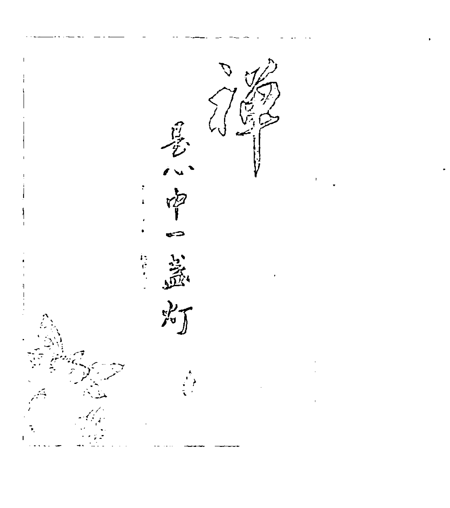

## 内容简介

一切人，从很久以来，认为骨肉、血液、能量和呼吸是自己身体的形象，把眼睛所看的影像，耳朵所听的声音，鼻子所闻的气味，舌头所尝的味道，身体所有的感受，头脑所思维的想象当作自己的心的形象。由此认定身和心合二为一，便成为自我的根源。

对于事物的主观见解，往往阻碍我们认识世界的真相，如果我们能削弱意识上的见和思维上的解，我们才能真正发挥我们感照世界能力。“不识庐山真面目，只缘身在此山中。”

常说的换个角度看问题，也就是说的这个道理：站得越高，看得越远，角度越多，认识越全面。

禅是中国传统文化的重要组成部分，具有独特的文化内涵，蕴涵深刻的人生智慧。这本书浓缩了禅的思想和智慧的精髓，它不仅可以使你了解禅的文化，还能帮助你领悟生活的真谛，获得睿智的点拨和绝妙的启示，让你走好人生之路。

# 魅力失分

狮子座过于爱面子和摆排场，让人觉得有点功利，其实，经常打落牙齿和血吞的也是他，真是得不偿失。

## 面对耻辱

付文君

美国前总统罗斯福在中年时得了一种怪病，这时他做了参议员，在政坛上炙手可热，遭此打击，差点心灰意冷，退隐还乡。

开始时，他一点也不能动，必须坐在轮椅上，但他讨厌整天依赖别人把他从楼上抬上抬下，晚上就一个人偷偷练习。

有一天他告诉家人说，他发明了一种上楼梯的方法，要表演给大家看。原来，他先用手臂的力量，把身体撑起来，挪到台阶上，然后再把腿拖上去，就这样一阶一阶艰难缓慢地爬上楼梯。他的母亲阻止他说：“你这样在地上拖来拖去的，给别人看见了多难看。”罗斯福断然说：“我必须面对自己的耻辱。”

### 魅力提示：

不敢放下自己的面子，又如何能积极地拼搏奋斗，获取属于自己的荣誉，消除自己的耻辱？不敢面对自己的失败，又如何能从失败中站起来，走向成功，并且将失败抛得远远的。

## 沃恩的秘密

佚名

沃恩每年都会受邀参加某单位的杂志评审工作，这个工作虽然报酬不多，但却是一项荣誉，很多人想参加却找不到门路，也有人只参加一两次，就再也没有机会了！沃恩年年有此“殊荣”，让大家都羡慕不已。

在他年届退休时，有人问他其中的奥秘，他微笑着向人们揭开谜底。

他说，他的专业眼光并不是关键，他的职位也不是重点，他之所以能年年被邀请，是因为他很会给别人“面子”。

他说，他在公开的评审会议上一定会把握一个原则：多称赞、鼓励，而少批评。但会议结束之后，他会找来杂志的编辑人员，私底下告诉他们编辑上的缺点。

因此，虽然杂志有先后名次，但每个人都保住了面子。也正是因为他顾虑到别人的面子，因此承办该项业务的人员和各杂志的编辑人员，都很尊敬他、喜欢他，当然也就每年找他当评审了！

### 魅力提示：

要让自己有面子并不难，只要你懂得给人面子、赞扬和批评有一定的分寸和场合，既坚持原则性，也要讲究灵活性，既坚持真理，也不能得理不饶人。

## 木鞋的教训

佚名

大卫·李嘉图是一位著名的经济学家。 在他9岁那年，有一次，父母去商店买东西，顺便带上了他。在一家商场的陈列柜前，大卫看到一双漂亮的“皮鞋”，那精美的外观让他心动，他想如果自己穿上这样一双“皮鞋”去跟小伙伴们玩，一定会让他们羡慕不已，于是他缠着父母，非要他们买下。母亲答应了，但父亲却摇了摇头，他认为那双鞋不适合孩子穿。 大卫听后非常生气，他坐在地上不停的哭闹。最后父亲被逼无奈，只得同意儿子的要求，但要他保证，买了就一定要穿。

大卫终于拥有了这双鞋，然而等他穿上之后才发现这是双木鞋，很笨重，走起路来会发出很大的响声，让人很不舒服。可是他答应了父亲一定要穿，所以，在以后的日子里，这双鞋让他受了很多罪。

他时常在没人的地方念叨：“这双鞋的确不适合我。我为了满足自己的虚荣心，竟让父亲买了一件并不实用的东西。”

后来，为了摆脱这双鞋子，大卫想尽了一切办法。

善良的父亲再也没有逼大卫穿这双鞋，但大卫却不肯原谅自己。他把那双鞋挂在自己房间最显眼的地方。只要看到它，就会想起自己犯的错，让它时时提醒自己再也不要任性，不要贪慕虚荣。

### 魅力提示：

虚荣是一个转瞬即逝的肥皂泡，追求这种虚无缥缈的东西一点用处都没有，甚至还会殃及自己；只有脚踏实地，才能真正地领略到生命的意义。小小的一点虚荣，正和大量的爱一样，足够使人变得矫饰。

## 狮子与猪的决斗

佚名

有一天，一头猪领着一群猪走进深山。

在山野中忽然遇见一头狮子。狮子看见猪群，高傲地吼道：“我是百兽之王，你们赶快退避。”那头猪回答道：“让我退避，这是不可能的。如果要与我决斗，我一定舍命相陪。请你暂时等一等，我要去披上我的铠甲。”这时，狮子感到费解，说道：“你算什么上等贵族吗？报上名来，看看是谁胆敢和我挑战？你既然要披铠甲，就随你便吧。”

那头猪立即往一个大粪坑里一跳，滚了一身污秽之物，重新走到狮子面前，说：“来，我与你决斗！”狮子一看，实在是没法下嘴，就说：“我是百兽之王，常以獐鹿等兽类为食物，有时稍稍劣等一点的我都不屑于吃，何况你这种不干净的脏东西。如果我与你决斗，实在是怕你把我弄脏了。”

### 魅力提示：

太要面子会成为你做事的包袱。放下下面子，你才能全力以赴去奋斗。

# 魅力失分

狮子座超爱管闲事，有些事情明明跟他没关系，他偏偏要跑上去对别人指手画脚，让人觉得他未免管得太多。

## 飞鸟与游鱼

佚名

天空中，有一只鸟儿在自由自在地飞翔着，看见下方有一个池塘，就落下来小憩。

鸟儿看见一条鱼儿在水中游来游去。它想：“多可怜的鱼儿呀！整天被无情地泡在冰冷的水里，无法上岸走走，更不能像我一样在天空自由自在地飞翔。我一定要把它救到天上来。”

于是鸟儿对鱼儿说：“亲爱的朋友，你可真傻啊，整天待在这沉闷冰凉的水里受罪，来吧，跟随我一起去天空自由自在地生活吧！”

> “可是……我，好像无法离开这水呢。”

鱼儿怀疑地回答。

> “你可真笨！那么好吧，既然你自己没有办法离开这一池讨厌的水，那么，就让我来帮你吧！”

鸟儿说完，飞向水面然后一头扎进水里，把游鱼叼到了口里。接着，它振起翅膀，向天空飞去。

“放下我！快放下我！”鱼儿感到呼吸困难，向鸟儿求救。可好心的鸟儿一心要拯救这只“可怜”的游鱼，它要让这鱼儿饱览高空美景，让它享受高空自由自在的生活，让它看看在森林中安家是一件多么惬意的事……

可是，当鸟儿最后把鱼儿放在林中自己的鸟巢里时，鱼儿早已经断了气。

### 魅力提示：

给鱼离开水的自由，也就是给了它死亡。不要总是把自己的意愿强加于人，不要以为你所需要的也一定是别人所需要的。人与人的差异或许就如同飞鸟与游鱼的差异。

## 秀秀理发店

佚名

在广州市的一条小街上，有一家小理发店，店主人是三位年轻姑娘，分别名叫大秀、二秀、三秀，所以这家理发店也叫“秀秀理发店”。虽然店小而且地处偏僻，可来理发的人却不断，原来这家店主不仅手艺高，而且服务态度也非常好。

一次，有位高个子姑娘走进店来，要大秀给她理个像日本电影《生死恋》中的主人公夏子那样的发式。

大秀发现这姑娘长得俊俏，只是脖子长了些。要像夏子那样把头发盘上去，势必把脖子全暴露出来，多不雅观；但要直说，又怕伤害对方的自尊心。

她想了一下，呵，有了。于是温和地说：“大姐，听你口音，不是广州人吧？”

“我原籍吉林，到广州好几年了，但广州话总是说不准。”

“怪不得，你长得比较高，其实，高才好看，身材苗条，穿裙子也漂亮。”

几句话，把对方说得心里甜丝丝的，好像双方一下子亲近了许多。

对方还没有开腔。大秀又继续说：“现在冬天到了，头发盘上去会冻坏脖子的。”

一句话点醒了对方，可能对方原来也知道自己脖子长，赶忙说：“等一等，让我再考虑考虑。”

大秀忙说：“我也正想和你商量，不如理个波浪式，发脚刚好披在肩上，下部卷曲，中间起伏，上面收拢，配上你这身段，保证好看。”

姑娘听后满意地点了点头，笑了。

### 魅力提示：

在许多场合下，即使是好心的建议也不便直接说出来，因为人都不喜欢别人对自己指手画脚。这时可以采取一种间接建议的方法，既达到你的目的，又让人容易接受，不觉得你是多管闲事而产生反感。

## 草与秧苗

石英

孔子东游，见田里放着农具，而农人已去，便拾起锄头，围着一棵秧苗，费力地锄了起来。

不一会儿，农人归来，一见大怒，愤愤地说：“你为什么锄我的秧苗？”

孔子感到很奇怪，便指着秧苗说：“你看，我锄的明明是草啊。”没想到农人更加恼火地说：“我种的就是喂马的草！”

孔子不禁目瞪口呆。

### 魅力提示：

有些事情不可以常理度之。因此，在好心帮人时要弄清楚他的目的是什么，切不可胡乱插手，帮人倒忙。

## 多管闲事的人不能当耶稣

佚名

北欧一座教堂里，有一尊耶稣被钉在十字架上的苦像，大小和真人差不多。因为有求必应，因此专程前来这里祈祷、膜拜的人特别多，几乎可以用门庭若市来形容。

教堂里有位看门的人，看十字架上的耶稣每天要应付这么多人的要求，觉得于心不忍，他希望能分担耶稣的辛苦。有一天他祈祷时，向耶稣表明这份心愿。意外地，他听到一个声音，说：“好啊！我下来为你看门，你上来钉在十字架上。但是，不论你看到什么、听到什么，都不可以说一句话。”这位先生觉得，这个要求很简单。

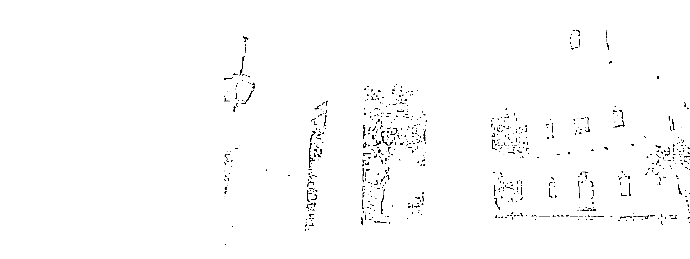

于是耶稣下来，看门的先生上去，像耶稣被钉在十字架般地伸张双臂，本来苦像就雕刻得和真人差不多，所以来膜拜的群众不疑有他，这位先生也依照先前的约定，静默不语，聆听信友的心声。

来往的人潮络绎不绝，他们的祈求，有合理的，有不合理的，千奇百怪不一而足。但无论如何，他都强忍下来而没有说话，因为他必须信守先前的承诺。

有一天来了一位富商，当富商祈祷完后，竟然忘记拿手边的钱便离去了。看门人看在眼里，真想叫这位富商回来，但是，他憋着不能说。接着来了一位三餐不继的穷人，他祈祷耶稣能帮助他渡过生活的难关。当要离去时，发现先前那位富商留下的袋子，打开，里面全是钱。穷人高兴得不得了，耶稣真好，有求必应，万分感谢地离去。十字架上伪装的耶稣看在眼里，想告诉他，这不是你的。

但是，约定在先，他仍然憋着不能说。接下来有一位要出海远行的年轻人来到，他是来祈求耶稣降福他平安的。正当他要离去时，富商冲进来，抓住年轻人的衣襟，要年轻人还钱，年轻人不明就里，两人吵了起来。这个时候，十字架上伪装的耶稣终于忍不住，遂开口说话了……既然事情清楚了，富商便去找冒牌耶稣所形容的穷人，而年轻人则匆匆离去，生怕搭不上船。伪装成看门人的耶稣出现，指着十字架上说：“你下来吧！那个位置你没有资格了。”看门人说：“我把真相说出来，主持公道，难道不对吗？”耶稣说：“你懂得什么？那位富商并不缺钱，他那袋钱不过用来嫖妓，可是对那穷人，却是可以维持一家大小生计；最可怜的是那位年轻人，如果富商一直缠下去，延误了他出海的时间，他还能保住一条命，而现在，他所搭乘的船正沉入海中。”

### 魅力提示：

在现实生活中，我们常自认为怎么样才是最好的，于是对别人的生活横加干涉、殊不知，有时候好心也会办坏事，请相信一切上帝皆有安排，所以，不要轻易对别人的事情指手画脚。

- **书名**：智慧书——永恒的人生处世经典
- **作者**：（西）葛拉西安 著，李汉昭 译
- **出版社**：天津教育出版社
- **出版时间**：2008-5-1
- **印刷时间**：2008-5-1
- **开本**：大32开
- **ISBN**：9787530952092
- **包装**：平装

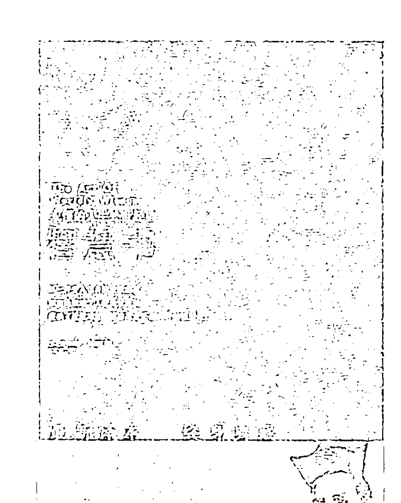

## 内容简介：

《智慧书》为巴尔塔沙·葛拉西安的代表作，浓缩了做人处世的智慧，汇集了关于知人、观事、判断和行动的300则箴言。其待人之理、律己之道，堪称则则精辟、字字珠玑。

本书自1647年问世以来，一直受到各国读者的喜爱；葛拉西安也被尊崇为世界文化史上的一代宗师。

# 魅力失分

狮子座生性浪费，绝不会为了省钱或想储蓄而克制自己的购买欲，即使有了钱，也会因为挥霍成性而无法守住财富。

## 魅力星座智慧书之

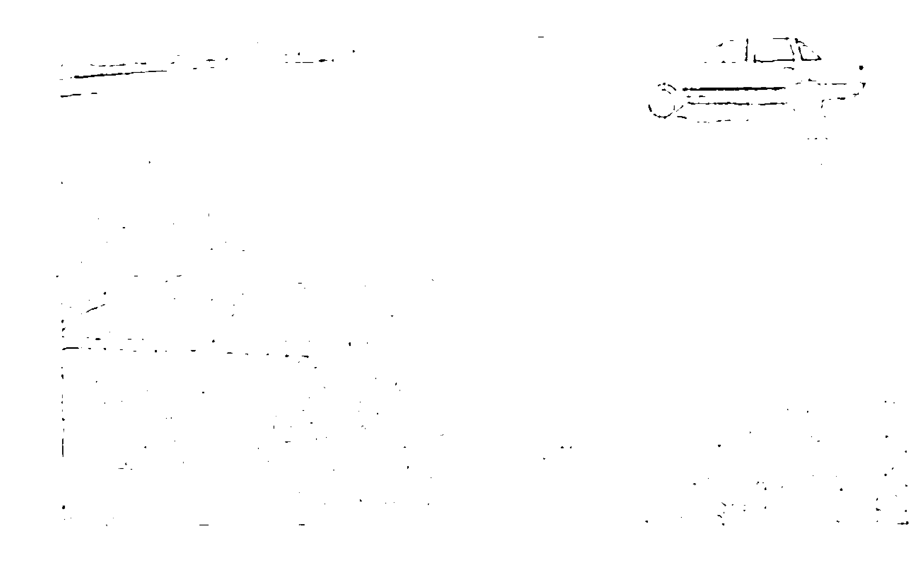

## 大富豪小故事

佚名

有一次，比尔·盖茨和一位朋友开车去希尔顿饭店。饭店前停了很多车，车位很紧张，而旁边的贵宾车位却空着不少。朋友建议把车停在那儿。但盖茨认为太贵，即便在朋友坚持付费的情况下，盖茨最终还是找了个普通车位。

洛克菲勒到饭店住宿，从来只开普通房间。侍者不解，问：“您儿子每次来都要最好的房间，您为何这样？”洛克菲勒说：“因为他有一个百万富翁的爸爸，而我却没有。”

一次，李嘉诚上车前掏手绢擦脸，带出一元钱的硬币掉到车下。天下着雨，李嘉诚执意要从车下把钱捡起来。后来还是旁边的侍者为他捡回了这一元钱，李嘉诚于是付给他100元的小费。他说：那一元钱如果不捡起来，被水冲走可能就浪费了，这100元却不会被浪费，钱是社会创造的财富，不应被浪费。

世界首富比尔·盖茨、世界上第一个亿万富翁洛克菲勒、中国首富李嘉诚的“吝啬”让许多人不可理解。其实“吝啬”是很多富翁们的生活本色和财富态度。我们不会想到，身价466亿美元的比尔·盖茨竟没有自己的私人司机，公务旅行不坐飞机头等舱却坐经济舱，衣着也不讲究什么名牌，甚至对打折商品感兴趣。我们也不会想到很多富翁过着节俭的生活，《华盛顿观察》曾经做过的一项调查显示，70%的“富婆”和68%的富翁都曾经补过鞋，58%的“富婆”和将近一半的富翁们都用优惠券买食物。富人尚且如此，何况我们呢？

### 魅力提示：

> > 节俭是穷人的财富，富人的智慧 节俭是世上大小所有财富的真正起始点。

## 精打细算的美德

佚名

19世纪石油巨头成千上万，最后只有洛克菲勒独领风骚，其成功绝非偶然。有关专家在分析他的致富之道时发现，精打细算是他取得成就的主要原因。

洛克菲勒踏入社会后的第一个工作，就是在一家名为休威·泰德的公司当簿记员，这为他以后的生涯打下了良好的基础。由于他在该公司的勤恳、认真、严谨，不仅把本职工作做得井井有条，还几次在送交商行的单据上查出了错漏之处，为公司节省了数笔可观的支出，因此深得老板的赏识。

后来，洛克菲勒在自己的公司中，更是注重成本的节约，提炼加工原油的成本也要计算到第3位小数点。为此，他每天早上一上班，就要求公司各部门将一份有关净值的报表送上来。经过多年的商业洗礼，洛克菲勒能够准确地查阅报上来的成本开支、销售以及损益等各项数字，并能从中发现问题，以此来考核每个部门的工作。1879年，他质问一个炼油厂的经理：“为什么你们提炼一加仑原油要花1分8厘2毫，而东部的一个炼油厂干同样的工作只要9厘1毫？”就连价值极微的油桶塞子他也不放过，他曾写过这样的信：“上个月你厂汇报手头有1119个塞子，本月初送去你厂10000个，本月你厂使用9527个，而现在报告剩余912个，那么其他的680个塞子哪里去了？”

洛克菲勒洞察入微，刨根究底，不容你打半个马虎眼。正如后人对他的评价，洛克菲勒是统计分析、成本会计和单位计价的一名先驱，是今天大企业的“一块拱顶石”。

### 魅力提示：

节俭是商业成功的必要条件，商人一定要严格要求自己不浪费，要先赚钱，再考虑花钱。

# 白饭的来历

佚名

从前，中国有一个官长，生活非常奢侈，每餐都会让他的厨子做很多的饭菜，却总是从来都吃不完，因此，他的沟渠每天都有白饭流出来。

隔邻的僧人看见，觉得很可惜，就把白饭淘起，洗净晒干，收藏起来。

后来，因为他的铺张浪费，官长把所有的财产都花光了，变得十分贫穷，甚至沦落到了乞讨的窘境。

有一天，官长来到寺院求乞，好心的僧人拿出他从前弃掉的白饭，送给他吃，并且告诉他这些白饭的来历。

官长听了，十分惭愧，后悔不已。

### 魅力提示：

再多的钱财也经不起毫无节制的挥霍，该节约的时候节约，才能让你不至于一无所有。

# 曾国的灭亡

孙天伟

墨子极力主张节俭，反对浪费。他曾经说过：“我们这个社会差不多有一半的财富被浪费掉了。如果这一半节约下来，那社会不就等于多了一倍的财富吗？”

墨子和他的弟子们总是穿最朴素的衣服，吃最简单的饭菜，住最简陋的房子。墨子不但自己非常节俭，当他听到有人浪费时，也总是毫不客气地指责批评。

当时有一个叫曾的小国，它的国君非常浪费奢侈，每次吃饭的时候都要上几百道菜，这些菜有的甚至连尝都没尝过就被倒掉了。他的一顿饭足够一个穷人吃几个月了，可他每次不是嫌菜太少，就是嫌味道不好，经常骂仆人：“就这么点儿菜，让我怎么吃饭，你们是不是想饿死我呀？”墨子知道这件事后，就对别人说：“曾国就要灭亡了！”有人问墨子：“你凭什么说曾国要灭亡了？难道你听说有哪个大国要攻打它吗？”墨子坚定地说：“我是从它的国君吃饭的习惯中知道的。他这么浪费，大臣们也一定会受他的影响，不知节俭。他们君臣不知百姓劳作的辛苦，只知一味地剥削百姓，满足自己奢侈浪费的生活，这样只会导致百姓生活越来越困苦，一个个挨饿受冻，最终逼得百姓人人都想造反，如果一旦有别国来攻打，百姓没有反抗能力，或者有反抗能力的也不想反抗，这样的国家能不灭亡吗？”果然，没过多久，正像墨子预言的一样，曾国很快就被别的国家灭掉了。

### 魅力提示：

奢侈浪费是可耻的，也是危险的，它可能导致败家败国

- 书名：让节约成为习惯
- 作者：淡佳庆 编
- 出版社：中国电力出版社
- 出版时间：2010-1-1
- 印刷时间：2010-1-1
- 开本：大32开
- ISBN：9787508398488
- 包装：平装

## 内容简介：

本书以企业生产经营中现实可行的节约细节为内容，以理念、工作、落实、流程、管理、提升等各个阶段为单元，列举和说明了让节约成为习惯的重要性和可操作性，明确能够实施节约的细节所在，帮助读者树立节约意识、践行节约习惯，为企业和个人创造更多收益、谋得共同发展。

本书说理简明，案例丰富，既可以协助企业宣传和确立节约文化，也能够为个人强化节约素养，是一本通俗有益的读本。本书可作为大众读物，也可作为企事业单位和机关节约培训教材使用。

# JAY

# 魅力失分

狮子座的人渴望出人头地、登上社会阶层的顶峰，他会用那些社会名流和权贵人物来抬高自己，是个势利群体。

# 收留乞丐

付闻君

几个朋友在议论，都说自己的亲戚是怎样的高贵人物。
银行家啦，实业家啦，大财主啦，大官啦，大将军啦，全都有。大家你嚷我喧十分热闹。

可是有一个人不作声。别人叫他说，他说不必说了。再三地叫他讲，他才说：“街市上的叫化子，都是我的亲戚。拉黄包车的，也是我的朋友。”

大家都笑起来，说他骗人。他正色道：“所有的人类，无非是体面跟不体面两种，现在体面的，都被你们占尽了，只剩下这些不体面的丢在那里。我若不把他们收留来认作亲戚，恐怕他们会跑到各位府上，成为各位的亲戚，那就糟透了。”

### 魅力提示：

世界之大，无奇不有，三教九流也无所不容，上自皇室公卿，下至苦力乞丐，他们都生活在这同一个世界上。我们不能也不应当忽视或否定他们的存在。即便是在自己的亲戚当中，也不会都是些高贵的人物，肯定大多数都是些底层人物，或穷亲戚。因此做人不要太势利眼！

# 社稷之臣

佚名

春秋时期，齐国的大臣崔杼因为和齐庄公为了一个女人而争风吃醋，杀了庄公。晏婴站在崔杼家的大门外，崔杼问他说：“你难道要为君侯去殉死吗？”晏婴说：“君侯如果为社稷而死，那我就随着他去死；君侯如果为社稷而逃亡，那我也随着他去逃亡；君侯如果为自己而死，那么除非他的亲信，谁会随着他去死呢！”

晏婴的言外之意是说齐庄公因为与崔杼争风吃醋而被杀，不是为社稷而死，所以自己也不值得去为他殉死。

可见晏婴在齐国当宰相，把自己看做是国家的大臣，而不是国君的亲信，时时用国家大臣的标准来严格要求自己。

齐庄公被杀以后，齐景公即位。不久，齐景公任命晏婴为齐相。有一次，齐相晏婴陪侍齐景公处理朝政。

这一天的清晨，天气特别的寒冷，冻得齐景公浑身发抖，手脚冰凉，齐景公支使晏婴说：“相父，麻烦你帮寡人端碗热粥来。”

晏婴说：“王上，臣是朝廷的大臣，而不是侍奉君侯饮食的臣仆，这不是我的职责！”

齐景公又支使晏婴说：“那请你把皮袄拿来给我披上。”

晏婴说：“臣是齐国的大臣，而不是王上一个人的大臣，更不是衣服坐褥的臣仆，这也不是我的职责！”

齐景公见他支使一件事，晏婴就推辞一件事，惹得景公非常生气。

于是景公就对晏婴说：“这也不是，那也不是。那么，寡人倒要问一下，相父适才对寡人说：‘既不是侍奉饮食和坐褥的臣子，也不是寡人一个人的臣子’，那相父到底属于什么样的大臣呢？”

晏婴回答说：“回王上，臣是社稷之臣。”

齐景公问：“什么叫社稷之臣？”

晏婴说：“社稷之臣就是国家的大臣，他能够建设国家，区分君臣上下的关系，让他们合乎伦理；他能够确定百官的先后次序，让他们处在适当位置；他能够制定外交辞令，可以传布到天下各国。”

晏婴不是偷懒耍滑，而是要保持大臣的体统的尊严。

从此以后，不涉及到国家大事，齐景公就不再召见宰相晏婴了。

### ## 魅力提示：

身居高位者，应尽职尽责于本职工作，为政事效力，为同僚和世人树立良好的榜样，维护整个团体的和平稳定与团结，而不是不顾原则，对上司大献殷勤，置法规礼仪于不顾。

# 离群的黑雁

方广

一只黑雁从小生长在雁群中，但是后来它觉得自己和其他伙伴越来越格格不入了。因为随着它的不断长大，黑雁的身躯变得比一般的伙伴都要庞大，而且最主要的是它一身黑色，这样看来，它简直就是这个群体中的异类了。虽然同伴们并没有因为它的与众不同而排挤它，但是黑雁却瞧不起自己的同伴。

> > “它们一个个那么瘦小，真是可悲，而且颜色还那么难看，哪有我这种黑色高贵！哦！生活在这样一个家庭里真是太不幸了，我本来应该和黑色的乌鸦生活在一起的……”

黑雁觉得乌鸦的生活很有情调，就像一位高贵的黑衣妇人，可以整天什么都不干，闲的时候还可以唱唱歌，于是，黑雁一心一意想要搬去和乌鸦同住。可是，乌鸦发现黑雁长得和自己不一样，而且声音也不一样，因此不想让它和自己一起住。

乌鸦带着厌恶的口气说：“难道你不知道吗？你和我根本就不是同一类，你再怎么高贵也只是一只大雁，我不会喜欢你的……”

吃了闭门羹的黑雁只好无可奈何地回头去找它原来的伙伴。

“你不是看不起我们吗？和我们在一起会给你丢脸的，你还是走吧，这里没有人欢迎你！”

于是黑雁只好孤单地离开了雁群，在天空中发出凄凉的叫声。

> 众叛亲离是对势利和忘本之人的惩罚。清楚地认识你自己，否则你会到处遭人排斥。

# 打就是不打

佚名

宋朝的时候，有一个名叫丘浚的人，他在朝廷做一名殿中丞官员。 有一次，他去杭州大寺院里拜访一位名叫“珊”的老和尚。老和尚瞧着丘浚官卑职微，理都不屑理一下，态度很傲慢。 一会儿，外面报说有位将军的公子驾到，老和尚慌忙跑下石阶，亲自把公子扶下马鞍，迎进禅堂，又是点头哈腰，又是装烟倒茶。 丘浚在一旁看着，心里气愤不平，等公子走了以后，他责问老和尚说：“你待我如此傲慢，为何看见将军公子这般恭敬？” 老和尚回答：“先生不懂我们出家人的道理，这叫做恭敬就是不恭敬，不恭敬就是恭敬。” 丘浚勃然大怒，抄起杖棍就在老和尚的秃头上狠狠地打了几下，一面打一面说：“师父休要见怪，打你就是不打你，不打你就是打你！”

### 魅力提示：

嫌贫爱富、攀附权贵，见到穷朋友就不予理会，见到有一些权势的朋友就点头哈腰这样的势利之人只会得到别人的轻视。

- 书名: 势利者脸谱
- 作者: (英)威廉·梅克庇斯·萨克雷 著, 刘荣跃 译
- 出版社: 中国社会科学出版社
- 出版时间: 2009-1-1
- 印刷时间: 2009-1-1
- 开本: 16开
- ISBN: 9787500473763
- 包装: 平装

# 内容简介:

势利，是人类社会中的一个非常顽固的弊病，是人性的一大弱点。19世纪英国著名作家威廉·梅克庇斯·萨克雷，用幽默辛辣的语言，全面、透彻地描绘了各种各样势利者的嘴脸，在当时的英国社会引起了巨大轰动。直到今天，在各个国家、各种群体中我们仍能看到各种各样势利者的身影。本书的出版，可以起到揭示势利、警醒世人的作用。

势利者脸谱

# 魅力失分

狮子座好大喜功，爱出风头的个性是众人皆知的，他非常重视名誉，甚至可以为了荣誉付出一切代价。

# 一个孤独的人

威廉·巴克莱

这个人出生在鲜为人知的小村落，父母都是犹太人，母亲是个农家女。他在另外一个小村庄里长大，在木匠店里工作。30岁后开始旅行布道3年之久。他没写过一本书，没有担任过什么职务，也没有一所属于自己的房屋，没有自己的小家。这个孤独的人从来没有进过大学，也不曾涉足过大城市。足迹所到的地方，离他的出生地不逾200英里。一切和伟大的人物和伟大有密切关系的东西，他全没有；他连一张证书也没有，他只有他自己。

这个世界没有给他丝毫，除了他的身体。年纪很轻的时候，大家就看不起他，反对他。他的学生有的抛弃他，甚至其中还有一个出卖了他。他被交到当时的统治者手中，受到审判，被人戏笑、嘲弄。他被钉在一个木头十字架上，钉在两个强盗当中。他在世上拥有唯一的一件外衣，被士兵们抓阄来分。他死后被人从十字架上取下来，埋葬在一个借来的坟墓里。这个坟墓是他的一个朋友（原文如此，也许应该是学生或门徒吧）让出来的。

900多年后的今天，他已成为世界人民心目中幸福生活、美好愿望的化身。这个一生孤独的人就是耶稣。

### 魅力提示：

即使一时拥有全世界的钱财、名誉和最高的地位又能如何！真正至真至善觉悟了的心灵不会受到凡尘的任何牵绊。另外，也许一个人一无所有，但却大智大慧，他所宣讲的一切却得到了现世和以后的永世传扬；也许一个人拥有世上的一切，但他自己却极度空虚四面树敌，最终在众叛亲离中恐惧至死，连同生前的功名和所谓的功业化作历史的尘烟消云散。富有与贫穷、伟大与卑贱的区别，也许就在这里吧！

# 只差三度

佚名

在东亚国家中，日本是一个蜂蜜消费大国，然而，本国的蜂蜜产量却一直上不去，原因是土生土长的日本蜜蜂不善采蜜。为了增大蜂蜜产量，有人引进了采蜜高手欧洲蜜蜂，期待它能创造奇迹。

然而，欧洲蜜蜂引进不久，却遭遇到蜜蜂的天敌——大黄蜂的大举进攻，它们成群结队而来，残忍地杀死所有成年蜜蜂，然后把尚处在幼年的蜂蛹掳去，给它们的幼蜂当美餐。这样，欧洲蜜蜂的引进计划遭到惨败。

虽然引进欧洲蜜蜂失败了，可人们并未因此放弃，他们把注意力重新移向了老朋友——日本蜜蜂。同样是受到大黄蜂的生命威胁，欧洲蜜蜂绝迹了，日本蜜蜂却安然无恙，这一切是为什么呢？

带着巨大的疑问，人们找到了一个日本蜜蜂的蜂巢，细心地观察，终于发现了日本蜜蜂对付大黄蜂的独特办法：大黄蜂对蜜蜂发动袭击时，先派了一个信使出来侦察，想打探好虚实后再集体出动。当大黄蜂的信使飞到日本蜜蜂蜂巢确定方位、标出记号时，蜂巢内的数万只日本蜜蜂发现了这个不速之客！它们很快倾巢而出，飞到大黄蜂的身上，眨眼间就里三层外三层裹紧了它。人们想象着悲壮的一幕：数千只蜜蜂把它们体内的毒刺刺入大黄蜂体内把它毒死，然后自己也随敌人死去！因为蜜蜂的毒刺没有了蜜蜂也就活不长了。

可是，这一幕并没有发生，相反，蜜蜂们不断同时扇动着翅膀，形成巨大的嗡嗡声。过了十几分钟，奇迹发生了：大黄蜂在群蜂的包裹下渐渐失去了活力，不再挣扎，最终死亡！这不禁让围观者目瞪口呆。

原来，蜜蜂虽然弱小，它的生命极限温度却比大黄蜂的高3℃，即49℃，而大黄蜂的为46℃。当大黄蜂信使来打探时，日本蜜蜂知道只有把它杀死才能避免灭顶之灾，而又不能同对方硬拼，于是采取了最聪明也最危险的一招：它们集体合围大黄蜂，利用扇动翅膀产生的热量使大黄蜂的体温上升，达到46℃，前后过程持续十几分钟，这样，恰好使大黄蜂体液沸腾而被热死，同时又使自己的体温始终保持在49℃以下，从而成功地完成了自救的目标。

日本蜜蜂利用集体的力量和智慧，战胜了大黄蜂，保存了群体。而它们所凭借的，竟是看似微弱的3℃的极限体温优势。

### 魅力提示：

与日本蜜蜂相比，人类有着好大喜功和盲目乐观、盲目悲观的天性，对比小小的蜜蜂，我们是否该深刻反省？

# 献鸠放生

追风

每逢元旦，邯郸一带的老百姓都要成群结队去山野里，捕捉许多斑鸠，送到赵简子的府第上。

赵简子看着一笼笼活蹦乱跳的斑鸠，非常高兴，命人取出金银，厚厚赏赐给每一个献斑鸠的人。

有个人在简子家做客，见了很奇怪，问简子要这些斑鸠干什么。简子回答说：

> “你难道不知道吗？每一个小生命都是宝贵的啊！元旦这天，我要放生，表示我对生灵的爱护。”

客人听罢，“扑哧”一声笑了，说：

> “这就是爱护生灵的办法吗？老百姓知道您要放生，献鸠能得到厚赏，大家都争先恐后去捕捉斑鸠，下铁夹的下铁夹，用箭射的用箭射，活捉的固然不少，可打死的更多。您如果真的可怜这些小生命，还不如下个通令，禁止捕捉斑鸠。不然的话，抓了又放，您的恩德还抵不上你的罪过哩。”

简子听了，红着脸点头称是。

### 魅力提示：

那些想问题、办事情只图虚名、不顾后果的人到头来只能是被人讽刺和挖苦。

# 公鸡的金牌

吕金华

公鸡曾经是飞行健将，在多次飞行比赛中都获得了金牌。

公鸡为自己这许多荣誉而骄傲。公鸡一骄傲就把所有金牌全挂在脖子上，一刻也不取下来。后来金牌多了，重得不得了，公鸡戴着这许多金牌就再也飞不动了。久而久之，公鸡就完全丧失了飞行能力。

于是，人们说，瞧，公鸡现在还全身戴着那些闪闪发光的金牌哩。

### ## 魅力提示：

……一个人如果背负着太多的荣誉和金钱，而不懂得或不肯放下，他奔跑的步子势必会慢下来，同时过去那冒险、奋斗的勇气也会日渐丧失。世事多数如此，人们容易为盛名所累。结果就是，不少人功成名就之日，便是其才华殆尽之时。

书名：糊涂做人必须掌握的策略
作者：魏晋风 编著
出版社：中国华侨出版社
出版时间：2009-4-1
印刷时间：2009-4-1
开本：16开
ISBN：9787802228238
包装：平装

## 内容简介：

世上聪明人不少见，因聪明而致祸的人更是不胜枚举。孔子在评价宁武子时说：“其智可及也，其愚不可及也。”其实，真正的聪明人正是像宁武子这样“愚不可及”的人。

老子说，“夫唯不争，故天下莫能与之争”，糊涂的智慧正在于此。糊涂就是教人凡事退一步，不去硬碰对手的锋芒，然后瞅准时机，以退为进。糊涂的人，才是最聪明的人，他们通于世故，洞悉人性，坏事不会落到他们头上，好事十有八九纳入其怀，这就是糊涂的智慧。表面上似乎什么都不知道，其实心里比谁都清楚。

本书分别从守拙、口讷、隐忍、包容、生存、交际等几个方面谈如何为人处世。本书立足现实而高于现实，旨在使人从形形色色的现象中，洞悉处世之道。本书语言精练，叙事简明，论理透彻，希望给那些想拥有幸福生活、成功事业、辉煌未来的人以帮助。

N A R

# 魅力失分

狮子座的人喜欢听好话，别人如果对他说些恭维奉承的话，特别是在言词之中流露敬佩或者爱慕之意，那一定会哄得很开心。

# 小偷的好意

佚名

有一天，一个小偷盯上了一个富裕人家，他想去盗窃一些值钱的东西，最近他穷得手上一个子儿都没有了。他到富人家看了一圈，发现这家人养了一只非常凶悍的狗。大凡富裕人家都是如此，他们将狗视为财产的保护神。

小偷没有放弃，打算再去观察一下地形，看看能不能找到什么下手的机会。他故意从富人家门口经过，可是那只狗特别警惕，没等小偷靠近就蹿了出来，虎视眈眈地注视着他，冲他狂叫不止。看样子，如果他一有什么举动，它就会毫不客气地扑上去。小偷担心自己力量不及，反而吃亏，只好灰溜溜地离开了。

小偷绞尽脑汁想办法对付这只狗。最后，他计上心来，决定用一些恩惠俘虏狗，转移它的注意力。于是，小偷买了一块肉，切成许多的小碎块，装进自己的口袋里，踌躇满志地向富裕人家走去。

不过，他还是非常谨慎地从后门溜进去，心想：就算碰见那只倒霉的狗，我也可以用肉来打发它。那只狗的确非常警觉，一听到动静就出现在小偷面前了。小偷连忙从口袋里拿出肉，不停地扔给狗。

狗却不理会这些美味，凶恶地冲着小偷狂叫，似乎在说：“你快给我滚开些！你的一番好意里肯定有所企图，我才不吃你这一套呢！”

小偷见状，惊慌失措地溜走了，同时还在心里惋惜自己买的那块肉。

### 魅力提示：

> “天下无故拍马屁的人。”我们要时刻警惕那些有所企图的小恩小惠，以及言辞上的献媚逢迎。

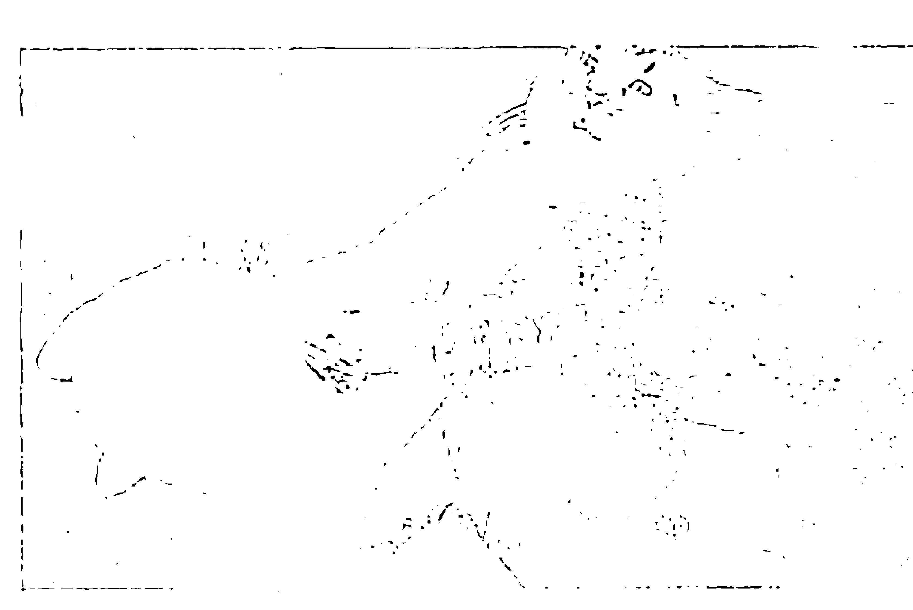

# 赵简子涕泣
刘吉

春秋时期，赵简子有个家臣名叫周舍。这是一个很正直、刚正不阿的人。有一次，他有事找赵简子，可赵简子嫌他卑微，不肯接见他，于是他就在赵简子的门前站了三天三夜，不肯离去。

赵简子派人问他：“你有什么事要见我？”周舍说：“我要做一个正直敢言的家臣，笔上蘸饱墨汁，手拿简牍，跟在您的身后，观察到您的过错就记录下来。每天都有记录，每月都有成果，一年以后就能见到实效。”

在我国古代，历朝历代都有设置史官的制度，帝王的一言一行，史官都随时记录，然后作为秘密档案封存起来，作为后世修史的资料，帝王在世时无权阅读。由于害怕被后世称为昏君，所以帝王都注意自己的一言一行。

赵简子知道周舍要效法古代史官，记录自己的言行，觉得能促使自己成为明君英主，也没有什么不好，于是便同意了周舍的请求。

从此以后，赵简子在宫廷内或外出，都与周舍在一起，而周舍也跟在赵简子后面形影不离，随时记录简子的一言一行。

但是没过多久，周舍就死了，赵简子难过得就像死了儿子一样伤心。

后来，有一次赵简子与众大夫在洪波台喝酒，喝到兴致正浓的时候，赵简子突然流泪哭泣起来。

众大夫都很惊讶，他们离开了席位，向赵简子请罪说：“不知某等所犯何罪！使主公伤心了，还请主公明示。”

赵简子说：“诸位大夫都没有罪。”

众大夫更加莫名其妙，又问：“我们既然没有罪，那主公是有什么烦心事？或者是别的国家侵犯我国？可是不对呀，并没有任何国家侵犯我国呀！究竟是谁得罪了主君呢？不妨说说，我们也好为您分忧！”

赵简子说：“我想起我朋友周舍说过的话，不由得暗自悲伤起来。”

众大夫问：“周舍说了什么？”

赵简子便把周舍的话重复了一遍：“千张羊皮不如一只狐狸腋下的毛皮值钱，众人随声附和不如一个正直之士刚直不阿有益。从前，商纣王由于大臣沉默不语而使商朝灭亡，周武王由于有刚直不阿的大臣而使周朝兴盛。”

然后，赵简子又说：“自从周舍死了以后，我再没有听到谁批评我的过错了。我大概离灭亡不远了，因此我就流泪哭泣起来。”

众大夫都感到很惭愧。

### 魅力提示：

有远见的人应该学会听到不同的意见，接受对自己的批评，不能被随声附和的人所包围。

# 关羽败走麦城
佚名

三国鼎立的局面形成之后，魏、蜀、吴三国各占一方地盘，但每一家又都想吞并对方。

北伐中原、复兴汉室是蜀汉的既定战略，刘备、诸葛亮无时无刻不在为此操心。关羽受命据守荆州，伺机北进。

关羽出师北进，俘虏了魏国将军于禁，并将魏国征南将军曹仁围困在了樊城，取得了显赫的胜利。

当时镇守陆口的吴国大将是吕蒙，他回到建业，称病要休养，其实是想谋划对付关羽。部将陆逊来看望他，两人自然而然谈论起了军国大事。

陆逊说：“关羽平时经常欺凌别人。现在节节胜利，又立下大功，就会更加自负自满。又听说您生了病，对我们的防范就有可能要松懈下来。他一心只想消灭魏国，如果此时我们出其不意地进攻，肯定能打他个措手不及。”

吕蒙对陆逊的见识大为叹服，就向孙权推荐陆逊代替自己前去陆口镇守。

陆逊一到陆口，马上给关羽写信道：“您大败魏军，立下赫赫战功，这是多么了不起的事啊！就是以前晋文公在城濮之战中所立的战功，韩信在灭赵中所用的计策，也无法与将军您相比啊。我刚来这里任职，学识浅薄，经验不足，一直很敬仰您的美名，所以恳请您多多指教。”

关羽接到陆逊的信，自然被信中的好话吹捧得晕晕乎乎，而且由此想当然地认为陆逊不过是无名之辈，不足为惧，对后方吴国也就放心了。

陆逊在稳住关羽后，暗中加快军事部署，待条件具备后，指挥大军，一举攻克蜀中要地南郡。关羽败走麦城，终遭杀害。

就这样，关羽为他的虚荣与轻敌付出了沉重的生命代价。

### 魅力提示：

在阿谀奉承面前，要保持清醒的头脑，别人的阿谀奉承，可能会使我们付出惨痛的代价，甚至遗恨终生。

# 蚱蜢和猫头鹰
伊索

一只猫头鹰每到晚上才出来吃东西，白天就睡觉。有一天，正当它睡得很香时，被一只蚱蜢的声音吵醒了，它没法入睡，便急切地请求蚱蜢停止叫声。蚱蜢却根本不理它，仍然叫个不停。猫头鹰越不断地请求，蚱蜢反而越叫得响。猫头鹰被弄得无可奈何，烦躁不安。突然它想到一个好计策，便对蚱蜢说：“听到你动听的歌声，我已睡不着了。你的歌声如同阿波罗神的七弦琴一样动听。我将把青春女神赫柏刚送给我的仙酒拿出来，痛痛快快地畅饮一场。你若不反对，就请上来一起喝吧。”蚱蜢这时正渴，又被这赞美词弄得高兴得忘乎所以，什么也没想就急忙地飞了上去。结果，猫头鹰从洞中冲出来，把蚱蜢弄死了。

### 魅力提示：

不要别人说一点点好听的话就飘飘然忘乎所以，忘记了自己的地位和处境。如果你一定要那么做的话，只能是自找苦吃。

书名：放下——做人必须学会的选择
作者：魏晋风 编著
出版社：中国华侨出版社
出版时间：2009-4-1
印刷时间：2009-4-1
开本：16开
ISBN：9787802228412
包装：平装

## 内容简介：

人总是希望得到的多失去的少，以为拥有的东西越多，自己就会越快乐。所以，这一人之常情就迫使我们沿着追寻获取的路走下去。可是，有一天，我们忽然惊觉：我们的忧郁、无聊、困惑、无奈，一切不快乐，都和我们不懂得放下有关，我们渴望拥有的东西太多了，或是太执著，而徒增了很多烦恼。

懂得放下，才能在成功的路上走得更久。放下那些不适合自己去充当的社会角色，放下束缚你的世故人情，放下伪装你的功名利禄，放下徒有虚荣的奉承夸奖，放下各种蒙住你眼睛的遮羞布，你才能够腾出手来，用足够的精力和智慧来赢取你真正应该有的东西。充分地做好自己应该做的事，自由自在地发掘自己的潜力，主题明确地奔向自己应该追求的目标，坚定不移地走自己的路，充分实现自己的人生价值。

# 魅力失分

温暖大方是狮子的标签，但前提是，别人的成就永远不会超过他，否则，虽不视那人为敌人也必定成陌路，谁叫天生第一名的狮子，受不了别人比他优秀的事实，这时他的大方会摇身一变为小气，而且怪里怪气又多疑。

# 出牌
傅映平

一个年轻人和他的6个朋友一起打牌。他身上没带多少钱，但他又不能不打。开始发牌了，不幸的是，他发现自己拿了一张最坏的牌。

他并不想输钱，思考了一下后，他不动声色地把身上1/4的钱放在了桌子上。他甚至看都不看其他人一眼。轮到可以换牌了，他也坚持着，没有去换牌。

紧接着又该加注了。年轻人又加了1/4的钱在上面。有3个人看到他没有换牌，以为他拿的牌一定很好，于是退出了。

这下，还剩下3个人。年轻人干脆把身上剩下的钱全押了上去。

剩下的3个人也被吓住了，他们把牌掩起来，退出了。年轻人胜利了，他赢到了他原来10倍的钱。

他的朋友们要求他展示他的底牌，年轻人掀开了，那是一张最小的牌。短暂的沉默后，年轻人开口了：

“我知道我会赢。手里拿到的牌并不代表什么，关键是要让对手相信你的手里握有一张无与伦比的牌。”

### 魅力提示：

在生活中，没有人一直拥有最好的牌。某些人一直在炫耀自己手中的好牌，而有些人在尝试着变换手中的牌。可是如果想赢，就不要去光顾其他人所拥有的。你要始终相信，你手中的牌，和你的意志、决心一样强。

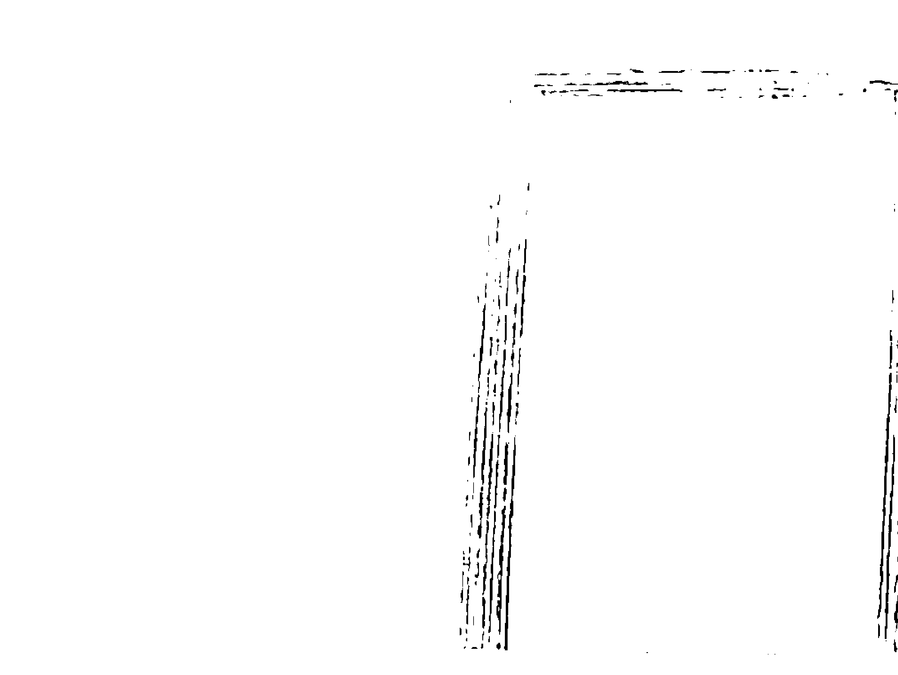

# 爱因斯坦的镜子
佚名

爱因斯坦小时候是个十分贪玩的孩子。他的母亲常常为此忧心忡忡，母亲的再三告诫对他来讲如同耳边风。直到16岁的那年秋天，一天上午，父亲将正要去河边钓鱼的爱因斯坦拦住，并给他讲了一个故事，正是这个故事改变了爱因斯坦的一生。故事是这样的：

“昨天，”爱因斯坦父亲说，“我和咱们的邻居杰克大叔清扫南边工厂的一个大烟囱。那烟囱只有踩着里边的钢筋踏梯才能上去。你杰克大叔在前面，我在后面。我们抓着扶手，一阶一阶地终于爬上去了。下来时，你杰克大叔依旧走在前面，我还是跟在他的后面。后来，钻出烟囱，我发现一件奇怪的事情：你杰克大叔的后背、脸上全都被烟囱里的烟灰蹭黑了，而我身上竟连一点烟灰也没有。”

爱因斯坦的父亲继续微笑着说：“我看见你杰克大叔的模样，心想我肯定和他一样，脸脏得像个小丑，于是我就到附近的小河里去洗了又洗。而你杰克大叔呢，他看见我钻出烟囱时干干净净的，就以为他也和我一样干净呢，于是就只草草洗了洗手就大模大样上街了。结果，街上的人都笑痛了肚子，还以为你杰克大叔是个疯子呢。”

爱因斯坦听罢，忍不住和父亲一起大笑起来。父亲笑完了，郑重地对他说，“其实，别人谁也不能做你的镜子，只有自己才是自己的镜子。拿别人做镜子，白痴或许会把自己照成天才的。”

爱因斯坦听了，顿时满脸愧色。

爱因斯坦从此离开了那群顽皮的孩子们。他时时用自己做镜子来审视和映照自己，终于映照出他生命的熠熠光辉。

### 魅力提示：

有了正确的参照物，才能找出正确的目标，并以此确立自己的方向与行动。切忌盲目地与别人相比较，不要以为自己比身边的人聪明就满足了，毕竟每一个人都有其不同的人生目标和生活方式，而自己才是自己在这个世界上最可靠的人生向导。

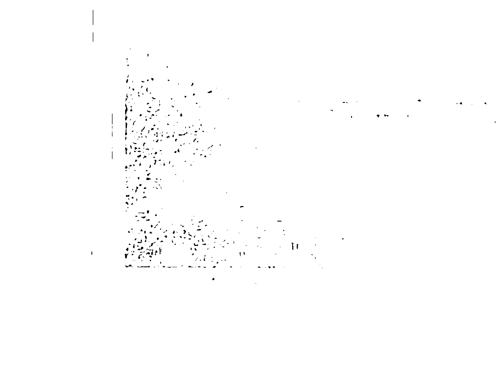

# 你选择谁上你的车
周建武

这是一家公司招收新职员的一个测试问题——
你开着一辆车。
在一个暴风雨的晚上。
你经过一个车站。
有三个人正在等公共汽车。
一个是快要死的老人，好可怜的。
一个是医生，他曾救过你的命，是大恩人，你做梦都想报答他。
还有一个女人 / 男人，她 / 他是那种你做梦都想娶 / 嫁的人，也许错过就没有了。

但你的车只能坐一个人，你会如何选择？

老人

老人快要死了，你首先应该救他？然而，每个老人最后都只能把死作为他的终点站。

救命恩人

你先让那个医生上车，因为他救过你，你认为这是个报答他的好机会。同时有些人认为一样可以在将来某个时候去报答他。

梦中情人

但是你一旦让医生上了车，你可能永远不能遇到那个让你这么心动的人了。

最后结果

在 200 个应征者中，有人选择了梦中情人，有人选择了救命恩人，有人选择了垂死的老人，当然，他们都有自己的理由，然而，他们都没有被录用。只有一个年轻人，他并没有解释他的理由，他只是说了以下的话：“给医生车钥匙，让他带着老人去医院，而我则留下来陪我的梦中情人一起等公交车！”

### 魅力提示：

是否我们都只是固执地想要保持自己的优势地位？有时，如果我们能放弃一些我们的固执和狭隘，我们可能会得到更多。

# 拔掉心里的草
佚名

有一天，机遇老人突发奇想，来到一座城市，将一块金砖、一块银砖、一块铜砖依次摆放在人行道上，然后笑眯眯地隐身躲了起来。不久，一个行人走过来，看到摆放得整整齐齐的三块砖心想，一定有诈，于是走了。又一个西装革履的人走过来，一边走着一边对着手机说着什么，连地上的三块砖是什么做的都没看清就走了。第三个行人走过来，对着三块砖傻笑了一阵后就走了。第四个行人戴着一副墨镜，拄着拐杖，看也没看一眼就走开了。第五个行人走到三块砖前面停下了脚步，盯着看，暗自嘀咕：“这年头，就算是一块破铜烂铁都会被人捡走，这三块砖一定是假的，要不就是什么圈套。”想到这，也走了。这五个人当中，一个是聪明人，一个是寸秒寸金的商人，一个是傻子，一个是盲人，一个是疑神疑鬼、自以为是的人……机遇老人感叹着收走三块砖，飘然而去。

### 魅力提示：

机遇无处不在，但能慧眼看见机遇的人并不多，能及时捕捉住机遇的人更是极少。很多人没有成功并非没有机会，而是内心充斥了浮躁、自以为是、猜疑臆断等等，而任由光临身边的机遇白白溜走了。因此，除了睁大慧眼、增强能力，还需要不断剔除心中的这些“杂草”，给机遇以足够的存留空间。

书名：做人不要太小气
作者：李楠 主编
出版社：吉林大学出版社
出版时间：2009-4-1
印刷时间：2009-4-1
开本：16开
ISBN：9787560141305
包装：平装

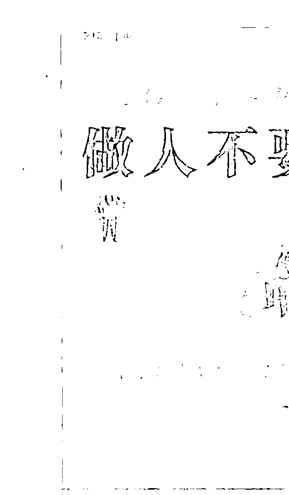

## 内容简介：

中国古代哲学家荀子说过：“君子贤而能容罪，智而能容愚，博而能容浅，粹而能容杂。”容，是人类社会的最崇高的美德之一，是一种博大的胸怀。人无完人，金无足赤，人必须具有宽容的胸襟，能容人、能忍耐，才能成就大事业。

# 魅力失分

狮子们大多都有大男子主义，他不会去迁就女友而多让女友迁就他。就算明知自己犯了错误也决不主动承认，像是吃定了女友一定会回到自己的身边一样，因此有时会让女友备感委屈。

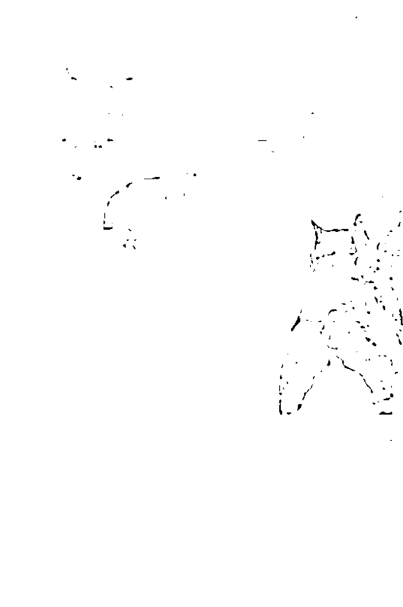

# 10个毛病
荣素礼

希拉和丈夫汤姆是社区里的模范夫妇，邻居们从没听他们吵过嘴。在大家的印象中，他们总是手牵手在夕阳中散步。在他们结婚30周年纪念日的庆祝晚会上，有人问希拉，他们多年来相敬如宾的秘密是什么。

妻子看着在招呼客人的丈夫微笑着说：“在结婚那天，我想，为了将来的幸福我要容忍汤姆的一些缺点，当时我觉得10个缺点我还忍受得了。所以我决定在日记本上列出汤姆的10个毛病，对汤姆的这些毛病我绝不干涉或抱怨。”

“您列出的是哪 10 个毛病呢？”一位年轻女士急忙问。

希拉笑着摇摇头，“我一直没有时间把它们写下来。每次汤姆做了让我生气的事，我都对自己说，‘这次算他运气好，犯的是我决定容忍的 10 个毛病之一，否则我绝不饶他。’”

### 魅力提示：

生活中，谅解和宽容可以产生奇迹，可以挽回感情上的损失。对犯错的人的宽容，就像一团火能够温暖他的心，同时也使自己感到快乐。

# 全世界最难回答的问题
佚名

有一个国王去打猎时坠落山谷，当孤立无援时，有一只巨大的神龙出现。神龙告诉国王一个交换援助条件：国王必须正确回答一个全世界最困难的问题才能获得神龙的救助。

神龙发问：“女人究竟真正要什么？”

国王被问倒了，于是想出缓兵之计。

国王说：“神龙可否先救我，我将灵魂抵押给你，让我回到王宫寻求答案，七日后我会带着答案再来找你。”

神龙说：“可以，不过如果七日后你不信守承诺，你就会因失魂落魄而死。”

国王回到宫中将经历告知内阁大臣及国策顾问，结果大家都想不出答案而愁眉苦脸。

眼看日子一天天过去，只剩两天期限了。

国王的马夫突然献策道：“城南有一位巫婆知识渊博，她应该知道答案。”

于是英俊潇洒的侍卫长立刻骑快马将巫婆请到宫中。

巫婆到宫中后，国王将经历和神龙的问题告知巫婆。

巫婆说：“答案我是知道的，国王的命我也能救，不过我有交换条件：那就是要陛下的侍卫长在事成后娶我为妻。”

国王毫不考虑答应了，并立下诏书为凭。

巫婆说出了答案：“女人真正要的，是能由自己决定主宰她自己的生活方式。”

国王告诉侍卫长关于巫婆的要求，侍卫长差点昏倒，但为了国王的性命，只能愁眉苦脸且无奈地接受事实。

国王带着答案去找神龙要赎回自己的灵魂，神龙听到标准答案后，称赞国王是全世界最聪明的男人，也依约将国王的灵魂还给了国王。

一行人回到宫中后即开始筹备侍卫长与巫婆的婚礼。

婚礼当天，鸡皮鹤发的新娘配上年轻英俊的侍卫长，喜宴上巫婆吃相难看不要紧，还边吃边大声放屁，不时发出不雅的笑声。侍卫长为了国家牺牲自我，男人的威严一点都不敢在喜宴中发作。好不容易熬到入洞房的时刻，当巫婆换下礼服从淋浴间出来时，侍卫长不敢相信他的眼睛，因为走出来的是一个貌若天仙的美女。

她对待卫长说：“因为你信守承诺，没有对我发怒，容忍我在喜宴中放肆丢你的人，我决定往后每一天中有十二小时变成超级温柔美女陪伴你，但是你可以决定我固定在白天变美女还是晚上变美女，而且选完就不能改变心意。”

年轻英俊的侍卫长顿时陷入两难的局面。因为他不知应该选择白天带一位绝世美女出门向朋友炫耀，让众人羡慕，而晚间要和一位鸡皮鹤发的巫婆同床共枕，还是白天让众人对老巫婆指指点点，嘲笑侍卫长的可怜，而晚上和貌若天仙的美女夜夜春宵。

想了半天，年轻英俊的侍卫长最后向巫婆说：“你自己决定何时要扮演你喜欢的角色就可以了，我不干涉你的生活方式。”

巫婆听了很高兴，对年轻英俊的侍卫长说：“由于你的包容与智慧，我决定天天二十四小时都变成一个有教养的温柔美女陪伴你，照顾你。”

侍卫长突然惊讶地发觉，原来幸福竟然如此意外地降临在他身上。

### 魅力提示：

其实，不光男人，女人也希望……如果你爱他（她），那么请给他（她）空间自主选择自己的生活吧！

# 没有人注定不幸福

没有人是天生注定要不幸福的，除非你自己关起心门，拒绝幸福之神来访。一个周末的傍晚，心理学教授在阳台上整理白天拿出来暴晒的旧书，却观察到一幕生活的悲喜剧。与教授相隔一条防火墙的邻居在阳台上洗碗。她动作十分利落，水声与碗盘声铿锵作响，像发自她内心深处的不平与埋怨。这时候，她丈夫竟从客厅端来一杯热茶，双手捧到她面前。这个画面很让教授感动，为了不惊扰他们，他轻手轻脚地收起一摞书本，往屋里走。正要转身时，女人突然对男人没好气地说：“别在这里假好心啦！”惊讶不已的教授，从眼睛的余光中瞄到丈夫低着头又把那杯茶端回屋里——那杯热茶一定在瞬间冷却了，像他的心。

继续在洗碗的她，还是边洗边抱怨：“端茶来给我喝？少惹我生气就好了。我真是苦命啊！早知道结婚要这么做牛做马，不如出家算了。”

也许她需要的不是一杯热茶，而是他来分担她的家务。但是，这是可以商量的，而且也并不需要把情绪发泄在对方身上，特别是在对方对你献殷勤的时候。

同样还有一个故事，情况相同，结果却有着根本的变化。

在一辆下班回家的公车上，转程靠站时，乘客顿时多了起来。最后上车的是一对上班族男女。可能因为人多，男的不时地用手臂围住女的，并轻声地问：“累不累？”“待会儿想吃些什么？”

只见女的不耐烦地回答：“我已经够烦了，吃什么都还不是你决定，每次都要问我。”

男的一脸无辜地低下头，而后说了令人印象深刻的话。

“让你决定是因为希望能够陪你吃你喜欢的东西，然后看到你满足的笑容，把今天工作的不愉快暂时忘掉。我的能力不足，你工作上所受的委屈我没法帮你，我所能做的也只有这样。”

女的听了后，满怀愧疚地说声“对不起”。男的这才似乎重燃信心地说：“没关系，只要你开心就好。”然后亲吻了女子的头发。

公车到站，下车前再回头看看这对情侣，男的依旧保护着心爱的人。

### 魅力提示：

如果你也是一位上班族，自己同样在今天的工作上有些许不愉快，如果没有听到这一段对话，回家后的你，是不是也会是一副全世界都对不起我的臭脸面对心爱的人，只在乎自己的委屈，却忽视对方的感受，不自觉地伤害最亲密的人呢？

# 女王敲门

笪鸿

阿尔倍托和妻子维多利亚女王感情和谐，但是也有不愉快的时候，原因就在于妻子是女王。

有一天晚上，皇宫举行盛大宴会，女王忙于接见贵族王公，却把丈夫冷落在一边。阿尔倍托很生气，就悄悄回到卧室去了。不久，有人敲门，阿尔倍托很冷静地问：“谁？”敲门的人昂然答道：“我是女王。”

门没有开，房间里没有一点动静，女王离开了，但她走了一半，又回过头，再去敲门。阿尔倍托又问：“谁？”女王和气地说：“维多利亚。”

可是门依然紧闭。维多利亚气极了，想不到以英国女王之尊，竟然还敲不开一扇门。她带着愤愤的心情走开了，可走了一半，想想还是要回去，于是又重新敲门。阿尔倍托仍然冷静地问：“谁？”女王委婉温和地说：“你的妻子。”

这一次，门开了。

### 魅力提示：

在温暖的小家庭中，夫妻之间应平等相处，互敬互爱；不管世间多少风风雨雨，也不管双方在外各自地位如何，回到家里，丈夫还是丈夫，妻子也还是妻子，而不应是别的什么。

## 魅力星座智慧书之

书名：亲密
作者：（英）杰克斯 著，蔡松益 译
出版社：21世纪出版社
出版时间：2007-11-1
印刷时间：2007-11-1
开本：16开
ISBN：9787539138893
包装：平装

## 内容简介：

相爱有妙招，亲密无间道！
爱情36计，计计深藏人际关系的智慧。本书为你找出亲密相处的奥妙，向你细数许多为人忽略却可以让我们的人际关系圆融甜蜜的相处之道，让你甜美地进入亲密关系，突围快乐的生活，拥有美满的人生。
本书的核心是一段为两人关系特别设计的课程，其中包含的十个精明策略，让你轻松掌控爱情的遥控器，相爱得甜甜蜜蜜。它适合于情感中任何阶段的人阅读，不管是否初恋，都可以让你把爱情带到一个更亲密的全新境界。

# 魅力失分

狮子座是最骄傲的星座，也是最容易自卑的星座。一旦自信心受到打击，狮子座这种自卑感强烈的状况，让他感觉到配不上任何值得的伴侣，愈是喜欢的对象，愈是自惭形秽，裹足不前。这种人有时自尊心高昂，无法在亲密关系中放下自我而突破，其实也是一种缺乏自信的现象，因此很难进入亲密关系。

# 米契尔的勇气

闫金城

有一个叫米契尔的青年，一次偶然的车祸，使他全身三分之二的面积被烧伤，面目恐怖，手脚变成了肉球（不分瓣），面对镜子中难以辨认的自己，他痛苦迷茫。他想到某位哲人曾经说的：“相信你能，你就能！问题不是发生了什么，而是你如何面对它！”

他很快从痛苦中解脱出来，几经努力、奋斗，变成了一个成功的百万富翁。此时此刻，他不顾别人规劝，非要用肉球似的双手去学习驾驶飞机。

结果，他在助手的陪同下升上天空后，飞机突然发生故障，摔了下来。当人们找到米契尔时，发现他脊椎骨粉碎性骨折，他将面临终身瘫痪的现实。

家人、朋友悲伤至极，他却说：“我无法逃避现实，就必须乐观接受现实，这其中肯定隐藏着好的事情。我身体不能行动，但我的大脑是健全的，我还是可以帮助别人的。

他用自己的智慧，用自己的幽默去讲述能鼓励病友战胜疾病的故事。他走到哪里，笑声就荡漾在哪里。

一天，一位护士学院毕业的金发女郎来护理他，他一眼就断定这是他的梦中情人，他把他的想法告诉了家人和朋友，大家都劝他：这是不可能的，万一人家拒绝你多难堪。他说：“不，你们错了，万一成功了怎么办？万一答应了怎么办？”

多么好的思维，多么好的心态！他勇敢地向她约会、求爱。两年之后，这位金发女郎嫁给了他。米契尔经过不懈的努力，成为美国人心中的英雄，成为美国坐在轮椅上的国会议员。

### 魅力提示：

悲观的失败者视困难为障碍，乐观的成功者视困难为机遇，结果就有两种截然相反的人生。生活不是缺少成功，而是缺少勇气。凡事从好处想，就会看到希望。有了希望才能增添我们的勇气和力量。

# 自信的工程师

佚名

前苏联有过这样一个故事：一位工程师爱上了一位年轻的女学生。他向她求爱。

女大学生逃避他，因为她已经有了男朋友。但这位工程师还是经常出现在女大学生面前，给她送鲜花，向她表白。

女大学生的男朋友知道了以后担心自己结局不妙，竟主动中断了与女大学生的关系。

不久女大学生又结识了另一个男朋友。工程师得知后竟写信给她的这位男朋友说：“我是世界上唯一能以全身心爱她的人，这一点你做不到。”女大学生的第二个男朋友在自信心上较量不过工程师，也主动退出了情场的竞争。

这时，女大学生年龄渐渐大了，她向法院起诉，说工程师有跟踪、恐吓、侵犯人权等罪，法院当庭判决工程师45天拘役。

当原告、被告一起走出法院大门时，女大学生觉得自己有点过分了，工程师却向她笑了笑说：“亲爱的，45天以后我再来找你。”

这时，女大学生被工程师扑不灭的热情和坚强的自信所打动，转身回到法院，要求撤诉。后来两人终成伉俪。

### 魅力提示：

自信使人执著，使人坚强，使人魅力十足。当你一定要做成功一件事的时候，务必满怀信心去做，因为自信是让别人折服的最强大的软化剂。

# 用这样的方式来爱你

雪小禅

两个中年男女，一对病夫妻，无儿无女，只有她和他。

半年前，她得了重病，需要很多钱，之前，他和她靠打工为生，这做一点，那做一点，日子还算过得去。

都知道他们很相爱，一直牵着手进进出出，虽然住的是郊区的烂楼，盖了一半停了工，他们就住在那里。

他常常在那破房子里给她拉二胡听，她常常用捡来的那些烂菜做出美味来——如果，如果不是她生了病，那么，这生活真的也不错的，虽然别人看起来很苦，可他们自己不觉得。

她生了病，很重的病，医生说，得做大手术，否则死路一条。

天塌下来一样，他们本是生活在底层的人，根本没有几个钱，但是，为了她的命，跑到街头卖唱，如当年的瞎子阿炳，命若琴弦啊，他得救她啊。

他的行为感动了当地的媒体，有热心的记者写了长篇的报道，于是，四面八方的钱寄到他这里，不久，钱就齐了。

终于，她做了手术，手术很成功，是他，把她从死亡线上拉了回来。不幸却再次降临了。
他中风了，瘫痪，腿脚全不能动了，甚至大小便不能自理，甚至，手都不能把饭弄到自己嘴里。
他已经成了她的累赘了。
她也拼命去做工，从早晨四点起床扫街，到晚上十点从饭店里帮工回来，为的是给他挣医药费，他们不能再张嘴向社会要钱了，她要把他救过来。
但他知道，他是救不过来的，他不能再拖累这个女人了。
于是，他恳求女人给他一瓶安眠药，他是恳求她的：让我安静地离开你吧，我不想再拖累你了，你还年轻，还能找一个好男人，我不能给你好日子，你让我走吧，我活着也是受罪。
她哪里肯？哭着说，你在我身边，活一天我就幸福一天。
他却觉得，他多活一天就会多拖累她一天，于是，在再三请求无果之后，他在她出门之后下了狠心。
因为动不了，因为手都握不住一条绳子，他只有选择一种方式，自焚。
他把手边一条毛巾放进炉子里，几秒钟的工夫，毛巾着火了，已经一点不能动的他把毛巾放在了自己身体上。
衣服全是纯棉和化纤的，燃烧的速度超出了他的想象，他忍着疼，想叫，却不能叫，不过半个小时，他已经成了个火人。
当她闻讯赶回来时，他已经不在了，那个疼她爱她的男人已经不在了。
几天之后，她接到一封信，是他写给她的，几天之前，大概是他托别人寄的。因为手不听使唤，字都变了形，他写道：亲爱的，原谅我以这样的方式来爱你。

### 魅力提示：

没有了他，她就是一块碎了的玉。注定，她不能接受这样的方式，因为她说过，好好过，只要他在身边，她的心里就踏实。所以，若爱着，就好好的珍惜。你傻了或呆了，你瘫了或残了，你爱的人都不会嫌弃，因为只有你在，爱才会存在。

# 魅力星座智慧书之狮子座

# 面子之爱

了望

萧薇在一所美专上学，她一直暗恋自己的美术老师，她爱慕他不仅因为他有英俊的外表，更重要的是她羡慕他画得一手好画。

可是相貌平平的萧薇是个羞涩且自卑的女孩儿。看到班里那些美丽的女孩子围在老师身旁有说有笑，她总是躲得远远的，生怕老师看到她那张平庸的脸。上课的时候也总是坐在角落里，只有在美术老师表扬自己的绘画作业时才略显安慰。

让人意想不到的是，不久之后一件不幸的事情发生了，在一次家里的意外失火中，萧薇的脸被毁了容。本就平庸的脸现在更加惨不忍睹。她便闹着不去上学了。从此父母带她四处求医，学校早就没了她的消息。

萧薇花光了家里所有的钱，却仍旧恢复不了本来的面貌。一天夜里，她趁病房没有人，推开窗户想要跳楼自杀，却感到身后有人拍她的肩膀。她回头，看见一个银白头发的老人冲她微笑。老人给了她一张人皮面具一样的东西让她戴上。萧薇接过面具，对着镜子将信将疑地往脸上戴。奇迹发生了，她看到一张完好无损却又比自己以前美丽无数倍的脸呈现在镜子中。她惊讶地回头找老人，却早已不见老人的踪影。渐渐地这张面具和自己的脸越来越融合，直到再也摘不下来。萧薇因此变成了一个美丽的姑娘，她再也不自卑了。

她依然忘不了曾经深深爱过的那位美术老师。于是她决定回学校看看。当她再次看到那个熟悉的身影时，竟下意识地想躲避。但是低头的一刹那她忽然笑了，心想自己早已不是当初那个丑小鸭了，现在的自己美丽又自信，已经不是以前那个怯懦的萧薇了。她为什么要躲？而且她已改名换姓，发誓要做个全新的美丽女子。

她没有告诉他她就是萧薇，她只是想尽一切办法接近美术老师，她希望他看到自己现在这张美丽的脸并深深地爱上她，这是她做梦都会梦到的场面。

有一天，她跑去他的宿舍送冰淇淋。看到他在看一些色彩作业，她凑过去看，发觉这些画很眼熟。再看下面的署名，竟是——萧薇。她惊呆了。

他却对她说：“这些画是我以前的一个学生画的，她叫萧薇。她是个很有天赋的女孩儿，我很喜欢她，可是她好像并不喜欢我。班里的那些女生都喜欢找我聊天，可她却从来不和我说话，有时我主动过去跟她说话，她也总是急匆匆地回答完就走。我故意把她的作业留下来是希望她来找我要，可是她从来没有来过。如果那时她也喜欢我，我会带她走，给她一个更好的绘画空间……”

萧薇哪里还听得进后面的话，她早已像手中的冰淇淋一样融化成了一摊水。

### 魅力提示：

相貌不是爱情发生的理由，丑小鸭同样有追求和拥有爱情的权利。不要让你的自卑埋葬了本该美好的爱情。

书名：自信，你就能赢
作者：张璞 著
出版社：江西美术出版社
出版时间：2007-5-1
印刷时间：2007-5-1
ISBN：9787807490753
包装：平装

## 内容简介：

当你发现人生最大的敌人就是你自己，这场战役，你就注定无路可逃。你必须接受自己不完美的事实，即使这是很残酷痛苦的；你必须适应这个凡事不如意的世界，尽管你已经很努力。在自卑面前，每个人都无可逃避，你如何面对自己的自卑，就决定了你的命运。个体心理学大师阿德勒告诉我们：面对自卑，你唯一能做的事，就是拥抱它，然后超越它。超越自卑，你才能释放被封印已久的潜能。活用自卑，你才能拥有面对不如意的抗体。在与自卑的战役中，没有人可以帮你，更没有人可以代替你：事实上，超越困境和自卑的钥匙，就是你自己。如果自卑是诅咒，你就是解除咒语的法师。如果自卑是毒，你自己就是解药。

本书是以心理学的观点，分析了日常生活的事件，明确指出哪些行为是自卑的表现，并找出动机，让各位了解“自卑情结”如何影响我们的人生。

# 星座爱情

# 魅力失分

黏得要死的狮子，陷入热恋时会是最甜蜜的情人，满面春风手机讲不停，旁若无人到让人鸡皮疙瘩掉满地。问题是爱情总是有落入平凡的时候，嫉妒心超强的狮子，需要你不断地表白，老夫老妻还要配合演罗密欧跟朱丽叶，实在让人很想笑。

# 爱是一种久违的心痛

佚名

男孩女孩的恋爱很普通，经朋友介绍，双方觉得有好感，然后逛街、拍拖，很快步入婚姻殿堂。

她是一个很普通的女孩子，但性格温柔，对他特别好。但他有时还常常很奇怪，怎么自己会和她在一起呢？

他是厂里的供销员，经常出差，每次一走，就是一个月。她只是默默地给他整理换洗的衣裤，出门时，只是对他说：“别忘了给家里打电话。”

到了外面，他很难打个电话回家，有时打电话回来，他也说不上几句话。但她却很满足，这说明，他还记挂着她。后来她怀孕了，妊娠反应十分厉害，人也消瘦了许多。可他照样要出门，一出门又是很长时间。

临产前的一个月，他又要走了。她腆着大肚子帮他整理行装，问他出去要多少时间。他说：“一个星期。”

她沉默半晌，幽幽地对他说：“一个星期有七天呢！”

他走了。在车上，他突然想起她那句话：“一个星期有七天。”心中突然涌现一种异样的感觉。

第四天，他的传呼响了。是朋友打来的，朋友焦急地告诉他，她早产了，正在医院观察室里。她不让我告诉你，但我觉得不妥当。

他的心悬了起来。他向公司汇报了情况，乘飞机赶了回来。他赶到医院的时候，她正被推到手术室里。

生产的时候，她十分痛苦，一边喊“妈”，一边又喊着他的名字。

孩子生下来了，孩子哭，她哭，他在手术室外面也哭成了泪人。他到现在才发现，自己是多么地爱她，她又是如此地爱着自己。

### 魅力提示：

爱不只是花前月下甜言蜜语，爱是一种久违的心痛，当你心痛一个人的时候，这个人在你的生命中已经不可割舍了。爱情也许只有经过这种疼痛，才会变得厚重起来。

# 最恩爱的夫妻

方冠晴

居委会要在所辖的街道内评出一对最恩爱的夫妻。几经筛选后，有三对夫妻入围。于是，居委会通知这三对夫妻，叫他们星期六的上午去居委会办公室，参加最后的评比。

三对夫妻如约来到，他们一对对相拥着在居委会办公室外的条椅上坐着，等待评委的召见。

评委将第一对夫妻请进了办公室，叫他们说说他们是如何恩爱的。

妻子说，前几年她瘫痪了，卧病在床，医生说她能站起来的可能性很小，她绝望得几乎要自杀。但她丈夫鼓励她活下去，多方为她求医，对她不弃不离，而且几年如一日地照顾她，任劳任怨。在丈夫的关爱下，她终于站起来了。她的故事十分感人，评委们听了，都为之动容。

随后进来的夫妻，他俩说，结婚10年，他俩之间还没有红过脸，吵过架，他们一直是相亲相爱，相敬如宾。评委们听了，暗暗点头。

轮到第三对夫妻，却很长时间不见他们进来。评委们等得有些不耐烦了，就走出办公室看个究竟。只见第三对夫妻仍然坐在门口的条椅上，男人的头靠在女人的右肩上，已经睡着了。评委当时就要上前喊醒那个男的，女的却用手指放在唇边做了个噤声的动作，然后小心地从包里拿出纸和笔，写下一行字，交给评委。做这些动作时，她都是用的左手，而且动作轻柔，生怕惊醒了自己的丈夫，她的右肩一直纹丝不动，稳稳地托着丈夫的脑袋。

评委们看那字条，因为字是女人用左手写的，所以字迹歪歪扭扭，但是大家还是看清了：别出声，我丈夫昨晚没有睡好。一个评委在后面续了句：但我们要听你们夫妻俩的讲述，不叫醒你丈夫会影响我们的工作。女人接过纸笔，又用左手歪歪扭扭地写下：那我们就不参加评比了，没有什么能比让我丈夫美美地睡上一觉更重要的了。

评委们惊骇了，这个女人为了不影响丈夫睡觉，居然放弃评比，真是有点本末倒置。但是他们还是决定等待一段时间。

一个小时后，那个男人醒了，女人的右手终于能够活动了，她从包里拿出一张纸巾，想将男人嘴角流出的口水擦净，但手才举到半空，纸巾就掉了，男人惊问她怎么了。她温柔一笑：“没事。”这时，有个评委早就等不及了，拉上男人就往办公室走，女人这才伸出左手悄悄地按摩右肩，她见几个评委在关切地看着她，便歉意地一笑，说：“真的没事，是肩膀被他的头压得太久，麻了。”

男人被请进办公室后，评委便问他怎么睡得那么沉。男人不好意思地笑笑：“我家住一楼，蚊子多。昨晚半夜的时候我被蚊子叮醒了，这才发现家里的蚊香用完了，半夜也没有地方去买，我怕妻子再被叮醒，所以我就为她赶蚊子了，后半宿就没顾上睡。”评委们听了，一愣一愣的，一时间，大家都没做声。

最恩爱夫妻评比的结果，居委会增加了两个奖项：将第一对夫妻评为“患难与共夫妻”，将第二对夫妻评为“相敬如宾夫妻”，而真正的最恩爱夫妻奖，却给了第三对夫妻。

### 魅力提示：

婚姻生活本来就是平淡的，它是由一个个平淡的爱情细节组成的，只要夫妻双方都能够将每一个生活细节都演绎得爱意融洽，只要在每一个生活细节中都注入爱的心意，那么，他们所拥有的爱情，就是最完美的！

# 企鹅的石头

佚名

有一群生活在冰天雪地里的企鹅，它们每天都迈着优雅从容的绅士步，愉快地过着日子。

它们当中有一只企鹅叫康康，那是所有企鹅当中最优秀的企鹅之一，它深深地爱着它们当中的另一只企鹅喃喃。在企鹅群里有个规矩：求婚者必须找一些石头给被求婚者，以便在以后共同的日子建造温暖的家而使用。

像所有准备求婚的企鹅一样，康康千辛万苦地奔波着，去寻找石头。它经过长途跋涉，丢下一块又一块令自己觉得不太满意的石头。正当康康累得筋疲力尽时，终于被它找到了一枚最精致、最光洁的石头。这可是它千挑万选以后觉得最满意的一枚。它认为只有这一枚，才配得上喃喃。

可是，喃喃最后却和另一只企鹅结婚了。那只企鹅，一直跟在康康后面捡，当康康把所有它认为不好的石头扔掉时，那只企鹅就会把康康扔掉的石头都捡了起来，然后送给喃喃。这些石头虽然很粗糙而且也不完美，但是很多，堆得满满的，于是喃喃便答应嫁给它。

康康一直不明白：喃喃一直都是喜欢自己的啊，平时玩得很好，可为什么喃喃会做出这种选择？

时间过得非常快，转眼3年过去了。在这期间，康康和喃喃谁也没理过谁，直到有一天，喃喃才找康康把当初不嫁给它的原因告诉它：“其实我一直很爱你，可是我却嫁给了它……因为它送了我好多石头，而那些石头都是你丢掉的，你知道吗？我们生活在冰天雪地里，如果没有足够的石头做窝孵卵，我们的后代在出生之前就会被冰层冻死……你送我的那一枚石子好美，晶莹剔透的，可是那是爱情。单纯的爱情支撑不了长久的婚姻和对儿女的责任……”

### 魅力提示：

爱情不是婚姻，那些虚荣的、表面上很光滑的爱情，不可能长久地存在。

The request was rejected because it was considered high risk## 第四面 关关雎鸠

# 魅力失分

狮子座的人非常霸道专制，如果对方不按照自己的意思去做或者说了什么违背他的话，他就会不高兴。

# 新闻自由

佚名

德国科学家巴伦·亚历山大·冯·洪保尔特拜访美国总统时，在总统的书房里看到一张报纸，上面满是对总统的辱骂攻击之词。巴伦拿起报纸，愤愤地说：“为什么让这些谣言泛滥？为什么不取消这家报纸？至少也应该重罚编辑，把这家伙投进监狱。”

总统微笑着回答说：“把报纸装到你的口袋里，巴伦。如果有人对我们自由的现实和新闻自由有怀疑，你可以拿出这张报纸，并告诉他们你是在哪里见到的。”

### 魅力提示：

如果观点相反，我将坚决反对你所说的话，但我誓死捍卫你说话的权利——这是对新闻自由的最好注解，也是对伟大人格的完美诠释。

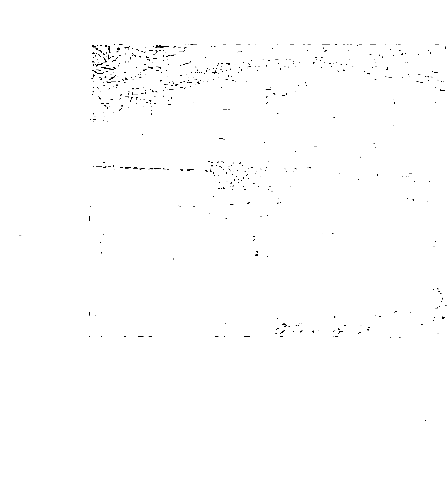

# 刷墙

左 夫

马克·吐温小时候，有一天因为逃学，被妈妈罚着去刷围墙。围墙有30码长，比他的头顶还高。

他把刷子蘸上灰浆，刷了几下。刷过的部分和没刷的相比，就像一滴墨水掉在一个球场上，他灰心丧气地坐下来。

他的一个伙伴桑迪，提着水桶跑过来。“桑迪，你来给我刷墙，我去给你提水。”马克·吐温建议。桑迪有点动摇了。“还有呢，你要答应，我就把我那只肿了的脚趾头给你看。”

桑迪经不住诱惑了，好奇地看着马克·吐温解开脚上包的布。可是桑迪到底还是提着水桶拼命跑开了——他妈妈在瞧着呢。

马克·吐温又一个伙伴罗伯特走来，还啃着一只松脆多汁的大苹果，引得马克·吐温直流口水。

突然，他十分认真地刷起墙来，每刷一下都要打量一下效果，活像大画家在修改作品。

“我要去游泳。”罗伯特说，“不过我知道你去不了。你得干活。是吧？”

“什么？你说这叫干活？”马克·吐温叫起来，“要说这叫干活，那它正合我的胃口，哪个小孩能天天刷墙玩呀？”他卖力地刷着，一举一动都特别快乐。罗伯特看得入了迷，连苹果也不那么有味道了。“嘿，让我来刷刷看。”

“我不能把活儿交给别人。”马克·吐温拒绝了。

“我把苹果核儿给你。”罗伯特开始恳求。

“我倒愿意，不过……”

“我把这苹果给你！”

小马克·吐温终于把刷子交给了罗伯特，坐到阴凉里吃起苹果来。看罗伯特为这得来不易的权利努力刷着。

一个又一个男孩子从这里经过，高高兴兴想去度周末。但他们个个都想留下来试试刷墙。

马克·吐温为此收到了不少交换物：一只独眼的猫，一只死老鼠，一个石头子，还有四块橘子皮。

### 魅力提示：

聪明的人是具有这种能力的：让人愿意去做原本不想做的事，并喜欢去做；让他人心甘情愿地去做的事，不是强迫，也不只是利益，还有兴趣爱好、美丽愉悦、有关切、爱护，还有人生追求、等等。

# 一个和天气生气的人

佚名

连续几天的倾盆大雨仍没有停，一个人站在院子中央，指着天空大骂：“你这糊涂、不长眼睛的老天，下这么多雨可把我给害惨了。屋顶漏了，衣服湿了，粮食潮了，柴火湿了……我倒霉你有好处吗，还不停，还不停……”

> > 这时，邻居出来对他说：“你骂得这么带劲，连自己被雨淋也不顾，老天一定会被你气死，再不敢随便下雨了。”

> > “哼，它能听到就好了，可实际上一点用都没有。”骂天者气呼呼地回答。

> > “既然如此，那你为什么还在那儿白费劲呢？”邻居问。

骂天者语塞。

> > 邻居继续说：“与其在这儿骂老天，不如先修好屋顶，再向我借些柴火，烘干衣服，烘干粮食，在屋里做些平时没空做的事情。”

### 魅力提示：

既然没有能力支配别人，不如就一心一意地支配、改变自己好了，这样更容易获得成功。

# 杀掉还是改掉

佚名

一只公鸡早晨起来报晓。天亮，被主人杀了。又一只公鸡早晨起来报晓。天亮，被主人杀了。接着又一只公鸡……

邻居不解：“这些公鸡每天报晓都挺准时的，你杀它们干什么？”

那人说：“早晨我有晚起的习惯，它们却叫得很早。”

邻居说：“这不是它们的过错，报晓是公鸡的天职。”

那人说：“这个我不管，我需要的是和母鸡交配的公鸡，而不是报晓的公鸡。”

邻居说：“可公鸡是不能不报晓的，你难道不能用另外一种方式来解决”

> “问题吗？”

“这个很难，”那人说，“我曾想割掉它们的嗓子，后来又想扎上它们的嘴，可这样太麻烦，而杀它们却很省事。”

“那你为什么不改变一下睡觉的习惯呢？”邻居疑惑地问。

“改变我的生活习惯，这怎么可能呢！”那人说，“我有这个习惯已几十年了，怎么会为几只公鸡而去改变呢？再说我是主人，它们应该符合我的需求，它们的行为与我发生矛盾时，受损失的只能是它们，怎么会是我呢？”

于是那人一直保持着杀鸡的习惯。也正因为这个习惯，他辛辛苦苦地养鸡，反而成为他经济上的一个沉重负担。

### 魅力提示：

生活不能尽如人意，总是矛盾重重。你是习惯让别人来适应你呢，还是有时也会适应一下别人，或者像那个愚蠢的养鸡人，为了只要作出一点点让步就可解决的矛盾，硬是按照自己的习惯行事，以致自己困顿终生，甚至付出更为巨大的牺牲。杀或改，实在是一个值得深思的问题！

- 书名：管理王道
- 作者：吴甘霖 著
- 出版社：北京大学出版社
- 出版时间：2007-10-1
- 印刷时间：2007-10-1
- ISBN：9787301127667
- 包装：平装

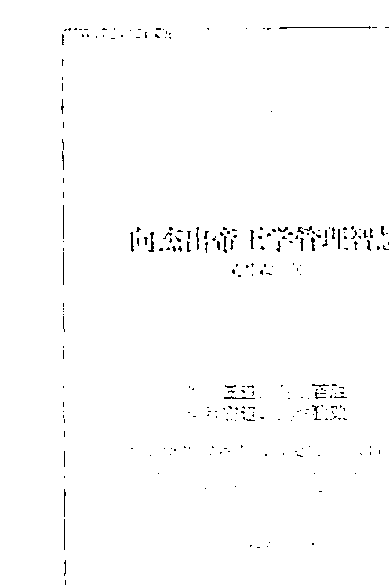

## 内容简介：

为什么秦、隋二世而亡？为什么汉唐能有天下数百年？
同是少数民族入主中原，为什么元代短命而清朝长寿？
原因是：前者行霸道，后者行王道。霸道得天下，瞬间即失；王道得天下，四海皆服。中华传统文化中的“王道”，乃古代杰出帝王所体现的管理最高境界：以人为本，以德服人。
著名培训师，畅销书作家吴甘霖以通俗流畅的语言，生动有趣的历史故事结合中外著名企业家的成功案例，立足管理学发展的前沿，指导管理者从根本上提升管理层次。茶余饭后，忙里抽闲，与唐宗宋祖面对面，在身心自在的阅读中，领悟管理的真谛。

# 第二回 六法篇

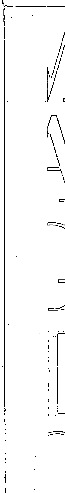

# 魅力失分

狮子座的人常以自我为中心，为人做事都是从自己的喜好和立场出发，很少考虑到别人。

# 天堂与地狱

佚名

一个人问上帝：“为什么天堂里的人快乐，而地狱里的人一点也不快乐呢？”上帝说：“你想知道吗？那好，我带你去看一下。”

他们先来到地狱，走进一个房间，这时正是午饭时间，许多人围坐在一口大锅前，锅里煮着美味的食物。可每个人都又饿又失望：原来他们手里的勺子太长了，没法把食物送到自己的嘴里，虽然食物很可口，可是他们吃不到，所以一直很痛苦。

上帝说：“我们再去天堂看看吧。”于是他们来到天堂，也是到了一个房间，他们看见的景象是这样：虽然他们手里的勺子也很长，可是，这里的人都显出快乐又满足的样子。这个人很奇怪，因为这里和地狱没什么两样。

“感到奇怪么？”上帝笑着说，“你看下去就知道了。”

晚饭时间到了，只见这里的人围坐在锅边，用勺子把食物送到了别人的嘴里。原来，天堂和地狱的分别，只是人们用勺子的方法有所不同。

### 魅力提示：

如果我们每个人都只是为了自己的利益，而不去想着别人，永远将是一锅看得见喝不着的汤，只有互相帮助，相互扶持，才能够共同发展。

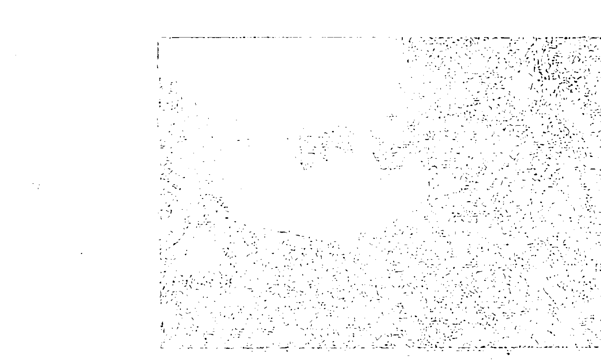

# 小偷约翰

佚名

约翰的偷盗技术可以用“炉火纯青”来形容。在同出一门的师兄弟中，他是唯一一个没失过手的人。他曾口出狂言：天下没有他拿不到的东西，也没有他进不了的房子。

一天，他在镇上的酒馆里喝酒，正巧碰上了他的朋友比尔，一个不久前从监狱里放出来的师弟。两人先是拥抱了一阵，然后一边促膝交谈一边喝酒。比尔告诉他，在这个小镇教堂对面的那条街的中间，有一户人家，家中有几万美元的现金。并且问约翰：“我的朋友，你敢不敢去？”约翰轻蔑地笑了，回答道：“为什么不？”

“可是他家里养了一条很凶的狗！”比尔提醒道。

“这不是问题，我的朋友。”约翰很自信。

第二天晚上，约翰就带上了他的宝贝万能箱朝街心走去。很奇怪，整条街都是漆黑的，只有街心有户人家亮了门灯，而且这家就是他所要找的那户人家。

他先是把安眠药涂在肉上，然后扔在了狗的面前，不一会儿，狗便倒下去了。接着他熟练地打开了房门。凭着过硬的技术，他很快拿到了钱，确确实实是几万美金。他很奇怪，家中有这么多钱，可这户人家的防盗措施竟会如此差。这引起了他的兴趣，他把耳朵“伸”到了外屋门边，想一探究竟。

“我说，老头子，咱们是不是该花钱请个保姆啊！咱们两人的眼睛都瞎了，总这样过下去，也不是个办法啊！”屋子里传出一个苍老女人的声音。

约翰的心一惊：既然是瞎子，又为何整夜亮着门灯，这就更加引起了他的兴趣。

“是啊！老婆子，应该这样，可是，咱们现在的日子都不好过了，哪来的钱请保姆呢？”一个老头子紧跟着回答。

“儿子空难后，航空公司不是赔了几万美金吗，为什么不用这些钱？”约翰的心一沉，用牙齿咬了咬嘴唇，继续听下去。

“你疯啦！老婆子，你怎么忘了，我们不是说好用这些钱给镇子里的孤儿们盖一栋房子吗？”约翰的心一震。

“是啊！你看我这记性，都给忘喽。老喽，不中用了。可是，咱们也得花钱交电费啊！门口的灯整夜亮着，很耗电啊！”

“没关系，只要别人在这条街上走路不摸黑就行了。你也知道，这条街上的路很难走的，又是夜里，万一行人跌了跤怎么办？还有咱们的‘儿子’克拉尔，虽然它每天都要骨头喂，但是只要咱们每天多糊两个小时的纸盒就行了，这日子还是能过的啊！有了克拉尔，行人就不用担心这条街有强盗了啊！”

“是啊！也只好这样，谁让咱们年轻那会儿只抱养了一个儿子呢！早知道今天，还不如当初多养一个呢！”老妇人抱怨道。

当晚，约翰坐在门口流了一夜的泪。他也是个孤儿，也是被人领养的，但他不服新爸爸对他的管教，一怒之下，偷跑出来，才干上这一行的。

第二天，老夫妇的门口留下了两样东西，一样是他们的几万美金，另一样则是一个很小巧、很别致的万能箱。

从此，在这个小镇上，就再也没有人看见过约翰了。约翰就此神秘地消失了，没有人知道他去了哪里。

这是一个任何人听了都会感动的故事，想想自己为了自己的利益，都做了些什么？爱使人有爱，善良使人善良，你的与众不同使你具有与众不同的力量。

## 魅力星座智慧书之

# 偷金

佚名

从前齐国有一个人，由于从小家里就很穷，所以整天想着能够得到一块金子。

一天清早起来，他实在按捺不住自己的欲望，就把衣服穿得整整齐齐，赶到集市上，看到一家金店，于是就走了进去，伸手拿了一块金子回头就跑。

店里的老板见到他光天化日并且在有很多人围观的情况下，竟敢伸手拿金，便喊了起来，店铺里的人很多，所以没费什么劲就把他给拿下了。

把他捉住后，店铺老板责问他说：“当着这么多人的面，你竟敢偷金子？你的胆子可真够大的。”

那个人回答说，“我拿金子的时候，只看见金子，没有看见人！”

### 魅力提示：

自私自利的人，看问题总是片面的，因为一个人的思想方法和他的立场、观点是分不开的。

# 生气的苍蝇

佚名

有一只苍蝇对蜜蜂说：“为什么人类都喜欢你，却非常讨厌我呢？”

蜜蜂回答说：“因为我为人类服务，制造蜂蜜给他们。而你有没有为人类做什么事情呢？”

苍蝇生气地说：“为什么我要为人类做事？他们都十分吝啬，只要我吃了他们一点点的食物，他们就会追着我打，我多希望身上有一根刺，可以狠狠地刺他们。”

### 魅力提示：

许多时候遇到与我们利益相冲突的事情时，我们的自我保护就会跳出来，但也容易伤到别人。无论何时，我们希望别人怎样待自己，我们就要怎样待人。

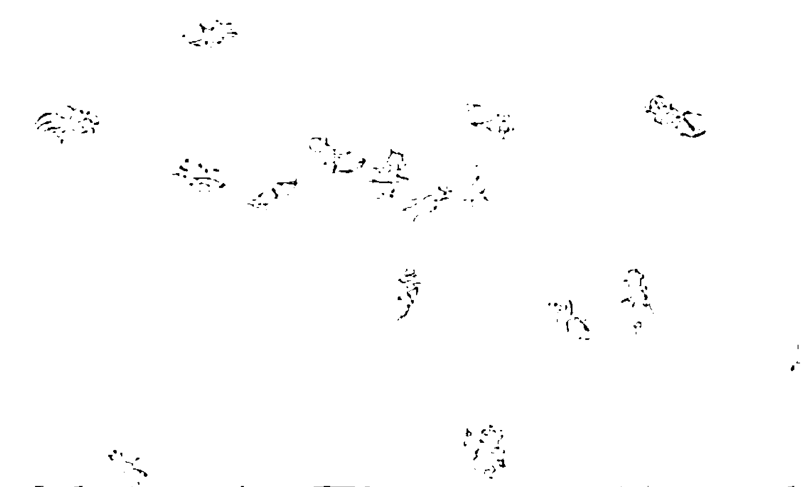

- 书名：做自己的心理咨询师
- 作者：石斌 主编
- 出版社：中国妇女出版社
- 出版时间：2009-3-1
- 印刷时间：2009-3-1
- 开本：16开
- ISBN：9787802033023
- 包装：平装

## 内容简介：

生活中总是有许多不快乐、生活中也不乏艰辛，试着抛开一切妄念，感受清新的晨曦，观察晶莹的露珠，看满天星辰璀璨，沐浴在清凉的夜风中，让内心远离尘世的喧嚣，让心灵在碧空下自由地呼吸，学会找回自我。一个连自我都失去的人怎么能体味到生活的真意呢？人生应尽力、放下、随缘、不奢求。以达观的心态反思自我，善待他人。常想想自己得到的一二、做到的一二、爱自己和自己爱的一二，这才是你在这世上真正拥有的一切！

# 第四组 交友篇

# 魅力失分

狮子座很容易对生活感到不满，觉得自己拥有的都不够好，一直陷在羡慕别人的情绪中。

# 决定心情的心境

凡夫

苏格拉底是单身汉的时候，和几个朋友住在一间只有七八平方米的小屋里。尽管生活非常不便，但是，他每天总是乐呵呵的。

有人问他：“那么多人挤在一起，连转个身都困难，有什么可乐的？”

苏格拉底说：“朋友们在一块儿，随时都可以交换思想，交流感情，这难道不是很值得高兴的事吗？”

过了一段时间，朋友们一个个相继成家了，先后搬了出去。屋子里只剩下了苏格拉底一个人，但是每天他仍然很快活。

那人又问：“你一个人孤孤单单的，有什么好高兴的？”

“我有很多书啊！一本书就是一个老师。和这么多老师在一起，时时刻刻都可以向它们请教，这怎能不令人高兴呢？”

几年后，苏格拉底也成了家，搬进了一座大楼里。这座大楼有七层，他的家在最底层。底层是这座楼里环境最差的，上面总是往下面泼污水，丢死老鼠、破鞋子和杂七杂八的脏东西，那人见他还是一副自得其乐的样子，好奇地问：“你住这样的房间，也感到高兴吗？”

“是呀！你不知道住一楼有多少妙处啊！比如，进门就是家，不用爬很高的楼梯；搬东西方便，不必花费很大的力气；朋友来访容易，用不着一层楼一层楼地去叩门询问……特别让我满意的是，可以在空地上养一丛一丛的花，种一畦一畦的菜，这些乐趣，数之不尽啊！”苏格拉底情不自禁地说。

过了一年，苏格拉底把一层的房间让给了一位朋友，这位朋友家有一个偏瘫的老人，上下楼很不方便。他搬到了楼房的最高层——第七层，可是每天他仍是快快乐乐的。

那人问：“先生，住七层楼是不是也有许多好处呀？”

苏格拉底说：“是啊，好处可真不少呢！仅举几例吧：每天上下几次，这是很好的锻炼机会，有利于身体健康；光线好，看书写文章不伤眼睛；没有人在头顶干扰，白天黑夜都非常安静。”

后来，那人遇到苏格拉底的学生柏拉图，问道：“你的老师总是那么快快乐乐，可我却感到，他每次所处的环境并不那么好呀？”

柏拉图说：“决定一个人心情的，不是在于环境，而在于心境。”

> > 大海的无垠，可以开阔博大的胸襟；波涛的汹涌，可以塑造顽强的性格。宽怀大度一些，机会便多了，世界也大了；偏狭小气，机会便少了，世界也小了。

# 心安理得

萧山

有一天，一个王子独自到花园里散步。使他万分惊奇的是，花园里所有的花草树木都枯萎了，园中一片荒凉。后来王子了解到：橡树由于自己没有松树那么高大挺拔，因此轻生厌世死了；松树又因自己不能像葡萄那样攀在架上，不能像桃树那样开出美丽可爱的花朵，于是也死了；牵牛花也病倒了，因为它叹息自己没有紫丁香的芬芳。其余的植物也都垂头丧气，没精打采。只有一棵小小的心安草在茂盛地生长。

> > 王子问道：“小心安草啊，别的植物全都枯萎了，为什么你这小草这么勇敢乐观，毫不沮丧呢？”

> > 小草回答说：“王子啊，我不灰心失望，是因为我知道，如果王子您想要一棵橡树，或者一棵松树、一丛葡萄、一棵桃树、一株牵牛花、一棵紫丁香，您就会叫园丁把它们种上，而我知道您对我的希望就是要我安心做一株小小的心安草。”

### 魅力提示：

无节制地羡慕别人将给自己带来超量的心理负荷。做最好的自己，剔除不必要的烦恼，给自己一个快乐的空间。

# 不要总是羡慕别人

佚名

一只老鼠走遍天涯海角，打算去寻找世上最伟大的东西。有一天，它突然发现：世上最伟大的东西，不正是它日日见到的“天”吗？

于是它去找天。

天告诉它：云比天伟大，因为只要云来了，天就被遮住了。

老鼠就跑去找云。

云告诉它：风最伟大，只要风一吹，云就被吹跑了。

老鼠再跑去找风。

风告诉它：墙最强大了，风一吹到墙那里，就被挡住而消失了。

老鼠再跑去找墙。

墙告诉它：老鼠最厉害了，老鼠一来，墙就千疮百孔，摇摇欲坠。

老鼠这才恍然大悟：天生我材必有用，世上并没有绝对伟大的东西！

### 魅力提示：

不要总是羡慕别人的长处而忘了自己的才能，只要尽心尽力发挥自身所长，又何须向外人寻求呢？

# 青蛙与蜗牛

彭玮歆

有一只蜗牛总是对一只青蛙很有成见。

有一天，忍耐许久的青蛙问蜗牛说：“蜗牛先生，我是不是有什么地方得罪了你，所以你这么讨厌我。”

蜗牛说：“你们有四条腿可以跳来跳去，我却必须背着我沉重的壳，贴在地上爬行，所以心里很不是滋味。”

青蛙说：“家家都有本难念的经。你只是看见我们的快乐，没有看见我们的痛苦而已。”这时，有一只巨大的老鹰突然来袭，蜗牛迅速地躲进壳里，青蛙却被一口吃掉了。

> 魅力提示：
享受你的生活，不必与人比较。羡慕别人常带给我们更多的痛苦，但去想想自己所拥有的，将会带给我们更多的感恩及幸福。

- 书名：握紧双手，里面什么都没有
- 作者：黄桐 著
- 出版社：安徽教育出版社
- 出版时间：2009-9-1
- 印刷时间：2009-9-1
- 开本：大32开
- ISBN：9787533653255
- 包装：平装

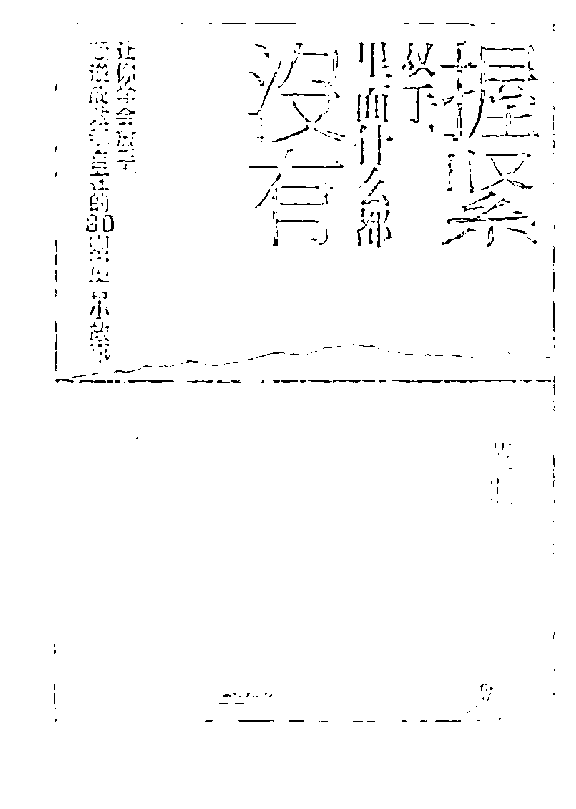

## 内容简介：

人生，就像开车上路，要先松开手煞才能够起步，如果猛踩油门却不放开手煞的话，那么车子不但跑不动，还会严重磨损，甚至报废掉。社会上，有太多人因为错误的价值观，一味追求拥有，不懂得要适时放手，明明负载过重，行李却还一件一件猛往车上堆，结果哪里都去不了；还有，许多人不懂得要知足，买了一台国产车之后，就会开始羡慕别人开进口车；有了一个名牌皮包，就再也无法使用普通的手提袋……曾经有人问过圣严法师：为什么这个世界充满烦恼与痛苦呢？法师说得好，真正的烦恼痛苦，其实来自欲望，而活在欲海不可怕，可怕的是在欲海里淹没。我们都知道，紧握的双手抓不住什么，如果我们愿意放开手，让该来的来，该去的去，人生这趟旅程，才有可能优游自在！

# 文档编辑助手示例

这是一个示例段落，用于展示从图片中提取的文本内容。请根据实际图片调整提取结果。

通常狮子座出现在朋友群之中，他不是国王就是皇后，他总觉得自已高高在上，比别人更有智慧跟统御能力。

# 雅典在哪儿

佚名

一天，苏格拉底的弟子聚在一块儿聊天，一位出身富有的学生，当着所有同学的面，夸耀他家在雅典附近拥有一片广大的田地。

当他吹嘘的时候，一直在旁边不动声色的苏格拉底拿出一张地图说：“麻烦你指给我看，亚细亚在哪里？”

“这一大片全是。”学生指着地图得意扬扬地说。

“很好！那么，希腊在哪里？”苏格拉底又问。

学生好不容易在地图上找出一小块儿来，但和亚细亚相比，实在是太微小了。

“雅典在哪儿？”苏格拉底又问。

“雅典，这个更小了，好像是在这儿。”学生指着一个小点儿说着。

最后，苏格拉底看着他说：“现在，请你指给我看，你那块广大的田地在哪里呢？”

学生忙得满头大汗也找不到了，他家的田地在地图上连个影子也没有。

他很尴尬地回答道：“对不起，我找不到！”

### 魅力提示：

与整个大自然的资源相比，个人所能拥有的土地和财富实在是影儿也没有；与辽阔而永恒的天地相比，再伟大的个人也是微不足道的。因此，我们拥有的那点财富或者智慧，实在应该以宽广而谦卑的心胸来面对。

## 木匠和绅士
佚 名

英国诗人乔治·英瑞出身于一个木匠的家庭。他在上流社会中从不隐讳自己的出身。

有个贵族子弟嫉妒他的才华，在众人面前想出出他的洋相，就对乔治高声地问道：“对不起，请问阁下的父亲是不是木匠？”
“不错，您说得很对。”诗人回答。
“那他为什么没把你培养成木匠呢？”
乔治微笑着，很有礼貌地反问：“对不起，那阁下的父亲想必是绅士了？”
“那当然！”这位贵族子弟傲气十足地回答。
“那他怎么没把你培养成绅士呢？”

### 魅力提示：

人不应有高低贵贱之分，不管是谁，只要是社会的一分子或合法公民，人格就是平等的，都应该受到别人的尊重。尊重别人就是尊重自己，反之，看不起别人也就是看不起自己。记住，千万别做“狗眼看人低”之人！

## 博士与船夫

佚名

博士乘船过河，在船上与船夫闲谈。
“你会文学吗？”博士问船夫。
“不会。”船夫答道。
“那么历史呢？”博士又问。
“也不会。”船夫说。
“那么地理、生物、数学呢？你总会其中的一样吧。”
“不，我一样也不会。”
博士于是感叹起来：“一无所知的人生啊，将是多么可悲！”
正说着，忽然一阵大风吹来，河中心波涛滚滚，小船危在旦夕。
于是船夫问博士：“你会游泳吗？”
博士怔住了：“我什么都会，就是不会游泳。”
话还未说完，一个大波浪打来，船翻了，博士和船夫都落入了水中。船夫凭着自己熟练的游泳技术救起了奄奄一息的博士，这时他对博士说：“我什么都不会，可是没有我，你现在早已淹死了。”

### 魅力提示：

你再优秀也有不如别人的地方，不要瞧不起任何人，有时候，你的优越感也许会毁了你。

## 搜集智慧的乌龟

从前有一只乌龟，想要独占全世界的智慧，做世界上最聪明的动物。它想让所有的人，无论遇到什么问题，都不得不向它请教。

于是，它开始长途跋涉，到世界各地搜集智慧。凡是搜集到的智慧，它都装在一个葫芦里，然后，用一卷树叶把葫芦口紧紧地塞住。

有一天，它觉得已经搜集完了所有的智慧，但是又害怕被别人窃取了，便决定把这个葫芦藏到一棵谁也爬不上去的高树顶上。

它来到那棵树下，在葫芦颈上系上一根绳子，把绳子两端打上一个结，然后将这个绳圈套在自己的脖子上，这样一来葫芦就垂在它的肚子前面了。它努力地往树上爬，却怎么也爬不上去——葫芦总是妨碍着它，几经努力，最后都以失败告终。

这时候，它听见有人在背后发笑。回头一看，发现一个猎人正在瞧着它。

> “朋友，”那位猎人说，“要是你想爬到树顶上去，为什么你不把那个葫芦挂在后面呢？”

听到这一个很平常的建议，乌龟顿时明白，世界上还存在着许多智慧！而它刚才还以为全世界的智慧都被搜集光了。

### 魅力提示：

知识无处不在，智慧自然也无处不在。一些自认为是世界上最聪明、最有智慧的人，在某些方面可能会显得分外愚蠢。

- 书名：低调做人的智慧
- 作者：西武 编著
- 出版社：哈尔滨出版社
- 出版时间：2007-11-1
- 印刷时间：2007-11-1
- 开本：16开
- ISBN：9787807530053
- 包装：平装

## 内容简介：

学会低调做人，就要不喧闹、不矫揉造作、不故作呻吟、不假惺惺、不卷进是非、不招人嫌、不招人嫉，即使你认为自己满腹才华，能力比别人强，也要学会不露声色。而抱怨自己怀才不遇，那只是肤浅的行为。

为什么有的人顺风顺水，平安一生，而有的人步步受阻，郁郁而终？为什么有的人功成名就，令人眼羡，而有的人碌碌无为，遭人唾弃？为什么有的人光彩四射，风光体面，而有的人跌尽跟头，无以自保？失败与成功的最根本的原因是“调”不同也。

“低处纳百川”，做人格调放得越低，越是能够接纳更多的人，也越是能够承载更多的元素。低调，是为人处世的至高境界，在这个浮躁的现世，低调甚至可以说是一种美德。本书讲述了在工作、生活中与人相处要学会低调，如何低调到好处，才能智慧做人！

## 2013年上班
毕业事业篇

## 魅力失分大

狮子座的人过分自信，因此总认为自己比别人强，很不喜欢听命于人，假如有人对他发号施令，他会很反感。

## 国王的权力
佚名

一位国王，有一次和亲近的臣子在沙滩上散步，这位近臣以阿谀谄媚的口气直夸国王的权力有多大、影响有多广，颂赞之声不绝于口。

这位国王静静地听了老半天，他转头面向大海说：“海啊！我是你的统治者，我有很大的权力，现在命令你停止前行，不准弄湿我的脚。”

但是海浪丝毫没有停止，仍旧一波一波地袭来，并且理所当然地打湿了国王的脚及拖地长袍。

国王转身斥责这位近臣：“你看，这波浪并不听我的命令，可见国王的力量也和其他人一样的脆弱，只有上帝才能使一切对他服从。”

### 魅力提示：

一个人贵有自知之明，越是位高者越应保持清醒的头脑，假如身处高位，却没有自知之明，那很有可能被近臣的恭维谄媚蒙蔽视野。

## 目不见睫

佚名

春秋时期，继齐桓公、晋文公称霸诸侯以后，楚庄王取得了诸侯霸主的地位。

但是他不满足，想要趁着越国衰弱之机，出兵讨伐，进一步实现统一天下的野心。楚国的文武百官感到现在楚国的国力已经和以前相差得太远了：对外连年不断发兵征讨，军队疲劳，百姓困倦，这与庄王初为诸侯霸主的时候相比，已相差很远了；国内各地的百姓不满楚庄王的统治，纷纷揭竿而起，官府已无力镇压。在这种自顾不暇，束手无策之际，再去攻打越国，是很危险的。

但是文武百官怕得罪楚庄王，怕丢掉乌纱帽，谁都不敢对楚庄王进谏。

这时，有一位姓杜的大夫，国人都很尊敬他，因为他在国人眼里是一位聪明的有识之士，都称他为杜子。他为了楚国的长远利益，不顾个人安危，挺身而出，上朝去劝谏楚庄王。
杜子对楚庄王说：“大王要发兵讨伐越国，这是为什么呢？”
楚庄王说：“越国是我国的邻国，我们不主动出兵攻打他们，他们也要出兵攻打我们。所以寡人决定讨伐越国。”
杜子又问：“为什么选择在这个时候发兵讨伐呢？”
楚庄王说：“现在越国政治昏乱，兵力疲弱。”
杜子说：“我很愚昧，对这件事很担心。”
楚庄王说：“你担心什么？”
杜子说：“智慧就像人的眼睛一样，能看到百步以外的东西，却看不见自己的眼睫毛。”
楚庄王问：“这话怎么讲？”
杜子回答说：“大王的军队，自从被秦国、晋国打败后，丧失了几百里地的国土，这说明楚国的兵力疲弱；庄在国内造反，官府却无力平乱，这说明楚国的政治昏乱。大王的政治昏乱、兵力疲弱，并不在越国之下。可是大王却要讨伐越国。这不说明智慧像眼睛看不见睫毛一样，看不见自己的弱点吗？大王您说是不是？”
楚庄王听了这些话，就放弃了讨伐越国的打算。

### 魅力提示：

人人都有优点和缺点。每个人都容易看见自己的优点和别人的缺点，而有所忽略别人的优点，对于自己的缺点则常常视而不见，有如目不见睫。明智的人善于以人为镜、以史为鉴，善于听取属下、还有他人的忠告。

## 把自己的杯子放低一些

躬耕夫

一个满怀失望的年轻人千里迢迢来到一座寺院，对住持释圆说：“我一心一意要学丹青，但至今也没有找到一个能令我心满意足的老师。”
释圆笑笑问：“你走南闯北十几年，真没能找到一个自己满意的老师吗？”
年轻人深深叹了口气说：“许多人都是徒有虚名啊，我见过他们的画，有的画技甚至不如我呢！”释圆听了，淡淡一笑说：“老僧虽然不懂丹青，但也颇爱收集一些名家精品。既然施主的画技不比那些名家逊色，就烦请施主为老僧留下一幅墨宝吧。”说着，便吩咐一个小和尚拿来了笔墨砚和一沓宣纸。
释圆说：“老僧的最大嗜好，就是爱品茗饮茶，尤其喜爱那些造型流畅的古朴茶具。施主可否为我画一个茶杯和一个茶壶？"
年轻人听了，说：“这还不容易！”于是调了一砚浓墨，铺开宣纸，寥寥数笔，就画出一个倾斜的水壶和一个造型典雅的茶杯。那水壶的壶嘴正徐徐吐出一脉茶水来，注入到了那茶杯中去。年轻人问释圆：“这幅画您满意吗？”
释圆微微一笑，摇了摇头。释圆说：“你画得确实不错，只是把茶壶和茶杯放错位置了。应该是茶杯在上，茶壶在下呀。”年轻人听了，笑道：“大师为何如此糊涂，哪有茶壶往茶杯里注水，而茶杯在上茶壶在下的？”
释圆听了，又微微一笑说：“原来你懂得这个道理啊！你渴望自己的杯子里能注入那些丹青高手的香茗，但你总把自己的杯子放得比那些茶壶还要高，香茗怎么能注入你的杯子里呢？只有把自己放低些，才能吸纳别人的智慧和经验。”

### 魅力提示：

想让自己进步，首先要正确地认识自己：江海之所以能为百川之王，是因为知道自己身处低下，所以张开胸怀处下不争。同样，你要想拥有百川般的事业和辉煌，首先应像百川一样张开自己的心胸和肚量。

# 不可一世的狐狸
佚名

有只不可一世的狐狸，总认为自己是森林中最伟大的动物。
一天下午，它独自散步，走着走着，它意外地发现了自己的身影很巨大。
这个新发现让它很高兴，让它更相信自己是森林中最了不起的动物了。
正在得意忘形之际，来了一只狮子。看到狮子时，它一点都不怕，它拿自己的影子和狮子相比较，结果发现自己的影子比狮子还大，就不理睬狮子，自得其乐地在那里继续散步。
狮子趁它毫无防备时，一跃而上，把正在得意忘形的狐狸咬死了。

### 魅力提示：

无论身处何等境地，都要保持理智，清醒地认识自己。自大无知向来只能给自己带来伤害甚至毁灭，永远要记住：越是肤浅的越得意忘形，自命不凡；越是深厚的越诚笃笃行，保持低调。

| 项目 | 详情 |
| :--- | :--- |
| 书名 | LQ：职场人必懂的“大圈小圈”定位法则 |
| 作者 | 江纬辰，傅家义 著 |
| 出版社 | 南京大学出版社 |
| 出版时间 | 2009-11-1 |
| 印刷时间 | 2009-11-1 |
| 开本 | 16开 |
| ISBN | 9787305065132 |
| 包装 | 平装 |

## 内容简介：
《LQ：职场人必懂的“大圈小圈”定位法则》：一个人的成功，99%来自精准的自我定位，只有1%来自运气。
人生是一场比赛，但开保时捷的，不一定比骑脚踏车的人，先到终点。
没有精准定位，搞不清正确方向，马力再强，速度再快，也是白忙一场……
人生成败取决于布局，没有LQ(定位商数)，就算你IQ或EQ再高，顶多也是别人的棋子：或者，是一台没有方向盘的保时捷。
《LQ：职场人必懂的“大圈小圈”定位法则》论述了LQ定位商数的理论。LQ高的人不会自大。自大的人多半是因为缺乏LQ，完全不了解自己，才会不知道人外有人，天外有天。作者列举了“大圈小圈”定位法则，帮助读者认清自己所处的局势。

> 魅力失分

狮子座的人自以为是，喜欢命令别人，对于不满意的人或事，会破口大骂。

# 漂亮女秘书

掌心的幸福

美国第三十届总统柯立芝刚上任时，聘了一个女秘书协助他。这个女秘书年轻又漂亮，但是她的工作却屡屡出问题，不是字打错了，就是时间记错了，这些给柯立芝的工作带来很多的麻烦。

有一天，女秘书一进办公室，柯立芝就夸奖她的衣服很好看，盛赞她的美丽，女秘书受宠若惊，要知道总统平时是很少这样夸奖人的。柯立芝接着说：

> > “相信你的工作也可以像你的人一样，都办得很漂亮。”

果然，女秘书的公文从那天起就再没有出现过什么错误。有个知道来龙去脉的参议员就好奇地问总统：

> > “你这个方法很妙，是怎么想出来的？”

柯立芝笑一笑：

> > “这很简单，你看理发师帮客人刮胡子之前，都会先涂上肥皂水，这样做的目的就是让别人在受刮时不会觉得疼痛，我不过就是用了这个方法而已！”

### 魅力提示：

我们必须明白，责备的目的是为了对方改正缺点；因此，带着爱心、试着用赞赏的方式去责备，你收到的将是双倍成效。

## 驯服狮子

缪勒德·卡麦尔

一位妇女因为丈夫不再喜欢她了而烦恼。于是，她乞求神给她帮助，教会她一些吸引丈夫的方法。神思索了一会儿对她说：“我也许能帮你，但是在教会你方法前，你必须从活狮子身上拔下三根毛给我。”
恰好有一头狮子常常来村里游荡，但是它那么凶猛，一吼叫起来人都吓破了胆，怎么敢接近它呢？但是为了挽回丈夫的心，她还是想到了一个办法。
第二天早晨，她早早起床，牵了只小羊去那头狮子常出现的地方，放下小羊她便回家了。以后每天早晨她都要牵一只小羊给狮子。不久，这头狮子便认识了她，因为她总是在同一时间、同一地点放一只温驯的小羊讨它喜欢。她确实是一个温柔、殷勤的女人。
不久，狮子一见到她便开始向她摇尾巴打招呼，并走近她，让她敲它的头，摸它的背。
每天女人都会站在那儿，轻轻地拍拍它的头。
女人知道狮子已完全信任她了。于是，有一天，她细心地从狮子鬃上拔了三根毛。她激动地拿给神看，神惊奇地问：“你用什么绝招弄到的？”
女人讲了经过，神笑了起来，说道：“以你驯服狮子的方法去驯服你的丈夫吧！”

### 魅力提示：

善待他人，连驯服狮子都可以做到，世间还有什么做不到的。善待周围的一切，周围的一切都会听从你的安排。

## 风与太阳

伊索

一天，北风与太阳争论起来了，它们都认为自己的能量大，太阳说：“万物生长都需要我，我是宇宙的中心，我的能量无人能敌！”北风也不甘示弱，反驳道：“我所到之处声势浩大，人们见到我都避之不及，我还能发电……”它们两个争论不休，最后，它们看下面有一个行人，于是决定要是谁能让行人脱下衣服谁就是力量最强大的。

北风憋足了一口气，猛烈地刮，路边的树木左右摇摆，灰尘满天，那个行人扣紧衣服，急速地奔走起来。北风见此，认为自己还没有使出全部的力量，于是，刮得更猛了。行人紧扣着的衣服又被掀起来了。他冷得瑟瑟发抖，连忙把衣服裹得紧紧的。北风使出浑身解数，行人不但没有脱掉衣服，反而戴上了遮风的帽子。

北风刮疲倦了，太阳微笑着说：“你这样是不行的，还是让我来吧！”说完，它把温和的阳光洒向大地，阳光暖洋洋的。刚刚裹紧衣服的行人感受到了和煦的阳光，松开了衣扣，取下了遮风帽。

太阳接着把温暖的阳光射向大地，在这样大好的天气里走路，行人渐渐觉得热，最后汗流浃背。他想：这么温和的天气，还不如把衣服脱了，就不会热得难受了，走起路来也会轻松许多的，还可以直接享受太阳的温暖，那该多好啊。这样想着，他索性脱下了衣服。

### 魅力提示：

要想别人按照你的意愿来做事，要想达到你的目的，可以通过很多方式。许多时候，温柔婉转比粗暴命令更有力量，让别人发自内心地自愿而为比强制执行效果更好。

# 小猫和棕鸟

李异鸣

椋鸟和小猫住在同一人家里，彼此结下深厚的友谊。椋鸟虽然不善于唱歌，但在哲学研究上却很有造诣。小猫虽然块头很大，但性情平和温顺，举止彬彬有礼。两个朋友相处得非常融洽。

有一天不知道为什么主人没给猫喂食，饥饿折磨着可怜的小猫，它不住地哀鸣着，一面温顺地摇着尾巴，一面郁闷地在屋里踱来踱去。

这时哲学家看到了这一切，便教导它说：“我亲爱的朋友，你太老实了，竟然心甘情愿地节食不吃东西。你鼻尖上的笼子里就关着一只金翅雀，我看你简直是一只愚蠢的小猫咪，真是太傻了。”

小猫喵喵叫道：“可是良心告诉我不可以这么做啊。”
“你怎么这样不懂世事！请相信，所谓良心的言论完全就是一派胡言。它只是心灵脆弱者的偏见，而对大智大慧者来说不过是无聊的戏语！这个世界上谁有权势谁便能为所欲为，我可以给你举出许多证明和实例。”

椋鸟立即根据自己的见闻旁征博引，把它的哲学观点阐述得极为透彻。饿着肚子的小猫对这套哲学十分欣赏，立刻把金翅雀从鸟笼里抓出来吞进肚里，津津有味地吃起来。

但这一点食物不仅填不饱小猫的饥肠，反而引起了它更大的食欲。当它大有收获地听完第二节课后，便对椋鸟说：“亲爱的朋友，谢谢你！你的教导使我懂得了生活的哲理，大大增长了我的学问。”说完便抓破鸟笼，把老师也吞了下去。

### 魅力提示：

有些人自以为是，自作聪明地想教导别人，结果往往很可悲。

| 项目 | 详情 |
| :--- | :--- |
| 书名 | 性格决定命运全集 |
| 作者 | 宿春礼，熊永鑫 著 |
| 出版社 | 黑龙江科学技术出版社 |
| 出版时间 | 2007-5-1 |
| 印刷时间 | 2007-5-1 |
| ISBN | 9787538853452 |
| 包装 | 平装 |

# 简介：

性格是表现在人的态度和行为方面的较为稳定的心理特征，是个性的重要组成部分。性格不仅影响一个人的生活状况、婚姻家庭，也影响一个人的人际交往、职业升迁、商务活动、事业发展、经营理财等，性格决定一个人的成败得失，决定一个人的前途命运。

本书从性格定义、性格特征、性格类型、影响性格因素、性格对人的前途命运的影响等多个角度，对性格的内涵作了深入挖掘和全面阐述，并结合大量有说服力的现实事例，剖析了优良性格的积极作用和缺陷性格的负面作用。通过本书，读者可以识别自己的性格特征，发现自己的优点和弱点，最大限度地发挥自己的潜能，高效地开展工作、事业、经营生活、婚姻、家庭，从而把握机遇，彻底改变自己的命运，创造和谐圆满的人生，获得成功和幸福。

# 魅力失分

都说大丈夫能伸能屈，但是对于狮子座来说，他是绝对做不到的，他是能伸但绝不能屈。

# 为社稷忍羞

佚名

赵简子是春秋末年晋国的六卿之一，他临终前留下遗嘱，要将二儿子赵无恤立为继承人。

有位臣僚名叫董阏于的问他：“历来都以长子继位，无恤是庶出又非长子，怎可以立为太子呢？”

赵简子回答说：“我把自己的一群儿子都考虑过了，只有无恤为人能顾全大局，能为国家忍受羞辱。”

赵无恤继位以后，有一天，他在宫殿请晋国的另一个大贵族知伯喝酒。知伯倨傲无礼，酒席间百般侮辱赵无恤，可是赵无恤呢？他不但不发怒，而且还劝知伯“别生气，别生气”，但是知伯不知好歹，竟当着无恤家那么多下人的面打了无恤两个响亮的耳光。

左右侍臣都按捺不住怒火，要无恤把知伯杀了。无恤劝住他们，说：“先君立我为太子，说过我能为社稷忍辱，我怎能因小失大而去杀人呢？”

过了十个月，知伯倚仗自己强大，向无恤勒索领地，无恤没有答应。知伯恼羞成怒，重兵将无恤围困在晋阳，又决汾水灌城，大有一口吞吃之势。但是赵无恤没有认输，也没因此就失去信心，仍然顽强御敌。

第二年，他联合晋国的韩、魏二卿，分兵出击，将知伯军队彻底击溃，形成了“三家分晋”的局势。在庆贺胜利的宴席上，赵无恤将知伯的头颅做成酒器，劳军痛饮。

### 魅力提示：

男儿之所以能够包羞忍耻，是因为他气度宽广，能够审时度势，心中还有更为远大的抱负在等待着自己。若是意气用事，时机不成熟时与强敌正面交锋，胜算无几，结果可想而知，生命不保，一切都将烟消云散。

# 八哥的金笛

杨曦

从前，八哥的鸣声嘶哑难听，叫起来与乌鸦和猫头鹰的叫声差不多。谁听了都厌恶地把头来摇——咒骂他：“不祥的鸟儿，快点走开！”

自从他得到了一支万能的金笛，一下子变成一只最巧嘴的鸟儿，唱起歌来美妙动听，人人称颂！

八哥怎样得到万能的金笛的呢？是这么回事——

有一天百鸟正在山林中聚会，从天上飘下一支金笛，落在他们当中。这支金笛能发出最美的声音，奏出的乐曲格外悠扬、动听！而且这金笛能巧妙地模仿人的语言，当然更能模仿各种鸟儿美妙的啼鸣。

这支金笛应该交给谁来使用？鸟儿们开了个会议认真地讨论——谁的鸣声最难听、最不受欢迎，就把金笛交给他——弥补他命运的不幸。鸟儿们决定发扬民主——由大家来推荐，再加上自己的申请。

于是乎大家就开始了评议，推荐出的对象是：乌鸦、八哥和猫头鹰。

乌鸦头一个提出了抗议：“你们的评议太不公平！谁敢说我的叫声不受欢迎哪我看哪，我的嗓子比你们全都悠扬动听！”乌鸦陶醉着。当他发现别人对他的话很不以为然，他勃然大怒：“你们这是对我最大的污蔑，我要向鸟王的法庭提出诉讼！我声明我坚决不要这支金笛，我看哪，还是把金笛送给八哥或猫头鹰！”

猫头鹰也愤怒地高声大喊：“难道说我就是好欺负的孬种哪我的叫声比你们谁的也不差，虽说赛不过金铃吧，也能赛过银铃！谁敢说我的叫声不受欢迎哪我看哪，人们都对我十二分地尊敬！我也声明坚决不要这支金笛，我提议还是把金笛送给八哥使用！”

就剩八哥没表态了，这时八哥点了点头连声说：“我的短处我自己知道得最清楚——我的嗓子嘶哑，叫声很不好听，到处都惹人讨厌，不受人欢迎……就请把这支金笛交给我吧，我感谢大家对我的一片盛情！”

于是，就结束了这场评议，万能的金笛就到了八哥的手中。从此八哥就变成了一只最巧嘴的鸟儿，到处受人欢迎，到处被人称颂！

乌鸦和猫头鹰拒绝把自己的短处换成长处，所以至今让人厌恶不已。

### 魅力提示：

不要回避自己的缺点，勇于面对自己的不足，用一种能伸能屈的人生态度来对待生活，你才能不断进步。

# 弄脏工作裤

佚名

有一个农场主新雇了一个工人。上工第一天，他们二人在筑围篱。农场主手里拿的一根木柱突然掉落到了泥坑里，泥水溅污了他们的衣服。农场主虽然显得很狼狈，但看起来他似乎是故意这样做的。

当时，在屋内洗碗的女主人看到了这个情形，就忍不住偷偷问丈夫为什么要这样做。

农场主回答好奇的太太说：“我也不想这样做，但那个小伙子穿着新工作裤，整天只顾保持裤子的干净，筑围篱的时候就会有所顾忌，这样怎么能做得好呢？难道你没有注意到泥水溅污他的工作裤后，我们的工作快了很多吗？”

### 魅力提示：

放下身价让自己更柔软、弹性更大、空间更广、美好时机也会随之而来。放下身价就会失去前进的动力，这是当今瞬息万变的社会必须具备的人生之道。

# 迷途蝴蝶

佚名

一个初秋的傍晚，一只美丽的蝴蝶从窗户飞进来，不停地在房间里一圈又一圈地飞舞，它显得惊慌失措，原来它找不到出去的路了。

它不停地拍打着翅膀，一次又一次地努力，可任凭它怎么在房间里左冲右突多少次，都没能飞出房子。

它有点绝望了，之所以无法从原路出去，原因在于它总在房间顶部的那点空间寻找出路，总不肯往低处飞——低一点的地方就是开着的窗户。甚至有好多次，它都飞到离窗户顶部至多两三寸的位置了。

最终，这只不肯低飞的蝴蝶耗尽全部气力，奄奄一息落在桌上，像一片毫无生机的叶子。

魅力提示：

在环境和条件改变、身处困境之时，最好是忍辱负重，放低标准，根据实际情况调低目标，这样才能为自己赢得更多的求生机会，以免徒劳挣扎、白白耗尽心力。

## 魅力星座智慧书之

书名：安身立命屈与伸
作者：殷涵 著
出版社：延边大学出版社
出版时间：2004-2-1
印刷时间：2004-2-1
ISBN：9787563411757
包装：平装

## 内容简介：

屈是难得的糊涂、水往低处流的谦恭，是负辱抗争中的忍、逆境中求存的耐。处世让三分为天下先，负辱退一步海阔天空。

伸是以退为进的谋略、以柔克刚的内功，是相机而动的慢进、该出手时就出手的气概。逞雄才得时机为佳，争锋芒先下手为强。

善于“屈伸”者，有刚毅勇猛的沉着，有沉静蕴慧的平和。善“屈”善“伸”者能承受大喜悦与大悲哀。真正善“屈”善“伸”者，行动时干练、迅捷，不为感情所累；退避时能审时度势，全身而退，且一旦时机再现定会适机而动东山再起。真正的善“屈”善“伸”者，没有失败，只有沉默，是面对挫折与逆境积蓄力量的沉默。

# 第二章 事业篇

魅力失分
不求上进
狮子座对于自己的才华相当自信，很容易自满自得，有时候对于现状乐观过度。

# 薛谭学歌

佚名

从前，有一个人叫薛谭。

薛谭很爱好唱歌，但是他的家乡没有懂得音乐的老师。虽然先天的条件很好，但由于得不到名师指导，再加上缺乏音乐基本功的训练，他不能成为最好的歌手。

于是他决定离开家乡，到外地去寻访名师。

当时，有一位名叫秦青的音乐大师，他不但精通乐理，而且还会弹琴唱歌。薛谭寻访到秦青，要拜他为老师。秦青看到薛谭一路克服了很多困难，千里迢迢来寻师学艺，很受感动，就同意了他的请求，决定收下这个徒弟。

举行完拜师礼以后，薛谭便从基础理论开始，进行系统学习。

开始的时候，薛谭很用功，上课认真听讲，课后及时复习，不懂就问。这样，他学习很扎实，进步很快，不仅学会了乐理，而且也学会了唱歌。秦青很高兴，多次在众人面前表扬他。薛谭虽然还没有完全掌握秦青的艺术技巧，但他自己却认为已经全部掌握了。于是，他就向秦青告辞，要回家去。秦青就说：“好吧，咱们相处的这一段时间，有了师生情谊，等到明天为师给你送行。”

第二天，秦青和学生们到郊外十里长亭给薛谭送行。在送别会上，互相敬酒。当喝得兴致正浓时，学生们每人唱一支最优美动听的歌儿献给薛谭。最后，学生们提议请老师也唱一支。

秦青很愉快地接受了，只见他一边弹琴一边唱了起来，手指在琴弦上敏捷地跳来跳去，有急有缓，有轻有重，歌声凄凉悲壮，有时低沉，有时高亢。歌声飞过森林，森林发出回响，蓝天上的白云也停在那里，久久不愿意飘走。

这支歌深深地打动了薛谭的心，他想：“老师弹唱的技艺举世无双，有许多东西我还没有学到呢。”

想到这里，薛谭向秦青鞠躬敬礼，说：“先生，我错了，从今以后再也不骄傲了！我不回家了，我还要留下来，继续向先生学习。”

从此以后，薛谭再也不敢说回家了。在秦青的耐心教育下，他终于成为当时最有名的一位歌手。

### 魅力提示：

人不能有丝毫的自满心理，因为学无止境，活到老学到老，浅尝辄止或半途而废，就学不到高深的技艺。

# 亲手叩响机遇之门

马德

卡罗·道恩斯原是一家银行的职员，但他却放弃了这份在别人看来安逸而自己觉得不能充分发挥才能的职业，来到杜兰特的公司工作。

当时杜兰特开了一家汽车公司，这家汽车公司就是后来声名显赫的通用汽车公司。工作6个月后，道恩斯想了解杜兰特对自己工作优缺点的评价，于是他给杜兰特写了一封信。道恩斯在信中问了几个问题，其中最后一个问题是：‘我可否在更重要的职位从事更重要的工作？’

杜兰特对前几个问题没有作答，只就最后一个问题做了批示：‘现在任命你负责监督新厂机器的安装工作，但不保证升迁或加薪。’杜兰特将施工的图纸交到道恩斯手里，要求：‘你要依图施工，看你做得如何？’

道恩斯从未接受过任何这方面的训练，但他明白，这是个绝好的机会，不能轻易放弃。道恩斯没有丝毫慌乱，他认真钻研图纸，又找到相关的人员，做了缜密的分析和研究，很快他就明白了这项工作，终于提前一个星期完成了公司交给他的任务。

当道恩斯去向杜兰特汇报工作时，他突然发现紧挨杜兰特办公室的另一间办公室的门上方写着：卡罗・道恩斯总经理。

杜兰特告诉他，他已经是公司的总经理了，而且年薪在原来的基础上在后面添个零。“给你那些图纸时，我知道你看不懂。但是我要看你如何处理。结果我发现，你是个领导人才。你敢于直接向我要求更高的薪水和职位，这是很不容易的。我尤其欣赏你这一点，因为机会总是垂青那些主动出击的人。”杜兰特对卡罗・道恩斯说。

魅力提示：

机会总是垂青那些主动出击的人，人，就应该永远不满足于现状，积极进取。

# 夸氏国的老师

佚名

从前，有一个国家名叫夸氏国。

这个国家里有一个道德、学识都出类拔萃的人，国内的很多读书人有什么不懂的地方就拿着书本去问他，他经常为这些读书人解答难题，没有不知道的；还有人向他请教琴棋书画等技艺，他没有不娴熟的。

从古至今的郡县设置与废弃、国势的兴衰、政策的对错等等，他没有不通晓其中缘故的；诸子百家的学说和各种离奇古怪的传说，他都能讲得头头是道，可见他是个博学多才、见解不凡的人。

有一天，他的邻居对他说：“您这么有学问，为什么不去别的国家走走？去教别的国家的人一些知识，说不定你会很出名。”

他心想：也有道理，出去又能见世面，而且说不准可以收很多的徒弟，让全天下都知道自己的名字，这也算是一件光宗耀祖的好事。

于是，他就离开了夸氏国，到各地周游。他到一县，一县尊敬他；他到一州，一州都把他当做奇才；他到天下，天下的读书人都深感惭愧地说：“我们见到这个人，都感到自己枉为读书人了啊！”

这些读书人跟他到北方游历，愿意做他弟子。这个夸氏国的人便当上了他们的老师。

这位老师出门坐着舒适的车子，平时坐在讲堂上。众多弟子来听他讲学，他坐着给大家讲授。

他对弟子们说：“我对于学问，也不是万事万物都精通，但我掌握了做学问的要领。大家如果想学习我做学问的要领，可以向我来提问。”弟子们纷纷提出问题，他都一一予以回答。

众多弟子得到了他的学问和他的书，课后都认真阅读老师的书，勤学苦问，深入研究其中道理。

不到一年时间，弟子们全都把老师的学问学到手了。可是他的学问只是向外传授，却没有自我补充和更新，他的才能只有对外付出，却没有增长。他的学生中不乏有非常出色的人才，甚至有些大有超过老师的势头。处在这种境地，他不但没有危机感，反而心中暗想：“我既然成为天下人的老师了，还辛辛苦苦地学习干什么？”

从此以后，他苟且偷安，得过且过，不思进取，只图享乐。后来，弟子又回来向他请教，他的解答也没有超过从前的见解。弟子们很失望，都纷纷离他而去。没有了弟子，他也没法混饭吃了，只好回到夸氏国，国内的人见他灰溜溜的样子，也都不再对他以礼相待了。

### 魅力提示：

人在事业和求知上不能有满足，因为满足已有成绩，就会不思进取，必然会被社会淘汰。

# 空白的答卷

佚名

在哈佛，在一座教学楼前的阶梯上，有一群即将毕业的机械系大四学生很快就要参加最后一门考试了，他们聚集在一起，正在讨论几分钟后就要开始的考试。他们的脸上显示出自信，这是最后一场考试，接着就是毕业典礼和找工作了。

有几个说他们已经找到工作了。其他的人则在讨论他们想得到的工作。怀着对4年大学教育的肯定，他们觉得心理上早有充分的准备，能征服外面的世界。

他们知道即将进行的考试只是轻而易举的事情。教授说他们可以带需要的教科书、参考书和笔记，只要求他们考试时不能彼此交头接耳。

他们喜气洋洋地走进教室。教授把考卷发下去，学生都喜形于色，因为学生们注意到只有 5 个论述题。

3 个小时过去了，教授开始收考卷。学生们似乎不再有信心，他们脸上有难以描述的表情。没有一个人说话，教授手里拿着考卷，面对着全班同学。教授端详着面前学生们忧郁的脸，问道：“有几个人把 5 个问题全答完了？”

没有人举手。

“有几个答完了 4 个？”

仍旧没有任何动静。

“3 个？2 个？”

学生们变得有些坐立不安起来。

“那么一个呢？一定有人做完了一个吧？”

全班学生仍保持沉默。

教授放下手中的考卷说：“这正是我所预料的结果。我只是要加深你们的印象，即使你们已完成 4 年工程教育，但仍旧有许多有关工程的问题你们全然不知。这些你们不能回答的问题，在日常操作中是非常普遍的。”

### 魅力提示：

对于聪明人和有素养的人来说，求知欲是随着年龄的增长而转变得愈加强烈的。

- 书名：禅师的米粒
- 作者：星云大师 著
- 出版社：上海人民出版社
- 出版时间：2009-1-1
- 印刷时间：2009-1-1
- 开本：32开
- ISBN：9787208083295
- 包装：平装

## 内容简介：

做人，要有自我肯定的骨气，而非做给别人看，期许别人赞美，抱着奖章径自陶醉不已。树立什么形象，活出何等人生，自我期许才是千年风雨也无法抹去的碑文。由心外求富贵，终日奔波，只为填满那一口无底洞，而“大厦千间，夜眠不过八尺；良田万顷，日食又能几何”？真正有德有量、有学养的人，明白宇宙无垠，泰山之上还有天、沧海之下还有地，而知道谦虚向学、互相赞美，不会事事计较、处处比较；明白自己所学所知不足，不会自得自满、不可一世。翻阅《禅师的米粒》，聆听禅门临济宗第48代传人星云大师的人生哲学。

# 魅力失分

狮子座是名牌的拥护者，所以当狮子座的人告诉你他用天文数字的价格买了一件名设计师的“简单”礼服时，你千万不要惊讶。

# 衣着与行为

佚名

墨子是战国时期的一位伟大的政治家和道德家。

有一天，墨子的弟子报告墨子说：“先生，外面有一个穿着儒生服装的人请求与先生相见。”

墨子说：“请他进来吧！”

一会儿，那个人跟随墨子的弟子进来了。此人复姓公孟，信奉儒家学说，是孔子弟子的弟子，人们尊称他为公孟子。

只见他头戴着青布冠，穿一身儒生的服装，扬扬自得地走进来，问墨子道：“请问先生，作为君子是穿上某种服装之后才有所作为呢？还是有所作为以后才穿上某种服装呢？”

墨子回答说：“人有没有作为，不在于他穿什么样的服装，关键在于他的行为如何。”

公孟子进一步追问：“凭什么得知这样的道理呢？”

墨子解释说：“从前，齐桓公头上戴着高冠，腰间系着宽大腰带，身佩金剑，手持木盾，他治理齐国，把齐国治理得很好；晋文公身穿粗布衣服，外套老羊皮袄、用熟牛皮系挂着长剑，他治理晋国，把晋国治理得很好；楚庄王头上戴的法冠还系着丝带，身上穿着的衣袍十分肥大，他治理楚国，也把楚国治理得很好；越王勾践剪短头发，身刺花纹，他治理越国，也把越国治理得很好。这四位君王，他们的穿着不同，但是都很有作为，建立的功业同样显赫。我凭这些懂得有作为的人不在于他们穿什么样的服装。”

公孟子说：“讲得好！我听说‘赞赏好的主张而不尽快实行，是不吉祥的。’我愿意脱去儒生的服装，更换掉儒生的青布冠，再来拜见先生，可以吗？”

墨子说：“不必了，请你就穿这身衣服与我相见吧。如果一定要换一身衣服再来见我，那么不就等于说，一个人有没有作为果然取决于他的穿着打扮了吗？”

一句话把公孟子也说笑了。

### 魅力提示：

一个人的形象其实是很内在的东西，而且行为和穿着打扮没有必然联系。要有所作为，就不必刻意追求穿着打扮。

# 爱因斯坦的大衣

佚名

爱因斯坦成名之前，生活拮据，衣着随便。有一位朋友曾劝他说，应该添置一件大衣，否则难以进入社交界。他笑着答道：“我本来就默默无闻，就是穿得再漂亮也没有人会认识。”几年后，成了大科学家的爱因斯坦和从前一样，依然衣着简朴。那个朋友再次提醒他，快去做件像样的大衣，以便与自己的身份相符。他还是笑着回答说：“现在即使穿得更随便些，同样也会有人认识我。”

### 魅力提示：

一个人的身份地位并不需要靠华丽的衣着来表现，只要你有才华、有成就，你就能得到别人的认同。

# 齐侯之鞋

追风

春秋时期，齐景公从鲁国请来一个鞋匠，为他特制一双鞋子。这双特制的鞋子，非常的漂亮，鞋带是用黄金做的，用白银镶边，再缀上珠宝，用美玉装饰鞋头，鞋的长度足有一尺。

齐景公认为只有这双特制的鞋，才与自己这个拥有万辆兵车的大国君主的身份相称。在一个大冷天的早晨，他穿着这双特制的鞋上朝处理政事。

宰相晏婴上朝来了，齐景公很尊重这位三朝元老，想起身去迎接。由于穿在脚上的这双特制鞋太重，他迈不开步，仅仅能抬抬脚。

他问候晏子说：“相国，外边的天气很冷吧？”

晏子看到齐景公穿的鞋子让他迈不开步，就借机劝谏说：“君侯怎么问起天气冷不冷呢？古代圣人制作衣服，要求冬天衣服做得又轻又温暖，要求夏天的衣服又薄又凉爽。现在君侯脚上的鞋子用金银珠玉做成，冬天穿起来冷上加冷，而且鞋子沉重得超过了脚的承受能力，这就违背生活常理了。这双鞋是谁为君侯制作的？”

齐景公说：“是从鲁国请来的鞋匠制作的。”

晏子说：“臣以为鲁国的这个鞋匠有三大罪状，请允许臣讲：

他给寡人制鞋，费了很大的精力才给寡人制成这么漂亮的鞋子，而他得到的奖赏还不够这双鞋子的百分之一，寡人还嫌赏他的不够，相父为何说他有罪呢？

鲁国的鞋匠不知道季节的寒暖变化，不知道脚能承受的重量，违反生活的常理，这是他的一大罪状；做鞋不按常规操作，做出这双不伦不类的鞋，使我们君侯受到天下各国的嘲笑，这是他的第二大罪状；耗费钱财，对国家没有功效，招致老百姓的怨恨，这是他的第三大罪状。臣请求主上立即下令，把他逮捕，交给司法官员按罪论处！

齐景公觉得鲁国鞋匠制作这双鞋很不容易，坚决要求放过他。

晏子也很坚持自己的态度，坚决不肯放过鲁国的鞋匠。

寡人真的不明白他究竟错在哪里，这双鞋是寡人让他做的，你要处罚就处罚寡人吧，但请相父饶了那个无辜的鞋匠。

不可以。我听说，为做善事而使自身受苦的人，他应该受重赏；为做坏事而使自身受苦的人，他的罪恶更重。

齐景公无话可说了。

晏子退出去，直接向管司法的府衙走去，到了那里就命令那儿的官员立刻将鲁国的鞋匠逮捕，派人把他押解出境，永远不准他进入齐国境内。

从此，齐景公脱下了这双鞋，再也不穿它了。

### 魅力提示：

只知道追求奢华而不注重实用，以至于违反生活常规，是十分愚蠢的行为。

## 孔雀与鹤
李异鸣

一只白鹤飞在高空中，人们看到了，禁不住赞叹说：“快看啊！那只白鹤多么高洁啊！身姿也很优美。”

孔雀听了后心里酸溜溜的，它使出浑身解数，展示出它漂亮的羽毛，色泽鲜艳、五颜六色。人们的目光又转向了孔雀，大家开始议论纷纷。

一个女孩子说：“还是孔雀的羽毛好看，五彩缤纷、金碧辉煌，哪像白鹤的就只有白色，多么单调啊，两个一比，白鹤就黯然失色了。”

另一个孩子反对说：“孔雀虽然外表美丽，但是归根到底它只能和鸡、鸭、鹅这些不起眼的家禽一样行走；而白鹤却能够飞到天的高处，和蓝天白云相辉映，还是白鹤高洁，相比之下，孔雀就很俗气！”

孔雀听后，羞愧地收起了刚刚展开的羽毛。

> 魅力提示：穿戴简朴而志趣高洁永远胜过奢侈俗气而思想平庸。

## 魅力星座智慧书之

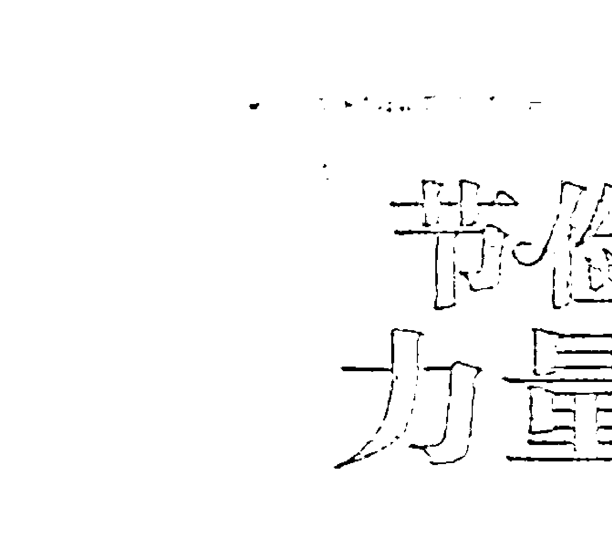

- 书名: 节俭的力量
- 作者: （英）斯迈尔斯 著，稀 睿 译
- 出版社: 北京邮电大学出版社
- 出版时间: 2009-7-1
- 印刷时间: 2009-7-1
- 开本: 16开
- ISBN: 9787563519552
- 包装: 平装

## 内容简介：

“邻家百万富翁”的终极秘诀：节俭！节俭！再节俭！
节俭是一种习惯、一种美德，更是一种生活方式，一种人生的力量，节俭虽然不能使你注定成为富翁，但它却能让你远离债务，幸福安稳地生活。
节俭，可以帮我们保持冷静和清醒的同时，更有效地占有金钱，更聪明地管理金钱和使用金钱，同时也更好地管理我们自身的生活。
缺乏远见的人尽管非常勤劳，但却因为奢侈而输掉了明天；尽管他们赚到了很多钱，但却因为挥霍而一直挣扎在贫困的边缘；这一切都源自于他们不能为未来而在当下进行节俭。
如果一个人能够做到量入为出，明智地安排自己手里的钱，他就能够摆正自己的位置，就可以做自己命运的主人。