# 魔法小子塔罗书

## 塔罗修炼自助书

《魔法小子塔罗书》是作者伊莎·勒恩纳10年研究的成果，是理解故事、神话和塔罗中的原型象征手法的完整指南，它加深神话故事、大阿卡纳牌与人类心灵从生到死的神秘的冒险之旅之间的联系。

对于我们许多人来说，小时候听到的神话故事所起的作用，是打开了充满想像和梦幻的广大世界的一扇大门。当我们作为成人重温同样的故事时，会意识到它们更浓厚的宇宙意义，我们会打开一扇通往自己内心灵魂的大门，并使我们的人生之旅目标明确。

《魔法小子塔罗书》提供了五大构成要素，供人们进一步研究塔罗牌。

* 进一步探索神话故事与大阿卡纳牌的神秘意义，因为它们与灵魂之旅相关。
* 分析神话故事里的女性成分，深入研究像邪恶继母、天真少女及邪恶女巫等原型人物的含义。
* 将塔罗与魔法、想像力与转生的神秘研究结合起来。
* 探索塔罗与神话故事的数字命理学意义。
* 可以延伸塔罗牌用途的高级练习，包括过往生活回溯、梦想之作以及与牌组中的每一张牌相关联的问题。

ISBN 7-80180-380-9

定价: 38.00元 (随书附赠“魔法小子塔罗牌”一副)

## Inner Child Cards Workbook

## 魔法小子 塔罗卡

[美] 伊莎·勒恩纳◎著

李斯 梵天◎译

经济日报出版社

## 图书在版编目（CIP）数据

魔法小子塔罗书 / (美) 勒恩纳著; 李斯译. -- 北京; 经济日报出版社, 2004.10
ISBN 7-80180-380-9
I. 魔... II. ①勒... ②李... III. 人生哲学 - 通俗读物 IV. B821-49
中国版本图书馆 CIP 数据核字 (2004) 第 093630 号

## 魔法小子塔罗书

- 著者: [美]伊莎·勒恩纳
- 责任编辑: 孙展
- 出版发行: 经济日报出版社
- 地址: 北京市宣武区白纸坊东街2号 (邮政编码: 100054)
- 电话: 01063588406 63567691 (编辑部) 63567683 (发行部)
- 网址: edp.ced.com.cn
- E-mail: edp@ced.com.cn
- 经销: 全国新华书店
- 印刷: 北京朝阳印刷厂有限责任公司
- 开本: 850 × 1168mm 1/24
- 印张: 12
- 字数: 200千字
- 版次: 2004年9月第一版
- 印次: 2004年9月第一次印刷
- 书号: ISBN 7-80180-380-9/G·102
- 定价: 38.00元

版权所有 盗印必究 印装有误 负责调换

## 揭开塔罗的神秘面纱

> 如果告诉你，有一件古埃及时代的作品——一本包含了重要教义、蕴藏着丰富智慧的图文书，在他们富丽堂皇的图书馆遭到灭顶之灾时，居然能够逃脱火舌幸存至今。毋庸置疑，这是一本珍贵无比、备受瞩目的宝书。若再加上，这本书在整个欧洲广为发行，而且几个世纪以来，这本书对每个人都十分有益。人们恐怕会非常惊讶……这本书就是《塔罗牌》。

这是法国作家安托万·热伯兰（Antoine Court de Gebelin, 1728-1784）在1781年他的作品《早期社会》（Monde Primitif）第8卷365页中的文字。他并不是一位特别出色的作家，但，正因为他提到了塔罗，热伯兰从此名流后世。

《易经》被公认为是东方智慧之书，“阴阳奥理妙无穷，天地造化一掌中”，塔罗牌同样也蕴含了此番深奥，因此被认为是西方的智慧占卜。两者都是探讨宇宙和生命的变化，其中塔罗牌的博大精深、神行气化，普遍被视为一种灵验神奇的占卜工具，充满了西方艺术和文化的风貌。

“塔罗”一词，取自古埃及语的Tar(道)和Ro(王)两词，含有“王道”的意思。因此，“塔罗”本身也就是指王者应该具备的正确决断力，这也正是这种占卜方式的起源。

最初，塔罗并不是以牌的形式来做预测，它是一本专门用来传达神灵旨意的神秘之书。每当古代的法老王有任何疑难问题需要解决时，就会打开这本神秘之书，所有的问题便能迎刃而解了。所以，古人把这本书称为“天籁之音”，是上天神的旨意让他们这么去做。

塔罗牌基本有78张，其中22张称为大阿卡那牌(Major Arcana)，也就是我们平时所见的王牌。而其余的牌则称小阿卡那牌(Minor Arcana)。大阿卡那牌之所以称为王牌，主要原因是它们在排列上及图案象征上，都有其特定的生命意义。所以有人利用22张大阿卡那牌来代表人生不同阶段呢！

透过阅读纸牌的含义来为人们找出趋吉避凶的方法，就好像我们经常在电视或电影中看到的场面。在一间黑压压、阴森森的房子里，中间坐着一个满脸皱纹的老巫婆，面前正坐着一个神情紧张的少女，老巫婆用她那青筋暴突的手缓缓抽出一张“死神”牌，少女一看就晕倒了……

为什么一张纸牌能预告这么多而准确的事情？

答案可能在于：人在不知不觉间，激活了内心深处未曾唤醒的记忆，也就是人的内心之子。它深藏在我们的潜意识中，平时人们根本不会注意到，但它又千真万确深藏在我们内心，并在关键时刻被激活，发挥无穷威力，冥冥中指引着我们的人生和命运。

因此，我们不应以“邪说”来理解塔罗，而应相信它能为我们开启内心深处潜伏已久、载有预知未来能力的记忆的大门。经常有人看起来默默无闻，其貌不扬，但发生巨大事变时，往往能从容镇定，指挥自若，与平时判若两人。其实，在他的潜意识中，是他的内心之子在召唤他这么去做，只是平时没有被人们，包括他自己发现罢了。

我们可以说，宇宙万事万物都是相通的，宇宙哲学与生命、政治、社会、生活、军事等都可以用一个象征物来代表，这就是塔罗牌图案的终极含意。因此，塔罗可以根据不同的需求占卜人们的恋爱、健康、财运、事业、婚姻等。关键是要看人们对塔罗牌的图案所隐含的意义了解的深度，以及是否进入与潜意识相通的状态。通俗来讲，就是专注于你要思考的问题，让显意识与潜意识达到完全的统一和沟通，发挥你的最大潜力，让命运之牌更好地为你服务。

塔罗不是迷信，也不是“妖言”，更不是什么“巫术”！塔罗究竟是什么，让我们揭开它的神秘面纱，走进去看个究竟吧！

## 题献

致姐姐克里斯汀。你与我一同走过童年，那些淡红色的歌曲，泥巴饼，墙上的影子，多迪早晨传来的笑声，还有妈妈做的柠檬蛋糕——我只能与你分享这些回忆了。

## 致谢

衷心感谢塔拉·麦肯蕾，她为我做了繁杂细致的编辑工作，还提供了源源不断的支持。

感谢《神话故事塔罗牌》一书的共同作者马克·勒恩纳，他是照耀在隧道尽头的一盏指路明灯。

还有我的小女儿索菲，她妈妈是个极忙碌的人，但她却坦然以待。谢谢迈克尔的好脾气和勇气。

当然还要感谢棕熊出版公司国际内心传统丛书，尤其是我的编辑罗拉·席里维克。

## 前言

## 我们都是小红帽

欢迎阅读《魔法小子塔罗书》。长久以来，我一直想编写一本关于神话故事和塔罗牌魔法性质的专著和研究指南。

我发现，人们一旦理解了神话故事真实的象征意义，他们就能够发现自己内心深处潜藏的宝藏，并且强化自己与塔罗之间的相互关系。十年来，有很多人参加我的学习班，学习如何使用《神话故事塔罗牌》，他们都鼓励我写一本指导书，可以当做手册和指南书用，帮助他们进一步探讨那本书里提到的一些材料。这本书便是十年研究和探索的结果。

《魔法小子塔罗书》用于训练、告知以及当做指导资料使用，但其本身也是一本相对独立的书。没有读过《神话故事塔罗牌》的人，可以拿这本书当做更好理解神话故事、塔罗牌和魔法的方法；已经拥有《神话故事塔罗牌》的朋友，不妨拿这本书当做一本塔罗游戏参考书，也可增进自己对塔罗牌和神话故事的理解。

我把论述神话故事中的原型意义的新材料编入了这本游戏手册里，让读者能够完成穿越神话故事的象征主义的一次旅行，这样的旅行有很深的神秘意义，也有极佳的治疗作用。《魔法小子塔罗书》里面提供了一些新牌型，告诉读者一些新的占卜方法，并且还提供了一系列个性化的成长练习，使其对应于每一张大阿卡那牌，包括显形法、确认法、提问和建议的一些方法，以便把神话故事里的教化应用于个人的生活。

1990年，我在编写《神话故事塔罗牌》一书期间，母亲去世。在清理儿时生活过的那栋房子的阁楼时，在一只存放宝物的旧箱子里，我发现一本名叫《神话故事大全》的老书。小时候，我很喜欢这本书，它是我祖姑母从英国寄给我的，我还用勾号把自己喜欢的故事标出来了。在以后的生活中，我研究过儿时感动过我身心的那些故事及其深层意义，获取对它们的重新理解后，我体会到它们神奇的治疗作用。

那只箱子里还放着一个故事，是我七岁时写的，名叫《导盲狗布菲》，故事很显然与我当时的生活情景和希望的生活模式相吻合。在第一章里，一位盲人的狗被一位粗心的司机压死了。那个传奇故事是要探索生存、真理与治疗等问题。找到那篇故事时，我十分感动，再次看到它的时候，我对自己的治疗之旅产生了莫大的同感。那次经历让我明白，先写自己的故事，然后站在某种超脱的角度看待它，就好像它是神话故事一样，这会产生一股巨大的超脱的力量。

我就《神话故事塔罗牌》开过讲座和学习班，经验使我得出这样的结论：很多人现在乐于理解“儿童时代故事”的深层意义，（无论这些故事是别人的还是他们自己的），并可以从中获取真实的神秘教化。在我们共同的记忆和儿童时代印记的各个层面，神话故事起到广泛的启迪作用，打开了通往想像与梦幻的神秘世界的大门。认同儿时对我们相当重要的这些故事，有助于突出我们生活中容易引起共鸣的主题，并给予我们力量。我们得到提示，对于个性化的追求是一件普遍的事情，我们都会面临某些困难的挑战和萌芽阶段。从原始的角度看，神话故事显示出灵魂的广博的领域。我们要把对完整人性的追求融入到日常生活中，要接纳人性发展的各个方面，哪怕是涉及痛苦、遗弃和担忧等。如果我们用心倾听，并对故事的魔法抱有接受态度，就会直面自己人生历程中最美好的本质。

我深入研究神话故事的神秘意义，在这个过程中，我的生活起了很大变化。我以这种方式获得了很多见解，并把这些见解应用到自己的环境和不同的生活阶段，结果发现通往命理的道路被清理得干干净净的。我深入研究自己的痛苦与担忧，结果跟神话故事中的许多人物一样，进入了自己灵魂之旅的深处，在朝着成熟与真理前进的旅途中，寻找生命的启示和神灵的光芒。

例如，跟大家将会在《魔法小子塔罗书》中看到的一样，“小红帽”的故事是对个性化和追求自由的神秘探索。“红色小骑帽”是少数几个重要的神话人物之一。有一个疼爱孩子的母亲，关心她、爱护她。她那顶众所周知的小红帽是她内心愿望的一个象征，说明她希望得到启迪，希望唤醒后看到世界更大的智慧。她必须与狼相遇——这匹狼象征着她过去生活的阴影、她的担忧和她阴暗的一面——这是她必须要经历的萌芽阶段，因为它试图愚弄她，并吞没她尚未成形的智慧。这是她自我潜意识的一部分，尽管她自己并没有意识到。

小红帽到祖母家去，那是能转化的祖传小屋子，她在那里知道了生活中欺骗的一面——狼打扮成了外婆。她最后得到了启迪和新生，因为樵夫切开了狼腹，把她救了出来。她终于被唤醒，进入了新的生活层面——知道如何智胜大灰狼，并迎接生活摆在她面前的种种挑战。

从本质上讲，我们全都是小红帽，而她的故事也就是我们的故事。因此，如果你在寻找的东西是更好地理解自己和自己的故事——在神话的神秘主义的氛围中——那你就算是找对了地方。接下来的就是你的故事，是以魔法、诗歌、史诗用语和一大串人物的形式讲出来的，所有这些人物都是你本人不同的侧面！

《魔法小子塔罗书》的前三章是根据我多年以来在讲座、课堂和研习班上用的授课材料提炼出来的。手稿里面夹杂着人们提出的问题和我在神话故事、神秘主义和塔罗牌方面的一些观察经验，是我在旅行途中和分担讲课的时期收集起来的。我把这些问题和平时进行的探索跟我自己的研究以及在《神话故事塔罗牌》中的一手经验串在一起，希望能为我们的灵魂提供一次神秘的旅行。

第四章和第五章让大家看看塔罗牌与神话故事中的神秘主义以及数字力量之间的神秘联系。我感觉，让学习塔罗牌和《神话故事塔罗牌》的人明白数字在塔罗牌和神话故事中的意义是非常重要的。它们在所有故事中起象征密码和传递信息的作用，正如塔罗牌上的数字能提供关于那张牌的更深层意义的信息。第六章专门用来介绍如何利用最新和令人激动的方法去使用《魔法小子塔罗书》，包括你的前世、今生，甚至还有一种塔罗游戏。第七章讲述阅读《魔法小子塔罗书》时可以使用的多种新牌阵，包括动态星星牌阵和黄砖路牌阵。

剩余的两章逐个描述每一张塔罗牌，其中大阿卡那牌包括传统意义、神话故事中的教化等五部分，还有他们与美妙的希腊神话的源远流长。小阿卡那则阐释了数字牌的传统意义和最新物语，赋予其时代含义，探索人性永恒的话题——爱情、友情、亲情、事业、家庭、财运等，让古老的塔罗神话焕发出青春的魅力。

能够跟全世界分享神话故事学问和塔罗牌的神秘语言，这是我最大的快乐。我写作这本书的愿望，在棕熊公司内心传统丛书的支持下得以满足。我希望它能够激励和点燃翻开本书的每一位读者的爱与智慧的创造性力量。因为爱能抚平一切伤痛。

## 目录 contents

## 致谢

## 前言：我们都是小红帽 /1

## 上篇 神话与塔罗

### 第一章 神性的女性 /1

* 别让女巫吓着孩子 /1
* 好人和坏人本质都是一样的 /2
* 神话里的女性象征 /4
* 好母亲和坏母亲的双重性 /7

### 第二章 神话故事里的3个阶段 /9

* 寻找自我归宿 /11
* 纠正人性的弱点 /12
* 萌芽阶段：灵魂化成肉身 /13
* 诱惑阶段：在黑暗中游荡 /14
* 醒悟过程：打破一个符咒 /15

### 第三章 灵魂的原型与因果轮回 /17

* 审视自我 /19
* 不同世界之间的铺路石 /19

### 第四章 因果轮回 = 塔罗之旅 /29

* 神秘联结 /31
* 神授智慧 /32
* 转化的循环 /33

### 第五章 魔镜般的王牌、头像牌和数字牌 /35

* 折射灵魂的双面魔镜：王牌 /37
* 折射人品的魔镜：头像牌 /40
* 折射我们日常生活的魔镜：数字牌 /42

### 第六章 "牌组"如何跟"灵魂"交流？ /49

* 理解自己的化身 /51
* 用塔罗牌看康复 /53
* 用塔罗牌看孩子的内心 /54
* 用塔罗牌解梦 /54
* 集体塔罗看牌活动：塔罗牌拉米玩法 /56

## 下篇 塔罗最新物语

### 第七章 大阿卡那最新物语 /59

* 0・愚者《小红帽》 /61
* 1・魔法师《阿拉丁及神灯》 /64
* 2・女祭司《幻想教母》 /67
* 3・皇后《鹅妈妈》 /70
* 4・皇帝《皇帝的新衣》 /73
* 5・祭司《女巫》 /76
* 6・恋人《汉塞尔和格蕾特尔》 /79
* 7・战车《彼德・潘》 /82
* 8・力量《美女与野兽》 /85
* 9・隐士《白雪公主》 /88
* 10・命运之轮《爱丽丝漫游奇境记》 /91
* 11・正义《迈达斯王点物成金》 /94
* 12・倒吊人《骑士和豆茎》 /97
* 13・死神《睡美人》 /100
* 14・节制《守护天使》 /103
* 15・恶魔《大灰狼》 /106
* 16・高塔《拉潘泽尔》 /109
* 17・星星《星光许愿》 /112
* 18・月亮《灰姑娘》 /115
* 19・太阳《黄砖路》 /118
* 20・审判《三头小猪》 /121
* 21・世界《钱币》 /124

### 第八章 4组小阿卡纳的最新物语 /127

* 魔杖组 /128
* 宝剑组 /156
* 圣心组 /184
* 水晶组 /212

### 第九章 四个最新牌阵的魔力 /241

* 动态之星牌阵 /243
* 新生牌阵 /244
* 原型牌阵 /246
* 黄砖路牌阵 /248
* 参考书目 /251

## 附录一：塔罗经典牌阵 /252

## 附录二：出生年月与塔罗 /266

## 1、别让女巫吓着孩子

许多主张男女平等的人都对神话故事中关于女性角色的内容表示深深的疑惑，这其中包括20世纪60年代和70年代成年的尽职尽责的母亲和父亲们。有些人甚至发现神话故事完全不适合孩子们看，比如吃小孩的邪恶女巫。的确，如果让孩子产生误解的话，那些角色会产生消极的影响，影响孩子心灵的健康发展。我自己也曾遇到过这样的问题。

我的三个女儿是我的心肝宝贝。如果她们能够对任何负面和消极的思想产生足够的抵抗力，在我看来那是再好不过的了。

两个大女儿还很小的时候，我就开始保护她们，不能让神话故事里面那些女巫师的形象吓着孩子，因此我想让她们把女巫看成是好人。另一方面，我也尽量避免讲述灰姑娘和白雪公主等天使般人物的故事，这些人物会使孩子们念念不忘浪漫主义和女性逆来顺受的思想，而我从小就是受了这些思想的灌输。我想让自己的女儿们不受这种伤心过程的影响：先产生一种浪漫的错觉，然后再去打碎它。我希望她们成为坚强和自立的人。因此，我对神话故事并没有特别美好的回忆，但同时我又喜欢它们，也想了解更多。

神话故事带有神秘的意义，代表心灵的层层展开。我第一次知道这个观点是在1984年，当时，我和丈夫马克将两个小女儿加布里盖尔和卡迪娅送进了鲁道尔夫·斯坦因纳开办的沃多夫学校。斯坦因纳是奥地利的一名神秘主义者、科学家和学者，他的写作、教学和讲座激发全世界的很多人去探索心灵和精神的神秘领域。

我在苏格兰的凡因霍恩基金会工作了许多年，在那里得知斯坦因纳的工作。我第一次听说存在着这么一种教育制度，可以通过有小孩子的凡因霍恩社区成员向全世界灌输他的哲学思想。鲁道尔夫·斯坦因纳一辈子致力于宣传内心训练方式，使其能够为人们提供成熟的、建立在科学基础之上的精神方面的知识和能力。随着我和丈夫对沃尔夫教学计划的逐渐了解，我们发现神话故事是每一个年级的教学课程的一部分，并且根据每个孩子的成熟周期和内在心灵的发育情况而精心设计。

切，但也使我对那些故事的某些内容产生了疑问，引导我去研究涉及神话故事的专门知识、历史故事及其深层意义。在学校教师的帮助下，经过我自己多年的研究，我慢慢明白了神话故事里的神秘成分，并且使其成为自己日常生活中必不可少的一个部分。

今天，我已把那些故事融入了我自己的工作，把故事里面的原型与占星学、塔罗牌、神话学和教育工作结合起来，这使我对那些能够刺激灵魂的迷人故事的力量产生了敬畏。

当我在神秘的层面上涉及神话故事时，对于女性原型意义描述的疑虑就打消了。下面3点认识慢慢淡化了我的保守思想和疑虑：

- 尽管表面上是互相矛盾的，但是，神话故事里的好人和坏人本质上都是好的；
- 神话故事从本质上来讲天生就是女性化的；
- 好母亲和坏母亲的双重性是一个人的不同侧面的体现。

## 2、好人和坏人本质都是一样的

### 圣洁之母

看上去孤立无助、具有自我牺牲精神，并且可爱和纯洁到了可疑程度的那些人物，经常被安排为女性角色，最典型的就是仙女、美人鱼、父母双亡的孤女等等。

在最流行的许多神话故事里，一位品德高尚的妇女会生下一个漂亮的孩子，大多数情况下是一个女孩，这样的女孩有着善良和纯洁的美德。在故事的最开始，善良的母亲一般来说会死掉，然后会由父亲来带养孩子，最后就落入一个歹毒和残酷的继母之手。

这样的故事线索中的核心信息是，我们都是善良之人，我们天生的善良永远不可能被夺走，哪怕我们会在森林里迷失方向，哪怕一路会遇到残酷和艰难的障碍。

从宇宙论的角度看，神话故事里那位圣洁的母亲就代表着伟大的女神，也就是世界之母。

- 在埃及神话中，她被称为伊西斯，她的血管就是诞生了太阳和月亮的金杯。
- 在基督教的神秘环境中，她就是天上的女王，是圣母，她的身体诞生了幼年基督，象征着带有自我意识的内在灵魂的那部分到达真正的自我和更高尚的层面。

# 第1章 / 神性的女性

她还有可能是维纳斯、是女皇，即塔罗牌里的第3号王牌，代表着凡胎之中无所不爱的肉体凡身。她的身体是神圣的，她的后代就是她自身神性奇迹般的实现。

在神话故事氛围里，圣母的死亡给我们的教化是，为了进入更高层的意识，我们首先必须切断那根滋养我们心灵的天然的脐带。这样一来，我们就能体会到自己在这个地球上因果轮回中的轮回不止的强大冲击力。

在这样严酷的考验中，我们被迫开始对于完整性和自由的神秘探索。有事实可以尖锐地说明这一点，即，绝大多数女权运动活动家都是早年丧母的。这并不是说，家庭温暖，有一个温柔的母亲就一定会阻碍一个人的成长。但是，这个事实的确可以说明人在艰难困苦中寻找自身力量的美德。

当一个孩子失去母亲，从世俗的意义上来说，除非找回真正的精神家园，否则一个女孩子不可能安定下来，因为精神家园才是惟一的真正的安息之所。因此，这样的渴望和心痛就是一种了不起的天赋，也许是所有天赋中最了不起的一种。

另一方面讲，如果孩子的生活中有母亲，这样的母亲会很聪明地适时放手，让孩子们在不同发育阶段去培养自己的勇气和力量。那么我们最后都会走上实现自我的道路，无论是哪一种方式，神话故事里的女性就说明了这么一个过程。

我们在这个星球上的旅行是丰富多彩的，有很多的机会可以发现自己的价值、创造力和爱，我们注定会找回自己的幸福。

但是，我们首先得努力找回自己的精神家园。只有在这里，我们经历的痛苦和奉献才会得到回报。这也并不是说在地球上的生活就一定是困苦的。然而，我们一路会得到很多教化，不要忘记，我们永远也不可能与生养了我们的伟大母亲的无私的和永恒的爱真正分开。

### 黑暗之母

当我们被遗忘的时候，就一定会面临可怕的黑暗领域，会面临阴暗的地狱，那里有恶龙和可怕的东西存在。女性黑暗的一面是通过残忍的继母、邪恶的女巫、专横的女王以及类似的人物以神话形式表现出来的。

天母那条金色的脐带被切断以后，使我们与现实联结起来的就是黑暗之母的脐带了。我们已经提到过，她一般就是催化剂，能够加速我们的成长，促使我们在人间的王国寻找更深的意义。

用宇宙学的话说，黑暗之母在地球的各个角落披上了颜色各异的外衣。

- 在印度，她被称为沙卡迪、或迦梨女神。
- 在基督教世界，她就是被称为圣母的贞女玛利亚黑暗的一面。
- 在藏传佛教的万神殿里，她有各式各样的形象，其中就有瓦吉拉的吉尼和塔拉佛。

所有这些黑暗之母的形象都召唤我们进入那发光的黑暗中，等待、体验着我们灵魂的转化。

有趣的是，我们注意到，残忍的继母的后代，通常本身也是十分卑鄙和残忍的。这些姐妹，如在《灰姑娘》中，还没有得到可以深层探索自己的个性化的自由。她们都还被限制在黑暗之母的恶根上，那种束缚的方式是不健康的，不可能与光明达成协议。但是，哪怕她们自身，最后也会找到回家的路。也许，在她们自己肉体凡胎的循环里，她们也会经历命中注定的一个时期，此时，她们也会被迫追求自己的完整性与自由。

神话故事里的女魔法师，或邪恶的女巫会念出咒符，这就成为儿童生命萌芽的来源。如果白雪公主没有被嫉妒她的继母扔进黑暗的密林深处，她就不可能发现那个小屋，而那个小屋也正好成为她的铺路石，通往她的自我实现的殿堂。

黑暗是种子得以孕育发芽的肥沃土壤，非常的重要，它使得我们需要的一切即将到来。正是在有星星照耀的黑暗夜空里，月亮才会发出幽幽的光芒，照亮我们的命运之路。 月亮、吗哪、母体和子宫都是黑暗之母转化中的不同层面。古老的故事里的黑暗力量表明，有工作需要人来做，也有萌芽过程需要发生。灵魂的再生和某种形式的复活都即将来临。

### 3. 神话里的女性象征

从本质上说，神话故事都是女性化的。

我认为女性是人类意识的一个层面。无论是男性还是女性，它与自然、宇宙和所有生命形式都处在和谐的关系中。

### 第1章/神性的女性

“神性的女性”的本质是永恒的，惹人怜爱的，内涵丰富的，而且，它们还是灵感的来源，刺激灵魂的创造与转变。而神话故事就在人的内心深处唤起这样的作用。另外，它们还象征着女性的“善”与“恶”的表现，因为它们温柔地滋养和支持我们的成长，这是一方面；另外一方面，它们还在必要的时候起到促进成长的催化剂作用。它们就像藏传佛教里的塔拉女神的两个面孔：一个是白色的一面，它有无限的耐心，极其富有同情心和爱心；一个是黑色的一面，它看上去非常愤怒，因为出自它强烈的同情心，它愿意尽一切努力唤醒沉睡中的我们。完全的愤怒能量，就是当我们陷入两难境地时迫使我们前进的那股力量。从本质上说，那就是母性推动我们离开她，并走出诞生通道的原始力量。

### 水

在许多神话故事里，水都是转化的强烈象征。很多时候，我们发现它与来自子宫的、神秘的、看不见的东西的神秘结合。神话故事并不是枯燥的，相反，它们是丰富多彩，生动迷人的。这样的生动可在大地的黑暗洞穴里发现，也可在晨间紫罗兰的水晶般的露珠上发现。

### 例一：

《美女与野兽》里睡美人的泪珠以及拉潘泽尔的泪珠。它们都是灵魂的润泽剂，具有滋补作用，能够吸引住她们所爱的英俊的王子。迈达斯王只有跳入一口池塘里，并把一只奇特水瓶里的神水泼在他已经点化成金的一切东西之上，才能解除他的贪婪之咒。

### 例二：

《绿野仙踪》里的邪恶女巫最后也是被水征服的。汉塞尔和格蕾特尔只有骑在一只白天鹅的背上越过水面才能回到真正的家园。在许多神话故事中，我们都发现有一只会说话的青蛙，这样的青蛙经常是有魔力的。事实上，它经常就是乔装打扮的青蛙王子。

这样的例子不胜枚举，确证了我加以强调的一个观点——神话故事的本质是女性的，一切黑暗的、善良的、邪恶的寻找并想与王子结合的人，都是女性不同成长阶段中的积极方面。

### # 数字 3

“3”这个数字是神话故事中反复出现的主题，它是女性的另一种强有力的象征。
神话故事经常包含“3”这个数字的创造力在内，表现在三道符咒，三句咒语，或三次入门中。我们发现有三个愿望，三个姐妹，三个兄弟，还要完成三项任务，之后才能赢得少女的芳心。经常是在第三天，或者是在第三个愿望，在第三次尝试，在第三道门后，或者是在第三次敲击之后，某种神秘的事件才会发生。我们有三头小猪，三头熊，三只杯子，三口碗，三把椅子和三张床。像“三根羽毛”、“三根金发”、“三种语言”和“林中的三个小人儿”这样的神话故事，教导人们为人诚实，以及关于限制魔法及欲望的重要性。

从数字命理学上讲，3与欢乐、幸福、沟通和创造力有密切联系。它是三位一体的数字，是与女神密切相关的数字。

在经典几何学中，三角或三个一组是和谐、平衡以及流动性的数字表现。“3”的力量与能量的和谐流动是联系在一起的，成三角形状。因此，人们可以到达顶点或更高意识状态，这个顶点或更高意识状态是由直立三角形来象征的。角尖向下的三角形代表着女性的外阴像，或称女阴，它引导人们走向黑暗润泽的内心深处，因此也就走向了通过物质世界的诞生而实现的萌芽和转化。

“3”是大阿卡那牌的主要数字，是塔罗牌中向智慧的大道上进化的重要一步，在这里，人们必须回到现实世界。
女皇——塔罗牌中的3号王牌代表着自由、生育力、生命的诞生、性欲和创造力。

### # 密封容器

远古秘笈中有一种卵形的密封容器，也就是宇宙的子宫，在这个子宫里，各种各样的嬗变过程都会发生。我们发现女皇牌也有类似的特性。她与骑鹅仙女和“金蛋”的故事有一定的渊源。这个故事的起源在古埃及，在那里，女皇的代表是爱神哈索尔，她转化为尼罗之鹅的肉身，生下了太阳这枚金蛋。尼罗之鹅也被称为是世界的创造者，因为她在一枚原始世界之蛋里产生了整个宇宙。同样，这位女皇也被称为世界女皇，她把自己所有的财富都慷慨地抛向了大地。

## 4、好母亲和坏母亲的双重性

儿童往往不经大脑判断就把神话故事所有的部分吸收到大脑中，并且在故事不同的阶段中充当所有角色。

随着我们年龄增大，我们就不再以这种整体吸收不消化的方式看待神话故事。在民间说唱文学中，有天赋的说书人有本事把故事真正的意义传递到听众的心里。不幸的是，说书的艺术现在大多失传了。今天，当我们听故事的时候，一般只会明白其表层的意思。如果能够更深刻地理解人物的原型，把那些人物看作我们自身不同层面的表现，那就可以补救这样的损失了。

我们所有人的内心都有好母亲和坏母亲的双重性。

黑暗之母代表人类心灵中渴求爱与情感的那一部分。因为她一直被人如此彻底和前后一贯地加以否认，因此，她也就被扭曲了，并披上了邪恶的外衣。除非通过女性心灵不同侧面之间珠联璧合的金玉良缘来解救她，我们才能够发现她真正的美，才能够使她成为完整的人。

大部分神话故事中的传奇还牵扯到另一种神奇的联结：太阳与月亮，也就是外在的阳刚之气与内在的阴柔之美的完美结合。有了这样的结合，人们才能够“从此过上幸福生活”，才能够完全做到自我实现，才能够真正醒悟过来。

在这样的神话故事中，当父亲的经常是一位商人，他代表着世俗的国王，有点像大阿卡那牌里面的皇帝——第4号王牌。“4”是固执的，而且经常产生自我矛盾，因此，我们会在皇帝的原型中看到更多的冲突。

没有了王后或皇太后的皇帝就是迷失方向的皇帝，他的从政能力会大大减弱，这就是他短视或看不清继母对他的女儿所做的一些坏事的原因。他已经失去了与女性意向或王后永恒之爱的联系，只能够提供丰厚的物质来养育他的孩子。正是这个原因，在许多神话故事中，他才常年在外，并时常询问女儿希望给她带些什么东西回来。他只做女儿要求他的事情。他为讲求世俗利益的自私的姐妹带来财富和贵重物品，却给天使般的可爱的孩子带来一些奇怪的有象征意义的礼物，比如榛树枝或黑玫瑰。他的工作就是搭好结构，打好基础，引出故事的主人公。

神话故事里必不可少、最为重要的原型，一般就是王子。说到底，他代表着女性的行动意愿。王子必须找到通向少女的途径并唤醒她。他是火星，属于人类心灵中必须与女性结合并以负责任的方式采取全面行动的那一部分。王子赢得少女的芳心之后，我们便领会到了实现完整与平衡的潜能。这种珠联璧合的金玉良缘必须在我们每个人的心中发生，我们才能在追寻自我完整和自由的路途上彻底醒悟。

王后与皇帝相遇时，对立面的统一使我们必须与第五张王牌见面了。在传统的塔罗牌中，他是祭司，将精神与物质或教会与国家的原则融合在一起。在《神话故事塔罗牌》中，《魔戒》里的神汉甘达尔夫就代表进化的历程。他手持金杖，扮演着精神守卫者的角色，维持友谊的忠贞，守卫着金戒指的魔力。

最终，王后诞生了大地之子——世界，《神话故事塔罗牌》里的第21张王牌，传统上称为世界。这张牌是21，而2+1=3，那是神圣三位一体的魔数，也是生养了大地之子——世界的圣母的魔数，或者叫世界之灵，它把自由的精神层面与生产力和创造力的世俗层面结合起来。这个大地之子——世界，由王后所生，他是被唤醒的整体性的完美表达。从迷失在这个世界上、跟它的天母切断了联系的没有母爱的孩子—愚者，直到大地之子——世界。大地之子回到家来，在伟大母亲的子宫里舒适地休息，哪怕他仍然是极其活跃和完全清醒的。这时，我们完成了整个轮回，达到了更高的自我境界。

### 第三章

---

### 神话故事里的三个阶段

在远古秘文中，我们会发现类似的说明：在那里谈到了炼金术中发生在不同阶段的转变过程。包括：(1) 变黑，(2) 变白，(3) 变红。

这些颜色分别对应于神话故事里的3个阶段：

(1) 萌芽阶段；(2) 诱惑阶段；(3) 醒悟阶段。

### # 1、寻找自我归宿

我们的灵魂总在驱使我们寻找存在的更深意义：

- 禅宗的心印就提出了这样的问题：“在你出生之前，原来的面孔是什么样的？”
- 白雪公主邪恶的继母对着镜子发出的疑问：“镜子，墙上的镜子啊，你说谁才是最漂亮的一个？”
- 我们总在挣扎着，希望明白自己到底是谁。
- 我们总想看清楚灵魂当中因果轮回的印记，总想把这些印记发展成为我们注定要呈现出来的命运。

在我们寻找自我归宿的途中，神话故事为我们提供了许多有价值的线索和路标。

从象征的意义上说，它们代表着人们潜意识的内容，目的是要唤醒人们到达更高自我的状态——一种启示或新生，走向充满活力的未来，或者是女性与男性意向的金玉良缘，灵魂的阳刚与阴柔之间的珠联璧合。

在神话故事的世界里，对真理的追求使其他所有的询问相形见绌。

付出总会有回报，最终，善良的心灵与精神会获得新生。

神话故事起源于民间说唱文学，它所寻求的，就是要通过简单的故事和传奇来教化更高的生活美德，经过生灵与野兽、以及黑暗与光明之力在那里混合的炼丹式的冒险，最终完成人类由恶向善的转化。

这可并不是简单的事情，因为在编织好的故事魔力之内，隐藏着对于灵魂的真正考验。

神话故事自有其唤醒和启迪听众的潜力，通过无数世俗的诱惑引导我们走上更高尚的道路。

- “迈达斯王点物成金”和“皇帝的新衣”等故事，就向我们显示出由贪婪推动、并带有滥用权力特点的一种生活的悲剧后果。
- “灰姑娘”中的异母姐妹、“白雪公主”里的邪恶继母和“睡美人”里的第13位未受邀请的仙女等人物，就生动地证明了这样一条真理：人太自私和嫉妒，就只会导向悲惨和孤独的生活。

这些人物代表人性邪恶中的愚蠢行为，与此相对照的是，我们在灰姑娘、白雪公主和美女（“美女与野兽”）等主角身上却看到人类谦卑善良的一面。通过这样一些人物我们得知，以纯洁、豁达的心胸忍受艰难困苦的人，最终都会找到自己的归宿，而且都会过上幸福的生活。

### 2、纠正人性弱点

神话故事讲述的都是简明的人生真理。

可是，在它们简单的叙事结构里面，我们会受到激发，审视自己通往归宿和真理的道路。

我们必须牢记，神话故事的作用，就是要唤醒我们沉睡的心灵，让它飞升起来，如同闪耀的星星，到达其最高的归宿。

因为它们显露和展示出潜意识隐藏的一面，要我们去审视自我软弱和脆弱的一面；因为人类有这么多软弱的地方，结果导致一些人像皮诺曹一样撒谎，像“仙后与樵夫的孩子”里的人一样打开禁门，或者像“小红帽”里面的人一样不听劝告，偏离常轨。

人类的弱点只有被揭示出来才有被治好的可能。一个人的弱点被确认而且纠正以后，就可以释放心灵中用于发现和培养以前深藏的美德和潜在的力量。

这些美德和力量在神话故事里是通过不灭的生灵展现在人们面前的：

天使、仙女、有魔力的野兽、美人鱼、中了魔咒的鸟或鱼，或者通过会说话的树或花、心愿井、月亮和星星等表现出来。这些都是神话故事里的缪司，他们做诗、讲谜语，传递信息，投下符咒，念咒语，祝福和救赎，吓唬我们的同时又医治我们。

当我们审视魔法王国，某些可以预见的转化模式或转化阶段就很明显了。首先，是通过艰难困苦而形成的萌芽阶段，然后就到了诱惑的时候，此时，人们的心境会轻松起来，诱惑会引导困倦的追寻者一路前行：最后，主角就会醒悟，找到自己精神的家园和归宿。

在远古秘笈中，我们会发现类似的说明，那些材料谈到了炼金术中发生在不同阶段的转变过程，包括：

- (1) 变黑
- (2) 变白
- (3) 变红

这些颜色分别对应于神话故事里的三个阶段: 1) 萌芽阶段, 2) 诱惑阶段, 3) 醒悟阶段。

### 3、萌芽阶段：灵魂化成肉身

当灵魂化成肉身，并向各个阶段递进——出生、自我认同、转变、死亡与新生——依次向前移动的时候，它会经历不同的萌芽过程，这是以种种考验的形式体验到的。

为了寻求掌握生命的钥匙，我们发现自己必须要迎接某些挑战，只有挑战成功才会出类拔萃。从因果轮回的角度来看，这些挑战无一例外是要产生特别适合于某个人的人生教化。

当人们寻求高尚人生的意义和目的，寻找迎接人生挑战和最终实现自我归宿的解决方案，传奇和神话都有助于人们回答下面这些永恒的问题：

- 世界到底是什么样子的？
- 我在世上的一生到底应该如何度过？
- 我如何才能真正成为自己？

无论我们是谁，无论我们年纪大小，都必须要找到符合最深层的信念和复杂思想的那些符号和象征，因为我们在生命轮回里反复不断地围绕这样的萌芽，反复不断地与它相遇。只有在这样的时候，我们才能迎接在未来的自我更新和醒悟。在这样的醒悟路途上，最重要的是人们必须要找到一条进入潜意识的道路，而在这样的潜意识中，神圣的流水承载着我们过去、现在和将来的智慧。

在神话故事里，故事的开端往往采取不同的形式。人们因迷路而游荡于黑黑的森林，或者碰到黑暗之母、碰到邪恶的女巫、可怕的野兽，或者会遇上一条恶龙。此时，与金色之光蕴含的滋养力量相联结着的呵护的脐带被切断了，主角必须要自己找到正确的道路——

- 白雪公主迷失在林中；
- 拉潘泽尔锁在塔里；睡美人消失在野兽的城堡里，进入了一片未知的领域。

而通往她们归宿的那把钥匙也就在这未知的地方。神话故事里的男女主角必须要实现自己心灵的愿望——通过他们忍受的苦难、体验到的方式，在艰难困苦中找到人生的意义。他们悲伤的眼泪经常会浇灌和润湿未来成长的幼苗。

这个萌芽阶段的黑暗代表万物复生，代表我们对更丰富人生的追求。这样的追求促使我们脱离黑暗，走向光明。我们把自己的渴求目标调整到内在的潜意识的自我，追求珠联璧合的金玉良缘，尽管路途艰难遥远、充满荆棘，但内心之子驱使我们离开母亲温暖的怀抱，接受炼金术般的考验和检验，在探索和征服中发现自己的潜力，找回真正的自我。

## 4、诱惑阶段：在黑暗中游荡

在神话故事的魔法层面，这个阶段一般是通过白鸽、积雪、婚纱或百合及玫瑰来象征的。在这个阶段，神秘的造物、所发生的事情和奇迹经常会在故事中起到调停者的作用。

可以说，人们在黑暗中游荡一阵子之后，会来到一个地方，遇到一个人，跟一只青蛙谈话，触摸一下纺锤，或者找到某位有魔法的帮助者。这就是诱惑阶段。到此时，符咒或咒语会被解开，人会进入净化境界，走向更新与新生。

诱惑是醒悟过程的一部分。我们会看到财富或事情的真相，我们知道自己正在朝哪个方向前进，但最后的救赎、自由或启示的行动却并未发生。

汉塞尔和格蕾特尔在林中迷路，被关在糖屋里，他们意识到自己并不是在太虚幻境里。通过自己内在的意志作用，她们解脱了自身，摆脱了其人性旅途黑暗的那部分施加于她们身上的符咒。找到真正的精神家园之前，她们会接受一位继母的照顾，而继母根本就不爱她们，因此，她们需要找到通往复兴的道路，发现高尚无私的爱。

在《睡美人》中，诱惑阶段发生在睡美人从长达百年的沉睡中苏醒过来的时刻。

在《拉潘泽尔》的故事里，诱惑的时刻发生在拉潘泽尔的美丽长辫子被女巫剪掉的时刻（她的美丽辫子代表她的身份），从而使她能够解除被囚禁和孤独生活的咒语。

### 第五章 神话故事里的: 醒悟

拉潘泽尔被流放到沙漠里，必须实现心灵的愿望——滋养她自己真实的生命中充满活力的那些部分。这样，她就把用自己的痛苦和眼泪熬成的炼金药方献给了摆在她面前的命运。

这个诱惑过程之后就是一个旧我的死亡，在炼金术中也称为洗选或浸洗。

在这里，灵魂和物质合并为一，也成为达到更好理解的过程，人们朝目标奋力前进。我们会发现一场冬雪已经飘落下来，它象征着宁静与安详，会发生醒悟之前的内心反省。

这个阶段也可以称为一个人的质变过程，走向自我新生的过程。

## 5、醒悟过程：打破一个符咒

在神话故事里，醒悟阶段一般是通过金色城堡、圣餐杯、苹果、钥匙和大地之子——世界来象征的。

这些象征符号代表我们身上寻找理想和醒悟的自我表现，寻找心灵的珍宝的那一部分。虽然我们是在萌芽或黑暗阶段开始旅行的，但这只是我们人性的一部分。我们有高贵的血统，因此隐藏的辉煌必须要找到。

醒悟阶段中还有一部分，经常是通过新的一天充满激情的日出、火或龙的炽热鼻息来象征的。这些表示炽热的形象，强化了转化的强度。由于所有的错觉及关于自我的错误概念都在纯净意识的大火中焚烧殆尽，这就达到了一种深刻的完整状态。

我们知道，一个神话里所有的人物都只是人类未经整合的各个层面。在人生的不同阶段，我们会接触到自我的这些不同的部分，目标是要整合到一种完整状态中，使精神、肉体和灵魂能够和谐地发挥作用。

经过醒悟的过程，我们得知生命的物质部分和精神层面都是同样有价值的。我们感受到属于物质现实的东西，仅仅是人性整体的一部分，人类精神的部分是另一半。

神话故事揭开了自然的神秘面纱，展现了人类的灵魂和世界的创造性的完整性。

每一次诱惑都会打破一个符咒，引导我们接近更加完美的世界。那是完美和纯洁的世界，它就在一个人的内心。

## 石中剑

炼金术是现代化学的前身，T.H. 怀特的这幅取材于古典小说《石中剑》的一幅插画为读者提供了一个非常具象的古代“化学”实验室——凌乱而应有尽有，繁杂而又颇有秩序，一些看似无用的东西其实都是炼金术士眼中的珍宝。

## 第二章

## 灵魂的原型与因果轮回

因果轮回是一种因与果的精神法则，类似于“种瓜得瓜，种豆得豆”这么一个古老的概念。

因果轮回是对前世今生的记忆，或者称为始世而来的果，无论是好的还是坏的，它们存储在人类的肉体、精神与灵魂的潜意识仓库里。我们的任务之一便是要解放自己，使自己脱离限制我们前世的障碍物，因为这些障碍物会妨碍我们在今生获得成功。

（图像内容无法清晰识别，仅能检测到疑似标题的横向痕迹）

（图像内容无法清晰识别，仅能检测到疑似正文段落的稀疏横向痕迹分布）

## 1、审视自我

就像用镜子来观察自己的外表一般，我们可以用灵魂的原型来接近真实的自我。这是一次真正的冒险之旅！

灵魂的原型是真实自我的反映。我们注视自己的时间越久，我们对自身及我们的生命会了解得越深。我们学习去阐释塔罗的讯息，从而窥视奥妙无穷的整个宇宙的运作方式。

一面镜子会客观地反映视觉上的真实。它显示美与丑、高兴与不高兴。如果我们不喜欢它所显示的东西，我们可以把它丢在一边、甚至是打碎它，但这样做并不会改变我们的外在的美丽或丑陋。

塔罗描述了心灵的真实状况。在使用这些牌的时候，我们可以从另一个视角来审视内心的自我。这些原型只是提供了一些暗示或线索。我们可以检视它们，选择是要放弃还是保留、忽略还是利用。

审视自我的过程有时候非常具有危险性。但这种内在净化的报偿却是非常大的。每一次我们揭穿并抛弃自己的假象，都是在向真实的、完美的自我迈进了一步。

在这个过程中我们所抛弃的和失去的从来就不是我们自己的。所摧毁的从来就没有在真实的自我上生根萌芽。在抛弃的过程中我们来到了自己的心灵中宁静的地方。在这个地方你和你的心灵能够合为一体。就像回到自己的家中一般。只有把这些虚幻的、不真实的装扮——我们的饰物摘去，我们才能看到真实的自我，回到真正的精神家园。

## 2、不同世界之间的铺路石

神话故事作用往往被人看作仅仅是儿时的幻想，其真实意义经常处于遮蔽和隐藏状态，但是，灵魂的教化却在我们慢慢了解神话故事的过程中显现出来。

几个世纪以来，神话故事一直都是一种说唱文学，讲述人类与自然界、动物王国、仙女、天使和一切想像力构成的诱惑和反诱惑的故事。

神话故事成为不同世界之间的铺路石，为人性提供了一次魔术之旅的机会，让我们看到自己为实现完整性而进行的不屈不挠的追寻。我们对爱与真理最深刻的追求，是神话故事里反复出现的一个永恒的主题。

从历史上看，这些故事是代代相传的，形成了人类伦理学和价值观的骨架。

古老的的故事所隐含的奥秘，通过其长久的生命力与历经数代而不消亡的事实显示出来，通过其不断恢复人类追求爱的希望与信心中显示出来。不论是古代还是现代，美洲还是亚洲，黄种人还是白种人，人们都不会放弃对美和善的追求，对灰姑娘、白雪公主的喜爱和对巫婆、大灰狼的憎恶。

当一个人打开了通往想像与自由的禁闭之门，从心灵里取消了这种内在的压迫之后，追寻者就准备好远行，要进入更高境界里那一片醒悟的领域。

- 他能想尽办法去揭开代表鬼魂、恶龙、野兽的思想的邪恶面，因为神话故事能打开人的潜意识大门，深入一个人的内心，挖掘其心理和精神的隐秘发展方向；
- 他还可以揭开神秘的精神层面，通过它的神秘暗示，人们就会超越恐惧与局限的障碍，指引自己的思想、行动朝着更积极的光明一面，使内心和外在世界充满和谐与平衡。

神话故事在人的灵魂里引起一种积极向上的需求，使人的欲望与最真实的自我相遇，获得完善，并过上纯洁与简朴的生活，这样的生活以自然与人性中真实的美为荣。寻找这样一个归宿的过程，就是因果轮回与灵魂的原型影响不断拓宽与不断加深的过程，它以无穷尽的方式影响我们的人生。

在第一章里，我们会审视这样一个概念：即神话故事里的每一个人物都代表人们自我心灵渴求整合、或金玉良缘的一个方面。我们还将考虑这样一个思想，即神话故事里所有的人物，哪怕看上去是邪恶的人物，本质上都是好人。我们已经说过，这是因为神话故事固有的深情与阴柔。无论它们是以温柔的形式还是挑战者的强烈形式影响我们，从根本上来说它们都是富于同情心的成长的催化剂。在第二章里，我们会探索成长的三个阶段：萌芽、诱惑与醒悟。神话故事里的主角最初在阴暗的地方游荡，或者迷失，或者成为孤儿，与自己真实的身份和幸福的家园失去联系。在故事的某个时候，经过了巨大的痛苦和灵魂的黑夜之后，主角会得到仙女的祝福，或者是某种形式的魔法。这样的恩赐可以说让她看到了隧道尽头出现的灵光。最后，经过忍受巨大痛苦并克服许多障碍的过程，男女主人公会带着胜利的微笑出现，醒悟之后复归真正的、黄金般的自我，他们的命运终于迎来了人生的春天。

## 3、因果轮回

我们的心目中有了这些基础，现在可以转向因果轮回与单个灵魂的原型这个话题。从最基本的形式来说，因果轮回是一种因与果的精神法则，类似于“种瓜得瓜，种豆得豆”这么一个古老的概念。

因果轮回是对前世今生的记忆，或者称为转结而来的果，无论是好的还是坏的，它们存储在人类的肉体、精神与灵魂的潜意识仓库里。我们任务之一便是要解放自己，使自己脱离限制我们前世的障碍物，因为这些障碍物会妨碍我们在今生获得成功。

我们每个人的因果轮回状况都是独一无二的，我们的因果轮回或灵魂印记有助于确定我们找到的哪些原型能量是最有驱动力和最有改造力的。

假如前世的一个灵魂在个人心理授权与权威领域有过创伤性的经历（权威人士希望掩盖真相时，那个灵魂因为胆敢诚实地表达了自己的意见而被囚禁起来），那么，那个人也许就会在今生的表现中遇到问题。这些人也许会口齿不清，胆小畏缩，因为担心受责罚而不敢与别人交往，或者感觉好像生活中并没有人听他们的话，或者得不到确认。

如果能够把这种潜意识的模式引入有意识的理解中，则这样的人就能够从这种痛苦的折磨中解脱出来。这个过程必须要有极大的信任、信仰和勇气，并且要有意愿去解决这样的内在问题。而且，成功治疗以后，这个人会在今生找到新的自由和欢乐。

为了更好地理解一个人自己的因果轮回，思考多种因果模式是相当重要的，这些范围彼此重叠，相互纠缠，这在任何既定的生命中都是一样的。

## 因果模式一：滥用财富和强权的报应

因果的集体轮回，比如国家的、社会经济的、种族的、性别的身份，都会在一个人的生命与归宿中起重要作用，但是，这些明显的制约因素经常不为人们所确认，或者没有得到应有的注意。

每一种文化和文明都有其自身的模式与规范，有其自身最重要的神话，还有其自身的集体因果轮回或集体意识，所有这些都形成更大的一幅图景，在这幅图景里，每一个人都要找到自己的归宿。当我们出发进行生命中伟大的远游时，记住这一点是极其重要的。在这个复杂的世界里，谜团比大图景更容易识别出来，它们会起到重要的线路图的作用，一路为我们标出公里数，寻找一个新的征服点。

我发现，神话与这种物质富裕与强权中潜在的危险有关联。

### 《魔戒》：

这个故事围绕着一只小兔子弗洛多·贝金斯英勇的冒险活动展开。弗洛多天真无邪、生性善良，它接到一项使人望而生畏的任务：要它去挽救中士，使其免受一种绝对控制欲的毁灭性和诱惑性影响，这种控制的象征就是一只金戒指。为了抵消魔戒的邪恶力量，这只小兔子必须将金戒指归还到制造它的地方——末日火山，并将它扔进岩浆喷涌的核心。

一路上，弗洛多历经千辛万苦，数次遭逢生命危险。有不同的小精灵、人类、穴居矮人和侏儒暗中保护和帮助它，其中每一种最终都屈服于那枚魔戒危险的诱惑。弗洛多本身也不能完全不受魔戒法力的影响。事实上，掌握魔戒的时间越是长，离魔戒的距离就越近，它的任务就越是难以完成。最终，当这部史诗般的故事结束的时候，弗洛多摆好架式站在末日火山岩洞一样的山体内部，站在那一团熔浆边上。它在那里与自我的内心进行艰苦的斗争，但他发现自己失去了扔弃魔戒的意愿，也失去了魔戒那种想控制一切的愿望。它无法召唤内在的力量取下手上的戒指，也无法把魔戒扔进熊熊的岩火。后来，仅仅是因为一次意外事故，魔戒才从他的手指上松脱，在大地之母硕大的子宫里重新熔化。

《魔戒》里面的戒指是强有力的象征，象征着世界上最富有和最强大的国家里最重要的部分。强权是会腐败的，而绝对的强权是绝对会腐败的。我在思考自己可爱的国家会被其相对于别国的特权地位腐化到什么程度。我们会因为这样的财富和强权而受到多大程度的蒙蔽和精神上的损害，这件事情会对我影响多深？坦白来讲，我担心个人在全国规模上滥用财富和强权会造成什么样的因果报应。这些都是痛苦和重要的问题，会促使我们在世界上采取富于同情心和责任感的行动。当我们沿着自我醒悟的道路冒险前进，奔向“从此以后过着幸福生活”的大地时，《魔戒》会提醒我们，只有把邪恶的摧毁力量归还给产生它的地方并予以销毁，才真正有可能匡治邪恶，创造美好未来。

### 因果模式二：嫉妒、虚妄、贪婪和自私的报应

当灵魂忍受饥饿，并因为长久和无目的的漫游而疲惫不堪时，一种无处不在的“饥饿”就会盛行。这种“饥饿”有可能受到误导，导致过度消耗世界上宝贵的资源。在神话故事里，我们经常会遇到这样一个情节：一个人会把自我满足的虚假食物与灵魂满足的真实食物弄混淆。

《灰姑娘》里的异父姊妹寻找物质世界里的快乐，并以物质世界里的财富装饰自己，但她们没有意识到灵魂的真正财富，这可真是令人遗憾。她们的身上带有其生物学意义上的母亲的印记，那是一个嫉妒、虚妄、贪婪和自私的形象，代表着美与善的阴暗面。跟灰姑娘不一样，她们并没有从母亲的脐带上解放出来，她们并没有经过孤儿的阶段，因此也没有进入挑战自我的萌芽状态。这样一来，她们就没有准备好做出牺牲，也没有达到自我醒悟。

灰姑娘的异父姐妹代表人性盲目的一面，看不到同情心与关怀里面细致和微妙的层面。按照传统格林童话的版本，她们后来真的变成了瞎子，象征着一个人如果不能够跳出自我放纵的圈子，就一定要承受悲惨的命运。按照远古秘笈中的话说：那两只鸽子还停在灰姑娘的肩上，突然之间，它们各自啄出了她们异父姊妹的一只眼睛，当那两个姑娘从教堂里出来的时候，它们又啄出了另外的一只眼睛。如此一来，作为对她们为人邪恶和处处骗人的罪有应得的处罚，她们在余下的一生都承受着瞎眼的重罚。

在灰姑娘的故事中，两只啄出了异父姐妹眼珠子的白鸽帮助灰姑娘完成了她每天都会接到的不可能完成的任务。它们停在一颗树上，这颗树是从她父亲出远门归来后送给她的榛树枝上长成的。灰姑娘把枝桠栽在母亲的坟上，每天伏在坟上哭泣三次。她的眼泪浇灌出了一颗大树。树的枝桠间隐藏着一些鸟类，它们保护着灰姑娘，并让她完成自己的心愿。通过她的眼泪，灰姑娘与精神世界（鸽子）和自然（生命之树）融为一体。它们打开了一扇大门，通往她与生理的、情感的、智力和精神上的完整性的完美结合。灰姑娘的苦难显示出她的同情心与助人为乐的意愿，这是世上寻求灵魂表达的人们所具备的秉性，他们以自己的言行为范例，真诚战胜欺骗，善良战胜邪恶，美丽战胜丑陋，智慧战胜愚蠢，使这个世界充满仁爱与祥和。

### 榛树枝

一天下午，耶稣基督躺在摇篮里睡着了，圣母玛丽亚准备去森林中摘草莓时，猛地从草丛中窜出来一条蝗蛇，把她给吓坏了，她丢下草莓，扭头就跑。那条蝗蛇在后面紧追不舍，圣母玛丽亚急中生智，迅速地躲进了一丛榛树下，静静地站在那里，最后蝗蛇离去了。后来她又摘到了草莓，临回家前她说：“榛树这次保护了我，将来也会保护其他人的。”因此，一根绿色的榛树枝就成了对付蝗蛇、其他蛇类以及所有在地上爬行的东西的最佳保护物。

### 因果模式三：完整的主题

在美妙的神话故事里，我们可以随心所欲展开新的人物和结尾。但是，如果我们希望从远古汲取智慧，这个神话故事的基本主题就要保持完整。人性渴望某种稳定不变的东西——一种滋养人的精神世界与世俗胃口的食粮。多少世代以来，象征主义就是以善良、正义和持久的诱惑来充实灵魂的，而神话故事都是从象征主义中延伸出来的演变的部分。放之四海而皆准的真理和道德教化的故事，应该经得起时间的考验，而且能够反复讲述。神话里的人物和象征意义会发生变化，因为每一种文化都会把故事里的意象塑造成与现代社会相关的人物形象，使原来的版本几乎没有复原的可能。但是，一个受人喜爱的故事普遍的主题和道德教化，总能够历经数代而不衰。

神话《杰克和豆茎》里的普遍真理超出了世俗局限的范围，因为连接天地的脐带就是杰克要爬上去的那根豆茎，目的是要获取灵魂的财富。《杰克和豆茎》的神话可以回溯至非洲的民间故事。那根豆茎原来是蚕豆树的树茎，这种蚕豆树里藏有丛林野兽，尤其是巨猿。当巨猿挣扎着想挣脱毛刺刺的树枝纠缠时，阵雨一样的蚕豆落满了大地。巨猿从树上掉下来，从本质上讲，这种坠落解放了杰克和他的母亲，使他们得以获取来自天堂的财富。

在许多神话故事里，生于王室的婴儿会得到上天的祝福，既漂亮又有钱。然而，命运总是捉弄人，孩子往往会遇到难以预料的贫穷、残酷对待、损害和不正义对待。他们会陷入一种生死攸关的斗争中，这就正好抓住了我们自己人生故事的核心。他们从神话中的生命之树上悲惨地掉下来，就标志着愚者宿命中旅行的开始。这时，个人会陷入照亮人生萌芽路途的光明与黑暗相间的复杂状态。我们都处在命运之旅的掌控之中，因为在神话故事里，灵魂深层的秘密通过孩子纯真的眼睛显露出来。

### 因果模式四：命运之吻

在我们的日常语言中，我们都听到过这样的词：“命运之吻”、“死亡之吻”和“以吻封存”。亲吻是私密行为，多少个世纪以来，它一直都被描绘成有魔力和诱惑力量的某种东西。吻是浪漫的，可疗治伤痛，给人以信心和力量。吻的永久甜蜜作用，只有在它是心甘情愿地提供给对方的时候才能发挥出来。一个孩子跌倒，碰伤了膝盖，治好伤痛的不是吻，而是吻所传达出来的意图与关爱。这样的善意之吻使伤痛的体验变成了温暖的感受，因为突然之间，在没有任何理由的情况下，伤处会感觉好多了。这宝贵的时刻也会在灵魂里辗转良久，会感受到种种的至福保护，因为是爱，也只有爱才使治愈的神圣体验出现在眼前。

在神话故事的教化中，吻是以强有力的暗喻形式出现的。比如不同的故事都在一个史诗性的时刻出现了一个吻，这时，命运的车轮滚向复活、幸福、醒悟与转化。吻是意愿之举，它有强烈的意愿希望以非言语的形式实现交流的欲望。因此，吻会把生命的气息与渴望带给对方。

在白雪公主的故事中，当邪恶的女巫的第三道符咒——咬毒苹果发生效力的时候，毒苹果卡在白雪公主的喉咙里，是王子之吻使她的气息得以恢复的。矮人都没有办法帮助她，因为必须是她自己的灵魂发挥作用，才能使她恢复新生命。她在自由自在中启发和醒悟的潜能已经有了实现的机会。王子是她活跃和阳刚一面的心灵，代表她自己生与爱的意愿，尽管她那邪恶的继母给她带来了痛苦和苦难，而那些痛苦和苦难就代表着她潜意识的阴影和黑暗。漂亮的公主是每一个人美丽心灵的象征，她必须要经历各式各样的萌芽和诱惑阶段，才能进入自我实现的金色城堡。

### 因果模式五：进入爱的怀抱的水晶门

神话故事帮助我们打开一扇门扉，使我们跨过它的门槛，进入完整的爱的怀抱。我称这样的门为水晶门。在水晶门的框架之内，藏着彩虹光谱一样多的可能性，为了追求醒悟，人们不可避免的会跌倒，尝尽人生的酸甜苦辣，吸取众多经验教训，然后才能达到心灵的平和与安宁，带着爱与智慧的光芒进入水晶门，开始新的生活。

神话故事通过天真而又富于想像力的美德滋润着生命的美丽风景。从某种方面来看，它们起到和精神分析法一样的治疗作用，人们会慢慢理解痛苦、创伤、挑战以及人生的种种变化并征服它们，了解人生的真谛并拥抱生活，而不是为生活所挫败。

例如，许多神话故事都是以一位父亲或母亲去世开始的，对一个小孩子来说，这样的打击是毁灭性的，会深刻而戏剧性地改变这个孩子的一生。男女主角失去亲情的呵护，与伟大母亲的呵护切断了联系。这成为神话故事永久性的话题。为了拥有完整的人性，继而能够有所发展，找到自己的幸福归宿，我们都必须痛下决心，切断与宇宙之母或与我们的精神起源间的脐带。

皮诺曹就有这样的困境。皮诺曹被爸爸格佩托的一双巧手由一个木桩子变成个木偶后，就一心想做个真正的小孩。它得到蓝仙女指引，条件是要它做个诚实、勇敢、无私的小孩，而且一旦说了谎，作为惩罚，鼻子就会变长。淘气的皮诺曹小小的木制身体承受了谎言带给他的恶果。他变成一只长有大耳朵的驴子，在经历了种种奇遇，体会过种种艰辛之后，才明白如何运用自己的聪明才智和它那颗人类的心成为一名真正的小男孩。皮诺曹勇敢的承认了自己的错误，他终于可以和父亲格佩托在一起了。格佩托是一位热心肠的人，为了皮诺曹历尽苦难而毫无怨言。格佩托象征着我们自己的精神源泉。我们跟皮诺曹一样，都必须想办法迎接人生的挑战，直到发现回家的路。

神话故事使不同原型的人对立起来，进退两难的境地被简化了，故事里面的人物要么是邪恶骗人的，比如女巫、魔鬼；要么是极其美丽善良、天真无邪的，比如灰姑娘、白雪公主、海的女儿等。目的是要放大在我们的生活中善与恶的冲突对立，针砭抨击邪恶丑陋的东西，赞美宣扬正义、勇敢、善良以及一切美好的东西，让更多的人更好地理解神话的寓意。

> 一个好人越是简朴和直率，儿童就越是容易认同，也就越容易排斥坏人。儿童之所以认同英雄人物，不是因为英雄人物的善良，而是因为英雄人物的美好结局对他形成了很深的正面吸引力。儿童要问的问题不是“我想做个好人吗？”而是“如果我做个好人，是不是就有鲜花和掌声欢迎我？”儿童全身心投入他的偶像的幻想中，从而形成自己的决定。如果从小接受的教育是把坏人统治整个世界作为结局，儿童会不假思索地把邪恶的女巫当做他崇拜的对象，进而模仿学习。
> 
> ——布伦诺·贝特尔海姆的《魔法的用途》

我们把自己投射到神话故事的人物之中，并全身心地与它们融合，这有助于我们理解自己是谁，以及我们为什么会来到这里。

通过神话故事中人物的跌宕起伏的命运，我们在冥冥中完成心灵的旅程，看到自己独一无二的因果轮回在神话中和现实生活里的完整表达，展现自我最美好的一面，这正是神秘塔罗的魅力之处，也是塔罗受人喜爱、经久不衰的原因吧。

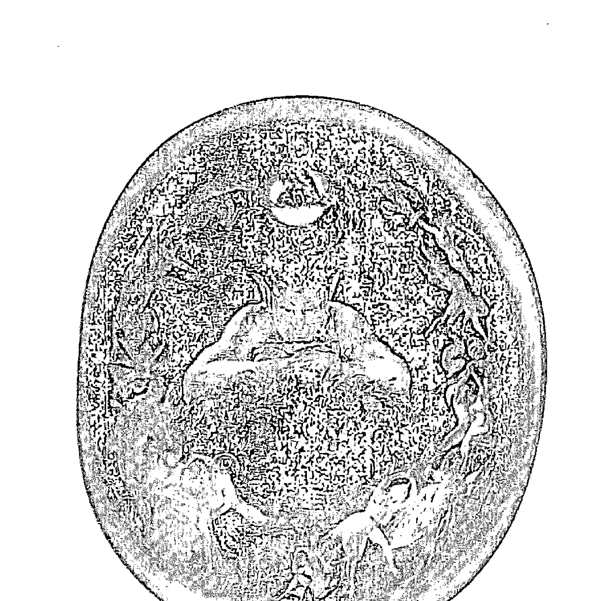

## 法翁与精灵

画面描绘了月圆之夜，半人半羊的农神潘伏在小妖精的洞口，恶作剧般地吹响了排箫，誓要把赌气似的蜷缩于洞内的小妖精引出来。

## 第六章

### 因果轮回二塔罗之旅

小红帽(寻找普遍真理的天真无邪的愚者)在塔罗牌之旅中沿着每一个神话故事和原型图形前进。小红帽经过了生死和看不见的存在王国之后最终使自己转变成为“睿智和充实的化身”——大地之子，准备在大地上再次变回肉身，再次以小红帽的形式开始新一轮生活，进入更高一轮的轮回。


## 1、神秘联结

我们把神话故事与大阿卡那牌里面的王牌联系在一起，是因为它们之间有深刻的渊源关系。最好的答案莫过于说，塔罗和神话故事里的神秘主义都是远古智慧的教化的延伸。说得更深刻一些，它们都在同一棵远古智慧之树上，这些远古智慧曾经极大的繁荣了人类文明，之后被一场全球灾难性的洪水所扼杀，迷失在现代文明的各个角落。

只要简略地研究一下塔罗牌里面的22张大阿卡那牌，就可以看到神话故事与王牌之间的神秘联系，这种种联系让人十分惊奇。例如，“阿拉丁和神灯”与魔法师、“白雪公主和七个小矮人”与隐士、“拉潘泽尔”与高塔以及“灰姑娘”与月亮产生联系的那种深层的联结，都是十分准确的，人们根本不可能不注意到。

我们不妨说，当这些神话故事最初创造出来的时候，可能作为口头流传经过无数代人传递下来，最后才形成文字，并成为印刷出来的故事——它们都受困于塔罗牌里的大阿卡那牌原型，这些原型存在于人性的集体潜意识之中。这就使我们注意到现代的卡尔·荣格※、约瑟夫·康贝尔和其他作家及心理学家的著作里提到的集体意识。

神话学，或者称为人类思维创造神话的能力，其本身就是集体潜意识的一个领域。因此，它在范围上是全球性的，跟所有国家、地区和古今往来的文明都有千丝万缕的联系。神话故事的神秘主义和塔罗作为一个远古智慧系统，都存在于神话学和人性潜意识网络的某个地方。就像是一块镜子的各个碎片散落到各个角落，但合起来仍是一面完整的镜子。

而人类共通的心理机能，就是所谓的“原型”。除此之外，荣格也是心理学界中，第一个正视灵魂学、神秘学和各种心灵现象的大师。他由易经推衍出了“共时性原理”

> ※注：心理学界的天才卡尔·荣格可以说是弗洛伊德的学生当中最杰出的一位，他承袭了弗洛伊德的潜意识理论，并加以扩充，划分为“个人潜意识”和“集体潜意识”。荣格所独创的集体潜意识所描述的是“人类有着共通的心理机能，这能透过遗传的方式，承接太古时期的潜意识。”这太古时期的潜意识，荣格称之为“集体潜意识”。比如说大家都认定以花象征美女，却从未听过以粪象征美女的。这些象征性符号与法则被人所感知时，人的集体潜意识便与它产生共鸣，发挥神秘的预测能力。

(Synchronicity)。共时性原理的提出，解释了许许多多西方思想中的因果论所不能解释的现象，并提供了卜卦、塔罗、占星等神秘学一个合理的解释。引用荣格的理论，我们可以把塔罗牌视为连结人类“集体潜意识”和显现“原型”的工具，它可以帮助我们把潜意识当中的意象和答案图像化，再透过塔罗占卜师的解释，把其中的智慧传达给问卜者。

## 2、神授智慧

阅读本书的读者可以有能力发现自己与神话故事之间的深层联系，也可以发现神话故事与塔罗牌之间的联系。
通过梦幻、悟性、深思、确认和醒悟的幻像，你们可以把细小的线头编织在一起，构成世世代代以来一直在不断改进的卓越豪华的塔罗之衣。
其实，从远古智慧的深远渊源来看，塔罗牌里面的大阿卡那牌可以看作是一个完整的神话故事！那些包含有宇宙大智慧的神秘纸牌，没有人知道其真正的起源。正如神话故事是口头流传说唱文学的一部分，经过无数代人的传承，最后才变成今天的印刷文字一样，大阿卡那是图示知识的口头流传，是接近神授智慧一种语言或工具。
关于纸牌的起源有很多动人的传奇，说是源自古代埃及、流浪的吉普赛人，还有说在中东地区游历的欧洲人杰克带回了许多非同寻常的教化。然而，塔罗牌的真正来源至今仍然众说纷纭，没有一致的看法。
根据涉及王牌起源的很多虚构故事，人们可以整理出下面这个神话故事：
很久以前，有一个叫做亚特兰蒂斯的伟大文明古国，这片国土存在于大西洋的若干岛屿。在数千年时间里，这个王国的人民创造了难以置信的艺术、科学和文化中心。
亚特兰蒂斯人比我们现代人更接近神妙和不可思议的世界，就跟我们现在拥有电视和收音机一样，那个王国的很多大臣都有千里眼和顺风耳功能。
通灵能力与窥知别人思想与感情的事情司空见惯。跟我们现代人比较起来，那些人更多以图画、雕塑和故事的形式思考问题。
在亚特兰蒂斯，最伟大的发现之一是作为与神授智慧保持联系的塔罗牌里的大阿卡那，还有与这些纸牌相联系的原始神话故事。人们并不会找解读牌面的人算命，在他们理智清醒的生活中，就是按照塔罗牌来生活的，人际关系、家庭关系、探险和职业选择都是如此。

然而，虽然亚特兰蒂斯处处都有古代科技、建筑和艺术的光辉奇迹，但他们的文明却有阴暗的一面——一种限制光明的力量，并且转化成为蕴含无限力量的一只水晶。虽然这只水晶原本用来作为一种为亚特兰蒂斯文明提供光明、生计和光辉的保护伞，但一些坏人合谋利用这只水晶去从事侵犯他国的事情。

正如我们现在世界抓牢核能这样的强力，古代亚特兰蒂斯人也开始担心，怕那只水晶会成为引起自我毁灭的东西。亚特兰蒂斯有直觉能力的祭司感觉一场灾难即将来临，就把全套神秘的象征主义、教化和他们国土上诞生的智慧放进塔罗的22张王牌里。他们知道自己无法保卫自己的家园和财物，甚至无法保护自己的亲人，但他们可以保存对于无数世代的智慧的理解能力，这样的智慧哪怕亚特兰蒂斯文明消失以后仍然有可能保存下来。看啊，那只水晶被人以毁灭的方式利用了，亚特兰蒂斯因为火山爆发和海啸而地动山摇。但是，保存在塔罗里面的秘密教化却在关键时刻逃脱，流传到了埃及，他们利用塔罗的智慧在埃及创造了一种新的强大的文明，最后由神秘的斯芬克斯和大金字塔象征出来。即使是希伯来的字母表（一共有22个根据图形造就的字母）也是从原来的22张大阿卡那牌草创出来的。而我们今天使用的英语字母表，就是希伯莱字母里面的魔力与智慧的直接衍生物。

## 3、转化的循环

传统的大阿卡那有一个起点（小红帽——愚者）和终结（大地之子——世界），但这个起点与终结实际上应该理解为转化的循环，而不是一条直线！

同样，塔罗牌也有一个原型故事的萌芽（小红帽——愚者）和一个令人满意的结局（大地之子——世界）。小红帽（寻找普遍真理的天真无邪的愚者）在塔罗牌之旅中沿着每一个神话故事和原型图形前进。小红帽经过了生死和看不见的存在王国之后，最终使自己转变成为“睿智和充实的化身”——大地之子，准备在大地再次变回肉身，再次以小红帽的形式开始新一轮生活，进入更高一轮的轮回。

在塔罗牌的所有王牌中，都有一种神秘的力量在起作用。每一个神话故事都包含着一个完整的故事，有开始、有情节、有结尾。故事的开始和萌芽引导主要人物探索人生，寻找归途。诱惑阶段赋予个人智慧和力量，经历黑暗的阻挡和痛苦折磨，直面内心的悲伤和痛苦，这样，灵魂才能历经磨难，修成正果。

神话故事讲得其实就是我们自己，我们把自己的观点、看法和理念通过虚构的神话表现出来，间接表达自己的爱憎情感。儿童的眼睛是明亮的，心灵是清澈透明的，性格是天真无邪的，他们能清清楚楚地看到灵魂在更广的社会和更大的世界环境里的情形。邪恶的女巫、善良的公主、英俊的王子是世界各国孩子们喜爱的人物，没有文化与种族的界限，这也是神话的真正魅力所在。

跟单个的神话故事一样，大阿卡那也有一个开始、中间部分和结尾。

塔罗的优点在于游历者或寻找者可以选择在生命发展的任何一个阶段研究一种原型，并从那个特别的地方开始向前发展。

小红帽（愚者）是主要的起跳点，因为它处在王牌的开始和结束处。

在传统的牌系中，我们看见愚者站在悬崖边上，随时准备跳入不可知的未来。我们不妨把这张牌看作是一种孤立状态，因为那个人独自一人，与过去没有联系，也得不到过去的任何保障。

神话故事经常从一个成为孤儿的儿童开始，这个孩子是王后生的，但王后却在故事开始就死去。这个孩子必须切断与将它带到人间来的金色脐带之间的联系，并找到通往自我的道路，即使会受苦，即使会有辛勤的劳动。因此，这个孤儿是愚者的清晰表达，因为这种孤儿的心里天生就有一种天赋和内在的灵巧，会找到通往自由和爱的道路。

愚者也称为小丑或骗子，他不傲慢，也没有引以为傲的才智，他行动起来坦率而活泼，之所以这样，原因在于愚者与过往的因果轮回没有联系，所以愚者能够重新开始，找到一种新生活、一个新的开始，一个通往精神财富的新方法。

大阿卡那牌是一张令人鼓舞的路线图，通往更高的意识水平，是通往启示的黄金大道。所有王牌和它们的神话故事对应物都是无上珍宝，使我们神性的各个层面都真实无遗地反映出来。

## 第五章

### 魔镜般的王牌、头像牌和数字牌

在塔罗牌里，不同类型的纸牌——王牌、头像牌和数字牌，都以不同的方式发挥镜子的作用，通过塔罗牌中不同人物的命运和遭遇，折射出现实生活中人们的真实情况。

人性最大的神秘之处在于，你永远也无法看到自己真实的样子。想想看，你只能用自己的眼光来看外面的世界，看到自己真实的样子是不可能的。然而，借助于一个叫镜子的魔术装置，我们可以熟悉自己的脸颊、身体的外形以及各种表情。

《白雪公主》里那位讲求虚荣和嫉妒别人的继母，总在借助那面魔镜寻找完美；希腊神话里面的悲剧人物纳西塞斯也是在一口池塘里崇拜地看着自己的影子，陷入自恋不能自拔……

跟这些人一样，我们很多人也会被我们自己的映像所诱惑，也会爱上自己的映像（或者因为这样的映像而烦恼）。我们的周围有许多镜子，从宇宙的镜子到个人的镜子不等。

在塔罗牌里，不同类型的纸牌——王牌、头像牌和数字牌，都以不同的方式发挥镜子的作用，通过塔罗牌中不同人物的命运和遭遇，折射出现实生活中人们的真实情况。

## 1、折射灵魂的双面魔镜：王牌

### 三位一体

在精神、灵魂和肉体的三位一体中，我们不妨把灵魂看做双面魔镜。

有新生能力的灵魂是我们神性精神的反映，它生活在无限宇宙的最高领域。无所不知的精神象征性地派遣灵魂去完成一项新的世俗任务，因此，灵魂就在物质世界里转化成肉身，当然，它会选择智慧的，情感的、有灵气也有形体的物质在即将到来的人世中装扮自己。这种物质，就是灵魂积累起来的知识、智慧、情感和理解力的反映或镜像。

跟精神、灵魂和肉体一样，太阳、月亮和地球也是三位一体。

月亮经常出现在神话故事里，也出现在塔罗牌的许多王牌上，它是太阳的镜子。

当它改变与地球的星相学关系时，会出现盈亏圆缺现象。月亮同时也是太阳之光的反射，是我们一生的营养之母，也是我们在这个世界上不断变化着的生长图景。月亮也是潮汐和海洋的统治者，它们本身（在静止的时候）也是天空、云彩和天上的鸟类的巨大反射器，是更高人生的象征。在星相学上，月亮与银这种贵金属联系着，这种金属就是用来制造镜子的！

### 生命之树

在神秘的犹太人学问中，卡巴拉（犹太神秘哲学家）掌握着古犹太教中智慧的秘密箴言。卡巴拉有一棵神秘的生命之树，它由 4 颗塞弗树构成，每颗树上又有 10 个球体，分成三列，由 22 条通道连通起来。这颗生命之树虽然看起来十分复杂，但在它里面包含有一面人类的镜子，也是一个有魔力的反射装置，是一系列复杂的系统，跟王牌一样，可以进入神授智慧的隐秘学问。

卡巴拉起源于犹太教，是一种思想的系统，一种“归档系统”。在卡巴拉系统中最主要的生命之树是人的能量与思想的地图，心理学、神话学、神智学、梦境分析学、占星学、数字学、诗歌、几何学等学科都协调地兼容在这棵生命之树中。它是一个让我们看见平常看不到的东西、写出难以形容的奥义的方法，让我们的生命带来均衡与融洽的方法。据说生命之树的10个球体和当初摩西上到西奈山上领受十戒是一样的，这10颗球的每一颗通常最少与22条路径中的3条有联系，而每一条路径都可以代表:

- A)希伯来字母
- B)塔罗牌的大阿卡那
- C)黄道带的星座
- D)身体部位
- E)其它有助于记忆的符号，比如魔术、金属、宝石、香气、魔术道具、动物、埃及文、北欧文、希腊神等。

当路径相对的是动态的精神力量时，球体便代表静态的精神力量。我们可以简单的说，球体是一种“名词”，而路径则是一种“动词”。

伊莱·李维是一位伟大的塔罗学者，他在著作《超验魔法》一书中写道：“一个被囚禁的人，除去塔罗之外没有别的任何书，假如他知道如何使用塔罗牌的话，可以在几年之内获取广博的知识，能够获取极其渊博的教化，滔滔不绝地谈论任何话题。”

这是因为王牌就跟一面面镜子一样，是以图片和神话故事的形式与我们交谈的。跟梦幻一样，它们都带有象征意义。许多研究神秘学和占卜学的学者都相信，梦幻不仅仅“在头脑里”发生，而且还在称为“星相领域”的地方发生。星相世界就像宇宙浩瀚的海洋，我们都会沐浴其中，这个星相之海有时候会反映我们狂乱的情感，有时也是精神生活的镜面反射。因此，在梦中，我们会接受充满智慧的神秘消息。

为了更好地理解作为一面镜子的王牌，让我们回到生命之树的意象上来。生命之树掌握着相对于人性进化的极其重要的情节，因为它起着根基知识的作用。神话故事则掌握着无数的人物和醒悟的各个层面，其模式千变万化不离其宗。从某种意义上说，神话故事也是一种根基知识。

在许多神话故事里，一颗树扮演着重要的角色，它象征着意识的不同层面。榛树是一种神秘之树，它只有极短的休眠期，树叶飘落一个月后，便会重新开花结果。在《灰姑娘》的故事中，以她的眼泪浇灌起来的榛树长大了，容纳了来自世界各地的鸟儿，那些鸟儿成了她的神奇帮助者。榛树代表根基知识，也代表她去世的母亲回到她身边这么一个象征性的意义。

王牌如同一颗枝叶繁茂的大树屹立于头像牌之中。它们昂然挺立，历经时间的考验，就如同神话故事一样。文字和意义也许会有所改变，取决于由谁来讲故事。但是，故事永恒的含义不会改变。神话故事和大阿卡那都起到镜子的作用，供人们重新获取灵魂的智慧。塔罗的秘传说教必须基于口头说唱文学的流传，才能历经数个世纪而不消亡。神话故事也是一样。它们诉诸的生活领域是精神和物质交汇的地方，起到桥梁的作用，使内在的心灵和外在的世界联结起来。

## 灵魂的信使

隐藏在大阿卡那牌意义里面的，是一个逐步成熟的过程。这个过程有些人成功过度，许多人没有。人的潜力是有的，只是没有及时有效的挖掘出来。有些灵魂面对需要更高理解的艰难任务会陷在底层的世界里不能动弹。这些底层世界大部分都是阴暗面，包括恐惧、贪婪、肉欲和其他许多灵魂之力的疾病。

大阿卡那起一种原型导向的作用，这22张王牌的力量奇大，同时又分外温和。在塔罗牌的一共78张牌中，它们可以看作是灵魂的信使。如果许多王牌出现在一个牌阵中，那就表明，他的灵魂正在清晰和诚实 地说话。

大阿卡那牌的丰富和美妙处在于，它可以在两个极其不同的方面服务于人。

在一个层面上，这22张牌代表我们的一面镜子，反映精神的自我神性和其经常隐藏起来的各个层面。这些牌都是原型，深藏于潜意识之内，这样的潜意识可能会突然启动，使我们醒悟，有时会在一闪念之间，或者以不曾预料到的警觉性使我们醒悟。

神话故事也以同样的方式发挥作用，突然之间发生的事情会诱惑我们：一切再也不会是原来的样子了，平静的生活被打乱，更大的诱惑或灾难展现在我们面前，要我们立刻做出选择。这往往是神话故事的高潮或转折点，促使主人公向更高层次的转化。

## 2、折射人品的魔镜：头像牌

塔罗的16张头像牌排在各组牌之上，就跟王牌位于56张小将牌之上一样。

这些牌最开始在14世纪末期和15世纪，称为国王、王后、骑士和侍卫，当时，塔罗牌首次出现于欧洲社交圈子，与皇族的一些概念和外部标志有一定的关系。

通过塔罗牌回顾600或700年以前的历史还是很有教育意义的，可以看到朝廷中的人物和他们统治的四组人物如何反映出当时的社会体制。

### 头像牌

头像牌又叫宫廷牌（Court Cards），用以辅助大阿卡那那深入细节的部份，并可与历法配合。一般来说在某些方面是跟我们生活上的重要人物有关。他们告诉我们什么是必须学习的，要去精通的，哪些特殊的智慧是我们需要具有的。

> 曼利·帕尔默·霍尔汲取历史资源，在他的《所有时代的秘密教化》一书中，他提醒我们注意到，就各个国家而言，“国王是他们的政府，王后是他们的宗教，骑士是他们的历史和国家特征，侍卫就是他们的艺术与科学。”

因此，在宫廷人物中，有一种理解水平会超越个人的意义和解释。它们都可以称为世俗世界和世俗活动的严密结构。

### 四组牌 = 四大社会阶层

许多研究塔罗史的人都发现,四组牌原来反映出法国在当时已经存在四大社会阶层。圣杯代表牧师阶层，也许它们与圣杯传奇有某种联系。宝剑代表士兵、军队和军中人物，原因显而易见。星币象征刚刚出现的商人和贸易者阶层。开花的魔杖则与农夫有联系。

在数百年间不断演变的塔罗牌中,四组牌型发生了很大变化,因此可以反映出社会的发展与演进。在小阿卡那和塔罗牌的结构之内,这一点更是相当明显。

### 品质图景

头像牌的影响相当大,帮助我们理解自身,还帮助生活在我们周围的人。它们显示我们生活中一些人原型的品质图景。在看牌活动中,如果在人际关系中发现一张头像牌,那是相当强烈的意味,因为这张牌通常是即将会给一个人的私生活施加影响的主要人物的情景。在某些牌阵里,一个位置会让我们明白自己会有怎样的感觉,在这里发现一张头像牌是强有力的暗示,因为我们会清晰地看到一个情景,明白哪些性格力量在我们的意识深层发生着作用。头像牌有一种独一无二的品质,可以从这么一个事实里看出来,即,它们都是没有编上号码的牌。它们更像是人性当中的生活价值,也是我们遭遇的不同成长阶段。如果大阿卡那牌像是灵魂的大图景,那么,头像牌就是小图景了——它是个人的观点、是灵魂发现的更大舞台上的身份的醒悟。

头像牌是个人看牌活动中的关键因素,原因有多种。如果人们选择这种形式的占卜方式,那它们就是标识牌。人们会选择这么一张头像牌,它看上去最像一个人,或者代表某个人的品质。

- 圣杯会用来标识占有伟大的爱、同时也很慷慨、心肠好、凭感情行事的一个人,也用于某个正在经历人生情感康复阶段的某个人。
- 宝剑将用于某位有精神创造力的人,他极聪明、有理性、头脑清晰,他的任务## 3、折射我们日常生活的魔镜：数字牌

小阿卡那里面的40张牌更多象征着我们的日常生活，而较少涉及在人类生活中不太经常发生的、会改变人一生的领悟过程，但是，并不能说这些牌就不重要。

决定我们基本命运的，正是我们每天都要做出的刹那间的决定和我们与其他人每天进行的无数遭遇。

每一张小阿卡那牌都带有一种数字共鸣，而数就是宇宙的基础！经常有人说，创造了一切生命的神圣智能，是通过几何、声音和数字来创造世界的。语言本身，还有一种语言的每一个字母，都带有一种数字式的共鸣。人类社会在和谐的相互交流中，隐藏着一至九的数字能量。

小阿卡那牌共56张，和那些比较小的，更直接的生活的细节有关。它们被分为四组，每组10张数字牌，共40张，称为数字牌，它们分别是：

### 1. 权杖组：

代表火象星座的特质。行动胜于思考，受火元素所支配。个性暴躁，易怒。黄道12宫是白羊座、狮子座、射手座。这些牌表示能量，特别是性能量（阳或者是雄性那一方），包括知觉、直觉、洞察的能力。

### 2. 宝剑组：

代表风象星座的特质。思考的元素，受气元素所支配。个性乐观，有朝气。黄道12宫是天秤座、水瓶座、双子座。他们反映了我们内在情绪上的真实。它们的领域包括了爱、感觉、关系的交流和性能量（阴或雌性那一方）。

### 3. 圣杯组：

代表水象星座的特质。情感的表达，受水元素所支配。个性冷静，内敛。黄道12宫是巨蟹座、天蝎座、双鱼座。反映我们精神上或心灵上的状态，过程或态度，包括可能的、沉思的过程。这一层是最容易被扰动的。

### 4. 星币组：

代表土象星座的特质。物质的追求，受土元素所支配。个性忧郁。黄道12宫是魔羯座、金牛座、处女座。这些牌指出我们外在、物理上的真实。这些外在反映内在。包括健康、身体、营养、衣着、财产、财务、贫穷和富裕。

在每一组类的牌中，分别具有一副头像牌，即“宫廷牌”，其中包含：

- 侍卫
- 骑士
- 王后
- 国王

要理解塔罗更深的重要性，其中一方面就是要意识到数字共鸣的意义。当你选择一张数字牌，一定首先要弄明白这组牌的能量品质。这是一组水主宰的牌（圣杯）、气主宰的牌（宝剑）、火主宰的牌（权杖）、还是土主宰的牌（星币）的一部分？这些元素能量告诉我们关于一个人内心包含的不同气质和意识状态的情况。明白了这一点之后，你就可以了解这些牌了。在这些牌组中，数字牌告诉我们多方面的内容：化解人生冲突的方法、如何更好地组织我们的生活，或从一个阶段向另一个阶段的运动。

个人都从一个起点开始，经过九轮磨难和探索追寻，他才能达到完美的境界，回到原来的起点，其实是经过人生因果轮回的洗礼，回到心灵上和精神上的一个全新的自我。

除去令人赏心悦目的图片与故事之外，每一次看牌活动都有联接不同牌的数字能量方面的信息可以告诉玩牌者。每一张数字牌A牌（1）都象征着一个开始、一次新生和一件新的礼物，而且，它还会与阿拉丁及神灯（1）、《爱丽丝漫游奇境记》（10）和黄砖路（19）联系起来。把这些要点合并起来，会让人觉得十分有趣。比如，有了上面的3张大阿卡那牌以后，要点就是：创造之子（1）、生命之轮（10）和宇宙自我（19）。

### 我们的生命数字：

下面的列表提供一种数字意义的背诵方法，尤其非常适合用在小阿卡那中，来替代一般书中40张的意思，同时在解释大阿卡那时也可以加以利用，甚至是我们看到的“生命数字”！在解释时，我们是将数字与四大元素结合起来解释。例如我们知道三代表扩大、或是合作，而圣杯代表关系或是人际关系，所以我们可以知道“圣杯三”代表了“庆祝”或是“人际关系的扩展”等意思。其他依此类推。

- (1) 统一、神性、完整、来源、整合、单一、孤立、点
- (2) 分割、分离、二重性、婚姻、伙伴关系、极性、接受性、线
- (3) 创造力、正义、美德、扩张、视力、智慧与理解力、面、合作
- (4) 基础、外形、力量、世俗力量、通过冲突到达的和谐、固体
- (5) 光、健康、活力、精神力量、灵感、变化、精神成长
- (6) 平衡、完美、均势、崇高的爱、忠诚、冲突的化解
- (7) 神圣事物、神秘事物、想像力、合成、心灵、梦幻与远见
- (8) 情感力量、抵抗力、谨慎、法则、重建、决心、意愿
- (9) 结论、冒险、努力、希望、勇敢、自私、胚芽增长
- (10) 完美、造诣、完成、成就、权威、领导能力

### # 数字与塔罗牌相结合的意义

### ## 1 魔术师

新的机会展现、学习新的技艺

| 牌名 | 意义 |
| :--- | :--- |
| 圣杯 | 开始、幸福、新感情、满足 |
| 星币 | 掌握财富、新的合作关系、新计划、高收入 |
| 宝剑 | 行动、清晰的思考、清楚的目标、带来成功 |
| 权杖 | 开始、做、行动、旅行、实践 |

### ## 2 女祭司

| 牌名 | 意义 |
| :--- | :--- |
| 正义 | 平衡、和谐、正义 |
| 审判 | 整合自我、知道自己每天都“活着”、内部的和平、因果平衡 |
| 圣杯 | 友谊、维持不切实际的关系 |
| 星币 | 企业、投机事业 |
| 宝剑 | 两个相反的力量、僵局、势均力敌 |
| 权杖 | 两人合作向前走 |

### ## 3 皇后

生长、富足、繁荣、丰硕、怀孕、分娩

| 牌名 | 意义 |
| :--- | :--- |
| 倒吊人 | 透过牺牲得到智能 |
| 世界 | 综合、有融合四元素的能力、圆满、完成、结束、协调地向前迈进最后获得胜利 |
| 圣杯 | 爱情的圆满、融洽、好运、庆祝、怀孕 |
| 星币 | 在自己的领域中有一片天、巧手、做好一件工艺品 |
| 宝剑 | 分离、心碎、人际关系出现问题、痛苦、不和睦、三角关系 |
| 权杖 | 履行计划、从伙伴身上得到力量 |

### ## 4 皇帝

稳定、男性的力量、强壮的伙伴或丈夫、达成、实际

### 5 教皇

精神控制、传统、内省、有智能的建议

| 牌名 | 意义 |
| :--- | :--- |
| 节制 | 适度、和平、耐性、毅力、和睦、乐观 |
| 圣杯 | 懊悔、对未来悲观、遗失与悲哀、人际关系的终止、很难抽身 |
| 星币 | 不安全、失业、遗漏东西、被冷落、孤独 |
| 宝剑 | 不稳固、背叛、争执、告密、战斗、斗争、操纵、欺骗 |
| 权杖 | 竞争、战争与冲突、需要耐性与勇气的挑战、可以胜利 |

### 6 恋人

选择、吸引力、二元性、热情

| 牌名 | 意义 |
| :--- | :--- |
| 恶魔 | 诱惑、软弱、内疚、被过去束缚、性 |
| 圣杯 | 愉快的过去、孩子气、礼物 |
| 星币 | 经济援助、贷款、金主、来自宇宙的力量、宽大、兴旺 |
| 宝剑 | 帮助、转折点、斗争和冲突消失、解决问题 |
| 权杖 | 胜利、好消息、完成、恢复精力 |

### 7 战车

行动、自信、自制力、积极、决心、获得胜利、相对的力量

| 牌名 | 意义 |
| :--- | :--- |
| 塔 | 改变的催化剂、突然的改变、旧的体系崩毁、意外 |
| 圣杯 | 想像力、许多的选择、幻想、神秘的体验 |
| 星币 | 职业上的新观念、劳动生产、对未来的计划有新灵感、有好消息 |
| 宝剑 | 怀疑、不信任、必须向前看，把过去放在背后 |
| 权杖 | 优势、利用勇气得到胜利 |

### 8 力量

自我信赖、有妥善处理事情的能力、温和、痊愈、内部的力量、毅力、耐力

| 牌名 | 意义 |
| :--- | :--- |
| 星星 | 察觉到他人的意图、希望、梦想、相信未来、计划未来、黑暗中的光芒、对未来的承诺 |
| 圣杯 | 感情上的退缩、往前走 |
| 星币 | 训练、学习新的技术、创作 |
| 宝剑 | 限制、约束、妨碍、害怕 |
| 权杖 | 迅速、好消息 |

### 9 隐者

引导、内在的体悟或是外来的导师

| 牌名 | 意义 |
| :--- | :--- |
| 月亮 | 隐藏的力量、精神力、梦、秘密的活动、沉默的讯息、警告、欺骗、浪漫主义、未知的智能 |
| 圣杯 | 实现希望、幸福、满足、高兴 |
| 星币 | 舒服的家、美好的环境、美好的心灵 |
| 宝剑 | 焦虑、担心结果、沮丧、失眠 |
| 权杖 | 观察与等待、为下一次做准备、储备力量 |

### 10 命运之轮

巧合、祝好运、宿命的改变、命运、终结麻烦

| 牌名 | 意义 |
| :--- | :--- |
| 太阳 | 高兴、有名誉、抵达终点、成功、创造新的自我、老顽童 |
| 圣杯 | 爱、真爱、幸福、喜悦、兴旺、良好的家庭环境 |
| 星币 | 物质上的丰富 |
| 宝剑 | 失去洞察力、失败、灾难、状况失控、失去自我、疯狂、精神错乱 |
| 权杖 | 愉快、责任、压力 |

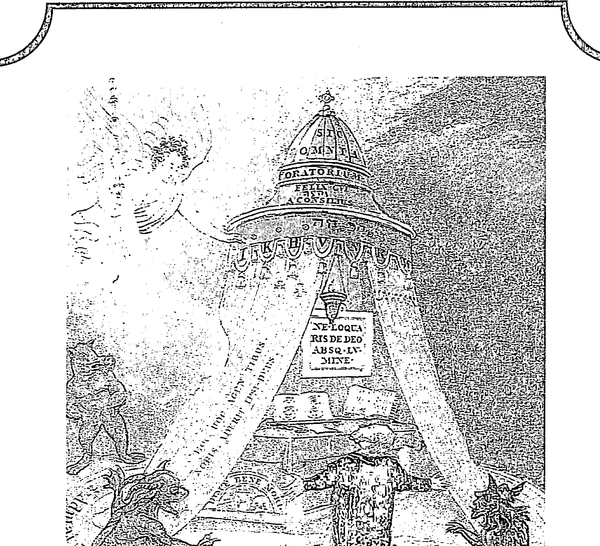

## 召灵

召唤神灵需要魔法师的自律知识，正如这幅19世纪早期有关魔法师召唤神灵的绘画中显露出来的那样。

## 第十章

### “神明”如何跟“灵魂”交流？

我试图通过隐喻对人们理解灵魂作出解释，但来源很难描述。

当我们第一次在世而看到的时候，我对待他（她）们加以思考，试图说明一个人灵魂的起源以及他必须面对的人生归宿的旅程。

### # 1、理解自己的化身

在精神治疗方面，塔罗会、学校、回忆“前世”会和其他组织在很多活动中利用神话故事塔罗牌。不同年龄和不同国籍的人们都对这套纸牌产生了浓厚的兴趣，并且还有很多方法来利用这些纸牌。

虽然我本人并没有亲眼看到别人在这种牌上所做的工作，但还是想办法收集了别人想到的一些点子，并在实践和工作中使用这些点子。有些治疗师把这些纸牌当做免费图片，让他们的客户随意排序，并在出现具体问题的时候，选择那些最能代表他们遇到的问题的形象。还可以利用神话故事塔罗牌组，在住院治疗、妊娠产子期间，以及在各种聚会里玩这种纸牌推测，效果极好。

我想给大家介绍一下我自己的一次体验，在这之前，让我告诉大家一个秘密：

过40岁生日的那天，我在家里搞了一次朋友聚会。我为自己的人生之旅设了一个坛场，有蜡烛环照着，在周围的地板上放了一叠塔罗牌。

我和马克以及两个女儿的脸都涂成了塔罗牌里的牌面，描述我的那个牌面是盖亚，她是水晶守护者。我的朋友们在旁边唱祷念经，我就围着那些漂亮可爱的蜡烛和纸牌转圈，准备为我的第40年和踏上50岁的那个十年选一张“真正的”生日牌，此时，纸牌牌面都朝下。

感觉时机差不多了，我弯下腰去随便选了一张牌，你看，我选到了我自己——水晶守护者！那是个好玩也感人的时刻，而且也进一步强化了我们所有人的塔罗同步性。

纸牌是有力量的，它们会为你、你的家人和你的客户提供周到细心的服务，如果你带着敬意和诚意去参与。

我发现这些纸牌对于人们理解自己“化身”的来源很有帮助。在为回忆“前世”而看牌的时候，我对星币牌阵加以改造，用来指明一个人灵魂的起源以及它必须面对的寻找归宿的征程。

用五张牌摆成一排，每张牌代表着儿童（child）这个词的一个字母。要知道，在回顾“前世”的过程中，最重要的地方在于灵魂的降生与个人因果轮回的关系上。

### 五张牌的象征意义:

- 第一张牌代表字母C，指明过往生活的情景或印记，那是一个人必须想办法承受的；
- 第二张牌代表字母H，显示有心人在处理“化身”问题上最大的潜力；
- 第三张牌代表字母I，表示的是完整的“化身”而不是真实身份，这跟星币的牌阵有所不同。通过对这张牌的观察，人们能够更清晰地看到：个人灵魂旅行是普遍存在的。这张牌很关键，因为它反映出一个人所有潜力结合起来之后的形象；
- 第四张牌代表字母L，表示从过往生活中汲取的教化，或者某一次事件带来的教化，这次教化也就是随“今生”时间而来的；
- 最后是第五张牌，它代表字母D，指定了一个人的总的命运，也提示改善轮回状况的最佳办法。

有时候，出现的牌相看上去不怎么难理解。

但是，请记住，一定要仔细研究，极有可能出现的一种情况是，牌里面另外蕴藏的一种教化必须得领会，或者暗含了一种必须迎接的挑战，情况不是有些占卜者认为的那么简单：一张倒置的牌一定就表示一个人的生活中会出现某种逆转或障碍。

努力挖掘牌阵中最深刻最广泛意义的时候，要将注意力集中到“牌相”如何跟“灵魂”交流这个方面。例如，如果圣杯中的二出现在C的位置（假定今生有一件涉及人际关系的事情必须予以解决是合理的）。那么，如何以最认真地方式解决这个问题呢？预测牌会透露这一点，并提出一种切实可行的解决方案。应该用自己的灵魂去倾听，努力地充分利用通过这种方式提供的智慧。

## 2、用塔罗牌看康复

在用塔罗进行康复对话时，人们通常会对感官刺激十分敏感，比如声音、音调、色彩和香味。这也许就是塔罗牌为什么作为一种辅助手段在回顾活动中被证明是十分成功的原因了。

色彩刺激感官，图像看上去如同在梦中。它们使人进入另一个世界的领域。

一些人在牌中看到很多与自己的生活经历和康复过程有关系的东西，这真是让人百思不得其解。

### 例一：

- **谈话者：** 一位年轻妇女
- **曾经经历：** 曾受过父亲的性虐待
- **选择：** 她选择了圣杯里面的八。
- **分析：** 这张牌描述两个异性人物之间极其和谐的事件。在塔罗牌里，这个图像表示人体内的能量结合。它是一种转化的前兆——一个新的灵魂模式开始出现。当那位年轻妇女看着那张牌的时候，她在里面看到自己以前从来都没有看到过的东西。她注意到这么一个事实，即美人鱼和男性人鱼的两条尾巴合在了一起，形成了一只漂亮的绿色蝴蝶。对于这位聪明的妇女来说，这个符号表明她已经从她父亲过往的行为造成的束缚中解脱出来。我们都很高兴看到那只蝴蝶所代表的解放原型，它带来了康复的结果，激动的眼泪从她脸上流下来。通过这个过程，那位少妇达到一个深层的、善于原谅他人的境界。

### 例二：

- **谈话者：** 一位年轻妇女
- **曾经经历：** 不仅仅遭受过性虐待，而且还遭到毒打。她在家里经常目睹暴力行为，并因为那样的经历而深受创伤。
- **选择：** 她抽出来的牌是守护天使。
- **分析：** 这本身就是极好的讯息，她在牌里面发现了某种独特的内容，使她的心灵受到触动。她注意到守护天使手上拿着一朵白色的玫瑰，因此她哭了。她解释说，她在家里惟一感到安全的时候，是她父亲头天晚上跟母亲争吵一番后，第二天往往就带给她一束白色的玫瑰。这样一来，白色玫瑰在她看来就象征着希望。塔罗牌里面的守护天使给我的客户带来了一束白色的玫瑰，让她想起治疗过程中还是有希望的，而且暗示那就是她一生的转折点。

## 3、用塔罗牌看孩子的内心

小孩子们对自己的来历都持有开放的想像和回顾愿望，借助塔罗牌，他们就可以深入了解自己创造力的核心所在。

具体做法是：

把一叠纸牌摆成漂亮的彩虹形状，请小孩子走到彩虹那里去抽一张特别的图片。之后问他看到什么，对图片里面的那个人感觉如何。再让孩子把自己的脸埋在图片上，问他感觉如何，问里面正在发生什么样的事情。

这么做经常会触发他们的想像力，使他们想到生活中一些非常有启发意义的故事。你并不需要与他们谈到细节，只是把小孩子的观察结果写下来，然后保留着，等他们稍大一些后让他们自己看他们的心灵故事。或者，如果这个孩子是一位客户，可以把这些宝贵的故事交给他们的父母，这样，父母就能够理解孩子的内心情况了。当然，这么做的时候，不能够破坏保密的约定。

## 4、用塔罗牌解梦

梦不是愿望的满足，而是一种启示，是对未来的预测或预示，是我们应重视的潜藏的智慧。梦幻是塔罗的内在反映。因此，梦中的形象是非常重要的，它们有助于我们理解潜意识向有意识发展的过程。

每天晚上，我们都会把自己忙碌的生活带到床上，而每天的经历又会在我们的梦中反映出来。如果你选择记住自己的梦幻并加以解释，那你不妨考虑把这件事情当做头等大事，即每天晚上请求你的梦幻成为你最高利益的信使，并让它起到教诲的作用，在你醒悟的路上给你以指导。

荣格相信潜意识通过梦带给我们的智慧比实际意识的洞察力更优越。这和古罗马西彼拉占语集里（Sibylline Books）所说的“人在学习时得到启蒙，但在睡眠时得到灵感”不谋而合。在梦中指挥我们的行为和动机的原动力并不是一些固定的形式，而更像一些潜藏在我们心灵最深处的所谓集体潜意识的“原始人”的灵魂。

当我们遇到难题时，梦幻帮我们出谋划策，当我们面临危险时，它警示我们。由于梦幻有几百几千代的生活经验，它的智慧和直觉远远超过我们意识中的思想。我们如果能理解梦，就如同认识了许多“原始人”朋友，他们的智慧可以给我们极大的帮助。我们心中的“原始人”就是通过我们的梦来显示自己，表达自己的。

### 具体做法：

从塔罗牌中选择一个图像，是那种自己感觉会在晚间的旅行中对自己有所帮助的图像。把这张纸牌放在床边上，甚至放在枕头底下，这会成为一种可爱和有力的保护及帮助手段。对于孩子来说，如果这张图片是守护天使或漂亮的教母，效果尤佳。对于成人来说，许多纸牌都是合适和有用处的。

做过梦之后，我们看看塔罗牌，看看里面是否有什么线索可以帮助我们的，因为所做的梦幻也在努力对我们予以帮助。这个办法可以把梦幻带到下一步，看到书中后面分析的结果，往往准确的让人难以置信。

人类世世代代经历的事件和情感，最终会在心灵上留下痕迹，这痕迹可以通过遗传传递给我们的后人。例如，当一个人想到太阳，他就会想到伟大、善良、光彩照人，如同一个英俊的男子。想到月亮，就会想到温柔、美好，如同一个温婉可人的少女。这是因为一代代人对太阳和月亮的情感通过遗传传到了每一个人心里。想到智者时，很容易在心里浮现出一个白发长须的老者形象，而不太可能浮现出一个活泼的少女形象来，这就是因为在过去的世世代代，最聪明的人是那些饱经沧桑的老人。

荣格把这种遗传的原始痕迹称为原型。他说原型本身不是具体的形象，而只是一种倾向，但是原型却可以通过一种形象出现。在梦里，有时会出现一些奇异的情节和形象，这些东西用做梦者自身生活的经历解释不了，那么，这就是表现原形的形象。荣格认为，不是所有的梦都有同等的价值的，有些梦只涉及琐事，不大重要，而另一些梦，由于原型介入了梦，则震撼人心，变得神秘和神圣、奇异陌生、不可思议，仿佛来自另一个世界，这些梦才是更重要的。

### # 5、集体塔罗看牌活动：塔罗牌拉米玩法

塔罗游戏最多可由八个人玩。玩家越多，游戏的时间越长。许多纸牌游戏源自塔罗的实践活动，纸牌是娱乐和协调生活的来源，自古以来各个民族都是如此。从这个角度来看，我想介绍告诉我的一种新的塔罗牌游戏方法，这种游戏玩起来极有深度、有创新价值、有趣味，因此我希望读者能够跟家人和朋友一起玩。

把整叠塔罗牌依次传递给所有玩家，这样每个人都有机会洗一次牌。发牌人根据参与者的数量把尽量多的牌发给大家。这样，如果有四个玩家，每个玩家就会得到四张牌，五个玩家就得到五张牌，如此类推。大家轮流发，每个玩家都给其他玩家发一张牌。如果有四个玩家，三张牌就会发给另外三位玩家，自己留一张。每个玩家发牌的时候，都必须要解释为什么要把那张牌发给所选的人。发牌人先选定一个人发牌。那个选定的人就会去找下一个，这样，每个得到一张牌的人就会成为下一个发牌的人。这个游戏一直继续到所有人手中重新拥有四张牌，三张来自其他玩家的礼物牌，一张是一直自己留着的。

这个游戏会让每个人都产生洞识、得到礼物，而且还彼此确认。从某种形式上讲，它有点像集体塔罗看牌活动，人人都说出一点具体意见，人人都得到一些确切消息，整个游戏期间都是如此。这个游戏对于团体是极好的，亲朋好友玩起来也不错，可以彼此增进理解和信任。

## 下篇

## 希腊神话

## 启示录

### 大阿卡那最新物语

22张大阿卡那牌是78张塔罗牌的灵魂所在，它们代表人的不同原型、能力和性格特征。深藏于人性的意识之内，可以称为通往精神启发的进化之路。

这些牌从0到21排列，它们创造了“大阿卡那”，并起到铺路石和抛光仪式的作用，引导人们将对神秘的内心世界和精神的洞察力走向新的层面。

### 0. 愚者

《小红帽》

> “祖母最喜欢她了，总想着为这个孩子做点什么。有一天，她为孙女做了一个礼物，是一顶红色的绒毛帽，这个小姑娘极喜欢这顶帽子，每天都把它戴在头上，大家因此就称她为‘小红帽。’”

—— “小红帽”（《格林童话》，1891）

+   关键词

- 流浪
- 惊奇
- 震惊
- 变故
- 探索未知
- 自信的飞跃

### 这张牌提醒我

+   - 我的生活中，哪些东西是需要得到解放并彻底改变的？
- 未来的哪些东西对我的吸引力最大？
- 我如何才能使自己的生活更有激情，更为自由？

### 传统意义

在传统的塔罗中，小红帽是0王牌（愚者）。“愚者”事实上是神话中的天才，代表某种新增长出来还没有被别人承认的个性化的潜力。一般都是一个少女图片，一个天真无知的形象。——她站在锯齿状的悬崖边上，一只脚在悬崖的边缘上摆动；一只狗在狂吠，咬住她的脚后跟。她身上有醒悟的使命，而那条狗就代表两种可能，要么警告她，要么怂恿她——这取决于个人的意识状况。愚者代表着一个天真无知的形象。她宛如一个初生的孩童，具有无限的可能性。她是如此充满着希望，看不见前面的重重阻碍，正要展开未知的旅程，自信地迈开大步奔向前途无量的未来。

### 最新物语

小红帽的母亲告诉她，去祖母家的路上不要改变路线。故事里面的“母亲”代表这个孩子的起源，代表她的过去，以及小红帽必须要超越的东西，这样她才能顺着成熟的道路走下去。她穿着一身红，这种颜色使她辗转在变化与苏醒之火中。小红帽在路上碰到大灰狼，大灰狼诱使她偏离正轨。她被草原花草上跳跃的光芒迷住了眼睛，因此决定为祖母采一朵花。这个孩子被大自然诱惑了，此时，她的灵魂面对着一次考验。到了祖母家之后，她再次遇到伪装起来的大灰狼（自己的影子）。我们自己的影子经常伪装起来，连我们自己都认不出。所以她被饥饿的大灰狼吃掉了。一位猎人冒险进入林中，他听到祖母的别墅里传出很奇怪的呼噜声。他在窗外看出，那匹狼是一个年老的复仇女神，正好是他想消灭的（影子已经被认出来）。猎人切开了狼腹，或者说割开了新生的子宫——0，就是那个愚者的原生卵，从而解放了小红帽和她的祖母。灵魂的苏醒就此发生。其实愚者牌在塔罗中有精神上的自由的含义，他到各地流浪，受尽考验。象征着追寻真理者必须要有大无畏的精神，不怕任何危险，即使前面是个悬崖，也没有回转后悔的决心。禅修塔罗牌对愚者的解释是：“如果你现在信任你的直觉，信任你对事情觉得‘对’的感觉，那么你不可能走错，你的行为如果用理性的头脑来分析或许会让别人或甚至你自己觉得很愚蠢，但是傻瓜所占据的那个‘零’的位置是没有数目的数目，在那里以信任和天真作为引导，而不是以怀疑和过去经验作为引导。”

> 塔罗牌大师克劳力说：全然的傻是通往直觉的钥匙 (Pure folly is the key to initiation)。

奥修大师说：“要成为一个傻瓜，不要试图在你周围创造一个知识的围墙。”愚者的真正含意其实就是“大智若愚”。

### 自我肯定

+   - 我准备忘记过去，让自己的生活自由起来。
- 我把自己的影子扔到阳光下，敞开心胸面对未来。

### 相关链接

### 希腊神话中愚者的故事

愚者——Dionysos，酒神狄奥尼索斯。是宇宙之神宙斯和忒拜王卡德摩斯的女儿塞墨勒公主所生，宙斯的妻子赫拉用计，使怀了孕的塞墨勒公主在宙斯的雷电中烧死，宙斯从母腹中取出未足月的胎儿，缝入自己大腿，宇宙之神在这段时间里成了瘸腿，婴儿出生后，取名为狄奥尼索斯，“宙斯瘸腿”由此而来。宙斯将小孩先托给塞墨勒的妹妹哺乳，后来为了避免赫拉的陷害，又将狄奥尼索斯交给尼萨山上的山林女神抚养。

### 1. 魔法师

《阿拉丁及神灯》

埃及人把他们的42本科技书归功于墨丘利神或赫耳墨斯（海勒姆）神，这些书包括天文学、占星学、几何、医学、语法、逻辑、音乐、魔法等。墨丘利神(或赫耳墨斯神)是伟大的魔法师和转化者，他手执权杖，并一直流传至今，作为康复艺术的一个标志。但是，他只是比自身更高的一位神灵的信使，仅仅是传递者，而不是创造者，他是通道，而不是本源。

> ——保尔·福斯特·凯斯（《塔罗：解开各时代智慧谜团的钥匙》）

### 关键词

+   - 控制
- 技能
- 对自我的信心
- 男性身份
- 开辟通道
- 众神信使
- 科学天赋

### 这张牌提醒我

我所做事务中的哪方面资源有开掘潜力？
+   - 我职业生活中的哪些方面是应该加强的，而被我忽视了？
- 我在哪些方面的才能需要改善，破除相应阻力？
- 当意识之灯打开时，我看到自己思想的哪个方面被照亮了？

### 传统意义

在许多纸牌中，魔法师都是一位站在桌子边的人，桌子上放着4种基本物质元素，用圣杯、宝剑、星币和权杖代表水、气、土与火。（本书将圣杯称为圣心，星币称为水晶，权杖称为魔杖。）桌子前面有一个花园，某种蔓生植物经常出现在纸牌的顶端。这是一个与生长有联系的人。一般来说，他代表着赫耳墨斯（为众神传信并掌管商业、道路、科学、发明、口才、幸运等的神），也就是古希腊神话里的众神信使。如此，他象征着天地之间的一个调停者。如果他处在精力集中、头脑清晰和尽职尽责的状态下，就能够利用这个世界上所有能利用的资源成功地完成一项使命。有时候，可以在他头上看到具有无穷力量的“化身”（它旁边的8这个数字），而他的腰带就是一条咬着自己尾巴的蛇，我们称它为永恒。这些都反映出这么一个思想——即他本人具备天启的智慧。为了进一步强化这样的现实性，他朝上指着的右手也许抓着一柄权杖，而他的左手就指向地面。他完整的形像暗示一道闪电，而且，作为一种男性身份（自然之中的男性心理原型）的体现，他可以是一位醒悟者，引导大家走向更高层次的真理，探索更多的神秘知识。

### 最新物语

在“阿拉丁与神灯”中，我们发现一个比“魔法师”更让人满意的故事。“魔法师”的表现里有很多神秘符号和动态的能量。但是，一位小男孩借助无所不能的神力探索自己的精神潜能，也是一样震动人心的。不要被所描述的性别愚弄，因为这张牌是要发现自己魔法般的神秘的创造力和想象力，因此应该放开心胸进行实验，里面的人物是否用一个小姑娘和一个女神或女怪代替，根本没有禁忌。在看牌活动中，虽然有一股倾向是要认同阿拉丁，但是，应该意识到，这张王牌的每一个方面都是为你而设计的。因此，完全可以这么想：你就体现着那个神怪。为了以惊人的方式转变你此刻的生活，你还可以唤起哪些更高的精神或直觉力量。也许一种每日更新的积极应答或思维方式会给你带来有力的刺激，弥补你在这方面的不足。在真实世界里，你有可能需要对某个至关重要的问题做出决定。这张牌的出现表明，你需要有敏锐的思想，需要完全控制自己的能力，成为一个群体中的主宰人物，显示出胜任自己的专业和实现完全的成功的能力。请记住：由于阿拉丁也是一个孩子，这张牌的出现也许是在邀请你全力投入一项新的活动，拿出自己的力气，发挥自己充沛的青春活力。充满热情就是充满神性的精神，而热情这个词本身就来自上帝（en-theos）。

### 自我肯定

+   - 我正在把自己的世界建立在四种元素代表的魔法之上。
- "我思，故我在。"

### 相关链接

### 希腊神话中魔法师的故事

魔法师——Hermes，赫耳墨斯，12主神之一，信差之神。他的罗马名就是 Mercury（墨丘利，水星）。宙斯和黑暗之母之子。也是雄辩之神，亡灵的向导。由于偷过闪电，被宙斯放逐到人间流浪。他拿着橄榄树的树枝，有一次用它分开两只反目的蛇，结果两只蛇沿着树枝缠绕，形成赫耳墨斯的手杖（医学的象征）。他在河边发现一个龟甲，加上羊筋成为竖琴。有一天他偷了牛，不幸的是被他的兄弟阿波罗看见，赫耳墨斯为了隐瞒真相，把竖琴送给阿波罗，也因而回到奥林匹斯山（天堂）。

### 2. 女祭司

### 《幻想教母》

> “可爱的小鸽子、小斑鸠
> 和天上所有的鸟啊，都来帮助
> 我把这些种子捡起来吧。”
> ——“灰姑娘”(《格林童话》，1891)

| 关键词 | 这张牌提醒我 |
| :--- | :--- |
| 反思、内心呈现、直觉、以魔力无穷的视觉能力编织自然的传奇 | * 我能听到自己的内心发出的声音吗？<br>* 如果每天有一点时间浇灌自己精神的花园，我最想做的事是什么？<br>* 在我自己的生活中，为了让创造活动结出最丰硕的成果，哪些方面是我应该专注的？ |

### 传统意义

女祭司是富于创造、具有接纳能力的直觉能量。她用自己的高瞻远瞩和无所不能的能力、洞察力培育着人类的灵魂。她是创造力的平衡力量的代表，正是获得了她那种无所不见的眼力和洞察力，我们才能在通往智慧的大道上找到最真实的精神礼物。她象征着神圣之爱，同时帮助我们在生活中培养这种让神圣之爱得以滋生的品质。

### 最新物语

在《魔法小子塔罗书》中，女祭司是幻想教母。在“灰姑娘”原来的版本里，幻想教母现身为在灰姑娘生命之树上的天堂鸟，这些漂亮的小鸟们在灰姑娘最需要的时候赶来帮忙。它们给她带来了信心和希望。在她历经磨难的时候，这些天堂之鸟给予了她最甜蜜的回报。她明白，有一个目标是她必须努力追求的。作为一股力量，幻想教母看起来就像是真的一样，她给予灰姑娘以新的眼光与机会体味的普遍之爱。这种原则的力量活在这个小孩子的心里，因为她的眼泪已经成为她灵魂深处的结晶，这结晶最终会证明自己的梦幻。

### 自我肯定

+   - 我得到神圣之母的爱的支持，她每时每刻都在以光亮照耀着我。
- 我倾听内心的欲求，因为这些都是圣洁目标和创造力传来的消息。
- 天上的群星闪耀出光芒，照亮最大的潜能。

### 相关链接

### 希腊神话中女祭司的故事

女祭司——Persephone，珀尔塞福涅，宙斯与得墨忒耳（掌管农业，结婚，丰饶的女神）之女，被冥王劫持娶作冥后。女祭司手上的典籍代表着古代流传而来的智能。代表律法的典籍，压抑了她的热情，宽大的外袍盖住了她的身影，所以她也同时代表着“隐匿”。在某些塔罗牌中，以“Virgin(处女)”代替女祭司，强调她坚守纯洁的灵魂。

### 3. 皇后

《鹅妈妈》

通过幻像也能感受到她：一种崇高的庄严的美。当我明白，在林地里看到的东西——我们称为上帝的落日的时候，我就感受到她了；打鱼人在掌灯时分从湖上归来，我感受到她在我内心走动；当我看到自己新生婴儿的脚趾跟甜玉米粒一样整齐地排列在那里的时候，我就看到她了；我们在应该看到她的地方看到她，而这样的地方无处不在。
——克拉里萨·宾柯拉·艾斯迪（《与狼共奔的女人》）

### 关键词

肥沃、创造力、大地的智慧、她是能带来理想的自然力量

### 这张牌提醒我

△ 我为自己此刻的生活带来了哪些珍宝？
△ 皇后、骑鹅仙女以什么方式反映我自己的人生命运？

### 传统意义

皇后或者世界的女王，打开我们的思路让我们竭尽全力，奔向日日常新的生活本身。在塔罗牌里，骑鹅的仙女的膝上有一篮子魔蛋，它代表着精神的新生与灵魂的现身。在皇后牌里，女性原则为自我意识，它包含聪颖、神性和智慧，而且目标明确。她是神圣女性的三位一体，代表太阳、月亮和大地——精神、情感和生理的自我。是崇高和审美眼光的表现。她是神灵创造万物的一面镜子。她是自然的皇后，鲜花、树木、高山、森林和天空、白云、流动的风都是她与我们交谈的语言。她通过我们每一个人的躯体和心灵编织故事。

### 最新物语

在神话与谜语里边鸟儿经常充当着信使的角色，它与我们一样拥有着有灵魂的生命，因此我们完全能够和它沟通交流。对于我们来说，它是来自精神世界的帮助者，可以与万物神灵进行心灵相通的交流，而且还可以与神或者上帝沟通。它可以从神那里得到一些信息，也可以借助神灵的力量医治我们精神或者身体上的创伤，骑着神鹅仙女是天与地之间的媒介。

神话和谜语里面骑着神鹅的仙女激发出我们丰富的想像力，它激活我们的心智，让我们创造出能够同时感动儿童和成人以及整个人类的语言。她的力量通常和她骑着的神鹅有关，她拥有着一种神奇的力量，把天籁一样的歌声进入我们灵魂的舞蹈之中，在我们舞蹈的时候，便虔诚地强化了自己炽热的想像力和独特的创造性。

### 自我肯定

+   - 我自己就是大自然赐予的一个恩惠。
- 我每天的生活都因为仙女篮子里隐藏着潜力的魔蛋而色彩缤纷。
- 我人生的梦想正好在合适时机得到实现。

### 相关链接

### 希腊神话中皇后的故事

皇后——Demeter，得墨忒耳，掌农业、婚姻和丰饶的女神，人称谷神。罗马名 Ceres（刻瑞斯，谷神星）。冥府之神强掳她的女儿珀尔塞福涅当冥后，使得得墨忒耳无心工作，大地荒芜。 后来经过宙斯仲裁，使珀尔塞福涅半年在冥府，半年在人间。因此形成四季，珀尔塞福涅不在的日子，大地一片死寂。

骑鹅的仙女提醒我们打开思路，开阔视野，摆脱羁绊，奔向生活目标。恢复自我意识，不受外在因素和内心因素的袭扰，拥抱人性智慧，袒露聪慧、宽容、富有想像力的一面，呈现旺盛、智慧等生活富丽的本来面目。

### 4. 皇帝

《皇帝的新衣》

皇帝在深红色的华盖下行进。城里所有的人都在街上排队迎候，他们说，皇帝的衣服真漂亮。没有一个人愿意承认自己并没有看到皇帝穿着任何衣服，皇帝以前的衣服还从来没有获得过如此巨大的成功。“可是，他什么也没有穿啊！”一个小孩子喊道。“听这个天真的孩子说的话。”骄傲的父亲说。

> ——汉斯·克里斯蒂安·安徒生（《皇帝的新衣》）

### 关键词

建设、构造、根源于大地的神性、基础巩固的世界、秩序

### 这张牌提醒我

当我在这个世界上展现自己丰富的创造能力时，必须在自己的生活中构造什么样的新基础？
△我是否清醒地意识到并愿意看到世俗事务和政治事务的真相，哪怕我的质疑会使自己怀疑对权势的利用、金钱保障和舒适生活？
△真正的权威在我看来到底是什么样子的呢？

### 传统意义

在传统的塔罗中，皇帝代表建筑与建造的潜力、他与领导者、权威、管理与秩序都有联系。他代表生命能量，如果这种生命能量能够得到合适的运用，那么他还代表坚强和健康的自我。皇帝负责调节与平衡社会秩序和社会事务。别人给了他这么做的责任和信任。对皇帝的考验是：他必须正义和善意地利用自己的权力和力量，在他做的任何事中都要保持诚实的为人。
“4”这个数字关联到固定的思维，即一种可以依赖它开展工作的牢固的基础或形式。在通往智慧的阳关大道上的此处，我们发现有人在寻求和谐，与权威和强力之间达成联合。这是所有牌中最具物质意义的一张。在智慧之路上，下述这些牌面以优雅和协调来平衡庄严和规矩。皇帝所面临的挑战在于他需要面对更大的群体。他必须坦然面对真相，为人谦逊，否则就会成为丑闻、成为谎言和欺骗的对象，如同“皇帝的新衣”里讲的一样。

### 最新物语

在塔罗牌里，我们看到皇帝的可笑版本，但那又是相当深刻的一个版本。“皇帝的新衣”这个故事起到暗喻的作用，它也许能反映我们在今日世界面临的种种境遇，并为我们提供康复的机会，因为我们受到其中坦然和幽默的简朴道理的教导。如果皇帝失去了女性力量的滋养，那就会出现危险，因为正是这种女性的存在，才为皇帝所代表的权威提供平衡与和谐。皇帝有可能损害他人应得的权利，但这并非仅仅局限于男性，男女都有可能成为贪婪和物质主义的牺牲品。

皇帝被两个狡猾和急于得到金钱的裁缝骗了。他们用甜言蜜语无耻地引诱和愚弄皇帝，让他相信他们在为他制作象征财富和高贵的衣服，而事实上他们只是狡猾地用无数假象来包裹他。皇帝被人骗了，他披着并不存在的外衣进入城门，群众却在那里欢呼，盲目地接受领导者的愚昧之举。城里的人们丧失了明辨真理的能力，只看到了自己想像的东西。在远处，人群中的一个小孩子指着皇帝喊道：“可是，他什么也没穿啊。”城里的人如梦初醒，没有一个人说话了。通过一个小孩子天真无邪的眼睛和心灵，皇帝的贪婪和愚昧暴露无遗。

### 自我肯定

+   • 我有能力看出权力幻想与真实之间的差别，我的这个能力已经变得十分敏锐而且完整了。
• 错觉的低谷困扰着物质世界，我已经脱离了这么一个地方。

### 相关链接

### 希腊神话中皇帝的故事

皇帝——Zeus，12主神之首宙斯。罗马名Jupiter（也就是木星）。克罗诺斯和瑞亚之子。瑞亚是克罗诺斯的妹妹兼妻子。希腊神话中天神和大地女神盖亚的女儿，位列12主神之中。被其兄克罗诺斯强占，生下希腊主神宙斯等子女。她是性的象征，信徒曾经遍布古希腊的土地，以祭祀上的混乱行为而著称。宙斯逃过被克罗诺斯吃掉的命运，并且夺走父亲的统治权。喝克利里岛（位于地中海东部，属希腊）上的山羊阿卡狄亚的奶水长大。他是众神之王，也是不少神之生父。白银时代的开创者。

### 5. 祭司
### 《女巫》

突然之间他清醒了。弗洛多，既非他的声音亦非他的眼睛：自由选择，也只剩下最后一丁点自由选择的时刻了。他从手指上取下金戒指。他跪在明媚的阳光下，就在高高的基座面前。一道黑色的阴影看来就像一只黑色的手臂从他头顶掠过，避开阿蒙恒向西而去，最后消隐无踪。之后，天空清澄，一片湛蓝，鸟儿在万木间鸣唱。

> ——J·R·R·托尔金（《指环王》）

**关键词**
道德、统一、传统、直觉、启示、神助

+   **这张牌提醒我**
    - 带领我掌握更多知识的大师或者导师是谁？
    - 哪些精神上的原则会帮助我们完成灵魂追求的任务？

### 我该怎样强化和巩固与父母兄弟姐妹和朋友之间的关系？

### 传统意义

多少世纪以来，这张牌一直代表着两个原始的人物，最早它是一张教皇的清晰图片，教皇是传统的父亲形象，一脸严肃，神情庄重，他坐在御座上，两个牧师跪在他面前，牌面上还有两把象征着天与地（有时候象征着天堂与地狱）的交叉的钥匙。塔罗在不断演变，这个父亲形象就变成了让人更舒服一些的形象——一位圣师、万世智慧的教导者，他引导人们进入更高的精神王国，他与2号王牌——女祭司相平衡。这张牌联系着黄道上的金牛宫。有些研究者指出，出现这张牌时，应该注重倾听，倾听一个人内心静谧微弱的声音是相当重要的。看起来这位不同寻常的大师属于你生活的外在因素，它代表着你一辈子积攒起来的知识。既然如此，这位秘密世界里的引导者实际上就是你自己的知识和智慧的预兆。

### 最新物语

祭司代表精神世界的权威。相较于皇帝统治着物质世界，祭司是宗教、精神和心灵的领导者，一个绝对的权威。祭司和女祭司最大的不同在于，女祭司严守着旧有的律法和知识，是一个独善其身的形象，而祭司代表着基督教传教的精神。他关怀人世间的一切苦难，愿意导引一切事物的智能，帮助愚昧的世人。
另外，祭司含有一定的阳刚之意，有父爱的寓意在里面，和女祭司相对，有用强力重整秩序的意味。

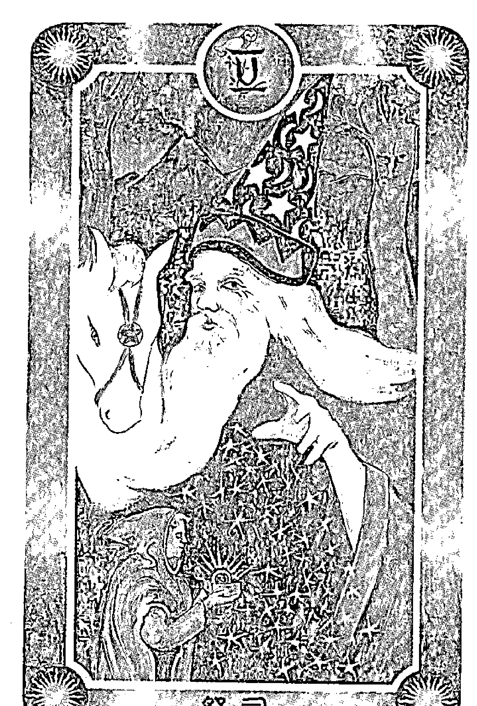

### 自我肯定

+   - 我一直被内心的追求引导着前进。
    - 我坚守的精神原则一直在为自己的灵魂追求服务。
    - 我不再一味相信权威，已学会怀疑他们。
    - 我已在追求的事业的同时抽出一定时间，去享受与父母兄妹间的亲情。
    - 我不再时常忽略，而是经常倾听自己内心静谧微弱的声音。

### 相关链接

### 希腊神话中祭司的故事

祭司——Chiron，客戎，克洛诺斯之子，人头马身，具有不死能力的医者，智者，也就是半人马座。在希腊的传统绘画中，祭司身穿大红袍，端坐于信众前。他头戴三层皇冠，三层皇冠代表了身心灵三层次的世界，皇冠代表权力。他的右手食指与中指指向天，象征祝福；左手十字形权杖象征神圣和权力。他耳朵旁垂挂的白色物，代表内心的声音。前方摆放的两把钥匙，可用以开启智慧与神秘之门。

祭司是精神之父，提供心灵成长与道德教育。是社会规范和社会责任的化身。他用言论指引人们走向正途。


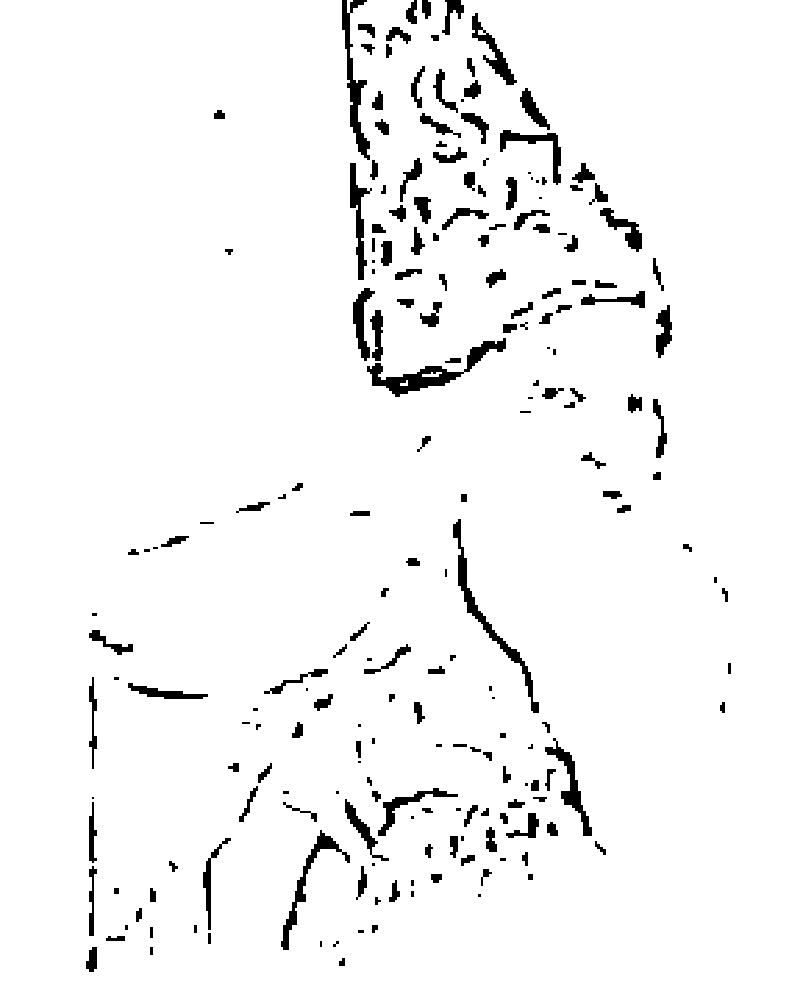

### 6. 恋人
### 《汉塞尔和格蕾特尔》

> “中午时分，他们看到一只漂亮的鸟儿蹲在树枝上。鸟儿唱出那么动听的歌，他们禁不住停下脚步来倾听。唱完歌后，鸟儿伸展翅膀，在他们面前飞动起来。他们的视线跟在鸟儿的后面，看见它落在一个小房子的屋顶……小房子全部是用面包建成的，用糕饼装饰起来，里面的窗户都是用透明的糖块制作的。”
> ——“汉塞尔和格蕾特尔”（《格林童话》，1891）

### 关键词

+   - 相互关系
    - 渴望和谐
    - 与自我及他人的关系
    - 更高宿命

### 这张牌提醒我

+   - △ 涉及到内心里面的阳刚与阴柔层面时，我找到了这两者之间的平衡了吗？
    - 我是否用时间去沉思理想之爱与浪漫幻想之间的区别？
    - 对于爱的成熟如何理解？
    - 为熟练掌握人际关系并使其充满和谐，我应该做些什么？

### 传统意义

从传统上看，恋人是决断和责任之牌。它从数字的角度代表对更高原则的极大贡献。人们有一个选择，可以走众人走过的欲望之路（就是汉塞尔和格蕾特尔看到的糖屋），也可以在崇高之爱的道路上稳步不前。在这条道路上，人们不会受到理想之爱的诱惑。恋人牌暗示我们看到自己内心里相反的两种力量，以聪明的预见和诚实的心胸区分哪一条路会真正导向无条件的爱。这张牌说明阳刚与阴柔之间的平衡，在许多情况下，也指明人一生中这两种内心的神性原则必须相融合的一个时机。这一过程将会被人称为炼金术似的婚姻，并且有神话故事里皇家的婚姻来象征，此时，萌芽者已经从神性自我的两个方面呈现出来（公主与王子相遇，阴柔与阳刚彻底相合，因此爱也与意志相合）。

### 最新物语

《汉塞尔和格蕾特尔》的故事帮助我们区别爱、奉献与恐惧和欲望。我们都必须找到自己的路走完丰富的人生，我们经常会碰到极好的机会面对我们人性的黑暗层面（小屋子里的女巫）。我们必须以强有力和合适的方法整合阴柔的原则（格蕾特尔），以拯救内心受伤的男性（被诱惑而进了牢笼的汉塞尔）。汉塞尔和格蕾特尔必须要找到自己回到原始之爱的路，那是隐藏起来的宝地，因此必须通过他们对彼此的贡献，通过他们自己的智慧与直觉才能赢得。那所糖屋只是欲望之所，尽管它看上去像是天堂，而且极有吸引力，极其诱人，但它事实上却只是孩子们迎接诱惑、经受考验、然后引入新形式的个人难以把握的机会。格雷特尔显示出比邪恶女巫更高的智慧，结果解救了汉塞尔，他们一起回家，两人各自骑着一只漂亮的白色天鹅渡过了一座湖。尽管归家的路是两个人共同努力的方向，但是，每一个孩子，无论男性还是女性，都必须找到真正的力量、个性和从意识的此岸到达彼岸的能力。等他们回家的时候，发现可恶的继母已经死掉（内心的恐惧情绪），他们得到了解放。真正的爱赢得了胜利。

### 自我肯定

+   - 我相信爱是无条件的。
    - 我已经使爱的幻想发生转化，并诚意邀请最珍贵的真爱进入我的内心。

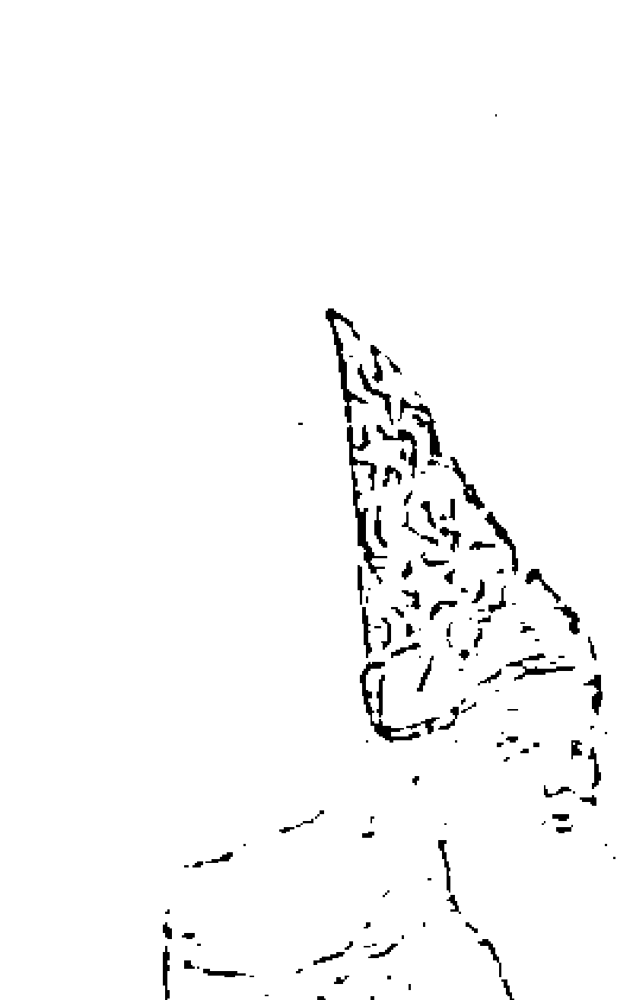

### 相关链接

### 希腊神话中恋人的故事

恋人——Paris，帕利斯，木马屠城记（特洛伊战争）的始作俑者，特洛伊城的二王子。
他骗走海伦致使斯巴达王下令攻打特洛伊（海伦，人间第一美女，斯巴达王的妻子）。
Hera，赫拉，12主神之一，宙斯之妻，罗马名朱诺，Juno（小行星群，那格）。
Aphrodite，阿芙罗狄蒂，12主神之一，爱与美之女神，罗马名Venus（维纳斯，金星）。
Athena，雅典娜，12主神之一，女战神，狩猎女神，智慧与技艺的女神，罗马名密涅瓦，Minerva（弥涅耳瓦，医神）。
宙斯主持婚礼时，漏了一个女神没邀请，这位女神是专门制造纷争的。于是丢了一个苹果，写着给最美的女神。宙斯不愿意淌这浑水，于是赫耳墨斯建议宙斯找帕利斯商量。三位女神开始讨好帕利斯。赫拉要给他管理人间世界做酬劳。阿芙罗狄蒂要人世间第一美女给他当妻子。雅典娜要给他智能和胜利。结果帕利斯把苹果给了阿芙罗狄蒂。高傲的雅典娜和善妒的赫拉当然是不会接受这结果的，于是联手发动了特洛伊战争。

### 7. 战车
### 《彼得·潘》

> “如同金色号角一样的最可爱的丁当声回答了他。那是神话中的预言。普通的孩子永远也不会听到它，但是，如果你们想听到那样的声音，就会发现自己以前听到过类似那样的声音。”
> ——J·M·巴里（《彼得和温迪》）

### 关键词

+   - 平衡
    - 掌握
    - 凯旋
    - 朝向目标的运动
    - 受鼓动而获得的成就

### 这张牌提醒我

+   - △ 我应该如何安排自己的生活，才可以抓住时间点燃激情与真正的本性？
    - △ 我真想一步一步地迈向真正的内在知识和智慧。这条回家的路看起来会是什么样子？
    - △ 我倒想使我的魔法之船掉头回家，奔向对于自我意识的全面把握。彼德·潘这个原型对我意味着什么？
    - △ 它是如何在我的生活中展开的？

### 传统意义

“7”这个数字表示运动、精神对物质的控制以及这之间的过渡。因此，战车代表精神活力，它必须使激情朝着创造力的方向移动，这样人们才能在那里找回原来的精神礼物。因为这个原因，这张牌经常被人称为“回家之路。”战车的两匹马行动不一，驾车者须以意志驾驭内心矛盾。在这张牌中，充满激情的理想与情感和智力世界相平衡。战车象征着凯旋而归的内心之旅，内在的世界充满了创造力与有灵感的视野。两极的张力被释放，人体得到康复。

### 最新物语

在《彼德·潘》的故事里，我们看到一个机会，从灵魂的视角看，可以将魔法的世界与过去的日常生活联系起来。从许多方面来看，这对于初来者可以构成一个很大的目标，假如他必须要学会如何平衡形式及责任的世界与精神醒悟的世界的话。

在《彼德·潘》里，温迪和她的兄弟因为受到诱惑处在永久狂喜的世界里，他们成为永久性的孩子，永远也达不到人类心灵的成熟阶段。孩子们象征着我们的发现，即我们可以自由地在自己的想像和梦幻之中飞行。但是，我们必须找到回到地面的道路。当我们花时间研究内心的王国时，当我们回到真正的家园，我们的魔法之美的根源会使我们的生活充满智慧。

### 自我肯定

+   - 我的生活是源源不断的探索、平衡和灵感之源。
    - 我有自己关注的事情，我总是奔向自己的理想。
    - 我正在回家的路上，正在接近真实的自我。

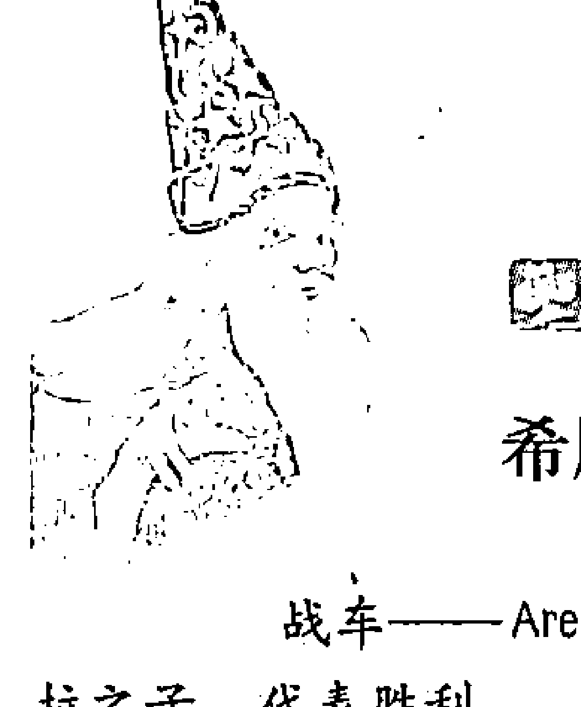

### 相关链接

### 希腊神话中战车的故事

战车——Ares，阿瑞斯，12主神之一，战神，罗马名Mars（马耳斯，火星）。宙斯和赫拉之子，代表胜利。

战车是一种强劲力量的象征，喻示着征服。同时隐藏着一定的武力意味，往往代表事情并不顺利，需要经过脱胎换骨的洗礼，艰难困苦的磨打，好事多磨，结果往往是美好的。战车所受的阻力和其前进的驱动力，象征着内心的矛盾，一种激烈的思想斗争。在希腊神话中，战车的具体化形象代表战神，就是败而不馁，不屈不挠，每战结局必获胜利的人物。

### 8. 力量
### 《美女与野兽》

> “寻找者必须要有能力牢牢控制住自己的思想和意愿。因此，在所有的人性当中——不许有假定——他都是真实与美妙世界的信使，并且会成长为精神世界的参与者。”
> ——鲁道夫·斯坦因纳（《美女与野兽》）

### 关键词
精神的能量、心灵的能量、未知的力量、日常生活中的力量、有魔力的帮助者

+   **这张牌提醒我**
    * 我如何审视自己周围的世界？
    * 是应该更多关注物质的世界，还是应该抓紧时间看到自身之外的形象？
    * △ 是关注权力，还是关注爱？

### 传统意义

“8”这张牌代表力量，表明我们的意志力与希望对权力有更深理解的内在追求之间的汇合。传统上那个让一头狮子张开大口的女性形象，象征着对非自然力量的征服，而非自然力量会诱发冲突、争斗或滥用权力。我们知道，有积极和消极的办法利用我们的自然资源——无论它们是个人的、自然世界的还是高科技的。力量牌让我们所有到达了这个成长阶段的人，在适应权力的这个微妙和崇高层面之后，在接受中发现真正的爱的力量。

### 最新物语

《美女与野兽》教导我们关于爱的力量以及什么是真正的权力的性质。这个故事从一位生病的妇女（女巫师）开始，她拍打一处城堡的大门，希望找到躲避风雨的地方。王子（自我、认同、意志力）拒绝了她的要求，接下来就遇到了他自己的萌芽与苏醒考验（自我必须要看到外表之外的现象，并明白无条件之爱的品质）。这代表着人性的盲目，看不到物质世界里真正的力量和善。这也是4号王牌，也就是《皇帝的新衣》的教化。4加4等于8，现在我们就处在这么一个成长阶段，皇帝的一面必须承担起入教者的角色，他必须获得与他更高意志之间的更大联系才能以更开放的心胸面对人生。在《美女与野兽》中，我们终于面对了物质平面上的边界。美人陷入对野兽的爱，她必须面对这种奇怪和超现实主义的自我实现。她爱的眼泪流淌出来——因为野兽终究死了。在神话故事的教化中，灵魂之水能起到万应灵药的作用。美人的眼泪使野兽最终转变成为漂亮的王子，也就是他的本来面目。但现在，他的美是真实的，因为故事开始时的那位女巫师投下了萌芽的恶咒，因此他才能在遇到对于生命的更大理解时苏醒过来。
这是一个关于转化的故事。在城堡里，美女发现了一座高塔（转化），并看到一面镜子（与现实的东西面对面），那面镜子对她说：“通过时间，你内心的时间，你会看到真相。”到了时候，那个美女看到了物质形式之外的其他东西，并且发现自己深爱着的野兽。这个故事告诉我们说：我们仍然有机会超出外在的判断，除去其他的不说，首先要奔向爱的力量。

### 自我肯定

+   - 我明白是爱、也只有纯粹的爱才会使我得到解放。
    - 我因悲伤而产生的痛苦可因无尽的爱、永恒的爱而得到缓解，这样的爱像雨水一样从上天浇灌在我的头上。
    - 我不害怕自己的力量，因为我根据更高的意愿来利用这股力量。
    - 我只能奉献更大的爱，对这个世界做出更大的贡献。

### 相关链接

### 希腊神话中力量的故事

力量——Heracles，赫拉克勒斯，大力神。宙斯和阿尔克墨涅（底比斯王之妻）之子。
受赫拉惩罚，赫拉克勒斯必需完成一项契约才能获得自由，那就是替欧律斯透斯王执行12件差事，包括杀死复仇女神尼米亚的狮子和多头怪兽西度拉等等。后来他赢得了美丽的少女得伊阿尼拉的芳心，有一天少女遭肯达乌尔斯族人尼萨斯的绑架，赫拉克勒斯将尼萨斯用箭射死，但尼萨斯临死前给了这少女一袋自己的血，欺骗她如果赫拉克勒斯的移情别恋时，只要让他碰到这鲜血便可以使他回心转意。有一天少女认为赫拉克勒斯对她不再感兴趣了，便倒了这袋鲜血在他身上，鲜血灼烧着皮肤令赫拉克勒斯非常痛苦，少女知道自己做错了事，上吊自尽，而赫拉克勒斯也在悲痛之际烧尽自己。

### 9. 隐士
### 《白雪公主》

> “这孩子一个人在大森林里，她开始奔跑起来。踩过尖尖的石头，穿过密密的荆刺，野兽也从她身旁跑过，但并没有伤害她。只要脚还有力气挪动，她就尽量往前跑，直到差不多天都快黑了：此时，她看到一幢小屋子，就进去歇脚。”
> ——“白雪公主”（《格林童话》，1891）

### 关键词

+   - 面对自我的勇气、内在的知识与智慧、静修、奉献

### 这张牌提醒我

+   - 我能够为自己营造什么样的隐退之所或宝贵的空间，让自己使内在的智慧与真理合为一体？
    - 在这样的内向反省时，自我的哪一些部分是最值得反思的？
    - 我应该朝着哪个具体的目标努力？

### 传统意义

隐士牌是意识的内在状态的象征性表达，人意识的内在状态在孤独里寻找内心的康复。这样的个人之旅让我们获得更大的智慧，教导我们如何利用已知的珍宝，因这样的珍宝就在灵魂之内。内在的酝酿时机成熟之后，新找到的人生欢乐就会被发现，解放出来的自我就会回到生活中来，它精神振作、焕然一新、完全康复了。

### 最新物语

白雪公主的母亲死了，宿命送给她一个卑鄙嫉妒的后母（代表混乱与转化），后母将她抛弃在林中，好让猎人（隐士）打死她（我们有生死的意识思维）。仁善胜利了，白雪公主（对于纯洁与真理的不懈追求）因猎人而获得了解放，她在黑暗的密林里照料自己，找到了隐藏自我和转化的地方，就是矮人国的小屋子。
小矮人在地下挖宝矿，它们代表白雪公主要进入她自己的黑暗世界洞穴的需求，因为只有在那里，在远离表层的地下才能找回真正的珍宝。当他们挖掘并为白雪公主找到财富的时候，也就成为她的精神帮助者，并起了指路明灯的作用，帮助白雪公主发现了走向心理授权的道路。

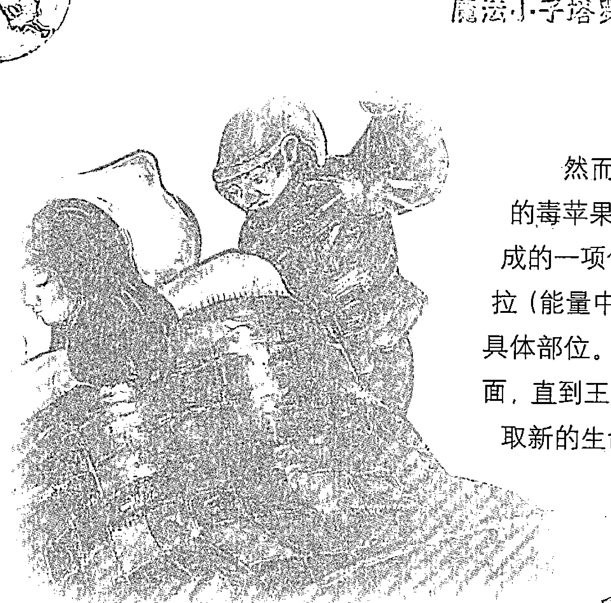

然而，矮人无法把卡在白雪公主喉咙里的毒苹果取出来，这是她自己的灵魂必须要完成的一项任务，因为她的喉咙代表第五层查克拉（能量中心），也就是我们讲话和表达真理的具体部位。白雪公主必须留在她的水晶棺材里面，直到王子（她的最高意愿）发现她，使她获取新的生命。

### 自我肯定

+   - 我进入了自己灵魂的最深处。
    - 我找到了让自我完整起来的财富。
    - 我知道怎样在人世的喧嚣声中保持内心的宁静。
    - 我知道退一步进十步的道理。
    - 我能把被内心的欲望之火毁灭的人作为我的前车之鉴。

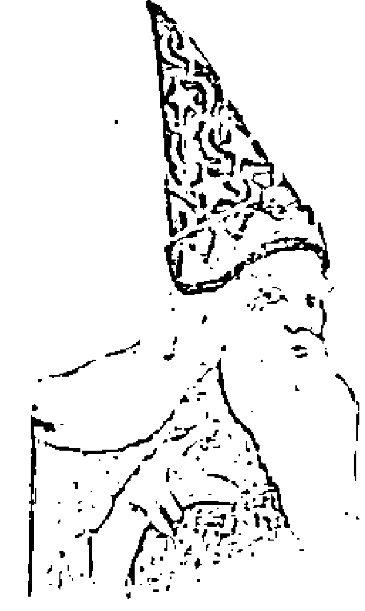

### 相关链接

### 希腊神话中隐士的故事

隐士——Cronos，克洛诺斯，黄金时代的开创者，天神Uranus（乌拉诺斯，天王星）和地母盖亚之子。宙斯、赫拉、得墨忒耳、冥府、海神、赫斯提（女灶神）六人之父。

天神乌拉诺斯和地母盖亚生下许多子女，分属于提坦族、巨人族。克洛诺斯是最小的。由于长相太丑，被乌拉诺斯关在地府。为地母盖亚所救，并夺走天神的统治权。和妹妹瑞亚结婚。听到谣言说孩子将会取代他的王位，就吞食了自己的孩子。

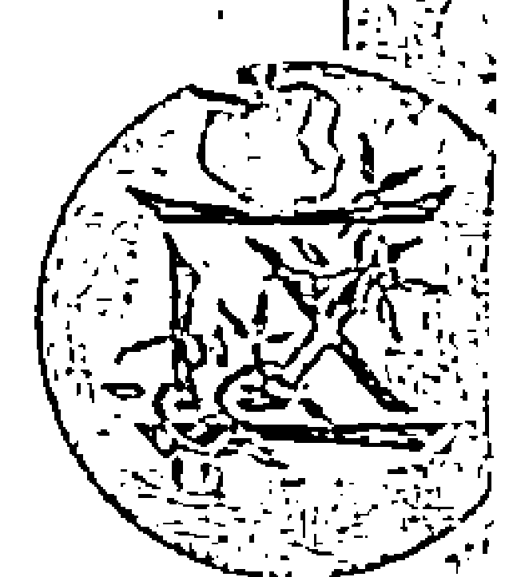

### 10. 命运之轮
### 《爱丽丝漫游奇境记》

> “这是些多么令人奇怪的变化啊！我永远也不能肯定自己将会变成什么，一分钟都不能肯定！但是，我已经回到了原来的大小。接下来的事情是，回到那个漂亮的花园——可是，我不知道，到底如何才能做到呢？”
> ——刘易斯·卡罗尔（《爱丽丝漫游奇境记》）

### 关键词

+   - 中心
    - 命运
    - 归宿
    - 轮回
    - 机会
    - 周期变化
    - 回转
    - 因果

### 这张牌提醒我

+   - △ 在工作与生活的大方向上，我是不是晕了头？
    - △ 我最大的梦幻可否从身体表现的角度得以实现？

### △ 我可以调集什么样的想象天赋来营造丰富而不息流动的生活？

### 传统意义

如果我们觉得愚人(0)和世界(21)从本质上和从循环意义上讲与更高的生、死和新生的旅行有联系，就如同阿尔法(开始)及奥米加(结束)，那么，就只剩下22张大阿卡那牌了。中间点，也就是中心，就是命运之轮。命运之轮，告诉我们一种未可知却主宰我们的力量，有时候情势并非在我们的控制中。不论是意想不到的幸运，还是低潮期，并非是我们所控制的。而解牌时只要抓住“变化”和“命运”，相信没有什么问题。这只轮子上面一般都有一只斯芬克斯像(代表真正为人所具备的秘密)，因此格外醒目，并且出现在云层里、悬挂在空中，而在这张牌的四个角内，有四个固定的黄道能量记号的天体图像(牛代表金牛座、狮子代表狮子座、老鹰代表天蝎宫，天使或人类代表宝瓶宫)。这张牌本身与木星相关联(在占星学上有更大益处)，指明某种幸运的、有益的和能够给予生命的某种东西就快要发生了。然而，在更深的层面上，这是一张王牌，是一只不仅仅象征收获、而且还象征因果轮回的轮子(表现因果律，收获你播下的种子)。黄金机会已经出现在地平线上，却并不意味着你有能量把握它。很大一部分还取决于到你生命的那个阶段已经掌握的东西。打开命运之轮的钥匙，就在于选定中心这个环节上。

### 最新物语

童话《爱丽丝漫游奇境记》跟“合适的时机”有很大关系。白兔子是中心人物之一，它不停地掏怀表，总在说“我迟到了，赶不上一次重要的约会了。”爱丽丝明显是在一次稀奇古怪的旅途中，是思想的旅行、想像力的旅行、是精神的旅行。她进入了梦幻与幻像的万花筒的世界里，我们不妨说是人性的集体潜意识的领地，在那里，神话学与神话中的教化都有其真正的根源。

人很容易就被弄昏了头脑、情绪上感到精疲力竭、精神上迷惑不解，人们浮泛于万千的意象、原型、还有更高法则的原则之上。要解决魔法幻灯一样的麻烦，你需要暂停下来，让自己找到一个中心，将自己的意识提升到更高的平面。也许一种沉思技巧或瑜伽或太极练习能够帮助你完成这个任务。就跟古波斯狂奔的苦行僧一样，哪怕学习一种新的舞蹈，或许也能够帮助你理清袭入脑内的纷乱思绪。

在这张王牌里，一条基本的真理是：在合适的时机里处在合适的地方，进入合适的意识状态。当它扎下根来，使空间、时间和清晰的思想对齐，你会得到某种运气或由天上的供给者木星提供的丰富思想。在这张牌里，所要提出的警告是，要注意不能过度放纵自己，不能太过乐观，不要过多奢求。正如爱丽丝淹没在无数的经验之中。如果你的生活计划太多、约会太频繁、活动太多，那你不能够以合适的技巧实现最为重要的目标。你会迷失在奇境里。正如在传统的王牌里，这张牌会提醒你找到自己生存的核心所在，而不是让飞旋的幻想或特别多的外部刺激引导你远离心中的节拍。

### 自我肯定

- 从生理、情绪和精神以及心灵的财富角度看，我是一个富足的人。
- 想像力是智慧奔流不息的喷泉。

### 相关链接

希腊神话中命运之轮的故事
命运之轮——命运三女神(The Fates)的别名莫伊拉——克洛索三命运神之一，负责缠绕人的生命之丝。莱克西斯：负责决定生命之丝之长短。阿特洛波斯：剪断人的生命之丝。

### 11. 正义

### 《迈达斯王点物成金》

> “为了给一个人的生活指明确切的方向，并正确估计一个人的行动与行动的后果，人们必须要允许已经被极大忽视的渴望和潜意识的冲动，以一个人成功和有意识的选择来挑战自我满足。”
>
> ——爱琳·加德博士(《爱琳·加德博士》)

### 关键词

平衡、两极之间的摇摆、轮回、平等、真理、人类的正义与宇宙的正义

### 这张牌提醒我

- 我的生活有哪几方面失去了平衡？
- 如果仔细审视自己，必须要做哪些事情才能把事物并入命运之轮的秩序和平衡之中？
- 已经得到的一切，我对已经得到的一切，是否十分满足？
- 生活就是现在的这个样子，我对现在的生活是否心存感激？
- 如果我希望得到更多，这个要求是否与宇宙正义及平衡的法则吻合？

### 传统意义

在传统塔罗的正义这张牌上，我们看到一位妇女坐在巨大的御座上，稳如泰山，纹丝不动。她右手执长长的宝剑，因为她必须以清晰的头脑执行决策与判断。（宝剑代表清晰透明、中心明确、还有心智上的技能。）世上没有绝对的对或错，女神手中的天平似乎就说明了这点。她手中的剑是强力的制裁力量；似乎在警告着你，必须小心努力的保持着平衡的状态。我们见到这张牌的时候，正处在人生的这样一个阶段：即我们内心的存在必须要确立正义与秩序。一个人必须要在自己的内心和灵魂里营造秩序，面对使事情走上正轨的方向。人们必须要在日常生活中营造平衡。我们学会了在客观的视角区分和观察更高世界的法则。这张牌代表天平，或者代表命运之轮以及生命之树。凡升上去的，都必须要下来。

### 最新物语

迈达斯国王每天都在“平衡”他的账户，每天都在堆积他的黄金与他的财富，并以此衡量他的人生价值。他对物质世界的依附胜过了他对宇宙正义法则和精神洞察力的理解，胜过了他对“平衡账户”需要的理解，胜过了对于要在天上的大秤杆上称量人类灵魂的需要的理解。因此，当他希望自己摸过的一切都变成黄金的时候，就被女巫下了毒咒，因为那个女巫满足了他的愿望。由于他自己的欲望和贪婪，迈达斯与点金术，他经受了可悲的人生教训。首先，当他把花园里漂亮的玫瑰变成黄金时，他就把巨大的悲伤带给了他深爱的女儿，因为女儿热爱大地上的香花。当他前往安慰她的时候，结果把自己亲爱的女儿变成了黄金。这个国王只有黄金和财富，别的什么都没有了，因此他希望回到自己许下点物成金的愿望之前的状态。为了让迈达斯国王解脱魔咒，女巫告诉他，只要带着特别的一只水瓶跳进水池里，他点化过的所有东西便能还原。

水代表回到女性的神授之水，在那里，情感的世界会碰触到人心，并使古老的精神构造贫瘠的局限得到平衡。当情感与思想的世界进入平衡，正义才会回报那些以平衡方式看待事物和采取行动的人。

### 自我肯定

- 我采取的一切行动都由我自己负责。
- 我说到做到。
- 我明白命运之轮的道理，有了这样的深刻理解，我会对生活的后果与所得有更高理解。
- 生活就是我的镜子。

### 相关链接

希腊神话中正义的故事
正义——Athene，雅典娜，宙斯的女儿，正义女神。从宙斯的前额出生。雅典城的守护神。

### 12. 倒吊人

### 《杰克和豆茎》

> 在《杰克与豆茎》里，事情大不一样。这个故事告诉我们，虽然相信魔力有助于我们敢于独自面对世界，但是，进行最后分析的时候，我们必须采取主动，要甘冒征服人生的风险。当杰克得到魔法种子的时候，他自己爬上了豆茎，而不是因为有别的什么人提出了这样的建议。
>
> ——布伦诺·贝特尔海姆（《魔法的用途》）

### 关键词

- 无时间的空间
- 耐心等待
- 探究潜意识的层次
- 更高利益
- 牺牲自我

### 这张牌提醒我

- 我必须要抛弃或者放弃什么东西吗？
- 我是否过于依附于物质世界？
- 我是否信任放弃的过程？

### 传统意义

在传统的意象中，我们看到一名男子，也许就是那位悬挂着的魔法师，他心甘情愿并相当快乐地倒挂在生活之树上。为了得到观察生活的新视角，他倒置了自己的观察位置，抛弃过去的古老方法而响应更高层的呼唤，可以说他想要听一听大地的声音，听一听大地之母（他更高的自我）能够发出什么样的直觉声音。从象征的角度说，当我们在看牌活动中拿到这张牌的时候，人们就把过去的口袋掏空了，并通过高层自我的意愿学会接受即将到来的一切。最为重要的是，必须要注意到，个人是在生活中选择这样的新位置，并了解牺牲的真实意义，这也就是“让人生更为神圣。”这张牌令人想到基督教教义中，自我牺牲的精神。倒吊着的男子如此的沉静安祥，他以肉体的痛苦换取心理的满足。他代表你必须有所付出才能有所得，他也代表着你必须试着以不同的角度面对你的问题，才能获得认清事实的智慧。

### 最新物语

在“杰克与豆茎”的故事里，杰克把自家的母牛拿去交换三粒魔法种子，这看起来并非聪明之举。然而，假如我们忽视逻辑，也不管理想现实（海神统治倒吊者或杰克在豆茎上），并对人生之旅上看不见的奇迹持开放态度，那么，我们就可以明白为什么杰克选择接受陌生人给他的三粒魔法种子。在神话故事的教化中，许多种考验和萌芽活动都是以“3”这个数字来接受的。杰克从天堂皇后那里接受了一次考验（皇后是3号王牌），看看他是否能够牺牲自我而奔向更高的归宿。依附于世俗的解决办法，只能够加重他那个家的贫困。杰克使自己的逻辑倒置过来，并与他更高的想像力结合起来。他母亲在愤怒的绝望中将那几粒豆子扔到窗外去了，这代表我们世俗的担忧和物质上的依附，它们会使我们盲目，看不到宏大的时机和奇迹。到了晚上，一枝巨大的豆茎在代表着潜意识，在编织梦幻的黑夜里生长起来，表示天地之间有了脐带联系。这根脐带成为一个管道，杰克凭借这根管道就能找到属于他灵魂的最初财富，还有他父亲的财富，以及重新开始新生活的机会。这份礼物之所以送给他，因为事实上杰克抛弃了人生的种种境况。他相信一定会要发生的种种变化，是因为他同意交出自家的母牛，也就是交出与物质世界的依附，用以交换代表着新生和富足生活潜在可能的魔法。

### 自我肯定

- 我已经适应了更高的自我意愿。
- 我愿意，也能够放弃理性和合乎逻辑的日常生活中的依附，这样，我才有可能轻松而自在地投身于不可知的未来。

### 相关链接

希腊神话中倒吊人的故事
倒吊人——Prometheus，普罗米修斯，造福于人类的神，提坦族之一，因给人类带来火种因而被钉于高加索山上。
天神创造人类时，遗忘了人类，普罗米修斯便向宙斯要火种，而被宙斯所拒。因此他跑去偷火种，并带到地上。于是宙斯放出洪水，要毁灭地上的人。普罗米修斯警告他儿子丢卡利翁，要他造方舟，并要他带妻子皮拉到船上。丢卡利翁获得原谅，并让他繁衍人类。但宙斯并没放过普罗米修斯，把他绑在高加索山上，一只老鹰啄他的肝，但他的肝每天都会长出新的来。三十年后为赫拉克勒斯所救。

### 13. 死神

### 《睡美人》

> 100年过去了，这一天终于到来，布莱尔·罗丝会从她的梦中醒来。王子走近树篱，他只看到了鲜花，而看不到荆棘和欧石南。
>
> —— “睡美人” （《格林童话》，1891）

### 关键词

变化、转化、过渡、宣泄之后重新开始

### 这张牌提醒我

- 在人生的这个时期，什么样的困难在等待着我？
- 一种深层的转化在等待我。我必须放弃什么？
- 我必须要走过什么样的一扇门，才能迎接人生的下一个阶段？

### 传统意义

死神这张牌象征我们生活中必须要变化的那些部分。旧的形式必须要死亡,新的形式才能诞生。这张牌所包含的主题是通过仪式、涉及放弃过去的种种仪式。象征着在生命走到尽头的同时,又有一个新生命的诞生。无论是什么事情的结束,在我们迎接结局来临之时,同时也是往新的人生与目标展开新的旅程。最重要的是,在一件事情告一段落之后,我们要把眼光朝向未来。死亡是一种结束,同时也是一种新生。死神代表着转机,你必须结束旧有的一切,才能迎接新生活的开始。只是他并不保证这是一个更好的新生命。

### 最新物语

小小的迷人的布莱尔·罗丝的诞生掀起了这样的一个激动高潮,国王决定举行一个盛大的宴会,大地上所有聪明的妇女都将接受邀请。然而,他只有12只金盘子,因此,13位聪明的妇女中只有12位受到邀请。13是死亡之牌的数字,因此,我们在此看到了与“布莱尔·罗丝”或“睡美人”神话深刻的相互关系。未受邀请的第13位仙人或聪明妇女就是那位施魔法的女巫,她给这个漂亮的小姑娘投下了符咒,让她在第15年刺痛手指并死掉。第12位仙女——王牌12就是传统塔罗中的倒吊人——她想办法更改了符咒,让这个注定一死的孩子沉睡百年,而不是死掉。

死神牌经常出现在年轻人面前，是在他们的少年期或正好是在行经初期，或者是出现在一些妇女绝经期的开始。注定的变化或新的意识状态不可避免地进入一个人的生活。哪怕我们也许希望回避这些变化或人生周期，但我们必须面对它们，并让这样的转化过程进行下去。15岁这个年龄表示我们面对自我阴影的人生时期(由大灰狼或者恶魔牌代表)，此时我们会窥探心灵的未知部分。在15岁的时候，布莱尔·罗丝发现她自己一个人在城堡里随意漫游。当她看到一座古塔，就沿着一条窄窄的小路蜿蜒拾级而上，来到一扇小门跟前。这扇门是一个通道，通往她必须要冒险走过的地方，只有这样，她才能完成灵魂的因果轮回，在那里沉睡100年，直到由王子所代表的她的更高自我以苏醒之吻结束她身上的魔咒。作为占卜师，要明白死神之死，在于置诸死地而后生，结束也许正是你需要的，而在经过历练之后，会是一番更好的美景。以此通过牌局引领问卜者走上正确的实现之路。

### 自我肯定

- 我生活中的种种变化为我提供了机会，是我再次醒悟最深层的命运所必需的。

### 相关链接

希腊神话中死神的故事
死神——Hades，冥府、冥王，12主神之一，罗马名Pluto（普路托，冥王星）。它是地狱和冥国的统治者，是克洛诺斯和瑞亚的儿子，宙斯、波塞冬和得墨忒耳的兄弟。关于冥王的神话，广为传诵的是他劫走农神得墨忒耳之女珀尔塞福涅并强娶为妻的故事。

### 14. 节制

### 《守护天使》

> “上帝的天使，我亲爱的守护神，上帝之爱嘱咐我来到这里，承蒙它的保护，直到今天它一直留在我的身边，让它照亮我、保护我，让它统治一切、引领一切。”
>
> ——给守护天使的祈祷词

### 关键词

- 平衡的艺术
- 作为基础的宇宙智慧
- 艺术
- 焦点
- 谨慎的扩张

### 这张牌提醒我

- 我能在自己的生活中做哪些事情，让自己的日常生活与精神需求中的美德平衡起来？
- 我应该采取哪些措施，使灵魂具备的洞察力和观点落实在实际生活中？
- 我的整体感被两极矛盾所分化，如何才能超出这样的分化？

### 传统意义

在传统的节制牌中，节制代表完全、和谐、净化和治疗。有一位妇女以一种舒缓的节奏在测量什么东西。这张牌代表与她神圣的智慧联系着的更高级意识。在塔罗牌中，我们看到的一个小男孩和小姑娘，代表更高的思维与更高尚的心灵。正极与负极来源之间的张力就是生活本身。节制同时有一个“缓慢”的意义在里面，你必须以一种自制、温和，并充满耐心的态度面对你的问题。节制同时代表事物可能面临一种渐渐转化的契机。节制是一个疗伤止痛的过程，它治愈你的身心，也使事物渐渐好转。

### 最新物语

在古代神话中，天使据说就是上帝的气息本身——爱、光与智慧的信使。所有人类都得到天使的引导的帮助，他们一路关爱和保护人类。他们是通往天堂世界的桥梁，他们用爱环绕着我们，提醒我们注意到：自己并非得不到精神世界的指导和帮助。在神话故事和神话里，乐于助人的守护天使也许被描述为一个神仙，是乐于助人的精灵、各种各样的鸟类，或者是自然世界的其他动物和植物。当你感觉失衡，无论是情绪上的、生理上的还是精神上的失衡，请记住调动你在生活中忽略的因素。请求得到就在你周围的指导和帮助。无论是什么混乱的能量让你失去中心，每天要学会花一些时间让自己稳定下来。出现危机的时候，应该‘改变我们的生活’。在自家建一个能让情绪安稳下来的地方，这也许能够对自己有所帮助，会成为一个康复提醒物，说明自己是得福之人。

### 自我肯定

- 我的心中掌握着精神世界与生理世界的平衡，我就以这种方式走过人生道路。
- 我的守护天使祝福我，保护我，每日每时都是如此。

### 相关链接

希腊神话中节制的故事
在古希腊的传统绘画中，节制之神是一个手持两只圣杯的可爱天使。这两只圣杯分别代表着‘物质和精神’，象征着物质与精神方面的渴求。两只圣杯都注满时，便可取得平衡，走向成功。调节圣杯之水不致溢出来的，便是暗含的‘节制之力’了。天使飞扬的双翼，代表他获得平衡的能力。身旁的水和花草，象征着诱惑。节制体现出来的是适度和自我克制。在充满诱惑自由放任的世界里，找到自我平衡是多么必要。节制的能量从表面看起来，也许没有激情，但是它是飓风中的宁静。四处都是旋转的风，但是中心是一个安静的点，使所有的东西都保持平衡。这是一种令人鼓舞的团结的力量。这种精神散发着成功的意味……

### 15. 恶魔

### 《大灰狼》

> “野狼与山狗、熊与粗暴的女人有类似的恶名,这并不是偶然现象。它们都有相关的本能原型,而且,两者都错误地被看作没有教养,完全是天生的凶残和贪婪。”
>
> ——克拉里萨·宾柯拉·艾斯迪（《与狼共奔的女人》）

### 关键词

- 考验
- 潜意识的后果
- 灵魂里面的消极内容
- 局限
- 惰性
- 抵制心理
- 恐惧

### 这张牌提醒我

- 我生活中的哪些方面，是因为恐惧、愤怒或过去没有# 第1章 大阿卡那最新物语

能够医好的一些伤痛而受到阻碍的？

△ 为了迈步向前，我需要采取哪些行动？

△ 这么做有什么样的益处？

### 传统意义

在传统塔罗中，第15号王牌恶魔与物质法则，与以固体或物质形式的表现法则相联系。如果这股能量在人类身上体现出来的时候保持为潜意识状态，那就有可能成为僵死的、固执的和抵抗性的力量。人类必须学会平衡物质领域的力量和精神及更高意识状态的法则。精神被否认以后，人们必须面对灵魂的阴影，在那里，恐惧、依附和生硬的模式胜过一切。与人的心灵里这一层阴影相会，肯定要挑战一个人体验从过去得到解放的能力，然后在新的意识和自由中得到新生。

### 最新物语

当我们遇到大灰狼的时候，也就是与我们野性的本质或人格中未受驯服的那些层面迎头相遇。我们说狼是坏的，这本身就标志着我们（作为一个集体）惧怕自己的阴影，也惧怕黑暗世界的力量。神话故事给人以丰富和肥沃的一片土地，人们能够在那里探索潜意识的残骸潜伏的深层的东西；而这样的潜意识残骸从儿童时代起就已经淹没下去了，也许是从上几辈子就开始下沉了。这些机会是披着黑暗魔法师的外衣到来的，或者是邪恶的继母、凶恶的人、和在黑暗的密林里迷路时出现的野兽。通过这些人物和体验，我们就直接接触到了情感和精神领域破裂的层面。

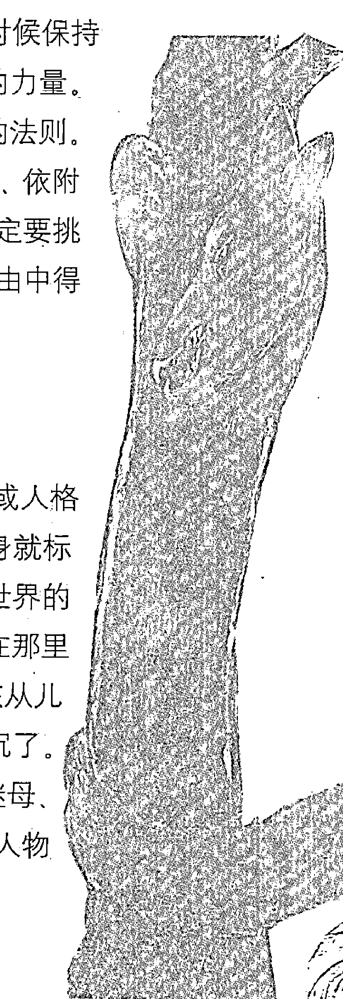

当小红帽遇见大灰狼的时候，从象征的意义上看，她遇到了将会内在地解放她、使她脱离天真和愚昧的一股力量。她能得到什么，又能失去什么呢？在我们寻求意识的时候，总会遇到复杂的两难境地，因为一旦我们苏醒过来，就会有责任停留在追求真理和智慧的路上。如果我们不能够吸取教训，不能够走出年轻时的愚蠢之举，那我们就更有可能在自家后院里遇到那条大灰狼，因为那条道路无可避免地会适应错误和行动，而那些错误和行动就是一些铺路石，通往更丰富和更有责任的人生。

### 自我肯定

- 我已经准备好了，而且愿意解开心中的疙瘩迈步前进。
- 当我前进的时候，当我解开过去的不快对我形成的束缚时，我感到自己活力四射，充满力量。
- 我不会走回头路。

### 相关链接

### 希腊神话中恶魔的故事

恶魔——Pan，潘，半人半羊的山林和畜牧之神，野生动物与森林之神。

他有一次追求仙女绪任克斯，结果她化身为芦苇。他把芦苇做成他的风笛。他很喜欢作弄森林中单独行走的人。

恶魔在希腊神话中的形象是较稳定的，生着蝙蝠一样的翅膀，另外生着羊角、羊腿和鹰足，象征动物的本能与天性。他的驴耳，象征着固执。

在传统的塔罗牌面中，恶魔的背景全绘成黑色，象征着精神世界的黑暗，魔鬼左手执拿火炬，向下指着地面，代表物质世界。他身旁站着亚当和夏娃，他们都长出了尾巴，显露出动物的本能，暗含着堕落的引诱。他们脖子上都锁着铁链，但这些铁链很松，他们可以取下来。但他们没有，这表示他们自愿受缚，甘于沉沦。

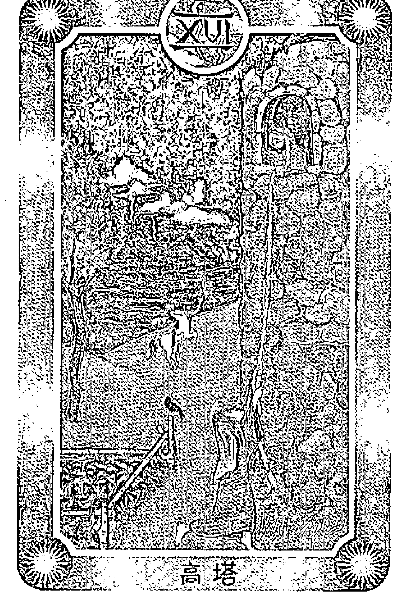

### 16. 高塔《拉潘泽尔》

> > “拉潘泽尔长成为太阳底下最漂亮的孩子。当她12岁的时候，女巫将她锁进林中的高塔。高塔没有石级，也没有门，只在顶上开有一扇小窗子。”
>
> ——“拉潘泽尔”（《格林童话》，1891）

### 关键词

- 醒悟
- 赎罪
- 转化
- 突变
- 惊讶

### 这张牌提醒我

- 我生活中的哪些领域最需要改变？
- 转化之塔如何召唤我放弃过去，清除过去的影响？
- 我必须要采取哪些新的心理授权步骤？

### 传统意义

传统的高塔牌显示一道闪电击中塔顶，象征一个人的自然生活突然发生了变化。在接触高塔的进化石级之前，无论原来是什么样的东西，都无法，也不能够保持原样。当高塔出现的时候，人需要在独自一人的状态和孤独的避难所之内找到隐蔽处和安慰，这样才能完全消化向新发现的价值和身份的转化。这些变化是由超出一个人的力量的环境促成的，它们源自一个人的内心或外部条件。无论是哪一种情况，高塔都会变换原来的结构，无情地粉碎过去的保障。人们必须向前迈进。

### 最新物语

高塔是神话文学中表示转化的一个强有力的暗喻。在“布莱尔·罗丝”或“睡美人”的故事里，把布莱尔·罗丝引入高塔，带上木楼梯，直到在房间里发现刺破她手指的不可抵抗的纺锤，正是那一道魔咒。在《美女和野兽》的故事里，美女发现了魔镜，魔镜能够讲述她必将身陷高塔的命运。在《拉潘泽尔》中，高塔代表她必须要历经变化才能转向少妇状态的诱惑阶段。在她12岁的时候（王牌12是倒吊人或杰克与豆茎牌，它表明一个人的世界会倒悬过来的那个时机），她被锁进了高塔。在高塔里，她与自己的性能力以及对新自由的渴望合为一体。所有这些故事都提供了潜在的象征，都把高塔当成是转化人物命运的方式，导致她走向最后的醒悟阶段。

在整个神话中，突然和不可预料的事件决定了拉潘泽尔的命运。她父亲在属于一位女巫的花园里采摘莴苣，为的是给怀孕的妻子提供营养。他去了花园三次（又是“3”这个魔数），第三次去的时候，他被女巫发现了，结果中了她的魔咒。在神话故事的教化中经常发生这样的事情，一个小孩命中注定要完成个性化的使命。最后，拉潘泽尔长长的发辫被复仇心切的女巫剪掉了，她被遗弃到了沙漠。她在沙漠里流浪，她的意志力召唤她失明的王子回到她身边。一旦她的眼泪恢复了王子的视力，她就自由了，成为一个完整的人，投身于命中注定的一种新生活。

### 自我肯定

- 我的生活和变更与成长经常性地处在和谐中。
- 在这种种的转化之中，我感觉相当安全，因为我乐于迎接等待着我的新生活。

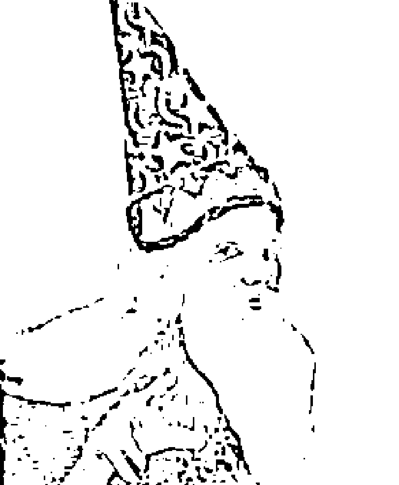

### 相关链接

### 希腊神话中高塔的故事

高塔——Poseidon，波塞冬，海神，12主神之一，罗马名Neptune（尼普顿，海王星）。
克里特的迈诺斯（做迷宫的那位仁兄，死后做阴间的法官）为了讨好海神，要把从海上浮起来的东西当祭品，于是海上浮起来一只白色美丽的公牛。但迈诺斯不愿意奉献，所以海神让牛发疯。那只牛和迈诺斯的妻子帕西法厄生出人身牛头怪物。迈诺斯于是要求代达罗斯造个迷宫，把他的俘虏关在迷宫去喂人身牛头怪物。迈诺斯的女儿阿里阿德涅给海神的儿子忒修斯一个线团，帮助他走出迷宫，合力把人身牛头怪物杀死。海神弄出地震把迷宫震碎，救出俘虏。忒修斯最后成为新克里特王。

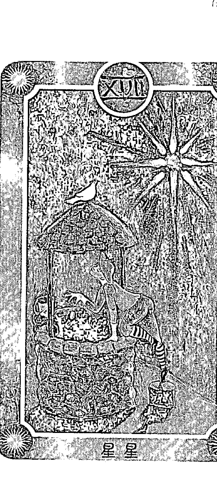

### 17. 星星

### 《星光许愿》

> > 正如晚间使早晨得以诞生，新的光芒也源自黑暗。启明星既是晚星，亦是晨星。
> ——卡尔·荣格，转引自爱琳·加德（《塔罗与个性化》）

### 关键词
默想、内心的光亮、精神的感知力、希望、愿望

### 这张牌提醒我
这是需要醒悟与灵感的时机，我如何能够敞开自己的心，迎接这个萌芽和成长的时机？

> △神秘主义者的灵魂受星星的指引，被人心所激发，当愿意接受天体的影响时，一定会走向启蒙。如此耀眼的光芒如何能够引导我走向自己最高的梦幻？

### 传统意义

星星牌暗示，走在通往智慧的阳关大道上的那个人现在已经揭开了披在宇宙意识基本素质上的面纱。传统版本里的那位漂亮的裸妇一只脚踏在大地上（有意识的王国），另一只脚踏在水里（潜意识的王国）。同样，星光许愿牌也显示出那个少女一只脚踏在大地上，另一只脚朝井里伸去——灵魂的深渊。这张牌表明良好意愿的积极流露。灵魂之花完全张开，意识到这种漂亮的萌芽，在那里，意愿和梦幻促使一个灵魂与另外的灵魂分享宇宙财富的益处。人最真实和最高尚的意愿就是要参与世界的宏伟创建，并成为暗夜之上的一颗耀眼的星星。

### 最新物语

那颗星星代表真实萌芽的开端。暗夜与一长串明亮的灯光排成一排，所有这些都在人性的梦幻之上闪耀。当我们入睡并进入梦乡，我们潜意识的自我会受到个人感知力和体验的内在风景的动态语言刺激。星星为我们提供了清醒的意识，知道每一个人的灵魂里都有耀眼的光亮，每一个人的精神总是能够上升到更高的知识层面的。我本人此刻在俄勒冈海岸撰写这一章，其间我步行到一个小店为我的一个朋友购买礼物，突然之间，那位友好的店员对我说了这么一句引来的话：“确保实现梦幻的惟一办法就是醒过来。”她并不知道，她与我分享那些可爱的字眼时，时机是多么完美。星星牌果然充满魔法。经过死神和恶魔，星星来到了一片欣欣向荣的天域。这是一张充满“希望”的牌，唯一的问题只是希望是否适合现实。另外，星星也有“怀孕”的意思，这一点是容易被忽略的。

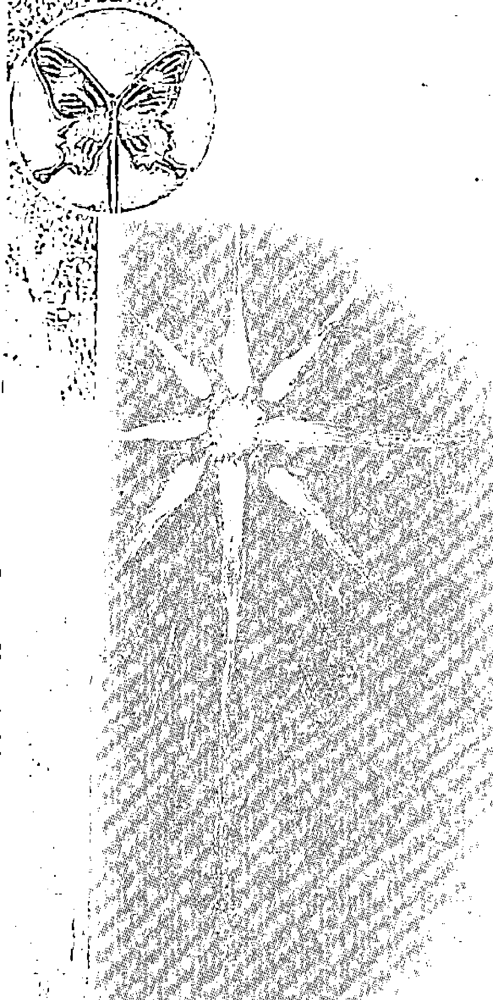

### 自我肯定

- 我内心的视觉如同绽放的玫瑰，朝着意识的方向成长。
- 我进入深层愿望的深渊，请求让这些愿望全部成真。
- 闪耀的星星是一面镜子，照耀着激发我每天的欢乐与惊奇。

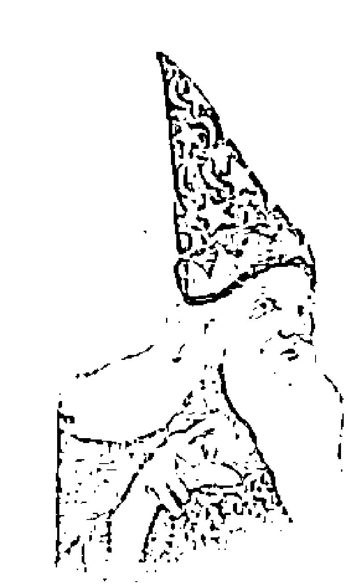

### 相关链接

### 希腊神话中星星的故事

星星——Pandora，潘多拉，火神奉宙斯之命用粘土和水做成的地上的第一个女人。她有着和女神同样美丽的容貌，但没什么智能，有点顽皮。赫耳墨斯将背信放入她的心里，将谎言放入她的口中。宙斯将她送给普罗米修斯的哥哥厄庇墨透斯，嫁妆是一个大箱子。厄庇墨透斯本来想拒绝，但看到哥哥被惩罚，赶紧和潘多拉结婚。普罗米修斯警告厄庇墨透斯不要打开箱子，厄庇墨透斯也警告潘多拉。但是潘多拉实在禁不起好奇心的驱使，打开了箱子。于是年老、辛劳、生病、肮脏、罪恶和痛苦都飞出来，只把希望关在了箱子里。

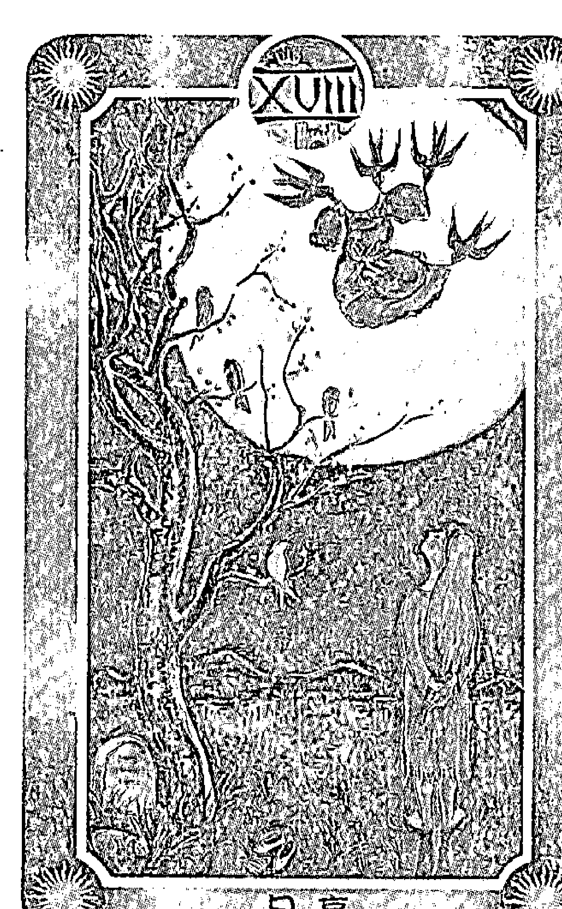

### 18. 月亮《灰姑娘》

> “因此，灰姑娘的父亲从榛木丛中为她采来了树枝。灰姑娘谢了父亲，立即跑出去将树枝栽在母亲坟上。可怜的小姑娘哭得死去活来，她的眼泪滴落在树枝上，泪水浇灌了它。不一会儿，树枝就长成了一颗漂亮的树，她每天来这里3次，一边祈祷，一边哭泣。”
>
> ——“灰姑娘”（《格林童话》，1891）

### 关键词
意识的扩张、遗弃的问题、直觉力量、不断变化的丰富情感、因果轮回中的过去

### 这张牌提醒我
△我是否需要花时间浇灌自己的生命之树？
△我有没有关照自己真正的需求和情感？
△为我提供了成长和发展的最大机会的“因果轮回”都有哪些？
△当迎接灵魂的挑战和考验的时候，我是否让自己的精神向导帮助我？

### 传统意义

在传统的塔罗中，第18张王牌是月亮。传统的图像显示一个巨大的月盘，里面有一位漂亮妇女的脸庞。它表示精神、预见力和个人通过感情世界的意识、情感而实现的新生，有时候它们就是阴影本身的一个方面。月亮代表我们的情感模式和需求，代表我们的敏感度和过去。它象征着内在的阴柔，影响着人际关系和我们精心培育的东西。

### 最新物语

灰姑娘的故事告诉我们奉献是一种美德，因为奉献是通过萌芽的方式一步步成长的。

在故事的开头，灰姑娘让我们认识到，我们必须以信仰和接受自己的损失和悲伤来浇灌自己的生活。她父亲带给她的榛树枝埋在亡母的坟前。她每天伏在树枝上哭泣，晶莹的泪珠浇灌了坟土，使树枝得以生长，结果变成了一棵漂亮的生命之树，引来众多的天堂之鸟。那些鸟是圣母的一个侧面，它们帮助灰姑娘完成了邪恶继母要她完成的任务。

在较古老的格林童话版本里，原来的仙女教母是由天堂之树上的鸟儿来表示的，这些鸟代表灰姑娘的精神力量正在发挥作用。

从原型上说，灰姑娘与月亮有联系，因为她跟其他许多神话中的主角一样，在故事的开头便切断了脐带联系。这使她能够与过去脱开，并消弭自己的轮回印记。她的异父姐妹在很大程度上依赖于物质世界，而且没有得到通往转化阶段的自由。跟继母一样，她们都是故事中黑暗力量的一部分。她们提供了一片肥沃的土壤，使灰姑娘得以在上面接受自己的使命并进入萌芽阶段。

灰姑娘最大的天赋就是她的同情心和理解力。月亮牌受到双鱼座黄道记号的统治，而月亮牌又分别统治着双脚。灰姑娘历经自己的进化阶段之后，她的双脚就因为故事里提到的不同的鞋而得到强调——双脚是她借以站立的部位，因此也是理解的另一种方法。当她仍然处在悲伤之中，因而处在轮回的过去之中时，她就只能穿很小的木制鞋。她仍然处在世俗的表面，还没有进入精神成熟的阶段。在故事的后来，她穿上了玻璃鞋，或者按照较早的格林童话版本，她穿上了水晶鞋。灰姑娘的理解力在不断增强，她也不断地成熟起来，更热爱新生活，更容易受到新生活的感动。

### 自我肯定

- 我明白，牺牲的真实意义是“让生命圣洁”。
- 当我完成命运交给我的任务和工作时，我的生命是圣洁的。
- 我与自己内在和外在的“母亲”形象处在和谐中。
- 当我尊重自己最真实的需求时，宇宙会毫不吝啬地送给我永恒的回报。
- 通过眼泪，我的灵魂被浇灌，我丰富的情感得到滋养、尊重和滋润。

### 相关链接

### 希腊神话中月亮的故事

> 月亮——Hecate，赫卡特，司夜和冥界的女神，月之女神，别名月神、黛安娜（罗马神话中之处女性守护神，狩猎女神和月亮女神）、阿耳特弥斯（希腊神话中的月神与狩猎女神），美男子阿波罗太阳神的妹妹，牵着一只三头狗。她本人也有三个面。也是亡灵之神、道路之神。

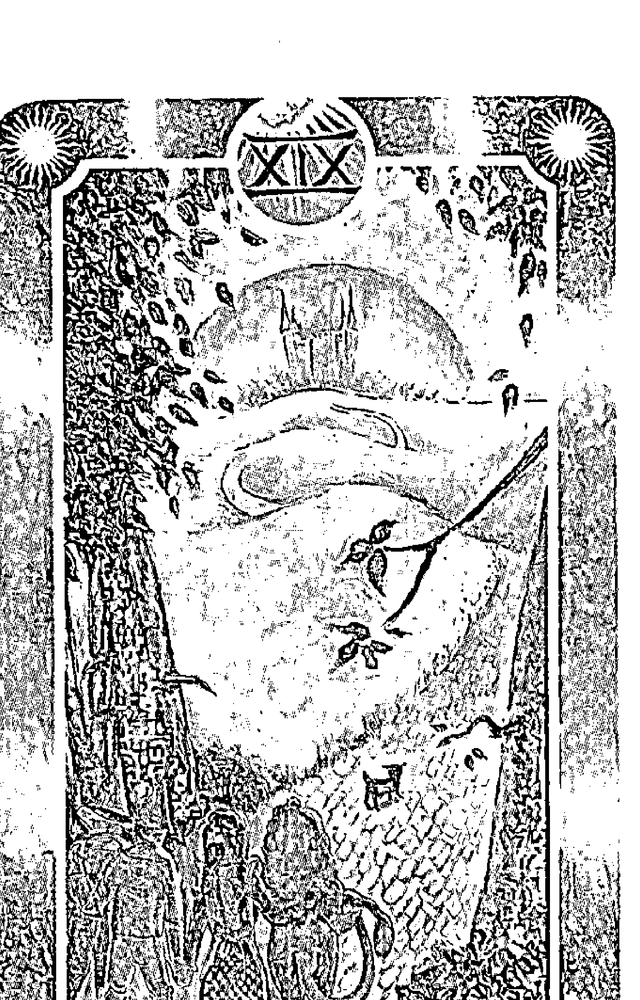

### 19. 太阳《黄砖路》

> “附近有好几条路，但不久之后，她发现了一条铺有黄砖的路。不一会儿，她就朝翡翠之城奔去，她的银色鞋子在黄色的硬路面上发出清脆的丁当声。太阳明晃晃地照着，鸟儿唱着甜蜜的歌，多萝茜一点也不觉得有什么不快的地方，不似大家所想的样子，哪怕她还是个小姑娘，一下子远离了自己的故乡，一下子踏上了陌生的国土。”
>
> ——利曼·弗兰克·包姆（《绿野仙踪》）

### 关键词
生命的统一、欢乐、激情、完成、肥沃、创造性灵魂

### 这张牌提醒我
在人生的曲折道路上，什么才是我真正的目标和理想？

### 第2章 六阿卡那最新物语

> 客观地看待自己的生活，我想追寻的目标和理想的主要特征或特性是什么？
> 能带给我人生最大快乐的是什么？

### 传统意义

太阳牌代表主动和有意识地参与生活，还有生活在人的灵魂里唤起的欢乐和庆典。当太阳的光线穿透大地，我们的眼睛享有自然的万般色彩，我们行走的小路清晰可辨。这是一股扩张的能量，是末端开放的可能性和目标之一。太阳受到狮子座的主宰，它是一个人的自我意识的一面镜子，代表生长和新的身份或新生的时机。自我必须经历许多萌芽和周期，当一个人的生活充满康复和更新生命的灵感的光芒时，太阳牌就会出现。

### 最新物语

我们大多数人都熟悉《绿野仙踪》的故事。多萝茜和她的朋友们走过的黄砖路，是故事里最为人所知的情景之一。“顺着黄砖路前进”已经成为人生许多冒险和探险活动的暗喻之一。当我们听到这句话时，它时常会让人想到希望、梦幻、雄心和信任。多萝茜迷了路，吓得半死，直到踏上通往翡翠城的黄砖路，她才发现自己脚步稳健，充满希望，因为她已经意识到了：要想回家，就必须要做些事情。正如太阳明亮的白昼引导我们，黄砖路也是一次外在的旅行，引导她走向自己的朋友和向导，即稻草人、锡人和狮子。不要忘了我们的好朋友图托。图托以古怪的方式代表在传统的塔罗牌里跟在愚者后面咬脚跟的那条狗。多萝茜既然踏上了奔向更高意识的道路，那条小狗就已经成为一个伴侣，也是通往未来理想与前景的真正盟友。作为一个同伴和盟友，图托代表着意志与心灵的统一。图托是忠诚的，时时刻刻保护着主人多萝茜，因此，她自己的意志就与她的心灵保持统一了。在黄砖路之旅中，多萝茜和她的同伴都在寻求统一和完整。每个人都需要自身的某个重要部分得到确认，因此，这是通往更高自我的道路。跟黄砖路一样，太阳隐含着这种奇妙的追求。

### 自我肯定

- 我是希望、爱与灵感的灿烂光芒。
- 我目的明确、兴高采烈地走向更高的理想。
- 我有清晰的意识，完全清醒。我走向充满希望和爱的新的每一天。

### 相关链接

### 希腊神话中太阳的故事

太阳——Apollo，美男子阿波罗，太阳神，12主神之一，阿耳特弥斯的孪生兄弟，宙斯和瑞亚之子。曾受到宙斯宠妃的迫害，瑞亚让他到偏远之地做看马官，借以保护。他饥饿无食，不舍得吃牲畜，以黄金为食。后浑身发光，成为太阳神。

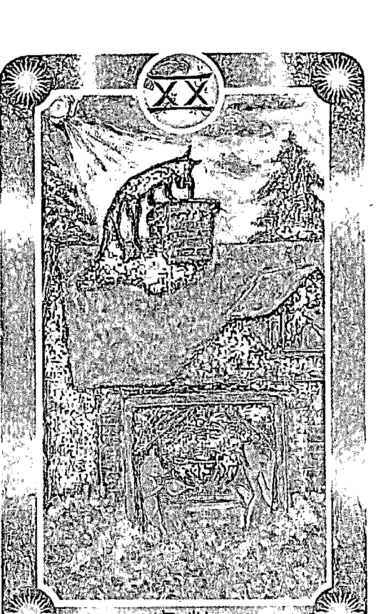

### 20. 审判《三头小猪》

> > “谁怕大灰狼，
> 大灰狼，
> 大灰狼，
> 谁怕大灰狼……”
> ——“三头小猪”
>
> ——童谣（《三头小猪》）

### 关键词
立即实现、纯化、康复性的判断、原谅

### 这张牌提醒我
△如果高度关注自己，喜爱自己的生活，并且为自己的生活负责，那我可以有哪些方面的变化？
可以在哪些方面利用自己周到的考虑，为自己的康复和精神园地打下坚实可靠的基础？

这张牌来自基督教末日审判的传说，天使将吹响她的号角，死者从地面重生。在审判牌里，我们一定会面对自己的行动、判断和使我们奔向可以找到康复和原谅之心的东西。在新生路上寻求未来的人，现在准备就绪，找到了一条掌握人生、把握自己命运前途的道路，这样可以引导他走出恐惧和失败的阴影。新生命的来临之前，是对旧有自我的裁判。只有面对和接受自我的错误，才能获得新的契机。在许多情况下，这张牌同时也是康复牌，是为成熟和欢乐庆祝的一张牌。

### 传统意义

### 最新物语

“三头小猪”是很多人都喜欢的一首童谣，因为它平白易懂地解释了懒惰、不负责任的一种人的命运，还有一定会让他们承担的后果。我们所有人最终都必须清晰地看到更高层次的新生。我们有机会通过犯错误来学习，因为我们许多人都将利用脆弱不堪的材料（虚心假意的奉献和关注）建起一栋房子（我们的精神基础），就像第一头和第二头小猪，它们整天贪玩，只是草草用草根和树枝胡乱搭建了一处窝棚。但第三头小猪却昼夜不舍地拼命劳动，建起了一处稳固的砖房。狡猾的狼胜过了第一头和第二头小猪（阴影中的自我很容易就毁灭在自我把握的建设中根基不牢的人）。在《魔法的用途》一书中，布伦诺·贝特尔海姆把神话看作是快乐原则针对现实

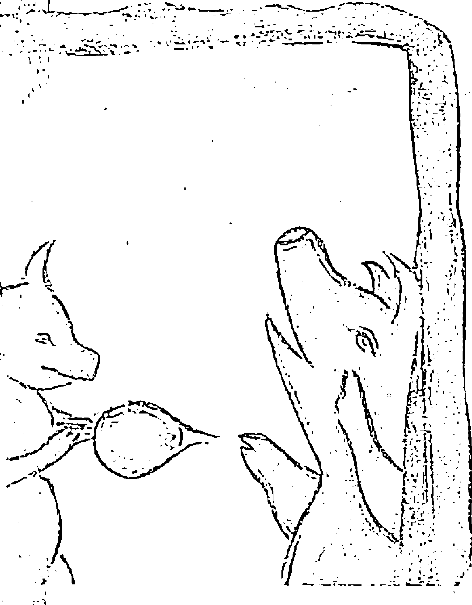他说：“三头小猪以最让人开心的形式和戏剧性的方式告诉孩子们说，我们不能偷懒，不能麻痹松懈，否则我们也许会死掉。聪明的计划和预见与艰苦的劳动结合起来，就会使我们无往而不胜，就能战胜最凶恶的敌人——那匹恶狼。”

第三头小猪为它浮躁的兄弟们提供保护，使它们逃离因为自己的愚蠢造成的恶狼带来的危险。最后，那匹恶狼从烟囱里掉下去，落入汤锅，完成了自己的转化过程。

### 自我肯定
- 我生活中的判断结果已经转化为观察力，引导和帮助我理解自己的生活，避开了自我批评和羞耻感带来的毁灭性影响。
- 我正处在纠正自己在生活中的判断水平的过程中。
- 我放弃自己在过去所做的判断。
- 我的关注焦点在于康复和原谅。

### 相关链接
### 希腊神话中审判的故事
审判——Hermes the Psychopomp，同“魔术师”，普绪科蓬波斯（赫耳墨斯的祭祀用名之一）他也是亡灵的指引者。

在希腊神话传说中，神会站在历史的终结处，所有人都要走向最终审判。审判之时，善必得报，恶必被惩。在塔罗牌中，审判牌的牌面是一个高居空中的天使，在向大地吹号。人们在天使的召唤下，都抬起头来。神的审判，有着“精神觉醒”的含意。天使的喇叭，代表唤醒人们的觉悟。不论什么罪孽，只要有悔改之心，就会拥有希望。当天使召唤的时候，你就获得了重生——所有的罪孽被清洗干净了，一切成为过去，你将开始新生活。

### 21. 世界
### 《地球之子》
> > “像武士一样进入今生吧，
> 没有什么会让你无聊，
> 你会幸福的，
> 让阳光照进来，它会让你康复，
> 你会感觉到自己，
> 你会唱出灵魂之歌。”
> ——克里斯·威廉森（《灵魂之歌》）

### 关键词
- 宇宙意识
- 启蒙
- 永恒意义
- 适度
- 有技巧的责任心

### 这张牌提醒我
地球之子让我看到必须接受的技能和机会。

- 我如何能够使这样的机会变的更有利于自己？
- 我如何界定自己一生的自由？
- 我如何限制这些形式，从而使其窒息？
- 我可能以什么样的方式把这欢乐的带入日常生活中？

### 传统意义
在传统的塔罗中，世界牌是一位正在跳舞的漂亮妇女，画在牌的正中，周围是四个固定的黄道记号，即金牛宫、狮子座、巨蟹座和宝瓶宫。这张牌代表一种宇宙和万有顶点的到来，在那里，自由和形式找到了赢得个人内心的平衡把握道路。世界牌预兆天堂和大地皇后的到来，代表技能和生产力。她是宇宙之母，她的舞蹈代表自然的节奏，也代表生命、死亡和新生的循环。流浪的愚者终于到达终点。这张牌代表着目标的达成，以及物质和心理的完美状态。但是注意世界也同时代表着终点和结束的意义。

### 最新物语
地球之子牌允许个人有另外一次机会看到永恒和神授阴柔意识的力量。它显示圣子的形象，它就在人性的自我意识中诞生。那个漂亮的婴儿（男性或女性）是圣母的纯洁礼物的表现，是从神授意识的圣器里诞生的纯洁和肉体化的财富。心的象征显示从月亮之中诞生出来的爱的原则（前排的月亮是新月，象征新的开始与新的行动）。人们应邀进入宇宙意识的王国，去迎接一次机会，借此以纯洁的心和开放的思想为世界服务。

### 自我肯定
- 我是有价值的漂亮孩子，世界为我提供了完全参与和完全接受的机会。
- 我有牢靠的基础，可以借以站立，并为这个世界提供服务。
- 我会以内心世界的安宁获得面对外部世界的冷静态度。
- 金钱得知以道，用之以度。不被物质需要所役使。
- 我会善待自己，进而善待身边的一草一木。
- 我对自己的每一个决定都有责任心，坚持到底。
- 理智面对这个世界，保护内心完美，不受伤害。
- 我坚信这个世界是公平的，是我对这个世界的看法不公平。

### 相关链接
### 希腊神话中世界的故事
世界——Hermaphroditus，赫马佛洛狄忒斯，赫耳墨斯和阿芙罗狄蒂的孩子。他原本是男孩，仙女萨尔摩赛斯爱上了他，把他抱住，并说：“神啊！我不想再离开他了！”于是成为合体。周围的4神为阿芙罗狄蒂，宙斯，雅典娜和海神。

### 第八章
### 四组小阿卡那的最新物语
小阿卡那细分为四组牌，分别代表火、风、地、水四种元素，在本书中分别对应权杖、宝剑、圣心、水晶。牌组名称反映出塔罗牌透露出来的内在精神本质。

每一组牌都由10张数字牌和四张头像牌组成。

这些牌比大阿卡那牌更有个性。

数字牌代表人们每天都会有的实际经历，而头像牌则代表个人能量领域、或者是一个人日常经历中的环境和人物的景象。

这些小牌也叫“小智慧”，被认为是现今扑克牌的前身，是扑克牌红心、方块、梅花及黑桃的由来。

本书这一部分进一步解释每一张牌，并起提供额外信息、补充其他纸牌提供的材料的作用。

### 魔杖王牌
关键词：能量、转化、驱动力

这张牌提醒我
> > 这股在我生活中出现的充满活力的能量，我应该如何完满地加以利用？

- 我应该如何以最佳方式体现和消化这些新的潜能，以便能够在自己的日常生活中让它们等齐并重？
- 我自己身上有哪些新的部分正在醒悟？

### 传统意义
这张牌显示障碍物和原来的模式化解之后出现的能量。本书中的魔杖王牌，是传统塔罗牌中的权杖王牌。权杖王牌经常被描述为火花或光束，它能转化僵滞不动的东西，并使其重新充满活力。据说这张牌是太阳牌之后第二大的能量牌。这张牌刺激直觉、创造力、性欲、瑜珈生命力和使一个人朝向醒悟意识的驱动力。

### 最新物语
魔杖王牌被描述为一只充满活力的蝴蝶，使新生和活泼的创造力潜能得到放大。这种有魔力的扩张得到精灵古怪的花仙子的帮助，花仙子扎着火红的发式，她们具有打开新生活力量的潜能。这是一根魔杖，是灵感和光亮的来源。它精神焕发的来源现在就可以得到了。应该尽最大潜能利用这股能量。

### 相关链接
魔杖牌组代表火的元素。在占星学中，火象星座有牡羊座、狮子座、射手座。火性的人充满活力，有如火一般的热情，需要刺激或冲突，喜欢把精力全部投入特殊任务中。对魔杖型的人来说，有一个目标比如何完成它更为重要。在爱情与事业上也喜欢靠征服来发展，认为其中的挑战性更胜于奖赏的快乐，重视过程胜于结果。火也代表着乐观、自信和希望。他们以强烈的渴望与行动来挑战生命，并以新视野与冲突为催化剂。没有行动，魔杖类型会变得忧郁而不快乐。魔杖型的人对生命的理解一般都是：
- 我听到的，可能我会忘记；
- 我看到的，可能我会记住；
- 我做过的，我一定会了解！

### 魔杖二
关键词
- 相互影响
- 有益结合
- 镜子
- 直觉

这张牌提醒我
> 我是否相信自己内心的看法，我是否倾听直觉指南里微妙的提示？

- 我是否有一个中心，是否与精神洞察力的创造天赋保持和谐？
- 我如何能够把这样的天赋奉献给世界？

### 传统意义
在传统的塔罗牌中，权杖二是本书的魔杖二。权杖二代表心灵内在领域里面动态的相互影响与一个人在日常生活中受到直觉型创造力指引之间的有益结合。这张牌暗示，人应该想办法确立与灵感和应用原则之间和谐的结合。有一股潜力可以使有强烈冲动的新的洞察力与基础牢靠的直觉等并重。

### 最新物语
魔杖二描述一位沉思中的漂亮花仙子，她在深沉地看着水面，也是在看自己内心之子的反映。她的身体闪耀着光芒，与潜意识的深水结成一体。她看到了自己脸庞的真实的深层图景——花团锦簇、形成耀眼的光环围绕在她的能量顶轮上。图片中所有的物体都带有一种神性的反射与反省意味。人们不妨思考和探寻代表人生的真实状况。魔杖二是一面灵魂的镜子，人们会面对这么一种需求，即以自己的眼光和清晰的头脑认同未来前景中的神秘因素，并使种种因素合成一体。

### 相关链接
魔杖二所说明的是一种来自实践或者依靠自身修养而来的能力。就像魔杖所代表的火元素一样，它本身有熊熊的燃烧力——即个人魅力。这是一种生生不息的力量，发自心灵内在领域，通过行动与实践表现于外，令人积极向上，当它受到勇气、直觉等因素指引，就能成就辉煌。

### 魔杖三
关键词
- 醒悟
- 自信
- 智慧
- 超越理性

这张牌提醒我
> > 我会怀疑自己真实的美德与技能吗？

- 我是否与真实的天赋与灵感内在的交响乐保持和谐？
- 我如何在生活中营造欢乐？

### 传统意义
在传统塔罗牌中，权杖三是本书的魔杖三。权杖三表示人在美德、自信和涉及一个人在创造和激情的完整性面前产生的醒悟。这张牌里面的智慧抵消灵魂里面的疑惑和担忧。“3”这个数字与权杖牌组里面强烈的活力潜能相关，它带有良好的意愿，并给人以最大的自信和心理授权。人们不能够依附于智力严格的局限，因为“3”这个数字暗示与自然之间的感官联系。权杖牌给思想以启迪，使其上升到更高的理解状态，这里面包括想象力和直觉视野。

### 最新物语
音乐是灵魂的语言，它超越理性思想的边缘。比如小提琴、竖琴、中提琴和吉他一类的弦乐器制造出来的错综复杂的和谐与巧妙的节奏，都是不同音调和弦索或人类灵魂的情绪和音调统一起来的美好范例。我们每个人的身心都含有可变化的震动。魔杖三激发我们与欢乐和创造力共奏交响乐，因为这张牌表示与自我表达的欢乐进行交流。这张牌里面的三位仙女在欢庆三位缪司女神。这三位缪司为我们提供了千里眼一般的洞察力和直觉技能。

### 魔杖四
关键词：需求、培育、新的开始

这张牌提醒我：
- 在创造性的生活中，我是否完全投入到播种新潜能的过程？
- 在可感知的日常生活中，我在以什么样的方式谋求新洞察力与智慧的诞生？
- 在此时此刻的生活中，我在播种什么样的新灵感与创造性计划？

### 传统意义
在传统塔罗牌中，权杖四是本书的魔杖四。权杖四代表一种需求，即要具体化个人生活中的创造力的有益影响。在此我们看到新的开始的原则，它们源自前面几张牌中的视野和洞察力。在此阶段，它们一定植入了个人生活的肥沃土壤，因此全新和充满活力的成长阶段就会生根。在这最高的形式里，这张牌代表新意识的播种，代表重新开始的基础。

### 最新物语
培植和园艺都要求有计划、有奉献精神、还要有预见。一个漂亮的园子是一个人的欲望的结果，他要通过人性与自然之间相互合作的关系来召唤美与和谐的出现。如此我们才能够可触知地体验更高的灵感与物质世界之间的交互关系。同样，我们作为人类必须继续追寻更好的方式，使更微妙的思维和不可见的力量与日常生活中平凡和世俗的层面联合起来。焦点、决心和艰苦的努力培育出巨大的潜力它将在个人生活中完善地绽放出来。这张牌描绘的仙女代表春季，此时正是播种的季节，是太阳能量不断增长的一个季节，是万物在等待萌生的季节。

### 相关链接
魔杖四喻示的是从播种到收获过程中事业培育的道理。需求是种子，个人能力是土壤，培育是事业，而个人预见和创造力这些人性能力与物质世界（大自然）的完美结合才是收获——这正是我们所追求的。

### 魔杖五
关键词
- 排除障碍
- 释放潜能
- 转变

这张牌提醒我
- 我在抑制自己创造能力的哪一个方面？
- 我如何能够以友爱和善意迎接此时此刻正流入我生活中的变化和灵感？
> △ 我像春天的花朵一样绽开。我生活中的哪一部分在寻求变化，我能够做些什么事情促成这一变化？

### 传统意义
任何牌组中的“5”这个数字都代表变化和一种需求，那就是要解除停滞，要在与所选纸牌的牌组和要素相对应的生活领域里消除抵制因素。在这个例子中，一根权杖代表火，代表在创造力、直觉和灵性的领域里自由移动的需求。如果有一种冲突或情感上的障碍阻止人们的表达和灵感，那这张牌也许就说明有必要释放出创造能量，便于生命能量流回到人们自己体内。

### 最新物语
在塔罗牌里，所有的“5”都代表最高潜力。从数字命理学的角度看，“5”这个数字代表自由、创造力和变化。这个数字和有五个尖顶的五角形一样，最终会代表一个人的灵魂能够达到的最高创造潜能。我们必须奋斗，必须要到达优秀水平，因为跟天上的星星一样，我们有潜力闪出自己的光芒，并以我们的光芒照耀大地。这位漂亮的花仙子正在打开一朵明亮的黄色花朵最后的花瓣，这是一个象征图像，表明我们星际的起源得到了显现。

### 魔杖六
- 胜利、恢复能量、欢乐

我的生活是一场魔法之舞。我得到了创造性更新和灵感的祝福。我如何能够以最佳方式把生活中此时此刻出现的这些美妙祝福统一起来？
- 我能否拿出时间来崇拜和欣赏自然及生命的奇迹？

### 传统意义
在传统塔罗牌中，权杖六是本书的魔杖六。权杖六表示胜利和凯旋，因为一个人已经做了很多，已经得到更新，重新充满了精神活力。人内心的火焰再次燃烧起来。已经出现的突破口，各种能量的统一已经恢复。

### 最新物语
大自然的不同阶段和周期在一年之中有起有落，这样的起落是照射人性的巨大镜子。魔杖六显示春季的奇迹，此时，春天的第一批花朵破土而出，绽放笑容，为世界奉献了自然的礼物。温柔的雨水使大地松软，有助于减轻自然诞生过程的生产之苦。五朔节花柱是人性创造的极好象征，春天的花朵把新生命带回大地，而五朔节花柱就是在模仿春天花朵奇迹般的开花过程向上的周期活动。自然不动声色的胜利闪耀出一线希望之光，在五月的第一天，也就是五朔节的那天照耀着大地上的一切生灵。魔杖六全年都在向所有人奉献这种生命力的潜能与欢乐。

### 相关链接
古希腊神话中，伊阿宋(Jason)，是伊尔科斯国王的儿子，在兄弟篡位夺王位后，为了安全，逃入山洞长大。其兄召见他，令他夺金羊毛，那样便还位于他，实际上是想借看守金羊毛的巨龙杀死他。伊阿宋借力发力，杀死巨龙，取得成功。

### 魔杖七
- 把握时机、袒露、本质、坚持自我
- 我意识到了在内心深处发生的萌芽吗？
- 我是否抽时间将自然的康复力量与日常生活中忙碌的时间表整合起来？
- 我是否意识到了生理层面的身体微妙的需求？
- 现在是否到了研究和探索能量与医学的强大力量的时候？

### 传统意义
在传统塔罗牌中，权杖七是本书的魔杖七。权杖七表示一个人到了必须为自己的力量和萌芽承担起责任的时候。人们必须完全到场，而且愿意接触灵魂真实的本质。不能够否认，哪怕周围的世界使人的努力徒劳无益，最好还是要保持坚强，要有信念和善意——坚持真实的自我。这是向世界袒裸灵魂的时候，也是袒裸自己神性的最真实的本质的时候。

### 最新物语
在魔杖七中，最可爱的花仙子与自然世界处在完满的和谐与交流之中。她热情奔放，同时也容易感受到这股震撼性的影响力，因此成为巨大康复力量的接受者。彩虹般的蝴蝶在头顶飞动，她倾听花语传出的微妙曲调，代表七只圣轮所具备的康复潜能。在塔罗牌里，我们曾称这张牌为康复牌。人们有能力在世界的挑战中昂首挺立，重要的是要确认爱的力量、康复的力量，还有同情的力量，这些力量照亮了人们在大地之上的旅行。因此，这张牌意味着个人把握和接受的时机，让自然的力量和与自然最基本的亲情从内心里治好你的疾病。

### 魔杖八
### 关键词
- 排障
- 激情燃烧
- 能量
- 愉悦

### 这张牌提醒我
涉及我与更高奉献与康复的相互关系时，我是否意识到了此时摆在我面前的巨大技能和把握能力？
- 我是否与自己亲密的朋友和熟人保持着联系？
- 我如何才能强化自己的后援和友谊圈子？

### 传统意义
在传统塔罗牌中，权杖八是本书的魔杖八。权杖八代表清除挡在路上的绊脚石的能力。这样的能力既在快速活动，又是固定不变的。数字8的本质就是技能与掌握，而这个权杖组就代表着灵魂之火，它在燃烧着激情与生命力。交流会加深，一个人站稳立场、头脑清晰、中心明确的能力便会得到强化。困难就快要过去了，而一种完整的感觉却在充满内心。

### 最新物语
魔杖八讲的是能量，是一个人召唤它，使其朝向自己的焦点和再次恢复活动的能力。魔术一样的月夜就是这种神仙般重逢的背景。每个人都向中心之火伸出一根魔杖，以便统一自己的光体，使其再次得到能量。它们代表我们与亲族之灵保持联系的需求；提升和强化命运之路的需求；大胆引燃生命激情之火的需求。有时候我们必须使重要的人、地域或者事件再次联结起来，这样才能投入我们灵感的精髓之火。这张牌表示无条件地对自己的能量保持真实的时机。

### 相关链接
在《旧约·出埃及记》中，摩西是一个魔杖八所揭示的人物。他拯救了以色列人民脱离埃及法老残暴统治，凭借内心力量与主的帮助，用魔杖点开红海海面，使出逃者顺利通过，埃及追兵却没入大海。

### 权杖九

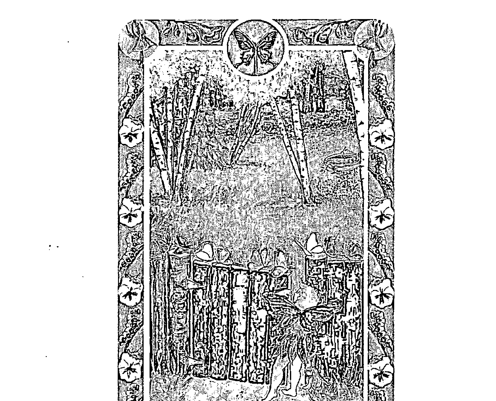

### 关键词

- 苏醒
- 内在智慧
- 入口

### 这张牌提醒我

我必须以前所未有的方式信任内心的引导。我不会束缚自己。我必须采取什么样的措施才能最大程度地将信任摆在前方的未知旅途？我的向导坚强而可靠。我的梦幻在向我说话。我如何才能强化自己的心灵信任度并深化与更高自我的相互关系呢？

### 传统意义

在传统塔罗牌中，权杖九是本书的权杖九。权杖九表示潜伏的能量已经在一个人的内心苏醒的时刻，它提供一种理解就摆在前面的众多可能性的机会。这是表示内在智慧的一张牌。当人们准备好，也愿意探索潜意识的时候，创造力的许多层面就容易看见，也有可能实现了。选择在于每个人自己。他们也许会因为担忧或者否认自己的生活而发生阻碍，也许他们会进入一个新的门槛，然后发现意义深远的内在机会和外在机会。

### 最新物语

我们每个人的内心里都存在一个花园，花园里面有无尽的美景和旺盛的生命力。我们的一生总会遇到这样的一些时候，当我们来到一条小路的尽头，结果就出现了柳暗花明的奇迹，发现了丰富的新经验。有时候，机会感觉起来更像是一种障碍而不是一件礼物。然而，冒险证明是有益的，当我们相信机会，当我们具备了一定的智慧，我们就敢于越过已知道路的局限而挺进未知领域，这样就能发现等待在那里的新的礼物。就如同在权杖七里一样，我们在这里再次看到了彩虹般的蝴蝶，代表七只圣轮和我们最高的人类潜能。现在，九只蝴蝶等在花园的入口处，准备给那位仙女送去康复与欢乐。

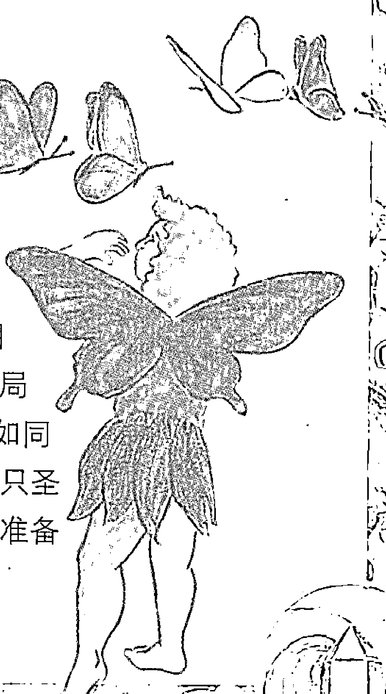

### 权杖十

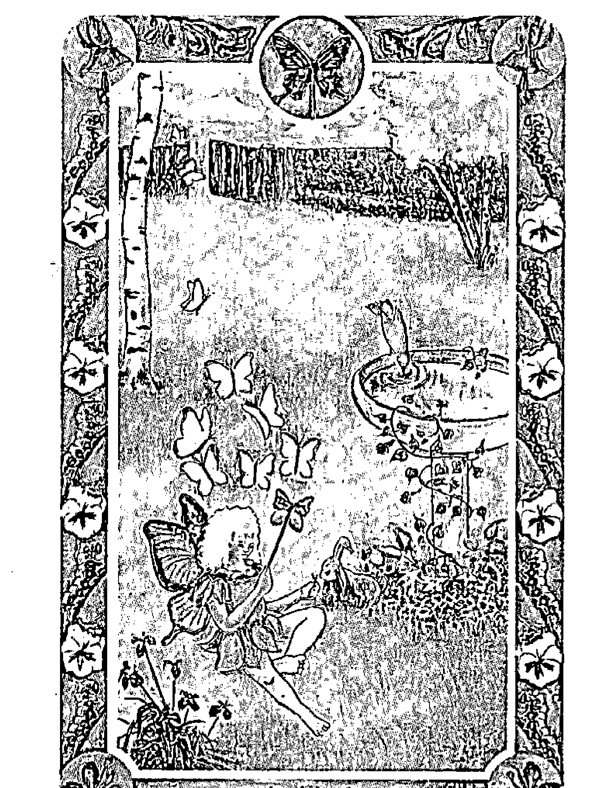

### 关键词

- 确认
- 极限
- 建设性
- 克服压抑

### 这张牌提醒我

- 我最大的梦幻是什么？
- 这些梦幻是可以实现的吗？
- 我如何才能建设性地改变自己的生活，以便开始过上一种充满欢乐、幸福和康乐的生活？

### 传统意义

在传统塔罗牌中，权杖十是本书的权杖十。权杖十是一份邀请函。确认和信任注入你生活中的活力与生命能量。这张牌代表艰苦努力和越过压抑及自我否认的深重责任而到达顶点。

### 最新物语

权杖十是给容光焕发的仙女加冕的庆典仪式，她冒险穿过花园入口，进入了新经验的丰富领域。在前一张牌权杖九里，彩虹般的蝴蝶歇在花园入口上，等待着给这位仙女戴上代表新生与纯洁的洁白花冠。这位漂亮的彩虹女神代表终极创造力，因为这些颤动的春天花朵康复的特征被描述为自然的画笔。有这些美丽的花朵在场，就象征着对有创造力和灵感的作品的追求。直觉的力量是很大的。一种康复已经发生。

### 相关链接

权杖十显示的是一个临界点，也是新生活的入口。一切坚忍与艰苦努力要结束，创造能力与灵感濒临爆发。一切能力得到确认。过去所遭受的一切压抑，都是富有建设性的。

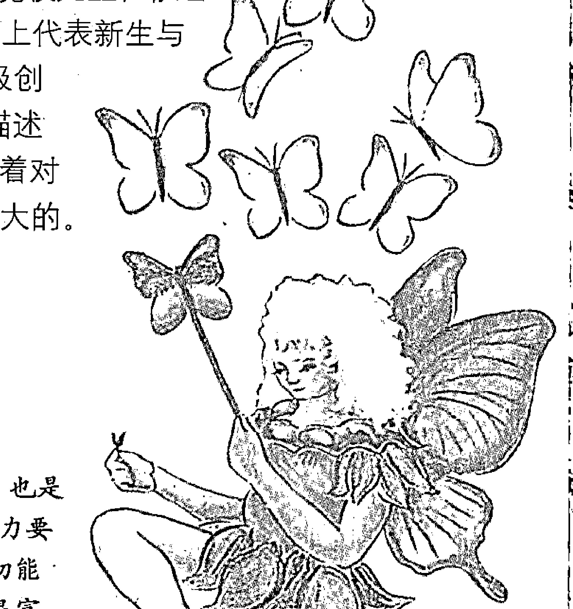

### 权杖之子

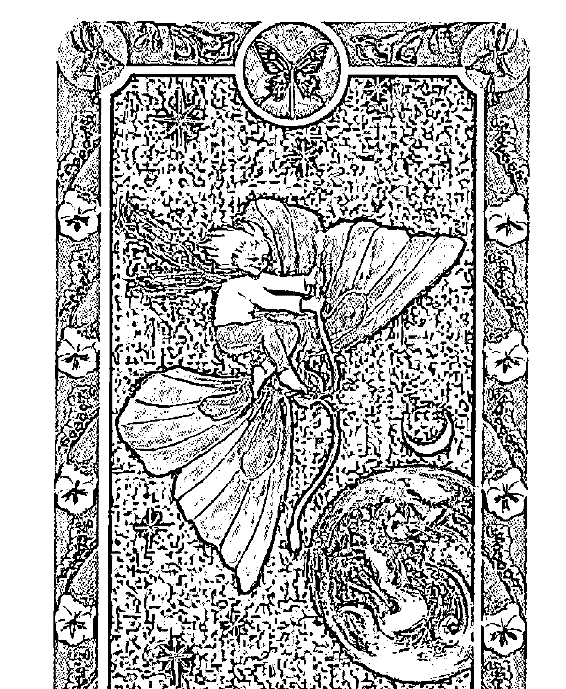

### 关键词

- 通向成功
- 时机来临
- 被动

### 这张牌提醒我

我乐于前进，想找到最佳办法满足创造性的人生使命。我如何才能实现这个人生目标呢？我如何跟“灵魂之家”取得联系？我相信自己内在的声音吗？

### 传统意义

在传统的塔罗里，这张牌是权杖童子。童子是听差，或者是接受命令的人。这里面有一种太阳一样的品质，因为心灵放射出来的光芒已经被激发，通往创造性把握的道路已经接受成功了。生命之舞朝向了直觉的尺度，精神研究将时兴起来。这张牌更多是被动，而较少主动，尽管权杖的火元素很少是被动的。焦点和清晰的洞察力是关键。

### 最新物语

权杖之子由安托万德·圣埃克叙佩里所写的小王子来代表。回家的路、通往创造力源泉的路以及精神协调的路，就是这张牌的关键。我们都有特别的人生使命，小王子是一个提醒者，让我们知道必须要记住自己是谁，为什么得到生命的礼物，以及为什么要把握自己的命运。

当这张牌出现在一个人面前，那就到了把握奇迹、庆典和梦幻的时候了。蝴蝶起魔毯的作用，带着小王子去完成星光照耀的使命。那条路永远都是开放的，在上面和下面都是一样，因为大地乐于接纳爱与光的不同仆人，无论他们来自附近还是远方。回到自己的根源，飞向自己的梦幻。

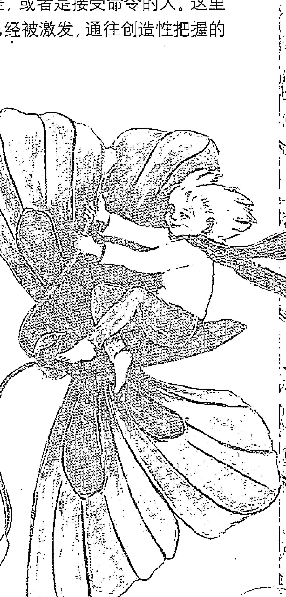

### 权杖寻找者

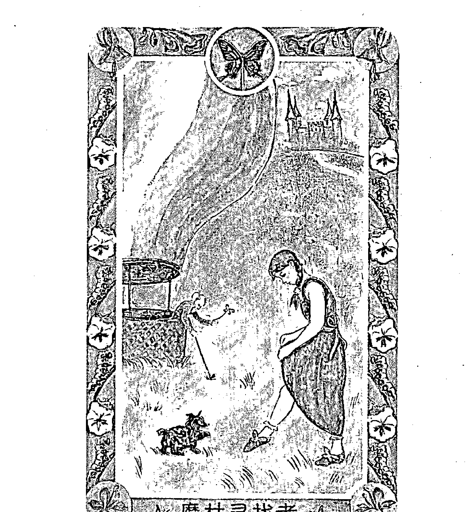

### 关键词

- 能量爆发
- 建设性
- 奔向成功

### 这张牌提醒我

如果我有意坚持下去，坚守自己的意向，我会到达自己的目的吗？我今生最想达到的目标是什么？我是在正确的道路上吗？如果不是，我能够做些什么来改变自己的前进方向，奔向完满的归宿？

### 传统意义

在传统的塔罗里，这张牌是权杖骑士。增强的直觉能力和创造力激发起来的能量被释放出来，一发而不可收。人们真心愿意与自己神授的使命联合起来，最终的结果将会是欢乐的、有康复作用的。所有不同的情形都将朝建设性的方向奔去。

### 最新物语

寻找权杖的人由《绿野仙踪》里面的多萝茜所代表。她无法跳上她和巫师为去堪萨斯的旅行而制造的魔术气球，因此准备开始一种不同的旅行了。她必须靠自己找到去往南方的道路，在那里与一位向导会面，就是那位善良的巫师。善良的巫师会告诉她如何表达自己的意愿，并找到回家的路。

故事到了这个时候就十分关键了，多萝茜必须要激发自己的能量回到堪萨斯，那是她渴望返回的根基与保障之地。多萝茜发现回家的力量就在她自己身上，就在她穿的魔鞋里。那是一次漫长的旅行，充满了魔法、危险、爱和成熟的经历，她旋转自己的鞋跟，转着圈回到了自己的家，回到了朋友和亲人身边。寻找者或者骑士总是会找到回家的路，只要他们真心想要达到目的。

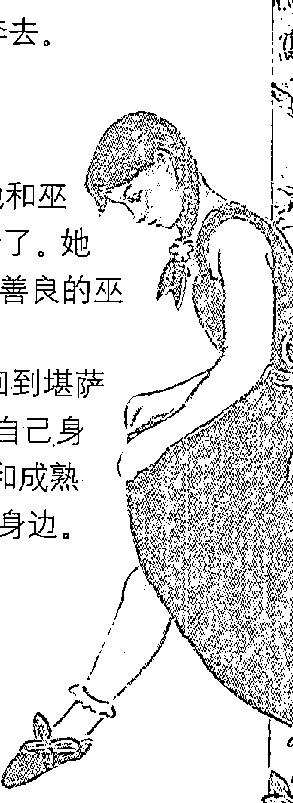

### 相关链接

这是一张预示内心能量爆发的牌，正像在传统塔罗里，它是张骑士牌一样，正风驰电掣地向目的地奔去。在这过程中，内心意愿与所负使命已融合起来。

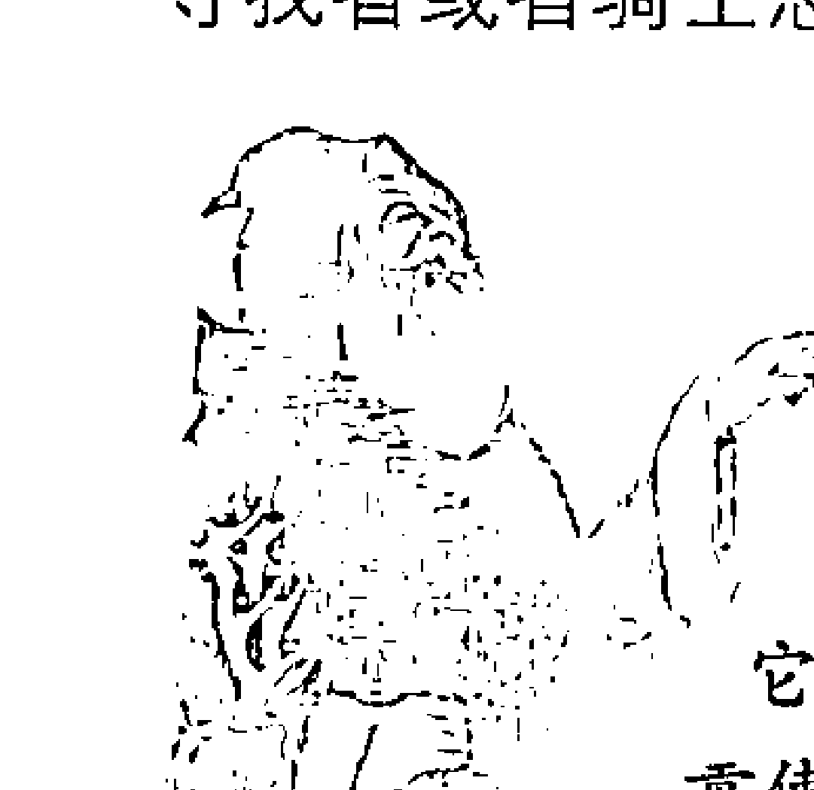

### 权杖向导

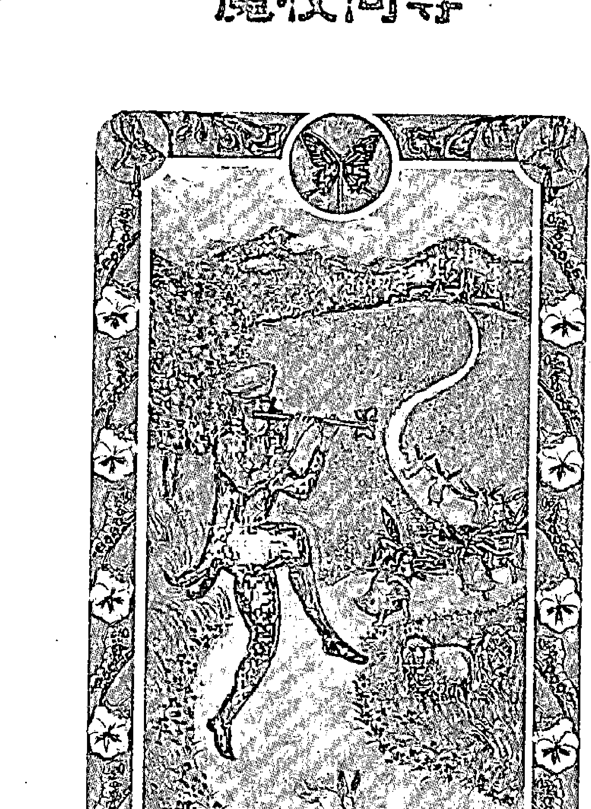

### 关键词

- 同情心
- 援助
- 阴柔力量
- 贡献精神

### 这张牌提醒我

我如何才能利用自己在这个世界上的最佳创造能力？我有能力全心全意为这个世界服务吗？这个世界最需要我的什么天赋和才能？

### 传统意义

过去，这张牌以权杖王后的名字著称。王后因为拥有同情心，因为温情的统治、因为其权威来自她的善心而著称。权杖王后尊重心灵的神圣度量，只要她看见的人，她都会伸出援助之手。权杖王后代表行动中的阴柔力量。她火热的激情散发出巨大的康复潜能，因为她主宰着称为能量区的七个圣轮中心。她激发人内心的智慧，就像一面镜子，让每个人都看到内心直觉的力量。

### 最新物语

有时候，我们选择交换几张牌的性别，把这种交换看作是显示男性和女性能量如何可以由原型中的男性意向和女性意向来代表的方式。我们每个人的灵魂之内都带有王后、国王、儿童和公主的品质。无论是男是女，我们一生都会有这么一些时候，此时，我们会接到召唤，要与我们内在的自我达成和谐，并强调更多关注阴柔或阳刚的能量。

权杖向导由花衣吹笛手代表。这位向导具备主动和阳刚的原型品质，因为他已进入了自己的意愿，并前往拯救遭遇鼠患的哈姆林城。花衣吹笛手有一颗充满创造力的心，急于要恢复这个可爱小城昔日的美丽与高能量，因此就受雇前往驱鼠。他用温柔的笛声把老鼠引到城外去。城里的官员拒绝支付给他费用，因此就象征着失衡，是我们在自己的物质与精神价值的世界里常见的失衡。作为对他们贪婪行为的惩罚，花衣吹笛手吹笛子把孩子们引到山里，引到未知的现实中。有一个跛足的小男孩子在城门关闭之前到不了山里。他必须返回城里，他是一个原型，代表缪司在现实世界里并不能够完全施展出自己的能量。花衣吹笛手作为权杖王后，是纯粹而重要的象征，代表通过人的更高天赋做出贡献的创造精神。

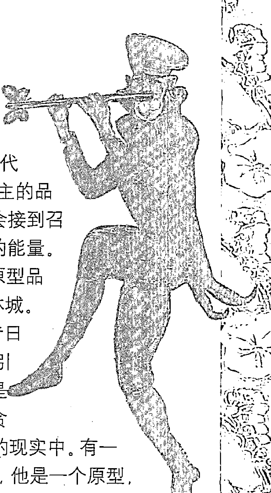

### 权杖守护者

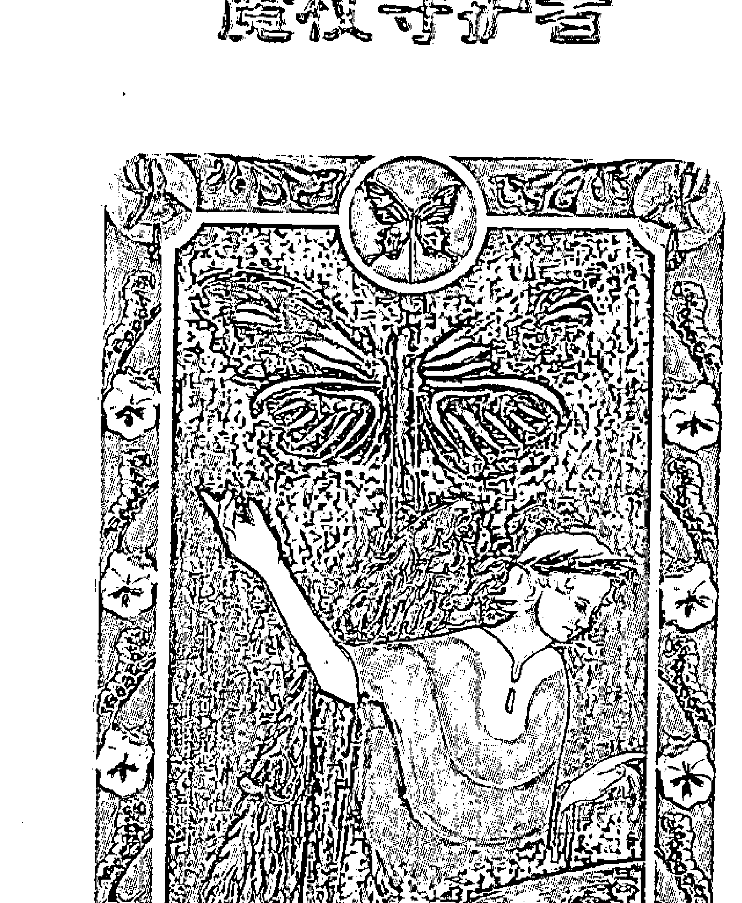

### 关键词

- 强而有力
- 权威
- 完美化
- 快乐生活
- 终极祝福

### 这张牌提醒我

从意识的精神王国里，我在接受什么样的自我肯定？我是否能够领受个人把握的微妙力量？我是否能够成为这种强力之光的直觉管道，并且与这个世界分享这一份快感？

### 传统意义

这张牌以权杖国王著称。这是涉及更高直觉及精神康复力量的塔罗中最威严和最强有力的一张牌。它反映人们准备好全身心迎接天赋、创造性的努力以及精神训练，是他们在过去一直都在关注的。艰苦的工作和巨大的能量会有所回报，人们不妨假定在自己努力以求的无论哪个领域都有自己的权威。权杖国王使更高的视野具备实质，并代表完美化的形式，人的心灵、思想和身体以及灵魂都会在那里得到统一。这样的美反映在自然之中，当人的灵魂能够表现这样的美与仁善时，那是罕见的美事。

### 最新物语

这张牌描述的是拉斐尔，他是深谋远虑的原型——守护着人性、为地球上每一个奋斗着的人指引方向、并关心他们。拉斐尔这个词实际的意思是“上帝康复”。头两个字母（Ra）让人想起古埃及人表示太阳神的词Ra。这张牌奉献了终极的祝福——是光、爱与智慧的神圣征兆。这个星球上有很多人把自己的生命献给了精神的仪式。这是灵魂的深层责任，因为一个人必须格外注意这个宇宙最需要他们的什么东西。这种谨慎小心的看法在人们对更高的呼唤产生反应，而且愿意成为真正的寻路人时就得到确认。这样的人一生都过着快乐的生活，一生都在追求康复，一生都在无条件地爱着别人。这是权杖守护者的礼物。

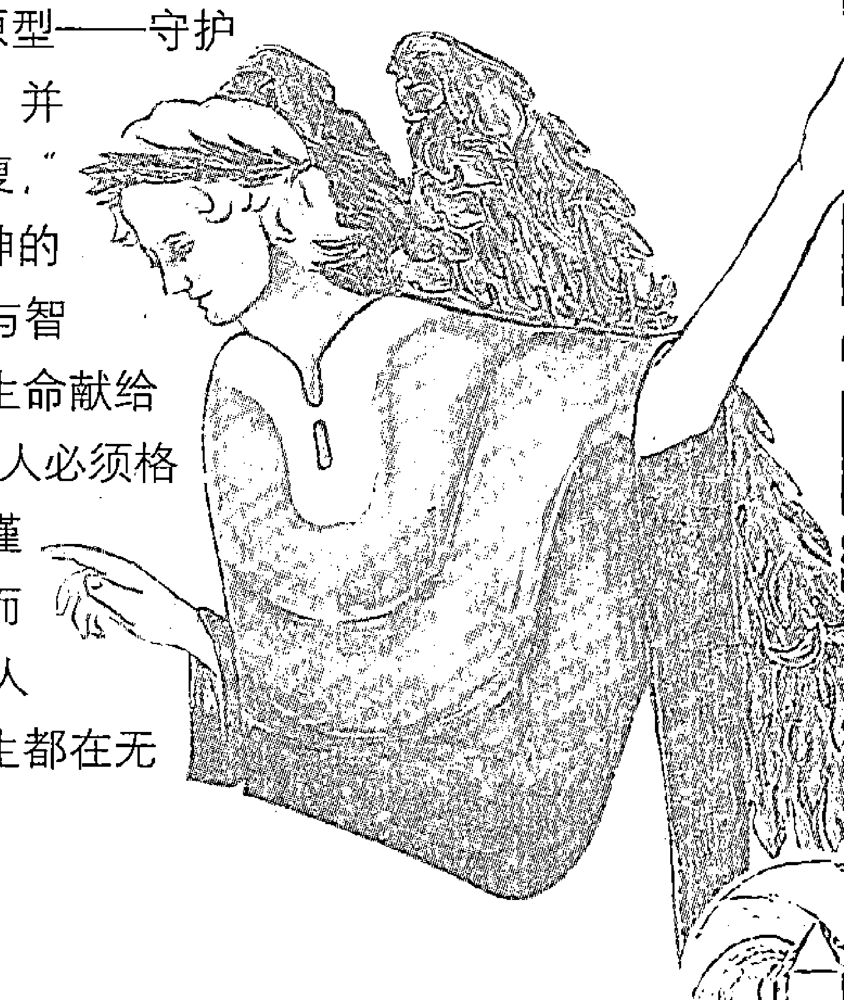

### 宝剑王牌

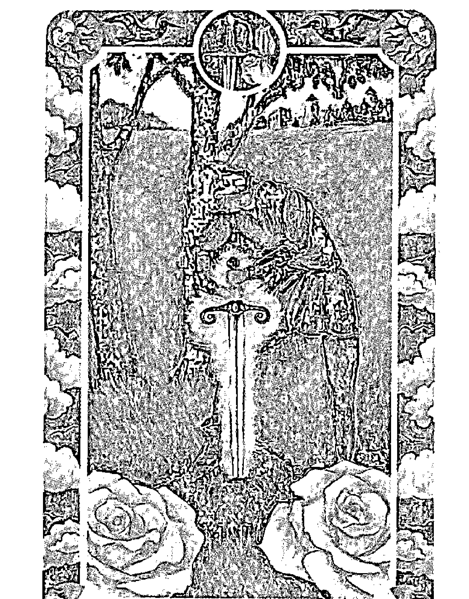

### 关键词

- 预兆
- 征服
- 道德确信
- 精神授权

### 这张牌提醒我

我如何才能使身心保持一致，从而能够超出自己的局限和判断力而与宇宙真理达成一致？什么样的新真相出现在我的心里？我是在按自己追求的方式生活吗？如果不是，我该对什么加以改变，以便与内在智慧保持一致？

### 传统意义

这张牌激发创造性思维、思维清晰，还有头脑的强大力量。宝剑王牌是一种确认，是新的开端和诞生的预兆。笔直的宝剑是最高真理的代表，它是一种工具，切入错觉、欺骗、恐惧和所有抑制更新的意识成长的精神构想。

### 最新物语

最高水平上的宝剑代表精神意愿和征服恐惧及精神和世俗领域里的疑惑的力量。这张牌描述的是亚瑟王小时候从石砧里抽出神剑的情景。之后，他就被确认为英国王位的合法继承人。这个故事里的神话对人们产生了深刻的影响，因为它讲的不是使他从石砧里抽出宝剑的那股蛮力，而是道德确信的力量和精神授权的力量，与更高的呼请是同步的。宝剑王牌是真理和灵魂清澈的指示器，也是精神的指示器。

### 相关链接

宝剑牌组代表空气的元素或智力。刀剑带来痛苦，也带来理解。这组牌是教我们如何通过实践检验，去改变我们对人生的理解。想法、理念、信仰及态度都是以剑这组牌为代表。在占星学上此类组象征着：双子座、天秤座及水瓶座。空气的永无止尽就如同我们的心。和现实比起来，有时心智可能会造成更多的痛苦和悲伤。宝剑类型的外貌常是具有较深色的头发和眼睛，他们可能思想敏捷而且措词犀利。在这类牌组中，它也传达着一个讯息：你的思想和信念会影响到你周遭的人。而他们也同样地影响你。

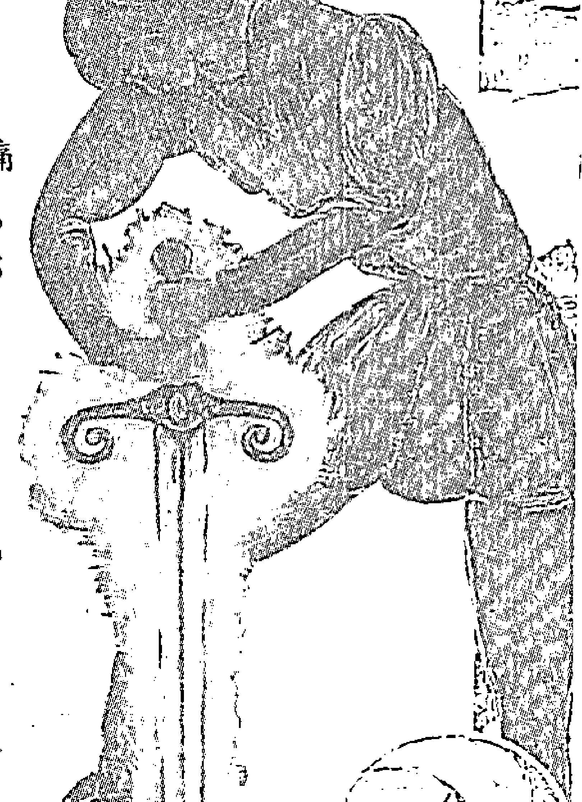

> “你相信它是真的，它就是真的。”

### 宝剑二

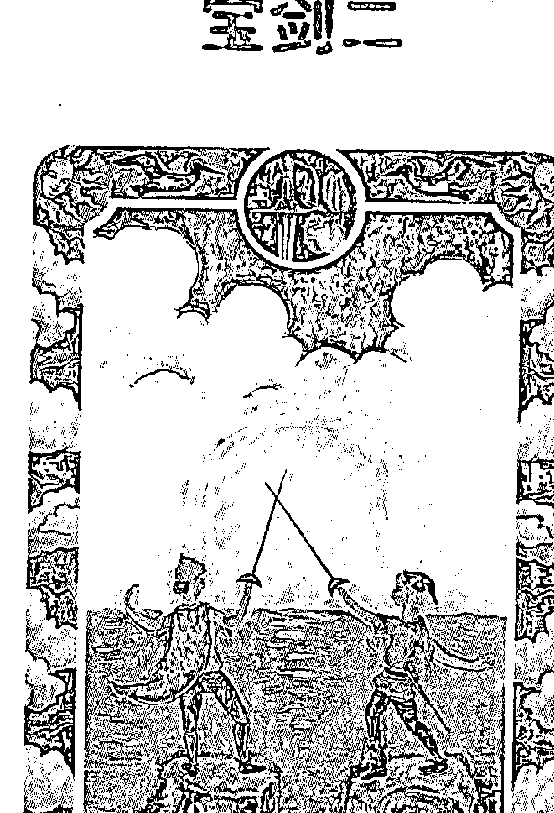

### 关键词

- 两重性
- 对立面
- 学会选择
- 超越

### 这张牌提醒我

什么样的思想和念头阻碍我准确的判断，使我得不到新思想和行动的自由？我做决定时是否困难？如果是，为什么？我遵从的是本能还是智力？我最相信哪一种？

### 传统意义

在传统的塔罗里，两把宝剑经常是互相交叉的，代表需要屈服于智力所不能及的一种决定。经常会显示一名蒙上眼罩的妇女，她看不见就在眼前的宝剑。这表明，她必须远离枯燥无味的智力和理性思维，让湿润的潜意识暗流打开通往直觉的大门。这张牌可代表平和与宁静，也可以给人提供一个视角，说明并没有一个错误或者正确的答案。有很多种选择。人们必须学会如何选择，如何超越恐惧而分辨一切。

### 最新物语

这张牌相当重要的一个方面，是交叉的宝剑之后那轮落日所代表的意义，因为它让人们看到循环，而这个循环又容纳了对立面的两重性。对立面是整个图景的一部分，如果不将这两个方面都包括在内，我们就无法知道任何一种既定环境里更大的图景。这是相当重要的消息，因为我们的思维统治着日常生活的一些方面。通过宝剑二，我们能够学会尊重决策的过程，它就像生活中的剑术——那是灵魂之舞，在这样的舞蹈之内，我们学会技能、得知思想的伟大。否则，我们也许会思想僵化，担惊受怕，无法做成任何一个决定。

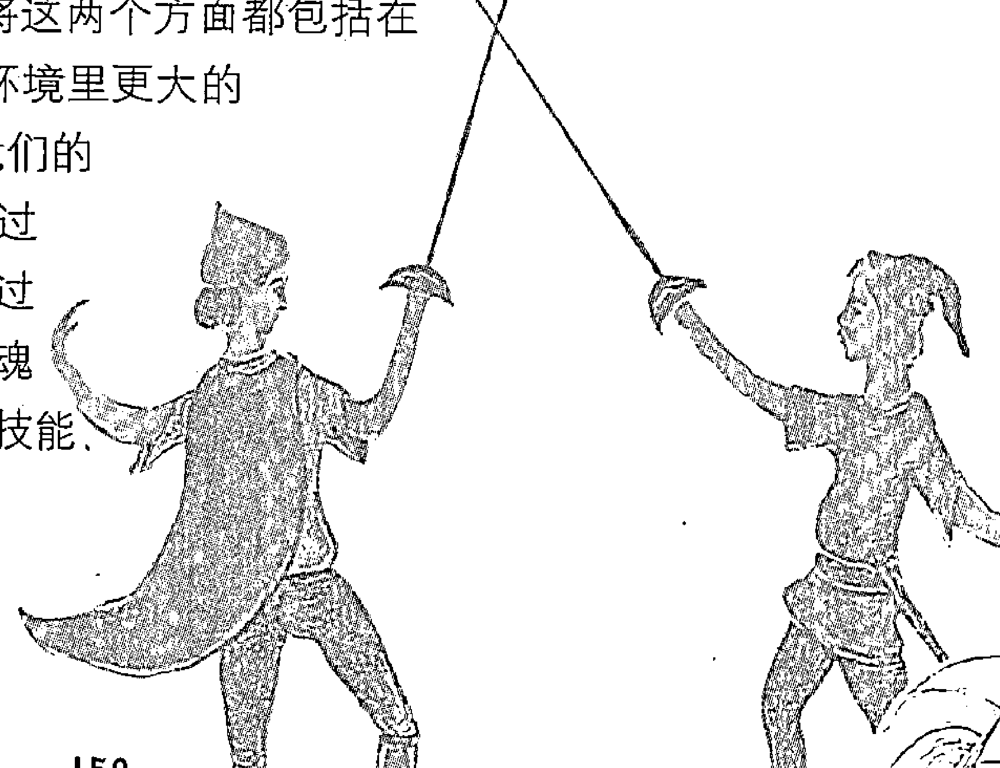

### 宝剑三

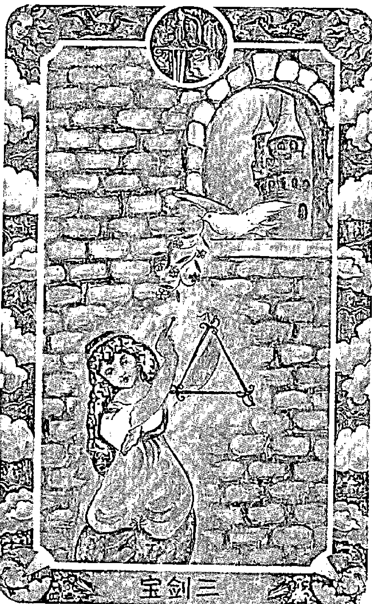

### 关键词

- 困扰
- 陷阱
- 渴望
- 应对策略

### 这张牌提醒我

什么样的思想限制了我越出当前困境寻找幸福与欢乐的能力？我的内心有一股力量，可以把思维与思绪、心灵与感觉融合在一起。这样的融合会使我处在平衡与和平的状态。我必须要采取什么样的措施确保这些得以实现？

### 传统意义

这张牌显示决策的困难或担忧。也许一个人会在思维游戏中陷入困境，也许会在人际关系中遭遇困难，或者是一种苦难已经透入思想，到达了无法超出具体情景而看清事物的程度。这是一个思想陷阱，如果的确如此，宝剑三只会让一个人感到紧张。人们已经与心灵失去接触，或者与无所不包的爱的品质失去联系，因为爱能够抚平并清洗所有的思想伤痛。

### 最新物语

在数字命理学中，“3”这个数字表示欢乐、交流与和谐。在传统的塔罗里，宝剑三是小阿卡那牌里惟一带有三而又缺少欢乐和康复意义的牌。塔罗牌寻求使人平衡的方法，它提醒人们，每一种情景都会提供机会和丰富的种子，支撑心灵成长的可能性。这并不会削减宝剑三的力量，而只会强化它的活力与决心。感受这张牌的最高方式，是要理解思想的真实本质。思想时常会主宰我们的现实。从某种意义上说，那位少女就是拉潘泽尔的复制品，她必须要使自己从高塔的禁锢力量中解放出来。在这个情景中，她被囚禁在古堡的石墙里，可是，跟牌中处在高塔里的拉潘泽尔一样，有一扇窗户可以看到等待着她的更大现实。她必须要越过当前情景的限制。少女已经把宝剑转变成一种三角铁乐器，目的是要让她能够使自己所处的情形产生和谐，并有机会迎接她的精神围困之外的礼物。

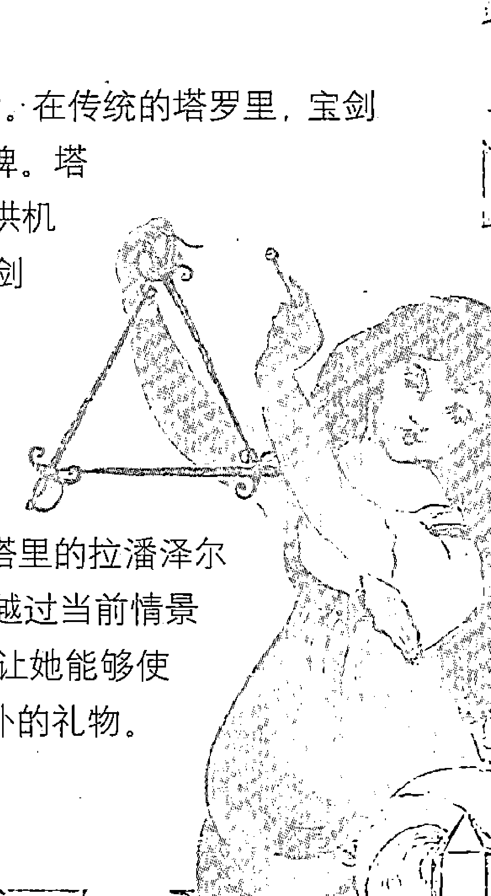

### 宝剑四

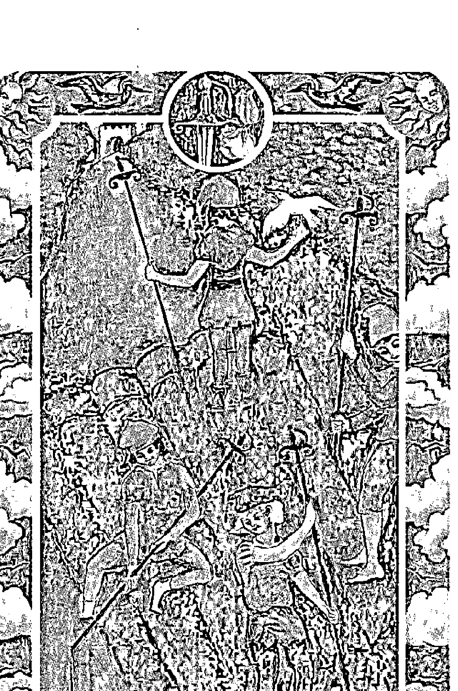

### 关键词

- 直面
- 希望
- 警觉

### 这张牌提醒我

为了维持清澄明晰和我的生活真相的厚实基础，我必须要确认构成我思想的形式和构想，并确定我当前的生活情形是否支持进一步的发展与成功。我是否在注意思想的暗流？我是否在寻找新的途径以理解自己的生活和生活周围的条件？

### 传统意义

这张牌显示宝剑四成功地面临危机或机会的时刻。这是一个稳定和幸运的时候，直觉的感情世界里的和谐，已经与思维的精神构想相遇。无论是什么看起来毫无希望的事情，现在看起来都是实现好运和宁静的时机。然而，这张牌也带有一种警告。不要忽略可能隐藏或者埋藏在潜意识里面的东西，如果人们不花时间思考并着手将宁静与和谐带入所处情景的各个方面，受压抑的精神焦虑就会冒上来，并引起进一步的痛苦或担忧。

### 最新物语

在人生的不同阶段，我们有机会越过旧有的思想模式，并使我们的意识奔向启蒙后的新的可能性，这在宝剑四中是通过远处的金色城堡表现出来的。四个小孩子用来远行的木筏子代表当前思想和计划的基础。这些宝剑变成了钓鱼竿，目的是要让他们延伸理解力，将潜意识更深处的内容表现出来。内在的真理（由溪流代表）有了理解自由愿望的陪伴（那只筏子），就会从往昔潮湿的深处冒出来，并且作为任何既定情形中最新确立的清澄透明而为人们所见。

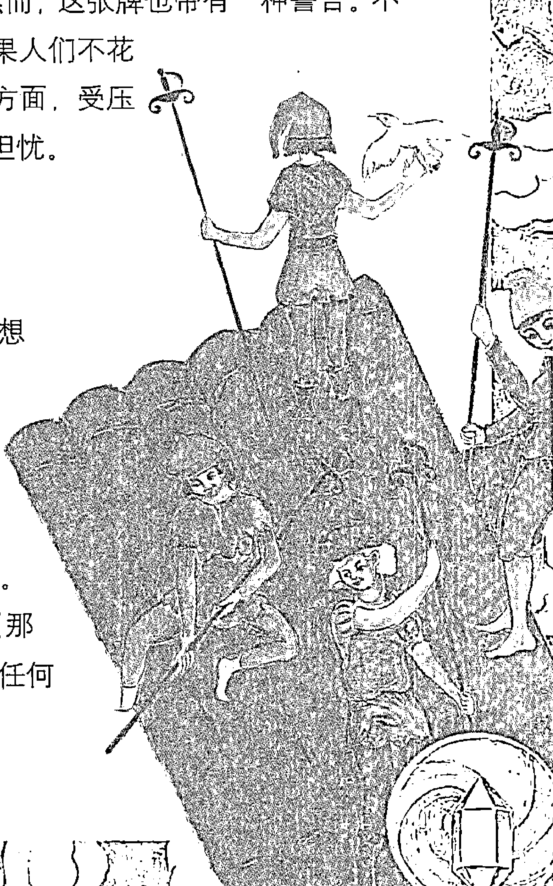

### 宝剑五

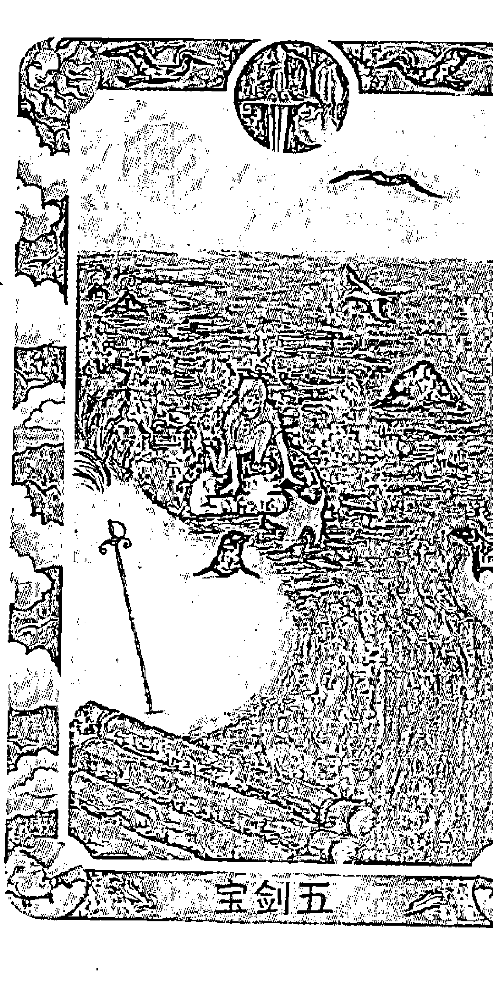

### 关键词

- 变化
- 警示
- 探索
- 利用

### 这张牌提醒我

我并不害怕改变自己的意见和想法，假如这能够打开并延伸我的思想，使之得到更大成长和解放。但是什么样的想法和思想形式呈现出来，能让我得到新的机会去审视内心思想的内容？思想创造现实。我想在自己的生活情景里引入更多自由和关于自身现实的让人大开眼界的概念。如何才能把这样的工作推广到日常生活中去？

### 传统意义

这张牌代表这样一种情形——由于环境不断变化，结果引起人们的思想斗争和担忧。如果忽视了探索过去担忧和焦虑的起因，则这张牌也许会再次唤起人们的注意。带有“5”这个数字的牌表示变化。如果我们不愿意鼓起勇气改变僵硬的思维模式或方法，这张牌就有可能指明一种失败或绝望的感觉。然而，如果我们注意生活每天为我们发出的信号，那就能利用这张牌，把它当做一项指标，说明目前情形远不止眼睛看到的那点事，它有可能指明需要进一步探索更多的选择。

### 最新物语

在塔罗牌中，所有带“5”这个数的小阿卡那牌都有完美理解力和透明度的潜力，因为“5”是竖直水晶的较小翻版，而水晶能够反射人类的神授潜能。虽然每组牌中的“5”这张牌都代表变化和甚至方向不明确的能量，但是，塔罗牌却想办法提醒人们注意，他们有机会对自己的生活授权，有自由与完美的选择，这样的能量同时来自“5”这个数字更深层的意义。宝剑五描述的那个少年在海洋一样的思想之水里发现了某种新的东西。由于他蹲在湿滑的岩石上，很明显，他必须格外小心。然而，他希望揭开看不见的内心世界的各个层面，这样的好奇心和意愿会得到新的理解能力的回报。

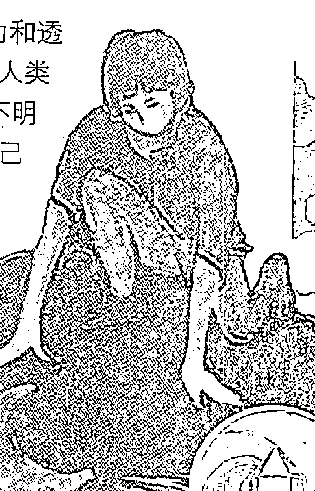# 宝剑六

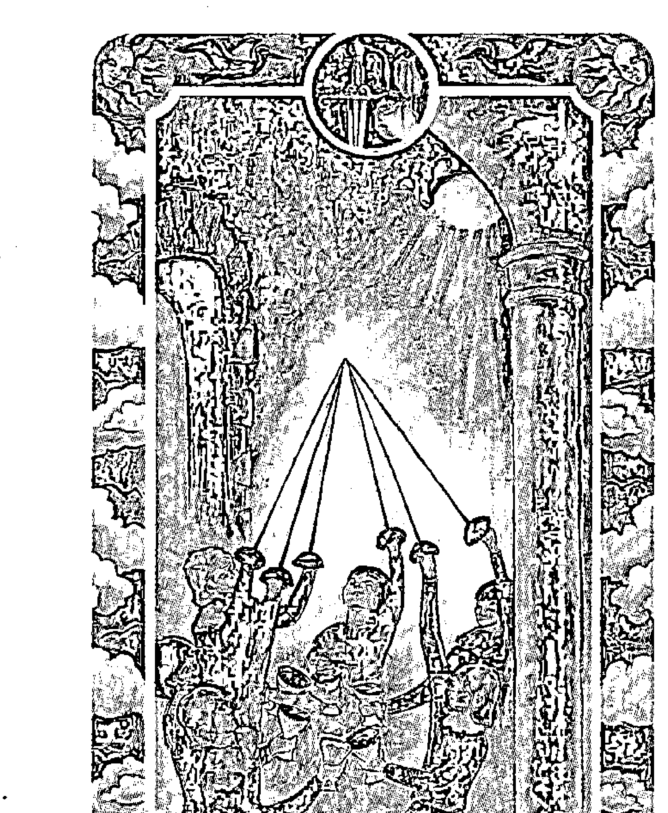

- 能力卓绝、活力充沛、更高的
交流领域有助于我的透明度与焦点，如何利用自己在这些方面的优点？

### 第8章 4组小阿卡那的最新物语

- 我把哪些新的真理融入了每天的生活？
- 它们如何使我的生活向更好的方向改变？

### 传统意义

这张牌是说精神的明晰、成功与荣耀。它表示一个人的新思想，并且把尚未实现的思想和概念无所不包的视野揭示出来。它进一步扩展一个人的客观思想，富有远见，因而能够超越旧思维模式和观察事物的信仰能力。出现在一个人的生活中的种种变化，应该传达给许多人，并与众人分享。这是一张活力充沛的牌，它彰显一个人得之不易的良好人际关系与人际交流的成果。

### 最新物语

连接心与思维的桥梁不是别的，它是更高的理解力与智慧。真正的力量——爱的力量，就出现在这张牌里。思想得到净化和纯洁，目的，信念和明晰都确立了。这张牌预示对统一后的视野即将开始的祝酒和敬礼。宝剑象征提升的思想，注入了光明。思想明晰，充满成功的喜悦。

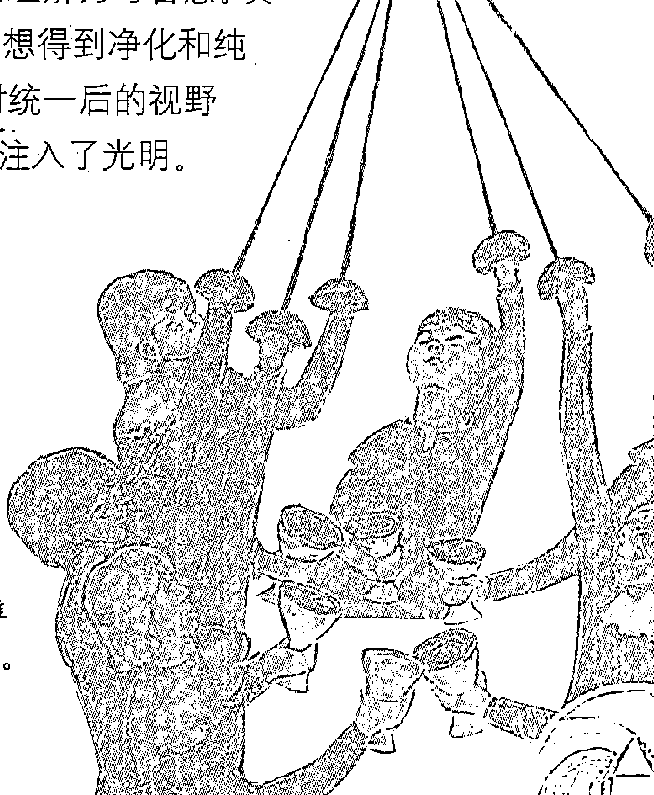

### 相关链接

该牌突出表现了风元素的特征，虚空博大，包容万物。各种思想观念并存，使人富有远见，思维开放，领域宽广，能突破旧思维的迷雾，洞见事物变化的趋势，把握时机，奔向成功。

### 宝剑七

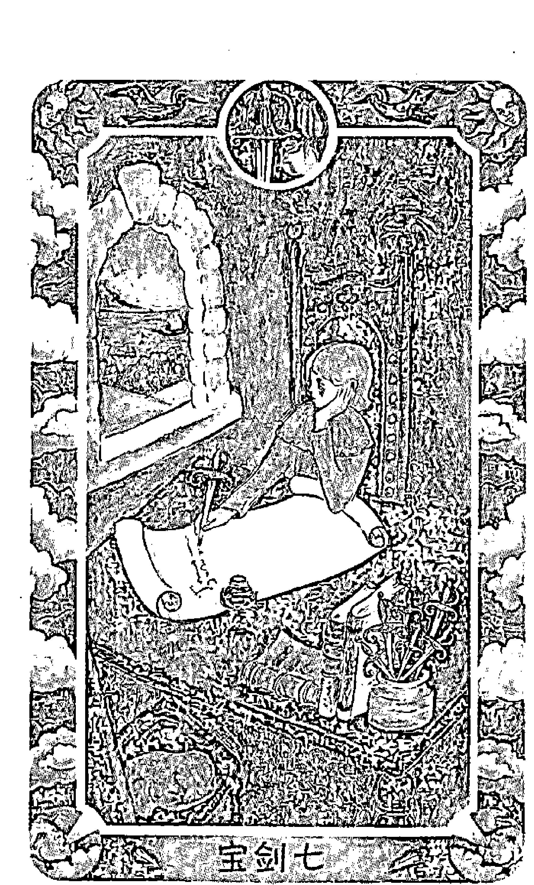

关键词
指导、提醒、明确、目的

这张牌提醒我
△ 我的感受力是否清晰？
△ 我是否需要有一段时间休息一下并进行默想？

# ## ⚜ 是否到了购买或制作一个日记本，以便记录我的内心思想和念头的时候？

# ## ⚜ 传统意义

“7” 这个数字与大阿卡那第七号牌——战车(《彼得·潘》)联系着，它提供视野和内在的指导。关键在于搜寻与自我发现。因此，这张牌表示一个人开始进入更大的想象、幻想、怀疑或思想混乱的杂芜世界，而这一切都存在于智慧的边界以内。想象力是了不起的能力，只要人们能够分辨现实和想象之间的区别就行。在人生的某些时候，我们受到自己内心声音的愚弄，不能够清晰地觉察原来的思想模式与我们有可能相信是更高指南之间的差别。宝剑七强调这个问题，并提出精明的警告，让我们在得出最后结论之前三思而后行。

# ## ⚜ 最新物语

在我们生活的这个忙碌的世界里，有时候我们必须让思想安定下来，处于宁静的思考状态，让我们心灵里更微妙的各个方面来到前台。在塔罗牌里，精神之剑变成了钢笔或书写工具，提醒人们注意纪录一个人自己的思想以便使其客观化。这有助于一个人感觉自信和有保障，感觉在我们内心里的声音正在指明积极的人生方向。这张牌里描述的少年正在思考必须要加以探索的前景的现实性，但是，他首先必须要明白当前情景的意义和当前的思想状态，之后才能开始未来的冒险。

# ## ⚜ 相关链接

这张牌表现了人内心世界的芜杂情况，人只有涤虑存静，辩清并揆除内心愚弄自己的声音，使内心的微妙的各个方面趋向一致，方能明确被喧嚣覆盖的目的，内心归一。

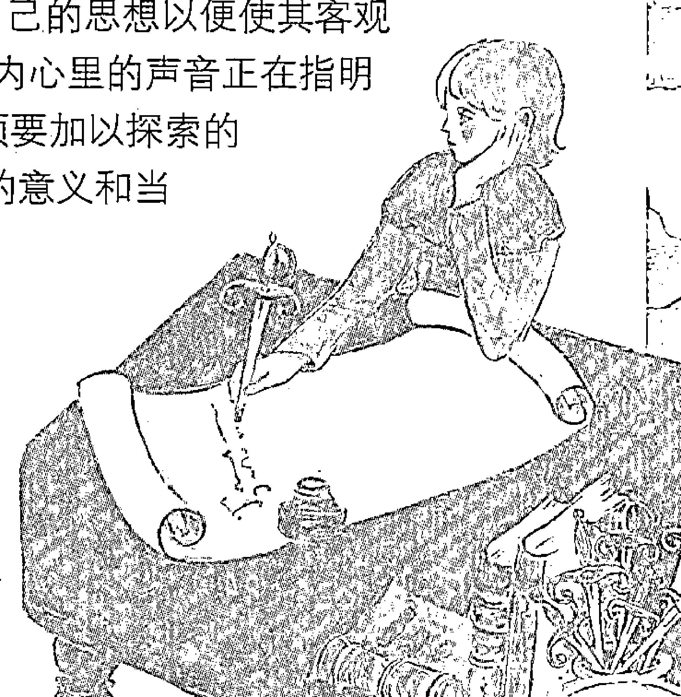

### 宝剑八

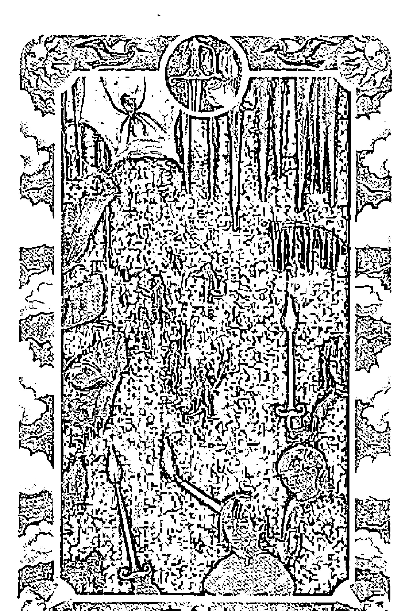

### 关键词

- 打好基础
- 审视自我
- 好的时机

### 这张牌提醒我

到目前为止看来还没有解决的问题，很快将被理解和清除。是什么样的深层问题和模式挡住了在自己的生活中感觉内心充实和自信的路？
- 有哪3个问题看来阻止我成为没有担忧、没有疑惑也没有恐惧的人？
- 我将写下3件看来对我不利的事情，并选择一张塔罗牌代表每一件事情，使其能为我显示解决之道。

### 传统意义

这张牌表示需要开发自己的技能以进入思想的深处，其方式是最终打好一个新的基础。“8”这个数字的力量和权能支持各个层次的转化能量。个人也许会上升到更大成就，假如他们愿意与不断变化中的能量同步转化。从传统上说，这张牌指明，一个人也许在精神王国里制造出太多的担忧或压力。审视危机得以从中产生的基础并加以改变，这是相当重要的。

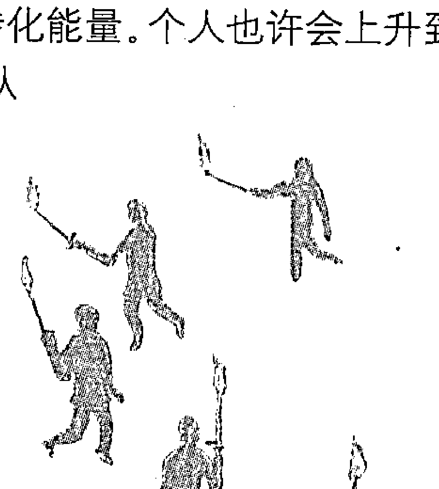

### 最新物语

蜘蛛代表网络之谜，它在自身之内不停地编织着。我们的思想都是相似的。我们总在不停地重新形成和再次创造自己的思想。那条蛇盘成了8这个数字（永恒的象征），它是内在的心灵权能和生命力。牌中的宝剑已经变成了火炬，目的是要照亮思想的深穴，并照出隐藏的恶魔与恐惧，因为它们也许挡住了一个人的清晰思想和智慧的决策之道。这是清除思想内容的好时机，也是为不断增大的新的透明度与信息让路的好时机。

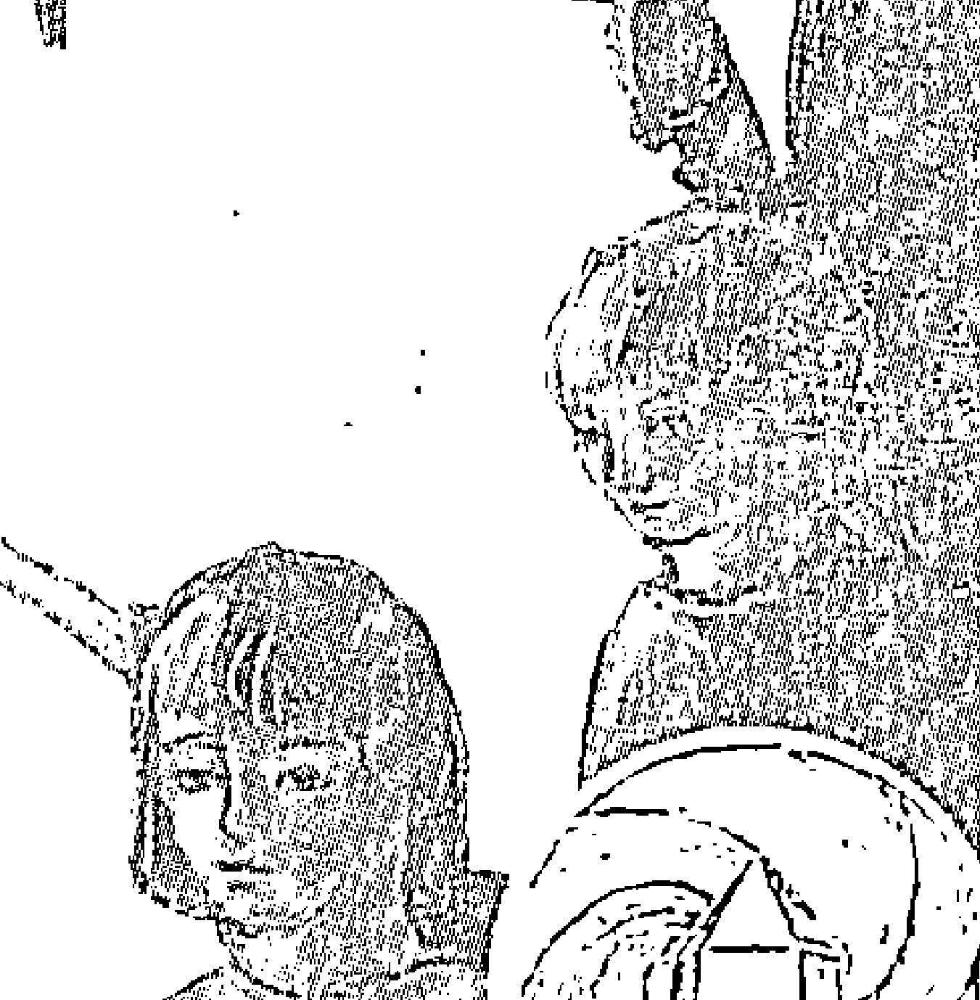

### 宝剑九

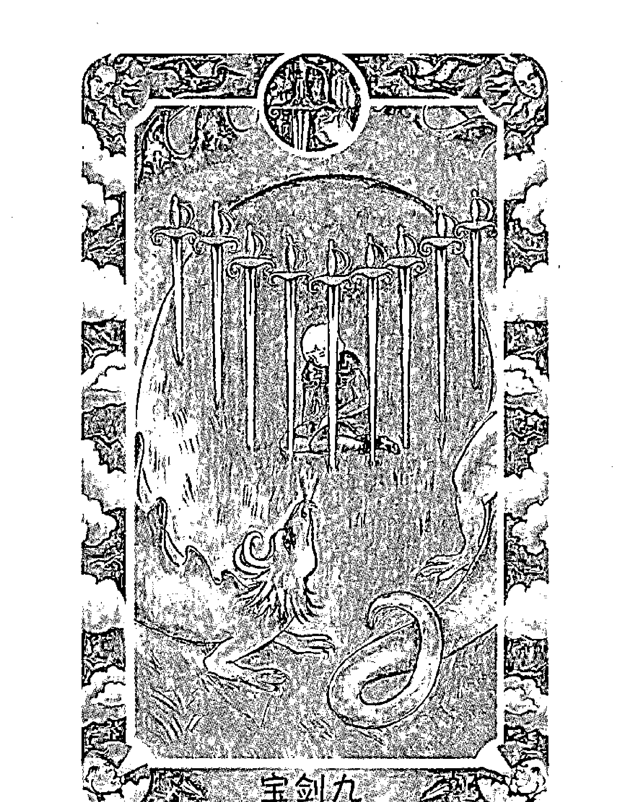

**关键词**
自我折磨、突破、预示

**这张牌提醒我**
我准备好了释放旧的思想方式。我并不需要成为限制思想结构的囚徒。当我思考释放旧有的恐惧时，我是否感觉安全？
- 还要求我做些什么？
- 列出三个神奇漂亮的想法，释放原有的思想形式用以替代它们。

### 传统意义

当一个人完全沉浸于老套和过时的旧思想模式和恐惧时就会出现这张牌。人们有机会超越这些旧式的思想意识，只要他们能够辨识这些熟悉的瘫痪或惰性之地就行，因为这些东西冻结了恐惧或担忧，使其深藏于潜意识的深穴。有些人会因为自己做出了错误的决策或选择而无休止地折磨自己。这种自我毁伤的模式在宝剑九出现的时候就会看出来，而宝剑九也会提供一个在这些领域里产生变化并得以完成的前景。

### 最新物语

当人们受到原有模式和信仰观念的限制时，他们的人生观会受到阻滞和挑战。我们在一生一世已经录入记忆库里的思想和概念，会约束我们从出生的时候起便已经确定的潜意识信仰系统。一个革命性的时期会循环进入我们的生活，而此时正是可以倒空垃圾、释放既不能为现在，也不能为将来提供服务的过去的材料的时机。出现这张牌的时候，我们会想到，原有的思想模式有可能成为灵魂的监狱。我们的恐惧包围着我们，我们经常无法面对许多自我需要治疗的部分。那个少年的周围满是宝剑。牌里面的龙（他的内在康复之旅）盘在他有意识的思维样板之外，愿意、并且也准备好了与那个少年结盟。当那个孩子准备好的时候，他会抬起头来，感谢宝剑提供的保护，敢于越出到目前为止一直都在帮助他的生存程序。他很快会发现巨大的快乐，因为他发现自己以全新的方式得到了满足和能量。

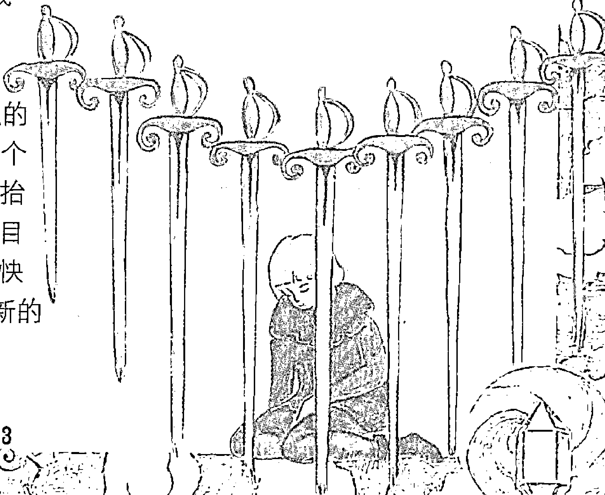

### 宝剑十

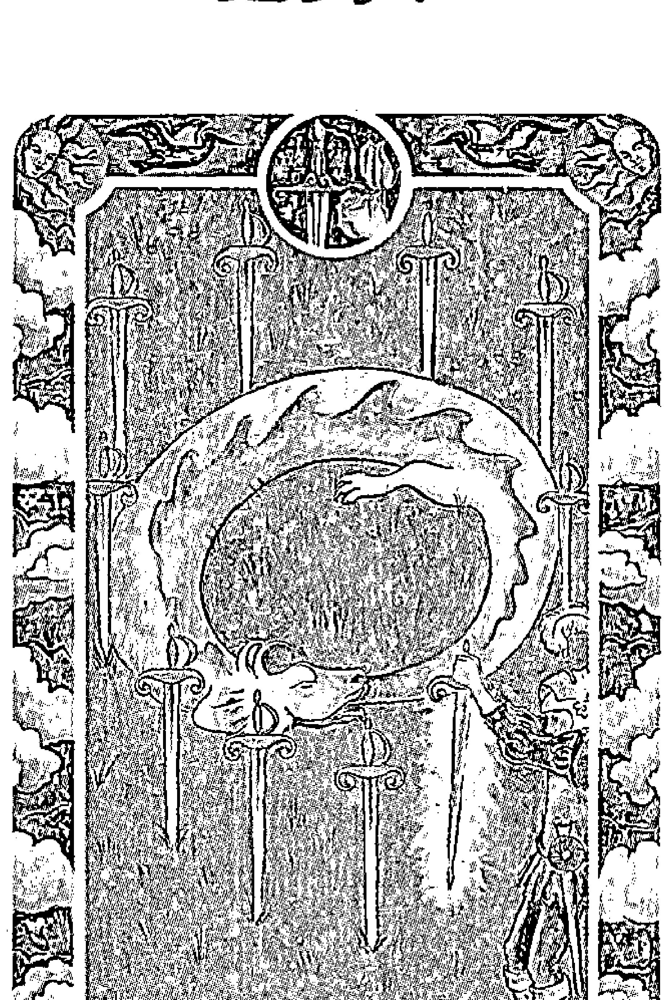

### 关键词

提醒、最后时刻、突破、新的征程

### 这张牌提醒我

△ 当我得到脱离恐惧与疑惑的新发现的自由时，生活中会发生哪些变化？

> 我的思想是否成为一条清晰的渠道，可以表达源自心灵和精神的更高意志力？

### 传统意义

这张牌有强大的内涵，涉及最深和最具潜能的思想内容。在某些牌型中，这张牌与失去理智和思维控制相关联。它表示思维组织的最后阶段，也是一台纪录器，纪录人们完全有把握地踏上康庄大道之前的状况。这是一张表示突破的牌。当它出现的时候，应该想办法理解你的思想、话语和行为最深层的基础。语言的力量主宰着表现与丰富。超出局限和恐惧扩展自己，这是值得一试的。

### 最新物语

塔罗牌预示着作为从过去的斗争中解放出来的潜力的宝剑十。那个少年有勇气抬起头来，成功地面对了那条龙（他的康复潜能）。现在，那个少年不是被宝剑的囚禁图像所包围，而是把解放的终极宝剑（他新生的精神清澄与自由）刺入了新近植入的思想之环。他自由了，放射出光芒，准备好踏上旅程，寻找自我把握了。

### 相关链接

该牌表示一种新的开始。这种开始建立在对旧的生活认知的突破上。该牌出现，应检视自己过去的思想、行动、话语，这是一种告别，一种解放，是进入新的开始的跳板。

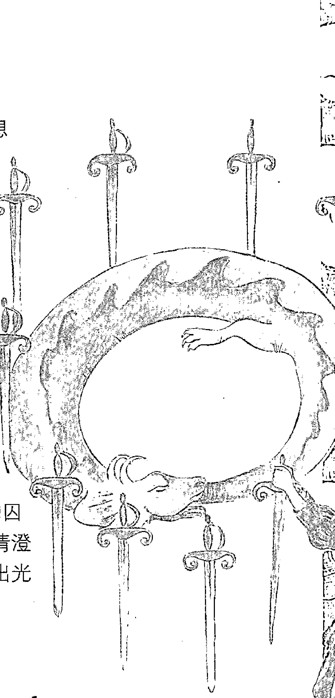

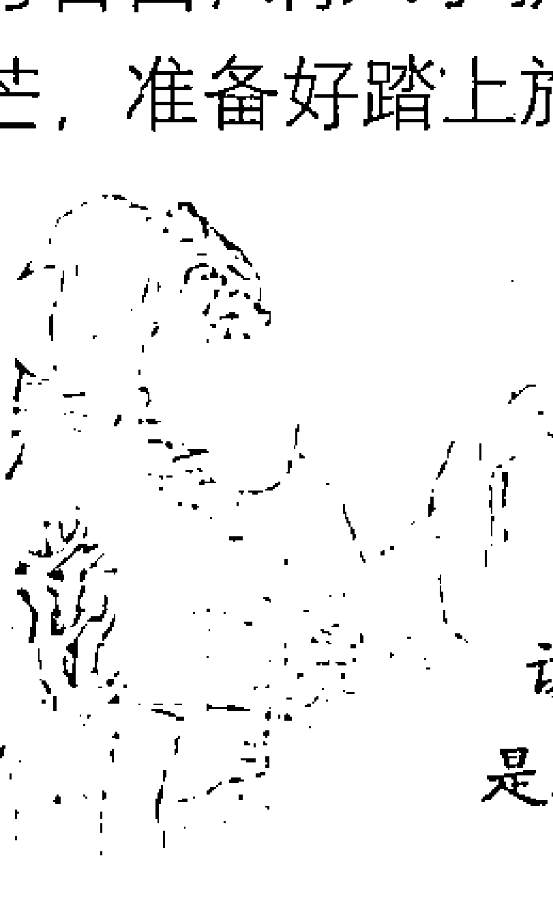

### 宝剑之子

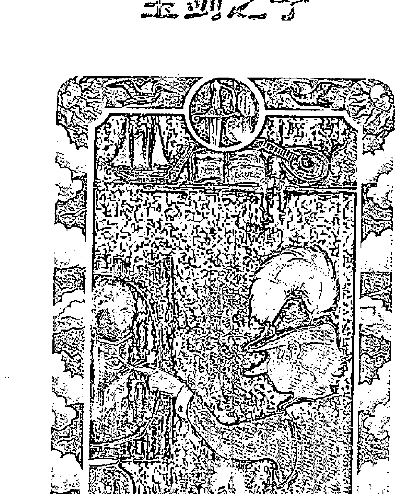

**关键词**
- 摆脱
- 羁绊
- 萌芽阶段
- 反省
- 洞见

### 这张牌提醒我

这是编造计划、向前看、并开始期待，选择自己未来机会的好时机。我并不想阻挡自己的预见和视野。我是否在为自己找借口，好让自己继续沿着一条并不能达到最高利益的道路走下去？
- 我在反复回顾的基本原理是什么？
- 什么样的新利益等待着我？

# # 传统意义

在传统的塔罗里，这张牌以宝剑侍卫著称。这是越过消极思想和模式、奔向个人把握的第一步。这个侍卫的天性是接受命令，他善于反省，善于思考。剑童在某些方面是天真的，但在另外一些方面，他又是所有人当中最聪明的，尽管他仍然是个天真烂漫的孩子。因此，剑童时刻准备好学习，总是乐于吸收新信息和洞识。剑童仍然在学习真理的更深层意义，准备好，也愿意克服挡在他前面的所有障碍。他必须首先发现障碍是什么，必须知道如何让自己摆脱挡住他前进道路的原有精神力量。

# # 最新物语

剑童成为宝剑之子。这张牌由皮诺曹所代表，皮诺曹是个木偶，他经历了人生的萌芽仪式，要像他的主人格佩托一样成为有血有肉的人。他渴望着化成肉身，并行走在真理的大道上。格佩托象征着我们的创造者，或者象征着我们高层的自我，它拿着我们尽全力想得到的意识的全息图。儿童喜爱皮诺曹是因为他跟自己如此相像。在努力实现远大理想时，所有的人都犯过类似的错误。

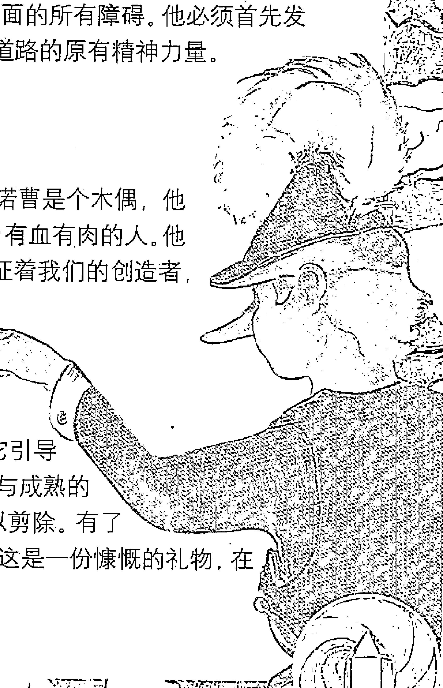

皮诺曹的教训是我们所有人都应该体验的教训。它引导我们走向真理和诚实的真实意义。宝剑之子总是乐于参与成熟的萌芽阶段。终极的考验在于分辨过去的习惯行为并加以剪除。有了作为原型指南的宝剑之子，就有了改善和成长的空间，这是一份慷慨的礼物，在这个萌芽阶段能够为人们所获取。

### 宝剑寻找者

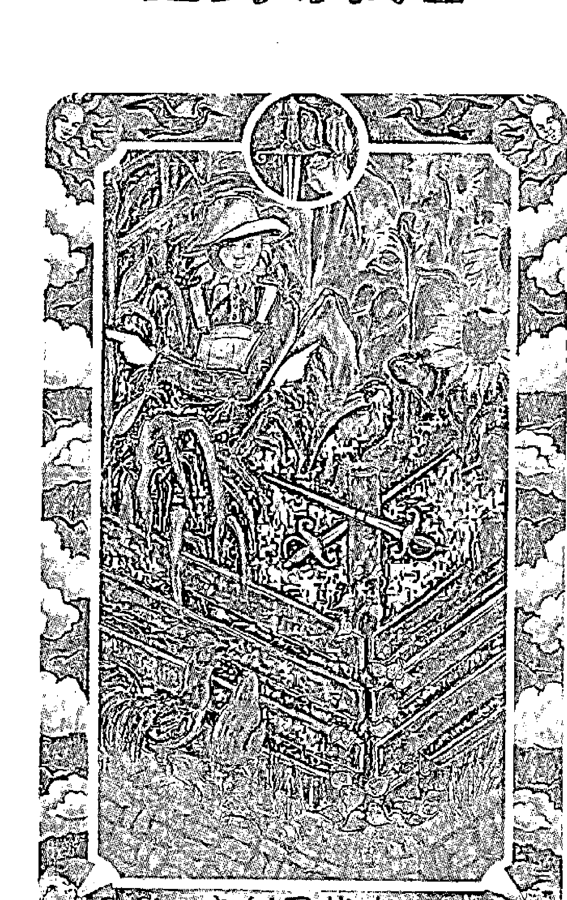

- 智力
- 能量
- 目标取向
- 雄心

这是设定目标、按照新计划和新思想稳步前进的极好时机。我一直希望成就或完成的人生志向是什么？
△ 我能够为自己铺就什么样的未来道路，怎样才能实现自己的目标？
△ 画一张牌，在上面给自己一些消息，可以说明自己的新志向。

### 传统意义

在原来的牌型中，这张牌是以宝剑骑士著称的。这是一张表示活跃和快速能量的牌，它使精神能量越过僵死不动的东西，帮助人们做出决定和良好选择。这张牌表示智力能量、雄心和目标取向。人们正在学习如何控制凝聚力。这张牌引导人们奔向宇宙真理和万方清澄的终极目标。

### 最新物语

寻找宝剑的人在塔罗牌里是由《绿野仙踪》里的稻草人表现出来的，是多萝西在黄砖路上遇到的三个同伴当中的第一个。稻草人代表交际的力量，并让我们明白，在我们内心深处，都有了解周围世界所必须的全部智慧与智力。稻草人以为他需要巫师给他一个大脑。多萝西遇到他的时候，他说：“我并不在乎自己的双腿和两只胳膊以及身体都塞进稻草，因为我并不会因此受到伤害。如果有人踩我的脚，或者往我身上扎针，那也没有什么关系，因为我感觉不到。但是，我并不想人们称我为傻子，如果我的头总是塞满稻草而不是一颗大脑，就跟你们头上的大脑一样，那我如何能够了解任何事情呢？”

当多萝西和她的朋友们沿着黄砖路前进的时候，她们都是强有力的原型形象，就像塔罗牌里面的骑士。稻草人跟其他人一样也在寻找之中，他在想办法拥有自己身上真正的能力。当他冒险迎接不同的挑战，克服各种各样的障碍时，他也就能够利用自己的智慧和常识了，并且慢慢理解了自己的思维天赋和智力。

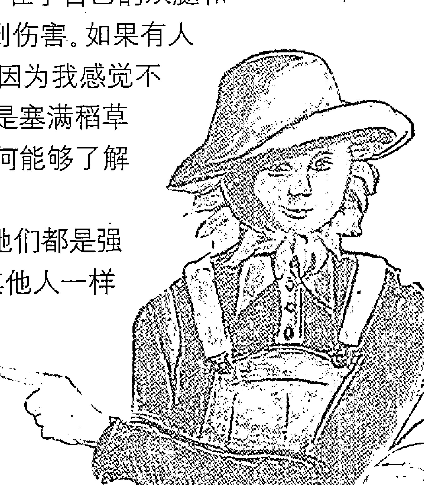

### 宝剑向导

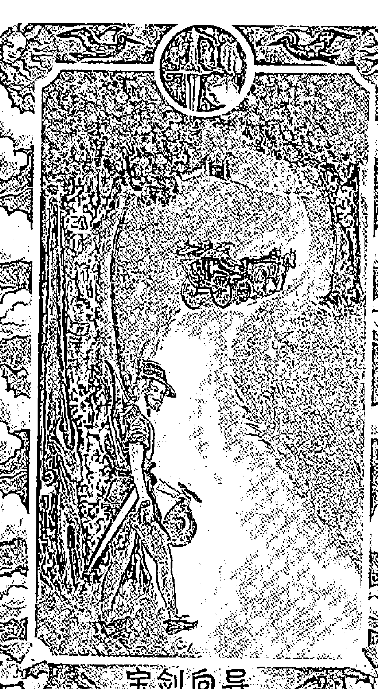

关键词
水的能量、情绪化、突破固制

这张牌提醒我
- 我如何能够通过行动和交流手段保持对自我的真实？
- 我有很强的能力可以理解别人的需求，也能够流畅地交际。
- 我如何能够最佳利用这样的天赋？
- 我是否借自己的洞察力天赋去帮助别人？

### 传统意义

在传统的塔罗里，宝剑向导以宝剑王后著称。王后是宝剑牌组中的水性形象，在这张牌里，情绪的品质更为明显。这张牌帮助大家放弃原有面罩和理性教条的防护，因为它们妨碍人们了解隐藏在外部概念的表层之下真正的智慧来源。王后的理性力量配合了深层的情绪视野。在成熟过程的这个阶段，人们的目标和理想必须与心的激情保持一致，因为王后是同情心和真理的“化身”。

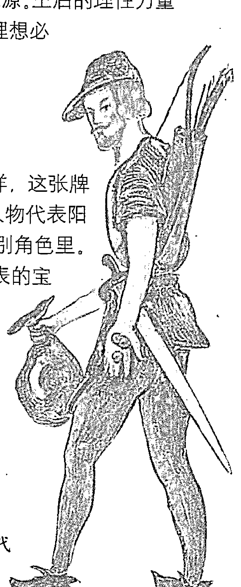

### 最新物语

塔罗牌更换了这张牌的性别，但是，如同在神话故事里一样，这张牌阴柔的一面仍然清晰可见。在神话故事的教训里，男性和女性人物代表阳刚与阴柔两极的内在品质，哪怕它们也许不是生活在原型中的性别角色里。这是我们希望通过塔罗牌传达给大家的一个主题。由罗宾汉所代表的宝剑王后，通过一个男性角色描述了正直、爱、同情与慷慨的品质。罗宾汉的领导作用源自人心，然而，它又不缺乏伟大的智慧和聪明的预见。罗宾汉作为宝剑王后，使一颗关爱的心与敏锐的思维结合起来。

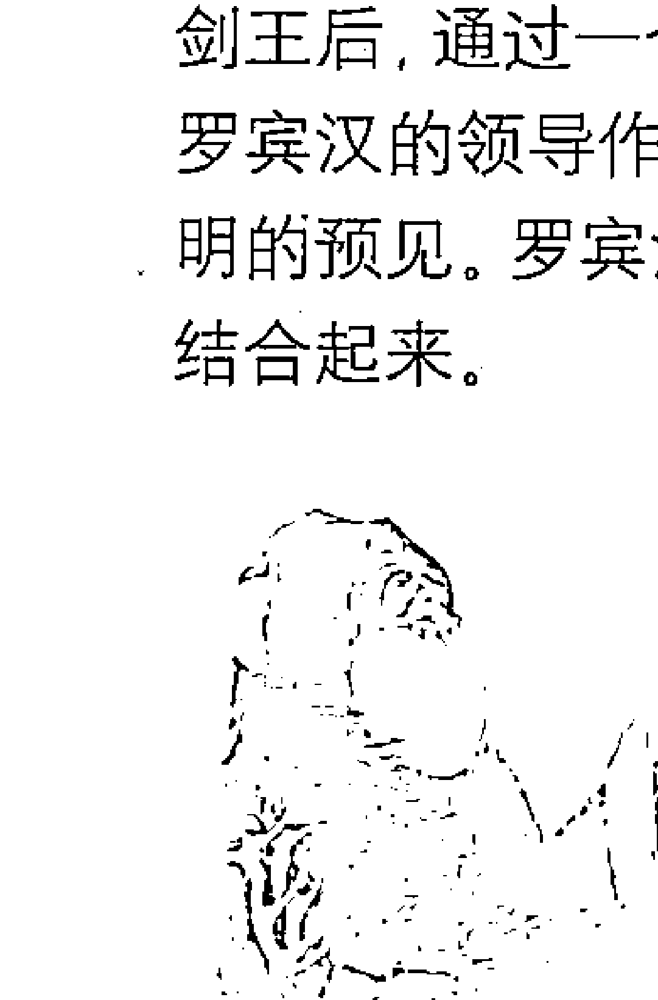

### 相关链接

这张牌代表着水性形象，是女性的象征。她的代表人物是战神雅典娜，其具有水的直觉和风的智力，有非凡的沟通力，能逾越阻碍，达到目的，是智者和所有胸怀宽广者的象征。

### 宝剑守护者

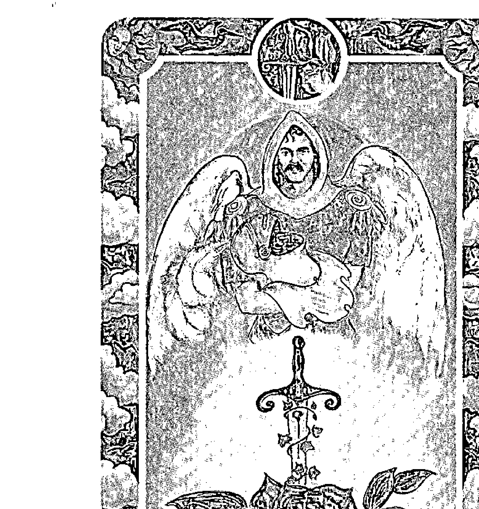

**关键词**
强大、指出方向、爱与真理

**这张牌提醒我**
如果有什么东西限制我的思想和精神，使我无法得到心理授权、终极的理解力和智慧，无论它是什么，我能够使自己从中解脱吗？
### 我是神授智慧的自由行为者吗？

### 传统意义

在传统的塔罗里，宝剑守护者以宝剑国王著称。这是塔罗牌里面的强力牌之一。这张牌被利用的方式，可以指明人们利用这种能力是为了全体利益还是为了自己的利益。思想的能力和对于思维概念及价值的依附，可在一种文化范式里得以防护，这种文化范式确定思想和概念是用来使大众转向建设性的还是毁灭性的方式。每个人都要保持开放，接受思想和行动的进步模式，这是一项艰巨的任务。保持思想和行为的平衡需要极高的技能。宝剑国王为每个人实现这个目标提供了巨大的潜能。

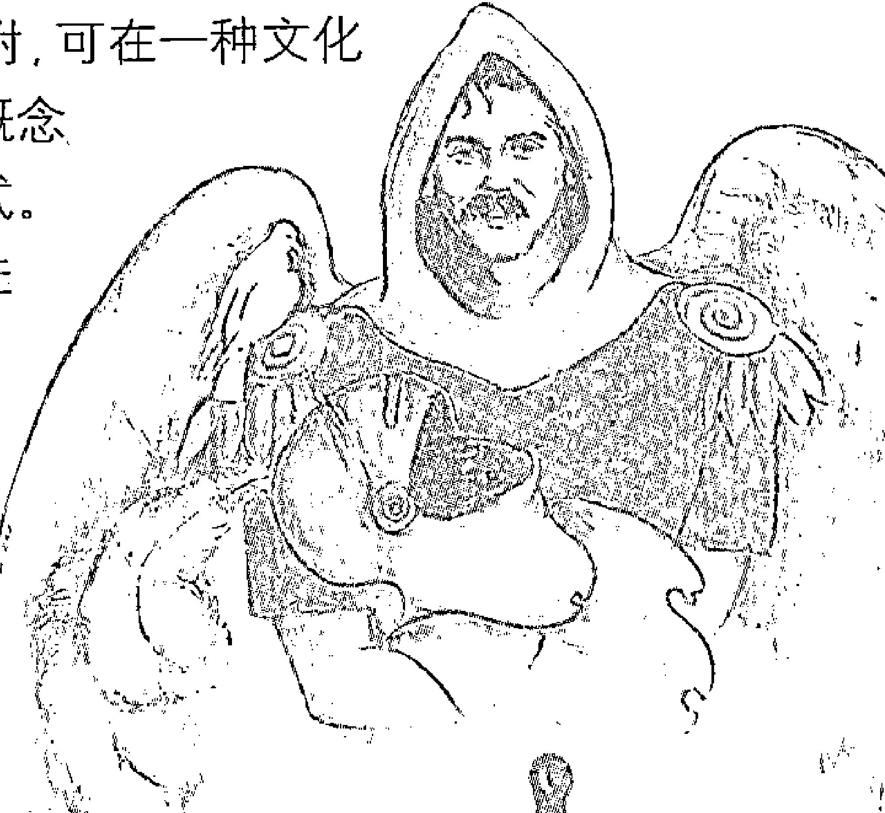

### 最新物语

在塔罗牌里，宝剑国王已经变成宝剑守护者。他被看成了米迦勒，也就是真理和意志的天使，因为他是精神力量和意志力的人格化。米迦勒这个名字实际的意思是“好像上帝的人”。他试图将创造力的感觉植入人心，以展现大地上的善意。在图中，他披着翅形护甲，还有一把竖直的宝剑。米迦勒保护和欢迎每一个寻求清晰明了、有生活目标的人。宝剑底部那朵漂亮的玫瑰指明，上帝的真理是以爱为基础的。这样的爱会使人类得到真理、爱与光明的自由。

### 圣心王牌

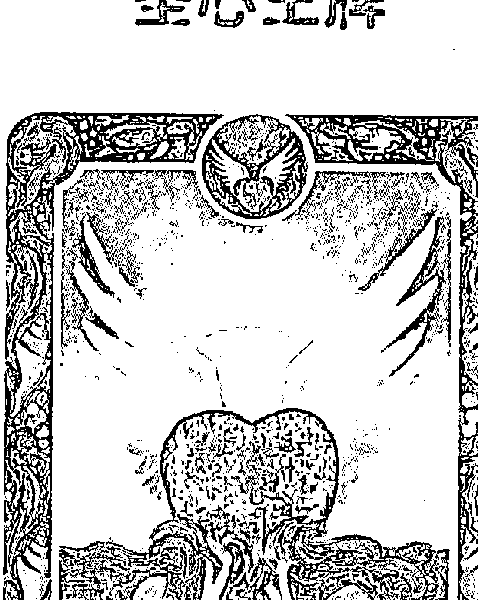

**关键词**
爱、心灵的康复、信任

**这张牌提醒我**
△ 在生活的哪个领域我理解爱的时候最多？
△ 对于生活中的爱，我是否在说“好”？如果没有，为什么？

### 传统意义

在传统塔罗牌中，圣杯王牌是本书中的圣心王牌。圣杯王牌代表爱的天赋。这张牌可表示迷失之爱的更新、一种新爱的可能性，或者从个人角度看，也可代表心灵的康复。它表示人生的这么一个时期，人们向情感世界的扩展开放了心胸，与根基深厚的情绪保持更多的接触。这张牌几乎总是包含肯定的确认。

### 最新物语

一颗带翅的漂亮的心正在升起，奔向光芒万丈的太阳之光，此时，天空呈现出狂欢的光辉。当这张牌出现在人们面前时，他们可以肯定，为理解爱，并为使爱成为生活中有意识的特征而进行的艰苦努力就要结出硕果了。美丽的圣心表示无条件之爱的进化。所有的关系都带入了新的理解水平，人心放射出原谅和信任之光。这张牌能够代表这样的时刻，此时，一个人正在经历童年记忆领域里的新意识。情绪洗涤与更新就要完成了。

### 相关链接

圣心牌组代表水的元素。圣心的宫廷牌代表占星术中的水象星座：巨蟹座、天蝎座和双鱼座。圣心代表爱和想象，以及被动的创造力，用和谐以透过情感来理解人生，典型的圣心态度是透过爱来给予和接受。圣心常是指某一种类型的人，或一个人的创造力。往往圣心类型的颜色是蓝色或淡褐色的头发，除了指颜色，也可以指一个人的本性。如果牌以倒立的方式出现，代表此类的人以压抑或扭曲的态度去爱，害怕爱是匮乏的。当得不到所需要的满足感，则会陷入世俗中的权力斗争。

圣心的真意，象征着：

> “接纳和理解爱不能被占有，只能被接受”

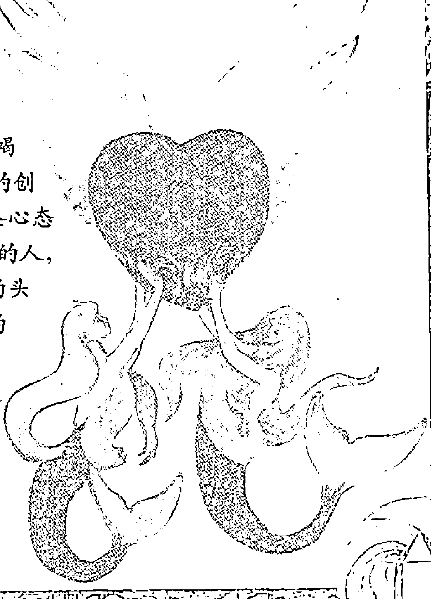

### 圣心二

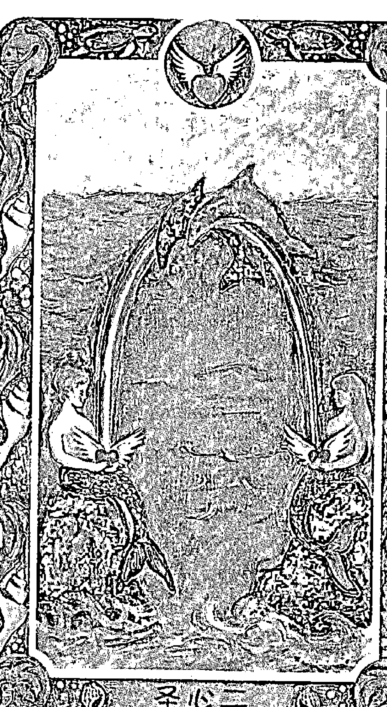

### 关键词

平衡、结合、婚姻

### 这张牌提醒我

- 此时此刻，我生活中的爱如何体现出来？
- 我是否给予足够时间探索自己与伙伴或最亲密的人之间的情绪与情感？
### 我如何在日常生活中平衡自己与他人的各个层面？

### 传统意义

数字“2”出现的所有时候都表示平衡。也许某些事情会失衡，因此需要调整。也许一个人有太多方面需要平衡，而这张牌就提醒人们注意到这一点。本书中的圣心二，是传统塔罗牌中的圣杯二。在圣杯二中，我们经常看到男性和女性完美的结合。这张牌一直被称作婚姻牌，但是，它也与阴柔和阳刚原则的内在结合联系在一起。

### 最新物语

在这里，我们经历了所有水平上的情绪和感觉的神圣结合。两只海豚在彩虹之弧上跳跃，一切都处在甜美的和谐中。彩虹之宝位于心轮中央。男女美人鱼都代表奉献和色彩与光明的各个层面，它们放射出光芒。当人们决心要达至对于无条件之爱的统一理解时，这样的光芒就会流溢而出。

### 相关链接

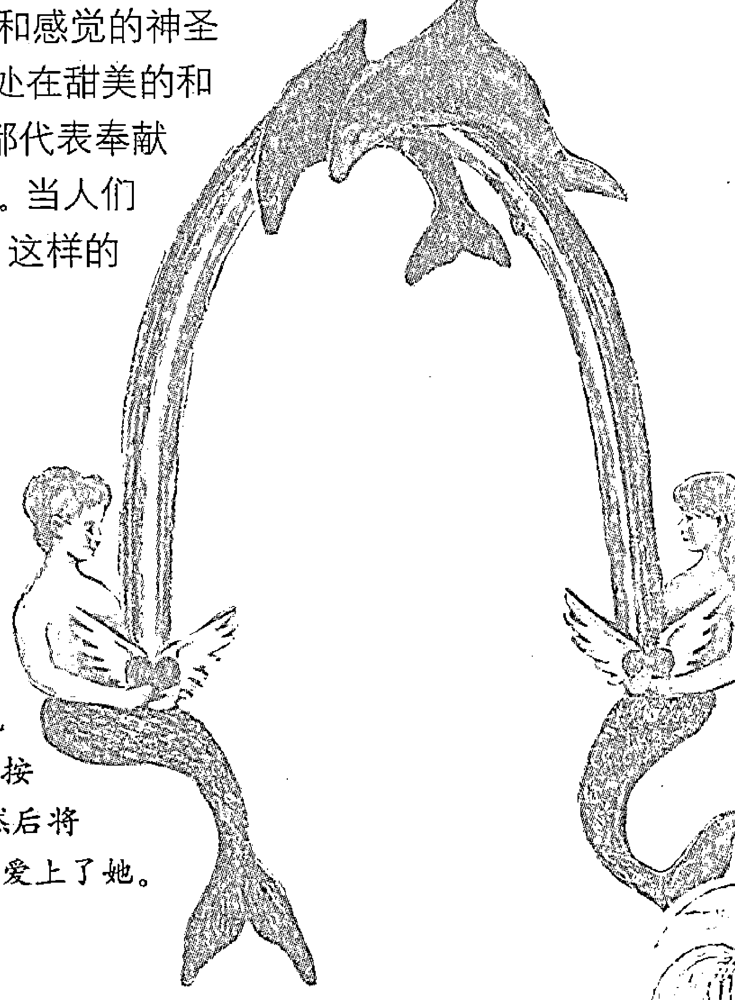

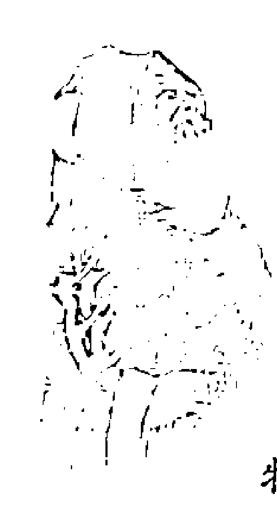

希腊神话中女神Psyche（普绪客，灵神星）有出众容貌，堪与美神阿佛洛狄忒媲美。阿佛洛狄忒感到委屈，决定惩罚她。于是派儿子厄洛斯去执行惩罚。厄洛斯前去捆绑普绪客，按命令去把她绑在岩石上，逼其与一个怪兽结婚，然后将其饿死。可是厄洛斯却被普绪客的美丽倾倒，他爱上了她。

### 圣心三

关键词：沟通、心灵的结合、欢乐

- 这张牌提醒我
- 我是否与自己生活中最真实的爱的价值保持交流？
- 我是否让自己的生活充满欢乐？

- 我在自己的生活里发现了什么样的财富，它们是否让我感觉更有创造性，更有灵感？

### 传统意义

在传统塔罗牌中，圣杯三是本书中的圣心三。圣杯三包含交流和社会交往的时机，这种交流和社会交往对所涉及的人是双向的满足。共同的看法与梦幻是关注的焦点，而这张牌强调的就是心灵的结合。幸福与欢乐的时光无时不在。

### 最新物语

位于海底的那个百宝箱装着可以在这张牌里找到的极大希望。远处的海底城堡里藏着无所不能的许诺。男女美人鱼形成一道放射着希望光芒的圆圈，就如同一道晕轮，照在甜美的乐师头上，因为她的心里装着爱的乐曲，而爱的乐曲会激发人际关系和人的心灵朝更大的潜能发展。

### 相关链接

美与爱之神洛狄特之子厄洛斯不顾家庭反对，决定带走普绪客并与她举行婚礼。人鱼在岛边为他们庆贺；鸥鸟为他们遮去强烈阳光，并挡住了飓风；贝螺叠摞海滩为她们造成殿堂。但是他们在一起，按海岛的规定，普绪客不能再见到厄洛斯的容颜，但他们心存感动，因他们的心灵早已结合在一起。

### 圣心IV

关键词
不满足、沮丧、新的机会

这张牌提醒我
- 我是否处在限制自己的人际关系或生活情形中？
- 我是否睁开眼睛看到了所处的情景或这个情景中的全部面貌？

- 我的周围充满了爱与丰富的精神；它们每天都在指导我，我是否为此心存感激？

### 传统意义

在传统塔罗牌中，圣杯四是本书的圣心四。圣杯四经常描述不满足和失望、一无是处或者在情感及心灵的事情上失败的感觉总是无时不在。然而，在大多数牌中都有一个解决办法。这是这张牌的基础。如果牌里的那个人愿意超越绝望，看到更高的原则，看到新的希望和可能，则他们会明白自己将得到新的机会。

### 最新物语

绝望的美人鱼坐在小船的残体上，这象征着希望和梦幻破灭。在她的胳膊上挂着一根圣心形项链，已经断为两截。她的头低着，两眼也闭着，还没有注意到马上就会赶来帮助她的东西。那些关心她的美人鱼骑在海豚背上朝她奔来，她们经常被认为是‘大海的天使’。到时候，她会得到帮助者带来的爱与援助。然而，她必须睁开自己的眼睛，要看到精神之爱与支持着她的援助活动。只有到那个时候，她才能弥合破碎的心。

### 相关链接

这张牌代表那些希望陷入绝望中的人。绝望的产生多半源于不满足和攀比，另一方面，看不到身边露出的希望之光。就像一个失去眼球的人走在阳光下如走在黑暗里一样，他看不到新机会，看到的尽是无尽的黑暗。如此时间一长，自己就会被自己打倒。

### 圣心五

关键词
损失、遗产、存在希望、有基础

这张牌提醒我
失望在我的生活里形成了内在的现实，我如何才能使这样的伤痛得到康复？

- 那颗金星白天黑夜都照耀着我，我是否认识到了它的意义？
- 灵感的精华藏在心灵的深处，我如何才能以最好的方式承受这样的精华？

### 传统意义

在传统的塔罗里，圣杯五是本书的圣心五。圣杯五表示损失，但是，希望还是有的，因为两只圣心还立在三个失落的人当中。这可以表示一种遗产。也许期望值太高，人们才落入失望，或者担心失望。无论是哪一种情况，那个人都必须寻求对所处情景更大的理解，如此才能到达圣心六的内心满足。

### 最新物语

在数字“5”的混乱和变化之中，藏着出类拔萃与成就的潜能。在美人鱼圣心里，有一颗竖直的金星，那是她头顶天星的反射。虽然也许遭到不幸，或者承受了损失，但是，她已经在百宝箱里找到某种极其可贵的东西，代表她灵魂的内心世界。乌龟代表稳固的基础，在这个基础之上，她会踏上新的旅途，对自己的状况产生新的认识。

### 相关链接

圣心五代表的是一种悲伤痛苦的处境，同时，也预示着另类生活的可能开始。暂时的不顺会让人心灰意冷，粒尘之遮便会让人感到看破红尘。西方民谣曰：“眼前没有路，便证明眼前都是路。”通往幸福愉悦的路上，铺路石叫痛苦，但不叫失望。

### 圣心六

关键词
- 富足
- 回报
- 温暖
- 缓解

这张牌提醒我
> 我向这个世界表达爱的最佳方式是什么？
> 既然我已经明白了过去的模式，如何才能加深对于爱的法则的理解？

### 传统意义

在传统的塔罗里，圣杯六是本书的圣心六。圣杯六是对前面两张牌，也就是圣杯四和圣杯五造成的痛苦形成的温柔的缓解。最后，由于再次感受到了充满人性的对于爱的品味，圣心流溢出富足，那是真实的、无条件的爱提供的。这张牌指明与你的所爱的交换和情感的丰富回报。

### 最新物语

圣心六里面的美人鱼彼此救助，她们从深水处或潜意识里显露出来，面貌一新，精神焕发。游到水面以后，她们迎接灿烂的阳光，她们的心灵在内心探索和情感混乱之后得到了太阳的温暖。那只白鹳代表新生的潜能，代表博大的爱与丰富的情感。

### 相关链接

该牌代表的是痛苦的缓冲，以及幸福感的来临。这张牌出现，表示所经受的压抑与煎熬将结束，幸福的充盈感将溢满你的全身。以前所经受的挫折与磨难只是通向幸福感的不可绕开的道路。过去索取你的太多，现在开始补偿你了。

### 圣心七

- 时机、平息躁动、拥抱、内心
我最近是否让自己的情绪负担过重？
> 现在到了休息的时候吗？
> 是否到了沉思与祥和地拥抱内心世界的时候？

### 传统意义

在传统塔罗牌中，圣杯七是本书的圣心七。圣杯七代表寻求情感的一段时期。现在是平息心灵躁动，解决围绕在情绪和感情方面的未决难题的时候。人生的模式会重复出现，让人们有机会重新更仔细地了解心灵里更重要的事务。

### 最新物语

在水下神殿的圣堂里，这位沉默的美人鱼在思考爱的更深层意义。她的周围有一道金色的光环，她包围在神性的清澄与真理之中。“7”这个数字表达一种精神的品质，出现这张牌的时候，表明已经到了让内心的情绪平息下来的时候，应该倾听更高思维的命令。

### 相关链接

圣心七提示你关注自己的内心领域。平息心里的喧嚣与躁动，倾听内心最沉默部分的声音，它会告诉你解决围绕身边情绪和感情方面的问题的方法与途径。让你有机会重新更仔细地审视心灵里重要的事务，拥抱内心。

### 圣心八

关键词
变更、正视、时机

这张牌提醒我
- 你的生活中是否有哪些领域感觉停滞不前？
- 你可以采取哪些行动，使其促进创造力在生活中的流动？
- 你是否准备好使自己的激情重新得到能量？

### 传统意义

在传统塔罗牌中，圣杯八是本书的圣心八。圣杯八说的意思是出现了停滞，需要更新和变化。情绪的力量使人们到达新的意识水平，人们必须正视原有的窒息性恐惧和情绪。如果变化之流可以畅行不衰，那就会出现新的大量好机会。

### 最新物语

男女美人鱼在坦陀罗的旋律中和谐地结合，坦陀罗的节奏在海洋的深水里随潮涌动。声音的交响乐振荡出康复的音调，刺激人的灵魂来到新的意识尺度和统一状态。圣心八代表一种深层次的潜意识的变化。人们也许会体验到心灵的变化，或者对爱的价值产生新的理解。要求内心统一的呼声越来越近。

### 相关链接

圣心八提示你的事业或生活需要有一定的转变。目前你必须正视自己所处的状态，调整情绪与心态，改变生活态度与处世方式，等等。如此，新的大量的机会便会出现，刺激你的潜力最大程度展现。

### 圣心九

### 关键词
- 和谐
- 丰富
- 欢乐
- 满足

### 这张牌提醒我
- 你是否花时间观赏对人生的美妙感觉形成的永恒之泉？
- 你是否记得要生活在快乐之中？
> 记得要像金色的杯状花一样伸开自己的双臂，接受宇宙倾泻在你头上的爱。

### 传统意义

在传统的塔罗牌面里，圣杯九是本书的圣心九。圣杯九代表一切都是和谐的、平衡的。圣杯里装满并流溢出丰富的礼物和植根于心灵深处的欢乐情感。有一种幸福感，还有一种满足感，因为进化的最后阶段已经在一个人涉及对爱与同情的理解中得到体现。和平的解决方案唾手可得。

### 最新物语

圣心九里描述的美人鱼抱着一只金罐在壮观的飞瀑之下，代表她内心之子的丰富流溢。背景里灿烂的彩虹之弧装点着九颗漂亮的圣心。这是欢乐的时候，也是回到内心愿望和梦幻的时候。

### 相关链接
> 圣心九以“愿望”牌闻名，它预示你的梦想在现实中的去向。但要领悟画面的寓意，你必须知道自己的内心意图，勇于承担寻梦过程中的相应责任，这样你才能最终享受你的好福气。

### 圣心十

关键词
实现、更新、感恩、爱

这张牌提醒我
- 我是否感觉自己配受爱和富足？
- 我一辈子应该感谢什么？
- 我是否领略到了装点我内心世界的真实和纯净的爱之礼物？

### 传统意义

这是讲深层满足和梦幻实现的一张牌。这是情绪的生命之树，因为它预告祖先传承下来的过去的印记已经得到更新。新的开始即将到来，但是，已经完成的通行或者萌芽过程，使人们与降生的时候得到的原有祝福最基本的核心模式产生了联系。人们刚刚从沉睡中苏醒过来，能够集中精力探究未来的潜能，同时也注重过去的爱的根源。

### 最新物语

这是一张感恩的牌。美人鱼已经成为一个得到祝福的爱的容器。她的双臂向上伸开，使彩虹的光芒从一端流向另一端。圣心十在她的前额上发出光芒，打开了纯洁之爱的渠道，使她全部的存在倾注其中。她坐在龟背上，安稳而踏实，这是世俗财富的象征，是复苏之爱的预兆。

### 相关链接

如果经历一段时间的人际冲突，此牌出现，代表和解指日可待。
在感情方面的推测上，圣心十代表两人已越过圣心二的初恋阶段，寻求更长更稳定的关系，极可能进入婚姻圣殿。

### 圣心之子

**关键词**
有活力、起步、真实需求、摆脱

**这张牌提醒我**
- 我如何才能丰富和扩充生活中的人际关系意识？
- 当我在生活中探索未知之爱的尺度时，发现了哪些真实需求和保障的重要部分？

### 传统意义

在传统的塔罗里，这张牌称为圣杯童子。这张牌含有接受和充满朝气的活力意蕴，使人们有机会探索心灵的天真王国。这是一个人踏上进入醒悟之爱的王国时，为获得控制权而第一次敲响大门。这是起步者走向情绪成熟与内心稳定的第一步。它召唤人们对爱的来源发出亲切的致敬，因为爱最终使人脱离恐惧和否认的束缚。

### 最新物语

在塔罗牌里，圣心灵之子由“金凤花与三只小熊”故事里的金凤花所代表，她天真地凝视小屋之窗，表明一个人准备好了，也愿意窥探灵魂的窗户，以发现在我们自身不为人所知的那一部分家园里都有些什么样的东西潜伏着。三只熊的小屋象征我们渴望返回的那个家园方方面面的情况。金凤花拿盆碗、桌椅和床做实验，因为不确定的新图像唤起她的想象力与好奇心。躺在小熊的床上休息时，她体验到心灵的新世界带来的安慰。她被受惊的小熊惊醒，慌忙逃回家去，逃回到自己的过去，内心里带着在小屋里寻找并得到的财富。金凤花是天真可爱的，她在森林里的行走，与小红帽偏离原路探索自我新层面的探险活动十分类似。每组牌里的童子牌都是愚者之旅的小型翻版。

### 相关链接

这张牌直抵人的内心。提醒人们关注自己的情绪稳定性与心理状态，唤醒人们潜藏内心深处的真实需求，摆脱过分奢望与不安心理的羁绊，拥抱爱使自己变得有活力。

### 圣心寻找者

关键词
- 创造力、不懈追求、心灵之美

这张牌提醒我
> 跟我一样看待爱的思想相近者，我如何能够跟他们达成某种契合？
- 我在人际关系上的交往如何得到丰富？
- 我是在用心还是用头脑与这个世界进行交流？
- 我如何能够在涉及爱与人际关系的事情上达至更大的平衡？

### 传统意义

在传统的塔罗里，这是圣杯骑士牌。骑士要采取行动。有一种带着深厚的激情采取行动的创造能力。人们能够展开心灵之美，以高尚的品格向世界献出自己的礼物。这是对所有层面上的爱的更高理解，无论是个人的还是所有人的，因为这些头像牌代表朝向把握和超越个人自我意识及性格力量的旅行。这些愿望与任务的实现与完成仍然摆在寻求者眼前，而且执着地追求。

### 最新物语

寻求圣心的人由《绿野仙踪》里面的锡兵所代表。多萝茜走在黄砖路上，遇到锡兵，她发现这是一个相当呆板和守旧的家伙，很长时间不曾流下一滴眼泪。他的关节没有润滑作用，他困在自己的一身铠甲里，与情感世界失去了联系。遇到多萝茜的时候，他被她心地善良、乐于助人的天性所感动。他请求她给自己铠甲上的关节上油，这样才能重新活动起来。他想见到奥茨的巫师，这个欲望源自他希望恢复失去的心，并找回爱与情感的美德。我们根据故事的结尾发现，锡兵在整个故事里面都在表达这种仁爱的美德，到了请求巫师归还他失去的心的时候，很明显，锡兵已经在内心里找到它了。

### 圣心向导

- **关键词**
  爱、同情、祝福

- **这张牌提醒我**
  - 在此时的我看来，银鞋代表什么？
  - 如果能够把鞋跟磕碰三次，我最想去哪里？
  - 我知道回家的路吗？
  - 我的心是否安全，是否得到更高的指引？

### 传统意义

在传统的塔罗中，这张牌称为圣杯王后。在所有的牌组中，王后都庄严地把握着同情与爱的本质。作为圣杯王后，她提升到了万有之爱的状态，并掌握着魔术似的解决方案，让我们所有人都能找到回到心灵起源处的道路，因为那里存在着原谅和康复的真正祝福。她是玫瑰王后、世界之母、代表着心灵不断展开的潜力。

### 最新物语

圣心向导被描述为格琳达，是《绿野仙踪》里面南方的善良巫师。多萝茜没有赶上巫师的大气球，因此就必须与同伴一起找到另一条回家的路。通往格琳达所在的南方的旅行是要到一处漂亮的城堡。进入城堡的大房间以后，她们发现格琳达坐在用红宝石镶嵌的珠光四射的王座上。她的慈善和爱降临在多萝茜和她的朋友们身上，每个人都得到一个为将来许一次愿的机会。

当然，多萝茜希望回到堪萨斯的家。格琳达说：“银鞋有惊人的魔力。最让人奇怪的事情是，它们可以带你去世界上任何一个地方，而每一步都会在一瞬之间完成。需要做的所有事情不过将鞋跟磕碰三次，命令鞋子带你去自己希望的地方。”

我们都渴望回到真实家园的起源，那里有无私的爱，我们神授的本质和独特的创造使命在家園里原封未动。格琳达代表我们生命之中这样的一个阶段，即，我们在寻求心的真实道路。为了回到灵魂的家园，我们首先必须沿着更高自我指引的方向前进，它照亮了通往无私之爱的道路。

### 圣心守护者

关键词
主宰、和谐、援助

这张牌提醒我
- 我意识到我是自己情感的主人。我生活的哪些方面使我远离神圣之爱与自我康复？
- 我是否与更大的群体保持着和谐状态？
- 我是否具有合适的渠道与机会可以让爱通过奉献呈现给世界？
- 如果没有，我如何才能改变这种情况，让自己心因分享和欢乐而放射出光芒？

### 传统意义

在较古老的牌里，圣杯守护者是圣杯之王。圣杯是康复与爱的酒杯，而圣杯之王则是这一潜能的守护者。他与圣杯王后的同情心完整地融合在一起，把形式与基础转化到大地上爱的表现状态，现在是他的任务和荣誉了。国王是主宰者。这是人们走向炼金术般的精神之爱的最后阶段。

### 最新物语

在塔罗牌里，圣心国王是由天使长迦百列（加布里埃尔）代表的，他幻化成一条漂亮的天使美人鱼加布妮艾尔。迦百列的字面意思就是“上帝的英雄”，他把欢乐消息带给诚信者，把仁慈带给落入低层次本能中的那些人。作为一言九鼎、关系重大的判官，迦百列有助于把需要使心灵之美与身体结合起来的那些人结成联盟。这位天使是一位大使，他来到贞女跟前，宣布她的孩子会成为犹太民族等待已久的救世主。迦百列吹响了新生的号角，要人类挺身迎接无条件之爱与康复的宇宙规则。

### 水晶王牌

### 关键词
- 成功
- 动物
- 物质报偿
- 更高追求

这张牌提醒我

> 我已准备好过精神和物质双重丰富的生活了。我如何在日常生活中安置自己，这样才能奉献和接受这些礼物？

### △ 我相信自己的富足吗？

### △ 生活中的哪些方面是我想变得更富有一些的？

### □ 传统意义

在传统塔罗牌里，这一组水晶牌为“星币”（有的也译成“钱币”或“五芒星、五星”，都不完整、准确，本书采用《经典塔罗》中的“星币”一词似更符合原词），这张牌象征内在与外在的成功。王牌永远都是一个礼物。在这组牌中，它代表世俗的富足与物质报偿。人的身心得到满足的和谐，更高意识重新诞生。这样的意识让我们把对事物的看法融入表现之中。这张牌可标志孩子的诞生，一项新的事业，或者也可以表示具体目标理想的确立。

### □ 最新物语

一位辛勤劳动的小守护神发现了一枚神奇的水晶石，它的光芒形成了跨越天际的灿烂彩虹。在塔罗牌里，这张牌称为水晶之心。人生总会有这样的一些阶段，此时，我们会 被引领着回到真实自我最深层的宝库。有时候，这样的旅行也许会集中在情绪的、精神的或心灵的层面上，然而，这张牌表示，归途之旅是实实在在的。这张牌预示这样一个时刻：新的诞生周期已经到来，我们发现的是肉身化的精华。现在到了完整体现并参与人生的物质财富的时候了，无论这是一个新的职业、一种新的人际关系、一个家庭或是丰富的创造力。跟这张图片里面的小守护神一样，你也一直在努力工作，现在已经到了获取报偿的时候了。

### □ 相关链接

水晶牌组代表土元素。土是真实的、物质的东西，或一种肉体形式。权杖表示热情和一种对人生积极的姿态；圣心叙述敏锐的心思和创造力；宝剑意味思考，构想和理解；水晶则是和上述这些东西的最终产物有关。这种类型的人喜欢大自然，崇尚实际，喜欢生意往来和物质性的东西。他们很注重自己的健康，并且做事也是属于脚踏实地的类型。

### 水晶二

### 关键词
- 变化、警示、寻求平衡、身体健康

这张牌提醒我：
> 为了把更大的平衡与稳定性带入当前的生活状况，我应该对自己的生活做出哪些调整？

△ 我是否细心照顾自己的身体，是否得到足够的休息、良好的食物和有创造性的宣泄？
△ 如果没有，我必须做些什么样的事情以便使自己的生活回到平衡与和谐的状态？

### 传统意义

在传统的塔罗里，星币二是本书的水晶二。星币二表明变化。自然世界里的某些东西在发生变化，并在寻求新的平衡。它警告我们不要满足于当前的生活条件。它提醒我们要抵制僵化和惰性，不要永久性地依附于主宰我们生活的现有事务。这张牌的出现是一个信号或警告：不要太依附物质世界，要寻求平衡，要注意自己的身体健康。

### 最新物语

水晶二显示两个小孩子，是守护少女和少年，他们在玩跷跷板，这种游戏要求两个人之间有平衡与和谐才能让游戏好好玩下去。公平比赛与合作是这种操场游戏的基本要求，如果一个人决定在不保持横梁平衡的情况下动作，两个人都会严重受伤。你自己曾在跷跷板上摔跤吗？同样的事情也适合于一个人的生活。当我们与生活条件失去内心与外在的平衡，经常会感觉到沉重打击，或者很快、很突然地跌倒。发生这种情况时，我们一般会失去在生活潮流中的平衡，现在到了再次调整的时候了。

### 相关链接

这张牌提醒人们面对当前事务，要八面玲珑，长袖善舞，不要死守某个思维定势。要把更大的平衡与稳定性带入生活与事业中去，莫作茧自缚。

### 水晶三

### 关键词
- 一致、投入、吉兆

这张牌提醒我
- 现在是全身心投入已经开始的创造性活动的时候了。
- 通过这些创造性的努力，我想达到什么目标？

为了实现这个梦幻，我必须专注于什么事情？
我是否愿意与我的社交圈和朋友们在一起，并为他们所接受？

### 传统意义

在传统塔罗牌中，星币三是本书的水晶三。星币三经常会描述“更高世界的建筑师”正在一座教堂里安装一扇彩色玻璃窗户。三扇窗户以三角形的形式显露出来，代表身体、灵魂和精神。这个统一的金字塔引导有志者向上进取。只有全身心的投入，在完全的创造力的驱动下，才能收获积极有效的成果。这是和谐与完美能量的表达，导致富足的结果。

### 最新物语

在塔罗牌里，这张牌的统一是通过三个玩耍的孩子表现出来的。“3”这个数字代表一致、交流和与亲朋好友之间的欢乐重聚。三个小孩子在玩跳绳游戏。这种游戏就跟水晶二里面的跷跷板游戏一样，要求有合作和平衡。然而，这一次，另有一位玩伴加入了。这些游戏者并没有依附于一个固定的横梁，这跟跷跷板不一样。跷跷板游戏里面的横梁决定游戏和谐与否。反过来，跳绳游戏包括了由所摆动的绳索决定的持续不断的不可预测性。这张牌指明，更多的个性出现了，游戏者有更多选择，可以制造和谐，也可以使游戏有一个完美的结果。这三颗水晶是一个积极主动的信号，尤其是当它与欢乐的庆祝活动与创造性结果产生关联的时候。

### 水晶④

### 关键词
- 性格
- 补偿
- 坚持原则
- 防止僵化

### 这张牌提醒我
△把我的生活营造成已经实现的梦幻的样子，这是要求精力充沛才能完成的一项任务，我做好了准备，
△ 如果我想显示自己的最高理想，还必须要做哪些方面的努力？
△ 我是否满意自己的力量？
△ 我在营造什么？

### 传统意义

在传统塔罗牌中，星币四是本书的水晶四。星币四是讲性格与训练的牌。它表明艰苦工作和关注的报偿。有意志力的行动和强有力的进取心营造的坚实基础是一定会有所回报的。这张牌表明的力量，必须植根于坚定的原则、决心和崇高的价值观，因为它与物质世界有联系，其中包括与金钱、土地、事业和个人权能所拥有的密切联系。这是营造切实形式的一张牌，这样的形式必须是有秩序的，有组织的。这张牌出现的时候，人们必须谨防僵化刻板。应该让自由与形式结合起来。

### 最新物语

在水晶四里，四位强健的小守护神在忙于工作。树上的木屋代表结实可靠和有根基的基础，小守护神就是在这样的基础上盖房子的。它们严格按照原来的计划行事，几个人忙着自己的大事，他们要展现这个小树屋的视野或者原型蓝图，并使其为大地上的世人所见。无论那是一栋房子，还是一次教学课程，或者是一种艺术追求或新的人生计划，水晶四都有助于你编织自己的梦幻。

### 相关链接

这张牌与物质世界有一定联系。提醒人们营造生活要注意打好基础，这是生活回报你的基础。而这必须要具备崇高的价值观，坚定而灵活原则性，使内心领域与物质追求有机统一。

### 水晶五

### 关键词
- 物质
- 变化
- 发展
- 需求

### 这张牌提醒我
> 在我此时的生活中，也许需要做出一个决定。需要发生哪些变化才能过上更有创造力的生活？

△我必须往自己的生活中添加哪些东西才能使其完满与丰富？
△ 为什么我在完成任务和履行职责的时候会感到困难？

### 传统意义

在传统塔罗牌中，星币五是本书的水晶五。星币五显示物质层面上的变化。也许我们没有完成自己的计划，也许我们习惯于放弃，或者习惯于在事物充分表现之前就轻言放弃，或者我们担心听到变化的呼唤。这张牌能指明担心或者对于金钱、健康和资源的关注。最终，它表示混乱中的一个点，它经常会出现在一个创造性变化或胜利之前。从传统上讲，这张牌曾表示贫穷。由于这是一张大地之牌，代表物质的层面，因此贫穷一般解释为意味着金钱上面的困难或者缺少物质资源。然而，如果人们更深入地看待这种情形，也许就会发现，贫穷就在人类思想领域之内，人们必须深入研究、认真搜寻，才能找到一条道路，解除潜伏于人的身体记忆里面的旧思想形式的约束。如果人们意识到，物质世界事实上会根据信仰和身体记忆表现出来，那就会给人以极大的力量。星币五是对变化和发展的强烈呼吁。

### 最新物语

数字“5”是神秘的。在塔罗牌里，包含数字“5”的牌拥有兴旺和创造力的潜力。当人类掌握了使自由与形式联合起来并形成实际展现出来的理想的能力，他们就掌握了实现数字“5”的最高潜能的能力。“5”不仅仅代表着变化，它还是照亮完美潜能的力量。在前一张牌里，忙碌的小守护神们执着地营造和展现一个树屋。在水晶五里，当爸爸的小守护神在彩色玻璃窗上画上了点睛之笔。人们并不需要弯着腰神情严肃地走过彩色玻璃窗，也不需要透露出无计可施的绝望神情，而传统的牌就是这么表现的。反过来，人们也许可以营造并再次制造窗户来反射居于人类潜能中的真正魔力。人们也许会成为色彩斑驳与多层面彩色玻璃窗的一种反映。

### 水晶六

### 关键词
- 成功、高起点、内心苏醒

### 这张牌提醒我
成功涉及力量与信念，这样才能保持在欢乐与圆满的道路上。我需要探索哪些内在的信念与深层的思想以理解自己更高的归宿？
- 我为赢得成功做好了准备。我最高的奉献之路是什么？
- 我是否在有意营造这条奉献之路--这条在自己此时的生活里获得成功的道路？

### 传统意义

在传统塔罗牌中，星币六是本书的水晶六。星币六表示成功。勤勉的努力现在已经确立了一个平台，在这个平台上，人们可以期望得到祝福。这张牌经常能确保任何一项事业的成功。现在已经出现最高的表现潜能，每一个细节都必须认真检查，以便于实现最远大的计划。在形式与秩序的世界里，除去星币王后和国王之外，已经没有比这更好的牌可以得到了。这是一份礼物。

### 最新物语

水晶里面的小守护神代表物质平面上的原子结构，因为它与人体有关。在自然世界里，基本能量有许多层面，其中每一层面都有一个特别的部分会在创造的发展过程中展现出来。在个人成长的这一时期，水晶六表示灵魂准备好在最高水平上化成肉身的时机，并实现远大的目标。这里没有拖延、懒惰或者重复错误的余地。这是个人内心苏醒的时候。那些健壮的小守护神们已经爬过很长很远的路，最后才到达山间的这块平地。每一位执着的小守护神都会得到雪片的回报，雪片里面包含着他独特的归宿模式。

### 水晶七

### 关键词
- 障碍、休息、审视、保持耐心

这张牌提醒我
△ 我有能力继续得到物质上的收获与成功，但这种能力已经到了一个十字路口。为了再次获得平衡与力量，我必须在自己的内心深处寻找什么东西？
△ 我是否得到足够的休息？
△ 我是否花时间认真思考过自己的梦幻和创造成就？

### 传统意义

“7”这个数字在所有小阿卡那牌里都是对于内心追求的呼唤。我们探索和思考内心美德的方式，取决于主宰我们的那组牌。如果是代表星币、圆片和星币的大地牌组，“7”这个数字就指向对于有可能引起事业成功或者物质成就方面的担忧或犹豫的那些障碍、或限制性条件的内省。人们必须提出这样一个重要问题：“成功对我的实际所指是什么，我如何在自己当前的生活里展现它？”星币里面的“7”这个数字，也许会使人们意识到完全有必要休息或者保持耐心。在此时，万万不可强行推进而不顾及内在智慧，必须要明白自己到底想要成就什么样的事业。本书中的水晶七，是传统塔罗牌中的星币七。星币七表明，人们应该花时间探索这些涉及成功与世俗收获的重要的人生问题。

### 最新物语

在我们的生活中，总有这样一些时候，此时，我们外部的条件看来十分严酷，而且凝固在一个旧有的模式中。当生活提出的要求很严格，而我们对“灵魂之乐”的体验已然停止的时候，经常就会感觉到这样的方式。在如此关键的时候，当生活看来对我们施加了生理意义上的压力，我们也许需要暂停下来进行更深层的思考，看看哪些东西是我们生活中真正必不可少的。我们也许拥有在这个世界上所需要的所有财富，然而，除非我们与心灵的生命本质联系在一起，否则也许会与命运的真实意义失去联系。水晶七代表蛰伏于宁静避难所的一段时期，内在与外在世界的平衡会达到和谐状态。这也许是一种召唤，要求人们休息一阵子，以便再次点燃内心之火。

### 水晶八

### 关键词
- 忍耐
- 奋斗
- 双重付出
- 有希望

这张牌提醒我
在我内心里展现的思想与生理能量如同美妙的光芒之花。在此时的生活里，我能做些什么样的事情使自己的工作与渴望更加明确？
△ 我已经开始的重要事业与思想是什么性质的？
△ 我的生活是否处在秩序之中，因而能够获得最大成就？

### 传统意义

在传统塔罗牌中, 星币八是本书的水晶八。星币八是一张表示忍耐和艰苦劳动的牌, 其结果是成功和自信心的增强。人们必须愿意, 才能够发挥自己巨大的能量, 实现自己的目标和长远的潜能。“8”这个数字是双重展现的数字, 因为它的意义是4+4, 含有双重工作、关注和清澄。美与幸福的潜能近在眼前, 然而, 人们必须在对内在力量与真理孜孜以求的路上保持全身心的投入。只要人们勇敢和诚实, 个人心理授权就一定能持久。

### 最新物语

熟能生巧, 实践产生完美。在某件事情上游刃有余是一回事, 能够得心应手却是另外一回事。观察文艺复兴时期漂亮且惊人的艺术品, 我们会瞥见对于那个历史时期来说至关重要的全神贯注与讲求精确的杰作。很明显, 大量的工作都是在与更高灵感协调一致的基础上产生, 它促进人们把灵感这种不可见的装饰图案与可见的技能和训练协调起来。水晶八是这种潜能的繁盛时期。它关键的信息是关乎个人富足充盈的焦点、美与透明度。

### 相关链接

这张牌告诉人们的道理很朴实: 成功植于自信, 自信来源于付出与劳动。美与幸福都是内心情感不断付出的结果。

### 水晶九

### 关键词
- 完美、和谐、乐观、成功

### 这张牌提醒我
- 我炽烈的梦幻和希望是什么？
- 我是否为自己下一阶段的生活做好了计划？
- 我是否看到了一些迹象，说明一种新的、对于神秘现象具体化法则的不断进步的理解正在内心里发芽？
- 我是否与自己的终极目标保持着和谐关系？

### 传统意义

在传统塔罗牌中，星币九是本书的水晶九。星币九被赋予了优美与和谐的意义，因为希望、信念和乐观主义精神的特征都在此指明。“9”是一个完满的数字，它暗示，只要人们能够相信神力之作和爱的力量，令人惊奇的事情就会继续发生。生活交给我们的最高任务是要意识到自己的天赋和才能，并以尽可能大的创造性利用它们。星币九这张牌要求我们要看到自己真实的成就，并且弄清楚什么是有用的，什么是没用的。这张牌让我们准备好在星币十中实现较大的转化。简单地说，这张牌要求我们把现有的房子清理干净，并准备好迎接新的房子。

### 最新物语

水晶九和水晶十里面的圣诞符号不能作字面的理解。圣诞节的神话是强有力的隐喻，选取它是要描述诞生、充盈、光明与人间的欢庆。在这张牌里，一位当妈妈的守护神正在为那个小姑娘读圣诞夜的故事，同时，许多愿望、秘密、希望和梦幻也在刺激着她的心。圣者降临的可能近在身旁。这样的圣人造访是以神秘的方式通过圣诞老人描述出来的，它展现出良好的意图和对于希望及信念的期望。如果你全心全意地相信什么东西，那这种东西多半会以有益的方式展现在你眼前。这就是神秘现象具体化的法则。水晶九是通向充盈把握的门径。请记住，你付出的爱越是多，它给你的回报就越是多。让自己在最高的层次上为充盈做好准备，你的梦幻就要成真了。

### 水晶十

### 关键词
- 财富、满足、共享、幸福。

这张牌提醒我
我已经开始了富足的人生。我意识到自己创造了一份载满财富的生活。这些财富是什么，我
- 如果不能，是什么东西妨碍我实现自己所梦幻的富足生活？
- 我内心的财富是通过外部世界反映出来的。我有太多的东西必须感恩。
- 列一个单子，写上所有感到幸福的事情，并拿到灯光底下去看。确认这些礼物，并与他人分享。

### 传统意义

在传统塔罗牌中，星币十是本书的水晶十。星币十是表示财富的一张牌。作为艰苦工作、信念和精神与物质水平之间恰当的平衡产物，无尽的财富有可能带入今生。内在于星币的财富外在地显现出来，而且经常会描绘出今生能够与他人共享这份利益的合适时机。人们总是要评估利用这个福份的方式。在奉献中怀着对这个星球的善意而利用星币十的力量是有益的。

### 最新物语

我们又一次看到了圣诞节的情景。这次是圣诞夜，所有的礼物全都打开了，所有的袜子都塞得满满的。在这张牌里，圣诞节的故事并非是从基督徒的角度用来表明圣诞节的，而是作为一个主题，或者是善意以及包含在神话和所有文化庆典活动中的祝福的隐喻。圣诞节选来当做一个符号，表示无尽的幸福与新的开始。当爸爸的守护神点着圣诞柴，作为小守护神的孩子们看着圣诞老人留下来的财宝。这是欢庆的时刻，也是群体相聚的时刻。应该把你的礼物送给世界。

### 水晶之子

**关键词**
好时机、希望萌芽、内省

**这张牌提醒我**
这是需要全盘掌握和技能的时候。即将到来的经验有助于形成我们的未来，我必须做些什么为这些经验做好准备？

- 在我内心深处，有什么东西正在成形？
- 我准备展现出什么？

### 传统意义

在传统的塔罗中，这张牌称为星币侍从。它代表人们收集新材料，并为下个人生阶段做好计划的时机。这不是主动行动的时机，事实上，它的能量更多在于反省与沉思。星币牌组代表实用、踏实和可感的特征，这些特征都赠予和反射到看牌者身上。在所有四组牌里，这组牌能产生生理表现的动能，并可连接到个人目标。当人们准备好迎接生活真正给予我们的一切时，这些头像牌就会出现。星币侍从标志着极大报偿的萌芽点，也标志着一种有成就的生活。

### 最新物语

在塔罗牌里，星币（钱币）侍从成为水晶之子，由马克·吐温让人愉快的哈克贝利·芬这个角色所代表。哈克贝利·芬的历险涉及他的智慧、天真以及恶作剧与冒险感的结合。攀登到人生的更高领域后，我们会以一些孩子气的方式面对面、并以此方式感受世界。其中一些有用，还有一些过时了。我们的任务是艰难的，因为我们必须找到一条办法来保持天真和思想开放，同时还必须既有识别能力，也要知道服从。作为一名公认的流浪少年，哈克贝利·芬经常象征我们年轻时代的愚行，那些愚行通往人生的分岔口。我们处在新的生长与新意识的开始阶段。我们也许会有很多次通过循环而多次返回这里，每一次都会获得对于人生历险的新的理解。当芬将鱼竿沉入池塘的时候，他是在思考那一天的活动，以及继续生活与学习的方式。对于得到这张牌的人来说，事情也是一样的。生活，犯错，从错误中学习，然后继续。人生的历险是一堂课，永远没有下课的时候。

### 水晶寻找者

**关键词**
行动、务实、不可动摇

**这张牌提醒我**
我的个人能力和信心源自真正的自我。我必须做什么才能完全意识到自己作为一名务实的人的潜能？

- 让自己的领导能力和为别人服务的机会以一种全新的形式产生效果，我必须打好哪些品质上的基础并使之稳定下来？
- 我需要放弃虚假的个人力量错觉。我性格中哪些部分是可以拿出来与世界上有善意和高尚之心的人分享的？

### 传统意义

星币骑士是一张讲求行动和精确的牌。现在到了以讲求实际的心态和实用主义精神迈步前进的时候，要为自己长久以来一直在努力以求的目标清除前进道路上的障碍。需要极大的勇气才能迈步向前，宣布占有这张牌的力量。这是一张大地牌组，因此，鲜花开放和新芽绽出的隐喻是确凿有效的。经常看到骑士骑在马上飞奔，迅猛如风，把消息带给需要的人，并为他们提供服务。现在到了进入现实主义王国，为能量打好基础并执行计划的时候了。星币骑士是不可动摇的。坚持计划，坚持新主张的决心牢不可破。

### 最新物语

星币骑士现在成为寻找水晶者，由《绿野仙踪》里面“胆小的狮子”所代表。遇到多萝茜的时候，狮子态度强硬，动作大胆，发出吓人的吼声，使多萝茜和她的小朋友们大吃一惊。然而，当多萝茜借着自己的意志力面对狮子，并提出劝告，要它收敛自己的时候，它却开始哭泣，扭头跑掉了。这是很好的一个例子，说明以外在的力量来保护自己的人是在以虚假的身份来保护自己。狮子要想明白如何真正勇敢和有尊严地行动，它就必须要面对从内心捍卫自己的艰难任务。随着对这个集体，尤其是对多萝茜——她的性格是那群人中的女性意像——的爱与支持不断增强增多，它也发现自己的确具备了真正确切的内心力量。从那种内在尊严出发，狮子学会了如何真正地为别人奉献。这是最高的骑士之路——一条心灵之路。

### 水晶向导

**关键词**
爱、慷慨、善良、母性

**这张牌提醒我**
我设法理解爱的力量及其在日常生活中的应用。我向世界奉献的爱和慷慨越多，内心里感受到的欢乐也就越多。我是否在认真关照自己的身体健康和精神安康，以便自己成为这个星球上的善意和康复的工具？我如何在礼物方面更加慷慨，并保持内心的轻重缓急和平衡？

### 传统意义

这张牌称为星币王后，是大阿卡那牌里的女皇的次一等表现形式。她体现了流淌在她心中的爱的原则，从她与自然以及星星之间的关系以及对于生理意义上的身体的尊重当中发散出来的充盈。她慷慨大方、为人善良、有很深的理解力，因为她的智慧与大地上稳定和持续不断的善良之源有联系。她很可靠，也能够帮助那些需要帮助的人。她的身上带有圣母的本质。王后在星币牌组中是尊贵的。她是大地之母索菲亚女王，是所有潜能的诞生者。她是我们必须要关注的宝贵的财富。

### 最新物语

圣诞节的神话与传统提供了除去幼年耶稣之外的另一种向原型世界提供圣人的方法。从秘传角度看，幼年耶稣更多是一位精神上的提供者，是爱与庇护的给予者，而圣诞老人却是慷慨与充盈的体现，这是很有趣的一件事情。与圣诞老人一起长大并把圣诞老人当成童年生活经验一部分的孩子，人们急于让他们在自己内心里留存一个梦幻，好让他们的希望在魔幻般的清晨自我显现。在塔罗牌里，星币王后是由圣尼古拉斯所代表的，他是生活在4世纪的一个真实人物，因为他的圣洁、传奇的经历和宽厚仁慈而著名。后来他成为遭遇风暴的水手、犯人和儿童的保护者。在图片中，他在进行祝福，就跟传统塔罗里的那位巫师或圣师一样，因为他是一个令人喜悦的综合体，既有人精神上的一面，也有物质上的一面，他为所有人祝福。

### 水晶守护者

### 关键词
尊贵、权力、奉献、分享

### 这张牌提醒我
我得到了多个方面的祝福。如何能够与周围的人分享使我的生活大为增色的爱与充盈？我想与世界分享的真正礼物是什么？我能否对这祝福产生信心，我是否会怀疑自己的财富？

### 传统意义
形容星币国王的修饰词有很多，比如庄严、慷慨、尊贵和富有。跟大阿卡那牌里面的王后一样，星币国王散发出成功与世俗权力的光芒。然而，如同在所有权力牌中一样，提供给世界的这些特点的方式是关键的。这张将相之牌必须以极强的判断力看待。国王是否满足于所有这些俗世的快乐而并不关心劳苦大众，或者也不想为他们服务？他是一个贪婪的人，还是一位讲求尊严的公民，愿意为这个世界提供更深的理解，让人们明白什么是富足，什么是得到了世俗快乐与安康福份的人？星币国王和王后找到了奉献之路，知道如何处置自己得到的财富，他们因此而极其快乐地生活着。这是塔罗里的顶牌，出现这张牌的时候，必须要回顾日常生活中的标准和要求，看看自己是如何跟这个世界上其他的人分享这些宝贵的财富的。

### 最新物语
大地之母盖亚在塔罗牌里代表水晶国王。她充满爱心的双手捧着圆圆的地球，因为她知道，她是大地的守护者，她必须要保护、指导和热爱这个星球上的所有的生灵以及自然。“大地 (earth)” 包含着 “心灵 (heart)” 同样的字母，表示大地是具象化的爱的星球学校。我们都有神性的一面，在追求康复的路上，我们指望老师和向导引导我们前进。盖亚起的是原型向导的作用，在我们所做的一切事情当中，她都在接纳我们的神性，帮助我们踏上更高的道路，走向爱与康复的救赎。她提醒我们注意到，我们与鲜花、树木、星星和每天围绕我们的生活并不是彼此隔离的。在盖亚的指导下，世俗和精神两重世界的尊威得到充分体现。爱使一切得到康复。

### 天堂花园
天使们在天堂花园里快乐地翩翩起舞。这是油画《天使》中的一个局部，由15世纪佛罗伦萨修道士弗拉·阿吉利克创作。

### 第九章
### 四个最新牌阵的魔力
请记住，洗牌的时候要有感受力，将整副牌背面朝上放在右手，用左手随意抽出一叠置于其上，如此反复进行，小心洗牌，之后再选择自己想要的牌阵。然后把牌扇形摊开，牌面朝下，用左手选择所要求的数字，每一张牌面朝下放在它的位置。

我希望各位喜欢塔罗牌里的新牌阵。这些牌阵是过去几年以来我在客户那里使用的，请记住，原来的书里并没有这些牌阵。

### 动态之星牌阵
多少世代以来，五角星一直被认为是自然之中最深沉的形状之一，又称动态之星。五角星表现出金星在天体之间的活动，构成了所有5瓣花朵的形状，包括玫瑰和一些果树的花，比如苹果、梨、李子和杏。这些树的树枝在世界各国的文化中，一直都是用作魔杖、图腾和仪式用品的。五角形的图案富于活力，反映出人类身体分别由头和四肢构成的5端，列奥纳多·达芬奇著名的人体轮廓图就突出了这5端。五角星代表无限的潜能，有助于我们理解时间和空间的运动，内在和外在的世界，还有变化与混乱的平衡。理解自由与形式平衡的潜能，就在数字5的数字命理学力量之内。

动态之星牌阵代表人类身体的微小复制品，在其中，每一个肢体和顶点都与特别的生命领域相配合。这个牌阵有助于人们综合不同的生命领域或分支，使无论发生的什么变化都更加一目了然。

- Head 头
- Left limb 左肢
- Right limb 右肢
- The human being 人类
- The dynamic star layout 动态之星牌阵

把牌洗好并铺开之后，选择五张牌，面朝下摆成图中说明的样式。五角星代表你在回望自己——头朝上，脚在下，身体的右侧代表生命积极主动的一极，身体的左侧代表生命消极接受的一极。抽取每一张牌的时候，要考虑到下面每一个牌阵的主题。

- 第1张牌：精神中心、第3只眼，寻找更高的远见与真理
- 第2张牌：迈开大步，走向自己的人生道路
- 第3张牌：在情感的范围内，转向心中的欲望，抓住并坚持自己必须要学会的最重要的东西
- 第4张牌：在情感的范围之外，关注目标，思考如何实现目标，伸出援助之手，支持那些需要帮助的人
- 第5张牌：回顾和总结自己的经验和成就

### 新生牌阵
新生牌阵由7张牌构成，拼出rebirth（新生）这个单词。“7”这个数字是一个转化数，标志着向原始之家的精神回归。7号王牌传统上是战车。在塔罗牌中，它是彼得·潘，象征着人的再度醒悟、认识到灵魂的魔力，并使它们在日常生活中得到平衡。扇形铺开全套纸牌。

选择7张牌，按照rebirth的拼写顺序把牌摆好。

- Rebirth 新生
- Eternity 永恒
- Beauty 美丽
- Identity 身份认同
- Riches 财富
- Truth 真理
- Healing 康复
- The rebirth layout 新生牌阵

每个字母标志着一种特别的自我实现和康复能量。

当你翻开每张纸牌的时候，你会发现新的自我已经踏上的进化路径。

- 第1张牌，字母R：这张牌是你新生的情景图。这个位置显示你在自我之内已经找到的新品质，现在你可以在世界上展现这样的品质了。
- 第2张牌，字母E：这张牌代表永恒。这个位置代表你灵魂中长久以来一直与你在一起，现在以最高形式展现在你面前的那一部分。这种永恒的品质永远不会抛弃你。你已经再次发现了它，你必须在今生的时时刻刻倍加珍惜。
- 第3张牌，字母R：这张牌代表你美丽的灵魂以及这样的美丽在今天这个世界里是如何反映出来的。
- 第4张牌，字母I：这是灵魂的身份认同。在这个牌阵里，你新近出现的身份呈现在你面前：一个新的你。这与水晶牌阵中的字母I的作用很类似，在那里，这个字母也出现在中央位置，强调自我意识和反省的中心主题。
- 第5张牌，字母R：这张牌显示你现在可以奉献给世界的财富。
- 第6张牌，字母T：这张牌显示你现在可以通过文字、事实和行动自由表达出来的真理。
- 第7张牌，字母H：这张牌显示康复，是你踏上更高层意识的时候送给你的。

在新生牌阵帮助下，我们的许多客户已经在重获自我价值感上做出了惊人的工作，过上了幸福美满的生活。给人的感觉经常是，好像他们得到了新生，进入了新的意识层面，其中许多人感觉好像自己在今生得到了转生，但又不必摆脱自己的身体，不必一切重新开始。我不仅仅观察到改变了那个人心理变化特点的那种内在的变化，而且还观察到他们发生的生理变化，这可以从他们移动的身体和通过运动来表达自己的方式上看出来。如果你不够自信或者有什么事情犹豫不决，用新生牌阵来帮助你下定决心，重新自我肯定，就会焕然一新，开始新的人生。

### 原型牌阵
把大阿卡那里的22张牌扇形铺开，摆成椭圆形。选择一张牌，把这张牌竖直放在椭圆形的中央。

The archetype layout: mirror, mirror on the wall
原型牌阵：镜子、墙上的镜子

这是一个简单牌阵，但其意义极其深远。原型牌阵所起的作用是一面真正的镜子，可以照见你内在的自我，让你明白在今生的这个时刻所认同的那些原型能量。

我们的人际关系、生活方式、机会与成败得失，全都反映出我们内在的意识。这样一来，世界会把我们内在的自我返还给我们自身。在维基·诺贝尔的《和平之母塔罗》一书中，王后的形象就是对这种真实层面的美丽写照。王后代表我们世俗的财富和人间的生活，她高举着一面镜子，但并不是照自己，而是向外举起，朝向自然，象征着她与自然世界以及她本能自我之间最终的联系。她是对这个世界的一种解释，或者说是这个世界的一面镜子，反映出世界的本来面目和真实状况。

在白雪公主的故事中，邪恶王后就是这种超自然法则的表现。她的内心由于贪婪和嫉妒而朽坏。她的心地并不纯洁，她的意图也不高尚。她代表着统治个人世界的恐怖和黑暗的无聊状态，直到正义的主角战胜它们，最终占据人生整个舞台。人性得到自由意志的福佑，也就有能力克服我们的缺点而成长。神话故事反映出克服障碍并坚持追求最大自由的普遍欲望。

看这种牌阵的时候，首先要把22张彩虹边的大阿卡那牌与其他牌分开。你可以把这些牌当成迷你牌使用。这些大阿卡那牌起一种特别强劲的原型镜子的作用，反映我们的人性。牌面朝下铺成一个圆形，这样每张牌都可以看得到。如果能把这些牌铺在一块可爱的编织物上或桌布上那是最好的。当你看着这面亲手制成的圆形镜子，请求这个牌阵真实和完美地展现你内在的意识。选择一张牌，面朝上将它放在圆圈的中央，这张牌就是你了！

有一次座谈完毕后，我让一些客户做这个练习，结果他们认出了一些老图案和熟悉的行为，甚至还看到了它们之外的很多东西，即使只看了一小会儿。这时，原型牌阵可起康复作用，提供整体的人生经验，配合每个人的心理特征和成长历程，提供机会让人进行自我心理分析，正确认识自我，探索人生的神秘历程。

### 黄砖路牌阵
我经常会把塔罗的进化路径称为通往意识的黄砖路。在这条由22张纸牌铺成的古代的神秘之路上每向前迈出一步，都会使人离真实的本性更近一步，正如多萝西顺着黄砖路最终找到了回家的路一样。

1. 扇形铺开22张大阿卡那牌。
2. 选出5张，按照下面的顺序摆好。

- Dorothy 多萝西
- Scarecrow 稻草人
- Tin man 锡兵
- Lion 狮子
- Sun/yellow brick road 太阳/黄砖路

- Insight 洞察力
- Mental 精神
- Emotion 情感
- Empowerment 心理授权
- Spiritual gifts 精神礼物

The yellow brick road layout 黄砖路牌阵

想像自己踏上了魔法之旅，正在黄砖路上朝自己内心的光亮前进。每一个位置都是一块踏脚石，通向你自己真实的本性，而这些可爱的人物也在你自己的心灵之内恢复生机。在你寻求自己的终极财富时，让它们告诉你实现自己的梦想、精神思索、情感、增强力量和勇气的方式。

在这个牌阵中：

- 第1张牌代表多萝西，就是魔杖寻求者，那是我们内心追寻新的梦想的一部分。这个洞察力究竟是什么？这张牌会告诉你！
- 第2张牌是稻草人，也就是寻找宝剑的人，它是我们内心寻求永恒真理和明确性的那部分。这张牌告诉你如何利用自己的精神技巧的方式。你尊重自己做决定的能力吗？相信自己，你是最棒的！
- 第3张牌是锡兵，是寻找心的人、是我们心中通过心的通道获取灵感的那一部分。这张牌告诉你对待自己情感和内心情感世界的方式。你能接受爱吗？大胆的接受爱吧，爱能带给你无限希望和温暖，也能带给你快乐和健康。
- 第4张牌是怯懦的狮子，是寻找水晶者，即大地之子-世界。它是我们心中感到自豪和荣耀的那一部分。这张牌告诉你如何变得有能力和自信，如何鼓励自己战胜懦弱。你害怕失败和挑战么？你能实现自己的梦想吗？它会鼓舞你重拾信心，扬帆前行！
- 第5张也就是最后一张牌是太阳。在塔罗牌里，第19张王牌太阳是通过黄砖路象征的。在这张牌里，我们看到多萝西和她的3个同伴在命运之路上旅行，走向奥茨女巫生活的翡翠之城，那个女巫送多萝西和她的朋友们很多财富，但这只是物质上的富有，真正的精神的财富在他们每个人纯洁的心里。

你知道，太阳或黄砖路并不是目的地，而是一种生活体验，反映一个人真正的本性。这张牌揭示了永远属于你的精神礼物并没有真正丢失，既然有人想起，那它们就成为你今后生活中自然存在的一部分，与你的身心不可分割，融为一体。

※注：《绿野仙踪》中的小主人公多萝西为了找到回家的路，一路历尽艰辛，通过好朋友稻草人、锡兵、胆小的狮子王、忠实的小狗托托等的帮助，还有善良北方女巫的暗中保护，沿着黄砖路走到神奇的翡翠城，除掉恶女巫，如愿以偿回到了温暖的家。

### 参考书目

- 布伦诺·贝特尔海姆，《魔法的用途：神话的意义及其重要性》，纽约，古典丛书，1947年
- 保尔·福斯特·切斯，《塔罗：破解各时代智慧的一把钥匙》，弗吉尼亚州，里士满市，梅柯依出版公司，1947年
- 约翰尼斯·法布里修斯，《炼金术：中世纪炼金术士及皇家艺术》，伦敦：钻石丛书，1994年
- 爱琳·加德博士，《塔罗及其个性化：与卡巴拉的通信及炼金术》，缅因州，约克海滩市，尼古拉斯-海斯出版公司，1994年
- 伊莉莎白·海奇，《塔罗的智慧》，圣菲，极光出版公司，1984年
- 佩·曼尼·霍尔，《共济会哲学、秘传哲学、卡波利哲学及蔷薇十字会象征主义哲学百科全书式概述：仪式、神话和各时代神秘主义中潜藏的秘密教训的解释》，洛杉矶，哲学研究同仁公司，1988年
- 佩·曼尼·霍尔，《各时代的秘密教训》，钻石五十年周年版，洛杉矶，哲学研究同仁公司，1988年
- 卡尔·荣格，《心理学及炼金术》，新泽西州，普林斯顿市，普林斯顿大学出版社，1993年
- 阿利法斯·列维，《超验魔术：说教及仪式》，蒙大拿州，基拉市，基辛格出版公司，1992年
- 朱莉娅·莱因，《发现数字命理学：理解与利用数字的魔力》，纽约市，斯特林出版公司，1993年
- 鲁道夫·梅耶尔，《神话故事的智慧》，纽约州，哈德逊市，见神论出版社，1988年
- 托马斯·泰勒，《毕达哥拉斯的理论算术》，缅因州，约克海滩市，塞缪尔·怀塞出版公司，1983年
- 杰·托尔肯，《魔戒情谊：成为魔戒之王的第一部分》，纽约，胡夫顿米夫尔出版公司，1994年

### 相关书籍

- 《神圣几何神谕牌》，弗朗辛·哈特
- 《强力肉体沉思：与精神盟友一起进行萨满之旅》，尼基·卡佳利
- 《凯尔特智慧塔罗》，凯特琳·马修斯
- 《拉柯塔甜蜜山林小屋牌：苏族的灵魂说教》，菲尔雷姆迪尔酋长与海伦·萨基斯
- 《变化之轮塔罗》，亚历桑德拉·珍尼迪
- 《明契亚特塔罗：97张式文艺复兴塔罗，带12天象及4元素》，布莱恩·威廉斯

### 附录一：塔罗经典牌阵

牌阵是千变万化的，当下，新的牌阵不断涌现。我们中文编译者在国内近期出版的最为畅销和权威的《经典塔罗》的上百种牌阵中精心选出了这20个牌阵。每一个牌阵都与神话故事奥妙的喻义紧密联系，以它灵异的语言给我们的现实生活以启迪和开悟，帮助我们廓清视野里的迷雾，超绝于生活之上，俯视关照自己的人生。

在本附录牌阵中，如果未加以特别说明的，则代表既可以用22张大阿卡那推测，也可以使用78张牌一起推测。不要忽略，洗牌切牌时，冥想所探询的问题，牌摆好后，再一起翻开。

### 1. “是”“否”判断

如果你正面对一个问题进行“是”还是“否”的判断。很多人会抛硬币，寄希望于不可预测的概率。假如使用塔罗牌预测，则将更好揭示你的心灵语言。

这一种预测只使用27张牌，其中包括22张大阿卡纳，小阿卡纳中的4张首牌，和圣杯九。洗牌切牌完成后，随意抽取一张放在位置1，正逆位没有影响，只考虑牌面的名字。

牌位含义：

- 若出现以下牌则代表答案为“是”：圣杯九（“是”的意义最强烈）、愚人、魔术师、皇后、皇帝、战车、正义、星辰、太阳、世界。
- 若出现以下牌则代表答案为“否”：力量、高塔、节制、隐士、吊人、死神、魔鬼。
- 若出现以下牌则代表“是”“否”都可以：女教主、命运之轮、情侣、教主、月亮、审判。
- 若出现以下牌则代表时机未到，须继续等待才能知道结果：权杖首牌、圣杯首牌、宝剑首牌、星币首牌。

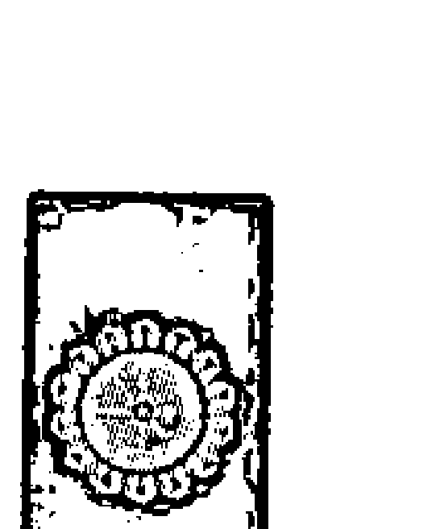

### 2. 能量指针

用22张大阿卡纳牌洗牌切牌完成后，随意抽取两张牌，依次放在1、2位置上。

牌位含义：
- (1)代表今天或者短时间会发生的影响你的能量。
- (2)代表怎么才能将能量转化，成为有助的力量。

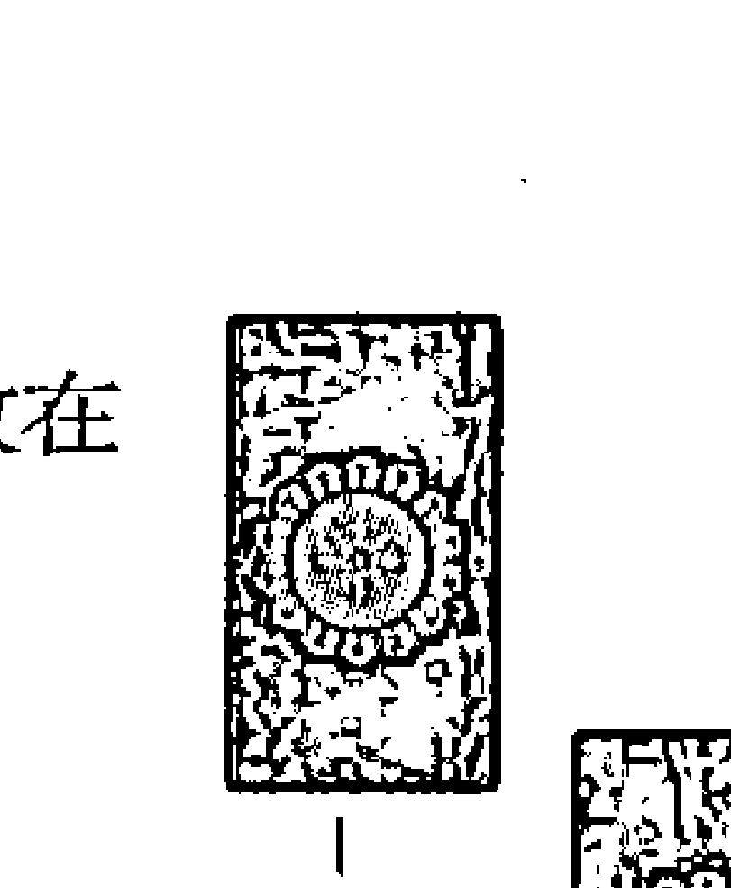

### 3. 认识自我

这个简单的牌阵，可以帮助我们更加深刻地了解自己。用22张大阿卡纳牌洗牌切牌完成后，随意抽取三张牌，依次放在1、2、3位置上。

牌位含义：
- (1)代表我到底是一个怎样的人。
- (2)代表我真正的需求到底是什么。
- (3)代表我如何才能达到我的需求。

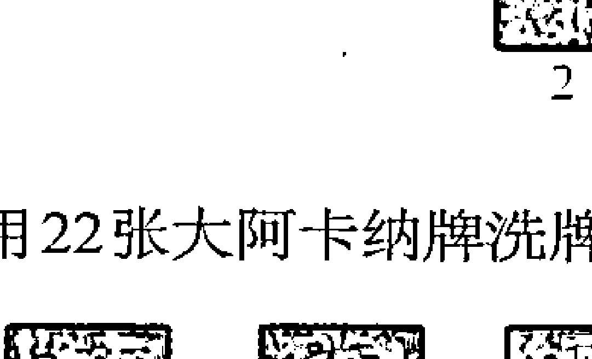

### 4. 钻石

这种牌型是针对问题的过去、现在和未来的发展状况来作解释。它的现在情形以两张牌来综合解释。所以，它具有简洁明快的优点，又能更充分反映求问者的现状。

摆法如下：
- a. 先按一般的洗牌、切牌程序。之后，将牌以扇形摊开用左手拿着。注意：手持的那端，必须是刚切完牌后朝下的那一端！
- b. 求问者任意抽出一张。将这张牌放到图示中1的位置。
- c. 重复上一个步骤三次。将抽出的三张牌，按顺序放在2到4的位置。牌面统统都先朝下，不要翻开。
- d. 全部放好后，再按顺序翻开，开始解读。

牌位含义：
- (1)代表的是问题过去的状况。
- (2)和(3)代表的都是问题目前的情形，需要把这两张牌综合解释。
- (4)代表问题的最后结果。

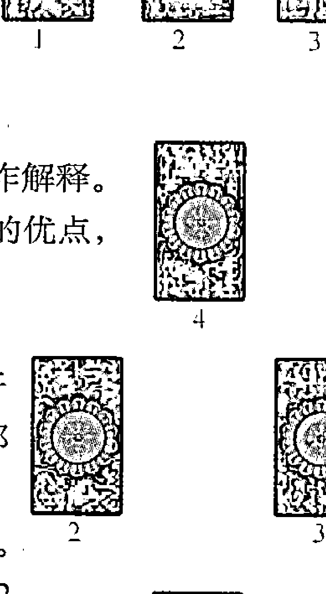

### 5. 要素展开

所谓的“要素”，指的就是气、火、水、土这西方占星术里的四大元素，也是塔罗牌副牌里的四大元素组。

这种推测法是利用四种元素的基本特性，专门为想了解如何解决问题的求问者提供解释的摆法。求问者要先描述清楚自己目前面临的困难（愈仔细愈好），以及想得到的结局。接下来就可以根据求问者的问题，用这个方法好好发挥一下了！

摆法如下：
- a. 按一般的洗牌、切牌程序进行。接下来，取出从上面数来的第四张牌，放在图示中1的位置。
- b. 数过的牌放在一旁。剩下未数过的牌重新计数，数到第四张时再取出来，放在2的位置。
- c. 再重复上面的步骤两次，分别会得到两张牌，按顺序放到3和4的位置。如此牌型便完成了。
- d. 翻开牌来，进行解读。

牌位含义：
- (1)代表火。火象征行动。这张牌主要告诉你行动上的建议。
- (2)代表气。气象征语言、沟通。因此，这个位置在告诉你言语上应该采取的对策。
- (3)代表水。水象征情绪、感情。这里建议你在感情层面应取何种态度。
- (4)代表土。土象征实际物质、金钱。这张牌在告诉你物质方面该如何处理，才能解决问题。

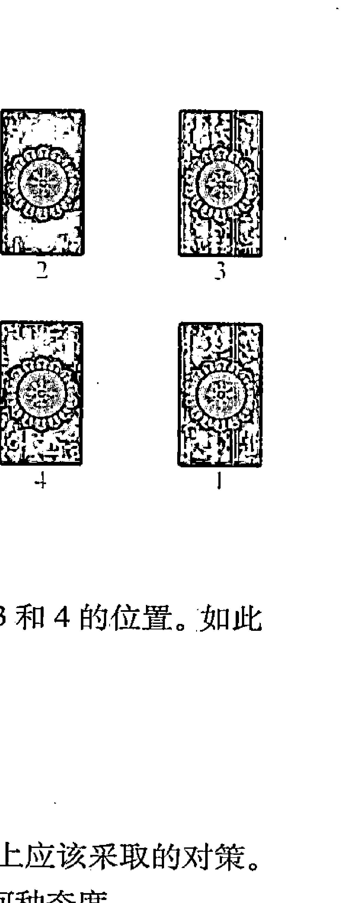

### 6. 萨蒂诺之星

当你正对某件事情做深思熟虑，或者还不太清楚状况，希望能得到略为指点的时候，则是本牌阵最好的用武之地了。它能给予求问者忠告与信息，它也许不会直接告知事情的结果，但是会对事情发展的方向作出准确的推算，这是一个相当值得信赖的借鉴方式。

洗牌切牌完成后，随意抽取六张牌，依次放在1、2、3、4、5、6位置上。

牌位含义：
- (1) 代表你的感觉。
- (2) 代表你对问题产生的迷惑之处。
- (3) 代表你可能未曾察觉的隐藏在表象之下的一些因素。
- (4) 代表你过去和当前问题所发生的一些关联。
- (5) 代表对你的指示，哪些是值得深思熟虑并且着重考虑的。
- (6) 代表对可能结果的预示。

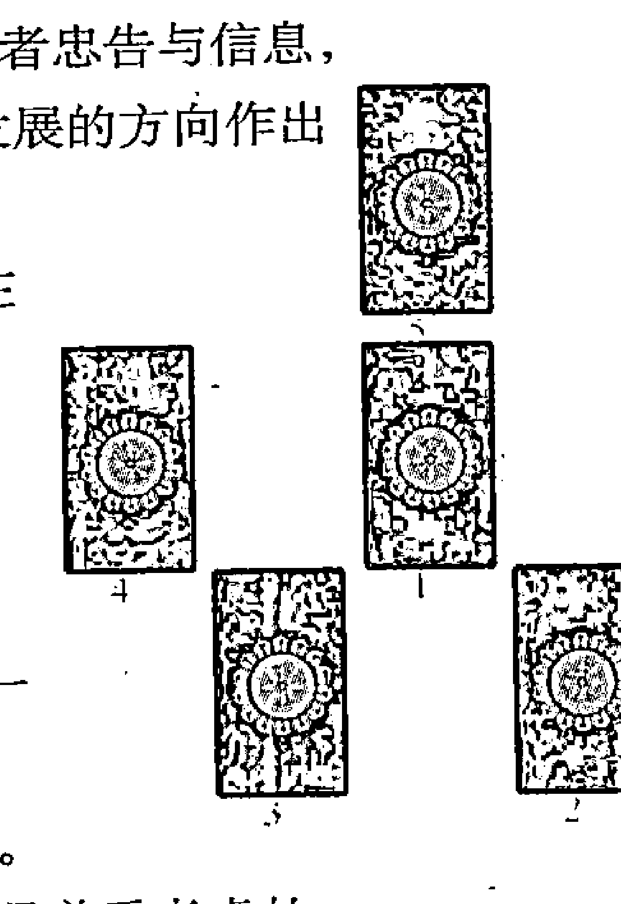

### 7. 七行星

求问——运势。
“七行星推测法”。它们一样都用七张牌，但是解决问题的类型不同：缘分推测法专门算爱情，而七行星是看一个人目前在各方面的状态，属于“运势”型的算法。

摆法如下：
- a. 洗完牌后，把全部的牌背面朝上，以扇形摊开用左手拿着。注意：手持的那端，必须是刚切完牌后朝下的那一端！
- b. 请求问者任选出七张牌。将这七张牌按顺序依图示放到1至7的位置。

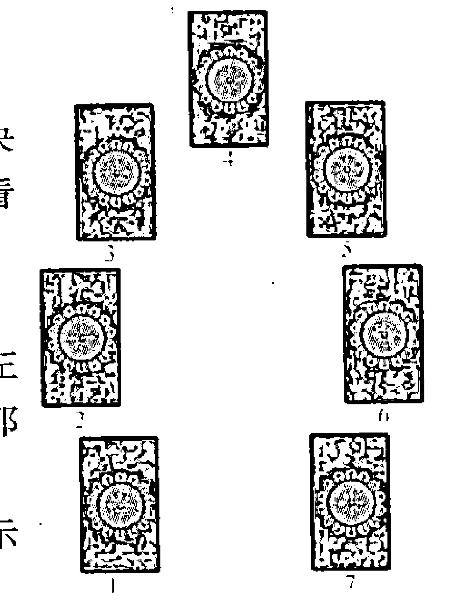

- c. 掀开牌面，开始解读。

牌位含义：

所谓的七行星法，指的是中古世纪占星学里的七大行星：太阳、水星、金星、月、火星、土星和木星。这七个行星分别掌管着不同面向，而这里的七张牌就代表着不同的行星。

- (1) 代表月。月亮掌管的是求问者的家人状况与家庭环境。
- (2) 代表土星。土星掌管的是人的智能、精神状况。
- (3) 代表金星。金星掌管的是人的情感。
- (4) 代表太阳。太阳掌管的是人际交往情况。
- (5) 代表火星。火星指示求问者和其对手的竞争情况，或是潜在的意见分裂。
- (6) 代表木星。木星象征着物质的获取，或是任何人际关系、精神性物质的获得。
- (7) 代表水星。水星掌管贸易、商业工作和学习的状况。

### 8. 时间轮回

洗牌切牌完成后，依次摆牌。

- a. 从上面依次往下数到第三张牌，放在1位。
- b. 又从剩下的牌往下数到第三张牌，放在2位。
- c. 依次往下数三张抽一张放在3、4、5、6位置上。
- d. 最后第七张牌从最后一张牌倒数第三张，抽出放在7位。

牌位含义：
- (1) 代表求问者的现状。
- (2) 代表求问者与对方的关系现状。
- (3) 代表求问者未来的状况。
- (4) 代表给求问者建议和指导。
- (5) 代表求问者对象的状况。
- (6) 代表求问者遇到的障碍。
- (7) 代表求问者与对方两人的未来或结局。

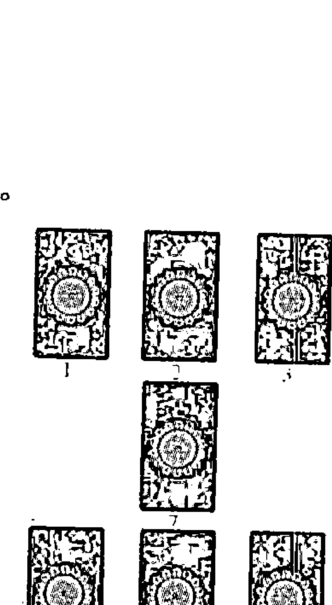

### 9. 意识动力

本牌阵适合推测有关决定、计划、自我评估之类的问题。

洗牌切牌完成后，随意抽取九张牌，依次放在1到9位置上。

牌位含义：
- (1)代表指示你所观察和感觉到的问题的现状。
- (2)代表你所推测的事件在过去所受的影响。
- (3)代表对第2位牌的强化认识，延迟求问者的进展，以便更加客观公平地认清当前状况。
- (4)代表道德观对于事件的影响，或内心超我的想法。
- (5)代表潜意识对你的影响。
- (6)代表按照目前的状态将会发生的结果。
- (7)代表对第6位牌的结果的进一步说明。
- (8)代表你可能做的一种改变，或者是会令你偏离目标的一种诱惑。
- (9)代表假如按照第8位牌的改变将会发生的结果。

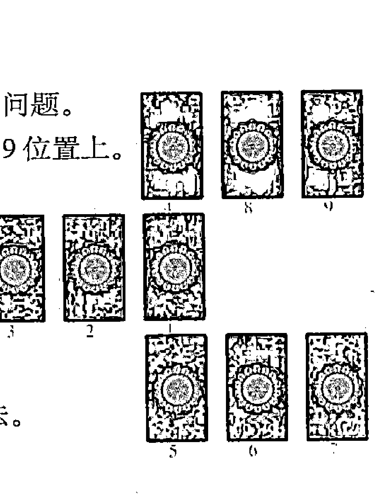

### 10. 现在未来

洗牌切牌完成后，随意抽取九张牌，依次放在1到9位置上。

牌位含义：
- (1)代表你的现状。
- (2)代表你受到的其他人的影响。
- (3)代表你受到的环境的影响。
- (4)代表你对于外界影响的反应。
- (5)代表你所思考的问题。
- (6)代表你目前的感受。
- (7)代表你心中一直确信的想法。
- (8)代表接下来一段时间将会发生的情况。
- (9)代表较远的未来的状况。

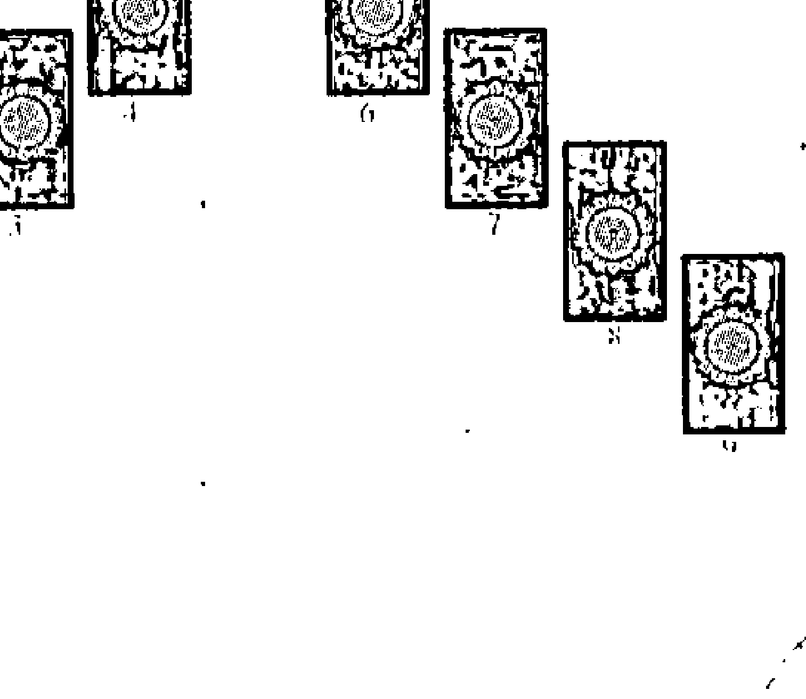

### 11. 镜像展开

求问——爱情、友谊、学业、事业。

镜像展开法是针对某一个特定的问题来做推测。它特别适用于当你决定采取某种行动，而想知道这种行动的后果时。

摆法如下：
- a. 洗完牌后，把全部的牌背面朝上，以扇形摊开用左手拿着。注意：手持的那端，必须是刚切完牌后朝下的那一端！
- b. 请求问者任意抽取一张牌交给你。将这张牌放在桌上的正中心，由左向右翻开，放到0的位置。
- c. 接着继续请求问者抽出九张牌。依照图示位置，将选出的牌按顺序放在1到9的位置。但是，这九张牌都不能先翻开。1位置的牌要盖过刚刚先掀开在0的位置的第一张牌。
- d. 现在再掀开另外九张牌。判断之后开始解读。

牌位含义：
- (0)是问题解决的关键。
- (1)指你目前的状况。
- (2)代表精神状况或思考的特征。
- (3)代表感性、情感方面的状况。
- (4)是可能出现的意外事件。
- (5)是近未来（两三个月内）的状况。
- (6)代表其他人的想法、举动。
- (7)是尚未考虑到的层面。
- (8)代表采取行动的结果。
- (9)是指最终的结局。

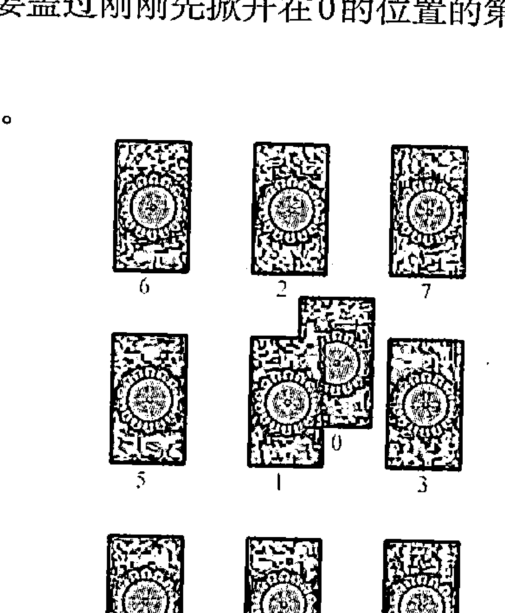

### 12. 凯尔特十字

求问——爱情、友谊、学业、事业。

这是一种广泛流传的推测方式，几乎在任何塔罗牌的推测书上，都会提及。它解说的模式和“镜像展开法”有些相似，都是针对某一个问题的各个层面去做判断，并且解读过去、现在和未来事情发展的预测。基本上它也适合爱情、友谊和学业或事业的问题，不过在推测学业或事业的问题上，特别有威力。

摆法如下：
- a. 依一般方式洗牌、切牌。将由上面数来的第七张牌放在如图示1的位置。
- b. 将跟在第七张之后的五张牌，按顺序放在2到6的位置。特别要注意2的位置是一张横放的牌。原本你手中的牌都是直放的；当你要横放这张牌时，请把牌顺时针方向旋转90度后再放上去。
- c. 接着对剩下的牌由上往下重新计数。数到第七张时，把这张牌放在7的位置。这个位置要稍稍地把牌往右倾倒放置，如图所示。
- d. 若使用22张大阿卡那牌进行推测，手中应该还剩下三张牌。把这三张牌按顺序向右斜放在8到10的位置。
- e. 牌型已经完成。把所有牌掀开，综合判断之后做解读。

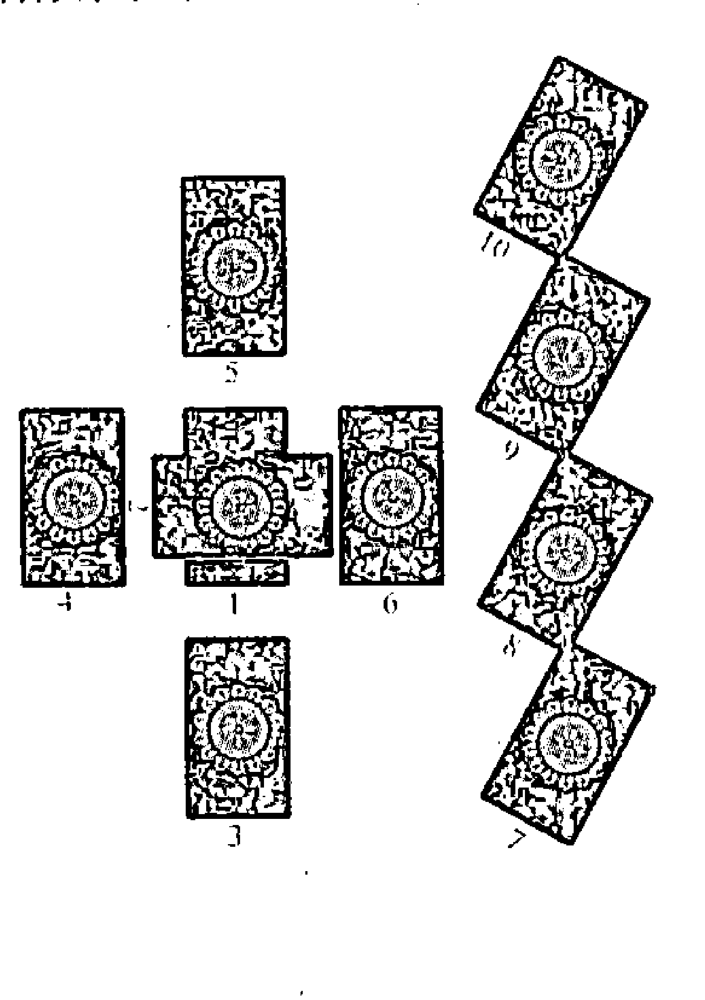

牌位含义：
- (1) 代表问题的现状。
- (2) 代表对问题的阻碍或者帮助。横放牌判别正位或逆位的方法是这样的：如果牌的正向朝左边，就是正位置；牌的正向朝右则是逆位置。
- (3) 显示的是求问者对问题的理想、未来目标。
- (4) 说明问题过去的成因、状况。
- (5) 问题的最近过去状况（通常在过去两三个月内）。
- (6) 问题的最近未来发展（未来两三个月内）。
- (7) 象征着求问者本身的现状。
- (8) 代表周围环境对问题的影响，以及周围的人对这个问题的看法。
- (9)显示求问者的能力。
- (10)问题的最终结果。

从7到10的牌虽然是微微倾斜的，但是正位置或逆位置仍然有效。

### 13. 时间之桥

有关现在与未来，桥墩牌阵就是这样暗示着一种联结的意味。运用78张塔罗牌进行推测，注意有些牌是横放的。因为牌阵比较庞大，解读的时候需要花费较大的精力，但它的实用价值也是相当值得信任的。

洗牌切牌完成后，随意抽取19张牌，依次放在1到19位置上。

牌位含义：
- (1)(2)(3)代表对过去的说明。
- (4)(5)(6)代表连接过去与现在的：可能的事件、信念或者一些不易察觉的事物。
- (7)(8)(9)代表对现在的描述。
- (10)(11)(12)代表连接现在与未来的：可能的事件、信念或者一些不易察觉的事物。
- (13)(14)(15)代表接下来一段时间会发生的状况。
- (16)(17)(18)连接到结果的：一些介于隐藏与显现状况的事情，这些事或者会帮助你或者会对你产生阻碍。这些有些已经发生，有些不一定已经发生，但很有可能发生。
- (19)代表未来的结果。

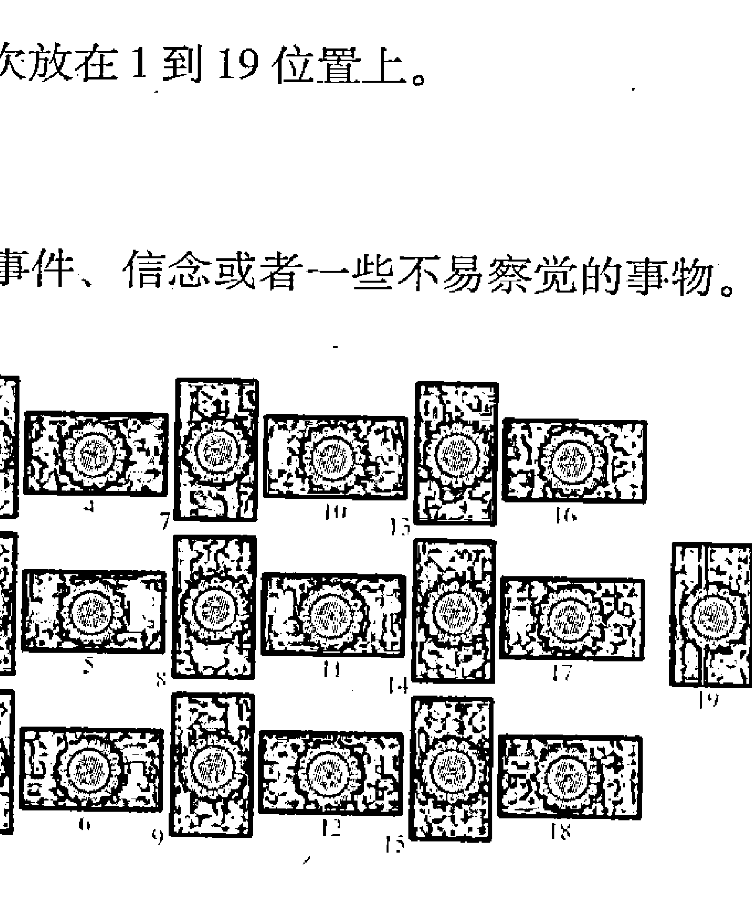

### 14. 生命之树

生命之树牌阵虽然只有10个牌位，但需要78张塔罗牌一起参加推测。它是一个将塔罗、哲学、冥想结合在一起的复合的系统，分析整个生命的情况。它从底部解释到上方，也就是从第10位的牌解释到第1位的牌。

洗牌切牌完成后，随意抽取10张牌，依次放在1到10位置上。在完成解读之后，把没有用到的牌摆成扇形，从中再选出一张来，放在“Daat Card”的位置，再对它进行解读，它象征一种隐藏的智慧，一种能帮助你完成最大愿望的智慧。

一个完整的生命之树牌阵是非常庞大的，解说通常要花费数小时之久，它几乎包罗万象，需要认真思考。并且这是一个长效型的牌阵，通常算过这个牌阵之后一年内不要再重复使用它来推测。

牌位含义：
- (10)代表王国（Malkuth）：结果、家、物质界、肉体、日常生活、实际的情况。
- (9)代表根基（Yesod）：灵魂的中心、想像力、幻想、习惯、过去的生活、潜意识的根基。
- (8)代表光辉和荣耀（Hod）：思想、判断真实与虚伪的知识、口语的表达和沟通、技巧、科学与应用科学。
- (7)胜利与持续（Netsah）：爱、性爱、本能、艺术、灵感、感受、美、欢乐。
- (6)代表美（Tiphareth）：个性、自我、特质、健康、对其他人的付出、目标、主要的目的或意图。
- (5)代表严厉和力量（Geburah）：力、征服、挑战、冲突、重新调整、障碍、不和谐、挑衅、力量的表现、领导能力。
- (4)代表慈悲和恩典（Chesed）：善良、有利的机会、赋予、机智、救助者、援助、褒奖、力量。
- (3)代表理解（Bina）：心灵的意识与理解力、母亲、心灵、阴、接近结束、企划能力。
- (2)代表智慧（Chhokmah）：创造力、外在价值与思想、父亲、意图、阳、智能与知识、本能。
- (1)代表王冠（Kether）：高层次的思想、目标与意图的正确判断力、和谐的状态、问题的根本或起因。

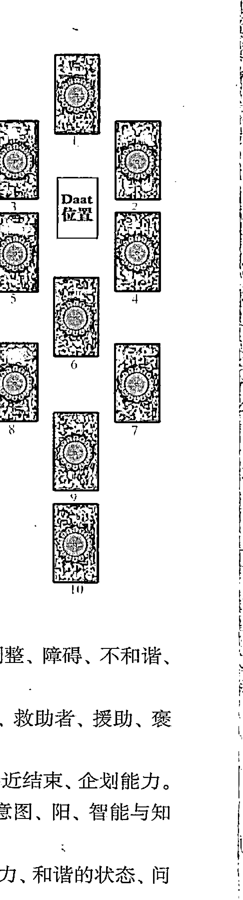

### 15. 统治女神

透过这个牌阵，可以了解自己的潜力，了解自己的感情倾向与潜意识。洗牌与切牌完成后，随意抽取九张牌，依次放在1到9的位置上。

牌位含义：
- (1)代表“思考能力”。
- (2)代表“直觉力”，即你的直觉、第六感能力。
- (3)代表“感情倾向”。
- (4)代表“本能”，你本身潜在的原动力。
- (5)代表“恐惧”，你们害怕的事物。
- (6)代表“无法预期的事”，此事勿急躁下决定。
- (7)代表“希望”，即你内心的愿望。
- (8)代表“可以预期的事”，经审慎思考可以下决定去做。
- (9)代表“统治者”，也就是你自己，是综合性提出结论。

(6)(7)乃针对你眼前遭遇的困难所提出供建议的牌；如果没有遭遇什么困难，则仅供你参考。

### 16. 出生宫位

在长期实践中，这种牌型仅次于“缘分推测法”，是第二受欢迎的牌型。出生宫位图法最适用于解读一个人在某一段时间内各方面的运势。如果你没有什么特定的问题，这种牌型对你而言就再适合也不过了！

喔，还有要对这种牌型做的说明：适用的时间。原则上，塔罗牌是属于短期型的推测工具。因此，它比较适合推测短期间（例如一两年内）的事情。不过，出生宫位图法也可以做比较长时间的解读。

摆法如下：
- a. 先照一般程序洗牌、切牌，把牌背面朝上放好。把从上面数来的第七张放在图示中1的位置。

b. 再依序取出刚才所拿之牌后面的第一张到第十二张牌，放在图示中2到13的位置。
c. 排好以后，从位在中间的第十三张牌先掀开，然后按照1到12的顺序掀牌。

牌位含义：

- (1)个人特性、行事的风格。
- (2)金钱运。
- (3)和兄弟姊妹的关系。
- (4)家庭状况／和母亲的关系。
- (5)恋爱运／和子女的关系。
- (6)身体健康状况。
- (7)人际关系／婚姻运。
- (8)性生活状况。
- (9)学业运／海外旅行机运。
- (10)工作运／和父亲的关系。
- (11)朋友的状态。
- (12)意外的事件。
- (13)整体运势的走向。

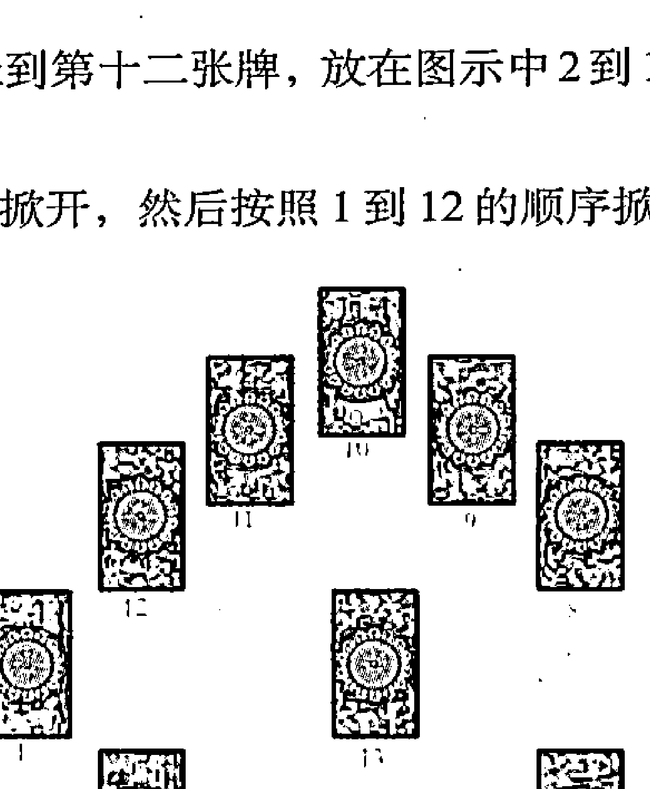

### 17. 灵魂之旅

该牌阵可让求问者明了自己“灵魂”（性格与气质）的形成及对运势影响。洗牌切牌完成后，随意抽取7张牌，依次放在1到7位置上。

### 牌位含义：

- (1)代表你自己。
- (2)代表你家族中的长辈或祖先。
- (3)代表文化对你的影响。
- (4)代表时间对你的影响。
- (5)代表你的故乡或住所对你的影响。
- (6)代表以前的生活对你的影响。
- (7)代表你天赋所具的特质。

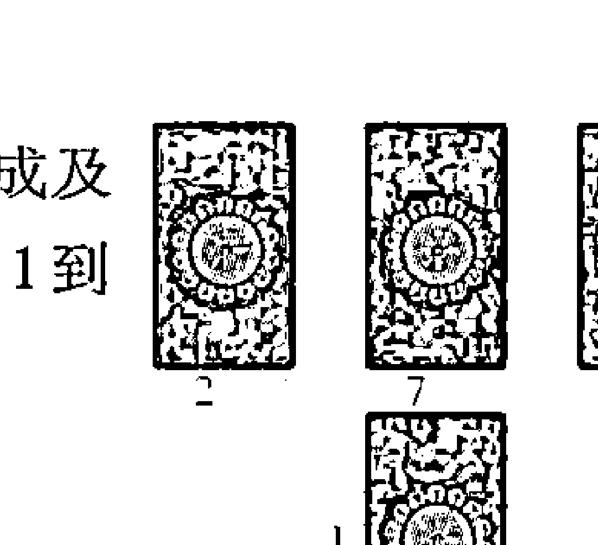

### 18. 阴阳相背

本牌阵比较庞大，理论上也可只使用大阿卡那牌，但建议最好一起使用大小阿卡那78张牌推测，这样，结果比较详尽细致。

洗牌切牌完成后，随意抽取14张牌，如图依次摆放在1到14的位置上。

### 牌位含义：

- (1)(2)代表在一段感情中，男性所喜欢的部分。
- (3)(4)代表在这段感情中，女性所喜欢的部分。
- (5)(6)代表在这段感情中，男性不喜欢的部分。
- (7)(8)代表在这段感情中，女性不喜欢的部分。
- (9)(10)代表在这段感情中，男性所期待的事情。
- (11)(12)代表在这段感情中，女性所期待的事情。
- (13)(14)代表这段感情的现状。

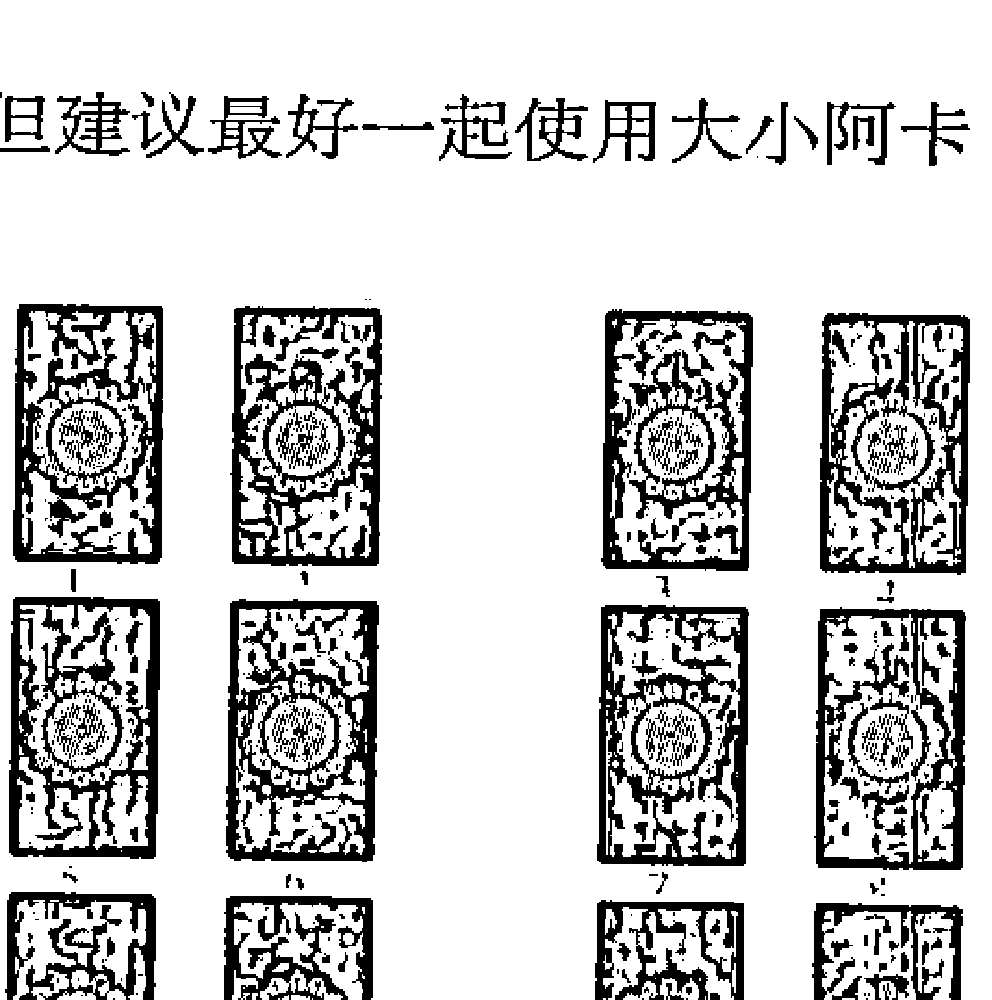

### 19. 芝麻开门

洗牌切牌完成后，随意抽取9张牌，依次放在1到9位置上。

### 牌位含义：

- (1)代表钻石：你突出的优点和天赋。
- (2)代表珍珠：你所拥有的知识力量。
- (3)代表金币：你所拥有的物质基础。
- (4)代表翡翠：你认识的人，给你的生命带来新的机会。
- (5)代表白金链：对你有所阻碍的，必须去解决的人或事。
- (6)代表蓝宝石：你正脱颖而出的某些特质。
- (7)代表水晶：你正在学习并能够加以使用的知识。
- (8)代表红宝石：你可能会认识的人。

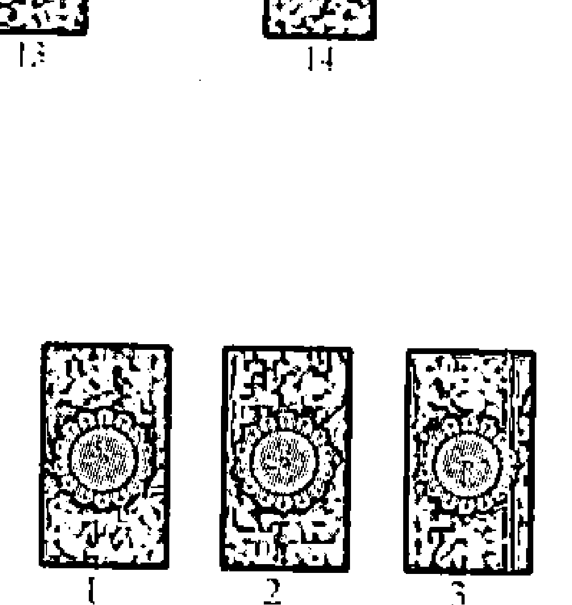

### 20. 阿里巴巴

这又是一个大的牌阵，可以测一测你整个生活、工作的状况。洗牌切牌完成后，随意抽取11张牌，依次放在1到11位置上。

### 牌位含义：

- (1)代表有关你家庭、伙伴、环境的信息。
- (2)代表有关你教育、事业、工作的信息。
- (3)代表与你的自尊有关。
- (4)代表以前有的现在依然存在的影响力。
- (5)代表你目前的心态、状况等。
- (6)代表神殿对你的影响力。
- (7)代表祭坛你的目标，或你心中感到忐忑不安的一些念头。
- (8)代表你的工作能力和创造力。
- (9)代表你社交领域的状况。
- (10)代表你的健康状况和家庭方面的情况。
- (11)代表未来会发生的对你的影响力。

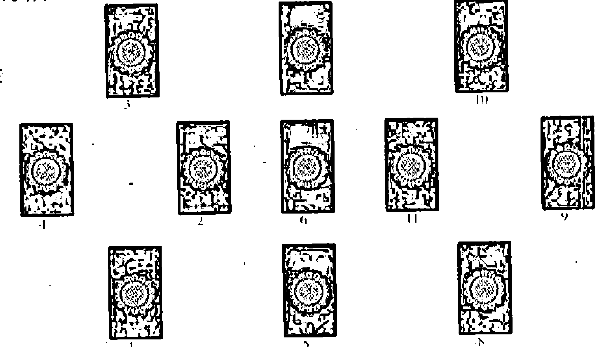

### 附录二：出生年月与塔罗

根据你的出生年、月、日，可以找出代表你自己生命对应的塔罗牌。生命的塔罗牌可以分为两种：一种是代表个性象征的塔罗牌，另一种则是代表灵魂象征的塔罗牌。

代表个性象征的塔罗牌，显示你表现于外在世界的智慧、才能、气质、风度、脾气等，也就是别人如何看你的一切。

代表灵魂象征的塔罗牌，显示内心深处的你，你内在的渴望、精力的来源、精神的感受、追求和向往的理想人生，它代表不为人知的真正的你。

当你降生于人间，你的生命就和这个世界开始了接触，你的个性和灵魂也伴随生命而来。

因此，找出属于自己生命的塔罗牌（从22张大阿卡纳中找），可以让你更深入地了解自己是谁，别人又如何看你。

发现你生命中隐藏的个性和力量，可以帮助你认识自己，发挥潜能和特长，更可以看清未来，开拓美好的前途。

推算方式如下：

- ▲把你出生的公历年、月、日三个数字相加，得到一个总数；再把总数的各个数字相加，会得到一个二位数；然后把二位数的两个数字相加，会得到一个位数。此二位数代表个性象征的塔罗牌，个位数则代表灵魂象征的塔罗牌。

```
<例>比如你的生日是1974年10月24日，其计算如下：
年 1974
月 + 10
日 + 24
2008 =10(2+0+0+8)
=1(1+0)
“10”为“命运之轮”，即为代表你个性象征的塔罗牌。
“1”为“魔术师”，即为代表你灵魂象征的塔罗牌。
```

- ▲如果总数的各个数字相加，和为个数，则此数字同时代表个性和灵魂两种象征。个性和灵魂属于同一个象征的人，通常都是专业人才。

```
<例>比如生日是1977年10月19日，其计算如下：
年      1977
月  +   10
日  +   19
----------------
2006=8(2+0+0+6)
```
“8”为“力量”，即为同时代表你个性和灵魂象征的塔罗牌。

- ▲如果总数的各个数字相加，和为19；1和9相加等于10；1和0再相加等于1，这是惟一有三个数字的组合。这三个数字，第一个代表个性，第三个代表灵魂，而多出来的第二个则代表创造力。拥有创造力象征的人是绝佳的创意人才。

```
<例>比如生日是1964年5月3日，其计算如下：
年      1964
月  +    5
日  +    3
----------------
1972 =19(1+9+7+2)
     =10(1+9)
     =1(1+0)
```
“19”为“太阳”，即为代表你个性象征的塔罗牌。“1”为“魔术师”，即为代表你灵魂象征的塔罗牌。“10”为“命运之轮”，即为代表创造力象征的塔罗牌。

- ▲如果总数的各个数字相加，和为22，22减去22等于0。因为传统塔罗牌的大阿卡纳为22张，数字由0排至21，因此数字22等于数字0，这数字代表个性；22的2加2等于4，这数字代表灵魂。

```
<例>比如生日是1964年1月1日，其计算如下：
年 1964
月 + 1
日 + 1
1966 =22(1+9+6+6)
=4(2+2)
```
“0”为“愚人”，即为代表个性象征的塔罗牌。“4”为“皇帝”，即为代表你灵魂象征的塔罗牌。

- ▲如果总数的各个数字相加，和大于22，则把和减去22，所得余数代表个性；和的两个数字相加，求得的个数代表灵魂。

```
<例>比如生日是1982年4月3日，其计算如下：
年 1982
月 + 4
日 + 3
1989=27(1+9+8+9)
=9(2+7)
```
“5”为“教皇”，即为代表你个性象征的塔罗牌。“9”为“隐士”，即为代表你灵魂象征的塔罗牌。

### 塔罗牌数字对应的人生型态

- △如果你推算出来的个性象征和灵魂数字相同，代表你人生的发展是单一的；如果个性象征和灵魂象征的数字不同，代表你人生的发展是双重的。
- △如果你的数字是0，代表你追求的是多彩多姿、变化多端的人生。
- △如果你的数字是1–6，代表你追求的是和谐的人生。
- △如果你的数字是7–12，代表你追求的是充满冒险和挑战的人生。
- △如果你的数字是13–18，代表你追求的是不断开创和改变的人生。
- △如果你的数字是19–21，代表你追求的是自我实现和成就的人生。

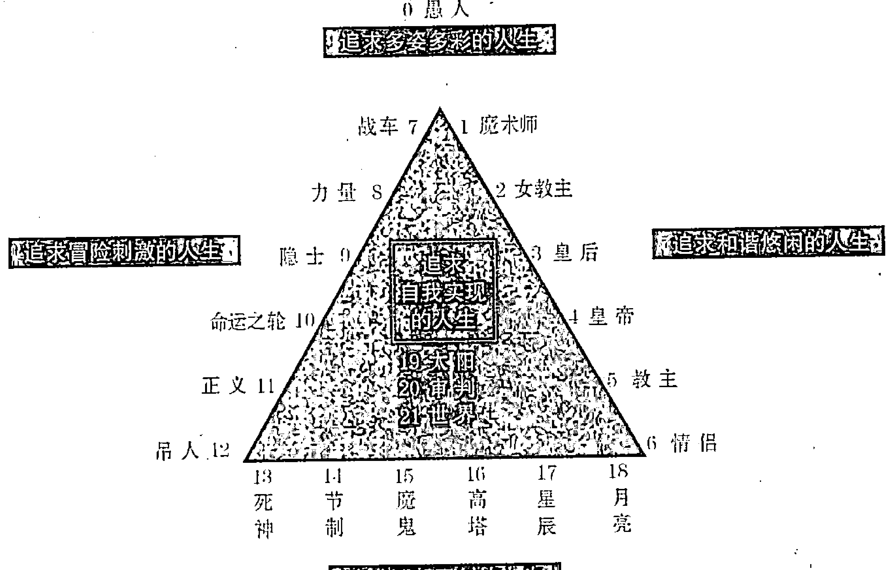

根据你出生的月、日和不同的年份，可以推算出每一年代表你当年运势的塔罗牌。

由于运势的推算是以生日为基准，因此每一年运势的开始，也是以那一天起算。

比如，你是1976年6月1日生，则1997年的运势从1997年6月1日起算，6月1日以前为1996年的运势。

利用这种推算方式，可以找出代表当年或来年运势的塔罗牌。若从出生的年份开始推算，也可以算出一个人的流年。

从推算流年中，你会发现你的数字系按顺序排列，但隔一段时间数字便会中断，跳到另一顺序。这种数字中断的现象，即代表你生命中运势的改变，是人生的转折点和新运势的开始。

同时，你也会发现代表运势的塔罗牌中，没有0(愚人)和1(魔术师)这两张牌，因为每一年的运势中都充满了未知(愚人)和变化(魔术师)。

### 推算方式

把你出生的阳历月、日和当年的年份相加，得到总数；再把总数的各个数字相加，若和等于或小于21，则按此数字找出代表运势的相关塔罗牌。

```
<例>比如生日是2月17日，推算2000年运势，其计算如下：
年      2000
月   +      2
日   +     17
--------------
2019 = 12 (2+0+1+9)
```
“12”为“吊人”，即为代表你2000年运势象征的塔罗牌。

如果总数的各个数字相加，和等于或大于22，则再将和的两个数字相加，成为个数，此个数即为代表运势的数字。

```
<例>比如生日是1月1日，推算1996年运势，其计算如下：
年      1996
月   +       1
日   +       1
--------------
1998  = 27 (1+9+9+8)
       =  9 (2+7)
```
“9”为“隐士”，即为代表你1996年运势象征的塔罗牌。

如果总数的各个数字相加，和等于28，把2和8相加等于10，10即为代表运势的数字，不再把10的和相加。

```
<例>比如生日是1月1日，推算1997年运势，其计算如下：
年      1997
月   +       1
日   +       1
--------------
1999  = 28 (1+9+9+9)
       = 10 (2+8)
```
“10”为“命运之轮”，即为代表你1997年运势象征的塔罗牌。

> ——以上部分选自《经典塔罗》