# 格瑞魔法学校
秘法教程 02

## 魔法实践

### 实践篇

如何施展法术？
从基础法术到高级法术的16堂魔法实践课

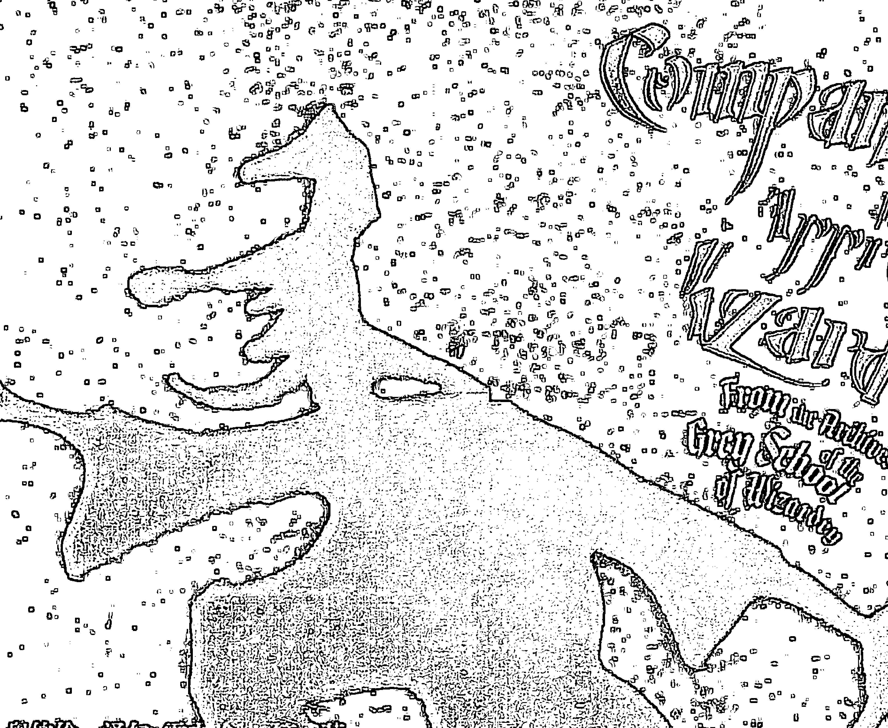

### The Practice of Magic
From the Author of
Grey School of Wizardry

[美] 奥伯伦·泽尔-雷文哈特 著
罗越 译

江苏文艺出版社

# 格瑞魔法学校
秘密教程 02

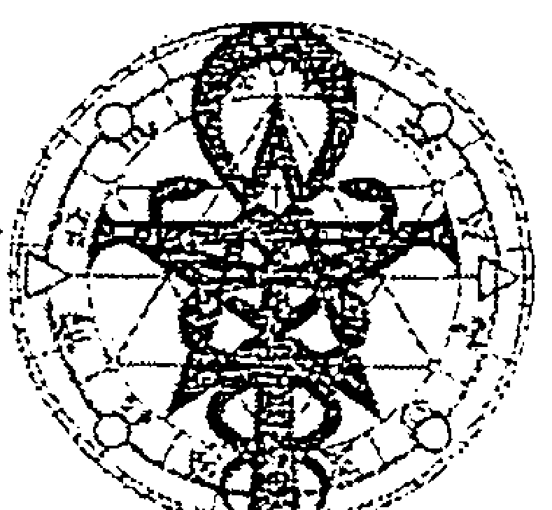

## 魔法实践课
下卷

如何施展法术？
从蓝魔法到黑魔法的 16 堂魔法实践课

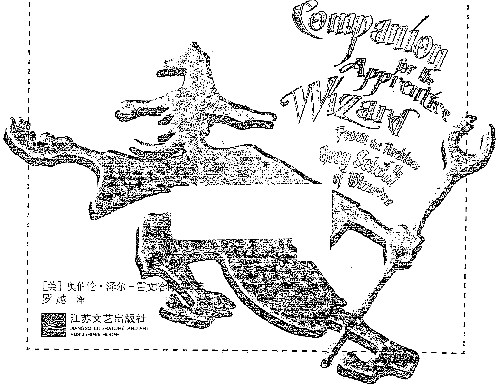

[美] 奥伯伦·泽尔-雷文哈特 等著
罗越 译

江苏文艺出版社
JIANGSU LITERATURE AND ART
PUBLISHING HOUSE

### 图书在版编目（CIP）数据

魔法师学徒的伴侣书：如何施展法术？从蓝魔法到黑魔法的16堂魔法实践课：全2册 /（美）泽尔-雷文哈特等著；罗越译. -- 南京：江苏文艺出版社，2014
书名原文：Companion for the apprentice wizard
格瑞魔法学校秘密教程
ISBN 978-7-5399-7261-9

Ⅰ. ①魔… Ⅱ. ①泽… ②罗… Ⅲ. ①魔术-通俗读物 Ⅳ. ①J838-49

中国版本图书馆CIP数据核字（2014）第050504号

Companion for the Apprentice Wizard
by Oberon Zell-Ravenheart and Faculty of the Grey School of Wizardry
Copyright © 2006 by Oberon Zell-Ravenheart and Faculty of the Grey School of Wizardry
This edition arranged with New Page Books.
through CA-LINK International LLC.
Simplified Chinese edition copyright:
2013 © The Shang Shu Culture Media Co., Ltd.
c/o Jiangsu Literature And Art Publishing House
All rights reserved.

版权登记号：10-2011-583号

| 书 名 | 魔法师学徒的伴侣书：如何施展法术？从蓝魔法到黑魔法的16堂魔法实践课：全2册 |
| --- | --- |
| 著 者 | [美] 奥伯伦·泽尔-雷文哈特 等 |
| 译 者 | 罗 越 |
| 责任编辑 | 孙金荣 |
| 策划编辑 | 夏小晴 |
| 特约编辑 | 钟 原 |
| 出版发行 | 凤凰出版传媒股份有限公司 江苏文艺出版社 |
| 出版社地址 | 南京市中央路165号，邮编：210009 |
| 出版社网址 | http://www.jswenyi.com |
| 经 销 | 凤凰出版传媒股份有限公司 |
| 印 刷 | 三河市嵩川印刷有限公司 |
| 开 本 | 700毫米×1000毫米 1/16 |
| 印 张 | 27 |
| 字 数 | 360千字 |
| 版 次 | 2014年11月第1版 2014年11月第1次印刷 |
| 标准书号 | ISBN 978-7-5399-7261-9 |
| 定 价 | 58.00元（上、下卷） |

（江苏文艺出版社图书凡印装错误可向本社调换）

### 目录

第九章：炼金术和魔法科学（红色）/ 1
1. 简介 2. 炼金术的象征主义 3. 有象征意义的炼金术意向的术语 4. 厨房炼金术 5. 奇妙的发明 6. 高科技魔法：探讨网络空间里的活动 7. 科技魔法词汇表

及更远处 14. 时间与玛雅人 15. 神秘的金字塔 16. 下一个是什么

第十章：生活方式（粉红色）/ 24
1. 简介 2. 你的魔法师生活 3. 内部周期的秘密：为年轻魔法师编织的简单的网 4. 拥抱我们的男性：潘神与绿人 5. 男孩、男人与长者：成长仪式 6. 女性魔法师的成长仪式：让我们的美丽成为荣耀 7. 实战魔法师的行动主义 8. 乌鸦法则 9. 举办一次魔法师主题聚会

第十三章：数学魔法（无色）/ 89
1. 简介 2. 神的算术 3. 数字13的历史 4. 麦比乌斯圈 5. 克莱因瓶 6. 神奇的几何学 7. 做一做五个柏拉图立体模型 8. 自然界里的神奇的几何学 9. 怎样测量树木或者是高大建筑物的高度呢？

第十一章：野兽支配（棕色）/ 47
1. 简介 2. 动物领袖与图腾 3. 微小的神灵：图腾，历史，与复杂的进化 4. 观察与收集 5. 追踪的魔法 6. 照顾家畜 7. 更多传说中的野兽 8. 制作四种漂亮的模型龙

第十四章：仪式魔法（白色）/ 112
1. 简介 2. 创造个人仪式 3. 一些基本的仪式步骤 4. 法术介绍 5. 阴历表：度过每一个满月之夜的魔法法术 6. 画月亮仪式 7. 满月的献祭仪式 8. 计算机镜面保护咒语

第十二章：宇宙学与形而上学（紫色）/ 70
1. 简介 2. 裸眼天文学 3. 测量，方向，与夜空 4. 水手天体观测仪 5. 季节，分点，至点 6. 制作你自己的日晷 7. 月亮 8. 恒星 9. 星图和平面天体图 10. 行星 11. 彗星，流星，以及卫星 12. 特殊光景 13. 银河以

第十五章：传说（灰色）/ 133
1. 简介 2. 迷失的大陆和文明 3. 英雄时代 4. 亚马逊族和他们的女战士们 5. 更多的神话和传说 6. 《马比诺吉昂》挪威神话里的魔法师 7. 魔法神器

第十六章：巫术和黑魔法（黑色）/ 159
1. 简介 2. 武术和影子 3. 怪物 4. 神秘的怪物 5. 恶魔 6. 巨作《克苏鲁神话》和《夜夜破胆》 7. 邪眼 8. 防护 9. 镜面盾 10. 投射影子 11. 气候魔法

# 第九章
炼金术和魔法科学（红色）

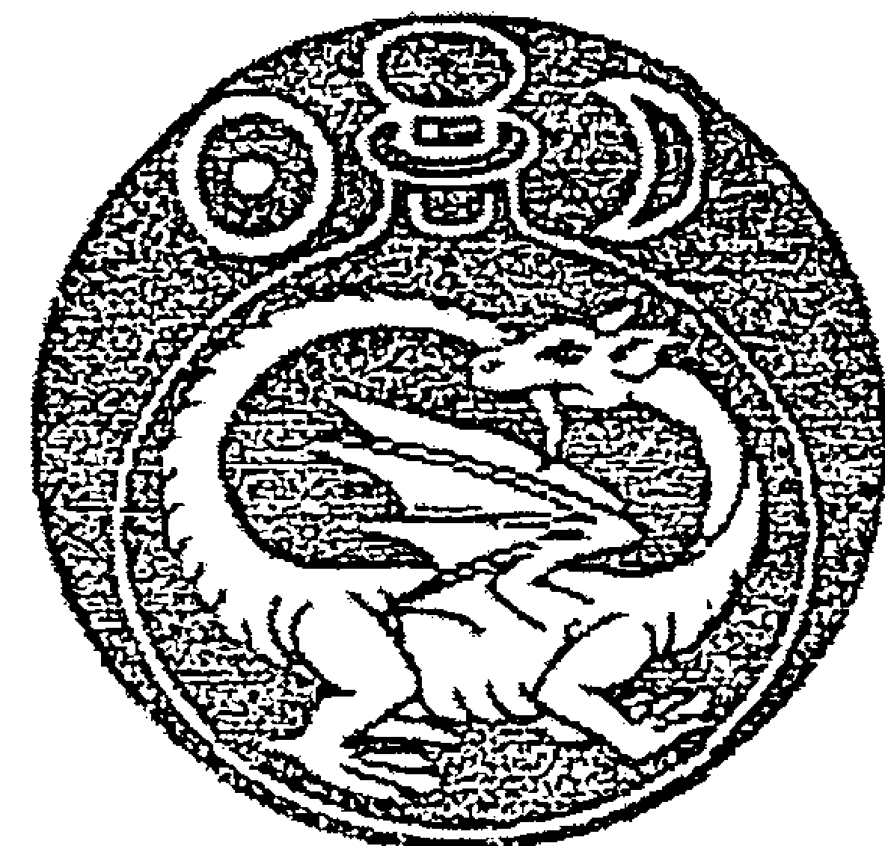

# 计算机奇才

来自于水晶体闪闪发光的空隙的硅的奥秘正在向我低声说，它暗示了满满一金库之多的知识学问。这些知识学问像奇怪的花朵一样公开水晶体硅的秘密。如果我多少成为一名隐士，漂泊在胜产水晶的荒野，这将会是怎样的情景？

那么梅林呢？毫无疑问，人们认为他也疯了。但是没有梅林的话亚瑟王的宫殿所在地早已垮塌了。

让我不断念出我的水晶咒语，一个隐蔽洞穴里挂着一张蜘蛛网，雨水的问题和答案像霜一样得到了细化。

我被各种各样的波光粼粼的智慧吸引着，看到了水晶体每一面反射出的我的脸庞的影子。在这里我能够施展魔法，就像一如既往的船只或者星星一样确信可靠。

只需要耐心等待，我叫你走到屏幕前的时候就会看到我创造的一个又一个的崭新的世界。

> ——伊丽莎白·巴纳特

### 1. 简介

欢迎来到炼金术和魔法科学的世界！这个部分包括了神奇的数学和科学魔法，特别讲到了变化和转换的过程。作为现代化学的前身的炼金术来源于埃及、希腊以及中东。从历史上来看，炼金术士试图寻找出能够把贱金属变成金子的方法，尝试构想出能够使人长生不老永垂不朽的仙丹妙药，还设法制作一种叫做侏儒的人造人偶。炼金术的内在奥秘还涉及到了灵魂的转换和完善。当代的研究领域包括了化学、物理学、冶金术、哲学、玄学、延长寿命的研究、基因和克隆、机器人技术、控制论以及人工智能。

而事实上，任何一个魔法和科学的领域都是通过对物质或者物体的熟练使用而重叠相交的。

现代科学是从熔炉之中和化学实验室里坩埚之中诞生出来的，如今那些被我们称为科学家的人们就是以前被人们熟知的炼金术士——红袍魔法师。

这个章节的颜色是红色，红色跟体力劳动有密切关系，就像物质精神一样治愈人类和动物的体力劳动。红色是能量、权力之色。它跟掌控、火星、星期二、双子星座和第一个人体精神力量的中心（根源）都有密切关系。红色是火的颜色，还是灵感、活力、自豪、愤怒、勇气、强烈的感情、净化、旱地、挑

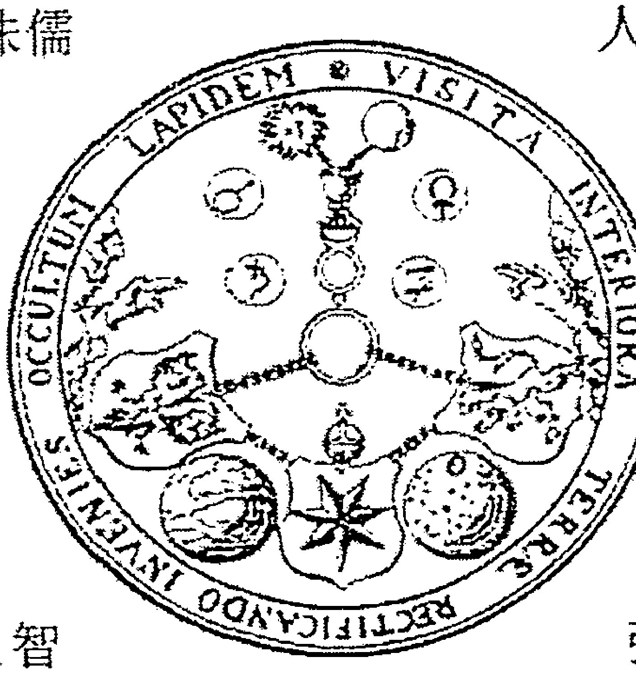

鲜的乐章（尤其是像心跳一样的轰鸣声），以及电闪雷鸣的天气都有着不可磨灭的关系。红色还和炼金术、魔法技艺、转换科学都有关。红色是抵御危险和威胁的最棒的颜色。人们使用红色是为了保持稳定、接地能量、促使繁荣富强和保佑身体健康。

### 2. 炼金术的象征主义

文 / 尼古拉斯·帕安尼勒 (Nicholas Paranelle) (红色)

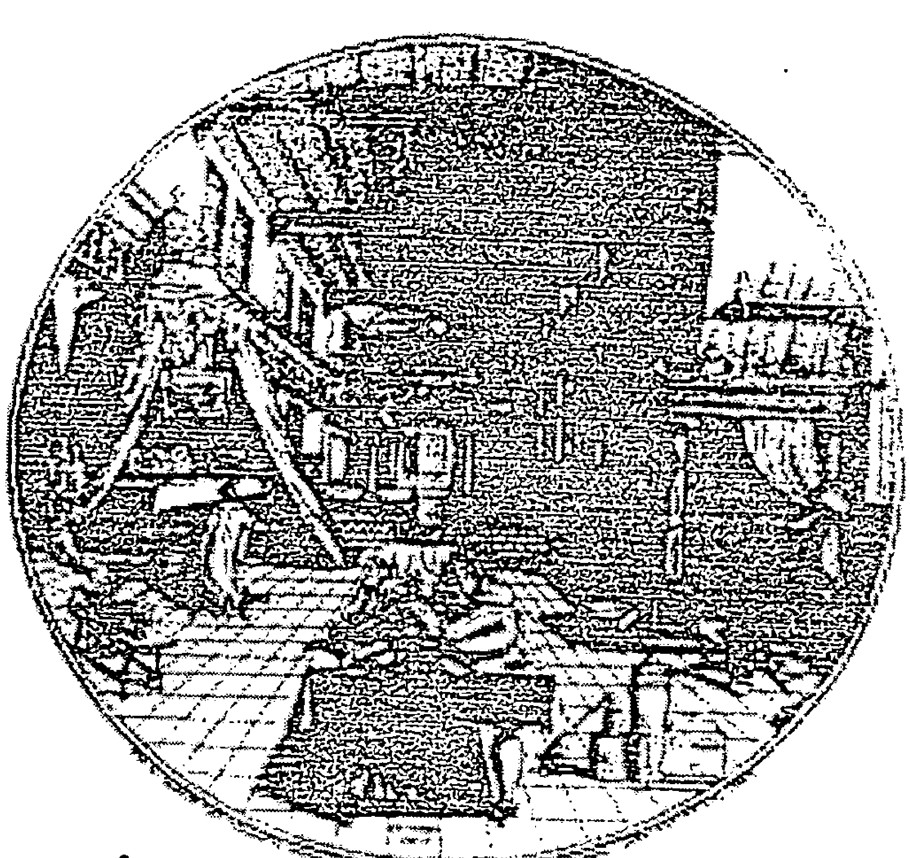

到现在，刘易斯·卡罗尔都还不是炼金术士，但是从他的作品中，你不会发现这个问题。他的诗集《胡言乱语和其它诗歌》（Jabberwocky and Other Poems）像曾经发表过的炼金术作品一样神秘。

为什么这些象征符号替代了简单的语言？其实，象征符号拥有每个单位都能承载更多的信息的能力，而语言文字则不具备那样的能力，这些象征符号是具备“三维特征”的。

我们肯定都听过一句话，“一幅画抵过千言万语”。让我们试着去描述下一页海因里希的圆形竞技场里看到的所有事物。

你能不能把那里的所有事物三言两语地描述出来呢？很可能不能。但是炼金术士就能够仅仅通过一幅画把极其复杂的思想表达出来，例如，用一幅画就能把铅转变成金子的整个过程描绘出来。

象征符号的使用给当时的炼金术士提供了某种程度上的保密方法，这样就使得炼金术士的炼金方法不让同时代的凡人知道。

炼金术士可以通过使用象征符号跟那些不会读写同一种语言的炼金术士交流思想。所以一个希腊炼金术士可以向来自中东的炼金术士描绘一个炼金序列，而又完全不会受到语言不同的阻碍。

使用象征符号可能看似仅仅一个非常有趣的方式，一个假意愚弄别人的简单的游戏（你曾经有为了仅仅跟别人开玩笑而写过一些密码之类的东西吗？）

例如，以下的每一个符号都分别代表的是什么？它们全部都是金元素的炼金术符号。

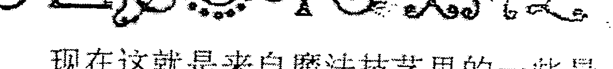

现在这就是来自魔法技艺里的一些最重要的象征意象的关键所在，随附的就是一张炼金术字形表。你可能会很享受在你的日志中或者其他笔记中运用这些炼金术符号，尤其是记录下你的实验。

### 3. 有象征意义的炼金术意象的术语

文 / 奥伯伦 (灰色)

亚当 = “第一件事物”（原始物质）——男性方面

## 第九章：炼金术和魔法科学（红色）

- 多情的猎物鸟类 = 熔化和凝结的分支过程
- 天使 = 易变的或者灵魂化的事物
- 琥珀 = 金子
- 阿波罗 = 红色酊剂
- 蛇怪 / 毒蛇 = 衍变的仙丹妙药
- 斩首 = 蒸馏器里黑色物质的分解
- 黑乌鸦 = 抹黑或者净化事物
- 黑王 / 黑人 = 黑色事物（黑斑蚧）
- 黑色大乌鸦 = 黑色混合物
- 城堡 / 堡垒 = 密封电缆
- 化学婚礼 = 化学反应
- 孩童 / 婴儿 = 点金石
- 公鸡 & 母鸡 = 事物的男女两方面
- 钉在十字架上的蛇 = 固定发挥
- 戴安娜 / 阿尔特弥斯 = 白酊
- 鹿子 / 牡鹿 = 作为媒介把点金石的身体和灵魂结合在一起的墨丘利
- 狗 & 母狗 = 男性：炎热、干燥；女性：冰冷、潮湿
- 鸽子升序 = 白色升华物
- 鹰 = 哲学上的汞；白酊
- 蛋 = 孵化点金石的转换器皿
- 夏娃 = “第一件事物”（原始物质）——女性方面
- 花朵 = 粉状物
- 喷泉 = 正在转变的魔法物质
- 花园 = 神秘的器皿
- 墓穴 / 棺材 / 坟墓 / 牢笼 = 盛腐败物的器皿
- 青藓 = 原材料锑矿
- 灰狼 = 锑（天狼星）
- 半兽半鹫怪物 = 女性原则
- 脑袋 = 用于分离和腐坏物质的器皿（蒸馏器）
- 雌雄同体 = 结合男性女性的原则或者原理
- 蜂蜜 = 哲学溶剂；所有有治愈功效的酊剂
- 房屋 = 炼金术器皿
- 大海之王 = 正在被创造的点金石
- 山脉 = 可能发现“第一件事物”的地方
- 鸟巢 = 炼金术器皿
- 孔雀尾巴 / 彩虹 = 黑色和白色之间的过度阶段
- 凤凰 = 点金石
- 红瓣 = 红色硫磺；金属男性种子
- 红王（溶胶） = 金子；亦硫磺
- 红海 = 水银溶液；打底材料
- 红玫瑰 = 完美的红色（赧红）点金石
- 根源 = 四大元素：土、风、火、水
- 火蜥蜴 = 火一般的金属男性种子
- 土星 = 铅；打底材料
- 种子 = 金属的活力
- 蛇 = 过程开始时的古老问题
- 船只 = 用于黑色物质熔化的器皿
- 骨架 / 头颅 = 黑色物质（黑斑蚧）
- 六角星 = 锑；亦改革者墨丘利
- 太阳 = 金子；亦男性原则
- 天鹅 = 白色阶段（反射率）；把贱金属变质为银的仙丹妙药
- 蟾蜍 / 青蛙 = 腐烂阶段的膨胀的物质
- 塔 = 熔炉；火炉
- 被削去顶端的树 = 熔化 / 熔化阶段
- 独角兽 = 水银的男性的敏锐的方面；点金石的灵魂
- 咬尾蛇 = 转型过程中的循环性质
- 维纳斯 / 镁泡石 = 铜

### 部分炼金术符号

- 4 大元素
  - 土
  - 风
  - 火
  - 水

- 7 大操作
  - 过滤
  - 混合
  - 熔化
  - 煮沸
  - 蒸馏
  - 沉淀
  - 熔化或者液化

- 铋
  - 大丸药
  - 硼砂
  - 硫磺
  - 香精油
  - 玻璃
  - 赤铁矿
  - 石灰
  - 碱液
  - 镁
  - 朱砂色（铝）
  - 橄榄油
  - 雌黄
  - 铂
  - 钾
  - 沉淀
  - 沉淀物
  - 氯化氨
  - 硝石
  - 钢材
  - 铜制品
  - 升华
  - 云母
  - 酒石
  - 醋
  - 硫酸盐
  - 水
  - 蜡
  - 三氧化二砷
  - 白铅矿
  - 锌

- 7 种基本金属
  - 金
  - 银
  - 铁
  - 汞
  - 锡
  - 铜
  - 铅

- 3 大原则
  - （排序第一）
  - 硫磺（易燃的）
  - 水银（金属）
  - 盐（非金属）

- 4 种间隔时间段
  - 一小时
  - 一天
  - 一星期
  - 一个月

- 12 个步骤
  - 氧化
  - 结晶
  - 稳定
  - 溶解
  - 分解
  - 蒸馏
  - 升华
  - 分离
  - 焚化
  - 发酵
  - 变化
  - 转换

- 其他一些材料和步骤
  - 酒精
  - 碱
  - 明矾
  - 汞合金
  - 锻造
  - 硫酸铅矿
  - 锑
  - 浓硝酸
  - 砒霜

## 第九章：炼金术和魔法科学（红色）

铅乳 = 白色混合物；白色水银
锻冶者 / 赫菲斯托斯 = 典型的炼金术士
秃鹰 = 完整的炼金术工作
井 = 发生各种熔化和腐烂的器皿
白色百合 = 白色的纯洁的仙丹妙药；纯洁的象征
白皇后（月神）= 银；亦白色的仙丹妙药
白玫瑰 = 红色阶段（赧红）之后的白色阶段（反照率）
长翼的龙 / 蛇 = 挥发性原则（水银）
长翼的狮子 = 水银
没有双翼的龙 / 蛇 = 固定原则（硫磺）
子宫 = 蒸馏器，或者培育出点金石的器皿
幼虫 = 溶解或者熔化腐败的物质

### 为什么是厨房呢？

我们的舌头有五种不同类型的传感器（味蕾）：酸、甜、苦、咸、鲜。其中五大基本味觉之一的鲜味就是味精的味道，味精是从西红柿、巴马干酪、酱等，物质里提炼出来的。

味觉有着重要的生存功能。几千年以前，我们的祖先还没有学会捕猎和种植食物的时候，他们只能找到什么就吃什么。他们的饮食大部分是他们能够发现正在生长的东西，而其中还有一些是有毒的。味觉可以帮助他们辨别出那些很苦的食物，尝一点点这些食物就会让他们的嘴巴感到火辣或者麻木。

人类很会烹饪各式各样的美食。糖和碳水化合物就是一种非常重要的能量来源。盐在穿过整个人体时所产生的化学作用不可漠视。脂肪可以给人带来能量还是激素的结构单元。蛋白质是酶的结构单元，也是身体组织。

### 4. 厨房炼金术

文 / 苏珊·佩斯尼克尔（书月人）

我们的厨房就是炼金术的试验室。厨房里有加热和制冷的机器，有测量和混合搅拌的工具，还有各种各样的炼金术的原始材料——食物和饮料，其中包括人类所熟知的最重要的水分子。在这堂课里，你将要使用厨房来探究水晶、物质状态、物理变化、化学变化，以及非牛顿流体。你也将有机会去搅拌溶液、制作胶体，还可以制作魔法墨水，发出嘎吱嘎吱声的火花以及更多东西。

每次你使用食谱时，你就可以进行一次实验。回顾烹饪步骤，想一想通过这个步骤会产生什么然后再开始你的实验。想想会发生什么，做一个假设。着手安排原料和器具为你的实验做准备吧。最后你在做实验的时候要称量你的原料，把它们混合搅拌在一起，然后再测试结果。至于结果是怎样得出的，你就可能会开始思考下一次你又会用不同的方法去做，或者思考你下一次又会怎样去修改刚才的实验。

> 重要提示：14岁以下的学徒应该有家长在场协助完成这些实验。

制定假设、设计方案、开展实验以及评估结果的整个过程就是著名的“科学方法”。然而就再也没有比厨房更有趣的地方来学习这个“科学方法”了。

#### 炼金术的基本概述

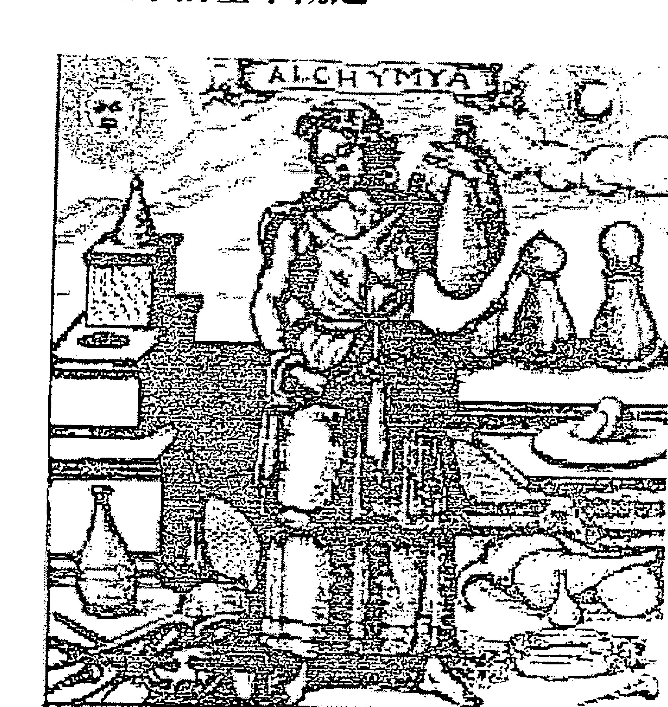

的确切来源，但是很多人都认为炼金术产生于从公元六世纪前后的埃及。

而在十六世纪，内科医生帕拉切尔苏斯把炼金术重新使用在了探寻医学和创建一个化学治疗的研究领域上。他的工作还包括把冶金术（金属的科学性和工艺性的研究）引入医学治疗中。

十七世纪，理性时代给科学带来了全新的重点，也看到神秘的想法丢失了自己的很多重大价值。罗伯特泊伊尔曾抨击过“四大元素理论”并提议化学元素的定义。安东尼拉瓦锡拓展了现代量子化学，而后约翰道尔顿的工作就是对原子是否是所有物质的基本结构单元的鉴定。

有机化学和电化学产生于十九世纪，当时由德米特里门捷列夫发明了元素周期表。根据元素的有规律的重复的属性和相似性，元素周期表把各种元素有条理地编排了一起来。

二十世纪，人们定义和解释了原子键，还合成了人工材料，非自然的元素也在实验室里被制造出来。

然而对点金石的寻找依然没有停止过。今天，很多科学家认为寻找点金石的答案将会在量子物理学/量子力学的领域得出，量子物理学/量子力学是一个非常陌生的领域，在那里所有物体，无论是有生命的还是没有生命的都可以由同一种微粒制作而成，人们还认为这个陌生的领域还拥有同样的固有类型的能源。

目前，作为一位炼金术的初学者，厨房可以用来创造一些有趣（以及品尝）的演示。

#### 化学 101

原子是物质最小的基本组成单元，所有普通物质都是由原子组成的。原子是由一个原子核和一个电子组成。原子核又是由一个或者一个以上的正（电性）质子和一个或者一个以上的中性（没有负荷）的种子组成。正质子就像小月亮绕着一个星球进行轨道运转一样围绕着原子核转动。

想知道一个原子到底有多么小个，那么你就得取出一点白糖来，然后从中取出一粒白糖结晶。如果你打算把这粒糖切成100粒或者是更多粒，那么一个原子的大小就跟这100粒或者更多粒糖结晶粒中一粒的大小一样。

元素是由一种原子组成的物质所构成的，元素是不能被分裂成其他物质的。通过周期表寻找一次视觉上的，有着令人震惊且起到相互作用的浏览，可以参考“有形的元素表解释”，网址是：http://www.chensoc.org/viselments

总共有 92 种自然元素，这些元素都

## 第九章：炼金术和魔法科学（红色）

来自于自然界。另外有 20 种元素是在实验室里被发现的，这 20 种元素是有辐射的。

分子是通过把元素集合在一起的化学结构。这些元素通过不同物质的原子之间形成的原子键连接在一起的。

厨房里最普通也最重要的分子就是 H2O，也就是水。它是由 2 个氢原子（H）和一个氧原子（O）构成的。今天所发生的所有化学变化的过程中水都是不可或缺的。人要是没有了水 3 天左右就会死掉。

另外一个非常一般的分子是 NaCl，也就是盐。它是由一个钠元素（Na）和一个氯元素（Cl）构成的。烹调时盐可以使面团发胀，还可以给我们增添味道，盐还可以用来作防腐剂。我们的身体本身是不会产生，或者分解出盐分来的，所有我们必须从日常食物中摄取盐分。这就是为什么有的时候我们渴望吃到咸的食物。

糖是由碳元素（C）、氢元素（H）和氧元素（O）组成的。糖能给我们提供能量，对大脑组织和肌肉组织功能而言它是及其重要的。烹饪时，糖可以让我们的食物变得香甜，它还跟蛋白质有联系，有助于我们做出像糕饼或者蛋羹一样好吃的食物。

脂肪和油脂是由碳元素（C）和氢元素（H）组成。它们让我们感受到吃进口里的事物有一种富含乳脂，美味多汁的感觉。所以脂肪和油脂通常是温馨食物的重要组成部分，例如：巧克力、意大利粉、奶酪或者冰淇淋。脂肪是人体储备下一次将会消耗到的能量的一种方式。人体分泌荷尔蒙也是需要脂肪的。

蛋白质是由氨基酸链构成的，而氨基酸链又是由碳元素、氢元素和氮元素组成的。我们身体的生物化学反应就是由蛋白质调控的，所有在我们日常饮食中我们需要很多很多的蛋白质。当蛋白质受到高温或者被人体消耗时，它就会改变它的属性。在高温情况下，蛋白质也可以通过化学方法又重新组合而成。烹饪的时候，蛋白质的一个特殊的部分就是鸡蛋，鸡蛋就是一个不错的例子，可以想象怎样去加温或者消耗，能使鸡蛋改变自己的外形和浓度。

淀粉是通过把很多糖分子连在一起而成的超大的物质分子。可是淀粉吃起来却不是甜的，因为这个连接起来很长的分子太大而不能刺激到我们舌头上味蕾的敏感部位。厨房里，淀粉的注意来源是根茎类蔬菜（土豆、胡萝卜、芜菁）和谷物类粮食（大米、面条、面粉、燕麦片）。淀粉的小颗粒能够惊人地吸收大量的水分。

##### 实验的材料和补充

- 盐、糖、面粉、玉米淀粉、棉布、锋利的刀、炖锅、胚面片、浅碟、锋利的刀、红茶包、醋、黄油、棉线、遮蔽胶带、小号的碗、几个勺子（你用来舀麦片粥的那种）、小苏打（发酵粉）、冬青生活储户糖果、食物着色剂（颜色自己选择）、一个黄色或者红色的洋葱、液体洗衣液、过氧化氢、现切的土豆片、放大镜

气体是可压缩（挤压）到很重的氧气加压舱里的。

##### 物质状态

每一种物质都是由一种微粒构成的，或者是原子或者是分子。地球上的大部分物质的状态都是固体、液体、气体，或者是这几种状态的混合状态。每一种物质状态都有各自的特殊的特征。

##### 等离子体（火元素）

物质的第四种状态就是等离子体，而它只能在特殊的情况下才能被呈现出来，在普通的地面上的情况人们是看不到等离子体的。你可能看到自然等离子体的最近的地方就是北极光线那里，也就是北极光。然而，小小的等离子体球，或者是等离子发生器在很多新奇的小说里可以被找到。

##### 固体（土元素）

固体里的微粒相互连接得非常的紧密，因此它们是很难移动的。
固体不会像液体那样流动，它们只会保持一个状态呆在一个地方。
固体能够保持自己的形状。它们的形状不会取决于盛它们的器皿。
固体不会像气体一样可以扩散，它们只能占据跟自己体积一样大小的空间。

而属于第五种物质状态的暗物质只存在于宇宙深处，我们用肉眼是看不见暗物质的。

##### 实验 1：物理变化

##### 液体（水元素）

液体里的微粒并没有把在液体塞的很满，所以它们是可以微微移动的。
液体很容易流动。
液体还会改变自己的形状，它的形状往往取决于盛放它的器皿的形状。
液体始终会占据一定量的空间，但是也不会像气体一样会扩散。

你需要一个小的深底平底锅、饼盘、隔热垫，和制冰盘。实验开始之前，把饼盘底铺满冰块儿，然后把它搁置在一旁。

1. 观察冰块儿，你会看到什么？冰块儿呈什么物态？

在深底平底锅里放满冰块儿，然后在锅底用中火煮。

2. 锅里的冰块儿发生了什么变化？现在锅里的冰块儿变成了什么物态，或者说变成了几种物态？

##### 气体（风元素）

气体里的微粒是可以被扩展开的，而且会很轻易地移动。
气体可以自由随意地扩散开来。它们可以占据或多或少的空间，这也取决于盛放气体的器皿的大小。

一旦当有蒸气从锅里冒出，然后就用隔热垫包住放在一旁的那个饼盘，把它放在深底平底锅上方 6 英寸的地方。（一定要小心不要烫伤自己的手！）

3. 那么此时饼盘的底部会发生什么变化？

其实这里发生了两次重要的变化。

A. 水发生了一次化学变化。水从固体转变成液体再变成气体，然后又再变回成液体。如果你把水全部到回制冰盘里，你会看到它又再次凝结变成了固体。水除了从固体转变成液体再转变成气体，其实水本身的属性是没有发生变化的。这几种变化属于物理变化，意味着这仅仅是物质的物理属性上暂时的变化，而实际上物质的分子排列顺序并没有发生变化。事实上就是水根本没有改变。

你应该看到的是凝固成一种像焦糖一样的很脆的形态（这个形态取决于糖浆是怎样被煮熟的）。这个形态的糖是可以吃的，吃起来就像焦糖，非常地脆。实际上，很多糖果都是把糖煮化或者融化而来的。

现在让煎锅完全冷却下来。再用放大镜观察糖浆。

4. 你观察到了什么？现在你还能看到糖结晶吗？

5. 发生了什么呢？

是糖发生了化学变化，这个就意味着它的结构完完全全地永久地被改变了。锅里的糖分子已经永久地被重新排列过了，不会再是以前那个歌清澈的水晶般的结构了。

B. 你刚刚也就是验证了地球上的水/雨水循环。水从河流中蒸发出来升到天空。当它遇到云朵里的冷空气或者高层大气，它就会凝结成雨水然后朝向大地落下来。

##### 实验 2：化学变化

##### 实验 3：结晶和溶液

在有中低火力的火炉上放置一个小煎锅，再准备一杯冰水。

用一个超大倍数的放大镜来仔细观察一下一些盐结晶。这些盐结晶是什么形状的？他们跟刚才的糖结晶相比，是一样的还是有差异的？

舀出2茶匙的糖。用放大镜观察，并记录下糖结晶的形状。

现在制作一种溶液，就是用半杯热水溶解半杯盐。

1. 每一粒糖结晶是什么形状？它们处于什么物态？

溶液是一种由两种物质均匀地混合（同质的）在一起的混合物，它是靠把溶质（这个实验中用的盐）溶解到溶剂（这个实验里用的水）里而成的。

把糖放进煎锅里，不断地搅拌它的同时仔细观察。

用这种溶液装满一个深底碟子或者瓶盖，把它放在一个不会被打扰到的地方。花上几天时间去观察，这几天时间里水是会挥发的。

2. 发生了什么？现在糖结晶处于什么物态？

用中低火不断煮直到糖结晶融化成糖浆。然后关掉火。舀一勺糖浆出来，接着把它慢慢地滴入冰水中。

3. 发生了什么？现在糖浆处于什么物态？

假设：你认为这个溶液会发生什么变化呢？

1. 最终溶液会发生什么变化？
2. 你验证了你的假设吗？
3. 盐结晶发生了物理变化或者化学变化了吗？

你把盐溶解到水里的时候，你就制作出了盐溶液。盐结晶是被溶解到了溶液里，但是当溶液挥发了之后，又重新形成了盐结晶。这次的结晶就被称作为溶液蒸发体。

4. 你认为如果把盐溶液煮沸而不是简单地让它挥发的话会发生什么？

##### 实验 4：胶体和混合物

你已经学习了溶液。例如 溶质（如盐）溶解在溶剂（如水）里。溶解之后，溶质就看不见了。如果不管溶液继续溶解的话，它将不会“沉淀下来”。

混合物包括两种物质，不过这两种物质都保持着它们自己原有的特征。这两种物质没有被溶解或者被改变，而且还是看得见的。如果不管它，这两种物质是可以被分开的而且其中一种是会“沉淀出来的”。

胶体就是一种不会沉淀的混合物。一种胶体中的一种物质是悬浮在另一种物质上的，但这两种物质都是不会被溶解的。它们中的一种或者两种都是看的见的。比如：泡沫剃须霜、果酱和凝胶剂、布丁、浮在水面上的肥皂。

###### 材料：

四个夸克大小的有盖的罐子、水、沙子、酷爱速溶饮料粉（取随意一款味道一袋）、一袋吉露果子冻（和香料）植物油、醋

###### 分别把四个罐子上标上 A、B、C、D

A 罐子，装入两杯水和四分之一杯沙子，然后盖上盖子连续不断摇晃罐子 30 秒。

你看到罐子里起了什么变化吗？你还能看到那些沙子吗？有东西沉淀出来吗？

然后再把 A 罐子静静地放上 2 个钟头。

B 罐子，装入两杯水和一包酷爱速溶粉。盖上并摇晃 30 秒。

你看到罐子里起了什么变化吗？你还能看到酷爱速溶粉吗？有东西沉淀出来吗？

然后再把 B 罐子静静地放上 2 个钟头。

C 罐子，在空罐子里装入一袋吉露果子冻。煮沸一杯水，再把这杯水小心地倒入罐子里。然后搅拌直到吉露果子冻溶解。在加一杯冷水到罐子里，再轻快地摇晃 30 秒。

你看到罐子里起了什么变化吗？你还能看到吉露果子冻吗？有东西沉淀出来吗？

然后不要盖盖子，把 C 罐子放进冰箱里。

让它静静地呆在那里 2 个钟头。

D 罐子，装入一杯醋和四分之一植物油。盖上并摇晃 30 秒。

你看到罐子里起了什么变化吗？你还能看到油和醋吗？有东西沉淀出来吗？

然后再把这个罐子静静地放上 2 个钟头。

等待 2 个小时，以至于 C 罐子里的吉露果子冻能够再次凝固。然后再回答以下的问题：

##### 实验 5：酸和碱

酸和碱是根据把它们放到水溶液中时，是否产生氢离子（H+）或者氢氧离子（OH-）而定义的。溶液最后产生大量的氢离子（H+）的时候，那么它就是所谓的酸；相反，溶液最后产生大量的氢氧离子（OH-）的时候，那么它就是所谓的碱。

1. A 罐子里装的是溶液、混合物或者胶体吗？
2. B 罐子里装的是溶液、混合物或者胶体吗？
3. C 罐子里装的是溶液、混合物或者胶体吗？
4. D 罐子里装的是溶液、混合物或者胶体吗？
5. A 罐子里装的是固体、液体、气体，或者是一种或者一种以上的物态的混合体吗？
6. B 罐子里装的是固体、液体、气体，或者是一种或者一种以上的物态的混合体吗？
7. C 罐子里装的是固体、液体、气体，或者是一种或者一种以上的物态的混合体吗？
8. D 罐子里装的是固体、液体、气体，或者是一种或者一种以上的物态的混合体吗？

酸碱化学对我们所有的身体功能都是至关重要的。相对的酸碱度是用 pH 值衡量的，pH 值的范围是 0—14。pH 值越低，那么物质的酸性就越强；pH 值越高，那么物质的碱性就越强。pH 值为 7 的话物质就属于中性。

总的来说，酸性食物尝起来的味道是酸的而碱性食物尝起来的味道是平淡无味的。这里是一些普通食物的 pH 值：

柠檬：2.1 苹果汁：4.0
牛奶：6.4 蛋白：8.0
碳酸钙片剂：它的 pH 值有很多种，通常为 10 或者更高。

假设：把酸和碱混合在一块儿你认为会发生什么？

> 注意：另外再加两杯水到 B 罐子里，你就会得到一杯可以喝的酷爱饮料了。
> C 罐子里的吉露果子冻是可以食用的
> 加二分之一茶匙的盐和一点优质的胡椒到 D 罐子里去，你就会吃到可口的色拉酱。在食用之前一定要用力地摇匀。

###### 材料：

高大的杯子、醋、烘焙用的苏打、量匙、食物着色剂（你自己选择颜色）

在高大的杯子里倒入四分之一杯醋，滴入几滴食物着色剂并搅拌。

1. 你把这杯醋和食物着色剂的混合称作什么？
2. 舀出 2 茶匙烘焙用的苏打，同时把它加入醋里。

3. 发生了什么？
4. 你看到了什么？
5. 你闻到了什么？
6. 发生的是物理变化还是化学变化？
7. 你验证了你的假设吗？
8. 试着再仔细观察一遍，根据不同的比例把醋和苏打混合起来，哪一种比例的混合物的变化给你留下了最深刻的印象？

酸（醋）和碱（苏打）之间的强烈反应引起了反响。

为了好玩：用不是很硬的粘土做一个火山，放一些塑料做的或者纸做的杯子在火山口周围。在火山口装满一定量的苏打。再准备一些用醋和红色的食物着色剂混合而成的溶液。同一时间，把溶液倒入火山口。如果你的溶液比例是正确的，那么炽热的火上熔岩就会从你的火山口里喷出来并发出嘶嘶的声音。

##### 实验 6：炼金术墨水

这个实验是利用化学变化来生产你自己的炼金术墨水，你可以用它来写东西。

###### 材料：

- 醋、过滤器、小碗、一包红茶包、一个小的深底平底锅、没有洗过的钢丝绒、筷子或者木杆、3%浓度的过氧化氢（在药店可以买到）

把红茶包放到茶杯里，并加入三分之一杯的沸水，然后浸泡 15 分钟。15 分钟之后，取出红茶包，把它拧干后扔掉。这杯茶里还有丹宁酸。

在深底平底锅里倒入四分之一杯醋。用剪刀剪掉一点钢丝绒；并把它放到滚烫的醋里（你能放多少就放多少，但是要保证醋能够继续把钢丝绒淹没完）。一直加热到钢丝绒溶解掉，形成一种有染色的溶液（即硫酸铁）。然后才将它冷却。

把茶倒入小碗里，并把过滤了的硫酸铁溶液倒入茶里。随后就会形成黑色的丹宁酸盐。要注意的是丹宁酸盐滴在了衣服或者毯子或者任何其他的物体上都是擦不掉的。

用筷子或者木杆蘸一点这种“墨水”，试着用它写字。如果这种墨水看起来像水一样，那么就把它放上一天两天的，直到挥发到有些浓稠为止。

你的墨水要储存在盖子盖的很严的瓶子里。

这里还有另外的乐趣。找一支鸟毛或者在手工店买一支羽毛管，小折刀把羽毛管削尖，把它当做笔来使用。这简直就像一个真正的魔法师！

###### 问题：

1. 茶水混合物看起来是什么样的？
2. 茶水混合物的变化表现出来的是一种化学反应吗，或者是一种物理反应吗？
3. 醋和钢丝绒混合而成的溶液是什么颜色？
4. 醋和钢丝绒混合而成的溶液表现出来的是一种化学反应吗，或者是一种物理反应吗？
5. 你的墨水用起来怎么样？

##### 实验7：炼金术糖果

你需要一些简单的原料和一些烹饪的器具，以及几个饥饿的人来尝试你做的蜂巢。

假设：当你把醋和烘焙用的苏打混合而成的溶液加到糖浆里的时候会发生什么？

###### 材料：

- 一杯糖、一茶匙黄油、四分之三杯水、2茶匙醋、焙烤浅盘、四分之一茶匙烘焙用的苏打、一个大的4夸克的平底锅

把少量的黄油涂在焙烤浅盘上。
把糖、黄油和水放到大平底锅里混合起来，然后再把这锅混合物煮沸，煮的时候要不断搅拌。一旦混合物要沸腾时，就停止搅拌，然后让它继续煮直到变成金黄色。

从炉子上把混合物挪开，迅速地加入苏打和醋进行搅拌。（最好是有人协助你，你们一个人快速地搅拌，同时另外一个人把材料加进去。）反应出来的二氧化碳使得混合物开始起泡，所以要小心不要让它溢出来了。

把混合物倒入刚刚涂了黄油的焙烤浅盘里。冷却之后，把这个蜂巢切碎或者敲碎就可以吃了。

###### 问题：

1. 煮沸了糖浆看起来和闻起来怎么样？
2. 你加入醋和苏打的时候糖浆发生了什么变化？
3. 描述一下当你敲碎一块儿大功告成了的糖果的时候，你看到的成型的糖果的外形是什么样的？
4. 成型了的糖果尝起来感觉怎么样？
5. 你验证了你的假设了吗？

在这个糖果的实验过程中，酸和碱之间发生的化学反应跟这个实验是有关联的。醋和苏打混合在一起回产生二氧化碳，二氧化碳气体就会充满整个糖浆，形成成百上千个细小的泡泡，这就形成了像蜂巢一样的外形。

##### 实验8：嘎吱响的火花

设置一场属于你的小型灯展的最简单方法之一，就是用力咀嚼应急冬青（救命草）。

假设：当你在面对镜子嘎吱嘎吱地嚼着应急冬青的时候你认为你会看到什么？（不必去在意什么餐桌仪式，我们现在是在做科学实验！）

实验：放两个应急冬青到你的嘴里。站在一个黑暗的房间里，并面对一面镜子，然后张着嘴嘎吱嘎吱地咀嚼你的应急冬青。

1. 你看到了什么？
2. 火花是什么颜色的？
3. 你验证了你的假设了吗？

应急冬青含有冬绿油（鹿蹄草的油）。你咀嚼救命草里的糖结晶的时候，就会有电子蹦出来，向四周散开。而从那粒糖结晶蹦出来的电子又试图重新返回这粒糖结晶。问题是（来自空气中的）氮分子取代了它。当自由的糖电子碰到氮电子，氮气就会发出微弱的紫外线（一种放射物）。紫外线又被冬绿油吸收。从而就发出了像火花一样的明亮的光来。

这个现象被称作摩擦发光，通过压挤或者撕裂而发的光。同样的现象就可以解释其他一些自然界中神秘的光，例如深海里的冷光。

##### 实验 9：非牛顿流体

我们已经展示了液体是以一种特殊的方式运动的。

非牛顿流体是艾萨克牛顿命名的，他记录了很多流体动力学的规律。非牛顿流体就是一种以不寻常方式流动的液体。

首先，液体的粘性是由实际用的力度来决定的。你曾经有玩过橡皮泥吗？橡皮泥就是一种非牛顿流体。如果你把它慢慢地用力扯，它会向外展开，还会像液体一样流动。如果你把它放在一个坚硬的表面，最后它就会流成像胶土一样的形状，这里再一次像液体一样地流动。但是如果你突然地去扯它，它就会像固体一样断开。

粘性这个术语涉及到液体的粘度，粘度使得抵抗流动。

你可以用玉米淀粉作为你自己的非牛顿流体来玩耍。

假设：当你把玉米淀粉和水混合时你认为会发生什么？

材料：玉米淀粉、水、小碗、一个空的涂有蜡的牛奶盒或者一个厚的塑料保鲜袋

碗里盛二分之一杯玉米淀粉。

每次加一茶匙的水，每次加了之后就把搅匀碗里的混合物。

当它变得浓稠时，就用你的手指或者勺子使劲地打压。当打到你感觉就像是在敲打一块儿固体一样的东西的时候，你的非牛顿流体就大功告成了。

现在就可以玩弄你这个古怪的液体了。如果你把它挤压在你的拳头里，你就会感觉它分明就是块固体。但是把你的双手放松，它就会像液体一样渗出来，从你的手的边缘流过。

1. 发生了什么？
2. 在你把玉米淀粉加入水里之前，玉米淀粉看起来是什么样的？感觉起来又是怎么样的？
3. 在你把玉米淀粉加入水里之后，玉米淀粉看起来是什么样的？感觉起来又是怎么样的？

## 第九章：炼金术和魔法科学（红色）

是怎么样的？

从圆心开始滴入水滴，每次滴一滴水上去直到水浸到圆圈外围。

- 4. 这种玉米淀粉是液体吗？或者说是固体吗？
- 5. 你验证了你的假设了吗？
- 6. 这次实验中你制作了什么？

然后让这张纸巾保持现状 20 到 30 分钟，并全程观察它。

用两种以上的颜色再次重复这个实验过程。

> 重点：研究完你做的这个非牛顿流体之后，要把它放进塑料袋里或者牛奶盒里再把它扔到垃圾桶里，千万不要把它丢到你的下水道里，否则就会把你家的管道给堵塞住。

- 1. 开始你用的是什么颜色？
- 2. 实验结束之前你看到了哪些颜色？
- 3. 你认为发生了什么？
- 4. 你验证了你的假设了吗？

##### 实验 10：纸巾色谱分析法

色谱分析法是用来分离色彩混合物的一门技术。纸巾色谱分析法中是用一张吸水纸把各种各样的颜色分离开的。

水被一股被称作毛细管作用的力量从过滤网或者纸巾里的纤维中拽了出来。

你可能也知道，实际上大部分颜色都是有几种不同的颜色混合而成的。例如：黄色和红色混在一起就成了橙色，黄色和蓝色混在一起就成了绿色，还有就是红色和蓝色混在一起就成了紫色。

当水被拽出来穿出记号笔画的圆圈之外时，记号笔的墨水里的不同的水溶性染料也就溶解到水里（形成溶液），染料也跟随水通过纸巾被拽了出来。当水在纸巾上移动，就会留下混合在记号笔里的特有的颜色。

如果你能把所有你知道的颜色都混合在一起，那么结果就变成了白色。如果你能够从一个地方把所有颜色都移开，那么剩下的就是黑色。

一些由分子构成的染料就比较重比较大，然而其他彩色染料是由更小的更轻的分子构成。染料的分子越大，被拖离纸巾上圆圈的距离就越短。如此说来，是根据染料的分子大小来分离颜色的。

假设：当你在咖啡过滤网上混合彩色墨水和水的时候，你认为会发生什么？

实验的最后你就制作一个色谱法：一种展示了所有特有的染料和彩色笔里的颜色看得见的方法。

材料：咖啡过滤网（用这个是最佳的）或者纸巾、可以洗掉（不是永久的）颜色的彩色记号笔、水、滴管或者一把非常小个的勺子

仅仅为了好玩：看一下你从一支记号笔里可以分离出多少种颜色来呢？再看一下所有牌子的记号笔是否是用同一种颜色混合而成的呢？

用彩色记号笔在纸巾上画一个一英寸的圆圈。

##### 用铜电镀铁钉

材料：
一个铁钉、二分之一茶匙的盐、
二分之一杯醋、一个干净的小玻璃罐、
钢丝绒或者磨砂洗面奶、
十个暗沉的铜便士（1983 年的或者更老旧的）

把醋和盐混合在玻璃罐里。
再把十个暗沉的铜便士放到玻璃罐里的醋混合物里，直到它们看起来洁净闪亮有光泽。这时才取出铜便士，把醋混合物留下来。
用钢丝绒或者洗面奶把铁钉彻底洗干净。
再把洗干净了的铁钉放到刚才的醋混合物里，让它在溶液里呆上 10 分钟。10 分钟之后，铁钉表面就裹上了一层闪闪发亮的铜溶液。

##### 气泡混合物

材料：
干净的玻璃罐、一杯温热的水、2 茶匙餐具洗洁精液体
把水和餐具洗洁精混合在一起搅拌。然后倒入干净的玻璃罐里，让玻璃罐直立地站着。这是用来吹泡泡的。
注意：为了更加稳定，加几滴甘油进去（在你们当地的药店能买到）

##### 跳舞的葡萄干

材料：
葡萄干、没有味道的苏打水或者没有颜色的汽水（例如：七喜）

倒出一瓶苏打水或者汽水。然后加入葡萄干，可以看到二氧化碳气泡紧挨着每个葡萄干，带着它们窜上窜下的。

> 你知道……吗？
如果把海水里的所有盐分提取出来，然后把它均匀地平铺在地球表面，都能形成一个厚达 500 多英尺的盐层。
你也可以自己做盐蒸发。先把一茶匙的盐溶解到一杯水里，再把溶液倒入一个浅底饼盘里，把它放到太阳底下或者一扇能透进太阳光的窗户下直到里面的水蒸发掉，剩下的就是盐了。

##### 变换色彩的液体

由吉姆·鱼做的有关厨房炼金术的一次漂亮的小实验，魔术戏法里也可以用到这个实验的原理。它是这样操作的：把装有紫色液体的洁净的瓶子或者大水罐里的液体分别倒入五个洁净的杯子里：每个杯子里的紫色液体的颜色都会发生变换，直到最后一只杯子的颜色完全变成无色透明状！

这种紫色的汁液是用剁碎了的红球甘蓝做的，先要煮沸它，再把里面的残渣过滤出来，最后用清水稀释过滤过的汁液，最后得到的就是紫色液体。

五个杯子分别盛有少量的干净的液体溶液，他们会把甘蓝汁分别变成以下五种颜色：

- **红色**：白色酸醋，它可以使甘蓝汁变成红色；
- **蓝色**：焙烤用的苏打溶液（小苏打），它可以把甘蓝汁变成蓝色；
- **绿色**：洗涤用的苏打溶液（碳酸钠），它可以把甘蓝汁变成绿色；
- **黄色**：浓度比较淡的次氯酸钠溶液，它可以把甘蓝汁变成黄色；
- **无色**：浓度比较大的次氯酸钠，它可以把紫色的溶液变成无色的透明状态。

> 注意：千万不要把这些溶液误喝了！

通过把大水罐里紫色的汁液分别倒入五个杯子就能很容易地得到这样的效果。杯子里大量的溶液已经为这次实验做好了准备。

然而，通过平衡pH值，按照以上的顺序一个杯子一个杯子的倒入同样的液体是可行的。

只要你把漂白剂留到最后，你就可以得到每个杯子里的颜色发生变化的结果。

这已经是一次很棒的完善，但是还是要求要更细致的操控。再有就是你还需要做一次实验来仅仅决定你需要多少溶液足够改变每一杯液体的颜色。整个魔术戏法或者仪式的过程中，拥有这种同样能够把紫色变成其他颜色最后又变成无色的溶液是无比强大的。

（这时你可以在南方开始你的季节的召唤仪式），你可以在祭坛的中心位置安放一个大水罐或者4到5个杯子。然后从火元素开始，你就可以把汁液变成红色，把第一杯液体放在坛南边的祭；接下来是水元素，把第二杯汁液变成蓝色放在东边的祭坛；再次是土元素，把第三杯汁液变成绿色放在北边的祭坛；接着是风元素，把第四杯汁液变成黄色放在北边的祭坛。而第五杯是代表灵魂，把它变成透明无色的放在祭坛的中央。为了增加神秘感，可以去聚会供应店买几盒“吉西彩色火焰蜡烛”。这些蜡烛五支为一套，燃出来的焰火颜色跟蜡烛的颜色是匹配的：红色，橙色、绿色、蓝色和紫蓝色。如果你在商店了也找不到的话，你可以在网上订购，网址是：www.kizzycolorflame.com。这些蜡烛被当做是每个祭坛的支柱，分别跟每个杯子放在一起点燃。

这个实验过程中涉及到了太多的魔法，因为我们正在使用花朵、水果、秋叶的天然色素。还有就是抗氧化的番茄红素，它有提神的作用。

通常对植物色素的解释就是关于花朵和昆虫之间的护理关系，但是其实对植物色素真正的解释是植物从海里蔓延到充满二氧化碳的恶劣的环境之中的进化过程，这种恶劣的环境会释放出破坏叶绿素的紫外线，而植物色素就像蛋白质一样可以保护叶绿素不受到破坏。

这样的效果是可以利用到仪式里去的，比如在仲夏

### 5. 奇妙的发明

文 / 奥伯伦（灰色）

只要给我一根足够长的杠杆、一个支点和一个供我站立的地方，我就可以撬起地球。
——阿基米德（公元230年）

一些著名的魔法师也可称得上是一名发明家。锡拉丘兹的阿基米德（公元211年到287年）发明了用来升举和移动重物的杠杆和滑轮系统，他还发现了测量圆圈和固体体积的方法。他的“阿基米德螺旋”定理就是一个巧妙的手压泵，它可以把水直接从尼罗河喷射到埃及。阿基米德利用几何学和天文学进行观察最终确定了地球精确的周长，他还发明了一种可以测量正在升起的太阳的角度的设备，这种设备还可以让他第一次成功地准确地计算出一年的长度。

不过历史上最著名的魔法师发明家还当属天才里昂纳多达芬奇（1452年-1519年）。在他成千上百页的笔记本里就记载了很多的设计发明，有直升飞机、装甲坦克、潜水艇、降落伞、拉拔机、钻机等等，其中最出名的是一种可以飞的机器或者叫做扑翼飞机（像鸟的翅膀）。然而实际上跟阿基米德不同的是里昂纳多从来没有把他的大量的发明制造成实物过。但是你可以通过使用他书的背面上的断流器制作出他大量的飞行器中的一个对应的实用模型。

在离你最近的一家复印店里把画有扑翼飞机的那两页给复制在你的羊皮纸卡纸材料上。当你把这两幅图放大121%倍的时候，它们就会把这页填满。然后把这张制卡片纸料放在一处光滑的硬表面上，用一把餐刀的比较钝的背面沿着上面的虚线剪裁。剪完之后就是两只翅膀、一条尾巴、一个机身（飞机的主体部分）、两根撑杆和两个很小的垫圈。（参见图示1）

你将会需要一组12英寸的竹竿用作串晶。你应该可以在大型的杂货店买到这些。你还需要四个小型的回纹针（参照样板的准确大小），一个中等大小的橡皮圈和一些刺绣用的线用作绳索。你还需要一些工具，包括一把剪刀、一把餐刀、一把好用的木锉（有钢砂板最好）、一把针头钳以及一把钢丝钳。

按照画有断流器那页说明去做。重要的一点是用折痕痕峰上看得见的支柱撑住翅膀和尾巴上弯曲的部分，做出来就像恐龙的翅膀一样。就像上图展示的一样，用胶水把横竖摆放的竹竿黏在折痕上（图示 2）。外边连接的机身和尾巴的竹竿必须要有整整 12 英寸长（图示 3），这样前面的竹竿才能支撑起翅膀。用钢丝钳把他竹竿切成指定的长度。

首先把机身和尾巴组装在一起（图示 3）。然后再像图示一样在切成小段的竹竿周围构建支撑柱（图示 4、5）。如图剪断并弯曲 4 个回纹针，然后把其中一个回纹针的尾部平行地潜入每个支撑柱的顶角里（图示 5）。接着把这些支撑柱黏贴在机身上。

第二步组装翅膀（图示 2）。用木锉把前翅竹竿展开的长长的部分的一半磨光滑，这样才能顺利地滑过另外的竹竿而扇动翅膀（图示 6）。再把翅膀的竹竿露出来的那头穿过回纹针环潜入支撑柱里，然后裹住上面的支撑住周围悬吊的部分，再把它粘在翅膀下面，这样一来整个翅膀就可以自由地上下扇动了。

接下来，你需要制作用来扇动翅膀的脚蹬和绳索，如果你真的能通过把脚放到机身平台上的脚蹬上手放在长长的翅膀的杠杆上飞起这个扑翼飞机的话，这一步是必须做的。剪两根长 12 英寸刺绣用的线，再锯两截长八分之三英寸的竹竿。像图表上那样用线绕成一道一又八分之三英寸的圈绑在滑轮上，再想图示 7 一样把脚蹬粘在线圈上。

然后穿过回纹针把线穿到机身背面，再穿过滑轮垫圈缠绕住前面横着的一根木头，最后把线栓到机翼前沿指定的点上（图示 8）。

最后，在前翼的支撑柱之一的末尾绑一个橡胶圈，橡胶圈要在机身前方的洞和竹竿之上，而不再遵循围绕着另外一只翅膀的前支柱裹上橡胶圈（图示 9）。这个橡胶圈形成一种张力来升起翅膀就好像你正在使用自己的双臂一样。向下扇动的翅膀通过你双腿的肌肉获得力量。

恭喜你！现在你成功地制作了里昂纳多达芬奇的发明之一的一个实用模型。如果你把它带到一个宽阔的草地上，你就可以像滑翔机一样平稳地飞翔起来（图示10）。

网络空间比肉体包涵要大、还要复杂、久。我们扩大我们的灵魂还要长可以无限网络空间，我们的思想也可以进入到这个无限大的空间里去，但是我们的身体却不可以。在网络空间里，我们还可以创造奇迹，还有什么比这个还要神奇魔幻呢？

现在这里是里昂纳多的另一个发明——降落伞（图示11）。看一下你能不能用一片制卡片的纸料、一些竹竿、绳线和一个小玩偶做出这样一个降落伞模型。

#### 水晶里的世界

我曾经找到的斯蒂芬塞维茨基写的1985年出版的一首名叫《水晶里的世界》的歌是对高科技魔法最好的描述。这首歌最出名的一次演绎收录在了凯西的专辑《第七关》里。这首歌介绍了网络空间的世界（《水晶里的世界》）以及网络空间的局限（《我们身体到达不了的地方》）。

### 6. 高科技魔法：探讨网络空间里的活动

文 / 伊丽莎白·巴纳特（灰色）

欢迎来到网络空间，或许这是最容易接近的一个形而上学的虚拟的领域。“形而上学”字面上的意思就是“超越现实的”，除了是一个思想境界的而不是物质的世界，什么才是网络空间？网络空间存在于物理计算机里，但是它不只是看到的计算机外壳那么大的范围而已，而是更多地像存在于你身体里的灵魂思想，但是网络空间比肉体包涵要大、还要复杂、久。我们扩大我们的灵魂还要长可以无限网络空间，我们的思想也可以进入到这个无限大的空间里去，但是我们的身体却不可以。在网络空间里，我们还可以创造奇迹，还有什么比这个还要神奇魔幻呢？

拿电脑和魔法水晶镜作比较就等同于把科学和魔法作比较。还有，这样一来就产生了一种能量混乱的感觉，混淆了那些天赋跨度通常不能够兼容魔法和科学的人群。“希望或者尊重地称我们为骇客，称我们为魔法师。”

这首歌的歌词也展示了网络空间里运行的规律，例如：“唯一的规律就是逻辑”。它就像魔法一样被定义，因为它是一个“象征符号有能力变成它们命名的东西”的地方。而实际上比拥有深奥的象征性语言的世界还要神秘的世界就是他们所描述的世界。你告诉电脑“带我去某个网站”接着你就会在那儿出现。这个到底跟隧道或者占卜法术有神秘不同呢？你想描述或者表达什么，它就刚好地那样发生着。

当然这是机器而不是法术，但是作家亚瑟·克拉克说过一句名言：足够先进的科技跟魔法是不分伯仲的。反过来也可以说足够先进的魔法跟科技也不分上下。完整充分状态下的的科技和魔法相互变得惟妙惟肖的原因是因为在这点上它们都在同一水平同一层次上发挥着同样的作用。

人继而发现面对面的时候彼此又不能忍受对方，这可不是一件好事。确切地说同样的原因，在网上互不认识的人们可相互影响，享受彼此陪伴的感觉，而现实生活中人们不可能做到这一点的。

#### 作为一种身体之外的经历的网络空间

网络空间是处理其它现实层面的一次很好的实践。因为网络空间跟每天的现实生活都有紧密的关系但是却又完全不同于现实生活，所以它是很特殊的。你在网络空间里获得的一些技巧能够在你处理精神灵魂的时候，或者在其他范畴游历的时候或者其他时候使你保持良好的状态。

网络空间里的氛围也会影响到你个人的观念。尽管你和其他人没有处于物理上的距离，但是在网络上你也可以获得让你远离令人毛骨悚然的人群的“危险信号”。也许这些人的话语看起来相当不友好，或者他们试图挖掘你不愿分享的更多的个人生活。你也会浏览到一些知识，比如一些渴望得到自由的事物，或者像你可以游泳的一片大海一样在自己的权力之下的手段，或者贸易、实物交易的方法，或者比氧气更重要的生活中的不可或缺的完整部分。

如果你用心了的话，你学习到的第一件事就是你把自己定义为什么，因为在网络空间里你把自己归类成什么就是什么（要么或者是你想传达的样子）。你也可以扮演成其他人，改变自己的性别、年龄、社会地位、种族、外貌外形，改变任何网络上你想脱离的态度和现实隧道的事情。你可以改变多少呢？改变了还能够认出你多少来呢？

除非你就是一个冥顽不灵的偏执狂，想法就像无懈可击的密封条那样，由于网络空间像一个高效的均衡器一样运作着，在那里人们不必告诉你他们是黑种人，或者是女性，或者他们穷到不得不在公共图书馆要用终端许可，你也会迅速地摆脱你对很多事物的偏见。你会更多地去强调智力、交流技巧、个性而不是你做的一些无关紧要的事情。一些人并没有看清这一点，或者说他们不相信这一点，但是我就看见这点的实际作用，这真的是非常地美好。

网络空间还揭露了你个人全新的方面。有些人在网络上吐露出跟现实中的自己完全不一样的一个人。在网上爱上一个人继而发现面对面的时候彼此又不能忍受对方，这可不是一件好事。确切地说同样的原因，在网上互不认识的人们可相互影响，享受彼此陪伴的感觉，而现实生活中人们不可能做到这一点的。

你还会明白怎样去航行却又不需要把你自己的身体当做车辆去驾驶。只需要想象网络空间的活动就是一种身体之外的旅行！你把你的身体像车辆一样停靠在椅子上，用双手打字，但是你的身体倒是一直躺在椅子上，同时你的思想和你的人格早已快速度地窜到了瑞士或者新几内亚或者其他任何地方。

在网络空间，你就像游历在两个世界里，一个是思想才是具体事物，另一个是你的意图决定你的方向。“意向旅行”几个字让你在冥想状况中保持良好状态，当你死后，或者在其他现实环境中，此时你不需要你的身体，把它当做一种媒介体了。如果你已经有过没有交通工具的情况下出去活动的经历，那么你就会更轻易地有时间去适应。如此一来，这样练习非常好，就像魔法师要花很多时间去实践，或者花很多时间在形而上学的层面上一样。

这是不会避免对物理现实的需要的，但是显而易见地说明了一点，就是非物质现实里发生的行为对物质现实有着直接深远的影响。如果你在网店上购物，发现有个网站正在卖一根完美的魔杖，你就会键入你信用卡的密码（确定你的赊账最高额足以支付），接着这根魔杖就会到达你的家门口。在这两种不同，但却错综复杂地纠缠在一起的现实之间，有着意义深远的联系，展示了事物是如何像魔法、仪式和祈祷者发挥作用的奇妙例子。你一定开始理解网络世界和“现实世界”可以在同一个地方存在，却又互不接触，只能通过特殊的界面取得联系。同样的方法，只要在特定的时刻或者神秘的地方我们就可以到达仙境或者其他精神世界。

#### 网络空间里的身份

网络空间里的你并没有用上你自己的身体。相反，你的灵魂穿着你的身体，像极了你穿着你最喜爱的衣服。你的发质、皮肤和眼睛的颜色、大小、形状，所有这些东西都是暂时的。他们使用你现在的身体和生活；却不是你灵魂永久的特征。

灵魂本身是没有大小、形状和颜色的。更多地像水一样，它的外形特征取决于盛它的器皿。改变你的身体是困难的，但是，让你的灵魂转变，从一种可能变成另外一种，是很简单的。自从我们在这儿开始讨论科技魔法，另外一种方法来看待这个问题就是如果你是一台电脑，你的身体就是硬件，而你的灵魂就是软件。

当你的思想进入到网络空间，你的选择就变得无穷无尽。你可以选择把你自己描述成真实的自己——你真实的年龄、性别，体型等等。这是诚实的行为，但是这个行为并不总是存在的。泄露太多的细节也是很危险的，比如说泄露你在哪里生活哪里工作。然而，你可以反过来选择完全不同地把自己呈现出来。你可以创立一个比自己年老的或者比自己年轻的，比自己高的或者比自己矮的网络形象，甚至是相反的性别。很多人都遵循一个“把柄”或者“屏幕名称”，这是一个人们在网络上用的一种特别的绰号，就有点像格雷学校里用的魔法名称。

网络空间里，人们只了解到你的一部分，你通过你的语言和行为暴露出来的那一部分。他们是看不到你的身体或者其内正在发生着什么的（除非你用网络摄像机）。反而他们了解你通过寻常的发帖人或者一个潜水者（只看不回帖的人）、一个减少纠纷的调解员、或者是一个发起论战的恶魔。他们会认为你是一个对电脑和模糊语言有些许了解的魔法师，或者一个

## 第九章：炼金术和魔法科学（红色）

迷人的传说，或者认为你是一个不值得一提的、毫无经验的无知蠢蛋。这都取决于你对自己在网络上的描述。

网络空间是最容易进入的魔法领域。在那里，你可以真正地成为一名魔法师。你所做的事情都由你自己决定。请明智地使用这种能力！

有些甚至用小小的卡通图片来表现用户的感受。

**会面时间**——人们会面的时间，与人们在网络上的会面相对。

**飞客音乐**——科幻风格的歌曲，包括很多关于电脑、电脑魔法师、科技法师等。

**网名**——人们在网上的化名，也被称为“昵称”。

### 7. 科技魔法词汇表

文 / 伊丽莎白·巴纳特（灰色）

**肉体空间**——对应网络空间，这是对现实的另外一种称呼，这是个肉体与物体的世界。我不赞同使用“真实空间”，因为网络空间也是真实的，只是不是实体而已。

**星际旅行**——简单地身体之外灵魂的游历然后又再返回体内的一种本领或者技术，也可理解为“灵魂出窍”，还被称为“出体经验（Out of Body Experience）”或者“OOBE”。

**超实体**——字面意思为“超越了实体”，与魔法或精神有关。

**信息过滤软件**——一种被设计来阻断、改变、删除或篡改程序员（或控制用户，如父母）认为应该被阻挡的内容。

**多用户维度**——网络空间中的一个“地点”，在这里，人们能和各种特性进行交流，最常见的就是游戏设定；也被称做多用户域名、多用户地牢，即 MUD。

**电脑魔法师**——被主流人群所熟知的词汇，意为使用电脑做一些目前为止尚不能对普罗大众解释清楚的事情，即魔法；参见科技法师。

**真实隧道**——感知世界的一种方法，例如政治方针或宗教；参见罗伯特·安东·威尔森的著作，里面对此概念进行了阐述。魔法师通常不住在狭窄的隧道，而是住在现实隧道的矩阵中，就像有很多通道的洞穴，魔法师能根据自己的需要对其进行排列。

**网络空间**——一个连接现实与想象的维度，存在于电脑世界中，其质量由机器容量及软件水平决定，但是在物理感官方面没有限制，存在于任何机器、程序或用户之外。

**限定**——灵魂的各种性质，处在灵魂深处，将永久存在下去，因此游魂状态下的实体才能辨识彼此。

**垃圾邮件**——不请自来的大量电子邮件，通常含有猥亵或欺诈内容。

**表情符**——一些字母或符号的组合，用于向无法见面的听众传达诸如声调和表情的东西。第一个表情符是微笑符：:)，很多软件现在会将其转化为一张小图片。

**科技法师**——是对“电脑巫术”的一种更为深奥的称呼，意为超越平均水平的电脑技术，以及拥有将其合并进行魔法作业的倾向。

**科技魔法**——一种用机器进行的神秘研究，在没有机器或神秘思想的时候就无法进行；参见电脑巫术。

## 第十章：生活方式（粉红色）

### 我们一路上遇见的朋友

是什么值回我们对生命的付出？
代价看似太高，但我们一路上与遇见的朋友相会。

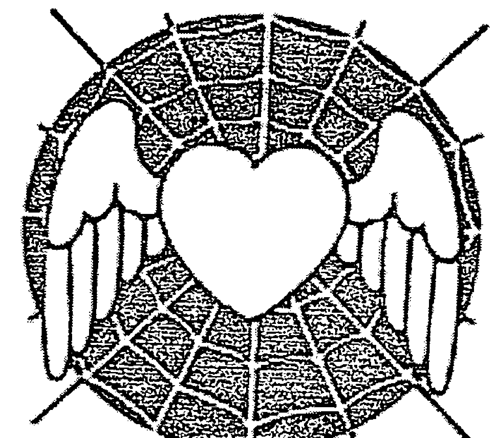

是什么值回我们对生命的付出？

我们的希望是金子，我们的身体是泥土；
我们走过的路在脚上留下了水泡。
是什么值回我们对生命的付出？

当皮肤变得松弛，双鬓开始斑白，
是谁发誓我们并未被抛弃？
是我们一路上遇见的朋友。

谁在争吵后又与我们共舞？
谁与我们共享痛苦和甘甜？
是我们一路上遇见的朋友。

我们所剩的日子，屈指可数；
泪水逐渐缓慢，笑声逐渐消失。
是什么值回我们对生命的付出？
是我们一路上遇见的朋友。

我们的梦想是凝乳，我们的恐惧是乳浆；
每次挫败都让我们体无完肤。

> ——伊丽莎白·巴纳特

### 1. 简介

欢迎来到生活方式的世界！在这里你会学到在个人日常生活中以及与家人、朋友和社会关系中的应用魔法。生活方式即是关于人际关系的一切……关于你的人际关系。你们每个人现在都有，或者以后都会经历到各种人际关系。你拥有与家人、与朋友（同辈人），与老师、与朋友的父母、还有其他成年人和权威人物的关系。你甚至与你的宠物也有关系，但那种特别的关系会被归入野兽控制一章。你与你的社群拥有关系，这是由与你生活在一起的人组成的，是你所归属的群体。你与地球（很多人相信地球是有生命的）拥有的关系则是你的职责之一。随着你长大，你也会发展一些罗曼史。但你所拥有关系中最重要的，是你与你自己的关系。因为余生的日子你都将与你自己度过。这种关系实际上包括两部分：你的内部自我（你的心情、感受、精神）和你的外部自我（你的身体）。

这一章的任务是让个人的成长和自我定向学习达到最高层次的协调，从而成为一个卓有成效的人类成员。学习这样的技能与知识对各种层次的魔法来说都是必不可少的，使魔法师学徒对他人、以及对个人意识和仪态的发展都产生积极的影响。特别的知识与技能包括目标设定、研究能力、组织能力、纪录保持、制定日程、信守承诺、交流沟通和批评分析。

- 犯错是值得的教训。如果你已经完美，你将不会学到任何东西。犯错只是成长的机会。
- 青春期是通往未来的隧道。隧道的出口有光明，坚持到达那里是值得的！
- 在你认为你已经看清自己的时候，你就再次改变了。你的“身份”在变化。好的方面是，如果你不喜欢你自己或者别人眼中的你，你有机会（和能力）做出些改变。你需要永无休止地学习，成长，变得更好。

这一章的魔法色彩是粉红色。与铜色一样，粉红色也是维纳斯女神的一种颜色。铜色与维纳斯女神的土地方面有关——最常见的是与植物、沃土和作物有关。粉红色与维纳斯女神的情感与精神方面有更多的联系，特别是对自己和别人的爱。粉红色代表我们与所有人的关系——尤其包括亲情、爱情、亲密友情和罗曼史。

你是一个存在于肉体中的精神体。用这样的观点，就会慢慢开始了解许多奥秘。

### 2. 你的魔法师生活

文/利拉娜·D·维纳斯(Lilana d'Venus) 和琳达·C·杨 (Linda C. Young)（粉红色）

#### 你与你的家庭

> 一切通过关系而改变
——丹恩鲁依尔

**基本前提：** 从法律上来说，你的父母或者监护人应对你的安全和举止负责，直到你满18岁。法律也规定（对多数法律来说），对你负责的监护人，同时也有权对你实行控制。这意味着他们能规定你能做或不能做什么。

##### 基本前提

在生活方式这一章，我们从一些“基本前提”开始。一项基本前提是我们简单假设一个“事实”是真的，而且从一开始就同意。这个列表列出了其中一部分。

家庭可以充满乐趣，就算家里只有你一个人是魔法师，而其他人都不是。在家里创造乐趣的一个方法是定期开家庭会议。在会议上你有机会与每个人进行交流。（交流对魔法师来说是一项重要技能，后面我们会开展专门培训交流技能的课程。）在所有家庭成员聚到一起的时候，你可以谈一谈你想做但事关其他家庭成员的事，共同商量在家庭中会造成什么影响，并向有能力的成员寻求帮助。也许你们所有人都有你所遇到的烦心事。

- 生活会给你选择，现在会，以后也会。你选择的结果会影响你的未来。
- 你会遇到一些“绝对事物”（你不能改变的东西）。认识并学习怎样处理它们是成长的一部分。对付你不能改变的事物，有一种战略是把你的观点转换到一个新的视角，以不同的方式看待它们或者尝试以另一个人的角度来观察。
- 犯错是值得的教训。如果你已经完美，你将不会学到任何东西。犯错只是成长的机会。
- 青春期是通往未来的隧道。隧道的出口有光明，坚持到达那里是值得的！
- 在你认为你已经看清自己的时候，你就再次改变了。你的“身份”在变化。好的方面是，如果你不喜欢你自己或者别人眼中的你，你有机会（和能力）做出些改变。你需要永无休止地学习，成长，变得更好。

在家庭会议中你们可以达成协议。你可以计划一次让整个家庭都很享受的出游，比如说去一次动物园。最后应该以一个有趣的活动来结束会议，让每个人都参与到其中来。可以是一个游戏，一项计划，或者，如果你们都能演奏乐器的话，来一场演奏会。就算不会乐器，跟着一起唱就好。（重要规则：在家庭会议期间要关掉电视机。）

如果你出生在一个魔法世家，你的父母必定会有一些魔法师朋友，并且他们很可能也会有魔法师子女。这就是找到与你志趣相投群体的起点。

如果不是出生在这样的家庭，那么在学校里你就该四处找找戴着五星垂饰的孩子（一个圈中有一颗五星）。这可能代表他们对魔法和巫术有兴趣。一旦你与其他会魔法的人交上朋友，就会很容易找到更多。你甚至可以组建一个课外俱乐部，与大家一起讨论关于魔法的事情，分享你发现的消息。

如果你被允许加入到这类活动中，你就会发现参与其中的其他魔法师，比如说在文艺复兴展览或五星节上。如果你是男孩，穿上你的魔法袍，或至少穿上一件束腰外衣和紧身裤。女孩则也许会去小店里淘到长裙和衬衫，让自己看起来越中世纪化越好。《魔法师学徒的魔法书（下）》（2页-4页）会告诉你更多关于这类聚会的东西。

##### 课后作业：

把关于你的家庭的内容写在你的日志里。谈一谈对你的家庭的感受和期望。如果你的家庭现在还没有开办家庭会议，思考如何建议开展起来。如果你的朋友有家庭会议，请教他们是怎样做的。

#### 你与你的朋友

**基本前提** 你需要有志趣相投的朋友。如果是在充满敌意的世界感到孤身一人，那并不有趣。会有一些与你合得来的人，你只需要知道怎么样找到他们。

如果你碰巧有想要学习魔法的朋友，但他们的父母并不支持，要让他们确信，成为一个魔法师要从思想、心理和灵魂开始。你可以考虑把这本书和《魔法师学徒的魔法书》借给他们。你的其他魔法师朋友也许还有一些可以借给你的书，这些书会教授你们各种可以一起做的与魔法有关的事情。

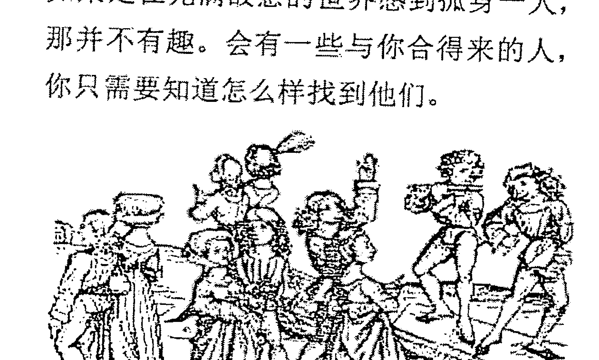

##### 课后作业：

把关于你朋友的内容写在你的日志里。想想你为什么选择这些人做你的朋友。你们怎样相互帮助？拥有这样的朋友是怎样让你的生活变得更好的？

#### 你和你的社群

**基本前提：** 你会挑战权威。你怎样着手这件事将会对结果产生深远的差别。你质疑的方式会直接影响后果。

当我上二年级时，校长办公室在一段狭窄楼梯的顶端。学校规定禁止上楼，除非你得到邀请。另一所学校规定禁止沿着楼梯扶手往下滑。我七岁的大脑认为这两项规定都十分“愚蠢”，所以在一天下午，我在激将法刺激下同时打破了这两项规定。后果很快就到来了，在楼底着陆时，摇晃、跌落、疼痛都比我想象中严重得多。理所当然，一个老师抓住了我，让我放学后留校写了几百次“我再也不会……等等。”在这种事情上藐视权威，从长远来说是不值得的。

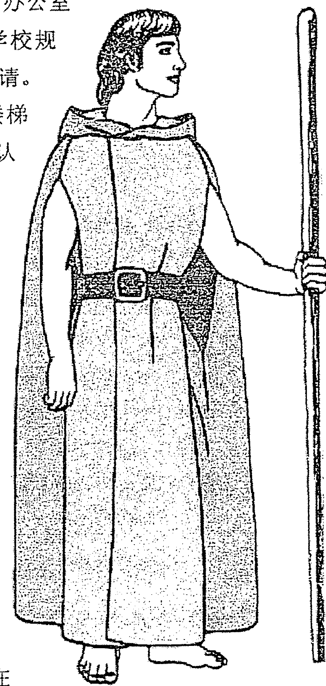

我要说的重点是，要把你挑战权威的决定保留在重要的事件上。把你的理由想清楚，不失为一个好主意。当罗莎·帕克斯在1955年拒绝给白人让座时，她点燃了公民权利革命的火花。认真选择你要做的事，确定你是“正确的”一方。（如果想了解更多关于罗莎·帕克斯的故事，请上Google.com搜索）

**基本前提：** 每个人有所不同。一个群体的成员不能被一个词或短语归类和定义。比如说，把所有“啦啦队队员”都说成是“大笨蛋”，这是不合情理、不友好、不公平的。

在任何群体中，都会有一些你非常敬佩的人，也会有一些你不可能会喜欢的人……不过大多数人都在这两个极端之间。把你的注意力集中到好的人，也就是你敬佩的人上面，这是很有用的。然而，如果你发现你不得不与一个或者更多你不喜欢的人相处（例如学校里的一个恶霸），你也许想要尝试一条我喜欢用的咒语，叫做“请你休息”。我把那个人的名字写在一张小纸条上，然后把一个纸杯装满水。我把纸条折叠起来，让名字在里边，再把纸条放进杯子里，直到它被水浸透沉到杯底。接着我把纸杯放在冰箱后面。当我做这些的时候，我会说：

> 让这个人从现在开始，
不能对我有任何伤害，
在我的心里冷藏、冰冻并且消失。
现在我会吸引友好和善良的人。

**基本前提：** 找到一个榜样是一个有价值的目标。

最近一名作家采访了数百名青少年。许多孩子所说的一件事便是在你成长过程中有一个榜样的重要性。榜样是你所敬佩的人，拥有你希望得到的品质的人，被人们看待为值得尊重和得到敬意的人，你会说“我长大后要像他（她）那样”的人。

在你认识的人之中去寻找你的榜样。如果你能找到不止一个榜样那更好。如果没有你愿意选择成为你榜样的人，就从不同的人中寻找你所敬佩的和想得到的品质，把这些品质在你的日志里列出一个表，组合成一个你更想要成为的人。

##### 课后作业：

起草一个表格，列出你认为不公平并且值得提出来的事情。用几天或几个星期的时间，找到周围值得你敬佩的、年龄比你大的人。把他们的名字写在日志上，告诉他们，是什么东西让你敬佩并尊敬他们。如果你做的是组合品质列表，你的导师会念出你列出的内容，并知道你为什么选择这些。

#### 你和你的身体

作为一个魔法师学徒，怎样过你的生活，你也许会有许多主意。拥有一个健康的身体能让你在你的世界里做得更多，并且完成更多的魔法师目标。魔法师很重视他们的身体，视身体为造物主的一件礼物（无论你认同怎样的称呼，女神、上帝、宇宙、精神之主、大地之母等等）。魔法师不会丢弃这个礼物，他们用细致的照顾来对它表示尊敬。

你的身体茁壮成长需要几个要素，最重要的是：空气、水、营养、清洁、锻炼、休息和感触。

> 你的身体是一件神圣的衣服。你的生命从这里到来也从这里离去；它应当充满荣耀。
——玛莎·葛兰姆

**空气**——你出生时首要的事便是开始呼吸。如果没有空气，一个人很快就会死亡（我有一件体恤，上面印着“不能呼吸的时候，就没有要紧事了”）。几乎和呼吸空气一样重要的，是空气的质量。空气需要清新，并且含有足够的氧。如果你生活在一个空气质量很差的城市，要尽可能频繁地远离它，去乡下、海滨或是山上。作为底限，在你的照顾能力之内尽可能多地在家养些植物，它们向空气中释放氧气。另外，你也要培养深呼吸的习惯。

**基本前提：** 在你的一生中，你的身体会成长和变化。你如何对待这些变化将会影响到你的幸福。

成长和适应是生命的全部。自然界会充分证明没有什么是相同的，不论是动物、植物、或矿物。你唯一能指望的就是变化。不论你是植物、动物、或人类，在你年轻的时候，最好的变化就是成长。从青春期开始发生的身体变化使人感到困惑，有时还会让人难为情，但这些都是成长的一部分，让你最终长大成人。

**水**——享有纯净的水是与生俱来的权利（我正用它在洗肥皂盒），但现代化工却使纯净水变得越来越稀缺。如果你运气不好，不是像我一样住在一口自流井附近的话，你的第二选择就是一个高质量的水龙头过滤器。若你的父母愿意买一个，要求他们看看关于这东西的网站。即使是杂货店买来的便宜货也比什么都没有要好。

有些消费合作社和天然食品商店出售他们用自己特制的过滤器处理的水。你可以带上水瓶自己去装。

据说我们身体的 90% 都是水，我们必须经常进行补充（重新补充通过汗或尿液流失的水）。我被教授的经验是，每天“每两磅体重需要一盎司水”。这意味着如果你体重 100 磅，你在 24 小时内应该喝 50 盎司水。早晨我用杯子接满我需要的分量，一天内每半小时喝一点。

**营养**——每个身体都是不同的。对一个人起作用的东西并不一定对另一个人也起作用。有些人认为生吃的食物更健康，另一些人偏爱吃半生半熟的。有些人依靠素食茁壮成长，另一些人则需要吃肉食、家禽、鱼。这几天有关于批量生产食物的消息，在这些耸人听闻的报道之后，我不得不劝你尽量多吃有机食物。

一种食物所经历的加工环节越少，它就越健康、越营养。我最喜欢的建议是“吃得更原生态。”意思是，最理想的食物是你自己在花园里种植并新鲜采摘的，或是你狩猎得来的新鲜成果。但是我们并不是生活在理想的世界，只有很少人能这样做。然而，你也许能找到一个愿意给你提供新鲜食物的本地有机农场，或者，你的父亲也许会在秋天去打些野味来放在冰箱里。

有机食物是最好的，根据这个前提，我建议，新鲜的水果和蔬菜应该是我们比其他都吃得更多的东西。为了得到糖分，选择天然谷物的麦片粥和面包。为了得到蛋白质，去找到提供自然生长肉类和乳制品的消费合作社或者天然食品市场。（我的个人偏好是山羊奶，对大多数人来说它比牛奶更容易消化。）

多多了解脂肪和油。（我的资源列表里有一个网站链接会提供有用的信息）你的身体需求的有益脂肪叫做必要脂肪酸。这些脂肪酸中，最重要的叫做 Ω-3 脂肪酸和 Ω-6 脂肪酸。它们的最佳来源是亚麻籽油和鱼油。

盐、糖和甜食要保持在最小值。（学习读懂标签。）选择蜂蜜和枫树汁要比蔗糖好。试试红藻或全盐（保留了完整的矿物谱）来代替食盐。

你已经知道，为了最好的结果，你需要避免薯条、汽水、炸面圈、烟草、酒精和毒品。尽量避免含有味精（MSG）的任何东西，那不仅完全没有营养，而且还会阻碍你达成你的目标。

抛弃所有铝制炊具和食具！你身体里的铝离子会在日后对你造成严重伤害。一些研究人员相信，造成老年痴呆症上升的一个主要原因就是使用铝制炊具。另外也要避免使用所有特氟隆产品。

同样地，不要使用含有氟化钠的牙膏。这是一种致命的有毒物质，可以用来杀死老鼠！氟化钙和氟化锡没什么问题，但是如果在牙膏管上有有毒的标志，不要使用！缅因州生产的汤姆牙膏不含氟化钠。

**清洁**——你已经知道了所有这方面的东西。每天洗澡或淋浴。每餐后都刷牙更好，但一定不要在没刷牙前上床睡觉。保持头发和头皮的清洁。每天换袜子和内衣。如果你的鞋子发臭，往里面洒些小苏打。在腋窝处使用天然除臭剂。难闻的味道并不是吸引新朋友的方式。

**锻炼**——你的学校应该安排了体育课，要好好利用。如果你不能参加体育课，就去散步、骑车，用慢跑代替开车前往商店。身体需要运动，关掉电视去活动活动。

**休息**——如果你睡不够，你就不会有精力旺盛的强健身体，你的成绩和心情也会受到影响。试着安排出一个有足够睡眠时间的作息表。如果你不得不放弃某些活动，看电视是首当其冲的。魔法师干什么都比做一个电子管僵尸要好。（顺便提一下，睡觉的时候不要开着电视，对你的身体和大脑来说这都非常不利于健康。）

**触摸**——许多年以前，一项医院研究发现，没有人触摸的婴儿（由机器人给他们喂食）不会茁壮成长。实际上，他们之中许多都生病或夭折了。人们需要别人的感触。得到许多拥抱的人更幸福，更健康。每天都拥抱别人，也被别人拥抱。如果你感觉你没有从你认识的人中得到足够的拥抱，去疗养院和儿童医院做志愿者，那里有极度需要你的触摸的人，给他们的手上或脚上擦擦涂剂。这就是“互惠主义”——你付出你所得到的。

**加上这个**——冒险的注解。冒险是青春期必不可少的一部分。《家庭医疗百科》中的一篇文章说出了大人面对小孩子愚蠢的冒险时有多么困扰和痛苦，经常造成灾难性的悲惨后果。父母问，“你在想什么？！”回答——根据研究人员得出的结论——会是，“我什么也没想。”

同一篇文章（在参考章节有链接）包括一项研究的描述，这项研究表明，做出糊涂的决定可能是由于青少年大脑所发生的快速发育变化。因此，对你来说这是（按照我奶奶曾经说的）“对智者说的话”。要知道，有些时候你根本没有进行思考，需要警惕这种情况。

近期最大的风险之一是性病的传染。如果你有性生活，戴上安全套！

**基本前提：** 你的身体是此生唯一的。如果破坏了它，你不能用一个新的来换。如果你不喜欢它，你只能换一个新的态度。如果你好好照顾你的身体，它将会长久服务于你。

##### 课后作业：

在你的魔法日志中，为身体护理设置一篇单独的日志或独立的章节。关注你的日常饮食习惯，记录你的锻炼情况，休息了多少，有多少感触，喝了多少水。如果你住在一个空气质量很差的地方，要留心空气质量的变化与你的感受之间的相互关系和关联。

#### 内部的你

**基本前提：** 你的内部世界是你的安全地带。让它得到平衡，成为一个随时可以栖身的地方。

小的时候，当房子里的气氛变得紧张起来，或是觉得需要呼吸，我都会到外面去，一路散步到小溪边或树林里。少年时代，当我意识到需要处理的问题比我想象中还多时，我会闭上眼睛“进入内部世界”。人们通常认为我在打瞌睡，但实际上我在思考。我会对一些问题深思熟虑，直到能想明白一点。也许我会回忆一件快乐的事情，或想想未来有趣的计划。后来我学着去冥想，“进入内部世界”即是花一些时间来冥想新的东西。在第四章找到关于冥想的课程，这种方式对魔法师来说很有价值。

## 第十章：生活方式（粉红色）

基本前提：你的内部世界是那个真正的你所居住的地方。真正的你实际上在观察……能说出“我的脑袋”或“我的手”那部分的你，要知道，所有你的这些部分都只是那个真正的你所在的身体。

那么，谁才是在你身体里那个真正的你？魔法师的任务之一便是回答这个问题。一个古希腊的魔法师叫做苏格拉底（公元前469-399年），他说，“要了解你自己！”这一直是个很好的劝告。

你会发现，你是谁，一部分是因为价值而决定的。价值是你认为很重要的品质。你在你的内部世界坚持你的价值。你会考虑魔法师的价值是什么，然后去培养那些你还不够强大的方面。《魔法师学徒的魔法书（上）》在182页列出了一些，包括：荣耀、忠诚、正直、诚实、尊重、公平、感恩、殷勤、慷慨、尊严、互惠、责任、足智多谋，和互相依赖。

做一个魔法师，需要非凡的诚实、奉献、坚持，并且深信变换。真正的魔法需要根本上平衡的品格，乐意接受加速成长的挑战，并承受你所做每件事的责任。就像奥贝伦说的，成为一个魔法师与力量无关，而是为了服务。

生活方式的课程将会探索关于你是谁的一些特定方面，帮助你决定你的个人道德标准。同时，阅读《魔法师学徒的魔法书（上）》第175到183页更多魔法伦理的内容。

##### 课后作业：

在你的生活方式日志中写关于你的个人价值的内容。有什么价值已经体现在你的生活中，它们对你意味着什么？

#### 资源

支持一直都有。不论情况看起来多么绝望，总有人会关心的。你也会得到帮助，即使看起来并非如此。下面是2001年出版的青少年资源列表。一些号码可能有所改变。如果一个800号码打不通，拨打800信息台1-800-555-1212，告诉接线员你要找的机构名称。如果其他非800电话打不通，试着打411。

##### 美国青少年救助热线

- 匿名戒酒者协会 / 青少年酒精受害项目：800-344-2666
- 酒精治疗与转诊热线：800-ALCOHOL
- 滥用药品治疗中心：800-662-HELP
- 儿童夜间热线（针对离家出走者）：800-551-1300
- 本地暴力热线：303-839-1852
- 饮食混乱热线：541-344-1144
- 无名麻醉剂：818-771-9999
- 国家虐待儿童热线：800-347-4453
- 国家青年同性恋热线：800-347-TEEN
- 国家离家出走热线：800-621-4000
- 九线（针对面临家庭或学校危机的儿童）：800-999-9999
- 计划生育：800-230-PLAN
- 强奸、虐待与乱伦国家网络：800-656-HOPE
- 安全方案热线：800-DON'T-CUT
- 青少年艾滋病热线：800-234-TEEN
- 青年危机热线：800-448-4663

### 3. 内部周期的秘密：为年轻魔法师编织的简单的网

在如今破碎的社会里，关系常常很紧张；许多人很难交到朋友，不知道怎样让自己融合到一个让他们羡慕的群体中。
在这里你会学到一些基本的技巧和原理，谨慎地使用，就能得到个人的成长，同时提高人群吸引力。你是否想过，怎样变得受欢迎？最直接的办法就是让自己在所寻求的同伴面前表现得不可或缺。
如果你有现成的门道进入魔法社会，那很好；感觉舒服的话就走进去。如果你还没有那样的门道，也没关系。你可以从学校里开拓，比如一个邻居俱乐部，或其他一些群体。你所学的技巧很简便，时间过得越久，交朋友也就越容易。

#### 人际网

编织一张魔法师的网，第一个方面叫做人际网。意思是组建人与人之间的关系，运用它来解决问题。下面是一些人际网的原则……
你就是一个社会，无论你是一个新手还是专家。教授你所知道的，学习你所不知道的，投身其中。一生中没有绝对的权威；除了你，没有什么能让你停下来。建立情谊，交换能量，共享我们的一致性和差异性，这些就是社会的一切。你逃避的东西只是你放进去的东西。
决定你想要的，然后制定一个目标去达成。只要你付出足够多的时间和努力，多数技能都能学会。你可能认识一些人，他们看起来什么都会——如果那个人不工作，又能怎么样？基层的缺失会让领导者耗尽其所能，然后所有令人愉快的情绪也都会消失。所以要个尽其能做好本职工作。
建造人际网时，在你求助别人之前先给予别人帮助。每个人都有知识、技能、人际、经验等。把这些利用起来，互相交换。如果你想要一个朋友来帮助你辅导测试题，那就先帮他检查家庭作业。如果你想要别人来出席你的魔法师朗诵会，那记得在传单上通告你会招待他们茶和点心。如果你想要为你现在的项目寻求帮助，那么就先去帮助别人做。你应该懂得怎么做了。
在正确的时机上插话。若你在一次会议或节日聚会上突然出现并大声说道，“大家好！我是丹尼·奥克里夫，第一次到这儿来。能告诉我你们都在做什么吗？”之类的话，这样将会有可怕的后果。人们倾向于群体生活，总是努力让新来的人有段美好时光。更多有资历的参与者能帮助你最大限度地去理解这种经历。
很难找到与你志趣相投的群体吗？不妨加入一个全国性或地区性的组织。要找到它们很容易，在区域电话簿里或本地报纸的广告上就有列出许多。这些组织能让你经常与周围的其他会员保持联系——同时让你见到他们的家人，你偶然见到附近其他人的机会也会增加。

#### 志愿劳动

要加入到某个活动其中，一种极简单的方式就是通过志愿劳动。这意味着你要付出时间和精力去完成一些特别的事，就像组织学校的演出或号召为慈善捐献食物。许多机构都是靠志愿劳动运作的。

如果你想知道从哪里开始，许多特别的兴趣都能和魔法很好地结合起来。对历史爱好者来说，把社会当作全新的错位历史事物，或者另一个重新制定的历史群体。另外，对科幻小说协会来说，读者有其他类型可选择——推理小说迷有时制造一场实景“谋杀”来侦破，诸如此类。如果你喜欢太空，年轻的宇航员会教你所有的模型火箭研究。能找到关于一种爱好的物品或空间的地方，往往也就能找到爱好者。去看看本地公园有没有自然俱乐部，图书馆有没有阅读俱乐部，工艺品店有没有花环，等等。

举例来说，我喜欢读书，这让我加入了科幻小说协会，那是一个美妙的世界。多年以前，我决定我想要代表讨论小组，去谈谈最喜欢的书，同时了解科幻小说群体中的同伴。因此，我加入了协会，并且志愿去做任何不需要太多经验的事情。我从没被拒绝过，从来没有。而且，在检查徽章或清空垃圾桶或搬运咖啡的过程中，我还遇见了许多不同凡响的人……当初收取了我30美元入会费的人，都非常感激我能自愿花一个或两个小时来帮忙。

如果你不能找到一个群体，考虑组建一个你自己的，比如一个神话学的群体。你可以通过在当地图书馆、书店、超市等地方发传单来散发消息。有的时候，像图书馆、学校这样的公共场所能为你提供开会的场地。在每一次会议上邀请人们注册一个邮件地址表，这样你就能通知他们下次什么时候开会。不要在原地等着别人去建立群体——很可能有一群人正等着你来建立！

现在我不再需要花钱来加入了；取而代之的是我会做两个或三个小时的讨论小组志愿者。每个人都有所收获。我将我的人际网成功地与我想要加入的群体联系起来，这真的非常有效。不论何时有人问我怎样融入到一个群体中，我告诉他们，在其中露面并提供帮助。

你想要加入到你所羡慕的组织中吗？在他们的活动中志愿劳动，一年或两年内，你就会交到不少朋友，认识不少人，增加一些极有价值的经验。一些活动需要有人帮忙参加繁重的劳动、节目编排等。所以，要为这些做好准备——但如果你做得更多，他们也会感激的。想要学习更多像疏导交通（在停车场里），生活简易化（引导会议），或是做大锅菜的技能吗？那就问问吧！组织者也许能让更有经验的志愿者和你配对，活动结束之后，你就会学到相关的经验了。当然，还有其他的办法……但这是最好的一种。

步骤基本都是这样进行的。找到一个组织者，介绍你自己，说明任何你的特殊才能或志愿加入体力劳动，安排出时间范围。如果你参加小型活动，例如读书俱乐部会议，找到主持人说“你好！我叫卡莱尔·梅多拉特。我是新来的并且非常愿意加入。你需要有人在会议结束之后来打扫卫生吗？”之类的话。如果你参加大型活动，例如嘉年华，组织者也许会有一个办公室、帐篷、办公桌等，用作活动中心点的后勤服务。到那里去，说一说“你好！我想要帮助这个活动成功举办。我是新来的但是我有几个小时的时间来帮忙搬东西，或者洗盘子。顺便说一下，我也很擅长电脑，如果你们的问讯处需要人手也可以。”之类的话。

当你发现有需要帮忙的地方，你也知道怎样做的话，不要等着其他人也看到并且来帮忙。这会是真正的魔法师的污点。如果你看到浴室里的厕纸用完了，但你不知道去哪里拿，那就去问。如果你发现因电力短缺导致大厅的灯忽明忽暗，但你对电力一无所知，那就去找到一个组织者或门卫或任何能操作它的人，告诉他们有什么问题。如果你看到到处都是垃圾，不要踩在上面，把垃圾捡起来。照顾这个世界，也与每个人互相照顾，这就是魔法师。

类似地，当你有一个好的主意时，实行它。别把它丢在一边因为时间流逝而消失；让它运作，让它成熟。如果你需要帮助让它发展下去，那就请别人帮助你。但也别让别人来接手你的事。这是你的主意——实现它是你的责任。这正是为什么世界把它给了你而没有给其他人的原因。

别让限度阻止你。魔法师知道怎样将不利因素转换为有利因素。如果你身材太小，拿不到架子上的东西，但你却可以钻到柜子后面插电视机插头。如果你坐着轮椅，也许你就可以坐在桌子后面帮助每个到达活动现场的人签到，而不用去收集柴火。如果你容易受寒冷天气的影响，不是正好需要有人照看篝火吗？运用你的想象力吧。如果必要的话，提醒组织者，一个参与者不能做所有的事，但这不意味他什么也不能做。

#### 影响

这是难以形容的一类魔法，但效力十足。影响是你对他人或者事情的效应。这就像你往池塘里丢一块石头——波纹散开使树叶在水面浮动，即使你不能在原地用手指去触及那些树叶。

反馈很关键。任何能起作用的都值得赞同。没什么像花了三个月开办丰收市场但整个周末都在下雨之后，在星期天晚上有人说呆在房间里讲故事是他们最好的经历。如果你发现事情不起作用，不要抱怨；解释这为什么不起作用，并提供你的意见来提升它。加入到篝火旁的对话中，与人们探讨怎样进行一次演讲，或讨论活动中他们最喜欢的部分。

很久了。

这就是形成核心团体的真正奥秘。

成为一个有想法的消费者和捐赠人。把你的钱想象成选票。你每花一块钱，你就为收取这块儿钱的公司或组织的理想和行动投了一票。一个月你可以少吃一两次麦当劳快餐，把那些钱送给你最喜欢的俱乐部或慈善组织，即使加起来的时间不多。当然，如果你经济宽裕，慷慨地利用“回报效应”乐善好施吧！记住，不会付出而向一个群体乞求施舍是非常俗气且最终会适得其反的。你参与他们的会议，你吃他们的松饼，你喝他们的葡萄汁……但你也要向他们的捐赠罐里投进资助。

### 4. 拥抱我们的男性：潘神与绿人

文 / 杰西·沃夫·哈丁（银色）

我们把大地女神设想成女神或地球的母亲，但这个活力焕发的星球上，男性和女性的力量却是平等的。这种动态的混合刺激了生命的生长！在如今这个年代，不论是性别歧视还是战争，都被归咎于男人和“男性力量”，理解并利用这样天生的男性力量是非常重要的。同时，我们男性天生就有更多好斗性，这是我们在保护自己和所爱的人时需要触发的力量，去避免无所不在的伤害。男人和男孩更倾向于思考而非感觉，但我们在压力下思考的能力也意味着我们有能力在压力、混乱中，千钧一发或狂风暴雨中去完成惊人的奇迹。

#### 结论

归根结底，所有都是关于责任和联系的问题。魔法师教导你要为你的行为和所造成的后果负责，这与我们所有人都有关。因此不要期望其他人为你做完所有工作。卷起你的袖子帮帮忙。我的妈妈是个聪明且有魔力的人，她这样看待：“如果你没有责任感，你就是不负责的人，那更糟糕。”

对一个年轻人来说，如果没有为生为一个男人有任何负罪感，成长过程看起来就会更加艰难和富有挑战。在现实中，我们神圣的发现和拥抱、天生的男性力量对我们的魔法师身份、对自身的释义、对自然力量的集结与生长来说是必需的。要做一个有责任感的魔法师，共创魔法世界，

一旦开始，你会为你的学习速度和它具有的乐趣而感到吃惊。即使是糟糕的麻烦事，也能带来美好的时刻。我最珍视的回忆之一是和许多有名望的魔法师一起两肘并拢蹲在地板上，去用信用卡收集蜡烛溢出来的蜡。那次仪式上的每个人都是各自领域的专家，其中许多都习惯了领导他们各自传统中的仪式；并非把这项令人为难的工作留给一两个人去做，而是几乎房间里的每个人都停止了刮蜡。蜡烛燃尽了——我们才意识到，小小的合作进行了很久了。

我们需要体现出真实的本质。这意味着，不论体型和身材，我们都要爱护、感受，利用我们的身体，去感知并负责地引导我们神圣的男性力量，不仅接受我们的温柔和感性，也要接受我们内心的动力和强烈的愿望。就算成年人也要记住，我们不需要去成为我们本身之外的其他任何东西，这样生命才有价值。我们生来不是“坏人”而是“好人”，通过实践我们只会变得越来越好。为了魔法和世界的美好，我们只需要做我们自己。

半人半兽的魔术师之神潘神是我们男性的榜样之一。他代表了我曾告诉你们的那种平衡，像一个小孩一样贪玩，而对成年人来说又是恐怖的野兽。他就像森林里的成年生物一样贪婪，但是，在空无一人的春天草地上也会立刻跳起舞来，或者对着鸟儿吹他的笛子。从字面上来说，潘神代表“全部”，所有事物。他存在于自然界所有事物里，就像上帝或女神那样“无所不在”。潘神能使自己变成各种形态，变成一阵风或一棵柳树、汗流浃背的摇滚歌手或大河里闪亮的石头。他把每个生命形态都当作自己的家，同时在不同的生命体内都有他的存在。潘神常被描写成具有人类的躯干，腿上带着马蹄、并长着野生山羊的弯角，还有人类变化无常的脸。另一些时间他会用麋鹿或犀牛的角取而代之，带着羽毛、爪子、鱼鳍、钳子在洞穴里被照亮的墙边跳舞。潘神的名字同样代表无处不在的灵魂，但他也是不亡的小丑，或是西南印第安部落的丛林狼魔术师，抑或是斯堪的纳维亚的洛基。他是个顽皮的煽动者，同时又是凶猛的守卫，守护着所有动物、森林和所有自然生物。听到他的排箫声，所有生物都抬起头，改头换面，感到兴奋并且活力焕发！

潘神是任何形态的女性之神的搭档、仆人，以及玩伴。在灵魂消逝合理化，纪律与规则，恐惧与习惯面前，他们仍共同主张魔法与精神。不顾当今客观化和平静化的趋势，去引发热情和共鸣。在分离、教条，以及边界之上产生连通性。在束缚中纵欲，刺激那些百无聊赖的人，让我们之中受伤的人站在一起。

第二个神话中男性的榜样是原型的绿人。我确定你看过绿人面具，或者在农历五月一日典礼上看到过在头发上涂着绿枝条和树叶的人。正如潘神代表我们的动物之灵，还有与我们共享地球的生物，绿人是我们食用的植物与我们坐在身下的智慧树木之灵。在不同时期，他被不同的人尊为稻草人或树人，农作物丰收的神和四季变换的象征。托尔金小说里的树人对他做出了形象的诠释，他加入了与亡灵之间的英雄战役。他能为野花传递花粉受精，对我们的玉米和小麦也一样。他也在勇敢的蒲公英的种子中，坚持着把头扎进人行道的水泥裂缝中。

与潘神一样，绿人存在于我们周围。在我们找到住所像抛锚一样急于扎根时，或者像在求生时急促呼吸的大口，这种时候我们就会感受到它的存在。存在于我们内部隐藏的智慧中，类似于黑暗的发酵土壤深处的知识。还有我们触摸光芒的渴望……美丽地绽放，被发现，伸展开来，去学习和成长。他不但在花园里，也在有意识的园丁里；不但在巨大的古老红杉里，也在那些勇敢地爬上树木阻止砍伐的抗议者中。

与任何男人或女人的力量一样，一个魔法师的力量来自他最真实、没有拘束的表现中。我们从绿人的瑟瑟声中得到消息，从潘神的榜样中得到激励。当我与一位印第安长辈一起学习时，我学到了这些特瓦人祷文：“在地球的内部和周围，在丘陵的内部和周围，在山峰的内部和周围，你会发现你的权威。”这是完全属于我们自己的权威，是我们的全部。

- 谈论或者写出包含受人尊敬的男性特征的信件、歌曲或诗句。
- 阻止破坏我们男性名声的行为，当有人反其道而行之，要站在我们的性别这一边。
- 充分利用已有的每一项资源，包括你本身所有的男性能量。以热情并富有同情心，充满力量并目标明确，艺术与荣耀并存的方式，来代表男人吧。
- 找到你的男性朋友，能够真诚地与他们分享你对于男子气概的感受和奋斗。他们不一定是你的魔法圈子里的人，从某些角度来说，如果他们有不同的观点反而更好。有一些固执己见的刻板的人，或是自大、麻木的人，不要认同这种人，或避免与他们交往。
- 为自己定义“男子气概”的真正含义。
- 把这些特点、品质和倾向列为一个表，这是你定义的大部分男性特征（比如自信、强壮、决心等）。然后在每项之下，再列出两栏，写出这些特点的表现方式：一栏写出你认为会伤害感情或带来伤害的方式，另一栏写出能让我们感受幸福和带来愉悦的方式，无论是对我们周围的人或者自然世界。
- 如果你有一个祭坛，确保上面有象征受人尊敬的自然男性气概之物，不论是潘神的雕刻或画像，或是奇异风格的棍子或干蘑菇，代表男性的阳具（阴茎）。
- 尝试制造一个绿人面具，使用湿润成型的生牛皮鞭、编织的文字或弧形的树皮，再用小树枝和树叶装饰，或许还有松萝和苔藓做成的粗糙的胡须。

### 5. 男孩、男人与长者：成长仪式

文 / 杰西·沃夫·哈丁（银色）

生为男性，我们有固有的天赋和特性可以好好利用，有必须承担的责任，特别的机会也要抓住。惯有的仪式把我们置于新的认知方式里，让我们背负更多，标志着我们由男孩成长为男人。我们把这些仪式称作“成长的仪式”，其中一些是由长者主持事先计划的仪式，包括复杂的测试、特别的咒语和记录下的誓约。其他成长的仪式在我们最不期望的时候发生，当我们必须面对和解决生命中巨大的难题时。比如说，如果一个年轻人按照自己的意愿选择一份工作来支付账单，或者当碰到困难时，他会经历一次成长的仪式，他第一次自己做出决定怎样做是正确的，而不是简单地听取别人的说法。进入大学也可以是一次仪式，如果是因为自己的需求和梦想，而不是满足父母的意愿或得到挣钱的机会……甚至退学也可以是一次仪式，如果这样让生命发生积极的改变，让我们全心全意投入魔法服务、任务，和梦想中。仪式能够保佑我们进入自身性别的青春期，或者我们长大后对自身长者角色的认同。与所有神圣的或魔力的行为一样，对于每一件事，最重要的因素是我们的意识和有目的性的计划。这样，每一个阶段我们都会自愿承担，而不是当作一项自然或社会强加给我们的义务。

大多数部落社会有正式的，特别的仪式，来标志一个男人成长过程的重要阶段。举例来说，包括特别的测试和阿巴契白山必需的舞蹈，萨摩亚人在他们儿子皮肤上用鲨鱼的牙齿纹身，维京时代一个氏族的所有人围坐成一圈，讲述个人力量的故事。其它由亚洲传到美洲的文化会让一个小孩与部落孤立，教授他们“医学”的方式和男子气概，再向部落重新介绍他们。一些部落把这些引入极端，在秘密的地下室，或会堂教育男孩。试想，被关在大地深处黑暗中环形的房间进行训练，日复一日，年复一年，然后想象在一个特定的时间爬出来，第一次看到阳光和地面，会是怎样的感觉！

从一个方面来说，每一个仪式对我们来说都应该这样的，以一种看待新鲜、新奇事物的方式来看待这个世界，从旧习惯中折射出新的东西。这就是为什么它会叫做成长，从一种方式中开启出另一种。我们被神圣的河水拭身、泥土覆体，头上饰以勇士鹦鹉的羽毛，或者肩负锋利的剑刃。我们本可以留在后面，但我们却选择前行，发誓完成重任，以新的方式有力地行动。在我们誓约的大门中，有我们作为男性的证明和力量。

- 如果你即将进入青春期，或者在过去一两年中经历了青春期，请求对你意义最重大的人，让他为你举办一个有意义的成长的仪式。如果你不是某个还有进行此类部落文化的成员，那么你的责任便是创立它。你可以向你的圈子里的成年人、自由信仰人士，或者自然精神群体寻求建议和支持。
- 别忘了成长的仪式至少应包括以下五个要素：
  - 你要有一段时间来完成困难挑战或特别任务……
  - 还有对知识、力量，以及认知的测试。这样的测试可以是让你单独去探索，敞开胸怀集中注意力远行到自然中，最好到一个不轻松的地方，但必须要成年人指定，保证你的安全。
  - 仪式应有你所爱的人和对你有影响的人参加，一起正式承认并尊重你的成长。理想的情况是，你的父母或监护人能来参加并承认你拥有了更多的自由，同样在生活中拥有更多发言权……你的朋友和魔法

## 第十章：生活方式（粉红色）

同盟也会来参加并支持你。我建议制定一些适合这种场合的特别的方式。

肯定自己，我们的圈子和关系就越稳固，集体的魔法也就越强大。

- 对你所学技能和所成为角色的所有来源表示感谢，感谢创造你的人，关心你的人，感谢教育过你的所有严酷经历，感谢赐予一切的大地和神灵。
- 大声向所有出席者保证，默默对自己和神灵发誓……你将怎样利用进化的能力，怎样承担新的责任，为此做出承诺。
- 庆典要适合本质，出色完成。
- 别忘了，对你的父母来说，成长的仪式同样也可能会难以接受，或者会惊吓到他们。每经历一次成长，你都会向他们现在的辈分靠近一点，变得更加平等，更多地为你自己的命运负责。
- 在其他关键与重要的时刻，重复以上的要素。不论什么时候，当你发生戏剧性的转变或认为你需要承担更多的责任，一次成长的仪式都会有永久的重大意义，并且赢得支持，得到神灵的参与。当我们目睹了我们的成长，他们能保守我们的誓约。尊重我们的人，也会公平地期待我们不辜负期望，追求地位、获得奖赏、发挥能力、响应召唤、履行责任。
- 尽你所能去鼓励其他任何年龄的人举行他们自己的成长的仪式。他们对自己的身份和目标认同感越强，他们就越感觉

### 6. 女性魔法师的成长仪式：让我们的美丽成为荣耀

文 / 基娃·罗斯 (Kiva Rose) (粉红色)

我们不常听说女性魔法师，但那部分是因为伴随我们的传说和故事多数是由男性撰写的。总是有一些女人和女孩，生来具有不平常的敏感，甚至超越部落中其他女人的直觉。这些女魔法师、女术士，和女祭司的生活中包括特殊的短暂瞬间，个人的时刻，或她们的魔法方向的重大变化的时刻。我们现代女性魔法师成长的仪式的重要性丝毫不亚于男性。

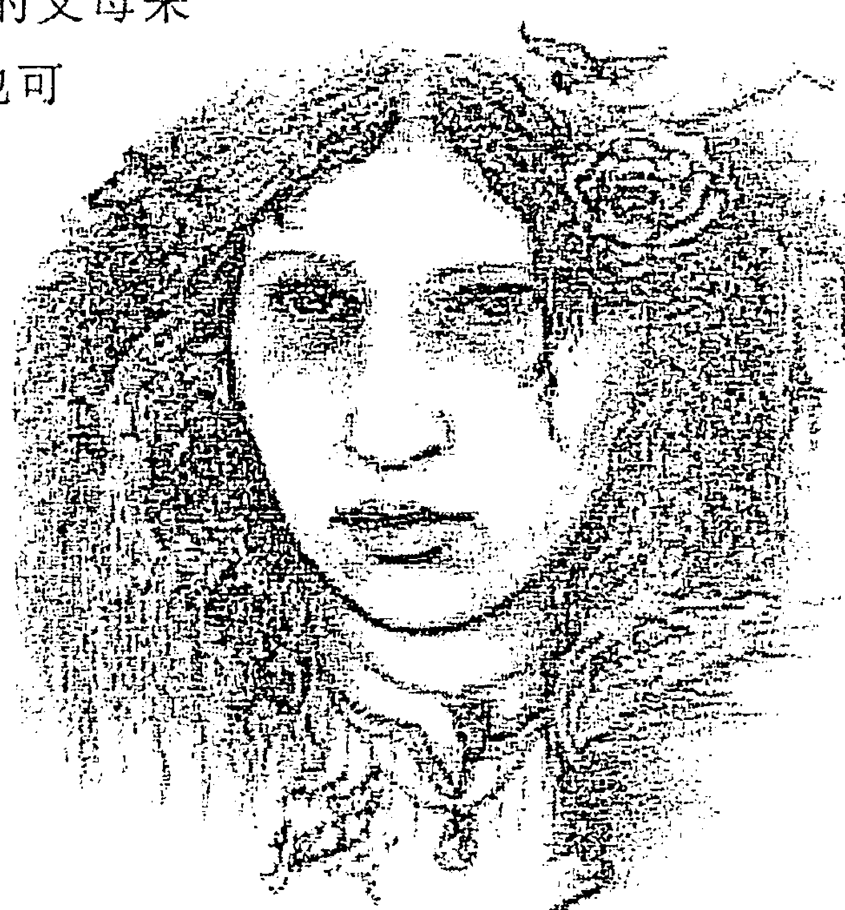

> 女性也能成为像男性一样力量强大的魔法师，有时甚至超越男性！罗斯通过做出困难的选择，运用自身的力量，全心对待她所教授年轻女性的被施以魔法的峡谷，赢得了命运的荣耀。——图作者杰西·沃尔夫·哈丁

对于每个人生阶段都有特定的时间标志着成长的时刻。我们出生，我们长出头发和牙齿，我们学会笑，我们向广阔世界迈出第一步。之后，第一次月经，这是我们女性周期一个美丽的开始。我们怀孕，生出自己的孩子，随着孩子长大，找到自己生活的方式并为自己的生命定位，我们也年龄渐增。当经血停止，我们也成了满脸皱纹的老太婆，对睿智的女人来说这是照料他们自身和法力的时间。通过这些奇迹般并恒定的方式，我们改变，无论是内部还是外部。我们是活着的生物，我们的天性是通过不同的速度和步伐去移动，去成长，去改变。为了更好地去认知这些过渡期，我们需要为成长的仪式创造新的形式，这些仪式基于古老的女性周期知识，但也需要适应我们现代的、多样的生命。

作为女性，我们是本能的感情体，靠直觉思考。我们是女神的女儿，我们的身体是完美的诠释，是自然世界的延伸。我们能够亲密地感受周围的世界，不论是美好的还是悲情的。这种特殊的感觉天分让我们可以接近大量的喜悦和痛苦。在过渡期，我们的情感甚至会更加敏感，比平时更开放。我们必须特别注意，不要让不可思议的感知能力导致情感的不平衡。因为这个原因，许多成长的仪式由一个人独处开始。每一次沉静于自身，都是快速成长、易受攻击、增强力量和知识的时期。

每次仪式的转变都是我们重新思考的时候。思考我们是怎样的人，我们想要成为怎样的人。也是比以前都更亲密地了解自己的时候。每一次仪式都是改变我们生活中不平衡之处，迎接新的责任和挑战的最佳时机。在许多文化的神话中，女神的下凡象征了这个过程，伊安娜的下凡最能清楚地说明。她是天堂中的苏美尔女神，下凡到人间，脱掉衣服、珠宝，放下虚荣心和一切伪装。我们以同样的方式揭掉我们的表象，以及别人眼中自己的表象，同时还有所有的教条、偏见和幻觉，直到剩下真实的自己：血肉、精神、心脏，和内心。像伊安娜一样，我们每个真实的自己都能从凡间得到更完全的升华，更加震撼、充满活力，且美丽。我们从每次的成长后更好地浮现而出，为以后的经历做更好地准备，理解并利用我们生命中的挑战和欢乐。我们也会为了解并帮助我们初次认识的人，为养育我们自己做更好地准备。

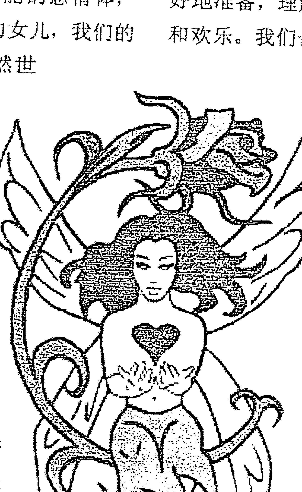

无论你是初次经历女性的生理期或是在为跨入老年的庆典而准备，你都能好好利用你成长的时间。

- 设想你理想的人生。你有了什么样的新的视野，有什么一直以来想实现但没时间付诸实际的梦想？想象所有你能离理想人生更近的方式。
- 想想你想要自己或生活发生什么样的改变。我们生活中哪些方面的东西对你已没有益处，或者你已经达到了？成为什么样的人，什么习惯或状况是我们应当通过魔法和实践一同去改善或者彻底改变的？
- 现在去开始做出这些改变。如果和你的朋友在一起不可能改掉这些习惯，与那些能支持你成长的人成为新的朋友。如果你有不可摆脱的情况或义务，比如上学，你仍可以更换专业或学校，转为家庭教学或找到课后导师来教授给你那些要成为你希望中的魔法师所必需的知识，通过这些来对现实有所改变。
- 下一步，思考哪些品质、习惯、行为是你在自身和生活中想要表现出来的。这些是你处事、学习、交际、表达，和行动的方式。这也可以代表你的梦想：进入药草学校，加入或开创一个党派或集会，成立我们自己的摇滚乐队或个人商业，组建一个社群花园或寻找更接近自然的方式。
- 记住，没有梦想是一夜成真的，我们所有为自身和世界做出的改变都是一系列无尽的过程。尊重每一个你经历的过程，相信你的方向！
- 在为你的转变举行的仪式和庆典上，不仅与神灵一起庆祝，在为你变换的角色和关系做出公认和尊敬的仪式上，与你最亲密的伙伴一起庆祝。
- 在这些庆祝过程中，试着穿上为这种场合特别购买或定制的衣服，反映出生命新的阶段。如果合适的话，你可以让你的姐妹、母亲，或亲密的女性朋友在你的身上、手上，或脸上用指甲油或其他类似的天然身体涂料作一些图案，突出你的美丽，象征你的成长。螺旋状的图案暗示我们无尽的周期与生命；花朵与树叶说明我们与地球的联系、生命的美丽；心则代表我们对自己、相互之间、对生命神圣的本质无限的爱。
- 这是我们与家人、密友，和神灵伙伴共度的时刻。安静的庆祝应按顺序进行，这一段时间是庆祝我们成长、分享你的梦想和视野，同样也分享一部分或全部你在仪式中独自向自己和神灵做出的承诺。
- 每一朵花出土、开放、结果并凋落……每一个生命也都坚持，向往自己对热情和价值的追求。地球是我们出生的地方，终有一天我们也将回到其中去。这与地球天生的联系，还有身体的周期，共同造就了美丽并充满力量的我们。无论任何可能的时候，到户外庆祝，食用野生的食物，产生一些我们与大地母亲之间有形的联系。
- 别忘了不仅仅是为成长的仪式，也为你美丽的生命中的每一个时刻庆祝，使之变得神圣。你是具有无穷潜能的魔法生物，沿着你生命道路的每一步都是神圣并被保佑的。让我们尽一切可能，让我们的美丽成为荣耀。

### 7. 实战魔法师的行动主义

文 / 杰西·沃夫·哈丁（银色）

行动主义的字面意思是“去行动”，对魔法师来说，没有什么要求比我们果断行动去帮助共建我们的世界和我们的现实更重要的了。行动主义可以表现在反对一项错误的行为上，比如采取行动阻止在英属哥伦比亚和亚马逊对热带雨林的砍伐，一些公司的种族政策或者政府剥夺我们的个体自由和权利……抑或预先行动去组建另类的团体或创造更健康的生活方式。无论我们把意识、本能、视觉和魔力归为女神、上帝还是伟大的神灵所有——我们都能通过行动来表达我们的感恩，去纠正需要改正的，治愈需要医治的，创造并传播礼物和美丽。我们可以对所经历的挑战和教授过我们的导师保有最高的尊重，最大限度地去发挥我们的智慧、意识、能力，和技能。

如果我们没有更多行动，可能会发现神圣的小树林无迹可寻，或者美国国会已通过了禁止我们行为和信仰的法律。社会中所发生的一切，本地和国家的政策，都对我们有影响。任何对大地之母的生态破坏也同样会威胁到我们。无信仰者群体看起来好像并没有采取足够的行动，所以，逆转这样的趋势并开始必须的改变，任务就落在了我们之中愿意做出行动的魔法师身上。

最激进的环境行动者常常是那些把自己描述成无信仰者的人们。当茱莉亚这名年轻的环保行动者坐在一株一百英尺高的红杉上，而这株红杉面临着被砍伐的威胁。对几个月奉献和冒险的原因，她解释说因为她与这株树精神相联。

一些无信仰者把在武装部队服役的行动主义当作他们的职责和形式，另一些人在海外投身于各种冲突中。作为权威且受尊敬的女巫，斯塔霍克（Starhawk）多年致力于抗议环境破坏和核扩散、反对中东战事和世界银行政策的活动中。她为我们树立了一个榜样，坚持不懈且灵活多变，以不同的方式应对每一项无形的斗争。在战役中，她与她的团队把坚定的非暴力公共抗议和公共教育结合在一起，在她们对手的办公室里集中成一个圈来进行特别的魔法、冥想、咒语。

- 鉴别并列出威胁到你最看重、对你最有价值的事物的东西。无论这些东西是宝贵的自由或信仰，家庭或氏族，一株你爱的树或整个自然世界。

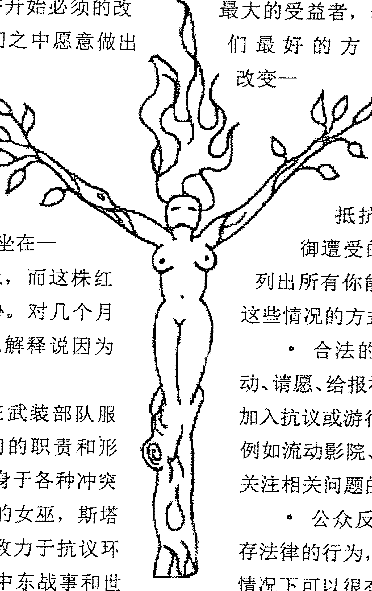

- 阅读诸如《斯塔霍克的真相与挑战》或笔者的《盖亚厄洛斯》。书本以一种富有意义的方式描述这些问题和麻烦，另一些书鼓励我们活得更深刻，并且在今天行动更多！
- 在问题和麻烦中学习，找出谁是最大的受益者，然后思考和考虑接近他们最好的方式。列出你能影响并改变一种糟糕且不祥的情况的所有方式。把列表分为两部分，一部分列出你能怎样帮助抵抗不公平或破坏，并抵御遭受的攻击。在第二部分，列出所有你能够提高、帮助或改善这些情况的方式。
- 合法的抵抗方式包括组织活动、请愿、给报社投稿、接受报社采访、加入抗议或游行、发展公共教育设施，例如流动影院、公开演出和引起公众关注相关问题的歌词。
- 公众反抗包括抗议和打破现存法律的行为，但在没有其他方式的情况下可以很有效。过去的“公众反抗”行动包括标记激进分子的涂鸦、阻断道路、入侵内华达的核测试场……当然，波士顿倾茶事件是美国独立战争的预热行动。
- 去探究看看是否有你强烈认同的本地或地区已存在的行动团体或活动。然后决定是否加入他们或与他们共事。
- 如果你不能找到一个合适的团体，开创你自己的。无论团体的规模有多大，核心都是由相互熟知和信任的人组成的“关系密切的群体”，人们分享感受，共议怎样做才能让这个世界变得更好。
- 别等到有帮助或盟友的时候才行动。设定一个行之有效的行动模式，另外一些有相同想法的同伙就会加入你。另外，全部的行动主义中，最强大的是单独靠自然完成的，这千真万确。
- 魔法师承担他或她所做的事所产生的结局和后果的全部责任。
- 魔法师要确保采取行动时，怜悯之心和视觉会起一样的作用。
- 不要期待魔法咒语可以完成所有你需要做的事……但是你能让魔法成为你所做的每一件事的重要因素。

### 8. 乌鸦法则

文 / 奥伯伦

经过许多年与其他人共同居住的生活，牵牛花·格罗瑞和我发现了一套基本的首要法则，这是共同生活绝对需要的。我们把这些张贴在许多我们居住过的家庭的冰箱上，不少人问我们要复印件，因此这得到了广阔的散发。这有一份为你准备的：

乌鸦法则

1. 如果你弄了一个烂摊子，把它收拾干净。
2. 如果你睡在里面，把它整理好。
3. 如果你丢了什么，把它捡起来。
4. 如果你洒了什么，把它抹干净。
5. 如果你吃了什么，把它清理干净。
6. 如果你打开了什么，记得关上它。
7. 如果你用了什么，记得扔掉。
8. 如果你移动了什么，记得物归原处。
9. 如果你借用了什么，记得归还。
10. 如果你用完了什么，记得买新的替换。
11. 如果你弄坏了什么，记得修好它。
12. 如果你没法修理好，找能修的人试试。
13. 如果它没有坏，就不要修理。
14. 如果你不喜欢它，就不要索求。

### 9. 举办一次魔法师主题聚会

文 / 书月人（靛蓝）

#### 为什么要举办魔法师主题聚会？

- 你的生日
- 庆祝出版一本魔法书籍或发布一部魔法电影
- 庆祝完成魔法学业或课程（比如格雷魔法学校）
- 度过成长周期，或魔法仪式
- 只是为了好玩！

#### 在哪里举办聚会

如果天气很好，你会希望在户外举办。魔法师热爱自然！反之，就在室内举办。确保你有足够的地方容纳所有客人，有吃饭和玩游戏的地方等。

#### 邀请

你可以购买邀请函，但这也十分容易制作。你可以在电脑上制作，或者手工制作纸张。一些方法：

- 把邀请函卷成一个卷轴，用缎带系好
- 把邀请函制作成一个城堡或者一顶魔法师帽的形状。

#### 装饰

用成型的纸制作“蜡烛”：利用细的纤维或成型的线让它们悬挂在天花板上，制造一种“霍格伍兹”效果。或者，悬挂一些星星、月亮和行星制造出夜空效果。

在桌子上覆盖紫色和银色的纸桌布，散落一些银色的星形纸屑。利用银色的气球和一条条透明的或彩色的灯来制造出好的效果。

蜡烛增添氛围，但要小心布置。让蜡烛安全展示出来的一种方法是把它们装在玻璃罐子里。就算蜡烛倾倒，也不会点燃任何东西，并且罐子增加了一种不错的灯笼效果。

对餐桌上来说，使用干净的塑料盘子和杯子。用彩色的或金属的永久标记来装饰；用上占星术标志，古代北欧碑文，或其他魔法象征。

鼓励你的客人穿好服装到来：披肩，魔法师帽等等。

#### 食物

准备令人毛骨悚然的冷盘。在手指一端用杏仁卡上相当大小的妙脆角，就变成了女巫的手指。同样，烤鸡翅也可以变成蝙蝠翅膀。把小番茄挖空并填满奶酪，便是逼真的眼球。而三明治——夹上金枪鱼，鸡蛋沙拉等——可以被切成魔法师帽，棺材之类的形状。

糖果的话，提供跳跳糖，凝胶糖（各种形状的），棒棒糖，和水晶糖。去本地的糖果店逛一逛，你会发现所有有趣又充满魔力的惊喜！

用星星和月亮形状的刀具来准备宇宙糖饼干。撒上蓝色的糖。

纸杯蛋糕总是聚会的高潮。撒上星形纸屑来制造魔法的气氛。或者让你的客人来制做“魔法纸杯蛋糕”。提供已经结霜的纸杯蛋糕、圆锥形的冰淇淋蛋卷、冷藏罐、糖霜装饰的管子。还有不同形状的纸屑。把圆锥放好——倒立放置——放在纸杯蛋糕上，制造一个魔法师帽子。圆锥按你的想法来覆盖上糖霜和装饰。

圆锥也可以用来提前制作冰淇淋魔法师。用一个圆形的冰淇淋勺子作为魔法师的头；加上一个冰淇淋蛋卷作为帽子。把这个魔法师放回冰箱里，冷藏几个小时，这样他的头和帽子就成型了。接下来，把他拿出来，按照你的想法用糖霜管子去装饰他。再把他放回冰箱，一直冷藏到聚会的时间。

除了纸杯蛋糕，你也可以选择生日蛋糕；利用糖霜和其他装饰来制造一座魔法城堡，一顶魔法师帽或其他一些魔法装饰图案。

对饮料来说，招待大家“魔法水”：用一个杯子装满透明的、水果味的水。把水从水罐里倒进玻璃杯；在你这样做的时候，一边在水罐上挥舞你的魔杖，一边说：因特桑，弗雷吾朗（Intensum Flavorum）！然后看看客人们把水喝下去时的表情，因为他们会以为那只是纯净水！

或者，提供可饮用的魔力饮品！把各式大罐子（玻璃罐就很好）装满不同颜色的运动饮料。布置透明的塑料瓶，让你的客人混合并选出与自己匹配的“魔力饮品”。加上薄荷叶来增添乐趣。

在大锅里或挖空的南瓜里提供鸡尾酒。把一个橡胶手套装满水，用橡胶带系上，然后冷冻。在聚会上，把手套剥下，鸡尾酒里就会浮着一只冰冻的手！

罐头南瓜、香草冰淇淋、糖，和牛奶可以制作出一个美妙的南瓜奶昔。把蛋糕水果放在顶上。美味极了！

#### 活动

若要进行集体活动，一起玩“我是谁？”。在聚会之前，写下一种魔法生物的名称（例如独角兽、鹰头马身兽、狮鹫、半人马，龙等等），做成 5*7 英寸的卡片，保证每个客人有两张。当客人到来之后，在他们背上粘上一张，但别让他们看见！他们必须通过询问别人问题来找出自己是谁。比如：我可以飞吗？我喷火吗？

**制作魔杖：** 准备好直木棒（大约 16-18 寸长）、黄铜或铜线、塑料片、胶水、泡沫球、金属缎带、永久记号笔、贴纸、丙烯酸绘画、小宝石或水晶、一支胶水枪以及其它任何你认为可能会让魔杖变得更有趣的东西。为制作出的最佳魔杖颁奖。

**制作魔法师法杖：** 用扫帚柄和制作魔杖相同的材料。

**举办三魔法师锦标赛：** 设置三个室内或室外的任务，在规定时间内完成。

**画脸谱：** 大多魔法是选择闪电、星辰和月亮图案。

**玩“魔法师帽子上的别针”游戏**

举办小型游戏，按照你最喜欢的哈利波特书。让一个大人根据书本直接提问。

**写魔法日志：** 提供特别的纸、打孔机和彩色的线。每个客人把几张纸放在一起，在一边打孔，用线装订起来。准备好鹅毛笔和墨水，让你的魔法师伙伴用鹅毛笔在他们新的日志上练习写字。（注意：在聚会之前，用一把锋利的刀把鹅毛笔的一端以一个角度切开，这样就会有倾斜的尖端，作为笔尖。）可以提供古代北欧文的碑文范本更好，让你的客人练习。

**举办饮料培训班！** 准备各种空瓶子和盖子（奇形怪状或五颜六色的罐子是最理想的），调羹和瓶装的食用色素。还要准备贴上标签的瓶子，装满制作饮料的原料：青蛙石灰（薄荷果冻）、臭虫眼睛（罂粟花种子）、独角兽粉末（烘烤苏打）、猫的瞎眼（鸡尾酒洋葱）、洞穴蠕虫（煮好的意大利面条）、茄参根（一块姜）、腌制甲虫（刺山柑花蕾）、池塘水（加入了沙子和土壤的干净水）、龙的眼泪（加了红色色素的醋）等等。利用你的想象力！确保有一个安全的工作场所，如果有东西撒出来不会造成什么破坏。让每个人都来尝试复杂的组合——确保把独角兽粉末和龙的眼泪混合在一起，发生令人震惊的反应！

**举办魔法师石头狩猎。** 把身体用铝箔包成一个球，躲在房子或院子周围。

**招聘一位魔术师，进行一场魔术秀！**

**茶叶解读：** 给每个客人的茶杯里提供一茶匙的干薄荷叶。用鲜开水冲泡并静置五分钟。你的客人要么喝了茶，要么就小心地把水倒掉而留下叶子和一点水。然后每个人用手盖住他们的杯子，并搅拌数次。接下来，客人们应该交换茶杯并“阅读”茶叶。茶叶团组成了标志，包括形状、字母或数字。请翻阅第七章第七节：“茶叶占卜”解释。

#### 神奇袋子

送客人回家的时候给他们一个袋子，装上魔法的东西：宝石、小型塔罗牌、一瓶发光尘土、星星和月亮形状的曲奇刀具、荧光棒、塑料蜘蛛、凝胶蜡烛等等。

#### 给青年人和成年人的建议

按照需要修改以上的建议（成年人应该从不害怕享受乐趣！），以仪式和周期的结合利用它们。对于后者，客人围坐在火堆旁（或一堆蜡烛旁），轮流讲故事、唱歌、分享诗歌等等。直到时间太晚或没人再对故事感兴趣为止。主人在人圈的中心对大家表示欢迎，并在结束时郑重地致谢。如果点起了火堆（无论是在壁炉里还是野外），火光也会是人圈重要的一部分。更多内容请翻阅第八章第七节：“举办一个吟游诗会”。

## 第十一章 野兽支配（棕色）

### 支配野生动物

你如何与大地上的野兽对话？
你如何把它们召唤到你的手中？

鲸在蓝蓝的海洋里时而下潜时而喷水。

从你的心灵深处，轻声对它们唱；
给它们取名并了解它们，一切从这里开始。

孔雀最骄傲，看看那尾巴；
袋鼠跳过河流和栏杆。

熊是萨满，梦就是他的力量；
大马哈鱼能喝下溪流里的智慧。

蜂鸟在美丽的匆忙中盘旋；
骆驼喝够了水，穿越荒地。

猫独来独往，像长着皮毛的影子；
臭鼬的气味比药水还要苦。

马是大地上蹄声的鼓点；
驯鹿出生几分钟就能走路。

狼是足迹漫天的歌唱者；
鹅是季节更迭的报信者。

美洲驼冷静地爬上陡峭的山坡；
猫头鹰安静地飞过，在翅膀上死去。

鹿在秋天戴上优雅的皇冠；
狗在躺下前转三圈。

熊猫吃竹子，在白天睡觉；
鬣狗笑了——这首诗也完了。

鹰是上方袭击的目光；
公羊是凶猛冲撞的大师。

野外的法则古老而神奇，
所有生物都必须活在这个范围内。

大象是像树一样高的塔；
老鼠吃掉所有他的爪子抓住的东西。

那么，听着，年轻的魔法师，如果你能学习
你怎样以你的方式召唤野兽。

兔子跑得快，但也知道他的名次；
猎豹才是赛跑冠军。

这全是要求，而不是命令；
心照而不宣，如果你理解。

蛇在需要成长时蜕去她的皮；

——伊丽莎白·巴纳特

### 1. 简介

欢迎来到野兽支配的世界！这一章与所有与动物相关的工作都有联系——尤其是与动物之间的交流。野兽支配大师包括“马语者”，宠物驯养师，以及所有那些看起来拥有超凡的能力，能够和动物交流和一起工作的人。野兽支配包括动物学知识和图腾知识。野兽支配大师一直都在力求探索所有动物的名字，以及它们的进化方式，它们的食物，它们的行为、生存方式、求偶仪式，以及它们的语言。野兽支配还包括有关魔法动物的传说，比如独角兽和龙。

安排这样一章的内容是为了传授你们一些与动物以及其它自然生灵之间交流的技巧，同时还会帮助你们了解我们所共享的生存环境，其中还有一些课程讲述的是动物交流，动物的传说，魔法动物，图腾动物，家养小动物，等等更多的内容。

这一章的魔法色彩是棕色，这是皮毛和羽毛最普遍的色彩，而且代表了所有柔软和带毛的东西。棕色魔法师常在宠物店、动物医院、收容所或动物园工作，或者成为公园巡逻员或野生救助人员。他们总是被动物包围——无论是宠物、农场牲畜、野生动物，或其他动物同伴。

> 皮毛、羽毛、鳞和皮肤——
外表不同，内在却一样！
身体有许多但灵魂只有一个；
所有生物都是上帝创造的！
——塞布尔

### 2. 动物领袖与图腾

文 / 杰西·沃夫·哈丁（银色）

自然是我们的导师与榜样，但正如有些人比其他人给我们的生活留下更深的印象，一些动物也同样更好地代表了我们的能量与力量。这些就是我们称之为“图腾”或“动物神灵领袖”的动物。他们是我们的同盟，但并不是必需的，因为他们只在我们需要帮助的时候到来，但也因为他们是我们最诚实的镜子。他们的弱点就是我们的，所以我们可以从他们身上学到哪里需要加强，哪里需要补偿，或需要特别注意。他们的强项也是我们的潜能。如果鹰是我们的图腾，那是因为我们希望利用它们的能力而看得更远……但是这样的亲密也有问题。我的狼图腾意味着我对我的部落忠诚，不过同样也像狼一样，我会照我的本性行事，即使那会带来误解与孤独，挣到更少的钱甚至树立敌人。

因为这样，我们并不真正地“挑选”我们的图腾，并且主要的动物领袖很少是我们最爱的动物。也许实际上我们只有麋鹿的能量，但我们宁愿希望有熊的能量。或者我们不希望有太多蛇的能量，因为蛇在这个社会上有坏名声。如果我们是熊一样的人，我们花费许多时间来关注我们的内在，而不是外表，就像熊进到山洞里冬眠一样。也许我们脾气暴躁，需要练习耐性，成为一个天生的治疗者，就像曾经熊带领人类到最好的地方找到药用蘑菇和药草一样。

你有什么样的图腾，并不是从一副动物牌中选出来的，而应该从你最深处的品质、弱点，和强项中得出。当你知道你真实的天性后，就在自然中寻找那些动物，无论是生物还是神灵，只要是符合你内心动物力量的都可以。他们是你首要的镜子与向导，老师与同盟，而且他们在现实生活和梦境里都同样会到来。无论是否有周期，他们都会不断到来。他们是存在你之中并超越你的动物神灵。

- 列出你的天生特性，你最接近自我时的感受。你所恐惧的，所希望的，所爱的是什么？什么对你来说最困难，而什么又是最容易且最自然的？你在什么环境中感觉力量最强大，又能生活在什么环境中（海边、山顶、荒漠、森林还是草原）？你对陌生人作何反应，喜爱，误解，还是恐惧？
- 列出两张动物的表。一张列出你经常想到又经常梦到的，或真实生活中你没有期待但它们又不断出现的动物。另一张列出与你有相同天生特性的动物。现在，尝试怀着与它们相同的感觉，也就是说以动物的感受去感受，从它们中每一个的视角去看待这个世界。通过这样对比，你的同盟和导师就应该很明显了。
- 记住，小小的鹪鹩也是勇者，绝不是无关紧要的角色，体型和魔力并不意味着拥有多少力量。
- 找到你的图腾需要努力强化的方面，从而对你也是。找出并利用你的图腾的强项，你也一样需要利用他们，并为自身魔法所用。
- 练习去认出每种动物，每种生命体的特性、习性和教训——即使是那些与你毫不相关的。感受他们，并不仅仅把它们当作你的导师，也要当作更大的母体。留心它们向我们展示怎样生存，留心它们说了什么。
- 用雕像和祭坛上的贡品来向你的图腾表示敬意。制作一个代表你主要图腾的面具，戴上面具来请求和表达它们的力量和能量。
- 对于与你有关的其他动物能量和影响，品质和力量，要保持注意。相信它们是动物之所趋，但并不需要让你看到或相信。
- 找到一个直接接触你的图腾动物的方式，就算那意味着到动物园参观它们，或利用假期到它们的栖息地，在那里你可以感受到它们的存在，认出他们的足迹，甚至在野外与它们面对面。然而，你不应该只去寻找特定的动物——去期待一段与一匹狼或一头熊单独相处的时间并不明智。不要把与动物图腾“交流”，与在野外遭遇可能威胁到你的动物混为一谈。

> 鹰代表了远视的能力。当我们在自己体内找到了鹰的巫术，我们就会感觉到我们和野生世界是同一个编织在一起的躯体的一部分。——杰西·沃夫·哈丁作图

当你在学习并得到你的图腾帮助时，你也有责任回报他们。即使你只是在精神上或在梦境里遇到你的向导，也要在现实生活中以行动感激他们。如果像我一样，狼是你的同盟，我们必须为他们在这个国家仅存的一些荒野上持续生存做出一些贡献。无论是捐钱、抗议或写信，我们必须有所行动——如果我们让最后一匹野生的狼关进笼子或遭到灭绝，召集狼神灵来拯救我们并不荣耀。

特定的人群：比如说，鹰所带来的是敏锐的视觉，无论是生理的还是抽象的。最后，因为与图腾有关的魔法或精神传统都决定了图腾应该如此。我利用这些内容做了漂亮的陈述，对我来说意义非凡。

但是，之后我碰巧向我的同伴重述我的辩论，他对我进行了绝对精彩的反驳。他是这样说的：假设阿道夫·希特勒的图腾是病毒。想想他们两者暗中为害的天性，所造成破坏、死亡的数量，还有他们始终想控制其他个体，灌输自己的程序。再想想这个事实，在希特勒死了很久以后，他的恶毒思想仍然继续侵蚀着一小部分人群，并造成大规模暴乱。最后再想想，与任何形式的种族主义相比，从好的方面来看待大屠杀历史，这反而是防止感染纳粹基因的有效“疫苗”。把病毒作为希特勒的图腾，我听起来感到难以置信地合适，这让我抛弃了以前的立场。

### 3. 微小的神灵：图腾，历史，与复杂的进化

文 / 伊丽莎白·巴纳特（灰色）

图腾魔法是一个流行的话题，无论是在实践还是理论方面。人们很好奇它是怎样发挥效力的。我最喜欢的旅行之一，是由邮件列表中“阿瓦隆姐妹”的讨论开始的。这之前我们已经讨论过不同的图腾，大家对进化阶梯也都开始进行各自的研究：图腾必须要像鹰或熊那样“上相”吗？老鼠可以是一种图腾吗？昆虫可以是图腾吗？其他更小的东西又怎么样，比如硅藻？我们最后这样总结了辩论：对一个物种来说，若要把它当作图腾，有没有一种最低的物种复杂性或认知来作为标准？如果有的话，标准是怎样的，为什么？

最开始我争论说，因为各种原因，一定会有一个最低的限制标准。首先，作为一个活动的实体，一种图腾需要在精神层面上得到足够的认知。其次，一种图腾必须具有独一无二的特性和力量，从而影响现在，病毒在生物链的最底端；事实上，一些科学家仍然坚持病毒并不是生物，因为它不能自己繁衍，必须找到寄主作为“工厂”来制造新的病毒。所以不会有什么在生物链中比病毒还要低，因此如果病毒可以作为图腾，就说明进化的复杂性并不能单一地作为是否有资格的因素。有人也许会争论单细胞生物比病毒还低级。同样地，对许多科学家来说，可能会怀疑某种有机病毒，但根本就没把单细胞生物当作生命体。

这引起了其它一些吸引人的想法。比如说，图腾一般是取自本地动物，在特定的宗教中被认知。可选的图腾阵营被扩大了，因为我们有了更多机会去认识我们生活地区以外的动物。现在，假定这类知识与意识有密不可分的关系，我们也因为这样才发明了强大的显微镜，也往不同的方向扩大了图腾阵营。硅藻在以前并不被当做一种图腾，因为裸眼看不见它的存在。现在我们知道了，这会有什么不一样吗？有些人被硅藻吸引，而我总是对不由自主地对小宝石深深着迷。所以，把硅藻作为图腾，在当代对我来说是合理的。

来源于非常直接、细微的戏剧化个人经历。在以古代生活方式扎营时，那有一个以古老的方式装饰的采石洞穴，描绘着红褐色的猛犸象和美洲野牛，是我与其他露营者一起画上去的。

一天晚上，我们到了那个洞穴，坐在里面并听故事，我们讲故事的人碰巧讲到一个关于猛犸象的故事。我在眼角看到空气中一道一闪而过的蓝白亮光，我认为那是一种奇怪的萤火虫；坐在我旁边的朋友也看到了，我们一起等着看那个“萤火虫”再次闪亮，但却再没出现过。这个影像效果正如石头墙突然变得透明，并且有一道光照过来。（洞里没有电，这也并非常理能解释。我们努力验证过。）过了一会儿，我们打起了灯笼，我发现那道亮光恰恰是石头墙上猛犸象眼睛里发出来的。之后我知道了：猛犸象看了我们一眼。多么恐怖！

历史上，人们已经认识到不同的病毒具有各自的“性格”（有人质疑过鼠疫耶尔森氏杆菌或黑死病具有明显恶毒且凶残的外表吗？），但直到近几十年之前，没人知道导致这些疾病的确切原因。也许会有一种邪恶的图腾神灵，比如病毒，代表着古代医学记录中所描述的“恶魔神灵”或“黑色烟雾”吗？归根结底，不是所有的图腾都是善良的；例如，举例来说，一些部落曾只是根据鼬鼠的幻想来指认制造麻烦的人。我认为这种联系为此类参考提供了新的解释，虽然这并不一定是唯一的解释。

因为几乎所有山洞绘画都是被灌输了伟大魔法力量的神灵图画，这代表可以解释它们可能为那些灭绝的动物种类创造了一种合理的容体和依附，来容纳图腾神灵。反过来说，可能仍然有一些活着的猛犸象在某处漫游，化石或其他遗迹也有可能如此。没有什么理由让任何东西灭绝，但这确实产生了一些关于自然图腾神灵和它们魔法的有趣问题。看看图腾是怎样进化并随着时间改变，这也是一项有趣的研究，让我对接下来会发生什么十分好奇。

除此之外，一种图腾在其实体的生物灭绝之后也会消失吗？它能依靠另外的非活体而存在吗？我知道，猛犸象仍在周围，

### 4. 观察与收集

文 / 书月人（靛蓝）

观察即是去通过直接注意力去仔细注意某物。观察力意味着集中那样的注意力，利用它去察觉或记录不同的事件和现象。如果你善于观察，你会保持警惕并快速感知或察觉事物。

观察力对我们多数人来说并不是天生的。在我们每天忙碌的生活中，我们倾向于对我们当前关心的事情集中注意力，而经常不注意我们周围所发生的事情。幸运的是，观察的技能是可以练习并学习的。良好的观察能力对一个有抱负的魔法师来说很重要；他们会在你的魔法学习中帮助你。

当你学习野兽控制时，你所学到的良好观察力无非有两方面：耐心与重复。

如果你真想看到自然界中正在发生什么，你必须乐于花费大量的时间和耐心。找到一处自然的区域，不带任何情感，安静地坐下，同时边看边听你周围所发生的，这些才会汇集出最好的成果。当野生动物开始习惯于你的存在，越来越多的事情会出现。

对于重复的方面，为了理解动物的行为，你必须一遍又一遍地观察它们。这能让你发现变化，也会让你看到它们对巨大的季节变化所做出的反应。

随着你耐心的观察，你会发现你以全新的好奇心和理解来看待自然世界。你会开始欣赏自然界神奇的特性，也许还会想到新的点子加入到仪式中去。

#### 观察鸟类或“猎鸟”

观察鸟类——也被叫做“猎鸟”——是一种非常容易培养的兴趣，以此带来快乐。毕竟，全世界有上百万种鸟类！不论你居住在城市还是乡村，抬头看看天上，很可能只是在几秒钟之内就能看到鸟或听到鸟叫声。

就像各种形式的观察，猎鸟需要耐心和重复。鸟类天生胆怯，所以，你最好在一定距离外尽量安静地坐着来观察鸟类。穿着能融入周围环境的衣服，要知道鸟类对明亮的颜色非常机警，比如红色或黄色。

如果你对观察鸟类有兴趣，你很可能会想要买一本关于本地鸟类的《田野向导》。再比如 Amazon.com 和 Powells.com 这类网站上都能以很便宜的价格买到二手的。同样也有许多田野向导的在线信息可查阅。

#### 喂鸟

给鸟类喂食物和水是一个绝好的方式，能把它们带进你的院子。

喂鸟最简单的方式是沿着篱笆、石墙或其他表面撒鸟食。这样做的一个缺点是可能会弄得很乱，特别是篱笆或墙是公共区域的一部分时。这也同样会引来老鼠。

另一种简单的喂食方式是把鸟食放在一张罐装馅饼碟子里，再用一块大石头压好。

水也可以盛放到锡碟里，来制造一个临时澡盆。水深不应超过 1.5 英寸，因为鸟儿会边饮用边在里面洗澡。应每隔 1-2 天换一次水，需要时也应清洗碟子。理想状态下澡盆应离地面至少 2 尺高，以避免窥伺的猫的威胁。

说到猫……当今猫在各处对鸣鸟都是可怕的威胁，令其大量致死。避免这种情况的最好方式，是让猫呆在室内。如果这无法办到，那么应该给猫戴上“喇叭套”，在一天喂鸟的高峰时期不让它们出门（上午中期和下午晚期）。

你选择的食物的种类对来访的鸟儿种类有很大关系。黑油葵种子是最好的选择，许多种类的鸟都会来吃，包括雀类、啄木鸟等。

确保喂食者和食物的清洁。如果鸟儿不得不在脏的容器里进食和喝水的话，通常都会生病。

如果你决定喂鸟，请记住它们会开始依赖你的食物来源，意味着你不能突然停止喂食。在冬天的几个月尤其如此，那时自然的食物少之又少。鸟类在冬天特别需要水；即使你不给它们喂食，它们也会感激那些定期提供的没结成冰的新鲜水资源。

#### 你的行动

有几种方式，也许能让你“收集”鸟类

- 许多猎鸟者保留了一份鸟儿的“生活列表”，上面明细列出了他们所看到过的鸟类，时间、地点等等。许多还添加上了鸟儿和背景的素描。一些专注的鸟类观察者对此非常狂热，他们会跋涉数百里——甚至数千里——求得一个机会来目睹一种独一无二的鸟类。
- 你可以制作一本鸟类照片的相册。
- 你可以利用录音设备来捕捉鸟的歌声。黎明前 1-2 小时是一段黄金时间，鸟儿都在进行它们的“黎明合唱”。这声音在春天和初夏会特别洪亮、美丽。
- 你也许会选择收集鸟类的“证据”：羽毛、鸟蛋、鸟巢等。如果这样，从伦理上说，你必须确保这些东西是被抛弃的，没有被活着的鸟类使用。

#### 准备工作以及裱贴羽毛

许多鸟类被小的虱子侵扰。为了消灭虱子，把羽毛放在一个塑料袋里，把袋子冷冻 3-4 天。这样就能消灭虱子和它们的卵。（提示：如果要使用他人的冰箱，一定要先询问！）

如果羽毛被弄得“一团糟”，你可以用一只旧牙刷来小心地梳理它。使用干燥的牙刷，或沾上一点点水。

如果弄湿了羽毛，把它晾干。

把羽毛在一张较重的纸上或卡片纸上排列好（这种情况下使用“生物纸”非常好）。用窄条胶带把羽毛固定在纸上。

按照如下内容在右下角贴上标签：

- 发现羽毛的日期
- 地点以及该鸟的类别

如果你擅长绘画，加上一幅鸟的素描补充在你裱贴的羽毛旁边。

#### 吹空蛋壳

利用寻常的鸡蛋来练习这项技能：这样的话，如果你一旦找到你想要吹空的特别的蛋，你就会知道怎么办了。你需要：

- 一个蛋
- 一枚大织针

用肥皂和水轻轻清洗蛋，小心地晾干。在一个大碗的上方，用针在蛋的“尖端”打一个洞。小心地打洞，不要让蛋壳碎裂。

用针在蛋的“圆端”打一个类似的洞。但这一次的洞要打得稍微大一些，相当于一根意大利面大小。

现在，把你的嘴对准蛋“尖端”的小洞，轻轻吹气。蛋里的液体会开始从较大的“圆端”洞里慢慢滴出。如果不是如此，把“圆端”的洞轻轻打大一些，然后再试。

把蛋里面的内容吹空之后，让清水轻轻地通过蛋壳，直到流出的水完全变清。从蛋里吹出剩余的水份（与吹出蛋里内容的方式相同）。把蛋放在有阳光的窗外晒干，“圆端”向上。

你的蛋现在可以展示了！

#### 准备骨骼、牙齿、外壳

如果你足够幸运，找到死亡或腐烂的动物的骨骼或牙齿，就会很容易把它们加入你的自然历史收集中。

**步骤 1：清洁。** 开始要戴上一双乳胶或橡胶手套。把骨骼或牙齿浸泡到热水中，然后用热水和洗洁精清洗，用旧牙刷或指甲刷擦洗。

**步骤 2：煮沸。** 把东西放到长柄锅里，装进 2-3 寸深的水，放在炉子上煮 10 分钟或更长的时间。这样会消除多余的东西并杀死存在的细菌。煮沸之后，把水沥掉并冷却。倒出水，要非常小心地搬动骨骼或牙齿！小的门牙很可能在这一步掉出来，所以要确保不会弄丢它们。

**步骤 3：漂白与消毒。** 把东西浸泡在溶液里 30 分钟，漂白剂与水的比例为 1:10。用钳子夹出来。冲洗干净并晾干。

#### 制作漂白溶液

在一个可以盖紧盖子的瓶子或罐子里混合溶液。

在加入溶液之前，把瓶子放在厨房水槽里。

加入 10 分量的水和 1 分量的漂白剂，缓慢混合以避免溅到你的衣服或皮肤上。

给瓶子贴上标签“10:1 漂白溶液”，这样每个人都会知道这是什么。

> （提示：这是有毒的。确保把它放在小孩碰不到的地方，保持盖子紧紧盖上而不会溢出。）

使用时，把需要消毒的标本放在一个小罐子或小碗里，倒入足够多的漂白溶液将其淹没。

保留剩下的以便将来使用。保存在一个黑暗的地方，改紧盖子。

> （提示：新鲜收集的贝壳也可以用同样的方法清洗和漂白。收集贝壳时，请确保里面没有仍然活着的生物！如果有，把它们留在原处！）

## 第十一章：野兽支配（棕色）

对于头盖骨，小心地用白胶水把所有牙齿粘在颚部，然后把下颚（下颌骨）一起粘在下巴上。用橡胶带把它们绑在一起，直到胶水干燥。之后，混合少量的白胶水和水，刷在整个头盖骨上，确保胶水进入了所有的缝合处。

让你新制作的标本干燥，之后在你的自然历史博物馆中展出它们，用卡片来说明。一块毡或者羊毛（当然是你的魔法色彩！）能制造出漂亮的展示封面。

你也会想要把这些东西记录在你的自然日志里，包括你找到它们的时间和地点，还有它们来源于哪个动物种类。

### 5. 追踪的魔法

文 / 杰西·沃尔夫·哈丁（银色）

自然并不是与我们的“学习”分离的东西。自然是我们周围和我们之内的魔法生命，是这个充满生命力的星球或者大地女神非凡的体现，而我们永远是其中一部分。我们像看待智慧的长者、甚至像看待我们的兄弟姐妹一样来看待这个星球上的其他动物，当作我们自身的延伸。通过学习它们的方式，我们能学到更多关于自身的意义。

所有足迹都会讲故事，一旦我们学会阅读它。故事用蹄子和爪子书写，印在泥土或沙子里。雪地里的一个斑点，被羽毛弄乱，沾染着血迹，这讲述了一只兔子被一只饥饿的鹰杀死的故事。其它印记讲述了好奇心和求爱，种子和草的大餐。当一个人毫无线索时，我们会说他“偏离轨道”，说明回溯过去，当大多数男孩12岁时，就被期望能够阅读并定义足迹，甚至去打猎并为家庭带回食物。但即使你是素食者，你也能从提升的注意力和通过“阅读”地面带来的与自然的魔法联系中受益，进一步认知我们身边世界的细节和线索。

近距离的测验，特别是在早晨和傍晚，当足迹被测光照亮，这不仅会向我们展示出什么种类的动物到过这里，也会说明它们前往的方向。足迹的深度暗示出体重和大小，足迹间的距离可以告诉我们它们是走得快还是慢。如果一只鹿的足迹相距很远而且非常深，它们很有可能在奔跑并逃离一次真实的或想象中的威胁。对人来说，足迹的种类可以告诉我们这是男人还是女人，是精通知识或身体健壮，是匆忙或放松。

对我们的老祖先来说，这种阅读足迹的能力意味着挨饿与饱餐之间的不同——抓到猎物与成为灰熊猎物之间的不同。每个人都需要高度集中注意力，注意力最高的当属受人尊敬的猎人、精神勇士、萨满和魔法师。

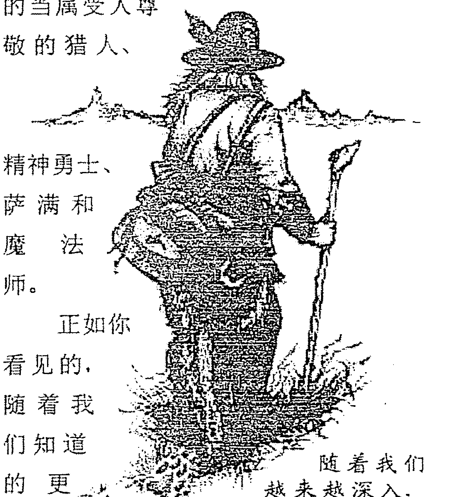

正如你看见的，随着我们知道的更多，责任也越大，但是同时奖赏也更多了。在踪迹中度过充满魔法的一天后，我们情不自禁欣赏耳朵中无数被甜蜜记录的音乐，通过大自然的歌声和寂静中所带来。眼睛学会去注意迹象中最细微的细节，更容易去发现一幅美丽绘画中的细节或一部好电影中的线索。被森林微妙气味搅拌过的鼻子，回来之后也在美味晚餐的香味中被唤醒！跟踪是一种魔法或巫术，带领我们深入仙境中，在这个过程里，也深入我们自身的魔力。当我们练习跟踪动物时，我们真正的最终收获是被唤醒的并增强力量的自身。

随着我们越来越深入，越来越聪明，所有的探险中最为狂野的足迹将是我们留下的 ——杰西·沃尔夫·哈丁作图

#### 北美常见哺乳动物足迹

| 动物 | 后足 | 前足 | 步行 | 跑步 |
| :--- | :--- | :--- | :--- | :--- |
| 狨猴 | [图] | [图] | [图] | [图] |
| 熊 | [图] | [图] | [图] | [图] |
| 海狸 | [图] | [图] | [图] | [图] |
| 北美大山猫 | [图] | [图] | [图] | [图] |
| 丛林狼 | [图] | [图] | [图] | [图] |
| 鹿 | [图] | [图] | [图] | [图] |
| 狗、狼 | [图] | [图] | [图] | [图] |
| 食鱼貂 | [图] | [图] | [图] | [图] |
| 狐狸 | [图] | [图] | [图] | [图] |
| 老鼠 | [图] | [图] | [图] | [图] |
| 麝鼠 | [图] | [图] | [图] | [图] |
| 水獭 | [图] | [图] | [图] | [图] |
| 猪 | [图] | [图] | [图] | [图] |
| 豪猪 | [图] | [图] | [图] | [图] |
| 负鼠 | [图] | [图] | [图] | [图] |
| 兔子 | [图] | [图] | [图] | [图] |
| 浣熊 | [图] | [图] | [图] | [图] |
| 臭鼬 | [图] | [图] | [图] | [图] |
| 松鼠 | [图] | [图] | [图] | [图] |
| 鼬鼠 | [图] | [图] | [图] | [图] |
| 土拨鼠 | [图] | [图] | [图] | [图] |

是它们的猎物，通过坚果壳和植物来分辨齿类动物和浣熊。

- 尝试去判断一只动物行走的方向，不仅依靠足迹的形状，还要分析足迹周围的泥土。多数动物在前进时会在后方掉下一些泥土。
- 看看你能不能分辨出动物经过此地多长时间了，根据足迹的不同点和陷入深度、被留下后上面有多少落叶来判断，也要看是否下过雨。
- 试着去浇铸并收集你已经熟悉的印记的石膏标本，直到你得到了所有或大部分的你周围物种的足迹。
- 利用你提高阅读踪迹的注意、观察、直觉，和推论技能，为了也能“阅读”在日常生活中周围的人和情况。不久你就会发现，只要扫视一眼某些人在哪里，预想他们要去哪里，然后决定你将会采取什么样聪明又富有魔法的行动。

##### 课后作业：

- 带上你的足迹定义指南到最近的野外，看看你能正确认出多少种不同的足迹。记住，足迹随着动物年龄增大，或因为下过雨，而会变大或变圆润，这有时会让足迹看起来并不像本身的样子。
- 如果你不能到达隐蔽的海滩，在公园里或树林里追踪，找到最近的没有铺砌的裸露土地，寻找喂食的鸟，疾跑的老鼠，当地的猫或狗的痕迹，这些总是会出现。你也并不一定要离开城市去寻找许多野生动物的痕迹，它们在野外安家。这包括蛇、松鼠、臭鼬、浣熊，有时甚至有小狼——虽然它们的足迹可能会很难与本地小狗的区分开来。
- 不只观察足迹，也要注意被扰乱的松针，在尖草丛或篱笆上的微小的皮毛刺。你能通过在粪便里发现的东西来分辨这是什么动物留下的，通过猎鹰排泄物中的毛发来分辨谁是它们的猎物，通过坚果壳和植物来分辨齿类动物和浣熊。

### 6. 照顾家畜

文 / 奥伯伦（灰色）

对于一个野兽大师，几乎没有什么经历比照顾失去父母或受伤的野生动物康复，直到它们能回归大自然更荣耀的经历了。世界上许多群体都有本地野生动物救助机构，我建议所有的棕色系魔法师都去寻找并加入它们，就像我做的一样。

一般来说，最常见的是国际野生动物康复委员会（IWRC）：加利福尼亚州 9515，圣何塞，8187 邮箱；电话（408）271-2685；网址 http://www.iwreonline.org/（我曾在 1987 年为它们设计了这个标志！）野兽控制其中一个重要的方面就是照顾被遗弃的小动物。你也许会在乡村小路沿线发现它们，也许是因为它们的母亲被汽车碾死，或是在森林火灾、洪水或飓风等自然灾害后与亲人失散。如果遇见这种情况，你应当照顾它们，等到它们足够大而能够被放生。这有一些北美和欧洲各种普遍的哺乳动物的基本信息，来源于加州核桃河野生动物救助的计划亚历山大林德赛博物馆。如果遇到源于其他国家的鸟类或动物，联系国际野生动物康复委员会。

对于以下所有动物，毫无疑问，你需要从兽医、宠物商店、农场饲料店那里去获取大小合适的瓶子和奶嘴。使用它们之前要消毒。你也会需要准备筑巢的盒子，还有毯子和电热板来让小宝宝保持温暖。

饲养野生动物要对你所做的每一件事都必须小心，也要向你本地的野生动物救助机构报告。你绝不能把一只非本地的动物放生到野外，这是不容商榷的。

#### 獾

**配方：** 罐装赐乐美（多数宠物店和兽医处都能买到的母狗奶）

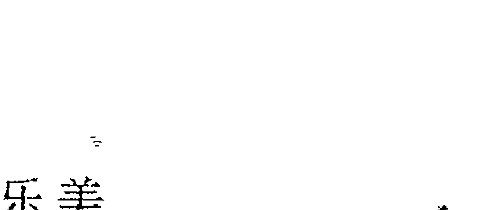

**饲养：** 每天喂 5-6 次赐乐美，直到它的眼睛睁开。一旦眼睛睁开，换成狗食，减少赐乐美。增加动物营养维他命或矿物质补充（听从医嘱和说明）。当下地时引进老鼠和小耗子，在 4-5 周大时让它们自己去杀死。让它们去掘地，因为它们是天生的挖掘家。

**放生：** 把它们放生到本地山脚下松鼠的领地上——远离农民和农场！

#### 山猫，猞猁

**配方：** 博尔东 KMR 罐装猫粮（多数宠物店和兽医处能买到）。不久后开始使用盖尔巴羊肉和牛肉，之后再用平常的罐装猫粮。如果你不能得到 KMR，使用赐乐美加入肉，因为猫需要额外的蛋白质。

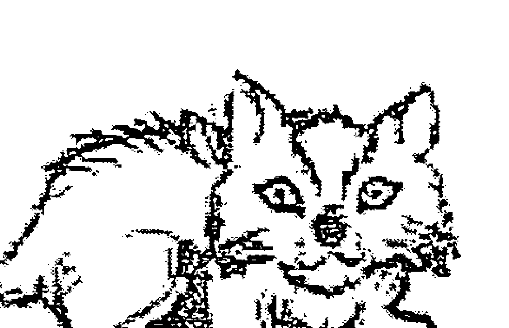

**饲养：** 眼睛睁开之前，在整点时每天喂 6 次赐乐美。量少好过量多，每次喂过之后都会使猫打嗝（这容易放出气体）。眼睛睁开之后，每天喂 5 次。当胃紧绷时停止喂食，粪便水分过多时便减量。清洗它们的屁股，小心“尿布疹”。

用加热板和毛毯窝让它们保持温暖，给予它们大量的母爱——关心、拥抱等。在暖房里洗澡并快速擦干。得到它们之后立即喷洒猫跳蚤粉，接种猫和狗的瘟热疫苗。三个月后接种狂犬病疫苗。

一旦眼睛睁开（三周大），在每餐开始喂混合了赐乐美的罐装猫食；开始喂四分之一茶匙。经过喂食，逐渐增加成一整份。

眼睛睁开一周后（四周大），把食物在小桶里磨成糊。慢慢喂食，注意排气和肠道炎。5-6 周大时，换成全肉餐，如老鼠、耗子、兔子等。

**放生：** 当它们能捕猎并杀死自己的猎物，在远离人的地方放生。

#### 翻尾兔，棉尾兔

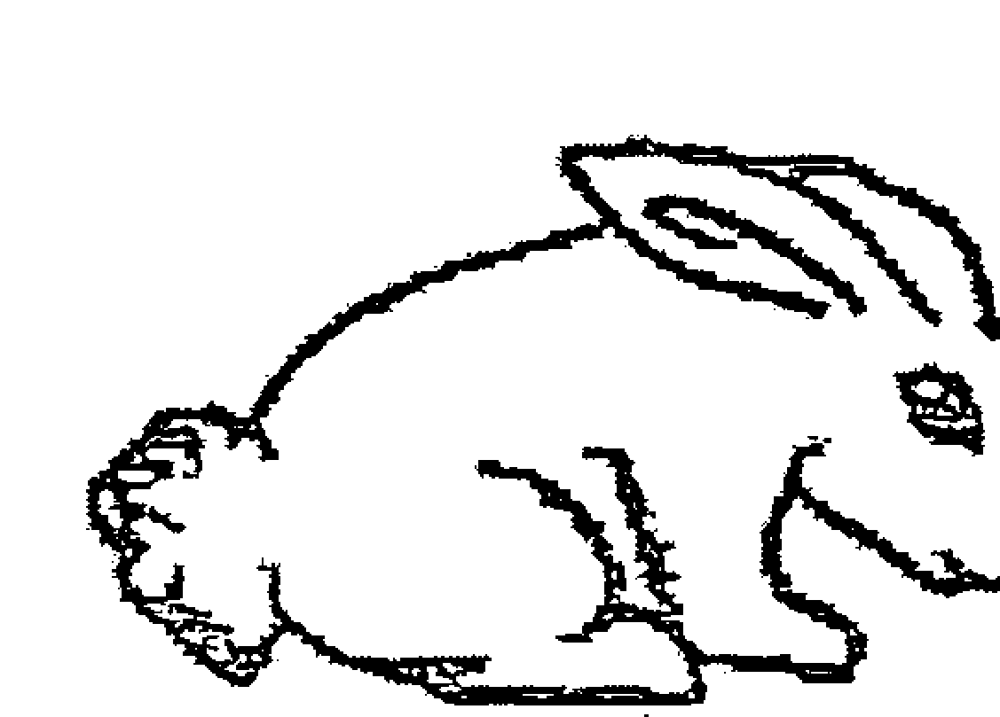

**配方：** 罐装赐乐美。

**饲养：** 如果眼睛还未睁开，使用1毫升的滴眼器或注射器喂食。每小时喂2-3次滴眼器的量，并检查腹部。如果在喂食的时候仍然很紧，延长喂食的间隔。用加热板和毛巾使小兔子体温维持在85华氏度左右。

当它的眼睛睁开时（8-12天大），用滴眼器或小的“宠物奶妈”瓶——3-4毫升，每天喂4-5次。在它的窝里面放一些生菜片、苹果、甜甜圈和小兔糖丸（从宠物店购买）。当小兔开始自己进食，渐渐减少配方。它再长大一些后，引进胡萝卜、苹果、玉米和苜蓿丸。

每次喂食后，用一根棉签在它的下部挠痒以促进消化，保持清洁避免“尿布疹”。如果皮疹发作，使用A&D药膏（从药房购买——按照说明使用）。小兔非常容易产生排气问题，所以不要过量喂食；最好少喂一些。如果胀了，温暖胃部，用手指轻轻按摩，跳过下一餐。如果排气问题仍继续，减少配方四分之一的量。

必须小心对待小兔宝宝——在床或其他柔软地方的上面——因为它们会从你手上跳出，从而在跌落时受伤。

**放生：** 当小兔完全靠自己进食，长到像小猫一样大，在远离人和狗的森林草地放生。

#### 鹿

**配方：** 新鲜的羊奶是最好的。你也可以按照以下方法调配“小鹿特别配方”：摇匀一夸脱的牛奶，加入一半奶油。再取出一夸脱混合物，加热至沸腾。加入1/2茶杯的“小牛力量”（从农场供应店购买），在混合器中混合4-5分钟。放到冰箱里保存3天；使用前再混合。

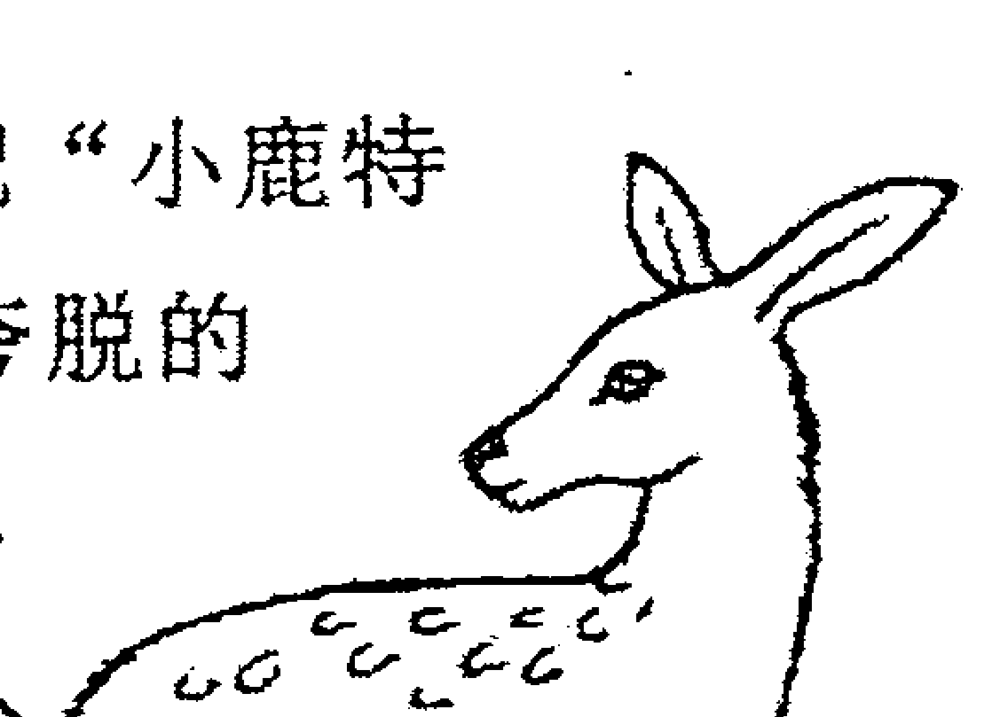

**饲养：** 如果你在路上发现一只可爱的小梅花鹿在高草中出现，别管它！它的妈妈会在附近吃草所以没有注意到她的孩子。这只小鹿非常安全——没有气味，完美伪装，猎食者发现不了它。只有当你发现一只小鹿在一只死去的母鹿旁边时（比如被汽车撞死），才应该救助它。

鹿非常容易受惊，首次被带回救助时应该把它放在温暖、黑暗，以及安静的地方。轻声与它们交谈，给它们许多充满爱意的拥抱、抚摸和依偎。它们通常更喜欢女性——但要让它们远离狗！

给它们喂食与体温温度相同的羊奶或配方（洒一点在手臂前端以测试温度），使用山羊奶嘴（从农场供应店购买）。为了鼓励它们进食，用手盖住它们的口鼻或眼睛。长大的小鹿是倔强的进食者，需要耐心与毅力。

当小鹿长到5磅重，每天喂食4盎司四次（例如早晨7点，中午，下午5点，晚上10点）。每次喂食后挠痒以促进消化；记住，过量喂食会导致腹泻！如果发生，每餐使用1茶匙止泻药。

长到10磅重时，每次喂食增加到5盎司（24小时内最多喂20盎司）。引进苜蓿、干树叶和全麦面包。如果让它们到室外，它们会学习自己吃草。在 3-4 周大时，开始减少配方并让它们自己更多吃草。2 个月大时，它们只需要上午和下午各一次的配方喂食。到 3 个月大时，它们应当完全脱离配方。

生下来就有毛皮，眼睛也是睁开的。在它们的窝里放许多毛巾，让它们挖掘。它们非常胆怯、紧张，会被突来的声音所惊吓。在受到惊吓时跳跃会让自己受伤。

**放生：** 鹿一旦完全靠自己进食就应当被放生——通常是 3-4 个月大时。在有大量野生鹿的区域放生，因为它们需要加入鹿群。然而，鹿会铭记人，如果一只鹿在你的喂养下习惯了一个名字，在它余生中一旦听到你的呼唤就会来到你的身边。

像对小兔那样给它们喂食（请看之前内容），使用滴眼器或宠物奶瓶。它们倾向于吮吸，所以不要喂食过量。一旦它们的肚子饱了，就停下。每餐后刺激它们的下腹，用温水清洗。

随时提供新鲜天然食物的补给：芥末绿，生菜，小兔糖丸，甜甜圈。它们也许不会吃太多，但每咬一点点都很重要。

#### 狐狸，丛林狼

**配方：** 罐装赐乐美。

**饲养：** 每天喂食 5-6 次赐乐美直到眼睛睁开（3-4 周大）。然后换成狗食餐，减少赐乐美。增加兽医营养维他命和矿物质补给（从兽医处购买；按照说明使用），因为小狼需要额外的钙质。当它们下地后，引进老鼠和小耗子，在 4-5 周大时让它们自己杀死。小狐狸也喜欢水果——试试不同的种类。

把它们放在安全的围栏中——远离它们会害怕的宠物狗。

**放生：** 撒上狗虱子粉，在 3-4 个月大时接种狗瘟热和狂犬病疫苗，然后放生——远离人和鸡。

**放生：** 当它们长到小猫大小并自己进食时，在有树的开阔地放生，远离人和狗。

#### 麝鼠，海狸

**配方：** 罐装赐乐美。

**饲养：** 请看下面关于松鼠的内容，用相同的方法饲养。当眼睛睁开，给它们提供芹菜，果树枝叶，小兔糖丸和拉布拉多狗食（从食品商店购买）。当幼崽长大一些，让它们每天在浴缸里游泳，否则它们的皮毛会失去对水的适应性。

**放生：** 当它们完全靠自己进食，在全年有水的小河或池塘边放生。

#### 长耳野兔

**配方：** 羊奶或“小鹿特别配方”（查阅鹿）

**饲养：** 长耳野兔是野兔，不是家兔，

#### 负鼠

**配方：** 罐装赐乐美。

**饲养：** 你一般都在一只孤儿负鼠刚离开妈妈时发现它——身体大约 4-6 寸长（包括尾巴），全身都长了皮毛，有一双珠子般的眼睛。它不需要瓶子。把狗食、斩碎的蛋与赐乐美混合在一起喂食。负鼠很早就靠自己进食，很快就会吃几乎任何东西；给它们提供不同的食物很有趣——比如炸薯条，爆米花。

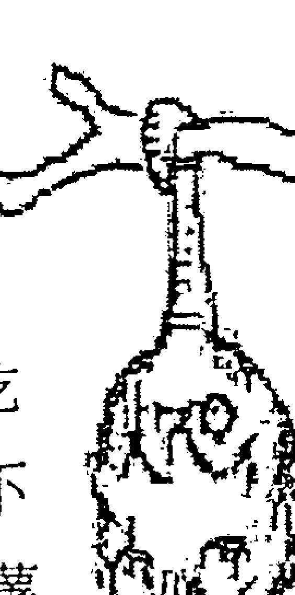

**放生：** 当负鼠长到一英尺长，你就应该把它在当地公园的流动小河旁把它放生。北美负鼠只在野外生活一年左右，就被当做迷人又可爱的宠物，你也许很乐于考虑如此……

它们能爬上任何东西，所以要把它们关在一个上锁的笼子里。里面放上羊毛袜子充当一个“睡袋”，用一条毛巾覆盖笼子来保持里面的昏暗。尽可能多地把它们带在身上到处走走，装在一个编织小袋子里，挂在你的脖子上并藏在衣服里。

#### 浣熊

**配方：** 罐装赐乐美。

**饲养：** 饲养浣熊就像喂养人类宝宝一样。少喂一点比多喂好，每餐后会打嗝（它们倾向排出气体）。

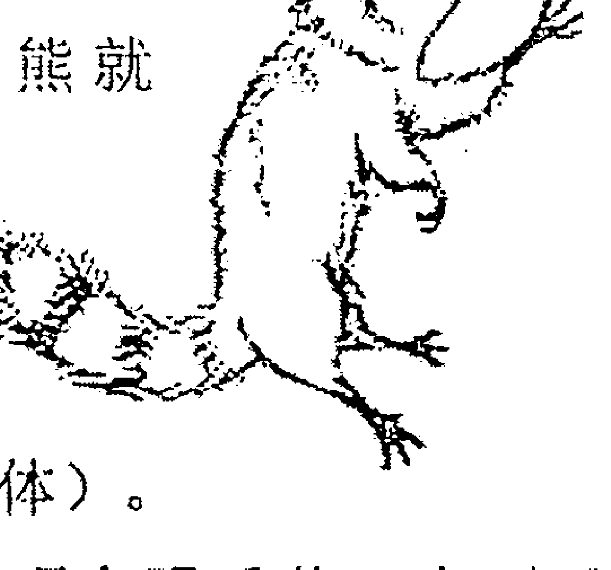

每天六次，在整点时喂食赐乐美，直到眼睛睁开。睁开之后，就每天喂食五次。当胃部收紧后停止喂食，粪便水分过多时减量。清洗它们的屁股，小心“尿布疹”。

用加热板和毛毯窝让它们保持温暖，给予它们大量的母性——关心、拥抱等。在暖房里洗澡并快速擦干。得到它们之后立即喷洒猫跳蚤粉，接种猫和狗的瘟热疫苗。三个月后接种狂犬病疫苗。

一旦眼睛睁开（三周大），每餐开始用肉和菜混合赐乐美喂食（但要避免牛肉和青豆）；由1/4茶匙的量开始。每次喂食逐渐增加到一整份。

它们能爬上任何东西，所以要把它们关在一个上锁的笼子里。里面放上羊毛袜子充当一个“睡袋”，用一条毛巾覆盖笼子来保持里面的昏暗。尽可能多地把它们带在身上到处走走，装在一个编织小袋子里，挂在你的脖子上并藏在衣服里。

眼睛睁开后一周（4周大），把食物在小桶里磨成糊。慢慢喂食，注意排气和肿胀。5-6周大时，换成狗食和水果餐，减少赐乐美。时不时地包含一些去了皮的老鼠或鱼。

**放生：** 当小浣熊能够四处走动，把它带上沿着河散步，允许它去探寻并找吃的。在路边放置一些生鱼。在大约四个月大时，当它学会自己猎食，就可以在流水附近放生。但是要注意浣熊铭记人，也许它不想自己一个人走！

每次喂食 1/4 盎司。在白天每 2-3 小时喂一次。一旦它们眼睛睁开，每次它们能吃 1/2-3/4 盎司。如果它们粪便水分过多，减少食物的量。引进麦片粥混合赐乐美开始让它们下地，在窝里留一些苹果片、甜甜圈和生菜让它们咬（不要橙子！）。喂食后继续刺激它们的下腹，用温水冲洗。它们现在能适应低一些的温度了（75-85 华氏度），应该被移到一个更大的笼子里。留下许多毛巾，但拿走加热板。

#### 臭鼬

> 注意：不要尝试照料或喂养野生孤儿臭鼬！它们是主要的狂犬病毒携带者，而它们成为孤儿最通常的原因就是它们的母亲因这个病毒而丧命！联系当地的健康部门，他们会检查狂犬病，不要被它们抓到或咬到！狂犬病是致命的！

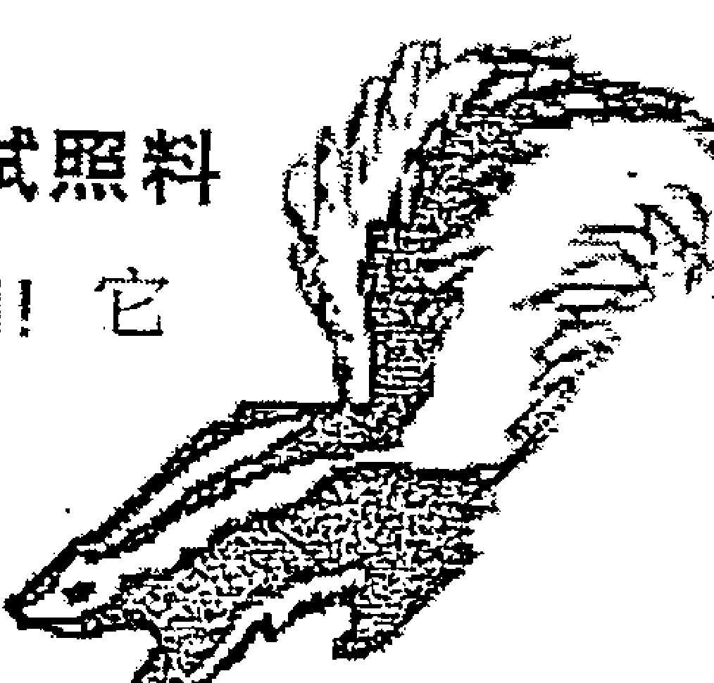

随着它们长大，为它们引进水果、胡萝卜、种子，和各种坚果——由最容易剥开的向日葵种子和花生开始。同样也提供果树枝叶（它们喜爱树皮）。

**放生：** 当它们接近成年体型，并能轻松嚼开核桃时，在林地区域，或在你发现它们的地方将它们放生。

#### 松鼠，地松鼠，花鼠，土拨鼠

**配方：** 罐装赐乐美。
**饲养：** 像兔子一样，这些啮齿动物一出生都是没有毛发，闭着眼睛的。它们的眼睛会在 14-18 天大时睁开。应该把它们放在 85 华氏度且有些湿度的地方。窝里有毛巾包围的加热板会很好。如果可能的话，最好能一起饲养几只小松鼠，让它们相互取暖、玩耍等。

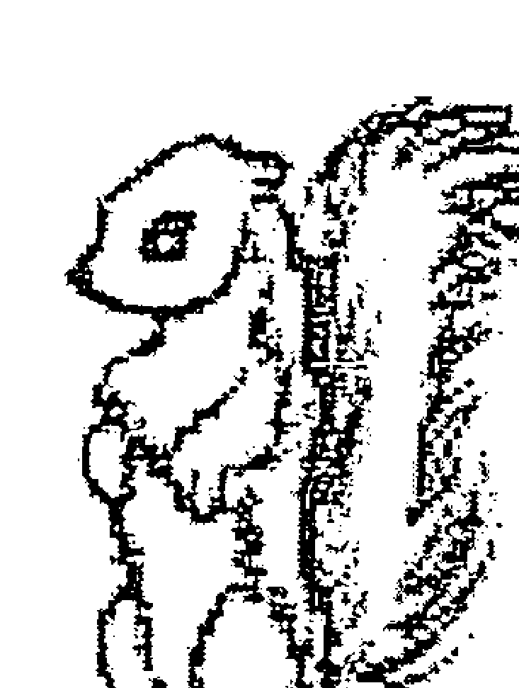

#### 鼬鼠（包括白鼬，雪貂，貂，食鱼貂）

**配方：** 罐装赐乐美。
**饲养：** 鼬鼠宝宝在 25-30 天大之前都不会睁开眼睛，这时每天喂食 5-6 次，在整点时喂，并挠它们的下部以促进消化。胃部收紧时停止喂食，粪便水分过多时减量。

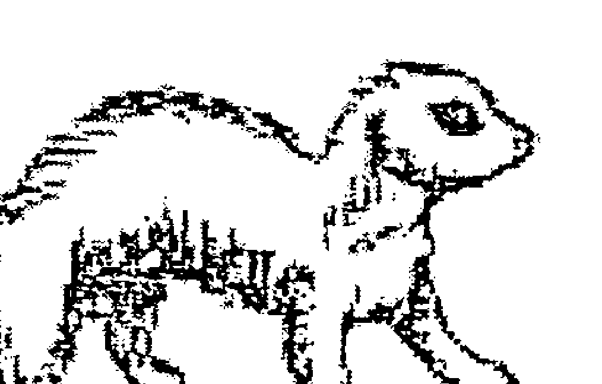

“小东西”应该被小心地喂食，直到胃部刚开始突出并收紧：喂食过量会导致腹泻。每 24 小时喂食 1/2-3/4 盎司的配方，大约每隔 90 分钟一次，在半夜也要喂一次。每次喂食之后，让它们轻轻打嗝并在下腹挠痒以促进消化。如果它们腹泻，一天给它们吃四次止泻药，一次需要一个满滴眼器的量，直到它们恢复。

它们在眼睛睁开之后就开始吃生肉。把新鲜杀死的小老鼠和耗子与小鼬鼠放在一起，当它们能自主进食后，快速减少配方。很快，给它们活的老鼠和鸡，让鼬鼠杀死它们。

当它们长满皮毛，但眼睛还没睁开时，

**放生：** 在小鼬鼠能自己杀死猎物并进食之后，把它们放生到有大量啮齿动物的

## 第十一章：野兽支配（颜色）

地方。把它们带出放生的时候要小心，因为野生的鼬鼠会狠狠咬你一口！

成灰烬然后重生。因为巨大的体型，它竟然被认为与大鹏鸟有关。

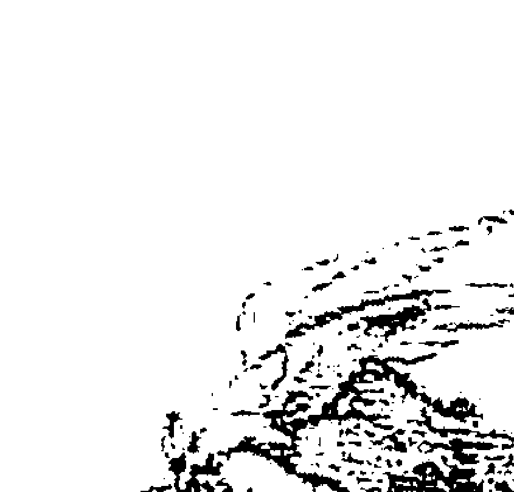

### 7. 更多传说中的野兽

文 / 奥伯伦 （灰色）

在《魔法师学徒的魔法书》中，我展示了一些最为大家熟知的传说中的野兽。现在，这里有一些更多神话中难解的生物。

阿穆特——埃及地下世界中的恐怖怪兽，她有鳄鱼的头，狮子的鬃毛，猎豹的斑点，身体后端是一只河马。埃及人把它称作“死人食客”。在奥西里斯的正义之殿，死人的心脏被用真相羽毛来称重，没有通过测试的就会被喂给阿穆特。

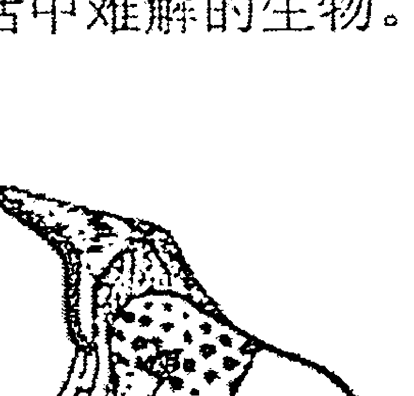

巴里亚特——一种被认为是藤壶出身，由树木或漂木上的附着物生长而来的鹅。根据实际中的“鹅颈”藤壶而来。也被叫做贝纳卡，贝妮科，贝纳卡鹅和树鹅。

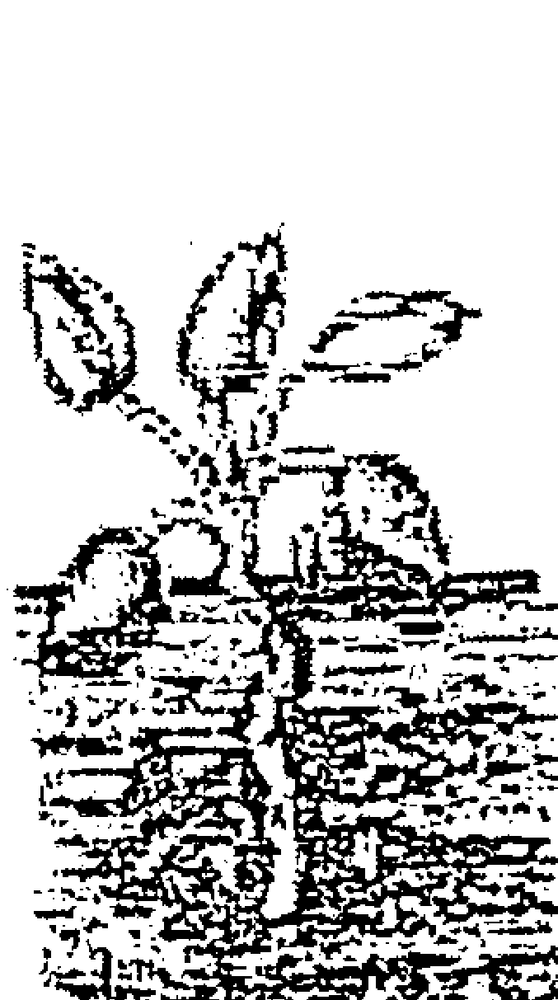

双头蛇——一种像蛇的爬行动物，在身体的两端都有明亮的眼睛和头。它的名字在希腊语中意思是“向两个方向走”。它走动时，无论向任意方向，都把一个头放进另一个的嘴巴里，像轮子一样滚动。据说穿戴上一只活着的双头蛇会保护孕妇，而穿戴上一只死的可以治疗风湿。这是一种真实的动物，一种没有腿的掘地“蠕虫蜥蜴”（双头蛇），它的尾巴长得和没有视觉和耳朵的头一模一样。它们可以长到20英寸长，可以向前或向后爬行（但它们不会像铁环一样滚！）。

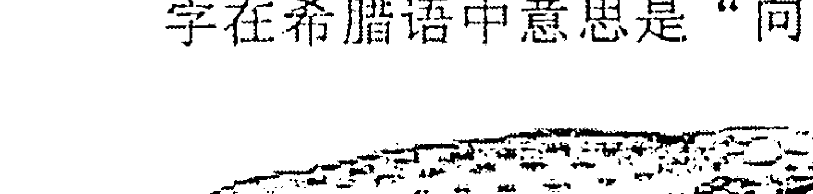

金毛狗脊——也被叫做鞑靼，巴布拉羊，或植物羊。在希伯来传说中，巴布拉羊是一种身披羊毛，长得像羊一样，一半是植物的生物。它们生于小葫芦中，通过短茎附着在灌木上。一旦吃完身边的草，它们就因饥饿而死。金毛狗脊被认为是一道佳肴，因为它的肉的味道像鱼，血的味道像蜂蜜。它的骨头在仪式上被用来赐予预言的力量。这实际上是棉花矮树。

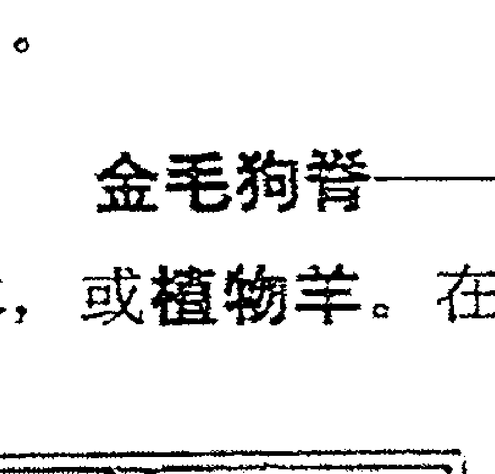

恩卡——一种巨大的阿拉伯鸟类，大到足够抓起一头大象。与凤凰类似，它能活1700年，在生命结束时把自己燃烧成灰烬然后重生。因为巨大的体型，它竟然被认为与大鹏鸟有关。

巨兽——圣经中一种极度夸张的河马。这个词来源于希伯来语种b' hemah的复数形式，意思是“怪兽”。任何巨大、沉重和未知的动物都可以被叫做“巨兽”。在不足凭信的文学和犹太传说中，巨兽都是令人畏惧的强大怪兽。通常它

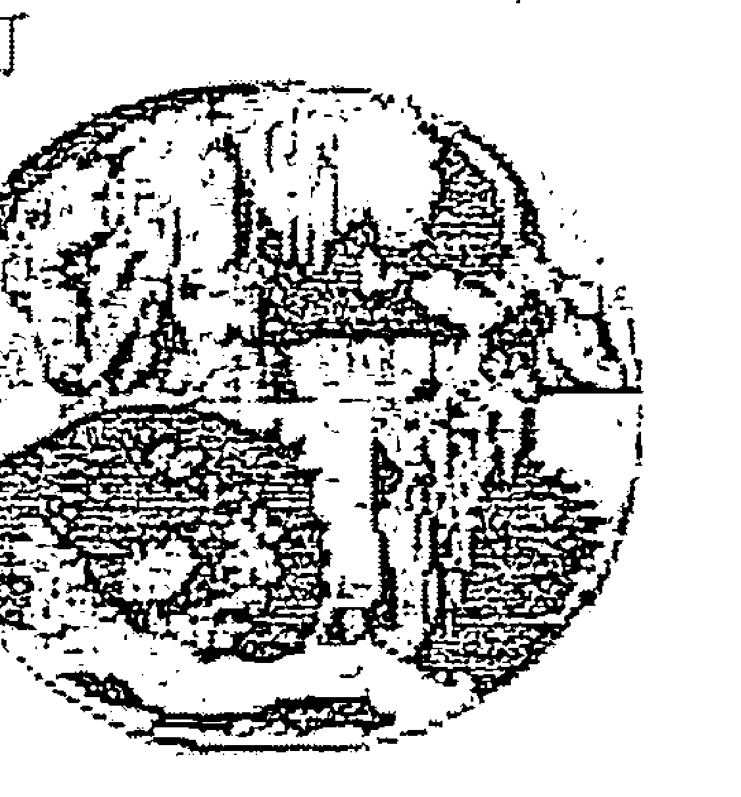

## 魔法师学徒的伴侣书 | 下卷

被描述曾与大海兽搏斗，这是一种凶猛的尼罗鳄，也被类似地极度夸张。

**贝努——埃及的凤凰**，这是一种被定义为与太阳神在一起的像苍鹭的鸟类。埃及语中贝努同时有紫色的苍鹭和棕榈树的意思。许多凤凰的神话都是根据埃及神话中的贝努而来。这种鸟也是奥西里斯的象征，从死亡中重生。

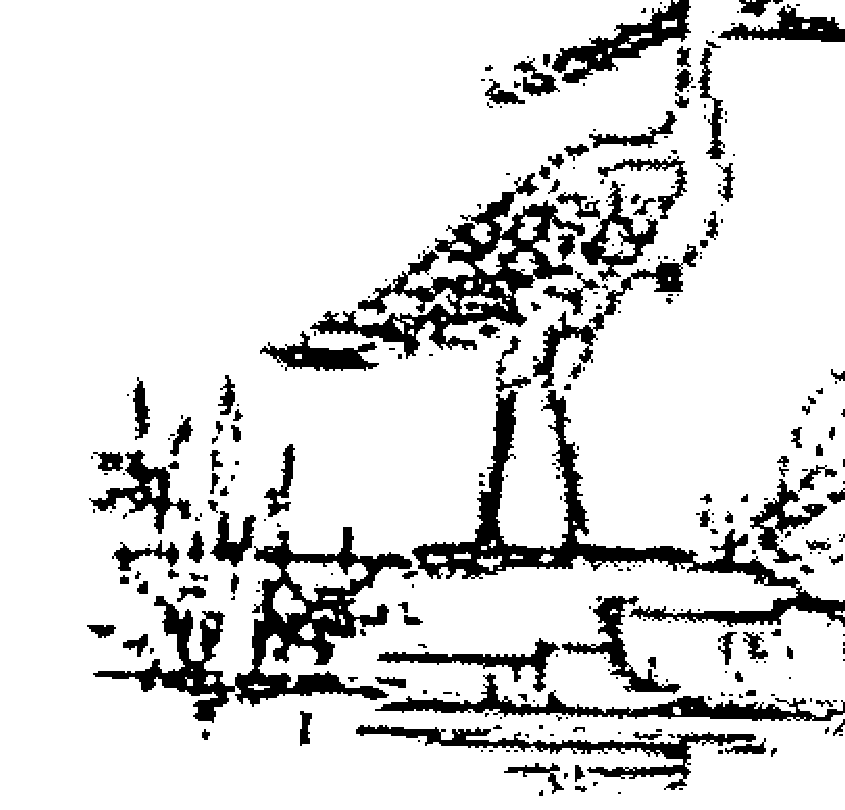

**主教鱼——在16世纪动物寓言中描述的一种海洋生物**，长得有点像天主教堂中的主教。它们被描述为长有戴着礼冠的头，有鳞的身体上长有两只像爪子一样的鱼鳍来代替手臂，还有像鱼鳍一样的斗篷。显而易见这是一种雄性的鳐鱼，被处理为一种艺术形式，后来被称作“外星生物”。

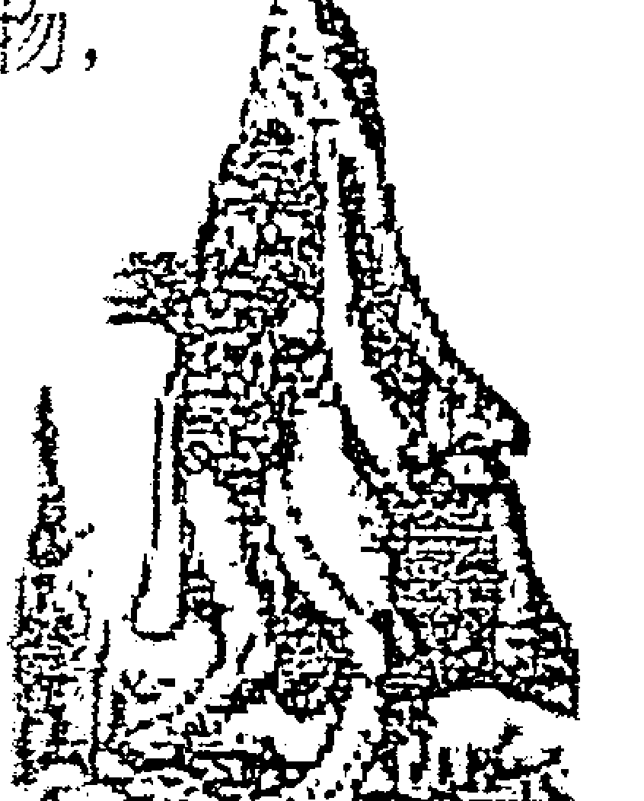

**奇异兽——土著传说中一种凶猛的澳大利亚水生怪兽**，据说居住于死水潭（水洞）中。被描述为长得像大海豹、河马或龙，因为要吃人而令人们深深恐惧。

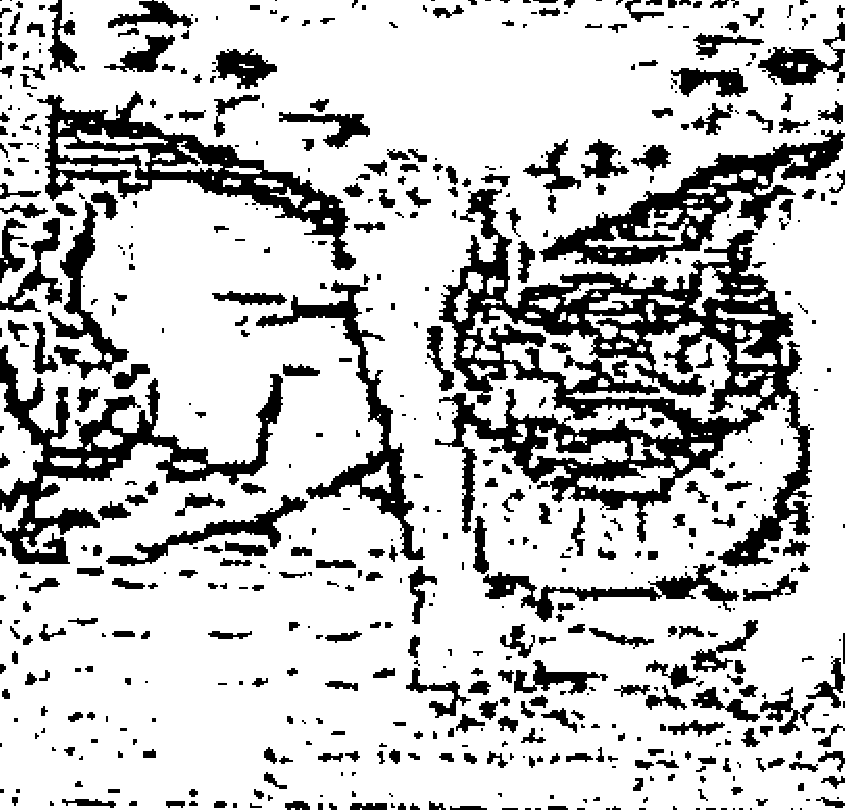

**驼豹——推测是骆驼和猎豹的后代**，它的体型和骆驼一样，但有猎豹一样的斑点皮肤和两只巨大的弯曲的角。很明显，它就是长颈鹿。

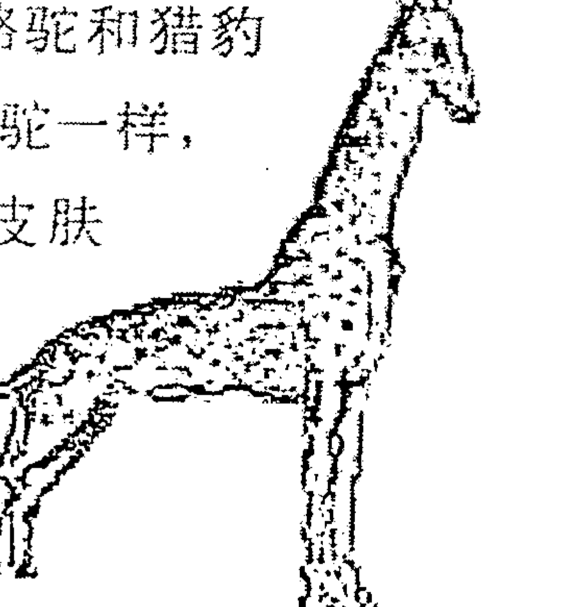

**鮣——一种小鱼**，把身体附着在船体上就能让一艘全速航行的船停下来。鮣在希腊语中的意思是“扣留船只”。它被认为是附着在大鲨鱼身上的印鱼或吸盘鱼。

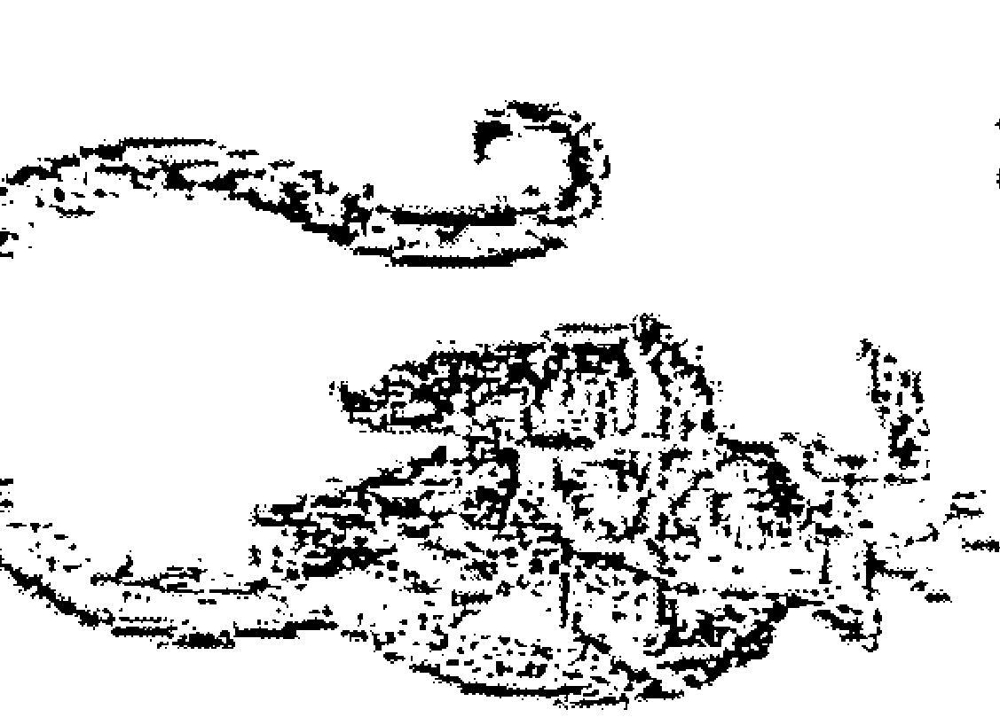

**加姆——斯堪的纳维亚传说中守护冥府大门的狗**，长有溅血的四只眼睛。非常凶猛和危险，与刻耳柏洛斯一样，加姆和它都是相应神话中地下领域的守护狗。

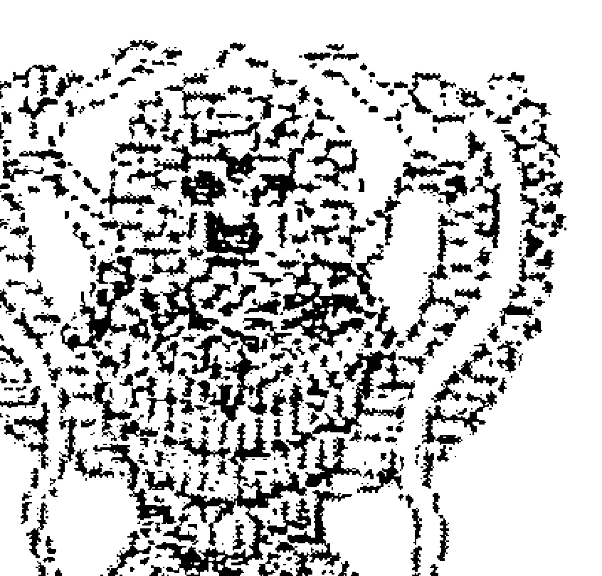

**揭路荼——印度一种巨大的人形鸟**，是毗瑟挐主教的坐骑。

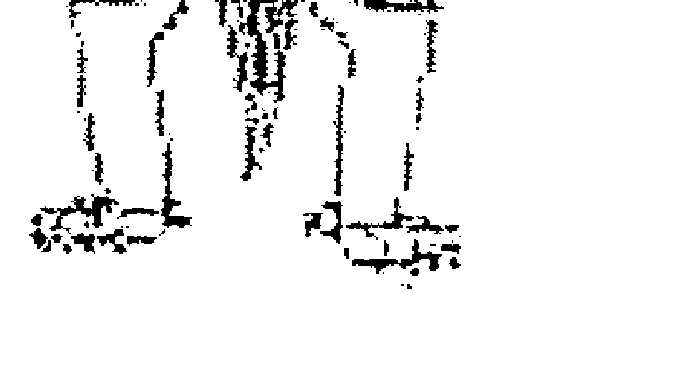

**大蚂蚁——被描述为“比狐狸大，比狗小”**，生活在印度荒漠中，在那里采掘人类想要偷取的黄金。它们被认为是土拨鼠——像草原狗的大型山区啮齿动物，生活在殖民地洞穴中。

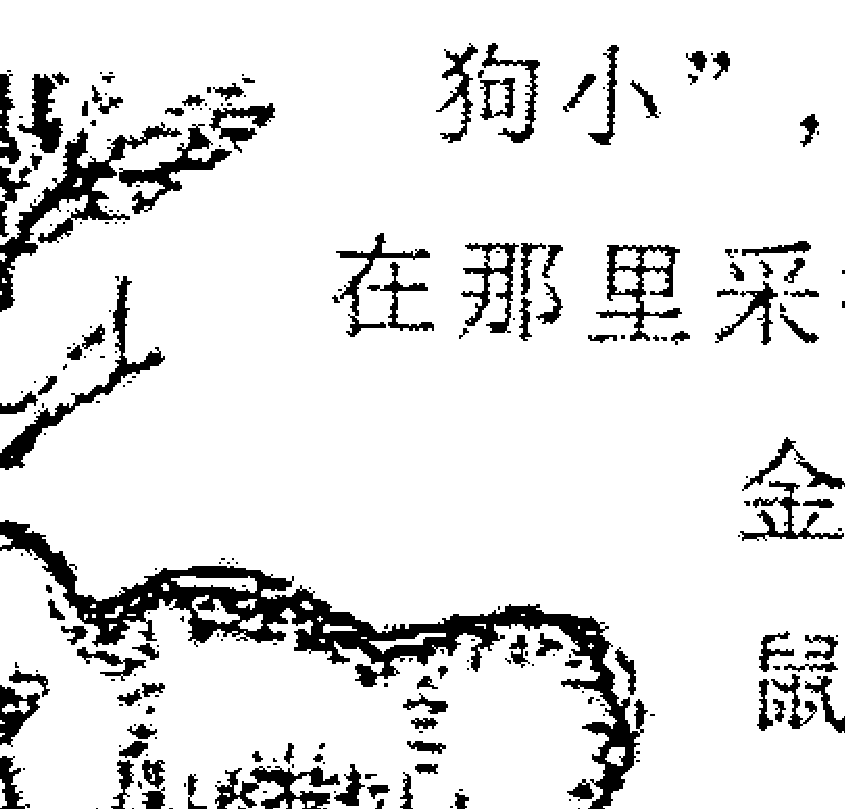

**不死鸟Ho-oo——这是日本的凤凰**，它名字中Ho代表男性，Oo代表女性。它来到地球为人们做好事，它的出现预示着新纪元的黎明已经到来。然后这只鸟便返回天堂等待下一个轮回。与中国的凤凰非常相似，不死鸟被视为皇族的象征，特别是皇后。它被认为是太阳、正义、忠诚和服从的代表。

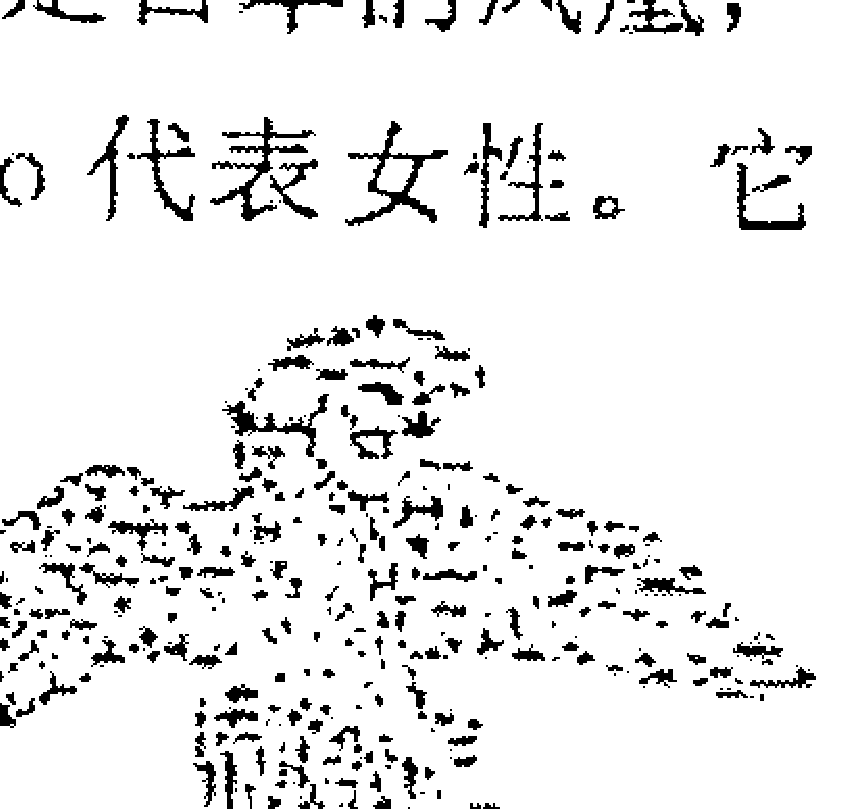

## 第十一章：野兽支配（棕色）

飞猴 (Hisgo) —— 这种中国飞猴非常像《绿野仙踪》里的飞猴。我想它们可能来源于印度、印度尼西、澳大利亚的果蝠或“飞狐”的形象。这些猴子大小的蝙蝠与其它的食虫蝙蝠没有关系，它们在基因上更接近于灵长类。

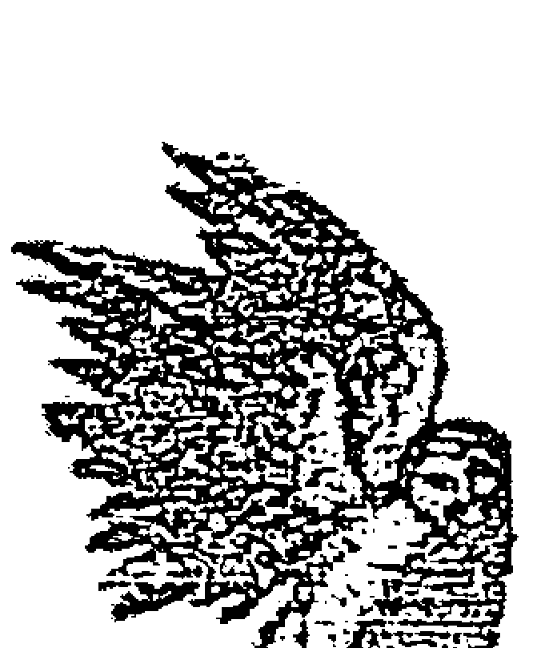

它，它就会疾奔到水里，将骑马的人淹到水里，随后便会被溺死。

麒麟——一种中国的独角兽，有长着一只角的龙头，狮子的鬃毛、雄鹿的身躯，公牛的尾巴。麒是公兽，而麟是母兽。它是智慧、公平和正义的象征，只在贤君统治期间，或在圣人出生与死亡时现身。在日本也有相同的叫做麒麟的生物。日本还有具有狮子特征的辛酉。

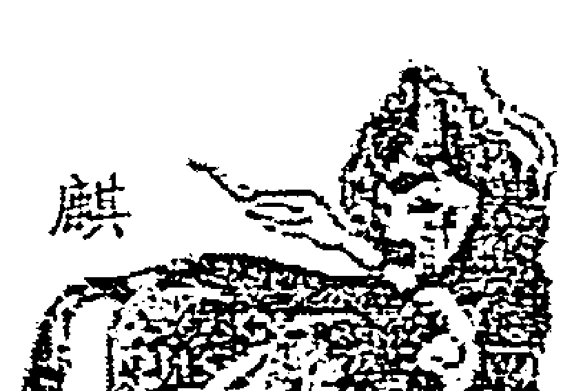

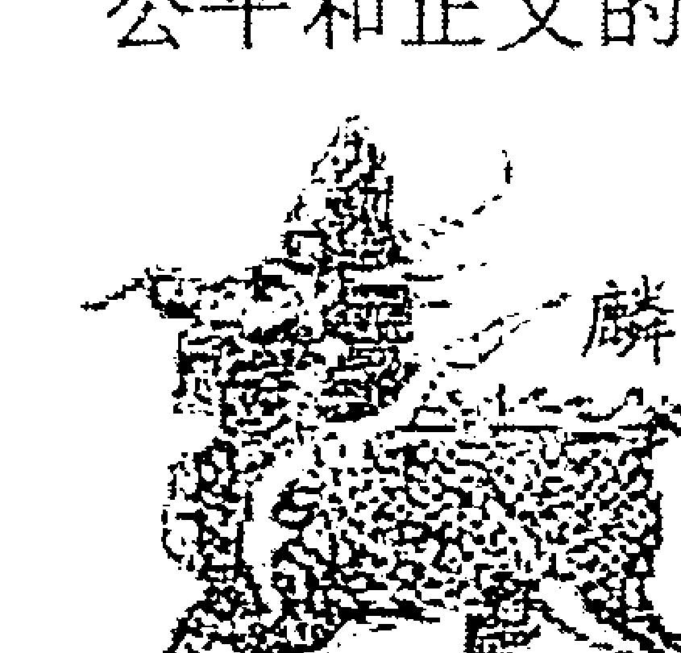

约尔曼冈德——在北欧神话中也被称为尘世巨蟒，它嘴含着尾巴，环绕着人类的中土世界（尘世）。约尔曼冈德是北欧洛基与女巨人安格博达所生三个孩子中的次子。其中长子是芬里厄狼，三女儿是地下世界的女王赫尔。

拉马苏——长着人头的带翅膀的狮子，守卫亚述庙宇和神殿的大门。参阅与之成对的西都。

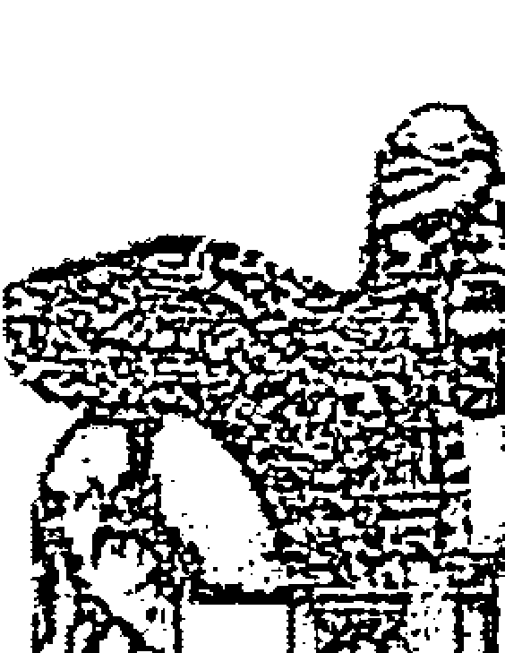

河童——这是一种日本的水生生物，长着乌龟的身体和猴子的头。如果被友善对待，它会很友好。然而，如果被虐待，它会吃掉让其痛苦的人。

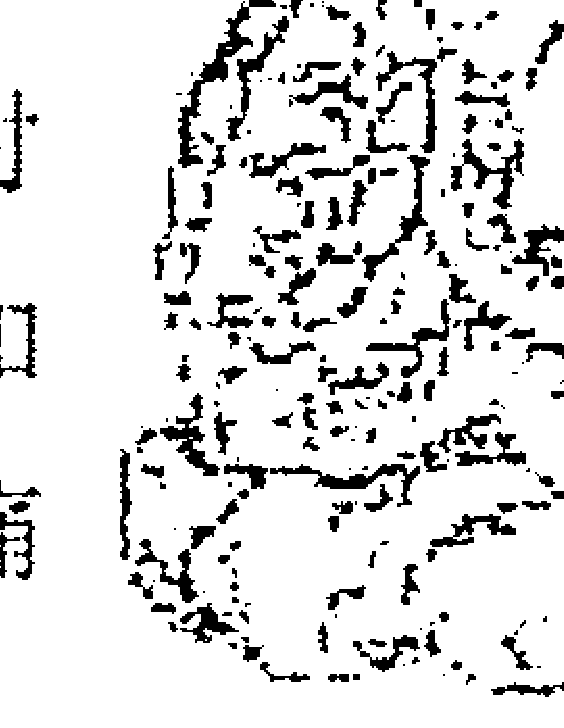

林德武穆——德国传说中长着翅膀的蟒蛇。它的身体有金绿色的鳞，没有腿，守卫着宝藏。它代表战争与瘟疫，吃家畜和人。

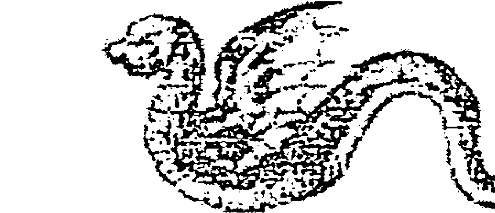

卡尔卡丹——在埃塞俄比亚和印度所谓的“独角兽”。也被叫做莫诺塞尔罗斯（“一只角”），它被描述为长着雄鹿的头，马的身体，大象的脚和野猪的尾巴。很明显这是以犀牛为原型的。

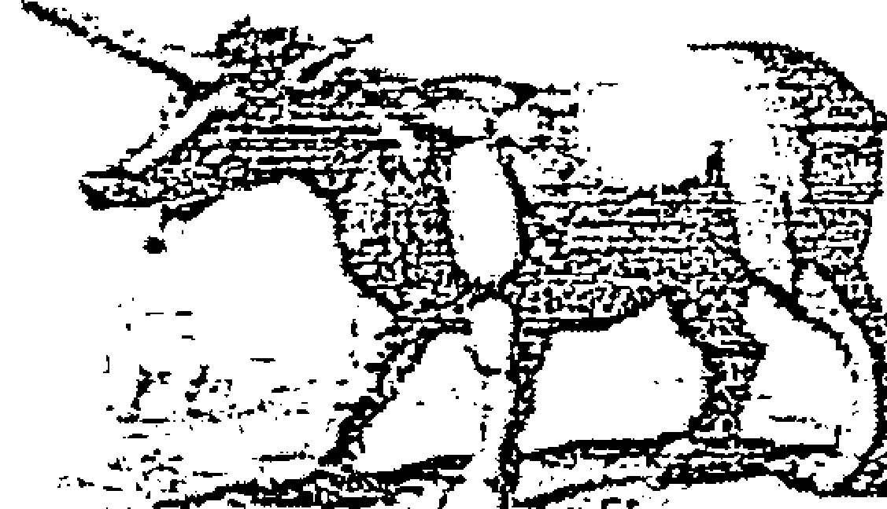

林帕格——源于中世纪家徽的人形狮或人形虎。

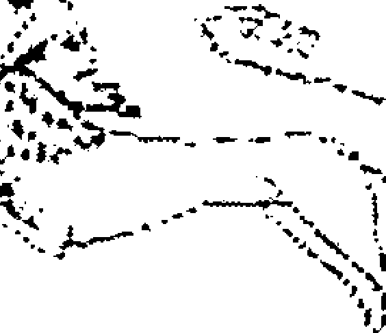

马形水鬼——苏格兰传说中的生物。一般都认为它是一种丑陋的黑色野兽，半马半牛，长着两只锋利的角。但它能变身成一匹美丽的白马。如果有人骑上

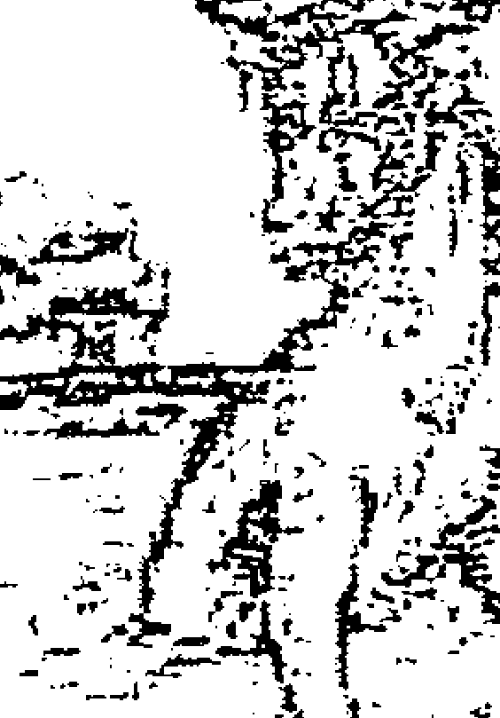

摩尔米克狮——“蚂蚁狮”。一个由翻译者的错误而产生的生物。一个词义本是“蚂蚁中的狮子”的词被误解为一种狮子和蚂蚁同体的凶猛生物。这个名字现在是指以蚂蚁为食的动物，它们挖掘沙坑，呆在里面，在地下等待蚂蚁进入。星球大

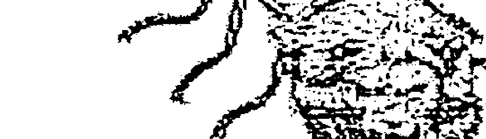

## 魔法师学徒的伴侣书 | 下卷

战之武士归来中的矿井怪兽就是以此为原型。

鹿角、有翅膀的龙。它有长着爪子的脚，蝙蝠一样的翅膀，长长的尾巴末端还有鱼的尾鳍。

**僧鱼**——一种被描绘为长得像戴着头巾、穿着长袍的海洋生物，手臂和腿上有触角。从图片上看，就像被艺术美化过的大鱿鱼一般，形如“外星生物”（参阅主教鱼）。

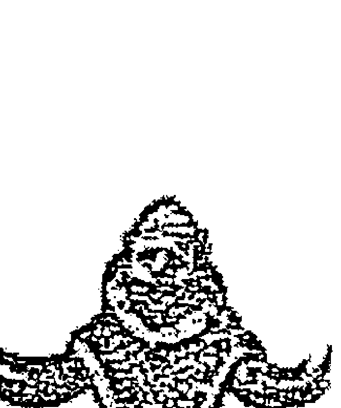

**斯可洛彭得拉**——一种被描述为像一头喷水的鲸的海洋怪兽，身体下面悬挂着许多附属器官。看起来很有可能是大型鲨鱼，比如大白鲨、鲸鲨、姥鲨，身上还吸附着许多印鱼。


**牛卡拉维**——爱尔兰对人马兽的拙劣模仿作，它有难闻的臭味，据说呼吸会带来瘟疫。它是一种丑陋的两栖怪物，长着大而丑的头，青蛙一样有蹼的脚，而不是蹄子。它没有毛的皮肤很薄，潮湿又透明，外表看起来像被剥了皮一样。这些恶毒的生物掠夺周围的东西，并以杀死它们为乐。


**骏鹰**——波斯神话中的生物，具有猛犸象、鱼和鸟的特征。据说它是大地、海洋和天空的结合体。


**马鲛**——一种大型的飞鱼，有翅膀一般的巨大鱼鳍。古时的权威把它定义为锯鲛，但它看起来更像是飞鱼和蝠鲼的结合体，都能猛烈地跃水而出。


**珀加索斯**——长着马耳朵的埃塞俄比亚鸟。根据普林尼记载，珀加索斯是长着马头的大鸟。它可能是鲸头鹳。


**西都**——和与其配对的拉马苏相似，这种亚述 - 巴比伦神话中有翅膀的巨兽长着人的头和牛的身体。它守卫庙宇和宫殿。


**凤**——日本传说中的鸟，非常巨大，使太阳都黯然失色，能带走并吃掉骆驼。与阿拉伯神话中的洛克非常相似。


**西莫夫**——阿拉伯传说中令人惊叹的鸟类国王。与洛克和凤凰相似，这种鸟可以活 1700 年到 2000 年。一些描述中声称它是不死的，在知识之树上筑巢。它非常巨大，能够带走一只大象或骆驼。


**皮阿萨**——一种北美水生的食人怪兽，据推测是由印第安人画在伊利诺伊州奥尔顿附近的密西西比河边岩壁上的。它看起来像长着人脸和


**斯勒尼尔**——北欧神话中奥丁神的马，有八条腿。它跑得比风还快，可以在

## 第十一章：野兽支配（棕色）

空气中，在大地上，甚至在女神赫尔统治的地下世界里穿行。


的“人猿”。

**约维**——澳大利亚的“人猿”，居住在雪中，与耶蒂和萨克齐相似。


**斯兹**——一种马来西亚的独角兽，看起来像一只独角的水牛。

**兹兹**——诗歌集中提到过，兹兹是一种体型巨大的鸟，非常像洛克。它能以它的翅膀和无与伦比的力量阻挡太阳。据说它被创造来保护所有小鸟，如果没有它的保护，这些鸟很早已经就死去了。

也被叫做剑牛。

**塔拉斯克**——法国南部隆河山谷中凶猛的水生怪兽。比水牛大，有六条腿，长着狮子的头，熊的爪子，身上有鳞，还有一条弯曲的长尾巴，末端有锋利的倒钩。背上坚韧的壳上覆盖着长钉。圣玛莎控制着它，把她的腰带系在它的脖子上，带它回到内尔鲁村。在那里，村民们用石头和长矛杀死了它。之后，村子的名字被改为塔拉斯克，人们一年一度排队纪念这次事件。在描述中，塔拉斯克非常像安克罗索尔或者格里托多。


### 8. 制作四种漂亮的模型龙

文 / 奥伯伦（灰色）

在这本书的后面，我用了几页纸来画出一只典型飞龙的模型。根据史实中第一批到达马达加斯加的欧洲水手所带回来的保存完好的样本，他们把这种小型的肋部长翅膀的滑翔蜥蜴叫做德拉科沃伦斯（“飞龙”）。有人提出这是真实的龙的幼崽，而艺术家的想象力根据所有长着四条腿和翅膀的飞龙的概念，把它们的骨骼构造成巨大的“成年龙”——不同于长得像鸟、蝙蝠和翼龙一样，翅膀上包括退化的前肢的双足飞龙。


**藤谷**——日本神话中带翅膀的生物，部分是人部分是鸟，长着鹰钩一般的大鼻子。

**亚拉**——一种黑色的牛，体型像马，有大象的尾巴和野猪的面颊。“它带着古怪的长角，角随意活动”，一只角指向前方，另一只向后。肯尼亚的纳迪部落以这样的方式来对他们的牛的角进行训练，这些就是“卡马里牛”。

为了组装你所有的模型，首先撕掉画着龙的书页，在离你最近的冲印店里把它们印到彩色卡片纸上。当你冲印的时候，把它们放大到 121%。用彩色铅笔和你的想象力给她们润色。然后把卡片纸放到一个坚硬而光滑的表面上，用美工刀的较钝的背面沿着点来画线，跟随标记处的弧线。之后裁下纸片，沿着痕迹折上，再准备组装到一起。会有 10 个部分：两只翅膀，


**雪人**——西藏喜马拉雅山居住在雪中的“人猿”。

## 魔法师学徒的伴侣书 | 下卷

两个尾巴的部分，两个身体的部分，两个颈部的部分和两个头的部分。


之后沿着狭槽在每个翅膀的下方涂上胶水。

至于工具，你需要剪刀、美工刀、弹簧衣夹、削好的铅笔，还有一小瓶乳白胶（爱玛牌很好）。

**身体：** 当翅膀上的胶水干了之后，把身体的两半粘到一起，从里边连结大翅膀上的纸片，从而固定它们。（图 3）之后每次处理一部分，从颈部一直到尾巴，把每部分的顶部粘到一起，用衣夹夹住直到胶水完全干。

**颈部和尾巴：** 根据数字来按顺序把各部分粘到一起。对于尾巴和颈部，首先同时把顶部粘到一起，从大的一端开始。用衣夹把每部分紧紧固定，在进行下一步前把它们晾干。一个腾出晾干的时间的好方法是，同时进行多个部分，轮流粘贴。


上面顶部的每个部分都粘好之后，就应该开始进行喉咙和尾巴下面的部分。这些必须以前后重叠的形式来粘——仔细按照数字进行。（图 1）在你粘贴每个部分的时候，用铅笔的尖端从后面贴上去，以此来制造一个可以按压的表面，制作出弯曲的部分。

**尾巴到身体：** 把尾巴前端的纸片粘进背部的后面。然后折起尾巴上剩余的纸片，然后沿着大腿的背面，按照数字把它们粘好。

制作尾巴末端的鳍时，只把顶端的部分粘在一起。底端的部分不粘，把它伸展开来，做出一个三角形的三尾鳍。

**颈部到身体：** 把颈部根基处的纸片粘进身体前面和肩膀处，与你处理尾巴的方式完全相同。

**头：** 把头的部分粘在一起，按照位置把脸颊粘到颈部前面相应的标签上。然后粘好下巴的底面，把耳朵向外弯曲成弧形。

**腿：** 确保连接身体和腿的折痕——由手臂上方至大腿前方——越明显越好。把每条腿的部分处处都包裹好，按照指示把最后一张纸片粘好。把手肘与膝盖部分粘好，便完成了。

**翅膀：** 首先，轻轻地把大翅膀表面弯曲成弧形。然后把每个翅膀插入到相应一边身体的狭槽里，把每个翅膀上的小标签粘进狭槽上方的背部中。


**腹部：** 就像你制作颈部和尾巴一样，把腹部的部分重叠粘在一起。用铅笔的尖端压在内部，保证连接良好。（图 4）


**脚：** 把脚向前折叠，使手指和脚趾成为弧形的爪子。把脚跟下的纸片粘好，调整所有脚趾以站立。（图 5）

68

## 第十一章：野兽支配（棕色）

你的龙现在完成了！
我也提供了另外一套蝙蝠型的翅膀，
同样还有东方龙的头和其他部分，所以你
能制作出许多有翅膀或没有翅膀的、不同
颜色的龙。做出一个活生生的龙！


## 第十二章
宇宙学与形而上学（紫色）


## 流浪者的舞蹈

太阳升起，他到来；太阳落下，他离开
每天都像玫瑰一样绽放。

月亮升起，他离开；月亮落下，他到来
大海在他的节奏中舞蹈。

飞逝的水星带来所有语言
穿越天堂的大厅

美丽的金星像海豚一样掠过
闪烁着美与爱的光亮

红色的火星遇到了可怕的敌人
但仍为荣耀而战。

伟大的木星从手中向大地洒下
健康、财富之雨。

黑暗的土星索取一切
但有人必须为另一些人的生存而死去。

那么，学习这些名字，学好它们
流浪者的秘密诉说。

——伊丽莎白·巴纳特

### 1. 简介

欢迎来到宇宙学与形而上学的世界！在这一章我们会探索宇宙的奥秘。夜空是一个大碗——不可思议的球体——环绕着我们的微小世界，一直以来这都是魔法与巫术研究的一项课题。太阳、月亮与行星通过十二宫图的标记来运动，让我们拥有第一种计算时间的历法，也产生了最早的有效占卜。宇宙学也关乎到更宽泛的问题：所有事物从何而来？去向何方？我们之外还有其他人吗？

这一章的魔法色彩是紫色，与力量、财富和好运相关。考虑到与皇室有关，紫色代表了评判、产业、宗教思想、木星、星期四、第七道脉轮和古老的年代。它还与许多占星术的符号有关：双子座、处女座、天秤座、射手座和双鱼座。神灵，以太界域，高级神秘知识、古老智慧、宇宙深处秘密的色彩都是紫色。用紫色作为你精神中心和冥想的焦点，对延伸的意识和宇宙的注意力也同样如此。

本章大部分都是由格雷魔法学校的宇宙学与形而上学系部主任苏珊·“书月人”·佩斯尼克尔撰写。其他作者也已注明。

## 第十二章：宇宙学与形而上学（紫色）

### 2. 裸眼天文学

文 / 书月人（靛蓝）

夜空充满了魔法。数千年前，石器时代的人怀着与我们一样的好奇心观看夜空。古人相信上帝掌控着天堂，看着天上发生的事件，认为那有巨大的影响。诸如巨石阵和奇琴伊察（玛雅古城遗址）的螺旋楼梯，这类考古天文学历史遗迹是天文台，由所谓的“原始”人类建造，用来追踪重要的天文事件。这些准线中，许多都能精确到一度上下，直到今天仍能良好运作。之后，太阳和星星的位置被应用在陆地和水上的导航上。眺望星辰也许是第一项真正的科学。而且，这些人都还没有望远镜！他们唯一的工具就是双眼、大脑和无穷的耐心。

天文学中一个重要的潜在主题是整个宇宙是一个有理区域，其中包含相关的物体按照已知的化学、生物和物理学原理，以可预测的方式运行。与任何科学一样，观察既是根本的，也是最重要的技能。

怎样了解夜空？往上看，并发挥你的好奇心。你看见的东西会使你发问：为什么？这是什么？在什么时间？什么地方？这些问题会引导你的天文学学习。随着你技能的增加，你会发现自己像看着老朋友一样看星星。不论是识别一个星座、利用星星的位置来确定方向、经历一场流星雨、或定位一个可见的行星，随着不断而来的新挑战你也会得到很大的满足。

你了解夜空的方式由你自己的双眼开始。就算在当今——这个科学仪器的时代——天文学家也建议在使用望远镜或其他工具之前先用“眼睛”来学习。走到外面，抬头仰望夜空，通过你的所见而得到的感知从来不会让你失望。你即将开始一段美妙的冒险。你穿越宇宙的旅程从这里开始。

#### 探索星星

在日落后大约两小时，天气晴朗的晚上走到外面，抬头看。为了得到最好的视野，尽量远离城市和其他光亮。确保你能保温并且舒适；一个很好的观天方式是把毯子铺在地上，然后躺上去，这样能直接向上看。

在户外至少呆 30 分钟。事前不要阅读任何星星的图表或做任何准备工作；只是看着星星、月亮、穿过天空的亮点、银河、以及任何可见的。看看有多少你已经认识的星星或星座。想想哪一边是“北方”。想象你是一个石器时代的人，对天文科学一无所知，这一切会让你有何感受？

在你的观察期结束之后，回到室内对你的观察做一些记录。你也许还会想要在你的魔法日志中记下一个关于这次经历的条目。

### 3. 测量，方向，与夜空

文 / 书月人 奥伯伦提供支持

#### 非凡的天球

想象天空是古人所认为的那样——一个环绕大地的巨大的、凹陷的天球。这个想象中的天体被称作非凡的天球。对天空按照这样的方式来思考会在我们说到星星的位置时帮助我们想象“方向”。

想象你站在地球的北极点。现在设想你画出一条直立的线，延伸到天上的极点。刚才你“画”出的就是天球北极点。你也可以利用地球的南极点来设想天球的南极点。当我们尝试在夜空中找到星星时，我们可以把天球极点作为参考。

什么是天球赤道？设想你站在地球的赤道上，这是一条想象中环绕地球的线。现在设想你把整条赤道都往上延展，直到天上。你刚才“画”出的就是天球赤道。

极地星是那些从不上升和下落的星星，看来像是围着天球的北极和南极旋转。正因为在天空中固定的位置，它们可以被用来定位其他的星星和星座，也可以帮助我们寻找方向。

现在的北极点星是北极星。环绕北极星的五个星群被称作北极星座。在北半球，全年都可以看到北极星座。它们是小熊星座、大熊星座、天龙星座、仙王星座和仙后星座。

并没有真正的南极点星。可见的星星中最靠近天球南极点的是昏暗的南极星座，有时被称作南极星。然而，明亮的南十字座指向的就是天球南极点。

因为极点星和极点附近的星星看起来不会变化，所以据说它们具有稳定和可靠的魔法属性。然而由于地球的进动——地球旋转一种缓慢、呈圆锥的摆动——极点星每几千年会变化。在公元前 2300 年，北极点星曾位于天龙星座中。到公元 12000 年时，天琴星座中的织女星将会是北极点星，而现在的北极星只会是极点附近一颗莫可名状的星星。

对于北半球的人来说，可以利用北极星来寻找北边方向。首先，找到大熊星座中的北斗七星。为了找到北极星，想象出一条穿过北斗七星碗状末端的两颗“指针星”的轨迹（参考图示）。一旦你找到北极星，面对它站立。现在你就面对着北方。古时的水手把北极星作为他们旅途中重要的方向工具。

太阳每年穿越星星并围绕天球的明显轨道被称作黄道。这条圆形的轨道相对于天球赤道成 23.5 度倾斜，因为地球的自转轴相对于它的轨道平面成 23.5 度倾斜。

黄道和天球赤道交集在两个点：春分（春季）和秋分（秋季）。

为了测量天球上的距离，天文学家运用了度数和角度。一个完整的圆圈有 360 度，一个直角有 90 度。任何位于头顶正上方的物体都与地平线成 90 度。一个位于天空中“半上方”的物体（与地平线和头顶正上方的距离都相等）与地平线大约成 45 度。一个完全位于观察者上方的物体被称作在天顶。

普通的成年人的手——在举起手臂的距离外握起——提供了一个估算角度的好方法。一个紧握的拳头（对向）大约覆盖了 10 度的角度，而最宽的手指大约是 1 度。换言之，两颗相距“一拳”的星星大约相距 10 度，如果它们位于地平线和天顶之间的半上方，它们相对于地平线便大约成 45 度。

诸如此类简单的指导会帮助你认识星星图示，在平面天体图中找到并认出天上的对象。

#### 距离

对裸眼天文学家来说，运用详细的天文学距离概念并不是非常重要，这些距离是宇宙学语言的一部分。你能理解距离的基本原理很重要，不只是在学习宇宙学的时候你会有参照点，而且当你试想宇宙的大小时，你能有一个更多的方式来真正感受到奇迹和敬畏！

天文学家运用与其他科学上相同的传统测量单位：公里、英里、米、寸、磅、度、千克等等。但由于星星、行星、银河之间异常遥远的距离，天文学家同样也发展出他们自己特定的测量系统。这里有一些你经常听说到的：

**天文单位（AU）：** 天文单位相当于地球与太阳之间的大致距离。1 AU=996 万英里。地球到木星的距离大约是 5.2 AU——这比说成 5179 万英里简单多了！

**光年：** 一光年是光一年时间所经过的距离。因为光的速度是 300000 公里 / 秒（186000 英里 / 秒），一光年等于六万亿英里的距离！

**秒差距：** 秒差距是建立在三角视差的基础上的。一秒差距是一个等于 3.26 光年的距离单位。

还记得我们解释一个完整的圆有 360 度吗？每一度可以被划分为 60 弧分度，而每弧分度又可以划分为 60 弧度秒。一秒差距即与一弧度秒对应。一个千秒差距就是一千个秒差距；一个百万秒差距就是一百万个秒差距。

#### 光亮与亮度

一些天空中的物体比其他的要亮：天文学家利用在公元前第二个世纪所发明的一种延伸的系统——亮度——来描述这种不同的光亮。

亮度表达为以下两种方式：

**绝对亮度**指的是一个物体在特定的 10 秒差距（32.6 光年）距离外所具有的相对亮度。这种测量方法被当今大多数天文学家运用。

**表面亮度**是一种更加相对的描述：一个物体在天空中越亮，它的表面亮度就越低。表面亮度是一种更加常见的测量方法，也是我们在这里会使用的。（提示：如果你在阅读相关宇宙学资源，如果它简单地表示为“亮度”，指的就是表面亮度。）

在两种亮度的形式中，数值越小，物体就越亮。换言之，有亮度为 2 的星星比亮度为 10 的星星要亮。非常亮的物体——比如太阳——它们太亮了，表面亮度会是一个负数。

这里有一些表面亮度的例子：

- 太阳：亮度 -27
- 满月：亮度 -12
- 金星（在最亮时）：亮度 -5
- 天狼星和老人星（两颗最亮的星星）：亮度 -1
- 裸眼可见的最昏暗物体：亮度 +6
- 通过双筒望远镜可见的最昏暗物体：亮度 +10

> **重要的安全说明：不要直视太阳，不管是裸眼还是透过任何类型的镜片。** 这样做会引起永久的眼部损伤，甚至是失明。

#### 寻找星星

在晴朗的晚上来到户外。找到舒适的位置，花上足够长的时间来观察夜空的变化。找到月亮、一个星座、一颗明亮的星星，或其他一些非常明显的标志。至少观察它们一到两个小时。利用你所知道的角度、度数，和方向的知识，对你所观察的对象的起始位置和终止位置做出记录。

### 4. 水手天体观测仪

文 / 奥伯伦（灰色）

在早年的海洋导航中，没有已知的方法来测出船在海洋中的东西经度。但通过测量地平线与正午太阳之间的角度，或是星星穿过子午线时——由正南方向正北方的一条线，与地平线的角度，可以很轻易地测出南北纬度。根据太阳或星星在当日的已知赤纬（一个天体向南或向北与天球赤道之间的角距离），然后在年历中查阅。纬度即为 90° - 测得的高度 + 赤纬。

为了去到一个已知纬度的方位，船会首先到达既定的纬度，然后沿着该纬度向东或向西航行，直到抵达目的地。

#### 季节

天体观测仪是任一种测量地平线以上高度的仪器。水手天体观测仪，在十五世纪末期和十六世纪早期流行。它是一种通过测量正午太阳高度，或是已知赤纬的星星的子午线高度，来测得船在海洋中的纬度的设备。它包含一个简单的圆环，上面标示出度数，还有一个瞄准太阳或星星的旋转照准仪。圆环是黄铜铸成，非常沉重，并被切空以防止被风吹动。这并不是一种非常良好的仪器，四或五度的误差很常见。

在一年中，当地球轨道将它的一部分向太阳倾斜时，那一部分的地球就正值夏季，而远离太阳的另一倾斜部分便正值冬季。这种倾斜也解释了为什么两个半球的季节是相反的。例如，当北半球是冬季时，南半球就是夏季，反之亦然。

#### 分点

你可以通过这本书后的剪纸来制作你自己的水手天体观测仪。把书页复印到卡片纸上，放大到121%。剪下圆环和照准仪，按照书上的指示拼合它们。你可以用黄铜纸扣件穿过中间的洞，或者用一个从手工店买来的金属扣件会更好。

分点是白天与夜晚持续相同时间的日子（或几乎相同）。一年有两度分点——春分和秋分——发生在太阳（在它的黄道上）穿越天球赤道时。

为了瞄准太阳的角度，拿着天体观测仪，保持在眼睛的高度，边缘对准太阳，旋转照准仪，让太阳光沿着观察条直线投影。然后通过圆环上的刻度读出纬度。为了得到纬度，在正午测量之后，在年历中查阅太阳赤纬。

分点这个词来源于意为“相等夜晚”的拉丁文。在分点的时候，地球上每一处的白天和夜晚都大致相等。

春分点发生在三月20-22日左右，标志着北半球春季的开始和南半球秋季的开始。

秋分点发生在九月20-22日左右，标志着北半球秋季的开始和南半球春季的开始。

### 5. 季节，分点，至点

文 / 书月人（靛蓝）

#### 至点

每个人都知道地球围绕着太阳转。但你知道地球并不是“上下直立”的吗？实际上它离轴倾斜23.5度。因为地球是倾斜的，不同的部分在一年中不同的时间会距离太阳更近或更远。

夏至和冬至代表太阳黄道上的极北点和极南点（分别相对于天球）。记住，平分点在黄道穿越天球赤道时发生。在至点时，太阳位于离天球赤道南极或北极最远的点，相应的半球将会在那时经历它们最长的白天或者黑夜。

不计其数的各种精致日晷被设计出来，在现在这个数码钟表的时代，它们被保留作为一种流行的艺术品。

冬至一般发生在十二月 21 或 22 日，冬季由此开始：一年中最短的白天与最长的黑夜。在冬至时，对生活在赤道以北的人们来说（比如美国、欧洲、中国），太阳不会在天空中升得很高，只在地平线以上停留 8-9 个小时或更短。

在这本书后面你可以找到一个制作日晷的剪切块。

因为至点日的太阳升得并不高，看起来移动也很缓慢，它似乎是静静站在天上。“至点”起源于拉丁文：sol，意思是太阳和致使静止站立，比如“太阳静止站立”。

这是一种带楔形阴影指示的普通种类日晷。图解中展示了太阳在冬至日是如何运动的，居高临下俯瞰生活在美国的人们。

把书页放大 121% 复印到卡片纸上。剪下来并按照指示组合。将“南”和“北”调整到与你所在之处的南北子午线一致的方向，就可以使用它了。用一个指南针来找到子午线，在晚上观察北极星来检查。利用被日光照射的长条和阴影的位置来读出时间，并确保校正日光！

夏至一般发生在六月 21 或 22 日，夏季由此开始：一年中最长的白天与最短的黑夜。

### 7. 月亮

文 / 书月人（靛蓝）

> 噢，别对月亮发誓，这易变的月亮，
> 这无常的月亮，
> 在她的圆圈轨道上每月变化、
> 唯恐你的爱也一样变化。
> ——莎士比亚，《罗密欧与朱丽叶》，第 2 幕，第 1 场

### 6. 制作你自己的日晷

文 / 奥伯伦（灰色）

在发明钟表以前，人们利用天体的移动来标记时间——太阳、月亮和星星。在夜晚，围绕着北极星旋转的星空就是精确的测量工具。而在白天，时间可以被太阳移动的阴影记录。当有人在地上立起一根棍子，在它移动的阴影上标记出规律的刻度，日晷便被发明出来了。一千年之后，

月亮是夜空中最容易观察的目标之一，也是最有趣的目标之一。从地理上说，月亮是一个无生命、不活动的世界。它本身不会发光；当我们凝视月亮时所看见的光实际上是太阳光的反射。

月亮通过一系列月相，大约每 28 天绕地球一圈。月相有八种名称，以盈（增大）和亏（缩小）来描述：

- **新月**：月亮完全黑暗，在夜空中不可见。
- **娥眉月**：增大的弯月首次露面；月亮的 1/4 被照亮。
- **上弦月**：月亮的 1/2 被照亮。
- **盈凸月**：月亮接近满月；有 3/4 被照亮。
- **满月**：又圆又亮的月亮全部都被照亮。
- **亏凸月**：月亮开始变暗：月亮的 3/4 仍被照亮。
- **下弦月**：月亮的 1/2 被照亮。
- **残月**：只留下一轮弯月；月亮只有 1/4 被照亮。
- **新月**：重新变为完全黑暗的月亮。

不同月相的月亮总是在相同的时间升起或落下：

| 月相 | 升起时间 | 落下时间 |
| :--- | :--- | :--- |
| 新月 | 早晨 6 点升起 | 下午 6 点落下 |
| 娥眉月 | 早晨 9 点升起 | 晚上 9 点落下 |
| 上弦月 | 中午升起 | 午夜落下 |
| 盈凸月 | 下午 3 点升起 | 凌晨 3 点落下 |
| 满月 | 下午 6 点升起 | 早晨 6 点落下 |
| 亏凸月 | 晚上 9 点升起 | 早晨 9 点落下 |
| 下弦月 | 午夜升起 | 中午落下 |
| 残月 | 凌晨 3 点升起 | 下午 3 点落下 |

发现规律了吗？每个月相比前一个月相晚 3 个小时升起和落下（下午六点，晚上 9 点，午夜，等等）。你看出来月亮升起和落下总是一个 12 小时的循环吗（6 点升起 6 点落下，等等）？一旦你理解了月相是怎么回事，而且你至少记住了一组月亮升起和落下的时间，你就能在脑子里推导出其他的了。最容易记住的应该是满月了，因为它在日落时升起，可以在夜晚看见，又在日出时落下。

#### 魔法关联

从魔法上来说，不同的月相有它们自己的关联：

- **渐盈**：成长，新生。这是开始新的行动和实践新的想法的理想时间。
- **满月**：拥有最大力量的时间，对完成计划和实现愿望非常有用。
- **渐亏**：这是逐渐减小的时候，应该学习、沉思、制定计划。
- **新月**：放弃工作的最佳时间，对抗心理冲击，理解愤怒和热情，并且背负正义。

因为我们在晚上睡觉——在月亮最常见的时间——许多人相信月亮掌控梦的世界。在满月期间，许多魔法师在外面留下一个装满水的圣餐杯，为它补充月亮的能量。

### 8. 恒星

文 / 书月人（靛蓝）

当你考虑在已知宇宙中会有数十亿个银河，并且每个银河都包含数十亿颗恒星时，整个宇宙中恒星的数量就会变得无法想象。

潜在来说，人单独靠眼睛能在夜空中发现 6000 颗恒星。然而因为它们中的一半在任何时候都位于地平线以下，所以我们实际上只能看见银河系中据估计总共一千亿颗中的 3000 颗。

地球天空中的恒星被进一步归为 88 个不同的星座。每个星座都是一片包括特别恒星和星群的“天空”。

大熊星座是北方天空中最为知名的。它是北方天极附近的星座，比如说，它绕着北方天极旋转而从不落下地平线。在四月的夜晚，当它在夜空中又大又明亮时，便是观看的最佳时间。

**星群**是在星座中被分组的恒星。例如，著名的星群，“北斗七星”，就是位于大熊星座中的。

如果你想要在夜空中找到方向，星座是很好的起点。在你的夜空中有哪些可见的星座，由你在地球上的位置、一天中的时间和一年中的时间所决定。

在北半球，以下这些是很好的选择：

- 冬季夜晚或秋季早晨：猎户星座
- 春季夜晚或冬季早晨：北斗七星
- 夏季夜晚或春季早晨：夏季大三角
- 秋季夜晚或夏季早晨：飞马座

一旦你学会了这些，你可以将它们作为“地标”——顺着星图或平面天体图——来找到其他恒星和星座。

### 9. 星图和平面天体图

文 / 苏珊 · “书月人” · 佩斯尼克尔（靛蓝）

为了在夜空里找到方向，你会想要查阅星图或平面天体图。天文杂志经常包含当月的星图，展示出 4、5 级以下的星星。这些包括可见行星的位置，还有彗星、流星雨、日食，或月食的信息。

地下天文台（查阅资源）有很好的星图，包括所有的位置。在各种夜空向导中也同样有星图。

“星夜”软件（查阅资源）可以打印出任何位置、时间和季节的细节星图。

星图刚开始可能会有些令人迷惑。大多数星图是北方向“上”，通常东方在左边而西方在右边，像是多数地图的一个镜像。

为了将星图与夜空对应，从找出一个天极附近的星星作为参考开始。然后将星图定位以便使你在天空中所看到的就是你在星图上所看到。

#### 制作你的平面天体图

文 / 奥伯伦（灰色）

平面天体图是一个能展示出明亮的星星和星座，并且校准位置、时间、季节的简单设备。多数平面天体图只显示最亮的星星和星座，所以对初学者来说很合适。

登陆 www.asahinet.or.jp/~zs3t-tk/planisphere/planisphere.htm 以得到一个你可以复制并自己组装的模型平面天体图。北半球和南半球的星图这里都有。

为了制作这个平面天体图，把书页复印到白色卡片纸上，放大到与纸张适合。首先，剪下两部分外围的罩子，把它们组合到槽里。然后剪下包括星座的圆盘。把星座盘插进罩子里，旋转它来让圆盘上的日期与罩子上的时间想匹配。

使用你的平面天体图，你要把它举过头顶，按照指示的方向面向它。显示出的星座会与天空中的匹配，所以你可以学习认出它们。

椭圆形的星图边缘代表你周围的地平线，就好像你站在一个开阔的地方然后转了一整圈。图中椭圆的中心部分代表头顶上的天空。随着转动，你可以找到平面天体图显示出的你所面对的方向。

> 注意：当你在一边阅读观星指南或星座图一边眺望星空观星的时候，不要打开普通的手电筒，因为亮光会破坏你已经适应黑暗的眼睛的视线，很难让你看到星星。相反，在手电筒上覆盖一层红色的玻璃纸，用橡皮筋固定然后来阅读你的指南。红色的光能够让你阅读，同时能够保证你的夜视能力。

也许你会意识到星星会“闪烁”。这是因为它们非常遥远，地球大气的不规律会导致它们闪光。行星从不会闪光，因为比起恒星来说，它们离我们近得多。

### 10. 行星

文 / 书月人（靛蓝色）

“行星”这个词最开始的意思是“漫游者”。很久以前，观察天空的人发现发光的特定点相对于其他星星的背景会“漫游”（改变它们的位置）。这些便成为了行星，它们也跟随穿越天空的黄道移动。

古代，在发明望远镜和人们理解现在的太阳系结构之前，人们认为有七个这样的漫游者或者行星：水星、金星、火星、木星、土星、月亮和太阳。这个名单与现代相应的行星名单有一些不同：

- 地球不在此名单中，因为最开始地球被认为是宇宙的中心；早起天文学家并未意识到地球也同样在宇宙中移动。
- 天王星、海王星、冥王星也不在这个名单中。对裸眼观察来说他们太小了，在望远镜发明之前它们都没有被发现。
- 虽然我们知道月亮和太阳都不是行星，但在古代它们被称为行星，因为它们像其他行星一样穿越天空而移动。

奥伯伦：在《魔法师学徒的魔法书》

#### 在天空中找到行星

金星、火星、木星、土星，用裸眼就很容易看见。每一个行星在天文学家所熟知的固定时间表之内都可以看见。在一年之中，这些行星中的每一个至少都在一部分时间内可以看见。行星会像星星一样出现；没有望远镜就不能看到任何细节。

不论在哪里看见金星，它比除了太阳和月亮之外的所有物体都要更亮。水星、火星、木星、土星又比除了金星、相互彼此、太阳和月亮、以及两颗最亮的星星（天狼星和老人星）之外的物体都要更亮。

火星每两年时间由亮变暗，又变亮。有时它几乎与金星一样亮。当火星明亮的时候，它是明红色的；当它昏暗的时候，它是暗粉色的，而且很难看见。

观察水星，你必须事先计划。在日出之前最容易看见它，而且很少在天上升得很高。因此必须在一个没有树木、大山、或其它地平线上的高大物体阻挡的地方观察它。如果有合适的条件，水星非常明亮，用裸眼就很容易看见。

电子版部分 102 页，我提到过冥王星是否应作为行星仍存在争论，而有些天文学家认为在更靠近伯德定则所预测的 77.2 AU（宇宙单位）之处，还另有一个待发现的行星。在 2003 年 10 月 21 日，一个比冥王星还大的新的“行星”被发现了！特指的 2003 UB313，在商定出一个永久的名字之前，它被非正式地给与代号“吉娜”。令人遗憾的是，那些每个人都想要的显而易见的名字——普罗塞耳皮娜或者波尔赛弗捏（罗马 / 希腊神话中冥王的妻子）——在一个世纪以前就被小行星占用了，因而不可使用。

新行星的直径预测为 1777 英里。它有两个月球，它环绕太阳一圈需要地球上的 560 年。它的轨道使它离太阳的最远距离为 97 AU，而离最近为 35 AU（比冥王星的平均距离要近），但我还没有得到它的平均宇宙距离，来与预测中的 77.2 AU 比较……

#### 魔法与行星

与星星一样，我们太阳系中已知的行星拥有相应的魔法：

**水星**
命名：罗马信使之神
影响：沟通、出游、旅途
魔法：心灵研究（思想投影、心灵感应、灵魂出窍等等）

**海王星**
命名：罗马海洋君主
影响：想象力理想主义、超自然
魔法：直觉、情感、心理能力

**金星**
命名：罗马爱与美之女神
影响：女性、反应、艺术能量、爱、丰裕
魔法：和谐、平衡、爱、关系

**冥王星**
命名：罗马地下世界之神
影响：意志力量、控制、人类阴影、对立的光明和黑暗
魔法：变化、反对、所有种类的对立

**地球**
命名：条顿女神赫莎
影响：责任、计划、组织
魔法：基础和中心、可靠性、坚定不移

**火星**
命名：罗马战争之神
影响：男性、强大、力量、进攻、繁殖力
魔法：自信力、克服障碍

**木星**
命名：罗马天神
影响：繁荣、丰裕、金钱、成长、扩张
魔法：财富、金钱、繁荣

**土星**
命名：罗马时间、死亡和丰收之神
影响：命运、教育、学习、完成义务和责任
魔法：教育、可靠性、过去和未来的生命

**天王星**
命名：罗马天空君主
影响：无法预测的时间或事情、奖励、发现
魔法：创新、意志力

### 11. 彗星，流星，以及卫星

文 / 书月人（靛蓝色）

#### 彗星

彗星是由石头和冰组成的尘土块，在45亿年前由组成行星和太阳相同的物质形成的。它们是天球化石！

什么尺寸的彗星都有。最大的彗星有50英里宽，拖着数百万英里长的尾巴。据说在1843年看见的一颗彗星的尾巴有5亿英里长。如果把这造成一根线，它能绕地球20000次！

彗星的轨道使椭圆形，因此会让它远离太阳，深处空间的低温让它冷冻。当彗星的轨道把它带到离太阳近一些的地方，它会被加热，融化一点，放出反射光的气体和灰尘，让它在地球上可以被看见。放出的气体形成一个发光体，而有些气体跟随在彗星后面，形成可见的尾巴。

当今有两个形成彗星的地带：柯伊伯带和奥尔特云。柯伊伯带位于黄道平面中，由冥王星轨道附近延伸到非常靠近太阳的地方。奥尔特云由柯伊伯带延伸至离太阳大约 50000 AU 的地方。它不位于黄道上，但它以球面的形态把太阳包裹在中心。这两个地带包含数万个 100 千米或更大的小行星体。

一些彗星是短期彗星；即是说，它们在短如 3 年长如 200 年的固定时期后返回。有 200 年以上时期的彗星不被考虑为短期彗星。

最著名的短期彗星是哈雷彗星，每 76 年返回。哈雷（与“阿雷”押韵）是以埃德蒙德·哈雷爵士命名的，他是第一个说明彗星是太阳系的一个自然部分的人。哈雷彗星上一次出现是在 1986 年，预计会在 2061 年返回。当它返回的时候你会有多大年纪了？

在任何时间点，都能通过望远镜看见超过一打的彗星。不幸的是，它们中大多数都无法通过裸眼看到。有一个当前的可见彗星列表里，查阅喷气飞机推进实验室的彗星页面（查看资源）。

#### 彗星与魔法

在以前，彗星的出现被称为“幽灵”。彗星常被传为国王出生的先兆，有时与风暴、地震或其他现象联系在一起。在 1910 年，有卖家出售“彗星药丸”来抵御哈雷彗星的力量。

甚至在今天，许多人也把彗星看作象征或先兆。对周期性的（会返回的）彗星尤其如此。人们会观察这个彗星上一次出现时发生了什么，然后会预测相似的时间会再一次发生。著名作家马克吐温在哈雷彗星出现期间出生，当哈雷彗星 75 年后返回时去世。

#### 流星，陨石，流星雨

流星是一块从天空落下的金属、石头或矿物。大多数流星在进入地球大气层后被燃尽；如果某一个撞到了地面，它就被称作陨石。

多数流星都非常小。每天都有超过一亿个尘埃大小的流星进入地球大气层。在一年之后，大约四百万吨流星尘埃落到地球上。

偶尔，流星会很大，甚至是巨大。电影《世界末日》讲述了如果一个德克萨斯州大小的流星撞击地球会发生什么故事。一次相似的巨大流星撞击——叫做 KT 的流星的撞击——被认为是导致恐龙灭绝的原因。

流星雨是裸眼所能见的最壮观的事件之一。当地球穿越一个尘埃区域时，就会发生流星雨。当尘埃遇到地球的大气层，每一个都被燃烧，制造出经典的“发射星星”景象。就算相对较小的流星也能制造如此景象，然而核桃大小的流星看上去可以和月亮一样明亮。图示：1833 年的狮子座大流星雨。阿道夫·欧麦根据瑞士画家卡尔·加斯林原作所创作的木雕。

许多流星雨在一年内定期发生。每一次流星雨都有一个“发光体”，让流星“发光”的天空中的一个点。在流星雨期间，如果发光体高悬在头顶，能看见的流星就会更多。

主要的年度流星雨是以下这些（每一年的日期都会略有不同）：

**象限仪座流星雨（高峰在 1 月 3 日）。** 发光体位于牡羊座北边边界附近，每小时大约有 40 颗流星。大部分活动集中在 19 个小时内发生。

**英仙座流星雨（高峰在 8 月 11 日）。** 主要的流星雨中最可靠的，在北半球夜空中每小时可以看见 50-150 颗流星。英仙座流星雨在三个星期的时间内都可见。英仙座的流星来自于斯威夫特 - 塔特尔彗星造访太阳系内部时留在身后的碎石。英仙座流星雨有时会给轨道上的卫星造成麻烦，至少已经有一颗英仙座的流星在哈勃空间望远镜上戳出了一个洞。

**狮子座流星雨（高峰在 11 月 17 日）。** 在最高峰的时候，狮子座流星雨比其他流星雨要强烈 100 倍，但每一年的强烈性都不同。狮子座流星雨趋向于一个 33 年的周期：大多数活动发生在 5 小时的期间内。发光体靠近狮子星座的“颈部”。

**双子座流星雨（高峰在 12 月 14 日）。** 双子座流星雨在 12 月 7 日到 12 月 15 日之间可见，是一年中最壮观的流星雨之一，每小时平均有 50-60 颗流星。发光体在卡斯托尔与波琉刻斯的北面（在双子座中）。

许多人相信流星是死亡或灾难的前兆。其他一些人把它们看作出生的时刻，发射出来的流星代表着新的灵魂从天而降。

#### 人造卫星

在地球周围的轨道上有数千个人造卫星。然而有一些很昏暗，通过裸眼很难看到，如果你知道什么时间在哪里观看，其它一些就很容易看到。空间站和航天飞机也能被看见。它们看起来像小的星星，呈一条直线缓缓穿过夜空。

#### 寻找星星

找出在你家乡能看见的下一次重要的流星雨，为观看做好准备。找一个尽可能远离城市光亮的地方，而且有观看天空的良好视野。观看的最佳时间在半夜至黎明期间，这时地球转向即将到来的流星雨时。

### 12. 特殊景观

#### 极光

极光是由电子进入地球上层大气层而引起的在夜晚可见的亮光。北半球的极光被叫做北极光；南半球的极光被叫做南极光。

极光能以许多不同的形态出现，最常见的形态被描述为纸片、窗帘、横幅。它们会有不同的颜色；最常见的是绿色，有时也会看见红色、紫色，和蓝色。

#### 星星的颜色

星星的颜色很容易观察。颜色与星星的温度和年纪有直接关系。最冷的、最古老的星星是红色；最热的、最年轻的星星是蓝白色。

就魔法而言，星星的颜色也有魔法含义：

- 白色：净化，力量
- 蓝白色：和平，驱除消极
- 蓝色：平静，康复
- 黄白色：智力，心理成长
- 黄色：心理活动，智慧
- 橙色：创造力，施魔法
- 红色：热情，权力

> 注意：很多颜色用人类肉眼并不能够分辨，但是星星的颜色基于一种科学的分类，被称为光谱型，颜色只是星星所有分类的一部分。因此，只需要一点研究就能找到任何已知恒星的颜色。

#### 绿光

“绿光”是罕见的现象。在特定的条件下，当太阳落下或升起时，天空会在某一刻被绿光照亮。当你能看见日出或日落所在的完整地平线时，就是观察绿光的最好机会。这种现象经常在海中的船上看见。

#### 月虹

正如彩虹是被太阳照亮，“月虹”是被月亮照亮的。因为太阳比月亮亮得多，彩虹也比月虹更明亮、更常见。也因为月光本身就是太阳光的反射，所以颜色也几乎相同。彩虹和月虹都是由穿过小水滴的散射光造成的，典型的情况是在附近或近期的降水之后：每一滴雨滴都扮演了小型的折光体，汇集在一起便形成了如画的光谱色彩。

坎伯兰瀑布州立公园位于丹尼尔布恩国家森林中。被誉为“南方的尼亚加拉瀑布”，125英尺宽的水帘，由60英尺高处跌入下方布满岩石的峡谷中。坎伯兰瀑布的水雾制造了出了魔法般的月虹，只在晴朗的月圆之夜可见。

《月虹之夜》是一本由托马斯·特莱昂所写的好书。描写的是在二十世纪五十年代的一个小男孩在夏季露营时，一个黑暗夜晚所发生了重大事件，因为传说中的月虹充满了天空。

请登录 http://antwrp.gsfc.nasa.gov/apod/ap010704.html，欣赏月虹的精彩图片。

这里还有坎伯兰瀑布州立公园的主页：http://www.state.ky.us/agencies/parks/i75frames/cumbfal2-body.htm。

#### 月柱

文 / 汉尼加勒·斯凯 (Hannegal Skye)

在某些晚上，你也许会在天空中看到一条微弱的光带，在月亮的北边由东向西移动。这被称为月柱。月柱的形成过程非常有趣——也是非常罕见的现象。当微小而扁平的雪花在几乎无风的空气中飘下，而扁平面几乎完全与地面平行时，就可以看见月柱。

这在月亮刚升起来或快要落下时会发生。月亮上方柱的部分常常很短而略显粗矮。月亮下方柱的部分能一直延伸到地平线，末端通常变为一个点。下方和上方的月柱同时形成甚至更加罕见。

光柱在月亮和太阳的上方或下方都可以形成。在夜晚，当风完全平静下来而空气中充满了扁平的冰晶，你就能在路灯和院子里的灯之上或之下看见这种光柱。据推测，圣经中的“圣诞星”就是上下同时出现的月柱。

与月柱和太阳柱类似的事件是月亮或太阳“狗”，光柱会从月亮或太阳的旁边放射出来。在无风的夜晚中下落的六角形冰晶，当它的扁平面与地面平行时，光发生了好几次折射，便产生了这种现象。

如果你登录谷歌图片搜索“月柱”或“太阳柱”，你会发现一些真正令人惊奇的照片。

### 13. 银河以及更远处

文 / 韦月人 (靛蓝)

我们的太阳系是银河系的一部分，如果你能找到一个黑暗的地方来进行观察，就会看见银河像一缕烟一样在天空中穿越而过。你看到的实际上是银河的外部边缘，就像你在一个飞盘里，向外看它的边缘。

纵观历史，原始人就已经观察过银河，并把它融入到他们神秘的传统中，给它取了不同的名字。切罗基族把他叫做“天上的河流”，想象这是海龟（一种他们传统中想象的动物）沿着河底游过，把沙子搅起来而形成的。其他一些美国本土人把它叫做“幽灵踪迹”或者“烟雾河流”。古代希腊人和罗马人相信那是一条满是牛奶的河流或道路，这也是它现在名字的来源。

太阳是银河中一千亿星星当中的一颗，而银河又是宇宙中数十亿星系当中的一个。银河是一个螺旋状的星系，样子像是中间有一个又圆又胖的“栅条”的纸风车。就官方而言，它被分类为“条状星系”。我们的太阳系大概在银河系其中一只螺旋手臂的中间，距离星系中心大约 26000 光年，在被叫做猎户臂的英仙旋臂支脉上。就魔法而言，银河是将我们与宇宙其他部分联系在一起的痕迹。

在下一页有我们银河系的图解，展示了这些臂的位置和名字。

银河自身围绕它的中心旋转，导致所有的星星——包括我们的太阳系——以与地球环绕太阳同样的方式环绕银河系的中心。我们的太阳完成一圈银河轨道需要大约 2.66 亿年，速度为每秒 130-180 英里。（这些测量结果是由非常长的基阵完成的，它是一个自维尔京群岛至夏威夷横跨美国 5000 英里，由 10 个大型无线望远镜天线组成的系统。）

宇宙是由数十亿个星系组成的，每一个都包含数十亿颗星星。因为我们的行星在银河中，因此几乎所有我们裸眼可见的物体都在银河系之内。以下是几个例外：

a. 裸眼可见的最远的物体是 M31，两百万光年之外的仙女座星云。没有望远镜的话，这个巨大的螺旋星系看起来就像是仙女星座中一团不明显且模糊的云。

这里有一幅很好的 M31 图片：
http://antwrp.gsfc.nasa.gov/apod/ap040718.html

b. 大小麦哲伦星系都很容易看见，但只是在南半球。

这里有大麦哲伦星系的图片：
http://antwrp.gsfc.nasa.gov/apod/ap040902.html

#### 制作银河系模型

文 / 奥伯伦（灰色）

在这本书的后面你会找到可以组合的银河系剪纸模型。你也需要一个白色的乒乓球。首先，到一家复印中心把这两页复印到白色卡片纸上，把它们放大到 121%。按照两个圆盘上的显示，用白胶水把楔形片粘好。然后把它们在中间的乒乓球周围放好，把边缘粘合在一起，让楔形片之间相互匹配。乒乓球将会构成银河系所环绕的黑洞的中心膨胀部分。当你组装成一个锥体，就已经制作完成，让它看来像是在宇宙中漂浮。

### 14. 时间与玛雅人

文 / 奥伯伦（灰色）

尤卡坦半岛的玛雅印第安人对时间的周期非常着迷。2300 年前（公元前 355 年左右），玛雅先人发明了一种空前复杂的日历系统。根据他们的计算，自从时间开始以来，已经有过六个纪元，或叫做白克顿，每个纪元有 5125.36 年。下面就是玛雅人长期积日制的白克顿周期：

| 白克顿 | 时间周期 |
| :--- | :--- |
| 第六白克顿 | 公元前 3114 - 公元后 2012 |
| 第五白克顿 | 公元前 8240 - 公元前 3114 |
| 第四白克顿 | 公元前 13365 - 公元前 8240 |
| 第三白克顿 | 公元前 18490 - 公元前 13365 |
| 第二白克顿 | 公元前 23616 - 公元前 18490 |
| 第一白克顿 | 公元前 28742 - 公元前 23616 |

五个白克顿历经了 26000 年完成——所有 12 个黄道周期的全部岁差。《魔法师学徒的魔法书（上）》102-103，你会发现第五白克顿的开始日期公元前 8240 年与冰河世纪的末端、新时期时代的开端、巨蟹座黄道周期的起始日期有多么接近。也会注意到在 2012 年第六白克顿的结束日期正好与宝瓶宫时代的开端一致！

在2012年，我们太阳系的平面（黄道）与银河系的平面会正好呈一条线；而在冬至日那天（12月21日），银河中心（位于射手座中）将会与太阳同时升起（即是说与太阳在同一条线上）。

当太阳精确置于银河中心的上方，黄道路线与银河赤道对齐，行星（包括地球）将会逆尘土“黑道”而运行，这会组成一条由银河中心至北极星的直线。

玛雅人相信这条直线将会打开通往后世的“星际之门”，所有生物通过这道门会发生新的精神进化转变。这就是把这个日期标记为他们日历末日的原因。

许多当今的天文学家相信这个日期也标志着宝瓶宫黄道周期的开端。

为美国的开国者就是共济会和光明会成员，他们把这个设计加入到国玺上，所以这个图案出现在了1美元钞票的背面。

### 15. 神秘的金字塔

文 / 奥伯伦（灰色）

金字塔在有历史记载以前就在世界各地被建造起来。已知最早是4800年前在埃及建造的。他们总是代表神秘事物的精髓——怎样被建造，为什么建造，这些都是一直以来吸引智慧和好奇心的问题。有许多人相信“金字塔力量”——金字塔特殊的形状在自身其中创造了一个特殊的区域，使古代埃及法老的尸体成为木乃伊，甚至可以保存事物、磨快小型的剃刀刀锋。金字塔形的帽子据说甚至可以刺激穿戴者的大脑达到更高的意识！

由于顶层石上的“上帝之眼”，金字塔成为了共济会兄弟会的神秘象征，对其它支派和巴伐利亚光明会也同样如此。因此

#### 制作你的神秘金字塔

在这本书的后面你会找到神秘金字塔的剪纸模型，是根据国玺上的图案而来的。把那一页复印到羊皮卡片纸上，根据说明来组装你的小型金字塔。首先，用美工刀的背面沿着折线画线，然后剪下来并用白胶水按说明粘在一起。

剪下的部分也包括一个小平台，高度正好能让你在上面放一个小物体来进行你的“金字塔力量”实验。尝试在平台上放一颗葡萄，再把金字塔盖在上面。看看它是否会变成木乃伊葡萄干！

但是金字塔与宇宙天体学有什么关系呢？

1995年，埃及工程师罗伯特·博瓦尔的书《猎户座之谜》引起了轰动，书中说“在4000年后，金字塔的秘密被解开了。”揭秘的一部分是根据他的观察，发现吉萨平原上的三个大金字塔的图案正好“上下一致”。猎户星座带上的星星与吉萨的金字塔，完全相同……映照出猎户星座带上星星的图案——这是埃及阴府之神奥西里斯的星座。博瓦尔也计算出，大胡夫金字塔葬室南面的通风井正好对着与这个金字塔对应的猎户星座带上的星星的方向。

### 16. 下一个是什么？

文 / 书月人（靛蓝色）


如果你迷上了天文学，你会想要利用双目望远镜或小型天文望远镜来扩大你的裸眼视觉。

如果有一个好的双目望远镜，就看见我们银河中的星云，还有遥远的彗星、模糊的星系、以及月球上的细节。双目望远镜的宽广视角帮助新手观测者找到目标，特别是加上三角架的时候。如果有一个简单的天文望远镜，你就能看到更多的东西。

你也许想要一套“星夜”软件（查看资源）。这会让你知道天空中正在发生什么，即使是在寒冷天气中，满月时，或在光亮的城市中。

格雷魔法学校提供了附属的宇宙课堂，新人随时都可以参加。你也许还想要研究占星术和星状黄道带学。

人们相信最后一个法老死后成为了奥西里斯。奥西里斯在天空中的代表是人马座，也就是今天的射手座。博尔瓦计算出来——与许多文化中相同——埃及的死人之国位于天空中，金字塔的方位代表了重要的星星。吉萨金字塔是一个镜像，是猎户星座带在地球上的代表，是死去的国王的目的地。因此，这不只是一个陵墓，胡夫金字塔是法老返回星星的旅程的起点，人们相信他们从那里来。


# 第十三章
## 数学魔法（无色）


### 激进分子们

这是一群对卡迪尔平原向日葵籽的细微生长过程好奇的魔法师。这篇开始是基本假设，又以缺乏理智的宇宙万物而结束，事实上这里的万物是不真实的却又真实地存在着的。谁又能够探寻这些蜉蝣万象呢？唯独那些用乐章来协调律法的人们会得到传说的真谛，他们甚至将万恶之源切换成初等方程式。他们就是那些了解无物能量和瞬时的无限时空作用的人们。他们关注于日常生活必须的而又神秘的事物，关注于那些被命名的和被计数的有象征意义和逻辑的事物。对他们而言，从任何角度去靠近那样的探究，每一次讨论都是有重大意义的。他们游刃于才智中，把他们走过的路径绘制成地图，直到宇宙分解成魔术方块儿的简明优雅。

> ——伊丽莎白·巴纳特

### 1. 简介

欢迎来到数学魔法世界！毕达哥拉斯哲学神秘学术都奠基于一切精确的数学学问上，尤其是算术，几何和音乐。“一切皆为数字！”就是他们的至理名言。按照毕达哥拉斯学派的说法，宇宙间万事万物都是以几何图形构成的“蓝图”作为一样的根基，而这些几何图形在无休止的声音、光线和色彩中一遍又一遍的重复着。这些图形形成了一股来自于核心源头的格子状能量。它们创造了整个自然世界，（同时）允许我们在其中经历两重性，情感，线性时间以及我们在这个章节捕获到的真实，这个章节有着神奇的几何学、命理学和混沌的魔术理论。

教会他们了解和运用他们魔术实践中的数字和表格，也教会他们领悟宇宙中神秘的数学魔法根基。有关的话题还有毕达哥拉斯哲学、原型数字学、命理学、文字数码学、神奇的几何学、神秘的数学、易经、混乱的魔术，和神秘的四科教学（算术、几何学、音乐、天文学）。

这个章节谈到的颜色实际上是无色的，也就说是透明的，所反映的世间万事万物都散发着一股魔幻气息，这股气息是万物的基础，但是除了你可以想象它而外它又是不可见的。

这个章节的主要任务就是帮助学生们习得实践上和理论上的重要技能和知识。

### 2. 神的算术

文 / 阿波罗尼乌斯（白色）

现代科学是以数字为基础的，但是古老的毕达哥拉斯学派认为数字不仅仅只是数量的含义或者只是测量的一种方法，数字还有魔法方面的特点，毕达哥拉斯学派还认为数字是宇宙的基本能量更是老天赐予的思想概念。古老的毕达哥拉斯学派，魔法师和专家曾经解剖过数字本身探索其内部，也探究过数字之间的相互联系。总结了一句话：“Omnia vivunt, omnia inter se conexa”。意思是，世间万事万物都是有生命的，而彼此之间也是相互联系的。这节是神的算术魔法练习，就如同毕达哥拉斯学派的信徒传统里教学的一样。请阅读《魔法师学徒的魔法书（下）》（6. III）（该部分为电子版——编者注）里相关的章节，这样你会更容易地去理解这章节的主要内容。

许多古代学者，都曾用过计算的方法来探究数字的奥秘。他们用的是岩石或者鹅卵石来计算数字（拉丁文里叫微积分学）。而今天，我们用纸笔计算的方法，或者使用计算器就可以更快地计算出结果。

为了发挥出刚刚介绍的神奇算术最大的作用，请你在使用你自己探究数字的方法之前用一用以下所建议的方法去练习。现在你需要差不多 50 个石子，或者任何小的圆形的物体都可以。传统的缘故，我建议还是使用岩石或者鹅卵石。

现在我们拿 1、2、3……这一连串的数字开始我们的神奇算术的探究旅程。确切地说，这个算术跟你在学校所学到的算术是完全不一样的。严格地讲，1 这个数字在毕达哥拉斯学术算术里并不是完全是数字，而是“单一体”或者叫“统一体”。“单一体”就是所有数字的原则、信条，是所有数字的能量、能力，或者说是潜能。实际上就说有了 1 才能产生出后面的所有数字来。所以，数字 1 在毕达哥拉斯神奇算术里扮演者一个非常特殊非常重要的角色。

#### 数字算术

毕达哥拉斯学派通过把数字排列组合成特殊的形式来教授魔法技能（能量），我们把排列组合的数字叫做数字算术（亦可叫做计算数字）。我给大家看一些毕达哥拉斯的数字算术例子。我们把其中最普通的数字算术称作平面图形或者叫做二维空间图形，二维空间里包括的形状有三角形、正方形、矩形，五角形等等。毕达哥拉斯人还可以把数字排列组合成立体的图形或者叫做三维空间图形，三维空间里又包括有锥状、正方体、长方体、平行六边体（也就是盒子的形状），当然还有其他的三维图形。数字也可能被排列组合成线形的形状或者叫做一维空间图形，这个就非常有用了，可是呢，线形是没有内部结构的，我们也看不见的。

第二个数字——2，同样有着一些特殊的性质。毕达哥拉斯学派坚信所有的数字都有其独自的特性。2 除了是个普通的数字外就像一股力量存在着，它有着无限力量，一股离散的能量，存在着差异性和多样性。它能将 1 的潜在能量转换成其他数字的实体，这就是有着无限力量的数字 2。

包括毕达哥拉斯学派的学者在内的很多古代学者，都曾用过计算的方法来探究数字的奥秘。他们用的是岩石或者鹅卵石来计算数字（拉丁文里叫微积分学）。而今天，我们用纸笔计算的方法，或者使用计算器就可以更快地计算出结果。

根据毕达哥拉斯学术，他们把数字分成雌雄，偶数为雌，奇数为雄（参看图示 1）。与现代数学家相比，毕达哥拉斯学派认为 1 是独特的，它既不属于偶数也不属于奇数，而把他们叫做中性数字（亦雌亦雄），因为在从有着无限力量的数字 2 开始将性别分开之前 1 就存在了，这就是数字 1 的来源。依照两性的起源，1 能够将雌转变成雄，亦可将雄转变成雌（用一加上一个偶数就可以得到一个奇数，加上一个奇数得到一个偶数，以此类推，就体现了 1 的能力，即是将雌雄奇偶互换）。

同一性、单一体、终结者、有限性，和明确性的根本准则。而数字 2 是差异性、多样性、无限性，和不确定性的根本准则。我们还可以从这个练习图示中看到除此之外数字 1 和 2 一些另外的特征。我们可以把三角数字排列成等边的形状，或者是三角形（参见图示 2）。第一个三角数字是 1，第二个是 3，第三个是 6，第四个是 10……毕达哥拉斯命理学的一个至关重要的部分就是要搞清楚三角数字的源头数字以及接下来一连串的三角数字计算。


#### 练习：

用您准备好了的石子来探究数字的雌雄奇偶。只要是一个雌性数字，也就是说是个偶数，我们就可以持续将它换算成多个偶数，但是一旦我们得到了一个雄性数字，也就是奇数，我们就把这个换算过程作为一个单元而结束。雄性数字（奇数）是与充满思想和灵魂的世界密切相连的，而严肃的思想雏形是亘古不变的，更是板上钉钉的，明确肯定的。相较而言，雌性数字（偶数）是与现实世界物质世界密切相关的，它是在无限的空间里是可分解的同时也是变幻莫测的。


数字 1 就是三角数字的首个数字也就是三角数字的源头。第二个三角形就是前两个三角数字之和，例如：3 = 1 + 2。第三个三角形是前三个数字之和，例如：6 = 1 + 2 + 3。第四个三角形就是由 10 = 1 + 2 + 3 + 4 得来的，……其实三角数字就是从 1、2、3、4 这一串数字的累加或叠加出来的。你就可以弄明白每个三角形是怎样得出下一个三角形的，我们可以看到要想从第三个三角形得出第四个三角形，就在第三个三角形的基础上加 4；从第四个得出第五个，就在第四个基础上加 5。这里我们就总结出来一个公式，要想得到第 N+1 个三角形就在第 N 个三角形基础上加上 N+1。而可以把每个三角数字转换成毗邻的下一个三角数字的 N +1 被我们称作磬折形（希腊文里叫规律），这正如同我接下来要讨论的。

请注意了，当你想把奇数个石子分成相等的两组时，你一定会把其中一个石子单独搁置出来。现在就把你的石子平分成两堆偶数个（把多余的石子放到一旁）。接着再把这两堆偶数个石子分别再平分成两堆石子，好，就这样不断平分下去，直到平分出有奇数个石子时你才可以停止。就这样练习平分数量不一的石子，从而了解整个平分过程，再看看这个过程又是怎样终止的。

数字 1 和 2 都各自有特点。数字 1 是同一性、单一体、终结者、有限性，和明确性的根本准则。而数字 2 是差异性、多样性、无限性，和不确定性的根本准则。


#### 练习：

用你手上的石子来练习，排列出一串三角数字来。直觉上你将会很快得出一个结论，那就是怎样通过累计计算从一系列数字得出三角数字来。

大部分三角数字在魔法传说里起着至关重要的作用。例如第四个三角数字 10 在毕达哥拉斯理论里起着核心作用，它被称作三角形数（Tetractys）。第七个三角数字是 28，也就是阴月里的日期数 28 天（四个星期）。它验证了 7 和 28 之间的关系，同时也揭示了阴月的神秘的结构。第六个三角数字是 21，也代表塔罗牌主牌的张数（其中包括一张自古以来就没有被编号的代表愚昧的纸牌）。第六个三角数字同样表示六面骰子上每面上不同的数字之和，也代表塔罗牌和古代骰子占卜之间相互联系的证据。78，第十二个三角数字，是塔罗牌的总数（包括主牌和副牌）。同时也是被发现于古时候和现代游戏当中的十二面骰上的数字。十二面体是五大理想立方体之一，它关系着第五元素（《魔法师学徒的魔法书（下）》，6. III. 4）。阅读 pp. 22-6 上我的“毕达哥拉斯塔罗牌”可以获得更多的有关这个联系的东西。

被排列成正方形的数字被定义为平方数字（参看图示 4）。现代数学家仍然把它们叫做平方。9 是第三个平方数字，也就是 3 的平方，3 的 2 次方的计算结果。（同理，第三个立方数字 27，也就是 3 的立方，3 的 3 次方的计算结果。）我们可以观察到任何一个平方数都可以通过在前一个立方数毗邻的两条边上加一个 L 形的边来得到（L 形也被称为磬折形）。图示 5 就给我们展示了在 3 的平方的两边加上 7 个石子并把这 7 个石子排成 L 形所得出来的结果就是 4 的平方。


#### 练习：

现在用石子排列出一个比较大的平方数（6 的平方）。然后逐步去掉这个平方数的 L 形边直到最后一个石子。首先从 6 的平方的邻近的两边移去一共 11 个石子，这 11 个石子就是 6 的平方的 L 形，这样一来就得到 5 的平方，第五个平方数。然后把那 11 个石子堆放到你的右手边。接着，同样从 5 的平方上移去它 L 形的 9 个石子得到 4 的平方，第四个平方数。然后把这 9 个石子堆放到之前 11 个石子的左边。如此重复这些步骤直到你的平方数只剩下一个石子，最后你可以看一下你堆放在旁边的 L 形的那些石子。你看出这个堆放出来的数的规律了吗？其实就是一串奇数数列。

我翻译成“规律、规则”的希腊文 Gnomon，来源于动词“知道、了解”的含义（与 Gnomon 相关的英文单词）。“知道、了解”也承载着 Gnomon 的意思（会意、才智、格言）。Gnomon 的字面意思就是被人们所了解的事物，所以它可以让我们联系到木匠用的直角标尺（显然通常用来构建平方数的），或者是一把直尺、日晷的指针、一组规则，还或者是生活的规律，或者是一个充满智慧的口译员、英明的领导。所以，Gnomon 给我们展示了从有限至无限的一个规律，或者是一种方法。

#### 练习：

你能弄明白怎样从一个奇数开始不断累加计算出平方数吗？尽你之所能列出奇数项也列出数字 1 来，1、3、5、7、9……


我们拿 1 作为最基础的一个单位，然后加上 3 我们就可以得到 4，即是第二个平方数；再接着加上 5 等于 9，即是第三个平方数，以此规律往下继续加得到更多的平方数。

雌性数字的平方（偶数的平方）的计算结果还是偶数，雄性数字的平方（奇数的平方）的计算结果还是奇数，同样中性数字 1 的平方还是 1。我们凭直觉去了解，想一想我们计算一组可以对开的线形偶数的平方，计算出来的结果可以均匀地被分成四份，也就是四次方（参见图示 6）。想一想我们把一个奇数作为一个单位加上可以对开的一个偶数，试图去了解为什么一个奇数的平方仍然是奇数。所以，我们计算一个奇数的平方时，得出的结果是如图示 7 所示的四个部分。我们可以看到其中有一个同图示 6 里的比较小的偶数的平方，它的相邻两边也运用了 Gnomon（加上了 L 形的石子），而这里的 Gnomon 作为前面所说的一个单位是不能被平分的。因此，结果是大的那个平方数是奇数。


#### 练习：

在三角数字和平方数之间存在着密切的联系。一起来观察一下，你取任意一个平方数并且把它用斜线切分成两部分，我们可以看到斜线上下两部分都属于三角数字（事实上，上下两部分还是连续的三角数字）。这里举个例子，图示 8 展示的就是 4 的平方，斜线上下部分分别是第三个三角数字和第四个三角数字（原因是 16=10+6）。用你手中的石子多试几次直到你能从直觉上洞悉其中的奥秘，为什么这个结果总会是这样呢？


#### 练习：

现在罗列出一组三角数字（1、3、6、10、15）。注意观察一下你怎样才可以从中取出任意两个相邻的三角数字并且把他们组合成一个平方数。其实我们同样可以从每一个三角数字中取出一个平方数。我们拿第五个三角数字为例，不过呢，我们要把它排列成直角三角形而不是等边三角形（参见图示 9）。其中就包括 3 的平方和两个第二个三角数字（15=9+3+3）。重复分解其他几组三角数字，一直到你看明白其中的玄妙的构成形式。


不断叠加奇数就能生成平方数。你或许就会好奇叠加偶数会生成什么样的数呢？现在我们从 2 开始叠加起走，先加邻近 2 的数字 4，得到 6；再继续加挨着 4 的数字 6，得到 12；再加 8，得到 20……这些数字被称作不等边数字，有时候不是特别确切地被称作矩形数字。不等边数字可以排列成长方形，其中一条边比另外一条边长。如图示 10 所示，不等边数字形成的形状就是 1×2、2×3、3×4、4×5 等等。有些数字还能够被排列成几种数字，例如：数字 6 可以是三角数字、不等边数字或者是线性数字。这类数字拥有定量不定性的特性，在数学魔法中有着各种各样的角色。


#### 练习：

在你进行平方数演算的时候，注意找找看不等边数字的发生。试着发现你如何可以在每个不等数上加上一个（雌性）gnomon 从而得到下一个不等数字。

注意一个不等边数字可以被分为两个相同的三角数。

将不等边矩形和等边矩形（正方形）进行比较。等边数字与永恒原型的理念“存有领域”相关联，因为当我们在处理这一系列数字的时候并没有改变其形状。相反，不等边数字与物质世界的产生，发展以及衰败——“变动领域”有关，因为当我们着手处理这一系列的数字的时候，这些矩形的形状受到了改变。等边形在各边之间有一个恒定的标志（比率），而不等边形则比率总是变化着的。

所有的不等边矩形都是雌性的，因为一边总是雌性的。这象征了物质世界的有性世代（地球或自然都被称为地球母亲，大自然母亲，被认为是雌性的）。另一方面，一个雄性的平方是雄性，一个雌性的平方是雌性。那么雄性和雌性都存在于存在领域中，由于永恒原型的理念有着相同的标志。

毕达哥拉斯被认为发现了高音，振动频率和弦长之间的关系。他发现不等边数字代表了降低共鸣的音程。因此 2:1 是八度音阶的比值（例如：C-c），最协和的音程（同音不属于间隔）。第二不等边数字是 3:2，第五音程（C-G）；接下来是 4:3，第四音程（C-F）；5:4，大三度（C-E）；6:5，大三度（C-E）。整个全音或大二度是 9:8（C-D）或 10:9（D-E）。因为毕达哥拉斯学说对整个音调的调整并非以相同的大小；小二度 E-F 是 16:15。毕达哥拉斯注意到这一协调的法则不仅适用于音乐，同样适用于天体音乐，宇宙所操纵的宇宙的和谐，而这是魔法的根本。

#### 均值：

正如其它学说那样，毕达哥拉斯学说中的一个中心概念，是均值或中值：连接和超越对立面。

该均值应用于哲学的所有领域，包括伦理学（“黄金分割”），医学（平衡性情与体液），以及艺术。也包括点金术和魔法。均值很重要是因为它是连接现实的位面的链接，建立魔法同理心和互应。我们可以从毕达哥拉斯的命理学中学习到关于均值的知识。一个均值可以被定义为三个数字之间的一种关系，中间一个数字（均值）链接其它两个数字，这样一个均值与每个极端值都有着相同的关系（它也涉及到每一个数值）。毕达哥拉斯学说区分 12 个数字均值。

最简单的均值是算术，均值与每个极端值的都等差。举个例子，3 和 7 的算术均值是 5，因为 5 与 3 和 7 都是等差关系。注意只有当两个数字之间的相差偶数数差的时候，才会有算术均值。否则，该算术均值将无法得出两个极端值的相同数差。（在神圣的算术中，尽管我们使用比率但是我们不使用分数。）在 3 和 7 之间有一个算术均值（它俩之间差值为 4），但是在 2 和 7 之间就没有算术差值（它俩差值为 5）。为了计算该算术均值，将这两个极端值设置为数字。从更大的一极端值一边向更小的一极端值方移动石头直到两边一样的大小；当你完成之后，两边都等于算术均值。通过这种方法，你可以明白，算术均值代表了平衡和公平、同样，在移动石头的过程中，你会明白很多对数字都用相同的算术均值。

#### 练习：

通过计算数对完全平方数之间的均值，你就能够直观地理解。简单地取一对正方形的各自的一个边长，由此将会得到一个矩形的几何均值。

你会明白只有当两个极端数是不同平方数的相同倍数的时候，它们之间才存在几何均值。这时，这个均值正是这两个平方数的边的相同倍数的产物。举个例子，30 是 45 和 20 的几何均值。这是因为极端数 45=5×3×3，而 20=5×2×2（不同平方数的相同倍数）。因此，它们的几何均值就是 5×3×2=30。更广泛地如果 A=CSS, B=CTT，那么均值 M=CST。（注意，S 或 T 可以为 1！）如从前，深奥的解释是，隐藏在 A 里的是 S 的两部分，在 B 里的是 T 的两部分，因此均值取代了 S 的一部分和 T 的一部分。

一个几何平均数通过乘法和除法的结合过程与它的极端数连系起来（有时候与 1 相乘或相除）。举个例子，思考几何级数 9:6:4，想要从 9 得到 6，你必须先乘以 2 再除以 3，从 6 得到 4 也是如法炮制。广义来说，几何级数 CSS:CST:CTT，要从 CST 得到 CTT，你需要乘以 T 然后再除以 S；要从 CTT 得到 CSS，你需要乘以 S 然后除以 T。

#### 练习：

用这一过程来计算多对数字的算术均值。观察如果一个极端值被一个奇数减去之后会发生什么情况。

最重要的均值，被柏拉图成为“最完美的骨骼”的几何平均数，与各个极端值都有相同的比率。举个例子，9:6:4 是一个几何级数，因为 9 和 6 的比率与 6 和 4 的比率相同（两个的比率都是 3:2）。

很容易就能看到在任意的两个完全平方数之间就有一个几何均值。举个例子，9=3×3, 4=2×2 就能得出它们的均值为 6=3×2。用深奥的术语来说就是，一个极端数有着 2 个部分 S（S 代表任何的神秘的质量），另一个极端数有着两部分 T（T 代表另一种神秘的质量）。

#### 练习：

思考 9:6:4。从平方数 9 开始。首先乘以 2，复制一个和它一样的图形（这样你就有了 18 颗石头）。现在将这个图形平均分成三份，这样你就有个 3 个有 6 颗石头的图形，这就是均值。现在做相同的乘法和除法：双倍复制 6，然后你有了 12 颗石头，然后再拿走三分之一的石头，于是你得到了 4。是剩下 4 颗石头。这表示比率 9:6=6:4。

10 这个数字一切又回归原点；而更大数字的表达也只是 10 的一个想象的发挥。因此，万事万物就已经包含在前 10 个数字之内了。从而，通过叠加，前 4 个三角数字（单子，二价元素，三元组，四价元素）之和就构成的 10。这些数字构成了创造和管理万事万物的宇宙中的最最根本的能量。接下来我将简明扼要地说明一下三角形数的各阶层的特点。

#### 练习：

算术和几何均值翻译了不等边数字和等边（正方形）数字之间的另一个重要的关系。按顺序排列平方数字和不等边数字，这样你就可以得到图形 1，2，4，6，9，12，16，……注意，两个连贯的不等边数字之间的算术均值是它们之间的平方；相反地，两个连贯的平方数之间的几何均值是它们之间的不等边数字；举个例子，4 和 9 的几何均值是 6。研究一下数字的序列，直到你能够直观地理解它们是如何相互关联的。这很容易理解：两个连贯的平方数，SS 和 (S+1)(S+1) 之间是几何均值 S(S+1)，同样地，在连贯的不等边数字 (S-1)S 和 S(S+1)S 之间是算术均值 SS。因此，等边和不等边数字通过无穷尽的单子过程形成了一个链条将算术和几何均值相互链接了起来。这一过程通过相邻的共享因素的均值持续而相互链接：1x1，1x2，2x2，2x3，3x3，3x4，4x4。注意交织雌性和雄性的力量。同样观察交替的等边和不等边数字是如何在一个周期为 4 的循环里重复它们的性别的。

处在三角形最顶端的单子就是一个妙不可言的数字，它统一了一切事物而又超越两两相对的事物：男和女、理想和现实、永恒和转瞬、有生命的和无生命的……它就像中国的道教文化（《魔法师学徒的魔法书（下）》16-20页，电子版部分 111 页）。

处在三角形第二层的是代表着双重性和世界思想以及代表在永恒的原型思想层面上会实现的本质区别的二价元素。事实上，从一本身开始不断以线形外延从而生成了第二层，然后才产生其他的层的。二价元素对应着道教文化里的阴阳以及其他所有相对立的事物。

## 三角形数

在所有原型数字中，最重要的数字是被称作圣三角形数的 10（Decad），也就是第四个三角形数字。据毕达哥拉斯所说他早已发现了它。

处在三角形第三层的是三元组，它代表的是联接，对立事物之间的连接，也代表所有类型的中介物。三元组所对应的是精神世界，它通过把永恒的原型思想引向真实世界的时间空间的表象来连接精神世界和物质世界。三元组的三个点连在一起就成了一面，这个面延伸至整个空间但没有一点厚度，也就是说它占据了空间，可又不曾有真实的物质存在。这就是一个包含了独立存在物的阶层，比如灵魂和精神。

毕达哥拉斯学说认为 10（Decad）是个包罗万象的数字，它包含了整个宇宙世界，过了


处在三角形第四层的四价元素，它稳定维持着两股相反势力的平衡，主要表现在现实的物质世界的四大元素和相反性质的抽象或者具体的事物之中；例如：温暖对冰凉、潮湿对干燥。四价元素对应着世界实体，经由精神世界的中介物这个世界实体被思想世界所监管，所赋予生命力。在第四层的平面延伸至三个方向从而形成了三维空间，立体物体，真实物体的各个面。在三维空间里，立物体间永远不停的运动致使真实物质的产生、发展和衰败。

层的几何平均数是 12 和 18，所以第四层是 8、12、18、27。又因为 8:12、12:18 和 18:27 的公比都是相等的 2:3。这个过程说明了通过中间值（2' 2' 3、2' 3' 3）从固定的（2' 2' 2）逐渐换算成（3' 3' 3）。根据柏拉图解释的，这就是为什么必定存在着两种元素，例如水和空气就是两级元素土和火的中间物。，而它们都是现实物质的基础（它们分别都是可见可触的）。

图示 12 中，从 1 单子往下发放出了两条轴线。左边那条轴线是靠偶数的能量产生的，上面的数字是：2、4、8，同样右边那条轴线是靠奇数的能量产生的，上面的数字是：3、9、27。

所以，我们在下面的三层里移除了物质 2 增加了 3 才完善了整个三角形数。


我们看到第一层是一个单位一，第二层是一个线形数字 2、3，第三层是一个线形平方数 4、9，第四层是立方数 8、27。左边的轴线上是从数字 2 繁衍下去的，所以这条线轴上的具备分离、创造和多样性的纯粹的能量。依次演变下去……右边的轴线上是从数字 3 发展下去的，是一条自觉发展的轴线，它具备统一、思想和精神的能量。

同原型三角形数一样，这整个三角形是已经完全连接在一起了（参看图示 14）。这个图的象征意义要比我这儿解释的还要深远。不过你可以参考《魔法师学徒的魔法书》和我的毕达哥拉斯塔罗进行更深一步的探究。


接下来我们看横向的，前两层数字已经完善了，2 和 3 之间是没有几何平均数的。第三层是由平均数 4 和 9 连在一条线上的，前面我们已经得知 6 是它们的几何平均数。因此，6 就可以统一连接完成三角形数的第三层，第三层上一定会有代表灵魂 3 大部分的 3 个点（参见图示 13）。

三角形数最底下的是四大元素，它们是绝对粘稠的土和相对粘稠的水，绝对起伏的火和相对起伏的风。第三层是三元素，炼金术的三大元素：盐、汞和硫。第二层是太阳和月亮，是哲学家即超越又统一了对立事物的验金石。如果你使用神奇算术去深究三角形数里的相互关系，水平线和对角线，你将会学到更多的基础魔法法则。


古希腊数学家欧几里得早就已经演示过两个平方数之间必定有几何平均数，所以由立方数 8 和 27 连接的第四

### 3. 数字 13 的历史

文 / 书月人（靛蓝色）

你曾经是否发现很多人一谈到 13 这个数字反应都是很神经质地紧张起来？13 被关注都是来自于迷信，甚至现今人们都是这个反应。80% 的饭店或者高耸的建筑物都没有第 13 层楼，而是从 12 直接就跳到 14 或者取而代之把那层本该编号是 13 的楼层叫做“2a”。也有很多人拒绝在 13 日出游或者是尽量避免签到第 13 号文件。还有人决不书写 13 这个数字，或者决不站在第 13 这个位置上。飞机场也很少出现第 13 号登机口，同时医院和酒店通常都直接跳过 13。

如此害怕 13 的根源到底是什么呢？

#### 关于 13 的坏消息


在北欧神话里许多人都非常讨厌 13。最邪恶的众神之一的洛基不曾被邀请参加举办在名叫瓦尔哈拉殿堂的诸神宴会，可是他仍然出现了。洛基刚好是第 13 位出席的神，他的到来引起了代表光明、喜悦，和和谐之神巴尔德尔的死。

传说在古罗马时期，12 位女巫为一组，如果有第 13 位女巫参加进来就会被认为是邪恶之神。

因为星期五这天耶稣被钉上十字架，所以基督教徒坚信星期五是个不祥的日子。自从最后的晚餐宴会上出现了第 13 个食客后，数字 13 就被认为是不吉利的，加上当天正好是星期五。如果把犹大和马提亚算上的话，这顿最后的晚上就刚好 13 位耶稣的门徒。

中世纪时期发生了一件并不是迷信引起的有关数字 13 的负面事件。1307 年 10 月 13 日，星期五，这天，法国国王菲利普四世下令逮捕骑士团的首领雅克·德·莫莱，和他六十位经验丰富的骑士，他们也曾给骑士团抓获到成百上千的忠臣义士。那些骑士们用自己的生命保证对皇权的忠心，保卫国土，慰祭圣杯，这些事件带来的没有别的，有的只是对 13 的恐惧。

18 世纪，一艘航号为星期五 HMS 的船在 13 日星期五着陆。不久之后它就消失得无影无踪，再也没有人听到过它的消息。从此之后，几乎没有人能比生活在海上或者活动在海域周围的人更加迷信了，自从发生船只消失后，就再也没有船选择在星期五或者 13 日着陆了。

有趣的是，13 日恰好碰上星期五的日子比碰上其他时候要多的多。

要是聚餐或者聚会一共 13 个人的话就会被认为不吉利。在文艺复兴时期，法国社会名流们参加宴会时尽可能把自己排在第 14 位。

数字 13 或许会感到痛苦尴尬，原因是它的位子刚好就在 12 后面。很多命理学家都认为 12 是一个完整的数字，它近乎完美，同时意味着和谐圆满。一年有 12 个月，黄道有十二个宫，奥林匹克山上有 12 位神。赫拉克勒斯创造了 12 项英雄伟绩，以色列有 12 个部落，耶稣有 12 个门徒。

相反 13 是一个多出来的数字，12 加 1 得出的邪恶的 13，它的出现也许阻止了事物的圆满，打破了平衡。

#### 关于 13 的好消息

而今，很多人，尤其是魔法界的人又重新接受了数字 13。对于现代的异教徒和魔法师确实是这样的，他们欣然地接受了黑猫、扫帚，黑夜等，这类有消极意义的象征。尤其是许多像伽迪尼尔瑞·维科斯这样的人，认为 13 是女巫聚会的最佳人数。

从命理学角度考虑，13 等同于 1-3，计算出来的结果是 4。而 4 又被魔法界的人视作为至高无上的神圣的数字，它代表着 4 个最重要的方向、四大元素、四个季节、四个方向、一年的四等份（2 个昼夜之分和 2 个至点）等等。

对于犹太人而言，13 是成年的年龄，也就是受戒（Bar 和 Mitzvah 分别对应男孩成人礼、女孩成人礼）的时候。13 也代表犹太人的 13 个部落。雅各的 13 个儿子，其中有 2 个跟着约瑟的儿子姓。按照中世纪犹太哲学，犹太教的信条有 13 条，上帝有 13 中慈善的姿态。

印度锡克教宗教信仰中，13 被认为是一个非常特殊的数字，它意味着“与神同在”的意思。

第 13 张塔罗牌主牌代表着死亡，然而，通常它却意味着重来、重生、新生或者转变。

最终，数学魔法仅仅出现在格林学院的第 13 号教学楼，以及这本书的第 13 章。

### 4. 麦比乌斯圈

文 / 书月人（靛蓝色）

麦比乌斯圈是一个单侧，不可定向的曲面。这是 A·F·莫必斯的一个重要发现，所以命名为麦比乌斯圈。但是近来有证明显示实际上早在莫必斯之前两个月德国数学家 J·B·李斯丁就已发现这个现象。

想更好地去理解麦比乌斯圈，动手去做会比枯燥地去阅读要有趣的多。

你所需要的东西有：几张宽 1 英寸长 24 英寸的白色纸条、一把剪刀、一卷透明胶布、一只彩色蜡笔和一只记号笔。

#### 实验 1：无须旋转

A：拿一张白色纸条，用红色蜡笔（也可以用你自己选的颜色）在其中一面涂满色。用透明胶布把纸条首尾粘上，这样就形成了一个纸环。现在用剪刀沿着纸条的中线剪开，最后原来的纸环就变成了两个纸环。认真检查每一个纸环，如果你确确实实是沿着纸条的中线剪裁的，那么你得到的这两个纸环就近乎是一模一样，而且两个纸环都有一个明显的特征：一面是白色的，另一面则是红色的。

B：在纸环红色的那面做上一个记号“x”。然后用你的手指从“x”开始绕纸环一周，那么会发生什么呢？你会发现你的手指沿着涂有红色的那面绕了一圈又回到了原点“x”。

C：现在打开透明胶布粘的地方，然后用剪刀再把纸条一分为二，你会发现这分开后的两张纸条长度依然是 24 英寸。

毫无疑问，这四个实验的结果都会同你预期的一样。可是，等一下！接下来的实验一定会让你出乎意料的。


#### 实验 2：半旋转

A：重新拿一张纸条，同样在它其中一面用蜡笔涂上红色（也可以用你自己选的颜色）。现在旋转纸条半周，也就是如果你两只手各自拿着纸条的一头一尾，旋转半周的纸条的一头是白色面向上，另一头是红色向上。接下来同实验 1 一样把纸条的首尾粘在一起。最后也沿着纸条的中线剪开，一直剪到底，看一看结果会是什么呢？


B: 同样在纸环红色的那面做上一个记号“x”。然后用你的手指从“x”开始绕纸环一周，那么会发生什么呢？起初，你的手指还绕在红色纸面上，但是突然，手指就出现在白色纸面上了，继续环绕下去手指又出现在红色纸面上，继而又出现在白色纸面上直到最后你的手指回到起点“x”处。但是这是怎么回事呢？如果一开始，你手里的纸条有两面，如何在一面上涂抹颜色，最后把整个纸条涂满颜色，不留一点空白呢？

想知道答案吗？答案就是你的制作一个只有一个面的麦比乌斯圈。

C: 用实验 2A 中的纸条，从粘有透明胶布处把纸条沿中线剪成两张长度依然是 24 英寸的纸条。

D: 再次重复实验 2A 中的动作，但是这次不是把纸环一分为二，而是把纸条先划成三等分，再粘成麦比乌斯圈，用剪刀沿着画线剪开，剪刀绕了两个圈竟然又回到了原出发点。那么你现在手里的结果是什么？哇！

E: 把实验 2D 的实验结果的透明胶布处解开，再量一量整个纸条的长度看看。

#### 实验 3：整体旋转一周

A: 现在重新拿一张纸条，同样在它其中一面用蜡笔涂上红色（也可以用你自己选的颜色）。把纸条的一头固定，另一头旋转 360 度，然后再同实验 1 一样把纸条的首尾两头用透明胶布给粘上，再接着沿着纸条中线剪开，一直剪到底，又会是怎样的结果呢？


B: 重复实验 3A 的动作，这次不一分为二，而是把纸条先划成三等分，再粘成麦比乌斯圈，用剪刀沿着画线剪开，剪刀绕了两个圈竟然又回到了原出发点。那么你现在手里的结果是什么？

C: 把实验 3B 的实验结果的透明胶布处解开，再量一量整个纸条的长度看看。

#### 实验 4：旋转一周半

A: 现在重新拿一张纸条，同样在它其中一面用蜡笔涂上红色（也可以用你自己选的颜色）。把纸条一头固定，另一头旋转一个半周，然后再同实验 1 把纸条的首尾两头用透明胶布给粘上，再接着沿着纸条中线剪开，一直剪到底，又会是怎样的结果呢？

B: 重复实验 4A 的动作，这次不一分为二，而是把纸条先划成三等分，再粘成麦比乌斯圈，用剪刀沿着画线剪开，剪刀绕了两个圈竟然又回到了原出发点。那么你现在手里的结果是什么？

C: 把实验 4B 的实验结果的透明胶布处解开，再量一量整个纸条的长度看看。

#### 更多的实验：

继续每次实验在上一个实验的基础上增加半个周，看一看你会得到怎样的结果呢。

### 5. 克莱因瓶

文 / 奥伯伦（灰色）

1882 年普鲁士数学家费力克斯·克莱因


很容易受到标志性格和关系的影响，而这些格式和关系正是在一般学校几何教学中所被忽视的。魔法师们通过一遍又一遍的练习才把神奇的几何学刻印在自己的脑海里。


神奇的几何学向来被用于处理长度、角度、面积，和体积以及所有独立数字等方面的重要问题。然而现代世界数学家已经混淆了这两个概念，不过，神奇的数学家对这两个概念一直是保持着清醒头脑的。在神奇的几何学里不会用数字的方法计量我们所测量的长度、角度、面积、体积等的。我们用的是数字之间的比率，却又不用分数或者小数。

莱茵凭想象沿着麦比乌斯圈唯一的边粘合起来，就得到了一个克莱因瓶。克莱因瓶的里面就是外面，自己包含自己。

在魔法书电子版部分 120 页，我就已经用图片展示过克莱因瓶，这奇思妙想来自于我做的一对甜甜圈，就像小孩儿耍的玩具。

有个别人要求我多放几张更清晰的图片上去展示，以便他们自己动手做。所以在接下来的一页我给出了我几年前画的图样，从几个不同的角度展示了我的“泽尔椒盐卷饼”。看一下你能否做出图样中的一种。

### 6. 神奇的几何学

文 / 约翰·阿波罗尼乌斯·奥普斯帕（白色）

#### 工具

做上述练习，你就需要没有画线的纸、学校经常用到的圆规，和直线尺（如果是一把没有刻度的直尺就完美了）。你需要对这些东西都抱以最崇高的敬意，因为它们都是神奇几何学里会用到的有魔法的工具。如果你要做下一个练习，你就必须要献祭这些有魔法的工具。

神奇的几何学帮助我们认清自然界和艺术上隐匿起来的模式和联系。它学的就是思想世界的原型格式里存在的神秘复杂的关系，如同自然界整个进化过模式中的表象，同时也运用了艺术、建筑，和魔法之间的关系。几何学也使用了很多欧几里得几何学的实践练习，但是神奇的几何学

一位名叫罗伯特·弗鲁怒（1547-1637）的炼金术智士描绘出了神秘圆规的代表（参见图示 1）。铰链代表的是将万事万物归一。固定的那只脚（位于圆周的中间的那只脚）代表的是一条中轴，也就是不可变的原型思想的范畴。活动的那只脚（嵌有铅笔的那只脚）环绕圆圈绕行了一周，如同平凡世界的表象从思想演化而来划了一个圈。连接圆规两条腿的弯曲部分是爱和正义的连接带。我们把圆规竖立在纸上时，代表的是世界顶端和地平面的连接。我们掰开圆规的两条腿时，象征的是天赐的爱意，它正从创造万物的世界中心散发出爱的光芒。

古毕达哥拉斯学家恩培多克勒（《魔法书（上）》122页）有两股力量统领着宇宙中所有的变化，它们就是相爱和争斗，统一和分离的能力。所以，圆规是不能创造的，除非它的两条腿是分开的、不相连的，可是，我们所看到的它依然被爱相连着。圆规是上苍穹弧度的象征，也是不断活动在圆弧中的天国的象征。

因为，画一个圆圈的过程代表的是来自神中心的完美统一的一次演化。施耐特建议在神奇的几何学里仅用一个动作就要画完一个完整的圈（这些图示只能间隔地清晰地表现圈的部分）。

圆周运动是天空的特点，而直线运动是地球和现实世界一切事物的特点。你的直尺就是丰富多彩的世界的一个象征。直线表示能量和运动的方向，请信心十足地一气呵成一条直线吧。在平凡世界里，一切事物都是平凡的，就像线条的一小部分那样，有始有终。相反宇宙苍穹里，变化才是永恒的，因果循环的。圆圈和直线各自象征着苍穹里的完美和地球上的有限。同理圆规和直尺分别代表着自然和生活的精神和物质方面。

古希腊的词 Kanon 意思是“笔直的边缘”，它也联系着一种总规则，一定的标准，一种模型，一次经典，哲学道义等等。而圆规呈横跨的形状，如同从存在的领域通往原型世界、真实世界的桥梁。

在圆圈（雄性）、直线（雌性）和点（中性，线与线的交点）之间，圆规和直尺构建了它们形式上的关系。这些形式上的关系仅仅作为原型思想存在着。要想实践出它们，就得在真实世界里用铅笔和纸（古时候用泥土和木棍）绘出来。铅笔、圆规，和直尺就是原型几何学的三大用具，它们对应的就是神圣人的三重法器。纸是凡事彰显和发生的地点，是炼金术根本问题和素矩阵发生和创造的地方。它们总会使得你练习神的几何学变成一种深沉的冥想。当你在画图时，你要把它当成一次魔法演练，当成一项具体工作，一次竞争，一个活鲜的伟大创作的象征去理解，去掌握。

最后，我劝告大家不要去抹掉你所犯的错误，反而是要继续做正确的创造。重要的是，要知道我们的创造是永远不能与永恒的原型格式的完美所媲美的，如果认为他们能够做到的话就太自以为是了（不禁让人想起了古希腊神话里的阿拉克尼女神）。在神的几何学里跟我们学习魔法一样，重要的是，要清醒地认识到我们是不可能抹杀掉我们已经做了或是完成了的事情的，尽管我们可以为了恢复和谐，为了让结果更接近我们的初衷再次去做同样的事情。

#### 基本技能

神的几何学运用的是欧几里得几何学的技巧。接下来我会展示一些你可能会需要的基本步骤来探究黄金分割。首先准备圆规、直尺、纸张，在纸上画一条设定好了长度的线段，并画一个以这条线段为一条边的正方形。

## 第十三章：数学魔法（无色）

##### 练习 1：（画正方形）

我们即将做的练习就是以一条设定好了长度的线段，画一个边长和这条线段一样的正方形。接着，分别延长这条线段的两端，使它的长度等于原来线段的三倍（把这条基线想象成地平线）。我们第一步是画两条垂直于直线 AB 的直线，交点分别是 A 和 B。然后以线段 AB 为半径、A 为圆心，用圆规画弧线，就形成弧线 CFB，同样半径以 B 为圆心画弧线 AGC。接下来，把圆规两只脚的距离调整为线段 CB 的长度，然后分别以 C、B 为圆心画弧线为 DB、CD。再连接 A、D，几条弧线的交点正好在直线 AD 上，同时直线 AD 垂直于直线 AB（圆规就从地平线上发光发热）。垂直线 AD 和弧线 CFB 的交点是 F，接下来用相同的方法找到交点 G。以同样的半径、圆心 C，和圆心 A 分别用圆规画出弧线 AE 和弧线 EC，这样一来，直线 BE 就垂直于线段 AB，最后标出直线 BE 和弧线 AGC 的交点 G。然后连接 FG，最后我们得出的四边形 ABGF 就是我们所需要的正方形。

如果你找到交点 H，并画出线段 AH 和线段 BH，你得到的是一个等边三角形，这样首个三位图形就应运而生了。

##### 黄金分割

“比”的魔法含义和应用在世俗世界的几何学里是不被重视的。从学习魔法师学徒的魔法书开始，你就已经知道了对应和类比在魔法里的重要性。在神的几何学里，这些关系就体现在各种量值（例如：长度、面积）的比运用中。随比而出的概念就是对应和类比，比也把各种各样的现象捆绑在一起，它的作用在魔法实践里是非常重要的。

在最简单的例子中，两个比是有可能相等的。例如：假设 A、B、C、D 四个量值，如果 A 和 B 的比等于 C 和 D 的比，那么我们就会书写成 A:B::C:D，这就是一个比例（不连续几何，希腊文里称为 analogia）。如果我们面前有几个大小不一的圆形，那么它们直径的比和周长的比是相等的。如果 d 和 D 分别是小圆形和大圆形的直径，c 和 C 分别是小圆形和大圆形的周长，那么我们就可以书写成 d:D::c:C。比例的魔法意义就是它们表现出了相互对应。如果 A:B::C:D，那么 A 和 B 之间的关系是平行的，或者说是类似的，同理 C 和 D 之间也是相互对应的。相似地，A 和 C 的关系是平行的，B 和 D 的关系也是平行的。不同的比例中，这四个量值是完全不同的，所以对它们每一个来说比值是完全不变的。在物理表象和不同事物的领域里，比例尤其是合乎对应和类比这个概念的。尽管不连续比包括这么 4 个量值，但是其中只有三个是独立的，因为第四个可以由独立的三个中任何一个决定的。

不连续比形成了四个量值之间的关系，也就是每两对之间的对应关系，否则这两对毫无关系。出于魔法意图，我们常常想要靠建立三个量值（A、M、B）之间关系的几何平均数来练习更紧密的关系。在一组连续比的数字中，A 和 M（平均数）的比值等于 M 和 B 的比，书写成 A:M::M:B，我们也可写成 A:M:B 这样来强调三个量值之间的相互关系（我们把 A、B 叫做等比中项 M 的两级项）。

举一个几何平均数的例子，假如我们有两个圆形，比较大的圆形的面积 A 是比较小的圆形的面积 B 的 9 倍。那么作为几何平均数的圆形面积 M 就是较小圆形的 3 倍。你就会看到，因为 A:M 的比值等于 M:B 的比值，这里说的比值等于 3:1，就有了一组连续比 A:M:B。尽管连续比里涉及到三个量值，但是只有两个量值是独立的，第三个是由独立的两个里的任何一个决定的。无论是连续比还是不连续比，我们都会得到 A:M 和 M:B 的对应关系，但是对于这两种比而言，等比中项 M 是相同的，他们关系更加紧密，而不是平行没有交叉的。

几何平均数被用在神秘的数学中，作为真实层面的纽带。它为我们提供了从一个体系到另一个体系的路线，给我们提供了越过只能在对应体系里工作的条件。几何平均数还是魔法联系和魔法势力的比例。连续比经常表现出把高原则往较低原则方向发散的动态，同时展现了它们之间的内在联系。特别是它们联系着构建出更高范畴的三角原则，联系着斡旋在思想世界和自然世界的精神世界（更多的几何平均数和比的运用请参看“神的算术的练习”）。

最紧密的一种联系应该就只包含两个量值了，不过从某种意义上来讲内部联系更多的是通过连续比完成的吧。这是通过把一个量值分成“平均值和比值”完成的，也就是说把一个量值分割成两部分数值以至于比值与数值大的部分之比等于数值大的部分与数值小的部分之比。从数学的角度分析，我们假设一个总数值 W，接下来我们就得在数值 W 里取一个大小为 P 的数值，剩余部分就是数值 p=W-P，而且要满足 W 和 P 的比等于 P 和 p 的比的条件。再说简单一点就是我们想要的 P 就是整个数值 W 和剩余部分数值 p=W-P 的几何平均数，也就是等比中项（参见图示 3）。这就叫做数值 W 的黄金分割，从而 P 就叫做黄金平均数。这里的关系就只涉及到了两个量值，W 和 P。用另外的称呼来描述同样的量值，我们就把它标记为 W=P+p，从而我们就可把这关系书写成 P+p:P:p。P 和 p 之比等于 P+p 和 P 之比，这就叫做黄金比例。

虽然黄金比例涉及到两个量值，但是其中只有一个是独立的，因为一旦我们确定了总量值，就只有一种方法把它分割成“平均值和比值”，总值的黄金分割是独一无二的！黄金分割暗含着原始统一，充满了奥秘。统一性与生俱来就有的双重性，这里的双重性体现在可以把自己分割成最自我和谐的一种方法（黄金比例）。根据毕达哥拉斯哲学，黄金分割象征着自然界必然的由一生二的发散，是它开启了将万事万物推向理想化多样性的分解，分解到思想世界的原型理想里去，最终被推入进程、变化、能量，和具体事物，通过分解才产生了我们的世界。探究神的几何学是一种理想化了的课题。

黄金比例可能被人们仅仅认为是数学上的奇异现象，不过它的重大意义却是通过其在自然界广泛发生的事情所证明的。它是根据毕达哥拉斯哲学的一种永恒的原型格式或原型理想的体现。采用了黄金比例的艺术作品是被公认的最美的作品，因此这些艺术作品体现了理想格式。这是一个广泛的话题，这里提到一点就足矣。想了解更多的讯息，请参看劳勒和施奈德的书籍《资源和参考》或者更多的其他著作。

##### 练习 2：（黄金分割）

跟练习 1 一样以一条设定好了长度的线段，画一个边长长度和这条线段一样长的正方形 ABGF。再在线段 AB 的另外一边画另外一个正方形 ABG'F'（参见图示 4）。如果你留心观察了，你会发现你可要通过用圆规画一个完整的圆你就可要一次性画出两个正方形来。接下来画对角线 FIG'，I 就交叉在线段 AB 上（边长长度等于 FIG 的正方形的面积是边长长度等于 AB 的正方形的面积的五倍）。再接下来把圆规两只脚的距离调整为 IF，现在以 IF 为半径，I 为圆心画圆，设弧线和直线 AB 交点为 J。结果就是点 A 把线段 JB 分成了“平均值和比值”，也就是说，根据黄金分割来将线段 JB 分成了两部分。整段线段 JB 和线段 AB 的比值等于线段 AB 和线段 JA 的比值，书写成 JB:AB::AB:JA。

##### 练习 3：（黄金矩形）

自古以来，黄金矩形就被公认为是最具有审美意义的，让人愉悦的矩形，时常被运用在建筑方面、艺术方面，和设计方面。接下来，我们即将画一个有黄金比例边的黄金矩形。以线段 JB 和线段 BG 为边来画一个黄金矩形。用之前同样的方法画一条垂直于 JB 的线，交点为 J。首先在点 A 和点 I 之间取一点 L，然后，分别以 KL 为半径，以点 L 和点 K 为圆心画圆，设它们的弧线的交点为 M。从而线段 JM 垂直于线段 JB。延长 GF 直到它与 JM 交汇，设交点为 N。最后，四边形 JBGN 即是你的杰作——黄金矩形。

因为线段 JAB 是一条黄金分割线，所以 JB:AB:JA 就是黄金比例。线段 JAB 作为大矩形 JBGN 的边，所以矩形 JBGN 就是黄金比例（黄金矩形），小矩形 JAFN 的边也是黄金比例，同理小矩形 JAFN 也是黄金矩形。小黄金矩形 JAFN 被包含在大黄金矩形 JBGN 里，我们是通过部分追踪正方形 ABGF 验证出来的。通过这个方法每一个黄金矩形都能在比它大的黄金矩形里找到。

##### 练习 4：（经典的演变）

我们从练习 3 的黄金矩形 JBGH 开始我们的演变吧。我们将在线段 NG 的基础上绘制一个正方形（参见图示 6），首先分别向上延长直线 BG 和直线 JN。然后，以线段 GN 为半径，分别以点 N 和点 G 为圆心画圆，我们就可以得到弧线 NT 和弧线 GU，点 T 和点 U 分别就是弧线和直线 BG 和直线 JN 的交点。接下来，连接点 T 和点 U，这样就形成有一个正方形 NGTU。你可以看到直线 BGT 被黄金分割，而且 JBTU 是一个包含了原始黄金矩形 JBGN 的另一个更大的黄金矩形。这个经典的演变过程是可以无限继续下去的，也就是说，我们为了绘制出更大的黄金矩形，就只需要在前一个黄金矩形长的那条边上作一个正方形即可（参见图示 7）。每次作正方形都只用了圆的四分之一，从图示中我们就可以发现一个完美的螺旋形，这个螺旋被称作黄金螺旋，因为它就是从最开始的黄金比例衍化而来的（拉丁文里 evolvo 意思就是铺开或是展开）。黄金螺旋出现在自然界里很多地方，也非常贴近斐波那契数。

也很轻易的看到线段 JRN 就是被黄金分割的，还有一个更小的黄金矩形在里面。

这个过程是可以不断地，无休止地进行下去的，一个黄金矩形里可以绘制出许许多多一个比一个还小的黄金矩形来（参见图示 9），被分解出来的黄金矩形是完全相似的。通过这么一个经典的回旋过程，象征一个具体的物体不断地往里向一个单位回旋着，但是又永远达不到那个单位。在这次算术里，我已经在每个正方形中标记出四分之一个圆，把他们绘制成一个不断削弱的螺旋。通过黄金比例，演变和回旋一同结合成了全宇宙的黄金螺旋，它可以像外空不断旋转，还能旋转进更深更厚的地方，把内外的无限空间集合起来。

这个不断增加的过程就叫做经典的演变，因为相对于前一个矩形通过增加一个同样的 Gnomon（在这里就是正方形，可参见神的算术练习）就得到一个新的矩形。还有一个类似的经典的回旋方法，通过这个回旋，黄金矩形螺旋会一直在一个无限空间里不断延伸（拉丁文里 involvo 意思是卷起来，包起来，封起来）。

##### 练习 5：（经典的回旋）

同样，我们从练习 3 的黄金矩形 JBGH 开始我们的练习。首先我们在小黄金矩形 JAFN 里绘制出一个正方形来（参见图示 8）。现在以线段 JA 为半径，分别以点 J 和点 A 为圆心画圆，这样点 R 和点 S 就分别是弧线和线段 JN 和 AF 的交点。我们所看到四边形 JASR 就是一个正方形。

##### 五角星形

##### 练习 6：（五边形）

黄金比例和五边形（五角星形）有着紧密的关系。跟练习 2 一样绘制一个黄金分割（参见图示 10）。然后，以线段 BJ 为半径，分别以点 B 和点 A 为圆心画圆，得到弧线 JPO 和弧线 J'P'O，假设两条弧线的交点为 O，则交点 O 即为五边形的最高点。接着以线段 AF 为半径，点 A 为圆心画圆，假设该圆与直线 AB 的左边的交点为 Q，与弧线 JPO 的交点为 P，那么我们就得到弧线 FPQ，同理，以线段 AF 为半径，点 B 为圆心画圆，得到弧线 GPQ'。最后通过把这些交点 POABP'O 相连即为我们所需的五边形。

##### 黄金分割卡尺

自然界的很多事物都遵循黄金分割，同样，人们设计的很多漂亮的事物都有意或无意地符合黄金分割。为了发现你身边的黄金比例，米歇尔施耐德建议使用黄金分割卡尺，一把跟古建筑师和神的几何学的实践者用的相似的尺子。

##### 练习 7：（五角星形的回旋）

靠内部连接五边形 OPABP' 的五个点就可以得到一个五角星形（参见图示 11）。就像你看到的一样，五角星形的中心还有一个极小的五边形，因此我们看到的五边形或者说是五角星形的回旋是无限的，永不休止的。

#### 方案：

我们以一个简单的卡尺开始我们的实践。图示 13 展示的是一个五角星形是怎样决定卡尺比例的（五角星形并不是卡尺的一部分，而仅仅是用来测量两条腿的尺寸的）。现在画一个相当大的五角星形，以至于你能够测量很多大小不一的五角星形。卡尺的腿可以用硬纸板或是其他坚硬的物体来制作（比如说薄木片、金属片）。还有就是给卡尺能够打开关上两条腿来测量尺寸不一的黄金比例提供了可能性的枢纽，你可以用螺杆和螺帽来做枢纽，或者是带翼梢的纽扣型黄铜夹，或者用其他能够固定卡尺的两条腿的五金材料。不过这个枢纽要拧得稍微松一点，这样才能随意调节而不至于滑掉（带翼的螺丝用起来会十分的简单）。为了更精确地测量，重要的是卡尺的腿端要与五角星形顶点吻合，枢纽也要精确地与五角星形向里的交点吻合。卡尺可以用来比较任何两种长度，并判断它们是否是黄金比例关系。例如：如果把卡尺短的那条腿调整吻合黄金矩形较短的那条边时，那么卡尺长的那条腿就应该与黄金矩形较长的那条边也是吻合的。

我们可以很轻易地发现五角星形的形式原理是来自于黄金比例的。从练习 6 里五边形的绘制过程中我们知道线段 PB 和线段 AB 就是一组黄金比例。所以五角星形里的很多线段或者是线段的一部分也都是黄金比例关系。一个很棒的练习就是数一下你能找到的黄金比例到底有多少呢？

##### 练习 8：（五角星形的演变）

同样的道理，原始五边形的五个点 OPABP' 可以分别沿着五条边的方向往外延伸出去形成成一个包围原始五边形的五角星形（参见图示 12）。然后连接这些交点，我们就可以得到一个包围着五角星形的更大的五边形。可以说五边形或者说是五角星形的演变也是无限的，永不休止的。

弄明白怎么用卡尺测量是非常简单的。我们都知道卡尺长腿的夹角大小是等于短腿的夹角大小的。长腿构成的三角形和短腿构成的三角形是相似的。长腿和短腿的长度之比就是黄金比例，等于五角星形上两个最远顶点的距离和两个最短顶点的距离之比。

德在书中为你提供了很多建议。可以检测你的和别人的手掌和面颊的比例，也可以检测照片里著名的建筑物和艺术作品的比例，还可以检测自然物体（花、海贝、动物）。不一会儿你就会发现黄金分割无处不在。请记录下在你旅程中发现的黄金分割的一切事物。

我们只是抓住了神的几何学里的皮毛，仍然还有很多书籍可供我们继续实践和研究。

### 7. 做一做五个柏拉图立体模型

文 / 阿波罗尼乌斯（白色）

#### 方案：

第二种卡尺是一种能够体现出五角星形怎样决定自己比例的伸缩绘图器（参见图示 14）。伸缩绘图器有四个枢纽，它们可以让伸缩绘图器的几条腿伸开缩闭从而测量出不同大小的黄金比例。为了精确测量，非常重要的一点就是相对低的那两条腿要与底线吻合，而这两条腿的枢纽要与五角星形向里的交点吻合（如图示 14 所示，伸缩绘图器的所有的腿都可以向五角星形外延伸）。既然有如此方便使用的测量仪，画一个相当大的五角星形，这样你就能测量许多尺寸不一的五角星形了。为了方便，我已经为你提供了简单卡尺和五边形的图样。

你可以用这些卡尺来检测多种多样的自然事物和人造事物的黄金分割了，施耐德在书中为你提供了很多建议。可以检测你的和别人的手掌和面颊的比例，也可以检测照片里著名的建筑物和艺术作品的比例，还可以检测自然物体（花、海贝、动物）。不一会儿你就会发现黄金分割无处不在。请记录下在你旅程中发现的黄金分割的一切事物。

我们只是抓住了神的几何学里的皮毛，仍然还有很多书籍可供我们继续实践和研究。

#### 原始立体的发散

毕达哥拉斯学术里，从无限薄的二维平面角度来讲，物质世界的出现是能被人们所理解的。而二维空间是非物质的，三维空间里才出现了厚度、体积，和实质。因此，古毕达哥拉斯学家们研究了所有有可能的方法，体积是可以被同一有规律的平面图形所包含的，也就是被有着等边等角的平面图形所包含。自从你阅读了《魔法师学徒的魔法书》（电子版部分 6.111.4），就知道，世上仅有五种最有规律的完美的立体。它们就叫做柏拉图立体，这个在蒂迈欧篇章（53c—56c）里柏拉图有解释到，蒂迈欧篇章是他最毕达哥拉斯式的对话。这些完美体是怎样解释五大元素（被称作原始立体）的实质的呢？

点是没有范围的，而两点成一线，就形成一维空间。三点成面，就形成二维空间，并且最简单也最完美的平面图形是等边三角形。四点成体，就形成了三维空间，因此最完美的三位图就是由四个全等等边三角形组成的正四面体。因为平面图形没有厚度，它们也就没有实质性，所以它们对应的就是非物质的精神方面的范畴，第一个物质发散对应的就是第一个完美体正四面体。因为这四个物质元素从最微妙的到最粗糙的有序地发散，所以正四面体对应的就是最微妙的最诡秘的元素——火。接下来的按照密度来排列的两种元素——风和水对应的是等边三角形构成的两个完美体——正八面体（表面有 8 个三角形）和正二十面体（表面有 20 个三角形）。这三种元素（火、风、水）相互之间非常相似（同时与土有很大的区别），原因在于他们在自己的范围里是没有残余的。火苗熊熊向上燃烧，水潺潺向下流淌，风嗖嗖向外吹拂，它们的流动性对应着三角形的锐利和严厉，而它们都被三元组（数字 3，《魔法书》，电子版部分 6. III. 2）统管着。

土，第四种物质元素，是最粗俗的元素，同时它对应的是表面是正方形的立方体。因此土又被提供稳定和永久的并且对应正方体直角的四价元素（数字 4）统管着。这就是为什么土是残留在自己范围里的物质元素，它给了物理上的物体形状。然而，就像柏拉图给我们展现的，正方形可以分成两个独立的直角三角形，而直角三角形只有两条边相等，所以它们离所有边都相等的三角形的统一还有一步之遥。因此，土是远离那个万事万物都源于并且被统一的，难以言说的 1 的物质元素。正好那些独立出来的三角形里的直角限制了土的流动性。

第五个完美体——正十二面体，它对应的第五元素是醚，属于四大元素前后的非物质元素，第五大要素——精髓（它证明了分解是一个无休止的过程，不会在特定时间内被 1 取而代之）。

另一方面，第五大要素就是四大元素的统一体，它超出了四大元素的差异，使得它们的精神得到了升华。它同时还是炼金术杰作的目标。正因为前 3 个元素的完美体都是由三角形构成的，而第四个元素是由正方形构成的，所以第五元素由五边形构成的。五个一组和五边形在神秘的传说中对应的是物质世界中源于物质元素的生命。

柏拉图（蒂迈欧，55c）提到理想的创造之神德穆革曾经把第五个完美体，用在制作动物轮廓的模型上。也就是说，正十二面体包容了所有物质元素，它对应的是整个宇宙或者说是整个天体。最有可能的是动物轮廓就是十二宫图的十二个标志（来自希腊 Zoion，意思是鲜活的生物），对应的也就是十二面体的十二个五边形表面。然而，它们还暗含第五元素的精髓，原因在于这些元素关系着人们的生活和精神。根据亚里士多德所说，物质元素做有始有终有头有尾的直线运动，而天体做的是圆周运动，因此它们像人们的精神是永恒的。

## 魔法师学徒的伴侣书 | 下卷

恒的，具有相同物质的（参见“神的几何学练习”来获得更多相关知识）。

另外一方面，作为精神和星宿的非实体物质的醚是一种最微妙的元素，因此，它又先于物质元素，这些物质元素是醚的结晶或者说是醚的具体化的体现，它们是醚、火、风、水、土。因此，完美体十二面体是形状最接近对应着难以形容的统一体的球体的立体，也是完美体中最有可能做象征精神运动特质的圆周运动的立体。

根据荷马（Iliad XV. 189），宙斯，波塞冬和哈迪斯三兄弟把他们的主权分成天上和地下（对应着最大和最小的微妙元素）。他们跟所有神一样有着共同的地方，三种元素中，宙斯掌管风，波塞冬掌管水，哈迪斯掌管火，因为根据毕达哥拉斯学说，哈迪斯掌管的是中央之火的阴间。（像知道更多神与元素的相互对应请参阅《古希腊密宗的元素》，网站上“资源与参考”附录里有引用到）

#### 制作柏拉图立体

你可以在书的背面找到五个完美体的模型样板。它们能使得你的圣地之所里的书架的东西摆放得简洁整齐。把这几页放大121%倍复制出来，并粘在坚硬的纸板上，涂上合适的颜色：绿色涂立方体；蓝色涂正二十面体；黄色涂正八面体；红色涂正四面体；淡紫色涂正十二面体（你可以在任何一个复印店里找到涂有颜色的单独的薄纸片）

剪下这些图案，然后沿着它们的立体边线把它们弯曲粘合起来。弯曲灰色的那部分是为了方便你用胶水或者胶布把立体模型粘起来的襟，粘合好后，襟就藏在了立体模型里面去了。如果你用胶水去粘，你就得一步一步地去粘合，每次得把胶水抹在一个或者两个襟上，等它干了才能继续粘下一个。


### 8. 自然界里的神奇的几何学

文 / 奥伯伦（灰色）

许多自然的外形，甚至是活着的动植物都是根据神的几何学的规律形成的。比如：根据环境螺旋的规律，四面体、立方体、八面体，都有在各种各样的天然水晶、海贝外形中体现出来，根据黄金比例，它们又成比例地被分割。就像这些可爱的东西，许许多多的其他自然形状都依附于这样的比例而形成。


基于五边形和五角星形的基础之上，海星和其他棘皮动物都有径向对称的特点。斐波那契数列的印证还可以在许多花朵的花瓣循迹。

19世纪著名的德国生物学家、哲学家，恩斯特·海克尔（1834—1919）曾经深深地被美丽的事物和对称的有机生物所吸引，尤其是一种叫放射虫的海洋有机生物，它有无穷多种各式各样的外形。恩斯特·海克尔曾绘制出版过一本书，书名是《自然艺术》（1904）。书中有展示了他研究过的100多种精致的海洋有机生物的图样。这里我们可以看到其中的几种海洋有机生物。

长的卷尺，找一根笔直的偶数英尺高的杆（魔法师是可以制作一个非常完美的便于测量的杆）。把杆笔直地竖立起来（或者把它插进地里，并使得它露出来的高度是偶数英尺），然后再测量它的影子。接着再测量树或者高建筑的影子。

你将会用到以下测量数据：杆的实际高度A，杆的影子长度B，树或者高建筑的影子的长度C。接下来进行一个小数额的基础运算，你就会得到想要的答案。第一步，用杆的实际高度乘以树或者高建筑的影子的长度：A×C=X；第二步，用X除以杆的影子长度：X/B=H。

### 9. 怎样测量树木或者是高大建筑物的高度呢？

文/雷文丽德女士（Lady Ravenweed）（靛蓝色）

有时候，对一个魔法师而言，有一套不错的测量高大物体高度的办法是非常有必要的。要想测量一颗树或者是高建筑的高度（H），那就得在一个艳阳高照的天气走出户外。你需要携带一个非常

这就是最你想要测量的树或者高建筑的最确切的高度。


## 第十四章
魔法仪式（白色）

## 仪式方式

刺绣长袍、丝质圣带掩盖住了魔法师们的力量，他们小心翼翼地把药水倒入碗里。粉笔在地上轻轻划过，瞬间留下的一道星光熠熠的圆圈，徐徐撞击一下神铃，飘逸出的是一首动听的魔法之声。得名于


四大元素的土壤、清水、微风和火焰。照它们的结构决定了它们的能量。细读这本书，吟诵书里的咒语，看一看是缩小呢还是膨胀呢？只有时间和技艺才能告诉你答案。

> ——伊丽莎白·巴纳特

### 1. 简介

欢迎来到魔法仪式！魔法仪式起源于17、18世纪的神秘的魔法令，除了基于卡巴拉教义和赫尔美帝卡教义，还基于新柏拉图哲学和东方教条。从最高意义上来讲，魔法仪式是一次超自然的经历，它让魔法师进入神秘的领域与高于自我的那个自己对话，它唤醒了魔法师内在的神性。

在这章节里我们的任务就是帮助学生习得基本的实践技能和理论知识，以此来管理运用高效的魔法仪式，获得魔法体系提供的个人精神上的发展。同学们在这方面依赖于很多其它学院教的概念和技术，相反，在魔法仪式这块儿教授的是伟大的魔法令的知识和艺术。

这章节里魔法的颜色是白色的，是被所有类型的仪式所用的。纯洁的白色代表的是友谊、月亮、星期一、初期，以及白羊座的图案。水晶的白色象征的是真诚、神、转变的颜色，以及像锣或铃的不同凡响的让人立即聚焦的声音。白色还是女神的颜色，所以它总是被用在祈福的仪式中。

### 2. 创造个人仪式

文 / 道娜塔·埃亨（浅绿色）

为什么你要用仪式？你的意图又是什么呢？其实有很多很普通的理由，比如庆祝成长，庆祝成就，庆祝自己或者生活上的积极的好的改变，或者庆祝一次转变——毕业典礼或者是纪念自己和灵魂。经过仪式的创造力和纪律，你可以发挥你的自我许可和自我节制来创造一个更加富有，更加有意义的生活。仪式终于还是用在创造和促进积极改变和提升能量的，以及平衡你自己和周围环境存在的能量。总之，记住你所做的目的在于你自由意志所关心的一切更好更棒的事或物。

每个人都有三个部分，或者说三个自己。你最清楚的是合乎常理，而又积极主动的自己，或者说是占据最多时间的有意识的那个你。第二自己是有直觉意识的内心的你。你需要把自己从自我意识里分离出来才能听到内心的自己。第三个自己是鼓舞你，和指引你的高于自我的你，她连系着你的灵魂或者说连系着你的完美的一面。而你只能通过内心的那个你来与高于自我的那个你交流。正是仪式打开了你与自我的话匣子。

人期，还象征正在做的方案和正在成长的庄家。水位于西方象征着情感、直觉、落日、秋天、成熟、收获，和方案的圆满完成。土位于北方象征着身体和所有实质物体。北方是充满大量实质收益、大量金钱，和实际事物的地方。土还象征着冬天、午夜、老年、智慧，和休息。

仪式中你得通过你的意图和意愿的力量集中你的能量，也就是说，用你的意志力的力量去庆祝，去纪念，去产生生活中积极的结果和变化。每一样事物都是一股力量。每一样事物都是从一个想法开始的，换个说法就是从你的思想开始的。你的意志力就是你集中在你渴望的结果上的力量。你学会了它，它就是一股强大的力量被你掌控。不过务必要记住，你的意志力的力量要用在好的方面，绝对不能用来伤害他人。

画一个圆圈，你可以把四个元素的象征物分别放在四分之一个圆内，或者放在主要的方向，还或者你可以在每个主方向放置一根蜡烛。或许你跟偏向于选择象征物和蜡烛。

东方，风的方位，在那里放置一根翎毛。东方是你搁置香烛的地方，因此香烛缭绕的烟雾代表的是看不见的风。仪式之初，最好用香为自己和在场的任何一个人洗礼，让你们都变得更纯洁。这是为了驱除你和周围负面的东西，帮助营造气氛。

注意力和意图是仪式不可或缺的主要因素。当你喝水时，依靠注意力和意图就可以制造出仪式。你可能会报以感恩的心态把它当成天赐的礼物去喝这瓶纯洁的水。你或许会说：“愿我不再饥渴。”“愿我被净化。”为了感谢可以分享生活能源，或许你还会选择倒出一点水给花草树木。

南方，火的方位，在那里放置一根蜡烛。用蜡烛来为你制作的圆圈里的范围祈祷祝福。

北方，土的方位，在那里放置一碟草药或者盐。在为自己祈福之前洒一点点草药或者盐在清水里。

所有仪式都依赖于意图和意愿的。你的意图创造了意义和象征，可以把最简单最一般的行为转变成圣洁的、肯定的、改革的仪式。

你内心的自我会反应在象征物上的，这对你的仪式是有帮助的。在它们表象背后，象征符号代表着表象背后的能源或能量。例如：有着跟火相关特质的蜡烛代表的就是火元素。象征符号是会与你内心的自我对话的，某种意义上来讲，这个象征符号就是你内心的自我的代表。它让你更多地注意到了你的能量，也提升了你的仪式能力。

西方实践中有四种被公认的元素：风、火、水，和土。风位于东方象征着思维、思想、灵感、最初、黎明、春天、计划，和青春。火位于南方象征着创造力、激情，和浪漫的爱情，以及象征中午、夏天、成人期，还象征正在做的方案和正在成长的庄家。水位于西方象征着情感、直觉、落日、秋天、成熟、收获，和方案的圆满完成。土位于北方象征着身体和所有实质物体。北方是充满大量实质收益、大量金钱，和实际事物的地方。土还象征着冬天、午夜、老年、智慧，和休息。

特别是，如果你想在工作中证明些什么，你可以绘制或者寻找这样的图片和地方来集中在你的祭坛上。千万记住任何魔法最深处的最重要的目的是你个人的改变和成长。

仪式是十分简单的，你一天都有可能做几次这样的仪式，不过是要经过你的意图才可以把行为转变成仪式。如果你为了感谢你被赐予源源不断的食物，对你的食物和为你不断提供食物的而牺牲了生命的动植物祈福，你就行了进餐仪式。同时，仪式也可以更为复杂。我们将会在接下来的课程中讨论到这部分内容和元素以及仪式。

选。无论你练习其中任何一种方法，你都会不自觉地扫清你物质躯体里和以太体里平淌的能量里的障碍。而以太体又被称为气息。

这股气息是由你个人振动能构成的能量场，振动能是依照你的情绪或者你自己的能量级别而变化的。当你处于欢快高兴的情绪时，你的气息就会呈卵圆形向四周扩展几英尺。当你的情绪低落失望时，你的气息就会从你的四周缩减几英寸。你的以太体会反应你物质躯体得到情况，在你物质身体出现病态或者压力症状之前以太体都将会暴露出来。能量练习就可以帮助你保持身体健康，它还可以增强你的敏感度和精神感应能力，敏感度和精神感应能力对你付出魔法和世俗的努力后能否成功至关重要。

#### 接地能量、集中能量、发散能量


经常听到这些术语，你知道他们的意思吗？你又是怎么去实践的呢？当你集中你的能量时，你就会注意到它处在你身体的某处，通常是腹部以下的部位，也就是刚好在肚脐下面。能量在那里汇集凝聚之时，你将会感觉到一片寂静和舒适不已。

怎样才做到这样呢？这主要是一个想象的过程。当我们把我们的思想放在汇聚成一团的能量之上，你就可以做到。

帮助你集中的办法有冥想、想象、调节呼吸、瑜伽、太极，或者气功。比如内奇（Reiki）这类从事治疗工作的人可能会更容易集中。咏颂对很多人来说是一个很管用的集中冥想的形式。以下给出的三个练习也是接地能量和集聚能量的杰出之

##### 接地能量

接地你自己的能量就好比是负荷过量光能的避雷针把能量传送到地底而不带来伤害一样。当你精力充沛地工作，浑身使不完的劲，事情做多了你就会感到精力不集中、头重脚轻，或者是迷乱晕眩，不能集中注意力，不能专心致志。显然这并不是你想要的。接地你的能量是一种非常简单的方法，它可以把你承载的过量能量从身体里运输至地下。这些多余的能量会有助于大地，绝不会破坏它。接地能量最复杂的方法是举起手抬起膝盖，有意思地把多余的能量向下传送进地底。做几次深呼吸，呼气的时候想象多余的能量正流向地底。照这样多做几次，直到你有不同的感觉。你应该感觉到的是平静的而且有一股稳定的力量从而感到精力充沛。

###### 做大树练习：

首先深呼吸几次，呼出废气时释放紧张感。把自己想象成一棵大树。那么现在想象自己站着或坐在椅子上时从你的鞋底开始，或者席地而坐时从你的脊骨根部开始把树根深深地插进地底。想象让你的树根穿过土层，再穿过石层，再往下穿过水层直至深到火红滚烫的地心。接着把地心的能量呼吸起来，这样重复做几次。让大地的能量汇聚在你的心脏中心。

另外还有一个简单的接地能量的方法，把你的手和膝盖往地底伸。不现实的情况下，就把你的手指向大地，并且在呼气的时候把多余的能量传送下去。你还可以洗完手之后想象手上的水珠就是多余的能量并把它们抖落。无论你在哪里，你都可以迅速使用其中任何一种方法。无论你感到烦躁还是分心时，都要接地，但是不能做太多！这样才会对你一直安全有益。

现在把你所有的枝干竭力伸向天空，当你吸气时，尽力把天空的能量，还有太阳、月亮，和星星都拉下来。如此重复几次。让这些能量汇聚在你的心脏中心。现在把心中大地和天空的两股能量合二为一。感受这合二为一的能量从你的心脏出发流淌到你身体的各个部位。它就像光一样照耀进你身体的每一个部位。当光照耀进你的身体，你的手臂和腿就变得充满了一股纯洁的光照，你的躯干和头同样充满纯洁的光照。这样看来你身体的所有部位都充满了光照。你就是光的使者。


这些方法将会使你联想到你真实地创造你周围的环境，你能够控制自己对发生在周围的一切的反应。受到别人干扰时，你得知更多的是自己而不是别人！为什么你会受到干扰？你的冥想和能量练习都会帮助你客观地去对待你生活中正常的干扰和压力。

##### 集中能量

大树练习法是给你身体补充能量和集中你所聚集的能量的不错之选。

好好享受这种感觉一会儿。让它不受你物质身躯的限制流淌，直到它淌满你的气息。轻轻地加固你气息的边缘，就像蛋壳一样，创造出起保护作用的壳把消极的离散的能量隔离在外。你的气息只让一切积极、和谐的能量进入。消极的能量会在你的气息边缘悄悄滑落，陷入大地，它在那里不会给大地带去伤害，而是变成大地的保护层。注意了那束光伴着保护层依然整天都保留在你的身体和气息里。

到你的右边，流向你的左边三次。再次把能量球汇聚在你的心脏，这次让光球流向你的双脚，然后往身体上流，给它补充能量，再像喷泉一样从你的头顶喷发出去。重复这样的练习三次，接着做基地能量和集中能量的练习。

最后一步，双手合十放于心脏中心，然后打开双手把你的光和能量传送给整个大地。过一会儿随着那股能量扩散在大地周围，你又会感觉到它又向你返回来。当你真的感觉到的时候就接受它，再次双手合十放于心脏中心。有意识地接地，把身体里多余的能量和气息传送给大地，如果你希望，接地的时候那就举起双手抬起膝盖吧。

##### 一天之中的仪式

> 提示：请轻松适应或者创建自己的仪式。这里仅有几个假设的仪式例子。把每一天当作一次刷新或者重生开始，每天结束时要释放压力排解紧张。当你每天从睡梦中醒来，把新的一天和生活当作天赐的礼物，感谢它们吧。

看似一次特别久的冥想。其实你真的常做时，也就只花你不到五分钟的时间。当你开始享受冥想带给你的安静和愉悦时，你也可以花更久的时间去冥想。当你汇集能量到你的心脏中心时，你就得把你所有的能量集中或者聚集起来，否则能量就会散发分离到你身体的某一个地方。你可以选择你的心脏中心来搁置你的能量，否则宁愿搁置在肚脐以下三寸之地。在东方，那个地方被称作丹田就像太极一样。丹田被认为是有着巨大力量和稳定性的地方。

##### 洗澡沐浴仪式

> 提示：如果在一天的开始或是结束时你洗个澡、沐个浴，这是相当有用的。

##### 发散能量

发散能量，你要想象一个像发光发热的太阳的能量球集中在你的心脏里。你想像那股强烈的光球正向下流到脚底，继而又流回背部，接着又流向你的身体的正面。再次做三遍这个练习。现在把这个光球拿

a）冲洗七次：想着驱除所有不积极的事物，净化自己的灵魂和躯体，从上至下把自己的身体冲洗7次或者一次。你可以想象水就像肮脏的阴暗的东西从你身上滴落，你继续冲刷自己，就会感觉到身体变得更加洁净无比。这象征着内在的净化和新的一天的重生。嘴里轻吟：“我净化了我的身体和我的灵魂，我又是重获新生的。”最后，用水为你的双脚、双膝、下身、心脏、双手、双唇、双眼，和头祷告这一天。包括对你身体的感谢和喜爱，以及身体每一部位的正常发挥的感激的自我祷告。洗澡沐浴要结束时，感觉你的身体从水中展露出，充满了能量和强壮（改编自切罗基族仪式）。

b）**梳洗头发**：西非的约鲁巴人相信头发是人的保护伞，它能抓住和网络住任何消极的不好的能量。梳洗头发的时候你要抱以清洗干净的态度，祈祷洗去不好的影响，让它整体都庇佑着你。

c）**擦干**：迅速地用毛巾擦干身体，祈祷说：“希望我的身体是健康强壮的。”

d）**擦除臭剂或古龙水**：在擦除臭剂或者古龙水的时候，要祈祷说：“希望我这天都是愉悦甜美的。”

e）**撒滑石粉**：当你把滑石粉撒上时，祈祷说：“希望我这天是一帆风顺的。”

f）**刷洗毛发**：当你刷洗时，把自己毛发当作可以抓住或是摆脱负面能量的挡箭牌。许多文化都把毛发看作为个人能量的储藏室（就像跟圣经里的桑普森在一起）。刷洗毛发时，感受能量从毛发至上而下地淌过身体。

g）**洗脸、刷牙、洗手**：你从早到晚的刷牙、洗脸，洗手时，抱以同样净化自我保护自我的目的。你就能在迅速甩干双手的时候摆脱压力，甩脱烦恼。

##### 早晚的仪式或者早晚的冥想

找一个地方来做仪式，如果可能的话，可以在那里永远做仪式。它可以是斗篷、桌子或者书架。在上面放一些对你而言很有意义的物品。你也可以选择四大元素的代表物。你也可以设置一个亲属祭坛，在上面放置一些你家人，朋友的东西，或者是你所爱的已故的人的东西。如果你希望的话，也可以放一些精神意义上的东西，包括身份象征或者是照片之类的。你神圣的祭坛如你选的那样可以简单也可以复杂。比如一个简单的阵势就是在基本点上摆五个石头再在它们中心放一个石头，这就代表的茫茫宇宙，宇宙的中心就是你自己。花卉和植物都给生活和美丽事物增添了一股能量。而美丽的水晶增强了这股能量。你的祭坛是要随着季节或者你仪式目的的变化而变化的。


每天早上或者晚上都尽力花个五分钟到十分钟的时间在你选的那个神圣的地方做冥想，做仪式，或是做总结。这是接地能量和分散能量的最佳时机。而大树练习就要早上去做，那个时候创造一把有防护作用的充满能量的气息保护伞，为你一整天都遮风避雨，同时给你身体里的七个能量中心补充能量。你可能选择把光能沿着脊柱指引给每一个气卦，然后补充它们的能量，净化它们。其实无论以何种方法，气息都会发生的，不过有意识地把光能指引给气卦将会给你增强气息。使用同样的方法你可以选择把光能传送到你觉得你身体任何一个部位正需要它的地方，比如你的神经系统、肺、肝脏，胰腺等等。

##### 在学校或者工作场所的神圣的地方

你花在学校和工作上的清醒时间是相当多的，所以这有利于在学校或者工作场所建立一个神圣的地方。确定你的道具，

## 魔法师学徒的伴侣书 | 下卷

它可以是放在你桌子上的一个石头或是一碟石头，一株植物，或是几块水晶。如果你没有一张固定的桌子，你可以携带你口袋里随身的物品，它必须是对你而言是十分重要十分有意义的。如果你有几样重要物品，就做一个符咒包（Mojo），或者小一点的Mesa。Mojo和Mesa是可以轻便的祭坛的术语，它们都是可以随身携带的。可以用一个小的皮革袋或者硬币钱包来做你的Mojo或者Mesa。制作一个轻便的祭坛就是你的目的。如果没有办法做太明显的事情，有你自己的意图就已经足够了。增强你的意识，就这么简单的一件事仅仅需要你站着你桌子旁边向右转圈，并向自己确定一下你建造了一个可以整天都在你身旁的神圣祭坛。你会发现这一简单的行为可以在这天里给你带来很多的不同。每天你都要报以清洁和净化自己每一个层面的想法去多洗洗手，而不是单纯的洗手而已。如果你感觉有压力，那么就做接地能量和分散能量的练习吧。

一声：“谢谢！”最后把烟草作为礼物轻放到地上。这就是你清晨所要做的一切。

午饭时间，花一点点时间想想其实你的一天已经过去了一大半。简单地回忆一下你今天都做了些什么，接下来的半天你又计划做些什么呢？这个时候做几次呼气吸气的动作，有目的地去集中能量和接地能量。

你下班回家后，最好洗手、换衣服（至少你要把鞋子换掉），然后花上几分钟集中能量和接地能量。甩甩双手，把今天随你带回家的压力和担心都释放驱除掉。面带微笑，抛开烦恼向你的家人或者爱宠问好，给自己和家人都带去美好愉悦的心情。好好享受你的晚餐吧。

我们是不建议吃饭的时候或者刚准备上床睡觉之前看报的。因为报纸上的新闻或者图片都会造成你的压力，让你在一天该放松的时候而受到困扰。

##### 每天的循环和月亮的循环

1）一天的循环：

你早上起床后，一直工作到中午吃饭，下午休息，晚上上床睡觉。这一天当中你有四次自然的时间做简单的仪式。

每天早晨即使太阳还未升起，你也要问候一下可爱的太阳。这就是一个非常简单的清晨仪式。有幸取得一些烟草（如果可能的话最好是不含化学成分的），然后捏一小撮放在自己的手里，站到户外去。把烟草高高举过头顶朝向天空说一声：“谢谢！”接着再把烟草放低朝向地球母亲说一声：“谢谢！”最后把烟草作为礼物轻放到地上。这就是你清晨所要做的一切。

午饭时间，花一点点时间想想其实你的一天已经过去了一大半。简单地回忆一下你今天都做了些什么，接下来的半天你又计划做些什么呢？这个时候做几次呼气吸气的动作，有目的地去集中能量和接地能量。

你下班回家后，最好洗手、换衣服（至少你要把鞋子换掉），然后花上几分钟集中能量和接地能量。甩甩双手，把今天随你带回家的压力和担心都释放驱除掉。面带微笑，抛开烦恼向你的家人或者爱宠问好，给自己和家人都带去美好愉悦的心情。好好享受你的晚餐吧。

我们是不建议吃饭的时候或者刚准备上床睡觉之前看报的。因为报纸上的新闻或者图片都会造成你的压力，让你在一天该放松的时候而受到困扰。

上床睡觉之前，你需要花几分钟时间来回顾一下今天，并对此表示感谢，冥想一下。

准备合眼睡觉时，无论在精神上还是身体上，在床周围画一个光圈，把它当作保护伞给你带来平静，不让噩梦和其他干扰来妨碍你睡觉。如果你希望记住对你有意义的梦境的话，就再次报以目的做接地能量和集中力量的动作吧。

##### 行星的日子

这是有意识地度过每一天的另外一种方法。对包括太阳和月亮的七颗可见行星的每一颗来说每一天都是专有的。

处理好每颗行星的能量和影响的最简单的方法就是每天和它们一起运行。

在这个体系中，星期天是受太阳影响和掌控的。星期一受月亮影响；星期二受火星影响；星期三受水星影响；星期四受木星影响；星期五受金星影响；星期六受土星影响。

除了每天都对应地受到一颗行星影响，连同每天24小时都是受到行星的影响的。参见3：6章节“制作行星计算图表”。

以下对应物跟影响每天一样影响着每个小时。

| 行星 | 对应物 |
| :--- | :--- |
| **太阳** | 成功、幸福； |
| **月亮** | 直觉的发挥。盈月有益于增长提升，会给你带来你所想要的。亏月有益于克服障碍达到你的目的，同时也丢掉习惯，摆脱关系等东西。月亮还影响着幻觉； |
| **火星** | 勇气、决心，还有愤怒和破坏力； |
| **水星** | 精神行为，交流能力，尤其是书写能力，获得知识的能力，获得学位的能力； |
| **木星** | 财富、扩张、名誉、好运、势力； |
| **金星** | 爱、友谊、满足、对艺术，和奢侈品的鉴赏力、繁衍、肥沃； |
| **土星** | 消除障碍、通过经历学习、长寿、安全、保护、实现，还有破坏。 |

##### 祈福四大元素

依据魔法师的实践，把祈福四大元素作为每天的仪式是非常有用的。虽然可能看起来错综复杂，但是每次学习只花的了你3到4分钟的实时间。

碗里倒满水，手指向水里并口念：“神啊，水之造物主，愿我今天是洁净的！”花一点时间，集中你的注意力在这碗水的水质上。

左手拿几粒盐巴或者一些草药，右手指向左手并口念：“神啊，大地之造物主，愿您今天帮助我！”再把注意力集中在你今天祈福的大地上。再蘸一点受祈福的水点在你额头上（第三只眼）并口念：“神啊，赐福给我吧，亲爱的大地母亲和上帝！”

点燃一支蜡烛，指着蜡烛并口念：“神啊，火之造物主，愿您帮助我今天所做的一切都能发挥我的最佳能耐！”再把注意力集中在你今天祈福的火苗上。

拿出香烛，（插入祭坛，放手散开呈圆锥状）。手捧着香烛并口念：“神啊，风之造物主，愿您真心祈福我高度赞美我吧！”然后把香烛点燃，再把注意力集中到你今天祈福的风上。香烛是风和火的集合。想象那风把烟吹向上帝，吹向女神，吹向灵魂。用燃着的香烛的烟使自己被烟雾缭绕，模糊自己，以此来净化和祷告你的气息。也可以使你的祭坛烟雾缭绕。

结束后，要扑灭蜡烛。可是不能用你的口吹熄蜡烛，因为呼吸对生命而言是神圣的。而是要用剪蜡烛芯的剪刀或者你的手指把蜡烛扑灭，不过要小心，不要把自己烫伤了。

##### 2）月亮的循环

每个月月亮要经过四个阶段循环一次，从新月到满月慢慢盈满，再从满月到新月慢慢亏缺。月亮对带水的或者携空气的元素都有强烈的影响。然而，女人、地球上的水，都很明显地受到月亮的影响，某种程度上，万事万物都会做出受影响的反应。水会出现著名的潮汐现象，碰到岩石，岩石也会相应地移动，即使只有纳米大小。如此一来，荷尔蒙、血液等实实在在的变化都发生在每一个人身上过，而这些变化会在人的大脑里产生相应的反应并且表现出来，比如情绪的变化。

当月亮即将变成暗淡无光的月亮（冥月）的时候并不是你新开启一件事情的好时候，而是完结你之前已经开始的事务的好时候。

紧随冥月之后的是新月，此刻就是你再次开启新一轮月循环的时候。这才是你开始新事务，制作新计划的时候，变得更加积极活跃的时候。

先于满月的时刻是你祈祷你生活中任何想要的事物或者事情显灵的最佳时刻，是养成积极的习惯的最佳时刻，比如学习习惯或工作习惯，是开启工程项目的最佳时刻。把盈月的光和能量添加到你的能量和你为实践行为付出的努力中以此来获得你所想要的。此刻还是获取你生活中更健康的能量和生命力的时候。

满月是能量最巨大的时候，这个时候盈月的能量已经积聚起来而且准备释放。在这个时候释放积极能量，为你希望的做一场仪式。

而从满月变换成暗淡的亏月的时候是驱除障碍的最佳时刻，也是你摆脱掉你生活中不再需要的东西的时刻，这些都包括了消除对别人的愤怒和忿恨，然后宽恕他们。宽恕就是简单地对过去了的已经完结了的人事物的认识。不过这不意味着你还愿意让这些已故的人事物再次发生。如果你想改掉一些坏毛病，此刻就是做仪式来帮助你的最佳时候。

你的仪式可能会把这些都反应出来的。在接下来的两周内，你会关注到你所想要的都成了现实。

##### 年份的循环

这里有很多种仪式来纪念年轮，其中最简单遵循年轮轮辐的是至日和昼夜平分点，它们形成了年份循环过程里代表年份的一个均等的武装十字架。这些就是在世俗世界里被人们所认识的日期，它们就是一年之计的春天，还有夏天、秋天、冬天，一个年份里的四个过度链。这四季是一年中的四个变换点，通过太阳的位置就能轻易地标记出来。两季之间，能量潮在能量正中央上升和加倍，接着又消退知道下一季，能量点就在四分之一交叉点处。在异教徒的精神领域，他们是把季节和能量点当作八天的节日来庆祝。简而言之，异教徒是这样庆祝季节的：

大型的半夜拜鬼仪式，或者叫火节又分四个节日，分别是：萨温节、夏末节、五朔节，和收获节。

这四个节日都是一年四季的四分之一点，能量最强大的时候。至日和昼夜平分点是次要的半夜拜鬼仪式。它们都是年轮转换链。

我们欢歌笑语，充满了爱意，开心地玩耍，尽情地享受盛宴。五月柱在主流文化中是非常普通的，它标志着充满嬉戏声和欢笑声的时光。在美国每年五月末的周末纪念日就是具有代表性的日子，是夏天伊始，户外活动的好时光。

春分，又称作“Ostara，奥斯塔拉”：临近每年的三月二十一日，是一年中白天和黑夜的长度相同的日子。它是平衡白天和黑夜，光明和黑暗的最佳时刻。同时我们也在寻找我们生命中的平衡和和谐。在很多宗教节日里，此刻是更新和复活的祭典的最佳时刻。

夏至，又称作“Litha，丽萨”：临近每年的六月二十一日。人们忙碌着种植庄稼，漫山遍野开满了鲜花。太阳散发出它最大的能量，现在开始要暗淡了。橡树王也给冬青树王让出了道。我们在户外野餐烧烤，以此来庆祝夏至。在以前，这可是圣约翰的盛宴。

五朔节：每年五月一日的前夕。那天是庆祝上帝和女神结婚的节日。我们围绕着五月柱和篝火唱歌跳舞，

收获节，又称作“Lammas，拉马斯”：每年的八月一前夕。这天是谷物的第一次收成，我们由衷地感谢这一切收获，同时我们也哀悼谷物之神——鲁格的死，他还是绿色之神。但是我们也知道春天他还会回来的，我们为之欣喜不已。同时许多州、县的集市都在这个季节兴盛起来。

秋分，又称作“Mabon，马博”：临近每年的九月二十一日。它也是平衡白天和黑夜，光明和黑暗的最佳时刻。我们会看到黑暗开始慢慢吞噬白昼。我们庆祝第二个收获的季节，各种水果和浆果的收获之际。秋分之前，也就是九月上旬，美国人会庆祝标志夏天结束的日子——劳动节，也是我们自我认可自己之前所做的工作的时候。

缩温节：每年的十一月一日前夕，也就是万圣节的前夕。我们纪念跟我们生活在同一片土地上的祖先，养成我们精神传统的祖先，我们有血缘关系的祖先。我们依然记得我们已故的至亲。万圣节晚上的鬼魂和恶灵让我们想起为纪念祖先的老传统。

冬至，又称作“Yule，圣诞节”：临近每年的十二月二十一日。我们庆祝太阳的重生和光明的重获。我们认识到我们生命中所有持续的重回循环。在所有宗教节日里，冬至是光明的假日，是全世界重生的日子，包括盛大的圣诞节和犹太纪念日之一的光明节。

圣灯结，又称作“Oimelc，圣烛节”：每年的二月二日前夕。我们感受到激动人心的春天即将早早地到来。这是伟大的凯尔特三部曲女神——布丽吉德——掌管诗歌、治疗，铁匠的女神的纪念日，也是庆祝光明回归的圣烛节的基督盛宴的日子。天主教堂里，此时又被叫作圣母玛利亚行洁净礼的日子，当时是纪念她对婴儿耶稣的母爱，把耶稣献给了主。主要庆祝的还是美国的土拨鼠节，预示着春天即将到来。

### 3. 一些基本的仪式步骤

文 / 伊斯特拉·蒂西莱（黑色）

#### 剪绳子

这个练习可以帮助你把自己从一些弱势的人群或者低下的地位中剥离出来。当你感到难以言状的虚弱时或是困惑时，或者当你有非常强烈的感觉想要跟特殊人群划清界限时，这可是值得一试的方法。

**简单方法：**

集中精神，然后放松。想象自己就是在研究自己，要么睁着眼睛要么闭着眼睛，这样能使你更容易看清自己的灵魂，注意观察是否有几股五彩的力量在触碰你的身体。如果真的有的话，那么它们将会很平常地触碰到你的脉轮。有几股力量可能导向你的朋友而不是导向敌人，它们看起来感觉起来都是那么的仁慈。要是你注意到有几股力量不同寻常，是一片厚密的昏暗的黑，很容易产生坏的感觉的话，那么你就得决定剪断它们。剪的时候，你要想象自己举起一把锋利的刀或者一把剪刀，很快地切断那几股靠近你的黑暗的力量。想象切口处正在灼烧，尽可能使它们不能愈合在一起。绳短的那头继而又被吸收到你的身体里去了，长的那头呢就渐渐褪去色彩，最后消失的无影无踪。既然只有强烈的反应能切断黑暗力量来增强自己的能量，那就尽可能无情地切断它们。

**变动：**

实践过程中，我们可以看到其他人同样能做到切断黑暗力量。你还可以学习沿着绳子移动你的意识去看一看绳子的那头是谁或是什么。

#### 清洁地方

在防护一定区域（或者是在某个区域上画圈，毕竟这是防护的一个变体）时，就应该把这个区域清洁干净了，同样的原因，在为自己祈福，愿神庇佑你之前，你也要先把自己清洗洁净。祛除仪式（清洁地的一种热切的说法）通常没有防护的情况下，本身是有能力的，纵使你想远离消极的能量而支起防护伞，它也从未受过伤。

**简单方法：**

有些在魔法区给个人作法的一样的事项，就是你可以拿着烟雾缭绕的神棒或者香烛绕着魔法区转，或者转着抛洒用来献祭的水，当然如果你知道怎么制作那样的水，还或者你可以绕着魔法区击鼓或者摇拨浪鼓。总体实践就是按照通常的规则沿着顺时针方向绕魔法区作法，不过如果是驱除仪式的话就是逆时针绕魔法区作法的一个特例。（在一个不是很重要的时刻）试验一下，看看哪个方法用起来感觉要更好些。

刚刚提到的小五星驱除仪式对应的是土元素。画它的顺序是先从左下角开始，向上画到五角星的顶角处，然后再向下，如此画出五角星。仪式主义对应每种元素都有不同的小五星驱除仪式，画的这颗五角星仅仅是一个开始。

#### 驱除仪式：

以下是小五星的驱除仪式，它是仪式实践中的一种不可或缺的仪式。讲究仪式的魔法师（CM）将会在至少感到愤怒、受到刺激的时候才会选择使用小五星驱除仪式。然而，魔法师们在他们完全了解小五星驱除仪式后，他们倾向于在紧急情况之下使用这仪式。把正规的CM版的仪式记录为卡巴拉，它用犹太教与基督教共同的名字给上帝和天使命名。而对那些不爽这种仪式的人来说，以下就是针对仪式每部分做的是什么、又是怎样被改变的问题的一种解释。

##### 1. 卡巴里斯十字

卡巴里斯十字建立了你与上帝和宇宙核心的联系。犹太神秘哲学里，“Atoh”是作为总潜能的皇冠或者神明；“Malkuth”是王国或真实的疆土；“Gedurah”是严肃柱；“Gebulah”是怜悯柱；“Le-Olam”是和谐的核心（在圣经的术语里，Thine是永远的王国，永远的能量以及永远的荣誉）。如果通过你祭拜的仪式，你被认同成神或是宇宙中心，那么你与上帝或宇宙核心的联系就可以在这个放十字的地方体现出来。

> 最初的记录：当你在空中画图腾的时候，想象一股能量（有着你自己的颜色的能量）从上而下流向你的手臂，途径你的手指或者你手握的匕首（一种仪式专用的白色手柄的匕首），接着在空气中呈现出你所期望画的图腾的真实样子。

轻触你的额头，念：“Atoh.” (a-tou)
轻触你的胸口，念：“Malkuth.” (ma-ku-si)
轻触你的右肩，念：“Ve-Gedurah.” (vei-jie-du-ra)
轻触你的左肩，念：“Ve-Gedurah.” (vei-jie-du-ta)
紧扣双手放于胸前，念：“Le-Olam.” Amen.” (lei-ou-lam, a-men)

##### 2. 五角星形

如果你不喜欢五角星形，你也可以选择象征保护的其他形状（雷神托尔的锤子形状就是一个不错的选择）。上帝的名字也可以用跟你有联系的主管主要方向，或者几大元素的神的名字代替。

面朝东方，伸出手指或者匕首在空中画一个驱除仪式的小五星，并把手指或者匕首插入小五星的中心，口念：“Yod He au He!” (yod-ha-ao-hei)，然后转身朝向南方，继续跟你做的一样画魔法圈。

面朝南方，伸出手指或者匕首在空中画一个驱除仪式的小五星，并把手指或者匕首插入小五星的中心，口念：“Adonai!” (a-do-nai)，然后转身朝向西方，继续画魔法圈。

面朝西方，伸出手指或者匕首在空中画一个驱除仪式的小五星，并把手指或者匕首插入小五星的中心，口念：“Eheieh!” (e-hei-yei)。然后转身朝向北方，继续画魔法圈。

面朝北方，伸出手指或者匕首在空中画一个驱除仪式的小五星，并把手指或者匕首插入小五星的中心，口念：“Agla!” (a-ge-la)，然后转身再次朝向东方，完成魔法圈。

##### 3. 大天使

大天使也是有保护能力的。她们也是可以被其他有保护能力的实体所替代。这儿有些人用上帝，但是看上去用半神人、英雄、图腾或者其他一些中层人物比较合适。听到“关于我的火焰啊…”这句基本上就能断定小五星驱除仪式成功了。

站立着面朝东方，伸出双臂，并摆成“T”形，口念：

于我正面，拉斐尔！
于我背面，加百列！
于我右手边，米迦勒！
于我左手边，乌列尔！
环绕着我，燃烧吧，小五星！
六条射线呈星形，在这队列里照耀吧！

##### 4. 重复卡巴里斯十字

### 4. 法术介绍

文 / 阿波罗尼乌斯（白色）

我们可以把法术定义为魔法训练的一个集合，通过魔法训练，可以跟神明或者恶魔集会，为的就是跟他们交流，加入他们的协定，甚至为的是通过跟他们保持一致而被奉为神者。我常常会用圣神和“灵魂”一起来形容神明和恶魔，但是他们到底又是谁呢？

为了几个原因，我会从多神崇拜的角度去讲解法术。第一，法术是从古代的多神崇拜文化起源的，所以处在原始背景下是最容易理解法术的。第二，这些想法一旦被理解，就很容易想到一神论。这样一来，在遥远的过去乃至今天就有了犹太教法术、基督教法术和穆斯林教法术。因此，

## 第十四章：仪式魔法（白色）

如果你是一个一神论者，你可以考虑把神明和恶魔当作成各种各样阶层的天使。当然，还可以从另外一个角度讲解，那就是无神论者可以在没有提到任何宗教框架的情况下，把神明和灵魂理解成有关宇宙中特殊现象的一种普遍规律，尤其是有关人类生活的特殊经历的一种普遍规律。

身体；联系指的是与灵魂的交流和协定；晋升指的是施魔法者的灵魂的提升和神化。

“法术”（Theurgy）是源于两个词根的希腊文字“theourgia”形式。其中“The-”的基本词义是指神、神性，例如单词“theology”（神学）、“polytheism”（多神主义）。另外一个词根跟单词“ergon”光子能量单位——尔刚有关，“ergon”是工作、操作、进行的意思。因此，“法术”的字面意思就是“God-work”的工作、神的职责。从而，“法术”跟“theology”（意思是“God-talk”神对话）形成了对比。或者另外一种解释，谈及神学，我们是讨论研究神明，然而谈及法术，我们是直接跟神明合作。“法术”跟“theology”含有轻声发音的词根“th”THEE-er-jee。

为什么你想要跟神灵和恶魔相互切磋呢？当然这肯定不是你能在文雅场合提及的行为。最根本的原因是因为神灵和恶魔对我们的生活有着无比巨大的影响。尽管我们都不认可这样的行为，但是我们几乎总是活在神灵或者恶魔或者其他人的影响之下。因此，法术的目的就是让人们对影响我们生活的神灵有更好的认识。然而，法术给我们的不仅仅是对他们的影响的简单的认识，它还给我们提供与神灵对话的机会，了解到他们对我们的安排，在我们练习魔法和生活中寻求到神灵的帮助的机会。

古时候，魔法师们有几种重要的法术可以供他们练习，它们是（1）梦之潜伏期，（2）赐神（Telestike），（3）约束和放松，（4）联系，（5）晋升。赐神（tell-less-tih-KAY）指的是把神灵赐予给雕像或者其他形象；约束和放松指的是唤起灵魂占据其他人的

### 5. 阴历表：度过每一个满月之夜的魔法法术

文 / 凯特琳·布林（橙色）

阴历有 13 个月，满月也就是每个月的月中。但是事实上，每一次满月都不是刚刚所说的每个月的月中，因为阴历年的第一次新月很有可能不会同时出现在每月的第一天。所以，每次满月的确切日期和时间都要查阴历表。


**狼牙之月（一月）** 一年当中第一次满月，这个时候非常地寂静，家人都一起围坐在家里的火炉边上。正是寒气逼人的时候，我们享受着家里的和家人的温暖。此刻正是着手安排你新春里即将做哪些改变的时候，仔细考虑你想做什么样的安排。开启你的月之旅记录下你的太阴潮并写下你新春的梦想。

玫瑰花祭坛，以此来纪念自然之美。把美丽的花朵赠送给你母亲，到山顶上去远足。

**风雨之月（二月）** 随着风雨月的到来，你也可以着手做一次新春的清洁。想一想你生活中和家里都有些什么是需要被释放、被丢弃的。点燃几只蜡烛和圣洁的香，扫清家里的蜘蛛网，为春天万物复苏做好万全准备。

**草地之月（七月）** 在暖和的夏天晒晒太阳，腾出时间好好放松放松自己。或许，月亮的光辉掠过海边，悄悄地把神圣的海贝聚集起来。大可拾起这些海贝，给你爱的人做一根贝壳项链护身符。

**贞洁之月（三月）** 这是未婚少女和仙女之月夜。在这夜，集齐你灵感的种子，想象一下他们会生长成什么呢？为贞洁月设立一个祭坛并在这个月圆之夜为你等花园祈福。为你即将栽种的土地和自己来年的改变做好准备。

**谷物之月（八月）** 这是你收获你精心培育的天赐的礼物的时候，也是把收获赠送给需要它的人的时候。为即将来临的冬天收集和储存新鲜的药草，烘烤一些特别风味的面包来献祭给谷物之神和正在生长的作物，与你的家人和朋友一起分享这美好的丰收，不过还要记得留一些给大地母亲。

**萌芽之月（四月）** 在萌芽月这天，用心把你的魔法之种子栽种起来，它会是在花园里，是在靠窗的花盆里，还在简简单单地存在于你的心里呢。让你的房子散漫阳光，装满鲜花，做点色彩艳丽的彩蛋来装饰你的房子，给整个屋子带来欢乐和富饶。在这满月之夜，种些草药，在春雨里欢乐歌唱。

**酒和丰收之月（九月）** 给月亮的儿子，酒神狂欢之神狄厄尼索斯，敬酒。召集起你的朋友一同用好酒和喜悦为葡萄藤表示庆祝，捧起酒杯中的月亮的倒影，并向它致敬。现在就开怀畅饮吧，感受神降临现身。

**野兔之月（五月）** 这是个庆祝生命和爱的时候，确定你有一颗耽于情，喜于色之心，并振奋这颗逸动之心。点燃浪漫的烟火，在火红的篝火之光和蜡烛之焰的映衬之下，尽情地舞蹈，放纵地谈情说爱，或者就借着那满月的银辉，敞开心扉，释放你的野性。

**血之月（十月）** 过去，这是捕猎和贮藏的日子。年轮像生命和死亡之间的循环一样转动着。血之月这一夜，笼罩月亮的面纱非常的纤薄。设立一个祭坛用来纪念你的先祖，并请求他们指引你们保护你们。雕刻一只精致的南瓜，放一支燃烧的蜡烛给先祖照亮前方的路。

**二元体之月（六月）** 观察万事万物是怎样生根发芽，延续香火的。年老的已逝去，给年轻的腾出了发展空间。制作一个

**瑞雪之月（十一月）** 冬天的寒冷急剧来临，外面的世界白雪皑皑。此刻促进内心的成长，可以学一门新手艺，或者专研一下神的艺术。当月亮圆满之时，给自己或者朋友读上一段美妙的文字。增长你心灵的天赋。

**橡树之月（十二月）** 此刻太阳落下，月亮高挂，在等待着他的爱人。用冬青、青松、香柏的枝叶和常青藤编制一个匠心独运的花环。在橡树之月圆满之时，把花环当作献礼给烧掉。再做一个圣洁的月亮饰物，把它悬挂在你的圣诞树枝上。

代，当时女巫们感觉她们能够掌控月亮。古时候一本帖撒罗尼迦人小册子上曾说到过：

**蓝月亮** - 这是单独一个月里出现的第二次满月。它的出现会改变接下来的每一年。当蓝月亮出现时，安排做一些奇怪的事情，做一些你以前从未做过的事情。写封信给你已经几年未见的亲戚，或者给你爱的人准备一个惊喜。在蓝月亮之夜呼啸吧！

> 如果我要命令月亮，它将会降落下来。
如果我希望留住白天，夜晚就会在我头上慢慢徘徊。
如果我希望到海上去，我是不需要船只的。
如果我希望飞越天空，我就会失去重量。


一个人命令月亮降落的想法或许源于画月亮仪式的概念。关于女子内涵，月亮的循环准确地调和着女人的经期循环。实际上，遵循地面传统的很多女人都可以跟随月亮的循环使她们的经期同步进行。

### 6. 画月亮仪式

文 / 书月人（靛蓝色）

在魔法世界里，月亮被认为有阴柔的一面，如此一来它就是跟女神有关的魔法训练的重要部分。

在画月亮仪式的经典形式当中，投掷出一个魔法圈，“女神的掌控”是老生常谈的。女巫大聚会上的大女祭司将双臂伸向天空，向月亮召唤神灵，把月亮的能量吸引下来。如果有大祭司在现场，他就会帮助把女神召唤下来附在大女祭司身上。接着，大女祭司就会处于恍惚的神态，变成了女神的化身，化身是一种转换，她可以让女神的能量影响到仪式上的每个人。

著名的魔法仪式“画月亮”对许许多多的异教徒和魔法师传统来说是非常非常重要的。在这个仪式过程中，他们会祈求被满月代表的女神，并祈求女神现身。女神的现身是一股充满能量的力量，它能够接触到每一个出席仪式的人，并用她的神灵之力保佑他们。


这个仪式的由来还要追溯到古典时代，当时女巫们感觉她们能够掌控月亮。古时候一本帖撒罗尼迦人小册子上曾说到过：

**蓝月亮** - 这是单独一个月里出现的第二次满月。它的出现会改变接下来的每一年。当蓝月亮出现时，安排做一些奇怪的事情，做一些你以前从未做过的事情。写封信给你已经几年未见的亲戚，或者给你爱的人准备一个惊喜。在蓝月亮之夜呼啸吧！

> 如果我要命令月亮，它将会降落下来。
如果我希望留住白天，夜晚就会在我头上慢慢徘徊。
如果我希望到海上去，我是不需要船只的。
如果我希望飞越天空，我就会失去重量。

一个人命令月亮降落的想法或许源于画月亮仪式的概念。关于女子内涵，月亮的循环准确地调和着女人的经期循环。实际上，遵循地面传统的很多女人都可以跟随月亮的循环使她们的经期同步进行。

### 6. 画月亮仪式

文 / 书月人（靛蓝色）

在魔法世界里，月亮被认为有阴柔的一面，如此一来它就是跟女神有关的魔法训练的重要部分。

在画月亮仪式的经典形式当中，投掷出一个魔法圈，“女神的掌控”是老生常谈的。女巫大聚会上的大女祭司将双臂伸向天空，向月亮召唤神灵，把月亮的能量吸引下来。如果有大祭司在现场，他就会帮助把女神召唤下来附在大女祭司身上。接着，大女祭司就会处于恍惚的神态，变成了女神的化身，化身是一种转换，她可以让女神的能量影响到仪式上的每个人。

著名的魔法仪式“画月亮”对许许多多的异教徒和魔法师传统来说是非常非常重要的。在这个仪式过程中，他们会祈求被满月代表的女神，并祈求女神现身。女神的现身是一股充满能量的力量，它能够接触到每一个出席仪式的人，并用她的神灵之力保佑他们。

这个仪式的由来还要追溯到古典时代，当时女巫们感觉她们能够掌控月亮。古时候一本帖撒罗尼迦人小册子上曾说到过：

**蓝月亮** - 这是单独一个月里出现的第二次满月。它的出现会改变接下来的每一年。当蓝月亮出现时，安排做一些奇怪的事情，做一些你以前从未做过的事情。写封信给你已经几年未见的亲戚，或者给你爱的人准备一个惊喜。在蓝月亮之夜呼啸吧！

> 如果我要命令月亮，它将会降落下来。
如果我希望留住白天，夜晚就会在我头上慢慢徘徊。
如果我希望到海上去，我是不需要船只的。
如果我希望飞越天空，我就会失去重量。

一个人命令月亮降落的想法或许源于画月亮仪式的概念。关于女子内涵，月亮的循环准确地调和着女人的经期循环。实际上，遵循地面传统的很多女人都可以跟随月亮的循环使她们的经期同步进行。

### 6. 画月亮仪式

文 / 书月人（靛蓝色）

在魔法世界里，月亮被认为有阴柔的一面，如此一来它就是跟女神有关的魔法训练的重要部分。

在画月亮仪式的经典形式当中，投掷出一个魔法圈，“女神的掌控”是老生常谈的。女巫大聚会上的大女祭司将双臂伸向天空，向月亮召唤神灵，把月亮的能量吸引下来。如果有大祭司在现场，他就会帮助把女神召唤下来附在大女祭司身上。接着，大女祭司就会处于恍惚的神态，变成了女神的化身，化身是一种转换，她可以让女神的能量影响到仪式上的每个人。

著名的魔法仪式“画月亮”对许许多多的异教徒和魔法师传统来说是非常非常重要的。在这个仪式过程中，他们会祈求被满月代表的女神，并祈求女神现身。女神的现身是一股充满能量的力量，它能够接触到每一个出席仪式的人，并用她的神灵之力保佑他们。

这个仪式的由来还要追溯到古典时代，当时女巫们感觉她们能够掌控月亮。古时候一本帖撒罗尼迦人小册子上曾说到过：

**蓝月亮** - 这是单独一个月里出现的第二次满月。它的出现会改变接下来的每一年。当蓝月亮出现时，安排做一些奇怪的事情，做一些你以前从未做过的事情。写封信给你已经几年未见的亲戚，或者给你爱的人准备一个惊喜。在蓝月亮之夜呼啸吧！

> 如果我要命令月亮，它将会降落下来。
如果我希望留住白天，夜晚就会在我头上慢慢徘徊。
如果我希望到海上去，我是不需要船只的。
如果我希望飞越天空，我就会失去重量。

一个人命令月亮降落的想法或许源于画月亮仪式的概念。关于女子内涵，月亮的循环准确地调和着女人的经期循环。实际上，遵循地面传统的很多女人都可以跟随月亮的循环使她们的经期同步进行。

### 6. 画月亮仪式

文 / 书月人（靛蓝色）

在魔法世界里，月亮被认为有阴柔的一面，如此一来它就是跟女神有关的魔法训练的重要部分。

在画月亮仪式的经典形式当中，投掷出一个魔法圈，“女神的掌控”是老生常谈的。女巫大聚会上的大女祭司将双臂伸向天空，向月亮召唤神灵，把月亮的能量吸引下来。如果有大祭司在现场，他就会帮助把女神召唤下来附在大女祭司身上。接着，大女祭司就会处于恍惚的神态，变成了女神的化身，化身是一种转换，她可以让女神的能量影响到仪式上的每个人。

著名的魔法仪式“画月亮”对许许多多的异教徒和魔法师传统来说是非常非常重要的。在这个仪式过程中，他们会祈求被满月代表的女神，并祈求女神现身。女神的现身是一股充满能量的力量，它能够接触到每一个出席仪式的人，并用她的神灵之力保佑他们。

这个仪式的由来还要追溯到古典时代，当时女巫们感觉她们能够掌控月亮。古时候一本帖撒罗尼迦人小册子上曾说到过：

**蓝月亮** - 这是单独一个月里出现的第二次满月。它的出现会改变接下来的每一年。当蓝月亮出现时，安排做一些奇怪的事情，做一些你以前从未做过的事情。写封信给你已经几年未见的亲戚，或者给你爱的人准备一个惊喜。在蓝月亮之夜呼啸吧！

> 如果我要命令月亮，它将会降落下来。
如果我希望留住白天，夜晚就会在我头上慢慢徘徊。
如果我希望到海上去，我是不需要船只的。
如果我希望飞越天空，我就会失去重量。

一个人命令月亮降落的想法或许源于画月亮仪式的概念。关于女子内涵，月亮的循环准确地调和着女人的经期循环。实际上，遵循地面传统的很多女人都可以跟随月亮的循环使她们的经期同步进行。

### 6. 画月亮仪式

文 / 书月人（靛蓝色）

在魔法世界里，月亮被认为有阴柔的一面，如此一来它就是跟女神有关的魔法训练的重要部分。

在画月亮仪式的经典形式当中，投掷出一个魔法圈，“女神的掌控”是老生常谈的。女巫大聚会上的大女祭司将双臂伸向天空，向月亮召唤神灵，把月亮的能量吸引下来。如果有大祭司在现场，他就会帮助把女神召唤下来附在大女祭司身上。接着，大女祭司就会处于恍惚的神态，变成了女神的化身，化身是一种转换，她可以让女神的能量影响到仪式上的每个人。

著名的魔法仪式“画月亮”对许许多多的异教徒和魔法师传统来说是非常非常重要的。在这个仪式过程中，他们会祈求被满月代表的女神，并祈求女神现身。女神的现身是一股充满能量的力量，它能够接触到每一个出席仪式的人，并用她的神灵之力保佑他们。

这个仪式的由来还要追溯到古典时代，当时女巫们感觉她们能够掌控月亮。古时候一本帖撒罗尼迦人小册子上曾说到过：

**蓝月亮** - 这是单独一个月里出现的第二次满月。它的出现会改变接下来的每一年。当蓝月亮出现时，安排做一些奇怪的事情，做一些你以前从未做过的事情。写封信给你已经几年未见的亲戚，或者给你爱的人准备一个惊喜。在蓝月亮之夜呼啸吧！

> 如果我要命令月亮，它将会降落下来。
如果我希望留住白天，夜晚就会在我头上慢慢徘徊。
如果我希望到海上去，我是不需要船只的。
如果我希望飞越天空，我就会失去重量。

一个人命令月亮降落的想法或许源于画月亮仪式的概念。关于女子内涵，月亮的循环准确地调和着女人的经期循环。实际上，遵循地面传统的很多女人都可以跟随月亮的循环使她们的经期同步进行。

### 6. 画月亮仪式

文 / 书月人（靛蓝色）

在魔法世界里，月亮被认为有阴柔的一面，如此一来它就是跟女神有关的魔法训练的重要部分。

在画月亮仪式的经典形式当中，投掷出一个魔法圈，“女神的掌控”是老生常谈的。女巫大聚会上的大女祭司将双臂伸向天空，向月亮召唤神灵，把月亮的能量吸引下来。如果有大祭司在现场，他就会帮助把女神召唤下来附在大女祭司身上。接着，大女祭司就会处于恍惚的神态，变成了女神的化身，化身是一种转换，她可以让女神的能量影响到仪式上的每个人。

著名的魔法仪式“画月亮”对许许多多的异教徒和魔法师传统来说是非常非常重要的。在这个仪式过程中，他们会祈求被满月代表的女神，并祈求女神现身。女神的现身是一股充满能量的力量，它能够接触到每一个出席仪式的人，并用她的神灵之力保佑他们。

这个仪式的由来还要追溯到古典时代，当时女巫们感觉她们能够掌控月亮。古时候一本帖撒罗尼迦人小册子上曾说到过：

**蓝月亮** - 这是单独一个月里出现的第二次满月。它的出现会改变接下来的每一年。当蓝月亮出现时，安排做一些奇怪的事情，做一些你以前从未做过的事情。写封信给你已经几年未见的亲戚，或者给你爱的人准备一个惊喜。在蓝月亮之夜呼啸吧！

> 如果我要命令月亮，它将会降落下来。
如果我希望留住白天，夜晚就会在我头上慢慢徘徊。
如果我希望到海上去，我是不需要船只的。
如果我希望飞越天空，我就会失去重量。

一个人命令月亮降落的想法或许源于画月亮仪式的概念。关于女子内涵，月亮的循环准确地调和着女人的经期循环。实际上，遵循地面传统的很多女人都可以跟随月亮的循环使她们的经期同步进行。

### 6. 画月亮仪式

文 / 书月人（靛蓝色）

在魔法世界里，月亮被认为有阴柔的一面，如此一来它就是跟女神有关的魔法训练的重要部分。

在画月亮仪式的经典形式当中，投掷出一个魔法圈，“女神的掌控”是老生常谈的。女巫大聚会上的大女祭司将双臂伸向天空，向月亮召唤神灵，把月亮的能量吸引下来。如果有大祭司在现场，他就会帮助把女神召唤下来附在大女祭司身上。接着，大女祭司就会处于恍惚的神态，变成了女神的化身，化身是一种转换，她可以让女神的能量影响到仪式上的每个人。

著名的魔法仪式“画月亮”对许许多多的异教徒和魔法师传统来说是非常非常重要的。在这个仪式过程中，他们会祈求被满月代表的女神，并祈求女神现身。女神的现身是一股充满能量的力量，它能够接触到每一个出席仪式的人，并用她的神灵之力保佑他们。

这个仪式的由来还要追溯到古典时代，当时女巫们感觉她们能够掌控月亮。古时候一本帖撒罗尼迦人小册子上曾说到过：

**蓝月亮** - 这是单独一个月里出现的第二次满月。它的出现会改变接下来的每一年。当蓝月亮出现时，安排做一些奇怪的事情，做一些你以前从未做过的事情。写封信给你已经几年未见的亲戚，或者给你爱的人准备一个惊喜。在蓝月亮之夜呼啸吧！

> 如果我要命令月亮，它将会降落下来。
如果我希望留住白天，夜晚就会在我头上慢慢徘徊。
如果我希望到海上去，我是不需要船只的。
如果我希望飞越天空，我就会失去重量。

一个人命令月亮降落的想法或许源于画月亮仪式的概念。关于女子内涵，月亮的循环准确地调和着女人的经期循环。实际上，遵循地面传统的很多女人都可以跟随月亮的循环使她们的经期同步进行。

### 6. 画月亮仪式

文 / 书月人（靛蓝色）

在魔法世界里，月亮被认为有阴柔的一面，如此一来它就是跟女神有关的魔法训练的重要部分。

在画月亮仪式的经典形式当中，投掷出一个魔法圈，“女神的掌控”是老生常谈的。女巫大聚会上的大女祭司将双臂伸向天空，向月亮召唤神灵，把月亮的能量吸引下来。如果有大祭司在现场，他就会帮助把女神召唤下来附在大女祭司身上。接着，大女祭司就会处于恍惚的神态，变成了女神的化身，化身是一种转换，她可以让女神的能量影响到仪式上的每个人。

著名的魔法仪式“画月亮”对许许多多的异教徒和魔法师传统来说是非常非常重要的。在这个仪式过程中，他们会祈求被满月代表的女神，并祈求女神现身。女神的现身是一股充满能量的力量，它能够接触到每一个出席仪式的人，并用她的神灵之力保佑他们。

这个仪式的由来还要追溯到古典时代，当时女巫们感觉她们能够掌控月亮。古时候一本帖撒罗尼迦人小册子上曾说到过：

**蓝月亮** - 这是单独一个月里出现的第二次满月。它的出现会改变接下来的每一年。当蓝月亮出现时，安排做一些奇怪的事情，做一些你以前从未做过的事情。写封信给你已经几年未见的亲戚，或者给你爱的人准备一个惊喜。在蓝月亮之夜呼啸吧！

> 如果我要命令月亮，它将会降落下来。
如果我希望留住白天，夜晚就会在我头上慢慢徘徊。
如果我希望到海上去，我是不需要船只的。
如果我希望飞越天空，我就会失去重量。

一个人命令月亮降落的想法或许源于画月亮仪式的概念。关于女子内涵，月亮的循环准确地调和着女人的经期循环。实际上，遵循地面传统的很多女人都可以跟随月亮的循环使她们的经期同步进行。

### 6. 画月亮仪式

文 / 书月人（靛蓝色）

在魔法世界里，月亮被认为有阴柔的一面，如此一来它就是跟女神有关的魔法训练的重要部分。

在画月亮仪式的经典形式当中，投掷出一个魔法圈，“女神的掌控”是老生常谈的。女巫大聚会上的大女祭司将双臂伸向天空，向月亮召唤神灵，把月亮的能量吸引下来。如果有大祭司在现场，他就会帮助把女神召唤下来附在大女祭司身上。接着，大女祭司就会处于恍惚的神态，变成了女神的化身，化身是一种转换，她可以让女神的能量影响到仪式上的每个人。

著名的魔法仪式“画月亮”对许许多多的异教徒和魔法师传统来说是非常非常重要的。在这个仪式过程中，他们会祈求被满月代表的女神，并祈求女神现身。女神的现身是一股充满能量的力量，它能够接触到每一个出席仪式的人，并用她的神灵之力保佑他们。

这个仪式的由来还要追溯到古典时代，当时女巫们感觉她们能够掌控月亮。古时候一本帖撒罗尼迦人小册子上曾说到过：

**蓝月亮** - 这是单独一个月里出现的第二次满月。它的出现会改变接下来的每一年。当蓝月亮出现时，安排做一些奇怪的事情，做一些你以前从未做过的事情。写封信给你已经几年未见的亲戚，或者给你爱的人准备一个惊喜。在蓝月亮之夜呼啸吧！

> 如果我要命令月亮，它将会降落下来。
如果我希望留住白天，夜晚就会在我头上慢慢徘徊。
如果我希望到海上去，我是不需要船只的。
如果我希望飞越天空，我就会失去重量。

一个人命令月亮降落的想法或许源于画月亮仪式的概念。关于女子内涵，月亮的循环准确地调和着女人的经期循环。实际上，遵循地面传统的很多女人都可以跟随月亮的循环使她们的经期同步进行。

### 6. 画月亮仪式

文 / 书月人（靛蓝色）

在魔法世界里，月亮被认为有阴柔的一面，如此一来它就是跟女神有关的魔法训练的重要部分。

在画月亮仪式的经典形式当中，投掷出一个魔法圈，“女神的掌控”是老生常谈的。女巫大聚会上的大女祭司将双臂伸向天空，向月亮召唤神灵，把月亮的能量吸引下来。如果有大祭司在现场，他就会帮助把女神召唤下来附在大女祭司身上。接着，大女祭司就会处于恍惚的神态，变成了女神的化身，化身是一种转换，她可以让女神的能量影响到仪式上的每个人。

著名的魔法仪式“画月亮”对许许多多的异教徒和魔法师传统来说是非常非常重要的。在这个仪式过程中，他们会祈求被满月代表的女神，并祈求女神现身。女神的现身是一股充满能量的力量，它能够接触到每一个出席仪式的人，并用她的神灵之力保佑他们。

这个仪式的由来还要追溯到古典时代，当时女巫们感觉她们能够掌控月亮。古时候一本帖撒罗尼迦人小册子上曾说到过：

**蓝月亮** - 这是单独一个月里出现的第二次满月。它的出现会改变接下来的每一年。当蓝月亮出现时，安排做一些奇怪的事情，做一些你以前从未做过的事情。写封信给你已经几年未见的亲戚，或者给你爱的人准备一个惊喜。在蓝月亮之夜呼啸吧！

> 如果我要命令月亮，它将会降落下来。
如果我希望留住白天，夜晚就会在我头上慢慢徘徊。
如果我希望到海上去，我是不需要船只的。
如果我希望飞越天空，我就会失去重量。

一个人命令月亮降落的想法或许源于画月亮仪式的概念。关于女子内涵，月亮的循环准确地调和着女人的经期循环。实际上，遵循地面传统的很多女人都可以跟随月亮的循环使她们的经期同步进行。

### 6. 画月亮仪式

文 / 书月人（靛蓝色）

在魔法世界里，月亮被认为有阴柔的一面，如此一来它就是跟女神有关的魔法训练的重要部分。

在画月亮仪式的经典形式当中，投掷出一个魔法圈，“女神的掌控”是老生常谈的。女巫大聚会上的大女祭司将双臂伸向天空，向月亮召唤神灵，把月亮的能量吸引下来。如果有大祭司在现场，他就会帮助把女神召唤下来附在大女祭司身上。接着，大女祭司就会处于恍惚的神态，变成了女神的化身，化身是一种转换，她可以让女神的能量影响到仪式上的每个人。

著名的魔法仪式“画月亮”对许许多多的异教徒和魔法师传统来说是非常非常重要的。在这个仪式过程中，他们会祈求被满月代表的女神，并祈求女神现身。女神的现身是一股充满能量的力量，它能够接触到每一个出席仪式的人，并用她的神灵之力保佑他们。

这个仪式的由来还要追溯到古典时代，当时女巫们感觉她们能够掌控月亮。古时候一本帖撒罗尼迦人小册子上曾说到过：

**蓝月亮** - 这是单独一个月里出现的第二次满月。它的出现会改变接下来的每一年。当蓝月亮出现时，安排做一些奇怪的事情，做一些你以前从未做过的事情。写封信给你已经几年未见的亲戚，或者给你爱的人准备一个惊喜。在蓝月亮之夜呼啸吧！

> 如果我要命令月亮，它将会降落下来。
如果我希望留住白天，夜晚就会在我头上慢慢徘徊。
如果我希望到海上去，我是不需要船只的。
如果我希望飞越天空，我就会失去重量。

一个人命令月亮降落的想法或许源于画月亮仪式的概念。关于女子内涵，月亮的循环准确地调和着女人的经期循环。实际上，遵循地面传统的很多女人都可以跟随月亮的循环使她们的经期同步进行。

### 6. 画月亮仪式

文 / 书月人（靛蓝色）

在魔法世界里，月亮被认为有阴柔的一面，如此一来它就是跟女神有关的魔法训练的重要部分。

在画月亮仪式的经典形式当中，投掷出一个魔法圈，“女神的掌控”是老生常谈的。女巫大聚会上的大女祭司将双臂伸向天空，向月亮召唤神灵，把月亮的能量吸引下来。如果有大祭司在现场，他就会帮助把女神召唤下来附在大女祭司身上。接着，大女祭司就会处于恍惚的神态，变成了女神的化身，化身是一种转换，她可以让女神的能量影响到仪式上的每个人。

著名的魔法仪式“画月亮”对许许多多的异教徒和魔法师传统来说是非常非常重要的。在这个仪式过程中，他们会祈求被满月代表的女神，并祈求女神现身。女神的现身是一股充满能量的力量，它能够接触到每一个出席仪式的人，并用她的神灵之力保佑他们。

这个仪式的由来还要追溯到古典时代，当时女巫们感觉她们能够掌控月亮。古时候一本帖撒罗尼迦人小册子上曾说到过：

**蓝月亮** - 这是单独一个月里出现的第二次满月。它的出现会改变接下来的每一年。当蓝月亮出现时，安排做一些奇怪的事情，做一些你以前从未做过的事情。写封信给你已经几年未见的亲戚，或者给你爱的人准备一个惊喜。在蓝月亮之夜呼啸吧！

> 如果我要命令月亮，它将会降落下来。
如果我希望留住白天，夜晚就会在我头上慢慢徘徊。
如果我希望到海上去，我是不需要船只的。
如果我希望飞越天空，我就会失去重量。

一个人命令月亮降落的想法或许源于画月亮仪式的概念。关于女子内涵，月亮的循环准确地调和着女人的经期循环。实际上，遵循地面传统的很多女人都可以跟随月亮的循环使她们的经期同步进行。

### 6. 画月亮仪式

文 / 书月人（靛蓝色）

在魔法世界里，月亮被认为有阴柔的一面，如此一来它就是跟女神有关的魔法训练的重要部分。

在画月亮仪式的经典形式当中，投掷出一个魔法圈，“女神的掌控”是老生常谈的。女巫大聚会上的大女祭司将双臂伸向天空，向月亮召唤神灵，把月亮的能量吸引下来。如果有大祭司在现场，他就会帮助把女神召唤下来附在大女祭司身上。接着，大女祭司就会处于恍惚的神态，变成了女神的化身，化身是一种转换，她可以让女神的能量影响到仪式上的每个人。

著名的魔法仪式“画月亮”对许许多多的异教徒和魔法师传统来说是非常非常重要的。在这个仪式过程中，他们会祈求被满月代表的女神，并祈求女神现身。女神的现身是一股充满能量的力量，它能够接触到每一个出席仪式的人，并用她的神灵之力保佑他们。

这个仪式的由来还要追溯到古典时代，当时女巫们感觉她们能够掌控月亮。古时候一本帖撒罗尼迦人小册子上曾说到过：

**蓝月亮** - 这是单独一个月里出现的第二次满月。它的出现会改变接下来的每一年。当蓝月亮出现时，安排做一些奇怪的事情，做一些你以前从未做过的事情。写封信给你已经几年未见的亲戚，或者给你爱的人准备一个惊喜。在蓝月亮之夜呼啸吧！

> 如果我要命令月亮，它将会降落下来。
如果我希望留住白天，夜晚就会在我头上慢慢徘徊。
如果我希望到海上去，我是不需要船只的。
如果我希望飞越天空，我就会失去重量。

一个人命令月亮降落的想法或许源于画月亮仪式的概念。关于女子内涵，月亮的循环准确地调和着女人的经期循环。实际上，遵循地面传统的很多女人都可以跟随月亮的循环使她们的经期同步进行。

### 6. 画月亮仪式

文 / 书月人（靛蓝色）

在魔法世界里，月亮被认为有阴柔的一面，如此一来它就是跟女神有关的魔法训练的重要部分。

在画月亮仪式的经典形式当中，投掷出一个魔法圈，“女神的掌控”是老生常谈的。女巫大聚会上的大女祭司将双臂伸向天空，向月亮召唤神灵，把月亮的能量吸引下来。如果有大祭司在现场，他就会帮助把女神召唤下来附在大女祭司身上。接着，大女祭司就会处于恍惚的神态，变成了女神的化身，化身是一种转换，她可以让女神的能量影响到仪式上的每个人。

著名的魔法仪式“画月亮”对许许多多的异教徒和魔法师传统来说是非常非常重要的。在这个仪式过程中，他们会祈求被满月代表的女神，并祈求女神现身。女神的现身是一股充满能量的力量，它能够接触到每一个出席仪式的人，并用她的神灵之力保佑他们。

这个仪式的由来还要追溯到古典时代，当时女巫们感觉她们能够掌控月亮。古时候一本帖撒罗尼迦人小册子上曾说到过：

**蓝月亮** - 这是单独一个月里出现的第二次满月。它的出现会改变接下来的每一年。当蓝月亮出现时，安排做一些奇怪的事情，做一些你以前从未做过的事情。写封信给你已经几年未见的亲戚，或者给你爱的人准备一个惊喜。在蓝月亮之夜呼啸吧！

> 如果我要命令月亮，它将会降落下来。
如果我希望留住白天，夜晚就会在我头上慢慢徘徊。
如果我希望到海上去，我是不需要船只的。
如果我希望飞越天空，我就会失去重量。

一个人命令月亮降落的想法或许源于画月亮仪式的概念。关于女子内涵，月亮的循环准确地调和着女人的经期循环。实际上，遵循地面传统的很多女人都可以跟随月亮的循环使她们的经期同步进行。

### 6. 画月亮仪式

文 / 书月人（靛蓝色）

在魔法世界里，月亮被认为有阴柔的一面，如此一来它就是跟女神有关的魔法训练的重要部分。

在画月亮仪式的经典形式当中，投掷出一个魔法圈，“女神的掌控”是老生常谈的。女巫大聚会上的大女祭司将双臂伸向天空，向月亮召唤神灵，把月亮的能量吸引下来。如果有大祭司在现场，他就会帮助把女神召唤下来附在大女祭司身上。接着，大女祭司就会处于恍惚的神态，变成了女神的化身，化身是一种转换，她可以让女神的能量影响到仪式上的每个人。

著名的魔法仪式“画月亮”对许许多多的异教徒和魔法师传统来说是非常非常重要的。在这个仪式过程中，他们会祈求被满月代表的女神，并祈求女神现身。女神的现身是一股充满能量的力量，它能够接触到每一个出席仪式的人，并用她的神灵之力保佑他们。

这个仪式的由来还要追溯到古典时代，当时女巫们感觉她们能够掌控月亮。古时候一本帖撒罗尼迦人小册子上曾说到过：

**蓝月亮** - 这是单独一个月里出现的第二次满月。它的出现会改变接下来的每一年。当蓝月亮出现时，安排做一些奇怪的事情，做一些你以前从未做过的事情。写封信给你已经几年未见的亲戚，或者给你爱的人准备一个惊喜。在蓝月亮之夜呼啸吧！

> 如果我要命令月亮，它将会降落下来。
如果我希望留住白天，夜晚就会在我头上慢慢徘徊。
如果我希望到海上去，我是不需要船只的。
如果我希望飞越天空，我就会失去重量。

一个人命令月亮降落的想法或许源于画月亮仪式的概念。关于女子内涵，月亮的循环准确地调和着女人的经期循环。实际上，遵循地面传统的很多女人都可以跟随月亮的循环使她们的经期同步进行。

### 6. 画月亮仪式

文 / 书月人（靛蓝色）

在魔法世界里，月亮被认为有阴柔的一面，如此一来它就是跟女神有关的魔法训练的重要部分。

在画月亮仪式的经典形式当中，投掷出一个魔法圈，“女神的掌控”是老生常谈的。女巫大聚会上的大女祭司将双臂伸向天空，向月亮召唤神灵，把月亮的能量吸引下来。如果有大祭司在现场，他就会帮助把女神召唤下来附在大女祭司身上。接着，大女祭司就会处于恍惚的神态，变成了女神的化身，化身是一种转换，她可以让女神的能量影响到仪式上的每个人。

著名的魔法仪式“画月亮”对许许多多的异教徒和魔法师传统来说是非常非常重要的。在这个仪式过程中，他们会祈求被满月代表的女神，并祈求女神现身。女神的现身是一股充满能量的力量，它能够接触到每一个出席仪式的人，并用她的神灵之力保佑他们。

这个仪式的由来还要追溯到古典时代，当时女巫们感觉她们能够掌控月亮。古时候一本帖撒罗尼迦人小册子上曾说到过：

**蓝月亮** - 这是单独一个月里出现的第二次满月。它的出现会改变接下来的每一年。当蓝月亮出现时，安排做一些奇怪的事情，做一些你以前从未做过的事情。写封信给你已经几年未见的亲戚，或者给你爱的人准备一个惊喜。在蓝月亮之夜呼啸吧！

> 如果我要命令月亮，它将会降落下来。
如果我希望留住白天，夜晚就会在我头上慢慢徘徊。
如果我希望到海上去，我是不需要船只的。
如果我希望飞越天空，我就会失去重量。

一个人命令月亮降落的想法或许源于画月亮仪式的概念。关于女子内涵，月亮的循环准确地调和着女人的经期循环。实际上，遵循地面传统的很多女人都可以跟随月亮的循环使她们的经期同步进行。

### 6. 画月亮仪式

文 / 书月人（靛蓝色）

在魔法世界里，月亮被认为有阴柔的一面，如此一来它就是跟女神有关的魔法训练的重要部分。

在画月亮仪式的经典形式当中，投掷出一个魔法圈，“女神的掌控”是老生常谈的。女巫大聚会上的大女祭司将双臂伸向天空，向月亮召唤神灵，把月亮的能量吸引下来。如果有大祭司在现场，他就会帮助把女神召唤下来附在大女祭司身上。接着，大女祭司就会处于恍惚的神态，变成了女神的化身，化身是一种转换，她可以让女神的能量影响到仪式上的每个人。

著名的魔法仪式“画月亮”对许许多多的异教徒和魔法师传统来说是非常非常重要的。在这个仪式过程中，他们会祈求被满月代表的女神，并祈求女神现身。女神的现身是一股充满能量的力量，它能够接触到每一个出席仪式的人，并用她的神灵之力保佑他们。

这个仪式的由来还要追溯到古典时代，当时女巫们感觉她们能够掌控月亮。古时候一本帖撒罗尼迦人小册子上曾说到过：

**蓝月亮** - 这是单独一个月里出现的第二次满月。它的出现会改变接下来的每一年。当蓝月亮出现时，安排做一些奇怪的事情，做一些你以前从未做过的事情。写封信给你已经几年未见的亲戚，或者给你爱的人准备一个惊喜。在蓝月亮之夜呼啸吧！

> 如果我要命令月亮，它将会降落下来。
如果我希望留住白天，夜晚就会在我头上慢慢徘徊。
如果我希望到海上去，我是不需要船只的。
如果我希望飞越天空，我就会失去重量。

一个人命令月亮降落的想法或许源于画月亮仪式的概念。关于女子内涵，月亮的循环准确地调和着女人的经期循环。实际上，遵循地面传统的很多女人都可以跟随月亮的循环使她们的经期同步进行。

### 6. 画月亮仪式

文 / 书月人（靛蓝色）

在魔法世界里，月亮被认为有阴柔的一面，如此一来它就是跟女神有关的魔法训练的重要部分。

在画月亮仪式的经典形式当中，投掷出一个魔法圈，“女神的掌控”是老生常谈的。女巫大聚会上的大女祭司将双臂伸向天空，向月亮召唤神灵，把月亮的能量吸引下来。如果有大祭司在现场，他就会帮助把女神召唤下来附在大女祭司身上。接着，大女祭司就会处于恍惚的神态，变成了女神的化身，化身是一种转换，她可以让女神的能量影响到仪式上的每个人。

著名的魔法仪式“画月亮”对许许多多的异教徒和魔法师传统来说是非常非常重要的。在这个仪式过程中，他们会祈求被满月代表的女神，并祈求女神现身。女神的现身是一股充满能量的力量，它能够接触到每一个出席仪式的人，并用她的神灵之力保佑他们。

这个仪式的由来还要追溯到古典时代，当时女巫们感觉她们能够掌控月亮。古时候一本帖撒罗尼迦人小册子上曾说到过：

**蓝月亮** - 这是单独一个月里出现的第二次满月。它的出现会改变接下来的每一年。当蓝月亮出现时，安排做一些奇怪的事情，做一些你以前从未做过的事情。写封信给你已经几年未见的亲戚，或者给你爱的人准备一个惊喜。在蓝月亮之夜呼啸吧！

> 如果我要命令月亮，它将会降落下来。
如果我希望留住白天，夜晚就会在我头上慢慢徘徊。
如果我希望到海上去，我是不需要船只的。
如果我希望飞越天空，我就会失去重量。

一个人命令月亮降落的想法或许源于画月亮仪式的概念。关于女子内涵，月亮的循环准确地调和着女人的经期循环。实际上，遵循地面传统的很多女人都可以跟随月亮的循环使她们的经期同步进行。

### 6. 画月亮仪式

文 / 书月人（靛蓝色）

在魔法世界里，月亮被认为有阴柔的一面，如此一来它就是跟女神有关的魔法训练的重要部分。

在画月亮仪式的经典形式当中，投掷出一个魔法圈，“女神的掌控”是老生常谈的。女巫大聚会上的大女祭司将双臂伸向天空，向月亮召唤神灵，把月亮的能量吸引下来。如果有大祭司在现场，他就会帮助把女神召唤下来附在大女祭司身上。接着，大女祭司就会处于恍惚的神态，变成了女神的化身，化身是一种转换，她可以让女神的能量影响到仪式上的每个人。

著名的魔法仪式“画月亮”对许许多多的异教徒和魔法师传统来说是非常非常重要的。在这个仪式过程中，他们会祈求被满月代表的女神，并祈求女神现身。女神的现身是一股充满能量的力量，它能够接触到每一个出席仪式的人，并用她的神灵之力保佑他们。

这个仪式的由来还要追溯到古典时代，当时女巫们感觉她们能够掌控月亮。古时候一本帖撒罗尼迦人小册子上曾说到过：

**蓝月亮** - 这是单独一个月里出现的第二次满月。它的出现会改变接下来的每一年。当蓝月亮出现时，安排做一些奇怪的事情，做一些你以前从未做过的事情。写封信给你已经几年未见的亲戚，或者给你爱的人准备一个惊喜。在蓝月亮之夜呼啸吧！

> 如果我要命令月亮，它将会降落下来。
如果我希望留住白天，夜晚就会在我头上慢慢徘徊。
如果我希望到海上去，我是不需要船只的。
如果我希望飞越天空，我就会失去重量。

一个人命令月亮降落的想法或许源于画月亮仪式的概念。关于女子内涵，月亮的循环准确地调和着女人的经期循环。实际上，遵循地面传统的很多女人都可以跟随月亮的循环使她们的经期同步进行。

### 6. 画月亮仪式

文 / 书月人（靛蓝色）

在魔法世界里，月亮被认为有阴柔的一面，如此一来它就是跟女神有关的魔法训练的重要部分。

在画月亮仪式的经典形式当中，投掷出一个魔法圈，“女神的掌控”是老生常谈的。女巫大聚会上的大女祭司将双臂伸向天空，向月亮召唤神灵，把月亮的能量吸引下来。如果有大祭司在现场，他就会帮助把女神召唤下来附在大女祭司身上。接着，大女祭司就会处于恍惚的神态，变成了女神的化身，化身是一种转换，她可以让女神的能量影响到仪式上的每个人。

著名的魔法仪式“画月亮”对许许多多的异教徒和魔法师传统来说是非常非常重要的。在这个仪式过程中，他们会祈求被满月代表的女神，并祈求女神现身。女神的现身是一股充满能量的力量，它能够接触到每一个出席仪式的人，并用她的神灵之力保佑他们。

这个仪式的由来还要追溯到古典时代，当时女巫们感觉她们能够掌控月亮。古时候一本帖撒罗尼迦人小册子上曾说到过：

**蓝月亮** - 这是单独一个月里出现的第二次满月。它的出现会改变接下来的每一年。当蓝月亮出现时，安排做一些奇怪的事情，做一些你以前从未做过的事情。写封信给你已经几年未见的亲戚，或者给你爱的人准备一个惊喜。在蓝月亮之夜呼啸吧！

> 如果我要命令月亮，它将会降落下来。
如果我希望留住白天，夜晚就会在我头上慢慢徘徊。
如果我希望到海上去，我是不需要船只的。
如果我希望飞越天空，我就会失去重量。

一个人命令月亮降落的想法或许源于画月亮仪式的概念。关于女子内涵，月亮的循环准确地调和着女人的经期循环。实际上，遵循地面传统的很多女人都可以跟随月亮的循环使她们的经期同步进行。

### 6. 画月亮仪式

文 / 书月人（靛蓝色）

在魔法世界里，月亮被认为有阴柔的一面，如此一来它就是跟女神有关的魔法训练的重要部分。

在画月亮仪式的经典形式当中，投掷出一个魔法圈，“女神的掌控”是老生常谈的。女巫大聚会上的大女祭司将双臂伸向天空，向月亮召唤神灵，把月亮的能量吸引下来。如果有大祭司在现场，他就会帮助把女神召唤下来附在大女祭司身上。接着，大女祭司就会处于恍惚的神态，变成了女神的化身，化身是一种转换，她可以让女神的能量影响到仪式上的每个人。

著名的魔法仪式“画月亮”对许许多多的异教徒和魔法师传统来说是非常非常重要的。在这个仪式过程中，他们会祈求被满月代表的女神，并祈求女神现身。女神的现身是一股充满能量的力量，它能够接触到每一个出席仪式的人，并用她的神灵之力保佑他们。

这个仪式的由来还要追溯到古典时代，当时女巫们感觉她们能够掌控月亮。古时候一本帖撒罗尼迦人小册子上曾说到过：

**蓝月亮** - 这是单独一个月里出现的第二次满月。它的出现会改变接下来的每一年。当蓝月亮出现时，安排做一些奇怪的事情，做一些你以前从未做过的事情。写封信给你已经几年未见的亲戚，或者给你爱的人准备一个惊喜。在蓝月亮之夜呼啸吧！

> 如果我要命令月亮，它将会降落下来。
如果我希望留住白天，夜晚就会在我头上慢慢徘徊。
如果我希望到海上去，我是不需要船只的。
如果我希望飞越天空，我就会失去重量。

一个人命令月亮降落的想法或许源于画月亮仪式的概念。关于女子内涵，月亮的循环准确地调和着女人的经期循环。实际上，遵循地面传统的很多女人都可以跟随月亮的循环使她们的经期同步进行。

### 6. 画月亮仪式

文 / 书月人（靛蓝色）

在魔法世界里，月亮被认为有阴柔的一面，如此一来它就是跟女神有关的魔法训练的重要部分。

在画月亮仪式的经典形式当中，投掷出一个魔法圈，“女神的掌控”是老生常谈的。女巫大聚会上的大女祭司将双臂伸向天空，向月亮召唤神灵，把月亮的能量吸引下来。如果有大祭司在现场，他就会帮助把女神召唤下来附在大女祭司身上。接着，大女祭司就会处于恍惚的神态，变成了女神的化身，化身是一种转换，她可以让女神的能量影响到仪式上的每个人。

著名的魔法仪式“画月亮”对许许多多的异教徒和魔法师传统来说是非常非常重要的。在这个仪式过程中，他们会祈求被满月代表的女神，并祈求女神现身。女神的现身是一股充满能量的力量，它能够接触到每一个出席仪式的人，并用她的神灵之力保佑他们。

这个仪式的由来还要追溯到古典时代，当时女巫们感觉她们能够掌控月亮。古时候一本帖撒罗尼迦人小册子上曾说到过：

**蓝月亮** - 这是单独一个月里出现的第二次满月。它的出现会改变接下来的每一年。当蓝月亮出现时，安排做一些奇怪的事情，做一些你以前从未做过的事情。写封信给你已经几年未见的亲戚，或者给你爱的人准备一个惊喜。在蓝月亮之夜呼啸吧！

> 如果我要命令月亮，它将会降落下来。
如果我希望留住白天，夜晚就会在我头上慢慢徘徊。
如果我希望到海上去，我是不需要船只的。
如果我希望飞越天空，我就会失去重量。

一个人命令月亮降落的想法或许源于画月亮仪式的概念。关于女子内涵，月亮的循环准确地调和着女人的经期循环。实际上，遵循地面传统的很多女人都可以跟随月亮的循环使她们的经期同步进行。

### 6. 画月亮仪式

文 / 书月人（靛蓝色）

在魔法世界里，月亮被认为有阴柔的一面，如此一来它就是跟女神有关的魔法训练的重要部分。

在画月亮仪式的经典形式当中，投掷出一个魔法圈，“女神的掌控”是老生常谈的。女巫大聚会上的大女祭司将双臂伸向天空，向月亮召唤神灵，把月亮的能量吸引下来。如果有大祭司在现场，他就会帮助把女神召唤下来附在大女祭司身上。接着，大女祭司就会处于恍惚的神态，变成了女神的化身，化身是一种转换，她可以让女神的能量影响到仪式上的每个人。

著名的魔法仪式“画月亮”对许许多多的异教徒和魔法师传统来说是非常非常重要的。在这个仪式过程中，他们会祈求被满月代表的女神，并祈求女神现身。女神的现身是一股充满能量的力量，它能够接触到每一个出席仪式的人，并用她的神灵之力保佑他们。

这个仪式的由来还要追溯到古典时代，当时女巫们感觉她们能够掌控月亮。古时候一本帖撒罗尼迦人小册子上曾说到过：

**蓝月亮** - 这是单独一个月里出现的第二次满月。它的出现会改变接下来的每一年。当蓝月亮出现时，安排做一些奇怪的事情，做一些你以前从未做过的事情。写封信给你已经几年未见的亲戚，或者给你爱的人准备一个惊喜。在蓝月亮之夜呼啸吧！

> 如果我要命令月亮，它将会降落下来。
如果我希望留住白天，夜晚就会在我头上慢慢徘徊。
如果我希望到海上去，我是不需要船只的。
如果我希望飞越天空，我就会失去重量。

一个人命令月亮降落的想法或许源于画月亮仪式的概念。关于女子内涵，月亮的循环准确地调和着女人的经期循环。实际上，遵循地面传统的很多女人都可以跟随月亮的循环使她们的经期同步进行。

### 6. 画月亮仪式

文 / 书月人（靛蓝色）

在魔法世界里，月亮被认为有阴柔的一面，如此一来它就是跟女神有关的魔法训练的重要部分。

在画月亮仪式的经典形式当中，投掷出一个魔法圈，“女神的掌控”是老生常谈的。女巫大聚会上的大女祭司将双臂伸向天空，向月亮召唤神灵，把月亮的能量吸引下来。如果有大祭司在现场，他就会帮助把女神召唤下来附在大女祭司身上。接着，大女祭司就会处于恍惚的神态，变成了女神的化身，化身是一种转换，她可以让女神的能量影响到仪式上的每个人。

著名的魔法仪式“画月亮”对许许多多的异教徒和魔法师传统来说是非常非常重要的。在这个仪式过程中，他们会祈求被满月代表的女神，并祈求女神现身。女神的现身是一股充满能量的力量，它能够接触到每一个出席仪式的人，并用她的神灵之力保佑他们。

这个仪式的由来还要追溯到古典时代，当时女巫们感觉她们能够掌控月亮。古时候一本帖撒罗尼迦人小册子上曾说到过：

**蓝月亮** - 这是单独一个月里出现的第二次满月。它的出现会改变接下来的每一年。当蓝月亮出现时，安排做一些奇怪的事情，做一些你以前从未做过的事情。写封信给你已经几年未见的亲戚，或者给你爱的人准备一个惊喜。在蓝月亮之夜呼啸吧！

> 如果我要命令月亮，它将会降落下来。
如果我希望留住白天，夜晚就会在我头上慢慢徘徊。
如果我希望到海上去，我是不需要船只的。
如果我希望飞越天空，我就会失去重量。

一个人命令月亮降落的想法或许源于画月亮仪式的概念。关于女子内涵，月亮的循环准确地调和着女人的经期循环。实际上，遵循地面传统的很多女人都可以跟随月亮的循环使她们的经期同步进行。

### 6. 画月亮仪式

文 / 书月人（靛蓝色）

在魔法世界里，月亮被认为有阴柔的一面，如此一来它就是跟女神有关的魔法训练的重要部分。

在画月亮仪式的经典形式当中，投掷出一个魔法圈，“女神的掌控”是老生常谈的。女巫大聚会上的大女祭司将双臂伸向天空，向月亮召唤神灵，把月亮的能量吸引下来。如果有大祭司在现场，他就会帮助把女神召唤下来附在大女祭司身上。接着，大女祭司就会处于恍惚的神态，变成了女神的化身，化身是一种转换，她可以让女神的能量影响到仪式上的每个人。

著名的魔法仪式“画月亮”对许许多多的异教徒和魔法师传统来说是非常非常重要的。在这个仪式过程中，他们会祈求被满月代表的女神，并祈求女神现身。女神的现身是一股充满能量的力量，它能够接触到每一个出席仪式的人，并用她的神灵之力保佑他们。

这个仪式的由来还要追溯到古典时代，当时女巫们感觉她们能够掌控月亮。古时候一本帖撒罗尼迦人小册子上曾说到过：

**蓝月亮** - 这是单独一个月里出现的第二次满月。它的出现会改变接下来的每一年。当蓝月亮出现时，安排做一些奇怪的事情，做一些你以前从未做过的事情。写封信给你已经几年未见的亲戚，或者给你爱的人准备一个惊喜。在蓝月亮之夜呼啸吧！

> 如果我要命令月亮，它将会降落下来。
如果我希望留住白天，夜晚就会在我头上慢慢徘徊。
如果我希望到海上去，我是不需要船只的。
如果我希望飞越天空，我就会失去重量。

一个人命令月亮降落的想法或许源于画月亮仪式的概念。关于女子内涵，月亮的循环准确地调和着女人的经期循环。实际上，遵循地面传统的很多女人都可以跟随月亮的循环使她们的经期同步进行。

### 6. 画月亮仪式

文 / 书月人（靛蓝色）

在魔法世界里，月亮被认为有阴柔的一面，如此一来它就是跟女神有关的魔法训练的重要部分。

在画月亮仪式的经典形式当中，投掷出一个魔法圈，“女神的掌控”是老生常谈的。女巫大聚会上的大女祭司将双臂伸向天空，向月亮召唤神灵，把月亮的能量吸引下来。如果有大祭司在现场，他就会帮助把女神召唤下来附在大女祭司身上。接着，大女祭司就会处于恍惚的神态，变成了女神的化身，化身是一种转换，她可以让女神的能量影响到仪式上的每个人。

著名的魔法仪式“画月亮”对许许多多的异教徒和魔法师传统来说是非常非常重要的。在这个仪式过程中，他们会祈求被满月代表的女神，并祈求女神现身。女神的现身是一股充满能量的力量，它能够接触到每一个出席仪式的人，并用她的神灵之力保佑他们。

这个仪式的由来还要追溯到古典时代，当时女巫们感觉她们能够掌控月亮。古时候一本帖撒罗尼迦人小册子上曾说到过：

**蓝月亮** - 这是单独一个月里出现的第二次满月。它的出现会改变接下来的每一年。当蓝月亮出现时，安排做一些奇怪的事情，做一些你以前从未做过的事情。写封信给你已经几年未见的亲戚，或者给你爱的人准备一个惊喜。在蓝月亮之夜呼啸吧！

> 如果我要命令月亮，它将会降落下来。
如果我希望留住白天，夜晚就会在我头上慢慢徘徊。
如果我希望到海上去，我是不需要船只的。
如果我希望飞越天空，我就会失去重量。

一个人命令月亮降落的想法或许源于画月亮仪式的概念。关于女子内涵，月亮的循环准确地调和着女人的经期循环。实际上，遵循地面传统的很多女人都可以跟随月亮的循环使她们的经期同步进行。

### 6. 画月亮仪式

文 / 书月人（靛蓝色）

在魔法世界里，月亮被认为有阴柔的一面，如此一来它就是跟女神有关的魔法训练的重要部分。

在画月亮仪式的经典形式当中，投掷出一个魔法圈，“女神的掌控”是老生常谈的。女巫大聚会上的大女祭司将双臂伸向天空，向月亮召唤神灵，把月亮的能量吸引下来。如果有大祭司在现场，他就会帮助把女神召唤下来附在大女祭司身上。接着，大女祭司就会处于恍惚的神态，变成了女神的化身，化身是一种转换，她可以让女神的能量影响到仪式上的每个人。

著名的魔法仪式“画月亮”对许许多多的异教徒和魔法师传统来说是非常非常重要的。在这个仪式过程中，他们会祈求被满月代表的女神，并祈求女神现身。女神的现身是一股充满能量的力量，它能够接触到每一个出席仪式的人，并用她的神灵之力保佑他们。

这个仪式的由来还要追溯到古典时代，当时女巫们感觉她们能够掌控月亮。古时候一本帖撒罗尼迦人小册子上曾说到过：

**蓝月亮** - 这是单独一个月里出现的第二次满月。它的出现会改变接下来的每一年。当蓝月亮出现时，安排做一些奇怪的事情，做一些你以前从未做过的事情。写封信给你已经几年未见的亲戚，或者给你爱的人准备一个惊喜。在蓝月亮之夜呼啸吧！

> 如果我要命令月亮，它将会降落下来。
如果我希望留住白天，夜晚就会在我头上慢慢徘徊。
如果我希望到海上去，我是不需要船只的。
如果我希望飞越天空，我就会失去重量。

一个人命令月亮降落的想法或许源于画月亮仪式的概念。关于女子内涵，月亮的循环准确地调和着女人的经期循环。实际上，遵循地面传统的很多女人都可以跟随月亮的循环使她们的经期同步进行。

### 6. 画月亮仪式

文 / 书月人（靛蓝色）

在魔法世界里，月亮被认为有阴柔的一面，如此一来它就是跟女神有关的魔法训练的重要部分。

在画月亮仪式的经典形式当中，投掷出一个魔法圈，“女神的掌控”是老生常谈的。女巫大聚会上的大女祭司将双臂伸向天空，向月亮召唤神灵，把月亮的能量吸引下来。如果有大祭司在现场，他就会帮助把女神召唤下来附在大女祭司身上。接着，大女祭司就会处于恍惚的神态，变成了女神的化身，化身是一种转换，她可以让女神的能量影响到仪式上的每个人。

著名的魔法仪式“画月亮”对许许多多的异教徒和魔法师传统来说是非常非常重要的。在这个仪式过程中，他们会祈求被满月代表的女神，并祈求女神现身。女神的现身是一股充满能量的力量，它能够接触到每一个出席仪式的人，并用她的神灵之力保佑他们。

这个仪式的由来还要追溯到古典时代，当时女巫们感觉她们能够掌控月亮。古时候一本帖撒罗尼迦人小册子上曾说到过：

**蓝月亮** - 这是单独一个月里出现的第二次满月。它的出现会改变接下来的每一年。当蓝月亮出现时，安排做一些奇怪的事情，做一些你以前从未做过的事情。写封信给你已经几年未见的亲戚，或者给你爱的人准备一个惊喜。在蓝月亮之夜呼啸吧！

> 如果我要命令月亮，它将会降落下来。
如果我希望留住白天，夜晚就会在我头上慢慢徘徊。
如果我希望到海上去，我是不需要船只的。
如果我希望飞越天空，我就会失去重量。

一个人命令月亮降落的想法或许源于画月亮仪式的概念。关于女子内涵，月亮的循环准确地调和着女人的经期循环。实际上，遵循地面传统的很多女人都可以跟随月亮的循环使她们的经期同步进行。

### 6. 画月亮仪式

文 / 书月人（靛蓝色）

在魔法世界里，月亮被认为有阴柔的一面，如此一来它就是跟女神有关的魔法训练的重要部分。

在画月亮仪式的经典形式当中，投掷出一个魔法圈，“女神的掌控”是老生常谈的。女巫大聚会上的大女祭司将双臂伸向天空，向月亮召唤神灵，把月亮的能量吸引下来。如果有大祭司在现场，他就会帮助把女神召唤下来附在大女祭司身上。接着，大女祭司就会处于恍惚的神态，变成了女神的化身，化身是一种转换，她可以让女神的能量影响到仪式上的每个人。

著名的魔法仪式“画月亮”对许许多多的异教徒和魔法师传统来说是非常非常重要的。在这个仪式过程中，他们会祈求被满月代表的女神，并祈求女神现身。女神的现身是一股充满能量的力量，它能够接触到每一个出席仪式的人，并用她的神灵之力保佑他们。

这个仪式的由来还要追溯到古典时代，当时女巫们感觉她们能够掌控月亮。古时候一本帖撒罗尼迦人小册子上曾说到过：

**蓝月亮** - 这是单独一个月里出现的第二次满月。它的出现会改变接下来的每一年。当蓝月亮出现时，安排做一些奇怪的事情，做一些你以前从未做过的事情。写封信给你已经几年未见的亲戚，或者给你爱的人准备一个惊喜。在蓝月亮之夜呼啸吧！

> 如果我要命令月亮，它将会降落下来。
如果我希望留住白天，夜晚就会在我头上慢慢徘徊。
如果我希望到海上去，我是不需要船只的。
如果我希望飞越天空，我就会失去重量。

一个人命令月亮降落的想法或许源于画月亮仪式的概念。关于女子内涵，月亮的循环准确地调和着女人的经期循环。实际上，遵循地面传统的很多女人都可以跟随月亮的循环使她们的经期同步进行。

### 6. 画月亮仪式

文 / 书月人（靛蓝色）

在魔法世界里，月亮被认为有阴柔的一面，如此一来它就是跟女神有关的魔法训练的重要部分。

在画月亮仪式的经典形式当中，投掷出一个魔法圈，“女神的掌控”是老生常谈的。女巫大聚会上的大女祭司将双臂伸向天空，向月亮召唤神灵，把月亮的能量吸引下来。如果有大祭司在现场，他就会帮助把女神召唤下来附在大女祭司身上。接着，大女祭司就会处于恍惚的神态，变成了女神的化身，化身是一种转换，她可以让女神的能量影响到仪式上的每个人。

著名的魔法仪式“画月亮”对许许多多的异教徒和魔法师传统来说是非常非常重要的。在这个仪式过程中，他们会祈求被满月代表的女神，并祈求女神现身。女神的现身是一股充满能量的力量，它能够接触到每一个出席仪式的人，并用她的神灵之力保佑他们。

这个仪式的由来还要追溯到古典时代，当时女巫们感觉她们能够掌控月亮。古时候一本帖撒罗尼迦人小册子上曾说到过：

**蓝月亮** - 这是单独一个月里出现的第二次满月。它的出现会改变接下来的每一年。当蓝月亮出现时，安排做一些奇怪的事情，做一些你以前从未做过的事情。写封信给你已经几年未见的亲戚，或者给你爱的人准备一个惊喜。在蓝月亮之夜呼啸吧！

> 如果我要命令月亮，它将会降落下来。
如果我希望留住白天，夜晚就会在我头上慢慢徘徊。
如果我希望到海上去，我是不需要船只的。
如果我希望飞越天空，我就会失去重量。

一个人命令月亮降落的想法或许源于画月亮仪式的概念。关于女子内涵，月亮的循环准确地调和着女人的经期循环。实际上，遵循地面传统的很多女人都可以跟随月亮的循环使她们的经期同步进行。

### 6. 画月亮仪式

文 / 书月人（靛蓝色）

在魔法世界里，月亮被认为有阴柔的一面，如此一来它就是跟女神有关的魔法训练的重要部分。

在画月亮仪式的经典形式当中，投掷出一个魔法圈，“女神的掌控”是老生常谈的。女巫大聚会上的大女祭司将双臂伸向天空，向月亮召唤神灵，把月亮的能量吸引下来。如果有大祭司在现场，他就会帮助把女神召唤下来附在大女祭司身上。接着，大女祭司就会处于恍惚的神态，变成了女神的化身，化身是一种转换，她可以让女神的能量影响到仪式上的每个人。

著名的魔法仪式“画月亮”对许许多多的异教徒和魔法师传统来说是非常非常重要的。在这个仪式过程中，他们会祈求被满月代表的女神，并祈求女神现身。女神的现身是一股充满能量的力量，它能够接触到每一个出席仪式的人，并用她的神灵之力保佑他们。

这个仪式的由来还要追溯到古典时代，当时女巫们感觉她们能够掌控月亮。古时候一本帖撒罗尼迦人小册子上曾说到过：

**蓝月亮** - 这是单独一个月里出现的第二次满月。它的出现会改变接下来的每一年。当蓝月亮出现时，安排做一些奇怪的事情，做一些你以前从未做过的事情。写封信给你已经几年未见的亲戚，或者给你爱的人准备一个惊喜。在蓝月亮之夜呼啸吧！

> 如果我要命令月亮，它将会降落下来。
如果我希望留住白天，夜晚就会在我头上慢慢徘徊。
如果我希望到海上去，我是不需要船只的。
如果我希望飞越天空，我就会失去重量。

一个人命令月亮降落的想法或许源于画月亮仪式的概念。关于女子内涵，月亮的循环准确地调和着女人的经期循环。实际上，遵循地面传统的很多女人都可以跟随月亮的循环使她们的经期同步进行。

### 6. 画月亮仪式

文 / 书月人（靛蓝色）

在魔法世界里，月亮被认为有阴柔的一面，如此一来它就是跟女神有关的魔法训练的重要部分。

在画月亮仪式的经典形式当中，投掷出一个魔法圈，“女神的掌控”是老生常谈的。女巫大聚会上的大女祭司将双臂伸向天空，向月亮召唤神灵，把月亮的能量吸引下来。如果有大祭司在现场，他就会帮助把女神召唤下来附在大女祭司身上。接着，大女祭司就会处于恍惚的神态，变成了女神的化身，化身是一种转换，她可以让女神的能量影响到仪式上的每个人。

著名的魔法仪式“画月亮”对许许多多的异教徒和魔法师传统来说是非常非常重要的。在这个仪式过程中，他们会祈求被满月代表的女神，并祈求女神现身。女神的现身是一股充满能量的力量，它能够接触到每一个出席仪式的人，并用她的神灵之力保佑他们。

这个仪式的由来还要追溯到古典时代，当时女巫们感觉她们能够掌控月亮。古时候一本帖撒罗尼迦人小册子上曾说到过：

**蓝月亮** - 这是单独一个月里出现的第二次满月。它的出现会改变接下来的每一年。当蓝月亮出现时，安排做一些奇怪的事情，做一些你以前从未做过的事情。写封信给你已经几年未见的亲戚，或者给你爱的人准备一个惊喜。在蓝月亮之夜呼啸吧！

> 如果我要命令月亮，它将会降落下来。
如果我希望留住白天，夜晚就会在我头上慢慢徘徊。
如果我希望到海上去，我是不需要船只的。
如果我希望飞越天空，我就会失去重量。

一个人命令月亮降落的想法或许源于画月亮仪式的概念。关于女子内涵，月亮的循环准确地调和着女人的经期循环。实际上，遵循地面传统的很多女人都可以跟随月亮的循环使她们的经期同步进行。

### 6. 画月亮仪式

文 / 书月人（靛蓝色）

在魔法世界里，月亮被认为有阴柔的一面，如此一来它就是跟女神有关的魔法训练的重要部分。

在画月亮仪式的经典形式当中，投掷出一个魔法圈，“女神的掌控”是老生常谈的。女巫大聚会上的大女祭司将双臂伸向天空，向月亮召唤神灵，把月亮的能量吸引下来。如果有大祭司在现场，他就会帮助把女神召唤下来附在大女祭司身上。接着，大女祭司就会处于恍惚的神态，变成了女神的化身，化身是一种转换，她可以让女神的能量影响到仪式上的每个人。

著名的魔法仪式“画月亮”对许许多多的异教徒和魔法师传统来说是非常非常重要的。在这个仪式过程中，他们会祈求被满月代表的女神，并祈求女神现身。女神的现身是一股充满能量的力量，它能够接触到每一个出席仪式的人，并用她的神灵之力保佑他们。

这个仪式的由来还要追溯到古典时代，当时女巫们感觉她们能够掌控月亮。古时候一本帖撒罗尼迦人小册子上曾说到过：

**蓝月亮** - 这是单独一个月里出现的第二次满月。它的出现会改变接下来的每一年。当蓝月亮出现时，安排做一些奇怪的事情，做一些你以前从未做过的事情。写封信给你已经几年未见的亲戚，或者给你爱的人准备一个惊喜。在蓝月亮之夜呼啸吧！

> 如果我要命令月亮，它将会降落下来。
如果我希望留住白天，夜晚就会在我头上慢慢徘徊。
如果我希望到海上去，我是不需要船只的。
如果我希望飞越天空，我就会失去重量。

一个人命令月亮降落的想法或许源于画月亮仪式的概念。关于女子内涵，月亮的循环准确地调和着女人的经期循环。实际上，遵循地面传统的很多女人都可以跟随月亮的循环使她们的经期同步进行。

### 6. 画月亮仪式

文 / 书月人（靛蓝色）

在魔法世界里，月亮被认为有阴柔的一面，如此一来它就是跟女神有关的魔法训练的重要部分。

在画月亮仪式的经典形式当中，投掷出一个魔法圈，“女神的掌控”是老生常谈的。女巫大聚会上的大女祭司将双臂伸向天空，向月亮召唤神灵，把月亮的能量吸引下来。如果有大祭司在现场，他就会帮助把女神召唤下来附在大女祭司身上。接着，大女祭司就会处于恍惚的神态，变成了女神的化身，化身是一种转换，她可以让女神的能量影响到仪式上的每个人。

著名的魔法仪式“画月亮”对许许多多的异教徒和魔法师传统来说是非常非常重要的。在这个仪式过程中，他们会祈求被满月代表的女神，并祈求女神现身。女神的现身是一股充满能量的力量，它能够接触到每一个出席仪式的人，并用她的神灵之力保佑他们。

这个仪式的由来还要追溯到古典时代，当时女巫们感觉她们能够掌控月亮。古时候一本帖撒罗尼迦人小册子上曾说到过：

**蓝月亮** - 这是单独一个月里出现的第二次满月。它的出现会改变接下来的每一年。当蓝月亮出现时，安排做一些奇怪的事情，做一些你以前从未做过的事情。写封信给你已经几年未见的亲戚，或者给你爱的人准备一个惊喜。在蓝月亮之夜呼啸吧！

> 如果我要命令月亮，它将会降落下来。
如果我希望留住白天，夜晚就会在我头上慢慢徘徊。
如果我希望到海上去，我是不需要船只的。
如果我希望飞越天空，我就会失去重量。

一个人命令月亮降落的想法或许源于画月亮仪式的概念。关于女子内涵，月亮的循环准确地调和着女人的经期循环。实际上，遵循地面传统的很多女人都可以跟随月亮的循环使她们的经期同步进行。

### 6. 画月亮仪式

文 / 书月人（靛蓝色）

在魔法世界里，月亮被认为有阴柔的一面，如此一来它就是跟女神有关的魔法训练的重要部分。

在画月亮仪式的经典形式当中，投掷出一个魔法圈，“女神的掌控”是老生常谈的。女巫大聚会上的大女祭司将双臂伸向天空，向月亮召唤神灵，把月亮的能量吸引下来。如果有大祭司在现场，他就会帮助把女神召唤下来附在大女祭司身上。接着，大女祭司就会处于恍惚的神态，变成了女神的化身，化身是一种转换，她可以让女神的能量影响到仪式上的每个人。

著名的魔法仪式“画月亮”对许许多多的异教徒和魔法师传统来说是非常非常重要的。在这个仪式过程中，他们会祈求被满月代表的女神，并祈求女神现身。女神的现身是一股充满能量的力量，它能够接触到每一个出席仪式的人，并用她的神灵之力保佑他们。

这个仪式的由来还要追溯到古典时代，当时女巫们感觉她们能够掌控月亮。古时候一本帖撒罗尼迦人小册子上曾说到过：

**蓝月亮** - 这是单独一个月里出现的第二次满月。它的出现会改变接下来的每一年。当蓝月亮出现时，安排做一些奇怪的事情，做一些你以前从未做过的事情。写封信给你已经几年未见的亲戚，或者给你爱的人准备一个惊喜。在蓝月亮之夜呼啸吧！

> 如果我要命令月亮，它将会降落下来。
如果我希望留住白天，夜晚就会在我头上慢慢徘徊。
如果我希望到海上去，我是不需要船只的。
如果我希望飞越天空，我就会失去重量。

一个人命令月亮降落的想法或许源于画月亮仪式的概念。关于女子内涵，月亮的循环准确地调和着女人的经期循环。实际上，遵循地面传统的很多女人都可以跟随月亮的循环使她们的经期同步进行。

### 6. 画月亮仪式

文 / 书月人（靛蓝色）

在魔法世界里，月亮被认为有阴柔的一面，如此一来它就是跟女神有关的魔法训练的重要部分。

在画月亮仪式的经典形式当中，投掷出一个魔法圈，“女神的掌控”是老生常谈的。女巫大聚会上的大女祭司将双臂伸向天空，向月亮召唤神灵，把月亮的能量吸引下来。如果有大祭司在现场，他就会帮助把女神召唤下来附在大女祭司身上。接着，大女祭司就会处于恍惚的神态，变成了女神的化身，化身是一种转换，她可以让女神的能量影响到仪式上的每个人。

著名的魔法仪式“画月亮”对许许多多的异教徒和魔法师传统来说是非常非常重要的。在这个仪式过程中，他们会祈求被满月代表的女神，并祈求女神现身。女神的现身是一股充满能量的力量，它能够接触到每一个出席仪式的人，并用她的神灵之力保佑他们。

这个仪式的由来还要追溯到古典时代，当时女巫们感觉她们能够掌控月亮。古时候一本帖撒罗尼迦人小册子上曾说到过：

**蓝月亮** - 这是单独一个月里出现的第二次满月。它的出现会改变接下来的每一年。当蓝月亮出现时，安排做一些奇怪的事情，做一些你以前从未做过的事情。写封信给你已经几年未见的亲戚，或者给你爱的人准备一个惊喜。在蓝月亮之夜呼啸吧！

> 如果我要命令月亮，它将会降落下来。
如果我希望留住白天，夜晚就会在我头上慢慢徘徊。
如果我希望到海上去，我是不需要船只的。
如果我希望飞越天空，我就会失去重量。

一个人命令月亮降落的想法或许源于画月亮仪式的概念。关于女子内涵，月亮的循环准确地调和着女人的经期循环。实际上，遵循地面传统的很多女人都可以跟随月亮的循环使她们的经期同步进行。

### 6. 画月亮仪式

文 / 书月人（靛蓝色）

在魔法世界里，月亮被认为有阴柔的一面，如此一来它就是跟女神有关的魔法训练的重要部分。

在画月亮仪式的经典形式当中，投掷出一个魔法圈，“女神的掌控”是老生常谈的。女巫大聚会上的大女祭司将双臂伸向天空，向月亮召唤神灵，把月亮的能量吸引下来。如果有大祭司在现场，他就会帮助把女神召唤下来附在大女祭司身上。接着，大女祭司就会处于恍惚的神态，变成了女神的化身，化身是一种转换，她可以让女神的能量影响到仪式上的每个人。

著名的魔法仪式“画月亮”对许许多多的异教徒和魔法师传统来说是非常非常重要的。在这个仪式过程中，他们会祈求被满月代表的女神，并祈求女神现身。女神的现身是一股充满能量的力量，它能够接触到每一个出席仪式的人，并用她的神灵之力保佑他们。

这个仪式的由来还要追溯到古典时代，当时女巫们感觉她们能够掌控月亮。古时候一本帖撒罗尼迦人小册子上曾说到过：

**蓝月亮** - 这是单独一个月里出现的第二次满月。它的出现会改变接下来的每一年。当蓝月亮出现时，安排做一些奇怪的事情，做一些你以前从未做过的事情。写封信给你已经几年未见的亲戚，或者给你爱的人准备一个惊喜。在蓝月亮之夜呼啸吧！

> 如果我要命令月亮，它将会降落下来。
如果我希望留住白天，夜晚就会在我头上慢慢徘徊。
如果我希望到海上去，我是不需要船只的。
如果我希望飞越天空，我就会失去重量。

一个人命令月亮降落的想法或许源于画月亮仪式的概念。关于女子内涵，月亮的循环准确地调和着女人的经期循环。实际上，遵循地面传统的很多女人都可以跟随月亮的循环使她们的经期同步进行。

### 6. 画月亮仪式

文 / 书月人（靛蓝色）

在魔法世界里，月亮被认为有阴柔的一面，如此一来它就是跟女神有关的魔法训练的重要部分。

在画月亮仪式的经典形式当中，投掷出一个魔法圈，“女神的掌控”是老生常谈的。女巫大聚会上的大女祭司将双臂伸向天空，向月亮召唤神灵，把月亮的能量吸引下来。如果有大祭司在现场，他就会帮助把女神召唤下来附在大女祭司身上。接着，大女祭司就会处于恍惚的神态，变成了女神的化身，化身是一种转换，她可以让女神的能量影响到仪式上的每个人。

著名的魔法仪式“画月亮”对许许多多的异教徒和魔法师传统来说是非常非常重要的。在这个仪式过程中，他们会祈求被满月代表的女神，并祈求女神现身。女神的现身是一股充满能量的力量，它能够接触到每一个出席仪式的人，并用她的神灵之力保佑他们。

这个仪式的由来还要追溯到古典时代，当时女巫们感觉她们能够掌控月亮。古时候一本帖撒罗尼迦人小册子上曾说到过：

**蓝月亮** - 这是单独一个月里出现的第二次满月。它的出现会改变接下来的每一年。当蓝月亮出现时，安排做一些奇怪的事情，做一些你以前从未做过的事情。写封信给你已经几年未见的亲戚，或者给你爱的人准备一个惊喜。在蓝月亮之夜呼啸吧！

> 如果我要命令月亮，它将会降落下来。
如果我希望留住白天，夜晚就会在我头上慢慢徘徊。
如果我希望到海上去，我是不需要船只的。
如果我希望飞越天空，我就会失去重量。

一个人命令月亮降落的想法或许源于画月亮仪式的概念。关于女子内涵，月亮的循环准确地调和着女人的经期循环。实际上，遵循地面传统的很多女人都可以跟随月亮的循环使她们的经期同步进行。

### 6. 画月亮仪式

文 / 书月人（靛蓝色）

在魔法世界里，月亮被认为有阴柔的一面，如此一来它就是跟女神有关的魔法训练的重要部分。

在画月亮仪式的经典形式当中，投掷出一个魔法圈，“女神的掌控”是老生常谈的。女巫大聚会上的大女祭司将双臂伸向天空，向月亮召唤神灵，把月亮的能量吸引下来。如果有大祭司在现场，他就会帮助把女神召唤下来附在大女祭司身上。接着，大女祭司就会处于恍惚的神态，变成了女神的化身，化身是一种转换，她可以让女神的能量影响到仪式上的每个人。

著名的魔法仪式“画月亮”对许许多多的异教徒和魔法师传统来说是非常非常重要的。在这个仪式过程中，他们会祈求被满月代表的女神，并祈求女神现身。女神的现身是一股充满能量的力量，它能够接触到每一个出席仪式的人，并用她的神灵之力保佑他们。

这个仪式的由来还要追溯到古典时代，当时女巫们感觉她们能够掌控月亮。古时候一本帖撒罗尼迦人小册子上曾说到过：

**蓝月亮** - 这是单独一个月里出现的第二次满月。它的出现会改变接下来的每一年。当蓝月亮出现时，安排做一些奇怪的事情，做一些你以前从未做过的事情。写封信给你已经几年未见的亲戚，或者给你爱的人准备一个惊喜。在蓝月亮之夜呼啸吧！

> 如果我要命令月亮，它将会降落下来。
如果我希望留住白天，夜晚就会在我头上慢慢徘徊。
如果我希望到海上去，我是不需要船只的。
如果我希望飞越天空，我就会失去重量。

一个人命令月亮降落的想法或许源于画月亮仪式的概念。关于女子内涵，月亮的循环准确地调和着女人的经期循环。实际上，遵循地面传统的很多女人都可以跟随月亮的循环使她们的经期同步进行。

### 6. 画月亮仪式

文 / 书月人（靛蓝色）

在魔法世界里，月亮被认为有阴柔的一面，如此一来它就是跟女神有关的魔法训练的重要部分。

在画月亮仪式的经典形式当中，投掷出一个魔法圈，“女神的掌控”是老生常谈的。女巫大聚会上的大女祭司将双臂伸向天空，向月亮召唤神灵，把月亮的能量吸引下来。如果有大祭司在现场，他就会帮助把女神召唤下来附在大女祭司身上。接着，大女祭司就会处于恍惚的神态，变成了女神的化身，化身是一种转换，她可以让女神的能量影响到仪式上的每个人。

著名的魔法仪式“画月亮”对许许多多的异教徒和魔法师传统来说是非常非常重要的。在这个仪式过程中，他们会祈求被满月代表的女神，并祈求女神现身。女神的现身是一股充满能量的力量，它能够接触到每一个出席仪式的人，并用她的神灵之力保佑他们。

这个仪式的由来还要追溯到古典时代，当时女巫们感觉她们能够掌控月亮。古时候一本帖撒罗尼迦人小册子上曾说到过：

**蓝月亮** - 这是单独一个月里出现的第二次满月。它的出现会改变接下来的每一年。当蓝月亮出现时，安排做一些奇怪的事情，做一些你以前从未做过的事情。写封信给你已经几年未见的亲戚，或者给你爱的人准备一个惊喜。在蓝月亮之夜呼啸吧！

> 如果我要命令月亮，它将会降落下来。
如果我希望留住白天，夜晚就会在我头上慢慢徘徊。
如果我希望到海上去，我是不需要船只的。
如果我希望飞越天空，我就会失去重量。

一个人命令月亮降落的想法或许源于画月亮仪式的概念。关于女子内涵，月亮的循环准确地调和着女人的经期循环。实际上，遵循地面传统的很多女人都可以跟随月亮的循环使她们的经期同步进行。

### 6. 画月亮仪式

文 / 书月人（靛蓝色）

在魔法世界里，月亮被认为有阴柔的一面，如此一来它就是跟女神有关的魔法训练的重要部分。

在画月亮仪式的经典形式当中，投掷出一个魔法圈，“女神的掌控”是老生常谈的。女巫大聚会上的大女祭司将双臂伸向天空，向月亮召唤神灵，把月亮的能量吸引下来。如果有大祭司在现场，他就会帮助把女神召唤下来附在大女祭司身上。接着，大女祭司就会处于恍惚的神态，变成了女神的化身，化身是一种转换，她可以让女神的能量影响到仪式上的每个人。

著名的魔法仪式“画月亮”对许许多多的异教徒和魔法师传统来说是非常非常重要的。在这个仪式过程中，他们会祈求被满月代表的女神，并祈求女神现身。女神的现身是一股充满能量的力量，它能够接触到每一个出席仪式的人，并用她的神灵之力保佑他们。

这个仪式的由来还要追溯到古典时代，当时女巫们感觉她们能够掌控月亮。古时候一本帖撒罗尼迦人小册子上曾说到过：

**蓝月亮** - 这是单独一个月里出现的第二次满月。它的出现会改变接下来的每一年。当蓝月亮出现时，安排做一些奇怪的事情，做一些你以前从未做过的事情。写封信给你已经几年未见的亲戚，或者给你爱的人准备一个惊喜。在蓝月亮之夜呼啸吧！

> 如果我要命令月亮，它将会降落下来。
如果我希望留住白天，夜晚就会在我头上慢慢徘徊。
如果我希望到海上去，我是不需要船只的。
如果我希望飞越天空，我就会失去重量。

一个人命令月亮降落的想法或许源于画月亮仪式的概念。关于女子内涵，月亮的循环准确地调和着女人的经期循环。实际上，遵循地面传统的很多女人都可以跟随月亮的循环使她们的经期同步进行。

### 6. 画月亮仪式

文 / 书月人（靛蓝色）

在魔法世界里，月亮被认为有阴柔的一面，如此一来它就是跟女神有关的魔法训练的重要部分。

在画月亮仪式的经典形式当中，投掷出一个魔法圈，“女神的掌控”是老生常谈的。女巫大聚会上的大女祭司将双臂伸向天空，向月亮召唤神灵，把月亮的能量吸引下来。如果有大祭司在现场，他就会帮助把女神召唤下来附在大女祭司身上。接着，大女祭司就会处于恍惚的神态，变成了女神的化身，化身是一种转换，她可以让女神的能量影响到仪式上的每个人。

著名的魔法仪式“画月亮”对许许多多的异教徒和魔法师传统来说是非常非常重要的。在这个仪式过程中，他们会祈求被满月代表的女神，并祈求女神现身。女神的现身是一股充满能量的力量，它能够接触到每一个出席仪式的人，并用她的神灵之力保佑他们。

这个仪式的由来还要追溯到古典时代，当时女巫们感觉她们能够掌控月亮。古时候一本帖撒罗尼迦人小册子上曾说到过：

**蓝月亮** - 这是单独一个月里出现的第二次满月。它的出现会改变接下来的每一年。当蓝月亮出现时，安排做一些奇怪的事情，做一些你以前从未做过的事情。写封信给你已经几年未见的亲戚，或者给你爱的人准备一个惊喜。在蓝月亮之夜呼啸吧！

> 如果我要命令月亮，它将会降落下来。
如果我希望留住白天，夜晚就会在我头上慢慢徘徊。
如果我希望到海上去，我是不需要船只的。
如果我希望飞越天空，我就会失去重量。

一个人命令月亮降落的想法或许源于画月亮仪式的概念。关于女子内涵，月亮的循环准确地调和着女人的经期循环。实际上，遵循地面传统的很多女人都可以跟随月亮的循环使她们的经期同步进行。

### 6. 画月亮仪式

文 / 书月人（靛蓝色）

在魔法世界里，月亮被认为有阴柔的一面，如此一来它就是跟女神有关的魔法训练的重要部分。

在画月亮仪式的经典形式当中，投掷出一个魔法圈，“女神的掌控”是老生常谈的。女巫大聚会上的大女祭司将双臂伸向天空，向月亮召唤神灵，把月亮的能量吸引下来。如果有大祭司在现场，他就会帮助把女神召唤下来附在大女祭司身上。接着，大女祭司就会处于恍惚的神态，变成了女神的化身，化身是一种转换，她可以让女神的能量影响到仪式上的每个人。

著名的魔法仪式“画月亮”对许许多多的异教徒和魔法师传统来说是非常非常重要的。在这个仪式过程中，他们会祈求被满月代表的女神，并祈求女神现身。女神的现身是一股充满能量的力量，它能够接触到每一个出席仪式的人，并用她的神灵之力保佑他们。

这个仪式的由来还要追溯到古典时代，当时女巫们感觉她们能够掌控月亮。古时候一本帖撒罗尼迦人小册子上曾说到过：

**蓝月亮** - 这是单独一个月里出现的第二次满月。它的出现会改变接下来的每一年。当蓝月亮出现时，安排做一些奇怪的事情，做一些你以前从未做过的事情。写封信给你已经几年未见的亲戚，或者给你爱的人准备一个惊喜。在蓝月亮之夜呼啸吧！

> 如果我要命令月亮，它将会降落下来。
如果我希望留住白天，夜晚就会在我头上慢慢徘徊。
如果我希望到海上去，我是不需要船只的。
如果我希望飞越天空，我就会失去重量。

一个人命令月亮降落的想法或许源于画月亮仪式的概念。关于女子内涵，月亮的循环准确地调和着女人的经期循环。实际上，遵循地面传统的很多女人都可以跟随月亮的循环使她们的经期同步进行。

### 6. 画月亮仪式

文 / 书月人（靛蓝色）

在魔法世界里，月亮被认为有阴柔的一面，如此一来它就是跟女神有关的魔法训练的重要部分。

在画月亮仪式的经典形式当中，投掷出一个魔法圈，“女神的掌控”是老生常谈的。女巫大聚会上的大女祭司将双臂伸向天空，向月亮召唤神灵，把月亮的能量吸引下来。如果有大祭司在现场，他就会帮助把女神召唤下来附在大女祭司身上。接着，大女祭司就会处于恍惚的神态，变成了女神的化身，化身是一种转换，她可以让女神的能量影响到仪式上的每个人。

著名的魔法仪式“画月亮”对许许多多的异教徒和魔法师传统来说是非常非常重要的。在这个仪式过程中，他们会祈求被满月代表的女神，并祈求女神现身。女神的现身是一股充满能量的力量，它能够接触到每一个出席仪式的人，并用她的神灵之力保佑他们。

这个仪式的由来还要追溯到古典时代，当时女巫们感觉她们能够掌控月亮。古时候一本帖撒罗尼迦人小册子上曾说到过：

**蓝月亮** - 这是单独一个月里出现的第二次满月。它的出现会改变接下来的每一年。当蓝月亮出现时，安排做一些奇怪的事情，做一些你以前从未做过的事情。写封信给你已经几年未见的亲戚，或者给你爱的人准备一个惊喜。在蓝月亮之夜呼啸吧！

> 如果我要命令月亮，它将会降落下来。
如果我希望留住白天，夜晚就会在我头上慢慢徘徊。
如果我希望到海上去，我是不需要船只的。
如果我希望飞越天空，我就会失去重量。

一个人命令月亮降落的想法或许源于画月亮仪式的概念。关于女子内涵，月亮的循环准确地调和着女人的经期循环。实际上，遵循地面传统的很多女人都可以跟随月亮的循环使她们的经期同步进行。

### 6. 画月亮仪式

文 / 书月人（靛蓝色）

在魔法世界里，月亮被认为有阴柔的一面，如此一来它就是跟女神有关的魔法训练的重要部分。

在画月亮仪式的经典形式当中，投掷出一个魔法圈，“女神的掌控”是老生常谈的。女巫大聚会上的大女祭司将双臂伸向天空，向月亮召唤神灵，把月亮的能量吸引下来。如果有大祭司在现场，他就会帮助把女神召唤下来附在大女祭司身上。接着，大女祭司就会处于恍惚的神态，变成了女神的化身，化身是一种转换，她可以让女神的能量影响到仪式上的每个人。

著名的魔法仪式“画月亮”对许许多多的异教徒和魔法师传统来说是非常非常重要的。在这个仪式过程中，他们会祈求被满月代表的女神，并祈求女神现身。女神的现身是一股充满能量的力量，它能够接触到每一个出席仪式的人，并用她的神灵之力保佑他们。

这个仪式的由来还要追溯到古典时代，当时女巫们感觉她们能够掌控月亮。古时候一本帖撒罗尼迦人小册子上曾说到过：

**蓝月亮** - 这是单独一个月里出现的第二次满月。它的出现会改变接下来的每一年。当蓝月亮出现时，安排做一些奇怪的事情，做一些你以前从未做过的事情。写封信给你已经几年未见的亲戚，或者给你爱的人准备一个惊喜。在蓝月亮之夜呼啸吧！

> 如果我要命令月亮，它将会降落下来。
如果我希望留住白天，夜晚就会在我头上慢慢徘徊。
如果我希望到海上去，我是不需要船只的。
如果我希望飞越天空，我就会失去重量。

一个人命令月亮降落的想法或许源于画月亮仪式的概念。关于女子内涵，月亮的循环准确地调和着女人的经期循环。实际上，遵循地面传统的很多女人都可以跟随月亮的循环使她们的经期同步进行。

### 6. 画月亮仪式

文 / 书月人（靛蓝色）

在魔法世界里，月亮被认为有阴柔的一面，如此一来它就是跟女神有关的魔法训练的重要部分。

在画月亮仪式的经典形式当中，投掷出一个魔法圈，“女神的掌控”是老生常谈的。女巫大聚会上的大女祭司将双臂伸向天空，向月亮召唤神灵，把月亮的能量吸引下来。如果有大祭司在现场，他就会帮助把女神召唤下来附在大女祭司身上。接着，大女祭司就会处于恍惚的神态，变成了女神的化身，化身是一种转换，她可以让女神的能量影响到仪式上的每个人。

著名的魔法仪式“画月亮”对许许多多的异教徒和魔法师传统来说是非常非常重要的。在这个仪式过程中，他们会祈求被满月代表的女神，并祈求女神现身。女神的现身是一股充满能量的力量，它能够接触到每一个出席仪式的人，并用她的神灵之力保佑他们。

这个仪式的由来还要追溯到古典时代，当时女巫们感觉她们能够掌控月亮。古时候一本帖撒罗尼迦人小册子上曾说到过：

**蓝月亮** - 这是单独一个月里出现的第二次满月。它的出现会改变接下来的每一年。当蓝月亮出现时，安排做一些奇怪的事情，做一些你以前从未做过的事情。写封信给你已经几年未见的亲戚，或者给你爱的人准备一个惊喜。在蓝月亮之夜呼啸吧！

> 如果我要命令月亮，它将会降落下来。
如果我希望留住白天，夜晚就会在我头上慢慢徘徊。
如果我希望到海上去，我是不需要船只的。
如果我希望飞越天空，我就会失去重量。

一个人命令月亮降落的想法或许源于画月亮仪式的概念。关于女子内涵，月亮的循环准确地调和着女人的经期循环。实际上，遵循地面传统的很多女人都可以跟随月亮的循环使她们的经期同步进行。

### 6. 画月亮仪式

文 / 书月人（靛蓝色）

在魔法世界里，月亮被认为有阴柔的一面，如此一来它就是跟女神有关的魔法训练的重要部分。

在画月亮仪式的经典形式当中，投掷出一个魔法圈，“女神的掌控”是老生常谈的。女巫大聚会上的大女祭司将双臂伸向天空，向月亮召唤神灵，把月亮的能量吸引下来。如果有大祭司在现场，他就会帮助把女神召唤下来附在大女祭司身上。接着，大女祭司就会处于恍惚的神态，变成了女神的化身，化身是一种转换，她可以让女神的能量影响到仪式上的每个人。

著名的魔法仪式“画月亮”对许许多多的异教徒和魔法师传统来说是非常非常重要的。在这个仪式过程中，他们会祈求被满月代表的女神，并祈求女神现身。女神的现身是一股充满能量的力量，它能够接触到每一个出席仪式的人，并用她的神灵之力保佑他们。

这个仪式的由来还要追溯到古典时代，当时女巫们感觉她们能够掌控月亮。古时候一本帖撒罗尼迦人小册子上曾说到过：

**蓝月亮** - 这是单独一个月里出现的第二次满月。它的出现会改变接下来的每一年。当蓝月亮出现时，安排做一些奇怪的事情，做一些你以前从未做过的事情。写封信给你已经几年未见的亲戚，或者给你爱的人准备一个惊喜。在蓝月亮之夜呼啸吧！

> 如果我要命令月亮，它将会降落下来。
如果我希望留住白天，夜晚就会在我头上慢慢徘徊。
如果我希望到海上去，我是不需要船只的。
如果我希望飞越天空，我就会失去重量。

一个人命令月亮降落的想法或许源于画月亮仪式的概念。关于女子内涵，月亮的循环准确地调和着女人的经期循环。实际上，遵循地面传统的很多女人都可以跟随月亮的循环使她们的经期同步进行。

### 6. 画月亮仪式

文 / 书月人（靛蓝色）

在魔法世界里，月亮被认为有阴柔的一面，如此一来它就是跟女神有关的魔法训练的重要部分。

在画月亮仪式的经典形式当中，投掷出一个魔法圈，“女神的掌控”是老生常谈的。女巫大聚会上的大女祭司将双臂伸向天空，向月亮召唤神灵，把月亮的能量吸引下来。如果有大祭司在现场，他就会帮助把女神召唤下来附在大女祭司身上。接着，大女祭司就会处于恍惚的神态，变成了女神的化身，化身是一种转换，她可以让女神的能量影响到仪式上的每个人。

著名的魔法仪式“画月亮”对许许多多的异教徒和魔法师传统来说是非常非常重要的。在这个仪式过程中，他们会祈求被满月代表的女神，并祈求女神现身。女神的现身是一股充满能量的力量，它能够接触到每一个出席仪式的人，并用她的神灵之力保佑他们。

这个仪式的由来还要追溯到古典时代，当时女巫们感觉她们能够掌控月亮。古时候一本帖撒罗尼迦人小册子上曾说到过：

**蓝月亮** - 这是单独一个月里出现的第二次满月。它的出现会改变接下来的每一年。当蓝月亮出现时，安排做一些奇怪的事情，做一些你以前从未做过的事情。写封信给你已经几年未见的亲戚，或者给你爱的人准备一个惊喜。在蓝月亮之夜呼啸吧！

> 如果我要命令月亮，它将会降落下来。
如果我希望留住白天，夜晚就会在我头上慢慢徘徊。
如果我希望到海上去，我是不需要船只的。
如果我希望飞越天空，我就会失去重量。

一个人命令月亮降落的想法或许源于画月亮仪式的概念。关于女子内涵，月亮的循环准确地调和着女人的经期循环。实际上，遵循地面传统的很多女人都可以跟随月亮的循环使她们的经期同步进行。

### 6. 画月亮仪式

文 / 书月人（靛蓝色）

在魔法世界里，月亮被认为有阴柔的一面，如此一来它就是跟女神有关的魔法训练的重要部分。

在画月亮仪式的经典形式当中，投掷出一个魔法圈，“女神的掌控”是老生常谈的。女巫大聚会上的大女祭司将双臂伸向天空，向月亮召唤神灵，把月亮的能量吸引下来。如果有大祭司在现场，他就会帮助把女神召唤下来附在大女祭司身上。接着，大女祭司就会处于恍惚的神态，变成了女神的化身，化身是一种转换，她可以让女神的能量影响到仪式上的每个人。

著名的魔法仪式“画月亮”对许许多多的异教徒和魔法师传统来说是非常非常重要的。在这个仪式过程中，他们会祈求被满月代表的女神，并祈求女神现身。女神的现身是一股充满能量的力量，它能够接触到每一个出席仪式的人，并用她的神灵之力保佑他们。

这个仪式的由来还要追溯到古典时代，当时女巫们感觉她们能够掌控月亮。古时候一本帖撒罗尼迦人小册子上曾说到过：

**蓝月亮** - 这是单独一个月里出现的第二次满月。它的出现会改变接下来的每一年。当蓝月亮出现时，安排做一些奇怪的事情，做一些你以前从未做过的事情。写封信给你已经几年未见的亲戚，或者给你爱的人准备一个惊喜。在蓝月亮之夜呼啸吧！

> 如果我要命令月亮，它将会降落下来。
如果我希望留住白天，夜晚就会在我头上慢慢徘徊。
如果我希望到海上去，我是不需要船只的。
如果我希望飞越天空，我就会失去重量。

一个人命令月亮降落的想法或许源于画月亮仪式的概念。关于女子内涵，月亮的循环准确地调和着女人的经期循环。实际上，遵循地面传统的很多女人都可以跟随月亮的循环使她们的经期同步进行。

### 6. 画月亮仪式

文 / 书月人（靛蓝色）

在魔法世界里，月亮被认为有阴柔的一面，如此一来它就是跟女神有关的魔法训练的重要部分。

在画月亮仪式的经典形式当中，投掷出一个魔法圈，“女神的掌控”是老生常谈的。女巫大聚会上的大女祭司将双臂伸向天空，向月亮召唤神灵，把月亮的能量吸引下来。如果有大祭司在现场，他就会帮助把女神召唤下来附在大女祭司身上。接着，大女祭司就会处于恍惚的神态，变成了女神的化身，化身是一种转换，她可以让女神的能量影响到仪式上的每个人。

著名的魔法仪式“画月亮”对许许多多的异教徒和魔法师传统来说是非常非常重要的。在这个仪式过程中，他们会祈求被满月代表的女神，并祈求女神现身。女神的现身是一股充满能量的力量，它能够接触到每一个出席仪式的人，并用她的神灵之力保佑他们。

这个仪式的由来还要追溯到古典时代，当时女巫们感觉她们能够掌控月亮。古时候一本帖撒罗尼迦人小册子上曾说到过：

**蓝月亮** - 这是单独一个月里出现的第二次满月。它的出现会改变接下来的每一年。当蓝月亮出现时，安排做一些奇怪的事情，做一些你以前从未做过的事情。写封信给你已经几年未见的亲戚，或者给你爱的人准备一个惊喜。在蓝月亮之夜呼啸吧！

> 如果我要命令月亮，它将会降落下来。
如果我希望留住白天，夜晚就会在我头上慢慢徘徊。
如果我希望到海上去，我是不需要船只的。
如果我希望飞越天空，我就会失去重量。

一个人命令月亮降落的想法或许源于画月亮仪式的概念。关于女子内涵，月亮的循环准确地调和着女人的经期循环。实际上，遵循地面传统的很多女人都可以跟随月亮的循环使她们的经期同步进行。

### 6. 画月亮仪式

文 / 书月人（靛蓝色）

在魔法世界里，月亮被认为有阴柔的一面，如此一来它就是跟女神有关的魔法训练的重要部分。

在画月亮仪式的经典形式当中，投掷出一个魔法圈，“女神的掌控”是老生常谈的。女巫大聚会上的大女祭司将双臂伸向天空，向月亮召唤神灵，把月亮的能量吸引下来。如果有大祭司在现场，他就会帮助把女神召唤下来附在大女祭司身上。接着，大女祭司就会处于恍惚的神态，变成了女神的化身，化身是一种转换，她可以让女神的能量影响到仪式上的每个人。

著名的魔法仪式“画月亮”对许许多多的异教徒和魔法师传统来说是非常非常重要的。在这个仪式过程中，他们会祈求被满月代表的女神，并祈求女神现身。女神的现身是一股充满能量的力量，它能够接触到每一个出席仪式的人，并用她的神灵之力保佑他们。

这个仪式的由来还要追溯到古典时代，当时女巫们感觉她们能够掌控月亮。古时候一本帖撒罗尼迦人小册子上曾说到过：

**蓝月亮** - 这是单独一个月里出现的第二次满月。它的出现会改变接下来的每一年。当蓝月亮出现时，安排做一些奇怪的事情，做一些你以前从未做过的事情。写封信给你已经几年未见的亲戚，或者给你爱的人准备一个惊喜。在蓝月亮之夜呼啸吧！

> 如果我要命令月亮，它将会降落下来。
如果我希望留住白天，夜晚就会在我头上慢慢徘徊。
如果我希望到海上去，我是不需要船只的。
如果我希望飞越天空，我就会失去重量。

一个人命令月亮降落的想法或许源于画月亮仪式的概念。关于女子内涵，月亮的循环准确地调和着女人的经期循环。实际上，遵循地面传统的很多女人都可以跟随月亮的循环使她们的经期同步进行。

### 6. 画月亮仪式

文 / 书月人（靛蓝色）

在魔法世界里，月亮被认为有阴柔的一面，如此一来它就是跟女神有关的魔法训练的重要部分。

在画月亮仪式的经典形式当中，投掷出一个魔法圈，“女神的掌控”是老生常谈的。女巫大聚会上的大女祭司将双臂伸向天空，向月亮召唤神灵，把月亮的能量吸引下来。如果有大祭司在现场，他就会帮助把女神召唤下来附在大女祭司身上。接着，大女祭司就会处于恍惚的神态，变成了女神的化身，化身是一种转换，她可以让女神的能量影响到仪式上的每个人。

著名的魔法仪式“画月亮”对许许多多的异教徒和魔法师传统来说是非常非常重要的。在这个仪式过程中，他们会祈求被满月代表的女神，并祈求女神现身。女神的现身是一股充满能量的力量，它能够接触到每一个出席仪式的人，并用她的神灵之力保佑他们。

这个仪式的由来还要追溯到古典时代，当时女巫们感觉她们能够掌控月亮。古时候一本帖撒罗尼迦人小册子上曾说到过：

**蓝月亮** - 这是单独一个月里出现的第二次满月。它的出现会改变接下来的每一年。当蓝月亮出现时，安排做一些奇怪的事情，做一些你以前从未做过的事情。写封信给你已经几年未见的亲戚，或者给你爱的人准备一个惊喜。在蓝月亮之夜呼啸吧！

> 如果我要命令月亮，它将会降落下来。
如果我希望留住白天，夜晚就会在我头上慢慢徘徊。
如果我希望到海上去，我是不需要船只的。
如果我希望飞越天空，我就会失去重量。

一个人命令月亮降落的想法或许源于画月亮仪式的概念。关于女子内涵，月亮的循环准确地调和着女人的经期循环。实际上，遵循地面传统的很多女人都可以跟随月亮的循环使她们的经期同步进行。

### 6. 画月亮仪式

文 / 书月人（靛蓝色）

在魔法世界里，月亮被认为有阴柔的一面，如此一来它就是跟女神有关的魔法训练的重要部分。

在画月亮仪式的经典形式当中，投掷出一个魔法圈，“女神的掌控”是老生常谈的。女巫大聚会上的大女祭司将双臂伸向天空，向月亮召唤神灵，把月亮的能量吸引下来。如果有大祭司在现场，他就会帮助把女神召唤下来附在大女祭司身上。接着，大女祭司就会处于恍惚的神态，变成了女神的化身，化身是一种转换，她可以让女神的能量影响到仪式上的每个人。

著名的魔法仪式“画月亮”对许许多多的异教徒和魔法师传统来说是非常非常重要的。在这个仪式过程中，他们会祈求被满月代表的女神，并祈求女神现身。女神的现身是一股充满能量的力量，它能够接触到每一个出席仪式的人，并用她的神灵之力保佑他们。

这个仪式的由来还要追溯到古典时代，当时女巫们感觉她们能够掌控月亮。古时候一本帖撒罗尼迦人小册子上曾说到过：

**蓝月亮** - 这是单独一个月里出现的第二次满月。它的出现会改变接下来的每一年。当蓝月亮出现时，安排做一些奇怪的事情，做一些你以前从未做过的事情。写封信给你已经几年未见的亲戚，或者给你爱的人准备一个惊喜。在蓝月亮之夜呼啸吧！

> 如果我要命令月亮，它将会降落下来。
如果我希望留住白天，夜晚就会在我头上慢慢徘徊。
如果我希望到海上去，我是不需要船只的。
如果我希望飞越天空，我就会失去重量。

一个人命令月亮降落的想法或许源于画月亮仪式的概念。关于女子内涵，月亮的循环准确地调和着女人的经期循环。实际上，遵循地面传统的很多女人都可以跟随月亮的循环使她们的经期同步进行。

### 6. 画月亮仪式

文 / 书月人（靛蓝色）

在魔法世界里，月亮被认为有阴柔的一面，如此一来它就是跟女神有关的魔法训练的重要部分。

在画月亮仪式的经典形式当中，投掷出一个魔法圈，“女神的掌控”是老生常谈的。女巫大聚会上的大女祭司将双臂伸向天空，向月亮召唤神灵，把月亮的能量吸引下来。如果有大祭司在现场，他就会帮助把女神召唤下来附在大女祭司身上。接着，大女祭司就会处于恍惚的神态，变成了女神的化身，化身是一种转换，她可以让女神的能量影响到仪式上的每个人。

著名的魔法仪式“画月亮”对许许多多的异教徒和魔法师传统来说是非常非常重要的。在这个仪式过程中，他们会祈求被满月代表的女神，并祈求女神现身。女神的现身是一股充满能量的力量，它能够接触到每一个出席仪式的人，并用她的神灵之力保佑他们。

这个仪式的由来还要追溯到古典时代，当时女巫们感觉她们能够掌控月亮。古时候一本帖撒罗尼迦人小册子上曾说到过：

**蓝月亮** - 这是单独一个月里出现的第二次满月。它的出现会改变接下来的每一年。当蓝月亮出现时，安排做一些奇怪的事情，做一些你以前从未做过的事情。写封信给你已经几年未见的亲戚，或者给你爱的人准备一个惊喜。在蓝月亮之夜呼啸吧！

> 如果我要命令月亮，它将会降落下来。
如果我希望留住白天，夜晚就会在我头上慢慢徘徊。
如果我希望到海上去，我是不需要船只的。
如果我希望飞越天空，我就会失去重量。

一个人命令月亮降落的想法或许源于画月亮仪式的概念。关于女子内涵，月亮的循环准确地调和着女人的经期循环。实际上，遵循地面传统的很多女人都可以跟随月亮的循环使她们的经期同步进行。

### 6. 画月亮仪式

文 / 书月人（靛蓝色）

在魔法世界里，月亮被认为有阴柔的一面，如此一来它就是跟女神有关的魔法训练的重要部分。

在画月亮仪式的经典形式当中，投掷出一个魔法圈，“女神的掌控”是老生常谈的。女巫大聚会上的大女祭司将双臂伸向天空，向月亮召唤神灵，把月亮的能量吸引下来。如果有大祭司在现场，他就会帮助把女神召唤下来附在大女祭司身上。接着，大女祭司就会处于恍惚的神态，变成了女神的化身，化身是一种转换，她可以让女神的能量影响到仪式上的每个人。

著名的魔法仪式“画月亮”对许许多多的异教徒和魔法师传统来说是非常非常重要的。在这个仪式过程中，他们会祈求被满月代表的女神，并祈求女神现身。女神的现身是一股充满能量的力量，它能够接触到每一个出席仪式的人，并用她的神灵之力保佑他们。

这个仪式的由来还要追溯到古典时代，当时女巫们感觉她们能够掌控月亮。古时候一本帖撒罗尼迦人小册子上曾说到过：

**蓝月亮** - 这是单独一个月里出现的第二次满月。它的出现会改变接下来的每一年。当蓝月亮出现时，安排做一些奇怪的事情，做一些你以前从未做过的事情。写封信给你已经几年未见的亲戚，或者给你爱的人准备一个惊喜。在蓝月亮之夜呼啸吧！

> 如果我要命令月亮，它将会降落下来。
如果我希望留住白天，夜晚就会在我头上慢慢徘徊。
如果我希望到海上去，我是不需要船只的。
如果我希望飞越天空，我就会失去重量。

一个人命令月亮降落的想法或许源于画月亮仪式的概念。关于女子内涵，月亮的循环准确地调和着女人的经期循环。实际上，遵循地面传统的很多女人都可以跟随月亮的循环使她们的经期同步进行。

### 6. 画月亮仪式

文 / 书月人（靛蓝色）

在魔法世界里，月亮被认为有阴柔的一面，如此一来它就是跟女神有关的魔法训练的重要部分。

在画月亮仪式的经典形式当中，投掷出一个魔法圈，“女神的掌控”是老生常谈的。女巫大聚会上的大女祭司将双臂伸向天空，向月亮召唤神灵，把月亮的能量吸引下来。如果有大祭司在现场，他就会帮助把女神召唤下来附在大女祭司身上。接着，大女祭司就会处于恍惚的神态，变成了女神的化身，化身是一种转换，她可以让女神的能量影响到仪式上的每个人。

著名的魔法仪式“画月亮”对许许多多的异教徒和魔法师传统来说是非常非常重要的。在这个仪式过程中，他们会祈求被满月代表的女神，并祈求女神现身。女神的现身是一股充满能量的力量，它能够接触到每一个出席仪式的人，并用她的神灵之力保佑他们。

这个仪式的由来还要追溯到古典时代，当时女巫们感觉她们能够掌控月亮。古时候一本帖撒罗尼迦人小册子上曾说到过：

**蓝月亮** - 这是单独一个月里出现的第二次满月。它的出现会改变接下来的每一年。当蓝月亮出现时，安排做一些奇怪的事情，做一些你以前从未做过的事情。写封信给你已经几年未见的亲戚，或者给你爱的人准备一个惊喜。在蓝月亮之夜呼啸吧！

> 如果我要命令月亮，它将会降落下来。
如果我希望留住白天，夜晚就会在我头上慢慢徘徊。
如果我希望到海上去，我是不需要船只的。
如果我希望飞越天空，我就会失去重量。

一个人命令月亮降落的想法或许源于画月亮仪式的概念。关于女子内涵，月亮的循环准确地调和着女人的经期循环。实际上，遵循地面传统的很多女人都可以跟随月亮的循环使她们的经期同步进行。

### 6. 画月亮仪式

文 / 书月人（靛蓝色）

在魔法世界里，月亮被认为有阴柔的一面，如此一来它就是跟女神有关的魔法训练的重要部分。

在画月亮仪式的经典形式当中，投掷出一个魔法圈，“女神的掌控”是老生常谈的。女巫大聚会上的大女祭司将双臂伸向天空，向月亮召唤神灵，把月亮的能量吸引下来。如果有大祭司在现场，他就会帮助把女神召唤下来附在大女祭司身上。接着，大女祭司就会处于恍惚的神态，变成了女神的化身，化身是一种转换，她可以让女神的能量影响到仪式上的每个人。

著名的魔法仪式“画月亮”对许许多多的异教徒和魔法师传统来说是非常非常重要的。在这个仪式过程中，他们会祈求被满月代表的女神，并祈求女神现身。女神的现身是一股充满能量的力量，它能够接触到每一个出席仪式的人，并用她的神灵之力保佑他们。

这个仪式的由来还要追溯到古典时代，当时女巫们感觉她们能够掌控月亮。古时候一本帖撒罗尼迦人小册子上曾说到过：

**蓝月亮** - 这是单独一个月里出现的第二次满月。它的出现会改变接下来的每一年。当蓝月亮出现时，安排做一些奇怪的事情，做一些你以前从未做过的事情。写封信给你已经几年未见的亲戚，或者给你爱的人准备一个惊喜。在蓝月亮之夜呼啸吧！

> 如果我要命令月亮，它将会降落下来。
如果我希望留住白天，夜晚就会在我头上慢慢徘徊。
如果我希望到海上去，我是不需要船只的。
如果我希望飞越天空，我就会失去重量。

一个人命令月亮降落的想法或许源于画月亮仪式的概念。关于女子内涵，月亮的循环准确地调和着女人的经期循环。实际上，遵循地面传统的很多女人都可以跟随月亮的循环使她们的经期同步进行。

### 6. 画月亮仪式

文 / 书月人（靛蓝色）

在魔法世界里，月亮被认为有阴柔的一面，如此一来它就是跟女神有关的魔法训练的重要部分。

在画月亮仪式的经典形式当中，投掷出一个魔法圈，“女神的掌控”是老生常谈的。女巫大聚会上的大女祭司将双臂伸向天空，向月亮召唤神灵，把月亮的能量吸引下来。如果有大祭司在现场，他就会帮助把女神召唤下来附在大女祭司身上。接着，大女祭司就会处于恍惚的神态，变成了女神的化身，化身是一种转换，她可以让女神的能量影响到仪式上的每个人。

著名的魔法仪式“画月亮”对许许多多的异教徒和魔法师传统来说是非常非常重要的。在这个仪式过程中，他们会祈求被满月代表的女神，并祈求女神现身。女神的现身是一股充满能量的力量，它能够接触到每一个出席仪式的人，并用她的神灵之力保佑他们。

这个仪式的由来还要追溯到古典时代，当时女巫们感觉她们能够掌控月亮。古时候一本帖撒罗尼迦人小册子上曾说到过：

**蓝月亮** - 这是单独一个月里出现的第二次满月。它的出现会改变接下来的每一年。当蓝月亮出现时，安排做一些奇怪的事情，做一些你以前从未做过的事情。写封信给你已经几年未见的亲戚，或者给你爱的人准备一个惊喜。在蓝月亮之夜呼啸吧！

> 如果我要命令月亮，它将会降落下来。
如果我希望留住白天，夜晚就会在我头上慢慢徘徊。
如果我希望到海上去，我是不需要船只的。
如果我希望飞越天空，我就会失去重量。

一个人命令月亮降落的想法或许源于画月亮仪式的概念。关于女子内涵，月亮的循环准确地调和着女人的经期循环。实际上，遵循地面传统的很多女人都可以跟随月亮的循环使她们的经期同步进行。

### 6. 画月亮仪式

文 / 书月人（靛蓝色）

在魔法世界里，月亮被认为有阴柔的一面，如此一来它就是跟女神有关的魔法训练的重要部分。

在画月亮仪式的经典形式当中，投掷出一个魔法圈，“女神的掌控”是老生常谈的。女巫大聚会上的大女祭司将双臂伸向天空，向月亮召唤神灵，把月亮的能量吸引下来。如果有大祭司在现场，他就会帮助把女神召唤下来附在大女祭司身上。接着，大女祭司就会处于恍惚的神态，变成了女神的化身，化身是一种转换，她可以让女神的能量影响到仪式上的每个人。

著名的魔法仪式“画月亮”对许许多多的异教徒和魔法师传统来说是非常非常重要的。在这个仪式过程中，他们会祈求被满月代表的女神，并祈求女神现身。女神的现身是一股充满能量的力量，它能够接触到每一个出席仪式的人，并用她的神灵之力保佑他们。

这个仪式的由来还要追溯到古典时代，当时女巫们感觉她们能够掌控月亮。古时候一本帖撒罗尼迦人小册子上曾说到过：

**蓝月亮** - 这是单独一个月里出现的第二次满月。它的出现会改变接下来的每一年。当蓝月亮出现时，安排做一些奇怪的事情，做一些你以前从未做过的事情。写封信给你已经几年未见的亲戚，或者给你爱的人准备一个惊喜。在蓝月亮之夜呼啸吧！

> 如果我要命令月亮，它将会降落下来。
如果我希望留住白天，夜晚就会在我头上慢慢徘徊。
如果我希望到海上去，我是不需要船只的。
如果我希望飞越天空，我就会失去重量。

一个人命令月亮降落的想法或许源于画月亮仪式的概念。关于女子内涵，月亮的循环准确地调和着女人的经期循环。实际上，遵循地面传统的很多女人都可以跟随月亮的循环使她们的经期同步进行。

### 6. 画月亮仪式

文 / 书月人（靛蓝色）

在魔法世界里，月亮被认为有阴柔的一面，如此一来它就是跟女神有关的魔法训练的重要部分。

在画月亮仪式的经典形式当中，投掷出一个魔法圈，“女神的掌控”是老生常谈的。女巫大聚会上的大女祭司将双臂伸向天空，向月亮召唤神灵，把月亮的能量吸引下来。如果有大祭司在现场，他就会帮助把女神召唤下来附在大女祭司身上。接着，大女祭司就会处于恍惚的神态，变成了女神的化身，化身是一种转换，她可以让女神的能量影响到仪式上的每个人。

著名的魔法仪式“画月亮”对许许多多的异教徒和魔法师传统来说是非常非常重要的。在这个仪式过程中，他们会祈求被满月代表的女神，并祈求女神现身。女神的现身是一股充满能量的力量，它能够接触到每一个出席仪式的人，并用她的神灵之力保佑他们。

这个仪式的由来还要追溯到古典时代，当时女巫们感觉她们能够掌控月亮。古时候一本帖撒罗尼迦人小册子上曾说到过：

**蓝月亮** - 这是单独一个月里出现的第二次满月。它的出现会改变接下来的每一年。当蓝月亮出现时，安排做一些奇怪的事情，做一些你以前从未做过的事情。写封信给你已经几年未见的亲戚，或者给你爱的人准备一个惊喜。在蓝月亮之夜呼啸吧！

> 如果我要命令月亮，它将会降落下来。
如果我希望留住白天，夜晚就会在我头上慢慢徘徊。
如果我希望到海上去，我是不需要船只的。
如果我希望飞越天空，我就会失去重量。

一个人命令月亮降落的想法或许源于画月亮仪式的概念。关于女子内涵，月亮的循环准确地调和着女人的经期循环。实际上，遵循地面传统的很多女人都可以跟随月亮的循环使她们的经期同步进行。

### 6. 画月亮仪式

文 / 书月人（靛蓝色）

在魔法世界里，月亮被认为有阴柔的一面，如此一来它就是跟女神有关的魔法训练的重要部分。

在画月亮仪式的经典形式当中，投掷出一个魔法圈，“女神的掌控”是老生常谈的。女巫大聚会上的大女祭司将双臂伸向天空，向月亮召唤神灵，把月亮的能量吸引下来。如果有大祭司在现场，他就会帮助把女神召唤下来附在大女祭司身上。接着，大女祭司就会处于恍惚的神态，变成了女神的化身，化身是一种转换，她可以让女神的能量影响到仪式上的每个人。

著名的魔法仪式“画月亮”对许许多多的异教徒和魔法师传统来说是非常非常重要的。在这个仪式过程中，他们会祈求被满月代表的女神，并祈求女神现身。女神的现身是一股充满能量的力量，它能够接触到每一个出席仪式的人，并用她的神灵之力保佑他们。

这个仪式的由来还要追溯到古典时代，当时女巫们感觉她们能够掌控月亮。古时候一本帖撒罗尼迦人小册子上曾说到过：

**蓝月亮** - 这是单独一个月里出现的第二次满月。它的出现会改变接下来的每一年。当蓝月亮出现时，安排做一些奇怪的事情，做一些你以前从未做过的事情。写封信给你已经几年未见的亲戚，或者给你爱的人准备一个惊喜。在蓝月亮之夜呼啸吧！

> 如果我要命令月亮，它将会降落下来。
如果我希望留住白天，夜晚就会在我头上慢慢徘徊。
如果我希望到海上去，我是不需要船只的。
如果我希望飞越天空，我就会失去重量。

一个人命令月亮降落的想法或许源于画月亮仪式的概念。关于女子内涵，月亮的循环准确地调和着女人的经期循环。实际上，遵循地面传统的很多女人都可以跟随月亮的循环使她们的经期同步进行。

### 6. 画月亮仪式

文 / 书月人（靛蓝色）

在魔法世界里，月亮被认为有阴柔的一面，如此一来它就是跟女神有关的魔法训练的重要部分。

在画月亮仪式的经典形式当中，投掷出一个魔法圈，“女神的掌控”是老生常谈的。女巫大聚会上的大女祭司将双臂伸向天空，向月亮召唤神灵，把月亮的能量吸引下来。如果有大祭司在现场，他就会帮助把女神召唤下来附在大女祭司身上。接着，大女祭司就会处于恍惚的神态，变成了女神的化身，化身是一种转换，她可以让女神的能量影响到仪式上的每个人。

著名的魔法仪式“画月亮”对许许多多的异教徒和魔法师传统来说是非常非常重要的。在这个仪式过程中，他们会祈求被满月代表的女神，并祈求女神现身。女神的现身是一股充满能量的力量，它能够接触到每一个出席仪式的人，并用她的神灵之力保佑他们。

这个仪式的由来还要追溯到古典时代，当时女巫们感觉她们能够掌控月亮。古时候一本帖撒罗尼迦人小册子上曾说到过：

**蓝月亮** - 这是单独一个月里出现的第二次满月。它的出现会改变接下来的每一年。当蓝月亮出现时，安排做一些奇怪的事情，做一些你以前从未做过的事情。写封信给你已经几年未见的亲戚，或者给你爱的人准备一个惊喜。在蓝月亮之夜呼啸吧！

> 如果我要命令月亮，它将会降落下来。
如果我希望留住白天，夜晚就会在我头上慢慢徘徊。
如果我希望到海上去，我是不需要船只的。
如果我希望飞越天空，我就会失去重量。

一个人命令月亮降落的想法或许源于画月亮仪式的概念。关于女子内涵，月亮的循环准确地调和着女人的经期循环。实际上，遵循地面传统的很多女人都可以跟随月亮的循环使她们的经期同步进行。

### 6. 画月亮仪式

文 / 书月人（靛蓝色）

在魔法世界里，月亮被认为有阴柔的一面，如此一来它就是跟女神有关的魔法训练的重要部分。

在画月亮仪式的经典形式当中，投掷出一个魔法圈，“女神的掌控”是老生常谈的。女巫大聚会上的大女祭司将双臂伸向天空，向月亮召唤神灵，把月亮的能量吸引下来。如果有大祭司在现场，他就会帮助把女神召唤下来附在大女祭司身上。接着，大女祭司就会处于恍惚的神态，变成了女神的化身，化身是一种转换，她可以让女神的能量影响到仪式上的每个人。

著名的魔法仪式“画月亮”对许许多多的异教徒和魔法师传统来说是非常非常重要的。在这个仪式过程中，他们会祈求被满月代表的女神，并祈求女神现身。女神的现身是一股充满能量的力量，它能够接触到每一个出席仪式的人，并用她的神灵之力保佑他们。

这个仪式的由来还要追溯到古典时代，当时女巫们感觉她们能够掌控月亮。古时候一本帖撒罗尼迦人小册子上曾说到过：

**蓝月亮** - 这是单独一个月里出现的第二次满月。它的出现会改变接下来的每一年。当蓝月亮出现时，安排做一些奇怪的事情，做一些你以前从未做过的事情。写封信给你已经几年未见的亲戚，或者给你爱的人准备一个惊喜。在蓝月亮之夜呼啸吧！

> 如果我要命令月亮，它将会降落下来。
如果我希望留住白天，夜晚就会在我头上慢慢徘徊。
如果我希望到海上去，我是不需要船只的。
如果我希望飞越天空，我就会失去重量。

一个人命令月亮降落的想法或许源于画月亮仪式的概念。关于女子内涵，月亮的循环准确地调和着女人的经期循环。实际上，遵循地面传统的很多女人都可以跟随月亮的循环使她们的经期同步进行。

### 6. 画月亮仪式

文 / 书月人（靛蓝色）

在魔法世界里，月亮被认为有阴柔的一面，如此一来它就是跟女神有关的魔法训练的重要部分。

在画月亮仪式的经典形式当中，投掷出一个魔法圈，“女神的掌控”是老生常谈的。女巫大聚会上的大女祭司将双臂伸向天空，向月亮召唤神灵，把月亮的能量吸引下来。如果有大祭司在现场，他就会帮助把女神召唤下来附在大女祭司身上。接着，大女祭司就会处于恍惚的神态，变成了女神的化身，化身是一种转换，她可以让女神的能量影响到仪式上的每个人。

著名的魔法仪式“画月亮”对许许多多的异教徒和魔法师传统来说是非常非常重要的。在这个仪式过程中，他们会祈求被满月代表的女神，并祈求女神现身。女神的现身是一股充满能量的力量，它能够接触到每一个出席仪式的人，并用她的神灵之力保佑他们。

这个仪式的由来还要追溯到古典时代，当时女巫们感觉她们能够掌控月亮。古时候一本帖撒罗尼迦人小册子上曾说到过：

**蓝月亮** - 这是单独一个月里出现的第二次满月。它的出现会改变接下来的每一年。当蓝月亮出现时，安排做一些奇怪的事情，做一些你以前从未做过的事情。写封信给你已经几年未见的亲戚，或者给你爱的人准备一个惊喜。在蓝月亮之夜呼啸吧！

> 如果我要命令月亮，它将会降落下来。
如果我希望留住白天，夜晚就会在我头上慢慢徘徊。
如果我希望到海上去，我是不需要船只的。
如果我希望飞越天空，我就会失去重量。

一个人命令月亮降落的想法或许源于画月亮仪式的概念。关于女子内涵，月亮的循环准确地调和着女人的经期循环。实际上，遵循地面传统的很多女人都可以跟随月亮的循环使她们的经期同步进行。

### 6. 画月亮仪式

文 / 书月人（靛蓝色）

在魔法世界里，月亮被认为有阴柔的一面，如此一来它就是跟女神有关的魔法训练的重要部分。

在画月亮仪式的经典形式当中，投掷出一个魔法圈，“女神的掌控”是老生常谈的。女巫大聚会上的大女祭司将双臂伸向天空，向月亮召唤神灵，把月亮的能量吸引下来。如果有大祭司在现场，他就会帮助把女神召唤下来附在大女祭司身上。接着，大女祭司就会处于恍惚的神态，变成了女神的化身，化身是一种转换，她可以让女神的能量影响到仪式上的每个人。

著名的魔法仪式“画月亮”对许许多多的异教徒和魔法师传统来说是非常非常重要的。在这个仪式过程中，他们会祈求被满月代表的女神，并祈求女神现身。女神的现身是一股充满能量的力量，它能够接触到每一个出席仪式的人，并用她的神灵之力保佑他们。

这个仪式的由来还要追溯到古典时代，当时女巫们感觉她们能够掌控月亮。古时候一本帖撒罗尼迦人小册子上曾说到过：

**蓝月亮** - 这是单独一个月里出现的第二次满月。它的出现会改变接下来的每一年。当蓝月亮出现时，安排做一些奇怪的事情，做一些你以前从未做过的事情。写封信给你已经几年未见的亲戚，或者给你爱的人准备一个惊喜。在蓝月亮之夜呼啸吧！

> 如果我要命令月亮，它将会降落下来。
如果我希望留住白天，夜晚就会在我头上慢慢徘徊。
如果我希望到海上去，我是不需要船只的。
如果我希望飞越天空，我就会失去重量。

一个人命令月亮降落的想法或许源于画月亮仪式的概念。关于女子内涵，月亮的循环准确地调和着女人的经期循环。实际上，遵循地面传统的很多女人都可以跟随月亮的循环使她们的经期同步进行。

### 6. 画月亮仪式

文 / 书月人（靛蓝色）

在魔法世界里，月亮被认为有阴柔的一面，如此一来它就是跟女神有关的魔法训练的重要部分。

在画月亮仪式的经典形式当中，投掷出一个魔法圈，“女神的掌控”是老生常谈的。女巫大聚会上的大女祭司将双臂伸向天空，向月亮召唤神灵，把月亮的能量吸引下来。如果有大祭司在现场，他就会帮助把女神召唤下来附在大女祭司身上。接着，大女祭司就会处于恍惚的神态，变成了女神的化身，化身是一种转换，她可以让女神的能量影响到仪式上的每个人。

著名的魔法仪式“画月亮”对许许多多的异教徒和魔法师传统来说是非常非常重要的。在这个仪式过程中，他们会祈求被满月代表的女神，并祈求女神现身。女神的现身是一股充满能量的力量，它能够接触到每一个出席仪式的人，并用她的神灵之力保佑他们。

这个仪式的由来还要追溯到古典时代，当时女巫们感觉她们能够掌控月亮。古时候一本帖撒罗尼迦人小册子上曾说到过：

**蓝月亮** - 这是单独一个月里出现的第二次满月。它的出现会改变接下来的每一年。当蓝月亮出现时，安排做一些奇怪的事情，做一些你以前从未做过的事情。写封信给你已经几年未见的亲戚，或者给你爱的人准备一个惊喜。在蓝月亮之夜呼啸吧！

> 如果我要命令月亮，它将会降落下来。
如果我希望留住白天，夜晚就会在我头上慢慢徘徊。
如果我希望到海上去，我是不需要船只的。
如果我希望飞越天空，我就会失去重量。

一个人命令月亮降落的想法或许源于画月亮仪式的概念。关于女子内涵，月亮的循环准确地调和着女人的经期循环。实际上，遵循地面传统的很多女人都可以跟随月亮的循环使她们的经期同步进行。

### 6. 画月亮仪式

文 / 书月人（靛蓝色）

在魔法世界里，月亮被认为有阴柔的一面，如此一来它就是跟女神

## 魔法师学徒的伴侣书 | 下卷

不是黑色也不是白色，包含了所有的颜色，而又不是这些颜色中的任何一种。

### 2. 迷失的大陆和文明

文 / 奥伯伦（灰色）

人类历史（或者说相当于史前史）发生在不同于我们现在居住的世界。追溯到 10500 年前，北美和北欧大部分地理环境都还是被数以公里厚计数的冰面覆盖着的。现在的海平面显露出巨大面积的大陆架，而当时的海平面比现在要低几百英尺。那还是有着 59500 年历史的亚龙冰期阶段。早先于亚龙冰期阶段，也就是 60000 年以前，由于在现在的苏门答腊发生的大规模的火山爆发，当时全世界人口骤减，仅仅剩下几千人。由于人类繁衍的狭小瓶颈，今天全世界的人种还不如一个群黑猩猩的基因多样化。

被选作人类居住地的环境总是始终会是在河流能注入大海的地方。有来自河流的淡水和丰富的海味食物相伴，那里也有一种运输方式，那就是沿着海岸线向上游行驶。

当 10500 年前最后一个冰川时期结束时，有一颗巨大的彗星，或者可能是一颗小行星冲击到了巴哈马群岛，融化了的冰川使得海平面升高了 400 英尺，同时新的海岸线也向着内地扩宽了几百公里。因此，所有沿海岸的居住的人都被淹死了，是居住在高山上的仅剩的几个幸存者把迷失的文明传递下去的。

其中仅有一些文明可能是意义重大而非凡的。在曾经还是陆地的几处发现了被淹没掉的巨石废墟。其中包括一些建筑，比如一直存在争议的比米尼墙，很大很明显的日本式庙宇，或者是矩形金字塔形的残余部分的石头出现在不同的临近海的位置。一些神秘的古老纪念物，比如埃及加扎高原上的狮身人面像，现在又被重新估量过了，它比先前人们想的还要久远，它的起源可以追溯到 10500 年前去。

#### 亚特兰蒂斯

在所有传说中，最最著名的“迷失文明”其实是虚构的亚特兰蒂斯大陆。它确切的历史存在和位置都被讨论了两千多年，但是从未得出过确切的答案。它第一次是被希腊哲学家柏拉图（公元前 427-374 年）提到的。柏拉图曾宣称这个故事是由他家族的曾祖父流传下来的，他的曾祖父（公元前 638 年-558 年）梭伦是希腊的政治家。他在公元前 560 年访问埃及的时候从一个牧师那儿听到了这个故事。大约在公元前 360 年，柏拉图用他的语言在他的蒂迈欧篇和克里提亚斯篇里记录下了梭伦的故事。故事里讲的是大约在梭伦那个时代的 9000 年前，也就是公元前 9600 年前，亚特兰蒂斯被火山、地震和海啸摧毁。这里有一段简单的总结。

##### 亚特兰蒂斯的故事

传说亚特兰蒂斯这个天堂般的岛屿（意思是核心之地）曾是海神波塞冬的家。他爱上了一个叫克蕾拖的凡间女子，于是就给她在岛中心附近的山上建立了一个宫殿，为了保护克蕾拖就用水和土围绕着她。

克蕾拖给波塞冬生了五对双胞胎男孩儿，他们就是亚特兰蒂斯岛的统治者。岛屿被几兄弟分割，而大儿子阿特拉斯成了亚特兰蒂斯的第一个国王。在山顶上，为波塞冬修建了一座庙宇。几个统治者聚集在这里来商讨法律，协调意见，纪念海神波塞冬。

为了更便利的出行和贸易，他们穿过环抱的水土开凿一条朝向南方 5.5 公里长直到大海运河。亚特兰蒂斯著名的城市的外围水域向四面八方延展了 11 公里的距离。这座城市除了有 330 公里长 110 公里宽的肥沃的平原，它还被另一条从山上引水下来的运河包围着。

围绕着平原以及北面的村庄、湖泊、河流，和草地的是直耸云霄的群山。温和的气候给了一年两产的机会。各类药草、水果，和坚果都呈现出一派丰收的场面。还有包括大象在内的大群大群的动物漫步在岛上的情景。

彗星或者小行星掠过北美，它的碎片脱离被公认为卡罗莱纳海湾的椭圆形的火山口，又被冲刷进海洋里。撞击地点就是著名的深海平原。它临近曾经开启中大西洋裂缝的波多黎各海沟。

撞击的结果就是，地球自转轴发生变化，曾位于哈得孙海湾的北极的现在的位置转移到了北冰洋的中间（磁极依然能在这里找到）。

亚特兰蒂斯人一连好几代都过着简单而善良的生活，但是最终还是被贪婪和权势腐蚀。宙斯被他们的不道德不仁义惹怒了，于是就召集其他神一起，觉得应该给予他们适当的惩罚。不久，在一场巨大的灾难中，亚特兰蒂斯、他的人民，和他所有的记忆都被大海淹没掉了。

##### 亚特兰蒂斯在哪里？

多年来，共有数个不同的亚特兰蒂斯和不同的地理位置的说法。

柏拉图说亚特兰蒂斯曾位于赫拉克勒斯之柱之上，那里是直布罗陀海峡的旧称。如果是真的话，那亚特兰蒂斯就可能在大西洋里，大有可能在葡萄牙西海岸大约 900 公里处的亚速尔群岛周围。有些人认为亚特兰蒂斯岛就是被淹没了的亚特兰蒂斯大陆的山顶。亚特兰蒂斯岛是从一个叫做亚速尔高原的庞大的地基上升起的，或者是被水手“海豚脊背”升起。这个西班牙大小的区域就是一个分离的街道，被围绕着像中大西洋裂缝的一个塞子。在冰川世纪，整个高原曾经是一片水域，直到环绕的裂缝把地底的岩浆喷洒出来，滴到岛上钻进洞里。这都发生在公元前 8500 年，跟柏拉图时期很近。

在冰川世纪，南极洲很大比例都是没有冰冻的，那里的气候都是很温和的，一些严肃的研究人员把亚特兰蒂斯定位在此。

仍然有其他研究人员认为亚特兰蒂斯在南美洲，并指明地球地理特征和柏拉图描述的很吻合，甚至连玻利维亚的提亚瓦努库废墟也吻合，提亚瓦努库废墟曾是位于提提卡卡湖边上的一座古城。沉淀的盐分暗示了这片湖曾经是一个浩瀚的内陆湖的一部分，在冰川世纪，这片内陆湖的水灌满了整个亚马逊河谷，当时提亚瓦努库还是一个海湾。但是在彗星或小行星的撞击之后，南美洲整个大陆就被淹没了。它的北面沉没，同时西海岸上升了几千英尺（安第斯剧变），从海里溢出再到大西洋，提亚瓦努库比现在的海平面上升了2公里多。可以参见网站:http://www.thule.org/Tiahuanaco.html，获得更多有关这方面的知识，这是我个人最喜欢的网站。

梭伦对埃及“百”和“千”的字形感到困惑，从书上读到的是亚特兰蒂斯岛的灾难本应该早在900年前就发生了，而不是9000年前，这点还存在争议。如果是这样，那么严格意义上的西拉火山爆发的时间应该是公元前1600年。把数字从千位缩减到百位也就是等同于把亚特兰蒂斯的领域变成西拉岛一样。

另一方面，很多人感觉柏拉图对亚特兰蒂斯岛的文明和它灾难性的摧毁看起来好像青铜时期的位于爱琴海的米南克里特岛。克里特岛北面是一个叫做西拉的圆形火山岛屿。公元前1628年，一场巨大的火山爆发埋葬了整个岛屿中央部分，也摧毁了意义重大的米南文明。西拉岛上的一些居民被埋葬在了厚达100英尺的灰烬之下。这件事被记录在《出埃及记》里，圣经里给埃及的十大灾难也是红海一部分的十大灾难就是这件事的全方面体现。巨大的海啸淹没了沿海的希腊、叙利亚，和埃及，地平线以下的火山就像白天里的一柱青烟，夜晚里的一道明火，几百公里外都可以看见。（《出埃及记》13:21）

这个争论从柏拉图开始就一直争论到今天就没有减弱过。很多现代作家都为了亚特兰蒂斯岛的位置振振有词地争论过，说是在秘鲁、爱尔兰、北海、巴哈马群岛、印度尼西亚、黑海，或者南极洲。因为事实上这些地方很多都在冰川世纪结束之时被淹没过，淹没了可能曾在那里存在过的居留地，或许所有这些地理位置都是可能的，或许迷失的亚特兰蒂斯的原始的传说就是根据全球航海文明的回忆而产生的，当海平面骤然上升400英尺时，全球航海文明的海岸群体就都被毁灭了。

我相信这个真实的古老的传说简单地被转移到之后类似的西拉灾害上，就像美国被佛朗西斯培根称为新亚特兰蒂斯一样。

#### 姆大陆

姆是另外一个被吞噬了的大陆的名字，人们想象它曾经处在太平洋里，新西兰和波利尼西亚就是它残留下的部分。

#### 利莫里亚

利莫里亚是一个被淹没了的陆地的名字，人们猜测它是从马达加斯加途径印度贯穿整个印度尼西亚的。这个名字是1864年地理学家菲利普斯科莱特取的，他是为了解释现在已经广泛分离的区域里狐猿存在的情况。然而并没有任何迷失的大陆曾经填满了印度洋底的，不过，不可否认的是，当在海平面极其低洼的，大陆架裸露出来的冰川世纪的时候，这个区域内的很多岛屿本来就是大规模接壤的土地。然而，在更新世冰期，马达加斯加依然是一座岛屿，印度尼西亚的现代岛屿曾是现在被称作森德兰的这块大面积上的山脉，森德兰几乎延伸到了澳大利亚。

奥古斯特（1825-1908）首次提出了这个概念，他曾说翻译的古老的玛雅著作里描述了一片沉沦了的陆地上，而它的幸存者变成了犹太坦半岛的玛雅印第安人。随后，乔治瓦特（1852-1936）写的名叫《迷失的姆大陆》的书，就是采用了这个名字而在一系列相当荒诞的书籍中名噪一时。

### 3. 英雄时代

文 / 杰西·沃夫·哈丁（银色）

在印度洋（或者太平洋）“迷失的大陆”的这个概念是一些神秘的作家取的，他们把这块地作为各种可以想象到的人种和物种的家园。19世纪80年代，通神学的发现者，海伦娜布拉瓦茨基夫人曾肯定地说过利莫里亚是被众神为了摧毁低等生物而下沉的。1894年，佛雷德里克斯宾塞奥利弗出版了《两个星球的居民》，书上说了幸存下来的利莫里亚人就生活在洛卡尼亚下的复杂洞穴和隧道里，偶然被人看到了他们穿着白色长袍在山上走动。一个当地流行的传说就因为这个流传开了。

> 如果你想读到写在未来的神秘故事，那么你最好现在就开始创作它！
> （“十字路口的恶魔的秘密”）

自从神秘的阴霾的过去，时代英雄们召唤我们去倾听和注意，鼓励我们去实现热忱的英雄机会。勇敢的尤里西斯和布狄卡女王的故事、睿智的隼和，永不屈服的斯巴达克斯故事，不仅仅只意味着给我们带来欢乐。远古的祖先和战士们并没有打算放手让我们去参与伟大的斗争，让我们激起挑战和实现自我精神上满足的胜利！他们的行动和牺牲，他们的成功和杰出都只是为了消除他们的人民，他们的生活和时代所面临的独特威胁，满足他们的重要需求。我们今天的年代并不像他们那时一样危险，也不需要去争个你死我活成为冠军。而是发生在我们当代的大量事件需要果断的，和勇猛的回应。

如果你查阅词典，你就会注意到一个词，它极不可能被替代，且是极少数没有同义词的英文名词之一——“英雄”。我们的语言中也没有一个能蕴含如此强大的含义的词了。类似地，当出现普遍存在的危险，产生紧急效果时，也没有一个词能替代个人英雄主义。如果能够使你感觉更加良好的话，出于责任感和谦逊感，你可以向其他人否认你的英雄主义。但是无论何时，你把自己完全安排到一次任务中时，而且很多事都取决于这次任务，你就是英雄，就这么简单。

要成为英雄的一个明确因素就是乐意放弃我们的安排，放弃舒适和安定，乐意面对我们的恐惧，应对真正的风险。为了融入学校环境，做到忍耐和抵抗压力就是英勇，因为如果我们是真正地暴露我们真实感受和精神上的或者魔法上的信仰，我们就会面临被排挤被嘲笑，这是非常危险的。这里有有关专攻创造性的写作的英雄主义，也就是当其他人都把注意力放到数学课或者商务课，聆听吟游诗人般的音乐和让人浑噩的音乐的时候却专研创造性的写作。如果流行趋势导向商业国家的调调或是刚瓦斯特说唱乐，或者学习怎样成为一名行家，那时大多数人就不再会相信个人诚信，生机盎然的大地，诡异的灵魂或者魔法了。

所有人的大多数英雄行为都不仅仅为了我们自己去实施，还为了保护和改善我们爱的人、我们的社区和氏族，以及盖亚（大地女神）上濒临灭绝的物种和受到威胁的植被。当国家政府相互开展战争，甚至对自己的人民开展斗争的时候；当希望安全得以更多的保证的情况下个人自由被放弃的时候；当自然世界被迅速地摧毁的时候就真正是英雄的黄金时代。今天我们所面临的挑战给我们提供了比以前还要多的机会去利用我们的技能和展示我们在骑士般的魔法使用中的价值。今天我们周围的都是一些为了利益而被践踏的人类本性的例子，妇女儿童被虐待；整个国家被掠夺；各种各样的文化被剥去它们的多样性和高贵。

我们当中的英雄都被称作勇往光明的战士，无论何时何地我们遇到无知、偏激、残酷、不公平、贪婪等等，无论何时存在明确的生死攸关的需要，他们都会被唤起并表现出英雄气概。做一名英雄意味的是能用爱愈合伤口，用爱去创造美好，而不是战争和流血。任何英雄的标尺都出于我们意图的慈爱和力量，在于我们契约的形式和事实。

- 魔法师的作为本来就有一股英雄气概，并且所有的英雄都得益于魔法师的技能。
- 魔法师和英雄都是为完成有同情心的使命而服务的，但是他们任何一个都不会为了机构或者个人而屈服。

展开并写出你自己的崇高的英雄密码，包括：

1. 发誓绝对不做以下这些事：不背叛盟友和事业；也绝对不否认残酷的事实真相；当事情进展的不顺、变得艰难时，也绝对不放弃。
2. 明显不符合魔法师和潜在英雄的行为方式：卑鄙、自负、胆小。
3. 发誓你要坚强面对各种各样的屈辱和威胁，在发生屈辱和威胁的那时那地勇敢地抵抗和改观。
4. 承诺你会保护人民，滋养其他生命形式的生存者，促进自由，颂扬权利。

- 制定一个随机应变的机会，热切地关注你的才智和魔法能量。威胁和形式有变化的时候，就做好准备暂且搁置你的计划。
- 做英雄事迹的准备时要最大化你的知识和能力，但是要知道无论你有多么强大也没必要只依靠你自己一个人。而是要招募更多同盟和贵人来帮助你，开发你的骨髓里仍然保存着的古老智慧，召唤当地的灵魂，像他们寻求帮助，恳求伟大灵魂或者任意一个女神的帮助。
- 尝试任何不可能的事情就是魔法师和战士的目的。
- 始终准备着超越你想象的极限。不论是堵着攻击我们的怪人怪事，还是什么，都没有完全不可能的事。
- 那些怪人怪事越是针对我们，我们的事迹就越重要，我们的成就就越伟大。
- 不是所有的英雄行动都是如计划地成功。能使你成为英雄的就是你有多么的努力，再加上你为什么那样做的高尚的理由。
- 过着英雄式的生活，你的后代就会广传你的英雄事迹，就像你读到过或者听到过先于你的无畏的英雄人物。

### 4. 亚马逊族和他们的女战士们

文 / 特瑞纳·罗宾斯 (Trina Robbins) (灰色)

古希腊人撰写的亚马逊族是一个谜一样的女战士族，她们生活在特弥斯库拉，特弥斯库拉坐落在邻近俄罗斯南部或者乔治亚洲的黑海的地方。通过古希腊人的作品可以很明显地看出他们深深地被亚马逊族吸引，并且高度赞赏她们。但是，由于希腊是一个父系社会（一个男人统治的社会）。他们的故事里讲的总是希腊英雄战胜亚马逊女战士的事迹。从而，大力英雄赫拉克勒斯成功地盗取了亚马逊女王希波吕特的黄金腰带；特修斯成功地抢娶了女王安提厄普。根据希腊神话，当安提厄普的亚马逊子民为了救回她们的女王，入侵雅典时，然而事实上，安提厄普却反过来站到她丈夫特修斯这边攻打亚马逊子民（我可不相信这个版本）。特修斯夺走安提厄普 50 年后，彭特西勒亚女王投靠了特洛伊，命令她的女战士们参与了特洛伊战争攻打希腊的入侵者。根据希腊神话，彭特西勒亚女王最后在被希腊最强大的英雄阿卡琉斯杀害之前也宰杀了无数希腊的战士。可是当阿卡琉斯摘下头盔看到彭特西勒亚女王时，他被她的美艳震惊了，吓得目瞪口呆。当时阿卡琉斯就后悔了，后悔杀死了彭特西勒亚，为她的死感到无比哀痛。

如今，很多人都声称女战士部落的故事仅仅是个传说而已。最近的考古学发现证明了这些人是错的。1995 年，从靠近满洲边境的俄罗斯波克罗卡夫镇上的古时候的坟丘里就挖掘出几具骑在马背上的女人的骸骨，女人身边还有盔甲和武器陪葬在一起。这些女人的个子异常地高，比现今的女人还高，平均身高就有 5.6 英尺（170.68 厘米）。其中一个年轻点的女人身边陪葬的是一个箭筒，箭筒里有 40 只箭头是铜质的弓箭。另一个女人则是胸腔里插入了一个箭头，可见她是战死沙场的。

在同一个地点范围内，还发现了男战士和女祭司的坟墓。很明显，整个部落的人都被埋葬在这儿，萨尔马提亚人都不是真正的全母系制社会（被女人统治的社会）。而是那儿的男女都受到了公平的对待，女人受到崇高的荣誉和尊敬，甚至他们祭祀的也是女神。

世界各地都有女战士们的存在。在非洲，达荷美国王就有一只女战士军队。19 世纪后期拍摄的照片中可以看到达荷美亚马逊族人们拿着标枪，骄傲地围着他们的国王站着。他们穿着精美绝伦的用珠子装饰的胸甲，穿戴着项链、手镯和镶有珠宝的腰带。

《卧虎藏龙》不仅仅是一部精彩的电影，《迪斯尼花木兰》也不只是孩子们的一部好看的卡通。从 1500 年前真实存在的花木兰到 20 世纪 20 年代到 30 年代统治中南海的澳门海盗女王——赖崔珊，中国悠久的历史上有太多的女战士女能人。日本也有同样的女战士——手持薙刀战斗的女武士，她们不必要把自己伪装成男人一样。女战士中最有名的属 13 世纪的氏族领导——板垣。

从曾经可能存在又可能没有存在过的神秘的梅芙女王，到曾经成功击退罗马入侵者的历史上著名的英国女王布狄卡，再到赫赫有名的爱尔兰海盗女王格莉亚·奥玛丽，在凯尔特土地上有着一段女战士的辉煌历史。古罗马作家普鲁塔克和阿米亚努斯写过凯尔特女人在战场上拼死杀敌，而凯尔特男人则不参与战争，通常凯尔特女人要比凯尔特男人强壮的多，凶猛的多。

挪威神话传说里身穿闪亮盔甲的引导英灵的死神少女瓦尔基里非常的漂亮，她可以骑在一匹有翅膀的飞马背上在天空徜徉，为瓦尔哈拉殿堂收集阵亡了的英勇武士。她们或许只是传说，但是古老的记录却满满记载了北欧女战士的故事，比如9世纪带领军队攻打入侵者的丹麦女王塞拉；10世纪带领军队打击北欧海盗阿尔弗烈德大王的女儿麦西亚。考古学家还发现了5世纪到6世纪的盎格鲁-撒克逊人的坟墓，挖掘出有武器和盾陪葬的女人骨骸。

喜欢的经典神话和传说，我认为这些故事都是所有魔法师都应该知道并理解的。我很愿意继续讲几个“篝火边上的故事”，这次呢，不只是我讲，还有格雷魔法学校的学生和老师讲。所以，接下来找一根原木当凳子坐下，围着熊熊燃烧的篝火加入我们，把角制酒杯传递给下一个讲故事的人……

#### 法厄同和太阳战车

文 / 摩根·费丽迪 (Morgan Felidae)（棕色）

甚至加利福利亚州的名字都是来自于传说中的亚马逊女王，她的美丽面容被刻在了传国玺上。哥伦比亚发现新世界后的18年，也就是1510年，西班牙小说加西亚·德·蒙托瓦创作了名叫《伊斯布兰丁的契约》的著作。在他的书里，他描述了生活在靠近天堂的一个岛上的，以加利福利亚为名的亚马逊部落。那些美丽的女战士们的坐骑是一种半狮半鹫的怪兽，她们自己身着用稀世珠宝装饰的黄金盔甲。她们的女王叫克里菲亚。很多读过蒙塔尔沃的书的人都认可这是真实的而不是小说。1542年，西班牙探险家卡布里奥把他的船停泊在海岸边，那片海岸就是今天的圣地亚哥，他一定相信这片海岸上就是神秘的亚马逊岛，因为他在他的航行日记上曾写到“我找到了加利福利亚！”

很多人都相信（希腊神话里的）阿波罗就是太阳的主宰者，但是这并不完全正确。阿波罗不过是光神，而据说照亮白天天空的是泰坦许珀里翁（在希腊意思是走在太阳面前的人）和特提斯忒伊亚的儿子赫利俄斯驾驭的四马太阳战车。赫利俄斯也有两个妹妹，月之神塞勒涅和黎明女神厄俄斯。每天早上塞勒涅驾着她银色的战车回家时，厄俄斯就用他红润的手指打开天堂的大门，赫利俄斯就会牢牢掌控着驶出他有火轮的太阳战车划过天空，他的太阳战车的光芒照亮了整个世界。

### 5. 更多的神话和传说

OZ：在魔法书里，我提供了几个我最

## 魔法师学徒的伴侣书 | 下卷

太阳战车就会闪闪发光，照亮整个世界。赫利俄斯有很多女儿和两个儿子，两个儿子分别是埃厄忒斯和法厄同。跟埃厄忒斯不同，法厄同是赫利俄斯跟一个叫克吕墨涅的凡间女子所生的。她告诉法厄同他的血统，然后法厄同就到太阳宫殿来寻找真相。当赫利俄斯证实了这个男孩儿真的是他的儿子的时候，他就向这个男孩儿证明。他向着冥河发誓（神发的一个神圣不可违背的誓言）会满足法厄同任何要求。这男孩儿非常敬畏他那伟大的父亲，立即就哭喊出他希望能够驾驶他父亲的黄金太阳战车一天。赫利俄斯试图警告他儿子驾驶黄金战车会有危险，又见没能劝阻住他的儿子，最后只好勉强同意了。

第二天，赫利俄斯参加了他儿子法厄同的送别会。起初一切都还很安静，法厄同还为成为天上的神而感到一阵狂喜。接着，太阳战车的四匹马感到它们的缰绳被抓起，马车上一个体重更轻的人在驾驭，马匹们知道它们后面的不是它们的主人在驾驭它们。马匹们来回地奔跑着，想去哪儿就去哪儿，这正是它们所期望的。它们把大陆和大海惹燃起了大火，使得有水的地方变得干涸不堪。吓坏了的盖亚突然大哭，哭声传到了众神的耳朵里。众神在奥林匹斯山上俯视一看，知道此刻不得不立刻采取行动。所以众神之首的宙斯把他强大的雷电霹打到那个鲁莽的驾驶员身上。法厄同就这样被打死了，而太阳战车也被摔得支离破碎，马匹吓得逃跑到了大海里。

法厄同的尸体被波江座河里的水中仙女们取了去，她们将他埋葬以此来铭记和哀悼法厄同的骄傲自大。

#### 丘比特和赛姬

文 / 欧尼克斯·雷文诺 (Onyx Ravenclaw) (紫色)


某位国王和王后有3个女儿，其中最年轻最美丽的叫赛姬。人们会从很远很远的地方过来只为看她一眼，赞赏她，瞻仰她，而且把她当成女神来膜拜，甚至人们认为她比爱神维纳斯还要楚楚动人。然而这个现象得罪了嫉妒心很强的维纳斯。于是维纳斯命了她的儿子丘比特去惩罚美丽的赛姬。可是当丘比特看到美丽的赛姬那一刻就对她一见钟情，决定悄悄地把赛姬娶回去，不让他的母亲维纳斯知道。

因为她的两个姐姐都嫁给了王子唯独赛姬还是单身一人，于是国王把他的女儿赛姬带到神殿去请教神明。神明告诉他们赛姬将来嫁的不是凡人，而是一个居住在山上的任何人都无法忍受的一个人。所有人都因为这个糟糕的神谕感到惊恐。但是赛姬说：“我亲爱的父亲，为什么现在你要为我感到惋惜呢？反而你应该在人们给予我不相称的荣耀时，称我为又一个维纳斯时感到悲伤。还是带我去那个命中注定的山头吧，在那儿即将上演我不幸的命运。”

赛姬站在高山的山脊上，因为害怕不断地颤抖，这时西风（微风之神）就把她吹起来，随后赛姬掉进了一个漫山遍野开满花朵的山谷里睡着了。当她醒来，她看到的是一座宏伟的宫殿。黢黑的夜晚丘比特才悄悄到来，跟赛姬成为了真正的夫妻。但是丘比特命令赛姬不可以看到他的样子，因为他想赛姬就像一般人那样去爱他。黎明来临之前，丘比特就悄然飞走了。

不良的姐姐却表面假装为赛姬感到悲伤，背地里却打从心底乐开了怀。而且她们还说：“现在呢，丘比特或许会在我们两个中选一个。”第二天，赛姬的两位姐姐各自悄悄地很早就起床，早早地爬到山顶，并请求微风之神西风把她们送到丘比特那儿去。未等到西风把她们送到目的地，她们各自就突然地跳起来，结果掉落到悬崖上，摔得全身粉碎而死。

最后，赛姬还是忍不住十分想念她的家人，在丘比特的允许之下，赛姬终于见到了她的两位姐姐。可是她的两位姐姐提醒她不要忘了曾经神明对她说的，而且怂恿赛姬，如果赛姬的丈夫真的是可怕的怪物的话，就把他杀死才能获得自己的自由。虽然赛姬自己很反对姐姐们的意见，她的姐姐还是一直在旁敲侧击、煽风点火。因此，赛姬在姐姐们的不断怂恿之下，准备了一个烛台和一把锋利的匕首，并把这些东西藏在了她丈夫丘比特看不到的地方。

然而，维纳斯发现了丘比特和赛姬的事情而变得愤怒起来。于是，她设计了几个很困难的任务来考验赛姬，要赛姬证明自己是配得上她的儿子丘比特的。维纳斯希望赛姬以失败而告终，可是事与愿违，赛姬总是在别人的帮助下顺利地成功完成任务。这一次又一次地激怒维纳斯，任务也变得越来越困难。

当丘比特进入梦乡时，赛姬就蹑手蹑脚地悄悄地起床，举起准备好了的烛台，然而她看到在她面前的不是丑陋不堪的凶恶的怪物，而是一位长相甜美英俊的神仙。她情不自禁俯下身近距离欣赏那张俊俏的脸庞时，握在手里的烛台的蜡油不小心滴到了面前这个神仙的肩膀上。此时，丘比特被惊醒，睁开双眼，死死地盯着他的妻子赛姬。接着，丘比特展开自己的双翼一边训诫她破坏了她的誓言，一边从窗子飞了出去。

最终，维纳斯要求赛姬去阴间向阴阳间黑暗界的女王普罗塞耳皮娜索取一点她的美貌。在一个神秘的声音的指引之下，赛姬顺利地通过了长有三颗脑袋的地狱守门犬的关卡，也成功地劝诱了渡神查融帮助她渡过黑河，并把她送回来。但是神秘的声音还警告过赛姬：“如果普罗塞耳皮娜把自己的美貌装满盒子送给你时，你绝对不能把盒子打开看盒子里装的是什么！”后来，赛姬真的安全地来到了冥王和普罗塞耳皮娜的国土，他们悄悄地把盒子装满一种稀世珍贵的东西，并把盒子还给了赛姬。

此时，赛姬四下看了看，发现宫殿和花园瞬间消失不见了，自己就站在她姐姐居住的田野里。赛姬把所发生的原委都告诉了她的两位姐姐，而她两位居心不良的姐姐却怂恿她打开盒子。

但是赛姬一回到白天，她完全抑制不住自己的好奇心和虚荣心打开了盒子，仅仅是想盗用一点盒子里的美貌，想以更加迷人的面孔再次出现在她丈夫面前。哎呀，普罗塞耳皮娜的美貌可是一种死寂的安宁的倦意，结果赛姬立即被这股倦意袭上身来而沉沉地睡去。

可是，丘比特不能忍受亲爱的赛姬就这样销声匿迹地死去，于是他飞到赛姬那儿，再次把那股倦意收集起来放到盒子里锁上，然后用他的爱情之箭轻轻地戳了赛姬一下，唤醒了她，开始责骂她：“同样因为你的好奇，你差点又死掉。不过，现在准确无误地完成我母亲给你加派的任务，我会做好剩下的部分。”

随后，丘比特来到朱比特（宙斯）的面前哀求他。朱比特借了一只很有用的耳朵，热切地为这对情侣向维纳斯申诉他赢得了她的许可。接着朱比特就派速度极快的信使墨丘利神把赛姬传到奥林匹斯山上。赛姬到了之后，朱比特就亲自拿了一杯美味的仙水给她吃，告诉赛姬：“赛姬，喝了它。你就会变成神仙，长生不老。这样丘比特不仅能挣脱他自己打的蝴蝶结，而且你们的婚姻也将是永恒不变的。”

赛姬终于还是和丘比特团聚了，随即他们就有了自己的女儿，取名叫做“快乐”。

蜜为食。那么赛姬就是人类的灵魂，她经历了灾害和厄运的洗礼和净化，这都为了她迎接为爱而婚的真正幸福做足了准备。这个寓言告诉了我们人类灵魂通过爱情而获得永恒不朽的道理。

丘比特和赛姬的故事第一次是出现在罗马神秘主义者阿普列乌斯的著作里（大约124年到172年）。最近的一个版本出现在《美女和野兽》这个故事里。

丘比特是代表最初的爱的力量的罗马名字，希腊名字叫伊洛斯。赛姬是希腊文里蝴蝶的意思，有“灵魂”的含义。灵魂像从木乃伊般的茧里破茧而出，扇动一对鲜艳美丽的翅膀的蝴蝶那样机灵伶俐，它的不朽并不是一种暗喻。蝴蝶在蚕茧里有着一段卑微的毛虫日子，在日光的不断照耀下变成了一只翩翩起舞的蝴蝶，时常栖息在春天里五颜六色的芬芳花朵上，以花

#### 阿拉克涅和雅典娜

文 / 奥伯伦和摩根·费丽迪（棕色）


阿拉克涅是克勒芬的伊德蒙的女儿，伊德蒙是一位能够漂染出无比珍贵的吕底亚黄袍而赫赫有名的漂染工匠。阿拉克涅有一手非常出色的编织和刺绣的手艺，她相当地以此为傲。不光是她的刺绣编织作品精美绝伦，她纺织的技艺也吸引了仙女们忘记了嬉戏玩耍而跑来屏息观看。阿拉克涅的纺织作品可以说是出了名的精美，难免有人都评论她是由纺织女神雅典娜教她的。可是，阿拉克涅却不以为然，声称即使是雅典娜女神都无法超越她。这正是一个致命的错误。

于是，被惹怒的雅典娜来到凡间，跟阿拉克涅进行了一场纺织比赛。阿拉克涅接受了雅典娜的挑战，并且承诺如果她输掉比赛，她愿意接受雅典娜的任何惩罚。织布机已经准备就绪，两人各就其位并把织物接到了桁架上，比赛即将开始。比赛中，雅典娜纺织的是她与海神波塞冬为了争夺雅典娜城的竞争的画面。阿拉克涅纺织的是宙斯的很多风流韵事和不坚贞的行为的场面。最后她们俩在同一时间内完成了各自的作品。但是雅典娜却很是愤怒，因为她发现没有人，甚至连她自己都无法判定阿拉克涅的作品不如自己的作品。

雅典娜因为要求挑战阿拉克涅这件事本身的无礼性质和自己选择了一个非常丢脸的创作题材以及阿拉克涅这个凡人的胜利而感到十分地羞辱。雅典娜一时嫉妒把阿拉克涅的织锦撕成了碎片，把织布机摔到阿拉克涅的头上，摔得粉碎。而阿拉克涅也感觉到了自己的羞愧和屈辱，准备去上吊自杀。

当雅典娜冷静下来，她才意识到她做的有一点过分残酷，动了恻隐之心。于是雅典娜割断了阿拉克涅的绳子，让她活了过来。因此阿拉克涅并没有因为对自己的作品无可厚非的骄傲而死掉。不过为了惩罚阿拉克涅胆敢挑衅女神，雅典娜向阿拉克涅的身上洒了神奇的附子汁（今天我们称作附子草的一种东西），把她变成了一只蜘蛛，让她悬挂在游丝之上从体内抽丝织物，从今以后永远让她的子孙后代世世代代都被吊着编织。

这也就是为什么大约 12000 种蜘蛛都被叫做“蛛形类”（“蛛形类”英文为 arachnids，与阿拉克涅英文原名 Arachne 相似——译者注）。

#### 代达罗斯和伊卡洛斯

文 / 乌鸦·龙血树（灰色）

代达罗斯从塔牢的窗户望出去，瞥了一眼海水的盐沫。尽管塔牢无比地高耸，它还是被修建在海岸上，像鸟儿栖息在树枝上那样不稳固。波涛汹涌的海水把晶莹剔透的水花溅到空中，被暖和的、向上吹拂的微风转而抓住抛到最高点。代达罗斯转过身来，开始慢慢在石头地板上来回踱步。

他的儿子伊卡洛斯从他愁眉苦脸的表情上读到了他的忧虑，关心地问：“爸爸，你怎么了？”

代达罗斯看着他的儿子，显得十分困惑。心想：难道我面前的这个男孩儿，我的儿子还不了解我们的处境？然后对着他的儿子勉强地笑了一下，又转过头去继续望着窗外，不再看他面前那个正在石头地板上玩一些不知名玩意儿的天真的儿子。

“还记得我是怎么被命令来给弥诺斯修建那座特别的住宅的吗？”代达罗斯还是忍不住问了他儿子。

“国王？”伊卡洛斯回答他。尽管他在此之前听了无数次这个故事，可是他还是非常喜欢听代达罗斯讲他和克里特岛国王弥诺斯的交易。伊卡洛斯无比地以他父亲代达罗斯的聪明智慧为荣。

“是的，克里特岛国王弥诺斯就是想修建一个住宅来藏他的牛头人身的巨怪弥诺陶洛斯，在那个住宅里弥诺陶洛斯可以进去但是不能出来。”代达罗斯回忆着。

“接着你就给国王修建了一座迷宫，”伊卡洛斯实在是忍不住了，大声惊呼出他父亲的伟大杰作。

“是的，我给他建了一座迷宫，里面什么都没有，有的只是曲折迂回的路径，没有起点，也没有终点。你可以随意在里面走动，走到眼花缭乱或者不知所措，这都取决于每个人自己。”过了一会儿代达罗斯才说到。他对窗外澎湃的波浪视而不见，而他的眼睛却因为这个值得骄傲的回忆而熠熠生辉。可是他又很快地把自己摇醒，回到现在。

“所以，这就是为什么我们现在会困在这个牢房里。弥诺斯不仅失去了他的牛头人身巨怪，还失去了他的女儿阿里阿德涅公主，她跟着特修斯逃回了雅典城。我们却因为帮助了他们而受到了惩罚被关进这里。”尽管代达罗斯大声地解释了整个情况，听着自己的述说，这样多少能够使得他感觉好受一点。而伊卡洛斯看起来好像更关注自己从地板上收集到的细小的飘动的东西。他好像感觉到他父亲即将讲到故事的结局，继而他又耸耸肩说：“那我们为什么不离开这儿呢？”

“当阿里阿德涅公主……”代达罗斯继续述说着，这时他的儿子伊卡洛斯一听到国王女儿的名字头就咔的向上抬了一下，“她来祈求我帮助她的新朋友特修斯，特修斯要进迷宫去杀掉那头可恶的怪兽。我当然就帮助了他。”这好像是代达罗斯在向一个年轻的法官申诉自己的案例，“我给了阿里阿德涅公主一根麻绳，让她悄悄地把麻绳栓在迷宫入口。特修斯顺着麻绳进去都没有把麻绳解开，最后又顺着麻绳从复杂的迷宫走了出来。”代达罗斯突然停顿下来，好奇地想，为什么当初特修斯没想过自己一个人去做这事呢。

“那就太简单了。”伊卡洛斯耸耸肩说到。

被激怒的代达罗斯竭力抑制住自己大发雷霆：“我们做不到！”他失望地猛力举起双臂，继续说到：“弥诺斯不仅仅控制着这座岛屿，甚而连周围的海域都在他的掌管之下！”又指向那汹涌的潮汐，说：“看一下海浪是怎样汹涌地拍打着的？每当我们在海边出现想逃出去的念头那海水就变的更加凶猛发出更大的咆哮声。”

似乎这是谈话这么久来，代达罗斯第一次看他的儿子，他盯着他的儿子玩耍着一撮羽毛，这些羽毛一定是伊卡洛斯从海滩上的海鸟身上收集来的。代达罗斯拾起一片细小的毛绒绒的羽毛，把它翻来覆去玩弄在手指之间，此刻，他的声音突然变得温柔起来，几乎变得像是从远方飘来的声音，惊讶地说：“弥诺斯唯一没有控制到的是这周围的空气……”

**********

接下来的几个星期里，伊卡洛斯完全陶醉在他父亲交代给他的任务中。尽管塔牢高耸，守卫森严，但是他们也会经常得到允许一起在海边散步。代达罗斯交代给伊卡洛斯的任务就是尽他最大可能寻找并收集很多的海鸟羽毛。代达罗斯告诉他的儿子，这个任务是至关重要的。

伊卡洛斯完成得非常好。他给他的父亲收集到的巨大而又牢固的羽毛，有就像在半空中盘旋着的细小的漂浮着的，还有介于前面两种之间的各种样式各种尺寸的。在这期间，代达罗斯没日没夜不知倦怠地工作，他用绳子和蜡把羽毛绑起粘住，做成了四个大的可以微微弯曲的羽翼，把它捆在人的手臂上非常舒服也很适合飞翔。伊卡洛斯抱着一抱的羽毛走进他父亲的房间，看到他父亲的发明简直就傻眼了。

代达罗斯蹲到他儿子面前，直视着他的眼睛说：“伊卡洛斯，你告诉我你有多么的渴望飞翔？”

伊卡洛斯开怀地笑着点点头。如果其他人说给予他可以飞翔的机会，他一定想那个人一定是疯了，但是如果有人会飞翔，那么毫无疑问这个人就是他的父亲代达罗斯。

接着，代达罗斯就给他的儿子手臂上绑上了一对羽翼，并对他儿子说：“好了，我将第一个从窗口跳出去。跟着我做同样的动作，一定要离我近一点。当我们飞的时候，千万不要飞得太高，或者太低。太阳的炙热和海水的潮湿都会毁坏你的翅膀。”

“没问题！”伊卡洛斯耸耸肩。很显然，为了这次飞翔的机会，伊卡洛斯会接受任何要求的。

“那就好。”代达罗斯长长地松了一口气，这个时候他站了起来，站得笔直，拉起他的翅膀，站在塔牢的窗户前。接着他转向他的儿子眨眼示意了一下就跳出去了。

代达罗斯垂直向下掉落时，伊卡洛斯十分地惧怕，不敢相信自己看到的。他十分地坚定他父亲制作的东西一定会完美地起到作用，可是这四只翅膀很明显是有缺陷的。伊卡洛斯确定自己注定会是一个孤儿时，眼泪就开始像泉涌一般从他的脸庞掉下来。然而，大约离地面还有一半的距离的时候，代达罗斯忽然不再垂直往下掉落，事实上是开始呈水平姿势，平稳地朝着大海飞去。

脸上还挂着眼泪珠的伊卡洛斯也跟着笑了，没有一丝的犹豫和害怕，他迅速地跳出窗户。当他开始降落时，顿时强烈感到一阵内在都在下坠的恐惧，但是当他离开实实在在的陆地时，他又感觉好像自己失去了重量。继而像他父亲一样不再垂直往下掉，可伊卡洛斯立即被一股暖流袭扫，这才提醒了他的父亲。

代达罗斯越过自己的肩膀看着他正在飞翔的儿子，命令他：“低点！”在滚动的蓝色背景下，小个的渔夫在他们的小之又小的船只上变成了一小点，他们在向这父子俩挥手欢呼。而伊卡洛斯扮演成横扫过的跳水员从他们的航行的船只上方掠过，向渔夫们表示致敬。

“不！你飞得太高了！”代达罗斯对着他儿子叫喊。

代达罗斯和伊卡洛斯穿越海洋飞翔了好几英里。伊卡洛斯因为新发现的飞行礼物而开始欢歌笑语，他越飞越往高处飞，飞到了气流层又立即往下俯冲直到海水水面上方一点点，高兴地尖叫起来。而此时他的父亲焦急地叫喊他，给他发出训斥和警告。

可是伊卡洛斯一点也不顾他父亲的忠告，也不管咆哮的海洋和冲刷而来的气流夹杂着他兴奋的尖叫声，他继续他忽上忽下的飞行姿势，一会儿靠近炙热的可以溶解蜂蜡的太阳，一会儿又靠近潮湿的沉闷的海水。他完全没有注意起初收集的细小的羽毛从他的翅膀上脱落下来浮动在空气中，也没有注意到翅膀上的蜂蜡在太阳的炙烤下开始融化。

代达罗斯转过头去又开始惊呼。他儿子的剪影还在他的上空几码的距离盘旋，身子周围漂浮着大撮大撮的羽毛，就像围着小孩儿样的轮廓飞舞的飞蛾。这个景象也就维持了几秒钟，接着伊卡洛斯就开始向下坠落。

这次伊卡洛斯可不像刚才充分练习那样能优雅自如地降落了，他能做的就只剩呐喊，惧怕和无法受控的坠落。代达罗斯感到惧怕和痛苦，眼睁睁看着他的儿子重重地掉进海里。

代达罗斯的视线被泪水模糊了，发现远处有一座极小的岛屿。于是他就着陆在沙滩上，等待他的儿子被海水冲上岸来。后来等到他儿子被冲上了岸，代达罗斯就准备把他给埋葬了。为了纪念他的儿子，代达罗斯就把这座岛命名为“卡帝亚”，之后他就朝着西西里岛航驶去。

代达罗斯和伊卡洛斯的故事是一个真实的神奇故事。代达罗斯确实是一个极其聪明的魔法师，这正是归功于他的那座迷宫的创造。迷宫通常被用作魔法的象征和道具。除此之外，也只有代达罗斯的机智才能解决用线穿过海贝的挑战（把线的一头系在蚂蚁身上）。跟我们听故事里讲的一样，好像在很早以前他就已经发明了悬挂式滑翔的模式。然而，正是因为他的聪明才智，失去儿子的悲剧不仅揭露了不听智者的忠告的不堪后果，还揭示了一个人可能在没有做好充足的适当的前提准备的情况下而付出的可怕的高昂代价以及机智的魔法师怂恿别人去做他本来没做好准备的事情而面临的悲痛欲绝。


#### 博西斯和菲勒蒙

文 / 奥伯伦（灰色）

曾经，宙斯和儿子通讯神赫尔墨斯决定去看看凡间的人类是怎样相互相处的。

他们乔装成贫困的旅行者来到佛里吉亚访问。

结果人们都很粗鲁地对待他们，他们每敲一道门都被主人轰走。直到他们来到一座渺小的不起眼的茅草屋，茅草屋里住着一对虔诚的女人和男人，他们是博西斯和菲勒蒙。这对夫妇在他们很年轻的时候就结婚了，一直生活在一起，直到老。老两口非常热情地欢迎两位陌生人，还给他们提供了食物和住宿。

后来，由于佛里吉亚的居民都不友好，宙斯决定用洪水淹没掉整个国家，但是幸免了这对善良的老两口，并把他们那简陋的茅草屋变成了一座富丽堂皇的神庙，老两口就是神庙里的祭司。宙斯为了向老两口表达感激之情，愿意满足他们的任何要求，但是他们只请求宙斯允许他们将来可以同时死去，这样他们中的任何一个都不会承受因为失去对方的痛苦和悲伤。

最终，死亡真正来临之时，宙斯把这对善良的老两口变成了两棵树，一棵橡树和一棵菩提树。它们相互依偎着生长在神庙里，它们的枝干相互缠绕，长势十分茂盛。许多年以后，来到这座神庙的游客都会被带来参观这两棵树，并且告诉他们有关这两棵树的故事。

友好的品德是多么重要的民族美德，就像这个故事里一样被世界上各种文化所传颂和褒扬。另外一个近乎一模一样的故事版本在挪威故事里的人物——欧丁神和洛基神，他们就像乔装成贫穷旅行者的宙斯和他的儿子。

### 6.《马比诺吉昂》挪威神话里的魔法师

文 / 乌鸦·龙血树（灰色）

总体上来讲，魔法师是忠实的讲故事的人。不过，他们选择讲的故事并不是纯属娱乐。魔法师神奇的故事讲的是有关美德、价值和重要后果的事。他们为怎么解决问题而集思广益提供思路和方法。几世纪前他们通过口口相传的方法保护人类的灵魂。总之，魔法师神奇的故事只是表面上是假装提供娱乐。在这章节里，我们将会探究选自《马比诺吉昂》的一则故事。《马比诺吉昂》大概是古威尔士魔法师的最重要的故事汇集了。有人坚信《马比诺吉昂》是有关亚瑟王很多传奇故事的先驱。如果你发现自己对进一步探究这篇迷人的凯尔特故事感兴趣的话，我极力推荐你去上格雷魔法学校传说系的《马比诺吉昂》课程。这个故事只代表了课堂上讲的很小很小的一部分。

记录下这些古老的传说是很重要的。比如直到最近由深知文化重要性的僧侣撰写的故事传说，而他们知道的文化正是他

## 魔法师学徒的伴侣书 | 下卷

我们极力保护的文化。然而，无论什么时候再次讲述到这些传说，讲故事的人都会用一种微妙的方式改变它，这种方式反映在讲魔法故事的本质小片段上。

这是应该有的方式，介于这股精气神儿，我必须告诫你，我对《马比诺吉昂》的重述绝不是我说过的那些僧侣撰写的原文的忠实译版。相反，这就是接近于老魔法师口口相传的版本的一种故事重述，就像我完成的一样加上一些评论，这些评论指出了一些特别有趣的精彩部分。然而，如果你真的对真实译版深感兴趣，我会鼓掌赞赏你的决定，我真心地推荐你阅读，你即将发现以下相关部分的一个或者两个译版。

在伴侣这部分里，我将会简要地呈现和讨论来自《马比诺吉昂》第四个分支的故事。这个分支要跟有关丹努之子的其他故事（跟爱尔兰语 Tuatha De Dannan 意思相近）相比稍微不同。据说这些故事是有关另一个世界的神仙的故事。然而事实上，有时候根据讨论，这些分支故事是站在从凡间窥探另一个世界的角度去讲述的，而《马比诺吉昂》的四个分支是从另一个世界的居民的角度讲述的，就像他们在马丹尼亚冒险一样。

这支故事里，变形起着至关重要的作用，就像凯尔特魔法概念化音乐的重要性。这里向我们介绍的是凯尔特社会诗人的作用地位和歌曲咒语的概念。同样要强调故事里吉甸格威迪恩捣鬼的能力，不过这里存在一个教训就是恶作剧不应为了结局而制作。最终，正义却遭到责罚。

堆积在你面前熊熊燃烧的篝火，不时伴随着燃烧的木材的劈啪声和嘶嘶声，有节奏地渐渐熄灭。由火红的火焰和振奋人心的碳木香温暖的组合充满了你的头脑，有琥珀色光辉的火焰映衬着你周围的朋友和树木，好像燃烧的更加剧烈了。所有人的目光都锁定在靠近篝火坐着的那个人，他身上裹着一件灰色的披风，头上戴着一顶宽边沿的帽子。

他捡起一根躺在他身边的树枝，又戳了戳火里的木炭。火焰突然跃起，燃烧出来的烟开始迅速地呈一个紧凑的螺旋形不断向上漂浮，形成了一个个可以清晰辨认出来的图形和样式。穿透寂静的空气，魔法师又开始讲述……

#### 因为猪，引发一场战争

国王玛斯是威尔士非常别具一格的统治者之一。不确定他真实年龄到底是多少，传闻说他是神仙。他长寿的秘诀可能是坚持坐在他的至尊宝座上并把脚搁放在一个处女的膝盖上。除了玛斯苍老的长相和对脚蹬的古怪选择，人们认为他就像一个极其明智的人。他有别人没有的怪异能力，他可以看到事实的真相。他的直觉和洞察力让人们相信两个人之间秘密交谈的事会通过低声细语的方式伴随着风传到玛斯的耳朵里。玛斯本质上就是一个真正的魔法师，他可以看到深层次的东西而别人仅仅看到事情的表面。

玛斯的外甥吉甸和他的兄弟吉尔菲斯同样重要。吉甸从某种程度上来讲也是一个学识渊博的魔法师，他有一个特别的变形诀窍。他不仅可以把自己变成其他人的模样和动物的模样，而且还能把别人变成其他人的模样和动物的模样。事实上，吉甸的一种特别喜爱的娱乐方式是乔装成一个可以学习到各种法庭和宫廷最近新闻的诗人漫步在郊野之外。然而，吉尔菲斯也有一种特殊的诀窍——希望。

为爱而烦忧的贫苦的吉尔菲斯被玛斯的少女仆人给冲昏了头脑，他坚信要是失去了她自己也会随之死去。然而，吉尔菲斯，一个魅力四射的少年相当肯定只要他自己能和玛斯的少女仆人一起单独呆一会儿，再向这位年轻貌美的少女求婚不会有一点点的困难。可是每次见到自己的梦中情人的时候，毫无疑问，她都不是独自一个人，而是有一双无比巨大衰老的脚踩在她的膝盖上。面对这样的窘况，吉尔菲斯就会变得非常地泄气，陷入深深的失望中。

“我的哥哥，不要担心。我会让你跟她单独相处，我已经有计划了。”吉甸拍着吉尔菲斯的背坚定地说。

事实上，吉甸真的做到了。吉甸立即装扮成一个旅行诗人，动身出发去往南方的德韦达郡。他早已听说德韦达郡的国王普里德里，有一小群名叫猪的不可思议的怪兽，吉甸就计划去看看这些猪。毕竟，这些猪对于他帮助他兄弟的计划非常重要。看过这些怪异的生物，他立即就向普里德里索要几头猪。

普里德里喝了一口酒，说：“非常抱歉，我的朋友。我许诺过阿郎直到把他们的数量繁殖成现在的两倍我才可以送走他们，正如你看到的，他们真的相当罕见。”继而他降低了他的声音，用像有阴谋的语气说：“他们是从安芬那儿来到我这里的。”

到了夜晚，失望的吉甸到森林里去散步，采集了各种各样的蘑菇的有趣的表情。他抱着一怀抱可以食用的真菌返回城堡，还施加了一点魔法。吉甸的计划的第二阶段近乎完成。

第二天晚上，吉甸在宴会期间弯身朝向普里德里，用平常的声调说：“你昨天晚上说过你是不会把你的任何一头猪赠送出去的。”为了有一点戏剧性的效果，吉甸故意停顿了一会儿说：“那我很好奇，你有可能愿意用这些猪来做交易吗？”

吉甸朝着一扇开着的窗户点了一下头，从这扇窗户普里德里可以看到24只人们看到过的最最漂亮的动物。它们是系着在月光下闪闪发光的黄金皮带和项圈的12匹骏马和戴着黄金马鞍和缰绳的12只猎犬。吉甸皱起他的眉头好像是在说“怎么样？”不过几分钟，这个交易就达成了。

***********

第二天，普里德里起的很早迅速冲到马厩旁，兴奋地期望瞧见这群新颖的动物在太阳光底下曝晒的场景。然而，当他一到达他的马厩，顿时就停下脚步一动不动地站着。被栅栏包围着的普里德里看见眼前空荡荡的畜栏被震惊到几乎动弹不得。我漂亮的马匹和美丽的镀金猎狗哪儿去了呀，怎么只剩下一些非常普通的小蘑菇？普里德里上当受骗了。

同时，吉甸在夜间就离开了，带着普里德里所有最有价值的猪穿城逃跑了。他停下来给它新得的猪修建了一个围栏，在跟国王玛斯和他的军队碰面之前把这些猪藏匿在这个围栏里。

“发生了什么事？”注意到国王和他的士兵准备发起战争的吉甸问到。

“国王普里德里已经召集齐他的士兵，即将前来攻打我们。”国王玛斯严肃地回答，然后给了吉甸一个意味深长的表情，“问题就是出自你跟他做了一场有关猪的交易。”

吉甸点点头，试图做一个像玛斯一样严肃的表情。其实吉甸内心是一股自鸣得意的快感，这种快感就是一个精心策划的计划如期而至。只要玛斯出去应战，他就不会再在宫殿里把脚放在少女仆人的膝盖上，这样就能保证吉尔菲斯能和少女仆人单独呆在一起一段时间了。

然而，吉尔菲斯的欲望远远比吉甸所期望的要大的多。普里德里的军队非常的强大，难以击退。在战斗中两国的士兵都有被杀死的或者严重受伤的。在战争期间，玛斯的女仆坚决拒绝吉尔菲斯的侵犯，随后恼羞成怒的吉尔菲斯强奸了她。

最终努力为了借宿这个惨败的局面，普里德里、玛斯和吉甸同意以跟这场战争有关的两个人之间的决斗胜负来结束战争。

普里德里是个技艺高超的战士，而吉甸的优势在于魔法。一场壮观的斗争之后，吉甸终于还是把普里德里杀害了。两方军队都受到了惨败后的深深的影响，于是他们向自己的家乡开始昏沉地前行。玛斯回到自己的城堡面对的是他的少女仆人被强奸的不争的事实，这使他突然明白了吉甸和吉尔菲斯所做过的一切。

暴怒的玛斯顿时就责骂起兄弟俩。

玛斯怒吼道：“我完全不能表达这个错误是多么的惹人恼怒。比我们任何一个人都清楚你牺牲了那个女人，你导致了无数个无辜的人的死亡，确切点说，你欺骗和杀害了邻国的国王。”

吉甸轻轻地倒吸了口气，看到玛斯的手挪向他的魔杖。

玛斯眼里的火焰燃烧的更加猛烈：“你我都无法挽回这场灾难，你将会付出代价，就算死罪可免，活罪难逃。”于是玛斯举起他的魔杖指向吉尔菲斯，把他变成了一只雌鹿。盲目恐慌之下，吉甸开始逃跑。尽管以他最快的速度和最机智的方式去逃跑，也没有逃脱玛斯的魔法。吉甸还没有跑到门口就被玛斯变成了一只华丽的牡鹿。国王玛斯苦涩地笑着。

玛斯对着吉甸说：“既然你们俩喜欢一起计谋，那么就让我们看见你们暂时变成动物世界的一对伴侣。今年，吉尔菲斯你是雌性动物，接下来的一年就轮到吉甸，就这样循环变化。你们做到了，我就会把你们变成另一种动物。今年是鹿子，显然明年就把你们变成猪。第三年，我想一下，就把你们变成野狼。”

玛斯用尖锐的眼神盯着这两只鹿子，转动他的魔杖把魔法收在指尖。

“现在，滚出我的视线！”

***********

你盯着即将熄灭的火焰中的定格画面，两只受到惊吓的鹿子琥珀般的身影逃窜进了微微灼烧着原木的森林。目不转睛地盯着那个逐渐模糊消失的画面，完全不敢转移视线。你也听到讲故事的魔法师在挪动和向上看的声音。

甚至有可能会在博物馆寻找到。

当魔法师站起来，倚着他的魔杖，从下面的余烬他看到了一个暗淡影像。披风的飘拂和摇摆暴露了他身体最轻微的晃动。

#### 圣杯

文 / 奥伯伦 & 摩根 • 费丽迪（棕色）

他确信而又带有一副怀疑的表情地说：“这些故事不是属于我一个人，现在它们是你们的了。听完这类故事后，它们将你和讲故事的人联系起来，也变成了你的一部分，变成了你的历史。是的，无论你崇尚的哪种文化，无论你赞赏哪种文化，无论你支持哪种文化，这些故事是所有人的历史。”

在各种各样的神话故事中，有很多有关圣杯的参考物。而在西方传统里毫无疑问最有名的神器就是圣杯。它应该是耶稣在最后的晚餐上使用过的那个杯子。耶稣把圣杯装满酒，挨个挨个地传给他的传道者，并说：“喝掉它，因为这是我的血。”（奇怪的是在列奥纳多达芬奇的巨作中却没有出现过圣杯）

魔法师又继续说：“你自己的故事才是最最重要的。它们把你和所有人和自然紧密联系在一起。把你的故事告诉给别人，也去倾听别人的故事吧。”

还宣称后来同样的杯子被亚利马太城的约瑟用来盛放耶稣受磨难的鲜血。当时耶稣被一个罗马士兵直接把一把矛扎进他的身体，据说这个名叫盖乌斯·卡西乌斯·隆吉努斯的士兵是古罗马军团的百人队的指挥。它还是继续让人联想到血液，才给它起了圣杯这个名字，它的拼写方法都很接近于“sang-real”和“royal blood”的结合体。

魔法师眨巴了一下眼睛，转过身去背对着篝火，微微举起他的魔杖向前迈出一步就消失得无影无踪。仿佛树木间的黑夜几乎完全把他吞没掉。他的话语从黑夜里穿过即将熄灭的火炕传过来。

随着基督的死亡，圣杯就开始聚集有奇迹般治愈能力的故事传说。据说是约瑟把圣杯带到阿瓦隆岛，也就是格拉斯顿伯里未来的地址。之后，又传到一个隐蔽的城堡里的神秘的圣杯守护者的手里。

“当然剩下的部分就全取决于你。”

### 7. 魔法神器

文 / 奥伯伦（灰色）

魔法传说不仅包括发生地点、故事情节和主人翁，还包括通常被称作神器的奇妙的魔法物品。这些魔法神器种类跟故事里讲到的一样多，有的还真实地存在着，

在亚瑟王传奇故事里圣杯成了一个重要的主题。因为，亚瑟王命令他圆桌会议上的骑士去欧洲遍布寻找圣杯。圣杯有着神秘的重大意义，它跟宝剑和圣杯的女性神秘、塞利顿的海釜和第一夫人有关。在这个故事里，这个神秘的重大意义可能是亚瑟王的圆桌会议的武士之一，高洁之士，又或者是佩瓦尔先生，在圣杯消失在传说中之前他最后一次看到圣杯。

馆，至今都还保存在那儿。

OZ: 几世纪以来，数不尽的杯子被说成圣杯，我也知道有一个圣杯，我发现它有证可依的历史是很有说服力的。但是我保证过不能透露的太多……

#### 神剑

据说亚瑟王的神剑是湖泊女神维维亚娜赐给他的。有一个版本说的是水里有一只手握着一把剑伸出水面送给亚瑟王的。亚瑟王佩戴这把神剑打了很多次胜仗之后，终于还是发现他私生子莫德雷德的造反之心。当亚瑟王在战场上拼死杀敌而亡时，他命令他最值得信赖的大臣贝德维尔骑士把那把神剑从哪儿来扔哪儿去，于是大臣就把神剑猛力地扔进湖里，就像故事里讲的一样，那只手伸出水面一把接住了神剑。

曾经这个湖也被讨论过，它被阿瓦隆的神秘岛屿包围着，后者就是现在被我们熟知的格拉斯顿伯里石山。这片湖很长很大，后来却变干涸了。或许将来有一天传说中的这把王者之剑就会在这附近被挖掘出来。

#### 圣矛

朗吉纳斯的矛也是大家所熟知的圣矛，也变成了宗教的神圣的遗物。据说同时由圣赫莲娜发掘出来，发掘地就跟神圣指甲和十字架的位置一样。

赫莲娜的儿子康斯坦丁（公元 285 年-387 年）就是第一个基督教罗马君王。所以后来传说中就演变成只要拥有圣矛的人就可以掌控去全世界。据说国王狄奥多修斯（410 年他窃取了罗马）、哥特王阿拉里克、匈奴王阿提拉、战锤查尔斯（查理·玛特，733 年他击败了穆斯林）、查理曼大帝，和弗雷德里克·巴巴罗萨都使用过这把圣矛。

神圣罗马君王使用过圣矛后，圣矛就被展示在奥地利的霍夫堡宫殿里。1912 年年轻的阿道夫·希特勒参观了这个博物馆，听闻了圣矛的故事以及它的光辉荣耀。1938 年，阿道夫·希特勒成为至高荣耀的德国总理后，他就吞并了奥地利也拿到了圣矛。而在阿道夫·希特勒失败后，圣矛又被归还到霍夫堡博物

#### 魔法珠宝

珠宝一直都是很著名的魔法能量的储藏室，尤其是像约翰·罗纳德·鲁埃尔·托尔金的史诗奇幻小说《魔戒》里的戒指。

> 天下有三枚戒指为精灵国王而制，
> 七枚为传说中的矮人而制，
> 它们都被放在矮人的石头大堂里。
> 九枚为注定会死去的凡人，
> 一枚为黑暗之神镶嵌在他的黑暗宝座上。
> 在幽灵死亡之地莫都城的土地上，
> 一枚戒指可以用来统治他们所有人，
> 一枚用来寻找到他们，
> 还有一枚是用来培育他们。
> 而黑暗将会蒙蔽他们，在这片
> 幽灵死亡之地莫都城的土地上！
> ——约翰·罗纳德·鲁埃尔·托尔金的《魔戒首部曲：魔戒现身》

掌控了魔戒 40 天，而这段时间里，所罗门就像一个乞丐一样在这个国家流浪。最终恶魔撒卡把戒指扔进了海里被一条鱼给吃到肚子里去了。而这条鱼又被一个渔夫给打捞起来。渔夫剖开了那条鱼发现了那枚戒指，随后又把戒指还给了所罗门。这时，所罗门恢复了超能力，他命令撒卡修建了一座宏伟的清真寺。

##### 所罗门的戒指

文 / 索拉里斯（Solaris）（浅绿色）

历史上最有影响力的魔法师之一，所罗门王，拥有一个图章戒指。根据传说，天国给所罗门的这枚戒指上刻着最伟大的神的名字（JHVH——神名，表示上帝的四字母词）。这枚戒指是由黄铜和铁这两种金属材料制成。戒指黄铜面上刻着所罗门手写的善良的神祇戒律，铁制的那面上刻着邪恶的神祇戒律。这枚戒指上承载有大卫之星所罗门封印，封印刻在一个用小点或者其他象征物填补空隙的圆圈里面。所罗门把四个不同的天使给他的四块儿宝石镶嵌在魔戒上。

有了魔戒，所罗门变的无比强大，拥有很多超能力。魔戒赐予了他愈合的能力，可以获得所罗门想知道的任何知识和全部传说的能力，跟动物对话的能力，操控魔鬼（精灵）和四大元素的能力。

根据阿拉伯的一个传说，恶魔撒卡引诱所罗门的妻子之一把魔戒给了他。撒卡

##### 《尼伯龙根的指环》

文 / 造雨师（红色）

在巨作日耳曼传奇《尼伯龙根之歌》里，尼伯龙根的指环是尼伯龙根（意思是矮子）的国王用莱茵金做的，莱茵河的莱茵金是由三个莱茵仙女守护着魔法宝藏。拥有魔戒的人被赋予能量来统治世界，不过只有宣布彻底放弃爱的人才能打造魔戒。尼伯龙根国王扭曲了爱，夺取了宝藏才打造了这枚魔戒。魔术师洛基神从尼伯龙根国王那儿偷走了魔戒，魔戒的丢失使得尼伯龙根国王感到无比失落，于是他就给魔戒下了诅咒。诅咒魔戒回到自己手里之前，但凡没有拥有魔戒的人都渴望拥有，但凡拥有魔戒的人都会得到不幸福和死亡的厄运。

后来，魔戒和幻影魔盔被一同使用，从巨人法夫纳和法佐尔特那儿赎回了弗蕾雅女神。欧丁神密谋着想要重获魔戒，他跨了几代人，命令他的孙子齐格弗里德从巨人法夫尼尔那儿夺回魔戒，而巨人法夫纳在魔盔的帮助下把自己变成了一条巨龙。然而尼伯龙根国王的兄弟麦姆也密谋夺取魔戒，他驱使齐格弗里德为了他去杀死法夫纳。齐格弗里德杀死了法夫纳后取得两枚魔戒和巨龙藏匿的魔盔。齐格弗里德却发现麦姆打算毒死自己还要杀害尼伯龙根国王。

在返回的途中，齐格弗里德发现了被施了魔法长睡不醒的瓦尔基里布琳希尔德女神，并把她救醒了。布琳希尔德赢得了齐格弗里德的爱，并向所有神仙都宣称自己将会跟齐格弗里德在一起。她还鼓励齐格弗里德去冒更多的险，于是齐格弗里德衷心地发誓把尼伯龙根的指环留给布琳希尔德。可是，他被吉比陈两兄妹，巩特尔和古德龙诱骗喝下了一剂毒药，从此就失去了有关布琳希尔德所有记忆，爱上了古德龙。他还发誓要帮助凯特尔得到布琳希尔德的爱。齐格弗里德在魔盔的帮助下把自己乔装成凯特尔获得了布琳希尔德的爱，把她送给了凯特尔做妻子。但是齐格弗里德忍不住把布琳希尔德手指上的尼伯龙根指环骗取下来戴在了自己的手上。

当凯特尔把布琳希尔德带回城堡时，布琳希尔德看到齐格弗里德戴着尼伯龙根指环，这才意识到她被背叛了。随后，布琳希尔德就开始寻找报复的机会，最终在一场狩猎聚会上把齐格弗里德给杀害了。布琳希尔德负责做葬礼的前期准备，下令在莱茵河畔堆放一大堆火葬用的柴火。布琳希尔德戴着魔戒，告诉莱茵仙女一旦柴堆把魔戒的诅咒烧干净，她们就从柴火灰烬里把魔戒捡回去。柴堆顿时燃烧起来，布琳希尔德就起着她的马匹冲进了火场然后就消失得无影无踪了。当火势燃烧得正旺时，莱茵河的河水举漫了出来，莱茵仙女再次拿回了那枚魔戒，引发了神祇们的命中注定的厄运。

##### 名为德罗普尼尔的聚金指环

文 / 造雨师（红色）

德罗普尼尔，欧丁神的黄金臂环是由两个矮子布洛克和辛德瑞锻造的。黄金臂环就是无穷无尽的财富的源泉，每个第九天的早上都会生出像自己一样的没有繁衍能力的另外8个黄金臂环。欧丁神把黄金臂环放在他儿子巴尔德尔（掌管光明的古斯堪的纳维亚神）的丧葬的火堆灰烬里。而后来，欧丁神的另一个儿子赫摩德从阴间的巴尔德尔那儿重新获得黄金臂环。向丰饶和平及耕耘之神的未婚妻格瑞德女神求婚时，丰饶和平及耕耘之神的仆人斯科尼尔也使用过黄金臂环。

##### 名叫布里希嘉曼的金项链

文 / 造雨师（红色）

布里希嘉曼几乎全是黄金打造的项链（据说其他材料是琥珀），是挪威爱和欲望的女神芙蕾雅的项链。它是由布里森斯和四个分别叫达芙林、奥夫里格、伯尔林，和格瑞尔的矮子锻造成的。为了得到这条金项链，芙蕾雅陪每个矮子都分别睡了一晚上。

当芙蕾雅大多时候是在春天佩戴这条金项链，没有一个男人或者神仙不为之魅力而倾倒的。这个情况严重干扰了其他女神。芙蕾雅喜爱的这条金项链还可以支持战场上的任何一个军队。

现在可好，不是只有女神嫉妒芙蕾雅拥有这样的宝物，甚至连男神都羡慕不已。挪威传说中诙谐的故事之一里，雷神托尔的闪电战锤被巨人特里姆偷走了。特里姆归还闪电战锤的条件是娶芙蕾雅。众神，尤其是芙蕾雅都不认可这个主意，都建议托尔乔装成芙蕾雅去戏弄特里姆。这个故事多少有些长有些复杂。最后托尔乔装成芙蕾雅的样子，特里姆通过他的布里希嘉曼金项链确定他的确是芙蕾雅。果不其然，托尔成功地取回了自己的闪电战锤。

而在另一个场合，芙蕾雅睡着的时候，金项链被邪恶之神洛基给偷去了。芙蕾雅醒来发现金项链不见了，就给她的猫上上挽具，把它们系在四轮马车上，坐上车就出去寻找金项链了。寻找过程中有了亚萨园的守卫神海姆达尔的帮助，最终他们发现了小偷洛基，此时洛基已经把自己变成了一只海豹。海姆达尔也变成一只海豹跟洛基打斗起来。经过长久的搏斗，最终海姆达尔打赢了洛基，把布里希嘉曼金项链还给了芙蕾雅。

##### 其他魔法神器

##### 幻形魔盔

文 / 造雨师（红色）

幻形魔盔（德语里称作“伪装魔幻头盔”）是由尼伯龙根的矮人麦姆制作的，麦姆是尼伯龙根国王的兄弟，也是尼伯龙根指环的制造者。幻形魔盔不能使穿戴者变成透明人，但是它可以使穿戴者以不同的模样出现示人，比如动物或者其他不同的人。尼伯龙国王为了给诡计多端的邪恶之神洛基留下深刻印象就用这个魔盔把自己变成了蛇和蟾蜍；巨人法夫纳把自己变成了一条巨龙，最终却被齐格弗里德杀死；齐格弗里德又为了帮助卡特尔取布琳希尔德为妻就用魔盔把自己变成巩特尔。而最后幻形魔盔发生了什么就不清楚了……有可能它已经不存在了。

##### 点金石

文 / 索拉里斯（浅绿色）

任何中世纪的炼金术士的圣杯都可以发现点金石。用卡莫特（Carmot- 点金石的原料）做的点金石是一块儿能赋予人们能量的魔法石，来自它的能量又汇聚到长生不老药里。长生不老药本来不能阻止死亡，而仅仅是推迟死亡。它把身体里的杂质逼出来，再重新载入年轻的进去，再延长生命。直至后来几年，点金石都被认为是长生不老、永垂不朽的关键所在，它能把廉价的金属变成黄金，根据炼金哲学里讲的，黄金是最纯净的金属。就是索席摩斯底比斯（公元 250 年 -300 年）说的这块儿石头藏着生命和健康的秘密，包括灵魂的重要性。点金石的巨大能量一直增长到 13 世纪。只有一小部分需要完成转换。

被称作“巨作”或者“杰作”的点金石的制作过程在《赫尔墨斯的祖母绿石板》里描述的七个步骤里都有详细的描写。这七步包括煅烧、溶解、分离、连接、发酵、蒸馏，和凝结。前四个步骤发生在物质领域里，而剩下的三步发生在思想和创造性想象的领域里。

点金石的起源于 8 世纪的炼金术士基伯的理论。按照基伯所说，每一种金属都是热、冷、燥，和潮四个性质的结合。

# 魔法师学徒的伴侣书 | 下卷

基伯最初开始就有一种想法，就是每种金属都可以通过重组它的基本性质来得到转变。这个变化是由一种叫长生不老药的物质引起的。

那个时期，弗拉梅尔却活到了 88 岁高龄。随着他的逝去，那本神秘的书也就销声匿迹了，自从那个时候就再也没有人找到过那本书。

尼古拉斯·弗拉梅尔（公元 1330 年 - 1418 年）是唯一一个掌握制造点金石的方法的人，他有一本叫《犹太人亚伯拉罕之书》（炼金术文献）的神秘的宝典。弗拉梅尔非常地富有，这一点大多数历史学家都认为他的财富来自于投资理财。在没有谁会活到 35 岁，更别说超过 35 岁的

贯穿整个历史，很多人投了很多金钱去寻找点金石，到头来金钱也没有了。历史记载，最近有人把铅块儿变成黄金，也就是在铅块儿上面涂上镀金层，过去也有过人做过这样的事。而今，自从现代科学走在世界最前沿，点金石已经变成了一种隐喻，比喻人们逃避死亡的企图。

## 第十六章：巫术和黑魔法（黑色）

### 黑檀木建筑

黑檀木建筑是为我们遮挡太阳的阴凉处，它保护我们的安全，不至于遭受到毫无征兆毫无预防的杀害。没有夜晚，我们也不可能伫立在白天里。如果黑暗不被消除，我们也不明白世间有光明。领悟到剑是用来砍伐，绳用来捆绑。是的，如此下苦功的我们也算是魔法师。驾驭不了你的马匹？我们就会抓住缰绳，并帮忙把光明

魔法找到的东西安上挽具。这儿就是把门和所有令人讨厌的麻烦的事物捆绑起来的锁，咒语的解码。我们用我们呼唤的事物来服务更加美好的事物，一块儿岩石一块儿岩石地堆砌出给我们躲避的城堡。万分肯定的是将来这一天一定会到来，那时候你也会感激这堵城堡的护城墙。

> ——伊丽莎白·巴纳特

### 1. 简介

热烈欢迎来到黑魔法世界！低级魔法最简单的形式就是巫术。完成一次实际巫术动作就是为了获得一个结果。巫术构成民间魔法的主体，也经常被指认为“黑魔法”或者“黑暗文学”。

遗憾的是如今当人们谈论到黑魔法时，他们通常都指的是为了个人目的被自私的人所使用的而不是被无私的利他的人使用。尤其是统治和操纵别人去违背自己的意愿；强迫人们去做自己不愿意做的事；使人们跟其他人的兴趣爱好作对，故意恐吓别人或者让别人受到伤害。这些行为都被人们认为是黑魔法的实际操作。然而，传统巫术里重要的一方面就是男巫，他们魔幻般地抵御着所有病痛和罪恶。因此，

这章内容涵盖的是抵御黑魔法的技能。

这章还包括“黑夜里的孩子”常谈论的怪物，它们是经常出现在噩梦里或者恐怖电影里的徘徊在生死边缘的生物，有鬼魂、魔鬼、吸血鬼、狼人、僵尸、食尸鬼，以及一些完全无法解释的神秘的怪物，比如前民兵成员和新泽西魔鬼。它们都是一只脚踏在我们现实社会里，另外一只脚却踏在另外一个世界里。

这章节里的魔法颜色是黑色，黑色关系着压迫、捆绑，和土星能量。像黑夜的颜色一样，黑色象征着预知、刚毅，和坚韧，原因是完成黑魔法需要在黑夜进行的。有时候黑色被当作魔法神器的保护色，尤其是手柄和罩衫这两个神器。当试图改掉坏习惯、改变消极状态，或是改变极端的生活的时候，也会用到黑色。当然，黑色

### 2. 巫术和影子

文 / 阿波罗尼乌斯（白色）

无论我们愿意与否，我们都跟黑暗面有所接触。不管我们多么努力地去避开黑暗面，作为一名魔法师都需要了解黑暗面，哪怕是他们并不专攻于黑暗魔法。正如你知道的，真正的魔法师是有接地能量的智慧的，同时魔法师们也认同所有伟大的智慧之间都有很多共通之处。智慧帮助我们理解正确思考、正确说话和正确行动的基础理论，这些对所有人，特别是对宇宙团体有着不可推卸的义务和责任的魔法师都非常地重要。还有就是，包括魔法本身在内的智慧实践会帮助我们与理解力保持一致。

从更宽泛的意义上讲，伦理学是智慧的基本组成成分之一（因此也是魔法的基本组成成分之一）。这也是伦理学被设置成格雷学校的课程，在很多课堂上都会有讲到它的一个原因。尽管我们能够争论细节部分，但是也有有关什么是好什么是坏的基础伦理原则的广泛协定。尽管我们把焦点放在好的方面，但是智慧不可或缺的一部分就是了解、理解、面对，合理化而适应黑暗的一面。根据分析心理学，我可以最简易地表达被称作“阴影”的地方。阴影存在于很多层次：共同的（也就是所有人共有的）、文化上的和个人的。从心理上来讲，阴影也就是属于无意识的意念的共同层面（生物学的）、文化层面，和个人层面。

阴影包括了我们有意识和无意识拒绝的东西，如同物种、文化或者个人。因此，阴影就构成了邪恶力量，就像我们每个人都有阴影有阴暗面一样。“撒旦”就是基督教徒和穆斯林教徒对他们自己的影子取的名字（最开始存在于文化层面上）。尽管从某种程度上来讲，我们自己的影子的长相是不同的，但是很多魔法师都有相似的影子。因为我们的影子往往是自我本位的、权力欲强的、心胸狭窄的、善于剥削的、性别歧视的、种族歧视的、好斗的、暴力的、报复心强的、自私的、爱说谎的、善于偷窃的、爱操纵的、贪婪的、潦倒的、不负责任的、懒散的、被动的、虚弱的、优柔寡断的、好辩的、脾气暴躁的、愚昧的、肤浅的、唯物主义的，消费主义的等等。相当一长串邪恶的描述，我很肯定尽我最大可能我已经列出很多了，不过你也肯定有了自己的想法。你想看一看你的影子长什么样吗？无论真实与否，想象一个你最不能容忍的人。

心理学家荣格上过有关影子的两堂重要的课。第一堂讲的是影子是不会消失的，某种程度上说，我们认为我们已经驱除了

影子，我们就会变成它的不情愿的爪牙。在我们生活中不承认或者忽视影子的能量是扩张这股能量最可靠的方法。还有就是，如果我们意识到了影子的存在，我们就会怪罪于我们的不幸、其他人的，或者厄运上的不检行为（都会反应出影子），不幸和不检行为都会导致我们变成替罪羊羔。荣格还注意到光线越是明亮，投射出来的影子就越是暗黑。因此，毫无疑问带有最严格的道德标准和禁欲主义倾向的宗教精神传统也就具有最可怕的影子。同样没有疑问的是当今世界上我们观察到的一些凶恶的态度和狠毒的行为都是起因于得意于自己的纯洁和善良的集团。

保持中立，保持中立是不明智的。智慧才是我们的根基。另一方面，真正的智慧是教我们应该认知影子，还有就是我们应该相互影响，甚至是和影子合作，与源自智慧的道德信念保持一致。所以去了解你的影子，跟它谈判吧！

另一堂课荣格讲的是影子是巨大能量和创造力的源泉。由于影子被排斥的事实，它可以给予我们任何缺乏的东西。在适当的情况之下，不是全部影子，也至少是大部分影子的质量都会有一些有益的效果。当我们力求变得更加和谐统一从而获得全方面的完整的时候，这些影子就是应该被重新收回的能量。这对所有奋力统一自己灵魂的各个方面和把自己跟宇宙和谐为一体的真正的魔法师来说，发挥他们的特长是必不可少的。因此，影子对所有人来说都是有价值的，特别是对我们魔法师来说很贵重，是我们集聚了能量隐藏的源泉，从而了解了影子，也谈判达成一项协议，通过这项协议我们可以获得作为使影子需求与我们道德相一致的反馈的能量。显然，这是完全不同于你摒弃你的道德自主权和把自己供给影子去奴役。这样做将会把你的灵魂出卖给恶魔或者是转向黑暗面。

### 3. 怪物

文 / 豹舞者（灰色）

“怪物”这个词是来自于拉丁文里的“monstum”或者是“被揭露的事物”。这个定义看上去除了普通用法就没有别的用法了，不过就被当作令人害怕的、感到恐怖的东西，以及虚构神话的东西用了，同时，暴露出来的面目可能就是个骗局而已。是的，怪物的确是古怪的，通常都是令人感到恐怖的。在神话界里它们也确实有接地能量。然而，如果我们集中注意力的话，会发现黑暗区域居住的人向我们揭露了一些东西。他们向不可能的边界提出了质疑，向我们证明了事物并不总是我们看到的那样，或是我们希望的那样。

总之，最根本的就是魔法师要有坚定严谨的道德标准。所有事情上我们都不能

对于希腊人和罗马人而言，任何神

秘的野兽的出现都是来自于隐藏的生存领域的讯息。但是科学革命改变了人们看待周围世界的方法。突然间，万事万物都能被解释，无法解释的事物只是被忽视而已。人们认为过去的传说毫无意义，连“夜晚的生物”都被贬为民间传说。

层面是第二重要的。星界层面形成以太层面就像以太层面体现物理层面。在星界层面用足够大的能量改变或者塑造某种事物将会很细微地重塑以太层面，作为报答以太层面也会细微地重塑物理层面。对付居住在黑暗面的生物时，通晓其他生物层面是有帮助的。

#### 魔法和怪物

大部分包括有关各种类型的可怕生物的详细信息的魔法习俗开始了，又是怎样去论述它们的呢。魔法理论也谈论到各种领域的生物，它们一直都有出现而且还跟其他的生物有关系。

#### 食尸鬼

文 / 奥伯伦 & 豹舞者（灰色）

物理层面就是指我们通常用肉眼所看到的，以及和我们其他感官的运用有联系的层面。这只是有血有肉的普通身体。接下来是以太层面，这是生命力，它以金的形态呈现自己。下一个是星界层面，它是正常的精神活动领域，也是梦想和想象的领域。拥有星状体的人受到良好的训练就能进行星际活动和灵魂出窍的体验。星界层面之后是心理层面，这个领域是抽象思考的起源，是永恒无限的意思。联系上这个层面就等于开始变成跟永恒的舞蹈家一样了。最后一个就是精神层面，这个领域是原始集合之一，其他的几个层面也源自于此。

在魔法书里有关黑魔法的篇章里，奥伯伦涉及到了“亡故和亡灵”这部分，里面都有一些关于鬼魂、吸血鬼、僵尸，和狼人简短的条目。因为空间有限，食尸鬼就被删节了。所以这儿我们就会讲到食尸鬼。

传说中的食尸鬼源自于阿拉伯的故事集《一千零一夜》。人们相信存在食尸鬼的故事由来于夜晚埋葬野生动物的困扰。食尸鬼以死尸为食。它们生活在世界上的坟场或者是埋葬死人的地方，人们经常把食尸鬼和吸血鬼弄混淆。吸血鬼是要分级别和类型的，而食尸鬼纯粹就是恶心的生物。如果让食尸鬼和吸血鬼都穿上衣服，食尸鬼只穿一块儿一块儿的锈迹斑斑的烂布料，而吸血鬼经常穿着晚礼服，一副高贵典雅的打扮。食尸鬼并不是嗜血者，它们只吃腐烂了的人类的尸体，很少去捕食活人来吃。

所有这些层面在对付可怕生物方面都是同等重要的，但是以太层面可能是最为重要的。以太能量是最接近身体的，它可以获得某种特定程度的固态。触觉可以提升以太能量。它可以施加压力，有时候会因为完全固态的物体而被弄错。然而，当以太能量向四方扩散，它是不可见不可触摸的，除非掌握某种特定魔法技巧。星界

中世纪时期，尤其在瘟疫爆发的时期，食尸鬼并不罕见，那时它们就开始以战场上的腐尸和停尸房里一大堆未被埋葬的瘟疫受害者的尸体为食。据报道，它们还出现在一些遥远的国家，在那儿给它们备有

很多进行健康治疗的人和火葬仪式上的尸体。但是随着现代采取的防腐和火化的丧葬方法的发展，食尸鬼从现代文明开始就基本上被消灭了，吸血鬼却没有被消灭，它们反而在现代城市里频繁活跃着。

传统的食尸鬼从外形上看有人的模样，它们有大得像灯笼一样的眼睛，长长的爪子，两排锋利的牙齿。它们显露出一副干瘪的病快快的样子，脸上挂着一张干瘪的嘴唇，膝盖也是裂开的，手指上还带有吃剩下的令人恶心的腐尸肉块儿。它们基本上没有真正的智商，没有自己的交际语言，只有一点使用简单工具的有限的知识。甚至食尸鬼的眼睛是看不见的，是个瞎子，但是它们的嗅觉却相当地发达，嗅觉对它们寻找猎物非常地有用。

跟吸血鬼不同，食尸鬼不怕阳光，它们不会受到阳光的伤害，但是还是会选择在夜晚行动，夜晚进行它们的掘坟活动才有可能不至于被别人抓住。它们善于逃脱，很少会在活动中被抓住。它们出现过的唯一标志就是发现被掘的凌乱的坟墓和那些死人的被切断了的残余部分。

食尸鬼不会感觉到疼痛，更不会受到疼痛的影响，它们能免疫任何毒药的毒性，还有惊人的恢复能力。杀伤性的武器才会伤害到它们，但是通常它们都不会被杀死。食尸鬼并不比普通人厉害多少，只不过它们的动作要比普通人的动作灵巧、迅速些。其实食尸鬼很胆小的，除非对它们有利的事，它们才会去搏斗，否则它们只会逃跑。

因为食尸鬼是夜间活动的怪物，所以对付它们的最好武器就是阳光或者人造光。当它们暴露在阳光底下时，它们的动作就会变得迟缓，这样就可以更轻松地对付它们了。杀掉食尸鬼的最好办法就是用火烧。这些恶心的怪物是相当容易燃烧的。电刑和斩首也可以杀死它们，还可以杀死其他生物。

### 4. 神秘的怪物

文 / 奥伯伦（灰色）

可以分门别类地把“怪物”分成几种不同的类型。因为出生缺陷、变异或者其他的畸形的人或物和变态，世间就存在有多种自然怪胎。

《神话中的兽群》和中世纪动物寓言集里的传说中的生物通常都是通过杂交而来的，比如说：半人半马的怪物、狮身人面像、半狮半鹫的怪物，或者是真实存在的却又很少被人知道的更加夸张的动物，比如：挪威传说中的北海巨妖。

曾经媒体报道过一种生物学家调查研究的“未知”生物，还有图片展示过，但是人们都没有捕获到过，也没有确凿地鉴定过。这类生物包括有大脚兽、尼斯湖水怪、西藏高原的雪人和非洲远古遗留下来的生物。

当时还有一些完全不能归类的畸形生物。媒体也一次又一次地报道过一些奇怪的特别的生物。它们通常都是当地现象，在深夜的奇怪的场景下被人们遇见。它们看上去完全就是来自另一个星球的外星人。或许它们确实来自于其它地方。我们只能把它们叫做“神秘的怪物”，以下就展示了一些这样的生物……

#### 吸食家畜血液的怪兽

这个同时代的神秘的怪物的名字意

#### 多佛妖

1977年4月22日的多佛，波斯顿的郊外马萨诸塞州的首府波士顿的郊外，多佛港那儿第一次作了有关多佛妖的报道。当时，大概晚上十点半，有三个17岁大小的男孩正开车回家，开车的比尔·巴特勒看到他车灯照射的范围里一只怪异的生物顺着路边上的岩石石壁上匍匐爬行。他说这个怪物的头就像西瓜那样大，四肢细长，它最大的特征就是有一对像橙子一样大的眼睛，四肢的指头都紧紧地抓着岩石。这个怪物大约有4英尺高，身上光滑的皮肤是像桃子一样的粉红色。

可是巴特勒的朋友正交流甚欢，什么也没有看到。后来，他们又返回到刚才那儿，但是那又什么也没有了。一回到家，巴特勒就用笔画下了他看到的一切。

偶遇怪物后的两个小时，大约一英里远的地方，十五岁的约翰·巴克斯从女朋友家出发走路回自己的家时，他看到了一只阴影正向他走来。巴克斯还以为是他认识的一个男孩儿，于是他就喊了一下那个男孩儿的名字，可是没有得到对方的任何回复。听到巴克斯的喊叫，这只怪物却从路上仓皇逃跑了，跑到了岩石岸上。

巴克斯跟了过去，正眼看清楚了那只怪物。他说，那只怪物有一个特别大的脑袋，很纤长的身躯，长长的四肢和指头。不长毛的皮肤看上去像砂纸一样的粗糙的质地。巴克斯站在那儿看了好几分钟才因为感到恐惧而离开。通过对比巴特勒和巴克斯所画的怪异的生物，很明显地看出这两幅图上的简直就是一模一样，就是所谓的多佛妖。

那夜看过多佛妖之后，巴特勒把他看到的一切告诉了他的朋友威尔·特恩托。就在那晚的半夜，特恩托送他的女朋友艾比·布拉巴姆回家的时候，刚好路过

一处，布拉巴姆就看到了一只没长毛的像猴子一样的生物四肢蹲伏着在路边。尽管布拉巴姆没有听到过其他人也巧遇这只怪物，除了说怪物的眼睛是绿色的，布拉巴姆对它的描述也和其他人描述的吻合。特恩托也说他瞄到过那只怪物一眼。

从那以后就再也没有人看到过多佛妖，从而多佛妖仍然是个未解之谜。

#### 新泽西魔鬼

新泽西魔鬼是美国最出名的神秘怪物之一。自从它在 19 世纪早期第一次出现，就不止 2000 人在新泽西州及其附近看到过它。有几个不同来源的故事都提到过新泽西魔鬼，每个版本的故事都提到过一个奇怪的妇女诞生下一个极其丑陋的魔鬼般的孩子。

50 年之后，1909 年 1 月 16 日到 23 日的一个星期时间里，有超过 1000 人看到过新泽西魔鬼，南泽西和费城的雪地上到处都是它留下的古怪的足迹。人们说它长得就像一只鸟一样会飞行的生物，有一双闪闪发光的眼睛，马一样的脑袋和刺耳的尖叫声。放到庭院里的垃圾都被它吃光了。几乎伯灵顿的所有庭院都会找到它奇怪的蹄印。它们跳到树上，又从一个屋顶上跃到另一个屋顶上，最后消失在路中央和开阔的视野里。连犬只都拒绝去追踪新泽西魔鬼的足迹，好不容易猎人追赶了 20 多英里，它的足迹还留在了超过 5 英尺高的围墙和不足 8 英寸的空间。

十九世纪早期，航海英雄史蒂芬·迪凯特船长正在着火范围测试炮弹时，就看到有一只奇怪的生物从天空中飞过。于是史蒂芬·迪凯特就举起枪向它开火，想打落那只怪物，但是它却继续那样一直飞着，飞过了那片领域。1816 年到 1839 年期间西班牙前任国王约瑟夫·波拿巴正在新泽西的博登顿狩猎时，他和他的兄弟拿破仑就看到过新泽西魔鬼。1840 年到 1841 年间，很多绵羊、小鸡都就是被一种会发出刺耳叫声的有着奇怪足迹的生物给杀死了。在 1859 年到 1894 年期间，人们无数次看到过新泽西魔鬼。据报道，它还会掠夺任何可以移动的东西。（——戴夫·朱利安《虚幻境界》）

1 月 19 日的下午两点半，格洛斯特的纳尔逊·埃文斯夫妇透过他们的窗户注视了新泽西魔鬼有 10 分钟之久。埃文斯先生描述的新泽西魔鬼是这样的：

> “新泽西魔鬼大约有 3.5 英尺高，他的脑袋就像牧羊狗的脑袋，翅膀大约有两英尺长，它的后腿就像仙鹤的后腿。它是靠后腿行走的，支撑着它的两只长有爪子的短小的前腿。我跟你说，我和我的妻子都惊呆了。但是我设法打开窗户，向它发出嘘声的时候，它就突然转身，向我吠叫了一声，然后就飞走了”（—— 詹姆斯·F·麦克洛伊和雷·米勒发表在沃林福德的大西洋中部新闻上的“新泽西魔鬼”，PA, 1976, P. 45）

很多人都清楚地看到过新泽西并且靠近过它，而且人们对它的描述都很接近，几乎是一模一样。有的人说在它飞走之前都会向人们吠叫一声。有一个妇女说当她听到庭院外很喧闹时，她开门一看就发现新泽西魔鬼正站在她的庭院里手里抓着她的狗。于是她就用扫帚拼命敲打新泽西魔鬼直到它放弃那只狗，跟着就飞走了。西科灵斯伍德的消防队队员把水管朝着新泽西魔鬼喷水，刚开始它还退却，可是接着就向消防队队员冲过去，在最后一秒它还是飞走了。

过去几个世纪，尽管看到过新泽西魔鬼的人们已经逐渐减少，但是遭到过新泽西魔鬼袭击的人和牲畜至今都还继续存在着。至于新泽西魔鬼到底是什么依然存在着很多推断。这些推断包括有罕见的沙丘鹤、史前翼龙或者是超自然的恶魔。然而，这些推断中没有一个能作为对之前所描述的所有生物和它们行为的解释。但是有一个神秘的相似的东西可以解释，就是吸食家畜血液的怪兽。（这个条目最初的出处来自戴夫·朱利安的《虚幻境界》，邮箱：djuliano@theshadowlands.net）

#### 拉夫兰青蛙

有关拉夫兰青蛙的故事发生在1955年的5月的一天，当天凌晨3点半一个男子开车经过俄亥俄州的拉夫兰时，看到有3只像青蛙一样的两栖动物直直地站在路边上。男子把车靠向路边仔细地观察了这几只动物几分钟。其中一只还拄着一根魔杖，魔杖的顶端还冒着火花。

随后，这位目击者就把此事上报了当地的警察局，但是之后再也没有人看到过这种生物，直到1972年的3月的一天，拉夫兰的一个警察在凌晨一点开车到海边路时发现路边就蹲伏着这么一只动物。当这位警察把灯光射向它时，它就立即靠后腿呈直立姿势站了起来，这样看去它的身高有3到4英尺高，有一个两栖类的像青蛙一样的脑袋，全身的像皮革一样光滑皮肤是绿色的。瞟了一眼警察，它就越过路边的栏杆跳进了小迈阿密河里。

两个星期以后，另外一个警察也报告一起类似的事情，那次是一只受了伤的生物，它跛着腿从路上跳进了河里。

从那以后，就再也没有人看到过拉夫兰青蛙了。也没有人知道它到底是什么。

#### 天蛾人

1966年的秋天，一天晚上11点半有两对夫妇开车经过位于佛基里亚西部的波因特普莱森特的一间老旧的发电机制造工厂时第一次看到所谓的天蛾人。当时工厂破旧的大门从门合页上脱掉了下来，在门口就站着一只高七英尺的怪物，它有一双闪闪发光的红色的大眼睛，还有一双闭合着的巨大翅膀。当司机使劲踩下加速器，轰大油门，这只怪物

## 第十六章：巫术和黑魔法（黑色）

就立即直冲云霄，开始起码以每小时100英里的速度追赶他们。追到波因特普莱森特的边境时，这只怪物却猛然调转了方向，继而就消失得无影无踪。

非凡的能力才能看到他们。然而相反的是，有些人否认世上有恶魔的存在，他们相信这纯粹只是基督教的思想观念。要不然像恶魔一样邪恶的事物只是属于物质世界，一旦它在超越物质世界的范围活动，那么一切都是纯洁美好的。

接下来的几天里出现了很多次类似这样的景象，也有很多新闻报道过有一只庞大的怪物袭击过人类，偷盗过犬只，宰杀过动物。这只怪物的出现貌似还会干扰到广播和电视的信号接收。1966年11月16日，著名的电视连续剧《勤务兵》播放完了以后，就现场直播一场正在召开的新闻媒体会议，会议上人们就把这种怪物称作天蛾人。第一次有人看到这只怪物的那一年时间里，不止100条新闻报道记录了这只怪物的信息。

然而恶魔传说在基督教成立之前就遍及世界，有着悠久的历史，在全世界的大部分精神传统上它都起着一个相当重要的巨大作用。很多恶魔传说都有成熟完善的鬼神学传统，这个传统相当详细地列出了各种各样的真实恶魔的优势、弱点、天性、能力，和他们的名字。自从恶魔被说成是跌落的天使，中世纪时期的基督教就把恶魔学列入天使学的一个分支。

1967年10月16日，横跨俄亥俄州河的银桥因为交通严重堵塞而垮塌，当时有46辆汽车掉进河里。这场不可思议的大灾难震惊了所有波因特普莱森特，许多人都好奇，想知道这次事故是否与天蛾人有关系。从那以后，就再也没有出现过这样的景象了，只剩下到处散播着有关天蛾人的传闻。

人们对恶魔本身并不熟知，反而对他们的行为举止有相当深厚的了解。当恶魔和人类相互交锋时，他们采用的方式变幻莫测，令人感到非常地困惑，不过他们都长得很怪异。W. Ba'al首府就出现了一个长有3个头的怪诞的人，一个头是人类的，一个头是蟾蜍的，还有一个是猫的。它勇猛的外形像极了狮身人面像，狮子的身躯和人类的脑袋。有的还长了很多双眼睛；有的长了很多肢翼；有的长有荒诞的动物器官，好像莫里博士一样发疯了似的把动物改造成超人类。刚刚展示的这些恶魔都是来自于普朗西编写的《地狱词典》（1863），图片由L. 布里顿提供。

### 5. 恶魔

文 / 豹舞者（灰色）

从在这个章节里我们提到的所有生物中，你很可能找到最令人感到恐怖的恶魔般的生物。即使是笃信宗教的人都相信世上存在着恶魔，他们恰恰不相信并嘲笑世上存在着吸血鬼和像狼人之类的生物。大多数人一听到有关恶魔的事情都会被吓得哆嗦。恶魔都有一种冰冷的邪恶的形象，感觉他们正狰狞地看着我们，而只有拥有非凡的能力才能看到他们。然而相反的是，有些人否认世上有恶魔的存在，他们相信这纯粹只是基督教的思想观念。要不然像恶魔一样邪恶的事物只是属于物质世界，一旦它在超越物质世界的范围活动，那么一切都是纯洁美好的。

恶魔最喜爱的消遣方式就是掌控或者胁迫那些容易上当受骗的人。实际上恶魔全方位的掌控的事是很少发生的，反而发生相当频繁的事是被恶魔长期蛊惑、攻击和纠缠。超自然的邪恶之徒的出现构成了恶魔般的攻击，他们的出现就是想要伤害危及个人。被恶魔纠缠萦绕跟被鬼缠身很相似，但是被恶魔纠缠萦绕要更具有地方特色更具体些。被恶魔纠缠萦绕很可能发生在曾经经常练习黑魔法或者召唤恶魔的地方。

在这一点上，能熟练阅读能量或者熟练掌控气息的人可能会注意到后脑勺和颅骨架在破裂。在这儿运用治愈魔法就能帮助人们避开或者延缓受到恶魔的影响，但是重要的是要让人们的思想从一开始允许恶魔闯入的时候跳开。通过做仪式、冥想，和祷告来跟高于本身的那个自己取得联系就可以把正在谈论的实际存在的恶魔驱赶出去。仅仅靠勇气和毅力也可以克服恶魔的劝诱，但是再加上以上驱逐恶魔的方法就可以完全处理好。然而，无论何时被掌控或者被迷惑的人面临消极行为引起的危机，之后这些人就会消失。驱走恶魔是需要花费个人一番功夫的。

几乎所有恶魔传说都有一个共同点，那就是被恶魔掌控和被恶魔缠身都是自愿的状态。对恶魔而言想要掌控或者影响一个人，就不得不在这个人的地盘和恶魔的地盘建立几种关系。不过，恶魔不能强迫他们自己采取未经邀请的方法。这也就是在吸血鬼现代传说里讲的规则，他们在没有受到户主邀请的情况下是不能进入户主的房子的。然而恶魔就必定会唆使我们，或者奉承我们，或者用甜言蜜语劝诱我们去建立这样一种关系。而且这种关系是不能由恶魔自己去建立的。一开始建立这种关系，人们还会为消极本性（愤怒、嫉妒、贪婪）的思想和感受而无比担忧。接着人们就开始感觉冷漠、兴奋，和困乏，这就标志着恶魔得到邀请而侵入。

在对付恶魔之前，人们始终要确定排除所有其它的可能性。这些可能性，会是灵魂或者人的另一种类型的呈现吗？会是精神病吗？或者会是一场恶作剧吗？可能指明恶魔活动的重要的是描述符合受到恶魔的攻击、纠缠、蛊惑，或者掌控的一系列事件的一个，或者一个以上的目击者，以及受害者没有表现出任何其它可以解释这种行为的心理紊乱迹象。如果考虑到突袭，那么鬼魂、吸血鬼、发疯的人们，和其他灵魂都早已被消灭了；如果被恶魔纠缠，那么练习黑魔法的迹象就会在那个地方被显现出来，有关鬼魂的获得也会被取消被制止；如果被恶魔蛊惑，那么恶魔的特性就会暴露无遗，而且非常地清晰；如果被恶魔掌控了，那么恶魔的特点也会呈现出来，也会非常地清晰，保护措施和消除方法会带来暂时的放松，医学上心理上和犯罪学上的解释也就被淘汰推翻了。总之在恶魔活动确定开展前，这些所有可能性都必须出现。

“恶梦（nightmare）”一词的记载要追溯到1290年了。“mare”这部分除了母马的意思就没有其他意思了，仿佛就是人们通常想象出来的那样。更确切地说，“mare”是古英语词，意思是恶魔。它是源于印欧语系的词根mer，意思是“抹掉或者伤害”。还是“murder”和“mortal”的词根。

对付恶魔的时候，应该请教一下祭司、萨满教道士，或者魔法师，因为通常他们都会有更好的设备，为你提供建议或者劝告。不过最好的抵御就是人们自己的力量和意志力的坚定。如果你发现自己正在对付一次全面的蛊惑或者掌控，那么赶紧向祭司，魔法师等专业人士求救才是最好的措施。但是，成功还是取决于受害者的态度。如果他们不情愿为你去搏斗，那么再多的帮助对他们来说也将没有任何好处。如果你发现自己即将变成着魔的受害者，那么立即开始试着去控制住着了魔的思想。

明确地说mare就是一个恶魔，是一个男梦淫妖或者女梦淫妖，他会突然袭击睡梦中的人，麻痹他们使他们窒息而死，接着就跟这些受害者交媾。所以恶梦就是一个会在夜晚来找你的令人感到恐怖的恶魔。几个世纪以来“mare”的普遍意义就是恐怖凶恶的梦境。这个被记录完好现象的另一个术语就叫做梦魇。

梦魇来袭的时候，有的人会经历一种被麻痹的感觉，还包括呼吸困难，伴随着一种被另外一个人入侵的感觉。在现代科技神话里，梦魇就只是外空事物，而不是在夜晚偷袭人们的并且跟人发生性关系的恶魔。这种梦魇的现象依然跟随着我们——只是我们对它的解释已经发生了改变。

#### 恶梦

文 / 奥伯伦（灰色）

> 豺狼时刻就是傍晚到黎明之间的这段时间，就是大多数人去世的时候；人们沉睡的时候；恶梦最随心所欲的时候；失眠的人被他们急切的焦虑追逐干扰的时候；还是被鬼魂和恶魔支配掌控的时候。豺狼时刻也是大部分新生儿诞生的时候。
——英格玛·伯格曼，《豺狼时刻》

### 6. 巨作《克苏鲁神话》和《夜夜破胆》

文 / 奥伯伦 & 蒂西莱（黑色）

> 它是不会死去的，而是会永远存在，即使死神死去，它也会奇异般地存在千万年之久。
——阿拉伯的阿普杜拉·阿尔哈萨德：《基塔人·阿尔阿吉夫》

《夜夜破胆》（死亡名字之书）是霍德华·菲利普·洛夫克拉夫特（1890年——1937年）的大量著作里介绍的一个作品，霍德华·菲利普·洛夫克拉夫特是我们如今很熟悉的恐怖片的创造作家之一。在他的《克苏鲁神话》里，洛夫克拉夫特想象出在我们自己之下有一个神秘的世界，在这个世界里居住着年老众生和外星种族。

在老神掌权之下，不过没有处在重要地位的就是大家熟知的昔日支配者们，他们就是无比强大的外星人。每一个昔日支配者都是独立于其他的昔日支配者的，某种程度上他们很多都好像暂时地被监禁起来了。据说当星星亮的时候，他们就会从这个世界穿跳到另外一个世界，但是当星星不在闪亮的时候他们就不能存活。“不能存活”不是必定对一个团队的成员而言意味着死亡。

洛夫克拉夫特的最著名的作品就是昔日支配者——克苏鲁，他居住在黑暗的尸体城里，就在沉没在离太平洋表面最深之处。克苏鲁过着一种阴惨的生活，但是有一天这个尸体城将会上浮，释放出克苏鲁，任由他在全世界肆意抢夺、滥杀无辜。在尸体城里还埋葬着其他克苏鲁种族的成员（邪神之卵）。克苏鲁是个权高位重的牧师，他统领着所有邪神之卵。尤其是克苏鲁，他才是最有潜能的。

克苏鲁礼拜是地球上分布最广最著名的所有昔日支配者的礼拜。礼拜教条就是：克苏鲁和他的亲属一起从星星那儿全心投入，在露耶建立了一个伟大的史前城市，统领着整个世界。当星星起了变化，他们的陆地就沉入了海底，整个城市和城市里的子民都陷入一种死一般的沉睡状态中，他们在那儿等待着靠克苏鲁礼拜成员将他们再次唤醒。当拉莱耶城上升到海浪之上，就会要求礼拜成员来到这儿打开那扇巨大的黑色的门，克苏鲁还站在门后等待着。当把门打开的时候，克苏鲁就会苏醒过来，倚仗礼拜成员的忠实在全世界野性般肆意地狂欢作乐起来。

洛夫克拉夫特的故事，《夜夜破胆》是已汇编成集的真实的、复杂的，令人信服的历史故事。甚至这几年来出版了几部声称是真实的《夜夜破胆》原版的书籍。而最接近原版的是1980年出版的埃文河版。这个版本有极大的吸引力，但是通常都不容易理解，可以说是高深莫测。魔法书的大部分资料都基于亚述和巴比伦的发源地。

《夜夜破胆》作为小说经常被驳回，为此也没关系。但还是用谨慎对待的态度好。将近一个世纪，好奇的蛮勇的人们倾注了能量去阅读，也相信里面的故事和礼拜仪式，仪式中有具备足够能量的事物需要得到发展和发挥。而仪式本身就是一种特定的陷阱设计，知道这类仪式是怎么操作的人把这些仪式集合在一起，并建立在一个模糊的基于那个时候了解巴比伦的和其它魔法风格的框架结构上。但是包括“怎样排除”在内的很多规范的安全阀都没有在合适的位置。这对一个业余的人让自己麻烦缠身来说是一种专门设计的方法。在这一点上，《夜夜破胆》是相当成功的。伊斯特拉是抵御黑魔法的专家，尤其是当她还生活在大学校园时，她不得不清除掉这些。她甚至曾经被带到搭建的游戏里实景角色，有足够多的几乎没有天赋的人们在那儿，随着能量开始搭建，时间开始流逝，奇怪的事情也开始发生。

我们不能断言对于那些知道正确填写安全措施的人们来说那些礼拜仪式是否真的是安全的。老实说，因为我们从来就没看到过谁在这方面成功过。但是甚至对于那些对调情黑暗权利的召唤感兴趣的人们来说，有着比这儿还要老旧、安全，和可靠的体系。

### 7. 邪眼

有一首著名歌曲谈论到夜晚陌生人之间的交流眼神。爱情或者友情之间微妙的边缘就是不安或者害怕。一次持续较长时间的惊鸿一瞥会导致另一个人从事的防御机制。交流障碍就开始构建了，一段新的有意义的关系就可能告结。在接下来的几天里，不合时宜的眼神就会表达出更多的含义。

#### 什么是邪眼？

最慷慨大方的语言里赞扬或者钦佩可以被解释成蕴藏在背运或者夸赞人健康之后的恶意的或者嫉妒的姿势。《成语词典》里把邪眼解释成“被认为做过恶毒的事或者带来过坏运气的其他人的热情的或者妒忌的眼神惨痛地折磨”。《大英百科全书》里把邪眼定义为“具备能够给被瞥到的人们带去伤害或者死亡的能力的一瞥”。普通参考书里对邪眼概念的描述是“尖锐的一瞥、尖刻的表情、凶猛的凝视、犯罪天才”等等。概括地说，邪眼就是被一些可能不经意间从赞扬中透露出的羡慕或者嫉妒的人引起的一种疾病。他们凝视的眼神停留在特定的人物、动物，树木等等身上的时间太过于长了。

邪眼的负面结果包括有婴孩儿的哭喊和恼怒。他们可能会变得无精打采，还会喷出或者展露出类似的其它征兆。哺乳动物可能会发不出声音，水果植物也可能结不出果实来。人类也可能变得无能。

邪眼的其它名字还包括怒眼、妒眼、ayin ha' ra（希伯来语对邪眼的说法）、ayin horh（犹太人的依地语）、mal occhio（意大利语）、mal ojo（西班牙语）、jettatore（西西里岛）和bla band（波斯语）。

#### 邪眼的历史

根据伯克利加利福利亚大学的教授阿兰·邓迪思所说，从地理上讲，邪眼从古老的苏美尔源头扩展了一个地球半径。它的影响波及到了印度东部、西班牙和葡萄牙的西部、斯堪的纳维亚，和英国北部，以及北非南部。直到欧洲文化的引进，邪眼的概念才被太平洋岛、亚洲、美国，和非洲亚撒哈拉所熟知。

邓兹的贡献暗示着有水就等于有生命，干涸就等于死亡。如此一来，古代的人都担心害怕他们喂乳的母亲、哺乳动物以及要结果实的植物被邪眼盯住会干枯而死。由此邓兹猜测邪眼无论对男是女都会吸干液体。于是这个暗示就是源于维持体液的。体液的流失就是接近邪眼的底线。

在很多传统习俗里都有清楚地讨论过邪眼这个概念，比如在犹太教、伊斯兰教、佛教、印度教、民间文化，和没有文字的社会里。

在犹太传统里相信鱼类可以免疫邪眼，因为它们沉浸在水里。在希伯来社会里，反转邪眼就可以带来几种安全措施，比如允许计数钱币而不是为了棘手的目的的人，不允许父亲或者儿子连续地阅读犹太教教谕除非当时处在鱼类的时代。在其它宗教里，例如土耳其人直到他们的新生儿40天大时才可以公然出现在大家面前。亚洲的一些社会为了避免他们的孩子被邪眼盯上就会把他们的脸涂黑。在有些文明里，人们还怀疑那些蓝眼睛的人种就是邪眼的行凶者。

#### 抵御邪眼

预防是比对付疾病和治疗更好的办法。父母为了降低他们孩子的吸引力，也许会把他们弄脏，或对着他们吐口水。这个刻板的说法和保护手势可能同样地起到预防作用。无花果手势或者无花果手就是将大拇指插入中指和食指之间的一种手势。另外一种可以抵御邪眼的有名手势是金属礼手势。金属礼手势就是用大拇指把中指和无名指向手掌心方向压住，食指和小拇指像犄角一样向外伸展的手势。

如果穆斯林的孩子已经在陌生人面前露面，他们就会进行一场对他们孩子具有疗效的起预防作用的仪式。父母会用白杨树种子的顶端点燃一个木炭磁盘，让烟雾缭绕着他们的孩子。还可以添加一些乳香种子和其它草药来增加这个仪式的芳香和效力。

其它抵御邪眼的物品还包括有眼玛瑙护身符或者珠宝、猫眼壳、蓝色念珠、镜面魅力、红绳、红珊瑚、红犄角，或者细树枝、伊西斯环扣的护身符、马蹄铁，和新月形状的物体。

起因于无意犯罪者的外貌，抵御邪眼的最好的方法是要知道不需要用语言就能表达的交流方式。根据一些交流研究员的研究，所有交流方式里的百分之93都是不需要用语言的。它们包括眼神接触、外貌、姿势、面部表情等等。研究表明最舒适的接触空间距离大约就保持在两英尺远。如果你在两英尺范围之内，你就侵犯到了别人的空间，对扫视的时间掌控也就不是很精准，除非你跟这个人之间有着一种亲密关系。

知道了你正在做什么的话，就请提防邪眼！

### 8. 防护

文 / 伊斯特拉·蒂西莱（黑色）

防护，也就是在自己周围形成一个防护能量层，它不仅能阻止对我们精神造成打击产生的不愉快的闪念，还可以保护你不受到恶劣环境和厌恶之人的侵扰。

#### 自然保护

每个人都有一定量的自然防护，它能防止那些包围我们的能量肆意地摆布我们。实际上，我们有自己的能量场是个不争的事实，这个事实就是我们自然防护的一大部分。在能量场的边缘，“我”和“非我”之间存在着一个界限。在这个边界上，我们的能量自然而然地击退了来自其它能量场的能量。由此可见，能远道而来卷入我们能量场的能量通常非常强大或具有明显目的性。

我们能做的就是最大限度扩大自己能量场的强度，反之也就是增大自然保护的效力。这些都是我们在健康课程中学到的一些东西，是的，接下来我将会详细讨论这些，因为他们是你防护储存的强大部分。注意一点，我并不是一名医学专业人员，当你考虑改变健康计划时，还是应该咨询医生。

- **锻炼**：锻炼可以改善你的身体健康状况，增强你的抗压能力，使你变得更加强壮，更加灵活。试着进行一系列的有氧运动（走路、跑步、游泳、骑自行车等等）；或者强度大的锻炼（举重、机械运动、仰卧起坐）；以及一些伸展类的慢动作锻炼（瑜伽和太极）。如果你长时期没有锻炼了，那么在锻炼之前请咨询医生或教练，循序渐进。
- **饮食**：一次规范的饮食应该主要包括谷物、水果和蔬菜，再加适量的肉类，也可根据你的喜好加一些乳制品。尽量限制食用糖、盐，和人工香料。同时注意自己是否有特殊的健康问题，比如糖尿病，这会影响你的正确饮食，最好去咨询医生。
- **喝水**：每天喝6到8杯清水，其他不含咖啡因的洁净饮料也会帮助你的身体有效运转。适量的咖啡因还是可以的，但是喝完会有轻微的干渴，可以再喝点清水来消除渴感。
- **抽烟**：千万不要抽。虽说传统上，抽得起烟的人都有权有势，但长期吸烟会给你巨大的健康隐患，比如各种各样的癌症，还有对身体其它地方的伤害，比如大脑、心脏、肺，还有喉咙。
- **冥想**：每天做一次冥想合眼，能帮助你减轻压力和集中注意力。尽管我们常常认为冥想就意味着双腿交叉席地而坐，口里还要念着些有的没的。其实还有另外的方式来做冥想。比如，太极和瑜伽就是另外一种冥想的方式。

这对你的自然保护，以及在感到压力和疲倦时学会怎样给自己补充能量来说都是非常重要的和有益的。当你不是特别忙的时候，想想你喜爱什么，又是什么让你感觉到充满能量。是难得睡一次午觉？是洗了一次舒服的澡？还是吃了巧克力？如果你不记得了，就把它们都列写出来，这样容易助你想起。如果这些都在你的能力范围之内，只要不伤及他人的话，无论多么地放纵，多么肆意地去做，都是没有关系的。魔法绝不是自我否定的途径。

当你开始表露出疲倦的症状时，立刻停下你手里的活，看看你之前列写出来的清单。疲倦的症状包括睡眠被打乱、饮食不平衡、情绪波动大、精力不集中，以及动作笨拙迟缓。这些症状不会立即威胁到生命，还能让你维持到重新恢复能量水平的那一天。看看自己是否对自己照顾不周，努力让自己不再感到疲劳，这都是因为你营养不足，水喝少了，锻炼少了或者是睡眠不足。记得让自己去接地能量和集中能量。

一个轻微爆裂的蓝白色泡泡。这个形状像鸡蛋一样的泡泡盾随时随地包围着你。

#### 身体上和情绪上的自我防护

在物理层面上，我建议学习几种武术招式。跆拳道就是一种韩国风格的武术，如今跆拳道在世界各地都有人在教学，根据你的需求和偏爱风格，还有很多其他武术类型供你选择。如果你不能学习一整套武术课程，你至少完全可以在当地体育馆找到一种基本的自我保护的课程。武术不仅是你保护你身体的方式，还能增强你身体的忍耐力和你的注意力。武术还会带来类似魔法训练的超棒体验。

在此我停顿一下，想强调至关重要的一点：随时随地包围！我知道那些自学的魔法师能够制作防护盾，但他们也只停留在造出一个从上往下的盖子盾上，这不能给予从下往上的保护。弄明白一个道理，任何事物不得不通过地面才能把能量向上传送，所以女巫的防护几乎无用。

最后，如果你曾遭受过来自别人的身体伤害、性侵犯，或者恶劣辱骂，我强烈要求你告诉值得信任的成年人，向他寻求帮助。如果第一个人不能帮助你或者不愿意帮助你，那么就告诉给另外一个人。

这是基本的泡泡盾。轻微爆裂的蓝白色泡泡盾是具有保护能力的，它可以把事物从外界隔离出来。在平时的日常生活当中，有了这个非常简单、不需要怎么维护的防护就已经足够了。

#### 基本的泡泡盾

#### 镜面盾

泡泡盾是一个古代的防护术，在众多防护技巧里是第一个拿出来传授的。可以说，很多地方只会传授泡泡盾。


这应该是大部分学习防护的人首先会想到的东西。实际上，在最初教授的泡泡盾中，有一种防护在字面上就被称作“镜面盾”，它被人们想象成有反射功能的东西，就如同球面反射镜。镜面盾的含义就是把消极的负能量从你身边反射出去。

坐下来，集中精力。在坐下的时候，想想你自己的能量场，想想你的气息。感觉能量场的边缘就是你和世界之间的界限。（这个边缘不在你的皮肤之上，界限指的不是你的身体停止向外伸展，而是说你能量停止的地方。具体尺寸取决于你怎样去感受你身体外几英寸、几英尺、亦或是几码远的能量。）

首先，你要确保你的镜面盾有能力把能量反射回发出者那里，我猜你也不想把消极的能量沿着随机方向发射出去，击中无辜的局外人；第二，要知道你所遇上的能量发出者也充分了解镜面盾，你反射出的能量很可能被他反射到其他地方，最后还是击中他人；第三，有些人在反射别人的有害能量时，却把自己给伤害了。你也许不同于他们，但在试行镜面盾之前也得考虑清楚。

在你感觉到你能量停止的边缘，想象

## 第十六章：巫术和黑魔法（黑色）

#### 转移盾

斯科特坎宁安提供了一些转移盾的小魅力：

> 围绕袭击魔法圈边界三次，邪恶之徒便深埋地底。

这句话是说，只要消极能量未能穿破这个防护，那么它就将会被拉入大地，然后转换成更有用的东西。转移盾的优势就是不会有人受伤，甚至还有好的事物出现。而它的劣势在于不能满足一个人的正直欲望（或是复仇欲望，这取决于你怎么看），而且也不能阻止发咒者再次发出消极能量。

#### 转换盾

转换盾，这是一种更加复杂的模式，是用本身的防护把消极的能量转换成自己的能量，并把这股能量直接传送给你。要想这样做，就得想象两个不同的防护。在外层构建一个颜色或者外形，象征你想要锁住和转换的能量的防护；相反，在里层构建另一个颜色或者外形，象征你想要获得的能量的防护。（我最喜欢的就是外面是一层荆棘，里面是玫瑰花的防护。）想象一下在这两者之间有一个可以把这种能量转换成那种能量的过滤器。举个例子，如果外面是粉红色（由于我不知道你喜不喜欢粉红色，这里只是一个例子），里面是绿色，在这想象的两种色彩之间就是把粉红色转换成绿色。

关于这个防护特别有趣的是，如果你把它建立完好，越多的人袭击你，你的生活会变得越好。反而使得真正试图想伤害你的人更加怒气冲天，这就是乐趣所在。你可能还会听到转换盾的另一个名字“变形盾”。

### 9. 镜面盾

文 / 奥伯伦（灰色）

这里是一个我伴随各种何时的变化使用了几十年的防护——古典的保护镜面盾。我发现它真的相当有效。

我建议你不要用剑去建立你的保护圈，而用一个可以手握的圆形的镜子代替剑。最理想的就是一个有手柄的圆镜子。用一支口红或者干擦的记号笔在镜面上画一个起保护作用的五角星形（加强镜子保护能力）。还要在晚上去做这件事，当月亮升起，你就能把月光捕捉到你的镜子里。如果从你房间的任何一扇窗户都不能捕捉到月光的话，就拿着镜子出去捕捉月光，镜子会反射出月光，从而再转换它。手握镜子，看见镜子里的月亮，照着这样去做并口念：

> 皎洁的月亮，反射光芒吧，把光芒流入我的镜子，使它变得明亮。在黑夜里的黑暗中，魔法的力量授予我保护能力吧。

然后向着外面面朝着镜子，沿着一个圈行走，正如你想象的在你周围形成的一个反射出来的圆圈包围住你周围的空间（如果围绕你住的整栋房子绕圈行走是最好的，但是如果你只是想保护你自己住的那套公寓，那就面向镜子朝向外墙在每个房间里绕圈行走）。然后把手掌展开，手

# 魔法师学徒的伴侣书 | 下卷

指向四周伸展开，在手臂伸的到的距离里绕着你的身体全身上下地移动你的双手，同时想象针对围绕在你周围的所有涂有聚四氟乙烯的壳里的能量正在形成和挤压。并且想象向上向下扩展这个反射圈直到它形成镜像带，直至最后一个完整的球体或者泡状的东西围绕着你的整个公寓，并把它加强为一个不可被穿透过的外壳反射在外面，把所有消极的能力反射回和转回它的源头。

小镜子或者铝箔做的圆圈，正好反射（在上面画一些五角星形）。总结你的仪式如下：

当你建立你的镜面盾的保护圈时，要口念：

> 投掷了魔法圈，封锁了边界。
最后仰仗月亮和海的力量，现在所有病痛都会被治愈。
像我这样做的都会实现，但愿如此！

### 10. 投射影子

文 / 马尔科·柯林斯(Marco Collins)（黑色）

> 我抛出一个魔法圈，圈里面是一个世界，圈外面又是一个世界。
把它们都放进鹰巢轮里，为这个神秘的封印培育一个目击者。
让它们都不能回转，敌对势力也将被击溃。

#### 操纵和控制黑暗能量的强大艺术

通常对黑暗的误解就是黑暗是邪恶的。因为人们害怕他们不知道不了解的事物，他们就会给这些事物粘贴上奇怪的标签。标签上可能写的是邪恶的，或者写的是美好的。这都取决于你。但是要使用常识，这样你才不会给你自己和其他人制造更多的麻烦和问题。

你成功建立镜子泡泡防护之后，你应该净化所有消极空间的内部。弄一碗盐水（最好是海盐，在任何一家杂货店都能找到），再使用圣人用过的树枝，也就是罗勒属植物、月桂树树叶或者雪松枝（无论哪种你都能轻松地得到）蘸些盐水洒到你每一个房间的边缘和角落。做这个仪式的时候，口念：

#### 唤醒影子

> 水和盐，把你们洒到的地方，
不再有诅咒或者有害的目的。
这并不与我相符，像我这样做的都会实现，但愿如此！

处在黑暗的屋子里或者夜晚来临时站到户外去，看着一片漆黑和空气中那些角落里的影子，感觉有几分跟它混杂在一起。去感受黑暗，去感受影子。你头脑里是知道它就在那儿的，没有任何光线。这需要花费你一点你的想象去理解去发现影子。一旦你感觉到了它，就立即跟它建立起联系。并给人以感觉好像你是喜爱黑暗的，就像爱你的小宠物一样或者像你还是小孩子的时候喜爱你妈妈一样去喜欢黑暗。

最后，朝向你的窗户里面轻叩圆形的小镜子或者铝箔做的圆圈，正好反射（在上面画一些五角星形）。总结你的仪式如下：

现在开始吸允这股黑暗，把它吸入你

176

的身体，再让它和你体内的钾元素混合或者是和其它你最常用到的任何能量混合。如果你吸入体内的影子是你身体中的大部分能量，钾或者其它能量是有帮助的。一旦影子充满了你的身体，你要让它填满你的气息。只要你没有感觉不对劲就继续这样做下去。当你完成这次吸收，如果你有一个金子般的视力，那么你的气息就会变成黑色。完成之后，你应该感到放松和平静。

强，你可以把影子球做成任何一种形状，或许你会把它做成一个纸飞机，这样你就可以使它围着你的房间飞翔，或者做成你所期望的其它东西。

有了影子球，任何事都有可能。你可以用它来吸收敌人的能量，然后把能量带回来供你使用。你还可以收集人们的想法，需要做的是：首先制作一个影子球，然后把它掰成两半，把其中一半送给你想要听到的那个人。当你已经收集好你想要的信息后，再把那半个影子球跟那个人粘合在一起，并命令它驱散开。然后再把第一半影子球贴在你身上，或许通过你的第三只眼就能命令粘在那人身上的半个影子球把信息发送给你身上的那半个影子球。想象一下这两半影子球之间是有联系的。不过这个要经过很多次的锻炼，还需要大量的耐心。但是拥有影子球你可以做的事情是无限的……你可以做钾的实践者的所有技巧，其它能量的操作技巧也可以做。所以发挥你的想象吧！

#### 影子球

影子球是由被操纵、被编排的黑暗能量和其他各种各样的东西集合而成的。实践中，你能够看到能量像一个实心的可触摸的物体一样聚集在一起。


##### 制作影子球

想象在你的身体里唤醒你的影子，然后把你的手围成环状，再让影子流向两只手中间的那点。继续想象影子流到了那点并且渐渐变成了一个固体。你可以让这个固体变得火热、冰冷或者带电，这样一来，它就能杀死触摸到它的人，或者呈现出你能想到的任意形状、任意大小、任意颜色（我更喜欢黑色，因为它是由影子而非彩虹操控）的其它任何特征。你需要的只是强大的想象力，想象你想要什么。你不必一直把那个固体放在你的手里。你可以让它在空气中浮动或者就直接搁置在桌子上。随着你的能力增

拥有影子球你还可以影响到带电的物体，比如电灯和电视。一旦我制造一个影子盾在我周围，行走在一排办公室的日光灯下，所有日光灯都会熄灭掉。简直酷毙了。

#### 隐身

如果你不想被人们看见，那么唤醒你身体里的黑暗，让它流动。然后取出它来，

# 魔法师学徒的伴侣书 | 下卷

当你这么做的时候，想象你的身体逐渐消失在你气息的影子里。十分简单，对吧？接着你就会变得不可见，隐身了。这个练习只能使你整个人消失不见而已。

手抛出你的魔法圈，但是当你绕着魔法圈的周长跟踪时，想象你身体里的黑暗从你的仪式刀里出来，留下一条炽热的黑暗踪迹。

#### 提高你的夜视力

坐在漆黑的屋子里或者黑夜的时候站到外边去，去感受你周围袭来的黑暗。只死死盯着那片漆黑，把自己变成伴随黑暗的人。然后准备好之后，集中精力在你的眼球上。感觉它们就像凝视着黑暗，看到黑暗穿过你的视网膜倾入你的眼球。接着，当你感受到黑暗在你的眼睛里时，就闭上眼睛。继续闭上你的眼睛，回忆一下你第一次坐下时周围的环境看起来是怎样的，有多么的漆黑，想看到面前的五根脚趾头是多么地困难。强烈记住这个印象，接下来在你 的脑海里周围的环境就会变得更清晰，更鲜明。一次又一次地想象之后，再睁开双眼巡视四周。单纯地冥想，一次又一次地去练习这个技巧直到你能在黑暗中清楚地看到跟在白天清楚地看到的没两样。我强烈建议不要在做完这个技巧练习后立刻进入明亮的房间里或者直直地盯着明亮的灯看，因为你可能让你的眼睛受到过度的刺激，这样会导致暂时性的失明；而是做完练习后，渐渐地把自己暴露在光线下，可以先点一支微亮的蜡烛，然后大概就可以用一盏朦胧的台灯。所以不要给你的眼睛施加太多的压力。

到达投掷魔法圈的最后一步时，把你身体里的影子能量唤醒，并让它从你的经脉流出来。然后想象影子正集中在你身体里的某个地方，比如在你的内脏里或者在你的胸口之下。我喜欢把它汇集在我的太阳神经丛那儿。继续想象那股黑暗流到了那点，然后把漆黑的影子球变得越来越大直到你感觉它已经呼吸不畅。接着，使劲压挤你身上的肌肉，想象影子突然从你身上爆发出来，停在了魔法圈的边缘，那么你就被黑暗包围了起来。一定要把影子的爆发力集聚到最高点！接着你才能着手于你的魔法实践。有时候，影子看起来是透明的、清楚的，但是如果它真的是这样，只需要再次返回集中你的能量，使它爆发。这对你可能非常有用，如果你会在白天施魔法，你需要一个更加昏暗的环境。

#### 在你周围制作一个你可以看见的魔法圈

唤醒你体内的影子能量，并让它在你身体里流动。然后就像你平常做的那样着

#### 防御

在每个有志气的年轻女巫或者年轻男巫的生活中的某个时刻，他们都需要防御或者保护自己不受伤害。所以，如果你在投射影子的能力方面处在一个舒适的阶段，那保护自己就成了你一件重要的事。很简单，唤醒身体里的影子，把它流到你的双手之间让它变得尽可能地结实坚硬。然后把你的手臂伸向那个危险的有害的人，想象黑暗能力从你的手臂中爆发出来穿过那个人。你可以想象那股能量像哈利波特的咒语一样发射了出去。

#### 警告

当你在投射影子过程中不断前进发展，你可能开始注意到了你身体和其它能力的变化。伴随长期的投掷影子练习，副作用就会变得明显起来，比如皮肤变的灰白暗淡，眼睛周围会有黑眼圈，对光的敏感度不断增加，眼睛和头发的颜色都起来变化，不断增强的移情敏感度。在这里发出警告！

相对来说，小小的变化是很容易发生的，比喻在一个炎热的天气里召唤一阵微风。在一个阵雨天气里引起短暂的暂停也不是太难的事。有一点点挑战的是从一个特殊的地方把雨水拖走或者给这个地方带来雨水，而刚好这个地方一天都在下着大雨。当情况不妙时，完全驱散雨水、减少暴风，或者求来雨水都是相当困难的。

### 11. 气候魔法

文 / 伊丽莎白·巴纳特（灰色）

旨在统治物理世界的所有实用的魔法分门别类地分成“低级魔法”或者“巫术”。对于乡村魔法师、乡村女巫、萨满教道士，和狡猾的平民来说，这些魔法包含了有利于农民需求的工作情况，比如促进作物成长，确保有丰厚的收成，或者帮助羊羔，和牛犊的生产。传统巫术的最重要的作用之一就是气候魔法，它可以召唤雨水来结束干旱；或者阻止不停地下雨而不至带来洪灾；或者清除积雪带来晴朗的天气；还或者改变暴风雪的路线。


如果你在气候魔法方面有天赋的话，你就可以用你的思想摆布周围的气候直接使用气候魔法。这是一种直觉上的方法，并不是普通的天赋就能完成的，不过这个方法十分凑效。空气和水都很笨重，所以摆布它们并不是件容易的事。

另外一种选择就是航天器，它来自民间精心策划的仪式符咒（洗车会是一个出乎意料凑效的“增强概率”的方法）。还有另外一个方法就是祈求上天或者云朵或者更高权力的神帮助你达成渴望的结果。最出色的例子之一就是美国当地的“叮当礼服”，“叮当礼服”想象中被认为是缓解干旱的一种方法。一个优秀的叮当礼服舞蹈家穿上叮当礼服再用锥形金属壳装饰就能召唤雨水，在求雨仪式上跳着舞蹈恳求风雨之灵（跳舞魔法师版本有些许不同，因为单纯的舞蹈表演是不带求雨的目的的）。所以还有多种多样的气候魔法的方式。

想学习气候魔法就要学习气象学和你当地的气候变化。你需要知道怎样是属于正常，怎样又属于不正常，还要了解这样的气候是怎样形成的又是怎样变化的。

## # 看看鸟看着你！

奥伯伦·泽尔-雷文哈特

复制到硬质纸上；乐意的话可以涂上颜色。沿虚线压痕，剪裁，然后按照以下指导组装。


完成组装后（后视图）


这就是正看着你的看看鸟！

看看鸟的形象由奥伯伦·泽尔-雷文哈特基于由来自弗吉尼亚州，亚历山大市“二进制艺术”的杰瑞·安德鲁斯和西蒙·鲍威尔最初设计的相似概念设计而成。

将看看鸟放置于眼睛与你垂直的位置。闭上你的一只眼，前后移动你的头。看看鸟的头会随着你移动。

将看看鸟放置于一个球状的玻璃缸以增强效果……

### 留影盘 & 幻视镜

奥伯伦·泽尔-雷文哈特


留影盘
1-魔法

要点：
相互颠倒地将
两张留影盘纸
盘粘贴在一起。


幻视镜的盖子
剪下来向后折，
形成两扇饼形的
门

#### 留影盘
2- 金丝雀


要点：
相互颠倒地将两张留影盘纸盘粘贴在一起。

将线从洞中穿过
然后两头打结，
转动使图像融合。


幻视镜纸盘 1
像图示那样组装

#### 留影盘
3-树


要点：
相互颠倒地将两张留影盘纸盘粘贴在一起。

将线从洞中穿过
然后两头打结，
转动使图像融合。


幻视镜纸盘 2
像图示那样组装

#### 星球时间计算器

约翰。“阿波罗尼乌斯”。奥普斯帕


1. 行星刻度盘 - 背景板

星球时间计算器有两个部分，行星刻度盘和时间刻度。我会一一介绍它们。行星刻度盘又分两个部分：背景盘，分两圈刻有数字1到12及天使娃娃以及刻有七芒星、行星标志的刻度盘。将计算器从此书背面复制到硬纸片上，然后小心的剪出背景盘及刻度盘。剪下背景后，你需要将刻度盘装到背景盘上，使其能自由转动。最简单的办法是使用两翼的铜纸扣，铜纸扣可以到文具店买到。小心地在刻度盘和背景盘中间打洞，然后将其撑大到能穿过纸扣为止，再穿过刻度盘和背景盘。最好能使用金属扣眼，金属扣眼在布店里可以买到。


##### 3. 时间刻度：小时格

##### 2. 行星刻度盘


计算器的另一部分是时间刻度。它也有两个部分，小时格（有很多用三栏数字标志的线）和小时标尺（从左到右有从1到12的数字）。将小时格和小时标尺从本书背后复制下来并剪好，然后按照《伴侣书(上)》66页上的指示那样做。


##### 4. 时间刻度：小时标尺

### 心灵感应卡

奥伯伦·泽尔－雷文哈特


### 意志力旋转器

奥伯伦·泽尔-雷文哈特


沿实线呈螺旋式剪裁至中心处；

剪出头部，按图示粘贴，将下领弯曲稍低一些，以做出立体的效果。

将瓶子的软木塞上插入一根针，在针尖上放上刚刚制作的旋转器。练习用意志力来转动它们。


### 吉姆的魔法盒

吉姆·鱼
（见《伴侣书（上）》205页）


←基底


盖子


实线剪裁，虚线折叠

密室

面 →

粘贴处

### 里昂纳多达芬奇的扑翼飞机

奥伯伦·泽尔－雷文哈特


### 四种漂亮的龙

奥伯伦·泽尔-雷文哈特

利用这三页的剪下来的图片，你可以组合成四种不同类型的龙：
1. 古老的中世纪的西方龙（无翼）
2. 文艺复兴时期的西方龙（鳍翼）
3. 现代西方龙（蝙蝠翼）
4. 东方龙（无翼、头部和腿部有火焰）

将它们复印到彩色的卡片纸上，放大到 121%，沿虚线折叠，剪下来然后粘贴在一起。


### 龙


注意：在剪下所有的图片之前，用刀背刻压所有的虚线。

A 脖子

B 头部

C 尾巴

D 翅膀

E 身体

粘贴于身体前部

粘贴于身体的前部

粘贴于身体后部

一次性按照图示的数字粘贴固定

一次性粘贴并固定

向下粘贴于脚底部

粘贴尾巴尖部

向下弯折至脚底部

向上折脚，粘贴踝关节

折叠粘贴膝盖

折叠所有虚线后粘贴

折叠手肘

弯曲脚趾

向下折并弯曲

剪切翅膀

粘贴固定

插入身体

折叠

插入

粘合

粘合

插入

粘合

粘合

粘合

粘合

粘合

粘合

粘合

粘合

粘合

粘合

粘合

粘合

粘合

粘合

### 水手天体观测仪

奥伯伦·泽尔-雷文哈特

（剪下来，然后用工具将中间的白色部分挖空）


← 穿一颗回形针用以悬挂

确定纬度，你必须首先在正午的时候观察太阳的角度。将观测仪的圆环对准眼睛的水平位置。

边缘对准太阳，旋转照准仪，让太阳光沿着观察条直线投影。然后通过圆环上的刻度读出纬度。

纬度正是沿着圆环的外沿的刻度。然后从太阳赤纬年历查找那个角度的纬度。

将照准仪用纽扣型纸夹或扣件固定在圆环的中心。

圆环

照准仪

沿虚线对折

### 口袋日晷

奥伯伦·泽尔-雷文哈特

将其复印在卡片纸上，然后沿黑色粗线剪下来。像下图一样将其折叠。将上面标有纬度度数的三角形部分粘合在一起形成垂直的鳍。这一部分被称为指时针。在胶水干后，确定你当地的纬度，从那条线上剪开指时针。


### 银河系

奥伯伦·泽尔-雷文哈特

我们的银河星系，大约有 130 亿年了，其包含有 4000 亿颗恒星。在它的中心是一个巨大的黑洞，被叫做人马座 A。主要的星系盘的直径有 100000 光年，中心的隆起有 16000 光年厚。然而，据说一些古老恒星的外环可能将银河的全直径延长 200000 光年。

银河的结构被称为“棒旋星系”。它有主要的四大旋臂，分别叫做人马-船底臂、盾牌-南十字臂、矩尺-天鹅臂、英仙臂。我们的太阳系位于银河系中心 26000 光年的位置，在英仙臂外围和人马座臂的入口处，我们称为猎户臂的支臂上。在我们的宗教里，银河星系盘只有 3000 光年厚，而我们位于银河星系盘 20 光年的位置。以每秒 130-180 英里的速度，我们的太阳需要花 26 亿 6 千万年的时间去完成一圈的银河轨道绕行。我们每天行驶一百万英里左右。


### 银河系

银河星系是本星系群两个巨大的螺旋星系之一，在三大超过 30 个小星系的集群中，位居第二大（仅次于仙女座星系）。但是其质量在 7500 亿到一万亿的太阳质量之间，银河可能是这个星系集群中最大质量的成员。

要组装你的银河系的模型，首先将图形放大到 121% 的大小复制在卡片纸上，然后剪下两张圆盘，挖空中间的黑洞。如图示那样粘贴组合起来。在中心插入一个 1½” 的泡沫小球（在五金商店里能够买到），然后将两张圆盘的边缘粘贴在一起，剪开的开口对齐。

本星系群位于更大的室女座星系团边缘，室女星系团包含有 2000 个星系！


### 神秘金字塔

奥伯伦·泽尔-雷文哈特


### 13. 黄金分割卡尺

约翰。“阿波罗尼乌斯”。奥普斯帕（见本书 107 页）


### 五种柏拉图立体模型

阿波罗尼乌斯与奥伯伦


### 五种柏拉图立体模型

阿波罗尼乌斯与奥伯伦（见本书108-110页）


将这两页的图片放大至121%复制在卡片纸上。给它们上色，如果你愿意的话，或者将它们复制在有颜色的纸上。将它们折成插图的形状，粘在一起。

### 伟大的女神纸娃娃

请不要撕坏你的书！将这几页复印在硬质纸上，然后在剪裁之前给它们上色。

或者用你的电脑扫描这几页然后用图象处理软件上色，之后将它们打印出来，进行剪裁。

尹南娜或者伊师塔式的头饰


伊希斯带翼的头饰上的冠是太阳的盘，镶嵌在圣牛哈索尔的镀金牛角之间。

在苏美尔，他们叫她尹南娜（innanna），在巴比伦，她是伊师塔，在古埃及她是伊希斯，伟大的天堂女王。


我们不知道这种美丽的蛇女神的名字，她的雕像在克里特岛出土。

观音，佛教里的慈悲女神，安详地在一朵莲花上修行。


腰间系着一圈人头，在一具尸体上跳舞。但是若没有破坏就不会有创造；