# 魔法蜡烛宝典

# 译者导读——
给初学者的简易魔法书

多年前，我跟另一半去美术馆看刚果文物展，一进门我就后悔了，举目所见都是一堆木头人偶，上面插了很多根铁钉，我一辈子也没见过这种东西，虽然我对刚果文物没有意见，无奈身体不听使唤。当下头痛欲裂，我都快要吐了，赶忙拉着一头雾水的另一半夺门而出，再晚一步，我真的要吐在美术馆展场了。这就是我跟交感巫术接触的第一次经验。

事后我找了网络资料，发现这些人偶是作法祈福用的，具体用来做什么，馆方没写清楚，但我感觉这是除去某些障碍用的。

如果您是敏感体质的人，一定能明白我的意思，无论是否了解对方的文化，您可透过能量、表情甚至氛围，去感受对方的情绪，魔法也是如此！人和人能交互相通的感受不分文化和语言，凭着生活经验与直觉，您还是能知道眼前这个人是在生气，还是在伤心……魔法就是一种感受的掌握，您不一定能用言语描述得精确，但您可以感受出来那是怎样的感觉。

## 掌握了感受，就懂了魔法的精髓

雷蒙德·巴克兰是近代威卡巫术系统的宗师，自成一派，当他自一九六二年移居到美国后，也将英国的新威卡信仰带去了美国，并且成立了美国第一座威卡博物馆。

由于他的英国与罗马尼亚混血背景，他不但出版了以盎格鲁萨克逊系统的威卡著作，也写了一些吉普赛系统的作品，可以说是尽可能全方位发展他的巫术研究，令之普及大众化；而《魔法蜡烛宝典》俨然就是他将魔法变成一般人也能上手的入门自学读物，不需要老师，也可以自己进行。

所以到底这样的魔法是否安全呢？他的定义是：这是交感巫术。自古以来，人类就习惯性把生活与象征物结合在一起，例如，狩猎之前必须安抚猎物的灵魂，避免造成自然生态的浩劫……用沙盒模拟这样的对话，也是最安全无害的作法——这就是魔法！

《魔法蜡烛宝典》把您想要达成的愿望变成一种沙盒模型，这根蜡烛象征某人、那根蜡烛象征您……这有点像是魔法版的家族排列疗法，只是您不需要朋友担任故事中的各别角色，每隔一段时间，您需要进入这个沙盒，去模拟心灵宇宙的能量互动，这有点像小朋友扮家家酒，在娃娃屋里面摆设了一切需要的家具跟玩偶，只是，这是魔法，所以丑话说在前头，巴克兰依然有着基本的规范：「不要伤到别人就可以了。」

## 如何让本书的魔法更加有效？

本书分成两大部分：古老宗教与基督教祷文系统，祈祷的主题都是一样，甚至蜡烛的摆设位置也没改变，巴克兰仅仅改变的是祷词，有一部分是参考了《诗篇》魔法之类的典籍而编排，在他看来，做了既有效，初学者照做也有效，才是本书的重点；因此他并不强调祭坛上要摆什么样的神像，甚至在原文中也未提及。

然而，深入了解本书的祷文之后，读者有可能会感觉古老宗教的祷文比较深奥晦涩，甚至不明白为何作者要使用这些隐晦不明的祷文呢？这与文化背景相当有关系。

巴克兰生于英国，英国是个非常重视文学发展的国度，自然在耳濡目染之下，祈祷文当中的艺文感不那么简单粗暴，但如果能够用欣赏的态度跟解谜的立场去感受祈祷文的魅力，可以更能穿透祷文的本质。

无论东西方，古代的巫术魔法通常都会采用押韵的文字，祈祷文即是诗歌最早的起源，也是文学的开端，发乎情，止乎礼，就是仪式该有的氛围了。

最简单粗暴使用本书的方式，就是根据主题，以合适的情绪去念诵祷文，比如，〈解除爱情关系〉这一篇非基督教的祷文，读者可以假装自己在演莎士比亚的悲剧旁白，把志明跟春娇最后必须分开的结局说得难堪惨痛、挖心掏肺，有点象是广播电台的主持人喊着卖膏药那样，非常具有煽动性、通俗性。

也因此，了解您选择的祈祷文当中的意义，还是有助于让各位更洒狗血般的进行仪式。

若您想用《诗篇》系统的祈祷文——即使不是基督徒也能使用，建议可以上网查询章节的诠释或故事背景，揣测一下旁白该有怎样的感觉，渲染出来，当然，我还是老话一句——洒狗血就是王道啊！

## 不能在家里进行仪式怎么办？

在出版本书多年后，作者收到了一堆提问，比如家人邻居不接受点蜡烛、家里有宠物、点蜡烛怕失火。我们也已经将巴克兰的回答放在书末的附录，供各位读者参考。

巴克兰为何不强调祭坛神像的部分呢？最主要是因为他认为施术者的「感受」是超过神灵的影响，也就没有所谓偶像崇拜，或者是否导引灵体干扰的问题了。他的祷文用来勾起施术者的强烈情感，投射在这所谓的「沙盒」中，掀起能量的互动，自然也不需要什么供品、还愿，无须担忧巫术反噬；这是给初学者专用的简易魔法书，罗列的主题都是最常见的经典项目。

故而，巴克兰本人在书中也提过，唸错字、漏字没关系，意思到位就好，没有蜡烛没关系，重点是要有「感受」。而本书秉持这个重点，成为了风行世界多年的经典之作，历久不衰，读者佳评不断，实至名归。

无论您是麻瓜还是老司机，都欢迎进入巴克兰的蜡烛魔法世界，祝福各位藉由魔法美梦成真。

——Sada，二〇二〇年十二月八日

# 第三版作者序——
凡你所求皆能成就

《魔法蜡烛宝典》向来被誉为「神秘学经典」，它肯定是持续风行十几年的畅销书，也有西班牙文版。这是它第二次再版，希望它会在今后的许多年继续延续生命。

是什么让它如此受欢迎呢？我认为是因为它的「接地气」。它集简单、实用的仪式之大成，与高等魔法世界甚为冷僻的神秘学做法大不相同。这里的仪式是属于「普通人」，并且是为「普通人」所适用的。

本书中的仪式是从世界各地搜集而成。有些是相对较新的，有些则已存在了数百年。它们涵盖了生活的许多方面，无论好坏，许多甚至是「普通人」觉得基本的需求。

在此，也许应该对魔法的伦理道德提出一个警告。巫术中有一句忠告：「只要不伤害别人，尽尔所欲。」它不会伤害任何人，那当然包括你自己。不要伤害别人，也不要伤害自己。这不是一本关于巫术（Witchcraft）的书，而是一本关于魔法（magick）的书。这有何区别呢？基本上，巫术是一种宗教1，而魔法是一种实践。换句话说，任何人都可以做魔法仪式；因此，他们可以用在做好事或是伤天害理，取决于他们自己个人的道德。

既然这不是一本关于巫术的书，它确实包括了在巫术相关的书中找不到——象是「招引嫉妒」、「解除爱情关系」、「赢得异性的爱」等魔法仪式主题。确实，这些是看似无害的仪式，但请考虑一下。当你开始影响别人对你的感觉时，你不会干涉他们的自由意志吗？你想要有人干涉你的自由意志吗？

若非出于对历史考据的其他兴趣，我认为本书中的所有仪式都应该出现在此。我只会要求你记住上述的话，为自己选择正确的仪式。也要记住，你所要求的是你会得到的……所以在祈求之前，一定要确定你真的想得到它！我在本书后面的新章节当中，更全面的处理了「创意观想」这方面的问题。

这本书的标题部分——也许是最重要的部分——就是**实用性**。这里的所有仪式都很实用。在过去十年，我收到了一些成功施术者的来信。他们都盛赞这些仪式很容易实践，他们不需要特殊设备，而且，只要按照指示做，就会有效！剩下的事情就很容易了。你创造了你的实相，藉由运用蜡烛，你可以用最精确的方式施术。

请仔细阅读关于准备的章节，这很重要。也许它看起来似乎很简单，它并不复杂，是的，但这里提出的观点是重要的，读它并照着做。希望你能享受这个崭新、增订版的《魔法蜡烛宝典》。献上我灿烂的祝福。

雷蒙德·巴克兰
一九八二年于维吉尼亚州

+   1. 注：参见本书作者于一九七一年在李威利出版社（Llewellyn Publications）出版的《发自内心的巫术》（*Witchcraft from the Inside*）。

# 前言——
实用的蜡烛魔法

今天，愈来愈多人转向了神秘学。塔罗牌与各类神秘学的解释途径，经常是日常谈话的主题。灵应盘（Ouijia board）的聚会，比第二次世界大战之前的任何时候要更多。星座命盘的结构是常识。接受对于迄今被当作「解决之道」的信仰跟作法，我们不能说是由于莱因博士（Dr. Rhine）的实验及超感应的证明、或奥托·拉恩教授（Professor Otto Rahn）证明「力量来自于人体」、或艾森布德博士（Dr. Eisenbud）证明心灵凌驾于物质之上，乃至其他类似的实验跟证明。但今日的人们确实比人类曲折历史中的任何时候，都更相信并实践各式各样的魔法。

交感魔法乃是基于物以类聚的原则。制作代表一个人的蜡像或是黏土模型，而假使你按照规定的公式去做，你对于这个人像做的任何事情，都会发生在这个人身上。人类最先运用这方法，是早在二十五万年前的旧石器时代。在那些日子中，为了确保狩猎成功，人类会制作野牛的黏土模型，然后「攻击」并「杀死」牠，然后他们会因此觉得有足够的力量，能走出去杀死真正的野牛。

如今许多人发现，他们可以用同样类型的魔法，做到这一点——不是猎杀野牛，而是解决二十世纪生活带来的许多问题。透过燃烧不同类型的蜡烛，并以各种方式操纵它们，他们发现可以影响人跟事物。

这本书涉及燃烧蜡烛的练习——即燃烧什么蜡烛以及何时燃烧。如何为了渴望的目标去「操纵」它们。但本书几乎没有涉及这个主题的历史，因为正如本书标题所述，它是一本实用的书，是给那些想施术的人既简单又有效的实用书，书中所述仪式都可以在家里做，无须任何复杂的现成物品即可完成。

# 仪式前的准备工作

## 空间

无论仪式有多简单，事前准备都很重要。如果你要点燃蜡烛，首先要决定在哪里点蜡烛。让它在某个能保持不受干扰的地方——因为许多仪式必须在几天内完成，在那其间蜡烛不能移动。它也应该是在一个没有机会引发烈火的地方——一根看似无辜的蜡烛，太靠近薄薄的窗帘或是布幔，烧起来可会导致大火与灾难！

选择一个安静的房间，在那里听不到电视或吵杂声响起。也许是在屋子或公寓的里间，远离马路上的声音。你需要一个房间，能在那里举行你的仪式，无须担心中断。如果可能，房屋的地下室或阁楼是最理想的。

## 祭坛

你需要一个物件来充当祭坛。几乎任何东西都可以用——桌子、箱子、盒子——甚至地板。但为什么不把事情做好做满呢？一点点爱美无伤大雅。一张小而低的咖啡桌是理想的——最好是八十公分长、六十公分宽，或者一张牌桌就行了。如果可以，请用一块布盖住它，这块布应该是白色的。你会需要一些烛台，它可以是任何类型、任何材质做的。然而，尽量选择较小的烛台，这样当你一次使用好几根蜡烛时，祭坛就不会显得太杂乱了；这也是重要的，有时你需要把两根或更多根蜡烛放在一起，大烛台就没法让蜡烛靠得近，所以请使用较小、较不精致的款式。

## 薰香

点蜡烛很少提到薰香，但是，在作者心中，它极其重要。在仪式中总是要点香，这大大地有助于集中注意力，营造恰当的心灵平静，是必要的第一步。关于薰香的原始信念，是藉由上升的烟雾带着个人的祈祷上达天听。几乎任何薰香都能满足需求，从十元商店卖的小香塔，一直到必须撒在烧红木炭上混合种类的薰香皆然。
多数人会发现香塔最方便。在可用的各种类型中，印度香通常比中国香更合意，后者气味似乎有点太甜、太香了。
接下来的介绍仪式中，如果需要特定的薰香，就会特别点名。如果没标注特别的薰香，那么你用任何一种都行。然而，如果一时无法取得特别的香，那就用你方便拿到的。须知，「有香总比没香好」。
最好有个简单而有效的香炉，象是碟子、菸灰缸，或一杯沙子，这样不仅能吸热，并能防止容器裂开或让祭坛烧焦。

## 施术者

沉浸于蜡烛魔法仪式之前，没有必要禁食或严格控管饮食。如果吃得好、吃得舒服，能更专注于正在做的事情上，那又何妨。然而，在仪式前进行象征性的净化，通常是必要的。这只是要一个浴缸，加上一把盐泡在浴缸水中，水可以是舒适的温度——不需要像苦行者般受冻。只需泡在水里，或洒在身上，不需要抹肥皂。

## 蜡烛

蜡烛可以是任何类型，颜色较为重要。有段时间，人们被告诫只能燃烧植物油蜡烛或石蜡蜡烛，绝对、绝对没有人去燃烧动物油做的蜡烛。时至今日这种说法似乎约定成俗，但其实你大可安心忘记它。即便有，现在也很少有蜡烛由动物油制成。如我所说，重要的是蜡烛颜色。

蜡烛点燃仪式最重要的准备，是在蜡烛本身。使用之前，它们应当「装饰好」。为了达成最大的效果，应该由施术者用「油」装饰它们。市面上有许多不同的蜡烛魔法油，但几乎没有太多选项。其中一些油是彩色的，因此只能用在相同颜色的蜡烛上。有种无色的油要便宜得多，且可以用在所有的蜡烛上。如果无法取得蜡烛魔法油，也可以用普通的橄榄油替代。

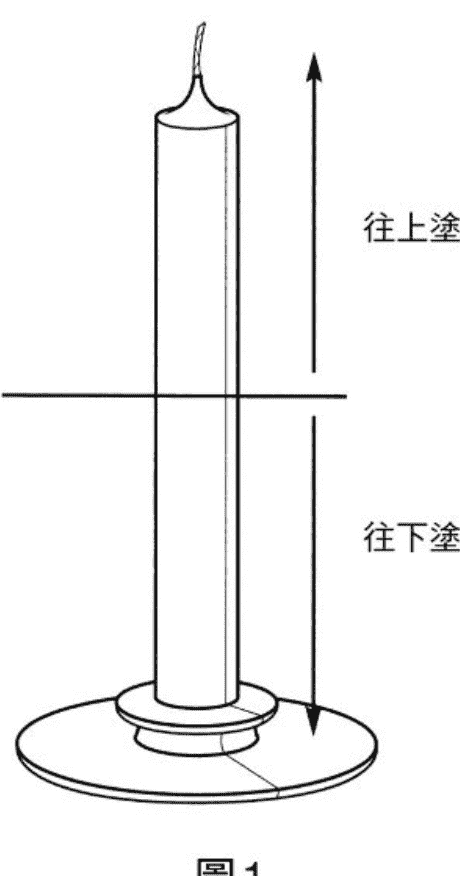

圖1

要装饰蜡烛，得用油涂抹，从中间涂到蜡烛的底部（见图1）。总是要往同一个方向涂抹；从中间往一端涂，再从中间往另一端涂。当你在装饰蜡烛的时候，应该专注集中在主题、问题或是手边的问题上（另见下文〈辨别颜色〉），四种用于仪式的蜡烛——祭坛蜡烛、奉献蜡烛、星座蜡烛与星期蜡烛，分述如下：

**祭坛蜡烛**：这是始终放在祭坛上的两根白色长蜡烛，会各放在祭坛两端角落，并总是早在其他蜡烛之前先点燃。

**奉献蜡烛**：这是对应各种符号颜色的蜡烛（见表三），颜色取决于要做的仪式主题。

**星座蜡烛**：这些代表许愿者，按照当事人的生日来选择（见表一）。可以选择有星座主色的蜡烛，或是购买结合两种颜色的蜡烛。

**星期蜡烛**：这可以用在任何仪式上（见「准备工作」单元：表二），取决于当天的日期，要放在祭坛的右前方。

# 表一：星座對應蠟燭

| 星座 | 生日 | 首選顏色 | 次選顏色 |
|---|---|---|---|
| 水瓶座 | 1月20日 — 2月18日 | 藍色 | 綠色 |
| 雙魚座 | 2月19日 — 3月20日 | 白色 | 綠色 |
| 白羊座 | 3月21日 — 4月19日 | 白色 | 粉紅色 |
| 金牛座 | 4月20日 — 5月20日 | 紅色 | 黃色 |
| 雙子座 | 5月21日 — 6月21日 | 紅色 | 藍色 |
| 巨蟹座 | 6月22日 — 7月22日 | 綠色 | 棕色 |
| 獅子座 | 7月23日 — 8月22日 | 紅色 | 綠色 |
| 處女座 | 8月23日 — 9月22日 | 金黃色 | 黑色 |
| 天秤座 | 9月23日 — 10月22日 | 黑色 | 藍色 |
| 天蠍座 | 10月23日 — 11月21日 | 棕色 | 黑色 |
| 射手座 | 11月22日 — 12月21日 | 金黃色 | 紅色 |
| 摩羯座 | 12月22日 — 1月19日 | 紅色 | 棕色 |

# 表二：一週對應的顏色

| 星期天 | 黃色 |
| 星期一 | 白色 |
| 星期二 | 紅色 |
| 星期三 | 紫色 |
| 星期四 | 藍色 |
| 星期五 | 綠色 |
| 星期六 | 黑色 |

# 表三：顏色的象徵

| 顏色 | 象徵 |
| :--- | :--- |
| 白色 | 淨化、真理、真誠 |
| 紅色 | 力量、健康、活力、性愛 |
| 淺藍色 | 平靜、理解、耐心、健康 |
| 深藍色 | 衝動、沮喪、可變性 |
| 綠色 | 財富、豐饒、幸運 |
| 金黃色／黃色 | 吸引力、說服力、魅力、自信 |
| 棕色 | 猶豫、不確定、中立 |
| 粉紅色 | 榮耀、愛情、道德 |
| 黑色 | 邪惡、損失、失序、困惑 |
| 紫色 | 緊繃、野心、業務進展 |
| 銀色／灰色 | 取消、中立、陷入僵局 |
| 橙色 | 鼓舞、適應力、刺激、吸引力 |
| 黃綠色 | 生病、膽小懦弱、憤怒、嫉妒、失序 |

# 仪式

本书的仪式适用于更常处理的情境，加上一两个不寻常的仪式。通常会给两种形式的仪式，一种是传统的基督教形式，其简化版本见于目前关于蜡烛仪式的几本书；另一种是更普遍的传统形式。后者是作者从欧洲各地的各种来源搜集而来，似乎反映了基督教之前的早期自然崇拜——众所周知的古老宗教。
无论使用哪一种仪式都一样有效。事实上，最好跟最有效的眼，将是发自你内心的。并不是所有的人都能在对的时间创造对的字眼，来契合我们的感觉。然而，这就是本书所列的仪式重点所在——它们不需要用心学习，只要藉由本书就能读到。如果你犯了错——别担心！一个小小的错误、一个错漏、一个口误并不会搞砸仪式。重要的是意义，你内心的目标才重要。

## 衣着

精心设计、华丽的长袍，在本书的仪式中是不必要的，除非你觉得这样的打扮令你更开心。其实这在很大程度上根本是心理问题。相反地，古代宗教的信徒还会裸体施术，因为这是自由的象征。大多数人都穿着日常服装参加仪式，但有些人确实认为，仪式会要求「特别的东西」，因此穿的衣服从简单朴素的长袍，到精心制作、鲜艳的丝绸服装，都饱含着深奥的象征。如果他们觉得透过使用这些「道具」，他们的仪式会更有效，那就会赋予他们更多的力量！不过，这并不是强制性的。

## 祭坛的神像

在仪式里并非必要，许多人喜爱将一个宗教人物或图片安放在祭坛上。一个十字架、安卡（ankh）²、耶稣、圣母玛利亚或是古代维纳斯的形象，都完全是被允许的。人像或图片应该放在祭坛中央的后方，香炉则在它之前。

## 点燃与熄灭蜡烛

最好先点燃点火条³，然后再按照标示的顺序，点燃祭坛上的蜡烛。仪式结束前，你可以吹灭火焰，吹灭的顺序跟点燃的顺序相反，或者你可以用灭烛器熄掉它们，不要用手指去掐熄。

## 仪式的时间

大多数仪式都表明它们应该在哪一天举行，或者是需要多少天。除非有特别指定天数，否则你可以自行决定花几天完成。无论是清晨、中午还是深夜，不管什么时间，只要可以让你最安心就可以，都足够，但要选择一个不太会被打断的时间。

## 辨别颜色

事实上可以不用涂油就使用蜡烛，但是涂油更有效果。表一提供对照出生日期的适合颜色——但如果你不晓得仪式对象的出生日期，只要用一根普通的白蜡烛来代表他们，在你涂油的时候专心想着那个人就好。

## 开始仪式前最后的一席话

仪式不仅仅是词汇，它们拥有意义。无论你打算先做哪一种仪式，坐下来静静的读一读。想想这些词汇的意思。这样你就不会重复「鹦鹉学舌」，而是理想的愈来愈接近运用你自己的原话——真心话。

本书中提供的两种类型仪式，许多人赞同古老宗教或是非基督

## V:zkzk56

教，仅仅是因为这些词汇与仪式的目的如此相关。在这么多传统的基督教版本中，使用《圣经》的《诗篇》文字似乎跟仪式无关。然而无论使用什么版本，许多人已经获得巨大的成功。

然后，阅读它们，使用你发现最能取悦你的那一个仪式。首先，应该对你使用的仪式感到快乐跟自在。

本书分为两个部分，第一部分是古老宗教版本的仪式，第二部分是基督教版本的仪式。你可以运用你最喜欢的版本，或者混合搭配。

- 2. 译注：埃及的生命之钥图腾。
- 3. 译注：一种类似火柴的长形木条。

# 第一部

## 古老宗教儀式

## 1

## 断情

#### 解除爱情关系

点燃祭坛蜡烛一跟二。
点燃薰香，坐着一会儿，想象这段爱情关系如临面前。
点燃星座蜡烛一（代表这段关系中男方的星座蜡烛），并且在你

说出以下祷文时，想象这个男人的模样：

> 这是一对情人的男性那一半，
他现在是整体的一半，他很快就会单身。

点燃星座蜡烛二（代表这段关系中女方的星座蜡烛），并且在你
说出以下祷文时，想象这个女人的模样：

> 这是一对情人的女性那一半，
她很快也会单身。

点亮黑色蜡烛并说道：

> 这里开始了不和，这里燃起了混乱。

点燃棕色蜡烛并说道：

> 他们的心中充满不确定，
他们犹豫了。
他们想着，他们真的是天造地设的一对吗？
他们真的应该在一起吗？
……怀疑填满他们的头脑。

点燃黄绿色蜡烛并说道：

> 争风吃醋！
吵闹不合！
还有担忧、怀疑、不爽跟恐惧。
所以让它生效吧！

想想这一对恋人现在分手了。想象这段爱情关系已经结束了，他们各奔东西。说道：

> 过往的吸引力，
如今看来普普通通。
过往的愉快乐趣，
如今无聊得很。

过往的赏心悦目
如今蒙羞丢人。
过往的明亮欢快
如今令人生厌。
过往使他们互相吸引的
如今不增反减。
过去生气勃勃的
如今枯萎凋零。

他们之间的爱火不再。继续说道：

> 激情之火不再燃烧，
不再有渴望与向往，
这两个人不再是一体了。
他们的爱情单调乏味，
爱火已经熄灭，
渴望已经消逝，
他们分手了。

再多想一会儿，想着这段关系彻底结束了，两个人分开了。然后说：

> 罗兰枯萎凋零，丝带褪去色彩，
大概还有一团灰尘，
一半撕裂的音符，被遗忘的纪念品，
是因为很久以前有些心痛，
我悲哀的跪在壁炉旁，
看啊，我把它们扔进炉栅里，
现在劈里啪啦烧起来了
这可摧毁了我的快乐与不幸命运。

海誓山盟，是虚假轻浮的誓言，
如同昙花一现，
我想，还有诸仙众灵、
所有看不见的灵体们，都站在旁边笑！

我依然坐在壁炉旁，
梦想着我无法说出的一切；
看着灰烬中的火星
濒临死去
晚安了，再见！

熄掉蜡烛。每周六晚上重复这个仪式，每一次都将两根星座蜡烛分开二、五公分左右或更远的位置。重复仪式，直到蜡烛最后到达祭坛相对的两端。

## 2

## 护身

#### 加持护身符或护符

这仪式是为了加持护身符（Amulet）、护符（Talisman）或是「幸运物」。护符可能是别人为你做的，也可能是你自己做的。后者更适合。

点燃祭坛蜡烛一和二。
点燃薰香（推荐乳香）。
点燃白色蜡烛，并说：

> 这里燃烧着______（许愿者的名字）的真心，
他/她对护符力量的信念燃烧着，
像这火焰般强烈。
永不熄灭。

点燃红色蜡烛⁴并说：

> 这份爱进入护符当中。
因为护符是仓库，
能储存爱的力量。

拿起护符，握在边缘处，在白色蜡烛上过火绕圈三次，再反过来，让护符的两边都能接触到火焰（别烧到你的手指）。说道：

> 我以火净化这护符，以及里面的一切杂质。

然后让它过香炉三次，说：

> 我请神净化这护符，为我的目的做准备。

现在拿着护符，牢牢的握在你的右手（如果你惯用左手就用左手），并且说道：

> 我以爱灌注这个护符，
无论谁戴上它都会感觉到强大的力量，

配戴者将永远拥有这种力量，
只要她／他能承受。

现在将护符放在红色蜡烛上方过火三次。说道：

> 这就是那份爱，满溢着加持的力量。

把护符放在白色与红色蜡烛中间，熄灭烛火。
让护符放在原位三小时不动，然后让主人携带或配戴之，最好是
贴近皮肤配戴。

4. 注：这根蜡烛的颜色与用途，将取决于护符的用途（即：红色代表
爱情、蓝色代表健康、绿色代表丰饶等等）。

## 3

## 戒除

#### 克服恶习

点燃祭坛蜡烛一跟二。
点燃薰香（最好是乳香），并且坐一会儿，想着恶习慢慢消失，并且被好习惯取代了。

点燃黑色蜡烛，并说道：

> 这就是让我退缩的东西，
我也知道，这对我不好。
这象是个强大的巨人，
是无法被征服的。
但我知道可不是这样，
我能够征服它。

点燃白色蜡烛一、二、三和四，并且说：

> 这是我的力量，这是我的勇气，
这是我的坚持，这是我的胜利。
现在我被敌人包围了。
现在我知道敌人无路可退，
战争已经开始了，
但结局谁都知晓。

在你的脑海中想象着正向的进步力量，朝着敌人——你的恶习前进。过了一会儿，静静的说：

> 暮光之星$^5$，
你在哪里眨眼？
在过去的岁月里，
昏暗的前一刻，何时在消逝呢？
「越过骑士与男爵的厅堂，
砲楼与高塔，

高高的掉下来，森林参天，
绿荫如碧。」

银色之夜的星星，
当你高高的漂浮，
越过高塔和树木，
你注意到了什么呢？
「蓝色的扇叶跟辅助帆的布面，
彩格布翩翩起舞，
鹿儿的窝，
朦胧地一瞥而过。」

少女梦中的星星，
熠熠闪耀的星星，
当猫头鹰在漫游时，
你的光芒在哪里闪烁呢？
「在男爵的大厅里，
绿色苔藓的攀爬之处，
在灰色露水低泣的
森林瀑布之上。」

你现在遇到的，
是依旧如此的星星，
何时从孤寂的山丘
甜蜜的眨眼睛呢？
「这炉火在风中式微，

烟囱在地上闷烧，
绵羊在微暗的鹿窝上，
树木被砍伐并腐朽。」

经过几分钟，想象终于克服了这个坏习惯，就先熄灭黑色蜡烛，然后是白色蜡烛四、三、二和一。

之后连续七天重复这个仪式，但首先需移动白色蜡烛二跟三，朝黑色蜡烛靠近二、五公分。每周一次让白色蜡烛更靠近黑色蜡烛，直到两根白色蜡烛碰触黑色蜡烛为止。

5. 译注：星星代表希望或新习惯，一路上遇到的情境是过去的困难，树木代表障碍，象征曾被当作困难之处悉皆克服。

## 4

## 家庭

#### 解决家中纷乱状况

点燃祭坛蜡烛一和二。

点燃薰香。

静坐片刻，并且冥想，在你的脑海中清晰的观想你要完成的事情。

点燃许愿者的蜡烛，用心想着许愿者。说道：

> 这根蜡烛代表______（许愿者的名字），
当它燃烧时，他/她的灵魂也会燃烧。

点燃浅蓝色、粉红色与橙色蜡烛，按照这样的顺序，想着充满理解与爱的和平与宁静在这屋中。然后说：

> 在这里点燃的是______（许愿者的名字）的快乐，
这是他/她的房子，这一切围绕着他/她。
在这个家里有安宁，
平静与爱都与他/她同在，
因为真正的快乐，大家都明了。
在那里有满满的理解与爱，
失序与混乱已溃逃，
无论如何，当耐心和爱
真真正正的成长与繁荣，
贫瘠因此成了怀疑与苦恼之域。
快乐就是那道燃烧的光，
黑暗荡然无存了。
这个家很平安，平安就在家里。

然后坐三到五分钟，专注于解决家中纷乱的情境。接着再说一次：

> 在这里点燃的是______（许愿者的名字）的快乐，

这是他／她的房子，这一切围绕着他／她。
在这个家里有安宁，
平静与爱都与他／她同在，
因为真正的快乐，大家都明了。
在那里有满满的理解与爱，
失序与混乱已溃逃。
无论如何，当耐心和爱
真真正正的成长与繁荣，
贫瘠因此成了怀疑与苦恼之域。
快乐就是那道燃烧的光，
黑暗荡然无存了。
这个家很平安，平安就在家里。

再次坐个三到五分钟，专注于解决家中纷乱的情境。然后，再说第三次：

> 这里点燃的是______（许愿者的名字）的快乐，
这是他／她的房子，这一切围绕着他／她。
在这个家里有安宁，
平静与爱都与他／她同在，
因为真正的快乐，大家都明了。
在那里有满满的理解与爱，
失序与混乱已溃逃。
无论如何，当耐心和爱
真真正正的成长与繁荣，
贫瘠因此成了怀疑与苦恼之域。

快乐就是那道燃烧的光，
黑暗荡然无存了。
这个家很平安，平安就在家里。

再坐三到五分钟，专注于解决家中纷乱的情境，然后熄灭蜡烛。
这个仪式应该连续三晚重复做。

## 5

## 往生

#### 为往生者做仪式

（注：在此仪式中，往生者的照片可以置于他或她的星座蜡烛前。）

点燃祭坛蜡烛一和二。

点燃薰香。

点燃往生者的星座蜡烛，并在你的脑海中描绘他或她，以你记忆中最好的模样出现，尤其是在某个特别开心的场合。说道：

> ______（往生者的名字）在此驻足，
他/她永不逝去。
他/她的精神像蜡烛的火焰般燃烧。

点燃浅蓝色蜡烛并说道：

> 这是平静与安宁，
如同他/她的安详一样，能从现在持续到永远。

然后，想象那个人开心而平静，说道：

> 去了解，勇敢，意愿、保持沉默，
这是给魔法师的四句话。
为了勇敢，我们必须了解；
为了意愿，我们必须勇敢；
我们必须要拥有绝对的统驭力，
为了统驭，我们必须保持沉默。

> 星空穹顶的女主人啊，
浩瀚苍穹的大教堂，
原谅你忠仆的一切过错，
在我离世之前。

让我只记得美好；

只记得痛苦狂喜的恩典，
以美好之名，
以神采奕奕的脸，允许我只记得这些。

你的忠仆就如他父亲般，
按照古老的仪式敬拜。
藉由爱与无畏魔法的力量，
让所有神圣的日子都保持庄严。

现在视线灰暗，火焰羸弱，
生命的最后时刻已经降临，
留下这个又破又旧的躯壳，
希望我的愿望实现，圆满达成！

以伊丝塔和埃亚⁶之名，以无尽的力量之名，
愿你的忠仆重生，在荒废的塔上跳舞，
祭坛的火焰再次燃起，薰香袅袅上升；
这神圣的仪式又一次在月光下举行。

让蜡烛燃烧半小时再熄灭。重复七个晚上仪式。
你可以用非常大、能长时间燃烧的蜡烛。可能的话，应该在此仪式中使用星座蜡烛和浅蓝色蜡烛。

6. 译注：伊丝塔（Ishtar）是美索不达米亚宗教的女神，与冥府相关；
埃亚（Ea）为苏美神话中的水神，供奉埃亚的神庙又称为「冥界之屋」，传说他吹气让小泥人变成人类的始祖。

## 6

## 美梦

#### 创造梦境

- 点燃祭坛蜡烛一和二。
- 点燃星期蜡烛。
- 点燃薰香。

点燃许愿者蜡烛，说道：

> 这是______（许愿者的名字），这场仪式的主角。

点燃浅蓝色蜡烛，并说道：

> 这里点燃的是平静与耐心，
是完成这个欲望必要的条件。

点燃橙色蜡烛，并说：

> 这是那个欲望的吸引力，
她/他想要做的那些梦，
她/他会希望，
并且看到跟体验到她/他所愿的一切。

点燃白色蜡烛，并说：

> 因为她/他看到的一切就是真相，就是那小小的火焰。

闭上你的眼睛片刻，想象许愿者（或你自己）完全被白光包围和
笼罩。过几分钟后，再睁开眼睛并说道：

> 轻轻穿过树林的风是从哪里来的？
它去了哪里？
然而在它温柔轻拂吹过时，
我们感觉不到它柔软的天鹅绒触感抚摸我们的脸颊吗？
如同蝴蝶翅膀的振动，
现在已经感觉到，但一下子又失去了！

因为我们无法企及并碰触它的本体，
也无法抓住，这阵风。
它就在那里，但又离去！
当我们在梦中遇见所爱之人，
我们所见到的，又是多么真实啊！
我们再次看见他们、与他们交谈，
再次走在一起，再次地去爱。

他们还在那里吗？
当我们呼唤时，他们会来吗？
我们能看见我们想做的事情吗？我们能做想做的事情吗？
是的，又一个是的，这是真的！
我们渴望看见、体验的一切，
出现在梦中是因为我们请求的。
是的，它会降临！
是的，我们将如愿以偿！
你要知道，力量就在我们之内，
我们渴望的一切将属于我们！

安静的坐几分钟，然后熄灭蜡烛。这个仪式应该在晚上睡前、你渴望作梦的时候进行。

## 7

## 制伏

#### 让你的敌人承受压力

- 点燃祭坛蜡烛一和二。
- 点燃薰香。
- 点燃黑色蜡烛并说：

> 这里是我的敌人，独自一人。
他 / 她没有朋友，
没有人帮的______（敌人的名字），我可怜你。
你很快就会因折磨我而付出代价了。

点燃灰色蜡烛一和二，集中精神说道：

> 既不在你身前，也不在你身后；
挫折就在你身上。
一切的计划都徒劳无功。
你无计可施了。

点燃黄绿色蜡烛，集中精神说：

> 这是你的疾患、怀疑与忧虑，
那正在你身上蔓延。
恐惧、愤怒与不合，就是你的新伙伴了。

点燃紫色蜡烛，集中精神并说：

> 你新发现的其他新朋友是紧张，他就在这里。
他也要跟你同在，就等他来吧！

坐着一会儿，在你的脑海中想象你的敌人清晰影像。然后说道：

> 到西方，到东方，
到北方，到南方，
在他 / 她周遭的一切

清晰的出现。
当他／她骑马穿过平原
并穿越树林时，
只是想努力
销声匿迹。
但小山丘的胸脯上、
所有看不见的东西背后、
及他／她旁边的灌木丛当中，
还有在树上，
所有的灵界生物追踪他／她，
并为了确保他／她
永远不得自由
而密切关注。
牠们白天发出信号，
牠们夜里发出信号，
他／她走到哪儿
都被报告。
牠们一直都会
回避视线，
而且还可以做到
趁乱补刀。
他／她从灌木林出来，
然后停了一会儿，
当那匹马嗅出她
对男人的恐惧时，

她能感觉到就在那里、
在骑士的视线之外，
有什么东西安全的远远躲开，
但后来
她只晓得
从他／她的坐骑
颤抖又喷着鼻息的姿态
开始感到不安；
他／她不像以前想的那样，
纵马奔出了
他／她屠杀和干掉
许多敌人的地方。

现在他／她必须偿还
从灵界身上偷来的东西，
他／她想都不想就拿走的东西、
失去控制拿走的东西。
现在担心他们
会一直阻止他／她，
而他／她拼足老命
穿越这片土地。
他／她将马刺蹬向骏马，
捕捉恐惧的气味，
现在这气味
成为他／她自己的气味。

以前是猎人，现在被追杀，
是的，猎人被追杀，
这当然是绝不失手的
复仇，
当他／她弯腰驰骋、
全速前进，不再回头看、
不再小心翼翼
他／她选的方向，
只要可以让他／她远离
牠们的眼光就好。
但尽管他／她的同类
却无一能幸免于难，
为了他／她的同伴，
尽管他／她跑去
寻求庇护。

恐惧就在他／她的身边，
驱策着他／她心里的死亡，
而恐慌就那么贴近，
就在身后。

让蜡烛燃烧五分钟，然后熄灭它们。连续几个晚上重复此仪式，每一次都移动黄绿色蜡烛和紫色蜡烛，往黑色蜡烛拉近五公分。

## 8

## 除恶

#### 抵御邪恶

帮一个人「跨越障碍」

- 点燃祭坛蜡烛一和二。
- 点燃薰香（最好是乳香）。

点燃许愿者蜡烛，用心想着许愿者身穿白色衣服。
点燃白色蜡烛一、二、三和四。说：

> 这是一个净化圈，关于______（许愿者名字）的火花，
他/她的灵魂在中间闪耀着光芒。
对他/她来说，这是永续存在的保护；
它是最好的净化。

点燃红色蜡烛一、二、三和四，说：

> 加强净化的魔法圈，是更强大的魔法圈。
是______（许愿者名字）的灵性力量。
她/他受到保护，不受任何伤害、不遭遇邪恶。
她/他被净化，并且重生。

想象许愿者开心和无忧无虑，许愿者没有接收到恶意，也不害怕任何的邪恶。几分钟后说：

> 我祈祷的神存在着，
我虽卑微，但也不求恩惠；
我注视着这个世界和它的纷扰，
我珍惜美好，忘记其余的东西；
我珍惜欢乐，无论牧师怎样唠叨；
我堂堂正正、循规蹈矩，
我开心畅饮，将我的命运留给神——
好人的朋友！

在我的枕边，
贫穷坐着沉思，但我没有注意到她。
因为幸亏有爱与希望，你懂的，
我梦想我的命运有出头天，
我可没有牧师创造出来的严厉上帝。

我臣服的是温柔的神；
我快乐畅饮，把我的命运留给神，
好人的朋友！

一位沉溺权力的暴君，
对国家与王朝侵门踏户，
尘土落在他坐骑骄傲的马蹄上，
令诸王脸上无光。
不甘心吧不甘心吧，你们这些失败的大人物，
我怎会在乎你们颜面扫地？
我快乐畅饮，把我的命运留给神，
好人的朋友！

噢，我们那乌鸦嘴的牧师朋友，
带着他晦涩阴郁的一切预言呢！
他多爱在地狱之火、
在时间的终点、厄运的裂缝中大快朵颐！
来吧，矢德温女神$^7$，
你的脸颊嘟起来，
在火焰与雷电之间——降下云朵！

我快乐畅饮，把我的命运留给神，
好人的朋友！

什么，崇拜愤怒的上帝？不，
祂创造了一切，也爱祂创造的一切；
祂创造了酒；我亲爱的朋友——你，
爱就是他创造的帮手；
这些魔咒都烟消云散，
梦魇的祭司欢喜送走这一切！
我快乐畅饮，把我的命运留给神，
好人的朋友！

然后坐下来，想象所有的邪恶都消失了。想象许愿者获得自由跟快乐。这样坐着想，直到蜡烛烧完，最后熄灭为止。

7. 译注：矢德温是威尔斯的巫术女神，掌管转化与重生。

## 9

## 勇气

#### 战胜恐惧

点燃祭坛蜡烛一和二。
点燃薰香。
坐下来冥想要达成的事情。

## V:zkzk56

点燃许愿者蜡烛，集中意念在许愿者身上，并且说道：

这根蜡烛代表______（许愿者名字），
他的灵魂肯定像这火焰一样坚定的燃烧。

点燃白色蜡烛并说：

这里为______（许愿者名字）加上了信心跟力量；
纯洁与真诚永伴他／她左右。

按照顺序点燃橙色蜡烛，说道：

这里有战胜一切恐惧的必要意志。
蜡烛怎么烧，他／她的灵魂就怎样坚定，
______（许愿者名字）这颗不屈不挠的心，
______（许愿者名字）可以把握他／她的梦想
并消除疑虑；
______（许愿者名字）可以征服一切。

然后坐着沉思，想着消除恐惧并增强信心了。在三、四分钟后站起来并说道：

我曾恐惧与孤单，或我曾感觉
我知道我恐惧。
我曾经没有勇气，因为我软弱无力，
沦落无知的黑暗领域，
我知道我恐惧。
然后牙齿战栗，兽群轰鸣，
乱步踩踏又天旋地转，
这声音、这光景
在我脑海里……
我知道我恐惧。
但时间已经来临，
现在所有的人都已逃离。
笑是决心，笑是刀剑，
充满我心，我紧抓不放，
我不害怕；毫无疑问、毫无逆境；
现在没有。
有了勇气，有了欢欣，我心欢喜，
我所熟悉的恐惧，现在已经被抛诸脑后。
前途是光明，而非黑暗；
无所畏惧，我触目所及悉无恐惧。
我是唯一众人仰望的人，
你看，我一点也不恐惧！

熄灭蜡烛。
连续重复九个晚上。

### 10 幸福

#### 赢取或保有幸福

点燃祭坛蜡烛一和二。

点燃薰香。

点燃许愿者蜡烛，想着许愿者，并且说道：

这里伫立着______（许愿者名字），
他/她的灵魂如同这火焰坚定，
幸福是他/她应得的。

点燃金色与橙色蜡烛，并说道：

> ______（许愿者名字）吸引到了幸福，
就像火焰吸引飞蛾一样。
这吸引力如此强大，无法抗拒。
神魂颠倒、勾魂摄魄。

点燃红色蜡烛一和二，并说道：

> 她/他得到了应得的好运与幸福，
她/他为此努力不懈，那是属于她/他的好运。
幸福向她/他招手，一路前进。
她/他会把握好运。

现在想着那个人得到了她或他渴望的一切，并说：

> 一颗星星在我阴郁的黑夜落下美丽的光芒，
一颗用光芒散发甜蜜慰藉的星星，
答应我带来新生活与喜悦——哦，可别食言！
就像大海因月亮而炫目，
我的灵魂一跃而上，勇敢而欢欣地奔向你——
你，和你的喜悦之光——哦，可别食言！

冥想几分钟，想着已经创造了快乐幸福，然后再次说道：

一颗星星在我阴郁的黑夜落下美丽的光芒，
一颗用光芒散发甜蜜慰藉的星星，
答应我带来新生活与喜悦——哦，可别食言！
就像大海因月亮而炫目，
我的灵魂一跃而上，勇敢而欢欣地奔向你——
你，和你的喜悦之光——哦，可别食言！

再多花几分钟集中注意力，观想幸福已经增长扩大，然后再次说道：

一颗星星在我阴郁的黑夜落下美丽的光芒，
一颗用光芒散发甜蜜慰藉的星星，
答应我带来新生活与喜悦——哦，可别食言！
就像大海因月亮而炫目，
我的灵魂一跃而上，勇敢而欢欣地奔向你——
你，和你的喜悦之光——哦，可别食言！

再多坐几分钟，然后熄灭蜡烛。
连续几个晚上重复这个仪式，每一次要移动红色蜡烛，朝许愿者蜡烛接近五公分，持续到这三根蜡烛彼此碰触为止。

### 11 婚姻美满

#### 疗愈不快乐的婚姻

- 点燃祭坛蜡烛一和二。
- 点燃薰香。
- 冥想你要实现的事情。

在想到丈夫时，点燃星座蜡烛一、红色蜡烛一、金色蜡烛一。说道：

> 这段婚姻的丈夫是______（名字），
我点亮他的灵魂，
象征着，
他知道——他对妻子______（名字）的爱，
将会巩固并且增长。

想着妻子时，点燃星座蜡烛二、红色蜡烛二、金色蜡烛二，说：

> 这段婚姻的妻子是______（名字），
我象征性的点亮她的灵魂，
知道她对丈夫______（名字）的爱，
将会巩固并且增长。

然后坐五分钟，想象这两个人被凑在一起。然后说道：

> 两情相悦、琴瑟和鸣、心有灵犀；
他们之间的裂痕已愈合。
温暖的光照亮灵魂，
穿越已不复存在的鸿沟。

幸福悄然降临，
因为爱就是话语、爱就是那道光。
忘了差距，抹去无心之语。
爱是治愈一切伤痛的膏药。

再冥想五分钟，然后重复一次：

两情相悦、琴瑟和鸣、心有灵犀；
他们之间的裂痕已愈合。
温暖的光照亮灵魂，
穿越已不复存在的鸿沟。

幸福悄然降临，
因为爱就是话语、爱就是那道光。
忘了差距，抹去无心之语。
爱是治愈一切伤痛的膏药。

最后再冥想五分钟，然后再次说道：

两情相悦、琴瑟和鸣、心有灵犀；
他们之间的裂痕已愈合。
温暖的光照亮灵魂，
穿越已不复存在的鸿沟。

幸福悄然降临，
因为爱就是话语、爱就是那道光。
忘了差距，抹去无心之语。
爱是治愈一切伤痛的膏药。

让蜡烛再烧五分钟，然后熄灭它们。
每隔一天就重复一次，先将两组蜡烛朝彼此移动二、五公分，持续到两根星座蜡烛碰触彼此为止。

### 12 健康

#### 保持或恢复健康

点燃祭坛蜡烛一和二。点燃薰香。
若此仪式是为了恢复健康，请坐着几分钟去冥想美德与健康流回到身体里面。

点燃许愿者蜡烛，想象许愿者。说道：

______（许愿者名字）有绝佳的健康。
愿诸神保佑他/她
长命百岁。

点燃橙色蜡烛并说：

这火焰能为______（许愿者名字）吸引一切美好事物，
带来健康、力量，以及他/她所渴望的一切；

点燃红色蜡烛一、二和三，并说：

那么，这就是健康与力量的三倍力量。
被带进______（许愿者名字）的身体，
服侍他/她，并且按照神的意愿去治愈他/她。

然后说：

从一开始就是如此。
为了生存就必须打猎、杀生。
杀生必须要有力气，
要有力气，就必须进食跟运动，
要进食与活动，就必有狩猎。
要是你软弱，你就永不会强大；
要是你强大，你就会永远强大。
但如果你软弱，你就必须要强大，
因为想法即是行动。
觉得自己强大，你就可以狩猎、杀生跟进食。
因此，想法强大，你就会强大、你就会行动。
想法带来的不是食物，
但想法确实带来获得食物的手段。
如所愿！
给强者力量，
给弱者力量，
愿手臂举起长矛。
愿胳膊扔起石块。
愿手臂刺出标枪。
愿永远拥有力量。
如所愿！

静静的坐着，冥想许愿者所享有的、将要享有的美妙健康。这样坐十到十五分钟，然后熄灭蜡烛。每个周五重复这个仪式，连续七周，每次移动三根红色蜡烛靠近许愿者蜡烛一点点。在第七个周五，它们应该会碰到。

### 13 嫉妒

#### 招引嫉妒

点燃祭坛蜡烛一和二。
点燃薰香。
点燃希望招引嫉妒的人对应的星座蜡烛，专注的想着她或他，并且说道：

这个女人 / 男人______（名字），如同火焰燃烧般，
所以她 / 他也燃起妒火，被妒火吞噬。

点燃棕色蜡烛一和二，并说道：

______（对方的名字）没有把握。
她 / 他对自己、对别人都不确定。
她 / 他犹豫不决——并且将会迷惘。

点燃黄绿色蜡烛一和二，并说：

嫉妒在她 / 他左右，蚕食着她 / 他。
它以稳定的火焰燃烧着。

然后，想象她或他愈来愈嫉妒，说道：

我躺下来睡了一觉——美美的一觉，
它抚慰了我的悲伤和忧虑；
看！一个异象降临我身上，
有一个宛若天仙的美丽少女。

少女苍白如大理石般，
看起来令人惊叹不已，
她双眸因珍珠般的眼泪而闪耀，
她的发丝波浪闪着金光。

慢慢地、慢慢地滑动，
这少女如同大理石般苍白，
她躺在我起伏的心上。
这少女如同大理石般苍白。

多么兴奋悸动啊，还带着欢欣与痛苦，
我的心在狂怒中燃烧！
少女的胸脯不再颤动、不再悸动——
冷若冰霜。

> 「我的胸膛既不颤动、也不悸动，
在某种意义上是冰冷的；
但我深知爱的喜乐，
深知爱，无所不能。
我的脸颊没有血色，
我的心无动于衷；
你可不要抵抗毛骨悚然的恐惧；
我对你算仁慈又善良。」

她更加任性地依偎着我，
我的理智快要崩溃了；
雄鸡大声啼叫——然后消散在虚空中
这少女如同大理石般苍白⁸。

在几分钟后熄灭这些蜡烛，每个周一与周六都施行此仪式，实施三周。

8. 译注：这首诗用苍白冰冷的少女象征着嫉妒的能量，使施术对象感觉不舒服。

### 14 恋爱

#### 赢得爱情

点燃祭坛蜡烛一和二。
点燃薰香。
点燃许愿者蜡烛，说道：

这是______（许愿者名字），
这根蜡烛就是他／她；
火焰就像他／她的灵魂般燃烧。

点燃红色蜡烛一并说道：

______（许愿者名字）有美妙非凡的爱，在此绽放盛开。
这是真诚浓烈之爱，众人渴求。

点燃求爱对象的星座蜡烛，说道：

我在此看到______（许愿者名字）的心。
我想象她／他在我面前，并且对她／他知之甚详。

点燃红色蜡烛二并说道：

______（求爱对象的名字）对______（许愿者名字）的爱随
这火焰滋长，
就像这火光灼灼，
永远受他／她吸引。
______（许愿者名字）对她／他的爱美妙非凡。

点燃金色蜡烛并说道：

她被吸引到他身边，这个人走向另一个人。
他／她这样的爱，只令人感受到吸引力。
这根蜡烛燃烧着，总是吸引她／他靠近。
他／她的说服力很强大。
她 / 他总感觉深受吸引；
对他 / 她念念不忘。
她 / 他的白天因渴望他 / 她而漫长，
她 / 他的黑夜充满着渴望。
她 / 他希望两人合而为一，琴瑟和鸣。
她 / 他最迫切的需求，是两人永远合而为一。
她 / 他难以成眠，直到
在他 / 她身边，就躺着她 / 他。
他 / 她的每个心愿，她 / 他都会去满足，
去服务、去实践——而不是无动于衷。
她 / 他无法抵挡如此强大的魅力，
她 / 他也不想去抗拒，
她 / 他只希望顺其自然
在旅途的终点走向他 / 她。
太阳从哪里升起，
他 / 她的爱就与她 / 他同在，
太阳在哪里落下，
就有她 / 他在那里。

坐一会儿，然后熄灭蜡烛。
每天重复此仪式，每一次移动星座蜡烛跟红色蜡烛二，靠近许愿者蜡烛二·五公分，持续到星座蜡烛与红色蜡烛二碰触许愿者的蜡烛为止。

### 15 好运

#### 改变运势

点燃祭坛蜡烛一和二。

点燃薰香。

点燃许愿者蜡烛，用心想着许愿者并说道：

这根蜡烛代表______（许愿者名字），
它代表她/他，而且是在所有方面当中的她/他。

点燃橙色蜡烛一、二和三，用心想着许愿者的运气变得更好了。

说：

> 我鼓励______（许愿者名字），
她/他的运气会改变，
而好运会属于她/他。

点燃黑色蜡烛并且说：

> 这是______（许愿者名字）的厄运，
她/他所有的问题都在这里、
所有的艰辛和失望都在这里。

点燃灰色蜡烛，想着问题都被抵销了，并说道：

> 坏事跟厄运都被中和了。
坏事停摆，然后
往好事发展。

想象许愿者的运势确实改变了，由坏变成好的，然后想着事情往好的一面成长。花几分钟想一下，说道：

> 你会怎么做？
为什么要改进？
怎么改进？
去赢得、去实践、去爱。
你现在就不爱自己的生活了吗？
既是，也不是：因为虽然我爱，我却觉得那只是整体的一小部分，
是我还在等待的其中一小部分，
就是这样！你想赢得什么？
那就是我所说的全部。
我面对着一堵墙，
我在死胡同里，带我离开这里。
去过生活吗？去爱吗？

是啊，就去那里，可还有更多的东西等着。
你说还有更多吗？你有野心啊！
确实如此，因为我得改运，
那样我就过得下去。
你拥有的野心是关键。
成功将属于你，但何时能成功呢？
你必须要有耐心！
我有耐心，还不够吗？
是的，如果你有野心，两者兼备。
它们往往难以匹配。
那么，何时我能发现这个改变呢？
我的运势何时改善呢？
我以月亮的阴晴圆缺发誓，
保持一切将会变好的想法，
你会改善的。
你有很多要实践的，和很多要去爱的。
不要松懈你的野心，也不要气馁。
透过我们女神⁹的变化过程
你最后将看到这些计划成真，
你将不再回想过去。
为什么这样说呢？
你将会为未来而忙碌。

坐着十分钟，想着一切都会变得更好。
熄灭蜡烛。
连续几个晚上重复这个仪式，每一次移动灰色蜡烛靠近黑色蜡烛
二、五公分。

9. 注：指月亮。

### 16 冥想

#### 静心冥想

- 点燃祭坛蜡烛一和二。
- 点燃薰香。
- 点燃星期蜡烛。

点燃许愿者蜡烛（许愿者等于冥想者）。
想着自己，并说道：

> 这根蜡烛就是我自己；稳定而确实地燃烧着。

点燃浅蓝色蜡烛一和二，并说：

> 我在此找到平静与安详。
一个我可以安全静心冥想
并在灵性上成长的地方。

以你自己的特定方式冥想（即超觉静坐、梵咒瑜伽或其他方式）。10在冥想结束时依点燃顺序颠倒熄灭蜡烛。

10. 注：有一些关于冥想的推荐书：《TM之书》（*The TM Book by Denise Denniston and Peter McWilliams*）、《谭崔瑜伽冥想之道》（*Meditate the Tantric Yoga Way by Swami Jyotirmayananda*）、《佛教徒冥想》（*Buddhist Meditation by G. Constant Lounsberry*），以及《为何要冥想与如何冥想》（*Why and How of Meditation by Russ Michael*）。

### 17 金钱

#### 获得金钱

点燃祭坛蜡烛一和二。
点燃薰香。
坐下来冥想片刻，在你的脑海中厘清你想要实现的事情。

点燃许愿者蜡烛，用心想着许愿者（当然是你自己也可以）。然后你说：

> 这根蜡烛代表______（许愿者名字），
当蜡烛燃烧，他/她的灵魂也燃烧着。

点燃金色蜡烛。认真想一想吸引钱的力量，并且说道：

> 这根蜡烛代表吸引力，
它对______（许愿者名字）有效，也就是旁边的名字，
为此运作。

按照顺序点燃绿色蜡烛，仔细想一想金钱。当你点燃它们时说道：

> 这些蜡烛代表______（许愿者名字）
所渴望的金钱，
那就是他/她所需的¹¹——不多也不少。

点燃红色蜡烛，想象愿望完全实现了。

> 这根蜡烛代表把钱送到
______（许愿者名字）身上的力量和指令。

暂停，然后思考一会儿，接着说：

> 因为钱是满足我们需求的必需品，
所以我们必须努力获得它。
所有我应该得到的，或者完全没收到的，
______（许愿者名字）现在急需钱，
吸引金钱，然后带给他／她。
让他／她找到他／她需要的一切。
现在，供给他／她金钱，来满足迫切的需求。
因为据说神明会在
肯定需要钱的时候伸出援手。
现在正需要钱。让他／她一切顺利，
让他／她绰绰有余，
让他／她不再渴望。

现在想想愿望实现了，而许愿者现在有钱了。想象钱实际上是归他／她所有了。

这笔钱现在是他／她的了。
______（许愿者名字）持有它，拥有它，
现在钱满足了他／她的需求。
他／她安全地收到钱，而且很开心。
赞美神明的美善。
向来都是如此。
现在一切都很顺利了。

然后静静的坐五分钟，让蜡烛和薰香燃烧。在这一过程结束时，你可以熄灭蜡烛。

第二天应该重复此仪式，但在仪式开始前，往左移动五根绿色蜡烛和红色蜡烛五公分。每一天仪式之前都移动它们，直到你所移动的绿色蜡烛，碰触了固定的金色蜡烛和许愿者蜡烛为止。

11. 注：你将会发现此仪式会在急需时带来金钱，它不会因为只是想要有钱就送钱来。

### 18 平静

#### 舒缓并安抚神经

- 点燃祭坛蜡烛一和二。
- 点燃薰香。
- 坐下来一会儿，尝试厘清脑海中的一切思绪。

点亮许愿者蜡烛，并且说道：

> ______（许愿者名字）安静地在这里，
他/她的灵魂和蜡烛火焰一样坚定。

点燃橙色蜡烛并且说：

> 这是对他/她努力的鼓励，
他/她有力量抛开忧虑。

点燃浅蓝色蜡烛一和二，并说：

> ______（许愿者名字）的周遭
是平静、安详、耐心与爱。

沉默的坐一会儿，然后轻轻的说：

> 雨很温柔，它轻轻落下
到下面的田野上。
它使心情平静，它使头脑安静，
提供我们需求的孤独。
它淅沥沥降下，更加轻柔，
从未折弯一片叶子，
然而那里的水
将会洗去所有哀伤。
因为随之而来是澄净光滑，
还有宁静、和平与爱，
到处都是新气象，
从天上的云朵降下来。
我们感到如此镇静、如此温暖、如此安详；
我们再也不会感到心烦意乱
或是「绝不紧张」了，
而是保持平静。
因为我们现在已经找到周遭的爱，
如此轻柔、如此安详、如此明确；
我们可以放松，我们可以躺下来，
用心平气和来治愈。

静静坐着十分钟或十五分钟，想着绿地和小溪、树木、原野以及湿地。专注在愉悦的事物上——必须是具体物品而非事件。然后再次说道：

雨很温柔，它轻轻落下
到下面的田野上。
它使心情平静，它使头脑安静，
提供我们需求的孤独。
它淅沥沥降下，更加轻柔
从未折弯一片叶子，
然而那里的水
将会洗去所有哀伤。
因为随之而来是澄净光滑，
还有宁静、和平与爱，
到处都是新气象，
从天上的云朵降下来。

## V:zkzk56

我们感到如此镇静、如此温暖、如此安详；
我们再也不会感到心烦意乱，
或是「绝不紧张」了，
而是保持平静。
因为我们现在已经找到周遭的爱，
如此轻柔、如此安详、如此明确；
我们可以放松，我们可以躺下来，
用心平气和来治愈。

熄灭蜡烛。
无论何时当你觉得需要，就重复此仪式。

## 19

## 权力

#### 得到凌驾于他人之上的权力

点燃祭坛蜡烛一和二。

点燃薰香，当烟雾升起，想象许愿者的力量随之增长。

点燃许愿者蜡烛，想着许愿者，并且说：

这里燃烧着______（许愿者名字）的灵魂、权力跟力量，
他/她有凌驾一切的力量。

点燃白色蜡烛并说道：

这是______（许愿者名字）的力量，
这是纯洁与真诚，
将使______（许愿者名字）
控制所有反对他/她的人。

点燃许愿者想要支配者的星座蜡烛。说道：

在我面前看到了______（名字），
是______（许愿者名字）的仆人，
只要没有他/她主人的意愿，
他/她什么也做不了。
没有他/她主人的指示，
他/她什么也想不出来。
因为他/她只是主人手中的傀儡。

点燃紫色蜡烛并说：

力量属于______（许愿者名字）。

点燃橙色蜡烛并说道：

他/她有吸引力，
他/她吸引别人来找他/她
并遵从他/她的意志。

坐着几分钟，并想想实际上另一个人因许愿者一时性起而奔波。

说道：

- 因为他/她是男神/女神，无人能与他/她匹敌，
- 无人能超越他/她。
- 他/她是个聪明的大师，
- 善于策划，裨益仁政；
- 来去都照他/她的号令。
- 当他/她的父亲尚在宫殿里，
- 是他/她征服了异邦之地。
- 而他/她向父亲禀报，
- 他/她已经完成接到的指令。
- 他/她确实强而有力，以他/她强壮的手臂企及；
- 果敢勇猛，无人能敌！
- 他/她砸头骨来发泄怒气，
- 无人能凌驾于他/她之上。
- 在发动攻击时，他/她的心坚实无比，
- 也不让怠惰栖于他/她的心中。
- 到混战时，他/她露出无畏神情；
- 攻击野蛮人是他/她的乐趣。
- 他/她配戴盾牌，镇压敌人；
- 不会为了杀敌而两次出击！
- 但他/她是魅力之王和甜蜜大师；
- 他/她透过爱所向披靡！
- 他/她的子民爱他/她胜过自己。
- 他们为他/她欢欣胜过自己敬拜的神；
- 男男女女向他/她致敬，并与他/她同欢，
- 如今他/她就是国王/皇后！
- 他/她尚在襁褓已然征服世界。
- 打从他/她出生，
- 他/她的威信变成皇家功绩。
- 他/她使一同出生的人倍增；
- 他/她独一无二，是上帝的赠礼。
- 他/她是个能开疆辟土的人，
- 他/她将占领南方异邦，
- 并轻易夺取北方诸国，
- 天生就是来重挫异邦
- 并强袭穿越沙漠的人。
- 现在他/她来统治这片土地，多么开心啊！

熄灭蜡烛。

每晚重复此仪式，连续九晚。每一次都把星座蜡烛朝中间移动二、五公分，也要把紫色蜡烛跟橙色蜡烛朝中间移动二、五公分。

## 20

## 增强力量

#### 增强你的力量

点燃祭坛蜡烛一和二。点燃薰香。
点燃许愿者蜡烛，仔细想一想许愿者，然后说道：

这里是一个有力量的人______（许愿者名字），
她/他拥有巨大的潜能，
但是等待征兆才能显现。

点燃金色（或黄色）蜡烛，并且说：

> 这是吸引力和自信的火焰，
透过它，她/他的潜能成为事实。

点燃星期蜡烛（注意：此仪式应该在满月前的七天开始。星期蜡烛是对应仪式那天的颜色〔参见「准备工作」单元：表二〕，因此，每一天仪式会用不同颜色的星期蜡烛）。

点燃紫色蜡烛一（注意：在仪式第二天点燃紫色蜡烛一和二；第三天，点燃紫色蜡烛一、二、三，以此类推）。说道：

> ______（许愿者名字）内在的力量
像火焰般稳定燃烧，
一天接着一天，增强力量。
它永远在当前、它永远都用得上。
因为无论它如何消散，
它就会被补上三倍的力量。

舒适的坐着或跪着，冥想许愿者，想象许愿者的力量——正在被疗愈。超能力、魔法或是其他的东西——不断的成长。在你的内心影像中，许愿者被深紫色光芒或雾包围。观想这道光架构出大小与密度，然后观想它被许愿者吸收了。它刚被吸收就会有更多的拓展，然后再度被吸收。尽量长时间进行这种专注的冥想，然后放松，让思绪完全沉淀下来。说道：

> 所以______（许愿者名字）的力量滋长
不断增强，不断补充。
一天又一天，力量也在增长。
力量使用得愈多，它就愈发强大。
就让它永远如此吧！

依点燃蜡烛顺序颠倒熄灭蜡烛。

12. 注：适用于通灵能力、魔法力量、疗愈力量、超能力等等。

## 21

## 丰盛

#### 获得丰盛

点燃祭坛蜡烛一和二。点燃薰香。
观想几分钟，想象许愿者成长得愈来愈丰盛；当然，这是透过许愿者自身的努力。

点燃许愿者蜡烛，专注想着她或他。说道：

> 这根蜡烛代表______（许愿者名字），
其灵魂与决心
如同这火焰般强烈与真实。

点燃金色蜡烛并说道：

> 这是______（许愿者名字）的自信，
它就是那样，
必然为他/她带来丰盛。

点燃紫色蜡烛并说：

> 这就是力量的火焰，
必须小心掌控。
但如果这样掌控了，它将回报它的主人财富，
以及他/她意想不到的丰盛，
蒸蒸日上。

点燃绿色与橙色蜡烛（绿色优先），并且说道：

> 这里有全世界的钱，
这才是真正的丰盛；真正的富裕与好运。

然后说：

> 山上的小泉汩汩冒出晶莹的泉水，
从高处奔流，
从许多追求释放的小支流那里
汇聚一起。
它延伸了又延伸，一条湍急、不断拓宽的河流。
它在平原上慢了下来，但仍在扩张。
吸收着它接触的一切，
吸收更多小支流来喂养自己。
吸收着、吸收着，甚至扩张、成长。
最后经过漫长的时间，到达了大海。
那向外延伸的广阔天地，
越过地平线抵达永恒。
纷沓而来的湍急河水——
已经吸收？或正在吸收？已经支配……
或最终支配一切了吗？
虽然它是这样，从最卑微的开始增长的，
一直到它拥有一切，完完整整。
与大海合一。

坐一会儿再熄灭蜡烛。连续几天重复此仪式，每一次都朝着许愿者蜡烛移动绿色与橙色蜡烛五公分。
持续做到绿色蜡烛碰触许愿者蜡烛为止。

## 22

## 净化

#### 自我净化

点燃祭坛蜡烛一和二。
点燃薰香。
点燃许愿者蜡烛，同时专注想着许愿者，并说道：

这是______（许愿者名字），
其灵魂像这火焰一样确实燃烧着。
她/他是正直的、坚定的、真诚的。
纯洁是她/他的名字。

点燃粉红色蜡烛时，想着许愿者有伟大的爱与荣耀。说道：

这是他/她的荣耀、她/他的正直。

点燃白色蜡烛并说：

而这也是她/他的纯洁、真心。

现在仔细想想，这一切进入许愿者身上并留下来的特质。现在是许愿者身上的一部分，这个许愿者是纯净的。说道：

女祭司在侍女的陪伴下，
从东方来到这里，
终于抵达了河流的岸边。
她停了下来，
并且眼睛倒映着
闪烁的河水，
她微笑并朝天空举起双臂。
侍女靠上前来，
伴随着悦耳的笑声，
她们开始为她们的女主人更衣。
她们铺上精致的丝绸围巾，
在溪边的湿漉草地上，
上面放着女祭司的珠饰13，
她们当中最年轻的一位梳着她主人的头发，
其他人卸下了自己身上的衣物，
然后她们都手牵着手，
带着一点哭泣，并抓紧喜悦，
顺着河湾而下，奔向银白色的小溪。
水花四溅，
水中仙子与精灵全都奔跑、跳跃跟叫喊。
他们身上落下了旅途中的灰尘，
他们烦恼的碎屑也随之而落。
闪闪发光的一条河水，缠绕着草木覆盖的河岸，
当他们在此嬉戏时，已经被净化了。
他们是纯净的，再次被净化了。

静坐十五分钟，然后熄灭蜡烛。
只要还有需要，就每三天重复一次此仪式。

13. 注：仪式用的珠宝。

## 23

## 显像占卜

#### 显像占卜仪式

点燃祭坛蜡烛一和二。

点燃薰香（建议使用肉桂和乳香的混合物）。

点燃许愿者蜡烛，想着许愿者，并且说：

这里燃烧的是______（许愿者名字）的灵魂与力量，在神秘中有智慧，在净化当中坚定不移。

点燃白色蜡烛，并说道：

这里燃烧着净化、真理与真诚的力量。在整个仪式中，以上特质都与他/她同在。

点燃紫色蜡烛并说：

力量属于他/她的。在这个仪式中，实现了他/她目标的力量。

点燃橙色蜡烛一和二，并说：

他/她想要显像的东西，会被他/她所吸引，正如飞蛾受烛火吸引。

坐一会儿，整理你的思绪。确实决定你希望看到的内容，然后说道：

> 在我周遭建立了一堵光墙，
只有对我无害的才能穿过它，
我可以毫无疑问的看到一切，
然而我所见的，未必能触及我，
诸神是我的向导，因为他们是我的力量。
所揭示出来的一切都是透过他们，
为此我表示感谢。

回头转向灯火通明的祭坛，清理你所有的杂念，把注意力放到你想要显像的物体上（水晶、镜子或其他东西），它可以放在地板上，或是另一张小桌子上。

在通灵显像后，再次转向祭坛并且说：

> 我渴望的已经实现了，
愿上帝永远与我同在，
无论我做了什么，上帝都保护着我。

依点燃蜡烛顺序颠倒熄灭蜡烛。

14. 同样适用水晶球占卜、镜子占卜，或是任何形式的灵视显像技巧。

## 24

## 清白

#### 停止造谣

点燃祭坛蜡烛一和二。

点燃薰香。

点燃许愿者蜡烛，并且专注意念在她或他身上。说道：

这是______（许愿者名字），她/他被不公平的毁谤了。

按照顺序点燃白色蜡烛并且说：

> 真理与纯洁的力量在她/他身边，
她/他周围的一切都是诚实的力量，
任何东西都不能穿过这面盾牌来伤害她/他。

然后想象一下，不公正的诽谤已经停止了，许愿者清白而且毫发无损。大声并且大胆的说：

> 这是我做出来的化身！
这是______（诽谤者名字），
是毁谤我的人。
然后，看啊，那就是她/他。
现在她/他在我身前，
她/他想要伤害我。
但我要蒙蔽她/他，使她/他垂头丧气！
她/他出口毁谤的嘴，
我一定要它闭上，
我会缝上嘴唇，
她/他就再也不能说了。
她/他的身体将会
被红色绳子紧紧束缚，遭到蒙蔽。
她/他应该被紧紧捆绑，
她/他再也不能说话了；
也无法以任何方式，和她/他恶毒的心打交道，
那些对八卦见猎心喜的人，
照单全收并散布谣言者，
播下了毁谤的种子，
夸大其辞，然后加油添醋。
现在，他们种下的庄稼被砍倒了。
他们的田地荒芜了，
他们的土地贫瘠了。
说不出口，
双唇紧闭，
他们的恶意没了，
所以我的行为毫发无伤，
就是这样，
因为我心愿也是这样。

静坐十分钟，然后熄灭蜡烛。
只要还有需要，就每三天重复一次此仪式。

## 25

## 成功

#### 达到成功

点燃祭坛蜡烛一和二。
点燃薰香并且观想已经达到成功了。
点燃许愿者蜡烛，想象许愿者的模样，并说道：

这代表______（许愿者名字）
一个善良又正直的人。
他/她努力工作来获得
在______（他/她希望获得成功的细节），
这样的成功当之无愧！

点燃金色蜡烛并说：

这是将为他/她吸引成功的火焰，
火焰是强大的；吸引力也是强大的。

点燃橙色蜡烛，并说道：

这就是他/她渴望的成功，
受他/她自己的力量
以及神的旨意吸引过来，
他/她愈是当之无愧，成功就会走向他/她。
他/她愈努力获得成功，他/她就会愈富有。

坐下来五分钟，想象许愿者在他/她的工作中，理应获得成功的一切作为。观想成功走向许愿者，看着许愿者终于能坐下来，获得他/她合理的报酬。说道：

阳光正在嬉戏，
轻盈的越过波涛汹涌的海洋；
因为我看到出海的船只
要送我回家，
但还没有合适的顺风，
而我安静的坐在白沙上
在寂寞的海边，
我读了〈尤里西斯之歌〉，
那首古老却永远青春之歌，
从那片海——低语的波涛
喜悦地升起神的气息，
和人类风光明媚的春天，
和希腊美丽无云的天空。

我高贵忠诚的心，
伴随着在苦难中的拉厄尔特斯之子$^{15}$
他同在、与他同悲，
与他同挨在温暖壁炉旁。
王后们在那里纺着深紫色纱线；
帮助他撒谎，
并巧妙的从巨人的洞窟与仙子白色臂膀中逃脱，
跟着他进入了辛梅里亚之夜$^{16}$，
经历暴风雨和沉船，
与他一同承受说不出口的苦痛。

我叹气道：「复仇的海神波赛冬，
你的怒气可畏，所以我也害怕
自己的返乡之途。」

我正要开口，
大海掀起了泡沫，
白浪热烈堆砌起来
神的面容，
以海藻为冠，
祂轻蔑的叫道：
「无须畏惧，我亲爱的小诗人！」

「我一点也不想伤害你，
你这可怜的，
没有什么能撼动你那可怜的小聪明；
因为你，小诗人，从未激怒过我。
即使是圣城普里阿摩斯（Priam）最小的砲塔
也未曾动摇；
从吾儿波吕斐摩斯（Polyphemus）之眼看来
你甚至毫发无损；
而智慧女神雅典娜
也从未在你身边给予忠告。」

波赛冬大喊，
并潜回海里，
听完那粗俗水手的老笑话，
我听到安菲特里忒（Amphitrite），
那粗鄙的渔妇兼海神涅柔斯（Nereus）之女，
在水底咯咯的笑。

坐下来十分钟观想许愿者完全成功了。

然后熄灭蜡烛。

这个仪式第一次应该在周二完成。在周五重复，但之后要先点燃橙色蜡烛一和二。下一个周二再做一次仪式，点燃橙色蜡烛一、二和三。最后，在第二个周五，再做一次仪式，点燃所有的橙色蜡烛。这个仪式可以之后每周二和周五重复，都是要点燃所有的蜡烛，直到获得完全的成功为止。

15. 译注：拉厄尔特斯（Laertes）是希腊神话英雄奥德赛的父亲。

16. 译注：辛梅里亚人第一次是在荷马的史诗《奥德赛》中提及，作者相信他们住在远不见天日的小岛上，历史中的辛梅里亚人曾经是帮助亚述王的游牧民族，后来因不愿离开领土而让贵族自相残杀身亡，其余的人迁徙他处，有可能具有伊朗的血统。

## 26

## 真理

#### 了解真理

点燃祭坛蜡烛一和二。
点燃薰香。
认真想着你希望学习的真理。

点燃许愿者蜡烛，想着许愿者并说：

我点燃的这根蜡烛代表______（许愿者名字），
蜡烛像她/他的灵魂般燃烧，她/他的一切都像这样。

按照顺序点燃白色蜡烛，说道：

这些是真相的标志。
它们受______（许愿者名字）之托，
向她/他展现一切的真相。

然后说道：

当我在黑夜驰骋过棕色的荒地时，
在皎洁的月光下，看到一座美丽城堡；
领主与贵妇们，无论贵贱，
皆蜂拥而至，来到这个节庆；
青草在风中飞扬。

他们向我表示欢迎，而我恭敬不如从命，
尽情畅饮他们的美酒。
我和淑女们一起共舞、欢笑。
我一生也未曾有过这样的欢快；
青草在风中飞扬。

忽然，传来一声叫喊：
唉呦喂呀！我睡着了。
一位淑女在我身边起舞，
像只蜥蜴灵活游梭，
青草在风中飞扬。

我在晨光中醒来，
躺在一片古老的废墟中，
我越过岩石，在阳光底下，
我看见一只金绿色的蜥蜴奔去！
青草在风中飞扬。
现在我明白真理与我同在，
因为我已经看到了我所知道的，
所有秘密知识都浮现在脑海里，
忍受着另一种笑声，
青草在风中飞扬17。

然后静静的坐半小时，在这个时候，关于该主题的真相会来到你身边。

熄灭蜡烛。

17. 译注：这首晦涩难解的祈祷文当中，描述作者梦见的淑女其实不过是一只蜥蜴，但是他以为那是一个盛大的欢宴，所以当他醒来时才得知真相，建议用欢快激昂的语调去吟诵祷文前，务必要先了解祷文的寓意，才能发挥功效。

## 27

## 跨越

#### 跨越某人阻碍

点燃祭坛蜡烛一和二。
点燃薰香。
想着许愿者的时候，点燃许愿者蜡烛。说道：

这根蜡烛代表______（许愿者名字），
承受着苦难。
尽管如此，他/她的灵魂像这火焰般燃烧，
很快就会解脱。

点燃红色蜡烛并说：

那么，这就是承受一切可能发生之事的力量；
顺便弥补所有逝去的一切。

点燃白色蜡烛并说道：

而我们在这里得到了净化；
______（许愿者名字）的净化，
将再度降临，直到永远。

点燃黑色蜡烛一和二，并说道：

______（许愿者名字）周遭的黑暗，
都被这两根蜡烛隔绝屏障。
火焰炽然凶猛，已将黑暗吞没。
当黑暗远离他/她时，
黑暗亦遭驱散。

或者，如果你晓得阻碍许愿者的人叫什么名字，你可以说：

在这两根蜡烛中找到我们的勇气，
以及______（阻碍者的名字）阻碍我们的意愿。

当火焰炽然凶猛，他/她内在的黑暗也被火焰吞没。
当蜡烛被移除，
他们内心的黑暗也被除去。

点燃棕色蜡烛一和二，并说：

这是摇摆不定的心意。
邪念的心灵不再有信心了。

如果你知道这个人的星座，可以使用星座蜡烛替代黑色蜡烛。

对目标不再确定又坚决，
带着怀疑跟绝望走进这里。

想象一下，许愿者现在完全摆脱了他或她阻碍的情况。认真想象，并说道：

> 流泄出来吧！毒药，
将你那阴险的手段显现出来吧！
我的话，照我所说！
我就是自生而成的神！
来吧，奉矣德温女神的命令出来，
我是莱夫18，医治神的医生，
从四肢流泄出去吧！
来吧，在阿兰诺德19的命令下，
看哪，我是莱夫，医治神的医生，
从四肢流泄出去吧！

## V:zkzk56

来吧，听新娘的吩咐，出来！
看哪，我是莱夫，医治神的医生。
从四肢流泄出去吧！
来吧，奉阿斯塔蒂20的命令出来，
看哪，我是莱夫，医治神的医生。
从四肢流泄出去吧！
来吧，奉迦南21的命令出来，
看哪，我是莱夫，医治神的医生。
从四肢流泄出去吧！

当太阳升起，穿过世界之巅，
在诸国的每一个圣殿中，
执行这个仪式时、
在海水起起落落时。

在我们女神的吩咐之下，
时光之沙一遍又一遍的流逝，
转啊转的，那么，就这样吧！
你体内的毒素将被释放出来，
从哪里来，就回哪里去。
返还给发送者。
获得勇气与邪恶的力量，
直到奉还给隐藏的折磨者，
它才开始以三倍效力反击！
从今以后，如我所愿。

熄灭黑色与棕色的蜡烛，然后静坐五分钟，让新的力量跟勇气，流入许愿者的心灵跟身体。观想许愿者恢复活力；跨越障碍。在五分钟后，熄灭剩下的蜡烛。

每三天重复一次，每次都要将两支黑色蜡烛往外移开二、五公分左右，持续做到黑色蜡烛最后碰到了棕色蜡烛为止。

18. 译注：莱夫（Leif）是死亡的疗愈者，请参考作家布伦南（S. M. Brennan）的著作《黑魔法影子书：术士与黑魔法的魔导书》（*The Dark Book Of Shadows: A Grimoire of Sorcery and Dark Witchcraft*）。这是一本黑魔法书籍，布伦南的著作很少，本章节提到的特殊名词可能专属于他自己的巫术传承，读者常对于无法在其他典籍找到这些神灵名字而感到困扰，作者有可能直接引用布伦南的著作，鉴于以上神灵有可能为邪神，请读者自行斟酌使用祷文。

19. 译注：阿兰诺德（Arranrod）是召唤死亡的力量之名，请参考以上的书籍。

20. 译注：阿斯塔蒂（Astarte）是腓尼基人信奉的女神，掌管丰饶与爱情，同时跟死而复活有关。

21. 译注：迦南（Gana）是神用的剑名，目前没找到典籍进一步说明它真正的用途，跟相关之神的职掌事务。

## 28

## 理解
发展判断力

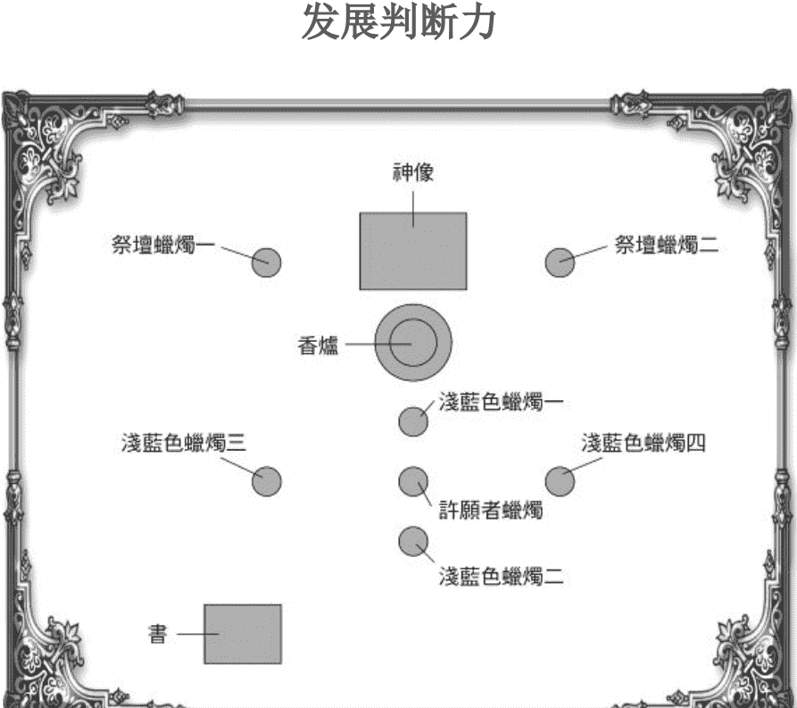

#### 发展判断力

点燃祭坛蜡烛一和二。
点燃线香，最好混合一点肉桂跟乳香。
点燃许愿者蜡烛，集中你的意念在许愿者身上。点燃浅蓝色蜡烛一、二、三和四，一边认真想着去理解别人的这个需求；理解他们的观点，有同情心。

然后默默地说道：

> 他在老鹰的领空中翱翔，
双眼在空中俯瞰；
无论是鼠辈或狡兔，
皆能感到厄运当头。
牠们对彼此漠不关心，
然而一切的变化都无关紧要。

为了追上那头母鹿，猎犬一拥而上，
稍纵即逝、快如闪电、又叫又跳。
但牠们能感觉死神的爪牙逼近，
这一天，咬住了牠们的脚后跟。
牠们对彼此漠不关心，
然而一切的变化都无关紧要。
羔羊只会轻易落入狼口，
不会因恐惧而挣扎；
但狼应该被捕食吗？
羔羊终究会听到狼嚎。
牠们对彼此漠不关心，
然而一切的转变都无关紧要。

别让我不加思索，
漠不关心、毫无感受、麻木不仁。
别让我只瞥见一条
不归路。
让我接收我付出的一切，
判断力就在我心中。

在熄灭蜡烛前，静坐十分钟。
连续七天晚上重复此仪式。

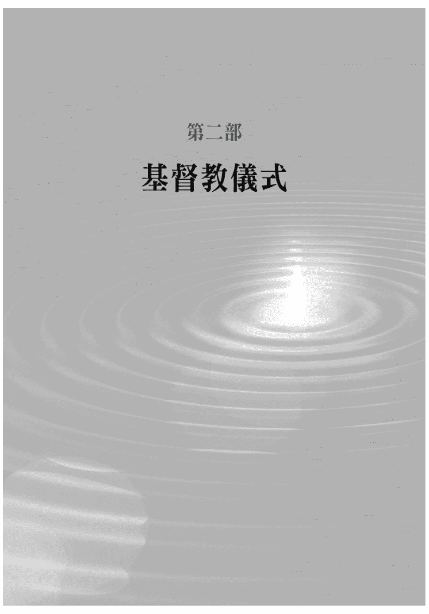

# 第二部

## 基督教儀式

## 1

## 断情

#### 解除爱情关系

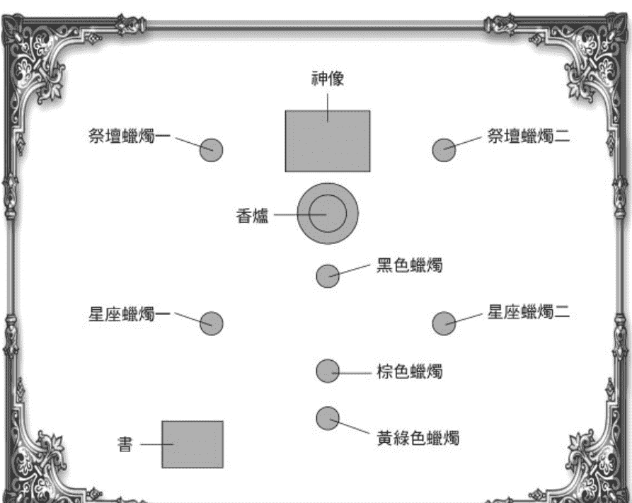

#### 解除爱情关系

- 点燃祭坛蜡烛一和二。
- 点燃薰香。
- 点燃黑色蜡烛，想象这段要拆散的爱情关系。

点燃星座蜡烛一（爱情中的男方星座代表色），一边观想男方。
点燃星座蜡烛二（爱情中的女方星座代表色），一边想着女方。
点燃棕色蜡烛，想着两人的爱正在慢慢消逝，想着两人之间的怀疑与紧张。
点燃黄绿色蜡烛，想象他们在生对方的气，两人嫉妒彼此、经常不合。

然后说道：

> （《诗篇》第三章）
喔主啊，我的敌人何其多？
有许多人起来攻击我。
有许多人议论我：「他得不到神的帮助。」
但祢耶和华是我四围的盾牌，是我的荣耀，
又是叫我抬起头来的，
我用我的声音求告耶和华，
祂就从祂的圣山上应允我。
我躺下来睡觉，我醒着，
耶和华都保佑我。
虽有成万的百姓来周围攻击我，
我也不怕。
耶和华呀，求祢起来，我的神啊，
求祢救我，因为祢打了我一切仇敌的腮骨，
敲碎了恶人的牙齿。
救恩属乎耶和华，
愿祢赐福给祢的子民，
直到永远。

坐下来专注在拆散这段爱情关系，想着这两人分道扬镳。
这样集中精神大约十分钟后，熄灭蜡烛。
每周六重复此仪式，每次都将两根星座蜡烛分向左右移开二、五公分。持续移开，直到它们最后各在祭坛的边缘。

## 2

## 护身

#### 加持护身符或护符

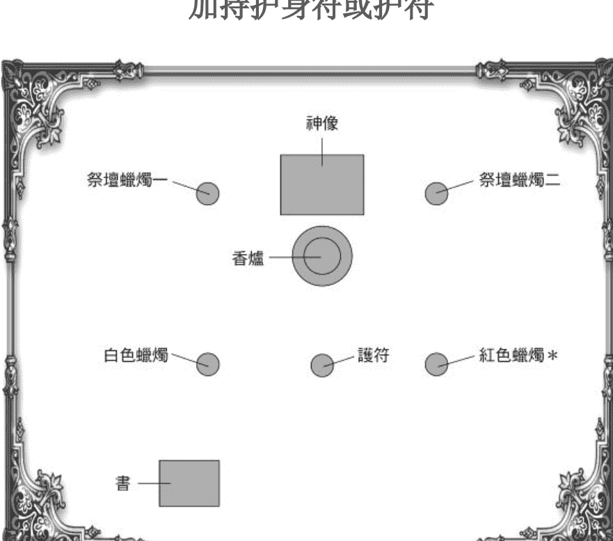

#### 加持护身符或护符

这仪式是为了加持护身符（Amulet）、护符（Talisman）或是「幸运物」。护符可能是别人为你做的，也可能是你自己做的。后者更适合。

点燃祭坛蜡烛一和二。
点燃薰香（推荐乳香）。
点燃白色蜡烛，并说：

> 这里燃烧着______（许愿者的名字）的真心，
他/她对护符力量的信念燃烧着，
像这火焰般强烈，
永不熄灭。

点燃红色蜡烛²²并说：

> 这份爱进入护符当中。
因为护符是仓库，
能储存爱的力量。

拿起护符，握在边缘处，在白色蜡烛上过火绕圈三次，再反过来，让护符的两边都能接触到火焰（别烧到你的手指）。说道：

> 我以火焰净化这护符，以及里面的一切杂质。

现在让它过香炉三次，说道：

> 我请上帝净化这护符，为我的目的做准备。

现在拿着护符，牢牢的握在你的右手（如果你惯用左手就用左手），并且说道：

> 我以爱灌注这个护符，
无论谁戴上它都会感觉到强大的力量，
配戴者将永远拥有这种力量，
只要他／她配戴着。

现在将护符放在红色蜡烛上方过火三次。说道：

> 这就是那份爱，满溢着加持的力量。

把护符放在白色与红色蜡烛中间，熄灭烛火。
让护符放在原位三小时不动，然后让主人携带或配戴之，最好是贴近皮肤配戴。

22. 注：这根蜡烛的颜色与用途，将取决于护符的用途（即：红色代表爱情、蓝色代表健康、绿色代表丰饶等等）。

## 3

## 戒除
克服恶习

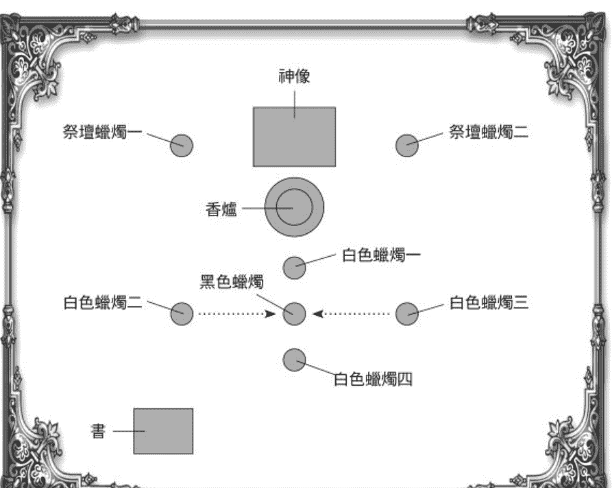

#### 克服恶习

点燃祭坛蜡烛一和二。
点燃薰香。
点燃黑色蜡烛，并且想着要去克服恶习。

点燃白色蜡烛一、二、三和四，想象恶习消失，最后被打败。说道：

> （《诗篇》第二十六章）
耶和华啊，
求祢为我伸冤，
因我向来行事周全，
我又倚靠耶和华并不摇动。
耶和华啊，求祢察看我、试验我、熬炼我的肺腑心肠。
因祢的慈爱常在我眼前，
我也按祢的真理而行。
我没有和虚谎人同坐，
也不与伪善者同群，
我憎恨恶人聚会，
必不与恶人同坐。
耶和华啊，我要洗手表明无辜，
才环绕祢的祭坛。
我好发称谢的声音，
也要述说祢奇妙的作为。
耶和华啊，我喜爱祢所住的殿，
和祢显荣耀的居所。
不要把我的灵魂和罪人一同除去，
不要把我的性命和流人血的一同除掉。
他们的手中有奸恶，
右手满有贿赂。
至于我，却要行事纯全，
求祢救赎我、怜悯我。
我的脚站在平坦地方，
在众会中我要称颂耶和华。

静坐十五分钟，然后熄灭蜡烛，先从黑色蜡烛开始熄灭。
每周同一时间重复此仪式，每次将白色蜡烛二与三朝黑色蜡烛移动几公分。每周一次，持续到白色蜡烛触及黑色蜡烛为止。

## 4

## 家庭

#### 解决家中纷乱状况

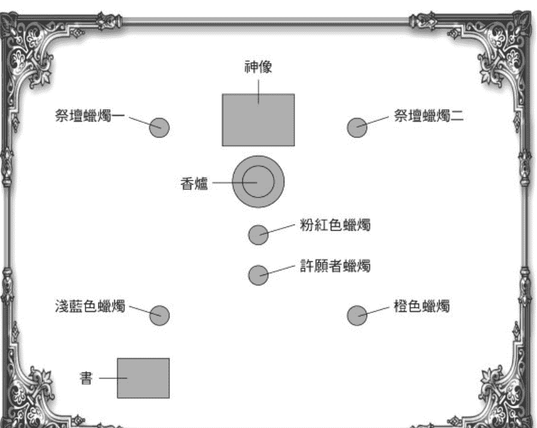

#### 解决家中纷乱状况

- 点燃祭坛蜡烛一和二。
- 点燃薰香。
- 冥想你要完成的事情。

点燃许愿者蜡烛，用心想着许愿者。
点燃浅蓝色蜡烛、粉红色蜡烛和橙色蜡烛，按照这样的顺序，想着家中的和平与安宁。
冥想片刻，然后说：

> （《诗篇》第一章）
不从恶人的计谋，
不站罪人的道路，
不坐亵慢人的座位，
惟喜爱耶和华的律法，
昼夜思想，
这人便为有福。
他要像一棵树栽在溪水旁，按时间结果子，叶子也不枯干；
凡他所做的，尽都顺利。
恶人并不是这样，乃像糠皮被风吹散。
因此当审判的时候，恶人必站立不住。
罪人在义人的会中，也是如此。
因为耶和华知道义人的道路，
恶人的道路，却必灭亡。

让蜡烛燃烧十五分钟，在此期间，反覆读诵以上的《诗篇》，在结束时可以熄灭烛火。
此仪式应该连续重复三个晚上。

## 5

## 往生

#### 为往生者做仪式

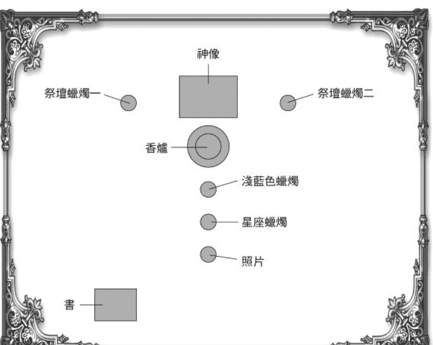

#### 为往生者做仪式

（注：在此仪式中，往生者的照片可以置于他或她的星座蜡烛前。）

点燃祭坛蜡烛一和二。
点燃薰香。

点燃往生者的星座蜡烛，并在你的脑海中描绘他或她，以你记忆中最好的模样出现。点燃浅蓝色蜡烛，想着平静与安宁。说道：

> （《雅歌》第二章）
我是沙仑的玫瑰花，
是谷中的百合花。
我的佳偶在女子中，
好像百合花在荆棘内。
我的良人在男子中，如同苹果树在树林中。
我欢欢喜喜坐在他的荫下，
尝他果子的滋味觉得甘甜。
他带我入筵宴所，
以爱为旗在我以上。
他的左手在我头下，
他的右手将我抱住。
耶路撒冷的众女子啊，
我指着羚羊，或田野的母鸡，嘱咐你们，
不要惊动、不要叫醒我所亲爱的，等他自己情愿。
听啊，是我良人的声音，
他穿山越岭而来。
我的良人好像羚羊，或像小鹿，
他站在我们墙壁后，
从窗户往里观看，
从窗棂往里窥探。
我的良人对我说，
我的佳偶、我的美人，
起来，与我同去。
因为冬天以往，雨水止住过去了。
地上百花开放，
百鸟鸣叫的时候已经来到，
斑鸠的声音在我们境内也听到了，
无花果树的果子渐渐成熟，
葡萄树，开花放香，
我的佳偶、我的美人，起来，与我同去。
我的鸽子啊，你在磐石穴中，
在陡巖的隐密处，
求你容我得见你的面貌，得听你的声音；
因为你的声音柔和，你的面貌秀美。
要给我们擒拿狐狸，就是毁坏葡萄园的小狐狸；
因为我们的葡萄正在开花。
良人属我、我也属他，
他在百合花中牧放群羊。
我的良人哪，求你等到天起凉风、日影飞去的时候，
你要转回，好像羚羊，或像小鹿在比特山上。

让蜡烛燃烧半小时再熄灭。每天晚上重复这个过程至少九个晚上，如果想要的话，可以延长时间。
可能要用非常大尺寸、可长时间燃烧的蜡烛，用在这个仪式当中的星座蜡烛跟浅蓝色蜡烛上。

## 6

## 美梦

#### 创造梦境

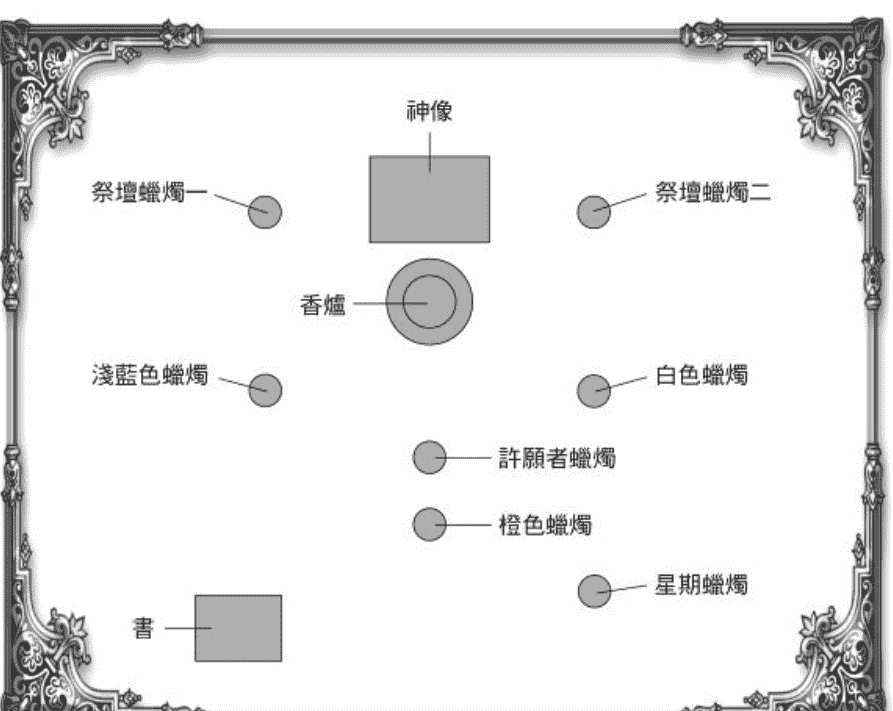

#### 创造梦境

点燃祭坛蜡烛一和二。
点燃薰香。
点燃许愿者蜡烛，想着许愿者。

点燃浅蓝色蜡烛，想着平静与安宁。
点燃橙色蜡烛，想着你希望梦到的一切。
点燃白色蜡烛，想着你梦中的真相。说道：

> （《诗篇》第十一章）
我是投靠耶和华，
你们怎么对我说：「你当像鸟飞往你的山去。」

看哪，恶人弯弓，
把箭搭在弦上，
要在暗中射那心里正直的人。
根基若毁坏，
义人还能做什么呢？

耶和华在祂的圣殿里，
耶和华的宝座在天上，
祂的慧眼察看世人。
耶和华试验义人，
唯有恶人和喜爱强暴的人，
祂心里恨恶。

祂要向恶人密布网罗，
有烈火、硫磺、热风做他们杯中的份。

因为耶和华是公义的，
祂喜爱正义，
正直人必得见祂的面。

在熄灭蜡烛之前，安静的坐几分钟。这个仪式应该在晚上，当你需要做自己渴望的梦境时，于睡前进行。

## 7

## 制伏

让你的敌人承受压力

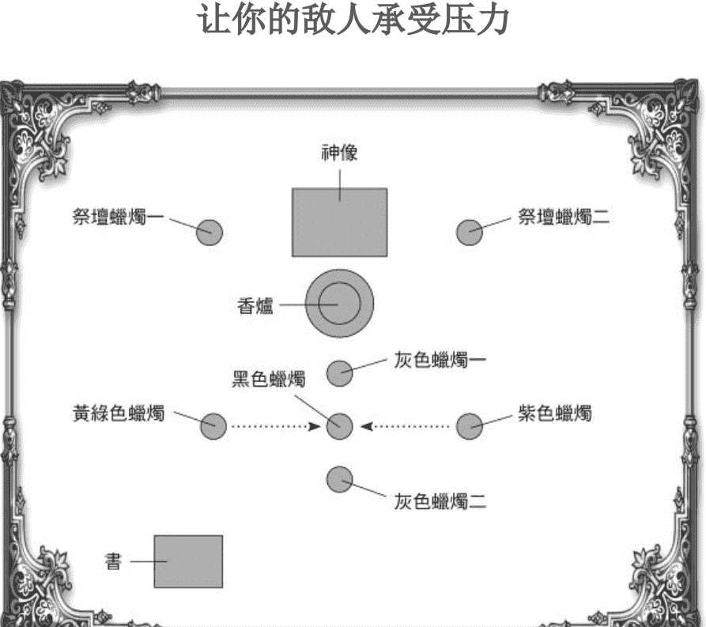

#### 让你的敌人承受压力

- 点燃祭坛蜡烛一和二。
- 点燃薰香。
- 点燃黑色蜡烛，想着你的敌人。

点燃灰色蜡烛一和二，想着挫折，陷于僵局。
点燃黄绿色蜡烛，想着愤怒、失序、疾病与恐惧。
点燃紫色蜡烛，想着紧绷、焦虑。
想象一下，你的敌人感到完全的孤单、对他/她自己没有自信，既紧张又害怕。然后说：

> （《诗篇》第七十章）
神啊，求祢快快搭救我！
耶和华啊，求祢速速帮助我！
愿那些寻索我命的，
抱愧蒙羞；
愿那些喜悦我遭害的，
退后受辱。
愿那些对我说「啊哈、啊哈」的人，
因羞愧退后。
愿一切寻求祢的，
因祢高兴欢喜；
愿那些喜爱祢救恩的，
常说：「当尊神为大。」
但我是困苦穷乏的。
神啊，求祢速速到我这里来！
祢是帮助我的、搭救我的。
耶和华啊，求祢不要耽延。

吹熄黑色蜡烛。
坐一会儿，想象你的敌人困惑了。

然后重新点燃蜡烛，并说道：

> 神啊，求祢快快搭救我！
耶和华啊，求祢速速帮助我！
愿那些寻索我命的，
抱愧蒙羞；
愿那些喜悦我遭害的，
退后受辱。
愿那些对我说「啊哈、啊哈」的人，
因羞愧退后。
愿一切寻求祢的，
因祢高兴欢喜；
愿那些喜爱祢救恩的，
常说：「当尊神为大。」
但我是困苦穷乏的。
神啊，求祢速速到我这里来！
祢是帮助我的、搭救我的。
耶和华啊，求祢不要耽延。

再次坐着，想象你的敌人被彻底弄糊涂了。
第二天晚上重复这一个步骤，把黄绿色蜡烛和紫色蜡烛往中间移五公分的位置。每天晚上重复，直到它们碰触彼此为止。

## 8

## 除恶

#### 抵御邪恶

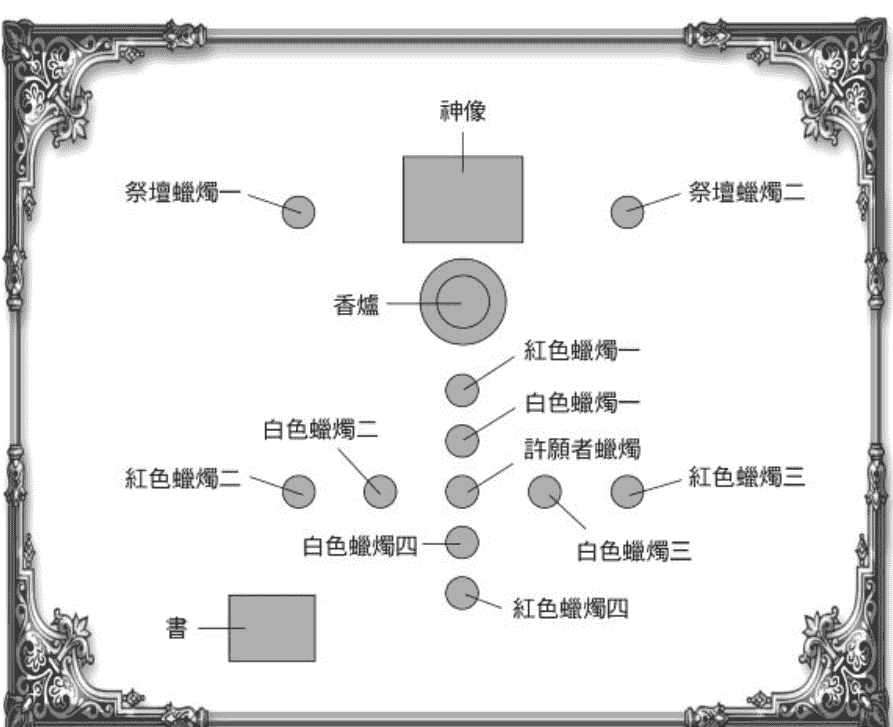

#### 抵御邪恶

帮一个人「跨越障碍」

- 点燃祭坛蜡烛一和二。
- 点燃薰香（最好是乳香）。

点燃白色蜡烛一、二、三和四，心里想着纯洁与真理。
点燃红色蜡烛一、二、三和四，想着有力量能战胜邪恶、获得健康跟权力。然后说：

> （《诗篇》第九十三章）
耶和华作王！
祂以威严为衣穿上；
耶和华以能力为衣，
以能力束腰，
世界就坚定，
不得动摇。
祢的宝座从太初立定，
祢从亘古就有。
耶和华啊，大水扬起，
大水发声，
波浪澎湃。
耶和华在高处大有能力，
胜过诸水的声响，
洋海的大浪。
耶和华啊，
祢的法度最真确；
祢的殿永称为圣，
是合宜的。

让蜡烛一直燃烧到熄灭为止。

## 9

## 勇气

#### 战胜恐惧

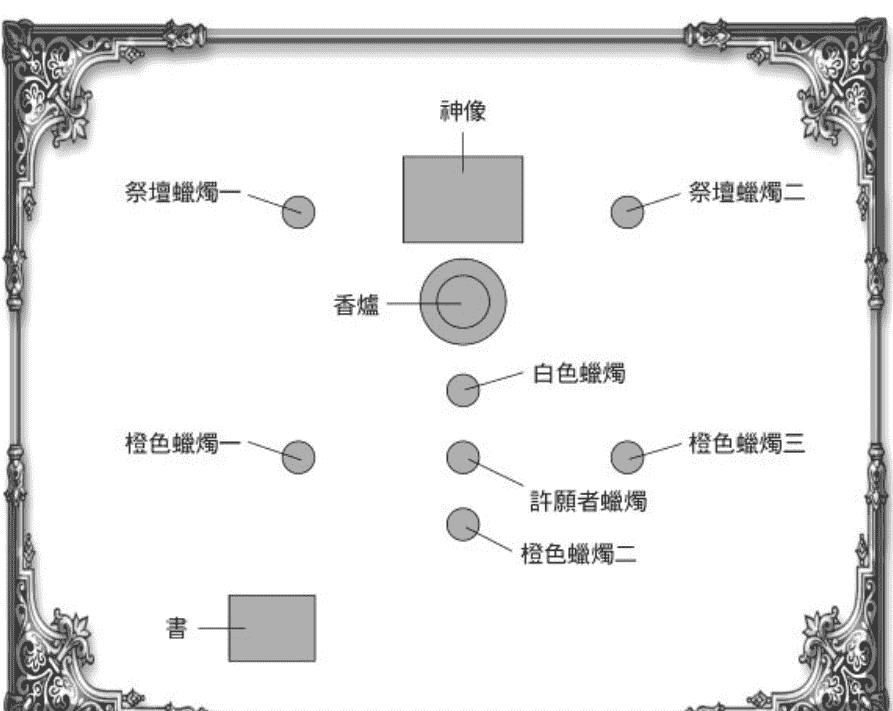

#### 战胜恐惧

点燃祭坛蜡烛一和二。
点燃薰香。
集中注意力想着战胜恐惧。

在观想许愿者的时候，点燃许愿者蜡烛。
点燃白色蜡烛，同时想着力量跟纯洁。
点燃橙色蜡烛一、二和三，同时想着自信、战胜恐惧的能力，以及品格的力量。
冥想片刻，然后说道：

> （《诗篇》第三十一章）
耶和华啊，我投靠祢，
求祢使我永不羞愧；
凭祢的公义搭救我。
求祢侧耳而听，
快快救我，
作我坚固的磐石，
拯救我的保障。
因为你是我的岩石，
我的山寨，
所以求祢为祢名的缘故
引导我、指点我。
求祢救我脱离人为我暗设的网罗，
因为祢是我的保障。
我将我的灵魂交在祢手里，
耶和华诚实的神啊，
祢救赎了我。
我恨恶那信奉虚无之神的人，
我却依靠耶和华。
我要为祢的慈爱高兴欢喜，
因为祢见过我的困苦，
知道我心中的艰难。
祢未曾把我交在仇敌手里，
祢使我的脚站在宽阔之处。
耶和华啊，求祢怜悯我，
因为我在急难之中，
我的眼睛因忧愁而干瘪，
连我的身心也不安舒。
我的生命为愁苦所消耗，
我的年岁为叹息所旷废，
我的力量因我的罪孽衰败，
我的骨头也枯干。
我因一切敌人成了羞辱，在我的邻舍跟前更甚，
那认识我的都惧怕我，
在外头看见我的都躲避我。
我被人忘记，
如同死人，
无人纪念，我好像破碎的器皿。
我听见许多人的谗谤，
四围都是惊吓。
他们一同商议攻击我的时候，就图谋要害我的性命。
耶和华啊，我仍旧倚靠祢。
我说，祢是我的神。
我终身的事在祢手中，
求祢救我脱离仇敌的手
和那些逼迫我的人，
求祢使祢的脸光照仆人，
凭祢的慈爱拯救我。
耶和华啊，求祢叫我不致羞愧，
因为我曾呼求祢；
求祢使恶人羞愧，
使他们在阴间缄默无声。
那撒谎的人逞骄傲轻慢，
出狂言的话攻击义人，
愿他的嘴哑而无言。
敬畏祢、投靠祢的人，
祢为他们所积存的，
在世人面前所施行的恩惠是何等大！
祢必把他们藏在你面前的隐密处，
免得遇见人的计谋，
祢必暗暗的保守他们在亭子里，
免受口舌的争闹。
耶和华是应当称颂的，
因为祂在坚固城里向我
施展奇妙的慈爱。

至于我，
我曾急促的说：
我从祢的眼前被隔绝。
然而，我呼求祢的时候，祢仍听我恳求的声音。
耶和华的圣民啊，你们都要爱祂！
耶和华保护诚实人，
足足报应行事骄傲的人。
凡仰望耶和华的人，
你们都要壮胆，
坚固你们的心。

坐着冥想五分钟，然后熄灭烛火。
每天晚上重复仪式，持续九天晚上。

## 10

## 幸福

#### 赢取或保有幸福

#### 赢取或保有幸福

- 点燃祭坛蜡烛一和二。
- 点燃薰香。
- 点燃许愿者蜡烛，观想许愿者。

点燃金色蜡烛和橙色蜡烛，想象许愿者吸引幸福到自己身上。点燃红色蜡烛一和二，观想许愿者渴望并应得的一切幸福。
想象所有的喜乐都流进许愿者身上。然后说：

> （《诗篇》第十一章）
我是投靠耶和华，
你们怎么对我说：
你当像鸟飞往你的山去？

看哪，恶人弯弓，
把箭搭在弦上，
要在暗中射那心里正直的人。
根基若毁坏，
义人还能做什么呢？

耶和华在祂的圣殿里，
耶和华的宝座在天上，
祂的慧眼察看世人。
耶和华试验义人，
惟有恶人和喜爱强暴的人，
祂心里恨恶。
祂要向恶人密布网罗，
有烈火、硫磺、热风
作他们杯中的份。

因为耶和华是公义的，
祂喜爱公义，

## V:zkzk56

正直人必得见祂的面。

坐下来十五分钟，想想许愿者的幸福。然后熄灭蜡烛，连续几天晚上重复此仪式，每次都把红色蜡烛移向许愿者蜡烛五公分，一直持续到两根红色蜡烛实际上都碰触了许愿者蜡烛为止。

## 11

## 婚姻美满

#### 疗愈不快乐的婚姻

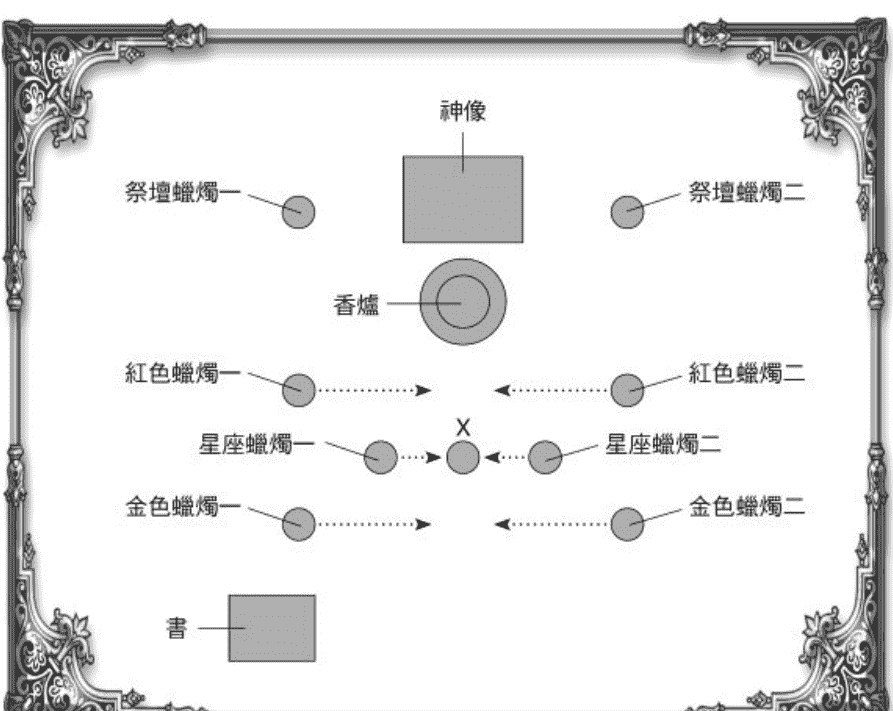

#### 疗愈不快乐的婚姻

- 点燃祭坛蜡烛一和二。
- 点燃薰香。
- 冥想你要实现的愿望。

在想到丈夫的时候，点燃星座蜡烛一、红色蜡烛一、金色蜡烛一。

在想到妻子的时候，点燃星座蜡烛二、红色蜡烛二、金色蜡烛二。

> （《雅歌》第三章）
> 我夜间躺卧在床上，寻找我心所爱的；
> 我寻找他，却寻不见。
> 我说：我要起来，游行城中、在街市上，
> 在宽阔处，寻找我心所爱的，
> 我寻找他，却寻不见。
> 城中巡逻看守的人遇见我，
> 我问他们：「你们看见我心所爱的没有？」
> 我刚离开他们，
> 就遇见我心所爱的。
> 我拉住他，不容他走，
> 领他入我母家，
> 到怀我者的内室。
> 耶路撒冷的众女子啊，
> 我指着羚羊或田野的母鹿嘱咐你们，
> 不要惊动，不要叫醒我所亲爱的，等他自己情愿。
> 那从旷野上来，
> 形状如柱，以没药和乳香，
> 被商人各样香粉薰的是谁呢？
> 看哪，是所罗门的轿，
> 四围有六个勇士，
> 都是以色列中的勇士；
> 手都持刀，善于争战，
> 腰间配刀，
> 防备夜里有惊慌。
> 所罗门王用黎巴嫩木
> 为他自己制造一乘华轿，
> 轿柱是用银做的，
> 轿底是金做的，坐垫是紫色的，
> 其中所铺的乃是
> 耶路撒冷众女子的爱情。
> 锡安的众女子啊，
> 你们出去观看所罗门王，
> 头戴冠冕，
> 就是在他婚筵的日子、心中喜乐的时候，
> 他母亲给他戴上的。

连续九天，每隔一天重复此仪式，每次都把两组蜡烛移动靠近彼此二、五公分。

## V:zkzk56

## 12

## 健康

#### 保持（或恢复）健康

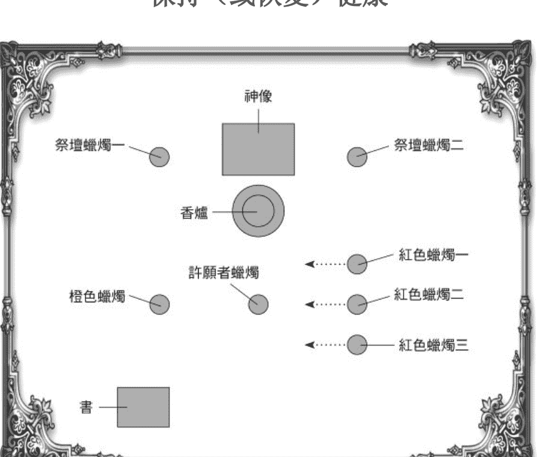

#### 保持（或恢复）健康

- 点燃祭坛蜡烛一和二。
- 点燃薰香。
- 点燃许愿者蜡烛，观想许愿者。

点燃橙色蜡烛，想象着鼓励跟吸引力。
点燃红色蜡烛一、二和三，想着力量跟健康。
当你说话的时候，观想所有的力量跟健康都流入了许愿者身上：

> （《诗篇》第二十三章）
> 耶和华是我的牧者，
> 我必不致缺乏。
> 祂使我躺卧在青草地上，
> 领我在可安歇的水边。
> 祂使我的灵魂甦醒，
> 为自己的名引导我走义路。
> 我虽然行过死荫的幽谷，
> 也不怕遭害，
> 因为你与我同在；
> 你的杖，
> 你的竿，都安慰我。
> 在我敌人面前，
> 祢为我摆设筵席；
> 祢用油膏了我的头，
> 使我的福杯满溢。
> 我一生一世
> 必有恩惠慈爱随着我，
> 我且要住在耶和华的殿中，
> 直到永远。

安静的坐着想像请愿者有了美妙的健康，并且乐在其中。这样坐上十到十五分钟，然后熄灭蜡烛。每周五晚上重复这个仪式。
连续七个周五，每一次移动三根红色蜡烛靠近许愿者蜡烛一点点。在第七个周五让红色蜡烛碰到许愿者的蜡烛。

## V:zkzk56

## 13

## 嫉妒

#### 招引嫉妒

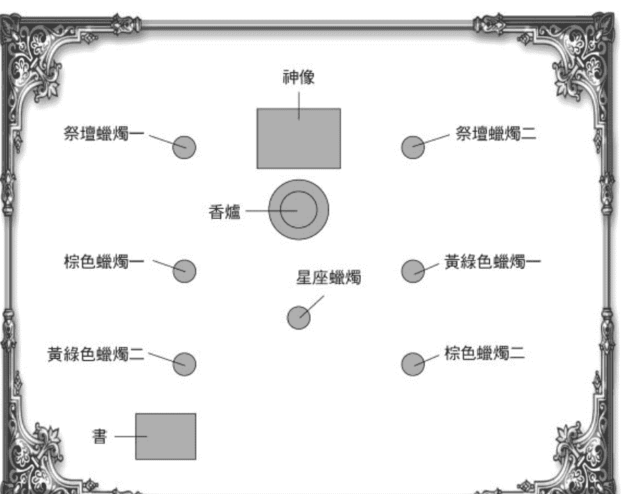

#### 招引嫉妒

点燃祭坛蜡烛一和二。

点燃薰香。

点燃希望招引嫉妒的人对应的星座蜡烛。专注的想着他或她。点燃棕色蜡烛一和二，想着不确定、犹豫的感觉。
点燃黄绿色蜡烛一和二，想着疾病、嫉妒和失序的感觉。然后说道：

> （《诗篇》第六十三章）
> 神啊，祢是我的神，我要切切地寻求祢，
> 在干旱疲乏无水之地，
> 我渴想祢，
> 我的心切慕祢。
> 我在圣所中曾如此瞻仰祢，
> 为要见祢的能力和祢的荣耀。
> 因祢的慈爱比生命更好，
> 我的嘴唇要颂赞祢。
> 我还活的时候要这样称颂祢，
> 我要奉祢的名举手。
> 我在床上记念祢，
> 在夜更的时候思想祢，
> 我的心就像饱足了骨髓肥油，
> 我也要以欢乐的嘴唇赞美祢。
> 因为祢曾帮助我，
> 我就在祢翅膀的荫下欢呼。
> 我心紧紧的跟随祢，
> 祢的右手扶持我。
> 但那些寻索要灭我命的人，
> 必往地底下去。
> 他们必被刀剑所杀，
> 被野狗所吃。
> 但是王必因神欢喜，
> 凡指着他发誓的，
> 必要夸口；
> 因为
> 说谎之人的口必被塞住。

熄灭蜡烛。
连续三周的每周一和周六举行此仪式。

## V:zkzk56

## 14

## 恋爱

#### 赢得爱情

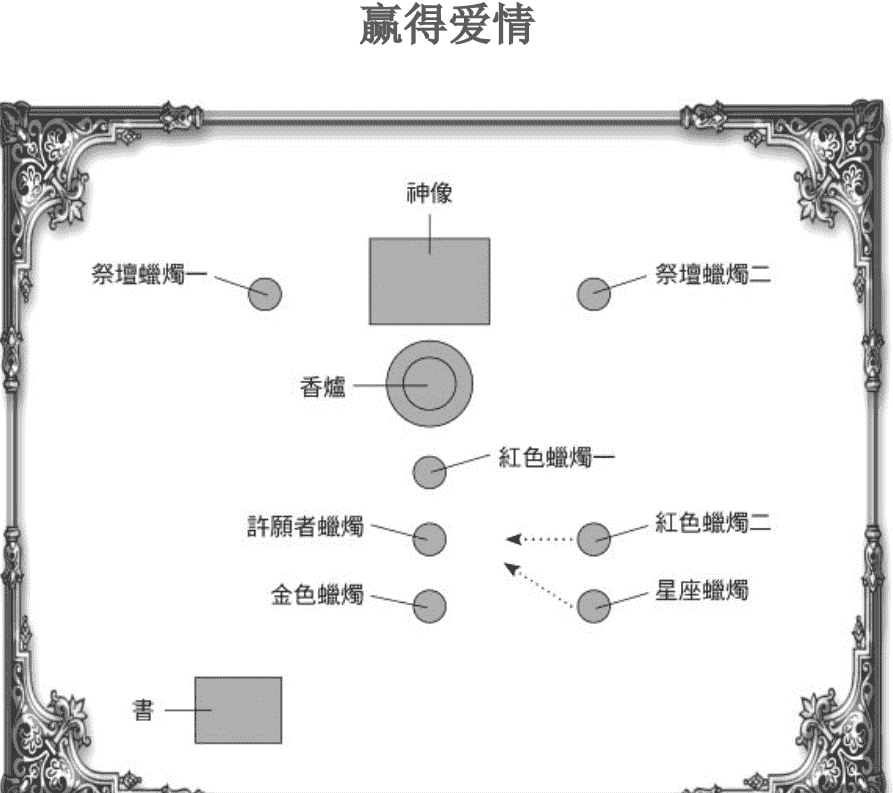

#### 赢得爱情

- 点燃祭坛蜡烛一和二。
- 点燃薰香。
- 冥想。

点燃许愿者蜡烛，观想他或她。
点燃红色蜡烛一，观想许愿者的爱与力量。
点燃金色蜡烛，观想许愿者拥有的强大魅力；他或她如何吸引人们靠近自己。
点燃许愿者的求爱对象所代表的星座蜡烛，想着对方，并观想他或她。
点燃红色蜡烛二，观想这个人对许愿者的爱。如果许愿者是男性，然后施术者应该要说：

> （《雅歌》第六章）
> 你这女子中极美丽的，
> 你的良人往何处去了？
> 你的良人转向何处去了？
> 我们好与你同去寻找他。
> 我的良人下入自己园中，
> 到香花畦，
> 在园内牧放群羊，采百合花。
> 我的佳偶啊，
> 你美丽如得撒，
> 秀美如耶路撒冷，
> 威武如展开旌旗的军队。
> 求你掉转眼目不看我，因你的眼目使我惊乱。
> 你的头发如同山羊群，卧在基列山旁。
> 你的牙齿如一群母羊，
> 洗净上来，
> 个个都有双生，
> 没有一只丧掉子的。
> 你的两太阳在帕子内如同一块石榴。
> 有六十王后，
> 八十妃嫔，
> 并有无数的童女。
> 我的鸽子，我的完全人，
> 只有这一个是她母亲独生的，
> 是生养她者所宝爱的。
> 众女子见了就称她有福；
> 王后妃嫔见了
> 也赞美她。
> 那向外观看，如晨光发现，
> 美丽如月亮，皎洁如日头，
> 威武如展开旌旗军队的是谁呢？
> 我下入核桃园，
> 要看谷中青绿的植物，
> 要看葡萄发芽没有，
> 石榴开花没有。
> 不知不觉，我的心
> 将我安置在我尊长的车中。
> 回来，回来，书拉密女！
> 使我们得观看你！
> 你们为何要观看书拉密女，
> 像观看玛哈念跳舞的呢？

若许愿者是女性，那么施术者应该唸：

> （《雅歌》第八章）
> 巴不得你像我兄弟，
> 像吃我母亲奶的兄弟！
> 我在外头遇见你，就与你亲嘴，
> 谁也不轻看我。
> 我必引导你，领你进我母亲的家，
> 我可以领受教训，
> 也就使你喝石榴汁酿的香酒。
> 他的左手必在我头下；
> 他的右手必将我抱住。
> 耶路撒冷的众女子啊，我嘱咐你们：
> 不要惊动、不要叫醒我所亲爱的，等他自己情愿。
> 那靠着良人从旷野上来的是谁呢？
> 我在苹果树下叫醒你，
> 你的母亲在那里为你效劳，
> 生养你的在那里为你效劳。
> 求你将我放在你心上
> 如印记，带在你臂上如戳记。
> 因为爱情如死之坚强，
> 嫉恨如阴间之残忍；
> 所发的电光是火焰的电光，
> 是耶和华的烈焰。
> 爱情，众水不能熄灭，
> 大水也不能淹没。
> 若有人拿家中所有的财宝要换爱情，
> 就全被藐视。
> 我们有一小妹，她的两乳尚未长成，
> 人来提亲的日子，
> 我们当为她怎样办理？
> 她若是墙，我们要在其上建造银塔；
> 她若是门，我们要用香柏木板维护她。
> 我是墙，我两乳像其上的楼。
> 那时，我在他眼中像个平安的人。
> 所罗门在巴力哈们有一葡萄园；
> 他将这葡萄园交给看守的人，
> 为其中的果子必交
> 一千舍客勒银子。
> 我自己的葡萄园在我面前，
> 所罗门哪，一千舍客勒归你，
> 两百舍客勒归看守果子的人。
> 你这住在园中的，
> 同伴都要听你的声音，
> 求你使我也得听见。
> 我的良人哪，求你快来！
> 如羚羊或小鹿
> 在香草山上。

在将红色蜡烛二跟星座蜡烛向左移动二、五公分后的第二天重复此仪式。每天持续做，直到红色蜡烛二和星座蜡烛都碰触了许愿者蜡烛。

## V:zkzk56

## 15

## 好运

#### 改变运势

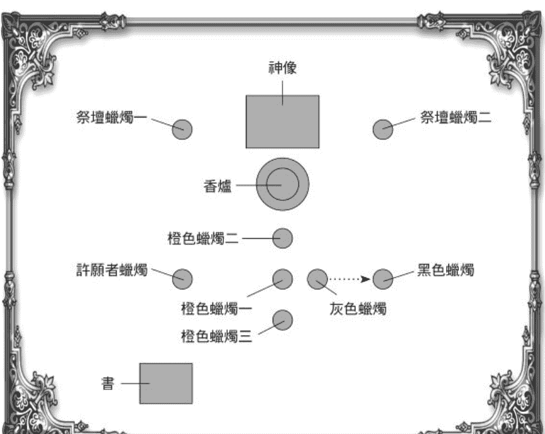

#### 改变运势

点燃祭坛蜡烛一和二。
点燃薰香。
点燃许愿者蜡烛，想象许愿者的模样。点燃橙色蜡烛一、二和三，想着激励许愿者，想着许愿者的运势改变，变得更好了。点燃黑色蜡烛，想着厄运即将消失。

点燃灰色蜡烛，想着所有的厄运都被消除了，在运势中和之后，就变成了好运当道。

> （《诗篇》第六十二章：第三、四、十一、十二节）
> 你们大家攻击一人，
> 把他毁坏，如同
> 毁坏歪斜的墙、将倒的壁，
> 要到几时呢？
> 他们彼此商议，专要从他的尊位上把他推下，
> 他们喜爱谎言，口虽祝福，
> 心却咒诅。
>
> 神说了一次、两次，我都听见，
> 就是能力都属乎神。
> 主啊，慈爱也是属乎祢，
> 因为祢照着各人所行的报应他。

吹熄黑色蜡烛，过一会儿，又重新点燃它，再次说道：

> 你们大家攻击一人，
> 把他毁坏，如同
> 毁坏歪斜的墙、将倒的壁，
> 要到几时呢？
> 他们彼此商议，专要从他的尊位上把他推下，
> 他们喜爱谎言，口虽祝福，
> 心却咒诅。
>
> 神说了一次、两次，我都听见，
> 就是能力都属乎神。
> 主啊，慈爱也是属乎祢，
> 因为祢照着各人所行的报应他。

吹熄黑色蜡烛，过一会儿，又重新点燃它，再次说道：

> 你们大家攻击一人，
> 把他毁坏，如同
> 毁坏歪斜的墙、将倒的壁，
> 要到几时呢？
> 他们彼此商议，专要从他的尊位上把他推下，
> 他们喜爱谎言，口虽祝福，
> 心却咒诅。
>
> 神说了一次、两次，我都听见，
> 就是能力都属乎神。
> 主啊，慈爱也是属乎祢，
> 因为祢照着各人所行的报应他。

专心想着许愿者的运势由坏转好。
熄灭蜡烛。
连续几晚重复此仪式，每一次都让灰色蜡烛往黑色蜡烛靠近二、五公分，持续到碰触黑色蜡烛为止。

## V:zkzk56

## 16

## 冥想

#### 静心冥想

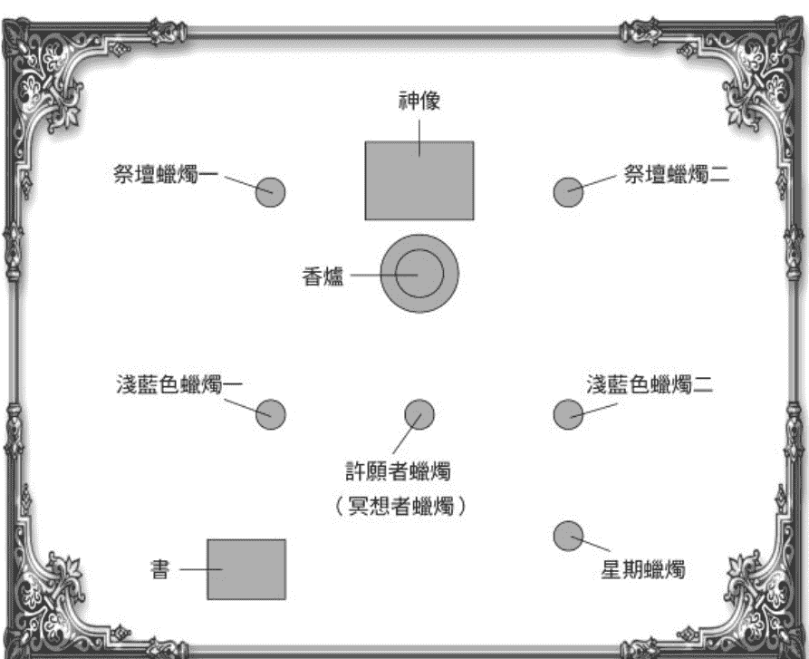

#### 静心冥想

- 点燃祭坛蜡烛一和二。
- 点燃星期蜡烛。
- 点燃薰香。

点燃许愿者蜡烛，想着许愿者。
点燃浅蓝色蜡烛，想着平静与安宁。说：

> 我们已经在自然的秩序、
> 历史的长河中找到了祢。
> 但我们在一生中，对祢一无所知。
> 祢近在咫尺，
> 我们却视而不见。
> 即便我们过着没有祢
> 亲切陪伴的一天，
> 求主帮助我们，为我们展现
> 祢的临在与援助。
> 但愿乌云未遮蔽祢的脸庞，
> 但愿祢的荣光引导我们一生，
> 愿今天成为我们喜乐与成长的日子，
> 愿黄昏使我们更接近目标，
> 让我们走上自己的道路。
> 助我们理解它们所承诺的财富，
> 赐我们珍贵的果实与花朵，
> 并在我们灵魂的花园里盛放。
> 愿我们不遗余力照顾它们，
> 即便是为了物质上的好处而劳动。
> 在我们人生的高产时期，来给我们出主意吧！
> 愿最终的收获是为了
> 我们自身的富足与祢的赞许。

进入你偏爱的冥想阶段（如超觉静坐、梵咒瑜伽……等等）。
在冥想结束时，按照点蜡烛的相反顺序熄灭蜡烛。

## V:zkzk56

## 17

## 金钱

#### 获得金钱

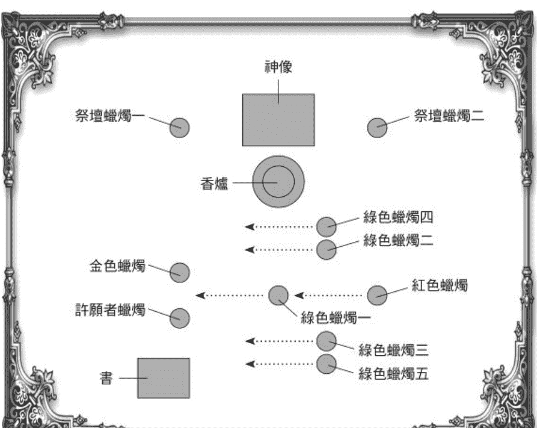

#### 获得金钱

点燃祭坛蜡烛一和二。
点燃薰香。
观想要实现的事情。

点燃许愿者蜡烛，想着许愿者的模样。
点燃金色蜡烛，想着「吸引金钱的感觉」。
按照顺序点燃绿色蜡烛，想着「金钱」。
点燃红色蜡烛，想象要实现的愿望。
沉思片刻，然后说道：

> （《诗篇》第四十一章）
> 眷顾贫穷的有福了，
> 他遭难的日子，耶和华必搭救他。
> 耶和华必保全他，使他存活；他必在地上享福。
> 求祢不要把他交给仇敌，遂其所愿。
> 他病重在榻，耶和华必扶持他；
> 他在病中，祢必给他铺床。
> 我曾说：「耶和华啊，求祢怜恤我、医治我，
> 因为我得罪了祢。」
> 我的仇敌用恶言议论我说：
> 「他几时死，他的名才灭亡呢？」
> 他来看我就说假话，他心存奸恶，走到外边才说出来。
> 一切恨我的，都交头接耳的议论我，他们设计要害我。
> 他们说：「有怪病贴在他身上，他已躺卧，必不能再起来。」
> 连我知己的朋友，
> 我所倚靠吃过我饭的，也用脚踢我。
> 耶和华啊，求祢怜恤我，使我起来，好报复他们。
> 因我的仇敌不得向我夸胜，
> 我从此便知道祢喜爱我，
> 祢因我纯正就扶持我，
> 使我永远站在祢的面前。
> 耶和华，以色列的神，是应当称颂的，
> 从亘古直到永远。阿们，阿们！

以上的内容可以用《诗篇》第二十三章替换：

> 耶和华是我的牧者，
> 我必不致缺乏。
> 祂使我躺卧在青草地上，
> 领我在可安歇的水边。
> 祂使我的灵魂苏醒，
> 为自己的名引导我走义路。
> 我虽然行过死荫的幽谷，
> 也不怕遭害，
> 因为你与我同在；
> 你的杖，
> 你的竿，都安慰我。
> 在我敌人面前，
> 祢为我摆设筵席；
> 祢用油膏了我的头，
> 使我的福杯满溢。
> 我一生一世
> 必有恩惠慈爱随着我，
> 我且要住在耶和华的殿中，
> 直到永远。

第二天，在把绿色跟红色蜡烛往左移五公分后，重复此仪式。每天持续做，直到绿色蜡烛一碰触到金色蜡烛与许愿者蜡烛为止。

## V:zkzk56

## 18

## 平静

#### 舒缓并安抚神经

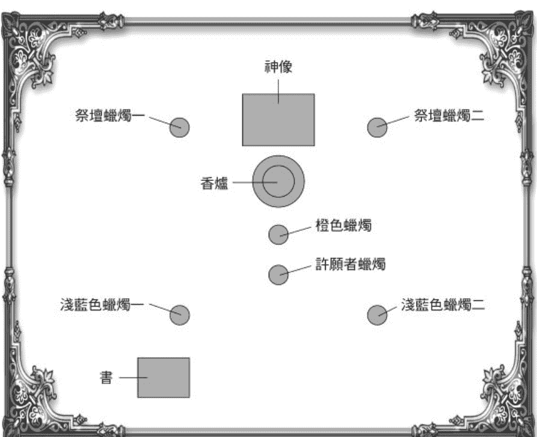

#### 舒缓并安抚神经

- 点燃祭坛蜡烛一和二。
- 点燃薰香。
- 点燃许愿者蜡烛，并集中精神想着许愿者。

点燃浅蓝色蜡烛一和二，同时想着平静与安宁，耐心和安于心平气和的感受。

点燃橙色蜡烛，同时想着激励、鼓舞和平静。说道：

> （《诗篇》第三十七章）
> 不要为作恶的心怀不平，
> 也不要向那行不义的生出嫉妒，
> 因为他们如草快被割下，
> 如青菜快要枯干。
> 当倚靠耶和华而行善，
> 住在地上，以他的信实为粮；
> 又要以耶和华为乐，他就将你心里所求的赐给你。
> 当将你的事交托耶和华，并倚靠他，他就必成全。
> 他要使你的公义如光发出，
> 使你的公平明如正午。
> 你当默然倚靠耶和华，耐性等候他。
> 不要因那道路通达的
> 和那恶谋成就的心怀不平。
> 当止住怒气，离弃忿怒；
> 不要心怀不平，以致作恶。
> 因为作恶的必被剪除，
> 惟有等候耶和华的必承受地土。
> 还有片时，恶人要归于无有。你就是细察他的住处，也要归于无有。
> 但谦卑的人必承受地土，
> 以丰盛的平安为乐。
> 恶人设谋害义人，又向他咬牙。
> 主要笑他，因见他受罚的日子将要来到。
> 恶人已经弓上弦、
> 刀出鞘，
> 要打倒困苦穷乏的人，要杀害行动正直的人。
> 他们的刀
> 必刺入自己的心，
> 他们的弓必被折断。
>
> 一个义人所有的虽少，
> 强过许多恶人的富余。
> 因为恶人的膀臂必被折断，但耶和华是扶持义人。
> 耶和华知道完全人的日子，他们的产业要存到永远。

然后安静坐十五分钟左右，再熄灭蜡烛。只要你觉得有必要的时候，就应该进行这个仪式。

## V:zkzk56

## 19

## 权力

#### 得到凌驾于他人之上的权力

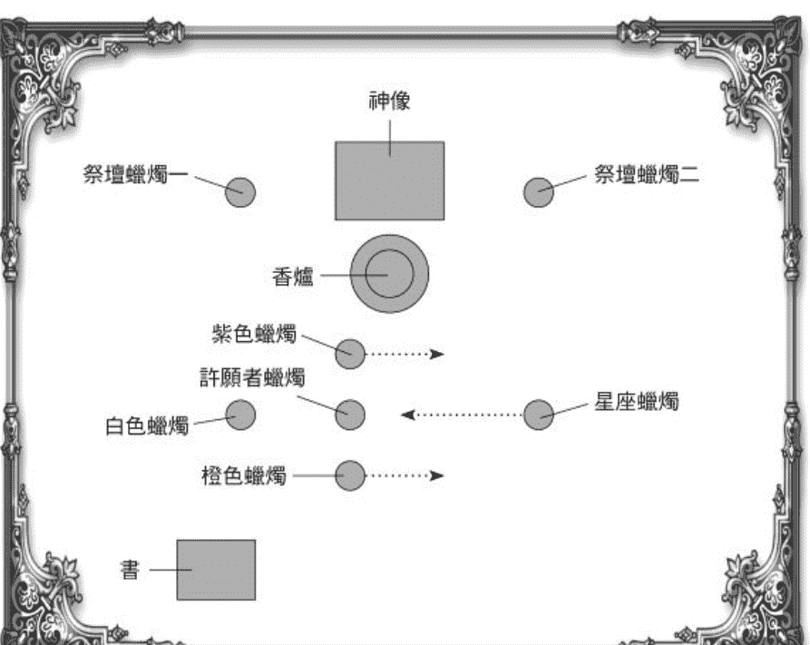

#### 得到凌驾于他人之上的权力

点燃祭坛蜡烛一和二。
点燃薰香。
点燃许愿者蜡烛，想着许愿者的模样。点燃白色蜡烛，想着许愿者的力量。

点燃许愿者想要支配者的星座蜡烛，专注的想着此人。

点燃紫色蜡烛，想着许愿者的力量散发出来，想着它如何对另一个人发挥效用。

点燃橙色蜡烛，观想许愿者对另一个人的吸引力。

然后说：

> （《诗篇》第一百三十章）
> 耶和华啊，我从深处向祢求告。
> 主啊，求祢听我的声音，
> 愿祢侧耳听我恳求的声音。
> 主耶和华啊，祢若究察罪孽，
> 谁能站得住呢？
> 但在祢有赦免之恩，
> 要教人敬畏祢。
> 我等候耶和华，我的心等候，
> 我也仰望祂的话。
> 我的心等候主，
> 胜于守夜的等候天亮，
> 胜于守夜的
> 等候天亮。
> 以色列啊，你当仰望耶和华，
> 因祂有慈爱，
> 有丰盛的救恩。
> 祂必救赎以色列
> 脱离一切的罪孽。

熄灭蜡烛。

每天晚上都做此仪式，连续六个晚上。每一次星座蜡烛向左移动二·五公分（朝向祭坛的中心），紫色蜡烛与橙色蜡烛都朝右向中心移动二·五公分。

## V:zkzk56

## 20

## 增强力量

#### 增强你的力量

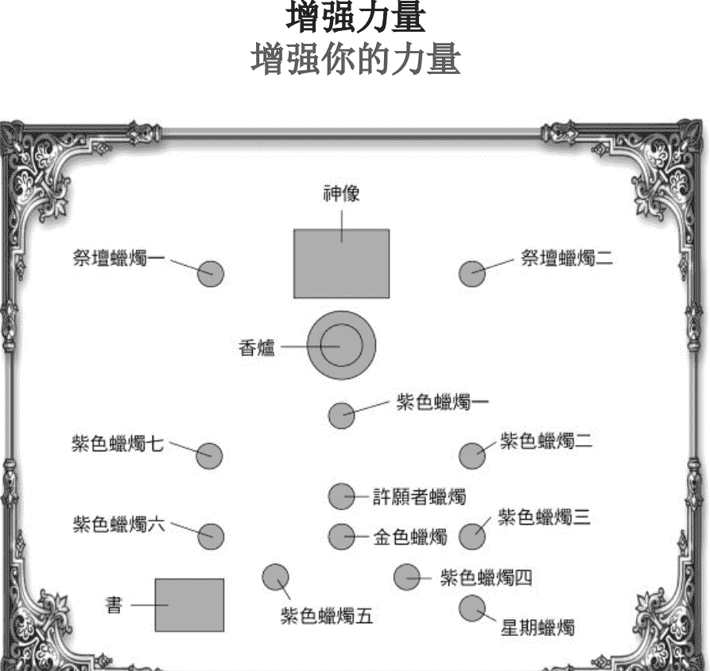

### 增强你的力量23

点燃祭坛蜡烛一和二。
点燃薰香。
点燃许愿者蜡烛，仔细想一想许愿者。

点燃金色蜡烛，想象力量被许愿者吸引而来。

点燃星期蜡烛（注意：此仪式应该在满月前的七天开始。星期蜡烛是对应仪式那天的颜色〔参见表二〕，因此，每一天仪式会用不同颜色的蜡烛）。

点燃紫色蜡烛一（注意：在仪式第二天点燃紫色蜡烛一和二；第三天，点燃紫色蜡烛一、二、三，以此类推）。说道：

> （《诗篇》第一百二十七章）
> 若不是耶和华建造房屋，
> 建造的人就枉然劳力；
> 若不是耶和华看守城池，
> 看守的人就枉然警醒。
> 你们清晨早起，
> 夜晚安歇，
> 吃劳碌得来的饭，本是枉然；惟有耶和华所亲爱的，
> 必叫他安然睡觉。
>
> 儿女是耶和华所赐的产业，
> 所怀的胎是他所给的赏赐。
> 少年时所生的儿女，
> 好像勇士手中的箭。
> 箭袋充满的人
> 便为有福；
> 他们在城门口与仇敌说话的时候，
> 必不至于羞愧。

静静的坐一会儿，观想许愿者的内在有了力量。然后再次说道：

> 若不是耶和华建造房屋，
> 建造的人就枉然劳力；
> 若不是耶和华看守城池，
> 看守的人就枉然警醒。
> 你们清晨早起，
> 夜晚安歇，
> 吃劳碌得来的饭，本是枉然；惟有耶和华所亲爱的，
> 必叫他安然睡觉。
>
> 儿女是耶和华所赐的产业，
> 所怀的胎是他所给的赏赐。
> 少年时所生的儿女，
> 好像勇士手中的箭。
> 箭袋充满的人
> 便为有福；
> 他们在城门口与仇敌说话的时候，
> 必不至于羞愧。

按照点燃蜡烛的相反顺序来熄灭蜡烛。

23. 注：适用于通灵能力、魔法力量、疗愈力量、超能力等等。

## V:zkzk56

## 21

## 丰盛

#### 获得丰盛

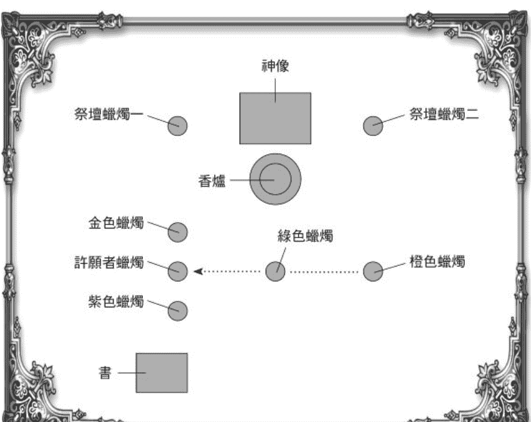

#### 获得丰盛

点燃祭坛蜡烛一和二。
点燃薰香。
点燃许愿者蜡烛，同时观想许愿者的模样。

点燃金色蜡烛，同时观想吸引力、自信跟收获。
点燃紫色蜡烛，同时想着进步跟力量。
点燃绿色蜡烛，同时观想着金钱、财富跟丰盛。
点燃橙色蜡烛，同时想着金钱与丰盛都受许愿者的吸引而来。然后说：

> （《诗篇》第四十一章）
> 眷顾贫穷的有福了，
> 他遭难的日子，耶和华必搭救他。
> 耶和华必保全他，使他存活；他必在地上享福。
> 求你不要把他交给仇敌，遂其所愿。
> 他病重在榻，耶和华必扶持他；
> 他在病中，你必给他铺床。
> 我曾说：“耶和华啊，求你怜恤我、医治我，
> 因为我得罪了你。”
> 我的仇敌用恶言议论我说：
> “他几时死，他的名才灭亡呢？”
> 他来看我就说假话，他心存奸恶，走到外边才说出来。
> 一切恨我的，都交头接耳的议论我，他们设计要害我。
> 他们说：“有怪病贴在他身上，他已躺卧，必不能再起来。”
> 连我知己的朋友，
> 我所倚靠吃过我饭的，也用脚踢我。
> 耶和华啊，求你怜恤我，使我起来，好报复他们。
> 因我的仇敌不得向我夸胜，
> 我从此便知道你喜爱我，

## V:zkzk56

祢因我纯正就扶持我，
使我永远站在祢的面前。
耶和华，以色列的神，是应当称颂的，
从亘古直到永远。阿们，阿们！

在熄灭蜡烛之前静坐一会儿。连续几个晚上都这样做，每一次都把绿色蜡烛和橙色蜡烛向左移五公分。

## 22

## 净化

#### 自我净化

点燃祭坛蜡烛一和二。

点燃薰香。

点燃许愿者蜡烛，同时专注想着许愿者。

点燃粉红色蜡烛时，想着许愿者的荣誉、正直和品德。
点燃白色蜡烛，并想着许愿者的真诚、诚实和纯洁。说道：

> （《诗篇》第二十三章）
耶和华是我的牧者，
我必不致缺乏。
祂使我躺卧在青草地上，
领我在可安歇的水边。
祂使我的灵魂甦醒，
为自己的名引导我走义路。
我虽然行过死荫的幽谷，
也不怕遭害，
因为你与我同在；
你的杖，
你的竿，都安慰我。
在我敌人面前，
祢为我摆设筵席；
祢用油膏了我的头，
使我的福杯满溢。
我一生一世
必有恩惠慈爱随着我，
我且要住在耶和华的殿中，
直到永远。

静静坐上五分钟，想着许愿者的净化。然后再次说：

耶和华是我的牧者，
我必不致缺乏。
祂使我躺卧在青草地上，
领我在可安歇的水边。

祂使我的灵魂甦醒，
为自己的名引导我走义路。
我虽然行过死荫的幽谷，
也不怕遭害，
因为你与我同在；
你的杖，
你的竿，都安慰我。
在我敌人面前，
祢为我摆设筵席；
祢用油膏了我的头，
使我的福杯满溢。
我一生一世
必有恩惠慈爱随着我，
我且要住在耶和华的殿中，
直到永远。

静静坐上五分钟，想着许愿者是纯净的，然后第三次重复这段《诗篇》章节。
在冥想五分钟后，熄灭蜡烛。
只要你想的话，就可以每三天重复一次此仪式。

## 23

## 显像占卜

#### 显像占卜仪式

点燃祭坛蜡烛一和二。
点燃薰香。
点燃许愿者蜡烛，观想许愿者的模样。

点燃白色蜡烛，观想净化、真理和真诚。
点燃紫色蜡烛，想着与神圣的力量连结，来做显像占卜。
点燃橙色蜡烛一和二，想象力量被许愿者吸引而来。说：

> （《诗篇》第六十二章）
我的心默默无声，专等候神，
我的救恩是从祂而来。
唯独祂是我的磐石。
我的拯救、
祂是我的高台，
我必不动摇。
你们大家攻击一人，把他毁坏，
如同毁坏歪斜的墙、将倒的壁，要到几时呢？
他们彼此商议，专要从他的尊位上把他推下，
他们喜爱谎言，口虽祝福，
心却咒诅。

我的心哪，你当默默无声，
专等候神，
因为我的盼望是从祂而来。
惟独祂是我的磐石，
我的拯救，
祂是我的高台，
我必不动摇。
我的拯救，
我的荣耀，
都在乎神，
我力量的磐石，
我的避难所，
都在乎神。

你们众民当时时倚靠祂，
在祂面前倾心吐意。
神是我们的避难所。
神说了一次、两次，
我都听见，
就是能力都属乎神，
啊，慈爱也是属乎祢，
因为祢照着各人所行的报应他。

静静坐一会儿，厘清你脑海里的一切。然后转过身背对祭坛，凝视着想要显像的物体（水晶、镜子或其他东西）。当你完成意欲做的事情，再次转向祭坛，低下头静默片刻。熄灭蜡烛。

注：同样适用水晶球占卜、镜子占卜，或是任何形式的灵视显像技巧。

## 24

## 清白

#### 停止造谣

点燃祭坛蜡烛一和二。点燃薰香。

点燃许愿者蜡烛，同时集中精神想着许愿者的模样。按照顺序点燃所有的白色蜡烛，并想象许愿者完全的被净化、真理和真诚的力量包围起来——这是一个无法跨越的屏障。

> （《诗篇》第二章）
外邦为什么争闹？
万民为什么谋算虚妄的事？
世上的君王一齐起来，
臣宰一同商议，
要敌挡耶和华及它的受膏者，
说：「我们要挣开他们的捆绑，
脱去他们的绳索。」
那坐在天上的必发笑，
主必嗤笑他们。
那时，祂要在怒中
责备他们，
在烈怒中惊吓他们，
说：「我已经立我的君
在锡安我的圣山上了。」
受膏者说：
「我要传圣旨。
耶和华曾对我说：
你是我的儿子，
我今日生你。
你求我，
我就将列国赐你为基业，
将地赐你为田产，
你必用铁杖打破他们，
你必将他们如同
窑匠的瓦器摔碎。」
现在，你们君王应当省悟，
你们世上的审判官该受管教；
当存畏惧侍奉耶和华，
又当存战竞而快乐；
当以嘴亲子，恐怕他发怒，
你们便在道中灭亡，
因为他的怒气快要发作。
凡投靠他的，都是有福的。

静坐冥想十分钟后再熄灭蜡烛。
只要你想要的话，每三个晚上重复此仪式。

## 25

## 成功

#### 达到成功

点燃祭坛蜡烛一和二。
点燃薰香。
点燃许愿者蜡烛，集中你的意念想着许愿者的模样。点燃金色蜡烛和橙色蜡烛一（只点燃一根橙色蜡烛），观想许愿者在任何努力的领域，都会有超棒的好运（参见仪式结尾的步骤关于橙色蜡烛二、三和四的部分）。然后说道：

> （《诗篇》第九十五章）
来啊，我们要向耶和华歌唱，
向拯救我们的磐石欢呼。
我们要来感谢祂，
用诗歌向祂欢呼。
因耶和华为大神，为大王，
超乎万神之上。
地的深处在祂手中，
山的高峰也属祂。
海洋属祂，
是祂造的；
旱地也是祂的手造成的。
来啊，我们要屈身敬拜，
在造我们的耶和华面前跪下。
因为祂是我们的神，
我们是祂草场的羊，
是祂手下的民，
惟愿你们今天听祂的话。
你们不可硬着心，像当日在米利巴，就是在旷野的玛撒。
那时，你们的祖宗试我、探我。
并观看我的作为。
四十年之久，我厌烦那世代。
说：「这是心里迷糊的百姓，
竟不晓得我的作为。」
所以我在怒中起誓说：
「他们断不可进入我的安息！」

静坐十分钟，想象许愿者获得了完全的成功。
熄灭蜡烛。

第一次仪式应当在周二完成。周五的时候重复同样的步骤，但是只点燃橙色蜡烛一和二。下一个周二再次举行此仪式，点燃橙色蜡烛一、二和三。

最后，在第二个周五，再次进行此仪式，这次点燃全部四根橙色蜡烛。

如果觉得有必要举行此仪式更久一点，可以在每周二和周五重复，但最初的「开坛」之后，一定要点燃所有的蜡烛，一直持续到获得成功为止。

## 26

## 真理

#### 了解真理

点燃祭坛蜡烛一和二。
点燃薰香。
认真想着你希望学习的真理。

点燃许愿者蜡烛，想着许愿者的模样。
点燃白色蜡烛一，并说道：

> （《诗篇》第一百一十七章）
万国啊，
你们都当赞美耶和华！
万民啊，你们都当颂赞祂！
因为祂向我们大施慈爱，
耶和华的诚实存到永远。
你们要赞美耶和华！

点燃白色蜡烛二并说：

> 万国啊，
你们都当赞美耶和华！
万民啊，你们都当颂赞祂！
因为祂向我们大施慈爱，
耶和华的诚实存到永远。
你们要赞美耶和华！

点燃白色蜡烛三，然后说：

> 万国啊，
你们都当赞美耶和华！
万民啊，你们都当颂赞祂！
因为祂向我们大施慈爱，
耶和华的诚实存到永远。
你们要赞美耶和华！

静坐半小时，然后熄灭蜡烛。

## 27

## 跨越

#### 跨越某人阻碍

点燃祭坛蜡烛一和二。
点燃薰香。
点燃许愿者蜡烛，观想许愿者的模样。

点燃红色蜡烛与白色蜡烛，观想许愿者的力量跟净化许愿者之后，将会帮助他消除被「阻碍」的情况。

点燃黑色蜡烛一和二，观想许愿者身上的「障碍」，或者是观想着那位阻碍许愿者的人（如果你知道是谁的话）。

点燃棕色蜡烛一和二，观想那个阻碍许愿者的人失败了，心中犹豫不决。说道：

> （《诗篇》第五十九章）
我的神啊，求祢救我脱离仇敌，
把我安置在高处，
得脱那些起来攻击我的人；
求祢救我脱离作孽的人和喜爱流人血的人。
因为他们埋伏，要害我的命。有能力的人聚集来攻击我。
耶和华啊，这不是为我的过犯，也不是为我的罪愆。
我虽然无过，
他们预备整齐，跑来攻击我。
求祢兴起鉴察，帮助我。
万君之神耶和华，以色列的神啊，
求祢兴起，惩治万邦，不要怜悯行诡诈的恶人。
他们晚上转回，
叫号如狗，围城绕行。
他们口中喷吐恶言，
嘴里有刀。
他们说：「有谁听见？」
但祢耶和华必笑话他们，祢要嗤笑万邦。
我的力量啊，
我必仰望祢，
因为神是我的高台。
我的神要以慈爱迎接我，
神要叫我看见我仇敌遭报。
不要杀他们，恐怕我的民忘记。
主啊，祢是我们的盾牌，
求祢用祢的能力使他们四散，
且降为卑。
因他们口中的罪和嘴里的言语，
并咒骂虚谎的话，
愿他们在骄傲之中被缠住了。
求祢发怒，使他们消灭，
以致归于无有，
叫他们知道神在雅各中间掌权，直到地极。
到了晚上，任凭他们转回，
任凭他们叫号如狗，围城绕行。
他们必走来走去，寻找食物，若不得饱，就终夜在外。
但我要歌颂祢的力量，早晨要高歌祢的慈爱；因为你作过我的高台，
在我急难的日子作过我的避难所。
我的力量啊，
我要歌颂祢，因为神是我的高台，是赐恩与我的神。

熄灭黑色蜡烛和棕色蜡烛，然后静坐五分钟左右，再熄灭其他蜡烛。

每三天重复一次此仪式，每次将两根黑色蜡烛各向外移动一点五到五公分。持续重复仪式到黑色蜡烛碰触到棕色蜡烛为止。

## 28

## 理解

#### 发展判断力

点燃祭坛蜡烛一和二。
点燃线香。
点燃许愿者蜡烛，同时观想许愿者的模样。

点燃浅蓝色蜡烛一、二、三和四。

花一点时间想象自己理解对方，看到了对方的观点；同理对方。

然后说：

> （《诗篇》第一百三十三章）
看哪，弟兄和睦同居，是何等的善，
何等的美！
这好比那贵重的油浇到亚伦的头上，
流到了胡须，
又流到了他的衣襟。
又好比黑门的甘露降在锡安山，
因为在那里有耶和华所命定的福，就是永远的生命。

暂停片刻，然后复诵：

> 看哪，弟兄和睦同居，是何等的善，
何等的美！
这好比那贵重的油浇到亚伦的头上，
流到了胡须，
又流到了他的衣襟。
又好比黑门的甘露降在锡安山，
因为在那里有耶和华所命定的福，就是永远的生命。

暂停片刻，然后复诵：

> 看哪，弟兄和睦同居，是何等的善，
何等的美！
这好比那贵重的油浇到亚伦的头上，
流到了胡须，
又流到了他的衣襟。
又好比黑门的甘露降在锡安山，
因为在那里有耶和华所命定的福，就是永远的生命。

静静冥想一会儿，然后熄灭烛火。仪式每次要连续重复进行七天晚上。

# 附录一——不要玩弄巫术

## 更黑暗的一面

在「大众心理」当中，任何关于燃烧蜡烛的说法，都不可避免的与在蜡像上插针的巫毒教法术联想在一起（实际上，这并不是特指巫毒教的法术，而纯粹是黑魔法的行为）。蜡烛为了邪恶的目的能被黏住、燃烧，但那是非常危险的做法，很容易在施术者身上引发反噬，这也许有助于描述这个特殊的仪式。

施术者拿起一块蜡或黏土，然后继续运用它来形塑成一个人的概括形状。施术者在捏塑的过程时间，牢牢的灌注意念在预定的受害者身上。这个人像的外型可能基本上非常粗糙，没有脸或是身体的细节——仅有一个身体、两只胳膊和两条腿——但施术者认为它代表了受害者。他想象受害者的脸就在人偶上，他看到了它身体的细节、姿势、手势。对他来说，这塑像就是受害者本人。

如果有任何属于受害者的东西可以掺入蜡像里面，这将会极大的有助于「辨识」。传统上，像指甲、毛发或类似的东西，它们在人偶与受害者之间将建立巨大的纽带关系。

完成仪式后，这个人偶必须命名——模仿受洗。撒上盐水，然后把它放在缭绕的薰香中，同时施术者以目标受害者的名字来称呼它。完成之后，可以将它包裹在干净的白布里面，放在一旁，直到需要派上用场为止。

为了发挥邪恶的魔力，施术者需要精致、全新尚未使用过的大头针。把蜡像放在自己面前，一次拿一根大头针，戳进蜡像里面，希望有件特别的事情发生。例如，他可能会用大头针插进人偶的头部说：「愿______（对方的名字）被逼疯！」或者他会刺向对方的胸膛说：「愿______（对方的名字）心脏病发作！」要让这种交感巫术生效，施术者必须非常激动、非常愤怒，必须对他或她的目标感到非常愤怒，如果他或她在场，施术者肯定会对之进行肢体攻击那种程度的愤怒。

施术者必须采取的重大防御措施，就是他或她处理大头针的时候。当施术者刺入每一根针时，他或她必须非常小心，不要碰到任何已经插进去的针，如果施术者偶然碰到其中的一根针，**那么整个诅咒（事实上的确是）将会回到施术者身上！**

有趣的是，在英国的一些地方，特别把针插在蜡烛上的习俗仍然很流行。按照传统，如果一位年轻女子惨遭抛弃，她应该拿一根蜡烛——不一定是黑色的——点燃它。坐着面对蜡烛，把两根新的大头针从相反的两端插进去，针应该要插得够深，才能碰到烛芯。然后她咏唱：

> 「我不是想要烧这些针，而是想烧______（负心汉的名字）的心脏。愿他难以成眠、寝食难安，直到他如我的愿。」

然后她必须坐在那里，看着蜡烛烧完，全程想着她的负心郎。

你可以从某些供应商那儿购买特殊的人形蜡烛——通常是红色的女形和黑色的男形蜡烛。这些简陋的人形蜡烛中间有固定的烛芯，那就必须有一个属于受害者的东西掺在上面，使它个人化。当然，还必须要洒净、薰香跟命名。

当大头针插进人形蜡烛，完成诅咒后，施术者可以点燃烛芯，让蜡烛完全燃尽。这样，诅咒就完全不能挽回了。

「荣耀之手」偶尔会在黑魔法跟术法的书籍中被提及，这实际上是一种烛台。事实上它是从被绞死的犯人身上得来的手。这个可怕的东西通常会竖立在壁炉架上，有五根蜡烛放在手指的指尖上。蜡烛都是黑色的。

根据十八世纪的著作：

> 荣耀之手的作用是使看到它的人麻木，静止不动好像死了一样。它是这样准备的：拿一个在公路边被绞死的重罪犯左手或右手，包裹在葬礼棺木布罩的一部分里面，把它包得妥妥当当，然后放入一个陶罐，跟铜锈、硝石、盐和荜拨粉末（一种胡椒）放在一起。把它放在这个容器两周，然后在三伏天（八月、九月跟十月）把它拿出来在阳光下充分曝晒，直到它变得非常干燥。如果阳光不够大，就把它放进烤箱，跟蕨类与马鞭草一起烤干。然后用被绞死的罪犯脂肪、没有用过的蜡、芝麻和马粪做一种蜡烛，用荣耀之手做烛台……带着这个邪恶的工具点燃时所到的每个地方，目睹者都会保持静止不动。

亨利·加马奇（Henri Gamache）声称发现了更现代版的荣耀之手范例，在《解开异教秘密的万能钥匙》（*The Master Key to Occult Secrets*），他说：

> 大约一公斤的塑形黏土做成人手的形状，把几缕发丝、几块布从敌人或对手的衣服上取下来，或者从你想要辗压的人身上取来，和黏土混在一起。在手掌弄个插座，大到足以容纳一根蜡烛。然后拿一根黑色蜡烛并涂上油，这种油可以是「困扰竞敌油」（confusion oil）或是「卑躬屈膝油」（essence of bend over）。把油擦在蜡烛上，同时说：「我以此油，来驾驭你。」施术者集中注意力在此仪式的主题上。把蜡烛插在插座上，每到午夜就燃烧几分钟，连续七个晚上。

上述邪恶的法术，我都不推荐。它们本身是危险的，不仅要小心放置大头针的位置，还可能会反噬施术者，被指定的受害者透过他或她所知的加倍奉还（运用「巫术瓶」或类似的东西）。因此，永远不要试图「玩弄」巫术。因为巫术是一种非常真切的力量，应该受到尊重。

注：见彼得·阿尔伯特（Peter Albert）于一七二二年出版的作品《自然与神秘魔法的奇妙秘密》（*Secrets merveilleux de la magie naturelle et cabalistique*）。

# 附录二——朝向目标前进

在本书首次问世的几年来，我收到了许多人的来信，他们由于生活的条件，不能点蜡烛、薰香或不能吟颂祷文。有些人和无法理解的父母、亲戚或室友住在一起，有些则是因为好奇的邻居会问东问西。一位女士说，她和许多猫住在一起，它们肯定会捣乱摆放蜡烛的位置。所以他们都会问同样的问题：「我能怎么办？有没有一种简单而有效的魔法，无须这些工具就能操作呢？」

有种巫术能够满足你的需求，并且近乎蜡烛魔法。它可以非常有效，几乎可以在任何时间、任何地点进行。它就是创造性的观想。

每个人都能够想象，当你困在办公室却希望能去高尔夫球场时，闭上眼睛就能看到球场上光滑的果岭、粗糙的果岭、沙坑等等。这不难想象，当你渴了，很想喝一杯冰镇啤酒（苏打水或其他什么）时，你可以闭上眼睛看到啤酒。「看到」它，事实上是透过具象化来产生更多的渴望，驱使你去追求获得啤酒的目标。那么，为什么不让这种具象化的方法为你所用呢？让它创造出你最想要的东西。

这是否意谓着，如果你想中乐透赢得一百万美金，只要闭上眼睛就能看到它，那么它就是你的了？不，当然不是。就像所有的魔法（以及生活中的大多数其他事情）一样，都有一定的规则；如果你要抵达你的目的地，就必须遵循某些路径，而第一个规则是设定一个**务实的目标**。

我曾经住在一对兄弟——尤金与卡尔森家附近。他们在各方面都是截然不同的，无论是如何得到你想要的东西，还是如何得不到你想要的东西，总之，这两者都可以做为极佳的范例。以工作为例，当你离开了学校，两个男孩子都想要一份高薪的工作。卡尔森宣称他绝不会满足于一份低薪的工作……他要过上好日子！尤金没说什么，他就出去在当地的超市找了一份打包的工作，虽然报酬很低，但还算幸运。

几个月过去了，卡尔森继续寻找一份「不被贬低」的工作。与此同时，尤金被拔擢为收银员，并且再从那里晋升为副经理。

卡尔森不仅想要一份好工作，还想要一辆昂贵的新车。就在他不断寻找的同时——他愈来愈痛苦——尤金则给自己买了一辆旧的二手大众汽车。他工作一段时间，存了一点钱，就把它换成一辆更好的二手车了。

当然，卡尔森最终不得不崩溃了，他接受了他能找到的任何工作，他还觉得挺难捱的。那时尤金已经是一名店经理，拥有一辆崭新的轿车了。

这段时间就象是一个设定现实目标的好范例。卡尔森的目标——从顶端开始，也就是拥有一份高阶工作跟一辆新车——是不现实的。尤金一步一脚印的努力，则是务实的。现在，同样类型的进步也适用于创造你的观想上。你不可能凭空变出一辆崭新的凯迪拉克，但如果你真的需要一辆新车，你当然可以凭空变出一辆二手车，然后从这里继续前进。

这是否意谓着，你永远不能够透过创造性的观想得到一辆崭新的轿车呢？不，这仅仅意谓着，对于某些事情，你可能需要采取几个步骤才能达到目标，而不是只采取一个步骤。如果一辆新的凯迪拉克是

## V:zkzk56

你的人生目标——那么要得到它还需要很多步骤。像尤金一样，你应该从一辆二手车开始。要知道，这只是你想走的方向上的第一步。我知道那辆轿车很快就会被另一辆更好的二手车取代，而不久可能会有第三辆。但你也要知道，这些逐步的目标都是通向最终目标的，最终的目标……在那里，你最终会卖掉你的最后一辆二手车，得到一辆全新的凯迪拉克。

所以，当你的最终目标看起来很遥远的时候，设定阶段目标，规划出来。实际上，你认为要达到你想要的目标需要多少步骤呢？把它写在纸上，然后做决定，这样你就会知道你该往哪个方向走，以及需要多长的时间才能到达目的地。

除了一个务实的目标外，你还必须设定一个**务实的时间期限**。你的车——无论是新车还是旧车——不会在一夜之间出现在你的车道上。创造性的观想不是一根魔法棒，挥动瞬间就能实现愿望。就像所有的魔法一样，你必须努力工作，所以要决定你得努力多久的时间。一般来说，一个月是一段很长的时间。事实上，正如你将在以下看到的，月相可以和你的创造性观想互相配合。当然，并不是所有的事情都能在一个月内完成，但能以月份来考虑……一个月，两个月，三个月，逐步达成。

买第一辆二手车，在一个月内是合理的。当你拥有了一辆车，并享受了一段时间后，你就可以开始考虑换新车了。一辆更好的车需要更长的时间，所以当你准备好要开始的时候，给目标两个月的时间，以此类推，每一步都朝向最终的目标前进。

现在最重要的是把你的计划写在纸上，你的目标是什么？如果有必要的话，阶段性目标呢？时间期限呢？这里是真正考虑到你的目标，将采取何种形式的地方。对于象是汽车这样的东西，它是截然不同的。但是要设定一个「更好的工作」这样的目标。是怎样的工作呢？这工作在什么方面是「更好」呢？是指更优渥的收入吗？还是指更少的工时呢？是指更舒适的环境吗？要非常**具体**。把条件都写下来，这样它就不仅仅是你脑海中一个模糊的想法。你想从那间破公寓搬到透天厝吗？是怎样的房子呢？是男爵的宅邸，或是朴实无华的小别墅呢（记住从小事开始）？不要含糊不清，写下所有的细节，如果有必要就画张图。

对于创造性的观想来说，图片是很好的辅助工具。同样，你可以用新车为范例——在你房间的墙壁上挂一张你想要的轿车照片。经常注视它，闭上眼睛，随时都能看到它。看到它，就知道它是你的车了。对于你正在努力的其他事情也是如此。如果你没有照片，挂一个字或是一句话，如：「**有着和善同事的愉快工作环境**」、「**微笑**」、「**麂皮布面夹克**」……用粗体字写下来，挂在你房间的墙上，或者在梳妆台上的镜子周围。注视它，一直都看着它。

暂时回到这个目标是否务实的问题上——你确定你真的想要它吗？如果你想要的是透天厝而非公寓，你能负担得起透天厝吗？你有没有考虑过伴随透天厝而非公寓的维修费、税金、公设等等？你想要的那辆车……等你有了它，你能开得起吗？你考虑过汽油、保险、税金等等涨价吗？

如你所见，当你希望改变时，有许多事情需要考虑。不过一旦你考虑了所有的利弊，并下定决心……**正向的思考**。确立你的目标，然后去实现它吧！这需要耐心。但这是可以做到的。

一般细节到此为止——现在是技术的环节。你什么时候会做创造性的观想呢？怎么做的？在哪里做？

你真的可以在任何地方这样做，但是，为了达到最好的效果，我建议你做的事情，跟我给蜡烛仪式的建议差不多。要在一个安静的地方，你听不到音响或是电视的声音。在你的卧室可能是最好的地方。要确保你在练习的时候可以二十分钟不受打扰。

穿着舒适（或根本不穿衣服）。你可以坐在椅子上，也可以躺在床上。

如果你坐在椅子上，要有一个良好的背部支撑，最重要的是，要让你坐着的时候背部挺直。无论你是坐着还是躺着，最重要的是让你的脊椎尽可能的挺直，这把椅子可以有扶手，你可以把手臂放在上面。如果没有扶手，就将你的手轻轻放在膝盖上。

早上或傍晚的时候，可能是你进行观想的最佳时刻。深夜就不太合适，因为你会很累，可能会睡着，所以要在你气定神闲的时候做。并且尝试在每天同一时间做观想。

若你是在已点香的情境，那就在你练习时点一下香。任何香气扑鼻的薰香都行，不过乳香、肉桂和洋乳香的混合物，更有助于集中注意力。

放松你的身体，开始做些深呼吸，试试下面的练习：

- 让头部完全向后伸展。
- 深呼吸三次。
- 回到挺直的位置。
- 头部尽量往左倾斜。
- 深呼吸三次。
- 回到挺直的位置，头部尽量往右倾斜，深呼吸三次，回到挺直的位置。
- 让头部往前倾斜，然后逆时针转一圈，做三次。
- 重复最后一个练习，顺时针转动头部三圈。

回到挺直的位置。

藉由鼻子进行一些短而急促的吸气，直到肺部充满空气。保持一会，然后忽然从嘴里呼出「哈！」的声音。这样做三次。

用右鼻孔慢慢的、完全的吸气（若有必要，就按住左鼻孔）。保持这姿势片刻，然后透过嘴慢慢吐气。这样做三次，然后重复，用左鼻孔吸气，用右鼻孔呼气。

现在感觉你的身体放松照常呼吸，但是深呼吸，集中意念，直到你可以想象整个身体包裹在一个白色光球里面，这是净化与保护的白光。

未将自己置于这白光之前，别开始任何心灵方面的练习。

现在，让你的身体平静下来，「全神贯注」在自己身上，吟诵一段赞美诗。如果你能大声这样做，那就这样做吧！如果没办法（因为室友在身旁），那就小声的对自己说。你可以吟诵《圣经》的《诗篇》第二十三章，或是《异教徒的席卡斯—威卡赞美诗》（*Pagan Seax-Wica Psalm*）26

> 当我走过道路时，
我确实感觉到神的临在。
我知道我所做的一切，
祂们都与我同在，
我也与祂们同在，
永永远远。
邪恶不会受到款待，
因为纯洁寓居其中，
在我内外皆然。
因为我为美善而努力，
我为美善而活，
我热爱一切。
直到永远，如我所愿！

我提到跟月相一起搭配，你遵循满月，立刻展开你的仪式。你将会在一个月亮周期（二十八天）内进行。所以，即使你在月亏时分进行，你还是可以得到你最好的效果——并在渐盈阶段达到高峰——即在下一次满月达到高峰。这是必然的。

现在你已经准备好开始你的创造性观想了。你是放松的，你是受保护的。你心中有一个明确的目标，并知道它能够实现。

闭上眼睛，在你的脑海中看到你的目标。看着它，你知道**那是属于你的**。不要只是希望它是你的，或者视它为正将要成为你的，而应是你晓得**它就是你的**。如果它是一辆车，想象你自己在驾驶它。观想它在你的车库里。想象你正在擦亮它，加满汽油。想象你把车钥匙放进你的口袋。

如果这是一份工作，想象你在做这份工作。不仅仅是得到这份工作，而是已经在那里工作了。如果是升迁，那就想象你在新的职位上了。我们创造了自己的实相，所以要以最积极的态度去做。透过观想最终的结果——目标达成了，来创造它。

保持这种观想状态至少十分钟。随后，放松下来。慢慢的把自己带回你的环境中。慢慢的驱散你周围的白光，之后你会感到神清气爽，而不是面目枯槁。

你每天都要做创造性的观想，正面思考，并且有耐心。你会实现你的目标的。

26. 译者注：出自本书作者一九八一年的作品。席卡斯·威卡（Seax Wica）是作者到了美国发展之后自创的新教派，因此这首赞美诗也是他所写的。
