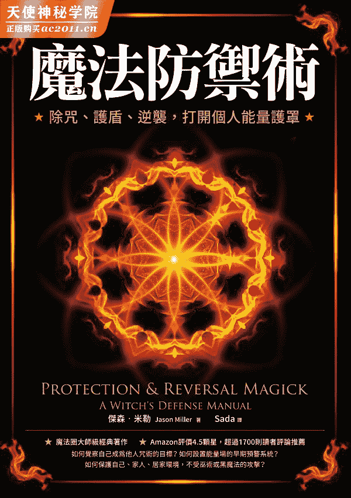

## 免责声明

这是一本用于超自然、魔法和精神攻击情境的魔法书。在某些情况下，这类超自然攻击还伴随着心理与医疗问题。有时也有一些人虽然遭遇严重苦难却心理正常，便将他们的疾病归因于魔法。我想要完全清楚地表示，本书中任何的法术都不能取代医学和心理学专业人士的治疗。我再怎么强调这一点都不为过。

同样的，尽管某些保护与逆转魔法的技巧可能证实在日常跟踪和肢体暴力威胁的情况下有效，但它们不应该取代警察和其他有关单位的干预。

书中有许多关于薰香、地板清洗、咒语和献供的配方和准则，需要用到各种植物、矿物和动物材料的试剂。这些大多数是无害的，而虽然有一些具有伤害性，但没有一个配方会用上你能吃的东西。

最后一点，这是容易失控的魔法，意味着它会用在可怕和危险的情境中。若你尝试使用本书中的魔法来自助或助人，那么你应该准备好接受自己行为的后果。

献给我美丽的新娘

【译者导读】

## 原来魔法可以这么轻松有趣！

许多魔法书时常强调仪式的安全性，然而本书反其道而行，直接戳破一个事实：神祕学商店贩售的黑魔法书籍往往最畅销！所以如果只会白魔法，不懂得黑魔法的原理，那么只是一个半吊子的魔法师。不仅是杰森．米勒（Jason Miller），精通魔法知识的神祕学大师朗．米洛．杜奎特（Lon Milo DuQuette）也曾经说过，真正的魔法师连黑魔法也要了解。

因此当你是一个魔法的铁粉，该从哪一本书下手呢？我想，新时代系统的书籍还是比不上魔法专门户直接一针见血让新手小白秒懂魔法罩门，要不然啃着厚厚一本仪式魔法、威卡魔法专书，魔法初心者们可能要烦恼到头发掉光囉！因为上面通常是复杂而冗长的准备流程，对于新手来说，会有学习上的压力。

在跟杰森．米勒学习之前，我也学过能量疗愈技巧，但是在实际操作上，真的有许多不可思议的层面，无法用现代的身心灵知识去处理。比如，我有个同学曾经遇到一个长不出头发的个案，他说自从某日在理发院抱怨了美发师的手艺，隔天他的头发便持续掉落，而且是迅速掉光！即使我的同学身经百战，她也无法破解诅咒，不晓得该怎么疗愈，只好按照往常的清理能量顺序做完，此事也就不了了之。

我的能量疗法老师虽然提过如何防御，但是在阅读杰森．米勒的这本书之前，千万不要说你很懂逆转黑魔法的方法，他用最简单易懂的方式，引领许多对魔法感兴趣的朋友了解魔法攻击，这也是他最畅销的一本书了。

杰森．米勒曾经到东方取经，也跟西方的魔法大师学习，是真正有实战经验的练家子，但不会固守仪式魔法以及其他教导的思路限制，总能在书中不时闪现他的智慧光芒。如果你想要学习魔法，那么你一定要藉由一位身经百战的优秀导师来引导你的学习途径了。

其实这本书已经用非常精简的方式将保护自己、保护他人、保护场域的法术都尽可能囊括其中，并且省略了很多理论（如果是朗．米洛．杜奎特，肯定是一番精采的长篇讨论，新手八成会感到头大）。然而对于新手来说，我觉得依然有必要给予一些简单的建议，便斗胆向编辑毛遂自荐，想为读者们做个简单的介绍。

## 掌管黑魔法的黑卡蒂女神

首先，本书的主要架构是做简单的攻击模式拆解，然后以杰森．米勒传授的黑卡蒂女神课程为中心，把他的祈祷文分享给读者。这对于华文世界的读者而言稍嫌吃力，却又是必要的，因为当你遇上魔法攻击，一定要有一个强大的靠山来挺你，他挑选的黑卡蒂女神本身就是巫术女神，也是黑魔法的掌管者，相当适合这本书的主题。

作者在这里颠覆了许多魔法界的概念，为黑卡蒂女神重新正名为光明之神。在古代，黑卡蒂女神有点像门神，祂掌管了十字路口，代表性的供品甚至包含了大蒜，古代人相信如果在十字路口献祭大蒜便可驱邪。但为什么又说像门神呢？有些商家会把黑卡蒂女神供奉在小店门口，每日开张就会先来祈祷一番，所以，祂原本就是万事可求的女神，连顺产也是祂管的。

此外，作者也用了胡督魔法和元素魔法的概念，所以本书比较偏向实际应用方面，而非理论派。

## 怎么唸本书的祷文？

本书中的祈祷文／咒语并不多，但是有可能对新手来说会有点吃力，因为不知道里面提到的人物是谁，前面几章可能解释过了，但后面不小心又忘掉，祂们的名字真的是霹雳无敌长啊！

在此，我的建议是大家可以上网去找些图片，增加想象力，这固然有点麻烦，但是会更有效。若是读者本身英文底子不错，可以大胆唸诵原文，并且用 google 翻译去找出正确发音，这是我发自肺腑的建议。之前学习杰森．米勒的课程，我常常会由于那满坑满谷的希腊文而感到压力山大，但是祈祷文就是要这样才够力。

唸诵祈祷文的方式，必须要铿锵有力，而非照本宣科，即使里面的内容有点中二病，但就是要这么中二才有 fu 啊！能量才会强大，如果你唸的是原文，那就不用担心有人听得懂了（笑）。

倘若你的英文不好，那也没有关系，秉持着抑扬顿挫的腔调去唸诵祈祷文，效果也是不错的。

## 仪式可以本土化

对于华文世界的读者来说，书中提到的一些魔法药草不容易买到，不然就是价格比较高，如果想要购买的话，可以上网搜寻「西洋草药」之类的关键字，但如果真的买不下去呢？可以去找本地的植物，让你有产生类似联想的植物都可以。

比如书中提到的「魔鬼的鞋带」就不太好买到，如果你改用藤蔓类的植物也是可以的，因为这是取其意象；也或者可去购买该类植物的精油作为代替，至少性质是类似的。

网络上也有一些商店贩售进口的胡督魔法粉，比如热足粉，不是非要自己亲手制作才可以施术。现在网络是很发达的，只要好好用心搜寻，可以上网买到许多材料。若你习惯上网买海外的东西，便可以买到更多的材料了。

但作者有一些仪式就不一定适合读者当地的时空了，比如去采取坟土或是委托坟墓的主人，华人读者多少会有点抗拒，建议斟酌使用作者的方法，以免引来不必要的麻烦。

## 适时加入观想可以加强效果

在本书中，作者并不会加入太多对于祈祷文的解释，这可能是考量到字数的缘故。当读者在观想着「鸽子降落、巨蛇升起」，并不是真正在想一只鸽子和一条蛇，古代的祈祷文有许多都带有着隐喻，不了解的人会容易误会，毕竟，想一只鸽子可能还可以做到，但想了鸽子又得想一条蛇，祈祷文中四方的神灵又是你不认识的，于是唸祈祷文变得辛苦起来。

对于想象细节有困难的人来说，可以都想成是一道白光。下降的白鸽代表从上帝那里来的生命连线，经过我们的灵魂一直到肉体，贯穿到地心。升起的巨蛇是我们脊椎的昆达里尼能量，那是大地的能量、生命的原初之力。当你观想牠们两者都是光的时候，会把你的气场撑大，增加厚度，这才是祈祷文真正的影响，可不要看到太多奇怪的字而吓傻了。

如果你觉得观想那么多位神明太困难了，无论是唸谁的名字，你都想成是一道光出现在特定的位置，也是一种满好的替代方案。

## 关于人造灵

眼尖的读者在大略翻阅本书之后，可能会对人造灵的相关信息感兴趣，作者在另一本关于性魔法的书略有描述，虽然人造灵在魔法界并不陌生，但稳定度就很难说了。

一般来说，西方魔法界倾向在完成任务之后要求人造灵自动销毁，但东方的人造灵系统，如泰国就有几百年的传承。作者在本书中只是略为描述人造灵的作用，但在没有老师指导的情况下，有一些仪式还是不要轻易尝试哦！

希望你们会喜欢这本书的内容，并且大有斩获。

译者 Sada

于二〇二二年三月二十三日

【作者序】

## 关于本书魔法的建议

本书的企图是超越目前充斥书架上的「入门书」。虽然我们假设读者已经对巫术和魔法有一点认识，但我还是想花点时间来定义一些术语，并且谈谈书中对于施展魔法的方式，而这可能跟你所熟悉的有所不同。

首先我要澄清的是，这是关于防御性巫术的一本书，而不是威卡教（Wicca）的书。虽然许多人交替使用术语，巫术包含了一个更广泛的光谱，而不仅仅是威卡教，巫术可以被视为一种特殊类型的宗教法术。正如我们在本书中使用的术语，巫术是一门技艺，它意味着一种实用的法术和神祕主义，在它的实践上包含了冥界、月亮、女性等等的元素。如同英国神祕学家罗伯特．科克伦（Robert Cochrane）被问到何谓巫师时，他说道：

如果一个自称是巫师的人能执行巫术工作，他们可以召唤灵体，灵体就来；他们可以转热为冷、转冷为热；他们可以用树枝、手指和小鸟来占卜吉凶；他们可以宣称神谕并且实现它们；他们可以穿越迷宫与冥府的忘川之河……如果他们能做到这些事，那你就有了一个巫师。1

这本书当中的法术当然适用于威卡教徒和异教徒，但仪式魔法师、根源工作者 1 或是任何采纳巫术基本原则的人都可以轻易运用它。

为了避免重复那些已经被反覆解释的古老仪式，我尽可能地让本书中的咒语和仪式成为原创。也就是说，我接受过来自世界各地的传统魔法训练，许多人会辨认出我的仪式来自什么传统的根源。这是一本关于实用魔法的书，所以我并未刻意专注在某一种传统而排斥另一种传统。因此，你会发现来自于非裔美国人的胡督魔法，还有一些来自欧洲民间的魔法，以及来自喜马拉雅谭崔巫术的魔法。无论是魔法还是机械，技术毕竟是技术，有效就是有效。如同英国仪式魔法师阿莱斯特．克劳利（Aleister Crowley）说过的：「成功就是你的证明。」为了在各自的文化背景下尊重这些传统，我鼓励你查看附录一中的资料来源，以便进一步研究。

最后，我把这个作品献给拥有不同形貌的黑卡蒂女神。大部分的法术和咒语都会召唤祂或是与祂相关的灵体。这些咏唱的咒语可以更变或替换，以适应个人的配置、喜好及传统，而不会改变咒语的整体性。有些人喜欢押韵的两行诗，有些人则觉得这很傻气。有些人会被拉丁文和希腊文的咒语所打动，有些人则坚持只用英语持咒。要把这些仪式当作一个基础，让它们为你所用。在这么做的过程中，你正在参与贯穿古今的奸巧男人 2 与聪慧女人真正的传统，这使得巫术成为一种动态的传统，而非静态的陈腔滥调大集合。

* * *

编按：〇为原注；●为译注。

1　来自罗伯特．科克伦写给魔法师威廉．格雷（William Gray）的第八封信。

1　使用胡督魔法的人。

2　在 Netflix 的影集《莎宾娜的颤栗冒险》（Chilling Adentures of Sabrina）中，「奸巧」这个字眼对应英文词汇 cunning，象征巫师的神祕直觉能力。

【前言】

## 练习适当魔法防御术的必要

我们活在一个危险的世界。先不谈魔法和巫术，无论风险有多小，我们做的每一件事都有风险。每次你站在汽车后面，或是去一个新地方旅行，或者让一个陌生人晓得你住在哪里，你都在与风险调情。除了少数偏执的例外，我们大多数人都接受了这些风险，继续过我们的日子。我们能够做到这一点而不害怕的原因，是我们采取了合理的预防措施。我们系好我们的安全带，学会批判别人，也晓得如果必要的话要怎么去联络别人。这个世界很危险，但我们处理得来。

某些职业和活动会增加你生活中的风险。警察或是跳伞运动员过着比上班族更危险的生活。他们采取额外的预防措施来处理他们职业的特定危险。在某些情况下，例如警察，他会帮助有需要的人去处理自己遇到的危险。

魔法师或巫师的道路也有自己的危险。保罗．胡森（Paul Huson）在他的著作《精通巫术》（Mastering Witchcraft）中警告道：「当你踏上巫术之路的那一刻，一个看不见的世界就会响起召唤，宣告你的到来。」并不是所有听到这个召唤的人都会把你的最大利益放在心上。为了使主流文化更能接受巫术，许多关于巫术的现代书籍都没有提到任何风险，或者假装根本没有危险。若你是少数真正超越了读书和参加节庆，并且弄脏你的双手去实践巫术的人，你肯定会发现你的实践当中有一些问题，而去防御那些一直不利于你的神祕力量是有必要的。事实上，我认为魔法和心灵攻击比很多人想象的要频繁得多。

你不仅必须要处理针对你的异教、心灵和灵界攻击，同时也要像个警察一样──一个巫师有时还会被叫来调解这些代表其他人的力量。保护者和驱魔师的角色是魔法师最古老的社会角色之一，并在今天的传统文化中发挥作用。我注意到「奸巧男人」和「奸巧女人」这两个词，今日正在某些巫术领域复兴。有趣而有点讽刺的是，历史上的奸巧人物实际上是跟巫术杠上的！当然，他们会发现并挖掘出的「巫术」并非特定宗教的结果，比如威卡教，而是任何类型的灵界、灵体或是魔法上的攻击。对于感觉到被女巫之锤盯上的人来说，他或她会训练有素地施展法术。这些奸巧的男女们，本身就是货真价实的正港巫师了。他们虽然不一定是异教徒，却是民间巫术与仪式魔法的实践者。

我相信，辨识、防御和逆转超自然攻击的能力，对于今日的女巫与术士而言，就像对于古时候的巫师一样重要 3。以前从来没有这么多的魔法和神祕学知识能让大众唾手可得。以前从来没有这么多跌跌撞撞的人漫不经心地进入一度被严密守护的神祕学工作里头。虽然一些导读类型的书籍认为神祕学的危险很少，魔法攻击也很罕见，但经验告诉我，情况并非如此。无论是我们自己的魔法失误造成的障碍，还是来自纠缠不休的灵体干扰，抑或是来自其他魔法师和巫师的蓄意攻击，我发现，魔法攻击发生的频率甚至比大多数神祕学家所意识到的还要更多。事实上，身为职业术士，许多需要魔法防御的人联系我，他们自己都是某一种或另一个领域的魔法师及巫师，而他们根本不晓得自己会遇到一个无法靠正向思考和几道画在空中的五芒星摆脱的问题。

我们注定要做不同的事情。在我研究神祕学和学习魔法的这些年里，对我来说，我命运的一部分，或者说因果，显然包含着帮助他人抵御魔法攻击与灵扰。早在我公开我的服务之前，人们就向我寻求这类问题的协助了。正因如此，我把研究驱魔、逆转魔法、防御和反转每一个我遇到的魔法系统当作一个重点，从欧洲的巫术和高阶魔法，到喜马拉雅谭崔、到老派的美国胡督魔法。

我曾经遭遇魔法攻击，知道它们可以导致妄想、沮丧与恐惧；而当我认为出现了合理的理由，我也会对别人施加诅咒，并让他们走霉运，所以我知道攻击者的心态，以及使用攻击性魔法的后果。我获得这些知识并不是没有代价的，而且我预期到分享这些知识会有代价，虽然我还不晓得会是什么代价。

我并不是说每个人都需要专研这方面的巫术，我当然不想让任何人对于潜在危险过于偏执，但是如果你练习魔法的话，你应该能对攻击做出适当的防御，并且处理出现的问题。如果我能提供这方面的知识，那么我就实践了我的目的。

正如古埃及魔法师所说的：「Cheper en emdo jen, shesep en heka-o jen.」（愿你的话应验，愿你的魔法闪耀！）

* * *

3　古代有超能力的人也算是巫师。

# 1
辨认攻击模式

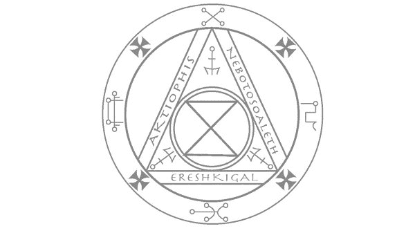

## 攻击的来源

由于这本书跟魔法防御有关，第一个必须回答的问题是：「我们在防御谁或我们在防御什么？」根据我的经验，神祕的攻击与阻碍情况通常来自以下四个来源之一：(1) 被冒犯的灵体对冒犯行为的报复；(2) 人们在还没准备好的情况下跌跌撞撞进入能量场域，并且受到他们环境的负面影响；(3) 在我们的神祕学仪式练习中失误或是违背誓言；(4) 来自其他巫师的攻击。

### 被冒犯的灵体

人类在这个世界上并不孤单。地球是一个有生命的有机体，而许多传统文化认识到所有的空间都渗透着意识和能量。如果我们以一种轻率和任性的方式生活在我们的环境中，我们便可能会跟与我们共享空间的各种智慧生命及灵体发生冲突。我们的世界是重叠的，虽然我们无法轻易感知彼此的存在，但我们确实彼此影响。透过焚烧与倾倒垃圾、在河流和湖泊筑坝、建造城市、以及其他破坏自然环境的行为，我们冒着触怒这些灵性存有的风险。原住民文化中的传统医学和萨满教，有很大一部分是针对这些灵体引起的疾病。

我住在尼泊尔的时候，有一个熟人得了莫名其妙的严重疾病。医院不晓得他是怎么回事，便建议他去看藏医。医生发现，在一次健行中，他在一个特定的水池里沐浴，因而惹恼了一群「纳迦」（Nagas）──灵界的巨大蛇灵。医生给了他一些治疗这些症状的药，但除了治疗这些症状外，对他来说更重要的是，他得驱离这些灵体，他要供奉祭品并请求这些灵体的宽恕。他照办了，接下来他很快就好多了。由于灵体是由能量和意识组成的，祂们可以在那些微妙的层面上影响我们，并将影响力渗透到我们免疫系统与神经系统的物理层面。祂们也会影响我们的情绪与思路。例如喜玛拉雅山有一群叫作「加尔波」（Gyalpos）的灵体，祂们喜欢刺激的仇恨与愤怒，并被视为引发几场战争的原因。

虽然现代世界并没有意识到这些危险，但所有的魔法典型都有应对它们的办法。有别于亚洲与非洲部落萨满巫师的神灵，古代欧洲的巫师就像中世纪仪式魔法的魔典一样，他们还为抵抗来自灵体的侵犯而开出了一大堆方子。例如在《所罗门的遗嘱》（The Testament of Solomon）中就有这些办法，它是许多著名魔法书的基础；又如在《盖提亚书》（Goetia）中，我们得到了一个导致各种疾病的恶魔名单，以及驱逐祂们的天使力量：

所以我问祂们一个问题：「祢的称谓是什么？」第一位说：「主啊，我叫鲁亚斯（Ruax），我使人们的头承受痛楚，又叫他们的额角颤动。但只要让我听到一句：『米迦勒，囚禁鲁亚斯』，我就立刻撤退。」

第二位说：「我叫巴沙发伊（Barsafael），我叫那些住在我时区内的人在头的两旁有痛楚。只是当我听到：『加百列，囚禁巴沙发伊』，我便立刻退避。」

第三位说：「我被称为亚道沙尔（Arôtosael）。我给眼睛造成很多伤害。只是当我听到：『乌利尔，囚禁亚道沙尔』，我就立即撤去。」

### 超自然磁场

有鉴于我们在日常生活中可能惹怒灵体，当我们偶然发现有大量神祕力量聚集之地或是遭作祟的灵体纠缠时，这个问题就会变得非常复杂。由于现代世界大幅地切断了我们天生的灵感应力，大多数人在这些地方闲逛的时候并未注意到任何异常。然而，一些对于这些能量有点敏感的人会发现，在某些地方与环境中，灵感应会以一种令人不安的剧烈方式增强，因此我们就有了第二种能量攻击来源──超自然磁场。有许多关于人们在灵体专属的地方被「触碰」的故事。如果一座美丽的寺庙或一圈树木可以用它们的力量影响我们，那么我们也有理由认为某些地方会以相反的方式触动我们、扰乱我们的能量，让我们接触到邪恶的力量。

这些地方可能天生能量就很强大，因为地域性的灵体聚集了能量，比如在龙脉（ley-line）连结或是精灵之丘（fairy mound），但它们也可以由于人类的行动而赋予能量，比如古老的圣地、坟场，或是曾经发生某件强烈刺激情绪事件的场域，好比谋杀、性侵或者是很久以前进行的降神会。无论这种潜能的原因是什么，这些地方都能刺激在此消磨时光者的超感应力量。如果没有训练和指导，这种意识上的骤变将会使人惊吓，并且让人容易受到他们甚至不知其存在的力量所伤害。即使这股力量是善良的，这种意识的切换也可能难以应付。

倘若普通人由于无意中冒犯了看不见的世界，而在不知不觉中受到灵体以及「因这次冒犯而触动的力量」影响，那么我们就有理由认为，当巫师与看不见的世界脱离联系时，更是经常面对这样的危险。不同的是，巫师有能力做点什么！有一句巫术的老话警告道：「别召唤你处理不来的灵体。」这个建议的问题是，你很难弄清楚你到底可以处理得来什么灵体，除非你有机会去召唤祂。我们可以透过不召唤任何东西来保证安全，但大多数神祕主义者透过发现自己的极限并且超越极限，来寻求知识与力量的增长。

尽管在某些浮士德类型的巫术中，比如召唤与死灵术都蒙受污名，但重要的是要知道，即使是常见的法术，比如画魔法圈、水晶球通灵、占卜以及提升力量，都可以照亮星光界，使我们更容易被微细身国度的居民注意到 4。这反倒又增加了一些机会，使我们在遭遇的其他生命体当中，更容易吸引邪恶或有害的能量。当然，你使用巫术的技巧愈先进，愈具有实验性，出错的可能性就愈大，但有些人甚至在做非常基本的工作时也会遇到问题。事实上，经验告诉我，一些有情感问题和精神疾病的人用魔法来寻求帮助解决他们的问题，结果却发现即使是最基本的驱逐仪式，问题也会恶化。

### 打破巫术的誓约

除了经验之外，我们自己施术时还有另一种对我们不利的情况，那就是打破巫术的誓约。在点化、自我赋能仪式中所做的誓约，甚至是在正式仪式之外向神和灵体所做的单独承诺，如果被打破了，都会反弹到我们身上，成为一种攻击。举个我自己生活中的例子，当我只有十七岁时，透过唐纳德．迈克尔．克雷格（Donald Michael Kraig）出色的教科书《现代魔法》（Modern Magick）做练习，而我决定该是到了施展他的「魔法义务仪式」的时候了，这是一个基于黄金黎明协会（Hermetic Order of the Golden Dawn）的小行者誓约（the Oath of an Adeptus Minor）。在义务中，我发誓要做几件事，其中包括承诺不向非专业人士展示我的法器、不撒谎、不散布谣言。在我年轻的时候，我当着众神与灵体的面许下了这些承诺，但很快的我就食言了。在承担义务的几天后，我在工作中第一次对老板撒谎，那一刻我就感受到了这种负面影响。我的咒语有一段时间发挥不了作用，我发现它显然缺乏生命力。为了解决这个问题，我又举行了一个道歉与献祭的仪式，放弃了之前的誓言。我并不想诋毁宣誓的实践。从那时起，我已经宣誓了几个巫术誓言，无论是独修还是在不同的团体，遵守这些誓言使我获益良多，但我现在对于我同意的内容非常清楚。当一个现在巫师集会或是魔法师晋级的强大守护者在宣誓中被召唤来的时候，问题还可能会升级，象是从我经验到的跨越难关，到曾经保护你的守护者即刻攻击你。对你同意的事情要多加小心。

### 来自其他巫师的攻击

我们需要关注的最后一个危险来源，也是本书主要关注的一个来源，即是来自其他魔法师、巫师和灵体的攻击。我曾看到有人写道，真正的巫师不会用魔法去伤害别人或影响别人的意志。我也曾看到有人说过，真正的仪式魔法师不会伤害别人，因为他晓得因果报应的法则会让他自食恶果。我还听说过这样的说法，就是任何成功地发动魔法攻击的人，都可以进化到足以超越这种能力。我要说的是：千万别信这套！这样的争论有助于销售书籍，也有助于让主流社会更容易接受巫术，但这只是那些本应更了解巫术的人一厢情愿罢了。

一个让人安心的想法是，所有巫师都遵守着一个像威卡训喻（Wiccan Rede）的道德准则，因此永不会伤害他人。但事实并非如此。事实上，如果我们考虑到魔法和巫术的所有实践者，我可以向你打包票，相对来说很少有人遵守这些规则。任何一家库存充裕的神祕学商店老板都可以告诉你，那些针对有伤害性与强制性魔法的书可是很畅销的！就好比色情刊物一样，这是一件没人承认做过、但似乎依然有很多人做过的事情。

源自希腊的诅咒碑（Defixiones Tablets）是用来准备巫蛊之术的，它强迫爱人屈服并且对付敌人；到十六世纪梅布尔．布里格斯（Mabel Briggs）的黑色斋戒；再到乔治亚州的布萨医生（Dr. Buzzard）用烟雾粉去对付他的客户和敌人。仔细阅读整个世界历史上的魔法施术，就会发现诅咒与牵制在过去一直都是巫术的一部分，直到今天依然如此。就在我写这本书的几个月前，一群以色列的卡巴拉术士聚集在一个古老的墓地，对艾里尔．夏隆（Ariel Sharon）施行火鞭仪式的猛烈诅咒 2。在我写这本书时，夏隆正处于昏迷状态，估计无法康复了。

我们也不能认为只有没道德的坏人才会从事这样的活动。大多数魔法师做其他任何类型的行动，都有同样的规则。如果他们会使用平凡的手段来报复、造成伤害、迷惑或影响另一个人，那么他们很可能也会使用魔法来达到同样的目的。我曾看过碎碎唸的「正义魔人」会在觉得自己的做法是正义的或他们是为了更大的福祉服务时，跳出来谩骂。当然，问题在于大多数人总觉得他们的行为是合理的，并且会使用各种的推理来得出这个结论。

即使你自己不施行法术，你也可以僱用一个专业的人帮你下咒。虽然现今大多数专业人士（包括我在内），在没有正当理由的情况下都不愿意接受这种工作，但还是有一些人愿意接受任何工作。在大多数传统文化中，接触巫师并要求对某人施咒或是诅咒是一件相当常见的事情，去接触某人来取消诅咒也同样常见。甚至有一些纪录在案的案例，即一个咒术师对同一个客户两面施法，也就是下咒然后又取消它！

使问题更复杂的是，并非每个诅咒都是故意为之。众所皆知，有天赋的人可以在没有任何训练或意图的情况下施展强大的魔法。例如在意大利，Maloccio（即「邪眼」）咸认为是透过纯粹的嫉妒、仇恨或单纯的恶意而投射出来的。任何有足够力量、足够情绪和目标的人，都可以发动意外的超自然攻击。体质或意志薄弱的人也可能成为心灵吸血鬼，无意中耗尽周遭人的生命力。尽管这些攻击是偶然的，我们仍需要处理它们。

## 辨识攻击

如果我们保持警戒，保持定期的驱逐仪式与保护状态，在大多数情况下，我们都会没事的。事实上，如果你能持续做下一章的练习，你会做得很好，因为你不仅保护了自己，不受到讨厌的魔法影响，而且通常还会增强你的意志与灵性。然而有些时候，这些保护是不够的。一些偶然或故意的攻击会穿过我们的防御，影响我们的健康、我们的运气和我们整体的幸福。这不是一种愉快的经历，但是当攻击发生时，辨识它是反击的第一步。

我们面临的第一个问题是，人们通常不愿意承认自己正在被攻击。不修练魔法的人更可能觉得是自己疯了，而不认为自己受到魔法的攻击。即使他们怀疑自己的麻烦是一些神祕的原因引起的，他们也不会告诉任何人，因为他们害怕所说的话不被采信或者被认为精神错乱。

有时候，即使是魔法师也很难承认自己受到了攻击。许多人倾向高估自己的能力，或者认为他们使用的任何常规保护措施都是万无一失的。承认某个人或某件事会影响到我们，这会打击到自我，于是我们反过来说服自己。尤其如果你在一个魔法团体中担任领袖或教学职务，你可能会担心倘若你承认自己是攻击的受害者，人们便会认为你无法胜任。

我认识一个有三十年从业经验的女祭司，几年前，她被情人的前妻攻击了。我不想把这位前妻遵循的传统说成是邪恶的，因为事实并非如此，但可以肯定的是，在这个传统中，出于嫉妒而诅咒别人是很常见的。我的女祭司朋友生了重病、失业、失去学生，还差点失去她的房子。她有超自然攻击的所有征兆，甚至还有一个可能性很大的动机来源，但她拒绝承认，因为她认为自己是一个有成就的女巫，不会受到别人诅咒影响。最后，她终于想通了，而事情对她来说也往更好的方向发展。

总的来说，我认为最好要记住两件事。第一，没有人能滴水不漏地抵挡某些类型的超自然攻击。基本的驱逐仪式、护盾和护身符可以保护你免受最意外的灵界攻击和你可能会遇到的一般的恶意能量。它们甚至可以保护你免受大多数故意的魔法攻击。但没有一种技术是万无一失的。无论你拥有何种程度的启蒙仪式，无论你认为自己有多强大，你都不是不受影响的，你应该记住这一点。要记住的第二件事是，防御可能还没有发生的攻击无伤大雅，但如果忽视了你自认没发生过的真实攻击，可能会造成巨大的伤害。为了安全起见，做魔法防御吧。

当然，就像有些人读了医学教科书之后，相信自己患了书中提到的所有疾病一样，也会有一些心理上疑神疑鬼的人读了这本书之后，幻想自己无缘无故遭受了攻击。事实上，有些人似乎认为他们经常遭受攻击。这些人可能会来找你求助，但他们很容易被看出来。

某人坚持认为自己被巫术攻击，跟他们实际上被攻击的可能性之间通常存在着一种大相迳庭的关系。无论是出于真实的幻觉，还是只想藉由上演心灵肥皂剧来为自己的生活增添一点戏剧性，你最好都避开这样的人。一开始，你可能无法分辨出这些人是谁，但是当他们不断抱怨来自未知的「闇黑团体」和「黑魔法师」的新袭击时，你很快就会意识到他们的模式。当然，除非是基于真正的邪恶，否则这些组织没有任何理由要花费精力去攻击此人，这对疑心病的人来说似乎是一个足够充分的理由了。

如果你遇到这些人，你可以给他们一个简单的净化或一些保护的建议，也许是以防万一的护身符，但他们通常会一次又一次地回来。让这些人失望的最好办法就是占卜，并且宣布你无法帮助他们，因为你无法侦测到攻击的来源。你并没有完全违背他们的信念，只是说你没有办法提供帮助。

## 超自然攻击的征兆

当超自然攻击真的发生时，会以多种方式和不同的强度表现出征兆。我把症状分为三个基本种类：外在状况、心理状况与肉体状况。

### 外在状况

这种性质的攻击会影响一个人生活中的事件或运气的概率，创造出所谓的「障碍情境」。这通常始于一种与时间不同步的感觉，就好像你再也不能在正确的时间出现在正确的地方。无论你要做什么，你发现你似乎不能准时到达任何地方。这可能伴随着厄运模式，而且你碰到的一切都会出错。你的车子跟人发生小事故，而且是几天之内发生了好几回。你手中的东西破裂或是当你试图抓住它们时却掉落，也是常见的征兆。人们对你似乎没有耐心。意想不到的账单开始堆积如山，而你似乎无法留住钱。

你孤身一人，事情恶化了──你失业、跟情人分手、撞坏了车、为了没做过的事情蒙受指责，甚至最终可能入狱或是更糟。发生之事的可能性只受限于发动攻击的人拥有的力量或是攻击的力道，以及你承受了攻击多久的时间。

就在近期，我在两周内收到了三张交通违规罚单。而多年来，我从未被警察拦下过。还有一些其他的事情也出现问题，于是我开始怀疑有什么地方出了错。经过一些占卜和审慎思考，我发现这是一次偶然的攻击，因为我拒绝帮助某个人。我做了一个简单的化解，问题就迎刃而解了。但是那个人有够强大的灵力，他的恶意冲破了我通常的防护力。如果我完全没有采取行动，情况可能会变得更糟。

几乎所有发生的事情都会有一个完全合乎逻辑与物质层面的解释。单就此看来，它们没有任何意义。总之，一长串不幸的巧合应该是一个很好的迹象，指出了肯定有什么问题。如果这些外在条件伴随着以下列出的一些心理与肉体症状，那就格外属实了。

### 心理状况

我认识的一位圣徒信奉者 5 对她的邻居很有意见。整个晚上邻居都很吵闹，令人讨厌，还在她家的草坪上扔垃圾。她问她的老师该怎么办。老师告诉她，做个长得像她邻居的娃娃，蒙住娃娃的眼睛，捆绑娃娃的手臂与腿，然后钉在她院子里那棵对着邻居前门的树上。我的朋友有点吃惊地说：「天啊！我不想伤害邻居！这么做会发生什么事呢？」

她的老师回答：「没事，但这会把他吓得屁滚尿流！」

几天后，我的朋友听从了老师的建议，接着邻居来乞求原谅，并且信誓旦旦地说他正在经历生命中最糟糕的几天。

那些不相信魔法能影响世界的人，面对着人类学家的报告，他们观察到诅咒似乎常常是有效的，于是试图把它解释为暗示的力量。这是一种自我实现的预言，如果你知道有人诅咒你，就像圣徒信奉者这个例子，你的心理便会做出这样的反应来实现诅咒。这是有一定的道理的：暗示是一种强大的东西，如果你能说服某人他们正在遭受攻击，他们就会表现出很多的症状。事实上，我发现当人们在公共场合和口头上被诅咒的时候，很少有任何仪式或咒语来支持这件事。原因并不在于诅咒无效，然而，如果有人真的想对你发动一场真正的魔法攻击，他们不会向你透露。

大多数魔法与超自然攻击会在它们的目标身上表现出心理症状。我之前提过，「与时间不同步」的感受是遇到阻碍的前兆。这还可能出现其他更严重的精神症状。有些攻击，比如心电感应或是催眠攻击，可能只对心理有影响。强制性的攻击并不是为了造成伤害，而是为了让你做（或者不做）出某些违背你较佳判断的事情，这种攻击主要也是心理上的作用。事实上，这些症状都是精神上的，但不意味它们没那么危险或是没那么神奇。

到目前为止，最常见的精神症状是没有任何明确原因的绝望、压抑、焦虑和恐惧。无法解释的困惑或是无法集中注意力的时刻是很常见的。令人不安的梦也是受到攻击的征兆。

在某些情况下，如果一个灵体或工艺品是攻击的媒介，目标可能会觉得他一直被跟踪。当他独自一人时，可能会听到声音、看到不存在的影子和轮廓，甚至闻到没有来源的气味。气味是我最强的超感应领域之一，有时我会闻到硫磺或腐烂的气味，这是攻击的第一个迹象。虽然我把这个列为一种心理症状，因为这种感受没有物理的根据，但这并不意味这些景象、声音和气味就不像其他东西那样真实。事实上，那些有这种能力的人可能会看到比灵体的轮廓和意象更多的东西。

在强制性魔法用来影响你行为的情况下，无论是透过催眠、心电感应操控或是咒语，你可能会对你以前从未做过的事情产生不寻常的冲动、喜好或厌恶。你很难靠自己察觉出来，因为你的头脑会证明这些感觉是正常的。但是如果朋友和你所爱的人说你的行为超出你的本性，你至少应该花一些时间想想他们想说什么。有一个古老的例子是，催眠师把暗示植入一个对象当中，当此人听到暗示之后，便会脱下衬衫或跳进湖里。在这样做之后，这个人总是解释因为天气很热，他做的真的不是一件奇怪的事。只有在催眠师播放植入暗示的录音之后，受试者才认为他真的做了什么奇怪的事。即使是最奇怪的事情，大脑也会让人觉得很正常。

因为我们所有的行为，大体上或多或少受到了外在因素的影响，所以在正常的影响、合理的魔法影响和超自然攻击之间有一条细微的界线。荻恩．佛琼 3 做了一个很好的类推：正常的影响就像某人在外面按门铃，而攻击就象是地板自己举起来、电铃线自己动起来。

姑且不论这些神祕的事件，公司和销售员目前正利用非常先进的强制性技术，比如潜意识信息和神经语言程序学（NLP）来影响你的意志。其中一些是合理的，但在我看来，当中有一些却相当于攻击，就像他们对你施了魔法一样。说真的，如果你认为这不是一种巫术，那么你应该再多看一看。这本书所教的防御超自然侵扰的技巧，也可以帮助你避开销售和广告中使用的攻击性技巧。

先前列出的许多心理症状亦是精神官能症的症状。我想澄清的是，与抑郁、精神分裂症、焦虑、注意力缺失症或其他任何心理问题搏斗的人，不应该用这本书的魔法防御来代替常规治疗与心理治疗。神祕学与传统心理学重叠的程度是一个有意思的议题，但这超出了本书的范畴，也超出了我的专业知识。在常规治疗的同时，使用本书中的方法可能不会有任何伤害，但在任何情况下，它们都不应该取代医学治疗。

### 肉体状况

也有可能出现与攻击有关的肉体症状。头痛是常见的预警。头皮紧绷的那种头痛尤其昭示了攻击。有时候当我们躺下来睡觉时，这些头痛会集中在头的同一侧，指出了攻击过来的方向。

继头痛之后，疲倦是第二种最为常见的征兆，尤其寄生形态和吸血鬼式的攻击更是如此。在寄生形态的案例中，体质与精力较弱的人会在精神上榨干生命力较强的人。这通常是无意的，经常发生在家庭成员或是亲密的朋友之间，尤其当一个人需要照顾另一个人的时候，这就产生了一句古老的谚语：「照顾者优先。」

在实际的吸血鬼攻击中，通常是故意为之，并且存在着一整套关于吸血鬼魔法的神祕教导主体。第一种吸血鬼是活生生的人，不管他们是否愿意，他们都会从别人身上汲取生命力，并以此增强自己的力量。如今，这已经是一种反主流文化生活方式的选择，人们可以找到很多关于如何实践吸血鬼之道的书籍。

第二种更接近于传说中的吸血鬼，他的身体已经死亡，但是通过特殊的手段，这个人成功地击退了星光体的腐败，或是「第二次死亡」，并且透过吸食活人来维持他的乙太形态。我在布达佩斯旅行时，有人告诉我，马扎尔的术士擅长这种法术。他们会把自己的灵魂附着在活人身上，白天保持休眠状态，到了晚上，他们会用乙太或是类似物质的形态离开宿主并且进食。我从来没见过他们，但根据文献记载，你可以在吸血鬼袭击时发现很小很小的伤口。

在目标把主导权交给死者的例子中，疲劳也很常见。这在海地的巫毒教中很有名，被称为「远征死亡」（Expedition Mort）。有很多方法可以做到这一点，但典型的情况下，你的一些东西会放在一个愿意做这件事情的灵体的坟墓里，而这个坟墓里的一种元素（通常是泥土）会被种在你身上或你家里。你进入了死者的领域，死者则进入了生者的领域。这首先表现为严重的疲劳，最终导致全面崩溃。你发现即使睡了一整夜，你仍无法保持清醒。当你躺在床上，你的睡眠备受干扰，难以安眠。如果不加以处理，这个诅咒可能会导致死亡。

当灵体被用在攻击时，或者当灵体本身就是个攻击工具时（比如闹鬼），我最常听到的抱怨就是睡觉时胸口被压。这种现象有时被称为梦魇，由于非常普遍，以至于宾州大学的一位教授对此现象进行了一项研究 4。有时候这种感觉会伴随性攻击的感受。在夜间被袭击而留下瘀伤已非闻所未闻的事情了。大约十年前的一个晚上，我在一个朋友身边守夜时，亲眼目睹了这些没有物理肇因的瘀伤。

突如其来但持久的疾病也可能是攻击造成的结果。从突发但简单的流感，到严重的癌症，到完全无法诊断的疾病，诅咒有办法直接影响肉身躯壳。要是你用神祕学的防护处理这个肇因，你在所有这些情况下都应该寻求医疗照护。在强大能量极为猛烈的攻击下，诸如心脏病和动脉瘤可能是超自然攻击的结果，但这种情况非常罕见。

失去性趣与性无能有可能是由嫉妒或者被抛弃的情人诅咒造成的结果。消除「性本能」的咒语存在于世界上几乎所有类型的民间魔法当中，恢复性能力的法术也是如此。

肠堵塞也是最受欢迎的攻击方式，这在艾尔伯图斯．麦格努斯（Albertus Magnus）的《埃及祕密》（Egyptian Secrets）5 和冰岛的《盖尔德拉伯克》（Galdrabok）等魔法书中获得了证实。事实上，当我十几岁刚开始学习根源工作（胡督教魔法）的时候，我有东西被偷走了，我大致上声称谁要是偷了它就会受到最不愉快的诅咒。也许这是我的错，但我找到了一个跟我怀疑偷走东西的人符合的线索，并且用古老的胡督教仪式堵住了他的肠子。那个东西很快被还了回来，而我们的一个共同朋友告诉我，咒语达到了它理想的目的。

### 预兆与警告

除了攻击的实际症状外，还有一些征兆需要注意，首当其冲的就是梦境了。梦的领域是我们深层的心灵试图与自我的其他部分沟通之处。在此，我想说的是，我完全不相信解读梦境象征意义的字典。我们每个人都有独特的象征，在梦中，我们的内心会利用这些象征。一条蛇在一个人的梦中预示着危险，但对于像我这种爱好蛇的术士来说，这的确是一个绝佳的好兆头。我建议去观察整体的内容和特点，而不是一堆符号。你被迫害了吗？是追杀吗？你所爱的人抛弃你了吗？你觉得被困住了吗？这些梦都可能表明你遭受攻击了。当我遭到之前提到的无心攻击时，我做了一个奇怪的梦，梦见我赤身裸体地坐在法庭的证人席上，法官是电台主持人拉什．林博（Rush Limbaugh）。尽管这很蠢，但这个梦却让我打了个寒颤，这是我受到攻击的一个重要指标。如果你觉得你正在或可能正受到攻击，那么你要注意你的梦境了。倘若你在梦占术方面很有天分，有时你可以从梦境本身猜出罪魁祸首的名字。

观察动物则是另一个指标。牠们对你有何反应呢？你是否发现自己遇到更多跟冥界相关的生物，比如蜘蛛或蛇？你的院子里有动物死掉吗？几年前我在为一个遭受攻击的客户工作时，有一只雀鹰死了，正好落在我在院子里画上魔法圈的区块。这些事情和其他奇怪的事件都应该在疑似攻击的情况下进行调查。

术士有很多方法可以建立提早预警系统，以便在攻击变得严重前提醒自己。第一个、同时也是最简单的方法是，在房子的每个房间里放一到两株植物。如果你受到魔法的攻击，几乎可以肯定植物会首当其冲。由于这些原因，许多巫师会在房子里摆满活生生的植物。

一个经典的攻击警报就是在你的鞋子里和脖子上放一些银制品。钻了洞的十美分银币在美国南部很有名。据说如果你受到攻击，银就会变黑。这种信念实际上有着科学根据，因为大多数类型的魔法粉末与材质，比如烟雾粉，都是利用硫磺使它变成银黑色。

在祭坛上放一颗新鲜的鸡蛋，不仅可以帮助预示攻击，也可以吸收一些攻击。就像植物一样，鸡蛋会替你承受负能量的冲击，所以它很快就会腐坏，甚至在受到攻击时即会破裂。

你也应该留意你的护身符。当护身符破裂或丢失的时候，表示它们的保护已经失效了。我总是戴着一个摩洛哥蓝色玻璃的法蒂玛之手护身符，以防止邪眼从我的后视镜看过来。在我收到那些交通违规罚单的前几天（我在本章前面提过），护身符破了。当时我并没有多想，但要是我能快点占卜，可能就不会收到那些罚单了。另一个是泰国的阴茎护身符，用绳子绑起来，配戴在腰部周围，可防止阳痿。若绳子断裂，即为攻击的征兆。

这些症状族繁不及备载。它们可能引发各式各样的攻击，也可能出现许多症状。重要的是，你要意识到，就个别看来，所发生的每件事都可能有一个合乎逻辑的「现实世界」解释。然而，当这些症状和事件都在短时间内出现时，这是一个很好的指标，代表真正发动攻击了。记住：宁可谨慎，也别忽略出现的症状。

* * *

4　由于作者有藏密的传承，所以这里说的是灵界的某个领域。

2　二〇〇五年七月二十六日。出自：[www.WorldNetDaily.com](http://www.WorldNetDaily.com)

5　santera，指胡督教中信奉圣徒的一种女祭司。

3　荻恩．佛琼（Dion Fortune），《心灵防卫术》（Psychic Self-Defense），塞缪尔．威瑟出版（Samuel Weiser），二〇〇一年。

4　大卫．J．胡佛（David J. Hufford），《夜晚降临的恐怖：以经验为中心的超自然攻击传统研究》（The Terror That Comes in the Night: An Experience-Centered Study of Supernatural Assault Traditions），宾州大学出版社，一九八二年。

5　此书既不是艾尔伯图斯．麦格努斯的作品，也没有任何埃及魔法在里面，但它仍是一个有趣的民俗魔法集合，还是很有用的。

# 2
日常的三个练习

认真的魔法师每天都会练功。巫术练习不是必要的，但它可以净化心灵、振奋精神，并且能保护自己免受攻击。在我们考虑如何防范特定攻击之前，我们应该先养成一种习惯，加强我们的天生防御力，如此一来，轻微的攻击就会自动打偏，我们便能在任何可能出现的严重情况下保持冷静与专注。

就像三角形是建筑中最稳定的结构一样，我推荐一个日常练习，它包括三个要点，将会帮助你摆脱灵界攻击。这三个要点是：冥想、驱逐与献供。

冥想让你在充满压力的时候保持头脑清醒，而且它本身就可以抵御许多种精神攻击。驱逐仪式能净化个人气场，并且从负面能量和有敌意的灵体中解放你的家。献供的作用是与环境建立良好的关系，是向那些带有恶意的灵体伸出的橄榄枝，因为人类扰乱了灵界环境的行为，才导致这些灵体的攻击。

## 冥想

很显然的，一个人必须在任何类型的灵界攻击下保持清醒。在一场魔法攻击中，可能会导致偏执、抑郁或其他精神痛苦的症状。重要的是，你能够控制你的思想，消除这些症状，至少要有足够长的时间来发动防御或寻求帮助。如果我必须放弃所有的灵修，只有一种灵修除外，那么我会把冥想留下来。如果你只从这本书中学到一件事并且付诸行动，那么它应该是冥想的步骤。

「冥想」一词对很多人来说有着许多意思。对一些人来说，它是聚焦于一个紧迫的问题；对另一些人而言，它是放松地听着舒缓的 CD；对另外一些人来说，它是狂喜的祈祷。就技术上来讲，所有这些事情都可以被称为冥想，因为冥想这个词本身就有着非常广泛的涵义。但它们不算是我所谓的冥想。就我们的目的而言，我们可以把冥想定义为一种减轻对意念的执取和消除心理干扰的过程。这种执取和散漫有时会被称为「心猿」。「心猿」指的是我们的思维倾向于机械性的行为，仅仅对于因果的推演做出反应，而不是从纯粹的意识与真实意志的角度做决定。

你遗传的基因、成长的方式、结交的朋友、观看的电视节目、吃的和喝的、战斗或逃跑的反射、刚才的对话，以及无数的其他因素都影响着思想与反应的产生。每时每刻，我们的思想都受到无数因素的影响，而这些因素与我们真实的意识或真实意志无关。几乎大多数人的行动都是对这些因素中的一个或多个产生机械式反应。冥想是一种打破所有这些因素的方法，揭露潜伏在心猿底下的原始觉知，可以不受这些原因和条件的束缚而行动。

例如你回到家，发现客厅的窗户被打破了，你可能会很生气。然而如果你中了一百万美金的彩券，然后发现破掉的窗户，你可能就不会这么沮丧了，因为中乐透产生的好心情会压倒窗户破掉所产生的愤怒。同样的，如果你喝了一杯三倍浓缩咖啡，回到家发现窗户破了，你的反应可能会比喝一杯甘菊茶更激烈。如果我们掌握了冥想，并打破我们根深柢固的执取与憎恶模式，我们就可以选择在这种或任何情况下如何反应，更不用说是肇始它发生的环境了。

在西藏，这种纯粹的意识被描述得像镜子一般。如果你看着一面映照着花朵的镜子，你可能会有一个非常好的反应，并想着：「很好！我喜欢花。」如果镜子里反射的是狗大便，你的反应可能会很糟糕，心想：「真恶！狗屎！」这个类比的意义在于，这些反射都不会改变镜子的性质。镜子并不在乎它反射的是花还是屎，它就只是反射。你的原始觉知就象是镜子，花朵与粪便就象是你的思想和经历。从表面上看，我们对它们的反应包含了各种模式，既有学习来的，也有遗传来的，但如果我们能打破这种模式，停留在原始意识中，我们就能打破我们的模式，按照我们的意愿行事，而不是按照我们的程序行事。

冥想有很多种，是一个值得深入研究的主题，但由于这是一本专门谈关于魔法防御的书，我们应该只详细介绍一种专注于呼吸的冥想。据说，这种呼吸本身就是一种咒语，每个人每天都要唸诵两万六千次。它不需要特殊的设备，也没有任何外在的指示表明你正在冥想，所以你可以在任何时间、任何地点进行这个冥想。这是很重要的，因为为了从冥想中获益，你必须每天都做，而且最好一天数次。当你在工作或社交场合中感觉受到精神攻击时，你可以用冥想的方式来厘清思路，而不用表现出任何不寻常的迹象。

在冥想前，我们应该采取一个适当的姿势或瑜伽体位。瑜伽有很多种体位，你可以查阅瑜伽或冥想方面的书来了解它们的种类。最著名的体位可能是莲花式或全莲花式。然而，大多数人发现这种姿势很难保持很长的时间，所以我建议换成悉达多式，它是一种半莲花式。这个体位有五个要点：第一个是把左脚收进来，尽可能靠近身体，接着把右脚收进来，放在左腿的上面或前面。我也建议在臀部下方加一个垫子，以抬起躯干，这有助于膝盖放在地上休息，形成一个稳固的三脚架。

第二点，也是最重要的一点，就是保持背部挺直。为了确保背部是直的，你应该将你的手伸向天空，然后在不移动躯干的情况下，放下你的手臂。这能使背部尽可能拉直。头部稍微向前倾，伸直脊椎柱的最后一点。

第三点与手有关。有几种方法可以做到这一点，第一种是把拇指和食指连接起来，手掌向上，放在膝盖上。另一种是把左手放在膝盖上，掌心向上，右手放在膝盖上，掌心向上，然后连接双手的拇指。还有许多其他的手印能使用，但它们做的都是同样的事情──连接身体的能量回路（nadis，三脉），让生命能量（prana，普拉纳）流入中脉 6。

第四点是把舌头放在上门牙后方。如此就连接了一个能量回路，在身体的背面和前部运行。

第五点跟眼睛有关。你可以睁开或闭着眼睛冥想。你应该透过实验来找到最适合你的冥想。如果你完全闭上眼睛，好处是你隔绝了视觉刺激，但对一些人来说，这只会给他们的想象一个空白荧幕，在上面形成分散注意力的想法。如果你睁开眼睛做冥想，你可能会受到更多的干扰，但在冥想过程中不太可能让自己陷入幻想。如果你真的保持睁眼，你应该把眼睛聚焦在距离你一臂之远的地方，并且集中注意力，就像你在穿针引线时一样。如果你能把注意力集中在空旷的空间上，那是最好的；但如果不能，你可以把你的眼睛聚焦在任何地点或物体上。

尽管上述这些要点都是传统的惯例，并有助于在冥想时保持身体的稳定，减少分心，但是唯一真正重要的一点是，保持背部挺直。如果你的膝盖不舒服，或者你较喜欢的话，那么你可以坐在椅子上，而不是坐在地板上。保持正常的坐姿，背部尽量挺直。如果椅背是直的，那么你可以靠在椅背上，但是脊椎应该尽可能挺直。如果你是在社交场合，在百忙之中做冥想，那么你应该尽可能伸直脊柱，保持目光集中而不引起别人的注意。

无论你采取什么姿势，开始练习时做三次深呼吸，释放所有的紧张情绪和对过去、现在及未来的想法。缓慢而自然地呼吸。让你所有的意识在呼吸之间消融。不要像猫盯着老鼠那样从外面看它，而要感觉你就是你的呼吸。确定你的呼吸就是你的意识所在之处。流进，流出。把注意力集中在呼吸上，排除其他的一切。

过去是一种记忆。未来是一种投射。在我们能够抓取「现在」之前，它就消失了。驻留于呼吸当中。

如果你和大多数人一样，你会发现自己几乎立刻就分心了。一旦你意识到你已经脱离了冥想，并且被一连串的想法分散注意力，你应该简单地回到呼吸上，而不是责备或批评自己。事实上，你不应该对你的冥想效果有任何期望。对结果的渴望是冥想的最大障碍。要认识到思想源于虚无，也消散在虚无当中。停留在你的呼吸与原本的觉察当中。

你开始冥想的时候，很有可能在大部分的时间分心，然后觉察到这一点，接着又回到呼吸，却又再次分心。我的许多学生发现自己总是处于这种情况，他们说他们无法冥想，于是就放弃了。他们没觉察到的是，他们正在冥想。他们正在训练自己的心智，好辨认出什么时候它不按自己的意志而行，并把它从分心的状态中带回。想想看这多么有价值！

经过几个星期的练习，你会发现你对自己的思想有了更多的控制。你将会更专注。你不会轻易动怒。随着时间的推移，你会比你想象的更了解自己。在受到精神攻击的情况下，你将能够辨识出症状，并从根源上消除它们，而这只需将注意力集中在纯粹的意识上。

不要马上进行长时间的练习。从早上起床后和睡觉前的十分钟开始。你永远不会有借口说你没时间冥想，因为你总是能从睡眠中偷个十分钟，且一丁点儿也不会影响到你。这两个十分钟的练习应该透过一天中大量的「冥想时刻」连结在一起，将一分钟左右的时间集中在呼吸上，并且排除干扰。这可以在任何时间、任何地点进行──在你的办公桌前、在餐厅里或在厕所里，都是可以接受的地方。如果你以这种方式练习，你一定会在相对较短的时间内看到生活上的不同。

## 驱逐仪式

驱逐仪式是一种简短的日常仪式，用于扎根和集中，与神灵连结，划分神圣空间，并清除散乱的灵体和力量。最著名的例子是黄金黎明协会的封闭性教团所传授的仪式，称为小五芒星驱逐仪式（LBRP）。在教团组织中，LBRP 非常被看重。在进一步学习之前，你会每天至少做一次这个仪式，并持续一年。其他类似的仪式包括阿莱斯特．克劳利的星红宝石仪式（Star Ruby）和金索利斯（Aurum Solis）的了望台开启仪式（Rousing of the citadel）。在西藏，有许多制作「心灵圈」（mind circle）的配方来完成同样的事情。花在研究和试验这些不同仪式上的时间是不会白费的。

以下的黑卡丝之球（Sphere of Hekas）仪式，是一个相当简单的驱逐仪式，是我基于自己和黑卡蒂女神接触的资料设计而成。与祂有关的仪式将会出现在这整本书中，它本身有一部分是身为黑卡蒂信徒的奥祕 7。我并不是说这种仪式比其他任何仪式都更有效，而是邀请读者学习几种驱逐仪式，这样你们就可以选择最适合自己的一种了。

## 黑卡丝之球仪式

#### 第一部分：召唤光柱

首先，站着面对东方。想象你在宇宙的中心。我并不是要你想象你已经离开你的房间，现在在太空中的某个地方，而是你所站之处即是整个宇宙的中心。就像在地球上，从我们的角度看，太阳围绕着我们，但从更大的角度来看，则揭露出地球绕着太阳转，因此你应该考虑从更大的角度看，你在宇宙的中心，这一切围绕着你。

深吸一口气，想象在你的上方，从最高的天空发射出一道纯净的白色光柱。这道光进入你的头顶，贯穿了你，进入地下。这道白光具有净化与集中的性质。吐气，吟诵如下：

迪千打　克伦巴！（DECENDAT COLUMBA!）

（鸽子降落！）6

再做一次深呼吸，想象有一道红色的光从你的下方升起，穿过光柱，向上贯穿你。白光用于净化，红光则充满了活力。吐气，吟诵如下：

埃森达特　瑟奔斯！（ASCENDAT SERPENS!）

（巨蛇升起！）

再次吸气，感受这两种能量从上到下进入你的身体。吐气，感受这两种能量在你的全身流动，用它们的力量浸润你的每一个细胞。感受你与天地、冥界和天堂之间的连结。

用右手指着你的第三眼，吟诵：I（发音是：埃伊）。

将你的右手移到你的心口上，张开你的手，让手掌面向你的胸部，吟诵：A（发音是：啊，拉长一点）。

将你的手向下移动到生殖器上方，手掌向上翻转，拇指与食指相连，吟诵：O（发音是：奥）。

仪式的这一部分会让你变得坚定、集中、净化并赋予你力量，这样你就能在合适的位置上对你想要驱逐的力量发动能量。鸽子和蛇是宇宙与冥府力量的普遍象征。通过召唤光柱，你把一切万有都包含在内，上与下皆然。正如魔法师克劳利曾经说过的：「行者站在高处，他们的头高于最高的天堂，而他们的脚低于最低的地狱。」8

在光柱之后，你可以用古老的 IAO 来召唤神灵 9。这个搭配方式有时被视为希腊语中 YHVH（雅威或是耶和华）的一种称呼，但实际上它的历史要比这个古老得多。在希腊语中，这七个元音都等于行星。在这个情况下，I 是太阳，A 是月亮，O（Omega，Ω）是土星，因此，IAO 代表了由太阳神统辖的整个天体光谱（从月亮到土星）。它也可以被当作是所有元音串在一起的缩写──一个代表宇宙整体的强大萨满准则 10。

#### 第二部分：划定边界

你一直站在光柱内，对这股力量宣示：

黑卡丝　黑卡丝　艾丝特　贝贝罗依！

（HEKAS HEKAS ESTE BEBELOI!）

（去吧去吧，你们这些不洁之物！）

左手握拳，放在心脏上方的胸口，然后用你的右手盖住它，在那里施加大约五磅的压力（约 2.27 公斤），想象你从光柱中召唤出来的力量开始集中在心脏上。想象这种被身体压力和意志力所吸引的力量，呈现为一颗棒球大小的灰色球体形状。如此观想着，直到它在你脑海中变得非常清晰为止。

释放这股压力，左脚向前迈出一步，双臂向外伸展，做出所谓的「进入者之印」（the Sign of the Enterer）。当你做这个姿势时，观想你内心的球体正在变大。随着它的成长与扩张，它击退了所有邪恶的力量和有害的灵体。它穿过你的身体并继续变大，直到它在你希望形成边界的地方停下来，形成一堵灰色的星光体能量壁。吟诵：

吉伦　卡尔波！（GYRUM CARPO!）

（我抓住了魔法圈！）

把你的魔法杖或仪式刀握在手里，伸直你的手臂。法器的尖端（或是没有工具时，用你的手指）应该接触到你想要画魔法圈的边缘。如果你把魔法圈延伸到你所在房间的墙壁之外，那么你可以简单地指向边缘。旋转，或是走在你的魔法圈边缘，吟诵如下：

康瑟尔多　哀特　贝纳迪　科依斯吐　奇古隆

（CONSECRO ET BENEDICO ISTUM CIRCULUM）

乌特　希米　忒耶　欧米布斯　斯库隆　阿特普罗特提特克希　戴特　佛替希米　黑卡蒂　茵维希比利

（UT SIT MIHI ET OMNIBUS SCUTUM AT PROTECTIE DEI FORTISSIMI HEKATE INVICIBILE）

（我加持并祝福这个魔法圈，使它成为我和所有人的盾牌，以最强大无敌的女神──黑卡蒂之名守护你）

把这个球体当成你周围一个隐形且不可穿透的堡垒，将所有伤害性的力量和恶灵都阻挡在外。

#### 第三部分：召唤守护者

仪式的最后一部分，是召唤四位守护者到我们球体的四个角落。在我提供仪式这个部分的操作指南之前，我想说一下这些特别的守护者。在这个仪式中被召唤的守护者是由黑卡蒂女神直接向我显示的神灵，并且是祂直属的守护灵。祂们的名字是阿拜克（Abaek）、拜隆（Pyrhum）、厄米堤（Ermiti）和迪穆加利（Dimulgali）。我和我分享这个仪式的魔法师们已经成功召唤了祂们，祂们已经被证实是强大的保护者。然而，祂们可以被你选择的四方守护者取代，如四个犹太—基督教的大天使──拉斐尔（Raphael）、米迦勒（Michael）、加百列（Gabriel）和乌列尔（Uriel），或者也许是希腊的四风之神──诺托斯（Notus）、仄费洛斯（Zephyrus）、玻瑞阿斯（Boreas）和欧洛斯（Eurus）。四位守护者的组合在世界各地非常普遍。

面向东方，想象阿拜克站在魔法圈的东方边缘并面向中央。祂有着男人的身躯和公牛的头，喷着鼻息，狂野地呼吸着。祂的手里拿着两把弯刀，用一种威吓的方式把弯刀碰在一起。做出召唤的手势并呼召：

欧尔契苏　阿拜克！（ORKIZO ABAEK!）

东方的牛头守护者，记住祢的誓言，登上为祢而设的宝座！

想象一下（由你观想），王座已经被阿拜克占据了，现在看见祂转过身来，面对魔法圈的外面。

面向南方，想象拜隆站在魔法圈的南方边缘并面向中央。祂有着男人的身躯和一个会吐出火息的马头。祂的两只手握着一把巨大的乌木三叉戟。做出召唤的手势并呼召：

欧尔契苏　拜隆！（ORKIZO PYRHUM!）

南方的马头守护者，记住祢的誓言，登上为祢而设的宝座！

想象一下（由你观想），王座已经被拜隆占据了，现在看见祂转过身来，面对魔法圈的外面。

面向西方，想象厄米堤站在魔法圈的西方边缘并面向中央。祂有着女人的躯干、蛇的头与下半身。祂的手里拿着一张网子和一个骷髅杯，杯里满是沸腾的血。做出召唤的手势并呼召：

欧尔契苏　厄米堤！（ORKIZO ERMITI!）

西方的蛇形守护者，记住祢的誓言，登上为祢而设的宝座！

想象一下（由你观想），王座已经被厄米堤占据了，现在看见祂转过身来，面对魔法圈的外面。

面向北方，想象迪穆加利站在魔法圈的北方边缘并面向中央。祂有着女人的身躯和黑狗的头。祂一手拿着鞭子，一手拿着铁鍊。做出召唤的手势并呼召：

欧尔契苏　迪穆加利！（ORKIZO DIMGALI!）

北方的狗头守护者，记住祢的誓言，登上为祢而设的宝座！

想象一下（由你观想），王座已经被迪穆加利占据了，现在看见祂转过身来，面对魔法圈的外面。

#### 第四部分：收尾

你已经扎根，并且以自己为中心，与天地连结。你已经扫除你区域内的阻碍能量，并在周遭创造了一个灵界屏障。你已经召唤了四方的守护者，剩下的就是完成仪式了。

深呼吸，双手合十放在胸前，像在祈祷一样。

布罗古　林克　布罗古　艾特　波凡尼　贝尔　诺米那　德扬　阿替西米亚　欧伊

（PROCUL HINC PROCUL ITE PROFANI PER NOMINA DEI ATISSIMI IAO）

（以最强大的 IAO 之名，去吧！去吧！你们这些渎神者。）

这个仪式的措辞并不是那么重要。我使用了一些拉丁文，是因为它是魔法语言之一，可以带出英文无法施展的仪式感。但如果因为某些原因使你觉得不舒服，仪式一般的形式可以用英文翻译或是其他类似意义的恰当单词。

仪式的说明可能看起来很长，但一旦记住了整个仪式，大概只需要五分钟来完成。无论你选择哪种驱逐仪式，都应该每天做，而且最好是一天两次，因为这样的仪式效果会一直持续到日落或日出。

## 献供

每天练习的三个重点，最后一个是献供。驱逐仪式旨在透过力量将危险拒之门外，献供则是一种安抚的行为，藉由向有敌意的灵体和元素力量递出橄榄枝来保护自己。如前所述，我们人类的生活方式有时会对灵界维度产生负面影响，导致当地的守护者和力量报复我们。在传统文化中，萨满很大一部分的职责是修补这些有害缺口，抚平这个世界与冥界之间的关系。藉由献供，我们向那些力量发出一个信号，即任何违犯的行为，比如修建或践踏电力设施、污染空气和水，都是偶然发生的，而我们正试图做出补偿。

献供除了具有去除阻碍和攻击的价值之外，亦是获得灵界盟友并帮助你的魔法在物质界显化的有力手段。如果你养成向神灵献供的习惯，你会发现整个宇宙都愿意在巫术方面帮助你，因为你藉由献供的力量建立了纽带。

至于供品，有许多种类型的供品可以用来献供，有物质上的，也有心灵上的。我并非贬低有形供品的重要性，但人们在向灵体献上有形供品后，首先发现的是，几个小时之后，有形供品依然在那里。虽然据说一些罕见又强大的灵体可以显化肉身并且吞下祂们的供品，但大多数的灵体都是在食用物质供品的精华能量，而非物质本身。不过蒸薰的燃烧物质除外。有许多灵体可以直接从草药、植物和木头燃烧后产生的烟雾中获得营养。即使你用实实在在的物质供品，比如蛋糕和酒精饮料，你也可以透过意念将这些供品成倍增加，观想它们填满无限的空间，从而增加供品的能量。

献供不一定总是要隆重或正式地进行。你可以在坟墓上留下一枚硬币或一些威士忌，在树木或植物附近放一些花或倒一些水，或是在后院点燃一些香，在心中想象供养十方。像这样慷慨的行为，无论多么微不足道、无论你在哪里旅行，都能帮助你与周围的灵界力量建立良好的关系。

如果你想要做一个正式的献供，以下是一个极简的仪式。若无法每天都执行的话，你可以选择定期做。仪式会反馈为你效力的守护者与使魔，安抚那些会给你及你保护之人带来阻碍与伤害的灵体。这个仪式通常与元素和灵界力量有关。你有可能针对特定类别的灵体，使这成为一个更复杂的仪式，但应该注意供品的内容。如果提供了错误类型的供品，某些灵体可能会被冒犯。例如非裔加勒比人的传统中，供奉盐会激怒死者，而在喜马拉雅地区，献祭肉类会激怒龙神。未来，我希望能出版一本更详尽的书，介绍各种灵体与传统的献供。与此同时，如果你想对特定类型的生命做出更详尽的献供，就让研究、预兆和梦境来指引你的努力方向。

在接下来的仪式中，献供的物质支持物将是一些薰香或是烧过的木头，比如杜松或檀香。如果你是在外面举行仪式，你可以在上面加一些水、茶或威士忌，洒在地上作为奠酒。因为你正在向最初可能对你怀有敌意的灵体献上供品，我建议你远离那些会帮助灵魂显灵的药草，比如巖爱草。我称薰香为「物质的支持」，因为你将直接用能量喂养薰香，想象它充满所有的空间，并要它呈现出对于接收者来说最愉悦的任何形状。

## 献供仪式

如果你有线香和奠酒的话，把它们放在祭坛或桌子上。先别点香。

#### 第一部分：净化供品

把你的手放在供品上，在你的双手之间形成一个三角形。按照下文唸诵：

以众神之躯──土元素之名，

以众神之血──水元素之名，

以众神之呼吸──风元素之名，

以祂们燃烧的灵魂──火元素之名，

愿这些供品受到祝福与净化。

当你这么说的时候，要观想供品中的任何杂质都被冲洗、吹散、焚烧了。

#### 第二部分：邀请访客

埃奥　依沃嘿！（IO EVOHE!）

埃奥　戴蒙嘿斯！（IO DAEMONES!）

戴蒙嘿斯　依沃嘿！（DAIMONES EVOHE!）

地之苍穹的神灵

旱地与流水的神灵

旋风与火焰的神灵

来吧！来吧！

亡灵、生者的幻影

以及那些我亏欠的灵体或亏欠我的灵体啊

法穆鲁斯和与我订下契约的守护者们

来吧！来吧！

每一位住在这里的树精、妖精和森林之神

每一位水之女神和火蜥蜴，每一个精怪和侏儒的灵魂

每一个魅魔和梦魇，每一个邪恶的鬼怪

来吧！来吧！

所有因人类行为而造成帮助或伤害的灵体啊

祢们可以随意到这里来，坐在宝座上

唉唷 7

来吧！来吧！

#### 第三部分：奉献供品

点燃线香。做出献供的姿势，揉搓你的掌心几次，直到它们变热。接着向上抬起你的手掌，当热气离开你的手时，想象从你的手掌中流出大量的供品，与薰香的烟雾混合在一起，充满整个空间。

我把大量的供品献祭给祢

食物、饮料与薰香

请享用吧！请享用吧！

让供品上升，并瀰漫整个空间

让它成为祢最渴望的模样

请享用吧！请享用吧！

以前的朋友和家人们

感谢祢们过去的善意

请享用吧！请享用吧！

作障来报复我行为的神灵啊

请原谅我任何因错误或错觉造成的冒犯

请享用吧！请享用吧！

亡灵与被困在空间当中的灵体啊

这片土地的守护者与风的守护者呀

请享用吧！请享用吧！

守护者和使魔们，愿祢们心满意足。

请迅速实现我的愿望与渴望

请享用吧！请享用吧！

我为祢们每一位都提供无穷无尽的财宝

令人愉快的物质与享受

想伤害我的灵体啊

请享用这盛宴，回归平静

想帮助我的灵体啊

愿祢们满意，并完成祢们被赋予的任务。

在进行这次加持后，你可以直接进入下一个部分，或者坐下来尝试跟召唤的力量交流。

#### 第四部分：允许离开

圣殿尊贵的客人们，我们交流的窗口即将关闭，

好好享受最后的乐趣，走入平静中吧！

祢们要离开盛宴上的宝座，随自己的心意到自己的住处去，

永远做朋友和帮手。

如我所愿。

本章的三个练习──冥想、驱逐仪式与献供，应该成为你魔法体系的惯例部分。理想的做法是每天都做这三件事，冥想和驱逐仪式也许一天做两次。这看起来好像很多，但实际上并不多，特别是在你熟记这些仪式之后。如果你不能每天都做这些练习或类似的练习，那么你应该至少每周做冥想和驱逐仪式三到四次，并且每周至少做一次献供。

* * *

6　中脉，也称为舒舒那（Shushumna）或阿瓦胡提（Avadhuti），从头顶向下穿过身体，是精微体的中心支柱，犹如肉体的脊椎。中脉只是成千上万个气脉中的一个。沿着中脉运行的另外两个重要的气脉是左脉和右脉，即阳性管道和阴性管道。

7　它们实际上是我多年来一直在研究关于黑卡蒂女神的大量资料中的一部分。

6　白鸽有净化的意象。以上应当使用的是拉丁文发音，可查 google 翻译输入拉丁文字母小写。如果输入大写字母会变成字母单一发音。

8　阿莱斯特．克劳利，《青金石之书》（Liber Tzaddi）。

9　我感谢陶涅墨修斯（Tau Nemesius）从俄罗斯诺斯替派魔法的传统中教给我这些与 IAO 有关的手印。

10　这一准则还有其他值得注意的解释。黄金黎明认为 IAO 是伊希斯（Isis）、阿波菲斯（Apophis）、奥西里斯（Osiris）的首字母缩写，因此是创造、毁灭和重生的代号。

7　Io Evohe，这句话来自希腊文，基本上跟状声词差不多意思。

# 3
可加强自我防御的五道防线

在建立了规律的冥想、驱逐仪式与献供之后，你会发现自己比以前更接地气、更清明、更有觉察力。大多数针对你内在平静的攻击和侵扰会从你身上滚落地。然而，有时候你需要用比日常的驱逐仪式更强大的力量来直接解决问题。你也可能发现自己处于帮助一个未做定期灵修的非修行者清除障碍和攻击的状态，在这种情况下，你将需要使用接下来的一些具体保护仪式。

## 防护盾

在遇到障碍和心理痛苦的时候，你必须格外勤奋地进行第二章所教的常态性冥想、献供与驱逐仪式。而你可能还想用一层额外的保护来辅助它们，这就是防护盾的作用所在。

除了你自己的意志和想象之外，防护盾不需要任何装备，因此当你感觉受到攻击时，它便是你的第一道防线。防护盾不仅可以帮助你抵御超自然的危险，也可以帮助你抵御来自烦人同事、过分热心的业务员、残忍的老板和其他任何你可能遇到心怀不满的人带来的心理攻击。防护盾也是一种很好的方法，可以保护你自己不受到可能出现在某地的负面影响，而不会真正地驱逐这种能量。如果你发现自己处在某个充满敌意的守护者身边，或者身在一个非常消极的人居住的房子里头，防护盾便可能行得通。

防护盾的制作方式类似第二章驱逐仪式中召唤球体的方法。

## 建立防护盾

首先，回想连接你和天地之间的能量光柱。这更象是一种心灵技巧而非仪式，毋需言语，只需要看到光柱从天而降，穿过你进入大地，并感觉到生命的电流从大地升起进入你之内。

当你吸气的时候，感觉来自上下的能量流进你的身体。当你吐气的时候，感觉能量在你的身体里移动，让你身体的每个细胞都充满力量。左手握拳，放在你的心口上，用右手盖住它，施加大约五磅的压力。当你吸气的时候，感觉力量被聚集在你的心脏，那是被压力和你的专注意志吸引而来的力量。观想一颗小小的、灰色的蛋形聚集在你的心脏。释放你胸口的压力，感觉蛋愈来愈大，穿过你的皮肤，在它离你的身体大约三十至六十公分处停下来。想象这颗蛋的表面是无法穿透的，所有的邪恶力量都无法打破它的屏障。

当这个影像在脑海中被强烈召唤出来，你知道防护盾就在那里，你只需要把注意力从它身上转移开，去做你自己的事情。一般来说，防护盾的效果会在几个小时内消失，除非你不断地想象和灌注意志。如果你想在那之前解除防护盾，就简单地吸气，然后吐气，接着观想防护盾融入空间当中。

这个技巧有几种变化版，可以改变防护盾以产生不同的效果。例如在某些情况下，与其直接保护，不如迷惑或是让你的敌人失去平衡，更为可行。在这种情况下，用同样的方法制作防护盾，但不是观想盾牌是灰色的，而是想象它的表面是彩色的漩涡，就像阳光照射在水面上的油一样。我第一次使用这种迷惑防护盾是在一份工作中，有一位挑剔的经理经常骂人，使他看起来就像一个无意识的心灵吸血鬼。他似乎总是带着一种精力充沛的感觉结束他的说教，这让他攻击的目标感到筋疲力尽、无精打采。当我开始使用彩色漩涡的防护盾后，他会感到沮丧，并开始不明白为什么他起初要责备我。他说话结结巴巴，搞不清楚自己想要什么，然后怒气冲冲地进去他的办公室。最后，他便不再烦我了。

如果你尝试不同的观想和能量技巧，你会发现有许多不同的方式可以改变你的防护盾效果。例如，你可以根据四个元素制作防护盾。要做到这一点，不要像第二章所讨论的那样利用光柱的力量，而是集中在被召唤的元素颜色及特质上。我将在后面的章节延伸讨论这些元素，但在此期间，你可以使用以下的对应表格。

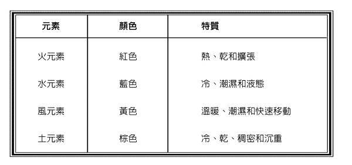

把注意力集中在其中一个元素的特质上，当你吸气时，从周遭的空间吸纳那个元素到你之内；当你吐气时，观想你的身体充满了那个元素。然后像之前一样创造防护盾：将手和拳头放在你的心脏上方，观想球体凝聚在那里，但是颜色与元素相关。把它投射到你周围成为一个蛋形，然后观想能量在你的周围形成一个壳。

元素防护盾有很多种用途。主要来说，它能出色地防御相斥的元素（水对应火，风对应土）的任何攻击。你也可以使用元素防护盾来提升你的某些特质：土元素代表坚定与集中，风元素代表聪明与狡诈，水元素代表理解与智慧，火元素代表能量与坚定的意志。

防护盾出现在这一节，而非在第二章日常练习的章节中，原因是驱逐仪式是针对有害能量的模式，而防护盾对所有人都有效。总是预留一个防护盾会隔绝你和别人，即使是那些对你毫无好感的人也会觉得你很遥远或不可接近。使用迷惑或是元素防护盾可以引发更奇怪的反应。只在你需要的时候使用它们就好。

## 隐身术

在某些情况下，最好的防护是混淆，而不是对抗。也许你想从混乱的世界中抽身片刻，以便理清自己的下一步行动，或是在你施展逆转或消耗型魔法时，不想被人注意到 11。无论是什么原因，隐身的魔法可以提供一种保护，这是驱逐仪式做不到的。

要清楚的是，这个仪式实际上并不会让你变得透明，也不会让光在你周围弯曲，或是以任何方式让你赤身裸体地走动、发出不具形体的声音，以及让物体漂浮在半空中。隐身魔法隐蔽了你的气场，并导致那些不是专程来找你的人察觉不到你的存在。如果有人在找你，然后他在走廊上碰到你，他会看到你很好，尽管他可能会说那天你有些不一样。你可能还会发现那些与你有往来的人在交流之后会忘记这些互动。

举个例子，当我在大学第一次尝试隐身魔法的时候，课堂上要发表评论，而我一次又一次被略过，虽然之前我似乎是教授最爱点名的学生之一。后来当我和一些跟我同住的朋友闹翻了，我使用了同样的隐身仪式，很快地他们便不再烦我了，甚至有一个人是我在房间里的时候谈论到我，而他全然忘了我人在那里。

和防护盾一样，当你使用隐身术的时候，你必须小心翼翼。有一次我发生了个小擦撞，本来情况会更糟的，因为有人没看到我的车就把车从停车场里开出来。那个人不停地道歉，发誓说他前后左右张望许久，但就是没看见我。

当然，这本书提到的隐身原因不仅仅是为了避免不舒服的情况，更是为了保护你自己。在魔法攻击的情况下，特别是当灵体被用来对付你的时候，使用隐身作为防御将会使有敌意的灵体没有攻击的对象。最后，灵体会回到祂的来处。如果祂是另一个巫师送来的，祂就会带着原本针对你的诅咒。如果祂只是一个充满敌意的自然界灵体，祂便会回到自己的栖息地。

你唯一需要的工具就是一些薰香。如果你可以用没药（单独和乳香或龙血使用），那是最棒的；如果没有，那么你可以使用任何你喜欢的薰香。

这个仪式从召唤光柱开始，跟第二章的驱逐仪式一样。

## 隐身仪式

#### 第一部分：召唤光柱

首先，站着面对东方。想象你在宇宙的中心。

深吸一口气，想象在你的上方，从最高的天空发射出一道纯净的白色光柱。这道光进入你的头顶，贯穿了你，进入地下。这道白光具有净化与集中的性质。吐气，吟诵如下：

迪千打　克伦巴！（DECENDAT COLUMBA!）

（鸽子降落！）

再做一次深呼吸，想象有一道红色的光从你的下方升起，穿过光柱，向上贯穿你。白光用于净化，红光则充满了活力。吐气，吟诵如下：

埃森达特　瑟奔斯！（ASCENDAT SERPENS!）

（巨蛇升起！）

再次吸气，感受到这两种能量从上到下进入你的身体。吐气，感受这两种能量在你的全身流动，用它们的力量浸润你的每一个细胞。感受你与天地、冥府和天堂之间的连结。

用右手指着你的第三眼，吟诵：I（发音是：埃伊）。

将你的右手移到你的心口上，张开你的手，让手掌面向你的胸部，吟诵：A（发音是：啊，拉长一点）。

将你的手往下移动到生殖器上方，手掌向上翻转，拇指与食指相连，吟诵：O（发音是：奥）。

站着一会儿，冥想你跟天地、冥府与天堂之间的连结，以及你与神灵之间的连结。

#### 第二部分：隐藏障碍

站在你圣殿（或任何地方）的中央，面向东方，大声宣告：

黑卡蒂女神，夜之母

太阳神海利欧斯，光之父

用阴影与烟雾遮蔽我，使我行过人间而不被看见。

拿起香炉或线香，高举过头顶，以类似无限符号的模式移动它。发出 IAO 的振动声音。

把薰香移到你的下方，这样你就能让它靠近地板。以同样的无限符号模式移动它。发出 OAI 的振动声音。

向东南方移动，以同样的模式发出 AOI 的振动声音。

向西南方移动，以同样的模式发出 OIA 的振动声音。

向西北方移动，以同样的模式发出 AIO 的振动声音。

向东北方移动，以同样的模式发出 IOA 的振动声音。

回到东南方，完成这一个魔法圈。然后移回圣殿的中心，把线香放回容器中。

#### 第三部分：分割空间

再次站在圣殿的中心，回忆起你处于宇宙中心的感受。揉搓你的手直到变暖，这会为你的手带来力量。手掌并拢，双手向前移动，就好像你把它们移动到两幅窗帘之间的缝隙中。事实上，你应该记住：你正在把你的手插入空间本身。一旦你把手插进去，就把它们分开，象是拉开窗帘一样。当你分开手的时候，你可能真的感觉得到手背上的压力。

双手分开之后，右手掌向上，左手掌向下。开始再次移动它们，右手向上，左手向下，分隔开另一个三维空间。

右手掌向前，左手掌向后，并且分开双手，分隔开周围的空间。这样，你就在身体的周围分割了空间的三个维度──长、宽、高。

把手放在身体的两侧，说道：

以夜之母黑卡蒂女神之名，

以太阳神海利欧斯，光之父的名，

我站在空间之外

我在静默与阴影中前行，如我所愿。

把右手食指放在嘴唇上。这被称为静默的手势或是沉默之神希波克拉底的标志。吸气，想象你的身体没有实体的物质。完全吐尽气，感觉自己天衣无缝地融入周围的环境。吐气之后，尽可能长时间屏住呼吸，想象你从正常的空间脱离的过程。在静默与阴影中前行。

## 净化与保护气场沐浴法

净化沐浴是世界上最古老的魔法技巧之一。从远古时代开始，人们就相信净身不仅能清洁身体，而且纯净的水与某些草药、矿物质和油脂结合运用，能产生非常有效的效果。我们可以看到早在苏美人的《月神南纳赞歌》（Hymn to Nanna）中就提到了神圣的沐浴，从基督教的洗礼到健康水疗，这种做法反映在现在的各个地方。世界各地都有魔法的浴场，诸如印度瓦拉纳西的恒河宫河坛、海地的绍特欧瀑布，以及英国格拉斯顿伯里亚瑟王庭院的浴池。

当一些西方的修行者似乎想跳过沐浴和净化，而更偏好以能量为基础的练习，比如驱魔和防护盾，魔法浴却是一种重要的方式，让你的魔法在物理层面上更具体，并且获得更确实的结果。在净化你自己的负面影响上，没有比这个更好的方法了。我建议，仪式澡永远都是你防御计划的一部分，用以对抗麻烦的力量。

沐浴仪式首先要考虑的是水本身。传统上，你会使用自然来源的水，比如泉水、湖泊或是在暴风雨期间收集的水。如果你住在神圣的泉水或河流附近，那便是理想的水源，但一般的想法是水源愈天然愈好。尽管如此，我承认大多数时候我都是使用自来水，并且怀疑我大多数的客户也都这么做。毕竟使用自来水总比不洗澡要好得多！

当躺进放好的水里头之后，你需要知道你在浴缸里加了什么。配方通常需要三种或更多的成分，且通常是奇数。这些成分可以是矿物的、草本的或是动物性的，它们的象征意义决定了沐浴的性质。从吸引金钱和爱情，到影响周遭的人，再到驱逐厄运与负面能量，这些都有传统的沐浴配方。这是我们在这里最后关心的一个类别，以下是我们可以运用的三个简单配方范例。（请注意：这些配方只推荐给成人使用，并且每个人都应该小心敏感部位的皮肤。）

### 保护浴

一个好的保护浴包括了盐、氨和醋。盐和醋的比例可以是半杯左右，但一茶匙氨至少需以十五公升的水稀释，因为氨水有毒，如果吸入就会有害。氨水被认为是一种强大的清洁剂，如果使用得太多，除了会消除负面影响，也会消除正向与中性的影响。

### 净化浴

这是由白橡树皮、肉桂和松针组成的配方，我喜欢用它来清除霉运和负面能量。牛膝草浴也是一种传统，尤其是可用来清除你带给自己的霉运。

可以在洗澡水中随意加入这些成分。

### 逆转伤害浴

尤加利叶、红辣椒和芸香是专门用来逆转伤害的配方，可以和第七章的咒语一起使用。你可以加上大约半杯的尤加利叶和芸香，再加入一小撮红辣椒。

这三种沐浴配方只是无限种组合中的范例，这些组合存在于传统的配方当中，用于保护与逆转。关于草药和神圣沐浴的更多信息，请参阅附录一。

沐浴的时间点也是一个因素。大多数情况下，沐浴是在黎明前进行的，这样就能让初升的太阳和你一起工作。如果你知道你将要面对一个和你作对的人，或者你要去一个充满不良心理环境的地方，那么在面对之前洗个保护浴便是一个好主意。如果你在晚上受到了这些症状的折磨，那么睡前洗澡将是最好的主意。遵循月相（驱除用的月亏和吸引用的月盈），或者一周当中的行星日来安排你沐浴的时间。但是当攻击正在显现的时候，最好立即沐浴，而非等待合适的日子或月相。让常识和你自己的爱好成为你的向导。

我应该在这里提一下，仪式浴并不是让你身体干净的沐浴。你不关心起泡沫和洗头发，只关心仪式。沐浴的方式很重要：从脚到头的擦洗，把东西吸纳到你身上；从头到脚的擦洗，把能量从你身上推开，然后浸泡以缓解症状。沐浴的时候通常会持咒或祈祷。例如在胡督教，同时也在所罗门魔法中，某些《诗篇》会在沐浴时朗读，比如第二十三篇是为了保护、第五十一篇是为了净化。一个异教徒也许应该背诵一段来自希腊莎草纸魔法的保护咒语（Papyri Graecae Magicae）。你自己的文字通常会比这些传统的朗读更好，你应该自在地使用任何适合情境的文字。

以下是一个召唤黑卡蒂与海利欧斯的咒语，与这本书的其他仪式非常吻合：

我向祢致敬，看守大门的黑卡蒂，

我向祢致敬，至高的海利欧斯，

把祢的手放在我身上，

从我的四肢驱走疾病与灾殃。

愿这些水驱离攻击我的人

把他们抛入黑蒂斯的四条河，

愿空气将他们吹散到四面八方，

愿我永远站在祢闪耀的光芒下，

使我的道途明晰。

我向祢致敬，看守大门的黑卡蒂；

我向祢致敬，至高的海利欧斯。

过去，在室内管线系统出现以前，人们用洗手盆洗澡，然后拿着洗手盆到外面把洗澡水倒掉。另一个传统的能量沐浴重点，是在黎明时分将水倒向从东方升起的太阳，从而最终排除了沐浴过程中产生的任何负面影响。当然，在现在这个时代，我们大多在室内洗澡，所以我理解大多数人会想用浴缸的排水管来排水。我承认我自己经常在浴缸里沐浴，然后让水顺着排水管流走，但我也用过洗手盆，以传统的方式洗澡。在一些对我来说非常重要的事情上，我觉得用传统的方式来做是值得的。你自己试试看这两种方法，看看是否能发现不同之处。

## 护身符、护符与辟邪物

关于护身符与护符（talisman）的区别已经有了很多的讨论。有些人，比如唐纳德．迈克尔．克雷格说护身符能驱走能量，护符则能吸引能量。另一些人则认为，护身符只是指那些在自然界中发现的、具有天然特性的辟邪物，比如魔石（hagstone，又称为多孔石或加法石），而护符则是指由巫师制作、在仪式中赋予魔力的物品。这两种说法似乎都没有太多词源上的支持，我不会去争辩哪一种为是。重要的是，携带辟邪物是世界上最著名、最广泛使用的魔法防护方式之一。当然，这种形式的魔法跟本书中的任何其他魔法相比，已经成为主流文化，因此在路人身上发现兔脚幸运符、圣徒徽章或是卢恩符文项鍊并不稀奇，这些人可能会认为自己已尽可能地远离了巫术。

在天然的护身符中，铁是保护性材质之王 12，用于保护不受幽灵、女巫和精灵的侵害，这在世界上是众所周知的。铁对于灵体的破坏性如此之大，以至于一些巫术传统不允许任何金属进入魔法圈，直到魔法圈能很好地被加持与稳固为止。许多古老的墓地周围都有铁栅栏，这不仅是为了防止入侵者进入，也是为了把鬼魂关在里面。在我们学会开采与冶炼铁矿之前，古人铁的主要来源是铁与镍含量高的陨石。这种天铁在魔法方面特别有价值，是西藏普巴传统建筑所要求的金属之一 13。

在整个欧洲，将铁钉和铁制匕首打入门框中，以防止女巫进入的做法是众所皆知的。这可能源于古罗马博物学者普林尼（Pliny）的《自然史》（Historia Naturalis），该书提到了铁的辟邪特性：

或者拿一把刀或匕首，用刀尖在一个小孩或一个老人家的身体上，观想着绕上两到三圈，然后再绕着大家转一圈。同样的，它是一种对付一切毒药、巫术或妖术的唯一阻隔。还要将任何铁钉从埋着男人或女人的棺材或坟墓中取出，并且牢牢靠近门楣或侧柱，通往房屋或卧室，哪一个夜里睡在内的人被鬼纠缠的话，他或她应该从这种奇妙的幻象中解脱。

请注意，普林尼不仅提到了铁能破坏咒术的能力，而且特别提到铁制棺材钉的力量。棺材钉在胡督魔法中也特别有价值，用于诅咒和保护免受诅咒影响。我自己有一个由两个铁棺钉制成的十字架，当作强大的保护性质护身符使用。

十字架本身也是一个强而有力的保护象征，其历史可以追溯到比基督教更早的时代。等臂十字架是地球上最古老的宗教符号之一，并产生了许多变体，包括埃及的生命之符（crux-ansata），或称为安卡（Ankh）；还有西藏的万字符（卍），它在苯教中被视为永恒，在欧洲被称为「菲福」（fylfot），意思是四英呎。十字的象征意义是多方面的，可以表示两个世界或是维度的交会，太阳旋转的轮子，或是世界分成四个方向。它作为被牺牲的神的象征来使用，不应该被忽视，也不仅仅侷限于基督教的传统。波斯／罗马的光明之神密特拉斯（Mithras）、伊特鲁斯坎神伊克西翁（Ixion）以及阿兹特克的羽蛇神（Quetzalcoatl）都被钉在这种或其他种的十字架上。

你当然可以购买一个十字架作为护身符配戴，但我始终认为将两根木条绑在一起，是仪式性地加持这个十字架的一个强大时刻与理想时机，所以我建议你自己制作一个十字架。制作的材料由你决定，但它应该具有意义。你可以使用象是欧洲山梨、橡树或荆棘这样的神圣木材，或者你可以使用前面提到的铁钉（棺材钉很难找，所以你或许只能在五金行找到铁钉）或骨头。鸡骨头或其他动物的骨头就足够了，但如果你愿意，你也可以用人骨。人骨可以在加州的存骨房（Bone Room）等地方合法购买 14。如果你确定要用骨头，就要将祭物献给骨上附着的灵体，并且占卜看看使用它们会有什么困难。

要使用咒语，只要将两根十字架的木条放在你的面前，双臂完全展开，摆出一个类似恐怖电影中，某人把两根棍子放在一起击退吸血鬼的姿势。想象十字架的两臂向外无限延伸，将你的注意力集中在交叉的地方。当你举起十字架的时候，做一个宣告，比如：

以玻瑞阿斯、仄费洛斯、欧洛斯与诺托斯之名，

以火焰河、悲叹河、冥河与黄泉之名，

以四方所有王子与力量之名，

我捆绑并加持这个十字架，

使它永远成为盾牌与保护，

对抗各种邪恶力量、可憎的灵体与恶毒诅咒的伤害。

凭借神的意志与话语，如我所愿！

加持完十字架后，要将它放在祭坛上或是地上，不可拆开这两根木条，而要用黑绳或牛皮捆绑起来。如果你是用铁来做，而且手又巧，你可以把十字架焊接起来。

除了十字架，还有几乎无穷无尽的保护符号可以购买或是制作成护身符。

．汉莎之手（the hamsa hand）也被称为法蒂玛之手（法蒂玛是穆罕默德的女儿），或是米莉亚姆之手（摩西和亚伦的妹妹），这是一种流行的保护符号，来自中东。它由一只向下指的手组成，通常中间有一个眼睛。

．汉莎之手的另一种变体是用蓝色玻璃做成的眼睛，在摩洛哥、土耳其、意大利和圣徒信仰当中都可以找到。它有很多种形式，从一个简单的眼睛画在一个蓝色的玻璃小圈上，到蓝色的汉莎之手加上眼睛，再到华丽的马蹄铁画上眼睛。

．巴拉吉（palad khik）或是假阴茎，在泰国是一种阴茎造形的护身符，通常有一只猴子、老虎或其他动物骑在上面。阴茎护身符可以保护人不受灵体和法术的侵害，这些负面的东西会导致不孕或丧失阳气。阴茎护身符可以配戴在腰带上。如果它掉了，就表明它已经完成任务，代替你的生殖器吸收了攻击。

．三曲腿图（triskele）像一个三臂的万字符号，由三条弯曲的腿在大腿之处连结而成。在希腊和意大利，它的中心通常有一个蛇发女妖或梅杜莎的头，可石化任何巫师或有伤害性的人。

．意大利的马诺菲勾（mano fico）与马诺科奴多（mano cornuto）是具保护性的手势，通常出现在护身符上。马诺菲勾，或称为无花果手势，是将姆指放在握紧的拳头中食指和中指之间。马诺科奴多，又称为有角之手，从握紧的拳头中抬起食指和小指，代表角。这两种护身符都可以用银、铁、铅锡合金制成，但用血红色珊瑚制成的护身符特别有效。

．十美分银币是美国特有的护身符，不仅具有银的保护特性，而且据说如果有人诅咒你，它会变成黑色。这种信仰源自于在你的鞋子里放一枚银币的做法，根源医生（root doctor，精通胡督魔法的专家）会在你的鞋子里放上烟雾粉、热足粉和一些诅咒粉。这些粉末中几乎总是含有硫磺，而硫磺会使银币变黑。

传统的保护性质护身符清单能填满好几本书的篇幅，也有许多书已经列出它们，这些是收集任何辟邪用圣物一个很好的开端。

除了这些护身符，还有能画在羊皮纸上或是刻在适当金属上的符印。在诸如《所罗门的钥匙》（The Keys of Solomon）之类的魔法书中，我们可以找到各式各样的符印。其中最著名的两个就是所谓的「萨托尔魔方阵」（Sator Square）和「阿布拉卡达布拉」（Abracadabra）。

萨托尔魔方阵来自于拉丁文的回文，读作「SATOR AREPO TENET OPERA ROTAS」，可以排列成一个神奇的魔方阵，如图 3.1。

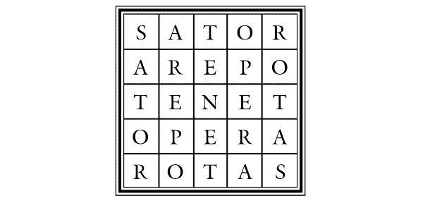

图 3.1　萨托尔魔方阵

sator 的意思是「播种」，tenet 的意思是「坚持」，opera 的意思是「工作、照顾或努力」，rotas 的意思是「轮子」，arepo 是一个更麻烦的字眼，因为它没有出现在拉丁文中。有些人认为它是一个特定的名字，另一些人认为它是从高卢语借来的，意思是「犁地」。还有一些人认为它是希腊词组中阿拉法和俄梅戛的阿拉姆版本 8。最后一种解释是由这样一个事实支持的──你可以把字母排列成单词 Pater Noster（我们的天父），在一个十字中只留下两个 A 和两个 O，从而形成一个基督教护身符，看起来如图 3.2。

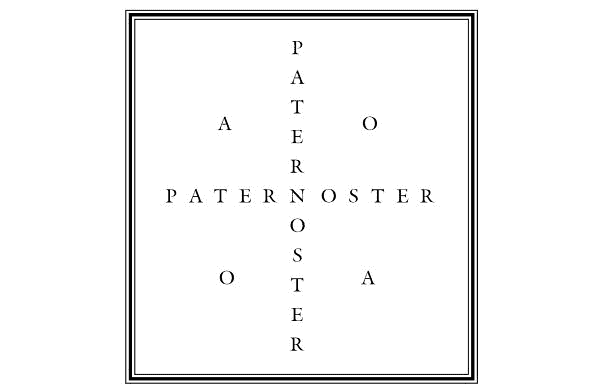

图 3.2　天父十字（Paternoster Cross）

另一种拼法变体可以用正方形来拼出短语：Satan, ter oro te, reparato opes（撒旦，我对你说三次：把我的好运还给我）。无论它真正的涵义是什么，从庞贝古城沦陷以来，它一直被用在保护魔法上，直到今日。在宾州的荷兰人当中，符印被当成咒术的符号并不罕见。

「阿布拉卡达布拉」是一个咒语，不幸的是，这个咒语在现代已经名声不佳，因为舞台上的魔术师用它来点缀他们的魔术手法 9。这个词曾经一度被视为代表力量的古老词汇，它的起源有好几个版本。这个词最被公认的词源是它来自于阿拉姆语的 avra kehdabra，意思是「我说话的时候就创造出来（我说的）了」。另一种可能是这个词来自于另一个阿拉姆片语「abhadda kedhabhra」，意思是「像这个词一样（说出之后就）消失」。正是这个最后的意思，使它最好当作书面的护身符使用。

这个护身符就是一遍又一遍地写「阿布拉卡达布拉」，然后每写一次便去掉一个字母。辟邪物第一次出现是在二世纪赛伦努斯．萨摩尼克斯（Serenus Sammonicus）的《医疗之书》（De Medicina Praecepta）中。他是罗马皇帝卡拉卡拉的御医，以祛病闻名。从那之后，阿布拉卡达布拉便被当成一种辟邪物，不仅能祛病，还能赶走恶灵和诅咒。

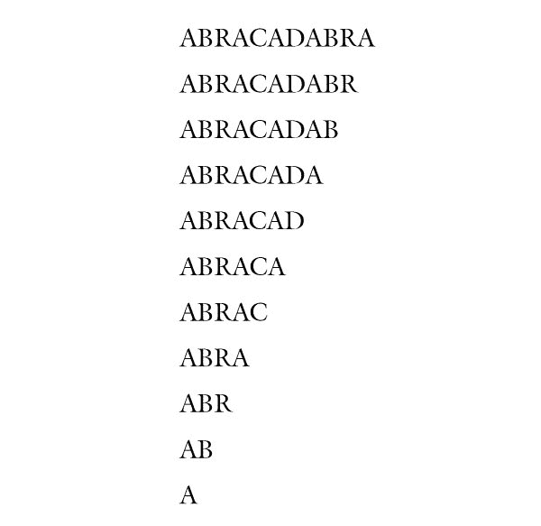

某些药草和矿物也会被当作保护性的护身符携带。例如，据说盐巴可以赶走不速之客。阿魏可以用来驱逐疾病和诅咒，以及其他任何闻到它的生物。美洲凌霄可以绑住邪恶的灵魂。洋菜能让你隐身，并且可以跟第三章的隐身仪式合并使用。这些东西，连同金雀花、龙血、大蒜、槲寄生、尤加利、香茅、迷迭香、柠檬和曼德拉草，都是一些可以单独携带或放在巫袋里的草药。

巫袋也称为巫术包或是格利斯格利斯袋（gris-gris bag）。格利斯格利斯这个词的意思是「灰色—灰色」，表示这个袋子有白色和黑色的魔法。这些袋子是美国胡督传统的日常必需品，具有多种目的 15。可以将适当的材料收集到颜色恰当（通常是红色）的法兰绒拉绳袋中，或者用布把它们绑起来，这是纽奥良的风格。配方的数量应该是奇数，最常见的是三、七和九。你应该避免使用含有超过十三种配方的袋子。

以下是我喜欢的三种配方的简单组合：

### 恶魔之手 16

九片美洲凌霄可以绑住魔鬼，菱角可以把恶魔吓跑，再来一些阿魏，它也叫作恶魔的粪便，可以把恶魔赶走。把它们全放进黑色袋子里。

### 逆转之手

将尤加利叶、盐巴和蟹壳放在红色袋子里，可以逆转咒语和伤害给施术者。

### 天使的保护

对于女性尤其有效的是放了当归根、基列香膏（balm of Gilead buds）和盐巴的巫袋。用白色布包着随身携带。据说这种巫袋比逆转或直接屏蔽咒术更能缓和对峙的情况。

### 破除厄运

把硝石、硫磺和柠檬草放在红色的法兰绒袋子里，这是打破厄运、打开新机会之门的好方法。

### 旅途上的保护

艾草、紫草叶和茴香会在旅途中保护你的安全，不仅能避开有害的能量、灵体和诅咒，还能避免触法。

无论你使用的是上述这些配方组合中的一种，还是来自其他地方的传统配方，抑或是你自己设计的配方，巫术包都应该是神圣、充满灵性活力的。传统的美国根源工作者可能会用《诗篇》或即兴祈祷来加持巫术袋，如果你喜欢的话，也可以这么做。一些根源工作者会对巫术包说话，就好像它是活的一样，并给它下指令。在民俗学者玛莉．艾莉西亚（Mary Alicia）的《从原始来源搜罗的西南方黑人口耳相传巫毒故事集》（Voodoo Tales as Told Among the Negroes of the Southwest, Collected from Original Sources）当中，已经记载了这样的一个仪式。她僱用一位根源医生，名叫金，他为《阿兰迪亚：女巫福音》（Aradia: Gospel of the Witches）的作者查尔斯．里兰德（Charles Godfrey Leland）施展了一个巫术。

他把球放在拇指和食指之间晃来晃去，对着球说：「现在，你叫里兰德，查尔斯．里兰德。我将会在很远的地方，在很远的地方，穿过大海，到树林里去。让你的生活重新振作起来。走得很远，你听到我了吗？你走远了吗？你在爬山了吗？你在爬高吗？」

每个问题之后都会有一连串的回答，这些回答愈来愈微弱，就像人们以为球的灵魂会愈飞愈远一样。17

你可以做一些完全自发的事情，构建你的巫袋、加持能量上去，或者使用任何你承自的传统。由于我认为蛇是灵知与魔法的代表，所以我经常使用一种我称之为「蛇之歌」的希腊圣歌，在适当的薰香或蜡烛焰火上方，握着巫袋加持它。

荷　欧皮斯（HO OPHIS）

荷　阿奇阿欧斯（HO ARCHAIOS）

荷　德拉空（HO DRAKON）

荷　墨盖斯（HO MEGAS）

荷　恩该（HO EN KAI）

荷　翁该（HO ON KAI ）

荷　宗图斯　爱欧纳斯（HO ZON TOUS AIONAS）

麦塔 图　奔努玛图斯　索依！（META TOU PNEUMATOS SOU!）

（噢，古老的巨蛇啊，

噢，伟大的龙啊，

曾经、现在都在亘古之中，

求祢与我们的灵魂同在。）

当我吟唱这首歌的时候，有着充裕的时间，我通常会感到空气中有一种变化，好像有数道隐形的门在我周围打开，或者突然有一种转换的感觉，就像我有一下子记不起我是如何走到那里的。我完成之后，就吐唾沫在袋子里面，说：「如我所愿！」

## 黑卡蒂之轮

为了与本书的黑卡蒂法门保持一致，我要在此呈现二〇〇二年黑卡蒂魔法传承之后，我在梦里出现的一个符印和加持的方式。这个符号很简单，看起来像个三叉戟或是干草叉的轮子。

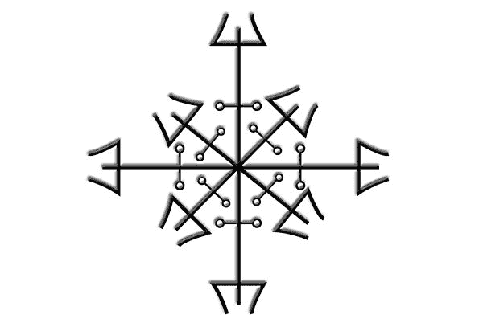

图 3.3

它可以写在羊皮纸上，也可以刻在金属上。它也可以涂在地上作为一个魔法保护圈。这个加持的符号不仅让人联想到黑卡蒂，还让人联想到希腊神话中的四重女性形象：复仇女神（Furies）、美惠三女神（Graces）、命运女神（Fates）和蛇发女妖戈尔贡（Gorgons）。为了加持这个符印，你要以所谓「三角显化」的姿势握住你的手（手掌对着符印，拇指与食指、中指的尖端并在一起形成一个三角形，透过这个三角形，你可以看到你正在加持的物品 10）。

使用下面的祈请文来加持符印：

我向世界的持有者黑卡蒂女神致敬，

我向三岔路的主人伊诺迪亚（Enodia）致敬，

我向坟地的守护者涅库亚（Nekuia）致敬，

幽冥、黑夜与地狱的那一位主人，

我以祢的三个祕密名字呼唤祢──

埃列什基伽勒（Ereshkigal）、奈博德苏勒（Nebotosoaleth）、阿克缇菲丝（Aktiophis）

噢，黑卡蒂！

我以祢之名召唤命运女神！

所有强大的莫伊赖（Morae）11！

克洛托（Clotho）、拉刻西斯（Lachesis）和阿特罗波斯（Atropos）

我召请祢们、召唤祢们、呼求祢们！

祢们，是生命的起源、度量和生命之线的切割者

请怜悯祢们手中的线吧！

让战争的潮汐为我而纺织。

噢，黑卡蒂！

我以祢之名召唤复仇女神！

极其恐怖的众神，

来自乌拉诺斯（Uranus）之血孕育的

阿勒克托（Alecto）、提西福涅（Tisiphone）、墨盖拉（Megaera）。

我召请祢们、召唤祢们、呼求祢们！

从黑暗之神厄瑞玻斯（Erebus）那儿来

保护这个符印的持有者

用正义的天谴驱逐所有的攻击者！

愿我的敌人连名字都不复存在！

噢，黑卡蒂！

我以祢之名，召唤蛇发女妖戈尔贡！

神祕十字路口的蛇发守护者──

欧律阿勒（Euryale）、斯忒诺（Sthenno）、梅杜莎（Medusa）

我召请祢们、召唤祢们、呼求祢们！

从西方出来，保护这个符印的持有者吧！

祢身上覆盖着不可穿透的鳞片、有着蛇发和黄铜手腕，

要防御一切恶灵与邪术，

现在出现，并准备好！

噢，黑卡蒂！

我以祢之名召唤美惠三女神！

美丽的女神们在天堂永远地跳着舞

塔莉亚（Thalia）、欧佛洛绪涅（Euphrosyne）、阿格莱亚（Aglaia）

我召请祢们、召唤祢们、呼求祢们！

从林间空地出来，照顾祢们的术士吧！

求祢们医治我仇敌所做的一切伤害，

引导我走丰盛的路。

黑卡蒂 波罗巴以类（Hekate Propylaia）

黑卡蒂 波丝佛罗（Hekate Phosphoros）

黑卡蒂 波罗波露丝（Hekate Propolos）

保护者、发光者、引导者啊！

我以祢之名召唤神灵

向祂们寻求帮助、天谴、保护和恩典。

这事要靠祢们的力量才能完成，

我向世界的持有者黑卡蒂致敬。

这个祈请文遵循一个简单的模式：首先它召唤至高的女神黑卡蒂，然后以祂之名召唤出神灵。这三组神灵以此特殊顺序召唤，以作为一种防御的策略。首先，召唤命运女神为整个情况带来好运。接下来，召唤复仇女神强力驱逐那些侵犯我们的力量。在复仇女神清除这种影响后，我们透过召唤蛇发女妖来防御进一步的攻击。最后，我们召唤美惠三女神来治疗造成的所有伤害，并请求祂们仁慈的祝福。

与这个咒语有关的符号可以刻在金属上（最好是刻在银上面），也可以烙印在木头上，抑或做成羊皮纸文稿随身携带。它也可以画在门上作为保护性浮雕，或在地板上做一个保护圈。

* * *

11　参见第七章关于逆转和消耗型魔法的说明。

12　关于铁的保护特性更全面的论述，请参阅钱德勒（B. Gendler）的优秀文章［铁的辟邪用途］（The apotropaic use of iron），网址：[www.panikon.com/phurba/articles/iron/html](http://www.panikon.com/phurba/articles/iron/html)

13　这三种金属是南恰克（Nam Chak）、萨恰克（Sa Chak）和德里恰克（Dri Chak）。南恰克是来自陨石的金属，萨恰克是来自地球的金属，德里恰克是来自杀死某人的剑或刀的金属。

14　在任何情况下，我都不会建议你挖一个坟墓来取得人的骨头或棺材钉。如果你看起来够衰的话，可能会因此遇上危险的灵体，更不用说法律上有侵扰坟墓的后果，因此建议你以合法方式购买。

8　典出《圣经．启示录》二十二章十三节：「我是阿拉法，我是俄梅戛；我是首先的，我是末后的；我是初，我是终。」天使以希腊文的首字与尾字来自承为一切受造物的起始与终末。

9　它有点类似华人世界的「天灵灵、地灵灵」开头的咒语。

15　对巫术包的完整论述超出了本书的范围。有兴趣的人可以看看书末附录一中关于胡督信仰的资料，特别是凯瑟琳．伊隆沃德（Cathrine Yronwode）的作品，她是幸运魔咒古玩公司（Lucky Mojo Curio Company）的老板。

16　请注意，在民俗魔法中，「魔鬼」一词并不总是指邪恶的存在，但可以指非洲的十字路口之神或欧洲的许多有角之神，这些人物在不同程度上被认为是魔鬼。事实上，欧洲有很多女巫的传统都把魔鬼的标签贴在有角的神身上，罗宾汉（Robin Hood）被这样称呼也没什么问题（有人认为他可以是森林的鹿角神代表）。

17　玛莉．艾莉西亚（Mary Alicia），《从原始来源搜罗的西南方黑人口耳相传巫毒故事集》（Voodoo Tales as Told Among the Negroes of the Southwest, Collected from Original Sources），《密苏里民间传说协会期刊》（Missouri Folklore Society Journal，一九八六～八七年第八～九期）。

10　这是来自藏密的加持手势，可以加速愿望变成物质化。

11　命运女神的统称。

# 4
保护住家的六种方式

既然我们已经处理好保护个人的方法，我们将接着保护家园。就像超人遇到困难时需要有一个可独处的堡垒，巫师的家应该是一个避难所，即使是在最强大的攻击之下。住家（以及汽车和办公室）在很多方面都是我们自身魔力的延伸范围。如果攻击者缺少一个很好的个人物品，比如头发或衣服来做一个魔法的连结，狡猾的巫师通常就会以房屋为目标，将它当作是一个巨大的魔法连结。在某个人会直接经过的地方扔烟雾粉或埋下格利斯格利斯袋，会比在夜深人静时扔在他或她家门口或是埋在庭院里更让人无法察觉，所以它是一个历史悠久的发送诅咒方式。

撇开受到其他术士的攻击，巫师的家经常是举行许多仪式的地点，这些仪式会吸引各式各样的灵体和能量。与流行的神祕学说相反，当魔法圈关闭或是驱逐仪式完成时，灵体和能量并不会立刻及永久地隔绝──祂们也不应该这样。一个巫师的家应该是一个神灵之家，祂们在那里不仅可以被召唤及提问，而且祂们也可以接触你、回应你。这就是与智慧生命和灵体建立关系的方式。我们不应该把保护家园的指示误以为是关闭与其他世界、力量和住民的所有联系。无论如何，我们应该建立一些防御机制，以击退那些敌对的或是流向我们的力量──那些可能会被我们魔法上的行动诱骗到我们家里的力量。我们大多数人都有许多不同的访客进出我们的家，并不是所有的人都会经过审查而且被证明是可靠的。我们在接待访客时感到安全，是因为当我们的访客受到威吓或暴力时，我们有着某种安全保障（即使我们只晓得要拨打 110）。我们必须学会用同样的方式对待灵体。

我在本章中提到「住家」，但大多数的建议亦适用于汽车、办公室或其他任何你花费大量时间的地方。同样的，对于「房子」的建议通常适用于公寓，亦不需要完全按照其字面上的意思，而是可以巧妙修改。例如，要求把东西埋在院子里的建议，也可以改成埋在公寓的盆栽植物中。

## 清洗地板

清洗家里的地板，就像你洗澡一样，对你的身体有帮助。清洗是魔法中非常古老和传统的一部分，在胡督巫术中尤其流行。清洗地板可以为各种魔法服务──从阻止流言蜚语，到把交易拉到妓院去处理，再到解决纷争。但我们这里只关心那些运用于魔法防御的清洗。关于其他类型的清洗，更多的信息可以透过附录一列出的研究资源找到。

防止伤害的一种地板清洗是用在从房子的后院往前门和户外上，就像你正在收集不想要的能量，并把它们从门口推出去。为了吸引能量而做的地板清洗则完全相反，要从前门往房子的后方移动。如果你的房子或建筑有很多层，那就从上往下排除能量，反之就是吸引能量。如果你的房子有铺地毯，你可以在喷瓶中混合一些洗剂，然后喷洒在地毯上；或者如果你是更传统的人，你可以用羽毛或天主教洒水礼用的净水瓶来喷洒地毯。无论你使用哪种方法，都应该遵循由后往前或由前到后的一般模式。在你开始清洗地板前，可以先绘制你穿过房子的路径。

跟洗澡一样，清洗地板的水最好从河流、泉水或雨水等自然水源中收集而来。必要时也可以用水龙头的水，但使用从大自然而来的水是传统，如果你能得到这样的水，就应该使用它。在一加仑或更多的水中加入相对少量的配方（一汤匙到一杯），然后虔诚地祈祷。如果你怕弄得一团糟而不想直接加入配方，你也可以把它们先泡在茶里，然后再加入水中。

接下来我会列出一些配方，它们是有效的防御和保护魔法。同样的，我的配方是使用简单的三种成分在清洗上。至于对更复杂的搭配方式感兴趣的人，请自行查阅更多巫术用的药草。

### 赶走使用邪术的人

．松针

．硝石

．你自己的尿（早上的第一泡）

### 驱魔的清洗

．大蒜

．辣椒

．醋

### 带来平静的清洗

．糖

．薰衣草

．玫瑰水

### 排除与驱离的清洗

．女巫盐 18

．缬草根

．金雀花

### 净化灵性的清洗

．蛋壳粉

．橡树皮

．柠檬草

当你认为需要为房间或房子做清洗时，你可以使用这些配方或其他的配方。无论你是否受到攻击，选择一个良好的清洗配方并在每个新月时使用，是一种很好的做法，特别是你个人的圣殿空间会需要用上的。当你清洗完空间之后，应该把剩下的洗剂和脏水朝东倒出前门外。和洗澡一样，最好在清晨黎明前做清洗，不过也可以在你觉得需要的任何时候清洗。例如一个你认为是敌人的人离开了你家，你可以在此人离开后立刻使用驱离的配方清洗，以迫使他们不再返回。

## 薰香

没有比焚香更普遍、更原始的魔法仪式了。几乎地球上的每一种文化都认可某种草药、树枝和木材在燃烧时所具有的灵界力量。藉由将我们的愿望和渴望注入于这些有形的东西上，然后燃烧它，使它从物质化为无形，最后进入能听到我们祈祷的灵界。

你可以在一个固定的容器上焚香，但如果你是在一个净化或驱逐的仪式上使用它，你应该用一个香炉或其他你可以轻松携带的东西。薰香的方式与前述的清洗相同：由后往前推到门外是为了排除能量，由前往后则是为了吸引能量。

薰香的配方有很多种，你可以在平静的时候随意尝试不同的配方。当你急需防御或有别人依靠你时，都不是尝试新事物的好时机，所以在你需要使用之前，请务必挑选一些能使结果圆满的配方。以下是我用过的一些很好的薰香配方：

### 一般净化、保护和驱魔

．乳香

．没药

．龙血

### 逆转伤害

．毛蕊花

．鼠尾草

．芸香

### 安抚灵体

．樟脑

．薄荷

．松木

清洗地板据说代表了两种阴性元素：水元素（清洗用的水）和土元素（清洗用的草药、矿物和其他成分）。薰香代表了两种阳性元素：风元素（烟雾）和火元素（燃烧）。薰香和清洗地板的结合是一种用你的意志去浸染一个环境非常全面的方式。和洗澡一样，这个过程是藉由清洗或薰香时，说出祷文或咒语来增强能量。在基督教魔法的各种传统中，《诗篇》经常被用于这个目的。《迦勒底神谕》（Chaldean Oracles）19 的箴言出色地辅助了这个过程，就像用盐水和薰香驱魔的各种魔法配方一样。我喜欢下面这个具保护、净化与驱魔的咒语：

以土元素──众神的肉身，

以水元素──众神流淌之血！

以风元素──众神的气息，

以火元素──众神灼热的灵魂！

我驱走一切邪恶、伤害与仇恨！

阿波　般多斯　嘎勾达以摩诺斯！（Apo Pantos Kakodaimonos!）

黑卡丝　黑卡丝　艾斯特　贝贝利！（Hekas Hekas Este Bebeloi!）

赛伊！（Sigy!）12

赛伊！

赛伊！

虽然我把这个咒语包括在保护住家的章节里，但它可以很容易地跟净化浴／薰香结合起来使用，并可直接用在一个人身上。

## 铺粉末

除了清洗地板和薰香之外，铺粉末来影响一个地方的好坏也是种传统。灰粉与粉末可以只用一种材料组成，也可以用草药、矿物、甚至动物材料组合而成，碾碎后单独使用，或与中性粉末（如滑石粉）混合使用。当你用粉末装饰房间的时候，可以在周围围一圈粉末，或是在房内四个角落各放一堆粉，并在房间中央放一堆粉。在某些情况下，你会想要在战略点，比如门口和窗户铺粉末。

在二〇〇五年的电影《毒钥》（The Skeleton Key）中，由凯特．哈德森饰演的角色便是用红砖粉来防止敌人进入她的房间。我不相信粉末能像电影里那样，让敌人以为有一堵看不见的墙在阻止他们进入，但这是一种传统做法，美国南部的人都用此方法来保护他们的家园。

虽然墓地的坟土常被视为是一种用来诅咒的材料，但它也可以用于保护和许多其他正向的目的。这完全取决于坟土是从谁的坟墓里挖出来的。当人们建造自己的房屋并传承给家人成为一种常态时，他们运用已故家人的坟土来保护房子便屡见不鲜了，特别是如果可以获得当初建屋者的坟土会更好，因为祂们对于保护这么辛苦得来的财物特别有兴趣。为了收集坟土，你不能只是从坟墓上取走却不给予任何报偿。传统的供品是一些威士忌或十美分硬币。如果你认识这个家庭成员，你可以献祭给祂一些祂在世时喜欢的东西。把土撒在房屋的四个角落，与这个灵体交谈，请求祂为你保护房子并远离一切伤害。如果你没有可以取用的亲戚坟土，你也可以使用士兵的坟土。无论出于什么原因，在任何需使用坟土的情况下，都要先做个占卜看看灵体是否愿意为你工作，这是一个良善的好主意 20。

卡斯卡亚（Cascarilla）也是一种有价值的防御工具。这是一种由蛋壳粉制成的白色粉笔，通常装在小纸杯里出售。鸡蛋代表了生命本身，而卡斯卡亚在圣徒信仰中享有强大保护者的声誉。它可以用来在墙上或地面上画保护性的符号，也可以画在身体上。每当我知道自己将处于一个充满魔法的敌对环境中，或者处理一个别人认为是固定或被诅咒的物件时，我就会在我的手臂画上线条，有三个十字架穿过此线段。我也会在我的鞋子里画十字。

除了上述这些单一成分的粉末之外，还有一些有着草药成分的粉末可以用于防御性的魔法，比如「勇敢无惧跨越邪恶」（Fear Not to Walk Over Evil）和「火墙防护」（Fiery Wall of Protection），可以在任何优质的巫术小铺或神祕学商店买到。我发现有些配方是有效的，譬如：

### 防范恶意的巫术 21

．车轴草

．圣约翰草

．莳萝

．马鞭草

### 在家中创造平静

．征服者高约翰根

．薰衣草

．胡薄荷

### 通用的保护粉

．苦艾

．所罗门的封印（玉竹）

．蓝升麻

以上这些配方中的任何一种，或是你发明或研究的其他配方，都可以跟草药粉末混合成基底粉，比如滑石粉。我在铺粉末这一小节中有提到滑石粉，不过它也可以像一般的爽身粉一样用于个人。

## 制作住家用护身符

就像人身上会佩戴辟邪物一样，护身符的设计是为了给某个地方注入保护作用。我在上一章已经讲过铁的运用，以及用铁栅栏把灵体挡在里面或外面。铁作为家中的护身符，另一个用途就是随处可见的马蹄铁了。关于马蹄铁有很多传说，其中有些是相互矛盾的。例如，有些人认为必须把马蹄铁的前端朝上挂起来，否则好运就会用光；另一些人则认为必须将前端朝下挂，这样好运才会降临到你身上。我放下我的观点，请你们信赖自己的直觉和偏好。

马蹄铁作为护身符的起源在古代便已消失了，但一些人认为它起源于一个祕密的月亮女神崇拜符号，因此与冥界的迷信有关。还有一个传说是马蹄铁的力量来自于圣邓斯坦（St. Dunstan），他在最终成为坎特伯雷大主教之前是一名铁匠。故事是这样的：他被要求给魔鬼的马钉上马蹄铁，但他却反而把马蹄铁放在魔鬼的蹄上。唯有魔鬼答应不再打扰一个挂着马蹄铁护身符的住家，他才会同意把它取下来。

也有马蹄铁护身符，上面有着用蓝色玻璃制成的眼睛，这是我们在前面谈到的邪眼护身符的一种版本。这些护身符不仅可以配戴，还可以挂在家里或车上。

镜子是另一种非常流行的驱邪方法。在中国，人们普遍会使用八卦镜。他们将被八个边围绕的八卦镜放在门口和窗户上，用来避邪。在摩洛哥，经常可以看到汉莎之手或眼睛形状的大镜子，可以用同样的方式击退邪恶力量。想用镜子来保护住家的话，你可以在工艺品店购买小圆镜，把它放在门口和窗户附近，藉此反弹传送给你的负面能量。如果你想要更复杂一点，你可以把镜子放在一个小的木制圆盘上，并在玻璃的周围设置保护符号，如图 4.1：

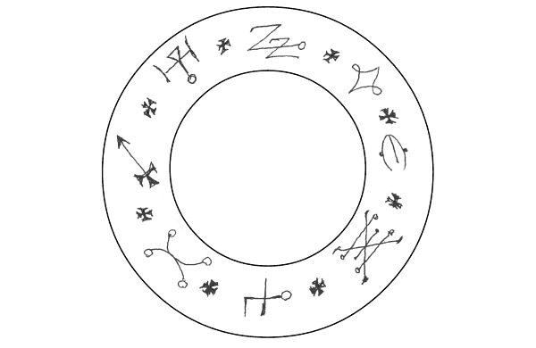

图 4.1　镜子保护符印

当你把镜子放在适当的位置时，开口施咒，如下：

镜之盾，你所在之处，

没有法术能通过，你能招引

所有的恶魔在你的镜面上，

所有恶魔被驱逐出此地，

以可畏的黑卡蒂之名，

顺我的意，

如我所愿。

某些树或木头据说也可以防止超自然的攻击。在英格兰的一些地方有一种习俗，是用山楂树与黑刺李的围篱来驱赶灵体。山楂树也是一种传统的木材，用作刺穿吸血鬼的木桩。在波士尼亚，人们会把山楂放在尸体的肚脐上，以防止尸体复活。传言紫杉树可以阻隔亡灵，因此人们会在坟地里种植紫杉树。把任何种类的带刺树枝挂在门口以阻挡巫师，是另一种在整个欧洲传播的习俗，也存在于印地安人当中。在英格兰，用红线捆绑的十字架是另一种流行的抵御巫术的护身符。所有这些保护性的木头都可以绑在房屋的椽条和横梁上，以加强房屋结构并抵御巫术攻击。

房屋护身符的另一种类别是那些被认为可以吓走恶魔的灵体。其中最著名的当然是石像鬼或狮鹫兽，几乎所有大城市的许多建筑与教堂上都能看到它们。石像鬼曾经用在建筑上引导雨水，但由于它们那可怕的外观，也被视为是建筑物和当中居民的保护者。在西藏和尼泊尔，金翅鸟的金属或木头形象经常能在门的上方看到（见图 4.2）。金翅鸟是一种令人恐惧的神祕鸟类，能解决由邪恶的龙神纳迦所引起的麻烦 22。金翅鸟最常被看到的模样是嘴里衔着一条巨蛇，正是象征此一特点。

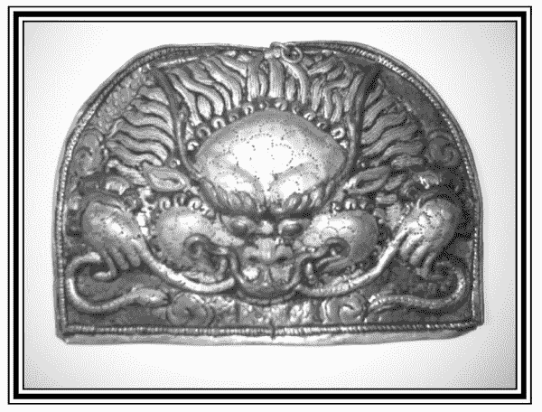

图 4.2　金翅鸟门前护身符

这类护身符的另一种是菱角，它是一种中国植物的种子，有时被称为水栗子 23，看起来有点像长了角的魔鬼或蝙蝠。我在尼泊尔和美国曾见过人们用它来保护自己，在这些地方，它被称为恶魔果实或蝙蝠果实（见图 4.3）。一般来说，它会被挂在门的上方，这样它就可以像金翅鸟或石像鬼一样吓走恶灵。我在第六章讨论守护灵时，会进一步讨论这些护身符以及它们在灵魂之家的用途。

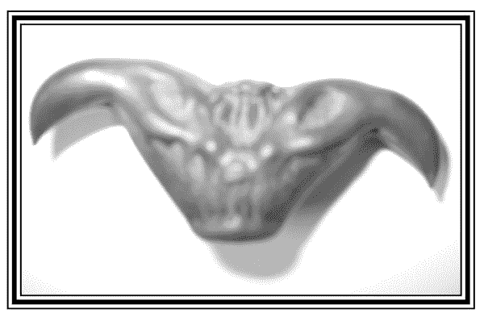

图 4.3　恶魔果实

## 做诱饵

有些护身符并不是用来驱赶恶灵的，而是用来作为诱饵以便吸收攻击你的力量。其中最著名的护身符是巫瓶。在英国和德国之间，考古学家已经发现了数百个巫瓶。在十七世纪或十八世纪，一户人家在这片土地的某个地方埋一个巫瓶并不罕见。巫瓶可以用玻璃或陶瓷瓶制成，在瓶子里加入九根针、九根大头针和九根钉子。也可以根据你的需求加进其他锋利的物品，比如鱼钩与刮胡刀；你也能加入致命的草药，比如颠茄和毒芹。最后，你还需要把你的尿液添加到瓶子里。尿液会吸引寻找你的灵体和法术，锋利的物品则会缠住并摧毁它。有些人也会把头发和指甲放进瓶子里，但我建议不要这么做，因为如果瓶子被找到了，这些东西会被取出并作为对付你的巫术连结。我想尿液也可以被取出来对付你，但尿液干了之后就很难取出了，更不消说如果尿液未干的话，也是非常令人讨厌的。最后，把瓶子密封起来，埋在你的房子里，通常是埋在走道或门槛下面。这是一种古老的信仰，如果一个意图伤害你的巫师从瓶子上走过去，他或她会当场经历巨大的痛苦，甚至可能死亡。

另一种魔法诱饵只是蛋而已。要使用这种咒语，你要用右手拿一颗煮熟的鸡蛋，然后顺时针绕住家三圈。当你这样做的时候，可以使用下面的咒语：

生命的种子，我向祢祈求，

没有邪恶在祢面前驻留。

在祢围绕之处没有混乱、没有诅咒，

也没有障碍滞留。

所有的魔女、幽灵和狩猎的亡灵

都从我身边被引到祢身边。

我以黑卡蒂女神的力量加持

保卫我们的家园。

拿着鸡蛋绕着房子转了三圈之后，你可以把蛋放在一个盒子里，然后埋在门阶下或是把它砌进房子的墙内。你也可以把它放在祭坛上，它在那里不仅是一个诱饵，也是一个警告，因为据说鸡蛋若吸收攻击能量就会破掉。

## 设陷阱

我们要考量的最后一种保护住家的方式，是灵体陷阱。几乎所有的文化都有诱捕或纠缠灵体和咒术的方法。在尼泊尔和西藏，经常可以看到为了这个目的而做的十字绳结 13，将五种颜色的线缠绕在一起，代表五行中的每一种元素。这些线绳随后被赋予祭祀仪式，并且奉献给特定的谭崔守护神。类似的步骤也用于由相同的五条线绳组成的圆来划定边界。

有个非常流行的法术是把九根桤叶荚蒾树枝（也被称为魔鬼的鞋带）埋在人行道。在这样做的同时，你发出了保护性诗篇或咒语，或者你也可以对每个人低声说一个简单的咒，比如：

扭曲、纠结、

绊住并束缚，

把所有的邪恶

都扔到地上。

三角形通常被视为是一种可以诱捕灵体的形状。有一些证据显示，现代帐篷桩的三边形是起源于苏美人用来钉住灵体的桩。这一传统在西藏和印度以著名的普巴杵或是雷钉而流传下来，它们在主流电影如《魅影魔星》（The shadow，一九九四年）和《横扫千军》（The Golden Child，一九八六年）中都曾出现过。在普巴仪式中，一个被称为林伽（linga）的雕像被放置在一个三角形的中心，这个三角形要么画在纸上，要么画在地上。有时则会使用一个三角形的铁盒。接着，人们透过一系列的心咒和手印 24 来召唤导致障碍的灵体或哲帕（恶灵），将祂们困在三角形中，然后用普巴杵杀死祂们。

我们在《盖提亚书》中发现了类似三角形的用法。在书中，灵体被召唤到一个三角形中，标记着各种神圣的名字，比如大天使米迦勒。三角形被放置在保护圈内，而被召唤的灵体被迫出现在里面，唯有当魔法师准备好的时候才能被释放 25。

本书的原文书封面上有一个三角形的灵体陷阱（见图 4.4），它在黑卡蒂信徒的一系列工作中出现在我面前，启发了这本书中的许多咒语。可以将这个符印烧进合适的木材中，比如橡木，或是用龙血墨画在纸上。无论这个符印是怎样被制作的，它都应该在接下来的仪式中被圣化。

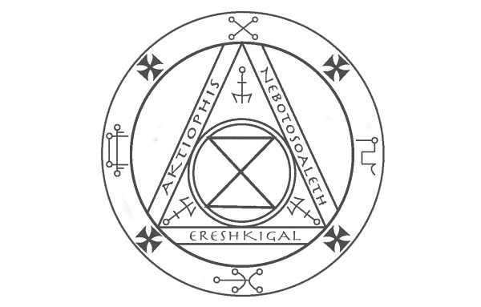

图 4.4　三角形灵体陷阱

## 灵体陷阱仪式

在新月的时候，给黑卡蒂女神的供品应该摆放在离家最近的十字路口。如果有三岔路口是最好的，但如果你找不到，那么四岔路口也可以。此外，若有个严重的攻击事件，而你不能等到新月的话，你应该在你最需要的时候直接行动。这个献供里应该包括供奉给黑卡蒂女神的食物，比如红鲻鱼、面包、生鸡蛋、奶酪、大蒜、蛋糕和蜂蜜。你也可以用附子和蒲公英等药草。（请注意：附子被当作是一种致命的毒药，应该用对待这种物质所需的谨慎态度来处理。）

真心地召唤黑卡蒂女神：

我向有诸多名字的众神之母致敬，

祂的儿女都是美丽的

我召唤伟大的黑卡蒂女神，门槛的女主人

祢狂野不羁地穿越坟地与火葬场

身披藏红花外衣，缀以橡树叶和盘绕的蛇

成群的鬼魂、狗与永不安宁的灵魂跟随着祢

我来向祢求助

我以祢的祕密名字呼唤祢：

阿克缇菲丝、埃列什基伽勒、奈博德苏勒

赐予这符印力量吧！

它可以迷惑那些造成伤害与麻烦的灵体

愿恩普莎（Empusae）与它困在一起

愿拉米亚（Lamia）与它困在一起

愿摩耳摩（Mormo）与它困在一起

愿维科拉卡斯（Vrykolakas）与它困在一起

愿阿波托派欧伊（Apotropaioi）与它困在一起

愿所有的幽灵、幻影与寇寇达蒙（Kakodaemon）26

被拉进三角形中

永远生活在封印的范围内。

黑卡蒂女神，门槛的女主人，

请接受我的供品并祝福这个符印。

完成后，这个符印可以放在房子的任何入口处，可以放在门口或窗户，或是地板下。让直觉成为你的向导。

如果你发现你需要把一个特定的灵体拉进符印中，你可以画一个较大形状的符印，用毛蕊草茎沾油，将它放在符印中央（亦即里面两个三角形接触之处）。点燃草茎，用你自己选择的词汇，切合情况，召唤该灵体进入符印。以阿克缇菲丝、埃列什基伽勒、奈博德苏勒之名来捆绑它。

有了这些方法帮你布署，你要在你家防御几乎任何一种巫术攻击应该都没有问题了。当然，经常举行驱逐仪式、冥想和献供是你主要的防御手段。在家里经常做这些练习会让整个氛围充满力量，为你赢得灵界的盟友。一般说来，这么做能够让这个家成为你能安全地专注和放松心灵的机制。

* * *

18　女巫盐或黑盐是添加了煤灰或其他药剂使其变黑的盐。

19　黄金黎明在他们的了望塔仪式中大量引用了这些名言。举个例子，当土元素在神殿中转圈时，你会这样召唤：「不要弯下身去，进入那黑暗灿烂的世界，那里不断地沉浸着背信弃义之深渊，地狱被黑暗包裹着，在难以理解的形象中欣喜、陡峭、蜿蜒；一个漆黑又不断起伏的深渊，永远拥护着一个无光、无形、虚无的身体。」

12　希腊文的「安静」。

20　我想建议如果你要收集墓地的坟土，你应该在白天做这件事，或者至少在一个昼夜开放的墓地做此事。没有法律禁止在坟墓留下十美分硬币或是从坟墓上捡些土，人们通常也不会对其他人在墓地里做的事打听八卦。然而，法律禁止非法入侵，也没有令人信服的理由让人必须在晚上收集墓地的坟土，尤其是出于保护的原因。

21　这个组合来自一首著名的两行诗：「车轴草、马鞭草、圣约翰草／阻碍女巫的意志。」车轴草是指任何的三边叶，如三叶草。圣约翰草又称金丝桃。

22　这并不是说纳迦天生就是邪恶的。祂们并不邪恶。事实上，祂们经常被用在喜马拉雅地区的法术和萨满教中，具有安抚作用。然而，某些纳迦如果被激怒便会引起问题，譬如金翅鸟引起的作用。

23　不要和荸荠混淆，在中国餐馆里，荸荠通常也被称为水栗子。

13　这种十字绳结称为「南卡」，会根据个人生辰而设计，而且有特定的法门可以修持。

24　用双手摆成特定姿势。

25　与普遍的看法相反，《盖提亚书》并没有要求将三角形用于它所列出的所有灵体，只用于其中最叛逆的灵体。其中有三种是特别需要三角形的。

26　这里的若干名字都是希腊神话中特定被认为有害的灵体名字。例如，恩普莎、拉米亚和摩耳摩是以儿童为食的灵体。维科拉卡斯是吸血鬼。阿波托派欧伊是鬼魂和各种难以安眠的死者。寇寇达蒙的字面意思是「邪恶的灵魂」，是一个包罗万象的词。

# 5
正视驱魔的严肃性

## 附身或着魔

当防护失败或根本没做防护的时候，就需要驱魔了，因为敌方的智慧已经占了上风，并且对某人或某地产生了不利的影响。简单的驱逐仪式和祝福并没有成功驱逐灵体，所以必须做更多的事情了。驱魔师透过他或她的精神权威来赶走灵体。事实上，驱魔这个词来自希腊单字 exorkizein，意思是「透过誓言约束或下指令」。这里提到的誓言是指驱魔师在众神面前所做的发誓，驱魔师可以用这道力量来命令灵体。

一般来说，驱魔可以解决以下两个问题之一：附身或着魔。

附身是指一个人被入侵的灵体所侵扰。症状范围很广，从受害者仅仅感觉到他的体内有另一个存在，到灵体透过被影响者的肉体与声音表现出来，宿主人格完全转移。真正的附身是罕见并且难以处理的。在这个领域，心理问题和超自然问题之间的界线非常模糊，通常需要结合两种治疗方法才能完全康复。

着魔更为常见，可以被定义为一种持续、侵入性的敌意存在，透过各种暗示的手段让别人知道自己的存在。着魔可以影响一个人或是一个地方，症状可以从简单感觉到邪恶的存在，到幻视和偏执，再到物理现象，比如被推下楼梯或物体自行移动。到目前为止，着魔最常见的症状是晚上躺在床上时，胸部有重物压在身上，有时会导致暂时的瘫痪。

需要澄清的是，着魔的案例并不仅仅是闹鬼而已。要驱魔的原因不只是因为一种中立的灵体或力量的存在干扰，而是一种对人类怀有敌意的灵体或力量正积极地伤害我们。对一些人来说，鬼魂可能是奇怪又令人不安的，但祂们不是攻击的力量，最好的处理方式是献供、驱逐、祝福等等。

任何形态的驱魔都不可以轻率进行。附身的个人案例最好留给专家处理。在任何情况下，如果不先用尽心理与医疗方式，就不该对被附身的人进行驱魔。如果要进行驱魔，就必须与这些领域的人协调。事实上，大多数基督教的教堂在进行驱魔仪式之前，都需要得到主教的书面批准和大量的证据，这正说明了驱魔仪式的严肃性。在没有恰当准备的情况下进行驱魔的教堂与个人，通常会对他们的个案造成严重的伤害。不需要舍近求远，就可以找到关于在驱魔过程中发生的虐待、甚至死亡的新闻报导。因为人们在驱魔过程中有时会产生激烈的反应，所以应该录制驱魔过程，并且有几个人在场见证。每个人都应该知道在紧急情况下该做什么。药物镇静或施以一些约束可能是必要的，而这当然会带来法律问题。进行驱魔仪式的人会被控袭击，甚至谋杀。二〇〇五年的电影《驱魔》（The Exorcism of Emily Rose）大致是根据德国的安妮莉丝．米歇尔的案例改编的，并指出了这种做法固有的一些危险。

我再怎么强调这些观点也不为过，我希望任何一个读到这本书的人，如果有人请求驱魔并声称自己被附身，他会把这些警告记在心里。事实上，如果这是你第一次读到这篇文章，那么在没有一个更有经验的人指导下，你根本不应该尝试驱魔。

对一个人或地方产生着魔的情况，比附身更常见。而且更有可能的是，你将不得不进行这种类型的驱魔，而不是真正的附身。虽然他们不用考虑所有驱魔时需要衡量的条件，但着魔的情况仍旧有风险，不应该随意进行。

驱魔是透过意志的斗争来完成的，为了获胜，你的意志必须与一些超越你个人欲望和渴望的东西连结在一起。你的意志必须要与神的意志一致。众神或宇宙的意志藉由你而显化，你必须完全相信这一点，这样驱魔才会成功。当你开口的时候，你的话语承载着意志的重量，藉由这种信念，你可以命令一个灵体离开。仅仅相信你可以接通这种意志是不够的，你必须要了解它。

你不应该尝试自己驱魔。有一次我在试图驱魔的时候，开始发高烧，接着就昏倒了。事实上是一位助理把我扶到屋外，我们重新部署，然后再次走了进去。我们最终成功了，但如果我是一个人做的话，我不晓得会发生什么事。对于每一种可能的情况，你都应该有一个应变计划。一旦开始，就必须一直进行下去，直到成功为止，即使这意味着要在一段时间内多次重复这个仪式。如果开始驱魔，接着又完全放弃，情况会比你开始的时候更糟。

## 祈求力量与祝福

经过深思熟虑，我选择不在本书中放进一个特定的驱魔仪式。我将给出一个应该做什么的大纲来取而代之。我之所以选择这么做，是因为我想让大家明白，真正能做这件事的不是仪式，而是做这件事的人选。即使是最复杂、历史最悠久的仪式，倘若执行仪式者不了解自己的真实意愿，也无法接触到更高的力量，那么以戏剧性的精准度进行仪式也不会有任何效果。一个对自己身为更高力量的代表有自觉的人，具备了背水一战的信念，便可以藉由重复地告诉恶魔离开、永不回来，执行非常有效率的驱魔。任何准备进行驱魔的人都可以找到或建构一个仪式，使用以下的架构作为指南。如果你不能组织好一个仪式，那么你就还没有准备好举行仪式。

当你的团队装备好以后，你们应该聚在那个地方驱魔，或是为周遭的人驱魔，坚定地表示你们要做什么：你们聚在一起是为了赶走一个充满敌意的存有，你们将以更高力量的名义这么做。领导人应该问每一个人是否准备好了。如果每个人的回答是肯定的，你就可以继续下去。这个步骤不能跳过。即使每个人都事先同意他们会继续做，但有些人只有在他们即将投入的时候才会失去勇气。在这里面对有敌意的生命体，每个参与者都必须投入于手上的任务。倘若有人在这个时候退出，不要试图去说服他或她。当有人给出否定的答案后，如果你没有足够的人手继续下去，你便应该放弃这个仪式，直到你有更多的人手时再开始。

你有哪一种更高等的力量支持，是由你来决定的。如果你能和任何你所依赖的神或力量建立长久的关系，那是最好的。许多人建议应该按照你生来的宗教信仰来做这件事。虽然我不会太过火，但我要说，正式的启蒙或皈依宗教是有帮助的。这样的启蒙实际上是精神层次上的有形盾牌，可以很顺利地帮上你，以防在驱魔期间出现困难和危险。如果你未具有这样的启蒙，那么至少你应该与你正在召唤的力量有着坚若磐石的关系。

虽然现在似乎很流行这么做，但在任何情况下，你都不应该只是简单地查阅神和女神的字典，而应从不同的万神殿尽可能多选择一些符合你要求的神明来进行驱魔。重要的是质量，而非数量。同时召唤玛尔斯（Mars）、马杜克（Marduk）、米迦勒、奥冈（Oggun）、荷鲁斯（Horus）和索尔（Thor），不会像召唤一个或至少一个与你有密切关系的神那样对你有帮助。

无论你所依赖的是神、圣徒或佛陀，所有在场的人都应该虔诚地向那股力量祈祷，使祂显现出来。英国神祕学家伊斯瑞．瑞格德（Israel Regardie）的建议是「用祈祷点燃你自己」，这是你应该为之奋斗的。一旦祈请了这位神灵，你应该向祂祈求力量与祝福。你们都应该感受到，你们所代表的力量使你们成为可敬的捍卫者。你必须对此有全然的信心。

这有时有益于召唤，特别是召唤好战的神灵或是你在运作的力量形态。举个例子，在犹太教与基督教的脉络中，召唤上帝之后，你可以召唤大天使米迦勒或圣乔治。在佛教的背景下，召唤了上师与佛之后，你会召唤一个愤怒的本尊，比如普巴金刚或马头明王。一个女巫召唤了黛安娜女神（Diana），然后可能会召唤阿兰迪亚现身，甚至是一个更愤怒的女神，而黛安娜与她有关联，比如阿提米丝（Artemis）。

## 取得存有的名字

现在，你可以对一切的邪恶与灾厄说些一般的内容了。不要把注意力集中在特定的邪恶力量上，而是命令一切邪祟与灾厄离开被驱魔的人或地方。以你祈请的力量之名，重复这个举措。驱魔不是担忧政治正确的时候，所以别回避使用邪恶、不洁和恶魔等等的字眼。这样的字眼有助于让你将自己的力量发挥到极致，清楚地表达讨价还价与讲和的时间已经结束了，驱魔的目的是摧毁或清除有敌意的存有，仅此而已。

现在正是以名字来解决这个麻烦存有的时候了。一开始很简单，问一下你可以叫祂什么名字。你可以要求知道祂的名字。命令祂告诉你。在附身的情况下，这个存有有可能（但不保证）会藉由附体来说话，你可以与入侵者交谈，就像你与你面前的人交谈一样。在着魔的情况下，着魔的人可能会听到说出的名字。有可能你或你的团队中有个敏感的人会听到这个名字，在空气中或是脑海中浮现出来。你不应该试着透过灵应盘或类似的设备来猜测这个存有的名字。这样的工具让灵体在物质层面上有一个更强的立足点，并且只用于友善的交流，如果你正在进行驱魔，这就远远超出你的能力范围了。

不要花太长的时间去试图取得这个存有的名字，你要让仪式在防御上继续前进。如果你无法感知这个存有的名字，则应该为其命名。这可以当场做或事先做。实际的名字并不重要，你应该仰赖自己的灵感来寻找名字。这个命名的概念将这个存有带入人类的场域，使祂更容易对付。你可以这样说：

「由于祢不会用我们能理解的方式来称呼祢自己，我就为祢取名吧！以神的力量，我为祢命名为。祢就是。」

一旦侵略者被命名了，你就应该直接用祂的名字来称呼祂。以你的诸神之名命令，要求祂离开。你要坚定地了解你有权这么做。你心里可能会有所怀疑，这是因为这个灵体在你的场域中跟你搏斗。要知道光和生命的法则是站在你们这边的。这是战胜的唯一途径。

## 结束仪式

有时，你会感到一种突然的轻松感瀰漫在空气中，通常那就会让人普遍认为这个存有已经被驱逐了；有时候则很难判断，尤其是在不太显眼的情况下。有一个结束对峙高峰的方法，就是把该存有的名字写在一张纸上，然后把它放在一个三角形中。三角形可以是平面的，或是一个符印，就像我在上一章中提到的《盖提亚书》或黑卡蒂信徒的灵体陷阱那样。无论你用什么，三角形都不应该是纸做的，因为它必须承受得起燃烧纸张上的名字。

以火元素之名命令这个恶魔，并且点燃这张写上名字的纸。以水元素之名命令这个恶魔，并且净化剩下的一切。以土元素之名命令这个恶魔，并且在灰烬上撒盐。以土元素之名命令这个恶魔，以你的呼吸吹走剩下的东西。在空中画一个等臂十字，并以众神和仪式中祈请的力量之名命令这个恶魔。宣告这个灵体被袪除、驱赶、放逐到甚至连祂的名字都不存在的范围。把命名纸的灰烬扫干净，立刻把它们带到建筑物外面。最后，你可以把它们扔进河里、让它们随风飘散、或是把它们埋在十字路口。

无论你是否以焚烧命名纸的方式结束仪式，在仪式结束时，你都应该感谢被祈请而来的力量，花几分钟来赞美祂们。

立刻净化这个房间，放置保护的结界和护身符，就像前面几章讨论过的，在建筑物中用于驱魔和保护受害者的护身符。在那个房间做完驱魔和地板清洗几天之后，让所有人都进行保护与净化的沐浴，是一个很好的主意。

传统上，薰香是在驱魔过程中使用的，你可以随意使用第四章中的配方或任何你喜欢的薰香味道。应避免使用像巖爱草和毛蕊花这样的药草，它们被用来做成实现愿望的薰香。

作为驱魔目标的人或地方应该被监控几个星期，并且要记录这些人或地方是否有任何奇怪的现象或是复发的症状。驱魔仪式要进行不只一次是很常见的，你可能需要重复这个过程三次或更多次。我强烈建议对仪式进行录像或至少要录音。我想再次重申我的建议：当一个人被附身的时候，我们应该非常小心地对待他。这些问题应该由专家处理，并与医疗和心理健康专业人员合作。

# 6
灵界护卫与仆人

## 咒语和灵体

在整本书中，我们一直在讨论灵体，祂既是潜在攻击的来源，也是防御策略的源头。在继续讨论下去之前，我想花点时间大致谈谈灵体和魔法的本质。因为魔法师和巫师所面对的很多东西，对于未受训练的人来说是看不见的，所以很多人很想为魔法的传统面向寻找心理学上的解释。从这个角度来看，法术并不是为了改变外部世界，而是为了「自我赋能」。灵魂不会被看作是脱离肉体的智慧体，而是心灵的面向或投射。

在卡尔．麦考曼（Carl McColman）的［威卡教系统底下有咒语吗？］（Is Wicca Under a Spell?）27 一文中，引用了澳洲社会学家道格拉斯．伊兹（Douglas Ezzy）的话来评论咒语本身：

「咒语书鼓励人们透过自我探索与自我肯定来掌控自己的生活。」此外，「施展魔法咒语的功能即是一种途径，让人重新发现施展魔法与赋予玄学面向的生活。」

麦考曼进一步诠释这一部分：

换句话说，咒语不仅仅是让你随心所欲的魔法配方；它们是一种微型的仪式，旨在日常生活中培养神祕感与惊奇感（伊兹称之为「魔力」），并且在施咒者的生活中唤起积极的力量与希望。即使施咒不能让你变得富有或赢得爱情，但它可以给你希望，这样的祝福在你的生活中真的是有可能的。

因此，帮你找到工作的咒语可能会建立你的信心，但不会直接影响面试官的想法或招聘过程。这个说法的意思是，魔法提供了神祕的仪式、奇迹和自我肯定，以及你能够实现咒语最终目的的希望。这一切都是非常美妙的，魔法确实可以提供所有这些东西，但很显然的是，历史上的魔法师和巫师对他们咒语的期望，比一个净化仪式还要更多，而我支持他们的想法！28

在现代，许多受人尊敬的魔法师也将灵体视为心念投射。甚至在古老的魔法书中，比如《盖提亚书》，以及最古老的书《雷蒙盖顿》（Lemegeton）29，也被现代作家这样看待。朗．米洛．杜奎特在他的文章［魔鬼是我们的朋友］（Demons are our Friends）中写道：「无论你喜不喜欢，我们天生都拥有一套完整的盖提亚恶魔（六组，每组十二位，共七十二位）。」在这样的态度上，他所追随的权威丝毫不亚于阿莱斯特．克劳利。克劳利在他翻译的《所罗门的盖提亚书》（The Book of the Goetia of Solomon the King）序言中写道：「《盖提亚书》中的灵体是人类大脑的一部分。」

虽然我非常尊重这两位魔法师的作品，但我必须表示反对。我的经验是，虽然某些灵体似乎能够与我们的大脑互动，并通过大脑与我们对话，但祂们并不受此限制，祂们的行为方式远远超出了人类大脑的范畴。但是，正如普通人的感知受限于自己对于神灵与魔法缺乏信仰一样，许多魔法师和巫师的感知也受到他们心理导向的观点制约。

这些观点有时也适用于魔法本身。有一次，费城的东方圣殿骑士团计划要召唤一个《盖提亚书》的灵体──恶魔瓦沙克（Vassago）的时候，我在那个组织中一直都是负责召唤的魔法师，有一位姊妹则是水晶灵视占卜师，团队中有一个人开始非常关注「是谁召唤瓦沙克」，我们打算进入三角形中召唤──用我的三角形或是水晶灵视占卜师的。当我向他解释说，我们是按照传统方式来看待这个问题，瓦沙克就是瓦沙克，而不是某个人的部分灵体被扔进水晶球里，他看上去非常担心我的神志是否正常。这种思维方式会对仪式本身造成严重的限制，很可能将其简化为人们所期待的纯粹心理上的事件。

无论你对灵体的看法如何，很明显的，古老的魔法书是为了祂们的仪式而写的，就好像灵体是一种独立的、脱离肉体的智慧体，而不仅仅是你大脑的一部分。即使你认为灵体是你心灵的一部分，通过你的信仰，仪式产生了作用，而如果你把灵体当成是一个独立的生命体，那么无论灵体的本质为何，在你召唤灵体的时候，比起把进入仪式的过程当成是一些心理技巧，更能获得较佳的成果。

在我的练习中，经验让我接受了关于灵体更传统的观点──哪里有空间，哪里就有意识，而这种意识显现为拥有不同性质和力量不同类别的存在。有些意识是局部的，有些不是；有些意识只能用你头脑中的信息来表达祂们自己，有些则能像一个人站在你面前一样清楚地跟你说话。有些灵体对物质世界有影响，有些则没有。无论你在这个问题上的个人观点和信仰是什么，我都鼓励你按照这种传统的观点来对待祂们，因为这是经验告诉我会产生的最好结果。此外，正如我的一位魔法导师克里夫．波利克（Cliff Pollick）曾经告诉我的：「没什么比被你不太相信的东西在屁股上咬了一口更美妙的了。」如果有这种情况，当它发生的时候，你可能会发现你比想象中更需要这本书。

## 守护灵

就像灵体有时会造成伤害一样，祂们也能抵御其他灵体。在几乎所有的宗教中，祈求神明和灵体帮助的做法都很普遍，人们不需要接受巫术方面的训练就能祈求帮助。虽然一般的祈祷有时是有效的，但在某些特殊的情况下，巫师会想要使用一些更可靠的防御方式，而不是仅仅把情况交给神明来处理。因此，我们寻求与各种守护灵发展一种关系，并学习召唤祂们、说服祂们来帮助我们的方法。

在大多数魔法世界观中，都有非常强大的、甚至是全能的神明，是人们崇敬或崇拜的对象。这些存有通常被看作在某种程度上脱离了物质世界，因此与日常生活的情况不太有交集。由于神明与人之间的这种距离，因此经常会有一群神灵被请求帮助人们物质上的问题，祂们被认为比高阶神明更有可能干涉我们的事务。在第四章中，我们提到过利用死去之人的灵体，藉由其墓地的坟土来进行防御，但是奸巧的魔法师还可以使用其他类型的灵体。

例如，西藏有一种称为护法神（Dharmapalas）的存有，祂们当中的大多数是西藏的神灵，在佛教于八世纪传入雪域之前接受过血祭。祂们知道佛教徒反对以动物祭祀，所以祂们给藏王制造了很多麻烦，因为藏王想要建立寺院、认可佛教。莲花生大师被召唤而来，遍历西藏并驯服这些灵体。因为这些灵体与物质层面的联系非常紧密，莲花生大师便迫使祂们当中的许多位成为守护神，并承诺将为祂们提供食子（糕点），以取代祂们所习惯的血祭。直到今天，藏传佛教仍会供奉形状和颜色像流血首级的糕点，以此来安抚这些护法神 30。

在天主教和受天主教影响的巫术（如胡督巫术）中，我们有天使和圣徒进行调解，这被认为比召唤上帝更有效，因为祂们就像护法神一样，在物质层面和人类经验的联系上更为紧密。在巫毒教中，洛阿神灵（Loa 又被写成 Lwa，代表万物的规律）也有同样的功能，祂们当中的大多数都是人类祖先，已经被提升到一个更高的层次，现在则为族群服务。众所周知，欧洲的巫师们曾向各种熟悉的神灵求助，并且有着跟水中仙子和女妖精等神灵打交道的悠久历史。中世纪仪式魔法的魔法书主要是由基督教的神职人员编写的，充满了灵体的分类，据说可以快速且强效地满足召唤祂们的魔法师的请求。

由于这些神灵不像高阶神明那样远离人类，祂们也不像高阶神明那样开明，因此有时与祂们共事会很危险，所以必须用强硬的手段对待祂们。以西藏为例，虽然护法神是受誓约约束的，但也有为每位护法神服务的灵界随从，其中一些被认为是德拉帕（dregpa），意味着这些灵界随从很傲慢，很容易被冒犯。正因如此，每当护法神在仪式中被召唤时，做这件事的人就会以一个强大的、开悟的佛教神明的造形来代表，称之为「本尊」（Yidam）。通常这位本尊的外表是非常可怕的，因此对较低的灵体是一种威胁。

在魔法书中，我们也看到过用类似的方法来捆绑有时难以控制的恶魔。在这种情况下，人们会引用上帝的各种名字，而魔鬼通常是一个祕密伪装的异教神，被迫以一种清秀的外形出现，举止彬彬有礼。通常这些咒语和约束会以一种愈来愈可怕和威胁的顺序发布出来。《盖提亚书》甚至建议把灵体的符印放在一个盒子里，如果灵体拒绝现身，就烧掉这个盒子。

无论你来自什么传统，灵体通常是透过一些符号或与祂们有关的声音来召唤的。在东方，心咒通常是指派给守护神的，而想要祈求某一特定灵体保护的人可能会反覆冥想这个灵体的心咒。为了祈求一位护法神的帮助，持咒一万遍或更多次是稀松平常的。

在西方，灵体更常与符印连结在一起，而非咒语，尽管灵体的名字也是一个强而有力的连结。符印（sigil）一词来自拉丁语 sigillum，可以翻译为封印或签名。灵体的封印不仅是祂的签名，而且是祂的电话号码和地址合而为一。在某些情况下，一个灵体的封印等同于灵体本身，因此，一个灵体的存在待在哪里，祂的封印就在哪里。

获得灵体符印的方法千差万别。在某些情况下，符印是将字母的组合（通常是灵体的名字）绑定在一起，这样个别的字母都存在，但灵体并不会立即现身。在某些情况下，灵体的名字可以在刻写板上找到，比如黄金黎明的玫瑰十字架拉曼和魔法师阿格里帕（Agrippa）的卡米亚斯行星魔方（planetary Kameas）。在后者的例子中，根据希伯来语，构成「卡米亚斯」魔方的数字被分配为字母，并且用一个圆圈来标记它的起始点，用一条线来标记它的结束。

有些符号更象是象形符号，如海地巫毒教的「微微」（veves）。例如，力高爸老爹（Papa Legba）的「微微」包含一个十字路口和一根手杖，尔祖里耶（Erzulie）的「微微」是一颗心，格兰布瓦（Gran Bwa）的「微微」看起来像一个树人。每一件作品都传达了洛阿特有的本质与圣像，其艺术风格深受法国铁器工艺影响。有一些符印在《所罗门的大钥匙》（The Greater Key of Solomon）和《小黑母鸡》（The Black Pullet）中是非常图片导向的，甚至可能有非常露骨的图片和人物涵盖在内。

也有一些情况，符印是由灵体或神明直接揭示的。当清楚地接收到且不受接收者表意识的过多干扰时，这些符印是最强大的，尤其如果你是那个直接收到旨意的人则会更加强烈。自动书写、水晶球灵视占卜和寄梦术是最常见的模式，这些符印是由灵体那里获得的，你可以在你的天赋允许的任何程度内使用它们。

有许多不同的方法可以使用一个神灵的符印。有时它们被当作护身符佩戴或放置在家中。在凝视符印时，人们会说出神灵的名字以及任何与之相关的传统祈祷或祈求。其他的方法包括向符印献上供品，例如前面提到的「微微」。

在我写这篇文章的时候，我的面前有一支蜡烛，上面用红色画着力高爸老爹的「微微」。在我今天开始写作之前，我把一杯海湾兰姆酒（Bay Rum）放在蜡烛前，藉着力高爸老爹的一首歌祈请祂，然后请祂帮我扫除白天经常出现妨碍我写作的障碍。为了报答祂的服务，我将献给祂一颗椰子和更多的兰姆酒，以及在书中提到这一点，以增加祂的知名度。

如果你选择召唤一个来自既有魔法系统的传统神灵，你应该尽一切努力恰当地遵循该系统的礼节。这对于接近那些仍然有一个非常活跃的、传统的且毋需重新架构的异教传统神灵尤为重要，例如巫毒教、圣徒信仰、佛教和萨满教。不要假设如果你用错误的方式接近祂们，神灵将会合作和谅解。如果需要献供给神灵，你要确保这些供品与圣灵的本性相符。如果传统要求你在接近那位神灵之前要先进入一个特定的层次，我强烈建议你在请求祂的帮助之前先经历这个起始程序。至少你应该咨询一下有这种传统背景的人，或者以前跟这个神灵打过交道的人。折衷主义是好的，但它必须以智慧和尊重来完成。

举个这类事情能有多恐怖地走调的例子。我认识的一个纽约巫师，在只读了一、两本关于圣徒信仰的书之后，就决定求助于奥里莎（Orishas）的帮助。由于他不太了解圣徒信仰的仪式结构，所以他使用了一种类似于仪式魔法的形式，并根据它们的元素属性召唤奥里莎进入四方。在西方，他召唤了叶玛亚（Yemaya），因为祂是海洋女神，而西方与水元素有关。在北方，他召唤了欧亚（Oya），祂与群山、雷和坟墓联系在一起，这似乎完美契合了四方位的土元素。问题是，在约鲁巴的传统中，这两位女神互相憎恨，因为叶玛亚欺骗了欧亚，用海洋的支配权换取坟场的支配权。大多数巫术小铺甚至不会把祂们的蜡烛放在同一个架子上！这个不明智的人几乎立刻就看到了他给自己带来艰难处境的迹象。他最终失去了工作，并遭受到许多健康问题，直到他终于找到一个训练有素的圣徒祭司（santero）来插手。

这种问题并不只存在于源自非洲的魔法。我也注意到一个美国人所引起的类似问题。此人开始修习两种相互冲突的护法神：多杰雄登和一髻佛母。一髻佛母是宁玛派 31 的护法神，而多杰雄登来自格鲁派的一个小教派。多杰雄登这个神灵是如此偏执，以至于达赖喇嘛已经要求格鲁派的每个人停止安抚祂。不幸的是，祂在物质方面的反应非常迅速，所以一些教派仍然给出祂的灌顶（仪式）。这个美国人必须经历一个漫长的过程，才能摆脱多杰雄登的影响，她不晓得多杰雄登是一个对其他教派怀有敌意的灵体。

如果你选择不与一个来自既定传统的神灵合作，而是你自己有很多方法来联系灵体，那么你可以从中得到名字和符印。如果你对你的献供仪式很勤奋，比如在第二章中提到的那些仪式，你可能会注意到某些存有在周围徘徊，你可以接触这些存有，并询问祂们是否愿意为你做灵界护卫的工作。你究竟如何做到这一点，很大程度取决于你自己的天分和涉入其中的灵体能力。有些人能够建立直接的心灵接触，有些人需要依靠占卜来获得答案。有时白天问的问题会在梦中得到回答，或者当你在睡眠和清醒之间徘徊时得到回答，从而对无形的影响更加敏感。过度换气、冥想、自我催眠、化学药物或由此而来的任何组合也能诱发恍惚状态。

某些人，尤其是仪式魔法师，强烈建议不要接触任何出现在你的献供上或只是在陆地上徘徊的灵体，我将其描述为「愚昧的唯灵论」。他们的论点是，魔法书里的神灵已经被成功唤醒多年，祂们的本质已经为人所知，而潜伏在角落里的东西可能是危险的，至少是不值得信任的。

虽然我尊重很多人有这种感觉的事实，但我觉得这种观点站不住脚。首先，魔法师喜欢使用的魔法书里有许多灵体，祂们的本性根本就不是友善、乐于效劳的。如果你打算烧掉魔法书中列出的一个灵体，只因祂不愿意出现而折磨祂，那么当地的神灵还会有多想跟你合作呢？

至于信任，虽然我同意盲目地相信当地的神灵是危险的，但我认为盲目地相信任何人也是危险的。魔法书中有许多天性邪恶的灵体。例如《盖提亚书》中警告比利士（Berith）的灵体，无论你对祂施加什么约束，祂都是不可信的。那么你靠自己去跟出现在献供仪式上或是当地力量之地的灵体交谈，能有多糟呢？

这个论点的最后一个漏洞是，这些魔法书和灵体是由别人先接触到的。有人推敲出名字和封印，然后写了魔法书。这和跟各种未知的灵体一起工作没有太大的不同。只固守着魔法书中或已知传统中的那些神灵，有点像坚持「名人录」指南中列出的人才能成为你的朋友。我是不会那么做的，你呢？

另一种连结灵界护卫的方式是祈祷并请求神明派遣一个给你。某些神灵和天使也可以让你和祂们统辖的军团中的役使灵接触。举个例子，前面提到的《盖提亚书》承诺许多灵体，如摩拉克斯（Marax）、玛帕斯（Malphas）、斯伯纳克（Sabnock）、沙克斯（Shax）和安洛先（Alloces），在被请求的时候都能「提供好的仆从」。在第二章驱逐仪式中召唤的神灵──阿拜克、拜隆、厄米堤和迪穆加利，都是透过请求黑卡蒂派来灵界护卫，直接向我揭示的。每一尊神灵都有其符印和进一步的仪式，但这将不得不等待未来出书了。与此同时，根据驱逐仪式中给出的准则，祂们可以被观想并召唤，无论是单独的还是作为一个群体都可以被召唤出来。

在第四章中，我提到了一些护身符，它们代表着一种凶猛的存在，可以吓走灵体，比如尼泊尔和西藏的金翅鸟护身符、美国胡督巫术中的恶魔果实或蝙蝠果实（菱角），以及欧洲的石像鬼。每一件物品都有某种愤怒生物的外观，致力于保护它们被安置的区域。和许多护身符一样，它们的魔力来自于它们的外表，人们相信它们的外形本身就足以使它们有效。它们可以就这样摆着，也可以通过充满活力的祈祷和咒术被唤醒，但一般来说，人们认为这个物品本身并不是一个灵体。然而，也有一些仪式可以召唤一个灵体到一个物体上，这个物体可以被放置在家里作为守卫，甚至可以配戴在人身上。

灵体可以居住在物体上的想法很古老，可以追溯到最早的史前萨满教做法。将灵体暂时或永久地绑定到一个物体上，可以让灵魂在物质层面上有一个立足点，也为你与灵体的联系提供一个简单的方式，给祂指示和供品。有些人对把灵体绑定到物体上的想法感到不舒服，认为这违背了灵体的意愿，但事实并非如此。灵体的本性有时被说成像火，就像火焰一样，可以从一盏灯传到另一盏灯而不会减弱它产生的火焰。这就解释了为什么像四位大天使这样的神灵可以被许多人多次有效的召唤，为什么像偶像和符印这样的东西即使在好几个物体上，也被视为与本灵不可分割。

当然也有些例子是灵体全部被非常强大的术士抓住，比如据说所罗门王约束了《盖提亚书》中的七十二位魔神，放进黄铜的容器内，第五世达赖喇嘛也曾经对多杰雄登做过一样的事情。然而在这两个例子中，灵体后来却被不那么熟练的巫师释放了。

像石像鬼、恶魔果实和金翅鸟这样的东西都是可以放置灵体的极佳物品。保罗．胡森在他的优秀著作《精通巫术》中，举行了一场仪式，通过仪式，一个灵体或玛吉斯提卢斯（magistillus，拉丁语意为「小主人」）被吸引到曼德拉草根或爱娜温中，成为壁炉的守护者。曼德拉草，或称毒茄蔘，因其根形状像人而得名，而爱娜温是用欧洲山梨木雕刻而成的人形。也可以建造更复杂的灵体之屋，比如巴雷罗的南迦（Palero’s Nganga），它通常是一个装有各种物品的大锅，比如装着砍刀和圣木，用来帮助住在里面的灵体。

下面的仪式是为了建造一个灵体之屋，作为阿波克夏斯（Apoxias）的家。阿波克夏斯是另一个由黑卡蒂女神向我透露的守护灵。阿波克夏斯以一个男人的形象出现在我面前，祂有着镜像般的眼睛，皮肤呈墨绿色，一手拿着一个铃，另一只手握着一把锋利的长剑。黑卡蒂女神指派祂守卫任何受到不公正攻击的人，祂是一名出色的守护者和保卫者。

## 建造阿波克夏斯的灵魂之屋

阿波克夏斯的灵魂之屋应该用一个深绿色的瓶子来做 32。在开始之前，应该用熏香和盐水将瓶子祛邪。把瓶子填满从以下地方而来的泥土，顺序如下：

1\. 坟地的泥土（不用来自某个特定的坟墓，只要是地面上的坟土即可）。

2\. 警察局的泥土。

3\. 银行的泥土。

4\. 教堂的泥土（或者寺庙或共济会大厅，你知道的）。

5\. 政府机关大楼的泥土。

6\. 山上或周围最高之处的泥土。

7\. 湖岸或海滩的泥土。

8\. 商店的泥土。

9\. 十字路口的泥土。

所有这些地方的泥土都应该来自你家附近。你只需要从每个地方取一点，当你完成的时候，瓶子应该只有半满。接下来将以下物品添加到瓶子中：

1\. 橡树枝

2\. 松针

3\. 黑刺李

4\. 附子

5\. 罂粟籽

6\. 黑芥菜籽

7\. 黑狗毛

8\. 三片刮胡刀刀片

9\. 一个小铃铛

橡树是为了保护。松针用来净化。黑刺李用来缠结障碍物。附子是毒药，对黑卡蒂女神来说也是神圣的。罂粟籽可造成混乱。黑芥菜籽可对敌人造成伤害。黑狗毛对黑卡蒂女神来说也是神圣的，并且可以让阿波克夏斯可以追踪和追捕入侵的灵体。刮胡刀刀片象征灵体的剑。铃铛代表灵体的铃声，同时对攻击发出警示并迷惑敌人。

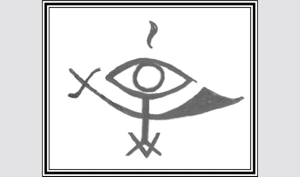

图 6.1　阿波克夏斯的符印

瓶子的外面，你应该贴上四面镜子以面朝四个方位。这些同时代表着灵体的眼睛和其逆转伤害给攻击者的能力。你还可以在瓶外添加一条小链条和挂锁，代表用来束缚敌人的链条。

最后，你应该准备阿波克夏斯的符印在羊皮纸上，不过现在要把它放在瓶子外面。

如果你能在新月时分于三岔路口进行仪式，那是最好。如果没有办法，那么你可以在家里或其他你觉得有力量的地方举行仪式。无论你决定在哪里举行，仪式都必须在新月的时候进行。

首先，为黑卡蒂女神摆出一顿晚餐，这好比是为了强化灵体陷阱而补充能量。它应该包括对黑卡蒂女神而言神圣的食物，如红鲻鱼、面包、生鸡蛋、奶酪、大蒜、蛋糕和蜂蜜。你也可以用附子和蒲公英根等草药做装饰。你应该执行一个驱逐仪式，例如从第二章或你选择的其他配方。完成驱逐仪式之后，静坐片刻，保持沉默。

当你觉得你已经进入一个接收的状态，你应该点一些神圣的薰香给黑卡蒂女神，如没药、艾草和毛蕊花。使用以下咒语召唤黑卡蒂女神，同时专注地凝视阿波克夏斯符印。

我向有诸多名字的众神之母致敬

祂的儿女都是美丽的

我向门槛的女主人──伟大的黑卡蒂女神致敬

祢凌乱而狂野地穿过坟墓和火葬场

身披藏红花外衣，缀以橡树叶和盘绕的蛇

成群的鬼魂、狗与永不安宁的灵体跟随着祢

我来向祢求助

我以祢的祕密名字呼唤祢：

阿克缇菲丝、埃列什基伽勒、奈博德苏勒

伟大的黑卡蒂女神，派遣祢的天使阿波克夏斯来住在这间屋子里

愿祂住在那里，发现祂所有的武器都在那里

愿祂守护我的家、我的家人，以及所有我珍爱和珍视的人

愿祂能屹立不摇，抵挡那些邪恶的力量和领域

愿祂能阻止入侵的恶魔

愿祂赶走那些阴谋反对我的人

愿祂杀到那些攻击者的居所

并在他们门前战斗

我向有诸多名字的众神之母致敬

祂的儿女都是美丽的

我向门槛的女主人──伟大的黑卡蒂女神致敬

今晚将祢的圣眷派遣给我。

此时，你应该专注于阿波克夏斯符印。拿着符印过香炉，吟诵以下的咒语至少一百次（一百次是基本值），使其通过祂的符印降临：

伊喔　阿波克—夏斯　伊奥　厚！

（IO APOX-IAS IO HO!）

在某种程度上，你会感觉到灵体进入了符印。这种感觉会根据我们个人的天赋和能力而有所不同，但可以从一种简单感觉到自己并非孤身一人的觉受，到许多无形的门突然打开的感觉，到一些可见的东西，如符印的线条突然移动或似乎呈现为 3D 状态。即使你立即收到祂出现的迹象，你仍应该完成一百次持咒，以作为一种奉献和确认祂存在的方式。如果你没有收到指示，那么你应该继续持咒，直到你接收到为止。

当你完成后，你应该把符印放进瓶子里，并将瓶口封住。在瓶子上方点燃一根黑色蜡烛，用你自己的话感谢黑卡蒂女神和阿波克夏斯倾听了你的召唤。把瓶子放在祭坛上或家里的架子上。每到新月，你应该燃香，用你自己的话向阿波克夏斯祈祷，请祂继续保护你的家、家人和朋友。你也应该注意预兆和梦境，以及你周围任何人的行为。阿波克夏斯非常擅长让那些针对你有密谋的人，在他们准备好之前摊牌。祂也是一个非常凶猛的保护者，所以那些相信采取非常简单的方法来防御的巫师，如果宁可忍受伤害也不愿冒险伤害攻击者本身的话，应该完全避开这种神灵。阿波克夏斯不是和平主义者。

最后，当你与任何类型的灵体打交道时，你应该意识到你的生活正在向其他世界开放。就像所有关系一样，它以双向的方式生效。当你召唤的时候，灵体会出现；但如果祂们自己开始召唤你，不需感到惊讶。魔法无处不在，它不仅仅是在一个魔法圈的范围内。这种关系是一种祝福，也是学习魔法的唯一途径，而这些魔法是书本上教不来的，但那些尚未准备好处理这一点的人应该完全避免与灵体一起工作。

## 人造灵

巫师除了藉由魔法或献供来吸引灵体和智慧体外，也有创造人造灵的方法。人造灵是由巫师来塑形和培养的，很类似人工智能计算机。祂们是为长期和短期而创建的，拥有很多为人所知的名字。在传统的欧洲巫术中，人造灵有时被称为生魂（fetch）或魔法意志（bud-will）。在仪式魔法中，祂们通常被称为集灵（egregores）14，或者由四种元素中的一个或多个元素构成，即人造元素。

一个最著名的例子是魔法师创造了防御用的灵体，也就是魔像。一五八〇年，一个名叫勒布的拉比是卡巴拉教徒，据传他创造了一个人造灵，祂寄居于一个物理形态，并且活化了该物体，这个物理形态称之为魔像。一位名叫塔德乌什的天主教神父打算指控布拉格的犹太人举行谋杀仪式，这将引发对犹太社群的强烈反对，并导致许多人死亡。勒布拉比听说了这件事，为了避免危险，他在梦中向天界提出了一个问题，以帮助他拯救他的人民。他得到的答案是希伯来语密码：Ata Bra Golem Devuk Hakhomer VeTigzar Zedim Chevel Torfe Yisroel。这句话的字面意思是：「用黏土做一个魔像，你就会摧毁整个反犹太社群。」透过对这句话的希伯来字母代码 33 转译，拉比能够破译出真正的程序来做到这一点。这个魔象是通过在祂的头上写上帝的名字之一──EMETH，从而获得了生命。关于魔像如何完成祂的任务，有着各种各样的故事。有人说祂疯了，必须被摧毁；有人说祂只杀死了神父，然后归于宁静。这个魔像透过擦掉额头上名字中的第一个「E」，将其从 EMETH 变成 METH（希伯来语是「死亡」之意），从而失去了活力。这个魔像的身体被封印在一个犹太教堂的祕密通道里，据说直到今天，祂仍在那里。有人认为这个故事是玛丽．雪莱（Mary Shelly）的经典作品《科学怪人》（Frankenstein）的灵感来源。

另一个关于创造人造灵的著名故事来自亚历山德拉．大卫．妮尔（Alexandria David Neel），这位法国探险家和作家在一九二〇年代深入西藏，装扮成乞丐和喇嘛在西藏旅行。在她的《西藏的魔法与神祕》（Magic and Mystery in Tibet）一书中，她描述了她所创造的一种名为图尔帕（tulpa）的人造灵，藏语大致翻译为「心灵投射物」。在她的故事中，她把自己关在一个洞穴里，专注于创造一个矮小、善良的僧侣。几周后，她觉得她的僧侣已经足够具象，于是她离开洞穴。这个图尔帕僧侣跟着她一起旅行，她旅行团的其他成员有时甚至会看到祂。当图尔帕开始脱离她的控制时，问题就出现了。祂的外表从圆胖和善，变成了瘦骨嶙峋而阴险。她领悟到自己的创造物已经离开了，于是决定销毁，但这可是在几个月的努力过程中做出来的 34。

甚至有一种情况是，人造灵被视为整个巫术位阶的首领之一。德国的土星兄弟会（The Fraternitas Saturnai），许多人一度认为一个名叫葛托（GOTOS，拉丁文 Gradus Ordinis Templi Orientis Saturnai 的首字母缩写）的集灵是祕密首领。这个集灵是由教团中的每个人灌输的，因此祂有点像一个集体意念，可以被召唤以集思广益的智慧为兄弟会提供建议。

一九八〇年代后期，对于混沌魔法感兴趣的人，使用人造灵变得非常流行，人造灵通常会被称为「灵仆」。不管你怎么称呼祂们，祂们的结构和使用都差不多。首先，你决定你希望执行的功能。在我们的情况下，我们需要魔法上的保护，但祂们的保护几乎可以用于任何目的。一般来说，人造灵是暂时的，并且设计成在完成祂们的任务后或某一特定日期时消失。永久性的灵仆是可以造出来的，但必须小心地照顾和喂饱祂们，以保持祂们的秩序，以免祂们开始抽取祂们的营养，继而是祂们自己的程序失序 15，就像前面提到的图尔帕落跑的情况。

在创造之前，你要确定有一个外型。其外型仅受想象力的限制，并且应该以某种方式表明其功能。例如，用于警告危险的灵仆可能有着眼睛和耳朵的外型，而守门的灵仆可能是盔甲骑士的外型。无论你选择什么，都应该意识到灵仆可能具有与其外型相符的特质。如果你想让灵仆在战斗中冲锋陷阵，就不要让祂的外型可爱软萌；同样的，如果你害怕你对于险境的反应会造成伤害，就不要把祂变成熊的外型。

然后，你应该决定代表该灵仆的名字和符印。名字应该以某种方式表示其功能。如果你确实想要一个能表明其功能的名字，你可以选择一个单词，并打散字母排列，或选择单词的组合来缩写。例如，单词「保护者」（protector）可以被改成「护身甲」（Rectoport），单词「锁子甲」（binder of harm）可以被改成「挡煞」（Binderham），方法是将单词 of 和 harm 中的重复字母 r 去掉。一个主要由元素或行星力量创造的人造灵可以用一个词来命名，以让人想起这种力量。例如，玛蒂姆（Madim）是火星的希伯来语名称，也可以用来做一个灵仆的名字，因为祂是由行星散发的能量制成的。当然，如果你有灵感想给祂取个其他名字，那就去做吧！我的一个朋友叫他的护身用灵仆为「菲尔」，并声称和祂在一起获得了巨大的成功。

你可以从前面描述的方法之一构思符印，例如将字母组合成一个符号，且不能一眼即看出当中是由哪些字母构成的。如果你知道怎么做，你也可以在魔方或玫瑰十字上描上一个符印。你还可以制作自己的结构图表，并在上面查找符印。例如，你可以制作一个 5×5 的图形，并根据自己的灵感用英文字母填充，用 I 来表示字母 J，就像它在拉丁文中一样。

下面的方法可以用来为名为「挡煞」（Binderham）的灵仆生成符印，如图 6.2 至图 6.4。

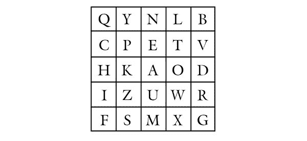

图 6.2　字母表

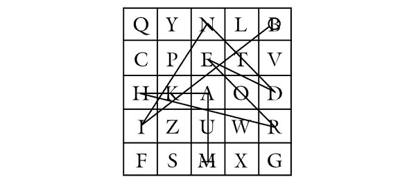

图 6.3　查找字母表上的符印

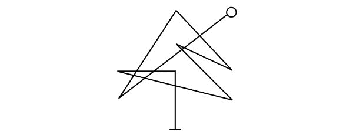

图 6.4　结合字母的符印

虽然这不是必须的，但我发现把灵体的名字和符印写在同一张纸上是很有用的。这张纸形成了一个魔法链接和灵体的居所，可以用来喂养灵仆和发出进一步的指示。与灵体工作相应的灵体指令和其他符印也可以添加到纸上，与灵体的性质一致的油和粉同样也可以添加到纸上。如果你计划长期保有这个灵体，你可以将这个符印和名字刻在雕像或其他物体上，然后让祂当一个强大的守护者。

要真正构建灵体，你必须在你面前几公尺之处设置一个让灵体可以显现的地方。我总是在这个地方放一个三角形，以帮助灵体显现。如果你用一张纸或其他东西作为与灵体的连接，那么你可以把它放在灵体将显现的地方。你应该在你正在工作的空间做驱逐仪式，或者根据你通常使用的方法建立一个魔法圈。

从画出你将要用到的能量类型开始。使用第二章中的「迪千打　克伦巴！鸽子降落！巨蛇升起！」（Descendat Columba, Ascendat Serpens）咒语召唤，是实现这一目标的一种方法，并且通常能吸收能量。呼吸，吸入元素的能量，在这里，身体被视为是空无的，元素的能量通过身体的毛孔被吸入，覆盖在防护盾上的部分，也可以在这里使用。土元素可以用来提供保护，水元素可以用来抚平紧张的局势并产生同情，火元素与风元素亦然。

行星的能量也可以被吸入身体，透过在适当的行星日和时间举行仪式，同时集中在行星的颜色和符号上 35。性能量也可以被创造出来，并且很好地用于这一目的，但它有点复杂，并非用于保护目的最好的能量。关于这一技术的完整描述要到下一本书才能看到。

当你的身体充满能量的时候，你应该把你的目光放在预留给灵体在当中显化的空间上。你现在必须通过你的肚脐投射出能量，然后观想能量从你身上发出，在你面前形成一片云。你藉由意志的力量，命令能量云朵以你预先决定的形状出现。你观想得愈详尽，灵体就会表现得愈好。如果你非常擅于观想，你甚至可以想象能量以微观版本的灵体符印的形式出现，然后形成细胞的模样，最终合聚结成灵仆的外型。如果你的想象力有限，那么你必须尽你最大的能力去创造。

一旦你看到你面前的灵体，就是切断连结的时候了，为祂命名并下达指令。简单的一句：「我为祢命名为，祢就是」，就足以命名了。下达给祂的指令也应该简明扼要。如果灵体是用来暂时使用的，你必须给祂一个指令，无论祂是否完成了祂的任务，祂都要在未来的某个时间消散。用天文事件来标记时间比用日历期限更好。下一个春分、新月或者太阳进入一个新的星座，这些都是可行的例子。如果你打算让这个灵仆永远待在你身边，你应该小心翼翼地喂养能量给祂，并定期加强祂的程序架构。

你吩咐命令给祂之后，就嘱咐祂离开，并且去执行命令。如果你将灵体绑定在某个物体上，你可以观想灵仆进入这个物体里头。如果你没有设定这个部分，那么就只会看到灵仆飞出去执行祂的任务。

灵仆的潜在用途和创造祂们的方法是无止境的，我之所以有一个仪式大纲而不是脚本，是因为这种形式的魔法是如此奇妙地富有想象空间，每个人都应该开发自己的诀窍。使用灵仆而非预先存在的灵体的好处在于，祂完全服从你的意志。你是祂的创造者和主人。这也是祂的缺陷，因为一个已经存在的灵体偶尔会找到一些你从未想到的办法来帮助你。

在以上任一灵仆种类下，在一场剑拔弩张的魔法攻击中使用灵体来防御往往是必要的。护身符和驱逐仪式在防范损伤的方面是强大的，但最终有一个足够狡猾的技术可以绕过它的防范。不管是人造的还是非人造的灵体，都经常被用于发动攻击，因为祂们具有调节防御和翻墙的能力 16。

如果你认为一个人造灵是别人派来攻击你的，你可以用许多种方式来对抗祂。一些人造灵只不过是创造者投射的意念体，根本没有注入任何其他类型的能量。在这种情况下，你可以通过意念来摧毁祂们。就这么简单──想象一下祂们被抹灭了，从脑海中来，又从脑海中走。如果你驱逐祂们、想象祂们离开，但是祂们反抗，你就有另一个问题了。

在人造灵的情况下，你可以藉由将祂困在一个三角形中（比如黑卡蒂女神的灵体陷阱）而击退或摧毁祂，并使用相反元素和相关武器攻击祂。你也可以开始为祂添加构成祂的元素，从而使祂更强大，但注入你的意志，试图篡夺控制权。这有点危险，但也有好处。如果你成功地接管了一个人造灵，祂是一个强大的魔法连结，可以连接到一个潜在的未知攻击者。这很困难，只能由有经验的修法者来尝试，但可能会证明这比剪头发和指甲更容易。

事实上，有很多情况是被派去攻击别人的灵体反被受害者篡夺，转而袭击攻击者。这要么是藉由提供更多的供品，像在驱魔仪式中那样束缚灵体，要么是通过吸引灵体的本质来完成。我曾听闻在海地的例子：有个波哥（bokor，术士）派了一个洛阿神灵──萨梅迪男爵（祂负责处理死亡和坟场），去对抗另一位波哥。被锁定的波哥向同一位萨梅迪男爵祈祷。基本上让男爵决定要留下谁是师出有名的。最后，第一个波哥，也就是发动攻击的人，被送进了坟墓。

这种迫使灵体在两个受害者之间做出选择，希望不公正的人会被杀死的法术，也可以在第一章提到的火鞭仪式诅咒中看到。这个诅咒是在墓地实施，并召唤死亡天使，要求祂杀死一个指定的受害者或施咒的人。这是由天使来决定谁该死。一九九五年十月六日，以色列政治家阿维格多．埃斯金（Avigdor Eskin）对前以色列总理伊扎克．拉宾（Yitzhak Rabin）使用了这个诅咒，作为对《奥斯陆协议》（Oslo Accords）的回应。拉宾在一个月内被暗杀。后来，这个诅咒被用来对付艾里尔．夏隆。在我写这本书的时候，夏隆正处于昏迷状态，大多数人认为他永远不会从昏迷中醒过来了。

使用这些技术显然是危险和高阶的工作，但是为了本书的完整性起见，我提到了它们。由你来决定，你准备使用什么，以及什么时候要派上用场。总的来说，使用前面提到的防御技巧，以及我将在下一章教授的逆转和消耗型魔法的方法，会对你有更好的帮助。

* * *

27　卡尔．麦考曼（Carl McColman）的文章［威卡教系统底下有咒语吗？］（Is Wicca Under a Spell?），[www.beliefnet.com](http://www.beliefnet.com)，二〇〇五年。

28　如果你对这一观点感兴趣，可以看看我的文章［施咒：女巫的技艺］（Spell Casting: The Witches’ Craft）。

29　也叫作《所罗门的小钥匙》（The Lesser Key of Solomon）。

30　当然，并不是所有的护法神都必须被迫服事。有些护法神为佛法服务，因此被认为特别和善。多杰林巴（Dorje Lekpa）就是这样一个神灵，祂的名字字面意思是「金刚善」。

31　藏传佛教的四大宗派──宁玛派、噶举派、萨迦派和格鲁派，并不总是相处融洽。

32　我个人认为卡拉佩利橄榄油（Carapelli Olive Oil）的瓶子非常适合这个法术，但任何瓶子也都可以。

14　这通常是由集体意识产生的一种强大的意念体。

33　希伯来字母代码（Gematria）是卡巴拉主义的艺术，透过它，单词被减少到它们专属数值，并与其他单词相关联。

34　我已经在美国和尼泊尔学习藏传谭崔和魔法很多年了，从来没有听说过「图尔帕」这个词被这样提到过。图尔帕指的反而是双修神祇的随从，在谭崔的世代舞台被观想／召唤。不管她对图尔帕的理解是否正确，我们都能从她的经历中学到宝贵的一课。

15　有点象是计算机当机的情况。

35　关于这些行星的符号和时代，请参阅阿格里帕（Agrippa）创作的《神祕哲学三书》（Three Books of Occult Philosophy）。

16　翻墙是网络用语，因灵仆具有一定的智商可以越过对方法师设定好的法术陷阱，就某种程度来说，是一个厉害的外挂。

# 7
逆转与消耗型魔法

如果你在驱逐仪式中保持警惕，使用保护性护身符，并拥有强大的护卫，那么即使有人直接对你施咒，你很可能都不会注意到。整个攻击将从你身上滚离或被自动奉还给施咒者。然而在某些时候，当正常的防御没有守住，你便需要设定一个更有弹性的状态，以确保你和你所爱的人平安无事。到目前为止，我们只采取了安抚、保护和预防措施。在大多数情况下，这些都是必要的。不幸的是，在某些情况下，执着的敌人不会表现出停止骚扰的迹象，你将需要采取更压倒性的方法来确保成功的防御。因此，掌握逆转和消耗型魔法的技术是很重要的。

有一个众所周知的公理进入了威卡界，被称为「三倍法则」。这条法则被典型地解释为一种放大的业力，并表明任何由女巫所做的伤害将会以三倍回到她身上。根据我在传统巫术中的一些接触，「三倍法则」的本意有一点不同。这个概念是：如果一个巫师被伤害或被诅咒，她或他应该以三倍奉还给犯事者。这确保了敌人即使在三倍逆转法术中幸存下来，也不会再次尝试同样的愚蠢行为。因为这本书只是防卫的入门书，所以我不会把注意力集中在把攻击「三倍奉还」上面。然而，有时逆转对攻击者的攻击是一个好主意，将迫使她或他落入自己制造的陷阱。

## 辨识你的攻击者

虽然这并不总是必要的，但如果你知道你要逆转诅咒的对象是谁，还是有所助益的。不幸的是，这并不总是能做到。一些不太熟练的术士过于依赖心理的力量，执着在「有人晓得他们被诅咒了」来作为诅咒的一部分，而真正强大的巫师不会透漏自己的身分，只允许诅咒偷偷发挥作用。如果你的敌人没有藉由夸张地指着你并在口头上发出诅咒来露一手，他可能会以物体的形式留下证据，用来向你发出诅咒。像烟雾粉和坟土这样的粉末是很常见的，还有许多其他的条件粉末（condition powders），如弯腰屈膝粉（Bend Over）、跨越障碍粉（Crossing）、命令粉（Commanding）和黑色艺术粉（Black Arts）。这些粉末通常放在你会接触到它们或踩到它们的地方，如台阶上、车子里，甚至是邮寄给你的纸上。除了粉末之外，你还可以在家里或办公室里或周围放一些格利斯格利斯袋、杰克球（Jack Balls，一种金钱咒珠）和纸护符等物品来传递能量给你。如果这些或其他可疑的物品被发现，它们可以被收集起来，用来磨练你的逆转咒语给真正的施术者。

如果你找不到你想要的东西，也许是犯事者已经收集了你的东西作为连结。想想你的客人，他们可能最近使用过你的浴室，而他们可能从浴室的废纸篓里、你的梳子或指甲剪上得到一些毛发。想想在你的办公室或生活空间里进出的人。还有那些为你提供食物或礼物的人，他们可以借鉴特洛伊军队的做法：透过食物可以传达多种咒语，礼物也可以经由装饰和圣化来传达诅咒。接下来，问问自己，这些人是否有任何理由伤害你。最后，评估他们是否有能力和知识自行施咒；如果没有，他们是否会花钱请人替他们施咒。符合条件的候选人应该不多。如果有的话，那我得提醒你，还有一个比这个诅咒更大的问题。

不管你能否用这些方法找到嫌疑人，或者你只是认为自己知道是谁干的，你都应该先占卜一下，然后再试着将诅咒送回某个特定的人身上。如果你选错了人，很可能他不会感受到逆转的影响，但他可能会在这个过程中接收到一些不好的能量。也有可能你认为是诅咒的东西，实际上是由魔法上的失误或无意中打破的誓言带来的障碍情况。如果你试图在施咒者身上逆转这个过程，你将会把它发送回你自己身上。而且就像两片面对面的镜子，这种反射会永远持续下去，使问题变得愈来愈糟。

猜测攻击者身分的一个好方法是把嫌疑人的名字写在一张纸上，再加上一个「未知」的名字，免得真正的犯人不在你的名单上。把灵摆（我把磁石灵摆挂在我剪下来的头发上，但商店买的灵摆也可以）放在名字后面，问灵摆，那个人是不是给你下诅咒的人。这一章没有足够的篇幅来提供关于使用灵摆的延伸教学，但一个人应该能够清理自己的心念、与神性连结，然后问这个名字是不是诅咒你的人的名字。如果是的话，灵摆应该会剧烈摆动。其他方法象是为每个名字抽牌或卢恩符文占卜也同样有效。如果你发现自己过于分心而无法进行有效的占卜（毕竟你可能正处于被诅咒的状态），或者你过于情绪化而无法得到一个客观的答案，那么就应该请第三方代表你来进行占卜。

无论选择哪种方法，你都应该依靠占卜来证实你的怀疑，并看看会有什么结果。这一点我再怎么强调也不为过。你的逆转法术可能弊大于利。在我的魔法生涯早期，我曾是一个卑鄙诅咒的目标，导致我有些轻微的头痛，并因笨手笨脚而打碎了小摆设。在寻找诅咒的东西时，我在我的汽车地垫下发现了一张纸，上面有着符印。于是我用这张纸作为一个连结，藉由倒着点燃蜡烛，将厄运逆转到施咒者身上。详细描述见第七章「颠倒的蜡烛逆转巫术」。大约一个星期后，我注意到因为跟我分手而不太愉快的女朋友出了车祸，受重伤住进了医院。她并不是一个认真的修练者，但当她面对那个符印时，她坦承她拿起一本书，决定对我施一个诅咒，以证明我不是一个很好的魔法师。巧的是，她的大部分诅咒都被我的日常仪式和保护措施抵销掉了。她没有做这些防护，因为她只是一个临时起意的施术者。她收到了她想加诸在我身上的诅咒的全部力量，由于没有魔法保护，以致它的破坏力非常大。在这种情况下，如果我知道结果，我就不会逆转诅咒，因为我不想对我认识的人造成那种伤害，即使他们确实因为愤怒而对我做了一些事情。

## 逆转诅咒的法术

## 被魔鬼的鞋带缠住

在决定是否要逆转诅咒后，如果可能的话，在占卜犯事者的身分之后，你就可以进行实际的逆转了。如果你相信诅咒的中心是你的家，有个绝佳的方法可以逆转诅咒，那就是从犯事者的家里弄些泥土、九片桤叶荚蒾和一个罐子。在开始施咒的时候，要回想你身上的那个诅咒。尽你所能去利用那股对你不利的力量，去「感受」它的频率。右手拿起一片桤叶荚蒾，在你面前的空中画一个十字架，感觉它的根在聚集诅咒的能量。当你画到十字架的一竖时，就说：「我不在你的管辖之内。」当你画到十字架的一横时，要说：「你在我的管辖之内。」这样做九次，每一次都用到一片桤叶荚蒾。接着把九片桤叶荚蒾和敌人家里的泥土、一些红胡椒和黑胡椒，以及一些罂粟籽放进罐子里，混合在一起。去到犯事者的家里，当你把混合物撒在他的院子或门廊上时，说：

无论你对我有什么恶意，

我都会用言语和意愿奉还给你，

凭我之言、以我之意，

如我所愿。

说完后就从这个家走出去，不要回头。

这个仪式实际上是把诅咒绑起来，把它从你的能量场域中移除，然后以一个整齐包裹的形式送回给施咒者。当你回到家的时候，你应该妥善地做好驱逐仪式，清理你的房子，并适当加强你所拥有的任何保护措施。

## 颠倒的蜡烛逆转巫术

倒着点燃蜡烛是一种常用的诅咒方法，但也可以用来将诅咒逆转到施咒者身上。你需要一根黑色蜡烛、一盆泥土和一些蟹壳粉。拿起黑色蜡烛，点燃它，把它放在烛台上。针对别人对你施行的诅咒，当你集中精力在蜡烛上时，试着在意念上利用一直针对你的那股力量的频率。现在，这根蜡烛代表着最初的诅咒。当你的意念牢牢抓住诅咒的力量时，把蜡烛从烛台上拿起来，然后在装满泥土和蟹壳粉的罐子里把它掐灭。这个法术在没有蟹壳粉的情况下也能起作用，但它代表着逆转，因为螃蟹是倒着向后走的，所以会产生额外的影响。当你一心一意想要将诅咒逆转到施咒者身上时，咬掉蜡烛的底部，使它露出灯芯。点燃被你咬掉那一端的蜡烛，然后把蜡烛放回烛台。当你这样做时，给它以下的加持：

你的诡计已被逆转，

你的诅咒已经奉还，

以魔力、火元素和巫师的意志，

你将成为你自己恶念的受害者。

所有这些行为都应该在合理愤怒的情绪状态下进行，尤其是掐和咬。让蜡烛一直燃烧下去。最后，你可以收集蜡泪和泥土，或者把它们放在敌人的房子里或扔到流动的水中。

## 双重作用逆转蜡烛

另一种扭转厄运的蜡烛法术是使用一种特殊的蜡烛，有时称为「双重作用逆转蜡烛」。这根蜡烛的顶部是白色的，象征在你生活中的诅咒被清除了；底部是黑色的，代表把诅咒奉还给施咒者。这种方法是用逆转魔法油来涂抹蜡烛。你可以在任何地方买到这种蜡烛，但如果你想自己做，你可以把莳萝、芸香和桤叶荚蒾浸泡在杏仁油或初榨橄榄油这样的优质油品中。将蜡烛水平放置，底部面向自己，从底部向上擦油，远离你的身体。当你这样做的时候，集中注意力在逆转诅咒或阻碍你的能量的来源之处。

如果你知道目标的身分，你应该得到一张照片或其他一些物品来做连结，并把这些东西放在蜡烛下面。如果你不知道目标的身分，那就在蜡烛下面放一张纸，上面写着「那些伤害我的人」。在纸或照片的四个角和中间各滴一滴逆转魔法油。

点燃蜡烛并祈祷：

影子啊，倾听我对你的召唤，

充满恨意的可怜敌人，

若你执意如此，那就抱持你的恶念吧！

因为我比你更心怀怨怼，

我把你交给黑卡蒂女神，

让诅咒回到你身上，

如蜡烛烧尽，

使你的力量归零。

让蜡烛一直燃烧下去，然后收集蜡泪和个人物品，把它们埋在一个三岔路口附近。若你不能在三岔路口这样做，你可以在墓地做这件事（但不能在坟墓上做，否则就太超过了）。这个概念是因为你要把封印的法术交给住在冥界的黑卡蒂女神。

## 吐掉诅咒

高良姜被根源工作者称为「小约翰」，它最著名的用途是影响法庭案件。被告会嚼一些「小约翰」，然后在法庭上吐出来，好让事情对他有利。不为人所知的是，同样的巫术也可以用来逆转诅咒。再一次，你要尝试在心念上「校准」诅咒的频率，然后把高良姜根片放进嘴里咀嚼。当你咀嚼的时候，想想你对自己所受的伤害是多么愤怒，你是多么有理由把它送回源头。让自己在这些诉求正义的想法中热血起来，在情绪达到顶点时，用力向敌人所在的方向吐出高良姜根。如果你能在制造诅咒的人住的地方进行逆转巫术，那就更好了。如果你无法占卜出这个诅咒的来源，那就把它吐向西方。做完后就离开现场回家，不要回头。当你回到家的时候，做一个驱逐仪式。

## 逆转诅咒之灯

逆转诅咒之灯是用来点燃它以驱逐一切对你不利的人。要做这种灯，首先要挖空半颗椰子，然后在里面填满植物油。油里面放进九根针、九根大头针、九根钉子、九片桤叶荚蒾，以及一些莳萝、盐和芸香。将一个灯芯放在一块软木上（特殊的灯芯套装组可以在大多数优质的巫术小铺买到），点燃它，同时做以下的祈祷：

钉子、桤叶荚蒾、芸香、盐和莳萝，

阻止我的敌人遂其意，

就像他们害我一样，

让他们自己承受极大痛苦。

聆听遵从我对祢下旨意，

凭我之言、以我之意，

如我所愿！

这盏灯最好在室外点燃。但如果你没有院子，你可以把它放在窗户上。每周五点灯，持续七周。任何时候都要注意确保灯里有足够的油。需要的时候就添一点进去。

## 镜之笼

我们在第四章中提到过镜子。因为显而易见的原因，镜子是一种典型的工具，可以将咒语反弹到施咒者身上。使用镜子逆转巫术的另一种方法，是拿一个小盒子（我使用的盒子形状像棺材，可以在万圣节时买到，其他任何有盖子的盒子也行），在里面摆好镜子碎片，要确保尽可能覆盖到最多的表面。做一个小玩偶来象征你的敌人──可以是一个简单的蜡制雕像（甚至是一根适当性别的人像蜡烛也可以），或是一个布偶，在里面填充西班牙苔藓和合适的草药。如果你有一件在之前的法术中使用过的物品，如粉末或魔法杖，或者如果你与目标有个人连结，如头发或衣服，你应该将其放进布偶中；如果都没有，就在布偶里放进一张写著名字的纸，或者在布偶刻上目标的名字。你若不知道引起问题的巫师姓名，就只要写上：「那个害我的人。」

左手握住布偶，右手在布偶上画一个十字架。当你画十字架的一竖时，说道：「（目标的名字），我为你施洗。」如果不知道目标的名字，可以用「影子」（shadow）一词代替。当你画十字架的一横时，说道：「你在我的能力之内。」

把布偶放进铺着镜子碎片的盒子里，然后说：

（目标名称），为你自己好，

我祈祷你不要再制造麻烦。

为了你自己的利益折磨我，

只会给你带来更大的痛苦，

因为我是黑卡蒂女神的孩子，

祂比你更强大。

从此刻起，

所有的恶意都将回到你的头上。

以奈博德苏勒、埃列什基伽勒和阿克缇菲丝之名，

凭我之言、以我之意，

你将成为你自己的受害者。

在你唸完咒语并关上盒子之后，你应该把它放在祭坛上一个安全的地方，或者把它埋在某个地方，比如十字路口。这个咒语会将进犯巫师的任何行为都反弹到他自己身上，不管是好是坏。

在结束逆转法术这一小节之前，我想说的是，虽然逆转施咒者的伤害可能是效果最好的正义，但有时这只会导致施咒者对你采取更爆炸性的措施，因为你采取了更强有力的措施来击退他们。当然，战争就是这样开始的，就像普通的战争一样，得不偿失。沉迷于逆转诅咒往往会导致对你自己发出诅咒，并可能导致一种偏执的生活，就像《咆啸山庄》里的希斯克利夫，他只会回报他自己所受到的痛苦，你的整个人生可能会被卷入合理的复仇之网中。在我看来，这并不是一种好的生活方式，也不是对付闯入者的有效方法，所以我向你提供一些对抗魔法的技巧，旨在让你摆脱敌人。

## 消耗型魔法

我们将把消耗型魔法定义为对抗攻击的魔法，但不是对攻击的直接防护或逆转。各种各样的可能性确实满坑满谷，甚至可能包括我们自己的攻击性诅咒。然而，因为这是一本与保护魔法相契的书，并且有够多的方法来处理这些情况，毋需我们自己使用进攻性法术，所以我将会放弃任何打算澈底伤害敌人的方法。我们将专注于牵制、蛊惑和驱逐，这是用来让敌人停止专注于造成伤害且不继续伤害我们自己的技巧。

因为消耗型魔法的技巧都聚焦于将我们从敌人的环境中移除，或是将敌人从我们的环境中移除，所以它们是对付非魔法类危险最有用的技术。如果有人用身体暴力威胁你或你所爱之人的性命，防护盾和护身符可能会有一些效果，但最终你仍需要把那个人从你的生活中排除掉，以确保安全。

正如我不建议在处理医疗或心理问题之前先咨询这些领域的专业人士一样，消耗型魔法也不应该代替执法人员处理危险人物。如果有人威胁到你或你所爱之人的生命，我认为你完全有权利使用以下方法来牵制、驱逐、蛊惑和压制，但如果你不联系管理机构，就会对自己不利。事实上，在这些案件中，牵制或驱逐往往是透过管理机构的处理而生效的。

无论你面对的危险是世俗的还是灵界的，透过消耗型魔法，那些持续很久的问题将可以平息，持续的战争亦可以解决。

### 牵制与影响

牵制是用来阻止某人做某件事或严重影响某人做某件事。在我们的情况下，是让我们和我们所爱之人或客户清静清静。

## 弯腰屈膝粉

就像烟雾粉用于霉运和诅咒，其他的粉如红砖粉用于保护，也有一些粉用于消耗型魔法。有一种很好的牵制是著名的弯腰屈膝粉，它是将甘草根、菖蒲根和征服者高约翰磨成粉末，并与滑石粉等基底粉末混合而成，然后将粉末放置在目标会踩到或接触到的地方。把粉末撒在地上让对方「跨过」，且通常是撒成五个点的形状，就像你在骰子上看到的那样，然后在你撒完向后走的时候就完成这个魔法了。如果无法这样做，你可以把粉末放在口袋里，直接在握手时传递过去。另一种历史悠久的撒粉方式是在信纸上撒一些粉寄给目标，但要确保只撒下让人察觉不到的数量──我们可不想因为引起炭疽病恐慌而被捕。

当你与敌人面对面解决分歧时，这种粉末尤其有效。如果用这种方式，你可以在你的手上涂一层粉，或者确保他或她在交谈中能接触到粉。一旦敌人这样做了，你应该试着把你的目光集中在敌人眉心之间的额头上。如果你能把你的意志像雷射光一样集中在这一点上，你就能控制谈话，影响目标的心念。至少如果你用这种方式凝视，任何尝试对你做同样事情的法术都会返还或抵销。

## 捆脚咒

捆脚咒是一种用一条绳子牵制的古老欧洲咒语，可以用来阻止某人做任何特定的事情──可能是诅咒或其他类型的骚扰，但也可能是其他事，如上班。即使在纯粹利他主义的情况下，你也必须记住魔法会以自然的方式显现，而你必须愿意接受你行为的后果。

几年前，我的一个朋友被跟踪了，她来找我帮忙。我用了对方写给她的一封信作为连结，使用捆脚咒来阻止那个人跟踪她。过了一个半星期都没有任何变化。晚上那个人会坐在她家门外不停地打电话。我想也许是法术没有起作用，我得找个更强的。后来有一天晚上，我的朋友听到她的卧室窗外传来了撞击声。当她往外看时，她看到地上有一把梯子，她的跟踪者躺在栅栏边。那个人的两条腿都断了，此外还受了一些轻伤。这已经足以让她提出控告。此后那个人便不再跟踪她了。我很乐意承担这个责任，但有些人并不愿意。我再次强烈要求读者，要尽你们所能去占卜施术的结果。

要使用捆脚咒，你需要一个可以用红绳绑住目标的连结。左手拿着红绳，专注于你希望敌人不要再做的事情上，然后在绳子上打九个结，从外缘开始，像这样移动：1-3-5-7-9-8-6-4-2-17。

当你这样做的时候，对每个结唸以下的咒语：

（目标的名字），我召唤你，

你被大地的力量缠住了，

你被岩石的力量捆绑了，

你被黏土的力量鍊住了，

你被地面的重量原地缠缚了。

把目标的个人物品绑在第九个结上。当你完成这些之后，走到十字路口，把绳子埋在那里。照着下文唸诵：

（目标的名字），我埋葬了你（对我造成的伤害或任何牵制）的力量，

扭曲和纠缠，

锁鍊和束缚，

我让你罢手，

将你交托大地！18

离开现场，不要回头。

## 坟地捆缚术

另一种很好的牵制方式是用士兵或警察的坟墓。拿一个施术攻击者的物理连结物，象是一张照片或一块布，用九片桤叶荚蒾或是具有「缠结」性质的植物把它包起来。如果你有一些铅（土星主掌的金属），就用铅包。如果没有，你可以用铝箔包起来，有光泽的那一面朝内。把它带到你所爱的人、亲戚或士兵的墓前，就跟你收集墓地坟土的做法一样，向祂们供奉威士忌或十美分银币。在你认为是坟墓里亡者右手所在的地方挖一个浅洞，把符咒埋在里面。

这个咒语最好是用你自己的祈祷词，直接对着坟墓里的灵体说，但祈祷词应该像这样：

（坟墓里的灵体之名），我来请求祢的帮助

（敌人之名）伤害了我，他不会放过我。

我把这些东西交给祢。

请让它们远离我，等我回来取走它们。

请接受我的报酬，为我做这件事，我恳求祢的帮助。

离开墓地，永远不要回来。如果这是你经常会去的墓地，那么出于魔法或情感原因，显然它就不是一个适合的坟墓。你应该确保它是一个你永远不会再去拜访的坟墓。

## 停止谈论你

据说下面的咒语可以约束敌人不谈论你。在图 7.1 所示的土星符印放上牛舌，并且包裹你和敌人之间的连结（有对方的能量），接着在符印盖上目标的名字。

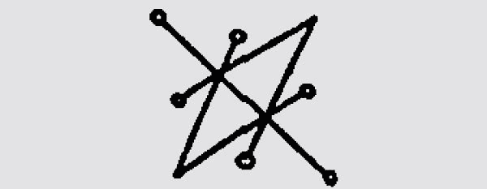

图 7.1

你可以根据自己选择的牵制类型，用魔法油和魔法粉装饰符印纸。

把牛舌切开，放在纸上封好，然后把它缝回去。把牛舌放在冷冻柜里 19，然后说下面的咒语：

埃列什基伽勒（Ereshigal）、诺缇库拉（Nocticula）20、黑卡蒂女神列前，

见证我的仪式吧！

抓住我敌人的舌头！

愿他甚至无话可说！

赛伊！

赛伊！

赛伊！

如我所愿！

另一种让敌人（或吵闹的邻居，就此而言）保持沉默的方法是一个简单的格利斯格利斯袋，由甘草根、光滑的榆树和蝰蛇舌头制成。把这些东西包在一个黑色袋子里，然后把袋子放在对方的门阶下或院子里，或是房子里的某个地方。

### 蛊惑术

当牵制不可行的时候，另一种消除敌人的方法毋需直接伤害敌人，这就是蛊惑仪式。有些人认为这本身就是一种诅咒，但蛊惑术已经在胡督巫术和巫术中被作为保护手段许多、许多年了。当面对一个在保护和逆转仪式之后仍然不愿放弃的顽固敌人时，些许蛊惑可能是驯服且有效对付敌人的方法。

## 蛊惑粉

这种粉末的使用方法与其他粉末相同，在我看来，这是传递这种法术最佳的方式之一。几年前，我有个客户，他有失去生意的危险，因为一家连锁餐厅的老板想要他所在的地方。这个人还散布关于我的委托人的谣言，让他和镇上的人闹得沸沸扬扬，好藉此让他搬走。更糟糕的是，我的委托人认为餐厅老板的一个家庭成员是巫师，正在用魔法对付店家。根据之前的经验，我知道他的怀疑是正确的。在几次占卜之后，我认为蛊惑术是最好的选择。在一个新月，我用蛊惑粉圈住了餐厅，并向黑卡蒂女神祈祷。我也在门垫上撒了一些粉。很快的，我就开始听到人们对这家餐厅的抱怨。没过多久，它就因为违反卫生规定而暂时关闭了。此后不久，那个打算帮餐厅老板买下我朋友商店的赞助人就扑了一场空。

这个仪式几乎完全按照我的计划进行，因此我对结果感到高兴。然而，我必须强调，你总是应该做一次占卜，以了解你的下场会如何。我已经准备好为这个人的损失承担责任，让他的餐馆暂时关闭，并让他遭受其他小问题。但如果占卜显示有人会因为我的法术而受到严重伤害，我就会使用其他方法。蛊惑术在这方面是很微妙的，因为它可能是交通事故和各种更严重问题的原因。我在这里不是要对你们说教，只是要告诉你们，你们必须为自己的行为负责。

蛊惑粉是把罂粟籽、茅草和黑芥菜籽添加到基底粉（如滑石粉）中制作而成。有些人会为他们的粉末上色，如果你想这样做，合适的颜色应该是红色。如果你想在你的敌人之间制造争论，引起内讧和混乱，就加入黑胡椒和红胡椒。同样的配方不仅可以用来制造粉末，也可以用来制造魔法油或魔法香。聪明的巫师都能运用这三种，比如下面的巫术。

## 混乱娃娃

如果有人在你的生活中不断造成你的问题，并发送超自然攻击给你，而你却不能完全跟这个人断绝关系，譬如家庭成员，那么这可能是一个好主意──你可以随意去启动一个让对方混乱的娃娃。为了制作这个娃娃，你要尽可能地获得最好的个人连结。你要把两片木头绑在一起，做成十字架。你可以用目标的衣服制作娃娃的身体；如果没办法做到，就把西班牙苔藓和茅草包裹在红布里，在十字架周围做一个身体。你可以用黏土做娃娃的头，也可以用一个真正娃娃的头。如果你用的是黏土，在制作头部之前要先在黏土中加入罂粟籽和黑芥菜籽；如果用的是真娃娃的头，就把这些种子塞进去。

用你的右手在娃娃上画一个十字。当你制作直的木条时，说：「我命名祢为（目标的名字）。」当你制作横的木条时，说：「祢就是（目标的名字）。」

点燃一些从商店购买或是前面提到的药草制成的蛊惑魔法香，用你的左手把娃娃放在烟雾上面。当你把娃娃放在烟雾上方时，回想一下目标过去对你造成的所有伤害。用正当的愤怒和对正义的渴望煽动你自己，让它流进娃娃的身躯，并说道：

抓住祢的敌人！（Inimicus Carpo!）

惊慌失措

烦恼糊涂

迷失在妄想的烟雾中

我把你抓牢牢！

一头雾水、动弹不得

你陷入混乱

以我之言、我之意向你传递

就让（目标的名字）一团混乱！

### 驱赶术

我要端上的最后一类消耗型魔法，在根源工作中很普遍，称为「热足术」。这种魔法的目的是让一个人完全离开你的环境。在通常的情况下，你要么把这个人从家里赶出去，要么把他从工作中赶出去，再不然就是把他从城镇中赶出去。与其他类的消耗型魔法一样，我们将从粉末开始。

## 热足粉

一般来说，任何热的或刺痛的东西都可以用在热足粉。我最喜欢的配方是红胡椒和黑胡椒、压碎的大黄蜂或红蚂蚁、硫磺、罂粟籽和女巫盐（用煤烟熏黑的盐）。这种粉末的使用方法与其他粉末类似，如果让人走在上面或放进鞋子里，这种粉末就能「穿透脚」，它的效力就会特别强大。我最喜欢的一种方法是把它撒在目标的门口或办公室，然后在每个通往城镇的十字路口也撒一点，祈祷那个人在你每次撒粉的时候移动。

我认识的一个巫师在做像这样的仪式时，使用了整个天主教驱魔仪式，但我喜欢下面的咒语：

以阿撒兹勒（Azazel）之怒火，

我送你去不毛之地！

巴拉（Barra）！艾丁纳苏！（Edin Na Zu）36

巴拉！艾丁纳苏！

巴拉！艾丁纳苏！

## 另一种透过脚发动法术的方法

如果你不能让这个人从热足粉上走过去，另一种传统的方式是「捡起」目标的脚印。几年前，我的一个好朋友和他的同事发生了矛盾，他向我报告说，这位同事出现了一连串奇怪的严重头痛，而且运气很差。他向我透露，他的同事在练习魔法方面遇到了麻烦，他认为可能是自己给他施了一个诅咒，希望我能帮忙。占卜显示我的朋友是对的，于是我用了逆转术回收了魔法。这在一段时间内似乎起了作用，但随后攻击卷土重来。我们又做了一次，但还是发生了同样的事。很明显，我们需要把他们完全分开。我让我的朋友在离开办公室时观察他的目标走到哪里。我让他悄悄地从对方的一个脚印上捡起一些泥土，他照做了。他把泥土拿给我，我把它跟红胡椒和黑胡椒、硫磺以及一些压碎的大黄蜂混合在一起，接着将所有的混合物装进一个罐子里，把罐子扔进流动的水中，边做边说：

以冥河、痛泣之河，

以火焰河、恨水和忘川之名，

我要把你赶出去！

愿你的名字连记忆都无法留存！

以冥河、痛泣之河，

以苦恼河、恨水和忘川 37 之名！

走开！

走开！

走开！

这个咒语施展后不久，目标就找到了一份薪水更高的工作，展开新的生活。这个结果对每个人都是最好的。事实上，如果你担心会对某人造成伤害，你可以在驱除粉中加入一些祈福的药草，比如圆当归，以帮助目标转向更好的环境。

牧师兼人类学家哈里．米德尔顿．海厄特（Harry Middleton Hyatt）记录了这种法术的一个有趣变体。他的受访者告诉他，不是把脚印装瓶扔进河里，而是把泥土和热足粉材料放进一个挖空的猎枪壳里，向远方射击，同时向耶稣祈祷，让这个人从你的生活中消失！我从未尝试过这种方法，但这个剧本本身就很强大。

## 消耗型魔法的灵体

灵体也可用在消耗型魔法。许多来自不同传统的守护神也以这种能力发挥作用。例如在西藏，一个名叫宇色．钦玛（Osel Chenma）的度母骑在一头猪上，祂带着一根针和线，用来挖出敌人的眼睛和耳朵。许多来自魔法书中的天使和灵体也可以被召唤来束缚和驱逐别人离开你的生活圈，你可以按照那些文本中的指示来召唤祂们。尤其是我使用了阿格里帕的《神祕哲学三书》中土星的灵体──扎泽尔（Zazel），在牵制的时候有了出色的成效。

我们在第六章中提到过的守护灵阿波克夏斯，也可以用于消耗型魔法，祂擅长牵制、蛊惑和驱逐。要如此运用祂，你必须设立一个祭坛，把祂的酒瓶摆在你面前。用能量喂养瓶子，并吟诵召唤心咒：「伊喔　阿波克—夏斯　伊奥　厚。」当你觉得你已经引起祂的注意时，你应该让祂把那个骚扰你的人或灵体束缚、迷惑或驱逐出你的生活。如果你想确保不会对目标造成伤害，那么你应该说这个召唤心咒。在你有生命危险的情况下，你可以让阿波克夏斯随心所欲的行动。和往常一样，你必须对自己的行为负责。如果你有一个目标的连结媒介，你应该把它折进一张纸中，在你折纸的时候，要注意把纸往离你身体远的方向折。在纸上画阿波克夏斯的符印，然后把瓶子放在上面。如果个人连结媒介的体积太大，装不进瓶子里，就把它放在瓶子前面。

## 消耗型魔法中的人造元素

在第六章中，我已经谈论了一些人造灵。祂们也可以在消耗型魔法领域发挥巨大的作用，但我们关注的不是土元素和水元素，而是用于蛊惑术的风元素和用于驱逐的火元素。总而言之，人造元素是由魔法师创造的一种精神形态，被赋予四种元素中的一种或多种力量，并通过巫师的意志给予暂时的人造意识。

首先，你需要的是一个名字和一个目的的陈述。因为我在第六章已经解释了如何创造人造灵的一般形式，所以使用现实生活中的例子可能会有所帮助。我在费城所属的一个神祕团体接纳了一个人，这个人很快就被证明在魔法和现实生活方面都很危险。虽然他没有直接攻击该组织中的任何人，但有几个人感觉受到了威胁。很明显的，至少可以说他的一些行为是犯罪的。我和一个朋友决定做一个驱逐仪式，我们创造了一个人造火元素来做这件事。因为元素是「火」（Fire），而跟我们想要的相关行星是「火星」（Mars），所以我们将「火」和「火星」这两个词命名为「拉姆齐夫」（RAMSIEF），并将这些字母组合成一个符印，如图 7.2。

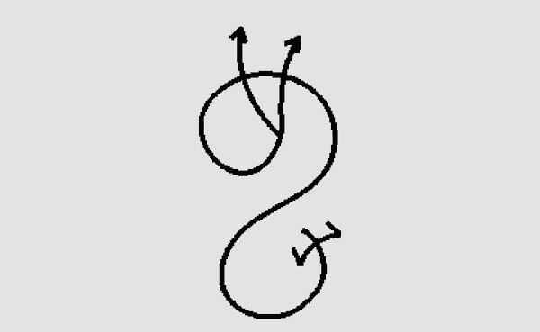

图 7.2　拉姆齐夫的符印

由于受到星座牡羊座的影响，我们决定拉姆齐夫将会以一个固执又非常巨大的红色人形出现，有六只手臂，每只手握着一把燃烧的斧头。另一种可能更好的方法是，我们可以利用火元素和火星来寻求灵感。我们可能已经在冥想或梦中收到了元素、名字和封印的灵视。在这种情况下，我们决定完全靠自己建构它。

我们在祭坛上画了一个三角形，然后开始观想毛孔吸入火元素，它具有热、干和扩张的特性。一旦我们在体内收集了足够数量的火元素，便将它投射到三角形中，首先看到它聚集成火焰云，然后看到它形成拉姆齐夫的形状。当我和我的伙伴都能「看到」这个人物时，我们抽出魔杖（在我们的传统中与火相关的工具），指着拉姆齐夫说道：

以南方匣门之主的名字，

由正午时分的白光之灵，

由诺托斯的至高无上大灵，

并以一切沙漠魔灵之名，

我将祢命名为拉姆齐夫，

祢就是拉姆齐夫。

出发把（目标的名字）从这座城市驱逐出去，

把他从我们之中赶出去，

在三个月的时间内完成这个任务。

在第三个满月，

不管祢是否完成祢的任务，

祢都要消散回到火元素中。

寻求遗忘的宁静，

听从我的话，按我的意愿去做，

菲亚特（Fiat）！菲亚特！菲亚特！

在所有逆转和消耗型魔法的情况下，你应该要一直记得做个占卜，并确保你真的受到了另一个人的超自然攻击，而不是因为你自己的失误或某种灵体的惩罚而经历诸事不顺的情况。

你应该尽可能地去观察法术的结果，因为你必须对结果负责。除非你有某种专业的魔法修练，否则你一生中很可能只需要这些课程两、三次。那些发现自己经常被卷入灵界对决的人通常不会受到真正的攻击，他们只是在使用神祕学来给原本沉闷的生活添加一些戏剧性的东西。

如果你发现自己经常成为魔法攻击的目标，我建议你问问自己为什么。改变你的朋友和生活方式，将比世界上所有的逆转魔法和消耗型魔法对你更有帮助。话虽如此，魔法攻击确实会发生，掌握本章中的技术可以帮助你在紧张的情况下保持健康平安。

* * *

17　做法是这样的：从一根绳子的尾端开始往中间打结，但要先设定九个结的位置大概落在哪里，比如以编号 1、2、3……一直到 9，大致标示出位置，不需要很精准。接着依续打第一个结，再打第三个结、第五个结……一直到第二个结。每一次打结的时候都要唸咒语。此捆脚咒象征使敌人动弹不得、进退两难，因为前进和后退都会绑手绑脚。

18　这里的意思是把对方不好的能力跟大地之力绑在一起，整个被大地吸收而消耗掉，对方就没有精力去搞破坏了。

19　牛舌结冻象征封住敌人的嘴。

20　经询问作者，Nocticula 是黑卡蒂女神的另一个称谓，代表夜晚的女神。但是很多龙与地下城系统的电子游戏都会把祂设定为吸血鬼女王，所以无法找到网络上的正确信息。

36　这个短语是苏美尔语，意思是「走开，去沙漠！」

37　这些都是冥府中河流的名字。最后一个是忘川，即遗忘之河，它不仅表明目标已经被冲走，而且表明你可以完全忘记他。

# 8
疗愈与复原

无论你的情况如何，当一切尘埃落定，所有的攻击和防御方法都已用尽，便是收拾残局、恢复正常工作的时候了。在你再次确认你的常态型防御和修复了堡垒的任何裂缝后，你将需要处理你的伤口。魔法攻击的残余效果可以像攻击本身一样持续存在。这些问题从身体症状（如疼痛）到心理症状（如失眠、抑郁和无法解释的焦虑）不等。更有可能的是外部条件，如连续的坏运气和一种与时间不同步的感觉。

在所有情况下，神祕学疗法都不应取代医学治疗。适当时应咨询医生、治疗师和心理学家。无论你来自什么传统，寻求专业灵性治疗师的帮助也是有益的，无论是灵气治疗师还是当地的萨满皆然。

在遭受袭击后，首先也是最好的修补方式是祈祷和奉献。感谢诸神和神灵在你需要的时候照顾你。如果你不崇拜任何神灵，那就把你的虔诚献给那些在你之前就已经离世，并且在你的道路上充当向导的开悟者吧！将你的道路指向宇宙本身。我没有权利告诉你如何祈祷或者祈祷什么，但我确实想强调充满能量的祈祷的巨大潜力。我再次建议你参考伊斯瑞．瑞格德的建议，他说：「用祈祷点燃你自己。」

## 疗愈家庭和关系

在我们处理疗愈自己或他人的具体细节之前，最好先确定住家的状况。你可以先在每个房间做一个驱逐仪式，然后使用净化、清洗地板和薰香，这些在第四章已经介绍过了。打扫完房间后，你会想用下面的一些方法来营造一个和平的氛围。

## 嗅闻空气

你可能已经在你的防御期间燃烧了大量的香，并且再次清理房子。我倾向在能量征战之后，远离能平心静气的薰香。如果你真的想点香，我推荐非常简单的香味，如檀香、薰衣草或乳香／没药的组合。如果你不想点香，一个建立平静心灵氛围的好方法是，在房间的角落放置樟脑块，因为樟脑被认为可以让灵体平静下来，同时只散发出轻微的气味。在房子周围放些药草也是一个好方法。我会使用肉桂、松木和檀香的组合来帮助创造平静。

## 和平圣水

在纽奥良，据说著名的「巫毒女王」玛丽．拉文（Marie Laveau）发明了一种可为住家带来和平的流行方法。它是由雨水、河水、泉水、海水、教堂圣水制作而成的「五水洗浴」（five-water wash）。如果你没有这些水，可以用佛罗里达水代替。这些水可以用来做地板清洗，也可以直接洒在家里。另一种制造和平圣水的方法是简单地把油和水分层装在瓶子里，这个概念是你把圣油涂抹在混乱的水面上。

## 改善关系

魔法攻击最常见的症状之一就是人际关系问题。如果在攻击期间，你和你的配偶、孩子或你生活中的其他人经历了困难，有个改善关系的好方法是使用蜂蜜罐。所需要的只是一个罐子、大量的蜂蜜、一些糖果，如糖蜜和糖，以及每个需要疗愈关系者的个人物品。最好是每个与瓶子有连结的人都知道这个法术，并自愿提供他们的东西，但这并不是绝对必要的。

把所有的东西都放进罐子里，在罐子上面点一支白色蜡烛，同时说：

我以蜂蜜、糖和一切甜蜜的东西，

建立体谅与平静。

愿美好主导你我之间，

如我所愿，就会实现。

如果是为了修复你和你的配偶之间的关系，就把罐子放在卧室里；如果是为了你的整个家庭而做，就把它放在壁炉边。如果是性问题造成的能量攻击，你可以只针对你和你的伴侣而做，把性行为的体液和阴毛放进罐子里，并且放进代表爱情的东西，比如亚当与夏娃根、成对血根草、伊丽莎白根、延龄草，甚至是很流行的浣熊阴茎骨。

## 疗愈个人

在建立了一种和平与良好关系的气氛以便在当中休养之后，我们现在必须着手处理你自己的伤口。就像我们清洗地板和用薰香重新打扫房子一样，你也应该确保你最近所有的麻烦都在本书前面提到的灵性净化和逆转法术浴中被清理掉了。你也可以用之前教你的驱魔香薰薰自己，或者用鼠尾草薰薰自己。要做到这一点，你可以让别人来帮你薰一薰，或者你可以把香炉放在椅子下面，让烟在你冥想或放松时升起来围绕着你。

### 放松

为了对抗经常伴随魔法攻击而来的焦虑感和压力感，我发现使用以下放松方法是有益的。第一个需要一点时间，应该一天做一次左右。基本上，你所要做的一切就是，一点一点地专注在身体的每个部分并放松自己。从右脚脚趾开始，把注意力集中在上面，在心里告诉它们要放松。你要去感觉它们也这样做了。移动到左脚脚趾，做同样的动作。移动到左脚脚底，做同样的动作。左脚脚尖是下一个点。然后是右脚脚底，接着是右脚脚尖，再来是左右脚踝。

继续往身体上方移动，确保你做了前面和后面的每个部分。一直移动到头顶。注意你的身体对放松指令的任何抗拒。在这方面多花点时间。如果你愿意，你可以想象金色的疗愈之光在你关注的任何地方向上移动，但这是不必要的。整个过程一开始可能需要二十或三十分钟，然而一旦你掌握了窍门，变得更放松，便只需要十到十五分钟。

我推荐的第二种放松方法非常快速，可以在需要释放紧张的任何时候使用。在这个方法中，你绷紧整个身体，从脚趾开始往上到头顶，让这一股刻意的紧张浪潮压倒你，带着你在练习前的任何紧张去加入它。让你的整个身体绷紧一会儿，然后立刻放松。感觉紧张离开你的身体，沉入地下。

在你释放紧张之后，深深地吸气，先充满肺的下半部，然后是上半部。吐气，清空肺的上半部，然后是下半部。这被称为「宝瓶气」，因为肺部会像装满水的花瓶一样饱满。像这样做几次呼吸，慢慢地把注意力从呼吸上移开，让你的呼吸变得更自然。这种呼吸方式能让人放松，对健康有很多好处，因为它比我们通常进行的短浅呼吸能更好地为血液充氧。

### 跟上正确的时间

某些类型魔法攻击的一个更奇怪的效果是，它可以让人与时间不同步，这在第一章中提到过。我的意思是，生命有一种自然的节奏，健康的人会与这种节奏和谐相处。一个与这种节奏不协调的人可能会发现他或她经常约会时迟到，或对别人来说太早到了。错过的机会比比皆是，你似乎从来没有在正确的时间出现在正确的地点。人们经常会对你说这样的话，象是：「如果你能早点到就好了」，或是：「真可惜你当时就走了。」

这个问题有各种各样的解决办法。在西藏，有很多的一般信徒接受时轮金刚灌顶 38，通常一次有数千人，其中一个原因是，据传这种加持可以改正这种状况。我学到的一个更简单的方法是，在日出和日落的时候，你应该闭上眼睛，想象一个旋转的万字符（卍）在你的额头上，周围有四个其他的万字符，它们也在旋转。卍字记号是永恒的象征，全世界都在使用，它的旋转与整个宇宙的旋转同步。这种简单而有效的冥想，如果每天练习达一个月左右，就能让你跟上时间。

### 疗愈运势和财运

有些人相信，一个人的运气和繁荣是他或她的灵魂装扮和业力的一部分。正如我们在第一章讨论的，导致人们认为自己受到攻击，最普遍的抱怨之一是一种被诅咒的感觉。这种「带赛」的运气甚至在遭受攻击之后还会有残留的影响，如果攻击结束后你仍然觉得你的运势和财运受到影响，那么明智的做法是使用专门设计的方法来升运了。

有大量的魔法咒语和仪式是用来吸引幸运和金钱的，我鼓励读者深入研究这个主题。现在，我将囊括一种三个配方的沐浴和一个三个配方的魔法包组合，这可以帮助你在受到攻击之后修复运势。

## 幸运／招财浴

将肉桂、黄樟木和糖冲泡到茶中，加进洗澡水里。肉桂能吸引钱财和好运，并赶走厄运；黄樟木可以帮助你坚持你所遇到的；糖可以帮助你改善你的状况。

## 好运之手／招财之手

一根幸运之手根、一根征服者高约翰根和肉桂树皮。肉桂是为了吸引财富；幸运之手根是为了抓住机会 21；高约翰根是为了让人机灵并拥有个人力量。根据护身符部分关于魔力之手（mojo hand）的指示，你应该给你的手喂一些特殊主题用油，比如纽尔良风格的快速幸运油，这种油是由肉桂油、香草油和冬青油制成的 39。

### 让盟友帮助你疗愈

如果你已经按照第二章的指示，定期向神、灵体和你周围的世界献供，那么无论祂们是否向你表明了自己，你都有一些强大的盟友了！我在这里说的不是特定的灵魂或使魔，而是你居住土地上的树木、岩石和河流。因为你透过献供创造了这种连结，祂们将会非常愿意帮助你疗愈。

要做这种类型的疗愈，你应该去一个大自然的环境，在那里，你感受到特别强烈的存在。一棵老树、一片海洋或一块大石头都是很好的例子。坐下来，让你自己感知这些地方的能量。向祂解释你受到了伤害，需要疗伤。

无论你有什么可行的方法，你都应该进入出神状态。这可以透过强烈的击鼓、呼吸控制、自我催眠、冥想，以及以上方式和其他方法的任何组合来实践。一旦你进入出神状态，你应该试着「进入」你所在地方的灵界维度。确切进入那个状态的方法不可能具体解释，因为那是恍惚状态的效果，但你应该尝试找出自己的方法。这方法不像听起来的那么难。如果你在出神状态下无法做到这一点，你可以试着在那个地方睡着，透过清明梦 22 进入它的灵界次元。

一旦你进入了灵界次元，去寻找当地的精灵。这些精灵的外表可能差别很大，但祂们总是处于生灵的中心。再次解释你的情况，并询问这个地方是否能安全地吸收你的伤害。大自然中的这些地方常常可以利用困扰我们的力量，在不伤害自身的情况下处理它们，就像处理食物一样。对一种生物有毒的东西，并不是对一切生物都有毒的。如果祂们同意，把它献给精灵并感谢祂们。一旦你回到正常的意识，你应该再献供一次──不管是用你自己的话或是用第二章的献供仪式。

### 疗愈转移和牺牲

在许多类型的民间魔法中，严重的疾病可以转移到动物身上，然后献祭。在胡督教中，这是用一只鸡来进行的。当疾病被引诱出来并进入鸡的体内时，鸡被拿来揉搓病人的身体。被称为「唐克里」（Jhankris）的尼泊尔萨满巫师会用一颗鸡蛋做同样的事情──把蛋放在一个人身体受折磨的部位旁边，然后透过击鼓和唸诵疗愈的心咒来引诱病人摆脱伤害。

你可以用蛋来自我疗愈。要做到这一点，你必须虔诚地向神祈祷，呼唤灵魂之光进入你的身体。你可以使用召唤光柱的魔法来做这件事，或者简单地想象一道白色的净化光从无垠的太空降下来，通过你的头顶进入你的身体，充满了光，把身体和情感的疾病从你的身体赶走。拿一颗鸡蛋向你的神灵祈祷。用鸡蛋在自己的身体上摩擦，从头部开始，向身体下方移动。这给了疾病一个去处，而不是在体内重新安顿下来。

当你完成后，你应该把蛋带到某个地方，带着敬意把它埋起来。就像你用了一只本来过得不错的活鸡，把你的疾病带进牠的身体里，在这个过程中，牠牺牲自己，为你服务。即使只是一颗鸡蛋，你也应该献供给这个可能有生命的灵魂，并怀着敬意把它交托到大地上，让疾病可以被吸收到大地母亲那里。

### 气场疗愈

当身、心和灵都是健康的时候，围绕着一个人的能量光环就像一颗鸡蛋，延伸出皮肤，向各个方向延伸几英寸。魔法和超自然攻击可以严重损害一个人的气场，并导致其畸形。即使是一些去除疾病的疗愈技术，如鸡蛋疗法，也会在能量场上留下一个洞──只是从皮肤上移除一个肿瘤，也会留下一个需要填补和愈合的疤痕。

重塑气场最好的方法是找一个熟练的治疗师或萨满来帮你。然而如果需要的话，也有一些你可以自己动手的方法。要做到这一点，你需要建立一个足够大的魔法圈，让你能够躺下而不触及魔法圈的边缘。

## 气场修复仪式

从北边角落开始。面朝外，召唤这个角落的力量：

我召唤北方的黑色公牛和夜之神。

群山和侏儒精灵的统治者，

玻瑞阿斯的君王，北方之风，

土元素所有力量的诸侯们，

我唤起祢们、召唤祢们。

我打开大门，召唤祢们进入这个魔法圈，

聚集并见证！

移动到东方并召唤：

我求告东方的鹰和破晓之神。

风的支配者和旋转的风精灵，

欧洛斯的君王，东方之风，

祢们风元素力量的诸侯，

我唤起、召唤、呼求祢们。

我打开大门，召唤祢们进入这个魔法圈，

聚集并见证！

移动到南方并召唤：

我召唤太阳之狮和正午之神。

沙漠和狂奔魔灵的支配者们，

诺托斯的力量，南方之风，

我唤起、召唤、呼求祢们。

我打开大门，召唤祢们进入这个魔法圈，

聚集并见证！

移动到西方并召唤：

我召唤水元素的主宰和日暮之神。

深水潜流的水精灵的支配者们，

仄费洛斯的首领，西方之风，

和一切掌管水元素力量的诸侯们，

我唤起、召唤、呼求祢们。

我打开大门，召唤祢们进入这个魔法圈，

聚集并见证！

召唤完四方力量，你现在应该移动到魔法圈的中心，面向北方。你将圆指向北方而不是通常的东方，原因是你正与磁力范围一起共事，而不是光明与黑暗的运动。召唤天与地的力量：

我求告翔天之鸽和深渊巨蛇。

我开启了天空的力量！

我开启了大地的力量！

我开启了天堂的桥梁！

我打开了下部世界的桥梁！

我召唤天顶和天底的力量到魔法圈中来聚集和见证 23！

将你的头朝北，在魔法圈内躺下。

苍穹的一切力量，

深渊的一切力量，

天边的一切力量，

我都与祢们结盟。

愿我的存在与祢们的存在和谐一致，

在上，如在下

如我所愿！

躺在那里一段时间，让四方的力量在磁场上调整你的能量场。当你完成的时候，默默地离开魔法圈。没有必要关闭这个魔法圈。

这个仪式的力量在于古老的观念，即人本身就是宇宙的镜像，透过唤起宏观宇宙，你的微观世界将会与之相一致。每次我做这个仪式的时候，我都发现它令人惊奇地强大。它不仅需要在魔法攻击后使用，也可以在你感到不平衡或生病的任何时候使用。

有一次当我在一个特别受伤的感情打击后做这个仪式时，我惊讶地看到真实的灵体从六个方向移动过来，并在我的气场上运作来疗愈我。我并不保证每个人都能得到这些结果，因为这甚至不是仪式的既定目的，但我认为这值得一提。

## 灵魂复原术

在受犹太教和基督教影响的西方，我们倾向于把灵魂看作是一个单独的东西──你是你的核心，而不是把灵魂看作是由不同部分组成的东西。然而，并不是所有的文化都以同样的方式看待它，而是把灵魂看作是存在于好几个部分的东西，其中一些可以与自我的其余部分分离，从而造成巨大的痛苦和许多情感、心理和精神问题。

例如在古埃及，一个人被认为是由许多不同的部分组成的。除了「卡」（Kha，长音），也就是肉体，还有「卡」（Ka，短音）、「巴」（Ba）和「阿赫」（Akh）。Ka 是一个人心理上的组成部分，是死后物质身体的类似形态，通常被束缚到较低的层面。Ba 往返于天地之间，它们是被做来接收丧葬的供奉。Akh，也被称为 Khu，与 Kha 完全相反，因为它是最高的灵性和永恒的自我。

在西藏，他们说的是「南虚」（Namshe）和「布拉」（Bla）。南虚是一种从一个生命轮回到另一个生命的意识，它承载着一个人的业力。布拉是一种情感构造，与这个特殊的转世化身和小我连结更紧密。它会在特定的条件下离开身体，变得支离破碎、丢失或被盗。藏民有许多找回「布拉」的仪式，称为「腊谷」（La-gug）。

在海地的巫毒教中，灵魂也被视为由两部分组成：勾邦安（Gros Bon Anj）和帝邦安（Ti Bon Ang），分别翻译为「善良大天使」和「善良小天使」。

勾邦安是你死后前往天堂的部分，它最终与上帝相连。帝邦安有点像西藏的布拉，作为一个独立个体与你相连。和布拉一样，帝邦安也可能丢失、破碎或被盗。在著名的活死人仪式（rites of zombification）中，帝邦安被捕获并控制。

维多和寇拉．安德森（Victor and Cora Anderson）所着的《菲利传统巫术》（Feri Tradition of Witchcraft）将灵魂分为三部分，分别是附着体（Sticky One）、耀光体（Shining Body）和圣灵（Paraclete）。附着体是动物和儿童的本性，这在某种程度上符合佛洛伊德的本我。耀光体是智力和精神能力，从理性和逻辑延伸到心灵和能量层次。圣灵是纯洁的灵魂，代表着你自己的神性，将你与祖先、神和宇宙作为一个整体联系在一起。

公元七世纪，一首来自爱尔兰吟游诗人的诗歌《诗之釜》（Cauldron of Poesy），讲述了凯尔特传统中构成灵魂的三个大锅。多重构造的灵魂也遇到了赫尔墨斯（Hermetics）、卡巴拉和苏菲主义。无论你归属于灵魂人类学（字面意思是研究人类的构成）的哪个体系，大多数人都同意，自我的某些方面是可以与其他部分分离的，因此如果人格角色要重新变得完整，就必须重新找回它。

一般来说，灵魂会透过三种方式之一来分离。它可以因创伤或震惊而动摇，可以因羞愧和内疚而吓跑，也可以藉由一些神祕的手段被偷走。这三种情况中的每一种都需要一种不同的补救方法来将灵魂带回，与自我的其余部分一同归位。灵魂复原是一项复杂的工作，就像驱魔一样，最好留给该领域的专家来做。不幸的是，这一领域的专家少之又少，但你至少应该知道一点──在这三种情况下需要做些什么。在这里，我将谈到如何为他人复原灵魂。如果你觉得你需要完成灵魂复原，那么你必须让另一个人来为你做这件事，因为你没有办法去做这项工作。这就是该工作的本质。

当灵魂因创伤或休克而动摇时，情况的严重程度可能不同，这与创伤的严重程度和持续时间直接相关联。例如，一个灵魂可以被短暂而尖锐的身体疼痛动摇，就像你可能在车祸中经历的那样。它也可能是由情感冲击引起的，比如当你发现你的爱人离开了你，或者一个家庭成员意外去世。如果你曾经经历过伴随这些经历而来的迷失方向和麻木，你就会知道暂时失去你灵魂的一部分是什么感觉。值得庆幸的是，这种效果通常是暂时的，灵魂在附近徘徊，直到被自然吸引回身体。

如果灵魂没有自动返回，最好的方法就是让宿主的身体尽可能地放松和无忧无虑，这样，灵魂就会发现它是最理想的地方。包括按摩和吃大餐等令人感官愉悦的仪式都可以用来试图将灵魂吸引回来。

长期的创伤会导致更可怕的情况。长期遭受虐待的战俘或儿童不太可能让他们的灵魂徘徊在附近，等待回归。在这种情况下，灵魂通常躲在它丢失的地方附近。通常是在水边或一棵高大的树旁，因为这些原始的景色能安抚我们的灵体。在这种情况下，巫师必须先尽可能地修复对身体造成的任何心灵和能量伤害，就像第八章的气场修复仪式一样。在这种情况下，病人也应该受到心理保健专业人员的照护，他们可以处理由创伤引起的心理问题，这也将使身体准备好接受回归的灵魂。

在这种情况下，真正找回灵魂比让受害者放松要困难得多。在此情况下，巫师必须依靠众神和他或她的灵界盟友来寻找灵魂并将其引领回来。另一方面，巫师必须在他们自己的灵界旅行中寻找灵魂，并要求祂回来。如果你有能力这样做，并且你找到了灵魂，你只要把祂抱在怀里，回到你自己的身体里。只要伸出你的手，轻轻吹回你手中的灵魂，这灵魂就可以回到祂的主人那里。

在某些情况下，灵魂因为一些巨大的耻辱或内疚而被驱逐。这个问题最艰难的部分是要处理肇因。往往是某些不道德的行为，在此人的理性头脑中被认为是正当的，但其内心深处却深恶痛绝。这个冲突已经把灵魂从身体里赶了出去，因此在灵魂复原之前，这个冲突必须得到解决。一般来说，这可以透过两种方法之一来实现：一种是这个人坦白并接受自己的行为，从而意识到自己深深的感觉是正确的，而他做错了；或者，这个人意识到这种行为根本不是不道德的，他内心深处的反应是出于社会熏陶，而不是真正的是非观。例如在第一种情况中，一个人在没有挑衅的情况下殴打或杀害了别人，他可以用各种方法为自己辩护，但他内心深处知道这是一种不道德的行为。这个人将需要忏悔并接受这一切，以复原他的灵魂。

在第二种情况下，从事同性恋性行为的人可能理性地知道这在道德上并没有错，他只是按照自己的自然倾向行事，但仍受到深刻的宗教和社会制约的影响，这些制约告诉他，他正在犯下滔天罪行。在这种情况下，为了使自我变得健康，能够接受灵魂，深层的心灵必须与理性的思考相契。在解除内疚或羞愧之后，灵魂可以完全以前述的同样方式复原。

我想再次指出，我不是精神病学专家，而除非你是，否则因为强烈的内疚和羞愧而丢失魂魄的人应该由专业人士来照顾。不要假装成自己不是的人，否则你造成的问题会比你解决的问题更多。

在最后一种情况下，灵魂被另一个巫师或魔法师偷走，这么一来，我们就确实有了一个非常严重的问题。你必须找到他的灵魂，用强制的力量夺回。因为从事这类魔法的魔法师通常必须将灵魂束缚到一个物体上，如果你知道是谁偷了祂，你就可以去寻找，并找回那个物体。你用什么方法来做这件事，取决于你，并且可以涉及第七章中提供的各种消耗型魔法的方法，或者更大量的方法。我想说的是，我在这本书中写的东西并不是为了鼓励违法活动，所以如果你觉得自己被迫进入别人的寺庙或神殿寻找灵体陷阱，那是你的责任。

如果你无法找到保存灵魂的地方，或者不知道谁拥有祂，祂仍然可以透过向神恳求而得到复原。你必须代表受折磨的人向你的神请愿，谦卑而坦率地要求祂们找回并复原灵魂，即使这会为偷走灵魂的人带来伤害或死亡。

比如，如果你和黑卡蒂女神合作，你可以用下面的加持法：

我向有诸多名字的众神之母致敬，

祂的儿女都是美丽的。

我召唤伟大的黑卡蒂女神──门槛的女主人，

世界之钥的持有者，

我向三岔路的主人伊诺迪亚致敬，

下部世界，黑夜与炼狱的那一位，

祢狂野不羁地穿越坟地与火葬场，

身披藏红花外衣，缀以橡树叶和盘绕的蛇，

成群的鬼魂、狗与永不安宁的灵魂跟随着祢，

但祢同时也是光辉夺目的苍穹国度女皇。

我来向祢寻求帮助。

冥府的黑卡蒂女神，巫术女王，

有一个灵魂被不正当地偷走了。

祢是约束力量和巫术的最高主宰者，

祢头披蛇发，腰系蛇带，腹中包着蛇鳞，

我来找祢讨公道！

祢比世间任何巫师都伟大，

当祢用祢的双重火炬之光带领冥后狄蜜特穿过冥界，

祢便将灵魂带回（受害者的名字）身上，

守城者（Propolos），把灵魂带回祂的家。

卫城山门（Propylaia）24，保护祂免受进一步的危险和破坏。

晨之星，用祢的双重火炬照亮道路。

库洛德洛波丝（Kourotropos）25，把灵魂交给（受害者的名字），

就像把孩子交给他的母亲一样。

当祢归来时，我们将欢欣鼓舞并歌颂祢。

我向有诸多名字的众神之母致敬，

祂的儿女都是美丽的。

我召唤伟大的黑卡蒂女神──门槛的女主人，

世界之钥的持有者。

如果黑卡蒂女神成功了，你和病人都应该向祂供奉祭品，在这本书的其他地方有描述祭品的内容。

无论丢失魂魄的原因和情况是什么，我想再次敦促你，应该在用尽所有其他选择后才亲自尝试收魂。如果你也能契合客户的三观来工作，那是最好的。一个练习胡督巫术并相信波哥偷走她灵魂的人，会对洪安（Houngan）或满婆（Manbo）26 使用的方法做出最好的反应。喇嘛使用的方法对佛教徒的影响最大。一个基督徒会对神父或牧师使用的方法做出最好的反应。所有这些专业人员所接受的培训远远超出了一本简短的书所能提供的范围。

一个聪明的巫师知道自己的极限，并只做份内之事。

* * *

38　时轮的字面意思是「时间之轮」，指的是一整套的仪式、谭崔瑜伽、医学文献和预言。香格里拉的传说来源于时轮预言，它预言了神圣的灵性王国在未来会变成实体化，这是为了在世界大战中击败穆斯林。

21　读者可以直接买幸运之手魔法油，然后做一个金属或是泥土速成的手部模型来代替。

39　这种油的配方取自人类学家和根源工作者佐拉．尼尔．赫斯顿（Zora Neale Hurston）的优秀著作《骡子与人》（Mules and Men）（Harper & Row，一九九〇年）。

22　清明梦是指知道自己正在作梦，并且可以控制沟通交流的梦。

23　这里的意思是要连接天地的能量，以自己的身体作为能量流动的管道，把最高的天界力量与大地的力量都集中在这个魔法圈。如果单从字面意思很难理解，需要一些实际上的修练经验才能了解这个隐喻。

24　原意是灵魂之家的门。

25　希腊保护年幼者的神祇。

26　以上是胡督教男女祭司的称谓。

# 9
结语

我已经说过，魔法、心灵和灵界攻击发生的频率甚至比大多数神祕主义者愿意承认的还要高。我会更进一步地说：它们每天都在发生，并且发生在每个人身上。它们不仅由被冒犯的灵体和心存不良的魔法师发起，也由大公司和政党发起。一个魔法的符印在哪里结束，而一个公司的标志从哪里开始呢？在销售行为中，神经语言程序学的使用在哪里用不上，而魔法束缚在哪里开始用上呢？在历史的这个时刻，最先进的精神操纵和催眠技术正用来对付你们，好控制你的行为、你买什么东西和你的想法。如果你不认为这是魔法，那么再好好想想吧。

这本书中包含的方法，希望不仅能作为抵御古代咒语和诅咒的盔甲，并且还能抵御这些更被接受、但在许多方面更阴险的制约和控制模式。特别是，我希望日常的三个练习：驱逐仪式、冥想和献供，能使你改变得够多，让这些力量开始失去控制。重新吸引你的注意力也许是当今世界上最具革命性的行为，本书中的所有技巧都可以作为实现这一目标的工具。

至于这本书主要关注更传统的超自然攻击，我试图提供一个有用的调查，涵盖了许多不同的实践模式。一些传统主义者会指责我的方法过于折衷。那些习惯仪式魔法的人可能会被民俗巫术吓跑。那些喜欢胡督巫术的人可能不会对观想技巧产生共鸣。那些期待一本关于标准现代威卡魔法书的人可能会对我写的几乎一切内容兴趣缺缺！

我选择兼收并蓄是有原因的。我们不再生活在纯粹的传统文化中。现代的通讯和旅行方式使世界比以前小得多。一位圣徒信仰的祭司或秘鲁萨满巫师与犹太卡巴拉导师或英国女巫相遇的机会，在现在是非常贴近现实的。事实上，它一直在发生。我并没有特意去寻找任何一个人。我接触了一个玫瑰十字会的老师、一位根源工作者、一位圣徒信仰女祭司、一位佛教上师，以及几个不同的巫术崇拜者，他们都在纽泽西中部，而且都是在我二十岁之前接触的。

这些不同的魔法传统各自强调不同的要点，对一种魔法有效的防御不一定对另一种有效。那些只依赖黄金黎明的小五芒星驱逐仪式或东方圣殿骑士团的星红宝石仪式的人，可能会发现他的防御很容易被某人在他的鞋子里放置烟雾粉而破功。同样的，过分依赖红砖粉和护身符的人可能会发现自己很容易受到仪式魔法师召唤的盖提亚恶魔攻击。

巫术在许多不同的层面上工作：物理和接近物理的以太层面、星光层和能量层，以及精神层面和纯粹的神圣层面。不同领域的魔法传统强调不同的层次。例如，胡督魔法和其他类型的民间魔法非常强调材料层面的使用，如粉末和符咒，也非常强调神圣层面，如使用祈祷来圣化这些物品。胡督不太关注能量和星光层面，但这并不是说它根本没影响到这些层面。与此同时，仪式魔法则非常强调能量层次的影响，这可以在仪式中看到，如五角星或六角星被描绘在半空中；除了仪式的工具，它不像民间巫术那样关注物理效果。在这个世界中，你不需要走多远就能遇到任何类型的魔法修练者，所以有必要在所有这些层面上保护自己。

尽管如此，我不希望我的折衷主义被认为是业余的，因为有这么多的现代折衷主义作品倾向于这样做。为此，我在附录中加入了一些资料，以便在各自的框架和文化环境中进一步研究不同的传统。我从每一种传统中得到启发并接受了相当正统的训练，我想在各自的背景下对每一种传统表示敬意和尊重。

这里所介绍的方法应该足以让你识别，并对你可能遇到的任何类型的神祕攻击进行防御。然而，仍然存在着这样一种可能性：无论你做什么，你都可能被猛烈攻势所压倒、不知所措，或者只是面对一些比你更有力量和经验的人或事。如果你发现你的防御崩溃了，向团体或专业工作者寻求帮助并不是什么可耻的事。

如果你确实寻求外人帮助，应确保你所求助的人在社群中有良好的声誉，并且擅长他们所做的事情。如果你需要的是一位专业人士，那么要确保他或她不会为其服务向你收取过高的费用。根据具体情况，合理的费用有所不同，你应该准备好支付与其他专业人士（如医生）类似的费用。如果专家要价成百上千美元，却没有任何迹象表明他们确实在做事，那么你应该立即切断联系，去别处找帮手。一些通灵者靠着让人们相信他们被诅咒并收取过高的费用来解除诅咒为生。

读者会注意到，这本书对某些情况提供了特定的咒语，而对其他事情只提供了一般性的指导。这是因为我不仅希望提供防御咒语的文法，我还希望提供一个可供任何人在任何情况下使用的整体策略和框架来应对攻击。在为我自己、我的朋友和我的客户工作时，我从来没有遇到过完全相同的情况两次，所以，我希望我的读者能够使用这个指南来设计一个量身打造的防御模式，以便处理他们可能遇到的任何攻击。

魔法攻击是一件很可怕的事。当巫师和魔法师们愈来愈否认这个事实时，该怎么办呢？当那些声称要训练人们使用巫术的书甚至没有提到任何关于诅咒和攻击的具体内容时，读者怎么知道该如何进行防御呢？

在世界上有前所未有数量的人，被拉着穿越巫术和魔法书的迷宫，我希望这本书可以填补这些书在实战上的漏洞，为那些遇上麻烦事的人提供一个资源。

我即将完成本书时正值圣烛节，这是有意义的。圣烛节是人们在黑暗中点燃蜡烛的传统节日。如果这本书能像蜡烛一样为少数人驱散疑惑、困难和危险，那么它的目的就实现了。

愿一切有情具一切乐及乐因，

愿一切有情离一切苦及苦因，

愿一切有情不离无苦妙乐，

愿一切有情远离亲疏贪瞋住平等舍。27

──无名之辈

于二〇〇六年圣烛节

* * *

27　这是藏密的四无量心祈祷文。

【附录一】

## 进阶研究资源

正如我所承诺的，这里有一个书籍和网站的列表，提供了书中涉及的实践和传统的进一步信息。这些信息绝不是全面的，因为这本书是衔接那些已经经过了入门阶段的人，一般资料只是意味着强调那些经常被忽视或在开始学习时特别有价值的来源。

## 书籍

##### 巫术

．保罗．胡森（Paul Huson），《精通巫术》（Mastering Witchcraft）。佩勒葛林出版（Perigree Press），一九八〇年。

这本书是我第一次接触到非威卡教派的巫术，是一本卓越的入门书，在仪式魔术和胡督巫术的影响下操作巫术。

．安德鲁．查布利（Andrew Chumbley），《阿梭夏书》（The Azoetia）。木雕神像出版（Xoanon Publishers），一九九二年。

这是一本货真价实的魔法书，是非常限量的护身符版本，一个神祕安息日崇拜（Cultus Sabbati）的产物。

．奈杰尔．杰克森（Nigel Jackson），《暴政的面具》（Masks of Misrule）。卡帕尔．班出版（Capall Bann Publishing），二〇〇一年。

一本关于女巫之神的书。杰克森利用许多不同的来源，描绘了一幅引人注目的女巫之神图画。

．罗伯特．科克伦（Robert Cochrane）和约翰．琼斯（John Jones），《丛林里的红鹿》（The Roebuck in the Thicket）。卡帕尔．班出版，二〇〇二年。

这是罗伯特．科克伦的书信和教导的集结，他是图巴尔．该隐（Tubal Cain）家族的魔导师，书中详细介绍了一种他声称是传统和前加德纳威卡的巫术风格。

．索伦．寇伊（T. Thorn Coyle），《进化的巫术》（Evolutionary Witchcraft）。塔区／企鹅出版（Tarcher / Penguin），二〇〇四年。

第一本让人一瞥维多和寇拉．安德森的菲利传统巫术之书。

．朵琳．瓦连特（Doreen Valiente），《巫术的重生》（Rebirth of Witchcraft）。凤凰社出版（Phoenix Publishing），一九八九年。

关于威卡巫术从哪里诞生的第一手细节，由在场者撰写。这本书被太多人忽视了。

．A．O．史贝尔（A.O. Spar），《佐斯的生命魔典》（Zoetic Grimoire of Zos）（n.p.）

这是另一种对当前巫术的不同看法。史贝尔有时被认为是混沌魔法的鼻祖，他对这门巫术的贡献有时会被忽视。

##### 仪式魔法

．亚伦．利奇（Aaron Leitch），《魔法魔典的祕密》（Secrets of the Magickal Grimoires）。卢埃林出版（Llewellyn），二〇〇五年。

一本注定会成为经典的书。它从萨满关系的角度解释了所罗门的传统，并详细说明如何按照魔法书中描述的方式进行操作，而非按照黄金黎明和后来的衍生作品操作的方式。

．亨利．科尼利厄斯．阿格里帕（Henry Cornelius Agrippa），《神祕哲学三书》（Three Books of Occult Philosophy）。克辛格出版（Kessinger Publishing），一九九七年。

很多现代仪式魔法都来自于这三本书，我甚至不知道该从哪里开始描述它们。

．唐纳德．迈克尔．克雷格（Donald Michael Kraig），《现代魔法：高等魔法艺术的十一课》（Modern Magick: Eleven Lessons in the High Magickal Arts）。卢埃林出版，一九八八年。

这本书将会解开所有关于克劳利或黄金黎明的故事。

．弗朗茨．巴登（Franz Bardon），《进入赫尔墨斯的启蒙》（Initiation into Hermetics）。默克出版公司（Merkur Publishing Co.），二〇〇一年。

在我为身、心、灵编写自己的训练计划之前，这本书才被称为真正发展魔法师力量的最佳方法，而不仅仅是做仪式。

．汉斯．戴特．贝兹（Hanz Deiter Betz）（编者），《希腊魔法纸莎草翻译》（Greek Magical Papyri in Translation），第二版。芝加哥大学出版（University of Chicago Press），一九九七年。

起源于公元前二世纪至公元五世纪希腊—罗马时期埃及的一批魔法咒语和仪式。

##### 胡督信仰

．哈利．M．海厄特（Harry M. Hyatt），《胡督—魔法—根源工作》（Hoodoo-Conjuration-Witchcraft）。西方出版社（Western Publishers），一九七〇年。

在一九三〇和四〇年代对数千位根源工作者进行采访的五卷选辑。

．凯瑟琳．伊隆沃德（Catherine Yronwode），《胡督药草和草根魔法》（Hoodoo Herb and Root Magick）。幸运魔咒古玩公司（Lucky Mojo Curio Co.）。

无庸置疑地，幸运魔咒古玩公司和 www.luckymojo.com 都有关于胡督信仰最全面的书。

．佐拉．尼尔．赫斯顿（Zora Neal Hurston），《骡子与人》（Mules and Men），修订版。哈珀．佩伦尼欧出版（Harper Perennial），一九九〇年。

本书叙述了这位著名作家在美国南部跟随根源工作者学习的经历。

##### 巫毒

．唐纳．J．寇森提诺（Donald J. Cosentino）（编辑），《海地巫毒教的神圣艺术》（Sacred Arts of Haitian Vodou）。加州大学洛杉矶分校／佛勒（University of California L.A. / Fowler），一九九五年。

这是本艺术巨册，提供了真正的海地巫毒教法术的印象，无人能出其右。

．路易斯．马提内（Louis Martiné）和莎莉．安．格莱斯曼（Sally Ann Glassman），《纽奥良巫毒塔罗牌》（New Orleans Voodoo Tarot）。天命图书（Destiny Books），一九九二年。

一套塔罗牌加一本书，详细描述了纽奥良的一种特殊的巫毒教，它与海地的做法有很大的不同。

．麦洛．里戈（Milo Rigaud），《巫毒信仰的祕密》（Secrets of Voodoo），修订版。城光出版（City Lights Publishers），一九八五年。

一本关于海地巫毒教的经典之作，包含了许多微微、咒语和颂歌。

．卡伦．麦卡锡．布朗（Karen McCarthy Brown），《罗拉妈妈》（Mama Lola），更新兼扩充版。加州大学出版（University of California Press），二〇〇一年。

详细介绍纽约海地信仰疗愈师满婆的生活和法术。

##### 混沌魔法

．彼得．卡罗尔（Peter Carroll），《自由的无效化与心灵探索》（Liber Null & Psychonaut）。伟瑟图书（Weiser Books），一九八七年。

「死神与爱神之光照者」（Illuminates of Thanateros）创始人所着的一本混沌魔法书。虽然我并不完全同意书中的所有观点，但它对魔法有可贵的前瞻性。

．菲尔．海恩（Phil Hine），《混沌魔法集锦》（Condensed Chaos）。新猎鹰出版社（New Falcon Publication），一九九五年。

对于混沌魔法来说，就像现代魔法之于仪式魔法一样，这是一把打开理解之门的钥匙。

．格兰特．莫里森（Grant Morrison），《无形界》（The Invisibles）。维提戈出版社（Vertigo）。

好吧，这是一个漫画系列。如果你不能说服自己这一点，那你就无法理解混沌魔法。

##### 西藏与尼泊尔魔法

．约翰．默德辛．雷诺兹（John Myrdhin Reynolds），《金色书信集》（The Golden Letters）。雪狮出版社（Snow Lion Publications），一九九六年。

这是我读过最好的关于大圆满法的导读。我认为大圆满是所有冥想方法中的佼佼者。

．南开诺布仁波切（Namkai Norbu），《水晶与光道》（Crystal and the Way of Light）。企鹅出版社（Penguin），一九八八年。

世界上最受尊敬的大师之一对大圆满法的伟大观察。

．嘉楚仁波切（Gyatrul Rinpoche），《生起本尊》（Generating the Deity）。雪狮出版社，一九九六年。

这本书就如何以容易理解的方式进行谭崔禅修，给予了详细的说明。

．马丁．博德（Martin Boord），《来自蓝天的闪电》（Bolt of Lightning from the Blue）。霍尔东版本（Edition Khordong），二〇〇二年。

关于西藏普巴杵最全面的书。

．查格杜德．祖古（Chagdud Tulku），《佛教实修的大门》（Gates to Buddhist Practice），修订版。贝玛出版社（Padma Publishing），二〇〇一年。

这是为那些不熟悉藏传佛教的人准备的优秀入门书。

．苏伦德拉．巴哈杜尔．沙希（Surendra Bahadur Shahi）、克里斯蒂安．雷奇（Christian Rätsch）、克劳迪娅．穆勒—埃伯林（Claudia Müller-Ebeling），《喜玛拉雅的萨满教与谭崔》（Shamanism and Tantra in the Himalayas）。内在传统（Inner Traditions），二〇〇二年。

很棒的书，里面有很多照片，详细介绍了尼泊尔萨满教及其相关习俗。

．约翰．米登．雷诺兹（John Myrdhin Reynolds），象雄翻译计划（The Bonpo Translation Project），多家出版社。

一系列关于苯教的书籍，苯教是西藏本土的宗教。

## 推荐网站

[www.tantrickery.com](http://www.tantrickery.com)

这是我自己的网站，你可以查看我的教学时间表，看到我提供的服务，或直接寄电子邮件给我。

[www.vajranatha.com](http://www.vajranatha.com)

约翰．默德辛．雷诺兹不仅是一名翻译，还是一位大圆满法门的受戒瑜伽士。他的网站上有许多有趣的文章，特别吸引那些对西藏魔法有兴趣的人。

[www.luckymojo.com](http://www.luckymojo.com)

凯瑟琳．伊隆沃德在这个网站上有比其他网站加起来更多的胡督魔法相关信息。

[www.drkioni.com](http://www.drkioni.com)

一个在佛罗里达的专业根源工作者凯欧尼博士（Dr. Kioni）的网站，他有卓绝的声誉，并且主持胡督根源工作广播节目时段。

[www.hermetic.com](http://www.hermetic.com)

一站式的网站，有仪式魔法、赫耳墨斯法则和各种神祕学的好东西。

[www.sacred-texts.com](http://www.sacred-texts.com)

惊人的资源，免费提供来自世界各地的神圣祷文。

[www.thelesis.com](http://www.thelesis.com)

东方圣殿骑士团的特勒希斯营专属网站，该网站出版《神佑》（Behutet）季刊，我经常为其撰稿。

[www.esotericarchives.com](http://www.esotericarchives.com)

暮光岩洞档案馆的首页，其中包含了大多数著名的魔法书和其他经典魔法作品。

[www.voodoospiritualtemple.org](http://www.voodoospiritualtemple.org)

女祭司米莉安（Miriam）的网站，她的圣殿在纽奥良的蓝巴特街（Rampart Street）。这是一个很好的纽奥良巫毒的资源。

【附录二】

## 关于黑卡蒂女神

黑卡蒂是一个非常神祕和被误解的女神。大多数人对祂的看法往往是固定僵化的，由祂在莎士比亚《马克白》中的出现就是最好的例证──作为黑暗和黑魔法的女神。最近，新异教徒试图清除这个邪恶的名声，但不幸的却更加远离真相，把祂描绘成一个憔悴的月亮女神。尽管黑卡蒂在某些阶段被任命为一个黑魔法女神，并且在后来的罗马形象中与月亮连结在一起，但祂从来没有被描绘成一个老太婆。事实上，黑卡蒂总是被描绘成一位年轻的女神。

黑卡蒂这个名字有很多涵义，最被接受的是远方（Far Darting）或彼方（Far Removed）。黑卡蒂被认为是来自安纳托利亚或卡里亚的东方伟大女神。祂第一次出现是在希腊文学《神谱》（Theogony of Hesiod）和《狄蜜特女神颂》（the Hymn to Demeter）中，祂根本不是月亮或黑暗女神，而是一个持光者和守护者。《神谱》将祂描述为一个站在众神这边的泰坦神，因此被赋予了许多力量和管辖范畴，比如游戏女神和保母女神。在《狄蜜特女神颂》中，祂的本质几乎像太阳一般。事实上，当祂目睹普西芬尼（Persephone）被带进冥界的时候，祂和太阳神海利欧斯在一起。祂用祂的双重火炬照亮了狄蜜特女神进入冥界的道路。

祂远非一位老妪，那是因为祂年轻的模样，人们相信祂会代替那些为保护城市免受伤害而牺牲的年轻女性。阿伽门农（Agamemnon）的女儿伊菲革涅亚（Iphigenia）就是这样的例子，祂在希腊舰队前往特洛伊的途中牺牲了自己。祂在最后一刻拖住他们，使年轻的妇女免于死亡的痛苦。

大约从公元前五世纪开始，黑卡蒂开始发展祂的冥府地下世界元素以及祂与巫术的连结。有些人认为祂是色萨利（Thessaly）的费莱（Pherai）女神，也被称为伊诺迪亚，表示祂是十字路口的女神。除了祂年轻的人类外型之外，祂在一些文学作品中还以兽首的形式出现，如狮子、蛇和狗。由于祂与十字路口的关系，以及祂对那些在祂们时代之前死去女性的帮助，使祂得到了巫术和死亡女神的名声。祂经常在希腊魔法纸莎草纸和著名的诅咒铭文中被召唤。

在公元二世纪，祂出现在《迦勒底神谕》中。身为一位卓越和神祕的女神，几乎没有任何祂和冥府之间的关系还在当中。祂是第一个父亲哈德（Had）的妻子，也是第二个父亲哈迪特（Hadit）的妻子，因此同时是显化和非显化的。

祂被称为本书的保护者，因为祂被认为是一位用于防御和进攻魔法的女神──既是光明女神，亦是黑暗女神。祂的形象被称为赫卡泰安（Hekataion），作为一种防御护身符曾经非常流行，阿里斯托芬（Aristophanes）在剧本《黄蜂》（Wasps）中提到祂出现在雅典的每一扇门上，因此祂是一位绝佳的保护者。祂更黑暗和邪恶的一面经常被那些寻求正义的人援用，因此祂是一个理想的女神，可以进行逆转和消耗型魔法的运作。

有兴趣想更了解祂的人应该看看以下书籍：

．斯蒂芬．罗南（Stephan Ronan）的《女神黑卡蒂》（The Goddess Hekate）。

．罗伯．冯（Rober Von）的《古希腊宗教中的黑卡蒂女神》（Hekate in Ancient Greek Religion）。

．雅各布．拉比诺维茨（Jacob Rabinowitz）的《腐朽的女神：古典时期巫师的起源》（Rotting Goddess: The Origin of the Witch in Classical Antiquity）。

## 致谢

首先，我要感谢我的妻子在我写这本书的过程中的耐心与鼓励。我要感谢我的家人，因为他们在一个有利于学习巫术的环境中养育了我，无论我的追求看起来有多奇怪，也不管我在求道中走了多远，感谢他们总是在我的神祕学追寻中鼓励我。

感谢我的所有启蒙者、导师、老师、朋友，以及他们向我透露巫术祕密的消息来源。特别感谢以下名单：约翰．米尔敦．蓝诺（John Myrdhin Reynolds）、南开诺布仁波切（Namkhai Norbu）、罗朋丹增南达（Lopon Tenzin Namdak）、康参多杰仁波切（Kunzang Dorje Rinpoche）、克利夫和米莎．波利克（Cliff and Misha Pollick）、凯瑟琳．伊朗沃德（Catherine Yronwode）、陶．南密瑟（Tau Nemesius）、保罗．修恩（Paul Hume）、旺度仁波切（Lama Wangdor）、佛蕾特．珊西雅（Frater Xanthias）、麦特．布朗里（Matt Brownlee）、阿佛列．维塔利（Alfred Vitale）、B．詹德尔（B. Gendler）、艾尔．比林斯（Al Billings）、布兰琪．库柏纳（Blanch Krubner）、吉姆博士、霍华与艾咪．沃金（Howard and Amy Wuelfing），以及苏珊．法沃诺（Susan Vuono）。

我还要感谢费城的东方圣殿骑士团（Thelesis Oasis）、老蛇帮（Old Snake Cabal）、冥府奥拉曼神庙（Chthonic Auranian Temple）、神圣土地兄弟会（Terra Sancta Sodality）、狂野狩猎俱乐部（Wild Hunt Club）和佐奴坎修行者（Ngakpa Zhonnu Khang）的所有成员，感谢他们一直以来的友爱与支持。

最后，我要感谢在本书中以及本书写作过程中所召唤的诸多神灵。我特别要感谢力高爸老爹（Papa Legba），祂祝福了这部作品，并且在写作期间开启了许多扇门；以及黑卡蒂女神──这本书的女主人。

###### BC1108

#### 魔法防御术：除咒、护盾、逆袭，打开个人能量护罩

##### Protection & Reversal Magick: A Witch's Defense Manual

* * *

作者／杰森．米勒（Jason Miller）

译者／Sada

责任编辑／田哲荣

协力编辑／刘芸蓁

封面设计／斐类设计

内页构成／欧阳碧智

校对／蔡昊恩

发行人／苏拾平

总编辑／于芝峰

副总编辑／田哲荣

业务发行／王绶晨、邱绍溢

营销企划／陈诗婷

出版／橡实文化 ACORN Publishing
地址／10544 台北市松山区复兴北路 333 号 11 楼之 4
电话／02-2718-2001　传真／02-2719-1308
网址／[www.acornbooks.com.tw](http://www.acornbooks.com.tw)
E-mail 信箱／acorn@andbooks.com.tw

发行／大雁出版基地
地址／10544 台北市松山区复兴北路 333 号 11 楼之 4
电话／02-2718-2001　传真／02-2718-1258
读者传真服务／02-2718-1258
读者服务信箱／andbooks@andbooks.com.tw
划拨账号／19983379　户名／大雁文化事业股份有限公司

印刷／中原造像股份有限公司

初版一刷　2022 年 5 月

定价／480 元

ISBN／978-626-7085-23-3

ISBN／978-626-7085-24-0(EPUB)_V1

版权所有．翻印必究

Protection & Reversal Magick: A Witch's Defense Manual Copyright © 2006 by Jason Miller Published by arrangement with Red Wheel Weiser, LLC.

through Andrew Nurnberg Associates International Limited.

Complex Chinese translation Copyright © 2022 by ACORN Publishing, a division of AND Publishing Ltd.

All rights reserved.