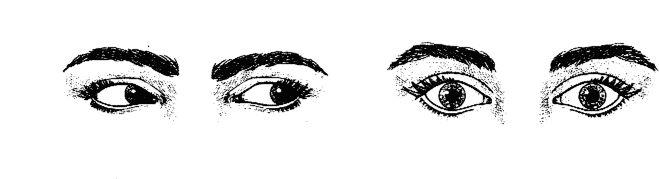
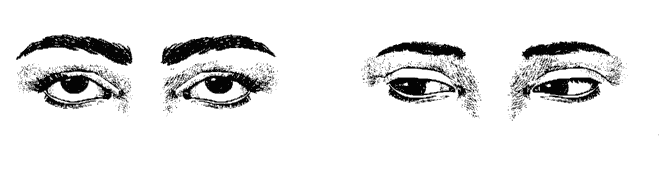

# 麻瓜不挫败，读心术一学就上手

# 前言 這些都是讀心術

> 沒有人知道，當兩人結伴同行時，彼此在無意識裡與對方交流的想法是什麼。
——羅伯特·巴爾（Robert Barr）

你有過這樣的經驗嗎？在接電話之前就知道是誰打來的？你常在對方開口說話前，就知道他要說什麼了？即使對方試圖隱藏自己，你也會知道他真實的感覺？你曾經執行了一項任務後，對方才說「我本來就想請你做這個」？我十分確定你有過這些經驗，因為其實我們都會讀心術。

歷史上處處可見，許多人都記錄過他們的通靈（psychic）經驗。大部分人都有過心靈溝通（mind-to-mind communication）的時候，也就是能收到他人的想法。有一項證據充分的例子是發生在山謬·威爾伯佛斯主教（Bishop Samuel Wilberforce）身上，這位主教以反對達爾文的進化論聞名。

有一天，威爾伯佛斯主教正在跟一群神職人員開會，他突然舉起一隻手摸著頭，並說，「我很確定我其中一位兒子出事了。」許多人親眼見證了主教的舉動，主教當天稍晚也寫下了他的感受，他很害怕兒子會遇到「邪惡的事」。後來發現，主教名叫賀伯的大兒子當時在海邊發生意外，腳被嚴重壓傷了。

幸運的是，這次意外並沒有危及生命。這就是非常典型的例子，某個人在危急或痛苦的當下，會傳送心電感應（telepathic）的訊息給親近的友人或家人。

當我還是小孩時，會盯著我前座男孩的後腦勺，運用意念讓他轉頭。結果總是不變，一、兩分鐘之內，他就會轉過頭來，一臉疑惑的看著我。一旦我成功的讓前座男孩轉過頭後，我就會把目標轉向其他人，持續這麼做，直到下課。這幾年，我遇過許多人都曾在無聊的課堂中做過同樣的事，你或許就是其中之一。

一直到我讀了英國小說家約翰·博因頓·普里斯特利（J. B. Priestley）的故事，才知道原來成人也會做類似的事情找點樂子。他在紐約出席一場無趣的詩歌協會晚宴時，向坐在身邊的人說：「我要讓其中一位詩人對我眨眼。」他選了一位看起來很嚴肅的女士做這項實驗。在專注了一、兩分鐘之後，那位女士忽然轉過來向他眨了眼。稍晚，那位女士前來致歉，並說：「我剛才的舉動是個糊塗又突如其來的衝動。」

你也可以在任何場合試試這項簡單的心電感應實驗，只要有其他人在場就行了。選一位不是面向你的人，盯著他看，在心裡用意念讓他轉身、摸耳朵，或是做一些簡單的動作。如果你是在一個大家都很放鬆自在的地點裡進行這項實驗，可能需要幾分鐘的時間，對方才會有所反應。然而，在人們比較不放心的地點，例如火車站或是黑暗的街道，你會發現對方的回應速度迅速得多。天生容易緊張的人，也比感到自在且覺得能掌控各種狀況的人，回應來得快。

你也可以反過來進行這項實驗。如果你在公眾場合察覺有人正在看你，迅速轉過身看是否有人正盯著你。

你時時刻刻都在閱讀對方的想法。你可能並沒察覺你在讀心，但你常常不須對方開口就知道他的想法。你不斷接收來自對方在情緒或心智上的心電感應訊息。你也透過對方的身體語言和臉部表情，察覺到他們的想法和感覺。

我很肯定，你能透過單純一瞥，分辨一個人是開心、憤怒、緊張或難過。你可以分辨他很緊張，卻試圖隱藏。倘若你在兩人剛結束爭執不久後走進房間，即使他們都裝作沒事，你還是可以感覺到那股氛圍。

最近，我在向一間大公司發表完簡報後，前去感謝當時邀請我來的女士。當我抵達她的辦公室，一位男士剛好離開了，我接著走進去。那位女士對我露出明亮愉悅的表情，但很明顯的，我知道她剛才跟那位男士的對話並不開心。她立刻打開我送她的一盒巧克力，當她放了一塊到嘴裡時，我看得出她的神情變得放鬆了。儘管我們沒有提及她剛才的對話，她也試圖佯裝沒事，但空氣中瀰漫的緊繃氣氛仍然很明顯。

除了收到来自他人的想法和情緒，你也在潛意識裡傳送自己的想法和情緒給他人。舉例來說，倘若你不喜歡職場上的某個人，你會不自覺的透過心電感應的方式傳送這些感覺給其他人。由於情緒也會附著在想法裡傳送，其他人就很難不會收到。如果你非常喜歡某個人，你會在潛意識裡傳送愛的想法，而被你喜歡的那個對象收到。這都是古諺所謂的「能量跟隨思想」的例子。我們真的要謹慎注意自己的想法。

你曾有對方開口前，就知道他要說什麼的經驗嗎？或者，你在跟對方相處時，剛好說出他的想法。也許你和朋友同時要說同一件事。諸如此類的經驗通常發生在熟人之間，但也可能發生在點頭之交或職場同事之間。顯然，假如遇到這樣的經驗，你可能只是單純的跟對方在同一時間有著相同的想法。然而，至少就某些時刻來說，這種常見的經驗其實是指出你會讀對方的心。

出於這些原因，我很肯定你有能力知道對方在想什麼，你可以傳送和接收思想。但是，如果你跟多數人一樣，這就只是隨機發生而已。思想可能太細微和輕柔，有時候你根本不會注意到。

你經歷過許多讀心術的例子。你曾經打電話給某個人，但一直播不通，因為對方正巧也在打電話給你嗎？你曾在腦海中想起某個很久沒見的人，而你立刻收到對方的來電、電子郵件或信件嗎？這樣的例子頻繁發生，我們甚至沒有認真看待過。

除了這類經驗，你跟每個人溝通時，實際上都在讀心。你利用觀察力，結合記憶、情緒、推論，推敲出對方的想法。這樣的能力讓你能夠了解他人，並與他人和諧相處。很難這麼做的人，會有無法在社會中好好生存的大問題。

通常女性被預期會比男性更擅長傳送與接收想法。這是因為母親和孩子之間發展出來的驚人心靈連結，或者可能是因為我們通常認為女性比男性會打開靈通力。然而，任何人都可以學會如何讀心。二〇〇三年，思維科學研究院（Institute of Noetic Sciences）的一場會議中，詢問四百六十五人，包含通靈經驗在內一系列關於生活中不同層面的問題。結果顯示，擁有心電感應能力的與會者中，有百分之八十五為女性。

有些人天生就擅長傳送訊息，有人則擅長接收訊息。但是，經由練習，兩種都可以學會。

強烈的情緒感覺會比沒特定念頭的思想更容易接收到。大部分的災難和緊急狀況會產生龐大的能量，這也就是為什麼人們比較容易收到這類想法的原因。

這本書的目的，是協助你有意識的傳送和接收思想，讓你跟他人相處時擁有隱藏的優勢。舉例來說，你能夠利用思想默默影響他人，你能夠得知他人隱藏的訊息。這樣的能力將會提升你的溝通技巧，並使你察覺你從未想過可能的一切。

第一章，你將發現其實你早就會用讀心術了。當你常常從家人親友收到想法，這就是一種讀心術。你也會回送想法給他們。

第二章，你將知道分類人們的方法。你會學到如何分辨不同的個性類型，利用這些資訊判斷對方如何處理思想和情緒。你也會發現信念和假設如何影響傳送和接收思想的能力。

第三章的內容涵蓋了與他人和諧相處的重要主題，我將教你如何感受和察覺其他人的能量。你也會發覺你的哪種感官最占主導，並學習在跟他人對話時，讀出對方的眼球移動。

第四章，教你透過觀察他人的身體語言，讀出對方的想法。事實上，一旦你精通非言語語溝通的基礎技巧，就會有許多人相信你正在使用讀心術。這章會討論到必要的事前準備、心態，以及一些開始前的「暖身」實驗，幫助你盡快開發讀心術的技巧。

第五章，你會開始實驗心靈溝通。這章會討論到必要的事前準備、心態，以及一些開始前的「暖身」實驗，幫助你盡快開發讀心術的技巧。

第六章，會討論一些你可以用電話或電子郵件進行的讀心術實驗，也會教你透過心電感應的方式聯絡某個人，或讓對方聯絡你。

第七章，是關於使用紙牌、超感官知覺牌卡和其他類型的牌卡，進行讀心術的實驗。其中有些是來自於世界各地研究實驗室裡完成的實驗。

第八章，提及透過照片、畫圖、骰子，甚至是玩笑，進行更進階的實驗。也會討論到著名的甘茲費德實驗（ganzfeld experiment），並告訴你如何親身體驗。最後，我也會在這章討論日本的「腹藝」。如果你對某件事情有過「發自內在的直覺」，你就會喜歡「腹部交流」的兩項實驗。

第九章，會教導你「觸碰讀心術」，包含各種執行這項技巧的實驗。透過這章的資訊，你就可以使用這項技巧來娛樂親友，並教他們怎麼做。

第十章，囊括幾項團體測試，讓你時時刻刻都可以在志趣相投的團體中進行實驗。很多寵物飼主（即使不是大多數人），都相信他們可以跟自己的寵物以心電感應的方式交流。第十一章的內容包含數項實驗，讓你可以跟寵物進行。

第十二章會討論夢境。許多人經歷過預知夢（precognitive dream）和感應夢（telepathic dream）。這章會介紹感應夢、清醒夢，以及跨物種間的感應夢。

第十三章的內容是聚焦在使用讀心術加強通靈解讀。你不用以通靈解讀為職業，也能夠使用這項技巧，找到生命中諸多問題、重要之事的解答。

第十四章會討論在日常生活中使用讀心術的不同方式。

如果你跟我一樣，喜歡從你最感興趣的章節開始閱讀，這種讀法並沒有不對。但如果你先將這本書從頭讀到尾讀一遍，接著再重讀你最感興趣的章節，你會學得比較快。

進行這些實驗有兩種方法。你或許想要一邊閱讀，一邊一章接一章的試過所有實驗。或者，你也許想要先讀完整本書，才開始逐一實驗。

讓我們開始第一章吧，你將在這一章發覺你早就會用讀心術了。

天使神秘學院官方淘寶：http://strc.taobao.com
獲取更多好書，請加微信：13641926204 或 QQ:715104687

# 第一章 什麼是讀心術？

> 心電感應這檔事沒什麼特別的，全都跟你的心有關。
——羅伯特·布拉克（Robert Bloch）

佛德利·邁爾（Frederic Myers）是一名靈通力研究者，也是靈通力研究學會的共同創辦人。他在一八八二年，創造了「心電感應」（telepathy）一詞，用來描述「將某一個人心裡任何類型的感覺，傳送給另一人，讓他也能認出這些感受。」心電感應是來自於希臘文中的兩個字：tele 意指遠距，pathe 代表感覺。能夠傳送並接收思想、感覺、情緒的人，就稱做「傳心術者」（telepath）。

讀心術（mind reading）有兩種形式。第一種是自發性的，通常發生於危難時刻。例如，處於憂鬱沮喪的人會傳送求救的訊息給好友或摯愛。第二種則是刻意的行為，通常是構想過且預謀好的。本書關注的就是第二種讀心術。

自一八○○年代，科學開始研究心電感應，靈通力研究學會和美國靈通力研究學會也隨之成立。這兩個學會在當時是頗具影響力的組織，許多著名人士都是學會的一員。丁尼生男爵（Lord Tennyson）、馬克·吐溫（Mark Twain）、西格蒙德·佛洛伊德（Sigmund Freud）、奧爾德斯·赫胥黎（Aldous Huxley）、威廉·格萊斯頓（William Gladstone）皆是其中成員。剛開始，靈通力研究學會只有六位創會會員，他們關注於靈通世界的不同面向。其中一項就是傳心，也就是將資訊傳送到另一人的心裡。一八八二年創造了「心電感應」一詞，是現今用來稱呼傳心的詞彙。學會的第一項實驗包括傳送數字、圖像或味覺給另一個房間裡的人，這項實驗開創了嚴謹研究讀心術的起點。

人們曾提出諸多理論解釋心電感應，但迄今沒有一項理論能夠被科學所證實。在中世紀，許多作家暗示心電感應是「與生俱來的感受」，使一個人可以經驗到他人的感覺。十九世紀，英國化學家、物理學家暨靈通力研究者威廉·克魯克斯爵士（Sir William Crookes）認為，心電感應是利用腦波傳送。俄國超心理學家里歐尼·凡斯里（Leonid L. Vasiliev）相信思想透過電磁輻射運作。當時捷克斯洛伐克的精神科醫師和心理治療師簡·艾倫沃（Jan Ehrenwald）提出假設，認為心電感應發生於母親和還不會說話的嬰兒之間，搭起兩者的溝通橋樑。美國心理學家暨教育學家羅倫斯·立杉（Lawrence LeShan）則認為量子力學和量子理論可以解釋心電感應和靈視力（clairvoyance）。也有許多人相信心電感應有靈性的根據，是利用較高意識傳送或接收心電感應的訊息。

## 家人之間的心電感應

心電感應通常發生在雙方之間有強烈的情緒連結時。因此，家人之間發生心電感應的紀錄可能會比其他讀心術的類型還要多。

雙胞胎，尤其是同卵雙胞胎，通常具有特殊的心靈連結。一對來自蘇格蘭現年八十歲的同卵雙胞胎麥·杭特和喬伊·當德斯，就是絕佳案例。一九六二年，蘇格蘭當地報紙報導了她們寄給彼此相同的生日卡片。目前，杭特定居紐西蘭，當德斯則住在澳洲。二〇一四年，她們再次寄給彼此相同的生日卡片。而她們至今仍住在蘇格蘭的哥哥，幾乎每年都收到這兩位妹妹寄來相同的生日卡片。最後他向雙胞胎妹妹抱怨此事，現在她們會先彼此確認，再寄給哥哥不同的賀卡。杭特的丈夫表示，「當時我覺得很不可思議，但現在我認為這是心電感應的一種形式。」

## 麻瓜不挫敗，讀心術一學就上手

一九六一年，現代超心理學之父萊恩博士（Dr. J. B. Rhine）鼓勵密西西比州立大學的心理學家奧莉維亞·李維（Olivia Rivers），調查研究一對十二歲的同卵雙胞胎泰瑞和雪莉·楊。這兩位女孩能用心電感應互通一整個句子。因此，讓學校老師感到很生氣，即便安排她們到不同的教室，她們還是可以寫下相似的句子，拿到一樣的分數。

有不少案例記錄許多人會突然「得知」親近的人發生了危險。以下這則著名的案例，是發生在父親和女兒之間的故事。

一九六五年十月五日，威廉·弗里德在紐西蘭的威靈頓醒來後，他覺得「我有強烈的預感，我的小女兒安娜出事了」。他的擔憂並沒有明顯的原因，因為他上一次得知女兒的近況，是女兒在西班牙的巴利亞利群島度假。他打電話給倫敦的共同朋友，但沒有聯絡上。接著又打電話給巴黎的朋友，這位朋友告訴他，他的妻子來過巴黎，正前往倫敦。他又打了兩通電話給倫敦的朋友，每次都沒有成功聯絡上。最後，他打電話給住在澳洲布里斯本的長女。由於國際電話費用在一九六○年代時是非常昂貴的，她很詫異會接到父親的來電，尤其只是出於一種感覺而已，但她也愛莫能助。

當天晚上，弗里德先生接到妻子從倫敦打來的電話，她已經聽說安娜在巴利亞利群島的福門特拉島上生了重病，她需要他聯絡紐西蘭外交部，安排一架班機讓她去巴利亞利群島的馬略卡島，在那裡有英國領事駐守。當弗里德女士終於抵達巴利亞利群島，發現安娜已經好多了，幾天後也隨著母親返回倫敦。然而，安娜有好幾天（也就是弗里德先生擔心她的期間，儘管他當時遠在一萬兩千哩之外）都是病重的情況。

這就是心電感應的最佳案例，這些電話紀錄、醫院病歷，以及有關單位都可以查證。

弗里德先生是如何收到女兒的想法呢？他應該只知道女兒正在享受美好的假期啊？

我在撰寫這章的內容時，前去超市採買一些東西。我不小心將手機遺忘在家裡，以至於我的妻子瑪格麗特沒辦法打電話請我幫她買一包粗糖。我回家時，她告訴我這件事；我和她都很驚訝，因為我拿出了她想要買的粗糖。我在不知情的情況下，收到她的想法，採買時順手就買了一包粗糖。我並不是有意識的收她想「買粗糖」的想法，但不知怎麼的，就在我心中的購物清單上加上這一項，買的時候也沒有意識到我們到底需不需要糖。我之前根本沒有買過粗糖。顯然，我就是收到瑪格麗特的想法，並付諸行動而已。你可能也有類似經驗。

## 心電感應和同理心

同理心（empathy）是一種能夠以他人的角度思考，理解他人的想法、感覺和行動的能力。同理心一詞，是一九○九年由美國心理學家愛德華·鐵欽納（Edward Titchener）創造的新詞。這個字是由希臘字pathos衍伸而來，意味著「情緒、感覺、慈悲、受苦」；這個字也與德文Einfühlung有關，意味著「同情心」（sympathy）。

我們都會感受到他人的感覺和情緒。我們總是自動這麼做，通常不是刻意而為。由於同理心是人性的基礎，我們每天都在無意識中運用心電感應的能力，而且毫無察覺。

這意味著，無論何時，當你以他人角度思考的時候，你當下就是在經歷對方。因此，你其實正在閱讀對方的心。

每次社交互動都至少包含一些心電感應的要素。對他人抱持正面的想法，會增加關係的和諧，讓每次相處都能更舒適及自在。反之，對他人抱持負面的想法，會限制互動時的樂趣和可能性。在團體交流裡以及一對一的對話中，這道理都適用。這也就是為什麼執行長的態度對整間公司來說會是重要的一環，因為執行長的態度和感覺會不自覺的影響公司的每一位員工。如果我們告訴每一位執行長，他們的企業能否成功，部分原因和他們發薪水給員工時，附帶傳送給每位員工心電感應的訊息有關，而且每位員工也都有傳送並接收這些心電感應訊息的能力，這些執行長大概都會一笑置之吧。但其實我們都有能力成為好的讀心者。

在下一章，我們會知道不同的人格類型如何協助我們閱讀想法和情緒。

# 第二章 每個人都是獨一無二的

> 越喜歡自己，你就越不像任何人，進而顯得獨樹一格。
——華特·迪士尼（Walt Disney）

每當你第一次見到某個人，你會立刻對他的個性產生第一印象，這是無意識的行為。大多數時間，你的潛意識對某個人的評價都是對的。這也就是你會立即對某個人產生好感，以及立刻不信任另一個人的原因。日常生活中，這項卓越的能力就夠用了。然而，在一些場合，能夠以有系統的方式評價對方的人格特質，會非常有幫助。舉例來說，如果你正考慮雇用某個人，你一定盡可能想得到對方的相關資訊，例如才智、正直、技能以及與他人共事的能力。

幸好，多年來有許多不同的系統，能幫助人們了解自己和他人的個性特質。一旦你了解對方的人格特質，就會發現要讓他敞開心容易多了。這是由於你了解對方的思考模式，也清楚在對方的生活中情緒扮演何種角色。

## 五大人格特質

一九三○年代，哈佛大學心理學教授高爾頓·奧爾波特（Gordon Allport），在人格心理學的新領域中，從事他的研究工作，開始研究人們的個性特質。他從翻閱《韋氏大辭典》（Webster's New International Dictionary）開始，寫下任何可以描述一個人的字詞。

他最初找出一萬七千九百五十三個詞，經過刪減，剩下四千五百個特質。奧爾波特將這些特質分成三組：首要特質、核心特質、次要特質。首要特質形塑個人的個性，例如對名氣的需求。核心特質則如準時、真誠。次要特質則只有在特定場合才會顯現，包含了個人的態度和傾向。例如，如果某個人害怕公開演說，他只有在起立演說時才會焦慮。

其他心理學家延續奧爾波特醫師的研究，並加以改良。在一九八○年代初期，這份個性特質清單已經刪減到只剩五個詞，由奧瑞岡大學的榮譽退休教授路易斯·鈞堡（Lewis Goldberg）將這組字命名為「五大人格特質」：分別為認真負責型、隨和友好型、焦慮敏感型、創意開放型、外向熱情型。每個人都具有這些人格特質，但程度不一。這些獨特的特質組合造就了一個人的人格。

### 認真負責型

人格特質中認真負責型的比例較多的人，認真努力、負責、可靠、體貼、目標導向、自律。他們凡事都井然有序，喜歡達成長期目標，而非短期目標。他們注重細節，傾向事前規劃，而非臨時行動。

人格特質中認真負責型的比例較少的人，缺乏條理、不可靠，很容易就氣餒。

### 隨和友好型

人格特質中隨和友好型的比例較多的人，願意合作、具同理心、體貼、謙遜、和藹、有愛心、友善、願意提供幫助、為了融入也願意自我調適。他們會信任他人，看見他人的優點，會注意其他人的需求，並喜歡與他人和睦相處。

人格特質中隨和友好型的比例較少的人，不友善、冷漠，不願意與他人相處。他們傾向競爭，而非合作。

### 焦慮敏感型

人格特質中焦慮敏感型的比例較多的人，容易緊張焦慮、自我意識高、容易懷疑、沒有安全感。他們比其他人容易產生負面情緒，例如憤怒、抑鬱、脆弱。易於沮喪和埋怨，也容易感到壓力。

人格特質中焦慮敏感型的比例較少的人，較穩定、具有安全感、冷靜，容易處理壓力（所以有些書籍將這項分類為「情緒穩定性」，而相對的反面則是焦慮敏感型。我保留焦慮敏感型，因為這是五大人格最初的描述，而且多數書籍依舊保留這種說法）。

### 創意開放型

人格特質中創意開放型的比例較多的人，不會墨守成規，也具有想像力，享受在腦中激盪出好點子。他們本來就充滿好奇心，享受新的經歷，享受能體驗新奇、不同活動的機會。他們的思考與行為偏向獨立自主。

人格特質中創意開放型的比例較少的人，不具包容度、冷漠、易感無聊。

### 外向熱情型

人格特質中外向熱情型的比例較多的人，比較外向、熱情、熱愛刺激和興奮。他們樂於成為大家注目的焦點。他們很正面、善於社交、滔滔不絕、堅決果斷。他們在企業中表現優異，享受與新的人相識。

人格特質中外向熱情型的比例較少的人，害羞內向、容易緊張。

你可以在網路上測試自己在上述屬性中會得到幾分，網址為：www.outofservice.com/bfive/。（編按：該網址的測驗是英文版，但「五大人格測驗」中文版也可以在網路上搜尋到不少相關網頁。讀者可自行上網搜尋並填答。）

一旦你知道對方屬於哪種類型，你就會清楚他們在任何情況中的思考模式。舉例來說，當兩個人首次於雞尾酒會的場合相遇，他們會先互相聊天寒暄，試圖了解彼此。

認真盡責型的人很體貼、貼心。他可能會準時抵達派對現場。

隨和友好型的人活躍於社交行為，容易相處，對他人也感興趣。他會盡力讓他人感到放鬆和自在。

焦慮敏感型的人擔憂對方是否喜歡他，也擔心自己帶給他人的印象如何。他很可能會感到緊張，在活動開始前的那段時日就開始焦慮了。

創意開放型的人能夠談論任何話題，他會為談話內容提供創新、有創意的觀點。

外向熱情型的人容易興奮，而且會滔滔不絕，喜歡當大家的注目焦點。他會跟許多人聊天，常常微笑和大笑，能夠輕易開啟對話。

儘管認識五大類型的個性特質無法告訴你對方在想些什麼，但這可以提供你有用的線索了解對方的個性。了解五大類型，能使你清楚對方在任何情況下，可能會如何思考、說什麼、做什麼。當然，這並非萬無一失，因為每個人偶爾都會做出與個性不符的行為。但先不管是否出於壓力，要長期表現得跟原本的人格特質不一樣，是很困難的事；很少人能做得到。因此，大多時候，五大類型會提供你有用的線索，了解他人可能在想些什麼，而這也意味著你開始運用讀心術。

## 信念和假設

我們都有一大堆錯誤的假設和信念，會以許多方式影響我們的生活。我們所見、所聽、所做之事，都受到隱藏在潛意識心智裡的信念影響。如果這些是正面的信念，那會非常棒，但更有可能是壓抑我們的潛能的負面信念和假設。可惜的是，這些負面的信念自孩童時期起，就被灌輸在我們的腦海裡；幼時的我們相信任何權威人士，例如教師、家長的教導，於是接受了這些負面信念。

幸好，我們也有正面的假設和信念，幫助我們了解我們生活的世界。不論是正面還是負面的信念，隨著日積月累，都變成了我們的習慣。

當我還是學童時，我的法文老師說我沒有學習語言的天分。我相信他的話，所以三十多年來從來沒有試著學習外語，畢竟，我「沒有天分」。

大約二十多年前，我出席德國的法蘭克福書展。當時我的荷包真的不深，我無法負擔住在法蘭克福的費用，得住到遠在好幾哩之外的小鎮。有天早上，我不小心搭錯火車。我搭到地區快車，而非我本來應該要搭的區域慢車。儘管列車上有一些人幫我說話，但查票員依舊對我罰款。罰款花光了我大部分的伙食預算，因此，接下來在法蘭克福的日子，除了飯店附送的早餐之外，我幾乎什麼也沒吃。回到紐西蘭後，我下定決心要學好德文，如果又犯了同樣的錯誤，搭錯車也能夠跟查票員解釋。

我驚訝的發現，學德文相對來說簡單多了。自從那次之後，我又參加了許多法蘭克福書展，我體會到的樂趣大幅提升了，因為我能夠以他們的語言跟當地人交談。我絕對不是沒有學習語言的天分，但我生命中的大部分時間卻一直深信我沒有。

我的母親還年輕時，有個大她一、兩歲的人說她不會唱歌。她後來就不在公開場合唱歌，因為她「知道」自己不會唱歌。她唯一唱歌的地點只有在家裡，她會一邊唱歌一邊做家事。事實上，她的歌聲很好聽，也不會唱走音。因為她相信了並非真實的評論，所以剝奪了自己的喜悅。

每個人都有諸多不同的信念和假設。當你傳送一個想法給某個人時，它來自於你的頭腦，並經過個人的假設和信念的篩選、改變。收到你的想法的那個人，會經由他的假設和信念篩選，理解你傳來的訊息。

顯然，許多訊息都會受到誤解或誤會，因為每個人都是獨一無二的，都是以自己的獨特角度來看待生活。因此，在透過心電感應傳送訊息給某個人之前，你需要試著透過對方的雙眼來看世界。如果你可以有意識的做到這一點，你就能夠突破他們的假設和信念，進而傳送與接收清晰的想法。

當然，如果你相信讀心術是不可能的任務，這就會變成真的，你也難以使用讀心術，除非你願意改變自己的信念。

如果無法與他人和諧相處，就不可能跟任何人進行親密的心電感應連結。下一章節的內容裡，我們會探討許多與他人和諧相處的有效方法。

# 第三章 與人相處的技巧

> 成功的公式中，唯一最重要的要素就是知道如何與人相處。
——狄奧多·羅斯福（Theodore Roosevelt）

當你跟對方有和諧的關係時，要讓他們敞開心會容易得多。字典將「和諧」（rapport）定義為融洽、同理、同情的雙人或多人關係。在與朋友或喜歡的人們相處時，你自然而然就會創造和諧的關係。這也就是為什麼你通常能夠知道朋友的想法，卻發現要猜測陌生人的念頭很困難。慶幸，我們可以利用許多技巧，與他人建立和諧的關係，進而更容易讓他們敞開心。你也會發現這些技巧更能幫助你與他人的互動。

## 透過讀心術創造和諧

在〈前言〉中，我提到曾經用意念讓班上的同學轉過頭。這是任何人都可以進行的簡單讀心術練習。還有另一項你可能也做過、但卻不知道自己做過的實驗，就是每當要跟某個人見面時，傳送出建立友誼的念頭。如果你帶著熱誠、友誼、和諧、合作的念頭接近每個人，大多數時候，你會發現對方會收到你的念頭，並以類似的方式回應你。

你可能也會在跟某個人見面之前，對自己說：「我們的關係會很好，將變成很好的朋友。」當然，有了這些想法，你也會有相應的行為，你的表情、身體、行為、聲調、言語都會充滿友善和正向。

不論是個人還是群體，這項方法都適用。我在娛樂圈工作許多年了，我知道許多演藝人員會在上台前告訴自己很受觀眾歡迎。觀眾就會收到這些想法，並產生相應的行為。

## 專注的力量

要與他人和諧相處，最簡單方法就是全然專注於對方。忘掉你自己，盡可能讓對方感到舒適自在。

近來我輔導一位有舞台恐懼症的年輕魔術師。每場演出之前，他都會擔心觀眾不喜歡他，擔心他沒辦法製造好印象，擔心他會搞砸魔術把戲。他將所有的注意力都放在自己身上，而不是放在付費觀賞他娛樂演出的觀眾。只要他開始將焦點放在如何盡力為觀眾創造出愉悅的體驗，他就能夠帶來娛樂效果，也會更成功。得到的額外好處是，他的舞台恐懼症消失了。

有許多技巧可以幫助你建立和諧的關係。第一項技巧就是與他人的心情對應。無論你處於何種心情，你總能與你有相似心情之人共處時光。俗諺說「同病相憐」，這是真的。悲慘的人喜歡其他悲慘的人。快樂的人會跟快樂的人相處。熱情的人喜愛同樣熱情的人。人們喜歡與自己相似的人。

如果你跟對方的心情剛好一樣，要跟他建立和諧的關係就很容易了。如果你天生就是合群且外向的人，而你想要跟安靜害羞的人交好，只要你將你外放的能量調降，直到你跟他的關係和諧為止。同樣，如果你是個安靜的人，你只要將能量提升，就可以與其他人和諧相處。

刻意對應某個人的心情，聽起來可能很做作。然而，每當你跟朋友共處時，都會自然而然這樣做。如果你拜訪一位朋友，他對生命充滿喜悅，你不自覺就會對應到他的心情。反之，如果你的朋友覺得悲傷、悶悶不樂，你不自覺就會降低自己的能量。一旦你與對方開始和諧相處，你會漸漸回到原本的自己，對方就會跟隨你的導引。

## 鏡射

鏡射（mirroring）這個詞，用來描述兩個人互相模仿彼此的身體語言和動作。跟對應他人的能量一樣，你跟喜歡的人相處時，也會不由自主的做出鏡射的行為。你下次跟朋友相處時，可以測試看看。在某些對話時，停下來看看你的姿勢是什麼，再看看你的朋友。你會發現你們兩人都有類似的姿勢。舉例來說，如果你或你的朋友有一隻手放在桌上，另一個人可能也會做出同樣的動作。

當你有意識的反射對方的姿勢，要謹慎為之，細膩、尊重對方。模仿對方可能會冒犯他，有時候模仿看起來像是在嘲笑對方的姿勢。

一旦你了解兩個和諧的人是如何在無意識中鏡射彼此的身體語言，就能夠看看人數較多的團體中，哪些人互動和諧，而哪些人不是。我喜歡在當地咖啡廳觀察，很容易就能夠看出來哪些人是朋友，哪一對情侶相處不和諧，誰又在對誰進行面談等等。

你也可以刻意的不對應他人的姿勢來實驗看看。你會發現對話的流暢度和對方的反應都會改變。一旦你再度鏡射對方的姿勢，就會發現你們彼此都變得更輕鬆，對話又會再度流暢自在。

當我第一次學習鏡射時，我試著對每個與我交談的對象實驗。然而，我很快就發現到這方法對煩躁不安的人來說沒用，因為他們變換姿勢太頻繁。任何鏡射他們的舉動都會立即被他們注意到，因而產生反效果。幸運的是，你跟煩躁不安的人相處時還可以使用另一項技巧，這項技巧稱為交叉對應。

## 交叉對應

要做到交叉對應，是用自己身體的不同部位對應他人的身體。舉例來說，如果對方坐著時雙腳交叉，你可以交叉雙臂。如果對方的雙腿張開，你可以讓雙手保持敞開。如果對方敲擊手指，你可以踏踏腳，或非常輕微的點點頭，好似你在打一首歌的節拍。

一旦你鏡射對方的姿勢，你可以試驗看看是否達成和諧的關係。等待兩到三分鐘，接著微微變換自己的姿勢。如果你跟他的關係和諧，對方也會跟著變換姿勢。這不會立即發生，可能在幾秒之內，也可能要兩分鐘之後。對方變換的姿勢可能不會完全鏡射你的姿勢，但這代表對方正在無意識中跟隨你的引導，而且正跟你和諧相處。你只能做一次鏡射實驗。如果你在整個談話過程中一直持續測試，就會有失去和諧關係的風險。然而，如果你在對話被干擾後要重新建立和諧的關係，例如電話響了或有人走來跟你談論完全不同的事情，你可以再做一次鏡射實驗。

## 同步呼吸

將自己呼吸的頻率對應到他人的頻率，是增加和諧的有力方法。這項方法不會被對方發現，但能在潛意識中增加和諧。你可以單獨使用這項方法，或是結合鏡射，提升整體的和諧。最簡單的方法就是觀察對方的肩膀或胸膛，接著將你的呼吸對應到對方的吸氣與吐氣。

當你跟某個人用電話通話時，這項方法可以很有效的增加和諧。你在電話中不知道對方的姿勢，無法鏡射他的姿勢，但你可以聽見對方的呼吸。

## 你是視覺型、聽覺型或動覺型？

我們的現實是以我們所見、所聽、所感的事物為基礎。我們的味覺和嗅覺也包含在內，但相對於其他感官來說，味覺和嗅覺的影響較小。我們都會使用到所有感官，但對大多數人來說，會有一個主導的感官。

主要透過圖像來經驗生活的人屬於視覺型。同樣的，主要透過音感來經驗生活的人屬於聽覺型。主要透過觸摸和感覺來認知生活的人屬於動覺型。（kinesthetic 動覺一詞源自於古希臘文的 cine 和 aesthesis，前者意指「動作」，後者則表示「感受」）。

每個人，無論他的主導感官是什麼，都會使用到其他感官。舉例來說，聽覺型主導的人也會使用雙眼和感覺。然而，比起視覺來說，聽覺型的人會更依賴聽覺。

### 視覺型

大約有百分之六十的人口屬於視覺型。這顯示我們的視覺有多厲害。視覺型的人享受觀看和檢驗。他們擅長記憶自己閱讀過的事物。要寫出很難的字時，他們會在腦海中一看見「那個字」。視覺型的人說話很快，表達個人意見時會使用許多手勢。

# 第三章 與人相處的技巧

由於我們使用的話語會反映出我們的想法，視覺型的人會使用的下列語句，例如：「我知道你在說什麼」、「這很明白」、「我看出來」、「我們達成共識」、「保持這種觀點」、「讓我們聚焦在此」以及「你可以看出我的觀點嗎？」。

### 聽覺型

大約有百分之三十的人口屬於聽覺型。聽覺型的人喜愛悅耳的聲音，他們比多數人更容易受到尖銳的聲音影響，例如大聲的警報。他們喜歡說話，可以輕易主導整個對話。然而，他們也享受聆聽，擅長記住別人說過的話。他們對於他人的聲調很敏感，如果其他人以比較尖銳的聲調批評或譴責他們時，他們也容易感到受傷。他們喜歡哼哼唱唱和自言自語。他們不喜歡匆匆忙忙，喜歡三思而後行。

他們會使用的話語，像是：「這跟鐘聲一樣清楚明白」、「我的腦海中有喀擦一聲」、「有個聲音告訴我」、「這很響亮清楚」、「聽我說」、「對我來說這聽起來是對的」、「這件事你聽起來如何？」。

### 動覺型

大約有百分之十的人屬於動覺型。動覺型的人活在感覺的世界。沒有人比動覺型的人更能表達愛和快樂的喜悅之情。他們對於觸感也很敏銳，使得他們善於各種徒手的方法。他們對碰觸的回應，意味著他們享受握手、擁抱、拍背、環抱肩膀、觸摸手臂等方式。他們享受移動，時常在工作時走來走去。動覺型的人依照感覺行事，也時常依據情緒來做決定。

他們傾向使用的話語，諸如：「我有種直覺」、「我覺得你是對的」、「我會跟你保持聯繫」、「我無法掌控這件事」、「沒必要硬幹吧」、「我會處理這個」、「你對那件事的感覺如何？」。

一旦你分辨出對方的主導感官，你就能藉由讓他們產生共鳴的話來創造和諧的關係。舉例來說，如果你用「我看見」來回覆視覺型的人，你就更能夠跟他們和諧相處。

以下是一段由兩種不同主導感官的人所進行的對話。

約翰：哇！妳今晚跟照片看起來一樣美。
凱倫：我不覺得如此。
約翰：但妳看起來真的很美。
凱倫：我覺得有點緊張和壓力。我覺得好像要感冒了。
約翰：好吧，我看我們得換換今晚的計畫了。

約翰很明顯是視覺型的人，而凱倫是動覺型的人。這段對話讓兩人都很傷腦筋，因為他們使用了不同的語言類型。約翰如果注意到凱倫喜歡使用的語言系統，會是以下的對話。

約翰：哇！妳今晚就跟照片看起來一樣美。
凱倫：我不覺得如此。
約翰：來，給我一個擁抱。妳需要一點撫慰來緩解緊張。
凱倫：我覺得有點緊張和壓力。我覺得好像要感冒了。
約翰：好可憐，讓我抱緊一點。也許我們應該待著，不要出去玩，我可以照顧妳。妳覺得這樣如何呢？

藉由使用凱倫習慣的表達方式跟她對話，約翰製造了他渴望的和諧關係。

## 我是視覺型、聽覺型或是動覺型呢？

這份問卷會讓你找出你的主導感官。你會發現自己跟其他人一樣，都使用三種感官，但會有一個占主導地位。

1. 當你在學習使用新的電子設備時，你會：
A 閱讀使用說明書。
B 要某個人解釋使用方法給你聽。
C 直接使用，在錯誤中學習。

2. 當你跟老朋友見面時，你會說：
A 看見你太開心了！
B 能夠聽到你的聲音真是太棒了！
C 我們來擁抱一下！

3. 當你在購物時，你會：
A 看看不同的商品後，再決定要買哪一個。
B 直接問店員，請他提供協助和建議。
C 拿起商品，測試看看；如果是買衣物，就會先試穿。

4. 當你憤怒時，你會：
A 持續在腦海中反覆播放讓你憤怒的畫面。
B 大叫、尖叫，告訴每個人發生了什麼事。
C 在房子裡或辦公室跺腳、甩門、捶打東西。

5. 當你要寫很難的字時，你會：
A 在腦海中勾勒出那個字的樣子，確認有沒有寫對。
B 大聲說出那個字，或在腦海中聽見那個字。
C 感覺那個字是否寫對。

6. 當你做決定時，你會：
A 在腦海中勾勒所有可能選項的畫面。
B 在腦海中聽見兩方的對話。
C 體會你對每個選項的感覺。

7. 當你放鬆時，你會：
A 看電視或看電影。
B 閱讀或聽音樂。
C 做些身體活動的事，例如園藝、修房子、運動。

8. 走在不熟悉的城市裡時，你會：
A 看著可供參考的地圖。
B 向人詢問方向。
C 遵從內心的直覺。

9. 聽歌時，你會：
A 在心裡或大聲唱出歌詞。
B 細聽歌詞或音樂。
C 隨著音樂搖擺。

10. 當你對某事焦慮時，你會：
A 在腦海中想像所有可能會不如預期的事。
B 對自己談論這個問題。
C 焦躁不安、一直移動、敲擊手指和雙腳、難以保持平靜。

11. 上一次去海灘時，你還清楚記得的是什麼？
A 景色多麼優美——太陽、蔚藍海洋、白淨沙灘。
B 海浪濤聲、鳥鳴、人聲、微風輕拂的聲音。
C 雙腳踏在沙灘的感覺、沁涼的海水、海風拂上臉頰的觸感。

12. 工作上被派了一項任務，你傾向：
A 在腦海中勾勒出你收到哪些要求的清楚畫面。
B 讓別人告訴你的這項任務有哪些要求。
C 感覺你的這項任務有哪些要求。

13. 你其中一項特長是能夠：
A 看見事情的發展。
B 知道哪件事聽起來是對的。
C 察覺自己的感受，按照感覺行事。

14. 跟人對話時，你通常都會說：
A 我知道了。
B 我聽清楚了。
C 我覺得這不錯。

15. 當你跟某個人和諧相處時，你會：
A 以隨和的態度、令人愉快的方式看待他。
B 聽見他用與你完全相同的方式表達他的意見。
C 覺得他對你的感覺和他對你的感覺是一樣的。

計算答案 A、B、C 各有幾個，就會知道你的主導感官是什麼。A 比較多的是屬於視覺型，B 比較多的是屬於聽覺型，C 比較多的屬於動覺型。

由於我們都會運用到視覺、聽覺和動覺這三種感官，測驗的結果不一定很清楚。舉例來說，視覺型的人會得到九個 A、四個 B 和兩個 C。但如果一個人得到五個 A、五個 B、五個 C，測驗的結果就不那麼明顯。如果發生這種狀況，最好的辦法就是過幾天後再做一次這項測驗。如果測驗結果依然相同，那代表你很平均善用這三種感官模式。其中一個感官可能稍微占一點主導地位，但你也有好好利用其他兩種感官。

## 如何感受對方的能量？

你曾走進剛剛有兩人在裡面爭吵的房間嗎？儘管兩人看起來很放鬆、愉悅，但你可能感受到房間內的憤怒與緊張。當你跟緊張、心煩意亂、憂慮的人共處時，你可能也經歷過類似的情況。他不需要開口，你就能夠收到對方散發出來的感覺和能量。每當跟朋友相處，你都會收到他散發出來的振動頻率和能量。當他們心情不好、抑鬱、愉快、正向、快樂或活潑時，你都能感覺得到。

就在最近，我跟某個人見面，而我立即覺得她身上散發出來的哀傷與難過。我有點驚訝，因為她是個很有魅力、穿著奢華的中年婦女，臉上帶著溫暖友善的微笑。但她看起來似乎對這世界毫無眷戀。我後來才得知三個月前，她的獨生子在一場車禍中過世了。

許多年前，我受僱於一對聯合經營一間企業的夫婦。他們常常為了每件事情爭論不休，辦公室的氣氛劍拔弩張。有很多他們的潛在客戶都曾提過辦公室散發出來的氣氛，即便夫婦兩人都不在辦公室裡。我很確定多年來這一定造成了很大的商業損失。

有少數人很擅長感受這類能量。你或許會覺得這是一件好事，但這些過度敏感的人其實活得很辛苦。

「每當我在負面或悲傷的人周圍時，都覺得很不舒服。我很容易就感受到這些情緒。」有位女士告訴我，「我很喜歡跟快樂的人相處，因為我也會感受到他們的情緒。不幸的是，我似乎無法跟散發負面能量的人共事。對我來說，要去醫院探病是很困難的事情，因為我可以感受到他們的痛苦。我討厭在人群中，因為每個人的能量會排山倒海而來壓垮我。」

多數人只有偶爾才會感受到他人的感覺，而不是時時刻刻。你要在想要的時候可以感受到他人的感覺，其實很簡單。

實際上，你時時刻刻都在感受著他人和場所的能量。你在婚宴、在商業會議、在辦公室派對的感覺都不一樣。為了有更深入的感受，你可以面向人們或對象。當他人的能量太強烈，而你覺得需要保護自己時，你可以把雙手交叉放在胃部的太陽神經叢上。如果你是天生就為別人著想的人，你對他人的情緒也很敏感。

以下是幫助你培養敏感度的練習。

## 個人敏感度的練習

舒服的坐著，迅速的摩擦雙手手掌幾秒鐘。接著，兩掌相對，間隔三十公分左右。緩慢的移動雙手，讓兩手距離靠近。在某些階段，當你的雙手間隔只有三到五公分左右時，你會感受到些微的阻力，就像你在擠壓手中的橡皮球一樣。進行這項實驗，就像擠壓橡皮球後又鬆開。將雙手靠近一段時間，接著慢慢拉開距離，你就會發現到手掌和手指間有股涼意。

一旦你感覺到了涼意，將手放開，快速甩甩手，接著再一次將兩掌相對，間隔三十公分左右。這次，想像你握著一個巨大的氣球。擠壓它，感受手掌間的任何變化。你可能會感覺氣球很有彈性，或是感受到不同的能量。

最後，你可以在不同的環境進行這項實驗。如果你本來坐在溫暖的房間裡，就到還沒暖和起來的房間裡，兩掌相對，看看你會體驗到什麼感覺。明顯的，你會感覺到溫度變化，但也可能會感覺到其他能量。你可以繼續到戶外做這項實驗，到車庫裡，或是在閣樓裡實驗。試試看不同的地點，看看你能夠感覺到什麼。

下一步是對人們進行實驗。無論你在任何場合都可以。盯著某個人，看看你是否能感覺到他的能量。這麼做一點也不奇怪或不尋常。你只是單純的保持專注，敞開接收任何流向你的感覺和想法。你不需要用力獲得訊息。你只要保持敞開，訊息自然會流向你。多數的訊息都是正面的。然而，偶爾你也會感受到痛苦、厭惡，甚至是憤怒。

## 與同伴進行敏感度的練習

這項練習會十分愉悅，能夠為你和同伴激發和提供能量。

面對面站著，兩人間隔七到十公分。你傳送能量給同伴，同時，他也傳送能量給你。這麼做會創造一股能量流，增進彼此的和諧關係，也會提供訊息。跟個人練習一樣，你不需要用力讓訊息流向你，你只需要專心傳送能量，並享受接收同伴的能量。

一旦你成功做到了，讓兩人的間隔遠一點，逐漸拉遠到幾十公分、一百公尺，最終間隔一公里，甚至更遠。最後，無論你的同伴位於何方，你都能夠感覺到他的能量。

你也可以感受一群人的能量。你很可能早就感受過由一群人散發出來的能量了，例如運動比賽前、表演前、演唱會前。你可以在大型百貨公司的衣物特賣會時感受到人群的能量，或是在超市或郵局排隊時練習，或是在公車上或飛機上都可以練習。

這些知識能幫助你與他人和諧相處，也會保護你的安全。舉例來說，如果你感覺到人群的能量開始令你難受，你就可以在情況失控前離開。

既然你現在知道要如何與他人和諧相處了，你也更了解他人如何思考。事實上，你可能已經這麼做了。下一章的內容中，我們會更進一步討論臉部表情和眼睛的線索如何幫助我們讀心。

# 第四章 讀心，就像閱讀一本書

> 寶貝，你可以閱讀我，宛如閱讀一本翻開的書。

——威廉·荷吉 (Will Hoge)

你跟其他人一樣，不知不覺的透過臉部表情和身體語言來溝通想法和感覺。想像你在某個社交場合，遇見某個人。見到他的幾秒之內，你會對他做出無數的判斷，這些念頭取決於他站立、走動、撐著頭、擺放手臂和腿的姿勢。這些行為比任何話語更能透露出他的想法、感覺和情緒。

人們通常不會分析他人的手勢和行為舉止，但我們會無意識的接收，並透過我們覺察到的訊息做出判斷。這就是為什麼你會立刻不明所以的喜歡或討厭某個人。如果問你原因，你可能會說他看起來很不友善，或是他似乎太自滿。但是，這些判斷都是之後才出現的，而最初的印象其實是來自於對方的身體語言。

幸運的是，我們可以跟我們無意識的行為一樣，有意識的這樣做，而且學習這項技巧也非常實用。實際上，你對這個主題已經很了解了。如果你在社交場合看見一個人一直低著頭看，你會推斷他很害羞，或因某事難過。如果你跟某個人對話時，他的雙臂始終維持交叉，你大概就會推斷他想結束話題，而且對你談的內容毫無興趣。如果你遇到一個人，他跟你有良好的眼神交流，你可能就會對他產生好感，或是推斷他對你的話題感興趣。你可以辨認臉部表情，例如快樂、悲傷、恐懼、憤怒、驚訝、厭惡、滿足。你可以辨認某個人憤怒的顫抖，聳肩表達相反意見，沒耐心的敲擊手指，拍向自己的額頭表示他忘了某件事。

這些都代表你已經對身體語言有很深的認識了。即使你沒有對他人讀心，一旦你開始有意識的關注其他人的非語言溝通方式，他們都會覺得你有讀心術。我們從出生之後的幾週內就開始會讀心了，這是多麼棒的想法啊。嬰兒喜歡盯著人的臉瞧，而且很快就學會模仿他人的臉部表情。大約兩個月大的時候，嬰兒開始會對照顧者的情緒有所反應。亞利桑那州立大學的心理學教授南西·艾森堡（Nancy Eisenberg）表示，十二個月大的「嬰兒就會監視成人的表情，利用這些表情作為自己的行為依據」。隨著他們長大，跟朋友互動、玩耍時，自然而然就學會解讀朋友的身體語言和臉部表情。他們也會從重要的人身上，例如照顧他們的人和老師，學到這些技巧。

成功解讀身體語言的主要因素就是觀察。當一個人在收到禮物之後說：「這禮物太美了，我很喜歡！」接著才露出微笑。你的想法是什麼？在這個例子中，是時間點出了問題。如果這個人是真的感到開心，他會在拆開禮物的當下就微笑並說出那句話，而非在之後。當一個人說「我愛你」，但同時卻皺著眉頭，你的想法是什麼？如果你沒有觀察到發生了什麼事，你可能就錯過了事情發生時的重要線索。

這就是言行不一致的例子。要言行一致，並讓他人相信，我們的身體語言、聲調、用字遣詞都要同步。我們通常說這是 3 V：視覺（visual）、聲音（vocal）、言語（verbal）。這就是為什麼有人可能做或說了很合理的事情，但當他離開時，你會覺得不信任他。如果那個人的言行一致，你或許就會信任他。

你也需要注意直覺和感覺。你的潛意識知道的比你想的還多。每當你對某個情況或某個人有不確定的感覺，允許你的「直覺」傳送必要資訊給你的意識心智。只要停下來，覺察你的感覺就行。人們的情緒和意圖會透過身體語言顯露出來，而你會在潛意識中記錄下來。傾聽你的直覺和感覺，能夠讓你的意識心智獲得必要資訊，讓你依此行事。

## 快速讀出臉部的語言

加州大學洛杉磯分校的榮譽退休心理學教授愛柏特·梅朗碧昂（Albert Mehrabian）和非語言溝通的專家發表以下結論：語詞、聲調、身體語言，是面對面會面的三個重要元素。語詞僅僅佔了印象的百分之七，聲調佔了百分之三十八，而身體語言卻佔了百分之五十五；其中身體語言是由百分之十五的外貌，以及百分之四十的臉部表情和動作所組成。可惜的是，他的研究結果被曲解了，因為他們只調查人們的感覺和態度。然而，他的研究結果表示臉部在人與人的溝通中非常重要。

多數時候，只要你學會解讀臉部表情，你就會知道對方在想什麼。

## 雙眼說了什麼？

雙眼是神情最豐富的臉部部位。難怪大家都稱眼睛為「靈魂之窗」。雙眼透露出一個人的感覺和情緒，從喜愛到憎恨都有。會有這些說法也不令人意外，「他的眼神會殺人」、「看那色瞇瞇的眼神」、「他的眼神總是看向伴侶以外的人」。

著有《鐘樓怪人》、《悲慘世界》等名著的法國大文豪雨果（Victor Hugo）在世時，他的眾多感情關係和著作一樣聞名。他在回憶錄中記錄許多自己的性生活。其中也提供了他如何成功穿梭於眾多女性之間的寶貴意見。他在回憶錄中寫道：「當一個女人跟你說話時，先生，傾聽時看著她的雙眼。」也就是說，他會關注要追求的女性眼中透露出來的情感和表情，並將訊息傳達回去。藉由傾聽時「看著對方的雙眼」，你能直接獲得對方真實的想法和感覺，這可能跟他們口裡說的有很大的差距。

### 表達興趣的雙眼

眼睛透露出的感覺和情緒的範圍很廣，例如信任、愛、欲望、受傷、憤怒、困惑和不耐煩。當你在對方的眼中看見這些訊息，你就會知道他的腦中在想些什麼了。

瞳孔會透露出感興趣和毫無興趣的訊息。如果一個人的瞳孔擴大，就是感興趣、激動、驚訝或恐懼的徵兆。瞳孔擴大，可以使大腦盡可能收到最多的訊息。如果瞳孔收縮，就透露他興趣缺乏或漠不關心。要在光源不足的情況下解讀這些徵兆很困難，每個人的瞳孔都會因為光線不足而擴大。如果房間非常明亮，瞳孔又會因為這極端的條件而收縮。因此，認定對方對你有沒有興趣之前，你需要檢查空間的光線是如何影響狀況的。

如果某個人對你感興趣，他的瞳孔會擴大。你可以透過這點知道對方在想什麼。

你可以面對鏡子，盯著雙眼測試你的瞳孔擴大，看看當你想起喜歡的事物時，瞳孔會如何變大。

已故的希臘船王亞里斯多德·歐納西斯（Aristotle Onassis），會在談生意的時候戴上墨鏡，防止對方讀出他雙眼傳送的訊息。他也堅持跟他交易的人不能戴著墨鏡。這讓他在商業談判上占了很大的優勢。

當一個人驚訝、興奮或受到刺激時，他的雙眼會張大，瞳孔會擴大。這是為了讓大腦接收最大量的資訊。如果是正向的驚訝，眼睛就會維持張大。但如果負面的驚訝，瞳孔就會擴大一下又收縮回去。

### 喜歡或厭惡

你能夠藉由他看你的方式分辨對方是否喜歡你。喜歡你的人會常常朝著你看，而討厭你的人很少望向你。在這兩種情況中，你都會知道對方對你的想法是什麼。順帶一提，這並非刻意的行為。你很自然的就會朝向你喜歡的人事物看，就跟你自然不會望向你沒興趣的事物一樣。

### 眼神接觸

直接的眼神接觸傳送出感興趣的訊息。這也是誠懇、真摯、自信和歡迎交流的徵兆。

如果你在社交場合遇見一個人，他看著你雙眼的時間比平常還久，你可能會覺得他很有魅力。眼神接觸在日常對話中具有舉足輕重的地位。據統計，說話的一方維持眼神接觸的時間約為百分之四十到六十，而聽的人維持眼神接觸的時間約為百分之八十。

在西方世界，良好的眼神接觸是社交的必要元素。難以直接跟人眼神接觸的人常常遭到誤解。害羞的人也通常難以有較多的眼神交流，而有些人會誤以為他們在騙人，或在隱藏事情。舉例來說，可能會覺得他們說謊，認為他們是因為內疚或羞愧才逃避眼神交流。焦慮、緊張、膽小的人通常難以有眼神交流。在一些文化裡，直接的眼神接觸是相當無禮的行為。患有自閉症與亞斯伯格症的人也會避免跟他人有眼神接觸。

眼神接觸的頻率是在告訴講話的人，你有專心聽他說話。如果聽的人眼神開始飄移，他就會認為你對他所說的不感興趣。

當你在說話時，對方的眼神一直穿過你的肩膀上方，或是看向其他人，這是沒有禮貌和侮辱的行為。表示他正在搜尋更重要的對象來聊天。

### 眼神的線索

直直凝視可能代表愛意或厭惡。你可以從愛你的人眼裡解讀出其中的感覺和情緒。想要嚇唬你的人也會用威脅的眼神盯著你看。
如果你發現某個人凝視著你，你可以從眼中分辨他們的想法。擴大的瞳孔表示對方喜歡你，而收縮的瞳孔表示對方很憤怒，或有潛在的敵意。

眼神提供關於對方在想些什麼的可靠線索。舉例來說，如果他刻意收縮眼睛，就是在表達他不同意某件事。

### 瞪眼

瞪眼通常伴隨著皺眉，用來表達憤怒。他會睜大雙眼，瞪著造成他惱怒的人事物，不發一語的要求另一個人改變行為。

# 第四章 讀心，就像閱讀一本書

### 恐懼

當一個人感到害怕，他的雙眼會張大，眉毛會上揚和拉長。他的下眼皮會繃緊，嘴唇會往後拉，形成一條直線。瞳孔會放大，眨眼的頻率會增加。這神情傳送出的眼神就像一頭「被車頭燈照射著，一動也不動的鹿」。

### 飄忽閃躲的眼神

當人們覺得焦慮或有防衛心時，眼神就會飄來飄去。他們可能覺得心煩意亂、煩躁或尷尬，也可能不真誠。由於不真誠，讓這眼神被稱為「閃躲的眼神」。許多人認為到處掃射的眼神是在撒謊，或表現出不真誠。這是有可能的，但更可能的是，他覺得很沒安全感或很緊張。

頻繁的眼球移動意味著極端焦慮或壓力過大，代表他非常想要逃離這個艱難的狀況。如果他同時眼神向下的話，情況可能更糟。這是恐懼、不忠誠、欺騙和懦弱的象徵。

### 眼神下沉

順從的人通常會將眼神看向下方，避免冒犯他們認為更有地位的人。這是刻意的行為，而非潛意識的姿態。回顧歷史，地位崇高的人能夠自由看向任何地方，但地位低下的人沒有這項權利。即便是現今，人們還是會在皇家貴族或地位更高的人面前低頭欠身。

眼神下沉通常是害羞和缺乏自信的象徵，也可能代表內心的罪惡感。

### 眼神向上

在聽他人說話時，眼神很頻繁向上看的人，是對話題的進展感到無趣或不愉快。

翻白眼可能是驚訝的徵兆。然而，翻白眼更常代表著不耐煩。我曾經與一位習慣一直重複說同樣故事的人共事，每當他又重複說同樣的內容時，一群人中至少會有一人翻白眼，小聲的說：「他又來了。」

# 第四章 讀心，就像閱讀一本書

### 從眼鏡的上方看出去

這代表優越感。如果他微微低下頭，從眼鏡上方看出去的話，有時也有威脅的意味。我還記得學生時期有個老師時常透過這個動作表達他對某個學生行為的不滿。

### 閉上雙眼

當某個人聽到壞消息，他的雙眼短暫的閉上，想要暫時否認消息。他可能會用一隻手遮住一隻眼睛或雙眼。如果他手裡有物品，像是報紙或書籍，他或許會用物品遮住雙眼。

如果某個人閉上眼睛幾秒鐘，這代表他正浮現負面的情緒。有時雙眼會緊緊閉上，這是表示他試圖否認壞消息。

## 麻瓜不挫敗，讀心術一學就上手

### 揉眼

揉眼和用手遮住雙眼，代表他不相信聽到的事。當某個人聽到壞消息時，他會暫時閉上雙眼，代表他在潛意識裡試圖否認這件消息。在一段對話中，如果某個人摸了摸自己的眼睛，就表示他對於另一個人所說的話感到不開心。

### 遮住雙眼

遮住雙眼一直都是負面的象徵。這代表否定壞消息，但也會發生在遭遇威脅、感到憂傷或難過的情況。騙子有時在說謊時也會遮住雙眼。（但是，比較精明的騙子會增加眼神接觸，而非減少眼神交流。）

### 瞇眼

人們會在他們不喜歡或不信任某個人時瞇起眼睛。如果某個人不喜歡你，但被迫要認同你，他很可能就會瞇起眼睛。瞇眼的動作可能只會發生一下子，但如果你正好盯著對方，就可以很容易看得出來。

# 第四章 讀心，就像閱讀一本書

人們也會在不舒服時瞇起眼睛。如果他們的眉毛同時下沉，這代表失去自信。如果某個人在閱讀合約或任何重要文件時瞇眼，代表不確定。優良的推銷員會對瞇眼有所警惕，他們也準備好要解釋讓對方瞇眼的字句是什麼意思。
有些人會故意瞇眼，讓眉毛下沉來嚇唬別人，確保事情可以如他們所願。
縮小雙眼、皺眉和提高眉毛傳達出不信任和懷疑，代表這個人正在質疑目前發生的事。

### 眨眼與抽動

在正常情況下，人一分鐘會眨眼六到八次。感到緊張、焦慮、壓力大、難過、緊迫時會眨眼更頻繁，直到放鬆之前，他們都會持續眨眼。前美國總統尼克森（Richard M. Nixon）在他的辭職演說中看起來很冷靜放鬆，但他的頻繁眨眼顯示出他處於驚人的壓力之下。因此，波士頓學院的心理學教授約瑟夫·鐵切（Joseph Tecce）將在不自在的狀況下快速眨眼的情況稱為「尼克森效應」。

眼皮的抽動比較嚴重，這代表當事人因某件事情而擔憂。眼皮抽動會一直持續，除非當事人能夠在心中放下讓他擔憂的事物。

## 眼球移動

幾年前我在主辦的一場派對上，有個賓客說出針對同志族群的負面言論。儘管我身邊的女士沒有表達任何意見，但我注意到她的眼皮開始抽動。因為我希望所有的賓客都能夠感到自在，我立刻改變話題，十秒鐘之後，她眼皮抽動的現象緩和下來，逐漸消失。之後我跟妻子說了這件事，她告訴我可能是因為那位女士的家人才剛出櫃。

美國文學家愛默生（Ralph Waldo Emerson）曾寫道：「眼睛完全遵從心的行動。」大約一世紀前，美國心理學家威廉·詹姆斯（William James）寫道，眼球移動的方向可能跟人的思考過程相關。大約一世紀後，在一九七〇年代早期，心理學家發現眼睛不只是單純接收視覺資訊。眼球移動能幫助人們思考和擷取記憶資訊。事實上，眼球移動是取得資訊的過程之一。因此，注意對方的眼球移動可以協助你了解他們思想的運作方式，即便他們完全沒有意識到自己正透露出這些資訊。

推銷員常常會注意對方的眼球移動，了解客戶是在擷取視覺型、聽覺型或動覺型的資訊。這可以幫助他們調整推銷來迎合客戶的需求、興趣和思考模式。這些不自由自主的眼球移動稱為「通用眼球模式」（Universal Eye Patterns）。

通用眼球模式跟前面章節所討論的視覺型、聽覺型、動覺型有密切關聯。然而，舉例來說，視覺型的人只會用視覺型的詞彙來交談，但他也會透過眼球移動擷取想法。這道理同樣適用於聽覺型和動覺型的人，他們的眼球移動模式會透露出他正在擷取的記憶或想法的類型。

### 右撇子、左撇子、雙手俱利

在接下來的章節，我們會討論眼球移動。我以慣用右手的人為例，寫下每一種眼球移動的方向，而大部分左撇子的眼球移動方式剛好跟右撇子呈不同方向。舉例來說，如果右撇子的眼球是往左上方移動，而左撇子的眼球則很有可能會往右上方移動。然而，總是會有例外。有些左撇子的眼球移動方向跟右撇子相同，而其他眼球移動的方向則與左撇子相同。少數雙手俱利的人可能有些眼球移動的方向與右撇子相同，而其他眼球移動的方向則與左撇子相同。

一旦你習慣觀察人們眼球帶來的線索後，就不成問題了。必要的話，你可以試著詢問對方幾個問題，並注意對方眼球移動的方向。只要做些練習，你就能自然而然的觀察人們眼球移動的模式了。

### 視覺型的眼球模式（以畫面來思考）

多數人在腦海中觀看畫面時，眼球會往左上或右上移動。如果他是在回憶往事時，眼球會往左上方移動。如果他是在想以前未見過的事，眼球則會往右上方移動。

如果你回想起兒時住過的房子，你的眼球可能會往左上方移動。如果我要求你想像一頭顏色是萊姆綠的大象，你的眼球就會往右上方移動。

使用下列這些詞彙的人，例如「那對我來說看起來很好」、「我對這個看法不樂觀」、「我明白你的意思」，就是以畫面來思考。

### 聽覺型的眼球模式（以字詞或聲音來思考）

眼球水平移動的人是在處理聽覺的訊息。如果看向左邊，是在回憶聽過的字詞或聲音。我的父親曾有收集時鐘的癖好，因此當我想到時鐘時，眼球就會往左移動，這是因為我回想起那些時鐘在半夜響起的聲音。如果人們的眼球往右移動，表示他們正在聆聽從前沒有聽過的字詞或聲音。

思考著如何回答問題或該說什麼時，人們就會切換成聽覺模式。使用下列這些詞彙的人，例如「這聽起來是個好主意」、「我對這超有共鳴」、「這聽起來太悅耳了」，就是以聲音來思考。

當自己一個人哼哼唱唱時，眼球會往左方移動；這是因為你在回想聲音。

### 聽覺對話

當人們的眼球向左下方移動時，表示他們正在心裡評估某件事；這是一種自我對話或內在對話。

### 動覺型的眼球模式（以感覺來思考）

當人們的眼球向右下方移動時，表示他們正經歷一些感覺或情緒，或是在品味味覺、觸覺或嗅覺。

使用下列這些詞彙的人，例如「感覺這是對的」、「這有點難，但我能理解」、「我對你所說的有感覺」，就是以感覺模式來思考。自然的，具有直覺力的人慣用這種模式。

### 如何看出眼球移動的線索？

找一位朋友協助你完成這項簡單的實驗。你坐在他的對面，念出一系列的句子和問題。你的朋友只要想著這些問題，而不用大聲回答。你要寫下他的眼球在每個句子或問題時往哪個方向移動。

1. 回憶畫面：請你想著你家前門的顏色。
2. 想像畫面：想像你用飛的方式去上班。
3. 回憶聽覺：想著你最喜歡的一首歌。

請你回想今天早上出門後第一個遇見的人。
請你回想你的第一輛汽車。
想像有一隻河馬的身體上連著長頸鹿的頭和脖子。
想像你的家被漆上了亮色條紋和圓點的樣子。
想著你最喜歡的電視節目主題曲。
想著你的母親的聲音。

4. 想像聽覺：你能聽見小提琴的聲音變成水壺煮滾的聲音嗎？
想像有一位男孩本來唱著高音忽然換了聲調，唱起低音。
想像一架噴射機聽起來彷彿小貓發出呼嚕呼嚕的聲音。

5. 內在聽覺：請你聆聽內心的聲音，你內心的聲音通常都跟你說些什麼？
你有時會跟內心的聲音爭論嗎？

6. 回憶動覺：回想上一次你完成某件事情，有人向你祝賀的時候。
回想上一次有人撫摸你的臉的時候。

你的朋友在想著這些問題的時候，眼球應該都會朝向正確的方向移動；如果不是全部的問題都朝正確的方向移動，也是大部分的問題都會如此。很可能他在聽到一、兩個句子時，他的眼球不只往一個方向移動，而是快速往不同的方向移動。這代表你所說的句子他不知道如何回應，或是他無法思考這個問題。

有些人所使用的眼球模式偏向其中一個。如果某個人是高度視覺型的人，無論你的問題或句子是什麼，他都會看向左上方或右上方。如果是這樣，請對方告訴你，當他在心裡回答時，腦海中發生了什麼事。

### 如何運用對方眼球移動的資訊？

結束這些問題後，跟朋友討論他在這項實驗中有什麼感想。如果你沒有事先解釋實驗的目的，他很有可能沒有察覺到他的雙眼隨時透露了他正在讀取大腦的哪個部分。討論結束後，問答互換，讓你的朋友對你進行同樣的測驗。

至今你可能會想，「你的想法看起來很好」與「你的想法聽起來很好」、「我覺得你的想法很好」是一樣的意思。事實上，從心理學觀點來看，這些句子是完全不一樣的。

觀察人的眼球移動會幫你變成更良好、更有效的溝通家。瞭解人們思考的模式，讓你可以用相同的模式跟他們對話。如果對方的雙眼在你說話時往右下方移動，你可以問他對於你們正在討論的事情感覺如何。如果他是水平的朝左邊或右邊看，你可以問：「這件事你聽起來如何？」如果他往上看，你可以問：「我能給你看看讓你更清楚的方法嗎？」

當你詢問重要的問題時，需要更仔細注意，因為他們的眼球移動會變得更快速。當你問問題時，如果沒有注視著對方的雙眼，等你要看他們的眼球方向時，可能已經移動完了。

# 第四章 讀心，就像閱讀一本書

以同樣的模式跟對方對話，可以增進和諧，讓他在潛意識裡覺得你跟他的觀點一致。用不同模式跟對方對話，很有可能造成他們的困惑，並讓他們分心。

要知道的是，觀察人們的眼球移動並不會百分之百準確。可能有人的眼球是往上（視覺型），口裡卻說「這讓我感覺不對」。這發生在對方想像某件事情時，同樣注意自己對這件事情的感覺。如果是這樣，你可以選擇要使用眼球暗示的模式或是對方用詞的模式。通常最好是依據眼球暗示的模式，因為他們的感覺是出自於想像後的結果。

有時，人的眼球一點也不會移動。如果你問某個人今天過得好嗎，他們通常會回覆：「很好，謝謝。那你呢？」這問題中沒有能讓眼球往特定方向移動的誘因。實際上，這個問題和回答太平凡枯燥了，因此他們在問答時幾乎不會帶有任何想法。

人們的眼球移動也能提供真誠與否的線索。如果對方正在描述他涉及其中的某件事情，他的雙眼應該要往左上方移動，表示他正在回憶。但是，如果往右上方移動，代表他在編造或竄改故事的某些部分。這暗示了他在說謊。

有時人們會問我，茫然或失焦的眼神代表什麼意思。這代表對方正在做白日夢，或是想像某件事情。要把他們從這個狀態中拉出來，就要使用視覺型的字眼。

## 七種主要的臉部表情

我們的臉部表情完全透露出所有的訊息。全球通用的臉部表情有下列七種：快樂、憤怒、厭惡、恐懼、輕蔑、悲傷，以及驚訝。由於這些表情太容易被他人發現，當人們不想讓他人知道自己真實的情緒時，通常會企圖隱藏表情。以下細說其中五種：

### 快樂

快樂會經由雙眼、嘴巴、雙頰顯現。快樂時，下眼皮會微微上揚，眼皮下有些皺紋。眼神會露出喜色，眼角出現魚尾紋。嘴角向外和向上延展，產生法令紋，使得雙頰上揚外擴。通常快樂時，嘴唇會張開，露出上排牙齒。這些部位的移動會製造溫暖、真誠的笑容。

### 憤怒

憤怒會經由眉毛、雙眼、嘴巴顯現。當憤怒時，眉頭會下沉，皺著眉頭。上下眼皮會微微靠近，縮小雙眼，因為憤怒而冷冷的注視。嘴唇會壓縮，嘴角微微下沉。鼻子也會有表情，有些人生氣的另一個象徵是鼻孔微張。

### 輕蔑

輕蔑會經由下巴和嘴唇顯現。當輕蔑時，下巴會揚起，上嘴唇則朝臉的其中一邊上揚。

### 恐懼

恐懼會經由眉毛、額頭、雙眼、嘴巴顯現。當恐懼時，眉毛會上揚並靠攏。額頭上的皺紋變得更明顯，大部分集中在額頭中間。眼皮上揚，露出眼白。嘴唇會上下張大，有時嘴唇只會張開一點。

### 厭惡

厭惡會經由雙眼、鼻子、嘴巴、雙頰顯現。當厭惡時，下眼皮會上揚，立刻造成雙眼下方有水平細紋。鼻子會皺起來，使雙頰上揚。上眼皮會彎曲，往雙眼中間上揚。

## 麻瓜不挫敗，讀心術一學就上手

## 姿勢透露出感覺

人們的身體擺放姿勢會立即透露出他們的感覺。身體挺直、頭上揚、雙腳分開站著、手臂自然垂放兩旁的人，表示他很有自信，覺得一切都在掌控中。反之，手臂交叉或雙腿交叉的人，可能是感到不自在。多數人都知道手臂交叉代表一個人想要與正在發生的事情隔離。但是，跟其他身體語言一樣，這個姿勢也可能會被誤解。一個人交叉手臂，也有可能是感到寒冷、疲累，甚至是用一隻手臂來支撐另一隻痠痛的手臂；我在罹患被稱為「網球肘」的肱骨外上髁炎時，就是這樣做。這個姿勢也可能是對方無意識的習慣。因此，在解讀他人的身體語言時，要觀察一些時間。這能讓你了解他們在放鬆和毫無壓力的情況下，會有哪些身體語言。這叫做一個人的「基線行為」（baseline behavior）。一旦你觀察到他的基線行為，你就更能注意到他任何身體語言的改變。舉例來說，如果你觀察的對象開始做出不必要的身體動作，你就會知道他正對某件事感到緊張。

在下個章節，我們之前談過的內容都會加進練習裡，我們要開始進行心電感應的實驗了。

# 第五章 心電感應

> 直覺的大腦是我們的神性天賦，而理性的大腦則是忠誠的僕人。但我們卻創造了一個推崇僕人卻遺忘天賦的社會。
——愛因斯坦（Albert Einstein）

心靈溝通是人類幾千年來的夢想。我希望你閱讀完這本書，以及實際做完書中的所有練習後，就能夠在任何你想要的時刻，傳送並接收思想。美國作家與靈通力研究者哈羅德·謝爾曼（Harold Sherman）是能夠進行心電感應的典範。他當時進行心電感應的其中一例被廣為宣傳和記載。

一九三七年，有一架蘇聯飛機失蹤了。這架飛機預計飛越北極，因此大家認為它已經失事墜落在阿拉斯加裡荒無人煙的地方。當時的蘇聯要求知名的澳洲極地探險家修伯特·威爾金斯爵士（Sir Hubert Wilkins）組織空中搜尋的任務，尋找失蹤的飛機。威爾金斯爵士與謝爾曼討論搜尋的預定路線，謝爾曼當時是紐約「城市俱樂部」的成員，他們決定要看看是否能夠定期進行心電感應溝通。

謝爾曼同意每週三次、每次半小時，於東部標準時間的晚上七點半，與探險員用心電感應溝通。每次溝通之後，謝爾曼會如實記錄下發生的事。有必要的話，這些筆記會交給同事，驗證探險員當時是否正如謝爾曼所說的一樣。他在五個月期間，總共寫下六十八次心電感應的溝通，其中包含三百項以上精確的詳細描述。

考量到威爾金斯正在阿拉斯加，有些描述真的很驚人。有一次，謝爾曼寫下他感受到威爾金斯正穿著晚宴服，被眾多同樣穿著華服的男女包圍。這真的很驚人，因為當時威爾金斯正穿著借來的西裝，出席位於雷吉納的阿米提斯舞會。他就在前一分鐘才受邀出席。

這僅是在搜尋蘇聯飛機的過程中，上百次心電感應經驗中的一項。威爾金斯和謝爾曼後來合寫了一本書，內容是關於這次的探索，書名叫做《穿梭空間的念頭》（*Thoughts Through Space*），非常值得一讀。

當你找到朋友一起進行以下書中的實驗時，你們都要對心電感應真正感興趣。你們不用一開始就深信不疑，當你們開始體驗心電感應的真實性時，自然而然就會相信了。

# 第五章 心電感應

而，重要的是，你們不能抱持懷疑的心態，因為這會阻礙靈通的潛能。《自然》（Nature）雜誌曾刊出一篇文章指出：「如果任何進行物理實驗的參與者是抱持著緊張和敵意，並且根本不想實驗成功，那麼成功的機會就會大幅下降。」最好的辦法就是敞開心面對心電感應的可能性，但要保持注意和警覺，成功的結果是否有其他解釋。

以下有兩個相關的例子可供參考。這是發生在我認識的兩個人身上。當他們似乎能夠傳送相當複雜的圖畫給彼此時，兩人非常興奮。但我發現他們僅能在同一個房間內做到。他們是在一個房間裡進行這項實驗，兩個人背靠背坐著，接收者並無法看見傳送者畫筆的移動。不過，接收者還是能在潛意識裡聽到傳送者畫圖時畫筆的移動聲音，這也讓她足以在潛意識中收到圖畫的樣子了。有趣的是，她其實並沒有意識到自己是用聽覺接受圖像的。

另一位我認識的朋友是把洗亂的牌放在桌上，牌面朝下，而能夠說出所有牌。當我要求他換一副不同的牌時，他就做不到了。那是因為他之前使用的那副牌已經很舊了，他其實在潛意識裡已經可以辨識出每張牌在經年累月使用後在牌背上形成的小記號。我必須承認，當我還是青少年，剛開始進行心靈溝通的實驗時，也曾經同樣被自己迷惑過。

## 選擇合作夥伴

選擇跟你合作的夥伴或團體，在心電感應實驗中是非常重要的步驟。你可能很幸運的已經知道哪些人跟你有相同的興趣。我有個叫做史都華的高中同學，是我在學校的朋友，他也跟我一樣對靈通世界著迷不已，所以我們在高中時開始一起進行實驗。

可惜，即便是今日，許多人閉口不談他們對靈通事件的興趣。事實上，你可能已有一些跟你有相同興趣的朋友，但由於你從不談論這件事，你也不知道誰跟你一樣有興趣。這問題的解決之道，就是你偶爾可以向朋友說說你對心靈溝通的興趣，看看得到什麼回應。如果你得到正向的回應，就可以更進一步談論。如果對方對此嗤之以鼻，或不想談心靈溝通這件事，你可以單純改變話題就好。

許多年來，我帶領許多靈力的課程，我有許多學生在我教導的不同課堂中與其他人結為朋友。每一次課程結束前，我會鼓勵學生繼續練習他們學到的諸多項目。許多在課程中結下的友誼維持了許多年，我偶爾會遇到一些學生，他們是在課堂中認識的朋友的協助下，繼續發展靈通的技術。

如果你不清楚能與那些人合作，你可能得做些調查，找找看當地有那些可以學習的課程。你會喜歡那些課，而且會遇到有相同興趣的人。你也可能遇到能在這些實驗中扮演好夥伴的朋友。

你也能在書店或圖書館遇見可以一起進行靈通實驗的夥伴。我經常在圖書館或書店裡的身心靈書籍區，跟遇到的人聊聊天。因為你們有共同的興趣，所以立刻就會有談論的共同話題；如果遇見似乎是可以合作的對象，可以約他喝杯咖啡，進一步討論共同的興趣。

新時代書店也是結識志同道合之人的好去處。你可以跟老闆提到你想認識可以一起練習心靈溝通的夥伴。他可能會很樂意介紹你認識其他有相同興趣的顧客。

許多新時代書店會舉辦演講、簽書會、課程等活動。如果你出席這些活動，努力去認識參與活動的其他人，或許就可以找到一起進行實驗的夥伴。許多新時代書店都有布告欄，宣傳新時代的活動。你可以問問能不能在上面貼張小廣告，尋找一起發展心靈溝通技巧的夥伴。

到時，你就會認識許多可以一起共事的夥伴。這是很棒的事。當你有更多能一起實驗的夥伴時，就會更棒了。剛開始，先專心找到你喜歡和覺得能夠合作的對象。一旦你們兩人開始跟他人談論你們的經驗，便會發覺到你們快速吸引了其他人。有時，這些人是你一開始沒有考慮過的。

我在離開學校後，曾任职於一間規模很大的出版公司。他們出版的書籍類別很廣泛，也是當時全球最大的宗教類書籍的私人出版商。因為這樣的機緣，我在那七年的職涯中，並不認為需要刻意提及我對靈通事件的興趣。當時跟我一起共事的其中一位同事，也對靈通世界有濃厚的興趣，但我們卻不知道彼此都有共同興趣，一直到二十多年後重逢時才知道此事。我當時如果要尋找可以進行心靈溝通實驗的夥伴的話，絕對不會想到要找他。

曾有個靈通經驗的人會是你的好夥伴，因為他們已經知道心靈溝通是可以達成的任務。然而，這並不是必要的條件。任何願意拋開懷疑並遵從直覺的人，都會是這些實驗的好夥伴。

最重要的是，你和夥伴都要能享受這些實驗。你們可以嚴謹的進行實驗，但同時也要從中獲得樂趣。常常開懷大笑，保持玩樂之心。你應該將練習時間控制在適度的時間內；如果實驗進行得太久，會令人感到厭倦。最好是能以未來還想再多做一、兩項測驗的渴望心態結束，而非如釋重負的感謝這次練習終於結束了。

## 事前準備

剛開始，你會發覺在熟悉的環境中實驗會比較容易。你需要找一處溫暖、舒適、安全的地方，可能是你或是實驗夥伴的家裡房間。你可以在房間裡坐下，環顧四周一會兒。你不會想要看到任何會讓你分心的事物。太吵雜的環境也不適合。房間應該要很安靜和乾淨。

你可以擺放任何可以協助實驗進行的物品。舉例來說，有些人喜歡放一些水晶或是護身符。

你很可能會感到興奮或緊張。這樣很好，因為這能幫助你維持即將進行實驗的期待之心。

你也可能想要事先洗個澡，象徵性的將實驗從你日常生活中的例行公事區隔開來。

你可以穿著自在、寬鬆的衣物，事先先吃一些東西。

暫時遠離手機，將手機關機或轉成靜音模式。

### 簡單的放鬆練習

你需要放輕鬆。如果你擔心工作或家庭生活，你可能需要先做個放鬆練習。有許多方式可以幫助放鬆。以下是我很喜歡做的簡單放鬆練習。

平躺在地板上；如果需要的話，可以在頭部下放個枕頭。閉上雙眼，運用腹部深呼吸。如果需要的話，一隻手可以放在肚臍下方檢查腹部的隆起、下沉。確定自己是用腹部呼吸後，深呼吸三次。每次吐氣時，對自己說「放鬆」。

在這三次吐氣之後，就忘掉你的呼吸，把注意力集中在左腳，盡可能放鬆。當你感覺到左腳完全放鬆後，換到右腳。當右腳也放鬆後，讓放鬆的感覺往上到腳踝和膝蓋。在左腿重複一次放鬆的練習。持續放鬆全身，直到你從頭到腳完全放鬆下來。

接著，專注在你的雙眼上，盡可能放鬆。在心裡掃描你的身體，確定身體每一個部位都完全放鬆。如果你發現有任何緊繃的部位，集中注意力在上面，直到緊繃消失並感到放鬆。再次從心靈上掃描你的身體，確保你現在徹底放鬆了。

在這完全放鬆的狀態中，觀想或想像你自己站在一處懸崖峭壁上，俯瞰整片海灘和海洋。立即出現在你面前的是一座有十階的階梯，往下延伸至海灘上。你握著階梯的扶手，在每次吐氣時，安靜的從十數到一。想像你每一次吐氣時向下走一階，放鬆的感覺一直加倍。數到十抵達海灘後，躺在溫暖的沙灘上，享受完全放鬆的感覺。

你享受著放鬆的喜悅，多久都可以。當你準備好再次起身，安靜的從一數到五。張開雙眼，伸展身體，幾秒後再起身。

不是所有人都喜歡海灘。你也可以替換成任何你喜歡的地方。想像自己位於階梯頂端，階梯延伸至你所能想見最美麗的臥房。一步一步走下華麗的階梯時，從十數到一。當你走下階梯，抵達房間，走向一張舒適的床，並躺下來。除了臥房之外，你可以觀想一間美麗、秘密的房間，裝潢得跟你渴望的一模一樣。內有超級舒適的座椅供你坐下放鬆。每當你走下階梯到達這間房間時，你都會感到全然放鬆和滿足。如果你喜歡的是除了沙灘和海洋以外的戶外景色，你可以觀想自己置身於一座美麗的公園，有道階梯往下直達一處隱密的小樹林，當你躺在樹林裡美麗、新鮮的草皮上時，你會感到完全放鬆。

### 正向期待

你應該要以正向的期待進行每項實驗。如果你期望實驗會成功，就更有可能獲得成功：如果你對實驗存有懷疑，就可能會遭遇失敗。

即使你打算到晚上才進行實驗，一早起床時，就要滿懷著正向的期待。對你接下來要進行的事物，抱持熱情。空暇時，馬上觀想你成功的收到某個人的想法。感受你將經歷的興奮、喜悅之情。

### 自信

你也可以透過放鬆練習，準備接下來的實驗。當你想像走下階梯，躺下來，感到完全放鬆時，你可以觀想自己成功的傳送並收到別人的想法。

你需要對自己傳送和接收想法的能力有全然的信心。當你想像傳送想法給對方時，你必須深信他一定會收到。任何的焦慮或懷疑，都會讓你更難成功。

我發現想像著想法離開我的頭部後，直直飛向對方的大腦，會很有幫助。觀想，幫助我專注於訊息和接收者，也讓我對正在做的事情有絕對的信心，因為我可以「看見」想法往對的人移動。

### 給傳送者的訣竅

別努力過頭。專注於你要傳送的念頭。觀想自己將力量和能量放入念頭中，接著釋放它。在腦海中觀想念頭穿越以太場（ether），到達接收者，無論他位在何方。

### 給接收者的訣竅

如果你保持冷靜、平靜和落實，就會有最好的結果。如果你曾做過靜心冥想，你就會知道要讓大腦安靜下來並不是件容易的事。即便你對一段對話有濃厚的興趣，你的大腦也很容易神遊，聽不到剛剛說了些什麼。我還記得在好幾個場合中，我才剛要聆聽知名講者演說我非常有興趣的主題，而我卻神遊、做著白日夢，最後我只聽見講者說：「這是我最後的重點。」

以下幾項建議能幫助你在等待傳送者傳送念頭時，讓你的大腦平靜下來：

- 你可以靜靜觀想自己在上述放鬆練習時，走下階梯、開始放鬆的地方。
- 你可以聽著自己的呼吸聲。不需要改變或控制呼吸，也不需要數呼吸的次數。單純覺察自己的呼吸就好。
- 如果你開始對外來的念頭有所覺察，輕輕拋開它們。我喜歡在心中將它們推到我的後方，想著：「離開視線，離開腦海。」

## 暖身練習

下面的暖身練習會讓人非常愉悅，即使你已經成功的進行了更進階的實驗，可能還會繼續做這項練習。在練習開始前，你和夥伴要先決定誰是傳送者、誰是接收者。誰先扮演那一方並沒有太大的差別，因為你們會輪流交換。

你和夥伴分別坐在兩張豎直的椅子上，面對彼此。你們要靠得很近，但膝蓋和腳不會碰到對方。需要的話，可以微微前傾，握住夥伴的雙手。兩人閉上雙眼，做幾次緩慢的深呼吸，接著想像有一股能量從右手臂流向對方的手。觀想這股能量持續流向他的手臂，往上輸送至他的頭頂，接著流回他的右手臂，再從你的左手手臂返回身體。接著從你的左手手臂往上輸送至你的頭頂，再流向你的右手手臂。觀想這股能量不斷循環。當你在想像時，你的夥伴也做著同樣的觀想，創造另一股相反的能量流。約一分鐘後，你們會體驗到彼此間有著強烈的連結。

一旦你們開始意識到這個連結，就可以更進一步。傳送者要想著一種顏色，在心中將它隨著能量傳送至夥伴的手掌、手臂。當接收者收到顏色的感覺，就要大聲說出來。接收者需要保持覺察，並且說出第一個出現在腦海中的想法。透過心電感應接收的想法是很細微和短暫的。如果試圖分析或思考收到了什麼，都可能會造成錯誤的答案。

如果接收者說出正確的顏色，傳送和接收的角色就互換過來。原本的接收者換成傳送者，並傳送一種顏色給原本的傳送者，也就是現在的接收者。如果想法接收得非常成功，就再一次互換角色。

如果接收者沒有收到任何顏色的想法，傳送者可以傳送另一種顏色，讓接收者再試一次。

這項實驗會持續到每個人都成功三次為止。

剛開始的階段，你們應該使用基本、簡單的顏色就好，例如紅色、綠色、藍色、黃色，直到你們更有自信而且熟練為止。當你們的技巧進步了，可以試試一些特別的顏色，例如朱紅色、銅綠色、碧玉色。

完成顏色的實驗之後，分開你們的手，站起來，走動個一、兩分鐘。如果口渴的話，可以喝些水。在做完實驗之前，要避免飲用咖啡、酒精等刺激性飲料，才會有更好的結果。

接著兩人再度坐下來，觀想能量從你的手臂和雙手向夥伴湧入，不斷循環。達到這個狀態後，請傳送者想著一個數字，在心中透過雙手傳送給接收者。剛開始時，這個數字必須在一到十之間。接著，你可以傳送任何數字。但如果你在初期階段先限定數字的範圍，會進步得更快。

如同前面顏色的練習，請接收者念出第一個出現在腦海的數字。如果答案是正確的，跟之前一樣，角色互換。當傳送者和接收者都答對了三次時，才停止這項練習。一旦你們都成功了，在進入下個階段前，站起來，再走動個幾分鐘。

你可以無限的進行這項實驗。你可以傳送和接收不同速食企業的名稱、太陽系的行星、黃道星座、歐洲國家、美國歷任總統、喜愛的運動、狗的品種，等等。

你會發現到，經由練習，你可以幾分鐘之內就完成每項測驗。轉換每個階段時，站起來動一動的目的是中斷你們的專注力，讓雙方都能夠休息放鬆。重新開始時，就會感到活力充沛、充滿能量。你也會發現每次都能夠更快觀想能量的循環。

儘管這是一項愉悅的實驗，當你覺得已經夠了時，就可以停止。我發現二十分鐘對我來說就足夠了。感到厭倦是許多心電感應實驗的問題，這會影響到結果。最好是在你仍有新鮮感的時候就停止，接著你會期待下一次再來實驗。

### 能量傳送的練習

下面的能量傳送練習，可以只進行這項愉快的練習，或是放在暖身練習之前或之後進行。在這項練習中，你和夥伴會傳送能量給彼此。

為了解釋清楚，我假設你先當傳送能量給夥伴的一方。一旦你完成了傳送，兩人就可以互換角色，換你的夥伴傳送能量給你。

兩人面向同一個方向站著，彼此間隔三公尺。閉上雙眼，觀想你的能量從身體各處盡可能的集中到心輪。當你感受到心輪處的能量已經滿到要溢出了，張開雙眼，把右手舉到頭頂，手指張開。做一個深呼吸，吐氣時，手臂放下來，讓手指直直對準夥伴的背部中央。同一時間，觀想所有集中在心輪的能量從你的手臂射向夥伴的背部。你可以想像你正利用射擊的力量將能量射向夥伴。放下手臂到射出能量的過程，要在一、兩秒內完成。

你的夥伴正等著接收這股能量。他可以說些什麼、轉身、舉起雙手，或做其他事情，讓你知道這項實驗成功了。

剛開始時，可能要試個幾次，對方才會感受到能量的傳送。但是，一旦他對這項練習變得熟悉之後，每一次他就會立刻感受到，因為能量是如此強大。

當他成功的收到能量後，兩人就交換角色，讓你也體驗接受能量。

在這項實驗中，你們都是從心輪傳送過能量。一旦兩人都成功的接受後，可以試著用其他身體部位傳送能量。試試利用頭部或太陽神經叢集中能量，並傳送給夥伴。問問他你現在傳送的能量跟之前從心輪傳送的能量，感覺有什麼不同。後來，你不需要告訴夥伴你的能量是來自於哪個部位，就可以傳送出去，而他會能夠感受到能量的來源。

之後，你可以指導一群人進行這項實驗。進行時，你們應該圍成圓圈站好，面朝圓心，而不是面向彼此。選一個人先開始，他望著圓圈中的人，選擇傳送能量給其中一人。當他集中夠多能量後，看著選中的那個人，右手舉向空中，接著放下來，往對方的心輪射出能量。

當他收到這股能量後，要立即以同樣的方式把能量傳送給另一個人。直到參與的每個人都至少成功收到三次能量之後，才停止這項練習。

這項練習可以提升每個參與者的能量與和諧。這項練習是很愉悅的，因此你們可以在進行時發出笑聲。我有一位認識的朋友總是在收到能量時，緊握心輪，假裝跌倒。這會增添愉快的氣氛，鼓勵其他參與者在暖身練習時即興演出，加進個人特色。在幾分鐘的練習後，每個人都火力全開，準備好開始進行更嚴謹的實驗。

### 傳送圖案的心電感應實驗

下面這項練習，你會需要五個基本圖像或圖案。動物或其他簡單的兒童紙牌的遊戲圖案是理想的物品。如果需要的話，你可以在五張紙上畫上圖像。如果你是自己創造一副紙牌，你可以用不同顏色來畫。

跟所有的實驗一樣，有一人會扮演傳送者，而另一人扮演接收者。

第一次進行這項實驗時，兩人可能要待在同一間房間裡，面朝相反的方向。背對背坐著是不錯的方式。或者，接收者可以坐在面對牆壁的舒適座椅上，而傳送者坐的位置離接收者的背距離好幾公尺遠。確保沒有任何鏡子或反光的表面會提供傳送圖像的線索。

傳送者先洗牌，隨機選一張牌，盯著這張牌十秒鐘，接著說出他正在傳送。傳送者繼續看著圖像，想像他正傳送圖像給接收者。

接收者需要安靜的坐著、等待，直到他感覺或感受到腦海中有圖像出現。當他收到圖像時，告訴傳送者；傳送者會告訴接收者是否答對。

傳送者再度洗牌，隨機選一張牌，再透過心電感應傳送給接收者。重複三到四次，接著互換角色，讓傳送者變成接收者。

如果你將這項實驗視為輕鬆的遊戲，而非嚴肅的實驗，會得到最佳結果。笑聲比堅持不懈的決心，還能創造更好的結果。因此，你應該在實驗還有趣時就停下來。一旦開始覺得這變成像是工作一樣，成功機率就會下滑。

你要記錄下成功和失敗的例子。在幾個月間，重複練習。你會發現有人擅長傳送而非接收，有人則兩種都很擅長。不需要擔心，經由練習，傳送和接收的結果都會變得更好。

你也應該盡可能跟許多不同的人進行這項實驗。不過有一項但書，跟你進行實驗的人必須（或至少）對心電感應的可能性敞開心胸。如果不相信這是有可能做到的，他的負面信念會對結果產生負面影響。一開始，你可能會發現最好的實驗結果是來自於你跟心胸敞開的家人一起進行時。

### 每天想著對方的練習

下面的練習很有趣，可以跟相信心靈溝通的朋友或家人一起進行。先告訴對方，之後一段時間的每天內，都會在某個時間會傳送一個想法給他。如果對方收到了，請他致電、傳訊息或寄電子郵件給你。

理想上，「每天的某個時間」最好還在你平常不會想到對方的時間。你需要停下手進行的事，專心想著他。想著你有多在乎對方，傳送愛的想法給他。你可能會覺得傳送想法時，看著對方的照片很有幫助。

希望對方會跟你聯繫，確認他有收到你的想法。如果你是在白天傳送想法，而他剛好太忙或專心工作，以至於無法收到訊息；也有可能他已經收到你的想法，但無法立即跟你聯絡；你可以在當天稍晚問朋友是否有收到你的想法。

一旦你完成了傳送，請求別人以同樣的方式傳送想法給你。

## 畫圖實驗

你也可以進一步選一週的某一天，而不告訴對方你會在星期幾，以心電感應與他聯繫。

下面這項練習，傳送者和接收者需要先準備一本筆記本、一枝筆或麥克筆。兩人都放鬆坐下。在預先決定好的時間內，傳送者在筆記本上畫出簡單的圖案。星辰、花朵、船或房子，都是適合作為練習圖案的例子。傳送者要專注在圖案上，在心裡傳送圖案給接收者。他必須要完全深信接收者會收到想法。當接收者收到感覺後，畫在筆記本上。整個實驗可以在兩到五分鐘內完成。

兩人應該要互相交換角色，讓雙方都有機會扮演傳送者和接收者。熟練生巧。但是，與其一個晚上重複十幾次，不如進行二十分鐘後暫停，下次再練習。一旦你們兩人都熟練了，圖案就可以更精細一點。

### 在家傳送心電感應

這項實驗可以在家中房間、任何時候，跟家人或跟好友進行。選擇一個你要傳送想法的對象，不要看著他，只要靜靜傳送想法給他。例如，你可以用心電感應請他幫你倒一杯水。你可以單純讓對方知道你對他的愛有多深。

維持這個念頭三到四分鐘，或直到對方以某種方式回應你為止。舉例來說，如果你要求一杯水，他可能會起身倒水給你。但是，他更有可能會問你是否想要什麼，或說「我要倒一杯水，你要嗎？」之類的話。如果你傳送的是愛的念頭，對方可能會轉過頭來微笑看著你。

### 讓對方轉頭

我在〈前言〉提到我曾專心用意念讓前座的同學轉過頭來。成功後，我就把專注放在別人身上，而我逐漸對整個班級都能成功做到。幾個月前，妻子和我參加一場喜劇活動的表演。我注意到有位從畢業後就沒見過的人就坐在我們前面幾排。我專注在他的後腦勺，

# 第五章 心電感應

用意念讓他轉過頭來。約一分鐘後，他轉過頭來，我們互相招手。中場休息時，我們聊了天，他告訴我他知道是我，因為他感受到同樣的感覺，就跟五十多年前我在班上傳送想法給他一樣。

你可以隨時在人群中進行這項實驗。從臉不是朝向你的朋友或熟人開始實驗。盯著他們的後腦勺，傳送以下的句子：「○○（對方的名字），轉過頭來。我正在看著你，我正專心的看著你。請轉過來對我打招呼。」繼續傳送想法，直到對方轉過頭來，通常他的臉上會帶著些微困惑。

成功試驗過朋友和熟人後，可以試著對陌生人進行。這可能會花比較久的時間，但如果你堅持到底，他們就會轉過頭來。

### 選中對方所想的物件

這是簡單的實驗，到哪都可以做。請你的夥伴望著房間四周，在心裡選一個他看見的物品。將你的手放在夥伴的頭上，請他專注在那件物品上。重要的是，他不能盯著物品或凝視雙眼。

這個測試很有趣，是要取得對方心中的感覺。你和夥伴面對面坐著，膝蓋不要接觸到，但需要坐得靠近一點，才能凝視夥伴的雙眼。這聽起來很容易，但許多人發覺盯著別人的眼睛一段時間是很困難的。

很明顯的，你不應該盯著夥伴。而是帶著關愛、慈愛的眼神，深深望進他的雙眼，他也是如此。你們都不能說話。純粹凝視對方的雙眼，看看腦海中出現什麼。

剛開始幾次可能接收不到任何訊息。如果你沒有收到訊息，五分鐘後就先停下來。下次找一天再試一次。你會發現，隨著練習，當你盯著他的雙眼時，你會開始完全感知到對方的腦海裡在想什麼。

停下來後，問問夥伴他剛剛在想什麼，證實你收到的感覺。當然，你也需要告訴夥伴自己剛剛在想什麼。

一旦發展了這項技能，你會發覺這在日常生活中很實用。舉例來說，你能夠分辨對方跟你說話時是在說謊還是說真話。你也能收到對方對於他所談論的話題的真實感受。

這章介紹的這些實驗，合作的夥伴都必須在場。而在下個章節中，夥伴在場就不是必要條件了，因為我們要透過電話、電子郵件、傳簡訊來傳送和接收想法。

# 第六章 透過電話的心電感應實驗

> 這個（電話心電感應）成功機率的結果為一到一兆。
——魯柏特·休維客博士（Dr. Rupert Sheldrake）

多數人都有過這種經驗，在接起電話前，就知道是誰打來的。如果你問一群人，他們是否曾有過心靈溝通的經驗，多數人都會說在講電話時曾發生過。當電話響起時，他們立刻知道是誰打來；或者他們先想到某個人，隨後就接到那個人打來的電話。這些經驗頻繁發生在家人和摯友之間。

在我記憶中，這類經歷最早出現在十九歲時。當時，我住在離家五百多英里遠的城市，那是我第一次離家很長一段時間。有一個週日晚上，電話鈴響，我立刻就知道是我最小的妹妹梅瑞蒂絲過世了。照道理說，我不可能會知道。但在下床接電話前，我就知道發生了什麼事。我很明顯的收到了來自父親或母親的念頭。

我也有過愉快的經驗。在心裡想著某個人，刻意用意念讓他打電話給我。這並非不尋常的事情，因為我遇過許多人都成功做過。似乎許多人刻意這麼做，讓對方跟他們聯繫。

當我的母親在世時，她習慣在每天傍晚五點打電話給我。顯然的，我不需要任何靈通力，就可以知道五點時是誰打電話給我。但有一次，電話在傍晚五點響了，接起來之前，我告訴妻子，我覺得是在學校認識的老朋友打來。讓她和我都感到驚訝的是，我猜對了。

我的朋友住在幾千英里遠的國家，我沒想到他會回家鄉拜訪家人。我那時並沒有想著他，但在我接電話前，他一定是想著我。我唯一的遺憾是當我接起來時，沒有勇氣先叫出他的名字。

科技的日新月異，代表人們可以透過其他方式有心電感應的經驗。舉例來說，在你察看電訊工具前，你可知道是誰出乎意料的傳簡訊或是寄電子郵件給你。

在電話發明以前，心電感應是聯絡遠方親友的珍貴方式。十九世紀晚期，當人們開始認真研究靈通世界，有許多研究案例記載人們收到住在不同地區的親友傳送的心電感應訊息。許多案例都有獨立的見證人可以作證。

也有很多有記載的例子，是人們想著某個人，接著一、兩天後就收到來自對方的信件。美國作家暨幽默家馬克．吐溫（Mark Twain）一八八四年在信中談到這件事：

經過多年來持續觀察，我有所收穫……藉著拒絕遵循強烈的衝動，我省下了寫不少信。當我內心出現一股衝動時，我總知道是其他朋友正坐下來書寫——所以是什麼察覺到我們兩人在寫同樣的事呢？人們總是對於信件互相「交集」感到驚訝。如果他們壓抑書寫的衝動，就不會有任何交集了，因為只有其他朋友會寫。我禮貌的請你做出例外。

這類的例子仍然持續被報導者，但電話和其他溝通工具意味著心電感應是人們聯繫某個人的最後手段，而不是第一方法。

說也奇怪，電話是個能激發心電感應的好用工具。當有人決定打電話給某個人時，他會想著對方，可能是從通訊錄或網路上查詢電話號碼，接著撥出電話。在這段時間中，他非常專注於想要聯絡的對象；而在他撥出電話前，對方很可能就收到來電者的念頭。實際上，每個人都有過在接電話之前就知道對方是誰的經驗。這很可能是因為打電話的那個人非常專心的緣故。

許多人都有想著某個人，讓對方在幾分鐘後打電話來的能力。他們常常會說：「我剛才想到你而已。」或是，「我有強烈的衝動要打電話給你。」他們並不知道他們打電話的對象正透過自己的念頭讓事情發生。當然，有些時候可能只是巧合而已，但由於這是常見的經驗，所以也不太可能把每個例子都解釋為機率或巧合。

現代科技提供我們更多的方式來測試心靈溝通。我固定會寄電子郵件給位在倫敦的大兒子，而我通常都會在寄出後幾秒就收到他的來信。我們都想著對方，且剛好同時在寫電子郵件。我不認為這是心電感應，因為我們向來都會互通電子郵件，也常常在一天當中的相同時間，寄電子郵件給彼此。

然而，我有過很可能是心電感應的經驗。不久前，我寄電子郵件給住在蘇格蘭的老友。我們上次見面大約是一年前了，平常只在生日或耶誕節互寄電子郵件。這件事情發生前，我和妻子在吃早餐時談到他。當我走上樓要查看電子郵件，我決定傳封簡短的訊息給他。我花了大約十分鐘書寫，讓他我們的近況。我才寄出後不到一分鐘，就收到他寄來的長篇信件，內容都是他的近況。他寫道他剛剛想到我，並決定要寄給我一封電子郵件。對此，我想不出有任何除了心電感應之外的理由來解釋。我們兩人那時互寄電子郵件並沒有其他原因，但我們都在同一時間想到彼此，並且決定要寫信。

知名的英語研究學家、作家和超心理學家魯柏特·休維客博士和他的共同研究者李歐尼達斯·阿瓦拉米德斯（Leonidas Avramidis），執行過一項研究，測試人們是否可以在收到電子郵件前就知道是誰寄來的。對這項研究感興趣的人提供了他們的電子郵件帳號，還有願意加入這次實驗的三位朋友的帳號。所有人都收到感謝參與這場實驗和解釋實驗如何進行的電子郵件。幾分鐘後，電腦隨機選擇受試者三位朋友的其中一位，寄電子郵件給他，並要求對方回信，而他的回信會轉寄給受試者。受試者的朋友也被告知不能在測驗結束之前聯絡受試者。當朋友回信後，電腦會自動發送信件給受試者，告知他有朋友來信，請他「猜測」是那三位朋友中的哪一位。受試者回覆後，電腦會自動傳送朋友的信件給他。這項實驗會重複六到九次，每一次試驗都會間隔五分鐘。

如你所見，整個過程都是自動的。電腦會選擇哪一位朋友，以及選擇每次試驗之間的間隔時間長短。由於這項試驗是以電子郵件的方式進行，因此每個階段的確切時間都被清楚記錄下來。

這項實驗很成功。在四百一十九次測試中，有一百七十五次答對了。成功率為百分之四十一，比百分之三十三的隨機機率高出很多（因為每次測試都有三位朋友可選擇，機率是三分之一）。有趣的是，當間隔時間從五分鐘增加到十分鐘，成功率微幅增加到百分之三十四。

## 猜測來電者的一週測試

四十五．六。但是，如果間隔時間是在三到十分鐘之間，實驗結果大約就是原本的隨機率（百分之三十二．一）。

這項實驗要準備的東西只有練習本、筆、電話。關掉或蓋住任何來電顯示。整整一週，每次電話響時，接電話前先猜想是誰打來。電話結束後，寫下你的發現。記錄任何接電話前出現的直覺，或對這通電話內容的感覺。不要把預先知道會打來的電話算進實驗中。就我的例子而言，我就不會將每天傍晚五點跟母親的通話算進去。

一週結束時，分析你的結果，看看你成功的機率。我建議做一週就可以了，但實際上我有時會進行好幾週。這是個簡單、愉快的練習，讓你了解透過電話的讀心術有多常發生，而這樣工具是設計來減少我們對它的需求。

## 「誰會打電話給你」的測試

你會需要四位朋友協助你進行這項測試。他們要決定四人之中由誰要打給你。並告訴你在指定時間時，有人會打電話給你。你在接起電話前，要先猜這通電話是誰打來。你在接電話時就要說：「嗨，○○（你認為的那個人）。」或者你在接起電話前，要告訴跟你在一起的某個人，你覺得是誰打給你的。

打電話給你的人，在撥出前要專心想著你幾分鐘。而在電話測試前，你要確定自己很自在，至少花十五分鐘放鬆。理論上，這個測驗的隨機機率是四分之一，也就是百分之二十五。

但是，休維克博士在倫敦大學金匠學院（Goldsmith's College）與六十三位受試者進行實驗，測驗結果是在五百七十次的測試中，猜對的機率有百分之四十，表示除了單純的機率之外，還有其他因素。在荷蘭和德國的大學中進行同樣實驗時，也達到類似的成果。

接著，當休維克博士在英國電視節目上進行實驗，受試者為「諾蘭姊妹花」樂團的五位成員，實驗結果達到百分之五十。

## 電話測試變化版

上面測試電話的變化版本，是你可以跟一群朋友實驗。一個人接起電話前，「猜測」是誰打來。他可以在家進行這項實驗。在預先決定的時間點，讓其中一人擲骰子，由擲出來的數字決定是誰要打電話。如果房間裡有六人，每人代表一個數字。如果只有四人，那就是每人代表一到四其中一個數字。如果擲出五或六，再擲一次就好，一直擲到有一到四的數字出現。

由擲出的骰子數字代表的那個人，打電話給朋友。而對方接電話時，要勇於說出：「嗨，○○（任何他猜測的人）。」記錄下測驗的結果。

這項測驗可以每五分鐘重複進行，直到進行了十通電話，就停止測驗。

你可能想要先從兩名傳送者開始實驗，一旦成功後，再逐漸增加傳送者的人數。如果你有兩名傳送者，要由誰打電話就可以用拋擲硬幣來決定。

## 電子郵件測試

這項測試跟電話測試類似。同樣，你會需要四位朋友。理想上，你也會需要第五人來指導這個測試。假設其中一位朋友會在下午三點半寄信給你。測驗前十五分鐘，指導者要聯絡四位朋友中的其中一人在下午三點半寄信給你。其他三人不會得到指導者的指示，這也就代表他們沒有在這時被選中。被選中的人要在三點半之前，想著你幾分鐘，接著寄信給你。一分鐘前，也就是三點二十九分，你要寄信給指導者告訴他你覺得會是哪位朋友寄信給你。

這些步驟的目的是要提供你清楚的證據，因為每封郵件都會有時間和日期顯示。如同之前的實驗，成功的隨機機率是四分之一，也就是百分之二十五。

## 請打電話給我

你可能經歷過想到某個人，接著不久後就接到他的來電。有時，他們會說是因為有股想要打電話給你的強烈衝動，或是他們剛想到你，覺得應該要打電話給你。在下面這項實驗中，你會傳送心電感應給朋友或家人，要求他們打電話給你。

你可以跟任何你知道的人練習這項讀心術。好處是他們不需要知道你正在進行練習。剛開始，你應該選擇之前的實驗夥伴。一旦你成功了，有了自信，你可以在心裡要求其他人跟你聯絡。

在這項練習中，你要坐在舒適的椅子上，放鬆，在心裡要求特定的對象打電話給你。剛開始，你應該選擇之前的實驗夥伴。一旦你成功了，有了自信，你可以在心裡要求其他人跟你聯絡。

最好的時間點是在晚上，或任何你所想的對象會感到放鬆的時間。從想著對方開始，舒服的坐著，閉上雙眼，做幾次深呼吸，接著觀想對方，越清楚越好。可以的話，在腦海中看見對方當下在做什麼。想像對方停下手中的事，走到電話旁。觀想他打電話給你。看見他對於這通電話和能跟你講話有多喜悅。做三次深呼吸，每一次，吐氣時，默念：「打電話給我。現在打給我。」想著對方幾分鐘，接著對自己說出以下的句子：「我要你打電話給我。請現在打給我。我在家，等你來電。我現在必須跟你聊聊。○○（對方的名字），請打電話給我。你一定要現在打給我。」持續對自己默念五分鐘。

你會發現，幾分鐘之後，他就打電話給你了。然而，對方也有可能無法立刻致電給你，例如他或許正在開會、看電影、在睡夢中。對他透過心電感應回傳念頭給你的可能性實驗。

下一章，我們會複製萊恩博士在美國杜克大學利用紙牌和超感官知覺牌卡進行的一些實驗。

給你。

最後步驟是以心電感應聯繫朋友和家人，看看你是否能依靠想法的力量讓他們打電話

不需要事前準備。

讓你們兩人都有時間傳送你的念頭。當對方聽到了你的念頭，他就必須要盡快聯絡你。一旦雙方都實驗成功，你可以將時間拉長到一整天。一旦做到之後，就能夠進行任何練習，

當你跟夥伴練習時，你可以從跟他說你會聯絡他的時間開始，例如週三下午。這可以

即便對第一個人實驗沒成功也不要放棄。選擇其他人，看看選他運氣是否比較好。

你他的近況為止。你可能會發現他一直想著你，但沒有真的打電話給你。

如果你完全沒有收到回應，就打電話給對方聊聊。不要提到你的實驗，直到對方告訴

如果你當天沒有收到回應，三、四天後再重複一次。希望對方會在這段時間內聯絡

傳簡訊或寄電子郵件。

保持覺察。他可能以你預期不到的方式回應你。例如：儘管你要求他打給你，對方可能會

# 第七章 紙牌實驗

總之，我們不只要面對超感官知覺的真實存在：我們要接受這是另一種跟其他事情一樣的自然過程——只是比較不了解而已。

> ——萊恩博士 (Dr. J. B. Rhine)

我在十六歲時，和朋友開始利用紙牌練習心電感應、靈視力和預知能力（預測未來）。我在學校圖書館發現萊恩博士的《心靈新前線：杜克實驗的故事》（*New Frontiers of the Mind: The Story of the Duke Experiments*），史都華和我決定要測試看看我們的靈通能力。我的雙親都會玩橋牌，我們就用他們不要的舊牌。這不是理想情況，因為有些特定的牌很容易就從牌背辨認出來。但我們一開始並不擔心。一直到我們開始從牌背記得牌了，才拿零用錢買新的撲克牌。我也做了一副自己的超感官知覺牌卡，畫在父親的名片背面。

在發現萊恩博士的書之前，我們會利用撲克牌來玩遊戲或賭博。史都華和我變得對超感知覺實驗十分著迷，都忘了紙牌遊戲和撲克牌。一次又一次，我們讓其他朋友也加入這場實驗，但沒有一個人待得久。有些人覺得我們很詭異，他們無法理解我們對這主題的著迷。其他人一開始很享受，但後來也厭倦了，因為我們的實驗時間太長了。

我們繼續這些實驗，斷斷續續維持了三年左右，直到史都華離開家鄉上大學。可惜的是，我遺失了許多年前我們寫下的紀錄。我已經不記得實驗是怎麼做的，但我還保留曾經使用過的牌卡，每次看到時都會想起許多美好的回憶。

利用紙牌測驗靈通能力的首次科學實驗是一九一三年至一九一七年之間，在加州帕羅奧圖的史丹佛大學進行的。該大學的心理學助理教授約翰·庫佛（John E. Coover）找了九十七位傳送者和一百零五位接收者，大部分都是學生，進行超過一千次實驗。紙牌實驗包含了牌的顏色、花色和數字。宮廷牌（小丑、女王、國王）則沒有使用。

普遍被認為是「現代超心理學之父」的萊恩博士，一九二八年時任職於杜克大學，擔任講師。他的教授，威廉·麥道格（William McDougall）鼓勵他探索超心理學領域。萊恩博士的受試者耗費無數小時傳送超感知覺牌卡或稱齊納牌（Zener）的符號。超感知覺牌總共有二十五張牌，十字、方形、圓形、星形和波浪牌各五張。萊恩博士的實驗一開始很成功，但後來來自願者的實驗成功結果開始下滑，因為他們失去對這項實驗的興趣了。萊恩博士的主要問題是他的自願者一開始都非常有熱忱，但很快就對猜牌的過程感到厭倦。巴西爾·謝克頓（Basil Shackleton）是英國類似實驗的自願者。當他在靈通學研究學會上演說時，他拍桌大喊：「我已經厭倦了，厭倦了，這太無聊了！」

另一位有相同問題的是艾琳·葛萊特（Eileen Garrett），她有時被認為是二十世紀「最厲害」的通靈人。當萊恩博士在一九三四年對她進行一系列的紙牌測驗時，她的結果並沒有比機率來得好。她很困惑，後來她認為糟糕的實驗結果是由於厭倦的原因。她沒有親身投入的感受，她寫道，實驗沒有「感情，而我認為這是開啟我的感官大門的必要之鑰」，所以她無法有好的成績。葛萊特最後在萊恩博士的紙牌測驗取得卓越的結果，但這是在她觀想「兩人之間或人與物之間散發出來的能量」之後才有的好成績。她聲稱這是因為紙牌「缺乏個性」，但只要她開始專注於傳送資訊給她的人的心靈，而非只專注在紙牌之上，她的成績就大幅增加。

因為專注在紙牌上很長一段時間會很疲累，也很無趣。實驗結束後來點獎勵很重要。不需要是很大的獎勵，而應該是你喜歡做的，例如到咖啡廳享用一杯茶或咖啡、散步、與朋友見面。

科學實驗的另一個問題，是所謂的「實驗者效應」（experimenter effect）。對待受試者的方式，會對實驗的結果產生很大的影響。如果只把受試者當成數據，實驗結果往往不理想，遠不如把受試者當成夥伴或同儕。

實驗主導者的個人偏見也會對結果有所影響。如果他一方面渴望發現心電感應是否為真，但其實心存懷疑，必然會做出證實他這樣信念的結果。如果實驗者自己曾有過心電感應的經驗，就會做出證實心靈溝通為真的結果。這就是所謂的「綿羊—山羊效應」（sheep-goat effect），由紐約市立大學心理學教授葛楚·施密德博士（Dr. Gertrude Schmeidler）於一九四二年發現。她設計了一份問卷，評量學生對於超感官知覺的看法。

當學生完成問卷後，再給他們進行一系列利用超感官知覺牌卡的測試。她把測試結果和問卷做比對之後，發現那些相信超感官知覺的學生（綿羊）測試結果比機率高出很多；其他學生（山羊）則相反，他們的結果明顯比機率更低。

萊恩博士還發現到另一個問題，不同類型的超感官知覺是緊密相連的。如果一個人在其他人盯著牌時，可以說出那些牌，正確率大於機率，就會被視為有「心電感應」。如果他在沒有人盯著牌時，同樣能說出那些牌，這種類似的實驗卻會被稱為「靈視力」。如果他能在洗牌之前，預先說出牌的順序，就稱為「預知」。

# 第七章 紙牌實驗

這種區分似乎很明確，但實作上並不容易。可能某位受試者其實是以靈視力看見牌，他並不需要透過其他人心電感應。受試者在一項靈視力測試中，如果能預先讀出實驗者後來確認牌的畫面，那也是預知能力的例子。

由於這可能造成混淆，萊恩博士設計出「純心電感應」的實驗。在這些實驗中，傳送者不會盯著真正的牌，而是以完全隨機的順序讓傳送者想著牌面。為了確保順序是隨機的，實驗者會給傳送者一串數字和密碼，要他們用記憶的方式，而不是寫下來，直接把數字和密碼代表的牌面傳送給接收者。在接收者寫出這些牌之後，傳送者也寫下他剛剛傳送的牌。這個方法非常成功。萊恩博士寫道：「無論是純心電感應的實驗，還是以往的超感知覺實驗，比對結果在分數上沒有很大的差別。」

萊恩博士遭到同儕的惡意誹謗，認為他沒有盡力防止詐騙的可能性。每當他遭受批評，他都視為進一步改善實驗的機會。的確，在許多案例中，都可以有更好的方式。舉例來說，當有人提出洗牌的人可能會不小心暗示受試者，萊恩博士就換成機器洗牌。他更進一步阻絕實驗者和受試者溝通的所有方式。當他的統計過程遭受質疑，萊恩博士請來美國數學院徹底調查他和同事使用的統計方法。一九三七年，美國數學院宣布他們使用的數據完全有效。沒有人再質疑他研究的公正性了。

## 選牌順序

一九八○年代，法國醫師法畢斯亨利．賀碧雄（Fabrice-Henri Robichon）讀了萊恩博士的研究實驗後，也決定要自己做些實驗。他製作了一副特殊的超感知覺牌卡，有紅色十字、黑色方形、黃色圓形、綠色星形和藍色波浪五種圖形。讓這副牌比標準的超感知覺牌更有趣，標準的超感知覺牌都以黑色列印。

另一項主要改變是選牌的順序。在之前的測驗裡，洗完牌後，傳送者是從最上面那張牌開始，依序傳送所有的牌。在賀碧雄醫師的測驗中，洗完牌後，則是由傳送者任意抽出一張牌，傳送給接收者；接著將那張牌放回原本的牌堆中，再次洗牌，然後再隨機從中抽出一張牌。

這種方法的優點，是接收者並不知道傳送者會從每種符號中，會有多少張牌。這就是知名的「替換法」（replacement method），這也成為現在使用任何牌的科學實驗的慣用方法。

賀碧雄醫師主要是以雙胞胎進行實驗。他最著名的結果是以一對二十歲的男性雙胞胎進行一系列的實驗。在他的報告中，他有點難過的說，他們最好的實驗結果（成功率為百分之九十二），是來自於受試者「喝得半醉」時。

## 可能性

當超心理學家開始在實驗中使用紙牌和超感知覺牌卡時，他們必須計算出任何結果的可能性。舉例來說，如果某個人傳送撲克牌的顏色，猜中的機率會是二分之一，因為答案非紅即黑。無論有多少牌要傳送，每張牌猜中的機率都是二分之一。讓許多黑色牌一張接著一張出現，有可能暫時影響測驗結果，但進行「猜牌」實驗一段時間後，結果還是會出現統計學中的平均律，差不多是二分之一。如果有人在一系列實驗後得到的結果比機率更好，那就代表其中有機率以外的因素影響了結果。這才有可能是讀心術。

以一副五十二張的紙牌，猜每張牌的顏色，是一項很簡單的測驗。如果你成功猜對了上面的牌，在剩下的五十一張牌中，猜對第二張牌的機率是五十一分之一；如果繼續猜對了第二張牌，在剩下的五十張牌裡，猜中第三張牌的機率是五十分之一；如果又成功了，你可以一直繼續猜下去。如果你能猜對所有五十二張牌，就達到分母是五十二階乘的機率。五十二階乘也就是數學式「52!」，這是一個包含六十八位數的數字，大約是八十兆兆兆兆兆兆兆兆，遠比全世界海灘上的沙粒數量還多。也就是說，你不太可能透過心電感應全數猜對五十二張牌，但就跟有人贏得樂透一樣，這種情況還是會發生的。

## 撲克牌實驗

然而，假設你傳送十張撲克牌的顏色給朋友，他答對了七張。雖然這似乎表示你的朋友有靈通力，但超心理學家需要判斷這個結果發生的機率。第二張牌有紅或黑兩種可能性。加入第二張牌，兩張牌的組合就有四種可能性：紅—紅、紅—黑、黑—紅、黑—黑。到了第十張牌，就有一千零二十四種可能的組合了。如果你的朋友每次只是單純猜牌，他要在十張中成功猜對七張，是有二百一十種不同的組合。這個結果的機率就是兩百一十除以一千零二十四，也就是稍微大於百分之二十。這個結果很棒，但不足以作為超感知覺的範例。這項測驗還需要重複好幾次，超心理學家才會同意發生了不尋常的事情。

一般撲克牌很容易取得，它們也是不同測驗的好選擇。拿掉鬼牌後，剩下五十二張牌中，黑色和紅色各有二十六張。一開始要先徹底洗牌。可惜的是，多數人平常採用的洗牌方式效果不好。確保把牌洗乾淨的好方法，是將牌面朝下，在桌上攤開來，打散混和後，每一次都隨機從桌上選取一張。可以的話，洗牌的過程要在接收者的視線之外，以降低洗牌時不小心被看見一、兩張牌的可能性。

### 猜顏色

我用各一名傳送者和接收者來講解下面這些實驗。然而，如果你認識一群對讀心術有興趣的人，也可以在這些實驗中加入你希望的人數。舉例來說，你或許可以讓許多人傳送訊息給一位接收者，也可以讓一位傳送者傳送訊息給許多位接收者。你也可以安排四位傳送者和四位接收者。即使你知道有許多人感興趣，你可以選擇一對一跟每個人練習。你會發現有些人天生就比較擅長傳送，而非接收想法，有些人則剛好相反。通常來說，那些在實驗一半中就發現自己比其他人表現得好的人，最後也會產生證實這樣的實驗結果。你可以試試不同組合，以及比較跟不同人會不會得到不一樣的結果，這會很有趣。

第一次進行這項實驗時，你和夥伴可以面對面坐下。有了經驗後，你們就可以面向不同地方，因為你不會希望接收者從傳送者的臉部表情上，收到任何不由自主的變化。傳送者坐在一疊洗過而牌面朝下的牌前方。他拿起最上面那張牌，注視著牌，確保接收者不會瞥見牌面。他要凝視這張牌幾秒鐘，再看著接收者，想像自己傳送顏色給對方。接收者要說出他覺得那張牌是什麼顏色，接著傳送者顯示牌面。如果猜對了顏色，傳送者就把那張牌放到自己的左方；如果答錯，就放到他的右方。

傳送者接著拿下一張牌，繼續傳送顏色給接收者。這張牌也以接收者是否答對，選擇放到左邊或右邊。整個過程要持續到五十二張牌的顏色全部傳送完。要判斷接收者的結果很簡單，計算左邊成功的牌有幾張就好。純猜對的機率是二分之一，也就是答對二十六張。如果接收者答對三十二或三十六張，這個結果可能很有意義，但要進行連續的測驗，才能判定。一輪之後，重新洗牌。角色互換，原來的傳送者變成接收者，接收者變成傳送者，測驗重新開始。

除非參與者一直覺得很新鮮、躍躍欲試，否則這項測驗應該在兩人都當過傳送者和接收者後就停止了。最好的情況是你們都準備好，而不是一直測驗到兩人都精疲力盡時才停止，要避免因為厭倦導致成功率下降。你們應該在兩人都準備好時再重複實驗。如果想要的話，你們可以休息幾小時後再進行，但如果你們擇日再試，可能會得到更好的結果。

當你們進行幾次這項實驗之後，可以做些改變，看看是否會影響結果。最重要的是，你們要面朝不會看到彼此的相反方向，以減少傳送者不小心提供的任何視覺線索。這也意味著接收者不能看到有多少成功的張數，以此猜測下一張，或依據剩下的張數來做決定。

但這無法減少任何聽覺線索。傳送者依然要告訴接收者，他何時要傳送牌的顏色。儘管傳送者並不是故意的，但在說特定顏色時的音調可能會有些微改變。當然，要排除所有因素並不太容易做到，但如果你想要實驗完全公正，你就需要降低任何可能的暗示。只有這樣，才能確定這些結果是透過心電感應得來的。

你可以讓傳送者以按鈴或其他機械聲響的方式，代表傳送了念頭，藉此去掉人聲。我通常會用酒杯和湯匙。當我輕輕用湯匙敲著酒杯，接收者就知道我準備要傳送念頭了。另一種方法是讓兩人的手錶對時，傳送者可以在事前講好的時間傳送念頭，例如每十五、二十或三十秒傳一次。

一旦你加上這些限制，實驗了幾次後，就可以做最後確認。接收者大聲說出他收到什麼顏色。傳送者這時不要給予回應，而是記在自己的筆記本上。把傳送過的牌面朝下，另成一疊。當五十二張牌全部傳送完之後，接收者再轉身，把那疊牌翻面檢查結果，最上面的牌就是第一張傳送的牌。如果這張牌的顏色符合筆記本上記錄的顏色，可以在一旁打勾。檢查完所有牌後，加總所有的勾號，得出實驗結果。

更科學的方法是用一疊紙或一本練習簿來檢驗結果。我傾向使用學校的練習簿，因為這能把所有結果記在同一個地方，並在一段時間後回頭看看接收者的心電感應能力進步了多少。在簿子上畫出兩欄，左欄是「傳送」，右欄是「接收」。當傳送者傳送出念頭時，在左欄寫下他傳送了什麼。接收者說出他認為的牌色時，傳送者則記在右欄。當整副牌都傳完了，檢查接收者剛剛做得如何。

如果你為了特定目的進行這些實驗，例如想要認真發展你的靈通力，你就應該寫下成果。如果你只是單純玩玩，就沒有必要寫下；但即便如此，我還是認為記錄成果是很好的想法。因為我們的記憶都會流逝，很難想起幾個月前的確切結果。

### 猜花色

下一階段就是將選項加倍。除了傳送紅或黑的顏色，傳送者要傳送紅心、梅花、黑桃、方塊的花色。做法跟之前的實驗一模一樣。兩人坐著，不要面向彼此，使用鈴聲或其他訊號提醒要傳送花色了。在所有牌還沒傳送完前，不要檢查成果。

### 猜數字

如果鈴聲夠大，或兩位參與者的手錶都已經事先對時，兩個人就可以坐在不同房間，距離並不會影響心電感應。有一次，我與世界另一端的朋友同時進行這項實驗。我們先用電話對時。電話掛斷之後，我們在預定的時間點，我每十五秒傳送一張牌給朋友。接著重複進行這項實驗，換他傳送訊息給我。當他回到紐蘭，跟我待在同一個國家後，我們又多次進行這項實驗，我很想知道實驗結果是否會因為我們相隔一萬兩千英里遠而有所影響。我們的實驗結果幾乎一樣，表示幾千英里對我們來說一點都沒有差別。

這是個更具挑戰性的測驗。拿掉國王、皇后、傑克等宮廷牌，只留四十張數字牌（從A、二到十）。徹底洗牌後，傳送牌上的數字給接收者。很明顯的，每次猜對的機率是十分之一。如果你越做越好，就表示你的心電感應技術正在發展了。

你可以加進宮廷牌擴大測驗，傑克是十一，皇后是十二，國王是十三。

### 一張紅牌

這是我最愛的紙牌心電感應測驗，這是我跟史都華在青少年時進行的測驗之一。

你需要準備好幾張黑牌和一張紅牌。徹底洗牌後，牌面朝下呈一排。每張牌都要跟另一張牌之間留有間距。你們可以在不同房間，或是在同一房間，但轉頭背對，由你的夥伴先當傳送者，查看每張牌，確認哪一張是紅牌。

你先當接收者，把手放在那一排牌的末端上方幾公分，緩慢移動到另一端。這麼做的同時，你的夥伴會用心電感應叫你停在那張紅牌的上方。你的手持續放在牌上方，從一端移動到另一端，直到你感受到強烈渴望時，將那張牌翻開來。你不需要急著進行，可以慢慢來。如果沒有強烈的想把哪張牌翻開的話，就繼續移動手，再從末端進行一次，這次看你回到哪些牌上方時會發生什麼事。有時候，你會感覺到「停」的字眼，而其他時候你會感到彷彿有強力的磁鐵將你的手往紅牌拉下去。當你對自己的選擇有了信心後，放下你的手，將牌翻面。

### 十乘以五

這項實驗中，接收者要試著從傳送者想著的五張牌裡選中一張。洗牌後，拿掉兩張，其中一張要是黑桃A。剩下五十張牌。拿掉黑桃A的原因是這是張特別明顯的牌，容易被選中。拿掉另一張牌，則是為了只留下五十張牌。

你先向人們解釋流程，接著離開房間，由他們把紅牌放在某一個位置。你回房間後，手緩慢的在牌的上方移動。請每個人在你移動到正確的牌時，想著「停」。一旦你成功做到了，就會發現所有人都想玩玩看。不意外的是，當越多人在場，這項實驗就越容易進行。

這項實驗能讓你用很棒的方式，介紹讀心術的觀念給人們，因為你可以在大團體中進行。

如果成功了，就交換角色，讓夥伴當接收者。如果失敗了，再多試幾次，至少要試四次以上，才交換位置。

### 吹牛遊戲

這是個愉快的遊戲，幫助你發展直覺技巧。日常生活中，這個遊戲也能幫助你判定對方是否對你說謊。你只需要一副紙牌、紙和筆，參加人數要兩個人以上。

將這五十張牌分成十小疊，每一小疊各有五張牌。把可能會造成困惑的牌，分在不同疊，也就是如果同一疊裡有兩張牌是同樣的數字，例如黑桃七和方塊七，把其中一張放到另一疊。

所有牌都是牌面朝下，放在桌上。從十疊牌裡選一疊，將這疊牌的五張牌翻開來，牌面朝上，在桌上排成一排。傳送者看著這五張牌，在心中選定一張。接著他站到接收者背後，把牌的名字傳給對方。當接收者決定好是哪一張時，說出來，看看是否「猜」對。

重複進行其他九疊的牌。從統計角度來看，接收者應該在這十疊牌中會說對兩次，因為機率是五分之一。

可以重新洗牌，交換角色重複進行測驗。但是，由於這項實驗會造成心理疲勞，如果傳送者和接收者沒有交換角色，一直重複進行實驗的話，要讓時間的長度適當。

先講好得到幾分就贏了，你們可以先設定十分。在熟悉遊戲後，慢慢增加分數。計算發牌的人會得到幾分。不過因為每一輪都會換人發牌，所以每個人獲勝的機會是一樣的。由誰開始發牌，可以透過任何方式選出。最常見的方式是每位玩家從洗好的牌中抽一張牌，牌面最大的人就先發牌。

選好發牌的人後，由他來洗牌，牌面朝下，發給其他人。每個玩家看著自己的牌，並確定不會被其他人看見。當每個人都看完自己的牌後，發牌的人轉向他左邊的玩家。假設這個人叫做比爾，發牌的人問他，「比爾，你的牌是什麼？」比爾不需要正確說出他的牌，他可以說實話或說謊。

假設比爾拿到的牌是梅花皇后，他可以不用說實話，他可以說：「我拿到的是方塊七。」發牌的人要判斷比爾是否說謊。假設他覺得比爾說謊，他就說「吹牛」。而比爾就要翻開牌，證明了他是說實話還是說謊話。如果發牌的人「猜」對了，他就得到一分。

發牌的人繼續對其他玩家重複這個遊戲。假設第二個人叫做茱莉亞，而她拿到紅心二。當發牌的人問她時，她說了實話，「紅心二」。如果發牌的人認為她說謊，喊了「吹牛」，他就沒有得到這一分。遊戲會持續到每一個人都被問完為止。把發牌的人「猜」對的分數寫下來。再把這副牌傳給左邊的玩家，他會是新的發牌者，重新開始下一輪的遊戲。

### 刪去法

這項測驗很吸引人，接收者要避免翻開傳送者在心裡選中的牌。請接收者到其他房間，當他不在房間的時間裡，傳送者抽出六張牌，把六張牌的牌面朝上，在桌上呈一排。他要選一張當作目標牌，接著將六張牌的牌面朝下。

接收者回到房間後，傳送者告訴他目標牌是什麼。傳送者站到接收者後方，想著目標牌和它的位置。他要用意念讓接收者避開那張牌。

接收者要避免翻開目標牌，一張一張的翻開五張牌。顯然的，最好的結果是接收者翻開其他五張不重要的牌。但是，如果他能在翻到目標牌之前，翻開四張不重要的牌，也算是成功了。特別是重複很多次實驗，都可以做到的話。

### 超感官知覺牌卡

一九三○年代早期，萊恩博士請老同事暨感官心理學家卡爾·齊納（Karl Zener），設計一副有符號的牌，用來測驗心靈能力。原本這套牌稱為「齊納牌」，但現今大多數人都稱為超感官知覺牌卡（ESP牌）。ESP牌有二十五張，有圓形、波浪、十字、方形、星形等五種符號，每一種符號各有五張牌。ESP牌可以在多數的新時代書店買到。由於魔術師有時會用ESP牌表演魔術，也可在魔術用品店買到。ESP牌在網路上也有販售。

萊恩博士在《超感官知覺》（Extra-Sensory Perception）一書中，提到與一位叫做亞當·林茲梅爾的大學生，使用ESP牌進行實驗。一九三一年五月二十一日，林茲梅爾連續答對十五張牌。這個機率低於三百億分之一。

驚訝的是，林茲梅爾並不是萊恩博士最傑出的受試者。一位名叫休伯特·皮爾斯的神學生，在試了五千次之後，二十五張牌中，平均答對十張。有一次，皮爾斯連續答對二十五張牌。這個機率是298,023,223,876,953,125分之一！有趣的是，皮爾斯在測試太久之後，就不太能答對了。但萊恩博士提供每答對一張，就給他一百元的獎勵。這顯然激勵了皮爾斯，他從這實驗中賺到了兩千五百美金。

ESP牌是由一組沒有象徵意義的符號設計而成。舉例來說，許多人會認為紅心皇后代表愛情，而黑桃A代表死亡。ESP牌則沒有任何情感意涵。

如果你準備好要用紙牌來實驗，你可以用ESP牌的符號練習傳送和接收。

做法有兩種，都要先徹底洗牌。萊恩博士剛開始的ESP牌實驗是用手洗牌，後來則以洗牌機器確保牌完全洗散。

一旦牌徹底洗散後，傳送者以平常的方式傳送符號。接收者說出他收到的符號。二十五張牌都傳送完後，再一起檢查結果。

可是還有個問題，這副牌中每種符號都有五張牌。因此，接收者可能知道他每種符號說了幾次。舉例來說，當他已經說了五次圓形，如果他又感覺到另一個圓形，他應該要說「圓形」或選擇其他牌呢？

解決辦法是每張牌抽出來後再放回去，重新洗牌後，再傳送下一張牌。過程或許會花更久的時間，但傳送者每次傳送時，都有五種不同的符號。這代表傳送者要記錄傳送過的牌，以及接收者說出的牌。進行二十五次後，實驗停止，兩人交換角色。

同樣的，這些實驗應該要以愉快、正向的心態來進行，在參與者變得厭倦前停止。

### 其他牌

使用多元不同類型的牌是降低厭倦感的絕佳方式。許多年前，我製作了自己的顏色牌，在空白的牌上畫上不同顏色的方形。你可以在魔術商店中買到空白的紙牌。現在，甚至網路上都有這樣的商店，你可以自己設計，向賣家訂購。舉例來說，你可以設計一組有三十五張的牌，以七彩彩虹的顏色來設計，每種顏色各五張。你也可以創造動物牌、朋友家人的照片、想造訪的世界地景等等。你可以用合理的價格，創造只有你獨有的牌，也不需要限制每副牌要有幾張了。

你可能會發現創造含有強烈情感連結的牌很有趣。一九五○年代，兩位心靈研究員發現有位受試者在接受 ESP 牌測試時，非常善於接收十字和圓形，卻不太擅長接收其他三種符號。當他被問到這點時，他說他將十字和圓形與男性和女性的生殖器官聯想在一起。研究員就為他創造了特殊的牌，將十字和圓形換成男性與女性的符號。在兩百四十次試驗中，他接收這兩個符號時都非常成功，但接收其他符號時就只有一般的機率。研究員斷定這是性符號和非性符號的差別所造成的。這意味著有情感連結的牌在特定情況會更容易傳送和接收。

我許多年前認識的一個人會將 ESP 牌的符號跟食物聯想在一起。他把圓形觀想成披薩，十字是復活節的熱騰騰十字麵包，波浪是五花鹹肉，方形是蛋糕，星形則是一大盤糖果——他的母親有個星形的盤子，會在聖誕節時拿來裝糖果。當他開始傳送和接收食物的念頭，而非毫無情感連結的符號後，他發現實驗結果大幅改善。這個例子和艾琳·葛萊特需要在她和 ESP 牌之間創造某些情感連結才能達到好的結果類似。

## 實驗控制

如果你要跟一群人進行實驗，你就必須要掌控好環境，降低作弊的機率。大部分的人都很誠實，不會刻意作弊。但偶爾還是會發生。這可能是因為他們想要受到他人的好評，表示自己可以比一般人做得更好。無論他們的藉口是什麼，你都應該拒絕讓他們參與往後的實驗。

# 第七章 紙牌實驗

的試驗。因為他們作弊一次，就還有可能發生第二次。

任何會反射的表面，例如鏡子，甚至是一杯咖啡，都應該要從接收者的視線中移除。建議使用全新或很新的牌，牌在經過使用後，會有些微記號。有些想要作弊的人，可以用幾乎隱形的記號來獲得更好的成果。然而，這些小記號常常是在潛意識裡接收的，當事人並沒有自覺。無論是哪種情況，都會受到影響。這也就是不要讓接收者看到牌的另一個原因。

紙牌實驗很迷人。但是，移除個人因素也有很大的缺點。兩個人處在不同房間，其中一個人透過心電感應傳送ESP牌的符號給待在另一間房的人，即便接收者答對的機率比一般機率高，但這並不是多數人認定的讀心術。

多數人認定「真正」的讀心術，是以有個人重大意義的方式，發生於人與人之間。對多數人而言，真正的心電感應是發生有人遇到危險，以心電感應聯絡和他相距半個地球的父親，而父親對他伸出援手。這才能製造難以忘懷的靈通經驗。可惜，儘管有上千件類似經驗，但科學家仍無法接受，因為這樣的經驗不能被實驗複製。

在下一章中，我們會更介紹進階實驗，其中就有「真正」的讀心術。

# 第八章 進階實驗

猜對的平均次數是五分之一。當猜對的次數增加，整體的機率也隨之增加。這意味著加入了靈視力和超感官知覺的因素。

你已經成功做過之前的實驗，也準備好要繼續進階的測試。我想你會發現這些都很有趣，而且具有挑戰性。

你可以一直延伸第七章的紙牌實驗。舉例來說，除了傳送紙牌的顏色或花色，也可以傳送整張牌面。整張牌面有兩種傳送方法：例如，要傳送的牌是紅心三，傳送者可以專注在這張牌上，試著將這張牌的名稱傳給接收者。或者，傳送者也可以一步步進行，先從傳送顏色開始，接著再傳送花色和數字，最後才是整張牌面。第二種方法通常比較容易成功。

> —— 萊恩博士

麻瓜不挫敗，讀心術一學就上手

功，因為接收者可以一步步接收訊息，而每次收到的新訊息，都幫助他在腦海中勾勒出整張牌的畫面。

你也可以拉長傳送者和接收者的距離。如果你和夥伴住在不同的地方，可以在約定好的時間點，傳送想法給他。一旦你成功幾次後，可以試著在一天當中的不同時間傳送想法給他。你要記錄是在什麼時候傳送訊息，而接收者則記錄何時收到。在這項特殊的測試裡，接收者有意識到傳送者，卻沒收到任何訊息，是很常見的事；如果傳送者當時有傳送念頭，就不代表失敗。

## 選擇照片的類型

我曾在心靈溝通的實驗中使用明信片，我每到一個地方旅遊，就會購買當地的明信片。現在，去各處購買明信片已經不太需要了，我們能夠從網路下載各種有趣的照片，適合用來進行心靈溝通的實驗。你也能在書或雜誌中找到有趣的照片或插畫。你可以使用任何照片，但我發現從以下的照片開始最好：

### 五選一

這些照片都比較容易傳送和接收，以下是利用相片的實驗。

- 容易辨認的物品或場景，例如泰姬瑪哈陵、艾菲爾鐵塔或美國大峽谷。
- 大自然的相片，例如蜘蛛網、飛行中的海鷗、大象或蛇。
- 有趣的形狀，例如法國羅浮宮入口的玻璃金字塔、柳橙或吉隆坡的雙子星大樓。
- 捕捉到快樂或情緒的相片，例如坐在石椅上的長者、牽著祖父母的手走路的小孩、小男孩和他的狗、或是軍人在長時間分開後與摯愛相遇。
- 傳送者和接收者都認識的人或動物。

你需要五張相片或圖畫來進行這項實驗。理想上，所有的照片都要不一樣。舉例來說，你可以從以上建議的五組清單中各選一張出來。

接收者和傳送者都要知道實驗會用到哪些照片。傳送者把照片放進不透明的信封裡，接著洗散；選一個信封，將裡面的照片傳送給接收者。這個流程能確保傳送者傳送的照片是真正隨機選取的，而不是依照個人喜好來選擇。如果傳送者事前決定好要傳送哪一張照片，他可能會不小心在實驗開始前就傳送給接收者。可以的話，請第三人將照片放進信封、洗散、選擇一張來使用，會更好。

如果接收者跟傳送者待在同一間房間裡，接收者要面朝不同方向，避免不小心看到照片。目前為止，你已經知道距離不會影響心電感應，因此兩個人不一定得待在同一個房間、城市或國家。

傳送者專注於照片上，透過心電感應傳送給接收者。這項實驗的機率是五分之一，跟之前使用 ESP 牌的實驗一樣。

接收者成功了幾次之後，就可以進行得更有趣了。傳送者先洗散裝有照片的五個信封，把信封整疊放在面前。接著他抽出最上面信封中的照片，把照片用心電感應傳送給接收者。接收者要記錄他收到的圖像。完成後，傳送者再抽出下個信封中的照片，把照片用心電感應傳送出去，直到五張照片都傳送為止，最後再比對結果。

接下來的實驗難度可以更高。傳送了第一張照片之後，把五張照片都抽出來，重新裝回五個信封裡，並把所有信封再度洗散，然後再抽出一個信封的照片傳送。每一回合可以進行五到十分鐘。這麼做時，同樣的照片可能會傳送了兩到三次，甚至更多。

### 五十選一

你會需要大量的照片進行這項實驗。我通常會用五十張，這也是為什麼我將這項實驗取為「五十選一」。徹底把五十張照片洗散，選一張使用。把照片一疊面朝下，你可以直接翻開最上面的照片開始，或是從整疊中隨機抽一張出來。傳送者專注於照片上，把圖像傳送給接收者。重複進行，直到達到你們在實驗前設定的傳送數量為止。

這項測驗比五選一還要更難，因為可以選的照片數量更多，意味著接收者不能「猜測」結果。

你也可以在每次傳送之間，將照片重新洗散。

### 純心電感應

我將這實驗稱為純心電感應，是因為傳送者和接收者事前都無法看到照片。請第三人，帶來十張有趣的插畫或照片，這些就是傳送者要傳給接收者的照片。

有一次，當我進行這項實驗時，一個朋友帶來一本很大的相簿，其中的相片是由知名攝影師拍攝的。要求另一個人說出十個數字，就以那十個數字代表頁數，將該頁的照片傳送給接收者。

這項實驗聽起來也許沒有比「五十選一」難，但實際的困難度高很多。用五十張相片時，接收者和傳送者會逐漸熟悉那些相片。這意味著接收者知道正在傳送中的相片在那五十張的範圍內，就會自動拋開任何不屬於那五十張相片的感受。舉例來說，如果他收到一隻倉鴉的感受，但知道那五十張中沒有一張類似的相片，他就會丟掉這想法，等待其他念頭在腦海中出現。

## 骰子實驗

幾千年來，骰子一直都用來娛樂和賭博。已知人類最早的骰子大約是在四千到五千多年前。賭客常常會運用意志力，讓骰子擲出特定號碼。這已經有科學測驗過，得出複雜的結果。

典型的骰子有六面，也就是有六種不同結果。你應該用骰盅或其他小型容器來擲骰子，而不是用自己的雙手。使用到骰子的科學實驗中，需要用到一些關卡。骰子從骰盅擲到桌面，並越過關卡才落在桌上。

### 五十比五十

這項實驗跟猜紙牌的顏色很類似，因為隨機機率都是二分之一。傳送者擲骰子，看著擲出的數字是奇數或偶數，也可以分成小數（一、二、三）或大數（四、五、六），把結果傳送給接收者。接收者感覺他收到的數字是奇數或偶數（也可以用小數或大數）。重複十次後，交換角色。

### 六選一

擲出骰子，但這次傳送者傳送擲出的數字。同樣，實驗十次後，兩人交換。
你可以增加骰子的數量，來讓骰子實驗更具挑戰性。當用兩個骰子時，傳送者可以一次傳送兩顆骰子各擲出來的數字，或分兩次傳送。

## 畫圖實驗

使用撲克牌、ＥＳＰ牌、骰子評估心電感應測試的成果很簡單。但是，要弄畫圖和相片就比較困難。事實上，通常圖畫和相片要限定範圍才能夠做到。不意外的是，這類測驗的名稱就叫做「限定回應測驗」。「自由回應測驗」中的實驗比較有趣，因為傳送的範圍沒有限定。

美國作家厄普頓·辛克萊（Upton Sinclair）在《心靈電台》（Mental Radio）一書中，寫道他和妻子瑪莉·奎格·辛克萊（Mary Craig Sinclair）進行一系列的自由回應測驗。辛克萊先生用隨機的方式挑選物件，然後畫下來，並在心裡傳送給妻子。他在一段時間內共傳送了兩百九十張圖畫。妻子成功收到六十五張，另外有一百五十五張是一部分成功，剩下的七十張則失敗。這是了不起的成就。雖然無法以統計檢定他們的測驗結果，但這對夫妻厲害的成就向世人證明了他們的能力。

英國超心理學家威特利·克林頓（Whately Carington）在一次世界大戰之後對靈通的主題產生興趣。他對萊恩博士指導的ＥＳＰ牌實驗也有興趣，他認為這類的量化實驗能證明超感知覺的存在，但無法說明超感知覺的本質。他寫道，「使用圖畫當作測驗工具，比使用紙牌等方式，有更大的機會來發掘這類事情的真相。」他設計了一些利用圖畫的實驗，並試圖做統計檢定。

克林頓最有名的實驗就是持續十天畫圖。每一天，他會隨機選擇《韋氏辭典》的某一頁，該頁的第一個字若可以畫成一幅圖，就請他的妻子幫他畫出來。每晚七點，他會將這幅圖掛在書房，一直掛到隔天早晨的九點三十分為止。他的受試者會在十頁的素描本上，畫出他們認為他傳送的圖畫。一次實驗要連續進行十天的測驗。在幾次實驗之後，克林頓洗散所有的圖畫，送交外人仲裁來檢定。克林頓總共進行了十一次實驗，過程中他蒐集了兩萬張圖畫。

特別的是，他不接受任何畫得不一樣的圖，即便有對應到傳送出去的圖畫。舉例來說，如果他傳送的是柳橙的圖畫，而接收者畫了桃子，就會被認為不正確。

克林頓的實驗結果顯示比隨機機率更高。他發現接收者不必然得畫出圖案，他們能在腦海中收到傳送過去的影像。他也發現到預知的效果。大部分的接收者都是在他晚上專注於傳送圖畫時收到感覺，但有很多人是前一天就接受到，或是延後一天才收到。

## 其他物品

任何事物都可以在人與人之間透過心電感應傳送。如果成功機率下滑，那就可以改用其他物品一段時間。你可以用比較小或比較大的物品，測試看看尺寸大小是否會影響結果。也可以考慮更換顏色或結構。

印度哲學家暨超心理學家蘇魯·勞博士（Dr. K. Ramakrishna Rao）發現，有些受測者在接收硬幣的表現比彈珠來得好。這可能是因為人們認為硬幣比彈珠還有價值。他也發現小孩在傳送他們熟悉的簡單物品時表現得比較好，而複雜或不熟悉的物品則表現得比較不好。這是因為他們對熟悉的物品有興趣，但他們在遇到複雜的物品時會感到挫敗。

### 飲料測試

這個有趣的實驗是要受測者透過心電感應，辨認出對方在喝哪種飲料。飲料種類要多元，理想上應該要不含酒精。可使用的飲料包含茶、咖啡、牛奶、番茄汁、果汁和汽水類。

### 多面向目標

受試者要拿著一杯水進入另一間房間。一旦他離開原來的房間，傳送者開始倒飲料，並慢慢飲用。同時，接收者也慢慢品嚐那杯水，試者接收傳送者正在喝的飲料名稱。飲用的動作可以幫助接收者取得傳送者喝飲料的感覺。接收者頻頻從喝水中正確辨別出飲料名稱，因為他們似乎「嚐」到了傳送者正在喝的飲料，而非在心裡出現影線。

這項實驗也可以利用不同種類的食物和甜點。

多面向目標是需要辨識出兩個以上的特點，才能判斷完整的物品是什麼。紅色玫瑰就是一個例子。在前一章的內容裡，要辨識出顏色、花色和數字的紙牌測驗也是這類。要評估這類測驗的成功與否很困難。顯然，最理想的結果是接收者收到所有的細節，並說出「這是紅色的玫瑰」或「這是方塊七」。但是，你會發現有些人善於接收物品的顏色，其他人則是能感知到物品，而不是「看見」顏色。

超心理學家梅根（G. L. Mangan）記錄了使用顏色和形狀的實驗。他的受試者在實驗的前半場表現得非常優異，但在後半場的顏色實驗上，就有顯著的差異。有些人自然能一起看見顏色和形狀，因為他們天生上就能將顏色和形狀互相連結。其他人必須要先確定第一種特徵後，接著才能判定另一種，他們一次只能做一種。

多面向實驗非常困難。有兩名研究員找了五十五位自願者，讓他們傳送一個五位數的數字，包含個位數到萬位數。受試者成功收到個位數和萬位數，但沒收到中間的十位數、百位數和千位數。

另一個有趣的多面向實驗是利用數字，傳送兩個數字給接收者。他必須將兩個數字相加，記錄答案。

這項有趣的實驗可以在任何時候進行。我和夥伴會在我們覺得實驗開始不有趣時，改做這項實驗。

### 名言和笑話

首先要蒐集許多你們喜歡的名言佳句，包括諺語、短篇笑話甚至是長篇笑話。將這些句子做成一疊卡片。要進行這項實驗時，傳送者要徹底洗散卡片，有字的那一面朝下，放在桌子上。他要隨機從一疊卡片中抽出一張，專注於牌上的句子，傳送給接收者。

我和夥伴很喜歡黃色笑話，我們也發現我們很容易傳送和接收這類笑話。我想這是因為笑話裡的幽默很吸引我們，這一定協助了傳送和接收的過程。好笑的是，我們都獲得了實驗之外的收穫，因為這幫我們記住了最喜歡的笑話。

有時候我們只傳送和接收笑話。這是在長時間練習後，要重拾興趣的絕佳方法。通常我們會混合名言佳句、諺語、短篇笑話和長篇笑話，讓我們的實驗更多元。

### 四個箱子

這項實驗需要四個大紙箱，至少要有二十個物品，例如玩具、家庭用品、食物、文具，或任何可以輕鬆放進其中一個箱子內的物品。

實驗進行時，接收者要離開房間。傳送者從一堆物品中選了四個，分別放進四個箱子裡。剩下的物品則放到視線之外。四個箱子在桌上排成一直線。理想上，每個箱子至少要間隔三公分。傳送者選定其中一個箱子，以裡面放的物品作為傳送目標。如果有第三人能夠協助的話，可以請他決定打開箱子的順序，讓傳送者也不會知道要傳送的目標物是放在哪個箱子裡。

當決定要傳送哪個物品時，在請接收者回到房間。傳送者專注於物品，在心裡傳送畫面給接收者。接收者可以在桌旁走動，把手放在不同的箱子上，看看他是否能收到任何感覺。有可能接收者會感知到物品，但更有可能的是他會收到這個物品是水果還是兒童玩具。任何這類的感覺都很好，因為這項實驗的目的並不是辨認出物品，只是要判斷目標物在哪個箱子中。一旦接收者決定了物品在哪個箱子中，就摸一摸箱子，接著把箱子打開，看看他是否答對。

接著互換角色，每個人都輪流擔任傳送者和接收者。

練習一陣子之後，可以讓實驗更有難度，請第三人收集所需的物品。你除了要猜物品是放在哪個箱子中，還要說出該物品是什麼。在測驗結束前，傳送者和接收者都不知道答案。

### 創造畫面

這項實驗需要傳送者在腦海中創造一個畫面，傳送給接收者。接收者可以畫出他收到的畫面，或是形容畫面。

接收者安靜坐在房間裡，旁邊放著筆記本和筆，閉上雙眼，等待腦海中浮現影像或畫面。

同時，傳送者也安靜的坐在另一間房間，閉上雙眼。深呼吸幾次之後，開始想著某個影像、字或形狀。傳送者保持專注，直到腦海中的畫面變得清晰。一旦達到這個狀態，想著接收者，並把畫面傳送給對方。傳送者不需要用力傳送，最好是慢慢、輕輕的傳送。我也會觀想這些念頭飄進接收者的腦海裡。

當接收者感覺到傳送的畫面時，拿起紙筆，寫下來或畫出來。把收到的畫面寫下來是很重要的，無論畫面可能有多奇怪或多荒謬。許多接收者會懷疑收到的畫面，試著分析想法。這絕對會扼殺所有成功的機會，因為心靈溝通的過程是基於感受和感覺，而非邏輯。

這項實驗比本章的其他練習還要難。這是因為傳送者可以選擇幾乎任何事物來傳送。由於多數人傾向於想到簡單的物品，翻閱許多內含有趣、彩色照片的書籍和雜誌，能幫助你取得靈感。

檢驗準確度之前，傳送者應該要傳送兩到三個念頭給接收者。兩個人都必須在換地點和重複進行實驗前，暫停一下，吃點東西或喝些飲料。

### 疼痛實驗

儘管這個練習有難度，有些人會覺得很容易，無法理解為什麼其他人要不斷練習才能達到他們天生就會的專長。若你的夥伴在這項實驗或其他實驗中，天生就比你善於接收想法，你也不需要擔心。隨著練習和定期實驗，你會開發出一樣的技巧。

雖然名稱很可怕，但這項實驗一點也不危險，也不會痛。實驗中，傳送者用迴紋針或針輕輕扎自己。如果你手邊沒有這些工具，用手捏自己也可以。接收者應該要在同樣的身體部位上有所感應。通常，有所感應的部位就是傳送者扎自己的部位。但是，有些人特別敏感，可以感覺到些微疼痛，彷彿他們也被扎到一樣。

有許多雙胞胎自願進行這種實驗的紀錄。如果雙胞胎中其中一人傷了右腿，舉例來說，另一人即便在好幾英里遠，也可能有所感應，甚至同時在同個部位感到疼痛。

### 群體感知測試

在十九世紀晚期，以演化論著名的英國自然學家阿爾弗雷德·華萊士（Alfred Russel Wallace），以及物理學家暨靈通力研究先驅威廉·巴瑞特（William Barrett），發現被催眠的人會對催眠師的行為產生反應。如果催眠師用迴紋針扎自己，被催眠的人會摸摸他身上的相同部位。同樣的，如果催眠師嚐到苦味，這些被催眠人也會露出厭惡的表情。這些測驗後來被稱為「群體感知」（community of sensation）。不過，這些實驗其實不需要催眠也可以進行。

要做這項實驗，你需要準備多種調味料，用來嚐或聞味道，例如鹽、糖、胡椒、肉豆蔻和丁香。要確定接收者離得夠遠，不會聞到用來測驗的調味料。傳送者將少量的調味料放進嘴裡；接收者應該能同時感知到這是什麼。接著，傳送者將其他調味料放進嘴裡，一次嚐一種，看看接收者是否能感知到。

### 甘茲費德實驗

甘茲費德（ganzfeld）是德文字，意思是「全域」。這個技巧是在一九三○年代，由德國心理學家沃夫甘·梅茲格（Wolfgang Metzger）發明，但直到一九七○年代早期，三位獨立進行的研究者，才開始進行一系列心電感應實驗。這三位研究者分別是蒙尼德醫學中心夢境實驗室的查爾斯·荷諾頓（Charles Honorton）、德州休士頓大學心理學副教授威廉·布洛德（William Braud），以及瑞典哥德堡大學心理學副教授阿德連·派克（Adrian Parker）。

梅茲格發現受試者凝視毫無特色的視野時，通常會產生幻覺。被關在地下室一段時間的受試者，也通常會看到幻覺，因為他們被剝奪了視覺感知，大腦試圖重拾視覺感知卻失敗了。甘茲費德實驗剝奪受試者的其他感官，讓神經系統更能察覺到通常會被忽略的微弱心電感應訊息。這是很棒的實驗。

在甘茲費德實驗中，接收者會有三十分鐘是在被剝奪外界訊息的狀態。在這段時間內，傳送者發送訊息給他。接收者說出他收到什麼，並記錄下回應。在實驗的最後階段，會告知接收者有四個可能的目標，其中一個是傳送者發送的。因此，答對的機率為四分之一。

一九七〇年代早期，在邁蒙尼德醫學中心夢境實驗室進行 ＥＳＰ 夢境實驗的荷諾頓，開始進行甘茲費德實驗。他覺得剝奪感官可以提升兩人之間心電感應的機率。他在一九七四年公布首次實驗的結果。從那時起，甘茲費德實驗的流程不斷改良；甘茲費德實驗目前仍是研究心電感應的科學家會使用的主要方法。

一九八一到一九七四年之間，總共有四十二項甘茲費德實驗。其中，百分之五十五有良好的實驗結果，成功率達百分之三十八，比預期機率的百分之二十五要高出很多。到二〇〇四年時，共有八十八項甘茲費德實驗，成功率為百分之三十二。這項結果的機率為兩千九百億兆分之一。

許多人很喜歡進行甘茲費德實驗。儘管現在甘茲費德實驗都用電腦進行，但要複製原本的實驗很簡單。

你需要將一顆乒乓球對切、一張舒適的躺椅、可以製造紅光的光源、一組耳機，以及白色雜訊或粉紅雜訊的音樂。我喜歡粉紅雜訊，因為聽起來像瀑布聲。如果你找不到白色雜訊，一段靜電干擾的音樂也行。你還需要選十張或更多的相片當作目標物。如果接收者

## 麻瓜不挫敗，讀心術一學就上手

很緊張，那就需要在實驗開始前先放輕鬆，也需要讓他在實驗前聆聽愉快的放鬆音樂。讓接收者坐在躺椅上，戴上耳機。把乒乓球對切的兩個半球體放在雙眼上，紅光要直接照射在接收者的臉部，在乒乓球的半球體中產生粉紅色的效果。接收者要張開雙眼。繼續躺到椅子上，放鬆，聆聽耳機傳來的白色雜訊或粉紅雜訊。幾分鐘後，接收者會產生幻覺。他要說出在這二十分鐘左右的實驗裡，經歷到的任何事物。

進行時，傳送者洗散照片，把照片那面朝下；不看到照片，從中間選出四張。其他照片放到一旁。傳送者翻開四張照片中的一張，保持專注，傳送給接收者。

實驗進行約三十分鐘後，關掉白色雜訊或粉紅雜訊，拿開遮住接收者眼睛的乒乓球，讓他站起來，伸展身體，重新適應四周環境。把四張照片拿給接收者看，他要根據收到的念頭或感覺，選出一張照片。如果選中了正確的照片，實驗就成功了。

你可以用幾種方式，尤其是有其他人的協助，會讓你的甘茲費德實驗更科學。如果有其他人的協助時，傳送者和接收者可以待在不同房間，甚至是不同建築物裡。如果情況許可，讓接收者待在完全無聲的房間裡。接收者和傳送者以外的人在一組八十張的照片裡，隨機選擇四張，放進不透光的信封中。這些信封再由另外一人洗散。可以由另外一人抽出一張照片，或是由傳送者抽出進行實驗。理想上，直到測驗或一系列實驗結束為止，傳送者不應該與選擇那四張照片的人有任何交流。可以的話，接收者在甘茲費德實驗中說出來的任何事物都要記錄下來，以供結束後核對。

我和朋友喬治亞在一九八〇年代中期進行過這項實驗。我們用切成一半的乒乓球、收音機兩個頻道之間的靜電干擾聲，以及用紅色玻璃紙包住的檯燈。我們先拋硬幣決定誰先當接收者，結果喬治亞贏了。

當她舒服躺上躺椅，帶著乒乓球蓋住雙眼時，我則挪動檯燈，讓光可以均勻照在她臉上，接著隨機選擇四張我們為這次實驗購買的明信片。我洗散照片，再隨機抽出一張。抽出的那張明信片上是夏日的海灘，遊客在海裡游泳或在沙灘上曬日光浴。照片前景的古老石頭建築，是一座博物館。

喬治亞花了比我想得更久的時間才完全放鬆。她一直坐立不安，發出呼嚕聲，雖然她後來告訴我她覺得很放鬆，沒有意識到這件事。有時候，她似乎要說些什麼，但她只說了字母和部分音節，而不是完整的字。當她停下動作，我開始凝視明信片，試著向她傳送美麗海灘的感覺。我想像海鷗的聲音和快樂的小孩在海水裡和沙灘上玩耍時發出的聲音，我試著傳送走在溫暖沙灘上的幸福觸感。我觀想溫暖的陽光灑在我的背上，觀想小小的海浪溫柔拍打在岸上的聲音。幾分鐘之後，我注意到喬治亞沒有說話。我們同意可以在練習中說出感受到的任何事物。

我問她：「妳有收到任何感覺嗎？」

她發出咯咯笑聲。

我疑惑的問：「沒有嗎？」

她說：「是條狗，我看到一條狗，牠穿著白色長外套，很漂亮，有個小人坐在狗的背上，狗在奔跑。」

我沒有很驚訝，因為我知道她可能看到幻覺，但我的確是想著白色，而非特定的景象。

「牠在哪裡奔跑呢？」

「我不知道。牠跑過充滿貓頭鷹的森林，牠們都在笑。」喬治亞開始咯咯笑，「我也在狗的背上，現在，我們開始在粉紅色的山上奔跑。我和那個小人在狗的背上被彈上彈下的。」

接下來，喬治亞不講話了，有好幾分鐘她都無視我說的任何話。她一直微笑，她看起來很快樂。我就不擔心了，雖然我之前讀過相關的題材都建議接收者應該要一直講話。最後，我問道，「現在發生什麼事了？」

喬治亞嘆了一口氣，「我們在山頂上。我不知道狗跑去哪裡了，小人正坐在我的肩膀上。」

「妳能夠看到什麼？」

「我從來沒看過這麼美麗的景象。」喬治亞說，「顏色如水晶般清澈透明，似乎隨能量振動著。我可以看見方圓好幾英里。我所在的地方一定是座島嶼，因為我往每個方向看，都可以看見遠方的美麗海灘。這些植物超乎想像，我幾乎可以看到植物在生長，它們的顏色是你能想到的任何顏色。我聽見鳥叫，我看到的一隻鳥也很美麗。天空萬里無雲，彷彿巨大的藍色頂篷，可以撐起任何東西。一切很難用言語形容。」

「妳做得很好。」我說，「妳還看見了什麼？」

喬治亞猶豫了一下，「只有顏色，」她說，「閃閃動人的顏色。」

她陷入沉默，而我拿起那張明信片，保持專注，試著傳送愉快夏日海灘的影像給她。

偶爾，喬治亞會說出她周遭的環境，以及有多美麗。她似乎看不到任何跟明信片裡有關的事物。

三十分鐘之後，我說，「喬治亞，該回來了。深呼吸，我會拿走妳眼睛上的乒乓球。」
當她深呼吸時，我關掉收音機和紅色檯燈；幾秒鐘後，我拿開她眼睛上的乒乓球。喬治亞似乎茫然了三十秒。但是，當我給她水和一把杏仁後，她就恢復正常了，告訴我發生的一切。剛開始，她認為這實驗不會成功，因為她只看到藍綠色的霧，好像她在一片霧之中。這畫面持續一段時間，她突然看到一個小人坐在狗的背上。當我告訴她要回到現實生活時，她不太高興，而且她不相信她已在甘茲費德狀態中待了三十分鐘。
最後，我給她看那四張明信片。她立刻選中了我傳送給她的海灘景色。其他明信片是完全不同的景色：觀賞煙火的小孩、航行在海洋上的油輪，以及福特T型車。
「為什麼是那張？」我問，因為她說出來的畫面都跟我看的畫面不相關。
「我可以看見圍繞在我身邊的海灘，」喬治亞回答，「我看見任何郵輪或煙火。我也絕對沒看見任何車，更別說復古車了。」
我沒有完全被她說服，但我必須承認喬治亞選了正確的照片。接著，輪到我了。
我很容易就放鬆下來。很長一段時間，我「看」不見任何事物，但一瞬間，我發現自己獨自走在地上都是雨水的公路上。雨已經停了，沒有任何車流。夜似乎非常黑，我看不見、也聽不見任何生物的跡象，但這似乎也不奇怪。我從沒懷疑我要走去哪裡，只是一直沿著路行走。

似乎走了幾分鐘後，我看見前方有道閃光，我本來認為是輛警車，但當我走近時，看見那是間酒吧的招牌。我走進屋子，發現自己似乎在一間英國酒吧裡。那裡空無一人，但吧檯上有一品脫的啤酒等著我。我站在吧檯旁，慢慢飲酒。

當喬治亞將我帶回現實後，她非常興奮。她傳送的影像裡有三個男人，坐在陽台上，喝著啤酒。他們很明顯是在美國南方，而非英國的酒吧，但明信片裡的確出現了啤酒。當我看了四張明信片，發現只有一張有出現酒精飲料。

喬治亞和我進行甘茲費德實驗持續了一年，後來她和丈夫搬到了另一座城市發展事業。當時，我們有過驚人的成功經驗，但我們也遇過幾次什麼事都沒有發生。我們都很享受一起進行的實驗。雖然我們都看到幻覺，都沒有經驗一些人在甘茲費德實驗中的驚人成果。

我希望你們可以進行甘茲費德實驗。如果你跟朋友談起這項實驗的流程，應該不難找到願意參與的夥伴。很簡單就可以進行。你只需要乒乓球、紅色光、靜電干擾聲，以及舒適的椅子或床。

## 腹藝

腹藝（haragei）是日本的技藝，不靠語言或身體語言就可以交流想法和感受。想法是經由暗示，而不用說出來。因此，對話間的沉默能透露想法，比說出來的話還更重要。日本商人常在談判交易時利用腹藝。在西方，如果對話時出現長達四到五秒的沉默，就會引人注意；但在日本的商業會議中，沉默長達四十秒或更長，也不會有人感到困擾。

這觀念常常被認為是「腹部之藝」。haragei 這個字是由 hara（腹部的意思），加上 gei（敏感的意思）所組成。實際上，兩個人在對話中，他們的腹部會互相溝通。因此，haragei 有時也被稱為「腹部的交談」。

在日本，腹部或胃部是神聖的器官，因為這是身體和靈性的中心，也是靈魂的家。一個人被稱為「腹部的人」，意味著他有同理心、慷慨、慈悲、勇敢、自信和堅定。他是非常正直的人。有良心的人被稱為有「乾淨的腹部」，而一個人「拍打肚皮」就會過著快樂滿足的人生。

### 腹部的交談（一）

在這項實驗中，你和夥伴要間隔九到十二公尺，面朝彼此站著。試著不露出任何表情，以柔和的眼神單純盯著對方五分鐘。這不像之前你做過的凝視實驗，你不用一直盯著對方的雙眼，可以讓眼睛在對方的臉部和脖子四處游移。

五分鐘結束後，討論實驗中你感受到什麼。你們的想法類似嗎？當你這麼做時，你有感受到跟夥伴之間的特殊連結嗎？這很簡單、還是很難？當你們盯著彼此時，你有得到任何關於夥伴的特殊直覺嗎？

### 腹部的交談（二）

這項測驗更難進行，因為你需要跟不認識的人一起做。理想上，你要選擇美食街、火車站、公車站，或任何你跟對方會同時待上幾分鐘的地點。選擇看起來很開心、而且獨自一人的人。

由於你不想讓對方知道你在進行實驗，你或許可以坐在他後方，看見他的一側。柔和的盯著對方五分鐘。重要的是，你的眼神要友善，不帶批判。你不希望對方警覺到身邊坐了一個盯著自己看的陌生人（你）。

靜靜等待，看看腦海中出現什麼跟對方有關的訊息。可能會浮現對方婚姻狀況的線索，有幾個小孩、他的職業、最愛的食物、習慣、興趣，甚至是對方喜歡聽的音樂類型。五分鐘一到，寫下你得到的任何資訊。

接下來就是看看你有多準了。你接近對方，跟他攀談或問問題。如果你在美食街進行實驗，可以問對方的餐點是在哪裡買的。如果你在火車站或機場的話，可以談談你想搭的火車或飛機的班次時間。

你可能會發現對方很樂於聊天。這樣的話，你可以享受整個對話，一段時間後，偶然問起跟你寫下的資訊相關的問題。如果對方不太講話，你可以問他一些開放性的問題，也就是不能以「是或否」來回答的問題。你可以問他：「這附近還有其他美食街嗎？」如果對方只回答「有」，接著問他跟這裡的美食街相比如何。「那邊食物有比較好吃嗎？」好吃的原因是什麼啊？如果那裡比較好吃的話，為什麼你會在這裡吃呢？」在知道答案之前，你要先跟對方聊聊。對話一開始，先介紹你自己，分享一些關於自己的資訊。這會讓對方願意跟你分享他的生活，最終你會發現你有多擅長腹部交流。

當然，在這個階段，你可能不會想告訴對方你進行實驗。我不會這麼做，因為不是每個人都可以接受讀心術的主題。我在練習腹藝時遇過許多有趣的人，我希望這些相遇是快樂的回憶，而不是擔心我從他們身上偷偷擷取什麼想法。

下一章，我們會介紹讀心術中非常可行的一種形式。一旦你精通「觸碰讀心術」，你就能夠在各處運用你的技巧了。

# 第九章 觸碰讀心術

觸碰讀心術是微妙的過程，需要練習才能精通。慢慢學。經過練習，你就會變成這類交流想法的專家，精通觸碰讀心術會提升你在生活中所做之事的敏感度（覺察）。

> 歐蒙·參吉爾（Ormond McGill）

「觸碰讀心術」（contact mind reading）正如字面上的意義，實驗中會涉及兩人之間的身體碰觸。接收者握住傳送者的手腕，或觸碰其他身體部位，接收傳送者想著的物品或他要接收者執行的任務。這項測驗中常被用來尋找藏起來的物品。傳送者知道物品的位置，透過心電感應，一步步傳送訊息給接收者，讓接收者找出被藏起來的物品。

這類測驗在十九世紀時常常被表演靈通的人使用，有些人仍然將觸碰讀心術稱為「賀斯莊術（Hellstromism）或「坎伯蘭術」（Cumberlandism），用來紀念當時出名的觸碰讀心術表演者阿傑爾·賀斯莊（Axel Hellstrom）和史都華·坎伯蘭（Stuart Cumberland）。
據說約翰·布朗（John R. Brown）是第一位在公開場合表演觸碰讀心術的人。他激發了華盛頓·艾文主教（Washington Irving Bishop），而艾文主教又激發了史都華·坎伯蘭，坎伯蘭接著又激勵其他人學習這項實用的技巧。許多在舞台上表演讀心術的人，現在依然會表演觸碰讀心術。

觸碰讀心術也被美國神經學家和懷疑論者喬治·比爾德（George M. Beard）稱為「肌肉解讀」（muscle reading）。他認為傳送者會不由自主的把接收者帶往正確的方向，當接收者走錯方向時，會把他拉回來。然而，實驗的複雜度讓專業的觸碰讀心師能夠有效反駁這項解釋。傳送者企圖透過推力或限制移動「幫助」接收者時，會造成問題，而且通常會因此產生反效果。

雖然我將兩位實驗者稱為傳送者和接收者，你和夥伴還是要輪流擔任兩種角色。你也應該實驗看看，讓越多人擔任傳送者。你會發現，心胸開放和對讀心術好奇的人能成為很好的傳送者。但是，成為好的接收者就需要實際練習。

## 如何進行觸碰讀心術？

觸碰讀心術會成功，是因為我們的身體產生了「意念動作反應」（ideomotor response），這是一種能讓靈擺或占卜杖移動的機制。你甚至可以運用全身當作占卜工具。如果我在書店裡看中兩本書，要決定買其中哪一本，我就會把一本書放在我的左邊三公分左右，另一本則放在右邊三公分的地方。接著我會閉上雙眼，詢問自己應該買哪本書。我的身體就會像靈擺一樣運作，緩緩移動，指出對我來說較有用的書。

一旦你學會感知另一個人的意念動作反應，你就會知道對方的想法和意圖，因為它們會受到身體做出的無意識動作影響。假如你在進行很享受的嗜好或計畫，你可能會露出微笑，肌肉會對你正進行的工作有所反應。你不是因為開心而有意識的微笑。但是，你的身體反應了享受的感覺。同樣的，你所有的想法都會在身體產生物理效應，而這些反應能夠被可以收到的人覺察。當你握住對方的手腕，你可以收到他的身體在回應自己想法而產生的無意識微小反應。

有個很有趣的實驗，你可以用來示範人們無意識的反應。你可以要某個人伸出手來，攤開手掌，手指朝上。要他把注意力放於其中一根手指，等待十秒鐘左右，接著用你的食指壓一壓對方的每一根手指。你會在他的其中一根手指上感覺到比其他手指有更大的阻力，這就是對方專心想著的那根手指。

### 傳送者

傳送者知道實驗要的結果是什麼，他只要想著要讓接收者做出哪些步驟，才能得到想要的結果，並不需要努力傳送想法。每個想法都要盡可能清楚明白。如果要的實驗結果是要讓接收者「走到房間左手邊，觸摸書櫃最上排的第三本書」，傳送者不是一開始就直接傳送這樣的念頭，而是應該慢慢的從傳送「往左移動」的步驟開始。當接收者離目標方向太遠時，傳送者要傳送「停下來」，接著傳送接收者要往哪裡移動。一旦接收者站到書櫃前，傳送者要傳送「舉起右手」，當接收者的右手舉得夠高後，傳送者要傳送「停，現在將手往左邊慢慢移動，停，直接摸正前方的書」。傳送者要用意念讓傳送者有效的進行他想著的所有動作。

當你第一次進行這項實驗時，需要花幾分鐘才能讓所有念頭都傳送出去，以及被收到。然而，經過練習，你會發現你可以在幾分鐘的時間內就達到奇蹟般的成果。

### 接收者

接收者要放鬆，對任何想法保持覺察。如果他感覺到應該要「直走」或「左轉」，就要立即行動。就像傳送者一樣，接收者也無須努力接收想法。

在我跟傳送者有身體接觸後，我通常會雙眼閉上，站個幾分鐘。緩慢的深呼吸，覺察任何收到的訊息。如果沒有收到任何訊息，我會緩慢往前移動，幾乎很快就會收到訊息，告訴我是否走在正確的方向，還是需要左轉或右轉。

有時候傳送者會想用身體引導接收者走到正確的方向，這會破壞整場實驗。為了避免這件事發生，接收者應該要稍微走在傳送者前方，而非走在他的旁邊或後方。即便如此，還是會有些人想試著「幫助」你。避免這件事的最好辦法就是提前告知，解釋為什麼這樣做沒有任何幫助，還會造成反效果。

有些接收者會發覺，矇住雙眼進行觸碰讀心術會比較簡單，這代表他們要完全依賴傳送者在心中提供的清楚指引，指示何時往哪個方向移動，以避免撞到人、家具或易碎物品。舞台上的表演者時常矇住雙眼，但這通常只是為了讓表演看起來更神秘而已。你或許會發現矇住眼睛更有幫助，因為這時視覺感官被拿掉了。由於其中一個感官消失，你就能夠專心感覺傳送者傳送來的不受你自己的意志控制的微弱衝動。

### 觸碰的方式

傳送者和接收者在整個實驗中都要有身體接觸。身體接觸可以有很多方式，你可以實驗看看哪種方式最適合你。

1. 最常見的方式是接收者用拇指和食指握住傳送者的手腕，其他手指則靠在他的手腕上。接收者是用左手或右手握住傳送者的手腕，並沒有差別。
2. 傳送者要彎曲手臂成九十度。接收者的上肢放在傳送者後方，手向上握住傳送者的手腕。
3. 兩個人以手背接觸。
4. 傳送者和接收者勾著手，彷彿是兩個摯友走在街上一般。
5. 這個方法是，雙手十指交扣的握著，不過不可以握太緊，因為握太緊會難以感受到肌肉的振動。
6. 我只看過一次這個特別的方法，傳送者用手背貼著接收者的額頭。
7. 有些人喜歡使用頭巾或短絲帶，讓傳送者和接收者各握一端。
8. 除了頭巾之外，也可以使用木棒或木杖，長約四十五到五十公分。讓兩個人分別握住木棒。
9. 除了透過雙手碰觸之外，傳送者可以站在接收者的後方，把右手放在接收者的左肩上。
10. 最後的方法會用到接收者的雙手。接收者的左手握住傳送者的右手腕，右手的四根手指在上、拇指在下，也放在傳送者的右手指上。這非常有效，但缺點就是接收者沒有額外的手可以摸到目標物了。

## 椅子測試

從這項實驗開始進行觸碰讀心術會很不錯。在房間裡放三張椅子，各間隔幾公分。由傳送者或其他人，選擇其中一張椅子當作目標。選好後，讓接收者進來房間，使用上述方法碰觸傳送者。兩人都暫停一下，直到接收者準備好開始為止。傳送者不用看著目標物，但要想著讓接收者到達目標物前方的第一個動作。可能是直走、左轉，或其他能夠幫助接收者走到正確方向的動作。一旦接收者開始移動，傳送者以心電感應的方式指引對方，直到他碰到目標物為止。

傳送者很容易以前推或後拉的身體動作指引接收者，但重要的是，不能這麼做，因為這會破壞整個練習的目的。傳送者需要專注於接收者在每個實驗階段中的方向、動作和行動。

在上述例子中，接收者最後會成功到達房間中目標物的位置。也可以讓接收者用放在桌上的物品來實驗。以下是這項有趣的實驗。

請接收者離開房間，傳送者從房間裡選出六個小物品，放在桌上，並選其中一個當目標物，再請接收者回到房間。傳送者接著用意念讓接收者在物品上方移動他的手。當接收者的手抵達目標物的上方，傳送者要想著「停下來」；如果接收者沒有停下來，繼續移動而遠離目標物了，傳送者就要想著「回來」，直到接收者照做為止。接收者可能會移動到

## 尋找物品

傳送者走進房間，選擇房間中的一件物品當作目標物。選好後，讓接收者進來房間，使用上述方法碰觸傳送者。兩人都暫停一下，直到接收者準備好開始為止。傳送者不用看著目標物，但要想著讓接收者到達目標物前方的第一個動作。可能是直走、左轉，或其他能夠幫助接收者走到正確方向的動作。一旦接收者開始移動，傳送者以心電感應的方式指引對方，直到他碰到目標物為止。

傳送者很容易以前推或後拉的身體動作指引接收者，但重要的是，不能這麼做，因為這會破壞整個練習的目的。傳送者需要專注於接收者在每個實驗階段中的方向、動作和行動。

不需要急著進行這項測驗。如果接收者之前沒有相關的讀心術經驗，他可以利用這次實驗，感知傳送者的想法，並據以移動。因此，他可能選擇輪流走到每張椅子前，看他收到什麼感覺。之後，他應該會知道哪張椅子是目標，而能夠直接走過去，傳送者應該說出「就是它」這樣的句子來確認接收者的選擇。

顯而易見，答對的機率是三分之一。但是，經由練習，接收者最後應能每次都答對。

一旦接收者能成功做到，可以增加椅子數量，或增加其他要求。傳送者可以傳送指示，讓接收者去摸椅子的座位、坐下、站上去、把椅子轉向，或是拿起來搬到房間的其他地方。

這些額外的要求，應該在接收者對於觸碰讀心的技術有了自信之後才進行。

### 尋找藏起來的物品

目標物上方好幾次，直到他了解到這就是目標物，然後手放下，把目標物拿起來。

這項測驗比之前的還要難很多。在這項實驗中，接收者要在一般房間裡找到目標物，他必須從可以看見的地方找到被藏起來的物品。最後，可能讓接收者尋找如迴紋針一樣小的物品，但剛開始，物品至少要跟原子筆的尺寸一樣大。

傳送者把物品藏在房間的某個地方，可能藏在抽屜或櫥櫃裡、藏在窗簾或畫的後方，或放在椅子或沙發的下方。重要的是，要藏在接收者可以直接拿到的地方，不需要用到梯子或椅子，也不需要破壞房間。

一旦物品藏起來了，接收者就可以進入房間。兩人互相碰觸之後，傳送者想著對方要做的第一個動作，成功的指引他到達物品所在的區域。傳送者現在要指引他抵達物品被藏起來的確切位置。他必須在心中告訴接收者舉起手或放下手、蹲下、打開櫥櫃或抽屜，或做任何必要的動作來找到物品。

接收者完全可以在這項實驗或任何實驗中講話。有些人在整個實驗過程都像播報員一樣實況報導，有些則只在必要時說話，其他人則完全不說話。舉例來說，接收者可能會對傳送者說：「我現在完全不知道方向。請想著左邊或右邊……太好了，我往右走……嗯，我感覺你要我回去，我一定走太遠了。這邊感覺好多了。我認為我們一定可以成功。我認為你要我往下看。我彎下來了。我感覺不到任何訊息——對，我可以的，你是在告訴我要往椅子下看吧。我仍然沒看到啊，啊，找到了！」

一旦接收者學會了這項技巧，範圍就可以大幅擴大。物品可以藏在整間房子的某處，甚至是大型的辦公大樓中。事實上，範圍毫無限制——甚至是藏在大城市中也行，只要傳送者知道物品藏在哪裡就行，他就可以傳送必要資訊給接收者，指引他找到。

你可以在任何社會環境中進行這項實驗。人們喜歡看人的實驗，他們會驚豔於你的新技能。雖然這項實驗只能在輕鬆的心情下執行，但還是要事先告知賓客不得幫助或暗示接收者，因為這會破壞實驗。

在這項測驗中，在一群人中選一個人當作目標，接收者必須要找到他，跟他握手。傳送者和接收者碰觸後，接收者根據他收到的想法移動，直到他跟選中的那人握手為止。同樣的，這項實驗沒有參與人數的限制。一旦你能夠在充滿人的房間中成功做到，沒有理由你會無法在上萬人的大禮堂中成功找到所選之人。

### 尋找紙牌

徹底洗牌，在桌上攤開來。當接收者離開房間時，由觀眾選一張牌作為目標。接著讓接收者回來房間，摸著傳送者的手，來回在桌旁走動。一旦接收者感覺到他站在正確的地方，手開始在牌的上方慢慢畫圈，越來越慢，直到他感覺到正確的牌為止。接著把手放下來，拿起那張牌，給觀眾看。

### 尋找紙牌變化版

這項測驗中，選一位觀眾從洗過的牌中選出一張，給其他觀眾看，然後放回去，再洗一次牌，接著把牌面向上放置桌上。讓選牌時待在房間外的接收者回到房間，摸著傳送者的手，用另一隻手拿起一張張牌，放到另一處。接收者要持續做這個動作，直到他感覺到手中是正確的牌。

### 找書

要找的書可以是放在書架上，甚至是書店或圖書館裡，這項測驗跟找人的方法很類似。接收者有了足夠的經驗之後，他就能夠從書架上拿出正確的書，並翻到傳送者想的特定頁面。想要的話，接收者甚至可以在所選的頁面上指出傳送者心裡想的字。這是比較進階的實驗，但不斷練習就可以成功。

這項測驗比上一個尋找紙牌的實驗還難，但也很值得試試看，一旦你成功了，就可以讓觀眾選擇特定的撲克牌牌陣，驚豔眾人，例如，兩對、三條，或是同花順。只要你能一次又一次答對，這個表演就會看起來越來越不可能做到。

### 猜星座

幾乎每個人都知道他們是哪一個星座，你可以輕易用觸碰讀心術占卜這項資訊。你只需要大張的紙板，上面寫著黃道十二星座。想要測試接收者的人，就在傳送者耳邊小聲告訴他的星座。傳送者想著接收者下一步要做什麼動作時，接收者用另一隻手在每個星座上方輪流移動。傳送者可能會想著：「繼續……再來……再來……快到了……現在停下來。」如果接收者無法收到星座的訊息，繼續移動他的手，如果遠離正確的星座時，傳送者可能會想著：「停，回來，再來……再移動一點點，好，現在停下來。」

這項測驗很受歡迎，你可以在一群人面前表演，你會發現每個人都想要測試你能否找出他們的星座。

如果你想要的話，可以把這項實驗擴大成對方的出生月日。做法一樣，只要在紙板上寫下十二個月份，以及一到三十一日就可以了。

### 偵探推理

當你開發了觸碰讀心術技能，你就能夠安排娛樂表演，讓你的賓客盡興。艾文主教意識到他的表演必須要有娛樂性，因此在一八七○到一八八○年代之間，他定期在表演中加入謀殺懸疑案。謀殺懸疑案至今仍然可以娛樂觀眾。

你當接收者，扮演偵探的角色。在你離開房間後，在賓客中會有一個人被選為凶手，另一人則是受害者。

當你回到房間，傳送者要想著讓你找到受害者和凶手的第一個必要步驟。想要的話，你可以擴大測驗，讓另一人藏著凶器，其他人則握有珍貴的線索。這樣的話，你需要先從找到受害者開始，接著是找到凶器、線索，最後找到凶手。

除了謀殺的主題之外，你可以擔任逮捕珠寶犯的偵探，找到被偷竊的珠寶，還給失主。

這類測驗廣受歡迎，你的賓客會在表演結束後還念念不忘。

### 心電感應的郵差

在這項實驗中，接收者要把信封寄給正確的人。這是一項團體的娛樂測驗，如果信封內的訊息對收信人有特定意義的話，這實驗就更特別了。有一次，我參加的派對中，有個人收到的信封裡面有一張生日卡片，那天剛好就是她的生日。另外一次，我看到有人收到一個信封，裡面的紙條上寫著他是「本月最佳員工」。像這樣客製試驗會很精彩。在二十人以上的房間內，將信封交給正確的人，同樣令人印象深刻。

### 尋找戒指

在這項實驗中，把借來的戒指藏在房間裡的某個地方。接收者要能夠找到戒指，並找到原來的主人，套回正確的手指。

### 尋找胸針或項鍊

這是一項具有娛樂性的實驗，可以在任何社交場合表演。當接收者離開房間後，其中一位女性要拿下胸針、項鍊或任何珠寶。把這件首飾給房間另一邊的女性戴在身上。當接收者回來時，他必須要找到這件首飾，取下來，並交給原主人，戴回正確的位置。

### 尋找手上的戒指

當接收者離開房間後，觀眾當中的一位女士要拿下戒指，交給傳送者。接收者回到房間時，拿到這枚戒指。他會找到那位女士，將戒指戴回正確的手指上。在這項實驗中，傳送者需要先知道戒指原本是戴在女士的哪根手指上，接收者才能正確的戴回去。

### 猜中夫妻

當接收者不在房間時，選出三對夫妻，打散這三位男性和三位女性。如果這些夫妻彼此不認識的話，會更有趣。接收者必須要辨別六個人，找出他們原來的夫妻配對。

### 寫出選中的字

這項測驗不像前面幾項有娛樂性，但依然是令人驚豔的表演。你會需要一大張紙，上面列出所有字母。傳送者想著任何一個英語字。當傳送者想著這個單字時，要一次傳送一個字母，接收者用另一隻手輪流在紙的上方掃描每個字母。每一次他「找到」一個字母，就寫下來，直到拼出整個字為止。

比較省時的實驗是用電話號碼，而非字母。這樣的話，就要寫下從零到九的數字，接收者一次找出一個數字，直到出現完整的電話號碼。

同樣的零至九的數字表，也可以用來決定書中的頁碼、特定活動的月份日期、特定活動開始的時間，甚至是鈔票號碼。

### 傳圖

傳送者想著一個幾何形狀，接收者則畫在白板或紙上。從簡單的圖案開始最好，例如正方形、圓形或三角形。但是，練習幾次之後，就可以接收更多圖案。如果傳送者能夠在傳送必要訊息時看著圖案，就可以傳送更複雜的圖形。

觸碰讀心術的實驗沒有次數的限制，許多這類的表演者已經用這能力為自己創造璀璨的事業。事實上，我第一次看到觸碰讀心術的表演是在一九七○年代初期，知名的靈通力表演者克瑞斯金（Kreskin），在高朋滿座的戲院中，從一位男性的西裝口袋裡找到薪資單。顯然的，他連付自己的薪水都還在勝敗關頭時要表演這項實驗，壓力更大。但事實上，這項實驗並沒有比本章的其他實驗來得困難。

觸碰讀心術通常是在觀眾前表演。這些觀眾比較像是旁觀者，而非參與者。下一章節，我們會探討許多可以跟很多人一起進行的實驗，而不是只表演給他們看。

# 第十章 團體測驗

自發的心電感應現象，時常發生於降靈會、教會、演唱會、戲院、會議、公開集會，還有住在同一間房子、同一個地點以及同一個國家的兩人之間。我們可以描述這種現象：當許多人感知到同樣的物品，他們之中可能就有心電感應。這是必然的結果：當許多參與者一起想著同樣的起因，他們之間或許就會出現心電感應。

> ——賀內·瓦克葉（René Warcollier）

如果你夠幸運，認識一群對靈通事件感興趣的人，你可以進行一些大規模的實驗。這類實驗中最好的案例是由蓋·里昂·普萊菲（Guy Lyon Playfair）帶領的，他是知名的作家和靈通力調查員。一九八一年八月，他與八十五位觀眾進行實驗。他將收音機調到空頻道，讓房間環繞著白色雜訊。接著他要觀眾放鬆，如果想要的話，甚至可以睡著。

## 找一些朋友輪流玩

一旦每個人都充分放鬆，普萊菲從四張明信片中隨機選出一張，走到螢幕後方，他注視著這張明信片，試著傳送給觀眾。明信片上是電影《傲慢與偏見》中的達西莊園。普萊菲專注於這張照片，同時在心裡一次次重複城堡、橋、河、樹等字。他也觀想城堡、橋、河、樹，充滿了現場實驗的空間。

完成傳送後，普萊菲將四張明信片傳給觀眾，請他們指出哪一張是他傳送的。有百分之三十五的人選了達西莊園，另外百分之二十五的人選了圍繞著樹的法蘭德斯城堡。其他兩張明信片分別得到百分之十和十二的票數。

你會需要一些朋友一起進行這項實驗。以下為了說明，我假設你是當接收者一方。你和朋友需要決定在特定的時間進行實驗，也要決定是由哪個人在特定時間傳送想法給你。

你在預定時間前的幾分鐘，先坐下或躺下來，閉上雙眼，盡可能放鬆。當你感到完全放鬆，在接受到想法前，讓你的心思任意漂流。至少維持放鬆的狀態十分鐘。這可以確保對方傳送想法給你時的時間差，也許他正被一通電話或其他事情干擾而延遲傳送。

## 相同或相異

這項實驗的目的是要測試兩個人是否能分辨出另一個人正跟他們在同一時間裡看著一樣的照片。你會需要一模一樣的二十張照片，共四十張。將照片分成兩疊，每一疊都有二十張照片，每一疊都徹底洗散。

兩個人要背對背，各拿著一疊照片，照片面朝下。計時員喊開始時，兩個人都要翻開最上面的照片，盯著它十秒鐘。之後，計時員問他們是否認為對方也在看同樣的照片。如果你想要立刻知道結果，計時員可以立即告知。或者，結果可以在照片都翻完後才公布。問完第一張照片之後，計時員會請兩人繼續翻下一張照片，一直進行到所有照片翻完為止。

重要的是，計時員在問完問題前都不會看到照片。這是為了防止參與者不小心收到計時員的想法。確保受試者只有那兩個拿著照片的人，這點很重要。

由於兩疊照片都徹底洗散過，很有可能實驗中沒有任何照片配對成功。

起身後，寫下在放鬆和接收時，浮現在腦海的每件事物。除此之外，你需要確定是哪位朋友傳送想法給你。一旦你做完了，打電話給這位朋友，確認你的準確度。

祝福你能夠聯絡上正確的人，也能收到他傳送的想法。也許你聯絡到正確的人，卻沒有收到他傳送想法；你也有可能打電話給錯的人，卻收到了另外一位朋友傳送給你的想法。最差的情況是你聯絡了錯的人，也沒收到想法。

你會發現，隨著練習次數越多，你的準確度就會增加。你和朋友應該輪流交換角色。你會發覺，有些人善於知道是誰傳送的，卻不擅長接收想法；有些則能捕捉想法，卻難以決定是誰傳送的。

## 十到九十九

團體中的每個人都有畫本和麥克筆。每個人都面朝同樣的方向。選出其中一個人當傳送者，他要坐到其他人後面，在畫本上寫下一個兩位數，專注於這個數字，傳送給團體中其他人。接收者則在畫本上寫下收到的數字，最後比對結果。

如果只有一個接收者的話，猜對的機率是九十分之一。這項實驗的成功機率是以接收者人數除以九十。我個人覺得這項測驗非常難，因為數字缺乏情緒，難以接收。

## 情緒的力量

你需要蒐集兩組十二張充滿情緒的照片。一組是正面情緒的照片，例如一對情侶凝望彼此的雙眼；另一組則是負面情緒的照片，像是爭執中的兩人。把照片放進不透光的信封中，徹底洗散。

跟多少人進行這實驗都可以。可以只有兩個人，分別當傳送者和接收者；也可以有多位傳送者和接收者。下面假設有四位傳送者和四位接收者。

四位接收者先去另一間房間，等待想法出現。一旦接收者離開視線和聽覺的範圍，在場的人選出一個信封，由四位傳送者傳送該張照片透露出來的情緒。

接收者的任務是要接收情緒，辨認是正面或負面情緒。每一個接收者先寫下自己的想法，再跟其他接收者討論。接著他們回到傳送者所在的房間，檢查結果。

顯然，這項實驗的成功機率是一半一半。因此，要多重複幾次才能驗證心電感應的能力。你或許想把十次實驗算做一回合，中場休息一下，吃點東西，走動走動。之後，交換傳送和接收的角色，再進行另一回合的實驗。

這項實驗跟一九九八年一項透過心電感應交流情緒的瑞典研究很類似。

## 韋斯曼實驗

二〇〇〇年十二月，著名的英國心理學家暨作家李察．韋斯曼博士（Dr. Richard Wiseman）執行了一項有百人參與的實驗。被選中的人擔任接收者，坐在大學建築中的一間教室裡。而在同一棟建築裡，會給五十到一百人看一張照片，他們都必須要專注傳送畫面給接收者。

之後，給接收者看四張照片，詢問他剛剛被傳送的是哪一張。可惜的是，這項實驗結果缺乏說服力。同樣的，如果你能找到願意參加的一大群人，就可以如法炮製這項有趣的實驗。

## 派對遊戲

團體測驗常被當成派對遊戲。最有名的兩個例子就是「意念遊戲」（Willing Games）和「猜謎遊戲」（Guessing Game）。理想上，整個流程的步調要快速，才能讓每個人都有當靈通者的機會。這些遊戲都要以輕鬆的心態執行，常是晚餐後的娛樂節目。許多人深信，如果靈通者越沒有成功的壓力，就會產生最好的結果。

## 意念遊戲

選一個人當接收者。他要在房間外等待，同時房間裡的其他人共同選出一個物品，要讓接收者接收，並成功的拿起來。當接收者回到房間後，每個人都要專注於這件物品上，用意念讓接收者找到。除了想著物品之外，他們也必須積極用意念讓接收者走到正確的方向，最終把物品拿起來。重要的是，房間裡沒有人會盯著那件目標物，或是在接收者搖擺不定時說話。

這不是觸碰讀心術，因為接收者和其他人之間沒有身體接觸。他依靠的就是房間中所有人的念頭。接收者需要保持完全被動，走向其他參與者用意念讓他走去的方向。

## 猜謎遊戲

跟意念遊戲一樣，選為接收者的人要在房間外守候。房間內的人要選出房間裡的一件物品。當接收者回到房間後，所有人把注意力放在目標物上。接收者要保持放鬆和被動，他要等待腦海中浮現有關目標物的名稱或感覺。如果他用力思考收到的念頭是否正確，那實驗可能就會以失敗收場。

當接收者在房間內成功指出目標物後，其他人可以想著自己任何想要指定的物品，再繼續玩。

當然，接收者也要先待在房間外，因為房間內的參與者可能會有人不小心透露出關於目標物的線索。

## 擺動測驗

你需要五個人進行這項測驗。指定其中一人為接收者，請他先到另一間房間等待。剩下的四人分別選擇扮演前、後、左、右的方位，並決定要讓接收者擺向那一方。決定好後，請接收者回到房間，他站直身子，雙腳併攏，面向前方。其他四個人圍繞著他，一個人站在他的前方、另一個人在後方，其他兩人各站在左右兩邊。這四人將手輕輕搭在接收者的肩上。

接收者閉上雙眼，其他四人要把注意力放在希望接收者擺向的方位，並觀想接收者照著做的樣子。

接收者需要放鬆，允許自己擺向他所感覺到的正確方位。其他四人要準備好，以防接收者擺動太大而跌倒。

實驗要重複進行到接收者成功為止。成功之後，就換人擔任接收者，直到所有人都當過接收者為止。

## 孩子，我在盯著你

自從一九九五年時，阿姆斯特丹的尼莫科學博物館（Science Centre NEMO），以著名的英國科學家魯伯特·休錐克博士的開創性實驗為基礎，進行了一項有趣的實驗。休錐克博士寫過很多書，包含《被注視的感覺》（The Sense of Being Stared At）一書。

這項實驗是在科學博物館的一間房間裡進行，房間裡除了兩張椅子和椅子中間的電腦螢幕之外，空無一物。兩位自願者分別坐在兩張椅子上，螢幕上會出現訊息告訴坐在後面的人是否要注視著前者的背部。如果電腦告訴他要注視著前面的人，就要盯著對方三十秒。前面的人接著要說出對方是否盯著他看。後方的人則在電腦輸入發生的任何事。

這項實驗進行了三十次。之後，兩個人離開房間，換另外一組人進來坐下。在一九九五到二〇〇二年間，約有一萬九千對受試者參與過這項實驗。結果非常不可思議。受試者答對的次數很高，如果是以機率來看，實驗結果應該只有十的三百七十六次方分之一！

你可以跟一群人如法炮製這項實驗。不用電腦的話，你可以請第三人告訴後面的人是否要注視前面的人。這個人也可以記錄結果。

在休錐克博士的《改變世界的七項實驗》（Seven Experiments That Could Change the World）一書中，他建議使用一個非常可行的方法來進行這項實驗。他提議受試者可以拋擲硬幣決定是否要注視前面的人。人頭代表「注視」，硬幣背面則代表「別過頭」。後面的人可以發出拍打或敲擊聲，表示測驗開始了。進行十秒後，前面的人要說出他感覺是否被後面的人盯著看。實驗中是否要立刻給予回饋都可以。休錐克博士覺得兩種方式都會產生正面的結果，但他喜歡立刻給予回饋，因為這會讓兩位受試者更感到有趣。

休錐克博士表示，每次測驗二十秒就夠長了，而整場實驗應該要持續約二十分鐘，才有足夠的時間進行四十次測驗。為了統計，他建議在十種不同的場合進行實驗。如果受試者是在一起很久的伴侶，你可以測試看看伴侶之間的實驗結果比熟人或陌生人之間更好或更差。

## 不觸碰的觸摸實驗

正如字面上的意思，這項實驗跟觸碰讀心術很像，但不需要真的觸碰到。實驗的人數沒有限制。理想上，你需要十個人才能得到有用的結果。先請接收者離開房間，其餘人則決定他們要用心電感應要接收者觸摸誰。

當接收者回來房間後，所有人都圍繞著他，在心裡指引接收者走向正確的人。指引要一步步的做。舉例來說，他們要想「轉身、前進」或是「停下來」。他們持續在心中傳送方向給接收者，直到接收者找到正確的人，然後摸到他。

接收者必須盡可能放輕鬆，對任何浮現在腦海的感覺有所反應。如果你是接收者，你可能覺得有行動的壓力，因為每個人都在觀察你做的每件事。忍住這些壓力，必要時要花多久時間都沒關係，每次當你感到一股衝動後，就做任何那股衝動要你做的動作。

傳送者要確保他們不會藉由表情或盯著接收者，不經意的幫了忙。

## 猜動作

你可以跟一群朋友進行這項愉快的實驗。你先在房間外等候，房間裡的每一個朋友都要做出一個簡單的動作，可能是站在壁爐前、坐下來閱讀報紙、寫信，或是兩個人在對話。花五分鐘的時間，決定好他們的動作。接著換回姿勢，請你回到房間。

你可能在剛剛的五分鐘內就收到了一些想法，是與朋友剛剛做出的動作有關。如果是這樣，你可以開始談談這些想法。如果沒有先收到想法，你可以在房間內走走，看看腦海

# 第十章 團體測驗

### 演出情緒

這項實驗如果安排在猜動作的實驗後接著進行，通常會很成功。大家先列出常見的情緒，包含憤怒、厭惡、恐懼、快樂、悲傷。讓接收者離開房間，其他傳送者決定要傳送哪種情緒。決定好後，他們要演出含有該種情緒的戲。舉例來說，選中的情緒是憤怒，傳送者就可以分成兩組人，演出對彼此極度憤怒。如果選中的情緒是快樂，就可以演出他們因為朋友的成功而感到特別開心。

另一個有趣的替換方式，是讓在房間外等待的人，進房間前先寫下任何浮現在腦海的感覺。

一旦你告訴所有朋友浮現在腦海中的是什麼動作後，換另一個人到房間外等待，再次進行實驗。

爾剛剛的動作，因為這會幫助你進一步接收其他人剛剛的動作。

在桌子旁。這有部分答對，因為比爾剛剛坐在桌旁寫信。這樣的話，你的朋友要告訴你比爾剛剛坐在桌子旁。

## 麻瓜不挫敗，讀心術一學就上手

一旦他們演完了，每個人都坐下來，臉上帶著中性的表情。接收者被帶回房間，他要感受傳送者剛才創造的情緒。

通常接收者在演出進行時，就感受到情緒了，所以在還沒回到房間前就知道演出的情緒。有時，則需要在感知房間中的情緒後，才能說出來他認為是哪一種。

如果實驗快速進行，每個人都輪到當接收者，這個愉快的實驗就做得很好。

在人們之間傳送和接收想法是一回事，與動物交流想法又是另一回事。這聽起來並不奇怪，許多人也時常與寵物進行心靈溝通。我們在下一章會探討這一迷人的讀心術。

# 第十一章 跨物種的溝通

> 如微風般嘆息——敞開你的雙手、你的胸膛，以及你的心——所有的生物都會對你哼著曲子。
——潘妮洛普·史密斯（Penelope Smith）

知名生物學家暨英國皇家學會會員阿利斯特·哈代（Alister Hardy）教授，曾在一九六三年，於蘇格蘭亞伯丁大學的「生物學與心電感應」課堂中說道，「如果讀心術能在人的身上證明，我相信這是很驚人的證據；而如果我們相信人類是生物的一分子，似乎就不太可能只把這驚人的現象局限於一種物種中的少數人。」

哈代教授在他的課堂中提出假設，認為有個「共享所有原型和行為模式的共同潛意識——『心靈藍圖』——存在於所有物種之間」。在這一章，我們會進一步透過人與動物之間的讀心術，探討哈代教授的想法。

在一九九○年代晚期，休錐克博士針對寵物飼主做過調查，有百分之四十八的狗飼主和百分之三十三的貓飼主，相信寵物可以透過心電感應回應他們的想法。這顯示有許多人有過與寵物心電感應的經歷。

事實上，即使那些說自己沒有跟寵物心電感應的人，也可能不知不覺就做過了。舉例來說，許多貓飼主和狗飼主都有過這種經驗，要帶寵物去看獸醫或幫牠們洗澡前，寵物會短暫消失。許多動物似乎能知道飼主正要出門，留牠們在家，牠們在飼主有任何離開的動作前就知道了。這些例子都是寵物能接收飼主未說出口的念頭。

特別是狗，似乎非常擅長預知散步。美國作家艾倫·布恩（Allen Boone）在《與有情眾生的親屬關係》（*Kinship with All Life*）一書中，提到他在書桌前工作，而「強心」這隻他飼養的德國牧羊犬則待在另一間房間。強心是隻非凡的動物，牠曾在德國擔任警犬，三歲時來到美國，在一九二○年代的好萊塢電影參與演出。

布恩當天並不想工作，他想，如果帶強心去山丘上散步該有多棒啊。當他還在思考時，強心就跑來他的書房跳上跳下，非常興奮。牠舔了布恩的頭，接著一次又一次叼來他的毛衣、牛仔褲、靴子、拐杖。布恩尚未大聲說出任何關於散步的字眼，強心顯然就已經讀到他的心了。無須多說，布恩放棄了工作的念頭，跟強心在山丘上度過當天剩餘的時間。

知名英國訓狗師芭芭拉·伍德豪斯（Barbara Woodhouse）認為，心電感應在她的訓練方式中，是不可或缺的一環。在《伍德豪斯教你養出好狗狗》（*No Bad Dogs: The Woodhouse Way*）一書中，她寫道，「最重要的是，你需要用到心電感應，這樣狗才能跟你一起思考。」

跨物種溝通並不限於人與狗之間。無論你有沒有察覺到，你一直在傳送訊息給你的寵物。

當我最大的孫女伊登還就讀幼稚園時，她很喜歡跟我們的兔子堤伯一起玩耍。堤伯似乎很喜歡穿著娃娃的衣服，在嬰兒車裡被推著走。但是，每當伊登認為該把他抱回籠子裡時，他就會躲到伊登的床下，不讓她抓到。

我們曾養過一隻貓，叫做小莉。當牠的年齡越來越大，牠會找到不同的躲藏地點，耗上越來越多時間在裡面睡覺。我們搜遍屋子叫牠，牠也不會回應我們。但是，只要我們想著要餵牠吃飯，牠就會立刻出現。

珍妮·斯梅德利（Jenny Smedley）在《寵物也有靈魂》（*Pets Have Souls Too*）一書中，談到了一位女性咪咪，勞倫斯和她的寵物陸龜喬伊的故事。她發現，每當她要去餵食喬伊，他就會在飼料碗旁等她。當她跟丈夫說起這件事，他笑著說，這很顯然是因為喬伊能夠聽見她走過來，或可能是因為她每天都在固定時間餵他。咪咪決定要進行實驗，每天不同時間餵喬伊。不知怎麼的，不論她在幾點出現，喬伊都會在飼料碗旁等她。但當她要丈夫去餵時，喬伊就不在那裡。咪咪很開心有喬伊會讓她的心的證據。

萊恩博士特別著迷於一名來自西維吉尼亞州的男孩休。伯金斯和他的寵物鴿之間的靈通連結。鴿子會出乎意料的出現在休的後院，儘管他的一隻腳上繫著鴿環，他也沒有想要離開的意思。休開始餵牠，一年之後，這位男孩跟鴿子發展出親密的連結。

一年之後，休生了重病，需要緊急送往一百二十英里外的醫院動手術。隔天晚上，病房的窗戶有輕輕拍打的聲音，休可以看見在窗邊停著一隻鴿子，但他沒有力氣下床開窗讓鴿子飛進來。鴿子在下雪的冬日裡待了整晚，直到隔天早上護士打開了窗戶。

休維克博士記錄了一件很棒的案例，一位女性和救了她一命的狗之間的心電感應。這位女性住在英格蘭北部，婚姻問題讓她很痛苦，決定吞藥自殺。當她走進廚房要拿止痛藥和水時，她的狗正在壁爐前睡覺。突然間，名叫威廉的十五歲大史賓格犬衝向她，開始咆哮。牠從沒這樣過，「牠的下巴往後扯，幾乎無法認出牠來」。她嚇壞了，立刻蓋上藥罐，回到客廳的沙發。威廉跟在她身後，瘋狂舔她的臉頰，她的身體開心的擺動著。

人狗之間跨物種溝通的首次科學實驗是在俄羅斯進行。弗拉基米爾·別赫捷列夫（Vladimir M. Bekhterev）和亞歷山大·雷歐那維茲（Alexander Leonovich）這兩位蘇聯學者，給了經驗豐富的動物訓練師弗拉基米爾·杜羅夫（Vladimir Durov）一張寫著指令的筆記，上面是對一隻在俄羅斯以算數和跳舞聞名的德國牧羊犬馬爾斯的要求事項。杜羅夫讀完這張筆記後，用雙手捧著馬爾斯的頭，凝視著他的雙眼；接著放開牠，但狗兒沒有出現任何動作。杜羅夫再次凝視馬爾斯的雙眼後，這次他跑進從沒去過的房間。房間內有放滿檔案的三張桌子。他用後腿站起來，檢查第一張桌子上的物品，到第二張桌子時又重複一次，在第三張桌子找到了他要找的物品。他把電話簿叼回來給杜羅夫。這就是科學家在紙條上寫的指令，而杜羅夫成功透過心電感應傳送給馬爾斯。

有了這驚人的開始，這兩位學者設計出一系列的測驗，馬爾斯和另一隻叫做皮奇的蘇格蘭獵犬都表現得很好。原本以馬戲團雜技表演為業的杜羅夫，變成了莫斯科動物心理實驗室的主任。直到一九三四年逝世前，他持續進行心電感應的實驗。他寫過一本書，書名是《用意念訓練動物》（Training of Thoughts），書中教導他跟狗進行心電感應的方法。

杜羅夫深信，心電感應最重要的因素是訓練師和狗之間要有親密的情感連結。每次開始測驗前，先吸引狗的注意力很重要。杜羅夫的做法是捧著狗的頭，凝視牠的雙眼。他接著觀想狗兒達成每個要求的動作、完成測驗，接著他傳送訊息給狗。每次成功後，狗就會得到新鮮的肉食作為獎勵。

如果你有寵物，你可以用心電感應傳送訊息給牠，看看你會得到什麼回應。當你們都毫無壓力時，才會出現最好的成果。從玩遊戲或抱抱你的狗開始。玩了一段時間後，想著某件跟你和寵物有關的事物，例如：跟寵物說你有多愛牠這樣簡短的訊息通常就可以了。即便遊戲或擁抱還在進行中，你也能夠從寵物的臉上看出來牠是否收到你的想法。你可能收到立即的回覆。當你擁抱或遊戲完後，坐下來、放輕鬆。你的寵物可能會想要得到更多關注，但牠很快就會知道親暱的時間結束了。

等待幾分鐘，接著用心電感應傳送訊息給牠，表達你的感激和愛意。告訴寵物你有多愛牠，告訴牠你們的關係對你的意義。你可能會發現，用畫面傳送想法比較有效。觀想自己摸著你的寵物，觀察牠在做什麼。完成後，安靜的坐下來，看看腦海中浮現什麼。你可能會發現，牠傳送類似的想法給你。你可能會收到令人欣慰的感覺：你的寵物愛著你。夠幸運的話，你可能會收到一段訊息。重要的是，把跟寵物溝通當作跟摯友對話一般。畢竟如果你定期跟寵物進行心電感應，你會發現你們之間的關係越來越親密，接著你就能夠和牠交換想法、點子和感覺。這需要不斷練習，保持耐心；讓這特殊的連結以所需的時間慢慢開發。

有些人天生擅長跨物種的溝通，其他人則需要花時間練習。我認為這是每個人都能開發的技巧，因為多數的飼主都有直覺，知道寵物是否快樂、害怕、無聊或不舒服。跨物種的溝通不過比直覺更進一小步而已。

沒試過的人常常會認為這是不可能的任務，因為動物對許多詞彙並不了解。顯然的，你的寵物會知道牠的名字，以及跟牠的需求有關的詞彙。然而，當你開始跟牠以心電感應溝通，你會發現牠知道的詞彙量多得驚人。

貓是很好的例子。除了「晚餐」、「漂亮」、「玩耍」之類的字，平均一隻貓懂得超過一百個常見詞彙。我深信，貓咪也可以接收我們腦海中的想法。

當你跟寵物開始溝通，你應該要說你想要牠怎麼做，而非你不想牠做什麼。舉例來說，如果想要用心電感應叫你的狗不要在花園鑽洞，你不應該說：「不要那樣做。」反而，這就是你正在做的事。之，你應該說的是你想要牠怎麼做。你可能會在心中傳送訊息給你的狗，說出類似以下的句子：「我很努力、也照顧花園很久了，才讓花園看起來很棒、很漂亮。我喜歡看著花園，希望在朋友來拜訪時看起來很美。我知道花園的土很軟、很好挖，但如果你能在其他地方鑽洞，我會更喜歡。你可能幫我這個忙嗎？」

當然，有些時候你的寵物不會聽從這類要求。特別是在你傳送想法時，牠就轉頭走掉。如果你的寵物不願意聽，你需要直接看著牠的眼睛，重複一次。捧著寵物的頭，凝視牠的雙眼；跟牠解釋，如果這件事對你不重要的話，你就不會要求牠了。重複這項要求，請你的寵物回應。你的寵物可能會花幾秒才回答，因為牠在思考你的要求。牠的回應可能是浮現在你腦海的念頭，或是牠友善的舔你的手或臉。一旦牠給你正面的回應，你就會知道牠大多數的時間會遵守要求了。

收到正面的回應很重要。如果沒有正面回應，你的寵物就會恣意無視要求，特別是當你要求牠停止牠很喜歡的行為。因此，你需要等一下，接著再要求一次、再一次，直到你收到正面回應為止。

你可能想要在寵物同意你的要求後給牠獎勵，獎勵不一定是指食物。在公園中玩耍，讓牠跟朋友相處，拉長散步時間，都是獎勵寵物的好方法。

當然，如果寵物做出正確的行為時，你必須稱讚牠。盡可能常常不斷感謝寵物的新行為。

以心電感應傳送訊息給寵物非常好，但你也必須聆聽牠的話。人們常常被指出，「你都沒在聽。」這也是動物傳送訊息時會發生的。你需要維持接收寵物訊息的狀態。有個好的練習方法，當你撫摸寵物的同時，對任何出現的想法或感覺保持覺察。它們可能是以想法、畫面或點子出現。有時候你可能不知道那個想法是來自於你的寵物。然而，會有很多時候，這些想法不可能是出自於其他人的。

重要的是，保持中立，接受這些想法。如果你的反應不好，或變得情緒化，你的寵物可能就不會跟你溝通了。

你和寵物不需要待在一起才能進行心電感應。如果寵物不在你的身邊，你可以在腦海中想著牠的畫面，在心中重複牠的名字。無論寵物在哪裡，都會吸引牠的注意。一旦你做了上述的步驟，可以從你的所在之處傳送想法和訊息給寵物，並接收牠的回應。

如果你要離開寵物一段時間，這項方法特別有用。我有位住在英國的朋友，他時常出差，當他不在家時，每一天牠都會傳送愛的念頭給他的貓和狗，而他也收到寵物的回應。

最好從自己的寵物開始練習心電感應，至少剛開始的時候是如此。一旦你變得精通，你可以與其他動物練習。如果你試圖溝通的動物曾遭受虐待或受過傷，你應該先用療癒的光包圍著牠。我會在心中用明亮的白光包圍動物，但我知道有些人喜歡用彩虹光包圍動物。

詢問動物要怎麼做才能讓牠的生活更好。傾聽，並遵照你收到的訊息行動。

跟其他練習一樣，發展跟寵物和其他動物的心電感應技巧需要時間，請在任何地點和任何時候進行練習。

當我第一次進行這項實驗，一位好友提供我珍貴的建議。她告訴我要放鬆，享受練習。「如果你很緊張或有壓力，就不會成功。放鬆，單純允許這件事發生。」

## 遠距實驗

這項簡單的實驗時常帶來驚人的成果。當你外出後，請別人照顧你的寵物。在約好的時間點，開始在腦海中想著你的寵物，跟牠說話。閉上雙眼幾秒鐘，想像你正在撫摸牠。

當你回到家後，詢問幫你照顧寵物的人，牠是否在你傳送想法時，有做出不尋常或不一樣的行為。如果你的寵物表現得不錯，你可以重複這項實驗，但這次不要告訴幫你照顧的人，你何時要傳送訊息，他要記錄寵物有所反應的時間點。回到家後，比對紀錄，看看你的寵物是否成功收到你的想法。

### 「你愛我嗎？」測驗

我成功對貓和狗進行過這測驗。你需要選擇一天當中，你和你的狗不會感到疲累的時間，也要避開用餐時間，你不會想要你的寵物先被食物的想法佔據。

坐在舒適的地方，撫摸、拍拍你的寵物。如果你的寵物很小隻，你可以把牠放在腿上。牠要坐或躺在你身邊，都沒有差別。你不需要開口，而是一邊撫摸一邊傳送愛的念頭給寵物。你的寵物可能會以想法和行為來回應你。

漸漸慢下來，不再撫摸寵物，只是繼續傳送愛的念頭。此時，你的寵物可能會轉頭看著你。再持續傳送愛的念頭一、兩分鐘，接著在心裡問寵物一個問題。我通常會問：「你愛我嗎？」你也可能會問：「你快樂嗎？」或是，「你想要我為你做什麼？」

等待回應時，不一定得閉上雙眼，但許多人會這麼做。繼續接收任何浮現在腦海中的想法。

你的寵物可能會以身體來回應。每當我跟我們家的虎斑貓克萊德進行測驗，我問他：「你愛我嗎？」他的答案是用臉磨蹭我的雙手。當其他家人進行這項測驗時，他也會做出一樣的動作。

身體回應很容易察覺和理解；心電感應的回應有時則很難判斷。如果你的寵物很想睡，牠可能會拒絕玩這項遊戲。當回應是一種感受或感覺，而非文字或腦海中的影像時，你可能也無法辨識。

當然，如果你沒得到預期的回應，可能會感到失望。這些想法出現時，立刻拋開它們，因為你的寵物可能會感覺到。反之，你要撫摸你的寵物，繼續傳送愛的念頭就好。不要立刻再試一次，你可以在幾小時或一天之後，再試一次。

溝通時，平等對待寵物很重要。如果你以上對下的方式跟寵物溝通，就不會成功。布恩會在跟要溝通的寵物之間，觀想一座雙向的「心理橋」，這座橋讓想法可以來回在他和寵物間移動。只要這座橋維持著水平的角度，溝通就很順利。但是，如果人類這端升起，代表他以上對下的方式跟動物溝通，交流就會停止了。

### 意念餵食

同樣，這項實驗不應該在平常的餵食時間進行。第一次進行時，寵物要跟你待在同一個房間裡。在第一次練習之後，無論你的寵物在哪裡就沒有差別了。

你先舒服的坐下來，閉上雙眼，做幾次緩慢的深呼吸，每次吐氣時，讓身體放鬆。想像你在餵寵物。在腦海中看見你拿了飼料，放到盤子裡，把盤子拿到寵物平常進食的地方。在腦海中，觀想你的寵物正在進食。

張開雙眼，並在腦海中重複整個過程。你要「看見」整個過程，從拿飼料到看見寵物在進食。

重要的是，過程中都不要注意你的寵物。你甚至可以別過頭去，不看見你的寵物正想著食物。

如果你的寵物有收到念頭，牠可能就會磨蹭你，或用其他象徵動作告訴你牠該吃飯了。當然，你要給牠一塊寵物點心當作成功收到想法的獎勵。你也要獎勵自己，因為你和寵物都成功達成了跨物種的心電感應。

這次成功後，再選一天重複做這項實驗。然而，這次要確定你的寵物沒有跟你待在同一個房間裡。你會發現無論待在哪裡，結果毫無差別。

這項實驗對許多人來說很容易執行，因為你的寵物不太可能會忽略食物，除非牠想睡覺或是已經吃飽了。

### 來到我身邊

這項有趣的測驗可以在任何時候做，只要你想到寵物時就可以進行。你不用跟平常一樣喊著牠的名字，只要舒服的坐下來，閉上雙眼，想著牠，你在心中要求牠來到你身邊。多數時候，你的寵物會在幾分鐘內就過來了。如果你以牠會喜歡的目的，例如散步，希望牠過來時，牠就會立刻回應你。

但也有例外。有一次，我們有隻叫做布魯斯的拉布拉多犬，牠非常善於接收心電感應。如果我想著要帶牠出門散步，牠就會興奮的在幾秒鐘內到前門等我。但是，如果我決定該幫牠洗澡了，無論是用心電感應或說的，牠都不會回應這項要求。牠還會躲起來，希望我會放棄這個想法。

### 飼料碗測驗

這是由動物行為學家暨美國靈通力研究學會的前研究主任卡爾利斯·歐西斯博士（Dr. Karlis Osis）設計的測驗。在一九五〇年代，他與萊恩博士任職於杜克大學的超心理學實驗室。

歐西斯博士在居家環境中對貓進行一系列實驗。他十歲的女兒古塔，會將等量的飼料放在一模一樣的盤子中，接著向貓用意念傳送她選定的碗。一系列測驗後，古塔能成功影響七隻貓的行為。

歐西斯博士在實驗室的環境中執行過類似的測驗。一隻小貓會被放進T字型的迷宮裡，實驗者會在心裡操控小貓往左或往右，遵守預先決定好的行為順序。由於這實驗的成果很有前瞻性，歐西斯博士讓實驗更進一步。他將一碗飼料放在T字型迷宮的其中一端，用電扇吹散任何味道。這時實驗者會用意念讓小貓走向食物。這項實驗的結果高於隨機機率。

你可以在你家複製古塔的測驗。選擇兩個相同外型的盤子，各倒入相同分量的飼料。把一盤放在你的貓常走的走道的左邊，另一盤放在同樣距離的右邊。決定你要貓選哪一盤。想著那一盤，在腦海中不斷重複你要貓做出的行為。如果你選了左邊那盤，在腦海中不斷重複，「○○（貓的名字），我要你選擇左邊的飼料。」記錄結果。一段時間後，你會發現你跟貓在讀彼此的心是多麼成功。

你和寵物享受著能激發心電感應的親密連結。如果你之前沒試過，你會發現與寵物進行安靜、有意義的對話相較之下容易多了。進行這項實驗的一個好方法就是每當你在跟寵物玩耍、擁抱或是撫摸時，保持接收訊息的狀態。想著你對寵物的愛，注意任何浮現在腦海的想法。這會以各種方式出現：或許會看見畫面，收到想法，甚至是在心中出現一股感覺。你要保持覺察，因為有時候你會不知道這個想法是來自於你的寵物。之後，再評估這些想法。想法來得快也去得快，如果你停下來，去分析想法，你就會錯過寵物要跟你說的很多話。

在這些練習中，你可以問寵物特定問題。你或許可以安靜的問：「你想告訴我什麼事嗎？」有時候你會立刻收到答覆，可能會收到簡短的「不要」。而有些時候，你什麼訊息也沒收到。

你的寵物可能透過影像、身體語言或聲音回答。通常，寵物的回答就像是他們直接跟你講話一樣清楚。舉例來說，每當我問我們家的暹羅貓小叮，牠對隔壁的貓有什麼看法，牠就會咆嘯，發出高頻率的吼叫。我不需要在腦海中浮現任何影像，就完全知道牠的意思。

一旦你跟寵物有了成功的經驗，試著跟其他人的寵物進行心電感應。許多年以前，我曾經很享受跟一隻在每天散步路上會遇到的虎斑貓進行心電感應。我很期待這些對話，但後來牠沒有坐在柵欄上等我。

動物溝通師則是發展出與動物以心電感應溝通這項技能的人。我有位好朋友琳達·托爾森（Dr. Karlis Osis），是位專業的動物溝通師。她在每次跟動物溝通時，會先請守護天使協助她。如果動物受傷了或是受過虐待，她會觀想動物被療癒的明亮白光包圍。琳達總是靜靜詢問動物，希望牠們做些什麼讓牠們的生活更好。她會細心傾聽，照著回覆來執行。當琳達帶領工作坊時，她會帶參與者到動物園，盡可能接觸各式各樣的動物。她並不認同

# 第十一章 跨物種的溝通

動物園或馬戲團，但深信她能夠藉由傾聽動物的故事來幫助他們。

## 與狗進行心電感應

上述我們討論過的跨物種溝通測驗都可以跟不同種類的動物進行。在下一段，我們會探討針對狗進行的測驗。

### 顏色測驗

這項迷人的測驗不只展示狗的智力，還可以進行心電感應。直到近期，我們原以為狗只能看見黑和白，不過，我們現在知道狗也能看出一些色調。舉例來說，他們可以分辨紅球和藍球，但就像有紅綠色盲的人一樣，狗也很難在紅色中分辨出黃綠色。

你會需要六種不同顏色的物品。我會用大的木塊，有紅色、藍色、黑色、綠色、黃色和白色。把木塊橫排，給你的狗看，一次拿起一個，告訴牠那是什麼顏色。完成後，選一個特定的木塊給狗看好幾次，每一次都告訴牠這是什麼顏色。接著洗散木塊，要求你的狗叼來你選定顏色的木塊。每次成功時，不要吝嗇給予讚美。當然，你關心的是實驗；但對你的狗來說，卻是一場新的遊戲。

想要的話，你可以更進一步測試。你可以讓狗叼來牠最喜歡的木塊，也可以要求牠叼來跟你身上的衣服顏色一樣的木塊。

現在，該把這個遊戲變成心電感應的測驗了。你在心中選擇一個顏色，在心裡要求你的狗將你所想顏色的木塊叼過來。觀想你的狗走過去，選中正確的木塊，叼回來給你。

你的狗非常有可能在剛開始時會一臉困惑。畢竟，在此之前，你都是用說的，要求牠叼來不同的木塊。儘管如此，在疑惑一段時間之後，你的狗會將你所想的木塊叼回來。每一次成功時，都要大力稱讚你的狗。

### 停在某處

這項迷人的測驗是由我一位年紀比我大的朋友教我的，她常常做這項測驗。她跟她的狗會固定出外散步，在散步途中，她會想著一個平常不會停下來的地點，在心裡要求狗兒停在那裡。在固定練習後，她和他多數時間都能成功達成這項測驗。

當我第一次跟布魯斯做這項測驗時，我在心裡要求他進去我妹妹家。我們平常都會經過那裡，但我很少停留。那次，當我們經過我妹妹家時，布魯斯停下來了，轉過頭看著我，吠了一次，直接跑向妹妹的家門。

這項測驗很有趣，布魯斯似乎也跟我一樣得到相同的樂趣。

### 在哪裡？

如果你的狗有最愛的玩具，你就能夠進行這項實驗。當你的狗不在房間時，將玩具藏在牠能找到的地方。呼喚你的狗進來，要牠找到物品。

當然，牠會先從那件東西平常放置的地方找起。牠可能會猶豫要不要去其他地方找。

你要想著藏它的地方，試著在心中傳送想法給牠，以心電感應的方式帶著牠一步步找到那件物品。

一旦牠找到了，稱讚牠，用那件物品和牠玩一會兒遊戲。

牠最愛的物品，長期下來會有嗅得出來的氣味。要避免這樣的情況，可以把玩具放進真空容器裡，看看牠是否還能找到。

一旦你開始與動物界進行心靈溝通，你的生活會以諸多不同的方式改善。你會更尊重一切有情眾生，無論體型大小。在《與有情眾生的親屬關係》一書中，布恩介紹了他跟微小如蒼蠅、螞蟻一樣的動物成功溝通。你會更能覺察到一切有情眾生的相互連結，你也會了解我們都只是同一個「大我」（Self）的不同面向罷了。

下一章，我們會探討感應夢的迷人主題。

# 第十二章 夢中的心電感應

> 清醒時，我們的視野是放在我們看見的地方，以及我們用來強調自主、個體性、需要留意之處。我們定義自己的邊界，與之共處。我認為，夢境中的自我是由不同的法則組成的，這並不新奇。我們在夢中的我，更在乎與「所有」他者的連結。
> ——蒙特·烏爾曼 (Montague Ullman)

九十多年前，知名心理學家暨精神分析學派元老佛洛伊德宣稱，「睡眠創造出適合心電感應的條件，這是無庸置疑的事實。」儘管如此，四十多年後，烏爾曼博士才在紐約創立邁蒙尼特夢境實驗室（Maimonides Dream Laboratory），調查夢中的心電感應。

儘管近年來科學才開始研究夢中的心電感應，但感應夢和預知夢在歷史中處處可見。

感應夢通常發生於有危險的時刻。通常，當事人會夢到親近的人有危險或剛剛過世了。一九八○年，在西班牙巴塞隆納有個驚人的例子。有天早晨，有位叫做伊莎貝爾·卡瑟斯的寡婦到當地的警局報案，她在惡夢中看見了五十六歲擔任大廚的鄰居拉法葉·佩雷茲一身體扭曲，面帶恐懼。她在夢中聽見一個聲音說，「他們會來把我們通通殺掉。」警方抵達她家，在他們公寓頂樓的陽台上，發現被綑綁的佩雷茲。他告訴警方，有兩個男性闖進他家，強迫他簽下二十八張支票，把他所有的生活積蓄交出去，還說等支票兌現後，會再回來殺死他和卡瑟斯。警方後來在嫌犯回來犯案時，將之逮捕。

成功搜獲英國探險家大衛·李文斯頓博士（Dr. David Livingstone）的威爾斯探險家亨利·史丹利爵士（Sir Henry Morton Stanley），曾做過一個後來被證實為真的夢。他在一八六二年夢到瑪莉姑姑逝世。當史丹利的姑姑意外在威爾斯過世時，他正被美國內戰的聯邦軍隊關在伊利諾斯州的道格拉斯戰俘營。當時，史丹利做了個栩栩如生的夢境，夢到姑姑住的威爾斯小村落。夢中，他悄悄走到她床邊，聽完她最後的遺言，姑姑她很遺憾沒辦法再多幫他了。他告訴姑姑，她已經對他很好了。他緊握住姑姑的雙手，聽到她呢喃一聲永別了。史丹利瞬間醒來。

靈通力研究學會在一八八二年成立。他們首次研究的領域之一就是感應夢。他們調查了一百四十九件感應夢的案例，發現有超過半數的感應夢都是跟死亡或他人出現緊急狀況有關。

一九六〇年到一九七〇年代之間，烏爾曼和史丹利·克理納（Stanley Krippner）在邁蒙尼特夢境實驗室針對感應夢進行研究。在大部分的測驗中，實驗者會監控這些夢的接收者，讓他們躺下來，進入睡眠。當接收者進入快速動眼期的階段，代表他正在做夢，實驗者會用無線電對講機聯絡傳送者，請他打開信封，拿出裡面的照片。傳送者會把注意力放在照片上，試著傳送給接收者。當快速動眼期階段結束後，實驗者會叫醒接收者，他要回想剛才的夢境。整個過程都用錄音機錄音，並打成逐字稿。之後，接收者再進入睡眠，重複剛才的過程，每一次當他進入快速動眼期階段時，由傳送者傳送同一張照片。

隔天早晨，會給接收者看八到十張照片，要求他根據夢境，按相關順序排列。除此之外，由另外兩、三人聆聽每一次的錄音檔，試著把內容跟其中一張相片配對。

邁蒙尼特夢境實驗室執行的最大型實驗是在一九七一年，那時參加美國搖滾樂團「死之華」（Grateful Dead）演唱會的兩千人，被要求在心裡傳送影像給一位事業有成的英國靈媒馬爾寇·比桑（Malcolm Besant），他在四十五英里遠的邁蒙尼特實驗室進入睡眠。在二月十九日，隨機選出的照片是一個人兩腿交疊盤坐，脊椎上的脈輪明亮且清晰可見。

當比桑從夢中醒來後，他說他夢到跟懸浮於半空中的人聊天。他還說：「我還記得另一個夢……是一個能量箱……和一個脊椎型的圓柱。」

## 如何傳送想法給睡夢中的人？

問問一位朋友或家人，是否可以在他睡著時傳送想法給他。告訴他，你會在接下來七天內的某個時間傳送想法給他。如果對方起床後記得你傳送的訊息，或是你出現在夢裡，他就要跟你聯絡。

選擇一件事物來傳送。你可以傳送對他有意義的字句，或觀想一處你們兩人都知道的地點。傳送的內容是什麼並不重要，只要它對你們兩人都有意義就行。

在你選擇執行實驗的那天，深夜時分，安靜坐下來，花幾分鐘專心放鬆全身。感到全身放鬆後，想著你要傳送想法的對象。想著對方的優點和你們共有的快樂回憶，閉上雙眼，在腦海中觀想對方。

人們觀想的方式不太相同。你或許能夠透過心眼「看見」對方；你或許看不到他，但你能收到有關他的感覺；你或許會在腦海中「聽見」對方。採用哪種方式並沒有關係，只要你能夠盡力觀想就好。當你感覺觀想變得微弱而難以保持時，就是該停止的時候了。

完成後，想著你要傳送給他的任何事物。如果是字句，可以不斷對自己複誦。想像自己傳送想法給朋友。如果你要傳送物品，或是畫面或想法，可以張開雙眼，注視著它。同樣，想像自己將之傳送給睡夢中的朋友。盡力拉長專注的時間，當你感覺到想法已經成功傳送出去，或是大腦開始分心時，就可以停下來。

一旦你成功傳送簡單的物品或想法，你可以進行下個實驗，傳送更複雜的訊息。

希望你的朋友隔天會跟你聯絡。在他告訴你夢到什麼之前，別告訴他你傳送的想法。

最後，再次觀想你的朋友。祝他一夜好眠，表達你希望他明天早上會跟你聯絡。

實驗結束後，吃點東西或喝點飲料。我會吃幾粒無調味的杏仁果，以及喝一杯水。沖個澡，或是在上床睡覺前花幾分鐘閱讀。你會發現，如果實驗結束後留一點時間休息，再睡覺會比較容易睡著。

### 在夢中傳送心電感應

透過夢境跟他人心電感應，並非不可能的任務。有時會有個強烈的情緒連結，讓你夢到特定對象，收到他的想法。有趣的是，有些研究指出，有百分之六十到七十的人都曾在夢中經歷過心電感應。在很多例子裡，都是發生在親戚剛過世，留下了訊息。兩千年來，感應夢不斷被討論。希臘哲學家德謨克利特（Democritus）深信，夢境是經由一人「發射」到另一人所產生的。

現代第一位寫下感應夢主題的人，是奧地利的心理學家暨精神分析學家威廉·史帝克（Wilhelm Stekel）。他相信，睡在同一間房間的人，有能力影響另一個人的夢境。他在一九四三年出版的《夢的詮釋》（The Interpretation of Dreams）一書中，記錄了好幾個感應夢的實例。其中之一是一個男人來找他，因為他不斷夢到妻子謀殺女兒的夢境。史帝科醫師發現那位妻子在相同的夜晚也做了類似的夢。他們在早晨起床前，都短暫的做了這個夢。

同感夢（empathic dream）代表你收到他人的想法和情緒，通常是跟你親近的人。有時候你會體驗到情緒，彷彿這些情緒真的在你身上發生一樣。同感夢發生時，你可能會醒過來。更常見的是，你會察覺到發生在對方身上的情緒。

有個相當常見的同感夢例子，是當有人在半夜生產，跟她親近的人可能會在同一時間，夢到她在生產。有些人常常會做同感夢，而其他人無法想起任何有關這類夢的印象。我只有一次印象，那個夢和我妹妹有關。通常，同感夢只會發生在摯友和家人之間。但是，我有一次遇到一位醫生，她好幾次都做了跟病人有關的同感夢。

共同夢（shared dream）是兩個人同時夢到相同的夢境。我遇過一些人說，他們會跟伴侶或朋友有一樣的夢境內容。他們時常感到困惑，因為他們會疑惑到底是他夢到了對方的夢，還是對方夢到了他的夢。

有些情況的共同夢，解釋很簡單。如果兩個人在那天中一起解決了一樣的問題，他們可能就會在睡夢中有類似的夢。但是，其他情況除了心電感應，就沒有其他解釋了。

有個有趣的例子是一位年輕的女性，她夢到了她家對面的一間房子中，有位男孩誕生，時間點就恰好跟實際的生產時間一樣。因為這位母親生產遇到困難，她的壓力和緊張可能被睡夢中的年輕女性收到了。

知名的認知神經學家麥可·培辛吉博士（Dr. Michael Persinger），和邁蒙尼特夢境實驗室的前主任克理納博士，共同分析六十二位自願者在實驗室中的夢境。他們採取了防止巧合、假記憶、感知暗示、偶然因素發生的措施。研究員發現，牽涉到大量心電感應或靈視內容的夢境，會發生在低地磁活動（geomagnetic activity）的平靜夜晚。

### 共同夢實驗

這項有趣的實驗可以跟伴侶或摯友一起進行。白天時，選擇你想要在夢境中出現的事物，可以是任何東西，但最好有點特別。你可以選擇一隻有著斑馬條紋的獨角獸，或是你很想打開一個又大又亮的粉紅禮物箱。

白天時，與夥伴一起討論幾次那個選定的物品或主題，在分開時，也要各自想著它。

晚上躺在床上等睡夢襲來時，在腦海中想像那個東西。

當你在早晨醒來，靜止不動幾分鐘，回想任何夢境。寫下或記錄你能回想的任何事物。

約定白天某個時間，一起比對筆記。你可能會發現，你們兩人或其中一人無法回想起任何夢境。如果沒有夢到任何預先選定的東西，重複實驗直到出現為止。

當你們兩人都夢到那個東西，比對夢境中其他方面，看看你們的夢境有多類似。你們可能會夢到相同的東西，但夢境卻大相逕庭。然而，如果你們夠幸運的話，就可以共享相同的夢境內容。

英國心理學家暨夢境研究員安·法拉第博士（Dr. Ann Faraday），跟丈夫做了一個共同夢。她在夢中，看見自己在主臥室裡走來走去，看向窗外，而窗戶移到實際上沒有窗戶的一面牆上。醒來後，她告訴丈夫這個夢的內容。他立刻拿出筆記，他記錄了曾在同一晚做了一模一樣的夢境。在她丈夫的夢境中，他睡在床上的另一邊，而他也注意到窗戶出現在錯誤的牆上。

### 清醒夢

清醒夢（lucid dream）的意思是在夢中醒來。如果你曾有過在夢中知道自己正在做夢的經歷，你就做過清醒夢。多數人在一生中會做過一、兩次不由自主的清醒夢。當清醒夢偶然發生時，通常都是被動的旁觀者，看著夢境發生。只有少數人積極參與夢境，引領夢境的發展。因為你能夠積極參與清醒夢，就可以利用清醒夢，以非常個人的方式把想法傳送給他人。

每個人都會做夢。有些人宣稱他們不會做夢，但這只是因為他們回想不起來。一個人通常晚上會做四到五個夢。有些夢只有短短一到兩分鐘，有些夢境的時間也有可能長達一小時。最長、最有影響力的夢發生在睡眠的結尾，也就是在你醒來之前。

保持寫夢境日記的習慣是非常有用的練習，你可以把日記放在床邊，如此一來你可以在記憶消逝前記錄下來。你或許喜歡用數位錄音設備記錄夢境。我發現醒來後，花幾分鐘待在床上，看看我能夠回想多少夢境內容，是很有效的方法。透過這個方法，我回憶起的內容會比直接起床來得多。

夢境日記幫助你追蹤夢境。可以知道你有多常做重複的夢，如果做了預知夢，你可以依據夢境的指示，在生活中做出任何必要的改變。當你更關注夢境，你回想的能力就會提升，你也會有固定的東西可以寫在夢境日記裡。當然，如果都是鬧鐘把你喚醒，你或許就無法在平日進行實驗，但你可以在能睡到自然醒的週末進行。

清醒夢發生在REM的睡眠階段，REM是「快速動眼」(rapid eye movement)的簡稱，這也是我們每晚睡眠中會經歷的五個階段之一。第一個快速動眼階段發生在睡著後九十分鐘，持續五到二十分鐘。每天晚上，快速動眼階段大約每九十分鐘會重複出現，而隨著夜越深、快速動眼階段越長時，間隔時間就會縮短。快速動眼階段可以持續一小時以上。

激發清醒夢的一個方法，是把鬧鐘調到在你入睡後九十分鐘響起。鬧鐘響時，關掉它，告訴自己，你會做清醒夢，接著回到夢鄉。

另一個方法是在白天和睡著前不斷對自己說，當你在夢中看到自己的手或其他象徵物後，就會進入清醒夢。

還有另一個方法是等到你半夢半醒之間進行。當你一發現自己處於這個狀態，告訴自己，你在夢中看到自己的手（或其他象徵物）後，就會進入清醒夢。允許你自己慢慢進入輕微的睡眠狀態，當你發現自己在做清醒夢後，準備好引領夢境的發展。

一旦你發現你處於清醒夢中，你可以去到任何地方做任何事。許多人首次做清醒夢時，會到異國旅遊，與美麗的伴侶發生性關係，或是兩者都有。如果你都做過了，可以考慮在清醒夢中拜訪朋友或家人。如果他們都在跟你一樣的時區，很有可能他們也在睡覺。拜訪他們時，正常的跟他們講話，彷彿他們醒著一樣。離開前，祝他們一夜好夢，要他們記得你到他們的夢境中造訪。

在隔天聯絡他們，跟他們提到你的清醒夢。有時候，你不需要問任何問題，他們就會立即告訴你昨晚你出現在夢中。

### 夢境中的動物

有大量的證據指出人與動物之間可以進行心電感應。有時候，這發生在夢中。有個不錯的例子是發生在英國小說家亨利·萊特·哈葛德（Henry Rider Haggard）身上。在一九○四年七月七日，哈葛德太太醒過來，因為他的丈夫在睡夢中一直發出動物受傷時的聲音。她把丈夫叫醒，他跟她說了剛剛的夢境。

「我看見很乖的老巴比（他們的狗）側躺在水邊的草叢中，」他說，「我似乎是因為狗的身體，才產生一些神秘的舉動，巴比以不自然的角度抬起頭來看著我。他試圖要跟我說話，但他無法用聲音讓我理解，而是以無法解釋的方式傳送牠要死了的訊息。」

隔天早上，巴比的項圈被找到了，沾滿血跡，掉在鐵路橋上。夢境過後的四天，巴比的屍體被找到了，漂流在河上。牠在橋上被火車撞到，最後墜入水中。

希望你夢到有關寵物的夢境會是愉快的內容。

### 睡前用心電感應聊天

我在二十出頭時，是在一間英國的大型出版公司擔任銷售專員。這讓我有機會在拜訪客戶時，探索這個國家的許多地方。我常常一次出差一週，我很享受那些夜晚在飯店跟其他銷售員聊著天，喝著一、兩品脫的啤酒。

我跟另一位同齡的銷售員變成朋友。當彼得發現我對心靈世界的興趣後，他告訴我他曾經跟住在西班牙的祖母以心電感應溝通。每天晚上，當他上床睡覺時，會閉上雙眼，傳送心電感應的訊息給祖母。有時，他沒有收到回應，這代表祖母已經睡著了。但是，大部分晚上，她會躺在床上等待彼得的訊息。她會立即回應，接著享受一段約二十分鐘的心電感應對話。

彼得告訴我，他們的心電感應對話是在幾年前，他去拜訪祖母時開始的。祖母抱怨自從先生去世後，就很難入睡，她想念每晚睡著前在床上聊天的時光。彼得半開玩笑的說，他當晚睡覺前會傳送訊息給她。

可惜，彼得忘記了。在他回到倫敦的幾天後，有一晚，他躺在床上，收到来自祖母的訊息。

「那不可能是別人，」他告訴我，「那個訊息出現在腦海中，但那是她的聲音，我幾乎可以聽到她說那些話。」

彼得覺得有點蠢，但他還是回應了祖母。讓他感到驚訝的是，他的祖母接著問他飛機的航程如何。

「就是從那次開始，」他告訴我，「幾乎每天晚上，我們都會小聊一下，接著她就睡著了。我可以知道什麼時候她會入睡，所以我有時間在她睡著前跟她道晚安。」

彼得沒有告訴任何人他們的心電感應對話，因為他認為其他人會覺得他瘋了。「有時候我覺得我瘋了，」他告訴我，「我從沒聽過其他人會這樣做，你會嗎？」當時我不會，但我遇過許多人能在外出時跟所愛之人進行心電感應。

我告訴彼得我有試過。「你之後最好別交女朋友，」他說，「如果她跟你躺在被窩裡，而你開始跟其他人進行心電感應，她會怎麼想？」

我之後立刻開始進行實驗。我無法在晚上躺在床上時，跟家人進行心電感應，因為他們位於另一個半球。我發現我有時候可以跟在英國認識的朋友溝通上，而我還能夠得到證實，因為隔天他們聯絡我時提起他們要睡著時突然想到我。但一直到我回到紐西蘭幾個月後，我才開始再次實驗。

# 第十二章 夢中的心電感應

我遇到一位俄羅斯來的中年婦女，她對超感官知覺有著極度濃厚的興趣。因為有共同志趣，我們變成好友，我建議躺在床上要睡著前，可以試試心電感應。

第一天晚上，我們開始得很順利，互相打招呼和回應幾句話。之後，除了感覺到對方之外，沒有任何念頭出現。一週後，我們再試了一次，只有成功一部分。我的朋友建議我們先停一陣子，因為她的婚姻遭遇困難。過了幾天，我睡著後一小時就醒來了，感到一股深深的哀傷，覺得身心很沉重，無法移動。

因為我的生活很順遂，我立刻想到朋友和她遇到的困難。我傳送給她友誼和願意盡可能幫助她的訊息。幾分鐘後，那股傷心消失了，我再次進入夢鄉，確信朋友沒事了。

她隔天早上致電給我，感謝我的幫忙。她傳給我的訊息太過強烈，喚醒了我，我也很感激我的回應有傳送給她，也有幫到她。

她和她丈夫最後解決了婚姻問題，他們在幾個月之後搬到澳洲，我們就失去了聯繫。

如果你想要進行這項實驗，找一位跟你住在同一個時區，也差不多跟你同一時間上床睡覺的人。一開始先想著你要溝通的對象，看看你是否能以心電感應與對方溝通。你們可能會立刻意識到彼此，但或許需要花幾個晚上才能夠交換任何訊息。不要急著加快流程，保持耐心，在睡著之前，允許自己和朋友花上夠長的時間讓心電感應成功。

下一章，我們會探討通靈者如何運用讀心術來加強通靈解讀。你會發現這很有趣、也很實用，即使你沒有打算要幫人解讀。

# 第十三章 心電感應與通靈者

> 你的思想清晰透明。

通靈者在幫人解讀時，規律的收到與客戶有關的直覺在腦海閃現。通常這不是不由自主發生的，可能是客戶在擔心特定的事情。如果通靈者活力充沛，沒有感到疲累的話，這些想法會在腦海中浮現，提供有幫助和有洞見的解讀。但是，如果一天到了尾聲，通靈者忙碌了一整天，很可能筋疲力盡。在這樣的狀態下，他也許就無法收到所有客戶傳送給他的無意識心靈訊息。

許多年前，我在購物中心幫人解讀手相，我一天要解讀一百個手相。手相解讀很快，大約只要五分鐘。我想要給每個人很好的解讀，但一天下來，我感到能量枯竭，難以替後來的客人接收靈通力的訊息。慶幸的是，可以用科學的方式解讀手相，我也能單純靠著解讀手形、手紋，以及客人手掌上的記號，提供統計學上的解讀。雖然這樣也可以有很好的手相解讀，但如果能夠接上直覺，就可以提供更好的解讀。因此，白天來找我解讀的人所收到的解讀，會比當日晚來的客人還好。我花了很長的時間，才找到這個問題的解答。

當客人坐到我的桌前尋求解讀，我會握著他們的雙手，請他們凝視我的雙眼，想著他們這次解讀要問的主要問題。三十秒內，我就能以心電感應收到必要的資訊，能夠開始解讀。藉透過這種方法，我當天的最後一位客戶所得到的解讀就會跟白天來找我的客戶一樣好。這麼做的另一個好處，是每個人都會享受解讀過程，也幫助我跟每位客戶立刻培養和諧的關係。

我很快就學到要告訴客戶所有我收到的直覺、感覺或洞見，無論它們多麼奇怪。有時候，它們太過詭異，我就會先說：「我有個感覺，對我來說沒有意義，但我覺得應該要說出來。」當然，並非所有我收到的感覺都對客戶有意義，但大部分都是如此。偶爾，客戶會在之後打電話給我，告訴我那時沒有意義的訊息發生了，或現在知道那些訊息是什麼意思。

## 凝視的力量

如果你要幫人解讀，無論是好玩而已，或是以此為業，會發現如果運用與生俱來的讀心能力的話，訊息會更有洞見和更有幫助。

沒有讓兩個人的頻率調成一致的話，就不可能讓他們凝望彼此的雙眼一段時間。我喜歡握住對方的雙手，但這並非必要的動作。只要單純靜下心，溫柔的凝望對方的雙眼，隨時就能接收任何浮現的想法或洞見。

波斯神秘詩人魯米（Rumi）就知道凝望愛人雙眼的力量，他的許多詩作都有提到這一點。因為眼睛被認為是「靈魂之窗」，透過深深凝視對方的雙眼能帶來大量有用的資訊，這一點也不令人詫異。

## 詢問宇宙本源

許多通靈者覺得應該要遵守「所見即所知」的哲理。因此，他們傾向盡可能不要客戶提供資訊，直接給予客戶解讀。這是不對的，因為沒有人可以知道一切事情。詢問客戶他的問題並沒有錯。假設你的客戶凱西問：「我跟傑森的感情能繼續發展下去嗎？」「讓我問問宇宙本源。」你回答。雙手向上攤開，閉上雙眼，等待答覆。常常，你會收到客戶的想法，例如凱西的想法。當你等待本源給予答覆時，凱西會想著她的感情，你可能會收到她的希望和夢想，以及疑惑和憂慮。你也可能會收到来自本源的洞見。當你得到所需的資訊，張開雙眼，告訴凱西你收到哪些洞見。

## 寫下關心之事

通靈者要給客戶紙筆，請對方寫下任何他想在這次解讀得到的訊息。通靈者此時可以離開房間。回來後，要求客戶照著清單的順序慢慢的默念三遍，接著客戶把紙摺起來，放到一旁。當客戶念著他的問題和關心之事，通靈者要安靜坐著，接收任何浮現在腦海的訊息和洞見。

## 旅程解讀

在旅程解讀中，通靈者帶領客戶步上想像中的旅程，針對特定問題或客戶關心之事，提供洞見。多數時候，客戶會在旅程中收到答案。同時，通靈者也會收到關於他問題的洞見，而這些洞見可以在旅程開始後討論。

請客戶舒服坐在躺椅上，閉上雙眼。我通常會為客戶蓋上毯子保暖，但最重要的是，讓他整個過程有安全感。

一旦客戶閉上雙眼，你先帶領他放鬆。接著，引導他進入想像中的旅程，拜訪一位智者或神諭者，提供針對他所關心之事的洞見。一旦客戶完成與神諭者的談話，他會回到現實，你可以跟他討論旅程中發生的事情，以及他從中獲得什麼洞見。

可能的話，我喜歡引導客戶到他們喜歡造訪的地方。我引導客戶造訪西藏、法國天主教聖地露德、南海的島嶼、姆大陸、亞特蘭提斯，以及各式各樣的地點。如果客戶沒有特別喜好，我就會引導他去當下我認為應該要去的地點。

每一次的解讀都不一樣，我常常驚訝於自己在旅程中出現的想法。由於我有許多客戶都渴望拜訪亞特蘭提斯，我們就在這設定好的旅程中出發吧。

深呼吸，吐氣時閉上雙眼。放鬆所有的肌肉。每一次的呼吸，都會讓你更深入美好、寧靜、和平、放鬆的狀態。接下來，你要做三次深呼吸，每一次吐氣時，你會更放鬆、更放鬆、更放鬆。做第一次深呼吸。吸氣時放鬆，吐氣時釋放緊繃和壓力。你做得很好。很好，現在繼續做下一個深呼吸，感覺所有壓力和緊繃都隨著吐氣消失。你做得很好。接下來做第三個深呼吸。你做得很好。憋氣，數到三。一……二……三……然後吐氣。感覺到溫和放鬆的感覺蔓延全身。當你聽著我的聲音，沒有什麼會困擾或打擾你。每一次呼吸，都感到更放鬆、更放鬆，很快的，你就會完全、徹底放鬆。

現在忘掉你的呼吸，單純感覺你現在有多麼鬆開和放鬆。感覺所有的緊繃和壓力都隨著你每一次吐氣，離開身體。如此深度的放鬆非常愉快，沒有事情要擔心或打擾你。你需要做的就是聽著我的聲音，允許自己更放鬆、更放鬆、再放鬆。

你現在可以繼續深度放鬆，感覺自己就是個布偶，把所有的緊繃和負擔都釋放掉。你鬆開了，以及非常、非常放鬆。允許這愉悅的放鬆感覺蔓延全身，從雙腳開始，逐漸往上蔓延到小腿、大腿，現在到了腹部和胸口。隨著你更加放鬆，蔓延到雙手和肩膀，然後是脖子。現在放鬆的感覺蔓延到臉部了，你感覺到前所未有的放鬆、祥和。允許雙眼周圍的肌肉放鬆，它們是你全身最細微的肌肉，放鬆後，你感到全身上下都比之前更加放鬆了。

你做得很好，非常、非常好。現在，在這美好、寧靜、和平和放鬆的狀態，我要你只專注在我的聲音上，因為我們要準備造訪神祕的亞特蘭提斯大陸了。我引導過非常多人到達那裡，他們都從中獲得洞見和知識。

開始前，我要你想像你在鄉間一個戶外的地方。可能是你前世到過的地點，或是你在腦海中創造出來的地點，哪一個都沒有差別。想像你自己，坐著或躺在這平靜祥和的景色中，這是美麗燦爛的夏日，你可以感覺到太陽的溫暖，感受到微風輕柔拂過。你往上看見清澈的藍天，注意到一些蓬鬆的雲朵緩慢飄過天空。你可以聽見附近小樹林中傳來的鳥鳴，一或兩隻特別美麗的鳥兒從頭頂掠過。你發覺自己很難領會這純粹的安寧和美麗。如此平靜，以及如此、如此放鬆。

當你躺下來，你感覺到有人從樹林走出來。你回頭看，看見一位高大的男性，他穿著白袍，手裡拿著長杖，朝你走來。你覺得十分平靜和放鬆，你可以感覺到他散發出來的友善和溫柔。當他靠近時，可以看見他的臉上掛著美麗的微笑。眼神親切，不銳利。他甚至比你所想的還要高，當他停在你面前時，你發現他至少有兩公尺高。

你站起來跟他握手。他說：「我的名字是艾托，我知道你想要造訪亞特蘭提斯。我很高興能帶領你到那裡，等你得到你尋求的答案後，我會再帶你回來。」你回答，「謝謝你。我們要怎麼去到那裡呢？」艾托指向天空，你向上看，看見一艘銀色的圓柱形太空船在頭頂盤旋。你驚訝的倒抽一口氣，因為太空船緩慢降落，輕輕停在前方的草皮上。幾秒鐘後，太空船一邊的門開啟了，變成斜坡緩慢碰到地面。艾托朝著太空船比出手勢示意，你們兩人走進艙板。這似乎很正常，而你走上斜坡進入太空船時，感到全然放鬆。你們兩人坐在舒服的扶手椅上，看著斜坡關起。幾秒鐘後，太空船緩慢升向天空。

「誰在控制這艘太空船呢？」你問道。

艾托笑著回答：「它跟地球的太空船不一樣，它不需要飛行員。我在亞特蘭提斯的一位朋友正利用心念控制。」

「這趟旅程會多久呢？」你問。

「我們要到了，」艾托說，「在太空船裡，旅行幾乎是瞬間的事。」

他說得沒錯。從美麗的鄉間景色到沉沒的亞特蘭提斯，只需要幾秒鐘的飛行而已。太空船太安靜了，你聽不見它降落在亞特蘭提斯的聲音。幾秒鐘後，門再次打開了，艾托引領你走出太空船。

亞特蘭提斯跟你所期待的不太一樣。你發現自己站在山丘上，俯瞰一座充滿未來感的城市。居民似乎坐在飛來飛去的橢圓形座艙中旅行到各個地方。地上的零星石頭和貝殼是你在水下的證據——至少你這麼認為。

「你要花多久時間熟悉亞特蘭提斯都行，」艾托說，「當你準備好了，我會帶你去見我們大祭司。他幾乎知道你所有問題的答案。」你看看四周，著迷於所見之事。你有一種預知的感覺，知道你要去見大祭司了。你深深嘆了一口氣，告訴艾托你準備好了。

「深呼吸，閉上雙眼，」艾托說，「一、二、三。現在睜開雙眼。」你張開雙眼，發現你被傳送進一處巨大、有神秘外觀的洞穴。你可以聽見遠處的水聲。儘管是在地下，洞穴裡就跟白天一樣明亮，但你看不見任何人造光。「走這邊，」艾托說，你隨著他往洞穴深處走去。光逐漸改變了，每件事物都閃耀著美麗的金色光芒。你突然看見華麗的寶座，看見它位在洞穴中央似乎有點奇怪。寶座前有幾個坐墊。「請坐下，」艾托說，「當你準備好，我會回來。」你正要感謝他，他就消失了。你轉向寶座，你可以看見現在中間坐著一位莊嚴的男性。跟艾托一樣，他非常高大，穿著白袍，但他有著金色腰帶斜往上繞過胸膛。他的髮色是銀白色的，他的微笑充滿歡迎之意，他的湛藍雙眼閃耀著喜悅，看著你。

你可能看起來很驚訝，因為他說：「你好，孩子，歡迎來到亞特蘭提斯。」他的聲音平靜、溫柔，非常低沉。跟艾托一樣，他有著美麗、寧靜的微笑。他全身被很厚的金色氣場環繞。他等著你，直到你坐下並對這奇異的環境感到更自在為止。「我很高興你向我尋求建議，」他說，「我關心你的進展很長一段時間了。請告訴我你在煩惱什麼。」你開始說話，告訴他你的問題和關心之事。你感到完全自在，你跟大祭司說話的方式就好像是老朋友一樣。你覺得你可以告訴他任何事，而他會回覆你良好、有用的洞見。請在心中問他任何問題。他想要幫助你。

此時，你停止說話，至少一分鐘。放鬆，接收任何浮現的想法或洞見。大部分的想法會來自於你的客戶。當你覺得客戶接收了所有需要知道的訊息，你可以開始講話。

你收到任何答案了嗎？（停下來等客戶回答。必要的話，多給他一些時間。）你感謝大祭司提供幫助和指引。他溫柔的微笑並說：「每當你需要協助或指引時，都可以來找我，任何時候我都歡迎你。」你聽見一個聲音，發現艾托已經回來了，準備帶你回家。你轉向寶座，要再次感謝大祭司，但他就跟出現時一樣，快速消失了。

你非常感激你收到的所有協助，而你努力告訴艾托這趟旅程多麼珍貴。「這是我們的榮幸，」艾托表示，「我希望越來越多人願意尋求我們的協助。你們似乎都非常需要。請深呼吸，閉上雙眼。一、二、三，現在，準備好時，張開雙眼。」你張開雙眼，發現你回到了太空船。幾秒鐘後，艙門打開了，艾托給你一個擁抱，他說，「每當你想要，都請回來拜訪我們。」

你感謝他，接著走下斜坡，回到美麗的鄉間景色。艙門在你身後靜靜關上，而你轉過身時剛好看見太空船消失在天際。你在草皮上找到舒適的位置躺下。

在這舒適的地方，你可以回想你學到的任何事。你完全記得所有在旅程中發生的事。

你很享受旅程，但回到家也很棒。

接下來，我要從一數到五。一旦我開始數數，你就會回到我的工作室，感到放鬆和平靜。當我數到五，你會睜開雙眼，感到非常棒。

一，你覺得自己比這些年來還要好。
二，補充能量，你感到很棒。
三，你感到快樂和滿足。
四，現在你變得有點興奮。
五，睜開眼睛，感覺很棒。

我通常會靜默一分鐘，讓客戶再次適應現實世界。他通常對整個實驗會很激動。有些人會變得情緒化，因為這是很有影響力的實驗，尤其當客戶獲得對於人生的有用洞見。我們會討論這次經驗，我詢問客戶是否學到了他需要知道的事物。通常，客戶會快樂的告訴我他學到了，我則加入任何在旅程中我收到的想法或洞見。有時候，客戶不想討論旅程中發生的事，這也沒關係。

在旅程結束後，我可能會為客戶解讀手相，或進行塔羅牌占卜，但也可能不做。如果客戶已經獲得了他要求的資訊，這就沒有必要了。有時候這些解讀可以擴展旅程中的經驗，提供客戶生活中其他面向的洞見。

儘管旅程解讀只需要客戶放鬆，還是有許多人覺得他們是被催眠了。也可能是這樣，因為催眠只是轉換意識狀態而已。每一次做夢，你就在催眠的狀態。有時下班途中，行駛在回家的路上，你可能會變成「自動駕駛」，接著你會疑惑自己怎麼到家的。這代表你當時處於所謂的「野性催眠」（wild hypnosis）的狀態。你以這種狀態開車還是很安全的，一旦有任何事情意外出現，你也能夠立刻反應。如果你在觀賞悲劇電影時落淚，你也是在催眠狀態。你知道電影只是投影在銀幕上的畫面，但因為你在情緒上很入戲，你實際上也被催眠了。

為他人解讀的唯一目的就是盡可能幫助對方。因此，你需要在這狀況中激發心電感應能力，讓你提供最好的解讀。

我必須要說，為客戶提供旅程解讀是打好解讀基礎的絕佳方式。你可以提供這項新奇獨特的方法，讓你跟同行的通靈者有所區別。你將發現許多客戶回來進行旅程解讀。他們也會對朋友或職場同事談論這趟心靈旅程，這些人也將請你幫他們解讀，讓你的事業繼續蓬勃發展。

# 第十四章 日常生活中的讀心術

> 別用大腦來理解，大腦太有限了，要用直覺。
——馬德琳·恩格爾（Madeleine L'engle）

你會在日常生活中發現許多練習讀心術的機會。你也許會發覺自己早就在讀心了，只是你沒發現而已。每一次你遇見某個人，你在潛意識中就會用與生俱來的身體語言技巧讀取他的訊息。你在一瞬間，就收到對方的臉部表情、動作、聲調、心情和意圖。當你越來越擅長之後，你就在進行所謂的「同感精確」（empathic accuracy），這是由德州大學阿靈頓分校的特聘心理學教授威廉·依克斯博士（Dr. William Ickes）在一九八八年創造的詞彙，用來描述一個人擅長以直覺知道別人的感受、心情、想法和動機。許多人天生就會如此，但這也是任何人都可以開發的技巧。如果你的職業屬於教學、治療、人力資源或是銷售領域，你可以開發同感精確的技巧，在日常生活中使用這項能力。

在日常生活中使用讀心術的另一項方式，是想要某個人聯絡你。如果你無法透過電話或電子郵件聯絡到對方，你可能會把這個想法傳送到宇宙中而不自知。

原本想著某個人，接著就馬上遇到他，也是另一個傳送想法而被某個人收到的例子。

不久前，我想著一位多年不見的友人，就在幾小時後，我收到他在臉書傳送給我的訊息。

好幾次，我收到讓我避開危險的直覺。我吃過苦頭才學會要聽從每一次的直覺——有些人稱作「內在感覺」。我並不清楚我是收到別人想法中的危險警告，或是透過其他方式察覺危險。但無論我是怎麼收到危險警告的，我總是依自己的預感和直覺行動。

另一項練習讀心術的有用方法，是傳送友誼和愛給你關心的人。他們可能無法讓你知道有感受到你傳來的祝福，但你會注意到你跟他們的關係變得更順利和親密。

## 如何傳送愛？

經過練習，你能在任何時刻傳送愛的感覺。但就像這本書中的其他實驗一樣，你需要花時間練習才會上手。因此，當你開始做這項實驗，需要安排二十分鐘來練習。

你只需要一張舒服的座椅或床就可以了。我喜歡在躺椅上進行，我發現如果我躺在床上進行，會太容易睡著。盡可能讓自己感到舒適自在，閉上雙眼，做幾次緩慢的深呼吸讓自己放鬆。我通常會從放鬆練習開始，但這並非絕對必要，因為整個過程都很放鬆。

當你感到舒適自在，想著你要傳送愛的對象。你或許想像他正在做快樂的事情，或是回想上一次你們的相處。每個人的方式不一樣。或許你能透過心眼清楚看到對方；或許無法「看見」對方，但你能感受到他的能量或聽到他的聲音；或許你只是單純想著對方。要如何想著你要傳送愛的對象並沒有差別，只要你能專心於想著他的畫面或想法就好。

當對方浮現在你腦海時，告訴自己，你正要在心裡傳送無條件的愛給他。要這麼做，就從想著你對他的愛開始。允許這份愛在心輪開始累積，當你感受到心滿滿都是愛時，深呼吸，接著當你吐氣時，觀想這份愛溫柔的從你的心流向對方。無論他在哪裡都沒關係，或許他正靜靜坐在你身邊，完全沒有發覺你剛剛進行的練習；或許他正處於好幾千英里之外，他是睡著或醒著也沒有差別。如果你熟悉印度的脈輪系統，你或許喜歡從心輪而非心臟來傳送愛。由於對接收者來說絲毫沒有差別，你可以用任何適合自己的方式就好。

想像對方收到你的愛，並從中汲取能量和喜悅。持續傳送愛，直到你感覺對方接收夠了。每一個人都不一樣，你會注意到即便是同樣的人，每一次都會接收不同分量的愛。

## 麻瓜不挫敗，讀心術一學就上手

很正常，不需要硬是灌輸更多的愛給已經接收夠了的人。或許你會發現，有些時候似乎可以從心中傳送毫無限制的愛。而其他時候，或許一、兩分鐘就要暫停一下，讓更多的愛來到你的心中。一旦對方接收的量夠了，停止傳送，開始想著你對他的愛。準備好時，微笑著，並在心中對他說聲再見。張開雙眼，繼續度過這一天。如果你是在夜晚睡前進行的，深深吐一口氣，讓你自己已進入夢鄉。

在這項練習中，你是向其他人傳送愛。或許會感覺到這只有單方面的進行。然而，事實並不是如此。因為你固定的傳送愛給他，會注意到你跟對方的關係越來越親密、溫暖，比之前還要更好。會更和諧，也會更感到滿足和快樂。你不能太頻繁的做這項練習。但是如果你的關係遇到瓶頸，或是你的伴侶不舒服，這會非常有幫助。如果你的關係缺乏溝通或信任，這項練習也很實用。

顯然，你應該要為生活中的特殊之人做這項練習。但是，你也可以傳送愛和友誼給你想要更親近或更熟識的人。傳送愛給你難以相處的對象也很有用。你會發現傳送愛的念頭給他們，能增進關係，進而發現你比以前更容易跟他們相處，關係也更和諧。

你可以在任何時刻從心中傳送愛的訊息。每次你想起喜愛的對象，就是在這麼做了。要有意識的進行，只要想著你有多愛對方，溫柔傳送這個想法給他就好。這麼做的優點，就是你可以在任何地方傳送訊息，或許你能夠在排隊或等待交通號誌轉變時，傳送好幾段愛的訊息。

## 傳送愛和友誼給陌生人

你可以利用前面的實驗，傳送愛給任何人。他們不需要是摯友或是家人。舉例來說，如果你聽說某個人生病了，你可以傳送愛和療癒的念頭給他。你可以傳送愛給正在找工作或遇到一些困難的點頭之交。甚至你也可以傳送愛給你討厭的人。你會發現這能快速改善你們之間的關係。

你可以傳送任何類型的想法。不久前，我傳送鼓勵的念頭給一位年輕人，他正試著開始他的運動職業，但他發覺起步很難。在那之後，他很快就被一間小型運動俱樂部錄取，開始實踐夢想。

許多人聽到我建議他們傳送正向念頭給陌生人時很驚訝。這聽起來沒有那麼奇怪。最近，我與一位有點嚴肅的男性對話，他習慣擺出不爽的表情。他說他的內心很高興，但他的臉卻看不出來。幾年前，他決定改變表情。現在，每當他走進一間店或任何商業建築，他都會先微笑再走進去。他說，這改變了他的生活，因為微笑讓他看起來很友善，人們喜歡跟他相處。

這位男性藉著改變臉部表情，進而改變了陌生人對待他的態度。在傳送友誼訊息給你要相處的對象時，也請你微笑。你也可以因此做到，甚至做得更好。

想像你剛度過艱辛的一天，回家途中，你決定走進一間店購買一些需要的東西。由於今天並沒有讓你愉快的事物，你不太可能試著跟他人寒暄談話，當你將商品交給收銀員時，或許也不會注意到他。因為這樣，收銀員在處理交易時也保持沉默，而你就會帶著糟糕的心情離開。

想像不同的場景。同樣是結束了艱辛的一天，你去一間店裡採買。結帳前，你望著收銀員，想一想她今天過得如何。她可能要服務許多人，而她可能感到疲累。或許她時常壓力很大，也許她服務了好幾個沒禮貌又自私的客人。走向她之前，傳給她友誼的念頭，感謝她所做的一切。你覺得這舉動會造成任何改變嗎？即便她沒有收到你的想法，傳送念頭的行為肯定會幫了你，因為你現在同理了收銀員的狀況，將她視為有著希望、夢想、志向、活生生的人。在她處理商品交易時，你可以微笑或講一、兩句話。這一切都會讓收銀員感到你的感謝，她也可能會回給你一個微笑。然而，這一切都是額外的福利，當她在無意識裡收到你以心電感應傳送的訊息，她對自己和她正在做的工作都會覺得更好。

你可以在日常生活中，對每個相逢的人這麼做。在一到兩週內，試著盡可能對越多人這麼做，看看這對你和收到你良善念頭的人會有什麼改變。一個人，的確可以造成改變。

# 結論 保持謹慎，繼續深入

> 心智可以在遠距離依照另一個心智行動，不需要透過我們習慣的言語或其他看得見的溝通方式。
> ——卡米耶·弗拉馬里翁 (Camille Flammarion)

我希望你很享受學習讀心術，希望你和你的夥伴進行不同實驗時都能夠順利。你會發覺你的新技能在生命中各方面都很有用。事實上，你可能已經試過其中幾項技術了。我希望你能夠鼓勵有類似興趣的人也研究讀心術。然而，仔細選擇這些人，因為不是每個人都可以理解你的興趣，而你會遇到在這主題上心胸狹隘的人。

總是會遇到的。佛洛伊德相信心電感應，稱作爲「思想傳送」(thought transference)。然而，儘管他相信讀心術，他還是很謹慎，他認爲思想傳送必須是精神分析學家的秘密。這是因為他覺得，如果思想傳送或讀心術變成公開知識的話，對精神分析來說會是個悲劇。

在佛洛伊德寫給匈牙利精神分析學家桑德爾·費倫茲（Sándor Ferenczi）的信件中，他說：「暫且不要跟任何人講（思想傳送），我們未來會進行實驗的。」儘管佛洛伊德提醒他人要保密，他還是對此深深著迷，終究寫了關於思想傳送的六篇論文。在生前最後那段時間，他認為如果能重新活一遍，他可能專心研究思想傳送。在寫給著名作家暨靈通力研究者賀羅瓦·卡林頓（Hereward Carrington）的信中，他寫道：「我不是那種外界反對超心理現象研究，認為這不科學、不值得或危險的人。如果我是在科學生涯中剛起步，而不是如今已至薄暮之年，我或許就會無視所有困難，只選擇進行這項研究。」

重要的是，要保持謹慎，不要接收所有表象。實驗、測試、質疑，只有這麼做，你才能下定決心。即使是知名的愛爾蘭靈媒暨超心理學家艾琳·葛萊特，也有疑惑的時候。當她被問到是否相信所有她研究過的靈通題材，她說：「週一、週三、週五，我相信。週二、週四、週六，我不信。週日，我不在乎。」

祝福你在持續研究讀心術的路途上，一帆風順。

# 說話，是最無效的溝通方式！
打破語言的侷限，運用與生俱來的讀心力，
恢復你天生與萬物連結的天賦！

聽起來很不可思議，口頭語言是人類最無效果的溝通方式，只能傳達不到10%的訊息，導致人際溝通多以吵架、誤解、決裂收場。其實，要讓溝通更和諧，你可以怎麼做：

-   ◎分析五大人格特質，洞悉人類思考模式：
    認真負責型、隨和友好型、焦慮敏感型、創意開放型、外向熱情型。

-   ◎善用你的主導感官，發掘你真正的讀心潛能：
    視覺型、聽覺型或動覺型。

-   ◎正確使用讀心方法，建立和諧的人際關係：
    當你以熱誠、友誼、和諧、合作的念頭接近每個人，就會發現對方也接收了你的善意念頭，並以類似的方式回應你。

每個人都會讀心或與他人連結——只是你沒有察覺而已。你會本能的觀察對方的語調、表情、動作和肢體語言，推敲出對方的想法。這項能力，讓你能夠主動了解他人，並與他人和諧相處。知名作家理查．韋斯特，教你如何找出自己的主導感官類型，做出正確解讀，感知他人想傳達的意念，破解非口語訊息。

有人天生擅長傳遞訊息，有人則容易接收訊息，書中提供許多簡單的實驗，並搭配輕易就可以上手的初階與進階練習，協助你逐步開發潛能。也教你如何利用電話和電子郵件、感應夢、寵物心靈溝通，開發讀心術。藉由提升與他人的心靈連結，以及解讀肢體語言的暗示，你就能接收更多人際互動的訊息。