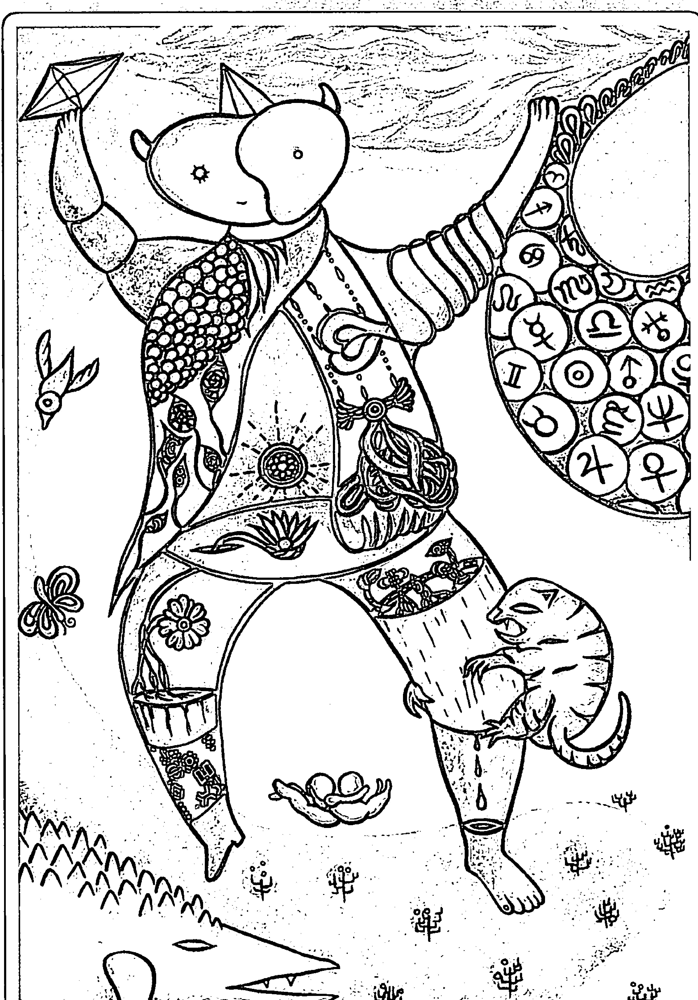
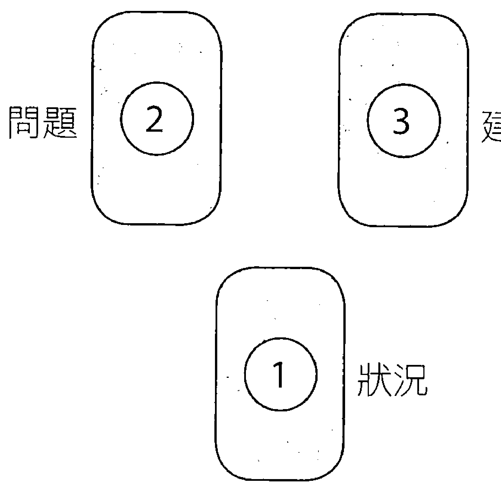
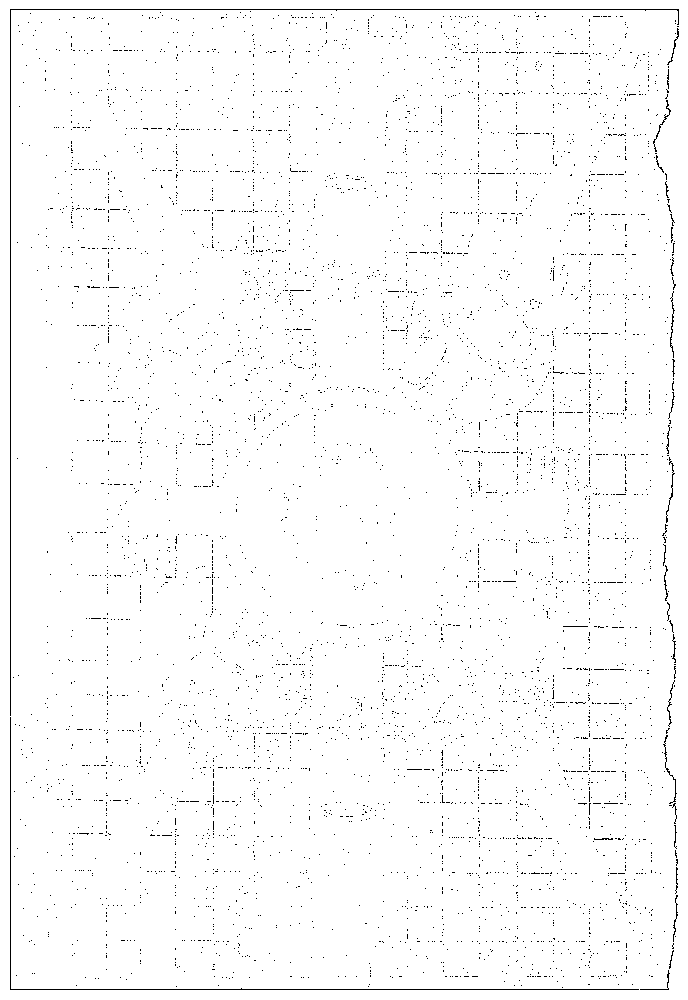

# 「麻瓜也能算塔羅！」

# 竹貓星球 塔羅占卜

# 大解密

作者◎天空為限
占星學家・華人首席塔羅占卜師

簡嫚書 誠意推薦
森林系才女

【附22張原創占卜牌】

設計師◎Eason

# 麻瓜也能算塔羅！

# 竹貓星球

# 塔羅占卜

# 大解密

作者◎天空為限

繪牌師◎Enson

【開運鑑定館】21

# 麻瓜也能算塔羅！
竹貓星球塔羅占卜大解密

作　者◎天空為限
繪　牌　師◎Enson
內文校對◎林芷毓
總　編　輯◎馮國濤
出　版　者◎達觀出版事業有限公司
編　輯　部◎11670台北市文山區景文街1號4樓之2
Email:gwotau2004@msn.com
電話◎02-29351011, 傳真◎02-29353488
法律顧問◎明業法律事務所
總　經　銷◎吳氏圖書股份有限公司
新北市中和區中正路788-1號5樓
電話◎02-32340036, 傳真◎02-32340037
初　版◎2016年 6月10日
初版修訂◎2016年 6月20日
售　價◎NT$480元
All Rights Reserved　有著作權・翻印必究

國家圖書館出版品預行編目(CIP)資料

> 麻瓜也能算塔羅：竹貓星球塔羅占卜大解密/
天空無限作. -- 初版. -- 臺北市：達觀, 2016.05
288面；15*21公分. -- (開運鑑定館；21) ISBN 978-
986-5958-60-2(平裝)1.占卜, 292.96, 104014917

## 【推薦序1】

這可是我第一次受邀為書寫序呢！處女秀就獻給我所認識的人當中最為神秘、傳奇的天空老師吧!!

關於塔羅牌嘛～～除了身邊很親近的人像是家人之外，其實沒幾個人知道我在國中時可是個踏踏實實的塔羅迷呢！當時為何會接觸塔羅牌其實已經不太記得，只記得當時是個塔羅牌還沒有很普及，要擁有一副牌都有點困難的時代，市面上塔羅牌相關的書籍更是少之又少。我千辛萬苦，花了好幾週的時間（要知道我的學生時期是還沒有智慧型手機的！一週被允許的上網時間也是有限制的），才從外國網站上找到一副我很喜歡的牌，於是立刻毫不猶豫地用存了好一陣子的零用錢購買。嗯，說這些幹嘛呢？其實只是要表達自己也不完全是塔羅牌的門外漢啦，但我也不是要來在這裡班門弄斧的（絕對沒有喔！），因為我是來寫推薦序的！

看過竹貓星球塔羅占卜後，我真的是太佩服了！怎麼有辦法把占卜這神秘的學術弄得這麼科學又有邏輯呀？！重點是，真的簡單易懂又句句皆重點，不必反覆來回看了三百次後，當身旁友人問你「所以牌說了什麼之後」，只能支支吾吾地說「感覺好像是因為那樣，所以導致怎樣，因此應該要怎樣，好像啦……嗯嗯。」所以，這讓我實在太好奇，天空老師的腦袋結構到底什麼模樣（我要剖開看，可以嗎老師？）!!!

我們都知道觀點很重要，而在占卜時，解釋的人的觀點又更加重要了！！！畢竟正常的人們應該是不會在覺得人生一帆風順，或是幸福美滿的時候想要占卜吧？通常都是在人生有阻礙出現或者是沒有把握時才進行占卜；因此在這種時候，能夠遇到一個思想健康、有跟著時代在進步並且客觀的解牌人，真的很重要啊！不然一個不小心，就會被帶去別條路上摘野花了，這是多麼冒險的事啊。

哈哈哈，說了一堆，那麼我到底要推薦這本書給誰咧？嘿嘿，我想將這本書推薦給像我這種有事沒事會突然想用占卜來驗證一下自己現況的人，或者是像我這種即便去占卜也不小心就會很想挑戰占卜師的人，最後最後，也是最重要的，相信命運是掌握在自己手中卻同時又覺得世界還是有種神秘力量的人！

推薦人／簡嫚書

## 【推薦序2】

記得我第一次做竹貓星球的線上占卜時，抱著一種很輕浮的心情把它當作網路遊戲在玩，雖然我明明知道是鼎鼎有名的天空寫的牌義，但身為占卜師的自傲，總是有一點難以認同線上抽牌這件事情，總覺得程式怎麼可能比真人抽牌解釋來得精準呢？

但……我第一次抽完後，我傻住！我要跟竹貓抽牌塔羅程式下跪道歉（好戲劇化的人）！我甚至故意把問題搞得很複雜，想說這種程式抽出來的牌義一定牛頭不對馬嘴，誰知道，看到牌義居然完全跟我的問題吻合，我還懷疑天空跟竹貓星球的人是不是在程式中植入什麼監控的高科技產物，植入大腦晶片之類的（想像力也太豐富），否則程式塔羅牌怎麼知道我想問什麼啦。（抱頭）

我立刻打電話質疑天空說，明明是程式抽牌為什麼我覺得你根本在幫我抽牌，完全無違和感，你究竟做了什麼事情？天空大概已經接了兩百通這種電話，老神在在地說：「就是詮釋牌義的問題而已啊！居然還有人問我是不是會通靈！」

於是我想到抽牌後看到牌義的感覺，雖然牌義的文字不多，卻非常直接不廢話地把問題與疑惑解釋到重點，難怪會覺得如此準確，因為牌義對了，就不會錯太多了。天空獨特的解牌風格，快狠準地呈現在竹貓星球塔羅裡，一點都沒在客氣的。這讓我想到周星馳所導演的《西遊·降魔篇》，當初覺得不是周星馳演的，很怕少了周星馳戲劇的味道，但我進去電影院看過的心得卻是，裡面每個人根本都是周星馳啊！竹貓塔羅就是這種感覺，明明就只是一支程式，卻是充滿了天空為限風格的一支疑似會通靈的恐怖程式啊！（抖～～）

推薦人／澤誼（榛果）

## 【澤誼（榛果）小檔案】

現居於高雄，塔羅星座占卜師。相關網站如下：
- FB社團：兩性過招——說十二星座的壞話
  https://www.facebook.com/groups/cocoping0118/
- FB粉絲團：澤誼的人參青紅燈
  https://www.facebook.com/lifestoplight
- 部落格：榛果的官方說法
  http://win0118.pixnet.net/blog
- email：cocoping0118@gmail.com
- 相關作品請見本書封底摺口。

## ※ 目 錄 ※

- 【推薦序1】簡嫚書 005
- 【推薦序2】澤誼(榛果) 005
- 【第一章】 011
  - 竹貓的星空很塔羅
- 【第二章】 017
  - 聖三角占卜
    - 職 場 ………………………………018
    - 戀 愛 ………………………………032
    - 人際關係 ………………………………046
    - 財 運 ………………………………060
    - 求 職 ………………………………074
    - 健 康 ………………………………088
    - 單 身 ………………………………103
    - 減 肥 ………………………………117
    - 學 業 ………………………………131
- 【第三章】 145
  - 二擇一
    - 萬用主題篇 …………………………147
    - 戀人篇 ………………………………164
    - 工作篇 ………………………………180
    - 升學就業篇 …………………………196
- 【第四章】 215
  - 關係牌陣
    - 情人 ………………………………216
    - 曖昧關係 …………………………233
    - 上司部屬 …………………………250
    - 友誼 ………………………………267
- 【繪牌者語】 283
- 【牌名對照表】 285

## 【第一章】

# 竹貓的星空很塔羅

有看過我之前著作的人都知道，我之前寫的書，是比較深一點兒的，對於占星跟塔羅，我不只著重在資料的吸收，還有很多的心得跟技巧，想跟大家分享。

因此在「竹貓星球」公司的老闆~小竹子，邀請我寫一支程式塔羅占卜罐頭內容時，我是有點不知道怎麼下手的。我的個性是一向不湊熱鬧，如果有人寫過的東西我就不寫了。抽牌程式？這種東西很多啊！幹嘛要我寫？

然後我去翻出許多抽牌程式來看，發現了一些不周到之處，第一：問題的範圍都太大了，答案卻沒能集中焦點。有時我抽出來的牌，明明照我自己的看法是符合現況的，但不懂塔羅牌的人要看程式中的解讀，卻會以為是錯的，因為短短的一段文字，沒辦法涵蓋所有的意思。第二：大部份的抽牌程式，解讀都不夠生活化，也是其中一項問題，講得玄之又玄，就算人家說準，也只是好像準又好像哪裡怪怪的，可能算命經驗不多，能沾到皮毛他們就覺得準了。說準也只是：喔！不錯啊！這種程度的評語而已。

再來我有一點想跟大家分享的是，聖三角牌陣之中，「問題」與「建議」的位置，常常會讓人產生混淆。「問題」是代表一件事情的弊病及錯誤之處，「建議」則是針對這件事，告訴你應該採取的方式是什麼。但是這樣問題就來了，如果在「問題」，也就是要告訴你這件事的缺點在哪裡，你卻在這個位置抽到了好牌，那怎麼辦？在「建議」的位置，也就是告訴你應該這樣做的位置，卻抽到了壞牌，那又怎麼辦？

最常見的是有人在「問題」的位置出現好牌的話，就略過不談，在「建議」的位置出現壞牌，就告訴案主，塔羅牌建議你不要往牌說的這個方向走。但是這是錯的，一個位置出現什麼牌，就是那張牌的意思，不會是跟那張牌相反的意思。這個重點我一直很想說，後來想想，如果可以寫一個程式，直接告訴人，壞牌出現在「建議」可以這樣解，也是不錯的，後來就答應竹貓星球寫這支程式了。

結果在小竹子的催逼之下，我一個月內趕出八個細部問題的22張大牌解釋，因為我認為在問題明確的狀況下，就可以在最少的字數中，講到最多的重點。

推出的那一天，我問竹子說準備的流量夠不夠，他很隨意地說絕對沒問題：「我已經準備了等同於人家平常三倍的流量。」推出後三個小時，他打電話來：「主機被拖垮了，大家都說好準，現在正在緊急修復中……」我：「等等，你說什麼？」竹子大叫：「我說，我預備要用一個月的流量，現在三個小時就爆了，主機垮了，太受歡迎了！」我掛掉電話那時，還有點呆滯。

本來我一向是個神秘型的人物，在業界內大家知道我，出了業界就沒人認識，我一向很滿意這樣的定位，但那陣子只要走到哪裡，被說是竹貓星球程式背後的老師，大家就馬上都知道我是誰，感覺還滿奇妙的@@~！

然後那時部落格還算盛行，大家現在搜尋竹貓星球程式，都應該還可以看到各式各樣抽牌後的分享文章，都是讚譽有加，但這是我始料未及的。

網路上的網友也就算了，重點是自己身邊的朋友甚至學生，因為跟我認識久了又被我占卜過，我想這支程式他們一定覺得沒什麼，只是好玩而已，沒想到我接到了他們特地打來的電話。

第一位：她的聲音很凝重，對我說：「妳那個程式是怎麼弄的？」我嚇一跳：「怎麼了嗎？」一面在腦海中搜尋，我應該沒有寫會負面到讓人家這麼凝重的解釋呀？」她：「我是說，妳的程式怎麼會知道這種事？」我：「哪種事？」

她：「我的碩士論文正在寫，想說你推出這個程式我也來玩玩看好了。」她是我的塔羅牌學生，照理說不需要玩這種程式的，她接著說：「我選學業項目，抽到(永恆)審判牌，上面說：你正面臨畢業，在準備畢業考或什麼的，天哪！它怎麼會知道!?」我笑出來，原來如此。

第二位：她打電話來的時候是大叫的：「妳的程式怎麼會知道!?」我：「等等，怎麼了？」她：「我抽找工作的運勢，抽到隱者，它說我正在準備高普考或公務員考試！」我：「妳有嗎？」她：「我正在閉關，準備台鐵的考試呀！」然後大笑起來，很高興她後來考上了，現在已經任職數年。

因為「隱者」這張牌是閉關、隱藏的意思，既然要找工作，那又怎麼會躲起來呢？所以我猜就是要準備考試。這就是把塔羅牌的牌義，落實到實際解釋的方式。

第三位：她打電話來時還帶著哭音，但是聲音帶著驚奇：「妳的程式好厲害喔！」我：「怎麼說？」她的哭音濃厚了起來：「我跟我男朋友吵架，這次應該是分定了……然後我就用程式抽我的感情狀況，結果抽到塔，牌的意思是說我們處在激烈爭吵的狀況~~~嗚嗚嗚~~~但是真的好厲害喔！這樣它也知道。」我都不知道她要哭、要笑，還是要震驚了，不過因為是好朋友，還是謝謝她在傷心之際，不忘打電話來告訴我，我的程式很準。

第四位：就是我自己。曾有一個學生，她已經是執業占卜師了，但是她跟我說：「妳的程式準到會讓人差點把手機丟出去~~會覺得：矮油！好可怕喔！」

那時我認為她在奉承我，雖然想想她從來沒有奉承的習慣，我也當是在鼓勵我，我那時常常看著急速上升的流量發呆，那表示玩這個程式的人數直線上升，最高還有到一天人兩百萬人次的記錄，但我想的是：「你們的人生有這麼空虛嗎？這種簡單的程式也可以玩成這個樣子。」

結果過不久，我面臨了一次分手，在最後的階段，我們吵到不可開交，他講出來的話狠到讓我不相信那是他，我沒有哪一任男友到最後的樣子有他那麼決絕那麼狠的，當然我自己也好不到哪裡去啦！離開了分手現場，我邊哭邊走，因為我正在混亂，沒心情好好抽牌，就拿出手機來，但我要抽的不是感情狀況，而且單身狀態，問下一個桃花（我是很積極向上的，哈哈哈哈哈！），結果抽到的現況仍然是塔，上面寫著：「你正在上一段感情中抽離，對方的表現會讓你不相信那是他…………」我看到這裡，差點沒把手上的手機丟出去，嚇死人了。看來我的人生也很空虛，哈哈哈哈哈~~~

現在這個程式在網路上已經興頭過了，不過固定使用人數還是很多，但可能我太久沒有寫新東西的緣故，也不稀奇了。因此我決定讓我的學生接手寫這支程式的新內容，把舊的內容化身成真正的書跟牌，交到讀者的手上，一方面讓大家領略真正的算牌跟抽程式不同的感覺，另一方面也希望經由實體書的出版，接觸到不同的使用者，讓我再多累積一些心得。謝謝大家~

### 抽牌方式

以下所寫的抽牌方式，只是怕有些人不知從何下手，所以提供我個人抽牌的方式作為參考。如果你已經有自己習慣的抽牌方式，或是已經摸索出一個自己的抽牌習慣，那也不一定要按照我的方式來，只要你用得習慣，覺得沒有問題，就是個好方式。

世界上抽塔羅牌的模式有許多種，但我覺得這些方式像是一種「儀式」，是用來收心的，讓你可以靜下心來，做好跟塔羅牌溝通的心理準備，也用一種認真的態度來讀牌。所以我個人使用的抽牌方式非常簡單：

- 步驟一、洗牌，一邊在心中默念你的問題，一邊不限次數洗牌，洗到你覺得高興為止。
- 步驟二、切牌，所謂切牌，就是隨意把一疊牌分成兩疊，上下交換就好了。
- 步步驟三、攤牌，在桌面上攤開，或在手上張開成扇形都可以。
- 步驟四、抽牌，閉上眼睛在心中再一次默念你的問題，睜開眼睛後，用左手將牌抽出，按照順序以牌背向上，擺放到該有的位置。全部的牌抽出來後，再按順序把牌翻開。

## 【第二章】

# 聖三角占卜

「聖三角」是一個非常基本的牌陣，也是萬用牌陣，可以用來算各式各樣的問題。

本來有想要用「時間之流」牌陣，也就是用牌來看過去、現在、未來，但我後來覺得這樣只能看著事情發展，卻插不上手，這有點太宿命論的感覺，所以換了「聖三角」牌陣，也就是狀況、問題點、建議。**狀況**：表示你現在遇到的情形，或你個人當下的處境或心態。**問題**：這件事情的盲點、困難之處，或問題所在在哪。**建議**：關於這件事情，你應該採取什麼樣的立場或行動。

我挑了最多人問的八個項目來撰寫，但當然，等你熟悉之後，可以問你較為私人或特別的問題，嘗試自己解解看喔！

注意！「戀愛」選項，指的是已有交往對象或配偶，問兩個人的發展狀況，如果你沒有正在交往的對象，請抽「單身」這個選項，算自己的桃花運哦！

### 職場

##### 0. 愚人, The Fool

狀況：你現在的心態是很隨緣的，不會勉強給自己太大的壓力，但常常不按牌理出牌，有時可以洞察先機，但是很少有人欣賞或了解你的優點。

問題：在同事眼中把你定位為怪咖，出勤狀況也不太正常，不適合朝九晚五的生活；在人緣方面不是極好就是極差，另外，執行能力也常出問題。

建議：舊的想法跟作法可能已經不合時宜，需要一點新的刺激；有時就算看起來太過冒險，或是會顛覆以往的習慣，你都必須去嘗試。

##### 1. 賢者, The Magus

狀況：環境跟人脈對你是有利的，因為你既聰明又活躍，能完成不可能的任務，是「菁英」的代表，有很多新的想法跟紀錄，都是由你開頭的。

問題：人多嘴雜，加上你的自信滿滿，雖然你在工作上的表現一向很出色，卻也難免會遭到小人跟流言的中傷，要謹言慎行。

建議：魔術師非常善於收集資訊，所以你要廣泛吸收各種常識知識，隨時準備在各種場合運用，營造出一種見過大世面的特質。

##### 2. 女教皇, The Priestess

狀況：你的工作類型需要極度的專業，如實驗室、醫生、律師、學者……等等，雖然能力很強，但通常是獨力承擔所有的事，沒有太多固定的幫手。

問題：你不善於跟各種人打交道，比較想守在自己熟悉的範圍，專業程度雖然很高，但不夠貼近大眾，會給人一種愛唱高調的感覺。

建議：你的專業度可能還不夠，需要去培養第二專長，或是考取更高的專業證照，這樣才能為將來的升遷，以及職場人力的高素質標準做準備。

##### 3. 女皇, The Empress

狀況：在辦公室中，你的人緣非常好，去「過生活」的意味大過於「上班」，下班後的交際活動，比上班時的工作表現還重要^^。

問題：你的工作技能跟知識，可替代性太高，雖然好人緣可以幫你很多忙，但隨著時間的增加，實力不夠還是會造成自己的困擾喔！

建議：有聽過「作人比做事重要」這句話嗎？你要放低身段，耐心跟同事溝通，競爭意識不要太強，記得以和為貴，並且要樂於幫助他人，這樣就也會得到他人幫助。

##### 4. 皇帝, The Emperor

狀況：你的企圖心強、魄力又夠，常常以身作則衝鋒陷陣；表現讓人印象深刻，實力也堅強，不過常常過度工作，長期累積太多壓力。

問題：雖然你看來戰鬥力很強，但是團隊精神似乎不太夠，而且容易讓別人感覺到你的主觀性很強，很容易落到自己累個半死，卻還得不到認同的下場。

建議：發揮你不妥協、不放棄的精神，採取主動出擊，一切看來不可能的事情，會在你的堅持下迎刃而解，這時候不要顧慮面子問題。

##### 5. 教皇, The Hierophant

狀況：你是一個很盡責的行政及管理人才，凡事都會做好計劃，並且確實地執行；大家都信任且依賴你，是個沉著穩定又冷靜的好員工。

問題：你的原則跟規定很多，雖然這是保障工作能流暢進行的方式，但有時會比較不知變通，反而給別人帶來壓力。

建議：不要急功近利，短期的工作表現雖然會讓你受到注目，但在職場上要自我證明，是一場長期抗戰，日久見人心，還是奠定真正的實力比較重要。

##### 6. 戀人, The Lovers

狀況：你的公關及社交能力非常的好，死的都能被你說成活的，臨場反應又快；不過雖然你可以勝任各種工作，持續力卻不足，很容易分心或放棄。

問題：你容易被一件工作有趣的地方吸引，卻無法接受需要克服的困難之處，變成沒有定性，不停換目標，或是理想性太高，忘記顧慮生計問題。

建議：多開發新的人脈，把握每一個跟不同公司、不同職位的人交流的機會，廣結善緣可以替你帶來很多工作上的新發展。

##### 7. 戰車, The Chariot

狀況：現在你夾在中間，左右為難；或是在工作上遇到了突破不了的瓶頸；而且這些事情，除了堅持住並一邊觀察以外，沒有什麼短時間可以解決的方法。

##### 8. 調整, Adjustment

狀況：目前你從事的工作，可能跟一些規定、法條有相關，或是要解決紛爭的工作，所以常常要發揮觀察力，做出最正確的評估。

問題：在職場上，你常常太拘泥於規定，有些時候不懂得去注意真實的狀況，反而造成大家的困擾，需要調整一下自己的想法。

建議：請讓自己的生活維持一種平衡，不要勉強承接過多的工作，導致自己負荷不了，懂得適時地分散壓力，也是一種職場智慧。

##### 9. 隱者, The Hermit

狀況：在職場中，你比較習慣埋頭苦幹，不太善於交際，這樣會讓很多同事對你有疏離感，還是要重視一下團隊精神，會比較有助於你的長期發展。

問題：你覺得公司狀況太混亂，工作界線不明常讓你有飽受干擾的困境，而且常常有了好的表現後，還是沒得到應有的肯定跟尊重，有懷才不遇的感覺。

建議：要記住公司內最重要的是專業跟實力，而非人事的風風雨雨，不要隨著別人的情緒跟八卦起舞，要專注在自己應該要負責的事情上。

##### 10. 命運之輪, Fortune

狀況：你從事的工作很有趣，每天需要跑到不同的地方，見不同的人，或是有很多出差的機會，而且運氣一向不錯，未來值得期待。

問題：你會覺得良禽應該擇木而棲，會希望得到更好的待遇跟肯定，但是其實你的穩定度還不夠，需要再多一點磨練，未來才有保障。

建議：如果有機會的話，派駐海外跟做公司內部的教育訓練，都是很適合你表現的方式，而且要勇於接受新的任務，才能讓自己不斷提昇。

##### 11. 慾, Lust

狀況：不管你是不是主管職，在群體中，都有非常好的領導能力跟人緣，很有號召力，適合激勵人心，或是主辦很多職場上的活動。

問題：你會因為愛面子，把太多事情攬在自己的身上，又不願意承認自己需要幫忙，有時示弱反而會讓工作效率更好喔！因為公司畢竟不是你一個人的。

建議：凡事要做長期規劃，切忌短視近利，必要的時候連外型也要很注意，先把表面做好，人家就會跟著信任你的專業度，門面是很重要的。

##### 12. 倒吊人, The Hanged Man

狀況：在職場中，你的個性會讓你比較吃虧；因為較為被動，也不懂得如何表現，所以升遷跟加薪的速度都很慢，會讓你很迷惑，不知道未來方向在哪裡。

問題：你的心態是很消極的，往往覺得努力也沒用，因此很多事就任它自生自滅，但是其實旁人會把一切都看在眼裡，認為是你的能力不足。

建議：現在的困境不是你的能力範圍內可以改變的，所以不要掙扎，先保留實力休息養生，等到有變數出現，再一舉除舊佈新。

##### 13. 死亡, Death

狀況：你的路已經走到盡頭，也許是升遷已到了頂點，或是身在夕陽產業，必須要思考怎麼樣改變，才能達到自救的效果。

問題：你像是走進死胡同中，再怎麼努力也找不到解套的方法，其實最好的方法不是在原地苦苦掙扎，因為你求的也許只是出自於自尊跟執著。

建議：把一切都放棄掉吧！與其不斷地補各種漏洞，耗盡自己所有的心力，不如置之死地而後生，從全新的方向去建立另一個開始。

##### 14. 藝術, Art

狀況：你很有教育者的精神，不管身在哪個業界，都很願意指導別人，貢獻自己的心得，雖然有時會吃虧，但你的心情一直都是很平和的。

問題：你的做法幾乎都是正確的，只是需要時間來證明；在這段結果尚未明朗化的日子中，你必須獨力承擔全部的壓力。

建議：你現在的格局有點小，建議多多拓寬自己的見識，進修也好廣結人脈也好，要盡量接觸自己原來不懂的領域，讓格局跟眼光變得更廣大。

##### 15. 惡魔, The Devil

狀況：在現在的職場中，你需要應付的不是實際的工作問題，而是人事之間的傾軋，或是上司之間的派系之爭，這讓你心力交瘁，又不知要何去何從。

問題：同事之間的勾心鬥角會讓你覺得很辛苦，但你又覺得自己離開後，不會有更好的去路，所以有一種被困住的感覺。

建議：雖然應該把工作表現擺在第一位，但有時好的人際關係，會讓事情推動得更順利，請你放下你的原則，做一些順應時勢的應酬吧！

##### 16. 塔, The Tower

狀況：你可能處在一種震驚的狀態中，也許是突然被裁員，或是無預警的調動職務，並且會讓你覺得之前做的努力，現在都必須放棄掉了。

問題：整個事情不是你有能力控制的，環境的大變化就是對你不利，產業結構跟職場生態也在做重大改變，你必須放掉舊有的思維才能生存。

建議：現在工作上的麻煩互相影響，到了剪不斷理還亂的地步，不要再費心去解開一堆亂結了，狠心地除去所有的障礙，才是最有效的方式。

##### 17. 星星, The Star

狀況：你對新的工作任務抱著很高的期待，每天快樂地籌劃相關進度，你覺得你的未來，就取決於這一陣子的工作表現了。

問題：你的想法很多也很好，但可能由於相關經驗不足，做出了很多無法真正執行的企劃，而且太過樂觀，必須要有自我調整的認知。

建議：工作上不只要考慮眼前，更要考慮未來幾年間的變化跟影響力，就像下棋時，前進一步就要預想到下面十步一樣，眼光必須放遠一點。

##### 18. 月亮, The Moon

狀況：目前公司中有一種山雨欲來的感覺，低氣壓迷漫，你卻還不知道到底是什麼狀況；而且對於公司的發展跟你的使命，你都找不到明確的方向。

問題：雖然現在看來，工作上沒有明顯的危機，但還是存在著「隱憂」，必須要時時提高警覺，以免危機爆發時你反應不過來。

建議：很多事不用講得太明白，否則容易引起他人的批評跟阻擋，在計劃尚未穩定之前，先檯面下運作就好。

##### 19. 太陽, The Sun

狀況：大家對你的表現都非常滿意，甚至視你為一個標竿！你不只工作上有責任感，而且人緣好，也很懂得顧慮別人的心情，前途一片看好。

問題：這時的你，覺得一切都很平順，但就是因為太放心了，看不到很多被光環製造出來的陰影，如果時機變差，這些陰影將是致命傷。

建議：保持簡單的心境，凡事不要算計太多，只要你是真正站在別人立場為他考量，就會得到應有的回饋，同時也會擴大你的人脈。

##### 20. 永恆, The Aeon

狀況：現在正是你職場生涯中的關鍵時刻，也許你接到了一個重要任務，要視這一次的表現，決定你接下來的發展，勢必會全力以赴。

問題：很多你之前擺爛、偷懶的後遺症，現在都快要爆發出來了，如果不拿出足夠的誠意跟成績，恐怕會危及你目前的職位。

建議：去多聽聽同事跟上司對你的評語，徹底的改變自己的工作態度，你的問題在於根本心態，所以要痛下決心，才能扭轉自己的劣勢。

##### 21. 宇宙, The Universe

狀況：你是資深員工、或是公務員，或是傳統產業的老闆或股東，工作上已經累積一定的成績，很少有事情能夠動搖你的地位。

問題：雖然你的工作能力很強，但想法有點保守，創意方面也不太夠，雖然工作上還是可以保持現有的狀況，但長久下去，會因打不開新局面而萎縮。

建議：對工作的心態，要抱持一步一腳印、按部就班的心態，不要計較付出跟收穫間的差距有多少，等到做出成績後，主導權就變成在你手裡了。

### 戀愛

##### 0. 愚人, The Fool

狀況：你現在的戀情是滿愉快的，但是並沒有規劃到太長遠的未來，可能是因為生活的保障不夠，也可能是因為你的想法前衛，總之你們決定要先享受當下。

問題：你談戀愛的方式超出一般人的認知，所以大家對你們並不看好，也有可能是你的對象看來跟你差距太大，缺乏一定的保障，所以看不到未來。

建議：不要有太多的規劃，以及對未來的幻想，因為有太多期待，就會要求太高反而帶來壓力，隨遇而安就好，順著自己的感覺走吧！

##### 1. 賢者, The Magus

狀況：你們兩人之間沒有缺乏新鮮感的問題，每天都有聊不完的話，興趣跟感覺也都很能溝通，未來的發展會越來越好。

問題：你們各自的生活圈都很精彩，所以身邊雜事太多，很難有單獨相處的時間，而且日子一久，流言蜚語也會變多。

建議：每天要堅持至少通一次電話，交流一下彼此的感受，以免生活一忙，會慢慢變得有距離。也讓對方參與你的夢想跟成就吧！以免生活一忙，會慢慢變得有距離。

##### 2. 女教皇, The Priestess

狀況：可能是因為工作，也可能是因為天生個性的關係，你們雖然互相很關心，但沒有太多貼心的互動，感情的進度也有點緩慢。

問題：兩人之中，至少有一個人是不善於表達自己的感覺的，因此很容易有誤會，或是沒辦法傳達出自己的情義，這很容易讓感情降溫。

建議：整天黏在一起，或是對彼此的每一件事都想太多，並不是一件好事，要適時地抽離，才能正確觀察這段感情對自己的意義。

##### 3. 女皇, The Empress

狀況：你的感情狀況目前很良好，溝通沒問題，外型也很登對，是一對能理性的互動，又能夠為對方著想的好伴侶。

問題：可能是兩方中有一方太愛玩，還不知道戀愛甚至婚姻的責任在哪裡；另一方卻一直很想定下來，卻又很沒有安全感，顯示兩人相知的基礎不夠。

建議：這張牌建議你要常常關心對方，傾聽他的心聲跟想法，凡事要以包容跟體諒為主，才能造就兩人協調的感情生活。

##### 4. 皇帝, The Emperor

狀況：代表你的感情現在正在打得火熱的階段，親暱的程度很容易引起外人側目；但這只是蜜月期而已，之後回歸平常，還有很多有待互相了解的地方。

問題：這顯示可能男方是個很大男人主義的人，或是女方較為任性壞脾氣，最大的問題是主觀跟霸道，未來勢必還會有很多爭吵跟需要溝通的地方。

建議：這顯示你應該對兩個人的感情有信心，不要去聽蜚短流長，也不要疑神疑鬼，必須相信自己的選擇，才不會被不必要的干擾擊敗。

##### 5. 教皇, The Hierophant

狀況：這段感情是處於一個很穩定的狀態下，甚至很有可能已經論及婚嫁；或是兩人的生活是無分彼此了，有一種平靜的幸福。

問題：日子可能過得太過平靜無波，兩個人的感情也失去一種甜蜜的感覺，就像親人或家人，束縛的感覺大過於戀愛的感覺。

建議：這段感情需要以務實的角度來看待，雖然沒有意外的驚喜跟浪漫，但穩定度跟相知的感覺，也是很可貴的，要認清這一點才能長久。

##### 6. 戀人, The Lovers

狀況：你們是一對互補型的伴侶，彼此身上都有自己缺乏的那一面，所以兩人的吸引力非常強烈，只是之後的磨合，將會是個考驗。

問題：有太多外來的事讓你們分心了，戀愛只是生活的一小部份，你希望可以維持輕鬆的關係，但如果有一方太執著，就會引發衝突。

建議：建議兩人培養共同的興趣，進而建立共同的社交圈，畢竟不只談戀愛，每個人也需要藉由情人，來帶領自己看到更大的世界。

##### 7. 戰車, The Chariot

狀況：現在你夾在中間，左右為難；或是兩人的感情無以為繼，爭吵的問題點解決不掉，卻又捨不得分手，是一段瓶頸期。

問題：現在陷入「要分手還是要維持」的難題中，兩人之間的問題一直無法解決，卻又沒嚴重到要分手，所以不知道應該怎麼走下一步。

建議：凡事要多衡量，寧可過度小心，也不要莽莽撞撞，畢竟感情跟婚姻都是大事。記住，不要在情緒激動時下任何決定。

##### 8. 調整, Adjustment

狀況：你們是很穩定的一對，雖然稱不上濃情蜜意，但責任義務都是對等的，也很願意為對方付出，是很適合相處的伴侶。

問題：兩個人的生活有一套固定的模式，沒有什麼可以值得挑剔的地方，但太過缺乏變化，且有時太過講理，忽略對方也有情緒上的需要。

建議：很多事，每個人都習慣用自己的角度看事情，這時候必須找個第三人，來觀察狀況並給予建議，客觀的角度才能看到全貌。

##### 9. 隱者, The Hermit

狀況：這段感情缺少溝通，可能是忙於工作或是其他外務，加上生性不敏感，就會造成誤解，畢竟缺乏溝通是很大的致命傷。

問題：可能是你(或對方)覺得，不需要讓情人有多餘的擔憂，所以凡事都獨立承擔，卻忽略對方的心情，演變成同床異夢的伴侶。

建議：很多事情不要太快下結論，這張牌表示，你還有很多事情有待觀察，才能看清真相，必須多給自己一點沉澱的時間。

##### 10. 命運之輪, Fortune

狀況：你們兩人的活動很多，興趣也都一樣廣泛，也很會互相影響，所以可能花很多時間在旅遊或是學習新事物上。

問題：太多彩多姿的生活，讓你沒辦法專注在感情上，同時外面的誘惑也太多了，如果對方沒有持續成長，可能會讓你很快厭倦。

建議：必須兩個人共同成長，一起做心靈的提升；也許一起去接受諮商輔導，也許先從自己的心理狀態了解起，會有助於兩人之間達到共識。

##### 11. 慾, Lust

狀況：這是一張理性跟溫和可以駕馭不理性的牌，表示你知道怎麼規範跟要求自己，帶給這段感情能夠歷久彌新的未來。

問題：可能是你或是對方，兩人中有一人太愛面子，生活跟花費都太沒有節制，也不曉得替未來打算，忙著打腫臉充胖子，或太在意對方的看法而失去自我。

建議：其實你們都是彼此很適合的對象，只是有太多顧慮跟算計在內；袒開心胸後你就會發現其實不需要戒心那麼重，應該互相扶持。

##### 12. 倒吊人, The Hanged Man

狀況：你覺得兩人目前的狀況很消極，對未來沒有計劃，生活也一成不變，但你又不知道如何去解決這種困境，只能靜待事情發展。

問題：你太過被動，又常不敢講出心裡真正的感覺，就算對方想跟你溝通，也不知道要從何說起，只能走一步算一步了。

建議：有時你覺得感情好像走到了盡頭，但其實那只是一種過渡期，不要太緊張感情中的每個小變化，因為有起伏是正常的。

##### 13. 死亡, Death

狀況：這段感情好像走到一個臨界點了，接下來有兩個選擇，一是結婚，一是分手，總之現在的這個狀況，不適合再繼續延續下去了。

問題：兩人間沒有新鮮感，熱度已退，所以凡事都提不起勁來，對於感情中的問題，也都顯得有氣無力，沒有真正要去面對的意思。

建議：你們需要真正去面對自己的問題，或者改變生活方式來解決，要有決心突破現有的難題，才能創造一個新的開始。

##### 14. 藝術, Art

狀況：兩個人的互相了解程度很深，默契十足，是標準的老夫老妻牌，再不然就是兩人的特質很像，所以不需要太多的溝通就能彼此了解。

問題：兩個人的性質太像，所以盲點也是相同的；這張牌很容易沒事的時候很恩愛，但一旦出現問題就分開得很突然。

建議：建議兩個可以多培養相同的興趣，一起去拍照、畫畫、跳社交舞都可以，這樣能創造共同的話題，價值觀也會更為拉近，是培養默契的好方法。

##### 15. 惡魔, The Devil

狀況：有其他的選擇出現，所以讓你們兩人之中有一個人的心開始浮動，這個時候忠誠度會受到很大的考驗。

問題：如果你們之間出現了介入者，可能是因為在外貌、家世、工作影響的任何一方面，給你很大的誘惑，這會讓原本的這段關係陷入冰點。

建議：面對感情時，你必須務實一點，不能全憑著自己一時的好惡走，有時遇到考驗，必須要把持得住，才能有長久的感情。

##### 16. 塔, The Tower

狀況：兩人陷入嚴重的爭吵，這段感情甚至到了瀕臨存亡的邊緣，所有的風度跟耐心都已經喪失，呈現出決裂的傾向。

問題：在遇到必須攜手面對的障礙時，兩人卻都被情緒掌控了自己的理性，不去想怎麼互相支持，卻一味地指責對方，情況越演越烈。

建議：已經破掉的鏡子，是很難讓它再重圓的，這需要耗費很多心力，效果也不見得理想，說不定此時壯士斷腕才不會擔誤對方的人生。

##### 17. 星星, The Star

狀況：你的感情有聚少離多的狀況，但是都保持不錯的互動，只是缺少陪伴，有時會讓你覺得寂寞。

問題：兩人之間的感情雖然還算不錯，卻不知道為什麼有點疏離，可能是不想讓對方擔心，就凡事自己解決，但這樣會失去兩人在一起的意義。

建議：要獨立、冷靜，凡事都要退一步看，或是過段時間再做決定，抱持正面思考的方式，才能幫你們渡過每一個關卡。

##### 18. 月亮, The Moon

狀況：感情中有很多可疑的跡象，讓你開始擔心，甚至疑神疑鬼，有時你認為是第三者的問題，但感情一定是先有了裂縫，外人才能有機可乘。

問題：你覺得你們之間的感情有一種隱憂，但又無法確定到底是什麼問題，被懸在半空中的感覺，讓你的情緒狀況不太穩定。

建議：如果你確定感情真的已經出現裂痕，就正面的去處理它吧！不經一事不長一智，逃避是沒有辦法讓問題自動消失的。

##### 19. 太陽, The Sun

狀況：你的感情狀況，是非常公開又透明化的，大家都認同並且祝福你們，只是有時會感覺缺乏一點隱私權。

問題：這時的你，覺得很一切都很平順，但兩人感情雖好，卻沒有真正深入的交集，如果突然面臨考驗，會讓你措手不及。

建議：不管遇到什麼嚴重的狀況，你都必須保持信心，相信困難是一時的，終究會過去，如果你保持正面的心態，常常就能化危機為轉機。

##### 20. 永恆, The Aeon

狀況：你這一次的戀情，跟生命中以往的對方完全不同，你覺得對方帶給你全新的感受，並且幫助你更了解你自己。

問題：很多事情在發生時，你們為了表面的和平，刻意去閃躲問題的癥結點；但是問題一旦發酵，就算花再多努力，也很難力挽狂瀾了。

建議：傷口如果不清理就任它結痂，就算表面看來已癒合，內部卻有可能在化膿，所以你必須把傷口再翻開來重新處理，才有讓它痊癒的可能。

##### 21. 宇宙, The Universe

狀況：兩人的感情很穩定，幾乎已經是終生伴侶的型態了，而且你們兩人間的考驗都已經過關了，未來會是越來越平順。

問題：你們的感情雖然沒有外來的困擾，但太過一成不變的生活，也讓你們想要找點新刺激，好重新感覺到自己的生命力。

建議：最終會是有好結果的，所以不管現在考驗有多嚴苛，都請不要輕言放棄，因為隨著時間過去，你們的狀況會慢慢雨過天晴。

### 人際關係

##### 0. 愚人, The Fool

狀況：你對於朋友的態度是很隨緣的，不會特地去對朋友挑挑揀揀，什麼樣的怪人你都可以接受，朋友的屬性也都各自相差很多，身邊一堆特異人士。

問題：很多人都覺得你雖然人不錯，但有點像外星人，常常想一些他們無法理解的事，而你的喜怒哀樂，聽得懂、也願意聽的朋友並不多。

建議：不要太刻意去經營與朋友之間的關係，因為越刻意距離越遠，不管發生什麼狀況，都不用太強求；表現你最自然的本性，真正的朋友自然會留下來^^~。

##### 1. 賢者, The Magus

狀況：人緣頗佳的你，要交新朋友可以說是易如反掌，不只朋友對你好，跟你不熟的陌生人也都對你印象很好，大家都覺得你健談又見多識廣。

問題：你的朋友一向很多，也不斷的有機會認識新朋友。

#### 友情

##### 0. 愚人, The Fool

狀況：你是一個很重朋友的人，但交情總是不會太深厚，甚至偶爾會出現有人對你有戒心，或是朋友之間常有言語上的誤會。

建議：象徵你在社交關係中，需要學著開誠佈公地說出自己的感覺，但又要注意說話技巧，才不會讓人老覺得猜不透你在想什麼。

##### 1. 賢者, The Magus

狀況：你是君子之交淡如水的實踐者，朋友雖不多，卻都相知很深，就算很久沒聯絡，再見面時感情也不會淡掉，因為你的感情不是用相聚時間來計算的。

問題：在朋友群中，你比較不是愛跟一堆人玩鬧瞎攪和的那種人，喜歡看書、做自己的事，但因此會有些朋友覺得你冷淡或無趣。

建議：這表示，再好的朋友，有時也需要維持一定的距離，免得因為相處太密切，吵架的機會變多，也會影響到自己的生活步調。

##### 2. 女教皇, The Priestess

狀況：你是君子之交淡如水的實踐者，朋友雖不多，卻都相知很深，就算很久沒聯絡，再見面時感情也不會淡掉，因為你的感情不是用相聚時間來計算的。

問題：在朋友群中，你比較不是愛跟一堆人玩鬧瞎攪和的那種人，喜歡看書、做自己的事，但因此會有些朋友覺得你冷淡或無趣。

建議：這表示，再好的朋友，有時也需要維持一定的距離，免得因為相處太密切，吵架的機會變多，也會影響到自己的生活步調。

##### 3. 女皇, The Empress

狀況：你很願意為別人付出關懷，也有傾聽他人心聲的耐心，加上外型又不錯，所以一直都很受到大家的信任，你有困難時，常會有一堆人願意幫你。

問題：你看人的眼光不是太準，因為對誰都很好，常常會遇上利用你的人而不自知；太沒有警戒心的個性，會讓真正的好朋友常替你擔心喔！

建議：要試著在生活中多關心朋友，也許他最近有什麼困擾說不出口，你如果自己再細心一點，就可以發現朋友需要你體諒跟關心的地方。

##### 4. 皇帝, The Emperor

狀況：你的朋友不少，但很少是跟你平起平坐的；這些朋友通常不是需要你照顧、就是事事都幫你的人；平日常常為了義氣會逞英雄。

問題：你的個性比較任性，有時甚至有點霸道，雖然朋友們常常讓著你，但久了也會失去耐性，但你又不懂得看人臉色，常要等到翻臉才會搞清楚狀況。

建議：你平日有很多話都往肚裡吞，太怕得罪人，甚至連該講的話都不講，弄到自己跟對方都不高興；試著坦承一點，交朋友不用太過小心翼翼。

##### 5. 教皇, The Hierophant

狀況：朋友們都很信賴你，覺得你凡事既冷靜又有條理，給人一種很安心的感覺，你也很習慣當大家的顧問，社交圈很穩定。

問題：你太有原則了，雖然大家覺得你是值得交的朋友，但你常常會太過固執，聽不進別人的話，所以朋友雖喜歡你，卻覺得你有時很難溝通。

建議：朋友間雖然大部份事情都可以不要計較，但誠信還是很重要的第一步，不要因為沒有壓力，就常常忘記自己承諾過的事，這樣會被扣分的。

##### 6. 戀人, The Lovers

狀況：你有很多個性相異，卻又志同道合的朋友，朋友圈橫跨各行各業，又能互通有無交流自己的專業，是很愜意的生活。

問題：你的朋友都是好的時候很好，但等你的興趣一換，身邊的人也就會跟著換一批，每幾個月重複一次，比較不容易有長期的朋友。

建議：你跟身邊的朋友，屬性太接近了，所以你的優缺點他們也都有，比較難從朋友身上獲得有建設性的建議，應該多參加不同屬性的活動，多交點其他類型的朋友。

##### 7. 戰車, The Chariot

狀況：友情正在進入一段考驗期，你跟朋友試圖在百忙中維持友誼，但又造成很大的負擔，不知道要怎麼樣才能兩全其美。

問題：你跟要好的朋友正面臨一個分歧點，可能是想法越來越不同，也有可能是工作的性質讓你們漸行漸遠，但你對這種狀況不太能接受。

建議：衝動的時候，就盡量不要開口，免得造成不可彌補的傷害；這張牌告訴你，現在的關係僵持、停滯是暫時的，撐過這段時間後，情況就會明朗化。

##### 8. 調整, Adjustment

狀況：你的生活很規律，跟朋友的來往模式、聚會時間也很固定，來往的對象也就差不多是那些人，不挑剔的話，應該算是有個穩定的社交圈吧XD？

問題：你跟朋友的互動都很正常，平日一般的人際互動看來也都很好，但往往在需要有知心的朋友能分享一些情緒時，會發現跟你有到這個深度的朋友，還真少.....。

建議：你可能對朋友太隨性了，想出現就出現、想消失就消失，但是友誼是需要頻繁互動來維持的，至少表面功夫也要做一下啊！

##### 9. 隱者, The Hermit

狀況：有很多以前覺得很重要的朋友，目前大多斷了聯絡，可能因為你的生命轉了一個大彎，離開原有的生活圈，但是新的社交圈又還沒建立起來。

問題：你很不善於表達自己的意見，所以常常被誤會是高傲或自以為是，而且你並不喜歡解釋太多，所以長此下去，小心朋友的數量會漸漸減少。

建議：這代表很多事情要想清楚一點再做決定，朋友不是隨便交的，你要有一定的標準跟選擇，要不然朋友再多，也只是停留在酒肉朋友的層次。

##### 10. 命運之輪, Fortune

狀況：極受歡迎的你，不僅僅是朋友多，而且大家都很照顧、包容你；相對的，你對朋友也沒什麼心機，跟你當朋友不會有太多的壓力跟揣測。

問題：你對朋友是很真心的，只是生活太忙、交際圈太大，常常會有朋友被冷落掉，人家就以為你忘掉他了，容易讓人覺得你對友情不用心。

建議：交朋友不要侷限在同一個圈子，不要都交同一種朋友，需要打開自己的眼界，多多接觸不同的人群，才能幫助自己的成長。

##### 11. 慾, Lust

狀況：你交的朋友大多跟你一樣，是很有個性、又很有自己見解的人；但大家在有個性之餘，也會適時地遷就對方，是一種相知相惜的默契。

問題：你的友情都還滿長久的，不過也有一部份是因為你壓抑了真正的想法跟自我，雖然朋友之間本來就要遷就，但這樣還是不能算真正的交心。

建議：有時沒有誰對誰錯的問題，只是兩個人的立場跟角度不同，只要去了解這一點，很多不重要的爭執就不會發生了。

##### 12. 倒吊人, The Hanged Man

狀況：你在朋友群中，通常都是比較被動的那一邊，或是你交的朋友都比較強勢，所以你也懶得去爭主導權，更不想去下什麼決定。

問題：你對於友情這樣的事，實在是太隨緣了，而且可以為了睡覺或下雨這種原因，懶得出門交際，這樣會變宅喔！

建議：朋友圈中最近紛紛擾擾可能有點多，建議如果你不是當事人，就不要主動插手，除非他們有問你的意見，否則還是先觀望比較好。

##### 13. 死亡, Death

狀況：因為生活模式沒啥改變，但老朋友結婚的結婚、忙工作的忙工作，你又沒怎麼交新朋友，所以社交圈呈現荒涼的狀態。

問題：也許朋友都忙著成長，你卻停留在原地不動，當然反過來的狀況也是有可能的，久而久之當然會開始沒話講、溝通不良了。

建議：因為大家是老朋友，對彼此已經太熟悉了，混在一起搞不出新花樣，不如試試去攀岩啊！高空彈跳啊！會製造更多新的回憶跟樂趣XD。

##### 14. 藝術, Art

狀況：你有一群追求共同生活方式的朋友，也許是心靈方面，也許是閱讀、電影這些文化類的，這樣的朋友是用心在交流，感覺特別美好。

問題：你跟朋友之間是特別親密的，也許是有革命情感、也許是一同經歷很大的事，但是連結太深，有時生活太糾結，會無法抽離。

建議：關心不是光靠嘴巴講講就可以，如果真的想有知心的朋友，就試著也去接觸對方的喜好，不能總是要求朋友配合你。

##### 15. 惡魔, The Devil

狀況：你身邊的朋友很多，不過口舌之爭啊！是非啊！也都很多，說不定還有金錢或感情糾紛私下發生，看來一團和氣其實暗潮洶湧。

問題：你跟朋友之間的來往，常常是因為工作需要，或是有什麼可以互相幫襯的地方，當不是純粹的友誼時，就比較難放下戒心，這樣交朋友比較累。

建議：你跟身邊比較常接觸的朋友，都太過重視自己的表面形象了，有困難跟心事，也很不願意講出來，怕造成朋友麻煩。要放鬆一點，朋友本來就是在難過時要派上用場的。

##### 16. 塔, The Tower

狀況：最近跟朋友有很嚴重的意見不合，或是有外來的影響，打壞了你們之間的和諧，過去累積起來的友誼倍受考驗。

問題：你的個性很直接，偏偏又老是交到跟你同質性很高的朋友，有話直說不懂修飾，這樣會常在不知不覺中互相傷害。

建議：有時一段關係，不管是愛情還是友情，時間到了就是該轉型了，不要堅持維持住舊日的交情，有時相見不如懷念。

##### 17. 星星, The Star

狀況：你跟朋友可能住得比較遠，也可能工作性質不相同，所以不能有太緊密的往來，但是這份友情的本質仍然不變。

問題：你跟身邊的朋友，常常是不同世界的人，用不同的角度看事情，友誼是靠情份來維持的，但始終有不夠交心的感覺。

建議：當個在興趣方面合拍、以及偶爾可以交流心事的朋友就好，你的生活已經很忙碌，不適合經營太過親密的朋友關係。

##### 18. 月亮, The Moon

狀況：你跟某位朋友表面上看起來交情很好，但是私下有心結，或是你對他有不滿但沒有說出口，只是在等待爆發的時機點罷了。

問題：雖然你很重視你的朋友，但常因太過愛面子，無法講出真心話，久了朋友會覺得你不夠誠懇，要學著突破自己的防線。

建議：或許你對朋友有什麼不滿的地方，很想爆發，但是很多事一講就會撕破臉，還是先觀察狀況再說吧。

##### 19. 太陽, The Sun

狀況：你的朋友很多，而且人脈廣，很容易吸引到人來跟你交朋友，因為你給人一種真誠又很溫暖的感覺。

問題：你凡事都是從正面的角度看，會不太相信有壞人，有時就算大家都警告你、或狀況已經很明顯了，你還是不知道要怎麼提防別人。

建議：凡事要看光明的一面，不要太計較跟朋友之間的付出多寡，只要跟他在一起有得到快樂的時光，就已經很有收穫了。

##### 20. 永恆, The Aeon

狀況：你的生活環境可能有大改變，所以朋友群、平常來往的人，已經換了一批新面孔，你正要學著去跟他們磨合。

問題：你的個性很固執，有一套自己的是非標準，對朋友也很挑，所以讓朋友覺得，跟你相處有一種壓迫感。

建議：該怎樣就怎樣吧！不適合的朋友，就不用再拖拖拉拉下去了，免得後患無窮；該跟人家道歉的，也趕快把身段放下，好好解决事情吧！

##### 21. 宇宙, The Universe

狀況：你的朋友圈是固定的，而且幾乎都是從學生時代至今的朋友，情誼是很堅定的，只是交新朋友的機會比較少。

問題：你在友情方面比較慢熱，常常要觀察很久，才能慢慢變朋友，雖然一旦來往就很難中斷，但是有時新朋友不了解，會覺得你是拒人於千里之外。

建議：朋友是老的好，雖然有時他對你的進步視若無睹，有時他記得你很多糗事，但是這種程度的了解，不是後來的新朋友有機會養成的。

#### 財運

##### 0. 愚人, The Fool

狀況：你最近的財運不是太好，總有一些意外的支出，或是沒經過大腦的衝動性消費，然後又沒有開源的管道，看來有點危險^^~。

問題：你對錢沒有危機意識，總覺得千金散盡還復來，但最近有可能快要青黃不接，你卻還是有很多想花的錢，自制力不太好。

建議：要你節流是不太可能的，因為你覺得錙銖必較是一種對自己的折磨，既然無法避免花錢，就要把錢花在自我投資上，比較有價值。

##### 1. 賢者, The Magus

狀況：你的財運即將有一個新的發展，你正在計劃一個新的生財方式，而且看起來成功率很高，就算不是發大財，也會讓你的收入至少比現在好。

問題：雖然你賺錢的來源有很多個，但大部份都是不太穩定的，就算短期內賺了大錢，但這些錢能賺多久，都還是個未知數。

建議：你其實有很多賺錢的潛力，只是你的心態太過保守，不敢輕舉妄動。如果你能開始研究投資跟兼差的相關資訊，你的理解力很強，想多賺錢會比別人有機會的。

##### 2. 女教皇, The Priestess

狀況：談到錢，你不是那種狂熱的投機份子，對錢的態度非常謹慎，就算想要多賺錢，也會從專業的金融投資工具考慮起，並且還沒研究到專精絕不輕易出手。

問題：由於對錢的態度太謹慎，往往錯過了賺錢的時機，你又不好意思表現得對錢太有興趣，所以才會總是跟金錢的緣份不深。

建議：花錢賺錢時都要謹慎，不要樂觀過度。如果想投資，這張牌是告訴你不要輕信明牌亂投資，最好是保守一點，自己認真研究理財知識，不要炒短線。

##### 3. 女皇, The Empress

狀況：你很懂得享受，品味也很好，收入雖然不太低，但花費的項目是很多的，而且你也不喜歡用太辛苦的方式賺錢，導致雖然日子過得很好，卻存不了太多錢。

問題：你花錢是屬於「感性消費」，常常因為人情，或是商品的外表跟品牌，就把錢花出去了，而且容易不經意地買下一些華而不實的東西。

建議：這張牌表示，花錢花得精，就可以不用花太多；試著把花錢的習慣轉為自我投資，例如愛買化妝品的人，乾脆去學彩妝，把花出去的錢再賺回來。

##### 4. 皇帝, The Emperor

狀況：你賺錢都賺得很多，但也花得很兇，而且你也沒耐性去理財或節流什麼的；財運起起伏伏不穩定，有錢跟沒錢時的落差很大，但大致上賺錢能力是很強的。

問題：你的金錢來源太過單一，沒有多方投資以分散風險，固定開銷也過高，導致財源一旦出問題，生活就會全面的受到影響。

建議：節流真的不是你的專長，就算你有心要做也做不好，所以還是多找一些賺錢的門路，你越忙反而會越興致勃勃喔！

##### 5. 教皇, The Hierophant

狀況：在財運方面，你很有計劃，也知道怎麼量入為出；雖然沒有什麼偏財運，但正財運卻是一直很穩定的，資產會累積增加。

問題：薪水是固定的，也沒有多餘的時間兼差，更不太可能轉行，所以除了可以預期的固定收入外，沒有其他賺到偏財的機會。

建議：要做穩定而長期的投資，你不是有大偏財的人，適合定存、定時定額基金，或是保險，這一類沒有風險的理財方式。

##### 6. 戀人, The Lovers

狀況：你的偏財來源很多，但是卻沒有固定的正財，可能是從事case by case的工作，或是靠自己專長吃飯的人，財務狀況通常不是那麼穩定。

問題：你對金錢一直是沒有什麼概念的，賺多花多，賺少花少，怎麼來怎麼去的都不知道，太過隨性的態度，導致不管賺多少錢，都很難存下來。

建議：培養第二專長，試著把興趣當成備胎、兼職，你沒有努力賺錢的動力，但對於喜歡的事情是很投入的，最好能用這種能力來生財，尤其以當顧問跟分析師為佳。

##### 7. 戰車, The Chariot

狀況：你現在的財務狀況遇到瓶頸，雖然不至於倒下去，但也維持得很辛苦，常常要挖東牆補西牆，比較沒有多餘的享受或休閒花費。

問題：你的固定開銷太重，可能都是跟親人、家庭花費有關，經常是付了這筆錢，那筆錢就得延後，讓你常常為了錢的事在傷腦筋。

建議：雖然很辛苦，但是目前的財務狀況真的需要你多費點心思，可能得多兼幾份工作，渡過這段最困難的時間，之後就會慢慢好轉了。

##### 8. 調整, Adjustment

狀況：你在金錢上很懂得量入為出，對於什麼時候有進帳、該花在哪些地方，都有很明確的概念，所以不太會有缺錢的狀況，只是偏財也不多。

問題：收入來源太過固定，而且薪水調漲的幅度有限，除了節流外，幾乎沒有什麼其他方法可想，理財需要靈活的思考，而你太依賴固定模式了。

建議：這張牌表示，你需要建立一種紀律，來規範你自己的花錢習慣，建議用定存、記帳的方式，來檢視自己的開支習慣，會給你很大的幫助。

##### 9. 隱者, The Hermit

狀況：你目前的收入不多，可能是在待業中，也可能被減薪或是生活開支大幅增加，一時周轉不過來，得要精打細算每一分花出去的錢。

問題：你的財務狀況，目前是有點拮据的，因為你可能要把錢花在進修或是一些有助於未來的「正事」上，所以目前很節省，壓縮自己的生活享受，生活得有點辛苦。

建議：因為你並不擅長開源或投資，對於一般流行理財工具也沒有安全感，但你也不能就完全拒絕理財的需要，而是應該自己投入研究，慢慢建立理財的概念。

##### 10. 命運之輪, Fortune

狀況：你的錢幾乎都花在社交活動上，不是結伴去學習熱門才藝，就是主辦派對，幸好常常有意外之財，而且你有很多願意跟你有通財之義的朋友^^。

問題：你是散財童子型的人，花錢往往不是花在重點上，有錢時就亂花，不考慮支出的項目，到了真正需要時就發現錢又沒了。

建議：這張牌很適合用自己的專業才能來賺錢，甚至脫離一般上班族的生涯，你不需要兼差，而是應該去找尋屬於你的事業機會，蛻變成值錢的專業人士。

##### 11. 慾, Lust

狀況：目前在財務方面是沒有太大問題的，你過得起很好的生活，比較需要注意的，就是花在玩樂休閒，以及幫助朋友上的錢，有點超過限度了。

問題：你很願意跟別人分享你的資源，所以有請客、付帳的習慣，但是這些花費都是不可能有回收的；太不懂得替自己打算，會容易被人利用。

建議：你在你的專業上，是很有潛力變成高收入一族的，所以不需要想太多賺錢的路子，只要提高自己的專業度，就會讓人願意花錢買你的能力。

##### 12. 倒吊人, The Hanged Man

狀況：你覺得自己不是當有錢人的料，所以總抱著今朝有酒今朝醉的心態，沒有替未來做太多打算，在賺錢方面也是欲振乏力。

問題：你對錢既沒有概念，也沒有企圖心，最好是嫁個有錢人或是中樂透，就不用自己為錢煩惱了。就算對於自己的收入不滿，你也沒有太多辦法可想。

建議：也許是因為你的時運就是不濟，你為了多賺錢所做的努力，到最後都會徒勞無功，甚至賠上時間跟精力，建議你先粗茶淡飯過生活，等待機會出現。

##### 13. 死亡, Death

狀況：你的金錢來源越來越少，而且現有的收入，也不確定可以維持到什麼時候，重點不在於你的財運，而是你賺錢的管道已經越來越窄，或是快被淘汰了。

問題：你的賺錢能力正在遞減中，可能因為你所處的產業已經快消失了，而你又沒有別人的專長，所以面對環境的變化，你束手無策。

建議：既然你現在已經看不到新的可能性，就不要為了安全感，屈就在舊的賺錢方式中，有捨才有得，要趕快去丟下熟悉的環境，找出新的財源，不要怕付出心力。

##### 14. 藝術, Art

狀況：你覺得不是很缺錢，因為一般需要用錢取得的東西，你都覺得有其他管道可以取得，所以雖然你覺得有錢也不錯，但其實還是很容易滿足。

問題：一切生活所需的金錢你都足夠，但是你最近可能有個大計劃，例如想旅遊或是進修，急需一筆錢，所以才會感覺到錢的重要性。

建議：雖然賺錢能力跟學歷，並沒有絕對的關係，但你並不是一個很有競爭性的人，如果想提高收入，還是乖乖先從拿證照，或是回學校進修的方式著手比較好。

##### 15. 惡魔, The Devil

狀況：其實你的財運一直都不差，有存款也有財源，但你擁有越多，就越覺得不滿足，總是一直去渴望別人擁有的，而無視自己手上的東西。

問題：你的收入很好，但是你的投機性格太重，總想著一夜致富，這種心態會讓人容易在賭場、股市，或是一些金錢遊戲中迷失，賠上自己原來有的錢。

建議：雖然你覺得理想跟專業性，都比錢重要，但如果不向環境暫時妥協的話，不只自己的收入無法增加，還

##### 16. 塔, The Tower

狀況：你近期有嚴重的破財，而且是完全沒有預期的情況下，讓你很氣憤又心疼；也有可能是無預警地丟工作，頓失最重要的財源。

問題：你並不是很愛花錢，也很有理財概念，但是你的錢往往是累積到了一定的數目後，就會發生一定要讓你破財的事，就像你的財庫破了個洞一樣。

建議：你越小心翼翼算每一分錢，就越是有狀況要讓你失去；反正也留不住多少，你乾脆認養貧童或是定期捐款，讓錢去到真正該去的地方。

##### 17. 星星, The Star

狀況：你不是很缺錢，純粹是對於理財這件事很有興趣，會盡力去研究相關的資訊，並且希望能帶給自己在老年時、或是臨時失去收入時的保障。

問題：你對錢的想法太過不切實際，很愛投資生意，或是購買理財方案，但是獲利總是不多，雖然有那個心，但實在沒有什麼賺錢的天份。

建議：賺錢永遠不嫌遲，你應該早點為將來的日子做打算，基金或保險都是不錯的方式，或是網路商機也跟你很有緣份。

##### 18. 月亮, The Moon

狀況：你的收入一直都呈現不穩定的狀況，而且金額也不高，雖然你一直很想開源，但又覺得自己對什麼都沒有把握，常常為錢憂心。

問題：你常會為了發洩壓力而花錢，對錢的控管是一種情緒化的反應，所以完全沒辦法控制收支，如果繼續這樣下去，難保不會在壓力下，做出有違法律的事。

建議：你常常感嘆自己沒有財運，但其實你只是怕辛苦，又對自己的賺錢能力沒有信心罷了，只要開始著手做，就會發現其實辛苦的感覺也是很踏實的。

##### 19. 太陽, The Sun

狀況：你對錢是很大方的，該用的則用，不該用的也能控制自己，而且可以用合理的錢，創造出很好的生活環境，很有用錢的智慧。

問題：你對於自己賺多少錢，都是不會隱瞞的，加上很重視朋友，所以常會被借錢，或是被起鬨請客，雖然不是大錢，但小錢累積下來也很可觀。

建議：雖然你有能力當個好員工，但你其實並不適合領死薪水，而是要去找出自己真正想做的事，讓自己可以實現財務自由，進而幫助更多的人。

##### 20. 永恆, The Aeon

狀況：最近你的財運正在一個轉捩點上，如果你之前一直很缺錢，近期可能有一個新的機會正在蘊釀；如果你一直很闊綽，那可能會有一次破財機會。

問題：你是標準的省小錢花大錢型的人，平常東省西省，但是一買起高價的東西來，卻是花錢不眨眼，因為你認為那算必要支出，而非日常花費。

建議：你的財務狀況很混亂，有必要好好的檢視一下帳目，如果有債務，必須做整合規劃。或許可以考慮換個跑道或自己創業，徹底解決財務問題。

##### 21. 宇宙, The Universe

狀況：你的資產算是不少，有存款也有安穩的工作，通常是資深人員或公務員；賺錢的速度雖然不快，但很有保障，不用為錢擔太多心。

問題：你的財務來源一直很安穩，不管是工作或是做生意，一向都不需要太多變化，造成你失去對錢的敏感度，雖然不缺錢，但也永遠不會有多餘的錢。

建議：你適合的理財方式，是透過不動產、珠寶、保險……等可以保值的資產，而且這些都是不需要花太多心力去維護，也不會產生問題的理財工具。

#### 求職

##### 0. 愚人, The Fool

狀況：你現在的心態是很隨緣的，不會勉強給自己太大的壓力，只要自己有應徵資格的工作，你都會去試試。

問題：現在你最大的問題不只是工作難找，更主要的是你其實也不知道自己的目標是什麼，抱著碰運氣的心態，所以當然也凸顯不出自己的優勢囉！

建議：要找長期又固定的工作，現在恐怕比較難，如果沒有特殊困難的話，可以先從兼職的計時工作，或是接case的方式做起。

##### 1. 賢者, The Magus

狀況：現在看起來，環境對你是有利的，因為你的人格特質、或是專長能力，都很符合現在大多企業的需求，只要認真找，你會有很多選擇的機會。

問題：現在你應徵的工作項目，看起來都是你可以勝任的，但是公司的要求也都很高，你就算錄取，也會一個人被當好幾個人用。

建議：你要盡量展現出機智跟外向活潑的一面，並且多應徵一些跟人力、文宣、公關...等相關的工作，會有很好的收穫。

##### 2. 女教皇, The Priestess

狀況：你的條件比較特殊，是極度專業型的，所以雖然待遇很高，企業需求卻比較少，因此在找工作時，需要更多的書面資料以及更長的時間。

問題：你好像還沒做好出社會的準備，總覺得可能還有更多專業知識你沒有，所以對要去工作這件事，你是很缺乏信心、沒有安全感的。

建議：進修是會讓你覺得更有自信的事，你可以邊工作邊在職進修，也可以考慮做一陣子工作後再繼續求學，或是應徵進入學校、實驗室、及需要特殊技能的工作。

##### 3. 女皇, The Empress

狀況：廣結善緣的你，求職的管道非常多；不只是報紙、網路求職，還有很多好朋友、學長姊、老師會幫你介紹一些非公開的求職機會，比一般求職者還要幸運。

問題：你的工作技能跟知識，可替代性太高，就算找到工作，也不見得是長期的，或是升遷管道也不太順暢，千萬不要找到工作就掉以輕心喔！

建議：多參加一些求職的講座、媒合活動，因為你本身的親和力，比你的資歷更能讓人留下好印象，所以要多多亮相開發人脈。

##### 4. 皇帝, The Emperor

狀況：你的成績亮眼、充滿自信，很容易吸引主考官的眼光，加上你又很有魄力、行動力夠，會被視為開疆闢土型的最佳人選。

問題：雖然你看來戰鬥力很強，但是團隊精神似乎不太夠，而且容易讓別人感覺到你的主觀性很強，重視人和的企業，可能會多加考慮你的適合性。

建議：發揮你不妥協、不放棄的精神，採取主動出擊，很有可能敗部復活。或是乾脆自己創業，規模大小均可，因為你的衝勁是不輸任何人的。

##### 5. 教皇, The Hierophant

狀況：你的準備動作做得很紮實，不管是履歷表的詳細度，或是各方面的證明文件，都非常齊全，所以雖然不見得太快，但一定會有貴人非常欣賞你這一點的。

問題：你的資料提供得很詳細，但是對忙碌的企業界人士來說，沒有耐性看完這份履歷，而且可能你想應徵的公司，都剛好需要比較侵略型的人，不是你的類型。

建議：在面試的時候，要表現得非常謹慎，讓人覺得你是有備而來的；這樣會塑造你是個可靠的員工印象，往學校或公家單位進攻最為適合。

##### 6. 戀人, The Lovers

狀況：目前你的求職方面，鎖定在你一直很有興趣，卻沒有相關學經歷的新領域，而你工作最大的目的，是為了學習、拓展眼界，是很有挑戰心的態度。

問題：你挑的工作都是沒什麼保障性的行業，工作時間更是難以掌握，得用很強的熱情才能支撐下去，理想性有點過高。

建議：去嘗試自己以前從來沒機會接觸的行業，表現出高度的好奇心及學習熱忱，說不定就會被願意接納新可能性的主管接受喔！大眾傳播、媒體業都很適合。

##### 7. 戰車, The Chariot

狀況：現在你要面臨抉擇，兩個以上的工作等你答覆，但你又無法取捨，而且是在不能賭錯的狀況，所以你會去徵詢多方的意見。

問題：現在你處於一種進退兩難的局面，或是不管走哪條路都是不完美的局面，只能兩害相權取其輕，但狀況至少是可以讓你選擇的，你的心理壓力比實際狀況嚴重。

建議：不要第一個錄取你的公司你就答應上班，一定要經過打聽跟比較後，才能下最後的決定。適合家具家飾，或是跟大眾日常用品有關的工作。

##### 8. 調整, Adjustment

狀況：目前你的求職方向，不需要太高的專業性，但又不是那麼容易被取代，所以算是大家求職的主流首選工作，雖然競爭多，但是機會也不至於太少。

問題：你對自己的要求，以及對公司的評價，都有自己的一套標準，可是有時狀況沒有那麼單純，太拘泥一套標準，反而會錯過很多機會。

建議：找工作的心態不要太著急，否則很容易落入陷阱。要多方衡量以及收集相關資訊，再決定出自己要開的條件，成功來自於精確地為自己訂價。

##### 9. 隱者, The Hermit

狀況：目前你可能有意進攻高普考，或是一些熱門證照的考試，所以在這個階段，可以從事的工作並不多，所以找工作的進度有點慢。

問題：你的表達能力可能不太好，心思都放在專業部份，不善於應對進退，因此比較難讓面試官留下深刻印象，找工作需要的時間會拉長一點。

建議：現在找的工作，先求有再求好；因為你需要吸取的不只是工作經驗，也需要磨練職場上的應對能力，需要多換幾個工作才能到位。

##### 10. 命運之輪, Fortune

狀況：目前你有興趣的產業有很多個，所以找工作成功的機率也比別人大，但是相關的專業知識還需要再提昇，而且建議跟面試過的公司保持連絡，不管有無錄取。

問題：你的社交能力跟應對能力都很強，讓人留下很好的印象，唯獨穩定性會較受到質疑，建議盡量表現自己對工作長期規劃的願景。

建議：建議發揮長袖善舞的那一面，表現出你出色的交際能力，並且適合往業務、外務，或是常需要出差的職位去謀職。

##### 11. 慾, Lust

狀況：現在的你信心滿滿，因為所有的面試跟筆試，你都有自信能應付得非常好，你之前的打工及社團經驗，還有你的言行舉止，都給人留下良好的印象。

問題：你的學經歷都很完整，甚至超過一般求才的標準，但反而比條件較差的人還難找工作，因為公司擔心你沒有辦法長久任職。

建議：要有耐心，並且不要客氣，盡量展現自己的優點，也可以大膽要求待遇！這樣反而會讓面試官更覺得你有價值喔！適合精品業或大眾傳播業。

##### 12. 倒吊人, The Hanged Man

狀況：現在你的心情是比較低落的，因為所有的努力都做了，結果還是不能盡如人意，面對大環境的不利，會讓人感到很無奈。

問題：也許是景氣造就了整個就業市場的困難，也可能是現在就是你運氣不太好的時候，但是如果表現出消極被動的態度，你會更難扭轉劣勢喔！

建議：雖然求職過程會讓人氣餒，但是轉念一想，說不定這是讓人開始自我沉澱，並且檢視自己生活態度的時候，只要撐過這段時間，就會撥雲見日。

##### 13. 死亡, Death

狀況：你的專長領域，剛剛好是這個社會正在退流行、或是淘汰中的產業，你如果想要有長期的發展，最好自己另外培養第二專長。

問題：你剛好處在鬥志低沉的時候，而且目前看不到任何新機會，如果整天窩在家裡或上網，可能會變成習慣，要逼自己多出門走走。

建議：你鎖定的求職方向，經過這段日子後，證實待遇跟環境真的都不太適合你，你應該放下原來的想像，就務實的角度來衡量自己的發展路線。

##### 14. 藝術, Art

狀況：經過這段社會洗禮，你已經慢慢蛻變，改正了很多自己的毛病跟弱點，相信接下來被錄取的機率會大大提升，同時也讓你更懂得待人接物的方式。

問題：你正在吸收很多的面試經驗，從容不迫地讓自己的應對越來越得體，把重心放在累積經驗，求職的速度就沒辦法太快，但對長遠的影響來說是有利的。

建議：就社會人士的眼光而言，你還是太過小孩子氣，要多加研究得體的打扮跟應對。適合從事學校、才藝班、補習班類型的工作。

##### 15. 惡魔, The Devil

狀況：你有希望錄取的工作，看來雖然比一般上班族好一點，但晉升的機會是很少的，而且要付出的心力太多了，很有可能會影響到健康。

問題：你對工作的要求有點不切實際，總想要一步登天，或是錢多事少離家近，但是符合這種要求的工作太少了，還是修正自己的要求會比較快。

建議：因為大多數的求職者，實力跟經驗都相差不多，所以你公平競爭是很難出頭的，可能必須多找點裙帶關係，才能護送你順利謀職。

##### 16. 塔, The Tower

狀況：每次看起來很順利的面試，最後都無疾而終；或是面試已經到最後一關了，才功敗垂成，對你的打擊是很大的。

問題：你往往失敗在最意想不到的地方，例如服裝、應對，或是剛好對方心情不好、你的履歷遺失，完全都是不可預料的情形。

建議：壯士斷腕吧！目前看起來很有希望的職位，其實很快的就會因為某些原因不得不放棄，你最適合的地方是下一站。

##### 17. 星星, The Star

狀況：你的求職行動才剛剛展開，面試的機會不多，所以經驗值也還無法累積，不過你的作戰計劃擬訂得很有心，最終應該會有好的結果。

問題：在面試官的眼裡，你的個性可能太不切實際，或是理論太多，實際的經驗卻不足，計劃的可行性也不高，是個值得期待卻還無法信任的員工。

建議：對自己的工作要有使命感，極力讓面試的人感受到，你並不只是想做眼前這份工作，而且希望能將工作發展成事業，這樣會讓公司願意投資時間在你身上。

##### 18. 月亮, The Moon

狀況：求職到目前為止，都沒有一個明朗化的結果，而且你的意志已經被消磨得差不多了，可能得先去找低薪或是條件很差的工作，這讓人很沮喪。

問題：你在面試時，常常是準備不足就赴約了，對於公司的性質或是徵求的人才，都缺少一定的認知，容易給人一種不夠認真的印象。

建議：你可能在之前的求職之路上，太害怕受傷，所以很少主動出擊或爭取面試機會，月亮建議你不要太過保護自己，畢竟挫折越多，越快累積出成功。

##### 19. 太陽, The Sun

狀況：現在你已經穩操勝券了，你對面試的結果及自己的表現都非常滿意，覺得看來沒有什麼太大的問題；或是說你已經抓到要領，前途看來一片光明。

問題：已經有多次的經驗，是你覺得一切都很順利，但最後還是沒有錄取，而且你一直不知道問題在哪裡。容易交朋友的個性，讓人不會對你說重話，反而是種阻礙。

建議：展現積極熱情的一面，並且對即將去面試的公司，做一番徹底的調查，好讓自己顯得既有自信又有誠意，會大大提升錄取的可能性。

##### 20. 永恆, The Aeon

狀況：你最重視、或是到目前為止最有希望的一間公司，現在正在審核你的資料中，因為這是你最強烈的希望，所以你覺得攸關你的前途命運。

問題：你常常會有大翻盤的可能性，可能你在之前的經驗中，都是錄取的前一步被刷掉，但反過來想，也有可能在接下來，被你本來不抱希望的公司錄取喔！

建議：去買一本面試必勝守則的書，或是請教專業人士的意見，因為你的應徵技巧跟形象，都需要大幅度的改造，只有旁觀者才知道你的問題在哪。

##### 21. 宇宙, The Universe

狀況：可能你在之前的工作經歷，或是學校中，就已經累積了很多可貴的經驗，所以你不用從基層做起，甚至可以去爭取一定高度的職位。

問題：雖然你的工作能力很強，但想法有點保守，創意方面也不太夠，如果是期待新氣象的公司，可能就會對你的疑慮較多。

建議：對工作的心態，要抱持一步一腳印、按部就班的心態，對薪水跟職位要求先不要太高，等到做出成績後，發球權就變成在你手裡了。

#### 健康

##### 0. 愚人, The Fool

狀況：你的健康目前還沒有太大的問題，身體基礎跟體力都好，狀況還不錯，可以讓你承擔很多耗費體力的玩樂跟工作，因此你完全沒有保健的正確習慣跟概念。

問題：你太有自信了，或是總覺得病痛、死亡，都是離自己很遙遠的事情，或是覺得自己又不怕死，沒有限度地揮霍自己的青春跟體力，太過沒有危機意識。

建議：你的生活帶給你很多眼睛看不到的壓力跟危害，短期間沒有感覺，但長此下來會累積出問題；你應該定期的撥出空檔，到郊外、國外走走看看，徹底放鬆。

##### 1. 賢者, The Magus

狀況：你身體狀況基本上是很好的，因為你很善於利用知識，懂得掌握最新的保健消息，知道怎麼樣做最簡易又有效的保養，別人要花大錢才能得到跟你相同的效果。

問題：你的保健方式太常變換，就算有吃營養食品或是偶爾運動，加分效果恐怕也不大，而且雖然會聽親友介紹試試新的保健方法，但常常半途而廢，怕年紀越大問題越多。

建議：你要隨著自己生活、工作上的變化，調整對自己健康狀況的認知，不能同一種保健方式一直用下去，要靈活地感受自己身體每一個變化，定期閱讀保健相關的報導跟新知。

##### 2. 女教皇, The Priestess

狀況：如果身體有些病痛，很有可能是心因性的症狀，或是情緒累積所引起的，目前不會有什麼嚴重的問題，但要注意各個小症狀，否則有發展成大病的可能。

問題：這張牌表示情緒壓抑過度，有什麼事情都藏在心裡，通常癌症或是很多慢性病患者，個性都是這種比較壓抑或是鬱悶的人，這會讓情緒毒化身體的。

建議：這是比較代表心靈平靜的牌，所以建議你凡事要保持心情平和、往好處想，也不要太過容易激動，保持低調的生活態度，可以讓健康狀況保持穩定；也可以找心理或靈性諮商師聊聊。

##### 3. 女皇, The Empress

狀況：這張牌表示你的健康狀況良好，而且目前生活壓力也不會太大，你對食衣住行都很講究，也常保持放鬆跟愉快的心情，所以健康一直維持在不錯的水平。

問題：你比較懶散不愛運動，又太過注重吃喝玩樂的享受，短期內是沒什麼問題，但長期下來，很容易讓身體負擔越來越重，要稍加節制。

建議：你不需要什麼正式的治療或是醫藥，只要想辦法讓自己放鬆，免疫能力自己會提高；建議可以去洗藥草浴、按摩、spa等等，只要充份休息，就會有很大的幫助。

##### 4. 皇帝, The Emperor

狀況：你的精力旺盛，體能比跟你同齡的人還要好，所以對自己的健康很有自信，雖然平日沒有什麼心事，但是一遇到事情，情緒就會起伏過大，容易因為生氣而影響健康。

問題：這張牌從不生小病，一病就是大病的；平日健康狀況看來完全良好，但是因為太自己疏於保養，雖不會有慢性病，但未來可能會有來得又急又快的猛爆性疾病。

建議：保持健康並不需要太多的醫藥調養，這張牌表示「運動最補」，要適時鍛鍊體能，養成運動習慣或是維持身體活性化的狀態，就可以預防大多數的嚴重疾病。

##### 5. 教皇, The Hierophant

狀況：你是個身體基礎很好的人，平日生活作息很規律，所以健康也一直維持在穩定狀態，加上自己也很小心注意，家人也配合，健康狀況都在你可以掌握的範圍內。

問題：你的生活因為一直都是同樣的型態，所以如果有點小問題，很容易被你當成是一種小毛病而不自知，累積起來就容易變成慢性病，所以還是要提高注意力。

建議：這代表你要非常注意平日的飲食習慣以及睡眠習慣，作息是最重要的一環，另外還要加上定期的健康檢查，因為正確的數據，才能讓你找到確切的保健方式。

##### 6. 戀人, The Lovers

狀況：身體狀況容易跟著工作、環境而起伏，易受外界影響；你吃得好睡得好時，身體就神清氣爽，一旦太忙或是勞心時，身體就很快的會反應出疲倦跟脆弱的現象。

問題：你的身體底子不是很穩定，所以平日看來健健康康，但是一旦有什麼流行疾病時，你就很容易被感染，而且你常出入人多的公眾場合，所以防不勝防。

建議：這張牌表示，你的大多數健康狀況，都出自於抵抗力不好，所以重點不在於加強什麼保養或是吃補品，而是要排毒，以及請教專家提升免疫力的辦法。

##### 7. 戰車, The Chariot

狀況：你目前身體處在一個很疲憊的狀況，不只生活中的事讓你壓力大，你的情緒也比較悲觀，或許你會覺得是疲累跟心情不好而已，但這通常表示你的健康已經在亮紅燈。

問題：你的身體狀況本來沒有太大的問題，但是你的生理很容易被心理影響，一旦壓力大或煩悶，就會讓你的抵抗力下降，你不怕病毒，反而最怕想太多跟心情不好。

建議：這張牌表示你要選定一個好的治療、或是保健方式，然後長期堅持下去，雖然短時間之內不會看到太大的改善，但對你的身體會有長期性的好影響；瑜伽跟氣功都是好選擇。

##### 8. 調整, Adjustment

狀況：你對自己身體的狀況很留意，基本上你的健康維持在一種滿穩定的情況，要持續下去，因為現在的健康良好，是你的謹慎換來的，禁不起忽略喔！

問題：你的生活偏向公式化，吃的、用的跟做的事情都是重複性的，這樣容易造成營養或是運動方式不均衡，而且會造成的問題，都是短期之內沒辦法看出來的。

建議：要訂定出一套良好的生活標準，從飲食到運動方式都要安排，否則你會很容易鬆懈；只要能夠自我要求，你就可以完全掌握自己的健康。定期檢查跟補品、營養補充品都不可少。

##### 9. 隱者, The Hermit

狀況：你可能現在被一些慢性病，或是找不到根源的老毛病所困擾，用很多的方法都沒有辦法根治，這讓你的精力減弱、心情低落，很多玩樂的事都沒辦法去享受。

問題：這表示你的身體目前精力不夠，比其他同齡的人容易感到疲倦，也禁不起操勞，另外也常常會有用腦過度的情形，造成免疫力不足或容易被慢性病找上。

建議：你現在遇到的狀況，並不是靠人家的道聽塗說就可以找對解決方式的，應該要採取最正統、最嚴謹的醫療程序，中、西醫都可以去諮商，才能找到最讓你信任的方式。

##### 10. 命運之輪, Fortune

狀況：你的健康狀況是很好的，因為你不會把太多事放在心裡，自然壓力就比其他人來得低，就算偶爾有受傷或是流行性感冒，也都很快就可以痊癒，但這只是目前的狀況。

問題：你不管做什麼事都要用掉很多精力，透支體力是你一個很大的壞習慣，不管現在的健康狀況如何，未來都還是要付出代價的，要自制喔！

建議：這代表你如果想要改善身體狀況，要先從個性改起，必須培養樂觀跟自信的態度，才不會讓負面能量找上；另外，用中醫或花精、能量治療等另類療法，對你也會很有用的。

##### 11. 慾, Lust

狀況：這張牌的身體狀況非常好，並不是過著清教徒般自制嚴謹的養生生活，而是能夠充份享受生活樂趣，身心都非常平衡的好牌，最大的優勢是來自於樂觀跟積極的個性。

問題：你的身體除了平日的體質影響之外，還很容易中招，就是例如吃到過期食品啦！或是對某種特定物品過敏之類的。還好這些都是短期的影響，不會對你有太大的危害。

建議：對吃的跟穿的不要太過草率，因為太廉價的食物或用品，原料上常有問題，有時就剛好會是對你最有害的東西；要慎選一些天然、有機的食物跟用品，對你的幫助最大。

##### 12. 倒吊人, The Hanged Man

狀況：你雖然沒有大病（或是剛從病中痊癒），但小毛病不斷，抵抗力也很差，常常有低血壓、頭昏、或嗜睡……這一類的毛病，卻一直找不到一個可靠的解決方式。

問題：這張牌代表體力跟免疫力是你很大的問題，所謂「虛不受補」，所以大多營養食品或補品對你的幫助也不大，通常你對健康只能亡羊補牢，不太有辦法預防。

建議：這表示你對現有的毛病或病痛，不要急著在短時間內解決，因為疾病只是症狀，真正的問題在於體內的平衡，所以再大的病，都要從養生著手，不要過度治療；中醫或氣功會是很適合的方向。

##### 13. 死亡, Death

狀況：這張牌表示你可能剛從一場疾病或受傷中痊癒，但整體的健康指數都在很低落的狀況，需要重頭慢慢調養，在這種最脆弱的時候，很容易被病痛找上，並變成長期病。

問題：你的身體狀況是很虛的，不但抵抗力不夠，藥物也很容易對你產生副作用，大部份的生活型態也都超過你的負荷，所以要經過很多次嘗試，才能找到有用的保健方式。

建議：因為大多數的養生法，都補救不了現在的日常生活模式對你的損耗，所以除了一般醫療保健之外，建議換個不耗體力的工作，或是住到空氣比較好的地方，從根本做起。

##### 14. 藝術, Art

狀況：你有一套自己養生的方式，不一定是醫藥的保健，也有可能用藝術文化、心靈排毒的方式，來穩定自己的情緒跟身心平衡，健康一直都維持在最佳狀況，或是剛脫離有害身心的生活模式。

問題：這張牌的問題並不大，頂多只是對保健、養生太過注重，有時反而忽略掉一些生活樂趣；或是讓朋友覺得跟你一起玩，不能喝酒也不能熬夜，太無聊。

建議：不只是身體的保健，你最需要的是心情的放鬆，可以多看看哲學、身心靈的書，瑜伽、中醫、氣功……等「整體性療法」也很適合你的狀況，度個長假洗滌心靈也不錯。

##### 15. 惡魔, The Devil

狀況：你最近長期處在一個身心俱疲的狀況之下，雖然知道壓力已經超過負荷限度，還是沒辦法脫身；一有機會放鬆時，又過度大吃大喝，這讓身體更疲累。

問題：你放鬆的機會很少，平常的時候還好，一旦有工作任務或是心事，煩悶的狀況會比別人嚴重，在長期緊繃的情況下，很容易有肝臟跟脊椎方面的問題。

建議：這代表你要有耐心花錢、花時間來替自己的健康打底，而且除了一般的保健方式之外，多做善事，或是加入宗教、心靈團體當義工，也有助於你的心情平靜，解除壓力。

##### 16. 塔, The Tower

狀況：你是容易有急性症狀的人，平日就因為不生小病，所以你不太注重保健知識；你的保健比較不是要預防急病，而是行動作息要小心，避免意外傷害。

問題：你的身體可能以前曾經有過重大的傷害，或是有過比較傷元氣的病痛、殘缺，目前狀況在控制內，但這些曾經有過的狀況，都需要花較久的時間跟很多金錢來徹底復元。

建議：這代表你的身體保健可能不是要用慢慢調養的方式，而是要破釜沉舟的完全改變作息跟飲食，這會造成你很大的不適應，但是如果不徹底一點，你很快就會半途而廢。

##### 17. 星星, The Star

狀況：沒有辦法掌握自己的健康狀況，你對自己的體質懵懵懂懂，吃保健食品或挑選養生方式，都無法針對自己最需要的地方來處理；跟健康比起來，你反而比較重視如何裝扮、塑身^^~。

問題：你對自己的健康狀況一直都滿留意的，體質雖然算不上頂好，但毛病也不多，雖然常有一些小狀況，但通常都很好解決，還好體質也不算太差，可以多嘗試。

建議：你如果單純是想要替自己養生，可能無法研究得很徹底，因為你不是很個人主義的^^~最好拿身邊朋友的健康煩惱來找資料研究，你因為想幫助他們，會很快的就變成專家了^^。

##### 18. 月亮, The Moon

狀況：你的體質較敏感，容易有藥癮或酒癮，個性太過容易擔憂跟煩惱，很容易引發一些心理上的問題，或是身體上的慢性病，又拖延治療時機，造成身體更大的傷害跟後續問題。

問題：這張牌代表你如果有病痛，你會一時慌張，反而容易因朋友或推銷員，聽信沒有根據的傳言，濫用藥品或偏方；也有可能正在某種疾病的潛伏期當中。

建議：這代表你的毛病可能不是循正規醫療管道可以解決的，要從自己根本的「面對生命的態度」去調整；在醫療或養生之外，如果可以搭配心理諮商、或是催眠之類的自我了解療程，會更有效果。

##### 19. 太陽, The Sun

狀況：你現在對自己的身體很重視，又能保持健康愉快的心情，生病了也會很快恢復；這張牌表示目前你的健康狀況是在高峰期，要好好地保養才能持續下去喔！

問題：你在保健方面，是抱著很開放的心態，不論中醫西醫、心理生理方面的，都很願意嘗試，也因為願意多學習，所以很知道怎麼照顧自己，但容易因盲目樂觀，忽視問題的可能性。

建議：常常買一些保健書來看，或是參加一些保健觀念的講座，因為你是一個要有朋友一起行動，才能維持習慣的人，選越多人採用的保健方式，你會越能堅持^^。

##### 20. 永恆, The Aeon

狀況：你可能因為身邊的人（或自己）發生了重大的健康問題，認知到健康的重要性，決定要改變自己的觀念以及生活習慣，建立最好的生活習慣，徹底改善自己。

問題：這張牌表示你的情緒不穩定時，很可能在毫無任何徵兆下，得到突發性的急病，很有可能跟高血壓或其他心血管疾病有關，也可能是因長期的不良習慣引發了嚴重後果。

建議：這張牌代表你要推翻自己以往的保健模式，如果你是以運動為主，就應該多看看其他食物療法；如果之前都是吃保健食品，但現在也許應該試試按摩或其他外用的療法。

##### 21. 宇宙, The Universe

狀況：你的健康狀況穩定，而且是經過長期的保養而得來的，整個身體健康已經有了很好的基礎；但如果還有沒治好的老毛病，可能也就無法根治，要與它共存一段時間了。

問題：如果你生病，通常就是很難纏的長期性病痛，雖不至於致命，但會對你的生活模式造成很大的影響，連工作都力不從心；容易有骨骼跟器官老化方面的問題。

建議：這張牌表示要保健沒有其他方式，就是要有持續力及恆心，而且要對自己的身體狀況很了解，甚至要去上一些營養學或養生相關課程，讓自己夠專業而沒有後顧之憂。

### 單身

##### 0. 愚人, The Fool

狀況：你現在一個人自由自在，就算偶爾有戀情出現，時間也都不會太長，並不是你的心不定，而是你對「一段完美的感情」的定義跟別人是不同的。

問題：你對感情跟婚姻的看法，有一套自己的標準，不幸的是，認同你這套標準的人不多；有些前衛的想法不是不好，只是會被人類對安全感的需求所打敗。

建議：因為你的作法，常常違反大家對「正常」的定義，如果你想保有自我，可以出國、或者找跟你一樣是怪胎的人談戀愛，雖然你也不反對單身^^~。

##### 1. 賢者, The Magus

狀況：雖然身邊沒有情人，但是廣大的社交圈跟頻繁的吃喝玩樂，常常會讓你忘記還需要找個固定伴侶的需要，不管有沒有情人都可以過得很好。

問題：你自己本身的條件很好，相對來說，對於另一半的要求也比較高，尤其是重視對方聰不聰明；但對象好不好，不是憑口才或條件就可以判斷的喔！

建議：如果出現了心儀的對象時，千萬不要跳過「朋友」這個階段，要有經過一定時間的不斷交流、互相了解，才有穩定的基礎。

##### 2. 女教皇, The Priestess

狀況：這張牌表示，你的空窗期可能有一段時間了，或是你有一種戀愛談夠了的感覺，短時間之內，比較難再遇到讓你動心的人。

問題：你很不善於表達自己的感覺，就是給人一種拒人於千里之外的印象，所以比較沒有親和力，會發展成戀情的對象自然也就減少了。

建議：收斂你愛玩的個性，好好沉澱自己，你才能知道自己要的是什麼，不要憑外在條件找對象，因為那通常不準，請多重視思想的交流。

##### 3. 女皇, The Empress

狀況：其實你的條件很好，也很有吸引力，追求者是不缺乏的，只是對方通常給你一種膚淺的感覺，讓你沒有信心能跟對方定下來。

問題：有時脾氣太好、人緣太好，也是個問題，因為你不善於拒絕別人，反而讓你真正對他有興趣的人，分不清楚他自己跟別人有什麼不同。

建議：這張牌是建議你可以多多打扮、改變自己的造型，然後表現出親和力，在廣結善緣之下，情緣自然就會來到。

##### 4. 皇帝, The Emperor

狀況：你的重心目前全都放在事業上，對你來說，自己的未來才是重點。異性緣佳的你常吸引追求者，只是緣份往往都不長久。

問題：可能因為你太過於獨立，習慣自己掌握主導權，如果有人對你示好，你通常是反應遲鈍的，有時趕跑了一些人還渾然不覺。

建議：如果遇到喜歡的對象，千萬不要太害羞，要積極地展現你的誠意，只要你夠熱情，成功機率是很大的。

##### 5. 教皇, The Hierophant

狀況：你的生活圈子較為狹小，生活步驟也都有一定的模式，所以比較難有新的邂逅，但你其實對於迎接新感情，已經做好準備了。

問題：你對新對象有一定的要求，而且觀念比較傳統，所以不是有很多適合的對象，加上個性又不主動，從認識到戀愛，可能需要滿長的時間。

建議：如果你苦無交友的機會，可以試著請長輩、朋友介紹，或是加入正統的婚友社，免去尋尋覓覓的時間，對你來說比較有效率。

##### 6. 戀人, The Lovers

狀況：你雖然沒有正式的情人，卻有一些曖昧的對象，跟他們相處起來很開心，所以你也不想改變現況，只想順其自然。

問題：其實你有幾個很吸引你的對象，但是他們雖然都有你喜愛的優點，卻也同時有你不能接受的缺點，很難找到一個你可以全盤接受的人。

建議：多交朋友，如果社交圈不夠大，就去參加各種社團、才藝班，可以打開交友圈，並且經由頻繁的與人接觸找到對象。

##### 7. 戰車, The Chariot

狀況：你的狀況是不知道自己要什麼，也有可能你正在猶豫，要不要放棄你眼前喜歡的人，另外找尋更適合的對象，但又無法果斷的決定。

問題：雖然你很想談感情，但有太多事要你操心了，可能是家人的事，也有可能是工作的事，這讓你覺得對你喜歡的人不公平，因而卻步。

建議：如果出現喜歡的人，或是追求者，千萬不要貿然掉入愛河，必須要給自己一段觀察期，才不會投入一段沒有保障的戀情。

##### 8. 調整, Adjustment

狀況：雖然沒有情人，但是你並不會覺得匱乏或寂寞，可能是因為有寵物、有家人，有重心的生活讓你對感情的需求沒那麼迫切。

問題：你的生活是自己一點一滴累積下來的，有一定的習慣，雖然你很願意負起談感情的責任，但缺少變化的生活，讓你的感情都在成形前就消散了。

建議：不要太跟著感覺走，否則最後往往會讓你失望，要冷靜地評估對方要的生活，才能知道你們到底適不適合共創未來。

##### 9. 隱者, The Hermit

狀況：你永遠都有很多待辦事項，感情對你來說，好像是遙不可及的事，但你忘記了，感情可以跟生命中其他的事共存，不一定要等有空才能談感情。

問題：隱者的眼光過高，但不是針對外表或身家條件，而是要他能尊敬、佩服的人，可惜這樣的對象很難遇到，因為隱者自己就很優秀。

建議：你目前的心境，或是生活方式，其實都不適合經營一段感情，等到你把自己整理好了，不用強求，感情也自然會來到。

##### 10. 命運之輪, Fortune

狀況：你對生命有著無盡的熱情，一直不斷地在追求自我成長，但是你蛻變的速度太快，很少有人能跟上你的腳步，所以緣份都不長。

問題：你的心思不定，胃口又很好XD，在你眼中，大部份的人都有值得喜歡的地方，也因此你沒辦法只愛一個人，只好繼續漂泊。

建議：多出國，或至少到外縣市走走，你適合跟你一樣熱愛生命跟探險的人，不適合佔有慾過強，或是太居家的生活。

##### 11. 慾, Lust

狀況：其實要談戀愛對你來說並不難，隨時都有人守候著等你的眷顧，但是你對感情的要求很高，很少有人能達到你的標準。

問題：雖然你對感情對象是很挑剔的，可是偏偏眼光不是很好，千挑萬選之後的人，你當然很珍惜，問題是每次都發現，對方跟你原來的想像並不同。

建議：與其窮追猛打地示愛，不如用溫和的方式，常常出現在他身邊，讓他習慣有你的存在；也或許是，你接下來的情人會是常常找你說心事的朋友。

##### 12. 倒吊人, The Hanged Man

狀況：你很渴望戀愛，而且你的依賴性一向比較強，但是身邊完全沒有可能的對象，這一點讓你覺得很沮喪，對感情也變得悲觀。

問題：你在眾多同齡的人中，沒有特別突出的地方，所以比較難引起異性的關注，而你也並沒有積極地想改變，所以會重複同樣的困境。

建議：你真正的緣份還沒到，就不要強求，什麼時間做什麼事，也許你目前的人生課題，就是需要沉潛。

##### 13. 死亡, Death

狀況：你的生活很宅，沒有對外的活動，朋友也不多，可能連走太遠的地方吃飯都嫌麻煩，所以感情自然是在停滯狀態囉。

問題：處於一種悲觀的低潮期中，所以凡事都提不起勁來，對於感情也都顯得有氣無力，沒有真正要去談感情的心理準備。

建議：終結目前的生活吧！長此下去，你的機會會一年比一年減少，不如換個新的生活型態，給自己一些新的人生目標。

##### 14. 藝術, Art

狀況：你的心靈很富足，所以不需要依賴戀愛，來給自己安全感、歸屬感，你認為緣份該來就來，無須強求。

問題：愛情需要很多人性的負面特質來促成，太過沒有佔有慾跟控制慾的人，雖然是好情人，卻無法讓人相信你的感情。

建議：可以考慮一下日久生情的對象，你需要一個能夠了解你每個舉動的人，而這種程度的了解，不是一朝一夕可以練成的。

##### 15. 惡魔, The Devil

狀況：這張牌表示，你的異性緣一向很好，但以爛桃花居多，你常常愛上不該愛的人，再把自己搞得心力交瘁，現在可能又陷入一段尷尬的關係了。

問題：你自己本身的生活環境就比較複雜，所以很難遇到單純的對象，而且感情通常都建立在性或金錢上，你常陷在不值得的感情中，又總是被掌控。

建議：愛情不是一個夢，它是一個現實的問題，你應該要去認清人性的真實面，然後接納這一面，才不會總是傷痕累累。

##### 16. 塔, The Tower

狀況：你剛從上一段感情中脫身；或是你剛發現自己有意思的對象其實有你不知道的一面，所以受到了打擊。

問題：你的感情太極端，總是一頭熱地栽進去，發現事情不如你想像後，再一身傷地衝出來，其實不是你愛的人都不誠實，而是你太沒耐性去聽實話。

建議：身邊的對象，或是你目前喜歡的這個人並不適合你，如果你們之間有什麼不滿，你就光明正大地抗議也無所謂，不要把氣悶在心裡。

##### 17. 星星, The Star

狀況：這張牌顯示通常不是遠距離戀愛，就是單戀，有一種距離的美感，但你會抱著未來的美好希望，去為這份感情努力。

問題：你常常喜歡上跟你距離很遙遠的人，也許是外國人，也許是社經地位，甚至年紀相差很多的人，可能因為是與你自己不同的世界，對你比較有吸引力。

建議：有時隔一段距離，才能看到最美好的一面，其實還是保持朋友的狀況會更好，比較不會破壞這份感覺。

##### 18. 月亮, The Moon

狀況：你的心一直懸著，在一段曖昧不明的關係中起起伏伏，沒有安全感卻又很渴望，你的生活步調，已經受到很大的影響。

問題：你太過於情緒化，會拿放大鏡去看問題，不只你自己會累，連在你身邊的人都很累，這樣不管有沒有談感情，你都得不到平靜的生活。

建議：這段時間是你需要自我整理的期間，不用太把心思放在感情上，人要對了，愛情才會對，不然也只能找到跟自己一樣脆弱的人罷了。

##### 19. 太陽, The Sun

狀況：你的行程滿檔，工作多、活動也多，看起來到處都是談戀愛的機會，就算現在沒有對象，單身的時間也不會太久^^。

問題：表面上看來，適合的對象很多，但卻總是少了那麼一點感覺，有辦法當朋友，卻沒辦法更進一步。

建議：遇到喜歡的人，請大方地表達出來，邀約、示好都是必要的，你的光明正大，會收到意想不到的效果，讓人覺得你很坦誠。

##### 20. 永恆, The Aeon

狀況：現在你的心態正在面臨轉變，可能你發現自己以往的感情有些盲點，正在努力的克服，過了這一關後，你就會開始知道自己要什麼樣的人了。

問題：你看起來太聰明，而且太有深度了，更有些人不敢靠近，有些人是愛上自己的幻想而不是你本人，而且你都很清楚，這才是最折磨人的。

建議：這張牌要你下個破釜沉舟的決定，也許是決定進攻，也許是決定放棄，總之要你盡快進入下一個階段，不要讓人生就在這裡停下來了。

##### 21. 宇宙, The Universe

狀況：你的生活安定，雖然沒有感情，但除了感情之外的一切，該有的全部都有了，對象不出現則已，一出現，就可以很快的定下來了。

問題：你是個很慢熱的人，所以遇到喜歡的對象，會不停地分析思考，可惜等到你想清楚之後，往往人已經跑掉了。

建議：要有耐心，也許你下一個對象，不是能夠一下就天雷勾動地火那型的，而是要慢慢相處才能建立感情，所以不要太浪漫化喔！

#### 減肥

##### 0. 愚人, The Fool

狀況：你沒有找到確切的方式，都是現在流行用什麼減肥方式，你就試試看，時間都不長，所以就算有點效果，也很快打回原形。

問題：你不了解自己真正的體質，以及無法控制身材的主因，不管什麼方法你都用，但生活習慣卻沒有改變，所以當然不會有真正的效果。

建議：徹底的放輕鬆吧！忘掉你在減肥這件事，把重點放在自己的身心愉快度上面，解除焦慮跟煩躁後，你的身體就會恢復正常狀態。

##### 1. 賢者, The Magus

狀況：你用的減肥方式，每一個都會收到初期的成效，只要能夠持續下去，就可以撐過停滯期；也許你超重的體重不多，很快就可以減下來。

問題：你最大的問題不是減肥的方式，而在於你沒有辦法持久，或是常常小小地破戒，然後就一發不可收拾，耐心是你最大的罩門。

建議：你不適合用太累的減肥方式，例如運動、體操什麼的，說不定用一些科學驗證有用的診療法、藥物，對你的幫助還比較大。

##### 2. 女教皇, The Priestess

狀況：你其實不需要減掉太多體重，如果現在超重，很有可能是最近的生活模式太不正常，引起內分泌混亂，調整生活步調比減肥這件事重要。

問題：你的生活太忙太雜了，沒有時間好好讓自己放鬆，缺乏正常的飲食及運動，廢物當然會停留在體內無法排出，體重雖增加不多，卻很難減下來。

建議：不要去採取那種什麼「××天減掉××公斤」的方法，體重不是重點，你應該拿出耐心，從自己的體質、生活習慣調整起，才能變成不易發胖的體質，而不只是減肥。

##### 3. 女皇, The Empress

狀況：你的外型實在是長得不錯，可是偏偏就是易胖體質，現在雖然還保持著俊男美女的樣子，但是你希望有個一勞永逸的方法可以控制體重。

問題：你的體質本來就容易發胖，加上你熱愛享受生命，無法抗拒美食的誘惑，體型一直胖胖瘦瘦，你深怕長此下去，對健康也有影響。

建議：這張牌顯示你不要太緊繃、嚴格地計算卡路里計算跟運動，會造成反效果；選擇適合你個性的芳香療法或沐浴、瑜伽，你會比較能夠持續下去。

##### 4. 皇帝, The Emperor

狀況：你的生活是需要衝鋒陷陣的，不容易累積贅肉，你可能是因為骨架太大或是不夠有曲線而困擾，雖然也想更苗條，但胖瘦其實不是重點。

問題：你的飲食習慣不正常，因為壓力大，有時什麼都不吃，有時又暴飲暴食，身體承受不了，就會開始有異常，另外壓力也是情緒性發胖的主因。

建議：你沒有耐心慢慢的等成果，現在你做一些短期內有成效的，會更鞏固你的信心，才能持續下去，例如手術、密集減肥營這一類的速戰速決法。

##### 5. 教皇, The Hierophant

狀況：你的麻煩除了體重外，還有打扮風格的受限，因為你不是那種隨便做什麼造型都適合的人，所以如果不夠苗條，會有缺乏魅力的困擾。

問題：你的體型一直沒辦法太瘦，就算在標準體重範圍內，看起來也比別人「厚實」，健康狀況是不錯，長得也不差，但外型的打扮會比較受限。

建議：可能你超重的幅度不是太大，或是你是那種看起來比實際體重瘦的人，所以不用太急著要整體瘦下來，先做一些局部雕塑再說。

##### 6. 戀人, The Lovers

狀況：基本上你的體型算標準，可能因為身高或骨架，就是那種胖了幾公斤，也不太看得出來的人，所以身邊的人都覺得你不胖，可是你自己卻很擔心。

問題：其實你的麻煩不大，你的身材算正常，但是可能最近有重要的場合要出席，或是有喜歡的人，也可能是想做某種特定打扮，所以會很急著想再瘦一點。

建議：你對於自己真正需要減肥的原因，以及自身的體質都不是很了解，建議你多參考一些減肥方式背後的依據，有助於你真正找出最事半功倍的減肥方法。

##### 7. 戰車, The Chariot

狀況：現在你陷入停滯期中，之前本來是有一點成果的，但眼看又不靈了；但是這是過渡期，每件事情本來就都有瓶頸，不要太快喪氣。

問題：你手上有好幾個考慮採用的減肥方式，但好像不是跟你的生活習慣有衝突，就是執行上沒辦法落實，所以不知道該怎麼開始。

建議：你的體重問題可能持續一段時間了，所以不是短短幾天內可以改變的，不要選擇太投機取巧的方法，一定要選定方式長期堅持，才能保持效果。

##### 8. 調整, Adjustment

狀況：你的體重控制得不錯，生活作息也可以稱得上正常，只是你覺得自己的手臂太粗或臀圍太寬這一類的，所以想做的是局部減肥。

問題：你之前的減肥經驗都不太順利，所以雖然體重有降下來，卻都是減到不該減的地方，該減的地方卻很難瘦，因此困擾的不只是體重。

建議：建立一個標準的生活模式，幾點到家、吃哪些食譜……等，都訂出一個規律性來，然後把運動的時間、按摩的時間也都納入，就可以自然而然地瘦下來。

##### 9. 隱者, The Hermit

狀況：你為了體重的問題很煩惱，有可能是特別在意身體的某個部位，覺得它特別容易囤積脂肪；或是你並不胖，但就是體型不均勻，這個狀況讓你耿耿於懷。

問題：你採用的減肥方式，都跟你的生活方式差異太大，導致你執行得很辛苦；雖然有看到一點成效，但若弄到讓自己精神緊張，是很划不來的。

建議：去醫院的減重門診，做徹底的評估，會比一些流行的減肥方式來得適合你；如果體重沒有超過太多，就開始計算卡路里，你適合用精算的方式來控制。

##### 10. 命運之輪, Fortune

狀況：你平常可以保持得不錯，但只要一放鬆，就會很快的不小心很快發胖，而且有可能是喝酒或尋訪美食的習慣造成的，很難改變。

問題：你本來就是比較不容易控制體重的人，而且就算發胖，人緣跟異性緣也還是一樣很好，所以你平時沒有警覺性，等到覺得該減肥時，就要花很多力氣了。

建議：要你乖乖的訂出減肥計劃並執行，對你而言太不人道了。你適合自然而然的方式，例如在想吃宵夜的時候，跑去看DVD，或吃大餐前先吞一堆蔬果這類的方法。

##### 11. 慾, Lust

狀況：你的減肥計劃已經持續一段時間了，成效也還不錯喔！如果繼續堅持下去，超級帥哥美女就是你！千萬不可以中斷。

問題：你用的減肥方式是很根本性的，進度可能不會太快，但是減下來的都是很紮實的體重，不會是很快復胖那種，但有時這會讓你失去耐心。

建議：要跟身材打長期抗戰！持之以恆是最高法則。不要有一點點結果之後就鬆懈下來了，這表示你的方法是對的，繼續堅持下去。

##### 12. 倒吊人, The Hanged Man

狀況：你自認是個喝開水也會胖的人，想減肥卻又沒有動力，或是已有太多失敗經驗，再這樣自暴自棄下去，情況會很難收拾喔！

問題：你的執行力很弱，常常減肥計劃執行到一半，就因為小事放棄了，而且一開始你的信心就不是很夠，當然容易功敗垂成。

建議：你的發胖有可能是因為壓力引起的，所以制訂計劃並沒有用，因為這會讓你更緊張；建議先培養輕鬆的心情，才有助於你的代謝。

##### 13. 死亡, Death

狀況：你已經試過很多很多種方法了，不是沒用，就是只有短期的效果，而且你的飲食都很正常，真的不知道為什麼會發胖，所以你感到很恐慌。

問題：你的生活習慣不正常，但很有可能是因為工作需要常加班或熬夜，或有其他特殊狀況，所以也沒辦法改變，一直在拖垮你的身體。

建議：先不要想減肥，把重點放在恢復健康，先以停止體重增加的速度為目標，然後過一段時間後，再依當時的身體狀況，做下一步的調整。

##### 14. 藝術, Art

狀況：你有一套控制自己體重的方式，體重的改變一向不會太大，但你一直覺得，如果能夠比現在更瘦一點就好了，但因為不是真的胖，所以反而找不到減肥的方式。

問題：你的體重問題是，就算你自己不滿意，也沒有人會嫌你，大家反而覺得你跟很多人比起來，已經算很標準了，所以找不到真正開始減肥的動力。

建議：你要採取複合式的減肥法，多管齊下，因為有些方法是調整體質，有些方法是促進代謝、或減少熱量吸收，這些都只有部份效果，合併起來使用會最有利。

##### 15. 惡魔, The Devil

狀況：你很急著想要再瘦一點、身材再完美一點，因為你覺得外型越好，就越可以得到你想要的一切，以及別人的注目，這是你的動力來源。

問題：你是個完全抗拒不了食物的人，又怕冷怕熱怕流汗的，要你去運動也不太可能，所以你的減肥計劃，通常是還沒開始就宣告結束了。

建議：能用錢解決的事，就都是小事。你適合花錢讓人幫你按摩穴道啊！針灸啊！推脂啊！不需要自己辛辛苦苦執行減肥計劃，免得瘦了身材卻壞了心情。

##### 16. 塔, The Tower

狀況：你最近受到很重的打擊，可能是你量體重時，發現比你預期的重很多，或是受到旁人的奚落，讓你決定雪恥。

問題：你常常減著減著，就會開始心情不好，因為你都是用壓抑食慾的方式在控制，一旦情緒爆發，就會在很短的時間內把瘦下來的份胖回去。

建議：這顯示你喜歡一勞永逸的方式，不想用時間去耗，如果要採取最激烈的手段例如：溶脂、抽脂、胃繞道手術……等，建議還是要壓住急性子，千萬要先多打聽再行動。

##### 17. 星星, The Star

狀況：你會想減肥，可能是為了一些遠大的目標，例如想去拍藝術照、或是想參加一些表演、比賽之類的，希望自己能呈現出最好的一面。

問題：你訂的目標太大了，要達到目標的時間太久，以至於你常常在中途就開始喪氣，甚至在快要成功時功虧一簣，非常可惜。

建議：不要給自己太大的壓力，只要下個月有比這個月輕一點，就該替自己高興；你適合在忘掉壓力的情況下，一步步達成目標。

##### 18. 月亮, The Moon

狀況：不管你是不是真的胖，你都對自己的身材、外型很沒信心，總覺得人家都盯著自己的缺點看，這樣久了，憂鬱的問題會比身材問題大喔。

問題：這通常是心理壓力或陰影所造成的情緒性肥胖，或躁鬱下的暴食，有時看來是飲食問題，但這是由心理問題引發的。

建議：女生可以去檢查一下子宮、卵巢等婦科方面的問題，並且勇敢地開始每天量體重，只要有警惕之心，你就不會讓自己繼續胖下去。

##### 19. 太陽, The Sun

狀況：雖然你希望自己的身材再好一點，不過其實大家都覺得你已經不錯了，應該說是你本身受歡迎的特質，早就蓋過了你身材好壞的問題。

問題：因為你的人緣好，所以你發胖時，大家不會覺得這是缺點；你想減肥時，朋友又會勸你不要虐待自己，你的阻力都來自於朋友們的善意啊。

建議：昭告天下說你要減肥了，讓所有的人都一起監督你！然後買幾件小尺寸的漂亮衣服，每天試穿一次激勵自己，順便觀察進度。

##### 20. 永恆, The Aeon

狀況：你擔心如果再不採取行動，體重將會永久失控！甚至影響健康。現在你決定不管用什麼手段，都要讓體重計上的數字降下來，否則你誓不為人！

問題：如果你發胖，原因可能是因為新陳代謝能力開始降低，所以怎麼少吃都減不下來，或是生活方式發生重大變化，生理時鐘不正常，很難回到原來的健康型態了。

建議：要破釜沉舟地下定決心，因為工作不正常而引發身體失調的，就向公司請求調整工作時間吧！抗拒不了美食的人，就再也不要看任何有關美食的部落格跟節目了。

##### 21. 宇宙, The Universe

狀況：你如果體型比較胖，很有可能是先天體質的關係，骨架大，或是肩膀比較寬，讓你視覺上看起來，比真正的體重還重，是比較吃虧的。

問題：你的體重都是來自於肌肉，而非脂肪，所以就算看起來體型較重，也不知道該從哪裡減起，太過激烈又有可能傷害健康。

建議：不要過度在意體重計上的數字，應該要注意的是體脂肪的指數，因為肌肉的重量會比較重，所以要把重點放在身材看起來的樣子，有時體重輕不見得就是漂亮。

#### 學業

##### 0. 愚人, The Fool

狀況：也許旁人都為你擔心，覺得你好像對自己的將來沒啥打算，其實你對未來有自己的想法，不想陷在一個社會價值觀的框框中，只是很難讓其他人明白。

問題：你對自己很放縱，要怎麼念書也沒有計劃，對於要升學或求職更沒有明確的目標，有點太過樂觀，也把社會的競爭想得太簡單了。

建議：不要限在既定框架中，別人的路不見得是你適合走的，也不要因為功課或才華不如別人就否定自己，你不需要跟其他人都一樣。

##### 1. 賢者, The Magus

狀況：你的頭腦好、記憶力快，看起來很放鬆，成績卻比一般同學好，除了功課之外，社團、比賽等課外活動你也表現得很好。

問題：因為功課對你來說大多不太難，會造成你的輕忽，通常你的表現會比你的實力還差一點，因為你覺得不太需要努力；課外活動太多也是原因之一。

建議：你需要採取更節省時間、更有趣的讀書方式，可以請教同學，也可以上網請教有類似經驗的網友，一定會得到很好的建議。

##### 2. 女教皇, The Priestess

狀況：你的念書態度很認真，而且天份也不錯，能夠輕易理解對別人來說很難的部份，常常是別人羨慕、佩服的對象，但比較少有課外活動。

問題：你花在課業上的時間有點多，而且對成績太過患得患失，就會受限於分數，沒有辦法從其他地方來肯定自己。

建議：收心是你最需要做的事，不要再被一大堆的外務雜事，或是人際關係影響你的讀書計劃了，專注力夠，讀書效果才會好。

##### 3. 女皇, The Empress

狀況：你的成績維持在不錯的程度，雖然你其實還可以再表現得更好，但你覺得生活中只有念書太無聊了，學生時代還是人際關係最重要。

問題：你的專長並不在通用科目內，而是在體育、美術、作文....等比較次要的項目內，就算表現很好，對主要科目的成績幫助也不大。

建議：你很容易煩躁或受干擾，所以建議盡量在良好舒適的環境內看書，如果能放個輕音樂或是點個精油，會更有助於心緒的穩定。

##### 4. 皇帝, The Emperor

狀況：你在功課方面表現很好，但起伏比較大；你的好勝心很強，越受到刺激，你的表現就會越好，只是會稍微有點優越感。

問題：表示你的功課雖然不錯，但是比較容易遭人眼紅，你又不善於跟同學哈啦聊天，以致常常被人誤會你很驕傲。

建議：如果你願意的話，其實功課對你來說不算太難，要給自己適當的壓力，才會有動力去搞定功課上的難題，或是給自己訂下一些自我獎勵的標準吧。

##### 5. 教皇, The Hierophant

狀況：你的成績很穩定，尤其在文科方面表現得毫不費力，而且你不是靠記憶力來取勝，而是靠認真的預習、複習來加強對功課的理解程度。

問題：你可能給自己太大的壓力，不懂得念書的技巧，所以念書方式沒什麼效率，而且就算你比較沒有辦法突破以往成績的限制。

建議：穩紮穩打是念書最好的辦法，靠記憶力來應付功課，只能收到短暫的效果，很快就會忘掉了，還是要全面地理解，才能打好底子。

##### 6. 戀人, The Lovers

狀況：你在念書方面是很有能力的，只是沒辦法專注太久，喜歡的科目會非常投入，舉一反三，但是沒興趣的科目就會完全放棄。

問題：你的注意力太容易被分散了，對電視節目啊！聚會啊！社團活動啊！或是異性同學啊……都比對功課來得有興趣多了。

建議：你不要想成是在念書，而且要把念書想像成，你是要努力找出一個問題的答案，而且可以跳著科目念書，不要長時間看同一個科目。

##### 7. 戰車, The Chariot

狀況：除了念書外，你可能同時有其他重要的事，例如才藝的補習，或是打工……等，現在有點蠟燭兩頭燒的狀況，撐得很累。

問題：你不是不認真，而是最近有很多新東西，你一時還沒開竅，需要花費比以往更多的時間去熟悉，目前還在努力中。

建議：對於不懂的科目或題目，不要輕易放棄，因為很多東西不是光靠理解力就可以搞定的，要換個思考邏輯，所以需要時間來催化。

##### 8. 調整, Adjustment

狀況：你的讀書規劃做得很好，而且很善於訂定各種計劃，雖然有時不見得完全遵守，但給自己設定一些讀書步驟，會讓你有安全感。

問題：你的讀書方式比較一板一眼，雖然效果也不差，但遇到棘手的問題時，會很難靠自己的力量突破，因為思考模式已經固定了。

建議：不管你是不是個可以照計劃進行的人，至少先擬定目標跟作戰方式，有個具體的依據，你至少可以掌握自己的進度到哪了。

##### 9. 隱者, The Hermit

狀況：你對功課方面的自我要求很高，念書有一定的計劃，而且會執行到底；最近可能面臨重大狀況，正在苦讀中，放棄了大部份的休閒。

問題：你的讀書方式可能有點硬，而且太要求完美，常常會形成壓力而不自知；這張牌也代表或許最近的功課壓力有點重，身體也跟著疲倦。

建議：如果你對自己的讀書習慣不滿意，補習、找家教都是不錯的方式，保持讀書場所的安靜，會讓你的念書效率提高。

##### 10. 命運之輪, Fortune

狀況：你不但對功課應付自如，對於其他才藝類、實驗類的科目也很拿手，而且是常常參加比賽或是甄選的人，在校內評價很高。

問題：你的生活太忙碌了，又要念書又要補習又要學才藝，整天忙得團團轉，雖然功課不算太難，但這樣會讓你沒時間消化。

建議：在念書之餘加入適當的休閒時間，反而會讓效率提高，這張牌建議你要多活動活動，而且有些時候用觀察、實驗來代替背書，效果會更好。

##### 11. 慾, Lust

狀況：你是非常優秀的，除了念書能力好，還很有榮譽感，所以可以長期保持水準，不會讓自己成績掉下去，另外還是班上領導型的風雲人物。

問題：你很樂於幫助同學，常常要把自己念書的時間，拿來解答同學的疑惑，所以體力方面常常會透支，也造成同學對你的依賴。

建議：要你一下子就突飛猛進，或者勤奮起來，是不太可能的事，你必須用意志力一點一滴地糾正以往的毛病，才能讓功課有往上增進的空間。

##### 12. 倒吊人, The Hanged Man

狀況：你在念書方面是很被動的，常常有讓你覺得比念書更重要的事出現，你對於自己的惰性也沒啥辦法，因為你本來就不是善於按照規定走的人。

問題：你沒有辦法承受壓力，也或許是因為事情太多太累，以致現在彈性疲乏了，這張牌呈現一種心有餘而力不足的狀態，正在讀書的低潮期。

建議：你需要適時地放鬆，不見得要出去玩，而是放空頭腦什麼都不要想，有時候，靈感或是解決難題的方法，就會在這時浮現喔！

##### 13. 死亡, Death

狀況：你的讀書方式比較死板，大多是背誦類的東西比較拿手，理解類的科目就稍弱，需要加強思考方面的邏輯性。

問題：你面臨一個新的環境，或是全然不同的讀書環境，舊有的讀書方式都不太適合了，但是你還沒反應過來，陷入撞牆期。

建議：如果你一直覺得無法突破，就表示舊方法出了問題，你要做的不是再更努力一點，而是應該請同學或老師建議，全盤徹底的改變你的讀書模式。

##### 14. 藝術, Art

狀況：你不太覺得念書有什麼辛苦的地方，看書跟求

##### 15. 惡魔, The Devil

狀況：你對自己的要求太高，其實功課已經表現得不錯，還是常常陷入焦慮的壓力中，得失心有點過重。

問題：你不是不重視功課，而是外在環境的誘惑太多，也許是因為你把心思放在交友，或是網路遊戲、偶像上面，才會沒辦法靜下心來。

建議：如果真的累到極點，就應該狠狠地放縱自己一下，免得壓力過大，會造成更嚴重的精神緊張，該放鬆時就徹底放鬆吧！

##### 16. 塔, The Tower

狀況：你的念書方式出現重大失誤，最近的成績很明顯地下滑！身邊的人，包括你自己都很無法接受，正在調適心情當中。

問題：也許是因為長期累積的壓力太大，也有可能是近期你的身邊出現了一些變故，讓你在受到打擊之下，沒辦法維持以往的水準。

建議：這張牌顯示出在念書出現瓶頸時，不要太過好強，就承認自己的不足吧！去補習，或向老師、同學不恥下問，都是很正常的事。

##### 17. 星星, The Star

狀況：你對於未知的東西都很有興趣，不僅對課業充滿求知求證的心態，對課外的天地也非常有興趣，且勇於去求證。

問題：你對於未來有很美好的憧憬，也認同讀書是奠定人生基礎的方式，但你總是想得多做得少，執行力太弱，最後都不了了之。

建議：你的實力不差，但容易被自己的情緒影響，遇到考試不要緊張，也不要先往壞處想，盡全力去做到最好就夠了。

##### 18. 月亮, The Moon

狀況：你對於自己的課業、乃至於前途都有種憂心忡忡的感覺，除了對功課沒有把握，對自己的未來也充滿了不確定感。

問題：你的負面思考很多，還沒開始念書，就已經想著最壞的結果，這樣會造成你的逃避心態，不願意正面去解決問題。

建議：如果有一些科目是被你放棄掉的，現在應該再努力看看，因為你往後還是得要弄懂，越晚去面對，狀況就會越困難。

##### 19. 太陽, The Sun

狀況：你的成績一直都不錯，重點是你也沒花太多力氣，甚至有時間去幫同學抄筆記、劃重點，是很得天獨厚的學生。

問題：你因為比較少遭遇到挫折，所以一旦遇到問題，就會比較沒辦法獨力解決，有時過往的順遂，會讓接下來的路比較難走。

建議：保持樂觀的心態，太過焦慮會讓你的實力沒辦法發揮，臨時出錯或寫錯考題就太冤了，早睡早起有助於正面情緒的提升。

##### 20. 永恆, The Aeon

狀況：你正面臨重大的關鍵時刻，也許是面臨畢業後，升學或就業的準備，所以有一次重要的考試，關係著你未來的發展。

問題：你之前所做的努力，現在突然發現都派不上用場了，有可能是轉學或轉系，總之有種要重頭開始努力的意味。

建議：念書有時候，要下的是狠心而不是決心，如果你想要真正突破自己的成績，就必須改變很多生活慣性！包括你的興趣跟休閒在內。

##### 21. 宇宙, The Universe

狀況：你念書算是很平順的，雖然資質不算非常出色，但你有耐心，也知道怎麼累進自己的讀書習慣，所以越到後來表現越好。

問題：你的極限差不多就是現在這個程度，很難有突破現況的方法，可能是慣性已久，要你改變念書方式，反而會造成更大的混亂。

建議：不要對用功這件事操之過急，只要抱著「每一次都有比上次好一點」的心態就行了，紮實的基礎比一時的漂亮成績更重要。

## 【第三章】

## 二擇一

這是一個很受歡迎的牌陣，就是把兩個選項放在一起比對，例如兩個男人要求跟妳交往，妳要選誰？兩份工作要你上班，你要去哪家？

有趣的是，這個牌陣不是一翻兩瞪眼地告訴你誰比較好，而是從各自的「過程」跟「結果」，推測你可能遇到的狀況，並且讓你自己作出選擇。

例如兩位男性都喜歡妳，妳抽了二擇一牌陣，可能顯示A會很溫柔但事業心不強，B會事業很有成就，但比較不擅於溝通，兩人之間爭執會比較多。

那麼重點不是A比較好還是B比較好，好壞是沒有標準答案的，而是要看哪一邊的優點你比較重視，缺點你比較能接受。

- 位置1.當事人：這個位置很明顯，就是指出抽牌的人目前所處的狀況或心態。
- 位置2.A選項的過程：如果你選了A，當中會遇到什麼樣的狀況。
- 位置3.A選項的結果：如果你選了A，最後會有什麼樣的結果。
- 位置4.B選項的過程：如果你選了B，當中會遇到什麼樣的狀況。
- 位置5.B選項的結果：如果你選了B，最後會有什麼樣的結果。

A選項是什麼，B選項是什麼，你自己內心設定好就可以了，怕忘記的話，可以寫在紙上。

這個牌陣，可以變化為三擇一或多擇一，只要每多一個選項，我們再多加兩張牌，分別代表該選項的「過程」跟「結果」即可。

### 萬用主題篇

##### 0. 愚人, The Fool

當事人位置：你現在充滿了動力跟憧憬，想要不顧一切地放手去做，只是前景不明，感覺沒有任何保障，所以你也不知道哪一種作法才是最好的，處在一種風險很大的抉擇點上。

過程：一開始進行時，你會完全抓不到正確的方向，想到什麼方法就會嘗試看看，雖然可能付出很多代價當學費，但從這些失敗的經歷中，也會累積出獨到的觀點。

結果：這個方向執行到最後，恐怕不會有太多的收穫，感覺像是累積了一場經驗後就不玩了，然後重新再看看有沒有其他的可能性，從頭來過。如果很需要安全感的人，不太適合走這條路。

##### 1. 賢者, The Magus

當事人位置：現在的你信心十足，也頗被周圍的人看好，而且你的能力跟觀點都很獨到，是個很有成功條件的人。目前唯一的問題就是，必須盡快鎖定前進的方向，好立刻出發。

過程：你一旦走上這條路，就會出乎意料的幸運，不但有很多不同領域的人來協助你，你也會格外有自信，覺得一切都在你的意料之中；並且會有特別敏銳的直覺來幫助你作決定。

結果：選擇了這個方向後，不管過程如何，到了結果的階段，已經證明你的這個選擇是對的，不僅會得到很好的成績，還會為更長遠的未來奠定一個良好的基礎。會維持很長一段時間的順遂。

##### 2. 女教皇, The Priestess

當事人位置：目前你面對必須做的選擇，心態上是比較惶恐的，如果可以由你決定，你比較希望可以再多觀察一些時候，而為了要加強信心，你在決定之前，會去看很多書、研究很多專家的意見。

過程：你選擇了這個方向後，發現並不是在一個最恰當的時機，還沒有可以讓你發揮的空間，因此必須要趁這段空檔多多充實自己，機會一旦出現時，你才能確定自己已經做好準備了。

結果：如果是感情的部份，這張牌代表做了這個決定後，現況還是無法突破。如果是工作相關的部份，代表有良好的學習環境，但還沒有得到輝煌的成果，需要再給自己一點時間醞釀。

##### 3. 女皇, The Empress

當事人位置：你對於即將要做的決定，是充滿信任感的，不會像別人一樣得失心太重，或是誠惶誠恐；對你來說，兩個選擇都是充滿希望的，沒有好壞之分，所以不會有太緊張的心態。

過程：這個方向在過程中讓你感到平穩又舒適，幾乎沒有太多不順遂的地方，尤其是你會受到很多的照顧跟保護，這會讓你覺得很有安全感，只是沒有太多的學習機會，你很容易滿足於現狀。

結果：這是一個快樂的結果，表示你得到了所有你想要的東西，已經別無所求了。尤其如果你問的是愛情的選項，更會有一個完全符合你理想的結局。但這張牌容易讓你停頓下來，變得怠惰。

##### 4. 皇帝, The Emperor

當事人位置：現在的你是一腔熱血！覺得蓄勢待發，一定可以在決定好正確的方向後，就馬上大展拳腳，所以你希望集中火力，選定單一目標努力去衝刺，因此面臨的是一個關鍵性的抉擇。

過程：你的戰鬥力是很強的，在決定了這個方向後，你會賭上所有的心力、時間跟資源，希望得到最大的成果；但有時太過拼命，會造成對別人的壓迫感，以及自己體力上的耗損。

結果：這張牌的成果是輝煌的，不只得到肯定，名聲也會水漲船高，只是在成功的過程中犧牲了太多東西，常常需要回頭再補救以前犯下的錯誤，而且會有一種無人了解的寂寞感。

##### 5. 教皇, The Hierophant

當事人位置：你已經累積了很久的經驗，也花了很多時間去規劃，覺得已經有十足的把握，可以應付接下來要面對的任何狀況；不過基於謹慎，你還是希望可以把範圍縮小、更細，因此需要做出選擇。

過程：你在這個方向的進行上，進度並沒有很快，是用穩紮穩打、一步一腳印的方式在經營，過程堪稱順利，也沒有太多意料之外的難題，常常還會有貴人相助，算是很平穩地前進。

結果：這張牌代表一個非常好的結果，收穫很多，而且可以長期維持下去，且一切的成績都是你努力付出換來的，並不是只靠著運氣好，因此這樣的成功會保持很久，而且會越來越好。

##### 6. 戀人, The Lovers

當事人位置：現在你覺得兩個（含以上）可能的方向，對你來說都很有吸引力，並且是展開一段新旅程，雖然你很希望可以同時進行很多件事，不過還是得要一步一步來，所以這個選擇不是是非題，只是決定先後順序。

過程：走上這條路，在過程中你會打開眼界，經歷很多新鮮的人事物，看到很多以往不知道的人生風景；對你來說，不管結果如何，這都是一段非常美妙的經歷，會幫助你變成格局更大的人。

結果：走這個方向最大的好處，不是你有了什麼實質的收穫，而是幫助你提高自己的素質，接觸很多你以往不懂的領域，讓你的人生可以擁有更多選擇性，甚至打開全新的局面。

##### 7. 戰車, The Chariot

當事人位置：你處在一個瓶頸當中，其實很早之前，你就該下定決心了，但是面對抉擇，你是很會拖延的，不要再抱著想要面面俱到、什麼代價都不用付的天真想法了，要趕快做個取捨。

過程：你才剛剛走上這條路，就會又遇到新的問題，要做出更困難的選擇；這個過程不會太舒服，也充滿了掙扎跟心理上的不安，但是唯一的選擇，還是去勇於面對。

結果：走上這條路，不管過程經歷了什麼，最後你可能還是會質疑自己的選擇，又回頭三心兩意了；與其懊悔自己沒把握住的，不如當機立斷承擔自己選擇的後果，才能明快地走上下一步。

##### 8. 調整, Adjustment

當事人位置：你正在衡量一些事，希望盡量不要做出太極端的決定。如果你可以選的話，你是希望可以兩者兼顧的，但是這種理想很難達到，因為要維持平衡本來就不容易了。

過程：你會遇到一些小麻煩，雖然大禍不來，小事卻不斷，你必須一直維持一種冷靜客觀的思考能力，才不會被這些風風雨雨搞亂分寸；而在這過程中，你要不斷地微調目標與方向，否則很容易偏離。

結果：這條路你可以平平穩穩地走下去，因為在過程中不管是好是壞，你都找到了走下去的方式，抓到了最好的平衡點，並且會變成你生活中的一部份，至於好是壞，就要看你接下來遇到的人跟環境了。

##### 9. 隱者, The Hermit

當事人位置：你現在陷入苦思，對於眼前的兩個選擇，你都有很多疑慮，希望能夠藉著深入再深入的思考、歸納，評斷出孰優孰劣，有時就算選擇已經很明顯了，你還是會不敢確定眼前看到的足不足以當結論。

過程：這條路上有著很多的考驗，你走上這個方向，會發現必須用低調的作法，甚至要常態性地等待時機到來，會有種悶、孤單的感覺，但是你的毅力堅強，會不屈不撓地堅持下去。

結果：你想要的成功或是確定的結果，不會那麼快到來，這張牌表示要花的時間比你想像的還要久，到你設定要看到結果的時間點時，你還在努力排解許多困難跟阻礙，結果會來得很慢。

##### 10. 命運之輪, Fortune

當事人位置：你現在渴望改變，任何一點改變的可能，對你來說都是一個新的機會，你想要有新的方向、新的視野，也想要讓身邊的人全都跟著你的腳步提昇，「尋求突破」是你目前最大的重點。

過程：你走到哪裡都會很幸運，因為你對於自己要做的事總是興致勃勃、充滿信心的，所以會吸引很多人來助你一臂之力，很有化險為夷的好運道，就算是壞事，也能機緣巧合地變成好事。

結果：不管過程如何，結果位置抽到了這張牌，表示你會有更大的發展；你不是一個達到一點點小目標，就會停留在那個程度上停留很久的人，而是永遠往前看，隨時在發掘新的可能性。

##### 11. 慾, Lust

當事人位置：對於你下一步要走的路，你對自己的能力與後續的發展都很有信心，剩下的唯一問題就是要採取什麼樣的方式，不過基本上來說，你原本就已經擁有很強的信心跟心理準備了。

過程：你不會急功近利，凡事都是打定主意就一步一步長期地做下去，既有魄力又有耐心，這樣會很容易讓別人信任你，進而幫助你，或是加入你的計劃中一起行動。

結果：不管你想做的決定是哪方面，這張牌出現在結果，都代表你有非常好的收穫跟結局，而且這個好的局面不只是短期而已，幾乎可以肯定會一直持續發展下去，是大吉的牌。

##### 12. 倒吊人, The Hanged Man

當事人位置：你目前覺得很無奈，連面對選擇的力氣都沒有，因為你覺得自己好像是沒有能力改變現況的，所以習慣用逃避跟等待，來面對你遇到的一切問題，或希望由命運幫你作決定。

過程：事情的發展並不如你想像的順利，因為狀況與局面完全不是你能控制的，你只能跟著環境，或是其他比你有力的人的決定隨波逐流，久而久之，你會忘記自己是有建設性的。

結果：不管你當初抱著多大的希望跟企圖心，你到最後可能都會發現「時不我予」真的是個不可抗拒的問題，跟你當初的想像完全不同，但你暫時沒有其他方向，可能會得再悶一陣子了。

##### 13. 死亡, Death

當事人位置：你即將要、或很想丟開舊有的一切，展開一個新的生活，問題是舊的生活已經確定要成為過去式了，新的生活卻還沒有把握，所以你會帶著一些恐懼，雖然未來不一定是壞的。

過程：在這個過程中，你會有一種覺得施展不開的感覺，本來你覺得會對你有幫助的人事物，都無法發揮作用；而且你常會不知不覺被舊有的習慣或思考模式限制住，讓自己無法開創新局面。

結果：這個方向走到最後，可能會落入一個死胡同的境地，就算你覺得是往全新的方向前進，但卻因舊有思維的限制，還是會變成換湯不換藥的模式；如果想改變，要從最根本的地方著手才行。

##### 14. 藝術, Art

當事人位置：你剛剛調整完自己的狀態，覺得已經好要面對自己接下來的挑戰了，現在要做的，就是選定一個自己進步的方向，或是想要突破的地方，因此雖然面對抉擇，你心裡卻是篤定的。

過程：在這個過程中，你最首要的工作就是整合，整合自己的思緒、身心狀態，並且抓住任何能夠自我鍛鍊的機會；往專業的方向去進修、拿證照，也是一種可行的方式。

結果：這張牌表示，最後你達到的結果可能不是你原先設定的目標，而是在過程中有了新的領悟跟啟發，讓你設定了一個更好的目標，並且順利達成。

##### 15. 惡魔, The Devil

當事人位置：你面對兩個不同的方向時，考量的並不是自己真正該做什麼事，而是從你能得到的好處有多少來思考，這樣不會讓你走上比較正確的路，反而會讓你陷在自己的迷思當中。

過程：你可能一開始覺得自己知道自己要什麼，但過程中出現了別的可能性，讓你覺得眼前的目標好像不值得繼續走下去，而陷入一種進退維谷的局面，但原來的目標才是最好的目標。

結果：如果你想要的是權勢、地位、金錢……等等世俗的東西，出現這張牌應該是可以如願；但是如果你一開始的目標是你的理想，或是一種人生的實踐，這張牌可能暗示，你會陷在一個泥沼中好一段時間才能走出來。

##### 16. 塔, The Tower

當事人位置：你之前累積的一些基礎或是成就，目前都已經派不上用場了，你本身也受到很大的打擊，現在必須決定下一步要怎麼做，只是你情緒還沒辦法保持平靜。

過程：本來你都計劃得很周詳，也有按照你設定的步驟去進行，但是過程中會出現不可抗力的影響，逼得你要重新設定你的作法，甚至目標，會讓你的心情受到很大的影響。

結果：這個方向走下去，到最後可能會出現很多超乎你控制範圍的事，讓你不得不放棄這個作法；也或許是進行到一半，你突然發現一些以前沒有想到的事，所以自己喊停。

##### 17. 星星, The Star

當事人位置：你對於眼前要做的決定，充滿了期待跟憧憬，但是你其實對兩邊的狀況都不了解，真的下了決定去行動後，還需要一段適應的時間，才能真的進入狀況。

過程：在這個過程中，可能會出現很多你無法了解、適應的狀況，可是你的信念很強烈，會想辦法克服許多不懂的事，是一個很願意為了未來的美好，付出任何代價的理想主義者。

結果：雖然到這個階段，事情進行得算是很順利（或開始順利）了，但是要達到你的理想，或預訂的目標，可能還需要經過好幾個階段，甚至要多蛻變幾次，才能達到最後的終點。

##### 18. 月亮, The Moon

當事人位置：雖然現在你必須要做出一個抉擇，但是你內心的不安跟猶豫，遠超過你行動的決心，你總覺得兩個方向都不是你最想要的，但是又不能不踏這一步，只好決定且戰且走了。

過程：你對這個方向，原本信心就不是很夠，過程中更會一直強化自己「我做不到」這種想法，就算過程都很順利，你還是很在意任何一點點負面的訊息或評論，自己覺得成功的機率很小。

結果：這個方向就算你堅持了一段時間，搞不清楚的狀況，還是遠比你有把握的狀況要多，最後此路不通的可能性很高。

##### 5. 教皇, The Hierophant

當事人位置：你現在要決定跟哪一個對象繼續發展下去，可能不是基於喜歡不喜歡，而是想知道誰會比較穩定，誰會比較符合你對未來的計劃，而且希望接下來就不用再換對象了。

過程：這個對象在跟你相處的過程中，是很能給你安全感的人；雖然不會太浪漫或甜言蜜語，有時會顯得沒有生活情趣，但很有責任感，讓你覺得是個很適合長久經營的對象。

結果：這個對象，不管過程中經歷了什麼，最後修成正果的機率挺高的；教皇牌象徵社會道德觀的認可、責任，以及穩定的家族跟經濟狀況，如果你想定下來，這是個不錯的選擇。

##### 6. 戀人, The Lovers

當事人位置：這兩個對象當中，有一個是你特別喜歡的，但可能因為環境，或是對現實的考量而覺得他並不是特別好的伴侶，另外一個則是很適合交往的對象；此刻你陷入了愛情與麵包的掙扎。

過程：在發展的過程中，你們覺得興趣相投，好奇心也一樣旺盛，可以一起去做很多事，而且有很多彼此能互補的地方，只是能不能長久相處，還是要等過了這段時間才能看得出來。

結果：經過了一段時間的考量，你確定這個對象應該就是你想要的對象，可以更進一步地交往或是定下來，但因為你們的個性是互補型的，還是需要好一段時間的磨合期喔！

### 戀人篇

##### 0. 愚人, The Fool

當事人位置：其實你對兩個人都沒有到太執著的程度，甚至會覺得其實可以兩個都要或兩個都不要，完全抱持著隨緣的態度，你只是想了解一下誰比較有可能適合你。

過程：你選擇的這個人，其實是兩邊當中，大家都覺得比較不適合的那一方；只是如果跟他在一起，你抱著的心態就是豁出去了，不在乎天長地久，只在乎曾經擁有。

結果：這個人跟你相處到最後，你反而對他的執著會漸漸放下，就像是朋友一樣自在地相處，但是並不太會為長遠的未來做計劃，因為你們覺得未來的變數還很多。

##### 1. 賢者, The Magus

當事人位置：目前你覺得跟兩個人都很有話聊，他們也各自都能帶給你一些驚奇跟資訊，當朋友的感覺都不錯，但是你想了解誰會比較跟你有可能更進一步地發展。

過程：這個對象是很有趣的人，聰明又交遊廣闊，現在應該就是看你自己想要往哪個方向發展了。

過程：選擇了這個工作，生活是會很多彩多姿的，必須用上你所有的交際手腕跟反應能力，雖然忙碌，卻會很有成就感，而且看起來，升遷管道應該是暢通的。

結果：選擇了這個工作的話，過程中不管是好是壞，到最後都會累積出很好的實力，並且變成能獨當一面的人，接下來，要做什麼樣的工作、要到哪裡發展，都可以有很好的發展。

##### 2. 女教皇, The Priestess

當事人位置：你不想要在很急躁的狀況下作決定，而且你覺得現在也不是一定要定下來，所以還是希望有多一點時間，讓你可以慢慢觀察跟考慮。

過程：你跟這個對象可能比較沒有那麼多的羅曼蒂克情懷，兩個人都比較保守，關心跟感情都會有，只是不會太過明顯地表達出來，所以進度會比較慢。

結果：這個對象交往到最後，你可能會覺得很寂寞，也許是因為工作關係相處時間變少，或是因為兩人的溝通有點困難，會讓你覺得好像不被支持跟了解。

##### 3. 女皇, The Empress

當事人位置：兩個對象都對你很好，而且兩邊都是公認很優質的對象，目前你想的不是誰比較好，而是誰是最適合跟你一起共創和諧生活的對象，所以要仔細評估。

過程：你們不管在興趣跟專長方面合不合，個性都是很適合一起相處的，好溝通，又不會太過情緒化；一起相處的感覺是非常自然而又舒適的，而且對未來有著共同的價值觀。

結果：這張牌表示兩人之間會越相處越和諧，可能還不到心有靈犀的程度，但至少都知道彼此的習慣是什麼，也會留給對方空間，並且會培養出相同的興趣，是很愉快的伴侶。

##### 4. 皇帝, The Emperor

當事人位置：其實你也知道目前的狀況對兩個對象都不公平，但是你覺得還是要順從自己內心的感情，以後才不會讓自己後悔；目前要跟誰進一步發展，主導權都在你手上。

過程：因為你舊有的慣性太根深蒂固了，所以在過程當中，你很難掙脫以往的方式，常常會排斥新的觀念，雖然這樣能讓你避開很多危機，但你的未來也不會有太大的突破，就是一直維持現狀而已。

結果：這是一張象徵圓滿的牌，雖然過程中要花很多時間，還需要具備超人的耐力跟意志，但是只要你永不放棄，所有的難題都會找到解決的辦法，而且一旦完成了，就會處於永久的穩定狀態。

##### 5. 教皇, The Hierophant

當事人位置：你在業界已經有一定的資歷，或是你在學生時代已經把各種資格準備得很充份，所以找工作對你來說，不算是太大的壓力，只是你要從中考量哪一個工作是最有潛力的，值得你投資時間跟心力。

過程：你一進入這個工作崗位，就是做管理職的工作，而且雖然不需要凡事都插手，卻需要為了工作的成果與好壞負責任，整個單位的人都要仰賴你的規劃，所以心理壓力也是很大的。

結果：工作到了後面的階段，你靠著毅力獲得了眾人的認同，雖然你會用低調的方式來處理你在工作上的成就，但內行人就會看得出你的實力；這張牌也表示，你會在這個工作上待很久的時間。

##### 6. 戀人, The Lovers

當事人位置：你對於過去的平淡工作已經覺得很厭煩，或是你從學生時代起，就一直不想過平凡的上班族生活，所以你會對比較光鮮亮麗的行業產生嚮往，雖然學經歷不符合，也一直躍躍欲試。

過程：這個選擇會大大打開你的眼界，你需要每天跟很多不同的人打交道，解決很多突發的狀況，雖然常常要當救火隊，但這種充滿活力的日子也會讓你覺得生活很有意義。

##### 7. 戰車, The Chariot

當事人位置：現在你處在一種左右為難的狀態，你覺得你對兩個對象都有責任，或是都有一種放不開的感覺，所以不知如何是好，可能是因為你還無法很明確地知道自己需要什麼樣的對象。

過程：就算你選擇了這個對象而放棄了另一個機會，你跟他之間還是有很多考驗，發展的速度會比較慢，而且常常會陷入自我懷疑的狀態中，無法確定這個選擇是對還是錯。

結果：兩個人相處到最後，可能會陷入一段瓶頸期，沒辦法知道兩個人下一步要怎麼繼續下去，但又無法很果斷地結束這段關係，可能要拖磨好一段時間才能找到解套的方法。

##### 8. 調整, Adjustment

當事人位置：你在還沒下決定之前，暫時都還不想投入過多的感情；你覺得「計劃」是很重要的，與其交往之後吵吵鬧鬧，不如在一開始時就先完整地評估狀況後再作決定。

過程：兩個人都一樣是對未來很有規劃的人，所以感情的事情還是其次，應該是會把雙方對這段關係的期待，以及各自的權利義務都確定後，才會以長久伴侶的心態開始相處。

結果：這個對象是一個蠻適合共組家庭的對象，只是戀愛的過程中，因為不懂得討好你，會讓你產生一種不信任感，甚至有時候會覺得對方現實，但如果要共渡現實生活，他會是個不錯的伴侶。

##### 9. 隱者, The Hermit

當事人位置：眼前的兩個機會，其實你都是不算太滿意的，覺得他們都是有一好沒兩好的狀況，再加上你覺得對感情也還沒有完全準備好，所以下決定的時間會拖得比較久。

過程：你跟這個對象的相處，溝通上會比較困難，感情的進度也會拖很久；可能是兩個人當中，至少有一個人是很不知道怎麼溝通的，所以很多事都要隱忍一段時間後，才會浮到檯面上。

過程：如果你選擇了這個對象，通常需要變得更有耐心一點，因為他可能不是很有魄力，對於進一步的關係發展也是拖拖拉拉的，你可能得要等上好一陣子，才會得到他的回應。

結果：這個對象走到最後，會演變成一種有點無奈的局面；可能是倦怠期很快就來了，也有可能是面對眼前的問題，兩個人都沒有足夠的心力去解決，變成走一步算一步的狀況。

##### 10. 命運之輪, Fortune

當事人位置：目前你生命中出現了很多新的人事物，正面臨很多轉變，你希望在感情上也有個新突破，而且口袋名單應該不只目前要測的這兩個對象，選擇太多也變成你的難題。

過程：兩個人的相處非常愉快，而且他能教會你許多新事物、玩很多新地方，不過可能兩個人的定性都還不是很夠，一起玩樂跟探索事物很合得來，但對於未來的看法卻不見得相同。

結果：不管過程相處如何，對你們來說都是非常寶貴的經驗，可以幫助你們更認清自己在感情上的需求；無論最後有沒有繼續在一起，這段經歷都會幫助你們變成更好的人。

##### 11. 慾, Lust

當事人位置：目前兩個對象的條件都很好，也都是適合長久發展的對象，你想要知道誰比較能給你足夠的安全感，而且你希望是你的家人跟朋友都能接受的對象。

過程：如果選擇跟這個人相處後，你會發現他是一個足以讓人稱羨的好對象，而且熱情可以維持比較久的時間，不會很快就消退掉，每天都過得很快樂又受呵護，是理想的戀愛過程。

結果：這個人應該是個很正確的選擇，他不但能給你一份安穩的感情，且這份感情還能歷久彌新不怕折舊；每個人也都會認為你的對象是個最好的人選，受到眾人的祝福與艷羨。

##### 12. 倒吊人, The Hanged Man

當事人位置：你可能對愛情的判斷力不太好，所以對眼前的兩個對象，你實在沒有把握他們會對你好多久，又覺得自己做的選擇往往是不正確的，很想直接交給命運來安排。

##### 13. 死亡, Death

當事人位置：你想要揮別過去的感情陰影，所以希望接下來的決定，能幫助你開啟新的感情模式；或是兩人中的一個，是你一直無法割捨的舊愛，你正在考慮要不要接受新感情。

過程：你發現選擇了這個人，讓你有很深的無力感，也許是有一些舊有的習性不改，也或許是你以為可以改變他、可以有新的未來，卻還是重蹈覆轍，不知如何繼續。

結果：在結果位置出現這張牌，可能代表了後繼無力、死胡同，到時可能就得選擇，如果不想分開，就要製造出新的情趣跟刺激，甚至暗示著再不走入婚姻，就會面臨倦怠。

##### 14. 藝術, Art

當事人位置：你現在需要的對象，是能夠在心靈上跟你契合的人，你可能已經不在乎家世、身份、學歷這一類的問題了，你希望選擇一個能跟你在智性上共同成長的伴侶。

過程：你們出乎原先意料外的有默契，而且有可能交往不久（或認識不久），就已經有一種很熟悉的感覺；這張牌通常會有一種很親密又和諧的交往過程。

結果：這張牌表示，經過交往的磨合跟互相調適，最後會成為一對能彼此包容，並且支持對方的好伴侶，兩個人之間的默契，也不是一般的情侶可以達到的程度喔。

##### 15. 惡魔, The Devil

當事人位置：你現在做取捨的基準點，其實不是基於誰比較好或比較愛，而是在評估誰跟你在一起，對你的未來最有保障，甚至最帶得出去。或是有可能想藉由做出選擇，來跳出現的泥濘、罪惡感。

過程：你可能很快地會發現兩個人不適合的地方，或是有其他的感情誘惑。雖然理智上告訴你，必須壯士斷腕，但兩人很容易拖拖拉拉，或是有一方自己太過放不下。

結果：這段感情可能到了後面的階段會開始變質，兩個人在一開始時戴上的美好面具都開始被剝下來了，但又因為金錢、工作、慾念……等糾葛，讓這段關係沒辦法明快地解決。

##### 16. 塔, The Tower

當事人位置：過去的戀情給你很大的打擊，你急欲進入下一段感情，來修補你的傷口；或是一旦你做出確切的決定後，就必須面臨跟其中一方攤牌的局面，但這是你很害怕面對的。

過程：這段關係中，需要磨合的地方非常多，會有很多的爭吵跟衝突，甚至是分分合合；往好處想，也許是在訓練雙方修身養性，但價值觀差異太大，也會造成很難彌補的裂痕。

結果：這張牌是到了最後，發現就算經過再多的磨合，還是沒有辦法完全解決衝突，可能會不歡而散；或是在心力交瘁下，選擇各自先冷靜一段時間再說。

##### 17. 星星, The Star

當事人位置：你對兩個對象其實都還沒有太深入的認識，但你覺得兩個人都可以帶給你看起來似乎很美好的將來，所以在判斷資料不足的狀況下，你沒辦法很快地下決定。

過程：兩個人抱持著同樣對未來的美好憧憬，可以渡過一段和諧平靜的時光，而且不會像一般交往的人，很快就展露出自己日常、平凡的那一面，在對方面前還是很注意形象的。

結果：過了一段時間後，可能各自要面對生活中的轉捩點，聯絡、見面的機會會變得比較少，也有可能住的地方會隔得更遠，需要更用心來維繫兩個人之間的感情。

##### 18. 月亮, The Moon

當事人位置：你對目前的幾個對象，疑慮都很多，並不是來自於他們的條件不好，而是你有著對感情的不信任感，這或許來自於過往的創傷，也或許是你見過太多負面的例子。

過程：對方可能一直是異性緣不錯的人，或是感情上的紀錄太多，讓你始終沒有辦法放下心防完全相信他，這樣的關係容易導致情緒化的溝通不良、或是互相猜忌……等不良影響。

結果：這段關係到了後面階段，可能會出現干擾，或許是身邊人群的流言蜚語，更有可能是感情上的介入者，雖然短時間內還不會爆發衝突，但會對這段關係埋下很大的隱憂。

##### 19. 太陽, The Sun

當事人位置：你覺得兩者都是很值得來往的朋友，希望能光明正大地有均等的機會，也好讓你有完整的考量，並且希望在選擇了一方後，跟另外一個人也還維持友誼。

過程：兩個人都是個性很正面、有話直說的個性，所以不會有什麼謊言或是秘密，可以說是理想關係的典型；這段關係也會被周圍的朋友看好，並且樂觀其成。

結果：這段關係到後來，不但越來越好，還會變成公認的模範情侶，你們相處的智慧、溝通的技巧，都很願意分享給身邊的朋友，常被大家拿來當榜樣。

##### 20. 永恆, The Aeon

當事人位置：你在兩個人之間難以抉擇的狀況，可能已經持續一段時間了，想要做出一個決定；或是你對以前經歷的感情模式已經厭煩，想要選一個跟以往完全不同的對象。

過程：兩個人都是彼此的新挑戰，可能在以往的感情經驗中，你們沒有遇過跟對方同樣類型的人，所以現在面臨考驗，可能兩人都得讓自己打從心底調整起，才有磨合的可能。

結果：經過了一段時間的相處，你們已經很清楚兩個人到底適不適合，或是兩個人最好的相處模式是什麼了，因此要計劃兩個人的下一步，而且雙方必須付出一些代價來遷就彼此。

##### 21. 宇宙, The Universe

當事人位置：你已經深思熟慮了很久，因為你是一個不喜歡常常變動的人，所以希望認真地思考、觀察，可以幫你選出最好、最能長久維持的對象，而且你是抱著挑結婚對象的心態在挑戀人。

過程：可能因為兩個人的個性都比較認真及保守，相處不久時，就會養成一套既定的相處模式，而且會因為這種穩定的關係而得到安全感，相處的過程當中沒有太大的考驗。

結果：要看上一張牌來決定這張牌的意思。如果過程是很好的牌，那一張代表會成為家人，也就是結婚或同居；如果過程是不夠互信的牌，那這張牌代表兩個人溝通不良，沒有心理上的親密感。

### 工作篇

##### 0. 愚人, The Fool

當事人位置：你覺得不用拘泥在某個特定領域的工作上，有很多方向你都很想嘗試，不會受限於過去的學經歷，冒險精神十足，但是你現在必須先決定，要從哪一個方向出發。

過程：這個工作有很多可以學習的地方，也需要你完全把自己放空，才能容納最多的新觀念；這張牌沒有一定的好的壞，就完全看你在工作中的應變，以及你的學習力而定。

結果：從這個工作中的經驗，會累積一些能量，可能到了最後，你又會再換另一個完全陌生的新領域，但這都算是每一個階段的突破，會讓你的人生版圖越來越大。

##### 1. 賢者, The Magus

當事人位置：你本身的能力跟資歷都很優秀，是很多公司都需要的人才，可以應付很多不同類型的工作，交遊又廣闊，現在應該就是看你自己想要往哪個方向發展了。

過程：選擇了這個工作，生活是會很多彩多姿的，必須用上你所有的交際手腕跟反應能力，雖然忙碌，卻會很有成就感，而且看起來，升遷管道應該是暢通的。

結果：選擇了這個工作的話，過程中不管是好是壞，到最後都會累積出很好的實力，並且變成能獨當一面的人，接下來，要做什麼樣的工作、要到哪裡發展，都可以有很好的發展。

##### 2. 女教皇, The Priestess

當事人位置：你的工作屬於高度的專業性質，有著很難被取代的性質，所以在工作方面算是吃香，只是因為你需要專注集中，不喜歡工作上太常有變動，因此要很謹慎地挑一個確定會很穩定的路子。

過程：這份工作會需要高度的專注力、專業及耐心，你的幫手不會很多，而且你在工作的過程中也不適合有干擾，需要自己一個人掌握、觀察所有的狀況，要記得適時放鬆。

結果：做到後面的階段，你在這份工作上會獲得高度的肯定，越來越多事情需要倚重你，但是給你的待遇跟權力並沒有相對的提高。責任重大是很辛苦的，就把它當成沉潛期吧！

##### 3. 女皇, The Empress

當事人位置：你在工作上一直很順利，累積的人脈跟技巧也都很夠，目前你想知道，哪一個工作可以提供你更好的發揮空間，而且也想從一般上班族轉變為專業人士。

過程：你選擇的這個工作，在同事間的人際關係會很好，大家都很願意幫助你進入狀況或是分擔工作；工作上的進展不會特別快速，但工作的心情會比之前愉快多了。

結果：這份工作到最後，會讓你很滿意，雖然不是薪水特別高或地位特別重，但是各方面都是剛好讓你很滿意的程度，又還不至於形成壓力，生活步調可以自己掌控，心情也會越來越好。

##### 4. 皇帝, The Emperor

當事人位置：你很有決心跟衝勁，對於未來的新工作，你已經決定要奮力一搏，用上所有的精力跟資源了，所以不想分散太多注意力，想要選好一個焦點然後全力衝刺。（也很適合創業）

過程：你工作一旦投入時，就是九頭牛也拉不動了，雖然爆發力強、成績也很亮眼，但是有時候會忘記考慮身邊人的立場，可能只會取得短時間的成功，必須要多注意人和。

結果：耕耘了一段時間後，你的努力跟成績得到了肯定，工作的成果可以傲視身邊的同業；不過你的名氣雖然越來越大，人際關係卻沒有隨之成長，可能會有高處不勝寒的感覺。

##### 5. 教皇, The Hierophant

當事人位置：你在業界已經有一定的資歷，或是你在學生時代已經把各種資格準備得很充份，所以找工作對你來說，不算是太大的壓力，只是你要從中考量哪一個工作是最有潛力的，值得你投資時間跟心力。

過程：你一進入這個工作崗位，就是做管理職的工作，而且雖然不需要凡事都插手，卻需要為了工作的成果與好壞負責任，整個單位的人都要仰賴你的規劃，所以心理壓力也是很大的。

結果：工作到了後面的階段，你靠著毅力獲得了眾人的認同，雖然你會用低調的方式來處理你在工作上的成就，但內行人就會看得出你的實力；這張牌也表示，你會在這個工作上待很久的時間。

##### 6. 戀人, The Lovers

當事人位置：你對於過去的平淡工作已經覺得很厭煩，或是你從學生時代起，就一直不想過平凡的上班族生活，所以你會對比較光鮮亮麗的行業產生嚮往，雖然學經歷不符合，也一直躍躍欲試。

過程：這個選擇會大大打開你的眼界，你需要每天跟很多不同的人打交道，解決很多突發的狀況，雖然常常要當救火隊，但這種充滿活力的日子也會讓你覺得生活很有意義。

##### 7. 戰車, The Chariot

當事人位置：現在你處在一種左右為難的狀態，你覺得你對兩個對象都有責任，或是都有一種放不開的感覺，所以不知如何是好，可能是因為你還無法很明確地知道自己需要什麼樣的對象。

過程：就算你選擇了這個對象而放棄了另一個機會，你跟他之間還是有很多考驗，發展的速度會比較慢，而且常常會陷入自我懷疑的狀態中，無法確定這個選擇是對還是錯。

結果：兩個人相處到最後，可能會陷入一段瓶頸期，沒辦法知道兩個人下一步要怎麼繼續下去，但又無法很果斷地結束這段關係，可能要拖磨好一段時間才能找到解套的方法。

##### 8. 調整, Adjustment

當事人位置：你在還沒下決定之前，暫時都還不想投入過多的感情；你覺得「計劃」是很重要的，與其交往之後吵吵鬧鬧，不如在一開始時就先完整地評估狀況後再作決定。

過程：兩個人都一樣是對未來很有規劃的人，所以感情的事情還是其次，應該是會把雙方對這段關係的期待，以及各自的權利義務都確定後，才會以長久伴侶的心態開始相處。

結果：這個對象是一個蠻適合共組家庭的對象，只是戀愛的過程中，因為不懂得討好你，會讓你產生一種不信任感，甚至有時候會覺得對方現實，但如果要共渡現實生活，他會是個不錯的伴侶。

##### 9. 隱者, The Hermit

當事人位置：眼前的兩個機會，其實你都是不算太滿意的，覺得他們都是有一好沒兩好的狀況，再加上你覺得對感情也還沒有完全準備好，所以下決定的時間會拖得比較久。

過程：你跟這個對象的相處，溝通上會比較困難，感情的進度也會拖很久；可能是兩個人當中，至少有一個人是很不知道怎麼溝通的，所以很多事都要隱忍一段時間後，才會浮到檯面上。

過程：如果你選擇了這個對象，通常需要變得更有耐心一點，因為他可能不是很有魄力，對於進一步的關係發展也是拖拖拉拉的，你可能得要等上好一陣子，才會得到他的回應。

結果：這個對象走到最後，會演變成一種有點無奈的局面；可能是倦怠期很快就來了，也有可能是面對眼前的問題，兩個人都沒有足夠的心力去解決，變成走一步算一步的狀況。

##### 10. 命運之輪, Fortune

當事人位置：目前你生命中出現了很多新的人事物，正面臨很多轉變，你希望在感情上也有個新突破，而且口袋名單應該不只目前要測的這兩個對象，選擇太多也變成你的難題。

過程：兩個人的相處非常愉快，而且他能教會你許多新事物、玩很多新地方，不過可能兩個人的定性都還不是很夠，一起玩樂跟探索事物很合得來，但對於未來的看法卻不見得相同。

結果：不管過程相處如何，對你們來說都是非常寶貴的經驗，可以幫助你們更認清自己在感情上的需求；無論最後有沒有繼續在一起，這段經歷都會幫助你們變成更好的人。

##### 11. 慾, Lust

當事人位置：目前兩個對象的條件都很好，也都是適合長久發展的對象，你想要知道誰比較能給你足夠的安全感，而且你希望是你的家人跟朋友都能接受的對象。

過程：如果選擇跟這個人相處後，你會發現他是一個足以讓人稱羨的好對象，而且熱情可以維持比較久的時間，不會很快就消退掉，每天都過得很快樂又受呵護，是理想的戀愛過程。

結果：這個人應該是個很正確的選擇，他不但能給你一份安穩的感情，且這份感情還能歷久彌新不怕折舊；每個人也都會認為你的對象是個最好的人選，受到眾人的祝福與艷羨。

##### 12. 倒吊人, The Hanged Man

當事人位置：你可能對愛情的判斷力不太好，所以對眼前的兩個對象，你實在沒有把握他們會對你好多久，又覺得自己做的選擇往往是不正確的，很想直接交給命運來安排。

##### 13. 死亡, Death

當事人位置：你想要揮別過去的感情陰影，所以希望接下來的決定，能幫助你開啟新的感情模式；或是兩人中的一個，是你一直無法割捨的舊愛，你正在考慮要不要接受新感情。

過程：你發現選擇了這個人，讓你有很深的無力感，也許是有一些舊有的習性不改，也或許是你以為可以改變他、可以有新的未來，卻還是重蹈覆轍，不知如何繼續。

結果：在結果位置出現這張牌，可能代表了後繼無力、死胡同，到時可能就得選擇，如果不想分開，就要製造出新的情趣跟刺激，甚至暗示著再不走入婚姻，就會面臨倦怠。

##### 14. 藝術, Art

當事人位置：你現在需要的對象，是能夠在心靈上跟你契合的人，你可能已經不在乎家世、身份、學歷這一類的問題了，你希望選擇一個能跟你在智性上共同成長的伴侶。

過程：你們出乎原先意料外的有默契，而且有可能交往不久（或認識不久），就已經有一種很熟悉的感覺；這張牌通常會有一種很親密又和諧的交往過程。

結果：這張牌表示，經過交往的磨合跟互相調適，最後會成為一對能彼此包容，並且支持對方的好伴侶，兩個人之間的默契，也不是一般的情侶可以達到的程度喔。

##### 15. 惡魔, The Devil

當事人位置：你現在做取捨的基準點，其實不是基於誰比較好或比較愛，而是在評估誰跟你在一起，對你的未來最有保障，甚至最帶得出去。或是有可能想藉由做出選擇，來跳出現的泥濘、罪惡感。

過程：你可能很快地會發現兩個人不適合的地方，或是有其他的感情誘惑。雖然理智上告訴你，必須壯士斷腕，但兩人很容易拖拖拉拉，或是有一方自己太過放不下。

結果：這段感情可能到了後面的階段會開始變質，兩個人在一開始時戴上的美好面具都開始被剝下來了，但又因為金錢、工作、慾念……等糾葛，讓這段關係沒辦法明快地解決。

##### 16. 塔, The Tower

當事人位置：過去的戀情給你很大的打擊，你急欲進入下一段感情，來修補你的傷口；或是一旦你做出確切的決定後，就必須面臨跟其中一方攤牌的局面，但這是你很害怕面對的。

過程：這段關係中，需要磨合的地方非常多，會有很多的爭吵跟衝突，甚至是分分合合；往好處想，也許是在訓練雙方修身養性，但價值觀差異太大，也會造成很難彌補的裂痕。

結果：這張牌是到了最後，發現就算經過再多的磨合，還是沒有辦法完全解決衝突，可能會不歡而散；或是在心力交瘁下，選擇各自先冷靜一段時間再說。

##### 17. 星星, The Star

當事人位置：你對兩個對象其實都還沒有太深入的認識，但你覺得兩個人都可以帶給你看起來似乎很美好的將來，所以在判斷資料不足的狀況下，你沒辦法很快地下決定。

過程：兩個人抱持著同樣對未來的美好憧憬，可以渡過一段和諧平靜的時光，而且不會像一般交往的人，很快就展露出自己日常、平凡的那一面，在對方面前還是很注意形象的。

結果：過了一段時間後，可能各自要面對生活中的轉捩點，聯絡、見面的機會會變得比較少，也有可能住的地方會隔得更遠，需要更用心來維繫兩個人之間的感情。

##### 18. 月亮, The Moon

當事人位置：你對目前的幾個對象，疑慮都很多，並不是來自於他們的條件不好，而是你有著對感情的不信任感，這或許來自於過往的創傷，也或許是你見過太多負面的例子。

過程：對方可能一直是異性緣不錯的人，或是感情上的紀錄太多，讓你始終沒有辦法放下心防完全相信他，這樣的關係容易導致情緒化的溝通不良、或是互相猜忌……等不良影響。

結果：這段關係到了後面階段，可能會出現干擾，或許是身邊人群的流言蜚語，更有可能是感情上的介入者，雖然短時間內還不會爆發衝突，但會對這段關係埋下很大的隱憂。

##### 19. 太陽, The Sun

當事人位置：你覺得兩者都是很值得來往的朋友，希望能光明正大地有均等的機會，也好讓你有完整的考量，並且希望在選擇了一方後，跟另外一個人也還維持友誼。

過程：兩個人都是個性很正面、有話直說的個性，所以不會有什麼謊言或是秘密，可以說是理想關係的典型；這段關係也會被周圍的朋友看好，並且樂觀其成。

結果：這段關係到後來，不但越來越好，還會變成公認的模範情侶，你們相處的智慧、溝通的技巧，都很願意分享給身邊的朋友，常被大家拿來當榜樣。

##### 20. 永恆, The Aeon

當事人位置：你在兩個人之間難以抉擇的狀況，可能已經持續一段時間了，想要做出一個決定；或是你對以前經歷的感情模式已經厭煩，想要選一個跟以往完全不同的對象。

過程：兩個人都是彼此的新挑戰，可能在以往的感情經驗中，你們沒有遇過跟對方同樣類型的人，所以現在面臨考驗，可能兩人都得讓自己打從心底調整起，才有磨合的可能。

結果：經過了一段時間的相處，你們已經很清楚兩個人到底適不適合，或是兩個人最好的相處模式是什麼了，因此要計劃兩個人的下一步，而且雙方必須付出一些代價來遷就彼此。

##### 21. 宇宙, The Universe

當事人位置：你已經深思熟慮了很久，因為你是一個不喜歡常常變動的人，所以希望認真地思考、觀察，可以幫你選出最好、最能長久維持的對象，而且你是抱著挑結婚對象的心態在挑戀人。

過程：可能因為兩個人的個性都比較認真及保守，相處不久時，就會養成一套既定的相處模式，而且會因為這種穩定的關係而得到安全感，相處的過程當中沒有太大的考驗。

結果：要看上一張牌來決定這張牌的意思。如果過程是很好的牌，那一張代表會成為家人，也就是結婚或同居；如果過程是不夠互信的牌，那這張牌代表兩個人溝通不良，沒有心理上的親密感。

##### 15. 惡魔, The Devil

當事人位置：其實你過去的工作，已經是環境跟待遇都算不錯的了，但你覺得按部就班地往上爬太慢了，希望有個升遷速度較快的工作，好讓你早日可以功成名就。

過程：這份工作雖然給你的待遇很好，但相對的壓力也大，而且因為不是你衷心投入的工作，所以疲憊的感覺會格外嚴重，但為了生活跟社會身份又不能輕舉妄動，讓你很掙扎。

結果：你本來認為，你是一個很清楚自己的目標跟企圖的人，到了現在這個階段，你會開始迷惑，因為很多東西，一旦得到手之後，你發現其他這不是你真正要的，所以又要進入自我重整的階段了。

##### 18. 月亮, The Moon

當事人位置：你對目前的幾個對象，疑慮都很多，並不是來自於他們的條件不好，而是你有著對感情的不信任感，這或許來自於過往的創傷，也或許是你見過太多負面的例子。

過程：對方可能一直是異性緣不錯的人，或是感情上的紀錄太多，讓你始終沒有辦法放下心防完全相信他，這樣的關係容易導致情緒化的溝通不良、或是互相猜忌……等不良影響。

結果：這段關係到了後面階段，可能會出現干擾，或許是身邊人群的流言蜚語，更有可能是感情上的介入者，雖然短時間內還不會爆發衝突，但會對這段關係埋下很大的隱憂。

##### 19. 太陽, The Sun

當事人位置：你覺得兩者都是很值得來往的朋友，希望能光明正大地有均等的機會，也好讓你有完整的考量，並且希望在選擇了一方後，跟另外一個人也還維持友誼。

過程：兩個人都是個性很正面、有話直說的個性，所以不會有什麼謊言或是秘密，可以說是理想關係的典型；這段關係也會被周圍的朋友看好，並且樂觀其成。

結果：這段關係到後來，不但越來越好，還會變成公認的模範情侶，你們相處的智慧、溝通的技巧，都很願意分享給身邊的朋友，常被大家拿來當榜樣。

##### 20. 永恆, The Aeon

當事人位置：你在兩個人之間難以抉擇的狀況，可能已經持續一段時間了，想要做出一個決定；或是你對以前經歷的感情模式已經厭煩，想要選一個跟以往完全不同的對象。

過程：兩個人都是彼此的新挑戰，可能在以往的感情經驗中，你們沒有遇過跟對方同樣類型的人，所以現在面臨考驗，可能兩人都得讓自己打從心底調整起，才有磨合的可能。

結果：經過了一段時間的相處，你們已經很清楚兩個人到底適不適合，或是兩個人最好的相處模式是什麼了，因此要計劃兩個人的下一步，而且雙方必須付出一些代價來遷就彼此。

##### 21. 宇宙, The Universe

當事人位置：你目前處在一種安穩的狀態中，面臨眼前的抉擇，你只希望新決定是不需要冒險，能夠加強、鞏固你現有的生活就好，所以你不急著下決定，安全比效率還要重要。

過程：可能因為兩個人的個性都比較認真及保守，相處不久時，就會養成一套既定的相處模式，而且會因為這種穩定的關係而得到安全感，相處的過程當中沒有太大的考驗。

結果：要看上一張牌來決定這張牌的意思。如果過程是很好的牌，那一張代表會成為家人，也就是結婚或同居；如果過程是不夠互信的牌，那這張牌代表兩個人溝通不良，沒有心理上的親密感。

##### 10. 命運之輪, Fortune

當事人位置：目前你生命中出現了很多新的人事物，正面臨很多轉變，你希望在感情上也有個新突破，而且口袋名單應該不只目前要測的這兩個對象，選擇太多也變成你的難題。

過程：兩個人的相處非常愉快，而且他能教會你許多新事物、玩很多新地方，不過可能兩個人的定性都還不是很夠，一起玩樂跟探索事物很合得來，但對於未來的看法卻不見得相同。

結果：不管過程相處如何，對你們來說都是非常寶貴的經驗，可以幫助你們更認清自己在感情上的需求；無論最後有沒有繼續在一起，這段經歷都會幫助你們變成更好的人。

##### 11. 慾, Lust

當事人位置：目前兩個對象的條件都很好，也都是適合長久發展的對象，你想要知道誰比較能給你足夠的安全感，而且你希望是你的家人跟朋友都能接受的對象。

過程：如果選擇跟這個人相處後，你會發現他是一個足以讓人稱羨的好對象，而且熱情可以維持比較久的時間，不會很快就消退掉，每天都過得很快樂又受呵護，是理想的戀愛過程。

結果：這個人應該是個很正確的選擇，他不但能給你一份安穩的感情，且這份感情還能歷久彌新不怕折舊；每個人也都會認為你的對象是個最好的人選，受到眾人的祝福與艷羨。

##### 12. 倒吊人, The Hanged Man

當事人位置：你可能對愛情的判斷力不太好，所以對眼前的兩個對象，你實在沒有把握他們會對你好多久，又覺得自己做的選擇往往是不正確的，很想直接交給命運來安排。

##### 13. 死亡, Death

當事人位置：你想要揮別過去的感情陰影，所以希望接下來的決定，能幫助你開啟新的感情模式；或是兩人中的一個，是你一直無法割捨的舊愛，你正在考慮要不要接受新感情。

過程：你發現選擇了這個人，讓你有很深的無力感，也許是有一些舊有的習性不改，也或許是你以為可以改變他、可以有新的未來，卻還是重蹈覆轍，不知如何繼續。

結果：在結果位置出現這張牌，可能代表了後繼無力、死胡同，到時可能就得選擇，如果不想分開，就要製造出新的情趣跟刺激，甚至暗示著再不走入婚姻，就會面臨倦怠。

##### 14. 藝術, Art

當事人位置：你現在需要的對象，是能夠在心靈上跟你契合的人，你可能已經不在乎家世、身份、學歷這一類的問題了，你希望選擇一個能跟你在智性上共同成長的伴侶。

過程：你們出乎原先意料外的有默契，而且有可能交往不久（或認識不久），就已經有一種很熟悉的感覺；這張牌通常會有一種很親密又和諧的交往過程。

結果：這張牌表示，經過交往的磨合跟互相調適，最後會成為一對能彼此包容，並且支持對方的好伴侶，兩個人之間的默契，也不是一般的情侶可以達到的程度喔。

##### 15. 惡魔, The Devil

當事人位置：你現在做取捨的基準點，其實不是基於誰比較好或比較愛，而是在評估誰跟你在一起，對你的未來最有保障，甚至最帶得出去。或是有可能想藉由做出選擇，來跳出現的泥濘、罪惡感。

過程：你可能很快地會發現兩個人不適合的地方，或是有其他的感情誘惑。雖然理智上告訴你，必須壯士斷腕，但兩人很容易拖拖拉拉，或是有一方自己太過放不下。

結果：這段感情可能到了後面的階段會開始變質，兩個人在一開始時戴上的美好面具都開始被剝下來了，但又因為金錢、工作、慾念……等糾葛，讓這段關係沒辦法明快地解決。

##### 16. 塔, The Tower

當事人位置：過去的戀情給你很大的打擊，你急欲進入下一段感情，來修補你的傷口；或是一旦你做出確切的決定後，就必須面臨跟其中一方攤牌的局面，但這是你很害怕面對的。

過程：這段關係中，需要磨合的地方非常多，會有很多的爭吵跟衝突，甚至是分分合合；往好處想，也許是在訓練雙方修身養性，但價值觀差異太大，也會造成很難彌補的裂痕。

結果：這張牌是到了最後，發現就算經過再多的磨合，還是沒有辦法完全解決衝突，可能會不歡而散；或是在心力交瘁下，選擇各自先冷靜一段時間再說。

##### 17. 星星, The Star

當事人位置：你對兩個對象其實都還沒有太深入的認識，但你覺得兩個人都可以帶給你看起來似乎很美好的將來，所以在判斷資料不足的狀況下，你沒辦法很快地下決定。

過程：兩個人抱持著同樣對未來的美好憧憬，可以渡過一段和諧平靜的時光，而且不會像一般交往的人，很快就展露出自己日常、平凡的那一面，在對方面前還是很注意形象的。

結果：過了一段時間後，可能各自要面對生活中的轉捩點，聯絡、見面的機會會變得比較少，也有可能住的地方會隔得更遠，需要更用心來維繫兩個人之間的感情。

##### 18. 月亮, The Moon

當事人位置：你對目前的幾個對象，疑慮都很多，並不是來自於他們的條件不好，而是你有著對感情的不信任感，這或許來自於過往的創傷，也或許是你見過太多負面的例子。

過程：對方可能一直是異性緣不錯的人，或是感情上的紀錄太多，讓你始終沒有辦法放下心防完全相信他，這樣的關係容易導致情緒化的溝通不良、或是互相猜忌……等不良影響。

結果：這段關係到了後面階段，可能會出現干擾，或許是身邊人群的流言蜚語，更有可能是感情上的介入者，雖然短時間內還不會爆發衝突，但會對這段關係埋下很大的隱憂。

##### 19. 太陽, The Sun

當事人位置：你覺得兩者都是很值得來往的朋友，希望能光明正大地有均等的機會，也好讓你有完整的考量，並且希望在選擇了一方後，跟另外一個人也還維持友誼。

過程：兩個人都是個性很正面、有話直說的個性，所以不會有什麼謊言或是秘密，可以說是理想關係的典型；這段關係也會被周圍的朋友看好，並且樂觀其成。

結果：這段關係到後來，不但越來越好，還會變成公認的模範情侶，你們相處的智慧、溝通的技巧，都很願意分享給身邊的朋友，常被大家拿來當榜樣。

##### 20. 永恆, The Aeon

當事人位置：你在兩個人之間難以抉擇的狀況，可能已經持續一段時間了，想要做出一個決定；或是你對以前經歷的感情模式已經厭煩，想要選一個跟以往完全不同的對象。

過程：兩個人都是彼此的新挑戰，可能在以往的感情經驗中，你們沒有遇過跟對方同樣類型的人，所以現在面臨考驗，可能兩人都得讓自己打從心底調整起，才有磨合的可能。

結果：經過了一段時間的相處，你們已經很清楚兩個人到底適不適合，或是兩個人最好的相處模式是什麼了，因此要計劃兩個人的下一步，而且雙方必須付出一些代價來遷就彼此。

##### 21. 宇宙, The Universe

當事人位置：你已經深思熟慮了很久，因為你是一個不喜歡常常變動的人，所以希望認真地思考、觀察，可以幫你選出最好、最能長久維持的對象，而且你是抱著挑結婚對象的心態在挑戀人。

過程：可能因為兩個人的個性都比較認真及保守，相處不久時，就會養成一套既定的相處模式，而且會因為這種穩定的關係而得到安全感，相處的過程當中沒有太大的考驗。

結果：要看上一張牌來決定這張牌的意思。如果過程是很好的牌，那一張代表會成為家人，也就是結婚或同居；如果過程是不夠互信的牌，那這張牌代表兩個人溝通不良，沒有心理上的親密感。

##### 15. 惡魔, The Devil

當事人位置：其實你過去的工作，已經是環境跟待遇都算不錯的了，但你覺得按部就班地往上爬太慢了，希望有個升遷速度較快的工作，好讓你早日可以功成名就。

過程：這份工作雖然給你的待遇很好，但相對的壓力也大，而且因為不是你衷心投入的工作，所以疲憊的感覺會格外嚴重，但為了生活跟社會身份又不能輕舉妄動，讓你很掙扎。

結果：你本來認為，你是一個很清楚自己的目標跟企圖的人，到了現在這個階段，你會開始迷惑，因為很多東西，一旦得到手之後，你發現其他這不是你真正要的，所以又要進入自我重整的階段了。

##### 18. 月亮, The Moon

當事人位置：你對目前的幾個對象，疑慮都很多，並不是來自於他們的條件不好，而是你有著對感情的不信任感，這或許來自於過往的創傷，也或許是你見過太多負面的例子。

過程：對方可能一直是異性緣不錯的人，或是感情上的紀錄太多，讓你始終沒有辦法放下心防完全相信他，這樣的關係容易導致情緒化的溝通不良、或是互相猜忌……等不良影響。

結果：這段關係到了後面階段，可能會出現干擾，或許是身邊人群的流言蜚語，更有可能是感情上的介入者，雖然短時間內還不會爆發衝突，但會對這段關係埋下很大的隱憂。

##### 19. 太陽, The Sun

當事人位置：你覺得兩者都是很值得來往的朋友，希望能光明正大地有均等的機會，也好讓你有完整的考量，並且希望在選擇了一方後，跟另外一個人也還維持友誼。

過程：兩個人都是個性很正面、有話直說的個性，所以不會有什麼謊言或是秘密，可以說是理想關係的典型；這段關係也會被周圍的朋友看好，並且樂觀其成。

結果：這段關係到後來，不但越來越好，還會變成公認的模範情侶，你們相處的智慧、溝通的技巧，都很願意分享給身邊的朋友，常被大家拿來當榜樣。

##### 20. 永恆, The Aeon

當事人位置：你在兩個人之間難以抉擇的狀況，可能已經持續一段時間了，想要做出一個決定；或是你對以前經歷的感情模式已經厭煩，想要選一個跟以往完全不同的對象。

過程：兩個人都是彼此的新挑戰，可能在以往的感情經驗中，你們沒有遇過跟對方同樣類型的人，所以現在面臨考驗，可能兩人都得讓自己打從心底調整起，才有磨合的可能。

結果：經過了一段時間的相處，你們已經很清楚兩個人到底適不適合，或是兩個人最好的相處模式是什麼了，因此要計劃兩個人的下一步，而且雙方必須付出一些代價來遷就彼此。

##### 21. 宇宙, The Universe

當事人位置：你已經深思熟慮了很久，因為你是一個不喜歡常常變動的人，所以希望認真地思考、觀察，可以幫你選出最好、最能長久維持的對象，而且你是抱著挑結婚對象的心態在挑戀人。

過程：可能因為兩個人的個性都比較認真及保守，相處不久時，就會養成一套既定的相處模式，而且會因為這種穩定的關係而得到安全感，相處的過程當中沒有太大的考驗。

結果：要看上一張牌來決定這張牌的意思。如果過程是很好的牌，那一張代表會成為家人，也就是結婚或同居；如果過程是不夠互信的牌，那這張牌代表兩個人溝通不良，沒有心理上的親密感。

##### 15. 惡魔, The Devil

當事人位置：其實你過去的工作，已經是環境跟待遇都算不錯的了，但你覺得按部就班地往上爬太慢了，希望有個升遷速度較快的工作，好讓你早日可以功成名就。

過程：這份工作雖然給你的待遇很好，但相對的壓力也大，而且因為不是你衷心投入的工作，所以疲憊的感覺會格外嚴重，但為了生活跟社會身份又不能輕舉妄動，讓你很掙扎。

結果：你本來認為，你是一個很清楚自己的目標跟企圖的人，到了現在這個階段，你會開始迷惑，因為很多東西，一旦得到手之後，你發現其他這不是你真正要的，所以又要進入自我重整的階段了。

##### 18. 月亮, The Moon

當事人位置：你對目前的幾個對象，疑慮都很多，並不是來自於他們的條件不好，而是你有著對感情的不信任感，這或許來自於過往的創傷，也或許是你見過太多負面的例子。

過程：對方可能一直是異性緣不錯的人，或是感情上的紀錄太多，讓你始終沒有辦法放下心防完全相信他，這樣的關係容易導致情緒化的溝通不良、或是互相猜忌……等不良影響。

結果：這段關係到了後面階段，可能會出現干擾，或許是身邊人群的流言蜚語，更有可能是感情上的介入者，雖然短時間內還不會爆發衝突，但會對這段關係埋下很大的隱憂。

##### 19. 太陽, The Sun

當事人位置：你覺得兩者都是很值得來往的朋友，希望能光明正大地有均等的機會，也好讓你有完整的考量，並且希望在選擇了一方後，跟另外一個人也還維持友誼。

過程：兩個人都是個性很正面、有話直說的個性，所以不會有什麼謊言或是秘密，可以說是理想關係的典型；這段關係也會被周圍的朋友看好，並且樂觀其成。

結果：這段關係到後來，不但越來越好，還會變成公認的模範情侶，你們相處的智慧、溝通的技巧，都很願意分享給身邊的朋友，常被大家拿來當榜樣。

##### 20. 永恆, The Aeon

當事人位置：你在兩個人之間難以抉擇的狀況，可能已經持續一段時間了，想要做出一個決定；或是你對以前經歷的感情模式已經厭煩，想要選一個跟以往完全不同的對象。

過程：兩個人都是彼此的新挑戰，可能在以往的感情經驗中，你們沒有遇過跟對方同樣類型的人，所以現在面臨考驗，可能兩人都得讓自己打從心底調整起，才有磨合的可能。

結果：經過了一段時間的相處，你們已經很清楚兩個人到底適不適合，或是兩個人最好的相處模式是什麼了，因此要計劃兩個人的下一步，而且雙方必須付出一些代價來遷就彼此。

##### 21. 宇宙, The Universe

當事人位置：你已經深思熟慮了很久，因為你是一個不喜歡常常變動的人，所以希望認真地思考、觀察，可以幫你選出最好、最能長久維持的對象，而且你是抱著挑結婚對象的心態在挑戀人。

過程：可能因為兩個人的個性都比較認真及保守，相處不久時，就會養成一套既定的相處模式，而且會因為這種穩定的關係而得到安全感，相處的過程當中沒有太大的考驗。

結果：要看上一張牌來決定這張牌的意思。如果過程是很好的牌，那一張代表會成為家人，也就是結婚或同居；如果過程是不夠互信的牌，那這張牌代表兩個人溝通不良，沒有心理上的親密感。

##### 15. 惡魔, The Devil

當事人位置：其實你過去的工作，已經是環境跟待遇都算不錯的了，但你覺得按部就班地往上爬太慢了，希望有個升遷速度較快的工作，好讓你早日可以功成名就。

過程：這份工作雖然給你的待遇很好，但相對的壓力也大，而且因為不是你衷心投入的工作，所以疲憊的感覺會格外嚴重，但為了生活跟社會身份又不能輕舉妄動，讓你很掙扎。

結果：你本來認為，你是一個很清楚自己的目標跟企圖的人，到了現在這個階段，你會開始迷惑，因為很多東西，一旦得到手之後，你發現其他這不是你真正要的，所以又要進入自我重整的階段了。

##### 18. 月亮, The Moon

當事人位置：你對目前的幾個對象，疑慮都很多，並不是來自於他們的條件不好，而是你有著對感情的不信任感，這或許來自於過往的創傷，也或許是你見過太多負面的例子。

過程：對方可能一直是異性緣不錯的人，或是感情上的紀錄太多，讓你始終沒有辦法放下心防完全相信他，這樣的關係容易導致情緒化的溝通不良、或是互相猜忌……等不良影響。

結果：這段關係到了後面階段，可能會出現干擾，或許是身邊人群的流言蜚語，更有可能是感情上的介入者，雖然短時間內還不會爆發衝突，但會對這段關係埋下很大的隱憂。

##### 19. 太陽, The Sun

當事人位置：你覺得兩者都是很值得來往的朋友，希望能光明正大地有均等的機會，也好讓你有完整的考量，並且希望在選擇了一方後，跟另外一個人也還維持友誼。

過程：兩個人都是個性很正面、有話直說的個性，所以不會有什麼謊言或是秘密，可以說是理想關係的典型；這段關係也會被周圍的朋友看好，並且樂觀其成。

結果：這段關係到後來，不但越來越好，還會變成公認的模範情侶，你們相處的智慧、溝通的技巧，都很願意分享給身邊的朋友，常被大家拿來當榜樣。

##### 20. 永恆, The Aeon

當事人位置：你在兩個人之間難以抉擇的狀況，可能已經持續一段時間了，想要做出一個決定；或是你對以前經歷的感情模式已經厭煩，想要選一個跟以往完全不同的對象。

過程：兩個人都是彼此的新挑戰，可能在以往的感情經驗中，你們沒有遇過跟對方同樣類型的人，所以現在面臨考驗，可能兩人都得讓自己打從心底調整起，才有磨合的可能。

結果：經過了一段時間的相處，你們已經很清楚兩個人到底適不適合，或是兩個人最好的相處模式是什麼了，因此要計劃兩個人的下一步，而且雙方必須付出一些代價來遷就彼此。

##### 21. 宇宙, The Universe

當事人位置：你已經深思熟慮了很久，因為你是一個不喜歡常常變動的人，所以希望認真地思考、觀察，可以幫你選出最好、最能長久維持的對象，而且你是抱著挑結婚對象的心態在挑戀人。

過程：可能因為兩個人的個性都比較認真及保守，相處不久時，就會養成一套既定的相處模式，而且會因為這種穩定的關係而得到安全感，相處的過程當中沒有太大的考驗。

結果：要看上一張牌來決定這張牌的意思。如果過程是很好的牌，那一張代表會成為家人，也就是結婚或同居；如果過程是不夠互信的牌，那這張牌代表兩個人溝通不良，沒有心理上的親密感。

##### 15. 惡魔, The Devil

當事人位置：其實你過去的工作，已經是環境跟待遇都算不錯的了，但你覺得按部就班地往上爬太慢了，希望有個升遷速度較快的工作，好讓你早日可以功成名就。

過程：這份工作雖然給你的待遇很好，但相對的壓力也大，而且因為不是你衷心投入的工作，所以疲憊的感覺會格外嚴重，但為了生活跟社會身份又不能輕舉妄動，讓你很掙扎。

結果：你本來認為，你是一個很清楚自己的目標跟企圖的人，到了現在這個階段，你會開始迷惑，因為很多東西，一旦得到手之後，你發現其他這不是你真正要的，所以又要進入自我重整的階段了。

##### 18. 月亮, The Moon

當事人位置：你對目前的幾個對象，疑慮都很多，並不是來自於他們的條件不好，而是你有著對感情的不信任感，這或許來自於過往的創傷，也或許是你見過太多負面的例子。

過程：對方可能一直是異性緣不錯的人，或是感情上的紀錄太多，讓你始終沒有辦法放下心防完全相信他，這樣的關係容易導致情緒化的溝通不良、或是互相猜忌……等不良影響。

結果：這段關係到了後面階段，可能會出現干擾，或許是身邊人群的流言蜚語，更有可能是感情上的介入者，雖然短時間內還不會爆發衝突，但會對這段關係埋下很大的隱憂。

##### 19. 太陽, The Sun

當事人位置：你覺得兩者都是很值得來往的朋友，希望能光明正大地有均等的機會，也好讓你有完整的考量，並且希望在選擇了一方後，跟另外一個人也還維持友誼。

過程：兩個人都是個性很正面、有話直說的個性，所以不會有什麼謊言或是秘密，可以說是理想關係的典型；這段關係也會被周圍的朋友看好，並且樂觀其成。

結果：這段關係到後來，不但越來越好，還會變成公認的模範情侶，你們相處的智慧、溝通的技巧，都很願意分享給身邊的朋友，常被大家拿來當榜樣。

##### 20. 永恆, The Aeon

當事人位置：你在兩個人之間難以抉擇的狀況，可能已經持續一段時間了，想要做出一個決定；或是你對以前經歷的感情模式已經厭煩，想要選一個跟以往完全不同的對象。

過程：兩個人都是彼此的新挑戰，可能在以往的感情經驗中，你們沒有遇過跟對方同樣類型的人，所以現在面臨考驗，可能兩人都得讓自己打從心底調整起，才有磨合的可能。

結果：經過了一段時間的相處，你們已經很清楚兩個人到底適不適合，或是兩個人最好的相處模式是什麼了，因此要計劃兩個人的下一步，而且雙方必須付出一些代價來遷就彼此。

##### 21. 宇宙, The Universe

當事人位置：你已經深思熟慮了很久，因為你是一個不喜歡常常變動的人，所以希望認真地思考、觀察，可以幫你選出最好、最能長久維持的對象，而且你是抱著挑結婚對象的心態在挑戀人。

過程：可能因為兩個人的個性都比較認真及保守，相處不久時，就會養成一套既定的相處模式，而且會因為這種穩定的關係而得到安全感，相處的過程當中沒有太大的考驗。

結果：要看上一張牌來決定這張牌的意思。如果過程是很好的牌，那一張代表會成為家人，也就是結婚或同居；如果過程是不夠互信的牌，那這張牌代表兩個人溝通不良，沒有心理上的親密感。

##### 15. 惡魔, The Devil

當事人位置：其實你過去的工作，已經是環境跟待遇都算不錯的了，但你覺得按部就班地往上爬太慢了，希望有個升遷速度較快的工作，好讓你早日可以功成名就。

過程：這份工作雖然給你的待遇很好，但相對的壓力也大，而且因為不是你衷心投入的工作，所以疲憊的感覺會格外嚴重，但為了生活跟社會身份又不能輕舉妄動，讓你很掙扎。

結果：你本來認為，你是一個很清楚自己的目標跟企圖的人，到了現在這個階段，你會開始迷惑，因為很多東西，一旦得到手之後，你發現其他這不是你真正要的，所以又要進入自我重整的階段了。

##### 18. 月亮, The Moon

當事人位置：你對目前的幾個對象，疑慮都很多，並不是來自於他們的條件不好，而是你有著對感情的不信任感，這或許來自於過往的創傷，也或許是你見過太多負面的例子。

過程：對方可能一直是異性緣不錯的人，或是感情上的紀錄太多，讓你始終沒有辦法放下心防完全相信他，這樣的關係容易導致情緒化的溝通不良、或是互相猜忌……等不良影響。

結果：這段關係到了後面階段，可能會出現干擾，或許是身邊人群的流言蜚語，更有可能是感情上的介入者，雖然短時間內還不會爆發衝突，但會對這段關係埋下很大的隱憂。

##### 19. 太陽, The Sun

當事人位置：你覺得兩者都是很值得來往的朋友，希望能光明正大地有均等的機會，也好讓你有完整的考量，並且希望在選擇了一方後，跟另外一個人也還維持友誼。

過程：兩個人都是個性很正面、有話直說的個性，所以不會有什麼謊言或是秘密，可以說是理想關係的典型；這段關係也會被周圍的朋友看好，並且樂觀其成。

結果：這段關係到後來，不但越來越好，還會變成公認的模範情侶，你們相處的智慧、溝通的技巧，都很願意分享給身邊的朋友，常被大家拿來當榜樣。

##### 20. 永恆, The Aeon

當事人位置：你在兩個人之間難以抉擇的狀況，可能已經持續一段時間了，想要做出一個決定；或是你對以前經歷的感情模式已經厭煩，想要選一個跟以往完全不同的對象。

過程：兩個人都是彼此的新挑戰，可能在以往的感情經驗中，你們沒有遇過跟對方同樣類型的人，所以現在面臨考驗，可能兩人都得讓自己打從心底調整起，才有磨合的可能。

結果：經過了一段時間的相處，你們已經很清楚兩個人到底適不適合，或是兩個人最好的相處模式是什麼了，因此要計劃兩個人的下一步，而且雙方必須付出一些代價來遷就彼此。

##### 21. 宇宙, The Universe

當事人位置：你已經深思熟慮了很久，因為你是一個不喜歡常常變動的人，所以希望認真地思考、觀察，可以幫你選出最好、最能長久維持的對象，而且你是抱著挑結婚對象的心態在挑戀人。

過程：可能因為兩個人的個性都比較認真及保守，相處不久時，就會養成一套既定的相處模式，而且會因為這種穩定的關係而得到安全感，相處的過程當中沒有太大的考驗。

結果：要看上一張牌來決定這張牌的意思。如果過程是很好的牌，那一張代表會成為家人，也就是結婚或同居；如果過程是不夠互信的牌，那這張牌代表兩個人溝通不良，沒有心理上的親密感。

##### 15. 惡魔, The Devil

當事人位置：其實你過去的工作，已經是環境跟待遇都算不錯的了，但你覺得按部就班地往上爬太慢了，希望有個升遷速度較快的工作，好讓你早日可以功成名就。

過程：這份工作雖然給你的待遇很好，但相對的壓力也大，而且因為不是你衷心投入的工作，所以疲憊的感覺會格外嚴重，但為了生活跟社會身份又不能輕舉妄動，讓你很掙扎。

結果：你本來認為，你是一個很清楚自己的目標跟企圖的人，到了現在這個階段，你會開始迷惑，因為很多東西，一旦得到手之後，你發現其他這不是你真正要的，所以又要進入自我重整的階段了。

##### 18. 月亮, The Moon

當事人位置：你對目前的幾個對象，疑慮都很多，並不是來自於他們的條件不好，而是你有著對感情的不信任感，這或許來自於過往的創傷，也或許是你見過太多負面的例子。

過程：對方可能一直是異性緣不錯的人，或是感情上的紀錄太多，讓你始終沒有辦法放下心防完全相信他，這樣的關係容易導致情緒化的溝通不良、或是互相猜忌……等不良影響。

結果：這段關係到了後面階段，可能會出現干擾，或許是身邊人群的流言蜚語，更有可能是感情上的介入者，雖然短時間內還不會爆發衝突，但會對這段關係埋下很大的隱憂。

##### 19. 太陽, The Sun

當事人位置：你覺得兩者都是很值得來往的朋友，希望能光明正大地有均等的機會，也好讓你有完整的考量，並且希望在選擇了一方後，跟另外一個人也還維持友誼。

過程：兩個人都是個性很正面、有話直說的個性，所以不會有什麼謊言或是秘密，可以說是理想關係的典型；這段關係也會被周圍的朋友看好，並且樂觀其成。

結果：這段關係到後來，不但越來越好，還會變成公認的模範情侶，你們相處的智慧、溝通的技巧，都很願意分享給身邊的朋友，常被大家拿來當榜樣。

##### 20. 永恆, The Aeon

當事人位置：你在兩個人之間難以抉擇的狀況，可能已經持續一段時間了，想要做出一個決定；或是你對以前經歷的感情模式已經厭煩，想要選一個跟以往完全不同的對象。

過程：兩個人都是彼此的新挑戰，可能在以往的感情經驗中，你們沒有遇過跟對方同樣類型的人，所以現在面臨考驗，可能兩人都得讓自己打從心底調整起，才有磨合的可能。

結果：經過了一段時間的相處，你們已經很清楚兩個人到底適不適合，或是兩個人最好的相處模式是什麼了，因此要計劃兩個人的下一步，而且雙方必須付出一些代價來遷就彼此。

##### 21. 宇宙, The Universe

當事人位置：你已經深思熟慮了很久，因為你是一個不喜歡常常變動的人，所以希望認真地思考、觀察，可以幫你選出最好、最能長久維持的對象，而且你是抱著挑結婚對象的心態在挑戀人。

過程：可能因為兩個人的個性都比較認真及保守，相處不久時，就會養成一套既定的相處模式，而且會因為這種穩定的關係而得到安全感，相處的過程當中沒有太大的考驗。

結果：要看上一張牌來決定這張牌的意思。如果過程是很好的牌，那一張代表會成為家人，也就是結婚或同居；如果過程是不夠互信的牌，那這張牌代表兩個人溝通不良，沒有心理上的親密感。

##### 15. 惡魔, The Devil

當事人位置：其實你過去的工作，已經是環境跟待遇都算不錯的了，但你覺得按部就班地往上爬太慢了，希望有個升遷速度較快的工作，好讓你早日可以功成名就。

過程：這份工作雖然給你的待遇很好，但相對的壓力也大，而且因為不是你衷心投入的工作，所以疲憊的感覺會格外嚴重，但為了生活跟社會身份又不能輕舉妄動，讓你很掙扎。

結果：你本來認為，你是一個很清楚自己的目標跟企圖的人，到了現在這個階段，你會開始迷惑，因為很多東西，一旦得到手之後，你發現其他這不是你真正要的，所以又要進入自我重整的階段了。

##### 18. 月亮, The Moon

當事人位置：你對目前的幾個對象，疑慮都很多，並不是來自於他們的條件不好，而是你有著對感情的不信任感，這或許來自於過往的創傷，也或許是你見過太多負面的例子。

過程：對方可能一直是異性緣不錯的人，或是感情上的紀錄太多，讓你始終沒有辦法放下心防完全相信他，這樣的關係容易導致情緒化的溝通不良、或是互相猜忌……等不良影響。

結果：這段關係到了後面階段，可能會出現干擾，或許是身邊人群的流言蜚語，更有可能是感情上的介入者，雖然短時間內還不會爆發衝突，但會對這段關係埋下很大的隱憂。

##### 19. 太陽, The Sun

當事人位置：你覺得兩者都是很值得來往的朋友，希望能光明正大地有均等的機會，也好讓你有完整的考量，並且希望在選擇了一方後，跟另外一個人也還維持友誼。

過程：兩個人都是個性很正面、有話直說的個性，所以不會有什麼謊言或是秘密，可以說是理想關係的典型；這段關係也會被周圍的朋友看好，並且樂觀其成。

結果：這段關係到後來，不但越來越好，還會變成公認的模範情侶，你們相處的智慧、溝通的技巧，都很願意分享給身邊的朋友，常被大家拿來當榜樣。

##### 20. 永恆, The Aeon

當事人位置：你在兩個人之間難以抉擇的狀況，可能已經持續一段時間了，想要做出一個決定；或是你對以前經歷的感情模式已經厭煩，想要選一個跟以往完全不同的對象。

過程：兩個人都是彼此的新挑戰，可能在以往的感情經驗中，你們沒有遇過跟對方同樣類型的人，所以現在面臨考驗，可能兩人都得讓自己打從心底調整起，才有磨合的可能。

結果：經過了一段時間的相處，你們已經很清楚兩個人到底適不適合，或是兩個人最好的相處模式是什麼了，因此要計劃兩個人的下一步，而且雙方必須付出一些代價來遷就彼此。

##### 21. 宇宙, The Universe

當事人位置：你已經深思熟慮了很久，因為你是一個不喜歡常常變動的人，所以希望認真地思考、觀察，可以幫你選出最好、最能長久維持的對象，而且你是抱著挑結婚對象的心態在挑戀人。

過程：可能因為兩個人的個性都比較認真及保守，相處不久時，就會養成一套既定的相處模式，而且會因為這種穩定的關係而得到安全感，相處的過程當中沒有太大的考驗。

結果：要看上一張牌來決定這張牌的意思。如果過程是很好的牌，那一張代表會成為家人，也就是結婚或同居；如果過程是不夠互信的牌，那這張牌代表兩個人溝通不良，沒有心理上的親密感。

##### 15. 惡魔, The Devil

當事人位置：其實你過去的工作，已經是環境跟待遇都算不錯的了，但你覺得按部就班地往上爬太慢了，希望有個升遷速度較快的工作，好讓你早日可以功成名就。

過程：這份工作雖然給你的待遇很好，但相對的壓力也大，而且因為不是你衷心投入的工作，所以疲憊的感覺會格外嚴重，但為了生活跟社會身份又不能輕舉妄動，讓你很掙扎。

結果：你本來認為，你是一個很清楚自己的目標跟企圖的人，到了現在這個階段，你會開始迷惑，因為很多東西，一旦得到手之後，你發現其他這不是你真正要的，所以又要進入自我重整的階段了。

##### 18. 月亮, The Moon

當事人位置：你對目前的幾個對象，疑慮都很多，並不是來自於他們的條件不好，而是你有著對感情的不信任感，這或許來自於過往的創傷，也或許是你見過太多負面的例子。

過程：對方可能一直是異性緣不錯的人，或是感情上的紀錄太多，讓你始終沒有辦法放下心防完全相信他，這樣的關係容易導致情緒化的溝通不良、或是互相猜忌……等不良影響。

結果：這段關係到了後面階段，可能會出現干擾，或許是身邊人群的流言蜚語，更有可能是感情上的介入者，雖然短時間內還不會爆發衝突，但會對這段關係埋下很大的隱憂。

##### 19. 太陽, The Sun

當事人位置：你覺得兩者都是很值得來往的朋友，希望能光明正大地有均等的機會，也好讓你有完整的考量，並且希望在選擇了一方後，跟另外一個人也還維持友誼。

過程：兩個人都是個性很正面、有話直說的個性，所以不會有什麼謊言或是秘密，可以說是理想關係的典型；這段關係也會被周圍的朋友看好，並且樂觀其成。

結果：這段關係到後來，不但越來越好，還會變成公認的模範情侶，你們相處的智慧、溝通的技巧，都很願意分享給身邊的朋友，常被大家拿來當榜樣。

##### 20. 永恆, The Aeon

當事人位置：你在兩個人之間難以抉擇的狀況，可能已經持續一段時間了，想要做出一個決定；或是你對以前經歷的感情模式已經厭煩，想要選一個跟以往完全不同的對象。

過程：兩個人都是彼此的新挑戰，可能在以往的感情經驗中，你們沒有遇過跟對方同樣類型的人，所以現在面臨考驗，可能兩人都得讓自己打從心底調整起，才有磨合的可能。

結果：經過了一段時間的相處，你們已經很清楚兩個人到底適不適合，或是兩個人最好的相處模式是什麼了，因此要計劃兩個人的下一步，而且雙方必須付出一些代價來遷就彼此。

##### 21. 宇宙, The Universe

當事人位置：你已經深思熟慮了很久，因為你是一個不喜歡常常變動的人，所以希望認真地思考、觀察，可以幫你選出最好、最能長久維持的對象，而且你是抱著挑結婚對象的心態在挑戀人。

過程：可能因為兩個人的個性都比較認真及保守，相處不久時，就會養成一套既定的相處模式，而且會因為這種穩定的關係而得到安全感，相處的過程當中沒有太大的考驗。

結果：要看上一張牌來決定這張牌的意思。如果過程是很好的牌，那一張代表會成為家人，也就是結婚或同居；如果過程是不夠互信的牌，那這張牌代表兩個人溝通不良，沒有心理上的親密感。

##### 15. 惡魔, The Devil

當事人位置：其實你過去的工作，已經是環境跟待遇都算不錯的了，但你覺得按部就班地往上爬太慢了，希望有個升遷速度較快的工作，好讓你早日可以功成名就。

過程：這份工作雖然給你的待遇很好，但相對的壓力也大，而且因為不是你衷心投入的工作，所以疲憊的感覺會格外嚴重，但為了生活跟社會身份又不能輕舉妄動，讓你很掙扎。

結果：你本來認為，你是一個很清楚自己的目標跟企圖的人，到了現在這個階段，你會開始迷惑，因為很多東西，一旦得到手之後，你發現其他這不是你真正要的，所以又要進入自我重整的階段了。

##### 18. 月亮, The Moon

當事人位置：你對目前的幾個對象，疑慮都很多，並不是來自於他們的條件不好，而是你有著對感情的不信任感，這或許來自於過往的創傷，也或許是你見過太多負面的例子。

過程：對方可能一直是異性緣不錯的人，或是感情上的紀錄太多，讓你始終沒有辦法放下心防完全相信他，這樣的關係容易導致情緒化的溝通不良、或是互相猜忌……等不良影響。

結果：這段關係到了後面階段，可能會出現干擾，或許是身邊人群的流言蜚語，更有可能是感情上的介入者，雖然短時間內還不會爆發衝突，但會對這段關係埋下很大的隱憂。

##### 19. 太陽, The Sun

當事人位置：你覺得兩者都是很值得來往的朋友，希望能光明正大地有均等的機會，也好讓你有完整的考量，並且希望在選擇了一方後，跟另外一個人也還維持友誼。

過程：兩個人都是個性很正面、有話直說的個性，所以不會有什麼謊言或是秘密，可以說是理想關係的典型；這段關係也會被周圍的朋友看好，並且樂觀其成。

結果：這段關係到後來，不但越來越好，還會變成公認的模範情侶，你們相處的智慧、溝通的技巧，都很願意分享給身邊的朋友，常被大家拿來當榜樣。

##### 20. 永恆, The Aeon

當事人位置：你在兩個人之間難以抉擇的狀況，可能已經持續一段時間了，想要做出一個決定；或是你對以前經歷的感情模式已經厭煩，想要選一個跟以往完全不同的對象。

過程：兩個人都是彼此的新挑戰，可能在以往的感情經驗中，你們沒有遇過跟對方同樣類型的人，所以現在面臨考驗，可能兩人都得讓自己打從心底調整起，才有磨合的可能。

結果：經過了一段時間的相處，你們已經很清楚兩個人到底適不適合，或是兩個人最好的相處模式是什麼了，因此要計劃兩個人的下一步，而且雙方必須付出一些代價來遷就彼此。

##### 21. 宇宙, The Universe

當事人位置：你已經深思熟慮了很久，因為你是一個不喜歡常常變動的人，所以希望認真地思考、觀察，可以幫你選出最好、最能長久維持的對象，而且你是抱著挑結婚對象的心態在挑戀人。

過程：可能因為兩個人的個性都比較認真及保守，相處不久時，就會養成一套既定的相處模式，而且會因為這種穩定的關係而得到安全感，相處的過程當中沒有太大的考驗。

結果：要看上一張牌來決定這張牌的意思。如果過程是很好的牌，那一張代表會成為家人，也就是結婚或同居；如果過程是不夠互信的牌，那這張牌代表兩個人溝通不良，沒有心理上的親密感。

##### 15. 惡魔, The Devil

當事人位置：其實你過去的工作，已經是環境跟待遇都算不錯的了，但你覺得按部就班地往上爬太慢了，希望有個升遷速度較快的工作，好讓你早日可以功成名就。

過程：這份工作雖然給你的待遇很好，但相對的壓力也大，而且因為不是你衷心投入的工作，所以疲憊的感覺會格外嚴重，但為了生活跟社會身份又不能輕舉妄動，讓你很掙扎。

結果：你本來認為，你是一個很清楚自己的目標跟企圖的人，到了現在這個階段，你會開始迷惑，因為很多東西，一旦得到手之後，你發現其他這不是你真正要的，所以又要進入自我重整的階段了。

##### 18. 月亮, The Moon

當事人位置：你對目前的幾個對象，疑慮都很多，並不是來自於他們的條件不好，而是你有著對感情的不信任感，這或許來自於過往的創傷，也或許是你見過太多負面的例子。

過程：對方可能一直是異性緣不錯的人，或是感情上的紀錄太多，讓你始終沒有辦法放下心防完全相信他，這樣的關係容易導致情緒化的溝通不良、或是互相猜忌……等不良影響。

結果：這段關係到了後面階段，可能會出現干擾，或許是身邊人群的流言蜚語，更有可能是感情上的介入者，雖然短時間內還不會爆發衝突，但會對這段關係埋下很大的隱憂。

##### 19. 太陽, The Sun

當事人位置：你覺得兩者都是很值得來往的朋友，希望能光明正大地有均等的機會，也好讓你有完整的考量，並且希望在選擇了一方後，跟另外一個人也還維持友誼。

過程：兩個人都是個性很正面、有話直說的個性，所以不會有什麼謊言或是秘密，可以說是理想關係的典型；這段關係也會被周圍的朋友看好，並且樂觀其成。

結果：這段關係到後來，不但越來越好，還會變成公認的模範情侶，你們相處的智慧、溝通的技巧，都很願意分享給身邊的朋友，常被大家拿來當榜樣。

##### 20. 永恆, The Aeon

當事人位置：你在兩個人之間難以抉擇的狀況，可能已經持續一段時間了，想要做出一個決定；或是你對以前經歷的感情模式已經厭煩，想要選一個跟以往完全不同的對象。

過程：兩個人都是彼此的新挑戰，可能在以往的感情經驗中，你們沒有遇過跟對方同樣類型的人，所以現在面臨考驗，可能兩人都得讓自己打從心底調整起，才有磨合的可能。

結果：經過了一段時間的相處，你們已經很清楚兩個人到底適不適合，或是兩個人最好的相處模式是什麼了，因此要計劃兩個人的下一步，而且雙方必須付出一些代價來遷就彼此。

##### 21. 宇宙, The Universe

當事人位置：你已經深思熟慮了很久，因為你是一個不喜歡常常變動的人，所以希望認真地思考、觀察，可以幫你選出最好、最能長久維持的對象，而且你是抱著挑結婚對象的心態在挑戀人。

過程：可能因為兩個人的個性都比較認真及保守，相處不久時，就會養成一套既定的相處模式，而且會因為這種穩定的關係而得到安全感，相處的過程當中沒有太大的考驗。

結果：要看上一張牌來決定這張牌的意思。如果過程是很好的牌，那一張代表會成為家人，也就是結婚或同居；如果過程是不夠互信的牌，那這張牌代表兩個人溝通不良，沒有心理上的親密感。

##### 15. 惡魔, The Devil

當事人位置：其實你過去的工作，已經是環境跟待遇都算不錯的了，但你覺得按部就班地往上爬太慢了，希望有個升遷速度較快的工作，好讓你早日可以功成名就。

過程：這份工作雖然給你的待遇很好，但相對的壓力也大，而且因為不是你衷心投入的工作，所以疲憊的感覺會格外嚴重，但為了生活跟社會身份又不能輕舉妄動，讓你很掙扎。

結果：你本來認為，你是一個很清楚自己的目標跟企圖的人，到了現在這個階段，你會開始迷惑，因為很多東西，一旦得到手之後，你發現其他這不是你真正要的，所以又要進入自我重整的階段了。

##### 18. 月亮, The Moon

當事人位置：你對目前的幾個對象，疑慮都很多，並不是來自於他們的條件不好，而是你有著對感情的不信任感，這或許來自於過往的創傷，也或許是你見過太多負面的例子。

過程：對方可能一直是異性緣不錯的人，或是感情上的紀錄太多，讓你始終沒有辦法放下心防完全相信他，這樣的關係容易導致情緒化的溝通不良、或是互相猜忌……等不良影響。

結果：這段關係到了後面階段，可能會出現干擾，或許是身邊人群的流言蜚語，更有可能是感情上的介入者，雖然短時間內還不會爆發衝突，但會對這段關係埋下很大的隱憂。

##### 19. 太陽, The Sun

當事人位置：你覺得兩者都是很值得來往的朋友，希望能光明正大地有均等的機會，也好讓你有完整的考量，並且希望在選擇了一方後，跟另外一個人也還維持友誼。

過程：兩個人都是個性很正面、有話直說的個性，所以不會有什麼謊言或是秘密，可以說是理想關係的典型；這段關係也會被周圍的朋友看好，並且樂觀其成。

結果：這段關係到後來，不但越來越好，還會變成公認的模範情侶，你們相處的智慧、溝通的技巧，都很願意分享給身邊的朋友，常被大家拿來當榜樣。

##### 20. 永恆, The Aeon

當事人位置：你在兩個人之間難以抉擇的狀況，可能已經持續一段時間了，想要做出一個決定；或是你對以前經歷的感情模式已經厭煩，想要選一個跟以往完全不同的對象。

過程：兩個人都是彼此的新挑戰，可能在以往的感情經驗中，你們沒有遇過跟對方同樣類型的人，所以現在面臨考驗，可能兩人都得讓自己打從心底調整起，才有磨合的可能。

結果：經過了一段時間的相處，你們已經很清楚兩個人到底適不適合，或是兩個人最好的相處模式是什麼了，因此要計劃兩個人的下一步，而且雙方必須付出一些代價來遷就彼此。

##### 21. 宇宙, The Universe

當事人位置：你已經深思熟慮了很久，因為你是一個不喜歡常常變動的人，所以希望認真地思考、觀察，可以幫你選出最好、最能長久維持的對象，而且你是抱著挑結婚對象的心態在挑戀人。

過程：可能因為兩個人的個性都比較認真及保守，相處不久時，就會養成一套既定的相處模式，而且會因為這種穩定的關係而得到安全感，相處的過程當中沒有太大的考驗。

結果：要看上一張牌來決定這張牌的意思。如果過程是很好的牌，那一張代表會成為家人，也就是結婚或同居；如果過程是不夠互信的牌，那這張牌代表兩個人溝通不良，沒有心理上的親密感。

##### 15. 惡魔, The Devil

當事人位置：其實你過去的工作，已經是環境跟待遇都算不錯的了，但你覺得按部就班地往上爬太慢了，希望有個升遷速度較快的工作，好讓你早日可以功成名就。

過程：這份工作雖然給你的待遇很好，但相對的壓力也大，而且因為不是你衷心投入的工作，所以疲憊的感覺會格外嚴重，但為了生活跟社會身份又不能輕舉妄動，讓你很掙扎。

結果：你本來認為，你是一個很清楚自己的目標跟企圖的人，到了現在這個階段，你會開始迷惑，因為很多東西，一旦得到手之後，你發現其他這不是你真正要的，所以又要進入自我重整的階段了。

##### 18. 月亮, The Moon

當事人位置：你對目前的幾個對象，疑慮都很多，並不是來自於他們的條件不好，而是你有著對感情的不信任感，這或許來自於過往的創傷，也或許是你見過太多負面的例子。

過程：對方可能一直是異性緣不錯的人，或是感情上的紀錄太多，讓你始終沒有辦法放下心防完全相信他，這樣的關係容易導致情緒化的溝通不良、或是互相猜忌……等不良影響。

結果：這段關係到了後面階段，可能會出現干擾，或許是身邊人群的流言蜚語，更有可能是感情上的介入者，雖然短時間內還不會爆發衝突，但會對這段關係埋下很大的隱憂。

##### 19. 太陽, The Sun

當事人位置：你覺得兩者都是很值得來往的朋友，希望能光明正大地有均等的機會，也好讓你有完整的考量，並且希望在選擇了一方後，跟另外一個人也還維持友誼。

過程：兩個人都是個性很正面、有話直說的個性，所以不會有什麼謊言或是秘密，可以說是理想關係的典型；這段關係也會被周圍的朋友看好，並且樂觀其成。

結果：這段關係到後來，不但越來越好，還會變成公認的模範情侶，你們相處的智慧、溝通的技巧，都很願意分享給身邊的朋友，常被大家拿來當榜樣。

##### 20. 永恆, The Aeon

當事人位置：你在兩個人之間難以抉擇的狀況，可能已經持續一段時間了，想要做出一個決定；或是你對以前經歷的感情模式已經厭煩，想要選一個跟以往完全不同的對象。

過程：兩個人都是彼此的新挑戰，可能在以往的感情經驗中，你們沒有遇過跟對方同樣類型的人，所以現在面臨考驗，可能兩人都得讓自己打從心底調整起，才有磨合的可能。

結果：經過了一段時間的相處，你們已經很清楚兩個人到底適不適合，或是兩個人最好的相處模式是什麼了，因此要計劃兩個人的下一步，而且雙方必須付出一些代價來遷就彼此。

##### 21. 宇宙, The Universe

當事人位置：你已經深思熟慮了很久，因為你是一個不喜歡常常變動的人，所以希望認真地思考、觀察，可以幫你選出最好、最能長久維持的對象，而且你是抱著挑結婚對象的心態在挑戀人。

過程：可能因為兩個人的個性都比較認真及保守，相處不久時，就會養成一套既定的相處模式，而且會因為這種穩定的關係而得到安全感，相處的過程當中沒有太大的考驗。

結果：要看上一張牌來決定這張牌的意思。如果過程是很好的牌，那一張代表會成為家人，也就是結婚或同居；如果過程是不夠互信的牌，那這張牌代表兩個人溝通不良，沒有心理上的親密感。

##### 15. 惡魔, The Devil

當事人位置：其實你過去的工作，已經是環境跟待遇都算不錯的了，但你覺得按部就班地往上爬太慢了，希望有個升遷速度較快的工作，好讓你早日可以功成名就。

過程：這份工作雖然給你的待遇很好，但相對的壓力也大，而且因為不是你衷心投入的工作，所以疲憊的感覺會格外嚴重，但為了生活跟社會身份又不能輕舉妄動，讓你很掙扎。

結果：你本來認為，你是一個很清楚自己的目標跟企圖的人，到了現在這個階段，你會開始迷惑，因為很多東西，一旦得到手之後，你發現其他這不是你真正要的，所以又要進入自我重整的階段了。

##### 18. 月亮, The Moon

當事人位置：你對目前的幾個對象，疑慮都很多，並不是來自於他們的條件不好，而是你有著對感情的不信任感，這或許來自於過往的創傷，也或許是你見過太多負面的例子。

過程：對方可能一直是異性緣不錯的人，或是感情上的紀錄太多，讓你始終沒有辦法放下心防完全相信他，這樣的關係容易導致情緒化的溝通不良、或是互相猜忌……等不良影響。

結果：這段關係到了後面階段，可能會出現干擾，或許是身邊人群的流言蜚語，更有可能是感情上的介入者，雖然短時間內還不會爆發衝突，但會對這段關係埋下很大的隱憂。

##### 19. 太陽, The Sun

當事人位置：你覺得兩者都是很值得來往的朋友，希望能光明正大地有均等的機會，也好讓你有完整的考量，並且希望在選擇了一方後，跟另外一個人也還維持友誼。

過程：兩個人都是個性很正面、有話直說的個性，所以不會有什麼謊言或是秘密，可以說是理想關係的典型；這段關係也會被周圍的朋友看好，並且樂觀其成。

結果：這段關係到後來，不但越來越好，還會變成公認的模範情侶，你們相處的智慧、溝通的技巧，都很願意分享給身邊的朋友，常被大家拿來當榜樣。

##### 20. 永恆, The Aeon

當事人位置：你在兩個人之間難以抉擇的狀況，可能已經持續一段時間了，想要做出一個決定；或是你對以前經歷的感情模式已經厭煩，想要選一個跟以往完全不同的對象。

過程：兩個人都是彼此的新挑戰，可能在以往的感情經驗中，你們沒有遇過跟對方同樣類型的人，所以現在面臨考驗，可能兩人都得讓自己打從心底調整起，才有磨合的可能。

結果：經過了一段時間的相處，你們已經很清楚兩個人到底適不適合，或是兩個人最好的相處模式是什麼了，因此要計劃兩個人的下一步，而且雙方必須付出一些代價來遷就彼此。

##### 21. 宇宙, The Universe

當事人位置：你已經深思熟慮了很久，因為你是一個不喜歡常常變動的人，所以希望認真地思考、觀察，可以幫你選出最好、最能長久維持的對象，而且你是抱著挑結婚對象的心態在挑戀人。

過程：可能因為兩個人的個性都比較認真及保守，相處不久時，就會養成一套既定的相處模式，而且會因為這種穩定的關係而得到安全感，相處的過程當中沒有太大的考驗。

結果：要看上一張牌來決定這張牌的意思。如果過程是很好的牌，那一張代表會成為家人，也就是結婚或同居；如果過程是不夠互信的牌，那這張牌代表兩個人溝通不良，沒有心理上的親密感。

##### 15. 惡魔, The Devil

當事人位置：其實你過去的工作，已經是環境跟待遇都算不錯的了，但你覺得按部就班地往上爬太慢了，希望有個升遷速度較快的工作，好讓你早日可以功成名就。

過程：這份工作雖然給你的待遇很好，但相對的壓力也大，而且因為不是你衷心投入的工作，所以疲憊的感覺會格外嚴重，但為了生活跟社會身份又不能輕舉妄動，讓你很掙扎。

結果：你本來認為，你是一個很清楚自己的目標跟企圖的人，到了現在這個階段，你會開始迷惑，因為很多東西，一旦得到手之後，你發現其他這不是你真正要的，所以又要進入自我重整的階段了。

##### 18. 月亮, The Moon

當事人位置：你對目前的幾個對象，疑慮都很多，並不是來自於他們的條件不好，而是你有著對感情的不信任感，這或許來自於過往的創傷，也或許是你見過太多負面的例子。

過程：對方可能一直是異性緣不錯的人，或是感情上的紀錄太多，讓你始終沒有辦法放下心防完全相信他，這樣的關係容易導致情緒化的溝通不良、或是互相猜忌……等不良影響。

結果：這段關係到了後面階段，可能會出現干擾，或許是身邊人群的流言蜚語，更有可能是感情上的介入者，雖然短時間內還不會爆發衝突，但會對這段關係埋下很大的隱憂。

##### 19. 太陽, The Sun

當事人位置：你覺得兩者都是很值得來往的朋友，希望能光明正大地有均等的機會，也好讓你有完整的考量，並且希望在選擇了一方後，跟另外一個人也還維持友誼。

過程：兩個人都是個性很正面、有話直說的個性，所以不會有什麼謊言或是秘密，可以說是理想關係的典型；這段關係也會被周圍的朋友看好，並且樂觀其成。

結果：這段關係到後來，不但越來越好，還會變成公認的模範情侶，你們相處的智慧、溝通的技巧，都很願意分享給身邊的朋友，常被大家拿來當榜樣。

##### 20. 永恆, The Aeon

當事人位置：你在兩個人之間難以抉擇的狀況，可能已經持續一段時間了，想要做出一個決定；或是你對以前經歷的感情模式已經厭煩，想要選一個跟以往完全不同的對象。

過程：兩個人都是彼此的新挑戰，可能在以往的感情經驗中，你們沒有遇過跟對方同樣類型的人，所以現在面臨考驗，可能兩人都得讓自己打從心底調整起，才有磨合的可能。

結果：經過了一段時間的相處，你們已經很清楚兩個人到底適不適合，或是兩個人最好的相處模式是什麼了，因此要計劃兩個人的下一步，而且雙方必須付出一些代價來遷就彼此。

##### 21. 宇宙, The Universe

當事人位置：你已經深思熟慮了很久，因為你是一個不喜歡常常變動的人，所以希望認真地思考、觀察，可以幫你選出最好、最能長久維持的對象，而且你是抱著挑結婚對象的心態在挑戀人。

過程：可能因為兩個人的個性都比較認真及保守，相處不久時，就會養成一套既定的相處模式，而且會因為這種穩定的關係而得到安全感，相處的過程當中沒有太大的考驗。

結果：要看上一張牌來決定這張牌的意思。如果過程是很好的牌，那一張代表會成為家人，也就是結婚或同居；如果過程是不夠互信的牌，那這張牌代表兩個人溝通不良，沒有心理上的親密感。

##### 15. 惡魔, The Devil

當事人位置：其實你過去的工作，已經是環境跟待遇都算不錯的了，但你覺得按部就班地往上爬太慢了，希望有個升遷速度較快的工作，好讓你早日可以功成名就。

過程：這份工作雖然給你的待遇很好，但相對的壓力也大，而且因為不是你衷心投入的工作，所以疲憊的感覺會格外嚴重，但為了生活跟社會身份又不能輕舉妄動，讓你很掙扎。

結果：你本來認為，你是一個很清楚自己的目標跟企圖的人，到了現在這個階段，你會開始迷惑，因為很多東西，一旦得到手之後，你發現其他這不是你真正要的，所以又要進入自我重整的階段了。

##### 18. 月亮, The Moon

當事人位置：你對目前的幾個對象，疑慮都很多，並不是來自於他們的條件不好，而是你有著對感情的不信任感，這或許來自於過往的創傷，也或許是你見過太多負面的例子。

過程：對方可能一直是異性緣不錯的人，或是感情上的紀錄太多，讓你始終沒有辦法放下心防完全相信他，這樣的關係容易導致情緒化的溝通不良、或是互相猜忌……等不良影響。

結果：這段關係到了後面階段，可能會出現干擾，或許是身邊人群的流言蜚語，更有可能是感情上的介入者，雖然短時間內還不會爆發衝突，但會對這段關係埋下很大的隱憂。

##### 19. 太陽, The Sun

當事人位置：你覺得兩者都是很值得來往的朋友，希望能光明正大地有均等的機會，也好讓你有完整的考量，並且希望在選擇了一方後，跟另外一個人也還維持友誼。

過程：兩個人都是個性很正面、有話直說的個性，所以不會有什麼謊言或是秘密，可以說是理想關係的典型；這段關係也會被周圍的朋友看好，並且樂觀其成。

結果：這段關係到後來，不但越來越好，還會變成公認的模範情侶，你們相處的智慧、溝通的技巧，都很願意分享給身邊的朋友，常被大家拿來當榜樣。

##### 20. 永恆, The Aeon

當事人位置：你在兩個人之間難以抉擇的狀況，可能已經持續一段時間了，想要做出一個決定；或是你對以前經歷的感情模式已經厭煩，想要選一個跟以往完全不同的對象。

過程：兩個人都是彼此的新挑戰，可能在以往的感情經驗中，你們沒有遇過跟對方同樣類型的人，所以現在面臨考驗，可能兩人都得讓自己打從心底調整起，才有磨合的可能。

結果：經過了一段時間的相處，你們已經很清楚兩個人到底適不適合，或是兩個人最好的相處模式是什麼了，因此要計劃兩個人的下一步，而且雙方必須付出一些代價來遷就彼此。

##### 21. 宇宙, The Universe

當事人位置：你已經深思熟慮了很久，因為你是一個不喜歡常常變動的人，所以希望認真地思考、觀察，可以幫你選出最好、最能長久維持的對象，而且你是抱著挑結婚對象的心態在挑戀人。

過程：可能因為兩個人的個性都比較認真及保守，相處不久時，就會養成一套既定的相處模式，而且會因為這種穩定的關係而得到安全感，相處的過程當中沒有太大的考驗。

結果：要看上一張牌來決定這張牌的意思。如果過程是很好的牌，那一張代表會成為家人，也就是結婚或同居；如果過程是不夠互信的牌，那這張牌代表兩個人溝通不良，沒有心理上的親密感。

##### 15. 惡魔, The Devil

當事人位置：其實你過去的工作，已經是環境跟待遇都算不錯的了，但你覺得按部就班地往上爬太慢了，希望有個升遷速度較快的工作，好讓你早日可以功成名就。

過程：這份工作雖然給你的待遇很好，但相對的壓力也大，而且因為不是你衷心投入的工作，所以疲憊的感覺會格外嚴重，但為了生活跟社會身份又不能輕舉妄動，讓你很掙扎。

結果：你本來認為，你是一個很清楚自己的目標跟企圖的人，到了現在這個階段，你會開始迷惑，因為很多東西，一旦得到手之後，你發現其他這不是你真正要的，所以又要進入自我重整的階段了。

##### 18. 月亮, The Moon

當事人位置：你對目前的幾個對象，疑慮都很多，並不是來自於他們的條件不好，而是你有著對感情的不信任感，這或許來自於過往的創傷，也或許是你見過太多負面的例子。

過程：對方可能一直是異性緣不錯的人，或是感情上的紀錄太多，讓你始終沒有辦法放下心防完全相信他，這樣的關係容易導致情緒化的溝通不良、或是互相猜忌……等不良影響。

結果：這段關係到了後面階段，可能會出現干擾，或許是身邊人群的流言蜚語，更有可能是感情上的介入者，雖然短時間內還不會爆發衝突，但會對這段關係埋下很大的隱憂。

##### 19. 太陽, The Sun

當事人位置：你覺得兩者都是很值得來往的朋友，希望能光明正大地有均等的機會，也好讓你有完整的考量，並且希望在選擇了一方後，跟另外一個人也還維持友誼。

過程：兩個人都是個性很正面、有話直說的個性，所以不會有什麼謊言或是秘密，可以說是理想關係的典型；這段關係也會被周圍的朋友看好，並且樂觀其成。

結果：這段關係到後來，不但越來越好，還會變成公認的模範情侶，你們相處的智慧、溝通的技巧，都很願意分享給身邊的朋友，常被大家拿來當榜樣。

##### 20. 永恆, The Aeon

當事人位置：你在兩個人之間難以抉擇的狀況，可能已經持續一段時間了，想要做出一個決定；或是你對以前經歷的感情模式已經厭煩，想要選一個跟以往完全不同的對象。

過程：兩個人都是彼此的新挑戰，可能在以往的感情經驗中，你們沒有遇過跟對方同樣類型的人，所以現在面臨考驗，可能兩人都得讓自己打從心底調整起，才有磨合的可能。

結果：經過了一段時間的相處，你們已經很清楚兩個人到底適不適合，或是兩個人最好的相處模式是什麼了，因此要計劃兩個人的下一步，而且雙方必須付出一些代價來遷就彼此。

##### 21. 宇宙, The Universe

當事人位置：你已經深思熟慮了很久，因為你是一個不喜歡常常變動的人，所以希望認真地思考、觀察，可以幫你選出最好、最能長久維持的對象，而且你是抱著挑結婚對象的心態在挑戀人。

過程：可能因為兩個人的個性都比較認真及保守，相處不久時，就會養成一套既定的相處模式，而且會因為這種穩定的關係而得到安全感，相處的過程當中沒有太大的考驗。

結果：要看上一張牌來決定這張牌的意思。如果過程是很好的牌，那一張代表會成為家人，也就是結婚或同居；如果過程是不夠互信的牌，那這張牌代表兩個人溝通不良，沒有心理上的親密感。

##### 15. 惡魔, The Devil

當事人位置：其實你過去的工作，已經是環境跟待遇都算不錯的了，但你覺得按部就班地往上爬太慢了，希望有個升遷速度較快的工作，好讓你早日可以功成名就。

過程：這份工作雖然給你的待遇很好，但相對的壓力也大，而且因為不是你衷心投入的工作，所以疲憊的感覺會格外嚴重，但為了生活跟社會身份又不能輕舉妄動，讓你很掙扎。

結果：你本來認為，你是一個很清楚自己的目標跟企圖的人，到了現在這個階段，你會開始迷惑，因為很多東西，一旦得到手之後，你發現其他這不是你真正要的，所以又要進入自我重整的階段了。

##### 18. 月亮, The Moon

當事人位置：你對目前的幾個對象，疑慮都很多，並不是來自於他們的條件不好，而是你有著對感情的不信任感，這或許來自於過往的創傷，也或許是你見過太多負面的例子。

過程：對方可能一直是異性緣不錯的人，或是感情上的紀錄太多，讓你始終沒有辦法放下心防完全相信他，這樣的關係容易導致情緒化的溝通不良、或是互相猜忌……等不良影響。

結果：這段關係到了後面階段，可能會出現干擾，或許是身邊人群的流言蜚語，更有可能是感情上的介入者，雖然短時間內還不會爆發衝突，但會對這段關係埋下很大的隱憂。

##### 19. 太陽, The Sun

當事人位置：你覺得兩者都是很值得來往的朋友，希望能光明正大地有均等的機會，也好讓你有完整的考量，並且希望在選擇了一方後，跟另外一個人也還維持友誼。

過程：兩個人都是個性很正面、有話直說的個性，所以不會有什麼謊言或是秘密，可以說是理想關係的典型；這段關係也會被周圍的朋友看好，並且樂觀其成。

結果：這段關係到後來，不但越來越好，還會變成公認的模範情侶，你們相處的智慧、溝通的技巧，都很願意分享給身邊的朋友，常被大家拿來當榜樣。

##### 20. 永恆, The Aeon

當事人位置：你在兩個人之間難以抉擇的狀況，可能已經持續一段時間了，想要做出一個決定；或是你對以前經歷的感情模式已經厭煩，想要選一個跟以往完全不同的對象。

過程：兩個人都是彼此的新挑戰，可能在以往的感情經驗中，你們沒有遇過跟對方同樣類型的人，所以現在面臨考驗，可能兩人都得讓自己打從心底調整起，才有磨合的可能。

結果：經過了一段時間的相處，你們已經很清楚兩個人到底適不適合，或是兩個人最好的相處模式是什麼了，因此要計劃兩個人的下一步，而且雙方必須付出一些代價來遷就彼此。

##### 21. 宇宙, The Universe

當事人位置：你已經深思熟慮了很久，因為你是一個不喜歡常常變動的人，所以希望認真地思考、觀察，可以幫你選出最好、最能長久維持的對象，而且你是抱著挑結婚對象的心態在挑戀人。

過程：可能因為兩個人的個性都比較認真及保守，相處不久時，就會養成一套既定的相處模式，而且會因為這種穩定的關係而得到安全感，相處的過程當中沒有太大的考驗。

結果：要看上一張牌來決定這張牌的意思。如果過程是很好的牌，那一張代表會成為家人，也就是結婚或同居；如果過程是不夠互信的牌，那這張牌代表兩個人溝通不良，沒有心理上的親密感。

##### 15. 惡魔, The Devil

當事人位置：其實你過去的工作，已經是環境跟待遇都算不錯的了，但你覺得按部就班地往上爬太慢了，希望有個升遷速度較快的工作，好讓你早日可以功成名就。

過程：這份工作雖然給你的待遇很好，但相對的壓力也大，而且因為不是你衷心投入的工作，所以疲憊的感覺會格外嚴重，但為了生活跟社會身份又不能輕舉妄動，讓你很掙扎。

結果：你本來認為，你是一個很清楚自己的目標跟企圖的人，到了現在這個階段，你會開始迷惑，因為很多東西，一旦得到手之後，你發現其他這不是你真正要的，所以又要進入自我重整的階段了。

##### 18. 月亮, The Moon

當事人位置：你對目前的幾個對象，疑慮都很多，並不是來自於他們的條件不好，而是你有著對感情的不信任感，這或許來自於過往的創傷，也或許是你見過太多負面的例子。

過程：對方可能一直是異性緣不錯的人，或是感情上的紀錄太多，讓你始終沒有辦法放下心防完全相信他，這樣的關係容易導致情緒化的溝通不良、或是互相猜忌……等不良影響。

結果：這段關係到了後面階段，可能會出現干擾，或許是身邊人群的流言蜚語，更有可能是感情上的介入者，雖然短時間內還不會爆發衝突，但會對這段關係埋下很大的隱憂。

##### 19. 太陽, The Sun

當事人位置：你覺得兩者都是很值得來往的朋友，希望能光明正大地有均等的機會，也好讓你有完整的考量，並且希望在選擇了一方後，跟另外一個人也還維持友誼。

過程：兩個人都是個性很正面、有話直說的個性，所以不會有什麼謊言或是秘密，可以說是理想關係的典型；這段關係也會被周圍的朋友看好，並且樂觀其成。

結果：這段關係到後來，不但越來越好，還會變成公認的模範情侶，你們相處的智慧、溝通的技巧，都很願意分享給身邊的朋友，常被大家拿來當榜樣。

##### 20. 永恆, The Aeon

當事人位置：你在兩個人之間難以抉擇的狀況，可能已經持續一段時間了，想要做出一個決定；或是你對以前經歷的感情模式已經厭煩，想要選一個跟以往完全不同的對象。

過程：兩個人都是彼此的新挑戰，可能在以往的感情經驗中，你們沒有遇過跟對方同樣類型的人，所以現在面臨考驗，可能兩人都得讓自己打從心底調整起，才有磨合的可能。

結果：經過了一段時間的相處，你們已經很清楚兩個人到底適不適合，或是兩個人最好的相處模式是什麼了，因此要計劃兩個人的下一步，而且雙方必須付出一些代價來遷就彼此。

##### 21. 宇宙, The Universe

當事人位置：你已經深思熟慮了很久，因為你是一個不喜歡常常變動的人，所以希望認真地思考、觀察，可以幫你選出最好、最能長久維持的對象，而且你是抱著挑結婚對象的心態在挑戀人。

過程：可能因為兩個人的個性都比較認真及保守，相處不久時，就會養成一套既定的相處模式，而且會因為這種穩定的關係而得到安全感，相處的過程當中沒有太大的考驗。

結果：要看上一張牌來決定這張牌的意思。如果過程是很好的牌，那一張代表會成為家人，也就是結婚或同居；如果過程是不夠互信的牌，那這張牌代表兩個人溝通不良，沒有心理上的親密感。

##### 15. 惡魔, The Devil

當事人位置：其實你過去的工作，已經是環境跟待遇都算不錯的了，但你覺得按部就班地往上爬太慢了，希望有個升遷速度較快的工作，好讓你早日可以功成名就。

過程：這份工作雖然給你的待遇很好，但相對的壓力也大，而且因為不是你衷心投入的工作，所以疲憊的感覺會格外嚴重，但為了生活跟社會身份又不能輕舉妄動，讓你很掙扎。

結果：你本來認為，你是一個很清楚自己的目標跟企圖的人，到了現在這個階段，你會開始迷惑，因為很多東西，一旦得到手之後，你發現其他這不是你真正要的，所以又要進入自我重整的階段了。

##### 18. 月亮, The Moon

當事人位置：你對目前的幾個對象，疑慮都很多，並不是來自於他們的條件不好，而是你有著對感情的不信任感，這或許來自於過往的創傷，也或許是你見過太多負面的例子。

過程：對方可能一直是異性緣不錯的人，或是感情上的紀錄太多，讓你始終沒有辦法放下心防完全相信他，這樣的關係容易導致情緒化的溝通不良、或是互相猜忌……等不良影響。

結果：這段關係到了後面階段，可能會出現干擾，或許是身邊人群的流言蜚語，更有可能是感情上的介入者，雖然短時間內還不會爆發衝突，但會對這段關係埋下很大的隱憂。

##### 19. 太陽, The Sun

當事人位置：你覺得兩者都是很值得來往的朋友，希望能光明正大地有均等的機會，也好讓你有完整的考量，並且希望在選擇了一方後，跟另外一個人也還維持友誼。

過程：兩個人都是個性很正面、有話直說的個性，所以不會有什麼謊言或是秘密，可以說是理想關係的典型；這段關係也會被周圍的朋友看好，並且樂觀其成。

結果：這段關係到後來，不但越來越好，還會變成公認的模範情侶，你們相處的智慧、溝通的技巧，都很願意分享給身邊的朋友，常被大家拿來當榜樣。

##### 20. 永恆, The Aeon

當事人位置：你在兩個人之間難以抉擇的狀況，可能已經持續一段時間了，想要做出一個決定；或是你對以前經歷的感情模式已經厭煩，想要選一個跟以往完全不同的對象。

過程：兩個人都是彼此的新挑戰，可能在以往的感情經驗中，你們沒有遇過跟對方同樣類型的人，所以現在面臨考驗，可能兩人都得讓自己打從心底調整起，才有磨合的可能。

結果：經過了一段時間的相處，你們已經很清楚兩個人到底適不適合，或是兩個人最好的相處模式是什麼了，因此要計劃兩個人的下一步，而且雙方必須付出一些代價來遷就彼此。

##### 21. 宇宙, The Universe

當事人位置：你已經深思熟慮了很久，因為你是一個不喜歡常常變動的人，所以希望認真地思考、觀察，可以幫你選出最好、最能長久維持的對象，而且你是抱著挑結婚對象的心態在挑戀人。

過程：可能因為兩個人的個性都比較認真及保守，相處不久時，就會養成一套既定的相處模式，而且會因為這種穩定的關係而得到安全感，相處的過程當中沒有太大的考驗。

結果：要看上一張牌來決定這張牌的意思。如果過程是很好的牌，那一張代表會成為家人，也就是結婚或同居；如果過程是不夠互信的牌，那這張牌代表兩個人溝通不良，沒有心理上的親密感。

##### 15. 惡魔, The Devil

當事人位置：其實你過去的工作，已經是環境跟待遇都算不錯的了，但你覺得按部就班地往上爬太慢了，希望有個升遷速度較快的工作，好讓你早日可以功成名就。

過程：這份工作雖然給你的待遇很好，但相對的壓力也大，而且因為不是你衷心投入的工作，所以疲憊的感覺會格外嚴重，但為了生活跟社會身份又不能輕舉妄動，讓你很掙扎。

結果：你本來認為，你是一個很清楚自己的目標跟企圖的人，到了現在這個階段，你會開始迷惑，因為很多東西，一旦得到手之後，你發現其他這不是你真正要的，所以又要進入自我重整的階段了。

##### 18. 月亮, The Moon

當事人位置：你對目前的幾個對象，疑慮都很多，並不是來自於他們的條件不好，而是你有著對感情的不信任感，這或許來自於過往的創傷，也或許是你見過太多負面的例子。

過程：對方可能一直是異性緣不錯的人，或是感情上的紀錄太多，讓你始終沒有辦法放下心防完全相信他，這樣的關係容易導致情緒化的溝通不良、或是互相猜忌……等不良影響。

結果：這段關係到了後面階段，可能會出現干擾，或許是身邊人群的流言蜚語，更有可能是感情上的介入者，雖然短時間內還不會爆發衝突，但會對這段關係埋下很大的隱憂。

##### 19. 太陽, The Sun

當事人位置：你覺得兩者都是很值得來往的朋友，希望能光明正大地有均等的機會，也好讓你有完整的考量，並且希望在選擇了一方後，跟另外一個人也還維持友誼。

過程：兩個人都是個性很正面、有話直說的個性，所以不會有什麼謊言或是秘密，可以說是理想關係的典型；這段關係也會被周圍的朋友看好，並且樂觀其成。

結果：這段關係到後來，不但越來越好，還會變成公認的模範情侶，你們相處的智慧、溝通的技巧，都很願意分享給身邊的朋友，常被大家拿來當榜樣。

##### 20. 永恆, The Aeon

當事人位置：你在兩個人之間難以抉擇的狀況，可能已經持續一段時間了，想要做出一個決定；或是你對以前經歷的感情模式已經厭煩，想要選一個跟以往完全不同的對象。

過程：兩個人都是彼此的新挑戰，可能在以往的感情經驗中，你們沒有遇過跟對方同樣類型的人，所以現在面臨考驗，可能兩人都得讓自己打從心底調整起，才有磨合的可能。

結果：經過了一段時間的相處，你們已經很清楚兩個人到底適不適合，或是兩個人最好的相處模式是什麼了，因此要計劃兩個人的下一步，而且雙方必須付出一些代價來遷就彼此。

##### 21. 宇宙, The Universe

當事人位置：你已經深思熟慮了很久，因為你是一個不喜歡常常變動的人，所以希望認真地思考、觀察，可以幫你選出最好、最能長久維持的對象，而且你是抱著挑結婚對象的心態在挑戀人。

過程：可能因為兩個人的個性都比較認真及保守，相處不久時，就會養成一套既定的相處模式，而且會因為這種穩定的關係而得到安全感，相處的過程當中沒有太大的考驗。

結果：要看上一張牌來決定這張牌的意思。如果過程是很好的牌，那一張代表會成為家人，也就是結婚或同居；如果過程是不夠互信的牌，那這張牌代表兩個人溝通不良，沒有心理上的親密感。

##### 15. 惡魔, The Devil

當事人位置：其實你過去的工作，已經是環境跟待遇都算不錯的了，但你覺得按部就班地往上爬太慢了，希望有個升遷速度較快的工作，好讓你早日可以功成名就。

過程：這份工作雖然給你的待遇很好，但相對的壓力也大，而且因為不是你衷心投入的工作，所以疲憊的感覺會格外嚴重，但為了生活跟社會身份又不能輕舉妄動，讓你很掙扎。

結果：你本來認為，你是一個很清楚自己的目標跟企圖的人，到了現在這個階段，你會開始迷惑，因為很多東西，一旦得到手之後，你發現其他這不是你真正要的，所以又要進入自我重整的階段了。

##### 18. 月亮, The Moon

當事人位置：你對目前的幾個對象，疑慮都很多，並不是來自於他們的條件不好，而是你有著對感情的不信任感，這或許來自於過往的創傷，也或許是你見過太多負面的例子。

過程：對方可能一直是異性緣不錯的人，或是感情上的紀錄太多，讓你始終沒有辦法放下心防完全相信他，這樣的關係容易導致情緒化的溝通不良、或是互相猜忌……等不良影響。

結果：這段關係到了後面階段，可能會出現干擾，或許是身邊人群的流言蜚語，更有可能是感情上的介入者，雖然短時間內還不會爆發衝突，但會對這段關係埋下很大的隱憂。

##### 19. 太陽, The Sun

當事人位置：你覺得兩者都是很值得來往的朋友，希望能光明正大地有均等的機會，也好讓你有完整的考量，並且希望在選擇了一方後，跟另外一個人也還維持友誼。

過程：兩個人都是個性很正面、有話直說的個性，所以不會有什麼謊言或是秘密，可以說是理想關係的典型；這段關係也會被周圍的朋友看好，並且樂觀其成。

結果：這段關係到後來，不但越來越好，還會變成公認的模範情侶，你們相處的智慧、溝通的技巧，都很願意分享給身邊的朋友，常被大家拿來當榜樣。

##### 20. 永恆, The Aeon

當事人位置：你在兩個人之間難以抉擇的狀況，可能已經持續一段時間了，想要做出一個決定；或是你對以前經歷的感情模式已經厭煩，想要選一個跟以往完全不同的對象。

過程：兩個人都是彼此的新挑戰，可能在以往的感情經驗中，你們沒有遇過跟對方同樣類型的人，所以現在面臨考驗，可能兩人都得讓自己打從心底調整起，才有磨合的可能。

結果：經過了一段時間的相處，你們已經很清楚兩個人到底適不適合，或是兩個人最好的相處模式是什麼了，因此要計劃兩個人的下一步，而且雙方必須付出一些代價來遷就彼此。

##### 21. 宇宙, The Universe

當事人位置：你已經深思熟慮了很久，因為你是一個不喜歡常常變動的人，所以希望認真地思考、觀察，可以幫你選出最好、最能長久維持的對象，而且你是抱著挑結婚對象的心態在挑戀人。

過程：可能因為兩個人的個性都比較認真及保守，相處不久時，就會養成一套既定的相處模式，而且會因為這種穩定的關係而得到安全感，相處的過程當中沒有太大的考驗。

結果：要看上一張牌來決定這張牌的意思。如果過程是很好的牌，那一張代表會成為家人，也就是結婚或同居；如果過程是不夠互信的牌，那這張牌代表兩個人溝通不良，沒有心理上的親密感。

##### 15. 惡魔, The Devil

當事人位置：其實你過去的工作，已經是環境跟待遇都算不錯的了，但你覺得按部就班地往上爬太慢了，希望有個升遷速度較快的工作，好讓你早日可以功成名就。

過程：這份工作雖然給你的待遇很好，但相對的壓力也大，而且因為不是你衷心投入的工作，所以疲憊的感覺會格外嚴重，但為了生活跟社會身份又不能輕舉妄動，讓你很掙扎。

結果：你本來認為，你是一個很清楚自己的目標跟企圖的人，到了現在這個階段，你會開始迷惑，因為很多東西，一旦得到手之後，你發現其他這不是你真正要的，所以又要進入自我重整的階段了。

##### 18. 月亮, The Moon

當事人位置：你對目前的幾個對象，疑慮都很多，並不是來自於他們的條件不好，而是你有著對感情的不信任感，這或許來自於過往的創傷，也或許是你見過太多負面的例子。

過程：對方可能一直是異性緣不錯的人，或是感情上的紀錄太多，讓你始終沒有辦法放下心防完全相信他，這樣的關係容易導致情緒化的溝通不良、或是互相猜忌……等不良影響。

結果：這段關係到了後面階段，可能會出現干擾，或許是身邊人群的流言蜚語，更有可能是感情上的介入者，雖然短時間內還不會爆發衝突，但會對這段關係埋下很大的隱憂。

##### 19. 太陽, The Sun

當事人位置：你覺得兩者都是很值得來往的朋友，希望能光明正大地有均等的機會，也好讓你有完整的考量，並且希望在選擇了一方後，跟另外一個人也還維持友誼。

過程：兩個人都是個性很正面、有話直說的個性，所以不會有什麼謊言或是秘密，可以說是理想關係的典型；這段關係也會被周圍的朋友看好，並且樂觀其成。

結果：這段關係到後來，不但越來越好，還會變成公認的模範情侶，你們相處的智慧、溝通的技巧，都很願意分享給身邊的朋友，常被大家拿來當榜樣。

##### 20. 永恆, The Aeon

當事人位置：你在兩個人之間難以抉擇的狀況，可能已經持續一段時間了，想要做出一個決定；或是你對以前經歷的感情模式已經厭煩，想要選一個跟以往完全不同的對象。

過程：兩個人都是彼此的新挑戰，可能在以往的感情經驗中，你們沒有遇過跟對方同樣類型的人，所以現在面臨考驗，可能兩人都得讓自己打從心底調整起，才有磨合的可能。

結果：經過了一段時間的相處，你們已經很清楚兩個人到底適不適合，或是兩個人最好的相處模式是什麼了，因此要計劃兩個人的下一步，而且雙方必須付出一些代價來遷就彼此。

##### 21. 宇宙, The Universe

當事人位置：你已經深思熟慮了很久，因為你是一個不喜歡常常變動的人，所以希望認真地思考、觀察，可以幫你選出最好、最能長久維持的對象，而且你是抱著挑結婚對象的心態在挑戀人。

過程：可能因為兩個人的個性都比較認真及保守，相處不久時，就會養成一套既定的相處模式，而且會因為這種穩定的關係而得到安全感，相處的過程當中沒有太大的考驗。

結果：要看上一張牌來決定這張牌的意思。如果過程是很好的牌，那一張代表會成為家人，也就是結婚或同居；如果過程是不夠互信的牌，那這張牌代表兩個人溝通不良，沒有心理上的親密感。

##### 15. 惡魔, The Devil

當事人位置：其實你過去的工作，已經是環境跟待遇都算不錯的了，但你覺得按部就班地往上爬太慢了，希望有個升遷速度較快的工作，好讓你早日可以功成名就。

過程：這份工作雖然給你的待遇很好，但相對的壓力也大，而且因為不是你衷心投入的工作，所以疲憊的感覺會格外嚴重，但為了生活跟社會身份又不能輕舉妄動，讓你很掙扎。

結果：你本來認為，你是一個很清楚自己的目標跟企圖的人，到了現在這個階段，你會開始迷惑，因為很多東西，一旦得到手之後，你發現其他這不是你真正要的，所以又要進入自我重整的階段了。

##### 18. 月亮, The Moon

當事人位置：你對目前的幾個對象，疑慮都很多，並不是來自於他們的條件不好，而是你有著對感情的不信任感，這或許來自於過往的創傷，也或許是你見過太多負面的例子。

過程：對方可能一直是異性緣不錯的人，或是感情上的紀錄太多，讓你始終沒有辦法放下心防完全相信他，這樣的關係容易導致情緒化的溝通不良、或是互相猜忌……等不良影響。

結果：這段關係到了後面階段，可能會出現干擾，或許是身邊人群的流言蜚語，更有可能是感情上的介入者，雖然短時間內還不會爆發衝突，但會對這段關係埋下很大的隱憂。

##### 19. 太陽, The Sun

當事人位置：你覺得兩者都是很值得來往的朋友，希望能光明正大地有均等的機會，也好讓你有完整的考量，並且希望在選擇了一方後，跟另外一個人也還維持友誼。

過程：兩個人都是個性很正面、有話直說的個性，所以不會有什麼謊言或是秘密，可以說是理想關係的典型；這段關係也會被周圍的朋友看好，並且樂觀其成。

結果：這段關係到後來，不但越來越好，還會變成公認的模範情侶，你們相處的智慧、溝通的技巧，都很願意分享給身邊的朋友，常被大家拿來當榜樣。

##### 20. 永恆, The Aeon

當事人位置：你在兩個人之間難以抉擇的狀況，可能已經持續一段時間了，想要做出一個決定；或是你對以前經歷的感情模式已經厭煩，想要選一個跟以往完全不同的對象。

過程：兩個人都是彼此的新挑戰，可能在以往的感情經驗中，你們沒有遇過跟對方同樣類型的人，所以現在面臨考驗，可能兩人都得讓自己打從心底調整起，才有磨合的可能。

結果：經過了一段時間的相處，你們已經很清楚兩個人到底適不適合，或是兩個人最好的相處模式是什麼了，因此要計劃兩個人的下一步，而且雙方必須付出一些代價來遷就彼此。

##### 21. 宇宙, The Universe

當事人位置：你已經深思熟慮了很久，因為你是一個不喜歡常常變動的人，所以希望認真地思考、觀察，可以幫你選出最好、最能長久維持的對象，而且你是抱著挑結婚對象的心態在挑戀人。

過程：可能因為兩個人的個性都比較認真及保守，相處不久時，就會養成一套既定的相處模式，而且會因為這種穩定的關係而得到安全感，相處的過程當中沒有太大的考驗。

結果：要看上一張牌來決定這張牌的意思。如果過程是很好的牌，那一張代表會成為家人，也就是結婚或同居；如果過程是不夠互信的牌，那這張牌代表兩個人溝通不良，沒有心理上的親密感。

##### 15. 惡魔, The Devil

當事人位置：其實你過去的工作，已經是環境跟待遇都算不錯的了，但你覺得按部就班地往上爬太慢了，希望有個升遷速度較快的工作，好讓你早日可以功成名就。

過程：這份工作雖然給你的待遇很好，但相對的壓力也大，而且因為不是你衷心投入的工作，所以疲憊的感覺會格外嚴重，但為了生活跟社會身份又不能輕舉妄動，讓你很掙扎。

結果：你本來認為，你是一個很清楚自己的目標跟企圖的人，到了現在這個階段，你會開始迷惑，因為很多東西，一旦得到手之後，你發現其他這不是你真正要的，所以又要進入自我重整的階段了。

##### 18. 月亮, The Moon

當事人位置：你對目前的幾個對象，疑慮都很多，並不是來自於他們的條件不好，而是你有著對感情的不信任感，這或許來自於過往的創傷，也或許是你見過太多負面的例子。

過程：對方可能一直是異性緣不錯的人，或是感情上的紀錄太多，讓你始終沒有辦法放下心防完全相信他，這樣的關係容易導致情緒化的溝通不良、或是互相猜忌……等不良影響。

結果：這段關係到了後面階段，可能會出現干擾，或許是身邊人群的流言蜚語，更有可能是感情上的介入者，雖然短時間內還不會爆發衝突，但會對這段關係埋下很大的隱憂。

##### 19. 太陽, The Sun

當事人位置：你覺得兩者都是很值得來往的朋友，希望能光明正大地有均等的機會，也好讓你有完整的考量，並且希望在選擇了一方後，跟另外一個人也還維持友誼。

過程：兩個人都是個性很正面、有話直說的個性，所以不會有什麼謊言或是秘密，可以說是理想關係的典型；這段關係也會被周圍的朋友看好，並且樂觀其成。

結果：這段關係到後來，不但越來越好，還會變成公認的模範情侶，你們相處的智慧、溝通的技巧，都很願意分享給身邊的朋友，常被大家拿來當榜樣。

##### 20. 永恆, The Aeon

當事人位置：你在兩個人之間難以抉擇的狀況，可能已經持續一段時間了，想要做出一個決定；或是你對以前經歷的感情模式已經厭煩，想要選一個跟以往完全不同的對象。

過程：兩個人都是彼此的新挑戰，可能在以往的感情經驗中，你們沒有遇過跟對方同樣類型的人，所以現在面臨考驗，可能兩人都得讓自己打從心底調整起，才有磨合的可能。

結果：經過了一段時間的相處，你們已經很清楚兩個人到底適不適合，或是兩個人最好的相處模式是什麼了，因此要計劃兩個人的下一步，而且雙方必須付出一些代價來遷就彼此。

##### 21. 宇宙, The Universe

當事人位置：你已經深思熟慮了很久，因為你是一個不喜歡常常變動的人，所以希望認真地思考、觀察，可以幫你選出最好、最能長久維持的對象，而且你是抱著挑結婚對象的心態在挑戀人。

過程：可能因為兩個人的個性都比較認真及保守，相處不久時，就會養成一套既定的相處模式，而且會因為這種穩定的關係而得到安全感，相處的過程當中沒有太大的考驗。

結果：要看上一張牌來決定這張牌的意思。如果過程是很好的牌，那一張代表會成為家人，也就是結婚或同居；如果過程是不夠互信的牌，那這張牌代表兩個人溝通不良，沒有心理上的親密感。

##### 15. 惡魔, The Devil

當事人位置：其實你過去的工作，已經是環境跟待遇都算不錯的了，但你覺得按部就班地往上爬太慢了，希望有個升遷速度較快的工作，好讓你早日可以功成名就。

過程：這份工作雖然給你的待遇很好，但相對的壓力也大，而且因為不是你衷心投入的工作，所以疲憊的感覺會格外嚴重，但為了生活跟社會身份又不能輕舉妄動，讓你很掙扎。

結果：你本來認為，你是一個很清楚自己的目標跟企圖的人，到了現在這個階段，你會開始迷惑，因為很多東西，一旦得到手之後，你發現其他這不是你真正要的，所以又要進入自我重整的階段了。

##### 18. 月亮, The Moon

當事人位置：你對目前的幾個對象，疑慮都很多，並不是來自於他們的條件不好，而是你有著對感情的不信任感，這或許來自於過往的創傷，也或許是你見過太多負面的例子。

過程：對方可能一直是異性緣不錯的人，或是感情上的紀錄太多，讓你始終沒有辦法放下心防完全相信他，這樣的關係容易導致情緒化的溝通不良、或是互相猜忌……等不良影響。

結果：這段關係到了後面階段，可能會出現干擾，或許是身邊人群的流言蜚語，更有可能是感情上的介入者，雖然短時間內還不會爆發衝突，但會對這段關係埋下很大的隱憂。

##### 19. 太陽, The Sun

當事人位置：你覺得兩者都是很值得來往的朋友，希望能光明正大地有均等的機會，也好讓你有完整的考量，並且希望在選擇了一方後，跟另外一個人也還維持友誼。

過程：兩個人都是個性很正面、有話直說的個性，所以不會有什麼謊言或是秘密，可以說是理想關係的典型；這段關係也會被周圍的朋友看好，並且樂觀其成。

結果：這段關係到後來，不但越來越好，還會變成公認的模範情侶，你們相處的智慧、溝通的技巧，都很願意分享給身邊的朋友，常被大家拿來當榜樣。

##### 20. 永恆, The Aeon

當事人位置：你在兩個人之間難以抉擇的狀況，可能已經持續一段時間了，想要做出一個決定；或是你對以前經歷的感情模式已經厭煩，想要選一個跟以往完全不同的對象。

過程：兩個人都是彼此的新挑戰，可能在以往的感情經驗中，你們沒有遇過跟對方同樣類型的人，所以現在面臨考驗，可能兩人都得讓自己打從心底調整起，才有磨合的可能。

結果：經過了一段時間的相處，你們已經很清楚兩個人到底適不適合，或是兩個人最好的相處模式是什麼了，因此要計劃兩個人的下一步，而且雙方必須付出一些代價來遷就彼此。

##### 21. 宇宙, The Universe

當事人位置：你已經深思熟慮了很久，因為你是一個不喜歡常常變動的人，所以希望認真地思考、觀察，可以幫你選出最好、最能長久維持的對象，而且你是抱著挑結婚對象的心態在挑戀人。

過程：可能因為兩個人的個性都比較認真及保守，相處不久時，就會養成一套既定的相處模式，而且會因為這種穩定的關係而得到安全感，相處的過程當中沒有太大的考驗。

結果：要看上一張牌來決定這張牌的意思。如果過程是很好的牌，那一張代表會成為家人，也就是結婚或同居；如果過程是不夠互信的牌，那這張牌代表兩個人溝通不良，沒有心理上的親密感。

##### 15. 惡魔, The Devil

當事人位置：其實你過去的工作，已經是環境跟待遇都算不錯的了，但你覺得按部就班地往上爬太慢了，希望有個升遷速度較快的工作，好讓你早日可以功成名就。

過程：這份工作雖然給你的待遇很好，但相對的壓力也大，而且因為不是你衷心投入的工作，所以疲憊的感覺會格外嚴重，但為了生活跟社會身份又不能輕舉妄動，讓你很掙扎。

結果：你本來認為，你是一個很清楚自己的目標跟企圖的人，到了現在這個階段，你會開始迷惑，因為很多東西，一旦得到手之後，你發現其他這不是你真正要的，所以又要進入自我重整的階段了。

##### 18. 月亮, The Moon

當事人位置：你對目前的幾個對象，疑慮都很多，並不是來自於他們的條件不好，而是你有著對感情的不信任感，這或許來自於過往的創傷，也或許是你見過太多負面的例子。

過程：對方可能一直是異性緣不錯的人，或是感情上的紀錄太多，讓你始終沒有辦法放下心防完全相信他，這樣的關係容易導致情緒化的溝通不良、或是互相猜忌……等不良影響。

結果：這段關係到了後面階段，可能會出現干擾，或許是身邊人群的流言蜚語，更有可能是感情上的介入者，雖然短時間內還不會爆發衝突，但會對這段關係埋下很大的隱憂。

##### 19. 太陽, The Sun

當事人位置：你覺得兩者都是很值得來往的朋友，希望能光明正大地有均等的機會，也好讓你有完整的考量，並且希望在選擇了一方後，跟另外一個人也還維持友誼。

過程：兩個人都是個性很正面、有話直說的個性，所以不會有什麼謊言或是秘密，可以說是理想關係的典型；這段關係也會被周圍的朋友看好，並且樂觀其成。

結果：這段關係到後來，不但越來越好，還會變成公認的模範情侶，你們相處的智慧、溝通的技巧，都很願意分享給身邊的朋友，常被大家拿來當榜樣。

##### 20. 永恆, The Aeon

當事人位置：你在兩個人之間難以抉擇的狀況，可能已經持續一段時間了，想要做出一個決定；或是你對以前經歷的感情模式已經厭煩，想要選一個跟以往完全不同的對象。

過程：兩個人都是彼此的新挑戰，可能在以往的感情經驗中，你們沒有遇過跟對方同樣類型的人，所以現在面臨考驗，可能兩人都得讓自己打從心底調整起，才有磨合的可能。

結果：經過了一段時間的相處，你們已經很清楚兩個人到底適不適合，或是兩個人最好的相處模式是什麼了，因此要計劃兩個人的下一步，而且雙方必須付出一些代價來遷就彼此。

##### 21. 宇宙, The Universe

當事人位置：你已經深思熟慮了很久，因為你是一個不喜歡常常變動的人，所以希望認真地思考、觀察，可以幫你選出最好、最能長久維持的對象，而且你是抱著挑結婚對象的心態在挑戀人。

過程：可能因為兩個人的個性都比較認真及保守，相處不久時，就會養成一套既定的相處模式，而且會因為這種穩定的關係而得到安全感，相處的過程當中沒有太大的考驗。

結果：要看上一張牌來決定這張牌的意思。如果過程是很好的牌，那一張代表會成為家人，也就是結婚或同居；如果過程是不夠互信的牌，那這張牌代表兩個人溝通不良，沒有心理上的親密感。

##### 15. 惡魔, The Devil

當事人位置：其實你過去的工作，已經是環境跟待遇都算不錯的了，但你覺得按部就班地往上爬太慢了，希望有個升遷速度較快的工作，好讓你早日可以功成名就。

過程：這份工作雖然給你的待遇很好，但相對的壓力也大，而且因為不是你衷心投入的工作，所以疲憊的感覺會格外嚴重，但為了生活跟社會身份又不能輕舉妄動，讓你很掙扎。

結果：你本來認為，你是一個很清楚自己的目標跟企圖的人，到了現在這個階段，你會開始迷惑，因為很多東西，一旦得到手之後，你發現其他這不是你真正要的，所以又要進入自我重整的階段了。

##### 18. 月亮, The Moon

當事人位置：你對目前的幾個對象，疑慮都很多，並不是來自於他們的條件不好，而是你有著對感情的不信任感，這或許來自於過往的創傷，也或許是你見過太多負面的例子。

過程：對方可能一直是異性緣不錯的人，或是感情上的紀錄太多，讓你始終沒有辦法放下心防完全相信他，這樣的關係容易導致情緒化的溝通不良、或是互相猜忌……等不良影響。

結果：這段關係到了後面階段，可能會出現干擾，或許是身邊人群的流言蜚語，更有可能是感情上的介入者，雖然短時間內還不會爆發衝突，但會對這段關係埋下很大的隱憂。

##### 19. 太陽, The Sun

當事人位置：你覺得兩者都是很值得來往的朋友，希望能光明正大地有均等的機會，也好讓你有完整的考量，並且希望在選擇了一方後，跟另外一個人也還維持友誼。

過程：兩個人都是個性很正面、有話直說的個性，所以不會有什麼謊言或是秘密，可以說是理想關係的典型；這段關係也會被周圍的朋友看好，並且樂觀其成。

結果：這段關係到後來，不但越來越好，還會變成公認的模範情侶，你們相處的智慧、溝通的技巧，都很願意分享給身邊的朋友，常被大家拿來當榜樣。

##### 20. 永恆, The Aeon

當事人位置：你在兩個人之間難以抉擇的狀況，可能已經持續一段時間了，想要做出一個決定；或是你對以前經歷的感情模式已經厭煩，想要選一個跟以往完全不同的對象。

過程：兩個人都是彼此的新挑戰，可能在以往的感情經驗中，你們沒有遇過跟對方同樣類型的人，所以現在面臨考驗，可能兩人都得讓自己打從心底調整起，才有磨合的可能。

結果：經過了一段時間的相處，你們已經很清楚兩個人到底適不適合，或是兩個人最好的相處模式是什麼了，因此要計劃兩個人的下一步，而且雙方必須付出一些代價來遷就彼此。

##### 21. 宇宙, The Universe

當事人位置：你已經深思熟慮了很久，因為你是一個不喜歡常常變動的人，所以希望認真地思考、觀察，可以幫你選出最好、最能長久維持的對象，而且你是抱著挑結婚對象的心態在挑戀人。

過程：可能因為兩個人的個性都比較認真及保守，相處不久時，就會養成一套既定的相處模式，而且會因為這種穩定的關係而得到安全感，相處的過程當中沒有太大的考驗。

結果：要看上一張牌來決定這張牌的意思。如果過程是很好的牌，那一張代表會成為家人，也就是結婚或同居；如果過程是不夠互信的牌，那這張牌代表兩個人溝通不良，沒有心理上的親密感。

##### 15. 惡魔, The Devil

當事人位置：其實你過去的工作，已經是環境跟待遇都算不錯的了，但你覺得按部就班地往上爬太慢了，希望有個升遷速度較快的工作，好讓你早日可以功成名就。

過程：這份工作雖然給你的待遇很好，但相對的壓力也大，而且因為不是你衷心投入的工作，所以疲憊的感覺會格外嚴重，但為了生活跟社會身份又不能輕舉妄動，讓你很掙扎。

結果：你本來認為，你是一個很清楚自己的目標跟企圖的人，到了現在這個階段，你會開始迷惑，因為很多東西，一旦得到手之後，你發現其他這不是你真正要的，所以又要進入自我重整的階段了。

##### 18. 月亮, The Moon

當事人位置：你對目前的幾個對象，疑慮都很多，並不是來自於他們的條件不好，而是你有著對感情的不信任感，這或許來自於過往的創傷，也或許是你見過太多負面的例子。

過程：對方可能一直是異性緣不錯的人，或是感情上的紀錄太多，讓你始終沒有辦法放下心防完全相信他，這樣的關係容易導致情緒化的溝通不良、或是互相猜忌……等不良影響。

結果：這段關係到了後面階段，可能會出現干擾，或許是身邊人群的流言蜚語，更有可能是感情上的介入者，雖然短時間內還不會爆發衝突，但會對這段關係埋下很大的隱憂。

##### 19. 太陽, The Sun

當事人位置：你覺得兩者都是很值得來往的朋友，希望能光明正大地有均等的機會，也好讓你有完整的考量，並且希望在選擇了一方後，跟另外一個人也還維持友誼。

過程：兩個人都是個性很正面、有話直說的個性，所以不會有什麼謊言或是秘密，可以說是理想關係的典型；這段關係也會被周圍的朋友看好，並且樂觀其成。

結果：這段關係到後來，不但越來越好，還會變成公認的模範情侶，你們相處的智慧、溝通的技巧，都很願意分享給身邊的朋友，常被大家拿來當榜樣。

##### 20. 永恆, The Aeon

當事人位置：你在兩個人之間難以抉擇的狀況，可能已經持續一段時間了，想要做出一個決定；或是你對以前經歷的感情模式已經厭煩，想要選一個跟以往完全不同的對象。

過程：兩個人都是彼此的新挑戰，

##### 16. 塔, The Tower

當事人位置：你因為在上一份工作中，受到不公平的對待，或有過很不愉快的遭遇，讓你對工作的自信盡失，現在你必須鼓起勇氣，去重新建立自己的工作資歷，會覺得想到就很辛苦。

過程：你在之前的工作累積下來的經驗跟認知，在這個地方可能全都派不上用場，可能這會讓你覺得不平衡甚至還發怒，但有時的確是要掏空自己，才有辦法裝進新的東西。

結果：工作進行到後來，會出現幾個比較大的難關，而且是很一翻兩瞪眼的，如果過關，就可以三級跳；如果過不了關，就會被淘汰，是風險比較高的工作。

##### 17. 星星, The Star

當事人位置：你對於未來的前景，有很多美好的夢想，現在很希望能遇到一個能讓你實現夢想的環境，但你可能只看好的沒看壞的，所以很多心理準備可能不太充足。

過程：這份工作的成果，並不是短時間內可以看到的，所以你必須很有耐心，而且一直抱著樂觀的心態，才能不陷入喪氣中；這也表示這份工作，需要有一段很長的適應期。

結果：這份工作到了這個階段，你已經把所有該解決的事都解決完了，所以很有信心接下來會一路順遂，這種樂觀會感染身邊的人，但是也會太過理想化，還是必須做好萬全的計劃。

##### 18. 月亮, The Moon

當事人位置：你覺得前途茫茫，雖然其實心中是有所期待的，但又不相信自己的能力可以應付好所有的事，所以現在是抱著既期待又怕受傷害的心態。

過程：一接手這個工作，可能很快的就會有一連串的挫折，讓你開始懷疑自己的能力，但這不見得是壞事，你可以说它是一場磨難，也可以說這段經驗讓你正視自己的不足之處。

結果：這份工作做久了，很容易有低氣壓，有可能是太多的不順遂打擊了你的信心，也有可能你一直很順利，卻遲遲無法突破自己設定的關卡，情緒上的陰霾比較多。

##### 19. 太陽, The Sun

當事人位置：你對自己很有信心，學經歷也都很完整，加上工作的事對你來說一直都不是大問題，所以你有自信迎戰任何狀況，聘用你的人，都很被你這個特質吸引。

過程：你的人緣很好，本來沒什麼活力的工作場所，因為有你的加入，大家都開始比較積極了，你的樂觀也會感染大家；在很短的時間內，你就可以推動很多新case。

結果：如果過程是好牌，那結果的太陽代表一帆風順；如果過程的牌是負面牌，那就代表最後會撥雲見日。這張牌的能量既光明又正面，會開創出一條很有前景的路。

##### 20. 永恆, The Aeon

當事人位置：你面對未來的路途有很大的野心，你想要完全改變自己的人生之路，所以有可能選擇跟以前念的科系、工作經驗截然不同的路線，想往全新的方向開拓。

過程：工作進行時，你會發現這個工作並沒有之前想的那麼簡單，有很多事必須要你挑戰自己的極限才能辦到，雖然很辛苦，但這可以幫助你開發其他的潛力，就當成是學習吧。

結果：你在這個工作上持續一陣子，會累積足夠的能量，讓你往上躍升，或許是有人支持你創業，或是你可以被挖角，職位薪水三級跳，總之會開創出一片新局面。

##### 21. 宇宙, The Universe

當事人位置：你在工作上已經是資深人員，好處是資歷完整，會被人信任，壞處是你太過專業，但跨領域的事你就沒辦法應付了；所以這張牌代表你還是用自己熟悉的方法做事。

過程：這份工作很安穩，薪水也非常的合理，又不會有太多的突發事件或不合理的加班，看來是很理想的；但缺點就是讓你一直停留在原有的框框中，做再久都沒有太大的突破。

結果：過了一段時間後，你會建立起自己的工作模式，而且不會受到太多的干擾跟約束（因為你自己會管自己），只要堅持下去，這條路會是長遠發展的好選擇。

## 【開運鑑定館】21

### 升學就業篇

##### 0. 愚人, The Fool

當事人位置：你對未來的計劃是完全不成形的，或是你的最終目標跟學歷、經歷都不相關，所以升學或就業對你來說，都是一種去探險的心態，看看會發生什麼事，並不會太執著，因此你會看看哪一邊有好機會，就往哪邊去嘗試，不太衡量得失。

過程：這張牌表示沒有計劃、全憑運氣跟樂觀的心態，常常也會有點白目。升學抽到這張，代表念的是新興或是較冷僻的科系，也很難乖乖念完；在工作方面，代表不太穩定，可能要從接案、自由業做起。

結果：在結果位置，這張牌表示放開束縛，轉換方向。在升學方面，代表念書中途，就會出現非常好的創意，讓你提早去實現想法；在就業方面，代表不穩定，還要再經歷一些波折，才能進入真正適合的行業。

##### 1. 賢者, The Magus

當事人位置：不管是升學或是就業，你擁有的資源都已經比別人多了；念書跟工作對你來說都不是難事，現在你要考慮的，只是要評估對長遠的發展來說，學歷跟經歷哪個比較有用，但其實兩者的經驗，你都已經想好未來要怎麼運用了。

過程：這張牌在過程，代表一切都很順利，超乎預期。在升學方面抽到這張，表示你的進度很快，完全能掌握這些知識，而且以後會很好地運用；在就業方面，表示你很快就能進入狀況，不需要太多的磨練期。

結果：這張牌出現在結果位置，代表這個選擇，能替你打開一條康莊大道。在升學方面，代表會遇到賞識你的師長，或是讓你掌握一項對未來有利的知識；在就業方面，代表你如果從事商業或創意工作，很快就能闖出名堂。

##### 2. 女教皇, The Priestess

當事人位置：你是一個很信任專業知識的人，不管是升學還是就業，你都希望有助於你未來走向更專業、更無法被取代的位置；所以現在正在評估，要把時間投資在升學或就業，比較能達到你的目標。

過程：這張牌表示潛心用功，追求更高的智慧。在升學方面，代表你是一個對自己要求很高，也很有讀書計劃的好學生；在就業方面，代表你看來是個很安份的員工，但你的心裡一直很清楚自己要做什麼，會從工作中不斷自我提升。

結果：這張牌在結果位置，代表受到肯定，但行事態度十分低調。在升學方面，這張牌表示你會表現得非常優秀，而且很適合在學術界發展下去；在就業方面，代表需要長期累積跟轉化，但最後會是專業人士而非一般員工。

##### 3. 女皇, The Empress

當事人位置：你對自己的未來充滿了期待，不管是升學還是就業，你都覺得會有比現在更多彩多姿的人生在等著你；基本上你喜歡享受人生，所以升學或就業本身不重要，重要的是你選擇的學校或公司，會帶給你什麼樣的生活模式。

過程：這張牌出現在過程，代表你的人緣很好，能夠融入身邊的群體。在升學方面，這張牌表示你在課業上雖然不是頂尖，但很容易過關，社交生活豐富；在就業方面，代表勝任、愉快，人際關係也好，不會遇到太多挫折。

結果：在結果位置出現這張牌，代表一切都讓你很滿意，可是缺少突破性。在升學方面，表示你會因為這個學歷，找到一個完全符合理想的工作；在就業方面，表示你最後會覺得從事這個工作是走對路了，它能帶給你充實的生活。

##### 4. 皇帝, The Emperor

當事人位置：你現在對未來的路充滿了雄心壯志，如果可以自由選擇，你會比較傾向出社會大展拳腳，但家人或師長會強調學歷對成就的重要性，希望你也列入考慮；你想知道的是，學歷到底能替你加分多少，值不值得念。

過程：這張牌代表獨當一面，具備勇氣跟過人的膽識，但不太合群。在升學方面，代表你的成績表現很亮眼，從一入學就很受老師的期望；在就業方面，代表你開拓新市場的能力特別優秀，一邊工作，並且一邊在替單飛的未來鋪路。

結果：這張牌出現在結果，代表受到很大的肯定，也吸引了很多追隨者。在升學方面，表示你最後會以很優秀的成績取得學歷，而且有很多好公司在你未畢業時就注意你了；在就業方面，代表你很快就獨當一面，自行創業或是升為主管，未來不可限量。

##### 5. 教皇, The Hierophant

當事人位置：你一直是塊讀書的料，凡事也喜歡做好萬全的準備再出擊，就你的本質來說，很適合往學術研究、教學路線發展，會考慮就業的原因，可能是出現了很好的機會，或是你對大環境感到不信任，想早點適應社會。

過程：這張牌代表穩紮穩打，一步一步地建立自己的未來，非常沉穩。在升學方面，代表你在課業的表現會非常穩定，讓師長視你為模範或好幫手；在就業方面，代表你能夠在很短的時間內，替公司建立出一套有用的流程，快速取得信任。

結果：在結果方面出現這張牌，代表得到很好的成果，並且替更長遠的未來打下好基礎。在升學方面，這張牌表示你會以很好的成績畢業，甚至被校方延攬留下來工作；在就業方面，表示你會晉升到管理職的位置，工作穩定前景看好。

##### 6. 戀人, The Lovers

當事人位置：你的重點可能並不在於「升學」或「就業」本身，而是你有一個充滿興趣，而且非常想要進入的領域；你想知道，要去學校進修專門知識好，還是直接進入業界從基層做起，會對你的專業能力跟前途最有幫助。

過程：這張牌出現在過程，代表一種充滿好奇心又快樂的狀況。在升學方面，表示你不只能夠吸收老師所教導的知識，還能夠舉一反三、觸類旁通；如果是就業，表示你在社會人際方面是如魚得水，幾乎不會遇到瓶頸。

結果：在結果位置出現這張牌，代表雖然尚未有大成就，但是在這個環境中生存得很好。就升學來說，表示你的成績就算不是頂尖，現在的老師跟同學，也都會變成你往後工作的助力；在就業方面，表示你不用花太大的力氣，就可以靠著眾人幫忙，有很好的表現。

##### 7. 戰車, The Chariot

當事人位置：你很謹慎地評估目前的狀況，還是不知道升學或就業哪個比較安全；你可能不是想要求最好的發展，而是希望做出對自己往後在社會上「生存」最有利的選擇，但兩者看來都各有利弊，所以你遲遲下不了決定。

過程：這張牌代表碰到了瓶頸，所以會回頭質疑當初的選擇是否正確。在升學方面，表示功課會逼得你很緊，壓縮掉你打工跟課餘活動的時間，讓你想打退堂鼓；在就業方面，表示你開始工作之後，才發現自己有很多不足之處，但又已經騎虎難下。

結果：這張牌出現在結果位置，代表到了最後，你還是要重新面臨一次選擇。就升學來說，你讀到最後的階段，還是發現沒有太大的保障，或者是科系不吃香，讓你覺得一樣沒有安全感；在就業方面，這張牌代表你想尋求更好的出路，也或許會想要回學校再充電。

##### 8. 調整, Adjustment

當事人位置：如果你是想念書，可能是已經有了一些工作經驗，很知道自己要加強的地方是什麼，所以想回到學校；如果你想就業，可能是你覺得理論已經學太多，必須盡早知道怎麼運用。這代表你努力想在正確的時機點出社會。

過程：不管是升學還是就業，這張牌都表示很能認清自己的弱點，並藉由工作經驗或知識來加強。在升學方面來說，這張牌代表你能制定自己的讀書計劃，並且替以後工作的方向鋪路；在就業方面，這張牌代表你很能適應工作生涯，而且很快就能摸清公司生態。

結果：在結果位置出現這張牌，代表你太習慣這個領域的生活，雖然表現好，但轉型不易。在升學方面來說，你可能是學了很多理論，但在實務方面沒有辦法很快搞清楚狀況；在就業方面，你會太習慣制式的作法，雖然是會有些成就，但環境一旦變動，你的適應力會比較慢。

##### 9. 隱者, The Hermit

當事人位置：你很想在職場上有好的表現，但你覺得如果沒有萬全的準備，很容易半途陣亡，就是因為這種不安，讓你會想在學校中多學一些東西，或者是至少要多考幾張證照，才能讓你覺得準備好了，足以踏入社會。

過程：這張牌出現在過程，代表一種苦撐、沉潛的心態。在升學方面，可能念書對你來講，在時間或金錢方面是很大的壓力，但你會集中全力應付；在就業方面，代表你的學經歷都不錯，但因為低調，不容易受到青睞，需要比別人有加倍的努力。

結果：在結果位置出現這張牌，表示這條路的結果不如你預期，會花你更多的時間。在升學方面，代表這門課對你來說很吃力，或是這個科系本來就要花很多時間，會延誤你出社會的計劃；在就業方面，代表到後面的階段，可能會因大環境影響，讓你有種龍困淺灘的感覺。

##### 10. 命運之輪, Fortune

當事人位置：這張牌表示你想要有更多的變動。如果是要升學，你會希望能到海外的學校，除了念書外還能增長見聞；如果要就業的話，你也希望選擇跟貿易、海外業務，或是旅遊業等，能夠常常接觸不同人事物的工作。

過程：這張牌在過程位置，代表學習能力超強，進步速度可以說是一日千里，會有很多新見聞。在升學方面，代表能夠在學術界中悠遊自得，尤其適合哲學系或藝術方面科系；在就業方面，代表你會有忙碌且充實的職業生涯，實力會在短時間內躍升很多。

結果：這張牌代表不管過程是好是壞，到最後都會累積起來變成一股很大的助力，讓你一路攀升！在升學方面，你不用擔心往後出路的問題，還沒畢業時，就會有一堆學術工作等你挑；在就業方面，代表過程是你的跳板，到了後面階段，你可以變成獨立工作者，塑造成自我品牌。

##### 11. 慾, Lust

當事人位置：這張牌代表對自己的掌握能力，以及穩定的自信，不管走哪條路都很有勝算。因為兩者對你來說都不會是很大的壓力，所以你會想要知道你未來設定的目標，從學校路線或社會路線，哪條管道走起來會比較快。

過程：這張牌出現在過程，代表良好的表現跟優異的社交能力，能發揮出領導才能。在升學方面，不管你面對多少難關，榮譽感很強的你都不會輕言放棄，總是能扭轉劣勢；在就業方面，你很快的就會成為大家倚重的對象，甚至是公司的招牌人物。

結果：這張牌出現在結果，代表這是一個正確的選擇，能帶給你好的名聲跟未來。在升學方面，代表你在校時，就已經很受相關業界注目，一出社會就有很好的待遇；在就業方面，代表你很能服眾，所以很快的會升職加薪，並且在業界闖出名號。

##### 12. 倒吊人, The Hanged Man

當事人位置：這張牌代表一種無奈、以及無法跟大環境抗衡的感覺。這表示你其實不管對升學或是就業，都不是很有把握，很怕做錯選擇；你為了怕大環境不好而想念書，又怕念完書年紀太大沒有競爭力，無法決定，只好走一步算一步。

過程：這張牌出現在過程，表示你發現狀況超出你的掌握範圍，而且你一時也找不到解決之道。在升學方面，這張牌代表你可能念下去以後，才發現對未來的助益不大，又沒有勇氣喊卡；在就業方面，代表整個大環境慘澹，你也暫時殺不出一條血路。

結果：在結果出現這張牌，表示你在自己選擇的路上，並沒有太多收穫，還是要再找另一個方向。在升學方面，這張牌代表更高的學歷、證照，也沒有帶來太多更好的工作條件，還是要你自己想辦法突破；就業方面，代表你工作一陣子後，還是無法適應，需要更多的時間來讓你建立自信。

##### 13. 死亡, Death

當事人位置：這張牌表示你對過去念的科系，或是累積的資歷，已經覺得看不到它的價值了，必須另尋出路。尤其不管是在學校還是在職場，你覺得幾年下來，腦袋已經快被榨乾了，必須要往全新的方向去突破，才不會很快被淘汰。

過程：這張牌出現在過程，表示你選擇的這條路，並沒有給你帶來新的生機，你還是陷在同樣的煩惱中。在升學方面，表示你的決心不太夠，很容易就會覺得對自己失去信心；在就業方面，代表你會發現這個工作薪資成長跟晉升空間都不大，有綁手綁腳的感覺。

結果：在結果方面出現這張牌，代表最後會走進死胡同裡，要自己重新開創出路。在升學方面，表示你發現增加的學歷，對你的競爭力沒有太大的幫助，反而花掉很多時間；在就業方面，這張牌代表你選擇的工作，是已經快要被淘汰或取代的產業，累積的資歷也沒有價值了。

##### 14. 藝術, Art

**當事人位置：**這張牌表示你對過去的經歷，不管是學校或工作表現，都很滿意，現在你覺得同樣的路走久了有點沒意義，想知道是要整合回學校學到的新知，還是整合其他類型工作的新經驗，才會讓你原來的專業提升到另一個境界。

**過程：**這張牌在過程，表示吸收了很多跟你以往觀念截然不同的新想法，而且你能夠把它整合得很好。在升學方面，它表示學校提供的知識，能讓你的視野變得更廣，更知道自己要什麼；在就業方面，代表你遇到什麼樣的新狀況，都能馬上適應、解決，並且納入你的經驗值中。

**結果：**這張牌在結果，代表超越原有的期待，得到超乎想像的智慧跟成果。在升學方面，代表你的進修，讓你的社會地位超越以往的預期；在就業方面，代表你會不斷的有階級上的突破，越來越受人尊重，也願意不斷翻新自己過去的想法，前景看好。

##### 15. 惡魔, The Devil

**當事人位置：**現在的你，全心放在打算自己將來的成就上，希望能夠藉學歷或是工作職稱來提高自己的身價。你現在想知道，如果要在社會上取得大家稱羨的成就，最快的路徑是直接進職場廝殺？還是在學校中慢慢拉攏人脈，用學歷換取經驗值。

**過程**：這張牌在過程位置，代表你做出選擇後，會被其他的事情分散注意力，無法貫徹初衷。在升學方面，這張牌表示你對課業會無法堅持，很快就忘掉自己的願景，需要超強的自我約束才行；在就業方面，代表你很快就能坐大位、賺大錢，但是卻看不到更遠的未來。

**結果**：在結果位置抽到這張，代表你容易迷失自己的方向，陷入短視近利的危機中。在升學方面，代表你可能分心打工、急於提早進入社會，忘記學生的本份，這代表前一段念書時間也白費了；在就業方面，代表你沉醉在爭名奪利中，雖有成就，但心情卻感到空虛疲累。

##### 16. 塔, The Tower

**當事人位置**：這張牌代表你才剛受到打擊，可能是對於未來的出路，你發現並不是循規蹈矩拿到學位，就可以保證一帆風順，但是你又沒辦法知道怎麼掌握這個社會的脈動，所以必須重新建立自己對這個社會的認知，才能做出正確決定。

**過程**：這張牌表示你選擇一個方向後，遇到的狀況跟你原來的預期完全不同，你會受到很大的打擊後，再重新做心理建設，才能往正確的路線走下去。在升學方面，可能要經歷休學、轉系、換教授這一類的轉換；在就業方面，會歷經換跑道、失業、或投資賠錢的過程。

**結果**：在結果方面抽到這張，代表這個選擇可能是個不智的決定，會耗掉你的時間跟金錢，卻得不到想要的結果。在升學方面，這代表學業可能被迫中斷，或是要轉系從頭念起；在就業方面，表示你安排預定的一切，都要被迫更改了，類似2008年的金融海嘯，要面臨人生洗牌。

##### 17. 星星, The Star

**當事人位置**：這張牌抱持著很大的憧憬跟期待，有時候難免有點不切實際；你對於現在所能看到的未來不太滿意，希望透過更多的自我加強，來學習到自己以前不知道的一切，更希望能經由這樣的學歷或工作資歷，來讓自己更容易達到理想的生活。

**過程**：這張牌出現在過程，代表你的進度並不是那麼快，對一切只是個朦朧的臆測，但你還是不太清楚現在正在面對的是什麼。在升學方面，這代表你想學的跟你正在念的，其實是兩回事；在就業方面，代表你這時還在基層，雖然有信念，但到達目標之路還有點長。

**結果**：這張牌在結果，代表經過一段時間的努力，發現夢想與現實的距離還是有點遠。在升學方面，代表你學得越多，就越感到自己的不足，會想計劃更高深的進修路線；在就業方面，代表你鎖定的行業或職位，不是一朝一夕可以達到，必須堅定信念才不會中途放棄。

##### 18. 月亮, The Moon

**當事人位置**：這張牌代表迷惑不安，對自己的任何決定都感到懷疑，不管是升學還是就業，其實都沒有經過審慎的思考跟觀察，只是憑著一時的感覺跟衝動，所以很需要靠外人來釐清自己的想法，才能做出比較正確的決定。

**過程**：在過程位置抽到這張牌，表示你做完決定後，還是會很不相信自己，想東想西的。在升學方面，代表你很容易被自己的情緒，或別人的眼光亂了方寸，會有一段比較難熬的適應期；在就業方面，代表你有種被大材小用的感覺，工作內容跟職稱都讓你覺得觀感不太好。

**結果**：這張牌在結果，代表前途茫茫的不確定感，沒有什麼保障。在升學方面，代表念書念到最後，你還是無法做好出社會的心理準備，會手忙腳亂；在就業方面，表示你的小人比較多，很容易有波折，通常都要過一、兩年以上運勢才會好轉。

##### 19. 太陽, The Sun

**當事人位置**：這張牌代表信心十足，既樂觀又天真，而好人緣也讓你的運氣真的都很順。事實上，不管接下來是要升學或就業，你都已經想好各別的因應模式，相信自己都能處理得很好，完全無所畏懼。

**過程**：在過程抽到這張牌，表示你的機運真的不錯，大部份事情你都能應付，貴人也很多。在升學方面，代表你念的是自己本來就擅長的科系，所以應付自如，有很多時間社交；在就業方面，代表你的樂觀跟自信容易感染他人，就算有錯誤也會被原諒。

**結果**：這張牌出現在結果，代表你完美地處理完過程中的所有人生功課，得到很輝煌的成果。在升學方面，代表你以優異的成績畢業，而且是很多公司爭取的人才；在就業方面，表示你的想法跟領袖魅力，已經獲得了大家的認同，同事們會放下心中的疑慮，全力協助你，你的表現是很耀眼的。

##### 20. 永恆, The Aeon

**當事人位置**：這對你來說，是一個至關緊要的時刻，對其他人而言，升學或就業只是管道的不同，但對你而言，這是命運的分水嶺，有可能是如果選擇了其他一個方向，就要在另一方面付出很大的代價，所以你要有破釜沉舟的決心。

**過程**：這張牌在過程抽到，代表一個從內在轉變的自我，你的許多價值觀都會被扭轉，對人生影響很大。在升學方面，表示你了解了這個科系的深度，或受老師同學影響，訂下了更崇高的目標；在就業方面，表示你抓到了以前從未想到的訣竅，對如何成功有滿心的把握。

**結果**：在結果位置抽到這張，代表往一個截然不同的方向躍進。如果是升學，可能念完書後，反而往完全不同的領域發展，但又能善用學校裡得到的知識；在就業方面，代表熬了一陣子之後，會有爆發性的成長，屬於不鳴則已一鳴驚人型的。

##### 21. 宇宙, The Universe

**當事人位置**：這張牌表示極強的意志力跟很好的耐心，你不在意多花一些時間，只求能夠做出最正確的決定，在這個社會上能站到最適當的位置。你對求學跟就業兩件事，並沒有好壞之分，你只想知道未來的社會最需要的是哪種人，你就往哪條路走。

**過程**：這張牌出現在過程，代表你短期內在念書的進度、或是事業拓展方面進度較慢，讓別人不是那麼看好，屬於路遙知馬力型的人。在升學方面，代表你可能需要實驗或實地研究，所以成績不是短期就可以看出來的；在就業方面，你低調又沉得住氣，是恬恬吃三碗公那型的。

**結果**：這張牌在結果位置是最佳的，因為它代表了最後的成就跟永續發展的意味。在升學方面，代表多年的研究或苦讀有了成果，而且會站上很高的位置，得到大家的敬意；在就業方面，代表雖然早年很辛苦，但當大家都紛紛受到危機時，你會屹立不搖。

## 【第四章】

## 關係牌陣

這個牌陣有四張牌，請注意，最後那張的「短期的未來」，是指你們雙方的下一步發展，而非結果，也就是你們接下來會怎麼樣，但都不見得是最終的答案。

- 位置1.當事人A：你跟對象的其中一人，通常我們會設定這個位置是抽牌者。
- 位置2.當事人B：A是你，B當然就是對方了。
- 位置3.現況：你們兩個現在處於何種狀況。
- 位置4.短期的未來：兩者之間的下一步發展。

這個牌陣不只拿來算人跟人之間，還可以算你跟寵物之間、你跟工作之間，可以延伸的方向很多。

### 情人

##### 0. 愚人, The Fool

**當事人(A、B)**：這個人是一個很好的朋友，但不能算是一個好的情人，因為他的人生還有太多未知等著他去發掘，雖然可以談戀愛，但未來的責任啊！家庭啊！這些概念，離他太遙遠了。

**現況**：你們兩個人的相處很愉快，而且各自都把自己的生活經營得有聲有色，對未來也都還有更多計劃，所以不會照一般情侶那樣以「成家」為最談戀愛的最終目的。

**短期的未來發展**：不管你們之前相處的情形如何，在接下來的人生當中，你們會各自有更多的計劃，也許是進修，或是去探索一些新事物，暫時沒有更進一步定下來的打算。

##### 1. 賢者, The Magus

**當事人(A、B)**：這是一個很有趣的情人，聰明又反應快，伴侶更會覺得他是個博學多聞的人；在感情方面雖然不算是穩定性很高，但至少他一直都很清楚，自己要的是什麼。

**現況**：兩人之間溝通非常良好，也有可能雙方都是很聰明的人，對於很多事情都有自己的見地；如果你們兩個不交往，依你們的條件，可能也找不到其他能讓你們滿意的對象了^^。

**短期的未來發展**：兩人之前交往的狀況若是很穩定，這張牌就表示你們會有一些新的計劃，有可能是一起買房子或一起創業；若交往不太穩定，這張牌就代表你們會漸入佳境，越來越能溝通。

##### 2. 女教皇, The Priestess

**當事人(A、B)**：這是一個很壓抑的人，聰明、冷靜，對情人也很關心，但口頭上就是沒有辦法把自己的感情表現出來，甚至會給人一種冷淡的感覺，容易讓對方感覺不到他的愛意。

**現況**：兩個人正處在一種冷靜期，可能是個性上有點不合，或是各自的工作太忙了，沒有太多心力可以拿來經營感情，所以聯絡的時間變少，感情熱度稍微有點減退。

**短期的未來發展**：感情最初的激情，在不久的未來會慢慢消褪，但不表示兩人感情絕對是淡掉了或減少了，有可能是進入一種可以靜下心來，把感情回歸到日常生活的狀況。

##### 3. 女皇, The Empress

**當事人(A、B)**：這是一個外表不錯，很穩定的伴侶^^~，個性也很體貼，如果是男生，則是也會很有紳士風度；基本上，這個人是非常理想的情人，願意溝通也夠成熟，可以當成正緣看待。

**現況**：兩個人相處非常輕鬆、自然，對彼此都很關心，不只是戀愛中的兩個當事人，你們甚至跟對方的朋友都很合得來，是很受大家祝福的一對，價值觀也都很接近。

**短期的未來發展**：這張牌是一張穩定相處、也符合社會期待的牌，你們的關係會持續穩定（或是趨向於穩定），對結婚、生子，或是其他共同生活的事，會有更具體的計劃。

##### 4. 皇帝, The Emperor

**當事人(A、B)**：這是一個比較霸氣的人，男生的話會比較大男人主義，女生的話則是比較任性、氣勢強，這個人很需要一個可以高度包容他的伴侶，但他的熱情可以讓對方覺得是值得的。

**現況**：兩人之間還在很努力地互相調適，這張牌表示，兩人中有一方主觀意識較強，或是掌握大部份的主導權，而另一方則配合得很辛苦，溝通上也有困難，但強烈的感情讓雙方都不會太快放棄。

**短期的未來發展**：你們對於未來充滿了期盼，可能因為很想累積結婚或生子的資源，所以會有努力賺錢，甚至一起創業的計劃，也因為企圖心夠，你們想要的目標會很快就能夠達成了^^。

##### 5. 教皇, The Hierophant

**當事人(A、B)**：這是一個很有責任感，也很忠誠的情人，非常適合家居生活，但有時可能會被伴侶認為不夠浪漫，實際的個性讓他不喜歡在表面下工夫，寧可把心力放在規劃未來上。

**現況**：你們可能都到了適婚年齡，或是對於家庭生活有一定的心理準備，所以已經開始在規劃未來的婚姻生活，甚至兩邊的親友也都有共識了，是一段感覺非常安定的感情。

**短期的未來發展**：你們會慢慢有定下來的想法，所以會減少吃喝玩樂的節目，把錢跟時間省下來，計劃買房子或是蜜月旅行，或是當作未來小孩的教育費，責任感會越來越重。

##### 6. 戀人, The Lovers

**當事人(A、B)**：這是個玩心比較重的人，對於生活中的新鮮事，都想找機會嘗試一下，在感情方面顯得還不夠成熟，但是跟這種人在一起，永遠不用擔心生活太無聊，他永遠有新的鬼點子。

**現況**：兩個人的互補性很高，而且好奇心強，對於彼此的生活圈子也都很有興趣，是一對天作之合型的伴侶；不過現在因為只有兩個人相處，一切都沒問題，但還沒做好面對未來的心理準備。

**短期的未來發展**：兩個人會越來越能互相了解，可能以往讓你覺得不能接受的部份，之後也能以不同角度的眼光去欣賞；如果你們已經交往很久，可能是會去培養共同的興趣，創造共同的話題。

##### 7. 戰車, The Chariot

**當事人(A、B)**：這是一個自我矛盾的人，在感情方面很沒有安全感，但是又異常執著；伴侶跟他相處起來會比較辛苦，因為他很需要人家安撫情緒，有時會很難溝通。

**現況**：兩人在對很多事情的想法與方向都有很大的分歧，也有可能是出身背景原本就差距太大，現在正在辛苦地調適，也需要大量的溝通，這會是一段比較需要耐心的磨合期。

**短期的未來發展**：如果你們之前的交往很順利，那不久的未來，就會有一些事情無法互相配合，產生一些考驗，需要小心面對；如果之前的交往就有問題，過一陣子之後，問題還是存在，必須長期抗戰。

##### 8. 調整, Adjustment

**當事人(A、B)**：這是一個凡事都按照正確標準來的人，所以對情人雖然不錯，行為模式卻太好預測，比較做不出什麼讓人驚喜的事；不過他對於自己的感情跟人生都很負責，算是穩定的伴侶。

**現況**：兩人之間的權利義務都是對等的，協調得非常好，沒有一方太過依賴另一方的情況產生；有可能兩人都是比較按照傳統的想法，所以凡事都有共識，不需要太多的額外溝通。

**短期的未來發展**：這張牌是最有可能走入婚姻的一張牌，在現代社會中，也有可能是先同居，總之兩個人往後的生活會漸漸融為一體，連工作方面都有可能在同一個單位或是互相配合。

##### 9. 隱者, The Hermit

**當事人(A、B)**：這是一個很優秀，但是比較不能接受別人意見的人，就因為比較難溝通，所以很多本來很好解決的事，拖到最後演變成問題，他的伴侶需要有很好的耐性才行。

**現況**：這張牌表示你們兩人目前各自埋首在自己的工作中，也有可能由於正值準備考試或進修的期間，感情暫時停止加溫；但是你們的根基還不錯，只是這個過渡期需要耐心。

**短期的未來發展**：兩個人的想法會有越來越多的差異，需要有人來協助你們溝通。可能因為生活、工作的圈子越來越不同，所以兩個人會往不同的方向成長，漸漸的就不再像以前那麼交心了。

##### 10. 命運之輪, Fortune

**當事人(A、B)**：這是一個精力充沛，而且對自己的生命充滿熱情的人，做過很多不同的工作，跑過很多國家，連感情經驗都很豐富，雖然還定不下來，但會是一個很有趣的情人。

**現況**：你們兩人可能都喜歡旅行、靈性提升，或是都喜歡看書，所以常常會一起去研究相關的資料，或是聽演講，對你來說，雖然不知道未來會如何，但現在會是你生命中最豐富的一段日子。

**短期的未來發展**：你們兩人可能會覺得興趣相投，在很多事情上，各自有獨到見解卻又默契十足，不是往情人的可能性邁進，就是會變成交情更好的朋友，總之關係都是比以前好，只是不限於愛情的路線而已。

##### 11. 慾, Lust

**當事人(A、B)**：這是一個在各方面都很引人注目的人，很注重自己的外表跟形象，所以對自己的要求很高，不用擔心他出太大的亂子，在感情方面他也很想表現得完美，是很好的交往對象。

**現況**：兩人間搭配得很好，只要你給他面子，他就會給你裡子，或者反過來的狀況也可以；你們在對方親友的面前，都把自己的角色扮演得很好，是人人稱羨的一對。

**短期的未來發展**：這表示你們之後隨著交往時間的增長，熱情不但不會減退，甚至還有慢慢加溫的可能性，而且對彼此的優缺點都可以全數包容，甚至樂在其中，感情非常幸福。

##### 12. 倒吊人, The Hanged Man

**當事人(A、B)**：這是一個比較沒有主見的人，說得好聽點是凡事由對方決定，實際上是自己也不知道該怎麼下決定，但是如果他的對象是一個強勢的人，就會形成一種絕配。

**現況**：兩個人的感情之路走得並不是很順利，也許是因為工作或學業，讓你們沒有辦法好好地經營穩定的感情，也有可能是有家人的阻力，所以你們現在就是走一步算一步。

**短期的未來發展**：這張牌暗示，你們有可能在不久後的將來進入倦怠期，雖然不至於到想要分手，也不至於感情太不好，但就是有一種無力感，覺得沒有辦法再進一步，需要時間好好沉澱。

##### 13. 死亡, Death

**當事人(A、B)**：在感情方面，這個人非常的執著、敢愛敢恨，一旦認定就很難再改變，旁人會很羨慕他的伴侶，但其實他給情人的壓力跟控制慾，也是一般人很難去承受的。

**現況**：兩個人的相處模式太過固定、太過公式化了，沒有新鮮的熱情；但因為已經習慣對方，所以也不會想要改變現況，只是凡事提不起勁，這段感情有時會讓你覺得無趣。

**短期的未來發展**：你們兩人的關係發展到下一步，好像就進入要討論未來的時候了，就像很多人說，感情發展到某個程度就走不下去，必須選擇好，到底要分手或結婚，才能有繼續下去的動力。

##### 14. 藝術, Art

**當事人(A、B)**：這是一個心靈層次很高，或是對自己的品格要求很高的人，他希望能帶給對方生命帶來新的視野，也願意付出心力去配合對方的成長，是良師益友型的情人。

**現況**：你們兩人對於彼此非常的了解，幾乎是不用講話就可以溝通的程度，相處的時候也默契十足，如果不是交往很久，就是天性太契合了，交往起來有一種熟悉的親密感。

**短期的未來發展**：你們兩個人的感情會越來越好，甚至以前覺得對方身上讓你無法理解、無法認同的地方，你也開始能夠接納了，而你自己的個性跟想法，也會變得比以前更成熟。

##### 15. 惡魔, The Devil

**當事人(A、B)**：這個人常常陷入沒有回報的愛情當中，他覺得自己很深情，但實際上卻是被一種佔有慾跟競爭的感覺操控而已，越不給他好日子過的情人，他越沒辦法放手。

**現況**：你們兩個人之間存在著很多的問題，可能已經分分合合好幾次，也有可能這段感情總讓你覺得自己很沒用、很卑微，卻又沒辦法快刀斬亂麻，身邊的朋友可能都已經勸到不想勸了。

## 短期的未來發展：如果你們之前的感情很好，過一段日子可能會出現意想不到的考驗，可能是有人介入感情，也有可能是家人阻礙；如果你們之前就有些問題，那這張牌表示，你們還沒辦法決定要怎麼面對。

##### 16. 塔, The Tower

當事人(A、B)：這是一個情緒起伏很大，而且不經過思考就行動的人，跟他相處有一種戲劇性，不是非常的快樂，就是會受到很大的折磨，他的情人會覺得談戀愛像在坐雲霄飛車一樣。

現況：兩人間有了一次、或是幾次極為嚴重的爭吵，嚴重的程度甚至影響到感情的發展，有可能是因為第三者、金錢或政治立場，長久累積的所有不滿都會在這段時間內爆發。

短期的未來發展：這張牌本身就象徵一種決裂的意味，可能你已經忍受對方很久了（或是反過來），也有可能危機早就在蘊釀，你們卻假裝沒看到，事情才會一爆發就不可收拾。

##### 17. 星星, The Star

當事人(A、B)：這是一個脾氣好、個性不愛計較的人，但可能因為他什麼都無所謂、都沒有太大的反應，情人反而會覺得他很難捉摸，會覺得不知道他到底真正的想法是什麼。

現況：你們兩個人目前相聚的機會不太多，可能是遠距離戀愛，或是其中一方陷入熱戀，另一方卻還在觀察……雖然你們對這段感情都抱著美好的期待，不過要面對的考驗還很多。

短期的未來發展：可能在接下來的日子中，有人必須要搬家、或是出國進修，兩人感情要進入考驗期，但是還好你們的個性都很冷靜，不管結果如何，都能維持良好的關係。

##### 18. 月亮, The Moon

當事人(A、B)：這是一個容易疑神疑鬼的人，事實上有時候連他自己都知道，他是在庸人自擾，但是情緒就是沒辦法克制；這樣反覆的情緒會給情人造成很大的困擾，需要找尋自己的安全感。

現況：你們兩人間目前的問題很大，表面上看起來相安無事，底下卻暗潮洶湧，還有一些你看不到的隱憂正在成形當中；要特別注意第三者、或一些家族糾紛的問題。

短期的未來發展：正在前方等待你們的考驗很多，可能有感情忠誠度的考驗，或是兩人中有一方的情緒容易失去控制，會把你們的生活弄得一團亂，需要尋求專業單位的協助。

##### 19. 太陽, The Sun

當事人(A、B)：這是一個單純、開朗的人，不管誰都對他有很好的印象，而他也願意把手上的資源分享給其他人；最大的缺點就是，他的情人常會覺得他是屬於大家的，沒有親密感。

現況：你們兩人相處得非常愉快，而且彼此之間幾乎是沒有秘密的，凡事都能分享，如果是感情比較豐富的人，可能會覺得有所不足，但如果你也喜歡簡單的生活，那這樣就夠了。

短期的未來發展：你們會得到大家的認同跟祝福，包括雙方的親人及朋友，對未來的規劃也有共識，基本上你們不管計劃要怎麼做，都不會遇到太多的困難，能夠心想事成。

##### 20. 永恆, The Aeon

當事人(A、B)：這是一個凡事都有定見的人，旁人可能覺得他主觀、功利，但其實他很清楚自己要什麼；在談戀愛時，一定也是觀察許久才會下決定，一旦決定就不會輕易改變。

現況：你們可能是學生情人，目前都要展開各自的新人生，所以相處模式要完全改變；也有可能已經出社會，但因為其中一人的生命即將要全盤改變，感情模式也要跟著調整。

短期的未來發展：你們兩人之間可能有一些老問題不斷累積，最後會造成很大的影響；這張牌表示不久之後，問題會一下浮上檯面，逼得你們一定要面對，不是徹底解決，就是放棄這段關係。

##### 21. 宇宙, The Universe

當事人(A、B)：這張牌對於感情的看法非常單純、傳統，喜歡跟穩定的對象交往，按照進度結婚、生子，不能接受太非傳統的對象跟感情模式，相對的，他也能提供情人安全感，只是有點無趣。

現況：你們兩人雖然還只是情侶，但都有共識，會以結婚為前提來交往；談戀愛的方式會有點公式化，但能給你們一種踏實的感覺，外來的誘惑也不會太多，感覺平淡幸福。

短期的未來發展：這張牌表示現況不會再有太大的改變，所以在未來抽到這張牌，代表你們的狀況會持續，不管是好是壞，感情關係還是會一直維持著，兩個人的緣份很深。

### 曖昧關係

##### 0. 愚人, The Fool

當事人(A、B)：雖然覺得對方不錯，但心態上是隨緣的，也有可能很清楚兩人不適合，但又很受對方吸引，所以只想多親近，尚未有更進一步的想法，會讓對方覺得若即若離。

現況：每一次在一起的感覺都很好，可是一到了隔天，就又各做各的事，好像什麼事情都沒發生過一樣，不知道要怎麼延續、保留兩人在一起的美好感覺。

短期的未來發展：這張牌表示，未來的發展還是無法定下來，兩個人的感情好的時候很好，但是又沒辦法有真正實質的伴侶關係，還是會各自把心思放在自己個人的人生上。

##### 1. 賢者, The Magus

當事人(A、B)：對兩人間這段關係抱著期待，而且很受對方吸引，但不是很癡迷、佔有的心態，是抱著很正常交朋友的心情，會很理性地觀察、評估，再判斷要不要有進展。

現況：兩人之間非常有話聊，可能大多時間都在通email、Line，或常常講電話講到天亮，兩人想法很能溝通，相同的興趣也多，看起來是很值得發展下去的對象。

短期的未來發展：看來很有希望發展出更進一步的關係。雖然還不一定是實質的情侶關係，但你們會找到對方身上更多的優點，生活中也會更習慣彼此的存在，很有正式交往的潛力^^~。

##### 2. 女教皇, The Priestess

當事人(A、B)：當事人對這段關係是有感覺的，但是這是個比較內向、又對感情不太積極的人，所以表現出來的樣子總是不置可否，也不太會主動跟對方聯絡，只觀望而不主動。

現況：兩人之間的互動不算太熱絡，聯絡或是獨處的機會也不多，但總是有一種種莫名其妙的心有靈犀，會注意彼此的一舉一動，只是兩人之間的感應，沒有具體證據罷了。

短期的未來發展：或許兩個人對彼此的瞭解還不足夠，也或許是單純的時機未到，你們兩人之間的感情，還需要多一點的時間來蘊釀，短時間之內還是處在曖昧不明的狀態下。

##### 3. 女皇, The Empress

當事人(A、B)：這個當事人一直釋放出善意，希望吸引對方再主動一點；表現出來的態度很明顯，會主動關心、噓寒問暖，不會隱藏自己的感覺，但是因注重形象，還是不會主動進攻。

現況：兩人之間的互動很頻繁，也會彼此關心，大家可能都看得出來，你們的感情已經超過一般普通朋友的程度，但也不至於太過招搖，只是能互相感覺得到兩人之間流動的情愫。

短期的未來發展：不管之前的狀況是如何，這張牌表示你們接下來的發展會越來越好，會有更多、更明顯的情感表達，修成正果的機會很高，至少也會在對方心中佔有重要的一席之地。

##### 4. 皇帝, The Emperor

當事人(A、B)：這位當事人的感情表達一向很直接，喜歡對方的時候會表現得很一頭熱，雖然讓人感動，但也會讓對方覺得太孩子氣了；且雖然很有魅力，卻會讓對方不安。

現況：兩方面的感覺落差太大，一方很熱情、很希望正式交往，但另一方卻覺得兩人之間還需要多了解；兩人當中有一個人比較強勢，造成雖然彼此有好感，但卻溝通不良。

短期的未來發展：可能之前一直都處在一種不確定的狀況，但接下來出現這張牌時，代表兩人之間的關係會出現一個大突破，可能有一方先告白，或是有其他機緣讓你們的關係明朗化。

##### 5. 教皇, The Hierophant

當事人(A、B)：這是一個木訥、比較不懂得怎麼自我表現的人，雖然內心對對方有感情，但說不出口，永遠扮演一個支持者，或是聽對方訴苦的角色，很可靠，但卻太被動，會錯失很多機會。

現況：兩個人之間應該有一定的熟悉程度，覺得相處在一起就跟家人一般的自然，也有很多事情，除了對方以外沒有更好的分享者；只是進度緩慢，感情適合用累積的方式，而非閃電式的。

短期的未來發展：接下來，兩個人的進度不會有太大的突破，還是穩穩地互相關心，發乎情、止乎禮，可能需要別人來推一把，或是從對方的家人、朋友身上下功夫，才能形成穩定的交往關係。

##### 6. 戀人, The Lovers

當事人(A、B)：這位當事人對這段關係並不是很專注，雖然覺得對方是一個很棒的人，但是還是有其他對象會吸引他的注意力，而且並不想太早定下來，想要多認識一些不同的人。

現況：兩個人算是互補的特質，生活方式跟個性雖然都是差異很大，但也是因為這種不了解之下的好奇，才讓你們有很多交流的機會，目前就是很常分享資訊的好朋友關係。

短期的未來發展：兩個人之間，會發現對方身上有一些新的吸引力，很有可能是你以前從未注意到的優點，這會讓你們雙方變得更親近；不過這種感覺是一時的，能不能持續，就要看機緣了。

##### 7. 戰車, The Chariot

當事人(A、B)：這個人看起來忽冷忽熱，而且非常的不願表達真實的感情，但其實是因為他的感情越深，就會越不安，也越沒辦法跨出下一步；這種個性讓另一方不知道該怎麼突破。

現況：兩個人相處了一段時間，感覺也一直非常的親近，但就是沒有辦法進入下一個階段；可能是因為兩個人的個性都比較愛面子、或是兩人都怕受傷害，所以陷入瓶頸期。

短期的未來發展：這張牌的進展，表示你們可能得要停留在這個階段，而且還要好一段時間，因為兩人對未來的規畫，或是對雙方關係期待的落差，會讓你們一直無法真正地投入這段感情。

##### 8. 調整, Adjustment

當事人(A、B)：這是個凡事講求合乎道理跟道德的人，對於戀愛的對象，他不是意亂情迷地投入，而是要評估過後，認為對方是個「適當」的對象，才會展開交往，所以目前還在觀察中。

現況：兩人之間的互動很好，不管工作或是出遊，都是有來有往，彼此的配合度很高，但不知道為什麼，總是少了一點熱情跟衝動，所以再怎麼你來我往，都還是前進不了。

短期的未來發展：兩人之間下一步的發展，還是維持在關係雖好，卻沒有一個定論的階段；看起來是「進可攻，退可守」的理想狀況，但很可能到最後就失去熱度了，需要有一方先突破。

##### 9. 隱者, The Hermit

當事人(A、B)：當事人比較不擅長處理跟感情相關的事件，如果遇到無法處理的狀況時，通常採取逃避的態度，這會讓另一方覺得挫敗；也可能是還沒從以前的感情陰影中走出來。

現況：兩個人能互動的機會不多，可能是正在冷戰或思考中，也有可能覺得對這段關係有點心灰意冷了，不過這應該只是暫時現象，不要讓太多負面情緒把自己壓垮。

短期的未來發展：兩個人有可能會走上漸行漸遠的道路，因為太多事情沒有辦法坦誠以對，但對彼此又很重視，這樣最容易給人帶來壓力；你需要讓自己放空一段時間，思考對方是不是真的適合你。

##### 10. 命運之輪, Fortune

當事人(A、B)：這是一個朋友很多，整天靜不下來的人，面對曖昧對象，他的態度看起來很真誠、很有感情，但因為太容易因為其他人或事而分心，常常會讓對方誤會，覺得不受重視。

現況：兩個人的相處很愉快，而且沒有負擔；因為你們兩人有各自很重視的生活圈，所以關係不會太過黏膩，這也讓你們的感情沒有一定的進度，但這樣的相處方式其實是很健康的。

短期的未來發展：這張牌代表關係上有了很大的突破。當然是有可能進一步發展成為戀人，但也有可能兩個人在最契合的關係上定了下來（知己、性伴侶），或是出現更好的對象^^~。

##### 11. 慾, Lust

當事人(A、B)：當事人對這段關係充滿了熱情，也很有誠意，是一個很可靠、很值得考慮的對象；在工作方面也是個很有責任感的人，且願意為這段關係付出，也願意配合對方。

現況：兩個人的來往跟進展程度，已經很接近真正的戀人，甚至也已經有過一些比朋友更親暱的舉動了；這段關係中，比較可能是女方、或是看來較陰柔的一方掌握主導權。

短期的未來發展：這張牌非常的好，表示你們的感情會漸漸趨於成熟，並且願意開始進入給對方一些承諾的階段了；而且一旦穩定下來，這段感情會持續很久。

##### 12. 倒吊人, The Hanged Man

當事人(A、B)：這是一個被動到令人感到無奈的人，內心懷著很多感情，但就算對方已經給了很多暗示跟機會，還是對自己沒有信心，這樣會讓這段關係中的另一方特別疲累。

現況：兩個人或某一方是比較害怕受傷害的類型，表達感情的方式就是不斷地付出，但是因為鼓不起勇氣，或是因為有其他的因素限制，這段關係一直沒辦法再進一步，承受很大的情緒壓力。

短期的未來發展：不管你們在之前的階段中，進展到了什麼程度，在不久的未來之後恐怕會停頓下來好一陣子，可能是因為工作忙、或其他事情的壓力大，讓你無暇經營一段還不夠確定的關係。

##### 13. 死亡, Death

當事人(A、B)：這個人覺得他的生活、未來都沒有什麼新的希望，所以對於感情，雖然有需求，但卻時常覺得自己配不上對方，或是沒辦法給對方更好的將來，所以寧可按兵不動。

現況：這張牌告訴你，如果要攤牌，目前是最好的時機，因為這張牌表示現況如果維持下去，兩個人就沒什麼戲唱了，必須有壯士斷腕的決定，把話講清楚，才有可能再進一步發展。

短期的未來發展：你們似乎找不到任何可以突破的點，曖昧的關係會這樣再持續好一陣子；若想要解決這樣的狀況，必須有一個人先打破僵局，不然這份感情可能會無疾而終。

##### 14. 藝術, Art

當事人(A、B)：這是一個心平氣和，並且懂很多事情，能夠帶領對方成長的人，但是對感情他不會太執著，對於這段關係，只希望能夠維持在最好的相處模式，認為有緣就自然會在一起。

現況：兩個人已經都很深入對方的生活，變成對方生命中不可或缺的一份子了，不管有沒有情侶的名義，都在彼此的心中佔了很重要的位置，就算接下來不談戀愛，也是永遠的好朋友。

短期的未來發展：兩人之間接下來會越來越有默契，以前會讓你生氣的事情，現在你已經很能坦然地看待，這很有可能是兩個人之間的催化劑，因為了解而自然而然更進一步，甚至正式交往。

##### 15. 惡魔, The Devil

當事人(A、B)：這是一個看起來好像很深情，但卻是太執著的人，沒有去觀察對方的狀況，就一味地沉浸在自己的世界裡面，但其實不知道自己要什麼，本質上是為了自己而非對方。

現況：兩個人都知道這段關係不太可能發展成正式的戀曲，或是明明知道這段關係是不對的，在下定決心要離開的時候，卻又放不下，看來還要再繼續糾纏，有點像是互相欠債。

短期的未來發展：除了兩個人之外，情況拖到後來，你或者是對方，都有可能出現別的對象，如果沒有辦法做出取捨，會讓複雜度雪上加霜，你自己也會陷入加倍的煩惱之中。

##### 16. 塔, The Tower

當事人(A、B)：這是一個凡事不會先思考過後再行動，衝動型的人，主動的時候會讓人感覺到侵略性，也有可能是一個因為一時高興就會陷入一段感情中，但也結束得很快的人。

現況：兩人之間可能因為一些事情，正在吵架或冷戰中，也有可能是因為感情沒辦法浮上檯面，吃了一些悶虧，會恨不得放棄算了，而且這件事很嚴重，恐怕不是短時間內就可以恢復平靜。

短期的未來發展：兩個人走到這個階段，可能會發現對方有些缺點、致命傷，是以前從來沒有發現的，這時你的腦筋會突然清醒過來，覺得不太想繼續在這段關係中耗費你的時間。

##### 17. 星星, The Star

當事人(A、B)：這個人陷入一種單戀或是很崇拜對方的情感中，在他眼中，對方不管做什麼事情都是對的、好的，但也因為太過天真，沒辦法分辨一段關係該不該發展下去。

現況：兩個人都對彼此很欣賞，相處的感覺也一直很美好，但就是因為太過小心翼翼，都只拿出自己最美好的一面來給對方看，所以無法把這份感情化為具體的交往。

短期的未來發展：接下來，可能兩個人、或其中一人要投入一份工作或課業中，也有可能是要到外地去工作、念書，雖然這段關係不會就此結束，但是所有進展的可能性也會暫時停下來。

##### 18. 月亮, The Moon

當事人(A、B)：這是一個很容易想太多的人，就算喜歡對方，也常常陷入悲觀的情緒中，覺得自己不夠好，覺得對方會有更多更好的選擇，所以很容易讓對方覺得無法信任。

現況：兩個人的曖昧關係，可能是違反道德風氣的，可能兩人中某一方是原來就有交往對象的，所以這段關係無法發展，也見不得光，除非把各自的感情狀況釐清，才會有未來。

短期的未來發展：可能會出現其他攪局的人，或有一方生活上發生什麼重大的變化，讓這段關係更無法發展下去，只能變成一段曖昧不明的插曲，就算想要有新局面，也需要再過一段時間才能撥雲見日。

##### 19. 太陽, The Sun

當事人(A、B)：這個當事人個性跟人緣都非常好，對於凡事也滿樂觀的，對於這一段未成形的關係，他沒有太患得患失的心態，只是能付出什麼就付出什麼，是個不會給人負擔的好對象。

現況：兩個之間的來往很愉快，無話不談，也常常一起出去玩，感覺一切都很美好，但感情需要一點「抓不住」的特質，你們之間的感覺太透明，反而會比較沒有醞釀愛情的機會。

短期的未來發展：兩人長久的曖昧，在不久的未來會明朗化，從眉目傳情的狀況浮現到檯面上來，而且這段關係一旦成形，就會是一段正緣，會得到大家的認同跟祝福，是不錯的結果^^~。

##### 20. 永恆, The Aeon

當事人(A、B)：這是一張敢愛敢恨的牌，面對自己喜歡的人、事、物，都會不擇手段地去追求，如果這個人還沒有開口告白，可能是另有對象或是還在觀察中，不想太快下決定。

現況：兩個人之間從一開始隱約的曖昧，已經慢慢越來越明顯，甚至到要下決定的地步了；但你們會擔心，如果這段關係沒有處理好，會連原來朋友的關係都無法維持了，目前正在謹慎地考慮中。

短期的未來發展：這張牌是到了攤牌的時刻，因為曖昧關係拖得太久，兩個人、或其中一方已經覺得不耐煩了，想要快點有個答案，看看到底是要正式交往，還是乾脆拉倒算了。

##### 21. 宇宙, The Universe

當事人(A、B)：這是一個凡事都要經過精密的考量的人，沒有萬全的把握絕對不踏出第一步，所以他對於曖昧的感覺不會感到煩躁，還覺得這是很好的觀察機會，但對方常常會先撐不下去。

現況：兩個人來往的模式已經很固定了，所以就算互有情愫，也不知道有什麼方式，能夠表達出跟以前不一樣的感情；因此目前看起來，好像找不到任何可以突破的方法。

短期的未來發展：你們兩個人之間的感覺，不適合用大告白或是攤牌的方式來推進，比較像是過一段時間後，慢慢習慣對方的存在，自然而然地走在一起，也會是一段美好的感情^^~。

### 上司部屬

##### 0. 愚人, The Fool

當事人(A、B)：這是一個很不按牌理出牌的人，雖然有他自己的專業，可是對於要跟他配合的人來說，不確定性太高了，這樣的人不太適合團隊型的工作。

現況：兩個人好像溝通不太良好，同樣一件事，常常會各自埋首，做到最後才發現兜不起來，又需要重新溝通協調，可能需要其他人來當你們之間的橋樑。

短期的未來發展：如果跟你的上司（或部屬）想要有良好的合作關係，就不能用太嚴苛的標準來審視他，人都不完美，只要懂得針對他的優勢去運用，還是能得到好的工作成果。

##### 1. 賢者, The Magus

當事人(A、B)：這是一個很優秀、專業能力很強的人，而且人脈廣、溝通協調能力佳，是一個菁英型的人，不管是身為主管或基層員工，都能很恰如其分地扮演自己的角色。

#### 工作

##### 0. 愚人, The Fool

當事人(A、B)：這是一個活潑開朗，但是有點小天兵的人，雖然平日人緣不錯，但因為常常會很白目，所以想跟他保持距離的人也不少，不過基本上是一個沒有心機的好人。

現況：兩個人也許平常沒什麼聯絡，但是有好玩的、或是有什麼瘋狂的主意，就會想到要邀約對方一起去嘗試，因為知道對方的想法很新，對什麼事情都願意試試看，跟他來往沒有壓力。

短期的未來發展：兩人接下來又會有一些新的計劃，可能跟旅行有關，也有可能要去接觸什麼心靈方面的東西，甚至是加入什麼奇特的團體，生命對你們來說就像一場冒險。

##### 1. 賢者, The Magus

當事人(A、B)：這是一個很聰明、人緣很好的人，朋友多到一場糊塗，而且三教九流都有，他能夠莫名其妙地受到大家的信任，而且好像什麼問題他都有解決的方案。

現況：兩人是互動頻繁的好朋友，都喜歡收集資訊，所以每次見面都有講不完的新話題，當然對於八卦也有一定的掌握度XD，身邊更是常常繞著一群跟著你們到處嘗鮮的人。

短期的未來發展：你們兩人除了一般的交情外，也常常會交換一段時間內的所見所聞，並且很想親身去嘗試，所以說不定過一陣子，你們又結伴要去高空彈跳或是看什麼電影了^^。

##### 2. 女教皇, The Priestess

當事人(A、B)：這是一個工作能力極為優秀，卻不知道如何表現自己的人；冷靜、專業知識很強，如果身為主管，會比較缺乏管理部屬的技巧；若身為下屬，會有點龍困淺灘的感覺。

現況：兩人的專業是在不同的領域上，沒有一般上司跟下屬緊密配合的模式，而是把工作版圖劃分清楚，各自為政，很謹守兩邊工作的分界線，可能下班後也沒有太多交集。

短期的未來發展：兩人的關係在短期的未來，應該不會有太大的變化，但表面上看來一如往常，實際上兩人私下的默契、配合度，卻會在不知不覺中提高，是互相尊重的主從關係。

##### 3. 女皇, The Empress

當事人(A、B)：這是一個很善解人意的人。如果是主管，就是一個能夠以德服人的主管；如果是部屬，就是一個可以讓主管無後顧之憂，既貼心又很有手腕的好員工。

現況：兩人之間沒有上下之分，雖然名義上是主從關係，但實際上更像是好朋友，私交也來往密切，相處非常融洽；雖然工作績效並不是很驚人，但都能維持在不錯的水平。

短期的未來發展：你們會創造出一些滿亮眼的工作成績，如果原本關係就不錯，之後會更加有默契；如果之前關係比較疏離，那在未來會漸入佳境，讓工作環境變得有家的感覺。

##### 4. 皇帝, The Emperor

當事人(A、B)：這是個比較強勢、做事有衝勁，但比較不會考量大局的人。如果是主管，會比較霸氣，但也能以身作則；如果是部屬，凡事會全力以赴，只是個性容易衝動。

現況：這張牌表示兩個人的相處，一定是以某一方的意見為主（不見得是上司），另一方則是全力配合，兩人對工作的企圖心都非常強烈，一旦訂下目標，就會有共識地全力達到。

短期的未來發展：這是一張代表突破跟成就的牌，在不久的未來，你們會得到一次很好的工作成績，但也因為這樣，你們有可能會從合作的主從關係，演變出微妙的競爭意識。

##### 5. 教皇, The Hierophant

當事人(A、B)：這代表穩重、凡事有定見，是非常值得信賴的工作伙伴。如果是上司，那會非常有責任感，雖然有點嚴格，卻也願意提拔下屬；若是下屬，代表是很有大將之風、能穩定大局的人。

現況：兩人都是責任感很重，又不會草率下決定的人；雖然意見上常常有所不同，但兩人還是會心平氣和地討論出一個共識，都是人格成熟的人，在工作上特別有團隊精神。

短期的未來發展：這張牌表示你們兩人的關係，漸漸趨於穩定，而且之前磨合期的考驗也都有了最終的成果，為未來的工作模式、流程奠定了很好的基礎，長期的前景看好。

##### 6. 戀人, The Lovers

當事人(A、B)：這是一個好奇心跟求知慾都很強的人，喜歡生活中有不同的挑戰跟變化。如果是上司，他就是一個沒有架子，心胸開闊的人；或者會是一個很受主管喜愛、很有創意的下屬。

現況：這代表如魚得水的主從關係，你們兩人的個性或是專長，可以說是南轅北轍，但會有奇妙的互補，只要克服一開始的互相不適應，越相處就會越少不了對方，是最佳伙伴。

短期的未來發展：兩人就算之前不是天作之合的好夥伴，未來也必定會配合得越來越好；雖然在職位上有主從之分，但對彼此的影響卻是同等的重要，都能用自己的觀點，為對方打開新視野。

##### 7. 戰車, The Chariot

當事人(A、B)：這是一個很認真的人，但因為太過認真了，凡事考慮再三，不管是坐在主管還是員工的位置，都很容易拖延大家的進度，雖然很少出錯，但成績也只是中等。

現況：你們兩個人的想法差異很大，對事情的價值觀也截然不同，如果配合得好應該可以互補，但問題是你們的溝通不良，甚至已經到了互相對立的程度，需要花心思去化解僵局。

短期的未來發展：兩人的配合不盡理想，應該會陷入一個拉鋸戰，或是一場互相角力的僵局之中，兩人間的意見分歧，甚至會影響到同一個團隊中的其他人，必須要放下競爭意識，才能看到重點。

##### 8. 調整, Adjustment

當事人(A、B)：這是一個非常謹守本份的人，不會自我意識過剩，而是凡事都會考慮到自己跟別人的立場，希望取得協調的人，但缺點就是有時候會受限於制度，無法靈活思考。

現況：兩人間的分工合作搭配得很好，權利與義務都規範得很明確，而且兩個人個性都比較守規矩，談好的份內事一定會盡力完成，不會有互佔小便宜或是推卸責任的事發生。

短期的未來發展：之前可能在工作上會有一些紛紛擾擾，或是有棘手的狀況出現，在你們制定出解決問題的標準程序之後，一切就可以趨於平靜，回復到正常軌道上。

##### 9. 隱者, The Hermit

當事人(A、B)：這是一個比較心高氣傲的人，雖然很有實力，但卻不懂得推銷自己，也不知道對方真正需要的是什麼東西。是上司的話，會顯得很難跟下屬溝通；是屬下的話，則會覺得有無法發揮長才的困擾。

現況：兩個人在工作上，有一些溝通交流的問題，都太過於主觀又不願意溝通，形成一種互不干涉也互不關心的局面，這樣少了團隊協助，在工作上就需要耗費更多的力氣。

短期的未來發展：你們接下來的配合的工作，可能會是一個需要比較久的時間，才能看到成果的東西，所以需要付出很多的耐心，彼此修正跟努力，才能讓工作的進度加快。

##### 10. 命運之輪, Fortune

當事人(A、B)：這是一個廣結善緣，結交各個領域朋友的人，走到哪裡都會有人買他的帳。如果是上司，會是一個能提供部屬很多資源的人；如果是下屬，就是應變能力強，可以達成任何目的的人。

現況：兩個人最近在相處上或是工作的配合度上，有一些新氣象，可能看到對方的一些優點是以前沒發現到的部份；或是找到一個很適合你們搭配起來的工作模式。

短期的未來發展：會有一些新的機會，讓你們工作的團隊一整個活絡起來，而且如果這些工作圓滿完成，會讓你們的知名度跟口碑，都往上再更提升一層，是一段努力會得到收穫的幸運期。

##### 11. 慾, Lust

當事人(A、B)：這是個走到哪裡都會被當主角看待的人，擁有天生的領袖魅力。如果是上司，會是個能教導部下又有擔當的上司；如果是下屬，那就會是公司寄予重望的明日之星。

現況：兩個人的關係中，下屬是很仰賴上司的，因為他散發出一種「一切都包在我身上」的氣息，在工作方面又不會藏私，為人也大方，雖然有時脾氣急了點，但也不失為人性化的表現。

短期的未來發展：在工作上，很快的就會有往上爬升的機會，可能是受到上司重用，或是之前的工作成績表現優異，所以為你爭取到了升遷，並且藉由團隊中一人的成績，可以讓所有伙伴都得到重用。

##### 12. 倒吊人, The Hanged Man

當事人(A、B)：這是個很被動，也有點容易被利用的人。如果是上司的身份，表示這個上司習慣採取無為而治的放任態度；如果是下屬，表示工作績效不太好，或尚未進入狀況。

現況：可能是因為大環境不好，所以雖然你們兩人的相處沒有太嚴重的問題，但是績效還是不好，也有可能被廠商、客戶刁難，或是在一些事件中變成夾心餅乾。

短期的未來發展：你跟上司之間的關係停滯住，如果本來相處得很好，未來可能會有不知道怎麼讓對方滿意的情況出現，如果原來相處得不好，那就表示你暫時還無法讓情況改善。

##### 13. 死亡, Death

當事人(A、B)：這張牌的個性是一個很固執，而且主觀性很強的人。凡事都有一套他既定的規則，不容人改變，不管是上司還是部屬，看起來都已經很久沒有出色的表現了。

現況：不管之前相處的狀況是好是壞，現在這張牌，表示你們的相處模式已經固定了，如果想要有改變，可能要花點時間；或是代表你們的工作創意已經彈性疲乏，該休個假充充電了。

短期的未來發展：死亡牌的未來，代表工作狀況將會告一個段落，但是是和平的型態，可能是轉換職位，也可能是調單位，或者你覺得被掏空，該離開崗位休息一段時間了，不管如何，都是儲備下一段路的開始。

##### 14. 藝術, Art

當事人(A、B)：這是一個專業性非常強的人，可能是學歷很高，也有可能是具備高度專業證照的人，基本上不管處在上司或下屬的位置，都能為公司帶來很大的貢獻。

現況：兩個人不但相處融洽、有默契，而且還能夠幫助對方成長，是一個相輔相成的工作組合；兩個人可能合作久了，或本質上就很契合，在一起工作，力量就會呈倍數成長。

短期的未來發展：在工作上，你們會有一個新的方向，也許需要比目前投入更多的心力成本，但這一直是你夢寐以求的挑戰，所以勇敢接受磨練吧！你將會得到很好的成績。

##### 15. 惡魔, The Devil

當事人(A、B)：這是一個很重視名利，但是工作能力也非常強的人，善於掌控人性，能準確地猜出對手下一步的動作是什麼，很適合當主管；如果當人的下屬，會讓上司備感威脅。

現況：兩個人表面上看起來配合得天衣無縫，但其實心中都對彼此有防衛心，雖然互相並不是太信任，但因為是利益共同體，或是有其他的因素，暫時還不能打壞這層主從關係。

短期的未來發展：有一些利益的糾葛會出現在你們之中，逼你要做個選擇；或是有什麼弱點被對方掌握住，讓你不得不去做一些違反自己信念的事，這對你來說是個很大的考驗。

##### 16. 塔, The Tower

當事人(A、B)：這張牌表示這是一個脾氣不太好，而且做事衝動的人，不會去顧慮前因後果。如果是上司，代表他喜怒無常；如果在下屬的位置，代表一個耐性跟抗壓性都偏弱的人。

現況：兩人之間可能有嚴重的意見不合，或是短期內有過衝突、競爭的狀況，依這張牌看起來，可能是兩個人之間的分歧一時還無法達到共識，因此在情緒激動時，不要決定任何重要的事。

短期的未來發展：在工作的配合上，切記，一定要有充份的溝通，否則依這張牌所顯示的狀況，代表在不久的將來，會因為彼此的觀念、作法落差太大而有一場不小的爭執。

##### 17. 星星, The Star

當事人(A、B)：這是一張很理想主義者的牌，利益反而是次要的事。如果是上司的位置抽到這張，表示他的格局大、眼光遠；如果下屬抽到這張，表示他有理想，但欠缺經驗。

現況：兩個人可能隔了好幾個層級，或是各自手頭上的工作都太多，雖然互相欣賞，但實質上的合作並沒有很多，可能要等未來其他的機會出現，才能緊密地合作。

短期的未來發展：你們計劃的工作，或是上司要求下屬的事，短時間內沒辦法完成，但這段前置期，可以讓你們好好的觀察狀況，並且一邊收集更多的資料，提高成功的機會。

##### 18. 月亮, The Moon

當事人(A、B)：這個人對自己的自信不足，所以行事作風魄力不夠，對工作同伴雖然很依賴，但還是有種不安、怕被出賣的隱憂，可能會有一些被同事扯後腿的不愉快經驗。

現況：兩個人雖然都對彼此的工作能力、領導能力～抱有很大的期待，但是又不敢真的放開心胸，去給予足夠的信任、支持，這種心結，可能得需要一點時間來化解。

短期的未來發展：你們面對的工作環境，將漸漸的蒙上陰影，可能是大環境造成的變動，也有可能是公司內有派系鬥爭，甚至是部門中的桃色糾紛，流言蜚語太多，需要有堅強的意志力來渡過這一切。

##### 19. 太陽, The Sun

當事人(A、B)：這個人個性開朗，行事作風光明正大，不管上司或下屬都會對他非常信任。這張牌以老闆或是主管的可能性較大，如果是下屬，也必然是身負不輸給上司的責任跟義務。

現況：兩個人相處得很好，雖然並不是在工作上合作無間，也常常會出點小狀況，但基本上因為雙方個性都比較直接，也不會有太多心機，所以個性上相處起來是滿融洽的。

短期的未來發展：工作上你們會取得很好的成果，在公司中，這個成績將會為你贏得許多掌聲，且可能會有升遷、或是開新部門的機會，而且是同一個團隊的同事都有高昇的機會。

##### 20. 永恆, The Aeon

當事人(A、B)：這個人的個性很果斷，作風也明快，凡事都逃不過他的分析跟預測，如果是主管，未來很有自行創業的可能，如果是員工，將來前途也一定是大有可為，不可小覷。

現況：現在公司或部門可能正在面臨改組，或是你們各自的職務有所變動，甚至下屬的一方有越級晉升的機會，一切面臨一個改變的時刻，過去的工作模式要被推翻，重新再建立了。

短期的未來發展：兩人的關係要面臨一次很大的轉變，有可能是要拆夥，也有可能是剛開始被調派過來，所以兩個人要用全新的心態來面對工作，而且這個關鍵時刻，會對你的未來影響很大。

##### 21. 宇宙, The Universe

當事人(A、B)：這個人是比較謹慎、守舊的一方，凡事沒有把握的時候絕對不出手。是主管的話，會讓人感覺沒什麼新的創意跟冒險心；是下屬的話，會有足夠的耐心，在工作上非常有抗壓性。

現況：你們兩個人的觀點跟想法，幾乎都是差不多的，也或是你們在業界內的歷練都很夠，所以都是老手，不需要重新再適應對方；但也因為太專業，有時無法有足夠的創意跟新概念。

短期的未來發展：這張牌是非常穩定的，表示你們在短期的未來，相處的模式還有工作內容，都不會有太大的不同，只要你沉得住氣，你們的關係會越來越穩定，值得長期經營。

#### 友誼

##### 0. 愚人, The Fool

當事人(A、B)：這是一個活潑開朗，但是有點小天兵的人，雖然平日人緣不錯，但因為常常會很白目，所以想跟他保持距離的人也不少，不過基本上是一個沒有心機的好人。

現況：兩個人也許平常沒什麼聯絡，但是有好玩的、或是有什麼瘋狂的主意，就會想到要邀約對方一起去嘗試，因為知道對方的想法很新，對什麼事情都願意試試看，跟他來往沒有壓力。

短期的未來發展：兩人接下來又會有一些新的計劃，可能跟旅行有關，也有可能要去接觸什麼心靈方面的東西，甚至是加入什麼奇特的團體，生命對你們來說就像一場冒險。

##### 1. 賢者, The Magus

當事人(A、B)：這是一個很聰明、人緣很好的人，朋友多到一場糊塗，而且三教九流都有，他能夠莫名其妙地受到大家的信任，而且好像什麼問題他都有解決的方案。

現況：兩人是互動頻繁的好朋友，都喜歡收集資訊，所以每次見面都有講不完的新話題，當然對於八卦也有一定的掌握度XD，身邊更是常常繞著一群跟著你們到處嘗鮮的人。

短期的未來發展：你們兩人除了一般的交情外，也常常會交換一段時間內的所見所聞，並且很想親身去嘗試，所以說不定過一陣子，你們又結伴要去高空彈跳或是看什麼電影了^^。

##### 2. 女教皇, The Priestess

當事人(A、B)：這是一個外冷內熱的朋友，可能凡事都一副不在意的樣子，還常常吐朋友的槽，但實際上卻對好朋友很關心，人際關係比較狹隘，但能讓他當成朋友的，他都很珍惜。

現況：兩個人的聯絡很少，因為各自的生活都花掉太多時間，可是即使不太見面，再見到時也不會有生疏的感覺，是真正交心，而非靠著吃喝玩樂來維持交情的朋友。

短期的未來發展：可能有人即將要準備重大的考試，或投入繁忙的工作中，或是要畢業了，你們的生活圈會離得更遠，但是情誼還是會維持，只是見面機會很少而已。

##### 3. 女皇, The Empress

當事人(A、B)：這是一個親和力很強的人，不管誰靠近他都會感到很愉快，而且他是個非常樂於幫朋友的忙、希望每個人都可以高高興興的人，會讓朋友感受到他的支持與溫暖。

現況：你們兩個人有很多的節目，幾乎可以說是下班後的最佳良伴，只要是吃喝玩樂，甚至打扮的相關場所，你們都會結伴去玩，而且是會交換很多內心話的密友。

短期的未來發展：你們的交情會是一個很友好的關係，在一起相處時，讓你不會想到太多工作上的不愉快，只要跟朋友一起就可以放鬆，會有頻繁的連絡，或是有許多共同的興趣。

##### 4. 皇帝, The Emperor

當事人(A、B)：這是一個比較衝動的人，主觀意識也很強，雖然對朋友也很講義氣，也常會幫朋友的忙，但不知道為什麼，總是會有意無意地散發出一種壓迫感，讓人有點壓力。

現況：雖然說是朋友，但很多時間更像是有主從關係的人，其中一方是以主導的角度來決定大部份的事情，另一方則樂得輕鬆，只要跟隨或是附和就好了，但還是會常常有小爭執。

短期的未來發展：兩個人雖然還是朋友，也常常在工作或活動上有合作，但有一種微妙的較勁心態，處理得好，可以當成是一種良性競爭，處理不好就會變成吵架了。

##### 5. 教皇, The Hierophant

當事人(A、B)：這是一個老成穩重的人，雖然是面對朋友，他還是不知不覺會當起保護者來，關心對方的大小事，讓朋友們只要有困難時第一個就會想到要找他幫忙。

現況：兩個人可能從學生時代就是朋友，或是當了很久的同事，或是社團同好，雖然算不上是生死至交，但交情卻非常的穩定，而且彼此了解，等於是對方生活中的一部份了。

短期的未來發展：兩人的交情持續穩定發展，有什麼事情都會互相支援，但又不會有太多的情緒雜在裡面，算是一段成熟的友誼，另外也有可能在工作上互相配合。

##### 6. 戀人, The Lovers

當事人(A、B)：這是一個朋友眾多的人，而且他的朋友遍及各行各業，不管什麼時候，只要他遇到什麼問題，都會有相關的行家提供他建議，他自己也常常有很多解決問題的鬼點子。

現況：你們兩人雖然個性差很多，但是卻能夠互相欣賞，也願意接納跟自己不同的意見，可能是因為兩個人都不會太主觀^^~；在這段友誼中，你們都會得到很多超出自己人生經驗範圍的東西。

短期的未來發展：你們會一起去研究新的東西，有可能是攝影或是跳舞，各種可能性都有，因為你們會覺得原來的生活太過制式化，希望一起去接觸一些新的刺激。

##### 7. 戰車, The Chariot

當事人(A、B)：這是一個很容易舉棋不定的人，不管遇到什麼是事情都要猶豫很久，身邊的朋友都快替他急死了，他還在那邊慢慢衡量，是一個讓人很容易替他擔心的朋友。

現況：你們兩人可能有點意見不合，現在還處在溝通不良的狀況中，嚴重一點的話，甚至有可能形成心結了，需要找其他朋友來調解，或是先放下自己的一些成見，聽聽對方要講什麼。

短期的未來發展：你們兩人之中可能會出現一點不愉快，或是對彼此有什麼不滿，又不願意講出來，自己生悶氣，這樣會讓你們的友誼降溫的，不管有什麼事，坦誠才是上策。

##### 8. 調整, Adjustment

當事人(A、B)：這是一個太過正經的人，每件事情他都有一套自己的理論，而且很愛跟人討論，只是往往沒有結論=="~。基本上是個不錯的朋友，但很難跟任何人交情特別好。

現況：你們兩個人會成為朋友，是因為環境的影響，可能是因為當同學或同事時，位置靠得近，或是同一個工作（作業）小組，所以就一直維持著還不錯，卻也不會太濃烈的友誼。

短期的未來發展：你們兩人對彼此都願意很尊重，若有吵架也會很快就和好。雖然個性不相同，立場也常常不一樣，但都可以很有風度地互相禮讓，所以交情可以維持很久。

##### 9. 隱者, The Hermit

當事人(A、B)：這個人的朋友並不多，因為他看人的眼光是很嚴格的，又內向慢熱，而且他的生活圈子並不大，所以能交到摯友的機會，自然比別人少，生活方式也都很簡單。

現況：你們兩人目前有點失去聯絡了，可能是因為工作太忙，或是生活方式改變，就自然而然的有不同的生活圈了，就算想打聽對方的消息，可能也不知道如何下手。

短期的未來發展：這張牌有點漸行漸遠的危機，很有可能是人生目標的改變，讓你們的生活重心跟以往不同了；或有什麼重要的事，讓你們其中一人必須暫時遠離社交生活。

##### 10. 命運之輪, Fortune

當事人(A、B)：這是一個朋友遍佈五湖四海的人，每到一個地方就會結交一批新朋友，但也每隔一段時間，身邊的朋友就會換一批人，是個很容易吸引人靠近他的人。

現況：你們的活動很多，下班後的交際或是進修生活，甚至比你們的工作或家庭生活更重要，兩個人都是對生命充滿熱忱的人，很勇於追尋每一個讓你們感到好奇的新事物。

短期的未來發展：可能會面臨有人搬家、出國，或是工作調到別的地方的狀況，但你們的友誼不但不會減損，還會因為互相拜訪對方，把生活圈擴張得比以前更大了。

##### 11. 慾, Lust

當事人(A、B)：這是一個很大氣的人，如果是男生，就是朋友群裡的頭頭；如果是女生，自然就是大姊大，開朗、活潑，對每個人都很友善，工作表現也好，所以在朋友當中講話很有份量。

現況：在工作上，你們會常常有互相幫忙的地方，私底下吃喝玩樂的機會也不少，不只是感情好而已，你們在自己的內心，也對對方的專業跟人品非常肯定，認為是值得深交的朋友。

短期的未來發展：兩人可能會有更進一步交心的機會，如果之前還不熟，會有聚會跟活動，讓你們發現個性很合得來；如果本來就是熟朋友，會發現以前沒發現的相似處，讓你們很驚喜。

##### 12. 倒吊人, The Hanged Man

當事人(A、B)：這是一個很內向，容易被拗，在朋友群中講話份量也不太夠的人，但其實內心很隨和，幾乎不會拒絕朋友提議的事，也不會跟人計較，久而久之也還是會累積一票至交。

現況：你們兩個人現在各忙各的，加上雙方的個性都比較消極，雖然常常會想起對方，但又提不起勁去邀約，除非是發生什麼大事需要對方當垃圾桶，否則會很少主動互約。

短期的未來發展：你們的生活中，會各自出現需要投入大部份心力的事情，相對的，友情在生活中的比例也會降低，暫時會只能維持基本程度的交情，沒辦法太常一起行動了。

##### 13. 死亡, Death

當事人(A、B)：這是一個不太好相處的人，個性固執，又非常重視第一眼的印象，如果他對你有成見，就很難改變；但如果他當你是朋友，那他會是個很忠誠講義氣的好友。

現況：你們兩人的來往有點無趣，可能長年下來，就公式化地每隔一段時間出去吃個飯、看個電影，沒啥建設性；不過你會發現，身邊的新朋友來來去去，但反而是對方留在你生命中最久。

短期的未來發展：你們來往的方式，短期之內不會有什麼太大的改變，不過各自會慢慢交很多的新朋友，對彼此的友誼，可能隨著時間會慢慢的減弱。

##### 14. 藝術, Art

當事人(A、B)：這是一個看很多書、很有自己的想法，並且樂於跟別人分享的人，也喜歡旅行，不會對人有太多成見，只要你願意接近他，不管熟或不熟他都會把你當朋友。

現況：你們兩個人是知心好友，對彼此的個性都很熟悉，所以很有默契，很多事情甚至不用討論就大概知道對方會喜歡什麼、會講出什麼話來，相處的感覺很自在。

短期的未來發展：這張牌表示你們的交情會越來越好，以前可能還會有誤會或爭執，但是隨著互相越來越了解後，很多事情就會覺得根本不用想太多、不用計較，反正雙方都不會是有惡意的人。

##### 15. 惡魔, The Devil

當事人(A、B)：這是一個很聰明，但是小動作有點多的人，雖然他也常常跟朋友一起玩樂，但是一旦有利益衝突，他大多還是會先明哲保身，能夠讓他放下戒心的人並不多。

現況：你們兩個人有一些心結，或是有一些競爭意識在，但是又不能表現得太過明顯，所以內心會累積越來越多對彼此的不滿，但其實有時候事情並不嚴重，你是因為太壓抑而放大對方的缺點。

短期的未來發展：你們之間會出現一些利益衝突，可能是喜歡上同樣的對象，或者是要爭取同樣的機會，因而落入跟友情的拔河中，內心感到很矛盾，要拉鋸很久。

##### 16. 塔, The Tower

當事人(A、B)：這個人的脾氣會比較難捉摸，可能平常好好的都沒事，但在他內心的不滿越積越多以後，可能有一天就無預警地爆發，但朋友沒有心理準備，會覺得他情緒化。

現況：兩個人對彼此的不滿，一直累積下來，最近終於讓你覺得累了，覺得彼此好像不太適合當朋友；或是有什麼事變成導火線，你會覺得對方好像不再是你以前認識的那個人了。

短期的未來發展：之後你們可能會有一次爭吵，或是遇到一些重大事件，你們的意見不合；但看起來你們並不是真的不適合當朋友，只要避開這個地雷，還是有修復的可能性。

##### 17. 星星, The Star

當事人(A、B)：這是一個對任何人都很友善，但也帶著一點疏離感的人，就是因為對每個人都一視同仁，反而就沒有特別好的朋友；不過大家對他的印象都不錯，他也自得其樂。

現況：你們的交情就是標準的「君子之交淡如水」，沒有特別熱絡，平常也沒有一起出遊的習慣，不過一旦需要對方的時候，還是可以互相幫忙，而且沒有友情消退的問題。

短期的未來發展：如果你們之前的交情有出問題，那這時最好可以各自冷靜一下，不要接觸太多：如果你們交情一直很好，那可能會有事情讓你們減少來往機會，但還是會保持聯絡。

##### 18. 月亮, The Moon

當事人(A、B)：這是一個沒有安全感的人，可能曾經在友誼方面吃過虧，或是自覺有被出賣的經驗，所以對人總有著很大的戒心，但內心其實是很渴望忠誠的友誼的。

現況：你們有一些話沒有攤開來講，可能你覺得對方有講你壞話，或是私下對你有什麼不滿，卻不肯好好的跟你講清楚，這種暗潮洶湧的感覺讓你很不舒服，不知道什麼時候會爆發。

短期的未來發展：你們之後可能會出現一些不愉快，但其實大多是誤會，或是一些很輕易可以解決的問題，卻因為情緒太激動，讓你們都沒辦法好好冷靜處理這件事。

##### 19. 太陽, The Sun

當事人(A、B)：這個人是很好的朋友，走到哪裡都會變成大家注意的對象，可能不是特別聰明或有趣，但是單純的個性跟直腸子，會讓大多人覺得他是值得信任的人。

現況：兩人間的交情很好，而且大家都看得出你們的交情，幾乎可以說是比手足還要親近，也有很多互相支持的地方，基本上是非常交心、互相講義氣的好朋友。

短期的未來發展：你們對彼此沒有心結跟懷疑了，如果之前交情很好，那會一直延續下去；如果之前有什麼不愉快，但過不久也會很快就誤會冰釋了。

##### 20. 永恆, The Aeon

當事人(A、B)：作為一個朋友，他有點讓人覺得不放心，因為太聰明的人總是會讓人起戒心；不過如果對於值得尊重的人，這個人也是最可靠的，因為他懂得分辨什麼朋友才能留在身邊。

現況：你們兩人可能都跟剛認識的時候不一樣了，但對彼此的印象都還停留在以前，最近可能有一些衝突或是事件發生，讓你驚覺可能要用不同的眼光，來重新審視對方了。

短期的未來發展：你們的友誼會在不久的將來受到考驗，有些狀況會讓你得在友情之間做一個選擇，但這也是讓你好好想一想，這個朋友對你的意義是什麼的好機會。

##### 21. 宇宙, The Universe

當事人(A、B)：這是一個比較古板、嚴肅的人，但也認真負責，他的朋友大多是老朋友，因為他不善於在很短的時間之內跟人建立新的交情，因此朋友的數量不多，但交情都長久。

現況：你們的交情一直都很穩定，甚至雙方的家人也都彼此熟識，等於像是親人一樣的朋友了；來往的方式不會是特別約出去吃喝玩樂，而是走對方家就像在走廚房一樣^^。

短期的未來發展：這份友誼雖然一開始不是太熱絡太相見恨晚，但隨時間過去，你會發現這個朋友很禁得起時間考驗，而且一直都沒太大的改變，是越沉越香的友誼。

## 【繪牌者語】

我是Enson，這本書的塔羅牌卡繪者。
說起來，會跟塔羅牌連上線，是因為自己喜歡聽「故事」。透過牌面的不同組合，大牌（22張）＋小牌（56張），角色、事件、情境，一幕幕的人生「故事」就這樣呼之欲出地蹦出來了，不是嗎？
當然啦，故事就跟電影一樣，有簡單，也有深奧。托特塔羅，相較之下，有那麼點歐洲電影的味道：神秘學的元素很多，從占星到數字學，包山包海通通包。因著它的難解，最初我只好默默在托特塔羅牌門外觀望，不得其門而入。
然後就是一連串命運的鎖鍊……天空老師的課程，怎樣都報不上，一怒之下，非常不要臉地寫信給天空老師詢問能否小班教學，但內心其實是想說網路紅人應該是不會理我啦！但最後終於在咖啡館小學堂上見到面！
這歷史性的會面（ㄟ，個人歷史），又讓我見識到這些難懂的符號，竟然可以在超有條理又貌似胡說八道的天空老師引導下，秒懂不囉嗦，撥雲見日！而且都還有理論依據，跟據說是人性的觀察……好個獨到的一片天空呀！

然後就是很久後的某天，在辦創作聯展時，遇到這片天空飄過，再度串連起來。

這是經過這些年來，以業餘塔羅師對托特塔羅的接觸跟感受，創作出來我自己的塔羅牌。在創作這些牌的期間，常想著，人生真的就如塔羅牌呀，如同10號的命運之輪，機會一定會來，但「機會」之神來去匆匆，該做選擇的片刻，該如何決定呢？決定不同，開啟的就是不同版本的人生故事！

希望所有對塔羅牌有興趣的朋友，透過這本書，能夠幫你開啟人生故事的更多扇窗。

FB : Enson H. Illustration
https://www.facebook.com/enson.h.illustration

## 【牌名對照表】

| 序號 | 中文牌名 | 牌圖 |
| :---: | :---: | :---: |
| 0 | 愚人 |  |
| 羅馬數字 | 英文牌名 | |
| 0 | The Fool | |

| 序號 | 中文牌名 | 牌圖 |
| :---: | :---: | :---: |
| 3 | 女皇 |  |
| 羅馬數字 | 英文牌名 | |
| III | The Empress | |

| 序號 | 中文牌名 | 牌圖 |
| :---: | :---: | :---: |
| 1 | 賢者 |  |
| 羅馬數字 | 英文牌名 | |
| I | The Magus | |

| 序號 | 中文牌名 | 牌圖 |
| :---: | :---: | :---: |
| 4 | 皇帝 |  |
| 羅馬數字 | 英文牌名 | |
| IV | The Emperor | |

| 序號 | 中文牌名 | 牌圖 |
| :---: | :---: | :---: |
| 2 | 女教皇 |  |
| 羅馬數字 | 英文牌名 | |
| II | The Priestess | |

| 序號 | 中文牌名 | 牌圖 |
| :---: | :---: | :---: |
| 5 | 教皇 |  |
| 羅馬數字 | 英文牌名 | |
| V | The Hierophant | |

| 序號 | 中文牌名 | 牌圖 |
|---|---|---|
| 6 | 戀人 |  |
| 羅馬數字 | 英文牌名 | |
| VI | The Lovers | |

| 序號 | 中文牌名 | 牌圖 |
|---|---|---|
| 10 | 命運之輪 |  |
| 羅馬數字 | 英文牌名 | |
| X | Fortune | |

| 序號 | 中文牌名 | 牌圖 |
|---|---|---|
| 7 | 戰車 |  |
| 羅馬數字 | 英文牌名 | |
| VII | The Chariot | |

| 序號 | 中文牌名 | 牌圖 |
|---|---|---|
| 11 | 慾 |  |
| 羅馬數字 | 英文牌名 | |
| XI | Lust | |

| 序號 | 中文牌名 | 牌圖 |
|---|---|---|
| 8 | 調整 |  |
| 羅馬數字 | 英文牌名 | |
| VIII | Adjustment | |

| 序號 | 中文牌名 | 牌圖 |
|---|---|---|
| 12 | 倒吊人 |  |
| 羅馬數字 | 英文牌名 | |
| XII | The Hanged Man | |

| 序號 | 中文牌名 | 牌圖 |
|---|---|---|
| 9 | 隱者 |  |
| 羅馬數字 | 英文牌名 | |
| IX | The Hermit | |

| 序號 | 中文牌名 | 牌圖 |
|---|---|---|
| 13 | 死亡 |  |
| 羅馬數字 | 英文牌名 | |
| XIII | Death | |

| 序號 | 中文牌名 | 牌圖 |
| :---: | :---: | :---: |
| 14 | 藝術 |  |
| 羅馬數字 | 英文牌名 | |
| XIV | Art | |

| 序號 | 中文牌名 | 牌圖 |
| :---: | :---: | :---: |
| 18 | 月亮 |  |
| 羅馬數字 | 英文牌名 | |
| XVIII | The Moon | |

| 序號 | 中文牌名 | 牌圖 |
| :---: | :---: | :---: |
| 15 | 惡魔 |  |
| 羅馬數字 | 英文牌名 | |
| XV | The Devil | |

| 序號 | 中文牌名 | 牌圖 |
| :---: | :---: | :---: |
| 19 | 太陽 |  |
| 羅馬數字 | 英文牌名 | |
| XIX | The Sun | |

| 序號 | 中文牌名 | 牌圖 |
| :---: | :---: | :---: |
| 16 | 塔 |  |
| 羅馬數字 | 英文牌名 | |
| XVI | The Tower | |

| 序號 | 中文牌名 | 牌圖 |
| :---: | :---: | :---: |
| 20 | 永恆 |  |
| 羅馬數字 | 英文牌名 | |
| XX | The Aeon | |

| 序號 | 中文牌名 | 牌圖 |
| :---: | :---: | :---: |
| 17 | 星星 |  |
| 羅馬數字 | 英文牌名 | |
| XVII | The Star | |

| 序號 | 中文牌名 | 牌圖 |
| :---: | :---: | :---: |
| 21 | 宇宙 |  |
| 羅馬數字 | 英文牌名 | |
| XXI | The Universe | |

【牌名對照表】 287

