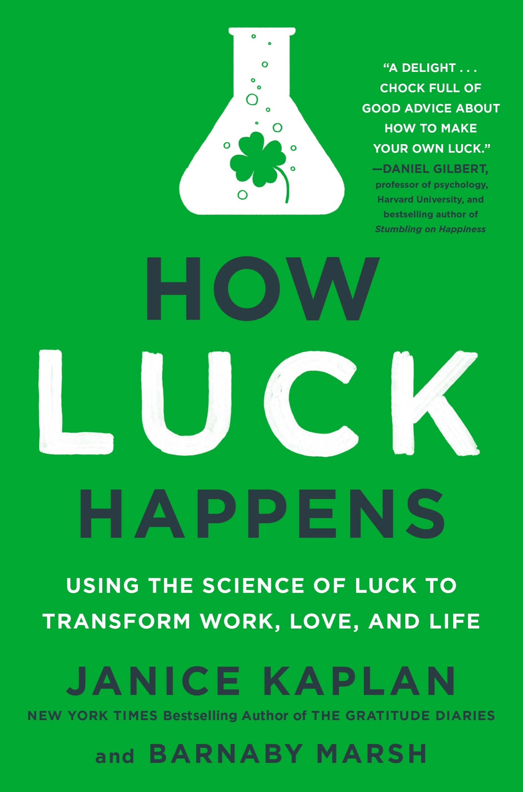

# 运气如何发生

# 贾尼斯·卡普兰所著

## 前言

在好莱坞，你不需要走得太远就能遇到开着 Uber 车或者为 TaskRabbit 做杂活的人，他们在等待那个能够将他们推向明星之路的幸运机会。许多人在大学时主修戏剧或曾在家乡的 *《租赁人生》*话剧中出演——现在，他们也需要有人注意到他们的才华。

“你必须给自己一个机会去遇到好运，”凯西说。我是在一个温暖的傍晚，在日落大道上的一家咖啡馆遇到她的。她当时在吧台后面，正在制作她的招牌莫斯科骡子——伏特加、酸橙和姜啤酒。（我点了一杯健怡可乐。）不过，调制完美的饮品并不是让凯西坚持下去的原因。我们聊天时，她告诉我她刚从大学毕业，开着她那辆破旧的起亚车，驱车两千英里来到好莱坞。现在，她在等待那个能够让她成为明星的幸运邂逅。

“我就一直对自己说，*哈里森·福特*，”凯西说。

啊，是的，幸运的哈里森。他的早期经历在所有有演艺梦想的人中，和印第安纳·琼斯的传奇经历一样出名。当他在 1960 年代第一次来到洛杉矶时，由于他演技平平，几乎没有得到任何关注，甚至开始做木匠工作。一位刚入行的年轻导演聘请他为自己家的橱柜做木工，他们相互了解并且喜欢上了对方，之后导演给了哈里森一个小角色，在他拍摄的一部预算极其紧张的小电影里。尽管这部电影被六家电影公司拒绝，但最终却成为了意外的超级热门。

这部电影就是 *《美国往事》*。导演是乔治·卢卡斯。也许你听说过他？几年后，卢卡斯得到了制作另一部电影的机会，虽然电影公司并不看好——那就是 *《星球大战》*——他把自己新结识的朋友哈里森·福特选入了演员阵容。

“你觉得你会在酒吧里遇到你自己的乔治·卢卡斯吗？”我问凯西，她过来给我续了杯饮料。

“当然，”她笑着说。

那为什么不呢？她已经把自己置身于一个能够遇到好运的地方，就在好莱坞山的边缘，那里住着许多制片人和导演。也许下一个她为之服务的客人就是派拉蒙的高管（或至少是迪士尼频道的某个高层），他会发现她的潜力。

对于哈里森·福特来说，与卢卡斯的偶遇引发了一系列事件，最终让他成为了他那个时代最大的一颗明星。如果没有那些橱柜，他或许永远也不会在 *《星球大战》* 中成为国际巨星。换一个演员，可能就不会在冰冻的碳化物大块中扮演那位酷劲十足的汉·索罗。

偶然事件在职业生涯中能发挥如此巨大的作用，既令人鼓舞（“这也可能发生在我身上！”），又令人沮丧（“可是如果没有呢？”）。好莱坞以及其他地方的许多人相信，运气是自己创造的，这也能解释为什么那些有志成为编剧的人总是随身携带自己的剧本，准备随时展示给任何看起来和蔼可亲的人。

看着凯西在咖啡馆里四处奔波，脸上带着灿烂的笑容，语气活泼，我意识到有一天我可能会在大银幕上看到她。但不止一次偶然的邂逅会发挥作用。通过搬到好莱坞，在酒吧工作，与人交流（比如我），她在创造自己的机会。她已经将所有的元素都放在了正确的位置，为自己创造了运气。

我们聊了会儿，直到我的一个朋友到达，凯西才发现我曾是一名电视制片人，拥有一个有趣而充实的职业。晚上结束时，当凯西把账单送到我们桌上时，她问：“有什么建议能让我成为幸运儿吗？”

“你会的，”我鼓励地说。

我留下了一笔丰厚的小费，走出去时，脑海中旋转着一个更大的问题。

我们每个人，包括凯西，能做些什么才能成为幸运儿呢？当然，随机机会在生活中扮演着角色，但我们不能仅仅耸耸肩就算了。我们必须采取正确的步骤，控制自己能控制的部分。

我想起了艾米莉·狄金森的一首诗，诗中写道运气不是偶然，而是辛勤工作，“命运昂贵的微笑 / 是赢得的——”我一直喜欢这句话，而现在，当我走到洛杉矶温暖的夜晚，走向我的车时，我在想，要赢得命运昂贵的微笑需要什么。我们该如何创造属于自己的运气？

* * *

—

当我回到纽约并和我的朋友巴纳比·马什一起喝下午茶时，我还在思考那个问题。巴纳比作为一名罗德奖学金得主曾就读于牛津，他仍然喜欢浓茶和司康饼，我总是乐意和他一起分享。巴纳比四十出头，思维古怪且独特，他同时在普林斯顿高级研究院和哈佛大学进化动力学项目担任职务。换句话说，他是那种在你试图解决问题时，你会求助的人。

所以我告诉了他关于凯西的事，并且提出了哈里森·福特的难题：如果这位现在很有名的演员没有遇到乔治·卢卡斯，他还会靠锤子和钉子谋生吗？

巴纳比静静坐了一会儿，目光远远地望着，思考着这个问题。

“这很复杂，”他终于说道。“一些不可预见的事件——像和卢卡斯的那次见面——可能会起到作用。但如果你把足够多的正确元素放到位，你可以减少它完全是偶然的成分。”

好吧，那听起来很有希望。我开始思考创造运气的那些正确元素可能是什么。才能肯定是其中之一，努力工作也是。

“你会给凯西什么建议？”我问他。

他撕下一块司康饼，若有所思地咀嚼着。“我觉得运气无处不在，等待着被发现。但大多数人都从它旁边走过，没意识到它在那里，随时可以得到。只要你知道在哪里找，世界上有足够的运气分给每一个人。”

那么，为什么我们常常错过它呢？Barnaby 简短地变得科学了一下，指出生物学上，人类的注意力范围是设定来筛选掉那些对生存无关紧要的事物的。现在，我们需要颠倒这一本能，学会筛选进那些重要的事物，*而不是排除它们。*

“机会就在你周围，你只需要学会去发现它们，”他继续说道，“每个人都有方法让自己变得更幸运。”

Barnaby 坚信，无论你是想成为演员的哈里森·福特，还是想找到真爱的千禧一代，或者是图谋成为 CEO 的企业高管，你对自己生活中的事件有比你想象的更多的控制力。我们常常没有意识到，很多事情是我们通过自己的行动推动的。有时我们播下的机会种子，直到几周、几个月甚至几年后才会开花结果。当它出现时，看起来像是偶然的机会——但其实是我们让它发生的。可以称之为“计划中的偶然”。

Barnaby 告诉我，他在牛津的研究是关于冒险精神的，他在高等研究院致力于研究运气的理论概念。通过他的学术工作，他正在开发一种新的运气科学。

“你可以说我有一个运气实验室，”他说，脸上带着微笑。

只需要再吃几个松饼，我就意识到，我们可以成为一个伟大的团队，把他的理论研究作为我更实际方法的基础。接下来的一年，我们将一起探索运气的各个方面——包括爱情、工作、家庭和财务。Barnaby 将成为我的引导者，我们会每周见面，尝试回答 Cassie 关于如何成为幸运儿的问题。

我们最终发现的结果让我们俩都感到惊讶。我们发现，这并不是魔法、偶然或是摩擦马蹄铁能让 Cassie 变得幸运——而是知道该采取正确的步骤。所以，快来加入我们，踏上这段令人兴奋的发现之旅吧。我们揭示的方法几乎可以确保给 Cassie、Barnaby、我……以及你，带来好运。
# 第一部分

# 理解幸运

幸运是当准备遇到机会时发生的事情。

—塞内卡
## 第一章

## 准备好迎接好运

*对机会保持开放。……获取你需要的信息。……看到你未曾看到的。……把握机会、天赋与努力工作的交汇点。*

巴纳比的运气实验室位于新泽西州普林斯顿的美丽林地间——一个思考关于创造运气科学的宏大思想的完美地点。一天早晨，我们一起在宁静的校园中散步，巴纳比告诉我，阿尔伯特·爱因斯坦曾在这些同样的林荫小道上徘徊，思考他的著名理论。我们的新理念可能不会颠覆相对论，但我们希望它们能够改变人们对运气的看法——以及他们对自己未来的可能性。

前一晚大雨滂沱，阳光尚未晒干湿漉漉的地面。我绕过一个水坑，告诉巴纳比，写作我之前的书《感恩日记》让我明白，我们对自己的幸福掌控比我们有时意识到的更多。我很高兴这本书激励了许多人过上更快乐的生活，我有预感，理解如何在任何情况下让自己变得幸运，可能会产生类似的效果。

巴纳比点点头。“如果你渴望让生活变得更好，且常常困惑为何事情不总是如你所愿，我们的新方法将让你掌控本该属于你的运气。”

我们都同意，运气不同于随机机会。如果你掷硬币十次来决定你的未来，你是在依赖机会——大多数人都会同意这非常愚蠢。如果你与人交谈，做好准备，寻找机会，然后抓住那些可能（随机）出现的意外事件，那么你就在创造运气。这就是我们所有人需要做的。

“运气不是零和博弈。如果你知道在哪里以及如何寻找，运气对每个人来说都足够多，”巴纳比说。

巴纳比认为，证据非常明确：运气不是被动的——它需要行动，许多看似随机的事件实际上并不那么随机。他坚信，通过理解运气的潜在动态，你可以掌控曾经看似依赖运气、命运或月相的生活各个方面。我们将一起运用心理学、行为经济学、数学和神经科学的见解与最新发现，开发一种全新的运气理解方式。

“我们处于一个全新领域的起点，而不是去寻找研究，我们将不得不去创造它，”他说。

幸运实验室是进行这项研究的理想场所，因为巴纳比在高等研究所的学术职位让他能够接触到伟大的思想来源。多年来，这里吸引了来自世界各地的天才——而且开车绕过当地的街道时，你会看到许多街道都以他们的名字命名。除了爱因斯坦，伟大的数学家和哲学家库尔特·哥德尔也是这里的教授，早期的计算机科学家和博弈论先驱约翰·冯·诺依曼也曾在此任教。著名的理论物理学家 J·罗伯特·奥本海默，也因其在洛斯阿拉莫斯国家实验室制造第一颗原子弹的工作而闻名，是这里的长期主任。

我和巴纳比都觉得我们是解决这个项目的最佳团队。我们有着非常不同的背景和人生经历。我曾在纽约市地区担任记者、杂志编辑和电视制作人，并与英俊的医生丈夫一起抚养了两个了不起的儿子。巴纳比则在阿拉斯加长大，直到开始上大学才开始接受正规教育——此后，他展开了将他带到全球各地的学术和职业经历。他成为了一家大型基金会的高管，每年捐赠一亿美元。作为一个古怪且富有创意的思考者，他认识的人比我遇到的任何人都多。他最近和妻子米歇尔以及他们两个非常年轻可爱的女儿一起定居在纽约市——不过，“定居”这个词从来都不适合他。

我们希望我们的幸运研究能够产生强大的影响，改变游戏规则，给人们一个全新的视角来看待自己的生活和经历。巴纳比已经提出了关于机会、风险和努力的策略，以及这些如何影响你改变未来的能力。这些理论都非常深奥和高深，而我的工作就是把它们带到实际生活中，看看这些理论如何在日常生活中运作。

在实际安排上，巴纳比每周一和周二都会逃到这座象牙塔里，制作概念模型，尝试开发适用于各种情境的幸运理论——无论是你在找工作、寻找伴侣，还是在人类进化的竞争中生存下去。周三我们会见面，讨论这些理论。在这个过程中，我会找到能够阐明这些观点并帮助我们两人理解人们如何有意识或无意识地创造好运的人——包括学者、企业家和名人。

到年底，我们将确切知道如何让自己变得幸运。这门新的幸运科学将有简单明了的原则，能在生活的各个方面帮助你让事情变得更好。

* * *

— “除了理论工作，理解该采取的正确行动同样重要，这样你才能把自己引导到创造好运的路径上，创造自己想要的命运，”巴纳比说。

我们谈得如此投入，几乎没注意到自己有多脏，脚下的路（实际上）湿滑泥泞。最后，我的帆布鞋完全湿透，鞋面粘满了泥土。

“运气或许像感激一样，很多时候取决于你的视角。”我一边从树林里走出来，一边对巴纳比说，“我认为这次是一次非常幸运的散步，因为我们有激动人心的想法和一个很好的计划。但也许别人会认为，我不得不扔掉鞋子，这是一件不幸的事。”

他微笑着说：“为了科学，牺牲总是不可避免的。”

我低头看着自己满是泥巴的脚。运气的一部分就是发现新机会。与此相比，找到新鞋子应该不难。

* * *

— 

几天后从普林斯顿回来，巴纳比建议我尝试第一次看看我们的基本理论如何在实践中运作。如果我们没错，认为你是自己创造运气的，那我能否在某一天试试运气？

对于这个实验，我不需要满满一黑板的公式。我只需尽力创造属于自己的运气。

我的日子看起来并不特别激动人心。我计划早上做几个琐事，然后去宾州车站搭火车去看我那位了不起的岳母。

“这一切听起来有哪一点幸运吗？”我问巴纳比。

那天恰好是 5 月 13 日星期五——并不是一个幸运的日子，机会突然从天而降的日子。

但巴纳比让我以一种稍微不同的视角来开始我的一天。他给了我一些关于运气的基本指导：我应该保持警觉，留意机会，做好准备应对任何情况，尝试出人意料的事情。

“运气就这样会从天而降吗？”我怀疑地问。

既然外面已经在下大雨，最好能有点阳光出现。但是，挑战就是挑战，我很感兴趣。

我的日子开始得毫无特别之处，先是去了邮局和药店，然后我前往宾州车站。我留了充足的时间，提前到了（提前得太多）我 10:15 的火车。宾州车站阴沉而沉闷，在那里待着一点也不觉得幸运。

但根据预先准备的建议，我研究了火车时刻表，知道有一趟更早的火车是 9:46。我不认为有时间赶上——但为什么不试试呢？

当我跑向登车口时，自动扶梯（神秘地）从轨道上升上去，而不是下降到轨道。我飞奔过去找了一位附近的保安，问他应该怎么做。

“你必须绕道走到另一边，然后走楼梯，”他说。

我一度感到有些泄气——火车大概一两分钟就要开了，而通往另一侧的走廊看起来很长。但我想起了一个高中教练曾经鼓励的话：“去试试！冒个险！”于是我绕过车站跑向楼梯，踉踉跄跄地下楼，最终在车门关上前一刻赶上了火车。

*多么幸运！*

我感到一阵胜利的激动。虽然是一个小小的胜利，但我做到了。

等一下。那就是秘密吗？我真的能控制比我想象的更多吗？

一周前，我几乎处于相同的境地，但那时我并没有那么急于赶路。火车门几乎是在我面前“砰”地关上。那感觉就像是一个不幸的日子，而今天突然觉得要积极得多。

由于心里想着火车的成功，我感到一股信心涌上心头。我比计划早到达了目的地，于是决定走到岳母的公寓（雨也停了）而不是打出租车。我们去餐馆吃了午餐，并和餐馆的服务员愉快地交谈。我感谢她为我做了一份菜单上没有的沙拉，并告诉她我今天一直在努力让幸运的事情发生。吃甜点时，服务员端来了一块巧克力杯形蛋糕，上面还插着一根蜡烛。

“这次我们请客。幸运的日子值得庆祝，”服务员说道。

赶上早一点的火车并得到一个免费的巧克力杯形蛋糕，虽然不是什么惊天动地的大事，但在星期五的十三号，它们绝对属于好运的一面。

第二天当我把这个故事告诉巴纳比时，我感到既惊讶又困惑。我开始同意一个观点：幸运不是从天而降的神秘力量——它是我们自己（至少部分）可以创造的东西。意识到这一点真是令人震惊，因为大多数人只是坐等好运降临，而我们真正应该做的是采取正确的步骤去让好运发生。尖锐的澳大利亚女作家克里斯蒂娜·斯泰德在 1938 年指出：“自制的人是相信运气的人，他把儿子送到牛津。”换句话说，机会在生活中确实起作用，但它不是一切。幸运的基础是通过我们自己的行动建立的——我们尝试什么，和谁交谈，我们决定多快去追赶那趟火车。

如果幸运无处不在，等着我们去发现，那么我们就必须停止轻易走过它，或者在我们的 SUV 里飞驰而过。幸运的事件通常不像最初看上去那么偶然。诚然，命运并不是公平分配的，某些选择也超出了你的控制范围。我生于美国，父母是中产阶级，他们希望我能有所成就，在世界历史上，这算是一种巨大的、难以置信的特权。但无论你如何开始，或者你希望最终达到什么地方，了解机会的动态……好吧，改变的就是你自身的机会。

“你可以发现好运，把它抓住并和朋友分享！”巴纳比现在告诉我。

想要创造好运，你需要获取正确的信息，这样才能为正确的行动做好准备。了解可能的步骤可以避免你被无法控制的力量左右，并使你掌控更多人生的方面。我们往往比自己意识到的更能掌控未来。想到我不必等待幸运的日子——我可以自己创造它们，这让我感到兴奋。

* * *

—

巴纳比和我决定通过一项关于好运的全国性调查来启动我们的项目——我们小心翼翼地组织它，确保它的广泛性和统计意义。当结果开始汇总时，我们感到惊讶——同时也感到高兴。高达 82%的人认为他们对自己生活中的运气有一定或很大的影响力。只有 5%的人认为无论他们做什么，都无法改变自己的运气。所以我们相信你可以创造好运的观点，和美国人普遍的态度相吻合，即随机事件可能会发生，但这并不意味着生活失控。你只需要学会正确的方法。

找到那些正确的方法是我们的重大挑战——因为运气就在细节中。伟大的科学家路易·巴斯德曾指出，“运气偏爱有准备的头脑。”这是一个智慧的思考——但他从未说过准备的过程是什么样子的。所以我们会尽力填补这些空白，揭示逐步准备以迎接好运的过程。

当我告诉我的朋友丽兹，我在学习如何为自己创造好运时，她立刻问我是不是在买彩票。但彩票并不是生活中其他方面好运的好模型。即便它自罗马帝国时代就存在，并吸引了数百万的买家（和梦想家），彩票只是一个筹集资金和希望的游戏。你买了一张票，接下来的一切就交给了运气。你面对的是极其不利的几率，而你对此无能为力。（有些澳大利亚人发现了可以做的事，赢得了彩票。但我们稍后再说。）

在那些让我们在人生中看似真正幸运的大事上——一份好工作，一个幸福的家庭，以及成功的感觉——生活根本不是一场彩票。随机的机会确实在我们的生活中扮演着一定角色，偶然的事件也时常发生，难以解释，但机遇仅仅是幸运图景中的一个元素。如果你将好运视为纯粹的随机事件，那你就忽略了更大的意义。要想变得幸运，你需要放下那些无法控制的因素，专注于其他那些*完全在你控制之中的*元素。

当我下次去幸运实验室拜访巴纳比时，他带我去了他喜欢工作的数学图书馆。图书馆的书架通常昏暗，但他有一张最爱的桌子，靠近一个湾窗，阳光洒进来——而阿尔伯特·爱因斯坦曾经工作的办公室就在我们下面。

“我们可能比他看的更清楚，”巴纳比愉快地说。

受过去天才幽灵的启发，我们谈论了我们认识的成功人士，并试图揭示使他们幸运的元素。某些特质——比如聪明、决心、活力和原创性思维——一再被提及。有时运气也起了作用——时机合适之类的——但它从未单独存在。

除了我们的全国性调查，巴纳比还向数百位罗德奖学金获得者发出了关于运气的问题，我们开始审阅这些答案。许多人描述了影响他们生活的意外事件——一次国外旅行带来了一个工作机会，一个提供资助的基金会，一位在晚宴上坐在他们旁边的投资者帮助他们创办了公司。

“机缘巧合！！！”一个人写道（用了太多的感叹号）。

但看似机缘巧合的事情，如果你追溯几步，往往有可识别的基础。例如，那位在晚宴上遇到投资者的人，拥有一个令人兴奋的想法，并向所有愿意听的人谈论它。一位对他构思印象深刻的同事邀请他参加了这场晚宴。幸运？是的。偶然的机会？不完全是。我开始看到人们在创造自己好运中的作用，一个简单的公式突然清晰地出现在我脑海中。

“真正的运气发生在机会、才华和努力的交汇点上，”我说。

巴纳比若有所思地点了点头。“不错。机会、才华和努力。”然后他微微一笑，接着补充道，“有点诗意，但不错。”

在我们能为诗意加入科学之前，我们需要定义每个元素。现在，我们暂时把机会放在一边，专注于剩下的两个。

努力对每个人都开放，惊人的是，才华也是如此。你不必像碧昂丝那样能歌善舞，或者像梅丽尔·斯特里普那样演技出众才能算幸运（虽然这样当然不错），因为才华还包括我们所有人都能培养的元素——对机会的开放态度、愿意冒险的精神、与众不同的思维方式，甚至是一丝乐观。只要方法得当，你也可以为自己创造机会、才华和努力的幸运组合——让自己在生活的各个方面变得更加幸运。

我的幸运 13 号星期五让我看到了这些基本原则的力量。细心的准备和愿意尝试（*我会去赶那趟早班火车！*）都属于运气中的努力元素。我决定以积极的态度与服务员交谈、感谢她并友好待人，这也是有助于带来运气（以及杯子蛋糕）的技能之一。

我开始把运气的三个元素想象成那种老式的老虎机，你拉下拉杆，三个物品必须排成一行。例如，人们会沉迷于等待三个樱桃并排出现。心理学家称之为“可变比率强化”——你不知道什么时候会获得奖励，所以你会继续尝试，期待它出现在下一次拉杆时。我实在太理性了，对老虎机没有任何吸引力——但如果我知道我可以自己排成两个樱桃，也许我会被说服。

这就是现实生活中的情况。如果你想获得任何形式的回报——无论是新工作，还是新爱情——你不必等待完全的随机运气让这些机会自然到来。才华和努力这两颗“幸运樱桃”是掌握在你自己手中的。你可以学会如何将它们放到正确的位置——然后，你就离“幸运人生”走了三分之二的路。

你可以说，通过知道如何创造运气，你将生活变成了一碗樱桃。
## 第二章

## 有些人天生幸运——你也可以成为其中之一

*获取正确信息……相信自己很幸运……向 Vanna White 学习……决定找到一片四叶草（并且坚持不懈，直到你找到为止）。*

在我们下次的会议上，Barnaby 和我开始讨论人们对好运的先入之见。我们的全国调查显示，认为好运完全是随机的比例出奇地小。大约 67%的受访者表示，努力工作对他们自己生活中的幸运结果起到了作用，64%的受访者则表示，通过保持好奇心并寻找新机会，他们获得了好运。

认识到制造好运的微妙之处可能是复杂的。几千年来，哲学家和神学家一直在围绕好运的讨论展开辩论。公元前 293 年，罗马人奉献了第一座神庙（随后会有更多）给福尔图娜，命运与幸运女神。她因能够分发财富和提供繁荣而受到广泛崇拜。中世纪的艺术家通过将她置于球体上或幸运之轮旁，描绘了她所分配命运的变化无常。罗马诗人奥维德被流放时，他悲观地指出，福尔图娜“通过她那不稳定的轮盘展现了自己的反复无常；她总是在摇摆的脚下让它的顶端在她脚下。”啊，命运那反复无常的脚步。相应的希腊神祇是提刻（Tyche），有时她被描绘为戴着眼罩。如果掌控你命运的女神是盲目的，那么当意外发生时，你就不会感到惊讶了。

你得走得相当远（跨越几千年），才能从福尔图娜走到 Vanna White，她是那个在无比受欢迎的电视节目《幸运转盘》中翻转字母的女主持人。这是史上最长寿的联播游戏节目，自 1975 年起已经以某种形式播出了。在这个电视节目中，你从一份随机的好运开始——旋转一个有二十四个插槽的真实轮盘来决定你正在玩的是多少奖金，也许是 300 美元或 1000 美元。你也可能停在一个插槽上，失去所有奖金——这意味着奥维德对于命运的反复无常是对的。

但在经历了那一轮像赌场般的旋转之后，你将告别福尔图娜，真正的工作才开始。要想真正获得胜利，你必须付出努力，填补空白，并且具备在对手解答之前猜出答案的能力。运气、才华和努力工作的结合，正是创造好运的定义——无论是在电视节目中还是在日常生活中。虽然我们对崇高的福尔图娜表示歉意，但 Vanna 和她的节目可能更能代表现代好运的真正含义——因为它将你稳固地置于努力工作、才华和机会的交汇点上。

有些人似乎天生幸运——但可能他们只是擅长将技巧、努力和机会的各个因素巧妙地结合起来，从而为自己谋取利益。我有种感觉，任何人都可以学到同样的技巧。我决定四处看看，看看能找到什么。

* * *

— 

几天后，我去了一家本地公园，看我认识的一个七岁小孩打垒球。这是一场低调的比赛，当其中一个小女孩站在外场站累了时，她喊道要去找四叶草。其他几个孩子很快跟了上来。过了一会儿，大部分寻找者都放弃了——他们又回到比赛中或者懒散地做些翻滚动作。但是，一个穿着黄色 T 恤和短裤的小女孩（我称她为 Sunny）一直坚持寻找，最后兴奋地跳了起来。她找到了！她跑回去向她的朋友炫耀她的幸运草。

“你真幸运，现在你会更幸运！”她身边的一位朋友这样说道。

是的，Sunny 确实很幸运——但这并不是因为某种神秘的原因。她有足够的坚持力，在其他人放弃后仍然继续寻找，而且她有发现别人容易忽略的模式或差异的能力。她不怕失望，并且有足够的韧性坚持下去。由于三叶草比四叶草更常见，几乎是万分之一的比例，她在找到幸运草之前不得不面对许多失败。但她喜欢这个挑战，并且总是期待能找到她想要的东西——而且她可能也很享受寻找的过程。

那个说 Sunny 会从幸运变得更幸运的小朋友可能是对的（而且这并不是因为 Sunny 现在有了四叶草）。让 Sunny 最初找到那株四叶草的品质——坚持、专注和对可能性的敏感——将会在她的人生中给她带来巨大的幸运。当你说某人很幸运时，你真正的意思是，三个关键因素——机遇、才华和努力——汇聚在一起，产生了一个很棒的结果。即使最终结果看起来像是发现了四叶草那样奇妙和神奇，她的行动以某种方式促成了这一结果。即使她没有意识到这一点。

认为自己是个幸运的人，并且让别人也这样看待自己，将会进一步增加 Sunny 的优势。幸运是会成串到来的。当你走上了幸运的道路，你往往会一直走下去。我想象着那些可爱的七岁小朋友回家后，在晚餐时抱怨自己朋友的好运。*为什么她找到了四叶草？她总是那么幸运，为什么我没找到？* 一个宽慰的家长可能会答应道：“你下次会幸运的，找到它的。”但虽然这能让晚餐气氛平和一些，却不会让孩子的运气真的改善。无论你是七岁还是七十岁，如果你认为自己被无可控制的力量左右，你往往会放弃并哀叹命运。倒不如提醒那个年轻的四叶草寻找者，她可以通过专注和努力改变自己的运气。

在他的剧作*欲望号街车*中，剧作家田纳西·威廉姆斯赋予硬汉斯坦利·科瓦尔斯基一段精彩的台词：“你知道什么是运气吗？运气就是相信自己是幸运的，仅此而已。”斯坦利——由马龙·白兰度在电影中饰演——可能并不是最聪明（或者最友善）的人，但他穿 T 恤的样子很棒，而且他对运气的看法肯定是正确的。他说：“要在这场老鼠赛跑中占据领先地位，你必须相信自己是幸运的。”无论是否是老鼠赛跑，这种观察都有其道理。你必须相信自己是幸运的，才能采取那些能让你变得幸运的行动。

生活中，意外事件总是发生，而你如何回应它（或者不回应它）决定了你是否能够成为幸运儿之一。你可能会回头看看自己的人生轨迹，惊叹于那些巧合般的时刻将你带到了现在的位置。也许是你的朋友拉你去了一个你原本不打算参加的派对，正是在那里你遇到了生命中的挚爱。或者你在电梯里偶遇了 CEO，一次偶然的对话让你得到了现在的工作。假如你那天留在家里没去派对，或者选择坐了另一部电梯会怎样？你会摇头，感叹自己有多幸运。

事实的确如此，未曾计划的事情可能会对随后的所有发生产生非凡的影响。但比客观发生的事情更重要的是*你如何对待每一个事件*。你本可以站在电梯里，因受到过度的压力而不敢与 CEO 交谈——那样的话，这根本就不是什么幸运的搭乘。或者你可能在聚会上喝了几杯过量的龙舌兰酒，眼花缭乱，没能注意到站在鳄梨酱旁边的英俊未婚夫。同样，乔治·卢卡斯雇用哈里森·福特来制作他的橱柜，这也是一个（或多或少）随机的事件，并没有保证除了一些存放意大利面和番茄酱的好地方以外，任何其他的结果。福特之所以成功，是因为他在之后采取了相应的行动。

偶然因素在我们每个人的生活中都起到了作用——但它并不像我们有时想象的那样具有决定性。我那位出色的文学经纪人，爱丽丝·马特尔，最初是在一家大律师事务所做律师的，并很快决定她犯了个错误。她只是根本不喜欢法律。她的一个客户恰好是畅销书作家，经过一段时间与爱丽丝建立友谊后，爱丽丝帮助她谈成了一份大书籍合同。那位坐在办公桌对面的出版商被深深打动，问爱丽丝是否曾考虑过成为一名经纪人。直到那一刻，她从未想过这个问题。

“但他一说完，我就开始了出版行业的工作，并最终创办了自己的代理公司，”爱丽丝一天在我们聊到生活与运气时说道，那个时候她坐在自己漂亮的办公室里。“我爱我现在的工作，每天都为自己有多幸运而感到惊讶。如果那位出版商当时没有说那句话，我可能现在还在做律师——而且每天都不开心！”

认为你的职业生涯是由简单的偶然事件启动的，这种想法本身有一种浪漫的魅力。但幸运很少是凭空出现的。幸运的种子必须落在肥沃的土壤中，而偶然事件需要与目标和方向相结合，才能促成任何结果。我建议艾丽丝，因为她作为律师时过得不太开心，她的眼睛可能已经开始留意其他机会。与畅销书作者合作是一个幸运的机会，但如果那个机会没有出现，她也会对其他机会保持警觉。

“你的下一个客户可能本来是个演员，你本来会和他谈判合同，走上*那*条路。如果是那样的话，你现在可能会在好莱坞经营一家电影制片厂！”我说道，半开玩笑地说。

我们谈话的几周后，艾丽丝打电话给我，说她仍在为自己职业的新视角而震撼。她一直觉得自己职业生涯中的变化是由无法控制的外部力量决定的——从（不开心的）律师转变为（开心且成功的）经纪人。现在，她愿意相信，是她自己的决心和意志推动了这些幸运的发生。

“这些年我一直担心，如果没有几个幸运的事件，我现在还可能在做律师，过得很痛苦。你完全改变了我的看法！”她说。她对于自己没有经营那家电影制片厂也有些许惋惜。

就像艾丽丝一样，你可能也经历过那些改变一切的关键时刻。回头看，你能清楚地看到它们——某个评论、某个工作机会、那个在人群中吸引你目光的人。讲述自己人生的故事时，这些往往是你所描述的大事件。但你是否在不经意间做了某些安排，促使这些时刻的到来？同样重要的是，你又错过了多少其他时刻？（你也可以经营一个电影制片厂。）真正的技巧是学会如何识别未来的那些幸运时刻。

机会、天赋和努力的结合，不仅能够改变你生命中最重大的事件，如爱情和事业，也会对日常琐事产生影响。许多你归因于随机运气的事情，最终发现并非如此随机。例如，假设你正在美国某个大城市开车，需要停车。你慢慢驶过街区（因为前面肯定有辆卡车），这时一辆大 SUV 从一个停车位开出来。你迅速驶入，并且发动机仍在运转时，查看了停车标志——发现这个停车位其实是合法的。哇哦！你刚刚节省了$32.50——这本来是停进停车场需要的费用——并且可以把这笔钱用于在晚餐时点额外的饮品和开胃菜。（在一些城市，你仍然需要投币给停车表——但没有什么是完美的。）

找到那个停车位可能让你觉得不过是一个典型的“恰逢其时”的例子。你似乎什么都没做特别的——你只是开车经过，而别人刚好离开。真是幸运啊！但如果找停车位真的是完全随机的，那每个人都应该能一样擅长，而事实并非如此。许多人会告诉你，他们在街头停车时总是很差劲（我也算是其中之一），根本不敢尝试，而其他人，包括我的丈夫 Ron，则非常擅长。他每周至少去曼哈顿的剧院或其他晚间活动几次，而且他从不去停车场。他后视镜上没有挂兔子脚，但他确实有一些天赋。他非常善于观察，视力也很敏锐，所以他能注意到有人正在进入一辆停在街边的车，或者引擎轻微启动的动作，然后立即朝那个方向开去。他还依赖自己极好的记忆力和数字能力——不同的街道允许不同的停车时段——知道哪条街道最适合停车。凭借他丰富的经验、准备、知识和观察力，他就这样让自己变得幸运。

那些眼力差、心急的人永远不会在停车上出类拔萃。但了解自己的优缺点意味着你可以找到提高运气的技巧。（我的技巧就是让我的丈夫开车。）认识到运气背后有其他因素在起作用，你就可以改变自己的方法，增加自己的运气。任何人都可以像我丈夫一样学会了解街道，提前到达六点就能开始停车的地方——然后占到一个“幸运”的停车位。就连我偶尔也能做到这一点。*

一旦你了解了构成好运的因素，你就会意识到好运并非随机的，因为任何人都能创造越来越多的好运。幸运的事情通常不像初看时那样随意。就像流星划过天际，它们初看起来可能是神奇的。但一旦你了解了它们背后的原理，它们既是可预测的，也是可以解释的。人们常常谈论“恰逢其时”，但这种“恰当”往往发生是因为你已经沿途完成了所有必要的步骤。

* * *

— 

作家兼电影导演让·科克托曾讽刺地指出，他相信运气，因为“否则，你怎么能解释那些你不喜欢的人的成功呢？”我同感。得出结论说，那些名字闪耀在灯光下的人（或者找到了停车位的人）只是比你幸运——而不是她有更多的才能、动力或智慧，真是让人宽慰。也许她并没有。确实有很多开着豪车、在 Instagram 上拥有大量粉丝的人，看起来似乎并不完全……值得。但与其把他们视为无法理解的幸运儿，你倒不如试着弄清楚他们是如何走到今天的。好消息是，运气并不是零和博弈。你不必把别人从高处拉下来才能增加自己的运气。如果你懂得如何寻找，运气是有很多的。问题是，如何让运气降临到自己身上？

有时候，运气全靠获得正确的信息——你多问一个问题，突然间你就成了房间里最幸运的人！作为一个例子，Barnaby 提出了一个思想实验。你必须决定是否要走进一条黑暗的隧道，隧道尽头有一个大奖。你被告知，进入隧道的每一百个人中，就有一个会掉进深洞里出不来。你会进去吗？

“大概不会，”我说，证明我不是一个冒险主义者。

Barnaby 笑了。“好吧，你可能不会，但很多人可能会觉得成功的几率还不错，就试一试。假设你被告知有五十个人掉进了那个洞里怎么办？”

“那我会远离那个隧道。没有什么奖品值得冒这个风险。”

“我同意，”Barnaby 说。“但现在我给你一些额外的信息。所有走到隧道尽头并获得大奖的人，都带着手电筒。”

啊哈！现在这次探险看起来就不那么随机或者冒险了。你可以去当地的沃尔玛，买一个最结实的 LED 手电筒，然后朝着大奖出发。你已经找到了如何让自己幸运的方法。

在现实生活中，信息很少是如此直接明了的。但我们总是在象征性的黑暗隧道中行走，希望在尽头能找到一些特别且值得的东西——一份更好的工作，更大的成功，或者遇见白马王子或白雪公主的机会。确实，总是有陷阱和坑洞等着我们掉进去。能够在这种情况下照亮一些信息让我们变得更幸运，也更能管理风险和机遇。

一旦我们手里有了手电筒，我们还需要知道应该照向哪里。我们经常错过幸运的机会，因为我们在错误的地方寻找，或者没注意到眼前的事物。我们大多数人认为自己看到了真实的世界，但其实我们并没有。

* * *

—

任何看似幸运的人最重要的天赋是一个非常基本的能力——注意力和发现机会的能力。心理学家克里斯托弗·查布里斯（Christopher Chabris）和丹尼尔·西蒙斯（Daniel Simons）给出了一个很好的例子，说明了错过重要事情有多么容易。他们二十多年前在哈佛大学相遇，开始研究注意力和感知。他们制作了一段现在非常著名的视频，其中六个大学生穿着黑色和白色的 T 恤，围绕着运动，而你被要求数一下穿白色 T 恤的球员传球的次数。* 好吧，你可以做到这一点。你仔细地关注穿白色衣服的球员，并观察篮球。视频结束时，解说员的声音问你数到了多少次传球。如果你得到了正确的答案——十五次，你可能会为自己感到骄傲。观察得很好！但是下一个问题可能会改变你的想法：“你看到大猩猩了吗？”

嗯……大猩猩？在游戏进行到一半时，一个穿着大猩猩服装的人走到屏幕中央，捶打胸口，然后走开了。哎呀。在反复进行的实验中（从哈佛学生开始），无论年龄和背景如何，至少一半的人都没看到大猩猩。如果你还没看过这段视频，你可能确信自己当然会看到大猩猩。每个人都这么想。但你忙着数传球次数，以至于完全错过了眼前发生的其他事情。

这段视频刚发布时引起了极大的关注，因此研究人员做了一个更新版。我在网上找到了并尝试了一下。这次，我知道了大猩猩的存在，所以即使我在数传球，我也注意到了它的出现，感觉自己挺不错的。（我能看到一切！）但是研究人员在结尾时给出了另一个惊喜。你注意到有一个球员走出了场地吗？或者你注意到游戏进行中背景的幕布从红色变成了金色吗？如果你和我一样，答案是没有，没有。

如果你忽略了大猩猩捶胸和背景颜色的变化，那很可能你错过了周围的许多事物——其中很多可能会转变为运气。那么你该如何改变这种情况呢？巴纳比和我在芝加哥参加一个会议时正在思考这个问题，我们恰好与两位从事注意力领域研究的神经科学家共进晚餐。在晚餐时，我无疑注意到了那道美味的烤鱼，我提到了那个看不见的大猩猩以及知道该看哪里的问题。哈姆林博士，曾在杜克大学和北卡罗来纳大学教书，现在在阿什维尔经营“人类潜力发展中心”，解释说，良好的注意力是灵活的，它让我们能够在狭窄的聚焦和广泛的关注之间切换。在大猩猩的视频中，你专注于计算传球次数，所以错过了更大的画面。如果你允许自己从更广阔的视角看这个场景，你就能看到大猩猩，但却无法计算传球次数。

那么，你该看哪里才能捕捉到一切呢？

“良好的注意力是灵活的，”哈姆林博士说，“你总是必须根据需求和情况做出调整。”他是一个棒球迷，描述了他刚看完的一场全明星赛，第二垒手接到了一球，但没能稳稳接住。“他可能已经在练习中做了上百次这样的动作，从未失误。但这次他抬头看了看跑者的位置，结果失去了专注。”从狭窄视野切换到广阔视野的能力，可能是一次幸运的击球——或者一次令人尴尬的失误。

转移注意力并在正确的时刻认清该看哪里并不总是容易的。哈姆林博士承认，尽管他从事的是注意力问题的研究，但他的妻子抱怨他总是无法知道晚餐何时准备好。他如此专注于眼前的工作，以至于错过了其他信号——比如晚上七点半，厨房里飘来烤鸡的香味。

拥有极强专注力的巴纳比指出，尽管我们坐在一个嘈杂的餐厅里，周围充满了谈话声，但如果餐厅另一头有人说他的名字，他会立刻听到。我们的另一位晚餐伙伴，大卫·齐格勒，来自旧金山加利福尼亚大学医学院的神经科学研究员，描述了这种现象为“弹出式注意力”——无论如何都会引起我们注意的事物。更重要（也是更微妙的）是自上而下的注意力，只有当我们集中注意力时，才能察觉到的事件和情况。

我们每天都被数百万条信息轰炸，当我们知道自己要集中注意力的地方，或者知道要激活哪些可能性时，我们才会遇到好运。估算数据有所不同，但 IBM 的大数据分析师表示，我们每天创造大约 2.5 万亿字节的数据——如果这能帮助你理解这个数字有多大，可以写作 2,500,000,000,000,000,000。毋庸置疑，我们并没有能力去吸收其中哪怕是最微小的部分。可能性在各个方向上层出不穷，如果你等着某个字节、可能性或刺激的片段转变为好运，你一定会错过它。就像那个猩猩视频一样，你必须知道自己在看哪里——因为只有在正确的地方看，才能变得幸运。

当你想到运气时，你往往会想到那种突如其来的好运。你中了彩票！你刚好在红绿灯变绿时到达交叉口！一场暴风雨中的树木倒下，竟然没有砸到你的房子！这些事件宣告自己是好运——而且很难不注意到它们。但大多数好运以更微妙的形式出现。你必须留心观察，因为它悄悄地围绕在你身边，随时准备被你抓住。

当巴纳比和我从晚餐中走开时，我们讨论了识别幸运机会的挑战，并一致同意我们各自要集中精力看到更多的可能性。然而，这仅仅是一个一般的步骤，我们更兴奋的是开始分析和理解那些能够促成好运的具体行动——并制定能够让你在生活的任何方面变得幸运的原则。

我们首先还有一个话题需要讨论。如果运气是天赋、努力和随机机遇的交汇点，那么我们能对机遇本身产生什么影响呢？
## 第三章

## 选择你想成为的统计数据

*理解几率……不要把风险与好运混淆……在波士顿穿夏威夷衬衫（偶尔一次）。*

在谈到创造自己好运的必要性时，我和巴纳比常常用一种简短的说法：好运不会从天而降——但我们明白，如果你想要字面上的解释，即使这个事实也并非百分之百准确。1954 年，一位名叫安·霍奇斯（Ann Hodges）的女性在阿拉巴马州西拉考加的家中，正躺在沙发上盖着大被子打盹时，一块黑色岩石从天花板坠下，砸在她的大腿上。由于这一（不幸的）天外飞石，她成为历史上唯一确认被陨石砸中的人。

你可能不应该花太多时间担心陨石撞击，因为“你被龙卷风、闪电和飓风同时击中的可能性更大，”佛罗里达州立大学天文学家迈克尔·雷诺兹（Michael Reynolds）在谈到这次惊人的撞击时说道。尽管如此，我们还是会担心。科学家表示，6600 万年前撞击地球的小行星引发了气候变化，导致恐龙灭绝。那是久远而罕见的事件，但谁知道呢——如果每 66 百万年就有一次陨石撞击，也许明天就会发生另一次。*

现在，我开始把好运看作是运气、才能和努力的结合，我决定最明智的做法是把运气放一边，专注于其他两个——那些你能控制的因素。但我也明白，无法预测和未曾预见的事情可能让人感到不堪重负。如果你注定会被陨石砸中，其他一切似乎都不那么重要了。

所以，在理解如何创造好运的原则之前，我想先对随机性有更清晰的视角。我们都曾经历过一些看似疯狂的巧合——你在偏远地区旅行时偶遇一个认识的人，或者当你正在想某个大学老友时，她正好打来电话。你的反应大概会是 *太神奇了！这种概率有多小？*

结果证明，几率可能与你预期的完全不同。

随机和不太可能的事件让我们着迷——至少部分原因是它们能让生活和预期发生如此戏剧性的颠覆。地球上有 70 亿人——即使某件事的发生几率是百万分之一，它也会发生在 7000 个人身上。这可是从天而降的许多闪电。

不可能的几率并不意味着某事就不可能发生。2016 年，英格兰足球俱乐部莱斯特城（Leicester City）获得了 5000 比 1 的机会来赢得英超冠军。作为对比，博彩公司给博诺（Bono）成为下一任教皇的几率也是 5000 比 1。从某种角度来看，这个几率意味着 *你疯了吗？根本不可能发生。*

英格兰足球超级联赛（Premier League）庞大而强大，没有选秀制度或薪资上限，过去二十年里，四支球队一直垄断着冠军。去年，资金不足的莱斯特城（Leicester City）输掉了很多比赛，差点被彻底踢出联赛。他们离冠军最近的一次是 1928-29 赛季的第二名。他们在球员身上的花费大约是曼联和阿森纳等更受欢迎球队的十分之一。  

但尽管如此，他们还是赢了。一个理解 5000 比 1 赔率的方式是，如果英超联赛的球队比赛 5000 年，莱斯特城就会赢一次冠军。BBC 称这是“有史以来最伟大的体育故事之一”。在本土，NBC 体育表示：“这不是我们在美国能理解的事情。”其他人指出，在美国春季训练期间，即使是最差的棒球队也能获得 500 比 1（左右）的夺冠概率，而莱斯特城被认为比最差的球队还要差十倍。

但有趣的是，在莱斯特城获胜后，各种专家纷纷解释为什么这一切会发生。他们称赞球队在招募和签约球员时运用了数据分析，指出了这位出人意料的教练，并提到四支著名的顶级球队都表现不佳。是莱斯特城的球员创造了他们的运气（正如前两种解释所暗示的那样），还是仅仅是因为在等待足够长的时间后，5000 年才会降临？我当然不懂足够多的英格兰足球来做出判断——但无论如何，解释一个事件发生后总比发生前容易。  

无论如何解读，莱斯特城的故事都令人鼓舞，即使是那些不了解英格兰足球其实和美国足球差不多的人。无论概率多么渺茫，如果你想要让运气发生，就不要放弃。什么都可能发生。你能改变概率。你可以让自己和所有人都感到惊讶。  

有个寓言讲的是两位统治者掷骰子决定谁来统治世界。第一位掷骰子时，两颗骰子都落在六点，总数十二点，这已经是最好的结果了。  

“我赢了。你可以放弃了，”他说对手。  

但另一位领导坚持轮到他。当他掷骰子时，一颗骰子落在六点，另一颗则裂成两块，一半是六点，另一半是点数一。所以他得到了十三点。那概率是多少？你其实并不知道最佳的结果，除非你一直尝试去实现它。你可能会被那些超出你原本预期的结果惊讶到。  

* * *  

—  

巴纳比（Barnaby）花了多年时间研究风险，当我在下一个星期三的会议上提到概率问题时，他指出击败概率的一种方法是个性化这些概率。  

“选择你想要成为的统计数字，”他说。  

“这是什么意思？”我问道。  

我们正在当地的一家咖啡馆吃早餐，我瞥了一眼桌上的香蕉面包，想着是否该吃一块。Barnaby 注意到了我的目光，微笑着拿起他的例子。

“这样想吧。现在的统计数据显示，大约三分之一的美国人是肥胖的。但这并不意味着每个人都有三分之一的机会会过于肥胖。你可以决定自己吃什么，锻炼多少，这些都会影响你的体重。你可以决定自己属于哪个统计数据。”

“那我就不该吃香蕉面包了，”我叹了口气说。

Barnaby 笑了。“这对你来说根本不是问题。这就是重点。说有 30%的肥胖概率是一回事。说‘你’——不管你是谁——有这个概率，那就是完全不同的事情。”

我吃了那块香蕉面包。由于这个话题让我很感兴趣，之后我做了一些额外的研究，发现 Barnaby 完全是对的。大多数研究表明，遗传因素对肥胖的影响很小，生活方式比其他任何因素都重要。哈佛公共卫生学院的研究显示，即使你有肥胖基因，饮食和运动量对你的身材的影响也会远远超过遗传因素。你所在的地方也会影响肥胖。在一些州（如阿拉巴马州），肥胖率超过 35%，而在科罗拉多州——这个常年保持最瘦的州——大约是 20%。但如果你生活在这些肥胖率较高的州，仍然坚持吃水果蔬菜并每天跑步，你完全有可能打破这些统计数据。事实上，整体的统计数据根本不适用于你。

当我们继续讨论风险与统计学的话题时，Barnaby 让我吃惊地告诉我，当他的第一个女儿 Mandarin 出生时，他希望她能和父母一起睡。可是他的妻子 Michelle 认为这是个糟糕的主意。她告诉 Barnaby，共睡的婴儿比放在自己小床上的婴儿死亡的几率要高五倍。有的婴儿被父母压住而窒息，有的则是被床单和被子闷住，或者被卡在床边。突发婴儿死亡综合症（SIDS）和共同睡眠之间也有明显的关联。一项综合评估显示，69%的死于 SIDS 的婴儿是和父母一起睡的。统计数据非常清楚——婴儿最安全的地方是婴儿床。

“但世界各地的婴儿传统上都是和母亲一起睡的，我觉得这样对哺乳和其他方面有好处。所以我重新审视了这些统计数据，”Barnaby 说道。

他发现，共睡的风险往往发生在父母醉酒、肥胖或教育水平较低的情况下。另一个关键问题是睡在柔软的表面上——如沙发、水床或软床垫上——并且被褥过多。对于他的家庭来说，这些因素都不适用。

“所以我计算过，使用千分之一风险的标准参考统计数据对我们来说可能远低于实际风险，”巴纳比说。“通过改变或消除某些风险因素，你可以转变风险曲线——并有效地改变你的机会或运气。”

普通话在爸爸妈妈身边依偎了一年，小茉莉也在她到来时依偎在他们身边。这两个女孩都很好，漂亮而健康地成长。许多人可能不同意他关于同床共眠的决定，而另一些人则疯狂支持——这个话题仍然有争议——但更大的问题是一个非常重要的问题。

“我们不能消除所有的风险，生活总是充满了权衡，”巴纳比说。他指出，带孩子外出时，开车是存在统计风险的——但我们还是会这么做。“重要的是，你要理解你所承担的风险的现实。”

马克·吐温使得“谎言、该死的谎言和统计数据”这一说法广为人知，而专家们经常用数字来左右你，或鼓励你误解这些数字，这非常容易。如果你听到某个报告（通常是电视上的医生说的），说吃甘蓝或每天跑十英里能把某种疾病的风险降低一半，那么可能你的风险从 .002 变成了 .001。在实际情况下，这种 50%的下降根本没有任何意义。如果你喜欢甘蓝，尽管做个沙拉吧。但不要指望它能带来巨大的好运。同样的，你可以理论上知道，80%的降雨概率意味着在当前气象条件下，每十次天气预测中有八次会正确。但你真正关心的是，今天下午的棒球赛是否会被取消。

如果你理解了概率，你就可以与之共舞。例如，在 1992 年，澳大利亚的一家投资者联合体想出了一个在彩票中获得好运的策略。他们并不只买一张（或两张或三张）彩票，而是计划通过购买每一种可能组合的票来赢得弗吉尼亚州彩票。当时，每张一美元的彩票上有六个空格，可以填上 1 到 44 之间的数字，这意味着有大约 700 万个组合。填写所有这些小表格需要很长时间，因此他们通过 100 多家不同的零售商购买了大量的彩票。这让这些商店忙得不可开交。“没有人愿意站在排队三四天的人的后面，”一位弗吉尼亚州的不满居民在彩票被修正后的公开听证会上说。联合体在时间用完之前只买到了 700 万个组合中的 500 万个——但幸运的是，他们的概率站在了自己这一方，他们赢得了 2700 万美元的大奖。

你可能不想在家里尝试这个。即便你能借到钱去买所有这些彩票，现今大多数州的彩票已经变得更加难以操控。（把选择的数字从 44 个增加到 49 个听起来可能不算什么大事，但它把可能的组合翻倍到 1400 万种。）即便你赢了，你也总是面临着和其他（随机）选中了正确组合的彩票持有者分享大奖的风险。在像美国的国家超级百万彩票这样的主要彩票中，无论你有多少零售商支持，都不可能印制出足够数量的彩票。但澳大利亚的投资者在他们的整体理论上是对的：如果你增加自己的机会，你就增加了几率。

当我第一次听到弗吉尼亚州彩票的故事时，我的想法是*天哪！那个财团从七百万中只拿到五百万——他们仍然可能会亏损！*巴纳比说他当时的想法是——*五百万对七百万——这几率很好！* 这就是统计学和几率的有趣之处——它们只是数字，而我们赋予它们自己的情感色彩。在你创造运气（并过你的生活）时，你会在从家庭到财务等各方面做出非常个人化的风险决策。

我认识的一个年轻人，二十多岁时花了很多时间去攀冰。他既强壮又小心，确信自己不会犯那种统计上导致高事故率的错误。但当他足够厉害，可以攀登越来越危险的路线，并且在滑坡上花更多时间时，他意识到自己无法继续打破概率的限制。当你在高难度的攀登中时，总会有一些无法预测的事故发生。他收起了他的绳索。

其他登山者继续攀登——上岩石、爬山，参与高风险运动。世界上最著名的阿尔卑斯山登山者之一，尤利·斯特克，2017 年在准备攀登珠穆朗玛峰一条险峻山脊时不幸遇难。他曾在马特洪峰等著名山峰创下速度记录，曾以破纪录的速度一次性登顶阿尔卑斯山的每一座大山，用 62 天时间登顶了 82 座（每座都超过 4000 米）的山峰。他 40 岁时的去世令人悲痛，但斯特克无疑知道自己是在与困难的几率对抗。他做出了选择，认为充满刺激和肾上腺素的生活是值得冒险的。你我和我的攀冰朋友可能会做出不同的选择——但正是通过这种方式，我们每个人都可以为自己定义什么才是幸运的生活。

下一次我和巴纳比访问幸运实验室时，我们又在树林里散步了一次。（这次没那么泥泞——再也没有鞋子为科学献身了。）我提到，在我们的全国调查中，大约 66%的人认为你可以通过愿意冒险来创造自己的运气。巴纳比对此并不完全认同。

“每个人对风险的看法不同，而且更多的风险不一定等于更多的运气，”他说。

将风险与运气联系起来，深入美国人的心理。我们曾经崇拜那些勇敢的牛仔，他们骑马横跨草原，凭自己的努力创造运气；现在我们崇尚那些抛弃规则、敢于冒险、最终取得荣耀的牛仔企业家。这种故事很适合拍成电影和民间传说——但在现实中并不总是如此。

“最幸运、最成功的人往往看起来是在冒险，但他们总是有一个保障底线，这样他们就不会跌得太远，”巴纳比说道。“我从许多积累了财富的人那里听到过同样的话。与其孤注一掷，他们通过看到别人看不见的机会并把握住这些机会，创造了自己的运气。”

当我们继续走时，我注意到一座长长的弯曲桥出现在我们一侧，由木板和铁丝组成。它横跨着一个池塘，尽管对面似乎没什么特别的东西，我还是问巴纳比是否想走过去。

“我听说这座桥是普林斯顿大学的工程学学生设计并建造的，”巴纳比说道。他爬上几级台阶，然后毫不犹豫地走向桥中央，桥身随之摇晃。

“我应该加入你吗？”我问道，站在坚实的地面上。

他环顾四周，片刻后摇了摇头，转身走回了。

“这座桥是一个很好的例子，说明运气有时是有不对称性的。你在这座桥上能获得的好运有限，但如果掉下去，坏运气就很高，”他说。“并不是所有的风险都值得冒。”

我们返回了“幸运实验室”，巴纳比告诉我，在他的职业生涯早期，他曾为一家石油公司提供咨询（这个人真是无所不做！），这让他思考了很多关于不同类型风险的事情——以及这些风险如何带来回报。正如巴纳比所解释的，地质学家通常会带着探测设备去寻找地球中可能存在石油的地方。在收集了大量数据并发现可能性后（而且这永远不可能是确定的），公司需要决定在哪些地方进行钻探。钻探是非常昂贵的，因此他们无法在所有地方都进行钻探。

“为了获得最高的回报，你需要在中等规模的油田中钻探，这些油田能为公司带来盈利。但也有压力让你去在那些意想不到的地方寻找巨大的发现，而这些地方的勘探成本非常高。很难同时追求这两者，所以你必须选择其一。而这些不同的策略吸引了不同类型的冒险者，无论他们是工程师还是高管，”巴纳比说道。

在我们的生活中，我们也常常做出类似的决定。是去追求那种可能性较小但回报丰厚的冒险，还是选择安全的道路，尽管回报较少却更为稳定？换句话说，当你的孩子看着篮球比赛，说他一生的愿望就是进入 NBA 时，你应该鼓励他吗？除非他身高七英尺且从不失手投三分，否则可能不应该。我们喜欢听那些志存高远、挑战不可能并最终获胜的人的故事，但你同样可以选择一条更加稳妥的道路，过上同样充实的生活。

“走英雄路径并不是运气的唯一途径，”巴纳比说。“非凡的结果是罕见的，如果我们认为那是唯一的运气定义，那我们是在害自己。”

延续他之前关于石油钻探的例子，巴纳比指出，一位石油工程师可以决定在北极冻了十年去寻找那口能改变一切的未被发现的油井。或者，他可以选择去休斯顿的温暖地区，那里有可预测的油田，可以带来稳定的回报。电影公司面临着同样的问题。它们可以选择那些安全且相对可预测的主题（比如*蝙蝠侠——第 18 部*），或者尝试一些奇怪又不同的题材，可能会失败，但也许会成为超级畅销。一个考虑未来的大学四年级学生也在做类似的计算。是去读牙医学校，追求一个稳妥且有保障的未来？还是成为一名创业者，将所有的资金投入到卖冰淇淋三明治的邮购初创公司中？

通过统计数据来生活在理论上是有道理的。你可以看到多少牙医破产与多少初创企业家相对比。你可以检查多少人喜欢冰淇淋，以及你将会有多少竞争者。计算成功的几率并决定最幸运的路径。但“几率有多大？”的方法并不是大多数人的思维方式。我们做决定往往是根据流行的信息，或者是根据朋友们做过的事，或者跟随内心的感受（这往往会导致一些非常愚蠢的风险）。如果你的大学室友拥有一家成功的初创公司，你可能也更有可能去尝试开办一家。即便成功的几率微乎其微，我们依然期望好的结果，并忽略可能的负面影响。

我曾是加州理工学院物理学家伦纳德·莫洛迪诺夫的忠实粉丝，他的畅销书*酒鬼的漫步*一直是我最喜欢的书之一。他有一种非常吸引人的方式来解释统计学的概率，曾经（有些异想天开地）想过，如果一个州的彩票的结果是：一个人会赢得一大笔财富，数百万其他人一无所获，还有一个人会死于暴力，究竟会有多少人会参加这个彩票。因为这几乎就是发生的事情。通过整合车祸统计数据以及估算多少人会额外去购买彩票，他发现每次大型彩票都会多出大约一起车祸死亡事件。但是，谁会在决定是否购买彩票时考虑到这一点呢？

多年前，当我还是一家大杂志的编辑时，我们每个月都会为公司里的每个员工举办一次早餐会。除了水果拼盘和过多的奶油甜甜圈，我们还会为每位出席者发放抽奖券。然后，首席执行官会从帽子里抽出号码，奖品包括：两人餐厅晚餐、礼品篮、设计师围巾。当获奖者纷纷上前领取奖品时，至少有一位获奖者总会情不自禁地大喊：“我简直不敢相信！我从来没有中过奖！”

当然，这并不令人惊讶。赢得任何形式的抽奖或彩票意味着战胜概率。但 Barnaby 告诉我，他的妻子 Michelle 经常参加他们当地 Trader Joe’s 的抽奖，赢得一周的免费杂货。成千上万的人去那家非常受欢迎的商店——但她竟然赢了三次。

“这不合常理，”他说。

然而，意想不到的事件，无论好坏，随时都会发生。数学家喜欢指出，问“Michelle 三次获胜的可能性有多大”和问“*某人*三次获胜的可能性有多大”之间有很大区别。你可以这样理解：如果每周有一万人将他们的报名表投入抽奖箱，那么你获胜的几率是 1/10,000。但有 100%的概率会有人获胜——而且同一个人在几个月内连续获胜并不像听起来那么不寻常。数学家称之为大数法则，它给了我们一种全新的看待概率的方式。几年前，一位新泽西州的女士在四个月内中了州彩票两次。比 Michelle 的免费杂货还要不可思议吧？记者称她打破了 1/17 万亿的概率。但随后普渡大学的两位统计学家，Stephen Samuels 博士和 George McCabe 博士提出了不同的看法。他们指出，这个概率是基于某个人仅购买一张彩票并且每次都中奖的假设。但是在数百万购买彩票的人中，几亿张彩票中，某个地方出现双重获胜者的几率则大不相同。1/17 万亿？不，应该是 1/30。

另一个经典的例子是生日派对问题。如果你参加的派对有 23 个人，那么很可能房间里有两个人生日相同。但如果你想参加一个很可能有人和你*同一天*生日的派对，那你就需要一个更大的人群——大约 183 人。(如果你的脑袋开始转晕了，别担心，我们会在最后提供所有的数学细节。)

有时，记住放下概率，决定自己创造运气也是很重要的。Barnaby 认为，知道这方面很多的人应该是他的熟人 Doug Rauch，他花了很多年在全国范围内运营 Trader Joe’s。

“原来 Michelle 是这么赢的！”我说，“是内幕操作！”

“绝对不是！他根本不在那儿！”Barnaby 坚持道。

所以我们打了电话给 Rauch，很快我就相信他对 Michelle 和免费杂货的谜团一无所知。但他确实知道很多关于在杂货生意中如何制造好运的事情。作为 Trader Joe’s 早期的员工之一，当这家店还是洛杉矶的小店时，他有一些早期的成功——包括他发明了 All American Nut Butter 的名声。“比花生酱蛋白质更高，价格便宜得多——我们卖出了数十万磅，”他说着，至今仍为这些成就感到自豪。

美国的花生作物有一年歉收，导致午餐常备食品的价格上涨——他想到了用棉籽做替代品的点子。这一开发过程复杂，但大部分时间，它教会了他一个重要的教训：“运气会在你激发更创新的思维时到来。不是仅仅看着现有的东西，而是开始思考那些不存在的东西，以及*可能*存在的东西。”

把棉籽变成花生（听起来像魔法）并不是 Rauch 冒的唯一风险。他提出了一个计划，要跨越三千英里，把公司从加州扩展到东海岸。大风险？更像是疯狂愚蠢的荒谬风险。公司所有人和 CEO 都喜欢这个想法，但公司创始人 Joe Coulombe（此时已经离开公司）带他去吃午饭，告诉他在搬到波士顿时不要卖掉加州的房子。这不可能成功。他会回来的。

“我想，‘这是 Trader Joe’s 的创始人！就像上帝在告诉我，我注定会失败，’”他说道。

如果那个神的启示还不够，坚韧的纽英伦人 Tom Chappell，他曾创办了 Tom’s of Maine 牙膏公司，带 Rauch 去吃晚餐，并同样持怀疑态度。Tom 认为公司的一切都无法顺利迁移——包括员工的制服。

“Tom 说，‘你不会一直穿夏威夷衬衫吧？我的意思是，它们在加州挺合适——海滩、冲浪者——但你一到波士顿，你就看起来像一群傻子，’”Rauch 回忆道。Tom 还认为整个商店的模式——没有柜台、没有服务、没有新鲜熟食——会失败。波士顿是新鲜鱼的故乡——为什么有人会买冷冻鱼呢？“我从那次晚餐出来时非常沮丧。我甚至让我们的衬衫供应商做了一件长袖的夏威夷衬衫，看看它长什么样。”

那件长袖夏威夷衬衫看起来就像它听起来那么荒谬。所以 Rauch 决定冒着大家预测的巨大风险，带着夏威夷衬衫和冷冻鱼来到东部。如果概率不站在他这边，他就要创造属于自己的概率——坚持他相信的模式。“那段时间很慢，艰难。这是一场苦战，始终充满挣扎，”Rauch 告诉我们。“但这就是做生意的方式，生活也是如此。许多时候成功不是一夜之间的。你不能改变自己，去变成别人。你必须相信自己，并有勇气坚持下去。”

Rauch 和他的团队坚持了这个计划，并继续在东海岸扩张。最终，Rauch 成为了 Trader Joe’s 全国的总裁，直到他在 2008 年离职时，已经开设了 104 家门店。

挑战逆境并不总是奏效。但是，真正的成功故事很少是人们预言的那个。概率认为 Trader Joe’s 如果在波士顿开店，员工穿着漂亮的刺绣衬衫并从柜台后面卖新鲜的鱼会更成功。Rauch 凭借自己的直觉、研究和对食品行业的洞察力采取了不同的方法。

判断是否赌博是一个简单的公式——至少对数学家来说是。你只需将某件事发生的几率乘以预期回报。例如，如果你有 10%的机会赢得 1000 美元，你就将 10%（0.1）乘以 1000，得到 100。理论上，你应该愿意为这个机会支付最多 100 美元。但在现实生活中，几率和潜在回报并不总是那么明确——情感也会发挥作用。我会将这个问题视为一个 90%可能会失去投入的机会。所以或许我会冒险投五块钱。（这也解释了为什么我没有在私募股权或风险投资领域发展职业。）

当道格·劳赫将 Trader Joe’s 搬到波士顿时，他成功的机会是 10%吗？20%？5%？他采取的每一个行动都在改变几率——而这最终才是制造自己运气的关键。与劳赫交谈不久后，我接到了一个代理人的电话，告知我正在被考虑负责一个非常激动人心的项目。一个潜在候选人的大名单已经缩小——她认为大约还有十个名字在竞选中。

我并没有太过激动。事实上，我立刻告诉自己，这事不会发生。十拿九稳的机会并不大。其他人非常有才华。我决定不再去想，看看会发生什么。

等等！有没有办法改变这些几率呢？我的本能反应是退缩——如果你不抱任何期望，就不会失望。但你也不会幸运。所以我开始思考什么可能会让我与众不同。我打了几个电话，发了一封搞笑的电子邮件，还拿出了我曾经做过的一个类似项目，或许能起到作用。也许我一开始不是最明显的选择——但波士顿的夏威夷衬衫也不是“稳赢”之选。总得有人让它们变得幸运。

一周后，我接到了电话，告知最终竞争者已缩小至四人，做决定的人可以在下周三与我会面。巧合的是，我原本应该飞往巴哈马演讲。不过……*创造你的机会！成为你想要成为的统计数字！*我支付了一大笔费用，将航班改签到第二天（并且仍然及时到达演讲现场）。我为会议做了准备，并全力以赴。

当我写下这段话时，我还不知道自己是否得到了这个项目——但这并不重要。我已经尽我所能地改变几率，使它对我有利。不管怎样，我努力让运气发生。当你回顾自己的人生，知道你曾经努力过、相信过、尝试过去改变几率，这才是让你感到幸运的原因。

我和一位名叫 Christy Clark 的女士聊了聊，她住在科罗拉多州的博尔德。或者说，她*曾经*住在博尔德。当我们交谈时，她告诉我，下周，她和她的丈夫以及他们的一年级女儿将全家搬到巴黎。

“太棒了！”我说。

在个人冒险方面，这是我听过的最大胆的举动之一。

自从在新泽西州还是个孩子时就对巴黎充满好奇，Christy 嫁给了她的高中恋人 Cliff，他们在蜜月期间和之后带着女儿再次访问了这座美丽的城市。他们在那里度假，最终买下并翻新了一套位于圣日耳曼区附近的华丽公寓。对她来说，开始有了冒险的感觉。

在不懂法语的情况下带着小孩搬到巴黎听起来相当冒险。但 Christy 已尽一切努力确保这一切能够顺利进行。

她说：“我们在博尔德的生活非常美好，但当我身处巴黎时，我的内心充满了喜悦。”

作为一名私人执业的心理治疗师，她经常鼓励情侣们尝试一些从未做过的事情来创造好运（和爱）。她说：“时常问自己做某事的原因是什么。是因为它让你感到熟悉吗？改变是困难和可怕的，但如果你愿意感到一点不适，想想你可以创造多少好运。”

在与 Christy 交谈后的好几天里，我一直无法停止思考她。我想象她漫步于卢浮宫，品尝着巧克力面包，在卢森堡花园里和女儿玩耍。她是否增加了拥有幸运生活的几率？也许某些统计数据显示博尔德和巴黎有多少人感到幸福，毫无疑问，某个数学家可以算出如果你搬到梦想中的城市而不是待在原地，婚姻幸福的几率。但如果真是这样，我会恭敬地告诉 Christy 忽略所有这些数据。任何生活中都有好日子和坏日子，而你通过努力让好运更多一些而不是坏运更多，来创造自己的幸运。也许做那些让你的心灵歌唱的事，正是成为你想成为的那种统计数字的一种方式。
# 第二部分

# 如何获得好运

我注意到，即使是那些坚信一切都是命中注定、我们无法改变任何事情的人，在过马路时仍然会左右查看。

—斯蒂芬·霍金
## 第四章

## 朝着冰球将要到达的地方滑去

*待在能让机会找到你的地方……知道一件事会引发另一件事……离开妈妈是可以的……为什么特蕾莎修女坐头等舱。*

每周一和周二，巴纳比都会在普林斯顿的幸运实验室工作，周三他会带着满满的新想法和理论来参加我们的每周聚会。每次他来到纽约时，第一个问题总是我们要在哪里见面。我在这座城市里有一两个最喜欢的地方，但现在，我的去处范围显著扩大了。哥伦布圆环的新餐厅，中央公园的洛布船屋，西区的咖啡吧——巴纳比总是在寻找比之前更好的地方。

“你花时间的地方很重要，”有一天，当我们坐在那些在大城市中越来越多的共享办公空间里时，巴纳比告诉我。“要想得到幸运，你得待在一个机会围绕着你的地方。”

他告诉我，关于地点如何影响幸运，他总是回到冰球伟大球星韦恩·格雷茨基的身上。

“他对创造幸运有着惊人的洞察力，”巴纳比说。

格雷茨基在 1980 年代和 1990 年代的四支斯坦利杯冠军队伍中效力，并创造了许多仍然保持的得分记录。当有人问他是如何进那么多球时，他总是回答：“我滑向冰球将要到达的地方。”

我尽量不让自己的失望表露出来。如果巴纳比觉得这很精彩，也许确实如此。但……真的是这样吗？

“朝着冰球将要到达的地方滑去？”我重复道。

巴纳比点点头。“这在人生中非常重要——不仅仅是冰球——因为幸运的人会把自己置身于机会能够降临的地方。然后他们可以冷静地等待，捕捉到即将到来的幸运。”

“但不是每个人都会这样做吗？”我问。

巴纳比摇摇头。“大多数人呆在家里看电视。”

我笑了。他说得对。尼尔森最近的统计数据显示，美国人每天大约花五小时看电视，另外还有两个小时左右在手机和平板上消费媒体。一天七个小时差不多等于全职工作。但除非你准备去当《舞林争霸》的评委，否则你不可能通过呆在家里看电视来变得幸运。幸运来自于处在一个你可以利用意外的地方。你的沙发可不是这样的地方。

“我们应该做些贴纸，贴在电视上，上面写着‘幸运杀手’！”巴纳比开玩笑道。

我提醒他我曾是电视制片人，但我明白了他的意思。

格雷茨基说过“去冰球将要出现的地方滑行”这句话既幽默又实际，因为当冰球来到他面前时，他已经准备好了——而且往往是唯一一个在那里的人。无论你是在找工作、配偶还是体育奖杯，在正确的地方等待积极的事情发生，你就能达成各种（真实的或隐喻的）目标。我早已意识到，幸运的事件并不像看起来那样随机。虽然身处正确的时间和地点可能是纯粹的偶然，但往往，一条有意义的轨迹把你带到了那个位置。如果你想要获得好运，你必须考虑你要去哪里——以及冰球将会出现在哪里。

我想到了一个我听过的关于奥斯卡获奖女演员查理兹·赛隆的故事，她在一段不寻常的戏剧性童年后，离开了她的祖国南非。赛隆的母亲为自卫射杀了赛隆酗酒的父亲（没有任何指控），赛隆随后搬到意大利，接着到了美国，寻找更好的运气。但好运并没有立刻降临。她想成为一名舞者，但膝盖出现了问题。她陷入了极度的沮丧中，以至于她的母亲告诉她回家。但 19 岁时，她还是去了洛杉矶，给自己最后一次机会。事情看起来不太妙——直到她在银行里大声嚷嚷，当时一名柜员拒绝兑现她妈妈从南非寄来的支票。

如果你在想好运的部分是怎么来的，耐心听我说。一个站在银行里的男人恰好是个人才经纪人。他看到了这位情感丰富的美丽女士，并递给了她他的名片。就这样，她的事业起步了。

现在我并不是说爆发愤怒是获得好运的方式。但是，赛隆在经历了所有的挫折后拖着自己去洛杉矶，让自己置身于最有可能发生机会的地方。如果她放弃了，回到南非，家里的人都会理解并安慰她的坏运气。相反，她给了自己一个获得好运的机会——最终，2004 年奥斯卡最佳女演员奖落在了她的 mantel 上，而不是其他人的。

美国人一直以来都以忙碌著称，但事实证明像赛隆那样做出重大改变在这里并不常见。根据《*纽约时报*》的分析，只有 20%的美国人住在离妈妈超过几个小时车程的地方，且全国一半的成年人都住在离妈妈不到十八英里的地方。* 我是个大力支持母亲的人，但她们并不一定是所有好运的源泉。离开妈妈可能会带来新的联系和更好的机会。

争取运气可能很复杂，因为机会并不总是可预测的。你可能搬到洛杉矶，计划参加商业广告的试镜，但最终却在银行发脾气、找到了代理人、上了表演课，最后获得了一个严肃的角色，并因此获得奥斯卡奖。这些事件（在银行发脾气、找代理人……）可能会有多种不同的结果，而一个并不必然导致下一个。你必须看到机会并抓住它。

巴纳比满口都是那些通过去有机会的地方而创造运气的例子。希腊航运大亨亚里士多德·奥纳西斯并不是一开始就幸运——他家人在希土战争期间失去了所有财产，他年轻时逃到布宜诺斯艾利斯。但即使奥纳西斯穷得连外出就餐的钱都没有，他还是会去最贵的酒店点茶。

“他明白，如果你想变得富有，就要去有富人聚集的地方！”巴纳比说。

奥纳西斯在成功的过程中打破了一些规则，比如他曾做过电话工程师，这样他就可以窃听别人打电话，弄清楚自己的机会。他总是把自己置身于能够遇到那些能帮助自己的人之中。也许说这一规则让他成为世界上最富有的人之一，成为歌剧女王玛丽亚·卡拉斯的情人，杰奎琳·肯尼迪的丈夫，这有些夸张。但他不断努力创造自己运气的决心无疑帮助他反弹，而且他的“勇往直前”原则至今仍然引起共鸣。

我大概不会拿我的最后一分钱去豪华酒店喝茶，但也许这就是我没有像奥纳西斯那么富有的原因。要想幸运，你必须处在一个能够创造机会的地方。总是容易找到不去做某件事的理由和借口，甚至有时失败主义的态度看起来似乎是理性的。也许它真的是这样。但这并不是能让你变得幸运的态度。

“恐惧和缺乏自信是阻碍运气的巨大障碍，因为它们会让你错失追求自己想要的东西的机会，并且阻止你建立能帮助你实现目标的联系，”巴纳比说。

当你坐在家里感到沮丧，或者躲在床单下时，你并不是运气的好对象。（不像牙仙子，运气不会在你睡觉时偷偷溜进来。）如果你想创造运气，你必须提升勇气，尝试意想不到的事情。

巴纳比坚信，格雷茨基法则——去你球的位置——对每个人都有效，而其中的秘密就是把它调整到自己的目标上。即使是圣人也需要创造自己的运气。

“这就是为什么特蕾莎修女坐头等舱！”巴纳比说。“她可以在从印度到伦敦的头等舱航班上为她的慈善事业筹集更多的钱，比在任何其他地方都要多。”

一到家，我就查了一下那个信息。特蕾莎修女大部分时间生活在印度，她将一生奉献给那些她形容为社会中“不被需要、不被爱、不被关心”的人们。她创立了一个名为“仁爱传教修女会”的团体，该团体多年来迅速扩展，到她 1997 年去世时，已经涵盖了来自一百多个国家的成千上万名修女，所有人都发誓要为“最贫困的贫困者”提供“全心全意的免费服务”。

特蕾莎修女很快意识到，要照顾贫困和被遗忘的人们，你需要大量的资金——而她决心筹集慈善捐款。尽管她认为理解贫困意味着要与贫困人群一起生活，但她常常乘坐飞机的头等舱。对此，她曾遭到一些批评，但频繁旅行时坐在飞机前排最终带来了她可以广泛传播的好运。从印度飞往伦敦（以及其他地方）时，与乘客长时间交谈为她提供了一个固定的募捐听众，并且带来了她的一些最大捐款。她明白，能够负担得起 1A 座位的高管，可能比坐在经济舱最后一排中间座位的那个人更能慷慨地捐款。亲自接触时，这位小巧而专注的女士很难被拒绝。她的热情就是她的力量。

特蕾莎修女在 2016 年被天主教会封圣，成为了“加尔各答的特蕾莎圣女”。她的封圣引发了一些争议（虽然没有提到她的旅行安排），即使在她朴实无华的日子里，批评者有时也会指出她与一些可疑（尽管富有）高管和独裁者的众多联系。更积极的一面是，她为了帮助资助她的重要活动，并为最需要帮助的人带来一些好运，做了任何必要的事情。有时她在印度找到能够提供帮助的人，有时是在国际会议上，有时则是坐在飞机头等舱的洗手间走廊上。她去的地方是捐赠者所在的地方。

* * *

—

一个名为 Fixx 的 80 年代新浪潮摇滚乐队有一首叫做“One Thing Leads to Another”的热门歌曲。粉丝们可能更关心的是舞曲节奏，而不是歌词背后的哲学思想，但歌曲标题也揭示了一个简单的真理——因为在生活和运气中，一件事*的确*会引出另一件事。你为一个积极结果搭建了舞台，其他的结果也会随之而来——而且往往好运会越来越大。正如作家 E.B.怀特迷人地说过的：“事情变得多么复杂，没有限制，因为一件事总会引出另一件事。”

有大志向的人往往会聚集在一起，带着某种隐含的共识——好运会带来更多好运。当马克·扎克伯格还是哈佛大学本科生并创办 Facebook 时，他搬到帕洛阿尔托度过一个夏天，以便为他的公司提供最好的幸运机会。他去了有好运的地方。在那个以科技为中心的环境中，一件事往往引发了另一件事——因为一个人引领了另一个人。扎克伯格雇佣了肖恩·帕克（曾创办 Napster）担任自己新公司的总裁。为了寻找投资，帕克找到了领英（LinkedIn）的创始人里德·霍夫曼。霍夫曼喜欢这个想法，但因为觉得这可能是利益冲突，他无法投资，于是他将帕克介绍给了他在 PayPal 合作过的彼得·蒂尔——扎克伯格因此获得了他的第一个 50 万美元天使投资。* 扎克伯格的成功（事实证明是巨大的成功），得益于他身处一个能够让好运和支持流向自己的地方。对于扎克伯格和 Facebook 来说，幸运发生的时刻，就是一个人引领了另一个人——从帕克到霍夫曼再到蒂尔。

如果你有一个需要大量资金才能起步的创业创意，你可能已经考虑过搬到硅谷（或者至少去那里一趟）。你可以在美丽的 Madera 餐厅享受一顿丰盛的午餐，并将其作为税收抵扣，因为下一个餐桌旁的人很可能能帮得上忙。当然，你不会在他吃金枪鱼塔塔时上前搭话，但在硅谷这样充满活力的地方，离世界上最强大的风险投资公司只差几个街区，做对连接的机会更大。你已经将自己置身于更可能获得幸运机会的地方。

但在你购买前往旧金山的单程机票之前，值得记住的是，提供最大机会的地方，比如硅谷或好莱坞，也是你面临最大竞争的地方。巴纳比曾告诉我，生物学家早已注意到这一现象，并称之为“理想自由分布”——他们注意到，更多的动物会聚集在资源最丰富的地方。对于一只松鼠来说，充满坚果和水果的草地看起来可能是最适合待着的地方。但如果所有其他松鼠也都在那里，而且你体型较小又没有锋利的爪子，那么也许你更适合去路边不那么肥沃的地方。你可能得不到那么多的坚果和浆果，但你照样能过得很好，过上相当愉快的生活（即使是冬天）。

同样的理论适用于那些希望在找工作、找伴侣或找到致富机会中获得好运的人。你想去那些有最好机会的地方*并且你能竞争的地方*。如果你是一个小型创业公司创始人，在印第安纳州的乡村勉强维持生计，也许你需要再发展一下，然后再去硅谷。另一方面，如果你的公司蒸蒸日上，而且你在镇上比其他任何人都做得好，也许你该考虑跳槽去海岸。只有在你准备好时，大胆的举动才会为你带来好运。

几个月前，我在爱荷华州的锡达拉皮兹遇到了一位名叫爱丽丝·布鲁克斯的年轻女性，我们都是去参加一个女性领导力会议（这是幸运事情发生的好地方）。我做了主旨演讲，她主持了下午的研讨会，但我们在回机场的路上在车里聊了起来——然后就停不下来。难得的是，我很高兴我们等飞机的时间很长。

爱丽丝在 2010 年从麻省理工毕业后，利用自己身处正确位置的机会，去了斯坦福大学攻读机械工程研究生学位。她是该项目中为数不多的女性之一，受到斯坦福提倡的创业精神激励，她决定为小女孩们创造一种玩具，激发她们对工程学的兴趣，就像她自己一样。她设想了一种玩具，女孩们可以设计一个项目，然后建造并接线。

“当我还是个小女孩时，我请求圣诞节要一个芭比娃娃，而我的爸爸却给了我一把锯子。于是我做了洋娃娃和娃娃屋，”她笑着说。“这正是女孩们需要的那种经历。”

在斯坦福，她开始设计有闪光灯和电路的女孩玩具，并与她的朋友贝蒂娜·陈一起（她也在工程项目中），决定创办一家公司。一个好主意——但在硅谷，人人都有好主意。他们发挥了所有运气链条中的元素来让这个想法成功——寻找合适的联系人，进行众筹，寻找导师，在市场上寻找可能的机会事件。然后，他们把自己置于许多创业者都希望达到的位置——参加电视节目*Shark Tank*。

如果你从未看过这个节目，你必须相信我，它比听起来要有趣得多。“鲨鱼”是五位非常成功的商业人士（节目称他们为“行业巨头”），他们听取企业家的投资提案，并决定是否将自己的钱投资于这些初创公司。该节目由马克·伯内特制作，他几年前通过真人秀节目*幸存者*进入了电视界，*Shark Tank*是资本家版的*幸存者*。该节目已经变得非常受欢迎，以至于制作方每年都会收到大约四万份来自希望进入“鲨池”的申请。但他们也会主动寻找那些可能成为好电视节目的企业家——很快他们就听说了两位来自斯坦福大学的迷人工程师，她们正在为女孩制作一款聪明的玩具。

布鲁克斯告诉我，当制作人第一次打电话来时，她感到很受宠若惊，但她拒绝了他们的邀请。她意识到，虽然节目本意是让观众娱乐，但“鲨鱼”们也是精明的商人，寻找那些有潜力和有利可图的企业家来投资。她知道她只有一次机会打动他们。如果你没有准备好充分利用这个机会，即使身处正确的位置也无济于事。她希望她的公司在上节目之前能有更大的销售额和更引人注目的故事。

最终，公司处于她觉得可以对制作人说“是”的位置。“我们将是第六季的第一集，因此我们观看了前五季的所有剧集，并在每个被问到的问题上做了笔记，”艾丽斯说道。“然后我们把问题分开，这样当我们被问到时，就可以立刻回答，而不用互相看对方。”

上那档电视节目无疑是正确的选择——他们流畅的展示和迅速的回答给评委们留下了深刻印象。结果充分证明了机会偏爱有准备的人。亿万富翁马克·库班投资了 25 万美元，换取了公司 2.5%的股份。* 当他们出现在节目时，公司的销售额已经达到了 170 万美元，接下来的年份，这个数字飙升到大约 500 万美元。几年后，在 2016 年 1 月，他们将公司卖给了一家位于威斯康星州的玩具公司——在她三十岁之前，布鲁克斯变得非常富有。

* * *

—

在试图弄清楚如何滑向冰球即将到达的地方时，听听格雷茨基从他痴迷冰球的父亲那里得到的完整建议是很有帮助的。尽管格雷茨基从小就天赋异禀，但他的父亲还是对他进行了关于比赛基本知识的严格训练。在他的自传中，格雷茨基提到他们的对话通常是这样的：

父亲：一个人传球之前最后看哪儿？

年轻的韦恩：他传球给的那个人 . . .

父亲：你去哪里滑？

年轻的韦恩：滑向冰球要去的地方，而不是它已经经过的地方。

很容易理解你想滑向冰球即将到达的地方，但句子的第二部分同样重要。你不想滑向冰球*已经到过*的地方。在寻找好运或成功时，人们往往会选择去别人已经找到的地方。你可能在那里找到好运——科学家告诉我们，闪电的确会在同一个地方两次击中——但也有可能，最大的幸运机会已经转移。其他人都聚集在之前的幸运地带，因此你或许应该尝试弄清楚冰球将会去哪里。

像爱丽丝这样的年轻企业家总是尝试自己公司不同版本，并保持足够的灵活性以适应不断变化的未来。她将早期版本的建筑玩具带到镇上的家庭中，以观察小女孩们是如何玩这些玩具的，然后根据这些观察结果对玩具进行改进。愿意努力工作并不断改变计划增加了她成功的机会。创业公司总是在谈论他们的测试版——这意味着他们仍在尝试新的方法，并寻找改进的方式。或者他们说自己进入了 2.0 版本——这意味着最初的计划没有奏效，他们已经换了一个新的计划。这两种方法对你的人生同样有价值。当规则在不断变化时（它们总是在变化），保持领先的唯一方法就是……保持领先。允许自己处于自己的测试版，或者继续向前走，进入人生 2.0。你不能保证获得数百万美元的回报，但能向前看而不是回头看，确实能提高你的成功几率。

年轻的企业家其实与其他需要进化的物种没什么不同。巴纳比花了许多年研究鸟类学（我有提到过他兴趣广泛吗？），有一天我们聊到一种叫做岩鸽的鸟，它曾生活在欧洲和北非的地中海沿岸。随着城市的扩展，鸟儿有更多的机会在远离海岸的地方找到食物，许多岩鸽便迁移到内陆。它们继续追随食物出现的机会。岩鸽现在被称为鸽子。或许你在你最喜欢的城市里见过它们？

类似地，猛禽以前从未是城市鸟类，直到一只红尾鹰决定将曼哈顿第五大道一栋漂亮建筑的精美装饰条作为它的巢穴。它被一位作家命名为“苍白雄鹰”，当这栋楼的富裕居民决定不希望它呆在那儿并拆除巢穴时，它成了当地的名人。鸟类爱好者和奥杜邦协会介入，最终巢穴被重建，并在其下方加装了一个价值 4 万美元的支撑平台（以防任何碎片掉落到下面的行人身上）。苍白雄鹰至今已经在它的顶楼栖息处呆了超过二十五年，并且与多位伴侣（截至最后一次统计为八位）育有许多后代。现在有报道说，其他红尾鹰也在全市各地筑巢，包括在广场酒店。

岩鸽和苍白雄鹰通过远离过去的栖息地，寻找未来的机会，运气不错。这样做可能看起来有些冒险，但这类冒险对于各种动物（包括人类）来说，都可能带来回报。

处于正确的地方并获得好运，有时是非常字面意义上的。回到 1972 年奥运会，美国短跑选手雷·罗宾逊和埃迪·哈特是 100 米和 200 米比赛的热门奖牌竞争者。但他们的教练拿到的是过时的预赛时间表，结果他们错过了四分之一决赛的比赛。没有机会申辩——他们被淘汰了。这件事在几十年后仍然引人共鸣，因为它看起来太不公平了。即使是那些从未听说过罗宾逊和哈特的人，也知道他们一定是经过多年努力和训练，才有机会进入奥运会。教练承担了责任，接受了所有的指责*——但如果你不在正确的地方，就无法获得好运。

这就把我们带回到格雷茨基，他总是确保自己能够到达一个可以让自己变得幸运的地方。他还有一个在生活和冰球中都适用的洞察——“你错过了 100%你不投的机会。”换句话说，除非你将自己置身于风险之中，否则你无法获得好运。为此，你需要跳出舒适区（绝对要从床上爬起来），去遇见那些能够让事情不断发展的关键人物。从外界看，你可能会觉得自己很幸运，但其实你只是滑向了“冰球”将要去的地方。
## 第五章

## 与他人的力量相连

*识别新网络……和飞机旁边的人聊聊……给予好运来获得好运……依赖弱联系的力量……去参加每一个聚会。*

在某个晚上，我和书友们讨论完埃琳娜·费朗特（Elena Ferrante）的小说后，我们都走向了为甜点准备好的桌子。当我们享用水果和冰淇淋（还有巧克力饼干，承认吧），其中一位女士说她有一个公告。她的丈夫有一个朋友，曾与一位在数字世界很有才华的男子共事，而这个人刚刚被解雇，需要一份新工作。有人知道什么招聘信息吗？

我又拿了一个草莓。*什么？* 她的丈夫有一个朋友曾和……这段关系听起来就像是在试图弄清楚到底是谁写了埃琳娜·费朗特的小说一样令人困惑。

需要找工作的那个人叫 Sree Sreenivasan——我本不该对 Barnaby 认识他感到惊讶，因为 Sree 显然有着庞大的社交网络。否则，一个在东京出生的印度记者怎么会在上东区的一个书友会中被一群女性讨论呢？当我了解他的故事后，发现 Sree 正是 Barnaby 下一个原则的完美例子——你是通过他人创造幸运的。

当 Sree 被聘为大都会艺术博物馆的首任首席数字官时，他已经在社交媒体界广为人知——这个职位是专门为他设立的。他认为这是梦想中的工作。但三年后，大都会决定缩减高级职员，2016 年 6 月，他被解雇了。他后来表示，自己最初的反应是恐慌，想着要退缩。当你处于低谷时，往洞里钻是很自然的反应，但除非你是獾，否则洞是不会带你去任何地方的。于是他决定利用自己在社交媒体上的众多朋友和关注者寻求支持。他在 Facebook 上宣布了自己的处境，并说自己每天通常会走五英里——而现在有了更多时间，应该走十英里。他邀请大家报名一起走路并与他交谈，并贴出了一张表单，上面写着：“如果有一件事 Sree 应该考虑接下来做的，那就是……”。大约 1,300 人联系了他，给了他他所称之为的“全球数字拥抱”。显然，他在各地都被讨论着——包括在我的书友会里。到月末时，他已找到了新工作，成为纽约市的首席数字官——这比他之前的工作要大得多。

Sree 的好运气源于他在非常公开的方式下，运用自己的关系网——以及更广泛的网络。当他的新职位宣布时，他发帖说：“我得到了这个职位，因为我直言不讳，主动请求帮助。我认为我们越清楚自己需要什么帮助，别人就越能帮助我们。”

可能可以公平地说，运气往往依赖于他人。哈佛法学院教授劳伦斯·莱西格（Lawrence Lessig）曾主张，我们之间的联系越多，我们就越有创造力和创新性*。在此基础上，作家史蒂文·约翰逊（Steven Johnson）在他的书《好点子从哪里来》中指出，在文艺复兴时期，突破性发现往往源自“具有创造天才的、顽固的远见者，他们能看到超越当代人视野的东西——如达·芬奇、哥白尼、伽利略”。但 1800 年后，发生了巨大的变化，现在大多数创新都发生在合作环境中。与其独自坐在书桌前，期待灵感的瞬间，大多数创造性的人都在分享想法，并在彼此的工作基础上进行拓展。高管和投资者们也在相互交流可能性。在我们这个更加互联的世界里，与他人合作创造了运气。

运气的一个简单秘密就是与那些能（并且愿意）为你带来好运的人在一起。而且，这些人往往不是你想象中的那样。家人和朋友可能是你生活中大多数时候的支持堡垒，但将你推向好运天际的连接，有时是最出乎意料的。

* * *

—

备受推崇的社会学家马克·格兰诺维特（Mark Granovetter），他拥有普林斯顿大学和哈佛大学的学位，目前是斯坦福大学社会学的讲座教授，他将这一现象称为“弱关系的力量”*。你与那些每周至少见一次的亲密朋友或同事有着强关系，而与那些你较少接触的人则有着弱关系。有趣的是，通常是弱关系更为重要，无论你是在寻找潜在伴侣还是数字媒体领域的新工作。你和最好的朋友已经认识了大部分相同的人——正如社会学家们所说，你们有“重叠的社交圈”。但是与那些与你关系较为疏远的人——比如 Sree 和读书俱乐部的女士们——可能拥有完全不同的社交网络。与他们建立联系，就能打开一个全新的可能性社区——而且由于每个人都与其他人有联系，你的可能性会突然变得极为广阔。

格兰诺维特对于弱关系力量的精彩洞察启发了关于网络以及信息和运气如何传播的复杂研究。那些懂得如何玩转人脉游戏的人，往往最终看起来像是最幸运的人。

巴纳比告诉我他朋友拉拉·加林斯基的事，拉拉在她组织的会议中经常利用网络的力量。作为许多非营利组织的顾问，她组织幸运圈，而不是许多人已经厌烦的标准联谊活动（谁想来一场沙滩奥林匹克？）。巴纳比和我在当地一家咖啡馆与拉拉见面，早餐时，拉拉在吃着燕麦片和冰茶时解释道，她的目标是帮助每个人增加自己获得幸运事件和建立连接的机会。她从将人们随机分成五人小组开始——这是核心的幸运圈。每个人告诉小组一个自己需要的、能带来好运的事情——一个对生活有真正影响的需求。然后，大家开始交流，人们走来走去，互相交谈，看看是否能传播好运。

“当你四处走动时，你的口袋里装着五个人的梦想，”拉拉一边喝着茶一边告诉我们。“这是一种随机的、受控的混乱。在这喧嚣中，我们会定期听到一声喜悦的喊叫，因为有人做出一个能创造幸运的连接。”

拉拉的幸运圈灵感来源于涌现理论——即小事物可以相互作用并连接起来，从而产生更大的回报。她把这一学术理论应用到她的会议中，从小圈子扩展到大圈子。在你说出自己生活中需要幸运的那一刻，当别人得知并受到启发去帮助时，巨大的连锁反应便开始发生。当人们四处走动时，他们的路径交错，陌生人变成熟人，而你从未想过的人恰好拥有你所需要的东西，帮你实现幸运。

拉拉描述了她参加过的一个幸运圈，其中一位年轻女性告诉她的五人小组，她想在某个特定的国家基金会找到一份工作。小组里没有人能立即提供帮助。但随着小组扩大到更大的范围，基金会的名字被提了出来——很快就有人想起了一位曾在该基金会工作的同事，他可以做出正确的介绍。哇！那位年轻女性简直不敢相信自己的好运气，她只是说出了正确的话，幸运就出现了！

“幸运听起来神秘，但它从非常接地气的地方开始，就是明确知道自己想要什么，”拉拉告诉我们。“对自己的欲望做出声明，并将它们放入这个世界中，为幸运创造了条件。当你清楚自己想要什么，并且将世界视为可以影响的事物时，你就会引发幸运的反应。这关乎开放、可能性和抓住机会。”

* * *

—

数学家们会迅速告诉你，从统计学角度来看，房间里某个人能与那位年轻女性的幸运请求产生联系是合理的。你认识的人越多，你的信息传播得越快，能建立的连接也越多。

在探索网络力量方面，一些最令人印象深刻的工作是由一位名叫阿尔伯特·巴拉巴西的教授完成的。他有如此多的专业头衔，以至于看起来他似乎能与自己建立幸运的关系——他是东北大学的物理学教授，同时也是计算机与信息科学教授，还主持该校复杂网络研究中心，并在哈佛医学院和两所主要教学医院担任职务。巴拉巴西出生于罗马尼亚的特兰西瓦尼亚，他在世界各地讲学，常常让人惊讶的是，他从未在飞机上遇到特蕾莎修女。

为了解释信息（以及运气）是如何传播的，巴拉巴西博士举了一个例子，假设在一个有一百人互不相识的鸡尾酒会上。主人告诉其中一位宾客（我们叫他约翰），那瓶无标签的酒壶里装的是一款稀有且珍贵的葡萄酒。主人认为他的酒是相当安全的——毕竟，在派对上，约翰能结识多少人并与他们分享这个信息呢？

答案是：远远超过你想象的。这个鸡尾酒会证明，实际上就像拉拉的幸运圈。最初的小互动可能会演变成巨大的回报。所以，在派对开始时，宾客们自然会分成两三人一组聊天。关于昂贵葡萄酒的小道消息是一个很好的破冰话题，因此约翰肯定会与新认识的人分享这个消息。最终，每个人都会去刷新饮料，或者拿点小吃，或者认识更多人。如果你认为约翰原来组中的三个人加入了另外三人的小组，那么关于珍藏酒的消息就能传播到另外九个人。而这些九个人最终会将这个消息带到其他小组中。

根据巴拉巴西博士的说法，数学家保罗·厄尔德什和阿尔弗雷德·雷尼研究了这个问题，并得出结论：仅需三十分钟，“就能形成一个看不见的社交网络，涵盖房间内的所有宾客。”仅仅通过参加这个派对并四处走动，你就有足够的运气尝到那瓶珍藏酒。

但事实证明，某些派对比其他派对更幸运——某些城市、城镇和大学也更幸运。康奈尔大学的社会学教授维克托·尼正进行研究，试图找出在人口众多的大城市环境中，人们如何为彼此创造幸运，以及为什么大城市往往会有如此多的创意和学术聚集。尼在研究基于知识的经济时注意到，2008 年金融危机之后，纽约市在其传统的金融、广告和艺术领域迅速恢复，但它也发展出了一个他称之为“创新集群”的领域，使得它成为仅次于硅谷和斯坦福大学的美国第二大科技经济体。他很想弄清楚是什么原因促成了这种韧性和创新的激增。

Barnaby 和 Nee 经常一起散步，讨论学术想法。有一个阳光明媚的早晨，我和他们一起在中央公园散步。Nee 身边带着他的英国可卡犬。公园既宁静优美，又热闹非凡——环绕着水库的跑步者和骑行者，还有一边喝着咖啡一边进行随意会议的人们，聚集在 Loeb 划船屋外。Nee 的训练有素的可卡犬（名叫 Dustin）吸引了各种贵宾犬、杂种狗和法国斗牛犬的注意，大家也很容易看出，当各种狗主人开始聊起天时，纽约就像是一个很小的社区。

Nee 告诉我们，在纽约进行创新研究时，他意识到“空间动态有助于偶然的创意重组”。我请他做翻译，Nee 微笑着回答：“这是一个狭小的小岛，很容易进行面对面的互动。看看今天我们聚在一起有多简单。你只需走出公寓，就能遇到有用的人。纽约市的秘密就在于，它让人们很容易见面。”

作为康奈尔大学一位备受推崇的社会学教授以及经济与社会研究中心的主任，Nee 的研究远远不止是边散步边做观察。他花了两年时间，收集了成百万的数据点，正如他所说，“每一个人聚集在一起讨论技术的瞬间”。他收集了纽约科技聚会组织中 5 万名成员的信息，这个组织每月举行讲座，还举办社交活动和聚会。他还收集了成员们组织的小型专业讨论会的信息，及其他特定领域的聚会小组等等。

他意识到，科技界的人们参加大大小小的会议和聚会，是为了能参与到创意人员聚集时不断涌现的思想漩涡中。“那些面对面的会议很重要，因为大多数创新都源于将现有的想法重新组合，”Nee 说。“所有的相遇都会增加某人提出新组合的可能性。”对外部观察者来说，当某个原创且令人兴奋的想法出现时，似乎是非同寻常的运气。但身处成千上万场会议和交流漩涡中的人知道，这其实是一个概率游戏。你进行的互动越多，撞上那个能创造爆炸性*“啪”*创新的独特人群和创意组合的机会就越大。

频繁的接触还会创造出 Nee 所说的“知识溢出”。一个人有了一个想法或见解，虽然他自己不能直接在工作中应用，但他会在喝啤酒或参加聚会时与别人分享。另一个人觉得这正是她在创业公司中需要的关键。Nee 说：“我们通常期望人们具有竞争性并保护自己的想法，但实际上大家愿意毫无保留地分享，而不期望得到回报。”他表示：“通过分享知识来投资你的声誉是非常理性的，因为群体中的其他人看到了这一点，并知道你是一个可靠的人，因此可能会有间接的互惠。”换句话说，帮助别人能让每个人站在你这一边——并让他们愿意为你的好运做出贡献。

即使你不在斯坦福或纽约高科技社区的精英圈子里（就像我们大多数人一样），你仍然可以运用在别人身上找到好运的原则。你可以去妈妈团体、读书会、瑜伽馆，或者狮子会聚会，去建立一些偶然的联系。你当然可以在沙发上独自看书，或在卧室里做侧卧板式，但当你分享体验并且周围有其他人时，你就为自己打开了幸运的机会。我们许多人喜欢有时间独自坐下来工作、思考或放松，这绝对可以是美好日子的一部分。但幸运的火花往往是在人与人相互接触时产生的。

我一直以为有能力和才华就足够了——但 Barnaby 让我相信，连接和人际网络往往决定了结果。他指出，电影*我的大胖希腊婚礼*经常被用作一个例子，说明一个看似毫无来源的热门作品。的确，它是用一笔微薄的预算拍摄的（现在是 200 万美元），但编剧兼主演 Nia Vardalos 也找到了一种方式将这部电影递给 Rita Wilson，而她知道 Wilson 是一个骄傲的希腊人。Wilson 同意提供帮助，并将电影带给了她的丈夫 Tom Hanks，他的制作公司投资了这部电影并帮助其分销。也许是运气——但那种来自于与他人连接的运气。

* * *

—

那么，你到底该如何开始建立联系呢？扩展你的“好运网络”最简单的方式可能是通过社交媒体。在 Facebook 上加一个新朋友，或者增加你的 Twitter 帖子数量，都不需要太多努力。但这只是第一步，许多研究表明，在线联系并不能真正取代面对面的交流。当社交媒体大师 Sree Sreenivasan 在寻找工作时使用 Facebook 时，这仅仅是邀请人们通过他每天的散步与他面对面见面的方式。绝大多数求职者使用在线资源，这没有什么不对的。但研究表明，40%到 80%的人是通过与朋友、同事和人脉的直接联系找到工作的。与前同事喝咖啡，可能比在 LinkedIn 上多花一个小时更能带来职场上的好运。

如果你希望在爱情中也能变得幸运，情况也相同。大约四千万美国人现在使用在线约会网站，因此这些网站是扩展你潜在幸运关系的好方法。但根据 2016 年 Pew 调查，即使是那些与伴侣相处了五年或更短时间的人，依然有 88%是通过现实生活中的人脉认识的。这种情况可能正在发生变化——Match.com 的最近一项调查发现，39%的人现在通过网络认识对方。你可以对这些调查数据持保留态度（甚至可以怀疑整瓶盐），但你也必须记住，认识是第一步，没有人能通过网络结婚。在你在 Tinder 上右滑后，你仍然需要进行面对面的互动：约个饮料，彼此了解，决定这个人是否会是将来让你变幸运的人。你无法忽视一个总体结论：好运来自于与他人直接联系。

* * *

—

在我大学毕业并搬到纽约后不久，我遇到了一个叫 Henry Jarecki 的男人，他成了我终生的朋友。他比我大几岁，至少曾通过创建和出售公司赚得三次财富。即使我几个月都没有见到他，我依然把他当作我最亲密的朋友之一——而且可能还有很多其他人也把他放在自己的快速拨号最上面。不论工作多忙，Henry 总是有时间做个人的事情——联系他人，帮助朋友，让别人变得幸运。像 Henry 这样总是尝试让别人变幸运的人，自己也会变得幸运。*

Henry 是一个痴迷于列清单的人，他能列出多年来帮助他取得一些成功的所有幸运遭遇。他还保留了一份清单，列出了所有为他带来变化的朋友、同事和合作者。他深刻意识到，没有人能单靠自己成功。

“我真是太幸运了，周围都是如此聪明、有才华的人。”一天，他对我说，当时我们坐在他位于格兰梅西公园的宽敞联排别墅里。

“但你是自己创造了那个好运！”我说。“你知道自己想要什么，并且让生活足够有趣，大家都喜欢和你在一起。”

Henry 点了点头，但看起来有些怀疑，于是我问他，认为自己创造好运的头号秘密是什么。他毫不犹豫地回答了。

“我参加了每一个聚会，”他说着，露出微笑。

Henry 说这话时，既是字面意思，也有隐喻的意味。他常常收到聚会、活动和庆祝活动的邀请（他也会举办很多聚会），尽管他坚称自己本质上是个思维型的人，更愿意独自待在办公室，面对堆积如山的文件，而不是拿着酒杯站在喧闹的房间里，但他总是让自己去参加。他跳过的聚会，可能就是他会遇到能改变自己生活的人。他还意识到，机会往往出现在你最意想不到的时候——而这种机会更可能在聚会上出现，而不是在办公室里。

Henry 参加聚会时，总会给每一个遇到的人留下深刻的印象。他从不掩饰自己是一个完全独立的人。当他年轻时，他戴着厚重的眼镜，讲着精彩的故事，给人留下了一个富有魅力的知识分子的形象。现在年纪大了，他喜欢在自己拥有的英属维尔京群岛的一座岛屿上接待客人，穿着长款长袍。他有着聪明的头脑和天才的智商，就像 Steve Jobs 总是穿着黑色高领衫，或者 Mark Zuckerberg 总是穿着连帽衫一样，Jarecki 的风格宣告了他在事业和个人生活中都会朝着自己独立的方向前进。如果你喜欢这个信息，你可以和他同行。如果你有更传统或保守的态度，可能会想去找聚会上的其他人聊聊。

像 Henry 这样个性强烈且有自己风格的人，在聚会上往往很突出，也更容易被记住——当有机会出现时，别人会想起他们。但你也可以通过其他风格来创造好运。

后来我和 Barnaby 讨论 Henry 总是参加每个聚会的方法时，他又用一个自然类比来解释，说这让我想起了捕鱼。把五根鱼线投进水里，你比只用两根鱼线更有可能钓到鱼。

既然好比喻永远都不嫌多，Barnaby 指出商业渔民会根据他们要捕捉的鱼类种类采用不同的技术。大型渔船会抛出巨大的渔网，捕捉区域内的所有鱼类。他们需要决定网眼的大小——因为如果网眼太小，除了小鱼，还会捞到很多海洋垃圾和废弃物。当他们专门捕捉特定种类的高质量鱼类时，他们会花时间使用单独的钩子，并小心地为每一条鱼装饵。而对于最大、最有价值的鱼类——例如蓝鳍金枪鱼，一条鱼就能卖到数十万美元——渔业公司会使用直升机从空中侦察，找出目标鱼群。

这里更大的观点其实很明确。在开始寻找好运之前，你必须知道自己想要什么——而且一种方法并不适用于每个人或每个目标。撒网越大，你有很大机会捕到你想要的东西，但你也必须准备好忍受很多无用的东西。只抛几条线，机会较低，但更加集中。

我想到了我的朋友玛妮，她是一个外向、健谈的人，充满活力，甚至能和石头说话并让它成为她的朋友。幸运的事情似乎总是发生在她身上——但（正如我们现在发现的）这并非随机。因为她和每个人交谈，她就像那位投下五条线的渔夫，总能拉到些什么。当她最近去德克萨斯州的奥斯汀看望她的大儿子时，我问她会住在哪里，她笑着翻了个白眼。“又一次发生在我身上的那些疯狂幸运的事情，”她开始说。在她上次去奥斯汀时，她去了一个很有特色的本地咖啡店，（当然）开始和排队时站在她旁边的女士交谈。当他们手工冲泡的咖啡送到时，他们已经笑得合不拢嘴，聊得那么开心，以至于决定坐下来继续聊。当她们最终离开时，那位女士告诉她，因为她经常出差，所以玛妮每次去看儿子时都可以住在她在奥斯汀的公寓里。

“所以我就住在那里！”玛妮高兴地说。“你能想象那有多幸运吗？”

是的，幸运——但我也能想象，其他人去同一家咖啡店也许不会遇到那个新朋友，也不会有人主动提出要做他们的当地旅店老板。玛妮的好运发生在和斯瑞一样的原因——他们俩都发现了通过多条线出击来捕捉意外好运的优势。（值得注意的是，提供公寓的并不是亲密的朋友，而是一个……较弱的联系。）

大网式的方式并不适用于每个人或每个目标，没关系，这也是可以接受的。在你的互动中保持思考和专注（几条精心设计的钓饵线）有时比更粗暴和更加分散的方式带来更多的好运。如果这正是你的风格，你仍然可以很幸运。早在 2003 年，作家乔纳森·劳赫为《大西洋月刊》撰写了一篇文章，题为《关爱你的内向者》，这篇文章多年一直是该杂志在线上最受欢迎的作品之一。他显然触动了那些厌倦了被告知需要更多谈话和社交才能成功的人的心声。劳赫指出，内向者不一定是害羞的——他们只是更加冷静、更具反思性，通常更独立思考。外向者从与他人的互动中获得能量，而内向者则通常在社交过久后感到疲惫，需要独处来恢复精力。

作者苏珊·凯恩在她 2012 年的畅销书《*安静*》中扩展了这个观点，指出我们现在的个性文化让人觉得每个人都必须是外向的人才能表现得好。但内向的人通过一对一的互动建立忠诚的联盟，而他们正是如今变得越来越幸运的人。在他著名文章几年的后续采访中，劳赫提到，极客——典型的内向者——已被硅谷浪漫化，“数字经济正在为内向者提供一个新的阳光下的位置。”

但这一切都不是躲起来打开电视的借口。内向者和其他人一样能社交。如果你想创造好运，你必须与人建立联系——无论哪种方式——这意味着你得去参加聚会或者主动开始对话。有时候，你必须逼自己做一些不完全自然的事情才能创造好运。你自己的性格可能决定了你是在聚会上与每个人交谈，还是只和几个人安静地坐在一起。但只要你保持正确的专注和态度，你就能建立那些有助于你捕捉好运的联系。

* * *

—

由于我喜欢测试巴纳比和我创立的理论，我决定试试是否可以通过努力与之前不认识的人建立联系来创造好运。那时我经常出差做演讲，通常在飞行途中，我会戴上我的 Bose 耳机，只和空姐交谈，点一杯健怡可乐。但有一天从蒙特利尔回来的下午，我没有戴耳机，当飞机滑行在跑道上时，我瞥了一眼坐在我旁边的那位男士。他手里有一堆杂志，比如《Variety》和《Hollywood Reporter》，这表明我们可能在类似的行业。挺有意思的。也许我应该抛出一个（精心挑选的）话题，试着创造好运。

我对我的邻座微笑，但完全不知道该怎么开口。于是我说了一句像“你那儿有好多杂志”之类的聪明话。

他点了点头，然后指了指其中一本杂志的封面。他有一个更好的开场方式。

“你觉得这是真的吗？”他问道。

“什么是真的？”我困惑地问道。

“那个。”他把杂志拿得离我更近并指着上面。“金·卡戴珊的臀部。我觉得这不是真的，你呢？”

金·卡戴珊的臀部*并不*像是通向好运的道路，但你得看看事情最终会怎样发展。

“我不确定我真的关心卡戴珊家族，”我承认道。

“我在娱乐行业工作。我必须关心所有事情，”他说着，面带友善的微笑。

我提到我曾是一个电视制片人，于是我们开始交谈并玩起了“你认识谁”的游戏。不久后，我感觉像玛妮一样——交到了一个新朋友。他的名字是大卫·斯坦伯格，结果发现他不仅是个人经理，还曾为包括贝蒂·米德勒、比利·克里斯托和怀念的罗宾·威廉姆斯等巨星工作。当我告诉他我现在正在研究好运时，他露出了大大的笑容。

“创造好运就是我整个职业生涯所做的事，”他说。

和比利、贝特和罗宾一起工作时，他看到即便是最具天赋的人也需要看到机会并抓住它们（或者有时候自己创造机会）。他有太多故事，90 分钟的飞行时间根本不够。当我们着陆时，我们约定在纽约某个时候一起吃午饭。

我走下飞机时，感觉和那个幸运的 13 号星期五一样激动人心。创造好运不再只是一个理论——我实际上可以做到。也许不是每次，当然也不是每天，但只要意识到原则（*好运是其他人*），就能改变你的焦点，让你关注正确的事情。在这种情况下，我投出了钩子，遇到了一个有趣的人。他没有把奥斯汀的公寓借给我，但不是每一段关系都需要立刻得到回报。

两周后在红眼烧烤餐厅吃午餐时，我意识到大卫拥有比公寓还要更好的东西（对我来说）——关于那些为别人创造好运的人的精彩故事。他说，当他刚开始自己的职业生涯时，他并没有意识到自己是如何创造自己的好运的。但经过反思（以及多年经验），这一切变得更加清晰。

“我可以把你的故事写进我的书里吗？”我问。

“当然，如果有人想听听关于密尔沃基的一个人的故事，”他说着笑了起来。

大卫在威斯康星州长大，靠卖铝制外墙板支付学费，很快就意识到这不是他一辈子想做的工作。他搬到洛杉矶，进入一家广告公司的邮件室工作。“但我也不喜欢那个，”他说，“我想成为那个坐在办公室里，邮件送到自己面前的人。”

所以他开始打电话找线索，结果发现他有个表弟，表弟的妻子嫁给了一个认识好莱坞某个人的人，那个... 

我在心里笑了笑。我其实并不需要把所有的关系都弄对。那只是更证明了弱关系是如何创造好运的。

各种各样的关系促成了一位公关人员的帮忙，并为大卫在他的公司找到了一个职位——在那里，大卫遇到了萨米·戴维斯（Sammy Davis Jr.）。他们立刻建立了深厚的友谊。大卫是萨米的一半年龄，但他们都喜欢参加每一个派对。当时，萨米是一个著名名人圈子的一员——而且没有比他更大的明星了。

“他想和我一样尽情享乐，”大卫说。“我有一张 250 美元额度的信用卡，但我和他一起环游世界，参加法兰克·辛纳特拉和露西尔·鲍尔的晚宴。我遇到了所有人。”这些关系带来了可能性——最终，他在萨米的办公室后面创办了自己的公关公司。“我就一直在跑。每当有机会，我就把自己放在那个位置，”他告诉我。

大卫凭直觉意识到，如果你希望别人让你变得幸运，你也需要让他们感到幸运。生活不是单行道。大卫在职业生涯初期（正如他开玩笑说的那样）“表面上很成功，但实际上破产了”，有一天他和六个好莱坞朋友一起去贝尔艾尔酒店吃晚餐。他把这当作自己慷慨的机会，于是提前将信用卡交给了领班——却没有意识到其中一位客人，演员彼得·塞勒斯，已经为全桌预定了菜肴。

“突然间，鱼子酱堆积如山，羊排一整架地端出来，我心想，‘我现在只差一张信用卡账单就能陷入灾难了，’”他说。但他还是让信用卡过了，惊讶于它没有被拒绝。他知道，给予和接受同样重要。

后来，当他成为经理人时，他为罗宾·威廉姆斯和比利·克里斯托尔制作了多个节目，记录他们的现场表演，并帮助他们发展部分创意。“我的工作就是让他们看起来更好，”他说。一个经理人的动机可能带有一些自私成分——“我们是人类，不是机器人”——但由于他以诚信和将客户放在第一位而闻名，他的事业也因此越来越大。通过让他人变得幸运，他也增加了自己的好运。

“我上大学挂了两次科，小时候也曾是个纪律问题，但我有很好的直觉，并且理解喜剧，”他说。“我从不把自己看得太重要，也不告诉别人我为什么那么重要。但我对别人感兴趣，喜欢尝试新体验——这些都让我变得幸运。”

当你无所顾虑地付出，而不担心回报时，别人也能让你变得幸运。你在贝尔艾尔餐厅付账，你帮助一位大明星变得更大，你主动为有趣的人免费工作（他早期职业生涯也这么做过）。大卫是在飞机上遇到我的，但他在午餐时花了三个小时和我分享精彩的故事和见解，毫无回报期待。当账单递过来，我伸手去拿时，他抢过账单并翻了个白眼。“真的吗？”他问。

让别人感到幸运，而不知自己是否能从中得到回报，这可能是一种风险。但这是一项值得冒的风险。并不是你遇到的每个人都会帮你创造运气，但你只需要遇到几个这样的人。（你依然可以和其他人一起度过有趣的时光。）大卫是好莱坞的典型例子，体现了 Nee 教授所描述的通过分享知识来投资自己声誉的理念。正如许多这样做的人常常会遇到的那样，回报给他的是一桶桶的好运。

* * *

—  

分享过他的鸡尾酒会理论的巴拉巴西博士在他的一本书中指出，“曾几何时，人们是生于社区，并且必须找到自己的个性。今天，人们是生为个体，并且必须找到自己的社区。”成为一个社区的一部分，会让你接触到一个充满可能性的网络。成为*多个*社区的一部分，则能扩展你那微弱的联系和隐形的关系网，显著增加幸运事件降临的机会。

我离开午餐时，脑海里想着运气来自他人的各种不同方式。我还意识到，要让这种运气发生，你需要在你的社交圈中采取行动，不管你如何定义这些圈子，并且以对自己来说真诚的方式去做。你可能会拿起电话，拨给一个已经一年没联系的熟人。在咖啡馆、公园或飞机上，抬头看看周围的人。也许有一个人正在喝着拿铁或遛着狗，他能帮助你种下幸运的种子。如果你想清楚你需要什么来获得好运，并让尽可能多的人知道这一点，你就能建立起属于自己的幸运圈——然后看着它带来回报。

我们彼此带来的运气可以是互惠的，也是扩展的。你必须知道如何抓住机会、分享机会并回馈机会。因为无论你是谁——从纽约的首席数字官到贝蒂·米德勒的经纪人——你都需要他人的帮助来获得好运。
## 第六章

## *当别人走直路时，你要选择曲路。*

*走自己的路……愿意与众不同……培养不可预测性。*

越是了解巴纳比，我越是意识到他是一个……非常“不拘一格”的人。巴纳比在阿拉斯加长大，是五个孩子中的长子，他大部分时间都是自学成才，且喜欢待在户外。（你可以通过观察三文鱼逆流而上学到很多。）他第一次走进真正的课堂，是他进入大学时的事。

他曾一度想知道自己错过了什么——甚至在哈佛大学大一时，他主动在两所当地的高中做志愿者，试图弄清楚。“我意识到，我很幸运能够跟随自己的兴趣，学会独立解决问题，”他在某个早晨告诉我。“当大家都走在标准课程的主路上时，我走的是一条旁道，获得了自己的视角。”

巴纳比确信，有时候偏离主路是让自己幸运的最佳方式。大多数人都坚持他所说的“主流制度路线”，但这样会让你看不到不同和原创的方法。

“幸运的人往往是那些发现别人忽视的路径的外来者，”他说，“社会和制度结构设定了规范，但如果你愿意冒险并绕开这些规范，有时你会发现创造和捕捉价值的更好方式。”那些寻求超越公认路径的可能性的人，常常能为自己——也为他人——创造出最大的幸运。

前一天，巴纳比曾拜访了他的朋友沃森博士，地点是冷泉港实验室。尽管年近九十，沃森博士依然充满活力，直言不讳。他年轻时曾想成为一名职业鸟类学家（这是他与巴纳比共同的热情），但在研究生时，他投身于新兴的遗传学领域。他有着强烈的观点和好奇的心态，显然不是一个随波逐流的人。正是这种敢于从全新方向思考的态度，在 1953 年帮助沃森博士与弗朗西斯·克里克一起发现了 DNA 的结构。这一发现被认为是本世纪最伟大的科学突破之一，并使他获得了诺贝尔奖。

“生活中的很多幸运，来自于看到别人看不见的东西，”他对巴纳比说。“你很少通过单纯遵循标准路径而获得重大突破。”

在任何领域，都会有社会压力要求人们跟随他人，做当前流行的事，但在一次午餐时，沃森博士告诫巴纳比，不要担心做得太过传统。

“人必须自己思考！”他说，“创新并不总是自然而然的，但要与众不同并知道自己能做什么，你就必须尝试新的事物。”

沃森博士可以整天（甚至整夜）讨论科学和双螺旋结构，但正如他那本标题妙趣横生的回忆录《*避免无聊的人*》所暗示的，他不想让任何人感到无聊。这个标题有第二层含义，同样重要——这位著名的生物学家不喜欢与任何无聊或预期中的事物为伍。

“太多人走明显的方向，而他们没有发现新的可能性，”他对巴纳比说。“人们害怕，他们不敢走新路，因为他们担心别人怎么想他们。他们很软弱。”对华生博士来说，生活的乐趣来自于始终向前推进新方向，即使有时这些方向与周围大多数人信奉的理念相悖。

如果你愿意像华生医生一样避免平凡和显而易见的选择，你也可以在实验室之外创造运气。早在我还是一名电视制作人时，我曾与一位名叫迈克·达内尔的电视网高管合作，他是我遇到过的最具冒险精神的人之一。聪明、创新且富有创造力，他一天之内的前沿想法比大多数人一年都多。而且，他不在乎这些想法有多离经叛道或不同寻常，也不在乎他的老板们在他提出这些想法时有多么反感。在一个大家都在模仿彼此的行业里，达内尔凭借自己完全独特的方式创造了职业生涯。

我迫不及待地想再次和他说话，得知他在福克斯工作多年后，现在正在华纳兄弟公司领导电视部门，我感到无比兴奋。

“你是我在电视行业中最想念的人！”我对他说。

“我也想念你——我们曾经度过了很多欢乐时光！”他说，带着他那总是充满喜悦的兴奋神情。

我很喜欢听到达内尔的新职位，因为他看起来并不像一个会在电视网当上大老板的人。他身高略高于五英尺，保持着那头长长的卷发和那个带来成功的精灵般笑容。他喜欢穿牛仔裤和牛仔靴（尽管他不再佩戴那顶配套的帽子）。我们一起工作时，如果他穿的是一件纽扣衬衫而不是格子衬衫，那就意味着那天真的非常重要。我可能不该在电视高管中有偏爱，但他一直是我最喜欢的。

在 1990 年代末期，远在真人秀成为独立类型之前，达内尔就在福克斯电视网制作了诸如*《动物攻击！》*和*《破解魔术师的密码》*之类的特别节目，这些节目引发了争议，但也带来了高收视率。

“那些疯狂的特别节目——当我开始做这些节目时，没人想到要做。我当时在寻找一个不需要和所有人竞争的方向，”达内尔现在告诉我。“说实话，这就是我开始的原因。寻找一条我自己的不同道路。”

达内尔转向了真人秀节目领域，当时，他几乎是唯一一个走这条路的人。他对其他电视圈人士轻视他的节目略感不满，但他有着厚实的皮肤。他喜欢获得收视率和关注，当一位竞争电视网高管傲慢地宣布他宁愿在质量上失败，也不愿在垃圾节目中成功时，他只是耸了耸肩。

“他绝对找到了一种失败的方式，”达内尔笑着说，“但我想要成功。”他被赋予了替代节目负责人的职位，事实上，这正是他——为电视网指引一个替代方向。

其他高管们从未真正理解达内尔，他显然是按自己的节奏行事。他常常开会迟到，有时甚至会在中午开车一两个小时回家和妻子卡罗琳共进午餐。如果其他人小心翼翼地接受他的怪癖，那是因为他似乎有一个没人能完全复制的成功秘方——而他公式中的主要成分就是走一条与别人不同的路。

“有时候，找到一条别人都不走的路，能把你推向成功，”达内尔说。“我几乎有好几次被开除，但这个行业里每个人都会被解雇。我宁愿大声嚷嚷、发声并且大肆张扬，也不愿意只是尝试与大家相处。”

就在达内尔开始在他的电视特别节目中转向新领域时，苹果推出了一场广告活动，展示了从托马斯·爱迪生到甘地再到阿梅莉亚·埃尔哈特等标志性人物，并鼓励人们“Think Different”。正如其中一则广告所说：“致那些疯狂的人，那些不合群的人……”

苹果、迈克·达内尔和詹姆斯·沃森都明白，成为那些疯狂的人之一，可以带来外人看来像是运气的巨大成功。你完全可以按照常规路线过得很快乐。但如果你想创造运气，改变自己所在的世界角落，朝不同的方向走会有所帮助。

在我们继续交谈时，达内尔提醒我，当音乐大亨西蒙·富勒来到好莱坞推销一个节目时，其他电视网络的高管都不愿意与他会面。达内尔却热切地与他会面，并且对富勒的创意感到兴奋，购买了他的节目作为夏季替代节目。达内尔曾在英国看到过类似的节目，本能地知道他想要这个节目——叫做*美国偶像*。*没错，达内尔就是那个把美国版*美国偶像*带到美国的人。如果你这十年来没有去火星旅行过，你知道接下来发生了什么。这个节目成为了文化符号，也是电视史上最成功的节目之一。

坚定地为你想要的东西站出来，可能会带来巨大的幸运回报，但这需要一定的勇气。然而，达内尔对这个词嗤之以鼻。他坚持认为自己不是那些稀有的、疯狂的人，那些你可以敬佩但无法模仿的人。“在现实生活中，我不喜欢过山车或恐怖的游乐设施，我不冒险。我甚至不喜欢改变。我娶了同一个妻子，且在福克斯待了很久，”他说。但在工作上冒险就不一样。“在商业上，我一直很大胆。那里，我愿意做任何不同的事情。”

如果你想进入别人没有涉足的道路，你必须做好被攻击的准备。挑战在于始终相信自己并勇往直前。新的想法最初总是听起来像是疯子想法。让我们明确一点：并不是每一个原创的想法都值得为之奋斗，因此，尝试与众不同也需要一定程度的诚实反思。如果你刚做的芥末薄荷米布丁没人买，那可能是有原因的。

但有时，这只需要耐心。有一段时间，没人想要达内尔那天的特别口味，但后来大家都喜欢了。他所采取的大胆方向很快变得主流，且随着《*美国偶像*》收视率居高不下——通常领先其他节目很多——曾经批评过他的网络高层很快也开始试图模仿他。他从福克斯电视台的另类人物，变成了华纳兄弟电视的王者，掌管着一些该工作室最重要的节目。

达内尔认为，当你没有传统资历时，走与大多数人不同的道路尤其是一个好主意。如果你是一个典型的英俊、身高六英尺的橄榄球运动员，毕业于哈佛大学并曾是哈佛急智俱乐部的会长，你可以通过与别人相同的方式引起关注。你的哈佛校友（现在是网络节目的总监）会很乐意邀请你去面试。但是，凭借他不同寻常的体型和风格，达内尔知道自己并不是电视行业中那些注重形象的高管眼中容易幸运的人选。所以他决定，要想创造自己的好运，就必须走一条不同的路。他得在别人走直线时走曲线。

在踏上这条崎岖的道路时，达内尔无意中采取了一种研究人员称之为“系统性不可预测性”的策略。查尔斯·达尔文至少从理论上会认同达内尔的这种方法，因为事实证明，进化可能偏爱那些走非传统路径的人和物种。英国生物学家 P.M.德赖弗和 D.A.汉弗里斯花了三十年时间研究动物行为，并发现做出意想不到的举动是最好的生存技巧之一。在他们早期的一项研究中，他们简单地追踪了兔子在田野上奔跑的情况，注意到它们如何迅速灵活地改变方向。这种行为叫做“急转弯”，最初生物学家认为它是为了躲避捕食者而特意做出的。但后来他们意识到，这些转弯每次都不同，而且即便小兔子并没有被追赶，也会进行这样的改变。

即使当你身后没有追兵时，走一条出乎意料的道路，也能在有捕食者出现时给你带来优势（或是爪子）。基本上，它效果如此显著，以至于在许多物种中，它已经成为了一种天生的行为。生物学家把这种行为称为“单一反常表现”，并且他们在兔子、松鼠、鸣鸟、鹬鸟、鲻鱼、鳗鱼、涉禽以及更多其他物种中观察到了这种现象。生物学家描述了一种名为黑尾神鹬的鸟类，它会表现出“快速上升飞行……交替进行陡降，伴随叶片散落并迅速在地面上低空作之字形飞行，飞行方向经常突然变化。”呼，这可真是*与众不同*啊。如果你不可预测，那么被捕获的可能性就会降低，生存的可能性就会增加——而没有什么比活下来更幸运了。所以，自然选择似乎偏爱那些学会如何在生活中曲折前行的动物，包括我们人类。

一位生物学家可能会指出，达内尔的系统性不可预测性解释了他早期职业生涯中的好运（和生存）。刚开始时，他在一个当地的新闻台找到了一份卑微的工作，并尝试了各种噱头来让自己引起注意。他的这些举动最终引起了热门高管巴里·迪勒的关注，而迪勒正好负责刚刚成立的福克斯网络。

“迪勒跟我说，‘你真是厚颜无耻，但你做得不错，’”达内尔现在大笑着回忆道。

在那番鼓励下，达内尔花了几个月时间策划他的下一个“反常表现”——或者说幸运之举。在每晚与妻子讨论可能性后，他最终拿了一台旧的松下磁带录音机，录下了《**碟中谍**》的主题曲。然后，他用声音录下了一条信息，说自己非常渴望在这个网络工作，并以“无论是迈克的事业，还是这盘磁带，都将在五秒钟内自毁”结束。之后，他出现在一个他知道迪勒会参加的活动上，并说服停车管理员将录音机交给迪勒。他在播放按钮旁边贴了一个大红色箭头，提醒迪勒该怎么做。

“我当时吓得要死，”达内尔告诉我。“我的整个职业都在悬崖边。我在周四留下了那盘磁带，周五什么也没听到。整个周末我都在慌张，担心自己毁了职业生涯。然后周一早上，巴里·迪勒打电话说，‘你想在这个网络做什么？’我当时根本没有答案！我花了几个月时间策划这件事，但对这个最简单的问题却没有答案。这里有个教训——要为机会做好准备。当好运来临时，你必须准备好迎接它。”

当达内尔最终连接到网络时，他原以为他的老板们都是天才。但事实并非如此。这可能是任何工作中的一种惊喜。你会觉得周围有那么多比你知道得更多的人，你只能跟随其后。你害怕走上新的方向，因为一定有经验更丰富的人知道正确的道路。最终，你会发现那些认为自己有答案的人并不总是对的。你通过找出最适合自己的方法并去执行，创造了自己的运气。那种敢于挑战公认智慧并在人们都走直路时偏离方向的人，可能最终会飞黄腾达。

* * *

—

数学家斯蒂文·斯特罗戈茨有着如此强大的背景，以至于他完全可以决定在自己的职业生涯中走直线（从 A 点到 B 点）。他拥有普林斯顿、剑桥和哈佛的学位，现在是康奈尔大学的讲席教授。但他同样迷人且幽默（不仅仅是数学家），他相信你可以通过意外创造自己的运气。他网站上的一部分叫做“趣味”。他为《纽约时报》写过流行的数学专栏，还出版过一本名字最棒的数学书：《X 的乐趣》。

斯特罗戈茨的“偏离”带有一丝天才的气息。他最受人敬佩（且极为聪明）的突破之一，正是因为他对非传统思想持开放态度。“如果你想变得幸运或做一些原创且富有创意的事情，你必须愿意接受一些奇怪的想法，”他在我和巴纳比与他交谈时说。

几年前，他在研究生物节律如何同步，特别是蟋蟀如何同步鸣叫的问题。当时他的博士生邓肯·瓦茨开始和他谈论“六度分隔”理论。你可能听说过这个研究，或者至少知道这个概念——即世界上任何两个人都能通过少数几个人建立联系。早在 1967 年，心理学家斯坦利·米尔格拉姆就著名地发现，从内布拉斯加州奥马哈市的一个随机人，到波士顿的一个股票经纪人，只需要五个中介。此后，其他研究人员在网络上做了类似的实验，可以使用更大的样本（而且省了邮费）。他们得到了大致相同的结果。

我们彼此相连的这个理念渗透到流行文化中，约翰·古尔（John Guare）写了一部剧作，理所当然地命名为《六度分隔》，该剧后来成为了威尔·史密斯主演的电影，并且经常在百老汇以及全国各地的剧院上演。瓦茨好奇，社交科学中讨论的这种联系概念是否可以与斯特罗戈茨的研究及任何具有链接的事物（从人类神经系统到国家电网）产生某种联系。

“那时这是一个疯狂的想法，也一个有风险的想法，我有很多理由避免去做它，”斯特罗加茨说。“但我很有好奇心，也喜欢玩弄这个概念。结果它成了我们职业生涯中任何一方做过的最重要的事。”他们发表在《自然》杂志上的关于小世界网络的数学论文在该领域很有名，且是全球研究人员引用次数最多的论文之一。

斯特罗加茨表示，当他在做小世界网络项目时，大多数他接触过的科学家和数学家都对此不以为然。但他喜欢走别人忽视的道路。“有时候，最值得追求的领域恰恰是最不时髦的，”他告诉我们。那样竞争较少，更有可能留下自己的足迹。有时候，一条路*如此*不时髦，以至于被视为彻底的死路——每个人都会劝你别去走。除了斯特罗加茨以外。他认为，重新审视死胡同，可能是许多领域中（包括商业和学术）一种富有成效的策略。“重新思考问题，或者让年轻人思考这个问题，因为他们不会被最初把你带入死胡同的传统思维束缚住，”他说。也许只需要一个小小的调整、略微的变化或是新的转折，就能重新打开这条路。

经常情况下，每个人都知道某个特定的方向行不通——直到它成功了。然后，每个人又对另一种方式变得同样确信不疑。例如，直到埃里卡·米切尔（自称 E·L·詹姆斯）自费出版了一本名为*《五十度灰》*的书，没人会想到主流出版社会接受带有露骨性行为和 SM 元素的书籍。人们喜欢这本书——而且在它被传统出版社选中后，它卖出了超过 1.25 亿本，成为有史以来卖得最快的书籍之一。随后，续集和电影（以及更多利润）接踵而至——突然间，性感书籍似乎变成了一个伟大的创意。对于詹姆斯来说，走进死胡同，最终成了通向成功的快速道路。

研究博弈论的数学理论家，如已故的约翰·梅纳德·史密斯和马丁·诺瓦克，得出了类似的结论：在高度竞争的环境中，最佳的举动往往是不可预测的。如果你在玩扑克时想要走运，你不想暴露你的底牌，让桌上的其他人预测你会做什么。学过博弈论的足球教练们也会尽量保持不可预测，以免对方总能提前知道他们的策略。所以，当他们在第四次进攻接近终点时，他们有时会让四分卫传球，而不是试图冲刺进入达阵区。随机性很重要，否则对方总能精确应对。

在 2015 年超级碗比赛中，西雅图海鹰队在比赛临近结束时，球权掌握在自己手中，距离达阵线只有一码。教练皮特·卡罗尔决定选择传球战术，而不是预期的冲球——结果传球被拦截。原本看似潜在的胜利变成了惨痛的 28-24 失利。不可预测的战术在统计学上可能有效，但（像任何事情一样）并不是每一回合都能奏效。一些数学家曾试图争辩说，卡罗尔做的正是他该做的，但更多的球迷关注媒体《华盛顿邮报》却称其为“超级碗历史上最糟糕的战术选择。”如果你远离了安全的选择，有时也会遭遇失败。

当迈克·达内尔策划他的*碟中谍*录像带时，他意识到非常规的行动可能会带来巨大的好运——或者直接爆炸。尽管他感到非常慌乱，但他还是毫不犹豫地冒了很大的风险，并且没有备份计划。斯特罗加茨采取了一种更为平衡的策略。在与瓦茨的项目中追求他所说的“打破范式的科学”时，他继续从对蟋蟀的更传统研究中收集有价值的数据。他认为，知道自己有其他选择，使得他们能够更大胆。

走一条不寻常的路并不意味着鲁莽。事实上，如果你保持现实主义，你更可能会幸运。“如果你正在尝试一些高风险但高回报的疯狂事情，你可不想一直撞墙，”斯特罗加茨说。“去尝试那个冒险，如果失败了，迅速退出。”当他和瓦茨做他们那个意外的项目时，他们将其保密，并且每周都会开会评估进展。如果进展不顺利，他们就回到蟋蟀的研究。

有时获得幸运的最佳方式就是走上最出乎意料的道路——并且尽情享受乐趣。斯特罗加茨坚信，如果你愿意玩得开心，幸运的发现就会发生。他像学术界其他人一样专注且勤奋，但他不忽视享受乐趣的价值。“当一个问题看起来像是有趣的，你就会坚持下去，不断地去研究它——你会在洗澡时，或者开车时想着它。这会增加遇到幸运结果的机会，”他说。爱玩的的人也会尝试别人不敢尝试的事情。由于他们觉得自己只是玩得开心，这给了他们尝试大胆想法的理由——这也使他们更开放于新机会和（看似的）好运。

但是还记得我们提到过新想法常常会遭遇嘲笑吗？这在每个领域都会一再发生。所以，如果你打算做一些富有创意或出乎意料的事情，或者在别人都选择保守时你选择冒险，你也必须能够屏蔽批评并相信自己。当迪克·福斯伯里在 1960 年代在俄勒冈州长大的时候，他喜欢运动，但在任何一项运动上都不太出色。他没能进入学校的足球和篮球队，于是决定尝试跳高。不幸的是，他在这项运动上也没能表现出色。尽管他身高六尺四寸，但他几乎跳不过五尺四寸的高度。在那个年代，跳高运动员通过剪刀式跳跃（先用一条腿，再用另一条腿）或者跨栏式跳跃来越过横杆。他尝试了这两种跳跃方式，但都没有让他成为赢家。然后在一次比赛中，他决定即兴尝试一种完全不同的方法。如果他不能按照传统的方式取胜，或许尝试从后面越过横杆会有好运。于是他起跳后旋转身体——并成功越过了横杆。在这项以英寸为单位衡量成功的运动中，他的成绩比之前的最好成绩高出了惊人的六英寸。

接下来的几年里，他继续磨练自己的技巧，跳得越来越高。他的跳跃技术引起了广泛的关注，并且为他取了个聪明的绰号——福斯伯里翻跃。但无论他多么成功，体育界的传统守旧派依然视福斯伯里（以及他的翻跃技术）为一种旁门左道。那些所谓的专家警告说，他那种倒退式跳跃永远无法取得成就。体育记者们竭力找出一些讽刺的比喻来形容他的技术，有人形容他看起来像是从卡车背后摔下来，有人则用鱼在船底翻腾的形象来调侃他。但福斯伯里无视这些言论，依然坚信自己独特的跳跃方式。他令所有人大吃一惊，成功入选了 1968 年墨西哥城奥运会的跳高项目。

作为一个来自俄勒冈州的孩子，福斯伯里不想错过在墨西哥城的任何经历。在开幕式的前一晚，他和两位朋友驱车前往特奥蒂瓦坎的阿兹特克金字塔，并在那里待了一整晚。在接下来的几天里，虽然他的队友们都出去练习，福斯伯里常常留在酒店，或者仅做几次跳跃。有些人认为他在偷懒，但他了解自己，也知道多做练习并没有帮助。他需要的是比赛中的那股紧张感才能发挥出最好的水平。最终，真正的跳高比赛来临了，怀疑者们目瞪口呆。在奥林匹克体育场的两天比赛中，福斯伯里没有一次跳失败。他以一个新的奥运会纪录 7.35 英尺（2.24 米）赢得了金牌——用他的翻跃方式获得了荣耀。

但即使是金牌也没有说服所有人。那些遵循更传统方法的人并不信任那些在大家都按常规走时却另辟蹊径的人。他们不是看到走新方向能带来好运，而是感到威胁。福斯伯里的倒跃意味着在越过横杆后，他的脖子首先撞击到垫子上。那位（受传统束缚的）奥林匹克队教练警告说，如果孩子们模仿福斯伯里，这将“摧毁整整一代跳高运动员，因为他们都会折断脖子。”孩子们确实模仿了他，（幸运的是）所有人的脖子都安然无恙。很快，福斯伯里跳跃成为唯一被跳高运动员使用的风格。自 1972 年以来，所有的奥运会跳高金牌都被“福斯伯里跳”选手摘得。

要在生活的任何领域， 从爱情到跳高，拥有好运，你往往必须成为那个异类，愿意成为例外并找到别人错过的道路。如果你已经尽了最大努力，但事情似乎一直没有进展，也许是时候尝试一下与众不同的方式了。就像詹姆斯·沃森、迈克·达内尔、史蒂夫·斯特罗加茨和迪克·福斯伯里一样，如果你有勇气思维与众不同，别人看起来可能认为你非常幸运，但实际上你只是在人们都按常规走时选择了另辟蹊径。
## 第七章

## 坚持和热情的力量

*通过坚持和热情创造幸运的人格……走上幸运之路……培养乐观的力量。*

一周后，巴纳比在从普林斯顿返回的火车上，恰好看到窗外经过新泽西的爱迪生小镇。与伟大发明家托马斯·爱迪生的联系——这位曾说过天才是 1%的灵感加 99%的汗水的人——让巴纳比开始思考。

“如果你想创造好运，必须要坚持不懈，”巴纳比说。“人生中的许多失败者，正是因为没有意识到自己离成功有多近，就放弃了。”

“那真是太棒了，”我说着，拿起我总是随身携带的笔记本。“让我记下来。”

“这是托马斯·爱迪生的名言，”巴纳比笑着说。“他还说过，成功的最确定方式就是再试一次。”

爱迪生发明了电灯泡、留声机、电影摄影机以及其他成千上万的东西——或者说是 1,093 项，美国专利的数量。他并不是偶然发现这些发明的。他曾解释说，他从未失败过，只是找到了至少 10,000 种行不通的方法。

巴纳比特别喜欢爱迪生，因为他与这位伟大发明家的执着精神相似。他相信，只要他足够热切地想要某样东西，他一定会得到它。他不是被宠坏了——他只是非常坚持。而他的专注和强度使得他看起来非常幸运。例如，当他只有十七岁时，他决定要和伟大的进化生物学家恩斯特·迈尔一起在哈佛学习——而且无论如何他都要实现这个目标。*他从阿拉斯加飞到哈佛，出现在迈尔的办公室。他的热情如此打动人，以至于迈尔邀请他留下来——巴纳比可能是唯一一个没有 SAT 成绩、没有成绩单或教师评价就能在哈佛学习的人。*

“当你专注并且不放弃时，你就会变得幸运，”巴纳比对我说。

那句“我越努力，运气就越好”被归功于许多人，难以确定到底是谁说的。也许他们都同意这句话——从托马斯·杰斐逊到塞缪尔·戈德温，再到欧普拉——他们都可能会认同。但是在我们的对话之后，巴纳比花了接下来的一周时间思考努力工作如何转化为运气。最努力的人真的是最幸运的吗？

这种联系比看起来要微妙得多。通向好运的坚持和专注有许多表现形式——并不一定意味着投入了多少时间。可能更重要的是你所带来的态度和强度。

“知道自己想要什么，目标在哪里，才是关键，”巴纳比在我们下次见面时告诉我，这一次我们坐在我公寓的餐桌旁。（我开始把它当作一个辅助的幸运实验室。）

巴纳比和他的新朋友、灵性导师兼新时代大师迪帕克·乔普拉共度了一个上午。作为一名科学家，巴纳比起初对与他见面有些警惕，因为乔普拉关于替代医学的观点曾遭到许多主流科学家的攻击。但在与乔普拉相识几个月后，巴纳比被乔普拉对更广阔现实图景的开放态度和他关于我们如何掌控自己生活的洞察力所打动。通过他的启发性演讲，乔普拉分享了一个观点——我们可以通过自己的思想和态度让事情发生。

我曾经了解到，告诉你网络和社区中的其他人你想要什么，可能会带来幸运的连接和机会，但我很难相信那些文化导师们所说的，如果你只是对宇宙低声诉说你的愿望，宇宙就会（神秘地）回应。但巴纳比说，乔普拉有一种更深层的做法，值得考虑。

“他建议你每天开始时，先进行一项平静专注的例行活动，问自己，‘我是谁？’和‘我想要什么？’”巴纳比告诉我，“这样，你的行动就能与目标保持一致。”

从更加接地气的角度来看，我发现如果你真心渴望得到某样东西——无论是工作、伴侣，还是购买一辆新普锐斯的好交易——你会付出努力，或许永远不会放弃。激情所带来的勇气、坚韧和决心会让积极的事情发生。将你的愿望传递给宇宙，只是意味着你知道自己想要什么。一旦你向自己宣告了这个愿望，你就更有可能将精力和情感朝着正确的方向投入。这看起来像是魔法，但它的起点是知道什么能让你觉得幸运。

当我开始调查时，我发现这些观点根本不是空穴来风或是新时代的迷信。没有比诺贝尔奖得主丹尼尔·卡尼曼更受尊敬、主流的人物了，他的一些研究表明，单单是*渴望*也能改变你*获得*的运气。例如，在分析一项研究时，他发现那些在十八岁时表示财务状况非常好对他们来说很重要的人，二十年后比其他人更富有。

“目标会带来很大的不同，”卡尼曼断言，并指出，在他们阐明了自己的财务目标之后，“许多渴望高收入的人都实现了目标。”

卡尼曼得出这个结论是通过研究一项对 12,000 人进行了二十年跟踪调查的研究，研究从他们刚开始进入顶尖大学时就开始了。最初的问卷让学生用四分制来评估他们有多看重金钱。在二十年后的跟进调查中，卡尼曼看到了一个群体，并发现这些人在金钱重要性评分上每多给出一分，他们的收入就多了 14,000 美元——相当于今天的 22,100 多美元。

这是一个相当引人注目的结果。作为青少年时宣布自己在“想要富有”这条尺度上得分四分，而不是三分，会带来足够的运气奖励，足以每年买一辆新本田。我们大多数人都不介意自己银行账户里有这种幸运的输入。而且我们每个人都可以创造这种运气。如果你在十八岁（或任何其他年龄）时告诉自己，拥有财富是最重要的目标，那么你就会有意识或无意识地为实现这一目标设定方向。你会投入真正的努力，结识正确的人，在毕业时找到一份入门级工作，能够租一间属于自己的公寓。你父母的朋友（他们的孩子们都还住在家里）会好奇你是如何这么幸运的。你可以告诉他们，为了找到一桶金，你必须先识别它。只有这样，你才能跟随正确的彩虹。

卡尼曼分析的这项研究并没有询问那些十八岁的年轻人，成为父母、进入时尚界、出演电视节目或在加纳做志愿者对他们来说有多重要。但如果有问，我敢打赌，那些把这些选项中的任何一个视为四分之四的理想目标的人，比那些没有那么有动力的人，更有可能实现这些目标。一旦你承认自己所认为的幸运生活，你就开始为实现它铺设各个环节。

巴纳比告诉我，他最近与我钦佩的加州理工学院物理学家伦纳德·莫洛迪诺夫会面，讨论一些数学理论。巴纳比问我是否也想和他聊聊。

“当然可以！”我说。

除了学术工作外，莫洛迪诺夫还与斯蒂芬·霍金合著了书籍，并为像《星际迷航：下一代》这样的科幻节目编写剧本。在他的书中，他指出，随机性在某些成功中扮演的角色比我们愿意承认的要大。我们认为神奇的许多事情（“我在街上走，碰巧遇到了一个老大学朋友！”）其实只是简单的统计概率。但我更感兴趣的是，一个研究随机性的人是否认为我们可以影响自己的运气。

是的，他做到了。当我们某天早晨打电话到他位于加利福尼亚的家时，他既迷人又体贴——他迅速同意了随机机遇只是成功方程中的一个元素。他认为，运气通常会降临到某些特定的性格类型上。

“我刚刚看了老版的约翰·韦恩电影《坚韧不拔》，”他说，当我们开始交谈时，“你听说过吗？它让我想起，成功的人通常是那些不放弃的人。如果你把运气看作一根有许多线的绳子，那坚持就是其中一根最粗的。”

正如莫洛迪诺夫所描述的，天赋和能力固然重要，但前进的意愿可以平衡它们。“你必须不断尝试并接受失败，因为你经历的机会越多，你击中的可能性就越大，不论你的技能如何，”他说。

他举了两个能力不同的人的例子——一个成功的几率是 99%，另一个成功的几率只有 1%。有时候，那个能力较差的人看似非常幸运，能够找到一份好工作，得到一个演出角色，或者遇到一个深爱的伴侣。但很有可能，他之所以能够成功，是因为没有放弃，从而增加了尝试的次数。“如果你尝试一百次，你很可能会成功，因为那时统计学站在你这一边，”Mlodinow 说，“这就是如何将一个成功率为 1%的人，变成一个成功率为 99%的人。”换句话说，那些看似不太有天赋的人，如果尝试一百次，也能与只尝试一次的超级明星取得同样的成功。

作为大屠杀幸存者的孩子，Mlodinow 深知我们无法控制一切，有时会被比我们自身更大的历史漩涡所卷入。他也意识到日常生活中随机性的力量，并承认自己喜欢追溯那些改变命运的时刻——以及它们是如何发生的。我们每个人都可以这样做。如果你提前离开了办公室，或许你会被醉酒驾驶者撞到，而不是眼睁睁看着事故发生在前面的人身上。或者，如果你没有多坐一会儿，喝上一杯咖啡，你也许就不会遇到那个成为你最好的朋友的人。物理学家擅长将生活视作放大版的布朗运动——人类就像悬浮在空气中的小粒子，随周围快速移动的原子随机地被撞击。

自从公元前 60 年罗马诗人和哲学家卢克雷修斯描述这一运动以来，科学家们一直对这种运动着迷。他描述了在阳光照射进建筑物的光束中观察尘埃粒子，并意识到“它们的舞动实际上是物质的潜在运动的体现，这些运动我们无法直接看到。”爱因斯坦和其他人后来为这个谜团带来了数学上的精确度，揭示了舞动背后的原因。尽管在现实生活中，我们可能会像粒子一样在布朗运动中被撞击，但这并不是故事的结局。正如 Mlodinow 所说：“在你的人生中，真正重要的是你如何应对随机性带来的机会和挑战。”

在那些随机的粒子相互碰撞的过程中，你越多地进入这个领域，就会发现更多的机会。提升运气的最佳方法之一就是不断地冒险。而这正是 Mlodinow 关于成功人士的定义——他们是那些不轻言放弃的人——将科学和现实生活结合在一起的地方。

一旦某件事变得极为成功，很难想象会有其他结果。你看到发生的事情，并把它当作证明，认为它*注定*要发生。但事实并非如此。作家约翰·格里 ish 姆已在全球售出超过 2.75 亿本书，但他的第一本法律惊悚小说在被 28 家出版社拒绝后，才被一家小出版社接受。著名的苏斯博士（西奥多·盖塞尔）也经历了类似的拒绝。他原本打算烧掉《*我在接骨木街看到的那些事情*》的手稿，但一次偶然的与大学同学相遇说服了他再试一次。至今，他已经售出超过 6 亿本书，甚至在他去世多年后，他仍然是美国儿童书籍畅销书作者。J.K. 罗琳的第一本《哈利·波特》也经历了 12 次拒绝，直到一家伦敦出版社给了她 1500 英镑的微薄预付款，并初版了 1000 本更为寥寥无几的书籍。如今，《哈利·波特》系列已售出 4.5 亿本，并被改编成电影，创造了约 60 亿美元的票房，想象哈利是这个世界上人们求之不得的角色似乎是理所当然的。但如果罗琳（或她的代理人）当时决定 12 次拒绝已经足够了，会发生什么呢？

面临无尽拒绝的，不仅仅是作家和演员（他们的拒绝次数比较容易统计）。几乎每个人都必须有意识地决定自己愿意为自己冒多少次风险。激情推动前行是幸运的来源，但也同样是失望的根源。青少年通过努力展现冷酷的态度，来证明他们并不在乎发生了什么。如果你在学校里“太酷”，你就不必担心成绩；如果你在舞会中“太酷”，你也不必担心是否会被邀请。对于青少年来说，保护自尊心的做法，往往对那些寻求更深远人生成功的人来说是适得其反的。你之所以能幸运，正是因为你承认自己想要什么，并为之努力。

但另一方面也需要考虑。也许你的小说被拒绝 28 次，是因为它根本不够好。正如我们所说，运气是在机遇、才华和努力工作交汇处发生的，而才华不仅包括发现机会、拥有正确的人脉等特点，还包括…才华。那么，你如何知道，当坚持不懈带来好运的可能性（充其量）开始出现递减回报时？

有时候，适时放弃会带来好运。数学家和经济学家通过复杂的方程式分析了最优停顿的问题，当我在线查看这些方程式时，甚至有些符号我都认不出来。我把这些方程式展示给巴纳比看，他提供了一个更为接地气的观点。

“一种简单的方法就是看看你离目标有多近，”他说。“如果你想当演员，虽然收到了很多回叫，但没有得到角色，那就继续努力。你很接近了，坚持下去，或许好运就会降临。但如果你总是在第一轮就收到礼貌性的拒绝，那就该考虑寻找其他机会了。”

* * *

—  

在我下次去洛杉矶时，我开车去了电影制片人 Doug Wick 非常酷的办公室。* 外面的红色工业风楼梯通向一个大厅，接待台是木板做的。两位二十出头的帅哥，都是完美的三天胡茬，迎接了我，并告诉我 Doug 会稍微晚一点（这是好莱坞的常态）。在等他的过程中，我走进了一个像小公寓一样大的浴室，墙上装着一个漂亮的和服，放在有机玻璃展示柜里。Doug 后来告诉我，那是斯蒂文·斯皮尔伯格送的礼物，他是电影*《艺伎回忆录》*的共同制片人。

当 Doug 终于到达时，他非常亲切热情，带我去他的宽敞明亮的办公室。走廊里挂满了他的成功作品海报，从 1988 年的热门电影*《工作女孩》*到最近的科幻片*《分歧者》*。他告诉我，从他记事起就一直想做制片人，他在大学时曾是电影课程的助教（TA）。班里有个学生与伟大的电影导演 Alan Pakula 有亲戚关系。

“她把我介绍给了 Alan，他给了我一份工作——那就开始了我的职业生涯。所以我想我真的非常幸运，”Doug 说。然后他笑着补充道，“不过也可以说，我当时是个非常出色的 TA（助教）。”

Doug 对制作的热情帮助他与一个电影制片厂达成了合作。他提出了*《工作女孩》*的创意，并为此努力了两年——但没有人感兴趣。他的合同快到期了，“我能感觉到大楼里的人们正在检查我的空间，为下一个租户做准备，”他说。但他听说过在好莱坞，一个‘不’只是一个推迟的‘是’，于是他继续努力，不断奋斗——最终把电影剧本交到了著名导演 Mike Nichols 手中。Nichols 觉得剧本不错，决定继续拍摄。电影上映后，由 Melanie Griffith 和 Harrison Ford 主演，获得了奥斯卡最佳影片提名。*

“你不能让自己被打垮，也不能开始用恐惧来应对生活，”Doug 对我说。“你必须带着乐观坚持下去。但这种乐观必须是有根据的，否则你就只是个妄想的服务员。”

对道格来说，显得幸运的秘诀就是热爱你所做的工作，并且永远不要让你的注意力分散。多年来，他与众多杰出的演员合作过，包括布拉德·皮特、莱昂纳多·迪卡普里奥、妮可·基德曼、拉塞尔·克劳、Sigourney Weaver、威尔·法瑞尔……名单长得数不清。他在安吉丽娜·朱莉的职业生涯早期，就给了她突破性的角色《*迷失女孩*》（她因此获得了奥斯卡奖和金球奖）。在想起我在上次洛杉矶之行时遇到的年轻有潜力的女演员卡西时，我问道格，如果他选择了另一位演员，会发生什么呢？她会是那个最终成名、成为“安吉丽娜”式的明星吗？

他摇了摇头。“只有安吉丽娜适合演那个角色，因为没有多少人像她那样拥有如此的力量、机智和荧幕上的存在感，”他说。“但那种魔力只是辉煌职业生涯的第一步。你必须保持热情和专注。”

道格第一次遇到杰克·尼科尔森时，学到了什么才是真正的幸运。“我去他家时，以为自己是聪明的年轻人，可以轻松应对这个老家伙。但随着我们谈话，我才意识到他总是比别人先走三步。我有个傻乎乎的瞬间，突然明白——‘当然了！’”尼科尔森可能在镜头前邪恶地笑，或者扮演醉醺醺的花花公子，但“要在一个竞争激烈的行业中脱颖而出并保持领先，你必须敏锐且注重每一个细节。”

最近，一些电影公司转向数据驱动的算法（以及那些热衷于算法的量化分析师）来尝试弄明白如何创造票房奇迹。这些分析可能会建议，深受喜爱的演员 A 和炙手可热的导演 B 组合就能创造 Netflix 的奇迹。一家公司使用它所称的“神经网络”来分析剧本，评估超过一百个不同的元素，来判断最终制作出来的电影是否会是票房成功。早在 2004 年，一个名叫瑞安·卡瓦诺的家伙创办了相对传媒，并提出了他所谓的“蒙特卡洛模型”——这是一种风险评估算法（借鉴自华尔街），它回顾过去的表现，并反复计算成千上万种演员、导演、预算、上映日期、类型等等的组合，来决定什么样的电影才会盈利。

听起来是个好主意——一种在一个如编剧威廉·戈德曼所说的“没人知道任何事情”的行业里带来些许稳定性的方法。但数学和回归分析也并没有知道太多。相对传媒经历了起伏——并且在 2015 年申请了破产保护。

道格走了一条不同的路——依赖于他自己的有意识学习。在某一时刻，他回顾了过去一百年的电影（几乎是该类型的整个历史），并查看了每年最受欢迎的二十部影片。看到不同的主题如何轮回复现，他决定制作《角斗士》并找来了拉塞尔·克劳。但当他第一次向索尼推销这部电影时，“那里的一个高管曾教训我说，剑与凉鞋片已经死了，”他说。他因为被拒绝而感到不孤单。两家电影公司曾拒绝了原版《星球大战》，直到 20 世纪福克斯用它赚了几十亿美元。斯蒂文·斯皮尔伯格的《E.T.外星人》被一家公司冷落，选择制作一部名为《星际之王》的电影。你听说过吗？我没有。

道格在第一本书还只是一个未出版的手稿，且作者无名时，就买下了《分歧者》系列的版权，这个系列最终成为了四部电影。

“那真是有点胆大，”我说。

“我一看到它，就意识到它满足了我对一部好电影的所有要求。它是一个有吸引力的女主角的类型故事，且它所创造的世界为观众提供了一个引人入胜的目的地。只有算法才会错过它，”道格笑着说道。

当道格和我讨论电影行业的所有不确定性时，他似乎出奇地冷静。虽然他对那些没能成功的电影有自己的解释，但并不是金钱或名声驱使他前行。“人们称好莱坞为石头的乳房——你可以一直吸吮，却什么也得不到。我喜欢这个比喻，因为它让我思考，‘如果我做这个，我到底能得到什么？’我提醒自己，真正的甘露是做出好作品和与人合作的乐趣。热爱你正在做的事，幸运自会到来。”

当我再次见到巴纳比时，我告诉他我的旅行经历以及我对好莱坞仍然存在的疑问。道格·威克是个很棒的人，显然是一个有才华的制片人——但像许多成功的人一样，他也在想，随机的机会在他辉煌的职业生涯中扮演了多大的角色。“任何电影都涉及到几年的疯狂历程，从构思创意、发展剧本、选角，到找到合适的导演，”他曾告诉我。“我做出正确选择的比例不断提高，但它依然只是一个比例。”他指出，获得年轻明星的突破性表现——就像拉塞尔·克劳在《角斗士》中的表现——永远不完全是你能控制的事情，我也无法判断他是在谦虚还是在准确地表达。

和往常一样，巴纳比拿出了一张纸，这次他画了一条钟形曲线，展示了电影行业中的成功是什么样的。

“大多数电影的表现都是中等的——这就是中间的大钟形曲线——少数电影的表现非常差或极其成功，”巴纳比说。“道格说得对——你真的无法改变这条曲线。如果你制作一百部电影——任何一百部电影——你最终得到的分布大致相同。”

“但是那些正在尝试的算法呢？”我问道。“如果你在电影里有马特·达蒙，难道不是更有可能幸运吗？”

我曾采访过马特·达蒙几次，我认为他深思熟虑、聪明且相当了不起。他也是他这一代人中最受尊敬的演员之一，以《火星救援》、《谍影重重》（及其续集）和《心灵捕手》等影片而闻名。但是在我们交谈时，巴纳比让我想起了其他几部电影。比如《困在你身边》、《欧洲之旅》和《来生缘》呢？

“你不能因为他参演了一部电影就认为那部电影一定会成功，”巴纳比说。

“我会把马特·达蒙放进任何一部电影，”我说，保持着忠诚。

“你说得对！”他说。因为他有一个有趣的理论要提出来。

在同一张纸上，巴纳比在第一个曲线的右侧画了另一个钟形曲线。他解释说，你不能轻易改变电影（或生活中大多数事物）中钟形曲线的存在。但你*可以*通过影响整个钟形曲线的位置来创造运气。

“马特·达蒙参演的电影也会落入一个钟形曲线中——但那个曲线的中间部分可能比没有马特·达蒙的电影要更倾向于正面，而尾部的大热电影则会更远离，”他解释道。你无法保证成功，但如果运用正确的元素，至少可以将整个曲线往正面移动，这样你就更有可能处在你想要的位置。

这正是道格·威克所做的。凭借他的坚持和激情，他能够将钟形曲线向前推动，看起来非常幸运。传说好莱坞的运气是在好莱坞大道和藤街的交界处制造的——但好莱坞的真正运气发生在一个完全不同的交叉口（游客巴士无法到达的地方）——才华、努力和随机机遇的交汇点。道格知道他能控制前两个因素，这让他能够对无法掌控的随机性置之不理。*

* * *

— 看到那些一个接一个成功的人时，常有人嘀咕“有些人就是命好。”这是真的。一旦你有了一个成功，你就更有可能获得另一个成功。选角代理知道你的名字，你的书被摆在商店的显眼位置，或者负责招聘的高管知道他可以为你提供工作。这一点最近由圣达菲研究所的经济学家 W·布赖恩·阿瑟所做的研究得到了证实，他提出了一个递增回报理论，这迅速成为解释高科技公司突破性成功的范式性理论。他表明，一款受欢迎的产品有更大的机会变得更加受欢迎。阿瑟凭借分析市场份额而成名，他的正反馈理论在可乐、计算机或《哈利·波特》上都是适用的。一旦你走上了幸运的道路，更多的好运就会接踵而来。

* * *

—

很多人努力工作，却得不到自己想要的。如果你想成为那些幸运的人之一，你需要培养毅力和热情。这些是创造幸运的重要性格特质，而你不必天生就具备它们。鼓励年轻人追随他们的激情是毕业典礼演讲中的常见主题，但这一信息让许多新毕业的学生感到沮丧。他们还没有找到自己的激情，因此等待那种会让他们完全觉醒的顿悟。但事情并不是这样的。心理学家安吉拉·达克沃斯在她的书《坚毅》中指出，对工作的热情“有一点*发现*，接着是大量的*发展*，然后是终生的*深化*。”这些毕业典礼演讲者最好建议你先去探索一段时间，直到你找到自己关心的东西。然后培养你的兴趣，并决定坚持你的方法。到那个时候，你的毅力就能带来一连串的幸运，滚滚而来。

想到毅力的力量让我想起了一位艺术家马克·乌尔里克森，我在一年前的图森图书节上遇见过他。我们俩都是由赞助商*亚利桑那州日报*邀请的，我印象深刻的是，他多年来为《纽约客》杂志绘制了超过五十个封面。

“那真是一个难以置信的数字！”他说起这个时我感叹道。

“这比那些被拒绝的数字要不可思议得多，”他说时带着一丝笑意。

马克告诉我，封面艺术家们经常制作并提交数十个草图，但只有一小部分会被选中。一年能有四个封面算是非常成功的了。他也有过只有一个封面的年份。不止一次，他通宵达旦地制作三四个有时效性的封面创意，然后什么都没听到。

“我会生气好几天，决定要辞职，但后来我会想通，告诉自己要成熟起来，”他说。“我认识一些很棒的插画家，他们因为太痛苦而停止了投稿。但这只是意味着他们*永远*得不到封面！”

马克告诉我，漫画家们的竞争更加残酷，他们需要真正的毅力才能获得好运。杂志的漫画编辑鲍勃·曼科夫就是每周做出是否接受的决定的人。

所以我联系了曼科夫，他慷慨地邀请我到曼哈顿自由塔的办公室拜访他。我乘地铁过去，先在纪念馆附近转了一会儿，然后搭电梯到达他的高层办公室。曼科夫很有气质，正如一个漫画家该有的样子——瘦得像根铁条，脸上有一圈略显凌乱的胡须，银色的长发披散在耳际下方，容易被画出来。

“嗨，进来，坐下，”他说着，指了指堆满漫画草图的圆形会议桌。

他显然很忙，但也很乐意抽时间谈论运气。我告诉他我的运气理论，认为运气是在机遇、天赋和努力工作的交汇点。他点了点头，指出他好运的开始是在一个充满好奇心、幽默和智慧的家庭中长大。“家庭环境是个性诞生的原始汤，”他说。他的母亲早就相信找到一份热爱的事业，并为之努力追求，能创造一个幸运的生活。“她常说，‘你可以做任何你想做的，只要你开心。你可以当清洁工，只要你是最棒的。’我告诉她，‘我很邋遢，要成为第一可能有点难。’”

清洁工不行——但他花了些时间才知道自己真正想做什么。大学毕业后，他攻读了心理学博士学位，然后想做一个单口喜剧演员。当他决定转向漫画创作时，他向《纽约客》提交了大约五百幅漫画——全都被拒绝了。

“你一定比我皮更厚，”我说。“我不知道自己能不能坚持那么久。”

“坚持需要专注，”曼科夫若有所思地说。“人们会因为个人的轻视而分心，生气于拒绝他们的人或机构。他们会解释为什么那个人是个傻瓜，不懂得识别伟大的才华。这样他们就没有从失败中受益。如果你被拒绝了，那大概是有原因的。”

曼科夫一直试图理解原因，并发展自己的风格。坚持终于得到了回报，（真幸运！）他最终向杂志卖出了一个漫画。之后他卖出了越来越多。二十年来，他继续提交一批又一批，至少有 90%会被拒绝，因为“每十个漫画里，只有一个能成功。”坚持最终看起来像是运气。他的一幅漫画变得异常受欢迎，成为杂志历史上最常被转载的作品之一。漫画描绘了一位高管在电话中礼貌地说，“不，星期四不行。那永远怎么样——永远对你来说合适吗？”

自 1997 年起担任漫画编辑的曼科夫从不说“永远不行”，但他非常擅长说“不行”。他有大约五十位常驻插画师，他建议每位插画师一次提交（就像他自己做的那样）大约十个创意。他每周都会收到这些年轻漫画家提交的相似数量的作品，以及来自全球各地的未请求创意。即使是最优秀的漫画家获得幸运之选的机会有多大？每周杂志的空间只有大约十五幅漫画。你来算算吧。

当曼科夫向我描述这些几率时，他接到了来自《纽约客》主编大卫·雷姆尼克的电话，雷姆尼克想要查看本周期刊的博布的选择。

曼科夫挂了电话，看着我，歉意地说：“对不起，我原本要和大卫见面的，但他现在有时间。你能在这里待几分钟吗？”

“当然可以，”我说。

曼科夫捡起他挑选的草图，留下了桌子上成堆的（好多好多）未被选中的漫画。

“我不会偷看，”我答应了。

“尽管看吧，”曼科夫说着走了出去。

谁能抵挡呢？许多漫画是由著名漫画家创作的，他们独特的风格一眼就能认出。有些幽默得足以发给朋友，有些聪明得让人忍不住笑出声。还有一些画得非常精美，肯定花费了很长时间去创作。正如曼科夫指出的，对于那些被拒绝的人来说，愤怒或抱怨他的审美品味差是很容易的事。

曼科夫很快就回来了——雷姆尼克喜欢他选的那些——他把桌子上的被拒绝作品扔进了一个铁丝篮子里。一个助手进来把它们收走了。美国一些最顶尖的漫画家很快就会发现，这一周并不是他们的幸运周。我意识到，当你知道最*好的*情况是你所做的 90%都会被拒绝时，你需要坚定的决心继续前行。只有那些有激情和坚持不懈的人，才会在下个星期为自己创造好运。

但是，当他再次坐下时，曼科夫心中有了更多的想法，而不仅仅是漫画。在他看来，任何渴望成功的人都必须理解失败。你想要好运吗？那就坐下来，努力去做。但他意识到，我们所说的坚持不懈有着更深远的影响。

“真正的问题不是我成了漫画编辑，而是我还活着，仍然在这里，”他说。

在四十多岁时，他经历了一段极度抑郁的时期。他告诉我，他不太愿意谈论这段经历，但在第二任妻子离开后，“我去了精神病院，在那里待了三个月，精神错乱，甚至想自杀。什么都没有，什么都没有。但最终，我能够重建自己，变得成功。生命中某种微弱的火光依然在燃烧，”他说。

说到那段绝望的时光，曼科夫指出，坚持不懈不仅能带来事业上的好运——它甚至可以成为生活的源泉。“每个人在工作中都会被拒绝，好吧，这有什么大不了的？你的漫画被拒了，你可以再画更多，或者做点别的。但是，也许真正的启示是要知道，即便你像我那样处于谷底，仍然能够从内心找到生活中的好运。”

现在，曼科夫再婚并且有了一个已经成年的女儿。他给她的建议是，“永远尝试一下。阻碍我们前进的东西是对失败的恐惧，或者发现自己平庸的恐惧。人们会在发现别人比自己优秀时停止成长。但是，动力和毅力能起到很大的作用。现在很多人什么都不做，只是看电视。”

对曼科夫来说，目标就是关掉电视，信任自己，信任你能创造的机会。“当我和年轻人交谈时，我告诉他们，成功的机会很小——但如果不尝试，机会就为零。所以你的机会介于零和小之间。想要好运，你需要对成功的机会有一种积极的错觉。”

当我离开曼科夫的办公室时，我思考了那团我们需要不断保持燃烧的生命火苗。好运不会按直线出现（无论它画得多么精确），而是在最艰难的时刻，当你觉得自己再也不会有好运时，你需要找到坚持的韧性和勇气。有时它能让你发表一幅漫画，有时它能让你走出精神病院。在这两种情况下，你都让自己变得比以前更幸运了。*

* * *

—

我告诉巴纳比我与鲍勃·曼科夫的对话，并提到他的一些见解，认为拥有“积极的幻觉”是有帮助的。

“我觉得这就是在说乐观很重要，”我说。

巴纳比点了点头，迅速同意，无论是幻想还是现实，积极的心态都是创造好运的关键。看起来我们至少已经定义了通向好运的才能三位一体——坚持、激情和乐观。

“如果乐观是好运的一部分，那我们就得和马蒂谈谈，”巴纳比说。

我们的朋友马丁·塞利格曼，宾夕法尼亚大学的心理学讲座教授，是讨论乐观与积极心态的首选人选。他或多或少创造了积极心理学这个领域，他的研究成果和他所培养的杰出学生（包括安吉拉·达克沃斯）让心理学研究的重点从治愈负面情绪转向了激励积极情绪。我们如何让自己更快乐，改善我们的幸福感……并增加我们的运气？

当我们打电话给马蒂时——巴纳比和我都认识他很久了——他立刻同意，积极的心态可能是创造好运的关键。而且由于他头脑复杂，他接着说了一些有趣的话题。

“你提到的关于运气的问题让我想起了科幻小说《环世界》，”他说。

他解释道，在故事中，一个名叫蒂拉的角色被带上太空远征队，作为为任务带来好运的人。她有六代幸运祖先的血统，因此她自己也会很幸运。现实生活中，目前尚无证据表明存在与好运相关的基因倾向，但塞利格曼博士并不认为这是什么不可思议的事。至少，你可以培养出一种幸运的性格类型。

“如果我在寻找一个可以和我一起去太空旅行的幸运人物，我选择的首要条件就是乐观，”塞利格曼博士说。“乐观的人有认知倾向去利用好事，并且不会因为坏事而陷入困境。”

就像激情和毅力一样，乐观也是可以学习的——而且它不需要六代人。塞利格曼博士认为自己属于天生悲观的人——“我的脑海里常常充斥着各种悲观和末日的情景”——这与他常被誉为积极心理学之父的人物形象并不相符。因此，他一直在不断寻求更加光明的视角。

“乐观是极其容易改变的，”他告诉我们，“你让像我这样的人认识到他们对自己说的那些自我打击、悲观的言辞。然后，你让他们与这些灾难性的缺点进行辩论，好像这些缺点是一个竞争对手，要争夺他们的工作或妻子一样。”

作为一个例子，他阴沉地指出自己已年过七十，职业生涯的巅峰已经过去，接下来的日子只会是下坡路。但随后他又迅速反驳了这个看法——他刚刚发表了一篇研究论文被《新英格兰医学杂志》接受，参加了一个非常令人兴奋的会议，且有一本新书即将出版。

乐观与幸运相连，部分原因是它鼓励你不断尝试。在他职业生涯的早期，塞利格曼博士进行了一些关于习得性无助的开创性实验，表明当动物处于无法控制的负面情境中时，它们最终会放弃逃脱。同样，人们在认为自己是坏运气的受害者时，也容易选择放弃和抱怨。看似好运的背后，往往是相信积极未来的意愿所带来的结果。

“如果你不相信自己能为自己创造一个幸运的未来，你就无法抓住路上出现的好机会，”塞利格曼博士告诉我们，“相信自己对发生的事情有某种控制力，能激发你去努力。如果有一个可能对我有利的事件，我会抓住机会并跟进，还是会选择消极对待？”

多年前，在为他举办的学术庆祝会上，塞利格曼博士遇到了金融家和慈善家约翰·坦普尔顿爵士，坦普尔顿爵士创办了一个支持宏大思想和新理念的基金会。他告诉塞利格曼博士，他愿意支持他的愿景，并询问能为此做些什么。

“我给他寄了一份 2000 万美元的资助申请，”塞利格曼博士笑着告诉我们，“我后来才知道，没人曾向约翰爵士申请这么多钱。他拒绝了，但我认为我能采取行动非常重要。”

他乐观的态度虽然没有带来即时的回报，但却建立了一段持续了几十年的关系，并且包括了约翰·坦普尔顿基金会的大额资助，支持他的研究工作。巴纳比在基金会担任了多年高级职务，他后来坦言——具有讽刺意味的是——所有马蒂收到的资助，可能最终加起来也就是那 2000 万。

“只要你能够以积极的方式想象未来，你就能从中受益，”塞利格曼博士告诉我们，“所以，乐观加上想象力让你能够为未来的美好场景努力。”

* * *

—

几天后，我早上八点走到时代广场的帕拉蒙特酒店，去见刚刚公布的托尼奖提名人。清晨的时代广场通常不是最热闹的时候，但酒店却是忙碌的中心，提名人陆续到达。其中一些人（比如好莱坞明星米歇尔·威廉姆斯和杰夫·丹尼尔斯）是颁奖典礼的老手，但许多人看起来略显茫然——既是因为早晨的时光（对于深夜活动的人来说）也因为获得认可的惊讶。

伟大的戏剧需要许多元素——精彩的剧本、激动人心的音乐、令人震撼的舞台布景、充满魅力的明星——它们需要在某种神奇的命运安排中交汇。没有人能确切知道这种事情是如何发生的，（就像体育比赛一样）一切都是在观众面前的实时发生。不管你有多么训练有素和充分准备，总会有意外的转折，带来突如其来的胜利或灾难。好运似乎总是在一旁等待着。

但没有人能在剧院界幸运，除非他们足够关心，愿意将自己置于风险之中。如果激情、坚持和乐观是创造好运的关键特质，那么我期待在这里看到它们的充分展现。而我没有错。当我与一位又一位提名人交谈时，我意识到房间里的激情足以点燃一枚火箭。许多人很早就决定，*不惜一切*进入剧院界。有些人离开了舒适的童年家园，来到纽约，在地狱厨房的阁楼上生活。许多人告诉我，他们曾多次被拒绝，但从未放弃。所有人都知道自己想要什么。凭借坚持和激情，他们创造了属于自己的好运。

一位眼睛闪亮的演员带着愉快的微笑和一种你从五十步外就能感受到的能量跃入了房间。因在爆红音乐剧*汉密尔顿*中扮演幽默而敏感的乔治国王一角而获提名的演员乔纳森·格罗夫扑通一声坐到我对面，立刻自称是最幸运的人。

“第一次看到*汉密尔顿*时，我非常喜欢，甚至激动得流泪了，”他说。“林看着我问，‘你还好吗？’”林-曼努尔·米兰达，*汉密尔顿*的广受赞誉的创作者，刚刚给了他扮演乔治国王的角色。格罗夫简直不敢相信自己的好运。

格罗夫的好运并非从天而降——它源自于他强烈的渴望。作为宾夕法尼亚州保守的兰开斯特市一位门诺派和一位卫理公会信徒的儿子，他并非从小就被教导把表演视为崇高的职业。但他曾在本地的演出中唱歌，并且知道自己热爱舞台。像许多潜在的明星一样，他在高中毕业后告别了故乡，踏上了追逐梦想的道路。来到纽约后，他参加了表演课程，并在一家名为切尔西烧烤的餐厅找到了一份服务员工作。这是一个不错的选择——因为那正是剧院圈子的人们的聚集地。

“有一天晚上我桌子旁的一个人说，‘你一定是个演员——你想在演出结束后拿着桶收钱吗？’”格罗夫回忆道。这个提议听起来或许很奇怪，但实际上并不那么陌生，因为那个人经营着非营利组织百老汇关怀，它筹集资金帮助剧院社区中的病人和贫困者。每年有几周时间，演员们会在谢幕后留在舞台上，为这个事业做宣传。当观众们离场时，志愿者们会在大厅里举着募捐桶。

格罗夫很兴奋能有机会做“桶男孩”。他在演技课程和等餐的时间表之间穿梭，几乎每晚都会去做（志愿者）桶的工作。“我就那时候在剧院周围闲逛，认识了一些人，而*春之觉醒*也正好在那时开始了，”格罗夫回忆道，那部剧后来成为了大热的作品。“他们在找一些十几岁和二十岁出头的年轻人，而我就在那儿。”

是的，他就在那里。他获得了主演角色，并在尚未满饮酒年龄时就获得了他的第一次托尼奖提名（这是他的第二次提名）。

在格罗夫充满活力的讲述中，从桶男孩到一夜成名的故事，充满了偶然的好运。呆在剧院，结识一些人，然后嘭！你就成了明星。但格罗夫自四年级开始就已经在为这一天铺路了。他从小就对唱歌充满热情，以至于“我录下了托尼奖的录像带，带到学校在数学课上给大家播放。我简直不敢相信有人能唱得那么好，那个时候我感到无比的快乐！”

他的热情无论是在切尔西烤肉店点牛排三明治的顾客面前，还是在*春之觉醒*的选角代理面前，都显而易见。幸运往往需要在别人放弃之后，继续坚持。如果你热爱你所做的事，并且深信不疑，你就不容易灰心丧气。拿着一个桶（即使是为了一个好原因）对很多人来说可能会觉得乏味甚至有些屈辱，但如果你把它当作更大框架的一部分，你就会充满能量、激情和毅力去做。这也许正是让你变得幸运的原因。

格罗夫和我谈了太久，由于宣传人员变得焦急，我祝他好运，并把他送往其他正在等待的记者。我看着他拥抱了几个人，拿了一瓶水——然后我突然意识到，如果运气出现在机遇、天赋和努力工作的交汇点上，他三者兼具。他是巴纳比和我一直在发现的所有原则的绝佳例子。他把自己置身于一个能够发生好事的地方（那可不是兰开斯特），并寻找每一个可能性。他知道自己想要什么，所以当机会到来时，他抓住了它们。他具备在百老汇闪耀的技能——出色的嗓音和演技，迷人的个性，还有那一头可爱的卷发（虽然不是必须的，但很加分）。再加上他为实现目标愿意付出的努力，难怪他能成为托尼早餐会的回头客。他可能喜欢专注于做个“水桶男孩”的偶然性——但实际上那只是整个故事中最不重要的元素。

* * *

—

与乔纳森·格罗夫、鲍勃·曼科夫、伦纳德·姆洛迪诺夫和马蒂·塞利格曼交谈让我确信，我们每个人都能培养出一个幸运的个性。激情、坚持和乐观并不能保证幸运——但没有它们，想要持续保持幸运几乎是不可能的。它们是曼科夫诗意地称之为“生活的指示灯”的必要元素。它们点燃了那团火焰，只有它持续明亮地燃烧，幸运才能显现。
## 第八章

## 你篮子里的鸡蛋有多少？（以及你有多少个篮子？）

*抓住很多机会……不要试图当个牛仔……享受当下，但要有备份计划……失败也可以是荣耀的标志……可以排列多个篮子。*

一天早上，巴纳比匆匆赶到我们常规的周三会议，晚了几分钟，还满是歉意。跑了几个街区后，他用一条白色（熨烫得很平整）的手帕擦了擦额头，然后坐下来喘口气。

“抱歉，今天早上有点忙。”

我看了下手表。才刚过九点。这早上我吃了酸奶，洗了头，走到我们的会议地点。

巴纳比的生产力相对更高。他和一位想请教他的亿万富翁共进了早餐，和在柏林的同事讨论了慈善事业，并与一位当天在纽约的硅谷企业家做了瑜伽。

“你做了很多事情，”我温和地说，想着或许我应该花点时间把一些浆果放进酸奶里。

“嗯，柏林的讨论只是一个电话会议，”他说，做了澄清。

我笑了：“很高兴知道就连你也不能在早上九点之前飞回德国。”

我认识的很多人都很忙（似乎是这个时代的要求），但巴纳比的活动范围比大多数人更广。他早晨会和迪帕克·乔普拉讨论因果报应，下午则和对冲基金天才保罗·图多尔·琼斯讨论创新金融策略。

“你通过多元化来获得运气，”巴纳比说。“你永远不知道哪一个机会会有回报，所以你需要不断做很多事情。”

我爸爸曾经把这叫做“空中飞球”。对一些人来说，这是个好主意。 juggling（玩球）很刺激——但如果你失去专注，所有的球都会掉下来。

当巴纳比离开约翰·坦普尔顿基金会的高级管理职位时，许多其他慈善机构都希望他加入。但他拒绝了这些机会，想要探索新的领域。这将是一个更具挑战性的选择——但正是他一直渴望的那种挑战，能让他在生活中得到更多。

我的职业生涯也是如此。我做过杂志编辑，也做过电视制片人，还写过书。有时候我会想，如果我只做一件事，会不会更成功。但我喜欢这种多样性，拥有多种选择意味着我总是有下一步的计划和令人兴奋的可能性。我从不把这看作是多元化——我只是喜欢新的冒险。

但巴纳比认为拥有那么多篮子——杂志、电视和书籍——是一种聪明的策略。

“你永远不知道什么会成功，如果一件事消失了，你已经适应了其他可能性，”他说。“如果你想抓住运气，你就必须能快速改变你的焦点。”

巴纳比指出，要想幸运，你需要在生活中进行多元化——就像专家建议你分散财务投资一样。即使你是那种（不理智的）认为自己能打败市场挑选股票的人，你也不会把所有的钱都投入一只股票里。或者至少一般不应该这么做。问问那些投资于成为 dot-com 泡沫时期著名破产公司的人的情况，比如 Webvan 和 Pets.com。它们早期看起来很不错，但如果这些篮子里装满了你的所有鸡蛋，当它们全都打碎时，你就不会觉得自己很幸运了。

一个合理的投资计划应该是将一些资金投向债券，部分资金投向股票（也许还会投一点商品），如果某个部分亏损，另一个部分可能会弥补这个损失。这种既安全又多元化的策略，往往也是当你能够退休去棕榈泉，悠闲地躺在甲板上喝着迈泰鸡尾酒时让你觉得自己很幸运的策略。

那么，大家都想要的那次大幸运呢？我认识的一个人经常吹嘘自己在 1986 年微软首次公开上市时就买了股票。他当时投资的两千美元今天大约值七十多万美元。不错。那么，他是怎么这么幸运的呢？我给他打了个电话询问。

“我做了很多关于微软的研究，我感觉比尔·盖茨——”

“来吧，老实说，”我打断了他。“你那年还买了多少只股票，我从来没听说过？”

那边沉默了很久。“好吧，我猜你说得对。你说中了，”他带着一丝笑声说。

换句话说，他并不是通过挑选*正确*的股票获得了好运——而是挑选了*很多*股票。他只是从来不谈论那些和他在差不多同一时间买入、最终没有任何回报的其他几十只股票。人们经常这样做。也许你的姐夫每年感恩节都会提到他当年购买的苹果股票，他赚了多少，并且分拆了无数次。下次他提到的时候，问问他当初那些股票组合里还有什么其他的股票。也许是他没提到的 Pets.com 的一些股份？如果你不想破坏晚餐气氛，你可以指出，他通过分散投资来获取幸运，实际上是一种聪明的策略。这就像你桌子上同时有胡桃派、南瓜派和苹果派一样。无论你如何预测，你永远无法真正知道哪个会是最好的。（是的，这也是借口尝试每一块派。）

投资初期向公司注入资金的风险投资者通常认为，他们会从十家公司中获得一个回报。如果九家公司失败，但其中一家公司发展成微软、Facebook 或阿里巴巴，那每个人看起来都很聪明。按照这种模式，分散投资意味着你不是将全部家当（或退休基金）押在直觉或来自那位姐夫的提示上。而是分散风险，为至少一两个幸运回报做好准备。

数学家、*《随机的愚弄》*和*《黑天鹅》*的作者纳西姆·尼古拉斯·塔勒布，花了大量时间思考如何设定策略，使你在他认为的“随机世界”中能够变得幸运。他所称的“黑天鹅事件”是指那些看似凭空出现且无法预测的事件——比如世界大战、股市崩盘和恐怖袭击。塔勒布举了一个拉斯维加斯赌场的例子，赌场为其赌博大厅中的每一个突发情况做好了准备，却几乎被完全无法预见的事件摧毁——一位明星表演者被老虎攻击，一名员工藏匿了重要记录，一位老板的女儿被绑架。像这样的事件，虽然罕见，但会造成极大的影响，它们会为那些依赖现状的人带来灾难——但却可能为另一些人带来巨大的好运。

塔勒布的观点是，如果你想通过黑天鹅获得幸运，你应该投资于极端的领域。把它看作是一种生活中的杠铃策略，在这种策略中，你远离中间位置，将资金集中在两端，一端是极其安全的，另一端是极其高风险的。所以，比如说，你可能把 90%的储蓄存入像国债这样的非常安全的投资工具里，然后将剩余的部分——你愿意承担的损失——投入到像比特币或阿拉斯加油井这样的极高风险的投资中。如果你喜欢这种大机会的想法，那是一个不错的计划。但大多数人还是更愿意保持一点谨慎。押注黑天鹅是一种理论上的方式来创造幸运——但如果你不小心，不小心估计你愿意承担的风险，你可能会在黑天鹅出现之前就破产（或者因焦虑而发疯）。

所以在财务和生活中，你可以选择用一种正常的、中庸的方法进行多样化，或者采取塔勒布所建议的极端方式。但是没有一个数学家或分析师会建议在大多数情况下做任何*其他*的事情，而不是进行多样化。

太好了。我们一致同意。从每一个理性的角度来看，将鸡蛋放在多个篮子里（或者将多个篮子放在一起）是让你变得幸运的方式。你会有更多的成功机会。如果你打破了一个鸡蛋，你仍然有几个其他的鸡蛋，完好无损、光亮且随时可以使用。

* * *

—

可是，说实话，承认吧。那种谨慎的做法（即便是带有塔勒布的扭曲）并不会激发太多的兴奋感。我们生活在美国的传奇故事中，要么做到极致，要么就回家。我们都看过*谁想成为百万富翁？*（还有无数其他类似的游戏节目），在这些节目里，冒的风险越大，可能获得的幸运也就越多。如果你真的相信某件事情，你就会把所有的东西都投入进去。

“就像弗雷德·史密斯的故事，”巴纳比说道，当我提起这个问题时。“把你所有的东西都押上，幸运到足以创建一个巨大的公司。”

没错。弗雷德·史密斯从耶鲁大学毕业几年后，突然有了创办隔夜快递服务的疯狂想法。他为公司筹集了数百万美元，这家公司于 1971 年成立，但在接下来的几年里，燃料价格不断上涨，公司财务状况也急剧下滑。面临破产和数百万美元的债务时，他做出了最后一搏，向通用动力公司的董事会提出融资请求——但最终被拒绝了。

史密斯账上只剩下 5,000 美元。放弃吗？不！他飞往拉斯维加斯，带着公司最后的资金，整整一个周末都在玩二十一点。他赚了 27,000 美元。周一早晨，运营部门的高级副总裁看到银行账户里的钱，震惊了。太棒了！这足够支付一周的燃料费用。他问史密斯这些钱是从哪里来的——然后听说了那个大赌注。

“你是说你拿了我们最后的 5,000 美元？你怎么能这么做？”高级副总裁震惊地问道。

史密斯指出，这其实并不重要。那 5,000 美元不足以让他们支撑一周，所以冒这个险是合理的。他有勇气把所有的赌注压在二十一点桌上并且赢了。

现在，*这*才是故事！把你所有的一切都赌上——然后创办了一个叫做联邦快递的公司！在那个赌博的周末后不久，史密斯又筹集到了资金——高达 1,100 万美元——并且能够继续运营。几年后，公司开始盈利，并变得如此成功，以至于史密斯个人财富接近 50 亿美元。而且，你最近可能也收到了一个 FedEx 的包裹。

为了免于破坏这个好故事，我认为这种神话化的叙述对大家并没有什么帮助。教训应该是，如果你真正相信自己和正在做的事情，就应该把所有的赌注都押在同一个篮子里，搏一把。（没人提到你可能真的会*破产*。）

但事实是，弗雷德·史密斯并不是通过那一个周末的赌博让自己变得幸运。他多年来一直在为他的公司打下基础。作为本科生，他曾为一门经济学课程写了一篇关于自动化和交通运输的论文，内容探讨了如何通过小型飞机进行货物运输。他后来开玩笑说自己不记得成绩如何，但猜测可能是“平常的 C”。毕业后，他在海军陆战队服役了三年，虽然他不是飞行员，但他在飞机上飞行并学习了军事物流。这些经历为他创办当时的联邦快递提供了帮助。

到了拉斯维加斯的故事发生时，史密斯的创新公司联邦快递已经拥有了八架飞机，并吸引了大量关注。那 27,000 美元在那个星期一可能让他感觉不错——但真正重要的是他随后筹集的 1,100 万美元。虽然把一切赌在拉斯维加斯听起来像是个精彩的寓言，但显然这并不是他唯一用来拯救公司的选择。

“一旦我开始思考这件事，我意识到我们经常会陷入‘所有鸡蛋放在一个篮子里’的神话之中。我的衣橱里满是凯特·斯佩德（Kate Spade）的手袋、鞋子和连衣裙（我的厨房里也有比我该承认的更多她那可爱的盘子和餐具），我一直喜欢她如何辞去杂志编辑工作，创办这家公司。朋友和家人都觉得她疯了——她怎么能放弃在《Mademoiselle》那样光鲜的工作？当时，她还是凯特·布罗斯纳汉（Kate Brosnahan），她和男友安迪·斯佩德（Andy Spade）一起冒险创办了手袋公司。”

凯特曾提到公司差点就要关门了。但她坚持了下来。少有人提到的是，安迪（她很快就嫁给了他）在公司工作——但也在广告行业担任了多个高层职位。根据我的计算，这至少意味着他们的篮子里有两个“鸡蛋”，一是公司，二是安迪的职业生涯。

额外的“鸡蛋”让凯特·斯佩德的创业故事少了一些魅力——但也有助于解释她是如何如此幸运的。你需要时间才能在拥挤的时尚圈中脱颖而出。拥有这种旁路的支持帮助她坚持不懈地划水。

亚当·格兰特（Adam Grant），宾夕法尼亚大学沃顿商学院的一位神童教授，曾经相信创业者应该遵循“所有鸡蛋放在一个篮子里”的神话。他以为学生提供咨询的开放态度而闻名，几年前，寻求他智慧的有四个正在攻读 MBA 的学生，他们有一个卖眼镜的在线商业想法。他很乐意与他们交谈，但当他们要求他投资时，他希望确认他们是否完全致力于自己的想法。于是他问他们是否在前一年的夏天做过实习。答案是肯定的。那么，毕业后是否申请过工作？还是肯定的。以防万一。备份计划，因为你永远不知道初创企业会发生什么。

“所以我显然拒绝了投资，”格兰特教授说道。成功的企业家不会保留备选方案——他们会睡在地板上，吃比萨饼！他们对自己的想法深信不疑，愿意将所有鸡蛋都放进创业篮子里！

这家公司于 2010 年以 Warby Parker 的名字上线——并迅速取得了成功。现在它的估值已超过 10 亿美元。格兰特教授开玩笑说，在他做出错误决定之后，他的妻子现在负责管理家族投资。

“我曾经认为，要成为一个企业家，你必须是一个冒险家，必须全力以赴。而我当时没有意识到的是，首先，成功的企业家比失败的企业家更可能采取保守策略，并有备份计划。其次，他们花在其他事情上的时间，实际上为他们做一些真正原创的事情提供了自由，”格兰特说道。

像 Kate Spade 一样，沃顿四人组有一些支持，使得他们能够从容不迫地做出决策。（他们测试了两千个名字，最后才选定 Warby Parker。）无论他们如何努力发展公司，他们也同时上课，思考其他选择——这可能让他们对自己公司有更广阔的视野。正如公司联合 CEO 之一 Dave Gilboa 曾有些尴尬地解释过，“Warby Parker 不是我想把所有鸡蛋都放进的篮子。”

我恰巧最近听过几次 Warby Parker 创始人讲述他们的故事，当他们一次次重复这个故事时，发生了一些有趣的事情。他们曾经把那些额外的“鸡蛋与篮子”放在周围的做法不再被提起了。聪明的家伙们，他们知道创业传奇该是什么样子，因此他们集中讲述自己如何努力工作、如何几乎没睡觉、如何专注于拆箱和回应消费者，而忽略了学业和课堂上的注意力。这些都是真的，也非常鼓舞人心，但我很高兴 Adam Grant 愿意提醒我们另一面。你需要专注并承担一些风险来走运——但你不必疯狂到把所有其他的都排除在外。

* * *

—

找到合适的“鸡蛋与篮子”的平衡来让自己走运，并不总是显而易见的。早在我担任一家大型全国性杂志的总编辑时，我和一个同样是总编辑的魅力十足的朋友共进午餐。这并不是她第一次担任总编辑职务，几年前，她曾被毫不留情地解雇出一家极受欢迎的女性杂志的主编岗位。在媒体行业的“旋转木马上”，这种事经常发生，这对她来说并不会成为黑点。但她曾非常热爱那份工作，失去它让她痛苦不已。现在她在经营另一家杂志，她变得谨慎——并决心为自己保留后路。

“你的问题是你过于投入现在的工作，”她一边嚼着加了额外羊奶酪的希腊沙拉，一边对我说。“我学到的是，你必须少花时间思考现在的工作，多花时间思考你下一个目标。”

拥有备选方案不仅仅是她的所谓计划 B——似乎是计划 A 到 Z。她不断为未来机会做好准备，把现在的工作视为跳板。她在进行社交网络建设，出现在电视节目上，甚至攻读一个与自己现在工作无关，但刚好感兴趣的领域的硕士学位。如果杂志行业完全崩溃，而这种可能性看起来很大，她还有另一条完全不同的路可走。

为了准备自己的工作结束，她把所有的事情都安排得井井有条，分别放在不同的篮子里。她保留了两部手机和两台电脑——一部用于办公室，一部用于家里——并且把所有工作联系人都存储在两台设备上。“我的办公室里没有任何个人物品，除了一个抽屉里装着我的化妆品、梳子和一些其他东西的盒子，”她告诉我。“这份工作一结束，我就把工作手机和电脑交上去，带着我的盒子走出办公室，永不回头。”

我理解她的本能反应，但听她这么说让我也感到不适。如果过于剧烈地多元化自己的生活意味着永远无法全身心投入到当下的工作，那么你就错过了眼前的一些乐趣。我的朋友的工作最终结束了，我的工作也结束了，我们都转向了让自己开心的其他项目。但回想我们的处境，我意识到，部分幸运就是享受你身处的当下。如果你的备选计划比现实生活更重要，那么就说明有什么地方不对。

巴纳比认识一个叫亚历克斯·阿贝林的年轻人，几年前他从谷歌辞职，创办了一家有趣的公司，名叫 LiquidTalent。它本质上是一个移动应用，旨在将网络开发人员和设计师与可能雇佣他们的人联系起来。

“我们就跟踪一下他的进展，也许能从中学到一些关于好运的教训，”巴纳比提议。

我们安排了几周后在一个星期三和亚历克斯通话。当天到了，谈话并没有像我们预期的那样进行。在几句愉快的问候和确认他很乐意讨论如何制造好运后，巴纳比问他近况如何时，亚历克斯稍作犹豫。

“有意思的是，我们今天在谈论这个话题，因为我星期一就已经结束了这家公司，”他说。

*夕阳西下？* 我脑海中浮现出亚历克斯和他的团队乘船悠闲地驶向辉煌的夕阳。我看向巴纳比，想要澄清一下。

“他关掉了它，”巴纳比惊讶地低声说道。

哦。所以那只船确实已经驶走，但根本没有那么田园诗般美好。

亚历克斯解释说，公司只是用尽了资金。他依然相信这个概念，但它已经无法再持续下去了，所以是时候放手了。

“这是一个艰难的决定，但我相信那句格言：当一扇门关闭时，总会有一扇窗户打开，”他说，语气出奇的乐观。

亚历克斯不需要去寻找那个“窗口”，因为它本身就已经是他蓝图的一部分。在离开谷歌后，他非常兴奋地开始了自己的公司，但他也想保持理性。所以在创办 LiquidTalent 的时候，他还成为了一个由同事发起的初创公司 LiquidWiFi 的顾问。“你不能把所有的鸡蛋放在一个篮子里，”亚历克斯说道，巴纳比和我交换了一个会心的微笑。“我一直知道，如果一个项目不成功，另一个项目就能提供机会。”

第二个鸡蛋不仅仅是为了在第一个打破时作为备用——它也让两个鸡蛋都变得更强大。亚历克斯迅速指出，他全身心投入到成为首席执行官，并且“我们之间的联系让两家公司变得更加稳固。”两者之间的互动意味着他有了更大的人脉和更多的人才可供利用。但现在，亚历克斯对双重角色更加满意，因为第二天早上他有地方可以去。

我们都同意，失败不再是尴尬的事情——它更像是一种荣誉的象征。它意味着你积累了经验，而这些经验将帮助你继续前进。巴纳比知道硅谷有些公司，失败被如此崇尚，以至于他们定期举办“恭喜你——你搞砸了！”的派对。为了激励冒险精神，他们庆祝失败。出了问题之后，你不会低头丧气——你会自豪地继续前行，因自己曾经尝试过。两天过去了，亚历克斯还没有显得那么自信，但他已经有了一个不错的心态。

在亚历克斯看来，公司的失败并不是来自什么大事，而是“那些积累起来的小瞬间”。如果多一两个投资者说“是”的话，他现在可能依然还在奋斗。或者，也许是和女朋友的分手分散了他的注意力，影响了他的态度。“生意是关于人的，所以情感总是起着作用，”他说。在公司成立的三年中，他们获得了大量媒体关注，并举办了让成千上万的人聚集的活动。如果你把成功看作是某个瞬间，他们经历了不少成功时刻。

在和亚历克斯告别之后，巴纳比和我还待在一起聊了会儿。巴纳比仍然对日落感到惊讶。从他早期看到的情况来看，亚历克斯做得一切都很正确。他引入了顶尖人才，并小心地规划了自己的举措。“也许这把他成功的机会从千分之一提升到二分之一，但仍然无法保证成功，”巴纳比若有所思地说，“这就是为什么你需要备选方案——无论如何都能确保自己站稳脚跟。”

当我们后来再次与亚历克斯联系时，他的备选计划的智慧变得非常明显。他立即全职投入到第二家公司——不久之后，这家公司被威瑞森以一大笔钱收购。亚历克斯听起来很高兴。他们现在有了足够的资金，可以继续进行一个计划，在城市、公园，甚至超级碗赛场设置互联网自助服务亭。

“听起来就像我们故意安排的！”我对巴纳比说。“他的第一个计划失败了，但他的备份计划却大获成功。这证明了你的‘鸡蛋在不同篮子里’理论。”

“我们并没有故意安排，但他确实做到了。他加倍了成功的机会，而且奏效了，”巴纳比说。

“他一路上都让我们感到意外——但结果却成了一个好故事。甚至还有一个好处，那就是它是真的，”我笑着说。

在他的普林斯顿幸运实验室，巴纳比一直在研究风险承担和多样化的不同情境。他发现，生物学早已证明了多样化的价值，而近年来，成功的金融机构和投资者也验证了这一点。那么问题来了——多少个蛋和多少个篮子才是最优选择？他没有一个单一的答案，因为这取决于你的才能、抱负和风险承受能力。但他总结出了一些普遍的原则。

“通常情况下，跨两个或三个选择进行多样化是有意义的，”他说。最简单的计划是两个相似的选项——一个主要的选项和一个备用选项，正如亚历克斯所做的那样。但你也可以加入一个完全不同的第三个选项，以防前两个因相同的原因都失败。

当亚历克斯第一次离开谷歌时，他认为自己想要旅行，寻找新的冒险。他告诉我们：“谷歌是一个巨大的生态圈，但它毕竟是一个有围墙和天花板的生态圈，我想看看这个世界，做更多的事情。”

所以他实际上有那个第三个、完全不同的选项。如果他的两家公司都关闭了，他可以收拾行李，花六个月时间去探索新西兰、斐济和波拉波拉（或者他想去的任何地方）。选择并不总是意味着拥有一份工作或另一份工作。它们意味着看到生活提供了许多不同的机会，而好运来自于选择那些能让你快乐的不同道路。

拥有两个选择，再加上一个可能的极端第三个选择，似乎是获得好运的一个普遍好方法。但肯定也有例外。我刚开始职业生涯时是一名体育记者，经常听到教练们强调需要付出**110%的努力**。如果你在世界大赛的第九局底部，比分平局，而你正准备上场打击，你是不会考虑备用计划的。你会将所有可能的精力集中在那次打击上。

现在巴纳比点了点头。“我能想到只有两个例外情况，才适合将所有鸡蛋放在一个篮子里，”他说。第一个例外是回报极高，或者机会极其狭窄，以至于你必须冒险一搏。这包括世界大赛的第九局，或者如巴纳比所说，当你试图赢得奥运金牌，或者赢得一个特别人的爱时。

“第二个例外是当那个单一的篮子是生存的唯一关键时，”他说。

这看起来很合理。如果你想通过为明天做出不同的计划来获得好运，你必须确保明天**会**到来。

在与巴纳比告别后，我一边走回家，一边思考着那些即将到来的明天。我意识到，当我们身处一场冒险中时，我们并没有意识到还有多少其他冒险在等待着我们。也许我们可以通过一个接一个地将鸡蛋放进篮子里，而不是一次性放进去，从而让自己变得幸运。

* * *

—

几天后，我接到了大学朋友吉姆·贝内特的电话。我们很久没见面了，但我们永远因摔跤而联系在一起。不，*不是*那种摔跤——我们只是好朋友罢了。但大学时，我为学校报纸做的第一个任务就是报道校队摔跤队，而吉姆是其中的明星之一。这是一个很有趣的报道任务，因为摔跤队员既聪明又坚韧，极富动力（而且肱二头肌也很棒）。当吉姆赢得全国大学生体育协会摔跤锦标赛冠军时，一切变得更加精彩——这可是一件相当了不起的大事。*他几乎是摔跤界的校园英雄。

在电话中，吉姆告诉我，今年 NCAA 摔跤锦标赛将在麦迪逊广场花园举办，他已经为这三天的赛事购买了一个包厢。我想过去吗？一些老大学队的成员也会在那里，还有一些吉姆现在的同事。

所以在一个星期四的晚上，我前往麦迪逊广场花园，找到了吉姆的宽敞包厢，里面有许多座位朝向竞技场，还有一个大舒适的聊天区，并且中央大桌子上摆满了足够的啤酒、葡萄酒和小吃，足以让这个晚上过得愉快。吉姆看起来身体健康，心情愉快，体重也没有比他曾经比赛时轻多少。大学毕业后，他曾在金融公司工作，后来自己创办了贝内特管理公司。根据那个包厢，通常是大公司租用的，我最好的猜测是他已经实现了相当于 NCAA 冠军的财务成就。

吉姆忙着招待众多客人，所以我开始和一位曾在吉姆公司担任高管的男人交谈。他告诉我，吉姆投资于困境资产，并且曾一度管理着二十亿美元的资金。这是一个竞争激烈的行业，几家同样起步的公司后来都倒闭了。

“那么你认为是什么让你们保持幸运的？”我问。“你们是怎么做到的？”

“让我们幸运的就是这些，”他说着，指向竞技场的地板，那里大学摔跤选手正在垫子上比赛。“吉姆是摔跤手——一位 NCAA 冠军——他从不放弃。他花了多年时间培养了顽强的毅力和韧性。他在商业上的表现和他在摔跤场上的一样——耐心、有目标，他等待着正确的时机。然后他拥有惊人的耐力，哪怕有点小痛也不在乎。摔跤选手总是会有某些地方痛。但是吉姆能想出每一个动作，并且有坚持到底的力量。”

“不错的圣人传记，”我笑着说。

“那是什么？”

“一位圣人的描述。”

他笑了。“吉姆现在不再付钱给我了，所以我不用说这些。但这全都是真的。”

几分钟后，我和吉姆一起坐下来，手里拿着啤酒（他喝）和健怡可乐（我喝），我告诉他他的同事说了什么。吉姆微微一笑。“摔跤确实培养了你的坚持力，也许这对做生意有帮助，”他说。他认识一些其他摔跤手，后来在华尔街取得了巨大成功，而他在摔跤中的一步步方法，肯定帮助他在评估公司时做出了正确的决策。“也许我愿意比大多数人更有条理，并花更多时间研究细节，”他说。吉姆的大约三分之一的竞争对手在 2008 年的经济衰退中破产，但他没有惊慌，反而顺利度过了难关。“你要不断工作，寻找机会，努力制造属于自己的运气，”他说。

我突然意识到，吉姆是那种典型的“篮子里有好多蛋”的人。他全身心投入到自己正在做的事情中——但总是会有下一个“蛋”在孵化。他曾全力以赴地投入训练，成为了 NCAA 冠军——但他仍在常春藤学校深造并努力学习。他努力得足够好，成功进入了哈佛商学院，为下一个幸运机会做准备。现在他以令人难以置信的专注投入到自己的事业中，但他每年也会休假十周，陪伴他充满活力的妻子和他们的孩子们。

“当你每周工作七十到八十个小时时，你可能会感到精疲力尽。我想继续下去，”他说道。

摔跤依然是他生活中的重要部分。事实上，他刚刚被任命为 2020 年东京奥运会美国女子摔跤队的队长。但一贯谦虚的他并不想为自己很久以前的全国冠军荣誉占太多功劳。他理解我关于运气的看法——运气是基于天赋、努力和随机因素的结合，他认为自己需要三者齐全。

“每个能达到顶尖水平的人都有天赋，并且非常努力，”他说，“但当你进入最后几场比赛时，结果可能就取决于运气了。”

过了一会儿，吉姆站起来准备回到他的主持工作，我悄悄走到场边的座位上，观看下面摔跤垫上的大学摔跤手。吉姆可能是对的，比赛中总是会涉及到一些运气因素——比如一个错误的判罚，或是意外的伤病。但作为一般规则，最优秀的摔跤手会凭借天赋、努力和决心赢得奖牌。

胜利者会非常自豪，他们理应如此。他们在健身房里训练了数小时，在街上跑了好几英里，可能为了控制体重已经连续好几天只吃芹菜。他们已经把所有的精力都投入到了这项运动中。但我希望他们也明白，人生是漫长的，大学摔跤终将结束——而且（像吉姆在那个年龄时一样）他们的篮子里还有另一个正在孵化的“蛋”，为他们的下一阶段人生做准备。

在我与吉姆告别并给他一个拥抱后，我离开了麦迪逊广场花园，心里想着，生活比你意识到的既更短暂又更漫长。短暂，是因为所有显而易见的原因（*大学毕业居然已经这么久了？*），而漫长，则是因为你在开始时并未意识到，自己拥有更多的周期、机会和可能性。如果你想变得幸运，就必须全身心投入到当下，同时也要为未来做好准备。这需要一些鸡蛋和一些篮子——这可能就是幸运人生的公式。
## 第九章

## 真正值得关注的幸运机遇

*大机遇可能从小事做起……为好运奠定基础……为什么亚历山大·弗莱明的偶然发现并非偶然……那些能改变世界的幸运机遇。*

有一天，我们一起在中央公园散步时，巴纳比提到了幸运的机遇——我开始想到一位在我住的康涅狄格州乡村附近的杂货店工作的年轻姑娘。她总是热心帮助别人，举止温和，笑容温暖，身上散发出一种自信的气质，尽管她身穿的 IGA 围裙遮掩不了这一点。而且，她非常美丽，拥有与我在做电视制作人时雇佣的第一位助理相似的稍显异国风情的面容。

但她就在那里，在康涅狄格州的乡村，打包杂货。我想象她来自一个并没有太多优势的家庭。那她又怎么会有机会变得幸运呢？

“我真希望我能成为她的仙女教母，把她带到纽约，帮她找个电视台的工作，”我说。“你能想象她得到这样的机会会做什么吗？”

“它可能会是惊人的，也可能会导致灾难，”巴纳比说。“并不是每个人都知道在幸运的机遇降临时该怎么处理。”

真的吗？一个没有让你变得……幸运的幸运机遇？

在最理想的世界里，幸运的机遇是改变一切的重大事件。你的老板辞职，把工作交给了你，你的初创公司卖了十亿美元，或者你的视频在 YouTube 上爆红，让你一夜成名。女演员雪莉·麦克雷恩刚高中毕业，是百老汇剧目《睡衣游戏》的替补演员，当时主演摔断了脚踝——麦克雷恩因此登上了舞台中央。真的是一个字面意义上的幸运“断裂”！（尽管仅对其中一个人而言是如此。）

这些震撼人心的事件确实会发生，但巴纳比是对的。像麦克雷恩的经历一样，你的幸运机遇可能会带来六次奥斯卡提名的事业——也可能什么都没有。因为如果你没有准备好，你将错失已经给你的一次机会。

真正的秘密在于知道**大机会**到来之后该怎么做——因为幸运的机遇不等同于幸运的结果。在我们的机会、才华和努力的老虎机中，幸运的机遇就像是大奖中的大樱桃。但你仍然需要那另外两个樱桃排成一线。我们都听过这样的故事：那些拥有百万合同的运动员，最后被捕并被驱逐出体育界，或者中彩票的幸运儿最终破产且愤怒。幸运的机遇原来和其他机会一样。你可以认识到它就在眼前，并将其变成幸运人生的一部分。或者你可能把它处理得一无所获，甚至灾难重重。

只有在你为幸运的机会打下了合适的基础后，你才能充分利用它。麦克莱恩可不是随便走上百老汇舞台的——她从三岁开始就为做舞蹈演员做准备。演戏也属于她家族的基因。（她的哥哥是演员沃伦·比蒂。）当她有机会登台时，她已经做好了充分的准备。同样地，如果你买彩票时已经想好了中奖后的计划，你将比那些只是幻想着中奖能改变生活的人，更能应对这笔意外的财富。虽然中奖的机会非常小，但提前准备可能在这种情况下并不值得。然而，你明白我的意思。

很多时候，幸运并不是大地的裂缝，而仅仅是最微小的裂缝。一个小小的优势可以变成更大、更强的东西。如果你在等着那个大机会，你就会错过这样一个事实：大多数幸运是逐步积累的。挑战在于意识到一个微小的幸运机会可以变成巨大的幸运。

作为一个例子，巴纳比建议他想给我一个幸运的机会，那就是每天翻倍的便士。他会在一周后的结算时给我这个便士的价值。怎么，这算不算大方？

我抬头看着他（他很高）并且不屑一顾。你不会也这样吗？你不需要太多数学技巧就能算出，魔法般的便士到周末时不过值 64 美分。*

“好吧，我可以做得更好，”巴纳比说。如果便士继续翻倍直到月底，他能用这个吸引我吗？这够不够算一个幸运的机会？

现在我叹了口气。

“真的，巴纳比，你应该给我一个幸运的机会，而不是在玩便士！”

他能感受到我的痛苦。所以现在他给了我一个选择。到月底，我可以选择翻倍便士的价值——或者一百万美元。我想要哪个？

一百万美元！一定有什么陷阱，但我还是忍不住。我告诉巴纳比我会接受那一百万。

巴纳比看起来有点得意洋洋。

“错了！”他说。“那个翻倍的便士到月底将值超过一百万美元。”

“不可能！”

“相信我。”

我不信任他，因为这根本说不通。怎么可能一个便士是正确的选择？他坐在长椅上，迅速写出了数字来证明这一点。（你可以在书后的注释中找到详细的计算过程。）

一百万美元对我来说没问题，我拿到那笔钱也不算糟糕。但真正的机会是那个翻倍的便士，我（也许你）都错过了。难以相信的是，到月底那个便士的价值将达到 1070 万美元。* 所以如果我意识到累积优势的力量，我本可以幸运十倍。*

正如他说的那样，小小的幸运可以转变为巨大的幸运。

* * *

—

与其等待那个能改变一切的神奇百万美元，不如开始思考并积累那些将建立真正（或象征性）财富的零钱。运气建立在运气之上。所有的重大幸运突破，可能最开始不过是一枚铜币。幸运的人通过上舞蹈课、获得零钱，或者只是以不同于他人的方式开放自己，来为大突破做准备。

我们都喜欢那些关于改变人生（或改变世界）时刻的运气故事。每个人可能都已经听说过青霉素、便签纸和魔术贴是偶然发现的。像这样的所谓幸运突破几乎已经变成了神话。但你必须小心，不要对这些偶然的幸运事件给予过多的信任，因为这会削弱那些真正创造了运气的坚定努力（无论是在之前还是之后）的真实故事。

所以让我们从这个故事开始：青霉素是偶然发现的，当时亚历山大·弗莱明在他的一个培养皿中发现了霉菌。故事是这样的，他于 1928 年 9 月去度假一个月，离开时把几只含有*金黄色葡萄球菌*细菌的培养皿放在了实验室窗台上。等他回来时，其中一个培养皿被霉菌污染了。结果，霉菌周围的细菌被摧毁了。

他并没有喊出“尤里卡！”也没有像阿基米德那样赤裸着跑过街头（据说阿基米德曾经这样做过），*但他确实意识到霉菌可能抑制了细菌的生长。于是，就这样——一个幸运的突破，拯救了数百万人免受咽喉炎、猩红热以及伤口感染等疾病的困扰。

“当我在 1928 年 9 月 28 日黎明刚过时醒来时，我当然没有计划通过发现世界上第一个抗生素，或者说杀菌剂，来彻底改变所有医学。但我想，这正是我做的事情，”弗莱明后来回忆道。

这场革命并不像表面看起来那样轻松。在第一次世界大战期间，弗莱明曾在皇家陆军医疗团做伤口感染和抗菌剂研究。战争结束后，他回到了伦敦大学圣玛丽医院的实验室，到 1921 年，他做出了第一次重大发现，找到了可以对抗细菌的酶。

据说，这项研究的起始点是弗莱明当时感冒了，顺手把一些粘液滴入了他的细菌培养物中。你开始看到一个模式了吗？那些掉落的粘液和霉菌的偶然出现，虽然是意外的，但它们都是常见的事件。幸运和神奇并不是它们发生的本身，而是弗莱明从中得出的结论。

在他和家人度假时，弗莱明已经在细菌和人体免疫系统的相关问题上工作了十多年。正如科学中常见的情况，他经历了许多小的突破和大量的渐进式进展。他尝试的很多事情并没有带来结果。当某一次成功时，那并非是偶然的幸运，而是数月甚至数年专注精力的结果，以及大量没有成功的实验。

你只有在知道自己在寻找什么时才会遇到幸运。如果弗莱明度假后，其他人进入他的实验室，可能会毫不犹豫地把那个被污染的培养皿丢掉。一个人的科学突破可能只是另一个人的恶心霉菌。

尽管幸运降临，弗莱明并没有在 9 月 28 日革命性地改变医学。真正的挑战是在此之后，正如常常发生的那样。他为自己的团队增加了两位研究员，但他并未成功分离和纯化出“霉菌汁”。不久之后，牛津大学的两位科学家霍华德·弗洛里和恩斯特·钱恩领导的团队终于成功制造出了第一批可用的青霉素剂量。他们最终与弗莱明共同获得了诺贝尔奖。

弗洛里和钱恩并没有获得太多媒体关注，因为他们提供的只是一个道理：智慧和努力工作会得到回报。弗莱明的故事充满了魔力和神秘——那位心不在焉的科学家、凌乱的实验室、窗台上放着的霉菌培养皿。幸运……偶然的发现……世界被改变了！但幸运转折只是链条中的一步。很多事情必须在之前发生，才能使它变得有意义，更多的事情必须在之后发生，才能让它获得回报。

我们记得的幸运转折通常是那些带来回报的。如果弗莱明的同事们没有最终制造出青霉素，我们就不会讲述那个霉菌培养皿的故事。许多替补演员走上了主角的位置，但因为他们没有成为雪莉·麦克莱恩（或她的同等人物），我们就没有理由记住他们。过去的经验只有在我们能够利用它们识别出属于*我们的*幸运转折时，才有意义。

乔希·格罗班如今是国内最著名的流行歌手之一，但当他十八岁时，他的未来并不像现在这样明显。我最近（非常高兴）受邀参加了与他的一个小型晚宴，我被他聪明、深思熟虑且严肃认真的态度所打动。真的，难道流行歌手不应该稍微显得有点空洞吗？他告诉我，在他刚作为新生进入卡内基梅隆大学的著名戏剧项目时，他收到了华纳兄弟唱片公司的录音合同。他记得自己坐在大学宿舍的床上，思考该怎么做。这个机会是他通向明星之路的幸运转折点吗？还是如果他放弃了学业，最终会在几个月后羞愧地回到学校？

“我以为自己会失败然后回来。但如果我不做的话，我想象自己下一学期还要上舞蹈课，我会有多么恼火。”他说道。

录音合同可不会凭空出现。对于 Groban 来说，运气带来了运气——当时，他在 1999 年格莱美奖彩排时替著名的意大利男高音 Andrea Bocelli 演唱。在与 Céline Dion 的二重唱中，他立即给格莱美主持人 Rosie O'Donnell 留下了深刻印象。当时 Rosie 有一个电视脱口秀节目，她邀请 Groban 下周来节目上演唱，这次出场使得当时风头正劲的制片人 David E. Kelley 为 Groban 在当时非常受欢迎的电视剧*Ally McBeal*中写了一个角色。

那么，幸运的突破是替 Bocelli 演出，与 O'Donnell 同台演出，给 Kelley 留下深刻印象，还是获得录音合同？就像我们的双倍硬币，它们最终积累起来。但随后，Groban 必须抓住这些机会，并将它们转化为超越一次性机会的成果。

他敢于冒险离开学校，并与全国各地的大明星同台演出。他在 2001 年发布的同名专辑迅速从金唱片跃升为双白金唱片。几年之后，发行了几张专辑后，他拥有了四张多白金专辑，成为了美国最畅销的艺术家。

即使成为了大明星，Josh 依然继续创造属于自己的运气。虽然自青少年时期以来他就没有再演过音乐剧（“我曾在*Anything Goes*中饰演第四号水手，”他开玩笑道），我们的晚餐是为了庆祝他宣布将在一部名为*Natasha, Pierre & the Great Comet of 1812*的非传统音乐剧中登上百老汇的舞台。

“我想做一些新的、让我害怕的事，”Josh 说道。为了这个角色，他正在学习演奏手风琴，并预计要穿上一套厚重的服装，以更像那位肥胖而堕落的 Pierre。

这部剧是由一位酷劲十足的市区作家 Dave Malloy 构思的，并由同样酷的 Rachel Chavkin 执导。两人都以非传统艺术家而闻名，不在乎大众观众的喜好。Josh 知道 Rachel 和 Dave 身边的都是一群实验艺术家，他坦言，想到这些市区的朋友们会来看他——美国最大的流行歌星之一——在百老汇的演出，他一半是惴惴不安，一半是觉得好笑。

“我希望所有 Dave 和 Rachel 的朋友看完这场演出后都能想，‘我真的很喜欢 Josh，真为自己感到羞愧，’”他说时笑着说道。

当这部剧开演时，很明显每个人（即使是那些酷劲十足的朋友）都真的很喜欢 Josh。《纽约时报》的评论员称他为“绝对精彩”，并表示他两天内看了两次这场演出。Groban 因此获得了托尼奖提名。

拥有 Josh Groban 那样的才华和动力，获得幸运的机会会更容易。但无论你处于什么样的境地，你都需要意识到，机会可能就摆在你面前——并敢于从大学宿舍的床上起身，去追求它。

幸运的突破只有在肥沃的土壤中才会变得有意义。Barnaby 和我都有许多才华（我们希望你同意），但唱歌绝对不是其中之一。如果我有机会在格莱美彩排中演出，结果就不是像 Groban 那样的流行歌星，而是大家都戴上耳塞。

要让一个幸运的机会产生影响，你需要做好准备，就像亚历山大·弗莱明一样，并且能够利用这个机会，就像乔什·格罗班一样。给某人一个能够产生回报的幸运机会并不像听起来那么简单。回到 1981 年，慈善家尤金·兰格正在向他 50 年前曾就读的东哈莱姆学校的一群六年级学生发表演讲。当他看到来自低收入家庭的 61 个孩子时，灵感突然出现，决定给他们一个集体的幸运机会。他即兴提出：他将支付每个毕业生的大学学费。

亲切的仙女教父在一群孩子身上撒下幸运的尘土，引起了全国的关注。在采访中，兰格指出，真正改变命运的并不仅仅是钱，而是孩子们有梦想的能力。有人关心他们。他很快意识到，他所提供的这个重大机会——免费学费——如果孩子们没有毅力、兴趣或者继续上学的远见，是没有意义的。因此，他安排了能够辅导和支持孩子们及其贫困家庭的人。

结果呢？土壤并没有那么肥沃。一名男孩抢劫了一家杂货店并入狱，几名女孩怀孕了。其他人辍学了。但大约一半的原始 61 名学生抓住了这个幸运机会并继续上大学——有些进入了斯沃斯莫尔大学和巴纳德学院等享有盛誉的学校。这听起来似乎不多——直到你听到，在兰格提出这个机会之前，校长估计这个班级中只有一个孩子能够上大学。

兰格的项目得到了推广，他的“I Have a Dream”基金会激发了全国各地的类似项目。其他慈善家纷纷效仿兰格，资助城市贫困地区的学生，并为那些顺利完成高中的孩子提供大学学费。这个吸引力是显而易见的。那些在自己生活中取得成功的人，往往能够回顾并认出一路上帮助过他们的人——父母、老师，或是第一个给他们工作机会的人。他们感到幸运。为那些本来没有机会的孩子提供一个幸运的机会，这个想法令人信服。

自从兰格自发提出幸运机会后，这种幸运干预变得更加制度化，但结果往往相似。毕业率确实提高了，有些原本没有机会闪光的孩子抓住了这个幸运的机会。但并不是每个人都能成功。当一位慷慨的捐赠者试图在西费城一个贫困社区为 112 名学生提供幸运机会时，最终他得到了更多的犯罪者而非大学毕业生。只有一名学生顺利完成了大学学业，他现在是一名航空工程师。

两位富有的男士，Abe Pollin 和 Melvin Cohen，在 1988 年为马里兰州普林斯乔治县一所最贫困的学校设立了一个“梦想者”项目，加入了幸运机会的行列。当时 Pollin 是几个大型体育团队的老板，包括国土冰球联赛的华盛顿首都队和国家篮球协会的华盛顿子弹队。他经常面带微笑，佩戴着一枚金色的 NBA 冠军戒指。

这两位男士做了所有正确的事情。他们为孩子们和家长提供了一名导师，并承诺支付马里兰大学的全额州内学费。他们还带孩子们去 Capital Centre 观看子弹队的比赛，并与他们建立了联系。这一努力引起了媒体的广泛关注，随着孩子们在地方新闻中的亮相，他们意识到自己有多么幸运。仅仅因为在正确的五年级班级里，他们就有了未来的机会。这是终极的幸运机会。

但再次强调，尽管付出了巨大的努力和资金，结果仍然是模棱两可的。正如《华盛顿邮报》在对这 59 名学生超过二十年的后续报道中所指出的那样，一名学生成为了医生，另一名成为了大提琴手。然而，这些成功与灾难交织在一起：“有一个会自杀。一个会杀死自己的父亲。一个会成为政治家。一个会成为警察。一个会成为毒贩。”

混合的结果表明，幸运机会的结果可以从温馨感人到令人心碎。东哈莱姆、西费城和普林斯乔治县的孩子们面临许多障碍，这使得他们很难利用这个机会。1989 年创办了全国家庭学习中心的 Sharon Darling 曾在某个时刻建议 Lang 如何让家庭参与其中。她认为问题的一部分在于，大学学费并不是每个人眼中的幸运机会。

她告诉我：“父母自己没上过大学，他们希望孩子高中毕业后找份工作，挣些钱。他们当然不希望孩子离开。”如果你是个青少年，如果你的父母把机会当作障碍，那就很难抓住一个幸运机会。而如果你在短期内正遭受困境，更难看到那些会在长期中带来好处的机会。

我们中的许多人没有那些压倒性的障碍——但我们却在自己面前设立了障碍。我们看不见机会，或者根本没有意识到它可能改变一生。我们习惯于自己的常规模式，不愿冒险走向新的方向。

比如说，如果有人给你机会去六千英里外的新工作，你会认为这是一个荒唐的主意，还是一次幸运的机会？我最近遇到的一位名叫古斯塔沃·瑞姆贝格的男子，几年前在他二十多岁时，就面临过这个问题。当时他和他美丽的妻子玛丽莎都在布宜诺斯艾利斯生活，俩人都在阿根廷长大，根本没有离开的想法。但随后，来自加拿大马尼托巴省温尼伯市的犹太社区代表带着一个提议来到了他们面前。为了为他们的社区注入新的年轻活力，这些代表鼓励来自南美的犹太家庭移民，并提供工作、住房和教育等方面的帮助。他们承诺，温尼伯将是一个支持和温暖的社区。

不过，温暖的精神依然存在。温尼伯那片刮风的草原上，气温可以降到零下四十度，1 月的平均气温大约是零度。积雪堆比人还多，且通常更高。无论怎么评估，温尼伯都处在“荒郊野外”。最近的大城市是明尼阿波利斯，离这儿有四百多英里。（而且你得朝*南*走才能到达明尼阿波利斯，这就说明你所在的地方是寒冷的地区。）

但古斯塔沃却感到很有兴趣。他成长在阿根廷军事独裁时期，那时成千上万的人“消失了”。虽然民主已经恢复，但经济仍然动荡，比索持续贬值，而且以色列大使馆发生了爆炸。古斯塔沃并不确信布宜诺斯艾利斯是抚养犹太家庭的最佳地方。

“那时我们的女儿分别是四岁和十个月大，所以也许这确实有点疯狂，”他一边享受着丰盛的加拿大早餐，里面有鸡蛋和炸土豆块，一边对我说。“我试着考虑不仅是眼前的可能性，还有未来的可能性。”他设想了自己孩子们在两地的机会，结果不到一个月，他和玛丽莎就收拾好家当，带着两个孩子和他们的高期望值一起上了飞机，准备抓住在温尼伯所提供的幸运机会。

“但相信我，一开始并不像是一次幸运的机会，”他说，笑着（带着迷人的口音）。“从我们离开布宜诺斯艾利斯到我们抵达温尼伯，温度骤降了七十度。那个冬天，我们所有人都生病了。”

但温尼伯的社区确实如承诺般热情接待，古斯塔沃和玛丽莎很快找到了工作并找到了归属感。“我们是移民计划下第一批到达的家庭，所以我们几乎成了当地的名人，”他说。“每个人都希望我们能幸福。”

他们*很*开心。在那个支持性的社区中，他们的机会增多，运气似乎也成倍增加。一份工作带来另一份，他们在那里待了九年，最终搬到了多伦多（冬天稍微好一些）。古斯塔沃说，搬到温尼伯对他的朋友们来说不一定看起来是个幸运的机会。把海滩上的长日子换成大草原上的短黑夜？不，谢谢。

“他们不能理解我在想什么，”他说。但现在，那些来自布宜诺斯艾利斯的朋友们经常来访，“他们看到我们有了这座漂亮的房子和美好的生活，我有了这份好工作——他们说，‘哦，你真幸运。’他们不知道第一年有多么艰难，也不知道有多少个晚上我们躺在床上哭泣，因为我们想念家人。所以我说，‘幸运？不。这是你选择让自己发生的事情。这是你现在所做的事情，因为它可能会引领你走向未来。’”

回顾过去，幸运的机遇可能看起来像是阳光照耀（或雪花亲吻）的意外之喜。你恰好是班级里那个被富人决定资助的孩子之一。或者你恰巧处在一个犹太社区扩展的合适时机。但为了让这个偶然的事件产生回报，我们运气公式中的才华和努力工作等额外因素必须发挥作用。你必须认识到这是一个机会——然后把握它。

古斯塔沃和马里萨看着女儿们在一个充满关爱的环境中成长，并上了好大学。搬家带着婴儿可能很困难，但新的研究表明，那正是给她们带来幸运的最佳时机。拉杰·切蒂，现为斯坦福大学经济学教授，应该对早期起步有一些了解——他 23 岁时从哈佛大学获得博士学位，并成为该校最年轻的终身教授之一。他发现，向上流动和其他进步的最大收益来自那些在年幼时搬到更好环境的孩子。

切蒂最近查看了 1990 年代克林顿政府推出的“机会搬迁”项目的数据，该项目帮助一些家庭从最贫困的住房区搬到经济上更加多元的区域。最初跟踪结果的研究人员感到失望。他们原本期望那些搬家的人会找到更好的工作和更好的家庭结果——但似乎并没有发生。切蒂决定从不同的角度来看待结果。许多家庭在搬迁时有小孩。这个幸运的机遇改变了*他们*的生活吗？二十年后，切蒂发现对于那些在五岁以下就搬家的孩子来说，结果实际上相当显著。

“你清楚地看到，他们今天作为成年人做得比以前好多了，”他说。这个幸运的搬迁意味着他们的收入显著提高。他们更有可能上大学，也比那些留在贫民区或成年后才搬家的孩子更不容易成为单亲父母。

利用幸运转折来创造社会变革是可行的——但有一些前提条件。就像搬家一样，幸运转折必须在孩子一生中的合适时机给予。而就像大学学费资助计划一样，它并不适用于每个人。那些获得幸运转折的人仍然需要意识到自己得到了一个机会，并且要付诸实践。

* * *

—

获得幸运转折总是故事的开始，而不是结束。每年从麦克阿瑟基金会获得“天才奖”的二十多位男女，并不被要求依赖这个幸运转折来行动，因为每个人都会得到 62.5 万美元的资助，为期五年，且没有任何附加条件。获奖者已经证明了他们具备才华和努力工作的意愿——这是幸运公式中的两个要素。但是，当最后一条运气线（以意外的奖学金形式出现）到来时，他们会意识到这是一种幸运的机会，并希望能够利用它，尽管没有人会监督他们的行动。当我联系到负责监督该奖项的麦克阿瑟基金会管理主任 Cecilia Conrad 时，她立刻表示同意。

“这种没有附加条件的性质似乎传达了一种责任感，”她笑着说。

天才奖在最神奇的时候可能会让人觉得像是运气。所有的提名和评选过程都是保密的，所以没有人知道自己正在被考虑。而即使你有怀疑自己有机会入选，你也不能坐等消息，因为并没有固定的公布日期。所以当获奖者接到 Conrad 的电话宣布他们获得奖项时，他们通常会感到既慌张又困惑。这种感觉就像是晴天霹雳。最终的幸运转折。

一旦他们度过了最初的兴奋，获奖者们就会利用这个幸运转折向多个方向发展。Conrad 说，对于很多人来说，“这给他们的道路带来了新的动力和承诺。其他人则把它视为一种安全网，去冒险尝试新的事物。有些人则把它看作是成为更多公众学者或知识分子的机会。”

这些奖学金旨在庆祝各个领域的创造力。没错，诗人和剧作家会获奖，但麦克阿瑟基金会也认可了铁匠和弓箭制作（为弦乐器制作，而非箭矢）。Anne Basting 在 2016 年获得了奖学金，她利用戏剧和讲故事的方式改善患有痴呆症的人的生活。

“当鸡尾酒会上的人问我做什么时，我从来不知道该怎么回答，而我的丈夫总会插话，给出一些简短而有见地的回答，”Basting 在某个早晨我们通话时告诉我。“我总是试图让我的工作显得更有意义，但现在我不需要再这样做了。这让我感到轻松，也省了不少力气。”

巴斯廷在一天开车时听到了有关她获得天才奖的消息——这对她来说是最幸运的机会——当时电话响了。她没有认出号码，但还是接了。康拉德有着非常愉快的声音，她自我介绍并问巴斯廷是否在一个可以私下交谈的地方。听说她在车里，康拉德建议她停车。

“但我告诉她，我正处在一个施工区，无法停车，所以我们得聊一会儿，直到下一个出口。”巴斯廷笑着说道。

她当时没有意识到接下来会发生什么吗？

“你永远不想让自己陷入失望。所以我想，也许她是希望我给其他人提供一个推荐。”最终，她最终停车是明智的——因为当她听到这个消息时，她泪如雨下。

巴斯廷是威斯康星大学密尔沃基分校首位获得天才奖的人，且自 1981 年颁奖以来，只有少数几位得奖者（接近 1000 人）来自该州。基金会制作了一张地图，展示所有麦克阿瑟奖学者的出生地和获奖时居住地——（除了国际奖得主），*纽约和加利福尼亚在这两个统计上均名列前茅。当你调整人口数据后，那些州出生的获奖者的突出地位并不令人惊讶，但更为戏剧性的是人们“最终”在哪里定居。超过一半的获奖者在获得这份幸运的奖学金时，住在纽约、加利福尼亚和马萨诸塞州。

如果你想在任何创造性领域增加好运，无论是艺术、科学、人文学科还是教学，你可能需要买张机票。“有一个因素是把自己置于那些可能会遇到好运的地方，”康拉德说。“在同一个地方的人们之间的互补性，能创造更多的好运机会。大城市吸引更多的创造性和独特类型的人，而顶级教育机构周围也有集聚效应。”

幸运的机遇（以及 625,000 美元）不是从天而降的，康拉德认为你需要为自己的好运铺路。她说，这从“基本能力、技能和努力工作开始——并且要对可能性感到热情。”接着就是愿意追求自己的激情，即便没有明显的终点。“回报可能遥不可及，甚至超出常规。你必须冒险并愿意失败——这是一种韧性的表现。”

安妮·巴斯廷是这一切的完美典范。她的好运源自于她只关心自己工作对他人深远影响的决心。“我并不遵循别人设定的成功标准，”她坦言。“工作的满足感是让我坚持下去的动力。我衡量工作重要性的标准是它带给我的感受。而且我知道，当别人看到这些时，他们也能感受到它的力量。”愿意找到自己的独特定位并在创意的边缘上舞蹈，无论结果如何，都能带来自己的好运。你成为唯一评判什么重要的标准，无论是否获得奖学金，工作都像是一次幸运的突破。

与塞西莉亚·康拉德和安妮·巴斯廷交谈时，我意识到这里还有另一种形式的跟进——一次幸运的突破能产生巨大的倍增效应。当你改变一个人的生活时，你可以对其他人产生连锁反应。安妮·巴斯廷与患有痴呆症的人合作（“请不要称他们为病人，”她说），她凭借天才奖的幸运突破，意味着她可以将这些财富和机会传播给更多需要它的老年人。

麦克阿瑟基金会现在正在通过参与最大的幸运突破计划，试图支持这一连锁反应——向单一项目提供一亿美元的资助。一亿美元。无论从哪个角度看，这都是一笔巨额资金。康拉德告诉我，基金会的 100&Change 竞赛提供的资助是通常基金会给予的最大资助的十倍或百倍。而且几乎没有任何指导方针。其目的是不仅仅解决一个问题——而是决定需要解决的是什么问题。

“我一直说，当我只与这些奖学金获得者合作时，我有最酷的工作。现在，我有了双倍酷的工作，因为我现在也在做这件事。”康拉德说。

康拉德预料到了大量的提案，但当超过 1,900 个提案涌入时，她和她的同事们也被震惊了。但从中我们也能学到一课。大多数提案由于未满足基本要求而被淘汰，只有 800 个被提交给评审。若你想要在大规模上获得幸运的突破，你必须做好准备。你必须投入时间和精力，而不是指望奇迹。

被选为半决赛选手的八个提案从解决尼日利亚河盲症的计划，到一个新概念——来自《芝麻街》的方案，用以教育像叙利亚这样的国家的流离失所儿童。这一切中的真正幸运突破不仅仅是对比赛获胜者的，它属于那些将从项目中受益的数百万民众。

那么，给予一次幸运的突破能否改变成千上万人的生活，创造出以最好的方式产生连锁反应？

“我们希望如此，”康拉德说。“这真是令人鼓舞，不是吗？”

* * *

— 是的，我受到了启发。但我仍然忍不住想到那位在康涅狄格州打包杂货的年轻女性。她可以通过努力工作、承担一些风险，并愿意尝试一条独创的道路，为自己争取到一次好运。而如果她真的得到了某种突破——不管是哪种类型——她需要准备好去识别它，并有勇气向前迈进。

下次我去杂货店时，我想和她聊一聊，了解更多关于她的情况以及她未来可能会有什么样的打算。但是她不在。下次我再没看到她时，我问了店经理她是不是已经离开了。

“她确实做到了。她拿到了大学奖学金——虽然不是一笔巨款，但足够让她开始了，”他说，语气中带着一丝父亲的自豪。

我微笑着走开。突然意识到，大学奖学金就像那幸运的硬币——为好运的完美开端。如果那位杂货店的年轻女性看到了这些可能性，并不断地创造机会，她完全可以将那次小小的突破转变成巨大的意外收获。我想到了伟大的俄罗斯作家鲍里斯·帕斯捷尔纳克，他曾说过：“当人生中的伟大时刻敲响你生命的门时，它往往不像你心跳的声音那么响亮，而你很容易错过它。”

你必须知道何时是你的好运到来——无论它以什么形式出现。你不想错过它，并且你需要做好准备，让它成长。
# 第三部分

# 定向运气

将每一个出口都视为通向其他地方的入口。

—汤姆·斯托帕德，*《罗斯恩克兰茨与吉尔登斯特恩死了》*

如果机会不来敲门，那就自己造一扇门。

—米尔顿·伯尔
## 第十章

## 如何在高盛（或任何你想去的地方）找到一份工作

*不要走常规路线……听听你的发型师说什么……有勇气识别机会……如果你想的话，退学去哈佛……*

巴纳比常常坚持认为我们的幸运原则必须是“稳健的”——这个词总让我想起一个胖乎乎、红扑扑的小孩。但在科学术语中，这意味着这些规则在大多数情况下都能奏效。这个术语源自计算机程序员，程序员用它来确保即使在输入过程中出现错误，他们的代码依然能正常运行——你大概不想太深入这个术语，因为你会了解模糊测试，它涉及输入随机数据，看看程序是否崩溃。

我们相当确信我们的“制造幸运”的计划一点也不模糊，而且这些原则——从专心致志到在人群中走不同的路——显然是稳健的。它们能帮助你应对一切。

但现在我们已经弄清楚了大致的理论，我开始想，它们在日常生活中的应用会是什么样子。理论上让自己变得幸运是不错的——但如果能在真正重要的领域（比如爱情、工作和家庭）中获得幸运，那就更好了。

我们决定从工作开始。有什么方法可以在职业生涯中找到那种将机会、才能和努力工作结合起来的交集，从而让自己变得幸运？

巴纳比给我讲了一个有趣的故事，关于那些申请成为高盛一年前分析师的积极进取者。大多数人都在自己领域处于顶尖水平，并且是班里的佼佼者（最好是常春藤盟校的学生），由于如此多的高层次竞争者，任何一点优势都可能产生影响。所以他们精心编写求职信，仔细考虑简历应该使用 Helvetica 还是 Arial 字体，寻找能让自己脱颖而出的精彩语言。

有一年，负责招聘的高盛董事总经理把所有潜在分析师的简历堆在了桌子上，然后将它们分成两堆。他犹豫了一下——然后把其中一堆简历扔进了垃圾桶。

当同事们惊讶地看着他时，他微微耸了耸肩。“在这个行业，你得靠运气，”他说道。接着，他指着桌上的简历补充道，“我们不如从幸运的人中挑吧。”

我笑了。这是一个很棒的故事——而且想到那些最精英的人也得遵循随机法则，我感到很高兴。我问巴纳比，这个故事是不是真的，还是仅仅是华尔街的传说。

“我还没能确定来源，”他承认道。“但是在商界，我遇到的每一个人都相信这是真的。”

如果你曾经申请过工作或花时间建立自己的职业生涯，你就会知道，随机性似乎比公平更能决定结果。你的未来和命运可能取决于人力资源人员早上见到你时是否头疼，或者面试你的高管是否和你在同一所大学打过壁球。一个古怪的高管为了做出某种决定而随意丢掉简历，这似乎成了游戏的一部分。

这个故事让我们开始思考。如果你正在努力创造自己的运气（正如我们一直在描述的那样），你怎么可能确保你的简历最终进入那堆留在桌上的堆呢？一旦我们把这个问题抛给自己，我们花了一些时间在讨论它。我们是否终于找到了一个例子，证明了在运气的操作力量中，随机性（你无法控制）超越了那些你可以控制的其他因素，比如才华和努力？

“除非你有魔法力量，否则你无法将简历移到那堆留在桌上的堆里，”我担忧地说。

“对，”巴纳比同意道。但他只是有片刻的烦躁，随后马上又精神焕发地说：“所以你根本不想在那些堆里！”

啊哈！高盛的管理董事会说得对，要找到一份工作确实需要运气——但记住，我们所描述的运气是在机会、才华和努力工作的交汇点上。随意丢掉一半简历的决定就是随机机会的完美例子。如果你在错误的堆里，你什么也做不了。而且，虽然你不能从生活中消除随机性（除非你真的拥有魔法力量），但你必须准备好绕过它。你不能总是预见到意外，但你可以专注于那些*你能控制*的元素，从而让运气变得不那么……具有随机性。

假设你正在申请高盛的那份工作。诀窍是确保你的简历最终进入*第三*堆——这是管理董事会已经挑选出来的、他知道自己会看并考虑的那一小部分。

现在，看起来我们好像在倒着推理——因为在申请工作时，你根本无法知道管理董事会会做出如此随机的决定。但是，不管你是否在幸运和不幸运的简历堆中，一个基本的简历，即便是用 Helvetica 字体排版并附有一封出色的求职信，也不足以让你被录用。在高度竞争的环境中，常规的技巧往往不起作用。你需要一些东西来让你从一开始就脱颖而出，这样你的简历才不会在他桌上的任何一堆中。

一种方法是想象一个在这种情况下肯定会幸运的人。例如，你可以假设，如果某位高级执行人员的孩子正在申请高盛的职位，他会直接打电话给 CEO，确保至少让他那位天才的简历被看到。与其到处抱怨这件事有多么不公平，你不如想想这个例子如何适用于你。假设你的家庭关系更多是与水管工、会计和销售代表相关，而不是投资银行家，那么下一步最好的做法是什么？

显然，你需要找到另一个能够接电话并为你做出那个决定的人。这并不像听起来那么难。不要担心你的父母能（或不能）为你做什么。记住，社会学家已经证明，幸运并不总是，甚至通常不是，来自你最亲近的人。你需要依靠那些薄弱联系的力量。

Barnaby 遇到了一位名叫 Don Asher 的执行教练，他写了十几本关于如何找到工作的书籍，于是我们追踪他以获得有关这一话题的建议。他说，如果你“跨越你通常生活的泡沫边界，你最有可能找到那个能做出决定的人。如果你只与自己的朋友互动，你会错失很多好运。”

Asher 告诉我们，他曾有一个客户从事零售销售，想进入时尚行业。他告诉她问她遇到的每个人，是否认识这个领域的人。“她在健身房和她的私人教练 Helga 一起，告诉了她自己的情况，结果发现 Helga 的一位客户是某大牌设计师的财务副总裁，”Asher 说。联系建立。

我们联系了另外两位职业教练，结果发现 Helga 的故事并非个案。像发型师和私人教练这样的职业—由于其职业性质让他们自然地跨越了边界—意外地成为了好运的重要来源。明确知道自己要什么，当你在参加嘻哈舞蹈课或做着带有金色挑染的分层波波头时，你就能触发一个幸运的联系。

薄弱联系中最强大的之一往往是大学校友关系。很难准确说清楚为什么你曾就读于圣母大学而不是宾州州立大学就能让别人愿意与你交谈——但事实就是如此。心理学家反复证明，人们会因为看似微不足道的联系形成部落忠诚。把一半人分发红色 T 恤，另一半人分发蓝色 T 恤，突然间人们就对自己颜色相同的队友产生了强烈的忠诚感。他们更可能借钱给对方，并在游戏中与对方合作。

我们的神经本能促使我们进行群体认同，导致了历史上的悲剧事件，从宗教战争到种族灭绝，再到移民禁令。将这种本能颠倒过来，利用群体认同来促进积极的目的，似乎是我们能够做的最起码的事情，从而开始平衡这一局面。所以，如果你正在申请高盛的工作（或者其他公司），可以查看 LinkedIn 或你的大学校友目录，找到公司里一位高层并且曾就读过你们学校的人。

或者你可以尝试一些更具创意的做法。我碰巧遇到了一个名叫 Tyler 的年轻人，他告诉我他大部分时间都在大学最后一年通过传统渠道找工作。他申请了那些在校园招聘的公司，并把简历放进了学校的职业目录。

“没有什么幸运的事情发生在我身上，”他说。“我当时在一所小的第三类学校，我感兴趣的那些公司根本就没来这里。”

Tyler 从 NCAA 分级的角度看待学校，因为他恰好是一名有天赋的长曲棍球运动员。在他最后一个赛季快结束时，他找到了教练，询问能否拿到一份长曲棍球校友及其当前联系人的名单。教练很容易就提供了这份名单，因为他常邀请校友来赛后聚会（也许还会捐款）。

Tyler 注意到名单上有一位曾经穿着和他一样的号码，甚至在二十年前也曾打同一个中场位置的人。那个人现在在亚特兰大经营着一家保险公司。

“我给他发了一张自己穿着球衣的照片，号码很清楚，然后告诉他我对他的公司非常感兴趣，”Tyler 说道。“我写道：‘正如你所知，中场球员是任何球队的脊梁。’”几天后，他接到了那位校友的电话。

“我查过教练了，他说你有速度、有耐力、而且拼劲十足，”那位校友说道。

“还有决心，”Tyler 补充道。

“当然是有很多决心，”那位校友笑着说道。

经过两次去亚特兰大的旅行（以及一个成功的长曲棍球赛季），Tyler 找到了工作。

“我认为我父母有些尴尬，因为我通过长曲棍球的关系找到了这份工作——就像他们花了那么多钱送我上大学，而唯一有回报的就是我玩球的技术。但我想，不管是什么让你幸运，都没关系。”

在这种情况下，我必须同意 Tyler，而不是他的父母。他知道自己想要什么样的工作，而当运气没有自然降临时，他为自己创造了好运。Tyler 和那位校友都打同一个位置，穿同样的号码，这显然是些随机的巧合。但 Tyler 随后通过足够的技巧把握住了这个机会，找到了一个创造性的方式去追求它。运气、才华和努力——结果，你似乎就变得幸运了。

* * *

—

我曾怀疑自己是否夸大了人脉的重要性，直到我与 Jack 交谈之后才打消了这个疑虑。Jack 是一个 31 岁的快速发展的电子商务网站的高管，聪明且勤奋，他正是大多数人都想要的灵感充沛、深思熟虑的管理者。他已经意识到，支持团队中的人最终对大家都有好处。

Jack 在刚开始时需要招聘大约二十人，而人力资源组向他推荐了数百份优雅的简历（以及写得得体的求职信），这些申请人自夸来自顶尖的大学和商学院，并拥有广泛的工作经验。那么，如何进行区分呢？

“我招聘的大多数人都曾亲自努力联系过我，或者找到了公司里能为他们说好话的人，”Jack 说。他希望招到那些能够自我启动并能主动担责的人——而与他建立联系正是证明自己能力的一种方式。人脉或弱联系给了他们优势。“我本来没有特别计划这样做，但当有人展现出积极主动并付出额外努力时，你会注意到他们。”

这家新兴的在线公司被一家大公司收购了——当他们的股票期权以丰厚的数字兑现时，Jack 和他招聘的每个人似乎都非常幸运。但他们的幸运其实源于一开始就建立了良好的人脉关系。

有些人把这种人脉建立看作有些不光彩，仿佛是在窃取他们本不应得的优势。有时，这会让你感到有些不舒服。记得当 HBO 的剧集《Girls》首次宣布时，我有点惊讶于演员阵容。创作者 Lena Dunham 挑选了三位女演员与她共同出演，且其中两位——Allison Williams 和 Zosia Mamet——有着著名的父母，而第三位 Jemima Kirke 则是 Dunham 的高中朋友。* 她们都非常有才华，但我一直在想那些同样才华横溢、却没有这种优势的年轻女演员。我想象着一排排年轻女演员站在面试队伍中，不知道她们的机会已经不大了。这似乎不公平。

但接下来发生了一件有趣的事情。在六季的播出中，Williams、Mamet 和 Kirke 如此鲜明地塑造了他们的角色，以至于再也无法想象有其他人来扮演这些角色。Mamet 继续磨练她的演技，我还去看了她在一部外百老汇的剧作中表现得非常出色。那时我意识到——人脉能为你打开一扇门，但就像任何其他幸运的机会一样，真正重要的是你如何利用这些机会。*

尽管如此，那些为某些人带来幸运的网络和薄弱联系实际上却阻碍了其他人的道路。在社会流动性和每个人的机会方面，我们需要思考如何在工作、金融和娱乐领域公平地分配机会。有些人正是在做这件事。我的朋友 Julian Johnson 是教育机会支持组织（SEO）的执行副总裁，这是一家为来自弱势社区的学生提供职业发展项目的非营利组织。如果你想在高盛找到一份工作，但你来自阿拉巴马州南部的一个贫困小镇，Julian 可能是你的贵人。多年来，他和他的同事们帮助了成千上万的少数族裔学生在金融、法律和投资银行领域找到了工作。

“我们帮助那些没有网络的人建立联系，”Julian 告诉我。例如，小型学校的少数族裔学生可能没有明显的途径进入华尔街，因为投资银行通常只向少数几所大学的学生提供职位。但是，SEO 让这个网络变得更广泛。你提供努力和决心——他们会确保你有机会与正确的人建立联系。* 当 Julian 和我交谈时，SEO 有来自 105 所不同大学的学生即将开始暑期实习。这是一个非常大的学校数量。SEO 为许多人打开了幸运的大门——他们预计 80%的实习生会获得全职录用。

Julian 指出，要在职业生涯中创造幸运，你需要做的不仅仅是学习和努力工作。这种做法在 K–12 学段或许有效，但在现实世界中已经不再足够。你不能只是埋头工作，指望努力本身能够证明一切，你需要找到导师、顾问和支持者，帮助你向上发展。Julian 告诉我，SEO 团队在学生获得实习机会后仍会与他们保持联系，帮助他们了解如何在公司内晋升——“因为你的网络就是你的财富。”

个人渠道打开了意想不到的道路，无论你从人生的哪个起点开始，你都应该为自己发展并利用这些渠道。你必须给自己一个公平的机会。无论是你的父亲、理发师、大学队友（已经几年没见过）还是像 SEO 这样的组织，打开你的网络都会改变你的运气。

* * *

—

我的朋友 David Edell 多年来一直在思考职业中的运气——至少部分原因是因为他知道自己有时正是那个创造运气的人。作为一家主要与非营利组织合作的高管搜索公司 DRG 的负责人，他已经帮助超过一千名高管找到了工作。为了找到这些人，他接触了成千上万的原本不会期待听到他消息的人。

大卫和他的妻子玛莎恰好住在曼哈顿与我隔街相望的地方，于是有一个雨夜，我穿过马路，来到他那间漂亮的公寓里和他一起喝酒。作为一名高管猎头，大卫告诉我，他知道当某些人接到他的电话时，会感到多么惊讶。

“我是那个随机打电话的人——打电话说，‘嗨，我有一个好机会，觉得你可能会感兴趣，’”大卫微笑着说道。“你刚刚吃完午饭，根本没想到要换工作，而现在我给你提供了一个你根本不知道存在的机会。那么问题是——当这个机会突然出现在你面前时，你会怎么做？”

通过多年的经验，大卫发现人们通常可以归为三类。他将第一组描述为那些“一开始就提出一百种理由，说明为什么这件事行不通”的人。有时候问题确实是生活中的事情妨碍了机会（如果你的孩子是高中的高年级生，你可能不想搬家），有时候他们只是对变化感到不舒服。

第二组的人也会稍显警惕，他们通过“深入挖掘并提出很多问题——他们将向谁汇报，为什么上一个人被解雇了，他们的职责是什么。”来表现出来。他们希望在决定是否进行对话之前，获得所有信息。”然后是第三组——“那些听了之后说，‘太好了。我没想到你会打电话，但我答应了。’”

大卫发现最初的反应是衡量一个人未来表现的好方法。第一组中的反对者即使改变主意，决定追求这个机会，通常也不会成功。第二组中那些提问很多的人可能思维深刻且分析性强——大卫对此很欣赏。但他也会小心观察他们是否属于那种会不断制造障碍、找理由不继续前进的人。第三组的人最有可能成功地识别出新的、幸运的机会——但他想确保他们不是冲动行事。

“幸运会降临到那些有勇气在机会出现时能够识别并愿意思考如何将其付诸实践的人，”他说。

大卫在职业生涯初期也经历过一个意外的机会，那时他在一个大型非营利组织担任筹款工作。“然后最疯狂的事情发生了——我接到了 Citizen 手表公司打来的电话，问我是否愿意教他们的销售员如何卖手表。我那时三十岁，对手表一无所知。” 其中一位高管曾见过他作为筹款人的表现，知道他善于说服且临场反应敏捷，于是推荐了他。“所以我和妻子一起去了墨西哥的阿卡普尔科公主酒店待了五天，为一家市值 7500 万美元的手表公司做销售培训。勇敢吗？好吧，是的。幸运的是这机会找到了我，我也没有搞砸？绝对是。它一直提醒我，当你有机会时，就应该抓住它。”

大卫继续领导那些销售培训多年，并开始看到自己在筹款之外的机会。放眼自己的职业生涯，他果断地跃迁，创办了自己的高管搜索公司。凭借自己的经验，他鼓励人们对自己所关注的领域保持大致的了解，但不要*过于*专注于自己想要的确切目标。

“创造好运并不意味着接受每一个机会。但它确实意味着你必须愿意探索‘是’或者‘不是’是否是正确的答案，”他说。他并不介意与某人一起追寻某个可能性——最终得出一个经过深思熟虑的‘不’。当人们向他阐明他们拒绝一个机会的具体原因时，他非常尊重，并能够解释出他们下一步所需的条件。

“另一面则是采取一种胡乱的策略，认为下一个电话就是你要接受的下一个工作，”他说。“那样你就依赖于随机性，而不是创造任何真正的好运。”

大卫的一个电话（或者像他这样的人）可能看起来像是突如其来的幸运降临——但对大卫来说，这根本不是偶然。有人告诉大卫，某个特定的人值得一见。

“当我在做搜索时，我依赖别人告诉我他们遇到的有才华的人。我会听到：‘哦，你应该见见乔，因为他正在做有趣的事情。’或者‘我在会议上听过他演讲，他真的很棒。’你所做的事情会创造机会。”

你可以通过在会议上发言、参与委员会或写有趣的论文或博客来提升你的职业形象——并引起关注。大卫不把这看作是建立人脉，而是看作是提升个人形象，让世界知道你在做的好工作。但难道好工作不应该为自己代言吗？

“有时候是的，”大卫笑着说道，“我可能听说过有人在做有趣的工作，于是我就打电话给他们。但接下来他们必须谈论他们的工作，对吧？他们必须愿意抓住这个机会并迈出下一步。”

* * *

—

巴纳比和我聊起了这些年来我们各自做过的工作——我们都很惊讶地意识到，在我们之间，几乎没有人真正申请过工作。我们不需要担心简历被丢掉的问题，因为我们从来没有真正提交过简历。我们总是走一条不同的路。

我的职业生涯遵循了一种“因一事而成另一事”的模式。很多次，我在一份工作中合作过的高管邀请我去另一家公司——我就去了。这不是经过精心策划的，但有时候，做职业（和过上幸福的生活）最好的方式就是在机会来临时识别它们并抓住它们。当我第一次找到一份电视制片人的工作时，我甚至没有电视。

巴纳比总是创造自己幸运的方向，走的是更不传统的路线。他的父母都是冒险者，早早从高管岗位上退休，带着五个孩子搬到阿拉斯加。当他七八岁左右时，巴纳比和家人住在森林深处，那里没有钟表或日历，没有电力或自来水。他花了很多时间依靠自己，警惕着熊。他不能依赖标准的道路，因为根本没有。他必须找到自己的解决方法。

巴纳比告诉我，他在上大学之前的第一份真正的工作是在迪士尼——他可不是在网上找到的。当时，他认为研究不寻常鸟类的行为会很有趣。所以他去拜访了发现岛的馆长（迪士尼动物王国主题公园的前身），并问是否可以研究他们收藏的鸟类品种。

“根本没有这样的工作，”巴纳比说，“但我对这个想法足够兴奋，以至于馆长当场为我编造了一个职位。”

巴纳比的第一项研究是关于一种叫做刷鸟的大型鸟类，它来自澳大利亚东北部的热带雨林，花时间把枯叶刮成一个巨大的堆肥堆。枯叶堆肥会产生热量，进而可以用作鸟巢。聪明吧？研究堆肥可能听起来不像*你*理想中的工作，但巴纳比对他的工作充满热情，以至于他成为了野生动物园里的人气人物。他甚至成为了该公园使用的一本涂色书的主角。运气继续，巴纳比宣布他对秃鹰的行为感兴趣。他想跟踪公园里栖息的秃鹰——为什么不呢？迪士尼为他安排了一架特别配备了无线电追踪设备的私人飞机。

我想说，你不能编造这些事情——但事实上，你*可以*编造这些事情。这就是创造自己运气的全部意义。顺便提一下，巴纳比告诉我，沃尔特·迪士尼本人也理解如何创造自己的运气——他在商业上失败了很多次，但从不放弃。早期，沃尔特申请了一份邮政职员的职位，但因年龄太小而被拒绝。他重新申请，这次穿得更好，并在脸上画了一点胡须阴影，成功得到了这个职位。另一次，沃尔特因为有人说他“缺乏想象力，没有好主意”而被解雇。如果你想要好运，你就要坚持不懈。你创造属于自己的魔法王国。

个性化的工作机会源于有人信任你，并愿意冒险尝试一个原创的想法。几年前，我得到了一个前所未有的工作，负责为一家知名杂志品牌制作电视节目。我在这个职位上度过了五个愉快的年头。我制作的其中一档节目是一个多年一度的电视奖项特别节目，吸引了当时电视界一些最著名的人物。在我最喜欢的一张个人照片中，拍摄于节目第一年，我和丈夫正走在红地毯上。他穿着黑色礼服，英俊潇洒，而我则是被一位公关人员打扮，穿上了一件借来的设计师礼服，在灯光下闪闪发光，身上佩戴着一百万美元的钻石，是从罗迪欧大道上的一家店借来的。真的是运气啊！

“获得好运的完美方式是追随自己的激情，并创造属于自己的职位，”巴纳比说。

我的大儿子扎克在还在学校时，就明白了如何创造自己运气的概念。有一次他参加了一个线上支付公司总裁的校园演讲。会后，扎克走上前去，说自己非常欣赏这家公司，并询问是否可以见面交流。总裁同意了会面——但只是为了提供建议和信息。他没有合适的职位给像扎克这样的学生。

扎克准备充分地参加了会议——总是有办法让自己变得幸运——但他也认真倾听。在总裁描述他们如何努力接触客户时，扎克提出了一个想法，认为收集和分析某种类型的数据可能会有所帮助。总裁若有所思地点了点头。他以前没想过这种方法——于是他问扎克是否能做这件事。

“是的，我很高兴接受这个挑战，”扎克说。

“你能从今天下午开始吗？”总裁问。

“很高兴，”扎克说。

如果你正和未来的老板坐在一起，并为他解决一个问题，你就不用担心简历被丢掉。当你能提供某些非常具体的东西时，答案从“不能用你”变成了“你能从今天下午开始吗？”在这家公司工作对扎克的朋友们来说，简直是好运中的好运。但那是他自己创造的运气。

为我的孩子感到骄傲吗？当然。

* * *

—

越来越多的人为了避免随机的变数，选择走自己的路，试图通过创造好运。有时候，最终能进入第三堆的最好方式，就是站在那些前两堆根本不存在的地方。或者，正如我们一位非常成功的朋友所说的：“人们总是在谈论跳出框架思考。我甚至都不知道框架是什么。”

在一个日益创业化的世界里，大多数领域的准入门槛不断降低（现在你可以用一台笔记本电脑而不是工厂来创建公司）。因此，放弃传统的职业道路，开辟自己的路并不疯狂——这或许是进入好运俱乐部的一种方式。

巴纳比建议我见一位名叫丽贝卡·坎塔尔的年轻女性，她是开辟自己道路并创造好运的高手。她年约二十出头，已经是一个连续创业者。于是有一天午后，我们前往她偶尔工作的格尔森·勒曼集团（GLG）办公室。这是一个典型的时尚办公空间，你立刻就会觉得周围的人都比你酷。前厅有红色和橙色的椅子，灵活的工作区，一个倒置的鱼缸，和形状像铜球的吊灯。后面的区域是整排整排的人在使用电脑。

坎塔尔微笑着出来迎接我们。她身材苗条、优雅，金色长发，气质迷人，完全可以当做一名高中啦啦队员。但她并不是，也从未是。当我们坐在一个角落的桌子旁时，坎塔尔迅速承认，她一直都是一个独行者，走自己的路。几年前，她做出一个惊人的决定，在大二时从哈佛大学辍学，她认为这是一种获得好运的好方式。

“哈佛辍学生的平均收入比哈佛毕业生还高，”她简洁地说道。

巴纳比认为，也许哈佛辍学生（以及 Facebook 创始人）马克·扎克伯格的巨大成功，扭曲了整体数据。

“是的，扎克伯格、比尔·盖茨和马特·达蒙都是哈佛辍学生，他们提高了整体数据的平均水平，”坎塔尔说。她喜欢将自己看作是他们那类人，她也想成为一个原创者，敢于冒大风险，并在风险兑现时看起来非常幸运。当她在哈佛时，她对课堂内容没有感觉，也看不出自己的学位能带她走向何方。

“我父母很慌张，但我试着和他们沟通，问他们担心的是什么，”她说。“我妈妈指出，如果没有大学学位，我就无法找到传统的投资银行或咨询类工作——但我说我不想做那种工作。她还担心，如果我以后想从政会怎么办。我说，我这一代人更希望看到有人做过一些有趣的事情，而不是仅仅按部就班。”

从小开始，坎塔尔就走自己的路。她在马萨诸塞州的郊区纽顿长大，学了中文，迷上了折纸，还吹喇叭。在她的成人礼上，她带着朋友们去滑雪圈（“我讨厌舞会”），后来在初中时，她开始向她（困惑的）父母要求一只驴。

“我觉得在后院养一只驴挺好的。没什么特别的理由。我喜欢驴，”坎塔尔微笑着说。

为了避免更大的争论，她的父母解释说他们的郊区住宅区不允许养农场动物。坎塔尔还太年轻，不能开车，于是她某个下午走到市政厅，提交了重新规划的申请。她成功了。（但她仍然没能得到那只驴。）

驴子的故事几乎总结了坎塔尔的态度。追求不同的事物。在高中时，她不想上标准的课程，要求自己制定一套课程。学校拒绝了她。于是她给自己申请的常春藤联盟学校的院长们写信，表示她想退出 AP 课程，并在剩下的学年里进行独立研究项目。他们怎么看？大多数人回应说没问题。丽贝卡剩下的高年级时光都在教室外度过。“那是我经历过的最好的学术体验，”她说。

在哈佛大学时，丽贝卡创办了一家公司，名为 BrightCo，它将年轻的企业家与能够利用他们洞察力的公司和投资者连接起来。这个想法是，年轻一代了解可能会颠覆传统模式的创新。

“可口可乐可能不知道，一些二十多岁的年轻人正在研发一种可喷洒的咖啡因，这可能会完全颠覆他们的商业模式，”坎塔尔解释道。“所以我们把他们聚在一起。”

当坎塔尔辍学时，这家公司仍然很小，她知道它永远不会成为 Facebook。但最终，GLG 提出收购她的公司。GLG 通过将专家与想要获取信息的商界人士和投资者连接起来取得了巨大成功。他们实际上是在收购丽贝卡的大脑——并给了她“常驻企业家”的头衔。

坎塔尔目前正在开发一家公司，旨在改变大学和就业的测试方式。她坚信，目前使用的标准测试——无论是智商测试、SAT 考试还是人格分析——都无法找到对成功至关重要的原创性思维。

“那些有尖锐头脑或某种方式与众不同的人，才是创造大幸运变化的人，”她说。“你必须让他们走自己的路。这个世界需要羊群，但当你遇到黑色的古怪羊时，让它们更黑一些。”

坎塔尔认识到，走标准路径会把最坏的结果限制住。“如果你去哈佛，最糟糕的结果就是你成为投资银行的一个齿轮，”她说。“但是辍学创造了一个巨大的可能性树，无论好坏。”

当我们离开时，Barnaby 告诉我，几个月前，他参加了一个创新者的精英会议，Kantar 曾告诉他她也想参加。他代表她向组织者询问了情况，但当她没能得到那个珍贵的邀请时，她仍然找到办法进入了会议。我很佩服她。尽管 Kantar 看起来像个拉拉队员，但她显然拥有海豹突击队员般的凶猛和强度。只要有任务，她就不会让任何东西阻挡她的道路。

当一个人是原创者时，你永远不知道会发生什么。Kantar 可能会成为下一个 Steve Jobs——或者她可能完全找不到工作。试图闯入聚会，有时你最终只会撞个大跟头。

愿意承担不同寻常的风险是你在工作中获得好运的另一种方式。有时它会带来丰厚的回报，有时则不会。然而，失败并不总是坏事。Barnaby 告诉我他曾与 Naveen Jain 进行过一次对话，Jain 是 1990 年代末创办了 InfoSpace 公司的企业家。InfoSpace 曾短暂地成为美国最大的互联网公司之一——这让 Jain 的身价达到了约 80 亿美元。然后发生了互联网泡沫破裂和一系列诉讼，突然之间，他的资产缩水到了约 2 亿美元。

“失败是变得优秀的一部分，”Jain 在最近和 Barnaby 谈话时说。“在篮球比赛中，最好的球员在最好的状态下也只能得大约 50 分，剩下的 50 分并不算失败，而是成功的一部分。要学会如何成功地失败。”

Jain 对太空探索感兴趣，于是他在 2010 年共同创办了一家公司叫做 Moon Express，试图成为第一个将机器人航天器送上月球并传回图像的公司。他已经与 NASA 签订了发射合同。*

“生活取决于你的心态，”Jain 说。“对于任何新的事业，你要想，‘会发生什么？’和‘有什么可能性？’这将帮助你为未来的好运和厄运做好准备。”

Jain 深信，走自己的路需要承担一定的风险——但一旦这些风险被分析过后，它们可能并不像看起来那么戏剧性。在他看来，举个例子，让一家公司尝试登月根本不疯狂。

“对于太空旅行，政府试图消除 99.99%的风险，因为失败在政治上不是一个选项。剩下的 1%的风险减少工作却需要增加 99%的成本，”他说。一家私人公司可以让无人火箭“足够好”——然后购买私人保险来覆盖万一出了问题的费用。Jain 认为这可以作为领导其他事业的隐喻。

“放弃让它变得尽可能安全，”他说。“反正没有什么是 100%安全的。”

你必须了解自己以及自己愿意冒险的程度。Barnaby 和 Rebecca Kantar 可能是那种愿意登上 Jain 的宇宙飞船，看看它会把他们带到哪里的人。我不确定我是否会这样做。我愿意通过建立正确的联系、努力工作和抓住机会来获得幸运，但我不是一个大风险承受者。有些人可能会因为愿意尝试完全未知的方法而变得更加幸运。

通过走自己的路来寻找幸运并不是每次都有效，但当它有效时，你最终会拥有那些展示原创性价值的故事。所以，例如，Barnaby 没有像 Kantar 那样辍学，但他确实换了几所大学，从哈佛到康奈尔，再到牛津的一年研究（他实际上是计划好的，想和各地世界著名的鸟类学教授一起工作）。后来，他想赢得罗德奖学金，回到牛津，并需要得到学校的支持。康奈尔最初表示他们无法支持他，因为他在校的学分不够。Barnaby 一步步向更高层次的管理层寻求帮助，最终敲响了校长的办公室门。他估计为了获得支持，他联系了近五十个不同职能的人。

“这不是标准的方法，但在这种情况下，原创性让我脱颖而出，”Barnaby 告诉我。“我遇到了很多人，其中一些人甚至成了新朋友。”

无论你是想登上月球，赢得罗德奖学金，还是进入高盛工作，走自己道路时都会遇到幸运。当然，一些随机因素可能会起作用。但你会提前预料到这些，并尽一切努力绕开它们。你会把自己放到第三份简历堆中——而不是可能被丢弃的其他堆里。你会和对的人交谈，找到自己的方向，愿意脱颖而出。这并不是每次都有效——你也许会从失败中学到东西——但当它有效时，你会显得非常非常幸运。
## 第十一章

## 爱情中的幸运

*不要指望超级模特让你幸运……投资于这段关系……在新地方寻找爱情……选择正确的放牧地。*

我的丈夫和我最近庆祝了一个重要的周年纪念，我们去南非度过了一次梦幻般的旅行。我们在一个叫 Le Quartier Français 的豪华酒店住了一晚，并在一个著名的餐厅 Tasting Room 享受了一顿九道菜的晚餐（没错，*九*道菜）。在美味的食物中，我们牵着手，深情地互相凝视，谈论着我们的好运。我们依然能让对方笑出声，分享着相同的冒险精神（那些在非洲的狮子和犀牛！），而且在抚养我们两个出色的儿子方面一直是绝佳的伙伴。

这大概足以让任何听到我们的人想要呕吐。

但是直到很久以后，我才开始思考*我们*到底是怎么那么幸运的。难道是因为我在多年前偶然遇到了完美的男人？在全世界七十亿人中，我是否在二十四岁时就找到了那个注定成为我灵魂伴侣的人？

我希望我也能像那样浪漫。确实，罗恩英俊、身材健美，作为一名医生，他有着温柔、体贴的风格，我非常欣赏。但是，正如我在做了所有的研究之后所怀疑的那样，我们的爱情运气与遇到对的人并没有那么大关系，而是与我们事后付出的努力更多。尼古拉斯·斯帕克斯如果写一本关于成就美满婚姻的书——例如在一方发火时选择宽容、另一方打鼾时转向床的另一边——肯定卖不出。最终，这些才是那些让别人觉得一切都是好运的转折点。

我们大多数人对爱情中的幸运有现实的看法。在我和巴纳比进行的全国性调查中，只有 7%的人认为你需要找到完美的人。最多的人——足足 80%——认为，爱情中的幸运秘诀是关注对方的需求，就像关注自己的需求一样。

回到家，吃了一顿更普通的一道菜晚餐（烤鸡肉和蔬菜），我问罗恩他认为是什么让我们在爱情中如此幸运。

“大概是 Netflix，”他说。

“Netflix？”我困惑地问。

“对的。我们总是找不到要看的东西，因为你在挑选我会喜欢的，我则想挑选你会喜欢的。这就减少了我们看的电影数量。但这也正是我们彼此觉得非常幸运的原因。”

我喜欢这个解释。当你把对方的愿望看得和自己的一样重要（而且你的伴侣也这么做），你们都感觉被爱、幸运、且得到支持。罗恩对爱情幸运的定义与我们的调查结果相符。但也有一些名人会提供不同的观点。

1985 年，米克·贾格发布了他的首张个人专辑，其中有一首歌叫做《Lucky in Love》。对于这位摇滚明星，凭借其充满诱惑的动作，这首歌显然是在炫耀他在性方面的征服。他或许在赌博中不幸——扑克、赛马、轮盘和掷骰子都不太顺，但他可以骄傲地说，在女人面前，他很容易得手。“是的，我有胜利的魔力，”他大声唱道。

贾格是那种（用青少年的说法）经常运气好的人。模特杰瑞·霍尔就曾为他留下来，并与他育有四个孩子，尽管她从一开始就知道他不忠。他和六个不同的母亲生了好几个孩子，并且一直保持着性别符号的地位直到七十多岁。他显然在性爱方面运气很好。如果他说自己在爱情上很幸运，我们也相信他。

但贾格对“幸运”的定义并不是每个人都认同的。我们南非之行不久后，我在爱荷华州进行一次图书巡回活动时，遇到了一位名叫菲比的女士，她告诉我她和她的高中时恋人阿尔已经结婚超过四十年了。两人之间从未与其他人有过任何关系。（或者她是这么说的，我也没有再追问。）

“没有人比我更幸运了，”菲比说着，伸手去握住他的手。

她心爱的丈夫有些秃顶，肚子微微凸起，裤子上的卡其色短裤快被撑破了。他们没有孩子，但有一只几乎失明的（但非常受宠）德国牧羊犬，还有一个位于湖边的、两小时车程的小木屋，他们常常在温暖的周末去那里度假。

“爱情巢？”我调侃地问道。

“不，只是一个快要塌掉的小木屋，”她带着微笑说道。

会计师阿尔几年前失去了工作，之后他在家做咨询工作。

“他没什么工作，但我还是有护士的工作，我们生活得很不错，”她说。

归纳所有因素——失业、邋遢的外表，以及快要倒塌的小木屋——我意识到，至少表面上，有些人可能会认为菲比在爱情上并不幸运。然而，菲比对阿尔充满了 dedication，总是能从他身上看到优点。专注于积极面，给予大量的爱与支持，让他们俩都觉得自己非常幸运。

* * *

—  

菲比显然找到了一个心理学家巴里·施瓦茨会立刻理解的公式。

“幸运的关系是创造出来的，而不是发现的，”施瓦茨博士在有一天早晨巴纳比和我打电话给他时说道。

施瓦茨博士是斯沃斯莫尔大学的长期教授，因为他对选择悖论的惊人研究而在全国范围内闻名。（他通过一本同名书籍和许多 TED 演讲使这一话题广为人知。）他展示了一个事实：虽然我们认为拥有更多选择会让我们更快乐，但实际上它让我们感到更不满意。当你面临太多选择时，总是会想起那些你错过的其他选项。

施瓦茨博士开玩笑说，他以前有多么开心，当时他当地的商店只提供一种款式的牛仔裤。然后，选择开始增多，比如紧身款、宽松款、休闲款、纽扣拉链、石洗、酸洗……等等。现在当他离开商店时，牛仔裤穿得更合身了，但他感觉却更糟。增加选择意味着提高期望，他说，“即使结果很好，也会带来更少的满足感。”

对于牛仔裤而言，配偶也是一样的道理。“如果你总是想着找到最好的，你就永远不会花时间和精力去把你*拥有的*变得更好，”他告诉我们。“这就是 Tinder 效应。为什么要投资时间和承诺去让一段关系成长，而另一个选择只需轻轻一划？”

施瓦茨博士和妻子结婚已超过五十年，他一直在投资自己的婚姻。“我们认识的时间比那还长——她是我八年级时最好的朋友。所以当我谈到找到一个‘足够好’的配偶时，她并不喜欢，”他说着笑了。“但实际上，这才是你真正想要的。”

菲比可能也会反对她丈夫是“足够好”这一观点。但很明显，无论他的性格如何，她通过投入努力和采取积极行动，包括牵手、分享微笑和去那个小屋，她在爱情中确实是幸运的。就像施瓦茨博士和他的妻子一样，菲比和阿尔是在年轻时相遇的（在他们的案例中是在高中），而且他们一直住在家乡附近。

“住在小镇上，你的选择更少，因此你更可能持有‘找到一个人，看看能做什么’的心态，”施瓦茨博士说。“你没有那么多干扰因素。”

没有人喜欢“将就”选择配偶的想法，但施瓦茨博士指出，我们通常不擅长评估潜在伴侣。毕竟，经过这么多年的相处，他知道他的妻子很善良、富有同情心、聪明，并且有强烈的道德底线——而且她还是他写的每一篇文章的首位读者。但他们相遇时，他并没有关注这些。 “我被她吸引是因为她是我遇到的第一个喜欢棒球的女孩——更具体地说，是喜欢纽约扬基队的女孩。喜欢该死的扬基队——这算什么关系基础？”

显然，这是一个美满的婚姻。或者，至少是“足够好”的婚姻。如果你从好莱坞浪漫喜剧中获得关于幸运爱情的想法，你可能会把剧本集中在故事的开头：巴里和米尔纳小时候相遇并成为最好的朋友，他努力让她成为女朋友，最后他们结婚。音乐响起，画面渐变为黑色，故事结束。

但他们婚姻的幸运并不是在他们相遇的那一天或婚礼的那一天造就的。那其实是故事的开始，而不是结束。真正的关系是在接下来的几年中建立的，他们互相信任，依靠彼此提供支持和爱。

“你总是听到人们说，‘哦，他们真幸运找到了彼此。’但是不，实际上，他们是找到彼此，并把它变成了别人也想要的东西。这种幸运比命运降临的几率要大得多，”施瓦茨博士说。

幻想版的故事可能导致最不幸的关系——因为当你只专注于婚礼前的日子时，你会忘记思考婚礼之后会发生什么。而恰恰是婚后的那段时光，婚姻以及爱情的真正幸运才会显现出来。

一位成功的金融家，我称他为特洛伊，在开始和一位维多利亚的秘密模特约会时，他认为自己是世界上最幸运的男人。他的朋友们也恰如其分地睁大了眼睛，充满了嫉妒。和一位以穿内衣出镜的美丽女性约会，可以提供像米克·贾格尔一样的机会来炫耀自己。“*我太幸运了，我太幸运了……*”

幸运似乎还在继续，最终达到了一个在社交媒体上广泛分享的美好婚礼。但接着，现实生活开始显现出来。可以合理猜测，那些和漂亮模特约会的男生（我们称她为海伦）通常都是典型的 A 型人格，雄性激素水平高，喜欢成为焦点。特洛伊在卧室里尽情展现自己，但当他们走到公共场合时，他突然发现自己经常被推到背景中。摄影师想拍海伦在红地毯上的照片——能否请他让一让？每当他们走进时尚餐厅时，总是会引起一阵骚动——但再次是所有目光都集中在她身上，而不是他。特洛伊感到愤怒，因为她出门准备的时间太长，花在衣服上的钱也太多，而且她似乎比爱他更爱自己。

幸运以一场极为昂贵的离婚画上了句号。

当你思考爱情中的幸运时，需要有比单纯的步入婚礼殿堂的激动更长远的视角。那个约会起来很有趣的人，可能不是那个在你经历人生的起伏时，会让你感到被爱（以及幸运）的人。婚礼产业可能是对爱情造成的最不幸的事情。昂贵的戒指和花卉对幸福婚姻毫无作用。

* * *

— 

再一次，天赋（在这个案例中，是能够善良和宽容的能力）和努力工作共同作用于制造幸运。但那么，遇到未来伴侣的随机机会又如何呢？如果你单身，找到合适的结婚对象可能就像穿越一个无尽的雷区。海伦·费舍尔，这位生物人类学家，已经成为世界上关于爱情的专家之一，有一天早上，她和巴纳比以及我一起吃早餐，谈论约会和爱情中的幸运。金发瘦身的费舍尔已经在爱情研究领域待了很长时间，但她依旧拥有半岁数人一般的巨大精力和光泽肌肤。她依然对爱情充满激情。

“你正在尝试赢得人生最大的奖品——那就是伴侣，以及将你的 DNA 传递给未来的机会，”她一边吃着一碗新鲜水果，一边说道。“但是约会可能会让人觉得像是在工作，这需要努力。你得打扮自己，保持魅力，头发得干净。”

费舍尔是金赛研究所的研究员，并在罗格斯大学有学术职务——但她现在因担任 Match.com 网站的首席科学顾问而备受关注。与她交谈的每个人都想知道技术如何改变了爱情。尽管她说 40%的单身人士曾与网上认识的人约会过，但她坚信技术根本无法改变爱情。

“大脑天生擅长寻找爱情，且人类学研究告诉我们，任何互动中有 90%是非言语交流。当你与某人在一起时，古老的人类大脑会启动，并告诉你这是否正确，”她说。

所以，尽管她从在线约会网站获得丰厚报酬，但她表示，自己获得好运的第一条规则就是出去与人面对面交流。“我不在乎你是第一次在教堂、星巴克还是网上见面——唯一真正的算法是你自己的大脑。”

她认同巴里·施瓦茨（Barry Schwartz）的观点，即过多的选择会削弱爱情。在线时间过长，你会感到不知所措。（总会有其他人离你仅几次点击的距离！）她建议你在 Match.com 或任何其他相亲网站上浏览五到九个人，然后停下来，去了解其中的*一个*。 “走出去，保持热情和兴趣。你越了解某人，就会越喜欢他们，”她说。

如果你想获得幸运，可能需要扩大你对自己想要的东西的视野。例如，费舍尔发现，约会网站上的人们常常列出他们在伴侣身上需要的非常具体的特征——然后却与拥有完全不同特质的人建立联系。这有点像宣称你想看 BBC 纪录片，却又在观看十集老版的*朋友*。你确定你知道什么能让你开心吗？一些约会应用程序的算法现在不仅考虑你说了什么，还考虑你做了什么。

当被问到那些抱怨很难遇到特别的人的时候，费舍尔博士只是叹了口气。“我们通过去那些幸运可能发生的地方来创造自己的运气。如果你喜欢歌剧，就去歌剧活动。如果你喜欢艺术，就去博物馆的活动。如果你关心钱，就去富人聚集的地方。87%的美国人最终会结婚，但你不会通过待在家里看*西部世界*来做到这一点。”

那么，遇见伴侣的最佳场所是什么？稍后我们讨论时，Barnaby 指出，幸运更多来自于联系的强度，而非人数的多寡。你更有可能在朋友婚礼上的 125 人中找到爱情，而不是在 20,000 名球迷的足球比赛中。（如果你想和潜在伴侣建立联系，不如在甜点自助餐旁开场，而不是在体育场的热狗摊前。）自信、积极的心态和对可能性的开放有助于让你在爱情中获得幸运。

通过跨多个领域的研究，Barnaby 发现，当你注意到自己能找到最佳机会的地方时，你最有可能获得好运。这意味着最好的机会是为*你*量身定制的。记得 Barnaby 之前提到的理想自由分布的概念吗？动物有一种自然倾向，会聚集在某些区域，这些地方它们最有可能找到食物和伴侣。从人类的角度看，这就叫做酒吧的欢乐时光。它们似乎非常自然地知道根据可用资源选择聚集的地方。如果有一片适合放牧的茂密草地，你会发现那里有很多（比如）鹿，而在对面的稀疏区域鹿的数量则较少。这样每个地方都有足够的资源。当天来的鹿太多时，一些鹿会（合理地）移动到其他地方。再次强调，大家都有足够的资源。

记住，在约会的世界里，每个人也都有足够的机会。这意味着你需要考虑自己有哪些优势，以及你的同龄人都在做什么——然后你就能合理地找到创造自己好运的方法。你可以去那个所有最酷、最有钱、最性感的人聚集的酒吧，因为在那里你最有机会遇到一位酷、富、有魅力的理想伴侣。但如果其他人也都在那里聚集，那大家就都在竞争相同的——嗯——资源。机会越多，竞争者的密度也越大。如果你是那种能够在这种环境中竞争的人，那就大胆点，点一杯马提尼吧。但如果你在喧嚣中难以脱颖而出，或许你在街角那家安静的咖啡店里更有可能遇到合适的人（就是说，遇到某人）。

要在爱情中幸运，你需要明确自己追求的目标——而这个目标因人而异。如果你想要某种非常具体类型的伴侣，供需可能并不匹配。（抱歉，世上没有完美的事情。）回到 Barnaby 的动物比喻，有些动物通过吃草运气好，而另一些则是通过吃树叶幸运——设定一个正确的目标能为你带来后续的好运。如果你没有设定正确的目标，那你就错过了好运。

费舍尔博士自己年轻时结过一次婚，但很快就结束了这段关系，之后再也没有结过婚。她和一个比她年长许多的男人维持了三十年的亲密、充满爱的关系，而在他去世后，她有过几段其他的感情。现在，她依附于一位新男士，并正在琢磨是否是完美的匹配。在一个小插曲中，她悄悄说，她非常喜欢他，但他们并不共享所有的兴趣爱好。这个问题是能否解决的难题，还是只是那种你需要在幸福的关系中管理的小问题呢？

和其他人一样，费舍尔博士也在努力搞清楚什么能让她在爱情中感到幸运。她认为，我们在进化过程中形成了三种类型的爱情：性驱动、浪漫爱情和对伴侣的依附。三者都有生物学基础。性驱动的进化原因显而易见，因为没有它，进化就无法发生。费舍尔博士表示，依附也是一种天生的驱动力，“它在进化过程中形成，是为了让你能忍受彼此足够长的时间，以便养育孩子。”

啊，但浪漫爱情呢，那种充满神话传说和莎士比亚最经典戏剧的东西？费舍尔博士表示，这也是一种基本驱动力。她和两位同事曾经做过一个实验，把那些深深陷入爱情中的人放进 fMRI 扫描仪，以研究他们的大脑功能。他们得出结论，神经化学物质多巴胺与浪漫爱情密切相关。

“大脑底部有一个小工厂，会制造多巴胺，它紧挨着调节口渴和饥饿的区域。这些都是非常基本的驱动因素——你无法摆脱它们，”费舍尔博士告诉我们。

浪漫爱情（所有的多巴胺！）可能比性或依附更强烈。费舍尔博士指出，你不会因为某人不愿和你发生性关系而去自杀——但一段伟大的浪漫关系的结束却可能引发愤怒、怒火，甚至自杀。可以称之为罗密欧与朱丽叶综合症——“如此，我因一个吻而死。”

在浪漫爱情的热潮中，你很容易忽视伴侣的缺点，因为大脑会制造出一种愉快的积极幻觉。当浪漫感情逐渐消退时，你开始注意到更多的缺点，有时这也是你不再感到幸运的时刻。（你好，特洛伊和他的超级模特海伦。）费舍尔博士认为，保持一些积极的幻觉——或者至少关注你喜欢的部分而非不喜欢的部分——是让你在依附阶段依然感到幸运的一部分。就问问来自爱荷华州的菲比吧。

幸运之爱的一个小难题是，这三种系统——浪漫、性和依附——并不总是朝着同一个方向发展。你可以依附于某人，和对方依偎在床上，但依然对别人感到强烈的性欲。“你脑海里总是在开会，”费舍尔博士说。

在全球范围内，跨越所有文化，七年之痒实际上更像是四年之痒。生物学似乎已经让夫妻保持在一起，足够长的时间来把孩子抚养成成人。然后，进化倾向于让我们寻找新的伴侣，以增加基因多样性。是的，我们可以抗拒，但正如诗人拜伦勋爵在他的史诗《唐璜》中所愤怒地吟诵：“新面容究竟为何对我们可怜的人类如此有魅力？”

我认识的一个男人，从他还是一个风流的单身汉时起，现在已是一个幸福的已婚男士，拥有两个成年子女、位于圣塔莫尼卡的一座宽敞房子，以及位于科罗拉多的一个牧场。我要说他是幸福的已婚吗？当他的妻子怀上他们的第一个孩子时，他有了第一次外遇，从那时起，每隔几年他都会有一段新的恋情。（最近我没怎么跟进。）

多年来，他一直维持着忠诚的伪装，声称自己从不想伤害妻子。但其他人都知道他在做什么，而由于他的妻子似乎相当敏锐，最有可能的猜测是，她喜欢她的房子、孩子和舒适的生活，按照富人妻子的传统，她很高兴选择视而不见。她拥有丈夫爱情中的依附部分，并且不会担心性欲的流向。

她在爱情方面幸运吗？我可不愿和她换位置。虽然她确实拥有一些精美的珠宝。

* * *

—

想到米克·贾格尔、菲比和我的花心朋友，我不禁想知道是什么评分让我如此确信我和罗恩在爱情中幸运。根据费舍尔博士的标准，我目前可以勾选浪漫、性*和*依附——所以三项全中看起来就是最幸运的了。但也要看时间框架。你能一直幸运吗？多年来，我们有过小争执，也有过大冲突，有时浪费了周末时间生气，而不是充满爱意。我们的婚姻并不总是完美的。在婚礼上，我有时觉得我能给新郎新娘的最好礼物就是一张纸条，上面写着：“你们会有一些糟糕的日子！”但没人愿意听这个。也许我可以悄悄地把一条信息塞进料理机的盒子里，说婚姻中真正的幸运秘诀就是决定无论如何都要在一起。

巴纳比和我已经安排好与杜克大学的心理学家和行为经济学家丹·阿里耶利谈话，他因研究人类非理性行为而闻名。如果你曾经花二十分钟在网上寻找最便宜的米奇脆米，然后去吃一顿丰盛的晚餐，你就知道他所说的非理性是什么意思。在阿里耶利博士的所有研究中，我不禁想知道他是否提出了关于如何理性地获得爱情幸运的一些见解。

你敢打赌他有过。

“我们必须摆脱那种认为你在寻找世界上最优秀的人——因为世界上并没有最优秀的人，寻找也是徒劳的心态，”他直言不讳地说。“到了某个时刻，你会说，‘这个人很棒。’也许外面有更棒的人，但我不想再继续寻找了。”

哦哦。阿里耶利博士是备受推崇的教授，但这听起来有点像……将就。不过，阿里耶利博士当然是从非常理性的角度来看待这个问题。他和巴纳比开始讨论经济学家常用的一个经典例子，被称为“秘书问题”，它只是观察何时停止搜索的一种方式。公式是，某位高管需要聘用一名助理，因此他开始面试并寻找合适的人选*。他希望能找到一个很棒的人——但每一天没有助理都是一个问题，且会产生自己的成本——没有人接电话！问题是，他应该在什么时候停止搜索并雇佣某人，即使这个人并不完美？

“最优解是了解人才池中的人群分布，一旦你意识到这一点，就可以挑选第一个超过这个标准的人，”他告诉我们。“找对结婚对象也是一样的。”

如果你相信真爱，你可能不想与“王子（或公主）OK”签约，因为完美的王子可能就在拐角处。但阿里耶利博士认为，拥有一个计划是获得爱情好运的最佳方式。即使在最感性的领域，你也不能仅仅依赖你的情感。在爱情（或者工作、财务、购买米饼）中跟随本能并不总能带来最佳的理性选择。如果你是单身并且想在爱情中幸运，你不能仅仅希望爱情降临——你需要一个策略。而希望并不是策略，正如我认识的一位高管常说的那样。

在交谈中，阿里耶利博士将约会比作投资股市。你认为自己有一个理性的方式，但随后发生了变化（道琼斯指数下跌了 200 点！），你慌乱了，情绪瞬间改变了你的计划。“想在爱情或股市中好运，你不想让本性主导一切，”他说。

但他随后停下来指出股票和人之间的一个大区别。当你选择股票时，股票不会改变。但一旦你选择了某个人，关系就会发生变化。“当你决定长时间待在一起时，你就创造了好运，所以我们一起探索并找出什么有效，”阿里耶利博士说。“关系会在你投入其中时变得更好。承诺创造了新的机会。”

要在爱情中幸运，你需要用令人兴奋的“投资”理念来替代令人不安的“安定恐惧”。把时间、精力、信任和爱投入到一个人身上，你会得到巨大的回报。我突然意识到，Ron 和我走的就是这条路——我们彼此承诺，并信任对方无论如何都会留下。所以我们可以去探索和尝试，剔除那些不起作用的，继续做那些有效的。“如果我们要待在这里很长时间，那我想要的东西也是我希望你想要的，”Ariely 博士说，“这就是幸运的秘诀。我们可以一起尝试新事物，而不必担心某些东西不会奏效。”

留下并不总是正确的选择。有许多情感虐待、暴力、酗酒或其他有害行为的情况，其中唯一能获得幸运的办法就是离开。但在更多温和的情况下，Ariely 博士指出，重要的不是选择，而是做出选择后我们会做什么。

许多行为心理学家已经证明，一旦我们做出决定，大脑就会开始运作，证明我们做出了最佳选择。在一些流行的实验中，研究人员给志愿者们提供了一些小物品，比如杯子或钢笔，一旦这些物品成为他们的，他们就可以交换它。但很少有人这样做。只是拥有它，就让他们更加喜欢它。同样的情况也适用于伴侣。在 Helen Fisher 主导的一项对 1,100 人的调查中，86%的受访者表示他们会再次选择同一个人结婚。

Ariely 举了一个例子，说如果你住在一套短期租赁的公寓里，无论是你还是房东都需要不断同意续租。“如果你每天都在决定是否续租，你就不会去粉刷墙壁或者买花。你总是会考虑其他的选择，”他说。

这是一个在许多方面都很有道理的观点。当 Ron 和我在决定是否离开我们的郊区家搬到曼哈顿时，我建议我们租一个小公寓试试看。如果我们喜欢城市生活，我们就可以再做进一步的决定。Ron 不喜欢这个主意。他认为，如果我们买了房子，并把它变成我们的家，感到有了归属感，那将是完全不同的体验。

所以我们就是这么做的。我们买了一套状况很差的小公寓，然后用心装修。我选择了油漆的颜色、浴室的设施和新的厨房橱柜，而 Ron 则确保电线符合他的要求，插座放在正确的位置，还有……关于同轴电缆的事。我不需要理解所有的事情。但重点是，在我们投入了时间和精力之后，我们爱上了那套小公寓，爱得甚至超过理性。

我相信有些人能够租个短期的房子，然后决定粉刷墙壁、买些新鲜的花朵、重新填补浴缸的密封剂。但不知怎么的，当你知道自己会一直呆在那里时，这一切就显得容易多了。

* * *

—

Barnaby 建议我们与一位名叫 Paul Zak 的教授见面，他在克莱蒙特研究生大学任教，并创立了该校的神经经济学研究中心。他还经常出现在各种电视节目中，通常被称为“爱情博士”。

我怎么能拒绝爱情博士呢？

当我们在康奈尔俱乐部的大堂等候时，Barnaby 告诉我，Zak 博士的研究主要集中在神经化学物质催产素与信任、爱和道德之间的联系。这对一个小分子来说，似乎承担了一个重要角色。

然后 Barnaby 凑过来低声告诉我，他应该提醒我，Zak 博士喜欢…

他还没来得及说完，爱情博士自己走了进来，Barnaby 介绍了我们。

“你好，我喜欢拥抱，”Zak 博士几乎接过了 Barnaby 的话。

由于他高大英俊，长得像典型的肥皂剧明星，拥抱似乎是一个完全合适的问候方式。但我们坐下来后，我问他这到底是怎么回事。

“拥抱会释放催产素，这有助于人们敞开心扉，”他说。“第一次在会议上尝试拥抱每个人时，我发现人们笑了，并且和我分享了更多。”

我指出，那个快速的拥抱并没有带来什么生命改变的感觉。

Zak 博士微笑着说：“催产素在一秒钟内就会产生，并且在大脑中持续大约二十分钟。”

Zak 博士的使命是证明，即使我们有时意识不到，我们的身体也能知道自己在爱情中是否幸运。为了 ABC 电视节目*The Bachelor*，他为 2016 年赛季设置了实验，检查了单身男士 Ben 和他遇到的六位女性的脑部活动。测试观察了他们对彼此气味的反应、催产素的释放水平以及生理同步性——通过心率变异性和他们的节奏匹配程度来衡量。

实验是在一个干净整洁的白色房间里进行的，房间里摆满了看起来很复杂的机器、试管和装满彩色液体的烧杯——这简直像是布景设计师眼中的研究实验室。有人质疑这些实验是否和那些彩色烧杯一样虚假。一位名叫 Olivia 的单身女性在三项测试中脱颖而出，但最终 Ben 向一位名叫 Lauren B.的女性求婚。尽管如此，Zak 博士相信这项研究是有效的，尽管*The Bachelor*节目可能不是展示它的最佳场合。

扎克博士感兴趣的生理反应，确实在让我们在爱情中变得幸运上扮演了重要角色。那些认为心脏是爱之源的古代诗人并不完全错——我们的身体会向我们发送爱情信号。心理学家说，如果你想让某人对你产生兴趣，在第一次约会时做一些刺激的事情——去攀岩、午夜滑雪，或者坐过山车。这个现象的专业术语是“激动的误归因”，意思是你的大脑会混淆什么事情让你感到兴奋。如果你正在坐过山车，并且因为兴奋而尖叫，你的大脑可能会把一部分兴奋归因于坐在你旁边的那个人。冒险能让你兴奋，并且让你感到与对方更有联系。

我以前每次和罗恩的关系出现问题时，就会打电话给我一个非常亲密的朋友，她会反复倾听并给我建议。但后来她开始注意到一个模式。有一次当我感到担忧，想要倾诉时，她拒绝了关心。

“你们两个只需要做爱、去远足，或者去博物馆，一切都会好起来的，”她说。

这让我笑了，所以我把这话告诉了罗恩，必须承认，从那时起它就成了我们的座右铭。对于我们来说，做爱、远足或去博物馆没有什么问题能不能够通过这些方式变得更好。那些恰好是罗恩和我喜欢的活动，任何一对情侣都能找到自己的幸运活动。当你做一些新鲜事（比如去博物馆）或具有挑战性的事情（比如远足）时，身体会释放出神经化学物质，帮助你们建立联系。而做爱不仅能做到这些，还能做到更多。

扎克博士是在飞机上认识他的妻子的，当时他坐在她后面，注意到他们两个都被安排了素食餐。他向前 lean 去跟她搭话，最终移到了她旁边的空座位。当时正在攻读经济学博士学位的他，带着一堆论文，以防万一谈话冷场。

“她对我那些复杂的方程式印象深刻，”他开玩笑说。

他们现在已经结婚几十年，并且有两个青春期的女儿，扎克博士总结婚姻时指出，“你们有时候真的想互相谋杀。”他经常出差，承认自己有很多机会去出轨，但他都没有把握，因为他并不相信，像米克·贾格尔那样的爱情运气总是好事。

“如果我让四个女人怀孕，从进化的角度来看，我就更成功了，但如果我老婆发现了，她会把我赶出去，”他说。从神经学的角度来看，大脑是一个精妙的成本效益计算器，他已经决定，留下来的好处更大。他可以将所有注意力集中在一个人身上，建立信任，并为孩子们提供一个稳定的基础，以及自己全力以赴的努力。

“如果我减少对我现有孩子的照顾，我可以趁机追求一些看起来非常棒的女性，”他说。“但是我认为通过抑制大脑干的冲动，而依赖前额叶皮层来深思熟虑，我反而能让自己更幸运。”

因此，爱情中幸运的第一步可能是理解所有选择都是权衡利弊。也许现在已经七十多岁的米奇·贾格尔并不介意减少一点性爱，而多一些依附感。幸福的附属者菲比可能通过大量阅读浪漫小说来填补那个缺失的空白。你不可能拥有一切。但知道你不需要无休止地寻找爱情中的幸运，反而有助于你。你只需要创造出你想要的幸运情境——或许还可以去坐一趟过山车。
## 第十二章

## 让孩子们更幸运

*给孩子们展示许多选择的道路……鼓励他们努力工作并敢于冒险……帮助他们保持积极的心态……让他们知道，他们可以创造自己的好运。*

在一个明媚的星期天下午，我开车前往州外参加朋友的婴儿送礼会。准妈妈怀着双胞胎，年约四十出头，眼前的礼物并不让人惊讶，因为她已经登记了这些礼品。几年前她举行的简朴婚礼上，根本没有表现出对精美瓷器或水晶的兴趣。但现在，她希望确保自己的宝宝们穿上有机棉衣物、用上丝般柔软的毛毯，听着莫扎特的音乐来激发他们的智慧，并用电子摇椅让他们保持平静。一个优雅的摇篮、一个茧形的婴儿床，还有一辆看起来像是属于肯辛顿宫的奢华婴儿车，都被精心挑选，确保这些小生命拥有一个幸运的开始。

我们都想为我们的孩子做一切可能的事情——这应该是理所当然的。但如果运气是天赋、努力工作和随机机会的交汇点，那么我不明白奢华的物品如何能让孩子变得幸运。或许我们最终能给予孩子们最大的礼物，就是教会他们如何创造自己的好运。

进入下周一的早晨，当我漫步在纽约布朗克斯的霍雷斯·曼学校的绿树成荫的校园里时，我在思考着“幸运的孩子”。这里的孩子们并非都从茧形婴儿床开始人生，但大多数孩子的父母都拥有较为雄厚的资源，重视教育，并关心他们的孩子能够接受最好的教育。那些接受助学金的孩子，父母都曾为他们读书、送他们参加丰富的课外活动、并作出牺牲来帮助他们成长。拥有正确价值观的父母无疑给了他们人生的一个良好开端——但最终，是什么才造就了幸运的生活呢？

我站在阳光明媚的人行道上，看着一群女孩走下坡道朝运动场走去。一名保安悄悄地从车里走出来，看着她们过马路。年学费为$45,000 的这所学校，确保孩子们的安全。但比保安更令人印象深刻的是女孩们对他的回应。几个人在走过时挥了挥手，有两个叫道：“谢谢你，George！”他是一个人，而不是一个看不见的存在。能够感激那些帮助她们的人，似乎是让好运开始的良好开端。

两个穿着运动短裤和霍雷斯·曼 T 恤的女孩，手里夹着长曲棍球棒，长发束起以便更为方便，走过马路。她们正全神贯注地交谈，我想知道她们是不是在谈学校作业、派对，或者下次的曲棍球比赛。但我的猜测完全不对。当她们走得离我很近时，我听到其中一个认真地对另一个说：“你快乐吗？因为记住，那个才是真正重要的。”

我对自己微笑。于是，答案就在那里，来自一位十四岁、正在打曲棍球的女孩。幸运的孩子是快乐的孩子——反之亦然。

几分钟后，我来到了霍雷斯·曼中学上层部主任杰西卡·莱文斯坦博士充满阳光的办公室。莱文斯坦博士从讲述幸运孩子的故事开始，她告诉我，目标应该始终是让孩子快乐。我微笑着告诉她我从一位曲棍球运动员那里听到的那句话。她点了点头，显然很高兴。她的信息传达到了。

但莱文斯坦博士对快乐孩子的看法与许多行政人员不同。她毕业于普林斯顿大学，精通但丁和奥维德，她不是那种会在学校里张贴笑脸表情的人。她认为，快乐远比奢华的物品和积极的口号要复杂得多——并且相信它至少部分来源于好奇心和智力的发现。在她看来，孩子们所需要的幸运是“能够认识到所有可能带来幸福的不同路径”。

霍雷斯·曼中学常常送更多的高年级学生进入常春藤联盟的大学，超过美国几乎所有其他学校，但莱文斯坦博士给予学生的其中一个伟大礼物，是让他们看到普林斯顿或哈佛之外的世界，拥有更广阔的视野。当一位大二学生慌张地走向她，担心即将到来的考试时，她试图带他进行一个思维实验，思考如果没有达到自己预期的成绩，会有什么影响。他会让父母失望吗？让自己失望吗？

“学生们常常认为，幸福只有一条道路，如果他们偏离这条道路，另一条选择就是痛苦，”她说。雄心勃勃的父母可能希望孩子成绩优秀，好让他进入哈佛大学，获得华尔街的工作。“这可能绝对是通向幸福生活的关键，但在十六岁时，你还不知道这一点。你当然也无法知道其他你甚至没有考虑过的幸福生活方式。我们所有与学生一起工作的人面临的挑战，是帮助他们拓宽对幸福和幸运生活的理解。”

莱文斯坦博士有时会邀请那些走上了独特道路的校友回来，与学生们交流，告诉他们“有一些他们现在无法想象的可能性，这些可能性涉及他们从未听说过的工作和他们不认识的城市。”

鼓励学生超越常春藤联盟学校和华尔街的思维，可能听起来像是一个上层社会的问题，但她的观点却有更广泛的影响。不管孩子们在哪儿长大，他们通常对自己可能性有着有限的视野。他们只看到父母和朋友在做什么，别的几乎看不见。也许他们无法想象离开自己的小镇，或者去 NASA 工作，而不是在当地的沃尔玛打工。父母和老师通过向孩子们展示机会并拓宽他们的视野，让孩子们变得幸运。

那么，你该怎么做呢？Levenstein 博士认为，在家或学校的阅读可以有所帮助。她说，一部小说，“可以展示孩子们不同的生活方式。它让他们理解其他人存在的现实。”英语课的主要目标可能是教学生如何在高水平上阅读和写作，“但通过小说作品，我们向学生展示了人类行为的范式。”我能想到很多书籍是以此为目标的，但 Levenstein 博士让我吃惊的是她提到了《俄狄浦斯》戏剧。

“学生们不会认同一个要杀死父亲并与母亲睡觉的孩子，但他们能认同一个想要主宰自己命运的人。他们理解争取掌控自己故事的这个想法，”她说，这也证明了为什么她是教育工作者，而我不是。

我想象着回到高中，花些时间在 Levenstein 博士的课堂上会有多么鼓舞人心。或者去霍勒斯·曼的任何一堂课也不错。而且，这样的想法不无道理，因为那些能展示出她所教的心态开放性和灵活性的家长，能让孩子们更幸运。

当你的孩子的幸运未来岌岌可危时，保持对可能性的开放并不容易。即便你现在正在通过看到不同的机会并走别人不走的路为自己创造运气，你可能（不自觉地）却在对孩子做相反的事情。家长们普遍认为运气来自控制和一条单一的道路。Levenstein 博士经常接到家长的电话，他们希望把孩子换到不同的老师那里，通常是在学年开始之前就提出。她说：“他们已经决定，只有一位老师才能带来好处，否则这一年将是灾难。” “如果家长有这样的想法，我看不出有什么幸福的前景。”

哎呀。我想我们每个人都曾经打过那样的电话。我在我小儿子进入当地公立学校四年级时打过这个电话。我从其他妈妈那里听说，在足球训练场边上，有一位我称之为 W 女士的老师是个要避开的恐怖人物。她毁掉了许多四年级的学年。所以当 Matt 被分配给 W 女士时，我打电话给了校长。和 Levenstein 博士一样，她在学年开始之前并没有改变他的班级。她认为 Matt 和 W 女士可能会相互适应，并鼓励我给他一个对老师积极的态度。

她说：“他如何处理这个问题，可能会改变一切。”

所以我试了试。对我们所有人来说，四年级竟然是个惊喜。W 女士喜欢 Matt 聪明，她鼓励他朝新的方向发展。他至今还笑谈那一天，W 女士拿着一把剪刀和一张纸，把他带到走廊上，教他怎么剪。“你或许在数学和阅读上是天才，但你从没学过幼儿园的基本技能，”她告诉他。幸运的是，他笑了。他们彼此非常喜欢对方。*

孩子们（以及成年人）学会创造自己的幸运，当他们受到鼓励去面对任何情况并让它为自己工作时。如果他们将生活看作是发生在他们身上的事情，那么就无法教会孩子们创造自己的幸运。“如果你立即的反应是试图找出能怪谁，那么你就永远处于外部力量的控制之下。那些把自己的生活看作由自己行动驱动的人，才会走得更快乐，”Levenstein 博士告诉我。

* * *

—

如果一个孩子带着数学考试的成绩不太理想回家，父母可以立即抱怨老师不好，生活不公平。或者她可以说：“我们一起来看看，看看发生了什么。我很高兴帮忙，也许下次你可以准备得更充分。”你猜哪个孩子会走上幸运的未来之路？

霍勒斯·曼学校是那种少见的（且非常棒的）学校，在这里聪明的孩子们受到庆祝，甚至被认为很酷。但 Levenstein 博士担心一些父母似乎把爱与成就绑在一起。幸运的孩子知道自己是因为他们是谁而被爱，而不仅仅是因为他们做了什么。庆祝考试拿到 A，或者在你的七年级孩子获得科学奖时订一个冰淇淋蛋糕，这当然很好！“但是他们不应该觉得你对他们的爱与这些经历相关联，”Levenstein 博士说。

很久很久以前，我刚上初中时，带着我的第一张成绩单回家。学校试行过一种开放式的方式（后来放弃了），我们自己选课，直到九年级的最后才会有成绩。所以尽管我在学校里算是个聪明的孩子，但我从未见过 A。现在，我有五个 A 整齐地排列在那里。

我妈妈经常以成就来评判她的孩子们，她祝贺了我。但我迫不及待地想向我那聪明（且富有情感）的爸爸展示我取得的好成绩。当他那天晚上回家时，我兴奋地等着他安顿好坐在书房里那把舒适的椅子上。然后我大步走进去，把折叠好的成绩单递给他。他知道那是什么，但只是把它放在大腿上，看着我。

“你考得怎么样？”他问道。

“打开看看，你就知道了，”我得意地说。

他摇了摇头。“我不是在问老师们认为你做得如何。我想知道你自己怎么想，是否尽了最大努力。”

我有些愣住了。我站在那里，思考着他的问题，然后支支吾吾地说我很努力、学到了很多，是的，我尽了最大努力。

他把成绩单递还给我，没打开，看着我眼中闪烁着光芒。“那么，我为你感到非常骄傲，”爸爸说。

在我小时候的所有瞬间中，我对那段记忆仍然印象深刻。与 Levenstein 博士交谈时，我明白了这段记忆之所以一直留在我心里，是因为爸爸让我有了为自己定义“幸运”意义的自由。只要我对自己所做的感到满意，他也会感到骄傲。我有权决定什么才是最重要的。

当莱文斯坦博士谈到通过帮助孩子们看到多种通往幸福的道路来创造好运时，她指出，父母意识到自己生活中的灵活性和可能性有多么重要。

“父母不能在孩子面前说‘我没有做我想做的事情，或者没有住在我想住的地方，但我无法改变这一切，’”她说，“因为这传达了一种生活如同紧身衣的观念，认为年轻时做出的决定会把你困住，直到退休。我真心反对这种想法。”

她在纽约长大，父亲是一位成功的广告高管，但他辞职追随自己的激情，成为了一名剧作家。莱文斯坦博士的丈夫曾是耶鲁大学的教授，直到几年前，他决定比起做学术研究，更愿意成为一名作家。他离开了新黑文，现在全身心投入自己正在研究和写作的书籍。他希望这些书能产生影响——他对自己的工作和生活感到满意。莱文斯坦博士的父亲和丈夫有类似的故事，这只是一个巧合，但她乐于传承这个故事。

“我希望当我的孩子们长大后，他们能够不断探索，永远不感到停滞不前，”她说，“我希望他们知道，不论年龄大小，总有无限的机会。”

我本希望能和莱文斯坦博士聊上一整天，但她还有学校要管理，于是我感谢她并从那座美丽的校园走回地铁站。回到曼哈顿的路上，我听见她的智慧如同咒语般回荡。幸运的孩子是幸福的孩子，而幸运的孩子知道有多种通往幸福的道路。

* * *

—

回到家，我给巴纳比打了电话，告诉他和莱文斯坦博士的谈话内容。他喜欢她的观点。让孩子们知道有许多通往幸运生活的道路，也让他们有自由去尝试不寻常的事情并失败——这可能会为他们后来带来更多的好运。

“你听说过 Traf-O-Data 吗？”巴纳比问我。

“没有。”

“这是比尔·盖茨和保罗·艾伦在高中时创办的一家公司。他们有一个通过计算机分析交通数据的想法。虽然这个项目没有走得很远，但他们后来表示，正是这个经历为他们在微软的成功奠定了基础。”

“难道没有人告诉他们应该专注于为 SAT 考试做准备吗？”

“我猜没有，”巴纳比笑着说。

当你像比尔·盖茨一样成功时，你回头看自己父母做过的任何事情，都会觉得他们做得对。盖茨的父亲是一个大律师事务所的共同创始人，母亲则在多个公司和社会委员会担任职务。他的父亲承认，和年仅十二三岁时的盖茨打交道并不容易，那时他又固执又易怒。他们坚持让他尝试自己不一定喜欢的运动，这样他才能看到新的可能性，而不仅仅是停留在熟悉的事物中。但最终，他们还是让他做自己。

“我对自己想做的事充满了精力和固执，”盖茨几年前在一次采访中解释道。当时他高中最后一年，年轻的比尔对计算机充满了兴趣，想在这个新兴领域找到一份工作——但那会让他离开学校。“我很惊讶，爸爸在和校长见面并得到所有数据后，说，‘是的，那是你可以去做的事。’”

你需要了解（并信任）你的孩子，当他们想做的事情看起来会把他们带上不寻常的道路时，你才能给予他们支持。但当你和孩子一起拓展视野时，你们都可能会觉得自己很幸运。

我不能说在儿子们成长的过程中，我总是那么开明地对待新机会，但我总是尽力去做。（幸运的是）正是那些好的时刻，孩子们后来会谈起。高中的最后一年，某个晚上，我的大儿子 Zach 走进厨房，正好我开始做晚餐。他看着我切胡萝卜，我能感觉到他心里有事。他一直在写大学申请文书，他平时的自信似乎消失了。我感到一阵心痛，意识到大学申请过程甚至能消磨掉最坚强的灵魂。

“我可以问你一个问题吗？”他说着，伸手去拿胡萝卜。

“当然，怎么了？”

他咬了一口胡萝卜，慢慢咀嚼着。“如果我申请的学校都没被录取怎么办？”

我能看到他眼中的担忧，我深吸了一口气。很难想象我聪明、努力的儿子明年竟没有大学的选择。但谁知道呢？这个过程太疯狂了，什么都可能发生。如果真发生了……

“那太好了！”我说。“你可以休学一年，去旅行、做研究，或者去做一些你平时可能不会尝试的激动人心的事情。你将有一次很棒的经历，然后再申请。老实说，我认为这对你来说会是件很棒的事。”

“你是认真的吗？”他问。

“当然可以。这只是一条不同的路，而你会把它走得非常精彩。”

Zach 又咬了一口胡萝卜，说：“谢谢，妈妈。”然后回到了他的房间。

我没有再多想什么，而那个探索的年头也没有发生，因为他提前被第一志愿的学校录取了。但多年后，Zach 向我回忆起了那次厨房和胡萝卜的对话。他（慷慨地）说，我的回答不仅减轻了他的压力，还提醒了他，生活不止一条路。偏离原计划走上另一条路，可能会让他变得更加幸运。

正如莱文斯坦博士和比尔·盖茨老先生所指出的那样，告诉孩子们“是的，那是你可以去做的事”，可以让他们自由地做自己，发现属于他们的道路。这是创造好运的一个重要步骤。

鼓励孩子做自己的一大缺点是，在八岁、十二岁或十六岁时，他们并不真正知道自己是谁。当你忙着模仿别人时，怎么可能做自己呢？我认识一个六岁的小女孩，最近刚打了耳洞，当我问她为什么时，她告诉我所有的朋友都有打耳洞。她妈妈同意让六岁的她戴耳环，因为她希望女儿能融入人群。

也许这让她在拿到第一对金耳钉时感到幸运。但从长远来看？可能不会。

为了变得幸运，孩子们有时需要愿意从人群中脱颖而出。我总是感叹巴纳比直到大学才接受家庭教育——但我认为这也是他能够坚持选择自己道路并创造自己运气的原因之一。他从未感到需要去迎合食堂里的孩子们。

现在他有了两个小女儿，巴纳比和妻子米歇尔正在尝试他们自己的家庭教育方式——这包括家教、专门的课程、城市体验以及和爸爸的固定时间。美国只有 3%的孩子接受家庭教育，既然他的大女儿普通话是个早熟的五岁小女孩（小女儿茉莉还不到两岁），而且两位父母都全职工作，那为什么不把她送到城市里的一所精英学校呢？

“我认为量身定制的课程更能培养出一个幸运的孩子，”巴纳比说道。“想象一下，如果你知道自己跑得快，却只能穿一种尺码的鞋子参加比赛。好老师会尝试调整节奏，但最终，什么都比不上合适的鞋子——或者说是个性化的课程。”

巴纳比还担心那些忙于在学校融入集体的孩子可能不愿意提问。“好奇心是获得人生好运的前奏，”巴纳比说。“那些能问‘为什么不呢？’的孩子，学会看到别人看不见的东西，想象别人没有想象到的事情。”

当普通话做学校的模拟测试时，其中一道题目要求她选出可以在海滩使用的物品。她勾选了单板滑雪板——当它被标记为错误时，她坚持自己的看法。“它可以是单板滑雪板，但看起来更像冲浪板，”她坚持说道。

巴纳比一边笑着一边讲述这个故事：“我们喜欢认为自己比孩子更了解这个世界，但她可能通过略微不同的视角看世界，从而拥有真正的答案。运气的一部分就是鼓励这种思维方式。”

上普通学校的孩子，如果父母在家里补充学习，鼓励孩子保持好奇心、坚持不懈并对新思想感到兴奋，可能会为他们打下额外的运气基础。

* * *

—

并不是每个父母都在抚养像巴纳比、比尔·盖茨或普通话这样的孩子——即便你确实这样做了，也不总是清楚如何在结构和纪律与创造力和自由之间取得平衡。你是通过同意让孩子们在当下开心（比如那些打耳洞）来让他们变得幸运，还是鼓励他们去做可能会在未来带来回报的事情？

巴纳比建议，或许有一个人能对这个问题提供一些见解，那就是臭名昭著的虎妈。

“好主意！”我说。

艾米·蔡（Amy Chua）是耶鲁法学院的教授，民族冲突和全球化领域的专家，也是一个备受尊敬的教师。但她作为母亲在国际上成名。她的畅销书《虎妈战歌》因其过于激进的育儿方式在全球引发争议。她曾透露，她让两个女儿每天练习钢琴和小提琴好几个小时，逼迫她们在各科目中都要名列第一，甚至因为其中一个女儿做的生日卡片没展现出足够的努力，便将其退回。

在她的书的开头，她列出了她不会让女儿们做的事。这些包括：“参加睡衣派对；有约会玩耍；参与学校话剧；抱怨没参与学校话剧；看电视或玩电脑游戏；自己选择课外活动；得到任何低于 A 的成绩。”

但当巴纳比和我某天下午与她交谈时，她听起来并不那么强硬。“我只是觉得养育孩子实在太难了，”蔡教授叹了口气说。“尽管我有强大的声音和声誉，但其实我很谦逊，我认为养育孩子没有简单的答案。”

蔡教授对让孩子变得幸运有着复杂的看法。她告诉我们，她的华人家庭（像许多其他家庭一样）非常迷信，而家族普遍认为她是一个幸运的人。八是中国的幸运数字，而她的生日是 10 月 26 日——没错，二加六就是八。她开始意识到，别人告诉你是幸运的人，这个观点会自我强化。

“如果你被告知你很幸运，那是因为你有勇气去冒险、犯错误，且依然有信心向前走，”她说道。“许多孩子认为幸运的事情，实际上是大量准备和投入的结果。那句格言怎么说来着，‘我越努力，越幸运’？如果你能让孩子们理解，如果我努力工作，我就有很大的机会获得成功，看起来像是幸运，其实这非常赋能。”

蔡教授意识到，控制自己命运的观念甚至融入了中国的迷信中。她告诉我们关于“风水”的事，风水学规定房屋的某些朝向是幸运的。“但如果你面对的是错误的方向，你可以挂镜子把它改正，或者打一个洞让好的风水进入，”她说。“幸运是存在的，但也有漏洞，你也可以控制自己的命运。”

她把这个信息传递给了她的女儿们。每当其中一个抱怨命运或事情出错时，“我就会立刻说，‘不，这完全在你们的掌控之中，你们可以纠正这个问题，让自己变得幸运。’”

可以肯定的是，蔡教授从未给高中校长打电话要求把她的女儿们换到其他班级。她只是教她们如何让任何情况都能变得有利。当她的丈夫想要更加保护女儿们时，她劝他鼓励女孩们去冒险。

“让孩子脆弱并保护他们更容易，但我认为那根本不是一种好的方式，”她说。“许多孩子会说，‘我不擅长考试’或者‘我不擅长数学’，如果我们纵容他们，他们就永远发现不了自己能做到多少。”

无论她多么重视成就，蔡教授坚信她的孩子们必须自己创造成功和好运。她反对“直升机式”养育方式，即父母俯冲而至，替孩子做作业或试图拯救他们免受问题困扰。“父母不能代替孩子做事——他们必须自己争取好运，”她坚定地说。“外面的世界很艰难，孩子们需要被推动努力，学会相信自己。”

蔡教授知道孩子们都是不同的——具有讽刺意味的是，她部分是因为意识到自己在大女儿身上取得的成功在面对性格更为叛逆的小女儿时出现了一些波折，才写了这本书。但两个女孩都最终进入了哈佛，并愉快地回忆着她们的童年。她的大女儿索非亚感激父母一直站在她这一边，她们的高期望让她知道“他们相信我能做出惊人的成就。”

卢卢最终因长时间练习小提琴而反叛，但现在她很高兴妈妈没有放弃她。“如果我考试成绩不好，她不会让我躺在床上自怨自艾。她会告诉我，我需要起床学习，争取拿到更好的成绩，这样我才会感觉更好，”她说。

* * *

—

虽然一开始我认为杰西卡·莱文斯坦和艾米·蔡在培养幸运孩子的方式上有很大的不同，但我开始看到她们有很多共同点。莱文斯坦希望霍拉斯·曼学校的学生看到多种通往幸福的路径，而蔡教授为她自己的女儿们设定了一条单一的路径。但卢卢的话让我印象深刻，因为最终，她学会了不责怪任何人，承担责任，并自己创造好运（和好成绩）。莱文斯坦肯定会赞同这一点。

莱文斯坦博士曾告诉我，幸福并不总是与成就挂钩——在每个能力层次的孩子中都有快乐的存在。蔡教授曾对此不太确定——她认为成功会让她的女儿们感到快乐。但现在她更意识到，真正让你幸运的是过程——尝试、冒险、相信自己。

蔡教授告诉我们，尽管她以严格著称，“我已经回头了，现在几乎站在了另一边。我认为我们的孩子们现在被过度编排和控制了。我能看到他们父母的焦虑，我觉得我们走错了方向。目标是让孩子们在自己身上变得坚强。”

但这其实并不矛盾，因为她仍然相信，当孩子们“投入努力，拥有一定的控制力，并且向自己证明，通过自己的意志力，他们能够完成某事”时，力量和运气就会来临。我们都希望孩子们充满自信——但单纯告诉他们有多棒并不能真正起到作用。他们需要看到自己如何创造机会和运气。

考虑到她的书籍引发的争议以及随之而来的攻击，蔡美儿可能会觉得自己非常幸运，或者非常不幸。“我完全觉得自己是你们认识的最幸运的人之一，”她愉快地说道。这个积极的态度是创造更多好运的关键因素。“人们喜欢积极的人，所以与其传递消极情绪，不如展现乐观、自信和积极，这实际上是成功的一部分，”她说道。

在我们告别之后，我想起了我在霍勒斯·曼学校看到的两张海报，上面写着一些学生们对健康生活的看法。我曾把它们抄下来，现在把笔记本拿出来，看着那些句子。内容包括：

在社区中感到舒适

感觉自己是属于某个群体的

一种内心的平静与满足感

积极的自我认知

尽管有缺点，仍然能对自己感到开心

在我看来，写下这些句子的学生们似乎已经在幸运人生的起点上了。考虑到他们所在的学校，他们付出了努力，这将引导他们进入建立自信和创造运气的循环，就像蔡美儿所设想的那样。但他们也被鼓励保持积极和好奇的精神。幸运的孩子明白，如果他们寻找美好，他们很可能会发现它。
# 第四部分

# 运气的另一面

你永远不知道，坏运气为你挡住了什么更糟的运气。

—科马克·麦卡锡
## 第十三章

## 坏运气：为什么你最糟糕的时刻也可能是你最幸运的时刻

*从更广的角度看待问题……想象积极的结果……把坏运气看作是好事发生的机会……笑一笑。*

在与巴纳比讨论了那么多创造好运的激动人心的路径后，我开始感到有一个问题在困扰着我。人们会遇到随机的坏事。你可以识别可能性并抓住机会，你可以努力工作，充满激情和乐观地前进，你可以展现出非凡的才能，甚至在人们都走直路时你也能走岔路。但当疾病降临、发生悲剧性事故，或者（在美国太常见的）突如其来的大规模枪击事件发生时，你可能会被那些你无法控制的力量冲击。

巴纳比同意了，但像往常一样，他有着稍微不同的看法。“有时候你需要更广的视角才能判断什么是好运，什么是坏运，”他说。就在那一周，在幸运实验室，他与著名天体物理学家皮特·赫特（Piet Hut）交谈时，赫特建议他，遇到坏时刻时，通过尽量跳出自我，从更广阔的角度看待问题，你可以从坏运气中创造出好运气。巴纳比把这比作独自在森林中走路。四周的森林茂密，你看不到任何东西，可能会觉得害怕。“但是，如果你能后退一步，从高处俯瞰，你会有不同的感受。你会看到你走过的路，以及你可以走的多个方向。你不会觉得自己被困住，或者被遗弃在一个地方。看得更远，会让你有更强的掌控感。”

你无法在现实生活中走出自己的身体，但你可以尝试想象那些可能还未发生的积极结果。或者至少意识到它们可能存在，即使你*无法*想象它们。今天看似糟糕的运气，明天可能会变成极好的运气。

这让我想起了 1998 年电影《穿越时空的少女》(*Sliding Doors*)，在这部电影中，格温妮丝·帕特洛（Gwyneth Paltrow）饰演一位名叫海伦的英国女性，她在某个早晨被公关公司解雇，急匆匆赶回家。她赶到地铁时，正好赶上列车关门。下一班车延误了（更倒霉），于是她离开车站打出租车，在站外她被抢劫了（更倒霉）。头部被划伤，她匆忙赶往医院。

这不是个幸运的日子，对吧？你可能会说一切都出了问题。但接下来，电影倒带，展示了这一天的另一种可能性。这次，当海伦到达时，车门依然敞开，她顺利地上了车。运气好多了！可是，当她到达公寓时，发现同居的男朋友正和另一个女人躺在床上。

在电影的其余部分，这两种情境继续展开。在浪漫的剧情下，隐藏着一个更深的主题，那就是我们永远无法完全知道生活会如何发展。好运可以转变为坏运——反之亦然。发现男朋友不忠可能是坏运气——但如果它为你提供了遇到一个更好、更善良、更不变心的人，呢？或者让你迎来一个悲惨且意外的结局？

我们不能总是预测事件如何展开，如果平行宇宙真的存在，我们现在还无法接触它们。所以你能做的，就是接受眼前已经到来的事件，尽量把它转化为好运，而不是坏运。

在我经营一本大杂志的时候，有一天早晨我给作家李·查尔德打电话，问他是否愿意为我写一篇封面故事。我非常欣赏李充满活力的写作风格以及他那部深受欢迎的小说系列，主角是硬汉英雄杰克·里奇。 我觉得他可能是采访（当时）著名固执演员罗伯特·德尼罗的合适人选。李答应了，几天后，我收到了他的报道。

“我刚完成采访，和鲍勃度过了一段愉快的时光。”他用他那地道的英式腔调说。“这是一次很棒的采访，故事会很精彩。”

我笑了。记者和德尼罗很少能有愉快的时光——更别提能叫他“鲍勃”了。

“你太棒了！”我说。

“当你派杰克·里奇去完成一项任务时，他一定会完成的。”李回答道。

我笑了，当我们再次交谈时，我发现李确实像他所创作的那个著名角色一样坚定。李是在被解雇之前才成为作家的，他在英国做电视工作已经有十三年了。他本以为自己会在那里呆一辈子，但新的管理层接手了——他简直不敢相信自己的坏运气。他有房贷、车贷、一个女儿，银行里也只有几个月的储蓄。他愤怒、沮丧，感到完全被背叛，但他把这些情绪转化为寻找下一个机会的动力。

“我是一个天生好斗的人。给我一个挑战，我要么战胜它，要么死在尝试的路上。”他说。

所以他创造了杰克·里奇，这个角色在从海军陆战队退役后获得了坚定的决心。李和杰克一样，拥有将坏运气转化为好运的决心。李后来为我写了一篇关于如何在失业后继续前行的文章，他的建议令人印象深刻。

“试试这个。做任何事。坐下来，深呼吸，相信自己，明确你的梦想，并全力以赴。相信我，你的动力永远不会像现在这么强烈。而这个机会可能再也不会出现在你面前了。”他写道。

我喜欢他那种看法：坏运气其实是一个机会——而且这个机会可能再也不会出现在你面前。当你正处于困境中时，你可能不会立即把坏运气看作是一个好机会。即使你像李·查尔德那样才华横溢，你也无法预见到自己会成为国际著名作家，最终让汤姆·克鲁斯出演你书中的电影改编作品。* 当然，并不是每个人都能如此顺利，有时候失业可能是一个灾难，令人很难从中恢复过来。但如果你有一些经济保障，像失业这样的一次困境，可能为你提供了重新评估真正想要的东西的机会。它可能会把你从自满中摇醒，激励你去冒险，去抓住那些能够带来意外好运的机会。

* * *

—

当我告诉巴纳比我的关于坏运气转变为机会的理论时，他立刻同意并建议我们联系格林菲尔德女爵士。

“一个女爵士怎么可能有坏运气？”我问。

“她会告诉你，”他说。

我很快发现，来自牛津郡奥特穆尔的格林菲尔德女爵士（真是，英式名称是不是让人喜欢？）之所以获得这个头衔，是因为她作为一名科学家在研究大脑生理学方面的贡献。她是英式贵族中所谓的“终身贵族”，这意味着你不是出生在上议院，而是做出了某些重要的事情才得以进入。忘掉那些大庄园和与女王会面的浪漫情景吧——这位女爵士在阿尔茨海默病的研究上做出了令人印象深刻的贡献，并且花了很多时间在试管旁边徘徊。

格林菲尔德（我们在交流时很快放下了这个头衔）是第一位在英国皇家学会举办重要系列讲座——圣诞讲座的女性。这个学会成立于 1799 年，是一个科学研究和教育的中心。她在盛大的庆祝活动中被任命为第一位女性主任，时间是 1998 年。十二年后，在更加盛大的庆祝活动中，她被迫离职。

“媒体写了很多废话，我感觉就像是玛格丽特·撒切尔政府末期的撒切尔夫人一样。这是一次非常不愉快的经历，”她告诉我们。

有些人认为格林菲尔德是老派性别歧视的受害者——俱乐部里的男士们不喜欢她来打破现状。巴纳比记得曾经拜访她时描述道：“那是一个很古板的地方，墙上挂满了许多穿深色西装的已故白人的画像，而格林菲尔德穿着一件短红裙，脚踏亮皮高跟靴子。她非常独立、果断，充满活力，而且方式很温和。”

但也许她对于保守派男孩来说，过于活跃了。皇家学会声称，格林菲尔德所领导的一个发展项目——得到了董事会的全力支持——导致了巨大的债务，并将亏损归咎于她。格林菲尔德记得接到最后一个电话时，她的职位被宣布裁员。这是一个委婉的说法，意思是他们要把她赶走了。

“我挂了电话，心想，‘现在怎么办？’那是我最糟糕的时刻，凝视着深渊，”她说。“但那是 12 月 24 日，我父母来了，我必须表现得很*圣诞快乐！*我们去看《奇蒂·奇蒂·邦邦》的音乐剧，我不想毁了它。我在努力时可以非常顽固。”

英国人喜欢炒作丑闻，在“裁员”事件曝光后，格林菲尔德知道自己正陷入其中。但她让自己挺直腰杆，保持幽默感。

“当我年轻，第一次和男孩们一起参加聚会时，我曾担心，‘他们会怎么看我？’我妈妈说，‘担心你自己怎么看他们吧。’她是一个舞者，是个破除偶像的人，给了我韧性和视角，让我看到了生活有多么荒谬。”

和大多数失业的人一样，格林菲尔德感到有些迷茫。但她决定认为“运气源于有一些你关心的事情。”她不喜欢她所称的“空洞的社交”，因此她将优先事项集中在工作上，并继续发展那些她充满激情的、常常引起争议的想法。

“我认为我的阿尔茨海默症理论是对的，其他人的都是错的！”她兴奋地说道。“你需要有那么强烈的信念，才能去敲门。”*

她保持着高涨的精力（“人们从中汲取能量并且喜欢这样”），几年内，她成功创办了一家令她无比兴奋的生物科技公司。她离开皇家学会并面对人生的深渊的那个圣诞节，现在回想起来有了完全不同的意义。

“我当时并不知道，但那次非常不愉快的经历，结果变成了非常好的运气。如果它没有发生，我现在可能还会困在伦敦主持晚宴。而是我创办了我的生物科技公司，每天醒来都激动不已，准备投入工作。我把它看作是‘宇宙阿戈斯’。”

我犹豫了一下，但还是不得不问。“什么是‘宇宙阿戈斯’？”

“阿戈斯。你知道阿戈斯商店吗？”

我不得不承认我不知道。她解释说，这些是英国非常受欢迎的目录式商店，你填写你想要的商品订单，然后交给店员。你等几分钟——然后你请求的商品就会送到你手中。

“所以我和朋友们开玩笑说‘宇宙阿戈斯’，”她笑着说道。“你把你的想法投出去，然后正确的结果就会呈现出来。我曾经以为自己遇到了最糟糕的挫折，但结果却变得非常好。如果你做对了，宇宙阿戈斯会为你规划好一切。”

我们挂掉电话后，我觉得格林菲尔德女爵士是我最近交谈过的最令人愉快的人之一。但她的“宇宙阿戈斯”并不是一些神奇的东西。她通过自己的决心、乐观和热情，扭转了最糟糕的时刻。你可能会把任何坏运气丢到她面前，她都会把它转化为好运。

* * *

—

当我在全国各地巡回演讲，讲述我的感恩书时，我被许多人联系，讲述他们遭遇的坏运气——疾病、悲剧、家中有亲人去世。一次次地，我听到他们说困境让他们停下来，变得更加感恩，开始珍惜每天发生的好事情。

一位年轻的女士在我演讲前走到我面前，面带温暖的微笑，神情开朗——她告诉我，她一年前被诊断出患有卵巢癌。

“真的很抱歉，”我说，一边同情地握住她的手。

“谢谢。这本该是我人生中最糟糕的一年，但有很多时刻我觉得自己非常幸运。”

她的眼睛闪闪发光，握着我的手不放。她说治疗过程非常痛苦，但现在她已经进入了缓解期。她每两周就去做一次扫描，妹妹总是陪着她一起去，然后她们会一起出去吃午餐，每次有好消息都会庆祝一下。她还有一个很棒的丈夫，总是陪在她身边。

她说：“我的孩子们才四岁和七岁，我希望能陪伴他们。但现在我爱他们，每天都很开心——每一个和他们在一起的时刻，我都觉得自己很幸运。”

哇，我感到眼眶湿润。被诊断为卵巢癌无疑是一个年轻妈妈最不幸的遭遇之一。但她却觉得自己很幸运，因为这段经历带来了与妹妹的美好时光、更深的与丈夫的连接，以及与孩子们共同度过的珍贵时刻。

我告诉她，我非常欣赏她能够在一个非常悲伤的故事中找到积极的一面。

她说：“这是唯一的办法。”

幸运，就像感恩一样，并不依赖于事件本身。重要的是你如何应对这些事件，以及你从中得到的视角。

* * *

—

几天后，我在洛杉矶，开着租来的车来到了位于圣塔莫尼卡的 Shutters 酒店。这一直是我最喜欢的地方之一——它坐落在一片巨大的沙滩边缘，装饰得如此完美，看起来更像是洛杉矶电影拍摄现场的酒店，而不是真正的酒店。我的朋友莫妮卡·霍洛威在大堂等我，她坐在靠近熊熊火炉的深座沙发上。外面气温是 65 度，这在圣塔莫尼卡就是适合生火的天气。

“你看起来太棒了！”她站起来时，我说，随后她给了我一个拥抱。

她说：“我穿得太正式了，去午餐不合适。”她戏剧性地拉了拉她那条宽松的阔腿裤，裤子和她一样大胆、富有创意。“不过，我得从这里直接去参加艾美奖的派对。”

几年前第一次见到莫妮卡时，我对她感到有些敬畏。她金发、风趣，并且拥有混合了同样多温暖的机智。而且，我还发现她嫁给了迈克尔·普赖斯——《辛普森一家》的顶级制作人之一。我脑海中浮现的是她和丈夫的家庭生活，仿佛是一出情景喜剧。两个幽默且才华横溢的人住在洛杉矶……镜头，开始！

但当我们在美丽的海滨餐厅——Shutters 酒店——吃了几个小时的午餐后，我发现莫妮卡的生活远不像我想象的那么简单。她和迈克尔曾经在一段时间内分居过，那时两个幽默的人之间完美的婚姻感觉并不那么完美。是的，现在她看起来确实异常幸运——但那是她付出了巨大的努力，把不幸转变为好运的结果。

莫妮卡在俄亥俄州的一个小镇度过了她的童年，父亲暴力且虐待她。她的第一份工作是开灵车去机场接遗体运送到殡仪馆。她从未感到安全，直到她离开家并结了婚。当她有了孩子，她决心给他提供一个她从未拥有过的充满乐趣和安全感的环境。但后来，她亲爱的威尔斯被诊断为自闭症。她记得曾去看一位神经心理学家，这位医生告诉她，威尔斯永远无法阅读、开车或独立生活。

“那是最糟糕的时刻，”她一边喝着冰茶，一边跟我分享着面包篮里的故事。

但正是从那最糟糕的时刻中，莫妮卡找到了生活可能变得更好的一点线索。她说，在那次预约后，她感到很难过也很害怕，当时她正坐在车里驶离停车场，突然有个女人差点撞上了他们。“我开始对她尖叫，发泄出我所有的愤怒。有一刻我喊道，‘你怎么能吓到我的宝贝’——然后在后座，我听到威尔斯在笑，咯咯笑着。*他在笑*。”他居然觉得她的爆发很有趣！

莫妮卡从小就生活在恐惧中，因此她希望自己的家充满欢笑和开放。起初，拥有一个对一切都感到害怕的自闭症孩子让她觉得像是遭受了一记重击。“但因为他害怕，我反而变得勇敢了！”莫妮卡高兴地说道，她从窗边望向海滩。“我必须安慰威尔斯，让他相信这个世界是安全的，所以我也必须让自己相信这一点。”

那天在车里的笑声让她意识到，无论他们从何种劣势起步，她仍然有可能创造幸运。

“我们*真的*很有趣，”莫妮卡告诉我。

威尔斯现在已经上大学，他能读书、开车，独立生活。我并不认为这是一个关于治愈自闭症的奇迹故事，自闭症是一种复杂的疾病，有许多不同的程度。其他像莫妮卡和迈克尔一样坚定、充满爱心并且有技巧的家庭，可能并没有得到如此幸运的结果。

但对我来说，最大的难题是莫妮卡的态度——她总能在任何困境中找到幸运的出口。我们谈到这一点时，她热切地点了点头。她告诉我，她曾经会列出自己生活中的坏事——一个虐待她的父亲，一个自闭症的儿子——并为自己所遭遇的残酷命运感到疑惑。但后来，她决定改变这一切。

“我现在能笑着看待事情了。看似可怕的事情，最终可以变得有趣，甚至有幸运的一面。就像那个淋浴间里的裸男。”

“那个裸男...？”

“我没告诉过你这个吗？”莫妮卡带着笑容问道。

她列出的坏事还包括几次皮肤癌的发作，需要手术治疗。但以莫妮卡典型的方式，她也能从中找到幸运的一面。（“我得到了新的鼻子和下巴！”她描述了随后的整形手术。）

“其中一次手术发生在她和丈夫分居的那个艰难时期。所以手术后，她没有回家，而是去了一个专门提供这种术后护理的豪华酒店。”

“大约凌晨三点半，我听到浴室里传来水流声。我当时有些迷糊，几乎看不清东西，但我想，‘这不对’，”她说。“于是我起来踉跄地走动，看到地板上有一堆男人的衣服，好像有人在那里脱了衣服。这一切都不合逻辑。然后我走进浴室，看到一个裸男站在淋浴里。”

“莫妮卡尖叫着跑出房间去求救。但在半夜里宣布浴室里有一个裸男，往往不会得到预期的回应。前台的人平静地解释说不可能发生这种事——她一定是因为止痛药而产生了幻觉。”

“她没有产生幻觉。最后，那名神秘闯过所有安保的陌生男子被带走了。但莫妮卡再也不想在酒店待一分钟了。尽管他们已经分开，她还是打电话给了她的丈夫迈克尔。”

“他就像骑兵一样冲过来陪着我，”她说。“我穿着带波点的丝绸睡衣，眼睛和脸肿得完全看不清，我们笑得好开心。我告诉他我已经十九年没见过另一个裸男了，现在有机会了，可是我的眼睛肿得什么都看不见。我们俩笑得不行，然后他把我送回家。我们又重新建立了联系。”

我突然想到，莫妮卡愿意对生活中的荒诞事物大笑，这也带来了运气。大多数人会把手术、肿胀的脸和酒店房间里闯入的裸男看作是一系列不幸的事件。但如果你能加入一剂笑声，并用它们来为婚姻充电，那么也许你就不是一个无可奈何的受害者了。你可以在荒诞的事件中找到一些控制感，而这些事件似乎从天而降。你可以把坏的情况反转，利用它们从最不可能的来源和最糟糕的时刻中创造好运。

* * *

—

“当我回到纽约时，我告诉巴纳比，我认为运气并不一定是直线发展的。正如莫妮卡和苏珊·格林菲尔德向我展示的，有时候坏事会引导到好事。”

“巴纳比拿起一张纸，画了四五个不同大小的倒‘V’形，做成了一座迷你山脉。他说：‘我最近在运气实验室看到过类似的东西。我们一直在分析公司如何最大化他们的策略以获得最佳收益。我们称之为“局部爬山策略”。’”

这听起来远没有一个赤裸的男人站在淋浴间有趣，但我点点头，准备听更多的内容。理论是，一家公司（或个人）希望到达可能的最高峰，并在那里停留尽可能长的时间。如果你已经爬上了某座中型山丘并到达山顶，你就必须决定是想继续待在原地，还是尝试攀登更高的山丘。

巴纳比指着他纸上的倒 V 形图，手指停在其中一座中型山丘的顶端。“如果你想从这里到这里”——他将手指移到一座更高的山丘上——“那么你必须先下山。没有从山顶到山顶的直达路径。所以，为了优化你的运气，你可能得穿越一个山谷。”

转型从来都不容易。如果你想要比现在更多的东西，通常需要冒险改变现状。是停留在那座中型的山丘上，还是通过攀登更高的山峰来试试运气？这些问题也会出现在我们个人的生活中。

我想起了我的大学朋友莉娅，她已婚多年，并且有两个可爱的成年孩子。从外人看来，她过得相当不错，可以说她正坐在一座中型山丘的顶端。但她并不完全幸福，觉得自己的生活缺少她依然渴望的浪漫、激情和冒险。要得到这些，她需要搬到另一座山丘，重新开始攀登。

她就是这么做的。在她人生中最糟糕的一年，莉娅与丈夫分开，之后成功地办理了友好的离婚。她最终住进了一间小公寓，里面只有几件家具，满是未知的未来。但她愿意冒险去追求自己想要的目标。现在几年过去了，她和一位新爱人过得非常幸福，并且一起规划未来——那是她曾经想象过的未来。她的孩子们理解她，前夫依然是她的朋友。她正朝着她所渴望的更高山丘的顶峰前进——真正的幸福。

很多人认为莉娅离开之前的那座山丘（也就是她的长期婚姻）有些疯狂。谁知道结局会怎样呢？眼前的未来看起来并不乐观。但有时候，创造好运气需要勇于下山并进入山谷。你承受人生中最糟糕的时刻（或一年），就是为了争取更幸运的时刻。

“你得知道自己追求的是什么，以及愿意为此冒什么样的风险，”巴纳比说。“当你追求那个最高的峰顶时，你要冒很多险。”

公司通常处于类似的境地。要改变并达到更高的顶峰，他们必须经历那道山谷——在企业术语中，这可能意味着股价下跌或利润减少。我跟巴纳比提到，我前一晚在 Netflix 上看了一部电影，我们讨论了这家公司是如何经历巨大变化的。

“事情在变得更好之前变得更糟，”Barnaby 说。

Netflix 最初是通过邮寄 DVD 的方式开展业务（还记得那些日子吗？），并成功让 Blockbuster 破产。它毫无疑问站在了中型企业的顶峰。但首席执行官 Reed Hastings 环顾四周，意识到他可以在更大的流媒体视频市场上取得更大的成功。这个想法很棒——除非他一旦从单一邮寄模式转向并开始试验一些有争议的定价策略，公司就遭遇了广泛的攻击。2011 年的某个时刻，Netflix 的股价暴跌了 80%。

Hastings 将那个最糟糕的时刻转变成了幸运的未来。如果你曾经狂看过像 *纸牌屋* 这样的节目，你就知道公司想出了一个全新的方法。他们开始制作自己的优秀节目——这也带来了巨大的好运。他们走出了低谷，登上了新的高峰。自从最糟糕的时刻以来，股价已经上涨了几百个百分点。

当公司处于最糟糕的时刻时，Reed Hastings 可能经历了好几个不眠之夜。许多企业家和 CEO 都曾在这种不确定的过渡期中挣扎。但我也想到，在寻求更好机会时，Hastings 和我的朋友 Lia 选择从高处爬下去，和像 Monica 以及 Susan Greenfield 那样被推下去，这之间存在着巨大的情感差异。在前一种情况中，你是带着控制感和对风险的意识开始的。但当最糟糕的时刻突然到来时，你的挣扎就更大了。突然间你身处低谷，而你从未计划过要在那里。你能做的就是意识到你所在的位置，并决定你想从哪座山丘开始爬。

Barnaby 告诉我，在他的 Luck Lab 中，他曾与天体物理学家 Piet Hut 讨论过爬山战略，他就是那个曾经描述过从更广泛角度看待问题的重要性的人。Hut 说，如果你退后一步，从远处看自己，你就能看到周围的所有山丘。

Hut 应该知道如何从远处看待事物——他有一颗以他名字命名的小行星。* 他也知道如何将最糟糕的时刻转变为幸运，因为他自己也经历过这两者的交替。32 岁时，他成为了高等研究院最年轻的正教授，并被视为超级明星。他提出了一个突破性的公式，用来测量恒星的运动，并开发了世界上（当时）最快的超级计算机，模拟银河系的行为。但在授予他终身职位的十五年后，IAS 宣称 Hut 这个超级明星更像是一颗超新星——那种最终会熄灭的星体。他们向法院提起诉讼，迫使他辞职。对他的投诉中提到，其中之一是他“未能发展成一位杰出的天体物理学家，更谈不上成为该领域的领军人物。”哎呀，说到最糟糕的时刻。

但公平地说，这对赫特来说并非完全是出乎意料的。他开始对东方哲学产生兴趣，而不是一心投入于纯粹的天体物理学。正如巴纳比所解释的那样，他“在研究东方冥想传统如何影响西方科学”。你可以说，赫特试图站在一座山的顶端，同时又向另一座山望去，心生向往。

最终，这个案件在法庭外解决了，赫特同意搬出天体物理学系。他的工作不属于该研究所的任何四个部门，因此他们为他创建了一个新的跨学科部门，基本上就是为他一个人设立的。也正是在那时，最糟糕的时刻开始转变为一个幸运的时机。

“结果比他想象的还要幸运，”巴纳比说道，“他掌管自己的研究领域，可以随意聘请任何人，不需要经过繁琐的审核流程，自己做决定，开展自己的活动。如果他想在草坪上举办瑜伽营，也可以。他拥有最彻底的学术自由。”

赫特没有举办瑜伽营，而是利用这份非凡的自由，去关注生命起源和秩序等重大问题。他帮助在日本组建了一个价值上亿美元的联盟，研究这些问题，并在纽约市成立了一个名为 YHouse 的新组织，明确的使命是理解意识的本质，以及科学与技术、公共讨论之间的界面。如果这听起来有些复杂，巴纳比解释说，这涉及到一些复杂的概念，因为随着机器人在我们生活中扮演越来越重要的角色，有很多问题需要考虑——比如机器人是否能拥有情感，以及当机器人犯错时，应该由谁负责。

“这些是全球最大科技公司现在正在思考的话题，而皮特已经成为这种科学领域的国际领袖，完全处于一个独立的类别。”巴纳比说道，“如果他还在之前的位置，根本无法做成这些事情。”

皮特·赫特的最糟糕时刻，最终为他提供了一个追求真正热情的幸运机会。他对生命和意义的最基本问题的探索，或许也能让我们每个人变得更幸运。

无论你是在追求机器人、浪漫还是一份新工作，坏运气并不总是看起来那么糟糕。有时候，它只是你需要的动力，促使好运的到来。
## 第十四章

## 后院的救护车

*担心正确的事情……停止寻找麻烦……了解你能控制的事……听从你的医生，而不是邻居……愿意什么都不做。*

巴纳比在一个雨天赶到我们周三的会议时，心里一直在担心保持健康。由于他有两个小女儿，细菌成为了其中的一部分游戏规则。家里一个人感冒了，把病毒传给了下一个人，再传给下一个人——这是许多学龄前孩子家长都深有体会的无尽循环。

“我没有时间生病！”他说道，回响着所有忙碌人士的担忧。

疾病（无论大小）似乎是我们无法控制的终极坏运气。我告诉巴纳比我遇到过一位身材瘦削的 45 岁女性，她参加马拉松比赛，从不吸烟，却被诊断出晚期肺癌。这看起来既令人震惊又无厘头。你怎么能解释这种情况呢？

最终，或许*确实*有办法解释这一切——研究人员不断深入探索与疾病相关的基因和生物学基础。但在科学对此有更牢固的掌握之前，我们大多数人都会对疾病的随机性感到恐惧。一个健康的非吸烟者得肺癌？你怎么能控制这种似乎无法控制的坏运气呢？当我们寻找未知的原因时，我们距离古罗马诗人卢克莱修并不遥远，他认为人类生病是因为空气中有“种子”；也和古希腊的希波克拉底相似，他将疾病归咎于四体液的不平衡。一些早期的中国医生认为疾病来自被激怒的鬼神，甚至现在，许多宗教依然相信神圣的原因和治愈方法。

与其专注于你不知道的和无法控制的事情，不如集中精力在你*能*影响的健康问题上，从而创造好运。一项由哈佛公共卫生学院的研究人员领导的研究发现，每年美国超过一百万人因超重、吸烟或高血压而过早死亡。所有这些过早的死亡都是可以预防的。仅吸烟一项就占了惊人的五分之一的死亡人数。减肥或戒烟并不容易——但如果你想增加拥有健康长寿生活的好运，这无疑是最好的方法之一。

“人们把健康当作另一种彩票，”巴纳比说。“但他们更常把自己置于自我毁灭的道路上，然后把责任归咎于坏运气。好运的关键是让自己走上正确的道路，然后担心正确的事情。”

我们花费大量时间担心错误的事情——而且我们在这方面得到不少帮助。鲨鱼袭击让你担心吗？当然会了。斯蒂文·斯皮尔伯格 1975 年的电影*《大白鲨》*仅在美国就赚了约 2.6 亿美元，而发现频道在 1988 年推出了每年一度的鲨鱼周节目。现在，它已经成为有史以来播放时间最长的有线电视活动。发现频道甚至有一年还播出了一个“伪纪录片”，暗示一种叫做巨齿鲨的史前鲨鱼幸存下来，吞噬了一艘游艇和它的船员。该频道还有一个在线功能，列出了避免鲨鱼攻击的二十种方法。所以，如果你想在水中幸运地生还，就不要在身上有流血的伤口，不要佩戴闪亮的珠宝或穿鲜艳的泳衣，而且如果你有不均匀的晒伤色差，要远离水域，因为这可能会让你看起来像鱼的色彩变异。

听清楚了吗？哦，另外，不要在冲浪板上穿潜水服，因为它可能让你看起来像一只美味的海豹。

所有这一切的讽刺在于，根据疾病控制和预防中心的数据，美国每年因鲨鱼袭击死亡的人仅约一个。但每天约有十人因意外溺水死亡。因为担心鲨鱼而脱下潜水服，你可能会增加溺水的风险。（潜水服能增加浮力。）如果你真的想在生活中走运，你可以开心地在海滩上嬉戏，不用担心鲨鱼或溺水——只要你记得回家开车时保持车速限制。几乎每天有近百名美国人在交通事故中丧生。那是*一百*人。每天。想走运？系上安全带。

当你关注真实的事实，而不是被激起的恐惧时，你的运气会增加。我认识的一位医生告诉我，2014 年 11 月有一位病人来到他的诊所，询问如何避免感染埃博拉病毒。西非的疫情非常真实，但她并没有去过西非，也没有认识去过西非的人。美国唯一感染埃博拉病毒的人是两名曾为从其他国家治疗埃博拉患者的护士。

“有一小部分人在非洲感染了这个病毒，后来他们在美国的医院接受治疗，而且这些新闻铺天盖地，”他说，“所以我告诉她关掉电视，去打一针流感疫苗。”他的建议显然是增加她未来几个月健康运气的最佳方法，因为每年有成千上万的人死于流感。但她拒绝了流感疫苗。“她说那针让她的朋友梅布尔生病了，”医生一边摇头一边说。

心理学家谈论启发式方法，意思是我们用来做决策的心理捷径。查看统计数据、事实和最优答案通常非常复杂，所以我们依赖更简单的方法。朋友的评论、新闻中的故事或一种模糊的直觉足以影响我们的思维。问题是，我们可能会用一种情况中有效的启发式方法来解决另一种情况，有时这会导致错误的结论。

讨论鲨鱼总比讨论安全带更刺激，担心埃博拉比担心流感更具戏剧性，但在健康问题上，深入思考（并进行认真的推理）是个好主意。医生的建议会让你比梅贝尔更幸运。他在接种流感疫苗前后见过数百个病人，拥有真实的依据来给出建议。但梅贝尔的轶事打动了你的情感按钮，成了你记得的那个故事。然而，在这种情况下，遵循熟悉和舒适的启发式方法未必是最好的选择。

* * *

—

我的丈夫是一位非常忙碌的医生，声誉卓著，并且对病人极度投入。当我的儿子们还小的时候，他们已经习惯了他总是很晚才从医院回家。穿着毛茸茸睡衣跑去迎接他，男孩们会扑到他身上，问：“今天你救了多少命，爸爸？”

罗恩是内科医生，所以他平常的工作日并不是《实习医生格蕾》中的一集。他的诊所里是一些普通人，而不是需要紧急心脏移植的流血病人（这些医生平时在药品储藏室里有性爱戏份）。但最近，这些普通人中的一个，我叫她露西，因剧烈头痛来看病。她工作压力大，任何一位内科医生，尤其是像罗恩这么忙的医生，都有可能匆忙开一张偏头痛药方，或者建议她通过瑜伽放松减压。但她清晰地描述了自己的症状，一些经验和直觉告诉他，问题可能更大。他让她去做了 MRI 扫描。一个小时后，他看过扫描结果，发现了一个即将破裂的脑动脉瘤，随即将她送入了医院。再过一个小时，脑出血（称为蛛网膜下腔出血）就可能会致命。

“所以你救了她一命，”我微笑着说，当罗恩那天晚上讲述这个故事时。“我们应该告诉男孩们，他们会为此感到骄傲。”

罗恩是一个异常出色的诊断医生，我不敢想象如果露西去看了别的内科医生会发生什么。每年大约有 30,000 人因为脑动脉瘤破裂而遭受痛苦，其中约 40%的人会死亡。幸存者中，超过三分之二的人会有永久性残疾。如果结果不同，露西的朋友们可能会把这件事当作一种悲剧性事件来谈论——那是无法预防的事情。她只是不幸到极点。

但她现在完全没事。

那么在这种情况下，如何让自己成为幸运的人呢？你想知道发生了什么，但要求更多的检查不一定是解决方案。根据脑动脉瘤基金会的数据，只有大约 1% 的急诊室病人因严重头痛而出现蛛网膜下腔出血。而在医生的诊所中，这个比例可能更低。超过 99% 的情况下，医生提到冥想而非做 MRI 是正确的选择。他可能会给你 Excedrin（镇痛药）并说，如果头痛加剧，再打电话。

对于 Lucy 来说，当然，这样做就太晚了。病人与医生之间彼此足够了解，可以通过沟通来共同确认问题，看似不太正常。两者的沟通和参与起到了决定性作用。

在另一个时候，Ron 识别出了一个罕见的心脏病症，并通过诊断即将发生的中风救了第三个病人。所以从我的角度来看，保持健康的最佳方式就是确保 Ron 是你的医生。但这可能并不实际。（抱歉，他现在不再接收新病人了。）

找到合适的医生可以提高你的运气，但盐湖城 Huntsman 癌症研究所的著名研究员 Dr. Kevin Jones 说，你也必须在自己运气的创造中扮演角色。当我某天早晨打电话给他，讨论医生如何做决策时，他告诉我，医疗选择并不总是非常明确，所以鼓励医生和病人之间进行正确的对话非常重要，就像 Lucy 和医生之间发生的那样。

“医学的重大挑战之一是让病人看到不确定性有多大，”他说。“这可能会让人感到非常不安，一些病人喜欢那种充满信心并宣称完全知道问题所在的医生。但医生的思维方式和他们与病人沟通的方式是不同的。”

他指出，医生本质上是以清单的方式思考问题的。如果像 Lucy 一样，你去看医生因为严重的头痛，他会在心里列出可能的各种情况。他可能会倾向于认为最有可能的是偏头痛。但如果你告诉他这是你一生中最痛的头痛，他可能会重新考虑。这时，你在自己健康管理中的角色就显得尤为重要。你必须成为自己健康管理的伙伴。

“这就是我们所说的‘鉴别诊断’，”Dr. Jones 解释道。“我们会尝试针对清单上排名第一的情况进行治疗，但如果它没有效果，或者有理由进一步检查，也许我们就得转向第二种可能。” Dr. Jones 说，要提高运气，可以问医生：“你考虑过其他哪些可能性？这真的是一个非常简单明了的诊断，还是你考虑过其他治疗方案？”

这种开放的态度对双方来说都可能具有挑战性，但乔恩斯博士认为，这会带来更幸运的结果。他说，一些医生喜欢表现得很自信，“自信的气场很好，前提是它有效，但如果不起作用，患者就会开始想：我做错了什么？我的医生是不是个傻瓜？而实际上，最可能的情况是，这只是清单上的下一个项目。”

作为一名专门治疗儿童和成人罕见癌症——肉瘤的骨癌外科医生，乔恩斯博士知道，患者来找他时，往往已经看过许多其他医生，感觉有些不知所措。患者常常去找很多医生求得第二、第三甚至第四意见，希望提高获得幸运结果的机会。但乔恩斯博士认为，你只需要问任何医生“他们在这个领域的意见立场如何，是保守的还是积极的。面对癌症时，我会进行大范围的切除并保留大范围的边缘。而在我所在的肉瘤外科领域，还有一些人尽量在肿瘤周围切得尽可能近。你不必得到三个不同的意见——你可以问医生他的治疗哲学是什么，以及它与其他医生的看法如何对比。”*

几天后，我恰好和一个朋友在曼哈顿上西区的一位医生办公室里。那是一家与纽约长老会医院相关的私人诊所，当我们等待医生进到检查室时，我们注意到墙上挂着一张海报，列出了患者应询问的五个问题。基本问题是：

+   我真的需要做这个检查或程序吗？

+   风险是什么？

+   有没有更简单、更安全的选择？

+   如果我什么都不做，会发生什么？

+   这要花多少钱？

这些问题简单明了，我意识到，通过开启乔恩斯博士建议的那种患者-医生对话，它们可以帮助产生更幸运的结果。我惊讶地发现，海报强调的是*挑战性的*程序，而不是要求更多的检查。全国最好的医院之一在提醒我们，健康方面，更多的干预不一定会增加你的寿命或运气。在医学界，这目前是一个巨大的变化和新的方向。

* * *

—

后来我做了一些调查，发现海报比我想象的更为重要——因为过度检查往往会导致非常不幸的结果。研究人员为我们提供了新技术和一系列字母汤般的方式来观察人体——X 射线、超声波、CT、PET、MRI、NMR、MR 光谱……这份清单还在继续。大多数人认为他们做得越多，越多的检查和检测会带来好运，但事实上，可能恰恰相反。

这归结于母亲们几代人都在告诉孩子们的格言——如果你去找麻烦，你很可能会找到它。在医学上，这意味着即使医生在没有任何症状的情况下去寻找问题，他也很有可能会发现一些可疑的征兆。不确定性可能导致再次检查，接着又是一次检查，甚至为了确保安全而进行侵入性手术——结果，哎呀，出现了并发症。现在你真的是生病了，因为继发感染、误诊和不良反应可能致命。我看到几篇来自多个知名医学期刊的文章，指出一些最常见的检查——比如常规的心脏病和前列腺癌筛查——往往弊大于利。正如《JAMA 内科医学》杂志中的一篇文章指出：“没有任何检查（即使是非侵入性的）是无害的，通常‘少即是多’。”

过度的检查和手术每年浪费约 2000 亿美元的费用。暂且不谈钱，因为过分关注费用会让太多人认为，只要能负担得起，就可以去做这些检查。但实际上，他们可能只是在为自己购买更多的不幸机会。

几年前，一位著名的运动医学医生詹姆斯·安德鲁斯曾想知道，MRI 扫描是否被过度使用且容易误解。安德鲁斯博士在治疗运动员方面经验丰富——早在 1985 年，他为棒球投手罗杰·克莱门斯进行了关节镜手术，而克莱门斯后来赢得了七次赛扬奖。（克莱门斯也曾公开感谢安德鲁斯博士拯救了他的职业生涯。）其他运动明星，包括迈克尔·乔丹、汤姆·布雷迪、佩顿·曼宁和德鲁·布里斯也曾是他的病人。

作为一个实验，安德鲁斯博士在 2011 年为 31 名职业棒球投手进行了 MRI 扫描。投手的运气取决于他手臂的功能——安德鲁斯博士发现，27 名投手的肩袖受损，28 名投手的肩部软骨异常。但这就是关键所在。每一位运动员都完全健康，投球状态也很好。进行手术将是他们能做的最不幸的事情。

“如果你想为投手的投球肩膀找个开刀的理由，就做个 MRI 吧，”他说。

其他医生指出，扫描几乎总是会发现一些异常。“MRI 结果显示‘正常’的情况非常罕见。我无法告诉你上一次见到这种结果是什么时候，”马萨诸塞州总医院的骨科医生克里斯托弗·迪乔凡尼说道。

不仅仅是高度敏感的 MRI 会导致不幸的干预。其他研究表明，即使一个正常的跑步者膝盖没有任何疼痛，扫描也经常会显示出撕裂的软骨和断裂的韧带。如果给某人戴上心脏监测器足够长的时间（许多心脏病专家现在这样做），偶尔会出现心跳加速的情况。但如果没有症状，是否应该治疗这些被认为的问题呢？

一旦你开始接受并处理治疗，就很难说“不”。最近的一项研究发现，在一年内，25%到 42%的医疗保险患者接受了不必要的治疗。这一切并非仅仅理论上的问题，因为你或你认识的人很可能经历过这种情况。我自己就遇到过两次。第一次是一位医生说服我做乳腺 X 光检查，尽管我还不到四十岁。“为什么要等？”他问。（我后来发现，等待其实会更幸运。）检查发现了一个微小的东西，医生确信它是良性的——“但我们还是做个活检吧。”于是我在一个清晨去了医院，穿上了蓝色的手术衣和纸拖鞋，坐在候诊室里冻了一个小时，而我的丈夫则用手臂紧紧搂着我。然后我被带到手术室，接受了手术刀的“攻击”。当然，结果是没事的。考虑到我那么年轻，那次乳腺 X 光检查出现假阳性的几率远远超过了真正发现问题的可能性。所以，根本没问题——唯一的问题是外科医生为活检切除的部位有点多，我的身体花了几个月才恢复正常。

然后几年前，另一位医生推荐做一次扫描，“只是做个双重三重检查”，因为我感觉自己有的症状完全正常。再次，我同意了，因为怎么能拒绝呢？扫描结果正常——但发现了一个偶然的小问题。如果有了小问题，医生就想要继续跟进。于是进行了更多的检查，几个月的随访。我最终问放射科医生，她是否曾见过这种小问题变得更危险，她说：“我个人没有见过，但这并不意味着不可能。”她的经验已经超过三十年，于是我决定够了。但我的医生（令人震惊地）建议做手术。“看起来没问题，但我可以在早晨做完手术，这样你就能确定它消失了。”他说。这次我还是说了“不”——尽可能大声地说。我换了医生，没有再做任何扫描。我现在一切都好，身体健康。

恰好我是你见过的最不焦虑的人之一，因此我顺利度过了这两次事件，没有遇到太多麻烦。但这让我意识到，干预会引发更多干预——而追求健康有时会带来不幸。据估计，每年有超过 20 万人死于医院的失误。所以，如果你想保持好运，就不要做不必要的手术。除非真的需要，否则远离医院，如果必须住院，也不要在医院待得比绝对必要的时间更长。

* * *

— 我们大多数人并不擅长评估风险，统计数据更可能吓到我们，而不是指引我们走向好运。但在我花了一个早晨阅读贝叶斯定理后，我终于明白了为什么测试有时带来的问题比解决的还要多。托马斯·贝叶斯牧师在 18 世纪提出了这个复杂的数学公式，但撇开数学不谈，它本质上是说，随着你获得更具体的信息，事件的概率会发生变化。

假设有一种致命的疾病，在你所在的人群中每千人中就有 1 人得病。检测是否患病的测试准确率为 90%（意味着只有 10% 的假阳性），如果你真的得了病，测试可以 100% 准确地检测出来。由于这种测试便宜又简单，而你又很焦虑，于是你决定进行测试。几天后，医生打电话告诉你坏消息。你的检测结果是阳性。你挂掉电话，心情沉重。考虑到几率，你认为自己有 90% 的机会会面临一个迅速且可怕的死亡。

但别急着预定那最后一次环球之旅，因为事实上，几率是站在你这一边的。你比自己想象的更幸运。*

这就是贝叶斯定理的用武之地。我们给 1,000 个人做测试，把所有检测结果阳性的人送上那艘游船。由于这种疾病每千人中有 1 人得病，且如果你得了病，测试能 100% 准确地检测出来，因此那 1 个真正生病的人会有阳性结果。把她送上船。但请记住，整体测试准确率是 90%，所以它也会产生 10% 的假阳性。1,000 人中的 10% 是 100——这意味着这些人也会得到阳性结果。我们现在又有了 100 个人可以上船。

你的测试结果是阳性，所以你是船上的人之一。现在环顾四周。这里有 101 个人——而*只有 1 个*人实际上生病了。感觉更有信心了吗？你本来有 90% 的几率得这种可怕的病，但现在你只有*不到 1%*的机会。

挺酷，是吧？

关键变量是开始时有多少人已经得病。如果这种疾病很常见，那么船上会有更多的真正生病的人，结果你的几率就不那么理想了。通过年龄、地点或性别来看，概率可能会发生变化——这也解释了为什么 40 岁以下女性的乳腺 X 光检查比发现癌症的真实机会更容易出现假阳性。因为这个年龄段患病的女性本来就不多，所以这艘船上充满了假阳性，只有极少数人是真正的病例。

每当医学委员会建议不要做某些检查——比如对某个年龄以下的女性不做乳腺 X 光检查——是因为委员会认为，假阳性带来的危害远大于它所带来的好处。但不可避免地，那次航程上确实有人得了这种病，结果她宣布自己的生命得救了，那么我们为什么要改变政策呢？双方都可以提出合理的论点。活动家会声称，政府只是在以牺牲健康为代价削减成本。但也许情况正好相反。也许我们在削减成本并停止寻找那些并不一定存在的健康问题时，实际上在提升我们的健康和运气。有时候做得太多，反而会让我们的好运离去。

* * *

—

无论你多么小心，世界上依然充满了病毒、病菌和可能绊倒你的树根，而且其中有很大可能会有一样东西让你中招。当这种情况发生时，了解你能预见的事情以及如何准备自己，会让你变得更幸运。

巴纳比告诉我，几年前，他的母亲病重，需要立即就医。当时他们在费城，离宾夕法尼亚大学医院很近——于是他把母亲抱进车里，送到了急诊室。他知道那是一个优秀的教学医院，能够处理复杂的情况，但他没准备好面对他所遇到的场景。

“急诊室的候诊室挤满了人，有些人因剧痛尖叫，还有几个人躺在油毯地板上。一个女人哭着说她的胸口很痛，害怕自己会死。”巴纳比说，摇了摇头回忆起那个情景。“我们登记时，接待的人说他们尽量尽快处理病人——而目前的等待时间是四个小时。”

巴纳比给一位曾在医院担任麻醉师的朋友打了电话，看看她是否能帮忙。“她只是叹了口气，说，‘这是美国很多急诊室的情况，巴纳比。很抱歉。’”但巴纳比从不气馁。他打电话给自己的医生，描述了情况，医生意识到情况紧急，决定介入。他们被移到了队列的前面。

急诊室的等待时间在全国各地有所不同，最糟糕的情况往往是当你有受伤或骨折的时候。你疼痛难忍，想要立刻得到治疗——但在分诊时，你的优先级很低。你不会因扭伤的脚踝而死。根据 ProPublica 网站的数据，在全国大多数地区，如果你因为骨折去急诊室，通常要等大约一个小时才能收到止痛药。*

与家庭医生建立关系可以在受伤后或决定是否需要急诊时增加你的幸运。在过去的几年里，我曾无数次听到丈夫深夜接听患者的电话，冷静地评估情况，并给那位惊慌失措的人建议下一步该怎么做。如果你现在还没有家庭医生，找一个是增加幸运的简单方法。当然，大多数医生看很多病人，一些研究质疑每年一次的体检是否真的能改善健康。但定期的就诊确实让你与医生建立了联系，医生可以协调你的护理，如果需要的话，还能打电话给急诊室帮你住院。在健康领域的幸运抽奖中，这非常重要。

我和巴纳比打电话给内哈·瓦皮瓦拉博士，她是佩雷尔曼医学院的顾问院长以及住院医生培训项目的负责人，我们讨论了如何在医院内制造幸运。现在美国大多数更好的医院都在实施安全措施——并努力改变这样一个令人沮丧的事实：医疗错误已经成为美国第三大死亡原因。这个事实令人震惊。只有癌症和心脏病比医疗错误造成的死亡更多。瓦皮瓦拉博士建议，如果你能有一个人陪伴你待在医院，充当你的倡导者并关注情况，就能增加幸运结果的可能性。

“不要认为其他人都知道发生了什么，所以你不应该问问题，”她说。“很多错误是可以避免的，所以你要相信但也要核实。”

我想到了一个年轻医生布列特妮告诉我的故事。她的一个朋友因为怀孕的早期并发症住院了。一天晚上，一个护士在午夜叫醒她，说该服药了。“我朋友说，‘你确定吗？我已经住院一周了，半夜从来没有拿到药。’护士坚持，但我朋友还是没有服药。”布列特妮摇了摇头。“是午夜，她被吵醒又昏昏欲睡，但她还是设法质疑了这一点！有多少人能做到这一点？”幸好她做了——因为护士确实把药送错了病人。

“她当时试图挽救自己的妊娠，想象一下如果她服用了根本不属于她的药物会有什么后果，”布列特妮说。

当她讲这个故事时，布列特妮自己也怀孕了——而知道太多关于医院的事情让她对自己的分娩感到有些慌张。她决定请一位产妇陪伴员，这样就多了一个人可以提出问题，确保不会犯错。

我把这个故事提给了 Vapiwala 医生，她很快就同意了，认为通过参与自己的护理可以创造好运。“你应该对与你治疗的医生和护士保持足够的舒适感，敢于与他们交流，”她说，“有些人害怕与治疗团队发生冲突——就像他们不想让端菜的服务员不高兴一样。”但这里的结果远比一个做得过火的汉堡或者一份湿漉漉的沙拉更为重要。Vapiwala 医生建议，你需要能够以不带负面情绪的方式提出问题，而你接受治疗的团队也需要能够听到这种语气。

在我们挂掉电话后，我遇到了一项来自以色列的新研究，研究了医生和护士如何应对重症监护病房中脆弱、易受伤害的婴儿。通过模拟场景，研究人员发现，当家长说出粗鲁的话时，医生和护士犯错的次数增多，他们的技能也下降了。他们并非故意报复——他们知道自己正在被评估——但他们的表现依然下滑。研究的作者得出结论，粗鲁的言辞分散了医生和护士的注意力，消耗了他们本应投入到工作的认知资源。

“我们都是人类，我们会受到粗鲁行为的影响，”研究的作者之一说道。

所以，从这些内容中得出的结论是，如果你想在住院期间运气好，你需要掌控自己的护理，确保有人为你辩护，提出问题，但不要以负面方式提问，避免粗鲁的行为，因为它可能带来不利后果。

太复杂了吗？没人说过运气容易得到。

* * *

—  

如果金钱不是问题，那么在健康方面创造好运就容易得多。在阅读相关资料时，我发现几项研究表明，美国最富有的 1%人群比最贫困的 1%人群多活十五年。这是一个相当惊人的差距。这个模式并不新鲜——有钱至少在过去几个世纪里一直带来了更长的寿命。

标准的解释是，如果你有钱，你可以得到最好的医生和最好的治疗。或者更重要的是，你至少能看得了医生。一系列报告发现，低收入的美国人因为负担不起医生费用而不去看病——这导致了更糟的结果。*但事情比这更复杂。一项发表在*JAMA*上的研究发现，贫困的美国人根据居住地的不同，寿命差异巨大。看起来似乎医疗干预确实能带来差异，但对长寿更为重要的是个人行为。吸毒和酗酒的人寿命更短；而运动、不会吸烟并维持正常体重范围的人活得更久。

当然，你可以把健康问题归咎于基因不好，但现在大多数研究估计，只有大约 25% 的寿命差异是由基因因素造成的。无论你的收入水平和家庭背景如何，你都可以通过自己的选择在健康上创造幸运。而这些选择必须是理性的——而不是基于最新的潮流或伪科学。我认识的一位男士严格遵守无麸质和无肉的饮食（他并没有真正的麸质过敏——他只是觉得这样更好），但他每天晚上喝大约五杯酒。我曾试图告诉他，有实际证据表明过量饮酒可能会造成伤害，而几乎没有证据表明肉类和麸质会对你造成危害。他认为自己在让自己更幸运——但我不太确定。

想要在健康问题上让自己更幸运可以有很多方式。Barnaby 有一个非常富有的朋友，他住在曼哈顿最大的一栋 townhouse 里，并且在世界各地还有几处其他的房产。他习惯于控制生活中的许多事情，因此他花了一些时间来研究如何在健康方面变得更幸运。

“他决定通过在每一处房产都配备一辆装备齐全的救护车来增加自己的运气，”Barnaby 告诉我。“在某些情况下，你的运气取决于你能多快得到治疗，而这是他确保自己永远能够得到即时照料的保险。”

好吧，这听起来有道理。我们其他人可能负担不起自己的救护车，但我们可以以他的例子为借鉴，制定一个紧急时如何前往医院的计划。我位于康涅狄格州的家相当偏远，至少离任何技术高超的医院有一小时车程，这让我开始思考如果发生什么事情，我该怎么做。

Barnaby 告诉我，他的朋友购买了救护车并雇佣了工作人员来照看它们。我喜欢这个故事，它是一个有趣的例子，展示了非常规思维如何减少风险并创造运气。但接下来出现了一个转折。在加勒比海的某个特别日子，这位商人决定测试他的系统。他冲向救护车，救护车就在那等着他，他被带进了车厢。一切按计划进行！司机坐到驾驶座上，启动了引擎——但什么也没发生。车子无法启动。原来，司机因为坐了这么久觉得无聊，一整天都在听车里的足球比赛广播，结果电池没电了。

Barnaby 和我笑了这个故事。你可以通过控制你能控制的东西来努力让自己在健康问题上更幸运——但你仍然无法预见到所有事情。*

* * *

—

在一个星期五的晚上，我在思考运气和健康的同时，去了百老汇看新剧《土拨鼠日》*。观众中坐满了评论家和记者（因为演出即将正式首演），这对演出来说是一个重要的夜晚。改编自热门电影的这部剧非常精彩，中场休息时，大家已经看出男主角安迪·卡尔是本季的最大亮点。他英俊、幽默，完美诠释了角色。观众喜爱他，我也爱他。

快节奏的演出需要卡尔付出大量的体力，但他做得似乎毫不费力。然后，在演出的接近尾声时，他飞奔过舞台，跳了一跃，却不小心着地，摔倒了，膝盖受伤。他爬下了舞台，演出停止，帷幕落下。舞台监督询问有没有医生在场。

结果卡尔膝盖受伤严重。但大约二十分钟后，他决定继续完成演出。帷幕再次拉开，明星站在舞台中央，卡尔几乎走不动，只能靠着道具和一个临时的拐杖支撑。他的脸因疼痛而扭曲，但他依然坚持唱歌，魅力四射。巧合的是，其中一首歌的歌词正好是“我在这里，一切都好”，观众爆发出热烈的掌声。

最后，观众纷纷站起来为他欢呼，卡尔看着全场起立鼓掌，眼泪顺着脸庞流下。他不仅仅是百老汇的新星——他是一个启发人心的人。我们每个人都会面临挑战，有时候你能做的只是坚持下去，尽力在任何情况下做到最好。

离开剧院时，我想到了一个说阿拉伯语的朋友，他曾告诉我，在他的语言中没有“事故”这个词。他说：“我们用的词是*hadit*，意思更接近‘事件’或‘事故’。”*Hadit* 是个很好的方式来理解那一晚。受伤不过是那些发生且无法预料的事件之一。卡尔为准备做好了一切——他的身体状态非常好（肌肉也能证明这一点），他可能在排练中做过那一跃上百次。

当事件发生时——无论是膝盖受伤还是突如其来的诊断——我们仍然在自己的运气中扮演着角色。我们可以放弃，哀叹命运和糟糕的时机。或者，我们可以决定以坚定的决心面对发生的一切，并决定自己掌控运气，演出（和生活）必须继续。
## 第十五章

## 如何在灾难中获得幸运（无论是自然灾害还是其他灾难）

*尽可能获取所有信息。……花时间准备（即使你觉得很傻）。……调动你的高级大脑。……避免幻想。*

在一个温暖的五月周末，我回到学校参加校友聚会，某个下午我偷偷溜出社交活动，坐在一间教室的后排，聆听一位名叫莫琳·朗（Maureen Long）的年轻地质学教授讲解地震。还有海啸。以及其他与自然灾害相关的问题。讲座结束后，我觉得自己应该选择地质学专业——这显然是她作为好老师的表现。

下周见到巴纳比时，我提到她的讲座启发我思考了谁能在自然灾难中幸存下来，谁又不能。这是单纯的随机巧合，还是幸存者做了些什么准备，做对了什么？一定有办法在这些最不幸运的情境中增加自己的运气。

地震、龙卷风、飓风、海啸以及其他自然灾害每次发生时似乎都令人震惊，但它们发生得相当频繁。* 飞机坠毁虽然不算“自然灾害”，但似乎也属于同类。你如何才能成为那个毫发无损地走出来的人？

“这是一个非常好的问题，”巴纳比说，“我一直在思考这个问题，因为我母亲曾是阿拉斯加州的地震规划员。”

我轻笑了一下——我还没有找到巴纳比没有经历过的话题。他解释说，妈妈曾接受过艺术和设计训练，对地震科学一无所知，但她很有活力且具有创业精神，最终还是得到了阿拉斯加的工作。她迅速学习了地震科学，并通过学校项目和公共宣传册努力提高地震意识。但她在每一步都被那些拥有易受灾土地和财产的有权势的人阻碍——他们不希望这个话题被讨论。

“阿拉斯加位于环太平洋地震带——这基本上是世界上最容易发生地震的板块，”巴纳比（Barnaby）告诉我。1964 年复活节星期五发生的一次大地震是美国历史上最强的地震，也是世界历史上第二强的地震（震中强度为 9.2 级）。由于阿拉斯加人口稀少，伤亡人数相对较少，但超过一百人在随后的海啸中丧生。

“安克雷奇市区遭受了严重损坏，但地震发生后仅几个小时，一位名叫沃利·希克尔（Wally Hickel）的有影响力的房地产开发商宣布他将重建，”巴纳比说。“地质学家劝他不要这么做，但他还是建起了一座豪华酒店。”*

也许并不奇怪，一位将自己名字刻在建筑物上的开发商/政治家会重视自己的利润——并忽视长期后果。当他最终竞选公职时，人们喜欢希克尔（Hickel）关于繁荣的承诺，于是他当选为州长。如果另一场地震再次发生，他支持商业的遗产可能显得不那么合理。

“任何想要在安克雷奇好运的人都应该小心，避免住在建在有问题土地上的酒店，”巴纳比建议道。

在自然灾害方面，我们不太擅长未雨绸缪。我在 TripAdvisor 上找不到一条提到地震的关于希克尔酒店的评论。为什么有人会想到这个呢？如果你想计算概率，你就会认为大地震不会恰好发生在你在阿拉斯加巡游前在安克雷奇过夜的那一刻。

但最终，运气可能会不站在你这一边。一位名叫玛丽·露·佐巴克的地球物理学家花了多年时间试图让旧金山更加关注其建筑的抗震能力，但就像巴纳比的母亲一样，她遇到了担心房产价值的房地产利益。“最终他们意识到市民对建筑安全存在一些草根兴趣，”她告诉我们。

1906 年旧金山地震造成约 3000 人死亡，一百多年后，佐巴克指出，城市中一些最受欢迎的地方（如码头区和金融区）建在敏感区域。地震发生时，这些区域上的建筑物可能会变得脆弱。

但好运可能正在向我们走来。已经通过了要求加固旧建筑的法律，而且旧金山所有的新建建筑（而且这些建筑非常多）必须具备抗震能力。

现在我对如何在地震中保持好运感到非常好奇，我打电话给我在同学聚会上遇到的教授莫琳·朗，并告诉她我有多么喜欢她对校友们的演讲。

“哦，这让我很高兴，”她说。“这真是一个令人兴奋的课题。”

在电话里，她和面对面时一样热情，她告诉我，她决定成为地球物理学家是在八年级时，参加了地球科学的标准课程。她被板块构造学迷住了，那是研究地球深层结构的学科。“我觉得这是我听过的最酷的事情，”她说。

板块的运动导致了地震和火山爆发，但朗教授指出，它们也可能有幸运的一面。其他行星如火星和金星没有板块构造，而这些板块构造可能在数百万年、数千万年的时间里，助力我们星球的宜居性。

“我们正在努力理解地球上是什么原因导致了这种非常特殊的行为，板块如何移动，海洋地壳如何被重新循环进入地幔并构建出大陆，”她说。“地球能够在数百万年的时间里实现其内部和海洋之间的物质交换，可能在调节行星的长期碳循环中起到作用。这也涉及到许多关于生命如何能够发展的根本性问题。”

这听起来确实很酷，也很幸运。但从短期来看，板块运动意味着地震比你想象的要常见得多。每年大约有十五次 7 级地震——而你可不想在其中一次发生时正好在场。很多地震发生在远离人类和基础设施的地方，因此我们在晚间新闻中听不到它们的消息。但像 2010 年海地地震这样的灾难却发生了，这次地震导致超过 100,000 人死亡（有些估计甚至更高），并且给我们上了深刻的一课，提醒我们基础设施的薄弱和完全没有准备会导致非常、非常不幸的结果。

灾难往往来得措手不及，但有时也会有警告信号，让你有时间做好准备。2004 年印度洋下发生的地震震级为 9 级（是历史上记录的第三大震级），引发了毁灭性的海啸。第一波海浪——实际上是巨大的水墙——迅速席卷了泰国海岸。正在沙滩上度假的游客被湮没在旋转的水流中，根本没有明显的办法提前做好准备。然而，海洋另一端，海浪继续传播，数万人的死亡发生在遥远的地方，许多小时之后。“你需要提前建立系统，让人们能够收到警告并进行撤离，”朗教授说。没有这些系统，这次海啸在十四个国家造成了大约 250,000 人的死亡。

科学家们目前还无法预测地震的发生地点和时间，但有其他方法可以提前得到警告。* “有时你能提前得到三十、四十，甚至五十秒的警告，虽然听起来不多——但这足够让你关闭核反应堆，或者让地铁列车退出隧道。这是一个非常激动人心的创新。”这些系统在日本已经存在，并且在加利福尼亚州和太平洋西北地区也在开发中。提前的通知意味着你可能足够幸运，能够迅速移动到门框旁边，或者躲到桌子下，避开掉落的碎片。

在自然灾害中，广泛的幸运往往需要一个精心准备的官方计划——比如早期预警系统和更安全的建筑规范。但当政府做得不够时，其它人只能自求多福。我们必须弄清楚，即使别人不幸运，我们如何采取措施让自己幸运。

巴纳比建议我们去找劳伦斯·冈萨雷斯（Laurence Gonzales）谈谈，他多年一直在写关于危险情况的文章。他考察过从荒野事故到飞机失事的一切，试图了解谁能幸存下来，谁又不能。在与他的长时间对话中，我们发现当谈到灾难应对时，冈萨雷斯是个“什么都做”的人。他告诉我们，前一天他和妻子在一家医生办公室里时，突然响起了火警警报。她正站在接待台写支票，“她甚至没有犹豫，丢下支票本，走过来找我，我们直接走到出口，跑了出去。那是误报吗？通常是。但如果警报响了，你就得离开建筑物。否则为什么要安装火警系统？”

这个说法很有道理，但大多数人听到警报时并不会马上离开建筑物。我们会犹豫，会试图获得更多信息，看看别人怎么做。我们的本能是相信一切都会没事。很多年前，我和丈夫在郊区的家中与我们（当时）年幼的孩子们在楼下安睡。大约凌晨三点，入侵者警报响起，电话紧接着响了，报警公司打来确认情况。我丈夫伸手接过电话，“误报，”他迷迷糊糊地说，然后输入了一个代码，表示一切正常。

他挂断了电话，我震惊地看着他。

“你为什么那样做？”我问。

他从床上爬起来，穿着拳击短裤下楼去找入侵者。我不确定如果他发现有人闯入会怎么做。幸运的是，*这确实*是误报，但我们经常谈起那个晚上。

精神分析学家斯蒂芬·格罗斯（Stephen Grosz）不会感到惊讶。在他的书《*审视生活*》中，他指出我们打破常规模式有多么困难。我的丈夫是个能干且自给自足的人，这些特质通常都能派上用场。它们是他的本能反应。但他从未遇到过我们家里有任何一次警报是因为误触而响起的。但在半夜听到警报，他或许应该尝试压制自己的本能反应。格罗斯提到，在一次夜总会火灾中，有些人在撤离前去结账，而其他人因为试图通过进门时的门口离开而死去。人们往往只是拖延太久——他们也许能闻到烟味，但他们还会等着看到火焰。“我们抵制改变。即使是承诺一个显然对我们有利的小改变，往往也比忽视一个危险的局面更令人害怕，”他说。

劳伦斯·冈萨雷斯指出，我们会建立心理模型，帮助我们适应几乎任何情况。他描述了他的小孙女第一次看到垃圾车时，她还不到两岁，她既害怕又兴奋，看着垃圾车呼啸而过。但当她看了足够多次垃圾车后，她开始不再注意它。“她把它纳入了一个模型，让她能高效地度过生活，”他告诉我们。

作为成年人，如果你被每一件事情都震惊或吓到，是不可能过得快乐——或者让自己变得幸运的。你会逐渐适应。你认识到不是所有事情都需要你的关注。但有时候你变得过于舒适，以至于没有意识到自己正面临危险。冈萨雷斯告诉我们，在他成长的德克萨斯州墨西哥湾沿岸，人们会举办飓风派对。“你不会离开城镇或者进到大楼里保护自己——你会点一堆酒，然后请朋友过来，”他说。几年前，在一个非常大的飓风来临之前，警长来到加尔维斯顿海滩的一排公寓楼前，警告人们风暴即将来临，需要离开。有一群在五楼阳台上开派对的人回应道，“嘿，别担心，我们每年都这样做”——然后他们就笑着挥手。

“那个飓风的风浪有三十五英尺高，导致所有人丧命，”冈萨雷斯告诉我们，“这就是经典的故事，说明了心理模型如何破坏我们。”

如果你习惯了飓风、火警和不会导致问题的垃圾车，那你怎么知道什么时候会遇到与众不同的情况呢？冈萨雷斯认为，幸运的人是那些更加警觉于警告信号，并且对侥幸逃脱的容忍度较低的人。

“我一生大部分时间都是飞行员，驾驶飞机，我的座右铭是：我宁愿在地面上祈祷自己能飞到空中，也不愿在空中祈祷自己能降落到地面，”他说。当他租用飞机时，他的经验法则是，如果他发现飞机有三样问题，他就会拒绝这架飞机，因为他知道可能还会有更多的问题没有发现。

我能理解为什么事先设定参数在各种情况下可能会奏效。与其陷入假设一切都很好，你可以有一些准则来启动，然后你的理性大脑必须有意去推翻这些准则。不管我们生活得多么顺利，我们常常在无意识的灾难边缘摇摆，而冈萨雷斯认为，我们通过“培养一点谦逊和怀疑的态度”来使自己变得幸运。

当一个系统复杂时，灾难性故障的可能性极高。冈萨雷斯称之为晚宴派对悖论。想象一下，你在一家非常受欢迎的餐馆预定了座位，你们整个人群必须准时到达，否则就没有桌子了。你有一些可靠的朋友，他们有 90%的可能性准时到达。问题是，你最多能邀请多少朋友，才算几乎可以确定不会吃上晚餐？

你的第一反应（像我一样）可能是——邀请尽可能多的人！我的朋友们有 90%的可靠性！但做一做数学计算后会得出一个令人惊讶的答案。一旦你有超过六个人，预定就很可能失败，最后你只能在当地的餐馆里吃个汉堡。*

“现在，想象一个像 DC-10 飞机这样的系统，它有 25 万个零件，或者航天飞机，零件更多，”冈萨雷斯说。“即使你把每个零件制造到 99.9%的可靠性，做算术题就会发现，超出一定复杂性程度之后，灾难性的故障几乎是必然的。”

当重大灾难发生时，我们的本能反应会启动，通常会导致剧烈的反应。常说的“战斗或逃跑”反应，还有一些神经科学家所称的“愤怒回路”（想象一下当你用锤子砸到自己的大拇指时发生的事）。但是，要成为幸运的幸存者，你有时需要与所有这些本能作斗争。“如果你能调动大脑的高级部分，理性思维加入其中，那么你就可以开始管理这些自动化的反应，以一种有用的方式，”冈萨雷斯说。

我问了冈萨雷斯如何激活大脑的高级部分，他建议进行一些“有规律、节奏感强、重复并且有目标的活动。” 编织似乎符合这个条件，磨刀、弹奏乐器或打台球也符合。“这些活动都需要大脑一步一步地线性参与，具有镇静作用，因为它们能激活新皮层，帮助你掌控情绪反应，”冈萨雷斯说道。

在灾难发生时，你不可能开始编织来让自己保持冷静。但是冈萨雷斯认为，如果你事先通过这些能镇静的活动训练过你的神经系统，你就更有可能挺过去。“在紧急情况下重新找回自我的过程之一，就是相信这可能是实现的，”他说。

几年前，我丈夫在我们的乡村别墅建了一个巨大的平台。整个夏天，他每个周末花了很多小时，细心地将每块木板定位并敲打到位。别问我——我完全不理解。但现在我意识到，在他作为医生的真实生活中，罗恩每天都会面临危机和紧急情况。他需要这种高级大脑的能力，理性且不带感情地应对这些挑战，也许建平台或弹钢琴（他也做这些）有助于这一点。如果真是这样，那我没有意见。平台看起来非常棒。

找到让理性思维在紧急情况下发挥作用并参与其中的方法，可能决定你是否能成为幸运的幸存者。冈萨雷斯说，当他和妻子入住酒店时，他们会立刻走到走廊尽头的紧急出口楼梯，熟悉如果遇到浓烟火灾需要爬行时该怎么办。

“这听起来有点过头，”我说。“你旅行这么多，酒店火灾可是很罕见的。真有必要花这么多时间做这事吗？”

“你得考虑风险与回报的循环。我能得到什么，我会失去什么？如果发生火灾我无法逃出去，那我就死了。走到走廊寻找出口，我只是在用几分钟宝贵的看电视时间。”

好吧，这也公平。但挂了电话之后，我想到我们也不应自欺欺人，认为我们能控制（或预测）每一次灾难。从灾难的本质来看，它是不可预测的，幸运的人是那些无论发生什么都能保持冷静和大脑高效运转的人。你可以随时检查你去的每个地方的紧急出口，但如果你在酒店遇到灾难，那很可能是完全出乎意料的情况。与其打开电视，不如利用这段额外的时间来准备你的大脑，像织毛衣一样。至少你还可以织一件毛衣。

当冷静的头脑遇到突如其来的灾难时，往往会有意想不到的成功。这就是 2009 年初的情况，当时一架从拉瓜迪亚机场起飞的美联航航班在起飞几分钟后遭遇一群大雁撞击，导致两台引擎失效，机长切斯利·萨伦伯格判断无法及时返回机场。在没有太多选择的情况下——而且根本没有*好的*选择——他决定将飞机迫降在纽约市的哈德逊河上。

鸟类经常被吸入飞机涡轮引擎，但引擎损坏的情况极为罕见。如果发生这种情况，飞行员通常可以用一台引擎进行常规迫降。而双引擎因鸟击失效则属于极为罕见的情况。没有人可能为如此突如其来的事件做准备（或进行训练），尤其是在 2800 英尺的高空，飞行器正飞过人口稠密的曼哈顿岛。萨伦伯格必须立刻做出反应。

在突发状况中，如果你能保持冷静，运用你的经验和知识，并寻找熟悉的模式，你就能做得最好。正如当时一位名叫约翰·怀利的退休美国空军飞行员所说：“你得根据手头的情况，把它变成一个你能识别的局面。你要把河流想象成另一条跑道。”

萨伦伯格将 1549 航班迫降在曼哈顿中部附近的哈德逊河上。机组人员引导乘客走出飞机，前往漂浮的机翼上等待快速赶到的救援船只。一架配备了潜水员的警用直升机在上空盘旋，以防有人在惊慌中跳入冰冷的水中。

机上 155 名乘客全部幸存。世界各地的电视记者称这次事件为“哈德逊奇迹”，萨伦伯格也立即成了英雄——他接到了两位总统的电话，并在超级碗赛上获得了起立鼓掌。由克林特·伊斯特伍德执导，汤姆·汉克斯出演冷静沉默的飞行员萨伦伯格的电影《萨利》获得了好评，并且在票房上赚得超过 2 亿美元。但萨伦伯格来自加州丹维尔市的小镇市长的总结最为到位。

“他只有两分钟做决定。我连这么快说出我的名字都做不到，”市长纽厄尔·阿内里奇说道。

飞机灾难总是引人注目，因为它们既不常见又令人恐惧。它们让我们感到失控。然而，这个案例中的灾难与胜利交织在一起，更加引人深思。它提醒我们，任何危机都可能有一个随机的原因（比如鸟撞，真的是鸟？），但生还的幸运依赖于同样的天赋和努力，这些天赋和努力定义了在其他情况下的“幸运”。正确的人能够控制危机中的随机性，并产生幸运的结果。萨伦伯格飞行了四十年，但最终重要的，是他在 208 秒内——从鸟击到迫降水面——做了什么。有时候，你在一生中造就了自己的幸运；而在危机中，你则可能在几秒钟内创造出幸运。

* * *

—

如果你不是飞行员，但又想在飞行时保持幸运，好消息是幸运已经站在你这一边。我发现了一个非常有趣（在我看来）的应用程序，叫做《我会坠机吗？》，它可以让你输入下次旅行的航班信息，然后利用各个交通管理局的官方数据告诉你坠机的可能性。这个应用的开发者创建这个程序，是为了帮助他的妻子克服对飞行的恐惧。他的想法是，如果你担心飞行，不需要服用安眠药——你应该“接受事实”。例如，如果你搭乘的是从伦敦飞往纽约的英国航空 747-400，应用会告诉你，你面临的坠机几率是九百万分之一。你可以每天都乘坐这个航班，持续 25000 年左右也没有问题。你还需要那种抗焦虑药吗？

当我和巴纳比聊到这件事时，他告诉我，他曾经坐过一架小型塞斯纳飞机，当时飞机在几千英尺的高空中突然熄火。机舱里一片死寂，透过窗户，他看到唯一的螺旋桨已经完全停转。他的心脏也似乎瞬间停了跳。幸运的是，飞行员成功地重新启动了发动机。

好消息是，大多数飞机失事并非致命的。在一项关于商用飞机失事的研究中，涉及大约 53,000 人的数据表明，大约 98%的人都幸存下来。（当然，一架小型塞斯纳飞机的表现可能就不那么理想了。）如果你遭遇飞机失事，是否有办法制造出幸运？2013 年，科学家和试飞员故意将一架装满传感器和假人模型的波音 727 飞机坠毁在墨西哥沙漠。他们发现，飞机的后部是最安全的地方。后舱约 78%的乘客能够生还，而前几排的乘客表现就没那么好了。（位于飞机中部——翅膀上方——的位置，嗯，就算是中等水平。）研究人员也提出了警告：如果是另一种类型的失事（例如尾部先撞），结果可能会有所不同。

商业航班的总体死亡几率为 470 万分之一，因此巴纳比指出，每当他得到一个精致的头等舱升级时，他打算保留它。去飞机尾部并不会大幅提高已经非常优秀的生存几率。你可以通过系好安全带来增加运气，如果发生意外迫降，做好冲击准备（就像乘客们在萨利飞行中所做的那样）。如果你真心想增加飞行中的运气，或许可以带上一副口罩或一瓶大瓶装的 Purell 洗手液，因为飞行中的最大危险可能来自你接触到的细菌。

随着数百万人每天在全国乃至全球范围内跳跃式地流动，我们在分享思想和创新方面比以往任何时候都做得更好，但我们也创造了一个巨大的病毒和细菌混合池。大多数细菌让你卧床一两天，但巴纳比提醒我，“有些细菌像埃博拉病毒或食肉性细菌是直接致命的。流行病学家担心的是，迟早会有一种病原体在找到应对办法之前，消灭五亿人甚至更多。”

怀着这种令人不安的想法，我们给帕尔迪斯·萨贝提打了电话，她是巴纳比在牛津大学时认识的一位杰出的科学家和数学家。她在二十多岁时因为将 DNA 结构的变化与更好的疾病防治方法联系起来的突破而获得学术声誉。现在，她是哈佛大学的全职教授——并且以滑旱冰去上课和在另类摇滚乐队中唱歌而闻名于剑桥。

当 2014 年埃博拉病毒袭击西非时，萨贝提博士领导了一组团队，利用基因组测序技术研究这种致命疾病是如何传播的——以及更好的识别和治疗方法。这种疾病令人恐惧。没有疫苗或药物可以对抗它。人们迅速死去。

萨贝提博士告诉我们，在疫情爆发期间，她为团队写了三条座右铭——它们也可以作为任何人希望在重大疫情期间保持好运（和健康）的指导原则。这三条座右铭是：

1.  安全第一

1.  不抱幻想

1.  优先考虑

“避免厄运的唯一方法是认识到它可能会发生，”萨贝提博士说。“过去我们经历过瘟疫，你必须非常尊重黑暗的力量。不低估坏事发生的可能性是避免它们发生的最好方法之一。”

对萨贝提博士来说，安全第一意味着要考虑如何在前进的同时降低风险。优先考虑变得至关重要，因为“你需要弄清楚自己能做些什么来创造价值，而不是骑马四处乱闯。”

在任何危机中，心怀幻想可能是最危险的问题。那些在飓风来临时依然开派对的人，和火灾发生时还待在夜店的人，都是心怀幻想的受害者。*不可能发生坏事，因为它以前没发生过*。在埃博拉疫情期间，萨贝蒂博士对那些政策制定者感到沮丧，他们的做法是“也许它不会传播到塞拉利昂，或者也许它不会来到美国。魔法般的幻想思维不是决策的方式。”

在危机中创造好运的一种方式是避免坏运气——而这需要清晰的规划。“有些人认为，如果你买了保险，你就愿意接受不好的事情发生，但实际上恰恰相反。你是为了让自己能够放松，做好防范措施。如果你考虑了最坏的情况，你就为一切做了准备。在这次疫情的背景下，我看到很多人认为病毒不会发生变异。更好的做法是说，‘也许它会变异——那该怎么办？’”

萨贝蒂博士认为，在危机中，创造好运的方式是既不自满也不恐慌。她发现自己一遍又一遍地告诉人们，“不要害怕，要做好准备。”在埃博拉疫情爆发初期，还没有病例到达美国时，她在哈佛大学最大捐赠者的会议上做了演讲。“我告诉这些亿万富翁去买一些罐装食品，让他们能够在家里待上二十一天。我这么说不是为了让他们恐慌，而是想说，在理想的情况下，如果你家里有二十一天的罐头食品，疫情迅速得到解决，你还可以把食物捐给无家可归的人。难道这不是比你一直等待，等待，等待，认为一切都会好转，结果却不如你所愿，更好的吗？那样你就会看到电影里的场景，人们在超市里互相打架。”

在疫情爆发期间，萨贝蒂博士认为更多的信息能带来更多的好运。这在全球范围内是成立的，通常共享的发现会带来更好的公共卫生结果。对于个人来说也是如此。如果你了解发生了什么，你可以采取合理的步骤，避免集体歇斯底里。她目前正在尝试建立一个全球疫情监控系统，首先从一款哈佛大学学生在感染时可以使用的应用程序开始。学生们输入他们的症状，获取有关可能问题的信息。传染病的个体诊断很难做出——“99%的时候你根本不知道是什么病，但只能希望它不是致命的，”她说——但当这是一个共享事件，涉及多个样本时，信噪比会提高。这样更有可能识别出疫情的开始。

“你需要一个系统，让人们在危机场景中可以立刻利用它感到舒适，”她说。“这就像我在旅行时接受的绑架训练——”

“你接受过绑架训练吗？”我惊讶地打断她问。

“是的，几次。在危机中，你的视野会变窄，失去逻辑思维的立场。一切都变得非常黑暗。你希望在开始之前就能掌握一切。幸运与生存的关键是理解你能控制什么，不能控制什么，从而避免恐慌。”

* * *

—

无论你多么善于抓住机会过上幸运的生活，总有一些事情可能会让你失去方向。疾病、死亡和政治动荡（或绑架）可能会颠覆最精心策划的计划。事情会变化，往往是出人意料的。正如作者琼·迪迪恩在她的丈夫因心脏病突发倒在客厅后不久写道：

*生活变化很快。*

*生活在瞬间改变。*

*你坐下来吃晚餐，而你所知道的生活就此结束。*

迪迪恩被悲剧的平凡性所震惊。“面对突如其来的灾难，我们都会专注于事情发生时那些不显眼的、平凡的环境，”她说。悲剧可以突然从晴空万里中降临——有时真的就是晴空万里。2001 年 9 月 11 日的早晨，天气晴朗，万里无云，人们常常带着一种敬畏之情描述那天早晨的阳光——仿佛应该有某种更大的预警，某些黑云或雷暴，才会在飞机撞向世界贸易中心和五角大楼之前警示大家。

对于萨贝蒂博士来说，个人灾难也发生在一个晴空万里的日子里。在埃博拉危机后不久，她受邀在一个世界领导人会议上做开场演讲——这种活动聚集了政客、名人、硅谷明星和全球领导人。你可以想象，阿什顿·库彻和墨西哥总统与科里·布克参议员以及一位高科技 CEO 共同参与其中。早晨，他们听听聪明的演讲，下午则参加萨贝蒂博士形容为“疯狂且风险极大的”体育活动。

成为这种活动的主旨演讲者是件大事，萨贝蒂博士为这一天做了一个半小时的伸展运动和倒立练习“以及其他疯狂的事情”。她的演讲获得了极好的反响，大家在会后都忙着讨论并围着她。 “人们开始对我下午应该做什么发表意见，”她说。她原定的绳索攀登计划被搁置，因为她发现去年有一位参与者摔断了脚踝。于是，当她被告知四轮摩托车旅游是最安全的选择时，她便改为参加了这一活动。

“在这种情况下，我居然没有提出很多具体的安全问题，反而就默认了，”她说。“我不知道的是，虽然我们在一条路上行驶，但那条路就在一个 200 英尺的悬崖边。基本上，司机失控了，跳了出去，车子直接冲下了悬崖。”

她从全地形车（ATV）上被抛出，重重撞击到岩石，导致骨盆和膝盖骨折，并造成头部伤害。萨贝蒂博士从蒙大拿被空运到西雅图的创伤中心，在四天内接受了二十五小时的手术。“医生说我只有 5%到 8%的生还机会。大多数遭遇这种多重创伤的人都会死亡。我是最不幸中的幸运之一。”

鉴于她处理危机和灾难的经验，萨贝蒂博士在脑海中反复回放自己遭遇事故的情景。即使是在不可预见的情况下，她也认为准备是有帮助的——她当时身体状况极好，组织快速再生，且她的身体足够强韧，能够承受每天的输血治疗。

“我体内有四十块钢板，我曾遭受严重的脑震荡，四个月不能阅读。我的视力发生了变化，并且患有慢性眩晕。我的状况大多数人都无法重返工作岗位，”她说。但她已经回到了实验室，尽管花了好几个月的时间，她又开始充满激情地思考自己在乎的事情。

在任何灾难之后——不论是地震、飓风、飞机坠毁、埃博拉爆发还是灾难性事故——幸存者们不会只是把生活恢复到原先的状态。他们会永远改变。他们震惊于自己被命运眷顾，能够存活下来，同时也有些不知所措，意识到自己的行为也在某种程度上决定了命运。在最不幸的情况下，他们找到了一个方式，从绝望中脱颖而出，成为幸运的生还者。这是既可怕又使人深思的。萨贝蒂博士的身体困境可能永远不会消失，但她将继续为自己和他人创造幸运。

没有人愿意经历地震或飓风，酒店火灾、飞机坠毁或灾难性事故也没有什么好处。作为幸运的生还者之一，感觉非常随机。但愿意做好准备、冷静思考，并调动大脑高级功能，能给你一个非常狭窄的幸运优势，这个优势可能正是决定生死的关键。
# 第五部分

# 大局观

人性中一切皆有可能。爱。疯狂。希望。无尽的喜悦。

—阿伦·达蒂·罗伊，*小事之神*
## 第十六章

## 幸运之路：找到你的罗盘

*知道你有许多选择……用罗盘导航，而不是用地图……用你弹奏的下一个音符来改变旋律。*

巴纳比某天从他的幸运实验室回来时，兴奋地告诉我我们已经取得了多大的进展。他很有信心，我们已经发现了创造幸运机会的多种方法。但对于下一步，他在思考幸运在更大范围内意味着什么。

“我们现在面临的最大问题是，什么才算是幸运的人生？”他说，“我们已经找到了组成幸运生活的所有成分，但现在你得把它们以正确的方式组合起来。”

我们所列举的成分包括通过各种方式为自己创造更多的运气——职业上的成功、与孩子们的信心、恋爱生活中的活力，以及将糟糕的一天转变为美好的一天的能力。这些都能让你对未来的可能性感到掌控。但当你把所有这些幸运的成分拼凑在一起时，它们在更大的层面上意味着什么呢？

“有点像烘焙，”巴纳比说，“你有盐、面粉和水，但你如何将它们混合在一起才是关键。你可以做出一条白面包，也可以做出一块精美的哈拉面包。你得知道你喜欢什么，以及你想做什么。”

巴纳比给我的印象既不像白面包，也不像哈拉面包——更像是带有葡萄干和罂粟种子的全麦面包（或类似的、不太寻常又有趣的东西）。但这个观点倒是挺有道理的。在运气和生活中，如果你不知道自己要去哪儿，那你大概永远也到不了那里。

几年前，巴纳比正在研究人生的意义和目标这个广泛的话题，他对大学校园里的学生做了一个调查。他想了解大学如何帮助他们实现更大的人生目标。但他很快意识到，大多数学生并没有*更大的*人生目标。

“他们缺乏对生活中真正重要的事情的宏观认识，”巴纳比说。他在全国各地的校园中遇到的学生，对于毕业后的未来模糊不清，但当他问及他们理想中的工作时，常常得到一些不自在的停顿和类似“我能找到什么工作就做什么”或“能赚很多钱的工作”这样的回答*。这种模糊不仅限于职业选择。巴纳比说，如果有人告诉他想结婚、在海边有一座房子，或者希望回到家乡照顾生病的父母，他会很高兴。任何表明对生活和最终目标有深刻思考的回答，都会让他感到欣慰。

“当你*有*一个目标时，要把愿望变为现实已经够难的了。要创造好运，你得提前思考，清楚知道对你来说什么才重要。否则，你就只能任由河流把你带到哪里，”他说。

“我想那叫顺其自然吧，”我笑着说。

“但你需要把自己置于合适的位置，才能让好运找到你，”巴纳比认真地说。“你所追求的目标对你最终的结果有很大的影响。”

我们大多数人都明白，我们无法控制一切。在我们的调查中，当我们询问人们自己生活中哪些因素促成了好运时，“仔细规划我的生活和事业”排名最后。超过一半的调查对象认为，如果他们在之前的方向不奏效时尝试新的方向，他们的运气会增加。最大比例的受访者（64%）认为，他们通过好奇心和寻求新机会获得了好运。

但巴纳比指出了一个重要的微妙之处。我们的受访者完全正确——你无法规划一切，必须对新的机会保持开放。识别这些可能性（通常是在别人看不见的时候）让你能够创造好运。而这就是棘手之处。你需要一个背景，才能看到周围的机会。

回到巴纳比的烘焙隐喻，你的厨房里可能有面粉、水和盐，但如果没有一个涉及制作、食用或销售面包的目标，这些原料就只会静静地待在那儿。一旦你拿出 KitchenAid 开始做面包，你对其他事物的看法就会发生变化。你看到了能让幸运魔力发生的可能性。那些已经在你橱柜里放了几个月（无人注意）的干果、葡萄干和巧克力块，突然间变得充满了新的潜力。你打开它们，混合进去，创造出一条美妙的新面包。当你在县博览会上获得蓝带奖时，你可以谦虚地归因于橱柜里偶然存在的东西的随机巧合。但更准确的说法是，这是一种有计划的偶然性。你事先并没有决定那个特定的结果，但一旦你走上了正确的（做面包的）道路，你就会对机会保持警觉，看到了别人看不见的东西。

做面包的真理同样适用于…建立一家航空公司。巴纳比最近遇到了托尼·费尔南德斯，这位企业家创办了廉价航空公司亚航。在交谈中，费尔南德斯谦虚地把自己的成功归功于偶然性。他告诉巴纳比，他一直在思考如何为超过一半从未坐过飞机的亚洲人提供低成本的飞行方式。他在寻找合适的切入点。2001 年 9 月 11 日的悲剧发生后，飞机租赁的成本大幅下降，因此进入这个行业变得更加容易。正如他所说——偶然性。

或者也许并不是这样。

“我不知道你在 2001 年末在做什么，但我当时在这里，根本没想到要买一家公司。”当巴纳比告诉我这个故事时，我说道。

“是的，他把自己的成功归功于偶然性，这很好，但他一直在为自己的计划做准备，并且在等待合适的时机。当时机到来时，他看到了机会并抓住了好运。正是这让他成为了亿万富翁。”*

* * *

—

当我还很年轻时，我把生活看作是一系列需要通过的测试——我下意识地认为，只要努力工作，拿到好成绩，就能过上幸运的生活。但在我二十多岁时的某个时刻，我意识到生活根本不像学校。它不再是有条不紊的课程和考试，通向戴学位帽和穿学位袍的胜利之路，而是充满了无尽的工作机会、爱情冒险和可能通向任何地方的冒险。

回顾我自己的经历，我可以理解为什么巴纳比采访的大学生看起来如此迷茫。中产阶级孩子的成功路径非常明确：在学校里做得好，SAT 考试分数高，进入大学。但随后你毕业了。而成长的一部分，就是发现你需要选择自己的道路并创造自己的好运。

巴纳比指出，我们对什么是重要的——以及什么构成幸运生活——的看法，随着岁月流逝而发生变化。当你还在高中时，赢得一次田径比赛可能是世界上最重要的事情，但现在那座第一名奖杯可能已经被塞进了衣柜的角落。几年后，你可能花了几个月的时间为完美的婚礼而焦虑，但现在你正忙着抚养四个孩子和两只狗，你甚至不记得为什么那一天曾如此重要。

奖杯和婚礼可能都是幸运生活的一部分，但一个单一的事件（任何类型的事件）只有在它适应更广泛的图景时，才能带来好运。所以，举个例子，当你还是个孩子时，获得电影主角的角色可能看起来是世界上最幸运的事。林赛·洛汉在十二岁时主演她的第一部迪士尼电影，并且在她还没到能开车的年龄时就迎来了快速的热门电影，成为了青少年偶像，她一定觉得自己非常幸运！但随后的毒品滥用和戒毒经历则表明，这对她来说并不算什么幸运。

但现在洛汉才刚刚三十出头，所以她可能会扭转这些糟糕的岁月并继续前行。（德鲁·巴里莫尔在经历了类似的早年困境后也做到了。）她曾走在一条幸运的道路上，但偏离了轨道。她可以重新回到那条路上，或者选择一条不同的道路，或者弄明白从更广泛的角度来看，什么样的生活才是对她而言的幸运生活。

更年轻的演员艾玛·沃森在《哈利·波特》系列电影中饰演赫敏·格兰杰，开始了她的职业生涯。糟糕。洛汉之后，大家都知道年轻明星会经历什么。但艾玛保持了理智。她花时间拍了其他电影，毕业于布朗大学，成为了国际妇女权利的倡导者。哦，她还获得了瑜伽教练认证，并且通过冥想“始终与自己相处”。主演《妈妈咪呀》或者《哈利·波特》只是一个事件。是否能将其转化为幸运生活，还是灾难，取决于你如何应对它——你走的路，你迈出的下一步。

这让我想起了伟大的爵士音乐家迈尔斯·戴维斯，他曾说过爵士乐中没有错误的音符——是你接下来弹出的音符决定了它是对还是错。他本可以说，实际上也没有所谓的“正确音符”。你可以从一段美妙的旋律开始，最终将它弄得糟糕透顶，或者从一个最平淡的声音开始，让它变得动人。能够在任何音符上即兴演奏——这就是爵士乐。这也叫做，让你在人生中变得幸运的东西。

爵士俱乐部的魅力之一就是听着一个音乐家与下一个音乐家互动，捕捉对方的演奏，并加以变化，使其更大、更精彩，甚至可能更伟大。最终重要的是这些如何融合在一起。

那些通往幸运的道路有时是曲折的，我们似乎（无意识地）相信生活应该会趋于平衡。当一个一直在挣扎的人遇到好运时，我们会松一口气，说一句：“你活该得到这份好运。”而当我们听到某个名人遇到困境时，我们会同情他们，但并不完全感到惊讶。这反而让他们显得更加人性化。没有人能拥有一切。

* * *

—  

当我在思考幸运的道路——以及如何走上和走下这些道路时，我接到了约旦塔拉尔王子的电话，他正在纽约访问，建议我们见面。由于我们都参与同一个国际组织，经过多年的交往，我们彼此之间已经相识。我一直喜欢和他交谈，因为他思想深邃，能够理解生活的微妙之处。所以，在圣瑞吉斯酒店与他共饮咖啡听起来是个不错的主意。

塔拉尔王子是某位国王的孙子，也是另一位国王的侄子，坐下来时，我意识到对他来说，走上幸运的道路并不难。王子——从定义上讲——天生就幸运。也许幸运不是从天而降，但它肯定是从基因池中撒下的。尽管他穿着休闲（如果你在乎的话，是紧身牛仔裤和詹姆斯·佩尔斯的 T 恤），他身上始终散发着一种王者风范，似乎永远不会失去。

他礼貌地问起我的工作，接着我们开始谈论幸运。他对做选择和创造自己命运的重要性发表了一些深思熟虑的看法。我玩弄着我的咖啡杯，最后问道，一个一生都被称为“殿下”的王子，是否能理解创造自己好运的概念。

“当然可以，”他说着，眉头紧锁。

“有些人会说，你不需要自己去创造好运——它是别人给你的，”我小心翼翼地说道。

他锐利的目光表明，他并不轻易相信那种记者常用的托词：“有些人会说……”

“那是你认为的吗？”他问道。

我清了清喉咙，喝了口水。“你告诉我，”我说。

然后，他确实这么做了。

运气是上天赐予他的吗？也许不完全是。当塔拉尔王子十六岁时，他有一天在红海的亚喀巴湾滑水。船的驾驶员靠得太近了一个码头，塔拉尔撞上了码头，受到了猛烈的撞击。由于内部器官严重受伤，他在休斯顿的卫理公会医院住了八个月，几度徘徊在死亡边缘，失去了半个肝脏和一部分肺。

“在医院待了八个月？”我问。

“当你处于那种境地时，你没有更广阔的视野，”他说。“你只能度过每一天。”

不管是否拥有王族血统，他都不能指望别人来拯救他。八个月里，他咬牙坚持，最终挺过了难关。他活了下来，离开了医院，毕业于英国皇家军事学院，恢复了无畏的状态。在码头事故发生十年后，就在他与美丽的吉达公主结婚六个月后，他遭遇了第二次重创，被诊断出癌症（非霍奇金淋巴瘤）。有可能是他在第一次受伤后服用的药物导致了癌症，或者至少使问题更加复杂。于是，另一轮住院治疗和广泛的治疗开始了。*

“在那个年龄，所有你想做的就是活下去，你会把所有精力投入其中，”他说。

在他讲话时，我意识到为什么创造好运成了我如此引人入胜的话题。因为每个人——无论你是谁，在哪里开始——都必须遵循其规则。随机事件会发生，而你有选择如何应对它们。你在那一刻投入的努力、韧性、决心和坚持，决定了你是否能拥有幸运的人生。塔拉尔王子并没有放弃或屈服。他第二次挺过了难关。并且继续努力重塑自己的生活和身体。他重新走上了他早前选择的道路，继续他的军事生涯，并攀登到了顶级军官的行列。他拥有你见过的最挺拔的姿势（即使我没有驼背，我也觉得自己显得弯腰），并且他的气质中充满了不屈不挠的反抗精神。

“我听说你现在跑马拉松了，”我说。

他的眉头舒展，露出了一丝微笑。“我并不总是喜欢这样，但最好的选择就是继续前行，”他说，用他那优雅的英式口音。

今天的塔拉尔王子强壮且健康，肌肉在他纤瘦的身躯上层层叠叠。（是的，我注意到了。）这全靠努力工作，而不是运气。

“我认真对待我的责任和义务，”他说。

几年前，当我第一次在一个活动上见到塔拉尔王子时，我认为他是幸运的，是身处在一个只有我能想象的幸运精英圈子里。他穿着金色袖扣、口袋巾和一套英式裁剪的西装，完美得几乎可以割破皮肤。我不知道他的事故、癌症，或者当你的生活被彻底颠覆时，那份真正的坚持。我直到现在才明白，不论你是王子还是国王，你都不能保证拥有一个幸福的生活。像其他人一样，你要自己创造好运。塔拉尔王子通过知道自己所拥有的任何天赋可能轻易被夺走，走上了幸运的道路。当你为自己和家人争取一个幸运的未来时，你就拥有了获得幸运的最佳机会。

* * *

—

当我下一次见到巴纳比时，我告诉了他那次对话。让我意识到的是，当你从外部观察时，很容易误判好运的来源。我对王子的坚定是否正确（远超家庭和头衔），还是我只是陷入了他的皇家魅力之中？

“不，你是对的，”巴纳比一边点头一边若有所思地说道，“好运不是由单一事件决定的——即使那是你的出生条件。”出生于皇室就像是年轻时出演了一部热门电影。你可能最终成了琳赛·洛汉或艾玛·沃森。

“在创造幸运人生时，一切都取决于许多其他正在发生的事情。无论你从哪里开始，最终都会形成一条巨大的因果链条，而每一环都可能带来好运，”巴纳比说道。

应对眼前的情形——将每一环扣紧——是一种增加好运的方法。但试图*预测*将会发生什么并不一定能增加你的好运。每天，成千上万，甚至数十亿的可能性在你周围旋转，任何一个微小的变化都可能导致一个全新的、意想不到的结果。科学家称之为“混沌理论”。这个理论最早由数学家和气象学家爱德华·诺顿·洛伦兹提出，他在用计算机模型做天气预测时，预测结果完全错误。洛伦兹最终得出结论，输入到模型中的第一个数字的微小（实际上是极其微小）偏差改变了后续的一切。* 这可能是迄今为止对天气预报错误的最复杂解释。

洛伦茨继续表明，初始条件的微小变化会不断放大，进而改变之后发生的所有事情。他提供了现在广为引用的图像：在巴西翩翩起舞的蝴蝶引发了德克萨斯州的龙卷风。蝴蝶扇动翅膀足以激起足够的分子，稍微改变大气。这个变化会越来越大，并蔓延到全世界，最终在你不经意间，动荡的空气会引发龙卷风，撕裂德克萨斯州一个高级社区。或许它还会掀翻一位前总统的房子，他必须从废墟中获救。

“这为什么会发生？我做错了什么？”他问道。

他在生活中做错的事情可能是一个长长的清单，也可能是一个很短的清单，但这与龙卷风、废墟或前总统现在无家可归的事实毫无关系。

听起来像是幻想吗？正如常常发生的那样，一位科幻作家比科学家们先一步想到了这一点。在他的短篇小说《雷鸣之声》中，作者雷·布雷德伯里设想了一群猎人回到恐龙时代。所有的安排都是为了确保他们不会打乱历史（例如，他们只能在恐龙即将死去时才击毙它）。但在他们的旅行结束后，他们回到自己的时代，发现现在的世界确实发生了变化。最近的选举结果出现了不同的赢家。猎人之一注意到自己靴子上有一只被压死的蝴蝶——他意识到，蝴蝶的死亡在很久以前引发了一系列足够的变化，最终导致选举的结果发生了不同。

我小心翼翼地问巴纳比，他是否认为混沌理论质疑了*我们的*运气制造理论。如果蝴蝶扇动翅膀或者被靴子压死都能影响龙卷风和选举，我们怎么能期望掌控自己的生活和运气呢？

巴纳比兴奋地前倾身子。“每当你听到人们谈论蝴蝶效应时，你必须记住，还有成千上万或数百万其他事情也在发生。成千上万只蝴蝶在扇动翅膀！每只蝴蝶可能都会有下游效应——但是，在这一路上，你有很多机会去影响事情并做出改变。”

我微笑着，当然！即使那只蝴蝶（以某种方式）正在引发风暴，你仍然有机会建造一个抗龙卷风的房子，或者你可以选择住在一个不会发生恶劣天气的地方。

“最糟糕的事情就是觉得自己什么都无法控制，并且害怕尝试。然后你就会任凭蝴蝶摆布，或者是被其他人摆布，”巴纳比说。“你不想成为那个等着事情发生的人，口口声声说什么是好事就好，什么是坏事就坏，自己什么也做不了。蝴蝶只会创造龙卷风，如果没有人在这个过程中做出任何反应。”

“我喜欢这种态度！”我带着大大的笑容承认。

对这个话题充满热情的巴纳比开始稍微加快了语速。“我们都有很多改变事情的机会。你手中的牌并不是你一直要打的牌。你可以换牌，决定保留哪些牌，丢掉哪些牌。”

他那天早上正在阅读关于古代“三位命运女神”的资料——她们是希腊和罗马神话中的女神，常常在艺术作品中被描绘为纺织生命的线索。她们决定生命何时开始和结束，但并不控制沿途发生的一切。

许多随后的宗教都有类似的观念：有些事情是注定的，但还有很多事情在我们掌控之中。“命运是你什么都不做时发生的事，但命运是你的潜力，需要你一路付出行动，”巴纳比说。这让我想起了一个老笑话，讲的是一个每天都在祈祷中大奖的人。抽奖开始又结束了，他还是没中奖，于是他继续祈祷。又一次彩票，又一次没中奖。

“天啊，我是个好人。我虔诚且道德，为什么你就不能让我中彩票呢？你还要我怎样？”他沮丧地问道。

“也许你可以帮帮我，至少买张彩票，”上帝回答道。

巴纳比笑了。“本杰明·富兰克林会喜欢这个。我记得他曾说过，上帝帮助那些自助的人。”

我查了一下，事实上是索福克勒斯在公元前 400 年左右说过类似的话，欧里庇得斯和奥维德也有类似的版本。十七世纪的法国和英国哲学家让这句话变得流行（“自助者天助之，”牧师和诗人乔治·赫伯特曾这样说），然后富兰克林将这一理念带到了美国。换句话说，运气偏向那些自己争取的人，这一思想在诗歌和宗教中都有深厚的根基。

巴纳比指出，无论你的宗教信仰是什么，不论你信命运还是命运女神，还是自由意志，大多数人最大的遗憾来自于回顾过去，觉得自己没做够，没发挥出全部潜力。幸运的人是那些愿意冒险、勇敢一点、全力以赴去实现目标的人。尝试过并失败了总比从未尝试过要好。

“如果你参加了奥运会却没有赢得金牌，至少你参加了奥运会，”巴纳比说。“更大的遗憾和不幸是，如果你从未尝试过，你会一直想知道如果尝试了会怎么样。”

避免那些遗憾意味着要有一个目标，并且知道什么最终会让你觉得自己很幸运。这并不意味着你必须走上一条固定的路并一直走下去——但你必须知道自己要去哪里。我提到 Barnaby，我刚刚看到 Joi Ito，那位企业家和麻省理工学院媒体实验室的负责人，曾提到过与其用地图，不如用指南针来引导人生。我很喜欢这个比喻，它恰恰击中了创造幸运的方式。使用指南针，你需要知道你大致要走的方向——然后保持警觉，跟随自己路线中的弯曲与转折。而地图（或 Google 地图）则提供了一条固定的路线，当你艰难前行时，你可能会错过那些通向幸运的转弯。

“当然，我和 Joi 合作过，”Barnaby 说道（当然他合作过！）。 “他是个天才，经常谈论科技世界中变化的惊人速度。更有趣的是，随着事物变得越来越快，那个指南针的形象变得更加相关。” 在一个快速变化的世界中，要创造幸运，你需要大致知道自己要去哪里，但你也需要能够保持灵活，随时转变方向。走在正确的方向上并不意味着必须按照 GPS 上的虚线行进。如果大家都在走同一条路，你可能想选择另一条路。

用指南针导航需要你有一点更多的勇气，但它带来了 Joi Ito 所说的那些幸运机会。我和我非常擅长运动的丈夫常常在树林中进行长时间的徒步旅行，他绝对是那种使用指南针的人。他知道自己要去哪儿，但他更愿意自己选择路线去到达那里。最近的一天，我们在一条漂亮的小路上徒步旅行，由于我担心突出的树根、松动的石块和快速穿行的蛇，我每走一步都低着头盯着自己的脚。我其实并不知道我们要去哪里——我只是跟在他后面，想着的只有下一步。

“你看到那只壮丽的鹰了吗？”Ron 在我们接近陡峭山顶时转过头问我。

“没有。”

“它就在我们穿过那片白松林时，在我们头顶盘旋。”

“白松？”我问。

“是的，就在瀑布之后。”

“什么瀑布？”

当我只看着我的靴子顶端时，Ron 已经完美掌握了在前方、向上和四周观察路径的技巧——而这正是发现幸运的地方。他曾经历过我错过的机会，因为如果你在人生路上（无论是字面上的还是比喻上的）一直低着头走，就会错过让自己变得幸运的机会。如果你知道自己要去哪里，并且有信心（无论通过什么方式）能到达那里，那么你就能够到达山顶——并且仍然停下来欣赏那只壮丽的鹰。

* * *

—

选择一条道路，然后在合适的时机转向另一条，可能是创造一生幸运的最佳公式。但我们大多数人对未来有些短视。我们每天都有事情需要处理——需要解决的问题、要求苛刻的工作，以及需要零食、家庭作业帮助或午夜安慰的孩子。如果我们能应付好这些眼前的忧虑，就已经觉得自己足够幸运了。就像巴纳比遇到的大学生们（专注于眼前的事情，比如课程、啤酒和足球比赛），我们知道未来终会到来——但我们认为它会自然而然地处理好。

“这就像《爱丽丝梦游仙境》里爱丽丝和柴郡猫之间的对话，”巴纳比说。“爱丽丝想去一些神奇的地方，但她不知道确切的目的地，所以猫咪回答她，只要走得够久，她最终会到达某个地方。”

这听起来有点滑稽，但它也是我们大多数人所做的事——继续前行，认为生活会发生，无论好坏。那些致力于创造幸运的人忽略了柴郡猫的建议，事先知道自己想要到达的那片神奇的地方。正如巴纳比所说，他们制定计划并坚持下去，如果计划失败，他们会尝试其他方法，直到他们成功地克服生活中不可避免的挫折。

巴纳比刚刚从加利福尼亚的一次会议回来，在那里他遇到了几位令人印象深刻的人，他们通过在生活的不同阶段知道何时转向新方向，从而创造了自己的幸运。其中一位是雪莉·兰辛，曾任 20 世纪福克斯的制作总裁以及派拉蒙影业的首席执行官。

“太酷了，你居然遇到了她——她一直是我的榜样之一！”我说。兰辛在女性很难取得成就的时代为自己创造了幸运。她是第一位领导好莱坞制片厂的女性，并且取得了一连串的成功，包括《致命吸引力》和《泰坦尼克号》等电影。她是我们这些追随她的人们的灵感来源——并且以富有创意、善良和美丽著称。

“她依然一切都好——包括美丽，”巴纳比说。“事实上，她容光焕发。她一走进房间，你就能感受到她的光彩。”

“我希望你告诉她了这些，”我说。

六十岁时，兰辛做出了出乎意料的决定，离开了她那光彩照人的好莱坞生活。人们感到震惊。没有人会放弃耀眼的灯光和权力，除非他们不得不这么做。但兰辛下定决心要前进。

“即使你热爱自己做的事情，你也需要知道何时该放手，走上一条新路，”她告诉巴纳比。然后，她提供了一些建议，补充道：“变化让你保持年轻，所以永远不要停止改变。”

她意识到，通过重复自己并不能创造幸运的生活，因此她开始参与抗击癌症和改革公共教育的项目。如今，十年过去了，她曾在电影制作中找到的快乐，现在以新的方式被引导。显然，这让她感到快乐——并且光彩照人。

在同一个会议上，Barnaby 花了一些时间与他的朋友 Arianna Huffington 交谈，Huffington 从零开始创办了以自己名字命名的*赫芬顿邮报*，最终以 3.15 亿美元将其出售给了 AOL。像 Lansing 一样，她隐含地理解到，幸运人生的方程式部分在于在合适的时刻转换路径。

非常坚定的 Huffington 曾在人生中走过许多不同的道路——作家、活动家、国会议员的妻子、加利福尼亚州州长候选人、保守派和自由派。然而，*赫芬顿邮报*让她获得了全球认可。她告诉 Barnaby，她已经习惯了每天工作十八个小时——这是一种确保能够制造好运的方式。但有一天四月的下午，她因过度疲劳倒在了办公桌前，当她摔倒时，头撞到了桌角，打碎了她的颧骨。她记得的下一个瞬间，是自己倒在地板上，周围是血泊，她想，*这就是成功吗？*

像 Lansing 一样，Huffington 决定是时候专注于一些能给她的生活带来不同意义的事情了。

“我以前走在街上，要么在打电话，要么在看短信。然后有一天，我在 SoHo 附近四处张望，看到了一座非常美丽的建筑。我问我的朋友那座楼是什么时候建的，她告诉我，‘1929 年’。”我开始想，我还错过了多少东西。”Huffington 突然意识到，如果我们不注意，有时我们会错过那些让我们感到幸运的小事——比如美丽的建筑。而也许我们还会错过那些更重要的事情，比如健康生活的基石。

“我已经习惯了疲惫，直到那次摔倒在地，才让我开始审视我的生活并重新评估，”她说。她在取得财务成功的同时，也获得了某种精神和情感上的好运，随后她离开了*赫芬顿邮报*，开始了一条新路，通过她创办的公司 Thrive Global 传播健康、幸福与平衡。她甚至发起了一项倡导人们多睡觉的活动——也许好运就伴随着我们的美梦而来。

* * *

—

制造好运通过转换路径的想法突然间似乎成了流行趋势。几个月前，我们在中央公园与康奈尔大学教授 Victor Nee 一起散步后，他重新联系了 Barnaby，告诉他自己在研究科技公司方面的进展。他发现，成功的一个标志是公司能够多快“重构”。

“在科技领域，形势不断变化，六个月前流行的东西今天已经过时了，”他说。“关键技能是能够重新解读新市场的核心优势。”一个关键点是他之前向我们介绍的知识溢出更新。不论你选择哪条新路，都可以将你在一个情境中获得的知识运用到另一个不相关的情境中，从而创造成功和好运。

你不需要成为技术天才或媒体大亨才能理解重塑的重要性。巴纳比指出，大多数人在一生中都自然而然地进行重塑。“你从一个成功的大学生变成了职场人士或父母，”他说。“在人生的不同关口，你会做出不同的选择，创造出新的幸运。”

记得巴纳比曾画的倒 V 形图吗？他曾用它来展示我们生活中所面临的高峰与低谷。现在他提醒我，攀登并在生活的某一领域创造好运的过程中，也需要经历重新下坡的阶段。你可以尝试从一个高峰跳到另一个高峰，但幸运的生活也包括那些高峰之间的时光。

创造幸运生活意味着感恩自己现在所处的位置——但依然要展望未来，寻找新的机会。随着生活的变化，你需要有勇气去寻找新的挑战，并在新的地方找到好运。

这似乎是创造幸运生活的一个良好开端。但事实证明，还有一件事是必不可少的。而我们即将发现这一点。
## 第十七章

## 幸运心态：相信你能创造好运

*相信你是幸运的。……对待胜利和灾难要一样。……寻找快乐。*

一天走在街上，我意识到，在我和巴纳比花了这么多时间研究幸运之后，我感觉更幸运了。我一直在鼓励自己去识别机会，做出深思熟虑的举动，并在别人放弃时坚持下去。我为自己意识到，你对生活各个方面的控制比你有时意识到的要多而感到振奋。无论你是谁，幸运不是天生的——你必须为自己创造它。

但我仍然对巴纳比关于从更宏观的角度来看，什么才是幸运人生的问题感到好奇。

所以下次我们见面时，我决定把问题抛给他。

“什么是幸运的人生？”我问。

“我猜是实现你的梦想和潜力，”巴纳比说。然后他看着我笑了笑。“快速回答，但不太让人满足，对吧？”

“对，”我同意道，“这样试试。谁是你认为幸运人生的榜样？是那个你现在愿意和他交换位置的人。”

他望向远方几分钟，我几乎能看到他的思维在迅速转动。我喝了口冰茶，等待着。最后我提到了一些他最近常和他们一起出入的极其富有的人——坐他们的飞机，访问他们的私人岛屿，在他们巨大的市区豪宅里开会。巴纳比认识很多亿万富翁，因为他曾为他们提供如何通过慈善事业产生最大影响的建议。如果你在寻找过得幸运的人，他们似乎是一个合理的起点。

“我喜欢他们，也钦佩他们能用自己的资源在世界上做出的贡献，”巴纳比说，“但作为个人，他们和我们其他人一样也在挣扎。”他提到其中一位经历了几次离婚，另一位与成年子女相处有困难。“他们在某些方面非常成功，但他们是否创造了更幸运的人生呢？我也不确定。”

“你不愿意为了弄明白这个问题，和你的妻子和女儿交换一下吗？”

“绝对不是！”他笑着说。“我已经在那里很幸运了！”

我们的全国调查的最后一个问题是：“你认为自己是个幸运的人吗？”约 67%的人回答是，33%的人回答不是。巴纳比和我想知道是否有特定因素让一些人觉得比其他人更幸运。所以他分析了数据，寻找人口统计差异，但他没有发现任何差异。不管你住在哪里，赚多少钱，不论你是男性还是女性，结婚与否，你自认为是幸运的人几率差不多。

所以如果外部事件并不影响你对幸运的认知，那么让你幸运的因素是否仅仅是……相信自己幸运？你自己的态度、乐观和希望感最终可能决定你是否拥有幸运的人生。

第二天晚上，我在朋友组织的葡萄酒品鉴会上品着玫瑰酒，沉思着这个想法。这个朋友是我丈夫的一个非常有魅力的医生朋友，名叫迈克尔·诺乔莫维茨。房间里挤满了有趣的人，晚会快结束时，我遇到了一个名叫乔纳森·斯坦勒的科学家，他特地从克利夫兰飞过来参加活动。当我告诉他我在研究运气时，他立刻做出了反应。

“我做实验室研究——所以我知道什么是运气！”他说。

Stamler 既幽默又聪明（我后来发现）他因发现与细胞蛋白功能相关的科学成果而闻名于世。他立刻告诉我一个朋友和同事的事，这位朋友最近获得了诺贝尔奖，并认为运气在科学中扮演了真正的角色。不是那种随机机会型的运气，而是一种非常不同的运气。

“他很聪明，很多优秀的研究人员都想进他的实验室，”Stamler 激动地告诉我。“当他面试时，他会和他们聊很久，最后问的一个问题是‘你幸运吗？’如果有人回答不是，他们就不会被录用——无论他们有多优秀。”

“这是拿破仑理论吗？”我问道——注意到伟大的皇帝在打战争时，曾说过，“我宁愿有幸运的将军，也不要有能力强的将军。”*

Stamler 微笑着说：“事情比这更微妙。在研究中，*相信*自己是幸运的是很重要的。任何发现都需要创造力、开放心态和愿意尝试意外的事物。你需要一种积极的态度，相信自己能发现创新的东西。如果你不*认为*自己幸运，你就不会*变得*幸运。”

现在我也笑了。如果国家的一些顶尖科学家都认为在实验室里拥有正确的心态是幸运的必要条件，那么我们肯定发现了某些重要的东西。

环顾四周，我意识到，积极的态度几乎可以为任何人创造运气。为了证明这一点，一位名叫维多利亚·詹姆斯的年轻漂亮女士走过来为我们加满酒杯。她那张年轻的面庞和温和的气质，可能让人容易忽视。

“很多人还是把我当成衣物寄存员，”她带着甜美的微笑说道。

但她实际上是食品界的大明星——她是历史上最年轻的认证侍酒师。她写过一本关于玫瑰酒的书，并且在一些城市顶级餐厅中享有很高的声誉。现在，她还不到二十多岁，就已经在世界各地品酒，负责米其林星级餐厅的昂贵葡萄酒的买卖。

“你相信自己幸运吗？”我问道，当她加入我们的对话时。

“在这个行业，你必须相信这一点！”她说。她笑着承认曾经试图在她的火楼梯上用花盆种植黑比诺葡萄。这项冒险并没有完全成功，但当你相信自己时，幸运生活的轨迹会向各个方向扩展。现在她有一个男朋友，他酿造了获奖的加州玫瑰葡萄酒（来自真正土壤中种植的葡萄）。

成为一名葡萄酒专家可能听起来像是一种高高在上的雄心，而不是通向我们这些脚踏实地的人们的幸运之路。但维多利亚似乎很理性务实，远离上流社会*。*

“我十三岁时就开始当服务员了，”她说。她找到了一家愿意对未成年劳动力视而不见的餐馆——“那种地方，许多服务员的名字都是 Flo。”

几年后，当她需要为上大学筹集资金时，她意识到酒吧招待员的收入比服务员要高。“但我对酒或烈酒一无所知，所以我决定学习，”她说。她参加了课程，在这个领域结交了朋友，努力学习和不断品尝。在对葡萄酒产生了新的热情并且意识到这是一个被自负的年长男性主导的领域后，她在参加侍酒师考试之前制作了包含 20,000 条内容的卡片。

她相信自己会有一个幸运的未来。于是她让它成为了现实。她从不在意自己可能不被那些高端葡萄酒鉴赏家的圈子所接纳。她很坚定。她保持积极的态度。她创造了自己的幸运。

当她再次离开时，我向斯坦勒博士感叹，才华与决心结合时，能把你带到多远，以及相信自己可以变得幸运。

“你认为你会像你的朋友一样获得诺贝尔奖吗？”我问道。他对这个问题感到惊讶。（我只是在挑衅，但后来我通过保密来源得知，他的名字经常出现在候选名单中。）

“赢得比赛有很多方面需要考虑，”他说。一个值得国际赞誉的重要突破只是一个开始。你还必须打好学术政治，争取他人的支持，并且足够相信自己，以让别人也相信你。来自瑞典学术界的清晨电话总是被描绘成一个完全的惊喜——但它很少是凭空而来的。大多数获奖者都为获得好运付出了非常大的努力。

端着我的玫瑰葡萄酒，我意识到，无论你是想成为科学家、侍酒师，还是赢得诺贝尔奖，“你是幸运的人吗？”这个问题的答案应该总是“是”。因为通向幸运生活的第一步就是积极的心态。这并不是神秘的，也不是预定的——只是你越是相信自己能创造好运，你就越能做到。你通过相信自己值得拥有好运，来创造一个幸运的人生。

* * *

—

几天后，Barnaby 和我继续讨论什么才是幸运的人生，他告诉我关于乔治·瓦扬特博士的故事，瓦扬特是一位精神科医生和教授，他花了几十年时间思考幸福人生的要素。这不是理论性的研究——瓦扬特主持了著名的哈佛研究，追踪了数百名男性（是的，那时全是男性）从 1938 年他们是大学二年级生开始，直到他们生命的尽头。这是有史以来持续时间最长的研究之一，研究了什么因素能让人们保持幸福和健康。

“基本上他们是在寻找幸运人生的要素，”Barnaby 说，“乔治总是告诉我答案非常明确。当人们回顾往事时，不是名声、财富或高成就让他们感到幸福，而是他们的关系质量。”

这项研究持续了七十五年——而且还在继续。*

“乔治说他能用五个字总结这项研究的结论。”

“哪些因素是……？”

“幸福就是爱。说完。”

我笑了。“这只是通过研究男性得出的结论吗？”

瓦扬特博士发现，一个人在五十岁时对人际关系的满意度，比像胆固醇等更显而易见的指标，更能预测一个人在八十岁时的健康状况。这些关系不必总是浪漫的心花怒放和贺卡上的甜言蜜语——毕竟，任何一段感情中都会有争执和困难——但好关系的定义是，你能指望另一个人在你需要时为你挺身而出。超越浪漫关系的其他关系也很重要。交朋友的能力、与人交谈的能力，以及能够让别人站在自己一边，这些都对长期的幸福和幸运有着重要的贡献。

我回去阅读了瓦扬特博士关于这项研究的许多论文和书籍。他得出结论，许多我们通常认为是人生好运因素的东西——社会阶层、父母的成功、宗教——并没有太大差别。超过某个水平后，智力并不会成为决定因素，政治意识形态也不重要。（虽然最自由的男性拥有最好的性生活，为什么会这样没有解释。）真正重要的是积极的情感。瓦扬特博士坚信，像爱、希望和快乐这样的情感不仅仅是美好的，它们对幸运人生和我们物种的生存至关重要。

“我们需要将积极的情感带入我们的意识，并且不应轻视用科学来研究它们，”他说。

七十年的研究表明，如果你想感到幸运并过上美好的人生，那就去变得快乐。寻找积极的一面。不必为分享它而感到羞愧。

当我和巴纳比进一步讨论时，他指出我们相信自己能够塑造好运和命运的观念，深深根植于精神和哲学的传统中。巴纳比的慈善事业让他有了与一些重要的宗教和社会领袖会面和旅行的非凡机会，包括纳尔逊·曼德拉、达赖喇嘛、首席拉比乔纳森·萨克斯、里克·沃伦牧师和德斯蒙德·图图大主教。“他们每个人以某种方式告诉我，我们都通过自己的观点过滤事件——我们有一个看待世界的模板。某些个人的观点会比其他观点带来更多的成功。”

我们可以通过改变思维方式——我们大脑中的那份模板——在个人层面和全球层面创造运气。例如，一百年前，甘地教导人们通过非暴力抗议来反对压迫，而不是通过暴力。甘地认为，我们的观点和态度创造了我们为自己和他人塑造的未来。

“他的信念是，你的思想会成为你的行动，你的行动会成为你的习惯，而你的习惯最终会成为你的命运，”巴纳比说。“所以，从你最初的信念到你为自己创造的命运，实际上有一条直接的联系。”

我点点头。听到他引用甘地的话让我感到高兴，因为几个月前，我和甘地的孙子阿伦·甘地一起做了一个项目。现年八十多岁的阿伦，致力于传播他从祖父那里学到的爱与希望的信息，当年他还是青少年时曾与祖父一起生活在甘地的道场。阿伦相信他祖父当时对他说的话：“做你希望在世界上看到的改变。”无论面对怎样的境况，通过怀着希望和期望的生活，你为自己和他人创造了好运。你选择你想要的美好未来，并以它已经发生过的方式去生活。

积极的态度有许多方面——相信自己的好运并不意味着你每天都有阳光。然而，这确实意味着你拥有更广阔的视野。甘地许多日子（甚至几周和几年）都在监狱中度过，但他用那份激情和信念将它们转化为好运，因为他相信自己能够塑造更好的未来。

巴纳比指出，持消极观点的人有时通过保持警惕和怀疑来防止不好的事情发生。“但在这个世界上，仅仅避免坏运气已经不够了，”他说，“你需要乐观主义来创造好运，并找到一条充满希望的前进道路。”

* * *

— 

既然我们已经谈到了创造幸运命运的话题，Barnaby 询问我是否想见见 Deepak Chopra，这位精神导师和新时代的导师，他最近刚认识了这位人物。Barnaby 和我早些时候谈过他，我很好奇 Barnaby 这位严肃的科学家为何会被 Chopra 的一些理念深深启发。接着，Barnaby 解释道，Chopra 对幸运人生的看法包括发现自己的天赋，并给予自己自由去找到自己的道路。Chopra 通过将关于业力的新时代陈词滥调带回现实，表示如果你试图为他人带来幸福和成功，那么你就在为好运的回流铺设舞台。

所以，在一个雨天的下午，Barnaby 和我去了市中心被称为 Deepak 的 Homebase 的圣地。我们在他舒适的办公室里等候，Deepak 准时到达，看起来很放松，穿着一条黑色裤子和一件黑色衬衫，外面搭配一件红色绗缝的 Patagonia 背心和红色运动鞋。他的黑色眼镜上镶嵌着水钻，一只手戴着银色手链，另一只手上戴着红色的 Fitbit。他看起来像是导师中的埃尔顿·约翰，但他同样敏锐、深思熟虑且独特。我立刻喜欢上了他。当我们问他在更宏大的意义上，如何理解领导幸运人生时，他显得丝毫不慌张。（可能当你是 Deepak Chopra 时，“生命的意义是什么？”是你每天都会被问到的问题。）

“我认为是我们根据当前的意识状态赋予事物意义和目的，”他说。“作为人类，我们创造了我们称之为现实的构建，但我们真正拥有的只有体验。”

为了说明他的意思，他拿出手机，找到了一段今天早些时候有人发给他的视频，视频里一个婴儿正在玩一个五彩斑斓的旋转玩具。婴儿兴奋地拍打着玩具，虽然并不完全明白那是什么，但充满了敬畏之情。

“什么是体验？”Deepak 反问道。然后，他指着视频说：“这就是体验——喜悦、好奇、惊奇、无时间感、自发性和玩乐。他没有‘我’和‘他人’的概念。它只是意识在体验自我。”

Deepak 告诉我们，他对“心流”这一概念非常感兴趣。心理学家通常用“心流”来描述当艺术家或音乐家（或其他任何人）全身心投入创作过程时，时间仿佛消失，他们与自己的作品融为一体的状态。Deepak 从更广阔的角度理解它——“当你处在当下，自发且没有后悔、没有期待、没有自我与所做之事分离的感觉时，便是心流。”

我们每个人都有过那些时间飞逝的时刻，那时我们不再思考或担忧，而只是感到满足。那是否就是幸运人生的基础呢？

“心流中有一种生命力，因此也有一种喜悦，”Deepak 说道。“也许这就是人们最终追求的东西——无论他们是通过密宗性爱、生物反馈、鲁米的诗歌、虚拟现实还是虚构的现实来寻求它。”

“或者对一些人来说，是看着钱流动，”Barnaby 开玩笑道。

无论你选择哪种方法，如果你能在当下找到乐趣，并且感受到自己所做的正是你*想*做的事，那么或许你就找到了存在的终极幸运。

“考虑到这些选项，你个人是如何进入那种心流状态的？”我问 Deepak。

他耸了耸肩。“我花了很多时间独自走在街上，或者冥想，或者写作。我认为我们都想要达到那种来自快乐、轻盈和自发的平静。”

Deepak 指出，我们许多人常常陷入自己对是非对错的定义中，但“一个人的美好体验可能不是另一个人的。人类是矛盾的生物，容易对自己对好或幸运的看法变得圣洁和自以为是。”

我告诉 Deepak，我有时希望自己学过天体物理学，这样就能更全面地理解宇宙和构成幸运生活的所有元素。但他摇了摇头，告诉我那并不是我找到答案的方式。

“最新的模型有两万亿个星系，七千亿亿颗星星，以及数万亿的行星。地球在这个模型中几乎就像是所有海滩上的一粒沙子，”他说。

然而，我们每天的经历就是我们所能抓住的一切。Deepak 同意，当我们寻找积极的东西并努力将负面思想替换为更积极、建设性的思想时，我们让自己（和这个世界）变得更幸运。他曾写道，情绪跟随思想，沉溺于悲观无助于解决问题。一旦陷入焦虑，很难自拔。如果你能加强好的情绪，就更有可能创造心流、幸运和喜悦的感觉。

离开时，我告诉 Barnaby 我多么喜欢与 Deepak 见面。轻松而富有魅力，他通过帮助别人更好地理解世界，过上了幸运的生活，我能理解他为何拥有如此庞大的追随者。他愿意以挑战常规智慧的方式思考。

“他似乎在说，通过我们的思想和行动，我们能够塑造我们的世界和我们的幸福，”Barnaby 说。

“而在那份幸福中，就是我们的幸运生活，”我提议道。

“正是如此，”Barnaby 赞同道。“你掌控自己的行为和视角。你决定是否通过积极或消极的视角来看待事件。你也决定从与世界互动中产生的结果是幸运的还是不幸的。”

* * *

—

在我二十出头的时候，我遇到了一位名叫汤姆的男子，他聪明、机智且非常勤奋。他曾经早早取得成功，看起来注定会有一番大事业。他比我年长一些，正在结束一段从一开始就不对的婚姻，离开了位于马里兰郊区的豪宅，搬进了曼哈顿的一间小单间公寓。一天晚上我去看他时，他坐在床沿上（没有其他地方可以坐），并提到他在郊区房子里的一个衣橱比他新公寓的空间还要大。

“但我真的不需要比这个更多的东西，”他冷静地说。“我为什么要呢？那座大衣柜和大房子并没有让我快乐，而在这里，我有了我想要的一切。我觉得自己非常幸运。”

当时，这番话让我有些困惑。汤姆是我认识的最有动力的人之一，所以他肯定不只想要一间单间公寓。然而，当他环顾四周，宣布自己感到满足时，他似乎从容又真诚。直到现在，我才真正明白他这番反思的真意——这是打造幸运生活的秘诀之一。汤姆拥有足够的毅力、野心和创造力。但他隐含地理解到，每个人都会犯错，每个人都可能受到随机命运的影响，他永远不会让这两者干扰他乐观的精神。汤姆总能从他所拥有的和所取得的任何成就中找到积极的一面。

也许比任何事情都更重要的是，在任何情况下找到其中的好的一面，这就是定义什么是幸运生活。

多年来，汤姆和我一直是亲密的朋友，当他成为一家大型投资银行的首席高管时，他告诉了我。有一天，我和他一起在他工作的高楼大厦的行政楼层的私人餐厅共进午餐。从我们两人用餐的桌子上，我们俯瞰着一片辽阔的河景，其中包括自由女神像。整个世界，字面上和比喻上，似乎都在他的脚下。

“你一直能找到好的一面，但现在你不必再费劲去找了，”我说，指向窗外。

他谦逊地耸了耸肩。“生活中好事坏事都会发生，你不能被其中的任何一方左右。”他说他一直受《吉卜林诗》启发，诗里讲的是当你周围的人都失控并把责任推到你身上时，如何保持冷静。

我点了点头，因为这些年他曾多次引用那首诗中的最喜欢的几句给我听。“‘如果你能与胜利和灾难相遇 / 并且同样看待这两个冒名顶替者，’”我背诵道。

他看起来很惊讶——然后笑了起来。“我想我已经说过一段时间了。但确实，*把胜利和灾难看得一样重要*非常重要。你尽力去创造人生中的好运，但无论发生什么，真正掌控的，只有你的态度。”

仿佛是为了验证他的理论，他那家极为成功的投资银行几年后崩溃了。* 汤姆十分沮丧。他不确定接下来该做什么，感觉自己像是迷失在荒野中。但最终，他在另一家大型金融机构找到了一个顶尖职位。有一天我和他一起去那儿吃午餐，他新私密餐厅的视野更加壮观。

“你落脚不错，”我说道，一位身着制服的服务员进进出出。

汤姆依然一如既往的脚踏实地。“你已经知道我如何看待胜利与灾难同等对待了，”他说着，面带微笑。

汤姆给了我一个很好的教训，无论发生什么，你都可以决定是否把自己的生活视作幸运。他无论是在天堂般的餐厅，还是在尘世间的公寓里，都持有相同的哲学。他将积极的态度与专注的雄心结合起来——然后接受任何迎面而来的新挑战。

* * *

— 

几天后，我与迪帕克·乔普拉谈话后，坐在出租车上前往机场，准备进行一次短途商务旅行。每当我有空时，我通常都会低头看手机（谁没有呢？），但这次我一直在思考幸运，并注意着周围的世界，决定把手机收起来，单纯地看向窗外。

早上七点没有交通，出租车快速前行。清晨微凉，蔚蓝的天空大部分被厚重的灰云遮掩。但我继续看着，看到一朵云后面有一道阳光的光环照亮了一片天空，看起来像是早期文艺复兴画作中的神圣存在。片刻之后，太阳完全从云层中挣脱出来，突然我们经过的狭窄河流被耀眼的光芒照亮，闪烁的光点四处飞溅。那一幕让人屏息——然后又有一朵云出现，一切消失了。

当我们继续驾驶时，通常喧嚣而凶猛的纽约市显得安静而脆弱。没有了人群和汽车的喧嚣，城市的景观看起来脆弱无力，桥梁和建筑物不比孩子的玩具搭建的游戏场更坚固。我很幸运看到了太阳的烟花——幸运是因为我看到了。但我知道，随机的偶然也可能改变我的一天。流星可能从天而降，脆弱的桥梁可能会垮塌，我们小心翼翼拼凑起来的生活可能会被揭示出建立在沙土和糨糊上。对于随机性，我无能为力，只能做好准备应对它。

依然望着窗外，我意识到，我们无法控制生活中的一切，但我们能控制的比我们想象的要多。我们选择我们的机会、我们的心态以及我们的人生道路。到头来，生活除了我们爱的人和与他们共享的经历，还有什么呢？我们通过为自己和他人带来的喜悦，创造了一个幸运的生活。我们学会了以同样的心态对待胜利和灾难，并从眼前的一切中创造出幸运。

运气不是时间中的一刻，而是我们创造的无数瞬间。我没有创造水面上的阳光，但我让自己抬头去欣赏它。我们每个人都可以不断找到更多的阳光。而每一次这样做，我们就在创造我们的运气。
# 致谢

在撰写本书的过程中，Barnaby 和我明白了，运气的成就离不开他人的帮助。我们非常感激 Alice Martell，她既是出色的经纪人，又是我们的朋友、顾问和支持者。Jill Schwartzman 是每个作家都渴望拥有的编辑——聪明、有见地，能够让每一章都比最初更精彩。我们最衷心的感谢要送给 Dutton 团队，包括 Amanda Walker、Carrie Swetonic、Liza Cassity、Becky Odell、Elina Vaysbeyn、Alice Dalrymple 和 Marya Pasciuto，还要感谢 Ivan Held、Christine Ball 和 John Parsley。还要感谢 Marlene Ryan 在后勤方面的帮助，感谢耶鲁俱乐部的图书馆员们提供的热心帮助，感谢所有与我们一同分享学习如何创造运气的喜悦的朋友们。

研究这本书是一次极大的快乐。我们采访了几十位人士，拜访了各领域的专家，每个人都给我们带来了不同的收获。我们感激所有曾给予我们帮助的人。我们在这些页面中讲述了他们的许多故事，你们已经知道了他们的名字——但我们特别感谢 Martin Seligman、Susan Greenfield、Paul Zak、Helen Fisher、Arianna Huffington、Josh Groban、Doug Wick、Henry Jarecki、Bob Mankoff 和 Deepak Chopra 愿意抽出宝贵时间与我们交流。

许多人分享了他们的智慧，极大地丰富了我们的思维过程，即使他们的观点没有被明确提及。我们最衷心的感谢要送给 Krista Tippett、Steve Mariotti、Howard Gardner、Bill Drayton、Mark Gerson、Dan Goldstein、Michael Mauboussin、Seth Godin、Stephen Kosslyn、Duncan Watts、Stanley Goldstein、Robert Frank、Tom Scott、Pina Templeton、Monica Seles、John Sculley、Andy Arluk、Paul Irving、Rick Von Feldt、Pun-Yin、Lynne Flynn、Charlotte Lee、Isaiah Kacyvenski、Marty Marcus、Gail Marcus、Patty Neger、以及 Reb 和 Amy Rebele。

Barnaby 关于运气和风险的理念已经发展了许多年，他的思想深受与伟大思想家们的对话启发，其中包括 Ernst Mayr、Jonathan Sacks、Martin Nowak、Richard Dawkins、John Cacioppo、Jeff Epstein、Howard Nussbaum、Piet Hut、David Krakauer、John Bogle、John Templeton、Leon Cooperman、Freeman Dyson、Gerd Gigerenzer、Alex Kacelnik、Smitha Vishveshwara、John Brockman、Joi Ito、Ned Phelps、Linda Stone、Je Hyuk Lee、Judea Pearl、Michael Shermer 和 Nolan Bushnell。没有他们的思想和启发，这段旅程将会截然不同。

我们俩都花了大量时间在笔记本电脑前工作和思考，但每天结束时抬头看向四周，看到我们亲爱的家人环绕在身边，这一切意义非凡。我们要给我们可爱的孩子们送去大大的拥抱，他们每天带给我们快乐和笑容。还要感谢我们的配偶——我的丈夫 Ron 和 Barnaby 的妻子 Michelle——我们爱你们，感谢你们。你们让我们明白了什么叫做在爱中幸运。
# 注释

第一章：准备迎接好运

法国微生物学家路易·巴斯德在十九世纪（并延续到今天）拯救了数百万条生命，当他发现了巴氏灭菌法并随后研发出了狂犬病疫苗。他是最早理解细菌如何引发疾病的人之一，并且他驳斥了自亚里士多德以来流传的（错误的）科学观点。对于那些对他突破性发现感到惊讶的人，他曾名言道：“好运青睐有准备的头脑。”的确，他的发现是在法国斯特拉斯堡和里尔的实验室里经过多年复杂实验后才取得的。凭借他极为充分的准备，他为自己和数百万其他人创造了好运。

第三章：选择你想要的统计数据

生日派对问题之所以是一个*问题*，是因为我们的思维方式并不自然地理解指数运算和统计学。问题是：你需要多少人，才能确保两个人有相同的生日？事实证明，一旦房间里有 23 个人，就有 50%的几率他们中有两个人生日相同。70 个人时，这个几率达到 99.9%。

第一个绊脚石是，当你想到房间里有两个人生日相同时，你立刻会想到某人和*你*的生日相同。在那个 23 人的房间里，你会把自己和其他 22 位派对嘉宾作对比，看是否有人和你共享生日（你与 A， 你与 B， 你与 C……）。但这是一个完全不同的问题！把自己排除在外，因为也许你旁边的那个人和房间对面那个女孩有相同的生日。如果你做所有*这些*比较（A 与 B，A 与 C，B 与 C……），就有 253 次机会能找到匹配。

数学家们表示，最简单（嗯，也许）的方法是把问题翻转过来，看看那些*没有*同一天生日的人。由于一年有 365 天（不包括 2 月 29 日），所以 A 和 B 没有相同生日的概率是 364/365（即 99.7%）。我们已经说过，在那个 23 人的房间里，总共有 253 次比较，所以公式变成了（364/365）²⁵³。用一个好的计算器，你会发现，所有 253 次比较中没有匹配的概率是 49.95%。这意味着有 50.05%的机会会有匹配。好极了！你现在已经证明了，在 23 个人的情况下，两个人有相同生日的几率大于 50%! 你可以用同样的方法计算 70 个人，发现这个几率已经飙升到 99.9%。要达到 100%的几率，是另外一个问题。为此，你需要 366 个人。

第四章：滑向冰球将要去的地方

格雷茨基的对话摘自他的自传，*格雷茨基：自传*（哈珀·柯林斯出版社，加拿大，1990 年）。

根据尼尔森 2016 年的数据，美国人平均每天花费 4 小时 31 分钟看电视，另有 58 分钟观看 DVD 或蓝光光盘。他们平均花 1 小时 39 分钟在智能手机上的应用程序/网页上，以及 31 分钟在平板电脑上的应用程序/网页上。12 至 17 岁年龄段的人群以及 18 至 24 岁的人群在看电视时间上大约只有其他人群的一半，但他们花在手机应用上的时间几乎是其他人的两倍。

《*纽约时报*》分析显示，只有 20%的美国人住在距离母亲家超过两小时车程的地方，文章发表于 2015 年 12 月 23 日的*The Upshot*版，由 Quoctrung Bui 和 Claire Cain Miller 撰写。收入和教育水平较低的人倾向于住得离家近一些，或许是因为他们的大家庭能提供诸如儿童看护和老年照护等支持，而这些服务费用昂贵且没有政府补贴。他们在迁移方面的困难限制了他们的运气创造潜力。

Facebook 系列介绍见 David Kirkpatrick 的《*Facebook 效应*》（Simon & Schuster，2010 年）。

理想自由分布是一个原则，即生物体会以与机会或资源的普及程度相对应的方式进行分布。在野外，资源丰富的地区会吸引并维持比资源稀缺地区更多的种群。当一个地区有不同的局部条件时，生物体（无论是植物、动物，还是寻找约会的男性）不会以均匀的方式分布。

第六章：当别人采取反向行动时，你也要走自己的路

对詹姆斯·沃森来说，突破边界为他赢得了诺贝尔奖——但也带来了争议。他在 2007 年关于智力和种族的言论引起了极大的分歧，以至于他被从多个公司董事会中除名，并被迫从至少一个学术职位上退休。他最终感到自己像一个被社会排斥的人，以至于他在佳士得拍卖行将自己的诺贝尔奖奖章拍卖掉，他当时说：“没有人真的愿意承认我存在。”一位俄罗斯亿万富翁以超过 400 万美元的价格购买了这枚奖章——然后将其归还给沃森博士，称：“他因发现 DNA 结构而获得的奖项应该属于他。”

在《*美国偶像*》之前的英国电视节目包括《*Popstars*》和《*Making the Band*》。Mike Darnell 非常欣赏《*Making the Band*》，认为其中最有趣的部分是选拔赛——因此他对《*美国偶像*》非常兴奋，因为这基本上就是全程选拔。

研究动物行为的英国生物学家 P. M. Driver 和 D. A. Humphries 写了《*变形行为：不可预测性的生物学*》（牛津大学出版社，1988 年），本文中的信息来源于该书。

心理学家斯坦利·米尔格拉姆因 1967 年进行的一项研究而广泛关注，他向内布拉斯加州奥马哈的 160 人发送包裹，并要求他们将包裹转交给他们认识的某个人——最终包裹会到达波士顿的一位特定股票经纪人手中。尽管该项目存在严重缺陷，米尔格拉姆得出结论，平均每个包裹经过了五个中间环节（因此从开始到结束是六度关系）。但这个想法并非完全原创。匈牙利作家弗里吉耶什·卡林西于 1929 年发表了一篇小说，提出当时全球 15 亿人口中的任何两个人都可以通过五个环节相互联系。这个概念经历了许多版本。在 1999 年，三位嘉宾在《每日秀》节目中与乔恩·斯图尔特一起解释了好莱坞的每个人如何通过与演员凯文·贝肯合作过电影（或与曾经参与电影的人合作过）而产生联系。*凯文·贝肯的六度关系*后来成为一本书、一款桌面游戏和一档电视节目。尽管贝肯最初试图与这一想法保持距离，但最终他还是接受了这一概念。（他怎么能不接受呢？他离凯文·贝肯是零度关系。）

第七章：坚持与热情的力量

丹尼尔·卡尼曼使用的研究最初是用来分析高等教育的影响的。但他仔细研究数据，得出了自己感兴趣的结论，并在他的获奖著作《快思慢想》（Farrar, Straus and Giroux, 2011）中进行了描述。

鉴于每周提交给鲍勃·曼科夫的大量漫画，你可能会被拒绝，但仍然有可能幸运——出现在被拒绝的*《纽约客》*漫画集之一。一本最受欢迎的书是《拒绝集：你从未见过的漫画，也永远不会在*《纽约客》*上看到》（Gallery Books, 2006）。它非常受欢迎，以至于第二卷《拒绝集》随后出版，副标题为《垃圾中的精华》（Gallery Books, 2007）。与此同时，*《纽约客》*漫画家萨姆·格罗斯表示，他已经为过去几十年里提交给杂志的每一幅漫画编号，现在他已经有超过 12,000 次的拒绝记录。

马丁·塞利格曼博士最早的研究是关于无助感是如何发展的。最终，他将研究转向了如何培养积极的看法，并写了一本在该领域具有重要影响的书《学会乐观》（Alfred A. Knopf, 1991）。他关于积极心理学的观点在许多书籍中得到了进一步阐述，包括《真实幸福：利用积极心理学实现持久成就》（Free Press, 2002）和《繁荣：对幸福与福祉的新视角》（Free Press, 2011）。

第八章：你的篮子里有多少个鸡蛋？（以及多少个篮子？）

Fred Smith 的故事出现在 Roger Frock 的书《改变世界商业方式：FedEx 通往成功的不可思议之旅——内情故事》（Berrett-Koehler 出版社，2006 年）中。Frock 是 FedEx 前高级副总裁，他是在那个黑杰克周末后与 Smith 交谈的那个人。

第九章：真正重要的好运

幸运的便士问题是乘数效应的一个例子。如果你每天只加一个便士，那么需要超过 27,000 年才能达到那一千万美元。但如果翻倍增加，变化就很快了。一开始你慢慢来，第一周，便士从 1 美分变到 2 美分、4 美分、8 美分、16 美分、32 美分、64 美分。虽然不太令人满意，但如果你在 3 月挑战这个问题，整个图表将会是这样的。

1.  **3 月 1 日：** $0.01

1.  **3 月 2 日：** $0.02

1.  **3 月 3 日：** $0.04

1.  **3 月 4 日：** $0.08

1.  **3 月 5 日：** $0.16

1.  **3 月 6 日：** $0.32

1.  **3 月 7 日：** $0.64

1.  **3 月 8 日：** $1.28

1.  **3 月 9 日：** $2.56

1.  **3 月 10 日：** $5.12

1.  **3 月 11 日：** $10.24

1.  **3 月 12 日：** $20.48

1.  **3 月 13 日：** $40.96

1.  **3 月 14 日：** $81.92

1.  **3 月 15 日：** $163.84

1.  **3 月 16 日：** $327.68

1.  **3 月 17 日：** $655.36

1.  **3 月 18 日：** $1,310.72

1.  **3 月 19 日：** $2,621.44

1.  **3 月 20 日：** $5,242.88

1.  **3 月 21 日：** $10,485.76

1.  **3 月 22 日：** $20,971.52

1.  **3 月 23 日：** $41,943.04

1.  **3 月 24 日：** $83,886.08

1.  **3 月 25 日：** $167,772.16

1.  **3 月 26 日：** $335,544.32

1.  **3 月 27 日：** $671,088.64

1.  **3 月 28 日：** $1,342,177.28

1.  **3 月 29 日：** $2,684,354.56

1.  **3 月 30 日：** $5,368,709.12

1.  **3 月 31 日：** $10,737,418.24

你最好在 3 月（31 天）而不是 2 月（28 天）进行这个游戏——因为如图所示，差距将超过九百万美元。一旦数字开始变大，它们增长得非常快。当然，如果你知道现实中有谁提供这种机会，而不仅仅是理论，请给我们打个电话。

MacArthur 奖学者的地理分布非常有趣。美国当前人口最多的州依次是加利福尼亚州、德克萨斯州、佛罗里达州和纽约州。就获奖者的出生地而言，佛罗里达州和德克萨斯州排在后面，且当获奖者在获奖时居住在这两个州的人数更少。纽约州，虽然人口排名第四，却是出生地和获奖时居住地的第一名。

第十一章：爱情中的好运

Helen Fisher 关于多巴胺的研究发表于 2005 年，刊登在《比较神经学杂志》上（493：58–62）。这篇文章名为《浪漫爱情：一种用于配偶选择的神经机制 fMRI 研究》。她与 Arthur Aron 共同在纽约州立大学石溪分校心理学系进行这项研究，Lucy Brown 来自纽约阿尔伯特·爱因斯坦医学院神经学与神经科学系。

第十四章：你家后院的救护车

哈佛公共卫生学院的研究发表于 2009 年在线期刊*《PLOS》*。该研究由哈佛公共卫生学院的研究人员和多伦多大学及华盛顿大学的合作研究人员共同领导。

关于 2001 年至 2013 年期间美国鲨鱼攻击和其他动物致死事件的信息来自 CDC 的 Wonder 数据库。

引用 Dr. James Andrews 和 Dr. Christopher DiGiovanni 的话，摘自 Gina Kolata 在 2011 年 10 月 28 日刊登在*《纽约时报》*的文章《Sports Medicine Said to Overuse M.R.I.’s》。

贝叶斯定理的数学表达式为以下方程：

P(A/B) = P(B/A)P(A)

P(B)

其中*A*和*B*是事件，并且 P(B) ≠ 0。

+   P(A)和 P(B)是观察到事件*A*和*B*的概率，而不考虑它们之间的关系。

+   P(A/B)，即条件概率，是指在事件*B*成立的情况下，观察到事件*A*的概率。

+   P(B/A)是指在事件*A*成立的情况下，观察到事件*B*的概率。

好的，这有点儿令人困惑。但数学是成立的，基本的观点是，在做出准确预测之前，你必须理解不同类型事件的概率。这就是为什么在我们给出的例子中，即使一个 90%准确的医学测试结果为阳性，仍然可能意味着你患病的概率只有 1%。

关于美国医疗保健的研究发表于英国医学期刊*《The Lancet》*。另一项研究则发表于 2016 年 4 月的*《JAMA》*期刊，显示了美国不同地区人群寿命的差异。大城市中的贫困群体的寿命往往与他们中产阶级邻居的寿命接近。

关于基因对长寿影响的估计（认为 25%的长寿来源于基因）摘自 Giuseppe Passarino、Francesco De Rango 和 Alberto Montesanto 于 2016 年发表在*《Immunity & Ageing》*上的文章《Human Longevity: Genetics or Lifestyle? It Takes Two to Tango》。

现在，硅谷的许多亿万富翁正在投入巨额资金，寻找延长寿命的方法。谷歌投入了 10 亿美元启动了一家名为 Calico（加利福尼亚生命公司，California Life Company）的公司，专注于研究减缓衰老和抵抗与年龄相关疾病的干预措施。许多资金充足的生物技术初创公司和研究实验室也在研究如何让我们每个人都有幸活得更长（而且更健康）。

第十五章：如何在灾难中获得好运（无论是自然灾难还是其他）

引用 Stephen Grosz 的话，摘自*《The Examined Life: How We Lose and Find Ourselves》*（W. W. Norton，2013 年）。

引用飞行员 John Wiley 的话（以及关于 1549 航班“极为罕见”的信息），摘自*《Popular Mechanics》*文章《What Went Right: Flight 1549 Airbus A-320’s Ditch into the Hudson》，2009 年 9 月 30 日。

在 1983 年至 2000 年间对 568 起商业事故的研究中，涉及 53,487 名乘客，其中 52,207 人幸存。这份报告出现在 2001 年 3 月由美国国家交通安全委员会发布的安全报告《涉及 121 部分美国航空公司运营的事故生还率，1983 至 2000 年》中。

琼·迪迪恩（Joan Didion）摘自她的书《神奇思维的年头》*（《阿尔弗雷德·A·诺普夫出版社》，2005 年）*的名言。

第十六章：幸运的道路：找到你的指南针

乔伊·伊藤（Joi Ito）摘自他的书《鞭打：如何在加速的未来中生存》*（与杰夫·豪（Jeff Howe）合著，《格兰德中央出版社》，2016 年）*的名言。

第十七章：幸运的心态：相信你能创造好运

乔治·瓦亚特（George Vaillant）的更多见解可以在他的著作《精神进化》*（《和谐图书》，2008 年）*中找到。

深帕克（Deepak）的家所在的基地是位于曼哈顿东 19 街和百老汇的 ABC 地毯与家居店。这些深帕克·乔普拉（Deepak Chopra）的一些理念摘自他的著作《成功的七大精神法则：实现梦想的实用指南》*（《新世界图书馆》，1994 年）*。
# 作者介绍

**贾尼斯·卡普兰**在杂志编辑、电视制作、写作和新闻事业中取得了广泛的成功。曾担任《*Parade*》杂志的主编，她是十三本畅销书的作者，其中包括广受国际好评的《*纽约时报*》畅销书《感恩日记》。她曾多次亮相于电视网络节目，现居纽约市和康涅狄格州的肯特。

**巴纳比·马什**是风险管理领域的专家。作为牛津大学的罗德学者，他在复杂情境中的决策研究方面做出了开创性贡献。他与多家大型企业、基金会和慈善家领导人合作，并且在哈佛大学进化动力学项目和普林斯顿高等研究院继续他的学术研究。他目前居住在纽约市和新泽西州的布里奇沃特。
* 布兰多在《欲望号街车》中的另一个令人难忘的时刻是当他大喊：“斯特拉！嘿，*斯特拉*！”——这一刻虽然不像他对运气的洞察那样具有更深远的意义。
* 这件事带有一个警示，巴纳比在乐观地抢占一个街头停车位时，未曾留意路标。等他回来时，车已经不见了。看似好运的事情，结果变成了一个漫长的下午，在拖车场度过。
* 你可以在 YouTube 上观看《隐形大猩猩》视频。试试看，你会感到惊讶。
* 在*世界末日*这部 1998 年最卖座的电影中，一群石油钻探工人进入太空，试图拯救地球免受即将到来的小行星威胁。地球的生死存亡最终竟然依赖于布鲁斯·威利斯。
* 由于父母并不总是一起生活，显然追踪母亲比追踪父亲更有效。
* 这五十万美元让蒂尔获得了这家年轻公司超过 10%的股份——最终成为他做出的最幸运的投资之一。几年后，Facebook 上市，蒂尔以超过十亿美元的价格卖出了他的股份。（他是否将这笔钱用得妥当，未必清楚。）
* 在节目中，库班和 QVC 著名的鲨鱼之一洛里·格雷纳原本打算平分股份合作，但洛里随后退出了。你在屏幕上看到的未必是创业者实际得到的。
* 后来事实证明，教练已经与一名官员核对过，以确保他得到了最新的赛程。（也许如果是奥运会，你需要核对两次。）
* 他对此有着强烈的观点，主张更开放的版权法，并已将他的书籍*《思想的未来》*免费提供在网上。
* 他在 1973 年发表的题为该文的论文，发表于*《美国社会学杂志》*，是社会科学领域被引用最多的论文之一。
* 亨利多年前把我介绍给巴纳比，我们坐在他赞助的黑领结慈善晚宴上的座位上。“我觉得你们会觉得对方很有趣，”他说。所以当我追溯到最初时，他就是这本书背后的幸运力量。
* 伊丽莎白·穆多克（Elisabeth Murdoch）常被认为是说服她的父亲、创办了福克斯帝国的鲁珀特·穆多克（Rupert Murdoch），将*偶像*引入美国的人。但在她参与之前，达内尔已经签约了该节目。她的支持只是为节目提供了稍微更高的启动预算。
* Mayr 了解充满激情和毅力的人，因为他自己也具备这些品质。以研究为名，他在 1920 年代曾冒险进入巴布亚新几内亚茂密的热带雨林，面对食人族。
* Barnaby 指出，他实际上是通过传统的方式——直接面试进入哈佛的。目前的标准化考试和复杂申请系统不过百年历史。
* 尽管我们都来自同一所大学，Doug 和我从未见过面，所以我请了一位几乎不认识的同学来帮我们牵线。事实证明，弱关系和人脉真的有效！
* 那只是开始。Doug 的电影获得了二十二次奥斯卡提名和七次获奖，这意味着他在晚礼服里度过了很多时间。
* 道格在他的制作公司中的合伙人是露西·费舍尔，她曾是索尼和华纳兄弟的高层主管。她也恰好是他的妻子。也许，带来好运的激情有许多种表现形式。
* 曼科夫在我们交谈后不久便从*《纽约客》*退休，现在是*《Esquire》*的漫画编辑。不管他在哪里，他都会继续保持幽默和富有洞察力。
* 他和乔治·W·布什一起加入了“骷髅会”，布什也曾吹嘘过自己的低成绩。有没有人在耶鲁大学比 C 更好的成绩呢？
* *《玛德莫塞尔》*，这本杂志在 2001 年由 Condé Nast 停刊，是一本时尚杂志，同时也刊登了许多杰出的作家。该杂志每年举办一场著名的大学生竞赛，获胜者会来到纽约，担任一个月的特约编辑。西尔维娅·普拉斯在《玻璃钟罩》中写下了她的经历。多年来的其他获胜者还包括琼·迪迪恩、艾莉·麦格劳、安·比蒂、库尔特·西滕菲尔德——还有我。
* 吉姆赢得了 NCAA 第一分区 142 磅级别的个人冠军。自那以后，体重级别已经发生了变化。
* 这个问题显然在高中数学课上很常见——但我以前从未听说过。首先，今天的 1 美分明天变成 2 美分，接下来是 4 美分，8 美分，16 美分，32 美分，64 美分。
* 如果你在二月收到加倍的 penny 的提议，要求等到三月再答复。二十八天与三十一天的差异在价值上非常大。（这就是加倍的力量。）
* 巴纳比迅速澄清这一切只是理论。他希望他能给我那枚翻倍的便士！
* 阿基米德试图找出如何评估黄金的纯度。他泡在浴缸里，意识到水的位移等于他身体的体积（或者是被浸泡的部分）。他跳出浴缸，喊道：“尤里卡！”然后赤身奔回家。这则故事是在事发两百年后首次被提及的——这也让其真实性受到了一些质疑。但我们依然不愿停止相信这个故事。
* 获得奖项的最大数量的获奖者出生在美国以外的国家，尽管他们在获得奖项时都居住在美国。关于移民对美国进步的价值，这又是另一个完全不同的话题。
* 艾莉森的父亲布赖恩·威廉姆斯当时是 NBC 晚间新闻的主播，而佐希娅的父亲大卫·马梅特是著名的剧作家。时年仅二十三岁的邓汉姆必须意识到——无论有意还是无意——在推出一档新节目时，拥有一位著名剧作家和一位有影响力的广播员作为支持者，肯定不会吃亏。她的高中朋友杰米玛·科克也有着令人印象深刻的家世——她的父亲曾与两支著名的摇滚乐队一起打鼓。
* 一件更令人好奇的事情是……威廉姆斯的父亲因丑闻被解除在 NBC 的职务，而马梅特的父亲则写了几部糟糕的戏剧。女儿们比父亲们更加成功。
* SEO 也提供培训。大学生们会获得三十小时的指导，专门为首次与投资银行的面试做准备。
* 在撰写本文时，他是仍在竞争谷歌月球 XPRIZE 的五个团队之一。获胜者需要将一辆机器人车降落在月球上，行驶至少 500 米，并传回高清图像。奖池约有 3000 万美元。
* 经济学家显然在理解办公室方面比在理解卧室方面更为擅长——但无论你在哪里观察，过程都是一样的。另一方面，现如今还有人使用秘书吗？助理呢？也许我们应该称之为 Siri 问题？
* 马特后来去了霍勒斯·曼学校，并由莱文斯坦博士担任他的英语老师。她给了他极大的启发，他一直是她的忠实粉丝。当我们能从孩子们身上学到东西时，真是太好了，而正是马特建议我去和“莱博士”谈论运气。
* 让克鲁斯扮演杰克·里奇引发了一些争议，因为小说中的这个角色被描述为身高六英尺五英寸、体重 220 磅。克鲁斯身高约五英尺七英寸，显然…要小一些。查尔德巧妙地解释道，克鲁斯的巨大才华弥补了这一点。
* 格林菲尔德认为一种叫做 AChE 的肽可能与阿尔茨海默症相关的细胞死亡有关。这个想法尚未被广泛接受，但她的公司正在寻求开发能够介入的药物。
* 小行星 17031 Piethut，如果你想查看的话。Hut 还研究了如何防止小行星撞击地球——这绝对是一种为我们所有人创造好运的方式。
* 琼斯博士从来不是第一个审视问题的医生，对于任何严重的事情，找第二个人查看总是一个好主意——因为任何人都有可能忽略某些细节。
* 医生也会被这种统计问题弄得困惑。在一项研究中，医生被告知，参加常规筛查的 40 岁女性乳腺癌的概率是 1%，而且 80%的情况下可以发现癌症。还有 9.6%的假阳性率。如果一位患者的乳腺 X 光检查呈阳性，她患乳腺癌的可能性有多大？大多数医生认为概率在 70%到 80%之间。然而，如果按照上面的数字推算，你会发现这个概率不到 8%。在对 1,000 名女性进行筛查时，会发现 10 名患有癌症的女性和 96 名假阳性女性。再一次，想想那艘游轮上的 101 人，你就能理解了。
* 网站 ProPublica 提供了一个“急诊室等待监测器”，它可以告诉你在当地急诊室等待的时间——直到你被接诊，然后直到你被住院或送回家。等待时间最长的地方是马里兰州和哥伦比亚特区。
* 在英国和加拿大，那里有单一支付的医疗系统，情况并非如此。
* 尽管电池已经没电，Barnaby 的朋友依然非常活跃且健康。
* 这些年来，我让自己变得幸运的一种方式是决定写关于戏剧的文章——这让我能不断获得新闻通行证。
* 它们最近似乎发生得越来越频繁且猛烈。
* 希克尔的酒店“库克船长”依然屹立并且非常受欢迎。它拥有三座塔楼和 550 间客房，并激发了该地区更多的建筑建设。
* 龙教授解释道，地震初期的波动——称为 P 波——比破坏性更强的表面波传播得更快。“在那些有很多仪器并能迅速获取数据的地方，你可以感知到 P 波并发布预警，”她说道。
* 每个人的可靠性是 90%，因此如果有两个人来，其中一个迟到的几率是 90%乘以 90%，即 81%的可能性。再加一个人，你需要再乘以 90%。一旦继续乘下去，六个人都能准时到达，但加上下一个人时，所有人准时到达的几率降到了 47%——不到一半。准备好迎接晚餐吧。
* 唯一值得注意的例外是那些准备进入医学或建筑等专业学校的学生，因为这些专业要求大量的预先规划。
* Fernandes 设法与马来西亚总理会面，商谈购买一家即将破产的国有航空公司。当他获得批准后，他将自己的房子抵押，拼凑起所需资金。一年之内，他不仅偿还了债务，还为那些从未享受过低成本飞行的人们带来了这一服务。
* 塔拉尔王子的家庭情况无疑使他能够得到该地区难以获得的优质医疗照护。他的妻子后来成为了约旦侯赛因国王癌症中心董事会主席，并帮助将其打造成了一个享誉国际的机构。当我与她交谈时，她说她决心确保该地区的每个人都能享受到与她丈夫一样的高质量护理。“在我丈夫患癌期间，我有幸前往美国。我深切关心其他妻子、母亲、姐妹们也能拥有我曾拥有的那份希望。她们的泪水和我的泪水一样，她们的爱也和我的爱一样，”她告诉我。
* 他输入了 0.506，后来他说他应该使用 0.506127。
* 如果你认为一切用法语说起来更好听，可以引用让·德·拉封丹的诗句，*Aide-toi et le ciel t’aidera*，或者是 *自助者天助*。
* 这句话的某些版本常常被归于拿破仑，但实际来源很难确定。我确实在他的著作中找到过这样一句话：“战争不过是由各种意外组成的……只有一个有利的时刻，伟大的艺术就在于抓住它。” 我喜欢这句话，因为它与我们一直在说的关于看到机会并让运气发生的观点完全吻合。
* 费扬特博士现在已经退休，并且正在与疾病作斗争，研究工作在新任负责人罗伯特·沃尔丁格的领导下继续进行。大约 1,300 名原始参与者的子女（包括女孩！）已经同意成为正在进行的研究的一部分。
* Tom 曾是雷曼兄弟的高级主管，在 2008 年，当一个接一个的金融机构得到美国政府的拯救时，雷曼却被允许破产。至今，它为何被单独选择的原因仍不完全清楚。许多人认为，它的倒闭导致了全球金融危机。
