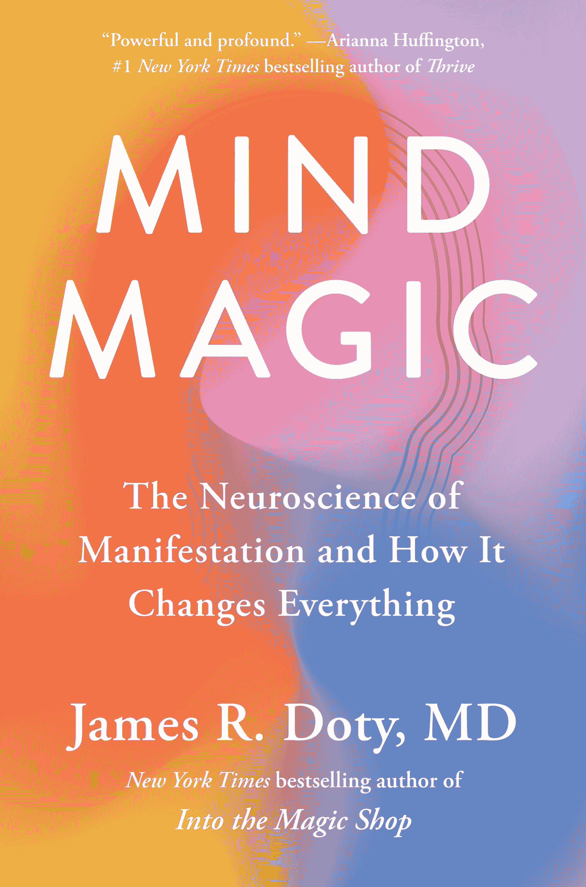
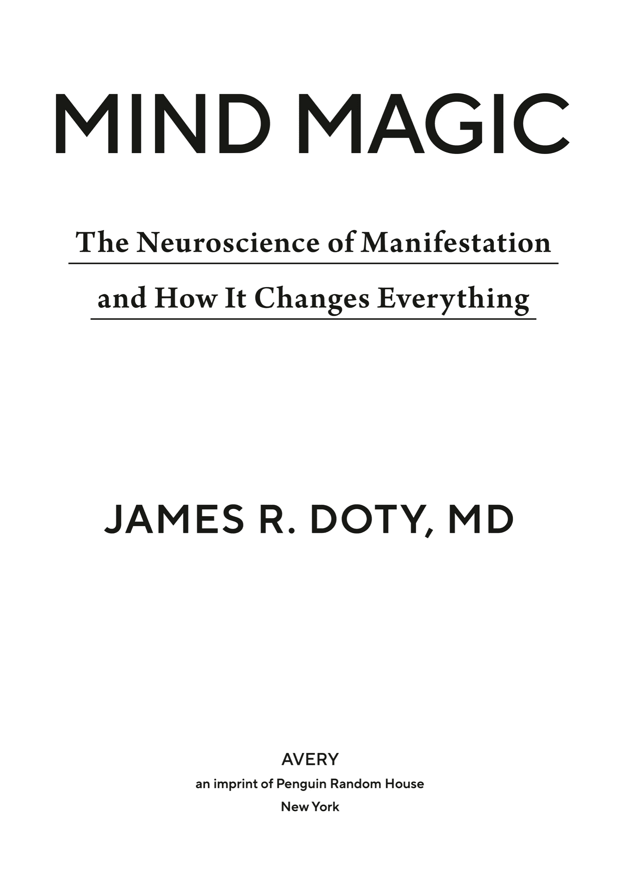

# 心灵魔法：显化的神经科学及其改变一切的方式

# 介绍

# 真正的秘密

宇宙对你并不在意。

这听起来可能不太像，但这是个好消息。宇宙对你并不在意，并不是因为你不值得、与宇宙不相容，或是被诅咒了十代。不是的，宇宙之所以不在意你，是因为它没有任何在意的能力。

我们许多人被教导要花费一生的时间期待外部的某种东西来解决我们的问题，使我们变得完整：一个中奖彩票、一位知道所有答案的智者、一个大师、一个守护天使，或者宇宙中某个神奇的存在、力量、能量或精灵，会为我们安排好一切。多年来，我也渴望相信这一点。我曾认为有一个严厉的宇宙父母在监视我们所有的行为，决定我们是否配得上获得梦想中的房子、遇到灵魂伴侣或治愈癌症。作为一名神经科学家和医生，我现在知道我们没有证据证明存在这样的力量或存在，但我们有大量科学证据证明我们自身思维的力量可以在生活中产生最初看似不可能的变化。这就是显化的实践。

在流行文化中，关于显化的概念常常令人困惑，因此在我进一步阐述之前，以下是我所说的“显化”的意思：*显化*是定义一个意图，使其深入我们的潜意识，而潜意识在意识之下运作。通过这样做，我们激活与目标导向相关的大脑网络，使意图变得重要、显著或引人注目。在实践中，这意味着无论该意图是否在意识层面上存在，始终专注于目标的大脑机制都会全天候被激活。我们的内在意图现在引导着我们的生活。通过利用我们的内在力量来挖掘我们大脑的巨大资源，我们逐渐减少外部环境的影响，开始从我们最深层的意图出发生活。

事实上，成功显化的第一步是将自己与相信有外部来源来解决你问题的观念分开，而这个外部来源正是你生活中的显化。如果你想过上富裕、有意义和繁荣的生活，你不必迎合任何超越自己的力量。你只需相信你幸福和成功的源泉无非是你自己思维的力量。现实是，创造你想要的生活障碍的那一颗心灵，也是使你想要的生活成为现实的意图的源泉。这才是真正的秘密。

你所关心的事情必须是你自己真正的关心。这才是真正的魔法。

我以一名神经外科医生的身份告诉你，我研究并手术于大脑，同时作为一名神经科学家，我花了数十年研究人类的心灵与大脑，作为一名精神技术的实践者，我曾与达赖喇嘛及其他精神领袖合作，向成千上万的人教授同情心，作为一个通过艰辛学习这一切的人。

实现是一种培养对可能性强烈信念的过程。作为一个孩子，我深刻意识到负面环境对人类生活的限制力。我在贫困中长大，父亲酗酒，母亲则长期抑郁并有自杀倾向。我感到生活是一种惩罚或诅咒，或者，可能更糟的是，它是一团随机且混乱的麻烦，毫无条理可言。也许你也在努力寻找事件的意义，这些事件让你感到生活是偶然的，或者你在想，为什么你和你所爱的人必须承受这样的痛苦，而这没有任何正当理由，而你又感到无能为力。这些挣扎开始限制你对可能性的视野，使其愈加狭窄。

多年来，我任由我的环境主宰我的生活，而我不相信自己能够产生任何有意义的改变。当我们经历创伤时，情况常常如此：创伤体验带来的痛苦和冲击在我们心中占据了夸大的权威，这种权威难以挑战，且面对时令人恐惧。这种痛苦的力量足以改变我们自己的基因，正如表观遗传学领域的研究者发现的那样，还会影响后代的基因。我们的心灵和身体会围绕着防止未来发生类似创伤的准备进行组织，在这个过程中，我们的意识陷入了对一个令人恐惧且不可靠的外部世界的反应，而不是设想我们可以做出的改变。在这个过程中，我们将本应用于在自己生活中真正改变的能量、注意力和专注力拱手让出；我们被转移了对自己力量的关注。在不知不觉中，我们用固有的自我能动性交换了魔法思维。这是个不划算的交易。

世界确实可能非常不公平，这种不公平会粉碎一个人的梦想。尽管我曾经认为这个世界有多么不公，但今天我知道，这个世界上还有无数其他人面临着更大的不公，无论是在个人层面还是系统层面。他们所生活的社会创造了结构性障碍，限制了他们的实现能力，这些障碍可能与他们的种族、社会阶层、宗教、性取向、性别表达或其他任意标准有关。还有一些人受到身体和精神严重疾病的困扰，几乎无法缓解他们的痛苦，这也影响了他们对自己实现能力的信心。实现并不是所有痛苦的疗法或解决方案。像所有人类活动一样，它可能会受到我们无法控制的无数因素的限制，现实有最终的决定权，无论我们的意图如何。话虽如此，如果有改变的可能性，运用实现的技巧更可能帮助实现这一改变。

我被一次听到的故事深深打动，故事讲述了一名越南战争期间的战俘，他实践了一种“长期非特定乐观主义”的态度。他不知道自己是否会被解放，也不知道何时解放，他意识到自己的处境超出了他的控制：与俘获他的敌人作斗争可能导致被杀或因绝望而失去生存的意志。相反，他有意识地实践乐观，使他能够保持希望，认为自己的处境可以改变。他利用自己的思维力量，保持对自由可能性的信念。这给予了他韧性。当他被释放时，他的乐观态度帮助他不去关注过去，而是展望未来的可能性。

因此，我认为实现的本质是福祉的实践、与世界的互动以及过上美好生活。通过练习这一点，我们培养了*性格乐观主义*，它被定义为在重要生活领域中普遍期望良好结果的倾向。研究表明，性格乐观主义与许多健康益处相关，从心血管健康的改善到伤口愈合的速度，再到疾病进展的减缓。一些人可能认为成功实现的唯一标准是它所带来的物质结果，但我认为这种看法是误导性的。反复想象我们的意图的真正馈赠是让我们以一种轻松的心态生活，确信事情会向有利于我们的方向发展，这使我们能够无论外部环境如何，都能既灵活又坚韧。

* * *

—

显化的实践可以追溯到几千年前。我们今天与显化相关的许多内容源自印度教传统的吠陀经典。例如，《门达卡奥义书》指出：“一个纯净理解的人在心中构想的任何世界，以及他所珍视的任何愿望，他都能征服那个世界并获得那些愿望”（3.2.10）。佛陀同样评论了思想对我们世界经验的强大塑造能力，他说：“一个僧人思考和沉思的任何事情，都会成为他意识的倾向。”

在十九世纪，被称为新思想的精神运动从多种宗教和哲学来源汲取灵感，包括炼金术、新英格兰的超验主义、基督教福音和印度教，以形成“吸引力法则”的概念。在其核心，吸引力法则相信我们的思想决定了进入我们生活的经历的性质：积极的思想带来积极的经历，而消极的思想则带来消极的经历。新思想为西方文化中关于显化的许多流行文献奠定了基础，从拿破仑·希尔的*思考致富*（1937）到诺曼·文森特·皮尔的*积极思考的力量*（1952），再到或许是最著名和臭名昭著的，朗达·拜恩的*秘密*（2006）。

吸引力法则的概念导致了许多关于显化性质的不幸误解。首先，它与一种自利的繁荣福音相联系，这种福音是由我们的物质文化所推动，让你相信通过变得富有、住在豪宅里和开昂贵的车，你就能创造幸福，并找到实现愿望所需的行为改变。而也许最具破坏性的是，它传播了一个观点：我们所经历的痛苦和不公正的情况完全是我们自己思维的结果。我希望我在这本书中与您分享的内容能够重新框定您对显化的理解，使其成为通往有意义和有目的生活的途径，并在一天结束时，帮助您认识到什么才是真正重要的。

显化长期以来一直局限于与占星术、塔罗牌和对水晶力量的信仰相同的新世纪领域，充满了伪科学和陈词滥调。直到最近，科学上研究大脑如何将意图转化为现实的具体过程仍然是不可能的。但成像技术的重大进展革命性地改变了我们观察大脑在细胞、基因甚至分子层面上变化的能力。我们现在可以用认知神经科学和大规模脑网络的功能来讨论显化。这使我们能够证明，显化既不是快速致富的方案，也不是误导性的愿望实现系统，而是大脑改变、治愈和重塑自身的非凡能力的一部分，这种能力被称为*神经可塑性*。

神经可塑性是指大脑在一生中以及对经历的响应下，修改、改变和适应结构与功能的能力，能够形成新电路并修剪掉那些不再对我们有用的旧电路。通过重新引导注意力，我们可以真正地改变大脑，在帮助我们学习、表演和实现的关键区域创造更多灰质。随着大脑的适应，它会进行改变，这可以对帕金森病、慢性疼痛和注意缺陷多动障碍（ADHD）等产生戏剧性和积极的影响。相同的神经可塑性是我们如何通过意图和实践改变大脑，实现我们所设想现实的方式。

显化本质上是将我们渴望的生活的思想和图像有意植入潜意识的过程。我们都在以一种未经训练和无知的方式显化意图，结果往往是偶然的、模糊的和不集中的。为了有意识地显化，我们必须学习如何重新夺回和引导注意力的力量，并理解让我们能够引导这种注意力的生理机制，以及限制我们这样做的障碍和错误信念。当我们有意识地将注意力引向我们渴望的目标时，这些目标对大脑变得重要。我们目标的嵌入方式是通过一种称为*价值标记*的过程，这是大脑决定什么在潜意识最深层次上重要的方式。当我们进行视觉化时，我们 conjure 出强大的积极情感，这些情感促使*选择性注意系统*将我们渴望的目标标记为高度有价值，并将其与我们的奖励系统联系起来。视觉化有效，因为令人惊讶的是，大脑并不区分实际的物理体验和强烈想象的体验。

一旦目标植入我们的潜意识，大脑就像一只猎犬，寻找机会将其转变为现实，全力支持这个寻找过程。当机会出现时，我们会注意到并做出反应，采取必要的行动以推动目标的发展。我们多次重复这一植入意图的过程。一旦我们尽了一切努力去实现目标，就必须接受这就是我们所能做到的，不再对结果有执着。显化有其自身的时间表，可能与我们的时间表不一致。此外，现实是，并非所有目标都会显化，通常有许多理由导致这种情况，而这些理由在当时并不明显。

* * *

—

在我的第一本书《走进魔法商店》中，我讲述了我作为孩子时那次改变我一生的命运相遇。成长在加州高沙漠的贫困和痛苦家庭环境中，我相信自己受到了一种诅咒，使我的生活局限于小范围，任由环境摆布。一个夏天的日子里，当我的父母争吵时，我骑上自行车，尽可能快地远离家，嘴里含着灰尘，走进了一家魔法商店。我遇到了一位善良的女士，她名叫鲁思，穿着蓝色的穆穆，正从她在看的平装书中抬起头来。她的眼镜架在鼻子上，脖子上挂着链子。鲁思给了我一个令人难以置信的灿烂微笑。她的微笑本质上让我感到安慰：她让我感到安全。她告诉我这是她儿子的商店，她对魔法一无所知。在我们交谈了大约二十分钟后，鲁思表示她将在这个夏天待六周，并提议如果我每天来商店，她会教我另一种类型的魔法。在这六周里，鲁思给我提供了源源不断的奇巧饼干，并教我她所称的“真正的魔法”：我可以用来放松身体、驯服心灵、敞开心扉、澄清和可视化我意图的技巧。我在魔法商店后面的房间里，坐在金属椅子上，脚踩着棕色绒毛地毯，与鲁思面对面度过的快乐时光，是我第一次体验神经可塑性。她的善良和关怀重新连接了我的大脑。

尽管我最初感到犹豫、困惑和恐惧，鲁思教会我足够地与自己的思维分离，以便看清它的本质：不过是一个接一个的想法，经过我的脑海并消失。起初，我会对脑海中涌现的恐怖声音和灾难图像反应恐惧或攻击，但我学会了用积极的、自我肯定的想法来替代消极的想法；我可以放下那个告诉我“像你这样的人永远不会有所成就”的声音，取而代之的是我想成为的那个人的声音，过上我想要的生活。我发现我有一颗可以通过重复和意图重塑的新路径的脑袋，朝向我自己的治愈。在她的帮助下，我意识到了我内心的力量。

当时我不明白的是，鲁思教给我的实际上就是今天我们所称的显化。虽然鲁思和她所分享的确实有些神奇，但她的建议非常实用——在某种程度上，她早在我成为医生和神经外科医生之前，就帮助我研究人类大脑和心灵的力量。在鲁思的善良和关怀的激励下，我全身心投入到我想要的未来愿景中，这也是我真正将渴望的生活显化为现实的第一步。我从完全依赖外部世界的暗示转变为基于与自己的亲密内心对话做出选择，这种对话我每天都在练习。

这是一项艰巨的工作，我常常想放弃。当我变得不耐烦时，我记得鲁思对我说：“吉姆，要耐心，要耐心。你只需要耐心。改变你的大脑需要时间。”

要有耐心是很困难的。特别是因为我不知道到底发生了什么或者将要发生什么。但我学会了耐心，我学会了如何活在当下和倾听。或者，那时我以为我已经在倾听。

鲁思的善良、陪伴和耐心改变了我生活的轨迹，她的教诲几乎成为我在生活中取得的一切成就的基础。最终，我运用鲁思的方法使自己离开了高沙漠的家乡，进入大学，随后进入医学院，后来成为一名神经外科医生，并随后成为一名成功的医疗企业家。但在这个过程中，我与自己内心的联系渐渐疏远，这让我付出了沉重的代价——不仅仅是经济上的，还有我最亲密的人际关系。

鲁思始终强调敞开心扉的重要性。无论我追求什么目标，渴望成就什么崇高的理想，她总是让我回归与自己和他人之间的真诚联系。因此，我常常发现，尽管每个人内心都拥有这种魔力，却常常被误解、商品化，或被呈现为只有某些人能够接触到的东西。在我们文化中，显现通常被理解为获取巨额财富和财物的一种方式，只有少数幸运的人才能享有，而我认为这实际上是促进健康、完整和与我们世界之间开放心灵互动的日常实践。而所谓的繁荣福音则让我们相信，我们的欲望是显现的主要动力，但我在这里告诉你，实际上是我们引导注意力的能力。

当我第一次写《进入魔法商店》时，我完全没有想到它会产生如此大的影响。我没有预料到如今最受欢迎的 K-pop 乐队 BTS 会以我的书作为他们第三张专辑《Love Yourself: Tear》的灵感，或者录制以书中为灵感的歌曲《Magic Shop》，又或者我会和演员乔恩·哈姆讨论我的故事改编成电影，或者有一个十六岁的女孩会受到启发制作基于我的“心灵字母表”概念的手机应用。我诚实地认为，无论我的书是否售出任何副本，如果它能改善一个人的生活，那就足够了。自书籍出版以来，我收到成千上万的读者信息。即使现在，每个月通过电子邮件收到两百到三百条新信息。还有一些是手写在撕下的黄色法律便签纸上，或用美丽的手工纸书写的书法。它们来自日本、罗马尼亚、撒哈拉以南非洲，以及我旁边的北加州。这些读者对我故事的真诚反馈让我坚信，即使在我们最深的绝望、无助和恐惧时，我们也并不孤单。每个人都有伤痛，当我们坦诚分享时，这些伤痛成为我们之间深度连接的纽带。

当我倾听读者对我作品的反馈时，我注意到我收到的许多信息来自那些在生活中受苦的人，他们在寻找恢复自己伤痛和改善境遇的力量。他们的情况千差万别，但他们的渴望却惊人地相似。尤其是，他们想知道可视化如何运作以实现他们的梦想。《进入魔法商店》讲述了我个人从贫穷走向富裕、再回到贫穷，最终又回到慈悲之心的旅程。这是一个人的故事，包含了所有的独特性：起伏、优势和挫折。

但是*心灵魔法*是关于*你的*旅程。在这本书中，我将向你展示如何利用大脑的力量使你的意图成为现实，并从神经科学的角度详细解释其运作原理。我将引导你了解我和许多人在实现意图时遵循的六个步骤。这些步骤源于我作为神经科学家和冥想实践者的终身学习与实践。这六个步骤涵盖了实现过程的每一个方面：重新获得聚焦心智的力量；明确我们真正想要的；清除心中的障碍；将意图植入我们的潜意识；热情追求我们的目标；以及放下对结果的执着。此外，我还包含了不同类型的实现故事，希望能激励你开始生活并书写你的故事。

就在几年前，完全呈现出一个基于最新神经科学见解的显化工作框架还是不可能的。现在，有可能突破伪科学和神秘主义，揭示支撑放松、超脱、同情和可视化的具体大脑机制，这些都是鲁思教给我的。我希望清晰地展示显化背后的科学，能让读者不仅信任这些实践，还能利用它们自我疗愈、改变生活，并理解他们改变世界的力量。

与*秘密*中所暗示的相反，显化并不局限于少数人或受控于一个百分之一的秘密社会。显化是一种完全公平的实践，面向所有人开放，具有超越个人直接身体、心理和情感状况的潜力。因此，这本书还将充满来自各种背景人们的故事，以及他们如何运用与我们现在对神经科学理解一致的原则来显化他们的意图，从渴望成为医生的学生，到神经多样性的青少年，再到精通波利尼西亚航海术的大师，以及好莱坞超级巨星。

最后，我希望通过坦诚我的错误，能够帮助读者避免犯同样的错误，尤其是在决定什么是真正值得追求以及什么能带来真正的幸福时。

开始之前的最后一言。在整本书中，我包含了一些练习，帮助你澄清自己当前所处的位置，并朝着你想去的方向前进。我将这些练习放置在我的解释过程中合理的位置。然而，在最后一部分，我将它们整合并安排成一个为期六周的程序，供希望做出更正式承诺的读者使用。

# 第一章

## 从废墟中走出

## 我正在展现什么？

> *我们必须从对真实生活条件的了解中汲取生存的力量和行动的理由。*
> 
> —西蒙娜·德·波伏娃

你可能没有意识到或相信，但你已经在展现你的生活。问题是，这是否是你想要的生活？

那是 2000 年，互联网泡沫刚刚破裂。一天早上，我醒来时身价 7800 万美元，拥有一座位于佛罗伦萨的别墅和一座 7500 平方英尺的海角风格豪宅，俯瞰纽波特湾，车库里停着法拉利、保时捷、奔驰、宝马和路虎。我刚刚支付了新西兰一座 6500 英亩小岛的定金。是的，我自己的私人岛屿，拥有四座房屋和被深蓝色水域包围的沙滩，以及完全的隐私。我以为我已经将童年的贫困抛在了身后。

似乎我想要和努力争取的一切都已实现，但就像许多相信硅谷提供无限可能性的人一样，我发现了残酷的现实，整个净资产在六周内化为乌有。这就像一场噩梦，但我却清醒着，每一天都带来了更多的坏消息。

我从一家硅谷银行借了 1500 万美元，作为抵押，我用了一家医疗科技公司的股票。我已经好几个月没有和我的银行家联系了，但当我手机早上响起第百万次时，我知道无法避免不可避免的结果。

“你好？”

“吉姆，”他用假装的银行家愉悦的声音说。“你好吗？”

他知道答案。他关注了互联网危机，深知我的抵押物几乎一文不值。他告诉我我已经知道的事情。

“吉姆，除非你还有我不知道的其他资产，否则你已经破产了。”停顿了一下，“我们该怎么办？”

“卖掉一切，”我突然回答。

“听起来你没有选择，”他说。“让我们几周后再谈，到时候我们会对事情的走向有更好的了解。”

不久之后，我被迫卖掉佛罗伦萨的别墅，取消在新西兰“小岛”的购买，卖掉除了一个以外的所有汽车，并将俯瞰纽波特湾的豪宅挂牌出售。那时没有人住在那座房子里。我当时与妻子分居，女儿在上大学，我作为一位朋友创办的医疗科技公司的首席执行官住在硅谷。无奈之下，我返回空荡荡的房子，为出售做准备，眼前的种种严酷的证据让我意识到几乎所有的梦想都已破灭。当我开车上来时，看到的是我妻子曾满怀热情和关心种植的花园。曾经茁壮成长的植物如今却枯萎和死亡。黄叶的杜鹃和垂头丧气的茶花暴露出花园缺乏承诺来检查的园丁的疏忽。房子看起来像是被遗弃了。

最让我伤心的是家中缺失的人。在各个房间的墙壁上都有钉子或挂钩，但没有挂画。当我的妻子离开时，她带走了所有的家庭照片，以及任何关于这个家曾有家庭生活的记忆。在中央客厅，壁炉上方有一个矩形的阳光影子和一个钩子，上面曾挂着一幅相框。这曾是我们珍爱的植物图案印刷品，描绘的是由巴伐利亚大师巴西利乌斯·贝斯勒创作的鸢尾花球，曾在我们一次印刷探险中在佛罗伦萨的一家隐蔽的古籍印刷店里发现。

那些是快乐的时光。在同一家商店里，我们发现了一些我们喜欢的十六和十七世纪的旧地图，我买下了它们。我记得当时感到快乐，以及我让她快乐的感觉。我记得我们曾经乘坐头等舱，住在五星级酒店。我的妻子转向我说：“谢谢你。”

那些遥远的回忆与我们之间逐渐形成的沉默是多么不同，充满了怨恨，随着我们越来越远。我回想起最后时刻我们之间亲密感的痛苦缺失，我加做额外的手术，用漫长的工作时间作为借口，不去尝试修复我们之间失去的连接，而她对我说：“我不再认识你了。”

我经过女儿的房间，里面仍然摆满了家具。我走过去坐在床上，想起了她，以及我们在这座房子里的许多回忆。但我也记得她离开时对我说的“我不会想念这个地方”。我一开始不理解，但后来意识到她的感受是由于我和她母亲之间关系的现实。我不知不觉地开始与自己的生活保持距离。即使在家庭生活的中心，我的思绪却在别处：拉扯回痛苦或理想化的过去记忆，或者朝着未来倾斜，期待着我的下一次手术，我的下一个财务里程碑，那个我终于能拥有足够过得去的辉煌时刻。在这个过程中，我忘记了享受我所拥有的，忘记了与我想要共同建立生活的人们联系。

当我走过正式的客厅，再走过非正式的客厅时，我的思绪在回放着一个已经结束的生活幻灯片。我经过我的书房，那里有一把带有铜钉的深蓝色翼椅，我曾和朋友们在那儿喝波特酒、抽雪茄，那是我在“美国大兄弟大姐妹”慈善拍卖会上购买的雪茄盒，我还是那次活动的主席。我的名字刻在上面的一个牌匾上。当我坐在那把椅子上，拿起雪茄时，看着牌匾，我曾感到重要。我再次坐在那把椅子上，用手指抚摸着牌匾。此刻我既不感到重要，也不感到强大。我感到渺小。

现在我成了唯一在那里的一个，房子显得荒谬而浮夸。房间似乎过于宽敞，充满了虚无的热气。我就像一个迷你的人在一座庞大的玩偶屋里游荡，里面满是多余的配饰。家具本身也显得奇怪地不堪一击。从我内心深处，浮现出一段童年的记忆。贫穷是一个悖论：一方面，空气中充满了沉重感，仿佛是无法逃脱的负担；但另一方面，所有东西又被一种奇特的轻盈感笼罩，就像它们随时都可能随风而去。

我努力为我的家庭建立一个坚实的基础，因为我自己的家庭经常被 uprooted。没有什么比被赶出家门更让我感到羞辱和卑微。副警长带着驱逐令敲我们的门。我们的 belongings 摆在人行道上。邻居们好奇或怜悯地观看着，我心里想着，*我希望我妈妈能找到一个地方让我们住下去*。我记得坐在路边的沙发上，身边是我们所有的 belongings，而我的妈妈坐在我旁边。这时，我的姐姐已经搬走了，我的哥哥也不在家。他总是在这种时刻离开，也许是为了保护自己，或者不想在邻居的观众面前感到尴尬或羞愧。

我妈妈搂着我说：“没关系，儿子。一切都会好的。我们会找到一个地方。”

* * *

—

我小时候常常在哥哥不在家的时候偷偷溜进他的房间，翻看他为艺术灵感而收集的旧版《建筑文摘》。我的哥哥是一个了不起的艺术家，他总能找到能激发创造力的宝藏。当我看到一栋房子的细节让我觉得特别舒适或戏剧化——比如俯瞰大海的遗孀步道，或者温暖家庭聚会的显著壁炉——我就会偷偷撕下那一页，加入我的收藏，这些收藏放在我袜子抽屉里的一个绿色纸板文件夹里。当然，这些杂志都是来自 1960 年代和 70 年代初，那时完美的美国家庭的形象毫不留情地统治着我的童年想象。但多年来，我还是积累了相当多的建筑细节档案，所以当鲁思让我想象我想要的家时，我有大量的图像可以参考。

在我脑海中形成的画面是我站在一个卡普科德风格的豪宅阳台上，俯瞰着深蓝色的水波。一个个夜晚，我都想象自己在那里，感受海风在脸颊上的刺痛，品尝舌尖上的咸味，凝视着旋涡般潮汐的深处。事实上，我体验这一场景如此生动，所有感官都全力投入，以至于当我真正站在俯瞰纽波特湾的卡普科德风格豪宅的寡妇步道上时，我几乎没有感到惊讶。更准确地说，我的大脑平静下来，以一种舒适的熟悉感和认同感接收了这一经历。

在那些清晨和无眠的夜晚，我进行冥想和可视化练习，重新塑造了我的大脑，让它适应我的梦想。这是显化过程中的一个悖论：在我真正购买之前，我的豪宅、寡妇步道和海风的形象已经从不可思议的幻想变为具体的现实。到我在现实中走出阳台时，我的大脑*期待*我在那里。它的期待，加上我的潜意识对愿景的全天候关注，使我的豪宅成为了一种自我实现的预言。

* * *

—

被我的巡回演出压得喘不过气来，我坐在楼梯顶端，房子的中心，双手抱头，思考接下来该做什么。我的肩膀因对妻子的怨恨而抬起，怨恨她留下的空虚和她留下给我的所有痛苦、困难的任务。我的喉咙因对在大学的女儿的渴望而收缩。我的下巴因对自己巧妙地制造出这一切麻烦而紧绷。

我的思绪飞快跳动，从任务跳到怨恨，再到对未来的担忧。但最终，一个问题在我脑海中回响：*我错过了什么？* 就像一个病人在我的照顾下去世，尽管我严格遵循了治疗方案。我做对了一切，得到了我想要的一切，但却不知为何失败了。我取得的成功本应是我生活中的巅峰体验，却感觉就像跌入谷底。

答案在我试图完成待办事项列表时浮现出来。在努力完成众多任务后，我发现自己在一个装着几盒旧物的衣橱里。我挪动了一盒书，目光落在了更有价值的东西上。那是我十二岁时用来装我珍贵物品的雪茄盒。从大学以来我就没打开过它。我坐在衣橱的地板上，把盒子放在腿上，打开了盖子。过去的淡淡麝香味飘了出来。盒子里我找到了我的兰开夏高中班戒，镶嵌着切割玻璃的红宝石；我用来表演戏法的皱巴巴的塑料假拇指；还有最珍贵的，那本破旧的黑白作业本，里面记录着我和露丝在一起时的所有笔记。

我翻阅着笔记本的页面，发现了我的愿望清单。

> *上大学*。
> 
> *做医生*。
> 
> *一百万美元*。
> 
> *劳力士*。
> 
> *保时捷*。
> 
> *豪宅*。
> 
> *岛屿*。
> 
> *成功*。

我在童年书写中看到了其他我认出的露丝智慧的片段：

> *心灵的指南针*。*你想要的并不总是你需要的*。
> 
> *伤害他人的人往往是最受伤的人*。

我低头看着装着我珍爱的物品的雪茄盒。意识到尽管我累积了很多东西，从某种意义上说，这个薄薄的十二英寸的盒子装着我真正拥有的一切，我的心感到一紧。一个人不能拥有超过他们所能爱的东西，而我打开我的心扉的宽度并没有超过我第一次写下清单时的程度。我的豪宅，我的岛屿，我的汽车，甚至我的家人都无法容纳在我内心那狭窄的空间里，而现在它们正在离开，可能会被那些真正能够珍惜它们的人找到。

起初，我的脑海中急于寻找可以责怪的人或事。当它开始回忆往事时，却很难找到一个可以明确指责的罪魁祸首。在我的生命大部分时间里，我都在等待一个父亲般的人物，他能在任何情况下告诉我该怎么做，照顾我，爱我，教我如何成为我想成为的人。我的亲生父亲无法填补这个角色：他是一个勉强能运转的酗酒者，工作时他（以及我的家人）总是勉强维持生计。他工作几个月，我们开始感到稍微安全，但他随后又会酗酒，花光所有的钱，喝醉回家或消失几天。几乎总是，酗酒与他因某种我们都不知道的原因失业有关，他害怕和羞愧回到家中面对我们，于是开始喝酒。我们经常搬家，从一个我不想住的地方的毫不起眼的公寓到另一个，始终希望他能找到一份稳定的工作。但这从未发生。

更糟的是，我母亲遭受了一场使人虚弱的中风，花大部分时间躲在床上避世，而当她的抑郁情绪达到低谷时——这常常发生——她会试图自杀，通常是过量服用安眠药。我常常感觉自己像一片被恶风吹动的落叶，或者像五十年代情景喜剧中的小演员，一切都以灾难性的方式发展。我感觉与宇宙格格不入，仿佛自己做了什么冒犯它的事；整件事情似乎都是我的错，但我却无法辨认出我的罪过或如何纠正它。没有成年人来照顾我，我产生了过度的责任感和严重的心理负担。在我未曾意识到的情况下，我的消极思维在脑海中像地下电台残酷的 DJ 一样嗡嗡作响。这些想法影响了我大多数的互动，产生了一系列不断痛苦和不快乐的经历。而这些消极思维不断回旋于我的大脑和身体，使我对世界的消极看法显得坚实而真实。

我已经获得了所有与成功相关的外在标志；我想相信露丝的魔法治愈了我。我想相信我放弃了对更好或不同过去的幼稚希望，夺回了所有的力量，继续前行。如果这没有奏效，那么一定还有别的问题。所以我接下来试图指责我的大脑。但这并不是我大脑的错：毕竟，我的大脑和潜意识忠实地执行了我给他们的指令，产生了超出我梦想的物质成果。那块金色的劳力士表紧紧裹在我的手腕上，法拉利、宝马和保时捷停在我的车库里。那座豪宅简直像我曾在高沙漠的小公寓里热切研究的《建筑文摘》上的照片一样栩栩如生，而那间小公寓的视野只不过是另一栋公寓的单调米色背面，周围堆满了垃圾桶，或是无尽的充满风滚草的沙漠。我忠实的仆人，我的大脑只做了我要求的事，从不质疑我的意图或动机。

我的大脑只是在履行它的职责。要在大脑中创造新的神经通路，需要巨大的纪律和勤奋的重复，如果不加以维护，它们就会像任何森林小径一样变得杂乱无章。尽管是鲁思的技巧让我获得了如此多的繁荣与成功，但在我破产时，距离我上次练习这些技巧已经过去多年。随着我一个接一个地实现清单上的项目，我对自己实现愿望的能力越来越有信心，而与鲁思信息的联系也变得不再紧迫：结果，我逐渐减少了对鲁思技巧的练习。你可能也曾在多年前接触过某种实践，或经历过改变你自我认知的灵性体验，但今天你发现自己在逐渐远离它，或者努力将它融入生活。这就像一种上瘾：你越久不再沉迷，越觉得自己不需要去参加 AA（戒酒协会）。回想起来，我忘记了鲁思的教诲有多么重要。

在缺乏清晰与安慰的实践来将我与鲁思的变革体验联系起来时，我独自面对家庭的解体、财富的丧失和资产的清算。更重要的是，我不得不面对自己失去了打开内心的强大习惯，这种习惯曾让我暂时安抚内心对自己的严酷负面独白。没有了同情心这剂良药的持续注入，我深藏的自我批评和自我怀疑的习惯如潮水般卷土重来：*你不够好。像你这样的人永远不会有所成就。你永远不会成功*。一段时间内，我的物质成功的号角淹没了内心批评者的咆哮。但后来，当我参加奢华的晚会或驾驶我的跑车沿海而行时，我开始听到了它，像一个阴险的审问者在我脑海中低语。最终，它开始浮现出来，像我小时候一样指责我。

这个声音源于鲁思所称的“心灵创伤”，让我感到恐惧，驱使我去证明它是错误的。如果我能让世界相信我足够好，相信我已经成功，我就能一次性让这个声音沉默，或者我曾如此相信。更重要的是，我对物质成功的追求归结为我渴望逃避自己内心折磨者的绝望欲望，那是我内心羞耻的声音。讽刺的是，当我急于追逐每一项新收获时，我却忘记了去面对我自己的痛苦，而正是这种痛苦驱动着我对每个新闪亮物品的渴望。我记得我唯一一次对鲁思撒谎，那时我向她承诺在设定意图之前我已经打开了我的心。 我没有意识到的是，我从那时起就一直在坚持那个谎言。

今天，作为一名医生，我可以回顾过去，看到自己作为患者经历了一场严重疾病的旅程。那种疾病是羞愧，而主要症状是缺乏自我价值感。作为一个十二岁的孩子，我并不具备做出准确诊断的资格，因此我假设我的疾病就是贫穷。基于此，我认为合适的治疗方法是通过社会标准累积所有成功的标志。我给自己开了一条单一而不屈的物质成就之路，这条路是由我内心批评者的推动所驱动。然而，由于我只诊断了表面问题而非根本原因，这个问题持续存在，经过多年未治，情况愈发恶化，直到我在生活的废墟中徘徊时达到了顶点。

如果你的心脏动脉有明显的狭窄，常见的治疗方法是血管成形术。这涉及在动脉内插入一个微小的气囊以扩张动脉，随后放置一个金属网支架。血管成形术和支架放置仅能缓解胸痛并提供暂时的缓解，但除非解决导致动脉斑块的习惯性行为和情绪痛苦，否则支架通常在一年内需要更换。最终，你面临一个选择：解决潜在问题或死亡。

我追求的物质成功本质上不过是提供暂时缓解的支架，掩盖了我内心的羞愧感。与此同时，羞愧的病痛持续阻碍着我与生俱来的自我价值感。我不知何故绕过了真正的痛苦。事实上，我并不孤单。我们中有数百万人生活在否认和虚假希望的迷雾中，未能清楚了解自己的痛苦（或是不愿了解），在日常生活中跌跌撞撞，怀着美好的愿望，但当我们发现自己反复经历同样的故事时，感到困惑不已。对我们许多人而言，我们正在表现出自己的不幸。

坐在衣橱的地板上，我终于*看到了*我的生活，以及它变成了什么。我看到了自己大学毕业、医学院毕业、结婚、对未来的希望、女儿的出生、作为神经外科医生的职业生涯、作为企业家的成功、离婚、与女儿的疏远，以及如今的孤独与失败。我花了那么多时间生动地描绘未来的成功，以至于从未真正目睹当下的生活。在那一刻，坐在楼梯顶部的十二岁吉姆与四十四岁吉姆在共同的困惑中相遇：*我错过了什么？*

当我开始哭泣时，我意识到我错过了什么。我曾想要一座足够大的房子来弥补我家人所遭受的痛苦，从这个意义上说，我得到了我想要的。在我心中，我创造了一个豪宅，而不是一个*家*。但更深层次上，我最渴望的是这种*家的*体验：安全、归属、连接和温暖。能够陪伴我所爱的人，关心他们，被他们关心，并分享他们的挣扎。我实现了梦想的外在表象，却忘记了用那些赋予梦想意义的人和充满爱的关系来填充它。我忘记了满足我内心的渴望。

* * *

—

我上到寡妇的步道，最后一次眺望海湾。当我第一次想象我最终会住的家时，最突出的是站在阳台上俯瞰纽波特湾的画面。而我将这个愿景变为现实。那里有利多岛，还有被优雅的帆船环绕的巴尔博亚半岛，船只宣告着它们主人的奢华与悠闲生活。

阳台上有一把孤独的椅子，我坐下来片刻。我闭上眼睛思考，突然听到身后传来声音。我转头一看，发现一窝负鼠藏在一个悬垂物体下的缝隙里，背后是一台灭火器。

这座空房子一定是母负鼠一个诱人的避难所。小负鼠的哭声听起来像人类的喷嚏，而坐在那把椅子上，我感觉就像在偷听一个孩子的生日派对，大家都感冒了。当我面对拆解我家的任务时，我惊叹于负鼠在组建她自己家时的勤奋。她是如何小心翼翼地用尾巴搬运树叶、草、树枝、苔藓和树皮的；在没有建筑或室内设计学位的情况下，她创建了一个完全适合庇护她的小负鼠的结构，直到它们准备独立出去。

我知道我正处于自由落体中，我的思维抓住了它能找到的第一个温柔的东西：我该如何处理那窝负鼠？动物管理部门来查看可能需要很久，即便如此，他们的方法会人道吗？我不能就这样把无助的小动物抛到外面，让它们挨饿、受冻或被吃掉。房子是我与旧生活的最后联系，也是阻止我走向新生活的东西，无论那将是什么。只要窝还在，我就不会离开这个房子。我也没有勇气去移动它。

“见鬼，你们这些混蛋！”我对着负鼠大喊，毫不在意邻居们是否听见或认为我疯了。

*请让我走，求求你们*，我在心里想着。但我知道我不能就这样走开。

是时候面对我的现实，并对我的生活承担责任，就如它现在的样子。我得到了我认为想要的东西，但它们带来了许多意想不到的问题。我曾经创造了这些问题，现在的任务就是应对它们。事实上，我无法开始新的生活，无论它以何种形式出现，而不处理旧生活中的问题。我的生活在外部可能已经崩溃，但在内心深处，尽管有所有相反的情感证据，我依然还好。将我的意识与环境所带来的负面情绪反应分开是可能的。我的神经系统相信这一点的唯一方法是让我冷静下来。我需要放松，深呼吸，呼气，释放紧张，才能清晰思考。

在进行了一些研究后，我为母负鼠设置了一个活捕器：里面铺满撕碎的报纸，并放了几片苹果。负鼠是夜行性动物，所以我必须熬夜确保她能进来。然后，我戴上园艺手套，仔细检查她的巢穴和灭火器后面的阳台上是否有留在那里的小宝宝。当我确认所有的宝宝都在时，我把捕器装进车里，驱车前往海岸边的一个树林。我把笼子放在地上，打开捕器。母负鼠小心翼翼地爬出来，嗅着地面，她光秃的尾巴在上面卷曲，宝宝们 tucked 在她的育 pouch 里。在接下来的几周里，这些刚出生时大小如蜜蜂的小家伙们，虽然既听不见也看不见，却会变得独立，开始自己探索。它们的本能强大而可靠，毫不怀疑。而我们人类，凭借着异常大的大脑和多年来对环境的反应与适应，必须为我们的自然智慧而奋斗，为倾听内心指引的能力而努力。

我祝福负鼠们在新生活中一切顺利，回到我空荡荡的家，开始我的生活。

* * *

—

人类是不完美的生物，我们的欲望也常常不完美。当我们想象拥有一辆法拉利时，我们 envision 自己在高速公路上飞驰，享受着我们认为财富带来的无忧无虑的自由。我们并不想象没有人可以分享冒险的痛苦。当我们想象要住在豪宅里时，我们看到的是一个温暖而生机勃勃的家庭生活场景。我们不想象我们的家庭因缺乏亲密感而破裂，而我们自己孤单面对房屋的出售。我们想象我们想要的事物，却未考虑它们带来的复杂性。我们想象寡妇的走廊，但却忘了负鼠。

在我考虑下一阶段生活中想要实现的事情之前，我必须理解我*已经*实现的事情，并以清晰的头脑和开放的心态评估其价值。什么是有效的，什么是无效的？我在实现空荡荡的豪宅、破裂的家庭和死胡同中扮演了什么角色？我的思维、未经检视的信念以及与内心未了的事情是如何促成这种困境的？

### 练习：我*已经*在实现什么？

在这个练习中，我邀请你以清晰和同情的心态评估你当前的状况。这里的意图是尽可能客观地看待你的境况，而不带有任何评判。当你发现自己已经在实现的生活方面时，你会发现自己可能在某些地方抑制了内心的力量。现在无需担心改变任何事情。你只需提供一种善意而清晰的觉察。

1.  #### 为自己做好准备

    1.  找一个时间和地点来进行这个练习，以确保不被打扰。

    1.  如果你感到压力、有其他事情分心、在过去二十四小时内喝过酒或使用过娱乐性药物，或感到疲倦，请不要开始这个练习。

    1.  旁边准备一张纸和一支笔。

1.  #### 开始放松

    1.  坐在一个放松的位置，闭上眼睛几分钟，让你的思绪平静下来。

    1.  现在，坐直身体，眼睛仍然闭着，慢慢通过鼻子吸气，慢慢通过嘴巴呼气，重复三次，直到这种呼吸方式对你来说感到舒适而不分心。

    1.  从你的脚趾开始，逐渐放松身体的肌肉，一直到头顶，随着你专注于放松身体，感受到越来越轻松。你会发现，当你这样做时，一种平静的感觉会笼罩着你，你感到安全。你不再担心别人对你的评价或批评你的梦想和抱负，慢慢地继续进行深呼吸。

    1.  在你继续缓慢地吸气和呼气时，你感到舒适和放松。

1.  #### 想象你的生活

    1.  温柔地回忆起你生活的整体轮廓。你最重要的关系是什么？你的工作是什么？你生活发生的地点在哪里？当你考虑这些问题时，注意涌现出的情感。不要特别固定于一个形象或想法，而是让你的思维松散地触及构成你今天生活的主要元素，持续几分钟。

    1.  让任何出现的情绪自然流露。你可能会注意到一系列情感：快乐、满足、悲伤、沮丧、无聊、愤怒。只需与它们以及你生活的细节共处几分钟。

1.  #### 更全面地想象

    1.  继续回顾你生活中的画面。你可以思考这些问题：哪些人对你很重要，他们的存在对你有什么意义？你是否感到与他们真正连接？你的工作是什么？它是否为你的生活提供了所需？如果你有依赖你的人，你的工作是否能够养活他们？你花费一天的方式对你来说是否有意义和充实？你生活的地点又如何？身处那些地方的感觉是什么？

    1.  想象自己身处生活中，注意这些画面唤起了什么。用心中的眼睛观察你的生活。慢慢地吸气和呼气，努力想象每一个细节。慢慢吸气，慢慢呼气。

    1.  现在你可以看到每一个细节，慢慢睁开眼睛，继续缓慢地吸气和呼气，吸气，呼气。你感到放松，内心平静。

1.  #### 记录你的观察

    1.  拿起笔和纸，至少写五分钟，用你自己的话描述你在想象生活时所看到和感受到的。尽可能写下细节。无论是一两句话还是一段文字，重要的是你在真实地书写自己的生活，以及你对生活的感受。

    1.  现在，简单地闭上眼睛，缓慢地进行三到五次鼻吸口呼的呼吸，然后睁开眼睛。

1.  #### 回顾你的写作

    1.  首先，默默地阅读你所写的内容。

    1.  然后大声朗读你所写的内容。

    1.  闭上眼睛，静静地与生活的画面相处几分钟。

1.  #### 反思你的生活

    1.  花几分钟反思一下自己的选择是如何塑造你现在的生活的。你在哪些地方做出了有意识的决定？你在哪些方面让别人替你选择，或者只是选择了最简单的路径？

    1.  如果你的生活与你曾经的期待和想象不符，你在实际结果中扮演了什么角色？今天生活的任何部分都不需要你感到害怕或自责。这只是一个事实发现的练习。虽然这可能不会让你觉得如此，但你正在迈出第一步，重新夺回塑造自己生活的内在力量。

1.  #### 珍惜你的实践

    1.  感受通过真实地审视你的生活所带来的力量和主动权。你的生活已经开始转变。

> 你注意到了什么？在你反思的过程中，生活中是否有某些领域引发了强烈的情感？如果某个领域让你感到痛苦，你可能想将其作为你 manifesting 的重点。如果某个领域让你感到温暖和快乐，我邀请你时不时地有意识地想起这些画面并感到感激，因为这些情感可以成为你强大的支持。
> 
> 在你进行这个项目的过程中，保留你从这次练习中写下的笔记。无论好坏，今天的生活将成为你希望实现的新生活的基础。你可能想把你所写的内容读给一个可信的朋友或导师，并分享你的发现让你感受到的情绪。这会给你一种责任感，并寻求在面对抵抗、恐惧和怀疑时所需的外部支持。到项目结束时，你可能会对已经发生的变化感到惊讶，而你在这个练习中的努力将是你进步的良好基准。

* * *

—

你还可能会发现你已经在 manifesting 的程度，并借此机会对你迄今为止的努力表示感激，对生活所带给你的感恩。

现在我们知道了自己的起点，并清楚地看到了我们已经在 manifesting 的生活，我们可以开始创造我们想要努力实现的生活的过程。但在我们开始我们的 manifesting 旅程之前，我们需要了解我们正在使用的硬件，它是如何设计的，以及它是如何协同工作的。

# 第二章

## 网络与振动

## 实现的生理学

> *任何人如果有这样的倾向，都可以成为自己大脑的雕塑家。*
> 
> —圣地亚哥·拉蒙·卡哈尔

当我在高中的时候，我认识一个叫乔治·卡洛威的人。你们学校也许也有像他这样的人。乔治是个文艺复兴式的人物：优等生，学生会主席，以及三项运动的优秀运动员。他能在角落的底线投进压哨三分球，打出让观众都站起来尖叫的大满贯，然后转过身来，毫无争议地阐述为什么应该废除美国选举人团制度。你无论往哪里看，乔治都在活动之间自如切换。当然，我很羡慕他，有时希望能看到他像普通人一样摔倒在地，但大多数时候，我钦佩他为当时需要他的团队、学生委员会或筹款活动所服务的更大目标。

大脑里充满了乔治·卡洛威。我们的神经元是多面运动员，依据需要产生的认知活动，不断形成和改变团队：从我们五种感官进行数据解读、道德推理、模式识别、记忆、直觉。神经元组合成可识别的区域，这些区域扩展成被称为*大规模脑网络*。这些网络像自我组织的卡洛威联盟一样运作，协同工作以执行高层次任务，并创造出令人目眩的复杂意识元素。

从神经科学的角度来看，大规模或内在网络是利用功能性磁共振成像（fMRI）、脑电图（EEG）、正电子发射断层扫描（PET）和脑磁图（MEG）等扫描技术发现的广泛脑区的集合。每个网络的特征在于它在整体认知产生中的作用。大规模网络内的区域表现出功能连接性，这意味着在进行某些高层次认知活动时，如处理图像或回忆记忆时，它们在统计上有相关性，会一起被激活。神经元可能根据情况重新组合以支持不同的思维功能，有点像 NBA 中最优秀的球员组合成全明星或奥运队。大规模脑网络是正常运作的大脑的基石，它们活动的中断与多种神经精神疾病相关，如抑郁症、阿尔茨海默病、自闭症谱系障碍、精神分裂症、注意力缺陷多动障碍（ADHD）和双相情感障碍。

实现主要利用了这四个大电路：默认模式网络（DMN）、中央执行网络（CEN）、显著性网络（SN）和注意力网络（AN）。正是这四个主要大脑区域的相互作用，加上迷走神经的两个分支，使我们能够将专注的注意力放在我们的意图上，并使这些意图对大脑变得重要，从而将其嵌入潜意识，并利用其力量去实现它们。

关于这些大规模网络如何相互作用我们已经知道很多，但仍然有许多未知的领域。我将概述这些不同的大脑网络，以及让它们协同工作的过程如何成为我们内在力量的一部分，从而最大化我们实现意图的潜力。为了理解这些网络和神经系统是如何协同工作的，我们来考虑一个实际的实现示例。

### 安娜拉的故事

安娜拉在斯里兰卡成长，那是一个政治和经济动荡的时期，正值持续的内战。随着岁月的流逝，轰炸加剧，她的父亲越来越担心国家的发展方向，开始更加考虑移民到美国。安娜拉的父母也觉得她和她的兄弟在斯里兰卡之外会有更好的教育机会。2004 年的毁灭性海啸加速了这个过程，最终当安娜拉十五岁时，她和家人移民到了美国。

虽然她父母决定搬迁的初衷是为了给孩子们提供一个更安全、资源更丰富的成长环境，但从短期来看，这次搬迁对家庭生活质量的影响是巨大的。她的父亲曾是一名在斯里兰卡从事传染病研究的微生物学家，在美国申请了无数份专业工作，但只能在加油站工作并开优步。她的母亲在此之前从未在外工作，也不得不作为托儿所的提供者来帮助家庭维持生计。因此，他们变得财务不稳定。更糟的是，她的母亲被诊断为乳腺癌。由于缺乏优质医疗保健，家庭无法得到好的医生治疗，每一张医疗账单都是一个新的恐惧来源。

“我记得有一次我妈妈把我叫到一旁，”她回忆道，“告诉我，‘你必须为自己打拼，因为这次搬家对整个家庭来说是一个巨大的牺牲。’”

财务不安全感和成功的压力重重压在安努拉身上。她没有办法让自己冷静下来。她的杏仁核——位于大脑两侧半球内部、负责威胁检测的扁桃体状组织——长期处于过度活跃状态，使她的心灵充满焦虑，身体充满皮质醇等压力激素。尽管她是在一个佛教盛行、接触过冥想的国家长大的——甚至在学校也学过这项技能——但当她抵达美国后，她的精神修行在日常生活的烦恼与问题中迷失了。对于安努拉来说，从高中到大学的过渡尤其困难：她不仅是第一次远离家庭，还被诊断出多种慢性疾病，并开始遭受严重的焦虑和抑郁。

“就像漩涡一样，被吸入一个洞里，”她说。

她从大学一开始就知道自己想要进入医学领域。然而，由于身体和心理上的病痛，以及家庭不稳定带来的压力，她在学业上无法以竞争的方式表现。每当她即将参加考试时，焦虑便会肆虐，心中充满对失败的恐惧和令人尴尬的生动画面。因为她的杏仁核处于持续的威胁状态，她无法将注意力集中在自己的目标上。年复一年，她的预科医学顾问都告诉她：“你的 GPA 不够好，无法进入医学院。”她只能忍受着明知自己梦想却无法追求的痛苦继续生活。

大学毕业后，她在一家制药公司担任助理数据经理，意图继续追求成为医生的目标。她尝试参加医学学院入学考试（MCAT），但因恐惧而不知所措。极度的焦虑使她产生了身体症状：“我真的想要呕吐，我会来回踱步，无法集中注意力。当压力增加时，我就无法正常运作。这伤害了我的自尊和自信，也让我感到崩溃。”

有一次，她排定了考试时间，但最后因紧张而在最后一刻取消了。“有一次，”她回忆道，“我想，‘哦不，我不会进入医学院，一切都会崩溃。我会让我的父母失望。我会让我的社区失望。当家里的人都受了这么多苦时，我的一切都将是徒劳的。’ ”安努拉的困境的身体表现使她的心灵被锁在一个她觉得没有能力改变的故事中。

她在努力摆脱困境时，开始探索灵性，从占星术到死后生命再到鬼魂，这引导她走向了显现。在工作休息时，她毫无意识地在谷歌上搜索“使用魔法进入医学院”。这使她找到了我的第一本书《进入魔法商店》，在书中我也曾被医学预科顾问一再告知我不够优秀，无法被录取。事实上，她给我发了邮件，描述了她想要进入医学院的愿望和与焦虑作斗争的经历。她的故事让我印象深刻，我回复了她，这使我们进行了几次关于显现的电话交谈。

在那之前，她一直认为显现仅与崇高和遥远的精神目标或奇幻的财富展示有关。利用显现满足个人即时需求和实现目标的主题——例如支付房租或进入医学院——让她产生了共鸣。当她看到如何将这些技巧应用于帮助自己迈出小步伐并在生活中做出实际改进时，她对自己的信念发生了改变。

“我的感觉是天壤之别，”她告诉我。

由于她在佛教方面的精神背景，我书中所列出的冥想练习特别引起了她的共鸣。她迅速开始练习冥想和放松技巧，以应对她压倒性的焦虑和抑郁感。逐步放松身体，使她能够平静下来，心绪安定，注意力集中在呼吸上。这是她很长时间以来第一次能够清晰思考。

### 交感神经系统与副交感神经系统

人类并不是为了始终处于压力状态而设计的。我们许多人每天承受的慢性压力状态，是我们神经系统功能与现代生活在最基本层面相互作用的不幸症状。

人类拥有一束起源于脑干的神经，即迷走神经，属于所谓的*自主神经系统*（ANS），意味着它通常在意识层面以下自动运作。这个神经系统的部分在我们作为一个物种进化的早期就发展出来，分为两个部分。首先进化的是*交感神经系统*（SNS），它的任务是确保我们的生存和基因的延续，其主要活动是启动*战斗、逃跑或冻结*反应。在这里，杏仁体主宰着一切。SNS 的战斗、逃跑或冻结反应在无数物种中存在了数百万年。因为它是为了在生死攸关的情况下行动而进化的，它通过非常短的神经元传递信息，因此能够在瞬间完全支配我们的身体和情感资源，充满应激激素如皮质醇，并使我们的肌肉紧张以便采取行动。

后来，人类神经系统进一步进化，增加了*副交感神经系统*（PNS），也称为*休息和消化*反应，其作用是使身体恢复到平静的休息状态，这一过程被称为*体内平衡*。切换到休息和消化伴随着各种生理变化，以促进平衡与和谐：我们的肌肉放松，心率和血压下降，唾液分泌增加以帮助消化。当我们处于休息和消化状态时，感到平静和镇定，能够与他人及环境建立联系，同时能够调动新皮层的更高层次功能，包括抽象规划、创造力和逻辑推理。

这两种反应之间的区别对我们的显现过程至关重要：只有当我们转入神经系统的休息和消化反应时，我们的大脑才会允许我们重新获得注意力，获取想象力的力量，解锁我们的潜意识。有一句话被归于维克多·弗兰克尔（尽管这只在自助作家史蒂芬·柯维和韦恩·戴尔的著作中有所记载），他说：“在刺激与反应之间有一个空间。在那个空间中是我们选择反应的能力。在我们的反应中蕴含着我们的成长和自由。”正是我们的选择能力使我们能够专注注意力，并影响我们解锁的潜意识来显现我们的意图。

正如安娜拉的慢性焦虑故事所示，战斗、逃跑或冻结反应并不是设计为长期激活的。它旨在对压力情境产生短期的生理反应，比如遇到竞争部落或逃跑避开老虎，然后迅速恢复到*体内平衡*的基线。在我们祖先进化的非洲草原上，一些能量用于觅食，但生活的许多时间都是在休息。威胁出现时，往往是瞬息万变的；它们并不是像我们现代世界那样持续不断和无休止的。因此，身体设计为迅速恢复到休息状态，以便从剧烈事件中恢复，并释放诸如催产素和血清素等积极神经化学物质，促进友善和健康的联系感。保持平静、满足和关怀是我们物种的基线。

问题在于，虽然进化需要数百万年才能适应环境变化，但人类在短短几千年内就深刻改变了我们的环境。实际上，直到大约六到八千年前，我们仍以五十到一百人的小团体生活作为狩猎采集者。不幸的是，今天快节奏和令人焦虑的世界充斥着触发战斗、逃跑或冻结反应的不确定性和挫折感，并通过不真实、想象或微不足道的威胁持续激活这一反应。实际上，我们正通过一个设计用于处理剑齿虎攻击的系统，来应对同事电子邮件中的消极攻击性评论。正如我们将看到的，战斗、逃跑或冻结反应的长期激活及其释放的炎症蛋白对身体产生了有害影响，包括心脏病的增加和免疫系统的减弱。由于慢性压力，我们在健康和寿命方面付出了巨大的代价。

在我们历史的这一点上，可以说，虽然战斗、逃跑或冻结反应与我们作为一个物种的生存相关，但实际上它是进化遗留的负担，已不再适合应对我们现在的世界。尽管休息与消化反应在今天的世界中更为适宜，但它在对身体和思想的控制上处于持续的斗争中。

战斗、逃跑或冻结与休息与消化：生理学

#### 自主神经系统（ANS）分支

交感神经系统（SNS）

##### 主要活动

动员身体的战斗、逃跑或冻结反应

##### 功能

控制身体对感知威胁的反应

##### 神经通路

较短的神经通路 = 更快的反应时间

##### 身体反应

身体加速并紧张，变得更加警觉；与生存不相关的功能关闭

##### 心血管系统（心率）

增加收缩并提高心率

##### 呼吸系统（肺）

支气管扩张

##### 骨骼肌系统

肌肉收缩

##### 瞳孔

瞳孔扩张

##### 唾液和消化

唾液分泌停止

##### 肾上腺

释放肾上腺素

##### 神经递质

肾上腺素和去甲肾上腺素（加速心率）

##### 蛋白质

促炎症

#### 自主神经系统（ANS）分支

副交感神经系统（PNS）

##### 主要活动

调节身体的内稳态和休息与消化反应

##### 功能

控制身体在休息时的反应

##### 神经通路

较长的神经通路 = 更慢的反应时间

##### 身体反应

平衡：身体恢复到平静状态

##### 心血管系统（心率）

减慢心率

##### 呼吸系统（肺）

支气管收缩

##### 骨骼肌系统

肌肉放松

##### 瞳孔

瞳孔收缩

##### 唾液和消化

唾液分泌增加；消化增加

##### 肾上腺

无参与

##### 神经递质

乙酰胆碱（减慢心率）

##### 蛋白质

抗炎

要更清楚地理解我们的神经系统如何工作，我们必须了解冲动是如何沿着神经本身传播的：神经递质。术语*神经递质*常常与*激素*互换使用，但它们之间的区别在于，神经递质是在神经之间的连接处，即*突触间隙*，从神经末梢释放，而激素则是直接释放到血液中。大脑中有超过一百种神经递质，它们已经进化以调节多种功能，大多数功能在无意识水平上运作，包括心率和血压、消化以及对饥饿和口渴的感知，还有我们对压力的反应。

其中四种神经递质主要负责我们的幸福感、幸福和积极情绪，实际上对我们的生存至关重要。它们是多巴胺、血清素、催产素和内啡肽，通常被称为“快乐激素”。多巴胺常被称为“奖励化学物质”，因为它与愉悦、满足和动机相关，还与学习和记忆有关。它也与*心流状态*相关，即被一项引人入胜且愉快的任务完全吸引的体验。血清素常被称为“情绪稳定剂”，与幸福感、睡眠调节、性行为和食欲有关。它还与提高学习能力和改善记忆相关。低水平的血清素常常与抑郁、焦虑、躁狂和其他心理障碍相关。催产素被称为“爱情激素”，因为它与浪漫依附、联系行为、亲密感、认同、连接、信任和性唤起相关。内啡肽是身体的天然止痛药，在感受到疼痛或压力时释放，产生一种整体的幸福感。大多数人知道内啡肽来自剧烈运动时的“跑者高潮”，但它们也会在性、冥想、巧克力和笑声中释放。正如我们在后面的章节中将看到的，这些化学物质在体验积极情绪中起着至关重要的作用，这些情绪是教我们的脑子将我们的意图分类为重要和值得追求的。

### 安娜的新发现力量

当阿努拉开始感受到内心的一些轻松和平静时，她发现自己可以更深入地反思自己想要的和如何实现它。她开始给自己写信，祝贺自己取得的成就，这使她能够在心里预演已经实现目标的感觉。她从小处开始。首先，由于她仍在经历经济不安全，她尝试着表达自己在工作上被晋升的愿望。“恭喜你晋升，阿努拉！”她写道。她把信折好，放在钱包里。每当她排队或坐公交时，她都会拿出来重读。每次，她都深呼吸，想象现实中获得晋升的感觉和积极情绪。

一遍又一遍地阅读这封信提高了她在工作中的自信心。她感受到自己逐渐进入“我知道这会发生。实际上，这已经发生，因为我决定了”的感觉。她开始观察到自己在工作中不安全和怀疑自己决定的倾向正在大幅减少。她变得更加果断，这反过来又提高了她的自信和自我表现。这种新发现的自信激发了同事和上司的尊重。在团队会议中，她的恐惧减少了，发言更多，确保自己的声音被听到。她开始体现出通常要求的领导素质，以获得她渴望的晋升。通常，这样的晋升需要一到两年，但在几个月内，她被晋升为全职数据经理，薪水增加了大约$20,000。

尽管她在进步，但恐惧依然困扰着她，夺走了她的注意力。她向目标迈出一步，却又被自我怀疑和灾难的画面所淹没。“我知道我想要什么，”她说，“但我在精神、身体和心理上并没有一致。我的生活是以恐惧为基础的，而不是活在一个显现的心态中。”

变化发生在她能够将个人目标与为生命更大整体做贡献的能力对齐时。“当我试图通过医学院的过程时，一切都非常以我为中心，来自恐惧的地方。我必须打破这种模式，敞开心扉，反思我能为未来的患者带来多大的不同。这使我能够将恐惧转化为同情。”

清晰的思维和放松的身体使她重新与慈悲实践相连，这种慈悲，也叫做友善，是她六岁时在斯里兰卡的学校学习的。她从对自己给予慈悲开始，逐渐扩展到对所爱之人的慈悲，最终扩展到她未来如果成为医生可以帮助的患者。对她的孩童时期而言，这种实践显得抽象而枯燥，而现在随着她想象能够帮助的具体活生生的人类，这种实践变得生动起来。她详细想象了自己对这些患者的真诚慈悲和可以给予他们的关怀。当她想象自己做出正确诊断、成功进行手术、安慰一个害怕的家庭成员时，胸中涌起温暖。她的神经系统得到释放，这让她超越了以自我为中心的方式，与更大的目标相契合。

安娜拉认真地继续练习她的放松技巧：她通过呼吸冥想平静自己的神经系统：吸气四计，呼气八计。她学会了有意识地紧绷整个身体，然后逐部分释放紧张。随着她的身心逐渐平静，她能够安抚恐惧和羞愧的声音，降低它们的音量。她的专注能力提高了，精力水平也随之上升，使她能够参加模拟 MCAT 考试。随着模拟分数的提高，积累在她心中的巨大恐惧慢慢消散。MCAT 不再是怪物；它只是她通往理想目标途中需要完成的一步。

当她准备再次参加考试时，她给自己写信，祝贺自己取得高分，后来又祝贺自己被医学院录取。然而，现在，每当她拿出其中一封信阅读时，她将可视化和放松技巧与对她将要治疗的痛苦人们的真诚同情结合在一起，再次体验到深厚的连接感、服务感和喜悦感。

当她以重新获得的信心将注意力集中在学习上时，她发现自己以前未能察觉到的材料之间的联系。她能够更全面地理解身体内部的系统以及它们之间的关系。她对来自老师、同学和家人的支持机会也更加敏感。

“我不再在海洋中溺水，”她说。“我学会了在不断涌来的浪潮上冲浪。但现在，我得到了源源不断的正能量的支持。”

下次她参加 MCAT 时，她的成绩很好。她完成了医学院的申请，奇迹般地收到了她首选学校的面试邀请。面试进行得很顺利，在经过几个月的等待和继续练习她的技巧后，她终于收到了她无数次想象过的信。她手中握着录取通知书，感到一种奇怪的感觉：这曾经看起来像是遥不可及的东西，似乎仅存在于绝望的另一边，但现在她的心灵反应得像是早已预料到这一切。这封信是*熟悉*的。

安努拉现在已经从医学院毕业，并继续练习平静心灵和敞开心扉，以服务于她的职业和对病人的关怀。

### 默认模式网络（DMN）

默认模式网络是大脑中研究最为透彻的网络。从解剖学上讲，DMN 也被称为*内侧额顶网络*（M-FPN），由内侧前额皮层、相邻的前扣带皮层、后扣带皮层/前扣带和角回组成。

本质上，DMN 负责当一个人向内专注时的大脑活动，包括清醒休息、白日梦、心灵漫游和怀旧。它使我们能够进行*自我参照处理*，或者说反思自己的能力。从某种意义上讲，它使我们能够叙述“自我故事”，提取并整合储存在长期记忆中的自传，使我们能够以第一人称的视角看待这些信息。它涉及心理时间旅行，从回忆过去的事件到设想未来可能发生的事件。它在我们思考他人时也起到作用：考虑他们的想法，理解和共情他们的情感，判断某种行为是对是错，甚至在缺乏社会互动时感受到孤立。在我们日常生活中，当大脑没有被特定任务占据时，我们主要体验到 DMN 的运作，就像是无休止的内心喧嚣。

早期研究者注意到，当一个人专注于某些以目标为导向的任务时，DMN 会被去激活，因此得名“任务负网络”。这个标签后来被弃用，因为它具有误导性，因为该网络实际上在我们追求*内在*目标导向任务以及涉及心理概念的认知任务时是活跃的。一个例子是内省冥想时，我们将注意力集中向内，探索我们的思想、情感和感受，而没有外部干扰。当我们参与外部任务时，DMN 可以成为评论者，提供对我们表现的详细思考。

最具危险性的心理现象之一是我们称之为“内心批评者”的习惯性负面自言自语。从神经科学的角度来看，内心批评者可以被视为默认模式网络和应激网络之间不幸的协作。当 DMN 被 SNS 的压力反应所吸引时，我们体验到的那种使人无能为力的自我意识感使安娜拉陷入瘫痪。对我们的目的至关重要的是，DMN 与注意力网络（AN）呈负相关，这意味着它越活跃，我们获得注意力力量的机会就越少。本书中的练习部分旨在减少 DMN 对我们“内心批评者”所贡献的压倒性自我意识感。

默认模式网络（DMN）为我们在显现中提供了两个强有力的教训：首先，像心智游荡这样的体验说明，认知并不总是与此时此刻的事件相联系。随着我们的练习，我们将学会有意地将意识从五种感官中的任何发生事物中脱离，并将其引导到我们设想的未来体验中。第二，当我们的思维游荡时，它不可避免地开始对内部表征进行详细描述，而这正是我们内部自我意识的基础。虽然这种自我意识对于生活中的各种互动和日常活动是无价的，但它可能严重干扰我们完全融入愿景所需的流动状态，因此我们必须学会调低它的音量。

### 突显网络（SN）

突显网络是大脑用来判断什么重要的认知系统。正如我们稍后将更详细探讨的，大脑每秒钟接收到大约六到一千万个信息位，但能够有意识地处理的仅为五十个位。这意味着大约 99.9995%的刺激在到达我们大脑时，都是在无意识的层面上被处理的。在我们所遭遇的内部和外部刺激的压倒性轰炸中，SN 识别出最相关或*主观显著*的信息，并据此指导行为。SN 参与检测、过滤和确定所有来自内外的信息的相对优先级，包括感知到的冲突和信息中的不一致。我们的潜意识中包含对我们所重视和自动关注的事物的分类，这影响着我们的 SN 如何扫描我们体验中重要的内容。有一些证据表明，SN 功能失调，例如当我们的注意力被强迫从有意识的方向转移到强迫性思维时，可能是焦虑、抑郁、疼痛和物质障碍的核心特征。

突出性通常与背景相关，由新颖性或意外产生，但它也可以通过有意识地将注意力转向我们选择重视的特征而产生。一个显著的特征可以被视为在其他非显著特征的背景中突出的图形。人类处理信息的能力有限；他们无法关注情况的每一个方面。正如我们稍后将更详细地看到的，思想、想法或意图的突出性决定了哪些信息片段最有可能引起我们的注意，并对我们对世界的感知产生最大影响。当阿努拉在阅读她写给自己的祝贺信，或想象自己帮助未来的病人并排练相关的积极情绪时，她是在利用她的 SN 来告诉大脑这些经历是重要的。一旦这种重要性确立，她的潜意识就准备在现实中促成这些经历，以便再次获得相同的良好感觉。通过重复，我们可以使我们关注的意图突出，以排除其他输入。通过这样做，我们创造了被称为*突出性偏差*或*认知轻松*的现象，使我们的意图成为潜意识无法忽视的对象。

从结构上讲，SN 包括前岛叶（即前部）和相邻的下额回（IFG），背侧（即顶部）前扣带回（ACC），以及杏仁体。前岛叶从下到上扫描我们所感知的差异，然后协调多个大脑区域共同调动必要的资源，以便在检测到差异时作出反应。背侧 ACC 参与情感状态和冲突的评估，以及利用自上而下的处理来回应感知到的情感差异。左侧 IFG 作为腹外侧后额皮层（PFC）的一部分，检查新信息，并通过重新评估其相对于我们已有联想网络的意义，帮助将其同化到现有内部模型中。杏仁体是 SNS 的一部分，与识别威胁相关。当杏仁体在威胁反应中被激活时，会对 CEN 和 DMN 产生负面影响。当一切正常运作时，这些结构共同识别某物为显著。然而，当它受到压力反应的影响，无论是在当下还是在回忆创伤事件时，SN 可能会错误判断某一特定内外事件的重要性，从而触发不适当的自主或认知行为反应。

因为我们的脑和神经系统从身体内外接收到如此大量的数据，我们不可能将注意力放在每一个细节上。相反，在我们的潜意识中有一种剧本，管理着意识注意力的宝贵领域，并将其他所有信息重新引导到自动处理系统中。因此，即使信息在我们眼前非常明显，我们也会错过大量的信息。

心理学中最著名的实验之一被称为隐形大猩猩实验或选择性注意测试。在这个实验中，被试观看一段视频，视频中两组学生，一半穿着黑色 T 恤，另一半穿着白色 T 恤，在传递篮球。观众被给予两个可能的指令：计算穿白衬衫的人传球的次数，或者跟踪地面传球与空中传球的次数。然后，一个全身穿着大猩猩服装的人走过现场。最后，研究人员询问他们是否注意到视频中发生了任何异常的事情。令人难以置信的是，50%的被试没有报告看到大猩猩。

这个实验强调了定向注意的性质以及被称为*注意盲区*的现象。被试在忙于计算球传球次数（我们关注的定向显著成分）时，错过了周围事件的其他方面，无论这些方面多么奇怪和非凡。它还展示了当我们被过多的感官输入压倒时，我们甚至不知道自己错过了多少。

### 注意网络（AN）

在显著性网络中，有一个关键部分负责集中我们的注意力。这被称为*注意网络*（AN），包括腹侧和背侧两个组成部分。基本上，这些网络的作用是决定我们如何集中注意力，以及是否允许我们的注意力从任务中分散开来。

背侧注意网络（DAN）参与自愿的、自上而下的注意力部署。在 DAN 中，顶叶内沟和前眼场影响大脑的视觉区域。这些影响因素允许注意力的定向。腹侧注意网络（VAN）主要包括右半球的颞顶交界区和腹侧前额皮层。当行为相关的刺激意外发生时，这些区域会做出反应。在集中注意力、使用自上而下处理的情况下，例如在视觉搜索某物时，VAN 会被抑制。这种反应可能会防止以目标为驱动的注意力被不相关的刺激分散。当目标或与目标相关的信息被找到时，VAN 会再次激活。

一旦安娜拉通过放松使她的 SNS 平静下来，她就能进行专注注意，从而将她想要的意图嵌入她的潜意识中。随着意图越来越牢固地植入，她的思维能够更加有效地集中在实现该意图所需的任务上。这反过来又导致她对学习内容的更深理解，以及对其中联系的更细腻的感知。

### 中央执行网络（CEN）

中央执行网络（CEN）维持和操控工作记忆中的信息，并负责在追求目标导向行为时进行决策和解决问题。你可以把它看作是首席执行官，负责下达命令并决定组织的方向。尽管默认模式网络（DMN）在静息清醒状态下显示激活，CEN 在认知和情感挑战活动中则显示激活。其主要组成部分包括背外侧前额叶皮层和外侧后顶叶皮层。背外侧前额叶皮层在工作记忆中操控材料并权衡可能的行为反应。外侧后顶叶皮层整合来自五种感官的信息以及我们的内部感知，以促进持续的注意力。CEN 的低活动性与抑郁症和多种认知障碍相关。

我们需要 CEN 来帮助我们做出明智而恰当的实际决策，但我们也需要它进行自上而下的处理，以调节我们的情绪。当安娜拉被压力和怀疑压倒时，她失去了保持情绪透视、重构情绪、将注意力重新引导到目标上，以及让自己从慢性 SNS 激活状态中缓和下来的能力。当 CEN 正常运作时，它就像一个稳重和稳定的成年人，能够安抚幼儿般的神经系统并缓解其发脾气。这种心理和情感的稳定性在我们寻求将意图嵌入潜意识时是必不可少的，这需要一种平静、轻松和稳定的心理状态。

### 它们如何协同工作

要以最大力量显现，四个网络必须在优雅的互动中有效协作。

当这个过程顺利进行时，SN 与 AN 协同工作，以确定刺激——在这个例子中就是我们期望的意图——需要更高的认知处理。这个互动激活了 CEN，并停用了不断单方面讲述的默认模式网络，动态地让我们能够毫无干扰或自我意识地专注并引导我们的思维。网络之间的团队合作为我们在潜意识中嵌入意图开辟了一条通道，这反过来又使大脑中的重要资源致力于在现实中实现它。

问题在于交感神经系统（SNS），它是我们潜意识的守门人。有证据表明，当面临压力时，过度活跃的 SNS 会劫持默认模式网络（DMN），使我们通常在安全情况下进行的自我反思能力变得反应性。当这种情况发生时，我们对自己作为一个独立且脆弱的自我所感受到的威胁，会产生过多的反思，阻碍我们激活中央执行网络（CEN）的能力。这反过来可能会削弱有效认知功能和意图嵌入的能力，同时降低我们情绪调节的能力。因此，意图实现的嵌入必须在安全和无威胁的环境中进行，从而最大化我们的认知控制。我们的身体越放松，内部和外部感受到的安全感越强，SNS 的干扰就越少，自我反思的涌现也会减少。

### 绿色区

与许多幼体一出生就能自给自足并寻求保护的鱼类和爬行动物不同，大多数温血哺乳动物在出生后需要大量的父母关怀和投资：它们需要有人保护、寻找食物、抚育，并在成长过程中创造一个安全的环境。因此，哺乳动物必须进化出有助于接近、接触和联系的生理特征。一个主要的适应是有髓鞘的副交感神经系统中背外侧迷走神经的进化，它将器官与中央控制系统连接起来。这一进化之所以重要，是因为它形成了亲和和关爱反应的基础，进而提供了我们感受和表达同情的生理通道。这部分髓鞘迷走神经构成了*绿色区*的基础，在这个区域，我们保持冷静、专注、流畅，能够对他人给予反应性的关怀。绿色区也是我们最有效地动员意识以可视化和追求目标的状态。

当副交感神经系统（PNS）被激活时，迷走神经的张力增加。我们随后进入绿色区。这种幸福状态促进整体健康；释放有益的激素如催产素，这对免疫和防御系统至关重要；通过促进流动状态，帮助学习、批判性思维和创造力；并基本上优化人类体验。这也是实现意图的状态，因为它将我们的皮层置于主导地位。

自主神经系统带来了处理我们的情感、记忆和计划的能力，这使我们在对体验的反应中更加深思熟虑和敏锐。这种宽广的处理能力是你掌握改变对世界反应方式的关键。当我们有选择如何反应的时候，这些选择会影响我们的生理状况，从而影响我们如何回应环境。

那么，我们如何从战斗、逃跑或冻结的反应转变为休息和消化的反应呢？我想起了许多年前在魔术商店学到的练习。

### 练习：放松身体

1.  #### 准备好自己

    1.  找一个时间和地点进行这个练习，以便不被打扰。

1.  #### 选择一个姿势

    1.  这个练习可以站立、坐着或躺下进行。在开始之前，找到一个舒适的姿势，让你感到放松，同时又要稳固而坚定，以便能保持对你体验的警觉。

    1.  伸直脊柱，让肩膀放松下来。你要寻找的是一种放松自信和温和力量的姿势。

1.  #### 开始安定下来

    1.  闭上眼睛，或轻轻将视线指向你前方几英尺的地方。让你的注意力转向内心。

    1.  现在，注意你身体接触到的任何表面。让重力将你固定在地面上，感受地面向上压入你的脚。注意身体中明显紧张的区域，并在意识中轻柔地承认它们。

    1.  首先深吸三口气，通过鼻子吸气，慢慢从嘴里呼出。如果你愿意，可以在呼气时大声叹气。重复这些深呼吸，直到你习惯这种呼吸方式，以至于呼吸本身不会干扰你。

    1.  一旦你习惯了这种呼吸方式，特别注意你坐着或躺着的姿势，想象自己正以那种方式看着自己。

1.  #### 开始身体扫描

    1.  开始专注于你的脚趾，并邀请它们放松。邀请它们中的任何紧张感释放。现在专注于你的双脚，放松里面所有的小肌肉。想象你的脚里的肌肉随着你继续的呼吸而几乎融化。只专注于你的脚趾和脚。

    1.  当你开始时，你的思绪会自然地游离，你会分心。别担心，这是完全自然的。当你注意到自己的思绪游离时，简单地重新开始，将注意力带回到脚趾和脚的肌肉上并放松它们。

1.  #### 继续身体扫描

    1.  一旦你能够放松脚趾和脚，它们感到柔软、轻松，继续向上延伸练习，专注于小腿和大腿。感受你腿部的较大肌肉，并邀请它们各自放松，直到你感觉它们几乎在你吸气和呼气时融化。

    1.  对于你腹部和胸部的肌肉，遵循相同的过程。

    1.  接下来，专注于你的脊柱，放松你整个背部、肩膀和颈部的肌肉。记住，目标是既要放松又要警觉。如果有明显或高度紧张的地方，你可以尝试将呼吸直接送入那些地方，邀请它们松弛并放手。

    1.  最后，专注于你面部和头皮的肌肉，邀请它们放松和轻松，释放它们所承受的任何紧张。

1.  #### 将注意力集中在放松上

    1.  当你在全身放松肌肉时，注意到一阵平静笼罩着你的整个身体。注意到身体的这种平静如何平息你的思绪。注意到身体和心灵的平静带来的愉悦和美好感觉。

    1.  此时，你可能会感到困倦甚至入睡。没关系。你可能仍然感到紧张，难以与平静的感觉联系起来。也没关系。完全放松身体而保持清醒和警觉可能需要多次尝试。要有耐心。善待自己，记住每次尝试都在重塑你的神经系统，教它体验一种平和和调节的状态。

    1.  当你尽力放松全身时，专注于你的心脏。将心脏视为一块肌肉，在你慢慢吸气和呼气时放松它。你可能会注意到，随着身体放松和呼吸减缓，你的心跳也在减慢。

1.  #### 深化放松

    1.  想象你的身体处于完全放松的状态。看看你能否将注意力集中在简单的*存在*感上，慢慢吸气和呼气：没有要做的事情，没有去的地方，不用成为任何人。你是否感受到温暖、宁静或满足感？你可能会觉得自己在漂浮，被平静的感觉所包围。

    1.  用你的意图感受愉悦与平和，并将其植入你的神经系统，以便未来能回忆起这些感觉。让你的神经系统知道，这种放松状态是可能的、渴望的，并且在需要时是可及的。

    1.  在你下次呼气时，慢慢睁开眼睛。允许自己在这个放松状态下睁眼静坐几分钟，尽情享受完全平和的体验。

> 初始时单独进行此练习。至少坚持一周，每次五分钟。当你发现自己在这个练习中逐渐扎根时，可以将时间增加到十分钟，再到二十或三十分钟。你可能会发现自己实际上渴望更长时间的练习；倾听这种内心的渴望。如果你发现这个练习特别具有挑战性，或者你努力感受到安全和放松，你可能会觉得与他人一起练习会更有帮助。你可以加入当地瑜伽工作室的冥想社区，或者聚集一群志同道合的朋友一起探索这些练习。随着这个过程的发展，你会发现，寻求他人的支持是培养的重要技能，有助于你实现目标。

* * *

—

### 振动

我们生理结构的最后一个组成部分是一个在关于显化的对话中经常提到的：振动能量。尽管广泛被误解，但有大量科学文献支持这样一种观点：在宇宙中存在着一种庞大的能量流通，连接着一切，无论是在微观还是宏观层面。那么，我们所说的振动究竟是什么意思？

宇宙中的万物都在不断运动，即使是那些看似无生命和静止的物体。从物理学中出现的一个更令人惊讶的发现是量子相干性，它预示了非局域性或远距离作用，以及在相隔甚远的亚原子粒子之间的瞬时通信。这些粒子构成了物质世界的基本构件，它们之间不断产生共鸣。共鸣是一种在两个状态之间的运动，无论称之为振动还是摆动，它都发生在各种频率下。因此，每个部分与更大的整体之间都有关系，而这个整体又是更大事物的一部分。这不仅对有意识的生物是如此，对系统内部及其之间也是如此——无论是在原子、生命体、社会群体、行星还是星系中。在这种情况下，没有任何事物可以被视为独立、孤立或缺乏关系。每个部分不可避免地影响并被其他所有部分影响。

和所有复杂的生命系统一样，人类由许多动态和相互连接的生物结构与过程组成，这些结构与过程协同工作。大多数人都知道处于这种和谐状态的感觉，那种心灵、思想和身体在完整或完满的感觉中统一的地方。我们之前称之为“心流”或“流状态”。*流*这一术语最早由米哈伊·契克森米哈伊于 1975 年描述，并随后在心理学以外的多个领域广泛引用。“进入状态”和“合一”这样的术语也被用来描述这种状态。然而，这一概念在几千年前就以许多其他名称存在。在这种状态下，人们通常感到不仅与自己内心最深处相连，还与他人，甚至与大地本身相连。这种内外部的连接状态被视为一种一致的存在状态。一致性意味着相关性、连通性、一致性和高效的能量利用。一致性也用于描述不同振荡系统之间的耦合和同步程度。在某一尺度上，一个给定的系统可能是自主运行的，但它在整体内是完美协调的。

我们可以在周围观察到一致性的出现。正如数学家史蒂文·斯特罗戈茨所展示的，当同一功率和频率的光子同时发射时，会产生激光，某些种类的萤火虫在大量聚集时开始同步闪烁。在所有生命系统中，存在微观层次的系统、分子机器、质子和电子、器官和腺体，它们各自自主运行，以不同的速率做着非常不同的事情，但都以复杂、和谐协调和同步的方式共同工作。

在局部层面，我们可以从振动的角度观察大脑本身的工作。根据活动的不同，脑内可检测到各种频率，最常见的有伽马波、贝塔波、阿尔法波、θ波和δ波。伽马波是速度最快的脑波，振荡频率在 25 到 100 赫兹之间。它们与大规模的协调脑活动相关，如集中注意力、学习、解决问题和信息处理。贝塔波的振荡频率在 12 到 30 赫兹之间，通常出现在大多数清醒的意识状态中，和注意力、警觉性及需要最大脑部唤醒的专注性相关。阿尔法波的频率在 8 到 12 赫兹之间，与大脑在不集中注意力时的闲置状态相关。θ波的频率在 4 到 8 赫兹之间，通常出现在浅睡眠、深度放松和冥想期间，而δ波的频率在 0.5 到 4 赫兹之间，出现在无梦的深度睡眠状态中。

神经生理学家帕斯卡尔·弗里斯等研究人员探讨了大脑中这些频率之间同步模式如何产生不同类型的人类意识。还有其他理论提出了一种共振意识理论，将同步振动的概念置于意识甚至物理现实的核心。虽然电生理波与意识之间的确切关系仍在辩论中，但对我们而言，最重要的振动现象是*神经同步*。这发生在不同频率在共享电振荡速率方面相互和谐时，从而允许神经元、神经元群体和大规模大脑网络之间的顺畅沟通。没有这种同步一致性，输入将在神经元兴奋周期的随机阶段到达，并且在沟通中效率低下，或者至少大大降低。当沟通碎片化或目标相悖时，大脑无法产生允许显著信息嵌入潜意识的同步一致性。

像安东尼奥·达马西奥这样的神经科学家提出，我们生理过程的潜在状态决定了我们所体验的情感和感觉的质量与稳定性。我们标记为“积极”的感觉反映了“生命过程的调节变得高效，甚至是最优，畅通无阻且容易”的身体状态。为了使大脑和神经系统正常运作，编码信息的神经活动必须是稳定且协调的，而大脑内部的各个中心必须能够动态同步，以便信息能够顺利处理和感知。归根结底，我们的目标是让大脑和神经系统与周围世界和谐振动。正如阿努拉所说：“当你通过走出黑暗云雾提升自己的能量时，你就与命运对齐，事情开始显现。”

令人惊讶的是，人身体最显著的振动是心脏所产生的。许多人并没有意识到，人身体中最大的电磁场是在心脏内部。根据心电图（ECG）测量的电场，其振幅约为脑电图（EEG）记录的脑波的六十倍。心脏场的磁成分约比大脑产生的强五千倍，不会被组织阻碍，可以在距离身体几英尺的地方测量到。不仅如此，电场也会随着我们的情感而变化，因此根据我们的感受，我们实际上从胸腔内部发出不同质量的振动。

大多数人可能认为心率的变化是由于运动或情绪状态的改变，但却没有考虑到每一次心跳之间的变异性是一个更重要的健康指标。例如，两个人的心率可能都是每分钟六十次，但他们的振动能量却完全不同，对自己和他人的影响也大相径庭。原因在于，一个人的心率是每次心跳间隔一秒，而另一个人的心跳间隔则在 0.8 到 1.2 秒之间。这种现象被称为*心率变异性*，或 HRV，已经被包括 Evgeny Vaschillo、Paul Lehrer 和 Rollin McCraty 在内的许多科学家广泛研究。听起来似乎有些矛盾，但当一个人感到压力和焦虑时，他们的 HRV 会下降，这意味着心跳变得更加稳定和一致。这是因为压力反应刺激了他们的交感神经系统，从而降低了迷走神经的张力。心率的伴随僵硬可能导致各种负面的心理和生理效应。事实上，有一种被称为*心碎综合症*的病症，最早在日本被报道，患者因分手或失去亲人而经历严重情感创伤，导致突发性心脏死亡。

相反，当一个人平静、深思、放松并关怀时，他们的 HRV 会增加，因为他们通过提高迷走神经的张力来刺激副交感神经系统。当我们的副交感神经系统被刺激时，我们的生理状态就会达到最佳。这种现象导致许多快乐荷尔蒙的释放，例如催产素和血清素。它还会导致血压降低、心率减缓以及压力荷尔蒙和炎症蛋白的释放减少。这种现象源于心率的协调性，而正是这种协调性创造了一个可测量的能量场，进而改善了我们的心理和身体健康，以及周围人的健康。当生成这种协调性的群体聚集在一起时，效果会变得更大更强。

研究还表明，心脏向大脑发送的信息比反过来要多。当心脏节律协调时，可能会对大规模的大脑网络产生影响，同时心脑同步性也往往会增加。当心率变异性增加时，可以观察到脑电波的活动和幅度增加。当安努拉开始向她未来的患者敞开心扉时，她实际上是在重新校准她心脏所产生的频率，这反过来又对她的生理状态和与他人的互动产生了协调效应。正如我们将在本书后面看到的，充分利用我们内在的意图实现能力，不仅需要与大脑合作，也需要与心脏一起工作。

现在我们已经了解了身体中用于实现我们愿望的主要组成部分，我们可以开始采取步骤来调动这些系统和网络。第一步是理解如何访问我们内在选择对特定情况作出反应的能力。特别是，我们必须重新夺回将注意力集中并保持在我们选择的对象上的权力，而不是让其被我们进化过程中所携带的负担所劫持：分心、习惯以及专注于让我们感到害怕的事物的倾向。学习这种力量的运作方式及其障碍是实现我们梦想生活的整个过程的关键——确保这个梦想不会变成噩梦。这是我在生活崩溃后重建生活的第一步，最终创造出我最渴望的家庭。

# 第三章

## 第一步

## 重新掌握专注心智的力量

> *所有体验都源于心灵，*
> 
> *由心灵引导，*
> 
> *由心灵创造。*
> 
> —佛陀，《法句经》1–2

这款双轮悬浮滑板可以越野，时速可达八英里，重量为二十五磅。现在，阿马里将它举过头顶，准备狠狠地砸向肖恩的脸。

那是一个炎热、阳光明媚的八月天，在加利福尼亚州圣荷西的卡拉巴萨斯公园本地泵道上，那里有一片片滚筒和弯道的循环设计，旨在最大限度地提高动能，冒险的骑行者可以专注骑行和练习特技。十三岁的阿马里是较小的挑战者，伸长脖子试图与身高超过六英尺的十五岁肖恩对视。当这两个年轻人在冲突中僵持不动，目光紧锁时，车轮发出嗡嗡声，骑手们在小山坡上上下穿梭，欢呼着做出单轮车把、兔子跳和在坡道上旋转 360 度的特技。阿马里和肖恩那天在这里参加一个名为 F+的神经多样性学生夏季项目，F+代表有趣和积极。这个项目结合了越野摩托车和躲避球等户外活动，以及即兴游戏和冥想训练。

这场充满活力的聚会由心理学家、ADHD 专家**洛伊丝·普里斯洛夫斯基**博士和前自行车维修工、急救医疗技术员、教师及社会工作者**科林·马斯兰**共同主持。洛伊丝博士和科林是在我创立的斯坦福大学同情心与利他主义研究与教育中心（CCARE）进行同情心培养培训时相遇的，他们向我分享了他们在 BMX 自行车和滑雪方面的“乡土倾向”以及与那些在传统教育体系下得不到充分服务的年轻人合作的热情愿望。通常，被诊断为多种行为和学习障碍问题的孩子们在夏季会被迫面对枯燥的分析工作表和毫无生气的 PowerPoint 演示，全部都在无菌教室的封闭环境中度过。许多学生属于自闭症谱系，经历了神经多样性年轻人面临的一系列挑战。有些曾遭受欺凌，另一些则是施暴者。有些是非语言的，另一些则患有拔毛癖，不断拔掉自己头上的头发或眉毛或睫毛。对大多数人来说，社交互动是痛苦的，几乎没有真正的朋友。在洛伊丝看来，系统过度病理化了他们，而没有倾听如何真正服务于他们的成长和福祉。

“他们最不需要的就是另一个该死的标签，”洛伊丝用她那柔和的田纳西口音说道。

所以，洛伊斯和科林创办了 F+ Productions，教这些学生自我调节、对自己和他人的同情，以及一种特定品牌的短时间冥想。同时也包括越野摩托车。无论是青少年、士兵、运动员、冒险家，还是极限运动参与者，患有多动症的人都有着分散的注意力，因为他们的大脑无法像其他人一样产生足够的多巴胺。因此，他们的大脑渴望新奇。对于这群人来说，长时间静坐冥想是不可能实现的。

相反，洛伊斯为每位学生录制了个性化的冥想，通常长度为两到三分钟，结合了同情冥想和催眠疗法。在泵道上释放精力、互相朝对方的头上扔水球后，学生们在吊床、树上和秋千上短时间练习这些冥想。他们练习放松全身，聚集和集中注意力，并将意图引导到他们想要成为的那种人身上。在泵道上的锻炼让他们释放压力，并获得了需要的多巴胺，使他们能够静下心来进行内在的工作。

这些练习为转变创造了机会。“这就是精华所在，”洛伊斯说道。

洛伊斯向学生们解释，人类神经系统有两种主要模式：交感神经和副交感神经。她告诉他们，当杏仁核激活时，他们的身体会进入战斗、逃跑或冻结状态，变得失调。他们需要平静心灵，敞开心扉，回到他们的意图上。他们使用了一种特殊的生物反馈耳机来监测脑电波，当他们进入与放松、创造力和可视化相关的阿尔法状态时，耳中会响起鸟鸣的悦耳音符。

阿马里是个战士类型的男孩，将来会成为一个大学第一分卫的右护卫，竭尽全力保护四分卫暴露的肋骨和心脏。阿马里对自己的名字很敏感。自小以来，其他孩子就一直取笑他，用押韵的儿歌绰号调侃他。在赛道上的那一天，肖恩未能读懂社交情境的暗示，反复叫阿马里一个他讨厌的绰号。起初，阿马里对此不以为然，兴奋地学习如何在悬浮滑板上保持平衡。当肖恩再次重复这个绰号时，阿马里想让同班同学知道这样做不合适，于是故意抬起滑板，仿佛要攻击肖恩。因此，他们两个年轻人面对面站着，体内充满睾酮，期待着互相殴打的快感。其他孩子也围过来观看这场争斗。

洛伊斯走近，平静地问道：“你们两个打算怎么处理这个问题？”

她为营地带来了释放的狂野，让学生们感到自在。他们知道她不怕和他们混在一起。一个学生不小心弄断了她的手；另一个试图把她的帽子扯掉，但在这个过程中，她的眼镜被她的马尾辫缠住，左眼旁边划了一道小伤疤。她大约生气了二十秒，然后就恢复了冷静。他们看到她是如何失去冷静，然后又找回它的。

“好吧，我就要把它砸到他脸上，”阿马里说。

在当天早些时候，F+的学生们一直在练习发自内心地表达自己。每个人都被邀请站在野餐桌上真实地发言。当阿马里第一次进入这个项目时，他无法发自内心地讲话。他在与他人直接交流时感到困难，宁愿保持沉默。他经常打架，因行为不当而常常惹上麻烦。

“当他在两年前开始与 F+合作时，”洛伊斯说，“他无法向其他人表达同情。因此，我们从宠物开始。一旦我们让有生命的生物开始互动，我们就引入了人类，他们第一次在营地中向朋友提供同情。”

阿马里双肩高举滑板，太阳穴冒汗，开始思考。他知道自己的神经系统已经失控，进入了战斗、逃跑或冻结模式。他之前经历过很多次，他知道这会导致什么。他看到洛伊斯站在那里，愉快地等待着他的下一步行动。

然后，他没有挥动滑板，而是放下了它——并开始大笑。然后洛伊斯也笑了，肖恩也笑了，所有观看的人也都笑了。训练取得了成功。

最后，阿马里发自内心地说道：“请不要叫我那个名字，”他对肖恩说。“我不喜欢它。”

在夏季开始时，洛伊斯和科林测量了阿马里的情绪状态，然后在结束时再次测量。在六周之后，他的抑郁和焦虑有所减少，而对自己和他人的同情心却上升了。他的父母感到兴奋；他们知道有些神奇的事情正在发生。

随着阿马里和其他学生学会调节自己的反应，他们逐渐恢复了一种非凡的能力：他们重新获得了将注意力引导到自己选择的地方的能力——远离压力、条件反射，转向一种新的反应，体现出他们内心渴望成为的那种人。随着他们重新掌握注意力，选择也回归了，而选择则标志着内在力量的存在，这种力量是实现任何意图的基本要素。在神经科学中，这种内在力量被称为*自我代理*。

### 内在力量

在我们每个人内心深处都有一种不可思议的内在力量，而我们却因自己的信念而限制了它。它是忍受不适、延迟满足的力量，是决定我们从环境中让什么进入心智以及不让什么进入的力量，是控制我们对任何特定情境的反应的力量，无论这个情境是在当下真实存在，还是在我们脑海中重现的过去。这就是我们的选择权。正是这种力量让我们能够将注意力集中在我们选择的地方，无论外界刺激多么响亮、可怕或诱人，试图分散我们的注意力。这是阿马里所呼唤的力量，让他摆脱战斗、逃跑或僵住的状态，放下滑板，倾诉自己的心声。这是我们可以利用的力量，将注意力引向能够产生强烈积极情绪的内心意图，足以让我们摆脱那些让我们生活得如此狭小的情感依赖。

在我们生活的过程中，许多人感到自己是外界力量的受害者，甚至是内心那些无法控制、驯服或调节的力量。我们对这些力量的反应感觉是自动的，而我们无助地观察着它们似乎在夺走我们内心的力量。在那个瞬间，这些力量感到压倒一切，并在长期习惯中深深地刻下了沟壑。现实是，我们可以培养一些实践，来重新掌握我们对看似自动且无法意识控制的无数过程的影响力。

因为实践的力量在于我们心智对可能性的信念以及改变我们物质现实的能力，它不受任何其他人对我们愿望不可实现的信念的限制，无论是怀疑的个体、家庭成员还是偏见的社会。与需要你已有资本的财务投资不同，显现只需要投入时间、精力、注意力和心力；它是一项*对自己的投资*。虽然这些技巧确实需要勤奋和重复，但实践它们不需要花费任何金钱，也不需要任何高级培训。

当然，克服对自己潜力的根深蒂固的限制性信念可能确实具有挑战性，特别是当这些信念受到家庭、国家或宗教的支持时，但幸运的是，你会发现自己对自己的信念是你所能控制的少数几个领域之一。因此，如果你下定决心要超越这些信念，其他人的信念就不会有能力限制你能取得的成就。

最终，这不是关于宇宙的事，而是关于你自己的。我们可能已经相信我们的内在力量受到外部环境或过去条件的限制，但这一切始于我们自己的心智。

### 用我们的注意力进行赌博

我们大部分时间都感到事情是*发生在*我们身上的，而不是*由*我们所驱动的——而且当然不是*为了*我们而发生。这种作为经历的被动参与者的感觉就像是坐在别人驾驶的汽车里，要么没有明确的目的地，要么驶向不可避免会给我们带来痛苦的地方。这令人沮丧，削弱了我们的能力感，降低了我们对自己做出有利选择的信念。我们常常感到某种力量把我们扔进后备箱，带着我们的人生车辆狂飙，直到我们迷迷糊糊地恢复意识，发现自己远离了原本想去的地方。这是许多承载未解决创伤的人的经历，这些创伤在无意识中继续支配他们的选择。

我们的注意力不仅仅是在内部被劫持。对我们专注能力的许多不可抗拒的攻击来自我们周围的世界。数十亿美元被用于广告，目的是说服我们生活中缺少某种重要的东西，并吸引我们的注意力，让我们关注能够填补这种缺失的特殊产品。社交媒体公司通过捕捉我们尽可能多的注意力，利用类似于成瘾的心理过程而获得成功，然后将这种注意力和数据出售给出价最高的竞标者。新闻媒体也竭尽所能呈现旨在劫持我们杏仁核的故事，让我们无法转移目光。

普通美国人每年在智能手机上花费大约 1460 小时，这相当于大约 91 个清醒的日子。我们之所以将注意力给予这些设备，不仅仅是因为缺乏自控力。我们的设备设计是为了利用一种被称为*可变比率强化*的心理现象。想象一只被关在笼子里的老鼠，它被教导如果按下特定的杠杆三次，就会得到一个食物颗粒。现在想象一个随机产生食物颗粒的杠杆——有时只需按一下，有时需要五次，有时需要十五次。老鼠很快明白，越快按杠杆，越快就能得到下一个颗粒。这也是老虎机工作的原理。

一个运作复杂度更高的人脑试图找出支配可变奖励的模式。强迫性赌徒的大脑释放多巴胺，这是一种奖励化学物质，激励赌徒关注拉动杠杆与赢得大奖之间似乎因果关系。近乎错失，例如两颗樱桃但没有三颗，加深了继续游戏的冲动。看似的因果关系在于寻求奖励的动机与我们注意力的使用之间。这被称为*激励显著性*，它在大脑中创造了一种激活模式，类似于药物成瘾、暴饮暴食和其他强迫性习惯。

同样，研究表明，当我们浏览手机时，我们本质上在表现*拉斯维加斯效应*：通知产生的期待感激活了奖励系统，从而在无尽的循环中捕获我们的注意力。当我们不断检查信息或无休止地浏览内容，寻找那一条能够让我们感到好的信息，或者让我们因世界的苦难而充满恐惧和同情疲劳时，我们无奈地看着自己的注意力流失。当我们失去引导注意力的能力时，我们可能会陷入绝望，感到无法影响自己生活的进程或质量。内心深处，我们知道选择性注意是构建我们渴望生活的关键投资。这就是为什么我们说我们“付出”注意力。我们的内在力量在于我们能够对自己的投资做出有意识的决定。如果我们不能按自己的意愿引导注意力，那就像是把我们改变环境所需的资本拱手让出。我们正在放弃自我代理权。

然而，现实是，我们的无力感往往是一种幻觉。如果我们仔细审视每一个看似不由自主地放弃自己权力的时刻，实际上发生的是旧习惯的再激活。我们对特定外部刺激以特定消极方式反应的条件反射，仅仅是通过频繁、未加审视的使用而形成的身体、心理和情感信号的模式。随着时间的推移，我们的思想适应了这种无休止的自动活动，不再为我们提供有意识选择的机会。从某种意义上说，这是一种潜意识的消极流动状态。当我们的脑海不再相信看到改变行为或环境的机会对我们重要时，我们会感到困住、沮丧和绝望；我们失去了对自己内在力量的认知。

然而，失去或被剥夺权力的感觉并不意味着权力真的消失了。代理感是大脑叙述其经历的一部分，往往更多源自主观解释而非实际事实。我们可能*感觉*自己没有代理权，可能它曾被压制或遮蔽，但它从未离开过我们。这是作为人的一个基本事实；只要我们的大脑能够正常运作并具备成长能力，我们就拥有代理权。因此，可以说在我们的社会中，我们并不是在经历代理权危机，而是在经历*代理感*的危机。自我代理权是我们已经忘记的超能力。

### 代理感

自我代理感本质上是在意图、发起和执行我们的行动时掌控方向的感觉。这给我们带来了一个令人安心的感觉，即我们可以通过自己的行动或意志控制特定情况的结果。

研究表明，自主感比我们通常认为的更加灵活和适应，构成自主感的元素多种多样，从高层次的认知（思考、学习、记忆、推理和注意力）到低层次的感官和运动系统。自主感正是如此：一种由我们的大脑根据经验中的各种线索构建的*感知*。大脑会检查我们的行为是否似乎在导致我们所期望的结果，并影响我们选择的环境，然后利用这些数据评估我们在该情境中是否具有自主性。让人谦卑的真相是，我们的意识心智无法访问大多数进行动作时的潜意识过程（例如我们执行动作的能力），因此它只能设定一个意图，观察其效果，然后相应地进行解释。换句话说，我们的自主感是我们大脑关于我们经验的*故事*。当大脑告诉我们的故事是我们没有能力去采取必要的行动以改善我们的环境时，我们会感到沮丧并失去动力；而当故事告诉我们我们确实有能力去满足我们的欲望时，我们会感到有力量、自信和融入。

为了说明自主性的解释性特征，我们可以研究一种惊人的科学，即自主感可能在缺乏身体自主性时依然存在。作为一名神经外科医生，我见过许多患者，因疾病或创伤而患有一种称为*无知症*的病症。*无知症*源自希腊语*nosos*（“疾病”）和*gnosis*（“知识”），因此患有无知症的患者不知道或意识不到自己有特定的疾病或障碍。一个例子是半身瘫痪，这指的是通常在中风后瘫痪的患者。如果中风也影响到与自我意识整合相关的大脑区域，这些患者可能在意识层面上并不知道他们的动作受到影响。

都灵大学的研究人员对这种患者进行研究时做出了惊人的发现。一位女性表现出对左侧瘫痪的严重和持续的无知症。她从未自发地报告她的运动问题。当被问及她的左臂时，她总是声称它可以毫无问题地移动。当被要求实际执行动作时，她试图进行这个动作，几秒钟后她似乎对自己的表现感到满意。这位女性体验到了她无法进行的动作的自主感。尽管有相反的所有证据，她真的相信自己能够移动瘫痪的手臂。研究人员得出结论，这些患者的自主体验在很大程度上受到大脑中先于运动的线索的支配，比如意图和行动的预测，而*不是*实际的动作本身。这位女性的大脑所讲述的关于她行动能力的故事与她的身体现实截然不同。

这里的重要一点是，**自主感**实际上是一种被感知的*主观*体验，可以受到我们自身思维过程的影响。因此，我们内在力量的深度和效能取决于我们对自己表达这种力量能力的叙述。正如我们将在未来章节中探讨的，内在力量的感觉最终是能够将大脑的全部能力指向我们选择的意图，特别是利用我们潜意识的力量。而潜意识的奇怪之处在于它依赖于信念。我们潜意识中的信念常常限制了特定情境的可能性。一个人的内在力量感与其在实践中表达这种力量的能力之间可能存在很大的差距。从某种意义上说，我们中的许多人实际上遭受着与**无知症患者**相反的困扰：我们在幻想自己被瘫痪，而实际上我们完全能够有效地行动！

在心理学中，*自我效能*是个体对其以必要方式采取行动以实现目标能力的信念。自我效能可能会影响个体选择参与或坚持某项活动的方式和原因，并且被认为比一个人的实际能力更能准确预测行为。

一个人可能会感到困惑，自我代理意味着自由意志。自由意志的本质是一个更深层次的讨论，涉及我们对脑科学、心理学、哲学和宗教的了解。有些人认为我们缺乏自由意志，因为我们的大部分行为受到意识心智不明显的力量和影响的支配，而另一些人则认为所有的行为都是基于分子、原子和粒子的相互作用，因此每个事件都是预定的——我们只是无知地*认为*我们在主导自己的行为。我并不打算解决这个古老的辩论。幸运的是，在我们讨论显现的过程中，我们并不需要解决这个问题。我只是指出，我们确实有选择如何操控自身内部的过程以显现我们的意图。正是这种认知控制，根植于中央执行网络（CEN）的功能，使我们能够调整和引导认知资源，以完成将我们的意图植入潜意识的目标导向任务，从而优化我们的显现能力。一个人必须专注于自己的注意力，并使自己希望植入潜意识的内容突出，首先要将其植入工作记忆。通过所谓的*努力控制*，持续的选择性注意力使得这一过程能够在潜意识中产生效果。

看似自我代理或个人内在力量是固定的，但人们应将其视为一种潜在能量。潜在能量是一种资源，直到被释放才会显现。令人遗憾的现实是，许多人不相信自己拥有这样的能量，因此最终通过局限性来定义自己的生活，并认为改变是不可能的。想象一下，如果你每天都在山中驾驶，每天的能见度都如此低，以至于你无法看到下面的山谷。事实上，你从未见过那个山谷，只是听说它的存在。你被告知，在山谷里有美丽的瀑布、繁茂的花园和美丽的红杉树，但你从未见过这些——你看到的只有雾。最终，你开始质疑所听到的一切是否真实。现在想象一下，你开车到达山顶，这次视野清晰明亮，你可以远远地看到。你看到的，不仅是你所听到的一切都存在，而且比你想象的更美丽。你意识到山谷一直都在那里：你看不见它是因为雾使你产生了怀疑，而不是因为它的存在曾经受到质疑。大多数人生活在雾中驾驶。他们可能听说过某些可能性或见过山谷的一角，但想象一下如果他们有一个清晰的视野。此时，他们理解了自己的全部潜力，并意识到内心有多少潜在能量。他们被解放出来，能够利用自己的内在力量来改变生活。

这和显化有什么关系？我们显化所渴望的事物和经历的能力归结于我们摆脱狭隘心理习惯的能力，这些习惯使我们的感知笼罩在迷雾中，并告诉我们无法影响情况或抵制习惯反应，而是要拥抱我们内在的力量。为了产生我们想要的结果，我们必须首先相信我们通过行动和意志影响情况结果的内在能力。这个过程始于我们的注意力。为了理解我们为何如此容易受到恐惧和消极情绪的劫持并被其控制注意力，我们需要审视我们思维过程的生理基础。

我们将发现，寻求的平静往往只需几次深呼吸即可获得。

### 跳出轨道：元认知

显化过程中的一个重要障碍在于过度赋予不愉快感官输入过多的权力，而没有理解我们真正的力量在于我们如何回应这些输入。因此，许多人会避免不愉快的感官输入，但现实是，要接触内在的力量，我们必须学会与不愉快共处，而不是本能地回避它。通过能够做到这一点，我们明白，正是通过重新掌控对不适的反应选择权，我们才能接触到显化的力量。考虑一下藏传僧侣练习 Tummo 冥想的例子，这是一种结合了强力呼吸和对身体某些部位火焰的冥想可视化的练习，通常用于寒冷环境。使用这种技术，练习者可以增加心率，即使在冰水中浸泡时也能维持体温，并操控其他生理过程，而大多数人会认为这些过程是无法有意识地访问的。你也可以接触到许多看似不可能有意识访问或显得无比自动的过程。你所需要的只是正确的训练。我们必须学会抵抗逃避或否认不适的自然冲动，而是发展出坚持与之共处的能力，直到它转变和消融。这是我们解放的关键，也是显化的根本。

荷兰运动员温·霍夫（Wim Hof），也被称为“冰人”，因在极寒条件下的耐力而闻名。他在冰下游泳和长时间全身接触冰方面创下世界纪录，并保持着赤脚在雪地和冰面上半程马拉松的纪录。他将自己的成功归因于他所称的“温·霍夫方法”（WHM），这是一种强迫呼吸、冷暴露以及某些人称之为冥想形式的结合。通过故意过度通气，霍夫暂时抑制了他天生的生理反应，提高了心率和肾上腺素水平。有趣的是，研究霍夫的科学家得出结论，WHM 激活了皮层中与自我反思独特相关的高阶区域（左前岛和右中岛），并促进了在不利（例如寒冷）外部刺激下的内在专注和持续注意力。换句话说，霍夫对这种体验的自信与无畏的*心态*使他能够激活自己更高层次的专注能力，从而减少对时间和空间的感知，巧妙地将注意力从不愉快的身体感觉上转移，欺骗自己的身体跳过正常的威胁反应。因此，他进入并保持在一种流动状态。

尽管我们习惯于对外部环境的负面情绪反应产生认同，但通过练习，我们可以逐渐识别出这种条件反射，并一点一点地与之脱离。当一个人学会分辨自己的负面条件反射与内在意识时，内在力量就会产生，从而发现情绪反应是条件化的，而非天生的。身体和心灵的不适感随着对习惯的认同感的消解而逐渐减弱。

实现愿望的现实是我们大多数人都会避免不适的体验。尽管这些不适的感觉对大脑的生存系统来说是强烈而有说服力的，但它们通常源自痛苦的童年经历，最终只是一种心理习惯，通常是为了保护我们童年的自我而创造的。正是这些在童年时期学到的习惯决定了我们在成年后如何应对许多经历。这些经历是我们行为的潜意识驱动力，而我们从未在意识上对其进行评估。如果我们这样做，我们会很快发现这些习惯并不是对成年后所面临问题的有效解决方案。第一个关键是改变我们与不适之间的关系：我们必须意识到自己对不适的想法，并认识到我们处理这些想法的能力。这就是*元认知*的力量，或有意识地审视自己的思维的实践。通过这个过程，我们实际上可以在脑海中将自己置于情境之外，观察我们的思维过程，确切地看到我们是如何思考的。第二个关键是学会识别我们的思维过程，而不至于过于沉迷于它们的戏剧性和故事中。只有这样，我们才能跳出思维的列车。当我们的注意力不再被身体和情感的不适刺激的思维劫持时，我们开始拥有将其转向我们希望实现的目标和事物的自由。

在意识层面上，实现愿望是一个清晰而专注的思维过程。而现实是，当你处于生存模式、焦虑或压力中时，你实际上并没有清晰地思考，而是回归到习惯性的行为方式。你的身体被皮质醇淹没，你处于高度警觉状态，上层认知功能减弱。像安娜拉一样，我们被生理反应所压倒，剥夺了我们自然的聪明才智、能力和意图。我们失去了与新皮层的联系以及其计划、反思、洞察，甚至同情的更高层次的能力。压力激素的存在向我们的细胞发出自我保护的信号，实际上使我们变得更加自我寻求，从而促进我们的自我更自私，分散我们的注意力，关注即时的感官体验，而不是更广泛、更整体的现实视角。你越是在恐惧模式中，你的内心想法就越模糊，而不是通过清晰的窗口看世界，而是那扇窗口变得不透明。

当一个人失去对内在资源的认识时，他们在做出选择之前会发现很难考虑，因为他们的高级认知功能已被蜥蜴大脑的生存反应劫持。他们变得如此习惯于这种状态，以至于在日常生活中完全认同于此。习惯性的负面情绪状态与他们自身之间没有区别。那种感觉就像被困在一列即将坠崖的火车上：尽管我们知道自己正走向灾难，但我们不相信自己有能力在火车越过边缘之前跳下。

重新夺回我们力量的第一步是退后一步，观察火车。尽管这听起来可能违背直觉，甚至愚蠢，但火车即将越过悬崖的那一刻，正是我们最能从意识到自己的思想中受益的时刻。通过练习，我们发现能够客观地、没有情感依附地看待自己的思维。当我们把自己置于火车站而不是在急速行驶的火车上时，我们可以观察那些飞驰而过的思想。清晰地看到我们的思想是什么，是打破无助幻觉的第一道裂缝。当我们冷静到足以清晰地看到它们时，我们会有一个惊人的发现：刺激与我们的反应之间是有间隙的。随着我们练习的时间变长，这些间隙会逐渐扩大，我们在如何选择对待我们的思想方面获得越来越多的主动权。

由于战斗、逃跑或僵住反应常常在我们的意识中表现为快速、高强度的负面情绪，因此培养内在力量的最强大、最容易获得的地方，就是学习从我们的思想中情感上抽离。当我们意识到进化和我们自身生理所创造的技巧，使我们做某些事情或在思考或应对事物时使用捷径时，我们就能获得执行一种“手动覆盖”的能力。当我们意识到这些技巧，并看清它们是什么时，我们就可以开始改变它们。

我们对刺激的反应有一种标准方式，但现在我们也有了一种新的方式：我们可以跳下火车。跳下火车是对未知、未经历、陌生事物的邀请，但它有可能让我们从自我创造的监狱中解放出来。

如果你处于战斗、逃跑或冻结的状态，心里想着：“但这一切都是*发生在*我身上。我是受害者；我没有能动性，所有消极思维只会让我的处境更糟。”而我想说的是，“事实是你的思维正在影响你的现实。但你对自己的思维有比你想象中更多的控制力，正因为这个原因，你对现实的影响也更多。”我鼓励你，在评估自己的生活并考虑如何前进时，不要停留在消极的外部环境上。要考虑内心的态度。不要将外部环境的证据视为定论或某种唯一未来的预言。每一天都是改变你看待和反应世界的机会。

你可能会误解我，体验习惯性负面思维带来的不愉快身体感觉是非常不舒服的。这可能让人感到极度痛苦，想要逃避，或退回到旧有的应对机制。这是一项巨大的任务，需要巨大的自律和支持。对于那些受到社会层面系统性压迫影响的人来说，从习惯性恐惧中解放思想的任务更像是逆流而泳，因为强大且常常暴力的偏见力量对他们的个人主权产生了威胁。

然而，一旦你明白你可以以更清晰和强大的方式逐时与自己的思维过程相处，你就可以开始尝试那些能创造良好现实的想法。你会开始学习，如果你以旧有的方式思考和行动，会产生一种现实的版本，而如果你吸取教训并选择其他方式，就会产生另一种更理想的版本。这个过程的魔力在于，它使用的是同样的硬件。当你将思维集中在良好的结果上时，路径是完全相同的，但通过积极的神经反馈软件得到更新。正如斯多葛哲学家爱比克泰德所说，打扰人们的不是事件本身，而是他们对这些事件的判断。只需你迈出第一步。

### 练习：建立内在力量

当你感到身体稍微放松时，回想一下你想做但由于某种原因没有做到的简单活动。例如，早起走十五分钟，或承诺不喝软饮料或酒精。

1.  #### 开始放松

    1.  在你入睡之前，坐在椅子上的舒适位置，闭上眼睛，专注于放松你身体的每一块肌肉。从脚趾开始，一直到头顶，同时慢慢通过鼻子吸气，嘴巴呼气。

    1.  一旦你放松下来，专注于你的呼吸，慢慢通过鼻子吸气，保持五秒，然后慢慢通过嘴巴呼气。

1.  #### 视觉化你的意图

    1.  在你这样做五分钟后，想象自己在进行那个简单的活动。不要仅仅想象自己在做这个活动，还要看到自己在做它。

1.  #### 记录你的意图

    1.  一旦完成，睁开眼睛，在纸上写下你的目标或活动，然后把纸放在床头柜上。

1.  #### 确定你的意图

    1.  躺下，闭上眼睛，慢慢地呼吸几分钟，同时想象自己正在实现意图。让这种呼吸引导你进入睡眠。

1.  #### 审视你的意图

    1.  当你醒来时，坐起身来并阅读报纸。将你的目标深植于心，并开始你的一天。

> 如果你已经决定早上散步，就去做。如果你不喝软饮，每当面临选择时，停下来选择不去做。每次你完成或未完成所选择的活动时，祝贺自己，然后在纸上写下：“我祝贺自己完成了这个任务。”
> 
> 通过每天这样做，你向自己证明了你有能力完成你选择专注的任务。虽然这个任务可能很简单，但这样做的活动激活了与将意图植入大脑相关的脑部过程。这就是微习惯的力量。
> 
> 继续这个任务，直到你不再思考这个过程，它变得自动。这就是微习惯的力量。实际上，我的朋友 BJ Fogg，斯坦福大学的行为科学家，写了一本名为《微习惯》的书。他甚至给我们提供了一个公式，B=MAP。“当动机（M）、能力（A）和提示（P）在同一时刻结合在一起时，行为（B）就会发生。”

* * *

—

一旦心灵和身体处于平衡与宁静的状态，我们便能够发挥想象力的力量，清晰地思考我们想要在现在和未来实现的目标。因此，在下一章中，我们将继续六步显化过程，进行第二步：澄清你真正想要的东西。

# 第四章

## 第二步

## 澄清你真正想要的

> *对一个不知道要去哪里的人来说，没有顺风。*
> 
> ——年轻的塞内卡

### 内心指南针

1980 年，就在奈诺亚·汤普森开始他历史性的 2200 英里航行之旅，从夏威夷到塔希提之前，他的老师，波利尼西亚导航大师毛·皮阿伊鲁格，问了他一个问题。

他们站在瓦奈角，位于瓦胡岛的东南海岸，像往常一样观察着天空。毛指示汤普森仔细关注每一颗星星、每一次海鸟飞翔、每条马尾云和鲭云，这些路径预测着天气。

汤普森正准备尝试一项自十四世纪以来未曾实现的海上壮举：在没有西方导航仪器的情况下，从夏威夷乘坐名为*霍库莱阿*的双体独木舟航行到塔希提（波利尼西亚语中的明亮星星阿克图鲁斯）。这次旅行对汤普森和他的地区具有深刻的个人意义：证明古代波利尼西亚人通过基于自然运动的复杂导航方法进行了有目的的太平洋旅行，而不是像一些西方怀疑者所提出的那样，被动地顺流漂流或从美洲航行而来。毛是即将文化灭绝的民族中为数不多的古代导航专家之一，汤普森的培训则是他一生对岛屿及其海洋热爱的结晶。

站在海岸上，俯瞰着汤普森即将面对的波浪，毛问道：“你能指向塔希提的方向吗？”

汤普森指了指。

“现在，”毛说，“你能看到那个岛吗？”

汤普森感到困惑。当然，他看不到塔希提——那距离超过两千英里。但他明白毛是认真的。他考虑了很长时间，然后回答：“我看不到那个岛，但我心中能看到一个岛的形象。”

毛说：“很好。永远不要失去这个形象，否则你会迷失。”

然后他转向汤普森说：“我们上车吧，回家。”

这是毛的最后一课。“他告诉我，我必须相信自己，”汤普森后来说道，“如果我心中有一个想去的地方，并且坚持这个想法，我就会到达那里。”

我第一次听到这个故事是从一位冥想老师那里，他指出毛在指导汤普森相信他的内心指南针，即他内在的、直觉的目的感，这种感知将引导他走向正确的方向并引领他完成旅程。内心指南针的概念一直伴随着我，并在我的生活中给予了我帮助。

当我们开始显现的练习时，我们也开始与内心的指针连接，构建我们想去的地方的内在形象，那是我们自己视野中远方升起的岛屿。这个形象给我们带来灵感，激励我们，并引导我们穿越旅途中不可避免的起伏、机遇与挫折。如果我们选择一个值得追求的目标，将我们的道路托付给内心的愿景，并在面对看似无法克服的障碍时坚持下去，在阴霾中穿越云层遮蔽了天空中的每一个熟悉的参照点，我们的内心指针将安全引领我们到达需要去的地方。我们必须将心思放在一个值得追求的目标上。

但什么是真正值得追求的呢？

### 我们应该想要什么？

在当今文化中，有关显现的讨论主要集中在追求巨额财富和社会物质标准所衡量的外在成功上。这扭曲了显现过程及其更深层的潜力。遗憾的是，显现的力量在我们文化的虚假叙述中受到了一定程度的扭曲，这种叙述承诺物质成功将填补情感的空虚。坐在我华丽的豪宅里，双手托着头，我亲身领悟到这并不真实。事实上，显现本质上与获取物质财富无关。在某种意义上，仅仅设想和追求物质收益是梦想得太小。我现在觉得讽刺的是，当我十二岁时想象一个岛屿时，它是私人的，全属于我，它的奢华是我个人荣耀的见证；而当南诺亚·汤普森想象大溪地时，它不仅对他个人而且对他的整个社区和血脉具有深远的象征意义。我们都想象了岛屿，但它们是非常不同的目的地。

清楚知道我们真正想要的东西将使我们能够将内心的指针指向正确的方向；这将是我们有意识地植入潜意识的意图的基础。需求和欲望随着我们的经历而不断演变。在心理学家亚伯拉罕·马斯洛提出的需求层次理论中，我们必须首先满足呼吸、清洁水、食物、衣物和住所等基本生理需求。只有在这些基本需求得到满足后，我们才能将精力和注意力集中在其他方面，关注我们的连接需求，关注超越基本生存的事物，比如他人正在遭受痛苦的事实。这就是我们的现实。好消息是，显现可以在你处于需求层次的任何位置为你服务。无论你需要什么，显现都能帮助你找到它。

当我还是个生活在贫困中的孩子时，我的注意力集中在满足家庭的物质需求上。我运用了同样的技巧进入大学，后来进入医学院，之后在职业生涯中不断前进，早在我想到自我实现作为目标之前。和我们所有人一样，我需要在转向实现自己在世界上更高目的之前，先达到某种程度的稳定、繁荣和自我价值。

当我们首次发现自身内在力量对改善生活的深度和强大时，这可能是一个令人眩晕的前景。当我们重新连接自己的选择能力时，起初我们可能会被一种对*一切*的责任感压倒，因那些我们几乎无法控制的事情而自责。调整我们的认知，以适应适当大小的内在力量视角，需要练习。在下一章中，我们将专门讨论如何克服这些障碍，释放那些不再对我们有益的模式，并学习对我们有益的其他模式。

另外，重新夺回我们的内在力量可能会让我们感到解放，饮尽新获得的自由感。我们可能会感到快乐和宽广。潜力似乎是无限的，我们的兴奋感会让我们冲动行事。我们急于追求各种梦想、埋藏的希望和在脑海中挥之不去的愿景；生动的电影般的画面在我们视野中流动。

我们所想要的东西，或者被教导去想要的东西，纷涌而入。事实证明，我们的欲望并不像我们想的那么清晰。当我们试图理清那些由欲望带来的无尽影像时，我们意识到这些欲望来自许多来源：我们文化所重视的东西，我们家庭认为有价值的东西，我们朋友或社交圈所珍视的东西，以及，遗憾的是，我们的伤痛所认为的我们需要的东西，以便感到安心和安全。然而，更安静的是，在这杂音中，我们开始接收到内心深处的渴望。在努力理解这股欲望的拥挤人群时，我们看到理解自己真正想要的东西和真正值得追求的东西的挑战。我们对内心的指引获得了更清晰的认识。

作为开始理清有时纠结的欲望、希望、梦想和抱负的方式，你可能会发现反思自己对成功的愿景很有用。成功对你来说究竟意味着什么？它看起来和感觉如何？这个练习给你机会去检查和探索你所追求的成功感。

### 练习：成功对你而言是什么样的？

1.  #### 让自己准备好

    1.  找一个不会被打扰的时间和地点来进行这个练习。

    1.  如果你感到压力，或者有其他事情分散注意力，或者在过去二十四小时内喝过酒或使用过娱乐性药物，或者感到疲倦，请不要开始这个练习。

    1.  在你身边准备一张纸和一支笔。

1.  #### 开始定下心来

    1.  以放松的姿势坐好，闭上眼睛，深吸三口气。

1.  #### 想象成功

    1.  让你的思维浮现出成功对你来说的样子。不要专注于一个特定的形象或想法，而是让你的思维自由漫游，想象自己是成功的，并思考这对你意味着什么，持续几分钟。

1.  #### 身体扫描

    1.  坐直身体，闭上眼睛，缓慢通过鼻孔吸气，再慢慢通过嘴巴呼气，重复此过程，直到这种呼吸方式让你感到舒适，不再分散注意力。

    1.  从脚趾开始，放松身体的肌肉，一直到头顶，随着你专注于放松身体，感觉越来越轻松。你会发现，当你这样做时，一种平静的感觉会包围你，让你感到安全。你不再担心别人对你进行评判或批评你的梦想和抱负，缓慢地继续吸气和呼气。

    1.  你感到舒适，继续缓慢地吸气和呼气。

1.  #### 更全面地想象成功

    1.  再次思考成功对你来说的样子。但这次，更具体地关注你的成功。想象自己处于那个状态。想象自己在脑海中成为那种成功。尽量在缓慢吸气和呼气的过程中想象每一个细节。探索你的五种感官：成功的样子、感觉、声音、气味和味道是什么样的？慢慢地吸气和呼气。

    1.  现在你可以看到每一个细节，慢慢睁开眼睛，继续缓慢地吸气和呼气，吸气和呼气。

    1.  你感到放松，内心平静。

1.  #### 记录你对成功的形象

    1.  拿起笔和纸，用自己的话写下你在脑海中看到的关于成功的想法，至少写五分钟。尽量写下尽可能多的细节。无论是几句话还是一段文字，重要的是它能为你定义成功。

    1.  现在只需闭上双眼，缓慢地通过鼻子吸气，再通过嘴巴呼气，持续三到五次。睁开眼睛。

1.  #### 回顾你的写作

    1.  首先，默默地阅读你写的内容。

    1.  然后大声朗读你写的内容。

    1.  闭上眼睛，带着成功的想法静坐几分钟。

1.  #### 欣赏成功

    1.  感受你是多么放松与平静，体会到你正在展现自己的成功。

> 我鼓励你将关于成功的文字保存在一个常常能看到的地方。有些人将它贴在冰箱上或放在桌子上；还有一些人则将它折起来，放在钱包或手提包里，排队等候时拿出来阅读。你可以录制自己朗读这些文字，然后在早上醒来或晚上睡觉前播放。你甚至可以受到启发，创造一个视觉表现，可以是杂志中的图像拼贴，或是画画或绘画。正如我们在本书后面将更详细地学习的那样，我们通过在意识中反复将愿景的图像与身体中的强烈积极情感相结合来训练潜意识去追寻我们的愿景。
> 
> 并且记住，我们对成功的愿景是不断演变的。你今天写下的内容可能准确代表了你真正渴望的一切，或者它可能更多的是一生精炼的起点。成功此刻甚至可能显得模糊和难以捉摸。当我第一次开始显化时，鲁思教我想象自己正在通过一个蒙上雾气的窗户看外面，就像寒冷天气下汽车内部的样子。我的愿望——在这种情况下是成为一名医生——就在窗户的另一侧。随着我不断练习可视化我的意图，窗户变得越来越清晰。

### 重视自我实现

我从贫困到富裕，再到破产，再到再次富裕的经历教会了我如何在无尽的欲望图像中筛选策略。当我们开始在各种欲望中练习辨别时，我们可能会开始倾听内心最深处的渴望，并欣赏我们所认为想要的与我们真正需要之间的区别。

我建议的关键策略是反思你生活中曾经感到良好、满足、被关心或真正成功的时刻。当我们开始思考想要实现的目标、如何设定意图以及将注意力指向何处时，回忆起生命中那些让我们心里和直觉上都知道自己走在正确道路上的时刻，将有助于我们调动内心的指南针。问问自己：哪些事情能给我带来持久的内心温暖？我什么时候感到深深的满足、完整、与自己一致？

也许这是一个瞬间，当我们被爱的人围绕在温暖的安全和连接的茧中；或是在一项活动中迷失自己，处于完全沉浸的状态，眨眼间早晨变成了夜晚；或是被温柔的看护者照顾和呵护；或是我们自己所做的简单善举，比如为某人做一顿饭，或是在心爱的公园里捡垃圾，或是坐在临终者的床边，握着他们的手；又或者是当我们目睹巍峨的山脉或河流的奔腾力量时，感受到的渺小与相互联系的崇高感。当你在心中召唤这些记忆时，注意那些感官细节——水面上的光影或是爱人脸上的细微变化。也要关注你身体里的感觉：你能否再次体验到温暖、刺痛、轻盈和开阔？

这种视角的变化以及对这些经历的反思的价值在于，你开始接触到一些强大的、整体的情感，当副交感神经系统(PNS)在线时，这些情感可能会出现：惊奇、敬畏、相互联系、感激和灵感。这些情感使我们与我们最高的自我、最高的目的感以及我们内心的伟大相连接。往往这些积极的记忆中包含了不仅对自己有益且充实的经历，同时也帮助了其他人，无论是家人、朋友，还是更大范围的群体。反思这些积极情感可以成为筛选我们内心大量欲望的一种有效方式，帮助我们辨别哪些欲望值得追求。我们甚至可能会感觉到自己正在超越对存在的有限看法，能够欣赏与一切事物的合一。

如果你发现寻找这样的积极记忆具有挑战性或痛苦，不要灰心。以心中的眼睛创造这样的愿景同样有效。有时，你需要利用想象力来第一次体验某种事物。这为我们在现实中体验它做好准备。想象力的力量在于，尽管我们创造的图像不真实，但当我们全身心投入到自己的愿景中时，所体验的情感是真实的。如上所述，大脑并不区分实际的身体体验和强烈想象的体验。意识到重要的并不是引发积极情感的体验的细节或背景，而是你身体最初产生这些情感及伴随的快乐激素，这一认识是非常有力量的。

重要的一点是，*无论是想象还是回忆，升华的积极情感体验都能教会潜意识去关注*。多巴胺和血清素等神经递质的释放吸引了大脑的注意，而潜意识则会准备好在现实中寻找类似的体验，并以韧性去追求它们。

克里斯廷·瓦姆斯勒是瑞典隆德大学的教授。她是可持续发展及相关内外转变过程的专家。她认为，通过追溯气候变化等可持续性危机的根源，揭示文化上根深蒂固的分离故事，我们可以看到内在转变的潜力，这种转变通过冥想和对自我及他人的同情心的发展而实现，从而促进世界的外部联系和转变。当我加入了沉思可持续未来项目的几个项目顾问委员会时，克里斯廷和我建立了联系。

通过个人的探索，包括可视化和冥想，她亲身体会到创造积极情绪的重要性。几年来，她的内在驱动力和目标是通过科学理解心智来减轻痛苦，并支持一个更可持续和更公正的世界。不幸的是，她的内在转变受到当前体制和政治结构的阻碍，这影响了她创造外部转变的能力。

起初，她没有这类工作的资金支持。克里斯廷的青少年女儿用自己的零花钱给了她二十欧元以支持她，这一举动感动了克里斯廷，并激励她运用内在的力量去追求她的目标。因此，每晚临睡前，她决定可视化一位同事走进她的办公室，告诉她她的工作获得了资金支持。她想象自己与同事分享快乐，并与家人庆祝，看到他们笑脸相迎和明亮的眼睛，然后有意识地调动内心的积极情绪。这使她进入了一种心流状态，体验到深刻的幸福感和满足感。

她记得这些可视化让她感到非常快乐和兴奋，以至于开始让她难以入睡，甚至不得不开始在白天更早地练习。积极的情绪向她的潜意识发送了强烈信号，表明成功获得资助是非常有意义的，因为这将为她的研究提供资金，从而对社会产生重大影响。几周内，她收到了多项资助以支持她的工作，紧接着又获得了一项资助以支持她的沉思可持续未来项目。

我们越能够通过强烈的积极情绪联结，将注意力引导至我们渴望的意图，我们就越深刻地向潜意识传达我们意图的重要性，而潜意识是实现我们目标最强有力的盟友。你内心的指引与心灵渴望的契合越紧密，反思时唤起积极情绪的难度就越小。

### 积极情绪的力量

积极情感激活了我们大脑的奖励系统，因此使我们的内在罗盘朝向我们的意图。它们还帮助我们摆脱在环境和先前行为中形成的旧模式的监狱。向潜意识表明意图价值的最有效方式之一是通过将其与当前体验到的强烈积极情感关联起来。我们越生动地可视化我们的意图，我们的内心体验就会越情感高涨。内心体验越情感高涨，就越有机会捕捉并保持我们的注意力，并提醒大脑在未来给予关注。

大脑决定如何对信息进行分类的一部分过程被称为*价值标记*。价值标记是显著性网络的一部分，它决定了进入我们大脑的信息的重要性：与我们的归属感相关的情感内容、与他人的联系和纽带的强度、生活的意义，以及我们的生理功能和立即生存。强烈的积极情感向我们的潜意识发出信号，表明该意图具有高度的意义，值得通过我们的行为去培养。因此，当我们进行可视化练习时，除了详细想象实现目标或意图的物理环境外，还必须调动我们的内心，体验当下身体中的喜悦、庆祝、满足和连接感。

可以说，这种意识情感 pH 值的变化就是向大脑发送信息，促使其转变硬件，以优先处理那些引发类似积极情感的未来体验。情感的来源并不重要，只要你能产生这些情感，认识到它们的重要性，并花时间去品味它们。你正在教会大脑感受并熟悉深刻、真实的幸福感，而拥有这些情感就是向大脑指示形成新的神经回路的标志。积极情感增强了体验的显著性，并教会大脑这些体验是重要且值得追求的。它们随后成为指引你意图的罗盘或北极星。

访问想象力的力量是提升副交感神经系统（PNS）音调的关键好处之一。当副交感神经系统被激活时，大脑的执行控制区域被赋予权力，可以做出非自动的选择，而是将我们所有的先前经历整合成意识中的一个整体画面。这就是你如何变得富有创造力：通过接触你记忆中的丰富原材料、现在的体验和想象的可能性，你的思维可以自由地重新组合这些材料，从而为你合成一个新的形象、序列或模式。

由于对过去和潜在危险的固执，SNS 有效地关闭了我们的积极想象，使我们看不到可能的未来，尤其是在改善生活和体验更大连接、满足和幸福感方面。没有想象力的力量，没有好奇、灵活和开放的心态去考虑这些愿景，我们就被剥夺了能让我们摆脱负面体验和负面身份恶性循环的动力。

为了让自己摆脱环境或习惯带来的旧模式，我们必须能够提供一种生动、情感丰富且超越时间的内在体验，以推翻将我们困在那里的情感依赖。我们不能再受限于他人告诉我们的可以和不可以做的事情。正是积极情绪的力量，甚至是由我们内心指引的强烈想象的积极体验所激发的魔力，将引导我们走出困境。然后我们就可以开始采取行动，让这些体验在现实中发生。

当我们反复练习可视化我们想要的结果时，我们对体验实现愿望的意图正在给予我们的注意力（因此也给了我们的潜意识）一些动力来影响结果。这是一种经过多年无数顶级运动员使用的行之有效的练习，他们在大赛或比赛前在脑海中排练成功执行技能。研究甚至表明，仅仅想到诸如增肌这样的动作就能导致可测量的肌肉增加，而想到排练钢琴则能显著提升音乐家的表现，无论他们是否触碰过键盘。

这个悖论在于，通过心理排练和可视化，我们是在“提醒”自己，当我们在即将到来的时刻经历积极的结果时，那种感觉是什么。我们的思维实际上是在回到未来。

### 练习：引发积极情绪

1.  #### 准备好自己

    1.  找一个不被打扰的时间和地点来进行这个练习。

    1.  如果你感到压力、心中有其他干扰、在过去二十四小时内饮酒或使用过娱乐性毒品，或感到疲惫，请不要开始这个冥想。

    1.  在你身边准备好纸和笔。

1.  #### 反思良好的感觉

    1.  在我们开始之前，坐在一个放松的位置，闭上眼睛，回想一下你感到满足、快乐和充实的时刻。

    1.  不要特别固定在一个形象或想法上，而是让你的思维漫游，回忆生活中那些让你感到安全和受保护的经历，这些经历使你感到放松、平静、快乐和充实。

    1.  花几分钟感受这些情绪。如果你不相信自己曾有过这样的经历，只需想象一下那种感觉。

1.  #### 身体扫描

    1.  坐直身子，保持眼睛闭合，慢慢用鼻子吸气，用嘴巴呼气，重复三次，直到这种呼吸方式让你感到舒适而不分心。

    1.  从脚趾开始，放松全身的肌肉，一直到头顶，随着你专注于放松身体，感到越来越轻松。你会发现，随着这个过程，有一种宁静的感觉包围着你，让你感到安全。你感到温暖和被接纳，不再担心别人对你评判或批评你的梦想和抱负，随着缓慢的呼吸继续放松。

    1.  你感到舒适和放松，继续慢慢吸气和呼气。可能会出现一些负面的想法；只需温和地承认它们，不要纠结于此，然后回到你关注的对象上。

1.  #### 反思安全感

    1.  再次想象一下安全感的感觉。对许多人来说，这会引发他们母亲或爱人抱着自己的画面，感受到被保护的感觉，温暖和无忧的感觉。

    1.  如果这些感觉通过记忆无法触及，不必担心。用你的想象力唤起那些让你感到温暖、安全和无条件关爱的画面。你可以想象自己被灵性人物或动物安慰，或者只是生命本身的心跳。

1.  #### 唤起美好的感受

    1.  现在在这种状态下，更具体地专注于对自己的积极想法，喜欢的那些特质，或者你曾经给予他人的爱、关心和呵护的事件。

    1.  你感到深深的满足，随着缓慢的吸气和呼气，被这些积极情绪包围，意识到自己的满足和成就感不仅在于被照顾和呵护，也在于你给予他人的同样感受。

    1.  在心中观察自己，体验快乐、满足、温暖和爱。对自己的爱。无条件给予他人的爱。试着想象每一个细节，随着慢慢的吸气和呼气。

1.  #### 加深美好的感受

    1.  缓慢地吸气，缓慢地呼气。想象自己被爱着，并给予爱。感受幸福、满足和成就感如何影响你的身体。感受你的心跳减缓，慢慢的呼吸变得自然。感受负面情绪离开你，被关于自己、自己在世界中的位置以及你能给予他人的积极思想和感受所取代。

    1.  坐下来，专注于那些细节。沉浸在这些感受中，继续慢慢吸气，缓缓呼气。

    1.  你感到放松，内心平静。

1.  #### 记录你的体验

    1.  拿起笔和纸，至少用自己的话写五分钟，描述你在心中看到的关于自己积极感受的画面，包括你的能力，以及这些能力如何积极影响他人。

    1.  当你思考这些情感时，你感到安全，感到温暖，并且能深刻体会到你能够做到任何事情。

    1.  尽可能写下更多细节。无论是几句话还是一段文字，重要的是你在为自己定义关怀、滋养的力量，以及当你这样做时，它如何影响你的身体。

    1.  现在，简单地闭上眼睛，缓慢地通过鼻子吸气，再通过嘴巴呼气，持续三到五次。

1.  #### 回顾你的体验

    1.  睁开眼睛。首先，默默地阅读你所写的内容。

    1.  然后大声朗读你所写的内容。闭上眼睛，花几分钟时间与关怀和滋养的力量的思考相处。

    1.  现在想想这种关怀和滋养让你感到安全的方式。

1.  #### 安装你的体验

    1.  感受你是多么放松和冷静，意识到你是被爱的，并且你能够将这种爱不仅给予自己，还给予他人，从而创造出对自我的深刻积极感受。自觉地将这些感受与内在指南针的感觉联系起来。

    1.  正是在这种宁静状态下的内在指南针教会你的潜意识什么是重要的，并为你创造内在环境，以实现你最大的愿望和愿望。

### 两种幸福

哲学家、精神导师和科学家们已经识别出两种幸福形式：享乐幸福和自我实现幸福。享乐幸福，即我们常说的“快乐”，是短暂的，特征是追求快感和避免痛苦，而自我实现幸福则更多地关注意义、实现自我潜能和为社区做贡献，并且最终更持久。关于这两种幸福形式哪种构成真正快乐生活的辩论已经持续了几个世纪。在古希腊，哲学家阿里斯提普斯认为生活的目标是体验最大程度的快感，而幸福就是一个人快感的总和，而亚里士多德则认为幸福在于做那些真正值得做的事情。尽管这两种幸福相关且常常重叠，但它们可能大相径庭，且其差异对我们的行为、关系、身体健康和长寿有深远的影响。

在 2013 年，一组心理学家调查了近四百名成年人，寻求他们在生活各个方面（包括行为、情感、个人关系、健康、压力水平、工作生活和创造性追求）中幸福感和意义感的相关性。他们发现，虽然快乐的生活和有意义的生活往往是相关的，但并不一定是并存的，他们使用统计分析将这两种幸福感分开。他们发现，意义（与幸福分开）并不固有地与舒适和财富等社会标准相联系，而幸福（与意义分开）则是的。他们还识别出充满快乐的生活与充满意义的生活之间的重大差异。

幸福往往集中在此时此刻，而意义则来自于对过去、现在和未来之间不断演变关系的反思。如前所述，幸福通常被体验为短暂的，而意义的满足感则持续更长。来自良好感觉的幸福往往与自我中心的“获取”行为相关，而拥有意义感通常与无私的“给予”行为相关。幸福依赖于舒适、轻松或便利感，而有意义的生活往往包括大量的挑战性体验，甚至压力、忧虑和焦虑。最后，创造性自我表达以及关心个人、文化和社区身份与有意义的生活相关，而与幸福无关。

许多人在我们物质主义文化中寻求“幸福”的形象，以享乐幸福或满足所有欲望的形式出现。在大多数情况下，这种追求在长期内未能带来良好生活的感觉。虽然我们必须首先满足身体需求，才能专注于寻求意义和目的，但在某个阶段，身体快乐的满足感会下降。因此，健康、财务繁荣和生活的轻松最终都增加了享乐幸福感，但并未增加意义。对我们大多数人来说，只有与意义、目的和服务于我们所体验的超越自我的某种事物相关的优雅幸福生活，才是真正持久幸福的定义。

这两种幸福感之间的差异往往体现在我们的细胞中。在一项研究中，研究人员巴巴拉·弗雷德里克森和史蒂文·科尔考察了八十四名不同参与者的自我报告的幸福感和意义感。为了衡量幸福感，他们提出了一些问题，比如：“你多常感到快乐？”“你多常感到满足？”“你多常对生活感兴趣？”参与者报告这些享乐幸福感的频率越高，他们的幸福评分就越高。为了衡量他们的意义感，研究人员提出了一系列问题，考察他们对超越自我的事物的态度。他们问了诸如“你多常感到你的生活有方向感？”“你多常经历挑战，促使你成长为更好的人？”以及“你多常感到你有东西可以贡献给社会？”

一旦他们记录了每位参与者的幸福感和意义感，研究人员就开始检查某些基因在参与者身体中的表达情况。遗传学研究员科尔之前已经识别出与各种慢性逆境相关的特定基因表达。失去亲人的悲痛、经济困境、孤独或军事冲突等经历使得身体进入战斗、逃跑或冻结模式，这反映了神经系统的威胁、分离和失联模式。当身体持续感受到威胁时，会触发一种具有两个显著特征的基因模式：负责炎症的基因活动增强，而参与抗病毒反应的基因功能则降低。换句话说，当身体预期逆境和孤立时，它会准备面对细菌感染；而当身体状态良好并感到社会联系时，它则会准备面对病毒。

这种基因模式揭示了我们进化历史的印记：早期人类如果遭受孤独和隔离的负面影响，更容易因伤口而感染细菌。但当我们的祖先融入部落或群体的社会结构时，他们则更容易因与许多人长时间接触而感染病毒。我们继续携带这一遗传遗产，结果表明它直接与幸福感的辩论息息相关。

当研究人员检查参与者的基因时，他们发现了一个引人入胜的发现。结果表明，报告高幸福感但几乎没有意义感的人，与经历悲痛或孤独等慢性逆境的人表现出相同的基因模式。尽管他们的身体经常享受身体愉悦的体验，但在基因上却倾向于炎症。从进化的角度来看，无论是来自酒精、毒品、随意性行为，还是在网上购物时按下“购买”按钮，缺乏意义的愉悦体验使身体感到像是在面对慢性逆境。如今，炎症已与心脏病和许多癌症等严重健康状况相关联。尽管如此，75%的研究参与者报告感到高幸福感而低意义感，只有 25%的人报告“幸福感优先”，即他们感到生活中的意义超过了幸福。

尽管许多繁荣的文化今天将物质福祉视为最重要的，但有意义的生活带来的健康益处是不可否认的。参与者即使在享乐上并不特别快乐，仍然表现出与减弱压力反应和炎症过程相关的基因表达。与我们祖先在独自处理伤口时所面对的细菌感染不同，他们的免疫系统已转变为准备抵御来自群体生活和广泛社会联系的病毒。他们的身体能够感知这种区别。我们可以在这一现象中看到心率变异性的基因回响：与他人建立联系时，动态跳动的心脏产生的协调性可显著改善身体和心理健康，而感到脱节的心脏则僵硬地按自己的孤立节奏跳动，导致心血管和呼吸健康不良以及其他疾病。

当我们反思自己对成功的看法时，可以考虑这些发现。当我们注意到一种渴望时，可以问：“这背后隐藏着什么渴望？这个愿望与我内心深处的福祉一致吗？这个愿望是否服务于我周围的生活，并让我与他人建立联系？这个愿望在我的细胞中如何存在？这对我的身体、心理和情感健康可能有什么长期影响？”

当我们开始展现我们的意图时，很可能会面临自我怀疑和恐惧，或者感到自己是个冒名顶替者。这是心智对任何未知遭遇的自然反应。当我们不相信自己有能力改变现状时，我们就会被根植于恐惧的潜意识习惯所束缚。这些对我们自己和世界的消极信念限制了我们对未来可能性的看法；通过限制我们对自己的愿景，它们实际上决定了我们能够接触到的愿望，并迫使我们满足于微薄的选择或那些感觉不真实的选择。如果我们不相信自己有能力或配得上某样东西，那么渴望它就会变得非常痛苦。因此，我们将进入第三步：消除你心中的障碍，在这一阶段我们将仔细研究在展现过程中出现的常见障碍和错误信念，以及如何以同情心与之合作。

# 第五章

## 第三步

## 消除心中的障碍

> *心灵必须从旧习惯、偏见、限制性思维过程，甚至普通思维本身中解放出来。*
> 
> —李小龙

当我十二岁时，我旅行到了大气层的上层。

从我的床上。

每周，我和我的兄弟都会离开我们的公寓，沿着铁路轨道走一到两英里，直到到达公共图书馆所在的街道。我们的运动鞋在碎石上嘎吱作响，南加州的热浪在钢轨上方闪烁。感激图书馆的空调，我们在书架间徘徊，最后各自借出最多十本书，怀抱着它们一路沿轨道回到我们共用的卧室阅读。尽管我们各自都在进行着相对私密的旅程（我的兄弟在发现自己作为视觉艺术家的才能，同时探索作为一个同性恋青少年的身份），我仍然感激这个仪式让我们有时间在一起，我记得走在他身后、手臂被最新的宝藏压弯时的愉悦感。

一个夏天，当我读完所有以哈迪兄弟和福尔摩斯为主角的书籍后，我在图书馆偶然发现了灵性书架，深入研究了预言家埃德加·凯西、伟大的瑜伽士尤迦南达和斯瓦米·维韦卡南达，以及宗教运动“埃卡卡尔”的创始人保罗·特维切尔的神秘经历。他们教导灵魂可以与肉体分开体验。最后，我发现了秘鲁裔美国神秘教师卡洛斯·卡斯塔涅达，并阅读了他的第一本书，*《唐胡安的教导：雅基的知识之道》*。

为了逃离家庭生活的痛苦，我对超越有限和痛苦环境的承诺感到好奇。在没有明智引导的情况下，我开始尝试“灵魂旅行”和出体体验的实践。一天晚上，我躺在床上，进行了一次呼吸练习，试图用我的灵魂旅行到其他现实层面。起初，没有任何反应。随后，伴随着惊喜与不安的交织，我感受到我的意识从身体中升起。我的意识漂浮到窗台上，那里有一群绿色塑料的小兵，然后穿过窗户，向外树枝攀升，在那里我可以坐着俯视自己安静地躺在卧室里的身体。与此同时，身处两个地方、体验两个自我的感觉既令人害怕，又令人兴奋，似乎提供了一条通向我渴望的自由与独立的道路。若我知道在十六年后，CIA 会发布一份关于此类体验应用的正式报告，预测特工团队将一起出体，借助他们分离的意识在全球范围内窃取苏联军事项目的机密信息以维护国家安全，那将令我感到兴奋。但在那个时候，我以为我只是孤身一人。

从早期童年到早期成年这一生的阶段是自我发展的时期，而我现在明白，我当时是在探索内心的力量和资源，以便能够在更广阔的世界中操控。通过这些与我的意识和想象力的旅行，我获得了显现力量的初步暗示。

受到出体体验成功的激励，我受到启发，挑战自己更进一步，开始尝试通过一些人称之为“星际投影”的方式访问我认为的不同存在层次。我对包括我兄弟在内的每个人都保守着我的旅行秘密，因此没有老师或导师来引导我，或建议我放慢脚步。此时，我不再停留在窗外的树上或地球上的某个物理标志，而是退出了我的身体，向大气层上升，直到我高得再也看不到自己躺在卧室里的身体。第一阶段是完全的黑暗，而我对下方世界失去了意识，我意识到我可以在黑暗中移动，旅行到更远的地方。我访问了完全被雾气笼罩的层次，开始注意到在某些地方我感受到了一种难以置信的爱与连接，而在另一些地方却恰恰相反——我感觉到各种威胁和恶意灵魂的存在在空中徘徊。就好像我在穿过一个充满浓烟的房间，虽然看不见任何形状，却能感受到它们的邪恶存在正朝我逼近。

因为我没有向导来解释发生了什么，这些旅行常常令我感到恐惧。我会醒来，感觉像是瘫痪，胸口紧绷，让我难以呼吸，内心充满恐惧，担心我的灵魂会被这些灵体占据。有时我会惊恐地喊叫，吵醒我的哥哥，但他认为我只是在做噩梦。今天你可以说我正在经历一种被称为*入睡幻觉*的现象，这是一种在清醒到睡眠过渡期间发生的瞬间感知体验，当对环境的意识消失但脑干活动继续进行。我当时不知道的是，这些经历给了我第一次有意识地与我的杏仁核合作的课程，杏仁核是大脑边缘系统中负责调节情绪（如恐惧和焦虑）的部分，而杏仁核也是大脑在显现时的第一个守门人。

我的旅行变得如此可怕，以至于我停止了几年的任何脱体精神练习。我开始尝试处理这些恐惧的经历，并与使整个事情如此可怕的自己的一部分建立联系。最终，我感到有信心再次尝试旅行，当我重返练习时，稍微成熟和强大了一些，我再次升入更高的领域，穿越浓雾弥漫的空间。我记得我再次感知到一个“邪灵”的存在，但我对它的反应却不同。这一次，我直觉上明白这些实体的显现来自我内心的脆弱：我对未知的恐惧，以及来自无助感的侵略性，试图保护我的生存。从根本上说，我意识到我害怕的正是我自己的恐惧。

带着同情的感觉，我意识到当威胁的存在靠近时，实际上我正在经历一刻，正如荣格所说，我在认识我的“阴影”自我。我可以在抵抗和接受之间选择。在那一刻，充满烟雾的房间里让我恐惧的邪恶存在进入了我的身体，我吸收了它，不再害怕。一旦我不再抵抗，就不再感到恐惧，这让我能够将其融入自我，并让我领悟到，虽然它是我一部分，但我不必让它掌控我的生活。我也意识到，在某种程度上，它帮助我生存下来。

今天我将这种经历理解为我整个实现实践的关键，因为我开始学习如何与杏仁体合作。通过练习，我们可以学会接受杏仁体将伴随我们旅行，尽职尽责地保护和关心我们的身体生存，但我们不需要让它为我们做决定。具体来说，我们不让它选择我们将注意力指向何处。正如我们在接下来的章节中将看到的，实现的实践基于我们将注意力引向我们意图对象（选择性注意）并远离分散注意力的对象和经历的能力。主动将我们的注意力引导到我们选择的方向是我们内在力量的关键。我们在学习观察自己的经历而不被情绪激活的过程中发展出越多的技能，我们在将注意力放置并保持在我们想要实现的事物上的技能也就越强。

当我们抵抗事件，无论是身体上的还是情感上的，我们的抵抗会刺激杏仁体。杏仁体在我们的显著性网络（SN）中扮演着重要角色，显著性网络是一组大脑区域，决定哪些刺激值得我们关注。显著性网络不断过滤通过我们感官传来的信息，并迅速判断哪些信息最重要，值得处理和回应。作为边缘系统的一部分，杏仁体能够立即重定向我们所有的认知资源，专注于身体生存。我们对一个事件带来的恐惧越多，就越是在告诉杏仁体该事件的显著性非常高且极具威胁性；而我们带来的恐惧越少，就越不激活威胁显著性，使我们的注意力能够自由地按照我们的选择进行引导。

### 消极偏见

简而言之，如果我们想要成功地实现目标，我们必须降低内心声音的音量，这个声音告诉我们我们做不到。要摆脱这种内心批评者，我们首先必须理解它究竟是什么，以及它在我们意识中的作用。

内心批评者的力量在我们重新审视交感神经系统（SNS）的角色时变得清晰。它主要位于我们的脑干，是我们大脑中最古老的部分，并且在我们的人类祖先中存在了数百万年。基本上，它的工作是让我们在最初的生态环境中生存。因此，它与我们作为一个物种的生存密切相关，这也是它为何如此深深扎根于我们之中的原因。作为我们有机生命成功的古老钥匙，SNS 至今仍是我们潜意识中一种普遍存在的力量，指引着它认为对我们生存有益的行为。换句话说，进化通常不会舍弃，而是纳入。虽然 SNS 的特征在我们物种生活于非洲草原时发挥了作用，但在现代社会中，它对许多人来说却导致了头脑中持续的负面对话。从某种意义上说，消极是我们物种的第一语言，我们必须慢慢地、艰难地学习说一种新的语言。

问题在于，SNS 曾经保护我们身体免受直接的物理危险，但现在它跟随我们进入现代世界，试图保护我们的*自我*免受我们互联现实中无数小攻击的影响。曾经有助于我们抵御袭击的老虎的战斗反应，如今却使我们对自己认为不够好的部分产生抵抗，触发强烈的羞耻感和“我们不够好”的感觉。内心批评者的声音以及它所感受到的*关系*威胁（“人们会怎么想？你以为你是谁？”）现在已成为一种慢性适应不良；它经历了不幸的变形，变成了我们今天所熟知的内心批评者。对于我们这些显现者来说，特别棘手的是*消极偏见*，这是一种价值标记系统，使得危险的警告在我们脑中显得格外突出，以引起我们的注意。从 SNS 的角度来看，积极性对生存没有目的，因此它并不以同样的方式吸引我们的注意力。正因如此，大多数新闻都关注负面而非正面。

我们进化路径的副作用之一是，在作为一个物种逐渐成熟的过程中，负面的自我评论被大脑与实际危险同等对待。因此，由于我们归档系统中的一个故障，负面评论在我们身上粘附并在大脑中突出表现。随着作为一个物种的智力提升，负面偏见劫持了我们的思维，接着我们开始进行一些不太合理的比较和关联。如果我们告诉自己“我做不到”或“我害怕这个”，或者“天啊，如果我这么做，就会有这个那个的后果”，这些在某种程度上是保护性态度。但接下来会走向另一个层面，即“好吧，我什么都做不了。我作为一个人并不够好*。” 

从最初的基本生存机制演变成个人身份，就好像我们所认为的个人缺陷是天生的，超出了我们的控制。事实上，我们的身体和思想已经对恐惧、焦虑和绝望等强烈的负面情绪上瘾，而这些情绪曾与自我保护相关。因此，我们对恐惧的上瘾与对有限自我的上瘾已融合为一，以至于我们将其视为不可分割。结果，就好像我们为自己创造了一个限制自我能力的监狱。

每当我们相信内心批评者的负面言论时，我们就在为自己创造的监狱添加一块砖头。这些言论越多，墙壁就越高，环境也越暗。实际上，当我们相信别人对自己的每一句负面评价时，墙壁开始向我们逼近，而这样做使我们放弃了改变的能力。我们把一切都交给了这个声音，以为它有意义，实际上根本没有。我们将自己的力量拱手让给了内心的批评者。

举个例子，我曾向一群医疗行业高管讲解冒名顶替综合症，一位五十多岁的女性站了起来。她在哭泣。她用颤抖的声音说：“我父亲告诉我我永远不会有什么成就，我必须证明他是错的。”如今她是一名拥有护理博士学位的注册护士，并担任高管职位，但她父亲的话却伴随了她一生。这样的负面童年经历确实可能是我们行为的强大驱动力，但往往是痛苦和不健康的。这就是那些嵌入我们脑海的负面叙述的力量。想想有多少人因这些言论而被毁灭，无法实现他们的潜力。我们中的一些人将这些负面故事携带了一生，尽管在事业上取得“成功”，却感到空虚和不满足，因为我们无法逃脱那种负面的内心对话。

将这位女性父亲的话与另一个家长对他的孩子说的话进行比较：“听着，我爱你。你是我认识的最聪明的人之一。凭借你的勇气、毅力和智慧，你可以完成任何事情。我为你感到骄傲，我毫不怀疑你能够做到你所希望的一切。知道无论发生什么，我都会始终支持你。”当那个孩子在追求目标时面临逆境，孩子的脑海中就不再有那个负面的声音。而是，他们会面对挑战，想着：“嗯，我的父母相信我。我的朋友相信我。他们在支持我。我可以做到。”

### 调整频率

当我们想到内心的批评者时，常常关注它让我们*感到*多么糟糕，多么令人沮丧和泄气，但事实上，内心批评者真正无益的一面是它非常分散我们的注意力。它耗尽了我们注意力中的能量，并妨碍了我们专注于意图的能力。我们感到沮丧的原因在于，内心批评者的残酷攻击窃取了我们的内在资源，并将其转移离我们积极健康的生活目标。内心批评者依靠“战斗、逃跑或冻结”系统的力量，紧紧控制着我们的显著性网络，这部分大脑负责决定什么值得我们关注。然后，一旦我们被分散注意力，未能实现目标，内心批评者就会在这方面折磨我们，进入恶性循环。

当我们来到这个世界时，我们处于一种开放、灵活和“未被条件反射”状态，并没有习惯的特征。不久之后，我们开始与外部世界和其他人产生经历，而最负面的想法和经历却会牢牢粘附在我们身上。它们就像我们贴在心灵墙上的便利贴。一个便利贴上可能写着“我不够好”，另一个是“我不太聪明”，还有一个是“我父亲讨厌我，因此我不值得被爱。”尽管这些便利贴中的每一个都源自特定的短暂经历，但在早期发展阶段，我们的可塑性如此强，以至于我们将情感内容深深印刻在脑海中，形成永久的学习。粘合剂则是“战斗、逃跑或冻结”系统对负面刺激的过度关注，因此我们情感上对这些我们认为对身体生存至关重要的信息进行编码。这些便利贴，往往只是我们经历的偶然，开始成为深深扎根的习惯模式的基础，刻印在我们的神经元中，进而构成我们自我感知的架构。

我们开始将这些负面思想带到我们所去的每一个地方，将它们应用于越来越多的情况，并积累越来越多的负面思想，直到它们遮蔽了我们的视野，我们开始相信它们就是事实。当我们倾听自己的内心时，听到的都是负面思想。我们失去了对内心开放、好奇、反应灵敏状态的视野。这一系列悲伤的谎言开始定义我们看待自己的方式、看待世界的方式，以及最终看待自己有资格拥有所需和想要之物的视角。负面思想变成了我们监狱的墙壁。

因为我们已经内化了负面思想所低声嘟囔和大声吼叫的信念，并无数次地将其付诸实践，我们开始将其植入潜意识中，让它们在我们未曾意识到的情况下支配我们的行为。而且，因为在与环境互动时我们受到负面思想的影响，其他人也无法再接触到我们：他们同样被这些负面思想所欺骗。

不幸的是，负面思维掩盖的是我们每个人内心深处那种光辉、闪耀的自我，那个充满爱、关怀，并且已经完整的部分。当我们无法看到并与真实的自我连接时，我们会失去指引我们朝向真正所需事物的内在罗盘，以及实现它的方法。当你被负面思想困扰时，不仅无法看到自己那闪亮的本来面貌，而且这些掩盖还会阻挡你的光芒，使之无法在你的世界中显现出你想要的事物。

几乎可以肯定，当我们开始采取步骤去实现内心最深处的渴望时，负面的“便利贴”就会浮现出来，向我们提出关于自己的旧故事：我们的自我怀疑、不足，以及感觉像个冒名顶替者。在我们的内心体验中，负面思维表现为臭名昭著的内心批评者，一个残酷、贬低、令人恐惧的折磨者，其刺耳的声音削弱了我们追求梦想的能力和意愿。对于我们许多人来说，阻碍我们内在力量以实现所愿的最大障碍就是这种负面的内心声音及其引发的恐惧。内心批评者告诉我们，我们不够好，无法从慢性压力的列车上跳入未知和不熟悉的积极、疗愈和解放的境地，最终将我们带到目的地。

### 身体的解放之路

在童年时期形成的负面信念常常潜意识地携带到成年阶段；我们并不会自发地超越它们。它们是我们进化过程的自然功能，但我们不需要让它们主导我们。人类生活的挑战在于，绝大多数塑造我们生活的习惯在我们意识到它们之前就已经形成。当我们醒悟到这一点时，通常是因为生活没有按我们希望的那样发展，我们发现自己潜意识中在重复被条件反射的模式，而这些才是我们行为的真正驱动因素。

如果我们无法识别和理解我们原始负面情绪的来源，很容易再次陷入它们的陷阱，因为身心自然会回到与童年相关的经历，无论是好是坏。我们童年时期获得的舒适和安全的早期体验——或其缺失——为我们作为成年人如何与世界互动奠定了基础，并且无论我们是否意识到，这些体验在我们的意识中施加着强大的引力。与创伤经历相关的最简单的暗示或感官输入都可能将我们拉回未解决的早期情感漩涡。研究表明，只有大脑的上层能够感知时间，而控制身体温度和心率等功能的大脑干则没有处理时间流逝的网络。这在实践中的意义是，当创伤在我们身体中被激活，我们的意识缩减到最基本的生存程序时，我们无法知道这些情感不会永远存在——我们体验它们的方式几乎是永恒的，就像婴儿一样。因为这些情感与我们的生存本能相关，它们可能促使我们从原始本性出发行事，有时表现得暴力和非理性。

因此，为了让心智集中在我们想要实现的意图上，我们必须安抚原始神经系统，使其感到足够安全，以便让我们接受那些使我们成长的健康风险。

由于负面信念通常在早期发展的关键时期留下烙印，我们必须在同样深层的生物学层面与之合作。幸运的是，我们通过一种更近代的进化创新——哺乳动物的照护系统——找到了走出习惯性消极情绪的途径。正如我们在讨论显化生理学时所发现的，从爬行动物到哺乳动物的进化转变需要一种非凡的生物转变。主要适应之一是背侧迷走神经的进化，这是一部分连接内脏与大脑中央控制系统的迷走神经，并且是休息与消化反应的基础。这一适应使得哺乳动物父母能够提供出生后所需的重要护理和投入，以保护温血幼崽，养育它们，并在它们成长时成为它们的安全避风港。迷走神经能够向身体其他部分发出我们现在很好信号，它将成为我们在显化过程中的最大生理盟友。

一旦我们掌握了在当下感到舒适，我们就可以培养自我同情，这正是内心批评者的克星。由于神经可塑性的奇迹，或者说大脑自我改变的能力，通过自我同情的练习，可以有意识和有意图地激活照顾系统的通路，给予我们在最脆弱的岁月中可能缺乏的爱、关心和连接。接着，我们可以直接处理那些负面的便条，将它们温柔地带入我们的意识中，并给予自己一个安全的避风港，让我们感到无条件的被重视、被爱和被关心。那时，便条或负面评论将开始减弱。

在接下来的练习中，我们以父母对婴儿的敏感度来应对痛苦，并利用我们生理中的同样生命之路，将这种敏感转向自己。自我同情有能力治愈那些让我们感到长期不安全和不被爱的部分，并将它们转化为与他人分享的智慧和同情的重要来源。学会与他人建立联系，并分享他们的挣扎，将在我们意识到需要他人支持以追求我们的目标并以韧性面对这些目标的过程中为我们提供帮助。

### 信念的力量

我们习惯性的消极情绪常常通过限制性信念的力量让我们的生活变得狭小。这些信念往往是我们在早年对世界形成的观念。它们可能帮助我们应对困难和痛苦的环境，但常常包含我们在儿童时期倾向于自责和误解情境深层现实所产生的扭曲痕迹。我们的负面信念可能与我们周围的世界有关——“世界是个残酷且无爱的地方”，“生活不公平，那为什么要尝试？”——或者，更痛苦的是，与我们自己有关。揭示一个长期存在的虚假信念需要极大的努力和关心，但从扭曲的世界观中获得自由将创造出空间，嵌入那些能为我们的实现赋能的积极信念。

香卡尔·赫曼迪和我是在我在斯坦福大学开始的同情训练项目中相识的，他与我分享了他的故事。他在孟买的郊区长大，父亲是邮递员，母亲在家工作。母亲在自己的家庭中遭受虐待，患有创伤后应激障碍和慢性抑郁症。香卡尔形容他早期的环境不仅经济上贫困，社会上也很贫弱：亲戚们常常评论说，如果他能去对的学校，或者在合适的社区找到合适的导师，他会做得很好，但这样的联系并不容易找到。早期，他开始形成“没有足够”的核心信念，这个信念痛苦地演变成了“*你*不够好”。

“很难想象一个光辉或积极的未来，”香卡尔说。

尽管如此，他在社区中体验到了善良和慷慨。当他上一年级时，Shankar 的母亲由于身体虚弱并不能总是为他做早餐，因此她会给他一小笔钱，让他在学校买点心，大约十派萨，相当于美国货币的一美分。在课间吃点心时，他会把钱交给学校的一位保安，让他出去市场上帮他买东西。不知怎的，Shankar 的老师从那位保安那里得知了这一情况，保安告诉她，Shankar 那小笔钱仅够买一些糖果或饼干，而不足以买一些真正有营养的食物。于是，Shankar 的老师开始用自己的钱来补贴他的点心，让他在课间能吃到葡萄干、坚果或一片水果。有一次，当 Shankar 的母亲访问学校时，她注意到了儿子健康的点心，并发现老师是用自己的钱在为他的营养付费。这是 Shankar 第一次意识到他人善良与善意的重要性，不过，直到成年后这一意义才对他变得清晰。

Shankar 社区的几位成员看到了他的潜力，向他介绍了专注的练习，比如专注于呼吸，并鼓励他取得成功，因为他有才能可以与社区分享。他能够专注于自己的目标，而不是消极的内心对话，这对他非常有帮助；他顺利进入了印度理工学院，开始朝着工程领域的财务成功职业发展。这又使他移居到湾区，成为了一名企业家，最初是在电子领域，后来转向生物制药，致力于让癌症药物对患者更安全。

随着他经济状况的改善，Shankar 意识到内心的声音告诉他，他无法给予他人，因为他永远不会有足够的资源来满足自己和家庭的需要。他仍然被“没有足够”的旧故事所困扰。他开始参加静默冥想的静修。在一次静修中，学校老师的善良回忆起了他，并以成年人的眼光再次审视这一切。怀着疼痛的心，他看到那时老师的工资大约是 80 卢比，或十美元，而她为确保 Shankar 能吃到健康早餐所付出的钱占了她月收入的一个重要比例。

当他意识到老师即使在自己几乎没有什么的情况下依然表现出的利他主义时，尚卡尔感动得泪流满面，心中充满对她无私奉献的感激。这是一个深刻的教训，让他突破了对自我不足和匮乏的核心信念，并开始为全球服务不足和偏远社区提供技术和情感学习的工作坊。当尚卡尔摆脱了早期环境所灌输的限制性信念时，他能够完全专注于最初的愿望，为那些感到被忽视和遗忘的年轻人提供他的才能，帮助他们实现潜能。

### 练习：信念及其对立面

关于我们的负面信念就像蘑菇：它们在黑暗中生长。因此，将它们从黑暗的思想中带到光明下，让我们能清楚地看到它们的本质，往往是非常有用的。以下练习使你能够识别那些束缚你的信念和故事，并有意识地进行转变，以更好地为你服务。

1.  #### 为自己做好准备

    1.  留出一些时间独处。

    1.  在你身边准备好纸和笔。

    1.  将纸张分为两列：“信念”和“对立面”。

1.  #### 开始放松

    1.  找一个舒适的姿势，可以是坐直或仰卧。

    1.  眼睛闭上，通过鼻子缓慢地吸气，嘴巴呼气，做三次呼吸。重复，直到这种呼吸方式对你来说感到舒适，并且不再分散注意力。

    1.  从脚趾开始，逐渐放松身体的肌肉，一直到头顶，随着你专注于释放紧张，感觉越来越轻松。你会发现，随着放松，一种宁静的感觉包围着你，让你感到安全。

1.  #### 反思一种良好的感觉

    1.  开始唤起一个被关心和无条件重视的记忆或形象。让这种积极的情感充满你的体验，从心中流向你的器官和四肢。

1.  #### 反思负面信念

    1.  温柔地邀请一些关于你自己和你生活的信念，这些信念曾给你带来困扰，进入你的心中。

    1.  你可以想象自己安全地栖息在树顶或高悬崖、阳台上，而这些信念正在下面汇聚。

    1.  看看能否识别出一些常见的信念：“我不够好”，“我受到了不公平对待”，“我太受伤了”，等等。

    1.  不要评判，尽量清晰地看到这些信念；在心中见证它们。你可能会感受到它们给你带来的痛苦。让这一切发生。

1.  #### 记录你的观察

    1.  当你准备好时，轻轻睁开眼睛，开始将信念写入“信念”列。自由书写，不要自我审查。不要担心拼写、标点或它们是否是“正确”的。

1.  #### 回顾你的书写

    1.  大声朗读信念列表。阅读时注意你的情绪和身体感觉。

    1.  你是否感到心中有收缩，喉咙有结，感到失望，或有一阵愤怒的潮涌？

1.  #### 回归美好的感觉

    1.  如果你需要重新回顾一下你所反思的美好感觉以获取支持，请随时这样做。

1.  #### 记录对立面

    1.  当你准备好后，转到“对立面”一栏。对于你写下的每个信念，写下它的对立面：“我足够好”，“我有能力改变我的处境”，“我有足够的时间、爱和支持来追求我的目标。”

    1.  探索哪些语言对你来说准确且充满活力，并记住你不需要立刻就完美无缺。

1.  #### 反思你的实践

    1.  花几分钟时间考虑这页内容。注意两栏之间的共鸣。

    1.  承认你已经开始通过意识到这些信念将其转变为对立面。

### 通往自由的道路

当我们遇到一个与自己和解、以无评判的态度和深切同情与我们交往的人时，我们也能以同样的方式与自己建立联系。当我遇到露丝时，我体验到了现在所称的*心理安全感*。我心想：“哇，我走了进来，这位女士抬起头，露出了那种温暖的微笑，瞬间让我感到平静。我觉得自己没有被评判。我在与她的互动中感受到了这种无条件的爱，这改变了一切。”

这些积极的情感指向我们通过更近的进化创新——副交感神经系统，走出习惯性消极的出路。

我们内心最深的伤口，常常源于与照顾者早期关系中的痛苦经历，这些经历引发了心中最强烈的负面评论。我们没有感受到他们的爱、关注和关心的安全感，他们也没有提供一个安全的基础或避风港，让我们能够自信地探索。这些早期的失望和创伤是阻碍我们实现目标的信念的根源。因此，如果我们想要从根本上处理障碍，我们必须明白，我们的任务是为*自己*提供一个安全的避风港，在这里我们感受到无条件的重视、爱与关怀。我们必须以父母对婴儿的敏感度来关注自己的痛苦，并利用我们生理中的生命力途径，将其转向自我，通过自我慈悲来实现。

有时，我们无法独自消除心中的障碍。我们需要他人的同情，以体验那种感觉，才能将其提供给自己。

### 旅途上的帮助

西尔维亚·瓦斯奎兹-拉瓦多从未想过她仅仅看到一个烟蒂就会如此开心。

在遥远的巴布亚丛林中，午夜时分漆黑一片，西尔维亚迷路了。她和一位当地向导与探险队的其他成员失散，已经在陌生的地形中徒步行走了几个小时，试图与他们重聚。周围的景观似乎在玩弄他们的思维，先给他们希望，然后又将他们抛弃。随着太阳的落下，他们变得越来越不安。

“迷失在丛林中可能意味着你会死，”西尔维亚说。“你知道德古拉在午夜出现吗？那是所有有趣的动物出来的时候。而生存的机会是非常具有挑战性的。”

讽刺的是，西尔维亚已经实现了她来到这里的目标：攀登位于印尼新几内亚省的 Puncak Jaya，这是岛上最高的山峰，海拔超过一万六千英尺，是七大洲中最高的七座山峰之一。2015 年，Puncak Jaya 是西尔维亚攀登的第五座高峰，此前她已征服了坦桑尼亚的基利马扎罗山、俄罗斯的艾尔布鲁斯山、阿根廷的阿空加瓜山和澳大利亚的科修斯科山。

攀登对西尔维亚来说不仅仅是娱乐活动；它们具有深刻的象征意义。西尔维亚在秘鲁利马长大，曾是童年性虐待的受害者。她遭受虐待的创伤以及家庭对此的沉默给她留下了深深的情感和心理创伤。在她二十多岁时，这种痛苦使她陷入严重的抑郁、酗酒以及与女性的破裂关系，囚禁了她的生活，因为她向家人隐瞒了自己的性取向。尽管她在男性主导的高科技硅谷世界中取得了成功，但她知道未愈合的过去创伤正威胁着吞噬她。最终，出于绝望，她在 2005 年接受了母亲的邀请，回到秘鲁参加一次 ayahuasca 仪式，在这次仪式中她获得了变革性的愿景：她年轻的自己向她出现，并呼唤她一起走进一个被山脉环绕的山谷。这次启蒙和重连的经历是她重新获得目的感的开始。西尔维亚决定通过攀登地球上的伟大山脉来治愈自己。2014 年，她甚至创办了一个非营利组织“勇敢女孩”，旨在通过攀登赋能其他年轻的性虐待幸存者。

Silvia 的使命将她带到了新几内亚，与其他勇敢的登山者组成探险队，攀登 Puncak Jaya 的石灰岩面。计划是乘直升机到达山脚，攀登山峰，然后在七到八天内通过丛林返回，途中有居住在山脚下的土著部落成员陪同。部落的男性负责搬运个人和厨房帐篷，女性则搭建营地并准备食物。在这个偏远的环境中生活，土著人民通过几千年前的传统与祖先保持联系，养猪和种植甘薯。男性几乎赤裸上身，许多女性则光着脚完成整个旅程。

峰会后的早晨，当地人首先离开，前往下一个目的地并为当晚的营地做好准备。随后，Silvia 的团队成员也做了雄心勃勃的登山者常做的事情：砰！他们也出发了，渴望达到下一个目标，体验下一个难忘的经历，却忘记了人际关系。在攀爬中疲惫不堪，脚痛得厉害，穿着不适合地形的泥泞登山靴，Silvia 起步缓慢，其他人将她留在了身后，带着一位助理向导。Silvia 本应紧跟在团队后面，但当她和向导出发时，他们找不到团队的踪迹。他们徒步走来走去，在几乎没有踪迹的地形中寻找线索，但一无所获。就好像其他人突然消失了一样。他们开始意识到自己迷路了。他们曾试图用一棵独特的树作为标志，却转身发现还有五棵一模一样的树。

太阳正在落下，Silvia 知道他们正危险地接近违反徒步旅行最基本的规则：在夜晚迷失在丛林中。她脑海中告诉她永远无法实现梦想的声音是对的吗？她是否经历了这一切，攀登了这么多座山，只是为了被可怕的夜间生物吞噬，毫无踪迹地消失？

夜幕降临。在只有头灯微光的情况下，Silvia 和向导继续搜索。他们试图通过声音导航。流水声？那一定是条河。但当他们朝着以为水流的方向走去时，声音却渐渐远离。Silvia 强迫自己推开肚子里开始涌现的恐惧与绝望。她从未经历过如此浓重的黑暗，就像身处黑洞中。剩下的山峰呢？她曾承诺要帮助的其他年轻女性呢？

Silvia 和向导小心翼翼地走到一条看起来像是小路的地方。但那真的是小路吗？经历了那么多的错误尝试和短暂的希望，很难相信他们的直觉。然后她看到一闪而过的白色物体。她靠近并用头灯照了过去。是一个烟蒂！这个在日常生活中几乎不被注意的小垃圾，在丛林那奇异的树木中显得格外突兀，终于成为了他们走在正确道路上的标志。他们可以期待再找到五米外的另一个烟蒂，像面包屑一样跟随它。这是他们一直缺失的关键点。带着重燃的希望，Silvia 和向导再次踏上了小路。与此同时，队伍意识到 Silvia 失踪，组成了一个搜寻小组试图追踪他们的脚步。最终，Silvia 看到了他们手电筒的光亮，她又回到了营地的安全之中。

第二天早上，Silvia 因无目的的漫游和对可能在丛林中丧命的恐惧而感到疲惫不堪。但其他攀登者已经收拾好行装，准备出发，而他们并没有关心 Silvia 是否一切安好，反而再次出发，留下她在身后。Silvia 懊丧地看着他们离去。然后，令 Silvia 惊讶的是，当地女性围住了她。有些站在她面前，有些则站在她身后，穿着五彩缤纷的刺绣服装。她们面带微笑，清楚地表示她们会陪着她去下一个营地。她们会确保她不会再迷路。

Silvia 第一次作为患者来到我这里时，她正在从创伤性脑损伤中恢复，想要咨询如何进行自我康复。从那时起，我们成为了好朋友，她告诉了我这个故事。她记得那些女性明亮的眼神和开放的表情，她能看出她们明白：她需要帮助，而她们以同情的方式回应了她。

“我感受到这些完全陌生人的真正无条件关爱和同情，”她说。“他们教会了我关于爱的事情。你不需要语言。”

所以，他们在接下来的整个旅程中陪伴着她走出丛林，大多数时间都保持沉默，确保她到达目的地。Silvia 成为第一位公开的同性恋女性攀登七大峰的人，她心中带着土著女性引导和支持的感觉。他们无条件的爱教会了她在面对逆境时要对自己施以同情。

### 实践：

自我同情

> 我们中的许多人是自己最严厉的批评者。虽然这可能激励人们表现和成就，但在自尊方面的代价非常高。这种负面的自我价值感始终伴随着我们，并可能严重影响我们的健康和心理福祉。负面的对话常常会造成更大的伤害，因为当我们告诉自己我们无能、没有价值、不被爱，永远不会被爱，或者我们是个冒牌货时，我们限制了自己可能实现的事物。实际上，每个人内心都有非凡的力量，但我们通过负面的自我对话放弃了这份力量。
> 
> 自我同情有能力治愈那些感到长期不安全和不被爱的部分——这是我们阴影的基础，以及我们对茁壮成长的抵抗——并将其转化为与他人分享的智慧和同情的重要来源。
> 
> 这个练习旨在从根本上解决不值得感的情绪。

1.  #### 准备好自己

    1.  找一个不被打扰的时间和地点进行这个练习。

    1.  如果你感到压力、有其他分散注意力的事情、在过去二十四小时内饮酒或使用了娱乐性药物，或者感到疲倦，请不要开始这个练习。

    1.  身边准备好纸和笔。

1.  #### 开始平静下来

    1.  在我们开始之前，请以放松的姿势坐下，闭上眼睛。让你的思绪自由漂流，片刻间倾听脑海中所有的负面想法。不要执着于某个特定的形象或想法——只需放松心态，感受负面的自我对话在你身体中的存在。

    1.  你在身体的哪个地方特别感受到这种感觉？有哪些感受？

1.  #### 反思你的体验

    1.  感受这种负面的自我对话如何削弱你并限制你。想想你如何将负面的自我对话与现实混淆。

    1.  静坐几分钟，感受这些情绪。这些想法让你感到怎样？你感到悲伤、愤怒、麻木还是不安？

1.  #### 身体扫描

    1.  坐直，眼睛仍然闭着，慢慢通过鼻子吸气，再通过嘴巴慢慢呼气，重复三次。直到这种呼吸方式让你感到舒适且不分散注意力为止。

    1.  从脚趾开始，放松身体的肌肉，一直到头顶，随着你专注于放松身体，你会感到越来越轻松。你会发现，随着这样的进行，有一种平静的感觉笼罩着你，让你感到安全。你感到温暖和被接纳，不再担心他人对你进行评判或批评你的梦想和抱负，慢慢地继续呼吸。

    1.  当你继续慢慢地吸气和呼气时，你感到舒适和放松。负面的自我对话可能会出现，但轻轻地承认它，不要附着于它；回到对你呼吸的专注上。

1.  #### 反思安全感

    1.  回忆一下安全的感觉。对许多人来说，这会唤起母亲或挚爱之人抱住他们的画面。你也可以想象自己处于一个特别安全的地方，比如你曾经去过的一个僻静的小溪，或者坐在温暖的家庭晚餐桌旁。无论是什么让你感到被保护。

    1.  无论安全对你意味着在关系中还是独处，其效果都是一样的。不过，请记住，独处与孤独是不同的。保持这种安全感，不要关心那些超出这种感觉的事物。

1.  #### 加深美好的感觉

    1.  在这种状态中，更加专注于对自己的积极想法，想想你喜欢的自己的特质，以及那些你曾经给予他人爱、关心和滋养的时刻。随着你缓慢地吸气和呼气，你能感受到那种深刻的满足感和积极的情感。

    1.  你被包围，意识到自己的满足与成就既源于被他人关爱与滋养，也源于你将同样的东西给予他人。感受你内心的善良。

1.  #### 沉浸在美好的感觉中

    1.  在心中观察自己，感受快乐、满足、温暖和爱。对自己的爱。对他人的爱是无条件的。尽量在缓慢吸气和呼气时想象每一个细节。

    1.  想象自己被爱和给予爱。感受快乐、满足和成就感如何影响你的身体。感受你的心率减缓，呼吸变得自然。感受负面情绪离开你，取而代之的是关于你自己、你在世界中的位置，以及你给予他人的积极思想和感觉。

    1.  坐下来，感受这些细节。沉浸在这种感觉中，继续缓慢地吸气，慢慢地呼气。

    1.  意识到负面的自我对话并不是你。理解，经过数千年的进化，负面思维和事件在我们身上留下痕迹是为了保护我们，但在现代世界中，它们只会限制我们并给我们带来痛苦。

1.  #### 感恩你的人的本性

    1.  思考具体的积极自我想法。你所克服的一切，你所取得的成就，并理解生活中有起有落，但没有任何一项定义我们。理解这是我们作为人类的现实本质。对自己重复，你值得被爱，你可以实现任何目标，你值得成功，你并不是冒名顶替者。

    1.  有些人可能会挣扎于相信自己所说的，这很正常。现在，假装你相信就足够了。随着时间的推移，如果你能耐心等待，内心的更深信任会随之而来。感受这一现实，体会随着你继续缓慢吸气和呼气，内心的平静与满足。

    1.  伴随着这种平静和满足的感觉，会感受到被爱的包围。你理解爱的滋养效应，以及它如何让你看到自己的力量和潜力。静静地感受这些情绪，继续慢慢地吸气和呼气。吸气，呼气。

    1.  你是放松的，你是平静的。

1.  #### 记录你的经历

    1.  拿起笔和纸，至少写五分钟，用你自己的话描述你在心眼中看到的关于你是谁的积极感受，你的能力，以及这些能力如何积极地影响他人。考虑当你想到这些感受时，你感到安全、温暖，能够深切地感受到你可以做到任何事情。

    1.  尽可能多地写下细节。无论是几句话还是一段文字，重要的是它能为你定义内心的力量和关怀、滋养的力量，以及当你这样做时，它如何影响你的身体。通过重新构建和改变心态，它使你摆脱自我施加的限制。

    1.  只需闭上眼睛，慢慢地通过鼻子吸气，嘴巴呼气，持续三到五次呼吸。然后睁开眼睛。

1.  #### 回顾你的经历

    1.  首先，默默地阅读你写的内容。然后大声朗读你写的内容。

    1.  坐下来，思考你内心拥有的力量，以及对自己提供关怀和滋养如何影响你的思想和生理。闭上眼睛，静静感受这些情绪几分钟。

    1.  现在想想这种关怀和滋养让你感到安全，如何这种安全让你有了拥有自己力量的许可，以及这种力量如何使你能够实现愿望。

1.  #### 感恩你的经历

    1.  感受你是多么放松与平静，享受被爱的满足感，以及你能够将这份爱给予自己和他人的能力，从而创造出对自己的深刻积极感受。

    1.  正是在这种状态和心态中，创造了一个环境，使你能够实现你最伟大的愿望和期望。

* * *

— 一旦我们开始放松内心批评者的干扰，主动关心我们内心的创伤，我们就能够赋权于自己，教导我们的显著网络什么对我们重要。我们学会清晰而持续地保持内心的指南针。当我们完全自由地想象和排练我们的梦想时，我们的想象力的力量让我们在当下生活于梦想之中，这使我们能够与我们需要教导潜意识去追求的目标和梦想保持频繁接触。

在下一章，第四步：将意图植入你的潜意识中，我们将学习如何接触到潜意识的“文书员和猎犬”，并给予他们追求我们意图所需的气息，使他们全心全意、不断地追求。

# 第六章

## 第四步

## 将意图植入你的潜意识

> *将所有的思想集中于手头的工作。阳光的光线只有在聚焦时才会燃烧。*
> 
> —亚历山大·格雷厄姆·贝尔

吉姆·凯瑞的 1000 万美元支票是流行文化中最著名的显现实例之一。但它是如何产生的却鲜为人知。

正如凯瑞在*WTF with Marc Maron*播客中分享的那样，他在多伦多外的童年并不轻松。他的母亲凯瑟琳患有严重的抑郁症以及类风湿性关节炎和结肠炎等身体疾病。作为酗酒者的孩子，她对止痛药上瘾，在凯瑞眼中，她情感上抛弃了自己的孩子。凯瑞的父亲珀西是一位才华横溢的专业爵士音乐家，为了支付妻子的医院费用，他卖掉了自己的萨克斯风。凯瑞形容他的父亲是一个“疯狂快乐、非常幽默的动画角色，他不仅仅讲故事——他成为了那些角色。我在喜剧生涯中所做的一切都可以追溯到那个源头。我非常爱那个家伙。”

在 2014 年他在马哈希国际大学的毕业典礼演讲中，凯瑞反思了他的父亲本可以成为一名伟大的喜剧演员，但由于他自己缺乏信心，这一切变得不可能。相反，他选择了安全和稳定，成为了一名会计。然后，当凯瑞十二岁时，珀西失去了那份工作，家庭不得不四处挣扎求生。凯瑞说：“我从父亲身上学到了许多宝贵的教训，其中最重要的一点是，你可以在不想做的事情上失败，所以不如去冒险做你喜欢的事情。”

在珀西五十一岁时失业后，凯瑞的家庭住在一辆大众露营车里和他姐姐的草坪上的帐篷里。然后，他们一家人作为清洁工在斯卡伯勒的泰坦轮胎工厂工作，那里由于家庭之间的争执，同事们故意在水槽里排便。凯瑞曾经优异的成绩受到了影响，他在十六岁时辍学，全职工作。起初，这些童年逆境让凯瑞感到个人仇恨，认为“世界对他的家庭的经济和情感困境负责”。他变得坚信生活是不公平和无情的。

从三年级开始，凯瑞便开始在镜子前面做鬼脸，花上几个小时用有趣的声音与自己对话，并用模仿邻居和热门电视明星的表演来娱乐家人。当他的母亲感到疼痛时，他穿着内裤跳上她的床，模仿螳螂，直到她笑得肚子疼。他为晚餐客人表演离奇的节目，在十五岁时，珀西带他去参加一个名为 Yuk Yuk’s 的地下喜剧俱乐部。在那里他表演得很糟糕，但这个经历让他走上了通往喜剧明星的道路，最终激励他搬到洛杉矶全职磨练自己的技艺。

卡瑞从一开始就对自己有着巨大的愿景。他在 1994 年对*Movieline*杂志说：“我一直相信魔法。”接着，他描述了在成名之前，他开始了一种仪式：每晚开车沿穆尔霍兰大道行驶，停车俯瞰城市，伸展双臂，并告诉自己：“每个人都想和我合作。我是个非常优秀的演员。我有各种很棒的电影邀约。”随着他反复念这些短语并在脑海中想象它们成真，他开始说服自己确实有几部电影在等着他。当他开车下山时，他向自己确认：“电影邀约就在那儿，只是我还没听到。”下山时，他感到一种幸福感、可能性甚至快乐，因为他在想象中经历了许多庆祝和成功。卡瑞承认，这些肯定语句成为了他从家庭背景中获得的消极信念的解药。

在成名或为人所知之前，卡瑞为自己写了一张金额为 1000 万美元的支票，注明“演艺服务费用”，并将日期标注为“1995 年感恩节”。他把支票放在钱包里，随着时间的推移，它变得皱巴巴的和磨损的。每当他打开钱包时，这张支票就提醒他自己的意图，并强化了他潜意识中嵌入的叙述：他已经实现了所有的期望，就像阿努拉写给自己的信件那样。他在接下来的三年中出演了*阿斯文图拉：宠物侦探*、*面具*和*无敌破坏王*。这三部电影在全球打破了票房纪录，使卡瑞成为全球最大的电影明星之一。

卡瑞从这三部电影的薪水中实现了他的意图。他的银行账户里有 1000 万美元。可悲的是，他的父亲珀西·卡瑞在*面具*上映后不久去世。卡瑞把十年前自己写的 1000 万美元支票放进了珀西的口袋，和他一起下葬。

为了理解卡瑞的过程如何运作，我们需要更详细地研究如何在潜意识中植入我们的意图的系统，从流动状态的集中力量到催眠再到安慰剂效应。尽管从远处看起来这似乎非常非凡，但当通过我们一直在探索的大脑网络的视角来看，卡瑞的经历就变得合情合理。

### 吝啬的大脑

有一句格言在创业者中经常被提及：人们与他们认识、喜欢和信任的人做生意。这对小企业主、雄心勃勃的创业者以及大型公司的首席执行官都适用，但这也同样适用于大脑。

大脑不断阻挡刺激，故意过滤掉我们大部分的经历。就像一个固执的宅在沙发上的人，宁愿发出呻吟声也不愿去参加聚会，大脑抵制那些可能迫使其改变复杂电路的新体验，无论这种电路是健康的还是不健康的。原因在于，人类的大脑设计得非常谨慎，以便有效利用能量。

尽管大脑赋予我们思考能力、视觉和抽象推理，但它也是个能量消耗者。成年人的大脑大约占我们体重的 2%，但令人惊讶的是，它消耗了大约 20%的氧气，因此也消耗了相应的卡路里——远远超过任何其他器官。在交错的海绵状灰质组织中，有超过一千亿个细胞，每个细胞在大脑细胞之间的广阔网络中建立超过一万个连接。这个网络产生了千兆亿个突触连接，数量甚至超过了宇宙中的恒星。大约三分之二的大脑能量预算用于帮助神经元相互发送信号，最后三分之一用于“家庭事务”，即细胞健康维护。

大脑的吝啬源于我们作为一个物种的进化。大脑在形成细胞连接以支持更高层次过程中的高能量成本，对我们生物学上的前辈来说是一个重大问题。为了在如此大的能量预算下保持“溶剂状态”，我们祖先在草原上必须提供大量的燃料。甚至有人推测，熟食的发明，特别是熟肉，与我们祖先对大量卡路里的需求直接相关，这些卡路里是发展如此复杂大脑所必需的。

但考虑到捕捉和猎杀动物所需的巨大劳动，大脑不得不显著简化其工作过程。我们的大脑无法像肌肉那样储存多余的能量。因此，当大脑需要能量时，必须依靠快速释放的燃料来源：我们的血糖。大脑额外的工作会消耗我们的葡萄糖水平，这就像是身体的优质无铅汽油。这种宝贵的燃料供应短缺，身体仅会有限地释放它。

通过这种进化遗产，大脑试图以各种可能的方式节省能量。你有没有注意到自己怎么也想不起来童年时最喜欢的节目里那个勇敢小孩的名字？这就是因为大脑不仅发展了学习机制，还发展了遗忘机制，删除那些它认为已经不再必要的信息，因为我们已经停止回忆它。大脑还拥有各种速记技巧，用于编码和处理信息。其中包括所谓的*冰山现象*，它只接收必要的信息——“冰山一角”——同时让其余的潜在信息被抑制。这个过程也是各种偏见的源头，从寻找确认我们已有观点的证据，到因为系统性条件反射而潜意识地选择某一类型的人。某种程度上，我们的大脑更像是预测机器，而不是处理机器，利用这些捷径来提高效率，消耗更少的能量。

这对我们在显现过程中的意义在于，如果大脑对我们的目标不够熟悉，它会默认拒绝这个目标：新信息对它来说能量负担实在太重。如果你的渴望对大脑来说过于陌生，以至于实现它会成为一项需要大量能量的新体验，那么你的大脑宁愿视而不见。通常，这种拒绝表现为忽视机会。如果你在寻找伴侣、更好的工作或新的居住地，却感到被失败和沮丧的循环困住，可能是因为你的大脑实际上并没有向你展示你所寻找的例子，因为它尚未意识到你在乎这些。大脑只是在履行其职责，使你的系统运行顺畅，压制所有它不认为重要的信息。其他时候，你可能会遇到你认为想要的东西，却被强烈的恐惧感所惊讶，促使你推开原本想要的东西。这种情况也并不罕见，因为恐惧是大脑用来保护自己，避免经历你渴望的事物的新奇感的方式。

当我们进行可视化练习时，我们是在教大脑与我们的愿望建立亲密的联系，以便它能够瞬间识别我们的愿望。只有经过大量重复，我们的愿望才能让大脑感到舒适。我们希望大脑在接受我们的愿望时尽量少花费能量。我们希望我们的愿望就像一双磨损得很好的拖鞋，完全贴合我们的脚的形状，这样大脑就能毫不费力地滑入而没有任何阻力。这就是*认知轻松*的现象。大脑越是对我们的愿望熟悉到每一个细节，它在欢迎这个愿望进入我们的生活时就越能节省能量。如果我们事先投入精力让大脑提前习惯于我们的目标，它就不必在当下感到巨大的负担。然后，当我们的愿望来到与大脑“交易”时，它就已经知道、喜欢并信任它。

仅仅教会大脑意识地认识我们的愿望是不够的。我们希望我们的愿望能够编码在大脑自动处理的信息中。大脑必须深入地了解我们的愿望，潜藏在潜意识中，以便即使在我们的意识集中于其他事物时，它也能主动寻找并识别我们的愿望。

### 潜意识

在心智方面，大多数人会认为我们有意识、潜意识（或前意识）和无意识。神经系统的自动部分，由潜意识和无意识组成，代表了我们意识下的一部分思维。我们之前讨论过心智如冰山的形象，意识思维（我们在普通清醒意识中所意识到的）代表着水面之上的部分，占据了心智的不到 10％，而潜意识和无意识则构成了隐藏在水面以下的其余 90％。最简单地说，意识思维意味着对内在和外在存在的觉知。这种觉知基于五种感官、感知的质感（感官的主观解释）以及对记忆和过去经验的意识访问。如今，这一概念通常还包括任何类型的感觉、认知或知觉。

在意识层面上，我们能感知周围的事件、与他人的互动、必要的感官输入以便于生存、当前发生的事件。然而，还有无数事件通常是自动发生的，而没有在意识层面上被注意到，比如体温控制、心率、激素释放或其他对维持身体自身的稳态控制（自主过程）至关重要的因素。这些机制经过数百万年的进化而形成。

虽然我们可能对此没有意识，但水下那巨大 90%的冰山对我们的行为施加着强大的影响。因此，潜意识在不间断地工作，照顾我们并自动做出许多决策。在某种程度上，我们意识到，在表面下有着庞大而复杂的过程在不断进行，但我们体验到的是，往往会对它的运作感到惊讶。潜意识可能显得奇怪、神奇，甚至令人害怕，因为我们看不到它是如何运作的或它在做什么。我们甚至可能觉得它像一个影子政府，在幕后操控我们的生活。我们对人、地点和事物的反应大多数源自潜意识水平，或仅在表面之下，而我们并未意识到自己对这些反应有任何能动性。因此，我们常常忽视它们，结果是它们在不知不觉中驱动我们的行为。

在我们继续显化的过程中，我们所做的一部分是与潜意识交朋友，尊重它的智慧和力量，并通过实践逐渐感受到它在为我们服务，即使它的运作是晦涩的。我们谦卑地承认，我们依赖它来支持我们的清醒意识。随着时间的推移，我们学会将潜意识视为直觉、内在指导、创造力和韧性的源泉。事实上，正是我们的潜意识使我们能够在追求目标时不自我阻碍，因为它利用了我们的能动性，而不会被自我意识稀释或分散注意力。

潜意识系统具有将我们更深层的意图与那些不断对我们注意力提出要求的喧嚣区分开的能力。因为它紧紧抓住意图，而不会被喧嚣所偏离，所以它能够在任务上极度集中，同时保持不受干扰。通过这种方式，潜意识*最大化了注意力与机会之间的契合*。

与潜意识合作的诀窍是通过改变我们注意力的放置位置和我们对所关注对象的感受来教会它什么对我们是重要的。这就是我们如何使潜意识与我们内心指南针的指令保持一致。如果我们总是分心，想着我们的工作活动、待办事项、他人的看法或当天的事件，那么我们就无法专注于将我们的意识意图内化，使其成为我们心灵的内在指令。

我们通过重复和积极情感来教导潜意识什么是重要的。当我们重复我们的仪式和可视化时，我们进入一种流动状态，或完全沉浸于我们的内在活动中。深度的积极情感体验，无论是来自真实的还是想象的经历，都教会潜意识将我们希望追求的目标与我们身体的生物奖励系统关联起来。在这种状态下，我们的自我意识被调低，我们超越了心理习惯的限制性信念，并邀请来自更深资源的指导，比如我们的同情能力或想象力的创造。沉浸于我们的内在视野是将我们与创造力连接并澄清潜意识中意图的状态。奇妙的是，当我们过着日常生活时，尽管我们可能没有直接用意识思考内在意图，但潜意识仍在处理和调整它。

### 文件员与血犬

我们可以将潜意识视为由一个文件员和一只血犬组成。文件员管理着一个有限的文件柜，受大脑能量节约和我们对它的需求所驱动。一旦文件员将文件放入柜中，血犬便会嗅到气味，不懈地在我们的环境中扫描任何微弱的线索。随后，血犬将在潜意识层面上追踪，全天候关注我们意图的显现，运用它所能找到的任何力量、焦点或机会。这就是同步性体验，当看似意外的联系开始为特定欲望服务时。这是显现的一个基本组成部分。

如我们所见，潜意识的地产是珍贵的，能够塑造我们的命运。*潜意识所追求的，意识便能找到。* 因此，如果我们感到受到威胁，并在潜意识层面相信我们生活在一个威胁四伏的世界中，我们的血犬就会扫描威胁，而我们会发现自己在外部环境中发现越来越多的威胁元素。如果我们教会了潜意识去寻求联系、快乐、满足和繁荣，我们自然会发现自己在现实中体验这些积极情感的机会越来越多。问题是，我们如何访问这个文件柜？

### 五十个比特

我们潜意识文件柜中的空间并不是唯一有限的地产。我们的意识注意力同样受到极大限制。我们的系统每秒钟受到约一千万比特数据的轰炸，相当于十部高清电影。然而，它只能在意识上处理大约五十个比特。这意味着我们大脑带宽的约 99.9995%并不为我们的意识所用。

由于这一巨大的处理差距，大脑更倾向于注意力不集中和惰性，而不是注意力和选择。我们的选择大多数是基于未经审视的习惯或与威胁相关的本能反应，因此我们常常不会在当下停下来问自己，如果认真考虑的话，我们会做出什么决定。相反，我们只是让潜意识做决定。结果是，我们真正渴望的与我们实际所做的之间常常存在脱节。因此，我们必须有意识地培养更健康的注意力习惯。我们给予特定意图的注意力越多，就越能教会我们的档案员将其优先视为内在指令。这就是“注意力所向，能量所流”的真谛。这也是大脑皮层在显现中发挥重要作用的原因：它能将我们的五十个注意位聚焦在我们选择的地方。

理解潜意识的重要一点是，它会对重复做出反应。我们越专注于特定的结果，越能用五感进行视觉化、富有想象力地体验它，并不断对自己和世界重复这种渴望，档案员就越能察觉我们渴望的重要性，我们的嗅觉猎犬也会更加努力地让我们的思维显现出我们的意图。

为了理解意图如何嵌入潜意识，我们可以使用几个类比：流动、催眠和安慰剂。

### 招募 SNS

消极情绪和威胁感之所以对潜意识有如此大的影响，是因为大脑的进化结构使得 SNS 无需经过任何神经处理即可获得访问权限。因此，对任何感知到的威胁，战斗、逃跑或冻结的反应可以在几乎没有意识的监督下被触发。正如我们在之前的章节中所考虑的，问题在于 SNS 是完全反应性的，并会劫持其他一切以推进其议程，因为它是保护我们并让我们生存的机制——至少在它对自身工作的理解中，这种理解是经过数千年的威胁塑造而来的。不幸的是，它所做的许多事情并没有真正帮助我们生存，当然也没有帮助我们在当今世界中茁壮成长。只要 SNS 在管理潜意识，档案柜就会充满恐惧、恐惧症、不安和习惯性信念，这些都会扭曲我们对生活的体验，使之趋向消极、令人恐惧和受限。在我们将意识的光辉照射到潜意识之前，我们必须看到，这实际上是我们生存恐惧和渴望的领域，是我们进化遗产的遗留。

因此， harnessing 我们潜意识力量的第一步是升华 SNS 的所有随意欲望和需求。在实践中，这意味着要认识到我们焦虑和压力的倾向源于那些已经嵌入潜意识并成为默认程序的进化前辈的经历。当我们学习潜意识如何运作时，这赋予我们将信息输入系统的能力。我们开始将我们*选择*的信息放入潜意识，从而替换掉 SNS 默认获取的信息。我们正在展现自己的主动性。

我们所做的就是利用大脑中的皮层，即更高级别的控制系统，改变迷走神经在有意识层面上对我们意图的反应。通过这样做，我们正在创造一条直接的神经通路来影响潜意识。当我们有意识地练习重复的视觉化技术和仪式，以召唤与期望结果相关的强烈积极情感时，我们在增强 PNS 的力量，同时减弱 SNS 的影响。

潜意识具有扩展和收缩的两个方面。换句话说，SNS 有能力潜意识地影响潜意识，而大脑皮层则有能力*有意识地*影响潜意识。当我们获得这种能力时，我们开始打破 SNS 对潜意识的不正当垄断，摆脱我们难以忽视的生存恐惧的束缚，这些恐惧让我们偏离内心最深的意图。通过使用暗示性和有意识的重复练习，我们限制了 SNS 通向潜意识的直接路径，并获得了积极选择其内容的能力。

这种选择的力量不可小觑。我们大多数人生活在一种信念中，认为在决定未来时没有选择，因为我们无法积极影响我们的自动行为。在实践中，这意味着让 SNS 成为我们行为和思维的主要和默认驱动，这会表现为我们的恐惧。相比之下，理解我们的 PNS，即我们的执行控制区域，改变了我们在有意识层面和潜意识层面对世界的反应，大多数人并不知道这一点，但我们都有能力获取潜意识，从而改变我们的未来。

### 心流的神经生物学

所谓的“心流状态”，是心理学家米哈里·契克森米哈伊普及的术语，定义为一种与任务完全投入的状态，伴随着自我指涉思维的减少。当我们有一个需要行动的明确目标，并且感到自己拥有的技能与所面临的挑战相匹配时，这种状态就会出现。

当我们处于心流状态时，我们常常会体验到一种自我超越的状态：内心批评者的刺耳声音消失，我们习惯性的担忧和自我意识消退，感觉与当下、与自己以及与环境融为一体。我们感到掌控，无论外部因素多么混乱。时间似乎飞逝，空间似乎顺应我们的意愿，我们的行动由一种清晰的方向感所引导。艺术家在创作的热潮中，运动员在专注的状态下，科学家在发现创新的过程中——这些都是我们对心流的共同印象。但心流也可以在更普通的情境中产生，比如在工作中完成一项任务，或者在休闲时间拔除花园中的杂草。当我们处于心流状态时，我们可能会如此沉迷于任务，以至于没有注意到一天已经过去，未曾进食，既不疲惫也不无聊。当我们的工作感觉毫不费力时，实际上，我们付出的努力却是巨大的。心流体验常伴随着健康成就感、加深的意义感，以及一种持久的快乐或狂喜的感觉，使生活充满价值。

研究人员继续研究心流的神经相关性，但普遍假设认为，心流状态的特征是前额叶的活动降低，这些区域负责产生意识控制的感觉。我们在心流状态下的许多行为似乎是自下而上的，自动地从潜意识中发起。这解释了许多高绩效者的经历，他们描述了练习技能多年，却在表现的瞬间忘记了所有能力，只是“随波逐流”。

心流的特征是强烈的专注或沉浸感。为了产生这种状态，大脑的中央执行网络积极抑制与任务无关的刺激体验，以及可能分散我们注意力的任何思维。当我们没有专注于外部认知任务时，我们的默认模式网络活动也降低，这部分大脑在此时会游荡和担忧。这意味着在心流状态下，自我参考思维减少，因此我们的压力水平降低，因为我们不再自我批评每一个举动。心流还激活大脑的多巴胺奖励系统，这往往伴随乐观、希望、可能性以及高度激励的感觉，同时减少疲惫和不适感。老虎机或手机通知提供的是短暂的多巴胺刺激，而心流则让我们沉浸在持续的体验中。心流的悖论在于，你正朝着目标前进，但目标本身并不重要。对奖励的期待激发了我们对完成所需工作的执着，但单一专注的满足感和对过程的沉浸本身就是完整的。

在心流中，我们摆脱了习惯性携带的负担，没有外界干扰的影响。在神经学上，大脑皮层减少了来自感官中心的输入，这些中心负责你的身份感，以及处理时间的顶叶皮层电路。

当我们用全感官细节可视化我们的意图时，我们努力在*想象中*进入心流状态。我们希望在想象的任务中与现实生活一样投入。研究表明，当大脑沉浸在深度集中和专注的状态中时，比如在心理上排练一个期望的结果，心智对时间和空间的感知就会减弱。当我们的物理环境及其担忧在我们的意识中占据的空间变少时，我们就让我们的想象自由驰骋，完全带领我们进入内心体验我们的意图。正是如此细致的关注使我们的思维能够居住在内心的视野中，就像它使高绩效者能够优雅、协调和精准地应对他们的任务。

从某种意义上说，心流状态意味着我们意识和潜意识的完全对齐，以服务于我们的意图。在心流中，我们可以特别地接触到潜意识的更深层资源，并能够更直接地利用它们。我们还可以通过催眠技术寻求这种对潜意识的 VIP 访问，这些技术利用大脑中的许多相同区域。

### 让我们催眠进入潜意识

当我们练习重复的可视化，即显现的基本技巧时，我们实际上是在催眠我们的心智，使其意识到我们的意图是重要的。如果我们去 YouTube 上，可以找到无数表现催眠师让观众进入恍惚状态的例子，然后引导他们忘记自己的名字、放声大笑、陷入沉睡，或者在完全清醒的状态下感到醉意。神经科学家测量了催眠对大脑的影响，并做出了几项重要的发现。从根本上说，催眠是改变我们使用思维的方式以控制感知和身体本身的实践。像“心流”一样，它通过完全吸收的状态发挥作用。

通过功能性磁共振成像技术，研究人员在斯坦福大学监测了处于催眠状态的患者的大脑，观察到几种明显的现象。首先，脑内显著的现象是背侧前扣带皮层的活动减少，这是大脑显著性网络的一部分。其原因在于，在催眠状态中，沉浸感如此彻底，以至于一个人的注意力完全集中在任务上，无需在内外环境中扫描寻找其他显著刺激。此外，背外侧前额叶皮层和岛叶之间的连接增强。这两个区域的协同工作表明大脑与身体之间形成了连接，使大脑更能响应并甚至对身体传递的感觉施加一定的控制。最后，背外侧前额叶皮层与默认模式网络之间的连接减少。这种功能连接性的下降可能代表被试者的行为与他们对这些行为的意识之间的脱耦。在此时，被试者不再思考自己在做什么：他们已进入一个超越担忧或自我意识评论的状态，他们只是*在做*。

在催眠期间，行为与意识的分离意味着被催眠者对催眠师的建议高度敏感，或者在自我催眠的情况下，对自己也同样敏感。他们可以更轻松地参与可能在普通生活中引发防御反应的活动，而不必耗费大量脑力的自我意识。换句话说，催眠使我们能够完全沉浸在关注的对象上，增强对身体和情感的控制力，并让自己不再阻碍潜意识自由发挥。当我们通过反复的视觉化将一个意图刻入脑海时，我们正是在利用与催眠相同的生理通路。

另一种关于显现过程的类比可以在安慰剂效应的现象中找到。我们都听说过一些关于慢性疾病或疼痛患者的惊人故事，他们服用了承诺带来奇迹效果的药物。这些患者克服了自己的痛苦，完全康复，结果却发现自己所服用的只是一颗糖丸。仅仅服用这颗药丸就向他们的身体传达了对治愈可能性的信念，进而导致他们的身体在基因层面发生变化，从而战胜疾病。与催眠过程类似，安慰剂效应之所以出现，是因为患者的意识正在与潜意识和自主神经系统进行交流，并利用思维在细胞层面重塑他们的身体。患者由于相信治愈可能性而产生的治愈意图被安装在他们的潜意识中，这能够改变基因产生细胞的方式。然后，患者的身体、心灵和内心将这一思想视为现实，并在情感上相信它，最终通过克服症状在身体上表现出来。

所有这些过程的共同点在于皮层能够降低外部世界的音量，从而减少来自感官的干扰。这包括调低那些作为治疗和领悟障碍的虚假或扭曲信念。同时，默认模式网络的活动显著减少，该网络通常负责我们对所做事情的自我意识批评。最后，当我们专注时，涌入我们身体的积极情绪激活大脑的奖励中心，使我们更加警觉于实现意图的可能性，并更愿意忍受不适以达到目标。因此，意识可以居于超越身体、物理环境，甚至时间本身的空间中，从而使内在意图逐渐成为现实。

### 仪式的力量

潜意识对与特定行为相关的强烈情感反应深刻，这解释了为什么如此多的显现实践围绕仪式展开，通常是以精确的方式反复进行的行为。仪式是将我们的意识与潜意识对齐的最有效方式之一，使我们能够进入一种流动状态。

我通过我们的共同朋友、作家尼尔·罗金认识了林恩·特威斯特，灵魂财富研究所的创始人和帕查马玛联盟的共同创始人。林恩向我描述了在与潜在捐助者会面之前，她会写下自己的目的和对话的预期结果。然后她点燃一支蜡烛。无论她是为帕查马玛联盟筹集资金以保护亚马逊的神圣水源、为饥饿项目筹款，还是为诺贝尔女性倡议筹款，她都会回忆起她的总体意图：“促进财务资源从恐惧转向爱，从破坏转向滋养我们的社区、家庭和世界。”在思考蜡烛的过程中，她澄清自己意识到自己将有机会与另一位人类交谈，倾听他们真正的自我和心中的慷慨，并邀请他们与她合作，而不是以任何方式操控他们。从她自己私密的神圣空间出发，她与潜在捐助者的灵魂交流，通过她的内心视角展望对话，询问他们是否希望他们的资金成为爱的媒介。她想象着那个人的回答，无论是全心全意接受她的邀请，还是选择将钱用于其他目的。无论哪种方式，她都想象他们对自己的回应感到完全满意和充实。这样，如果捐助者决定不参与，林恩也不会感到失望；她只是“祝福并释放他们”。

我们可以利用无数的仪式、典礼和实践将我们的意图嵌入我们内心的更深层次。有些是仪式性的，比如林恩的，而其他则更为普通。例如，我们中的许多人会将自己的意图写出来，并放在每天都能看到的地方，比如浴室镜子、车的仪表盘或钱包里。或者，我们可以回想阿努拉写信给自己并随身携带的做法。每次看到写有我们意图的纸张时，我们都可以重复想象实现目标的情景，呼唤心灵、身体和内心在目标实现时所体验到的美好感觉。随着我们一次又一次地练习回忆我们想要的结果，我们反复的意图去体验愿望的实现，给予我们的注意力（因此也给予我们的潜意识）一些动能，以影响结果。

### 吉姆·凯瑞的$1000 万支票

对于卡瑞来说，意识到童年时期潜意识中植入的消极和自我限制信念是必要的，这些信念成为了他实现愿望的障碍。一旦他意识到这些信念，他就可以故意向他的潜意识提供修正信念，这些信念通过肯定、可视化和在穆尔霍兰大道的车上反复提醒来嵌入。通过将他的意图与当前经历的强烈积极情感关联起来，他重新引导他的潜意识关注他想要的结果，并提醒他的显著性网络扫描实现目标的机会。证据表明世界的残酷、随机性和不公变得对他的心灵不再重要，为成功的希望迹象、推动他职业梦想的同步性以及面对不可避免的挫折时的毅力让路。

卡瑞将他从可视化中获得的赋权感、感恩和喜悦（以及这些强烈积极情感所释放的神经递质）与他在喜剧俱乐部精炼自己天赋时表现出的强烈职业道德结合起来。他在心理排练中经历的积极情感向大脑传达了他渴望的经历值得关注，并且心理资源应该用于追求这些经历。从某种意义上说，他是在催眠自己，*摆脱*痛苦童年经历对他的影响，*进入*他未来成功的新现实。他俯瞰洛杉矶并排练成功的仪式，对他的脑部影响就像患者接受医院检查和药物治疗时从安慰剂效应中受益一样。因此，当成功确实到来时，卡瑞的意识已经通过心理排练将其视为一种体验现实，准备好无畏无惧地接受它。

### 练习：可视化你的意图

对于我们许多人来说，很难想象我们有能力和主动权去实现。相信我们的成就驱动力存在于我们之外是很容易的，但现实是我们每个人内心都有一种超能力，使我们能够为自己想象出惊人的可能性，这就是可视化的力量。当我第一次从魔法商店的露丝那里学习这些技巧时，那时可视化一词还未普及，神经可塑性的概念也尚未被理解。从那时起，我们了解到，当认真且心态开放地练习时，可视化是多么强大。

1.  #### 为自己做好准备

    1.  找一个时间和地点来进行这次冥想，以确保你不会被打扰。

    1.  如果你感到压力、被其他事务分心、在过去二十四小时内饮酒或使用了休闲药物，或者感到疲倦，就不要开始这次冥想。

    1.  在你身边准备好纸和笔。

1.  #### 开始可视化你的意图

    1.  以放松的姿势坐着，双眼闭合，想着你希望显化的目标，同时让思绪自由游荡。通常会出现消极的想法或形象，但你可以立即将注意力引导回你想要显化的事物上。

    1.  这样做几分钟，如果你的思绪游离（这很可能会发生），立即把注意力带回你想要显化的事物上。

    1.  在思考的过程中，努力为你实现目标的形象提供更多的清晰度。想象你在那幅图像中，你的样子、你身体的感觉、你心中的感受。

1.  #### 现在再放松一点

    1.  直坐着，双眼闭合，慢慢通过鼻子吸气，慢慢通过嘴巴呼气，做三次呼吸。

    1.  重复练习，直到这种呼吸方式让你感到舒适且不分散注意力。

    1.  从你的脚趾开始，放松身体的肌肉，直到头顶，随着你专注于放松身体，感觉越来越轻松。你会发现，随着这种放松，平静的感觉笼罩着你，你感到安全。你感到温暖和被接纳，不再担心别人对你或你梦想的评判或批评，随着你缓慢地吸气和呼气。你开始更加清晰地看到自己想要显化的东西。

    1.  你感到舒适和放松，继续缓慢地吸气和呼气。你现在不再分心，更加专注。

1.  #### 返回到可视化你的意图

    1.  再次想着显化你的意图。专注于那幅你实现所希望目标的图像。

    1.  感受满足和成就感，随着你慢慢吸气和呼气。你意识到，可能性似乎变得更加可行。你实现意图的愿景变得更加清晰。

    1.  你放松了，心情平静，觉得可以实现任何你想要的东西。你感受到与内心无限可能的连接。

    1.  坐在这些感觉中，继续缓慢地吸气和呼气。吸气，呼气。现在慢慢睁开你的眼睛。你感到平静。你没有恐惧。

1.  #### 记录你的意图

    1.  拿起笔和纸，至少用五分钟时间用你自己的话写下你如何想象自己想要显化的东西。尽可能具体。

    1.  如果与职业目标相关，尽可能包括每个细节，包括时间和地点、你穿的衣服、一天中的时间以及你的感受。如果是针对某个物体，尽可能多地包括细节，深入描述它，以及拥有那个物体的感觉。想象你与那个物体在一起。想象每一个可能的细节。

1.  #### 回顾你的意图

    1.  默默地阅读你所写的内容，闭上眼睛，再次想象你已经实现了它，并感受这种感觉几分钟。

    1.  再次睁开眼睛，现在大声朗读你所写的内容。

    1.  闭上眼睛，再次想象你已经实现了它，并感受这种感觉几分钟。

1.  #### 重复这个练习

    1.  有些人可能会发现每天进行一次二十分钟的冥想就足够了；而另一些人可能想每天进行多次。现实是，使用这种可视化练习的频率越高，梦想实现的可能性就越大。

    1.  记住，虽然你可以想象并实现只对自己有益的事物，但当你能够思考你希望实现的目标如何服务于一个超越自己的更大目标时，显现的力量会更强，也更可能实现。这并不是说这样的显现必须完全无私，但当目标也惠及他人时，其力量会更大。

* * *

—

正如卡瑞的例子所示，显现并不是一次性的活动。它是一种经过仔细培养的有意识的练习。我们很少能立即得到想要的东西。相反，我们必须坚持下去，常常经历风雨，甚至当我们的外部环境（以及我们自己的内心）似乎在阴谋阻止我们实现目标时。几乎总有一个时刻，我们必须寻求他人的支持来帮助我们实现目标。因此，在下一章中，我们将转向第五步：热情追求你的目标，在这一章中我们将学习如何通过休息与消化反应与他人有意识地连接，以及如何通过将我们的意图与更高的目标对齐，成为他人愿意帮助的那种人。

# 第七章

## 第五步

## *热情追求你的目标*

> *永远跟随你的激情。永远不要问自己是否现实。找到内心那个没有不可能的地方。*
> 
> —迪帕克·乔普拉

地球上航行最危险的地方是赤道辐合带，水手们称之为“无风带”。在热带赤道附近，东北和东南贸易风汇聚，随着东北风的减弱，接替的是长时间的平静，然后是剧烈的狂风和轻微、令人困惑的风。这被认为是航海者的噩梦，因为几乎不可能判断潮流的方向、速度以及在最后一次狂风中风的来向。

在前往大溪地的航程中，奈诺·汤普森畏惧进入无风带。虽然他在媒体和对他成功寄予厚望的波利尼西亚人面前表现得很勇敢，但他怀疑自己在近乎 100%云覆盖下能否导航，而没有他所学的天文线索作为指导。他缺乏信心去相信自己的直觉。他害怕盲航，而这正是他所经历的。

正如他所描述的，当他们到达无风带时，天空完全变暗。雨水拍打着他们的眼睛。风速约为二十五节，强劲而不断改变方向。

“这就是最糟糕的事情，”汤普森说。“你正在快速前进，却不知道自己要去哪里。”

他无法告诉掌舵的人该朝哪个方向航行。尽管他知道自己不能屈服于疲惫，但他的身体却充满了紧张。

起初，汤普森用心智与气候条件抗争，努力在天空中抓住一些熟悉的线索来引导独木舟和他感到负责的水手。最后，他放弃了，疲惫不堪地靠在护栏上休息。他放弃了与天气的心理斗争，让自己的思维放松。然后，他记得，发生了一些奇怪的事情。

“一阵温暖涌上心头。突然间，我知道月亮在哪里，尽管我看不见它。那种温暖的感觉和月亮的影像给了我强烈的自信感，我知道该往哪里去，即使在航行之前，我已经说服自己对方向感没有信心。我调整了独木舟的航向，整理了一切，在这个寒冷、潮湿、粗犷的环境中感到非常、非常舒服。然后——就在那一瞬间——云层裂开，月光照射进来，正是我预期的地方。我无法解释，但那是我所有航海经历中最珍贵的时刻之一。我意识到我的能力与感官之间有一种深刻的联系，这种联系超越了分析，超越了用眼睛看到的东西。”

在我们的实现过程中，遇到障碍、挫折和沮丧是不可避免的。我们甚至可能被自我怀疑所困扰，失去实现意图的能力信心，像奈诺阿·汤普森一样，失去对我们依赖的指引和线索的视线。当我们面临自己内心的黑暗夜晚，被恐惧和旧故事包围，这些故事嘲笑我们无能、不配或错误时，我们可以将注意力转回到我们最深处的意图上，并依靠我们一直在培养的简单而强大的实践，来表达我们内心的指引。而当我们在黑暗的丛林中摸索前行，像西尔维娅·瓦斯奎兹-拉瓦多一样，我们可以环顾四周，寻找那些知道道路并能够引导我们走出困境的友善支持的面孔。

我们可能会花更多时间在自我慈悲的练习上，或者寻找新的方式来想象自己实现目标，或者探索新的仪式，让我们进入一种流畅状态，在这种状态下我们可以摆脱自己的障碍（和杂念），让生活自然而然地发展，做一些我们仅凭意识无法做到的事情。为了帮助我们度过在实现意图时自然会出现的艰难时刻，有多种策略可供选择：从小开始，回归我们的核心实践，激活利他主义的社会力量，以及调动同步性。

### 从小开始

实现是一个参与的过程，更重要的是，理解将一个人的意图置入潜意识的过程，这需要多次重复。像任何实践一样，明智的做法是从一个小而可管理的目标开始，这个目标并不太遥不可及。如果我们试图跳过一百万步，期待立刻获得惊人的结果，最终不可避免地会感到失望，并对整个过程感到沮丧。更糟的是，我们可能会过于自我批评，把失望转嫁到自己身上。实现一个小目标帮助我们在自己和过程本身中建立信心，而在实现目标时感受到的积极情绪则激励我们追求下一个目标。这就是小改变或婴儿步伐的本质。它们让我们变得更强大，而不会让我们感到不堪重负。

显化并不是一次性的练习；它不是魔法棒，也不能让我们跳过物理法则或人类发展的自然阶段。我们可以追求的目标没有上限，但即使是我们最狂野的梦想也只能一步一步地实现。虽然有时显化可以迅速见效，但它并不是一夜之间神奇发生的。它不会在微秒间从零变到一百。还必须认识到，显化并不是一种被动的努力。它是一个积极的过程，通过迈出小步伐来实现最终目标。我们还必须致力于显化所需的工作，无论是追求学术成就，还是尝试卧推四百磅。也就是说，我们可以显化非凡的事物，但首先它们必须深植于潜意识中。随着时间的推移，当机会出现并且我们做出回应时，这些小事件最终会共同促成那个意图的显化。

在众多小步伐中获得的经验教训将给予你智慧，让你在面对不可避免的挫折时坚持下去。更激进的是，它将帮助你花时间享受每一个小进步，细细品味和欣赏它，而不是立即匆忙进入下一个。形成习惯的不仅仅是重复；是我们对做好工作并完成它所附加的积极情感。

### 成为一个你希望帮助的人

你可能认为解决困境的办法是加倍努力，推动自己更加拼搏，更加执着。事实上，我想提出一个可能看似违反直觉的替代策略：反思你如何看待这个世界，你对自己在其中的地位的信念，以及更重要的是，你对遇到的每一个人的影响。自觉改善与周围人的互动可能会成为克服显化障碍的关键因素。通过这样做，你正在创建一个盟友团队来帮助你。

神经系统不断对周围的人和环境做出反应，扫描威胁和机会。通过斯蒂芬·波吉斯所描述的*神经感知*过程，这是一个用于检测威胁和安全的潜意识系统，我们将每一次与他人的接触分类为安全或危险，并潜意识地决定是接近还是远离。当我们处于休息与消化模式时，我们的身体会表达出被称为*社会参与系统*的状态，伴随着一系列生理变化。我们的心率减缓，唾液和消化被激活，面部肌肉被刺激以表达积极的心理状态，同时声音的表现力增强，与他人保持持续的眼神接触的意愿也增加。这些变化影响我们对刺激的反应、面部表情的种类，以及对于显化来说最重要的，其他人对我们的反应。当我们以不同的方式看待世界时，我们在其中的行动也会有所不同，反过来，世界也会以不同的方式看待我们。一个特别的例子是，我们耳朵中的中间-range 肌肉被激活，而这些肌肉旨在听取人声的细微差别。正如研究多迷走理论的研究者所发现的，只有当我们感到安全时，人声才会在我们的耳中显得特别。当我们处于战斗、逃跑或僵住的状态时，我们的耳朵只关注高频和低频，因为这些频率往往指示捕食者的接近。换句话说，只有当我们感到安全和受到关照时，才能真正听到另一个人。

在我的案例中，学习倾听已经成为我终生的实践。我指的是真正的倾听，而不仅仅是坐在那里看着对方说话，同时准备我自己的计算回应。关于脑外科医生常常有人说“我们往往是错误的，但从不怀疑。”我曾将这种傲慢的态度带入我所有的互动中，事实是，我剥夺了自己与他人实际连接的机会。越是练习与自己和睦相处，我就越能调适自己去感知他人，真正理解他们所说的话。从某种意义上说，显化是一种与周围人、环境和背景连接的技能，而善良和真正的同情心则是我们通向这种连接的直接生理途径。当我们表现出休息与消化反应的亲社会生理时，其他人本能地想帮助我们实现目标，因为他们感知到我们的行为在为更大的利益服务，并为整体作出贡献。实际上，当我们慷慨或体验到他人的慷慨时，我们大脑的愉悦和奖励系统会被点亮，同时也会对食物、金钱和性产生反应。

当我们处于绿色区域时，如第二章所讨论的，其他人会像我们一样喜欢并享受与我们在一起。哺乳动物护理系统的部分力量在于，当我们自己感到痛苦，或者遇到他人的痛苦时，如果我们感到足够安全，就可以选择自我安慰并实践同情，而不是战斗或退缩。因此，由于我们自然会镜像周围人的自主神经状态，我们的绿色区域状态可以引发他人的绿色区域状态，因为他们在我们面前感到安全、放松和舒适。我们的自我同情可以是传染性的，就像心脏在一致状态下的电磁场一样。感到安全是形成强大社会关系的必要条件。安全感允许身体接近，以及因友好和关心的触碰而产生的亲密关系。积极的身体接触促进催产素的释放，进而促进社会纽带的形成。我们需要感到足够安全，以便与他人身体亲近，从而在情感上变得亲近。

当我们在视觉化和冥想中排练连接、归属、目标和成就的积极情绪时，这些情绪变得越来越熟悉，对我们的生存威胁减小。我们越是允许这些感受激活休息与消化反应的社会安全本能，其他人就越能体验到我们意图的善良和好处，并因此希望为之服务，因为这同样也在服务他们。

### 对齐我们的目标

记住 Anula 故事中的那一刻吗？她即将再次参加 MCAT 考试。她没有想象良好的分数仅能满足她个人的欲望，而是将焦点转向如何服务她未来的病人，以及如果她成为他们的医生，她能通过自己的关怀为他们提供多少帮助和治愈。将这种新的真心愿望带入考试，Anula 能够更加专注于自己的答案，更有效地回忆起知识，最终得分高于之前。这就是当一个愿望遇到开放的心灵渴望连接时所发生的化学反应。当我们反思自己的个人愿望时，我们会发现其下隐藏着更深层次的渴望，想为我们的世界做出贡献。在显化过程中，这不仅是一个温暖人心的副作用，而是一项全面的战略资产。世界对治愈和邀请生命流动的目标反应积极而慷慨。通过调动我们如何能服务他人的意图，我们邀请了那些我们从未想象过的恩人和帮助，而如果我们仅仅为了自己的自我利益而追求目标，这些是无法实现的。

有趣的是，吉姆·卡瑞的职业生涯的转折点也是通过对其喜剧更高目的的启示而来。他描述道，尽管他已经是一位受欢迎且成功的模仿艺人——在*今夜秀*上模仿埃尔维斯·普雷斯利的“千面人”——他还是决定放下讨好观众的个性，夜复一夜地上台，不带任何准备的节目或笑话，单纯地即兴表演，以发现自己更深层的动机。

“我会在演出后回家，”卡瑞在纪录片*吉姆与安迪：伟大的超越*中说，“然后躺在床上想着，‘他们想要什么？他们想要什么？他们想要什么？’这并不是我想要的。我知道我想要什么：我想要成功，我想成为一名著名演员。但他们想要什么？他们想要什么？他们想要什么？然后有一天半夜，我从熟睡中醒来，坐起身来，想，‘他们想要摆脱担忧，’然后灵光一现。”

第二天晚上，卡瑞去了喜剧俱乐部，开场时说了句“各位女士们，先生们，晚上好，你们今晚怎么样？*好吧，那*。”观众们哄堂大笑，他那种自信而傲慢的个性也因此诞生，后来在*王牌天神*中展现出来并使他成名。“他们知道我不在乎，我根本不在乎，”卡瑞说。“在我床上的那个瞬间，我决定的是，他们需要摆脱担忧，所以我要成为那个无忧无虑的人。”卡瑞发现，他能够将自己的天赋与观众的真正情感需求相结合，以此来关心他们并服务他们，同时对自己也保持善意。他甚至将自己的喜剧工作称为一种“事奉”。

几年后，在 2009 年与艾克哈特·托利的会议上，卡瑞描述了在获得成功后反思自己生活的经历。当他回顾过去时，他发现自己仿佛是两个不同的人：一个在客厅里为到访的人表演，逗乐大家；另一个则试图减轻他母亲的痛苦。他希望她能感受到一种自由，以及“她的生活是有价值的，因为她生下了一个有价值的人。”然后，他会退回自己的房间，膝上放着一个法律备忘录，问自己那些重要的问题，哪怕在还是个小孩时：“我们为什么在这里？这是什么？”后来，他读到了一句佛陀的名言，提到所有灵性存在的目的都是为了减轻痛苦。然后他突然意识到，“*我在另一个房间做的就是这个！*我与此对齐了。我的目的与此对齐了。”

换句话说，一旦凯瑞将他的喜剧天赋与通过解除人们的顾虑来减轻痛苦的更高目标对齐，他就开始成为每个人都想合作的人，正如他在穆赫兰道顶端想象的那样。当他更加充分地承担起对观众的职责时，他的梦想开始以惊人的程度显现出来。“我选择解除人们的顾虑，使我登上了山顶，”凯瑞反思道。“你对他人的影响是最有价值的货币……我做了一件让人们在我面前展现最佳自我的事情，无论我走到哪里。”

### 练习：我的意图如何惠及生活？

我们可以做的最强大的事情之一，就是将我们的意图与周围的生活对齐。在这个练习中，我鼓励你反思你的愿景如何是一个超越个人的更大事物的一部分。

1.  #### 准备好自己

    1.  找一个安静的地方和时间，进行反思。

    1.  深吸几口气，以平静你的思绪，回到此刻的身体中。

1.  #### 反思你的意图

    1.  想起你一直在视觉化的意图。全面体验它的感官细节和积极情感。

    1.  现在稍微放远一些视角。这个愿景是在什么背景下发生的？还有谁与这个事件或目标相关？你的意图对他们意味着什么？

1.  #### 将你的意图连接到更大的事物上

    1.  考虑一下实现你的意图可能带来的影响。也许实现你的目标将使你能够激励其他人追求自己的梦想。也许你的意图会为你的家庭或社区带来快乐、关注或资源。也许它将解决一个影响许多其他人的社会或环境问题。

1.  #### 写一个声明

    1.  写下一个意图声明或使命声明，说明你的意图将如何服务于周围的生活。这可以是给自己、给亲人或给世界的一封信，或者是像求职申请中的个人声明，或者是你打算遵循的一系列原则。

    1.  当你面临更多的怀疑、抵抗或无精打采时，请回到这个声明中以获得支持和灵感。记住，你所显现的东西是生命更大织布的一部分。你可以阅读或与遇到的人分享你的声明，以获得他们对你意图的支持。

### 同步性

另一种接近阻碍显化的方法涉及利用我们大脑在环境中寻找线索的自然能力。在前一章中，我们了解了我们潜意识中的文件管理员和血猎。一旦文件管理员将我们的意图分类为显著，并给予血猎其气味，猎犬将开始寻找任何能够实现我们意图的机会迹象。这就是*同步现象*的起源，即在我们生活中突然出现有意义的巧合，而我们以前没有注意到。如果我们在显化过程中遇到困难，我们可以练习注意那些微妙的暗示和意想不到的联系，这些联系可能被我们误以为是偶然或无关紧要的。通常，这些奇怪的汇合点可以作为微妙的路标，神秘地指引我们的道路。只有当我们回顾并反思连接的一系列事件时，我们才意识到它们的内在逻辑。

请考虑最近发生在你身上的任何让你感到“奇怪”的事情。也许是三个毫不相关的人向你推荐同一本书，或者你反复梦见一个特定的充满意义的景观，或者你在晚宴或工作活动中随便提到了你的意图，他们碰巧认识某人，对你的项目会有很大的影响。也许是一个短语一直在你脑海中浮现，但你却想不起来源，或者出于无理由的吸引力，你对某个特定的社区感到被吸引，或者你突然灵感来了，想要联系多年未见的老朋友。由于我们的意识思维专注于短期目标，所以并不总是最可靠的判断我们真正需要了解和认识的东西，因此我们必须为我们潜意识更安静、更直观的信息留出空间，这些信息通常通过人、环境、事件和事物之间意外的关联来与我们交流。

### 在梦想的足迹中

当阿曼丁·罗切在法国的法学院里消磨时间，梦想着旅行时，她的朋友邀请她参加了波尔多书展。这将成为一个横跨全球的旅程的开端。

阿曼丁在 2014 年我们第一次见面时告诉我她的故事，那是在我为被称为“拥抱圣人”的精神人物阿玛举办的一次活动上。结果她朋友的阿姨会出现在书展上，而这位阿姨和埃拉·马伊拉特是最好的朋友。马伊拉特是一位著名的瑞士探险家和摄影师，经历过阿曼丁内心渴望体验的那种非凡旅程。马伊拉特以 1935 年与《伦敦时报》记者彼得·弗莱明一起在中国旅行 3500 英里而闻名，穿越了不适宜人类生存的沙漠和喜马拉雅山的险峻山口，乘坐火车、卡车、牦牛、骆驼以及步行。她还曾在 1939 年开车从日内瓦到喀布尔，并与吉尔吉斯斯坦的游牧民族生活在一起。阿曼丁对自己说：“这就是我想要的生活。”

她朋友的阿姨给了她马伊拉特的电话号码，以便约定见面。在阿曼丁准备面试并了解马伊拉特的作品时，九十四岁的马伊拉特去世了。阿曼丁感到无比沮丧。那晚，马伊拉特在梦中找到了她，说：“别担心。你可以以其他方式见到我。带上我所有的书和照片，回到我曾经旅行过的所有国家，看看七十年里发生了什么变化。”

带着重燃的希望，阿曼丁整理了一份提案，并获得六笔资助以追随埃拉的脚步。在接下来的十八个月中，她走遍了中亚、印度、尼泊尔、西藏、中国、俄罗斯和乌克兰，没有乘坐飞机，和一路上遇到的人们生活在一起，利用她所能找到的任何交通方式，从卡车到侧车再到骆驼。然而，她仍然需要到达喀布尔。那是 2000 年，阿富汗处于塔利班的控制之下。当时，阿曼丁在塔吉克斯坦与联合国儿童基金会合作。她的老板告诉她，一群阿富汗难民已进入塔吉克斯坦。由于担心塔利班可能渗透到这群人中，难民被引导到阿穆河上两个小岛上，这些岛屿充满了地雷，既不属于塔吉克斯坦也不属于阿富汗。因此，这成了一场紧急危机，阿曼丁被要求和另外三人一起提供援助并记录情况。她既害怕一边的塔吉克军队俄制坦克，又害怕另一边的塔利班卡拉什尼科夫。然而，她接受了这个任务，并对她遇到的阿富汗人民产生了深深的爱慕，感受到他们慷慨的款待。她决定尽管有危险仍要访问阿富汗。她请假并购买了一张联合国的机票。但没有人愿意带她去。那里太危险了。

她与一组俄罗斯飞行员交谈，他们告诉她塔利班刚刚击落了他们的飞机，他们不会再回去。然后她尝试通过一个非政府组织进入这个国家，但她没有得到俄罗斯人的授权，因此不被允许进入。之后，她试图搭乘阿赫迈德·沙阿·马苏德的直升机前往阿富汗，这是一位阿富汗军事指挥官，但她的老板告诉她，飞入战区简直是疯了。她尝试了三次，但都没能抵达阿富汗。最后，她以埃拉·梅拉尔特的精神为指引，背上背包，步行前往，尽可能地搭便车。她于 2001 年 9 月抵达巴基斯坦的伊斯兰堡，遇见了该地区法国联盟的负责人。她向他解释了自己想追随埃拉·梅拉尔特的脚步，进入阿富汗写书的梦想。

他告诉她她疯了，并警告她塔利班会杀了她。第二天她再次遇见了他，他问她为什么还在这里。她重申了自己的愿望。让他印象深刻的是，他同意将她介绍给他的一个学生罗胡拉，他的叔叔是塔利班外交部长哈比布拉。

罗胡拉索要阿曼丁的护照，并在她面前给他的叔叔打电话。他解释了她曾试图从塔吉克斯坦三次进入阿富汗，现在又想从巴基斯坦进入，并询问他是否能帮忙。他同意了，并问她的名字。罗胡拉用法尔西语读出她的名字为“Amanuddin Rosh。”哈比布拉说：“她不需要签证。她已经是阿富汗人了。”

阿曼丁感到困惑。“巧合的是，”罗胡拉说，“我叔叔明天要来巴基斯坦，他会非常荣幸地免费为你提供签证。”这让阿曼丁更加困惑。当她见到哈比布拉时，他解释道：“真主因为你的名字把你送到了阿富汗。*Aman*意为‘和平’，*djin*意为‘宗教’，*rosh*意为‘快乐’。你的名字实际上意味着‘和平的快乐守护者’。这是来自真主的迹象，因此你将是我们尊贵的客人。”多亏了哈比布拉，阿曼丁顺利越过边界进入阿富汗，抵达喀布尔，完成了她追随埃拉·梅拉尔特遗产的旅程。日期是 2001 年 9 月 10 日。

在世贸中心遭受袭击后随之而来的混乱中，阿曼丁失去了对罗胡拉的联系，但她梦想到与那个让她完成追寻并回报他的人重聚。十多年后，2012 年，阿曼丁的一个朋友从法国给她打电话。这时，阿曼丁已经在阿富汗生活了十年，时常为阿富汗人民服务。这个朋友正在写一本关于一位著名普什图女性的书，询问阿曼丁是否可以邀请那位女性到她的家，帮助处理书合同。阿曼丁同意了，她的朋友派来了一个翻译，结果这个翻译竟然是塔利班的翻译。“真的吗？”阿曼丁问。“你认识哈比布拉吗？”那人笑了。“你为什么笑？”她问。“因为你是他的邻居。他住在你街角。”阿曼丁在阿富汗生活了十年，完全不知道哈比布拉是否还活着，实际上他就住在街对面。翻译打电话给哈比布拉说：“哈比布拉，阿萨拉姆阿莱库姆。我有一个惊喜给你。”

哈比布拉回答：“是阿曼努丁吗？”

结果发现，哈比布拉在军事冲突后一直在寻找阿曼丁。她直接去了他的家，询问罗胡拉的情况。哈比布拉透露，罗胡拉的父亲刚刚去世，他在挪威获得和平研究硕士学位后终于回到了阿富汗。哈比布拉打电话给罗胡拉说：“我有一个惊喜给你。”

而罗胡拉回答：“是阿曼努丁吗？”

他们再次相遇，感受到了重聚的美丽和不可思议的幸运。罗胡拉正在为塔利班儿童建立光明之灯学校，而阿曼丁则致力于创建阿曼努丁基金会，推广和平与非暴力，并培养当地阿富汗人的瑜伽和冥想实践。他们决定一起合作。

三年后，阿曼丁在海地时接到了罗胡拉的电话。“请帮帮我，”他说。因为他一直在与联合国合作推动女性赋权，塔利班想要杀掉罗胡拉。他已经逃到伊斯坦布尔，正试图前往法国。阿曼丁利用她的关系为他办了签证，而如今罗胡拉已经是法国公民。最后，阿曼丁终于能够回报他给予的巨大善意。

阿曼丁这样解释她故事的曲折：“就像你与自己的灵魂完全连接，巧合接连出现，一切都与您的意图相一致。你需要保持高频振动，并把意图放在你想去的地方，倾听你的直觉。遇见罗胡拉和哈比布拉是我意图的显现，对我的命运产生了巨大影响。”

### 实践：扫描同步性

最大限度地利用同步性是一种我们可以练习的习惯。当我们的潜意识开始调入环境中，寻找实现我们意图的机会时，就好像我们戴上了夜视镜。在此之前，我们就像在黑夜中盲目工作，周围什么也看不见，而戴上夜视镜后，各种新的、未曾注意的动态变得可见，机会突然无处不在。我们不再处于黑暗中。这种兴趣、愿望和事件的奇妙交织，是一种现象，通常发生在我们允许我们的意图沉入潜意识并开始与更广阔的世界互动时。尝试这个练习，提高你对世界所提供提示的接受能力。

1.  #### 让自己准备好

    1.  找一个安静的地方和时间，让自己反思。

    1.  深吸几口气，慢慢呼出，让你的思绪安定下来，回到你身体的此刻。

    1.  身边准备好纸和笔。

1.  #### 开始安定下来

    1.  以放松的姿势坐下，闭上眼睛几分钟，让你的思绪沉淀。

    1.  现在坐直，双眼闭合，慢慢通过鼻子吸气，再通过嘴巴缓缓呼气，做三次。重复这个呼吸方式，直到它对你来说感到舒适且不分心。

1.  #### 身体扫描

    1.  慢慢扫描你的身体，用意识轻轻触碰每个部位，放松每一块肌肉。

    1.  允许身体逐块肌肉放松，以松开和开放你的心智。

1.  #### 扫描同步性

    1.  温柔地回忆你生活中的事件和环境。让你生活中的细节在脑海中浮现，而不带评判。没有感受太微小，也没有线索太微不足道。倾听你的生活，仿佛它是一个用神秘语言说话的智慧神谕。

    1.  问问自己：“我注意到任何模式或惊人的巧合了吗？”反思你最近可能进行过的对话，或者你可能读过的文章或帖子，值得铭记的梦，或稍纵即逝的直觉。也许你听到同一本书的书名来自三个人，或者你无法停止思考某个地方，或者一个特别鼓舞人心的经历的久违记忆不断浮现在脑海中。

1.  #### 记录你的观察

    1.  拿起笔和纸，至少写五分钟，用你自己的话描述你在想象生活时所看到的内容。

    1.  尽可能写下更多细节。无论是一两句话还是一段文字，重要的是你在写生活试图告诉你的内容。

1.  #### 回顾你的写作

    1.  坐下，闭上眼睛，慢慢进行三到五次的鼻吸口呼呼吸。现在睁开你的眼睛。

    1.  默默地阅读你写下的内容。

    1.  然后大声朗读你写下的内容。闭上眼睛，和那些你生活中的图像坐在一起几分钟。

1.  #### 考虑下一步

    1.  花几分钟时间反思一下你可以如何跟进你所注意到的任何模式或洞察。你可以在哪里运用自己内在的力量来增强惊人联系的网络？

    1.  多花几分钟时间思考你所注意到的内容。意识到最微小的联系可能是加深你与目的和愿景对齐的机会。

> 将你写下的内容放在一个你经常能看到的地方，以提醒你继续扫描生活中意想不到的联系。同步现象在我们给予它们关注和尊重时往往会成倍增加。定期重复这个练习，以精炼你的视野，最大化生活中所有实现你目标的机会。

* * *

—

### 挥动你的袖子

有时候，为了实现我们的意图，我们必须承诺投入一些艰苦的工作。这个过程与建立任何积极习惯是一样的。举个例子，过去几年我增了体重，这与我之前摔伤左膝盖的旧滑雪事故一起，进一步限制了我锻炼的欲望和动机。我住在一个丘陵的社区；当我走出家门时，立即面临陡峭的坡道。我已经有一段时间没锻炼了，但我决定要减肥。那时我已经再婚；我让我的新妻子帮我，清晨我们一起去爬坡。刚开始，我就气喘吁吁地说：“天哪，这不行。我做不到。这太糟糕了，我的膝盖疼得厉害。”

我的身体不习惯在那种强度下泵血，抗拒这种不适，这产生了“我做不到，我受不了，这行不通”的心理信号。但实际上，所有发生的只是因为我状态不好而产生的抵抗。我很快就放弃了，回到屋里舔舐伤口。然后有一天，我早上五点半醒来，心想：“去他的，我就要去做。”我想象自己不仅在做这件事，还能保持良好的身体状态。我没有停下来完成整段步行，虽然我肯定气喘吁吁，膝盖也在疼。现在我已经坚持了几个星期。有趣的是，每天早上我醒来时都说：“我讨厌这个。我不想这样做；这行不通。”然后我就穿上衣服去做。我压过了我的疼痛和对不适的恐惧，因为我知道从长远来看，锻炼对我有好处，甚至可能是救命的。我教我的身体，短期内抵抗的事情从长远来看会带来好处。我意识到每次完成步行时，我都感到振奋和提升，因为我被提醒，首先，任何事情在正确的意图下都是可能的；其次，我的上坡步行最终会让我受益，我可以享受由此带来的健康感。

### 深呼吸

作为一名神经外科医生，我也曾通过内心放松获得与奈诺·汤普森在无风带中疲惫地靠在独木舟的栏杆上时相同的洞察力。有时手术中出现问题，我在极其短暂的时间内完全盲目地工作，拯救患者的生命。在那些时刻，当周围的人都在惊慌时，我回到了我的基本实践：平静心灵，放松身体，敞开心扉。我清晰地想象着拯救患者生命所需进行的手术，并让自己和双手受到超越理性和技能的可能性的引导。我放弃了意识的疯狂渴望去控制局面并使其合理可预测，完全信任我的潜意识的惊人技能，让生命通过我流动。

具现化遵循与其他一切事物相同的生活、物理和现实法则。如果某个结果不符合现实的本质，我们无法强迫它发生。有时我们已经尽力为我们的意图服务，而现在一切都不在我们掌控之中。在这样的时刻，别无选择，只能深呼吸，平静自己，敞开我们的心灵。现在我们进入第六步：放下期望，迎接魔法。

# 第八章

## 第六步

## 放下期望，开放奇迹

> *重要的事情不会一夜之间发生；即使是葡萄和无花果也需要时间成熟。如果你说你现在想要无花果，我会告诉你要有耐心。首先，你必须让树开花，然后结果；然后你必须等到果实成熟。*
> 
> —爱比克泰德

在追求我们愿景的过程中，有时我们似乎完全陷入困境或感到困惑，但如果我们敞开心扉并倾听，可能会发现我们所认为的“失败”实际上是引领我们走向一个我们从未想象过的新机会。

林恩· twists，财富灵魂学院的创始人，在担任饥饿项目的高管时得到了成立巴查马玛联盟的愿景。她飞遍全球，解决撒哈拉以南非洲和印度次大陆的饥饿与贫困问题，负责五十三个国家的运营，同时还在抚养三个孩子。这项工作源于她童年时与特蕾莎修女会面的幻想，以及加入她的事工，林恩当时认为这就是她生命中最高的召唤。她非常忙碌，时间紧张，但她同意短暂休假，前往危地马拉帮助一位密友共同带领一群捐助者。在旅途中，林恩经历了一次非凡的体验，受一位萨满的引导，在山中出现了一系列印第安人涂有橙色几何面具和羽毛王冠的幻象，几乎让她感到困扰。她发现自己被召唤去显著改变生活轨迹，将精力投入到保护神圣水源及其原住民的项目中。

对于林恩来说，新的对亚马逊雨林和原住民的召唤是令人困惑的，因为她在南美没有任何经验，对那里的环境一无所知，也不会说西班牙语。然而，她开始意识到：“这就是我生命的方向，它正朝着这个方向前进。”然而，她在饥饿项目中面临巨大的冲突，她在这里承担着巨大的责任，并充满热情和承诺。她不知道如何摆脱对饥饿项目的义务并改变方向，但她昼夜都被那些呼唤她去亚马逊的面孔所困扰。然后，她收到了一个礼物。

“这听起来很糟糕，”她说，“但我从宇宙得到的礼物就是疟疾。”

实际上，这同时存在两种因素，一种来自印度，另一种来自埃塞俄比亚。

“所以我同时得了两种疟疾，”她说，“我完全被压垮了。我不能为任何人工作，我不能参加电话会议，我无法思考任何事情——我甚至不能坐起来。”

起初，她相信自己只是得了流感，然而她的病情多次被误诊，未得到适当治疗。直到第七次检查时，医生才确认她的病情是疟疾。她的病持续了大约八个月，在这段时间里，饥饿项目不得不重新组织以继续运作。她曾管理过数十万名志愿者和一支庞大的团队，突然之间，她就不在了。

“那时候，这是一种祝福，”她回忆道，“因为首先，我无法工作，无法思考，无法阅读，无法看电视。我状态极差，因此我只有时间做我自己，思考和反思。他们急忙进行重组，等到八九个月后我想，‘哦，现在我得回去了，’但实际上我根本不需要回去。”

正如林恩所描述的，雨林的神秘力量和土著人民的声音吸引着她，天然世界的魅力几乎变成了一种痴迷。在她生病的几个月里，她想象自己置身于森林中，带人们去那里，坐在咨询圈中，阻止石油公司和矿业公司进入，永远保护这片最原始和生物多样性的雨林。在此之前，她专注于防止人们饿死，但现在她却梦想再次回到森林中，创造一些神奇的东西，以防止南美洲变得像非洲和印度那样，而这些地方曾经也都是雨林。

“我意识到，我所关注的贫困和饥饿实际上是两百年来大规模森林砍伐的结果。但是我们仍然拥有亚马逊雨林，我意识到自己在某种程度上是从治疗转向了预防。我非常感激自己没有立即被诊断，因为那样我可能会康复得太快。我相信，我的病情在某种程度上促成了我人生的巨大转折，重新定义了我是谁以及我所追求的目标。疾病让我倒下，并给了我反思的时间，而这段时间我从未给自己，因为我一直很忙，以至于能真正接受新的使命。”

听起来可能反直觉，但显现过程的一部分是放下我们的期望。我们在显现时容易陷入的一个陷阱是对结果过于依赖。对结果的依恋以及当我们过于依恋时产生的痛苦有很多表现形式。我们可能依恋于特定的时间线、特定的“方式”或特定的目标，却发现生活为我们准备了我们从未想象过的不同的事情。在每种情况下，如果我们固守对结果应如何发生的预设，而不是响应当下正在变化、演变并活生生的事物，我们就会关闭可能性，而不是通过体验找到我们的道路。如果我们坚持抓住一个特定的结果，我们很可能会遭受绳索烧灼的痛苦，因此我们必须练习放手。

这确实是一项微妙的实践，因为显现技巧的部分力量在于将我们的意图扎根于高度具体且情感编码的可视化中。然而，我们必须记住，可视化中的高细节水平是为了在潜意识中将我们的意图标记为重要，而不是为了实际对外部世界施加影响。换句话说，在我们心中保持一个强烈想象和情感共鸣的意图愿景，使我们的潜意识能够指导我们的行动，但这些行动的结果来自我们周围的世界及其所需的东西。我们常常无法看到前方的所有曲折与转折。但是，如果我们愿意在追求目标的过程中仔细关注来自环境和周围人们的反馈，我们通常会发现我们的内在指南针已经为我们的下一步指明了方向，无论我们是否预料到。现实是，我们很少需要确切知道我们的意图将如何实现或我们将如何到达目的地。我们只需要寻找下一步的正确方向。

### 精炼我们的渴望：内在柔道

我再说一遍：显化不是一次性的。相反，它是一个将意图逐渐细化得更加具体和清晰的过程。当我们练习可视化我们的意图，通过我们的言语和行动将其展现到世界中，并观察回馈时，我们创造了一个反馈循环，帮助我们更贴近内心的指引。当我们的行动带来积极的结果和积极的情绪时，我们的显著性网络会学习将我们的意图分类为更加重要，并加倍努力去实现它。另一方面，当我们的行动导致挫折、困惑，甚至对自己或他人造成伤害时，我们可以停下来审视我们的意图是否真正服务于我们，以及我们是否想继续以热情或韧性追求它，或调整它以更好地服务于我们所构建的生活和我们希望贡献的背景。

我们与他人及自身之间的关系存在一个有趣的悖论。当我们沉浸在内心批评者的消极情绪中时，我们非常自我专注，而摆脱这种状态的方法是服务他人并帮助他们。在这个过程中，我们发现：“哦，是的，我不是唯一一个在受苦，我的痛苦是更大整体的一部分，我可以为缓解它做出贡献。”当我们在心中达到这一点时，这使我们能够以更积极和健康的视角回归自我，看到自己和可能性。发生了一种内在的柔道：我们必须通过服务他人来超越自我，才能以不同的方式看待世界，然后通过观察人们如何因我们的服务而改变，我们也发生了变化，并可以反思内心批评者及其对我们的限制。这个过程具有动态的节奏，一种吸入与呼出的节奏，使我们能够导航这个悖论。它不是线性的，而是一种前后、进出之间的运动。

我年轻的时候，父亲给了我一个棒球手套。这是他送给我的少数几份礼物之一，我至今仍然保留着。我记得我第一次得到它的时候。它很僵硬，完全不合我的手。这往往是我们初始意图的感觉：不合适，由心智或某种外部来源强加的。随着我佩戴手套，接住球并逐渐磨合，它开始变软并延展，逐渐形成我手的形状。以这种方式，显化是我用来塑造我生活的“皮革”的过程，直到它与我融为一体——直到它感觉像我手上的第二层皮肤。这就是我希望生活的外部与内部契合的方式。

### 动态部分

当我们意识到目标越大，涉及的因素就越多，需要通过的门槛也越多时，这个实现过程便显得谦逊。降低身体温度、减缓心率，甚至在某些情况下治愈自己的一种疾病，都需要通过仅限于我们自己身体的门槛。但一些结果则需要他人的帮助，这涉及到众多因素，其中很多我们几乎无法控制。

当我们回顾过去的成功时，常常会意识到有多少因素必须恰如其分地结合在一起，才能实现我们的目标。这对吉姆·凯瑞来说也是如此。在他磨练自己那夸张而受人喜爱的喜剧形象时，他仍然依赖于无数超出自己控制范围的因素来获得成功。随着凯瑞在电视节目*活色生香*中崭露头角，恰好摩根溪娱乐公司的董事长詹姆斯·G·罗宾逊在 1990 年代早期希望制作一种充满夸张行为和幼稚粗鲁的新喜剧：他表示他的愿望是“拍一部我这个年龄段的人都无法理解的电影。”正是在*缩小孩子的我*的明星瑞克·莫拉尼斯拒绝了*阿斯文图拉*的主角之后，罗宾逊才将这个角色提供给了凯瑞，这个决定在当时被许多人视为制片公司对一个未经验证的表演者进行灾难性冒险的举动。

参与的所有角色当时都无法预见好莱坞喜剧文化正在自我重塑，并需要一个新星来引领方向。尽管凯瑞付出了辛勤的努力和才华，他只是娱乐行业中更大趋势的一部分，而这个趋势正是他所适应和服务的。正如凯瑞后来所说：“你的工作不是去弄清楚这件事是如何发生的，而是要在你的头脑中打开一扇门。当现实生活中的那扇门打开时，走进去就好。别担心如果你错过了时机，因为总会有门在打开。它们不断打开。”

### 多样化你的机会

有几种策略可以帮助我们放下对某个特定结果的执着。第一点是我们没有把所有的鸡蛋放在一个篮子里，第二点是我们的目标与比我们自己更大的事物相一致。

此刻，我正在与朋友和同事合作，开展多个反映我在斯坦福大学同情与利他主义研究与教育中心（CCARE）研究和工作的倡议。这些包括一部电影、一部动画儿童系列以及一档突出那些在世界上提供服务的人们的节目。此外，我还在创建一个世界同情节，这一构想我在 2012 年首次提出；一个同情国家指数，自 2013 年我便开始着手；以及自 2018 年起，类似于美国和平队的国际同情团的构想，旨在为来自任何国家的人提供在任何地方服务的机会。许多人为这一愿景做出了贡献，包括一个致力于在全球推广同情实践的跨国思想家、领导者、教育工作者、活动家、企业家和组织的网络。

虽然多年来我的许多项目已经取得成果，但事实上我并不知道其他项目是否会实现或者何时实现。我追求的许多项目根本没有发生，有些部分发生，有些则是在经过很长时间后才实现。当一切都寄托于单一结果时，我们不禁会对自己施加巨大的压力去实现它，很难不对期望的结果产生强烈依恋。重要的是要记住，对结果的依附只是另一种形式的恐惧，正如我们在前面的章节中所见，恐惧是最干扰我们自主性的情感。当我们意识到自己对结果的依附过于紧密时，我们可以运用放松练习使自己恢复平衡。当我们承认并与我们的恐惧共处时，我们可以获得源于正确方向的自然耐心和镇定。这种耐心是接受的一个重要组成部分，帮助我们与依附分开，而依附是许多人痛苦的根源。

在整个过程中，我努力培养与项目各个部分相关的意图实践，设想其实现，寻找机会，尽力而为，并努力记住，即使事情没有按照我希望的方式发展，我依然可以应对。当一扇门关闭时，我会寻找另一扇打开的门。方式并不在我掌控之中。我只能运用自己的内在力量，并期待最好的结果。当我迷失时，我会重新联系我的内心指南，帮助我找到下一步的方向。我发现这个过程本身非常舒缓，并观察到它减轻了我的恐惧和焦虑。

正如你所理解的，我们的许多想法和意图可能需要多年才能成为现实，但必须有耐心，并接受这就是过程的本质。我相信，我生命中的许多机会之所以能降临，是因为我的意图与更大愿望相一致，那就是为我们的世界做出积极贡献。在我生命的这个阶段，我的大部分努力服务于以大写字母*C*表示的同情心，这种关怀的情感是我们世界急需的。它们不仅仅服务于吉姆·多提，或我的家庭，甚至我的人际关系圈。我很幸运，遇到了许多愿意与我一起踏上这段旅程的人。

话虽如此，当其他人参与其中时，奇怪的是，活动的部分数量大大增加，结果变得更加不确定，即使它在扩展并获得动力。像所有人一样，我也容易受到自我的影响，这会膨胀我的身份，并不可避免地使我偏离方向。有时，关于这一切将走向何方的急躁和焦虑会压倒我，我会自责没有做到 x、y 或 z。其他时候，事情并没有按照我希望的方式发展，我会感到愤怒。当我失望或被击败，或者感到因自己的失败而受到他人的评判时，我会练习敞开心扉，原谅自己。像你一样，我也只是一个人。但当我以平衡的方式面对时，我有动力继续前进，并能保持放下的视角。

几年前，我正在准备在杜兰大学的“白大褂仪式”上对即将入学的医学生发言。我想给学生们留下一些他们可以永远铭记的东西，一些能够始终打开他们心扉的东西。因此，我开始重新审视与鲁思的谈话。这促使我创建了一个包含十个字母的助记符。曾经我列出我的物质目标，现在我列出了打开心扉的十样东西：同情、尊严、平和、宽恕、感恩、谦卑、正直、正义、善良和爱（CDEFGHIJKL）。对我而言，它们帮助我记住生活的核心价值观。正如我在*《魔法商店》*中所描述的，我称之为*心灵字母表*。我每天都开始坐在床边，缓慢地吸气和呼气，一遍又一遍，然后想到在这个令人惊叹的世界中所带来的喜悦和敬畏。坐着想几分钟后，我逐个字母地思考我的心灵字母表，这为我一天的基调定下了方向。当我感到沮丧或不知所措时，我会停下来，深呼吸，然后专注于其中一个字母及其含义，这让我平静下来，重设我的意图。在这段旅程的这个阶段，有两个词对我们尤其有益：感恩和平和。

### 感恩的礼物

如果我们发现自己对某个特定结果过于执着，可能会注意到我们已经失去了对眼前美好事物的关注。我们意图中的重要方面可能已经在我们的体验中显现，但我们未能认出它们，因为它们并不符合我们的确切期望，或者我们的思维完全集中在尚未实现的其他方面。培养感激之情是一种简单有效的方法，可以将我们的注意力从仍然缺乏的事物转移到生活中已经在运作和激励我们的事物上。而且，感激不仅仅是由积极思维爱好者提倡的肤浅的温暖感觉：它会在大脑中产生一系列实际的变化，从而有助于身体和心理健康。

许多研究发现，有意识地练习感激的人往往更快乐、更健康、更具韧性，即使是在面临情感挑战的人群中。一项研究旨在测量近三百名寻求心理健康咨询的大学生的感激练习效果。这些学生在开始第一次咨询之前招募，许多人正在与抑郁和焦虑作斗争，心理健康水平降至临床低值。参与者被随机分为三组。所有组都接受了咨询服务，但第一组还接受了额外的指导：在三周内每周写一封感谢信给曾在某种程度上帮助过他们的他人。第二组被鼓励写下他们对日常烦恼或令人难忘的负面经历的最深切想法和感受。第三组则完全没有写作。

实验四周后，研究人员与那些写过感谢信的学生进行了沟通，发现他们的心理健康状况显著优于那些写负面经历或仅接受咨询的学生。当他们在十二周后再次检查时，差异甚至更大。这种益处的增加是异常的：许多其他研究表明，积极活动（如愉快的爱好）带来的心理健康益处会随着时间的推移而减少，而感谢写作研究则正好相反。即使感谢练习仅包括花几分钟写下几句话，益处仍然持续存在。简单的表达感激的练习增强了学生从心理治疗中获得的帮助，并使其持久。

大约在咨询课程开始三个月后，研究人员将一些参与研究的学生带入实验室，以观察他们的大脑处理信息的方式是否发生了变化。学生们被指示进行一个“传递善意”的任务，在这个任务中，他们定期会收到一个被称为“恩人”的好心人给的一小笔钱。恩人指示学生们将这笔钱转给另一个人，但只有在他们对收到这笔钱感到感激时才能这样做。学生们随后决定要将多少钱（如果有的话）转赠给值得的事业。他们还被问及他们的捐款是出于感恩的动机，还是出于内疚和责任感，以及他们总体上感到多么感激。在学生们参与这一体验时，研究人员使用 fMRI 扫描仪测量他们的大脑活动。

结果发现，写感恩信的学生在扫描仪中体验感恩时，其内侧前额叶皮层的激活程度更高。大脑的这一部分与道德和社会认知、奖励、同情和价值判断相关。研究人员因此能够得出结论，感恩的情绪使个体感到被支持并产生支持他人的愿望，同时也带来压力的缓解感。

这一发现令人震惊，原因有几个。首先，扫描仪是在写信开始三个月后测量他们的大脑，这表明这一简单的练习可能对他们的大脑产生了持久的影响。更重要的是，这一发现表明，感恩的练习使他们的大脑对未来的感恩更加敏感，并在再次遇到感恩的机会时能够更容易地体验到它。实际上，这也意味着大脑正在被训练将注意力从痛苦的情绪（如怨恨或嫉妒）上转移开，从而增加了对未能如愿以偿的事情进行反刍的难度。感恩所带来的持久敏感性具有广泛的好处，包括心理保护。另一项研究发现，在青少年中，感恩的感觉与被欺凌感受的反相关以及伴随的自杀风险之间存在反向关系。我们从感恩中获得的支持可以在面对逆境时增强我们的韧性，并使我们在被帮助的过程中感到更加愉悦。

有时我们需要练习对生活中美好事物的敏感性，以便能够注意到它们。正如我们之前详细看到的，负面偏见可能让我们对积极的事物视而不见，以至于开始视之为理所当然，或者在它们进入我们生活时没有察觉到。这一点在我们最亲密的关系中尤为真实。如果我们追求似乎伟大的目标或热情追逐梦想，可能会失去对在路上默默支持我们的人的关注。当我们敞开心扉接受魔法时，可能会以新的视角看待熟悉的事物。感恩是一种非常强大的实践，因为它要求我们看到自己是如何得到他人的支持和肯定的。一位研究人员认为，感恩的社会维度尤其重要，并称其为“增强关系的情感”。一些研究甚至将我们灵长类祖先感恩的起源与同种成员之间的纽带加强联系在一起，他们相互帮助并回报对方的馈赠。

感恩以其社会性提醒我们，生活中的美好源自我们自己之外，帮助我们让我们的意图成为跟随自己愿景的其他人的广阔网络的一部分。无论我们走得多远，认识和欣赏我们所获得的馈赠，自然会激励我们去回报这些馈赠，或寻找机会将它们传递给他人，这反过来又帮助他人打开自己生活中的魔法。

### 平静

对我们每个人来说，最大的挑战之一是与我们环境的起伏保持当下——或者至少尽可能保持当下。无论一个人在冥想或其他技巧上多么熟练，总会有一种人类本能驱使我们最小化痛苦、最大化快乐。这是我曾经很难理解，并且仍在努力克服的一个领域。对我们许多人来说，获得赞誉、被认可或完成目标是没有什么比这更让人感觉好的了。事实上，有一个术语——*完成偏见*——描述了来自多巴胺刺激我们奖励中心而产生的强烈动机去完成一项任务。这个激励的缺点在于，当我们没有完成任务时，我们的批判性内心声音会变得强烈，从而导致反复思考、担忧和痛苦。这些想法干扰了我们集中注意力于意图的能力，并可能使有效实现变得不可能。

平静是在我们生活中面对好与坏时保持情绪平衡的能力，无论我们得到想要的、没有得到想要的，还是得到了不想要的。平静是心灵的特质，使我们能够在面对所有经历或事物时保持心态平和，无论它们是愉快的、不愉快的还是中性的。在神经科学方面，平静与我们如何感知和解读自身经历之间的重大变化相关。在实践中，平静使我们能够在追求意图时，不受事物进展中每一个微小波动的影响。我们让经历自然而然地展开，而不会过于沉迷于自己的期望。

从根本上讲，平静是对短暂性或无常的认识。虽然在成就的光辉中沉醉并从我们的奖赏中心感受到多巴胺的涌动是美妙的，但这种感觉是无法持久的，许多人因此会感到失望。对积极结果的执着也会导致你无法专注于当下，因为你反复专注于实现目标以获得另一个奖励并再次感到愉悦。另一方面，生活自然会包含失望，当我们对自己认为的失败过于执着时，反思会加强沮丧的感受，并可能导致抑郁和进一步的痛苦。

我们必须学会欣赏和享受我们的成就及其带来的感受，同时理解这些感受是暂时的。正如对于大多数人来说，当我们感到失望或觉得自己失败时所产生的感受也是暂时的。因此，保持情绪的平衡至关重要。平静是平衡和非反应性的体现，它赋予我们自由。正是这种对执着的解脱释放了我们内心的魔力。

通常，情绪体验在心智中发生的方式是，我们认为的负面事件会触发一连串的次级反应：我们想要推开负面情绪或紧紧抓住更积极的东西。问题在于，这些次级反应会引发更多类似的反应，进而导致进一步的痛苦，你可以想象接下来会发生什么。但事实证明，如果我们有意识地阻止这些次级反应，我们就可以避免整个连锁激活。

一组研究人员考察了长期冥想者在报告疼痛和不愉快体验的强度时与新手修行者的比较。神经成像显示，处于冥想状态时，疼痛的不愉快感减轻伴随着感官区域（后岛/次级体感皮层）的大脑激活增加，以及与执行控制相关的区域（外侧前额叶皮层）激活减少。这表明，经验丰富的冥想者并不像新手那样抵抗疼痛，因此，他们所感受到的疼痛显著不那么令人不快。

在一些研究中，经验丰富的冥想者在经历热刺激引起的疼痛时被明确告知*不要*冥想，发现了类似的结果。这些经验丰富的修行者在体验疼痛时对痛感的敏感度较低，而大脑中主要处理疼痛的区域却显示出更强的激活。这意味着他们在感官层面上更加深刻地感受体验，但在心理上对疼痛的抵抗却要少得多。我们可以将平静心态视为一种平衡和重新平衡生理和情绪反应的练习，以应对给我们带来压力的事件：对不舒服体验持平和态度的人能够更快恢复，并重新获得体内平衡。

平静心态是我们追求任何困难目标时的关键技能。它让我们全身心投入任务，帮助我们放下对结果的执着。这是一种对待生活的态度，使我们能够充分感受经历，并以开放的心态去面对，但在事情不如意时则以更轻松和更包容的态度看待。而且，最重要的是，它增强了我们自我宽恕的能力，并为我们提供了广阔的视角，让我们能够将所谓的错误重新构架为不可避免的绊脚石，教会我们下次以不同的方式应对。

### 黄金裂缝

有一个关于 15 世纪日本的故事，讲的是将军足利义政，他有一套用于正式茶道的中国陶碗。当其中一个碗损坏时，将军将其送回中国修理。碗修复回来时，裂缝处用丑陋的金属钉子缝合，像是一次拙劣手术后闭合不良的伤口。失望之余，将军请来一位当地工匠，想要找到一种更美观的修复方法。根据这个传说，工匠借鉴了用漆（树脂制成的天然胶）重新连接破损陶器的传统做法，但通过在漆中撒入金粉，改变了接缝的外观。这便是金缮技术，或称“金色接缝”的起源。金缮不仅不试图掩盖之前的损伤，反而接受裂缝并强调它，使我们能够欣赏物品的历史，作为其美的一部分。原本可能被丢弃的物品，变成了一件更坚固且独特的艺术作品。

无论这个传说是否真实，金缮都蕴含了深刻的教义，教我们如何重新审视我们所谓的错误，以及生活中不可避免的冲击、破损和裂痕。金缮是日本哲学传统的一部分，其中包括侘寂（wabi-sabi），即有意识地重视物品使用中的磨损痕迹，以拥抱那些有缺陷和不完美的事物。侘寂的核心是谦逊的理解与领悟，我们自身是不完整的，是无常的，并且受到时间的限制。这是我们存在的本质，否认这一点只会加剧痛苦。当我们接受这一现实时，便能无畏前行。

金缮体现了对生活本质的认识，有时我们会经历破碎，但正是这种破碎和修复的本质定义了我们是谁。这些伤痕定义了我们的人性：我们每一个人都是脆弱、易碎的人，某种程度上都在挣扎，并且感到没有其他人像他们一样挣扎。然而，我们可以为我们的伤痕感到自豪，而不必觉得自己不足或感到羞愧，试图去隐藏它们。它们是我们韧性的活生生证明，铭刻在我们的身体和心灵上。当我们接纳自己的不完美时，我们也邀请他人承认自己的伤痕，从而走出隐藏，与彼此建立联系。这就是我们接受和放手的力量，这是一种存在于我们每个人心中的超能力。在某种意义上，我们可以对伤痕心怀感激，因为它们让我们有机会看到自己的全部潜力——伤痕就是显露出金子的地方。我从得到我认为想要的一切并失去它所获得的觉悟，成为我生活中闪耀的金线，使我能够感激今天的自己。

当我们相信自己的容器已经破裂，除了扔掉它别无选择时，我们可以选择接受，认为过上无缝完美的生活既不现实也不具同情心。接受意味着迈出一步，将一只脚放在另一只脚前，慢慢走向未知。通过愿意原谅自己无法控制的一切，以及在这个过程中犯下的错误，我剥夺了恐惧和愤怒对我心灵的影响，让我内心的指南针再次引导我，相信我会被引导到我需要去的地方。

### 练习：放下依附，打开魔法

1.  #### 让自己准备好

    1.  留出一段时间，不要被打扰。

    1.  找一个舒适的位置。

1.  #### 快速身体扫描

    1.  闭上眼睛或轻轻地将目光向前下方移去。

    1.  开始时慢慢通过鼻子吸气，然后慢慢通过嘴巴呼气。这样做五到六次。这个过程不应该是强迫的，也不需要特别集中注意力。

    1.  花几分钟时间放松身体，从脚趾开始，直到头顶。

1.  #### 反思追求目标

    1.  想想你非常想实现的目标，以及这个目标如何成为你的关注点，而不是实现目标的过程。意识到这种现实对你与爱人或同事共处时的影响。这种专注让你与当下的时刻分离。

    1.  注意你身体上对结果的依附感。你在哪里感受到这种依附？喉咙紧绷、心脏收缩，还是拳头紧握？注意这种依附给你带来的不适。

    1.  实现了那个目标后，想想你当时感觉有多美好，心情多么愉快，能够做到这一点让你多么兴奋。意识到这些感觉是短暂的，最终让你回到了生活的现实中。想想你有多少次希望再次体验那些感觉和兴奋。

    1.  坐下来，意识到在任何时刻都无法持续保持那些感觉或处于流动状态是不可行的。最重要的是，要明白这没关系。无论如何，你都是可以的。

1.  #### 反思一个挑战

    1.  相反，想想你追求目标的某个时刻，意识到无论出于什么原因，你都不会实现它。同样，注意这在你身体中的感受。对于许多人来说，这种感觉是毁灭性的，所有的自我批评似乎得到了验证。这导致了冒名顶替者的感觉，感觉自己不配。他们停留在这个地方，反复思考生活中发生的其他失败。它似乎也将永远持续下去，只会加剧无价值感。

    1.  然而，会发生两件事。首先，你意识到这个目标并没有你想象的那么重要，而未能实现并没有导致世界的终结。事实上，这些情况反思后带来的礼物，往往是它们给予我们最大的洞察力和智慧，塑造了今天的我们。

    1.  最重要的是，几乎在所有情况下，这些经历都是短暂的。面对未能实现目标的现实，你依然是可以的，而你在内心深处仍然是你自己，这意味着你值得被爱和接受。这就是拥有情绪平稳的力量。平静的力量。

1.  #### 反思大局

    1.  再次集中精力，缓慢地呼吸，明白不必执着于目标是可以的。生活不是一个目的地；生活是活在当下，是不执着于任何事。正是执着导致了你大部分的痛苦。理解这个现实将使你摆脱痛苦。这并不是否认经历，而是能够从远处看待它，看到它的本质。练习平静是通向平衡和接受的途径。

1.  #### 自我同情

    1.  温柔地向自己敞开心扉。你可以想起生活中某个给予你无条件爱的人，让你感到完全被接受。或者，你也可以感受到心脏周围温暖和关怀的身体感受。在你慢慢地呼吸进出时，静静地感受那份关怀和接受。

    1.  轻柔地将这些爱的和关怀的感觉引导到你因执着于某个结果而产生的紧张上。记住，渴望你想要的东西以及感觉需要控制或完成事情以获得安全感是完全自然的。

    1.  在你反思被关心、被保护和被爱的感觉时，注意这些感觉如何在你的计划是否如你所愿时依然适用和持久。这些感觉触及你的本性，展现了你在所有不完美、复杂性和人性中的真实自我。

    1.  静坐，与自己相处，沉浸在这样的感受中：无论是成功还是失败，你都值得被爱，你是可以的。你是一个脆弱而 fragile 的人，正在尽力而为。同时要知道，亲近你的人也会爱你本来的样子。你的身份并不是由某个事件所定义的。

1.  #### 放下执着

    1.  当你屈服于被关心的感觉时，注意到是否可能让对特定结果的执着松动，让负担减轻。你能否将对“可以”的想法、价值和安全感与外部情况分离，而不再只朝一个方向前进？是否有更深层的“可以”能充盈你的生活，无论结果如何？

    1.  认识到成功和失败的短暂性使你不再成为它们的囚徒。

    1.  现在再慢慢地深呼吸几次，感受平静和活在当下的奇妙力量。

1.  #### 种植积极情感

    1.  花几分钟时间沉浸在这些积极的情感中。对特定结果的执着和控制的需要可能会再次出现，这没有关系。无论发生什么，反复回到被关心的感觉中，感受到无条件的保护。

    1.  当你结束这个练习并慢慢回到生活中时，注意一下依恋的感觉是否有所改变或转变。也许你现在能够接触到以前没有注意到的新创意可能性。也许事情的风险似乎不再那么高了。也许允许事件按其自然进程发展，并以平和的心态接受它们所带来的魔力，感觉会更加安全。

## 结论

## 回家的旅程

在加利福尼亚州洛斯阿图斯山，星期五的日子结束，我驱车驶入树木成荫的车道。即使在接近我居住的地方时，我也开始感受到温暖、安全和宁静的气息。看着熟悉的场景，妻子和儿子向我打招呼，我的心中共鸣着我在脑海中构思了那么久的画面，我知道我属于这里。

在我以前的豪宅中，花园被遗弃而枯萎，而今天我被生机勃勃的植物包围：樱桃树、桃树、橄榄树和梨树，三种苹果树、柠檬树和一棵橙树，所有这些树木慷慨地结满了花和果实。房子前面种着三棵我引进的波斯铁木树，因其独特的形状和颜色而特别。我还被前院的橡树所打动，它从圣地亚哥移植而来，成为我家的一部分。它种植时高达十英尺，现在已经长到超过二十五英尺，像波斯铁木一样，用它的树枝拥抱着我的家。当我走向前门时，耳边传来水流过古老岩石的悦耳声响，流入我家旁的小池塘，这让我知道我可以放松：我很安全。和几乎每天一样，我经过鸡舍、蜂箱和为我的儿子们建造的高架树屋。它与活树相连，屋顶上拉着一条滑索，跨越后院。

我审视着我们居住的美丽房子，这座房子按照我旅行和阅读的灵感，以现代亚洲风格建造，旨在营造宁静舒适的氛围。这座房子也是我自己设计的，在建造之前我在脑海中反复构思了许多细节。当我第一次设想这座房子时，我就知道会有一个引人注目的中心点，将视线从门口一直引导到游泳池外。如今，我看到的是一座现代铸铜雕像，雕像是无头的佛陀手持柿子的形象，我在为达赖喇嘛基金会的拍卖会上购得，它安静地坐落在后院，散发着宁静。

事实是，保持方向每天都是一场斗争。我知道我需要很多帮助来继续倾听我内心的指引，而不再偏离轨道，因此我的家中充满了指引自己的标志。那个无头的铜佛提醒我不要迷失在思绪中，而要始终回到内心。而佛陀手中的柿子也有着强大的象征意义：柿子开始时是苦涩而坚硬的，但如果你有耐心，它们会变得柔软而甜美。这个形象激励我坚持对抗自己那些艰难、顽固和压抑的部分，并给予它们关怀，直到它们软化并展现出温柔。当然，我仍然会偏离轨道，忘记倾听内心，表现自私，但现在我知道该回到哪里，那是我被爱和宽恕的地方，也是我能宽恕自己的地方。

我看到我家周围漂亮的石头是由五种来自不同地区的花岗岩组成，经过专业石匠的手工雕刻成方形和矩形，以形成特定的色彩图案。自从我第一次在我兄弟的宝物堆中发现*建筑文摘*以来，我就从未停止阅读，而那面五彩斑斓的花岗岩墙的形象正是来自那里。在我负责其建造之前，我早已在脑海中持有这张图像，并教会我的潜意识寻找将其变为现实的方法。

我曾住的豪宅是冰冷的，没有光亮和欢乐，而我今天的家正是这样：一个*家*。我妻子的父母，来自俄罗斯的移民，住在我们房产上的一栋客房中（尽管他们更常常是在我穿着内裤时突然出现在我家）。我从未有机会见到我的祖父母，而我的儿子们却在他们的祖父母身边生活了一辈子。今天，我的岳父，一位曾负责格鲁吉亚国家电力系统的工程师，正在帮助我的大儿子做物理作业，而我的岳母则在帮助他进行高等数学。这两个科目在我自己的童年中我都曾苦苦挣扎，因为我没有人能帮助我。我知道今晚我们都会坐在户外的凉亭里，那里有烧烤架和披萨烤箱，享受一顿美餐，珍惜我们在一起的时光。我的儿子们甚至可能会主动成为今晚的披萨厨师。晚餐后，我们可能会玩我们最喜欢的游戏《Telestrations》，这是一种视觉版的电话游戏，不同的图片经历搞笑而意外的变形。我的女儿和她的丈夫也会常来拜访并共享一顿饭。在那些时刻，我们都会一起欢笑，享受彼此和周围的环境，而我将感受到在我梦寐以求的温暖和充满爱的家庭中找到自己的喜悦。

在我的图书馆里，我看到一张框起来的照片，照片中我、我的兄弟姐妹和我的父母都坐在沙发上。这是我童年时期仅有的两张照片之一。照片中除了我以外的所有人都已经去世，然而，我感到我终于能够给我们所有人提供我们曾如此渴望的家，就像吉姆·凯瑞和他父亲一起埋掉他的 1000 万美元支票。当我看着这张照片时，我想起了我的出身和我们彼此之间的爱。我记得我们如何努力表达那份爱，但我们的处境让这变得困难。在我们的卧室外，有一幅我哥哥用棕色调画的画，画的是一个人靠在树上吹着笛子，眺望着湖面。无论我多么努力地把它弄直，画作总是以同样的方式歪掉。虽然我可能是我所认识的最不迷信的人，但我有种感觉，每次歪掉都是我哥哥在捣鬼，让我知道他与我同在。虽然我知道从某种程度上看，这种想法是荒谬的，但从另一个角度看，这让我感到温暖，提醒我我们的亲人通过我们对他们的记忆永远活在我们心中。

坐在我生活的废墟中，空荡荡的豪宅里，我意识到我达成了我认为的成功，但这种成功的体现却是空虚，这给我爱的人带来了如此巨大的痛苦。我仍然背负着童年创伤的羞耻感，这驱使我去证明自己，向他人展示我值得；无论我做什么，对我或他们来说都不够。今天，我对生活中的美好事物充满感激。我感恩于获得了再次追求幸福的机会，以及能够将我从错误中学到的知识应用于建立新生活的工具。我依然为生活教给我的悖论所震撼：只有当我们相信自己足够时，我们才能找到为生活做贡献的能力，但只有在为我们的世界贡献时，我们才能发现自己本身就足够。我相信这正是鲁思多年前在魔法商店试图教我的东西，而我花了一辈子才理解这一点。

在我的生活中，我以无法解释的方式体验到了显化的力量。当我第一次开始这个实践时，我倾注了所有的精力、注意力和心血，以确保我家能支付房租，不至于被赶出公寓。突然，一个欠我父亲工作的男人出现在我们家门口，递给我一个装满现金的信封——足够支付房租，还剩下很多钱可以买食物。我记得那种兴奋和喜悦，当时我骑着自行车飞快地赶去和露丝分享这个消息，泪水夺眶而出。这是我第一次真正体会到这个实践的力量。从神经科学的角度来看，我无法说出我如何影响了这个情况，但我所感受到的奇迹为我对显化的信念奠定了基础。从那时起，我经历了无数类似的体验，虽然可能违背科学逻辑，但无疑诉说着在心中设定意图的内在力量。

是时候打破阻止我们相信自身可能性和我们内心所蕴藏非凡力量的幻觉了，尤其是团结在一起时。等待外部力量来改变我们的生活只会分散我们的注意力，消耗我们的精力，并打击我们的精神。对于许多人来说，这条道路是充满挑战的，获得了解自己想要和需要之间差异的洞察可能需要数年甚至数十年。本书中包含的技巧是我寻找答案的路径。当我看着后院中的无头佛和他手中的柿子时，我再次被提醒要倾听内心，并明白随着时间的推移，那些曾给我们带来痛苦的事物会赋予我们智慧和洞察。

躺下来，欣赏我生活中的美丽、丰盈和连接，我想起了一个好消息：意识到宇宙并不是与你分开的，而是你就是宇宙，只有你自己才能在乎。只有你能挖掘内心的力量。这才是真正的魔法。

# 心灵魔法：

六周掌握实现愿景的程序

正如我在引言中提到的，我将这一最后部分，关于我之前提出的练习，放入了一个逐步的程序中。它旨在引导你完成实现过程。在进行过程中，我建议你保持一本专门的日记，以记录你的观察、挫折、进展、疑虑和洞察。如果你的生活条件允许，你还可以从中受益，留出一个房间或家中的特定区域，以便你能在宁静和不被打扰的环境中探索这些技巧。你可以张贴激励你的名言或让你想起目标的图像，或者创建一个个人祭坛，以专注你的思维并给予你支持感。或者你可以每天留出一个特定的时间，比如早上第一件事，在那个时间进行你的练习。这将使你的大脑对这些练习更具反应能力。

如果你已经有冥想的习惯，我建议的技巧可以很好地融入其中。你可以尝试在冥想时加入其中一种视觉化练习，或者在进行写作练习之前进行冥想。如果你还没有冥想的习惯，网上有无数资源可供你培养这一实践，包括许多免费的引导课程。冥想或沉思练习对实现愿景并不是必需的，但两者在许多方面是相辅相成的，从放松增加到思维清晰，再到自律带来的自我价值提升，以及在面对挑战时心灵的柔和，进一步加深对无论发生什么一切都好的感觉。

有些人可能会发现通读整个程序有助于了解接下来的内容。其他人则可能更喜欢只专注于自己所处的步骤，而不急于往前推进。无论哪种方式，我建议按顺序进行这个程序，因为每一步都建立在之前的基础上，每一步都为下一步打开可能性并提供资源。如果你在某个特定步骤上感到困难，可以尝试回到前一步的练习，直到它扎实为止，这将有助于接下来的内容更自然地出现，而无需费力。

在开始这些练习时，经历一定程度的分心、犹豫甚至恐惧是很常见的。最重要的是设定你的意图，以实现你的愿景，并开始即使是很小的练习习惯。记住我们之前讨论过的关于从小习惯开始的内容。

在接下来的一个月里，按照时间和时长进行练习，因为这将使它们成为一种习惯。然而，请理解，随着你变得更加熟练，你会自然而然地以对你有益的方式调整这些练习。这没关系。

## 第一周

在你开始显现你的意图之前，我建议你花一点时间审视你今天的生活，尽管不完美，但也许还有光辉。欣赏你已经以某种形式显现了你的意图，尽管并不完美。明白你现在拥有工具和洞察力，这将使你更有可能显现出改善自己及周围人生活的事物。同时也要欣赏你现在明白你有能力有意识地影响你生活的环境，甚至是细节。清晰地审视你所创造的生活可能会让你感到谦卑或沮丧，但你所收集的信息在你开始反思想要显现的内容时将是无价的。相信你可以从现在的状态开始。

### 练习：我已经在显现什么？

在这个练习中，我邀请你以清晰和同情心来评估你当前的状况。这里的目的是尽可能客观地看待你的环境，而不带任何评判。当你发现自己已经在显现生活中的某些方面时，你会发现可能正在隐瞒内在力量的地方。现在不用担心改变任何事情。你需要做的只是提供一种友好而清晰的意识。

1.  #### 为自己做好准备

    1.  找一个时间和地点来进行这个练习，以确保你不会被打扰。

    1.  如果你感到压力，或者有其他分散注意力的事务，过去二十四小时内喝过酒或使用过娱乐性毒品，或者感到疲惫，请不要开始这个练习。

    1.  在你身边准备好一张纸和一支笔。

1.  #### 开始放松

    1.  找一个放松的姿势，闭上眼睛几分钟，让你的思绪平静下来。

    1.  现在保持坐直，眼睛仍然闭着，缓慢地通过鼻子吸气，慢慢地通过嘴巴呼气，重复三次，直到这种呼吸方式让你感到舒适，并且不会分散注意力。

    1.  从脚趾开始，逐渐放松身体的肌肉，一直到头顶，随着你专注于放松身体，你会感到越来越轻松。你会发现，随着这一过程，一种平静的感觉将环绕着你，让你感到安全。你不再担心别人对你的评判或对你梦想和追求的批评，继续慢慢地呼吸。

    1.  当你继续缓慢地呼吸时，感到舒适和放松。

1.  #### 可视化你的生活

    1.  温柔地回想起你生活的全貌。你主要的人际关系是什么？你的工作是什么？你的生活发生在哪里？在思考这些问题时，注意随之而来的情绪。不要特别专注于一个图像或想法，而是让你的思绪轻松地触及今天构成你生活的主要元素，持续几分钟。

    1.  允许任何浮现的情感自然流露。你可能会注意到一系列的感受：喜悦、满足、悲伤、挫折、无聊、愤怒。只是与这些感受及你生活的细节共处几分钟。

1.  #### 更加充分地可视化

    1.  继续穿越你生活的画面。你可能会思考这些问题：对你重要的人是谁，谁是你在乎的？你是否真的与他们有连接？你的工作是什么？它是否能提供你生活所需的东西？如果有其他人依赖你，你的工作能否养活他们？你花一天时间的方式对你来说是否有意义和充实？你的生活发生在什么地方？在那些地方待着感觉如何？

    1.  在生活中想象自己，并注意这些画面所唤起的任何感受。用心灵的眼睛观察你的生活。试着在缓慢呼吸的过程中想象每一个细节。慢慢吸气，慢慢呼气。

    1.  现在你可以看到每一个细节，慢慢睁开眼睛，继续缓慢地吸气和呼气，吸气和呼气。你感到放松，内心平静。

1.  #### 记录你的观察

    1.  拿起笔和纸，用你自己的话写下至少五分钟你在可视化生活时看到和感受到的内容。尽可能多地写细节。无论是几句话还是一段文字，重要的是你在写你自己的生活及你对此的感受。

    1.  现在闭上眼睛，慢慢呼吸三到五次，鼻子吸气，嘴巴呼气，然后睁开眼睛。

1.  #### 回顾你的写作

    1.  首先，默默地阅读你写的内容。

    1.  然后大声读出你写的内容。

    1.  闭上眼睛，静静地与生活中的那些画面待几分钟。

1.  #### 反思你的生活

    1.  花几分钟时间反思一下你自己的选择如何塑造了你现在的生活。你在哪里做出了有意识的决定？你在哪里允许他人为你选择，或只是选择了最简单的道路？

    1.  如果你的生活与你曾经期待和想象的样子不符，你在实际结果中扮演了什么角色？今天生活的任何部分都无需让你感到害怕或自责。这只是一个事实发现的练习。尽管可能没有这种感觉，但你正在迈出第一步，重新夺回塑造自己生活的内在力量。

1.  #### 欣赏你的练习

    1.  感受审视自己生活的真实所带来的赋权与掌控感。你的生活已经开始转变。

> 你注意到了什么？在你反思时，生活的哪些方面引发了强烈的情感？如果某个领域令人痛苦，你可能想将其作为你展现的重点。如果某个领域反思时让你感到温暖和快乐，我邀请你时不时有意识地想起这些画面，感受感激，因为这些感受可以成为你强大的支持。
> 
> 在继续这个项目的过程中，请保留你在这个练习中写下的笔记。无论好坏，今天的生活将成为你渴望显现的新生活的基本基础。你可能想把你写的内容读给一个值得信赖的朋友或导师，并分享你的发现带给你的感受。这会让你感到有责任感，并获得在面对抵抗、恐惧和怀疑时所需的外部支持。在项目结束时，你可能会对已经发生的变化感到惊讶，而你与这个练习的互动将是你进步的良好基准。
> 
> 你现在准备好迈出第一步。

* * *

—

### 第一步：重新夺回你集中注意力的力量

第一步是关于获取你内心深处的力量，这种力量远超你的信念。许多人通过相信控制他们生活的外部实体来限制自己的力量。许多人不断自责，告诉自己连简单的任务都做不到。第一步是摒弃这种信念，意识到即使是小的行动也能开始重新连接你的大脑，创造出能带来长期改变的习惯。

如果你感到压力和分心，至关重要的是要从战斗、逃跑或冻结状态转变为休息和消化。做到这一点最有效的方法是有意识地放松身体。

### 练习：放松身体

1.  #### 准备好自己

    1.  找一个时间和地点进行这个练习，以免被打扰。

1.  #### 选择一个姿势

    1.  这个练习可以站着、坐着或躺下进行。在开始之前，确保自己采取一种舒适的姿势，让你感到放松，但又要稳固而坚实，以便能够对你的体验保持警觉。

    1.  伸直你的脊柱，让肩膀放松下来。你要寻找一种放松的自信和温和的力量姿势。

1.  #### 开始安定下来

    1.  闭上眼睛或轻柔地将目光投向你面前几英尺的一个点。让你的注意力转向内心。

    1.  现在，注意身体与支撑你的表面接触的地方。让重力将你扎根于大地，感受地面向上压入你的双脚。注意身体中明显的紧张区域，温柔地承认它们的存在。

    1.  首先，通过鼻子深吸三口气，然后慢慢从嘴里呼出。如果你愿意，可以在呼气时大声叹气。重复这些深呼吸，直到你习惯这种呼吸方式，以至于呼吸本身不会让你分心。

    1.  一旦你感到舒适地以这种方式呼吸，特别注意你坐着或躺着的姿势，想象自己正以那种方式观察自己。

1.  #### 开始身体扫描

    1.  开始关注你的脚趾，邀请它们放松。邀请其中的任何紧张感释放。现在关注你的脚，放松里面所有的小肌肉。想象你脚里的肌肉几乎在融化，随着你继续深呼吸。只关注你的脚趾和脚。

    1.  当你开始时，你的思绪会自然地游离，导致你分心。不要担心，这是完全正常的。当你意识到自己的思绪游离时，只需重新开始，将注意力重新集中在你脚趾和脚的肌肉上，放松它们。

1.  #### 继续身体扫描

    1.  一旦你能够放松你的脚趾和脚，并感到柔软、轻盈、舒适，就向上扩展练习，关注你的小腿和大腿。感受你腿部更大肌肉的放松，邀请它们各自放松，直到你感觉它们几乎在融化，随着你深呼吸。

    1.  用同样的方法放松你腹部和胸部的肌肉。

    1.  接下来，关注你的脊柱，放松沿着背部到肩膀和颈部的肌肉。记住，目标是保持放松和警觉。如果有任何明显或紧张的地方，你可以尝试将呼吸直接送入那些地方，邀请它们松动并释放。

    1.  最后，关注你面部和头皮的肌肉，邀请它们放松并轻松，释放它们所保持的任何紧张感。

1.  #### 将注意力带入放松状态

    1.  随着你全身肌肉的放松，注意到一种平静感笼罩着你的整个身体。注意到这种身体的平静是如何使你的心灵平静的。注意到身体和心灵的平静带来的快乐与美好感觉。

    1.  此时，你可能会感到困倦甚至入睡。这没关系。你可能会继续感到紧张，努力与平静的感觉联系。这也没关系。完全放松身体而保持清醒和警觉可能需要多次尝试。要有耐心。善待自己，记住每次尝试都是在重塑你的神经系统，教它体验一种平静和调节的状态。

    1.  当你尽可能放松全身时，关注你的心脏。将心脏视为你正在放松的肌肉，随着你慢慢吸气和呼气。你可能会注意到，随着身体的放松和呼吸的减缓，心跳也在减慢。

1.  #### 加深放松

    1.  想象你的身体处于完全放松的状态。看看你能否在慢慢吸气和呼气的过程中感受到*存在*的感觉：无需做任何事情，无需去任何地方，无需成为任何人。你是否感到温暖、宁静或满足？你可能会感到自己在漂浮，伴随着一种平静的感觉。

    1.  利用你的意图感受快乐与平和，并将它们植入你的神经系统，以便未来能够回忆起这些感觉。让你的神经系统知道，这种放松状态是可能的、可取的，并且在需要时可以达到。

    1.  在你下次呼气时，慢慢睁开眼睛。让自己在这种放松状态中坐几分钟，睁着眼睛，完全沉浸在内心的宁静中。

> 最初可以独自进行这个练习。试着至少坚持一周，每次五分钟。当你逐渐扎根于这个练习时，可以将时间增加到十分钟，然后是二十或三十分钟。你可能会发现自己其实渴望更长的练习；倾听内心的渴望。如果你发现这个练习特别具有挑战性，或者难以感受到安全和放松，寻求一个团体一起练习可能会对你有所帮助。你可以加入当地瑜伽馆的冥想社群，或者召集一群志同道合的朋友一起探索这些练习。随着这一过程的发展，你会看到，获得他人的支持是培养帮助你实现目标的重要技能。

* * *

—

### 练习：建立内在力量

当你感觉身体稍微放松时，回想一下你想做但因某种原因未能做到的简单活动。一个例子可能是早起走路十五分钟，或者承诺不喝软饮或酒精。

1.  #### 开始放松

    1.  在你入睡之前，坐在椅子上，保持舒适的姿势，闭上眼睛，专注于放松你身体的每一块肌肉。从脚趾开始，一直到头顶，同时慢慢通过鼻子吸气，再通过嘴巴呼出。

    1.  一旦你放松下来，专注于你的呼吸，慢慢通过鼻孔吸气，屏住五秒钟，然后慢慢通过嘴巴呼出气息。

1.  #### 形象化你的意图

    1.  完成五分钟后，想象自己正在做那项简单的活动。不要只是在想自己做那个活动，而是要看到自己在进行它。

1.  #### 记录你的意图

    1.  一旦你完成这个，睁开眼睛，在一张纸上写下你的目标或活动，并将纸放在床头柜上。

1.  #### 确立你的意图

    1.  躺下，闭上眼睛，慢慢地呼吸几分钟，想象自己在执行你的意图。让这种呼吸引导你入睡。

1.  #### 回顾你的意图

    1.  当你醒来时，坐起身来读一读报纸。将你的目标想法植入心中，然后继续你的一天。

> 如果你已经决定早上去散步，就去做。如果你不喝软饮，每当有选择时，暂停一下，选择不这样做。每次你做了或者没做你选择的活动，祝贺自己，然后在纸上写下：“我祝贺自己完成了这个任务。”
> 
> 通过每天这样做，你向自己证明了你有能力完成一个你选择专注的任务。尽管这个任务可能很简单，但进行这个活动能激活与将意图植入大脑相关的脑部过程。
> 
> 继续这个任务，直到你不再思考这个过程，直到它变得自动化。这就是微习惯的力量。
> 
> 每天尝试这个练习，持续一周。在七天结束时，自我检查一下。
> 
> 你注意到了什么？这一步的哪个部分对你来说比较简单？哪个部分是最困难的？将你从这次练习中学到的知识带入日常生活会是什么样子？
> 
> 问问自己，这是否变得更加自动化？如果你觉得仍然需要时间来重新获得你的掌控感，可以再重复这个练习一周，并重新评估。当你准备好并与一种自然的内在力量相连时，可以继续下一步。

* * *

—

## 第二周

### 第二步：澄清你真正想要的是什么

现在，身体放松，你对自己根据意图改变环境的内在力量有了一些了解，你可以专注于访问和校准你的内心指南针。当你开始反思你最想要显现的事物时，你可能会发现脑海中充满了欲望的呼喊合唱。最响亮的可能是你家人、朋友或媒体认为有价值的东西。但在这些喧嚣之下，还有其他更安静的声音在低语，那就是你可以倾听你内心最深切渴望的声音。整理无数的欲望、冲动和渴求，找出你最需要的东西，以及什么对你来说是最有意义的显现，可能需要一些时间。

作为开始理解有时复杂的愿望、希望、梦想和抱负的方式，反思你对成功的愿景是有帮助的。成功对你来说究竟意味着什么？它看起来和感觉如何？以下的练习为你提供了一个机会，去审视和探索你所追求的成功的更深层意义。

### 练习：成功对你来说是什么样子？

1.  #### 准备好自己

    1.  找一个时间和地点进行这个练习，以免被打扰。

    1.  如果你感到压力、心烦意乱、在过去二十四小时内喝过酒或使用过休闲药物，或者感到疲惫，请不要开始这个练习。

    1.  在你身边准备好一张纸和一支笔。

1.  #### 开始放松

    1.  以放松的姿势坐下，闭上眼睛，进行三次深呼吸。

1.  #### 视觉化成功

    1.  让你的心灵想象成功对你来说是什么样子的。不要专注于一个特定的图像或想法，而是让你的思维自由游荡，想象自己成功，以及这对你意味着什么或暗示了什么，持续几分钟。

1.  #### 身体扫描

    1.  坐直，眼睛闭着，缓慢地通过鼻子吸气，再缓慢地从嘴里呼气，做三次这样的呼吸。重复这个过程，直到这种呼吸方式对你来说感到舒适，并且不会分散你的注意力。

    1.  从脚趾开始，放松你身体的肌肉，一直到头顶，随着你专注于放松身体，感受到越来越多的轻松。你会发现，当你这样做时，会有一种宁静的感觉包围着你，你感到安全。你不再担心别人对你的评判或批评你的梦想和抱负，慢慢继续吸气和呼气。

    1.  你感到舒适和放松，继续缓慢地吸气和呼气。

1.  #### 更全面地想象成功

    1.  再次思考成功对你而言的样子。但这次，更具体地关注你的成功。想象自己处于那个位置。想象自己在脑海中成为那种成功。慢慢吸气和呼气时，试着想象每一个细节。探索你的五感：成功看起来怎么样，感觉如何，听起来怎样，闻起来是什么味道，尝起来又是什么？慢慢地吸气和呼气。

    1.  现在你能看到每一个细节，慢慢睁开眼睛，继续缓慢地吸气和呼气，吸气和呼气。

    1.  你很放松，心情平静。

1.  #### 记录你对成功的印象

    1.  拿起笔和纸，用自己的话写下你在脑海中关于成功的想法，至少写五分钟。尽可能多地写细节。无论是几句还是一段，只要能定义对你而言的成功就可以。

    1.  现在，闭上眼睛，坐下，缓慢地通过鼻子吸气，嘴巴呼气，做三到五次呼吸。睁开眼睛。

1.  #### 审视你的写作

    1.  首先，默默地阅读你所写的内容。

    1.  然后大声朗读你所写的内容。

    1.  闭上眼睛，静静地坐几分钟，沉浸在你对成功的思考中。

1.  #### 欣赏成功

    1.  感受自己多么放松和冷静，意识到你正在显现你的成功。

> 我鼓励你把你写的关于成功的内容放在一个你经常能看到的地方。有些人把它贴在冰箱上或办公桌上；还有些人则将其折叠后放在钱包或手提包里，排队时拿出来阅读。你可以录下自己朗读的声音，早上醒来或睡前播放。你甚至可以受到启发，创造一个视觉表现，例如用杂志中的图像制作拼贴，或者画一幅画。与朋友分享并请他们定期提醒你。你可以根据需要多次重复这个练习，注意变化与不变的地方。记住，你今天写的内容可能只是一个起点，未来你会在此基础上不断完善你的愿景。

* * *

—

### 练习：唤起积极情绪

> 为了澄清你的内心指南，回忆一下你生活中感到良好、充实、被关心或真正成功的时刻。回忆一下你内心深处和直觉上都知道自己走在正确轨道上的时刻可能会很有帮助。问问自己：有什么事情、活动或想法让我内心产生持久的温暖感？我什么时候感到深深的满足、完整、协调？这将使你更能调动内心的指南。对于许多人来说，当他们为他人服务或为他人付出时，这些感觉自然就会产生。
> 
> 记住，强烈积极情绪的体验是大脑决定什么重要、值得追求和值得我们关注的部分。我们越是将强烈的身体体验与心中图像配对，大脑赋予它的突出性就越高，并且在它在世界上出现时，会投入更多资源去注意它。
> 
> 每天都进行这个练习，至少一周。

1.  #### 让自己准备好

    1.  找一个时间和地点进行这个练习，以便不被打扰。

    1.  如果你感到压力、有其他让你分心的事情、在过去二十四小时内饮酒或使用了娱乐性药物，或感到疲惫，请不要开始这次冥想。

    1.  在你身边准备一张纸和一支笔。

1.  #### 反思良好的感觉

    1.  在我们开始之前，请坐在一个放松的姿势中，闭上眼睛，想想你感到满足、快乐和充实的时刻。

    1.  不要特别专注于一个图像或想法，而是让你的思维漫游，回忆你生活中感到安全和被保护的经历，结果让你放松、平静、快乐和充实。

    1.  静坐几分钟，感受这些情绪。如果你不相信自己有过这样的经历，只需想象一下那种感觉。

1.  #### 身体扫描

    1.  直坐，眼睛仍然闭着，缓慢地用鼻子吸气，再用嘴呼气三次。重复这个过程，直到这种呼吸方式对你来说感到舒适而不分散注意力。

    1.  从脚趾开始，逐渐放松全身的肌肉，直到头顶，专注于放松身体，你会发现随着这样做，有一种宁静感将你包围，让你感到安全。你感受到一种温暖和接纳的感觉，不再担心他人评判你或批评你的梦想和抱负，同时缓慢地继续吸气和呼气。

    1.  你感到舒适和放松，继续慢慢地吸气和呼气。可能会出现一些看似消极的想法；只需轻轻地承认它们，而不去执着，然后回到你专注的对象上。

1.  #### 反思安全感

    1.  再次想起安全感的感觉。对于许多人来说，这会引发他们的母亲或爱人拥抱他们的记忆。一种被保护的感觉。一种温暖和无忧无虑的感觉。

    1.  如果这些感觉通过记忆对你来说无法触及，不要担心。用你的想象力唤起能带来温暖、安全和无条件关怀的图像。你可能会想象自己被精神存在或动物安慰，或者只是生命本身的心跳。

1.  #### 唤起良好的感觉

    1.  现在在这种状态下，更加专注于对自己的积极看法，那些你喜欢的特质，或者是你自己向他人提供爱、关心和滋养的那些时刻。

    1.  你感受到深深的满足，随着你缓慢地吸气和呼气，内心充满了积极的情绪。你被这些情绪包围，意识到当你被关怀和滋养时，你自己的满足和成就感会显现，同时当你把同样的爱给予他人时，这种感受也会出现。

    1.  在心中观看自己体验幸福、成就、温暖和爱的样子。对自己的爱。对他人自由给予的爱。试着想象每一个细节，随着你缓慢地吸气和呼气。

1.  #### 加深良好的感觉

    1.  缓慢地吸气，然后呼气。想象自己被爱着和给予爱。感受幸福、满足和成就感如何影响你的身体。感受你的心跳减缓，感受你现在的缓慢呼吸是多么自然。感受负面情绪如何离开你，并被关于你自己、你在世界中的位置以及你对他人的贡献的积极思想和感觉所取代。

    1.  与那些细节相处。沉浸在那些感觉中，继续慢慢吸气和缓缓释放呼吸。

    1.  你感到放松，感到平静。

1.  #### 记录你的体验

    1.  拿起笔和纸，用你自己的话写下至少五分钟你在心中看到的关于自己积极感受的内容，包括你是谁，你的能力是什么，以及这些能力如何积极地影响他人。

    1.  当你思考这些情绪时，你感到安全，感到温暖，并且能深刻地感受到自己能够做到任何事情。

    1.  尽可能写下许多细节。无论是几句话还是一段话，重要的是你在为自己定义关怀和滋养的力量，以及当你这样做时，如何影响你的身体。

    1.  现在简单地闭上眼睛，慢慢呼吸三到五次，通过鼻子吸气，通过嘴巴呼气。

1.  #### 回顾你的体验

    1.  打开你的眼睛。首先，默默地阅读你写的内容。

    1.  然后大声读出你写的内容。闭上眼睛，花几分钟时间思考关怀和滋养的力量。

    1.  现在想想这种关怀和滋养让你感到安全的感觉。

1.  #### 固化你的体验

    1.  感受你与被爱的满足感以及你能够把这种爱给予自己和他人的放松与平静，从而创造出一种深刻的积极自我感。自觉地将这些感受与内心指南针的感觉联系起来。

    1.  这内心的指南针在平和状态下教会你的潜意识什么是重要的，并为你实现最大的愿望和期望创造了内在环境。

> 一周后，反思这些问题：你注意到了什么？你对心灵和内心所浮现的内容感到惊讶吗？
> 
> 注意日常生活中引发类似积极情感状态的时刻、关系和情境，以及那些耗尽你能量并让你感到减弱的情况。在你的日记中做记录，看看一周后是否发现模式。当你开始感到分心、压力或沮丧时，可以重温这些积极情感的经历，并重新与内心的指南针建立联系。如果你遇到困难或挑战，请再重复这个练习一周，或者直到这个练习对你感觉舒适为止。你也可以返回之前的步骤，继续放松身体，重新获得内在力量的感觉。当你对心灵内在指南针的方向感到一些信心时，是时候继续进行下一步了。

* * *

—

## 第三周

### 第三步：消除你心中的障碍

现在你已经重新获得了自我主导权并澄清了你的愿望，你可能开始面对一些不受欢迎的心灵访客：恐惧、感觉自己是冒名顶替者的感觉、自我怀疑和怨恨。

> *像我这样的人是不能拥有这些的。*
> 
> *我是谁？*
> 
> *他们是对的。*
> 
> *为时已晚。*
> 
> *这永远不会奏效。*

这样一来，这是心灵对任何未知遭遇的自然反应。请记住，大脑的设计目的是让你活下去，而不是让你快乐。任何新的方向，无论多么鼓舞人心或充满活力或强大或发自内心，都会不可避免地引发神经系统的抵抗。你的任务不是与这种抵抗斗争，而是安抚它，与它共存，甚至与它合作。最有效的回应方式是培养自我同情的意识。尽管它可能感觉被埋藏和难以接近，但用善意对待痛苦的能力是我们生物上固有的自然能力。经过练习，你将学会向自己的经历敞开心扉，无论内容如何。随着时间的推移，抵抗会减少，热情会增加。

### 练习：信念及其对立面

关于我们自己的负面信念就像蘑菇：它们在黑暗中生长。因此，将这些信念从我们头脑的黑暗中带到光明中，让我们能够清楚地看到它们的本质，常常是非常有益的。以下的练习使你能够识别出阻碍你的信念和故事，并有意识地努力将其转变，使其更好地为你服务。

1.  #### 为自己准备好

    1.  留出一些时间与自己独处。

    1.  在你身边准备好纸和笔。

    1.  将纸分成两栏：“信念”和“对立面。”

1.  #### 开始放松

    1.  找一个舒适的姿势，坐直或仰卧。

    1.  闭上眼睛，缓慢地通过鼻子吸气，嘴巴呼气，进行三次深呼吸。重复直到这种呼吸方式对你来说感到舒适且不分心。

    1.  从你的脚趾开始，逐渐放松身体的肌肉，一直到头顶，随着你专注于释放紧张，感到越来越轻松。你会发现，当你这样做时，会有一种平静的感觉环绕着你，让你感到安全。

1.  #### 反思一种良好的感觉

    1.  开始唤起一种被无条件关心和重视的记忆或图像。让积极的感觉充满你的体验，从你的心流向你的器官和四肢。

1.  #### 反思消极信念

    1.  温和地邀请一些给你带来困难的关于你自己和生活的信念进入你的思维。

    1.  你可以想象自己安全地栖息在树顶或高悬崖或阳台上，而这些信念在你身下汇聚。

    1.  看看你是否能认出一些常见的信念：“我不够好”，“我遭遇了不公正的对待”，“我太受伤了”，还有其他的。

    1.  不带评判地，试着清晰地看到这些信念；在心中见证它们。你可能会感受到它们带给你的痛苦。让这一切发生。

1.  #### 记录你的观察

    1.  当你准备好时，轻轻地睁开眼睛，开始在“信念”一栏中写下你的信念。自由地书写，不要自我审查。不要担心拼写、标点或它们是否是“正确”的。

1.  #### 回顾你的书写

    1.  大声朗读信念清单。在阅读时注意你的情感和身体感受。

    1.  你是否感到心中有紧缩、喉咙有结、失望的感觉或愤怒的波动？

1.  #### 回归良好的感觉

    1.  如果你需要重新回顾反思的良好感觉以获得支持，请随时这样做。

1.  #### 记录对立面

    1.  当你准备好时，转向“对立面”一栏。对于你写下的每个信念，写下它的对立面：“我足够好”，“我有内在的力量改变我的环境”，“我有充足的时间、爱和支持来追求我的目标。”

    1.  探索对你来说感觉准确而生动的语言，记住你不需要立即做到完美无缺。

1.  #### 反思你的练习

    1.  花几分钟考虑这一页。注意两栏之间的共鸣。

    1.  承认你通过意识到这些信念，已经开始将它们转变为其对立面。

* * *

—

### 练习：自我慈悲

> 我们许多人都是自己最严厉的批评者。虽然这可能会激励人们表现和成就，但在自尊方面的代价却非常高。负面的自我价值感总是伴随我们，可能严重影响我们的健康和心理福祉。负面对话往往造成进一步的伤害，因为当我们告诉自己无法胜任、不值得被爱、永远不被爱，以及我们是个冒名顶替者时，我们限制了自己的可能性。现实是，在我们每个人内心都有非凡的力量，但我们通过负面自我对话将这种力量拱手让出。
> 
> 自我同情有能力治愈我们内心那些感到长期不安全和不被爱的部分——这是我们阴影和抗拒茁壮成长的基础——并将其转化为与他人分享的智慧和同情的重要源泉。
> 
> 这个练习旨在从根本上解决不被认可的感受。

1.  #### 准备好自己

    1.  找一个时间和地点进行这个练习，以便不会被打扰。

    1.  如果你感到压力、有其他分心的事情、在过去二十四小时内饮酒或使用了娱乐性毒品，或者感到疲倦，请不要开始这个练习。

    1.  身边准备一张纸和一支笔。

1.  #### 开始安定下来

    1.  在我们开始之前，请放松地坐好，闭上眼睛。让你的思绪游荡片刻，倾听脑海中所有的负面想法。不要专注于特定的形象或思维——只需放松心态，感受负面自我对话在你身体中的存在。

    1.  你身体的某个特定地方有这种感觉吗？是什么样的感觉？

1.  #### 反思你的体验

    1.  感受这种负面自我对话是如何削弱和限制你的。思考一下你是如何将负面自我对话与现实混淆的。

    1.  和这些感受坐一会儿。那些想法让你感觉如何？你感到悲伤、愤怒、麻木、烦躁吗？

1.  #### 身体扫描

    1.  直起身子，眼睛仍然闭着，缓慢地通过鼻子吸气，慢慢地通过嘴巴呼气，做三次这样的呼吸。重复进行，直到这种呼吸方式让你感觉舒适，并且不再分散注意力。

    1.  从你的脚趾开始，放松身体的肌肉，一直到头顶，随着你专注于放松身体，感到越来越轻松。你会发现，随着这样的放松，有一种平静感笼罩着你，你感到安全。你感到温暖和接纳，不再担心别人对你的判断或批评你的梦想和愿望，随着你缓慢地继续呼吸。

    1.  在你继续缓慢地呼吸时，你感到舒适和放松。负面自我对话可能会出现，但请温柔地承认它而不去依附，回到对你呼吸的专注。

1.  #### 反思感到安全

    1.  想象一下安全的感觉。对许多人来说，这会唤起母亲或爱人拥抱他们的画面。你也可以想象自己处于一个特别安全的地方，比如你曾经去过的一个隐秘小溪，或是在温暖的家庭晚餐桌旁。无论是什么让你感受到保护的感觉，都要让它鲜活起来。

    1.  对你来说，安全无论是意味着身处一段关系中还是独处，其效果都是相同的。但请记住，独处与孤独是不同的。保持这种安全感，不要担心超出这些感觉的事情。

1.  #### 加深良好的感觉

    1.  在这种状态下，更具体地关注关于自己的积极想法，关注你喜欢的自身特质，以及你在生活中给予他人的爱、关心和呵护的事件。当你缓慢吸气和呼气时，你能感受到那种深深的满足感和积极的情绪。

    1.  你会意识到，自己的满足感和成就感既源于被呵护和滋养，也源于你将同样的感觉给予他人。与自己内在的善良联系起来。

1.  #### 沉浸在良好的感觉中

    1.  在脑海中观察自己，感受幸福、满足、温暖和爱。对自己爱的感觉。无条件给予他人的爱。慢慢吸气和呼气时，尽量想象每一个细节。

    1.  想象自己被爱和给予爱。感受幸福、满足和成就感如何影响你的身体。感受你的心率减慢，呼吸似乎变得自然。感受消极情绪离你而去，取而代之的是对自己、对世界上自己位置以及对他人的贡献的积极想法和感觉。

    1.  细细体会这些细节。沉浸在这些感觉中，继续缓慢地吸气和缓慢地呼气。

    1.  认识到消极的自我对话并不是你。明白在我们数千年的进化过程中，消极的想法和事件留在我们心中是为了保护我们，但在现代社会，它们只会限制我们并给我们带来痛苦。

1.  #### 珍视你的人性

    1.  想一些关于自己的积极想法。回顾你克服的一切，取得的一切成就，并理解生活中有起有落，但这些都无法定义我们。理解这就是我们作为人类的现实本质。对自己重复说你值得被爱，你能实现任何目标，你应得成功，你不是冒名顶替者。

    1.  你们中的一些人可能会难以相信自己在告诉自己的话，这很正常。现在，假装相信自己就足够了。随着时间的推移，如果你耐心等待，会有更深的信任感到来。感受这一现实，随着你继续缓慢吸气和呼气，感受内心的平静和满足。

    1.  伴随着这种平静和满足感，便有一种被爱包围的感觉。你理解爱所带来的滋养效应，以及它如何让你看到自己的力量和潜能。坐下来感受这些情绪，继续慢慢地吸气和呼气。吸气，呼气。

    1.  你感到放松，感到平静。

1.  #### 记录你的体验

    1.  拿起笔和纸，至少用自己的话写五分钟，描述你在心中所看到的关于自己积极感受、能力以及这些能力如何积极影响他人的内容。想一想，当你思考这些感受时，你感到安全、温暖，并且能够深刻地感受到自己有能力做到任何事情。

    1.  尽可能详细地写下你的感受。不论是几句还是一段文字，重要的是它能够为你定义内心的力量、关怀和滋养的力量，以及当你这样做时，它如何影响你的身体。通过重新框架和改变你的心态，如何让你摆脱自我设限。

    1.  只需闭上眼睛，慢慢地通过鼻子吸气，再通过嘴巴呼气，做三到五次。然后睁开眼睛。

1.  #### 回顾你的体验

    1.  首先，默默阅读你写的内容。然后大声朗读给自己听。

    1.  坐下来思考你内心的力量，以及对自己提供关怀和滋养如何影响你的思维和生理。闭上眼睛，静静感受这些情绪几分钟。

    1.  现在想想这种关怀和滋养让你感到安全的感觉，这种安全感如何让你有权利拥有自己的力量，以及这种力量如何让你得以实现。

1.  #### 感恩你的体验

    1.  感受你是多么放松和平静，心中充满被爱的满足感，以及你不仅能爱自己，还能将这份爱传递给他人，从而创造出对自我的深刻积极感受。

    1.  正是在这种状态和心态中，才能创造出让你实现最大愿望和期望的环境。

> 尝试每天进行这种练习，至少持续一周，在每次练习后在你的日记中做记录。在七天结束时，考虑这些问题：当你探索这个练习时，出现了什么样的感受？感受到自我同情是否具有挑战性，还是自然而然？将这种无条件的关怀带回日常生活会是怎样的体验？
> 
> 这个练习可以深入进行，你可以选择在这里停留更久，然后再进入下一步。自我同情本身就是一种终身实践，旨在培养与自己支持和接纳的关系。当你感到负面思维、信念和情绪困扰时，可以随时回到这个练习。随着时间的推移，你可能开始注意到那种不适的区别：一种是真正需要你采取行动的信号，另一种只是神经系统对你成长的自然反应。这是一项强大的技能，将在你追求更大扩展和更宏大愿景的过程中为你服务。
> 
> 对于一些人，这可能需要一周或更长时间。要有耐心，并接受每个人都是不同的。这没关系。当你对自己和他人抱有同情心时，是时候进入下一步，直接与潜意识合作。

* * *

—

## 第四周

### 第四步：将意图植入你的潜意识

到这个时候，你已经重新获得了内在的力量，反思了自己真正渴望的东西，并开始去除阻碍你前行的内在障碍和虚假信念。所有这些努力为下一步清除了道路：有意识地将你的意图植入潜意识。由于随时涌向你的信息轰炸，大脑需要一种方式来判断什么是重要的。向大脑发出意图重要信号的方法是通过可视化它，并伴随强烈的积极情绪。大脑并不区分你在现实中经历的事件和你在想象中经历的事件。因此，你的心理画面越生动，大脑就越会反应，仿佛你的意图已经实现。当你体验到实现意图的积极情绪时，你的意图会变得显著，潜意识开始分配资源来在现实中寻求它。

### 练习：可视化你的意图

1.  #### 让自己准备好

    1.  找一个时间和地点进行这个冥想，以便你不会被打扰。

    1.  如果你感到压力、被其他事情分心、在过去二十四小时内饮酒或使用过娱乐性药物，或者感到疲倦，请不要开始这次冥想。

    1.  在你身边准备好一张纸和一支笔。

1.  #### 开始可视化你的意图

    1.  坐在一个放松的位置，闭上眼睛，想着你希望实现的目标，同时让思绪自由游荡。通常，负面的想法或画面会出现，但你可以立即将注意力重新引回你希望实现的目标。

    1.  这样做几分钟，如果你的思绪游荡（这很可能会发生），请立即将其带回到你希望实现的想法上。

    1.  在思考的同时，努力使你实现目标的形象更加清晰。看到那个形象中的你，想象你的样子、身体的感觉、内心的感受。

1.  #### 现在进一步放松

    1.  坐直，仍然闭着眼睛，通过鼻子缓慢吸气，再通过嘴巴缓慢呼气三次。

    1.  重复这个过程，直到这种呼吸方式对你来说感到舒适且不再分心。

    1.  从脚趾开始，放松你身体的肌肉，一直到头顶，随着你专注于放松身体，感受越来越轻松。你会发现，随着这一过程，一种平静的感觉包围着你，让你感到安全。你感到温暖和被接纳，不再担心他人对你或你的梦想和愿望的评判，慢慢吸气和呼气。你开始更清楚地看到自己希望实现的内容。

    1.  当你继续慢慢吸气和呼气时，你感到舒适和放松。你现在不那么分心，更加专注。

1.  #### 返回到可视化你的意图

    1.  再次思考实现你的意图。专注于你已经完成目标的形象。

    1.  在你慢慢吸气和缓慢呼气时，感受那种满足感和成就感。你意识到，随着这个过程，可能性似乎变得更加真实。你已经实现你意图的愿景变得更加清晰。

    1.  你感到放松、平静，觉得自己可以实现任何渴望。你感到与内心无限的可能性相连接。

    1.  沉浸在这些感受中，继续慢慢吸气和呼气。吸气，呼气。现在慢慢睁开眼睛。你感到平静。没有恐惧。

1.  #### 记录你的意图

    1.  拿起笔和纸，至少写五分钟，用你自己的话准确描述你希望实现的愿景。尽可能具体。

    1.  如果与职业目标相关，尽量包含所有可能的细节，包括时间和地点、你穿的衣服、一天中的时间以及你的感受。如果是某个物体，尽可能详细描述并表达拥有该物体时的感觉。想象自己和这个物体在一起，细致地想象每一个细节。

1.  #### 审视你的意图

    1.  默默地阅读你所写的内容，闭上眼睛，再次想象自己已经实现了这一目标，以及这种感觉，持续几分钟。

    1.  再次睁开眼睛，现在大声朗读你所写的内容。

    1.  闭上眼睛，再次想象自己已经实现并感受这种感觉，持续几分钟。

1.  #### 重复这个练习

    1.  有些人可能会发现，每天进行一次二十分钟的冥想就足够了；而其他人可能希望每天多做几次。事实上，越是频繁地运用这种可视化练习，梦想实现的可能性就越大。

    1.  记住，虽然可视化和显现对自己有益的事物是可能的，但当你能够考虑到你希望显现的东西如何服务于一个超越自我的更大目标时，显现会更强大，也更有可能实现。这并不是说这种显现必须完全无私，但当目标也惠及他人时，它会更强大。

* * *

—

### 额外练习：

增加细节

一旦你尝试了几次视觉化，我建议你花一些时间彻底明确你想要的意图，以尽可能使其在你的脑海中栩栩如生。

1.  #### 让自己准备好

    1.  找一个安静的地方，让你可以不受打扰地反思。

1.  #### 开始安定下来

    1.  坐直，闭上眼睛，慢慢地通过鼻孔吸气三次，然后慢慢通过嘴巴呼气。

    1.  重复这个呼吸方式，直到它对你来说感到舒适而不分心。

    1.  想象你正在清空思绪，脑海的屏幕现在是空白的。

1.  #### 回想你的意图

    1.  请将你的意图邀请到心中。首先让它自然地显现出来，不要干预。让它向你揭示自己。它可能已经高度精炼，也可能模糊不清。让它自然地来到你面前，即使只是一个闪现或远处的感觉。你可能会感受到各种情绪。让这一切发生。

    1.  一旦你让你的意图在心中自然显现，花一点时间整体考虑它。有什么特别突出吗？有没有空白或模糊的地方？

1.  #### 添加细节

    1.  现在你将填充和扩展这个愿景的细节。从你的五种感官开始。我们可能会过于专注于意图应该是什么样子，以至于忽视了其他感官元素。你的意图听起来像什么？它在你的皮肤和身体上感觉如何？它闻起来像什么？它尝起来像什么？

    1.  例如，当我想象自己成为医生时，我不仅想象自己低头看到白色的实验室外套，还感受到棉涤混纺面料在我手臂和肩膀上的僵硬。我闻到了新洗衣物的香味和医院地板上消毒水的气味。我口中还残留着那天早上咖啡的味道。你能通过充分体验这些感官细节来使你的意图栩栩如生吗？

1.  #### 记录你的细节

    1.  在你的日记中写下你意图的五种感官的细节。可以用项目符号的形式，也可以尝试以意识流的方式写出这个体验。如果你的意图与职业目标有关，请包括所有可能的细节，包括一天中的时间和地点，你穿的衣服，以及你的感受。如果是与物品有关，尽可能详细描述拥有该物品的感觉。想象自己与这个物品在一起，想象每一个可能的细节。

1.  #### 反思你的感受

    1.  回到你的意图上，专注于情感。当我想象自己是一名医生时，我专注于第一天工作的感觉，聚焦于自豪、兴奋和富有同情心的服务感。我排练了内心充满感激的开放状态，感谢自己走到这一步，感谢所有帮助过我的人，以及环绕我四周充满活力的活动和决策的喧嚣。我想象了我的第一个病人，以及我对他们和他们独特的挣扎所感受到的同情，我想要采取行动帮助他们恢复健康。

    1.  问问自己，我希望我的意图激发的主要两到三个积极情感是什么？越具体越好。命名这些情感将帮助你在需要时唤起它们。将这些情感添加到你日记中感官细节的描述中。随着你的练习，你会将这些细节与情感联系在一起，使它们成为一个强大而生动的记忆，将大脑、心灵和身体结合在一起。

1.  #### 回顾你的练习

    1.  定期回顾你日记中的感官和情感细节，以保持你的意图始终活跃。你可能想录下你自己的声音表达你的意图，并经常听它。或者你可以尝试与值得信赖的朋友分享你的意图，鼓励他们问你相关的问题。随着新细节的浮现，记得添加进去。

> 尝试这一练习至少一周。开始可视化并细化你的意图感觉如何？细节容易出现还是需要你努力去挖掘？你是否注意到意图在你心中随时间而生动起来？
> 
> 在这个阶段，障碍的出现是自然的。它们可能在告诉你，你永远无法实现你的意图，或者你不配拥有它。尽管这些声音可能很痛苦，但它们是你朝着意图前进的标志。在这些时候，回到之前的步骤是有用的：查阅你的对立清单并练习自我同情。在可视化之前和之后练习自我同情可以为你的意图提供强大的支持，并给你提供安全感和信心，让你沉浸其中。你可以在需要的时候随时回归自我同情。
> 
> 当你觉得自己准备好继续前进时，无论是一周后还是更久，我们将练习坚持你所开始的事，并热情追求它。

* * *

—

## 第五周

### 第五步：热情追求你的目标

显化不是一次性完成的过程。虽然有时它会产生一夜成名的效果，但更多的时候它涉及许多轮的实践。现在是动员你的热情和韧性的时候了。这一步也是与他人合作，与环境和谐相处的过程。如果你认识其他正在显化自己意图的人，开始一个实践小组或找一个责任伙伴。在社交媒体上加入讨论，分享你的发现。其他人可能有你没想到的建议，而你的见解也可能帮助他人。

### 练习：我的意图如何惠及生活？

我们可以做的最强大的一件事，就是将我们的意图与周围的生活对齐。在这个实践中，我鼓励你反思你的愿景如何成为比你个人更大的事物的一部分。

1.  #### 准备好自己

    1.  找一个安静的地方和时间，让自己反思。

    1.  深吸几口气，呼气，安定你的心灵，回到当下的身体状态。

1.  #### 反思你的意图

    1.  想起你一直在可视化的意图。充分体验它的感官细节和积极情感。

    1.  现在稍微拉远一点。这种愿景发生的背景是什么？还有谁与这个事件或目标相关？你的意图对他们意味着什么？

1.  #### 将你的意图与更大的事物连接起来

    1.  考虑实现你的意图可能带来的影响。也许实现你的目标将使你能够激励其他人追求他们自己的梦想。也许你的意图将为你的家庭或社区带来快乐、关注或资源。也许它将解决一个影响许多其他人的社会或环境问题。

1.  #### 写下一个声明

    1.  写下一个意图声明或任务声明，说明你的意图将如何服务于周围的生活。这可以是给自己、给爱人或给世界的一封信，或者是个人声明（如求职申请中的声明），或者是一系列你打算遵循的原则。

    1.  当你面临更多的怀疑、抵抗或倦怠时，回到这个声明中寻求支持和灵感。记住你正在显化的东西是生活更大结构的一部分。你可以阅读或与遇到的人分享你的声明，以争取他们对你意图的支持。

* * *

—

### 练习：扫描同步性

最大限度地利用同步性是一种我们可以练习的习惯。当我们的潜意识开始关注环境中实现我们意图的机会时，惊人的联系就会出现。这种兴趣、愿望和事件的奇妙交织，往往在我们让意图深入潜意识并开始与更大世界互动时发生。尝试这种实践，以提高你对世界所提供的暗示的接受能力。

1.  #### 准备好自己

    1.  找一个安静的地方和时间，让自己反思。

    1.  深呼吸几次，调整心态，回到此刻，感受自己的身体。

    1.  在你身边准备好一块纸和一支笔。

1.  #### 开始安定

    1.  找个放松的位置，闭上眼睛坐几分钟，让思绪沉淀。

    1.  现在坐直身体，闭上眼睛，慢慢通过鼻孔吸气，再慢慢通过嘴巴呼气，做三次呼吸。重复这一过程，直到这种呼吸方式对你来说感到舒适，并且不再分散注意力。

1.  #### 身体扫描

    1.  慢慢扫描你的身体，轻轻用意识触摸每个部位，随着扫描放松每一块肌肉。

    1.  让身体放松，每一块肌肉逐渐放松，打开你的心灵。

1.  #### 扫描同步性

    1.  温柔地回忆你生活中的事件和情况。让生活的细节在你的脑海中显现出来，不要评判。没有感觉是太小的，没有线索是微不足道的。倾听你的生活，就像它是一个用神秘语言说话的智慧神谕。

    1.  问自己：“我是否注意到任何模式或惊人的巧合？”反思一下你最近可能进行过的对话，或者你可能读过的文章或帖子，难忘的梦境，或偶然的直觉。也许你从三个人那里听到了同一本书的书名，或者你无法停止思考某个地方，或者一个久违的、特别鼓舞人心的经历的记忆不断浮现在你的脑海中。

1.  #### 记录你的观察

    1.  拿起笔和纸，用你自己的话写下至少五分钟你在想象生活时所看到的内容。

    1.  尽可能多地写下细节。无论是几句话还是一段文字，重要的是你在写下生活想告诉你的内容。

1.  #### 回顾你的写作

    1.  闭上眼睛，慢慢通过鼻子吸气，再通过嘴巴呼气，做三到五次呼吸。现在睁开你的眼睛。

    1.  默默阅读你所写的内容。

    1.  然后大声朗读你所写的内容。闭上眼睛，静静感受这些生活的画面几分钟。

1.  #### 考虑下一步

    1.  花几分钟反思一下你如何跟进你所注意到的模式或洞见。你可以在哪里利用自己内心的力量来增强令人惊讶的连接网络？

    1.  再花几分钟思考你注意到的内容。认识到最微小的连接可能是深化你与目标和愿景一致性的机会。

> 将你所写的内容放在一个你经常能看到的地方，提醒你继续扫描生活中意想不到的连接。随着我们给予同步性关注和尊重，它们会以某种方式倍增。定期重复这一练习，以细化你的愿景，最大化生活中所有能帮助你实现目标的机会。
> 
> 本周的重点是重复，因此纪律在于回到前一步的练习，花七天的时间详细地想象你的意图。让自己利用起步时创造的势头。你越是想象你的意图并将其安装在潜意识的档案柜中，你的内心侦探就会越强大。如果你的意图开始显现，让自己感到兴奋，但不要停止练习。坚持到底并展现你对完成这个过程的承诺是非常重要的。
> 
> 再次强调，如果你在这个步骤上遇到困难，我建议你回归自我同情的练习。你甚至可以考虑回到开始，专注于放松身体并明确自己的愿望。为你的意图提供一个扎实的基础，是你实现目标的最佳机会。
> 
> 在这个步骤上停留至少一周。当你在日常活动中感受到对自己意图的热情，并且它开始在你的潜意识中扎根时，你就可以准备进入下一个也是最后一个步骤。

* * *

—

## 第六周

### 第六步：释放期望，迎接魔法

你快完成了。花一点时间来尊重你走到这里的决心。反思你取得的进步和所学的知识。什么变得更容易？什么依然感觉困难？

回到你日记的早期页面：有什么变化？成功是否仍然看起来一样？障碍呢？在日记中写十分钟，谈谈到达这里的过程如何影响了你的观点、希望和生活细节。

在这个最后的步骤中，你将面临一个悖论：在热情地想象你的意图的所有细节和特征之后，是时候放下任何依恋，并愿意接受惊喜。这是当我们摆脱所有期望时所带来的魔力。

### 加分练习：感恩信

无论你的目标感觉是近在咫尺还是依然遥不可及，或是触手可及还是难以实现，你都可以从审视你已经拥有的和正在发挥作用的事情中受益。感恩能使心灵明亮，调和美好，柔和挫折和失望。它增加了我们的慷慨，使我们欣赏在过程中获得的帮助，从而加强我们生活中的关系。当我们回想并品味我们已经拥有的温暖、美丽、善良和丰盈时，就更容易放下对特定结果在特定时间发生的执着。我们可以自由地放松，简单地体验，而不为自己制造痛苦。

1.  找个安静的地方，留出时间用笔和纸反思。

1.  通过深吸三口气来放松身体，让呼气引导你更深地安定在这个时刻和地方。

1.  现在想起一个在你旅程中帮助过你的人。可以是父母或家庭成员，老师或其他导师，亲密的朋友，街上的陌生人，或者你从未见过的精神人物。也可以是一个动物或大自然中的一个地方。

1.  就像你已经练习过可视化你的意图，现在在你的心目中看到这个人。他们的哪些特质最突出？他们的微笑、眼中的善良、他们触碰的温暖、他们的笑声、他们的坚定？

1.  想想某个时刻，他们如何帮助了你，并允许自己在心中完全重新体验这一刻。接受他们的帮助、关心和支持感觉如何？感激在你身体里的感觉是什么样的？与这些画面和感受保持几分钟的连接。

1.  现在花十分钟写一封感谢信，表达你对他们帮助的感激。尽可能具体。感受你对这个人和自己表达这种情感的慷慨，让它充满你的心。

1.  再次阅读这封信，让它加深你的感激之情。

* * *

—

> 你是否想将这封信交给他们完全取决于你。你可以选择与他们分享你的感激之情，或是保留给自己。无论哪种方式，这个练习的好处在于写信的过程本身。当你在实现目标的过程中感到迷失、孤单或绝望时，拿出这封信再读一遍。考虑每隔几周写一封新的感激信，以保持积极的情感和与你的亲近。

* * *

—

### 练习：放下执念，敞开接受奇迹

> 我们每个人面临的最大挑战之一是与环境的起伏保持当下——或者至少尽可能保持当下。无论一个人在冥想或其他技巧上多么熟练，总会有一种人类本能想要最小化痛苦、最大化快乐。
> 
> 平静是一种在我们生活中面对好与坏时保持情绪平稳的能力，无论我们得到想要的、没有得到想要的，还是得到了不想要的。平静体现了平衡与不反应性，它赋予我们自由。它是摆脱执念的自由，释放我们内心的魔法。

1.  #### 让自己准备好

    1.  安排一个不会被打扰的时间。

    1.  找一个舒适的姿势。

1.  #### 快速身体扫描

    1.  闭上眼睛，或轻柔地将目光向下方凝视。

    1.  开始时通过鼻子缓慢吸气，再通过嘴巴缓慢呼气。这样做五到六次。不要强迫自己，也不需要特别专注。

    1.  花几分钟放松身体，从脚趾开始，一直到头顶。

1.  #### 反思追求目标

    1.  想想一个你非常想要实现的目标，以及这个目标如何成为你的焦点，而不是实现它的过程。意识到这种现实如何影响你与亲人或同事的当下感受，以及这种焦点如何让你与当下时刻分离。

    1.  注意一下，依附于结果在你身体中的感觉。你在哪里感受到它？喉咙的紧绷、心脏周围的收缩，还是拳头的握紧？注意这种依附给你带来的不适。

    1.  完成那个目标后，想想你感觉多么美好，兴奋，多么高兴能够做到。意识到那些感觉是短暂的，最终你又回到了生活的现实中。想想你有多少次想要再次拥有那些感觉和兴奋。

    1.  坐下来，意识到在任何时刻都不可能拥有那些感觉或完全处于流动状态。最重要的是，意识到这没关系。无论如何，你都是可以接受的。

1.  #### 反思一个挑战

    1.  相反，想想你追求某个目标时，意识到无论出于什么原因，你都无法实现它的时刻。再一次，注意这种感觉在你身体中的表现。对许多人来说，这种感觉是毁灭性的，所有负面的自我批评似乎都得到了证实。这导致了冒名顶替者的感觉，感到不配。他们坐在这个地方，沉思自己生活中的其他失败。这种感觉似乎会永远持续下去，只会加剧无价值感。

    1.  然而，有两件事发生。首先，你意识到目标并没有你想象中那么重要，未能实现并不会导致世界的终结。事实上，反思这些情况的结果往往是它们给了我们最大的洞察力和智慧，使我们成为今天的自己。

    1.  然而，最重要的是，几乎每种情况的经历都是短暂的。再次面对未能实现目标的情况，你都是可以的，而在内心深处，你就是你自己，这意味着你是值得爱与接纳的。这就是保持情绪平稳的力量。平静的力量。

1.  #### 反思大局

    1.  再次专注于缓慢地呼吸，理解对目标没有依附是可以的。生活不是一个目的地；生活是活在当下，保持存在，不被依附。正是这种依附造成了你大多数的痛苦。理解这个现实将使你摆脱痛苦。这不是否认经历，而是能够从远处看待它，认清其本质。练习平静就是通向平衡和接纳的途径。

1.  #### 自我同情

    1.  温柔地对自己敞开心扉。你可以想到生活中某个无条件爱你并让你感到完全被接纳的人。或者你可以感受到心脏周围温暖和关爱的身体感觉。静静地体验那种关心和接纳的感觉，同时缓慢地深呼吸。

    1.  温柔地将那些爱的感觉和关心指向你因执着于某个结果而感受到的紧张。记住，想要你想要的东西，以及为了感到安全而觉得需要控制事物或完成它们是完全自然的。

    1.  当你反思被关心、被保护和被爱的感觉时，注意这些感觉如何适用于你，并且无论计划是否如你所愿，它们都能持续存在。这些感觉直指你的本质，体现了你在所有不完美、复杂和人性中的真实自我。

    1.  坐下来与自己静静地相处，沉浸在这样一种感觉中：无论你取得成功还是遭遇失败，你都值得被爱，你很好。你是一个脆弱而脆弱的人，正在尽自己所能地努力。也要知道，亲近你的人爱你如你所是。你是谁并不是由某个事件所定义的。

1.  #### 放下依恋

    1.  当你屈从于被关心的感觉时，注意一下，你对特定结果的依恋是否可能松动，你的负担是否会减轻。你能否将对“好”和价值、安全的看法与单向的外部环境分离？是否存在一种更深层的“好”，无论结果如何，都能渗透到你的生活中？

    1.  认识到成功和失败的短暂性质使你不再成为它们的囚徒。

    1.  现在再慢慢深呼吸几次，感受平和与当下的神奇力量。

1.  #### 安装积极的感觉

    1.  花几分钟沉浸在这些积极的感觉中。依恋感和控制欲可能会重新出现，这没关系。只需一次又一次地回到被关心的感觉，毫无保留地被保护。

    1.  当你结束这个练习，慢慢回到生活中时，注意一下依恋感是否有所改变或转变。也许你现在可以接触到一个新的、创造性的可能性，这是你以前没有注意到的。也许风险没有以前那么高。也许允许事情自然发展、以平和的心态面对它们所提供的魔法会感到更加安全。

* * *

—

## 更多的魔法

你现在已经结束了这个课程。你看到自己和生活有什么变化吗？你对运用内在力量专注思维的信心更强了吗？你对自己想要的东西更清晰了吗？障碍是否变得不那么令人生畏？你抓住机会的能力是否变得更自动化？你对激情的接触是否增多？你是否更能放下对事情以特定方式发生的期望？请用你的日记花至少十分钟探索你所观察到的变化。

正如我之前所说，显化是一个持续的过程。六个步骤相互影响、相互交融。它们更像是一个轮子，而不是一条直线。打开你的心灵去感受你显化能力的魔法，自然会引导我们回到我们最初要重新夺回的内在力量。

在其核心，显化是一种与生活和谐相处的幸福实践。没有尽头。只要我们在呼吸、怀抱希望、努力挣扎和坚持不懈，我们就正在显化我们的生活。你可能想回到这个项目的起点重新开始，或者专注于某个感觉令人满意或具有挑战性的特定步骤。你也可能想休息一下，让生活在一段时间内自然而然地发生。

无论你选择什么，我希望这些曾经帮助我的技巧也能对你有所裨益，并为你带来安全感、平静、联系以及照顾自己的资源，让你敞开心扉，允许自己的心灵展现其魔力。

# 致谢

在写我的第一本书《魔法商店：神经外科医生探寻大脑奥秘与心灵秘密》的过程中，显而易见的重要主题是人们可以显现自己的意图。我意识到这个概念至关重要，因为许多读者对此评论颇多，并希望了解更多。然而，似乎对于显现究竟是什么，大家有些困惑，许多人将其与宇宙或某种外部力量会满足他们的愿望的想法联系在一起——这往往涉及获取财富、权力或地位，并且通过这种方式，他们会感到快乐。这个想法被许多宣传吸引力法则的人所传播，他们认为只要我为自己获得更多，就会幸福。事实恰恰相反，遗憾的是，这种想法强化了一个导致空虚和不快乐的叙事，这与创造有意义、有目的的生活，以及最终的幸福正好相反。

作为一名科学家，我想探索的另一个方面是大脑如何嵌入个人意图以实现显现的神经基础。这让我经历了一段漫长的旅程，涉及历史、哲学、心理学和神经科学。但更重要的是，这让我深入探讨了自我能动性以及我们每个人改变大脑的内在力量，这又让我回到了我在第一本书中讨论的许多内容。因此，我似乎已经回到了起点。

当我第一次提出这本书的构想时，我与我的文学代理人 Doug Abrams 讨论了这个想法，他在 Idea Architects 工作，非常支持我们。我们创建了一个提案，并向我第一本书的出版商、Avery 出版社的总编辑 Caroline Sutton 展示了。她立刻表示支持。她的支持、鼓励和指导让我十分感激。

当然，将一个概念转化为叙事并不是简单或直接的。一开始我做的事情之一就是深入研究该主题背后的科学，阅读了许多书籍和数百篇文章。我亲爱的朋友 Monica Bucci 博士友善地提出阅读这些书籍和文章，并在项目进行过程中帮助我整理和总结文献，并提供了非常宝贵的意见和建议。接下来，Idea Architects 很高兴地推荐了 Alexander Nemser 与我合作，不仅帮助我组织思路，还协助将原本可能略显枯燥的主题转变为引人入胜的叙事，将科学与我分享的故事交织在一起。在这个过程中，Alexander 也成为了我的好朋友。

我也想感谢我那位非凡的妻子和生活伴侣玛莎，她的支持我尽量不视为理所当然。我的妻子始终支持我推动同情心改变生活的努力。为此我永远感激不尽。

# 注释

## 引言：真正的秘密

1.  *显现*是定义意图：许多人将*潜意识*和*无意识*这两个术语混用。潜意识通常指我们心智中对世界和自我的信念、记忆的创伤、长期记忆、恐惧和欲望，以及半自动的生理过程。在某种程度上，我们的意识可以接触到潜意识的某些方面。无意识指的是心理中无法被意识触及的部分，包含我们遗忘的创伤、本能反应、细胞记忆、早期记忆和印象，以及自动的生理反应。为简便起见，我将仅使用*潜意识*一词。有关潜意识的更深入讨论，请参见第四步。

    跳转到文本中的注释参考

1.  在表观遗传学领域的研究人员发现：斯坦利·克里普纳和德伊尔德·巴雷特，“跨代创伤：表观遗传学的角色”，*思想与行为杂志* 40 卷，第 1 期（2019 年冬季）：53–62，[`www.jstor.org/stable/26740747`](https://www.jstor.org/stable/26740747)。

    跳转到文本中的注释参考

1.  我们培养*性格乐观*：迈克尔·F·谢尔和查尔斯·S·卡弗，“性格乐观与身体健康：长远回顾，迅速展望”，*美国心理学家* 73 卷，第 9 期（2018 年 12 月）：1082–94，[`doi.org/10.1037/amp0000384`](https://doi.org/10.1037/amp0000384)。

    跳转到文本中的注释参考

1.  *穆达卡奥义书*：穆达卡 3，第二章，第十部分；穆达卡 3，第一章，第十部分。

    跳转到文本中的注释参考

1.  佛陀也曾评论道：*二分思维经*，MN 19；引自博迪帕克萨，“我们就是我们所想的”，*三轮*，2014 年秋季，[`tricycle.org/magazine/we-are-what-we-think`](https://tricycle.org/magazine/we-are-what-we-think)。

    跳转到文本中的注释参考

1.  大规模大脑网络的功能：史蒂文·L·布雷斯勒和维诺德·梅农，“认知中的大规模大脑网络：新兴的方法和原则”，*认知科学趋势* 14 卷，第 6 期（2010 年 6 月）：277–90，[`doi.org/10.1016/j.tics.2010.04.004`](https://doi.org/10.1016/j.tics.2010.04.004)。

    跳转到文本中的注释参考

1.  通过一种称为*价值标记*的过程：塔拉·斯沃特，*源头：宇宙的秘密，大脑的科学*（纽约：哈珀一号，2019）。

    跳转到文本中的注释参考

1.  我的心灵字母表概念：詹姆斯·R·多提，医学博士，*进入魔法商店：神经外科医生探索大脑的奥秘和心灵的秘密*（纽约：艾弗里，2017），242。

    去文本中的注释参考

## 第一章\. 从废墟中走出：我已经在显现什么？

1.  “知识的真正所在”：西蒙娜·德·波伏娃，*模糊的伦理学*（纽约：哲学图书馆，1948 年）。

    去文本中的注释参考

## 第二章\. 网络与振动：显现的生理学

1.  “任何人都可以，如果他愿意的话”：圣地亚哥·拉蒙·卡哈尔，*年轻研究者的建议*（1897 年；剑桥，MA：MIT 出版社，2004 年），第 xv 页。

    去文本中的注释参考

1.  这个标签因误导性而被丢弃：R·内森·斯普伦， “‘任务负向’网络的谬论”，*心理学前沿* 3, no. 145（2012 年 5 月）， [`doi.org/10.3389/fpsyg.2012.00145`](https://doi.org/10.3389/fpsyg.2012.00145)。

    去文本中的注释参考

1.  99.9995%的刺激：鲍勃·尼斯，*五十位的力量：将良好意图转化为积极结果的新科学*（纽约：哈珀商业，2016 年）。

    去文本中的注释参考

1.  哺乳动物进化生理特征是必要的：詹姆斯·N·柯比，詹姆斯·R·多提，尼科拉·佩特罗基和保罗·吉尔伯特，“心率变异性在评估和训练同情心中的当前与未来角色”，*公共卫生前沿* 5, no. 3（2017 年 2 月）， [`doi.org/10.3389/fpubh.2017.00040`](https://doi.org/10.3389/fpubh.2017.00040)。

    去文本中的注释参考

1.  正如数学家史蒂文·斯特罗加茨所展示的：史蒂文·H·斯特罗加茨和伊恩·斯图尔特，“耦合振荡器和生物同步”，*科学美国人* 296, no. 6（1993 年 12 月）：102–9，[`www.scientificamerican.com/article/coupled-oscillators-and-biological/`](https://www.scientificamerican.com/article/coupled-oscillators-and-biological/)。

    去文本中的注释参考

1.  在所有生物系统中都有微观层面：史蒂文·斯特罗加茨，*同步：宇宙、自然和日常生活中秩序如何从混沌中产生*（纽约：哈切特书籍，2003 年）。

    去文本中的注释参考

1.  研究人员如神经生理学家帕斯卡尔·弗里斯：帕斯卡尔·弗里斯，“认知动态机制：通过神经元相干进行神经元通信”，*认知科学趋势* 9, no. 10（2005 年）：474–80，[`doi.org/10.1016/j.tics.2005.08.011`](https://doi.org/10.1016/j.tics.2005.08.011)。

    去文本中的注释参考

1.  “生命过程的调节变得高效”：安东尼奥·达马西奥，*笛卡尔的错误：情感、理性与人脑*（纽约：哈珀常青，1995 年）。

    前往文中注释参考

1.  这一现象被称为*心率变异性*：Paul Lehrer 等，“心率变异性生物反馈改善情感和身体健康及表现：一项系统评价与 Meta 分析，”*应用心理生理学与生物反馈* 45, no. 3 (2020): 109–29, [`doi.org/10.1007/s10484-020-09466-z`](https://doi.org/10.1007/s10484-020-09466-z)。

    前往文中注释参考

1.  这是由于一个人的心率保持一致：Rollin McCraty 和 Maria A. Zayas，“心脏一致性、自我调节、自主稳定性和心理社会健康，”*心理学前沿* 29, no. 5 (2014 年 9 月): 1090, [`doi.org/10.3389/fpsyg.2014.01090`](https://doi.org/10.3389/fpsyg.2014.01090)。

    前往文中注释参考

## 第三章：第一步：重新掌握你的专注力

1.  我们本质上在展现*威尔士效应*：Luke Clark 等，“病理选择：赌博和赌博成瘾的神经科学，”*神经科学杂志* 33, no. 45 (2013 年 11 月): 17617–623, [`doi.org/10.1523/JNEUROSCI.3231-13.2013`](https://doi.org/10.1523/JNEUROSCI.3231-13.2013)。

    前往文中注释参考

1.  自主感是大脑叙述其经历的一部分：Elisabeth Pacherie，“自我自主性，”收录于*牛津自我手册*，编辑 Shaun Gallagher (英国牛津：牛津大学出版社，2011), 442–65。

    前往文中注释参考

1.  研究表明自主感的存在：James W. Moore，“什么是自主感，为什么它重要？”，*心理学前沿* 7, no. 1272 (2016 年 8 月), [`doi.org/10.3389/fpsyg.2016.01272`](https://doi.org/10.3389/fpsyg.2016.01272)。

    前往文中注释参考

1.  都灵大学的研究人员：Anna Berti, Lucia Spinazzola, Lorenzo Pia 和 Marco Rabuffetti，“偏瘫的无知症中的运动意识和运动意图，”收录于*高级认知的感觉运动基础*，编辑 Patrick Haggard, Yves Rossetti 和 Mituso Kawato (英国牛津：牛津大学出版社，2008), 163–81。

    前往文中注释参考

1.  研究霍夫的科学家：Otto Muzik, Kaice T. Reilly 和 Vaibhav A. Diwadkar，“‘大脑控制身体’：一项关于在冷暴露下意愿调节自主功能的研究，”*神经影像* 15, no. 172 (2018 年 5 月): 632–41, [`doi.org/10.1016/j.neuroimage.2018.01.067`](https://doi.org/10.1016/j.neuroimage.2018.01.067)。

    前往文中注释参考

1.  正如斯多葛哲学家埃皮克泰德所说：“生活中的首要任务就是这样：识别和分离事务，以便我能清晰地对自己说哪些是我无法控制的外部因素，哪些与我实际控制的选择有关。那么我在哪里寻找善与恶？不是在无法控制的外部，而是在我自己的选择之中。”埃皮克泰德，《论谈》2.5.4–5；埃皮克泰德，《论谈 II》5.8；埃皮克泰德，《手册》5。

    在文本中转到注释参考

## 第四章。第二步：澄清你真正想要的

1.  “没有顺风”：塞涅卡，《书信集》LXXI：“论至善”，第 3 行。

    在文本中转到注释参考

1.  “他告诉我我必须相信”： “夏威夷航海传统”，访问于 2023 年 2 月 10 日，[`archive.hokulea.com/index/founder_and_teachers/nainoa_thompson.html`](https://archive.hokulea.com/index/founder_and_teachers/nainoa_thompson.html)。

    在文本中转到注释参考

1.  仅仅思考诸如锻炼肌肉的行为：Vinoth K. Ranganathan 等，“从心理力量到肌肉力量——通过使用心智获得力量，” *神经心理学* 42， 第 7 期（2004 年）：944–56，[`doi.org/10.1016/j.neuropsychologia.2003.11.018`](https://doi.org/10.1016/j.neuropsychologia.2003.11.018)。

    在文本中转到注释参考

1.  思考排练钢琴：Alvaro Pascual-Leone 等，“经颅磁刺激期间新细微运动技能获取的肌肉反应调制，” *神经生理学杂志* 74，第 3 期（1995 年 9 月）：1037–45，[`doi.org/10.1152/jn.1995.74.3.1037`](https://doi.org/10.1152/jn.1995.74.3.1037)。

    在文本中转到注释参考

1.  他们的幸福感水平之间的相关性：Roy F. Baumeister, Kathleen D. Vohs, Jennifer Aaker 和 Emily N. Garbinsky，“快乐生活与有意义生活之间的一些关键差异，” *积极心理学杂志* 8，第 6 期（2012 年 10 月）：505–16，[`doi.org/10.1080/17439760.2013.830764`](https://doi.org/10.1080/17439760.2013.830764)。

    在文本中转到注释参考

1.  这两种幸福感之间的差异：Barbara L. Fredrickson 等，“从功能基因组学的角度看人类幸福感，” *美国国家科学院院刊* 110， 第 33 期（2013 年 7 月）：13684–689，[`doi.org/10.1073/pnas.1305419110`](https://doi.org/10.1073/pnas.1305419110)。

    在文本中转到注释参考

## 第五章。第三步：消除你心中的障碍

1.  “心智必须被解放”：李小龙，《截拳道之道》（加利福尼亚州伯班克：Ohara，1975 年）。

    前往文本中的注释参考

1.  中央情报局将发布一份官方报告：Wayne M. McDonnell，“网关过程的分析与评估”，[`www.cia.gov/readingroom/docs/CIA-RDP96-00788R001700210016-5.pdf`](https://www.cia.gov/readingroom/docs/CIA-RDP96-00788R001700210016-5.pdf)。

    前往文本中的注释参考

1.  仅上层大脑：Rhailana Fontes 等，“中枢神经系统的时间感知机制”，*国际神经学* 8, no. 1 (2016): 5939，[`doi.org/10.4081/ni.2016.5939`](https://doi.org/10.4081/ni.2016.5939)。

    前往文本中的注释参考

1.  创新：哺乳动物的照顾系统：James N. Kirby, James R. Doty, Nicola Petrocchi 和 Paul Gilbert，“心率变异性在评估和训练同情心中的当前和未来作用”，*公共卫生前沿* 5, no. 3 (2017): 40，[`doi.org/10.3389/fpubh.2017.00040`](https://doi.org/10.3389/fpubh.2017.00040)。

    前往文本中的注释参考

1.  为自己提供安全的避风港：Stephen W. Porges，“爱：哺乳动物自主神经系统的一种新兴属性”，*心理神经内分泌学* 23, no. 8 (1998 年 11 月): 837–61，[`doi.org/10.1016/s0306-4530(98)00057-2`](https://doi.org/10.1016/s0306-4530(98)00057-2)。

    前往文本中的注释参考

## 第六章：第四步：将意图嵌入你的潜意识

1.  “集中所有的思想”：Alexander Bell，Orison Swett Marden 采访，*他们如何成功：成功男性的生活故事由他们自己讲述*（波士顿：Lothrop, 1901），第二章。

    前往文本中的注释参考

1.  正如 Carrey 在*WTF 与 Marc Maron*播客中分享的那样：Marc Maron，“吉姆·凯瑞”，2020 年 7 月 16 日，*WTF 与 Marc Maron*播客，1:28:05，[`www.wtfpod.com/podcast/episode-1140-jim-carrey`](http://www.wtfpod.com/podcast/episode-1140-jim-carrey)。

    前往文本中的注释参考

1.  “我一直相信魔法”：Stephen Rebello，“被 Carrey 迷住”，*电影线*，1994 年 7 月。

    前往文本中的注释参考

1.  他把支票放进了钱包：*吉姆与安迪：伟大的超越*，导演 Chris Smith（Netflix, 2017）。

    前往文本中的注释参考

1.  大脑不断阻止刺激：Marcus E. Raichle 和 Debra A. Gusnard，“评估大脑的能量预算”，*国家科学院院刊* 99, no. 16 (2002 年 7 月): 10237–239，[`doi.org/10.1073/pnas.172399499`](https://doi.org/10.1073/pnas.172399499)。

    前往文本中的注释参考

1.  大约三分之二的大脑能量预算：Fei Du 等，“紧密耦合的脑活动与大脑 ATP 代谢率，”*美国国家科学院院刊* 105, no. 17（2008 年 4 月）：6409–414，[`doi.org/10.1073/pnas.0710766105`](https://doi.org/10.1073/pnas.0710766105)。

    去文本中的注释参考

1.  熟食的发明：Suzana Herculano-Houzel，“非凡但不普通的人脑作为一种扩展的灵长类动物大脑及其相关成本，”*美国国家科学院院刊* 109, supplement 1（2012 年 6 月）：10661–668，[`doi.org/10.1073/pnas.1201895109`](https://doi.org/10.1073/pnas.1201895109)。

    去文本中的注释参考

1.  这是*认知轻松*现象：理查德·泰勒，《助推：改善健康、财富和幸福的决策》（纽约：企鹅出版社，2009 年）。

    去文本中的注释参考

1.  我们神经系统的自动部分：现代意识概念的起源常常归功于约翰·洛克，他在 1689 年的*人类理解论*中将意识定义为“对人自己思维过程的感知”。不过，类似的著作可以追溯到公元前四世纪的亚里士多德甚至更早。十八世纪的德国哲学家弗里德里希·谢林首次创造了*无意识*这一术语，将其定义为存在于意识表层下的那些过程。帕拉塞尔苏斯被认为是第一位在其 1567 年的著作*论疾病*中描述认知的无意识方面的人，但认知的无意识方面在印度的吠陀经典及其他可追溯至公元前 2500 年的文本中也有所提及。在心理学中，无意识概念的发现通常归功于西格蒙德·弗洛伊德，但威廉·詹姆斯早在 1890 年的著作*心理学原理*中就广泛探讨了欧洲哲学家如何使用*无意识*这一术语。实际上，精神病学历史学家马克·阿尔特舒尔观察到，“要找到一位不承认无意识思维不仅真实而且极为重要的十九世纪心理学家或精神病学家是困难的，甚至可能是不可能的。”阿尔特舒尔，《人类行为概念的起源》（纽约：威利，1977 年），199 页。

    如今，“意识”心智的定义通常包括任何形式的感受、体验、认知或感知。这并不否定潜意识或无意识对意识行为的影响。这种说法通常会引发关于自由意志的讨论，既涉及对影响决策的、对意识心智并不明显的因素的讨论，也涉及对所有行为都基于分子、原子和粒子的相互作用，因此每个事件都是预定的这一更深层次的信念。在这一领域已经发表了大量的研究，超出了我们讨论的范围。

    前往文本中的注释参考

1.  这意味着大约 99.9995％：Bob Nease，《五十位的力量：将良好意图转化为积极成果的新科学》（纽约：哈珀商业，2016）。

    前往文本中的注释参考

1.  所谓的心流状态：Mihaly Csikszentmihalyi，《心流：最佳体验的心理学》（纽约：哈珀柯林斯，1990）。

    前往文本中的注释参考

1.  研究人员继续研究心流的神经相关性：Dimitri van der Linden、Mattie Tops 和 Arnold B. Bakker，“心流状态的神经科学：蓝斑去甲肾上腺素系统的参与”，*心理学前沿* 12（2021）：645498，[`doi.org/10.3389/fpsyg.2021.645498`](https://doi.org/10.3389/fpsyg.2021.645498)。另见 Martin Ulrich 等，“通过经颅直流电刺激探索心流体验的神经相关性”，*实验脑研究* 236 卷，第 12 期（2018 年 9 月）：3223–37，[`doi.org/10.1007/s00221-018-5378-0`](https://doi.org/10.1007/s00221-018-5378-0)。

    前往文本中的注释参考

1.  监测了在催眠状态下患者的大脑：Heidi Jiang 等，“与催眠相关的大脑活动和功能连接”，*大脑皮层* 27 卷，第 8 期（2016 年 7 月）：4083–93，[`doi.org/10.1093/cercor/bhw220`](https://doi.org/10.1093/cercor/bhw220)。

    前往文本中的注释参考

1.  安慰剂效应的现象：Joe Dispenza，《你就是安慰剂》（纽约：海屋，2014）。

    前往文本中的注释参考

## 第七章。第五步：热情追求你的目标

1.  “始终追随你的激情”：Deepak Chopra，在 Roger Gabriel 的报道中引用，“激情如何激活目的”，chopra.com，2021 年 7 月 9 日，[`chopra.com/articles/how-passion-activates-purpose`](https://chopra.com/articles/how-passion-activates-purpose)。

    前往文本中的注释参考

1.  奈诺阿·汤普森害怕进入无风带：“夏威夷航海传统”，访问日期：2023 年 2 月 10 日，[`archive.hokulea.com/index/founder_and_teachers/nainoa_thompson.html`](https://archive.hokulea.com/index/founder_and_teachers/nainoa_thompson.html)。

    文本中的注释参考

1.  通过斯蒂芬·波尔吉斯所描述的*神经感知*过程：斯蒂芬·W·波尔吉斯，“多迷走神经理论：安全的科学”，*综合神经科学前沿* 16（2022 年 5 月）：871227，[`doi.org/10.3389/fnint.2022.871227`](https://doi.org/10.3389/fnint.2022.871227)。

    文本中的注释参考

1.  人类的声音听起来很特别：波尔吉斯，“多迷走神经理论”。

    文本中的注释参考

1.  在与埃克哈特·托利的会议上：埃克哈特·托利，“吉姆·凯瑞为埃克哈特·托利的完整介绍”，2010 年 1 月 20 日，Vimeo 视频，2:43，[`vimeo.com/8860684`](https://vimeo.com/8860684)。

    文本中的注释参考

## 第八章 第六步：释放期望，开放于魔法

1.  “没有什么重要的东西会在一夜之间诞生”：*埃比克泰德的金言*，翻译：哈斯廷斯·克罗斯利（纽约：麦克米伦，1925 年），第 XXXIX 节。

    文本中的注释参考

1.  随着凯瑞声名鹊起：艾伦·西格尔，“90 年代的喜剧，第二部分：吉姆·凯瑞到来的年份”，*Ringer*，2019 年 8 月 28 日，[`www.theringer.com/movies/2019/8/28/20835101/jim-carrey-comedies-1994-ace-ventura-mask-dumb-and-dumber`](https://www.theringer.com/movies/2019/8/28/20835101/jim-carrey-comedies-1994-ace-ventura-mask-dumb-and-dumber)。

    文本中的注释参考

1.  “你的工作不是去解决问题”：马哈里希国际大学，“吉姆·凯瑞在 MIU：2014 年毕业典礼演讲”，2014 年 5 月 30 日，YouTube 视频，23:32，[`www.youtube.com/watch?v=V80-gPkpH6M`](https://www.youtube.com/watch?v=V80-gPkpH6M)。

    文本中的注释参考

1.  感恩实践的效果：Y. 乔尔·黄等，“感恩写作是否改善心理治疗客户的心理健康？来自随机对照试验的证据”，*心理治疗研究* 28 卷，第 2 期（2016 年 3 月）：192–202，[`doi.org/10.1080/10503307.2016.1169332`](https://doi.org/10.1080/10503307.2016.1169332)。

    文本中的注释参考

1.  感恩的感受与逆向相关：洛尔德斯·雷等，“在学校被欺负：感恩作为青少年自杀风险的潜在保护因素”，*心理学前沿* 10（2019 年 3 月）：662，[`doi.org/10.3389/fpsyg.2019.00662`](https://doi.org/10.3389/fpsyg.2019.00662)。

    在文本中转到注释参考

1.  一位研究者考虑了感恩的社会维度：Sara B. Algoe, Jonathan Haidt, 和 Shelly L. Gable，“超越互惠：日常生活中的感恩与关系，” *情感* 8, no. 3 (2008 年 6 月)：425–29，[`doi.org/10.1037/1528-3542.8.3.425`](https://doi.org/10.1037/1528-3542.8.3.425)。

    在文本中转到注释参考

1.  长期冥想者报告了疼痛：Gaëlle Desbordes 等人， “超越正念：将平和定义为冥想和沉思研究中的结果指标，” *正念* 6, no. 2 (2014 年 1 月)：356–72，[`doi.org/10.1007/s12671-013-0269-8`](https://doi.org/10.1007/s12671-013-0269-8)。

    在文本中转到注释参考

# 关于作者

**詹姆斯·R·多提，医学博士**，是斯坦福大学的兼职教授，同时也是同情心与利他主义研究与教育中心（CCARE）的主任。他在多个非营利组织的董事会任职，并曾担任达赖喇嘛基金会的主席。他是*走进魔法店*播客的主持人，该播客同样是他深受喜爱的畅销书的标题。
