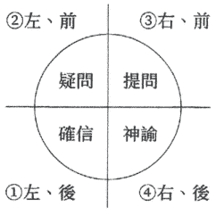

# 写下来奇迹就会发生

一個祕訣，連續100天，每天寫下三個願望。

你將發生某種變化。

「夢想不會實現」的想法，將轉換成「夢想一定會實現」。

你只需要準備一枝筆和三個願望。

百日奇蹟，就從今天開始——

## 前言

### 引導我們走向覺悟的魔法之書

感謝你閱讀本書。

在翻開這本書的瞬間，無論你是否同意，你已經站在人生的交叉路上了。你要選擇實現願望的人生，還是維持現狀的人生？你可以自由選擇。假如選擇實現願望的人生，希望你好好利用本書，不是讀完就好。

這本書設置了可以實現夢想的機關，可以說是「魔法之書」。想實現夢想，讓自己在未來活出自我、發光發亮，就必須使用某個宇宙法則。那個宇宙法則，就是改變想法。人生可以說是由想法決定的，想要改變想法其實相當困難。正因為如此，這個宇宙法則，也可以稱為「覺悟」。

我的拙作《實現夢想時，「什麼」會發生呢？》介紹過各種「祕笈」，無須艱辛地修行或鍛鍊，只需要一枝筆以及每日的小習慣，就能引導自我覺悟。該書出版於2014年，同時也譯介至韓國、中國、台灣、越南等，廣傳至世界各地。無論過了多少年，來自世界各地的讀者感言從不間斷：「我實現了夢想」「我的人生改變了」，我感受到實踐者的熱情。

關於實現願望的具體理由和背景，我都交代過了，這裡不再贅述。不，我不必多說。

因為這本書的設計是，只要實踐 100 天，就能幫助各位放下「無法實現」的想法，讓內心進入覺悟的狀態。

本書其中一個設計是，可以從 QR 碼下載引發奇蹟祕法的音檔（221頁）。這是由世界級音樂家杉山正明演奏的音樂，隱含身為國際資產顧問、現為活躍陰陽師的愛華德．淺井的祕法。請配合本書運用。

然而，想讓這本書發揮效力，必須有所覺悟。你必須連續 100 天，用這本書面對自我。這可能需要點時間，但人生若能因此發生改變、願望實現的話，應該就不算什麼難事了吧？做好心理準備，拿起筆來，改變你的人生吧。

## 使用這本書的方法

1. 準備好筆（建議使用雙色）。

2. 決定好「三個願望」。

希望100天後實現的事情。

不要使用否定詞和形容詞（無論如何都想用也可以，細節於正文說明）。

以完成式或進行式書寫。

字數控制在8到15字之間。

心中想著要讓自己以外的某人得到幸福。

（三個願望）

3. 每天閱讀當日短文。

本書準備了100天份的小短文。你可以先一口氣讀完，也可以每天花幾分鐘閱讀。在每天寫願望之前閱讀小短文，可以提高實現的效果。

## 啟動奇蹟

1. 深吸一口氣後憋氣，憋著氣寫3次第一個願望，然後深深吐氣。

2. 深吸一口氣後憋氣，憋著氣寫3次第二個願望，然後深深吐氣。

3. 深吸一口氣後憋氣，憋著氣寫3次第三個願望，然後深深吐氣。

4. 最後，全身放鬆，寫1次「謝謝」。

## 實現願望的專屬規則

- 連續 100 天，每天睡前持續實行 12 頁的第三點，以及前頁的步驟 ① 到 ④。（可於各頁寫上日期和天數）
- 寫下願望時，不要看前一天寫的願望。（願望內容每天不同也沒關係）
- 用心寫下願望。（但是要一鼓作氣）
- 若有任何覺察，就寫在筆記空白處。（建議使用紅筆）
- 當其中一個願望於 100 天內實現時，再許下另一個願望。
- 無論願望達成與否，執行 100 天後就停止。（若想再次執行，請間隔 100 天以上）
- 每天執行不間斷，忘記時，請從頭開始。（若晚上真的忘記，隔天起床一小時內執行是可以的，但僅限 3 次）

Date: 2023 / 08 / 01
No. 001

# 1

我練出了好萊塢明星般的漂亮腹肌。
我練出了好萊塢明星般的漂亮腹肌。
我練出了好萊塢明星般的漂亮腹肌。

> 一週至少要去4次健身房。
> 嘗試健身教練推薦的乳清蛋白飲!!

# 2

年底前年收達百萬!!
年底前年收達百萬!!
年底前年收達百萬!!

> 把每一項工作做好!!
> 不知道未來會發生什麼事，
> 所以完成工作的速度要越快越好

# 3

繪製的插畫書霸占熱銷排行榜!
繪製的插畫書霸占熱銷排行榜!
繪製的插畫書霸占熱銷排行榜!

> 把插畫作品集投給心儀的出版社!!
> 每天上傳插畫到社群網站!!

謝謝。

百日奇蹟書寫會

# DAY 1 STORY

## 寫啊！傻瓜！NOW！

某個知名經營顧問提問：「如果有下輩子也適用的『成功法則』，那會是什麼呢？」我的回答是：「把願望寫在紙上。」

大概是2005年左右，我辭去工作，領悟到這個成功法則。剛好在同一時期，在某個聚會上大家熱烈地討論：「你實行了『那個』對不對？」「那個」是在聚會的四個月前，我從某個成功者那聽來的方法。當時還有其他三、四個人在場，也聽到了方法，但付諸執行的只有一個人，而那個人竟然在四個月內，月收入達到百萬。

「那個」是什麼呢？很簡單，就是每天把願望寫在紙上10次。之後，我把方法擴充為本書介紹的「奇蹟」，並且於2009年成功實現了三個願望，自此之後運勢開始暴漲。

其實，**紙張真正的身分是「神」**。把願望寫在紙上，就等於把願望銘刻在「神＝宇宙」上頭，所以願望能實現。

把願望寫下來，就會實現。沒錯，所以，寫啊！傻瓜！NOW！先寫個100天！體驗百日奇蹟！

Date: / / No.

1.

2.

3.

# DAY 2 STORY

## 100天就能帶來奇蹟!

我的拙作《實現夢想時,「什麼」會發生呢?》在韓國非常暢銷,韓文版編輯因為書中的祕笈結了婚、生了小孩,甚至還獨立創業成為老闆,成功實現了夢想,讓周遭人大吃一驚。韓國版的書名是《三個願望,百日奇蹟》,書名取得非常好,從另一個角度,用一句話點出了書的核心精神。連續100天,寫下三個願望,奇蹟就會發生,這是真的。100天的效果,我個人有很深的體悟。我國中時,無論功課還是社團活動都很半調子,大家都說我是沒有任何長處的人。我就讀住宿學校,室友是全年級的校草,也是柔道社的隊長,運動全能,力氣很大,書也讀得不錯,當然非常受大家歡迎。他老是看不起我,讓我很受不了。剛好在那時候,老師告訴我「努力100天,一定可以得到成功的果實」,我把老師的話聽了進去。我許下一個願望,要求自己用功讀書100天,長這麼大第一次這麼努力。結果,我考到班上第一名。那瞬間,我的願望實現了。人生這麼長,就花100天努力看看吧。

百日奇蹟

Date: / / No.

1.

2.

3.

## 三分鐘熱度

我從2004年開始瀑布修行，之後大概持續了20年左右。我師從的是真正的天台修驗道行者，雖然是在家修行，修行頗為扎實。最初半年，每週到導師那裡報到，請他看著我做瀑布修行；等不動明王開始寄宿在我身上後，才獲得允許，得以單獨到瀑布修行。

那時導師指定我做的是21日修行，每天早上必須到瀑布修行，而且禁止食肉飲酒。那時我還是上班族，年底是超級大旺季，忙的時候連續三天都沒辦法睡覺。那段期間，我抱著必死的決心，圓滿完成修行。隔年，我收到百日修行的指示。21天就這麼困難了，聽到要修行100天，我都要昏倒了。

導師給我的建議是默默做就對了，每天折手指算還有幾天，會讓人意志消沉。放下那樣的想法，默默度過每一天，默默修行。太陽西下，又會迎來新的一天。

這個筆記，你也做了3天。挫敗的人在這裡遇到挫折，社會稱這樣的人「三分鐘熱度」。明天也繼續寫吧。日子雖長，但人生的100天轉眼間就過了。所以默默做吧，今天做得到，明天也能做到。

Date: / / No.

1.

2.

3.

## 不要瞧不起說大話的人

有位指導社會人士吹奏樂器的老師,曾說過一個老掉牙的笑話:「我啊,只會吹牛啦。」

他平常都在做指揮,沒看過他吹奏樂器的樣子。某次練習後的聚餐,我問道：「○○老師除了指揮之外,還會什麼樂器嗎？」他喜孜孜地跟我說了前面那個笑話。

他可能是謙虛,但我有話想說。

那個笑話,是不是看不起吹牛的人呢?

「只會吹牛,說大話」,是什麼意思?這個社會本來就是從說大話發展成的,不是嗎?無論是萊特兄弟、創辦微軟的比爾·蓋茲,還是特斯拉的執行長馬斯克,都吹牛說了撼動社會的大話。

我想說的是,吹牛是很偉大的。不要說「我只會吹牛」,牛應該要大力地吹,話要大聲地說,如此一來,視野會變得更寬廣、不同。

一個普通的指揮若能說出:「我要在美國紐約卡內基音樂廳,指揮紐約愛樂。」他看到的景色應該會有所不同吧。

Date: / / No.

1.

2.

3.

# DAY 5 STORY

## 什麼都能切的刀子

我從以前就常常講奇怪的話，小時候常跟兒時玩伴小俊炫耀說：「我做了一個很厲害的東西喔。」

「你做了什麼？」「什麼都能切的刀子。」

「車子也可以切嗎？」「當然可以。」

「給我看看。」「現在還不能給別人看。」

「為什麼？」「沒為什麼。」

「你一定在騙人。」「是真的。」

對不起，我的確說了謊。但我的大腦已經有設計圖，所以對當時的我來說，不覺得自己在說謊。我要準備的東西有色紙、三號電池和鐵線。把色紙剪成刀子的形狀，然後用鐵線纏繞在紙刀上，三號電池裝成刀柄，最後把鐵線接到電池的正負兩極。

我的理論是，電池的電流會通到鐵線上，電流所產生的熱，可以切斷車子和任何東西。現在看來，我當時的想法可能很荒唐可笑，但這樣的過程很重要。不讓大話淪為吹牛，想法得經過思考。雖然我並沒有做出那把萬能刀，但思考本身並非無用。

Date: / /
No.

1
2
3

# DAY 6 STORY
## 我要成為改造人

小時候我曾經跟兒時玩伴小雄說：
「我啊，有個祕密喔。」
「什麼祕密？」
「我不能告訴你啦。」
「告訴我嘛。」
「你不可以跟別人說喔。」
「好喔。」
「我啊，有個夢想。」
「什麼夢想？」
「我啊，要成為改造人。」
「什麼啦，那是漫畫情節吧。」
「我不是要改造全身。我想要稍微改造一下右手，讓揮拳的力道變成一億倍，可以把東西打飛。」

抱歉，我並沒有改造右手，也沒有變得很強，但我成為了「改造人」，現在也還是進行式，正進化為改造人。改造指的是，每日每月每年不斷變化、不斷成長的意思。

2005年剛創業時，我像逃難般辭去工作。說自己月收要達到200萬，恐怕會被當成鐵線刀和拳頭力量增強一億倍的大話。但大話說久了，不知不覺就會成真。所以，大話繼續說下去就對了，說了也沒有什麼損失，頂多被人說「那是漫畫情節」，人生也不會有任何損傷啊。

寫下來，奇蹟就會發生
029

# 潛意識寄宿在肌肉上

拙作中有個讓許多人都感到訝異的理論，就是「潛意識=身體」。

- 意識=思考⇒語言（3%）
- 潛意識=感覺⇒身體（97%）

說明潛意識時，一定會提到冰山理論。浮現在水面上的意識，只占全體的3%，相較之下，水面下的潛意識占了97%，擁有龐大的力量。因此，實現願望的關鍵，就在於把願望寫進你的潛意識，這大家應該都聽過吧。比方說，對自己說月收破百萬，只能算是語言，僅止於3%的意識。重點在於要讓願望滲透到無法言語的領域，這領域稱為感覺，而感覺與身體相連結。換句話說，潛意識就寄宿在肌肉上。由此來看，書寫會用到許多肌肉，所以動手寫的效果，會比只用想的、說的還要好。就像仰臥起坐練100天，就算你不想，也會長出肌肉一樣，願望只要寫100天，就可以滲透到潛意識裡。

Date: / /
No.

寫下來，奇蹟就會發生
031

# 請解釋什麼是「很甜」

你知道什麼是「很甜」嗎？
舔食砂糖時的感覺，就是很甜吧？說明砂糖時，可以用「砂糖很甜」來表達。那我們有辦法正確地傳達什麼是很甜嗎？
我們最多也只能用「大概就是像……的感覺」來說明，但那樣無法讓沒有甜食文化的人明白。
沒錯，想用語言來說明很甜的感覺是不可能的。「很甜，很甜，很甜……」說再多遍，也無法明白很甜究竟是什麼；但只要舔一次砂糖，馬上就能知道什麼是很甜，那正是所謂輸入潛意識的瞬間。
所以，讓月收達百萬的祕訣，就是實際去「舔舔看」。
也就是說，想要月收百萬，實際體驗一次最快。
不需要言語說明，身體的肌肉一旦知道就回不去了；反過來說，還在用語言說明的話，表示你離目標還很遠。

Date: / / No.

1
2
3

寫下來，奇蹟就會發生
033

# DAY 9 STORY
## 實現願望的重訓法

感覺，無法用言語來說明，只能透過體驗讓肌肉記住，這是將願望輸入潛意識的祕訣——就跟「實現願望的祕訣，就是實現願望」一樣，聽起來很像廢話。那該怎麼做呢？讓願望滲透到肌肉的方法有兩個，一是休克療法。我有朋友因為父母欠了2000萬，黑衣人上門討債根本家常便飯，他每天都活在恐懼裡，因此把一切投注在網路生意，天天睡不到一小時，最後真的成功了；也有人只要想像自己月收百萬的樣子，就可以開心到血液在心中沸騰。像前者那樣利用「恐懼」，或許很有效，但老實說，對身心健康非常不好；但要像後者那樣，用想像的就可以感受到「欣喜」，可能需要些特殊能力，所以才會有第二個方法——重複戰術：按部就班、腳踏實地不斷重複同一個動作。那正是我所說的奇蹟秘密，透過書寫這個動作，運用肌肉鍛鍊潛意識；換句話說，也就是實現願望的重訓法。重訓後，身體會分泌睾固酮，激勵自我，這是真的。每天做一分鐘棒式也好。潛意識的關鍵就在肌肉，這個理論實在非常深奧。

MIRACLE OF 100 DAYS
034

Date: / / No.

1
2
3

寫下來，奇蹟就會發生
035

# DAY 10 STORY
## 動腳趾是人類才有的特徵

將願望寫進潛意識裡有兩個方法，分別是休克療法跟重複戰術。而加乘法，能讓前述的效果倍增——如果用語言來描述那個狀態，可以說是「開心地把願望寫出來」。但還有個方法可以讓願望更加深刻地烙印到肌肉上，那就是活動腳趾頭。

大家小時候都有過這樣的經驗吧？明天有遠足或運動會，晚上躺在床上準備睡覺時，卻因為太興奮而睡不著。這時，我們會無意識地活動腳趾頭。

人類和其他動物的不同之處，就在於可以用雙腳走路（大猩猩走路多少會用到手）。如此一來，腳趾必須負荷體重，實際上也因此得以維持身體的平衡。而人類另一個特徵則是，懷有夢想，且具有實現願望的力量／能力。所以，動腳趾是人類才有的特徵→人類能實現願望→動腳趾的人能實現願望，這個有點牽強的假設是成立的。老實說，這個理論是我從業務行銷大師布萊恩·崔西的演講聽來的，雖然不懂他的邏輯，卻讓人十分信服。

MIRACLE OF 100 DAYS
036

Date: / / No.

1
2
3

寫下來，奇蹟就會發生
037

# 「粉紅色的大象」是誰開始說的？

「請不要想像粉紅色的大象。」
就算別人說「請不要想像」，但是你一聽到「粉紅色的大象」，就會開始想像。也就是說，我們的潛意識無法理解否定句。這個理論在自我啟發的講座耳熟能詳，但粉紅色的大象，究竟是誰先說的呢？

姑且不論是誰起的頭，我非常理解這句話的意思。朋友的公司有個態度強勢凶悍的上司，個性較為軟弱的下屬在上司面前就會畏縮，有話也不敢說。這時，上司就會教訓他：「我不是說，有話就說嗎？」「你為什麼都講不聽？」上司當然是錯的，那樣說其實非常不講理。如果他換個方式表達：「我們先冷靜下來。」「先深呼吸一下。」下屬應該就能表達自己的想法。

就像有些人會對容易暈車的孩子說「你不要暈車喔」，或是稍微吃重口味的東西就在旁邊說「小心胃食道逆流」，這種「小心不要XXX喔」，或是用否定句裝親切，其實是在詛咒他人，要多注意。

Date: / /
No.

1
2
3

# DAY 12 STORY
## 覆蓋否定句的詞彙

雖然說潛意識無法理解否定句，但也不必當作鐵則。例如，有人對你施加催眠術說「你沒辦法舉起手來」，手就真的舉不起來。假如潛意識真的無法理解否定句，手會一直舉著。
社會上有很多以否定句來表達的願望，最具代表性的就是「禁○」，禁菸、禁酒、禁賭等。讀者當中應該也有醫療從業人員，所以不能把話說得這麼草率，但是把否定句輸入潛意識，這個方法其實並不稀奇，而且還很有效。
我修行時，在決定好的天數內，實行的不只有瀑布修行，還設定了「禁做項目」。三大禁做項目包含了肉、酒、性。性，如字面所述，就是禁欲。我開始修行時是 32 歲，這讓我感到十分痛苦。但修行圓滿完成了，因為我做好決定，下定決心不做那些事。
一般來說，潛意識可能很難理解否定句，但可以利用「我做了某某決定」來覆蓋掉否定句。比如說，「我決定不再煩惱沒錢可用」的肯定說法，會比「我要成為有錢人」來得更有力。

MIRACLE OF 100 DAYS
040

Date: / / No.

1
2
3

寫下來，奇蹟就會發生
041

# DAY 13 STORY
## 「媽媽，買臭魚乾嘛」

實現願望的高手，也是拜託別人的高手。即將步入 50 歲的我，願望都一個個實現了，今後願望也會不斷地實現下去吧。說到這個，我從小就很會拜託別人——應該說，很會拜託與否一點也不重要，因為我拜託別人時不會想太多。例如，某天我看到電視節目介紹了「臭魚乾」，節目說「臭魚乾臭得不得了，卻很好吃」，這個形容非常吸引我，而全家去伊豆旅行時，紀念品店剛好有賣臭魚乾。
「媽媽，買臭魚乾嘛。」
「你不敢吃的啦。」
「我一定會吃的。」我不斷強調。媽媽抵擋不了我的拜託攻勢，最後買給我。一回到家，我馬上把臭魚乾從包包拿出來，準備請媽媽拿去烤，但那散發出來的臭味，實在令人受不了，我就跑掉了。順帶一提，我一直到長大才知道臭魚乾的美味。基本上，只要拜託爸媽，他們就會聽我的，我真的非常好運。雖然拜託了之後，有時結果可能讓人失望，但也令人深信拜託了之後，願望就會實現。所以長大後，一有心願，就會馬上拜託，沒有任何猶豫。因為拜託了之後，願望就會實現。只不過，拜託的對象換成宇宙了。

Date: / / No.

1
2
3

# DAY 14 STORY
## 不必成為大人物，成為自己就好

在我青少年時期，我們家很早就有電腦，那是 NEC 的 PC-8801 初期機型。那時的電腦遊戲很陽春，現在的遊戲我反而跟不上，太複雜了。電腦遊戲為什麼會演化成這樣呢？可能是因為生活水準提升到更高的層次，花在吃飯上的時間相對減少的關係。社會變得越來越富足。30 年前的東印度，街上到處都是遊民和病患；但我不久前去了東印度，街道變乾淨不少。公共衛生進步，飢餓貧窮減少，勞碌終日卻填不飽肚子的人變少了，先進國家更不用說。

也就是說，今後的世界我們不需要以成為「大人物」為目標。雖然現在大家都說，電動玩多了眼睛會壞掉、功課會變差，但今後人們能做的，可能只有玩遊戲而已。既然如此，與其拚命念書，不如多玩點遊戲。假如人生本來就是場遊戲，做自己想做的事就好。不必成為大人物，成為自己就好。

MIRACLE OF 100 DAYS
044

Date: / /
No.

1
2
3

# DAY 15 STORY
## 48小時內會發生好事！

請閉上眼睛，想像一下紅色的東西，5秒後，張開眼睛。怎麼樣？你一張開眼睛，馬上就看到紅色的東西對不對？但你身邊明明也有藍色、黃色、黑色、白色的東西，之所以先看到紅色的東西，是因為你在腦海裡想像了。

我們的大腦並非萬能，無法認知所有看到和聽到的東西。因為世上的資訊量太多，全部都接收進來的話，大腦會受不了。所以大腦會適度地刪掉不必要的、沒興趣的東西，讓資訊的吸收達到最適化。我們將最適化的資訊稱為世界。所以，即使整體來說世界只有一個，認知的方式卻有70多億種。

因此，選擇什麼、刪除什麼，就變得相當重要。選擇美好的東西，而非紅色的東西，世界就會變成美好的世界。

這裡請你做個實驗，在接下來的48個小時，持續選擇美好的東西，刪除不好的。相信在48小時後，應該會看到奇蹟發生。抓到訣竅後，請把執行時間再往後延長48小時，你的世界，將充滿美好的事物。

MIRACLE OF 100 DAYS
046

Date: / / No.

1
2
3

寫下來，奇蹟就會發生
047

# DAY 16 STORY
## 小精靈早就在身邊了

我很喜歡格林童話《小精靈和老鞋匠》的故事。老鞋匠睡覺時，小精靈會幫忙做出漂亮的鞋子。我還在公司上班、根本沒時間睡覺時，每當工作做不完，就非常希望小精靈出現。半夜在公司加班時，還真的常常大喊：「小精靈快來！」

但無論狀況有多急迫，我幾乎都能把工作完成。即使工作有些延遲，被客戶罵了，也能順利落幕。雖然過程起起伏伏，總能把工作處理好，去喝一杯。

比起單純的工作，需要創意的工作能感受到的更多。三天三夜絞盡腦汁，思考到大腦彷彿都快燒焦，動手做再打掉重練，有時甚至大哭大叫。再兩個小時，天就要亮了；五個小時後，就是截止時間。內心大喊著誰來救救我的時候，突然靈光一閃，最後完成工作，趕上截止期限。而且不只那樣，成果的品質之高，如果參賽應該能獲得冠軍。小精靈就是我們的潛意識。當我們被逼到絕境時，潛意識能幫助我們完成工作，所以要相信自己。

MIRACLE OF 100 DAYS
048

Date: / / No.

1
2
3

寫下來，奇蹟就會發生
049

# DAY 17 STORY
## 越挫越勇的大師——僧侶空海

據說弘法大師空海，小時候曾經從懸崖跳下去，卻大難不死保住了性命，讓他深信自己身懷使命，因而步上了佛道。20歲前，他自某位沙門那裡習得了密教的祕法「虛空藏求聞持法」，圓滿地完成了修行。

他複誦了100萬遍虛空藏菩薩的真言，與虛空藏（即阿卡西紀錄）產生連結，因而獲得超人般的記憶力和腦袋。弘法大師抱著必死的決心完成修行，在圓滿結束的那天，晨昏之星金星飛進他口中，大家對他更加充滿著期待。

但是某天，弘法大師接觸了《大日經》，卻怎麼讀也讀不懂。有這種事？歷經了虛空藏求聞持法的修行，又取得超人般頭腦的他，怎麼也無法理解不知道是誰寫的《大日經》經文。因此他興起一個念頭——成為遣唐使，前往大唐取經。弘法大師消失了7年之久，有一說是他跟從大唐王朝逃難的山地民族同住，挖掘水銀以儲備渡唐資金；另一說則是他沿著朝鮮半島偷渡到唐。總之，弘法大師抱著必死的決心修行，仍然有看不懂的經文，因此大受打擊，決定渡唐求法（能成為遣唐使也可以說是奇蹟），最後把密教帶回日本。就連天才僧侶空海，遇到挫折也不放棄，連續100天寫下願望，你一定也可以做到。

MIRACLE OF 100 DAYS
050

Date: / / No.

1
2
3

寫下來，奇蹟就會發生
051

# DAY 18 STORY
## 脫離險境的方法很簡單，「走」就對了

人類於400萬年前誕生於非洲大陸。隨著人口的增加，強者和弱者之間出現差距，弱者逃到北方。北方氣候寒冷，必須花費許多功夫才能生存下來，而他們發明了居所、衣服和工具，存活了下來，當中產生的弱者，則逃往了東邊。有一說是，那些弱者往東邊逃，抵達的終點就是日本。也就是說，日本人是世界最弱的民族，是為了逃命不斷行走的種族末裔。因此，我們可以做出這樣的假設：日本人的基因融合了非洲大陸和歐亞大陸的智慧，發展模式有別於西方文明。

說到行走，日本佛教有四國遍路和千日回峰行，如字面所示，遍路和峰行是行腳修行。不同於基督教和伊斯蘭教分別以羅馬和麥加為目的地的朝聖之旅，日本佛教「單純以行走為目的」的意味較為強烈——或許是因為佛教知曉，行走能讓人經歷神祕體驗，帶來自我覺察，進而喚起潛意識。所以，每當我遇到瓶頸時，就會走路。走路讓我從各種險境脫逃出來，這是真的，真心不騙。

Date: / /
No.

1
2
3

# DAY 19 STORY
## 這個聲音，是「高我」傳達的訊息？

有時我在走路、靜心、放空，或是專注於某件事情時，會突然聽到有聲音在跟我說話。有些人是真的聽見聲音，但大多時候都是接收到如覺察般的內在聲音。比如說，我在 2005 年 3 月跟同事聊到「這間公司我還會再待個一年吧」，幾個小時後，開車聽見有人對我說「你可以辭掉工作了」，當天我便提出辭呈。
那個突如其來的聲音，常常被稱為來自「高我」的訊息，能指引我們開創出美好的未來。高我一直以來都指引著我，使我的人生越來越富足。
但有些人即使突然聽見了內在的聲音，也會懷疑是否真的來自高我，而感到不安，擔心：那是不是自己自私的想法？或是惡魔的聲音？按照那個聲音所說的去行動，會不會一敗塗地？讓我來回答這個問題：所有你聽見的內在聲音，都是來自高我的訊息。不做做看，根本不知道會怎樣。眼前的失敗，可能是帶來大成功的關鍵。不，不是可能是關鍵，而是絕對是關鍵。

Date: / / No.

1
2
3

# 不要過度仰賴直覺

喜歡靈性的人，尤其重視直覺。2020年新冠肺炎疫苗以異常飛快的速度完成，並快速地普及到全世界。有別於傳統的疫苗製造技術，mRNA疫苗是透過微脂體劑型，將疫苗的設計圖mRNA運至人體內，讓人體自行製造出棘狀蛋白，產生對新冠病毒的免疫力。然而，社會輿論對病毒的意見一分為二。正確來說，有一成的人不表達意見，一派的人，包含陰謀論者，則拒絕信任新疫苗。醫生和國家都說疫苗安全且有效，副作用很強，而且新的成熟疫苗必須等待兩年才知道結果。即使如此，很多人還是認為自己的想法是正確的，仰賴直覺，拒絕接種疫苗。當然，要不要接種疫苗是個人的自由，但判斷的依據只靠直覺，讓人很不安吧？車子發生故障時，大部分的人都會拖去修車廠修理吧？直覺沒辦法修好車子。也就是說，世上大部分的事情，都是由科學和技術所解決，過於相信自己的直覺，可能會因此喪失性命。生病時，就去看醫生，太過仰賴直覺，有時會發生無法挽回的錯誤。

Date: / /
No.

1
2
3

寫下來，奇蹟就會發生
057

# DAY 21 STORY
## 與其期待死後世界，不如活在當下

人死後會怎麼樣呢？這是宗教、哲學以及科學永遠的課題。其中一個常見的法是，人死後會從上方俯视躺著的自己，然後被帶到名為三途川的冥河。已過世的親人，會在河川的另一端向自己招手；也有跟親人揮揮手後，走回原路，回到自己的身體復活、重回人間的。這種濒死經驗的證言為數不少，可以說是死後世界最有力的法。

但請停下來想一想，濒死復活，其實没有死掉。醫學上，死亡的基是「心肺功能停止○分鐘」後死亡，因此死而復生亚非死亡。

没有死掉根本不會知道死後的世界。我們也無法跟亡者溝通，就算是濒臨死亡而復活，當事人其實一秒也没死掉，所以，絕對不可能有人知道死後世界長什樣子。我想的是，既然如此，就不要去想什死後的世界，把精力都放在活著的當下就好。

MIRACLE OF 100 DAYS
058

Date: / / No.

1
2
3

寫下來，奇蹟就會發生
059

# DAY 22 STORY
## 只會做蛋包飯就好

我從某個演講得知「100 萬分之1策略」的概念：20 多歲時，投注 1 萬個小時在某專業領域上，成為百人翹楚中的一人；30 多歲和 40 多歲時，分別成為另一個專業領域百人翹楚中的一人。1/100×1/100×1/100=1/100萬。

這個 100 萬分之1的理論指的是，比如在運動×音樂×烹飪這三個領域，都能取得頂尖的水準，就能成為百萬人當中才會出現一位的人才，打造出自我品牌。但這根本不可能。首先，要成為百人翹楚中的一人，一般人幾乎辦不到。如果大家都以成為大谷翔平（打者×投手×臉蛋）或藤井風（歌唱×鋼琴×臉蛋）這類天才為目標，就會產生大量的半途而廢者。與其那樣，不如擁有熱衷的事物，使人生更加美好。比起精通蛋包飯×壽司×羅宋湯的主廚，我比較想吃只會做蛋包飯的廚師所做的蛋包飯。也就是說，人生要以花費一輩子追求「屬於自己的蛋包飯」為目標，做得不好沒關係，得不到認同也無妨。有一輩子都想繼續做下去的東西，就算沒能開花結果，也會堅持追求。

# DAY 23 STORY
## 把咖哩調理包賣給印度人的方法

「把冰箱賣給因紐特人（Inuit，舊譯愛斯基摩人）」，這是行銷學經常出現的命題。我一開始以為，因紐特人住在冰天雪地的世界，冷藏食物的冰箱怎麼可能賣得出去。但其實需求非常高，因為不需要冰凍就可以冷卻食物、不必到寒冷的戶外也能保存食物、不分氣候或氣溫能讓食物保持一定的鮮度。這麼一說，還真是那樣。

類似的命題還有「把鞋子買給不穿鞋的非洲人」「把咖哩調理包賣給印度人」等，這些題目仔細想想，應該都能理解：穿鞋能預防破傷風；在印度班加羅爾這類繁忙的都市，從調製香料開始做咖哩太花時間，諸如此類。

接著是下一個問題：「身為上班族的我，希望月收達百萬，該怎麼做好呢？」區區一個上班族，怎麼可能？這把歲數了，怎麼可能？因為我是男人或女人，怎麼可能？我又沒有才華，怎麼可能？這樣想，比賽就結束了。正是因為在冰天雪地，冰箱才賣得出去；同樣的，你必須這樣想：我就是能夠月收百萬，因為……

# DAY 24 STORY
## 無敵的萬用調味料

世上有可以讓任何東西都變美味的萬用調味料嗎？
過去日本人的飲食習慣，很喜歡在各種食物灑上白色粉末。白色粉末就是化學調味料，可能是受到純天然風潮的影響，近來化學調味料的評價頗為低落，所以現在改稱為「鮮味調味料」，換名稱也過了好一段時間。話說回來，真正能讓任何東西變美味的調味料，就是餓肚子。「吃飯前不要吃零食，讓肚子很餓很餓再開動」，這個爸媽理論正確到不行。確實如此，但這種大家都知道的事，一點也不有趣。

針對這個問題，我的答案是「水和空氣」。這世界確實有什麼都好吃的國家。日本除了北海道之外，不太有吃羊肉的習慣，所以包含我在內，不少人無法忍受羊肉獨特的風味。但某個國家的羊肉卻非常美味，世界第一的熱狗也在那裡，海鮮和溫室蔬菜也非常美味，那就是冰島。有人猜對了嗎？他們主要的能源是地熱，水和空氣幾乎沒遭受到什麼汙染，真的是什麼都好吃。各位是不是也想去探訪看看了呢？歡迎寫到你的願望清單裡。

# DAY 25 STORY
## 雞蛋疑雲

我有個女性友人暱稱叫「小雞蛋」。可能因為皮膚非常白皙，所以從小大家都叫她雞蛋。

某天，我在某人臉書貼文的留言，看到有人稱她為「小蛋蛋」。對方應該不是故意的，但營造出來的氛圍卻大不同。還記得，看到那則留言時我驚了一下。

「雞蛋」「蛋」「蛋蛋」給人的感覺完全不同，這也是實踐奇蹟時重要的地方。比方說，有人的願望是希望皮膚變得白皙，但比起單純的白皙，「光滑白嫩的水煮蛋肌」感覺更具體，不是嗎？

也就是，要讓願望更容易滲透到感覺（潛意識）裡，寫願望筆記時，可以下點功夫，試著用比喻的方式來表達你的願望。在文字和發音上多點堅持，在表達方式下點功夫，就能加快願望實現的速度。

# DAY 26 STORY
## 如上等卡士達醬般的音質

「光滑白嫩的水煮蛋肌」的表達方式優於「白皙」，比喻其實是實現願望時不可小看的工具。相對於「鍛鍊出腹肌」，「練出好萊塢明星般漂亮的腹肌」更加具體。

我以前吹過單簧管，接下來的話題可能有點刁鑽。單簧管主要分為法式和德式兩大系統，日本吹奏樂一般使用的是法式單簧管，指法上比德式要來得簡單，音色穩定且扎實，價格也相對低廉。即使如此，仍有不少專業的演奏家選擇德式單簧管。德式單簧管最大的魅力就在於它的音質。

「德式單簧管的音色渾厚且香甜，味道彷彿是上等的卡士達醬……」我曾經在某個文案上看過這樣的形容。就算對單簧管沒興趣，看到這樣的比喻，應該很想聽聽看德式單簧管究竟是什麼音色吧？

村上春樹的文字魅力，也在於其豐富的比喻。寫願望時，過度的比喻可能讓文字變得含糊不清，但適度地比喻描寫，或許能帶來意想不到的效果。

# DAY 27 STORY
## 你有即使限制很多也想嘗試的事情嗎？

「如果有100億，你想做什麼？」「如果不論財富、年齡、性別、才能，擁有無限的力量後，你想做什麼？」你有想到要做什麼嗎？

「就是那個！就是那個！那就是你真正想做的事，你人生的目標……」我曾聽過有人這樣說，這是人生教練講座常出現的經典問題、推演過程。「假如擁有無限的力量，可以讓你從限制中解放，那時想做的事，就是你的天命！」聽起來似乎很有道理，但總覺得哪裡怪怪的。等等，說起來，無限的力量真的存在嗎？如果世上有無限的力量，誰能擁有呢？我敢斷言，絕對沒有人擁有無限的力量。換句話說，假如想做的事情是以不可能的條件為前提，有意義嗎？不如思考一下，即使身處的環境有各種限制，仍然想做的事是什麼？這個思考方式才比較實際、積極。我們要思考的不是無限制時想做的事，而是即使有各種限制也想做的事。那才是我們真正該做的、真正的天命。

# DAY 28 STORY
## 下坡比上坡更危險

我從以前就很喜歡騎腳踏車。最近常常到日本各地、甚至海外騎腳踏車周遊，到處演講，四處工作。但其實我跟腳踏車一點也不熟。我不懂單車的機械結構，騎不快也騎不遠，就算一天騎 10 個小時以上，騎得汗如雨下，也不露宿野外，而是去住商務旅館，走偷懶路線的單車之旅。

日本的道路高低起伏比想像中多，有時必須跨越海拔 1000 公尺山路的最高點。雖然爬坡很累，但抵達頂端時的暢快感覺，非言語能形容，那是單車之旅的箇中滋味。過了頂端後，不需要踩踏板，只要憑重力就可以滑下山。但下山才要更小心，煞車沒掌控好，一不小心就得跟世界說再見。人生也是同樣的道理。陡峭的斜坡騎起來很痛苦，卻讓人面對現實，能不斷努力地騎下去；然而，突然轉為輕鬆的下坡時，因為一時鬆懈而掉以輕心，忘記適時地煞車，就很有可能因此摔跤。也就是說，人在順境時，更要謙虛。這是我騎腳踏車騎出來的心得。

# DAY 29 STORY
## 寫下夢想，決定人生要長怎樣

這是我從業務行銷大師加賀田晃那邊聽來的故事。加賀田老師在青少年時期，曾經看過一篇漫畫（我忘了篇名是什麼），那篇漫畫成為他的人生指引。漫畫內容如下：

城鎮上住著四位少年。少年總是玩在一起，某天他們聊到彼此未來的夢想，其中一人想當醫生，一人想當警察，一人想當律師，一人還不知道想做什麼。幾年之後，某個有錢人家遭小偷，小偷很快就被抓到了。有錢人家是夢想成為醫生的少年；抓到小偷的，是夢想成為警察的少年；為小偷辯護的，是夢想成為律師的少年；而另一位少年成為什麼了呢？大家應該都猜到了吧。加賀田老師看了那篇漫畫後不寒而慄，「原來沒有夢想下場這麼悽慘！」之後便決定人生要懷有遠大的夢想和目標。

當然不是每個人都會因為沒有夢想而淪落為小偷，但有夢想就能努力，不會隨波逐流。如果沒有夢想，人生很有可能被環境決定，感到不安。所以，寫下夢想吧，因為寫下夢想，就能決定自己的人生長怎麼樣。

## 開運日必做的事

我被大家稱為靈性 YouTuber 的先驅。現在 YouTube 常見的影片題材「○○小時以內發生奇蹟！」算是我開啟的風潮，「今天是超強開運日，來做○○吧」，也是我先開始的。
2020年6月20日，我得知那天是「一粒萬倍日＋天赦日」，是一年只會出現3次的超強開運日，我便以此為影片題材，上傳到YouTube，結果觀看次數超過3萬次。那時流行換新錢包，我就跑到澀谷買了名牌錢包。這個題材吸引許多人點擊，許多YouTuber也開始做類似主題的影片。轉眼間，同一天點開YouTube，可以看到一整排以開運日為題材的影片，成為一年當中的例行性活動。順帶一提，開運日必做的事情，除了換新錢包之外，還有放手（打掃）跟傳達謝意等。
但是，不可能每逢開運日就去買昂貴的錢包，打掃和感謝平常也都會做，所以我認為，天天都是開運日。不去管今天是不是黃道吉日，每天過得開開心心最重要。

## 海螺可怕的地方

我念小學時，跟父母還有三個兄弟姊妹一起家族旅行，旅館端出來的點心出現了海螺。我第一次親眼看見海螺。不記得那時有沒有吃到海螺黑黑的肝臟，但我非常想要海螺的殼，所以拜託爸媽讓我帶回家，並珍藏在餅乾盒裡，每天都笑咪咪地打開來看。有一天，海螺開始散發出異味，因為我沒有把海螺的內殼洗乾淨。我變得不太喜歡海螺，但那是特地帶回家的寶物，實在捨不得丟掉。漸漸地，在家裡和學校遭到責罵的次數變多了，開始忘記寫作業、跟朋友吵架、把墨汁灑了一地……同時又很在意海螺發出的味道。每次回到家，打開抽屜都會聞到海螺散發出來的臭味。有天我下定決心，把它丟進了垃圾桶。丟掉之後，眼前突然變得一片光明。

如果最近總覺得諸事不順，有可能是因為「海螺」的關係。在意海螺發出來的味道，卻怎麼也丟不掉……那個「海螺」可能是一件東西，可能是人際關係，可能是自尊面子。現在是丟掉海螺的時候了。

# DAY 32 STORY
## 獨角仙的哀愁

小學一年級時，看到家裡附近的超市在賣獨角仙，我就拜託爸媽買了雌雄各一隻。我當時很迷獨角仙，又剛好是暑假，整天看也不膩。全家出門旅遊時，我回來第一件事就是去看獨角仙，確認牠們還在動，鬆了一口氣後，再回報給爸媽。但中元節過後，發生了一件悲傷的事：雄獨角仙突然死掉上天堂了。我最初想裝作沒事，拿著動也不動的獨角仙給媽媽看，「媽媽，獨角仙死掉了耶。」「這樣啊，真遺憾耶。」聽到媽媽這樣說，我放聲大哭起來。獨角仙再也不會動了。我又拜託爸媽去超市買一隻給我，大我一歲的哥哥告訴我：「獨角仙到了秋天就會死掉。」我想辦法讓自己冷靜下來，但還是一邊哭一邊跟媽媽一起把獨角仙埋起來。不久之後，雌獨角仙也死了，但我已經麻痺，放著不管好一陣子。我提不起勁去把牠埋起來，就從陽台丟了出去。那是我克服悲傷，成為大人的瞬間。任何煩惱或悲傷都能夠克服，大家將這個稱為「成長」。

# DAY 33 STORY
## 好想吃點什麼好吃的

「好想吃點什麼好吃的」，這是我媽常掛在嘴上的口頭禪。媽媽平常吃的東西當然都很好吃，回想起來，我們家的飯桌菜色豐富，每個月也都會上館子吃飯。我問媽媽：「什麼是好吃的？」她總是說不知道，但其實根本不需要知道。

保羅·科爾賀的《牧羊少年奇幻之旅》當中，有一小節提到：「我只是想著想去麥加的夢而已。」還有一小段寫道：「去麥加朝聖是我的夢想，但夢想實現之後，就再也不是夢想了。所以，不去麥加比較幸福。我跟想實現夢想的你不同。」

「不可以放棄夢想！實現夢想吧！現在就採取行動！」自我啟發講師應該會像這樣帥氣地為大家加油打氣。我以前也這樣認為，但現在覺得，不實現夢想也沒關係。雖然聚餐未必一定愉快，但一想到等等有聚餐，現在就覺得開心。夢想著吃好吃的，只要現在快樂就好。重點在於，每一刻都過得開心，這樣就夠了。

# DAY 34 STORY
## 連續17年的好習慣，竟然就這樣忘了

我是從2004年5月開始寫部落格，部落格完完全全改變了我的人生。而讓我開始寫部落格的契機出現在2003年12月，當時每天固定閱讀的電子報作者來到福岡演講，他在演講中大力提倡訂定目標的重要性。那位作者建議，新年時先把目標寫下來，我便照著他說的，寫下新年目標，其中一個便是架設個人網站。做得到卻不去做會讓我很難受，所以開始寫起部落格。隔年，我寫下了更具體的新年目標，之後每年的目標越來越具體，難度也越來越高。但沒想到，2022年新年，我明明有想做的事卻遲遲未行動，半年就這樣過去了。不過在那半年之中，我出乎意料地爆紅——不把目標寫出來，反而更有效？這當然不是結論。過去我不斷訂定目標、訂定目標、訂定目標，突然不寫目標，就像無止境不斷被拉長的橡皮筋，鬆手後突然從手中飛出去一樣，反彈的力道達到意想不到的層次，這才是結論。所以，我還是會繼續寫下目標。

# DAY 35 STORY
## 有必要跟別人說自己的願望嗎？

「有必要跟別人說自己的願望嗎？」大家經常討論這個問題。有些人藉由跟別人說出願望，迫使自己採取行動，進而完成心願；但對有些人來說，跟別人說自己的願望，反而會造成壓力，變得不想去實現。這只是我個人的感覺，我覺得前者多數是喜歡自我啟發的人，後者則大多喜歡靈性類的東西。
這裡我要講的不是誰對誰錯，而是個人得到的結論。首先，基本前提是，把願望說出來，可以帶來非常多好處。把願望說出來，有些人可以因此得到激勵，甚至因為別人的回饋，使願望變得更加具體明確，而且還能牽起意想不到的緣分。比方說，我在2008年到處跟別人說想出書，因而結識了某位知名作家，他幫我跟出版社牽線，讓我得以順利出書。但有些人不將願望說出來反而比較好，例如說出來就感到滿足的人。我曾經在自我啟發的講座，看到有位年輕人一臉認真地喊「我要得到諾貝爾和平獎」，沉浸在大家為他拍手喝采的喜悅當中。那種人不會特別採取什麼行動，只想獲得周遭人的認可。他只會不斷大聲說出自己的願望，獲得別人的贊同，僅此而已。

# DAY 36 STORY
## 成為有錢人最簡單的方法

「讓有錢人成為你的客戶」，這個理論我聽過好幾次，的確也是真的。越有錢的人，越不常客訴，會常來消費成為常客。講白了，消費力低的客群，做決定很花時間，常常有一點不滿就跑去客訴。

我有個百萬級珠寶的銷售高手朋友，他說其實珠寶的單價越高，好客人越多，工作也越輕鬆、沒壓力，收入也因此暴增。那是不是只要提高商品單價就好了呢？未必如此。重點不在於商品的單價，而是銷售員本身。因為贏得了有錢人的信賴，客人喜歡銷售員，所以都跟他買東西。

那該怎麼做才能贏得有錢人的信賴呢？雖然很難用一句話說明清楚，但硬要說的話，我想跟牙齒有很大的關係。有錢人絕對不跟牙齒髒兮兮的人買東西，這是我親耳聽有錢人說的。有廣告文案寫道：「牙齒決定了藝人的演藝生命。」但這不只限定於藝人，有錢人的牙齒都很乾淨漂亮。

# DAY 37 STORY
## 用幾十元的牙膏好嗎？

牙齒非常重要，這不是比喻，而是事實。牙齒真的非常非常重要。矯正牙齒可以說是庶民等級的最高花費，自費大概要負擔幾十萬元以上。有人曾說「等我變成有錢人，再來矯正牙齒」，有錢人聽了會直接點破，說你順序顛倒。矯正牙齒之後，才會變成有錢人。接著，把所有銀牙都換成陶瓷假牙，做牙齒美白。兩個月一次定期的口腔檢查是基本，著重口腔健康，不但能預防疾病，即使上了歲數也能保持健康。

如果你覺得這些做起來有困難的話，就先從換牙膏品牌開始。我並沒有吹捧或貶低某些品牌的意思，但一分錢一分貨，便宜牙膏的品質僅只如此。假如一個月會用掉一條牙膏，一條幾十元的牙膏，等於一天一元；一條幾百元的牙膏，則是一天十元。如果只換牙膏就可以讓牙齒維持乾淨健康的狀態，沒有理由不去做。想成為有錢人，寫下夢想的同時，也要讓自己擁有一口漂亮的牙齒。

## 人生的轉捩點，從說「我真好運」開始

對我來說，2004年是靈性的元年。過去我對這方面一點興趣也沒有，直到要好的朋友突然對我說「你前世是西藏喇嘛」，不知為何，我覺得他說的是真的，因而開啟了序幕。
一切就這樣開始。之後，我對看不到的世界突然充滿興趣，在公司加班時，都跑到書店沉浸在靈性專區。
某天，新聞發表了富豪排名。做健康食品的齋藤一人排在前幾名，除了他之外，名列前茅的富豪大多是金融業界人士。之後，我跑去書店的靈性專區做每日的功課時，發現剛才看到的名字——齋藤一人。他的書一字排開，非常壯觀，打開一看，衝擊性的一句話抓住了我的眼睛：
「說自己真好運，運氣會越來越好。」
我馬上拿著上下兩冊去結帳，回到公司急著想把書全部看完。
我下定決心，以後也要說「我真好運」；就算遇到困難挫折，也要說「我真好運」。而那樣做的結果，讓我現在得以享受好運人生。

# DAY 39 STORY
## 很遺憾，才華決定了一切

每個人都擁有無限的可能，這說法很常聽到吧？但很遺憾，那是騙人的。島田紳助（編按：日本資深搞笑藝人）曾說，能不能在搞笑圈取得一席之地，100 分的才華是關鍵因素。比方說，一個才華最多只有 5 分的年輕搞笑藝人，他拿出最大的努力 5 分，5×5=25，才終於開始嶄露頭角。如果有 5 分的才華，卻完全不努力，絕對紅不起來；但現實很殘酷，如果有 5 分的努力，卻沒有才華，也紅不起來。而且更殘酷的是，年輕藝人根本不知道自己有沒有才華，所以常白白付出努力。日本搞笑界的「M-1 大賽」，參加的限制為出道 10 年以內（現為 15 年），就是為了拯救那些沒有才華的年輕人吧。聽到這個，我覺得放心了許多。我很喜歡音樂，但是一點才華也沒有。我花了 5 年才做到的事情，某個後輩只花了 1 個月就做到，他現在成為職業單簧管吹奏家，非常活躍。但我知道自己具有擄獲人心的才華，賺到的錢也高於平均值，所以現在從事音樂製作人的工作。

一生的時間有限，看透自己哪些事情沒有才華，然後把時間花在擅長的事上，比較有效率。你不需要努力，只要去做自己喜歡且擅長的事就好。

Date: / /
No.

+   1
2
3

# DAY 40 STORY

## 「沒關係，我有錢」

完全勝利組的女大學生

24 歲時，我背著背包環遊世界。伊斯坦堡是匯集世界各地背包客的知名觀光景點，我到當地一家經濟實惠、名叫 Lokanta（土耳其語為「食堂」之意）的飯館吃飯時，結識了一名短期旅遊的女大學生。長途旅程中衣服總會沾上髒汗的背包客裡，突然出現乾乾淨淨且青澀可愛的女生，餐桌的氣氛頓時變得活潑熱鬧。背包客們以旅行前輩之姿，七嘴八舌地給女大學生許多建議，女大學生也認真地聽著大家的話，即使她根本沒拜託大家。結帳時，背包客們異口同聲驚呼：「好貴！被削了！」飯館的價格似乎比其他餐廳貴了一成左右。不過，雖然說貴，換算一個人也才賣 25 元左右。可能是想在女大學生面前撐面子吧，背包客們開始跟店家殺價。就在那時候，女大學生說：「沒關係，我來結好了，我有錢。」下一秒，大家就像消了氣的氣球，一個個掏出錢，以原本的價格結帳。那個女生，現在一定也過著有錢人的生活吧。「沒關係，我有錢」，我也開始把這句話掛在嘴上，現在過著頗為舒適的生活。

寫下來，奇蹟就會發生
097

# DAY 41 STORY

## 愛的相反是冷漠，
## 感謝的相反呢？

「愛的相反不是仇恨，而是冷漠」，這句廣為流傳的名言，出自德蕾莎修女。確實沒有什麼比冷漠更殘酷。人之所以對他人發自內心感到憤怒，並不是因為遭受危害或損失，而是因為別人對自己漠不關心。社群網站上沒有按讚，就足以成為生氣的
理由。雖說如此，我們也不可能一直關注所有人，身分地位較高的人更是如此。

另一方面，有些人再怎麼受到他人漠視，也不會因此受傷。那是因為他們關注自己；換句話說，他們打從心底喜歡自己。那樣的人不會要求別人關注自己，所以也不會隨便發脾氣。

那感謝的相反是什麼呢？感謝的相反是理所當然。這個理所當然的情感，跟冷漠完全一樣。沒有什麼比每天都有飯吃更值得感謝，但有些人卻把有飯吃視為理所當然，稍微有點不滿就發脾氣。人生路上，我們必須隨時關心別人，並抱持感謝的心。

MIRACLE OF 100 DAYS
098

Date: / /
No.

+   1
2
3

# DAY 42 STORY

## 應該投注心力的地方

漲也地獄，跌也地獄，其名叫作加密貨幣（虛擬貨幣）。我曾經買過加密貨幣，下場不是很好。當買進的加密貨幣上漲時，很開心，但我希望它繼續往上漲，不知道該在何時賣出；之後加密貨幣開始下跌，我很後悔沒有在漲價時賣掉；再往下跌時，我大受打擊，非常後悔投資加密貨幣。後來我常常拿著手機，盯著價格的變化，結果無論是漲還是跌，每天心情起起伏伏，總是無法平靜，消耗大量的心力。我在損失7萬多元的情況下，把手上的加密貨幣賣了。脫手後，眼前一片光明（跟前面海螺的故事一樣）。

當然，不僅限於加密貨幣，停損停利是投資專家必備的技能，那是他們的「工作」。

我想說的是，不懂的事就不要去碰。像我不懂醫療，基本上醫生說的話我都會聽；而我很懂靈性、爵士和旅遊，所以把它們當作志業，做得還算有聲有色。我們的心力必須投注在自己喜歡且熟悉擅長的事物上。

MIRACLE OF 100 DAYS
100

Date: / /
No.

+   1
2
3

# DAY 43 STORY

## 人生的三大支柱

「請告訴我三樣你現在熱衷的事物。」
能馬上回答這個問題的人，跟無法馬上回答的人一分為二，兩者之間有巨大的鴻溝，可以說呈現出兩極化。
像我對旅遊、音樂和靈性感興趣，只是單純喜歡這三件事，但回過神來，它們已經變成我的工作。而我不會把高爾夫加進來，魔術或釣魚也不會碰。人生看似漫長，但其實並非如此。任何人活了30年，感興趣的事物大多會集中在三樣左右，重點在於自己有沒有察覺到而已。相信人生有無限的可能，往未知的世界前進時，又覺得人生有點短暫。人大概7歲時，就會發現自己的天命，小時候沉迷的事物，常常在長大後成為支撐自己的支柱。我小時候喜歡山林探險、錄音機和看著天空幻想。這裡我想再問一次：
「請告訴我三樣你現在熱衷的事物。」
如果你能馬上回答，現在的心願應該很快就可以實現。

MIRACLE OF 100 DAYS
102

寫下來，奇蹟就會發生
103

# DAY 44 STORY

## 雖說許願要用完成式……

據說許願時，不可以用未來式，例如「我想跟溫柔、長得好看的有錢人結婚」。如果不用完成式的句型，例如「我跟……的人結婚了」，願望便很難實現。

這個說法的根據是，若使用「希望○○」的未來式，那個「希望願望實現＝願望未實現」的狀態就會成真，帶來反效果。所以許願時，必須用願望已成現實的完成式。這可能是真的，但「已經成真」在當下卻是假的，所以對沒辦法說謊的人來說，或許有點困難。

這裡有個小技巧：你可以用現在式許願，例如「我正在跟……的他結婚」。無論當下的狀態如何，「我正在……」的句型，同時包含了未知、可能會發生的部分，所以不算是謊言。如此便會誘發出吸引力，帶來願望彷彿逐漸實現的臨場感，出現等同於願望實現的狀況時，再把句子改成完成式就好。

雖然建議大家使用現在式許願，但即使用未來式，只要是打從心底、充滿熱情、熱血沸騰地許願，願望也會實現。

MIRACLE OF 100 DAYS
104

Date : / / No.
1
2
3
寫下來，奇蹟就會發生
105

# DAY 45 STORY

## 竹林的祕密

小時候，有人在竹林裡撿到 2500 萬元，電視新聞連續報導了好幾天。失主一直沒有出現，那筆錢扣掉稅金後，進了撿到的人口袋。這種事情不常發生，但理論上，竹林裡藏著 2500 萬元，也不是不可能的事。這筆錢應該是燙手山芋，可能有人為了逃稅，把錢藏在衣櫃裡，得知國稅局要來追查，就把錢藏到竹林，以逃避追繳或刑罰。

講這個故事，不是要大家去竹林挖寶，但我敢說，竹林裡面的確有錢等著大家去撿這件事，對於認為賺錢就是必須吃苦的人來說，或許是難以接受的事實。但世上確實有很多人過著錢財彷彿唾手可得的生活。老實說，認為「吃苦＝金錢」的人，永遠不可能賺大錢。想讓收入變三倍，就必須吃三倍的苦的話，也太辛苦了。因此，重點在於改變前提條件：我們可以輕鬆賺錢，就算每天都在玩，錢也會自己找上門。其實，竹林就在眼前，甚至可以說，錢林就在眼前。打破常識吧。雖然才能有限，但金錢無限。

寫下來,奇蹟就會發生
107

# DAY 46 STORY

## 獲得財富的咒語

- (a) 我經常是自由的。
- (b) 我經常是富足的。
- (c) 我擁有實現所有願望的力量。
- (d) 所以我擁有無窮盡的財富。

上面的（a）「經常自由」，陳述的是事實，因為無論身處什麼樣的環境，內心永遠是自由的。接著，「經常富足」也是事實，因為你正在閱讀這本書，貧困的人連買這本書的錢都沒有。（c）「擁有實現所有願望的力量」也是事實，因為我們只會許下能實現的願望。最後的（d）「擁有無窮盡的財富」也是事實，因為你自由且富足，還擁有力量，能夠實現願望，財富自然會找上門來。

這些都是事實，潛意識很自然地都會接受，我們只想辦法記住這個真實咒語就好。潛意識存在於肌肉，當咒語存在於肌肉的所有角落，將永遠保護著你。肌肉不會背叛你，當你有煩惱時，肌肉會無意識地啟動咒語來保護你，所以你可以輕易取得實現所有願望的錢財。

Date : / / No.
+   1
2
3

# DAY 47 STORY

## 人蟲大戰之謎

以前，我跟幼時玩伴小實一起跑到銀杏樹下挖昆蟲的小幼蟲。從幼蟲的大小來推斷，應該是豔金龜的幼蟲。因為實在是太有趣，我們越挖越起勁，結果小實突然大叫一聲「好大」——我們居然挖出可頌麵包大小的巨大幼蟲。下個瞬間，剛才挖的小幼蟲，突然從地底下跑上地面，把我們團團圍住，彷彿身處地獄。
這個巨大的幼蟲是什麼？我們很害怕，對著巨大幼蟲狂丟石頭，但石頭全都被彈了回來。我們拿了更大顆的石頭丟過去，也是輕易地被彈了回來。詳細經過就不贅述，總之我們最後取得了勝利，包圍我們的幼蟲全部一起鑽回地底，泥沙地又恢復成原本的樣子。我們累得癱坐在地上。
我在很多地方講過這個故事，但沒人知道那是怎麼一回事，在網路上也查不到。解開這個謎團，可以說是我的人生目標之一。我把這故事放到YouTube後，有人在留言欄寫下了謎團的答案（解答就在Day 49）。

Date: / /
No.

+   1
2
3

# DAY 48 STORY

## 圓的悖論

上方左圖,該如何正確地定義呢?大部分的人都回答「有缺角的圓形(或是圓圈)」,也有不少人並未提到缺角,直接回答圓形。但精確地說,這是「曲線」——這是彎曲的線條,所以是曲線。就算提到缺角,若將這個圖形視為圓,就是種偏見。既然如此,你覺得上方右圖是什麼呢?有個名叫「堆垛悖論」的理論,命題為從沙堆拿掉一粒沙子,也還是沙堆;假如繼續一點一點拿掉沙子,當沙子只剩下最後一粒時,還可以稱為沙堆嗎?同樣的,假如左圖是有缺角的圓,當空白的部分不斷擴大,變成右圖時,還可以稱作圓嗎?相反的,假如右圖不是圓,當空白的地方越來越少,變成左圖時,我們可以說那不是圓嗎?理論上來說,這是悖論,而我們總是從對自己有利的方向去推論。

MIRACLE OF 100 DAYS
112

Date : / / No.
+   1
2
3
寫下來，奇蹟就會發生
113

# 大腦總是試圖填補空白

雖然圖有空白的地方，且正確來說應該是曲線，但將上一篇文章的左圖視為圓，也沒有人會對此感到抗拒。原因在於，那個圖形看起來就像圓形。其實我們在認識這個世界時，對感覺的依賴更勝於理論，即使理論上是錯誤的，當我們覺得那個東西看起來像圓形，那就是圓形。因此，像上篇文章的圖例，我們在無意識中填補了空白處，將單純的曲線感知為圓形。一萬片的蒙娜麗莎拼圖，即使缺了一小塊，我們還是可以知道那是蒙娜麗莎。大腦其實很隨便，只看整體，不大管細部的東西，因為這樣沒有壓力，不必思考多餘的事。然而當空白超過可容許範圍時，便會產生壓力。一萬片拼圖中少了一百片時，想必會讓人感到不安吧？即使如此，大腦還是會想辦法修復，擅自拼湊出整體圖像；換句話說，也就是所謂的「腦補」，在腦中想像修補，「幻想」也很接近這個情況。這是大腦為了填補疑問所產生的保護機制，即使當下搞不清楚是怎麼一回事，也能快速地填補空白。

小時候的巨大幼蟲，我想就是白蟻的蟻后。

Date: / / No.
+   1
+   2
+   3
寫下來，奇蹟就會發生
115

# DAY 50 STORY

## 未來就在右上方

想實現願望，讓人生平步青雲，就必須學會提出好問題。如果有陌生人突然跑來說：「不好意思，我們是不是在哪見過？」你應該會嚇一跳吧。這時你會盯著對方的臉，試圖回想。假如對方說「抱歉，我認錯人了」，問題便到此結束；真的想起來，問題也是結束。

現在請用同樣的方式，問問自己：「不好意思，想要月收百萬，該怎麼做好？」此處的訣竅就在於，看著右上方提問，因為未來的自己就在右上方，也可以說是「高我」。

用一般的時間軸來說，左邊是過去，右邊是未來。所以朝著左下方回想過去的事情，相對地快很多。同樣的，想對未來問些什麼時，就必須朝著右上方提問，如此一來，未來月收真的變成百萬的自己，便會傳授方法給你。即使未來的你沒有馬上出現，也會在快忘掉時出現。對未來提問的瞬間，會產生空白，而大腦會拚命想填補那個空白，甚至把未來的自己帶來，用答案填補空白。

MIRACLE OF 100 DAYS
116

Date: / / No.
+   1
+   2
+   3
寫下來，奇蹟就會發生
117

# DAY 51 STORY

## 哈希法則

2018年，我跟九個夥伴一起到埃及旅行，身為旅人的我負責規畫行程。我第一次到埃及是20年前，再次造訪，感覺街道上的氛圍沒什麼太大的改變。開羅的郊外有金字塔，達哈布為紅海的度假勝地，同時也是登上西奈山頂的登山口，是比較小眾的旅遊景點。當時的旅伴都有點年紀，所以基本上我們都是住高級飯店，但第一天安排了背包客專用的便宜住宿。在那個便宜旅店，我認識了大學生哈希，一個性格開朗的男孩。哈希剛好跟我們同一時間到埃及旅遊，而我們其中一位團員在出發前臨時取消行程，房間就那樣空著。已經預定好的房間沒辦法取消，所以我們便邀請哈希一起去達哈布的度假村，餐錢也由我們出。他不斷說自己很好運，但我們更好運，因為能跟這麼好運的人一起旅遊。哈希越是好運，我們跟著越來越好運。也就是說，珍惜眼前的緣分，好心一定會有好報，幫助別人就是在幫助自己。我把這個現象稱為「哈希法則」。

Date : / / No.
+   1
+   2
+   3
寫下來，奇蹟就會發生
119

# DAY 52 STORY

## 強運的人

基本上我喜歡一個人經營公司，但開了第二間專營爵士樂的公司後，出乎意料地忙碌，所以請了一個人來幫忙。

我其實跟那位員工是舊識，對彼此來說，時間點也都很剛好。我對他的印象是，非常「強運」。他自己當然沒有意識到這點，從客觀的角度來看，他的人生過得相當順遂。老實說，他並沒有什麼特別的技能或經驗，但就連心靈勵志業界的大老也說他很強運，得到權威人士的認證。

那個人有次因為開支大增，在財務狀況緊繃、即將崩壞之際，覺得買樂透會中大獎，就把身上所有的財產 7500 元，全部拿去買樂透。結果中了 50 萬元。他拿那筆錢擺脫了困境，還有多餘的錢拿去做自己想做的事。

我想，既然都要雇用人，就不要以計時的打工方式，而是正式雇用，也幫他保了社會保險。結果，公司業務變得更加忙碌，這當然是好事。果然也是哈希法則。

MIRACLE OF 100 DAYS
120

Date: / / No.
+   1. 
2. 
3.
寫下來，奇蹟就會發生
121

# # 人一生會死三次

我請算命老師幫我看運勢，他說我 20 多歲時是人生谷底，35 歲之後運氣會開始上升，48 歲立春後的 12 年，是我的黃金時期，無論做什麼都很順手，60 歲後的運勢也還算不錯。那位老師教我一個道理，人一生會死三次——最初死掉就是夭折，第二次還有點太早，第三次則是壽終正寢。我似乎平安度過了前面兩次死亡，第二次的死亡應該是在 2008 年 8 月，我在名叫寶滿山的修練之山，遭到雷擊失去意識。正確來說，是登山杖導電導致觸電，我回過神來時，人已經倒在不同的地方。我往左邊倒，所以只有擦傷跟左腳髂脛束撕裂傷，如果往右邊倒，應該不在人世了。

我問了算命老師，為什麼那個時候我活了下來。他說，就我的命來看，當時原本會離開人世，但總歸一句話，祖先保佑了我。這就是提升運勢最大的祕訣——孝順父母，然後再進一步地孝順祖父母、掃墓，緬懷感念祖先。世世代代遺傳下來的基因，能保護自己成為強運的人。

Date: / /
No.

+   1
2
3

# 火星沒辦法住人的真正原因

火星移民計畫似乎開始啟動。聽說實際招募火星單程旅行的參加者時，就有數十萬人報名參加，或許在我們還活著時，人類就可以登陸火星進行探查了。

要在火星上生活，必須有空氣、水和食物。火星的重力和溫度相對接近地球的環境，除此之外，空氣和水的問題似乎也能獲得解決。火星上有二氧化碳，能夠栽培植物，製造氧氣。火星上也有水的痕跡，因此要解決水源問題似乎並非不可能。

專家認為，至少跟月亮或金星相比，火星的可居性高很多，只要運用人類的智慧，移民火星的夢想並非不可能。但實際要居住，火星的環境似乎是最難適應的。

困難的地方就在於，火星粉紅色的天空。一開始可能會覺得粉紅色天空很稀奇、讓人感動，但過了幾天之後，頭腦會越來越不清楚，精神狀態越來越差。對我們來說，藍色的天空很理所當然，實則珍貴。不妨把今天當作感謝日，抬頭看看天空，花半天的時間感謝各種事物。

Date: / /

No.

+   1

+   2
+   3
寫下來，奇蹟就會發生
125

# 社會是由資訊形成的

人沒有進食就活不下去，也需要有遮蔽風雨的居所，和保護身體的衣物，然而，我們卻會把金錢用在非生存必需品的事物上。即使沒有音樂、電影、圖書、運動等，人類也可以像動物般活下去。過去在柬埔寨，就有獨裁者試圖實現這樣的社會。食衣住行等生活必需品（物質）和非生活必需品（資訊），兩者的比例是多少呢？有些人或許認為是各半，但其實社會 99% 由資訊所組成。

我們吃的米飯，也是立基於資訊上。我們買米時，買的不只是米，而是米的品牌，例如笹錦米或是越光米。瓶裝水也是，我們買的不單只是水，而是購買「產自○○的純淨好水」。而且資訊內容可以輕而易舉地變更，例如，「產自○○的純淨好水」裡的○○，一眨眼就可以從富士山變成阿蘇山。

假如這個社會 99% 是由資訊所組成，我們也可以輕易改變事實。也就是說，自己決定如何看待眼前的事實。

Date: / / No.
+   1
+   2
+   3
寫下來，奇蹟就會發生
127

# DAY 56 STORY

## 自以為可愛的女生

你也是由資訊所組成。白鳥想變成黑鳥很難，應該也做不到，因為我們無法改變物質。那我們有辦法改變自己嗎？可以，而且很簡單。比方說，「我不受歡迎」的想法，也是因為賦予自己的資訊所造成。以前學校有位不怎麼可愛、卻自以為可愛的女生，她一直說自己很可愛，但完全是場誤會，周遭的男生也常常在背後抱怨她。

但我聽說，那個女生高中畢業之後，突然變得大受歡迎。這裡要再強調一下，她一點姿色也沒有，但是她不斷往自己貼上「我很受歡迎」的資訊，最後變成了事實。老實說，她看起來也真的變得有點可愛。

這本書的「奇蹟」也過了一半，三個願望，你每天都持續各寫了三次。就像那個女生一畢業就大受歡迎一樣，你寫了100天之後，願望很有可能會開花結果。你現在還處於不斷改寫資訊的階段，寫出來的東西，會刻印在宇宙，最後成為事實。想寫什麼，是你的自由。你寫的東西，最後會變成事實，並呈現在你面前。

MIRACLE OF 100 DAYS
128

Date: / /

No.

1
2
3
寫下來，奇蹟就會發生
129

# DAY 57 STORY

## 透過自我驅邪，讓運勢谷底回升

2009 年左右，我在某個商業管理的集訓營上，認識了名叫查爾斯的男性。我們之所以結識，是因為某天吃早飯時剛好坐在同一桌。之後，他常常來參加我主持的講座和活動。2017 年夏天，我主辦的河口湖集訓營結束後，他開車送我回去，途中跟我講了一件很奇妙的事。

「有件事情我一直沒跟你說。其實我得過癌症，現在已經完全好了。當時某個方法帶給我很大的幫助，那就是驅邪。」

他當然接受了標準的醫學療程（例如手術等），但驅邪的效果似乎非常顯著，他說可以感受到成效。後來他把那個方法改良並升級成「查爾斯式自我驅邪法（CSJM）」，廣為人所知。在 YouTube 搜尋「CSJM」，就能看到詳細內容。當時我剛好有點低潮，透過那個方法，順利地讓運勢谷底回升。

使用驅邪方法的關鍵就在於，向潛藏於自身潛意識裡被囚禁的靈魂感謝、懺悔和告別。這不是玄學，而是自我療癒最強的方法。

在懷紙寫下「日」字的祕術

各位知道什麼是懷紙嗎？懷紙現在經常使用於茶席，但它原本被當作筆記用紙、杯墊、喜奠儀包裝等，用途非常廣。聽說在懷紙寫上「日」字，可以帶來非常驚人的效果。這是我朋友愛德華·淺井告訴我的故事。1200年前，淺井的祖先居住在長崎縣的島原半島，經常受水源匱乏之苦，那時解救危機的人，就是弘法大師空海。空海運用法力，鑿了一口井，一口氣解決了水源不足的問題。那口井到現在還保存著。據說，淺井的祖先從空海僧侶得到以下開示：

> 「正因為生逢亂世，更要為眾人奉獻，如此淺井家便能繁榮萬世。但為此必須有所防備。我把所有的力量，都灌注在這個『日』字。只要隨身攜帶，冥冥之中就能獲得保佑。」

島原半島位於九州正中央，避開了來自北方毛利軍、南方島津軍的襲擊和鎮壓。而且在長崎原爆的前一個禮拜，有志之士引導大家集體疏散至島原，淺井家的血脈因而得以傳承下來。淺井家流傳1200年的祕法，現在終於公開於世。

# DAY 59 STORY

## 大日如來佛就是華麗耀眼

宇宙的正中央在哪呢？無限的宇宙當中，可能根本沒有所謂的正中央。但是在靈性這個領域，談到正中央＝自己，就會帶出非常美好的概念，例如：「你就是宇宙的正中央！」

不過，我想講個較為客觀的說法。密教有類似的概念，以曼荼羅的方式呈現的宇宙正中央，就是大日如來。弘法大師空海將力量注入「日」字，「日」字的真面目其實就是大日如來；換句話說，宇宙的正中央可能是大日如來或太陽。然而在佛教，有所謂的地位之分，例如明王、菩薩、如來、觀音等菩薩為修行者，必須發揮各自的使命，當修行結束時，就會成為如來。其中大日如來，又為超越各種神佛的宇宙根源。

菩薩和如來，外表上有明顯的差異，相對於菩薩有寶冠等裝飾品，如來基本上只有一件衣物。如來覺悟了，所以不需要裝飾。但大日如來不同，衣著比菩薩來得更華麗耀眼。都已經覺悟了，為什麼還需要裝扮得這麼華麗耀眼呢？大日如來一定會這樣回答：「因為我喜歡。」

# DAY 60 STORY

## 喜歡沒什麼不可以

我從以前就很喜歡《美味大挑戰》這部料理漫畫，看到幾乎可以倒背如流。漫畫是以關係複雜、糾葛的父子進行料理對決為主題，其中有篇題材是火鍋對決。主人翁山岡士郎，端出深受全國各地男女老少喜愛的「萬鍋」，相對的，山岡的父親海原雄山，則端出主打螃蟹、鰐、河豚、鮑魚、海鰻和松茸的至高「五大鍋」，最後海原勝出。擔任對決裁判的是大徹大悟、有一貫大師之稱的茶人。山岡抗議道：「五大鍋這麼昂貴的料理，庶民根本吃不起。」但東西的價格和價值，其實是兩回事。山岡端出諂媚萬人的火鍋，只令人感到厭惡；而五大鍋則是可以滿足所有人的至高美饌，名不虛立，完全點破了山岡的論點。

這個故事我覺得是非常典型的大日如來。已經大徹大悟的如來，明明不需要裝飾，卻金光閃閃非常耀眼，理由只是因為祂喜歡。只要喜歡，沒什麼不可以。因為○○，所以「做不到」「不適合」——不需要限制自我，放棄喜歡的事物，只要「我喜歡」，誠實面對自己就可以了，因為那正是活在宇宙正中央的方法。

寫下來，奇蹟就會發生

## 宇宙最強的咒語：「以神之身」

這是我跟夥伴們租車到九州巡遊時發生的故事。朋友喜歡開車，我們便交給他駕駛，但一個人開車很累，坐在後面的夥伴說：「告訴你一個不會疲累的方法，那就是『我以神之身開車』。」後來才知道，那句話是他當下突然想到的。他那樣一說，車內氣氛不知為何突然變得很熱絡，駕駛也真的一點都不累了。

這個以神之身的應用非常廣：「以神之身工作」「以神之身玩樂」「以神之身喝酒」「以神之身上廁所」「以神之身睡覺」，以神之身可以用在各種行為上。

我們本來就是自己的神，是宇宙、是萬物的創造者。自己不存在，宇宙就不存在。我，就是神。但幾乎大部分的人，都忘記自己是神，大概只有嬰兒才知道。

現在請回想一下你身為神這件事，以神之身寫下願望。寫完後，以神之身睡覺，然後起床。如此一來，就會想起這個宇宙是如自己所願運作的。

寫下來，奇蹟就會發生

# DAY 62 STORY

## 對身體不好就不吃了嗎？

世上有很多健康法，跟飲食相關的見解尤其多，有些甚至會對思想、意識型態帶來影響。有人說絕對不可以吃肉，也有人說吃肉就對了。最近流行低碳，減少碳水化合物的攝取，因此也有人說，只要不是小麥等含麩質的食物，怎麼吃也沒關係。針對乳製品的討論也相當熱絡。當然，也要視個人體質和當時的身體狀況而定，但各種不同的健康法卻有共同敵視的食材，那就是白砂糖，反而建議食用黑砂糖。

有不少人以偏激的言論，將白砂糖視為萬惡之源。白砂糖彷彿被當成毒物，但是請大家想一想，白砂糖吃多了確實不好，但任何東西不也是一樣嗎？水喝太多，會引發水中毒，很危險。一直以來大家都說白砂糖好吃，白砂糖有製造出什麼危害嗎？沒有什麼比白砂糖更讓人感到雀躍的，它是人類追求甜味的完成式，是美好憧憬的結晶。那樣的白砂糖，吃了一點也不罪惡，覺得白砂糖不好卻去吃才是最糟的，不是嗎？

寫下來，奇蹟就會發生

# DAY 63 STORY

## 那樣想是不是有點偏激？

有些人說農藥和添加物對身體不好，極力鼓吹有機和無農藥。農藥當然受到政府和專業機構嚴格管控，在對身體沒有危害的前提下使用，糧食也因此得以穩定供應。如果沒有農藥，恐怕九成的國民都必須從事農業，許多人會有嚴重腰痛和椎間盤突出症。順帶一提，北韓這類社會主義國家，確實能以近乎有機農法的方式提供糧食給國民。我曾去過北韓，感覺就是如夢般的美食國度，啤酒尤其是世界第一美味。

讓我們回歸正題。資本主義國家想實現穩定的糧食供給，就必須使用農藥，這是農業部和一般農家的一致意見。即使如此，還是會有人說：「那你有辦法喝農藥嗎？沒辦法嘛，那就是答案。」（真的有人這樣對我說過。）

農藥當然不能喝。如果有人這樣問，我想回問：你有辦法一口氣喝下350毫升的醬油嗎？判斷對身體是好是壞，量絕對是一大指標。當人走向極端，就很容易迷失。

# DAY 64 STORY

## 讓自己不幸的習慣

凡事都要看如何取得平衡（而非零和）。大家知道農藥對身體不好，但因為這樣就完全不使用農藥，會失去很多東西。正因為如此，該領域的專家花費大量的時間，集結眾人的智慧，尋找出對身體無害、並且能讓農作物穩定供給的農藥使用量。我們就是活在這樣絕佳的平衡之上。假如有某個習慣會讓自己落入不幸的深淵，那個習慣就是平衡的相反——極端。在網路上看到 YouTuber 說小麥對身體不好，就斷絕所有小麥製的食物，開始大量食用米飯，太多的糖分反而對身體不好，東南亞和南印度為米食文化，許多人因此深受糖尿病之苦。聽到斷食對身體好，就過度極端地斷食，犧牲每天的生活品質。「只要做○○，凡事就會順遂」，但世上根本不存在所謂的○○。硬要說的話，若能取得平衡，凡事就會順遂。如果你總覺得自己最近什麼都不順，可以問問自己，現在有取得平衡嗎？那個瞬間，身體維持平衡的本能就會自己啟動。

寫下來，奇蹟就會發生

# DAY 65 STORY

## 實現願望的不是右腦，是左腦！

意識和潛意識，可以用「左腦=思考」和「右腦=感覺」來對照。在靈性業界，似乎對右腦的信仰較為深厚，他們認為只要激發右腦，人生就能逆轉勝。舉比較極端的例子來說，就像是站在彩券行前面，右腦能感應到號碼，然後中大獎，或是彷彿擁有弘法大師空海的超能力，挖出水井或溫泉。很可惜，我到現在還沒遇過擁有那種超能力的人。但我不否定世上有超人般的超能力，實際上，確實也存在活化右腦的方法論。

想充分發揮右腦非常困難。用比喻的方式來看，「右腦=馬」「左腦=騎手」，鍛鍊右腦，就像不斷丟飼料給脾氣火爆的馬兒，放任牠自由發展。

我們需要的是具有騎手功能的左腦，用心調教馬兒，讓牠往期望的方向發展。

第一步就是目標要明確。把目標寫下來，反覆確認，質疑未達成心願的自己，並思考方向。然後用好問題不斷反覆自問，控制馬兒的行為。

寫下來，奇蹟就會發生

# DAY 66 STORY

## 不斷提問，然後放著就好

把大腦縱向對切，左邊是左腦，右邊是右腦，分別掌管思考和感覺。如果用馬來打比方，左腦是騎手，右腦是馬。接著，再橫向對切成四等分，大腦的後半部是執掌潛意識的原始腦，前半部則是有意識的人類腦。

首先，大腦的「左、後」有騎手確信的想法，比方說「我不受歡迎」。而「左、前」則是對深信不疑的確信提出疑問，例如：「我真的不受歡迎嗎？」懷疑的念頭能中和認為自己不受歡迎的想法。馬接著就會在「右、前」提出疑問：「怎麼做才會受歡迎？」不需要引導出答案，只要不斷提問，然後放著就好。最後，就會在「右、後」聽到神諭，也就是說，馬會開始奔向受歡迎的方向。對於右腦（馬）的開發，左腦（騎手）有很大的功勞。只給飼料卻不訓練，是非常危險的事，因為你不知道馬會跑去哪。

寫下來，奇蹟就會發生

# DAY 67 STORY

## 確信是如何形成的？

我們的人生深受想法和確信的影響，跟性別、年齡、學歷和容貌無關。假如有人認為自己不受歡迎，只要改變想法，認為「我很受歡迎」，就能輕易改變現況，廣受大家的喜歡。怎麼做才能改變想法呢？用筆寫在紙上是一種方法，但是在寫之前，了解人的想法和確信是如何形成的，會很有幫助。

確信的形成分為兩階段。第一階段為0到3歲的嬰幼兒時期，在這段期間，嬰幼兒與母親直接且頻繁地接觸，形成與生命直接連結的確信——這世界是安全的。第二階段則是3歲到15歲左右的年少時期，這時期透過獲得父母的認同，形成社會性的確信——可以活在這個世界。母親滿足生存需求，父親滿足認同需求，而需求未獲得滿足時，就會形成「這個世界很危險，所以我不受（媽媽的）歡迎」「我沒辦法待在這個世界，所以不受（爸爸的）歡迎」的確信。

實際上，也真的有不少人在嬰幼兒時期，並未與父母取得足夠的親膚接觸。但最終只要自己認同自己就可以了。而且，宇宙絕對是愛我們的，所以我們一定可以實現願望。

寫下來，奇蹟就會發生

# DAY 68 STORY

## 風雲人物的畢冊照片

以前讀書時有個非常受歡迎的女生，她不但受異性歡迎，在同性之間也吃得開。但是畢業十幾年後，有次翻畢冊時，發現她長得其實沒有想像中好看。如果只看臉，當時其他許多不起眼的女生都比她可愛。

為什麼她會這麼受歡迎呢？現在總算能理解，因為她非常喜歡自己。她正面積極地肯定各種事物，幾乎不曾有任何怨言、不滿，總是笑咪咪。她打從心底喜歡自己，喜歡自己的一切。從現在的角度來看，她可以說是高度肯定自我的人——「這個世界很安全」「大家認同我的存在」。因此她喜歡周遭人，而周遭人也直接反映了這個情況——每個人都很喜歡她。大家喜歡什麼樣的人呢？我們都喜歡「喜歡自己的人」。

但有些人沒辦法喜歡自己，也活得好好的。那是因為我們本來就被宇宙所愛、所祝福——愛自己的第一步，就是要認知到這個事實。

寫下來，奇蹟就會發生

# DAY 69 STORY

## 人生不會因為一句話而改變，卻會因為兩句話產生變化

這是我在布萊恩·崔西的演講上聽來的，他說有方法可以讓產品大賣，其中一個就是「我喜歡自己」這個咒語。我在跑客戶時，上司、前輩也多次告訴我，跑外務前要先跟自己說幾次「我喜歡自己」。拜訪客戶時，常常遭到拒絕，被拒絕的當下，可能會覺得自己的人格遭到否定，但如果喜歡自己，被人討厭也不會有什麼感覺，所以能一再挑戰。另一個咒語則是「一切都掌握在自己手上」。如果遭到拒絕，不是對方的錯，也不是因為天氣不好，更不是因為商品或社會的問題，而是賣的方式不好。所以，只要改進就好。如果把賣不出去的原因歸咎給天氣差，心情可能會舒坦一些，但如此一來就會變成好天氣才賣得出去。若天氣好也賣不出去，接下來就會去怪罪其他東西。那樣一點也不自由。我們沒辦法改變天氣，卻能改變自己。透過「我喜歡自己」的咒語，接受一切；藉由「一切都掌握在自己手上」的咒語，不斷自我改進。你的人生會因為這兩句咒語，產生戲劇性的變化。

寫下來，奇蹟就會發生

# DAY 70 STORY

## 覺悟的三階段應用

我從2004年開始瀑布修行，至今在瀑布底下進行了將近兩千次的修行。一年之中超過100天都在瀑布修行，連嚴冬也是修行日。冰點下的天氣，有時瀑布的水會混入冰塊，想當然冰塊水打在身上又冷又痛。大概是在瀑布修行第三年左右，修行再多次，我依舊無法習慣在嚴冬下做瀑布修行，每次都覺得又冷又痛，非常痛苦，但既然下定決心了，就只能提起精神做下去。我打起精神，大喊著：「嘿！哈！」但瀑布並沒有因此變得暖和，只是傷害自己的喉嚨而已。既然如此，想說用點小技巧好了，便開始想像從遠方眺望在瀑布底下修行的自己，然後播放輕鬆的音樂。這當然也是在腦中想像，是非常自我啟發式的方法。

但畢竟是騙自己，瀑布一如往常地流動，再怎麼打起精神、矇騙自己，瀑布依舊還是瀑布。最後我整個人豁達了，垂頭喪氣地什麼也不想。結果，修行不知不覺就結束了。也就是說，最初幹勁十足，接著矇騙自己，最後豁達放空——假如人生是瀑布的話，這就是覺悟。

寫下來，奇蹟就會發生

# DAY 71 STORY

## 鬼真正可怕的原因

以前我有個很喜歡的喜劇演員兼諧星，叫李奧納多熊。我很喜歡也經常收看所謂的靈異節目，李奧納多熊擔任來賓的某一集非常可怕，到現在都還印象深刻。那一集，李奧納多熊向通靈者請教：「我遭到惡靈的攻擊，該怎麼辦才好？」我記得通靈者建議他在身上貼神符，並唱誦心經。節目還介紹了後續發展，他確實因為這個方法擊退了惡靈。

但不久之後，李奧納多熊突然暴斃身亡。據說是癌症末期加上急性心臟衰竭，享年 59 歲，說不上是壽終正寢。我聽到消息，馬上就覺得他是被鬼魂殺死的。

但除了他之外，我沒有遇過其他人遭受鬼怪的迫害。雖然我不確定鬼是否真實存在，但是對不少人來說，鬼真的存在，而且對生活造成威脅。說起來，為什麼鬼這麼可怕呢？並不是因為鬼會對人們造成危害，而是「可能造成危害」。也就是說，來歷不明、不知道是什麼，所以才令人感到害怕；一旦弄清楚是什麼東西，就不會害怕了，還可以為它取個俏皮的名字。不過，李奧納多熊死亡的真相依舊未明。

寫下來，奇蹟就會發生

# DAY 72 STORY

## 我可愛的未來小寶貝

鬼因為來路不明，才令人害怕；換句話說，恐懼的真面目，就是無知。在2020年，新型冠狀病毒之所以可怕，是因為我們搞不清楚它是什麼東西；兩年之後，新冠病毒的詳細資訊、治療法和疫苗都發展到某種程度，病毒似乎變得沒有以前那麼可怕了。

現在請回想看看，什麼東西讓你感到恐懼？所有恐懼，都是針對未來。「我對過去或現在感到恐懼」，語意上是矛盾的。未來可能會沒有錢，所以很害怕，但現在生活還算過得去，至少現在不會感到恐懼。未來之所以是未來，就是因為我們不知道它會長成怎樣，才覺得害怕。

占卜和預言之所以存在，就是因為人們想要削減對未知事物的恐懼，哪怕只削減一點點。只要人類有未來，占卜和預言就永遠不會退流行。

緩和恐懼的方法有好幾個，最有效的就是察覺到「當下」。做起來並不容易。這時，只要幫恐懼取個暱稱，幫助自己放鬆心情就對了，例如「我可愛的未來小寶貝」。你害怕的東西，莫非是「未來小寶貝」？

寫下來，奇蹟就會發生

# DAY 73 STORY

## 屁股變成三七分的話怎麼辦？

以前說到上班族的髮型，大多是三七分，最近倒是不常見了。上網查了一下，發現現在的三七分變得很時髦。我想像的三七分髮型，大概是以前某知名假髮廠商推出的那種，有點光澤、很服貼。這麼一說，那種把頭頂稀疏的頭髮梳齊，用來遮禿頭的髮型，現在也不常見了。

時代在改變，不過屁股從來沒有流行過三七分。或許有，只是我不知道而已？說不定三七分的屁股是存在的，今後可能會公諸於世？三七分的屁股會不會引發流行呢？我想著這些，想到晚上睡不著……才怪。

不過，10年後如果沒有錢怎麼辦？失業怎麼辦？生病怎麼辦？離婚又怎麼辦？這些問題就可能真的讓人想到睡不著覺。對我來說，煩惱這些問題，就跟想著未來三七分屁股會不會流行是一樣的，因為屁股會不會變成三七分，根本就不重要。而且，人總有一天會死掉。

寫下來，奇蹟就會發生

# DAY 74 STORY

## 當我感到有點沮喪時

我小學時很喜歡歌手三好鐵生，他現在也很活躍。當時他有一首歌非常紅，叫作〈擦乾眼淚〉，健康飲料的廣告採用了這首曲子，副歌有點搖滾天王矢澤永吉的味道，最後一句歌詞是：「加加油！」

我的好友小俊有天突然說：「有支廣告讓人看了很火大。」一問之下，才知道原來就是那個廣告，因為最後一句的「加加油！」令人覺得很搞笑。

我們在學校聊了一下，回家後突然很想看那支廣告，便跑到小俊家借電視。當時電視還沒那麼普及，我手上握著剛開始流行的遙控器，不斷轉換頻道尋找廣告。結果怎麼也找不到，之後就再也沒看到了。比起一個人，兩個人一起看絕對比較有趣。現在到 YouTube 搜尋「三好鐵生 CM」，隨時都可以看到。當我覺得有點沮喪時，就會點開那支廣告，讓我能持續加油下去。

寫下來，奇蹟就會發生

# DAY 75 STORY
## 沒有遺憾的人生好嗎？

「留戀」這個詞，聽起來一般會覺得有點負面。被情人甩掉，怎麼也忘不了對方；輸了比賽，不斷抱怨發牢騷；落榜之後，一直想著要是那題沒有答錯的話……過去的都過去了，你要忘記過去，面向未來——大家可能會給對方這樣的建議吧？雖然這麼說很多管閒事，但如果連重視的心情都不懂，會讓人覺得你這個人是怎麼回事。

再怎麼留戀，也總有一天會忘記，因為人是健忘的動物。每天早上起床後，一天的時間就開始流動。時間不斷流逝，隨著年齡不斷增長，我們不再對過去執著的事物感到留戀。但有人還是希望能做個了結，再跟世界道別。對人世沒有留戀，人生可能顯得比較圓滿。

但對我來說，那樣的想法根本是屁。一旦人生有各種有趣的體驗，就會期待更多更有趣的事情。實際上還真是那樣，樂趣會不斷膨脹。高僧一休宗純的臨終遺言是：「我還不想死。」希望我在死前也能這樣說。

# DAY 76 STORY
## 讓眼角產生皺紋

我認為臉上沒有皺紋比較好，有皺紋看起來比較衰老。但隨著年齡增長，皺紋會越來越多。理想歸理想，我們還是必須面對現實，老了就是會長皺紋！

我還10幾歲的時候，上面的姊姊已經20多快30歲，那時她還年輕，但我發現當時姊姊的眼尾已經出現皺紋。姊姊是個笑容燦爛無比的女性，如果為了不讓眼尾長出皺紋，而犧牲美好的笑容，也太讓人難過了。之後大概過了30年，身邊長出皺紋的人越來越多，我發現一個現象——皺紋的分布呈現兩極化，有人眼尾皺紋深，有人眼尾皺紋淺。眼尾皺紋深的人笑口常開，皺紋淺的人則不常露出笑容。雖然眼尾皺紋深的人，眼尾細紋多，但臉部整體的皮膚光滑細緻；相反的，眼尾皺紋淺的人，臉部皮膚看起來則暗沉無光。笑的時侯會拉動臉部的肌肉，鍛鍊表情肌，減少小細紋的出現，肌膚也會變得較為光滑。現在開始也不遲，讓眼尾刻印出深深的皺紋吧，那相當於美好人生的證明。

# DAY 77 STORY
## 咖哩加醬汁，草莓淋煉乳

我的母親吃咖哩時，會在上頭淋上伍斯特醬。小時候我曾試著學媽媽在咖哩淋上伍斯特醬，一點也不好吃。後來因為某個體驗，我比較能理解為什麼媽媽會那樣做。東京有間名叫「神谷酒吧」的餐廳，明治年間創業時就有的時髦調酒「Denki Bran」，至今依舊為神谷酒吧的招牌。我在他們旗下的「餐廳 Kamiya」點了豬排咖哩飯，吃起來總覺得味道有點不太一樣。我在咖哩淋上跟著餐點一起附上的伍斯特醬後，味道整個濃郁多了，變得超級無敵好吃。原來以前的咖哩味道比較淡，要加醬汁補足味道。

家裡的小孩很喜歡吃草莓，每到草莓產季，我們就會去買大顆的甘王草莓。以前吃草莓會加砂糖或煉乳，而且還有所謂的草莓湯匙，有些人吃草莓時會把草莓壓碎。是的，因為以前的草莓比較酸。說起來，現在吃葡萄時，好像也會連皮帶肉直接吃下去了。

那麼，30年後的咖哩會變成什麼樣子呢？草莓和葡萄的味道也會改變吧？這樣一想，30年後，不對，50年後的咖哩呢？一定要吃到才可以死去。世界變得越來越有趣了呢。

# DAY 78 STORY
## 你也去跳傘吧

世上分為兩種人，一種是跳過傘的人，另一種是沒跳過傘的人。這是廢話，但沒想到我也有跳傘的一天。某天我一時興起，突然想去跳傘。查了一下，跳傘一次大概是12000多元，日本大概有兩、三個地方，可以跟指導員一起體驗雙人跳傘。我是在兵庫體驗的，搭塞斯納小型飛機飛上天空。我有輕度的懼高，所以嚇得要命。

花了萬元體驗之後，有什麼特別的感想嗎？老實說，沒有什麼不一樣，但做了想做的事後，「做過」的事實確實留了下來。除非是成為專業跳傘員，不然跳傘對人生一點影響也沒有。老實說，很浪費時間，然而得到「做過」的事實後，除了跳傘以外，其他想做的事，難度似乎降低了。之後，我嘗試了高空彈跳、拳擊、北韓旅遊、取得ANA高級會員資格（為獲得里程數而多次搭乘飛機）、自行車之旅等，想做的幾乎都做了。你也去跳傘吧。至少跳了之後，你就會成為跳過傘的人。

MIRACLE OF 100 DAYS

# DAY 79 STORY
## 定能飛向天空

我很喜歡搖滾樂團SPITZ的〈定能飛向天空〉這首歌。雖然我平常只聽爵士樂和古典樂，但流行樂也有很多好歌。我最近很喜歡藤井風，松任谷由實則是從以前就很喜歡。〈定能飛向天空〉這首歌，在我大學時期非常紅，唱卡拉OK時一定會有人點。順帶一提，我經營的爵士樂唱片公司，錄製了奧田英理吉他三重奏的版本，貝斯手是重量級大師納浩一，棒呆了。

物理學理論認為，自然界有四大基本作用力，分別是重力、電磁力、強力與弱力。其中大家最熟悉的應該是重力，但重力的作用力卻最小，是物理學最大的疑問之一。我們人類輸給柔弱的重力，無法自由地翱翔天空，但人類強烈的意志卻贏過了重力。有「翱翔天空」這個強烈願望的人，發明了飛機；也就是說，我們的意志力，明顯比自然界的重力要來得強。所以把願望寫出來，當然也能實現。今天晚上睡前，就上YouTube一邊聽〈定能飛向天空〉，一邊寫下願望吧。

# DAY 80 STORY
## 去做「做得到的事」很簡單

這世界的人類分為，大便曾經失禁跟不曾失禁兩種人——這是騙人的，因為大家都曾經是嬰兒。真相是，這世界只存在曾經失禁的人。這裡想請你挑戰一件事：失禁。
你做得到嗎？應該做不到吧。你也不想做，也沒必要去做。也就是說，所有活在當下的人，都做過「做不到的事」。既然如此，今後所有做得到、想做的事，應該都能輕而易舉地做到。
我再說一次，所有人都已經把所有「做不到的事」做完了。因此，要做「做得到的事」很簡單。那件「做得到的事」，就是每天書寫。像這樣：

青甘青甘青甘青甘青甘青甘青甘青青甘青甘青甘青甘青甘青甘青甘青甘青甘青甘青甘青甘青甘青甘青甘青甘青甘青甘青甘青甘青甘青甘青甘青甘青甘青甘青甘青甘青甘青甘青甘青甘青甘青甘青甘青甘青甘青甘青甘青甘青甘青甘青甘青甘青甘青甘青甘青甘青甘青甘青甘青甘青甘青甘青甘青甘青甘青甘青甘青甘青甘青甘青甘青甘青甘青甘青甘青甘青甘青甘青甘青甘青甘青甘青甘青甘青甘青甘青甘青甘青甘青甘青甘青甘青甘青甘青甘青甘青甘青甘青甘青甘青甘青甘青甘青甘青甘青甘青甘青甘青甘青甘青甘青甘青甘青甘青甘青甘青甘青甘青甘青甘青甘青甘青甘青甘青甘青甘青甘青甘青甘青甘青甘青甘青甘青甘青甘青甘青甘青甘青甘青甘青甘青甘青甘青甘青甘青甘青甘青甘青甘青甘青甘青甘青甘青甘青甘青甘青甘青甘青甘青甘青甘青甘青甘青甘青甘青甘青甘青甘青甘青甘青甘青甘青甘青甘青甘青甘青甘青甘青甘青甘青甘青甘青甘青甘青甘青甘青甘青甘青甘青甘青甘青甘青甘青甘青甘青甘青甘青甘青甘青甘青甘青甘青甘青甘青甘青甘青甘青甘青甘青甘青甘青甘青甘青甘青甘青甘青甘青甘青甘青甘青甘青甘青甘青甘青甘青甘青甘青甘青甘青甘青甘青甘青甘青甘青甘青甘青甘青甘青甘青甘青甘青甘青甘青甘青甘青甘青甘青甘青甘青甘青甘青甘青甘青甘青甘青甘青甘青甘青甘青甘青甘青甘青甘青甘青甘青甘青甘青甘青甘青甘青甘青甘青甘青甘青甘青甘青甘青甘青甘青甘青甘青甘青甘青甘青甘青甘青甘青甘青甘青甘青甘青甘青甘青甘青甘青甘青甘青甘青甘青甘青甘青甘青甘青甘青甘青甘青甘青甘青甘青甘青甘青甘青甘青甘青甘青甘青甘青甘青甘青甘青甘青甘青甘青甘青甘青甘青甘青甘青甘青甘青甘青甘青甘青甘青甘青甘青甘青甘青甘青甘青甘青甘青甘青甘青甘青甘青甘青甘青甘青甘青甘青甘青甘青甘青甘青甘青甘青甘青甘青甘青甘青甘青甘青甘青甘青甘青甘青甘青甘青甘青甘青甘青甘青甘青甘青甘青甘青甘青甘青甘青甘青甘青甘青甘青甘青甘青甘青甘青甘青甘青甘青甘青甘青甘青甘青甘青甘青甘青甘青甘青甘青甘青甘青甘青甘青甘青甘青甘青甘青甘青甘青甘青甘青甘青甘青甘青甘青甘青甘青甘青甘青甘青甘青甘青甘青甘青甘青甘青甘青甘青甘青甘青甘青甘青甘青甘青甘青甘青甘青甘青甘青甘青甘青甘青甘青甘青甘青甘青甘青甘青甘青甘青甘青甘青甘青甘青甘青甘青甘青甘青甘青甘青甘青甘青甘青甘青甘青甘青甘青甘青甘青甘青甘青甘青甘青甘青甘青甘青甘青甘青甘青甘青甘青甘青甘青甘青甘青甘青甘青甘青甘青甘青甘青甘青甘青甘青甘青甘青甘青甘青甘青甘青甘青甘青甘青甘青甘青甘青甘青甘青甘青甘青甘青甘青甘青甘青甘青甘青甘青甘青甘青甘青甘青甘青甘青甘青甘青甘青甘青甘青甘青甘青甘青甘青甘青甘青甘青甘青甘青甘青甘青甘青甘青甘青甘青甘青甘青甘青甘青甘青甘青甘青甘青甘青甘青甘青甘青甘青甘青甘青甘青甘青甘青甘青甘青甘青甘青甘青甘青甘青甘青甘青甘青甘青甘青甘青甘青甘青甘青甘青甘青甘青甘青甘青甘青甘青甘青甘青甘青甘青甘青甘青甘青甘青甘青甘青甘青甘青甘青甘青甘青甘青甘青甘青甘青甘青甘青甘青甘青甘青甘青甘青甘青甘青甘青甘青甘青甘青甘青甘青甘青甘青甘青甘青甘青甘青甘青甘青甘青甘青甘青甘青甘青甘青甘青甘青甘青甘青甘青甘青甘青甘青甘青甘青甘青甘青甘青甘青甘青甘青甘青甘青甘青甘青甘青甘青甘青甘青甘青甘青甘青甘青甘青甘青甘青甘青甘青甘青甘青甘青甘青甘青甘青甘青甘青甘青甘青甘青甘青甘青甘青甘青甘青甘青甘青甘青甘青甘青甘青甘青甘青甘青甘青甘青甘青甘青甘青甘青甘青甘青甘青甘青甘青甘青甘青甘青甘青甘青甘青甘青甘青甘青甘青甘青甘青甘青甘青甘青甘青甘青甘青甘青甘青甘青甘青甘青甘青甘青甘青甘青甘青甘青甘青甘青甘青甘青甘青甘青甘青甘青甘青甘青甘青甘青甘青甘青甘青甘青甘青甘青甘青甘青甘青甘青甘青甘青甘青甘青甘青甘青甘青甘青甘青甘青甘青甘青甘青甘青甘青甘青甘青甘青甘青甘青甘青甘青甘青甘青甘青甘青甘青甘青甘青甘青甘青甘青甘青甘青甘青甘青甘青甘青甘青甘青甘青甘青甘青甘青甘青甘青甘青甘青甘青甘青甘青甘青甘青甘青甘青甘青甘青甘青甘青甘青甘青甘青甘青甘青甘青甘青甘青甘青甘青甘青甘青甘青甘青甘青甘青甘青甘青甘青甘青甘青甘青甘青甘青甘青甘青甘青甘青甘青甘青甘青甘青甘青甘青甘青甘青甘青甘青甘青甘青甘青甘青甘青甘青甘青甘青甘青甘青甘青甘青甘青甘青甘青甘青甘青甘青甘青甘青甘青甘青甘青甘青甘青甘青甘青甘青甘青甘青甘青甘青甘青甘青甘青甘青甘青甘青甘青甘青甘青甘青甘青甘青甘青甘青甘青甘青甘青甘青甘青甘青甘青甘青甘青甘青甘青甘青甘青甘青甘青甘青甘青甘青甘青甘青甘青甘青甘青甘青甘青甘青甘青甘青甘青甘青甘青甘青甘青甘青甘青甘青甘青甘青甘青甘青甘青甘青甘青甘青甘青甘青甘青甘青甘青甘青甘青甘青甘青甘青甘青甘青甘青甘青甘青甘青甘青甘青甘青甘青甘青甘青甘青甘青甘青甘青甘青甘青甘青甘青甘青甘青甘青甘青甘青甘青甘青甘青甘青甘青甘青甘青甘青甘青甘青甘青甘青甘青甘青甘青甘青甘青甘青甘青甘青甘青甘青甘青甘青甘青甘青甘青甘青甘青甘青甘青甘青甘青甘青甘青甘青甘青甘青甘青甘青甘青甘青甘青甘青甘青甘青甘青甘青甘青甘青甘青甘青甘青甘青甘青甘青甘青甘青甘青甘青甘青甘青甘青甘青甘青甘青甘青甘青甘青甘青甘青甘青甘青甘青甘青甘青甘青甘青甘青甘青甘青甘青甘青甘青甘青甘青甘青甘青甘青甘青甘青甘青甘青甘青甘青甘青甘青甘青甘青甘青甘青甘青甘青甘青甘青甘青甘青甘青甘青甘青甘青甘青甘青甘青甘青甘青甘青甘青甘青甘青甘青甘青甘青甘青甘青甘青甘青甘青甘青甘青甘青甘青甘青甘青甘青甘青甘青甘青甘青甘青甘青甘青甘青甘青甘青甘青甘青甘青甘青甘青甘青甘青甘青甘青甘青甘青甘青甘青甘青甘青甘青甘青甘青甘青甘青甘青甘青甘青甘青甘青甘青甘青甘青甘青甘青甘青甘青甘青甘青甘青甘青甘青甘青甘青甘青甘青甘青甘青甘青甘青甘青甘青甘青甘青甘青甘青甘青甘青甘青甘青甘青甘青甘青甘青甘青甘青甘青甘青甘青甘青甘青甘青甘青甘青甘青甘青甘青甘青甘青甘青甘青甘青甘青甘青甘青甘青甘青甘青甘青甘青甘青甘青甘青甘青甘青甘青甘青甘青甘青甘青甘青甘青甘青甘青甘青甘青甘青甘青甘青甘青甘青甘青甘青甘青甘青甘青甘青甘青甘青甘青甘青甘青甘青甘青甘青甘青甘青甘青甘青甘青甘青甘青甘青甘青甘青甘青甘青甘青甘青甘青甘青甘青甘青甘青甘青甘青甘青甘青甘青甘青甘青甘青甘青甘青甘青甘青甘青甘青甘青甘青甘青甘青甘青甘青甘青甘青甘青甘青甘青甘青甘青甘青甘青甘青甘青甘青甘青甘青甘青甘青甘青甘青甘青甘青甘青甘青甘青甘青甘青甘青甘青甘青甘青甘青甘青甘青甘青甘青甘青甘青甘青甘青甘青甘青甘青甘青甘青甘青甘青甘青甘青甘青甘青甘青甘青甘青甘青甘青甘青甘青甘青甘青甘青甘青甘青甘青甘青甘青甘青甘青甘青甘青甘青甘青甘青甘青甘青甘青甘青甘青甘青甘青甘青甘青甘青甘青甘青甘青甘青甘青甘青甘青甘青甘青甘青甘青甘青甘青甘青甘青甘青甘青甘青甘青甘青甘青甘青甘青甘青甘青甘青甘青甘青甘青甘青甘青甘青甘青甘青甘青甘青甘青甘青甘青甘青甘青甘青甘青甘青甘青甘青甘青甘青甘青甘青甘青甘青甘青甘青甘青甘青甘青甘青甘青甘青甘青甘青甘青甘青甘青甘青甘青甘青甘青甘青甘青甘青甘青甘青甘青甘青甘青甘青甘青甘青甘青甘青甘青甘青甘青甘青甘青甘青甘青甘青甘青甘青甘青甘青甘青甘青甘青甘青甘青甘青甘青甘青甘青甘青甘青甘青甘青甘青甘青甘青甘青甘青甘青甘青甘青甘青甘青甘青甘青甘青甘青甘青甘青甘青甘青甘青甘青甘青甘青甘青甘青甘青甘青甘青甘青甘青甘青甘青甘青甘青甘青甘青甘青甘青甘青甘青甘青甘青甘青甘青甘青甘青甘青甘青甘青甘青甘青甘青甘青甘青甘青甘青甘青甘青甘青甘青甘青甘青甘青甘青甘青甘青甘青甘青甘青甘青甘青甘青甘青甘青甘青甘青甘青甘青甘青甘青甘青甘青甘青甘青甘青甘青甘青甘青甘青甘青甘青甘青甘青甘青甘青甘青甘青甘青甘青甘青甘青甘青甘青甘青甘青甘青甘青甘青甘青甘青甘青甘青甘青甘青甘青甘青甘青甘青甘青甘青甘青甘青甘青甘青甘青甘青甘青甘青甘青甘青甘青甘青甘青甘青甘青甘青甘青甘青甘青甘青甘青甘青甘青甘青甘青甘青甘青甘青甘青甘青甘青甘青甘青甘青甘青甘青甘青甘青甘青甘青甘青甘青甘青甘青甘青甘青甘青甘青甘青甘青甘青甘青甘青甘青甘青甘青甘青甘青甘青甘青甘青甘青甘青甘青甘青甘青甘青甘青甘青甘青甘青甘青甘青甘青甘青甘青甘青甘青甘青甘青甘青甘青甘青甘青甘青甘青甘青甘青甘青甘青甘青甘青甘青甘青甘青甘青甘青甘青甘青甘青甘青甘青甘青甘青甘青甘青甘青甘青甘青甘青甘青甘青甘青甘青甘青甘青甘青甘青甘青甘青甘青甘青甘青甘青甘青甘青甘青甘青甘青甘青甘青甘青甘青甘青甘青甘青甘青甘青甘青甘青甘青甘青甘青甘青甘青甘青甘青甘青甘青甘青甘青甘青甘青甘青甘青甘青甘青甘青甘青甘青甘青甘青甘青甘青甘青甘青甘青甘青甘青甘青甘青甘青甘青甘青甘青甘青甘青甘青甘青甘青甘青甘青甘青甘青甘青甘青甘青甘青甘青甘青甘青甘青甘青甘青甘青甘青甘青甘青甘青甘青甘青甘青甘青甘青甘青甘青甘青甘青甘青甘青甘青甘青甘青甘青甘青甘青甘青甘青甘青甘青甘青甘青甘青甘青甘青甘青甘青甘青甘青甘青甘青甘青甘青甘青甘青甘青甘青甘青甘青甘青甘青甘青甘青甘青甘青甘青甘青甘青甘青甘青甘青甘青甘青甘青甘青甘青甘青甘青甘青甘青甘青甘青甘青甘青甘青甘青甘青甘青甘青甘青甘青甘青甘青甘青甘青甘青甘青甘青甘青甘青甘青甘青甘青甘青甘青甘青甘青甘青甘青甘青甘青甘青甘青甘青甘青甘青甘青甘青甘青甘青甘青甘青甘青甘青甘青甘青甘青甘青甘青甘青甘青甘青甘青甘青甘青甘青甘青甘青甘青甘青甘青甘青甘青甘青甘青甘青甘青甘青甘青甘青甘青甘青甘青甘青甘青甘青甘青甘青甘青甘青甘青甘青甘青甘青甘青甘青甘青甘青甘青甘青甘青甘青甘青甘青甘青甘青甘青甘青甘青甘青甘青甘青甘青甘青甘青甘青甘青甘青甘青甘青甘青甘青甘青甘青甘青甘青甘青甘青甘青甘青甘青甘青甘青甘青甘青甘青甘青甘青甘青甘青甘青甘青甘青甘青甘青甘青甘青甘青甘青甘青甘青甘青甘青甘青甘青甘青甘青甘青甘青甘青甘青甘青甘青甘青甘青甘青甘青甘青甘青甘青甘青甘青甘青甘青甘青甘青甘青甘青甘青甘青甘青甘青甘青甘青甘青甘青甘青甘青甘青甘青甘青甘青甘青甘青甘青甘青甘青甘青甘青甘青甘青甘青甘青甘青甘青甘青甘青甘青甘青甘青甘青甘青甘青甘青甘青甘青甘青甘青甘青甘青甘青甘青甘青甘青甘青甘青甘青甘青甘青甘青甘青甘青甘青甘青甘青甘青甘青甘青甘青甘青甘青甘青甘青甘青甘青甘青甘青甘青甘青甘青甘青甘青甘青甘青甘青甘青甘青甘青甘青甘青甘青甘青甘青甘青甘青甘青甘青甘青甘青甘青甘青甘青甘青甘青甘青甘青甘青甘青甘青甘青甘青甘青甘青甘青甘青甘青甘青甘青甘青甘青甘青甘青甘青甘青甘青甘青甘青甘青甘青甘青甘青甘青甘青甘青甘青甘青甘青甘青甘青甘青甘青甘青甘青甘青甘青甘青甘青甘青甘青甘青甘青甘青甘青甘青甘青甘青甘青甘青甘青甘青甘青甘青甘青甘青甘青甘青甘青甘青甘青甘青甘青甘青甘青甘青甘青甘青甘青甘青甘青甘青甘青甘青甘青甘青甘青甘青甘青甘青甘青甘青甘青甘青甘青甘青甘青甘青甘青甘青甘青甘青甘青甘青甘青甘青甘青甘青甘青甘青甘青甘青甘青甘青甘青甘青甘青甘青甘青甘青甘青甘青甘青甘青甘青甘青甘青甘青甘青甘青甘青甘青甘青甘青甘青甘青甘青甘青甘青甘青甘青甘青甘青甘青甘青甘青甘青甘青甘青甘青甘青甘青甘青甘青甘青甘青甘青甘青甘青甘青甘青甘青甘青甘青甘青甘青甘青甘青甘青甘青甘青甘青甘青甘青甘青甘青甘青甘青甘青甘青甘青甘青甘青甘青甘青甘青甘青甘青甘青甘青甘青甘青甘青甘青甘青甘青甘青甘青甘青甘青甘青甘青甘青甘青甘青甘青甘青甘青甘青甘青甘青甘青甘青甘青甘青甘青甘青甘青甘青甘青甘青甘青甘青甘青甘青甘青甘青甘青甘青甘青甘青甘青甘青甘青甘青甘青甘青甘青甘青甘青甘青甘青甘青甘青甘青甘青甘青甘青甘青甘青甘青甘青甘青甘青甘青甘青甘青甘青甘青甘青甘青甘青甘青甘青甘青甘青甘青甘青甘青甘青甘青甘青甘青甘青甘青甘青甘青甘青甘青甘青甘青甘青甘青甘青甘青甘青甘青甘青甘青甘青甘青甘青甘青甘青甘青甘青甘青甘青甘青甘青甘青甘青甘青甘青甘青甘青甘青甘青甘青甘青甘青甘青甘青甘青甘青甘青甘青甘青甘青甘青甘青甘青甘青甘青甘青甘青甘青甘青甘青甘青甘青甘青甘青甘青甘青甘青甘青甘青甘青甘青甘青甘青甘青甘青甘青甘青甘青甘青甘青甘青甘青甘青甘青甘青甘青甘青甘青甘青甘青甘青甘青甘青甘青甘青甘青甘青甘青甘青甘青甘青甘青甘青甘青甘青甘青甘青甘青甘青甘青甘青甘青甘青甘青甘青甘青甘青甘青甘青甘青甘青甘青甘青甘青甘青甘青甘青甘青甘青甘青甘青甘青甘青甘青甘青甘青甘青甘青甘青甘青甘青甘青甘青甘青甘青甘青甘青甘青甘青甘青甘青甘青甘青甘青甘青甘青甘青甘青甘青甘青甘青甘青甘青甘青甘青甘青甘青甘青甘青甘青甘青甘青甘青甘青甘青甘青甘青甘青甘青甘青甘青甘青甘青甘青甘青甘青甘青甘青甘青甘青甘青甘青甘青甘青甘青甘青甘青甘青甘青甘青甘青甘青甘青甘青甘青甘青甘青甘青甘青甘青甘青甘青甘青甘青甘青甘青甘青甘青甘青甘青甘青甘青甘青甘青甘青甘青甘青甘青甘青甘青甘青甘青甘青甘青甘青甘青甘青甘青甘青甘青甘青甘青甘青甘青甘青甘青甘青甘青甘青甘青甘青甘青甘青甘青甘青甘青甘青甘青甘青甘青甘青甘青甘青甘青甘青甘青甘青甘青甘青甘青甘青甘青甘青甘青甘青甘青甘青甘青甘青甘青甘青甘青甘青甘青甘青甘青甘青甘青甘青甘青甘青甘青甘青甘青甘青甘青甘青甘青甘青甘青甘青甘青甘青甘青甘青甘青甘青甘青甘青甘青甘青甘青甘青甘青甘青甘青甘青甘青甘青甘青甘青甘青甘青甘青甘青甘青甘青甘青甘青甘青甘青甘青甘青甘青甘青甘青甘青甘青甘青甘青甘青甘青甘青甘青甘青甘青甘青甘青甘青甘青甘青甘青甘青甘青甘青甘青甘青甘青甘青甘青甘青甘青甘青甘青甘青甘青甘青甘青甘青甘青甘青甘青甘青甘青甘青甘青甘青甘青甘青甘青甘青甘青甘青甘青甘青甘青甘青甘青甘青甘青甘青甘青甘青甘青甘青甘青甘青甘青甘青甘青甘青甘青甘青甘青甘青甘青甘青甘青甘青甘青甘青甘青甘青甘青甘青甘青甘青甘青甘青甘青甘青甘青甘青甘青甘青甘青甘青甘青甘青甘青甘青甘青甘青甘青甘青甘青甘青甘青甘青甘青甘青甘青甘青甘青甘青甘青甘青甘青甘青甘青甘青甘青甘青甘青甘青甘青甘青甘青甘青甘青甘青甘青甘青甘青甘青甘青甘青甘青甘青甘青甘青甘青甘青甘青甘青甘青甘青甘青甘青甘青甘青甘青甘青甘青甘青甘青甘青甘青甘青甘青甘青甘青甘青甘青甘青甘青甘青甘青甘青甘青甘青甘青甘青甘青甘青甘青甘青甘青甘青甘青甘青甘青甘青甘青甘青甘青甘青甘青甘青甘青甘青甘青甘青甘青甘青甘青甘青甘青甘青甘青甘青甘青甘青甘青甘青甘青甘青甘青甘青甘青甘青甘青甘青甘青甘青甘青甘青甘青甘青甘青甘青甘青甘青甘青甘青甘青甘青甘青甘青甘青甘青甘青甘青甘青甘青甘青甘青甘青甘青甘青甘青甘青甘青甘青甘青甘青甘青甘青甘青甘青甘青甘青甘青甘青甘青甘青甘青甘青甘青甘青甘青甘青甘青甘青甘青甘青甘青甘青甘青甘青甘青甘青甘青甘青甘青甘青甘青甘青甘青甘青甘青甘青甘青甘青甘青甘青甘青甘青甘青甘青甘青甘青甘青甘青甘青甘青甘青甘青甘青甘青甘青甘青甘青甘青甘青甘青甘青甘青甘青甘青甘青甘青甘青甘青甘青甘青甘青甘青甘青甘青甘青甘青甘青甘青甘青甘青甘青甘青甘青甘青甘青甘青甘青甘青甘青甘青甘青甘青甘青甘青甘青甘青甘青甘青甘青甘青甘青甘青甘青甘青甘青甘青甘青甘青甘青甘青甘青甘青甘青甘青甘青甘青甘青甘青甘青甘青甘青甘青甘青甘青甘青甘青甘青甘青甘青甘青甘青甘青甘青甘青甘青甘青甘青甘青甘青甘青甘青甘青甘青甘青甘青甘青甘青甘青甘青甘青甘青甘青甘青甘青甘青甘青甘青甘青甘青甘青甘青甘青甘青甘青甘青甘青甘青甘青甘青甘青甘青甘青甘青甘青甘青甘青甘青甘青甘青甘青甘青甘青甘青甘青甘青甘青甘青甘青甘青甘青甘青甘青甘青甘青甘青甘青甘青甘青甘青甘青甘青甘青甘青甘青甘青甘青甘青甘青甘青甘青甘青甘青甘青甘青甘青甘青甘青甘青甘青甘青甘青甘青甘青甘青甘青甘青甘青甘青甘青甘青甘青甘青甘青甘青甘青甘青甘青甘青甘青甘青甘青甘青甘青甘青甘青甘青甘青甘青甘青甘青甘青甘青甘青甘青甘青甘青甘青甘青甘青甘青甘青甘青甘青甘青甘青甘青甘青甘青甘青甘青甘青甘青甘青甘青甘青甘青甘青甘青甘青甘青甘青甘青甘青甘青甘青甘青甘青甘青甘青甘青甘青甘青甘青甘青甘青甘青甘青甘青甘青甘青甘青甘青甘青甘青甘青甘青甘青甘青甘青甘青甘青甘青甘青甘青甘青甘青甘青甘青甘青甘青甘青甘青甘青甘青甘青甘青甘青甘青甘青甘青甘青甘青甘青甘青甘青甘青甘青甘青甘青甘青甘青甘青甘青甘青甘青甘青甘青甘青甘青甘青甘青甘青甘青甘青甘青甘青甘青甘青甘青甘青甘青甘青甘青甘青甘青甘青甘青甘青甘青甘青甘青甘青甘青甘青甘青甘青甘青甘青甘青甘青甘青甘青甘青甘青甘青甘青甘青甘青甘青甘青甘青甘青甘青甘青甘青甘青甘青甘青甘青甘青甘青甘青甘青甘青甘青甘青甘青甘青甘青甘青甘青甘青甘青甘青甘青甘青甘青甘青甘青甘青甘青甘青甘青甘青甘青甘青甘青甘青甘青甘青甘青甘青甘青甘青甘青甘青甘青甘青甘青甘青甘青甘青甘青甘青甘青甘青甘青甘青甘青甘青甘青甘青甘青甘青甘青甘青甘青甘青甘青甘青甘青甘青甘青甘青甘青甘青甘青甘青甘青甘青甘青甘青甘青甘青甘青甘青甘青甘青甘青甘青甘青甘青甘青甘青甘青甘青甘青甘青甘青甘青甘青甘青甘青甘青甘青甘青甘青甘青甘青甘青甘青甘青甘青甘青甘青甘青甘青甘青甘青甘青甘青甘青甘青甘青甘青甘青甘青甘青甘青甘青甘青甘青甘青甘青甘青甘青甘青甘青甘青甘青甘青甘青甘青甘青甘青甘青甘青甘青甘青甘青甘青甘青甘青甘青甘青甘青甘青甘青甘青甘青甘青甘青甘青甘青甘青甘青甘青甘青甘青甘青甘青甘青甘青甘青甘青甘青甘青甘青甘青甘青甘青甘青甘青甘青甘青甘青甘青甘青甘青甘青甘青甘青甘青甘青甘青甘青甘青甘青甘青甘青甘青甘青甘青甘青甘青甘青甘青甘青甘青甘青甘青甘青甘青甘青甘青甘青甘青甘青甘青甘青甘青甘青甘青甘青甘青甘青甘青甘青甘青甘青甘青甘青甘青甘青甘青甘青甘青甘青甘青甘青甘青甘青甘青甘青甘青甘青甘青甘青甘青甘青甘青甘青甘青甘青甘青甘青甘青甘青甘青甘青甘青甘青甘青甘青甘青甘青甘青甘青甘青甘青甘青甘青甘青甘青甘青甘青甘青甘青甘青甘青甘青甘青甘青甘青甘青甘青甘青甘青甘青甘青甘青甘青甘青甘青甘青甘青甘青甘青甘青甘青甘青甘青甘青甘青甘青甘青甘青甘青甘青甘青甘青甘青甘青甘青甘青甘青甘青甘青甘青甘青甘青甘青甘青甘青甘青甘青甘青甘青甘青甘青甘青甘青甘青甘青甘青甘青甘青甘青甘青甘青甘青甘青甘青甘青甘青甘青甘青甘青甘青甘青甘青甘青甘青甘青甘青甘青甘青甘青甘青甘青甘青甘青甘青甘青甘青甘青甘青甘青甘青甘青甘青甘青甘青甘青甘青甘青甘青甘青甘青甘青甘青甘青甘青甘青甘青甘青甘青甘青甘青甘青甘青甘青甘青甘青甘青甘青甘青甘青甘青甘青甘青甘青甘青甘青甘青甘青甘青甘青甘青甘青甘青甘青甘青甘青甘青甘青甘青甘青甘青甘青甘青甘青甘青甘青甘青甘青甘青甘青甘青甘青甘青甘青甘青甘青甘青甘青甘青甘青甘青甘青甘青甘青甘青甘青甘青甘青甘青甘青甘青甘青甘青甘青甘青甘青甘青甘青甘青甘青甘青甘青甘青甘青甘青甘青甘青甘青甘青甘青甘青甘青甘青甘青甘青甘青甘青甘青甘青甘青甘青甘青甘青甘青甘青甘青甘青甘青甘青甘青甘青甘青甘青甘青甘青甘青甘青甘青甘青甘青甘青甘青甘青甘青甘青甘青甘青甘青甘青甘青甘青甘青甘青甘青甘青甘青甘青甘青甘青甘青甘青甘青甘青甘青甘青甘青甘青甘青甘青甘青甘青甘青甘青甘青甘青甘青甘青甘青甘青甘青甘青甘青甘青甘青甘青甘青甘青甘青甘青甘青甘青甘青甘青甘青甘青甘青甘青甘青甘青甘青甘青甘青甘青甘青甘青甘青甘青甘青甘青甘青甘青甘青甘青甘青甘青甘青甘青甘青甘青甘青甘青甘青甘青甘青甘青甘青甘青甘青甘青甘青甘青甘青甘青甘青甘青甘青甘青甘青甘青甘青甘青甘青甘青甘青甘青甘青甘青甘青甘青甘青甘青甘青甘青甘青甘青甘青甘青甘青甘青甘青甘青甘青甘青甘青甘青甘青甘青甘青甘青甘青甘青甘青甘青甘青甘青甘青甘青甘青甘青甘青甘青甘青甘青甘青甘青甘青甘青甘青甘青甘青甘青甘青甘青甘青甘青甘青甘青甘青甘青甘青甘青甘青甘青甘青甘青甘青甘青甘青甘青甘青甘青甘青甘青甘青甘青甘青甘青甘青甘青甘青甘青甘青甘青甘青甘青甘青甘青甘青甘青甘青甘青甘青甘青甘青甘青甘青甘青甘青甘青甘青甘青甘青甘青甘青甘青甘青甘青甘青甘青甘青甘青甘青甘青甘青甘青甘青甘青甘青甘青甘青甘青甘青甘青甘青甘青甘青甘青甘青甘青甘青甘青甘青甘青甘青甘青甘青甘青甘青甘青甘青甘青甘青甘青甘青甘青甘青甘青甘青甘青甘青甘青甘青甘青甘青甘青甘青甘青甘青甘青甘青甘青甘青甘青甘青甘青甘青甘青甘青甘青甘青甘青甘青甘青甘青甘青甘青甘青甘青甘青甘青甘青甘青甘青甘青甘青甘青甘青甘青甘青甘青甘青甘青甘青甘青甘青甘青甘青甘青甘青甘青甘青甘青甘青甘青甘青甘青甘青甘青甘青甘青甘青甘青甘青甘青甘青甘青甘青甘青甘青甘青甘青甘青甘青甘青甘青甘青甘青甘青甘青甘青甘青甘青甘青甘青甘青甘青甘青甘青甘青甘青甘青甘青甘青甘青甘青甘青甘青甘青甘青甘青甘青甘青甘青甘青甘青甘青甘青甘青甘青甘青甘青甘青甘青甘青甘青甘青甘青甘青甘青甘青甘青甘青甘青甘青甘青甘青甘青甘青甘青甘青甘青甘青甘青甘青甘青甘青甘青甘青甘青甘青甘青甘青甘青甘青甘青甘青甘青甘青甘青甘青甘青甘青甘青甘青甘青甘青甘青甘青甘青甘青甘青甘青甘青甘青甘青甘青甘青甘青甘青甘青甘青甘青甘青甘青甘青甘青甘青甘青甘青甘青甘青甘青甘青甘青甘青甘青甘青甘青甘青甘青甘青甘青甘青甘青甘青甘青甘青甘青甘青甘青甘青甘青甘青甘青甘青甘青甘青甘青甘青甘青甘青甘青甘青甘青甘青甘青甘青甘青甘青甘青甘青甘青甘青甘青甘青甘青甘青甘青甘青甘青甘青甘青甘青甘青甘青甘青甘青甘青甘青甘青甘青甘青甘青甘青甘青甘青甘青甘青甘青甘青甘青甘青甘青甘青甘青甘青甘青甘青甘青甘青甘青甘青甘青甘青甘青甘青甘青甘青甘青甘青甘青甘青甘青甘青甘青甘青甘青甘青甘青甘青甘青甘青甘青甘青甘青甘青甘青甘青甘青甘青甘青甘青甘青甘青甘青甘青甘青甘青甘青甘青甘青甘青甘青甘青甘青甘青甘青甘青甘青甘青甘青甘青甘青甘青甘青甘青甘青甘青甘青甘青甘青甘青甘青甘青甘青甘青甘青甘青甘青甘青甘青甘青甘青甘青甘青甘青甘青甘青甘青甘青甘青甘青甘青甘青甘青甘青甘青甘青甘青甘青甘青甘青甘青甘青甘青甘青甘青甘青甘青甘青甘青甘青甘青甘青甘青甘青甘青甘青甘青甘青甘青甘青甘青甘青甘青甘青甘青甘青甘青甘青甘青甘青甘青甘青甘青甘青甘青甘青甘青甘青甘青甘青甘青甘青甘青甘青甘青甘青甘青甘青甘青甘青甘青甘青甘青甘青甘青甘青甘青甘青甘青甘青甘青甘青甘青甘青甘青甘青甘青甘青甘青甘青甘青甘青甘青甘青甘青甘青甘青甘青甘青甘青甘青甘青甘青甘青甘青甘青甘青甘青甘青甘青甘青甘青甘青甘青甘青甘青甘青甘青甘青甘青甘青甘青甘青甘青甘青甘青甘青甘青甘青甘青甘青甘青甘青甘青甘青甘青甘青甘青甘青甘青甘青甘青甘青甘青甘青甘青甘青甘青甘青甘青甘青甘青甘青甘青甘青甘青甘青甘青甘青甘青甘青甘青甘青甘青甘青甘青甘青甘青甘青甘青甘青甘青甘青甘青甘青甘青甘青甘青甘青甘青甘青甘青甘青甘青甘青甘青甘青甘青甘青甘青甘青甘青甘青甘青甘青甘青甘青甘青甘青甘青甘青甘青甘青甘青甘青甘青甘青甘青甘青甘青甘青甘青甘青甘青甘青甘青甘青甘青甘青甘青甘青甘青甘青甘青甘青甘青甘青甘青甘青甘青甘青甘青甘青甘青甘青甘青甘青甘青甘青甘青甘青甘青甘青甘青甘青甘青甘青甘青甘青甘青甘青甘青甘青甘青甘青甘青甘青甘青甘青甘青甘青甘青甘青甘青甘青甘青甘青甘青甘青甘青甘青甘青甘青甘青甘青甘青甘青甘青甘青甘青甘青甘青甘青甘青甘青甘青甘青甘青甘青甘青甘青甘青甘青甘青甘青甘青甘青甘青甘青甘青甘青甘青甘青甘青甘青甘青甘青甘青甘青甘青甘青甘青甘青甘青甘青甘青甘青甘青甘青甘青甘青甘青甘青甘青甘青甘青甘青甘青甘青甘青甘青甘青甘青甘青甘青甘青甘青甘青甘青甘青甘青甘青甘青甘青甘青甘青甘青甘青甘青甘青甘青甘青甘青甘青甘青甘青甘青甘青甘青甘青甘青甘青甘青甘青甘青甘青甘青甘青甘青甘青甘青甘青甘青甘青甘青甘青甘青甘青甘青甘青甘青甘青甘青甘青甘青甘青甘青甘青甘青甘青甘青甘青甘青甘青甘青甘青甘青甘青甘青甘青甘青甘青甘青甘青甘青甘青甘青甘青甘青甘青甘青甘青甘青甘青甘青甘青甘青甘青甘青甘青甘青甘青甘青甘青甘青甘青甘青甘青甘青甘青甘青甘青甘青甘青甘青甘青甘青甘青甘青甘青甘青甘青甘青甘青甘青甘青甘青甘青甘青甘青甘青甘青甘青甘青甘青甘青甘青甘青甘青甘青甘青甘青甘青甘青甘青甘青甘青甘青甘青甘青甘青甘青甘青甘青甘青甘青甘青甘青甘青甘青甘青甘青甘青甘青甘青甘青甘青甘青甘青甘青甘青甘青甘青甘青甘青甘青甘青甘青甘青甘青甘青甘青甘青甘青甘青甘青甘青甘青甘青甘青甘青甘青甘青甘青甘青甘青甘青甘青甘青甘青甘青甘青甘青甘青甘青甘青甘青甘青甘青甘青甘青甘青甘青甘青甘青甘青甘青甘青甘青甘青甘青甘青甘青甘青甘青甘青甘青甘青甘青甘青甘青甘青甘青甘青甘青甘青甘青甘青甘青甘青甘青甘青甘青甘青甘青甘青甘青甘青甘青甘青甘青甘青甘青甘青甘青甘青甘青甘青甘青甘青甘青甘青甘青甘青甘青甘青甘青甘青甘青甘青甘青甘青甘青甘青甘青甘青甘青甘青甘青甘青甘青甘青甘青甘青甘青甘青甘青甘青甘青甘青甘青甘青甘青甘青甘青甘青甘青甘青甘青甘青甘青甘青甘青甘青甘青甘青甘青甘青甘青甘青甘青甘青甘青甘青甘青甘青甘青甘青甘青甘青甘青甘青甘青甘青甘青甘青甘青甘青甘青甘青甘青甘青甘青甘青甘青甘青甘青甘青甘青甘青甘青甘青甘青甘青甘青甘青甘青甘青甘青甘青甘青甘青甘青甘青甘青甘青甘青甘青甘青甘青甘青甘青甘青甘青甘青甘青甘青甘青甘青甘青甘青甘青甘青甘青甘青甘青甘青甘青甘青甘青甘青甘青甘青甘青甘青甘青甘青甘青甘青甘青甘青甘青甘青甘青甘青甘青甘青甘青甘青甘青甘青甘青甘青甘青甘青甘青甘青甘青甘青甘青甘青甘青甘青甘青甘青甘青甘青甘青甘青甘青甘青甘青甘青甘青甘青甘青甘青甘青甘青甘青甘青甘青甘青甘青甘青甘青甘青甘青甘青甘青甘青甘青甘青甘青甘青甘青甘青甘青甘青甘青甘青甘青甘青甘青甘青甘青甘青甘青甘青甘青甘青甘青甘青甘青甘青甘青甘青甘青甘青甘青甘青甘青甘青甘青甘青甘青甘青甘青甘青甘青甘青甘青甘青甘青甘青甘青甘青甘青甘青甘青甘青甘青甘青甘青甘青甘青甘青甘青甘青甘青甘青甘青甘青甘青甘青甘青甘青甘青甘青甘青甘青甘青甘青甘青甘青甘青甘青甘青甘青甘青甘青甘青甘青甘青甘青甘青甘青甘青甘青甘青甘青甘青甘青甘青甘青甘青甘青甘青甘青甘青甘青甘青甘青甘青甘青甘青甘青甘青甘青甘青甘青甘青甘青甘青甘青甘青甘青甘青甘青甘青甘青甘青甘青甘青甘青甘青甘青甘青甘青甘青甘青甘青甘青甘青甘青甘青甘青甘青甘青甘青甘青甘青甘青甘青甘青甘青甘青甘青甘青甘青甘青甘青甘青甘青甘青甘青甘青甘青甘青甘青甘青甘青甘青甘青甘青甘青甘青甘青甘青甘青甘青甘青甘青甘青甘青甘青甘青甘青甘青甘青甘青甘青甘青甘青甘青甘青甘青甘青甘青甘青甘青甘青甘青甘青甘青甘青甘青甘青甘青甘青甘青甘青甘青甘青甘青甘青甘青甘青甘青甘青甘青甘青甘青甘青甘青甘青甘青甘青甘青甘青甘青甘青甘青甘青甘青甘青甘青甘青甘青甘青甘青甘青甘青甘青甘青甘青甘青甘青甘青甘青甘青甘青甘青甘青甘青甘青甘青甘青甘青甘青甘青甘青甘青甘青甘青甘青甘青甘青甘青甘青甘青甘青甘青甘青甘青甘青甘青甘青甘青甘青甘青甘青甘青甘青甘青甘青甘青甘青甘青甘青甘青甘青甘青甘青甘青甘青甘青甘青甘青甘青甘青甘青甘青甘青甘青甘青甘青甘青甘青甘青甘青甘青甘青甘青甘青甘青甘青甘青甘青甘青甘青甘青甘青甘青甘青甘青甘青甘青甘青甘青甘青甘青甘青甘青甘青甘青甘青甘青甘青甘青甘青甘青甘青甘青甘青甘青甘青甘青甘青甘青甘青甘青甘青甘青甘青甘青甘青甘青甘青甘青甘青甘青甘青甘青甘青甘青甘青甘青甘青甘青甘青甘青甘青甘青甘青甘青甘青甘青甘青甘青甘青甘青甘青甘青甘青甘青甘青甘青甘青甘青甘青甘青甘青甘青甘青甘青甘青甘青甘青甘青甘青甘青甘青甘青甘青甘青甘青甘青甘青甘青甘青甘青甘青甘青甘青甘青甘青甘青甘青甘青甘青甘青甘青甘青甘青甘青甘青甘青甘青甘青甘青甘青甘青甘青甘青甘青甘青甘青甘青甘青甘青甘青甘青甘青甘青甘青甘青甘青甘青甘青甘青甘青甘青甘青甘青甘青甘青甘青甘青甘青甘青甘青甘青甘青甘青甘青甘青甘青甘青甘青甘青甘青甘青甘青甘青甘青甘青甘青甘青甘青甘青甘青甘青甘青甘青甘青甘青甘青甘青甘青甘青甘青甘青甘青甘青甘青甘青甘青甘青甘青甘青甘青甘青甘青甘青甘青甘青甘青甘青甘青甘青甘青甘青甘青甘青甘青甘青甘青甘青甘青甘青甘青甘青甘青甘青甘青甘青甘青甘青甘青甘青甘青甘青甘青甘青甘青甘青甘青甘青甘青甘青甘青甘青甘青甘青甘青甘青甘青甘青甘青甘青甘青甘青甘青甘青甘青甘青甘青甘青甘青甘青甘青甘青甘青甘青甘青甘青甘青甘青甘青甘青甘青甘青甘青甘青甘青甘青甘青甘青甘青甘青甘青甘青甘青甘青甘青甘青甘青甘青甘青甘青甘青甘青甘青甘青甘青甘青甘青甘青甘青甘青甘青甘青甘青甘青甘青甘青甘青甘青甘青甘青甘青甘青甘青甘青甘青甘青甘青甘青甘青甘青甘青甘青甘青甘青甘青甘青甘青甘青甘青甘青甘青甘青甘青甘青甘青甘青甘青甘青甘青甘青甘青甘青甘青甘青甘青甘青甘青甘青甘青甘青甘青甘青甘青甘青甘青甘青甘青甘青甘青甘青甘青甘青甘青甘青甘青甘青甘青甘青甘青甘青甘青甘青甘青甘青甘青甘青甘青甘青甘青甘青甘青甘青甘青甘青甘青甘青甘青甘青甘青甘青甘青甘青甘青甘青甘青甘青甘青甘青甘青甘青甘青甘青甘青甘青甘青甘青甘青甘青甘青甘青甘青甘青甘青甘青甘青甘青甘青甘青甘青甘青甘青甘青甘青甘青甘青甘青甘青甘青甘青甘青甘青甘青甘青甘青甘青甘青甘青甘青甘青甘青甘青甘青甘青甘青甘青甘青甘青甘青甘青甘青甘青甘青甘青甘青甘青甘青甘青甘青甘青甘青甘青甘青甘青甘青甘青甘青甘青甘青甘青甘青甘青甘青甘青甘青甘青甘青甘青甘青甘青甘青甘青甘青甘青甘青甘青甘青甘青甘青甘青甘青甘青甘青甘青甘青甘青甘青甘青甘青甘青甘青甘青甘青甘青甘青甘青甘青甘青甘青甘青甘青甘青甘青甘青甘青甘青甘青甘青甘青甘青甘青甘青甘青甘青甘青甘青甘青甘青甘青甘青甘青甘青甘青甘青甘青甘青甘青甘青甘青甘青甘青甘青甘青甘青甘青甘青甘青甘青甘青甘青甘青甘青甘青甘青甘青甘青甘青甘青甘青甘青甘青甘青甘青甘青甘青甘青甘青甘青甘青甘青甘青甘青甘青甘青甘青甘青甘青甘青甘青甘青甘青甘青甘青甘青甘青甘青甘青甘青甘青甘青甘青甘青甘青甘青甘青甘青甘青甘青甘青甘青甘青甘青甘青甘青甘青甘青甘青甘青甘青甘青甘青甘青甘青甘青甘青甘青甘青甘青甘青甘青甘青甘青甘青甘青甘青甘青甘青甘青甘青甘青甘青甘青甘青甘青甘青甘青甘青甘青甘青甘青甘青甘青甘青甘青甘青甘青甘青甘青甘青甘青甘青甘青甘青甘青甘青甘青甘青甘青甘青甘青甘青甘青甘青甘青甘青甘青甘青甘青甘青甘青甘青甘青甘青甘青甘青甘青甘青甘青甘青甘青甘青甘青甘青甘青甘青甘青甘青甘青甘青甘青甘青甘青甘青甘青甘青甘青甘青甘青甘青甘青甘青甘青甘青甘青甘青甘青甘青甘青甘青甘青甘青甘青甘青甘青甘青甘青甘青甘青甘青甘青甘青甘青甘青甘青甘青甘青甘青甘青甘青甘青甘青甘青甘青甘青甘青甘青甘青甘青甘青甘青甘青甘青甘青甘青甘青甘青甘青甘青甘青甘青甘青甘青甘青甘青甘青甘青甘青甘青甘青甘青甘青甘青甘青甘青甘青甘青甘青甘青甘青甘青甘青甘青甘青甘青甘青甘青甘青甘青甘青甘青甘青甘青甘青甘青甘青甘青甘青甘青甘青甘青甘青甘青甘青甘青甘青甘青甘青甘青甘青甘青甘青甘青甘青甘青甘青甘青甘青甘青甘青甘青甘青甘青甘青甘青甘青甘青甘青甘青甘青甘青甘青甘青甘青甘青甘青甘青甘青甘青甘青甘青甘青甘青甘青甘青甘青甘青甘青甘青甘青甘青甘青甘青甘青甘青甘青甘青甘青甘青甘青甘青甘青甘青甘青甘青甘青甘青甘青甘青甘青甘青甘青甘青甘青甘青甘青甘青甘青甘青甘青甘青甘青甘青甘青甘青甘青甘青甘青甘青甘青甘青甘青甘青甘青甘青甘青甘青甘青甘青甘青甘青甘青甘青甘青甘青甘青甘青甘青甘青甘青甘青甘青甘青甘青甘青甘青甘青甘青甘青甘青甘青甘青甘青甘青甘青甘青甘青甘青甘青甘青甘青甘青甘青甘青甘青甘青甘青甘青甘青甘青甘青甘青甘青甘青甘青甘青甘青甘青甘青甘青甘青甘青甘青甘青甘青甘青甘青甘青甘青甘青甘青甘青甘青甘青甘青甘青甘青甘青甘青甘青甘青甘青甘青甘青甘青甘青甘青甘青甘青甘青甘青甘青甘青甘青甘青甘青甘青甘青甘青甘青甘青甘青甘青甘青甘青甘青甘青甘青甘青甘青甘青甘青甘青甘青甘青甘青甘青甘青甘青甘青甘青甘青甘青甘青甘青甘青甘青甘青甘青甘青甘青甘青甘青甘青甘青甘青甘青甘青甘青甘青甘青甘青甘青甘青甘青甘青甘青甘青甘青甘青甘青甘青甘青甘青甘青甘青甘青甘青甘青甘青甘青甘青甘青甘青甘青甘青甘青甘青甘青甘青甘青甘青甘青甘青甘青甘青甘青甘青甘青甘青甘青甘青甘青甘青甘青甘青甘青甘青甘青甘青甘青甘青甘青甘青甘青甘青甘青甘青甘青甘青甘青甘青甘青甘青甘青甘青甘青甘青甘青甘青甘青甘青甘青甘青甘青甘青甘青甘青甘青甘青甘青甘青甘青甘青甘青甘青甘青甘青甘青甘青甘青甘青甘青甘青甘青甘青甘青甘青甘青甘青甘青甘青甘青甘青甘青甘青甘青甘青甘青甘青甘青甘青甘青甘青甘青甘青甘青甘青甘青甘青甘青甘青甘青甘青甘青甘青甘青甘青甘青甘青甘青甘青甘青甘青甘青甘青甘青甘青甘青甘青甘青甘青甘青甘青甘青甘青甘青甘青甘青甘青甘青甘青甘青甘青甘青甘青甘青甘青甘青甘青甘青甘青甘青甘青甘青甘青甘青甘青甘青甘青甘青甘青甘青甘青甘青甘青甘青甘青甘青甘青甘青甘青甘青甘青甘青甘青甘青甘青甘青甘青甘青甘青甘青甘青甘青甘青甘青甘青甘青甘青甘青甘青甘青甘青甘青甘青甘青甘青甘青甘青甘青甘青甘青甘青甘青甘青甘青甘青甘青甘青甘青甘青甘青甘青甘青甘青甘青甘青甘青甘青甘青甘青甘青甘青甘青甘青甘青甘青甘青甘青甘青甘青甘青甘青甘青甘青甘青甘青甘青甘青甘青甘青甘青甘青甘青甘青甘青甘青甘青甘青甘青甘青甘青甘青甘青甘青甘青甘青甘青甘青甘青甘青甘青甘青甘青甘青甘青甘青甘青甘青甘青甘青甘青甘青甘青甘青甘青甘青甘青甘青甘青甘青甘青甘青甘青甘青甘青甘青甘青甘青甘青甘青甘青甘青甘青甘青甘青甘青甘青甘青甘青甘青甘青甘青甘青甘青甘青甘青甘青甘青甘青甘青甘青甘青甘青甘青甘青甘青甘青甘青甘青甘青甘青甘青甘青甘青甘青甘青甘青甘青甘青甘青甘青甘青甘青甘青甘青甘青甘青甘青甘青甘青甘青甘青甘青甘青甘青甘青甘青甘青甘青甘青甘青甘青甘青甘青甘青甘青甘青甘青甘青甘青甘青甘青甘青甘青甘青甘青甘青甘青甘青甘青甘青甘青甘青甘青甘青甘青甘青甘青甘青甘青甘青甘青甘青甘青甘青甘青甘青甘青甘青甘青甘青甘青甘青甘青甘青甘青甘青甘青甘青甘青甘青甘青甘青甘青甘青甘青甘青甘青甘青甘青甘青甘青甘青甘青甘青甘青甘青甘青甘青甘青甘青甘青甘青甘青甘青甘青甘青甘青甘青甘青甘青甘青甘青甘青甘青甘青甘青甘青甘青甘青甘青甘青甘青甘青甘青甘青甘青甘青甘青甘青甘青甘青甘青甘青甘青甘青甘青甘青甘青甘青甘青甘青甘青甘青甘青甘青甘青甘青甘青甘青甘青甘青甘青甘青甘青甘青甘青甘青甘青甘青甘青甘青甘青甘青甘青甘青甘青甘青甘青甘青甘青甘青甘青甘青甘青甘青甘青甘青甘青甘青甘青甘青甘青甘青甘青甘青甘青甘青甘青甘青甘青甘青甘青甘青甘青甘青甘青甘青甘青甘青甘青甘青甘青甘青甘青甘青甘青甘青甘青甘青甘青甘青甘青甘青甘青甘青甘青甘青甘青甘青甘青甘青甘青甘青甘青甘青甘青甘青甘青甘青甘青甘青甘青甘青甘青甘青甘青甘青甘青甘青甘青甘青甘青甘青甘青甘青甘青甘青甘青甘青甘青甘青甘青甘青甘青甘青甘青甘青甘青甘青甘青甘青甘青甘青甘青甘青甘青甘青甘青甘青甘青甘青甘青甘青甘青甘青甘青甘青甘青甘青甘青甘青甘青甘青甘青甘青甘青甘青甘青甘青甘青甘青甘青甘青甘青甘青甘青甘青甘青甘青甘青甘青甘青甘青甘青甘青甘青甘青甘青甘青甘青甘青甘青甘青甘青甘青甘青甘青甘青甘青甘青甘青甘青甘青甘青甘青甘青甘青甘青甘青甘青甘青甘青甘青甘青甘青甘青甘青甘青甘青甘青甘青甘青甘青甘青甘青甘青甘青甘青甘青甘青甘青甘青甘青甘青甘青甘青甘青甘青甘青甘青甘青甘青甘青甘青甘青甘青甘青甘青甘青甘青甘青甘青甘青甘青甘青甘青甘青甘青甘青甘青甘青甘青甘青甘青甘青甘青甘青甘青甘青甘青甘青甘青甘青甘青甘青甘青甘青甘青甘青甘青甘青甘青甘青甘青甘青甘青甘青甘青甘青甘青甘青甘青甘青甘青甘青甘青甘青甘青甘青甘青甘青甘青甘青甘青甘青甘青甘青甘青甘青甘青甘青甘青甘青甘青甘青甘青甘青甘青甘青甘青甘青甘青甘青甘青甘青甘青甘青甘青甘青甘青甘青甘青甘青甘青甘青甘青甘青甘青甘青甘青甘青甘青甘青甘青甘青甘青甘青甘青甘青甘青甘青甘青甘青甘青甘青甘青甘青甘青甘青甘青甘青甘青甘青甘青甘青甘青甘青甘青甘青甘青甘青甘青甘青甘青甘青甘青甘青甘青甘青甘青甘青甘青甘青甘青甘青甘青甘青甘青甘青甘青甘青甘青甘青甘青甘青甘青甘青甘青甘青甘青甘青甘青甘青甘青甘青甘青甘青甘青甘青甘青甘青甘青甘青甘青甘青甘青甘青甘青甘青甘青甘青甘青甘青甘青甘青甘青甘青甘青甘青甘青甘青甘青甘青甘青甘青甘青甘青甘青甘青甘青甘青甘青甘青甘青甘青甘青甘青甘青甘青甘青甘青甘青甘青甘青甘青甘青甘青甘青甘青甘青甘青甘青甘青甘青甘青甘青甘青甘青甘青甘青甘青甘青甘青甘青甘青甘青甘青甘青甘青甘青甘青甘青甘青甘青甘青甘青甘青甘青甘青甘青甘青甘青甘青甘青甘青甘青甘青甘青甘青甘青甘青甘青甘青甘青甘青甘青甘青甘青甘青甘青甘青甘青甘青甘青甘青甘青甘青甘青甘青甘青甘青甘青甘青甘青甘青甘青甘青甘青甘青甘青甘青甘青甘青甘青甘青甘青甘青甘青甘青甘青甘青甘青甘青甘青甘青甘青甘青甘青甘青甘青甘青甘青甘青甘青甘青甘青甘青甘青甘青甘青甘青甘青甘青甘青甘青甘青甘青甘青甘青甘青甘青甘青甘青甘青甘青甘青甘青甘青甘青甘青甘青甘青甘青甘青甘青甘青甘青甘青甘青甘青甘青甘青甘青甘青甘青甘青甘青甘青甘青甘青甘青甘青甘青甘青甘青甘青甘青甘青甘青甘青甘青甘青甘青甘青甘青甘青甘青甘青甘青甘青甘青甘青甘青甘青甘青甘青甘青甘青甘青甘青甘青甘青甘青甘青甘青甘青甘青甘青甘青甘青甘青甘青甘青甘青甘青甘青甘青甘青甘青甘青甘青甘青甘青甘青甘青甘青甘青甘青甘青甘青甘青甘青甘青甘青甘青甘青甘青甘青甘青甘青甘青甘青甘青甘青甘青甘青甘青甘青甘青甘青甘青甘青甘青甘青甘青甘青甘青甘青甘青甘青甘青甘青甘青甘青甘青甘青甘青甘青甘青甘青甘青甘青甘青甘青甘青甘青甘青甘青甘青甘青甘青甘青甘青甘青甘青甘青甘青甘青甘青甘青甘青甘青甘青甘青甘青甘青甘青甘青甘青甘青甘青甘青甘青甘青甘青甘青甘青甘青甘青甘青甘青甘青甘青甘青甘青甘青甘青甘青甘青甘青甘青甘青甘青甘青甘青甘青甘青甘青甘青甘青甘青甘青甘青甘青甘青甘青甘青甘青甘青甘青甘青甘青甘青甘青甘青甘青甘青甘青甘青甘青甘青甘青甘青甘青甘青甘青甘青甘青甘青甘青甘青甘青甘青甘青甘青甘青甘青甘青甘青甘青甘青甘青甘青甘青甘青甘青甘青甘青甘青甘青甘青甘青甘青甘青甘青甘青甘青甘青甘青甘青甘青甘青甘青甘青甘青甘青甘青甘青甘青甘青甘青甘青甘青甘青甘青甘青甘青甘青甘青甘青甘青甘青甘青甘青甘青甘青甘青甘青甘青甘青甘青甘青甘青甘青甘青甘青甘青甘青甘青甘青甘青甘青甘青甘青甘青甘青甘青甘青甘青甘青甘青甘青甘青甘青甘青甘青甘青甘青甘青甘青甘青甘青甘青甘青甘青甘青甘青甘青甘青甘青甘青甘青甘青甘青甘青甘青甘青甘青甘青甘青甘青甘青甘青甘青甘青甘青甘青甘青甘青甘青甘青甘青甘青甘青甘青甘青甘青甘青甘青甘青甘青甘青甘青甘青甘青甘青甘青甘青甘青甘青甘青甘青甘青甘青甘青甘青甘青甘青甘青甘青甘青甘青甘青甘青甘青甘青甘青甘青甘青甘青甘青甘青甘青甘青甘青甘青甘青甘青甘青甘青甘青甘青甘青甘青甘青甘青甘青甘青甘青甘青甘青甘青甘青甘青甘青甘青甘青甘青甘青甘青甘青甘青甘青甘青甘青甘青甘青甘青甘青甘青甘青甘青甘青甘青甘青甘青甘青甘青甘青甘青甘青甘青甘青甘青甘青甘青甘青甘青甘青甘青甘青甘青甘青甘青甘青甘青甘青甘青甘青甘青甘青甘青甘青甘青甘青甘青甘青甘青甘青甘青甘青甘青甘青甘青甘青甘青甘青甘青甘青甘青甘青甘青甘青甘青甘青甘青甘青甘青甘青甘青甘青甘青甘青甘青甘青甘青甘青甘青甘青甘青甘青甘青甘青甘青甘青甘青甘青甘青甘青甘青甘青甘青甘青甘青甘青甘青甘青甘青甘青甘青甘青甘青甘青甘青甘青甘青甘青甘青甘青甘青甘青甘青甘青甘青甘青甘青甘青甘青甘青甘青甘青甘青甘青甘青甘青甘青甘青甘青甘青甘青甘青甘青甘青甘青甘青甘青甘青甘青甘青甘青甘青甘青甘青甘青甘青甘青甘青甘青甘青甘青甘青甘青甘青甘青甘青甘青甘青甘青甘青甘青甘青甘青甘青甘青甘青甘青甘青甘青甘青甘青甘青甘青甘青甘青甘青甘青甘青甘青甘青甘青甘青甘青甘青甘青甘青甘青甘青甘青甘青甘青甘青甘青甘青甘青甘青甘青甘青甘青甘青甘青甘青甘青甘青甘青甘青甘青甘青甘青甘青甘青甘青甘青甘青甘青甘青甘青甘青甘青甘青甘青甘青甘青甘青甘青甘青甘青甘青甘青甘青甘青甘青甘青甘青甘青甘青甘青甘青甘青甘青甘青甘青甘青甘青甘青甘青甘青甘青甘青甘青甘青甘青甘青甘青甘青甘青甘青甘青甘青甘青甘青甘青甘青甘青甘青甘青甘青甘青甘青甘青甘青甘青甘青甘青甘青甘青甘青甘青甘青甘青甘青甘青甘青甘青甘青甘青甘青甘青甘青甘青甘青甘青甘青甘青甘青甘青甘青甘青甘青甘青甘青甘青甘青甘青甘青甘青甘青甘青甘青甘青甘青甘青甘青甘青甘青甘青甘青甘青甘青甘青甘青甘青甘青甘青甘青甘青甘青甘青甘青甘青甘青甘青甘青甘青甘青甘青甘青甘青甘青甘青甘青甘青甘青甘青甘青甘青甘青甘青甘青甘青甘青甘青甘青甘青甘青甘青甘青甘青甘青甘青甘青甘青甘青甘青甘青甘青甘青甘青甘青甘青甘青甘青甘青甘青甘青甘青甘青甘青甘青甘青甘青甘青甘青甘青甘青甘青甘青甘青甘青甘青甘青甘青甘青甘青甘青甘青甘青甘青甘青甘青甘青甘青甘青甘青甘青甘青甘青甘青甘青甘青甘青甘青甘青甘青甘青甘青甘青甘青甘青甘青甘青甘青甘青甘青甘青甘青甘青甘青甘青甘青甘青甘青甘青甘青甘青甘青甘青甘青甘青甘青甘青甘青甘青甘青甘青甘青甘青甘青甘青甘青甘青甘青甘青甘青甘青甘青甘青甘青甘青甘青甘青甘青甘青甘青甘青甘青甘青甘青甘青甘青甘青甘青甘青甘青甘青甘青甘青甘青甘青甘青甘青甘青甘青甘青甘青甘青甘青甘青甘青甘青甘青甘青甘青甘青甘青甘青甘青甘青甘青甘青甘青甘青甘青甘青甘青甘青甘青甘青甘青甘青甘青甘青甘青甘青甘青甘青甘青甘青甘青甘青甘青甘青甘青甘青甘青甘青甘青甘青甘青甘青甘青甘青甘青甘青甘青甘青甘青甘青甘青甘青甘青甘青甘青甘青甘青甘青甘青甘青甘青甘青甘青甘青甘青甘青甘青甘青甘青甘青甘青甘青甘青甘青甘青甘青甘青甘青甘青甘青甘青甘青甘青甘青甘青甘青甘青甘青甘青甘青甘青甘青甘青甘青甘青甘青甘青甘青甘青甘青甘青甘青甘青甘青甘青甘青甘青甘青甘青甘青甘青甘青甘青甘青甘青甘青甘青甘青甘青甘青甘青甘青甘青甘青甘青甘青甘青甘青甘青甘青甘青甘青甘青甘青甘青甘青甘青甘青甘青甘青甘青甘青甘青甘青甘青甘青甘青甘青甘青甘青甘青甘青甘青甘青甘青甘青甘青甘青甘青甘青甘青甘青甘青甘青甘青甘青甘青甘青甘青甘青甘青甘青甘青甘青甘青甘青甘青甘青甘青甘青甘青甘青甘青甘青甘青甘青甘青甘青甘青甘青甘青甘青甘青甘青甘青甘青甘青甘青甘青甘青甘青甘青甘青甘青甘青甘青甘青甘青甘青甘青甘青甘青甘青甘青甘青甘青甘青甘青甘青甘青甘青甘青甘青甘青甘青甘青甘青甘青甘青甘青甘青甘青甘青甘青甘青甘青甘青甘青甘青甘青甘青甘青甘青甘青甘青甘青甘青甘青甘青甘青甘青甘青甘青甘青甘青甘青甘青甘青甘青甘青甘青甘青甘青甘青甘青甘青甘青甘青甘青甘青甘青甘青甘青甘青甘青甘青甘青甘青甘青甘青甘青甘青甘青甘青甘青甘青甘青甘青甘青甘青甘青甘青甘青甘青甘青甘青甘青甘青甘青甘青甘青甘青甘青甘青甘青甘青甘青甘青甘青甘青甘青甘青甘青甘青甘青甘青甘青甘青甘青甘青甘青甘青甘青甘青甘青甘青甘青甘青甘青甘青甘青甘青甘青甘青甘青甘青甘青甘青甘青甘青甘青甘青甘青甘青甘青甘青甘青甘青甘青甘青甘青甘青甘青甘青甘青甘青甘青甘青甘青甘青甘青甘青甘青甘青甘青甘青甘青甘青甘青甘青甘青甘青甘青甘青甘青甘青甘青甘青甘青甘青甘青甘青甘青甘青甘青甘青甘青甘青甘青甘青甘青甘青甘青甘青甘青甘青甘青甘青甘青甘青甘青甘青甘青甘青甘青甘青甘青甘青甘青甘青甘青甘青甘青甘青甘青甘青甘青甘青甘青甘青甘青甘青甘青甘青甘青甘青甘青甘青甘青甘青甘青甘青甘青甘青甘青甘青甘青甘青甘青甘青甘青甘青甘青甘青甘青甘青甘青甘青甘青甘青甘青甘青甘青甘青甘青甘青甘青甘青甘青甘青甘青甘青甘青甘青甘青甘青甘青甘青甘青甘青甘青甘青甘青甘青甘青甘青甘青甘青甘青甘青甘青甘青甘青甘青甘青甘青甘青甘青甘青甘青甘青甘青甘青甘青甘青甘青甘青甘青甘青甘青甘青甘青甘青甘青甘青甘青甘青甘青甘青甘青甘青甘青甘青甘青甘青甘青甘青甘青甘青甘青甘青甘青甘青甘青甘青甘青甘青甘青甘青甘青甘青甘青甘青甘青甘青甘青甘青甘青甘青甘青甘青甘青甘青甘青甘青甘青甘青甘青甘青甘青甘青甘青甘青甘青甘青甘青甘青甘青甘青甘青甘青甘青甘青甘青甘青甘青甘青甘青甘青甘青甘青甘青甘青甘青甘青甘青甘青甘青甘青甘青甘青甘青甘青甘青甘青甘青甘青甘青甘青甘青甘青甘青甘青甘青甘青甘青甘青甘青甘青甘青甘青甘青甘青甘青甘青甘青甘青甘青甘青甘青甘青甘青甘青甘青甘青甘青甘青甘青甘青甘青甘青甘青甘青甘青甘青甘青甘青甘青甘青甘青甘青甘青甘青甘青甘青甘青甘青甘青甘青甘青甘青甘青甘青甘青甘青甘青甘青甘青甘青甘青甘青甘青甘青甘青甘青甘青甘青甘青甘青甘青甘青甘青甘青甘青甘青甘青甘青甘青甘青甘青甘青甘青甘青甘青甘青甘青甘青甘青甘青甘青甘青甘青甘青甘青甘青甘青甘青甘青甘青甘青甘青甘青甘青甘青甘青甘青甘青甘青甘青甘青甘青甘青甘青甘青甘青甘青甘青甘青甘青甘青甘青甘青甘青甘青甘青甘青甘青甘青甘青甘青甘青甘青甘青甘青甘青甘青甘青甘青甘青甘青甘青甘青甘青甘青甘青甘青甘青甘青甘青甘青甘青甘青甘青甘青甘青甘青甘青甘青甘青甘青甘青甘青甘青甘青甘青甘青甘青甘青甘青甘青甘青甘青甘青甘青甘青甘青甘青甘青甘青甘青甘青甘青甘青甘青甘青甘青甘青甘青甘青甘青甘青甘青甘青甘青甘青甘青甘青甘青甘青甘青甘青甘青甘青甘青甘青甘青甘青甘青甘青甘青甘青甘青甘青甘青甘青甘青甘青甘青甘青甘青甘青甘青甘青甘青甘青甘青甘青甘青甘青甘青甘青甘青甘青甘青甘青甘青甘青甘青甘青甘青甘青甘青甘青甘青甘青甘青甘青甘青甘青甘青甘青甘青甘青甘青甘青甘青甘青甘青甘青甘青甘青甘青甘青甘青甘青甘青甘青甘青甘青甘青甘青甘青甘青甘青甘青甘青甘青甘青甘青甘青甘青甘青甘青甘青甘青甘青甘青甘青甘青甘青甘青甘青甘青甘青甘青甘青甘青甘青甘青甘青甘青甘青甘青甘青甘青甘青甘青甘青甘青甘青甘青甘青甘青甘青甘青甘青甘青甘青甘青甘青甘青甘青甘青甘青甘青甘青甘青甘青甘青甘青甘青甘青甘青甘青甘青甘青甘青甘青甘青甘青甘青甘青甘青甘青甘青甘青甘青甘青甘青甘青甘青甘青甘青甘青甘青甘青甘青甘青甘青甘青甘青甘青甘青甘青甘青甘青甘青甘青甘青甘青甘青甘青甘青甘青甘青甘青甘青甘青甘青甘青甘青甘青甘青甘青甘青甘青甘青甘青甘青甘青甘青甘青甘青甘青甘青甘青甘青甘青甘青甘青甘青甘青甘青甘青甘青甘青甘青甘青甘青甘青甘青甘青甘青甘青甘青甘青甘青甘青甘青甘青甘青甘青甘青甘青甘青甘青甘青甘青甘青甘青甘青甘青甘青甘青甘青甘青甘青甘青甘青甘青甘青甘青甘青甘青甘青甘青甘青甘青甘青甘青甘青甘青甘青甘青甘青甘青甘青甘青甘青甘青甘青甘青甘青甘青甘青甘青甘青甘青甘青甘青甘青甘青甘青甘青甘青甘青甘青甘青甘青甘青甘青甘青甘青甘青甘青甘青甘青甘青甘青甘青甘青甘青甘青甘青甘青甘青甘青甘青甘青甘青甘青甘青甘青甘青甘青甘青甘青甘青甘青甘青甘青甘青甘青甘青甘青甘青甘青甘青甘青甘青甘青甘青甘青甘青甘青甘青甘青甘青甘青甘青甘青甘青甘青甘青甘青甘青甘青甘青甘青甘青甘青甘青甘青甘青甘青甘青甘青甘青甘青甘青甘青甘青甘青甘青甘青甘青甘青甘青甘青甘青甘青甘青甘青甘青甘青甘青甘青甘青甘青甘青甘青甘青甘青甘青甘青甘青甘青甘青甘青甘青甘青甘青甘青甘青甘青甘青甘青甘青甘青甘青甘青甘青甘青甘青甘青甘青甘青甘青甘青甘青甘青甘青甘青甘青甘青甘青甘青甘青甘青甘青甘青甘青甘青甘青甘青甘青甘青甘青甘青甘青甘青甘青甘青甘青甘青甘青甘青甘青甘青甘青甘青甘青甘青甘青甘青甘青甘青甘青甘青甘青甘青甘青甘青甘青甘青甘青甘青甘青甘青甘青甘青甘青甘青甘青甘青甘青甘青甘青甘青甘青甘青甘青甘青甘青甘青甘青甘青甘青甘青甘青甘青甘青甘青甘青甘青甘青甘青甘青甘青甘青甘青甘青甘青甘青甘青甘青甘青甘青甘青甘青甘青甘青甘青甘青甘青甘青甘青甘青甘青甘青甘青甘青甘青甘青甘青甘青甘青甘青甘青甘青甘青甘青甘青甘青甘青甘青甘青甘青甘青甘青甘青甘青甘青甘青甘青甘青甘青甘青甘青甘青甘青甘青甘青甘青甘青甘青甘青甘青甘青甘青甘青甘青甘青甘青甘青甘青甘青甘青甘青甘青甘青甘青甘青甘青甘青甘青甘青甘青甘青甘青甘青甘青甘青甘青甘青甘青甘青甘青甘青甘青甘青甘青甘青甘青甘青甘青甘青甘青甘青甘青甘青甘青甘青甘青甘青甘青甘青甘青甘青甘青甘青甘青甘青甘青甘青甘青甘青甘青甘青甘青甘青甘青甘青甘青甘青甘青甘青甘青甘青甘青甘青甘青甘青甘青甘青甘青甘青甘青甘青甘青甘青甘青甘青甘青甘青甘青甘青甘青甘青甘青甘青甘青甘青甘青甘青甘青甘青甘青甘青甘青甘青甘青甘青甘青甘青甘青甘青甘青甘青甘青甘青甘青甘青甘青甘青甘青甘青甘青甘青甘青甘青甘青甘青甘青甘青甘青甘青甘青甘青甘青甘青甘青甘青甘青甘青甘青甘青甘青甘青甘青甘青甘青甘青甘青甘青甘青甘青甘青甘青甘青甘青甘青甘青甘青甘青甘青甘青甘青甘青甘青甘青甘青甘青甘青甘青甘青甘青甘青甘青甘青甘青甘青甘青甘青甘青甘青甘青甘青甘青甘青甘青甘青甘青甘青甘青甘青甘青甘青甘青甘青甘青甘青甘青甘青甘青甘青甘青甘青甘青甘青甘青甘青甘青甘青甘青甘青甘青甘青甘青甘青甘青甘青甘青甘青甘青甘青甘青甘青甘青甘青甘青甘青甘青甘青甘青甘青甘青甘青甘青甘青甘青甘青甘青甘青甘青甘青甘青甘青甘青甘青甘青甘青甘青甘青甘青甘青甘青甘青甘青甘青甘青甘青甘青甘青甘青甘青甘青甘青甘青甘青甘青甘青甘青甘青甘青甘青甘青甘青甘青甘青甘青甘青甘青甘青甘青甘青甘青甘青甘青甘青甘青甘青甘青甘青甘青甘青甘青甘青甘青甘青甘青甘青甘青甘青甘青甘青甘青甘青甘青甘青甘青甘青甘青甘青甘青甘青甘青甘青甘青甘青甘青甘青甘青甘青甘青甘青甘青甘青甘青甘青甘青甘青甘青甘青甘青甘青甘青甘青甘青甘青甘青甘青甘青甘青甘青甘青甘青甘青甘青甘青甘青甘青甘青甘青甘青甘青甘青甘青甘青甘青甘青甘青甘青甘青甘青甘青甘青甘青甘青甘青甘青甘青甘青甘青甘青甘青甘青甘青甘青甘青甘青甘青甘青甘青甘青甘青甘青甘青甘青甘青甘青甘青甘青甘青甘青甘青甘青甘青甘青甘青甘青甘青甘青甘青甘青甘青甘青甘青甘青甘青甘青甘青甘青甘青甘青甘青甘青甘青甘青甘青甘青甘青甘青甘青甘青甘青甘青甘青甘青甘青甘青甘青甘青甘青甘青甘青甘青甘青甘青甘青甘青甘青甘青甘青甘青甘青甘青甘青甘青甘青甘青甘青甘青甘青甘青甘青甘青甘青甘青甘青甘青甘青甘青甘青甘青甘青甘青甘青甘青甘青甘青甘青甘青甘青甘青甘青甘青甘青甘青甘青甘青甘青甘青甘青甘青甘青甘青甘青甘青甘青甘青甘青甘青甘青甘青甘青甘青甘青甘青甘青甘青甘青甘青甘青甘青甘青甘青甘青甘青甘青甘青甘青甘青甘青甘青甘青甘青甘青甘青甘青甘青甘青甘青甘青甘青甘青甘青甘青甘青甘青甘青甘青甘青甘青甘青甘青甘青甘青甘青甘青甘青甘青甘青甘青甘青甘青甘青甘青甘青甘青甘青甘青甘青甘青甘青甘青甘青甘青甘青甘青甘青甘青甘青甘青甘青甘青甘青甘青甘青甘青甘青甘青甘青甘青甘青甘青甘青甘青甘青甘青甘青甘青甘青甘青甘青甘青甘青甘青甘青甘青甘青甘青甘青甘青甘青甘青甘青甘青甘青甘青甘青甘青甘青甘青甘青甘青甘青甘青甘青甘青甘青甘青甘青甘青甘青甘青甘青甘青甘青甘青甘青甘青甘青甘青甘青甘青甘青甘青甘青甘青甘青甘青甘青甘青甘青甘青甘青甘青甘青甘青甘青甘青甘青甘青甘青甘青甘青甘青甘青甘青甘青甘青甘青甘青甘青甘青甘青甘青甘青甘青甘青甘青甘青甘青甘青甘青甘青甘青甘青甘青甘青甘青甘青甘青甘青甘青甘青甘青甘青甘青甘青甘青甘青甘青甘青甘青甘青甘青甘青甘青甘青甘青甘青甘青甘青甘青甘青甘青甘青甘青甘青甘青甘青甘青甘青甘青甘青甘青甘青甘青甘青甘青甘青甘青甘青甘青甘青甘青甘青甘青甘青甘青甘青甘青甘青甘青甘青甘青甘青甘青甘青甘青甘青甘青甘青甘青甘青甘青甘青甘青甘青甘青甘青甘青甘青甘青甘青甘青甘青甘青甘青甘青甘青甘青甘青甘青甘青甘青甘青甘青甘青甘青甘青甘青甘青甘青甘青甘青甘青甘青甘青甘青甘青甘青甘青甘青甘青甘青甘青甘青甘青甘青甘青甘青甘青甘青甘青甘青甘青甘青甘青甘青甘青甘青甘青甘青甘青甘青甘青甘青甘青甘青甘青甘青甘青甘青甘青甘青甘青甘青甘青甘青甘青甘青甘青甘青甘青甘青甘青甘青甘青甘青甘青甘青甘青甘青甘青甘青甘青甘青甘青甘青甘青甘青甘青甘青甘青甘青甘青甘青甘青甘青甘青甘青甘青甘青甘青甘青甘青甘青甘青甘青甘青甘青甘青甘青甘青甘青甘青甘青甘青甘青甘青甘青甘青甘青甘青甘青甘青甘青甘青甘青甘青甘青甘青甘青甘青甘青甘青甘青甘青甘青甘青甘青甘青甘青甘青甘青甘青甘青甘青甘青甘青甘青甘青甘青甘青甘青甘青甘青甘青甘青甘青甘青甘青甘青甘青甘青甘青甘青甘青甘青甘青甘青甘青甘青甘青甘青甘青甘青甘青甘青甘青甘青甘青甘青甘青甘青甘青甘青甘青甘青甘青甘青甘青甘青甘青甘青甘青甘青甘青甘青甘青甘青甘青甘青甘青甘青甘青甘青甘青甘青甘青甘青甘青甘青甘青甘青甘青甘青甘青甘青甘青甘青甘青甘青甘青甘青甘青甘青甘青甘青甘青甘青甘青甘青甘青甘青甘青甘青甘青甘青甘青甘青甘青甘青甘青甘青甘青甘青甘青甘青甘青甘青甘青甘青甘青甘青甘青甘青甘青甘青甘青甘青甘青甘青甘青甘青甘青甘青甘青甘青甘青甘青甘青甘青甘青甘青甘青甘青甘青甘青甘青甘青甘青甘青甘青甘青甘青甘青甘青甘青甘青甘青甘青甘青甘青甘青甘青甘青甘青甘青甘青甘青甘青甘青甘青甘青甘青甘青甘青甘青甘青甘青甘青甘青甘青甘青甘青甘青甘青甘青甘青甘青甘青甘青甘青甘青甘青甘青甘青甘青甘青甘青甘青甘青甘青甘青甘青甘青甘青甘青甘青甘青甘青甘青甘青甘青甘青甘青甘青甘青甘青甘青甘青甘青甘青甘青甘青甘青甘青甘青甘青甘青甘青甘青甘青甘青甘青甘青甘青甘青甘青甘青甘青甘青甘青甘青甘青甘青甘青甘青甘青甘青甘青甘青甘青甘青甘青甘青甘青甘青甘青甘青甘青甘青甘青甘青甘青甘青甘青甘青甘青甘青甘青甘青甘青甘青甘青甘青甘青甘青甘青甘青甘青甘青甘青甘青甘青甘青甘青甘青甘青甘青甘青甘青甘青甘青甘青甘青甘青甘青甘青甘青甘青甘青甘青甘青甘青甘青甘青甘青甘青甘青甘青甘青甘青甘青甘青甘青甘青甘青甘青甘青甘青甘青甘青甘青甘青甘青甘青甘青甘青甘青甘青甘青甘青甘青甘青甘青甘青甘青甘青甘青甘青甘青甘青甘青甘青甘青甘青甘青甘青甘青甘青甘青甘青甘青甘青甘青甘青甘青甘青甘青甘青甘青甘青甘青甘青甘青甘青甘青甘青甘青甘青甘青甘青甘青甘青甘青甘青甘青甘青甘青甘青甘青甘青甘青甘青甘青甘青甘青甘青甘青甘青甘青甘青甘青甘青甘青甘青甘青甘青甘青甘青甘青甘青甘青甘青甘青甘青甘青甘青甘青甘青甘青甘青甘青甘青甘青甘青甘青甘青甘青甘青甘青甘青甘青甘青甘青甘青甘青甘青甘青甘青甘青甘青甘青甘青甘青甘青甘青甘青甘青甘青甘青甘青甘青甘青甘青甘青甘青甘青甘青甘青甘青甘青甘青甘青甘青甘青甘青甘青甘青甘青甘青甘青甘青甘青甘青甘青甘青甘青甘青甘青甘青甘青甘青甘青甘青甘青甘青甘青甘青甘青甘青甘青甘青甘青甘青甘青甘青甘青甘青甘青甘青甘青甘青甘青甘青甘青甘青甘青甘青甘青甘青甘青甘青甘青甘青甘青甘青甘青甘青甘青甘青甘青甘青甘青甘青甘青甘青甘青甘青甘青甘青甘青甘青甘青甘青甘青甘青甘青甘青甘青甘青甘青甘青甘青甘青甘青甘青甘青甘青甘青甘青甘青甘青甘青甘青甘青甘青甘青甘青甘青甘青甘青甘青甘青甘青甘青甘青甘青甘青甘青甘青甘青甘青甘青甘青甘青甘青甘青甘青甘青甘青甘青甘青甘青甘青甘青甘青甘青甘青甘青甘青甘青甘青甘青甘青甘青甘青甘青甘青甘青甘青甘青甘青甘青甘青甘青甘青甘青甘青甘青甘青甘青甘青甘青甘青甘青甘青甘青甘青甘青甘青甘青甘青甘青甘青甘青甘青甘青甘青甘青甘青甘青甘青甘青甘青甘青甘青甘青甘青甘青甘青甘青甘青甘青甘青甘青甘青甘青甘青甘青甘青甘青甘青甘青甘青甘青甘青甘青甘青甘青甘青甘青甘青甘青甘青甘青甘青甘青甘青甘青甘青甘青甘青甘青甘青甘青甘青甘青甘青甘青甘青甘青甘青甘青甘青甘青甘青甘青甘青甘青甘青甘青甘青甘青甘青甘青甘青甘青甘青甘青甘青甘青甘青甘青甘青甘青甘青甘青甘青甘青甘青甘青甘青甘青甘青甘青甘青甘青甘青甘青甘青甘青甘青甘青甘青甘青甘青甘青甘青甘青甘青甘青甘青甘青甘青甘青甘青甘青甘青甘青甘青甘青甘青甘青甘青甘青甘青甘青甘青甘青甘青甘青甘青甘青甘青甘青甘青甘青甘青甘青甘青甘青甘青甘青甘青甘青甘青甘青甘青甘青甘青甘青甘青甘青甘青甘青甘青甘青甘青甘青甘青甘青甘青甘青甘青甘青甘青甘青甘青甘青甘青甘青甘青甘青甘青甘青甘青甘青甘青甘青甘青甘青甘青甘青甘青甘青甘青甘青甘青甘青甘青甘青甘青甘青甘青甘青甘青甘青甘青甘青甘青甘青甘青甘青甘青甘青甘青甘青甘青甘青甘青甘青甘青甘青甘青甘青甘青甘青甘青甘青甘青甘青甘青甘青甘青甘青甘青甘青甘青甘青甘青甘青甘青甘青甘青甘青甘青甘青甘青甘青甘青甘青甘青甘青甘青甘青甘青甘青甘青甘青甘青甘青甘青甘青甘青甘青甘青甘青甘青甘青甘青甘青甘青甘青甘青甘青甘青甘青甘青甘青甘青甘青甘青甘青甘青甘青甘青甘青甘青甘青甘青甘青甘青甘青甘青甘青甘青甘青甘青甘青甘青甘青甘青甘青甘青甘青甘青甘青甘青甘青甘青甘青甘青甘青甘青甘青甘青甘青甘青甘青甘青甘青甘青甘青甘青甘青甘青甘青甘青甘青甘青甘青甘青甘青甘青甘青甘青甘青甘青甘青甘青甘青甘青甘青甘青甘青甘青甘青甘青甘青甘青甘青甘青甘青甘青甘青甘青甘青甘青甘青甘青甘青甘青甘青甘青甘青甘青甘青甘青甘青甘青甘青甘青甘青甘青甘青甘青甘青甘青甘青甘青甘青甘青甘青甘青甘青甘青甘青甘青甘青甘青甘青甘青甘青甘青甘青甘青甘青甘青甘青甘青甘青甘青甘青甘青甘青甘青甘青甘青甘青甘青甘青甘青甘青甘青甘青甘青甘青甘青甘青甘青甘青甘青甘青甘青甘青甘青甘青甘青甘青甘青甘青甘青甘青甘青甘青甘青甘青甘青甘青甘青甘青甘青甘青甘青甘青甘青甘青甘青甘青甘青甘青甘青甘青甘青甘青甘青甘青甘青甘青甘青甘青甘青甘青甘青甘青甘青甘青甘青甘青甘青甘青甘青甘青甘青甘青甘青甘青甘青甘青甘青甘青甘青甘青甘青甘青甘青甘青甘青甘青甘青甘青甘青甘青甘青甘青甘青甘青甘青甘青甘青甘青甘青甘青甘青甘青甘青甘青甘青甘青甘青甘青甘青甘青甘青甘青甘青甘青甘青甘青甘青甘青甘青甘青甘青甘青甘青甘青甘青甘青甘青甘青甘青甘青甘青甘青甘青甘青甘青甘青甘青甘青甘青甘青甘青甘青甘青甘青甘青甘青甘青甘青甘青甘青甘青甘青甘青甘青甘青甘青甘青甘青甘青甘青甘青甘青甘青甘青甘青甘青甘青甘青甘青甘青甘青甘青甘青甘青甘青甘青甘青甘青甘青甘青甘青甘青甘青甘青甘青甘青甘青甘青甘青甘青甘青甘青甘青甘青甘青甘青甘青甘青甘青甘青甘青甘青甘青甘青甘青甘青甘青甘青甘青甘青甘青甘青甘青甘青甘青甘青甘青甘青甘青甘青甘青甘青甘青甘青甘青甘青甘青甘青甘青甘青甘青甘青甘青甘青甘青甘青甘青甘青甘青甘青甘青甘青甘青甘青甘青甘青甘青甘青甘青甘青甘青甘青甘青甘青甘青甘青甘青甘青甘青甘青甘青甘青甘青甘青甘青甘青甘青甘青甘青甘青甘青甘青甘青甘青甘青甘青甘青甘青甘青甘青甘青甘青甘青甘青甘青甘青甘青甘青甘青甘青甘青甘青甘青甘青甘青甘青甘青甘青甘青甘青甘青甘青甘青甘青甘青甘青甘青甘青甘青甘青甘青甘青甘青甘青甘青甘青甘青甘青甘青甘青甘青甘青甘青甘青甘青甘青甘青甘青甘青甘青甘青甘青甘青甘青甘青甘青甘青甘青甘青甘青甘青甘青甘青甘青甘青甘青甘青甘青甘青甘青甘青甘青甘青甘青甘青甘青甘青甘青甘青甘青甘青甘青甘青甘青甘青甘青甘青甘青甘青甘青甘青甘青甘青甘青甘青甘青甘青甘青甘青甘青甘青甘青甘青甘青甘青甘青甘青甘青甘青甘青甘青甘青甘青甘青甘青甘青甘青甘青甘青甘青甘青甘青甘青甘青甘青甘青甘青甘青甘青甘青甘青甘青甘青甘青甘青甘青甘青甘青甘青甘青甘青甘青甘青甘青甘青甘青甘青甘青甘青甘青甘青甘青甘青甘青甘青甘青甘青甘青甘青甘青甘青甘青甘青甘青甘青甘青甘青甘青甘青甘青甘青甘青甘青甘青甘青甘青甘青甘青甘青甘青甘青甘青甘青甘青甘青甘青甘青甘青甘青甘青甘青甘青甘青甘青甘青甘青甘青甘青甘青甘青甘青甘青甘青甘青甘青甘青甘青甘青甘青甘青甘青甘青甘青甘青甘青甘青甘青甘青甘青甘青甘青甘青甘青甘青甘青甘青甘青甘青甘青甘青甘青甘青甘青甘青甘青甘青甘青甘青甘青甘青甘青甘青甘青甘青甘青甘青甘青甘青甘青甘青甘青甘青甘青甘青甘青甘青甘青甘青甘青甘青甘青甘青甘青甘青甘青甘青甘青甘青甘青甘青甘青甘青甘青甘青甘青甘青甘青甘青甘青甘青甘青甘青甘青甘青甘青甘青甘青甘青甘青甘青甘青甘青甘青甘青甘青甘青甘青甘青甘青甘青甘青甘青甘青甘青甘青甘青甘青甘青甘青甘青甘青甘青甘青甘青甘青甘青甘青甘青甘青甘青甘青甘青甘青甘青甘青甘青甘青甘青甘青甘青甘青甘青甘青甘青甘青甘青甘青甘青甘青甘青甘青甘青甘青甘青甘青甘青甘青甘青甘青甘青甘青甘青甘青甘青甘青甘青甘青甘青甘青甘青甘青甘青甘青甘青甘青甘青甘青甘青甘青甘青甘青甘青甘青甘青甘青甘青甘青甘青甘青甘青甘青甘青甘青甘青甘青甘青甘青甘青甘青甘青甘青甘青甘青甘青甘青甘青甘青甘青甘青甘青甘青甘青甘青甘青甘青甘青甘青甘青甘青甘青甘青甘青甘青甘青甘青甘青甘青甘青甘青甘青甘青甘青甘青甘青甘青甘青甘青甘青甘青甘青甘青甘青甘青甘青甘青甘青甘青甘青甘青甘青甘青甘青甘青甘青甘青甘青甘青甘青甘青甘青甘青甘青甘青甘青甘青甘青甘青甘青甘青甘青甘青甘青甘青甘青甘青甘青甘青甘青甘青甘青甘青甘青甘青甘青甘青甘青甘青甘青甘青甘青甘青甘青甘青甘青甘青甘青甘青甘青甘青甘青甘青甘青甘青甘青甘青甘青甘青甘青甘青甘青甘青甘青甘青甘青甘青甘青甘青甘青甘青甘青甘青甘青甘青甘青甘青甘青甘青甘青甘青甘青甘青甘青甘青甘青甘青甘青甘青甘青甘青甘青甘青甘青甘青甘青甘青甘青甘青甘青甘青甘青甘青甘青甘青甘青甘青甘青甘青甘青甘青甘青甘青甘青甘青甘青甘青甘青甘青甘青甘青甘青甘青甘青甘青甘青甘青甘青甘青甘青甘青甘青甘青甘青甘青甘青甘青甘青甘青甘青甘青甘青甘青甘青甘青甘青甘青甘青甘青甘青甘青甘青甘青甘青甘青甘青甘青甘青甘青甘青甘青甘青甘青甘青甘青甘青甘青甘青甘青甘青甘青甘青甘青甘青甘青甘青甘青甘青甘青甘青甘青甘青甘青甘青甘青甘青甘青甘青甘青甘青甘青甘青甘青甘青甘青甘青甘青甘青甘青甘青甘青甘青甘青甘青甘青甘青甘青甘青甘青甘青甘青甘青甘青甘青甘青甘青甘青甘青甘青甘青甘青甘青甘青甘青甘青甘青甘青甘青甘青甘青甘青甘青甘青甘青甘青甘青甘青甘青甘青甘青甘青甘青甘青甘青甘青甘青甘青甘青甘青甘青甘青甘青甘青甘青甘青甘青甘青甘青甘青甘青甘青甘青甘青甘青甘青甘青甘青甘青甘青甘青甘青甘青甘青甘青甘青甘青甘青甘青甘青甘青甘青甘青甘青甘青甘青甘青甘青甘青甘青甘青甘青甘青甘青甘青甘青甘青甘青甘青甘青甘青甘青甘青甘青甘青甘青甘青甘青甘青甘青甘青甘青甘青甘青甘青甘青甘青甘青甘青甘青甘青甘青甘青甘青甘青甘青甘青甘青甘青甘青甘青甘青甘青甘青甘青甘青甘青甘青甘青甘青甘青甘青甘青甘青甘青甘青甘青甘青甘青甘青甘青甘青甘青甘青甘青甘青甘青甘青甘青甘青甘青甘青甘青甘青甘青甘青甘青甘青甘青甘青甘青甘青甘青甘青甘青甘青甘青甘青甘青甘青甘青甘青甘青甘青甘青甘青甘青甘青甘青甘青甘青甘青甘青甘青甘青甘青甘青甘青甘青甘青甘青甘青甘青甘青甘青甘青甘青甘青甘青甘青甘青甘青甘青甘青甘青甘青甘青甘青甘青甘青甘青甘青甘青甘青甘青甘青甘青甘青甘青甘青甘青甘青甘青甘青甘青甘青甘青甘青甘青甘青甘青甘青甘青甘青甘青甘青甘青甘青甘青甘青甘青甘青甘青甘青甘青甘青甘青甘青甘青甘青甘青甘青甘青甘青甘青甘青甘青甘青甘青甘青甘青甘青甘青甘青甘青甘青甘青甘青甘青甘青甘青甘青甘青甘青甘青甘青甘青甘青甘青甘青甘青甘青甘青甘青甘青甘青甘青甘青甘青甘青甘青甘青甘青甘青甘青甘青甘青甘青甘青甘青甘青甘青甘青甘青甘青甘青甘青甘青甘青甘青甘青甘青甘青甘青甘青甘青甘青甘青甘青甘青甘青甘青甘青甘青甘青甘青甘青甘青甘青甘青甘青甘青甘青甘青甘青甘青甘青甘青甘青甘青甘青甘青甘青甘青甘青甘青甘青甘青甘青甘青甘青甘青甘青甘青甘青甘青甘青甘青甘青甘青甘青甘青甘青甘青甘青甘青甘青甘青甘青甘青甘青甘青甘青甘青甘青甘青甘青甘青甘青甘青甘青甘青甘青甘青甘青甘青甘青甘青甘青甘青甘青甘青甘青甘青甘青甘青甘青甘青甘青甘青甘青甘青甘青甘青甘青甘青甘青甘青甘青甘青甘青甘青甘青甘青甘青甘青甘青甘青甘青甘青甘青甘青甘青甘青甘青甘青甘青甘青甘青甘青甘青甘青甘青甘青甘青甘青甘青甘青甘青甘青甘青甘青甘青甘青甘青甘青甘青甘青甘青甘青甘青甘青甘青甘青甘青甘青甘青甘青甘青甘青甘青甘青甘青甘青甘青甘青甘青甘青甘青甘青甘青甘青甘青甘青甘青甘青甘青甘青甘青甘青甘青甘青甘青甘青甘青甘青甘青甘青甘青甘青甘青甘青甘青甘青甘青甘青甘青甘青甘青甘青甘青甘青甘青甘青甘青甘青甘青甘青甘青甘青甘青甘青甘青甘青甘青甘青甘青甘青甘青甘青甘青甘青甘青甘青甘青甘青甘青甘青甘青甘青甘青甘青甘青甘青甘青甘青甘青甘青甘青甘青甘青甘青甘青甘青甘青甘青甘青甘青甘青甘青甘青甘青甘青甘青甘青甘青甘青甘青甘青甘青甘青甘青甘青甘青甘青甘青甘青甘青甘青甘青甘青甘青甘青甘青甘青甘青甘青甘青甘青甘青甘青甘青甘青甘青甘青甘青甘青甘青甘青甘青甘青甘青甘青甘青甘青甘青甘青甘青甘青甘青甘青甘青甘青甘青甘青甘青甘青甘青甘青甘青甘青甘青甘青甘青甘青甘青甘青甘青甘青甘青甘青甘青甘青甘青甘青甘青甘青甘青甘青甘青甘青甘青甘青甘青甘青甘青甘青甘青甘青甘青甘青甘青甘青甘青甘青甘青甘青甘青甘青甘青甘青甘青甘青甘青甘青甘青甘青甘青甘青甘青甘青甘青甘青甘青甘青甘青甘青甘青甘青甘青甘青甘青甘青甘青甘青甘青甘青甘青甘青甘青甘青甘青甘青甘青甘青甘青甘青甘青甘青甘青甘青甘青甘青甘青甘青甘青甘青甘青甘青甘青甘青甘青甘青甘青甘青甘青甘青甘青甘青甘青甘青甘青甘青甘青甘青甘青甘青甘青甘青甘青甘青甘青甘青甘青甘青甘青甘青甘青甘青甘青甘青甘青甘青甘青甘青甘青甘青甘青甘青甘青甘青甘青甘青甘青甘青甘青甘青甘青甘青甘青甘青甘青甘青甘青甘青甘青甘青甘青甘青甘青甘青甘青甘青甘青甘青甘青甘青甘青甘青甘青甘青甘青甘青甘青甘青甘青甘青甘青甘青甘青甘青甘青甘青甘青甘青甘青甘青甘青甘青甘青甘青甘青甘青甘青甘青甘青甘青甘青甘青甘青甘青甘青甘青甘青甘青甘青甘青甘青甘青甘青甘青甘青甘青甘青甘青甘青甘青甘青甘青甘青甘青甘青甘青甘青甘青甘青甘青甘青甘青甘青甘青甘青甘青甘青甘青甘青甘青甘青甘青甘青甘青甘青甘青甘青甘青甘青甘青甘青甘青甘青甘青甘青甘青甘青甘青甘青甘青甘青甘青甘青甘青甘青甘青甘青甘青甘青甘青甘青甘青甘青甘青甘青甘青甘青甘青甘青甘青甘青甘青甘青甘青甘青甘青甘青甘青甘青甘青甘青甘青甘青甘青甘青甘青甘青甘青甘青甘青甘青甘青甘青甘青甘青甘青甘青甘青甘青甘青甘青甘青甘青甘青甘青甘青甘青甘青甘青甘青甘青甘青甘青甘青甘青甘青甘青甘青甘青甘青甘青甘青甘青甘青甘青甘青甘青甘青甘青甘青甘青甘青甘青甘青甘青甘青甘青甘青甘青甘青甘青甘青甘青甘青甘青甘青甘青甘青甘青甘青甘青甘青甘青甘青甘青甘青甘青甘青甘青甘青甘青甘青甘青甘青甘青甘青甘青甘青甘青甘青甘青甘青甘青甘青甘青甘青甘青甘青甘青甘青甘青甘青甘青甘青甘青甘青甘青甘青甘青甘青甘青甘青甘青甘青甘青甘青甘青甘青甘青甘青甘青甘青甘青甘青甘青甘青甘青甘青甘青甘青甘青甘青甘青甘青甘青甘青甘青甘青甘青甘青甘青甘青甘青甘青甘青甘青甘青甘青甘青甘青甘青甘青甘青甘青甘青甘青甘青甘青甘青甘青甘青甘青甘青甘青甘青甘青甘青甘青甘青甘青甘青甘青甘青甘青甘青甘青甘青甘青甘青甘青甘青甘青甘青甘青甘青甘青甘青甘青甘青甘青甘青甘青甘青甘青甘青甘青甘青甘青甘青甘青甘青甘青甘青甘青甘青甘青甘青甘青甘青甘青甘青甘青甘青甘青甘青甘青甘青甘青甘青甘青甘青甘青甘青甘青甘青甘青甘青甘青甘青甘青甘青甘青甘青甘青甘青甘青甘青甘青甘青甘青甘青甘青甘青甘青甘青甘青甘青甘青甘青甘青甘青甘青甘青甘青甘青甘青甘青甘青甘青甘青甘青甘青甘青甘青甘青甘青甘青甘青甘青甘青甘青甘青甘青甘青甘青甘青甘青甘青甘青甘青甘青甘青甘青甘青甘青甘青甘青甘青甘青甘青甘青甘青甘青甘青甘青甘青甘青甘青甘青甘青甘青甘青甘青甘青甘青甘青甘青甘青甘青甘青甘青甘青甘青甘青甘青甘青甘青甘青甘青甘青甘青甘青甘青甘青甘青甘青甘青甘青甘青甘青甘青甘青甘青甘青甘青甘青甘青甘青甘青甘青甘青甘青甘青甘青甘青甘青甘青甘青甘青甘青甘青甘青甘青甘青甘青甘青甘青甘青甘青甘青甘青甘青甘青甘青甘青甘青甘青甘青甘青甘青甘青甘青甘青甘青甘青甘青甘青甘青甘青甘青甘青甘青甘青甘青甘青甘青甘青甘青甘青甘青甘青甘青甘青甘青甘青甘青甘青甘青甘青甘青甘青甘青甘青甘青甘青甘青甘青甘青甘青甘青甘青甘青甘青甘青甘青甘青甘青甘青甘青甘青甘青甘青甘青甘青甘青甘青甘青甘青甘青甘青甘青甘青甘青甘青甘青甘青甘青甘青甘青甘青甘青甘青甘青甘青甘青甘青甘青甘青甘青甘青甘青甘青甘青甘青甘青甘青甘青甘青甘青甘青甘青甘青甘青甘青甘青甘青甘青甘青甘青甘青甘青甘青甘青甘青甘青甘青甘青甘青甘青甘青甘青甘青甘青甘青甘青甘青甘青甘青甘青甘青甘青甘青甘青甘青甘青甘青甘青甘青甘青甘青甘青甘青甘青甘青甘青甘青甘青甘青甘青甘青甘青甘青甘青甘青甘青甘青甘青甘青甘青甘青甘青甘青甘青甘青甘青甘青甘青甘青甘青甘青甘青甘青甘青甘青甘青甘青甘青甘青甘青甘青甘青甘青甘青甘青甘青甘青甘青甘青甘青甘青甘青甘青甘青甘青甘青甘青甘青甘青甘青甘青甘青甘青甘青甘青甘青甘青甘青甘青甘青甘青甘青甘青甘青甘青甘青甘青甘青甘青甘青甘青甘青甘青甘青甘青甘青甘青甘青甘青甘青甘青甘青甘青甘青甘青甘青甘青甘青甘青甘青甘青甘青甘青甘青甘青甘青甘青甘青甘青甘青甘青甘青甘青甘青甘青甘青甘青甘青甘青甘青甘青甘青甘青甘青甘青甘青甘青甘青甘青甘青甘青甘青甘青甘青甘青甘青甘青甘青甘青甘青甘青甘青甘青甘青甘青甘青甘青甘青甘青甘青甘青甘青甘青甘青甘青甘青甘青甘青甘青甘青甘青甘青甘青甘青甘青甘青甘青甘青甘青甘青甘青甘青甘青甘青甘青甘青甘青甘青甘青甘青甘青甘青甘青甘青甘青甘青甘青甘青甘青甘青甘青甘青甘青甘青甘青甘青甘青甘青甘青甘青甘青甘青甘青甘青甘青甘青甘青甘青甘青甘青甘青甘青甘青甘青甘青甘青甘青甘青甘青甘青甘青甘青甘青甘青甘青甘青甘青甘青甘青甘青甘青甘青甘青甘青甘青甘青甘青甘青甘青甘青甘青甘青甘青甘青甘青甘青甘青甘青甘青甘青甘青甘青甘青甘青甘青甘青甘青甘青甘青甘青甘青甘青甘青甘青甘青甘青甘青甘青甘青甘青甘青甘青甘青甘青甘青甘青甘青甘青甘青甘青甘青甘青甘青甘青甘青甘青甘青甘青甘青甘青甘青甘青甘青甘青甘青甘青甘青甘青甘青甘青甘青甘青甘青甘青甘青甘青甘青甘青甘青甘青甘青甘青甘青甘青甘青甘青甘青甘青甘青甘青甘青甘青甘青甘青甘青甘青甘青甘青甘青甘青甘青甘青甘青甘青甘青甘青甘青甘青甘青甘青甘青甘青甘青甘青甘青甘青甘青甘青甘青甘青甘青甘青甘青甘青甘青甘青甘青甘青甘青甘青甘青甘青甘青甘青甘青甘青甘青甘青甘青甘青甘青甘青甘青甘青甘青甘青甘青甘青甘青甘青甘青甘青甘青甘青甘青甘青甘青甘青甘青甘青甘青甘青甘青甘青甘青甘青甘青甘青甘青甘青甘青甘青甘青甘青甘青甘青甘青甘青甘青甘青甘青甘青甘青甘青甘青甘青甘青甘青甘青甘青甘青甘青甘青甘青甘青甘青甘青甘青甘青甘青甘青甘青甘青甘青甘青甘青甘青甘青甘青甘青甘青甘青甘青甘青甘青甘青甘青甘青甘青甘青甘青甘青甘青甘青甘青甘青甘青甘青甘青甘青甘青甘青甘青甘青甘青甘青甘青甘青甘青甘青甘青甘青甘青甘青甘青甘青甘青甘青甘青甘青甘青甘青甘青甘青甘青甘青甘青甘青甘青甘青甘青甘青甘青甘青甘青甘青甘青甘青甘青甘青甘青甘青甘青甘青甘青甘青甘青甘青甘青甘青甘青甘青甘青甘青甘青甘青甘青甘青甘青甘青甘青甘青甘青甘青甘青甘青甘青甘青甘青甘青甘青甘青甘青甘青甘青甘青甘青甘青甘青甘青甘青甘青甘青甘青甘青甘青甘青甘青甘青甘青甘青甘青甘青甘青甘青甘青甘青甘青甘青甘青甘青甘青甘青甘青甘青甘青甘青甘青甘青甘青甘青甘青甘青甘青甘青甘青甘青甘青甘青甘青甘青甘青甘青甘青甘青甘青甘青甘青甘青甘青甘青甘青甘青甘青甘青甘青甘青甘青甘青甘青甘青甘青甘青甘青甘青甘青甘青甘青甘青甘青甘青甘青甘青甘青甘青甘青甘青甘青甘青甘青甘青甘青甘青甘青甘青甘青甘青甘青甘青甘青甘青甘青甘青甘青甘青甘青甘青甘青甘青甘青甘青甘青甘青甘青甘青甘青甘青甘青甘青甘青甘青甘青甘青甘青甘青甘青甘青甘青甘青甘青甘青甘青甘青甘青甘青甘青甘青甘青甘青甘青甘青甘青甘青甘青甘青甘青甘青甘青甘青甘青甘青甘青甘青甘青甘青甘青甘青甘青甘青甘青甘青甘青甘青甘青甘青甘青甘青甘青甘青甘青甘青甘青甘青甘青甘青甘青甘青甘青甘青甘青甘青甘青甘青甘青甘青甘青甘青甘青甘青甘青甘青甘青甘青甘青甘青甘青甘青甘青甘青甘青甘青甘青甘青甘青甘青甘青甘青甘青甘青甘青甘青甘青甘青甘青甘青甘青甘青甘青甘青甘青甘青甘青甘青甘青甘青甘青甘青甘青甘青甘青甘青甘青甘青甘青甘青甘青甘青甘青甘青甘青甘青甘青甘青甘青甘青甘青甘青甘青甘青甘青甘青甘青甘青甘青甘青甘青甘青甘青甘青甘青甘青甘青甘青甘青甘青甘青甘青甘青甘青甘青甘青甘青甘青甘青甘青甘青甘青甘青甘青甘青甘青甘青甘青甘青甘青甘青甘青甘青甘青甘青甘青甘青甘青甘青甘青甘青甘青甘青甘青甘青甘青甘青甘青甘青甘青甘青甘青甘青甘青甘青甘青甘青甘青甘青甘青甘青甘青甘青甘青甘青甘青甘青甘青甘青甘青甘青甘青甘青甘青甘青甘青甘青甘青甘青甘青甘青甘青甘青甘青甘青甘青甘青甘青甘青甘青甘青甘青甘青甘青甘青甘青甘青甘青甘青甘青甘青甘青甘青甘青甘青甘青甘青甘青甘青甘青甘青甘青甘青甘青甘青甘青甘青甘青甘青甘青甘青甘青甘青甘青甘青甘青甘青甘青甘青甘青甘青甘青甘青甘青甘青甘青甘青甘青甘青甘青甘青甘青甘青甘青甘青甘青甘青甘青甘青甘青甘青甘青甘青甘青甘青甘青甘青甘青甘青甘青甘青甘青甘青甘青甘青甘青甘青甘青甘青甘青甘青甘青甘青甘青甘青甘青甘青甘青甘青甘青甘青甘青甘青甘青甘青甘青甘青甘青甘青甘青甘青甘青甘青甘青甘青甘青甘青甘青甘青甘青甘青甘青甘青甘青甘青甘青甘青甘青甘青甘青甘青甘青甘青甘青甘青甘青甘青甘青甘青甘青甘青甘青甘青甘青甘青甘青甘青甘青甘青甘青甘青甘青甘青甘青甘青甘青甘青甘青甘青甘青甘青甘青甘青甘青甘青甘青甘青甘青甘青甘青甘青甘青甘青甘青甘青甘青甘青甘青甘青甘青甘青甘青甘青甘青甘青甘青甘青甘青甘青甘青甘青甘青甘青甘青甘青甘青甘青甘青甘青甘青甘青甘青甘青甘青甘青甘青甘青甘青甘青甘青甘青甘青甘青甘青甘青甘青甘青甘青甘青甘青甘青甘青甘青甘青甘青甘青甘青甘青甘青甘青甘青甘青甘青甘青甘青甘青甘青甘青甘青甘青甘青甘青甘青甘青甘青甘青甘青甘青甘青甘青甘青甘青甘青甘青甘青甘青甘青甘青甘青甘青甘青甘青甘青甘青甘青甘青甘青甘青甘青甘青甘青甘青甘青甘青甘青甘青甘青甘青甘青甘青甘青甘青甘青甘青甘青甘青甘青甘青甘青甘青甘青甘青甘青甘青甘青甘青甘青甘青甘青甘青甘青甘青甘青甘青甘青甘青甘青甘青甘青甘青甘青甘青甘青甘青甘青甘青甘青甘青甘青甘青甘青甘青甘青甘青甘青甘青甘青甘青甘青甘青甘青甘青甘青甘青甘青甘青甘青甘青甘青甘青甘青甘青甘青甘青甘青甘青甘青甘青甘青甘青甘青甘青甘青甘青甘青甘青甘青甘青甘青甘青甘青甘青甘青甘青甘青甘青甘青甘青甘青甘青甘青甘青甘青甘青甘青甘青甘青甘青甘青甘青甘青甘青甘青甘青甘青甘青甘青甘青甘青甘青甘青甘青甘青甘青甘青甘青甘青甘青甘青甘青甘青甘青甘青甘青甘青甘青甘青甘青甘青甘青甘青甘青甘青甘青甘青甘青甘青甘青甘青甘青甘青甘青甘青甘青甘青甘青甘青甘青甘青甘青甘青甘青甘青甘青甘青甘青甘青甘青甘青甘青甘青甘青甘青甘青甘青甘青甘青甘青甘青甘青甘青甘青甘青甘青甘青甘青甘青甘青甘青甘青甘青甘青甘青甘青甘青甘青甘青甘青甘青甘青甘青甘青甘青甘青甘青甘青甘青甘青甘青甘青甘青甘青甘青甘青甘青甘青甘青甘青甘青甘青甘青甘青甘青甘青甘青甘青甘青甘青甘青甘青甘青甘青甘青甘青甘青甘青甘青甘青甘青甘青甘青甘青甘青甘青甘青甘青甘青甘青甘青甘青甘青甘青甘青甘青甘青甘青甘青甘青甘青甘青甘青甘青甘青甘青甘青甘青甘青甘青甘青甘青甘青甘青甘青甘青甘青甘青甘青甘青甘青甘青甘青甘青甘青甘青甘青甘青甘青甘青甘青甘青甘青甘青甘青甘青甘青甘青甘青甘青甘青甘青甘青甘青甘青甘青甘青甘青甘青甘青甘青甘青甘青甘青甘青甘青甘青甘青甘青甘青甘青甘青甘青甘青甘青甘青甘青甘青甘青甘青甘青甘青甘青甘青甘青甘青甘青甘青甘青甘青甘青甘青甘青甘青甘青甘青甘青甘青甘青甘青甘青甘青甘青甘青甘青甘青甘青甘青甘青甘青甘青甘青甘青甘青甘青甘青甘青甘青甘青甘青甘青甘青甘青甘青甘青甘青甘青甘青甘青甘青甘青甘青甘青甘青甘青甘青甘青甘青甘青甘青甘青甘青甘青甘青甘青甘青甘青甘青甘青甘青甘青甘青甘青甘青甘青甘青甘青甘青甘青甘青甘青甘青甘青甘青甘青甘青甘青甘青甘青甘青甘青甘青甘青甘青甘青甘青甘青甘青甘青甘青甘青甘青甘青甘青甘青甘青甘青甘青甘青甘青甘青甘青甘青甘青甘青甘青甘青甘青甘青甘青甘青甘青甘青甘青甘青甘青甘青甘青甘青甘青甘青甘青甘青甘青甘青甘青甘青甘青甘青甘青甘青甘青甘青甘青甘青甘青甘青甘青甘青甘青甘青甘青甘青甘青甘青甘青甘青甘青甘青甘青甘青甘青甘青甘青甘青甘青甘青甘青甘青甘青甘青甘青甘青甘青甘青甘青甘青甘青甘青甘青甘青甘青甘青甘青甘青甘青甘青甘青甘青甘青甘青甘青甘青甘青甘青甘青甘青甘青甘青甘青甘青甘青甘青甘青甘青甘青甘青甘青甘青甘青甘青甘青甘青甘青甘青甘青甘青甘青甘青甘青甘青甘青甘青甘青甘青甘青甘青甘青甘青甘青甘青甘青寫下來，奇蹟就會發生

# DAY 81 STORY

## 你實在沒辦法去便利商店嗎？

不去實現自己的願望，本來就是相當奇怪的事，不是嗎？因為是自己的願望啊。我們不會去實現沒興趣的事，實現心中的願望，再自然不過。

但這個再自然不過的事，卻不盡然都能做到。就算希望月收百萬，這個願望也很難去實現。但如果心願是想吃冰淇淋呢？應該不會想太多，去便利商店馬上就能買到了。

實際的情況是，有些人能像去便利商店買東西般，實現月收百萬的願望。除了一些狀況比較特殊的人，如果想買冰淇淋，應該不會說「我實在沒辦法去便利商店」吧？如果有人那樣說，我們會問他：「為什麼啊？為什麼？」

同樣的，當你的心願是月收百萬卻不去實現時，只要問問自己的潛意識「為什麼啊？為什麼？」就對了。這樣做，你的潛意識會開始思考：「為什麼呢？」接著再進一步逼問自己：「這很奇怪耶，很奇怪。」如此一來，潛意識就會開始思考「這真的很奇怪」，現實便會發生180度的轉變。

# 改變人生要先有100萬

在飛躍至月收百萬之前，要先有100萬。據「2019年儲蓄實態調查」指出，日本有53%的國民，儲蓄金額在100萬日圓（台幣約22萬元）以下。儲蓄金額有100萬日圓以上的人，比想像中少。但100萬日圓這個金額，只要努力一下就可以做到。包含我在內，很多人都說存了100萬之後，人生就會開始改變。網路上有段「百萬元複製貼上」的名言：「要存到100萬，必須花很長的時間，因為改變自己是很花時間的。然而，一旦存到100萬之後，轉眼間就會變成1000萬、2000萬。」

雖然錢不是人生的一切，但有100萬以上儲蓄的人生，跟沒有的人生差異很大。首先，內心的餘裕程度就有差。雖然100萬日圓是小錢，連車也買不起，卻能大幅減少對未來的不安，讓自己專注在想做的事情上。已經有100萬日圓以上的人，可以往更高的目標前進；還沒有的人，就先以存到100萬日圓為目標。這裡不是要各位追求一夕致富，花10年也可以，慢慢地存到100萬。我儲蓄超過100萬的時候，已經36歲了；14年後的今天，財產是過去的50倍以上，人生也改變了。

# 賣石頭的男子

柘植義春有篇漫畫叫《賣石頭》（收錄於《無能的人》，日本文藝社出版）。故事內容是，不斷遭受挫折的中年男子，在河邊開了間石藝店專賣石頭，卻一個也賣不出去。第一次看到這篇漫畫是我還在念書的時候，衝擊很大。之後，每當看到河邊的石頭，我就會想到那篇漫畫。漫畫的時代背景非常久遠，如果現在把石頭拿去二手交易平台，說不定可以賣得不錯；如果由知名 YouTuber 做成「隨便撿來的石頭，可以賣出幾顆呢？」的企劃，應該也能賣到不錯的價格。但那樣一點也不有趣。重點不在石頭的附加價值和市場行銷，默默無名、不起眼的中年男子，不透過 YouTube 或網路販賣石頭，才有趣。而且如果一顆石頭也沒賣出去，故事就更有趣了。這裡再加點東西進去，比如漫畫中的男子還有靠發傳單維持家計的妻子和有氣喘的5歲兒子。

我也想在河邊賣賣看石頭。「你在幹什麼？」「幹什麼？看了不就知道了，我在賣石頭啊。」「是喔。」如果出現這樣的對話，就太好玩了。睡覺時，當然要拿漫畫當枕頭。人生的過法有很多種，過得去就好。

# 「我的時代」勝過風的時代

2020年底之後進入了風的時代，靈性類別的創作者，都有志一同地開始以風的時代為題材；但過了兩年後，幾乎沒有人在談了。風的時代源自占星術，講進入「靈性感到舒適」的世界，但兩年過去了，生活也沒什麼太大的改變。當然有人變了，或是變得更好，但並不完全是因為風的時代。

首先，這個世界的創造者是誰？稍微懂靈性理論的人，應該會回答「是我」。沒有錯，這個世界的一切都是「我」創造的。「我」的意志，創造了這個世界，創造了宇宙。當你了解這個前提之後，希望風能改變時代，又有什麼意義呢？

實際創造人生的人，應該都懂這個道理。人生發生改變，並不是因為時代變成風的時代，而是讓時代成為「我的時代」。我當然並不否定宇宙存在著生命節奏和法則，但是加上「我的時代」來創造現實，才是最好的。

# DAY 85 STORY

## 對因傑拉的憧憬

我很喜歡旅行，對當地才吃得到的食物特別感興趣，所以覺得越陌生的東西，越有趣。在越南等中南半島的很多地方，都買得到快孵化完成的鴨仔蛋，看起來有點怪異，卻滿好吃的；東南亞路邊攤販賣的榴槤，冰起來更美味；一發現有蟲食，我一定會買來嘗嘗；我還特地從瑞典進口有「世界第一臭食物」之稱的瑞典鹽醃鯡魚，到貨之後拿到家裡附近的公園享用。

衣索比亞的主食因傑拉，是把名叫苔麩的穀物磨成粉，加水溶解後發酵，做成像可麗餅的薄餅。據說因傑拉看起來像抹布，吃起來非常酸，味道難以形容，但我好想吃吃看。我發現東京的中目黑有衣索比亞餐廳，就找了朋友一起去品嘗道地的衣索比亞料理。比起單吃，因傑拉搭配燉菜比較好吃，但我應該暫時不會去吃了。這世界還有許多未知的事物。

重複去吃熟悉的、知道一定好吃的食物，當然也很好，但嘗試從來沒吃過的食材，說不定能開拓新眼界。對你來說，充滿未知的料理是什麼呢？

# DAY 86 STORY

## 添麻煩也沒關係

雖然從我懂事之後，父母就給我相當程度的自由，但進入青春期還是變得很叛逆。基本上我總是在反抗父母，即使如此，寬容的父親還是對我說：「只要不給人添麻煩，你想做什麼都可以。」不知為何，這句話讓我很反感，便頂嘴回道：「不給別人添麻煩，這種無趣人生我才不要。」當時的我 18 歲，母親氣得全身發抖、整張臉發青，父親則是笑了出來。那時的一句氣話，現在回想起來確實講得沒錯。人從出生的那一刻，就開始給人添麻煩了。一個人什麼也做不了，食衣住行都必須仰賴別人，想哭就哭，想笑就笑，半夜還把人叫起來照顧自己。沒有任何例外，所有人都是這樣長大的，這可以說是嬰兒的特權。但我們長大之後，還是給不同的人添麻煩，而每次給人添麻煩時，都能得到諒解，「大人給予的寬容」成就了現在的我。

給人添麻煩沒關係，但換成別人給自己添麻煩時，要記得微笑以對。微笑以對很重要。不需要去限制自己或別人，發生麻煩事的時候，笑笑地讓它過去就好。希望大家能一起創造出廣闊的世界。

# DAY 88 STORY

## 現在是「女人60才開始」

10多年前聽到別人說「女人40才開始」，莫名地覺得很有道理。女人越年輕越好的想法，根本是幻想，隨著年紀增長，女性會越來越成熟美好。再過不久我就要50歲了，最近開始聽到有人說「女人50才開始」。這可能是比較私密的話題，但女人在50歲前後，一定會發生某種巨大的變化。經過變化後，要活得更積極有野心，還是拋棄身外之物，過低調的隱居生活，一切都由自己決定，而非年齡。

前幾天我跟超過60歲的男性友人一起喝紅酒時，他說女人60才開始。確實如此，我高中時的40歲，跟現在的40歲不同。可能我也剛好到了這個歲數，以前覺得40歲是精明能幹的中年婦女，現在的40歲則還是活力滿滿的女孩，50歲也仍是風情萬種。雖然60歲會變怎樣，我還沒有什麼實際感受，但10年後大家一定會說，60歲依舊風光無限。那個時候可能會開始說「女人70才開始」，20年後則可能會說「女人80才開始」。一切都掌握在自己手上，同樣的道理也適用於男性身上。

# DAY 89 STORY

## 站在小麥的立場思考後發現的可怕事實

相對於人類歷史來說，小麥的歷史非常短淺。人類400萬年的歷史中，小麥大概於1萬年前才為人類所食用。小麥原本只是長在路邊的雜草，為何會變成現在深受大家喜愛的食物呢？站在小麥的立場思考，便能發現可怕的事實：小麥將人類當作奴隸般使用，稱霸了地球。為了讓親愛的小麥平安長大，人類忍著腰痛，抵禦外敵，給予肥料，悉心地照顧麥田。人們現在依舊熱愛小麥的美味和熱量，在世界各地大量生產。另一方面，人類卻因為小麥而飽受家畜傳染病之苦，世界最大的小麥糧倉也深受戰爭的摧殘。這裡並非呼籲大家敵視小麥，而是提醒各位換個角度思考，可以看到不同的新世界。

某個IT產業的創業家不知為何經常被視為壞人，他也是世界上數一數二的資產家。如果我是他，我會做什麼呢？我為人類奉獻。不去說成功者的壞話，而是站在成功者的立場思考。站在實現夢想的立場思考，你可以看到不一樣的景色。

# DAY 90 STORY

## 用 Baccarat 水晶杯喝氣泡水

原本只是用來做果汁和調酒的氣泡水轉變為直接飲用，是近幾年的事情。便利商店有賣好幾種氣泡水，氣泡水也被認為是精緻的文青飲料。

想再精緻一點的話，可以狠下心去買法國精品餐具 Baccarat 的水晶杯來喝氣泡水。

以前我跟某位社長去酒吧喝酒時，他們的芋頭燒酒就是裝在 Baccarat 酒杯裡，真的非常好喝。有次某個通曉威士忌的朋友帶了一瓶拉佛格 30 年的威士忌來露營，那瓶酒在網路上，一瓶可能要 2 萬多元，但露營場只有紙杯，我們只好用紙杯喝，結果一點也不好喝。那時我想到，物體都有其特有的波動，而液體和固體相比，固體的強度勝過液體，因此玻璃杯的波動，會改變酒杯中液體的波動。人也一樣，假如人是液體，環境就相當於玻璃杯，所以我們要選擇好的環境。想體驗什麼是好環境，你可以買個 Baccarat 的水晶杯，用來喝水看看，這也是一種自我投資。我們不可以小看環境，意識提升時，自然就會想提升自我。Baccarat 水晶杯是個好工具。

# DAY 91 STORY

## 布料會吸收波動

我有個古怪的朋友叫小彌，她是《幸福接連降臨！連續7天「神」之大掃除》的作者岡本彌子。該說她有千里眼嗎？總之她能從遙遠的地方透視一個人周邊的空間，並給予意見，快速解決問題。她也真的說中我房間的格局。

有一天，我向巧遇的靈性諮商師提出問題：
「55歲，無業，單身，沒有技能，沒有任何證照，也沒有存款——換句話說，魯蛇男怎麼做才能逆轉人生呢？」

靈性諮商師回答：「沒實際見過面，我不知道怎麼回答。」的確是這樣沒錯，可以理解。但同樣的問題，我也問了小彌。

她說：「叫他先把所有的內褲都丟掉！那個人20年都穿一樣的衣服，可能沒什麼錢，所以我不會叫他丟上衣，但內褲絕對要丟掉！上面沾染到糟糕的波動。然後叫他去隔壁鎮上的大眾浴池，好好泡澡，洗淨波動。先從這邊開始！」

布料會吸收波動。比方說，跟情人分手後，就要把內衣褲丟了。對包覆自己的波動要特別敏感。

# DAY 92 STORY

## 從358到369

我很喜歡小林正觀（編按：日本心理學博士、作家）。剛踏入靈性世界時，我因緣際會從網路知道他的名號。

正觀老師的「掃笑感法則」，也就是藉由「打掃、笑口常開、感謝」來達到覺悟，真的是如此。他也介紹了許多影響我很多的概念，其中一個就是神祕數字「358」。這個魔法數字的緣由，有好幾種說法，例如「釋迦牟尼佛是在35歲又8個月時覺悟」「風水認為3是金運，5是財運，8則最強」等。對這個數字深信不疑的人意外地多。看到車牌號碼「0358」，就可以知道車主是神祕數字358的信奉者。但正觀老師過世後，我覺得時代改變了，神祕數字從358變成369。「3」是宇宙的數字，我曾經在拙作提過，「358」代表金運、財運等，給人的感覺是非常現世、地球的數字。若以3為主軸，再往前進一步，就變成「369」，「彌勒」在此出現。雖然我沒有直接跟正觀老師確認過，但說不定他會說「差不多是彌勒要降臨的時候囉」。

# 彌勒菩薩就是超人力霸王

2020 年之後的 5 年，應該會是極具象徵性的時代。如大家所知，新型冠狀病毒席捲全球，徹底改變了人們的生活樣貌。教科書絕對會把這段歷史寫進去。

實際上，許多人染病，甚至死亡，即使現在已是 2023 年，我們也沒辦法說人類完全擺脫了新冠疫情，這是不爭的事實。雖然現階段這樣說有點敏感，甚至可能遭到誤會，但我也也不諱言，我認為疫情不光只是帶來負面的影響，社會認同新冠疫情是「人類歷史轉折點」的那天，將會到來。

新冠病毒可以說是「567」，甚至可以解釋成彌勒菩薩的化身，是降臨於 56 億 7000 萬年後的未來佛陀。

說到彌勒菩薩，京都廣隆寺的半跏思惟像非常有名，就連哲學家卡爾·雅斯培也大為讚嘆。2022 年「新超人力霸王」成為熱門話題，而超人力霸王的原型，就是彌勒菩薩的古拙微笑。來自光之國的超人力霸王＝彌勒菩薩，創造彌勒時代的使者絕對會幫助我們。

# 精靈也能派遣？！

我最近認識了一位很有個性的朋友，她叫須王花神，是《有花就有神：通靈花藝師帶你用花與神相遇》的作者。我曾經在YouTube跟她對談，她說從某個時候開始突然看得到精靈。我當時覺得，她絕對在騙人，因為我知道，很多人說自己看得到，只是在蹭靈性的熱度，對現實生活一點幫助也沒有。

難得的對談，我表面上順著她的論點，半開玩笑地試探她：「那請妳派遣一下精靈到大家面前。」結果她說「那還不簡單」，馬上把花束拿到手機鏡頭前，開始擺飾起花。過了幾天，在YouTube看了那部影片的觀眾回報說：「真的有精靈來找我。」

怎麼可能？結果一個月後，我的月收突破了千萬日圓。據說，須王花神在創業的第一年，營收就超過一億日圓，雖然錢無法代表一切，卻是非常具體明顯的指標。精靈是實現願望的強力後援，派遣的方法卻非常簡單：只要在房間擺設花朵就好。我從來不會在房間裡擺花，但現在不同了，精靈真的存在。

# DAY 95 STORY

## 花真是太棒了！

花很奇妙。首先，花不能吃，而且還不便宜。堀江貴文因違反證券交易法入監服刑時，在獄中表現良好，等級因而提高，可以買的東西變多，那時他買的就是花。

描寫堀江監獄生活的漫畫《我坐過牢，你有什麼想問的？》中說：「花真是太棒了！」欣喜萬分的那一幕讓我印象深刻。想想，過去我好像不曾買過花。原以為堀江會說：「花？！不需要啦，又不能吃！給我麥當勞！麥當勞！」沒想到他竟然像少女一樣說：「花真是太棒了！」花朵讓他的眼睛閃閃發光。曾經在日本呼風喚雨的堀江貴文，因為活力門事件失足。這樣說可能多管閒事，那時他如果有餘裕去欣賞花，應該可以在江湖上混得更好。

世上能吃的、有用的，未必代表一切，這個世界也有沒有它們也活得下去、買了說不定是浪費的東西，但我們的人生，卻多虧了這些「沒用的東西」，運勢開始上升——雖然不知道是怎麼回事，但凡事都很順利。現在我可以很肯定地說，一切都是多虧了花。

# DAY 96 STORY

## 世上真的有奇妙的事

這是我從一位親密朋友那裡聽到的故事，這裡就不講是誰。朋友的妹妹在20歲時，罹患了原因不明的血液疾病。雖然不會馬上危及性命，卻必須吃一輩子的藥，而且懷孕生產很危險，人生大半受到各種限制。某天，據說她試著透過通靈的方式尋找解方時，腦中浮現「百年前的家族紛爭」這幾個字。她跟父親兩人便前往因緣深厚的長崎縣，找到知道當時家族紛爭的人，那位長者高齡99歲。聽說對方非常驚訝他們怎麼會知道這件事。總之他們能做的，就是祭祀亡者。結果妹妹的病完全好了，現在是三個孩子的母親，彷彿忘了曾經得過疾病般非常健康。

生病時，第一件事就是去看醫生。但世上還是有很多奇妙的事情，再怎麼困難的問題，也總會找到解決方法。最初先從看得見的地方著手，最後說不定能從看不見的領域得到訊息，絕對不要輕易放棄。

# DAY 97 STORY

## 不斷拯救我的一段話

我在2005年辭掉工作，跑去印度。這裡省去細節，總之抵達印度的第一天，我就被惡徒和無良旅行社欺騙，幾乎失去了所有錢財。

我費盡千辛萬苦，終於從ATM領了1000元出來，飛往原定行程——屬於西藏文化圈的拉達克。那筆錢我必須用一個禮拜，因此沒其他事情做，每天早早就上床睡覺，卻總是在半夜醒來。半夜讀保羅·科爾賀的《牧羊少年奇幻之旅》時，下面這段話讓我印象深刻：

> 「當你真心渴望某樣東西時，整個宇宙都會聯合起來幫助你。」

我在這句話旁邊畫線，反覆閱讀，重複看了好多次。「真的假的？之後該怎麼辦才好？就算平安歸國，我以後要靠什麼生活？」心中有各種煩惱，如果宇宙真能幫助我，就太好了。我只能選擇相信。後來我奇蹟般地回到德里，發生了很多事情，最後回到日本。

過了17年，宇宙真的幫助了我。當我遇到危機，總會發生奇蹟解救我。那段話是真的，你渴望的東西都會實現，因為宇宙永遠都會站在你那邊。

寫下來，奇蹟就會發生

# DAY 98 STORY

## 可以任意移動的將帥

寫在紙上，願望就會實現，這是真的。但寫出來的東西，要是真的「全部」都實現的話，會怎麼樣？各位可能會想，把願望寫出來，不就是為了讓所有願望全部實現嗎？但真的是那樣嗎？

「得到100億」「跟全國第一的美女交往」「變得很強，強到贏過專業拳擊手」「得到讓所有人都能安居樂業的權力」「習得可以讓討厭的人消失的魔術」，假如有人許了這樣的願望，全都實現的話會怎樣呢？這樣真的好嗎？

老實說，我受不了。我敢保證，那樣一點也不有趣。比方說象棋，如果只有我手上擁有可以任意移動的將帥，一點也不好玩。第一步棋就把對方的將帥吃掉的話，對局就結束了。這種遊戲每天玩一百次，腦袋絕對會變得很奇怪。有成長，人才會感到快樂。剛創業的時候，第一筆賺到的2000元，真的讓我非常開心。能力隨著時間不斷增長，成長的過程，才是真正的神。所以現在的你，正與神同行。

寫下來，奇蹟就會發生

# DAY 99 STORY

## 學會九九乘法

「7×8是多少？」你應該可以馬上算出來，答案是56。原本要以這樣的方式計算才有辦法得到答案：「7顆彈珠排成一列，總共排8列，數數看全部有幾顆。」但我們不必那樣數，也不需要計算機，就能快速得到答案。原因很簡單，因為小學二年級學過九九乘法。九九乘法是人生學到的第一個捷徑祕技。不會九九乘法，生活上可能會有許多不便之處，因為日常充滿各種類似九九乘法的東西。學習本來就是為了追求人生的捷徑祕技。對某些人來說，月收百萬可能遙不可及，但對其他人來說，月收百萬只是基本盤，這之間最大的差異就在於，你是否知道月收百萬的九九乘法。

截至今天，你已經連續99天，學習了各種不同的九九乘法。比方說，在房間裡擺設花，知道這個祕技的人，人生就會跟不知道的人產生極大的差距。而不只是人生的知識或技巧，思考方式本身也是一種九九祕技，後面就看你怎麼運用。九九祕技當然有無限多種，但本質上是人生的捷徑，加快你前進的步伐。雖然明天這本奇蹟之書就會告一段落，後面還有很長的路要走。

寫下來，奇蹟就會發生

# DAY 100 STORY

## 來自外星智慧生命體的訊息

希望大家把這篇當作童話故事來看。這幾年太陽黑子的活動減少，這個物理現象對地球和宇宙生態帶來了影響。宇宙因太陽黑子，區分出「這個宇宙」和「那個宇宙」，兩者完全相似。然而太陽黑子的活動變少，使兩個宇宙之間的能量循環停滯，另一邊的宇宙因能量過剩，即將面臨潰堤，那個宇宙的外星智慧生命體（外星人）因此前來尋求幫助，關鍵就在於我們地球人身上。

智慧明顯超越地球人的外星智慧生命體，其實對於擁有「身體＝情感」的地球人相當好奇。從情感湧現出來的愛和喜悅的力量，對宇宙調和有所貢獻。正因如此，我們必須活得充滿愛和喜悅。宇宙本來百分之百就是愛和喜悅，正因為地球人擁有憤怒和悲傷的情緒，我們才有辦法強烈感受到愛和喜悅的珍貴之處。也就是說，活得快樂是人生的義務，活得越快樂，越能為宇宙做出貢獻。希望各位都能盡情享受人生，幫助宇宙。

寫下來，奇蹟就會發生

## 後記

### 通關密語就是——隨便怎樣都好！

恭喜你完成100天的奇蹟！

有些人可能處於各種不同的階段，「不不不，現在才正開始」「其實我一度失敗，又重新挑戰了一次」「我什麼都還沒做，只是先跳到後面看後記而已」……老實說，隨便怎樣都好！

就像前言提過的，2014年出版的拙作《實現夢想時，「什麼」會發生呢？》廣為許多人閱讀，不但傳播到海外，也出版成文庫本。而那本書附錄的「祕笈筆記本」，則進化成現在你手上這本書。

那本書從2014年出版至今，已過了9年，我自己也發生了許多變化。

當時充滿幹勁——「我要盡全力實現願望！」現在變得沒那麼執著了。

或許跟這幾年有不少親密友人、前輩和老師相繼過世有關。無論再怎麼努力，人總有一天會死，所有人早晚都會走到人生最後的里程。當我感受到那個事實離我又近了一點時，覺得更要活得像自己。

老實說，我們根本沒時間去追求自己以外的事物。夢想和願望，都是建立在否定「現在的自己」之上。實踐100天的奇蹟時，有好幾個原則，其中我最重視的就是：描述願望的內容，每天不同也沒關係。

第一天的願望跟現在的自己差距很大沒關係，每天不斷寫下願望，你可能會覺得夢想越來越明確，或是感覺哪裡不太對勁。在第100天，可以重新發現「真正的自己」。

可能有很多人實現了願望，也有些人還沒。但沒關係，先去吃個冰淇淋喘口氣，隨便怎樣都好。反正我們總有一天都會死，在人生旅途結束之前，只要現在好好地活著就好。願望，總會實現的。

100 天的短文讀起來如何？有些人讀了感到很認同，有些可能會讓你覺得「意義不明」「很蠢」，但我可是寫得非常認真。人生路上各種有的沒的，隨便怎樣都好！這就是我們的通關密語。

這本書出現了許多人物，有些人可能會覺得，「嗯？這是在講我嗎？」對不起，擅自把你寫進書裡。我想藉這個機會跟大家致謝，下次我請客。

最後，我想謝謝總是非常照顧我的 Sunmark 出版社金子尚美總編輯、植木宣隆社長和全體員工，多虧了你們，這次才能又完成一本好書。

當然還有各位讀者、部落格和 YouTube 的觀眾、家人，和我所有的夥伴，感謝大家，感謝一切，謝謝！

## 進入陰陽道祕術「引發奇蹟的祕法」音檔

作曲、演奏：杉山正明／陰陽師：愛華德・淺井
製作人：石田久二

【下載方式】
請透過手機讀取下方QR碼來聆聽。

【建議使用方法】
此音檔是由世界級音樂家杉山正明所演奏，音檔隱含身兼國際資產顧問與活躍陰陽師身分的愛華德・淺井的祕法，能成為你實現夢想時強而有力的後盾。
建議於「思考三個願望時」「實行每日奇蹟時」「入眠或起床」等情況下使用。
但你可以在任何想聽的時候聆聽，歡迎自由自在地運用。
