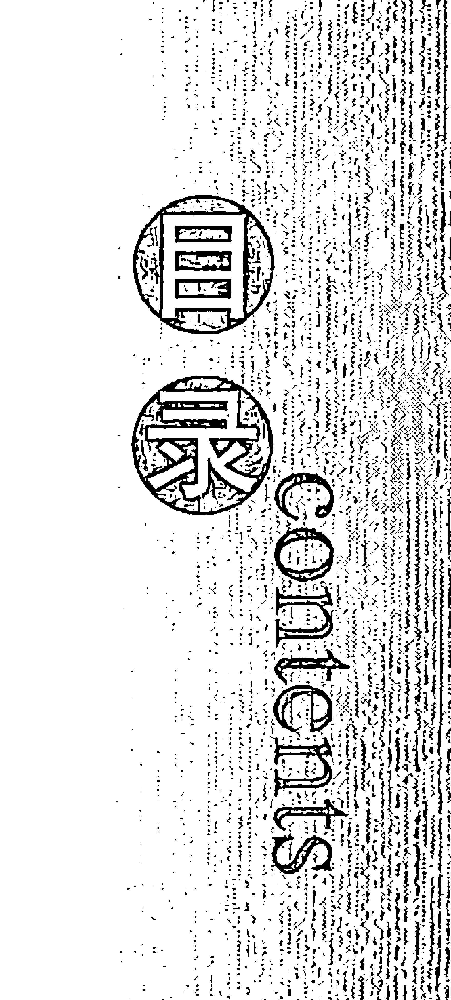
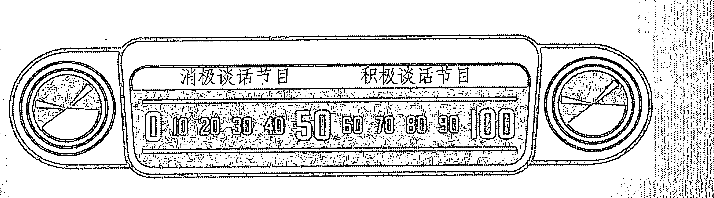

# 吸引力法则心灵使用手册

# # 你正在吸取吸引力法则的营养
## 它会让你的内心汹涌澎湃！

你可能没有意识到，在你的生活和学习中有一种强大的力量，这种力量就是吸引力法则。如今在你的生活中，这种法则正吸引着不同人群，影响着各类工作和人际关系。如果在你的生活中，你感到很多事情没有着落，整天就像是在看一些肥皂剧，那么这本书就是你所需要的。

这本教你如何实践的书将会引导你使用吸引力法则，帮助你放弃你所不希望得到的东西，给你的身心带来能量、激情与快乐。

你能通过使用吸引力法则彻底改变你的生活与工作状态。通过这本书，你可以校正你的人生方向，同时你会发现：通过使用吸引力法则，你的生活将会变得非常轻松、非常美好。本书主要涉及：

- 不要让你不喜欢的事情缠绕你
- 在你的生活中增加财富和人生经验
- 增强你的商业能力——同顾客、代理人和中间人的合作关系
- 找到你理想的、真正让你喜欢的职业

> 有一些书能改变你的生活，《吸引力法则》就是其中之一。一旦你掌握了这本书中的要领，你的工作机会、灵感、财富和良好的人际关系都会纷至沓来，你也可以自豪地告诉所有的人，你是如何了解这本书的。作为一位顶级的培训师，迈克尔·劳塞尔能够给你的生活带来令人吃惊的改变和成功，因此，我强烈推荐他的指导培训方法和方便、有效的培训机构。
> 
> ——卡罗尔·阿德里安那博士，《生活目标与理想生活》一书的作者

# 作者简介

迈克尔·劳塞尔
从1995年开始，培训师、神经语言程序学的实践者、加拿大畅销书作家迈克尔·劳塞尔就一直向全世界的吸引力法则受众提供指导方法。他那极受欢迎的吸引力法则培训课程已经改变了很多人的生活状态——因为这些人学会了吸引更多他们想要的东西，也学会了放弃更多他们不想拥有的东西。迈克尔·劳塞尔还经常以特约嘉宾的身份做客一些广播、电视节目，他还是美国、加拿大一些大型群众性组织的主要发言人。迈克尔·劳塞尔现在居住在加拿大不列颠哥伦比亚省维多利亚市。

www.LawofAttractionBook.com

定价：32.00元

定价：28.00元

- 策划：蒋永军
- 统筹：吴玉萍
- 责任编辑：龚晨
- 媒体推广：张颖
- 电话：010-65230556
- 投稿信箱：dfyxtougao@yahoo.com.cn
- 封面设计：裴振设计（139126910155）

# # 序言

这本书受到全世界那些想要在生活中学习和使用吸引力法则的人们的喜爱。吸引力法则的概念从19世纪末期以来就一直陪伴在我们周围。对人体能量的探究在中国传统历史文化的背景下一直受到重视。事实上，中国的太极、阴阳、五行、八卦等这些传统文化的瑰宝正在给全世界带来深远的影响。另外，中国读者肯定也会喜欢这本书的结构方式，它非常具有实用性、可操作性，读者可以把自己的信息整合到吸引力法则的训练进程之中，并同时可以使用吸引力法则打造成功、实现愿望。

通过阅读《吸引力法则》这本书，你能明白什么是吸引力法则，它是如何运转的，为什么你既能吸引积极的事物，也能吸引消极的事物。这本书适合于各个层面的读者，包括：学生、父母、企业人士、商业领导人、雇员以及所有想要吸引更多理想事物——尤其是良好的人际关系和成功的读者。

这本教你如何训练吸引力法则的书使用了简单、快捷的学习技巧，它能让读者在最短的时间内获得最佳的效果。读者只有将身心融入这本书，才能掌握更多关于吸引力法则的真谛，并理解吸引力法则到底是如何运转的，为什么在人们的生活中既会出现积极的事物，也会出现消极的事物。本书所提供的工具被众多读者赞誉为最有效的吸引力法则训练工具。

语言学在吸引力法则的训练中发挥着重要的作用。因为吸引力法则是探究人类能量（心灵感应）的科学，它涉及我们所使用的话语以及我们的思想——能够引起我们向宇宙发出心灵感应的话语和思想。所有年龄层的读者，不论是儿童还是成年人都会喜欢本书所提供的吸引力法则训练工具、训练过程以及训练实例。对于《吸引力法则》这本书，我从读者那里收到的最多的赞誉就是，它很容易阅读、很容易理解，同时也非常有利于把吸引力法则运用到自己的实际生活中。我能切身感受到，读者对我的吸引力法则之培训方式和效果非常满意。

非常荣幸能够与东方出版社合作出版《吸引力法则》的简体中文版，另外，我还要感谢这本书的译者蒋永军先生，是他们的共同努力才使得我能与中国的读者朋友们一起分享吸引力法则的思想。

迈克尔·劳塞尔
2007年11月

# 各方佳评

迈克尔·劳塞尔献给读者的这份珍贵礼物能够把抽象的定则转变成起作用的结果，而且最为重要的是，它真的起作用！
——玛丽·马克丹特，《我的母亲，我的朋友》一书的作者、演说家

迈克尔·劳塞尔的信息资料将会改变你分析观察自己和别人的方式。
——埃塞尔·G·劳德，团队培训发展学会高级培训师

如果你想要真正理解为什么你的生活方式是这样的，如果你想要真正知道如何得到任何你想要的东西，那么这就是一本很好的指导实践的书籍，而且这本书的语言也是简单易懂的。
——马克·福斯特，英国威根区

我阅读过其他关于吸引力法则的书籍，但都没有给我留下多少印象。迈克尔·劳塞尔通过他清晰的差异与意愿传达使我弥补了这—“被忘却的章节”。
——詹尼特·鲍艾尔，《新时代》编辑

> 这本书真是太伟大了！迈克尔使用简短的公式吸引你心里想要的任何东西，无论何人只要认真而长久地遵从这种公式，就会获得很大的成就。我强烈推荐你们把这种法则应用在你的生活中，以获取更大的成功！
——泽弗·塞福特拉斯，《工作动机》一书的作者和 www.EmpoweringMessages.com 网站的创建者

> 这本书遵从了那种简单化就是最好设计的倡导与理念。作者运用短小精悍的语言形式给读者提供了一个吸引力法则的最佳应用图景，然后又为读者提供了吸引力法则的具体实施方案。
——安提戈涅·W，亚马逊网站读者

> 完全出于巧合，我非常幸运地目睹了迈克尔·劳塞尔讲解吸引力法则的研讨会。迈克尔是一位风趣、可信又有活力的演讲家，他的培训改变了我的生活。作为一个乐观而又积极向上的人，我非常吃惊地发现，我每天的“自言自语”实际上都在破坏我吸引各种想要获得的关系和事物的努力（我已读过当代顶级大师们关于个人发展的数百部作品）。迈克尔的培训材料非常实用，并好学易懂；材料虽然简单，却拥有巨大的力量。《吸引力法则》一书有着很高的价值，我强烈向那些想提高生活质量的人们推荐这部作品。
——约翰·古迪，风险咨询师

> 在我所购买的以“创造一种理想生活”为主题的书、录音带和资料中，迈克尔·劳塞尔的《吸引力法则》一书绝对是我读过的最好的涉及具体细节的指导材料，没有哪一本书能做到这一点。在这本书中，迈克尔所指导的不是让你成为一个吸引理想结果的人——实际上你已经这样做了；相反，他以平白而没有行话、俚语的语言指导你如何才能做一个主动的吸引者，并且开始有意识地吸引你所想得到的东西，而放弃你所不想要的东西。我强烈向各位读者推荐这本书，如果这本书买不到了，你出1000美金我也不会卖给你我的这一本。
——托尼·拉斯，美国阿拉巴马州生活培训师

# # 序言

# # 各方佳评

# # 吸引力法则的魅力

- 你对吸引力法则的了解有多少 /002
- 你想了解本书与众不同之处吗 /003
- 你正在体验吸引力法则 /004
- 吸引力法则的科学 /006
- 吸引力法则的参照体系 /007
- 积极的和消极的“心灵感应” /010
- 无意中的吸引 /014

# # 理解你话语的意义

- 为什么在这里如此强调话语的重要性 /019
- 吸引你不想拥有东西的话语 /020
- 问你自己：“那么，我想要什么？” /023
- 重新调整你的心灵感应 /026

# # 主动的吸引力

## 培养主动吸引力步骤1：辨清你的愿望 /031

### 什么是差异 /031

### 分辨差异对你有帮助吗 /031

### 为什么辨清差异是重要的 /034

### 简单地观察差异是多长时间 /036

### 你的目标是要辨清生活中各个方面的差异 /039

- △案例分析与研究 /040
- 贾妮丝——朋友关系 /041
- 格雷格——金钱 /044

### 通过差异明晰进程表来辨清你的愿望 /047

### 整合步骤1：辨清你的愿望 /049

## 培养主动吸引力步骤2：高度重视你的愿望 /050

### 高度重视能增加心灵感应 /050

### 我的心灵感应罩里包纳了什么东西 /051

### 我正在把愿望包纳在心灵感应罩里，还是把它们从心灵感应罩里驱赶出来 /052

### 提升你的心灵感应以刺激你愿望的两个工具 /057

### 为什么使用确认功能能够提升你的心灵感应 /057

### 工具1：重新表述你的确认，使你的感觉更好 /061

# # 目录 CONTENTS

工具2：愿望陈述的工具 /062

如何创建你的愿望陈述 /071

我如何知道自己正在做的是正确的 /073

整合步骤2：高度重视你的愿望 /073

培养主动吸引力步骤3：愿望实现 /074

所有的一切都是愿望实现 /074

愿望实现游戏 /077

愿望实现的力量 /079

怀疑来自哪里 /082

帮助你愿望实现的一个工具 /085

创建愿望实现陈述的公式 /086

如何创建你自己的愿望实现陈述 /090

△帮助你愿望实现的更多工具 /093

工具1：明示例证（证据） /095

工具2：记录吸引力法则的例证 /097

工具3：欣赏与感恩 /101

工具4：使用这一表达方式，即“我正处于……的过程之中” /103

工具5：使用这一表达方式，即“我肯定能……” /104

工具6：使用这一表达方式，即“很多情况可能发生……” /105

工具7：寻求信息 /106

工具8：制作愿景箱 /107

工具9：创造一个空间 /108

# 目录 contents

工具 10: 让吸引力法则自行运作吧 /109

整合步骤3: 愿望实现 /112

整合所有内容 /113

# 超越3步骤公式

变得更加富有，并吸引更多金钱 /118

充裕的资源（实例） /119

把你充裕的心灵感应包纳在你的心灵感应罩里的工具 /121

整合：充裕的生活与吸引更多的金钱 /124

人际关系和你的心灵感应 /125

如何保持积极的心灵感应 /129

吸引理想的人际关系 /130

吸引理想人际关系的秘诀 /132

整合：人际关系和你的心灵感应 /133

父母和老师：学会如何向你的孩子传授吸引力法则 /134

秘诀1: 使用简单的话语 /134

秘诀2: 让孩子们接受新观念，方法是让他们通过自身的经历回答问题 /135

秘诀3: 孩子们喜欢秘密 /136

教授孩子们学习吸引力法则的工具 /139

整合：教你的孩子使用吸引力法则 /141

整合所有内容 /141

·+·+·+·+·+·+·+·+·+·

与吸引力法则的相关信息保持畅通 /143

特别致谢 /145

关于作者 /146

读者对本书的赞誉 /148

# # 吸引力法则的魅力

你以前可能听说过吸引力法则，也可能读过关于吸引力法则的书籍。这本书以明晰而简单的方式阐释了吸引力法则在实际生活中的含义，这种方式每个人都能理解、都能“听到”——不论是对于从来没有听说过吸引力法则的人，还是对吸引力法则有一定经验的人。这一法则既是鼓舞人心的，也是抚慰心灵的，它将引导你不断地提高生活和工作的质量。

# 你对吸引力法则的了解有多少

你们有些人可能从不同的渠道听说过关于吸引力法则的事情，而其他人也许正在打算学习如何掌握这种法则。现代意义上的有历史记载的吸引力法则出现在20世纪初期。下面向您介绍吸引力法则的历史：

1. 1906年——威廉姆·沃尔特·阿特金森（William Walter Atkinson）所著的《思维波动或思维世界的吸引力法则》；
2. 1926年——欧内斯特·赫尔姆斯（Ernest Holmes）所著的《心灵科学的基本思想》；
3. 1949年——雷蒙德·霍利维尔博士（Dr. Raymond Holliwell）所著的《让吸引力法则伴随工作》。

在20世纪90年代初期，关于吸引力法则的信息和培训资料逐渐通过杰瑞·希克斯和埃丝特·希克斯的出版物被广大公众所接受（现在，这些资料可以通过以下网址获取：www.abraham-hicks.com）。正是通过这些资料，我才真正明白了吸引力法则的真谛。

自从2000年以来，很多关于吸引力法则的文章和书籍得以面世，而吸引力法则所传递的思想也对越来越多的公众产生了吸引力。将来一定还会有更多关于吸引力法则的资料出现，而吸引力法则也一定会继续吸引越来越多的公众注意力。

# 你想了解本书与众不同之处吗

在1995年的时候，我学习了神经语言程序学（Neuro Linguistic Programming，简称NLP，即身心语言程序学，习称神经语言程序学，其创始人约翰·葛瑞德和理查德·班德勒将催眠治疗大师密尔顿·艾瑞克森、家族治疗大师维吉尼亚·萨提尔、完形治疗创始人弗瑞兹·皮尔斯、沟通大师葛瑞利·贝特森的学说融会贯通并加以改良，创造了NLP。经过30多年的发展，已被公认为是一套效果显著的实用心理学，并广泛应用于教育、儿童成长、心理治疗、个人发展、人际关系及沟通、商业管理、医疗健康等范畴——译者注），懂得了我们的头脑和思维是如何运转的。这也让我对人们的学习方式有了一定的见解。在阅读本书时你会发现，它会吸引着你改变你的阅读风格。这本书的一个写作特点是，各个章节是紧密联系在一起的，正如很多的培训指导手册一样，你可以使用这些工具、练习方法和资料来演练你的吸引力法则。

我读过的很多书都是从理论方面涉及吸引力法则的主题，但我却从它们中找不到问题的答案——我该如何使用这一法则呢？凭借着神经语言程序学的知识以及我所掌握的各种培训和指导风格，我创作了这部使人们易于学习和接受的吸引力法则指导书籍。使用本书中的练习方法和操作工具，你会很快掌握吸引力法则，并能在你的日常生活中有效地使用吸引力法则。

## 感言

> 关于这本书我所收到的最多的、也让我最满足的赞美之词就是：它是一部简单易读并且可操作性很强的书。这本书受到了不同信仰、不同精神团体的赞许与珍爱。除此之外，这本书还成为很多销售团队、网络销售公司、房地产经纪人、金融顾问和其他商业团体等的必读书目。总的来说，这本书对广大的公众有着巨大的吸引力。

## 你正在体验吸引力法则

你是否注意到有时候你心中想要的东西会接连不断地降临在你的身上：一个突然打来的电话会带给你某种好运；有可能在大街上突然碰到你梦寐以求想要见到的人物；可能你遇见很满意的客户或终身伴侣是命运使然；也可能是在一个恰当的时间和一个恰当的地点碰到了他们。所有这些经历都说明了你的生活中有吸引力法则的存在。

你碰到过有些人总是不断地面对各种糟糕的人际关系，并总是抱怨他们只能吸引一种关系吗？吸引力法则在他们中间也起到了作用。

吸引力法则可以这样界定：不论你的注意力、能量集中于哪个方面，也不论这种注意力和能量是消极的还是积极的，你都在吸引着自己的生活。阅读完这本书，你就会明白这一切为什么会发生以及是如何发生的。

这里有一些词和短语就说明了吸引力法则是存在着的。如果你曾经使用过下面这些词或短语，那么实际上你就是涉及了吸引力法则。

这里只是列出了几个词：

- 突然
- 接连不断
- 意外的好运气
- 同时发生
- 偶然
- 幸运
- 命运
- 注定
- 姻缘

通过这本书，你会了解到为什么这些经历会发生。更为重要的是，你会发现自己如何能更加主动地使用这种吸引力法则。你将能够吸引一切你需要做的事情、知道的事情和想要拥有的东西，因此，你会获得更多你想要的东西，也会放弃更多你不想要的东西。总而言之，你将会碰到你理想的客户、找到理想的工作、建立良好的人际关系、度过一个理想的假期、拥有一个健康的身体，还会拥有更多的财富，这些东西只要你想要就可以得到。这是真的！

## 吸引力法则的科学

不论是积极性的思考还是这种思考在达成吸引力法则后所表现出来的效果，都有一个心理基础。

世上有很多形式的能量：原子的、热能的、电力的、运动的和潜在的，它们是可以相互转化的、守恒的，绝对不会被摧毁。

你可以回想一下，一切物质都是由原子构成的，而且每一个原子都有一个原子核（包含质子和中子），原子核之外则是旋转着的电子。

电子总是以固定的轨道或能量等级围绕着原子核旋转，以确保原子的稳定状态。原子在稳定排列的状态下，如果发生意外的“振动”，那么这些原子就会形成一种动能，而且这种动能指向同一个方向，就好像金属块按同一方向排列磁力分子后就能被磁化一样。依据自然和科学的解释，在这种状态下就会产生正极（+）和负极（-）。毋庸置疑，科学的事实已经表明，如果一个领域的物理法则可以被观察到或者可以被量化，那么在大多数相似的情况下，这种法则也适用于其他领域——即使在当前情况下这种法则不一定能被量化。

> **感言**
> 
> 可以说，吸引力法则并不是一个幻想的词语或者新出现的魔法。它是一种自然界的法则，你周围的每个原子都会对这种吸引力法则产生反应，不论你知道与否。

## 建议

如果有些读者想知道能量、思想与我们周围的“物质”世界究竟存在着一种什么样的联系，我推荐这些读者观看这部电影：2004年由 Lord of the Wind 电影制作公司拍摄的《我们到底知道多少？》（全片以量子物理理论为主线，通过展现一个有言语障碍的摄影师的生活片段，并穿插大量量子物理、精神科、生物化学、神经化学、心理学、神学科等方面的权威与学科带头人的见解，把“现实”、“思想”、“世界”的种种问题阐述于观众面前。正如本片的名字就带有问号，本片最终也没有告诉观众答案，只是摆出这些问题，让观众思考——译者注）。

## 吸引力法则的参照体系

很多作者都写过关于吸引力法则的书籍。下面这些话就是以不同的方式引用了吸引力法则。

> **从本质上讲，喜欢等同于吸引。**
> 
> ——见于杰瑞·希克斯和埃丝特·希克斯合著的《亚伯拉罕的教义》和《索求与给予》

> **你的思想、感觉、思维图景和话语所散发出去的东西都是你对生活的吸引。**
> 
> ——见于凯瑟琳·庞德（Catherine Ponder）所著的《财富动力法则》

> **绝不要期待你不想拥有的东西，也绝不要期望你无法期待的东西。当你期待你不想拥有之东西的时候，你就会吸引令人不快的东西，而当你期望你无法期待之东西的时候，你的思维力量也只会变成徒劳无功。另一方面，当你持续不断地期待你一直渴望拥有之东西的时候，你的吸引力也会变得不可阻挡。人的头脑就好像是一块磁铁，它能吸引它所“管辖范围”内的一切事物。**
> 
> ——见于雷蒙德·霍利维尔博士所著的《让吸引力法则伴随工作》和《成功生活的11条真实原则》

> **每个人的思想都有一定的集中性，即使最散漫的思想也会遵循一定的法则形成相应的力量。**
> 
> ——见于欧内斯特·赫尔姆斯所著的《心灵科学的基本思想》

> **你就是一块活生生的磁铁；你能吸引与你的主体思想相和谐的人、状态和环境。不论你在意识里想的是什么，它都会在你的生活中表现出来。**
> 
> ——博恩·崔西（Brian Tracy）

## 吸引力法则的界定：

不论你的注意力、能量集中于哪个方面，也不论这种注意力和能量是消极的，还是积极的，你都在吸引着你自己的生活。

## 积极的和消极的“心灵感应”

“感应”（vibe）这个词语通常用来描述一种你从某个人那里或通过经历某件事情而引起的心情或感觉状态。比如，在你和某个人接触的时候，你可能会说：“我们彼此之间感应良好。”当你走过某个城市的某条街道的时候，你也可能会说：“我没有一种好的感应状态。”在这些例子中，“感应”这个词通常用来描述你所经历的某种心情或感觉。一般说来，“感应”就相当于一种心情或一种感觉。

“感应”这个词来源于“心灵感应”（vibration）这个比较长的短语（“心灵感应”并不是大多数人经常使用的短语）。在“心灵感应”的世界里，有两种感应，一种是积极的感应（＋），另一种是消极的感应（－）。每一种心情或感觉都会发出或表现出一种心灵感应——不论是积极的，还是消极的。如果你查一查词典，挑选一下那些描述感觉的词，你就能够把这些词分成两大类。每一个词都可以描述产生积极感应的感觉或描述产生消极感应的感觉。

我们每一个人都会发出积极的或消极的心灵感应。事实上，我们一直在发出这种心灵感应的信号。请思考一下这两个句子所表达的意思：“我对他感觉（感应）良好”和“这个邻居给我的感觉（感应）不好”。

接下来你会看到一些产生积极的或消极的心灵感应的例子。

## 消极的

- 失望 (disappointment)
- 孤独 (loneliness)
- 缺乏 (lack)
- 难过 (sadness)
- 混乱 (confusion)
- 压力 (stress)
- 愤怒 (anger)
- 受伤 (hurt)

## 积极的

- 快乐 (joy)
- 爱 (love)
- 兴奋 (excitement)
- 富裕 (abundance)
- 自豪 (pride)
- 舒服 (comfort)
- 信心 (confidence)
- 友爱 (affection)

## 心灵感应（感觉）

> **感言**
> 
> 在每一个瞬间你都会有一种心情或感觉。在每一个瞬间你所体验的心情或感觉都会引起你散发出一种消极的或积极的心灵感应。

吸引力法则就在这个时候发挥了作用。吸引力法则（你周围的能量都遵循物理学界的法则）对你正在发出的心灵感应进行反应。在这关键性的一瞬间，它通过给予你更多相同的反馈而与你的心灵感应相呼应——不论是积极的，还是消极的。

比如，当一个人在星期一早晨醒来的时候，他感到有些焦躁或心情烦闷，这时候他就发出了一种消极的心灵感应，而当他发出消极的心灵感应的时候，吸引力法则就起作用了。它与人们发出的心灵感应相呼应，并给予发出这种心灵感应的人更多相同的反馈（吸引力法则总是与你积极的或消极的心灵感应相呼应）。

于是，当上面所提到的这个人起床的时候，他一定会手忙脚乱，喉咙也会像冒了烟似的难受，如果上班时他再碰上交通堵塞，那他真是“诸事不顺”了。这时候，他就会对自己说：“我还不如待在床上呢。”

或者像这种情况，一位销售人员因为售出一大批商品而兴高采烈，这时候他发出的就是一种积极的心灵感应。在这之后不久，他又获得了一笔销售额，他就会这样对自己说：“我真是太顺心顺意了！”

在这两个例子中，吸引力法则都在发挥着作用，它通过展现、精心安排和处理人们的愿望，以反馈给人们同样的感应——不论是消极的感应，还是积极的感应。

> **感言**
> 
> 通过阅读这本书，你会学会如何辨清你内心发出的心灵感应，也能够对是否继续发出这种感应的状态或改变这种状态进行一种有意识的选择。在本书主动的吸引力章节中，你能学会如何主动地发出一种不同的心灵感应。你也能学会如何成为一位主动的心灵感应发出者，这样你就可以改变你最终获取的结果，也就是说获得更多你想要的东西，而放弃你不想要的东西。

吸引力法则对任何你正在发出的心灵感应都有一种反应，而且它还会赋予你更多的东西——不论是积极的，还是消极的，它只是简单地反馈你的心灵感应。

## 无意中的吸引

生活中，很多人都会经常感到好奇：为什么他们总是不断地吸引同样的事情。必须确定的一点是，他们不会发出任何消极的信号，然而，在他们生活中的不同方面，消极的或不利的经历却出现了。之所以会发生这样的事情，是因为他们通过对自己当前阶段所获取事物的观察与思考，又经过了一种简单的、非主动的消极感应才会出现这样的状态。

吸引力法则观察与思考环形圈
（无意中的吸引）

比如，当你打开自己的钱包，发现钱包里没有一分钱，在这种情况下，你就会发出一种失落、畏惧或其他类似的心灵感应，虽然你并没有故意这样做，但吸引力法则对你的心灵感应进行了反应，并给你更多同样的反馈。它也不知道引起你发出这种消极心灵感应的行为和原因是什么。你可能会想起、梦见或者能够观察到这种情况。

正如你在生活中的不同方面（金钱、工作、健康和人际关系等）所观察和思考到的，你的观察与思考会产生一种心灵感应——或者是积极的感应或者是消极的感应。

虽然你并不一定能意识到，你正沉浸于一种吸引力观察与思考的环形圈里，但这样的情况确实发生了。吸引力法则对你的心灵感应做出了反应——不论是积极的，还是消极的，然后反馈给你更多你正在感应的东西。

> **感言**
> 
> 不论你理解与否，也不论你相信与否，理解吸引力法则已经在你的生活中存在的事实是相当重要的。如果你喜欢你所观察与思考的东西，你就会感到欢欣鼓舞，在这种欢欣鼓舞的状态中，你会获得更多的东西。如果你不喜欢你所获取的东西，那么这就是需要你更加主动地运用吸引力法则的时候了——你可以放弃吸引你不想要的东西，而开始追求吸引你想要的东西。换句话说，这就是主动的吸引力。

> > 不论是积极的心灵感应，还是消极的心灵感应，吸引力法则都会反馈给你更多相同的东西。

## 理解你话语的意义

话语，话语，还是话语。
在这本书中，绝大多数的练习工具和图表都与话语的使用有关，而且更为重要的是：感应由话语生成。当你阅读这本书的时候，你会置身于主动的吸引过程中，并且理解所有练习话语的共同基因是如何形成的。

## 话语改变 ➔ 心灵感应改变

- ◇ 你的话语产生一种心灵感应——可能是积极的感应，也可能是消极的感应。
- ◇ 当你使用“不要，不是和不”的时候，你就一直在把你的注意力、精力集中在你所指向的事物上。
- ◇ 当你听见自己在说“不要，不是和不”的时候，你就要问一下自己：“那么，我想要什么呢？”
- ◇ 当你从不想拥有的事物过渡到想要拥有的事物的时候，你的话语就改变了，而当话语改变的时候，你的心灵感应也就发生了变化。
- ◇ 你一次仅能发出一种心灵感应。
- ◇ 你通过简单地改变话语可以重新调整你的心灵感应，记住，你的思想是由话语组成的。

## 为什么在这里如此强调话语的重要性

话语存在于任何地方。我们在说话、阅读、思考、输入信息时都要用到话语。选择精确话语的原因是，我们思考和使用的话语能产生我们发出的心灵感应。比如，“家庭作业”这个词语能引起一些人发出消极的心灵感应，而另外一些人也可能发出积极的心灵感应。“金钱”这个词对一些人来说是一种积极的心灵感应，而对另外一些人来说可能就是消极的心灵感应。在下面的章节中，你会掌握哪些话语能使你吸引你不想拥有的东西。

你的思想是由话语组成的。下面这个示意图表明了积极心灵感应和消极心灵感应以及你的思想和话语之间的联系。

## 吸引你不想拥有东西的话语

### 不要 不是 不

“不要想纽约的自由女神像！” 在我说出这句话的时候，我知道你肯定在想自由女神像。你的头脑会有意无意地自动过滤“不要，不是和不”这些话语。当你使用这些词语的时候，你实际上已经把那些告诉你不要做的事情内化进你的思维里了。例如，如果我说：“我不想经历一场暴风雪！” 我敢保证，你肯定已经开始想一场暴风雪了。即使发出的指令是不要做一件事情，但你的思想会有意或无意删除指令的这部分内容。下面是吸引你更多注意力或精力不要做某些事情的一些表达语句。想一下，你自己说过这些语句吗？

- 不要太疯狂
- 不要慌张
- 我没有责怪
- 不要着急，不要担心
- 给我打电话，不要犹豫
- 现在不要看
- 不要太傻
- 不要拿着剪刀到处跑
- 不要担心
- 不要忘记
- 我不想让它伤害我
- 我不想让我的客户取消订单
- 不要吸烟
- 不要迟到
- 不要乱扔垃圾
- 关门声音不要这么响
- 我现在没有做出判断

吸引力法则也和你头脑中所思考的方式一样在进行反应：它能“听见”你不想要什么东西。当你“听见”自己发出的一个包含“不要，不是和不”的话语时，你实际上已经开始把注意力和精力集中在你不想拥有的事物上了。这里有一个有效而简单容易的练习方法可以帮助你减少并最终从你的“词汇表”中完全放弃使用“不要，不是和不”。每一次你“听见”自己使用“不要，不是和不”的时候，你就要问自己：“那么，我想要什么呢？”

> **感言**
> 
> 每一次你谈到你不想要什么东西的时候，你实际上就是在释放注意力和精力。当你问自己想要什么东西的时候，你的答案就会创造出一句新的话语。当你的话语改变时，你的心灵感应也会发生变化，一个最好的消息是，你每次只能发出一种心灵感应。

吸引你不想拥有的东西的话语
LAW OF ATTRACTION

当你陈述一句包含“不要，不是和不”的话语时，你实际上是把你的注意力和精力集中在了你不想拥有的事物上。
请简单地问一下你自己，“那么，我究竟想要什么？”

## 问你自己：“那么，我想要什么？”

当我们使用“不要，不是和不”的时候，在你问自己：“那么，我想要什么？”之后，就可能听到下面这些话语。

消极的陈述 ➡️ “那么，我想要什么？” ➡️ 积极的陈述

| 消极的陈述 | 积极的陈述 |
|---|---|
| 给我打电话，不要犹豫 | 立即打电话 |
| 不要慌张 | 保持冷静 |
| 不要忘记 | 记得想起…… |
| 不要迟到 | 按时相会 |
| 关门声音不要这么响 | 要轻轻地关上门 |
| 我不想让客户取消订单 | 我希望客户遵守诺言 |

**建议**

当你使用“不要，不是和不”的时候，请把你的语句记录在下面。

◇
◇
◇
◇
◇

请在这里创造新的积极的语句。

◇
◇
◇
◇
◇

> > “积极的和消极的情感不可能在相同的时间里占据你的思想。一种或另外一种情感肯定会占有优势。确信积极的情感构成了影响你思维的主要因素是你的重要责任。”
> 
> ——拿破仑·希尔

当你从你不想要什么东西过渡到你想要什么东西的时候，话语就发生了变化。当话语发生变化之后，心灵感应就发生了变化。请记住，你一次只能发出一种心灵感应。

## 重新调整你的心灵感应

通过辨清你正在体验中的感觉，在每一个瞬间你都能告诉我，你正在发出的心灵感应是积极的还是消极的。这些感觉引起你发出一种心灵感应，而在这个心灵感应的世界里，仅有两种感应，即积极的和消极的。

你通过简单地选择不同的话语和不同的思维就能把你的心灵感应从消极方面转移到积极方面。这就好像是你在问自己：“那么，我想要什么？”这样简单。再者，当你谈到你不想要什么东西，然后又谈到你想要什么东西的时候，话语就发生了变化。在一个瞬间里，你只能发出一种心灵感应，然后你的话语就会发生改变，你的心灵感应也会随之发生变化。

> **感言**
> 
> 简单地说，要想调整你的心灵感应，你只需改变你正在使用的话语和正在进行的思考方式就行了。

吸引力法则记不得你 5 分钟、5 天、5 个月或 50 年前所发出的心灵感应。它只会对你在当前的瞬间所发出的心灵感应作出反应，并给予你更多同样的反馈。

要想知道你是在发出一种积极的心灵感应，还是一种消极的心灵感应，你只需要简单地看一下在你生活中的某一方面所获得的结果就可以了。它们恰如其分地反应了你正在发出的心灵感应。

## 主动的吸引力

在接下来的章节里，你将会发现如何更加主动地使用吸引力法则。要想做到这一点，你就要学会一个简单的3步骤公式。除了学会这些步骤并理解两个案例分析之外，你还可以通过填充我所提供的空白表格来加入吸引力法则的进程。想要更多的表格请从 www. LawofAttractionBook. com/ worksheets. html 这一网址中下载。

如果你无法确定你在生活中的哪个方面能够使用主动的吸引力，那么你就简单地选择生活中最让你感到不满意的那个方面，比如：你的人际关系、职业、健康、商业或者是你的经济状况。

请你一定要阅读完这本书余下的内容，然后再做关于吸引力法则的练习，接着把练习的结果运用到生活中你所选择的某个方面。

## 培养主动吸引力的3步骤

### ◇ 步骤1：辨清你的愿望

听起来很简单，是吗？实际上，大多数人并不十分了解他们想要什么东西，也不了解他们不想要什么东西。在这一个步骤里，你将能够明白为什么知道你不喜欢什么东西是非常有用的。

### ◇ 步骤2：高度重视你的愿望

吸引力法则将会给予你更多能够引起你的注意力、能量和聚焦度更加集中的东西。这一步骤将会使你简单地通过学会掌握如何选择你的话语来达到对你想要的东西的注意。

### ◇ 步骤3：愿望实现

你想知道为什么你没有表现出你的愿望和欲望吗？你愿望的实现速度取决于你的愿望实现。这是最重要的一个步骤。

## 3 步骤

### 培养主动吸引力步骤1：辨清你的愿望

培养吸引力法则的第一个步骤是要明白你自己到底有什么愿望。然而，大多数的人所面临的挑战是不太了解他们自己究竟有什么样的愿望，但他们却能够清晰地分辨出他们确实不想拥有的东西。实际上，能够知道你不想拥有的东西是一件很不错的事情。正如你在这一章节里所发现的那样，知道你不想拥有的东西对于你来说是一种非常有用的工具。

### 什么是差异

差异*这个概念，正如在吸引力法则中所应用的那样，是一种你不喜欢，感觉不好，或者能够引起你心情不好的体验。一旦你在生活中分辨出“差异”，你就有可能谈论它，并发出抱怨声，或者说你不想要它，而这时候的心灵感应就是消极的。吸引力法则就会对你消极的心灵感应进行反应，并反馈给你更多相同的东西。

### 分辨差异对你有帮助吗

是的。通过观察差异，你就能够分辨出你不想拥有的东西，然后

* 差异这个概念是我从杰瑞·希克斯和埃丝特·希克斯的“亚伯拉罕-希克斯”系列出版物中借鉴的。

后你对自己想拥有的东西就更加清晰了。你只要简单地问一下自己：“那么，我想要什么东西呢？” 换句话说，你可以使用差异来辨清你究竟有什么样的愿望。

以你的第一位男朋友或女朋友为例子。你可能已经不和他（或她）在一起了，这种情况下，在你们之间的关系中就会表现出很多你不喜欢的方面，这就是你的差异条目。这些你不喜欢的方面就会帮助你更加明晰你是否还需要一个相伴左右的人。

观察和分析差异是非常必要的，因为它能帮助你明晰自己究竟想要什么东西。

## 为什么辨清差异是重要的

只要你在生活中观察分析这种差异，你就是在经历一种更加清晰的过程。

想象一下，你正在和你最好的朋友一起开车兜风，他坚持要调一下收音机的频道。接下来，你的朋友选择了一个你不喜欢的摇滚频道。这时候你就会感到不快。

在摇滚音乐播放了5分钟之后，你对自己说：“这是我的车，我一刻也不想听这种糟糕的音乐了。” 于是，你把收音机调到了你比较喜欢的现代音乐频道。这时，你马上就会感到一种惬意与舒畅。

请注意，当你把注意力集中在你不喜欢的事物上时，你是多么清楚自己喜欢什么啊！换句话说，你的差异给你提供了清晰的图景。

请你简单地观察差异，然后，

> “那么，我想要什么？”

## 简单地观察差异是多长时间

获得你想拥有的事物，而不是把自己束缚在不想拥有的事物上的关键是简单地观察差异。

只有你自己能决定这到底需要持续多久。对一些人来说，在一种关系中所经历的差异可能要持续数年；而对另外一些人来说，一种差异可能只持续很短的一段时间。你可能在第一次约会时就决定要结束这种关系。

请注意，当你经历某种气味、声音或味道时，你的耐受性可能是很小的。请思考下面这几个句子：

- 在闻到那些气味不好的东西时，你能持续多长时间？
- 在听到那些音质不好的音乐时，你能持续多长时间？
- 在吃到那些味道不好的食物时，你能持续多长时间？

在处于以上这些情况时，你就能对差异进行简单的观察与思考，并且很快地明晰起来。

然而，在你生活的某些方面，你可能会对这种差异进行很长时间的观察与思考，比如，在以下方面：

- ◆人际关系
- ◆健康
- ◆金钱
- ◆职业
- ◆其他方面

## 感言

总体来说，你把你的注意力、能量和精力放在差异上的时间越少，效果就会越好。你在这本书里所学到的差异明晰进程会给你提供很大的帮助。

辨清让你感觉不错的东西，然后争取更多。

## 你的目标是要辨清生活中各个方面的差异

你在生活的各个方面都感觉很好，这就棒极了！这听起来是不是有点只考虑自己？但你只要理解，考虑自己只不过是一种自我关怀的行为，那就万事大吉了。

- 考虑自己 = 自我关怀
- ◇ 你吃什么东西考虑自己吗？
- ◇ 你闻什么东西考虑自己吗？
- ◇ 你穿什么衣服考虑自己吗？
- ◇ 你听什么声音考虑自己吗？

### 建议
在你生活中的以下几个方面都要多考虑自己的行为：

- ◇ 职业
- ◇ 金钱
- ◇ 健康
- ◇ 人际关系

在这4个方面，大多数人都拥有很多消极的情感，而且在很多情况下，在很多年的时间里，人们会对这种消极的情感进行观察与思考。

差异明晰进程能使你更加清楚自己想要的东西。
在生活中的以下几个显著方面，明晰化是非常有利的：

- ◇职业
- ◇金钱
- ◇终生的伙伴关系
- ◇朋友关系
- ◇工作关系
- ◇商业客户
- ◇商业引介
- ◇教育
- ◇健康
- ◇其他方面

下面我们将引入两个案例来说明差异明晰进程如何帮助你更加明晰。

## 案例分析与研究

在我向数千名学生教授了吸引力法则之后，我收集了一些因为学习吸引力法则而获得很好效果的精彩故事。我在其他资料上也看到了一些学习吸引力法则的生动案例，我在这里所选择的两个案例代表着人们使用吸引力法则获得更多他们想要的东西中最普遍的两个方面。

贾妮丝的故事将会很清楚地为你展示这3个步骤，即辨清你的愿望、高度重视你的愿望和愿望实现，这3个步骤可以帮助你吸引更多良好的关系。格雷格的故事集中在一个对很多人来说都很重要，又很困难的事情上，这就是金钱。

## 贾妮丝——朋友关系

34岁的贾妮丝总是感到身心疲惫，并伴随有挫折感，因为总是有一些她不喜欢的男子追求她。她一直在抱怨，为什么她所吸引的男子都是那些她不感兴趣的、无法真正得到的或者是不把她放在心上的呢？

贾妮丝决定使用吸引力法则吸引更加理想的朋友关系。

于是，她开始了主动吸引力过程的第一个步骤：使用差异明晰进程表来辨清她所想要的东西。贾妮丝的表格可以参照下面的内容。

### 差异明晰进程表
### 贾妮丝
### 我理想的朋友关系

> 那么，我想要什么？

| 差异——我不喜欢的东西（A面） | 明晰——我喜欢的东西（B面） |
| :--- | :--- |
| 1. 不主动 | 1. 灵活、善于平衡 |
| 2. 不善于听别人讲话 | 2. 善于听别人讲话 |
| 3. 缺少温柔 | 3. 感情丰富、敏感 |
| 4. 不在乎我的想法和感觉 | 4. 问我想什么和感觉如何 |
| 5. 不喜欢外出 | 5. 喜欢与我的朋友在一起共同开心 |
| 6. 不喜欢旅游 | 6. 喜欢社会状况，喜欢作短途或长途旅行，也喜欢到没去过的地方进行探险 |
| 7. 总是催促我 | 7. 很有耐心，允许事情按时完成 |
| 8. 不经过我的同意就做出决断 | 8. 在做出决断之前征求我的意见 |
| 9. 不喜欢跳舞和看电影 | 9. 喜欢戏剧、电影，喜欢各种娱乐方式，也喜欢跳舞 |

贾妮丝把条目中的每个项目都认真读了一遍，并且问自己：“那么，我想要什么呢？” 然后，她把答案写在了表格的B面，接下来她就把A面的各个项目用横线划掉了。

注意：在贾妮丝的案例中，她只列举了9个项目。但如果你列举尽可能多的项目（比如，50~100个项目），这项练习所获得的效果就会更加明显。你辨清的差异项目越多，你就会对自己的愿望越明晰。

## 格雷格——金钱

27岁的格雷格是一位整天入不敷出的年轻人。他总是抱怨自己没有多少钱。事实上，他说他一直感觉自己的经济状况有很大的压力。格雷格是一位自由职业的咨询师和商业顾问，但他在获取客户资源和保持客户资源方面总是不够顺利。

格雷格决定使用吸引力法则吸引更加理想的经济状况。

于是，他开始了主动吸引力过程的第一个步骤：使用差异明晰进程表来辨清他所想要的东西。

记住：在格雷格的案例中，他只列举了10个项目。但如果你列举尽可能多的项目（比如，50~100个项目），这项练习所获得的效果就会更加明显。你辨清的差异项目越多，你就会对自己的愿望越明晰。

### 差异明晰进程表
### 格雷格
### 我理想的经济状况

> 那么，我想要什么？

| 差异——我不喜欢的东西（A面） | 明晰——我喜欢的东西（B面） |
| :--- | :--- |
| 1. 没有足够的钱 | 1. 拥有大量的金钱 |
| 2. 总是欠账单 | 2. 轻而易举地就能付清账单 |
| 3. 总是入不敷出 | 3. 经常有多余的钱 |
| 4. 我负担不起任何我想要的东西 | 4. 我想买什么就能买什么 |
| 5. 金钱来源如潺潺细流 | 5. 金钱源源不断地收入囊中 |
| 6. 从来没有赢取过什么东西 | 6. 我经常获得奖金，经常收到礼物和一些免费的东西 |
| 7. 我的金钱从来不会增加 | 7. 我经常从一些知道的和不知道的渠道获得财富与金钱 |
| 8. 我们家从来不会轻而易举地获得金钱 | 8. 我可以轻而易举地获得金钱 |
| 9. 我总是疲于奔命地付租金 | 9. 我身边有钱，可以很容易地付清租金 |
| 10. 金钱问题让我压力重重 | 10. 金钱和个人关系方面我都感觉良好 |

格雷格把条目中的每个项目都认真读了一遍，并且问自己“那么，我想要什么呢？”然后，他把答案写在了表格的B面，接下来他就把A面的各个项目用横线划掉了。

## 通过差异明晰进程表来辨清你的愿望

选择你打算改变的生活中某个方面的状况。

在下页表格的A面，列出所有使你感到烦恼的事情。比如，如果你想创建一张关于理想职业的差异表格，你的条目中应该包括“上班时间太长”或者“薪水太低”。可以回想一下你以前所从事过的职业，这样便于你创建这张表格。

然后，花费一定的时间来完成这张表格。记住，在你的表格中列举更多的差异项目将会使你对自己的愿望更加明晰。我建议你把项目增加到50~100个。你可以利用几天的时间来创建这张表格，以确保你能够想到所有相关的差异事项。

在你完成了这张表格的A面之后，你要仔细读一下每一个项目，并且问自己：“那么，我想要什么呢？”然后再完成这张表格的B面。

通过使用这张差异明晰进程表，你可以更好地理解你想要什么东西（辨清你的愿望）和不想要什么东西（通过差异对比）。在你对自己的愿望明晰了之后，你可以把相关的差异项目用线划去。

### 差异明晰进程表
### 我理想的______

> 那么，我想要什么？

| 差异——我不喜欢的东西（A面） | 明晰——我喜欢的东西（B面） |
| :--- | :--- |
| 列举你不喜欢的东西 | 列举你喜欢的东西 |

想要更多的表格请从 www.LawofAttractionBook.com/worksheets.html 这一网址中下载。

## 整合步骤1：辨清你的愿望

你已经完成了主动吸引力的第1步——辨清你的愿望。

下面是本章节的主要内容：

- ◇ 差异是你感到不好的东西。
- ◇ 通过简单的观察和差异分析，你就会知道吸引力法则总是能反馈你的心灵感应。
- ◇ 使用差异的方法来帮助你辨清愿望。
- ◇ 当创建你自己的差异条目的时候，你要尽可能多地设置一些差异项目。你辨别的差异项目越多，你所辨清的愿望也就会越多。

请记住，在这个时候，你已经精确地知道了自己的愿望。在你因为辨清了自己的愿望而兴高采烈的时候，你就要把你想要的东西记录下来，或者记住你所经历的怀疑感觉。

在下面的章节里，你将继续学习在第2个步骤和第3个步骤所使用的吸引力法则公式。

## 3步骤
辨清你的愿望
高度重视你的愿望
愿望实现

## 培养主动吸引力步骤2：高度重视你的愿望

## 高度重视能增加心灵感应

提升（或增加）你的心灵感应就意味着给予你的愿望更多的积极注意力、能量和聚焦度。

但仅仅辨清你自己的愿望是不够的，你还必须给予它积极的注意力。这样才能确保你把自己对愿望的心灵感应包纳在你当前的心灵感应之中。

吸引力法则会将你更多的注意力、能量和聚焦度给予你所关注的事物之中。然而，如果你只是辨清了自己的愿望，而不给予它足够的注意力、能量和聚焦度，这一切就都不会表现出来。这里的关键一点是，辨清你的愿望，然后持续不断地给予它关注。当你给予自己的愿望足够的注意力的时候，你就是正在把你愿望的心灵感应包纳在你当前的心灵感应之中。你当前的心灵感应就是吸引力法则所反应的东西。

如果一些人非常善于辨清他们自己的愿望，然后就把这些愿望条目束之高阁，不再关注它们，那么吸引力法则就只能对你所给予注意力的愿望进行反馈。

在本书的下一个章节里，我将使用围绕在我们周围的心灵感应罩来解释这个概念——我们所有当前的心灵感应都储存在这个心灵感应罩里。你必须要把确信把你当前的心灵感应包纳在你的心灵感应罩里面。

### 我的心灵感应罩里包纳了什么东西

设想一下，你周围环绕着一个巨大的玻璃罩，你向外发出的所有心灵感应都被包纳在这个玻璃罩里。吸引力法则只对你心灵感应罩里面的愿望进行反应。

### 你的愿望是在你的心灵感应罩里面还是外面

明白你所有的目标、梦想和愿望都存在于你心灵感应罩的外面是非常重要的。如果这些目标、梦想和愿望已经存在于你心灵感应罩的里面，那么你就已经拥有它们了，并可以享用它们。举个例子来说，你在第1个步骤的练习中已经辨清了你的愿望，现在非常有必要把这些愿望包纳在你当前的心灵感应罩里，因为吸引力法则只对这些心灵感应进行反馈。如果你“创建”了你的愿望条目，而把它们锁在自己的思维“抽屉”里面，你的愿望就不会表现出来，因为吸引力法则从来不会对锁在“抽屉”里的愿望进行反馈。它只反馈当前在你心灵感应罩里面的愿望。

在主动吸引力的第2个步骤里，你将会通过创建一种愿望明示来学会如何使用语句给予你新的愿望足够多的注意力、能量和聚焦度。在你维持这种对愿望的注意力、能量和聚焦度的时候，你实际上就是在把这种愿望包纳在你的心灵感应罩里，而吸引力法则也会对心灵感应罩里的愿望进行反馈和对接。

### 我正在把愿望包纳在心灵感应罩里，还是把它们从心灵感应罩里驱赶出来

使用第55页的表格来决定以下这些句子符合哪个栏目。

- 当我谈论我喜好的东西的时候。
- 当我注意到我所喜欢的东西的时候。
- 当我做白日梦梦见自己愿望的时候。
- 当我设想自己愿望的时候。
- 当我认为自己已经实现了愿望的时候。
- 当我对某件事情说“是”的时候。
- 当我对某件事情说“不”的时候。
- 当我担心某件事情的时候。
- 当我抱怨某件事情的时候。
- 当我想起积极事情的时候。
- 当我想起消极事情的时候。
- ◇ 当我察觉到积极事情的时候。
- ◇ 当我察觉到消极事情的时候。
- ◇ 当我认真地思考想拥有自己愿望的时候。
- ◇ 当我对自己的愿望进行反复思考的时候。
- ◇ 当我对自己的愿望进行祈祷的时候。
- ◇ 当我为自己喜好的事情兴高采烈的时候。

## 培养主动吸引力步骤2：高度重视你的愿望

### 我的心灵感应罩里包纳了什么呢？

### 我的心灵感应罩

| 包纳在我心灵感应罩里面的行为 | 不在我心灵感应罩里面的行为 |
| :--- | :--- |
| - 谈论我喜好的东西的时候 - 注意到我所喜欢的东西的时候 - 做白日梦梦见自己愿望的时候 - 设想我自己愿望的时候 - 认为自己已经实现了愿望的时候 - 当我对某件事情说“是”的时候 - 当我对某件事情说“不”的时候 - 当我担心某件事情的时候 - 当我抱怨某件事情的时候 - 当我想起积极事情的时候 - 当我想起消极事情的时候 - 当我察觉到积极事情的时候 - 当我察觉到消极事情的时候 - 当我认真思考想拥有自己愿望的时候 - 当我对自己的愿望进行反复思考的时候 - 当我对自己的愿望进行祈祷的时候 - 当我为自己喜好的事情兴高采烈的时候 | 你能明白所有这些是怎样包纳在心灵感应罩里面的吗 |

注意当你对某件事情说“不”的时候，你就是在给予它你的注意力、能量和聚焦度。在这一瞬间，它也包纳在你的心灵感应罩里面。给予任何事物任何形式的注意力都将把它们包纳在你当前的心灵感应罩里。

## 提升你的心灵感应以刺激你愿望的两个工具

让吸引力法则在你的身上发挥作用的一个关键点是把你的愿望锁定在你当前的心灵感应中，即包纳在你的心灵感应罩里面。

在下面的章节里，我会解释对愿望的确认能不能帮助你把自己的愿望包纳在你的心灵感应罩里，我会给你提供一个有用的工具来帮助你“恢复你对愿望的确认”，即让这种确认能够真正发挥作用。另外，我还会给你介绍一个工具——我把这个工具叫做“愿望明示”。这个有效的工具能够确保把你的愿望包纳并保持在你的心灵感应罩里。在你面对新的愿望，但不给予它认真的注意力就有可能忘记的情况下，这种工具尤其有效。

首先让我解释一下，为什么使用确认功能能够提升你的心灵感应。

### 为什么使用确认功能能够提升你的心灵感应

确认是一种在现时情况下用于宣示愿望的陈述。比如，“我有一个让我非常满意的苗条身材”就是一个积极确认的例子。

在你每一次考虑你的确认的时候，你都会有一种反应——这种反应完全基于话语给你带来的感觉。请记住，吸引力法则对你发出的心灵感应进行反馈，这种反馈基于你的感觉，而不是基于你所使用的特别话语。比如，你告诉自己你有一个非常满意的苗条身材，但事实上却不是这样的；或者说在你拥有一个让你非常满意的苗条身材的时候，你却感觉不是这样的，那么这时候你就会产生一种消极的心灵感应。你就会发出一种怀疑的心灵感应（消极的心灵感应），这时候吸引力法则就会通过给予你更多同样的东西进行反馈——即使这种反馈是你不需要的。

一种积极的确认也可能产生一种消极的心灵感应。大多数确认是不发挥作用的，因为吸引力法则从来不对话语进行反馈——它只对你所使用的话语在你内心产生的感觉进行反馈。

在下面你将会看到一系列积极的确认。在读完每个句子之后，你就要问一下你自己，你所发出的是哪一种心灵感应，是消极的还是积极的。

### 心灵感应

| + | - | 心灵感应 |
| :--- | :--- | :--- |
| □ | □ | 我的家庭关系是和谐的 |
| □ | □ | 我喜欢我的身材 |
| □ | □ | 我是一位百万富翁 |
| □ | □ | 我的生意蒸蒸日上 |
| □ | □ | 我健康状况良好 |
| □ | □ | 我有一位非常完美的终身伴侣 |

问题：这些确认在什么时候给你提供一种积极的心灵感应？
答案：当你的这些情况属实的时候。

当你说出一件不属实的事情时，你就是在发出一种消极的心灵感应，因为这种陈述在你的内心深处会激起一种怀疑的想法。在你说出这种确认的时候，你的部分思维可能会“说”：

- 这不是真的，我的家庭关系是不和谐的。
- 这不是真的，我一点也不喜欢我的身材。
- 这不是真的，我还不是一位百万富翁。
- 这不是真的，我的生意毫无进展。
- 这不是真的，我经常萎靡不振。
- 这不是真的，我的伴侣根本就不完美。

> 感言
>
> 使用确认的关键一点是，你所有的情况必须是真实的，这样你就会有一种良好的感觉。在下面的章节里我将给你提供一种工具，来帮助你重新表述你的确认，这样你所有的情况就都是真实的了，你也能发出积极的心灵感应了。

吸引力法则对你的话语和你的思维在你内心引起的感觉进行反馈

## 工具1：重新表述你的确认，使你的感觉更好

有一些人经常被别人指导说，要在现时的情况下对你的愿望进行确认。在这里，我建议你把自身置于一种过程之中，这个“过程”（明示的过程）实际上开始于你思考你的愿望、谈论你的愿望、写下你的愿望，或者给予你的愿望注意力的时候。所以，你一定要处于一种过程之中。当你说“我正处于……的过程之中”时，这个句子就是真实的，如果这是真实的情况，你就会感觉良好，同时，这也成为一种积极的心灵感应。

让我们重新考察一下前面所陈述的句子，每一个句子都是按照下面的形式开始的：

我正处于……的过程之中。

- 我正处于创建一种良好家庭关系的过程之中。
- 我正处于越来越喜欢自己身材的过程之中。
- 我正处于一个变得非常富有的过程之中。
- 我正处于生意逐渐兴旺的过程之中。
- 我正处于拥有一个良好健康状况的过程之中。
- 我正处于吸引一个完美伴侣的过程之中。

现在对你来说，每一个陈述都是真实的情况！当一种陈述是真实情况的时候，你就有一种良好的感觉。当你感觉良好时，你就会发出一种积极的心灵感应，吸引力法则就会带给你更多相同的东西。

## 工具2：愿望陈述的工具

愿望陈述是一种提升你心灵感应有效的工具，是主动吸引力法则3步骤中的第2个步骤。一旦你明晰你想拥有的东西，你就要写下一种愿望陈述来帮助你对这种愿望加以关注。请记住，吸引力法则显示的是，不论是什么东西，只要你给予它足够的注意力、能量和聚焦度，它就会反馈给你更多同样的东西，而愿望陈述也是会这样“做”的。

例如，你可能会说：“我想要拥有一个属于我自己的家。”在这一瞬间，吸引力法则就会组织安排各种境遇和事件以把你的这种愿望带给你。然而，如果你像大多数人一样，说自己无法组织起一个家庭，那么实际上你就是自己在破坏这种愿望。现在你发出了一种缺少的心灵感应，那么吸引力法则也会对这一切进行反馈。

一旦你写下你的愿望陈述，你就会经历一种兴奋、希望的感觉，所有这些都表明你的心灵感应被提升——现在你可以把这些告诉你的感觉了。

愿望陈述的3个元素：

- 开头句子
- 陈述主体（步骤1中的辨清条目）
- 结尾句子

在接下来的章节里，你将学会如何运用这3个元素来创建你的愿望陈述。

## 愿望陈述——开头句子

我正处于吸引所有我想要做、想要知道或想要拥有某种事物的过程之中，我要吸引更多理想的愿望。

## 愿望陈述——陈述主体

使用你辨清条目中所陈述的句子，然后和这些短语结合起来：

- 我非常高兴因为我知道_______________________
- 我非常高兴当我_______________________
- 我已决定_______________________
- 越来越多的_______________________
- 我一想到_______________________
- 我认为这是一个好主意_______________________
- 看到自己_______________________

## 例如：

- 我非常高兴因为我知道我理想的伴侣就居住在这个城市里。
- 我非常高兴当我在银行里存上一大笔钱的时候。
- 我一想到能与我理想的伴侣一起去旅行就异常兴奋。
- 我认为创建一个完整的客户数据库是一个好主意。
- 看到自己能够恰当地选择健康食品，我非常自豪。

上面这些句子有助于你谈论愿望，同时你也能知道这些情况是属实的。比如，你确实想要知道、非常满意某种想法或者非常满意你自己等。现在你就是在把你的愿望包纳在你积极的心灵感应和你的心灵感应罩里面。在这里使用“理想的”这个词是相当重要的，它指的是理想的伴侣、理想的健康状况或理想的职业。你可以自由谈论思考你的愿望，这样有助于你把你的愿望包纳到你当前的心灵感应里。请记住，愿望陈述的目标是帮助你把自己新的愿望包纳在你的心灵感应罩里。

你能从下面这两个句子中感觉到心灵感应的不同吗？

> 我很高兴地发现我理想的人际关系正在培育和提升。
> 我的人际关系正在培育和提升。

在第一个句子里，你说的是你理想的人际关系正在培育和提升，这时你的心灵感应是积极的。再者来说，你实际上没有说你现在拥有一种理想的人际关系，你所说的只是对组成这种理想人际关系的种种因素明确地表示了愿望。第二句陈述是宣称你已经在培育和提升你的人际关系。如果这种情况不是真实的，那么你的内心就会感到怀疑，这样就会产生一种消极的心灵感应。

## 愿望陈述——结尾句子

吸引力法则正在组织安排并展现出能够给我带来愿望的所有可能性。

## 完整愿望陈述的例子

在你写下你的愿望陈述之前，让我们看一下贾妮丝和格雷格的例子。请记住，贾妮丝和格雷格第1步就是创建了一个差异条目（不喜欢的方面），以帮助他们明晰自己的愿望。在这里，我要把他们的差异明晰进程表列出来以展示这份表格是如何帮助他们创建自己的愿望陈述的。

### 差异明晰进程表

#### 贾妮丝

#### 我理想的朋友关系

那么，我想要什么？

| 差异——我不喜欢的东西（A面） | 明晰——我喜欢的东西（B面） |
| :--- | :--- |
| 1. 不主动 2. 不善于听别人讲话 3. 感情冷淡 4. 不在乎我的想法和感觉 5. 不喜欢外出 6. 不喜欢旅游 7. 总是催促我 8. 不经过我的同意就做出决断 9. 不喜欢跳舞和看电影 | 1. 灵活、善于平衡 2. 善于听别人讲话 3. 感情丰富、敏感 4. 问我想什么和感觉如何 5. 喜欢与我的朋友在一起共同开心 6. 喜欢社会状况，喜欢作短途或长途旅行，也喜欢到没去过的地方进行探险 7. 很有耐心，允许事情按时完成 8. 在做出决断之前征求我的意见 9. 喜欢戏剧、电影，喜欢各种娱乐方式，也喜欢跳舞 |

为了创建愿望陈述，贾妮丝把她的愿望明晰条目整理出来，然后把它们纳入愿望陈述模型之中。

### 贾妮丝的愿望陈述：我理想的朋友关系

**开头句子**

我正处在吸引我所有需要做、需要知道以及吸引我理想的人际关系的进程之中。

**陈述主体**

我比较喜欢的男女朋友关系状况是：我与一位灵活而善于平衡关系的男子交往。他善于听别人讲话，也善于与别人交流。

我心目中的理想伴侣应该是感情敏感而丰富的，并且要时常在乎我的感觉。我喜欢被征求意见的感觉，比如在对某件事情做出决定的时候。

在社交场合，我希望我心目中理想的男朋友应该能主动与我的朋友们会面。我还希望他能像我一样喜欢长途和短途旅行，这样在旅行和度假的过程中，我们之间的关系会更进一步。

我认为我理想中的伴侣应该是富有耐心、善于照顾人、温文尔雅而又守时守信的人。我希望我理想中的伴侣能够经常询问我对某些事情的感觉，能够与我们每个人自由平等地交流。我希望我的伴侣对我体贴有加、关怀备至。

我一想到我能与我理想中的伴侣一起去欣赏戏剧、看电影、跳舞以及进行各种娱乐活动我就非常兴奋。我喜欢被我的伴侣赞赏的感觉，同样我也希望我的伴侣能有同样的感觉。我还希望他是一个乐观的人，而且对我的爱有增无减。当然，他还应该是一个乐于助人，并且有一定经济基础的人。

**结尾句子**

吸引力法则正在组织安排并展现出能够给我带来愿望的所有可能性。

### 差异明晰进程表

#### 格雷格

#### 我理想的经济状况

那么，我想要什么？

| 差异——我不喜欢的东西（A面） | 明晰——我喜欢的东西（B面） |
| :--- | :--- |
| 1. 没有足够的钱 | 1. 拥有大量的金钱 |
| 2. 总是欠账单 | 2. 轻而易举地就能付清账单 |
| 3. 总是入不敷出 | 3. 经常有多余的钱 |
| 4. 我负担不起任何我想要的东西 | 4. 我想买什么就能买什么 |
| 5. 金钱来源如潺潺细流 | 5. 金钱源源不断地收入囊中 |
| 6. 从来没有赢取过什么东西 | 6. 我经常获得奖金，经常收到礼物和一些免费的东西 |
| 7. 我的金钱从来不会增加 | 7. 我经常从一些知道的和不知道的渠道获得财富与金钱 |
| 8. 我们家从来不会轻而易举地获得金钱 | 8. 我可以轻而易举地获得金钱 |
| 9. 我总是疲于奔命地付租金 | 9. 我身边有钱，可以很容易地付清租金 |
| 10. 金钱问题让我压力重重 | 10. 金钱和个人关系方面我都感觉良好 |

### 格雷格的愿望陈述：我理想的经济状况

**开头句子**

我正处于吸引我所有需要做、需要知道以及吸引我理想的经济状况的进程之中。

**陈述主体**

我所向往的理想的经济状况是，我需要什么东西，就可以自由地拥有并享用，而我的生活也会自由自在、舒适惬意。

生活富裕是一种美好的感觉，我希望我也有那种生活富裕的感觉。我非常希望我能轻松自如地付清各种账单。

我一想到我能有源源不断的经济收入我就会兴奋不已。

我非常希望我理想中的经济状况能给我带来舒适和高质量的生活，这样我就可以去我想去的地方旅行，去我想去的商店购物以及做任何我想要做的事情。

慢慢地，我就会收到很多的礼物，赢得更多的奖金，从知道或不知道的地方获得更多我需要的东西。

我还非常希望我能有多余的钱来进行收益颇丰的投资。

**结尾句子**

吸引力法则正在组织安排并展现出能够给我带来愿望的所有可能性。

## 如何创建你的愿望陈述

现在该是你创建自己的愿望陈述的时候了。在接下来的表格中请使用完整差异明晰进程表的项目来创建愿望陈述的主体。我已经给你提供了开头句子和结尾句子，你所要做的事情只是把愿望陈述的主体部分补充完整。使用下面的一些或全部句子以帮助你描述自己的愿望陈述：

- 我非常希望我理想的___________________
- 我感到非常高兴当___________________
- 我已经决定___________________
- 越来越多___________________
- 我非常想___________________
- 我会兴奋不已当我想到___________________
- 我很高兴自己___________________

接下来有一张空白表格供你使用。想得到更多的表格请从 www. LawofAttractionBook. com/worksheets. html 这一网址中下载。

## 愿望陈述工作表格

### 愿望陈述

我理想的_______

我正处于吸引我所有需要做、需要知道以及吸引我理想的

吸引力法则正在组织安排并展现出能够给我带来愿望的所有可能性。

## 我如何知道自己正在做的是正确的

在你写下自己的愿望陈述之后，请再回过头去读一遍。接下来，你要问你自己感觉如何。你能听到你的内心发出一些消极的声音，或者有一种不舒服的感觉吗？你的愿望陈述会让你感觉良好吗？如果不是这样的情况，那么请你重新修改你的愿望陈述，直到当你再读一遍的时候你的感觉会更好一点（也就是说提升了你的心灵感应）。请记住，愿望陈述的目的是提升你的心灵感应以帮助你把自己新的愿望纳入你的心灵感应罩里面。

## 整合步骤2：高度重视你的愿望

你已经完成了主动吸引力法则的第2个步骤——高度重视你的愿望。

下面是本章节的主要内容：

- 你的心灵感应罩里面包纳着你当前所有的心灵感应。
- 你必须把对新愿望的心灵感应包纳在你的心灵感应罩里面。
- 愿望陈述帮助你把自己对愿望的心灵感应包纳在你的心灵感应罩里。
- 第二个步骤的目标是高度重视你的愿望。
- 当你给予你的愿望足够的注意力、能量和聚焦度的时候，你就提升了你的心灵感应。
- 当你陈述的情况不是真实的时候，你对愿望的确认可能并不会使你感觉良好。
- 吸引力法则对你的确认引起的感觉进行反馈。

现在你已经完成了吸引力法则的第1个和第2个步骤，接下来我们要进行第3个步骤——愿望实现的练习。

## 培养主动吸引力步骤3：愿望实现

### 所有的一切都是愿望实现

现在有一些人可能会说：“过去有很多让我兴奋不已的愿望，但最终却没有任何结果。” 请记住，主动的吸引力法则是一个包括3步骤的过程。

你已经辨清了你的愿望，并且开始注意它们了。吸引力法则的第三个步骤就是“愿望实现”。让我们开始吧！

愿望实现只不过是消极心灵感应缺失的表现，而怀疑就是一种消极的心灵感应。愿望实现是主动吸引力进程中最重要的一个步骤。我有一位名叫丹尼的客户问我，为什么他总是无法吸引他的愿望。他创建了一个非常不错的愿望明晰条目，也写下了让他感觉良好的愿望陈述。那么，他为什么不能吸引自己的愿望呢？

吸引力法则的进程之所以不能在他身上起作用是因为：他还没有真正辨清他的愿望，也没有分清自己是否真的想要。另外，他还必须去除在他将要吸引的信念周围的一切怀疑因素。这个去除怀疑的进程我们就叫做“愿望实现”。

> 感言
>
> 你可能听到过这样的说法，即“愿望实现不是一件很简单的事情吗？”但在这里我要告诉你们的是，这样的想法不利于愿望实现这一进程。如果你怀疑你能否拥有什么东西，那么你就是在发出一种消极的心灵感应。这种消极的心灵感应会稀释或融化掉你对愿望的积极心灵感应。换句话说，拥有强烈的愿望（积极的心灵感应）和拥有强烈的怀疑心态（消极的心灵感应）会产生一种相互抵消的作用。因此，可以说愿望实现是消极心灵感应缺失的表现。

愿望实现是消极心灵感应（怀疑）缺失的表现。

当你听见自己在内心深处说下面这些句子的时候，你就知道了你正处于愿望实现的阶段：

- “啊，这是多么轻松的一件事啊！”
- “很可能我会拥有这件东西。”
- “现在这种感觉真轻松。”

在上面这三个句子中，你实际上描述的是消极心灵感应被去除的感觉。大多数人都说愿望实现是吸引力法则公式中最困难的一个步骤。但实际上，这个步骤不是最困难的，但却是最难以理解的。大多数人不知道如何愿望实现，因此，当人们说：“愿望实现不是很简单的事情吗？”的时候，他们就会有一种挫折感。

在下面的章节里，我会向你提供“如何做的工具”来帮助你愿望实现。

### 愿望实现游戏

这里有一个帮助你理解愿望实现重要性的模型，这个模型就像一个简单的儿童游戏。

下面讲一下这个游戏是如何进行的。在一个透明的圆柱体上交叉地放几根木棍，在木棍的上面摆放一些弹球。木棍代表的是抵制（怀疑），弹球代表的是愿望，而落下来的弹球代表的是明示（愿望实现）。

在游戏的过程中，木棍会被抽掉，这时候一些弹球就会从上面落到圆柱的底部。

正如你在图片中所看到的，只有交叉的木棍被抽掉之后，弹球才会从上面掉下来。

### 感言

> 仅仅拥有强烈的愿望还是远远不够的——只有当你的抵制被完全去除之后，你的愿望才能得以完全明示。你的抵制（怀疑）去除的速度越快，你愿望的实现速度也就会越快。

换句话说，吸引力法则明示你愿望的速度与你愿望实现的程度成正比。

下面是两个我设想到的问题：

- 拥有强烈的愿望能够使你愿望明示的速度更快吗？
- 你有没有去除掉你所有的怀疑以明示你的愿望呢？

下面的说明将会回答上面的问题。

换句话说，吸引力法则反馈你愿望的速度与你愿望实现的程度成正比。

## 愿望实现的力量

强烈愿望和强烈怀疑并存就意味着你的愿望没有明示出来。

强烈愿望和一些怀疑并存就意味着你的愿望能来到，但会比较慢。

没有任何怀疑的强烈愿望就意味着你的愿望会迅速地明示出来。

虽然他们表面上很高兴，但实际上这些购买彩票的人已经在怀疑他们是不是能赢得彩金。

如果你既拥有强烈的愿望，又拥有强烈的怀疑，那么你的愿望即使能够来临，也会非常慢。你赢得彩票的速度（愿望）是由你怀疑的多少决定的。

那么问你一下，你有过怀疑吗？

> 吸引力法则明示你愿望的速度与你愿望实现的程度成正比。

## 怀疑来自哪里

怀疑（消极心灵感应）最普遍的来源是你自己的限制性信念。

### 什么是限制性信念

限制性信念是一种经过反复思考的信念。当你的思维中包含了限制性信念的时候，你实际上就是在发出一种消极的心灵感应。这种消极的心灵感应阻止你吸引自己的愿望。类似“为了挣钱我必须努力工作”这样的话语反应的就是一种缺失，它会阻止你获得你想要的东西。

### 如何辨清你的限制性信念

这里有一种简单的方法可以辨清你的限制性信念。在你说出“因为”这个词语之后你就会发现这些限制性信念，就像这样的句子，“我不能因为……”

这里举几个例子：

- 我想写一本书，但我不能因为没有大学学历就放弃这种想法。
- 我想开创自己的未来，但我不能因为年龄太大就放弃这种想法。
- 我想拥有一个更加苗条的身材，但这是很困难的，因为在我们家里每个人都超重。
- 我想找一位理想的伴侣，但我不能因为自己太胖、年龄太大或太害羞而放弃这种想法。

让我们回过头来看一看贾妮丝和格雷格的例子。贾妮丝的愿望是吸引她理想的朋友关系。她不断地对自己说，她不能吸引一位理想的伴侣，因为她的年龄太大了。而格雷格也不断地对自己说，他不可能过那种富裕的生活，因为他出生在一个贫困的家庭里。

那么你的限制性信念是什么呢？当你不断地说出“因为”这个词语的时候，你就是发现了自己的限制性信念。在这一章节里，你将学会如何使用我给你提供的工具，以帮助你改变你的限制性信念。

愿望实现是消极心灵感应缺失的表现。怀疑是消极心灵感应，而怀疑来自于你的限制性信念。

## 帮助你愿望实现的一个工具

有一些工具可以帮助你达到愿望实现这个步骤。在这里我们要考察的第一个工具是愿望实现陈述。愿望实现陈述的目的是减少或去除阻止你获得你想要的东西的任何怀疑。在写下你的愿望实现陈述之后，你就会有一种放松的心理体验。也就是说，你会相信你真的将要吸引你喜好的东西。相信和信念一样，都是一种怀疑缺失的表现。

### 知道你已在进行愿望实现的两种方法

请记住，愿望实现是一种消极的心灵感应缺失的表现，有两种方法可以告诉你是否处于愿望实现的过程之中：

- 首先，你要知道你的感觉如何。当你去除了一种消极抵制的感觉之后，大多数人都会有一种轻松的感觉，或者他们会对自己说：“啊，这种感觉真是太好了！”
- 其次，你要知道愿望明示会出现在什么时候。当明示的迹象出现在你的生活之中时，你要知道你处在愿望实现的过程之中。

在接下来的章节里，你要学会如何把你的思维转变为积极的方面。你只有一遍遍地尝试新的积极思维才会形成新的信念。请记住，限制性的信念只不过是一种重复多遍的思维。因此，任何信念都能够被改变。

## 创建愿望实现陈述的公式

当你听到自己在内心深处说出限制性信念（或者是怀疑）的时候，你可以使用这个公式来帮助你创建一种愿望实现陈述，这种陈述能够有助于减少或去除你心中的怀疑。

写下你的愿望实现陈述是很简单的。

1. 开始问你自己是否现在有人正在做你想做的事情，或者拥有你想拥有的东西？
2. 如果是这种情况，那么有多少人今天还是这种情况？昨天是什么情况？上周是什么情况？上个月是什么情况？去年是什么情况？
3. 用普通的语句（使用第三人称）写下你的陈述，因为以自己为参照系会产生更多的怀疑因素。
4. 确保陈述是合乎情理的。

下面是为限制性信念创建愿望实现陈述的例子。

## 限制性信念一

我非常想拥有一个苗条的身材，我不能因为我们家庭成员都是“大块头”而放弃这个愿望。

问题：在这个世界上有人和你们家庭成员的身材不一样吗？
回答：是的，有。
问题：如果是这种情况，那么有多少人今天还是这种情况？昨天是什么情况？上周是什么情况？上个月是什么情况？去年是什么情况？

## 愿望实现陈述一

有成千上万的人——甚至在我居住的城区里，他们的身材与我们家庭成员的身材不同。在这个世界上有数以百万计男子的身材比他们父亲或兄弟的身材更好（注意：这个句子要用普通的语句，还要用第三人称，并且不能以你自己为参照系）。

## 限制性信念二

我非常希望开创自己的事业，不能因为自己年龄到了50岁就放弃这个打算。

问题：在这个世界上还有没有跟我一样年龄的人在开创自己的事业呢？
回答：是的，有。
问题：如果是这种情况，那么有多少人今天还是这种情况？昨天是什么情况？上周是什么情况？上个月是什么情况？去年是什么情况？

## 愿望实现陈述二

现在有许多人在他们50岁的时候才开始创业，并且取得了巨大的成功。另外还有数百万成功商业人士的年龄也超过了50岁。

用普通的语句（使用第三人称）写下你的陈述，因为以自己为参照系会产生更多怀疑因素。

现在，让我们回到贾妮丝和格雷格那里，看看他们是如何创建愿望实现陈述的。

你应该记得，贾妮丝非常疲惫，而且还有一种较深的挫折感，因为她一直没看上一个合适的男子。于是，她抱怨说，她所吸引的男子都是感觉迟钝的，而且总是有缘无分，他们也从来没有重视过她的感受。

贾妮丝使用主动的吸引力法则来帮助她吸引理想的朋友关系。她对自己的愿望非常清楚，为了真实地“获取”这种愿望，她就要减少自己内心的怀疑。她通过创建愿望实现陈述来达到她的目的。

### 贾妮丝的愿望实现陈述：我理想的朋友关系

- 上个月有很多女人与她们理想的伴侣进行了约会。
- 有更多的女人在今天第一次约会时就能选择到自己的终身伴侣。
- 今天有数以千万计的夫妻能够相扶相伴。
- 每一天都会有越来越多的女人吸引到她们理想中的伴侣。
- 数百万计的夫妻都能一起参加各种各样的社会活动，其中包括旅行和度假。
- 这一周有数十万计的夫妻都会一起去跳舞。

在贾妮丝读完她的这些愿望实现陈述之后，她的内心就有希望了，怀疑也在不断减少。现在，吸引力法则可以让贾妮丝找到理想的伴侣了。

还记得格雷格吗？他是一位自由职业的咨询师和商业顾问，他在很长时间里都处于一种入不敷出的境地。他不断地抱怨自己没有足够的金钱。事实上，对于自己的经济状况，他感到压力非常大。

格雷格使用主动的吸引力法则以帮助他吸引理想的经济状况。他对自己的愿望非常清楚，并且他已经开始使用自己的愿望陈述。因为这对于他来说是一种新的愿望，所以为了明示自己的愿望他要减少或去除他内心的怀疑。他通过创建愿望实现陈述来达到他的目的。

### 格雷格的愿望实现陈述：我理想的经济状况

- 今天有数以百万计的人收到了支票。
- 每一天都有数十亿美元从一个账户转到了另一个账户。
- 刚过去的一分钟就有人收到了一张支票。
- 每一天都有数十万的人赢得奖金和金钱。
- 昨天就有人成为百万富翁。
- 今天就有人找到了赚钱的捷径。
- 越来越多的人都在吸引赚钱的方法以增加额外的收入。

在格雷格读完他的这些愿望实现陈述之后，他的内心就充满了希望，怀疑也在不断减少。现在，吸引力法则可以让格雷格获得理想的经济状况了。

## 如何创建你自己的愿望实现陈述

现在该是你创建自己的愿望实现陈述的时候了。愿望实现陈述主要用于当你听见自己的内心在说出怀疑的时候。你要把这些怀疑条目罗列出来。你可能听见自己在说：“我不能这样，因为……”或者“这种事情在我的身上不会发生，因为……”你可以使用接下来的愿望实现陈述表格来帮助你创建自己的愿望实现陈述。

### 步骤 1：发现怀疑

重新读一遍你的愿望陈述，在读完之后，利用它找到你感到怀疑的地方。例如，如果你的愿望陈述希望你理想的工作是每个星期工作4个小时，而你听见自己在内心深处说：“这种情况绝对不可能发生，因为……”然后你就把你的怀疑记录下来。

### 步骤 2：问自己一些问题

开始问你自己在现在这个时候是否有人在做你想要做的事情或者拥有了你想拥有的东西。如果是这种情况，那么有多少人今天还是这种情况？昨天是什么情况？上周是什么情况？上个月是什么情况？去年是什么情况？

### 步骤 3：用概括的话语写下来

用概括的话语写下你的陈述，并使用第三人称——因为以你自己为参照系会引起很多怀疑因素。记住：要确保这种陈述是合情合理的。

### 愿望实现陈述

### 我理想的__________

____________________________________________________________
____________________________________________________________
____________________________________________________________
____________________________________________________________
____________________________________________________________
____________________________________________________________
____________________________________________________________
____________________________________________________________
____________________________________________________________
____________________________________________________________
____________________________________________________________
____________________________________________________________
____________________________________________________________
____________________________________________________________
____________________________________________________________
____________________________________________________________
____________________________________________________________
____________________________________________________________
____________________________________________________________
____________________________________________________________

想得到更多的表格请从 www.LawofAttractionBook.com/worksheets.html 这一网址中下载。

有两种方法可以告诉你自己正处在愿望实现。

首先，你有一种轻松的感觉，经常会听到自己在说：“哈！这种感觉真是太好了。”
其次，你能明显地看到你的愿望明示出现在你的生活中。

## ========== 帮助你愿望实现的更多工具 ==========

除了愿望实现陈述这个工具之外，我在这里给你提供一些其他的工具。

1.  明示例证（证据）
2.  记录吸引力法则的例证
3.  欣赏与感恩
4.  使用这一表达方式，即“我正处于……的过程之中”
5.  使用这一表达方式，即“我肯定能……”
6.  使用这一表达方式，即“很多情况可能发生……”
7.  寻求信息
8.  制作愿景箱
9.  创造一个空间
10. 让吸引力法则自行运作吧

记住，只有在怀疑缺失的情况下才能使愿望更快地出现。

## 工具1：明示例证（证据）

请记住，如果你想明示你的愿望，就需要把怀疑“丢掉”。怀疑是阻止你的愿望来临的重要因素。丢掉怀疑的最好办法是发现例证。比如，科学家只相信那些被证实了的东西。我们中的大多数人也一样，当别人向我们证实某件事情的时候，我们通常会说：“OK，我现在相信了，因为我看到证据了。”现在就让我们看一下如何恰当地使用证据。

你有没有注意到当你喜好的事物开始出现在你的生活中时——即使只是一点点的愿望，也会让你兴奋吗？比如，你吸引到了你一直在寻找的东西，或者你碰到了一位和你理想中的合作伙伴或理想中的客户相差无几的人。所有这些都是吸引力法则在你生活中起作用的证据。

你如何看待吸引力法则中的例证（证据）是相当重要的。在一些情况下，人们可能会说：“噢，这绝对不是我想要的”或者“他绝对不是我要找的合适人选”。说出或想到这一类的话语就会产生一种消极的心灵感应。

当你发现自己身上出现了吸引力法则例证的时候，你要通过确认你对自己喜好的事物有多么接近来显示它。在你显示这种接近性的时候，你就发出了对期待的事物更多的心灵感应，并且在这一瞬间，吸引力法则会对你的心灵感应进行反馈。请记住，吸引力法则从来不在意你是在回想、模仿、表演、创造、抱怨或担心，它仅仅是反馈你的心灵感应，并发送给你更多相同的东西。因此，你要发现例证，并为之兴奋起来。

培养主动吸引力步骤3：愿望实现

正在使用吸引力法则吸引理想伴侣的贾妮丝就是一个使用这种工具以减少怀疑的鲜明例子。

在贾妮丝完成她的愿望陈述并使用愿望实现工具之后不久，她就遇到了一位到她所在的城市旅行的男子。他们其实是碰巧相遇的。他们都有共同的爱好，包括喜爱音乐、戏剧和电影。这名男子良好的交流技巧给贾妮丝留下了深刻的印象，实际上，贾妮丝的心已经被他深深地打动了。三天之后，贾妮丝给我打电话，但我却在通话时察觉到了她的失望心情。她在电话里向我反复地描述她的失望心情——因为那位男子来自于另外一个国家。在说这些时，实际上，贾妮丝就没有打算把她的愿望包纳在自己的心灵感应罩里面。然而，我知道这名男子与她理想中的伴侣非常接近，但贾妮丝却不肯承认这样的事实。我的任务就是帮助她把这个愿望包纳在自己的心灵感应罩里面。

下面我就传授给贾妮丝如何使用这个工具。我只是叫她告诉我最近使她兴奋的关于朋友关系的所有事情。换句话说，就是那些处在她愿望陈述中让她感觉良好的东西。她很快就创建了一些愿望条目，包括那位男子良好的交流技巧，他对音乐、戏剧和电影的热爱，他的价值观以及与他在一起自己有多么高兴等。在创建这些愿望条目的时候，贾妮丝感觉到她的心灵感应在迅速地提升。发现并明示自己对所期待的事物的接近性让贾妮丝很快就转变了她的心灵感应。当贾妮丝开始想起并注意到这种接近性的时候，她就尝试着把这种愿望包纳在自己的心灵感应罩里面了。

当然，你现在应该知道吸引力法则对这一切是如何反馈的了。

## 工具2：记录吸引力法则的例证

在你的生活中，通过写日记或做笔记的方式来记录吸引力法则的例证将能够帮助你相信更多的东西、获得更多的兴奋点、吸引更多的东西以及信任更多的东西。我们暂且不要考虑明示的程度如何（也就是说无论你是发现了一枚硬币，还是获得了一笔数额可观的奖金），只要是自己所期待的事情，就尽管记录下来！记录下你的愿望例证就会提升你的心灵感应。

发现愿望例证能够帮助你减少怀疑。请记住，无论在任何时候，任何东西只要得到了你的证实，所有怀疑就会被“丢掉”。你可能在内心深处会说：“现在我彻底相信它了！”

在你记录了几页关于吸引力法则的例证之后，你就会意识到吸引力法则在你的生活中的确发挥着不小的作用。当你更加熟练地使用吸引力法则的时候，你就会相信，确认能够帮助你更容易地相信愿望实现的过程，这样就会减少你心中的怀疑（抵制）。请记住，只有在怀疑缺失的情况下，才能让愿望更快地显示出来。

因此，只要你对吸引力法则产生怀疑的时候，你就要读一下你的吸引力法则例证记录本。读例证记录本的时候，你就会得到提醒——你已经接收到吸引力法则的证据，你的怀疑也会在这一过程中被减少或消除。

培养主动吸引力步骤3：愿望实现

### 例证记录本的样本

日期：__________

今天我察觉到这一例证：（证据）

| 左列 | 右列 |
|---|---|
| 停车收费计时器没有显示数字 | 获得了一张自由停车证 |
| 今天有人招待我午餐 | 免费品尝了咖啡店里的咖啡 |
| 购物获得了 30% 的折扣 | 人们对你做的晚餐给予了恰当的评价 |

### 例证记录本

日期：__________

今天我察觉到这一例证：（证据）

|  |  |
|---|---|
|  |  |
|  |  |
|  |  |

### 例证记录本

日期：__________

今天我察觉到这一例证：（证据）

|  |  |
|---|---|
|  |  |
|  |  |
|  |  |

想要得到更多的表格请从 www.LawofAttractionBook.com/worksheets.html 这一网址中下载。

### 例证记录本在伊万身上所发挥的作用：

我有一个善于分析的头脑（我在金融部门里工作），我认为我是最不可能融入吸引力法则世界中的。但通过迈克尔·劳塞尔的传授，我学会了如何转变我的思维，如何对新的思想敞开心扉并接受它。然后，奇异的事情就发生了。我开始对自己所处的商业环境持一种乐观的态度——而在以前我对这些都是非常担心的。当我认真地把我的心灵感应从担心提升到积极的、乐观的时候，我注意到自己获得了良好的效果——这些幸福的感受随之很快来临。即使我决定要在一天之内会见三位客户，这样的事情对于我来说也是小菜一碟了！我认为记录吸引力法则例证的一个最好办法就是使用例证笔记本来记录我所有的成功——不论成功的大小。当我成功获得了同事的推荐、会见了一位新客户、付清了一笔账单或者收到了一张支票时，我都会认真地记录下来。每当我想提升一下我的心灵感应，并提醒自己吸引力法则的力量有多么巨大时，我就会看一下我的例证记录本。

——伊万·约翰，加拿大不列颠哥伦比亚省维多利亚市金融顾问

请记住，吸引力法则从来不在意你是在回想、模仿、表演、创造、抱怨或担心。它仅仅是反馈你的心灵感应，并发送给你更多相同的东西。因此，你要发现例证，并为之兴奋起来。

### 工具3：欣赏与感恩

欣赏与感恩有助于你发出强烈的积极心灵感应。当你欣赏某件事情的时候，你就会有一种兴奋的感觉和积极的心灵感应。也许你会记得，当你在生活中感谢别人的时候，你所经历的那种感觉就是积极的。

保持一种欣赏与感恩的心态是保持一种积极的心灵感应最常用和最有效的工具。当你有意识地花时间去欣赏某件事情的时候，你就是在有目的地发出强烈的、积极的心灵感应，就是在把那些心灵感应包纳在你的心灵感应罩里面。

你应该花时间去欣赏某些东西，也应该保持一种感恩的心态，这些都是相当重要的。

贾妮丝的愿望是拥有一种理想的朋友关系，她每天都心存欣赏和感激之情。这种感情能够使她回应在日常生活中所期待的朋友关系。下面是贾妮丝感激陈述的几个例子：

- 我很感激因为这个星期我能与新朋友一起去远足。
- 我今天特别高兴因为我能与我亲密的朋友一起吃午饭。
- 我很感激因为我的好朋友们对我照顾有加。
- 我很高兴因为我有很多好朋友。

当贾妮丝想起或写下她平时的感激陈述的时候，她就发出了一种积极的心灵感应。而在这一瞬间，吸引力法则的作用就表现出来了，也就是说能使贾妮丝发出更多的“心灵感应”。

你应该花时间去欣赏某些东西，也应该保持一种感恩的心态，这些都是相当重要的。欣赏与感恩能够帮助你发出强烈的、积极的心灵感应。

## 工具4：使用这一表达方式，即“我正处于……的过程之中”

有时候你很难相信会得到自己想拥有的东西。尤其是你把注意力只集中在自己始终无法达到的目标上时，这种情况更是如此。当你把注意力聚焦在你无法拥有的事物上的时候，你就会发出一种消极的心灵感应。因此，你不要想那些无法拥有的东西，你应该轻松地说出：“我正处于……的过程之中”。

当你说出你无法拥有某些东西时，就是把注意力集中在缺失上的一种形式，而这时你就会发出一种消极的心灵感应。当你发现自己要说出你无法拥有某些东西的时候，请停下来，取而代之说：“我正处于……的过程之中”。

有些人可能会问：“难道你总是处于一个……的过程之中吗？”我的回答是肯定的：“我总是处于一个……的过程之中”。吸引力法则总是展现并组织安排各种事件和环境以反馈你的心灵感应，并带给你更多相同的东西。在你吸引你所期待的事物时，一旦这种愿望明示出来，你就会产生一种新的愿望，那么你就又处于……的过程之中了。

在你想到一个新愿望的瞬间，你可以谈论它、把它写下来、记录在日历表上，或者写在便条上，这时你就已经开始了你的“……过程”，因为你在进行上面行动的时候就已经开始给予你新的愿望注意力、能量和聚焦度了。因此，你的确是一直处于……的过程之中！

下面是如何使用“我正处于……的过程之中”这个工具的几个例子。

## 工具5：使用这一表达方式，即“我肯定能……”

- 以前：我仍旧没有吸引到我理想的伴侣。
- 我正处于吸引我理想伴侣的过程之中。
- 以前：我一直在寻找我理想的工作。
- 我正处于获得我理想工作的过程之中。
- 以前：我一直无法达到我理想的体重。
- 我正处于拥有一个理想身材的过程之中。

请记住，当你把注意力集中在怀疑自己无法达到的目标或者无法明示你愿望的时候，请使用这些类似的表达方式。

重新调整你的表达方式：发出积极心灵感应的另一种方式是使用“我肯定能……”这一短语。你可能会注意到，在大多数情况下，当你说出“我肯定能……”时，你就会产生一种强烈而积极的情感。“我肯定能拥有这个”或者“我肯定能做好那件事情”。大多数人很少使用“肯定能”这个短语，然而，这确实是一种把你的注意力从缺失中“拉”回到你愿望中的好方法。

- 在以后的生活中我肯定能拥有很多金钱。
- 我肯定能实现一个星期只工作三天的梦想。
- 我肯定能找到一位理想的伴侣。
- 我肯定能开创属于自己的事业。
- 我肯定能吸引理想的工作。

你可能已经注意到当一些人发现自己与其他人有差距时，他们会大声地说：“这没有什么大不了的！从现在起我也会这样的！”因此，“肯定能”的确是一种下定决心的方式，在这种决心的支配下，你就会发出一种你想吸引你所期待事物的心灵感应。

如果你能经常做出“肯定能”的决定，那么在每一个“肯定能”的背后，你都会拥有一种积极的情感和轻松的感觉。

## 工具6：使用这一表达方式，即“很多情况可能发生……”

我有一位名叫詹森的学员，他使用吸引力法则来吸引他理想的客户关系。从他的话语中我能听出他非常想知道自己的下一个大客户来自哪个地方。他似乎一直在说这样的话：“看起来好像我要永远等下去，我想知道奇迹什么时候能在我身上发生？”可以看出，即使詹森已经完成了吸引力法则的全部三个步骤，但在他内心深处还是存在着部分怀疑的成分。他所说的“下一个客户到底来自于哪里”就是一种缺失（怀疑）的消极心灵感应。

詹森一直在花费很大的精力想弄清楚，为什么他一直无法得到他想要的东西，他一直关注的也是自己无法达到的目标。你可能也像詹森一样，经常花一些时间来注意你自己无法达成的目标。

下面这几个问题是我向詹森提出的，这些问题帮助他将无法达成的目标转变为可能实现的目标。

- 在接下来的几天里，很多情况可能发生吗？
- 在接下来的一周里，很多情况可能发生吗？
- 在接下来的一个月里，很多情况可能发生吗？

对于我所提出的这些问题，詹森都兴奋地回答“是”。在我提醒詹森注意“很多情况可能发生”这个短语时，我发现他的身心放松了很多。这种经历也提醒他，即使在怀疑情况发生时，其他可能发生的情况也会发生。使用这种确认性的短语可以帮助詹森把他的心灵感应从缺失转移到充裕上来，或者说是从一种消极的心灵感应转移到积极的心灵感应上来。

从现在开始，你一旦注意到“成果”的缺失就应该把自己的注意力集中在“很多情况可能发生”的感应上。

## 工具7：寻求信息

当我们确认了自己的愿望并对吸引它们感到兴奋不已的时候，却常常会发生这样的事情——我们心中的怀疑有可能会阻止吸引力法则把这些愿望带给我们。比如说，你的愿望是想拥有一份完整的客户数据，但你可能会怀疑自己有没有可能得到。你可能希望吸引一些信息以帮助你达成这一目标，那么这时你就要尝试一下。在你吸引了一些信息之后，如果你感觉自己的希望更大了，那么你就成功地减少了自己的怀疑，这一过程能够促进吸引力法则把你的愿望更迅速地带给你。

例如：我想要吸引更多的信息，以帮助我开始吸引更多新的愿望。

- 我想开始吸引和我的愿望有关的信息，以帮助我重新开始新的愿望。
- 我想要吸引力法则给我带来一些创新性的信息，便于我知道如何明示我的愿望。
- 我想要吸引更多关于商业发展思路的信息和理念。
- 我想要吸引一些关于创建商业网络的信息。

我们对信息的接收很少有抵制，因此信息到来的速度总是非常迅速——因为这里没有消极的心灵感应阻止信息的到来。

其中一个扭转局面的最佳实施方案是关于解决格雷格的经济状况问题。即使在格雷格完成了吸引力法则的三个步骤之后，他依然怀疑能否得到自己想要拥有的东西。

这时，我就要求格雷格采取第一个步骤。也就是说，寻求并接收适合他拥有更多金钱的信息。格雷格立刻就兴奋了起来，说道：“噢，这真是一个了不起的开始！我能吸引有助于我得到更多金钱的信息了。这就是我所需要的东西。现在我可能做到这一点了！”

## 工具8：制作愿景箱

愿景箱被用来收集那些你愿望中的东西，比如，你从杂志和报纸上剪下来的资料信息、你打算随身携带的旅行小册子，甚至是你想要合作的那些人的名片。

你的愿景箱可以是任何类型或形状的容器，可以是一个简单的鞋盒，或者稍微精制一点，用一个“藏宝盒子”。

## 培养主动吸引力步骤3：愿望实现

在你每一次把东西放进你的愿景箱时，你所发出的感应就是一种希望，这种希望就是一种积极的心灵感应。你现在不应该把一些物品和广告宣传单简单地扔在一边，并且说“我买不起这些东西”或者说“我绝不可能得到广告宣传单上面写的任何一件东西”，恰恰相反，你现在应该感觉你已经确认你的愿望了。你之所以能做到这一点是因为你不需要搞清楚你的愿望将什么时候到来或者来自于哪里。你所需要做的仅仅是把你愿望中的东西放进愿景箱里，剩下的工作就由“吸引力法则”来完成吧。

## 工具9：创造一个空间

这一空间是随时等着被填充的空间。

这里引用一个例子，比如说你要寻求更多的客户，你就必须在你的文件柜里为新客户留下足够的空间——即使你在文件夹上面贴一些空白标签，并写上“将来的新客户”也可以。这样做有两个好处：一个是它为你想要吸引的客户创立了目标，另一个是它创造了可以随时进行填充的空间。你原先的话语“我一直期待着新客户的到来”或者“我仅有少量的客户”，现在可以被调整为“我已经为新客户留好了足够的登记空间”。你能感觉出这里面有一种乐观主义的成分吗？你能感觉更好吗？

你可以有意识地创造一个空间。比如，你可以在你的日历表上记下：“这是记录新客户的地方”、“新的约定很快会来到”或者“销售业务随时都会来”。现在你已经创造了一定的空间并且开始吸引新的愿望了。当你看日历时，你就会被提醒自己的目标是在吸引什么样的愿望，这样你就会给予这些愿望更多的注意力、能量和聚焦度。

另外一种空间类型是无意识的。比如说当一位客户被取消时，大多数人都会抱怨或担忧这种状况，他们总是花费很多时间关注客户被取消这件事情。实际上，在这种情况下，你就会发出消极的心灵感应。此时，你可以这样说：“我已经为下一位新客户创造了空间”或者“我已经为我的下一个产业项目留足了发展空间”。

现在，是你的愿望实现的时候了！

## 工具10：让吸引力法则自行运作吧

实际上，你用不着费心劳神地考虑你的愿望，你所需要做的只是实现你的愿望。你之所以不用牵涉其中是因为：吸引力法则会把你想要的结果带给你。

在某个瞬间，你可能会听到自己在说下面的某句话：

- 我不知道如何处理这样的事情。
- 我不知道到哪里去寻找。
- 我不知道如何发现信息。
- 我不知道下一步要做什么。
- 我发现想要找到这些信息困难重重。
- 我不能处理这样的事情。

停！不要这样说了！这时你要对自己说：“这不是我的事情，让吸引力法则自行运作吧。”

这一课对于我的学员兼朋友安德莉亚来说是非常有价值的。当她第一次开始自主创业的时候，她就使用吸引力法则来吸引她理想的商业关系。使用3步骤的吸引力法则，安德莉亚发现了一个非常好的生财之道。她还使用吸引力法则为她的服装店选好了位置、规划好了经营方案。但在每一个实施步骤中，不论什么时候出现了棘手的问题，安德莉亚总是担心会不会在一些细节上出现麻烦。这时我就对她说：

> “那不是你的任务，让吸引力法则自行运作吧。”

虽然吸引力法则能够处理大的问题，但安德莉亚仍需要付出一些努力。比如，在她联系到了一位让她比较满意的银行家时，她需要与他会面，然后让这位银行家为她的店铺做出财务安排。

在时机来临时，你就需要付出自己的行动了。当你让吸引力法则自行运作的时候，你就开始伴随着你的愿望收获成果了，而此时就要由你自己决定采取什么样的行动了。

你的任务不是自己费心劳神地实现愿望，而是让吸引力法则自行运作。

## 整合步骤 3：愿望实现

你已经完成了主动吸引力过程的第 3 个步骤——愿望实现。

下面是本章节的主要内容：

- 愿望实现——主动吸引力过程的第 3 个步骤是最重要的一个步骤。
- 愿望实现是怀疑缺失的表现。
- 怀疑是一种消极的心灵感应。
- 怀疑的消极心灵感应会排除愿望的积极心灵感应。
- 限制性信念是一种重复的思维。
- 当你说“我不能因为……”时，你就是发现了一种限制性的信念。
- 发现例证能够帮助你去除怀疑。
- 发现其他人正在拥有你想要的东西，或者正在做你想要做的事情，能够帮助你去除你的怀疑。

- 愿望实现工具的目标是帮助你去除怀疑。
- 愿望实现的工具：
  - 明示例证（证据）
  - 记录吸引力法则的例证
  - 欣赏与感恩
  - 使用这一表达方式，即“我正处于……的过程之中”
  - 使用这一表达方式，即“我肯定能……”
  - 使用这一表达方式，即“很多情况可能发生……”
  - 寻求信息
  - 制作愿景箱
  - 创造一个空间
  - 让吸引力法则自行运作吧

### 整合所有内容

现在既然你已经学会了如何使用吸引力法则来获得更多你想要的东西，放弃更多你不想要的东西，那么你就可以使用本书为你提供的工具了。

关于吸引力法则的步骤 1、步骤 2 和步骤 3 的表格你可以在互联网上免费得到。

请访问以下网址：www.LawofAttractionBook.com/worksheets.html

### 超越3步骤公式

在接下来的章节里，你可以使用书中提供的资料、工具和有趣的游戏，把吸引力法则运用到实际生活中，教你更加主动、有意识地把充裕的感觉包纳在你的心灵感应里，让你的生活更充实；对于如何保持积极的心灵感应，从而吸引你理想的人际关系以及如何以一种简单的方式向你的孩子们传授吸引力法则，这本书给出了具体的实施方案。

只要你认真而长久地遵从书中所提供的方法，一定会使你的人生变得非常轻松、非常美好。

## 超越 3 步骤公式

- 变得更加富有，并吸引更多金钱
- 人际关系和你的心灵感应
- 父母和老师：学会如何向你的孩子教授吸引力法则

充裕是一种感觉。你要主动地把充裕的感觉包纳在你当前的心灵感应里，即你的心灵感应罩里。

### 变得更加富有，并吸引更多金钱

到现在为止，我们已经知道了所有的感觉都能发出心灵感应——不论是积极的还是消极的。充裕就是一种感觉，这对我们来说是一个非常好的消息。为什么呢？因为所有的感觉都可以被复制！充裕就是一种感觉，这种感觉有一种与之相对应的可以被复制的心灵感应。在很多情况下，人们往往通过使用简单的话语或简单的思维来复制那种缺失、难过或无望的感觉。既然通过你的话语和思维可以产生感觉，那么你就可以通过改变你所使用的话语和改变你所进行的思维方式来学会如何更加有意识地复制那种充裕的感觉。

吸引力法则并不知道你是通过回忆、模仿、创造、设想，还是通过做白日梦来产生思维，它仅在一瞬间反映我们的心灵感应，而我们一次只能发出一种心灵感应！通过更主动、经常性地创造充裕的心灵感应，我们可以经常把愿望包纳在我们的心灵感应罩里面，这样我们就会有更加充裕的生活。

你的目标是尽快把充裕的心灵感应包纳在你的心灵感应罩里面。对于我们来说，一个比较好的方面是，复制充裕的心灵感应是一件相当容易的事情。你可能在你生活中的每一天都是充裕的，只是你没有注意、展示这一点，或者说没有谈论到这一点，因此，它就无法包纳在你的心灵感应罩里面。

你要创建一个资源列表，这个资源列表上的项目实际上就是金钱和充裕生活的来源。当被问到“你如何才能得到更多的金钱”时，大多数人都会回答要通过加班加点的工作，或者要通过做一份兼职工作来实现这个愿望。对于这些人来说，仅能通过一种方式来增加他们充裕程度的信念就是一种限制性的信念。实际上，在你的生活中，你有很多其他的办法可以使你走上充裕的生活道路。

在下面的章节里，有一些条目可以被看成是生活充裕的象征。换句话说，当经历了以下所列中的项目时，绝大多数人的内心深处都会产生一种充裕的感觉。

你也可能会注意到，在某些情况下，充裕的感觉并不总是与金钱相关。

## 充裕的资源（实例）

- 有人会请我吃午餐（或者早餐、晚餐）；
- 有人会给我提供无偿的咨询或培训；
- 我收到了礼物；
- 别人给我提供了免费坐车或免费住宿的服务；
- 我在喝第二杯免费咖啡；
- 有人发给我一笔奖金；
- 我以一定的折扣价或批发价购买了某件东西；
- 我的航行积分可以转换航行里数了；
- 我获得了门票对号奖；
- 我与某个人进行了商品交易；
- 我卖掉了自己的产品或提供了服务。

## 充裕的其他来源

## 把你充裕的心灵感应包纳在你的心灵感应罩里的工具

## 工具 1：记录你的充裕证据

你要把所有有助于你充裕的资源记录在日志上。这样做非常有利于你注意到日常生活中的充裕事例。记录日志能够体现出生活中的充裕确实存在并且已经存在的具体实例（证据）。展示出来！在生活中当你注意到充裕的时候，你要把它的证据展示出来——而且在展示的过程中，你要知道你正在发出充裕的积极心灵感应。请记住，在任何一个瞬间——包括现在，吸引力法则都会对你发出的心灵感应进行反馈，并且给予你更多相同的东西。

记录日志能够鼓励你花费更多的时间展示出你的充裕程度，从而能够更加频繁地把它包纳在你的心灵感应罩里面。

下面是跟踪、记录充裕日志的例子。

我是充裕的。今天我吸引了充裕，当：

- 一位朋友为我付了午餐费。
- 在午餐时我得到了半个小时的免费辅导。
- 我从机场回来没花一分钱。
- 我从一位客户那里收到了一张支票。
- 我收到了一封表示感谢的电子邮件。
- 我购买的眼镜价格很合算。
- 其他……

请不间断地记录你的日志。在你做这项记录7天之后，你就会发现自己可能会说：“我太充裕了！我在这7天时间里每一天都在吸引充裕的证据”或者“我太充裕了！我在最近的7天时间里已经吸引了那么多免费的建议”。可以设想，你在以后的日子里也会持续地这样做。

你要更加主动地发出你充裕的心灵感应，这样吸引力法则就会带给你更多相同的东西。

从今天开始，你就使用下一页的表格来记录你的充裕证据。

### 充裕记录

| 我很充裕。今天我吸引了…… | 日期： |
| :--- | :--- |
|  |  |
|  |  |
|  |  |
|  |  |
|  |  |

| 我很充裕。今天我吸引了…… | 日期： |
| :--- | :--- |
|  |  |
|  |  |
|  |  |
|  |  |
|  |  |

想要更多的表格请从 www.LawofAttractionBook.com/worksheets.html 这一网址中下载。

## 工具2：永远要对钱说“是”

当有人为你付午餐费、给你买礼物，或者你轻松地得到一笔钱时，很多人都会感到是一种挑战，而不愿接受。很多人在有人给付午餐费时总是说：“不用了，我自己付就可以了”、“哦，不用，我自己来付。你不用为我掏钱”或者是“哦，不用，我哪能让你付呢？”这些话语听起来是不是像你或像某些人说的？

从上面所有的这些话语中，你会很明显地察觉到这是对金钱的抵制。然而，作为新的起点，你现在要学会说：“谢谢，这样挺好的”。说出类似这样的话你就会有一种良好的感觉。在开始的时候，你可能会有一种拘束或不自在的感觉，但如果你能坚持这样说，就会越来越容易，你的那种抵制的感觉也会消失。而你的那种获得更多金钱的愿望也会一帆风顺地实现。因此，从今天开始，你就对金钱说“是”吧。

## 工具3：握紧你的支票

在你得到更多金钱的时候，你想要提升自己的心灵感应吗？那么我给你的建议是，握紧你的支票，让它在你手里的时间长一些。

不要急于到银行里把支票兑换成现金，你要把它留在手里，在随后的日子里，每当你多注意它一下时，就会产生更多的积极的心灵感应。每一次看到这张支票时，就会让你有一种振作和兴奋，同时你会把这种感觉传送给吸引力法则。

请记住，每一次你感觉到振作和兴奋的时候，你就是正在把你的心灵感应包纳在你的心灵感应罩里面。当你注意到这些的时候，你就会因为自己得到更多的金钱而兴奋不已，这样的过程就会一遍遍地重复下去，而吸引力法则总是对这一切进行反应。

## 整合：充裕的生活与吸引更多的金钱

下面是本章节的主要内容：

- 更加主动地把你充裕的感觉包纳在你当前的心灵感应里面。
- 要知道充裕的多种不同来源。
- 记录充裕的证据能够增加你对充裕心灵感应的注意。
- 你的任务是把你充裕的心灵感应尽可能快地包纳在你的心灵感应罩里面。

- 一旦你注意到自己吸引了充裕的事物，你就要把它展示出来。
- 把你充裕的心灵感应包纳在你的心灵感应罩里的3个工具：
  - 记录充裕证据；
  - 永远要对钱说“是”；
  - 握紧你的支票。

## 人际关系和你的心灵感应

你是否会注意到，当你与某个人见面的时候，仅在几秒钟内，你在心里就会对自己说：“我不喜欢与这样的人接触”。而有的时候，当你与某个人见面时，也是在几秒钟内，你就感觉这是个不错的人，因为你自己在内心深处说：“我喜欢与这样的人接触”。类似这样的经历表明，你正在开始吸收其他人的能量，或者说是感应。

如果我们用1～100个刻度来衡量你的心灵感应，100就代表着一种很高的感应，而1则代表着一种很低的感应，那么你的感应处在哪个位置呢？

设想一下，这里放着一台收音机，它的电台波段从0开始一直到100。所有在0～50之间的电台频道都播放消极谈话的节目，而所有在51～100之间的电台频道都播放积极谈话的节目。

你的感应就像是这台收音机的电台波段。当你真正感到心情舒畅的时候，你生活中所有的事情都是顺利的，你处理所有的事情都会一帆风顺，并且你生活中所接触的每一个人都是积极向上的。我们这时候就可以说你在这台收音机上的电台波段是98.5。

当你的心灵感应处在98.5的时候，能有什么印证呢？从你的感觉方面就可以体会出来。另外，可以依靠各种图表、曲线，或者通过你在感应高波段时的感觉来印证，也就是说，这时候你的周围已经没有任何能产生消极感应的东西了。当你的周围没有任何消极感应时，你愿望的实现速度就会加快。这时候，你就开始吸引那些与你有相似心灵感应的人际关系了。有一些人可能也会注意到，当他们在调节电台波段（提升心灵感应）时，就开始吸引那些生活中与他们的思维和心灵感应相似的人了。

你的心灵感应与其他人之间心灵感应的差值等于当你与他们在一起时你感到抵制（消极感应）的程度。

在另一方面，很多人可能也会熟悉这样的话语，即“消极孕育消极”。当我们的心灵感应值处在 98.5 的时候，大多数人在同样时间里的心灵感应值并不是那样高的。你可以回想一下在你心灵感应值比较高时的情形。你美好的经历接连不断地发生，你对你生活中的每一件事情都充满了爱心。然而，这时候你的电话铃响了，你看了一下来电显示，是生活中心灵感应值比你低的一个人打来的。而事实上，在你看到他名字的时候，你的心灵感应值就降低了。我们把这样的人叫做“消极使者”。

## 你的“消极使者”

一些人可能会问：“当我处于一个比较高的心灵感应状态时，我怎么会吸引一个‘消极使者’呢？”答案是很简单的。你吸引他们未必是你作出的选择。比如，你生活中的“消极使者”可能就是你的合作伙伴、工作搭档、同事、父母、孩子或者邻居。

比如，我们可以设定，“消极使者”的心灵感应值是 30.1，而你的心灵感应值是 98.5。你看一下这幅收音机波段图，就能明白你的心灵感应值与“消极使者”的心灵感应值之间有多大的差距了。你的心灵感应与其他人之间心灵感应的差值等于当你与他们在一起时（或与他们谈话时），你感到抵制（消极感应）的程度。

在以前，你可能会说：“唉，是‘消极使者’让我提不起精神的。”但真实的情况是，并不是“消极使者”使你提不起精神，而是你为了与他们的心灵感应值相平衡，降低了自己的心灵感应值。

## 如何保持积极的心灵感应

当你与一位心灵感应值比较低的人交谈时，你如何才能把你的心灵感应值维持在98.5呢？正像你可以在你的车载收音机上选择收听任何一个电台一样，你也可以停留在高值的心灵感应上——尽管你的生活中经常会出现“消极使者”。下面，我就教你如何做到这一点。

下一次，如果你的“消极使者”给你打电话，并开始向你谈论他们的生活状况如何糟糕、他们有多么不喜欢自己的工作、有多么的贫困或者人际关系如何糟糕时，你可以有下面两种选择：

选择一：你可以应和他们的谈话内容，然后降低你的心灵感应值以与他们的心灵感应值平衡。

选择二：当你听到他们提及讨厌的事情时，你可以简单地问他们：“那么，你想要什么呢？”

请记住，在“消极使者”从对任何事物不抱希望到充满希望的过程中，他们的话语就会发生变化，而当他们的话语发生变化的时候，他们的心灵感应就会变化——也就是说，他们的心灵感应值升高了。当他们的心灵感应值与你的心灵感应值不相上下的时候，或者说他们的心灵感应值与你的心灵感应值接近的程度越高，你们的心灵感应就会变得越和谐。

现在，你了解到当你碰到某个人，并且和他交流得非常融洽时，你就会在内心深处说：“我和他相处得非常好，我们的关系非常融洽”。你这时的真正意思就是你们的心灵感应已经开始协调了。当你碰到某个人，甚至在你知道他名字之前，你就不断地对自己说：“哦，我不喜欢与他交谈，他不是我喜欢的那种类型。”这就说明你们的心灵感应是不和谐的。

你的任务是衡量好你自己的心灵感应，掌握好你与其他人的交流过程，以便更好地提升你的心灵感应。你记得一定要通过问下面这个问题来达到提升心灵感应的目的，即“那么，你需要什么呢？”这样就会帮助其他人达到一个更高值的心灵感应。

## 吸引理想的人际关系

我在这里使用“人际关系”这个词来表明很多种类的关系——可能是你理想的合作伙伴、商业关系，你与你的孩子们、父母、邻居、工作搭档、学生或者客户的关系。
现在我们开始使用吸引力法则的3步骤来学习如何吸引理想的人际关系。

提示：在今后的生活中，你在过去所经历的差异对你很有帮助。

对你来说，了解你所不喜欢的合作伙伴的某些方面或者过去一些不喜欢的经历是非常有用的。你可以使用这些信息来帮助自己辨清究竟需要什么样的合作伙伴。比如，如果你不喜欢工作繁忙的人，那么你喜欢什么样的人？如果你不喜欢与对跳舞不感兴趣的人交往，那么你喜欢什么样的人？同样，如果你不喜欢与不浪漫的人或者不喜欢与不善于倾听的人交往，那么你喜欢什么样的人？

了解你所不喜欢的事物能够帮助你辨清你真正想要的东西，而你辨清的结果就成为你新的、清晰的愿望了！做到这一点的一个最简单的方法就是对你自己说：“那么，我想要什么呢？”这听起来非常简单——事实上也确实简单！当你从不喜欢任何事物转变到喜欢一些事物的时候，你的心灵感应就发生了变化。当你转变了你的心灵感应，你所获得的结果也会发生变化！你也要注意到：当你的愿望清晰的时候，你内心的感觉是怎么样的。当我们说：“哦！这确实是我喜欢的东西！”这就说明我们的内心感觉良好。现在，这种新的明晰结果就成为你的愿望，而这是你展现自己理想人际关系的第一个步骤。

如果你不是真实地按照自己所喜欢的方式发出心灵感应，那么吸引力法则就不能反应它。换句话说，你在内心深处说你想要与哪种类型的人交往，但你所发出的心灵感应却与你的愿望不同。评判你所发出心灵感应特征的一种方法是观察一下你在生活中所接收到的东西。实际上，它总是与你发出的心灵感应相符合。

大多数人在吸引他们理想人际关系的过程中都会不自觉地注意到，他们自己并没有在吸引他们想要的事物。而这种注意就会让他们发出一种缺失的心灵感应（一种消极的心灵感应）。不要注意你无法吸引到的东西，你要停止给予它们你的注意力、能量和聚焦度。你的任务是寻找与你愿望列表相符合的人际关系的重要组成部分或者约会的经验、特征，然后给予它们你的注意力！你的心灵感应就会因此发生变化，而吸引力法则会带给你更多相同的东西！

## 吸引理想人际关系的秘诀

-   **秘诀1：不要告诉任何人你的赴约是不成功的**
    不要给你的朋友们发电子邮件告诉他们这件事！不要把这件事告诉你的女朋友！不要在你的日志里记录这件事！请记住，吸引力法则不知道你能想起什么、你会抱怨什么，或者你会担心什么。吸引力法则只是带给你更多你所注意到的东西！

-   **秘诀2：创建你的差异列表**
    在赴约回到家之后，你要创建一个你所不喜欢这次赴约经历的所有条目，然后把这些条目都变成你确实希望的新条目。

-   **秘诀3：如果感觉不好就要换对象**
    如果你在第一次赴约的时候感觉不好，那么在通常的情况下，它就不可能更好了，你现在所做的就是把赴约转移到下一次，而且要把每一次都加到你的明晰列表里。

-   **秘诀4：辨清自己喜欢的赴约**
    要花一些时间谈论一下、记一下，或者做白日梦时想一下，哪种赴约是更好的。然后，再给予你理想中的赴约更多的注意力、能量和聚焦度。

## 整合：人际关系和你的心灵感应

下面是本章节的主要内容：

-   在每一瞬间，你都会发出心灵感应——不论是消极的心灵感应，还是积极的心灵感应。
-   当你的心灵感应值高的时候，有一些人的心灵感应值是比你低的，与这样的人交往你就会感觉到抵制（消极的心灵感应）。
-   在与心灵感应值比较低的人接触时，为了保持一种较高的心灵感应值，当他们抱怨或谈论他们不喜欢的事物时，你就要问他们：“那么，你想要什么呢？”
-   使用主动吸引力法则来吸引你理想的人际关系。
-   吸引你理想人际关系的四个秘诀：
    - 不要告诉任何人你的赴约是不成功的
    - 创建你的差异列表
    - 如果感觉不好就要换对象
    - 辨清自己喜欢的赴约

## 父母和老师：学会如何向你的孩子传授吸引力法则

设想一下，在你们的家庭里或课堂上让每一个人都练习吸引力法则，那会是一种什么样的情景呢？在这一章节里，我会给你提供资料、工具和有趣的游戏以帮助你以一种简易的方式向你的孩子们教授吸引力法则。

当我们向成年人教授吸引力法则的时候，我们常常用到的词语是“明示”、“心灵感应”、“同步性”、“意外的聪慧”、“机缘巧合”。当我们向孩子们教授吸引力法则的时候，使用他们乐于接受和理解的词语是相当重要的。

### 秘诀1：使用简单的话语

不要用“心灵感应”这个短语，而要用“感觉”这个词。

最近，当我在课堂里对着一群十多岁的孩子讲话的时候，我决定使用能引起他们联想的简单话语同他们对话。我给他们提出的问题是“你们能给我说一些感觉不好的事情吗？”我使用“感觉”这个词来代替“心灵感应”，学生们高高地举起手。下面这几个句子是他们告诉我的：

-   当我妈妈不喝咖啡时，她就会感觉不舒服。
-   当我的父母在房间里吵架的时候，我就会感觉不自在。
-   当我在学校里看到欺凌弱小者的人时，我就会感觉很恼火。
-   当我身处于一座黑洞洞的大楼里的时候，我就会感觉非常害怕。

很明显，这些孩子能够确切地知道什么是消极的心灵感应，或者至少知道拥有这样的心灵感应不是一种良好的感觉。

### 秘诀2：让孩子们接受新观念，方法是让他们通过自身的经历回答问题

接下来我在黑板上画了一幅电灯开关的图片，并标上“开”和“关”的位置。“开”就意味着一种积极的心灵感应，而“关”就意味着关上了积极心灵感应的闸门，变成了一种消极的心灵感应。在学生们一致赞同拥有一种积极的心灵感应比拥有一种消极的心灵感应感觉更好之后，我就问他们是否愿望掌握一种把消极心灵感应转变成一种积极心灵感应的方法。他们都兴高采烈地说“愿意”。

我让学生们在他们的笔记本上写下了3个词：不要、不是和不。然后我解释道，当我们使用这些词的时候就是一种消极的感觉。我接着问他们，在他们的生活中有没有使用这些词的情况。结果他们给我举出很多这种情况的例子。下面就是一些例子：

-   不要迟到。
-   不要把你的衣服弄脏了。
-   不要在大厅里乱跑。
-   不要把你的外套扔在地板上。
-   不要欺凌弱小。
-   不要在房间里打球。
-   不要在电脑前吃东西、喝水。

当我把所有这些例子列在黑板上之后，我提议我们一起把这些句子大声地朗读出来。学生们一致认为，他们大声读出的这些句子的确让他们感到消极。换句话说，我提出的观点得到了学生们的一致响应。通过这些做法，我发现我所面临的任务，下一步我就要给他们找出解决问题的办法。

### 秘诀3：孩子们喜欢秘密

在我仔细地考虑该使用什么词语之后，我告诉他们我将教给他们一个秘密的方法，用这个方法可以把电灯开关从“关”的位置（消极的心灵感应）转换到“开”的位置（积极的心灵感应）。我有意识地选择了“秘密”这个词，因为我知道他们会重视起这件事情，并且真的想要记住它。当我告诉他们这个秘密几乎没有几个成年人知道时，他们会更加珍视这个秘密，因为如果他们掌握了这个秘密，他们就能把任何消极的心灵感应转变成积极的心灵感应。

学生们很快了解到，转变他们感应的秘密就是问他们自己一些非常简单的问题。

| 不要、不是和不 | 那么，我想要什么？ |
|---------------|-------------------|
| 不要迟到 | 按时到达 |
| 不要把你的衣服弄脏了 | 要保持衣服整洁 |
| 不要在大厅里乱跑 | 在大厅里慢走 |
| 不要把你的外套扔在地板上 | 把外套挂起来 |
| 不要欺凌弱小 | 愉快地玩耍 |
| 不要在房间里打球 | 在房间外面玩球 |
| 不要在电脑前吃东西、喝水 | 在桌子上吃东西、喝水 |

在我与学生们回顾这个列表的时候，他们一致认为，说出他们想要什么时的感觉比说出他们不想要什么时的感觉更好。
通过这3个秘诀，这些学生很容易就抓住了把他们的心灵感应从消极转变成积极的窍门，而且速度非常快。
我知道他们都想急切地赶回家，然后把这些信息与他们的父母和朋友们分享。这一次我还是告诉他们要保守秘密，而且为了让这个秘密有一定的神秘性，我让他们告诉别人这件事的时候，要轻声一点。
采用这种方法，当他们的父母、姐妹或朋友使用“不要、不是和不”的时候，他们会轻声地提出这样的问题：“那么，你想要什么呢？”

## 积极的心灵感应

爱、兴奋、高兴、

有趣、安全

## 消极的心灵感应

恐惧的、愤怒的、难过的、

不考虑的、孤独的

## 教授孩子们学习吸引力法则的工具

### 工具1：磁性板游戏

在任何家庭或孩子们中间可以玩一个简单的游戏，这种游戏叫做“‘不要、不是和不’磁性板游戏”。游戏开始之前准备好一块磁性板（或者类似的东西），然后在磁性板上写上每一位家庭成员或小组成员的名字。我们要使用趣味性的磁铁来完成这个游戏，游戏的目的是在每一个星期结束的时候，每一位成员都要尽可能多地把磁铁吸引在自己的名字下面。游戏开始时要给每一位成员5块磁铁。每一次当一位成员听到其他任何一位成员说出“不要、不是和不”的时候，他就能从使用这些词语的成员那里赢得一块磁铁。在每个星期结束的时候，要给予获胜者一定的奖励以保证这个游戏的趣味性。你可以把磁性板放在屋子中比较显眼的地方。对于一个家庭来说，做这个游戏最理想的场所是靠近饭桌或者靠近冰箱门的地方，因为这样的地方你容易注意到。这是一个非常有趣的游戏，你的父母和老师都可以带领孩子们玩这个游戏。

### 工具2：电源开关贴图

对孩子们来说，这个游戏里的贴图应该是相当具有可视性的。使用这种贴图能够帮助他们理解消极的心灵感应和积极的心灵感应之间的区别。下面我简单介绍一下这种贴图。

首先，你要和孩子们一起创建一个能够代表消极心灵感应和积极心灵感应的词汇列表。让孩子们把能够代表积极心灵感应的词汇贴在电源开关贴图“开”的一边；同样，也让他们把能够代表消极心灵感应的词汇贴在电源开关贴图“关”的一边。作为父母或老师，不论什么时候注意到孩子们的情感，都要使用电源开关贴图，让他们找到自己的情感是在电源开关贴图“开”的一边还是“关”的一边。这种电源开关贴图有助于孩子们了解积极的和消极的心灵感应。你要把这种电源开关贴图贴在比较显眼的位置，以便于随时参考。

### 工具3：秘密问题提示

这个工具的目的是帮助孩子们回忆当他们使用“不要、不是和不”时所想到的那个秘密问题。你要给孩子们准备好圆形奖章，然后让他们贴上“秘密”标签。这样你的孩子们就可以把它们贴在身上，以帮助他们想起问自己：“那么，我想要什么呢？”

### 工具4：家庭或团体聚会

对年龄较大的孩子和少年来说，一个星期聚会一次是比较好的学习和分享吸引力法则的方式。我下面列出了一些问题，你可以在聚会时引用。

-   你是否注意到你正在减少使用“不要、不是和不”的次数？
-   你什么时候发现你自己使用“不要、不是和不”？
-   这个星期谁教你或与你一起分享吸引力法则？
-   你注意到哪些你吸引更多想要的东西以及更少不想要的东西的证据？
-   这个星期你想要吸引更多什么东西？

为了能持续不断地在聚会间隔期间练习吸引力法则，要确保每个人都能得到其他人的支持，比如在提出“那么，你想要什么呢？”这样问题的时候。每个人要请求别人的帮助，并且也要给予别人一定的帮助。因此，每个人都应该有这样的请求，“当我注意到你使用‘不要、不是和不’的时候，我能不能提示你注意？我非常希望在我每一次使用这些词语的时候，你能够及时提醒我注意！”

## 整合：教你的孩子使用吸引力法则

下面是本章节的主要内容：

-   类似“感觉”和“秘密”这样简单的词语是非常有用的传授工具。
-   问孩子们一些与他们的实际生活经历相关的问题（可以问很多）。
-   给孩子们使用可视性的贴图（比如电源开关贴图）。
-   让孩子们多玩游戏，并给予一定的奖赏。
-   父母一定要参与其中。
-   征得其他人的允许和帮助。
-   要保持趣味性。

## 整合所有内容

既然你已经学会了如何使用吸引力法则以获取更多你想要的东西，放弃你不喜欢的东西，那么从现在开始，你就可以使用本书提供的练习方法和工具来练习吸引力法则了。
请记住，吸引力法则练习步骤1、2和3中的表格都可以在互联网上免费下载。

请访问以下网址：

www. LawofAttractionBook. com/worksheets. html

你可以把这本书当作是练习吸引力法则的指导用书。当然，你也可以使用吸引力法则其他方面的资料，比如空中课堂的资料、演讲论坛上的资料以及我每个月的电子杂志，也可以访问我的个人网站：

www. LawofAttractionBook. com

现在你可以使用我所提供的方法来练习吸引力法则以提升你的生活质量了。我希望你们快乐。

——迈克尔·劳塞尔

## —————— 与吸引力法则的相关信息保持畅通 ——————

## 支持与资源

-   与那些练习吸引力法则的人在一起有助于你更加协调地发出一种积极的心灵感应，但你怎样找到这些人呢？其中一个办法是使用主动的吸引力过程。使用吸引力法则的力量来把与你有相同思维的人带入到你的生活中。
-   在你所在的城市里开展群体性的练习。你可以在下面这个网址里发现更多的信息：www. lawofAttractionbook. com/LOAdiscussiongroup. htm 从这个网址你可以了解如何组织吸引力法则练习的群体活动。
-   阅读其他关于吸引力法则的书籍。你可以在下面的网址里找到相关的书目：www. LawofAttractionBook. com/resources.html

## 参考及建议阅读的书目

1. 《思维波动或思维世界的吸引力法则》，威廉姆·沃尔特·阿特金森著，凯森格出版公司，1906年第1版。
2. 《商业中的吸引力法则》，丽贝卡·汉森著，丽贝卡汉森出版社，2004年。
3. 《索求与给予》、《学会表现你的愿望》，埃丝特·希克斯和杰瑞·希克斯著，Hay House 公司，2005年。
4. 《思考成为富有之人》，拿破仑·希尔著，Renaissance 公司，2001年。
5. 《心灵科学的基本思想》，欧内斯特·赫尔姆斯著，DeVorss公司，1926年。
6. 《潜意识的奥妙和力量》，约瑟夫·默菲博士著，Reward/Prentice Hall公司，1963年。
7. 《积极思维的力量》，诺曼·文森特·皮尔著，Ballantine图书出版公司，1952年。
8. 《财富动力法则》，凯瑟琳·庞德著，DeVorss公司，1985年。
9. 《成功与成就的宇宙铁律》，博恩·崔西著，Nightingale-Conant公司，1991年。
10. 《获得财富的科学》，华莱士·沃特尔斯著，山之巅出版公司，1910年。

## 特别致谢

亚伯拉罕－希克斯出版部门的埃丝特·希克斯和杰瑞·希克斯给予我莫大的灵感和能量，我要向他们表示深深的谢忱，我要感谢他们和我分享关于吸引力法则的每一字、每一句的知识。我的生活也因为他们而变得丰富多彩。

关于亚伯拉罕－希克斯的出版资料可以登录网站进行访问：www.abraham－hicks.com或者直接拨打电话830－755－2299。

我要衷心而诚挚地感谢数万名参加空中授课和各种吸引力法则培训活动的学员，感谢他们给我发来数不胜数的邮件谈论他们个人成功的故事；同时，我还要感谢数百位打电话参与我做客的广播和电视谈话节目的听众和观众——是你们促使我的吸引力法则真正发挥了作用！

另外，对于所有在开始的时候就从物质、精神和感情上支持我的同伴，我想要表达的是：我永远爱你们！

## 关于作者

迈克尔·劳塞尔在吸引力法则领域建树卓越，他创作了很多作品，并从事了大量的培训工作。在多年的岁月里，迈克尔·劳塞尔彻底改变了自己的生活状态。虽然他直截了当地说他一直过着幸福的生活，比如他曾经无忧无虑的童年时期和对他倍加支持的家庭。但迈克尔·劳塞尔也坦承，他发现了吸引力法则，并在生活中认真运用了它，而这一切使他获得了新的成就。作为一位作家、培训师和企业家，迈克尔·劳塞尔对现在的生活非常满意。

迈克尔·劳塞尔出生在加拿大新不伦瑞克省蓝领工人的社区。在迈克尔·劳塞尔还是一名神经语言程序学学生的时候，他就与其他4名不列颠哥伦比亚省维多利亚市的神经语言程序学学生一起举办了几次人体健康展。到了20世纪90年代中期，迈克尔·劳塞尔已成为一位权威培训师。在1995年，他成为一位合格的神经语言程序学实践者。然后，他就把自己正常的工作时间缩短为每周4天，他利用第5天的时间培训客户。

在1995年，迈克尔·劳塞尔接触到了吸引力法则这一理念。这使他开始怀疑，为什么在自己的日常工作和生活中有那么多消极的心灵感应呢？后来，他又考察了哈那疗法（指的是夏威夷精神疗法）、中国的易经学说以及其他精神能量方面的理念。他认为，任何命题都需要用一种模式来传播，这样人们就可以轻而易举地掌握这种模式，而“这种模式应该是易于实现的”，他回忆说。

在1996年，迈克尔·劳塞尔开始每周与吸引力法则爱好者会面。后来会面的人数也逐渐增多，达到了每两个星期45人。紧接着，他与一位商业合作伙伴创建了空中授课国际公司（Teleclass International Inc.）。该公司的空中授课采用直线交互式的培训方法，即利用先进的远程电信会议连接系统，通过电话进行课程培训。仅在一年的时间里，迈克尔·劳塞尔就通过空中授课方式培训了1.5万人。

迈克尔·劳塞尔是一位极富有热情和责任心的人。他是吸引力法则培训中心的培训师，他所做的工作就是把他的学员培训成吸引力法则合格的实践者。

每一年，迈克尔·劳塞尔都拿出数百小时的时间接受广播和电视节目的相关采访，他还是美国、加拿大和墨西哥一些积极健康生活中心、精神疗法中心、商业机构、公司和各种场合的主要演讲人。

在迈克尔·劳塞尔“自由挥洒”对吸引力法则感受的同时，他总是能够游刃有余地向众多的听众和观众传授吸引力法则，数百万人也因此享受到这种强大的系统给他们的生活和工作质量带来的提高。这对于很多处于困境中的人们来说，是一举多得的事情。

在学习、培训之余，迈克尔·劳塞尔喜欢在太平洋西北岸的古老森林里徒步旅行，他也喜欢照管位于加拿大不列颠哥伦比亚省维多利亚市家中的花园。

## 读者对本书的赞誉

我非常喜欢这本书！它非常简单易懂！它真正做到了把吸引力法则运用在实际生活中。我一直把这本书当作生活中活力的源泉，而且我还把这本书推荐给我的很多朋友。如果你想真正体验一下吸引力法则的魅力，而不是简简单单地为了阅读一遍，我建议你一定要购买这本书。

——美国加利福尼亚州蒂梅丘拉市 玛格丽特·萨斯

我从2007年3月就开始认真练习吸引力法则，所得到的收获很多。

这本书是我的最爱，因为这本书里包含着清晰而具体的操作方案，你可以通过练习提升你的心灵感应。其他与吸引力法则类似的书籍往往给人一种虚幻、华而不实的感觉，而这部书却是不同的，它写作简单，非常适合读者的实际操作。

这是关于吸引力法则的最佳书籍。

——美国得克萨斯州 弗兰克

有些人不喜欢这本书是因为它的内容太少，而且总是重复一些语句。但我要说，正是因为它的重复，你才能印象深刻。也许你用不了一个星期就可以读完这本书，但我认为这本书的信息量非常大，并向我介绍了新的吸引力法则训练方案。它的能量巨大到让人生畏！我强烈推荐每一个人都要读一读这本书。

——美国佛蒙特州南贝尔市 杜肯·杰西卡

这本书主要涉及了3步骤的吸引力法则，另外还提供了一些相当实用的练习、操作方案。读者可以利用相关的资料，获得成功的生活方式。这就是本书所涉及的重点。

——美国纽约州布法罗市 格雷格利·布拉弗

我曾读过很多关于吸引力法则的书籍，而这一本绝对是最棒的！它简明易读，非常具有实用性。读完这本书，你会发现自己将面临一个崭新的世界。

——美国哥伦比亚特区 纳拉尼

对于任何一位想接触并掌握吸引力法则的人来说，这都是一部非常出色的书。作者通过吸引力法则的3个步骤来发现你所不喜欢的事物，来辨清在你的生活中，你究竟喜欢什么样的东西。

当然，还有不少书也是涉及吸引力法则的，但如果你是一位刚刚认识吸引力法则的读者，这本书一定适合你。因为它的练习内容非常适合初学者。

——澳大利亚 珀斯·J·弗莱普顿

这是一本非常简单，但却非常实用的书。它使用一种简单的方法告诉你一个意义非同一般的概念。众多的读者将会通过阅读这本书而改变自己的生活。我非常喜欢这本书，我也乐意把它推荐给我所有的朋友和同事。

——中国上海 李亚萍

迈克尔·劳塞尔的《吸引力法则》是一部极其有效率的，而且是相当有实践意义的书。我非常喜欢这部经典性的作品，因为本书不但赋予了这个宇宙的吸引力法则极具远见的智慧，而且对于如何在这个世界上吸引更多你想要的东西提供了可行的方案。另外，这部作品的可行性方案也有助于读者把学到的理论知识应用到现实生活中去。

实际上，有3个简单的、有效率的步骤可以改变你的生活。这3个步骤分别是：首先要想到；然后是感觉到；最后就是相信它。在这部书中有不少练习步骤可以让读者通过训练把他们的思想整合到自己的生活中。

这是一部必读的作品！

——美国纽约 伊莎贝拉·宋

这本书非常实用，而且其实践、练习方案易于操作。本书以一种非常有趣的方式挑战了愿望明示的概念。

如果你想真正认识吸引力法则，我认为这是非常好的一本书，而且也是最好的一本。

——美国纽约 伊莱利亚

这是一本我长久以来孜孜以求的好书，本书为我的生活提供了一个完美的规划“路线图”。这本书的形式简单，内容易于理解，思想观念清新，实践步骤容易。我接触过很多关于吸引力方面的资料，但这一本却是我最想拥有的。这本书蕴涵着巨大的能量，虽然这些能量是我们所熟悉的，但在以前我们从来没有注意过。我现在才意识到，愿望能彻底改变一个人的人生。因此，我强烈推荐阅读这本书。

——美国俄亥俄州 詹尼弗·里德

本书作为实践性吸引力法则的指导书是非常优秀的，迈克尔·劳塞尔精彩地解释了吸引力法则在实际生活中的含义和实用要领。我强烈向每一位试图依靠快乐而有趣的工具提升思维模式，并实现高质量生活的读者推荐这本书。

——澳大利亚悉尼 塞缪尔·伯格

吸引力法则的科学非常容易理解。练习或表格也非常简单、有效。

——新加坡 菲利普·安