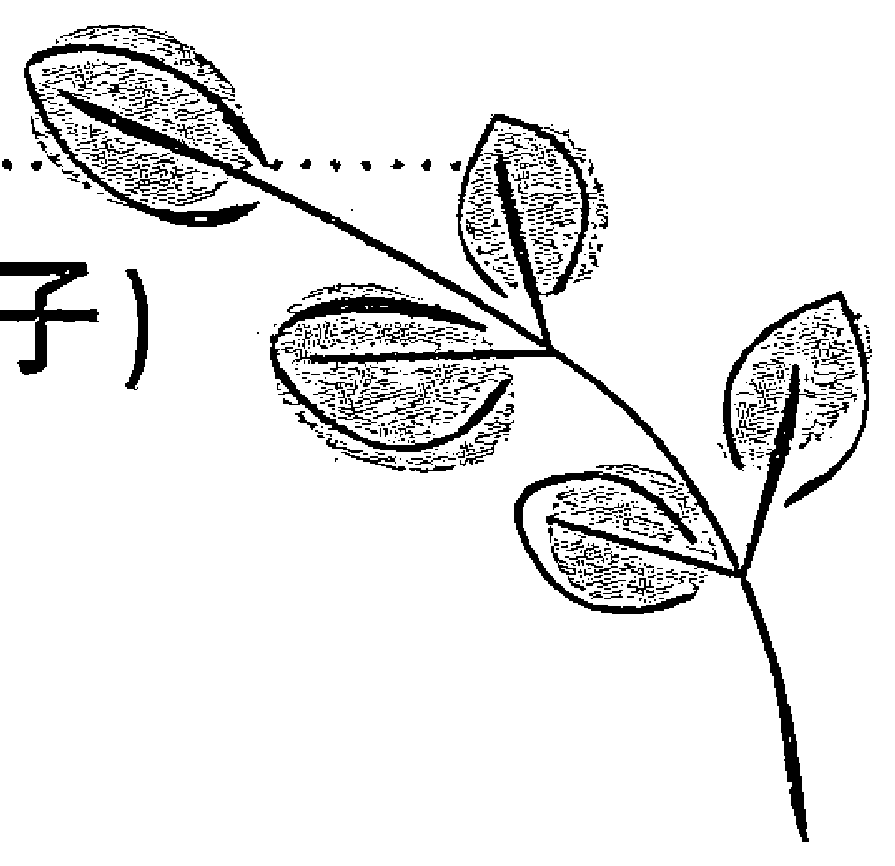

# 强运的秘密

## 前言

当我们与成功人士交流或者阅读一部书籍的时候，往往会发现一个共通点，那便是他们都说——是我运气好。

想必，每个人都希望自己变得幸运。

为了获得好运，有些人会向神灵祈愿，有些人会购买护身符或者吉祥小物，还有些人每当做出重大抉择时，都会依赖于运势占卜。

回顾我自己本身，亦是如此。我不富有，也没有高学历，甚至连一点特长都没有，如此普通的我从北海道的农村只身一人来到东京而能取得现今这番成就，我认为说得直白些，无非在于“好运”。

那么，运气到底是怎样的一种东西？怎样才能变得好运？我们需要怎样做才能使幸运女神光顾呢？
举例而言，若想捕鸟，便必须知晓鸟类的生态。换言之，若想捕获“运气”这只鸟，那么必须要知道它究竟是怎样的一种存在。
于我，很幸运的是邂逅了斋藤一人这位优秀的实业家，并从他那里学习到了很多。也正因为如此，才得以成为自己和他人皆认可的“幸福的富翁”。
本书中，将会明晰阐述我自己本身是如何捕获这份幸运，而作为师傅的一人先生又是如何给我带来了好运。
前一部作品《器》（东方出版社）是我有幸和一人先生共同执笔完成的第一部作品，而本书将会作为我和师傅共同执笔的“第二弹”呈现在大家面前。
本书中，首先一人先生阐述了“运气”为何物，如何行动才能变得好运等话题，然后我会以“强运实践版”的自身经验为例，向大家介绍从一人先生那里学习到的实践方法。
现在手捧这本书的你，其实可以说手里已经紧紧抓住了一份小小的幸运，若想大而化之，则行动必不可少。秉承勇气，踏上寻求幸运之路，你的运气轨迹一定会改变。
在这条前进的道路上，逐渐打出你的士气，你的运势也会逐渐得以改观。

进而在道路上微笑着愉悦地前进，你的幸运会

犹如排山倒海一般如期而至。

那么，快请掀开你面前的幸运扉页吧！

2013年1月吉日
柴村惠美子

## 第一章
### 运气为何物？

（斋藤一人）

### 运气无处不在

想要阐明“运气”为何物，并非易事。
为什么这么说呢？是因为大家所认为的“运气”和我所理解的“运气”截然不同。
许多工作不顺的人将自己不幸的理由归咎于“自己的运气不好”，但是在谈论运气之前，还有一件重要的事情。
那便是无论工作还是其他，最终都取决于实力。
简而言之，例如我遇到了某一个公司的老总，并决意“绝对不输于此人”，那么即使这个公司拥有着100年的历史，或者拥有着10万名员工，那又有什么关系呢？毕竟最终是我和老总的单打独斗。

拥有实力的一方势必会取胜。
凭借实力，即使现在对方已经领先超群，也是可以追上并取胜的。

我想表达的是，没有好运的人是难以相信实力的。
而有实力的人，却也不懂运气。

明明运气和实力都是至关重要的东西，有实力的人却轻视运气，而走好运的人，却懒于磨炼自己的实力，所以才不会成功。

那么到底什么才是运气？事实上无处不流动着运气。

我们通过看电视可以获得灵感，在一生中也会涌现出很多好主意。

走到大街上，我们去那些生意兴隆的店铺，便可以获得一些启发，即使在农村，也有经营得不错的小店。

仅仅只需要你去看看，运气就能变得好起来。

无论是乌冬面店，还是荞麦面店，如果生意兴隆的话，店主的收入，可以说同一般公司里的部长工资是差不多的。
在此基础上如果再增加两三个店面，那么买一辆奔驰车之类的都会是轻而易举的事情。

工作上的好运，以及因工作顺利而带来的其他方面好运，皆因自己主动地关注“流动着的运气”，向好的方向发展，并非守株待兔似的坐等好运来敲门。

### 首先“行动”是关键

运气这种东西，是需要你行动起来的。之所以这样说是因为我们所在的这个地球，是“行动的星球”。如果连这一点都不明白的话，即使好运降临你也不会察觉到。

这就如同一个人，乘坐电车时根本不知道所乘坐的电车是上京电车还是下京电车①，也不知道在目的地是否停车。虽然有时候或许正巧乘坐了正确的电车，但是很多情况下可能乘坐了反向的车，或者在目的地不停车而直接驶过的电车。

这都没关系，只要你在路上，你的运气就会变得好起来。

① 上京电车：驶向东京方向的电车。下京电车：驶离东京方向的电车。

惠美子女士是和我相遇后，一定程度上确实借助了我的力量，但是她自己也有所行动。在生活中你或许会得到别人的帮助，但是是否行动还是取决于自己。

很多人都想找份赚钱的所谓“好工作”，但事实上，有的人仅靠卖瓜果蔬菜便发财而盖了房子。当然还有种情况，有的人卖瓜果蔬菜却败光了自己的家产。

在这里，是否懂得这个道理，便是能否获得好运的关键所在。

不明白的人会认为，一旦有了好的工作，自己便会成功。对于这种人，无论好运降临多少次都不会察觉，更不会加以有效利用。

换言之，所谓运气，有时候察觉也是十分重要的。

真正运气好的人，面对别人经营到快要倒闭的店铺，也是可以重整旗鼓的。

### 运气是被送来的东西

所谓运气，是被送来的东西，赠予者有可能是别人，甚至也有可能是神灵。当然，运气也不会平白无故被送来。

无论是金钱还是物品，东西本身是不可能自己来到你面前的。即使是金钱，也是别人递送来的东西。所以如果你令别人讨厌，那便会一事无成。

首先运气好的人往往和蔼可亲，凶神恶煞被别人厌恶的人往往都不会有好运。

可以说单单被人讨厌，已经决定了你的运势不会太好。如果察觉不到这一事实，只会使你的运势变得更差，周而复始，恶性循环。

所有的工作都会体现在数字上，而运气好的人都是老实的人。

或许会有人担心“如果太老实了会不会被骗呢？”但是老实的人才会老老实实地去解读数字，而不会持有歪曲的观点。

例如，明明大家都知道美好的笑脸比满面愁容更加令人喜欢这一道理，而有的人连这么显而易见的事情都不会去做的话，那么这个人就性情乖戾扭曲。

因此，这种人并非不走运，是自己将自己的运势引向了歧途。

自然，比起使用“恐惧、不走运、不满意、抱怨、牢骚、坏话、埋怨、烦恼、不能原谅”等地狱语言，我们更愿意听到“爱你、幸运、开心、高兴、感谢、幸福、谢谢、原谅你”等天堂语言。

无论是谁都知道 1+1=2，但就是有的人别别扭扭不想直接写出答案为 2，那么这就是性格存在一定的问题，是这种性格带来了坏运气。

简单来说，不走运就是“我很强”的意思。什么都不屑去做，骄傲自满，不懂得虚怀若谷。也就是说，让运气逃走的是自己本身。

面带愁容的人却不喜欢同样面带愁容的人，即使是这样的人，他们也会讨厌和自己一样愁容满面的人。换言之，这样的人不会受到任何人的喜欢。在这种不被任何人喜欢的情况下还想要成功，是十分荒唐的。

不被别人所喜欢的人，同样不会得到神灵的眷顾，所以运气自然不会好。

因此，对理所当然的事情就自然而然地接受并去做吧，做老实的人就足够了。

### 满足眼前人

直面自己的心情很重要，同样能够倾听他人的意见也是不容小觑的。

例如，虽然自己不断感叹“啊，这拉面太美味啦”，但是如果拉面销量并不容乐观，说明这是一款并不被世人所接受的拉面。那些运气不好的人，就不能直面这一现实。

将自己喜欢的拉面强迫顾客吃，和顾客欣喜地主动想吃自己的拉面，这两种情况下的心境高度是不同的。

顾客并不是为了你才来到店里的，而是你的店铺存在的意义在于顾客，所以你要思考：能够令顾客满意的拉面到底是什么样子的。

但是如果你一味地坚持推出自己认为美味的拉面而忽视了顾客的想法，这就是所谓的“我很强”的思想在作祟，这就会使自己的好运从身边溜走。

不管是商人还是工薪阶层都是如此，毕竟所谓工作，就是灵魂的修行。

店铺没有顾客的光顾是不行的，即使是工薪者，也不能缺乏上司的支持。

如果你是公司里的一名普通职员，只要多加注意如何做才能得到组长的支持便可知晓。

如果连一个人都无法满足的话，说明你的修行还不够。

神说“满足你眼前的人”的意思并不是让你阿谀奉承、溜须拍马。你只要把组长委任的工作做好，提高小组业绩就可以了。

如果你能愉快地接受工作，甚至能够帮助身边的同事，那么接下来还会出现另一个人。那么面对下一个人就是你接下来的修行了。例如接下来出现的人是科长的话，你就需要考虑能够满足科长的方法。

科长需要考虑整个科室的情况，如果你能使整个科室的氛围高涨，工作情况也顺利的话，想必科长是会高兴的。

在这里有人会说“我们科长是笨蛋啊”，但是即便如此，如果你活跃了整个科室并且工作有所成就，那么也一定会有别的某个人在注视着你。

况且若那个人真的是笨蛋的话，那么无论在谁眼里都会是个笨蛋。而如果在这种情况下，科室的工作业绩还在上涨的话，那么无论谁都会明白是你的努力造就了这些。

因此，我们首先要满足眼前的人。然后下一个人，再下一个人会出现，最终你会发现你所完成的工作，已经能够满足所有人了。

如此这般，在人生的旅途中，能够一步一个脚印、一步一个台阶扎扎实实走过的人，就是幸运的人。

### 别人并非“运气好”

一味谈论着运气的人之所以不会成功，是因为他过分依赖于运气而没有行动。因此真正幸运的人，深深明白行动的必要性。

金钱是人与人之间传递的东西，即使你再怎样向神灵祈祷，神灵也不可能将金钱带到你面前。

有人会向神灵祈祷——让我成为富翁吧！你需要明白其实这个许愿本身就是可笑的事情，可笑的人是不可能走运的。

对于工薪阶层来说，你只需满足上司的需求，并赢得同事们的喜爱便可以了，你要铭记这一点并且付之努力，如果你能够做到这些，好运自然会如期而至。

能够说出“运气真好”的人，一定付出了相当的努力，而一味抱怨“运气真差”的人，实则自己的努力并不够。

因此，“我运气好罢了”只是努力着的人们谦虚的话语。如果成功人士说“今天的成功，全靠我个人的努力”，那么听话人会感到不舒服吧。

即使努力了，也不要这样说，而应该说“多亏了大家”，或者“因为我运气好”之类的话语，这样可以体现这个人的谦虚。

飞黄腾达的成功人士对大家说“只是我的运气比较好”，那么听到的人就会想“啊，原来如此，运气是很重要的”，但其实这只是那个人没有吹嘘自己付出的努力而已。

这样的人才会成为杰出的人。优秀的人或许会说“我这种人并没什么了不起”，但是听话者不要理所当然地也这么认为，如果那个人真的“没有做了不起的事情”，那么他应该成为“没什么了不起的人”，正因为那个人做了“了不起的事情”，所以才成就了他的现在。

如果一个人做了了不起的事情，并且他还会谦虚地说“自己仅仅运气好而已”，那么就会得到周边更多人的支持，这样的人也会得到神灵的眷顾。

### 运气好的人不会轻易暴露自己辛苦的一面

那么，到底什么才是运气？就是要使用过于常人几倍的智慧，优于常人几倍的察言观色能力，大于常人几倍的努力拼搏，并且还不会展现出自己辛苦的一面，对于这种人，我们称之为“运气好的人”。

运气好的人不会败于辛苦，并不是指不会辛苦。

无论是谁，都会有辛苦的时候。但是败于辛苦的人，是会在面容上或者语言上展现出自己的疲劳。但是战胜辛苦的人却神情平静，也不会说抱怨辛苦的话语。

无论是工作还是体育项目中，取胜、取胜、不断取胜的那些人说的都是“因为我运气很好”“托大家的福”之类的话语。

然后运气不好的人，就这样全盘接受了。

有强健肌肉的人，一定是不断锻炼的结果（笑）。但是他却说“没，其实没做什么努力”，如果你真的也随他这样想了反倒奇怪。正因为这样，好运才会从你的身边溜走。

努力什么的是理所当然的事情。成功之士一定会努力，并会使用智慧，如果再会谦虚的一些说辞，那么便会走运。正因为他们是这样的人，幸运女神才会光顾。

因此按照一人先生的话来说，运气就是“十分努力的人的谦虚说辞”。如果你也学着尝试这样做，你的运气也会好起来的。

做自己喜欢的事情不算“努力”

虽然惠美子女士说“我能够遇见一人先生运气真好，所以才会取得成功”，但其实惠美子女士自己也付出了非同寻常的努力。

我自己也努力了，但是我不会这样去说。为什么呢？举个例子来说，喜欢足球的孩子从早到晚一直踢球，没有人会将其称之为努力吧。我亦是如此，我不认为这是努力。

因此，真正幸运的人即使努力了也不会将其认为是努力，就像游戏着去做一件事情一样，所以才会进展顺利。

相反，不断吃苦再吃苦赚钱的人，却会执着于此，趾高气扬地想说“我可是经历了这么多的辛苦啊”。

我无论工作还是做别的事情，都是非常愉快地去做，完全没有想过要向别人逞威风。神灵愿意与这样的人为伍。

### 能给他人带来好处，就能给自己带来好运

神灵只愿意去帮助能够自我救赎的人。并且《圣经》里面也有类似的记载，神灵将你拥有的东西更多地赐予，而对你没有的东西更加去掠夺。

因此，工薪人员不应该老想着就职于好的公司，而应该得到公司的肯定，让公司领导层认为他们是雇用了一名优秀的员工，而其判断的标准是指给公司带来了多大的收益。

所谓好的店铺，是指能够让顾客发自肺腑地认为“这一家店如果消失了那就太糟糕了”，好的店铺，能给顾客带来实惠。

例如即使同等的价格，但是这一家店的感觉比较好，又或者说店员可以赞美道“太太，您穿上去实在太美了”之类的。特地去一家店一定有其特定的理由。

所谓运气，你如果会给遇见的人带来好处，那么好运就会降临。

> “有那个人在实在太好了”——被周围人感叹有用的人也是会对神灵有益的。这样的人，神灵也会成为他的伙伴。

## 第一章 运气为何物？（斋藤一人）

### 你所发出的讯号，终究会反弹到自己身上

很多人认为依靠运气，是会获得什么东西的。

不幸运的人会向神灵祈求“请赐予我好运吧”，但是你没有的东西，神灵也不会给你。

并且你许愿说“请赐予我好运吧”，实则和“我没有好运”是一个意思。因此，你会变得不走运。为什么这样说呢？因为你送出的东西是会被再传送回来的。

幸运的人是会一边说着“我很幸运”，一边努力着的人。这样的人会发出一种讯号——我很幸运，所以神灵会再次赐予他这份幸运。

喊着“请赐予我金钱吧”的人相当于对着上天喊“我没有钱啊”，这样的话你会发现自已将变得更加贫穷。

因此一边付出巨大的努力，并且还能谦虚地说“我只是运气好”的人，才是真正的走运之人。

甚至有更厉害的人，他是会忘记自己的努力，会真心地“我只是拜好运所赐”这样的话，这样的人，是无往而不胜的。

所以说在幸运的人里面，也是分等级层次的。

拼尽全力去努力，还会谦虚地说“我只是运气好”的人。

忘记自己的辛苦努力，说着“我只是运气好”的人。这种人，是可以做到一边说着“真开心，真高兴”，一边说着“我真幸运”。

如果你能做到这一点，你就会成为神灵的伙伴。

因此，你并不应该向上天许愿“我无法生存了，请赐予我点食物吧”，而是应该自己努力，丰衣足食。这样的话，神灵会赐予你更多你拥有的东西，而你没有的东西，神灵永远不会白白给予。

如果一个人努力、再努力、甚至怀着愉快的心情去努力，当他所有之物达到富足，神灵会更进一步地赐予。

并不是你想成为名人就能成为的。

我只是因为喜欢工作，所以竭尽全力去努力，然后有出版社联系我，希望我写一本成功秘诀的书，尽管我并不想出名却也变得有名了。然后会发生更多的事情，让我变得更有名。

因此无论你是否期许，都不会有人实现你的愿望。神灵只会给予你你已经拥有的东西，知道了吗？

悲伤的人会得到更多的悲伤，同理幸福的人会获得更多的幸福。因为你发出的讯号，终究会反弹到自己身上。

所以，首先你要变得幸福，变得富足。“啊，我很富有”“啊，能生在这里真是太好了”，类似这样的想法是十分重要的。

### 不改变过去就不会改变未来

世人都在说着“过去不能扭转，但是未来可以改变”的言论。但是一人先生却持有相反的观点，他认为“过去可以改变，但是未来却无能为力”。更进一步正确的说法是“不改变过去就不会改变未来”。

所谓过去是指你的思维方式。过去发生的事情，会对你的思考方式产生影响。

面对以前在学校里成绩不好的孩子，有人会警告他说“进入社会后会很受苦的哦”，但是不会解方程式的孩子去做不需要方程式的工作，英语成绩不好的孩子去做不需要英语的工作，不就不会吃苦了吗？我就是个例子。小学时我很不擅长赛跑，经常遭到别人的嘲笑，所以成年以后，我不去追跑步的人，也从来没被追过，尽管我跑得很慢，却再也没有遇到令我困扰的事情。

但是，小时候因为跑不快，或者因为学习成绩不好等原因，被别人嘲笑“你真是个不中用的人啊”，这种经历却会作为过去的回忆永远留存下去，即使长大后，也会认为“反正自己就是无用的人”。

而我所说的“改变过去”指的就是改变记忆的思考方式。我们需要追溯到让自己丧失自信的那段回忆，然后将发生的事情像奥赛罗棋游戏①一样从黑色改为白色，最后变为清一色，那么之后所经历的事情也会改变。

> ① 奥赛罗棋：游戏的一种，在由横竖各8个格区共64个格区组成的棋盘上，交替放置正反面分别涂为黑白色的圆形棋子，反复夹住对方的棋子而使其变成与自己棋子同色的棋子，最后根据整个格区全被填满时棋子的颜色数来定夺胜负。

### 幸运的人总能看到有利的一面

幸运的人，是了解自己优点的人。例如我认识一个从事护理工作的朋友，她的体型实在不敢恭维，周围的人每当见到她，即使想要阿谀奉承都说不出“你的身材真好呀”这样的话语。但是她本人却不介意，反而会笑着对周围的人说：“正因为我骨架这么结实，我才适合从事护理工作。”百合花不会向往大丽花，而樱花就是樱花，也不会憧憬梅花。比起探寻自己的缺点，不如重视我们与生俱来不可替代的个性。懂得探寻自己优点的人，也会发现别人的优点。

拘泥于自己失败的人，肯定也会介意他人的失败。如果视自己的失败也可以像奥赛罗棋一样重新翻盘的话，也可以如此看待他人的失败。

这样的人如果住在新小岩①的话，就会说“新小岩是蛮好的一个地方”。

但是如果让不成熟的人来说，或许会评价“东京人真多，不是个好地方”，并且这些人也不会赞美自己的故乡，反而会说“那是个贫瘠荒芜之地”等等。

这样的人无论在什么地方，都会一味探寻缺点，所以什么事情都不会顺利。

但是懂得新小岩优点的人，会发现其诸多的优点——“东京真是个好地方，随时都能叫到出租车，晚上即使再晚也能找到可以吃法国大餐的地方”等等。

这样的人如果经商的话，即使选址不利，也会找到其他优势去灵活经营。即使不景气，也会想方设法付诸行动去改善。

其实，幸运之人就是这样的人。一味地找寻缺点以及不满之处，是不会走运的。因为这等同于在向神灵抱怨你的不满。

无论是打麻将还是玩扑克，没有对着手里的牌发牢骚而取胜的人，而应该思考的是利用手中的牌取胜的方法。这正是神灵所希望看到的。

幸运的人，会充分利用手中现有的资源，并且不会想到辛苦。幸运的人并不是因为幸运，就可以避免吃苦的。

这个世界上，不断会出现新的问题，并不是说幸运的人就不会遇到问题。他们只是不畏惧问题。所谓问题就像阶梯一样，在不断解决问题的过程中，你会一个台阶、一个台阶地向上迈进。

而不幸的人，就会逃避各种问题。

但是，问题是不可避免的。因为我们需要通过解决这些问题来历练自己的灵魂，不断得到成长。所以，问题是永远存在的，想要避开问题而祈求幸运是不可能的。

① 新小岩：东京都内的一个地名。

### 教你正确的“求神”方法

虽然说有许多人会去神社向神灵祈愿，但并不意味着你交的香火钱越多，你就会变得更走运，你的愿望就会实现。

所谓“求神”指的是“神灵拜托你”。不是我们向神灵许愿祈求，而是神灵拜托我们。

神灵会拜托我们——“将世界变得更美好”“学会多鼓励人”等等。

能够听取神灵祈愿的人就是幸运的人。这就如同你去公司上班，如果你什么也不做就不会得到工资一样。

神灵并不是想要香火钱。与之相比，神灵更在乎的是你对人类同胞的奉献，也就是说你对其他人是否友好。神灵追寻的，是我们的奉献。

这一奉献指的是什么呢？其实也不是什么特殊的东西。即使没有金钱，你只要保持笑容也能够做到，也是可以去鼓励他人的。

穿着颜色鲜亮的衣服，那么周围人的心情也会变得明朗。即使你没有钱，你可以做到的事情也很多。你可以着让人舒心的衣装，说让人暖心的话语。

神灵并不是要求你牺牲自己去服务大家，也并不是向你索取金钱之类的东西。

作为纳税第一实业家我已经有了足够的名和利，所以并非想通过写书变得有名或者想要版税。那么，为什么我还会出书呢？因为有这样的一群人，他们读了我的书，会觉得“有帮助”。这对于我来说，就是我的奉献。

虽然金钱是必要的，但是如果一味追逐金钱，那么你的人生将会是孤单寂寞的，你的运气也不会好。

不过，这并非说“想要获得金钱”的想法是错误的，虽然有的人说欲望和执念是邪恶的东西，但其实并非如此。

例如，你要乘车去旅行，汽车行驶需要消耗汽油，但即便如此，如果你在旅行中一味地去在意汽油是否用完，那么你就享受不到旅途的乐趣了。

因此为了在旅途中不再老担心汽油的用量，你只需要在出发前确保加满油即可。如果出发前漫不经心，汽油只加得差不多，你就会在行驶过程中不断地在意“剩下的油还能走多远呢”，这样你的旅程会变得索然无味。

同样地，一味在意金钱的人，也难成为有钱人。

### 想要让他人转运应该如何去做？

前些日子，一位女士来找我商量，她说：

> “我的女儿已经过了30岁，但是不结婚，也不工作，整天游手好闲无所事事，一想到她的未来我就感到十分的不安。”

这位女士由于担心女儿，去了很多地方给女儿求佛拜主，但是却没有使女儿转运。

听完她的话以后，我说：

> “与其操心你女儿，不如自己先去尝试点新鲜事物，让自己先变得幸福，例如去学下草裙舞如何？”

然后又补充道：

> “自己先变得幸福，然后你会如同散发出幸福的光波一样，也会使你女儿的状态得以改变的。”

女儿已经过了30岁，既不结婚，也不工作，如果什么都不改变的话只会保持原状。作为母亲能改变的，不是女儿，而是自己本身。

但是，父母和孩子是由很强大的缘分联系在一起的，如果父母得以改变，那么孩子也会改变。

### 帮助他人，运气会变好

如果想要自己的运势变好，那么“帮助他人”是最佳的一种方法。即使再想要帮助自己也是无能为力的，如果你想要帮助自己，最应该做的就是帮助他人，这样你的运气一定会变好。

即使你再怎么呼喊“帮帮忙，帮帮忙”，那也是无能为力的。因为这句话等同于你在发出“很难办，很难办”这样的讯号，只会招致相同的东西。

与其如此，还不如即使自己也处于为难的境地，也会去帮助他人，这样你的运势会一下子变好的。

如果你想要金钱，你只需要考虑发挥自己的才能去帮助别人。你即使做不了太特别的事情也没有关系。在公司工作的人，只要保持笑脸，只要能够愉快地接受工作，这便足够了。

如果自己学习英语，可以给公司带来好处，可以给社会带来益处，这就行了。但是，如果自己只是为了出国旅行才去学习英语，那么没有人回报你的个人所需。

想要走运的人，需要发挥自己对他人作用，除此之外别无他法。

如果你能这样做，那么你的运气就会变好，像金钱之类的东西自然也会如期而至。

所谓马车，就是指马在前面奔跑，连接在后面的车就会自然而然地跟着走。如同马车一样，如果你能帮助到别人，那么后面连接着的工作就会顺利，金钱就会降临。

但是大多数人，明明没有马匹，还想一味地令马车前进。马车自然不会前进，而有这样的想法本身就会导致霉运。这样的人运气和运势都不会好，性格肯定也很差（笑）。

### 运气可以正确看清事物

即便是彩票，如果你不购买就不可能中奖，无论运气多好，不购买而中奖的人是不存在的。

虽然说中彩票的人或许是运气好的人，但是通过彩票收益最大的人其实是制作彩票并贩卖它的人。也就是说，制造彩票的一方收益最大。

如果你一味地依托于“好运气”而不行动的话，就会远离最大收益的边缘，彩票是这样，投资之类的也是这样。

所以如果一味地期待从天而降的好运，那么金钱就会从你身边溜走。

有这样的人，他会说着“你的运气真好，像这样的机会可不多见啊”这样的生意经而动员你，但是相信有这样的说法的人才是真正存在问题的人。而跟别人说这些话的人也是可笑的。为什么说是可笑的呢？如果真的能赚钱的话，就应该谁都不告诉自己去做这笔生意，这样不是能赚得更多吗？

虽然一人先生的话可能有些刺耳，但是真正照着去做了就会得到幸福。如果你无视的话，幸运是会逃跑的。

因此，运气是可以正确看清事物的。

前些日子，有人对我说：“真想成为像一人先生那样的有钱人。”

然后我就问他：“为什么想变成有钱人呢？”于是那个人回答道：“因为成为有钱人的话，就会变得有女人缘。”

然后我又说了：“那变得有女人缘之后，也还得保持住有钱人的身份。”为什么这样说呢？因为像那些不招人喜欢却很富有的人，如果有美女来套近乎就很容易被骗，经不住美人计之类的诱惑，一下子就会被拖下水。

这里也可以看出，如果你不招他人喜欢的话，运气也不会好。

而人和金钱都喜欢靠拢的人，一定是笑容满面的优秀的人，言谈举止也招人喜欢。

无论是谁都有上天赐予的可以展现笑容的肌肉组织，如果不去使用就太可惜了，这就如同上天特意赐予你财产，而你却不会使用。这种情况下还觊觎说“如果我运气能变好的话……”，是不是太可笑了？

### 比起‘轻松’，学会‘开心’

若想要变得轻松而祈求好运，那么反而会变得不走运。与其如此，还不如思考能够让自己或者周围人开心的办法，这样子运气就变好了。

我如果单单只想要店铺变得生意兴隆，那么就激发不了大家的兴趣。但是如果我说“让我们一起让店铺盈利1亿日元吧”，突然间大家的干劲儿就被调动起来了。

例如，在远离繁华街道的一个不起眼的地方有一家店铺，几乎没有什么人会路过那里，但是在电车站附近却有很多人通过。那么，需要思考的就是怎样才能让那些人愿意来到这一家店铺。

然后还要思考的是，让初次来过这家店铺的人，愿意回头再来这里。

如果在选址如此不好的地方也能让店铺生意变得兴隆，那么下一次选址在电车站附近比较好的地段开店，生意就会更加兴隆。

无论在选址不好的地方，还是电车站附近都可以做到生意兴隆的话，那么以后无论在哪里开店都会有很好的收入。连锁店就是如此，几家店铺同时营业，然后销售额甚至可以达到10亿日元。

一旦这样思考，那么最初的店铺即使选址不好，店面又小，但是考虑到接下来的发展就可以变得心情愉悦了，但是如果只哀叹眼下的困境，深陷负面情绪而不做积极思考，也就不会开心。

甚至你可以做个美梦，畅想以此为起点，接下来甚至有可能成立销售额达到好几亿日元的企业，那么想起来就会很兴奋。

你只考虑一家店铺的话，你只能产生和一家店铺相对应的主意，但是如果你愿意去思考“达成销售额为1亿日元的业绩，应该怎么做”，你的大脑就会成为“亿脑”，然后与之相对应的主意就会喷涌而出。

### 总之，向前迈出一步

最重要的是，要向前迈出一步。

如果现在你没有工作，首先你要思考的是就职，或者通过打工赚钱，总之需要行动。即使你离目的地有1千里或2千里，你只需要从你所在的位置开始出发。

前进的话就会到达车站，再从那里你可以乘坐电车，或者新干线，你越往前走越会有气势，“加速的法则”也就应运而生。但是，这一切终究需要你最先迈出那一步。

即使你最先开始是在便利店里打工，但是如果你愿意从那里向你的目的地迈进，你一定会逐渐与之接近。你可以这样思考，首先通过工作筹得一定的钱款，然后开一家小店，并努力经营使之生意兴隆，最终你可以开成连锁店。

如此这般你会默默地向梦想接近，梦想=努力。

将其比喻成打仗的话，如果那里只有石头，那么就捡起石头应战，如果只有竹子的话，就用竹矛来打仗。但不能认为，那里会有机枪或者有炸弹。

现在如果你仅有石头，就用石头来战斗吧。首先，你要行动起来。虽然说如果有100万日元什么都可以做，但是如果你现在只有1万日元，你也必须要做到。若有100万日元，你存钱就是了。

畅谈大的梦想并不是不好的事情，但是，更重要的是你要明白现在你需要做出怎样的行动。我对于行动起来的所有人，都会给予盛赞。

“现在，我开始在便利店打工了”，这便是那个人的行动。那个人刚开始会是“开始在便利店打工了”，或者是“每个月能存下1万日元了”，逐渐地，他可以做到每个月存2万日元、3万日元。

如果一边存钱，一边在休息的时候钻研拉面的美味制作方法，那么终有一天会有类似的声音降至——“正巧有一家空余的店铺，你想经营吗？”

总之，向着目标奋斗的人，一定会与目标逐渐接近。

最近，利用汽车来攀登富士山可以到达五合目①，但是连想都没想过攀登富士山的人，连这个目标都不会达到。

从前，也有人想要攀登富士山，是从一合目开始攀登的，即使离富士山很远，但如果有了目标就会有人前往。无论近还是远，不去的人是到达不了的。

面向目的地前进，加速法则就会给你提速。虽说如果每月存1万日元，八年以上也能存到100万日元，但是如果你能逐渐每月存2万日元、3万日元，不仅会提早存够100万日元，甚至还会有人说：“你都那么努力了，店铺就交给你来管理了。”

因此，重要的是你确定目的地，然后朝着目的地一步一步不断地前进。

> ① 合目：登山里程。

### 制造漩涡，好运会流到里面

你去买了“开运小物”，然后可以认为“这样运气就会变好了”。因为这个世界上，心境和情绪也很重要（笑）。

但是如果你想改变现实，那么重要的是“你为了达成目的，能够做些什么呢？”

在朝着梦想和目标默默前进的人身上，会发生幸运的事情。什么都不做的人，只会指望别人将好运送你跟前。

运气是需要自己来行动的，就像漩涡一样，你如果不去旋转的话是不会产生的。即使是那种可以吞噬周边的巨大漩涡，最初也是自己制造出来的。

而不走运的人，会认为总会有人来制造漩涡，而正因为有了这样的想法，运气就开始变坏，然后在这种状态下终结自己的人生。

如果你想要去富士山，即使是从东京步行出发，也是可以到达的。所以只要行动起来，就会不断接近目标，即使失败，只要加以改良，重新来过就可以了。

> “行动→进展不顺利→改良→行动→进展顺利→行动”

以这种模式不断重复，你就可以制造出以你为中心的漩涡，好运也会以你为中心如期而至。

## 第二章
### 开辟好运
（柴村惠美子）

遇见一人先生之后，我的人生就如同腾龙一般，运气也变好了，全速在幸福的亿万富翁的道路上前进着。

本章节，首先我要给大家展开论述我是如何开拓我的好运的。

我出生在一个小镇上，它位于比人口 5000人的北海道的上士幌町①更偏远的地方，被群山环绕。我的父亲早逝，是母亲靠自己的双手将我抚养长大。我有一个比我大五岁的哥哥，但是哥哥长期地踏上了“离家出走的旅程”（笑），所以我和母亲二人相依为命。

① 町：日本构成市或区的小区划。

母亲为了维持生计，经营着村里唯一一家杂货店，用现在的话说就是便利店，无论是烟草、生活用品还是食材，什么都卖。

我从小学三年级的时候就开始在店里帮忙，经常会打扫下卫生，或者应酬客人。

在那里，母亲最先教我的是笑容，以及大声的“是”的回答，还有“欢迎光临”“多谢惠顾”等语言。

想必也是从那时候起，我逐渐掌握了要想成为商人所必需的基础。也或许正因为此，一人先生在第一次见我时，就说道“惠美子小姐很适合做商人呀”。自己开始经商后，也因为小时候的这些经历，而受益匪浅。

母亲在经营杂货店的同时，也从事着指压疗法①的工作，对于膝盖疼痛或者腰痛的患者，予以诊断。

来接受母亲指压治疗的顾客都会称母亲为“先生”，每次治疗完毕，都会对母亲深深鞠躬，说道“非常感谢您”。

无论是贩卖杂货还是指压治疗，明明都是从客人那里收取钱财的行为，但是卖东西是我们低下头说“谢谢”，而与此相对，指压治疗却是顾客鞠躬说“谢谢”。

每每看到母亲，我都会想，今后我也要变得像母亲一样，得到别人的感谢。

① 指压疗法：通过拇指及手掌按压体表以刺激神经，用以改善血液循环、调节身体状况或治疗疾病的方法。

十八岁的时候，为了学习指压疗法，我来到了东京，在那里，我与一人先生命中注定般的相会。真的没想到这会成为我人生的转机，也成为我开辟好运的第一步。

和一人先生相遇之前，我的心是孤寂的，总是莫名地感到一丝不安。秋天的一日，我无意间跟一人先生嘟囔了一句：“秋天，真是寂寞的季节啊。”

然后一人先生说道：“你在说什么呢？惠美子小姐，秋天是‘美味’的季节呀。如果你觉得秋天是‘寂寞’的季节的话，那说明你心灵深处是寂寞的。”我听后，不禁一怔。

大家都知道，北海道的秋天很短，并且秋天的造访，预示着漫长难耐的冬天的开始。或许在这样的自然环境中，我才觉得“秋天是寂寞的季节”。

还有一个原因，或许是因为我成长的环境吧。说得好听点是百货商店，现在的话说是便利店，但其实就是我们小镇唯一的一家杂货店。

那里就像集会地一样，经常有很多人造访，再加上我们小镇既没有咖啡厅也没有食堂，所以我们的杂货店成了唯一可以供大家小憩的地方。

我们店里从日常用品到食品、烟等等一应俱全。店铺里还有供人喝茶的地方，无论是谁都可以自由地进去倒茶喝。此外，我们店里也卖酒，所以一到晚上就似乎变身成了小酒馆。

我从小就在店里帮忙，即使不情愿，也不得已听到了大人们的很多谈话。虽说也有说到过开心的事情，但是更多的是牢骚、别人的坏话、在社会上的不易艰辛以及自己的不安等等，可以说是地狱语言的大汇集。

所以我逐渐变得对大人们的世界以及自己的未来感到十分的不安。

为了消除这种不安，我读了很多宗教的书籍，也听取了很多有宗教信仰的人的话。

但是，我却未能得到能消除我不安的答案。虽然那些写下来的话或者听到的话刚开始会感觉到是正确的，但是那些人，却看上去不那么快乐。

这中间我最不能接受的是，他们认为事情进展的顺利，是托了神、佛的福，而事情进展的不顺利，是因为那个人的信仰心不足的缘故。

> 难道自己无论多么努力，都不会得到肯定吗？我听后，不禁变得悲伤起来。

是一人先生，将我那种“莫名”的不安之心，变成了坚定不可动摇的“大安之心”。

对于说出“秋天是寂寞的季节”的我，一人先生用简单易懂的语言讲解了天堂和地狱等死后的世界以及人为什么要出生等问题。

一人先生说道，我们经由轮回转世，不断地死亡新生，在转世轮回的过程中，我们在做什么呢？他说，我们在让自己的灵魂得以成长。

就是以这种方式，一人先生用通俗易懂的话给我讲解了很多不可思议的事情以及世界的构造。

我听后，至今为止所有的疑问都迎刃而解，并且心中的不安以及恐惧也都逐渐消失了。

我还懂得了有巨大的爱和光芒指引支撑着我们，我们也是其中的一部分，而这才是世间的构造。

从了解到我们伟大的母亲——上天的事情之后，我也逐渐懂得了自己应该怎样做，应该怎样生存，而我的内心也逐渐被平和与欢喜充实，变成了“大安之心”。

从那时起，对于我而言，秋天也从“寂寞”的季节变成了“美味”的季节。

相识后不久，一人先生对我这样说道：

> “惠美子女士真是能干的人呢，所以才会适合当企业家。”
> “这个世界上，其实存在金钱流动着的河流，如果向那条河流伸一下手，河流的流向就会一下子转到自己这边。”
> “怎么样？你想往河里伸一下手，改变一下它的流向吗？”

现在想起，就是这段话改变了我的命运。

河流的流向正是“运气”，而所谓向河里伸手，就是行动的意思。河流的流向，就是为了发现“好运”，而必须改变自己的观点。

例如，和一人先生相识之前的我，抱有“秋天是寂寞的季节”这样一种观点，而因此错失了享受秋季美好的机会。

但是，一旦我的观点转变为“秋天是美味的季节”，我就可以发现很多秋天的好处，而充分享受这一季节。

而运气，就是这一“流向”。如果不能察觉到这一流向，那么运气就不会变得好起来，也就是说为了察觉到流向而变得走运就要改变观念，并让行动成为习惯。

和一人先生认识至今，我们向弟子们一直教授的道理正是要改变观念，让行动成为习惯。更进一步说，像游戏一样去快乐地学习，就是一人先生一向的主张。

还要补充的是，一人先生所教给我的全部东西，都起到了巨大的效果。通过实践，很多事情都会改变。而诸如我这样的既没有学历，也没有特长和财产的全体弟子，最后都变成了亿万富翁，也就是所谓的巨大效果了。

首先，要爱自己

我在北海道带广市开始组建治疗院的几个月之后，一人先生来这边游玩，教给作为实业家刚刚起步的我一首《白光的誓言》。

- 爱自己，
- 爱他人，
- 绝不摒弃温柔和笑脸，
- 绝不乱说别人的缺点，
- 力赞扬他人的优点。

我最开始听到这段话的时候，很疑惑为什么要首先“爱自己”呢？通常而言，不是应该首先“爱他人”么？一人先生笑着对我说：“首先要爱自己其实是很重要的。”

于是我就相信一人先生的话，开始实践“白光的誓言”，渐渐地我发现，周围的人都发生了变化。

来治疗院的回头客越来越多，还有的人介绍他人来就诊，一传十，十传百的效应戏剧性地增加。有许多顾客对我说：“想见惠美子女士！”“每次见到惠美子女士就会变得有精神。”我听后非常欢欣鼓舞，就想着“下次见面要怎样赞美一下”“怎样的赞美才能让对方也高兴呢”。

最吃惊的是自己内心的变化，在那之前，我是不怎么喜爱自己的。但是那之后，我开始思考“说不定自己是个不错的人呢”“眼前的每一个人都是很重要的”等等，然后自己内心中的爱也就逐渐充盈饱满起来。我终于明白了一人先生为什么说“首先要爱自己其实是很重要的”这句话的意思。因为自身的改变，我眼前的景致也发生了变化。

从那之后，我每每吟诵“白光的誓言”，心中都会充满着爱，而与之相应的事业的规模也在逐渐变得宏大。

产生爱的“感谢游戏”

正如没有金钱，就不会给别人拿出金钱一样，如果没有爱，就不会给别人爱。

通过“白光的誓言”我自己获得了满满的爱，然后便向一人先生的下一段修行挑战，也就是“感谢游戏”。

每天，向他人表示感谢，传达“谢谢”也是非常重要的一件事情。作为转运的修行，每天将“谢谢”这句话向他人说10遍，100遍，甚至1000遍。

更上一个等级的修行是得到别人的感谢。

我们将其称为“感谢游戏”，开始了每天4次，每月100次以上让别人对自己说“谢谢”的游戏。

要想得到“谢谢”，你需要有对象，所以比自己说感谢更加困难。但是，提醒自己即使一天一个人也好，得到他的感谢，运气也会变好的。

你也不需要把它想象得太难，可以从一些小事情开始，例如你可以赞美身边的人，可以做一些让别人高兴的事情，或者一边点头一边倾听别人的话。同时你可以利用笑脸和天堂语言这两个技能，你的运气会变得更好的。

意外的是，越是亲近的夫妻二人或者家庭成员之间，却难以说出“谢谢”这两个字。但是，越是身边的人，当能听到“谢谢”的话语或者得到表扬时，就会越加高兴。

和家人一起挑战“感谢游戏”，大家都会变得性格开朗，整个家庭的运势都会上升，请务必在家里以及在公司里进行这个游戏吧。不仅运气会变好，你还会有新的发现。

我借助“感谢游戏”，第一次懂得了倾听对方的重要性，也就是说，如果不能倾听对方说的话，是不会懂得对方的所需，进而也就不会得到对方由衷的感谢。

当对方对你说“谢谢”的时候，其实对方也是很开心的，同时得到感谢的你也一定会由衷地高兴，会变得更加想要得到感谢，而这，正是转运的最好方法。

我将这个游戏作为我的“早活”（早晨起床后为了自己而进行的活动）。我以前会去洗桑拿，那个时候，经常会遇到一位老奶奶，渐渐与她熟悉，就听到了很多她的故事。

从外表来看她是一位温柔祥和的老人，看上去很幸福的样子。听了她的故事之后，才知道她经历了跌宕起伏的一生。但是，她却这样给我讲述了战争时候的经历：

> “我经历过战争，胸前的这个伤疤就是那时候留下来的，但是，最后幸存下来的只有我一个，我是何等的幸运啊。”

我听后，不禁胸中充满了怜悯之情，对她说：“老奶奶，您受过那样的苦，还保持着笑容努力至今，太了不起了。”当时虽然我的手还肿着，也非常卖力地给她揉背。

老奶奶接着眼里噙满了泪水，她说：“你是第一个为我这么做的，还倾听了我这么久的话，真的很感谢。”

然后听到这些话的其他人，都开始了“我呢，是……”“我呢……”地争先恐后地讲起了自己的人生经历（笑）。真是看不出来啊，无论是笑容满面的那个人也好，还是精力充沛的那个人也罢，谁都有起伏跌宕的人生。

听了这些话，我不禁内心感叹道：这个人、那个人，都好喜欢啊，人这种生物是多么美好的存在啊。然后，心里也更加想为眼前的这些人做点什么。那一瞬间我明白了，原来产生爱就是这么一回事。

给大家带来幸福的“上气元”秘密

我十八岁的时候，从北海道来到了东京，进入了学习指压疗法的学校学习，在那里遇见了一人先生。

当时一人先生在班里特别受欢迎，因为他绝对不会做令人讨厌的事情，也不会说别人的坏话。总是温和地笑着，好像心情很好的样子，即使到现在，也从来没有变过。

如果像一人先生一样总是心情愉快、满面笑容的话，那么那个人的周围会形成“上升气流”，即能产生愉快能量的气流。

并且这个“气流”不仅能给自己带来幸福，还能让周围的人也感受到幸福，一旦乘上这一股气流，运气也会逐渐变好。一人先生将这一种状态，用“上气元”来表示。

那么与之相反，“不愉快、不气元”的人的周围，会发生什么情况呢？“不气元”的人，容易一味发现事物不好的地方。那样的人的周边，充斥着“负气流”这样一种阴暗的让人难受的能量，而这一气流，会冲散人们生存所需的能量。

然后，能量是人们生存不可或缺的东西，因此缺失的人，就会从别人那里抢夺能量。例如，上司从部下那里，部下从家人那里，甚至孩子也会从伙伴中那些看起来赢弱、比自己弱小的人那里抢夺。这样的事情，在大家周围时有发生吧？

而欺负的现象，实际不就是争夺能量吗？这一互相争夺的连锁反应势必要在哪里得以中止，从别人那里获取能量是绝对不会变得幸运的，因此，务必从你那里开始，就中止这一争抢。

一人先生经常说：“自己的心情是由自己掌管的。”也就是说自己的心情所能掌控的人唯有自己，他人不行。发生好的事情就和周围人分享，发生不好的事情就在自己这里中止。有这种觉悟的人，幸运一定会将你环绕。

收集运气的“三表扬”魔法

利用“上气元”改变自己的心情，并且再加之“三表扬”的魔法，无论是谁都可以聚集“上升气流”，运势也会以惊人的速度改变。

运气好的人正如字面上的意思一样是会清点“自己是多么幸运啊”的事情，并且会收集起来，然后就会有更多幸运的事情来到自己身边。

之所以可以这么快乐地收集运气，正是因为“三表扬”，即“国表扬、物表扬、命表扬”。它的意思是要学会赞扬国家、赞扬物品、赞扬生命。

首先，来说明一下“国表扬”，所谓国表扬，就是要赞美自己所居住的地方。

例如，你尝试去说出“日本真是一个好国家啊”“大阪真是一个好地方”等等。说自己居住的小镇或者自己的家也可以。

如果想赞美自己的家，即使你觉得“离车站好远，真不方便”，或者“没什么放东西的地方，生活真不方便”等等，但是你要找出可以赞美的地方，例如“可以走很多路就会强健身体”“不会铺张浪费去买不用的东西真好”（笑）等等。

一旦你赞美了一个地方，那里的土地神就会开心，会给你送来更多好的东西。这与风水没有关系，因为你去的地方都会聚集好运。

下面是“物表扬”。你尝试表扬身边的一个物品，然后，不可思议的事情就会发生！可以看到物品散发出光辉，也不会容易变坏而使用得更长久。一人先生即使对剃刀都会放声表扬道“剃得真干净呢”，然后听说那把剃刀就比一般剃刀多出了两倍使用时间（笑）。

最后，是“命表扬”，就是要表扬所有有生命的东西。例如我们每天吃的东西全部都是生命，肉自然不用说，蔬菜、米等也全部都是有生命的东西。

甚至，纳豆、味增、盐麹①等，对身体有好处且好吃的代表性发酵食品的制作原材料，也是由肉眼看不到的微生物这种生命在发挥着作用。

① 麹：曲，曲种。将米、麦、大豆等蒸后发酵，再加进曲霉使之繁殖而成，用于酿造酒、豆酱、酱油等。

我们只能从生命中得到生命的延续，当我们意识到这一点时，每天用餐时感谢的心情也是满满的吧。

当然，你身边的人也是重要的，独一无二的生命。你赞美身边的人，自然那个人会很高兴，当你连这份生命的恩赐也赞美时，也就等同赞美了这份生命的赐予者——神灵。

即使每天三分钟，也请尝试使用一下“三表扬”，你会发现，你的运势发生了惊人的变化。

召唤幸福的“天堂语言”

继“白光的誓言”之后实践的是另一个一人先生的粉丝非常熟悉的“天堂的语言”和“光泽的法则”，也就是说口中说出天堂的语言，脸上绽放出光泽。

首先是天堂语言，当你尝试使用出“爱你、幸运、开心、高兴、感谢、幸福、谢谢、原谅你”等语言时，你会发现平日里在你身边所发生的事情逐渐都会改变。

例如，当你说“好幸运，好幸运”的时候，又会发生让你不禁说出“真幸运”的事情。另外，当你对别人说出“谢谢”或者“感谢你”的时候，下一回也会发生令别人对你说出“谢谢”的事情。

我知道这样一件事情。我的一个朋友养的一只猫生病了，医生诊断之后也不知道原因何在。

详细地询问了一下，原来她每天回家后，都会对猫说些抱怨公司的话，发发牢骚。

我听后建议她停止对猫说这些牢骚话，而是对它说一些例如“你真可爱呀”“谢谢你哦”之类的，猫和自己都会很开心的天堂语言。

她这么做了之后，猫的身体状况竟然不可思议地逐渐好转，并且朋友自己也对我说：“让我逐渐想要抱怨的事情也变得少了，总是感觉心情很愉快，很幸福。”

一人先生说过：“改变自己，你就会召唤幸福。” 想要变得好运，首先你自己应该使用能够吸引运气的语言，也就是天堂的语言，这是十分重要的。

从“贫相”到“福相”

接着，给大家介绍一下“面容上的光泽”。

一人先生说过，要想得到幸福最重要的是“面相”。“贫相”的人是不会得到幸福的，而相反“福相”的人也不会不幸的。

顺便说一下，一人先生非常擅长相面。有一次我们一起去了我家乡当地的一个庙会，对面走过来一些人，一人先生就猜测说“那个人在银行工作”，他说，处理金钱的人一般面容表情比较紧绷。

相面的时候最重要的不是面容的构造和黑痣的位置，而是脸上的光泽。

也就是说，即使是再好的人，若脸上没有光泽，那么不知为何做什么事情都不会顺利，也很难成功。而与之相反，即使性格不怎么好，但是却是富翁或者在社会上取得一定成绩的人，他脸上一定是有光泽的。

我以前在会员制的一家医院工作过，去那里的客人大多数都是资本家、公司理事、政治家等了不起的人物，我发现来到这里的所有人果真都是面上有光的。当然，我与一人先生从相识至今，他也从未失去过光泽。

光泽不仅限于脸上，头发、鞋子也能散发出光泽。顺便说一下，头的光泽是天的保佑，脸的光泽是世间的保佑，鞋子的光泽是祖先的保佑，重要的是要学会将这三种保护掌握并加以活用。

并且选择衣服的时候选择颜色鲜亮的、选择首饰的时候选择闪闪发光夺目的吧。

偶尔会有人说“我喜欢比较低调的颜色……”，当然，享受自己喜欢的颜色以及时尚是可以的，但是，穿上的衣服，佩戴的首饰并不是一直自己看的吧。

衣服是给别人看的东西，无论如何都是如此的话，比起暗色，明亮的颜色一定效果更好。

即使不是名牌衣服或者高级的钻石、宝石也是可以的，现如今，一些便宜又好看的衣服、首饰也可以买到。

点亮别人的心情，同时也照亮自己的心情，穿戴那样的衣服和首饰，保持面容、头发和鞋子的光泽，使用天堂语言，那么你即使想要变得不幸都是不可能的事情，你会在幸福的大道上勇往直前的。

立刻好运的打扫术

想要使运气变好还有非常重要却容易遗漏的一点，就是“打扫”。

你的周围都收拾得很干净吗？不用的东西有没有很杂乱呢？

> 一人先生曾经说过：“无用的东西胡乱摆放，会从那个地方出现奇怪的气流，运势也会变差。”

例如，如果胡乱堆放报纸之类的东西，就会产生一股怪气。在它的影响下，你的身体或者大脑都会变得沉重，这种事情确实是存在着的。

我在写书的时候或者投入新的工作的时候，或者工作时头脑变得混乱的时候，也算是劳逸## 学会分享

结合，就会打扫身边的东西。然后我就会轻而易举地发现桌子里面的灰尘，又或者是堆积如山的无用之物，那种时候，我就会下定决心把它们都扔掉，然后我的大脑也似乎被整理了一般，心情也会变得轻松舒畅，工作也进展得格外顺利。

一人先生曾经说过：“打扫可以转运，是最好的一种祭神方式。”为什么如此断言呢？举例而言，神社①总是会每个角落都打扫得十分整洁，这是因为神灵喜欢干净的地方。

> “打扫可以转运，是最好的一种祭神方式。”

据说日本居住着成千上万的神灵，你周围所触之地都居住着神灵。因此，神灵会选择居住在干净的地方，并带去很多好运。

下面给大家介绍一人先生教我的打扫术。首先，你要准备三个袋子或者箱子。然后一个装不需要的东西，一个装要送给别人的东西，最后一个放你拿不定主意要还是不要的东西。你举棋不定需不需要的东西是不是非常多呢？

这里，一人先生主张——“扔掉你举棋不定的东西”。打扫的基本原则就是丢弃东西，你犹豫不决的东西往往就是不需要的东西。

扔掉的时候，要怀着感激之心，说一句“谢谢”之后再丢弃。你打扫的时候也是如此，要对你打扫的场所以及东西表示感谢，这样你的运气会一下子变好的，请务必尝试一下。

顺便提一句，我的好友从脸上开始展现光泽之后运气就变好了，现在变得特别喜欢打扫厕所。

本书写到这里为止的都是自己通过实践并第一次得到效果的东西，但是，其实还有方法，可以使这一效果成倍增加。那便是将自己通过实践觉得好的事情告诉给别人。

经常会有人说：

> >将自己几经周折掌握的知识、信息、做法，免费告诉给别人真是太吃亏了。

这种想法，会使自己的运气变得糟糕。

为什么呢？因为大自然是讨厌空白的，所以你付出的东西，是一定会等额地返回给你的。甚至是附加他人的感谢，合在一起返还回来。

主意也是如此，有了好主意快点告诉别人吧，然后你会得到更好的点子。但如果你不使用，同时也不告诉任何人，那么这个主意会腐烂，你的运气也会变差。

> > 一人先生曾经说过：‘像金钱那样会减少的东西要好好珍惜，但是像智慧、知识是不会减少的，所以可以尽情地使用。’
>
> ‘你的腿也是如此，使用了是不会磨损的，反而越用越可以达到肌肉的锻炼，就会变得更加好用，这是一个道理。如果你吝啬不会减少的东西，那么你的运气会变得很差，也不会得到爱。’

因此，当你知道了好的事情，就毫不吝啬地告诉你身边的人吧，但并不是简单地告诉，一直要到对方彻底理解为止。

你还要下功夫在你的说话方式上，要让对方更加容易明白，然后你的说话技巧也会逐渐得到加强，一直用这种说话方式与人交流的话，总有一天会有人找上门来请你去做演讲。所谓运，写下来就是‘运输的’运，所以自己知道的好的事情，也都运输给别人吧。并且如果你能保持好的势头，你便是‘运势好’的人。

虽然说将好的事情告诉给别人，似乎是被告诉的人得到了好处，但其实传授者才是最受益的。

## 第二章 开辟好运（柴村惠美子）

一人先生为了我们这些弟子能够自己解决问题并得到成长，总是会教授给我们一些简单并且非常有效果的方法，例如“白光的誓言”“感激游戏”“上气元的方法”等。

这一次新教给我们的是“爱、光以及忍耐”。每天，与爱徒们开展将“我是爱、光以及忍耐”这一句话说 100 遍的游戏。

这样做的人，提交了像山一样多的奇迹体验报告。

那么，什么是爱、光以及忍耐呢？一人先生是这样阐述的：

> “天的中心居住着神灵，而神灵的本质就是‘爱、光以及忍耐’，我们人类是神灵的灵魂分体，因此我们的本质也是‘爱、光以及忍耐’。因此，无论发生什么问题，就让我们用‘爱、光以及忍耐’来解决吧。如果这样思考的话，就会非常容易地找到可以解决问题的最好方法。
>
> “爱、光以及忍耐”不是困难的事情，爱就是笑脸和温柔，光就是开朗和上气元，将其紧紧地粘连在一起的，就是忍耐。
>
> 你试着吟诵“我是爱、光以及忍耐”这一句话，你的心就会变得平和安定了。并且用“爱、光以及忍耐”来处理事物，那么发生的事情也会逐渐变化。我认为“爱、光以及忍耐”是终极开运大法。

## 第三章 招来好运（柴村惠美子）

### 所谓魅力，即为引力

运气是传送来的东西，那么它会传送给什么样的人呢？简单来说，是有魅力的人。

一人先生曾经说过，魅力就像“引力”一样，即有魅力的人周围会聚集着很多人气、物品、金钱和信息。这种聚集力正是魅力。

很多人认为所谓魅力就是姿容端庄、资质聪颖，但其实不单单是这样的。如果魅力仅仅局限于这些条件，那么魅力只会是一部分人独享的特质。

而一人先生所说的魅力是指，一个人可以活用自己所拥有之物便可发挥其魅力。

### 依靠自己的魅力决一胜负

在江户时代，比起自己的个人实力，家庭背景更能决定一个人的职业以及未来。明治时期以后，逐渐开始以实力来决定人们的工作以及未来的梦想，尤其是第二次世界大战以后，逐渐走向了重视学历的时代。

那么现代社会又是怎样的一种情况呢？当然，学历依然重要，但是人品却变得更加重要，也就是说，当今时代是一个重视个人魅力的时代。

想必大家也都知道，我们的师傅——斋藤一人先生生于普通的商人家庭，家境委实普通，而学历也只是初中水平，但就是这样一个既没有资产也没有背景的人，却白手起家，其一生目前累计的纳税金额，至今无人能与之匹敌。

在一人先生成为如今这样的大富翁之前，我就开始跟他接触了，以前有很多人表示“想再见一次一人先生”“想再听一次一人先生的教导”，于是一人先生的周围就自然而然地汇聚了很多人。

这便可以看出，一人先生不是依靠家境或者学历，而是依靠自己的“魅力”一决胜负，成了大富翁。

而且我们这些弟子，也通过笑脸、天堂的语言、光泽的法则、感激游戏等，学到了“魅力”。

但是，“魅力”不是学问，所以不单单要知晓，还要去实践，这样你会收获其成果。因此，坚持每日实践，你就会发现自己自然而然地变得有魅力了。

而想要拥有魅力，其修行和肌肉训练差不多。

正如肌肉训练刚开始会不习惯，或许会感到肌肉酸痛，会感到痛苦。但是坚持下去，就会强健肌肉的力量，周围的人也会感叹于你的变化。

然而，如果就此满足而止步，那么还未使用过的肌肉又会恢复原状。

总之，魅力修行的坚持是非常重要的，天堂的语言亦是如此，最初你可能会无意识地说出地狱语言，但是如果坚持下去终究会养成习惯，无意识间使用的都会是天堂语言。

### 笑容是人类特有的力量

想要获得魅力，第一步首先就是笑容。每个人都拥有展现笑容的肌肉组织，如果不使用就等同于暴殄天物。

无论你的面容再漂亮夺目，如果你紧绷着脸闷闷不乐，那么别人就不会感受到其魅力。即使头脑再聪明，知识再渊博，如果没有笑脸别人也会感到难以接近，也很难感受到其魅力。

无论说话多么得当、思考多么周全，如果没有笑脸也就魅力全无。

笑容是人类特有的力量，但是如果不加以使用，那么这种力量就会逐渐生锈，因为微笑的时候会调动起肌肉的运动，若平日不多加使用就会衰退。

下面，向大家介绍一种锻炼笑容的训练。

首先，你想象嘴里夹住一根一次性筷子，发出“一”的声音的同时嘴巴横向拉伸。仅仅这样你的表情就会改变很多，如果你能在任何时候都保持住这个表情，那么笑容训练的基本篇就攻克了。

笑容训练的高级篇是自然的笑容，就像婴儿无意间笑起来的那种感觉。

而当我们逗婴儿，或者看到可爱的小狗、小猫的时候，会情不自禁地觉得“好可爱呀”，这种时候你所展现的笑容就是自然的笑容。展现这种笑容的时候，你的眼睛也是温柔的。

与人交谈的时候，如果仅仅是认真的神情，那么说话的气氛就会比较僵硬，但是，如果你微微一笑，就会缩短与对方的距离，也会成为一个容易搭话的有魅力的人。

另外，还有每日的练习。早晨起床后看看镜子里的自己，进厕所后看看镜子里的自己，在自己的桌子上以及身体周围都放上镜子，经常练习，展现你“最棒的笑容”。

### 疲惫的时候更应该展现笑容

笑容不仅会别人带来好印象，同时也会给自己带来很多好处。

一人先生创设了“银座丸汉”①，而我的公司经营了其销售代理店，北至北海道，南至冲绳，遍布了日本的13个都道府县②，因此我经常在全国各地奔波。

虽然借助于一人先生给我制作的营养辅助食品，我对自己的身体健康很有自信，但是接连几日参加学习大会以及出差，身体还是会感觉疲惫，精神萎靡。

① 银座丸汉：日本汉方研究所。
② 都道府县：日本的都、道、府和县，有1都（东京都）、1道（北海道）、2府（大阪府、京都府）、43县。是位于国家与市町村之间的广域地方公共团体。作为议决机关设置议会，作为执行机关设知事。

这种时刻，我下意识地去实践“自然的笑容”，然后那一天所遇到的人，甚至包括中途落脚的书店里的人、街道上的行人，都会对我微笑。

而每当我感受到别人的笑容，就会觉得自己的精神也逐渐好转。当我回过神来，我已经全然感觉不到疲惫，精神活力也从身体底部喷涌而出。

疲劳的时候，自然而然笑容就会减少，但是如果保持着萎靡的表情，那么就会招致更多的疲惫。

与其如此，则不如疲惫的时候下意识地努力去微笑吧，然后就会发生更多值得我们去欢笑的事情。

无论遇到什么人都要微笑对待，也同样重要，例如，对待客人要笑脸相迎，同时自己逛商店的时候，虽然这次自己为客，也绝对不能持有傲慢的态度。

另外，在公司里，对待上司要微笑，对待部下也绝对不能盛气凌人。对于立场薄弱的人能否以笑脸相对，是“笑容修行”中最重要的一个环节。

一人先生正是如此，在旅途中遇到的任何人都会微笑着说一些温暖的话语。去店里吃饭的时候，会对店员说：“多谢款待，真是太美味了。”使用高速公路休息站的卫生间的时候，会对清扫的人说：“一直以来把这里打扫得如此干净，真的非常感谢，托您的福，旅行非常愉快。”

因此一人先生经过的地方，总是会盛开笑容之花。我总是跟随着他，看到这些的时候不禁会想“真是一件美好的事情”，为了靠近师傅的笑脸，会想要更加努力。

不要一直都保持着严肃的面孔，难能可贵的是学会为对方着想。

### “是这样呀，我知道了”是魔法语言

前些日子，在学习大会上学到了“笑容和理解非常重要”，然后有一位女士产生了共鸣，对我说了这样的话。

这位女士的丈夫由于单身赴任①的关系，孩子和父亲很少有机会见面。但是即便如此，孩子们还总会不断地询问：“爸爸下一次什么时候才能回家呢？”由此可见孩子们是多么喜欢父亲。

① 单身赴任：留下家属，本人只身去赴任。

但是作为妻子，其实感觉丈夫并没有做什么令孩子特别喜欢的事情。那么，又是为什么孩子们会欢欣鼓舞充满期待地等待父亲的归来？

长女都已经是小学高年级的孩子了，竟然还想和父亲一起泡浴？妻子为了探索这个秘密，于是在丈夫和孩子们泡浴的时候，偷偷地去听了他们之间的对话。然后听到的是孩子们开心地讲述自己在学校里发生的事情以及近况，丈夫听后只是说着“哦，这样，原来如此哦”这样的回话而已。

因此她明白了为什么丈夫和孩子们不经常见面，却深受孩子们的喜爱。因为每当见面时，丈夫一定会笑着去倾听并理解孩子们讲述的话。

前面也提到过，我家里经商，因此小时候母亲就教过我“笑容和理解”，也因此我在学校里很受欢迎，成绩明明一般，却被推选为学生会主席（笑）。

如果掌握了“笑容与理解”，并且学会更进一步应和“是这样呀，我知道了”，那么这个人一定会成为无论什么也不需要惧怕的幸运之子。

针对“是这样呀，我知道了”，一人先生也给出了这样的解释：

世界上有很多人持有和自己不同的想法，但是我们不能说这是“不对”，而应该应和“是这样呀，我知道了”。

这句“是这样呀，我知道了”是什么意思呢？是表示“你说的我已经明白了”，并不是指赞同那个人的意见。

与人相处，首先你要学会“是这样呀，我知道了”，这样才会开启别人的心扉，而且他也会主动听取你的意见。

即使你认为“我说的话都是正确的”“我是为了你才这么说的”，无论你说的想法多么正确或者多么为对方考虑，如果对方连听都不想听，那就没有任何意义。

因此首先，你应该说“是这样呀，我知道了”，然后打开对方的心扉。这样你自己心灵的大门也会敞开，运势也会越来越好。而这句“是这样呀，我知道了”不仅仅对他人，对自己也尝试着说一下吧。

人无完人，任何人都有失败的时候，也会有产生邪恶想法的时候。例如男人在见到美女的时候，就会有“真想与她约会啊”之类的想法，这时候不要自责“我是有家室的人，有这种淫邪想法的自己真是个坏蛋”。

而应该自我激励——“是这样呀，原来如此，那个人很漂亮，为了与那样的美女约会，工作一定要加油！”

而这句“是这样呀，我知道了”不仅会减轻别人心里的负担，也会是减轻自己心理负担的魔法语言。因此将“是这样呀，我知道了，原来如此”这一句话像假想拳一样每天都练习说几遍，以便哪一天你会用到。

### 吸引力增强了！

我每天都在实践一人先生教授给我的东西，最近，尤其觉得吸引运气的能力显著增强了。

我身边逐渐汇聚了各种各样的事物，有的是自己许愿期待的事物，而有的则是自己随便想想，甚至都没有想过，但是从结果上来看确实是需要的事物，

前些日子也发生了一件典型的事。

从一人先生那里学到“魅力”的重要性以后，我一直在思考各种能提升自身魅力的方法。今年有一种印象不断涌现，这便是“意大利魅力”。

说起意大利，联想到的便是时尚。它是阿玛尼、古驰、普拉达等众多品牌的诞生地，意大利人的穿衣品位和衣服的配色可谓世界首屈一指的。

同为欧洲的国家，但是意大利与英法两国不同，其高雅性与随性的感觉也令我十分喜欢，以前我就特别喜欢经常穿意大利品牌的服饰。

但是我最为“意大利魅力”所吸引的，却是源于一人先生。一人先生无论是私服还是正装，总是穿着十分时尚，而他的这种潇洒之风正是我所倡导的“意大利系风格”。

虽然说了这么多，但其实我从未去过意大利。而我所提到的“意大利系风格”，只不过是我从杂志和电视上看到的和感觉到的，或许和实际会有所偏差。

这个时候，发生了一件事情，犹如命运之神对我说道：“实际地去看一下吧，将在那里看到的美好事物再向世界播撒吧。”

我受邀参加意大利有名的品牌——杜嘉班纳在意大利西西里岛举办的杜嘉班纳首次高级时装发布会。

一想到是世界仅有的80个受邀名额之一，我便觉得无上荣光（日本受邀的只有包含我在内的两名）。并且举办地是我憧憬已久的意大利，便更加觉得不可思议。

而且，我满满的日程表，唯独那天正巧没有任何安排。往返的飞机票（商务舱）以及在意大利期间的所有花费都由杜嘉班纳承担，便更加觉得必须要去了（笑）。

就这样，就像被我吸引来的一样，我踏上了“真正的意大利”之旅。

### 喜欢意大利系的笑容

我去了意大利，参加了杜嘉班纳的发布会以及宴会，首先感觉到的是‘笑容和精神的波动’在全世界是共通的。

济济一堂的世界各地名流都笑容灿烂、精神丰腴。没有一个人装腔作势、紧绷面孔。

我既不会说意大利语，也不会说英语，但即便如此，也与到场的各位合影留念，愉快交流，这正是“笑容和精神的波动在全世界是共通的”证明。

当我漫步在西西里岛或者米兰的大街上，感触颇深的就是街上的人都有阳光般的笑容。

宾馆、饭店的店员自不待言，就连街上陌生的人，当无意间有目光接触的时候也会报以微笑。就像“Amoré、Cantare、Mangiare（爱、唱歌、吃饭）”这些表达一样，意大利人从古至今都是非常喜欢享乐人生的民族。

文艺复兴、世界联合国教科文组织文化遗产的六成、歌剧发祥地，这些都是意大利的头衔，在这里，很多人为了享受人生而去追求美，我想所谓的“意大利系”最重要的就是笑容吧。

而正是因为如此，生于意大利的天才艺术家达·芬奇所描绘的《蒙娜丽莎》的微笑才触动了很多人的内心吧。

在为期7日的意大利之旅中，我再次学到了微笑的重要性。当我回到日本后，发现日本人中表情严肃的人真是太多了。

飞机降落时，即使乘务员对你说了“感谢您乘坐本次航班”，多数人都是板着脸直接通过。在街上或者电车里，笑容也是很少的，我不禁感到非常遗憾。

但是，以前日本人也是非常重视笑容的一个民族。明治二十三年（1890年）来到日本的拉夫卡迪奥·赫恩被日本人深深感动而决定归化日本，取名为“小泉八云”，留存了许多向西洋宣传日本优点的作品。

其中，有一部名为《日本人的微笑》的随笔，作品中他歌颂了日本人长久持有的微笑，针对无论痛苦时还是悲伤时，似乎都不容磨灭的神奇微笑，他是这样写的：

> 这一微笑不存在反抗与伪善，但绝不要混同于我们由于性格的缺陷而轻言放弃的羸弱之笑，是经由长年洗练出的礼节之一，也可以等同于沉默。

因为是明治时期的事情，那时候的日本和西洋比起来文化落后，市民的生活也十分贫困，但是我们的祖先一直重视着微笑的力量，因此，我们现代的日本人，也要掌握不落后于意大利系的笑容！

### 推荐每天都美滋滋的“空气之恋”

意大利之行让我感触颇深的首先是笑容，其次我也不禁感慨，意大利人丰富的爱的表达也可谓世界第一。

特别是意大利男人的恋爱技巧以及语言的专业性，但也不是大家俗称的花花公子，一般来说是女权主义者也不会讨厌的那种时尚且勤劳的类型。

在意大利的职场上，男性职员会对女性职员说“这个围巾真漂亮，但是你更美”。女性职员做了美容第二天去上班，男性职员也会主动搭讪说“新的发型真适合你”。这些都是他们的日常对话。

但是即使同为欧洲国家，不同国家针对这一习惯却大相径庭，例如有一则有名的种族笑话。

一艘豪华游轮面临着沉没的危机，现在为了让男性乘客跳入大海应该说什么呢？

对英国人，“这种时候，越是绅士越应该跳入大海”。

对法国人，“请一定不要跳入大海”。

对德国人，“因为是规定，请全体成员都跳入大海”。

而对意大利人，却说“现在美女们都跳入了大海”。

顺便说一下，对美国人，则说：“现在如果跳海的话你会成为英雄哦。”而对日本人，要说：“大家已经都跳入了大海。”（笑）

先将笑话搁置一边，其实现实中的意大利男人都很温柔和蔼，并且也非常帅气，因此我在意大利期间，一直觉得心怦怦地跳，很兴奋，也美滋滋的（笑）。或许女性荷尔蒙一直受到刺激的缘故，皮肤也比往常更加有弹性！

有首歌叫作“恋爱中的女人最美丽”，现实也确实如此，恋爱中的男女都会由于荷尔蒙受到刺激而变得美丽和帅气，精神饱满、精力充沛，工作和生活也会变得愉悦，可以更加努力。

我个人认为日本应该更加“好色”一点比较好，而“助平①”字面意思是“公平帮助”，一人先生认为，其真正的意思应该是对待周围的女性就像意大利人那样，平等地用温柔。

① 助平：“好色”一词的对应日语汉字。

的语言交流，给予其赞扬。如此这般便可成为有女人缘的男人。有恋人或者夫人的男士们，请以平日三倍的程度去赞扬她们吧（笑）。

这里我想要给大家推荐的是“空气之恋”，也就是说在想象的世界里谈恋爱。

当然，对待你与现在的丈夫或夫人或恋人的“现实之恋”需要足够重视。同时可以在脑海中构想一个人物——“那个人是我的空气恋人（心之恋人）”，然后与之恋爱。例如有喜欢的明星艺人或者出色的人物，就与之进行恋爱。我现在就是与许多人恋爱的多情女子（笑）。

### 自由决定年龄

无论多少岁都想谈恋爱，这种心情就会使人充满活力。如果能感受到知晓新鲜事物的喜悦感，那么无论多少岁，人都是成长的。

一人先生身上就充分体现了这一点，一人先生无论多少岁，永远都是那么青春活力，一如既往那么有魅力，那么潇洒帅气。

有一天，我向一人先生打探了永葆青春的秘诀，一人先生是这样说的：

首先，要愉快地度过每一天。如果能够愉快生活，那么一年时间会有转瞬即逝的感觉。如果一年过得如同一年半一样，那么你的年龄也会对应地增长一年半。

相反，有句话说道“辛苦会令人变老”，确实如此，痛苦的时候就会觉得时间异常漫长，如果一个人每天都感觉十分辛苦，度日如年，那么即使短短一年都会让他一下子衰老许多。

那么所谓的永葆青春的秘诀，就是“不要想起自己的真实年龄”，尤其是上了岁数的人，经常会找寻一些理由，“啊，已经上了年纪了，所以……”用这些来逃避一些事情。

但是，如果你想的是“我很年轻！”那么你的大脑将回忆出“这个我会做！那个我能做到！”的什么都不畏惧的年轻时代，就会去找寻自己能够做到的事情。

而我自身，也会“自由决定年龄”，我一直对自己说自己是“二十七岁”，为什么是二十七岁呢？如果再年轻一点的话就会让我感觉不成熟，而年龄再大一些又需要具备分辨是非的能力，比较讨厌（笑）。

自然，我去体检或者去政府提交文件的时候会写自己的真实年龄，但是除此之外的时候，我都将自己认定为“二十七岁”。

并且每一天我都非常愉快地去过，果真就不会衰老了。如果你不相信，那么请务必尝试一下。

前几天我又见到了一人先生，他这样对我说：

“我最近发现我说自己二十七岁的时候也没有什么干劲儿了，但是我一想到自己十八岁的话就干劲十足，所以从今天起我十八岁了。” 大家在一起举行“丸汉十八岁派对”会很有意思吧 (笑)。如果真的举行的话，你会不会也愿意来参加呢？

### 重返十八岁

从一人先生那里听说之后，我毫不犹豫地加入了“自由决定年龄之会”（笑），然后我决定把自己的年龄定为十八岁，为什么是十八岁呢？因为这是和一人先生相遇时的年龄。

我虽然想着“自己是十八岁”，但其实与自己现实年龄还是有许多差距的，虽说这种差距很多，但是我最想改变的是体型。

有一次我由于进行了过激的运动导致膝盖受了伤，从那以后，我就不能进行剧烈的运动了。

但是，“吸引力法则”还是发挥了作用。首先由于“加压训练”，我不需要做剧烈的运动也可以练出肌肉，并且加之一人先生为我研制的营养辅助食品，使得我身体由内到外都发生了变化，从而得到了和十八岁时一样的完美身材。

身材变好了，我便更喜欢打扮了，我积极地选择以前自己敬而远之，但现在可以完美展示我身材曲线的衣服。

那时我重新感受到的是意大利品牌的设计之美，尤其是杜嘉班纳设计之亮点。

有了这样的想法，我偶尔在读到的杂志里面，发现了刊载着杜嘉班纳的设计师杜梅尼科·多尔奇与斯蒂芬诺·嘉班纳的采访文章。

我一边读一边想，“真想有朝一日直接见到这么优秀的人啊”，那时候，我从未想过这是一个可以变成现实的梦想。

我将自己的年龄定为十八岁以后，不单单体型发生了变化，身边还发生了许多好的事情。例如，像年轻人非常喜欢的博客、推特以及脸谱等社交工具，我也开始积极地使用了。

最初，我完全不懂电脑以及网络的事情，但是由于“吸引力法则”的关系和田畑玲子这一得力助手的及时出现帮助了我。

由此，我知晓青年人的想法以及思考方式的机会多了起来，自己的心境以及想法也逐渐变得年轻，迄今为止完全没有想过的点子也大量涌现了出来。

### 健康长寿的秘诀

对于我们而言，另一个经济就是身体老化。二十多岁、三十多岁、四十多岁、五十多岁、六十多岁、七十多岁、八十 多岁，随着我们年龄的增长，身体也在渐渐衰老。

而为了保持老化部分的年轻与健康，人们在身体保养上的花费会越来越多，三十多岁比二十多岁花得多，四十多岁比三十多岁花得多。身体的老化，对于自己本身而言也是金钱流动的一种。

我年轻的时候也是对于身体的老化漠不关心，总是过分轻信自己的身体没问题。而我初涉更年期，在膝盖第一次受到损伤的时候，我才意识到：“咦？这是怎么了？”

但是一人先生说，所谓疾病，就是“哪个地方出问题了”，是上天给我们的讯息。当我们想要找出问题的根源而加以改善的瞬间，就需要面对自己，思考着为什么会变成这样而一个一个去解开问题。

然后才会意识到，原来如此，不能衰老、不能生病。

我使用了一人先生教给我的汉方以及各种各样的知识，还有自己学到的有关健康方面的知识，利用这些来加以改善。

那个时候起到作用的是活到一百多岁的寿星写的一本书。

活到 100 岁以上的人，有意无意地都有一个共同点，就是基于“什么东西吃多少”这一汉方理论的饮食习惯，加之运动以及思考方式，而这三点与健康长寿紧紧相连。

### “120岁万岁！”的时代已经不远了

如果将人的身体比喻成公司的话，那么所谓生病就像陷入赤字经营的公司一样。
赤字是指流入公司以及流出公司的资金流恶化，某个地方出现了停滞的状态。
但是如果转换成黑字，那么资金流向就会顺畅，经营也会步入正轨。
人类的身体也是如此，通过身体内部以及外部的改变，就可以实现返老还童。
虽然人们认为随着年龄的增长身体也会自然而然地老化，但是实际上，身体上却没有书写着年龄，如果有正确的保养，那么无论何时都可以保持健康年轻的状态。
我认为，在今天，随着科技的进步，已经超越了“100岁的长寿梦”，要想实现“120岁的长寿梦”已经再也不是梦想。让我们保持健康年轻美丽的状态，享受恋爱的乐趣，一直向120岁迈进吧！

### “运”加上“动”是运动

有一次，一人先生曾经这样对我说过。
“如果有人问你：‘你的耳朵多少钱能卖给我？’那你会回答多少钱呢？
“‘一只20万日元的话如何呢？’即使这样说也有些为难吧。
“‘那么，200万日元如何？’即便如此我也会拒绝的。
“我真正想表达的是——‘比免费更昂贵的东西是不存在的’。”
即使上十万，上百万日元都不愿意卖的眼睛、耳朵、身体，我们却是全部免费得到的，单凭这一点，会不会觉得自己格外幸运？
如果能够“动用”这份“运气”，这便是“运动”，这是为了强运而必不可少的。首先，要热爱自己的身体，这是十分重要的。即使想为了某个人做这些，做那些，但是如果没有好的身体也便无济于事。为了自己的身体你会去尝试许多，如果能把其中有用的信息与人分享，那么你的运气会越来越好。

### 抓住好运的三个习惯

### 第三章 招来好运（柴村惠美子）

一人先生如是说：想要抓住好运需要有三个好习惯，即“一、老实；二、习惯学习；三、习惯行动”。

一人先生教育我道：“读点书吧。”我从小就比他人更胜一倍地善于行动，但却不善于学习。我认为“即使别人不教我，我靠自己的力量也可以做到！”不知为何就是不愿像别人学习。

但是，一人先生的一句话却改变了这一切，他说：

> “像惠美子女士这样善于行动的人，如果能读点书的话就能成大器。”

正是因为介意这句话（笑），我便也开始读书。然后将学习到的东西存放进脑子里再行动，结果发现经历的事情也在一一改变，而在前方等待我的，是源源不断的智慧和灵感。

并且由于知识的汇聚，紧要关头我也养成了“就是这个了！”的眼力。

## # 提高财运的方法是什么？

即使有人说“我运气很好”，但是如果你居住的环境、吃的食物以及穿着过于质朴，表面看来每日生活艰辛的话，那周围的人不禁会想：“这个人真的运气好吗？”我认为，运气好的人是看起来很快乐的，且拥有金钱和人缘。有的人一生都不会为金钱所困，这种人就是“财运”非常好的人。那么，为了提高财运，我们应该怎样做呢？

首先，想要提高财运必须被金钱所爱。

如果赚钱会拥有罪恶感，或者认为金钱是肮脏的东西，那么你的财运是不会好的。吸引才会过来，排斥当然就远离你了。

许多人有这样两大误区——要么认为“金钱是肮脏的东西”，要么认为“金钱是万能的”。想要获得金钱的喜爱，首先自己必须珍惜金钱，必须去爱护金钱。一人先生经常说道：“绝不借钱。”这是有原因的。

第一，如果在通货膨胀的时代，那么你借钱买东西会高于利息，因此是有收益的。但现在是通货紧缩的时代，所以借钱买的东西的价值会下跌，再加之利息就完全是损失了。

第二，一旦借钱你就会散发出“我没钱”的负面讯息，金钱具有喜欢流入富足地方的特质，因此如果你不能散发出富足的讯息，那么金钱就不会靠近。

一人先生曾经对我说：“惠美子，你先存够一亿日元吧。”那是依据我的事业规模，而在不需要向银行借钱的前提下，健全经营所必需的资本。

虽说如此，并不是让大家必须有几亿存款。首先在力所能及的范围内存钱，最开始可以每月五千日元，然后逐渐向每月一万日元奋进，然后利用加速法则，争取每月存到两万日元、三万日元。

## # 所谓经济就是金钱的流转

是否说攒钱就是好事呢？其实并非如此。金钱又可写作“足①”，如果不活动是不行的。乱花钱自然不好，必须要选择能够使金钱保持活力的使用方法。

金钱最重要的是它的流转，现如今经济不景气的状况正是金钱流转不当的缘由。

一听到“经济”一词，是会给人一种很难的感觉，但是一人先生说过，所谓经济就是“对你而言的金钱流向”，而在其延长线上的是国家巨大的经济流转。首先知道自己金钱的流向，就是知晓经济的第一步。

① 足：日语里还有“お金（おあし）”的意思，即金钱的意思。

我们自己通过工作领取工资，获得的工资会买自己想要的东西，然后金钱就会流向商店、饭馆、银行等很多地方，这便是你的经济——金钱的流转。

而想要改善金钱的流转，你需要知道赚钱之道。

一人先生说过：“金钱是神的灵感。” 而这一灵感，在前面也有所提及，就是指你能完成多少诸如“要取悦你眼前的人”“要起作用”等神灵的依托，与此相对应的报酬就是金钱。就像大家为公司工作获得工资，而这工资与你为公司所做出的贡献也成正比。

一旦明白赚钱之道，下面是要改变用钱之法。如果你想要“对别人发挥作用”而赚钱的话，那么你使用金钱的方式也会改变。不是用于自身的满足，而是想要为了他人的喜悦而使用，或者在对自身对他人同时有益的事情上使用，那么想法也会改变。

如果这样，那么越来越多的金钱会汇聚在你这里，然后随着你的使用，这一流转态势会越来越好，而尽力于此的人，就是擅长经济且运势强大的人。

### 小钱靠努力，大钱靠神力

下面要讲述的是，为什么一人先生会成为日本第一的富翁呢？

一方面，他比谁都懂得金钱的重要性，了解经济。

并且非常喜欢工作，比别人加倍努力学习了经商的知识。

但是，平时一人先生却很少提及工作的事情，他很少在公司露面，即使来到公司，比起说工作方面的话题，他更愿意说一些能振奋人心有趣的话题。

一人先生初中毕业后很早地就跨入了社会，他也是经历了相当的努力才成为富翁。但是，能成为日本累计纳税额第一的大富翁，我想还有另外一个原因。那就是这一句话——“小钱靠努力，大钱靠神力”。

据说能获得大钱的人，一定有神灵的助力。一人先生对于神灵期待的事情总是一个一个去完成，去制作能够帮助人的商品，去提供能帮助人的指导，持续为世人服务，持续令世人欣喜。

正是这样的一人先生，神灵才会赐予其大笔财富，这是理所当然的事情。

## # 经商十年取得真经

下面是经营丸汉特约店的 T 先生的故事。

大约十年前 T 先生去参加一人先生的讲演会时，获得了和一人先生说话的机会，于是下定决心向一人先生倾诉道：“经商不是很顺利啊。” 那时候的 T 先生一边经营着自己的店铺，一边从事丸汉的工作，正好一年。

听闻于此，一人先生说：“所谓经商是需要花费十年时间的。”

T 先生虽然觉得“已经花费很多时间了”，但还是相信一人先生的话坚持了下来。然后第十年销售额突然迅速增长，成了令人吃惊的生意兴隆的店铺。

T 先生对我说：

> “一人先生的话是真的啊！”

而我也觉得太不可思议了。以前的T先生没有笑容，表情严肃，是难以亲近的一个人，做微笑练习的时候甚至脸蛋会感到疼痛（笑），但就是这样的一个人，在一人先生的教导下变成了现在的样子。

甚至身边的人也发生了变化，如今也会有省外的人专程过来。他说：“来的尽是些温柔善良的人。”而在我看来，“因为T先生是一个温柔善良的人。”

相信一人先生所说的话，其结果就是十年之后T先生具备了作为商人、作为人的魅力。

而T先生所说的——“真的非常感谢，能做这份工作实在太好了，通过工作，我的灵魂得到了成长。”这一句话也深深感动了我。

我认为能取得这样的成果，是T先生老老实实地学习了一人先生的教导，一边行动，一边搜集作为商人而需要的智慧，进而磨炼自己的魅力。

为了抓住好运而需要的品格以及打开善于学习的门扉，一边行动一边搜集知识，磨炼魅力，而这一切都需要一定的时间，这正是一人先生所说的“十年”吧。

### 怀有正确的欲望很重要

和对待金钱的态度差不多，很多人认为怀有欲望会有罪恶感。

一人先生曾经说过：“欲望是神灵赐予我们的东西，因此对人类来说是必要的。” 重要的是，欲望的持有方式。

男人喜欢女人，想要有钱，很多时候是想在女人中受欢迎。

而女人喜欢时尚，总是想要自己保持美丽。无论是男人还是女人，如果没有正常的欲望的话，就没有工作的动力。

对于人来说，正常的欲望是必要的，这种欲望可以驱使人们行动，一旦有了这种欲望，可以激发人们的斗志以及上进心。并且有这种欲望以及上进心的人也是十分有魅力的。

而没有魅力的人，那份欲望就仅仅是为了自我，为了满足自己的需求而已。

在不同职业交流会或者很多聚会上，会有人为了认识别人而不断交换名片，如果只是为了从对方身上获取什么，是不会顺利的。

如果从一开始就只追求自己的私利，便会散发出消极的讯息，那么就会召唤同样消极的讯息波动。

我们这些弟子既不是为了成为大富翁才拜师于一人先生门下，也不是为了成为大富翁才努力工作的。但是结果我们却都成了富足的有钱人。

首先，和一人先生以及其与同伴在一起是相当快乐的事情，而在这一“快乐”的延长线上才是工作。我们当然也有欲望，但是我们不会执着于去追寻必要之外的钱。

如果仅仅以金钱为目的去工作，那么就会执着于获取金钱，然后就一定会卷入金钱的纷争。因为我们最初也未执着于金钱，所以即使成为富翁也非常不可思议地并未卷入金钱的纠纷。

因此，大家应该持有正确健全的欲望，每天快乐地度过！

### 第四章

### 接受好运

(柴村惠美子)

### 原因和结果的法则

最近发生了很多事情，使我不禁经常感叹——真为自己人生这一“空间”感到愉悦。
不怕被误解地说一句，实现自己所想之事的速度越来越快，且自己所必要的东西也都纷至沓来。
就如同生活在自己编织的故事里一样，愿望全部都会实现，仿佛生活在自己想象的世界里一样。
自然，在现实中，为了从大阪到新小岩，我必须要乘坐飞机或者新干线到达羽田机场或者东京站，再从那里换乘出租车或者电车。因为我不是魔法师也不是超能力者，所以只有想法是无法到达目的地的。

只是，不可思议的是自己在移动的过程中从未遇到过困扰自己的事情。

一年当中，我不停地从北方的北海道飞往南方的冲绳，却几乎从未遇到过订不到飞机或者新干线座位而为难的事情，在眼看就要迟到于约定时间的时候，平日里很拥堵的街道总是格外空旷，这种只能归结为运气好的事情经常在我身边发生。

终究自己身边发生的事情都有其原因和结果。播撒下西红柿的种子就会长出西红柿，播撒下黄瓜的种子就会长出黄瓜，播撒下茄子的种子不可能长出甜瓜。

因此，所谓运气好，一定是自己播撒下了好的种子，所以才会收获好的结果。也就是说自己身边发生的事情全部都是自己播撒的种子而结出的果实，而能够全然接受自己身边所有事情的人，才是真正幸运之人。

因此，只有能使自己人生丰富多彩的人，才可以称之为‘自己的运气好’。

### 运气好的人身上不会发生困扰的事情

> 一人先生曾经说过：“不会发生困扰的事情，如果发生了令人困扰的事情，这只是说明应该学习的时刻到了。”

与此相同，对于幸运之人来说，不会发生运气不好的事情，发生的事情全部都是必然，都是值得学习的。

因此，无论我经历了怎样的事情，我都会认为“这下子就可以变好了。因此会变好了。会变得更好了”。

只是，为了达到无论发生什么都可以这样想的程度，平日里的训练也是十分必要的。平日对事物持有否定态度的人，突然想要转变为积极的思考方式是不可能的。

因此，要保持笑脸，不要说别人的坏话，要使用天堂语言，平日里下意识地进行这些训练，那么就会理解发生的现象，进而所发生现象本身也会得以改变。

人的心灵是脆弱的，会无意间放空心灵，想要放松，想要逃避，因此平日下意识地去训练至关重要。

其中会有人说：“去尝试着做了但是进展却不顺利。” 这只是训练不足而已。

著名的剑豪——宫本武藏留下了这样的名言 “视千日之练习为锻，视万日之练习为炼”。连被誉为剑术天才的宫本武藏都认为每日的锻炼不可或缺，我们就更应该重视积累每日的锻炼。

但是一人先生教授给我的想要强运的锻炼之法却不是多么严酷的。相反，一人先生强调的是 “一边享乐一边锻炼”。

诸如学习骑自行车一样，无论别人怎样教授给我们方法，如果我们自己不去尝试就永远无法掌握。但是，一旦掌握了，之后即使不需要下意识都可以安稳地骑车。

请大家也开心地去尝试吧，你可以想着 “这下子就可以变好了。因此会变好了。会变得更好了”。无论发生什么事情，都要坚信自己是“幸运之人”。

## # 成功法则的问题点在哪里？

一旦运气变好了，那么实现自己所想之事以及愿望之事的速度都会逐渐加快。这种时候最需要注意的是——“骄傲”。

一旦在很多事情上都取得了成功，那么就不禁会想“自己真厉害！”又或者是“这才是我的真正实力！”虽说有自信是一件好的事情，但是这种时候会出现“骄傲”的病态。

因此，越是成功的时候，越应该对周围怀有感激之情，以及“是托您的福”这样的心境。

另外，你想实现什么，你有什么样的愿望也是十分重要的。

世人所说的成功法则倡导的就是“梦想要具体地去期盼”，而一人先生却认为“祈愿之事不能过于具体地去考虑”。

这句话意味着，人类想象的事情是有限的，而神灵的创造力是无限的。也就是说，神灵会超出我们预期地将好运带给我们。

但那时我们所愿望的事情，却不一定对我们的人生有正面的影响，甚至有时我们能够学习到的事情和我们所期许的事情完全相反。

> > “最近关于自我启发或者成功法则之类的书卖得不好。”

前些日子，出版社方面的工作人员对我说：“最近关于自我启发或者成功法则之类的书卖得不好。” 我认为这是因为无论是作者方面还是读者方面都存在问题，真正的成功法则需要相应的努力。如果不努力而走运甚至成功的话是不可能的。

而读了成功法则却没有成功的人，是因为自己的私欲私利，只考虑自己的事情，如果能够为他人而努力，为他人的欣喜而奋斗，这样的人是一定可以成功的。

即使欢喜也分为因私利私欲而欢喜和因能够帮助到别人而欢喜两种类型，这两种类型是不同的。

如果能摒弃自私自利，为他人的幸福而祈祷，你的运势一定会好转。

### 幸运之人的显著特征

说起幸运之人的特征，我认为首先是有一颗真心。

如果不能拥有一颗赤子之心，那么你是不会注意到送到我们面前的东西，也不可能理解什么叫“简单的就是最好的”。

身边的人经常对我说：“惠美子社长能和一人先生相遇真是太幸运了。”但是与一人相遇相识的人不单单只有我一个人。重要的是能否觉察出这一份运气，并去活用。

虽然一人先生的弟子每个人都有自己的个性，但是总体而言大家都是性格直爽、老实淳朴的人，也正因为如此才能成为一人先生的弟子。

虽然说真心是非常重要的，但并不意味任何人的话都要全盘接受，这里需要的，还有能够明辨是非的“眼力”。

如同一人先生所说的那样——“师傅一个就够了”。不是谁的话都听，要听那个对的人说的话，并且坚持着做下去。

“学习习惯”也是如此，如果你去很多人的演讲会，并且总是受其影响而不断地改变自己的想法，也是不好的事情。

虽说师傅各有优点，师傅多了可取百家之长，但是如果行动以及思考方式不固定，而导致半途而废，那么就没什么意义了。

现在，那个教你许多东西的人，是真正的成功人士吗？如果那个人看上去不快乐，不幸福，那么他的教授理论可能也存在一定的问题。

我从一开始与一人先生相遇，就认定他是我人生的导师。一直坚信如此，并且也非常喜欢一人先生。他总是那么开朗，洋溢着快乐。对于一人先生所说的话，我都认认真真地全盘接受，也正是因为如此，我才抓住了幸运，乘上了上升气流，打开了另一扇门。

### 无论发生什么事情都可以说出“我很幸运”的人

所谓幸运之人，就是无论自己身边发生了怎样的事情，都能说得出“我很幸运”的人。

例如，早晨你刚要出门时，鞋带就断了。这时候想“一大早就不吉利”有这样想法的人正是运气不好的人。

而这时候若能说出“啊，还好刚出门，如果在半道上断了的话就麻烦了，真是太幸运了！”说这种话的人就是幸运之人。

之后，换好了鞋子，可刚一出门肩膀上就落上了什么东西，仔细一看，竟然是鸟粪。这时如果想到的是“刚送去干洗的衣服就沾上了鸟粪，真倒霉”，那么你就是运气不好的人。

而这时候如果能说出“还好只是鸟粪，如果是石头的话就会受伤，如果击中头部的话就危险了，真是太走运了！”然后就能高高兴兴地出门。

归途中，想要买车票，一摸钱包没了，这时候才意识到可能掉路上了或被偷了，如果想“好倒霉啊！这个月所有的工资都在里面了！”那么你就会一蹶不振。

但是，这时候如果能想到：“没有丢掉性命真是太走运了！以防万一要快点联系发卡公司以及银行，试着给警察和可能遗落的店铺也打个电话。”这样能够马上行动相较而言比较现实，同时也有找到钱包的可能性。

回家之后，又发生了不好的事情，今天一天，都是各种不走运的事情接连发生，已经不知道该说什么好了。这种时候，让我们一起说：“啊，真是无法想象的幸运啊。”

发生倒霉的事情的时候，即使无法改变事实，但当我们说出“好幸运啊”的一瞬间，我们已经赢了。也正因为如此接下来发生的事情会发生变化。

另外，比起心里想到的，说出来的事情更容易实现。好比你去吃荞麦面，心里想的是荞麦面，但如果你说出“请给我猪排饭吧！”那么送过来的就会是猪排饭（笑）。

道理就是这样。

### 其实，你可以选择幸福

在宇宙中，有许多看不见的电波交错飞舞，电视信号、收音机信号、手机信号以及无线电波，等等。

假如电视机 8 频道在播放恐怖电影，而你非常害怕恐怖电影，于是就想看 4 频道的搞笑娱乐节目，但是只要你按了 8 频道的电影，播放的就会是恐怖电影。

这个时候，从电视机遥控器里发出的是与 8 频道相对应的电波，如果接受这份电波，那么电视机就会发出与 8 频道相对应的电波，从而收到其讯息。

同样的，即使你祈愿想要得到幸福，但如果从你口中说出的语言是“真不走运”之类的地狱语言的话，那么就会释放出消极的电波，就会招致令你想再次说出“真不走运”的事情。

也就是说，明明你想看的是幸福频道、天堂频道，但是你却用语言不小心按下了不幸频道、地狱频道的按钮。

你在看电视的时候，会对照节目单选择自己想要看的电视节目吧。同样，你也可以选择自己的人生。

即使发生的事情不能改变，但是你却可以选择如何应对这些事情，并且你也可以选择你的思考方式以及使用的语言。根据你的选择，其结果也会发生变化。也就是说，根据你选择的思考方式以及语言，你也可以选择你的人生。

为了达到这一步，首先，你无须改变现在的自己，保持现状追求幸福就行。不需要想——现在有恋人就好了，现在没有债务就好了，现在有1000万就好了，抛开一切假想的条件，只需要去感觉——“现在真是幸福”。

如果无法感受到幸福，那么就找寻你身边的幸福，例如，有饭吃真幸福，出生在和平的国度真幸福，等等。毕竟在这个世界上，饱受着饥饿以及内战的人还有很多很多。

如果即使这样也无法感知到幸福，那么微微屏住呼吸，你会感觉到难受，然后你再呼吸，你就应该感觉到呼吸的幸福，生存的幸福。

你身边发生的事情，或是由于自己的原因，或是神灵觉得对你有必要而赐予你，而对于此，一直不断地发牢骚抱怨是不可取的，因为毕竟都是你自己的原因。

## 第四章 接受好运（柴村惠美子）

因此，当你接受全部事情的时候，就是第一次真正意义上成为了“幸运之人”。

### 感恩的力量

> > “对关照过我的人想予以报答”，这一份心情是十分重要的。
>
> 如果你能够怀有这样的心情——对照顾过自己的人表示感谢，想要为他做些什么，那么不知为何就会发生还想令你想要感谢的事情。
>
> 情报①就是“报情”，也就是如果能够对于人们给予自己的恩情予以回报，那么信息这一份价值就会被送到你跟前。
>
> 相反，即使取得了成功，也不会对关照自己的人予以感谢，认为取得成功都是自己一个人的力量，那么难得拥有的运气就会逐渐丧失。

| 词汇 | 解释 |
| :--- | :--- |
| 情报 | 日语词，中文的意思是“信息”。 |

我自己也认为，之所以有现在的自己都是一人先生所赐，因此也经常想要回报他。而对于这一份心情，神灵也会给你带来很多机会与好的事情。

为了抓住运气而进行的努力，是能够放大自己才能和魅力的工具。这一工具不仅仅为自己，当它为他人使用的时候，其成果就会发生很大的改变。这是因为想要感谢别人的心情，会产生好几倍的力量。

如果珍惜重视他人，就会发现自己的重要性，并且自身魅力也会增加。

如果你重视他人，那么身边的人也会重视你；如果你爱他人，那么你也会被别人爱戴；如果你能意识到自己存在的重要性，那么你也会意识到身边人的重要性。然后对于这个人、对于那个人，你的爱会逐渐放大。

这一连锁反应的结果就是，自然而然发生的事情发生了变化，送到你眼前的东西也发生了变化。所谓好运，其结果就是如此。

运气不是“喜从天降”那样偶尔才会造访的事物，而是由自己作用引发的能量。

### 先耕种自己既得土壤

所谓“幸运之人”并不是能获得“幸运之事”的人，而是指能够察觉到被给予的“幸运之事”并予以感谢，予以活用。

例如，你想要获得“丰硕的果实”，那么最初你不应该祈祷“请赐予我肥沃的土壤吧”，而首先应该从耕种自己已经获得的土壤开始。

如果你能辛勤地耕耘自己的土壤，那么你就会受到上天赐予的光和雨的恩惠，因此就会大有收获。所以，好运是指你如何运用神灵赐予你的东西在自己的土壤上结出果实。

许多人不知道接受幸运的方式，而想要接受好运，也需要有可以承接的器皿。

用自己这一种子，播撒到社会这一土壤中，接受上天赐予的恩惠来成长。而上天赐予的恩惠，或是以“机会”这种形式出现，或是以“考验”这一形式出现，这都是幸运。

播撒黄瓜的种子会长出黄瓜，明明播撒了黄瓜的种子，却长出了甜瓜，这种事情是绝对不会出现的。而不去努力只是依赖于幸运，就等同于没有播撒种子却等待瓜熟落地。

如果你的土壤不够肥沃，幸运也不会结果。相反，如果你的土壤变得肥沃，那么幸运就会硕果累累。

如果你一味强求没有的东西，土壤就会变得贫瘠，而如果你珍惜你所拥有之物，那么土壤就会变得肥沃。

“上天会愈发剥夺你没有的东西，而赐予你已有之物”，说的就是这个道理。

### 给你“好运”的人是谁？

世界上有很多人，一边喊着“我想要变得更走运”，一边却不珍惜运气。这种人的特征是，不明白是谁给了自己“好运”。

首先，大家一起来思考一下。
给你“好运”的人是谁？

仅仅这样可能会有些困难，为什么这样说呢？因为即使谈及“运气”也比较模糊笼统，并且“运气”的内核也根据人的不同而不一样。

那么，我们尝试转变一下思考方式。因为“运气”是非常重要的东西，那么我们将其置换成“金钱”来思考一下如何？给你“金钱”的人是谁？

一定会有人回答：“因为是自己赚的钱，所以答案是自己。”也会有人回答：“是顾客购买了商品，而这份利益又转换成了工资，因此是顾客。”这些回答当然都正确。

但是，我是这样想的。如果你是公司职员的话，那么给你工资的是公司的老板，虽然顾客也很重要，但是即使公司经营赤字，那么老板还是有支付你工资的义务。

如果家庭主妇的话，那么就是你丈夫。最近，因为工资多数采用银行卡拨发的方式，所以感恩之情比较淡薄，但是正因为你的丈夫每日辛勤工作，家庭的生活才得以持续下去。

如果是公司老板的话，那么答案可以说是顾客，或者是自己的职员。

那么，让我们再重新思考一下。将重要的金钱递送给你的人，你有没有真正地去珍惜他呢？你有没有能令他高兴的事情？

而认为“我工作了，所以获得与之相应的工资是我的权利”，“主妇做家务，丈夫在外工作赚钱是理所应当的”，有这样的想法最能使运气变差。

因此，想要强运，需要珍惜给自己好运的人，并且全力去做能够使他愉悦的事情。

公司职员应该努力思考：“为了能让公司老板高兴，我应该怎么做呢？”并且加以行动。而家庭主妇应该一心想着做什么事情能够让丈夫开心。

如果公司职员能够做让老板高兴的事情，那么他就会升职发迹。公司无论发生什么，这种人也不会被裁员，即使公司破产倒闭，也会有人过来对他说：“要不要来我们这里工作呢？”甚至于说，如果独立门户，也会有很多支持他的人。必须要学会取悦老板，而经商的需要学会取悦顾客。

### 想要轻松，结果变得不快乐

你想轻松工作，反而工作得不快乐。

那么，想要快乐工作应该如何去做呢？首先，你要喜欢老板。无论是谁，为了喜欢的人都可以加油努力，欲望也会改变。如果喜欢上了老板，那么他说的话你都会飞速去做，而工作上的点子也会源源不断地出现。你觉得自己会做这件事了，那件事也可以做到，因此自己会逐渐变得多才，也会更加愿意为工作做贡献。

如果这样工作的话，那么一定会变得时间宽裕，那时候如果偷懒就会止步于此，但如果能够在这宽裕的时间里工作，那么工作就会变得愉快，会产生更多成果。

或许，许多人认为轻松就会开心。但是在工作中却绝非如此，一旦想要轻松，就会衰退。

例如，有 100 成力量的人，只使用 50 成力量，慢慢地也就只能施展出 50 成的力量，再然后仅能施展 25 成的力量，会不断地衰退。

与其这样，不如倾尽全力。100 成力量的人如果倾尽全力的话，终究会施展出 120 成的力量，甚至会逐渐向 200 成、300 成增加。

如果倾尽全力，这个也会做，那个也可以做，就能够增加自己的力量，工作也会变得愉快。

相反，不能倾尽全力的人，无论何时力量也不会增加，也无法选择自己喜欢的工作，永远也不会快乐。

### 不是表达了什么，而是对方知道了什么

对工作不满的人经常说的一句话是——“我都这么努力了，公司却不理解”。

确实，如果竭尽全力去努力了，而公司或者上司却不能够认可自己，那是非常痛苦、可悲的一件事情。

但是，工作是需要有对象的，即使自己再怎么努力，如果无法传递给对方，那么是没有意义的。工作通常是需要得到对方肯定的事情。

人际关系也是如此，无论自己的说法多么正确，如果无法传递给对方就没有意义。重要的不是你表达了什么，而是对方知道了什么。

说起给对方传达什么事情，我想起了一人先生是一个非常善于言谈的人。前些日子，他在日比谷公会堂举行了演讲，转眼间会场就坐得满满的，人们因为想听一人先生的讲话而从全国各地汇聚而来。

这说明一人先生很善于讲演，其实他更擅长于倾听。

我有一次问他：“世界上有很多有名的人，一人先生最想听谁的故事呢？”他回答道：“我想听普通人的故事。”

> > “特殊人物的故事也很特别，例如，东乡平八郎打败波罗海舰队的故事很有趣，但是于常人却不会起到什么作用。与之相比，每个人的人生都是一部电视剧，无论是谁，他的人生都是波澜壮阔的，我比较喜欢这样子的。”

当时，我没有立刻领会其中的含义。但是，当我通过“感激游戏”来听别人说话以后，我听到了普通人也有跌宕起伏的人生，便终于明白了一人先生当初的话。

一人先生是这样说的：

> > “每个人各自都有神灵给我们编写的故事，因此每个人的人生都是浪漫的。”

既明白大的事情，也懂得人的情感，而因为懂得了人的情感，也可以胜任大的工作。我认为这就是一人先生的厉害之处。

### 运气是神灵的意思

一定程度上，运气是神灵的意思。如果明白神灵的想法，那么运气就会变好。我认为一人先生正是因为懂得神灵的想法，因此才能如此走运。

如果不行动，运气是不会来到眼前，无论怎样等待也会无果而终。喜从天降这种事情是不存在的。

但是，前世所做的好事，今世是会反馈的，当然反之，前世种下的恶果，今世也要自食其果。

既然运气是神灵的意思，那么我们就平平淡淡地接受神灵赐予的东西，然后加速法则会让我们的运势越来越好，最后达到质的飞跃。

我首先倡导的是“魅力”，一旦有了魅力，运气就会变好，接下来需要重视“运势”，一旦运气加上了势头，就会产生飞跃。现在我无论是公事还是私事都处于极好的状态。

虽然这样，我偶尔也会有不成熟的做法，因此才能得以成长。

而我们的灵魂也是不成熟的，正因为不成熟，所以我们才有逐渐成长的空间，经由“运气”这一条道路，神灵会促进和守护我们的成长。

大家觉得我们对于自己灵魂之母的神灵，应该做怎样的事情才算是“真正的尽孝道”呢？

这便是“知道父母（神灵）的意思再去行动”。我们的父母——神灵，是“天”这一个充满爱和光的能量源。

而我们和父母——神灵一样，也是充满着爱和光的永久的存在。因此，我们怀有无限的时光，一起让灵魂快乐成长。

## 第五章（录音整理）

### 强运的觉悟

#### （斋藤一人）

### 说话做事要有觉悟

早晨好！今天我们要谈论的是觉悟的话题。

什么是觉悟的话题呢？例如使用天堂的语言，又或者是一人先生所说的每天尝试说“我是爱、光和忍耐”一百遍。虽然看上去如此简单，但是既有能做到的人，也有做不到的人。

也有人虽然去尝试做了，但是却说：“虽然尝试着使用天堂的语言，但是却没能得到幸福。”

如果这样，那么说起什么是觉悟的时候，请不要光说自己的事。

使用地狱语言、不展现你的笑容便会给周围带来麻烦，即使不够幸福，也只要说着“我很幸福”，展现自己幸福的面容，能够说出“使用了天堂的语言，所以每天都很幸福！”就足够了。

虽然有人说：“如果这样说的话就会积攒压力。”但是有了压力生病也没关系。“那么病重之后死了怎么办？”死了也没有关系。

如果整日紧绷着脸，到处扩散地狱语言，那么就会给别人添麻烦，而一边为难他人，一边苟且偷生，还不如死了好。

有句话说——“人们去做某件事的时候，必须要下定觉悟去做。”一旦下觉悟去做某一件事情，就会发生奇迹，不能怀有半途而废的想法。

大多数人都拥有智慧，但是为什么有的人成功了，有些人却未成功？未成功的人是因为觉悟不够。

在京都，有个叫 MK 的出租车公司，老板好像是韩国人，或者是朝鲜人，总之是外国人。那个人来日本刚开始工作的时候，总是说着：“日本人每天睡八个小时，那我们睡五个小时就足够了。”又或者是：“日本人吃稻米的时候，我们就吃麦子。”

去别人的国家而想要出人头地，就是如此。即使在日本人中，也有移民到夏威夷的人，也有移民到巴西的人，他们都很能吃苦。

去外国大展宏图自然是非常辛苦的事情，但当你认为辛苦是理所当然的，也就没那么辛苦了。

而不愿吃苦的人，往往容易气馁，离开公司，抛弃自己的才能。其实，那并没什么大不了的，无论是工作还是别的。

> > 今天也有从八户市赶来，说是想要经营婚姻介绍所的人。但是要有这样的觉悟，无论是什么样的婚姻介绍所，自己所经营的最能带给人幸福。经营大公司的时候，也要坚信无论发生什么困难，都可以坚持到底。一旦有了这样的觉悟，做什么事情也一定会顺利的。世界上并没有那么多特殊的事情。

## 第五章 强运的觉悟（斋藤一人）

### 要毫不在乎地说出“那又怎样”

我经常因为没有念过什么书而遭人轻视等种种事情。但是你知道吗？这是必然。就像吃得太多长胖了会被别人嘲笑“胖子”一样。理所当然。这个世界就是如此。必须要毫不在乎地说出“那又怎样”，“我吃了自己喜欢吃的东西胖了又怎样”，“想要瘦的人减肥就好了，我就是想吃”——总之就是觉悟的问题。即使你不这样想，说出来也会有效果。吃多了会胖，学历低了会被鄙视，这个世界就是如此。虽然一直在说可悲的事情，但是这个世界就是这样，你要有这个觉悟。笑容一定是好的，我让大家保持笑容，但## 第五章 强运的觉悟（斋藤一人）

总会有人说，斋藤先生取得了成功，就这样那样真烦。但是别人都说了笑容的好处，你去照做就是了。孩子都明白的事情不需要说那么多遍。

知道了吗？天堂的语言一定是好的，去做就是了。如果你做了，只做了一点的话，成果不会马上出现，即使没有成果，也要微笑下去。知道了吗？老板着一副严肃的面孔会让周围人讨厌，因此不要给周围人添麻烦。

### 100的“命运”，100的意志

前些日子，有人跟我说自己的耳朵有些奇怪，总是耳鸣，有各种声响，老婆担心，父母也担心。

于是我对他说：“我教给你治疗方法，你过来一下。”便把他叫到了跟前。“你尝试说：‘今天开始我就好了。’即使你整天在自己妻子面前说这说那，她又不是医生，是无法治疗的，只会让她担心的。不如尝试说：‘每天都有起色。’跟别人说事前先思考下自己所说的事情会不会给别人添麻烦。”

知道了吗？我们身上维系着前世的因果关系，所以今世也会有许多的因果。这就叫作“命运”，但是，100的“命运”，需要我们持有100的意志。而我们的意志是相同的，即使有100的“命运”，我们的意志也能够达到100的话，就会相互抵消而归零。

这样的话就可以没有任何抵抗而畅通无阻，那么为什么有的时候意志却表现不出来呢？是因为觉悟不够。虽然父母会说这说那，那时你要做好觉悟，父母说的话哪些听哪些不听。

这是我的人生。可以选择不听，不做，但要做好与此相应的觉悟。

### 觉悟太弱是不行的

大家都要做好觉悟。尤其是针对自己认为正确的事情。

这个世界上有很多的道路，但是绝对不能违法。

学校里老师说的话，世人说的话都是诸如“要在平衡木上笔直前进，不能倾斜”。

那么不小心一步掉下去了呢？其实只是平地而已。可以自由地去任何地方，人生不是如此狭窄的道路。

世上还有很多事情老师和父母也不知道，真的非常广泛。即使可以自由行走，但是也有荆棘的道路，困难的事情数也数不清。

因此，无论是商人、公司职员还是家庭主妇……大家必须要做好觉悟。

人类最大的丑态就是——“没想到会变成这样。”没想到是因为没有好好思考。如果好好思考了，这样的结果是可以想到的。

吃多了会变胖，这种事情谁都知道。还有什么？在重视学历的社会里，不上学是会被人轻视的。

但是，我却不会被轻视。为什么呢？因为轻视我的那个人是会倒霉的，对方可以感受到我的气势。不上学不一定被轻视，如果被轻视，那是因为你太弱了。

单亲家庭的孩子在学校经常会受到欺负，但是，如果他的单亲父亲是警察之类的，那么绝对不会受到欺负。因此，人们就是这样，弱小就会被欺负。而如果你连什么是弱小都不知道，那么就说明你的觉悟也是不够的。

好好想一下，我们决定不上学了，但是不上学，其弊端是堆积如山的。所以能上学的话，尽量去上，给自己增加学历这一强项，但不上学的话，也不必自暴自弃，可以获取别的强项。弱小的人也可以变得强大，知道吗？

应该加强什么呢？只要不加强觉悟，别的什么也做不了。这个世界，是需要觉悟的。因此，尝试新鲜事物的时候，需要做好你去做这件事情的觉悟，并下定决心。

世界上绝无难事，“我想经营荞麦面店”，那么你就去荞麦面的故乡，买一点当地的特产荞麦面，面条的汤汁也可以带回来，好好钻研。既然做了，就一定要取胜，不能小看。

### 即使平时拖拖拉拉，该行动的时候就行动！

我并不是演讲家，虽说不是演讲家，但是有很多人来听我的讲话，我也就不能说“自己不是专业的”了。即使现在，我也免费在做着许多演讲，既然要做，我就会讲一些别人不会说的内容。

写书也是如此，需要行动的时候必须要行动起来！

但是做之前，我都磨磨蹭蹭地说着“真不想做呀”，但是一旦开始了，我就会好好去做。
无论什么事情都是如此，大家要做好觉悟。今天也计划说20分钟的觉悟的话题，在这20分钟内我会好好努力。至于说的内容，即使是年轻人，现在不明白也没关系，今后你们也会经历很多事情，到时自然就会明白的。
接受了教育就会有足够的智慧和常识，会拥有许多许多。
为什么未开花呢？是因为去做之前觉悟不足。
一旦做了，就要坚持下去，这不是什么特别困难的事情。
进入社会，工作也是每天重复同样的事情。
但是这其中，笑容很重要，能够爽朗地回应也很重要，
只要做好对的事情就可以了。
在学校里学习跟不上是因为每天的学习内容不同，每一个阶段都要学习不同的学习内容。但是工作则不同，所以学习跟不上的同学不要怕工作做不好。

### 如果不知道正确的答案，改良也是可以的

要像教育孩子一样对待自己的事情，好吗？孩子在1+1=2的地方写上了3，那么明天如果是同样的试题也是会写3，后天再写3的话是会挨揍的。

如果是自己的孩子的话，你会说：“不是已经教过你是2了吗？为什么写3呢？”

如果你经商每天都板着脸，那么无论是今天还是明天都会是这个状态，你要对自己说：“笑一个吧！”

已经告诉了你答案了，为什么不去做呢？明明荞麦面不好吃没有顾客来，为什么每天还是同样的荞麦面？这就等同于1+1=3。

因为不好吃所以没有顾客来，顾客逐渐减少很不正常吧。现在如果你去经营婚姻介绍所，如果顺利的话顾客会增多。如果不管不顾顾客的需求，那么就会被厌烦，顾客减少就意味着在这个社会上不被需要。

这是很简单的事情，顾客就告诉了你答案。我经营的店铺的营业额是不断上升的。

大家说：“啊，一人先生给我们开了这家店真好呀。”是真正地在增加，如果顾客没有增加就不算一家好的店铺。如果是好的店铺，一定是顾客满盈。知道了吗？

因此，要不断地改良，即使最初没有正确的答案，那么就不断地去改良，当然改良是需要觉悟的。

如果想要使店铺受欢迎，自己拿不准在青森开店好，还是别的什么地方好，那么就下定决心——“青森是最好的”，然后再不断改良。如果你最开始想的是——“只要能吃得起饭就行了”，那么你的觉悟是完全不够的。

如果只想饱腹，那么即使蛋包饭也是可以的。在日本这个国家，即使吃蛋包饭都是会胖的。在这么好的国家，整日说些散漫堕落的话是不行的。

### 以觉悟作为基础，什么事情都会顺利

我的话一般都比较简单，但是今天关于觉悟的话题却不能够以简单的口吻讲述，因为不存在简单的觉悟。

但是一旦做好了觉悟，那么后面就可以简单地生存下去了。因为觉悟决定一切。就像根基一样。一旦打好了地基，那么在其上就可以修建大楼。

即使牙齿也是需要牙龈的，如果基础不好，就会全部被拔除。这是一个道理，我们去做一件事情的时候，要带着觉悟去做。

孩子出嫁的时候也不应该因为担心唠唠叨叨，一生都会抚养她，厌烦了回家就是了。

我的一生都在照顾孩子，并且顺利，不行的时候就回到母亲的怀抱，母亲无论发生什么事情都是会抚养你的。

这就是觉悟的问题。如此这样便什么事情都可以安心。“你结了婚会变得很幸福的”，这种话真是太厌烦了。真正能否幸福，别人谁都不知道，尤其还是这种未来的事情。

> “你结了婚会变得很幸福的”

明白的只是自己的觉悟。“你即使回来也会让你幸福的，为此，妈妈也会长寿的”，要说诸如此类的话。知道了吗？所谓觉悟就是这样子的。

> “你即使回来也会让你幸福的，为此，妈妈也会长寿的”

大家都没有自己的觉悟的话，是说不了生动鲜活的话题的。

### 神灵赠与我们可以变得幸福的东西*

神灵不会让我们不幸，相反还会给我们不计其数变得幸福的材料。因此，我们要说：“我要变得幸福！”

但是神灵是不会直接给我们幸福的，只是给我们变得幸福的东西，因此如果你觉得不幸堆积如山，那么就说明你有堆积如山的可以变得幸福的材料。

而神灵给我们的考验也有很多，而人类不好的东西也很多。

例如，长得不好看、头脑不灵活、牙疼、有痔疮（笑）。总会有点不好的东西，因为是人类，所以会存在不好的地方。

但是与之相对，每一处都对应着好的一方面。这就像大家的个性一样，但大家都要变得幸福，而不能变得不幸。

我们从天堂降临的时候，虽说也有从地狱来的人，不管如何，我们都说着——“我要变得幸福”。

因果关系也存在的，但是即便如此我们都要幸福，这是基本。

并且，守护天使、神灵也是跟随着我们的。无论是梦境还是现实，都必须是那个父母、那个兄弟、那个部长，而在这种现有条件下，我们要变得幸福。

* 接下来几节收录的是一人先生“觉悟之话”之外的杂谈。因为讲得非常好，所以也收录进来。

### 务必皆有所得，已有所得

我也是如此，今天来到这里，必须要演讲。我可能之后会疲惫地唠叨两句。但是，我也可以选择开心愉快地回家。

因此，我必须选择自己和大家都能感到愉快的话题。为什么呢？我不能只为了大家的快乐而演讲。

如果仅仅为了大家的快乐而演讲，那么我自己就会疲惫。我要和大家一样快乐，我说的话，你们明白吗？我也要保持幸福的状态。

这是很重要的，必须要皆有所得，已有所得。

### “为”“人”这两个字加起来是“伪”这个字

所谓人，必须既对他人温柔，也对自己温柔。一些不理解的人会说：“对别人温柔就够了，对自己要严厉。”但是对自己严厉的人对待别人也一定是严厉的。唱一首歌找不准音的音盲者，唱第二首歌的话也一定找不准音。严厉的人一定是严厉的，因此，我对他人很温柔，对自己更是温柔，因为自己也很可爱。

大家也很可爱，所以我为了大家做演讲，但是，如果不是为了自己而去做某件事情，是比较厌烦的。

这个世界上，送出的东西是会收回的。大家疲倦的话，我也会感到疲倦；如果今天我给大家做演讲感觉十分疲惫，那么大家也会感到十分疲劳。我说得明白吗？

今天我很开心的时候，大家也能感受到开心。因此虽然经常说：“我为了别人而努力”，但是“为”“人”这两个字加起来是“伪”这个字，为了他人是假的。

说是为了别人努力，其实并不是为了别人，今天，我也很快乐。对别人温柔，对自己也温柔，因此，今天我为了大家做某件事情，肯定也是为了自己。

### 真正起作用的东西不是单方向的

如果大家每人获得100的话，那么我所获得的就是大家的汇聚。如果有20个人，那么就是100×20。我就是凭此感受到了幸福，知道了吗？

如果将一人先生教授的东西换算成金额的话，假设每个都能获得收益。把这一盘磁带整理成书或者别的，那么就一定会有很多现金流入我这里。

真正起作用的东西不是单方向的。仅仅给他人起到作用而我自己完全没有收获，那么就是假的东西。

如果真的起作用，这个磁带是会被卖掉的，因为它是有价值的。知道了吗？因此，让大家变得幸福的同时，我自己会变得更幸福。这个世界，单方向的幸福是绝对不存在的。用平衡法则的观点来说，这就是平衡。

这个世界就是平衡的法则。虽然想要自己单方面获得益处，但那样收获的东西就会完全不起作用。神灵也不会赐予你使其发挥作用的时机，人就是如此。

经常有很多年轻人去寺田社长（寺田酿酒厂的老板）那里，寺田社长就会请他们吃饭，虽然你们以为能够见到寺田社长就会从他那里获得点什么，但是却不是如此。

因为他如此关照我，在日本酒里面我只喝寺田的。如果你不喝酒，但爷爷喝酒的话，你就对爷爷说：“去买寺田的酒吧。”

如果你接受了别人的恩惠却不想去做点什么，就像太鼓一样，没有鼓槌也就不会发出声响。人们对于接受到的恩惠，想要自己去做些什么的时候，就会在宇宙中产生共鸣。这就是法则。

### 有想要报恩的心意就会产生共鸣

作为日本纳税第一的人，我经常对年轻人说：“为了我全力以赴！”这样的话，有些奇怪是吧，一般来说，这样说形象不好，所以都不会说。说这种话的人只有我，但我是为了大家。

“受到过寺田父亲的关照，所以自己喝酒只喝寺田的。”

如果受到了麒麟啤酒社长的关照的话，那么就不能用朝日啤酒来干杯。就是如此，这一点非常重要。

没有报恩之心的人是不行的，受人恩惠，必须要予以回报。

无论是多么细小的事情，有这种想法的时候，你就会第一次得到和宇宙产生共鸣的机会。这既是为了你，也是互相受益。

### 我保护大家，大家也保护我

我经常对我的弟子说：“我来保护大家。”并且我也会这样做。但你不应该觉得“有一人先生的保护真开心”，并不是这样的，这样想是不对的。

一人先生想要保护我们，而我们也想保护他，有了这样的想法就会产生共鸣，事情也会变得顺利。

即使自己的力量微弱，也要想为一人先生做些什么。而人类就是齐心协力做事，才会产生成功的能量。

因为自己弱小，所以只能得到帮助，这样想是不对的。释迦佛祖出去化缘，布施而得到饭的时候，也是一定会去贫穷的地方。

贫穷的人，不应该因为贫穷而只想获得。因为这会招致更多的贫穷，来世也会变得贫穷。而即使一口饭，也有施舍与人的时候，他的灵魂波动就会改变。

“日本第一的一人先生这样教授我了，以后要成为日本第一的我也要做这些事情”，知道了吗？这就是共鸣，并不是让你拿出什么东西。

我想说的是，贫穷的人即使拿出一口饭也是很多的，因为这是想法的问题。

### 所谓因果是指怀有怎样的心境去做

所谓因果，是心境的问题。

这个世间虽然存在因果，总会有人去按下死刑囚犯的那13级台阶的按钮，也总会有人会按下电椅的按钮。虽然都是全自动装置，但是也需要有人去按按钮。即使是全自动的也有去制作的人，知道了吗？

但他们不会因此而遭报应，关键是做事的心境和动机。

因此，刽子手即使砍了很多人的头，但会虔诚地向菩萨吊唁死者，他们身上就不会发生不好的因果关系。因此并不是说砍了别人的头就会引发因果。

所谓因果就是你怀着怎样的心境去做的。

### “得”变不成“德”

想对一人先生做点什么来报恩的时候，好的因果关系的“不倒翁”就会起来。

“得”变不成“德”，想要报恩的时候，只有你回报的那一部分才能变成“得”。

父母生育了你，这是“得”而不是“德”。“德”是指你想要去孝敬父母，你想要为父母去做些什么，而当你有这种想法的时候，就会发生好的事情。

有人想要获得父母的财产，甚至反目也要夺得父母的财产，如果从长远来看，这样的人一定会过得很痛苦。

如果五五分成，又或者我三你七，甚至一分钱不要，只是照顾父母的人，绝对会度过幸福的人生。

## 第五章 强运的觉悟（斋藤一人）

福的人生。

受人恩惠，想要报恩的心境非常重要。有人问：“不用回报相同的东西吗？”不需要。因为不会发生相同的事情，也不会送还同一件东西。

只是要有这份心情，想要回报的心情，非常不可思议的是，比起想要获得父母财产的人，想要照顾父母的人反而更加幸福。

- 浅田次郎：つばきよつばきよ，小学館
- 片野優，須貝典子：こんなにちがうヨーロッパ各国気質，草思社

## 结语

> > 运气，会因为觉悟而发光发亮。
> 这本书囊括了从强运之法到觉悟之法的全部内容。
> 首先要开始。
> 这里，是行动之星。
>
> 斋藤一人

他，被读者评为“日本的史玉柱”

他的系列书，被读者评为“比一般商业书更一针见血”“改变思维模式，改变想法”
