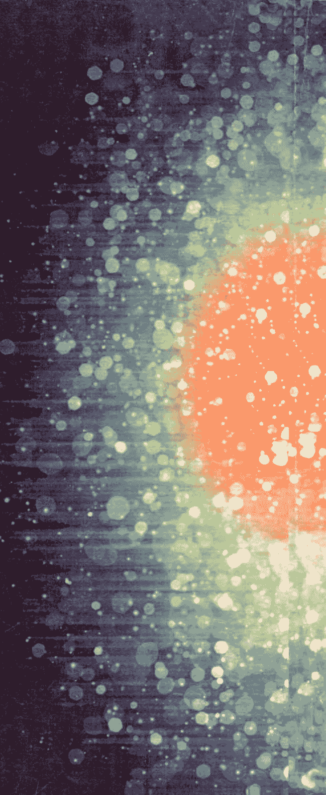
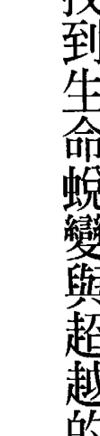
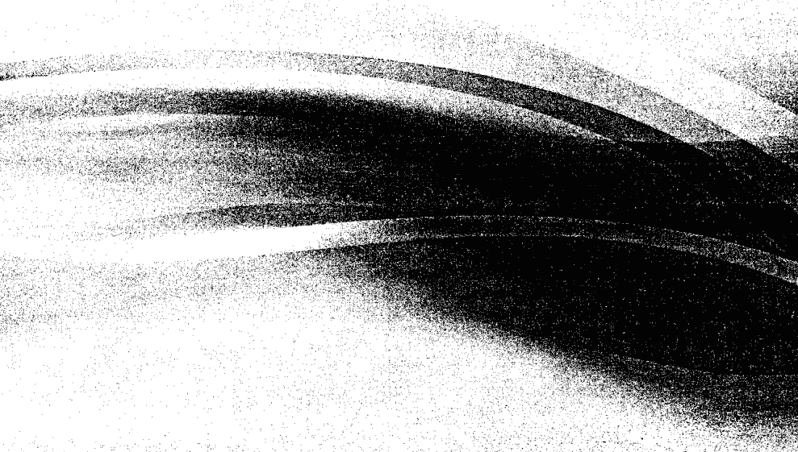
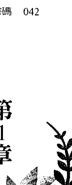
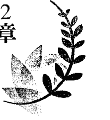
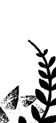
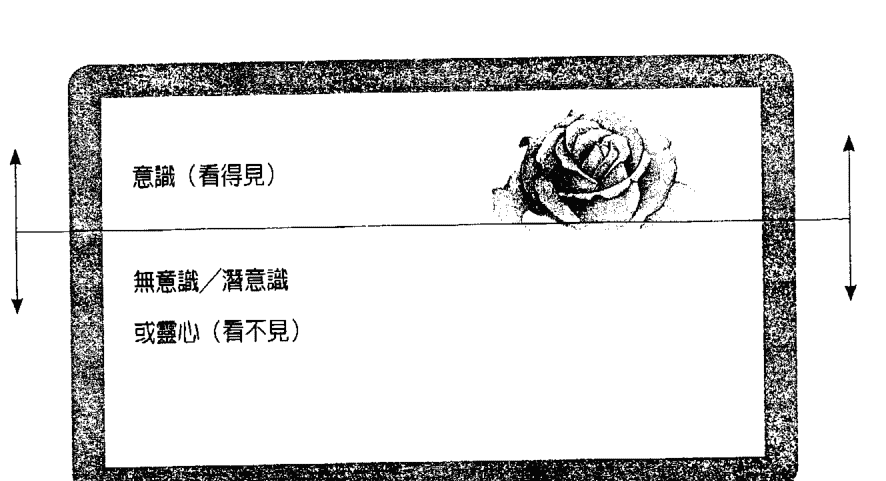
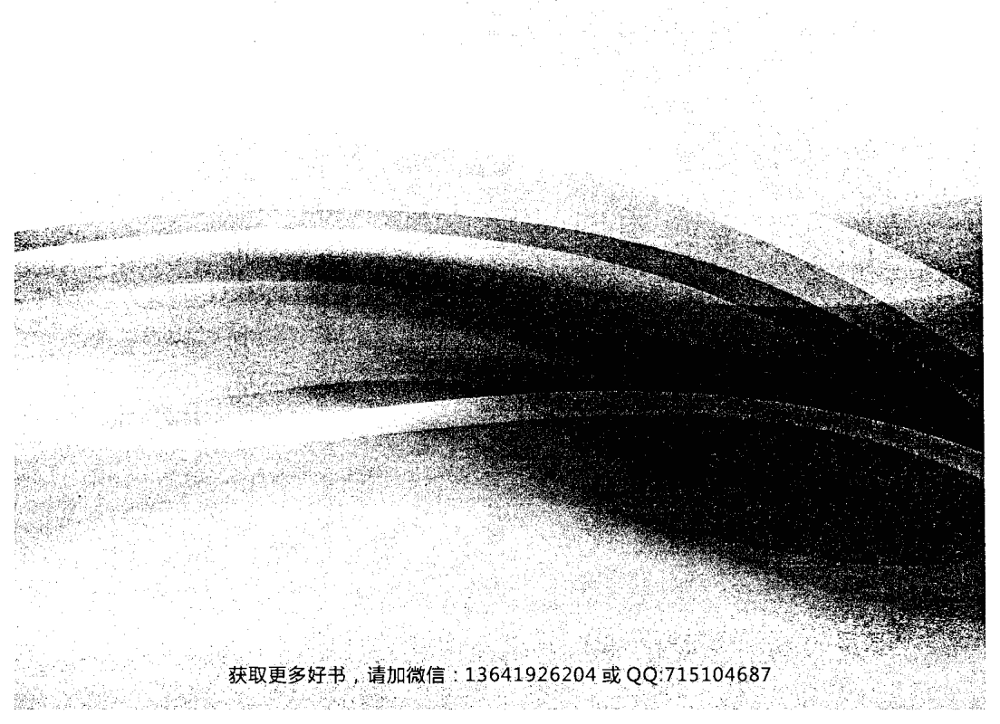
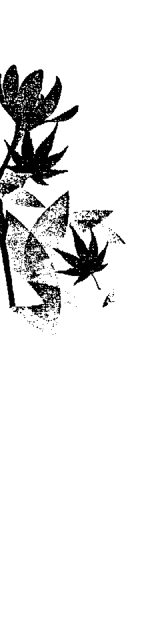
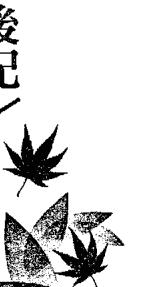

## 夢想密碼

> 暢銷書《療癒密碼》作者最新力作，25年磨一劍的終極工具！

亞馬遜讀者盛讚：「如果你不想再讀另外一本自我成長或成功學的書，就讀這一本吧！」

## 從壓力源頭清除成功的阻礙

- ★三大工具，從身心靈層面療癒那些讓你無法實現夢想的問題根源！
- ★額外好禮！價值99美元，作者獨創的「成功問題探測器」程式，搭配三大工具，從源頭清除阻礙你成功的原因！

## 推薦序

### 美夢成真的起點

有一天深夜，我獨自搭乘末班公車。除了我，車廂裡只有司機，和另一對老夫妻。賢伉儷顯然感情極好，坐在車廂中段的第一排雙人座位，手握著手，還不時彼此關心地對望。

公車在墨然的夜色中，順暢地行駛於專用道，速捷如時光的列車，穿越心中許多障礙，載著我通往夢想的月台。

幾個路口之後，夫妻按鈴，準備要下車。老先生看來大約已經八十歲，身手謹慎而俐落，小心翼翼地保護著老太太，走到司機旁邊，取出兩張票卡，正準備刷卡時，突然望著我，嘴角綻放親切的微笑。

我點頭回應招呼時，內心暗自忖度，他們會是我的讀者嗎？或曾經在電視上看過我？下一秒，令我小小驚訝的答案揭曉，老先生說：「我知道你也在研習《療癒密碼》喔！」目送他們的身影，公車駛離站牌，留下我們彼此的祝福。

——作家 / 顧問 / 廣播主持人  吳若權

回神過來，我才發現，原來是因為手上拿著一本書，是有位朋友交代我簽名，要送給他的親友的《向宇宙召喚幸福——靈魂療癒的旅程》。書中有許多篇幅分享我近年來應用《療癒密碼》的觀念與技術，幫助自己、親友、讀者或個案，處理身心的問題，並獲得很明顯的效果。老先生可能有讀過這本書，或是本身也是《療癒密碼》的愛用者，才會如此心有靈犀吧。

因為《療癒密碼》這本書出版的機緣，我在希領身心靈整合顧問有限公司荆宇元醫師的帶領下，進入另一個靈性學習的層次。在許多課程研習與實證經驗中，我更加確定：我們這一生所遇到的任何功課，無論是疾病或阻礙，都是身心靈不協調所致。

幾年前，在我積極而密切地應用《療癒密碼》協助親友處理身心疾病的某個階段，正好碰到自己事業發展中一個很重要的機會。我很渴望事情能照著我的希望去發展，於是非常慎重地請教荆宇元醫師：「《療癒密碼》中教我的技術，可以用來許願或祈禱嗎？」他一如既往地露出純真的微笑對我說：「至少可以讓你感到內心平靜，無論願望是否實現，都能坦然以對。」這句話，令人感到安心。

對於「追求成功」，我很有意志力，也很有行動力，但內心並不是一個「野心勃勃」的人。幾十年的生命歷程，讓我很幸運地有這些機會享受「心想事成」的美好滋味，但也有不少挫折，來自「已經盡力，卻未能如願」的遺憾。

拜讀亞歷山大·洛伊德最新作品《夢想密碼》，完全命中地回應我心中對於「如何將療癒密碼應用於許願或祈禱？」的大哉問，這本書簡直就是為我而寫。不僅如此，我相信這本書，也會是每位讀者，美夢成真的起點。作者不但對於過去幾十年來激勵課程之所以無效的原因，有全新的角度與解釋，並提供實用的三大工具：『能量療癒手勢』（身）、『改寫程式敘述句』（心）、『心幕工具』（靈），教導讀者進入潛意識，徹底清除內心成功的障礙，並獲得你最想要的結果。

過去，我不只一次在自己的作品中提到：很努力的人，不一定成功！因為，光靠努力是不夠的。先不談機運，至少努力還要用對力，才會有效。讀完《夢想密碼》，回頭看看這幾十年來，為追求夢想而幾乎榨乾體力，全靠意志力在撐著的自己，感到非常心疼。

我終於學會：放下期望！期望，其實是一種壓力。我終於懂得：成功，不要靠意志力！潛意識的力量，比意志力大千百萬倍。我持續付出愛！愛，是一切夢想的初衷與結果。

很慶幸自己，在身心靈準備最飽滿的這個時刻，接受上天的引領，讀到《夢想密碼》這本書。我也很確定會因此而得到全新的、更好的自己。

## 推薦序

### 通往快樂與成功的密鑰

——復健科專科醫師／身心靈整合專家 荊宇元

在亞歷山大·洛伊德的第一本書《療癒密碼》中，我曾建議讀者跳過繁瑣的理論，直接嘗試操作療癒密碼，感受這項技巧的神奇。然而，在他的第二本書中，雖然也介紹了三種療癒工具（即能量醫療手勢、改寫程式敘述句與心幕工具），但本書值得細細品味的卻是作者「轉化的頓悟」及「至上法則」。

在一九八八年，一個風雨交加的週日夜裡，婚後第三年，亞歷山大的太太將他趕出家門。其後六週，亞歷山大領悟到自己並未愛自己的太太，也不了解愛是什麼，從前的愛只是一種「商業交易式的愛」。在禱告、探索、哭泣之後，一種「轉化的頓悟」發生了。他領略了一種無私、無條件的真愛，不但在意識層面，也在無意識和潛意識。作者描述「轉化的頓悟」發生時的感覺：內心深處有樣東西改變了，而原來的你不復存在……感受到溫暖、興奮、平靜、一種超越肉體的幸福感、輕盈感。作者說：「從此，愛取代了我內在的恐懼，讓我不必憑藉意志力，就能自然而然去愛！」

「分居六週後，亞歷山大與太太第一次約會，太太發現他已經脫胎換骨了。從這次「轉化的頓悟」的經驗裡，亞歷山大領略了：「做任何事，都要心中有愛，聚焦於此時此刻，放下最終結果。」作者稱此為「世上最偉大的法則」，簡稱「至上法則」，而此「至上法則」就是通往快樂與成功的密鑰。

在後來的二十四年中，亞歷山大續開發出三大工具（能量醫療手勢、改寫程式敘述句、心幕工具），來幫助找他諮商的病人；藉著移除潛意識硬碟裡以恐懼為主的病，並改寫潛意識與無意識中的程式，促使病人自然而然發生「轉化的頓悟」，從此不必倚靠意志力就能實行「至上法則」，以獲得各個領域的成功，包括扭轉人際關係、消除健康方面的病因及症狀、改善財務狀況等。

我覺得亞歷山大描述的經驗，近於宗教情操，卻超越各種宗教。更重要的是，他提供了一套按部就班、切實可行的步驟。「你不必相信至上法則，」亞歷山大說，「只要確實按照我示範、教導的方法去做，就一定有效！」

聰明的讀者，你想不想試試看呢？

## 推薦序

### 讓你依據真相與愛而活的一本書

> —前達仁診所主治醫師，現為療癒密碼個人教練 蔡佩霖

感謝親愛的父母生下了我，感謝一路拉拔我進入醫學系的師長、同學，感謝帶領我歷經神經科與家庭醫學科訓練的師長與同仁，感謝在基層診所的老闆與同事，更感謝諸多好友。因為你們，讓我現在得以走在這條靈性療癒的道路上，也才有機會，跟各位朋友推介亞歷山大．洛伊德博士的這本著作：《夢想密碼》。

出身西醫，具有神經科及家醫科專科執照的我，學習過以《秘密》為主的吸引力定律、荷歐波諾波諾療法、戒酒無名會十二步驟法、入門佛法，以及亞歷山大博士發明的療癒密碼。在此過程中，其實一直在追求的是究竟真實，以及如何以此究真相來協助大家。

觀世界種種現象，人不外乎是在追求樂，或是解脫苦。為達此二目的，我們使盡了種種手段。然則目的達到了沒有？我所留心的，是在接近究真相之際，人人能夠達到人生的目

身為國內少數的療癒密碼合格執行者之一，我在療癒密碼的受訓過程中，深切感受到人生的目

到創辦人亞歷山大博士，的確是一位充滿愛的人。這個愛並不是一般所謂的談情說愛，而是無條件的愛。換言之，就像佛菩薩或耶穌基督，對我們每個人的那種愛。基於此，亞歷山大博士花了二十五年時間，融會了他所學所體驗的一切，寫出了這本《夢想密碼》。書裡闡述了他對於愛的觀念，以及提供了三種工具，讓我們每個人都能依據愛與真相去活，進而達成自己的目的。對了！如果真能依據真理而活，就不會走錯！如果你現在有想要的東西，或想要擺脫的束縛，建議你可以開始翻開此書了。

除此之外，我認為各界的朋友都值得看一看此書！現今世界分工很細，我們常常都只活在自己的行業裡，對其他行業的知識所知甚少。而本書提出的「靈性物理學」，至少整合了量子物理學、心理學和醫學的領域，又具有極大的實用性，值得各位一探究竟。

最後，想跟大家說：我始終相信，真正的真理，是「唯證乃知」。唯有你親身體驗過了，在自己身上得到證明，你才會知道那是不是真的。本書所提供的觀念和工具，值得大家借鏡。

至於要不要去做，就看你自己。祝福各位在邁向真實的道路上，認識自己，終能離苦得樂！

## 推薦序

### 在愛與光之中

—— 作家 / 自由時報花編副刊主編 彭樹君

「你要保守你心，勝過保守一切，因為一生的果效，是由心發出。」這是《聖經·箴言》裡，我最喜歡的一段話，因為對我這樣一個唯心主義者而言，它包含了人生一切的真理，也是一個無限深遠的秘密。我深深相信，內在世界成就外在際遇，淺白地說就是心想事成，但為什麼個人意願常常與現實狀況背道而馳？因為《箴言》所說的「心」在意識層面，而在潛意識，或更深的前「世」意識，那絕非意識所能及。那麼我們要如何深入自己的內心，在潛意識裡設定成功人生的程式呢？換句話說，我們要如何「真正地」心想事成呢？這本《夢想密碼》，以能量醫學與量子物理學的角度，重新詮釋了兩千年前的古老箴言：所謂的「心」，不是意識心，是「靈心」，而靈心的運作在於「愛」。心中有愛，就擁有了一切；在愛中行事，就是成功。這不是理論而已，更是實證的結果。

就像作者的前一本書《療癒密碼》一樣，書中有很紮實的科學基礎，看似複雜，其中旨意卻是最純粹的真理：任何時候，你都可以放下恐懼，選擇愛作為一切的依據，而你夢想中的一切，皆在其中。

也像《療癒密碼》一樣，書中有一套可實際操作的手勢，告訴你如何從身體進入心靈層次，以能量進行自我修復與療癒；如何刪除恐懼的病毒，以愛重新設定內在程式。

這本《夢想密碼》可說是我一直在等待的一本書。它提出了至上法則，也提出了愛與真相的靈性物理學：愛是萬事萬物的能量，若一個人能放下期待，放下頭腦，放下由意志力掌控、充滿壓力的世界，回到自己的內心，允許神聖發生，允許過程自己去運作，那麽生命中一切的美好就會水到渠成地到來。而我們真正的健康與成就，正是時時刻刻活在當下的愛與光之中。

## 前言 找到生命蛻變與超越的方法

這本書講的是超越的生活。

- 超越意志力。
- 超越平凡。
- 超越恐懼。
- 超越環境。
- 超越希望與夢想。

成長過程中，我始終相信人有可能過著超越的生活，但直到失去對我最重要的一切，我才找到真正過這種生活的方法。

你即將在《夢想密碼》這本書中學到的法則雖已年代久遠，但證實這些法則的卻是嶄新的尖端科技；同樣地，你將學到的一套按部就班、機械式的程序，也是最新的方法，這些步驟不僅能讓你選擇過著超越的生活，而且是今後都可以這樣過活。

我花了二十五年時間，才發現這套程序，並使其臻於盡善盡美，但我相信我將呈獻給各位的，就是這麼完美的一種方法。

> 「幾乎無人知曉之世上最偉大法則」（簡稱至上法則）。

在進一步探討之前，我想先請問你一個問題：你最嚴重的問題或未發揮的潛能是什麼？

你在尋找什麼？你生活中最需要從泥沼中拉起、踢下沙發，或拿魔杖朝它一揮的事物是什麼？請你先不要往下讀，先想出生活中至少一件必須改善的事，一件你已想盡辦法挽救，卻始終無法改變的事；一件必須擺脫失敗或平庸，轉為大獲全勝的事。

我相信至上法則正是你需要的魔杖。我知道這話聽來狂妄，但我之所以敢這麼說，純粹是因為過去二十五年來，我看見這件事幾乎百分之百發生在我的病人身上。我相信你也能將本書概述的程序應用在生活各個層面，並看見自己的人生從毛毛蟲蛻變為蝴蝶。

讓我猜猜你現在腦子裡在想什麼：你一定在想，這種話我老早就聽過了。其實這類言論你已聽了不下百遍，有些人聽過的次數，甚至多到無法相信我現在說的事有可能發生。是啊，又是一顆要騙我掏錢出來的萬靈丹，結果卻一點用也沒有。如果這就是你腦子裡的想法，我明白，我自己也這樣想過。可是，我一定要讓你知道一則與成功／勵志產業有關的秘密，那就是：他們的失敗率高達百分之九十七。

## 勵志產業失敗率高達百分之九十七

我們大多讀過或自行想通一個道理：成功、勵志方面的課程多半是失敗的。要是那些課程管用，我們就不會每年都在找新方法了，是吧？而且這所謂的產業（單美國每年的產值便高達百億美元）將邁入窮途末路，因為要是確實有一種方法能真正奏效，且無論誰來做都有用，大家就會過著快樂、健康、滿足的生活啦。打個比方，非小說類的暢銷書之一是減肥書籍，那麼，你覺得今年買減肥書的是哪些人？答案是：去年買這些書的同一批人，因為去年的書壓根兒沒用！然而，我要說的秘密並不是成功和勵志類課程多半會失敗，而是成功產業的專家早就心知肚明，且失敗率之高，遠超乎我們想像。

成功產業的知情人士透露，該產業（包含書籍、演講、工作坊、課程等）的失敗率約為百分之九十七。是的，你沒看錯，就是百分之九十七。肯恩．強斯頓是我的同行，也是好友，他經營北美最大的個人成長講座公司，多年來在公開演講場合都會提到大部分圈內人只會關起門來竊竊私語的事：成功／勵志產業平均成功率約為百分之三。他們就從這成功的百分之三裡取得足夠見證，用來描繪並行銷一部誰來操作都會有效的成功機器。然而，他們的親身經驗卻非如此。

更耐人尋味的是，這些課程絕大多數依循的是同一份基本藍圖：

- 一、聚焦於自己想要的事物。
- 二、擬定實現計畫。
- 三、執行計畫。

就這樣。任選一門課、一本書、一位導師，教授的內容可能都跟這範本大同小異。確切地說，這範本可追溯至一九三七年出版、影響深遠的勵志書《思考致富》（Think and Grow Rich），作者為拿破崙·希爾。而其他書籍與課程，更使這本書在至少過去六十五年間廣受歡迎。聚焦於自己想要的結果，擬訂計畫，再憑藉意志力執行這項計畫。

這公式很有道理，對吧？當然有道理了，這公式我們已經聽了一輩子。問題是，它不會有用的。根據哈佛及史丹佛大學最新研究——本書第一章將詳細討論該研究——這範式非但無效，而且對百分之九十七的人來說，根本就是一份注定失敗的藍圖。

何以見得？典型的成功學三步驟藍圖為：先決定自己要什麼，再擬訂計畫，最後付諸行動直到達成目標。這份藍圖取決於兩項因素：一是期待一個外在的最終結果（步驟一、二），二是仰仗意志力（步驟三）。我們將在第一章了解到，無論最後是否達成目標，期望本身就會造成慢性壓力，醫學則一再證實，臨床上，壓力幾乎是生活中可能出現的每一種問題的源頭，基本上也注定讓人失敗。而仰仗意志力（步驟三）也幾乎保證失敗，因為意志力憑藉的，是意識的力量。我們也將在第一章發現，人類潛意識與無意識態度的影響力，簡直比意識強大一百萬倍。因此，倘若潛意識與無意識因故直接反對由意識操控的意志力，每次敗陣的一定是意識。此外，企圖憑藉意志力「強迫」潛意識正在阻擾的結果發生，將引發極大的壓力——這又會導致可能出現在生活中的幾乎每一種問題。

換句話說，過去六十五年來，失敗率之所以高達百分之九十七，是因為大家採用的藍圖其實是在教人失敗。學習這套方法的人，只是將自己所學照單全收。關鍵在於：倘若期望本來就會造成壓力，而且靠意志力獲致快樂、成功的機率只有百分之一（還會造成更大的壓力），那麼這份藍圖不但保證我們無法長期擁有快樂與成功，也意味著如果一開始就不照著這份藍圖做，情況反而不會那麼糟。

你可能正在納悶，如果這是一份注定失敗的藍圖，為什麼我會覺得它言之有理、順理成章？原因有三：

一、你的基因設定就是如此：聚焦於最後的結果，源自你與生俱來的程式，亦稱刺激／反應或趨樂／避苦程式。這是人類生存本能的一部分，而你也幾乎完全靠這股本能度過生命的前六到八年——想吃甜筒冰淇淋，計畫得到甜筒冰淇淋，去拿甜筒冰淇淋。這就是為什麼這份藍圖感覺如此順理成章。問題是，成年後我們就不該用這種方式過日子，除非生命面臨迫在眉睫的危險。大致來說，六到八歲左右的孩子就該開始根據自己學到的是非觀念生活，

二、你看到別人都這麼做：換句話說，你看見這份藍圖在各種情境中，幾乎都被標榜為正確方法——看到自己想要的東西，想出得到那樣東西的方法，再運用意志力得到它。這是同儕、老師、父母為你制訂的模範。

三、這是過去六十五年來專家教導的觀念：我前提過，在將近七十年的時間裡，這份藍圖幾乎是各種勵志暢銷書籍或課程的基礎。

現今勵志與成功課程提供的方法不但早已過時，而且一開始就有瑕疵。但其實我並不需...大約二十五年前，我從事青少年家庭輔導工作，幫助他們不走偏，並在人生中有所成就。我接受的訓練就是這種典型的成功藍圖，且多年來，我在生活各個層面也依循這份藍圖，卻發現自己未能善盡輔導青少年之責。更慘的是，我的財務狀況也岌岌可危，甚至瀕臨破產邊緣。儘管我強顏歡笑，內心卻苦澀無比。多年來，我一直在尋找如何幫助人們——尤其是我自己——在人生中成功的答案，無論是透過宗教、勵志產業、心理學、醫學，或我景仰的人提供的建議，卻無一奏效。當然，我不怪那些道理，只是責怪自己。我告訴自己，我...

不夠努力，或方法不對！
我幾乎要放棄一切了，因為我覺得自己再也無法過這樣的生活。我記得當時心想，我怎麼這麼快就把一切都搞砸了？我才二十幾歲，卻感覺自己在人生各方面都一敗塗地。好吧，更慘的還在後頭。
婚後第三年——一九八八年——一個風雨交加的週日夜晚，內人希望（Hope）說她「必須跟我談談」。雖然這句話她之前已說過幾千遍，卻從未用這種口氣。內心深處，我有預感大事不妙。她無法直視我的眼睛，聲音微微顫抖，但我看得出來她也試圖讓聲音保持穩定：「亞歷山大，我要你搬出去，我再也受不了跟你住在一起了。」
各位要知道，我在一個義大利風格的家庭裡長大，家人隨時在鬥嘴，什麼都能吵、都能辯，上至政治、宗教，下至週末計畫。但在我生命中最重要的那一刻，我卻找不到隻字片語來反駁。我所能想到的只有……「好吧。」
就這樣，我離開了。我麻木地將幾樣必需品塞進小袋子，安安靜靜地離開，一個字也沒說。我回父母家，整夜都待在後院禱告、探究、哭泣，感覺自己內心彷彿正在死去。
當時我並不知道，這可能是發生在我身上最棒的事。之後六週，我將經歷一生中最正向的轉捩點。我剛加入一所「靈性學校」，將在那裡得到開啟一切的鑰匙——後來我將這把鑰匙稱為「至上法則」。
可是那天夜裡，我卻感覺自己此生休矣。我一遍又一遍不停地問：「怎麼會發生這種

「這是很合理的問題，因為如果我有哪件事應該成功，非婚姻莫屬。我和希望結婚時，已經做好萬全準備，比我們認識的任何人都來得周全。初次約會，我們在公園的草地上鋪了毯子，然後在滿天星斗的美麗秋夜裡聊天，一聊就停不下來，就這樣聊了六小時，你想得到的話題我們全聊過了，而那還只是第一次約會。

等到可以聊的話題都聊完了，就改成共讀。我們會先選好一本探討人際關係或兩人都有興趣的書，先自讀、畫重點、記筆記，等下一次約會時，再對照彼此的筆記，討論讀到的內容。我們還自願接受婚前諮商，進行個性測驗，然後比較測驗結果，並與諮商師討論我們之間可能出現的問題和解決之道。在一九八六年五月二十四日婚禮那天，我們兩人都準備好了。

好吧，我們以為自己已經準備好了。結果，結婚還不滿三年，她就連看都不想看到我，我也非常不快樂。怎麼會這樣？

在父母家後院那一夜，我的教育才真正開始。我在腦海裡聽見一個聲音，我相信那是神的聲音。那聲音告訴我一件我不想聽到的事——其實是一件會讓我生氣的事。之後那聲音問了我三個問題，令我大感震驚。接下來六週，那三個問題從我存在的源頭移除並改寫了程式，讓我從此脫胎換骨。那三個問題將成為至上法則成功藍圖的濫觴（詳見第七章）。這一切發生在頃刻間，但之後我花了二十五年，想方設法讓這份藍圖適用於所有人。其實，以這份藍圖目前的狀態，你可以說它正好是典型三步驟成功藍圖的相反，且效果也完全相反：根

據我的經驗，這份藍圖的成功率高達百分之九十七以上，而過去六十五年來，典型成功藍圖的失敗率卻是百分之九十七。

和希望分居約六週後，她才勉強同意再跟我約會。之後她告訴我，那天她第一次看著我的眼睛，就知道我已經改頭換面了。她說的沒錯，雖然我的外表依舊，內在卻徹底改變了。

因為曾經痛苦過，所以有好一段時間，她並未告訴我這件事，也未卸下心防，但這樣的結果卻是避不開也躲不了的。

後來，雖然希望的健康和我們的財務狀況都出了問題，日子過得實在辛苦，但我們生命中最重要的事物卻再也不同了。至上法則改變了我，而希望也開始在轉變。

那天起，只要有機會，我就會教每個人至上法則，包括當時正在接受我輔導的青少年和家長。無論他們認為自己有哪些問題，無論他們覺得自己必須脫離哪種狀況，他們真正需要知道的，其實是至上法則。以下是至上法則的簡要說明：

所有問題，或者無法快樂、成功，甚至是生理問題，幾乎都源自某種形式的內在恐懼狀態。而每種內在恐懼狀態，起因都是在那個問題中缺少了愛。

恐懼反應又名壓力反應。如果恐懼是問題所在，那麼恐懼的相反「愛」，則是解決之道。在真正的愛面前，恐懼不可能有立足之地（除非是性命遭受威脅的緊急狀況）。這聽起來

來可能只是理論，幸好過去幾年來，已有科學研究證實這種說法（本書自始至終都在討論這個概念）。一切事物，即使是你的成功問題和外在環境，皆可歸納為心懷恐懼或心中有愛。這就是我剛從事諮商工作時，開始在治療期間教導每個病人的觀念：無論他們呈現的問題是跟健康、人際關係、成功、憤怒或焦慮有關，我相信根本原因一定是愛／恐懼的問題。只要愛能取代恐懼，我相信他們的症狀就會好轉；唯有愛能治好他們的問題。但不久，我便發現一個問題：光是告訴人要去「愛」，是沒有用的。要他們去閱讀、研究、深思古代手稿與法則，幾乎不會有什麼效果。我試著教病人「做就是了」，去做那些我變得可以自然而然做到的事，但他們幾乎沒有人做得到。你知道嗎？我正在教病人三步驟失敗藍圖，卻渾然不覺！我告訴他們要改變以恐懼為主的意識想法，轉而以愛為本。換句話說，我正在告訴他們要憑藉意志力，專注期待外在的最終結果！有幾位病人說：「對啦，多謝你的建議。」有位病人挖苦道：「好棒喔，吃完午餐我馬上開始做，安啦。」之後我才明白他們為何如此嗤之以鼻，因為他們已嘗試過這樣過生活，卻無法做到；就像我，在父母家的那一夜之前，我也嘗試過無數次，一樣做不到。那天晚上及其後六週，我身上發生了一件千真萬確、讓我徹底改頭換面的事，後來我將這件事稱為「轉化的頓悟」。不是說我那天晚上就這麼「決定」去愛，並開始靠意志力去做，而是有件事在轉瞬間發生，以愛取代了我內在的恐懼，讓我不必憑藉意志力，就能以一

種我之前做不到的方式、自然而然去愛。我用一種全新的角度看到真相，也深刻領悟並「感受到」到愛的真義，知道確實有那樣的愛存在。我立刻開始在愛與平靜中思考、感受、相信、行動，而不是在恐懼與焦慮裡。光湧進我的黑暗中，之前我幾乎無法強迫自己去做的事，現在卻可以輕鬆做到了。
若將大腦想成電腦硬碟，那麼我的情形，就好像大腦裡與愛和恐懼問題有關的程式立即被移除並改寫了，如同把原本的套裝軟體換成另一種。老實說，這「轉化的頓悟」好比某種幻景，我在其中瞬間瞥見愛的真相，便抓住不放。事實上，愛因斯坦寫過與他的相對論有關的類似經驗：他在腦海中看見自己乘著一道光，他認為就是這個幻象讓他想出著名的E=MC²理論。全然的真相一瞬間顯現在他眼前，他卻花了十二年，才想出證明這個真相的數學公式。
不久後，我便明白不可能只因為自己想要，「轉化的頓悟」就會發生。也就是說，我知道自己尚未「想出那道數學公式」。我需要可以用來教導別人的實用工具與明確指南，而且無論什麼人都能將這些工具和指南運用在各種狀況中，以移除恐懼程式，並改寫為愛的程式——在最深的層次，也就是真正活在愛裡。這些工具要能真正根治各種疑難雜症，恰如我那「轉化的頓悟」對我發揮的效果。
這就是我在之後二十四年做的事。治療病人時，我終於找到三大工具（你將於第四章學到），能幫助他們直探潛意識源頭，移除恐懼程式，將原本預設的程式變更為愛的程式。我

不只找到三大工具，還發現典型的三步驟成功藍圖毫無用處。我會在本書中教你如何使用這三大工具，最終在人生各領域獲致快樂、成功，而且做來自然、毫不費力，也不必辛苦運用意志力。

剛取得諮商碩士學位時，我仍須接受某位心理學家的監督指導，也尚未領到執照，卻已掛牌執業。之後，我又做了一件事，徹底惹惱幾位資深同行，或者說成為他們笑柄：我收費比照合格心理學家，每五十分鐘一百二十美元（那是二十多年前喔）。諮商沒有一位碩士這麼做！但從自身經驗研判，我知道我往往只須看診一到十次（通常為期半年），即可解決病人的問題，之後他們再也不需要我了。其他心理學家通常一週看每位病人一次，持續一至三年（也許你目前正在看這些心理學家）。此外，這些心理學家主要是教病人處理問題的應對機制，但病人可能終其一生都解決不了這個問題，而我卻能持續看到病人的問題被徹底解決——我不過是教他們你將在本書中發現的方法。

用這種離經叛道的方式執業半年，我的候診名單已排到半年後，還有一票同行來敲門或打電話給我，要麼詛咒我，不然就是和顏悅色地邀我共進午餐，想知道我葫蘆裡究竟賣的是什麼藥，因為他們的病人都跑來找我了。

至上法則不僅改變了我的生命，也改變了無數人——那些接受我治療的人——的生活。我相信，它也將改變你的人生。

## 一个有百分之九十七成功率的方法

至上法则与亘古的灵性智慧及最新的临床研究和方法完全协调一致，也提供了意志力无法给予的解决方法。根据我们将在本书第一和第四章探讨的研究指出，典型的三步骤成功蓝图其实开启了大脑的某种机制，其结果是：

- 让人变笨
- 让人生病
- 耗人心力
- 抑制免疫系统
- 增加痛苦
- 提高血压
- 关闭细胞
- 破坏人际关系
- 引发恐惧、愤怒、忧郁、困惑、羞愧等情绪，以及自我价值与认同等问题
- 让人无论做什么都从负面观点出发，即使面带微笑

相較之下，至上法則不僅能關閉上述機制，也可以真正開啟大腦的另一種機制。臨床研究顯示，這種機制可以：

- 促進人際關係
- 增進親子感情
- 帶來愛、喜悅、平靜等結果
- 增強免疫功能
- 減輕壓力
- 降低血壓
- 緩解成癮與戒斷症狀
- 刺激人類生長荷爾蒙
- 提高信任感與明智的判斷力
- 調節胃口、消化能力與新陳代謝
- 提升療癒力
- 促進放鬆
- 激發無壓力能量
- 提升神经活动
- 打开细胞，提升疗愈力与再生能力

以上机制究竟是怎么一回事？第一种机制是源于内在恐惧的压力反应，会刺激皮质醇分泌，引发第一份清单中的所有症状。而第二种机制，在没有内在恐惧的情况下才会启动，也就是心中有爱时。体验到内在的爱，会让大脑下令荷尔蒙系统分泌催产素（通常被称为「爱的荷尔蒙」）及其他胜肽，导致第二份清单中的每一种正面症状。

> 「历时七十五年、耗资两千万美元的葛兰特研究，得到的结论是直截了当的五个字：快乐就是爱。完毕。」

希望你現在已能看出，成与败皆取决于自己的内在状态，取决于这个状态是以爱或恐惧为基础。倘若在你生活中运作的是第一种机制，亦即压力反应——根据我的经验，绝大多数人都是如此——那么你一定会失败，或者至少无法达到自己最成功的状态，只能一直推著那颗动也不动的大石头，直到精力耗尽。反之，如果你生活中运作的是第二种机制，亦即心中有爱，那么你一定会成功——不是因为你更努力，而是因为你被「设定」要成功。

# 結合科學與靈性的有效程序

醫學博士班·強森是我的好友。他說，要是哪天製造出一顆藥丸，能啓動大腦的第二種機制，刺激催產素自然分泌，肯定一上市就成爲史上最暢銷的藥品。那不只是一顆神奇藥丸，也是「隨時快樂健康滿分」的藥丸！你想不想取得這顆藥丸的處方？你走運啦，這本書就是。

現在我可以更詳細說明，二十五年前，希望把我踢出家門之後那六週，我在「靈性學校」學到了什麼。一切始於以下領悟：我瞭解到自己非但不是真的愛希望，甚至不知道愛是什麼。更糟的是，我發現我認識的人當中，也沒有一個人瞭解愛到底是什麼。換句話說，我的婚姻並未建立在我對希望的愛之上，夫妻關係也不親密。我的婚姻，是以談判與商業交易爲基礎。那個交易就是我的安全網：如果你爲我做這件事，我才爲你做那件事，否則……在討價還價有結果之前，我有所保留，也是合情合理的，對吧？當初約會時，如果希望沒做到我要她做的事，也沒按照我想要的方式行動，我知道我絕不會開口要她嫁給我。即使結婚了，我仍期望我要她做的事她就做，不要她做的她就不做。我把這當成獲

得到我的爱的秘密条件。这话我虽然从未说出口，却化为实际行动。倘若希望没做到我要她做的事，我就会生气、不耐烦，她也一样。

提到「爱」这个字时，大家指的多是这种商业交易式的爱。但是，这种爱有个更精确的名称，叫「我有什么好处」！数十年来，「我有什么好处」几乎已成为每种商业谈判与交易的信条。一九七〇年代的畅销书开始教导人把这种范式套用在人际关系及生活其他领域——你做这件事，我才要做那件事。

我们信这套说词，也应用在生活中，却疑惑自己为何失败！

「我有什么好处」的爱正好是爱的相反，是建立在恐惧与立即满足（这部分将于第五章更深入探讨）的基础上，因此势必造成长期的失败与痛苦。

反之，真正的爱与对方的反应无关。如果真的爱对方，就会全心全意付出——没有安全网，没有备用计划，毫无保留。真爱意味着放弃「我有什么好处」的爱，如此一来相关人士才能都获胜，即使你必须有所牺牲；真爱可能需要延后一时的快乐、满足，但长久下来一定能成功，而且那种快乐是言语难以形容且千金难买的。

历代学者以「无私之爱」与「浪漫之爱」来区分这两种爱。

无私之爱是自发性的、无条件的爱，起源于神。这份无私之爱，让人纯粹因为爱是一种天性而付出爱，而不是看在对方的任何外在条件、环境或特质上。确切地说，因为无私之爱是一种无条件的爱，因此能看见对方的重要性。

浪漫之爱，或「我有什么好处」的爱，则恰恰相反。这种爱利用爱的对象来管理自己的痛苦或快乐，接着便转移到下一个对象。

饋，相較之下，無私之愛則與對方的外在回饋無關。

這份領悟對我有如當頭棒喝，我哭了起來。然後我面臨一個問題：既然我知道真正的愛是沒有安全網、沒有備用計畫、毫無保留，那我現在是否要選擇愛希望，即使我倆的關係沒有任何改變？我並未立刻回答，但在思考、禱告了幾天之後，我終於得以做出決定：是的，我要用那種方式愛希望——全心全意，不附帶任何條件。那就是我「轉化的領悟」發生的時刻。剎那間，我不僅了解愛的真義，也能真正去愛。這改變不只發生在我的意識，也發生在真正的科學與真正的靈性交會之處——有些人稱此處為潛意識或無意識，我則稱之為「靈心」 (spiritual heart)。

先前我將至上法則比喻為魔杖。歷史上，對於不了解其運作原理或發生原因之事，人們往往以「魔術」稱之；然而，一旦了解某件事背後的運作機制，也能加以複製之後，便稱之為技術。

傍晚回到家，你會不會拿著一盒火柴在家裡四處走動、點亮油燈？出門前，你會不會提早二十分鐘，先將馬拴在馬車上？想要吃飯，你會不會先在爐裡生火？這些問題要是在一百年前提出來，大家肯定當我是瘋子：「當然會，大家都這麼做。」那為何今天我們不這麼做呢？因為我們有了新技術！

新技術未必表示它的原理也是新的，你肯定聽過「太陽底下無新鮮事」。發明燈泡、汽車和電時，所依循的原理其實自古以來一直存在著。這些發明一直都有可能問世，只不過我

們花了數百年時間，才湊齊每一塊積木。我相信我要與你分享的這套程序，就是克服生理、情緒與靈性問題的新技術，而鑄造這個新技術的法則，是自古至今從未改變的真理。

請別誤會，我在使用「靈性」一詞時，沒有任何宗教意味。我逃離了宗教；確切地說，我花了數十年時間，才擺脫成長過程中宗教的影響。我認為宗教大多立基於恐懼，因此往往弊多於利。即使如此，我還是很努力讓自己成為一個注重靈性的人，將愛、喜悅、平靜、寬恕、仁慈和信念視為人生要務。這些是靈性領域的議題，而你將在本書中了解，它們也是主宰你生命的問題。

雖然科學界最近才發現愛是快樂與成功的關鍵，但縱觀歷史，千百年來，每一位偉大的靈性導師一直都在教導這個觀念，即使欠缺持續實踐此觀念的方法或技術。

比方說：

> 「有一字，能讓眾人卸下生活的重擔與痛苦，那個字就是愛。」

——希臘悲劇詩人索福克里斯

> 「我若有先知講道之能，也明白各樣的奧秘，各樣的知識，而且有全備的信，叫我能夠移山，卻沒有愛，我就算不得什麼。」

——使徒保羅

> 「因為眾生，而起大悲。因為大悲，生菩提心。因菩提心，成等正覺。」 —— 佛陀

> 「絕望時，我記起古往今來，真理與愛的道路總是獲勝。史上不乏專制者、殺人者，一時間似乎不可一世，但最後勢必衰亡。謹記此事，永誌不忘。」 —— 聖雄甘地

> 「若要他人幸福，請踐行同情；若要自己幸福，請踐行憐憫。」 —— 達賴喇嘛

> 「黑暗無法驅走黑暗，唯有光亮可以；仇恨無法趕走仇恨，只有愛可以。」 —— 馬丁·路德·金

> 「靈性生活的宗旨，是學習如何去愛——不是學習如何修練超自然能力，不是學習如何頂禮、誦經、做瑜伽，甚至也不是靜心，而是學習去愛。愛即真理，愛即是光。」 —— 舒亞·達斯喇嘛

这个时代最振奋人心的突破是：科学界现在正开始量化这些古老的灵性法则，不仅证实「灵心」存在，也解释灵心何以是生命中各种好事坏事的源頭。真正的灵性永远与真正的科学协调一致，而时至今日，越来越多证据正显现在世人眼前。

由於至上法則是真正的科學與真正的靈性的結合，因此能否運用書中這套程序獲得成功，絲毫不受你的世界觀或人口特徵影響，甚至無關是否相信至上法則本身。唯一需要的，就是付諸行動。教導至上法則這二十五年來，我看到的情況是：至上法則幾乎每次都有有效，而且對想得到的任何人口群、任何世界觀的人，都一樣行得通。現在我人的私人診所規模名列全球前幾大，客戶遍布全美五十州及全球一百五十八國，且數量仍在持續增加。所有客戶當中，接受我親自診治而未達巔峰成就者寥寥無幾，這少數的五到十人可分為兩類：一是不肯操作這套程序的人（無論原因為何），二是不贊同這套程序的哲學原理，因此從未真正嘗試的人。其他每一位就我所知都成功了。
目前有個觀念廣為流傳：你必須「相信才能成功」。這句話在此並不適用。你不必相信這法則有效，也不必相信我說的任何一句話。但是，如果確實按照我示範、教導的方法去做，就一定能扭轉人際關係，消除生理與情緒健康症狀的病因，以及——沒錯，改善財務狀況與物質環境。

# 讓你想事成、幸福美滿的工具

真正的快樂與成功，意指無論目前處境如何，當下於內在和外在都活在愛中。只要能做到這一點，內外在的一切都會好轉。當然，多數人無法單憑意志力做到，好比電腦無法執行其未被設定去做的事。

靈心（或潛意識與無意識）的運作方式十分類似電腦。事實上，人體細胞是由類似矽的物質組成，就像電腦晶片（記住，是電腦模仿人腦的運作方式，而不是人腦學電腦）。例如，你可能是全世界心地最善良、意志最堅決的人，但如果你的「電腦」染上病毒，或你下載了某個軟體之後，電腦頻頻當機，只要沒有正確的工具或知識，就絕對無法清除這個病毒或移除這個軟體。反之，若有正確的程序和適當的工具，這件事便出奇容易。事實上，即使你想要，恐怕也無法阻止電腦運轉，因為這就是電腦被設定要做的事。

想在人生中成功，勢必要有可以深入處理潛意識與無意識的工具，而不是只處理意識（單憑意志力就只能處理到意識層次）。潛意識與無意識是靈心與細胞記憶所在，也是所有人生問題的來源處。過去二十四年來，我研發出、也測試了三大工具。這三大工具能移除人體硬碟裡以恐懼為基礎的病毒——就是這些病毒讓你的人生陷入破壞性循環——並改寫潛意識與無意識程式，讓人由內而外活在真相與愛中，不必依靠意志力，也沒有了對最終結果的期望。在移除、改寫程式之後，活在當下、活在愛中（內外在皆然）將成為你的預設程式。

因此，在《夢想密碼》這本書中，不僅有教你在人生各個領域創造快樂與成功的法則，也有讓至上法則在你身上發揮效果的程序與工具。你會找到完美、完整的程序，這套程序早在數千年前便已有人著書論述，現在則有美國頂尖大學的博士與最新研究證實，本書不過是將這套程序統整為循序漸進、切實可行的指南。

在第一部，我們將找出你的終極成功目標，或者你真正最想要的那樣事物。這是很重要的概念，也是至上法則成功藍圖的基礎。接著，我們將學習更多科學與靈性法則，幫助你了解至上法則之所以有效的原因。

在第二部，你將學習如何使用三大工具，而世上也只有本書提到。這三大工具將從源頭移除並改寫你的成功問題程式，也將教你設定成功目標，而不是壓力目標——這兩件事是至上法則程序的構成要件。

在第三部，你將學習如何執行至上法則，為自己帶來快樂、成功。首先，我們會運用你在第二部學到的三大工具進行基礎診斷，找出你成功問題的根源。接著，你將取得至上法則成功藍圖，亦即一套按部就班、連續操作四十天的程序，創造並達成你在任何領域想要的成功。

至上法則不僅能拯救你脫離失敗，還能改造你，讓你表現突出，即使你原本就天賦異稟、才能超群。傳統的三步驟成功藍圖往往讓你失敗得更「慘」，還不如讓你照自己的方法做，至上法卻可以增強你的能力，讓你獲致巔峰表現——不僅超越你的意志力、超越你的期望，更超越你的希望與夢想。

縱使世人都認為地球是扁的，但它始終是圓的。至上法也是如此，它始終是真的。近年來，科學界才有能力證實至上法則的真實性，而這是破天荒頭一遭，你手上握有完整的計劃與工具，能讓你幸福美滿、事事如意，過著超越的生活。

# 第 1 部

# 夢想密碼的基本法則

# 第1章 決定性的三個問題

正式進入這一章之前，請先讓我提個問題。如果答不出正確答案，就別妄想這輩子可以得到自己最想要的事物，而且還可能會困在某個惡性循環裡數年、數十年，甚至至死方休。

雖然這問題很重要，但我的經驗是，很少人知道正確答案。這個問題就是：

你現在最想要的事物是什麼？

為了幫助你想出正確答案，我只規定一件事：不要篩選答案。什麼意思？乍聽這個問題，一般人腦海裡會瞬間閃過一個直覺答案。問題是，通常他們會立刻試著說服自己這應該不是正確解答，轉而開始思考另一個答案，一個更合乎社會要求，更符合或更不符合個人成長背景，更符合或更不符合宗教理念的答案，隨你舉例。各式各樣的理由我都聽過了，不要這樣做！

## 神燈巨人練習

本書要幫助你得到自己真正想要的事物，而誠實回答這個問題就是第一步，因為如果不知道自己真正想要什麼，或者不承認那就是自己真正想要的，幾乎就休想得到。所以我要你真心誠意、發自肺腑回答。如果你第一時間想到的是一百萬美元，很好，就用這個答案；如果是一個你想治療的健康問題，很棒，這答案也可以；如果是一段你想改善的人際關係，這也很不錯。無論你第一時間不加思索想到的是什麼，那就是你的答案。

為了幫助你在回答這問題時不篩選答案，現在先做一項練習。還記得阿拉丁神燈的故事嗎？我小時候非常喜歡這個故事，經常在後院走來走去，想像自己會選哪三個願望，最後又是哪個願望會成真。兒時的我很迷運動，因此我通常是想要成為職業網球選手吉米·康諾斯第二，或者，如果當時是棒球季，我會希望成為職棒大聯盟聖路易紅雀隊在世界盃第七戰的獲勝投手，然後到外面假裝整場比賽都由我投球。

閉上眼睛，想像現在阿拉丁的神燈巨人就站在你面前，周遭空無一人，只有你和神燈巨人，他跟你說：「我將賦予你一個願望。你可以許任何願望，但有兩項限制：不可許願想要更多願望，也不能許下會奪走他人自由意志的願望。除此之外，基本上許什麼願望都可以，而且一定能成真。如果你的願望是得到一千萬美元——搞定！想要治癒某個「不治」之症——沒問題！達成一項豐功偉業——成功！這樣你明白了吧？沒有人會知道你是怎麼得到的，他們會以為事情就這樣因緣際會發生了。此外，你這輩子絕不會有第二次許願機會，如果十秒鐘內你說不出願望是什麼，你的願望就落空了。好啦，就這樣，關鍵時刻到了。想像這件事此時此刻真實發生在你身上，不可篩選答案，只有十秒鐘時間，閉上眼睛——開始！你對神燈巨人說了什麼願望？把它寫下來。知道嗎？你上當了。不好意思，我必須這麼做，之後你會感謝我也說不定。為了幫助你確認自己真正最想要的是什麼，這是我唯一想得到的方法。你看，你的答案其實是你目前首要的人生目標，但如果我這麼問，你可能會說出另一個答案，而且很有可能是一件截然不同的事，一個讓我們無法幫助你得到自己真正最想要的事物的答案。那麼，為何我要知道你人生的首要目標？因為你現在做的每件事、腦子裡有的念頭，背後的原因幾乎都是這個目標。無論你怎麼說，這就是你真正最相信的事。而這目標也洩漏了你潛在的程式設定。你過去、現在、將來做的每件事，都是因為你曾在人生中的某個時間點設定了一項目標，即使你早已忘記那個目標是什麼。你不會一到早上就起床，除非你在某個時間點將此事設為目標——無論是有意識或無意識。同樣的道理也適用於刷牙、更衣、叫計程車、結婚、離婚、生子、上廁所……這樣你明白了吧？找出人生中的首要目標，是真正做

### 將外在狀況當作目標，你就錯了！

二十五年來，我一直在問這個問題，有時一次問一人，有時一次問數千人。上次我提出這個問題時，現場有超過二千六百人，卻只有六個人說出正確答案。

如果唯一的規定是誠實回答，怎麼可能會答錯？好啦，我之所以知道他們的答案不對，是因為我又問了兩個問題，然後他們自己告訴我之前答錯了。稍後我也會問你那兩個問題，不過我會給你提示：正確答案一定是某種內在狀態（例如愛、喜悅、平靜等），錯誤答案則是某種外在情況（金錢、健康、成就、以他人行為或感覺為基礎的人際關係等）。這類答案之所以錯，是因為它適得其反，會讓你遠離自己渴望的快樂與成功，並且真的在你的生命中創造失敗（或更多失敗）。

原因何在？讓我們回到前言提到的典型三步驟「失敗藍圖」。記住，這是大多數勵志產業人士使用的模型，且失敗率高達百分之九十七：

- 一、聚焦於自己想要的事物。
- 二、擬定實現計畫。
- 三、執行計畫。

步驟一、二牽涉到把焦點放在最終結果才能成功，而哈佛大學心理學教授，也是暢銷書《快樂為什麼不幸福？》（Stumbling on Happiness）作者丹尼爾·吉伯特提到他在哈佛的研究結論時，是這樣說的：「期望是快樂的殺手。」他耗時數年針對此議題進行原創性研究，只要去讀他的研究，就會明白他所謂的「期望」，明確指的是與未來某件事（換句話說，就是最終結果）有關的特定生活狀況。網路上也有一段很棒的影片，吉伯特教授在其中描述這種現象如何在我們沒有察覺的情況下，於每個人內在運作。

然而，期待最終結果不僅扼殺快樂、毀滅健康，也幾乎摧毀在各方面成功的可能性。

原因何在？因為一旦對未來的最終結果有所期望，就會立即陷入慢性壓力狀態，直至得到（或未得到）那個結果。而你或許已經知道，幾乎每所醫學院和每位醫生都說：高達百分之九十五的病痛和疾病的起因是壓力。不過，一般人不明白的是：就算與健康無關的問題，也起源於壓力：生活中可能遭遇的種種問題，幾乎都是壓力造成的。

從臨床的角度來看，生活中幾乎所有問題的起因都是壓力；換句話說，壓力導致失敗。此話怎講？

- 一、壓力使人生病：根據地球上每所醫學院和每位醫生的說法，高達百分之九十五的病痛與疾病，都與壓力脫不了干係。這已是老生常談。
- 二、壓力讓人變笨：壓力致使血液無法流向更高的智力中心，並扼殺創意、問題解決技巧，以及想要快樂與成功所需的一切事物。
- 三、壓力耗人心力：等最初由皮質醇激發的精力高峰期過後，將出現腎上腺素過量的狀況，讓你感到筋疲力竭。這是因為你原本不該進入壓力模式，除非性命面臨險境，必須戰或逃（這會燃盡所有皮質醇）。然而，「我一直都好累」這個我最常聽到的抱怨，就源自慢性或持續的壓力。
- 四、壓力讓你帶著負面態度處理每件事：浮現「我做不到」「沒有用的」「我不夠好」「我不夠有天分」「我不夠迷人」「景氣太差了」等念頭的人認為自己是在誠實評估狀況，事實卻非如此。這些是感受到壓力才會說的話，只要消除壓力，扭曲的思維、感覺、信念和行動，都將自然而然轉為正面。如果不消除壓力，你可以試著無限期地憑藉意志力改變這些念頭，只是幾乎不會有用。
- 五、壓力讓人幾乎做什麼都失敗：這是前面第一到第四點唯一合邏輯的結論。你認為當你生病、愚笨、疲憊又抱持負面態度時，事態將如何發展？你或許可以暫時把大石頭往上推，但通常石頭又會滾下山坡把你壓扁。好吧，如果你是某個領域的能人異士，例如體育、科學、財經或銷售，或許最後還是能得到自己想要的結果，但長久下來你並不會感到快樂、充實、滿足，而這些感覺是我對成功的定義最重要的部分——你至少要「得到自己想要的最終結果，並且在過程中感到快樂、充實、滿足」，除此之外的結果都不該勉強自己接受。

至於步驟三，執行計畫，仰仗的是意志力，而意志力卻和外在期望一樣無效。科學界終於證實了我們多年來的親身經驗早已印證的事：單憑意志力無法得到自己想要的事物。前史丹佛大學醫學院細胞生物學家、現在是暢銷書作家的布魯斯·立普頓博士說，（若未先移除並改寫潛意識程式而）試圖憑藉意志力創造自己想要的生活、快樂與成功，實現的機率只有百分之一。根據立普頓博士的說法，這是因為潛意識（即我們的程式所在）比意識（即意志力所在）強大一百萬倍。

史丹佛大學物理學家威廉·堤勒博士是我的好友，有次閒聊時他告訴我：「今天無論走到哪兒，都會聽到人家在談「有意識的意念」，但你沒聽到的是：我們也有「潛意識意念」。當意識與潛意識意識有衝突，潛意識每次都獲勝。」大多時候，我們甚至未察覺自己的潛意識與意識意識有衝突。我們以為自己只是決定現在要做某件事（打電話、坐在沙發上，或者再花三小時在網路上看不該看的東西），然而從頭到尾做決定的都不是意識，而是潛意識（第二章會更詳細探討這一點）。

## 外在目標的三種結果

現在回到根據期望與外在狀況設定目標（步驟一、二）的問題。如果人生的首要目標是某種外在狀況，你將立刻陷入一種慢性壓力狀態，直至得到（或未得到）自己想要的那樣事物。這意味著那個目標本身可能就是你的人生出現問題的始作俑者——不是生活缺乏目標，甚至也不是明顯可見的壓力症狀。這種情況在我的病人身上屢見不鮮。若他們的人生首要目標是某種外在狀況，勢必會出現以下三種結果之一：

- 一、一旦得到自己一直想要的那個外在狀況或目標，他們往往會欣喜若狂，但只是暫時如此。等過了一天、一週或一個月，就會繼續去追求下一樣尚未擁有的事物，並認定那就是自己最想要的東西，於是立刻又陷入壓力、雀躍、壓力的慢性循環中。許多人數十年來一遍又一遍重複這種循環，直到生命盡頭，心想：我這輩子到底在瞎忙什麼啊？
- 二、又一遍重複這種循環，直到生命盡頭，心想：我這輩子到底在瞎忙什麼啊？
我有位好友數十年來的夢想，就是寫一本《紐約時報》暢銷書。每回跟他聊天，他不是正在思考這本書，就是忙著寫這本書。二十五年後，他終於做到了！他的書登上暢銷榜那天，他雀躍不已。我陪著他慶祝，不過我對這些法則了然於心，因此知道接下來會發生什麼事。
兩週半後，他終於坦承：「結果跟我想的不一樣。」確切地說，雖然他實現了自己畢生的目標，收入也增加了，卻陷入相當嚴重的憂鬱情緒，也出現一些健康問題。為什麼？實現目標之前，他滿懷希望，期待寫出一本《紐約時報》暢銷書這件事可以讓特定的一組問題消失，並讓特定的一組夢想成真。一旦這個情況並未發生，他便感受到一股前所未有的空虛，而這份空虛，取代了他寫暢銷書那些年來感受到的希望。用空虛換希望，這交易真不划算。換句話說，達成這個基於外在狀況的目標，最後卻讓他感覺更糟，還不如夢想從未實現。但過了不久，他便將這件事拋在腦後，繼續追求下一個他認為能帶給自己快樂的外在事物，於是再度回到壓力循環中。
- 三、一旦達成目標，他們立刻覺得自己的梯子好像放錯位置了。換句話說，有時他們不會感受到壓力循環中欣喜若狂的部分，也不會只是振作起來，去追求下一個目標，而是會覺得幻滅，不知何去何從。我在電視上看過一部關於某全球知名樂團的紀錄片，在片中，團員聊到他們第一張暢銷唱片。採訪記者詢問其中一位團員：「努力了這麼久的目標終於達成了，你當時感覺如何？」那位團員的回答讓我印象深刻，卻也在我意料中。他說：「就只是這樣？我以為不會只是這樣，這跟我期望的不同。」

我治療過幾位身價數百萬美元的音樂表演者、職業運動員和演員，其中名利雙收且真正感到健康、快樂、滿足的人，二十名當中只會有一人，其他十九人的壓力都大到極點，拼命想製作出下一張白金唱片，擔心自己的聲音出問題或再也寫不出暢銷歌曲。很難相信這些事會讓他們感受到強大的壓力，畢竟在外人看來，他們似乎站在世界頂峰。

而遇到少數那幾位有錢、有名又快樂的人時，他們都會明明白白告訴我，他們並非因為名利雙收才覺得快樂、滿足，而是因為知道以下法則：心中的愛與真相，更勝於任何最終結果或外在狀況。他們通常是吃了苦頭，例如酗酒、藥物濫用或其他成癮行為，才明白這些道理。最後他們不知怎地領悟到財富和名聲無法真正讓人滿足，此後每當想要聚焦於外在狀況時，就會反其道而行：「我連想都不要去想著財富和名聲，因為它們差點毀了我。」

> 「我連想都不要去想著財富和名聲，因為它們差點毀了我。」

上述第一、第二點皆發生在達成自己的首要目標時，但這些人可能只靠意志力在追求這外在狀況，而我們知道這麼做的效果如何。那麼，如果過了幾年、幾十年，甚至一輩子，他們從未達成目標，情況又會是如何？

- 四、如果沒有達成目標，他們通常會陷入萬念俱灰、萬劫不復的絕望深淵。我一再看到這種情況發生。最讓我難過的事，就是輔導那些晚年才領悟這些法則的老年人。有些人因為健康、財務問題或無法與親友和睦相處，而飽受煎熬，但我幫助人處理過最沉重的問題，是悔恨的情緒，後悔自己未曾過著某種生活，名人（或許）更是如此。我見過幾位老邁的鄉村音樂歌手指著滿牆的獎項，詛咒著說：「那些獎我統統不要，只求能過著充滿愛、喜悅與平靜的生活，只願我曾將家人置於第一位、曾花時間陪伴家人及我愛的人。」普遍來說，年紀漸長，就會逐漸瞭解活在愛中才是至高無上的法則。

# 內在目標才是成功的終極之道

偶爾我會輔導到尚未明白這個道理的老年人，他們依然聚焦於外在狀況，活在內在恐懼中。他們也許是勉力抓住那些獎盃和成就，無論處於何種情況，都感到痛苦、焦慮、不快樂、不健康，人際關係也很疏離。他們可能有錢得要命，也許是位傳奇人物，但這些都不重要。如果你曾與我前去拜訪他們，離開時你會為他們感到難過，甚至用「可憐」這種字眼來形容他們，並下定決心自己絕不落得這般田地。要是這些人來找我，我會幫助他們此時此刻就活在愛、喜悅、平靜與健全的人際關係中。儘管他們來日無多，療效卻令人稱奇。不過，這不表示他們無法改變曾經做過的選擇，而這正是我寫這本書的原因：如此一來，當人生走到盡頭，你才不至於落得如此下場。你可以到達一個真正成功的地方，感到快樂、滿足，並且獲致自己最高、最好的成就——通常是在你開始實踐本書提到的程序四十天之後。

以上就是在回答「你現在最想要的事物是什麼？」這個問題時，外在狀況一定是錯誤答案的原因。從古代手稿及最新的科學研究可知，汲汲營營於外在狀況，並視其為最終目標，卻想真正覺得快樂、滿足，可謂緣木求魚。

倘若在回答上述第一個問題時，你是那答錯的百分之九十九其中一人，那麼接下來這兩個問題，將幫助你想出正確答案。如果你還沒忘記，問題一是：「你現在最想要的事物是什麼？」接下來是另外兩個問題：

- 一、如果獲得問題一那個你最想要的事物，它能為你做什麼，又會在你的人生中改變什麼？
- 二、如果得到問題一和問題二那幾樣事物，你會有什麼感覺？

問題三的答案，其實就是問題一「你現在最想要的事物是什麼？」的正確答案。這才是你真正最想要的，且一定是某種內在狀態，而不會是某種外在物質狀況。我們稱這種內在狀態為「終極成功目標」，因為它確實就是。不過，如果這種內在狀態真是你的終極成功目標，為什麼一開始你無法自然而然說出這個答案？

原因如下：幾乎所有人都會用某種外在狀況回答問題一，就因為相信那個狀況可以換得他們在回答問題三時說的那種內在狀態。舉例來說，我曾在一場活動中帶領聽眾進行這項練習，協助他們找到自己的終極目標。有位甜美可愛的女士自願上台分享她的答案。她那幾年過得並不順遂，而她給問題一的答案是「一百萬美元」。說出這幾個字時，她眼裡的神情彷彿她正提到自己此生的摯愛、最喜歡的食物，或是一道令人墮落的巧克力甜點。你大概也猜得到她問題二的答案：「我可以付清帳單，有喘口氣的空間，去度個我迫切需要的假，日子過得輕鬆些。」而她給問題三的答案是「平靜」。她認為若想得到平靜，必須先有錢才行。 我先解釋這三個問題的作用，然後問她：「有沒有可能你『真正』最想要的，其實是平靜，卻以為錢才是讓你獲得內在平靜的唯一方法？」她張大嘴，掩住臉，當著眾人的面，就在台上哭了起來，而且是哭到喘不過氣那種哭法。平靜下來之後，她告訴在場的聽眾：在那一刻之前，她從不知道自己真正想要的是什麼。數十年來，她都以為自己最想要的是錢，一直聚焦其上，汲汲營營於財富，壓力卻越來越沉重，人也變得越來越不快樂，內心充滿焦慮。接下來她想到：她最想要的東西，現在就能擁有。那樣東西不必花錢；確切地說，那樣東西完全不需要她改變生命中的任何外在狀況。然後她笑了起來，變得開心不已，一把抱住我，整個人的神情都變了，就在台上，在所有聽眾面前。 有太多人追求的是某個最終結果——事業、財物、成就或一段感情——以為這個外在狀況能換得自己真正想要的那種內在狀態。確切地說，或許我們相信取得這個外在狀況，是擁有愛、喜悅、平靜等內在狀態的唯一方法，但事實絕非如此。這其實是人世間最大的謊言，也是過去六十五年來勵志產業失敗率高達百分之九十七的最大原因！根據威廉·堤勒博士的說法，「無形事物永遠是有形事物之母。」反之卻不然：有形事物（或外在狀況）從來都不是無形事物（長期的愛／喜悅／平靜等內在狀態）之母。這不是事物運行的法則，無論是在自然 界 ， 或 是 在 人 類 身 上 。
以下這個常見的例子可用來證明此論點。假設在交通狀況糟到不能再糟的尖峰時刻，有兩名駕駛的車並排在一起。其中一位駕駛因為塞車而情緒暴躁，青筋暴露，漲紅了臉，雙手緊握方向盤，朝旁邊的人咆哮。他隔壁那名駕駛卻泰然處之，和車內的朋友聊天，跟著收音機唱歌、大笑。我知道你以前也見過這樣的畫面——就算不是在馬路上，也可能是在超市排隊、在餐廳遇到很差勁的服務生，或是在等候延誤的班機時。外在處境相同的兩人，反應卻截然不同，所以外在狀況不可能是他們內在狀態的肇因，因為兩人所處的外在環境並無二致！

然而，這不表示外在狀況無法左右人的內在狀態。舉例來說，假設你很不幸地在一場意外中失去伴侶，而在真正瀕臨險境或痛失親友時，壓力反應（或是戰或逃反應）本來就應該開始運作。如果你在正常狀況下感受到的是愛、喜悅、平靜等內在狀態，那麼可想而知，短時間內你將處於哀悼階段，可是大約一年後，你就會重新振作，安然無恙。但如果你平常感受到的內在狀態是恐懼，此時你便無法振作，一個外在的壓力源就能讓你一蹶不振。然而，真正的壓力起因其實不是那件事，而是你的內在程式。

外在永遠無法創造內在，內在則永遠是外在的起因。最終能否創造出自己想要的外在狀況，完全取決於愛、喜悅、平靜等內在狀態。這些特質，是在各領域獲致健康、財富、創意、快樂和成功的先決條件。同樣地，恐懼、沮喪、憤怒等內在狀態，會創造出與成功相反的結果。

## 痛苦／快樂程式是你的生存本能

身為人類的我們有一項與生俱來、最基本的本能：趨樂避苦。這個程式是人類生存本能的一部分，仍在胚胎期的我們便已擁有這項本能，至死方休。確切地說，這項本能從出生到六歲，都在主導我們的主要現實，而且有充分理由。出生之後的頭六年，是人最脆弱的時候，生存本能會維持在高度警戒狀態，以便在最短時間內決定何者安全、何者危險，我們也因此發展出一套「刺激／反應」信念系統——這套系統基本上是在說「痛苦等於不好，快樂等於好」。這個「刺激／反應」的概念還有其他名稱，例如「因／果」及「作用力／反作用力」。此程式依據的是宇宙自然法則，尤其是牛頓第三運動定律，該定律提到每個作用力都會有一個大小相等、方向相反的反作用力。

在本書中，我稱此概念為「痛苦／快樂」程式。換句話說，帶來快樂的事物就是安全的、因此是好的、令人嚮往的；而造成痛苦的事物是不安全的，因此大腦會告訴我們要戰鬥、不動，或快速逃跑。從生存的角度來看，這套刺激／反應信念系統在出生之後的頭六年非常有用——也許還救了年幼的我們好幾次！兩歲小女孩伸手去摸滾燙的爐子，一碰到就會馬上縮手——這件事沒人教她，而她經歷過一次之後絕不會再犯。成年後的我們在真正身陷險境時，如果痛苦／快樂（即戰／逃）程式發揮作用，也能救我們一命。

幾年前，我被開了一張超速罰單，不過可以選擇參加交通安全講習抵罰款。負責上課的州警真的很聰明，他告訴我們，假設我們在天氣晴朗、路況正常的情況下，跟在前車後面開車，並保持安全車距，但萬一前車駕駛急踩煞車，此時我們若還得用意識快速思考，一場追撞絕對無法避免。思考的內容可能是像這樣：「喔，你看，前車駕駛剛才急踩煞車，我的腳得放開油門，改放到煞車上，並且使盡全力踩下去，否則我就會追撞前車了。」你沒那麼多時間想這些，否則每次都會出車禍。那位州警接著又說，幸好我們的大腦內建了一套機制，每次都能讓我們免於一場交通事故（前提是確實與前車保持適當距離）。我們的眼睛一看見煞車燈亮起，潛意識就會直接繞過意識，在我們有時間進行意識思考前，就做出放開油門、踩煞車的動作。甚至在我們知道發生了什麼事之前，車就已經停住了——這都要感謝我們的戰／逃直覺。

痛苦／快樂程式本身並沒有什麼不好。它與人類的生存本能及壓力反應直接相關，是設計來在人類大約六歲前扮演舉足輕重的角色；而六歲之後，這程式就應該只在生命遭受威脅時才開始運作。這個痛苦／快樂程式可以讓我們的汽車保險金不至於被調高，這種時候它就是個很棒的設計；但如果會阻礙我們過著快樂、健康、成功的生活，那麼它就是一樣很糟的東西。這話是什麼意思？如果性命並未遭受立即威脅，我們就不該依照州警提到的那種機制生活、相信、感受、行動。

當然，這個痛苦／快樂機制正是過去六十五年來，勵志產業的典型三步驟成功藍圖背後的概念，也就是失敗率高達百分之九十七的那份藍圖。

其實，年紀小的時候，我們本來就被「設定」要照著這份藍圖行動，多數孩子也是用這種方式設法得到自己想要的東西。舉例來說，如果五歲孩子想吃甜筒冰淇淋，他會先想：我要吃甜筒冰淇淋（步驟一）；然後擬訂計畫：去問媽媽（步驟二）；最後再執行計畫，請媽媽給他一個甜筒冰淇淋（步驟三）。但萬一媽媽不肯呢？他可能會修改先前計畫中的步驟二，從「去問媽媽」改成「和媽媽討價還價」。接著他會再進行步驟三，問媽媽：「如果我先把房間打掃乾淨，可以讓我吃一根甜筒冰淇淋嗎？」這次媽媽答應了。成功！

然而，長大後的我們若想成功，這份藍圖反而會使我們遠離自己真正想要的事物，因為它讓我們一直聚焦於「痛苦等於不好，快樂等於好」這種心態。成年後的我們應該把這份藍圖視為自己的「輔助輪」信念系統，學習無論痛苦、快樂，都選擇活在愛與真相中。身為成年人，我們都了解有時快樂有礙健康，有時痛苦的選擇反而是最好的。遺憾的是，少有成年人把自己的輔助輪信念系統丟掉，大部分人仍不計代價趨樂避苦，即使這代價是愛、真相，以及內心的和平。

本質上，多數人仍活得像個五歲孩子。

當我們根據痛苦／快樂程式過日子，進入戰或逃模式時的狀態就類似震驚。如果你曾發生車禍或遭遇其他突如其來的不幸，可能就體驗過震驚的感覺。處於震驚狀態時，潛意識會切斷與意識的連結，藉此阻斷思考，救人一命（它還會讓人變笨、壓抑免疫系統，以及做出之前提過的那些壓力所做的事）。

假設有位已婚男子在激情難耐之下發生了一夜情，事後懊悔不已。回家後，在極度痛苦、自責的情緒下，他致電好友，告知事情經過。朋友大感震驚，因為他之前從未做過這種事。最後，好友好言相勸，兩人決定他必須告知太太此事。當晚用過晚餐後，內心飽受煎熬的他請太太坐下，告訴她一夜情的事。他太太傷心欲絕，而在接下來一小時的提問、回答裡，兩人都十分痛苦。做丈夫的飽受愧疚折磨，卻仍堅稱他不是有心的，並保證絕不再犯；困惑、心碎的妻子則感覺自己根本不認識這位結婚多年的男人。

如果直接問這位男士：「你是真的想搞婚外情嗎？」他通常會說：「不！我愛我太太，那只是一時激情。」我懂，因為有數百名情況完全相同的男性來找我諮商過。然而，要是你問我怎麼想，我會回答：「倆若心裡沒那念頭，就不會搞婚外情。」你或可以想像，因為婚外情前來諮商的人聽到我講這種話，肯定火冒三丈！那麼，我到底為何還要那樣說？我是想惹毛別人嗎？當然不是。別忘了，每個行為背後都有個內在目標，而每個內在目標背後，都有個信念。無論相信的是什麼，我們每一分、每一秒所做的，一定都是自己相信的事。

若想發生婚外情，這位男士在出軌前，必須先相信當時發生婚外情對他而言是最好的一件事：這會帶給我極大的快樂，而快樂是我現在需要、想要的。我太太最近有點冷淡，所以我很可能相信自己其實並不想出軌。我只會出軌這麼一次；我會懺悔，並且保證絕不再犯。同時，他也很可能相信自己其實並不想出軌。當兩個信念互相抵觸，當下會做出哪種行為，取決於當時把焦點放在哪個信念上，以及你對哪個信念的想法和感覺更強烈。其中一個信念源於痛苦／快樂程式（五歲時的思維），另一個信念則扎根於愛與真相（成年後的思維）。

在當時的情況下，這位男士或許開始緩步走向有損名譽的局面，而有段時間，他並非真的有心採取任何行動。也許那天上班時，他和那位女士傍晚開完會後閒話家常，聊得十分開心。也許其中一位邀約對方出去，而對方合理化這種行為，認為繼續聊下去也無傷大雅，於是答應了。但在某一刻，這位男士越了界，而因為在內心深處，他相信出軌是好的，能帶給他快樂，於是，一場婚外情就無可避免了。

做決定那一刻，這位男士處於戰或逃模式，心想：這是我做過最糟的事。他甚至可能處於接近震驚的狀態，意識層次的理性思考幾乎完全關閉，導致他毫無抵抗能力。他處於一種近乎動物的狀態，唯一剩下的只有「感覺」，然後根據那些感覺行動。踩在那條線上時，他的意識完全關閉，讓他幾乎回不了頭，再也無法理性思考。事情結束後，他恢復了理性的成人思維，感覺自己豬狗不如。我怎麼會做出這種事？我明知道自己不該這麼做！讓他做出這件事的，是他的痛苦／快樂程式。當時他的想法、行為就像個五歲孩子，他的太太也同意。

倘若你挺的是妻子不忠的丈夫，那麼「我不是有意要這麼做的」這種話，聽起來一定很虛情假意。痛苦／快樂程式無法幫任何人的行為開脫，但我希望這程式有助於解釋人的行為。沒錯，這位丈夫選擇出軌，但就某方面來說，選擇這麼做的並不是他。導致他做出此決定的，是以痛苦／快樂反應為基礎的破壞性潛意識程式。因此，當有人說「下不為例」，通常唯有消除那些錯誤信念，才能保證他絕不再犯。而唯一的方法，就是修正他的程式。

這道理不僅適用於婚外情。痛苦／快樂程式也解釋了你為何對孩子大吼大叫、為何在試著減肥時抵抗不了冰淇淋的誘惑……這個程式幾乎可以解釋任何所作所為有違自己初衷的情況，而此時意志力幾乎完全派不上用場。

痛苦／快樂程式的存在不僅解釋了意志力為何如此派不上用場，也說明了若想成功，為何追求某個外在狀況絕不該是自己的首要目標。

誠實面對自己（我希望你之前也誠實回答了那三個問題），領悟到我們以為自己最想要的事物其實是某個外在狀況——尤其如果這個狀況無法讓牽涉在內的所有人（如配偶、家人或事業夥伴）皆贏——時，那麼，我們最想要的事物是某個外在狀況這件事就是個確定的信號，表示這個目標的根源，絕對是以恐懼為基礎的生存本能。我們不知何故相信這個狀況不是可以帶給我們快樂，就是能讓我們免於痛苦，因此必須有它才得以生存。成長過程中，也許是剛出生那幾年，發生了某件事，那件事教我們：能否達到或取得這個狀況，是一件攸關生存，或是可以讓人在生活「沒問題」的事。我們經常重啟痛苦／快樂程式，以平息、安撫內在那個令自己覺得不安或不足的地方。

我有個病人是身價千萬美元的大富翁，財產怎麼花也花不完，但他卻是我見過日子過得最悲慘的人。他總是很焦慮、吹毛求疵，也很暴躁易怒。你一定認識這種人（或者你自己就是這種人）。只要稍加深入探討，即可發現問題根源：這位仁兄出身貧寒，家裡很窮，曾因身上穿著破舊衣物遭人奚落而感到羞愧。因此他發下「重誓」，矢言絕不再過窮日子，而這成了一件生死攸關的事。他以為金錢能為他買到愛、喜悅與平靜等內在狀態。只要有某某數量的錢、衣服、車子和財產，就不會有問題了。但現在我們知道這根本沒用，對他來說當然也是如此。

所以，儘管我們或許認為自己最想要的是某個外在狀況，但大多數人都會在心裡暗自做出至少兩個完全錯誤的假設：一是認為外在狀況能讓自己長期感到快樂、滿足，二是認為外在狀況現在就能為自己換得某種內在狀態（愛、喜悅、平靜等）。歷史上的偉大老師一直在教導世人： 成功的人生並非來自不顧一切地趨樂避苦。成功來自時時刻刻活在愛與真相中，由此而生的任何狀況，對我們來說就是最好的，即使其中伴隨著痛苦。

## 為何內在狀態才是正確答案？

現在稍微複習一下。如果人生的首要目標是某個外在狀況，那麼你達成那個狀況的機率微乎其微，因為它造成的壓力將在無形中破壞你盡心盡力付出的一切；就算真的達成了，也無法為你帶來長期的滿足感與充實感。反之，如果人生的首要目標是某種內在狀態，結果將大為不同。

- 1. 你幾乎一定能達成目標。外在的一切完全不必改變，唯一要改變的內在事物是能量模式，而這模式只要有正確工具，就能輕而易舉改變。我說過，我很少看到這方法對我的病患無效，而且是來自世界各地、處於任何想像得到的狀況的人。本書將提到其中許多人的故事。
- 2. 一旦達成目標，就沒有人能從你身上奪走。這是奧地利精神病學家維克多·法蘭克在納粹大屠殺期間領悟的道理，他稱之為「人類最後的自由」：無論外在狀況如何，人都有權選擇自己的內在狀態或態度。離開集中營之後，他寫下經典名著《活出意義來》（Man's Search for Meaning），幫助數百萬人將焦點放在自己的內在態度（內在狀態），而非外在狀況。
- 3. 一旦達成目標，你一定會感到心滿意足，因為這就是你長久以來真正想要的，只是你可能從不知道。
- 4. 倘若你的首要目標是內在狀態，你幾乎一定可以獲得自己渴望的那種外在狀況，這是免費紅利。以下是真正的神奇之處：一旦感受到愛、喜悅或平靜等內在狀態，或者你在回答問題三時提到的那種狀態，你就創造了一股內在的力量泉源，可以打造出你渴望的外在狀況。但是，若少了那種正面的內在狀態，就彷彿用一部未插電的吸塵器吸地毯般白費功夫。

## 如何得到自己真正想要的事物？

多數人活了一輩子，都以為自己真正想要的是某個外在結果；許多人窮盡一生追求十幾、二十幾項外在目標，每次都認為「這一定就是我要的」。領悟到自己將人生最好的資源都投注在一則謊言上，可能令人震驚，甚至讓人悲從中來。你可能放棄了自己的青春、金錢、人際關係、心力與健康，去追求你以為自己最想要的「那樣東西」，卻發現那樣東西不僅不是你真正想要的，反而讓你遠離自己最想要的事物。或許你已經發現自己相信的，是多數文化背景與你相同的人都信以為真的謊言：外在狀況能換得愛與平靜等內在狀態。

換句話說，如果你是以「內在狀態」來回答問題一的那少數人，請讓我恭喜你。然而，這不表示你已經獲致那種內在狀態。人通常不會想要自己已經擁有的事物。如果你已感受到愛與平靜等內在狀態，或許就會用別的答案來回答神燈巨人的問題，例如：

> > 「我什麼也不想要，我已經擁有自己需要、想要的一切，不然就讓我更常感受到愛與平靜吧。」

無論你是否剛發現內在狀態才是你的終極成功目標，抑或很早以前就知道了，至上法則的工具與程序就是能讓你感受到那種狀態的方法。至上法則的概念真的非常簡單：不要做會引發壓力反應的事。具體地說，你必須不再期望憑藉意志力讓自己在未來獲得某個最終結果；反之，你要聚焦於創造內在狀態，這種狀態是打造你外在狀況的力量泉源。以下用另一種更實際的方式說明：

做任何事都要發自愛的內在狀態，並專注於當下。

就這樣，這就是至上法則。我知道，現在才第一章而已，不過我已經把你需要的背景資訊都告訴你，讓你能充分了解為何典型的成功藍圖行不通，至上法則的理論和應用又為何有效。若想在人生各領域達到想像中最輝煌的成就——也就是最適合自己的成功——只需要活在愛中，同時專注於當下。如果前面的三個問題你都誠實作答，應該已經發現自己真正想要的是什麼，也知道獲得這樣東西背後的基本理論。

如果我能送你一樣禮物，我會給你問題三的答案：愛的內在狀態。但這樣禮物我給不了你，你得自己去拿才行，方法就是你在之後的章節會學到的程序。這是你最想要、最需要的，能真正帶給你滿足感、成就感，也能創造最適合你的成功！不過，若想得到這樣東西，就必須放棄你以為自己最想要的外在最終結果。踏出這信任的一步，將開啟一扇門，門裡是你最想要的結果！

## 現在，我希望你可以依序深思以下每個概念：

- · 聚焦於某個外在狀況，認為那是你要追求的成功，幾乎保證一定會失敗，且失敗的不只那件事，而是每一件事。因為，將某個外在狀況視為人生目標，會讓你陷入慢性壓力中，也幾乎保證你永遠無法真正成功，因為慢性壓力將造成阻礙。
- · 透過「我有什麼好處」的鏡片看待人生各個領域，短時間內或許可以讓你得到自己想要的，長此以往卻將造成更大的痛苦及屢次的失敗。在愛中放下「我有什麼好處」的思維，才能創造成功，並帶來唯一可以讓你長期感到滿足與充實的那些感覺。
- · 長久以來，你真正想要的事物並不是外在的或物質的，而是內在的——明確地說，是你內心和思維裡那種愛、喜悅、平靜的內在狀態。
- · 如果認為成功或失敗取決於自己的意志力，卻不先移除並改寫程式，那麼成功的機率是百萬分之一，失敗的機率則是百萬分之九十九萬九千九百九十九。試圖做一件基本上沒有能力做到的事，也會引發更大的壓力，進而提高失敗機率。一切由意志力決定，是一種不健康的控制，相反的做法是在信心、相信、信任和希望中放下最終的結果。 一旦達到愛、喜悅、平靜等內在狀態，將創造出正面的外在狀況，那是你單憑意志力絕對不可能做到的。

活在當下、活在愛中，不執著於外在結果與狀況，將帶來遠超乎你想像的成功與快樂。

你必須放棄運用意志力、放下期望，才能得到自己真正最想要的事物。

祈禱並深思這些概念，一小時、一週，或者需要多久就多久，使其真正滲透你的心。給予自己機會經歷我二十五年前體驗過、瞬間改變我心的那種「轉化的頓悟」，它能在頃刻間移除並改寫你的程式。在使用本書工具的過程中，亦可天天祈禱及沉思此事。倘若你真的經歷了轉化的頓悟，也立刻發現自己無論做什麼都能夠愛眾生、愛萬物，不受任何對未來的期待阻礙，那麼本書其餘章節你大可略過不看。雖然如此，我還是建議你讀完，以更深入了解你身上發生的轉變背後的機制——或處理新的成功問題。或者，你也可以將本書送給真正需要的人。

經常有人問我：「我怎麼知道自己有沒有經歷這種可以改寫程式、具轉化效果的頓悟？」你一定會知道！轉化的頓悟就像愛（愛確實存在）：它超越了語言。你會知道，也會感受到內心深處有樣東西改變了，而原來的你不再存在。你可能會感受到溫暖、興奮、平靜、一種超越肉體的幸福感、輕盈感，或是一種愛的感覺，並且不再感到恐懼或憂慮。你的想法、信念、行動也自然而然改變了。相信我，你一定會知道！

可是，倘若這種轉化的頓悟並未出現，也請別擔心。這不表示你有哪裡做錯了。這樣的經驗可能稍後才會發生，或者你現在最適合走的路，也許是使用本書的工具移除、改寫你的程式，這樣做會自動引發轉化。

如果你尚未擁有這樣的頓悟，那麼無論你做什麼都好，就是不要停在這裡。記住，大部分的書就是這樣：它們花了至少兩百頁解釋原理，然後就停在那裡，以為一旦你知道怎麼做，之後單憑意志力就能做到，似乎只要知道該做什麼就夠了。也許你現在就想試試看，親身檢驗一番。所以，我也建議你隨時可以闔上這本書，然後下定決心單憑意志力來實踐至上法則。頭一、兩天，你或許可以愛每個人，並活在當下，但恐怕你會發現很難持續下去。事實上，這麼做幾乎撐不久。你內在的硬體和軟體程式設定根本與其背道而馳。我幾乎沒見過有哪個人單憑意志力就能做到，包括我自己在內。僅僅理解概念，然後光靠意志力來實踐，長期下來是行不通的。

無論如何，好消息是：成功既不是單憑意志力，也不是僅靠理解力。本書其餘章節將說明把這些法則順利化為行動的工具與程序。

不過，在開始討論這些工具與程序之前，我們要先學習兩個重要觀念，一是細胞記憶，二是我稱之為「靈性物理學」的概念。

# 第2章
細胞記憶是一切問題的源頭

生活中有哪件事出了差錯，通常很容易知道。痛苦或焦慮的症狀令人難以忽略，你可能牙齒痛，或者因為擔心青春期兒子的行蹤而夜裡輾轉難眠。困難的是發現問題真正的源頭，以及完全根除問題，而不只是處理症狀。我們很自然地以為問題出在目前所處的環境或狀況，但事實往往並非如此。如果認為環境是罪魁禍首，因而投注心力去改變，結果環境並非問題根源，這樣反而會造成更大的壓力！

過去五十年來，尤其是最近十五年，專家已經證實痛苦、焦慮等症狀的起因，通常不是在身體，甚至也與環境無關，而是起源於看不見的無意識和潛意識問題，科學界稱之為「細胞記憶」。

「細胞記憶」究竟是什麼意思？其實，細胞記憶就是記憶。研究人員之所以加上「細胞」一詞，是因為之前我們認為所有記憶都儲存在大腦裡——直到多年來，外科醫師把大腦的每個部位都移除了，卻發現記憶始終都在。器官移植病人的經驗也支持這個觀點。現在我們知道，記憶儲存在全身各處的細胞，但我們依然只以「記憶」稱之。在後面的章節，我仍稱「細胞記憶」為「記憶」。此外，作家和研究人員使用各式各樣的詞來稱呼細胞記憶，後來我偏好所羅門王的說法，尤其是我發現他是最早提出「心病」概念的人。不過，為了區別「心病」的心和「心血管」的心，我稱前者為「靈心」時，你大可用「細胞記憶」或「潛意識或無意識」取代。我指的純粹是好記憶與壞記憶——亦即人生所有問題與困難的源頭——存在的場所。

二〇〇四年九月十二日，《達拉斯晨報》刊登了一則報導，內容是關於德州大學西南醫學中心剛完成的一份研究報告。科學家發現，經驗不僅存在大腦裡，也記錄在身體各處的細胞內，而他們相信這些細胞記憶是病痛與疾病真正的肇因。他們訪問了耶魯大學的醫學博士艾瑞克·內斯特勒，他說：

> 是壞細胞記憶取代了好細胞記憶的結果……這或許提供了一種極為有效的治病方法。

同年十月，《達拉斯晨報》刊登了前述文章的追蹤報導。以下摘錄的篇幅不短，卻值得細讀：

科學家發現，在整個大自然界，細胞與有機體在沒有大腦幫助的情況下，也能記錄自己的經驗。科學家相信，這些細胞記憶可能就是健康生活與死亡之間的差異所在。

癌症可能是壞細胞記憶取代了好細胞記憶的結果。心理創傷、成癮行為、憂鬱症，或許全由細胞內的異常記憶引起。科學家懷疑，遲至中、老年才出現的疾病，可能是由老化過程中編寫入細胞內的錯誤記憶所致。甚至連真正的記憶，那種需要大腦的記憶，似乎也仰賴鎖在細胞內的記憶。

目前科學家正努力了解細胞如何獲取這些記憶，或許可藉由調整它們，徹底消除病因。

「這或許提供了一種極為有效的治病方法。」位於達拉斯的德州大學西南醫學中心精神醫學部主任艾瑞克·內斯特勒博士如是說。

他說，今日的治療方式對許多疾病的療效，比OK繃好不到哪裡去。這些治療法處理的是病徵，而非病因。「利用這份知識，」內斯特勒博士說，「就有可能真正治癒異常。」

這篇文章接著解釋，內斯特勒博士及其他細胞生物學家在人體細胞內發現了特定的化學標記，這些標記似乎標示著是否要使用某個基因。事實上，內斯特勒博士在《神經科學期刊》發表了他的研究結果，指出電擊如何改變老鼠大腦基因中的化學標記。

然而，研究也顯示除了電擊之外，還有其他方式能改變這些細胞記憶的標記，即母愛。

研究人員在老鼠實驗中發現，鼠媽媽舔舐幼鼠的行為，可以真正改變與掌管幼鼠恐懼經驗的基因相連的化學標記，致使這些幼鼠一生中都較少表現出恐懼情緒，顯示母愛能『編寫幼鼠一生的大腦程式』。

換句話說，研究人員已證實愛是恐懼的解藥，而愛與恐懼兩者皆可於細胞層次測量到。

他們也發現，外在影響能將原本「平靜的細胞」，「洗腦」成擴散性癌細胞，而這種情形亦可見於這些化學標記中。「被策略性放置的基因標記改寫了（這是我自己加的強調）平靜細胞，導致平靜細胞生長失控。」

這項研究始於二〇〇四年。時至今日，科學家仍在投注最大的努力，研究細胞記憶的特定標記，了解如何在實驗室操縱這些標記。其實，或許你已在器官移植病人的故事中聽過細胞記憶的影響力，克萊兒・西維亞的故事便是非常著名的一則例子，她把自己的經驗寫成《換心》（A Change of Heart）一書。一九八八年，她接受了心肺移植手術，之後，她注意到自己的個性出現顯著的變化：她變得很想吃肯德基炸雞，但她是一名注重養生的舞蹈家和編舞者，而炸雞是她之前絕對不碰的食物；她也突然喜歡藍色和綠色，而且變得不喜歡原本常穿的亮紅色和亮橘色；她變得咄咄逼人，和原本的個性簡直是天壤之別。經過一番調查，她發現這些新的個性特質，全是那位器官捐贈者的特徵。還有數十位接受器官移植的人也訴說了類似的經驗，唯一的解釋，便是細胞記憶。

威斯康辛大學的布魯斯·立普頓博士當時正在複製人類肌肉細胞，試圖找出這些細胞萎縮的原因。他發現個人的肌肉細胞會根據自己對環境的「認知」做出反應或改變，但這些認知不見得符合環境「實況」。進一步研究之後，他發現同理亦可證於人類全體：我們是根據自己對環境的認知（而不是根據環境實況）做出反應或改變。這些認知又名「信念」。立普頓博士說，幾乎所有健康問題，都起源於潛意識中的錯誤信念。閱讀了相關研究之後，我相信立普頓博士口中的「潛意識信念」，就是內斯特勒博士及其同事所謂的「細胞記憶」，也是所羅門王所稱的「靈心」。前一章提過，潛意識的影響力真的比意識強大一百萬倍，因此在不改變這些信念的情況下，希望擁有自己的那種生活，機率只有百萬分之一。細胞記憶的現象不僅適用於病人或低成就者，也適用於世上每一個人。你遲早會受細胞記憶（或潛意識信念，或靈心中的問題）影響，正如前一章那位外遇人夫的例子。細胞記憶就像電腦病毒，你不能放著不管，以為病毒會奇蹟似地消失。這種事絕不可能發生。

紐約大學醫學院的約翰·薩諾博士在身心疾病與身心關係，尤其是背痛方面，有突破性的研究成果，而他的看法與立普頓、內斯特勒兩位博士一致。他說，成人的慢性背痛與慢性疾病起源於破壞性細胞記憶，只要療癒記憶，慢性疼痛與疾病即可不藥而癒。

> 《健康與療癒》（Health and Healing）中說道：「所有疾病都是身心病。」他的意思不是指這些病是假的（薩諾博士也無此意），而是說疾病並非由生理原因所致，這與前述眾專家的看法不謀而合。

桃麗絲·瑞普博士是舉世聞名的小兒過敏專家，在其暢銷著作《這是你的孩子嗎？》（Is This Your Child?）中，她提到「水桶效應」。根據水桶效應理論，可將生活中所有的壓力想成是在體內一個大水桶裡，只要水桶沒滿，身體就能應付新的壓力——可能是有人對我們生氣，或者事情進行得不順利，也或許是接觸到某種毒素，都不會出問題，因為身心還有能力處理。然而，一旦水桶滿了，即使是雞毛蒜皮的小事也會讓人一蹶不振。因此，「壓垮駱駝那根稻草」從科學角度來看，說得真是對極了。

例如，假設昨天你吃了幾顆花生，什麼事也沒有，今天才吃一顆，就出現過敏反應。這完全沒道理——罪魁禍首不可能是花生，對吧？你昨天吃了幾顆，沒出問題，那今天有哪裡不同呢？其實，要說是花生惹的禍嘛，對，也不對。沒錯，吃花生是誘發了不良生理反應，但若是壓力桶沒滿，花生是無法誘發這種反應的。真正的原因不是花生，而是壓力（或者更準確地說，是壓力的內在「源頭」）。你的壓力程度才是唯一造成差異的因素。

以上理論在身、心兩方面皆已證實。為人父母者或許都在孩子身上看過這種情況：星期三那天，你告訴兩歲大的孩子該離開遊樂場回家了，他可能會乖乖聽話，蹦蹦跳跳地離開；到了星期天，你在同一時間、同一地點告訴他同一件事，他卻可能大吵大鬧，腎上腺素飆高，發了有史以來最大的一頓脾氣。孩子每次的反應，取決於他的壓力桶有多滿，一旦壓力桶滿出來，潛意識就會將「必須離開遊樂場」視為生死攸關的緊急事件（表面上看起來卻像是他過度反應了）。由此可見，我們生來就不是要過著壓力桶滿出來的生活。過著這種失衡的生活，會讓人身心「故障」。

不過，壓力反應的首要任務是保護人，而不是讓人快樂。無論生理上或心理上，壓力反應都寧可過度，也不要反應不及，因此會經常啟動「戰或逃」反應，「以防萬一」。一旦來不及反應，便可能喪命，導致它最重要的任務失敗。此外，事發當時的腎上腺素分泌量，取決於當時的情況會讓人感受到多大的壓力，也決定了靈心裡的那段記憶在我們一生中的強度。心智永遠會優先將它認為可以確保安全、遠離危險的經驗納入考慮，而且是根據記憶來決定優先順序——尤其是那些以恐懼為基礎的記憶。由此可知為什麼所有人的靈心裡都存在著無用的程式，而目前正在你人生中大肆破壞的一段充滿壓力的記憶，可能是因為兩歲時的某一天你在遊樂園過得很不開心！

壓力桶裡甚至裝著世代記憶。你可能擁有幸福快樂、無憂無慮的童年，卻不知為何依然有著嚴重的信心、憂鬱和健康問題，或是成癮行為。我治療過許多這樣的人，他們後來才知道好幾代以前的祖先發生過一次重大創傷事件，例如有個孩子被火車撞到身亡，而這件事毀了全家人的生活。這些記憶是破壞力強大的人體硬碟病毒，有如DNA般代代相傳。事發當時腎上腺素分泌得越多，記憶的強度就越高，對人的影響也越大，且越有可能傳遞給後代子孫。因此，正影響著你的記憶甚至可能不是你的。世代記憶可解釋所謂「循環」的存在，或者某些家族為何會反覆出現某種行為、思維和感覺模式。若能將這份壓力自目前出現問題的人身上移除（即使是好幾代前傳下來、基因方面的問題），通常連基因問題都可治癒。我有個病人最後終於明白，她的症狀根源可追溯至一百多年前。她在家族史裡東翻西找，發現美國內戰期間，她的曾曾祖母曾在家中目睹敵軍殺死丈夫和三名兒子，再一把火燒毀整棟房屋。我們可以想像這件事如何影響了那個曾曾祖母的壓力、健康及一生的境況。她將那些壓力記憶（及症狀）傳給後代，甚至是與事發當時相隔數代的子孫，而這些子孫（包括我那位病人）根本不知道有這件事。不過，這種壓力並不表示治癒無望。一旦找出這段好幾代前的記憶，就能處理我的病人的問題根源，她也得以痊癒。你將在本書的第三部學到如何自行處理這種問題。

# 細胞記憶如何導致生活中的負面症狀？

詳細比較上述所有專家的研究，就會發現他們說的是同一件事：所有問題的根源皆與潛意識有關，而潛意識又稱細胞記憶或靈心。誘發問題的，是眼下與那段過去的記憶有關的狀況或情境，而症狀則是壓力反應。人體是由7,000,000,000,000,000,000,000,000,000（七個「千的九次方」）個原子組成，這些原子中，每一個都受你的想法影響。每興起一個新念頭，就是在大腦創造新的連結或神經路徑。如果某件事自動觸發同樣的想法或情緒，這個情緒或想法便源自你初次經歷該事件時建立的神經網路。這些神經網路就是你的細胞記憶。每次經歷類似的事件，同樣的記憶就會被觸發，而你通常無法意識到那段記憶來自何處，或這種感覺從何而來。

其中的挑戰在於，你大多數的反應都是根據先前經驗的記憶自動發生。如果你成長在一個父母和樂、上慈下孝的家庭，過著有能力自主的生活，今天就可能是人生幸福美滿的幸運兒。但是，倘若你過去曾經經歷創傷，無論是發生在自己或祖先的生命中，且至今尚未療癒，生活中便可能充滿因細胞記憶一再重演的類似經驗。

細胞記憶是大腦用來決定此時此刻該如何反應的參考點，這就是為什麼許多人成年後，都會在人際關係中複製父母的行為，有好的，也有壞的——即使明知那樣做不好，也努力試著不要那麼做，你還是會複製那些不好的行為。

因此，倘若某一段記憶中有憤怒、恐懼、低自尊或其他數百種類似的負面感覺，這段記憶就會讓你生病、導致失敗，並摧毀你最重要的人際關係。在在生活中遭遇任何狀況時，你可能以為自己是個有邏輯、有理性的成年人，正以一種全新的方式處理這個狀況，但也正有意識地做出新的抉擇，決定自己當下該如何反應，但事實上，你的靈心正在尋找最符合它接收到的感官訊息的記憶。研究顯示，人的感官知覺（景象、味道、感覺等）稍縱即逝，因此無論下一秒做出什麼樣的反應，都與感官知覺無關，而是與我們的記憶庫有關。回想之前提到過的兩名駕駛在交通尖峰時刻並排開車的例子，其中一名駕駛開車開到發飆，另一位則泰然自若。兩人的外在處境毫無一致，因此不同點不可能是外在環境，肯定是某樣內在事物，而且也確實如此。

如果靈心找到的是一段快樂的記憶，便可能出現正面回應；萬一靈心找到了一段痛苦的記憶，則可能出現恐懼或憤怒反應。以恐懼為基礎的記憶將導致生理、思維、信念、情緒、行為等方面出現負面症狀。記憶的功能類似行動電話，不斷在傳送與接收。記憶傳送一則「恐懼訊號」給周遭的細胞，也傳送給大腦裡掌管壓力反應的下視丘。當細胞接收到此訊號，便會關閉，並進入死亡與疾病模式，不消除毒素，也不吸收必要的氧氣、養分、水分和離子。倘若細胞維持在此關閉狀態的時間夠久，轉變成疾病基因的機率便大幅提高。事實上，根據布魯斯．立普頓博士的說法，人只有在這種狀態下才可能生病。只要細胞不關閉，人就真的不會生病，因為免疫與療癒系統會永遠處在絕佳的運作狀態。

當下視丘接收來自記憶的恐懼訊號，便啟動壓力反應。實果！這就是所有問題的肇因。戰或逃反應被觸動了，下視丘讓體內充滿壓力荷爾蒙，例如皮質醇，狀態也切換至痛苦／快樂程式，以致必須不計一切代價解除這份痛苦或恐懼。現在，我們不是想要逃離這種壓力，就是摧毀它，於是大腦關閉理性意識思考或切斷連結，只剩將戰或逃反應合理化的功能。這壓力讓人生病、疲倦、愚笨、變得負面或失敗，引發幾乎所有可能出現的負面症狀。

其中的關連，你看出來了嗎？

以上觀念，暗示了人在做決定和採取行動時意識扮演的角色。威廉·堤勒博士說過下面這一件與意識和潛意識意念有關的事：「倘苦兩者起衝突，潛意識每次都獲勝。」因為某件事而採取行動時，在有意識地決定要去做的前一秒，大腦的化學物質會急遽增加，下令該做何決定，也已經動員身體採取行動——這一切全發生在意識決定要怎麼做的前一秒。因此，如果存在一段與當時的情境有關的恐懼記憶（而且往往是自己無法察覺的記憶），所謂有意識的選擇，其實是由程式下令執行的，而我們只是幫無意識／潛意識決定的那件事想出一個合邏輯的解釋。

生活中這種例子俯拾皆是。在美國，有些務農家庭好幾代都只開雪佛蘭車（「開雪佛蘭是我們的家族傳統」），即使雪佛蘭的品質排名四十七，這些人也會想出各式各樣的說法，來合理化或解釋為什麼其中必有陰謀，以及為什麼雪佛蘭應該排名第一；至於它為何不是第一名，則原因不明。當然，這些論點並非根據該品牌真正的品質，而是根據他們從父母、祖父母，以及周遭環境接收來的程式。假使雪佛蘭排名第一，那麼他們的意識便與潛意識一致；若否，他們則會疑惑別人為什麼要寫這些假話來抹黑雪佛蘭，然後一直處於壓力狀態——這聽來似乎是一件小事，卻還是會增加壓力桶裡的壓力量，並且可能在生活中引發各種無法找出原因的症狀。他們為什麼一直做這件事？為什麼無法看見自己在做什麼，然後開始相信真相？因為他們的潛意識正在「命令」他們買雪佛蘭，而意識原本就有「必要」針對環境，以及你的想法、感覺、信念、行為，提出合理的解釋。因此，這些務農家庭只是在不明就裡的情況下做自己「被迫」做的事，而他們之所以合理化這種行為，是因為他們真的搞不清楚。

宗教成長背景則是更嚴肅的例子。以我為例，我成長在一個信仰虔誠、管教嚴厲的家庭，導致我心中出現類似精神分裂的衝突：我學到的觀念是神愛世人，可是神也在等我哪天犯了錯，就一巴掌把我打趴。長大後，我便摒棄這種對於神的觀念，因為我覺得很不合理；或者說，至少我的意識摒棄了這種觀念，因為它帶給我太多痛苦。我的靈心實際上花了數十年才跟上我的腳步，但從那一刻起，我便踏上了尋覓之旅。久而久之，我的信念被療癒、改變了。今天，我選擇不加入任何宗教（亦即為了當「好成員」，定期到某棟冠上某個名稱的建築物，遵守一套特定規則）。我發現每種宗教都有利有弊。

然而，我絕不是暗指我輕視或瞧不起虔誠信教的人。我沒有。我純粹在表達自己的信念和道路。今天，我認為自己是耶穌的信徒，就這樣。耶穌教我只要去愛，便萬事足矣；若不活在愛中，便失了準頭。我相信我的任務，是在任何處境中都毫無保留、不帶條件地去愛每個人，無論他們是否喜歡我、對我好。我的任務，是不要批評，只要去愛。我相信這是「靈性」生活，而非宗教生活。

不過我的問題是：你心中的是什麼？是福特或雪佛蘭？是信教或不信教？是牛仔或印地安人？是挺政府或反政府？是否有任何比較或競爭的感，認為無論你相信什麼，那樣事物一定是最好的？或者，你是否持續在追尋並敞開心胸接納全然的真相，無論那真相為何？

美國是全球數一數二富裕、幸福的國家，卻有許多美國人的財務壓力大到不可思議的地步，因為這些人拿自己跟他們認為經濟狀況更好的人比。每當有財務壓力大的人踏入我的辦公室，我都會問他們：「你有房子住嗎？桌上有食物嗎？家裡有電嗎？」他們往往會回答：「有。」這些人通常是在擔心永遠不會發生的事——即使失去一大筆財富，他們仍舊有地方住、有東西吃。不過他們的壓力源，是導致他們拿自己和他人比較的內在恐懼程式，而不是因為他們真的遭受到安全或生存上的威脅。

我看過一份網路民意調查：「如果你可以把住家、財產，以及目前住處的周遭環境全搬到衣索比亞最窮困的地區，你的感覺會有所不同嗎？」調查出來的典型反應讓我覺得很有趣。多數人的回答是「會」，他們的感覺會不同，但不是因為他們覺得更滿足、更有同情心，而是會感到十分焦慮，因為現在他們必須保護自己的財物，不被那些物質條件遠不如自己的人奪走！這種潛意識意念，就是靈心裡的記憶程式必須移除並改寫的原因，否則我們就會成為潛意識或無意識問題的傀儡。這些問題不僅無法幫助我們或為我們所用，甚至一開始就可能不是真的。

現在就來看看潛意識意念運作的情形。有一名駕駛塞在紅燈前的車陣中動彈不得，於是生起氣來。憤怒是基於恐懼的情緒，因此如果他在性命未遭受威脅的情況下感受到憤怒，便是個訊號，表示他的人體硬碟裡有病毒存在。這只意味著他的生存機制中有東西故障了；也就是說，他的靈心（或潛意識）裡有記憶正在告訴他，這是個危及性命的狀況，無論這記憶是來自家庭教育、過往經驗，甚至是他可能知情、也可能不知道的世代經驗。再假設他讀過本書前言，因此他的意識知道該怎麼做：他應該耐心地坐在車裡，去愛前車駕駛。嗯，祝他好運，對吧？

你或許已經看出問題在哪裡了：意識不可能有機會出現這樣的想法。這名駕駛的大腦和體內的化學作用正在告訴他要戰鬥，此時他最不想或最無法做到的，就是心中有愛地坐在那裡。絕對沒有人想這樣做！當身體處於戰或逃的活躍狀態，很少人抵抗得了自己的痛苦／快樂程式。意志力無用武之地，因為甚至在他意識到發生了什麼事之前，扳機便已扣下。事實上，處在戰或逃模式的人無論可以發揮多大的意志力，通常只夠用來按喇叭，或手邊有什麼按什麼，好讓自己「洩憤」，或暫時消除感受到的痛苦情緒。意志力通常不足以讓人做到自己認為對的事。

## 催眠的潜在风险

因此，若未療癒記憶，身、心就不可能真正痊癒！如果你對目前的經驗有任何不滿，可以確定的是：你有一些記憶包含了類似的負面經驗，以及與目前的經驗有關的程式。換句話說，你正在一遍又一遍重溫、複製自己那些基於恐懼的記憶。如果你發現人生陷入某種循環，那些記憶就是這個循環的濫觴。確切地說，所有事物——你的生理、想法、信念、情緒、行為——都是你的記憶及源於那些記憶的信念的顯化。你基於恐懼的程式正在對目前的情況下指令。

希望你現在更了解意志力和多數療法為何無法發揮效用：因為它們未觸及真正的問題根源。連意識減敏法這種似乎能處理到記憶本身的治療方式，通常療效也不持久。原因何在？因為這些療法往往將潛意識程式設定為壓抑記憶，因而切斷與那些記憶引起的情緒反應之間的連結。這叫應對，不是真正的療癒。此外，那些記憶即使受到壓抑，仍然裝滿了壓力桶；換句話說，它們其實讓人持續處於內在潛意識壓力的狀態中。即使那些記憶不再主動造成你的情緒困擾，卻可能繼續引發更多問題，讓你出現各種似乎擺脫不了的症狀。壓抑加應對，反而讓人無法痊癒。最後，許多人只感覺麻木，無法體驗到愛、喜悅或平靜等正面結果。壓抑加應對，還是等於壓力。

這些年來，常有人找我處理某個問題，之後卻在不經意間提到另一件發生在很久以前、造成更大創傷的事。他們相信那件事已經處理好了，因為他們花了三十年時間治療那個問題。我會說：「那很好。」但我也知道，在治療他們期間，那個問題或許會再度出現。最可能的情況是，問題只是被壓抑，或者他們學會了應對機制，卻未真正療癒問題。

催眠是另一種試圖深入潛意識治療問題的技巧，但我絕不會讓任何人催眠我，就算是全世界我最信任的人也不行。我不是說催眠無效，但就算是用意良善、經驗豐富的催眠師，也極可能在無意間干擾了潛意識，或不經意留下某種催眠暗示，反而使情況惡化，卻沒有人知道原因何在，甚至連催眠師自己也不明所以。

我不只一次目睹這種情況發生，我永遠忘不了在博士班實習課看見的事。那次的催眠師是個天才，至少我這麼認為。他是一所頂尖大學的系主任，也是經驗老道、備受尊崇的催眠師。在觀察他催眠期間，我隱約聽見緊閉的窗外有人在聊天。那個人不知道大樓裡有一場催眠活動正在進行，她只是在與人閒話家常。可是隔著那扇緊閉的窗戶，我依稀聽見「絕對做不到」這幾個字。我不知道他們在聊什麼，是在聊作業，聊人際關係，或是聊一件新衣服？但當我看見那幾個字時，心裡不經意閃過一個念頭：不知道被催眠的那個人是不是也聽到了？那個催眠對象臉上的神情讓我相信他聽見了。如果真如此，那麼「絕對做不到」這幾個字立刻成為一句催眠暗示，直接進入他的潛意識。無論催眠師正在暗示哪種解決方法，催眠對象的潛意識都在跟他說他絕對做不到。大約過了半年，我發現那個人在接受催眠之後，問題加重十倍，沒有人知道原因何在。聽到這件事，我去找那位催眠師，告訴他當時我聽到、看到了什麼，然後請教他這有沒有可能是情況惡化的原因。從他臉上的表情研判，我認為他知道這極可能就是原因所在，孰料他卻說：「我不認為這兩件事有任何關聯。」但他其實無法確定，而他認為自己反正對這件事也無能為力。讓情況變得更複雜的是，潛意識可能會根據之前的恐懼記憶程式，將催眠師的話詮釋成不同的意思。

請注意，這純粹是我一己之見。我也看過催眠帶來很好的結果，例如成功戒菸，只是我個人絕不會接受催眠，因為有出差錯的可能性存在。一般的治療可能持續數年，療效卻不久長，因為治療重點若非完全放在意識（「現在來聊聊今堂吧」），就是摸黑在潛意識深處瞎闖，也缺乏做這件事的適當工具。治療要做的應該是瞄準、療癒源頭，亦即當初觸發這個反應的原始記憶。更具體地說，就是必須找出身體硬碟病毒，移除那段記憶的程式，阻止它傳送會關閉免疫系統和最佳資源的恐懼訊號。然後再改寫那段記憶的程式，讓它在愛與真相中運作，製造人體原本該自然出現的所有正面症狀。想要達成這項目標，就需要有實際的工具，且是設計好、經過測試、能移除並改寫程式的工具，而不是只靠意志力或話語。

雖然科學家仍在研究如何在實驗室環境操縱細胞標記，但我很高興告訴各位，不必等到實驗室取得重大突破才能移除、改寫記憶程式，這件事現在就可能做到了。等等，怎麼可能療癒發生在過去的事，何況這件事甚至不是自己的親身經歷，比方說世代記憶？這些問題的程式都存在靈心（或潛意識／無意識）之中，而對靈心來說，沒有什麼過去或未來，只有現在。一切都是立即、三百六十度、立體聲環繞、此時此刻正在發生的原始經驗。即使眾人以為記憶存在於過去，但對潛意識而言，記憶就發生在現在，即刻就能存取。其實，本書第三部會告訴你如何找出並療癒自己的根源記憶，現在只是討論一般概念。你必須先了解這些概念，才能化理論為行動。

療癒記憶的第一步，是全然了解製造那段記憶的事件真相。每當一段痛苦記憶形成，往往同時會製造出一個錯誤信念（一則謊言，或是對該事件的錯誤詮釋），而讓人心生恐懼做出反應的，正是這個錯誤信念，或是對那件事的詮釋，而非事件本身。

事實上，引發恐懼的記憶，其源頭一定是對原始事件的錯誤詮釋。例如，媽媽過世這件事並非恐懼與壓力的真正根源，而是相信因為媽媽過世了，於是自己再也快樂不起來；真正的根源不是被診斷出得了癌症，而是相信因為「得了癌症」這個診斷結果，所以這輩子完蛋了；別人的刻薄對待不是真正的原因，而是相信他們會這樣對我，表示我低人一等、無足輕重。

對了，原始事件可能是、也可能不是心理學家（或任何人）口中的「創傷事件」。那件事或許發生在六歲前，當時不知為了什麼鬧脾氣，然後那件事被編寫為「創傷」。我有許多病人的成功問題源頭，都是這種看似微不足道的小事，我常常稱之為「冰棒記憶」。這名稱的由來，是我有一位病人發現自己成功問題的根源，是五歲時因為沒拿到冰棒而發了一頓脾氣。

無論我們今天是否把過去的經驗定義為「創傷事件」，對潛意識和無意識來說並無不同，重要的是療癒這段記憶及其正在傳送的恐懼訊號。我們必須找出並移除因過去的痛苦經驗而產生的謊言，並以真相取代。就像你會拔出扎進身體的刺，你也能拔出令你痛苦、讓你透過深色鏡片看世界的那個謊言。

更清楚地說，當我提到「全然了解」與該事件有關的「真相」，我的意思是盡可能找出越多事實，卻未必要與當時情境有關的所有歷史細節。即使如此，多數人仍無法搜尋與某件事有關的全部真相，因為戰／逃／震驚使他們做不到，那件事實在讓人太痛苦了。其實，大多數的記憶之所以無法找到，是因為它們存在潛意識之中。別擔心，我也會教你如何療癒這些記憶。這是意志力為何不會有用的另一個原因——我們需要的，是能夠直達並療癒源頭的潛意識工具。第四章會更深入探討這些工具。

怎麼知道自己的記憶已徹底療癒，循環也已打破，而且完全沒有靠意志力？下次感受到外在壓力，你卻覺得平靜、喜悅（愛的副產品），而非焦慮、充滿壓力（恐懼的副產品）時，那就是了。

結婚後的頭幾年，希望罹患了憂鬱症。那段時間的某一天（當時我們的兒子哈利和喬治年紀還小），優比速快遞公司送了一個大包裹到家裡，每個人都雀躍不已，很想看看這大箱子裡裝了什麼。結果只是個小東西，但因為是易碎品，所以箱子裡裝滿防震緩衝粒。之後就跟平常沒兩樣，直到三小時後，我聽到樓上傳來恐怖的騷動，於是衝上樓查看，只見喬治哇哇大哭，希望怒氣沖天，那些白色的小緩衝粒則四散在剛擦乾淨的地板上。不用說，接下來二十四小時，我家出現了創傷狀況。

兩年後，希望的憂鬱症痊癒了，你猜怎麼著？優比速快遞又送來一個大箱子，裡頭一樣裝滿防震緩衝粒。跟上一次一樣，前三小時風平浪靜，直到我又聽見樓上傳來一陣恐怖的騷動。上樓滅火途中，我湧起一股似曾相識的感覺。走到樓梯最後一階時，我卻嚇了一大跳。

我看見我美麗的妻子像個十歲女學生似地哈哈大笑，抓起一把又一把的緩衝粒往上拋，假裝它們是雪花。哈利和喬治有樣學樣，在一旁嬉戲、打滾、唱歌，玩得樂不可支。這件事也影響了我家接下來那二十四小時，只是氣氛迥然不同。

那兩年間究竟發生了什麼事，徹底改變希望的反應？希望改寫了她的程式。第一件事發生時，她是透過痛苦和恐懼的鏡片去看當時的狀況；兩年後，那個程式不復存在，她看事情的方式因此改變，現在她的自然本能是開心地玩。沒人建議她這麼做，也沒什麼「應該」或「不應該」，她自然、立即的反應已完全扭轉。各位朋友，「打破循環」看起來就是這個樣子。

# 第3章 愛與真相的靈性物理學

我們在前一章學到，新的科學研究與古老的靈性智慧皆顯示：記憶存在人體內每個細胞的訊息場中，也幾乎是所有生理、情緒與精神症狀的起因。這句話隱含重要的訊息。你在生活中體驗到的所有症狀，甚至是不可否認的生理症狀，源頭都不是有形的事物。不是骨頭、血液或組織，而是能量。萬事萬物都是能量，這觀念應該不足為奇，因為愛因斯坦提出的E=mc²告訴了我們，萬事萬物皆可歸納為能量模式。正如研究學者威廉．柯林說的：「愛因斯坦用物理學證實了古聖先賢千年來教導的道理：物質世界中一切有生命與無生命的物體，皆為能量組成，萬事萬物都散發著能量。」然而，我們卻尚未有系統地將「萬事萬物皆能量」的觀念應用到人生問題上，尤其是最普遍的難題。

# 健康之鑰在靈性，而非生理

先從大環境開始。只要經常關心時事就應該知道：即使人類壽命變長，社會整體的健康狀況卻持續惡化。一九七一年，時任美國總統的尼克森對癌症宣戰，當時癌症是美國第八大死因；時至今日，過了四十多年，癌症已成為全球第一大死因，罹癌人數正以傳染病般的速度增加。二〇一四年，世界衛生組織發表聲明：罹癌人數預計於十年內增加百分之五十。不只癌症，幾乎其他各種疾病的患者人數同樣急遽上升，投注在控制疾病症狀及研究可能療法的金錢也大幅增加。有時候，正統醫療與藥物的副作用比疾病本身的症狀更糟。我們花了數十億美元在藥品和試驗上，許多時候，結果卻顯示安慰劑的效果和正在試驗的療法一樣好，甚至更好。

標準西方醫學如此，另類醫學亦然。沒錯，我崇向自然健康，多年來每天服用營養補充品，也和內人一起接受順勢療法：我靜心、禱告、運動、飲用乾淨的水。但老實說，我們必須承認，儘管過去二、三十年來自然健康潮流興起，我們的健康依然每況愈下。我花了許多時間反覆思索此事。這怎麼可能？怎麼可能在醫學日益突破，而且更依賴自然健康療法的同時，我們的健康狀況卻持續走下坡？我唯一能想到的，就是在尋找解決方法這件事情上，我們一定弄錯方向了。我們一直單從「正統 vs. 另類醫學」的角度思考，但療癒的根源在正統醫學裡找不到，在另類療法中也是。療癒的源頭根本不在物質世界，而是在靈性世界，在能量世界。

一九八八年，我發現了至上法則的力量；接下來的二十年，又找到移除、改寫程式的三大工具。

之後我做了不少研究，試圖在科學研究和古代靈性手稿中弄清楚這個法則到底如何運作。我在三千多年前以色列國王所羅門王的手稿裡找到第一塊構成要件，他在手稿中寫道：「你要保守你心，勝過保守一切，因為所有人生問題皆由心而起。」（①）即使他並未詳細解釋何謂「保守你心」，但至少我們知道，無論所羅門王口中的「心」所指為何，都不將血液輸送到全身的那顆心，而是「我全心全意愛你」那種靈性層次的心。這種心，是我們在生命中體驗到的所有問題的源頭。

使徒保羅在另一份約兩千年前的古代手稿中，比較詳細地解釋了「保守你心」的概念。

他說，只要心中有愛，就擁有了一切；倘若心中無愛，便將一無所獲。在愛中行事，將創造出成功的人生；若行事時心中無愛，便將一無所獲。到了二十世紀，聖雄甘地則從不同的角度陳述同樣的道理：「絕望時，我記起古往今來，真理與愛的道路總是獲勝。史上不乏專制者、殺人者，一時間似乎不可一世，但最後勢必衰亡。謹記此事，永誌不忘。」

若所羅門王說得沒錯，所有問題皆源自靈心，就表示罹患癌症的起因一定是靈心的問題——無論我們體驗到的是愛或恐懼、寬恕或不寬恕、喜悅或悲傷、平靜或焦慮、自尊或自卑。同理亦可證於糖尿病、多發性硬化症及其他健康問題。請注意，我不是說基因或營養無法左右疾病的嚴重程度；我的意思是，關鍵要素，也就是切換「是」或「否」的開關，在於靈心。全人類的靈性生活顯然背離了原本該走的軌道，這就是壓力失控的原因。靈性實相是人生中影響力最大的實相，我們卻老是花大把的時間和注意力在外在的物質環境上。倘若如此，就某方面來說，這反而是好消息。我們已將焦點放在標準和補充醫學上，卻尚未傾全力探討靈性層次。或者說，就算有，方向也錯了。

# 為何肯定句大多無效？

許多人在追求外在結果時加入靈性元素，其中一個方法是使用肯定句。之前提過，布魯斯・立普頓博士的研究結果證實，信念幾乎是所有症狀與問題的源頭。既然身、心狀況是信念引起的結果，因此過去五十年來，試著用肯定句「製造」信念的做法變得廣受歡迎。這種方法就像嘗試撿起一塊很重的石頭——在極大的壓力下，或許只要加把勁就能做到，過程中卻可能傷到自己。

十或十二年前，我感覺肯定句彷彿從四面八方襲來。當時市面上出現了幾本談論肯定句的暢銷書，於是走到哪兒都有人跟我提到那幾本書，肯定句似乎成了當時勵志領域最「夯」的話題。有一天，我碰到一位有胃痛毛病的人，無論走到哪裡，我都聽見他口中唸唸有詞地說：「我的胃痛毛病已經痊癒了，我的胃痛毛病正在完全康復中。」我看了他好一會兒，最後說：「那樣有用嗎？」他說：「有用啊，我真的覺得有用。」結果三個月後，我仍聽到他在說：「我的胃痛毛病已經痊癒了……」當然，肯定句不只用來解決健康問題，在成功學領域也常聽到有人說：「我就快有一百萬了，一百萬正朝我飛來。」

# # 真正有效的肯定句須符合三項標準：愛、真相、相信

幾年前，加拿大的滑鐵盧大學公布了一份研究報告，那是我見過第一項與這個主題有關、由大學進行的雙盲研究。該研究成為當時全球頭條新聞，美國各大電視網及大小報紙都爭相報導。這項研究發現，原本自尊心低落的人（在這項研究中占大多數），在重複正面肯定句之後，對自己的感覺會變得更好；但原本自尊心強的人，在重複同樣的正面肯定句之後，感覺反而變得更糟。原因何在？憑藉信念達成結果的兩大要素，是愛與真相。首先，必須相信真正的真相能製造長期且可持續的結果。正如愛有各種不同的形式（例如無私之愛與浪漫之愛），信念也有不同的種類，我分為「安慰劑」「反安慰劑」「切合實際」等三種。安慰劑信念相信的是正面的謊言，可以暫時製造出正面效果（如藥品界的例子）。研究顯示，安慰劑的平均效果大概是百分之三十二的時間有效，而且只是暫時的。

反安慰劑信念相信的是負面的謊言，因此無法出現正面效果。反安慰劑信念來自內在程式的錯誤詮釋或「刺」（第二章討論過），這種信念阻礙了療癒與成功的可能性。例如，假設你去看醫生，診斷結果為乳癌。院方做了切片檢查，測量你的白血球細胞數，也完成治療，無論是用正統或另類療法。之後你回診去看追蹤檢驗結果，醫生說他有好消息要告訴你：癌症跡象並不存在。從這位醫生的角度來看，你健康得不得了，但你回家後，卻不相信醫生說的話。你擔心，要是醫生有什麼沒檢查到怎麼辦？要是之後復發了怎麼辦？這就是反安慰劑信念，會真正阻礙任何可能的療癒或已經在發生的事，也可能導致新的健康問題。研究顯示，反安慰劑信念引發外在結果的機率，也大約介於百分之三十至四十。

我的好友班·強森是《秘密》（The Secret）這部影片中唯一的醫生，他說他有一位病人的父親、祖父和曾祖父都在四十歲時心臟病過世，這是相當罕見的情況。即使這位病人的心臟沒問題，他卻完全相信、且很害怕自己四十歲就會死，任何人都改變不了他的想法。想當然耳，他一到四十歲就過世了。重點是，醫院解剖他的屍體，發現這年輕人真是死得冤枉。他的心臟沒問題，也沒有什麼心臟病發作，任何一種健康問題都沒有。他真的是被自己的反安慰劑信念嚇死的。

切合實際的信念相信的則是全然的真相，或客觀現實。只要相信全然的真相，並依此真相行事，這個信念就會百分之百有效。值得注意的是，反安慰劑和安慰劑信念都是基於恐懼，切合實際的信念卻是以愛為基礎。

我們活在一個有趣的時代。當今有許多人和書籍都要世人相信沒有客觀現實這回事，「認知」才是唯一的現實。倘若此言為真，必然表示每個信念都是切合實際的信念，即使抱持的信念相互衝突。如果沒有客觀現實這回事，一切都只是「認知」，為何還要努力維持健康、注重飲食和運動？你就給自己安慰劑或反安慰劑，就看你想要得到哪一種效果。當然，沒有人這樣過日子，因為我們本來就知道，客觀現實的確存在。

許多肯定句之所以無效，不只因為這些句子往往不是真的，還因為說這些話時心中通常沒有愛。如果只是基於恐懼和個人利益才反覆吟誦肯定句，在說這些句子時就可能心中無愛。舉前述肯定句「我的胃痛毛病已經痊癒了」為例。首先，反覆說這句話的人相信這件事是真的嗎？不！他希望這件事是真的嗎？當然，但之前說過，這種信念無法產生持久的結果。其次，那人在說這句話時心中有愛嗎？我們無法確定，但幾乎可斷定那時他的心中必有恐懼，而恐懼是愛的相反，是自私之母，會立刻誘發壓力，這就是他一開始胃出狀況的原因。

約有一年半時間，我在對病人進行心率變異度檢測（測量壓力的醫學檢驗）時，也測試上述那種肯定句。我發現，如果不相信自己說的肯定句，壓力程度會飆高——呃，壓力就是他們一開始會出問題的原因啊。因此，他們其實真正努力用一種造成更大壓力的方法，來解決自己的壓力問題。除了要符合真相、要心中有愛之外，若希望肯定句有效，說的人就必須相信這句話才行。有些信念較類似希望或妄想，這種信念和我稱為「我知道我知道我知道」的信念，兩者是有差異的——後者是有效的信念，會帶來結果。

在過去約七十五年的時間裡，信念治療運動史上出現幾位大受歡迎、之後卻被發現是騙子的信念治療師。新聞媒體報導內幕，揭發顯然可將人治罪的證據：那些治療師在觀眾席安插「暗樁」偷聽別人談話，再將聽到的內容回傳給所謂的治療師，這樣他們就能知道不這樣做無法得知的資訊。同時，不用懷疑，有些人的身體確實奇蹟似地痊癒了。現在，耐人尋味之處來了：這些人之中，有的人確實是因為這些騙子才痊癒的！怎麼可能呢？追根究柢就是信念。無論有沒有治療師，他們本來就有可能痊癒。他們的身體有能力做到這件事，他們相信這是有可能的，於是他們痊癒了。此外，在我看來，如果台上的人是騙子，神要懲罰的對象也不會是你，但反之亦然：只因為你知道有人在反覆唸了幾個肯定句之後，短時間內就得到一百萬元，不代表同樣的事會在你身上重演。同樣的肯定句對你而言可能不是真相，可能不是在愛中，或者，你可能不是真的相信那句話。

最近發表的其他研究結果記錄了某些「肯定句」引發的正面效果。這些肯定句，是說的人原本就相信、也符合真相的句子。重點在於這些句子是否完全符合三項標準——基於愛、基於真相、說的人相信——而非它們是否被稱為「肯定句」。

# # 了解全然的真相，就能擁有切合實際的信念

真正的信念不是像在學校解數學題一樣得出來的，反而比較像是在地上找到一張百元鈔票那樣。在自己心中、腦中灌注全然的真相（可能得花些時間才找得到），再加上愛，並且試著別因為自己想得到特定結果而產生偏見，最後你會發現自己是相信的！你看到、感覺到，也體會到——你就是知道！之所以必須移除潛意識病毒，是因為這些病毒就是讓你無法理解全然真相的謊言。只要將之移除，你的靈心裡就有了可以自動辨識、整合真相的內建機制，又名「良心」（我稱之為「愛的羅盤」）。你良心的程式被預設為要回應全然的、真正的真相，也要回應愛，而且會持續更新。

有些肯定句其實是有害的，因為它們試圖編寫新的「真相」程式，但這新的真相可能根本不是真的，且建立在恐懼之上，而不是愛。這種肯定句也可能與你自己的「真相／愛」良心機制相左，且在未移除病毒的情況下企圖改變你的良心。結果，關於同一個問題，你現在不是有了兩個內在病毒，就是真相正在對抗謊言，引發內在混亂和更多壓力。兩者都無法達成你真正想要的結果。

那麼，該如何從無效信念跨到有效信念，從安慰劑和反安慰劑信念，跨越到切合實際的信念，不再迫切渴望某件事（內心深處卻擔心這件事永遠不會發生），而是可以在愛與平靜中說「我知道我知道我知道」？其實很簡單：只要了解即可。安慰劑、反安慰劑，以及切合實際的信念。實際的信念，三者的差異除了以愛或恐懼為本之外，在於了解或誤解全然的真相。我見過這種種誤解一再發生在病人身上，如果有人宣稱自己相信真相，生命中的一切卻不見好轉，通常是因為他們錯誤詮釋或誤解了真相。

以上觀念可用男女大腦構造不同為例來說明。婚後的頭幾年，我和內人希望外出時，通常都由我負責開車。每次行進間需要停車時，我都會老遠就停在前車後方，但希望還是會緊張分分地雙手抵著儀錶板大喊：『亞歷山大！』我開始對這種經常反覆發生的緊急狀況感到惱火，何況又不是真的緊急事件，於是，這成為我們之間的衝突和爭執點。這不是什麼大不了的事，卻彷彿我們身上一根情緒的刺。後來我讀到一篇研究報告，裡頭提到男女對距離的看法有生理和基因上的不同，而作者在報告中舉的例子，就是開車和停車，亦即發生在我和希望身上的狀況。我們兩人一讀到那篇報告就『了解』了，之後這件事再也不會造成我們的困擾。

等你終於了解遺失的那一塊，『看見』全然的真相，立刻就會以一種全新的方式、毫不費力地相信那個真相，而這會創造出之前不可能達到的結果。當這種情況發生在我的病人身上，且與他們的人生問題有關時，我可能會聽到他們說『喔，我明白了』或『現在我懂了』。他們通常會深呼吸，臉上綻放燦爛的笑容。他們現在真的『相信』了——這就是切合實際的信念。

多數人都知道，無論做什麼，都必須懷抱愛與真相。我們天生就明白誠實是對的，說謊是錯的；我們「覺得」幫助別人且不做任何傷害他人的事是對的，多數人甚至主動想要懷抱愛與真相做每一件事。然而，為什麼我們沒有這樣做？生活中太多時候，我知道自己做不到。我確定自己做得還不夠完美，但相較於從前已經好太多了。多數的日子裡，我感覺自己活在愛、喜悅、平靜與真相中，我希望你也能如此。這是我寫這本書唯一的理由，因為我可以親自幫到的人有限。

這本書解釋的觀念，我已經私下教導了二十五年。在科學研究證明這些觀念正確無誤之前，我曾多次因為教導這樣的觀念並運用在病人身上而遭受責難。這些曾被視為異端的想法，現已成為尖端科學。例如，由於出現越來越多科學證據，現在有幾位主流醫學的醫生已經認同萬事萬物皆能量這種看法，其中一位是被稱為「美國醫師」的梅默特·奧茲。二〇〇七年，他在國際性的電視節目上說，能量醫學是醫界下一個重要的新領域。我後來用「靈性物理學」一詞統稱這些觀念，因為它們讓靈性與科學和諧共鳴，讓人可以應用在人生各個領域，得到真實且持久的結果。我希望這一章能提供你的信念從安慰劑或反安慰劑信念，轉變成切合實際的信念所需的理解，也希望你得以在生命中獲得我過去二十五年來持續見到的結果。當然，我不是建議你單憑意志力去做，至少在你移除並改寫至今一直在人生中妨礙你做這件事的程式之前，千萬別這麼做。

## 靈性物理學的物理部分：愛的頻率抵銷了恐懼的頻率

倘若愛因斯坦的等式已證實萬事萬物皆能量，就表示愛也是能量，且在某個頻率上運作，就像其他任何一種能量。其實，愛與光是同一枚硬幣的兩面，都具備正面的療癒頻率——光是這種能量頻率比較有形的顯化，愛是比較無形的。黑暗與恐懼則處於截然不同的頻率，這兩者也是同一枚硬幣的兩面，黑暗是較有形的顯化，恐懼則是較無形的。

你知道磁振造影機並不是在幫你的身體拍照嗎？它是根據記錄下來的能量頻率製造影像。儀器名稱中的「振」字指的是「共振」或頻率。磁振造影機被設定數百種能量頻率，例如健康肝細胞的頻率和不健康肝細胞的頻率。當磁振造影機掃描身體，接收到不健康肝細胞的頻率時，成像中會出現黑點，因為磁振造影機在肝的部位接收到黑暗的頻率。

我問過兩百多名醫師以下問題：「如果身、心和療癒系統的運作完全正常，在一般日常生活的情況下，人有可能會生病嗎？」截至目前為止，我每次得到的答案都是「不會」。一般日常生活的情況下（我指的是不是出國觀光，結果染上之前從未得過的嚴重致命病毒這種狀況），如果身體的免疫系統，以及心理和靈性的療癒系統都運作正常，你真的不會生病。

關於人類的療癒系統，有兩個重點必須在此提及。第一，我們的療癒系統掌管的不是只有身體層面，而是我們整個人，包括身、心、靈。在療癒系統中，除了身體的免疫系統外，還有非身體的面向，幫助人感受到愛、喜悅、平靜、耐心，而非憤怒、悲傷、恐懼、焦慮或擔憂。第二，之所以會出現負面症狀（痛苦、恐懼、疾病、憤怒等），並不是因為有負面能量存在，而是因為缺少正面能量。凱洛琳·麗芙博士的研究成果顯示，人體內並沒有製造負面結果的生理、情緒或靈性機制，只有製造健康、活力、免疫力等正面效果的機制。我們體內每項機制的運作，都是為了創造人體原本的健康、快樂狀態。相信疾病才是人體的自然狀態，就如同把故障車拖到車商處質問：「你們為什麼要生產一部會壞掉的車子？」想當然耳，車商會一頭霧水地說：「我們才沒有這樣！一定是某樣東西故障了車子才會壞掉。」老實說，你已經六萬五千公里沒換機油了！」人體的運作也一樣。如果生活中發生了不好的事，一定是正向系統有哪裡故障了。

請允許我老話重提：只要身心以原本該有的方式運作，生理上就不可能生病，心理上也會感覺很好，絕不可能陷入恐懼、焦慮、擔憂、悲傷、憤怒和其他負面感受裡。

會讓療癒系統功能失常的，只有一樣東西：恐懼。第二章提過，當恐懼引發壓力反應時，恐懼頻率或訊號會從記憶庫傳送到大腦的下視丘，啟動壓力開關。下視丘如果沒有接收到恐懼訊號，並不會啟動壓力開關（難怪壓力反應又名「恐懼反應」）。這種反應是人類生存本能的一部分，有助於人類存活。

之前討論過，壓力反應只應發生在生死攸關的時刻（我所謂的「壓力」，指的並非健康的壓力，或運動時那種適度挑戰體能的壓力。這種壓力通常被稱為「良性壓力」，生活中也需要這樣的壓力才能維持健康）。但事實並非如此，對吧？許多人一天當中進入戰或逃模式十次、十五次或二十次，甚至嚴重到壓力無所不在的地步。

在進行療癒密碼和其他療法的心率變異度檢測那三年，我都會問受測者一個問題：「你覺得自己有壓力嗎？」當時被檢測出極大生理壓力的受測者中，超過百分之九十的人都回答說沒有，他們不覺得自己有壓力。為什麼？因為他們習慣了。這本來應該是罕見的例外，卻成了一種常態。我們正活在壓力中，渾然未覺。

我們感受到的每一種破壞性情緒，都建立在恐懼之上。等等，一定有某種負面情緒跟恐懼毫無關係，對吧？好，我們來想想看：如果自己恐懼的事此刻正在發生，我們會覺得憤慨；如果相信自己恐懼的事將來會發生，我們會感到焦慮、擔憂；如果恐懼的事已經發生了，我們會覺得悲傷、沮喪，認為自己無能為力，生活也永遠改變了，同時油然生起一股絕望、無助的感覺；如果害怕某件事是不對、不公平的，而且可能永遠如此，我們會心懷怨懟；如果害怕別人不愛我們、不接納我們，且對此事無能為力（或者他們已經冷落我們了），我們會覺得被排斥，卻也迫切想要別人的接納。我可以一直舉例下去。真的，在生活中感受到的每種負面情緒，某方面來說都源自恐懼、源自相信謊言。所有的恐懼都起因於缺少愛，正如同黑暗一定是因為缺少光明。

基於恐懼的想法、情緒或記憶，是生命未遭遇迫切危險、壓力卻增加的原因（不包含來自體力勞動或運動的壓力）。每當我們體驗到因恐懼而起的感受（亦即任何負面情緒、信念、想法），就是在減弱或完全關閉療癒系統。這不僅表示容易出現病痛、罹患疾病，也意味著若情況長期持續下去，幾乎可以肯定將來一定會生病。與此同時，我們也正在減弱或關閉快樂、滿足、成就、成功，以及對生活的滿意度。

可想而知，沒有人想活在恐懼中，也沒有人想關閉自己的療癒系統。那麼，恐懼的解藥是什麼？就是愛。伯尼・西格爾是一位享譽國際的醫生，他在其著作《愛・醫藥・奇蹟》(Love, Medicine, and Miracles)中提到，他見過因為愛的力量而陸續出現的醫學奇蹟。我也是。這就是靈性物理學的物理部分：愛的頻率直接抵銷了恐懼的頻率。

一九五二年，有個叫萊斯特・雷文森的男士癌症纏身，在第二次心臟病發作之後，醫生要他出院回家等死，並警告他：就算只走一步路，也可能當場要了他的命。不用說，這可怕的預測讓雷文森陷入極大的危機。既然醫學顯然再也幫不了他，於是他開始在醫學領域之外另謀他法。他在愛中找到了。他那個關於愛的「轉化的頓悟」經驗與我非常類似——他領悟到愛就是他所有問題的解決方法。就這麼簡單、深奧。他開始全心全意愛所有人事物，拋開一切不是出於愛的想法和感受。結果，他的健康問題完全痊癒了。爾後四十年，他致力於教導瑟多納釋放法，讓其他人也能達成他做到的事。總歸一句話：愛的力量能療癒因恐懼而起的一切，包括生理症狀。與恐懼相比，基於愛的想法、信念與記憶，才能降低短期和長期的身心壓力。

恐懼的相反是愛；在愛面前，任何恐懼都無法存在，除非當下性命遭受威脅。愛與恐懼是兩種相反的事物，這觀念你可能未曾聽聞，因為許多人認為恐懼的相反是平靜。就某方面而言，這麼說也沒錯，因為平靜是愛的直接表現，也由愛而生。倘若心中無愛，不可能擁有真正的平靜（不是那種視情況而定的平靜）。同樣地，只要心中有愛，一定會感到平靜，無論周遭環境如何。你或許也以為愛的相反不是恐懼，而是自私。如前述，某方面來說，你這樣想也沒錯，但同樣地，自私是恐懼的直接表現，也是由恐懼而生。沒有恐懼，就不會有自私（好吧，手裡拿著甜筒冰淇淋的五歲孩子除外）。成年人若消除恐懼，自然會成為心地善良、心胸寬大、樂於救苦濟貧的人。這就像是在黑暗的室內打開燈，黑暗便消失無蹤。所有美德——喜悅、平靜、耐心、接納、信心——皆由愛的狀態而生；所有身心失調、受阻、失敗與傷害，則皆由恐懼而起。恐懼無法存在愛的狀態中，正如黑暗無法存在充滿亮光的氣氛裡。愛可以療癒，恐懼則會造成死亡，此處探討的，其實是生死攸關之事，關係到生理、情緒、人際關係、經濟，以及其他想像得到的各個面向。

### 靈性物理學的靈性部分：心幕上的記憶決定你當下的體驗

無意識。古代希伯來文手稿第一次提到靈心時，便清楚說明想像力（而非文字）為靈心不可或缺的一部分（或語言）。信也好，不信也罷，愛因斯坦曾說他最偉大的發現不是相對論，不是能量，也不是數學，而是想像力比知識的力量更強大，因為他所有的發現皆源自想像力。

不過，我不用「想像力」這個詞，而是用「影像製造機」，藉此強調本書討論的，是在人體內製造影像的創造力，而不是白日夢。我的心靈導師賴瑞·納皮爾初次教我影像製造機的概念時說，這是一切存在的事物形成之處。建築師是一走出門就開始蓋房子嗎？承包商是一走出門就開始挖洞嗎？不是。他們會先在自己的影像製造機裡看見最終成品的樣子，接著畫在紙上，之後再出去把這東西創造出來。同理可證於我穿的牛仔褲、一根粉筆、我的相機、愛迪生的燈泡，以及愛因斯坦的相對論。地球上的一切皆來自這影像製造機，而且每個人都有一部。學習存取影像製造機的資料，是消除一切痛苦和煩惱的關鍵，因為影像製造機直接連結到源頭，也是該處的語言，而這源頭就是我們的靈心。

影像製造機不是一種比喻，而是和你手上這本書同樣千真萬確的存在。因此，如果影像製造機是真的，那它要歸類於正統醫學或另類醫學？兩者皆非。它屬於靈性層次，而我之所以知道，是因為科學無法找出它的位置。科學可以找到人體內其他的一切，例如血液、荷爾蒙、器官，以及人體各種系統的位置，也能知道這些事物的運作方式。我們甚至可以了解自己的思考模式，方法是觀察自己在做不同的事，以及在思考、夢想不同的事物時，大腦有哪些部位會發亮。透過物理光學系統，我們已經找到可以看見存在環境中那些真實物質事物的螢幕，也已將此螢幕量化，卻找不到能讓我們在心中想像並看見影像和圖片的螢幕。我認為我們永遠找不到，因為那個螢幕存在靈性領域之中。靈心是靈（spirit）的容器，如同身體是靈魂的容器。

哈佛大學醫學院神經外科醫師伊本·亞歷山大在瀕死的那一刻，見到了改變他生命的影像，正如愛因斯坦看到相對論的影像，以及其他激發偉大發現與改革性洞見的影像。只不過，這影像出現在亞歷山大大腦裡可能讓他看見這種影像的生理機制完全喪失功能之際，因此他很清楚，我也很清楚，這個影像是出現在靈性領域。在這瀕死經驗之前，亞歷山大博士完全不相信來生的存在，也不相信靈性領域，主要是因為科學從來沒能找出任何相關證據。但那次經驗之後，他對靈性領域及來生的存在完全改觀，不但寫了《天堂際遇》（Proof of Heaven）一書解釋原因，也在全美各大電視台講述這些經驗及背後的物理科學原理。

維基百科提到，全球約有百分之九十七的人相信靈性次元或神確實存在。我認為這比例之所以這麼高，是因為幾乎所有人在生命當中的某些時刻，多少都有過靈性層次的體驗。那樣的經驗超越言語，也超越物質界，就像我們對愛的感受。對我來說，這樣的高比例是一項重要指標，表示靈性次元實際上真的存在。此話怎麼說？因為歷史上，證據最確鑿、可測量的想法，才能成為絕大多數人都相信的事。這就是為什麼伽利略會因為說出自己觀察地球、月亮和星星的結果，而銀鐺入獄。如果只從我們的角度看地球，地球看起來是平的，而且一切都以我們為中心轉動。十九世紀，伊格納茲·菲利普·塞麥爾維斯醫師飽受嘲弄、訕笑，還因此離開醫學界，因為他相信人的手上有肉眼看不到的東西，叫做細菌，會造成感染。他主張接生前後要洗手，而這項做法讓他接生的存活率遠高於其他醫生。

這是自古以來的常態，也是「眼見為憑」這句老話的起源。然而就靈性次元存在這件事，我們看到的卻是完全相反的情況：百分之九十七的人相信的，是一件無法測量、無法看見，也無實驗證據證明它存在的事物。哇！我不知道這個地球上能否再找到其他議題，甚至，是看得見也測量得到的事物，能讓百分之九十七的人都意見一致。

但是，儘管科學無法找到靈性層次的位置，儘管百分之九十七的人雖然缺乏實質證據也相信靈性實相或神確實存在，但科學開始證明靈性事物存在的時代已然到來。神經科學家安德魯·紐柏格和馬克·羅勃·瓦德門在兩人合著的《改變大腦的靈性力量》（How God Changes Your Brain）一書中，提出大量科學證據證明改善大腦功能與健康狀況的首要因素，是禱告及相信神或靈性源頭，效果甚至優於運動。這裡指的並非上教堂。他們是信奉科學的神經科學家，報告的是自己見到的證據。此外，如果禱告及相信神／源頭／愛對大腦功能與健康狀況的影響最大，就代表這也是對人生中所有事物影響最大的因素，因為大腦功能影響一切，包括心血管系統、荷爾蒙，以及調控壓力的機制（這或許是最重要的）。

### 心幕上的影像如何影響當下的體驗？

靈心的語言是圖像。曾經發生在我們身上的一切，都化為影像記錄在我們心裡。

> 皮爾斯·郝爾德博士在《大腦使用手冊》（The Owners' Manual for the Brain）中說道：「所有資料皆以影像形式被編碼、憶起。」

> 創意研究所所長，他說：「沒有影像的想法不可能不存在。」

看著自己的記憶時，它們彷彿在一個心智螢幕上，有時就像在看電影。我稱此螢幕為「心幕」。在心幕上，可觀看影像製造機的畫面。不過，科學和醫學無法找出影像製造機的位置，同樣也找不到想像力螢幕的具體所在。再次重申，這螢幕是千真萬確的，只是不在物質界，而是在靈性領域。

我們心中有數十億、數百億、數千億圖像。你可將心幕想成一個很大的電腦、智慧型手機或平板電腦螢幕，而且是高解析度、全像式的，螢幕上展示著目前正活躍的記憶，猶如電腦上開啟的檔案、圖示或圖像。無論現在螢幕上面的是什麼，都決定了你當前的體驗。如果螢幕上出現恐懼，身體將感受到壓力，直到脆弱的環節斷裂，出現某種負面症狀。

這種現象常被稱為「弱環理論」。我在全球各地認識的每位醫生都認同這種說法，因為它真有其事。在持續的壓力下，身心最脆弱的環節會率先斷裂。以內人希望來說，斷裂的結果是憂鬱症；就我而言，則是胃食道逆流。每個人的脆弱環節都不同，取決於各式各樣的因素，包括基因。之前提過百分之九十五的疾病源自壓力，另外百分之五則是基因問題。而容易罹患某種疾病的基因傾向，其實也源自壓力：某一代祖先因為壓力而出現某種疾病基因。如果目前有這種疾病基因的人不再感受到壓力——唯一能做到的方式，就是擺脫恐懼——則大腦的下視丘就會關閉壓力開關，於是壓力離開身體，接著免疫系統便能治癒那種疾病的基因傾向。

以下的例子說明了心幕如何影響當下的體驗。有一天在家裡，我和希望打開某個抽屜，一看就看見哈利的塑膠蛇擺在裡頭。希望鬼吼鬼叫，差點跳穿天花板，我則望著抽屜，沒出現多大反應，只是咯咯笑了幾聲。幾分鐘後，希望看到某樣東西，說道：「喔，我好喜歡這個！」我一看卻淚流滿面。她正看著一朵玫瑰花，而我最後一次看到玫瑰花，卻是在母親的棺木上。在上述兩個例子中，我和希望同時經歷了同樣的實質情況，反應卻截然不同。為什麼？因為我們心中對看到的事物各自有著不同的圖像。

問題是，約百分之九十九的人對自己心幕上百分之九十九的影像毫無頭緒。這就是為什麼有人參加了一堂又一堂課程，服用了一顆又一顆藥丸，諮詢了一位又一位治療師，四十年後發現自己花了數萬美元，問題依舊沒有解決，甚至變得更糟。通常他們會放棄，臨終時什麼也沒有改變。然而，情況可以不必如此！他們只是沒處理到真正的問題根源，也就是存在心幕上、因恐懼而生的記憶。

從靈性物理學的物理部分可知，如果心幕上出現了恐懼，就表示這個螢幕上也有黑暗。

某件事發生了：你困在車陣裡，你咬了一口不如預期美味的三明治，有人用奇怪的眼光看你，旁邊那個人擦了你不喜歡的香水……千萬件事情當中的任何一件。這件事透過眼睛進入腦海，再轉換成影像，即使資訊是來自視覺以外的其他感官。記住，所有資料都被編碼成影像，甚至聞到、聽到、嘗到的事物也是，再以影像的形式被憶起。圖像不只是心的語言，也是共通的語言，而且以每秒接近三十萬公里的光速傳遞。文字需要的時間長得多，你還得精通那種語言才行。

接下來，根據立普頓博士的說法，這影像被載入位於靈心的影像資料庫，裡頭的影像由個人及世代記憶累積而成。在靈心裡，這個影像被拿來與數百萬影像對照，再決定該做出何種反應。我和希望兩人都看到了塑膠蛇，但希望一見到蛇，立刻在心幕喚起一個負面影像。

然後，當我望著那朵玫瑰花，心中浮現許多影像。我想起母親，心裡湧起愛的感覺，此外，我也感到恐懼——有些影像是黑暗的，有些是光亮的。我的反應有好有壞。心幕上出現的影像立即決定了會出現哪些生理反應。例如，當心幕上出現恐懼，哪怕只有一點點，也可能讓人冒汗、胸悶或頭痛。發生這種情況時，別把注意力放在生理症狀。沒錯，這反應中有生理成分，但一切都源自心幕，每一丁點都是。如果需要服用止痛藥，那就吃吧，不過在服用藥物的同時也要開始處理根源，這樣你明天就不必再為同樣的事情吃止痛藥了。

### 每個人內在都有設計不良的程式

心幕上會出現什麼樣的影像，很大一部分由我們的程式設定決定。對希望來說，她從小到大的程式設定是：她必須當個「乖孩子」，對每個人言聽計從。如果大家要她做的事她做得不夠好，她就是個壞小孩。「一定要當個乖孩子」這份信念，導致她永遠都在試著成為她未必想成為的那種人，也永遠都在做未必符合她本性的事。數十年來，這個程式在希望的心幕上製造了恐懼與黑暗，讓她身體的壓力持續增加，直到脆弱的環節斷裂，於是她罹患了憂鬱症。有十二年的時間，無論她做什麼，都不可能不憂鬱，為什麼？因為她不知道如何修補那些潛在的記憶，甚至不知道那些記憶是什麼。在同樣的情況下，同樣因恐懼而生的影像出現在她的心幕上，而那些影像百分之九十九的時間是恐懼與黑暗，因此她才會憂鬱、焦慮、恐懼。

下面這句話我之前就說過了，但值得再說一次：每個人內在都有一些設計不良的程式。沒有人是完美的。人腦有五種可能的狀態：阿爾法、貝塔、伽瑪、德爾塔、西塔。出生後的前六年——也只有在這六年——我們的大腦處於德爾塔／西塔狀態。這個狀態下的大腦沒有過濾資訊的能力。例如，五歲大的你可能正和爸爸在後院玩那種塑膠棒球，你努力想擊中球，卻老是揮棒落空，爸爸笑著說：「看你揮棒的樣子，你永遠別想成為棒球選手啦。」你沒有過濾這句話的能力，而你剛剛被寫入了全新的硬碟程式。這種記憶每個人都有！我稱之健康、療癒及成功的新範式

為「烙印記憶」。此外，在這個年紀被寫下的程式很難移除。研究顯示，對小孩子來說，至少需要十句肯定的話，才能抵銷一句負面話語，但多數父母卻批評了十句，才說一句肯定的話！瞧，這就是以恐懼為基礎的程式！

即使哪天奇蹟發生，每個人百分之百的時間都是在心中有愛、了解真相的情況下做每件事，仍然可能從祖先那裡遺傳到，或是從周遭的人身上吸收到設計不良的程式。這種程式每個人或多或少都有，而心輪可以讓我們直接連結上並消除這種程式。此外，我們的心輪也與周遭所有人的心輪相連，特別是那些與自己最親近的人，因此才能不斷透過一種「有機無線網路」傳送及接收能量頻率。在第四章談到心輪工具時，我會教大家如何「接收」與「傳送」愛的頻率。

能量永遠不滅，只是會改變形式。在伸手不見五指的屋裡按下電燈開關，頓時室內一片光明。黑暗到哪兒去了？正確答案是：黑暗再也不存在了。黑暗的定義就是沒有光，因此從定義上來看，只要有光，就沒有黑暗。身體對恐懼和愛的反應也一樣，兩者的物理學原理相同。把愛倒進恐懼裡，恐懼就不復存在。這句話聽起來很奇怪，因為沒有人用這種方式形容過這種情況。但請容我提醒一句：早在1905年，愛因斯坦便已預言這種範式轉移即將出現。

每當出現重大的範式轉移，那些在舊範式下過得不錯的人通常會抗拒新範式。例如，萊特兄弟剛開始製造他們的「飛行器」時，會到鐵路公司說：「我們是在給你們機會領先成為航空之王。」鐵路公司員工當著他們的面哈哈大笑，說鐵路永遠無法被取代。而今天我們到機場，原本有機會搭乘 B & O 鐵路（②）航空公司的飛機，結果現在卻沒有一架飛機上標示著「B & O」字樣，對吧？他們原本有機會轉移到新範式，卻困在舊範式中，也因而衰敗。

原本預言會在上一世紀出現的健康、療癒及成功新範式，現在正在發生。你要困在舊範式裡，或者跟隨新範式？新範式不是正在醞釀，而是已經出現了。2013年，美國心理協會准許某場能量醫學會議提供推廣教育學分（這是第一次），也即將首度批准能量醫學諮詢與治療法。在這之前，整個能量領域被嘲弄、訕笑、貶低了二十多年。局勢為何逆轉？因為有壓倒性的實際證據證明能量療法的療癒速度更快、效果更好，且毫無副作用。

體育界也注意到這些效果。范德堡大學美式足球隊在教練詹姆斯·富蘭克林的指導下，百年來首度成為常勝軍。2014年1月，富蘭克林教練與賓州大學簽署了三千七百萬美元的合約。簽約後，他接受電視節目主持人訪問，談論如何成為一位成功的教練。他的回答相當出人意料。主持人問他如何設定目標（這幾乎是每位教練都會做、也極力強調的事），他說，他不會為球隊設定外在目標，因為一旦設定錯誤，那個目標反而會變得有毀滅性。所以，他為球員設定的目標聚焦於當下、當天：在心靈上、課業上、身體上及社交上發揮自己最好的一面。他說，對他而言，「一切都與人際關係有關」。

沒錯，百年來最成功的一位教練在直播的全國性電視節目上說，他首重當下的心靈狀態，也說一切與人際關係有關。富蘭克林教練設定的，是當下的內在目標，因此一件其他人失敗無數次的事，他卻成功了，而且靠的還是速度、強度、排名遠落人後的球員。富蘭克林不是第一位採行這種方法的教練。這些年來，我也聽過阿拉巴馬大學美式足球隊（四度奪得全國大學冠軍）總教練尼克·沙邦，和職業美式足球新英格蘭愛國者隊（超級盃三度稱王）總教練比爾·貝利奇克提到，他們教球員不要把焦點放在計分板或贏球上，而是全心全意在當下做到最好。這就是至上法則的精髓，雖然我覺得當初這幾位教練如果知道本書中的工具，結果可能好上加好。在當下的愛能持續製造出優越的高峰表現，恐懼的本性則是抑制、局限表現。

這些逆轉，是心理學、勵志、醫學、體育、高峰表現、成功等領域出現大規模改變的初步跡象。我相信不到二十年，這種方法將成為新標準，因為它確實有效。但是，我不希望你得等上二十年，才能過成功的生活；我希望你接下來這幾個月就做到，而且效果持續一輩子。

數千年來，我們都知道，或者可能知道，靈心是所有人生意題的源頭，卻因為舊範式將身體與靈性分開，因此無法將這份靈性知識應用在身體上。心病是無法用手術刀切除、無法用藥物毒害的。切除、燒灼、下毒，這些方法在此無用武之地，另類生理療法也同樣無效。

因此，即使知道心病的問題有多重要，我們依然無法真正將這份知識應用於健康照護領域，因為眾人所知的健康照護，欠缺真正療癒心病的方法或工具。此外，我們當然也尚未將這份知識應用在自己的成功問題上。

在靈性物理學的範式下，身體與靈性處於完美契合的和諧狀態。其實，真正的科學始終與靈性和諧共存。假使靈心是所有問題的起源，那麼唯一可能有辦法療癒這根源的工具，就是能量工具，因為心病（亦即我們的記憶）由能量組成。我們不該抗拒這種新範式，反而應該大肆慶祝！我們終於有能力找出並療癒真正的問題根源了。

政治與宗教或許是分離的，心靈、成功與健康卻密不可分。如果你認為這三者互不相干，也根據這樣的想法行事，最終的結果，將是你與成功及健康分離。

聚焦於問題，或持續忽略問題，兩種做法都無法解決成功問題，也都將導致人生持續惡化。解決方法始終只有一個：以光／愛／真相取代黑暗／恐懼／謊言！光／愛／真相，是解決任何問題的根源方法；黑暗／恐懼／謊言，則是各種問題的起源，無論哪個問題是恐怖主義、饑荒、疾病、貧窮或不快樂。兩方相遇，獲勝的永遠是光／愛／真相，理由和燈光照亮暗室一樣，縱使效果無法立竿見影。甘地知道這是真的（「古往今來，真理與愛的道路總是獲勝」），所有偉大的心靈導師也都知道。

長期來看：

> 愛從未失敗，恐懼從未成功！

從現在起，你做何選擇？

知道了細胞記憶與靈性物理學的概念後，你現在已經明白至上法則和超越意志力的人生背後的基本原理。接下來在第二部，我將解釋如何將這些原理化為實際行動，以及它們與你的成功又有何關係。

- ① 出自《聖經．箴言》第四章第二十三節，和合本原始經文為：「你要保守你心，勝過保守一切，因為一生的果效是由心發出。」
- ② B&O，全名為Baltimore and Ohio Railroad（巴爾的摩與俄亥俄鐵路公司），是美國第一家提供大眾運輸、定期客運和貨運服務的鐵路公司，也是老牌鐵路公司之一。

# 第2部

# 夢想密碼的運作原理

## 第4章 三大工具，移除並改寫你人體硬碟中的程式

接下來在第二部，我們將學習兩種做法。這兩種做法也是夢想法碼至上法則之所以有效的主要原因：一是移除並改寫人體硬碟程式的三大工具，二是設定成功目標，不要設定壓力目標。

人類是具備身、心、靈三個層次的生物，若想過著成功的人生，必須三者兼顧，讓身、心、靈都能健全並和諧運作。本章將介紹三大工具：能量醫療手勢（身）、改寫程式敘述句（心），以及心輪工具。經過二十五年的測試，我發現這三大工具可以兼顧身、心、靈。再次重申，了解全然的真相，才能產生真正有力量的信念。既然你已認識到這幾項工具之所以有效背後的科學與靈性法則，我希望你得以更容易地運用這幾項工具，假以時日也能全心投入使用。

我將身體層次定義為與生理有關的一切，小到光亮或黑暗頻率、原子、分子和細胞；心理層次包括意識、意志與情緒，或是我通常稱為「靈魂」的事物；靈性層次則包括無意識、潛意識、良心，以及我通常稱為「靈」的事物。既知萬事萬物皆由能量組成，那麼根據能量的運作方式，在處理以上任何一個層次時（例如情緒），另外兩個層次勢必也會受影響。因此，當我說每項工具各處理生命的某個層次時，我的意思不是能量醫療手勢只處理身體症狀；更確切地說，我的意思是，這項工具藉由直接影響生理，可以療癒生命的身、心、靈各層次，甚至環境。

我知道我對這三大工具大言不慚，但這些話是有憑有據的：在我親自診療的病人當中，從未有哪一位在操作這幾項工具時無法發揮效果（這是病人的原話，不是我說的），只要他們確實按照我教的方法持續操作一段時間。我見到這幾項工具對想像得到各種世界觀的人一樣有效，不分性別或年齡。我發現這些因素完全不影響其作用。這幾項工具的效果，似乎和地心引力對所有人的作用一樣，無論你是否相信地心引力。

請注意，以下操作指南只是建議，不是規定。你可隨意混用、搭配、操作這些工具，只要你覺得那樣做最好。在治療病人時，我常「客製化」工具，以配合當事人、當時的情況，以及特定的問題組合。不過，我顯然無法在一本書裡針對每個人這麼做，因此我為每項工具研發出通用程序，並反覆測試，確定這項程序幾乎對任何人、任何狀況都持續有效，也能發揮預期的作用。這些指南對你也會有效，只要你按照指示操作。不過，如果它們讓你覺得有負擔，可隨時依照自己的需求調整。使用這些工具的方式並無所謂對錯。

不過，雖然很歡迎你邊學習邊操作這些工具，但我不希望你現在就付諸行動。你將在本書第三部讀到循序漸進的操作指南，告訴你如何運用這些工具找出並療癒可能真正妨礙你的成功的根源記憶（第六章「基本診斷法」），並實現特定的成功目標（第七章「至上法則成功藍圖」）。

還有一件事。閱讀本章時，你可能會發現自己之前就使用過或見過類似的技巧。雖然每項工具都是我在看診時找到的，卻不表示其他人不會自行發現。可以肯定的是，這些工具根據的是已被教導多年的法則。例如，你可能使用過類似能量醫療手勢，幫助你減輕至少部分的症狀，且效果顯著；但如果這樣的效果並不持久，可能是因為還得另外處理靈性或情緒方面的問題。這幾項工具若單獨使用，效果也很不錯，只是因為每項工具只處理單一面向，但問題卻通常包含身、心、靈三方面，因此若只使用一項工具，可能無法長期或徹底有效。我相信這就是許多技巧無法一勞永逸解決問題的原因。單一項技巧幾乎絕對無法一概處理人類生命的三大領域，而這三大領域都必須療癒且和諧共存，才能讓人成功或療癒。

為了徹底療癒最困擾你的成功問題根源，我建議三項工具都試。我寫這本書的主要原因之一，是提供你需要的所有工具（無論你出現哪些症狀），讓你可以永遠療癒根源問題，將新的成功程式輸入你的人體硬碟，之後終生過著成功順利的生活。然而在試用這些工具時，你可能會發現其中一、兩項似乎對你特別有效。這樣很好，你就使用這項工具或同時使用一項以上效果最好的工具。不過，每項工具都要試著操作一段時間，才能確定哪一樣對你的效果最好。

本章最後是將三大工具結合為一項技巧的操作說明，以達到最佳效率和結果。但我建議先個別嘗試每一項工具，以熟悉它們對你有何效果。

## 能量醫療手勢：透過身體療癒根源問題

我的經驗是，能量醫療手勢對一般人效果最好，而且是立即見效。能量醫學將能量導向身體特定的點，以治療某個症狀或問題，這已經成為健康領域的熱門話題至少十五年，每一天，我們都會得知更多相關的應用方式。幾位主流醫學的醫生根據越來越多的科學證據（之前的章節已詳述過），認為把對能量的理解應用在健康實務上，或許能帶來前所未見的突破。經典著作《能量醫學》（Energy Medicine）作者唐娜·伊頓記錄了治癒數千種痼疾的方法，而且是醫學束手無策的病症。伊頓在全球各地治療、教學三十餘年，親眼目睹能量醫學治癒末端支氣管炎、救活一名心跳停止的心臟病發患者、扭轉嚴重的心理障礙，以及其他成千上萬同樣戲劇化的結果。

去年我才發現，連佛洛伊德也在進行心理治療時使用與我類似的技巧。沒錯，就是那位佛洛伊德——赫赫有名的奧地利神經學家及醫生，被認為是心理治療、精神病學、諮商與治療之父。信不信由你，一旦其他方法都莫可奈何時，能量醫學就是他採取的最後手段。他在自己的著作中提到：「我可以很有把握地說，它很少棄我於不願。」某方面而言，他是讓全世界首度知道心理狀態能改變生理狀況的人。佛洛伊德也許不知道能量醫學為何有效，但他知道一旦使用這項技巧，病人更深層的問題便會浮現。我隨後將教導各位的能量醫療手勢，包含了佛洛伊德在病人身上操作的手勢（雙手置於前額），不過我另外加了兩個手勢，我相信這兩個手勢能大幅增強這項工具的效果。

能量醫學不奇怪、不神秘，甚至也與靈性無關。其實，能量醫學是一種物理學（亦即所根據的是物理學原理）。1905年，愛因斯坦證明萬事萬物皆可歸納為能量（E=mc²）；換句話說，人體內的每個細胞都是靠電能運作的，而每個細胞都有自己的發電廠，名為粒線體。只要細胞含有大量正面能量，就是健康的細胞；若細胞能量不足，或感染負面能量，就會開始變得不健康。細胞的能量狀態，可藉由電腦斷層掃描、磁振造影，以及其它類似的檢驗方法測量。

能量醫學只是試著將正面、健康的能量，注入缺少此能量的細胞內，就是這樣而已。初期的能量醫學其實比西方醫學更早出現。在愛因斯坦的發現之後，諾貝爾獎得主便預言有一天我們會想出將這些原理有效應用在健康上的方法，也預測能量將改變醫學與健康的風貌。

前一章提過，這種情況此刻正在發生。 重點是，整體而言，能量醫學不是什麼新觀念，只是我們越來越了解能量為何是每一種問題的根源，因此直到最近，醫學終於能夠記錄能量的影響有多大、效果為什麼這麼好，以及能量現在為何可以讓人達成之前無法做到的事。

## 能量醫療手勢是如何運作的？

能量醫療手勢背後的運作原理其實相當簡單。 人體內的一切都是靠能量運作——每個細胞、每份想法、每種感覺。 能量也持續從體內往外流，大多是經由手部流出。 將雙手置於身體某些特定的點上，就是將可用的療癒能量灌回體內，而在體內注入更多可用的能量，身體就能做更多事，也可以利用這額外的能量修復問題。 記住，在根源處，問題只以內在能量模式的形式存在，而不是骨頭、血液或組織。 物理學入門提到，這些能量模式可被另一種能量模式改變。 我認為這正是佛洛伊德治療病人的方法，而過去二十五年來，我也這麼治療我的病人。

能量醫療手勢運用到三個位置：心臟、前額、頭頂。 這些就是直接影響壓力反應（或受壓力反應影響）的身體部位，也是體內每個細胞的控制機制所在。 這項能量醫療手勢可在自己身上操作，可對別人操作，或者，別人也可以對你操作。 我發現由別人對自己操作這項工具效果更好，不過自己操作也一樣有效。

### 位置一：心臟

一手（左右手皆可）置於上胸部（心臟上方），掌心貼著胸口，並將另一手的掌心疊放在那隻手上。

在操作這個位置及之後其他位置的手勢時，有兩種做法：可雙手靜置於此位置，持續一至三分鐘——這也是佛洛伊德使用這項工具的方法。亦可雙手輕輕畫圓（順時針或逆時針方向皆可，用自己感覺最自然的方式），輕搓骨頭上方的皮膚（不要用力搓揉），每十五秒左右變換方向，持續一至三分鐘。第二種輕搓的方式是我對多數病人採取的做法，我也發現這樣做的效果比雙手靜置不動強兩倍左右，發揮效果的速度似乎也快兩倍。但是，若因故無法雙手畫圓，靜置一樣能發揮相同的效果，只是可能需要較長的時間。這個手勢將能量灌入心血管系統、胸腺，以及免疫系統的重要能量醫療點。胸腺為免疫系統不可或缺的一部分，掌管整個腺體系統荷爾蒙與化學物質的釋放。事實上，有些醫生說胸腺就是免疫系統，胸腺在哪兒，免疫系統就在哪兒。有趣的是，胸腺在我們年幼時期最發達，尤其是剛出生和即將邁入青春期前。目前有研究正在探討如果活化胸腺、增強其功能，是否可以治療癌症及其他諸多病症。心血管系統也位於胸腔部位，而且它的電磁場強度比大腦強五十到一百倍。我相信（其他醫生也相信）若將中樞神經系統（包括大腦）想成人體的控制機制，那麼心血管系統就是主要的傳送者與接收者，傳送中樞神經系統指示的頻率。如果這是真的，那麼中樞神經系統、大腦、內分泌系統及心血管系統，這四者共同掌管了人體所有的控制機制——生理與非生理的（包括心與靈）——這些也就是我們使用能量醫療手勢灌注能量的區域。

### 位置二：前額

一手（左右手皆可）置於前額，再用另一手疊放在那隻手上，兩手掌心皆朝向額頭。同樣地，可雙手靜置在此一至三分鐘；若想加快效果，可用手畫圓，輕揉骨頭上方的皮膚，每十到十五秒變換方向，持續一至三分鐘。若覺得雙手來回移動更舒服，甚至不必畫圓，只是我發現畫圓的效果最快。

這是佛洛伊德會在病人身上操作的位置：將手置於病人前額。這項技巧若結合位置一（心臟）和位置三（頭頂，這個位置佛洛伊德並未運用），三者一起使用的效果更好。身為醫生的佛洛伊德一定知道哪些生理機制位於前額，只是他不知道這個技巧為何能持續帶出心理問題，其他技巧卻不行。現在我們知道了。

將能量灌入前額，也就是在刺激人體內某些重要的生理機制。首先受到刺激的是整個大腦——不僅是上、下腦，也包括左、右腦。根據神經生理學家羅傑·斯佩里於1972年進行的裂腦實驗（他也因為獲得諾貝爾生醫獎），右腦包括邊緣系統和網狀結構，掌管智慧、意義、感覺、信念、行為與影像；左腦則只掌管文字、語言、邏輯與理性思考（亦即不含行動和意義）。而將能量灌入前額，你也在把能量灌入眉心輪（第三眼）——人體內最強大的能量中心之一。此外，根據斯佩里最初的研究，我個人認為右腦可能是靈心的主要控制中心位置之一。靈心是靈的「容器」，容納了無意識、潛意識、良心，以及所謂的「最後領域」（亦即其他我們仍一無所知的事）。同樣地，我也認為靈魂（及身體）的主要控制中心可能是左腦，包括意識、意志和情緒。而這一切都在前額後方！

### 位置三：頭頂

一手（左右手皆可）置於頭頂，再用另一手蓋住那隻手，雙手掌心向下。這位置不僅可以啟動與前額位置相同的所有生理機制（不過是從不同的角度），也能活化脊柱／脊椎和頂輪。頂輪是另一個強大的能量醫療點，許多人認為頂輪掌管了我們與靈性領域之間的連結。現在你明白這項生理工具如何處理生命的身、心、靈三面向了。將能量灌入心臟、前額和頭頂等三個區域，也就是在提升每個細胞、每個想法、每個情緒、每個信念的控制中心，以及心輪、眉心輪、頂輪（人體內三大能量中心）的血流量和機能。簡單地說，這麼做是在啟動並增強生命中所有事物的控制機制，包括生理與非生理、意識與潛意識、內在與外在，以及健康、人際關係、財富……一切事物。使用能量醫療手勢好比幫割草機加油、在烤架上裝瓦斯罐，或是提供一個飢餓的人食物和水。你正在給身體力量，讓它去做必須做的事。以身體目前的狀態，可能無法正常運作，但有了這項工具，身體便能做超乎尋常的事——它可以療癒記憶、想法和感覺，而這就是我同意佛洛伊德的說法，這項工具幾乎從未讓我失望，尤其是上述三個位置全部用上時。這是我最依賴、也使用最久的一項工具。

能量醫療手勢有兩個運用方式，一是當下有事困擾你時，例如焦慮、頭痛、疼痛或任何負面情緒。以下說明做法：

1.  先思考一個正在困擾你的問題，之後幫這個問題評分，分數從0到10。即使你可能有好幾個想處理的問題，但一次還是聚焦一個就好，最好是讓你最困擾的。也許你將這個問題評為7分——雖不是你遭遇過最嚴重的問題，但顯然是很重要的（如果不知該評幾分，也別擔心，只要決定那件事是否困擾你即可）。
2.  閉上眼睛，放輕鬆。說一句發自內心、簡短而真誠的禱告詞，請求療癒此問題的根源，無論那根源為何（亦即潛藏的靈性問題）。之前討論肯定句時解釋過，在說這句禱告詞時，必須心中有愛、有真相（不要說不符合現況的假話，也不要許下會傷害或不利他人的願望）。表達真誠的渴望，希望能療癒問題，而不要說問題已經療癒了，且祈禱時心中要有愛，許願時求的是一個可以幫助每個人且無害於任何人的結果。例如，若因為工作時非得做某件事而感到焦慮，你可以說：「我請求任何引發我焦慮的事情從根源處徹底療癒。我請求擺脫這種焦慮情緒，不再受焦慮束縛，以成為一個更好的員工（更好的父母、更好的配偶等等），也請求這件事對每位牽涉其中的人來說都是一個各方皆贏的結果。」你可以用憤怒、胃痛或任何困擾你的事取代焦慮。發自內心祈禱，放下最終結果和意志力，允許整個過程、光和愛在你身上發揮作用。

三、先從位置一開始，將雙手置於心臟位置。手放在心臟處之後，請聚焦於自己的問題，但別試著改變它，只要觀察即可。或者，你也可以放輕鬆，把注意力放在對你而言代表愛和光的正面影像，聚焦於感覺最美好、最正確的事。我個人喜歡專注於問題本身，並看著它開始慢慢消失。例如，若是焦慮問題，偶爾冷靜觀察自己心幕上的焦慮影像，並觀察自己是否注意到任何變化。

四、雙手持續交疊在一起，可維持此姿勢不動，或者雙手畫圓，輕揉骨頭上方的皮膚，順時針或逆時針皆可，每十到十五秒變換方向，如前所述。記得，加上畫圓動作只是為了加速這項工具的效果；如果你有生理上的缺陷，雙手無法畫圓，或者你累了，那麼只將雙手疊放在心臟位置也無妨。省略畫圓動作無損這項技巧的整體效果。

五、維持此姿勢一至三分鐘。不必精準計時，時間長短可自行斟酌，不過我建議先從一分鐘開始，因為對某些人來說，超過一分鐘可能引發好轉反應（亦稱瞑眩反應）。所謂好轉反應，指的是在操作療癒技巧期間出現頭痛或其他新的負面症狀，通常約百分之十的人會有這種狀況。這只表示你一次嘗試做太多了。倘若出現好轉反應，只要切換到下個位置即可；如果那個位置仍然覺得不舒服，就停下來，等身體跟上。不然就在這個位置持續放鬆，並偶爾觀察自己的症狀（看看有沒有任何變化）。

六、時間一到便切換至下一個位置（前額）。雙手移到前額後，若選擇用手畫圓，也有能力做到，就每十到十五秒變換方向，只要無不適即可。整個期間放鬆，偶爾觀察問題，看是否出現任何變化，但記住：只要觀察就好，別試圖做任何事。維持這個姿勢一至三分鐘。注意：輕揉時不是一定要變換方向，覺得怎麼做最好就怎麼做。

七、時間一到便切換至最後一個位置（頭頂）。雙手移到頭頂後，依照前述兩個位置的步驟：雙手畫圓，每十到十五秒變換方向，只要無不適即可；冷靜觀察自己的問題一至三分鐘。

八、每天循環操作這三個位置的動作兩至三回，直到你給自己的問題或負面感覺的分數低於1（亦即這個問題已不再困擾你）。每回操作時，只要未出現好轉反應，想要循環多少次都行，但我建議每回兩、三次就好，或者每回做十分鐘左右，一天操作一至兩回。只操作一回，可能就足以療癒許多問題的根源，但有些問題或許得花上幾天、幾週，甚至幾個月，才能徹底消除。倘若過了一天，問題仍困擾你，可一天使用這個工具兩、三回，需要幾天就操作幾天，持續做到問題分數低於1（表示即使處在充滿壓力的外在環境中，原有的問題也不再困擾你）。

九、請別擔心時間問題——無論你花多久時間讓分數低於1，都是最適合你的時間，重點是要正確且不間斷地做。

你現在就可以在自己身上試用這項能量醫療手勢，處理目前正困擾你的任何生理或心理症狀，也可以使用在別人身上，或者任何可能無法為自己操作的人，例如嬰兒、寵物或老年人。之前說過，我發現由別人來操作這項工具的效果最好。由別人操作的效果可能非常好，而且幾乎是立即見效，有位醫生就體驗了這樣的效果。二〇一二年，我在西班牙舉辦了幾場研討會，在其中一場碰到這位醫生。研討會結束後，她執意與我商談，於是我們找了一個隱密的房間聊一聊。不久，她未解決的種種問題就出現了——全都起源於外在期望，以及一直過度憑藉意志力的生活。追根究柢，她當醫生是為了取悅家人，不是因為那是她真正想做的事。我在治療她時只用了這項能量醫療手勢，二十分鐘內便解決了二十個問題。她告訴我，她瞬間就有了不一樣的感覺，跟她之前體驗到的完全不同。她感受到愛、喜悅、平靜、自由與能量。除此之外，她行醫再也不再是為了取悅父母，而是為了幫助他人，尤其是想要療癒引發病人症狀的真正源頭問題，如同這項工具曾經幫助過她的那樣。半年後，我接到她捎來的訊息，那二十個問題一個也沒復發，每個問題依然處於徹底解決的狀態。請注意，通常結果不會像她這樣在一天之內出現。比較重要的是，這結果不是她努力掙來的，她甚至並未期望得到這樣的結果。當我們用這項能量醫療手勢療癒那二十個問題時，她的焦點當下就自然而然而且毫不費力地轉移到愛、喜悅與平靜，但她的外在環境毫無改變。一切皆起因於內在的變化。這是使用能量醫療手勢的第一種方式：處理當下感受到的特定症狀。第二種方式是預防性使用——如果你目前並無困擾，甚至已經療癒了。你可以每天使用這項工具兩到三次，每次五到十分鐘，目的是拔掉當天的壓力插頭。這項工具甚至可以在看電視或從事類似活動時操作。我有許多病人是為了預防性目的而使用這項工具，效果也很好。不過，最好還是用前面詳述的那種靜心方式操作這項工具。這種預防性用法，應該是使用這項工具療癒特定問題之後額外去做，而非取而代之。

最後還有第三種方式，就是搭配移除並改寫程式的四十天程序，這個程序是至上法則成功藍圖的一部分。至上法則成功藍圖不只處理單一症狀，也是設計來幫助你在人生中某個特定領域獲致長期的成功，例如創業、改善親子關係、在職場或運動方面有所成就、創辦非營利組織、搬新家，或是任何一種你會定義為出於愛的天職或成功。第七章將詳細探討這份成功藍圖。

## 改寫程式敘述句：透過心智療癒根源問題

改寫程式敘述句主要是療癒掌管邏輯與分析的左腦，處理的是心智（包含意志與情緒）及靈魂，但這項工具也會影響潛意識的心與靈，以及生理。心智的語言是文字或言語。

| 愛 | 恐懼 |
|---|---|
| 喜悅 | 悲傷、絕望、無助 |
| 平靜 | 焦慮、擔憂 |
| 耐心、正確的目標 | 憤怒、錯誤的目標 |
| 仁慈、接納 | 拒絕 |
| 良善、不評判、寬恕 | 內疚、羞愧、評判或無法寬恕 |
| 信任、信心、希望、相信 | 想藉由操縱環境達成所欲結果的不健康控制欲 |
| 謙卑，或相信與自己有關的真相 | 相信與自己有關的謊言（無論是較優或較劣） |
| 自我控制 | 對想法、感覺、信念與行動的不健康控制欲 |

首先來看看愛與恐懼的頻率如何展現在生活中（見左邊表）。

## 改寫程式敘述句是如何運作的？

從心理學和靈性的角度來看，我相信你可能遭遇的所有問題，起因都是下列行動與反應（想像有一長串骨牌）。這些行動與反應的運作方式就像流程圖或連鎖反應，順序是這樣的：

1.  你會先從自己目前的程式開始，這個程式根據的是來自前幾代及你自己生命經驗的細胞記憶。這程式中存在著謊言或真相（或兩者並存）。
2.  發生「即時」事件與狀況時，潛意識會自動比較目前的外在狀況與目前的內在程式。如果你的程式含有與這個狀況相關的謊言，就會激發痛苦，並傳送壓力訊號給下視丘，導致接下來的所有項目出現負面結果（前者）。若程式中包含真相，則身／心／靈將維持在平靜狀態，也會出現正面結果（後者）。
3.  你將錯誤詮釋（根據不實之詞或謊言），或是正確詮釋（根據真相）這件事。
4.  你將感受到恐懼，或是愛。
5.  你將根據痛苦／快樂，或是正直性來做決定。
6.  你將體驗到不安全感（拒絕），或是安全感（平安）。
7.  你將感覺到自己不重要（評判／無法原諒），或是重要。
8.  你將感受到不健康的自尊（自卑或自大），或是謙卑（相信與自己有關的正面真相）。
9.  你將感受到不健康的控制欲，或是信心／信任／相信／希望。
10. 你將反應，或是回應。
11. 你將採取自私的行動，或是充滿愛的行動。
12. 你將經歷失敗、不快樂、病痛等結果，或是成功、快樂、健康。

無論遭遇任何問題，一定都包含上述行動，而且（大多）按照以上順序發生，並引發正面或負面的骨牌效應。凱洛琳·麗芙博士讓我們知道，人體並無製造負面事物的生理或心理機制，只有製造正面事物的。因此，若感受到負面事物，一定表示正面事物出現某種功能障礙（病毒），就像電腦病毒。排除了功能障礙（病毒），正面事物就會再度開始按照原先設定的方式運作。負面結果一律可歸納為內含謊言的記憶，而組成這個記憶的是能量。運用正確的工具修正記憶——去除謊言——症狀就會開始自動消失，因而引發正面的骨牌效應。

請注意，你有可能在人生的某個領域得到的是正面結果，在另一個領域卻得到負面的。你可能在婚姻中感到快樂、健康與成功，在職場上卻覺得不快樂、生病與失敗。如果你的程式同時包含真相與謊言，那麼同一件事甚至可能出現正、負兩種結果。你也許賺了數百萬美元，內心卻焦慮不堪、鬱鬱寡歡；或者，你也許身無長物，卻健康、快樂得不得了。

## 牽涉到自我認同的「重要感」與「安全感」

在這連鎖反應中心的核心問題，是重要感與安全感。早於這兩個核心問題發生的每一件事，決定了這兩個問題是否會困擾你；而在重要感與安全感之後發生的所有事件，都直接起源於這兩個問題。重要感與安全感具有重大意義，因為它們直接牽涉到自我認同問題。

重要感與自我價值感有關：我們認為自己能夠做到哪些事及不能做到哪些事、符不符合標準或期望、能夠寬恕或無法寬恕，以及內疚、羞愧、批評自己或他人等體驗。換句話說，重要感代表自己是誰。我們對重要感的體驗幾乎完全是內在的，且源自潛意識的記憶庫與信念。

安全感則牽涉到接納或拒絕他人，以及被別人、被自己接納或拒絕的感受。二十五年來，我治療過世界各地的病人，卻從未見過哪個出現嚴重健康或心理問題的人沒有面臨『拒絕』的問題。可能是在幼稚園的遊樂場發生了某件事，也可能是某位並無惡意的大人說了句無傷大雅的話，但當時年紀還小、仍處於德爾塔／西塔腦波狀態的我們沒有能力過濾（例如『冰棒記憶』）。或者，我們可能真的遭受身體或情緒方面的虐待。拒絕的相反是接納或仁慈，這就是為什麼只要仁慈待人，就是我們可以做到最能幫助他人的一件事。當然，這也包括對自己仁慈。不過，和重要感不同，安全感同時是內在與外在的，並且牽涉到我們對安全的感受，或者外在環境中的基本需求是否獲得滿足，例如食物、住處和保護。

我們對重要感與安全感的認知觀念屬於內在層面，是代代相傳下來的，也建立在出生後的前幾年，根據的是在任何一種特定情境中感受到的是愛或恐懼。若感受到愛，那麼只要基本需求得到滿足，我們就會覺得自己重要、安全。若感受到恐懼，我們就會覺得自己不重要、不安全——換句話說，就是會覺得內疚、羞愧、被拒絕，以及不符他人期望或標準。

根據我們覺得自己重不重要、安不安全，我們不是透過相信、信心、信任與希望的鏡片體驗這個世界，就是擁有不健康的控制問題。這些控制問題意味著我們正試圖憑藉意志力，強行獲得某種最終結果（期望）——我們相信自己一定要取得那樣的結果才不會有問題，而這麼做的動機卻是趨樂避苦。內在程式告訴我們不能信任、不能相信，因為過去我們曾因缺乏愛而感到痛苦。記住，如果只是趨樂避苦，我們就會活得像個五歲孩子。倘若成年後發現自己正過著那樣的生活，就表示我們的人體硬碟中有著與該問題相關的病毒。我們的潛意識裡有某樣東西正在對大腦下達錯誤指令，導致大腦一直處於危險且具破壞力的迴路中。第二章提過，當我們錯誤詮釋某件事，就會「染上」人類硬體病毒。倘若你在某個特定情境中感受到痛苦、不快樂，而人類最基本的程式說痛苦等於不好，快樂等於好，那麼你相信的極有可能是某個與你當前情境相關的謊言，繼而產生以恐懼為基礎的記憶。這記憶將支配你未來面對所有類似情境的回應，並成為你內在程式與信念的一部分，引發第二十九頁列出來的那些負面結果的惡性循環。

反之，若在某個特定情境中感受到愛，日後當類似狀況發生時，就不會活在對最終結果的恐懼中，反而因為平靜、放鬆、活在當下，得以信任、相信，然後啟動了第三十頁列出來的所有正面結果。

此外，你可能已經察覺這裡有個非常重要的弦外之音。根據經驗研判，我認為幾乎每個問題都脫離不了「關係」！愛不存在於關係的脈絡之外，因此在所有恐懼的根源處，都有個關係問題，無論那是與自己、與神、與他人、與動物或與自然界的關係。就在今年，我與闊別多年的哥哥重聚——我們已經四十年沒聯絡了。我覺得自己死去的某個部分又活過來了。那是一種難以形容的感覺，癒癒了我的內在，而且是用一種無法言喻也難以測量的方式。我甚至不知道那是個需要療癒的問題，也不知道這些年來，與哥哥失聯這件事對我的生活和健康造成多大的負面影響。我相信這種情況普遍存在每個人的生命中。重要感與安全感，一定是在關係的脈絡中形成的（除非處於攸關生死的險境，或者基本生理需求與安全無法得到滿足）。即使你認為自己的問題只與財務、健康或其他某項外在條件有關，但只要牽涉到恐懼／痛苦／快樂，起因就一定是某個關係問題。因此，等你讀到第七章探討成功藍圖的部分，我強烈建議你使用四十天程序，處理關係方面的成功目標。療癒關係問題，也就癒癒了大多數的成功問題——通常是全數療癒。這正是改寫程式敘述句可以幫助你做到的事：移除所有關鍵事件的負面程式，並改寫為正面程式，讓我們得以在任何領域快樂、健康、成功——我們本來就被設定要過這種日子。請注意，這些改寫程式敘述句是以愛與真相為基礎，能幫助心與腦回復我們剛出生及人體硬碟尚未染上病毒時的完美狀態。這一點與許多肯定句不同。二十五年來，我已經用這些敘述句成功幫助了世界各地的人。

改寫程式敘述句是幾組互有關連的問題和敘述句，帶你走過前面提到的連鎖反應，逐步移除人體硬碟病毒。接下來會提供兩種選擇：一個是包含十二組改寫程式敘述句的完整版，直接對前述連鎖反應中的十二個關鍵事件；另一個是以連鎖反應中四大核心事件為基礎的簡易版。我開發簡易版的原因是有些人希望有簡短一點的程序（但有時候長一點比較好）。因為有些人使用簡易版的效果一樣好，因此這裡把兩種選擇都列出來。依我的經驗，若使用簡易版無法快速且徹底解決問題，就改做完整版一段時間。

## 改寫程式敘述句完整版的使用方法

把這些改寫程式敘述句當作工具，用來移除人體硬碟病毒，之後再以真相改寫程式，操作時只要回想某件事或某個問題，然後從第一組敘述句開始。這十二組敘述句一一對應前面列出的核心連鎖反應事件，每一組都有四個句子，而每個句子的開頭都大同小異：「我渴望」、「我願意」、「我準備好」及「我將會」。請注意，以「我渴望」為首的第一個敘述句，指出的並非期望，是希望，而希望的基礎是愛，不是恐懼。

說出各組的第一個敘述句，並根據自己的主觀感覺（可能是生理或心理的感覺），決定是否相信這句話。例如，第一組的第一個敘述句是：「我渴望只相信全然的真相，關於我是誰、我是什麼，以及我不是誰、我不是什麼的真相。」為自己說出這個敘述句（可大聲說出來或在心裡默唸），然後試著分辨是否感受到任何負面情緒或抗拒，確實注意自己有何感覺，以及這感覺出現在身體哪個部位。多數人在身體上體驗到的負面感受，會以壓力或沉悶的感覺出現（若思考敘述句的時間夠長，甚至可能覺得頭疼或胃痛，但我不希望你思考這麼久）。持續重複這個敘述句，直到真正相信為止——當那股負面情緒、壓力、緊繃、沉悶感或痛苦消失了，你就知道自己是真的相信這句話。若感覺不到身體的變化，就根據自己的想法和情緒判斷。

相信了第一個敘述句之後，就依照同樣的步驟進行第二個敘述句：為自己說出這個句子，決定是否相信這句話（亦即你是否出現任何負面感受或沉悶的感覺），然後重複到自己相信它，且任何沉悶感、壓力或痛苦都消失了為止。接著進行第三個敘述句，最後是第四句。一旦完成第一組的四個句子，就進行到下一組，重複整個程序，一直做到最後一組為止。

請注意，這些改寫程式敘述句不僅是工具，還可用來診斷你相信的謊言。當你依序說出這些敘述句、找出謊言之後，也可以運用能量療癒手勢和心幕工具（後面會介紹），從根源處療癒這些謊言。只要在使用每項工具時，將自己的錯誤信念陳述為問題，並依照本章描述的程序使用每項工具。此外，若發現自己在說某個敘述句時卡住了，就翻到改寫程式敘述句之後的那一小節，那裡會說明如何療癒冒出來的意識或潛意識障礙（記住，使用這些敘述句）。

## 一、用真相改寫目前的程式

我們看見的不是事物本來的樣子，而是自己的樣子。人類看事物的方式就跟電腦一樣，一定會受內在程式影響，而我們目前的程式來自過去各世代的祖先及自己的生命經驗——依據的是我們遺傳、學習、吸收、觀察或做過的一切。最後，每個人的程式裡都存在著真相與謊言，無論我們父母的出發點有多好，或者自己多麼努力過日子。然而，若希望過著自己想要的生活，就必須擺脫基於恐懼的錯誤程式。請了解：你的程式不等於你。如果你有人體硬碟病毒，就把這些病毒想成正在你的心靈引發負面連鎖反應的刺。因此，別把程式中的任何謊言當成你的。我們將使用這項工具移除這些刺，讓你發揮與生俱來的功能：持續製造快樂、健康、成功。第一個步驟，就是用真相改寫你的程式，而且只用全然的真相。

1.  我渴望只相信全然的真相，關於我是誰、我是什麼，以及我不是誰、我不是什麼的真相。
2.  我願意只相信全然的真相，關於我是誰、我是什麼，以及我不是誰、我不是什麼的真相。
3.  我準備好只相信全然的真相，關於我是誰、我是什麼，以及我不是誰、我不是什麼的真相。
4.  我將會只相信全然的真相，關於我是誰、我是什麼，以及我不是誰、我不是什麼的真相。

## 二、「即時」狀況，於是潛意識自動比較目前的外在狀況與內在程式

當你察覺自己相信的那些謊言時，就一一寫下來，然後使用能量醫療手勢和心幕工具來療癒。

我之所以將「即時」兩個字加上引號，是因為根據我的經驗，百分之九十九的人既未看見他們碰到的狀況本來的模樣，也未根據真相採取行動，而是依照自己的內在程式去看待外在狀況並採取行動（再次重申，內在程式通常是以恐懼為基礎）。轉瞬間，無意識與潛意識便立刻根據我們目前的程式，而非目前的狀況，決定適合的想法、感覺與信念。每當所處情境未必危及性命，你卻感到恐懼、憤怒、焦慮、悲傷或其他任何負面感覺或情緒時，只表示與這個問題相關的程式是基於恐懼，而這會導致你一路走向自己不想要的所有負面結果！我們希望自己有能力選擇正確的行動，以體驗到自己真正想要的所有快樂、健康和成功。而要選擇正確的行動，就需要正確的程式。

## 三、谎言或真相

每个谎言都是对真相的错误诠释，这就是为什么谎言如此容易合理化，因为谎言中也含有某些真相。问题是，谎言并非全然的真相，或者只有真相。全然的真相永远指向通往爱的道路，谎言则始终导向恐惧。若想节省时间、免除痛苦，就要在真相/谎言的层次处理问题。

> 当你察觉自己相信的那些谎言时，就一一写下来，然后使用能量医疗手势和心幕工具来疗愈。

- 1. 我渴望只相信与我目前的状况有关的全然真相，并根据此真相行动，而不是去相信我程式中那些以内在的不实之词为基础的谎言，并据以行动。
- 2. 我愿意只相信与我目前的状况有关的全然真相，并根据此真相行动，而不是去相信我程式中那些以内在的不实之词为基础的谎言，并据以行动。
- 3. 我准备好只相信与我目前的状况有关的全然真相，并根据此真相行动，而不是去相信我程式中那些以内在的不实之词为基础的谎言，并据以行动。
- 4. 我将会只相信与我目前的状况有关的全然真相，并根据此真相行动，而不是去相信我程式中那些以内在的不实之词为基础的谎言，并据以行动。

训练自己知道何时相信的是谎言，并且在得知真相前，别采取行动。

- 1. 我渴望只相信我的心、我的灵魂、我的灵、我的心智里的全然真相，不再相信任何不真实的事。
- 2. 我愿意只相信我的心、我的灵魂、我的灵、我的心智里的全然真相，不再相信任何不真实的事。
- 3. 我准备好只相信我的心、我的灵魂、我的灵、我的心智里的全然真相，不再相信任何不真实的事。
- 4. 我将会只相信我的心、我的灵魂、我的灵、我的心智里的全然真相，不再相信任何不真实的事。

## 四、痛苦/快乐，或正直性

当你察觉自己相信的那些谎言时，就一一写下来，然后使用能量医疗手势和心幕工具来疗愈。

之前已经提过，痛苦/快乐程式就是个简单的等式：无论如何，快乐＝好，痛苦＝不好。这个程式在六岁前是很适当的，因为那段期间，我们的生存本能原本就处于高度警戒状态；可是到了六或八岁左右，就应该从这个程式切换到根据正直性做决定。所谓正直性，就是真实、充满爱、美好、有益的一切。事实上，过着正直的生活，与根据痛苦/快乐程式过日子，两者是互斥的、无法并存的。

- 1. 我渴望放弃从痛苦/快乐的角度看待人生，以过着正直的生活，为自己创造最美好的人生。
- 2. 我愿意放弃从痛苦/快乐的角度看待人生，以过着正直的生活，为自己创造最美好的人生。
- 3. 我准备好放弃从痛苦/快乐的角度看待人生，以过着正直的生活，为自己创造最美好的人生。
- 4. 我正在放弃，也将会放弃从痛苦/快乐的角度看待人生，以过着正直的生活，为自己创造最美好的人生。

当你察觉自己相信的那些谎言时，就一一写下来，然后使用能量医疗手势和心幕工具来疗愈。

## 五、恐惧或爱

每个人每天都会有好几次感到痛苦或闷闷不乐，这种时候，我们有个选择：我们是在爱中，或者在恐惧中处理这个状况？无论选择哪一种，也许都会经历痛苦或负面状况，但是在爱中或在恐惧中回应，却会导致不同的思考、相信、感觉和行动方式。恐惧会招致你不想要的一切，爱则通往你真正想要的所有事物。多数人的问题是，即使选择了爱，若痛苦并未消失，或者快乐来得不够快，他们就会改辙易辙，回到恐惧状态，然后试着强行取得自己想要的事物。如果当初他们好好待在爱的轨道上，早就得到自己想要的一切，甚至更多。

- 1. 我渴望在爱中，而不是在恐惧中思考、感觉、相信、行动，以及做每一件事——在我的心、我的灵、我的灵魂、我的心智和我的身体里。
- 2. 我愿意在爱中，而不是在恐惧中思考、感觉、相信、行动，以及做每一件事——在我的心、我的灵、我的灵魂、我的心智和我的身体里。
- 3. 我准备好在爱中，而不是在恐惧中思考、感觉、相信、行动，以及做每一件事——在我的心、我的灵、我的灵魂、我的心智和我的身体里。
- 4. 我将会在爱中，而不是在恐惧中思考、感觉、相信、行动，以及做每一件事——在我的心、我的灵、我的灵魂、我的心智和我的身体里。

## 六、不安全感或安全感

安全感是前面提过牵涉到自我认同的两大核心问题之一。安全感（与重要感）是整份清单所有项目的关键：出现在它们之前的所有问题，会影响我们的安全感与重要感；其后出现的所有问题，则源自这两者。安全感和重要感密不可分。有时安全感先于重要感出现，因而影响了重要感；有时重要感比安全感出现得早，因而影响了安全感。

安全感是外在的（“我人身安全吗？”“所处环境能满足我的基本需求吗？”），也是内在的（“我是个别人会想要来往的人吗？”），而且一定跟我们是觉得安全与接纳，或者不安全与被拒绝有关。

- 1. 我渴望放弃我那些与安全感和接纳有关的恐惧和谎言，这样我才能拥有安全感，并接纳自己和他人。
- 2. 我愿意放弃我那些与安全感和接纳有关的恐惧和谎言，这样我才能拥有安全感，并接纳自己和他人。

当你察觉自己相信的那些谎言时，就一一写下来，然后使用能量医疗手势和心幕工具来疗愈。

## 七、不重要感或重要感

重要感是牵涉到自我认同的两大核心问题的另一项，而且几乎完全是一种内在状态。觉得自己重不重要，是“我是谁？”这个问题的答案。重要感明确影响了我们宽恕（或不宽恕），以及评判（或不评判）的能力。如果觉得自己很重要，我们就能够先假定所有人——包括自己——都是无罪的，心里知道评判他人并非自己职责所在，付出爱才是。

- 1. 我渴望放弃我的不重要感、不宽恕、评判，以及错误的自我认知与自我价值感，这样我才能拥有重要感、宽恕、不评判，以及真实的自我认同与自我价值感。
- 2. 我愿意放弃我的不重要感、不宽恕、评判，以及错误的自我认知与自我价值感，这样我才能拥有重要感、宽恕、不评判，以及真实的自我认同与自我价值感。
- 3. 我准备好放弃我的不重要感、不宽恕、评判，以及错误的自我认知与自我价值感，这样我才能拥有重要感、宽恕、不评判，以及真实的自我认同与自我价值感。
- 4. 我放弃我的不重要感、不宽恕、评判，以及错误的自我认知与自我价值感，这样我才能拥有重要感、宽恕、不评判，以及真实的自我认同与自我价值感。

当你察觉自己相信的那些谎言时，就一一写下来，然后使用能量医疗手势和心幕工具来疗愈。

## 八、自尊或谦卑

谦卑是受世人误解最深的特质。谦卑不表示软弱或没骨气，而是代表相信与自己有关的真相——那个真相是：在核心处，人人都是平等的。所有人都具备身为人的相同基本价值与重要性，无论你住在何处，无论你的肤色为何，无论你拥有什么，无论你是谁。每个人都有无限的潜能与美德。优越感和自卑感一样是错误的想法，也一样是不好的，两者皆源自不重要感与不安全感。此外，谦卑也意味着不会满脑子只想着自己，而是能够把焦点放在他人及手边的工作上。可是，多数人并不是这样过生活，反而不断拿自己和他人比较，再根据比较的结果设定期望：我做得怎么样？他们是怎么想的？他们会注意到吗？真正的谦卑源自安全感与重要感，内心深处知道自己很有价值、很重要，不比其他任何人好，也不比任何人差，因此不必伪装或躲藏。

当你察觉自己相信的那些谎言时，就一一写下来，然后使用能量医疗手势和心幕工具来疗愈。

- 1. 我渴望放弃自己比人强或比人差的错误信念，才能体会关于我的真实本质的真相，也就是我很棒，但是不比其他任何人好，也不比任何人差。
- 2. 我愿意放弃自己比人强或比人差的错误信念，才能体会关于我的真实本质的真相，也就是我很棒，但是不比其他任何人好，也不比任何人差。
- 3. 我准备好放弃自己比人强或比人差的错误信念，才能体会关于我的真实本质的真相，也就是我很棒，但是不比其他任何人好，也不比任何人差。
- 4. 我放弃自己比人强或比人差的错误信念，才能体会关于我的真实本质的真相，也就是我很棒，但是不比其他任何人好，也不比任何人差。

当你察觉自己相信的那些谎言时，就一一写下来，然后使用能量医疗手势和心幕工具来疗愈。

## 九、不健康的控制欲，或信心/信任/相信/希望

这里又回到自己相信的事：安慰剂、反安慰剂，以及切合实际等三种信念。不健康的控制欲是真正的相信、信心与信任的相反，说着：“我必须操纵或控制情况，以确保我能获得自己想要的最终结果，因为如果我没有得到自己想要的结果，我就会有问题。”事实上，根据意志力和期望过日子，就是一种不健康的控制。我们已经知道，这么做将造成极大的压力，也是期望之所以会扼杀快乐的原因。

- 1. 我渴望放弃以确保某项最终结果为目标的不健康控制欲，这样我才能拥有信心、信任、希望与相信，也因而可以在生命中得到最好的结果。
- 2. 我愿意放弃以确保某项最终结果为目标的不健康控制欲，这样我才能拥有信心、信任、希望与相信，也因而可以在生命中得到最好的结果。
- 3. 我准备好放弃以确保某项最终结果为目标的不健康控制欲，这样我才能拥有信心、信任、希望与相信，也因而可以在生命中得到最好的结果。
- 4. 我放弃以确保某项最终结果为目标的不健康控制欲，这样我才能拥有信心、信任、希望与相信，也因而可以在生命中得到最好的结果。

反之，健康的控制欲则直接连结上信心、相信、希望与信任，意味着可以放弃最终结果，相信自己基本上没有问题，无论外在状况可能带来什么。请注意，许多人相信如果这样过日子，会一事无成。他们认为凭借意志力，以外在期望为目标，才会得到好结果。但实际情况正好相反：放弃期望，不再依靠意志力，反而可以花更少时间完成更多事，还会更快乐。

## 十、反应或回应

当你察觉自己相信的那些谎言时，就一一写下来，然后使用能量医疗手势和心幕工具来疗愈。

反应是人类生存本能和痛苦/快乐程式的自然结果。如果前方车辆的刹车灯突然亮起，你会立刻伸出脚踩刹车，或者，如果看见杂货店里大排长龙，你会生气，这就是在反应，而这个反应是连锁反应的一部分——源自你目前程式的连锁反应。碰到真正危及性命的状况，有些反应程式可能很有用，例如看见前方车辆刹车灯亮起时的反应；但处于未危及性命的情况下，任何负面反应都表示内在必然有基于恐惧的程式。而一旦有了正确的程式，就能以爱回应当下的状况，而非心怀恐惧地反应。不过，即使有能力回应，仍须选择在爱中回应。痛苦/快乐程式或许偶尔还是会出现，但我们可以选择在当下以爱回应，无论痛苦/快乐程式要我们做什么。

- 1. 我渴望放弃根据痛苦和快乐来反应，转而以爱和真相来回应。
- 2. 我愿意放弃根据痛苦和快乐来反应，转而以爱和真相来回应。
- 3. 我准备好放弃根据痛苦和快乐来反应，转而以爱和真相来回应。
- 4. 我正在放弃，也将会放弃根据痛苦和快乐来反应，转而以爱和真相来回应。

当你察觉自己相信的那些谎言时，就一一写下来，然后使用能量医疗手势和心幕工具来疗愈。

## 十一、自私的行动或充满爱的行动

一旦决定要反应或回应，下一个步骤就是采取行动。你的行动是出于私利或基于爱？这取决于你如何对待自己，而非自私？决定要尽量赚很多钱的动机可能是贪心，希望囤积越多玩具越好；或是以自己或他人为核心——或是把钱全数捐出。你的行为背后真正的动机，只有你自己知道。做任何事都应该出于爱，而非因为恐惧。

- 1. 我渴望活在当下、活在爱中，不考虑结果。
- 2. 我愿意活在当下、活在爱中，不考虑结果。
- 3. 我准备好活在当下、活在爱中，不考虑结果。
- 4. 我现在会活在当下、活在爱中，不考虑结果。

当你察觉自己相信的那些谎言时，就一一写下来，然后使用能量医疗手势和心幕工具来疗愈。

## 十二、失败/不快乐/病痛，或成功/快乐/健康

不快乐、不健康，通常意味着自己的快乐是由外在状况与痛苦/快乐本能决定，也代表无论尝试做什么，都极可能失败。我对成功、快乐、健康的定义，是无论外在状况如何，当下都能感受到喜悦与平静。你内在程式的内容——无论是包含谎言或只有全然的真相——决定了你每一次会有的是哪一种经验。

- 1. 我渴望放弃获得成功、快乐、健康，这样我才能成功、快乐、健康。
- 2. 我愿意放弃获得成功、快乐、健康，这样我才能成功、快乐、健康。
- 3. 我准备好放弃获得成功、快乐、健康，这样我才能成功、快乐、健康。
- 4. 我正在放弃获得成功、快乐、健康，这样我才能成功、快乐、健康。

当你察觉自己相信的那些谎言时，就一一写下来，然后使用能量医疗手势和心幕工具来疗愈。

## 改写程式叙述句简易版的使用方法

完整版是最完善、最精准的方法，可以找出并疗愈正在妨碍你成功的心理信念，不过我有些病人觉得完整版长得有点可怕，于是我开发了一套改写程式叙述句的简易版，效果同样很好。实际上，我极力推荐两个版本都做。这两种方法差异甚大，处理问题的角度也稍有不同。两个版本都试试，你可能会发现自己对其中一个较有共鸣。话虽如此，我偶尔也会操作另一个版本。

如果进一步浓缩前面列出的十二个问题，我们也可以说，生命中出现的所有问题皆可归纳为四种：感受到爱或恐惧、重要或不重要、安全或不安全、信任或不健康的控制欲。简易版的改写程式叙述句就聚焦于移除并改写这四个领域的程式。

使用这项工具时，请先思考自己想改写其程式或处理的是哪个问题，然后问自己一个问题：问你的身体、心智和心能否在目前的状态和程式中疗愈或制造你想要的事物，然后回答“是”或“否”。答案几乎一定是“否”。如果你的身体、心智和心可以在目前的状态和程式中疗愈问题，它们早就这么做了，或者一开始就会避免问题发生。

这项工具具有两组问题。第一组处理的是以下事实：我见到的每个病人的问题皆可归纳为（1）心中无爱及拒绝自己（这意味着恐惧/压力），以及（2）心中无爱及拒绝问题（这意味着恐惧/压力）。解决方法是放下不健康的控制欲，以及爱在当下。

- (1) 心中无爱及拒绝自己（这意味着恐惧/压力）
- (2) 心中无爱及拒绝问题（这意味着恐惧/压力）

举个例子，小孩子天生就知道如何放手及付出爱。一个五岁小孩可能在哥哥绊了他一下之后跌倒，头撞到椅子扶手而尖叫、大哭，表现得好像他永远好不了；接着，一小时后，他会和哥哥一起玩乐高积木，开心得不得了。如果你问他：“之前发生那样的事，你还好吧？”他可能会随口答道：“喔，还好啊。”仿佛那件事从未发生过。如果你见过类似事件，或许曾经纳闷，这孩子是怎么做到的？为什么我就做不到？事实上，自然界的一切都能够放手且爱在当下，无论过去或未来可能存在哪些艰难险阻，唯一的例外，是硬盘染上病毒的人类。

一开始先回答下面的第一组问题。请注意，执行简易版的改写程式叙述句时，不必以什么特定方式回答，才能进行到下一个问题，只要诚实作答即可。在下面的空格中填入你想疗愈的外在或内在问题，例如“我的焦虑”、“我的拖延病”或“我做什么事都慢半拍的倾向”。

- 你相信你心中一直没有爱，或者一直在拒绝自己或他人吗？
- 你能否放下拒绝自己、不爱自己或他人的心态？现在以叙述句形式说：“我不再拒绝自己、不再不爱自己或他人。”
- 你能否爱自己、接纳自己？如果可以，就说：“我爱你、接纳你，（你的名字）。”

重复这个句子，一直到你不再感受到与这件事有关的紧张或压力（生理上或心理上）。

然后像前面那样重复。

- 你是否相信自己一直在拒绝、一直不爱？
- 你能否接纳和爱？
- 你是否觉得自己失去控制？
- 你能否放下控制欲，这样你才能得到结果？
- 你能否把对的控制权交给神/源头/爱，如此才能疗愈？

现在以叙述句形式说：“我接纳和爱。”

- 你是否觉得自己失去控制？
- 你能否放下控制欲，这样你才能得到结果？
- 你能否把对的控制权交给神/源头/爱，如此才能疗愈？

现在以叙述句形式说：“我放下控制欲，这样我才能得到结果。”

- 你能否把对的控制权交给神/源头/爱，如此才能疗愈？
- 你能否放下对的控制欲，这样你才能拥有？

现在以叙述句形式说：“我把对的控制权交给神/源头/爱，如此才能疗愈。”

- 你能否放下对的控制欲，这样你才能拥有？
- 你现在是觉得自己有控制权，或者想要控制权？重复前面的叙述句，直到答案是“有控制权”。

说：“我放下对的控制欲，这样我才能拥有。”

- 你现在是觉得自己有控制权，或者想要控制权？重复前面的叙述句，直到答案是“有控制权”。

- 哪一种感觉比较好：想要控制权，或是交由神/源头/爱掌控一切？

## 第2部 寞想密码的运作原理

想想看，你现在对一开始的问题感觉如何。通常许多人都会有正面的感觉，即使可能难以言喻。如果你并未出现任何正面感受，就从头再去回答那些问题；假如你确实有正面的感觉，那就是爱/源头/神的爱与力量，而且你可能不是很习惯。即使这种感觉不太熟悉或很微弱，还是要让它在你之内蔓延、扩散，让它控制、疗愈。拥抱这种新的感觉，接受爱/源头/神的控制。现在对自己、对他人或对你的问题说“我爱你”，然后重复这句话，直到自己相信为止。面对任何人、任何问题或任何困难，你都可以选择灌注爱，将恐惧/黑暗转化为爱/光亮。

第二组问题处理的是“想要为何等于缺乏”。为了说明这一点，我邀请你列出你想要自己的人生出现哪些改变，无论是大是小。现在看看你列的清单。对于你想要的每一项改变，你的“想要”不只显示出你缺乏那项改变，而且也保证你会继续缺乏下去。

> 《圣经·诗篇》第二十三篇第一节说：“耶和华是我的牧者，我必不致缺乏。”

人生在世，不是为了过着匮乏的生活；我们不可能同时想要又拥有。在“想要”的情况下，很难同时觉得感谢、感激与满足。我们必须放下“想要”的念头，才能拥有。“想要”建立在拒绝、缺乏与恐惧之上，会导致压力、疾病及一切负面事物；放手交给爱/源头/神的结果则正好相反，而且能让你连结超自然，提高奇迹发生的可能。这份理解让问题从“无法解决”变成“正在解决”，你看待问题的眼光将彻底改变。

现在来回答下面的第二组问题。跟第一组一样，只要诚实作答，然后就前往下一个问题，视情况在空格中填入你想疗愈的外在或内在问题。

- 你想痛打，或是爱它？若有需要，可用叙述句形式重复。
- 你愿意放下想要安全的念头，这样你才能安全吗？若有需要，可用叙述句形式重复。
- 你觉得自己仍然想要安全感，或者拥有安全感了？
- 哪种感觉比较好：拥有安全感或想要安全感？
- 你看得出来自己对抱持负面想法吗？负面思考等于恐惧，而恐惧等于压力。试着说这句话：“一切都很好，一切都会很好。”视需要重复数次，直到你相信这句话为止。倘若你活在爱与真相里，一切本来就一直都很好——如果你尚未拥有这种感觉，表示你还要继续操作这项工具。

## 卡住了怎么办？

提醒各位，本书的第二部将详细说明如何使用三大工具疗愈根源记忆和成功问题，这一章只描述这三项工具的效用，让你做好运用的准备。不过，真正使用改写程式叙述句时，无论是完整版或简易版，你可能会发现自己就是无法跨越某个叙述句。例如，若你操作的是完整版，可能做到第六组的第三个叙述句（“我准备好放弃我那些与安全感和接纳有关的恐惧和谎言，这样我才能拥有安全感，并接纳自己和他人。”）时卡住了。和謊言，這樣我才能擁有安全感，並接納自己和他人」，結果發現抗拒或不適的感覺揮之不去。倘若如此，可使用結合三大工具的綜合技巧（在本章最後面）。三大工具一起使用的效果非常好，因為改寫程式敘述句不只是心理療癒工具，也具有診斷出妨害療癒過程的意識、潛意識和無意識障礙的功能。找出這些阻礙的信念後，便可運用能量醫療手勢，加上心靈工具，來移除並改寫這些信念。這項綜合技巧的相關內容，請參閱本章最後面的敘述。

假使試了這項綜合技巧之後，仍未察覺任何改變，就承認現況，並將目前的敘述句修改為符合現況的內容：「我渴望準備好放棄我那些與安全感和接納有關的恐懼和謊言，這樣我才能擁有安全感，並接納自己和他人。」然後，禱告祈求額外協助：「請對我做任何需要做的事，讓我可以準備好放棄我那些與安全感和接納有關的恐懼和謊言，這樣我才能擁有安全感，並接納自己和他人。」接著就繼續做下一組問題。

> 「我渴望準備好放棄我那些與安全感和接納有關的恐懼和謊言，這樣我才能擁有安全感，並接納自己和他人。」

> 「請對我做任何需要做的事，讓我能夠準備好放棄我那些與安全感和接納有關的恐懼和謊言，這樣我才能擁有安全感，並接納自己和他人。」

記住，直到真正相信改寫程式敘述句所陳述的每一句話，這項工具才算操作完成。請一直重複執行這些句子，直到你可以相信為止。在那之前，我會針對你目前正在處理的任何問題，每天執行這些敘述句一、兩次。

一旦徹底移除任何病毒，並以連鎖反應每一階段的真相（無論你處理的是十二階段或四階段）改寫心智和靈心的程式，你就會知道你現在的程式每次都能帶來正面結果，且造成深遠影響，甚至大到別人都可能認不出你來！

我有一名中年婦女患者試過世界上每一種勵志法（這是她自己說的）。她婚姻出問題，體重過重，不健康也不快樂。事實上，她是我碰過思考最負面、最憤憤不平的人。每一次來，她都會喋喋不休地訴說別人如何欺負她，連我聽了都心情大受影響！「要不是這樣，我會很健康的。如果沒發生這件事，我就會賺一大筆錢。這世界真是爛透了，不適合人住——政府故意找你麻煩，人人都只為自己著想，我先生是個懶鬼，我想做的事他一件也不想做。」（當然，其中太多不是真的，她是因為程式出了問題才會錯誤詮釋現實。）我相信改寫程式敘述句能幫上她的忙。你或許猜得到她是怎么想的：「這是他聽過最愚蠢的事！她說：「呃，我已經試過肯定句了。」我向她解釋，這些不是肯定句，必須真的相信才說出口。此外，要先真正渴望這些敘述句描述的事情發生，才能執行這些句子。這就是為什麼每一組的第一個敘述句，開頭都是「我渴望」（對我來說，「渴望」在此脈絡中的意思是「希望」）。於是，她就在家自己執行這些改寫程式敘述句——期間一遍又一遍告訴我，這些句子對她一點用也沒有。但不久，我便注意到她聽起來有點不一樣了——更正面一些，也稍微不那麼憤憤不平了。她的情況持續進步，後來變得有點好笑：她打電話來時，聽起來很正面、很快樂，然後她卻說：「可是我覺得這些敘述句根本沒用。」她告訴我，有一天，她最好的朋友在聚餐時說：「好吧，我忍不住要問，你最近發生了什麼事？你去找信念治療師之類的人嗎？還是你經歷了什麼神奇事件？你發生了什麼事？」我的病人答道：「你到底在說什麼啊？」她一頭霧水。就像溫水煮青蛙一樣，這改變發生得太緩慢了，以致她搞不清楚發生了什麼事。於是，她又問了幾位熟人是否也注意到那位朋友說的變化，最後證實確有此事。他們都異口同聲地說：「這種情況我還是第一次看到。」連她先生也承認這變化讓他很驚訝，可是他什麼也不想說，因為他擔心說出來就沒了！

她沒有揮汗努力，就瘦了好幾公斤，和先生之間的關係也變得更親密了。而我們做的，不過就是執行這些改寫程式敘述句。在移除並改寫她自己的程式之後，一切都不同了。移除病毒，大腦就自由了，可以正常運作了。

## 心幕工具：透過靈性療癒根源問題

心幕工具處理的是我們靈性的部分，也就是靈心、細胞記憶、無意識、潛意識、良心及其他。具體地說，這項工具有意且刻意啟動並使用心幕。心幕是我們內在的一個機制，可以在靈性層次移除並改寫程式。第三章提過，心幕是確實存在的內在螢幕，在這螢幕上，可以看見腦中記憶的圖像，就像我們可以在電腦、平板電腦或智慧手機的螢幕上看圖片或照片。每次想像某件事物時，無論是真實或虛構的，都會用到心幕。

若想看見自己的心幕，只要閉上眼睛。現在，回想自己上一餐吃了什麼。你看得見嗎？嘗得到、聞得到味道嗎？記不記得當時周遭有哪些東西，或當時跟人聊天的內容？如果可以，那你剛才就看到了自己的心幕。倘若你實在想像不出來，可嘗試以下做法：吃一顆糖果，吃的時候留意你體驗到的一切——味道、口感、氣味、心情，以及身體的感覺。一會兒之後，閉上眼睛回憶吃那顆糖果的情形（如果不想吃糖，也可以到戶外凝視一朵花，然後閉上眼睛，看這朵花出現在你的心幕上）。假如你還是什麼也想像不出來，可能是腦部受損造成的結果（主因是腦部遭受重創，但如果發生過這種事，你一定會知道），或是你在生活中經歷太多痛苦了，以致潛意識出於生存本能切斷了與影像製造機的連結，因為那裡的影像總是令人那麼痛苦。使用這項工具，許多時候甚至連這種問題都能改善或療癒，因此我鼓勵你無論如何都要嘗試運用。

這項心幕工具無論力量或效果，可能都勝過能量醫療手勢和改寫程式敘述句。原因何在？因為它連結影像製造機，而影像製造機是地球上有史以來最強而有力、最具創意，也最有破壞力的力量來源（參閱第三章）。事實上，人類曾經創造或破壞的一切，都是先由影像製造機做過一遍；少了這個步驟，一切都不可能發生。

## 心幕工具是如何運作的？

第三章解釋過，心幕就是想像力的螢幕，可透過心幕看見自己的靈心或人體硬碟，包括無意識、潛意識與意識。不過，我比較喜歡「影像製造機」這個說法，因為「想像力」一詞往往讓人聯想到白日夢或幻想，和這裡談論的內容毫無關係。我們在說的，是運用目前最有效的工具，為自己創造最完美的成功。

無論心幕上出現什麼，都決定了你體驗到哪些事，而心幕上可能同時出現好幾件、甚至許多件事——有些看得到，有些看不到。你可以看見意識裡有什麼，就像你能看見智慧手機螢幕上的影像，而在螢幕上按下某些圖示或變更設定，即可刪除或更改你在上面看到的東西。潛意識與無意識則像手機內部看不見的程式或硬體，可以更改的程度有限，因為你無法明確知道內部的情形。手機那些看不見的程式或硬體可能對你的變更不會有反應，或者，如果程式或硬體夠強大，且與你試圖進行的變更不一致，甚至可能覆蓋那些變更。你無法執行手機沒有設定的指令。

現在，假設你的心幕從中央橫切為上下兩半。下半部，或是心幕的潛意識部分，是你沒有辦法直接控制的；你無法決定要在這裝置上看到什麼或改變什麼，必須透過自己看得到的部分（心幕上半部或意識部分），以及藉由移除和改寫程式，才能影響心幕的下半部——就像必須有正確的工具，也要知道如何使用這些工具，才能打開心幕裝置的背蓋。然而，你看不見的那個部分（潛意識）上面的事物，卻影響了看得見的部分（意識）和你生命中的一切，包括外在環境。

## 心幕的兩個部分

因此，如果你現在很生氣，那麼在你心幕的意識或潛意識部分，勢必有個內含憤怒的記憶。一定是如此，否則你不可能感受到憤怒的情緒。如果那段憤怒記憶只出現在心幕的潛意識部分，你不會記得，也看不見；但假如那段記憶同時出現在意識與潛意識部分，你就會記得，也能在心幕上看見。同理可證於任何問題，例如低自尊、悲傷，或其他任何內在體驗。

就出現其上的影像是基於恐懼或基於愛這一點而言，螢幕上下兩個部分越不一致，則看不見的那半部就越可能接管，並指示看得見的部分要出現些什麼。如果看不見的部分認為當下面臨的是緊急狀況（無論是真實、想像或遺傳而來的），甚至可能越過看得見的部分，直接下令要出現哪種感覺、想法和行動。

印象中，有個很誇張的例子就發生在我一名病人身上。他沒有一天不覺得焦慮不安，幾乎到了無法正常生活的地步。每天起床時，他的感覺都還不錯，但之後就會莫名焦慮起來，卻不明白為什麼。老實說，很長一段時間我也束手無策，可是有一天，我邊跟他聊、邊進行某項檢測時，終於找出原因了——觸發他焦慮情緒的是黃色。只要當時的情境中有顯眼的黃色，他就會立刻進入極端的戰或逃狀態。我們發現這個反應可追溯至某段創傷記憶，在那段記憶中，有人穿著黃色衣服。他對黃色的反應肯定不在意識層，卻確實存在，且力量遠大於任何他能用來克服這個問題的意識層次想法、理由或防衛措施。等我們用心幕工具（及療癒密碼）移除並改寫那段記憶的程式之後，黃色引發的情緒就變成愛，而非恐懼，於是他再也不會焦慮到無法正常度日了。開始處理這個問題時，他並不知道有那段記憶存在，因此無法在心幕上（亦即他的想像力中）看見。發現之後，他就可以想起並看見那段記憶了。

心幕工具的效果非常強大，可以連結潛意識與無意識的力量。潛意識與無意識不只力量比意識強大無數倍，也控制了意識和身體。然而，心幕最了不起的一點是：我們可以從意識存取心幕的資料，而不是只能從潛意識或無意識存取。

記住，心幕的上半部是意識，是看得見的。出現在心幕意識部分的影像，可以影響看不見的那半部（潛意識部分）上面的東西——它對心幕的潛意識部分有療癒效果。移除並改寫心幕的程式，假以時日，你將有能力選擇想在心幕上看見什麼或不想看見什麼。換句話說，你將可以選擇經歷或不經歷哪些事，而這會決定你在各個領域的健康、財富、人際關係、快樂和成功。

## 心幕工具的使用方法

現在就來談談這個心幕，以及如何運用心幕幫助自己。

- 一、在腦海中想像一個空白螢幕，例如智慧手機、平板電腦、電腦的螢幕，或是電視螢幕——只要你覺得清晰逼真、有意義即可。我的經驗是，螢幕越大越好。接著想像螢幕中央有一條水平線劃過，上、下兩半各代表心幕的意識和潛意識部分。你可以看見螢幕上半部（意識部分）的影像，但看不到下半部（潛意識部分）的。
- 二、現在測量你的心靈溫度：你現在體驗到什麼，但其實你並不想有這種感覺？例如，假設你正體驗到憤怒，但其實你並不想生氣。
- 三、發自內心地說一段簡單而真誠的禱告詞，請求看見心幕上的憤怒。不要強迫，讓它順其自然發生。允許心幕上的憤怒影像，以文字、圖像、過往經驗的記憶或其他任何形式顯示出來。如果什麼也沒發生，就試著將「憤怒」兩個字放置在螢幕上，然後放輕鬆，讓字停留在那裡，看看會發生什麼。也許你對憤怒最鮮明的感受，是一種爆炸的感覺，或是尖叫、漲紅的臉，或是小時候父親對你吼叫。既然你的憤怒是在意識層次（因為你能察覺自己在生氣），就想像這個憤怒影像出現在心幕的意識部分。請注意，即使這是意識層次的體驗，卻也存在於潛意識部分（雖然你不知道那裡正在播放哪段記憶），否則你早就注意到這個問題了。倘若兩者「意見分歧」，潛意識的力量遠大於意識，因此潛意識會迅速改變意識部分的圖像，以及你後續的體驗（你的感覺、行動與生理狀態）。
- 四、一旦在心幕上看見自己的憤怒，或是其他的負面情緒、記憶、信念或人地物，就請求、祈禱這個憤怒不再出現在你的心幕上，並徹底療癒，再也不存在你身上任何部位——不在心幕上，也不在記憶裡。例如，你可以說：「讓神的光和愛出現在我的心幕上，此外別無其他。」如果你不信神，只要說：「讓光和愛出現在我的心幕上，此外別無其他。」
- 五、接著，想像心幕上的這個光和愛呈現為影像，無論是藍天、孩童、日落、真愛、花朵、神／源頭／愛的聖光，或是沙灘景致、山林美景。和操作能量醫療手勢時一樣，只要去觀察心幕上的光和愛的影像，別試著強迫影像出現。最後，你會看到這個光和愛擴散到心幕的潛意識部分，療癒那裡的任何記憶，移除謊言、恐懼、黑暗，將之轉變為真相、愛與光。 你可能會看見「憤怒」兩個字，然後光和愛使這兩個字消散。接著，光和愛擴散到心幕上看不見的那部分，再從那裡蔓延到所有相關的記憶（意識與潛意識的）。這樣的變化通常在幾分鐘內發生，但若情況特殊，例如長期的恐懼程式導致深刻且反覆發生的負面循環，也可能需要數天、數週，甚或數月（這也取決於你操作這套程序的熟練度）。當你想到或想像那個憤怒影像，或者當生活中又出現通常會引發憤怒的狀況時，你不再感受到任何負面感覺或情緒，你就知道那段記憶的程式已經被移除並改寫了。
- 六、在你徹底移除並改寫跟上述問題有關的程式之前，就把這項工具當成一種祈禱／靜心的方式，一天使用一、兩次。每次使用這項工具的時間長短，完全由你自己決定。讓自己真正進入內在世界，好比你正在自己那間寬敞的內在電影院裡。如果你覺得螢幕上播放的影像很可怕，就在心裡帶某個你愛他、他也愛你的人跟你一起進入電影院，沒關係的。如果實在想不到可以帶誰，我很榮幸伴君前往（我向你保證我是真的愛你）。

我有個病人，是所謂「男人中的男人」，時常板著臉。初次求診時，他只想「治好這毛病」。對他來說，「這毛病」指的是關節炎：關節炎限制了他的工作能力，這帶給他壓力，繼而導致他疏遠家人，引發家庭人際關係問題等等。有意思是，他熱中靜心，尤其是古老東方那種著重消除雜念的靜心法。我的經驗是，靜心或許能讓人暫時解脫，卻無法療癒根源問題。若想維持有點像切換頻道。我的經驗是，靜心或許能讓人暫時解脫，卻無法療癒根源問題。若想維持那種解脫的感覺，可能需要每天靜心好幾小時。其實，來找我諮商的許多人試過靜心，最後卻都決定放棄，因為即使短時間內確實有幫助，但他們覺得長期下來，靜心並未能真正解決任何問題。

在此嚴正聲明：我相信傳統靜心法是很了不起的！靜心是很棒的發現，造福數百萬人。就身體的生理機能來說，每天靜心一到三小時的效果類似午睡，而我讀過的那些關於每日午睡片刻的研究報告，每一篇都肯定午睡的功效。此外，當心裡充滿恐懼、謊言、黑暗（亦即壓力）時，靜心對於讓心智安靜下來或消除雜念的效果十分顯著。

但重點是，如果心裡充滿光、愛與真相，因而沒有恐懼、謊言與黑暗，根本不必讓心智安靜下來！心智原本的設計就是一天運作二十四小時，全年無休——無論你做什麼，都無法讓思緒停下來。如果心智處於壓力中，只是讓心靜下來算是應對機制，而非療癒機制。沒錯，你會覺得比較放鬆；沒錯，你的血壓會降低；沒錯，你的情緒會好轉，或許還會體驗到其他許多正面症狀，可是一旦你不再每天靜心數小時，所有負面症狀又會出現，因為你從未療癒那些症狀，只是在應對。

心幕靜心法卻正好相反。它與清除雜念無關，而是（在放鬆的平靜狀態中）高度聚焦於控制問題的機制，而啟動那個機制的是心智。心幕與影像製造機共同形成身心的自我療癒程序，這種解決方法不是要使心智脫離（亦即什麼也不想，或關閉思緒），而是要讓它投入去療癒存在我們身心之中的內在壓力與恐懼的源頭。靜心可以達到的效果，心幕工具都做得到，而且通常只需要一點點時間。但是，心幕工具還可以療癒根源，而非只是應對問題。

我向那名病人解釋這個概念，他很感興趣，卻忍不住懷疑。他說：「所以，如果做心幕靜心，我不必一直反覆地做？」這句話就是關鍵。如果他能找到一種不必一直說話（或者花一大筆錢）的解決方法，還可以在家自行操作，他就願意試試看。

大約一個月之後，他回電給我。我幾乎認不出他的聲音，而且他對我說話的口氣仿佛我是他在這世界上最好的朋友。他一直誇個不停：「這就是我找了一輩子的東西。」他的關節炎疼痛消失了，於是他又回到職場一展長才，也能夠花時間陪伴家人了。心幕工具將他的惡性循環扭轉為良性循環，也讓他實現了對自己來說真正的成功。當初在博士班就讀時，我記得有位教授教了我們一種處理考試焦慮的靜心技巧。他要我們觀想自己在完美的情況下，置身最喜歡的地方，而且要假裝當時就在那裡——可能是在某個熱帶島嶼的海邊，斜倚在白色沙灘上的躺椅中，沐浴在陽光下，啜飲著飲料，望著藍綠色的海浪規律地滾動；可能是隻身一人，也可能是和自己最愛的人在一起。盡可能逼真地想像自己當下就在那裡，處於完美的情況下。每當感覺外在環境充滿壓力，例如考試時，這項技巧便有助於減輕焦慮。這種觀想法跟其他方法一樣，通常需要練習才能發揮最大的效果。越常練習這項技巧，越能快速觀想自己身處那個完美的地方，也能夠越快消除在任何觸發壓力反應的情境中感受到的壓力。最後，經過反覆練習，我大概十秒就可以到達「那個地方」，解除考試壓力，即使四周都是人。不過，這種觀想法當然不是真的。同樣的狀況每次都還是會觸發壓力反應，證明這項技巧雖然效果不錯，卻只是另一種應對機制。心幕工具的效果是這種觀想法的一百倍。它把以愛為基礎的完美圖像放在你的靈心裡，因此那些外在狀況一開始就絕對不會觸發壓力反應。這不是一般的靜心法或應對機制，而是千真萬確的存在。你在心幕上看到的影像，決定了你的內在狀態，繼而決定你外在的人生中會發生些什麼。這種狀況在你的一生中不斷上演，只是你並不知道，或者不了解該如何利用它來療癒自己。

心幕工具是體驗真正神奇結果的關鍵，無論需要花多少時間精通這項工具都很值得。我發現本章討論的三大工具多少對應到每個人學習風格的差異。習慣透過身體接觸表達情感、著重體驗的學習者，使用能量醫療手勢較容易上手；著重分析和文字語言的學習者，覺得改寫程式敘述句使用起來相對容易；而視覺型的學習者，在運用心幕工具時較得心應手。但我發現，一般來說，即使心幕工具可能無法像能量醫療手勢那樣立即出現顯著效果，假以時日卻能帶來更深遠的影響。視覺型學習者需要的時間可能是一週，非視覺型學習者也許得花上四個月，但我建議每個人都練習使用心幕工具，直到結果出現為止。對某些人格特質的人來說，心幕工具使用起來可能很難上手，但只要按下這個開關，就真的能夠有意識地改變自己心幕上的影像。

## 靈心技術讓你可以選擇只傳送和接收愛

我們不但能夠進入自己內在的心幕，我們的心幕也不斷在與其他人的心幕交流。人的運作方式很像智慧型手機或電腦；或者更精確地說，就像我之前提過的，手機或電腦的設計是模仿人類的運作。而我們現在也知道，網路的設計也類似人類的運作方式（無論是刻意或無意識）。正如我們的電腦以一種無線的、看不見的形式，持續和每一部連結到網路的電腦互相傳送與接收資料，每個人的心幕，也不斷從地球上的每個人心幕那裡傳送與接收能量資料，這些資料從而持續影響我們以及其他與我們連結在一起的人目前的體驗和健康。

每個人的心幕彷彿都透過某種「有機無線網路」彼此連結，立即且持續影響自己的想法、感覺、行為與生理。因此，靈心技術於內是連結自己心幕上的世代記憶與個人記憶，於外則是連結其他人的心幕，包括每一位與自己有關、與自己親近、最近接觸過，以及就在我們身邊的人。我們從其他人的心幕接收到的所有資料，正在我們的程式中執行，並持續改寫和微調之。無論是否意識到這件事，這份來自其他心幕的資料在我們的程式最初的形成中，扮演了舉足輕重的角色。

## 科學已證實心幕及靈心技術確實存在

七十多年前，物理學家就已經可以透過實驗，證實心幕及靈心技術確實存在，最早開始的人是愛因斯坦。一九三五年的「愛波羅實驗」（②）是科學領域十分著名的實驗，確認了所謂「超距作用」的存在。這項實驗的結果證實了愛因斯坦相信其存在、也期待會發生的情。

然而多年来，它一直被叫作「鬼魅般」的超距作用，因为即使物理学家知道有此现象，卻無法解釋個中道理。

實驗一開始，兩位素昧平生的人先自我介紹，簡單交換一些個人資訊，例如姓名、故鄉、子女數等，只要足以讓兩人對對方有基本認識即可。接著兩人分開，各自進入法拉第籠（③）裡，而且兩個籠子擺放的位置會讓他們無法看見對方的狀況。正常的電流和能量無法穿透法拉第籠，假如你手機的訊號滿格，一旦走進法拉第籠，立刻就降到零格，手機上也會出現「沒有服務」的訊息。然而，量子能量卻可以穿透。這兩個人分別待在自己的法拉第籠裡，科學家把他們連接上某種測量生理及神經反應的診斷設備。然後，一位科學家在其中一人的法拉第籠裡拿小手電筒照著他的眼睛，同時，視線之外的另一人則在舒適地休息。科學家拿手電筒照其中一人的眼睛時，那人連接的診斷設備上的指針全都激烈地跳動。「鬼魅般」的部分來了：另一個人機器上的指針也激烈地跳動起來，顯現出一模一樣的生理反應，即使沒人拿手電筒照他的眼睛，而且他也不知道同伴的狀況。

自一九三五年起，這項實驗已被複製許多，每次的結果都相同。如果今天你向物理學家提起這個實驗（我強烈建議你這麼做），他們可能會用手掩住臉說：「喔，不會吧，不要又是那個鬼魅般的超距作用實驗！」即使這個現象已廣為人知，也已經被證實，物理學家仍舊無法解釋個中道理。

超距作用實驗顯示，我們經由量子能量持續和周遭的人連結在一起，尤其是最親近或最近接觸過的那些人，好比透過無線服務連結網路。某種程度上，我們甚至可能連結全世界的人。事實上，我們正有意識與無意識地不斷傳送資料給那些和自己連結在一起的人，而那些資料會立刻影響每一位相關人士的生理狀態。

美國國防部有項研究更清楚顯示我們傳送的能量如何立刻影響了個別細胞——不是增加細胞的壓力（若傳送的是恐懼），就是消除細胞壓力（若傳送的是愛）。在這項一九九八年進行的實驗中，研究人員刮下受測者口腔上顎的細胞，並將細胞帶至相隔八十公里遠的另一處。接著，讓受測者觀看電視上播放的暴力影像，他顯現出幾項預期的壓力反應生理變化：膚電反應、心率增加、神經活動改變等。在這名受測者顯現出這些生理壓力反應症狀的同時，遠在八十公里外那些被刮下來的細胞也呈現相同的生理壓力反應。

接下來，讓受測者觀看平靜祥和的電視節目，這種平靜的效果也表現在他的生理反應上，而八十公里外那些被刮下來的細胞，依舊在同一時間顯現出這種平靜的生理反應。事實上，研究人員發現，即使已經從受測者的口腔上顎刮下來五天，且還是相隔八十公里，那些細胞仍然呈現與受測者本人一模一樣的生理反應。

江本勝博士的暢銷書《生命的答案，水知道》及其具有里程碑意義的研究讓世人知道，連說話（無論是否說出口）都能改變水結晶的分子結構。用顯微鏡觀察水分子，會發現以恐懼為基礎的話語將分子結構改變成醜陋、黑暗、扭曲的形狀和顏色，而愛的話語則將分子轉變為美到令人屏息、千變萬化的雪花。

心數研究院有一項研究顯示，基於愛的想法或話語對DNA具有療癒效果，而基於恐懼的想法或話語則造成壓力與傷害。在研究中，受測者用手握著裝有人類DNA的試管，然後想著正面、療癒的念頭，此時DNA呈現和諧的模式，如同江本勝博士愛的話語對水分子產生的作用。同樣地，當這些人想著負面、破壞性的念頭時，DNA也變得混亂無章。

## 恐懼和壓力，可能來自任何與你有連結的人

再次聲明，心幕和靈心技術不是一種比喻，而是真實的存在。恐懼與愛的資料此刻正持續以這種方式影響你的細胞（因此也影響了你的生理、想法、感覺、信念與外在環境）。這些恐懼與愛的資料可能來自你的程式、你的世代記憶，以及你自己的選擇，也可能來自其他跟你有連結的人，而你甚至毫不知情。當然，每次心情低落時，我們不會自動想著：喔，對了，三天前我和朋友聊天，她情緒真的很低落，也許這就是我現在心情不好的原因。不！我們的心智會設法想出自己心情低落的緣由，再運用意志力離苦得樂。於是我們四下張望，怪伴侶、踢狗，或是對著車嗚喇叭。

了解靈心技術背後的科學根據，會將「慎選朋友」這句老話提升至一個全新的層次！同時，倘若你是在愛與光中移除並改寫程式，並選擇活在此時此刻，對每個你遇到的人來說，你就可能是一股強大的療癒力量。愛與光總是能戰勝恐懼與黑暗。因此，如果你有意識地只傳送與接收愛，你的能量場就會像捕蚊燈一樣，可對抗任何流向你的恐懼或壓力頻率。而這會對其他人的生命——包括你自己的——帶來深遠的正面影響。

我有個問題，就是我女兒。「後來我終於說服她不要擔心女兒的事，只要全心全意療癒自己的問題。幾個月後，在移除並改寫程式時，她感覺自己的狀況變得越來越好。有一天，她哭著打電話給我：
「今天早上，我正在移除和改寫程式，覺得僅剩的那些無法原諒和憤怒的感覺消失了。我知道這個問題終於徹底療癒了。就在這時，門鈴響起，是我女兒。她哭著站在門口，張開雙臂說：「媽，對不起，你可以原諒我嗎？」」
跟我合作十二年的幾位教練也有許多類似的故事。只要移除、改寫自己的程式，以持續傳送愛，便可成為每個你遇到的人的療癒力。
以下是我的問題：你想掌握自己的靈心技術，控制你從他人心幕上接收的是愛或恐懼，抑或你寧願任由身邊的人時時刻刻傳送給你的憤怒、恐懼和壓力擺佈？就像你可以坐在鍵盤前，做好網路設定，這樣你就能選擇你的電腦要接收和傳送哪種資料，你也同樣可以選擇只接收和傳送愛的頻率。
這些途徑與連結毋須另外開關，打從我們在子宮裡，它們就已經存在了。心幕技巧讓我們可以有意識地使用這些現有途徑「調到愛的頻道」——在你之內的愛、在你身邊的愛、在你細胞和記憶裡的愛，以及在每一位與你連結的人細胞和記憶裡的愛。你可以控制自己的電台要轉到哪個「頻道」。

以我自己為例，我喜歡聽潘朵拉線上音樂電台。只要選擇我喜歡的音樂類型，潘朵拉就會找出與該類型相似的所有音樂，不必我動手搜尋並製作播放清單，也不必頻頻更換電台。
你也可以用類似的方法，利用原本就存在的途徑，有意識地持續調到自己喜歡的電台。在移除並改寫自己的程式之前，你可能無法達到想要的程度。但有意識地調到愛的頻率，能幫助你改變程式，而在使用本書中的法則與工具改寫自己的程式之後，調到愛的頻率將變得奇容易又有效。

現在花些時間了解「調到愛的頻率」如何影響體內的化學反應。催產素通常被稱為「愛的荷爾蒙」，除了會在我們感覺「戀愛」時釋放之外，吃冰淇淋、從事性行為或任何令人愉快的活動時，也會釋放催產素。從身、心兩方面來看，催產素都與恐懼／壓力反應截然不同。記住，人類的構造與設計，是要讓人活在愛裡，而非恐懼中。活在恐懼中就表示有哪裡出了問題。不過，也不能一直從事這些有樂趣的活動，這麼做對自己也不好。
儘管如此，瑪格麗特·阿特莫斯與瑞貝卡·透納兩位博士在一項關於催產素的研究中，發現回想一段跟戀情有關的記憶，會刺激大腦釋放催產素。丹尼爾·亞蒙博士同樣也發現，回想以恐懼為主的記憶，會刺激大腦釋放與事發當時同樣負面且充滿恐懼的荷爾蒙和化學物質。本書前言提過，壓力／恐懼反應，以及大腦釋放催產素，兩者的臨床效果如下：

| （因壓力／恐懼而釋放的）皮質醇臨床效果 | （因愛而釋放的）催產素臨床效果 |
|---|---|
| • 讓人變笨 • 讓人生病 • 耗人心力 • 抑制免疫系統 • 增加痛苦 • 提高血壓 • 關閉細胞 • 破壞人際關係 • 引發恐懼、憤怒、憂鬱、困惑、羞愧等情緒，以及自我價值與認同等問題 • 讓人無論做什麼都從負面觀點出發，即使面帶微笑 | • 促進人際關係 • 增進親子感情 • 帶來愛、喜悅、平靜等結果 • 增強免疫功能 • 減輕壓力 • 降低血壓 • 緩解成癮與戒斷症狀 • 刺激人類生長荷爾蒙 • 提高信任感與明智的判斷力 • 調節胃口、消化能力與新陳代謝 • 提升療癒力 • 促進放鬆 • 激發無壓力能量 • 提升神經活動 • 打開細胞，提升療癒力與再生能力 |

## 控制靈心技術的兩項技巧

這兩份清單正是失敗與成功的定義，而兩者的終極源頭則是基於恐懼的記憶與基於愛的記憶。基於恐懼的記憶啟動了壓力反應，於是大腦釋放皮質醇，引發左欄的所有症狀。在心幕上啟動的愛的記憶則使大腦釋放催產素，促成右欄的所有症狀。這裡有個好消息：你可以選擇要擁有哪些種體驗！你可以決定保留基於恐懼的程式，持續按下壓力、皮質醇與失敗的開關；或者，你可以移除恐懼程式，並以愛改寫程式，全心全意活在當下、活在愛中，按下愛、催產素與成功的開關！

根據我自己的經驗，以及過去二十五年來病人告訴我的事，我相信移除恐懼程式、以愛改寫，然後選擇活在愛中，聚焦於此時此刻，大腦就會持續釋放催產素。畢竟，我的病人在移除、改寫自己的程式，並且實踐至上法則之後，都陳述了一模一樣的經驗：他們覺得自己彷彿回到二十歲，活力充沛、思路清晰，身體更健康，想法也更正面了。

你還記得熱戀時的感覺嗎？那感覺不就像這樣：比任何時候更健康、更有活力，壓力較小，且精力旺盛？這正是大腦釋放催產素時的現象。當然，一旦失戀，問題就出現了。如果可以移除並改寫靈心、心智與身體的程式，然後在當下聚焦於愛，那種感覺會很像戀愛，而且絕不可能失戀。地球上也許沒有其他事物能做到這一點、能讓人有這種感覺！

在移除並改寫自己的程式之後，就能以至少兩種方式控制靈心技術。首先，你可以有意識地努力調到愛的頻率，選擇只感受、接受、傳送光與愛，也觀想著只接收、傳送光與愛，就像你剛才在心幕工具那一節學到的做法。光／愛，以及恐懼／謊言，就在你之內、在你身邊，也在那些能量途徑上——就像無線傳輸的資料流往返你的電腦、平板電腦或智慧手機一樣。讓這種靈性上的療癒、清理與保養，成為你每日的例行事務，跟刷牙一樣。畢竟，如果只是繼續走原路，也只會繼續得到、傳送、感受到你原來就有的事物——通常是壓力、焦慮、憤怒與悲傷。
如果不確定如何開始「調到愛的頻率」，讓我告訴你一個好消息：你心有個叫「良心」的東西，我稱之為「愛的羅盤」，古代的靈性文獻則說它是「寫在心上的律法」。
閉上眼睛，觀想自己連結上內在每段基於愛的記憶，包括世代記憶。想像你連結了所有你愛的人、朋友，甚至是你不認識的人，並不斷傳送和接收來自他們所有人的愛，二十四小時不間斷，全年無休。不必擔心內在或外在來自他人的恐懼記憶，光總是能消除並征服黑暗，一如愛能戰勝恐懼。你可以每天、每小時都做這個練習：無論內在或外在都變成隨時「調到」傳送與接收愛的能量的狀態，讓愛無時無刻不在背景流動，彷彿你工作時的背景音樂。
倘若你覺得這似乎太「虛幻」了，因為你無法用肉眼看到愛，那就想一想：即使你從未見過重力，卻可能從未嘗試與之對抗；同樣地，我想即使你從未見過聲波，也應該相信「聲音」；即使你看不見讓手機運作的那些進進出出的能量訊號，也可能擁有傳統手機或智慧手機。以上事物都模仿人類的運作模式，亦即不間斷地傳送與接收能量，而讓你「愛的電台」運作的許多事物，直到最近才獲得證實。

這個方法和其他許多靜心法、觀想法的差別在於，你觀想的是千真萬確存在的事，而且此刻正在發生、至今一直還在發生，在你接下來的生命中也將持續下去。這可不是憑空捏造。

你可以將這個方法想成「切合實際」靜心法，相對於「安慰劑」或「反安慰劑」靜心法。許多事最近才得以證實、量化，依照本書的操作指南去觀想（想像），是地球上唯一真正有創造力的力量。萬事萬物在發生前都會先被想像，你不過是首度使用自己的影像製造機，以靈心技術創造某樣內在事物。

除了有意識地調到愛的頻率之外，可以用靈心技術幫助自己的第二項技巧，是聚焦於我所謂的「愛的圖像」或愛的記憶，也就是阿特莫斯和透納兩位博士發現可以刺激大腦釋放催產素的事物。想像一段你在其中感覺自己完完全全被愛的記憶，然後在心幕上觀想那幅愛的圖像。假使你沒有任何愛的記憶，可用影像製造機創造一段，只要符合真相、基於愛，通常效果就會很好。反正我們隨時都在創造、編輯記憶；再者，你對事件的記憶，可能與真實情況天差地遠。

某方面來說，一段記憶是否真的與外在狀況一致，其實並不重要。對靈心與潛意識而言，記憶永遠是真的（而且此刻正在發生）。那段記憶是真是假未必非得弄清楚，去療癒它就是了，因為真記憶或假記憶，對你的細胞和程式都會造成類似的傷害。不過，許多人無法使用上述兩項靈心技術的技巧，因為即使他們試著專注於一段充滿愛的人際關係記憶，在其他方面仍然會感受到壓力與恐懼。他們想獲得大腦釋放催產素的好處，卻在皮質醇和壓力對身心造成的影響湧現時，感到不知所措。這就是為什麼你必須移除並改寫自己的程式，唯有如此，這項技巧才能發揮最大的效益。

## 結合三大工具的綜合技巧

雖然我建議每項工具都分別試試看，以熟悉它們在自己身上的效果，但我認為這些工具一起使用的成效最好。經過練習，你就能在接下來要介紹的綜合技巧中同時使用三大工具，尤其是在某個情境中碰到一個阻礙你成功的負面信念時。

- 1. 使用完整版或簡易版的改寫程式敘述句（或兩者都使用）。先從第一個敘述句開始，例如：『我渴望只相信全然的真相，關於我是誰、我是什麼，以及我不是誰、我不是什麼魔的真相。』
- 2. 如果你相信這個敘述句，就接著往下一一執行後面的改寫程式敘述句，直到你碰上一個你不相信的句子為止（參考前面「改寫程式敘述句完整版的使用方法」那一節）。
- 3. 執行到你不相信的敘述句時，可同時使用心幕工具和能量醫療手勢療癒此信念。先從心幕工具開始。把心幕想像成中間有條分隔線的螢幕，上半部代表意識，下半部代表潛意識。
- 4. 觀想你不相信的那個敘述句出現在心幕的意識部分。可用幾種方式觀想：你可以只在心幕上看見該敘述句的文字，或者，如果你是視覺型思考者，一個更有效的方法，是為這一個阻礙創造一個象徵。例如，你可能看見自己傷心受挫的樣子，或是一隻痛苦難耐的動物，或是一棵需要澆水或生病的樹。閉上眼睛，在心幕上看見那個畫面。
- 5. 你祈求的禱告詞內容，取決於你在心幕上看到的畫面：
    - 如果出現在心幕上的是敘述句的文字，就提出以下請求：「讓（神的）光和愛出現在我的心幕上，此外別無其他，好讓我程式裡的每個影像、感覺、想法與信念得以療癒，我也能準備好放棄我那些與安全感和接納有關的恐懼和謊言，這樣我才能擁有安全感，並接納自己和他人（或任何你不相信的敘述句內容）。」
    - 如果出現在心幕上的是阻礙的象徵，就先說明你是用別的事物代替那個阻礙，並提出以下請求：「讓（神的）光和愛進入（我、這隻動物、這棵樹、這個物體等），好讓我程式裡的每個影像、感覺、想法與信念得以療癒，我也能準備好放棄我那些與安全感和接納有關的恐懼和謊言，這樣我才能擁有安全感，並接納自己和他人（或任何你不相信的敘述句內容）。」
    - 要是你什麼也觀想不出來，連文字也沒有，只要請求：「我不知道為什麼我說不出這個敘述句，但我知道問題出在我心幕的某處。讓（神的）光和愛出現在我的心幕上，另外別無其他，好讓我程式裡的每個影像、感覺、想法與信念得以療癒，我也能準備好放棄我那些與安全感和接納有關的恐懼和謊言，這樣我才能擁有安全感，並接納自己和他人（或任何你不相信的敘述句內容）。」
- 6. 放鬆，觀察自己心幕上的畫面，同時加入能量醫療手勢：
    - 先從心臟位置開始。雙手置於上胸部（心臟上方），掌心貼著胸口。如果可以，就用手畫圓，輕輕搓揉骨頭上方的皮膚，每十到十五秒變換方向，只要不覺得不適就繼續做，或直到該變換位置為止。持續觀察心幕上與該敘述句有關的畫面是否出現任何變化。
    - 持續在心臟位置操作一至三分鐘（但若出現好轉反應就停下來，或切換到另一個位置）。
    - 時間到就切換到前額位置。整段時間都要放輕鬆，偶爾觀察心幕是否出現任何變化。
    - 時間到就切換到頭頂位置，並依循前述步驟。
- 7. 反覆操作能量醫療手勢這三個位置，同時放鬆，觀察心幕上的畫面，直到你真的相信那個敘述句，或者操作大約兩、三回之後。
- 8. 當你真的可以相信之前不信的那個敘述句時，就前往下一句，直到做完每一個改寫程式敘述句為止。等你真的相信一整套的改寫程式敘述句，你就知道自己已從源頭完全移除並改寫與成功有關的程式了。

## 身體、情緒和靈性層次彼此相關

雖說能量醫療手勢對生理的影響最大，改寫程式敘述句對意識層次效果最好（繼而影響潛意識），心幕則是對靈心（包括無意識和潛意識）的成效最顯著，然而這三大工具實則部分重疊、相互影響。此外，運用三大工具重設自己的經驗，是一項需要時間慢慢學習的技巧，就像箭術。我現在可在六十秒內重設自己的經驗，但一開始我是絕對做不到的。越常練習，就會越熟練。我之前說過，學習風格不同，使用各項工具的難易度也有差異。別因此感到氣餒，也別擔心要花多少時間，結果一定是值得的。

既然本章已接近尾聲，有件事我一定要講清楚。我認為最重要的，是每天、每小時，都連結神／源頭／愛，這一點我在第三章提過。我主要是藉由禱告來做這件事，只要能做到這一點，其他的一切都不會有問題。第二重要的是實踐至上法則的理論、原則與方法。至上法則是通往成功之道，而我的經驗是，有百分之九十九的人走的是另一條路。有時你只需要一張讓你知道如何走上正確道路的地圖。

本書中最不重要的就是三大工具。記住，有好幾種方法能幫助你移除並改寫自己的內在程式，讓你脫胎換骨：一是因為深刻思索並祈禱愛與真相的法則而獲得轉化的頓悟，二是因為經歷瀕死體驗（無論是生理上或心理上）而獲得轉化的頓悟，三是連結神/源頭/愛（可藉由禱告做到），四是使用特定工具處理問題，例如三大工具。

話雖如此，如果用其他方法都無法移除並改寫自己的無意識和潛意識程式，還是得用上這三大工具。不過，我知道還有幾項能量醫療技巧，成效類似本書提到的能量醫療手勢，因此，如果你覺得用那些方法比較舒服，當然也可以。

既然你已了解如何使用三大工具，我將在本書的第三部循序漸進教你幾種基本診斷方法，讓你更容易診斷自己成功問題背後的根源，這樣你就可以自行運用這些工具移除並改寫靈心的程式，獲致自己想要的成功。不過，在開始實際操作這些工具前，必須先探討另一個更實際的概念：如何設定成功目標，而非壓力目標。

- ① 原文為：「The Lord is my shepherd; I shall not want.」「want」這個字兼有「想要」和「缺乏」之意。
- ② 即後來知名的「EPR悖論」。「愛波羅」分別代表愛因斯坦（Albert Einstein）、波多斯基（Boris Podolsky）、羅森（Nathan Rosen）三位科學家。
- ③ 一個由金屬或良導體形成的籠子，用於演示等電位、靜電屏蔽和高壓帶電作業原理。以電磁學奠基人、英國物理學家法拉第的姓氏命名。

## 第5章 設定成功目標，而非壓力目標

至上法則是做每件事都要心中有愛，而且是出自一種程式已用愛、喜悅、平靜改寫過的內在狀態，並將心思置於此時此刻。本書第一章提過，「你做的一切」始終都由目標決定。

問題是，一般人並不知道自己有哪些目標，不知目標從何而來，不知那些是正確的或錯誤的目標，不知目標正將自己帶往何處，當然也不知該如何改變目標。諷刺的是，許多人對生活中的小事卻有非常明確的目標，例如個人衛生、穿著打扮、乾淨的房子。我不是說要小看這些事，但大家應該都會同意這些並不是人生最重要的領域。

我輔導過眾多軍方人士（主要是男性，但也有幾位女性），以及許多凡事力求完美的女性。這些人往往對生活中的外在問題要求十分嚴格，例如房子、車子、待洗衣物、草坪、子女的外在行為，甚至是職場上的高水準表現。但許多時候，他們卻不知如何處理較不那麼具體的內在目標，例如愛、喜悅、平靜、感恩、慈悲與療癒。

體的內在問題，例如人際關係，以及從過去延伸至今的問題。

然而，在涉及那些領域，那些自己最熱切想要的事物時，許多人往往無意識中設定將自己困在健康出問題、財務窘迫、精神貧乏、人際衝突等惡性循環裡的目標，並遵循之，繼而導致悲傷、挫敗、焦慮、絕望、寂寞、拒絕等內在狀態，最後在每件重要的事情上一敗塗地。

這種時候，請你停下來禱告或靜心十分鐘，問自己：我是否刻意（在愛與真相中）為了對我來說最重要的事物，規劃真實、健康、正確的目標？我的車可能一塵不染，但我的憤怒呢？我可能洗好衣服了，但為人父母的職責呢？既然知道內在狀態會影響外在狀況，你一定瞭解設定內在狀態目標，而不是根據往往無濟於事的潛意識程式行事有多重要（再次提醒，你將在本書第三部學到如何診斷並療癒自己的內在程式，同時將至上法則付諸實行）。

無論是為人父母的職責、憤怒情緒的處理或其他任何領域，只要意識到你的目標並未反映出真正對你重要的事，本章便將幫助你設定目標，帶你走向最適合你的內在與外在成功。

不過，即使刻意對最重要的人生領域設定明確的目標，許多人卻仍傾向聚焦於憑靠意志力達成的外在狀況。這麼做原本就會嚴重破壞達成目標的機會，或者，就算目標實現了，長久下來卻依然不快樂、不滿足。所以，接下來就是這個價值百萬美元的問題了：該如何設定可以領著自己邁向成功的那種目標，而非阻撓自己成功的目標？

對我一位病人來說，這問題還真的跟百萬美元有關。幾年前，有位斯文的男士來找我治療他的一些健康問題。當這些問題痊癒之後，他又聯絡我，問我能否幫他處理另一個問題。他說：「醫生，這十年來，我都有個成功目標，卻從未達成過。我不知道你是否處理這方面的問題，但你有沒有可能幫我這個忙？」我請他再說清楚一些，他接著告訴我，他是鎮上數一數二的大承包商，而他這十年來的目標，是在一年內賺到一百萬美元——不是公司的營業毛利一百萬，而是他個人所得一百萬。過去十年來，他頂多只賺到五十萬美元左右。這算相當不錯了，但他對這樣的結果不滿意、不喜歡，也始終因為無法達到目標而備感挫折。

這位斯文男士有著所謂A型人格的特質，野心勃勃，吹毛求疵。他不停鞭策、督促、逼迫每個人及每件事，一週工作八十小時，還要求員工也跟他一樣，但經常沒付加班費。人人都知道他言語犀利、說話刻薄，還會偷工減料，因此他在業界的名聲不太好。他的每段人際關係都岌岌可危，這些年來健康也每況愈下，這也是他當初來找我的原因。

聽完之後，我問他一個問題：「告訴我，你怎麼看待一年內淨賺一百萬美元這個目標？描述給我聽聽看。你打算拿這筆錢做什麼？」這些問題的答案他早就想好了。過去十年來，他每天都在看自己心幕上的「電影」。他告訴我，他想買山頂上那棟別墅，不管在鎮上哪個角落一抬頭就看得到。對了，他也想買一輛嶄新的紅色跑車，還有一次豪華的高爾夫假期，以及男生通常會想要的那些玩具。

我問他為什麼想要山頂上那棟房子和紅色跑車，他告訴我，這樣鎮上的人都能看到他有多成功，才會羨慕他。我知道問題並非出在目標本身，而是他為什麼設定這項目標。我告訴他，我能幫他，但他必須修正自己的目標。他勉強同意了。

他想在一年內賺一百萬美元，這部分沒問題，只是必須將「目標」改為「欲望」（後面將解釋兩者的差別）。假設他真的賺到一百萬，他可以買新房子，但不是山頂上那棟；他可以買一輛新車，但不是紅色跑車（這兩樣東西本身沒問題，問題是他為什麼想要。換作其他人，這兩樣東西可能恰如其分）。我們把高爾夫假期改為家庭假期，刪除幾樣男生的玩具，另外加上把部分的錢捐給不幸的人。此外，他還要抽空貢獻自己的專業能力，親自進行某項建築服務計畫，藉此回饋那些不幸的人。我們把他的工時縮減為一週至多五十小時，而且不僅減少員工的工時，還幫每個人加薪，提供更好的福利。我們安排時間讓他運動、靜心、散步、過更健康的生活，也讓他有更多時間陪伴家人（時間比他原先以為自己可忍受的更多）……這樣你明白了吧？

他的目標徹底改變。一切底定後，他的成功欲望（而不是成功目標，兩者的定義後面會討論）是隔年賺一百萬美元，不過這筆錢要用來從事有益、健康、均衡的事——換句話說，就是「在愛中」。他的成功目標，是專注於此時此刻、活在愛中，去做實現欲望必須做的事，但要時時放下對這一百萬的執著，將結果交給愛／源頭／神。為了做到這一點，他必須先移除並改寫內在問題的程式，之後才有能力實現這項目標，走向自己的欲望。

我離開時，他剛開始移除並改寫程式，又踢又叫的。他的原話是：

「這絕不會有用的。」
「要不是我的健康問題剛治好，我一定會以為你腦子有問題。」

約一年半後，我接到那位承包商的電話。他的嗓音很特別，但那天在他報上名號前，我真的認不出他的聲音。他劈頭就說：「嘿，醫生，還記得我嗎？我是那位壓力很大的承包商，覺得你腦子有問題的那個。」我時常想起他，不知他狀況如何，也為他禱告了幾次，因為他毀掉整個計畫、恢復先前生活方式的機率很高。以下是他說的話：「是這樣的，醫生，我完全按照我們說好的方式做。隔年，我沒賺到一百萬美元，而是賺了一百五十多萬，今年還可能賺更多。我到今天還不明白這是怎麼發生的，簡單就像變魔術。那是我這輩子過得最輕鬆的一年了。」

他接著告訴我，他生命中的一切幾乎都改變了：他又健康又快樂，與人相處融洽，在鎮上的名聲也徹底扭轉，現在大家排隊搶著要他幫忙做事，因為他是鎮上工程品質最棒的承包商，不但價格降低，也不再偷工減料；員工則愛戴他，再也不想換工作，全公司洋溢著喜悅、平靜的氣氛，以及一種同志情誼，這是他們在那裡工作之前從未有過的感受。

那位承包商移除並改寫自己的程式，學會將壓力目標改為成功目標之後，他想要的外在狀況就輕易地實現了。這完全是意料中的結果，而且類似故事我可以寫上好幾本書。如果激勵自己的，是自己「真正」最想要的內在狀態，而不是自「以為」最想要的外在狀況，並據此擬定和實現成功目標，這麼做一定會成功，反之則一定失敗。

## 目標和欲望有何不同？

接下來要討論那位承包商如何能迅速從失敗到成功的實用細節，更重要的是，要提供讓你也能這麼做的方法。你或許已經猜到，一切都與你設定的目標種類有關。現在該掀開面紗，解釋究竟是什麼決定了你設定的是成功目標或壓力目標。

## 欲望的定義

一開始先定義幾個名詞。第一個是「欲望」（或「希望」）。能讓人成功的欲望必須符合四項標準：

- 一、必須符合真相。
- 二、必須出自愛。
- 三、必須與終極成功目標一致（詳見本書第一章）。
- 四、通常發生在未來。

前兩項標準——真相與愛——已在討論信念時提過：能長期有效的事物，必定符合真相，且在愛中執行。不過，現在該具體說明愛與真相真正的意思了。

- 一、所謂真相，指的是狀況的客觀事實——必要資源、需求、能力、市場、財務問題、時間等，尤其是與實現欲望有關的各項環境與外在客觀事實。這是欲望的「內容」。舉例來說，假設有位七十二歲的老先生說他想擔任美式足球的先發四分衛，我必須問他這個欲望是否符合真相：換句話說，是否與狀況的客觀事實一致？
- 二、做這件事時心中是否有愛，指的是狀況的主觀事實。這是欲望的「原因」。這件事一開始為什麼會成為你的欲望？你正在為誰做這件事？這個欲望背後的誘因和動機又是什麼？如果只是圖利自己，有人可能會「輸」或受到傷害，你的欲望就不符合「愛」這項標準。

準。七十二歲高齡想要擔任美式足球四分衛這個欲望可能出自愛，卻極可能不符合真相；反之，那位承包商最初想賺一百萬美元的欲望符合真相（亦即以他當時的情況來看，客觀上是可達成的），卻不是出於愛，這是我們在發現他想怎麼花這筆錢之後判定的結果。這表示以上兩個欲望皆不符合成功欲望的定義，因此都必須進行某程度的修正。例如，那位承包商修改了他的欲望，決定花時間和金錢照顧他人，回饋不幸的人，因此符合愛的標準。

還有一件和欲望有關的事：欲望必須與自己的終極成功目標一致。花時間提醒自己，在回答第一章的問題三時，你的答案是哪種內在狀態（如果得到最想要的事物及從而出現的狀況，你會有何感覺？）。那種內在感覺或狀態，就是你的終極成功目標——可能是平靜、愛、喜悅、安全感，或其他任何正面內在狀態。那就是你做每一件事的原因。所以可想而知，如果欲望違背了最終的內在成功目標、感覺和狀態，終將適得其反。

我很喜歡到海邊，對我來說，那是個舒心療癒之所。把「到海邊」想成我的欲望，我在那裡感受到的平靜，則是我的終極成功目標。現在，若想真正前往海邊，必須思考一些具體事項：要去哪個海灘？打算如何前往？哪些東西一定要打包帶去，才能玩得盡興？同時還得注意前往該處的細節不能違背我對終極成功目標的定義，也就是由愛而生的那種平靜感。如果時間不夠，無法好好準備那次出遊的物品，結果出發當天早上我忙亂得像個瘋子，至少某種程度上，這種前往海邊的方式就違背了我當初想去海邊的宗旨。同理，如果我發現姪女的婚禮和我規劃的出遊日撞期，而我若缺席婚禮，將造成自己和家人極大的壓力。這不表示我得放棄整個旅行，只是我必須重新評估，再根據實際狀況稍微調整旅遊計畫，讓這個計畫還是在保持在愛與平靜之中，無論現在或未來都與我的終極成功目標一致。

以下再提供一則更實際的例子。假設有個中年父親的終極成功目標也是平靜，他的成功欲望則是重返校園，取得工程學位。他向一個頗負盛名的工程學程提出申請，上課地點在通勤範圍內，而他發現自己錄取了，開心得不得了！於是他開始上課，朝工程學位邁進，卻發現由於家人的關係，追求這個欲望基本上讓他離平靜這項終極成功目標越來越遠：因為行程滿檔，他感受到來自家人和自己的壓力。這壓力是個訊號，告訴他必須重新評估。或許他得花時間做一些內在工作，處理壓力源；或許他必須考慮其他的學位課程；也或許，他真的非退學不可。重點是，我們絕不能因為成功欲望（最終的外在狀況結果），而犧牲終極成功目標（愛的內在狀態）。

最後，欲望通常是尚未發生的事，另一種說法是「希望」。它是我們渴望、相信、想要發生、正努力達成，卻不確定是否真的會發生的事。欲望設定了我們行走的方向，而設定欲望的要點是：從一開始，到過程中的每個階段，都絕對不能期待自己的欲望獲得滿足。你必須把最終結果交付給神／源頭／愛，或交給「造福他人」這件事——無論如何，都要設法完全放棄控制最終結果的念頭。

## 目標的定義

現在來定義「目標」。能讓你成功的目標必須涵蓋以下四大要素：

- 一、必須符合真相。
- 二、必須出自愛。
- 三、必須百分百操之在己。
- 四、在此時此刻執行。

只要符合以上四項標準，就是一個成功目標，意味著這個目標每次都會達到長期效果，也能帶領你走向成功——只要你先移除並改寫自己的程式，且能駕馭到底。

目標和欲望，兩者的主要差異在第三項：必須百分百操之在己——不是百分之九十九，不是「很可能」，而是完完全全在自己的掌握中。換句話說，亦即你現在就能做到，或至少接下來半小時之內都能做到。倘若真相是「內容」，愛是「原因」，那麼掌握度就是目標的「方法」，絕無例外。這個要素顯然局限了成功目標的範圍，結果卻因此大不相同。

這也是多數人有疑問之處。通常大家都能接受愛和真相這兩項標準，但是當我告知目標必須百分百操之在己時，他們臉上往往露出異樣的表情，接近失望或喪氣。舉例來說，那名承包商個人想淨賺一百萬美元的目標，就不是他能百分之百掌握的，因此不能是他的目標。那位七十二歲老人想成為美式足球四分衛的目標也一樣。此外，「百分百操之在己」這句話，指的是健康的控制欲，而非不健康的控制欲。前一章曾簡要提過不健康的控制欲：追求無法百分百操之在己，且不符合真相，也不是出於愛的結果。

每當有人質疑「憑藉意志力追求外在期望將適得其反」這個觀念——通常是因為相反的觀念已流傳太久，也似乎很理所當然——我都會告訴他們，只依靠意志力追求外在期望（亦即追求某樣並非百分百操之在己的事物，並視其為目標）的另一個定義，就是不健康的控制欲和憂慮。例如，這些年來，我有些病人說他們的外在期望完完全全、百分之百正面，絕無一絲一毫的負面想法、感覺或信念。然後我會問他們，如果這些期望的發展不如所願，他們會有何感覺、想法或信念。他們往往露出不解的神情，然後告訴我，那會讓他們心情很糟。這是很可能的反應，因為他們一直在依賴最終結果，不相信若得不到那個結果自己會沒事——通常是因為他們以為只要完全相信一件事，那件事就會發生。因此，即使他們有意識的想法、感覺和信念百分之百正面，他們的無意識和潛意識卻不是如此。

記住，潛意識的首要任務不是製造正面結果，而是保護我們不受傷害。因此，這些病人處於內在衝突狀態：在意識層次，他們是正面的，然而在潛意識層次，他們是負面的（至少某部分）。這種內在分歧將造成壓力。記住，當潛意識與意識在某件事上「意見不合」，獲勝的永遠是潛意識。另一個因素是不健康的控制欲。試圖強求或操縱一項無法完全由自己掌握的外在狀況結果，將引發極大的壓力，且多數人也無法堅持到達成自己渴望的結果。即使最後強求到那項結果，長期下來往往也不會感到快樂、滿足、充實。

雖說偉大的結果來自信念，卻不是任何信念都可以。所有偉大的結果皆來自相信真相，而健康的控制欲永遠立基於愛與真相。簡單地說，健康的控制欲是做正確的、有愛的、最好的事；反之，不健康的控制欲會扼殺自己正試著達成的結果，因為這種控制欲的基礎永遠是恐懼，而所有恐懼皆來自相信謊言。憂慮（壓力）與不健康的控制欲（無法創造結果的信念），只是另一種描述期望與意志力的方式。憂慮等於期望，不健康的控制欲則等於單憑意志力，而期望與意志力讓人自相矛盾，且長期處於壓力狀態，無論自己是否意識到這一點。

因此，目標必須百分之百掌握在自己的健康控制欲之下。處於這種控制之下的事此刻就能做。此外，健康的控制欲和不健康的控制欲之間的差異可輕易用結果來分辨。健康的控制欲通常帶來平靜與喜悅，不健康的控制欲則引發焦慮與壓力。而這種成功藍圖有個很棒的副作用，就是消除生活中的焦慮。

倘若設定了目標，卻不符合以上一項或多項標準，該如何是好？也許這個目標不符合真相，也許不是出於愛，也可能不是百分百操之在己（一般人設定的目標大多如此），那麼，你設定的就是我所謂的壓力目標。簡單地說，你必須改變目標。為什麼？就我所知，壓力目標是保證失敗的最快途徑，就算它恰巧符合真相，也出於愛（但無法操之在己），卻還是會讓人心生期望，繼而扼殺結果，讓人不快樂——這些都與成功背道而馳。

以下是判斷自己設定的是壓力目標或成功目標最簡單的方法：若感受到焦慮、憤怒或任何憤怒類的情緒（惱怒、挫敗等），你設定的可能就是壓力目標，必須設法移除並改寫自己的程式，以便活在愛中。壓力是直接反映恐懼的生理症狀，焦慮則是直接反映恐懼的心理症狀，是憤怒或任何憤怒類情緒的前兆。有些人能敏銳察覺自己正感到焦慮（卻不承認自己在生氣）。重點是，只要感受到其中任何一種，就表示你設定的是壓力目標。

焦慮（或憤怒，而憤怒只是焦慮的進階版）直接導向失敗，如下所述：

- 任何形式的焦慮或憤怒，都表示你有個目前正遭受阻礙的壓力目標。
- 壓力目標意味著就算你尚未出現以下問題，也即將感受到焦慮、恐懼、憂慮、悲傷、無法原諒、自尊問題、內疚、羞愧，以及基於恐懼的想法和信念。
- 對所處環境抱持負面想法、感覺或信念，表示你有「和人比較」的問題。
- 比較問題表示你有期望問題。
- 期望問題表示你正憑藉意志力獲取自己想要的事物。
- 試圖憑藉意志力控制所處環境，表示你正處於壓力之中，最後將導致失敗（亦即不健康、不快樂、不在最適合你的外在環境裡）。
- 失敗表示你有壓力目標。

反之，倘若無論狀況或環境如何，都覺得喜悅、平靜，你很可能（有意或無意）設定了一項成功目標，也已順利移除並改寫自己的程式，且活在愛中。當然，即使有成功目標，當事情發展不順心時，仍可能感到失望。差別在於，你會很快從失望中恢復，絕不至於陷入絕望深淵。經歷這一切之後，你感受到一種深刻且持久的喜悅、平靜、滿足、感激與充實，無論你面臨何種狀況或困境。

說了這麼多，你可能還在想，不過是有些壓力罷了，有必要這麼小題大做嗎？壓力讓我思路敏捷、注意力集中，開始認真做事啊。如果至今提出的種種關於壓力如何導向失敗的證據還說服不了你，想一想下面這個：證明「即時滿足」負面效果的科學研究，在數量上僅次於證明壓力負面效果的研究。在吉伯特和立普頓兩位博士的研究出現之前的五十年，多項雙盲測試便已顯示，追求即時滿足（相對於延遲滿足）會不斷在人生各領域製造負面結果，包括快樂、健康、收入，甚至學術能力評估測驗（ＳＡＴ）成績。即時滿足本身根據的是人類的痛苦／快樂反應，這表示你在追求即刻滿足時，也在選擇以恐懼（而非愛）回應痛苦。

壓力目標依據的一定是即時滿足，正如成功目標一定需要我們延遲滿足。事實上，延遲滿足是以下這件事的本質：把最終結果交給神／源頭／愛，在當下選擇愛——這正是我再三陳述的成功之道，任何與此背道而馳者，幾乎保證失敗。比較即時滿足與延遲滿足的研究證明的正是這一點。如果能適度延遲滿足，生命中的一切都將通往成功；若選擇即時滿足，則一切都將走向失敗（除非即時滿足在那個情況下對所有人來說是最好、最正確的選擇）。不過，延遲滿足必須輕鬆自然地發生，而非憑靠意志力強迫執行。強迫自己延遲滿足，只會造成更大的壓力。你也許猜到了，為了確保自己不是被迫延遲滿足，你必須按照本書第四章教導的步驟，移除並改寫自己的程式。

## 化壓力目標為欲望，即可除去所有壓力

然而，只要將壓力目標改為健康的欲望，即可除去壓力目標中所有的壓力。兩者的差異，造成長期成功或註定失敗兩種不同的結果。

假設外頭正下著暴風雪，你卻得步行至約一．五公里外的雜貨店買牛奶。已經開始飄雪了，要走到雜貨店，必須先穿越一片森林，森林裡遍地盤根錯節，處處潛藏著危險，你甚至可能看都沒看到，就已經踩在上面了。不過你知道雜貨店就在廣播電台高聳的天線旁，即使從家裡望去也能看到高於樹頂的天線。

問題來了：在步行前往雜貨店的路上，你會一直抬頭望著無線電塔嗎？不會吧！你可能只是偶爾抬起頭看看，但如果真想走到雜貨店，你會把注意力集中在自己的下一步，否則就會扭傷腳踝或跌進洞裡，永遠到不了那間雜貨店。如果一直看著最終結果，永遠到不了那裡。

相信我，在努力實現成功目標的路途中，有許多樹根和坑洞。通往人生最重要事物的道路，很少是暢行無阻的康莊大道，有時甚至看不到那條路。可是專家卻告訴你要聚焦在無線電塔——要觀想、感受、品味，一直盯著無線電塔看——否則可能到不了那裡。而聽從專家建議的結果是：放眼望去遍地都是絆到樹根跌倒、掉進洞裡的人，這些人從未抵達自己想去的地方，因為他們並未注意下一步踩在哪裡。

無線電塔是你的欲望，不是你的目標。你的目標，是順利踏出下一步，因為你知道如果每個下一步都走得很順利，一步步走下去，實現欲望的機會便大幅提高。請注意，你心裡還想著那座無線電塔，也偶爾往那裡望去——電塔設定了你的方向。但假設走到半路，你覺得冷，覺得累了、餓了、想回家了，就在此時，你遇到一位鄰居，他問你要去哪裡，你告訴他你要去雜貨店買牛奶。「喔，」他說，「你不必大老遠走到那間雜貨店，距離這裡沒多遠就有一家便利商店，牛奶還沒賣完。」你之前不知道有這家便利商店。你會怎麼做？你會改變主意，說聲「實在太謝謝你了」，之後就到那家便利商店買你要的牛奶，花不到一半時間就回到家了！這就是放下最終結果的意思：即使聚焦於如何順利踏出下一步，以實現自己設定的欲望，仍然對「改變欲望」這件事保持開放——如果我們判定換個方向對自己最好。我們只是必須承認自己對未來所知有限，無法確定自己是否會一直想得到那個最終結果。此外，我們也許會想像某個最終結果是發生在自己身上最可怕的事，到最後，它卻可能變成最棒的一件事。

我能想到最好的例子，就是結婚三年後，內人希望把我踢出家門那件事。當時我認為我這輩子完了！但你也知道，那件事居然成為我此生最正面的轉捩點，帶來轉化的頓悟，立即改寫了我的程式，讓我發現自己此生的志業。若說我今日有什麼成就，關鍵可能就是那件事。其實，我今日的成就，遠超過二十五年前我想像的生活。倘若當時的我只把焦點放在事这是识别出的第一段内容...

## 这是识别出的标题...

和神／源頭／愛之間也要維持正確的關係。 愛一個人時，自然會把壓力目標轉為欲望。假設你和自己全心全意愛著的對象今天都特別想做一件事。當對方告訴你他或她想做什麼時，你看見對方眼裡閃著光。於是為了達成他或她的心願，你自然會犧牲自己想要的，即使你還是很想做那件事。倘若你是無私地愛對方（而不是本書前言解釋過的浪漫之愛），就不會心懷責任感或怨懟地犧牲自己想做的事。愛把你的「必須」變成「想要」；愛取代了你想要的事物。你想要的是一種欲望，不是目標，也不是需要。換句話說，若欲望沒有成真，並不會影響你的自我認知、安全感或重要感。 這種轉變可能很難做到，因為我們太習慣視最終結果為一切。這就是為什麼你一開始會把最終結果當成目標，不是嗎？結果就是一切，正如美式足球教練文斯．隆巴迪說的：「獲勝不是一切，而是唯一。」為了強調最重要的是結果，數十年來，我時常聽到或讀到這句話。最近我看了一部關於隆巴迪的紀錄片，聽到片中又提到這句話時，我真的跳上跳下歡呼起來。顯然大家一直以來對這句話的詮釋，讓隆巴迪覺得很難過，因為那根本不是他的意思。他對獲勝的定義——這也是他一直告訴球員的話——是：在球場上表現出最好的自己。這定義與最後的分數毫無關係。因此，連隆巴迪都是根據過程，而非最終結果，來定義獲勝這件事。事實上，過程變成最終結果。

## 接下來二十分鐘，你可以活在愛裡嗎？

我們對成功目標的定義如下：成功目標必須以愛和真相為基礎，必須百分百操之在己，因此意味著成功目標幾乎永遠都是在當下執行。成功目標是前往慾望的下一步，決定了你所做之事的內容、方法和原因，而慾望就是那座無線電塔，決定了你前進的方向。在本書第一章，我們設定了終極成功目標，或自己最想要的內在狀態。可是，若想完成日常生活事務，就不只需要終極成功目標，也需要具體成功目標，以便更精確地指示此刻要做什麼、該怎麼做，以及為什麼要做，也讓我們明白自己有能力做到這件事，毋須仰仗意志力。

提到設定具體成功目標，最困難之處是找到完全在自己健康控制欲之下的事。有太多本意良善的人就絆倒在這件事上。依循成功藍圖時，究竟該如何運用健康的控制欲？我找到最簡單的方法是：在任何情況下，你的目標都是接下來三十分鐘內做每件事都要心中有愛、有真相。沒錯，這就是至上法則，它每次帶來的結果，都會是健康的控制欲。而一旦使用移除和改寫程式的工具，至上法則甚至符合「百分百操之在己」的要求，因為沒有其他人能控制你的內在狀態，除了你自己。

實際來說，你的慾望將幫助你決定接下來三十分鐘左右你要做什麼（你的方向），但至上法則始終都在告訴你如何做和為什麼做：要心中有愛，專注於此時此刻，並且放下最終結果。

## 第2部 夢想密碼的運作原理

事實上，「什麼」已不再是你的首要目標，「如何」和「為什麼」才是。是過程，而不是最終結果，因為決定外在結果的，永遠是內在狀態。

然而，你在這裡可能注意到至上法則的用詞稍有不同。首先，除了愛，我們還加入「真相」一詞。真相與愛息息相關，不過既然本書第一部已解釋過依據真相生活的重要性，我希望大家只是建議大家「做任何事都要心中有愛、有真相，專注於此時此刻」，許多人很難把這個觀念化為實際行動。仔細想想，我請他們做的，是今生今世每分每秒都活在愛中。可想而知，有些人會覺得這件事很難做到，尤其如果他們過去曾試著活在愛中卻徒勞無功，而這成了他們生活中另一個壓力源。不過，一旦我建議他們只要接下來三十分鐘內活在愛裡就好，多數人會發現這比較容易做到。他們或許無法「永遠」這麼做，但在接下來三十分鐘內倒是可以試試看。老實說，如果某件事給我的壓力特別大，有時我甚至連三十分鐘都無法做到。我會對自己說，別管三十分鐘了。接下來這五分鐘，我可以在心中有愛的狀態下去做我正在做的事嗎？通常改成一次五分鐘我就能做到，即使是在極大的壓力下。

既然已經解釋至上法則如何運作背後的實用概念——具體地說，是如何使用三大工具，以及如何設定成功目標，而非壓力目標——現在可將至上法則付諸行動了。第三部將教導各位如何循序漸進地做這件事。

## 第3部

## 如何實踐夢想密碼

## 第6章 基本診斷法：找出並療癒成功問題的根源

好啦，終於到了開始統整這一切的時候了。我等了二十五年，才等到公開分享這套方法這一天。最近幾年我才將所有資訊整合成一套完整的系統，也才得以在此分享。

數十年前，我了解到成功的關鍵，是當下活在愛中（出自一種已在愛、喜悅與平靜裡被改寫程式的內在狀態）。早在我覺醒之前，已有多人教導過這個道理，包括宗教教師、諸商師、勵志大師和其他激勵專家。我知道我已經說過同樣的話，但我必須再說一次：問題並非我們不知道該做什麼，而是根據大家都聽過的那個典型成功藍圖，百分之九十九以上的人做不到——那藍圖的內容是：

- （一）聚焦於自己想要的最終結果；
- （二）擬定計畫得到那個最終結果；
- （三）憑藉意志力，努力執行該計畫，直到獲得自己想要的結果。

近年來，由於多位博士的研究，科學才得以解釋為何這份藍圖不僅無法讓人成功，還會導致失敗。除非你的靈心已經有了成功的程式，否則試圖單憑意志力對抗靈心的程式，成功率只有百萬分之一，因為靈心（或立普頓博士口中的潛意識）比意識強大一百萬倍。問題是，多數人的人體硬碟都染上了病毒，這病毒根據我們內在的恐懼記憶，將我們的程式設定為「失敗」。無形事物永遠是有形事物之母，期望（聚焦於最終結果）則是快樂的殺手，而單憑意志力絕對無法讓人得到自己渴望的生活。

我知道你們之中有許多人長久以來一直努力嘗試運用意志力讓自己當下活在愛中，且可能因為還沒辦法做到而深感自責。有些人表面上假裝做到了，內在卻是一團糟。也許你以為自己的問題太嚴重，或是自己有哪裡做錯了；也許當你拿自己和其他人（明顯的）成功相比，曾懷疑自己是否有哪裡不對勁，因為你無法做到明知自己必須做的事。這正是我體驗到轉化的頓悟和找到三大工具之前的感覺。我讀到的那些驚人的成功故事、聽到的建議，只讓我覺得如果我無法像他們一樣做到，就是我自己有問題。現在我要清楚地說：有問題的不是你！請務必了解這一點。讓內疚與羞愧感消失吧，有問題的絕對不是你，你只是一直試圖在做一件以你目前的程式幾乎不可能做到的事。

我兩個兒子相差七歲。大兒子哈利看到什麼就往上爬——爬樹、爬柱子、爬垂掛的繩索。帶他去一些天樓時，他甚至可以攀著大圓柱一扭一扭地往上爬！我們正納悶他跑哪兒去了，他卻已經爬到半天高！圍觀的人會很驚訝地說：「他是怎麼爬上去的？」其他年齡相仿的孩子都做不到，而小他七歲的喬治當然會望著哥哥，心想，我也爬得上去！

我們家後院有棵高大的梧桐樹，長在低矮處的樹枝只有幾根。哈利會先跳到樹上，再一路慢慢扭上去，等抓到第一根樹枝，就一溜煙爬到樹頂上去了。哈利十二歲時，有一天，他坐在梧桐樹頂上，看見喬治在樹下，便大喊：「喬治，上來呀！」他很清楚喬治爬不上去。結果，五歲大的喬治興奮地說：「爸爸，我要爬樹，可以嗎？」我試著跟他講道理：「喬治，你應該爬不上去。哈利比你大、比你壯，而且樹枝都長太高了，你爬不上去的。」他堅持他可以，最後我讓步說：「好吧，兒子，想爬就去吧。」果不其然，他沿著樹幹爬到離地約兩公尺處就卡住了，連第一根樹枝都構不著，還得我幫忙才下得來。

許多時候我們就像這樣。意思就是，我們看見有人在樹頂上，或至少我們以為他們在那裡，便說：「我也要到那裡去！」我們往上爬，試圖依靠期望和意志力做到同樣的事，但最後的結果卻是：那些人通常不是像我們想的一樣，真的在樹頂上，只不過從地面上看起來如此。或者，也許他們有梯子，亦即對的工具；或者，也許他們想要大家以為他們在樹頂上，但其實並沒有；也許他們真的在樹頂上，但他們的程式跟你完全不同。對我們來說，在沒有獲得額外協助的情況下，根本不可能爬到樹頂。

設定期望，並試著憑藉意志力達成期望時，所作所為可能就像個五歲小孩。不過，正如慈愛的父母會同情、理解孩子只是在做當下他認為對的事，我們也應該同情自己。我們只是不知道而已，因為沒有掌握全部的事實——就像曾經所有人都相信地球是宇宙中心，或相信地球是平的，或不知道自己手上存在著肉眼看不見、名為細菌的有機體。而這本書將提供你新的技術，讓你得以應用知識——這份知識自始至終都是對的，卻直到最近才找到科學證據證實它正確無誤。

重點是，若想擁有自己渴望的成功，不是得成為可以運用意識層次的意志力，克服潛意識程式那百萬中選一的人，就是必須擁有奇蹟般的超自然助力，或擁有一份全新的藍圖和工具。我在自己和他人生命中見過不勝枚舉的奇蹟，即使到今天，我的建議始終如一，就是先禱告。

但我也相信我們擁有某些神奇工具，一種新技術，可以專門將我們的程式設計為不靠意志力也能成功。接下來沿用貫穿本書的電腦譬喻：這三工具將新軟體下載到我們的人體硬碟裡，讓我們能在必要時自動移除並改寫自己的程式。我們只須在電腦前面坐下，運用鍵盤，就可以做到自己之前從未能做到的事。接下來，就先從幾種基本診斷法開始。

## 找出你的人體硬碟基本病毒

我在治療病患時發現，幾乎每個前來求診的人都必須先「移除並改寫」一些「基本程式」，才能開始處理自己的成功目標，真正實行至上法則。本章提供三種為了移除並改寫程式而設計的診斷方法，我建議每個人都先從診斷問題開始，且不要只選其中一、兩種，而是要三種都做。這三種診斷法各從不同的角度處理問題，卻也相輔相成，能幫助你完全療癒根源記憶。一旦完成這項基本程式設定，你就準備好要開始進行時四十天的完整程序了（將於第七章詳細說明）——這套程序幾乎保證你在人生各個領域皆能成功。

不過要注意，像這樣改寫基本程式可能會挖掘出自己最嚴重、最難處理的問題，有些問題或許已蟄伏數年、數十年，甚至數個世代。倘若開始運用這些診斷法之後，你覺得陷入僵局，或是在開始處理一、兩個你知道自己需要協助的成功問題之前，你就是不想解決那些潛藏的問題，可先略過這部分，直接翻到下一章。這套程序可從基本診斷法或成功藍圖開始，因為成功藍圖同樣也能讓你處理診斷法揭露的那些問題，只是診斷法會讓問題顯現在更明確的脈絡中，亦即那些問題此刻正如何妨礙你獲致自己想要的成功。等做好心理準備，可隨時翻回這一章，進行完整的程式移除與改寫工作。

但是，如果你確實有興趣，也想完成這些基本診斷，你會發現執行成功藍圖的效果更快，也更簡單了。透過基本診斷法找到的東西，往往「出人意料」，而那個讓你驚訝的東西，最後可能是影響你成功的關鍵要素。

獲取更多好書，請加微信：13641926204 或 QQ:715104687

## 診斷法一：成功問題探測器

我強烈建議各位做的第一件事，就是上網去做成功問題探測器測驗。這個探測器已有中文版，你可直接鍵入網址（http://thehealingcodes.com/success-issues-finder/taiwan），或者到「圓神書活網」（www.booklife.com.tw）搜尋「夢想密碼」這本書，進入單書網頁後，即可找到前往中文版成功問題探測器的連結。這份測驗在全球同類型測驗中絕無僅有（就我們所知），只要是本書讀者皆可免費使用。全球各地的醫生、執行長、神職人員、社工和教師都把這項測驗當成基本工具，藉此找出病人或學生潛在的問題根源，也就是他們的人體硬碟病毒。這項測驗診斷出你所有問題與成功障礙的根本原因，無論是生理、情緒、靈性，甚至是環境因素。

成功問題探測器是一項十分鐘的靈性診斷，不過與宗教毫無關係。之所以稱為靈性診斷，是因為它診斷的是靈心的問題。

約莫二十年前，我發現了關於心病、無意識與潛意識信念及其對健康和其他各領域影響的古代手稿，於是在世界各地搜尋，想找到一份能正確診斷這些潛在根源問題的測驗，卻遍尋不著。之後，我拼命想設計出一份可以診斷這些問題的測驗，卻也不得其果。幸好我念博士時的主要研究領域之一，是心理測驗與測驗編製，而我就在這裡找到缺少的那幾個部分。

於是，我回頭去和幾位電腦程式設計師和臨床心理學家共同設計這份測驗。結果幾年後，心理探測器誕生了；在那之後，則是成功問題探測器。

從那時開始，許多人與我們分享他們自身的經驗；數十年來，他們接受了心理諮商與治療，做過無數檢驗，閱讀了堆積成山的勵志書，也進行了無數次的深入探究（身心兩方面），結果成功問題探測器測驗卻在十分鐘內，就找到他們的困境真正的源頭。他們怎麼知道？首先，許多人純粹是憑直覺，就像你知道自己戀愛了。但他們之所以知道的第二個原因，是當他們開始第一次聚焦於療癒測驗揭露的真正源頭時，長久以來的症狀就奇蹟似地消失了。

我必須說明一件事。在《療癒密碼》出版之後，讀者可上網接受心病探測器測驗（這項測驗主要處理的是健康問題），於是有讀者問我為何不將測驗的內容放進書裡。理由很簡單：這測驗之所以只公布在網路上，是因為其中牽涉到非常複雜的數學演算法，因此只能在電腦上執行。成功問題探測器測驗也是一樣。如果非得把這個很棒的工具（包括問題、分數與說明）完整收進書裡，各位可能就無法取得這項工具了。而一完成測驗，你立刻會收到一份八到十五頁的個人化報告，解釋你生命中與成功有關的潛在靈性問題——換句話說，就是你成功問題的真正根源及其解決方法的所有細節，且是專門為你量身訂做的。而我最喜歡這項測驗的一點是，只要是購買本書的讀者皆可免費使用。事實上，從現在起，你們全家人都可以免費使用，在移除和改寫程式期間，每個月測驗一次，看自己的分數是否出現任何變化。

根据你对测验中每个问题的答案，成功问题探测器会针对十六个不同的根源问题（这些问题可能隐藏在你生命中显而易见的问题背后，妨碍你成功），得出-10到+10之间的量表分数。你的个人化报告包含下列每个潜在问题的详细描述：

- 无法宽恕 vs. 宽恕
- 有害行为 vs. 有益行为
- 错误信念 vs. 转化的信念
- 自私 vs. 爱
- 悲伤 / 忧郁 vs. 喜悦
- 焦虑 / 恐惧 vs. 平静
- 不耐烦 vs. 耐心
- 拒绝 / 严苛 vs. 仁慈
- 不够好 vs. 美好
- 控制 vs. 信任
- 不健康的自卑 / 傲慢 / 形象控制 vs. 谦卑
- 不健康的控制 vs. 健康的自我控制
- 内在状态
- 外在焦點
- 目標設定
- 成功傾向

我邀請你現在就上網接受測驗，且務必根據自己多數時候的感覺回答問題；換句話說，就是平日的感覺。如果你現在心情不好，可能會傾向根據現在不愉快的感覺回答問題；或者，如果你現在心情大好，就可能按照此刻絕佳的心情來回答。這也許會影響測驗的準確度，因此假如希望獲得最正確的判讀，就要根據自己平時的感覺作答。此外，這項測驗也可以讓你找出生活中某特定問題——例如工作或某段人際關係——的根本原因，只要在做測驗時盡量針對那個問題回答即可。你可重複進行這項測驗，想處理多少特定問題都可以。收到測驗評估結果時，先看得分最低的那幾項。假設你分數最低的三個項目是「耐心」（−5）、「平靜」（−3）和「愛」（−3），它們很可能就是生活中最困擾你的那些事——那些你最需要成功與療癒的領域——最牢固的根源，也往往是你正在設定的那些最終結果目標的源頭，以及你為何不知道自己真正想要什麼的原因。這些分數最低的問題帶來的痛苦，導致你為了解求解脫，而聚焦於外在狀況。第二章提過，我們常誤以為自己的痛苦源自外在狀況，卻不知潛藏在自己記憶中那些往往延續了好幾代的靈性問題才是罪魁禍首。在檢視自己的測驗結果時，你會看到相關說明文字，解釋你在各領域的分數有何意義。比方說，這項

## 測驗對「耐心」領域得 -5 分的說明是：

在「耐心」領域，你在 -10 到 +10 的量表上，得到 -5 分。當事情的進展不如你想像快速時，你很容易感到不耐煩或憤怒。想要某樣事物時，你不太能夠等待；你的目標則往往源於一己私利，而非愛與真相。你可以學習設定包含真愛的目標，並在生活中發現平靜與喜悅。

接下來，看你的最高分數。這些是你的強項與天賦，也就是你最擅長的領域。將這份知識運用在人際關係、職場，以及你做的每件事情上，以提升結果——這是運動隊伍發揮所長的方法。例如，我是網球獎學金念大學的。我真的沒有很厲害，只是好勝心強，不喜歡輸，因此我會滿球場跑，把每一球都打回去，這通常會讓對手感到挫敗。我的弱點是反手拍，所以我會截長補短：我會到處跑，轉身接球，把反手拍變成正手擊球；我會站在球場上一個讓對手很難要我反手擊球的位置。我花了不少功夫和精力練習這種彌補和防禦的打法，也相當有效地抵銷了我的弱點。因此，我相信兩種做法：消除弱點，強化優點。兩種都做！而成功問題探測器將幫助你做到這一點。

如果你的最高分看起來不怎麼高，也別灰心。假設你得分最高的項目是「自我控制」（+2），那麼你會看到如下說明：

## **三大工具與成功問題探測器診斷法搭配使用**

在「自我控制」領域，你在 -10 到 +10 的量表上，得到 +2 分。你可能覺得自己有權擁有或得到某樣事物，其他人都應該聽你發落，或你理應成功。或者，你可能感覺自己好像沒有能力成功，偶爾心生放棄的念頭。只要擺脫有害的舊信念與有毒的細胞記憶，你就能過著由愛與真相賦予力量的生活。上述內容聽起來也許不像優點，但如果你擁有以恐懼為基礎的強大程式，那個負面程式就會成為阻攔你優點的水壩，使你無法發揮強項。可以任由你支配的工具，也許只有意志力，於是你試圖憑藉意志力，對抗一個強大無數倍的力量（亦即你靈心的程式）。然而，一旦將恐懼自靈心的程式中移除，並使用第四章學到的三大工具，以愛改寫靈心的程式，這些優點將如洪水般傾洩而出。至於現在，你就運用意識，將愛應用在所處情境中：相信自己正盡力在每個領域做到最好，即使是得分最低的那些領域。無論分數高低，都要善待自己，切莫自責。我們會幫助你改變那些分數的。找出自身成功問題明確的根源，可能會是那把遺失的鑰匙，為自己開啟一切。我有名病人住在洛杉磯，身兼三份工作，試過天底下各種成功法，依然覺得不知道問題何在。每個人告訴她的東西都不同，而她已散盡家財。做了成功問題探測器測驗之後，她發現自己在「外在焦點」這一項得到最低分。那一瞬間，她知道這就是正在妨礙她的問題：她已經學到外在焦點原本就會引發壓力反應，直接阻礙成功的可能，而她也開始發現自己根本就是天天過著以外在焦點為重的生活。明白其中的關連後，她開始禱告、靜心，並使用三大工具療癒和改寫這種傾向有關的潛在程式。一年後她打電話告訴我，她的收入增加了十六倍——不是百分之一百六十六，不是多了一萬六千美元，而是十六倍。她說一切歸功於成功問題探測器，以及能夠直接處理自己成功問題的真正根源。我甚至見過有些人在第一次找出自身問題的真正根源那一刻，什麼事都不用做，問題就被療癒了。

不過，你現在應該已經知道，找出根源問題通常並不足以療癒問題，幸好你現在有了對的工具。在療癒成功問題探測器找出的根源問題時，先從最低分的開始，並使用第四章介紹的三大工具：能量醫療手勢、改寫程式敘述句及心靈工具。回到之前的例子，如果你在「耐心」領域得分最低，就回想自己感覺特別不耐煩的時候。憶起的事件年代越久遠越好，因為這樣就越接近原始的根源記憶。不過，如果你只能想起今天早上自己有多不耐煩，也無妨。

而搭配使用這項測驗與三大工具的方式有兩種：一是使用能量醫療手勢、心靈工具，或兩者同時使用，然後依照第四章的操作說明，按部就班處理最低分的那個問題。二是運用第四章介紹的綜合技巧，因為改寫程式敘述句也能確保每個根源問題都被處理到，而這些根源問題題，可能就是你最低分那個問題的起因。你可採用任何一種最吸引你的方式。方法雖不同，得到的結果卻相同。

若有需要，可連續一個月使用這些工具處理得分最低的那個問題；一個月後，再做一次成功問題探測器測驗，檢視自己進步了多少。請注意，如果你覺得問題一天之內就療癒了，這樣很棒，只要隔天再做一次測驗即可。你會發現，當這幾項工具開始療癒你正在處理的問題時，原本的最低分會提高，最終不再是你最低的分數。當這種情況發生時，就依照程序，開始運用三大工具處理新的最低分問題。

理所當然的目標，是在每個領域都得高分，而且是正分。不過，我發現人們在使用這些工具處理得分最低的問題時，隨著時間過去，會通過幾個自然基準，而每通過一個基準，往往會有所突破，讓他們順利抵達下一層次的成功。第一個基準是：沒有負分，每個領域的得分都是+5。第二個基準是：每個分數都在+3以上。第三個基準是：每個分數都是+7。第四個基準是：每個分數都是+7。為了調整步調，掌握自己的進步狀況，我建議你下一個基準為目標，不要一開始就力求每個分數都是+7，原因除了每個基準點往往都伴隨著某種突破之外，將大目標劃分成幾個小步驟，也比較不會令人卻步（例如試圖從多數領域都是-3分，跳到每個領域都得到+7分，就挺讓人退縮不前）。大部分人都認為這個方法感覺比較有可能做到。

等每個領域都得到+7分（只要按照本書的方法就一定能做到），你將活在愛、喜悅、平靜與真相中，而且是每分每秒、日復一日皆如此，無論外在狀況為何。你會有如生活在高山區，呼吸著少數人才能呼吸到的清新空氣，感覺自己彷彿達到空前絕後的成功。不僅如此，隨著時間過去，你新的內在狀態將奇蹟似地改變你的外在狀況。當然，這其實根本不是奇蹟，你只是依循自然界的靈性與物質法則過日子，而這本來就是你被設定要過的生活。

## 診斷法二：神燈巨人反問題

焦慮是當今社會的流行病。許多人對恐懼上了癮，持續活在壓力中，但恐懼絕不該是人類生活的主要感受。你已經知道，之所以不時感到恐懼，是因為把注意力集中於外在狀況與最終結果。聚焦於內在狀態（愛、喜悅、平靜），放下最終結果，恐懼與壓力便會消失無蹤。

波士頓大學的湯瑪士・波爾斯博士以超過百歲的人瑞為對象，進行過一項著名研究。他發現這些人有個共同傾向：不憂慮。從邏輯上來說，這樣的觀察結果與本書一直在陳述的觀念一致，亦即壓力為百分之九十五的疾病與病痛的成因。既然恐懼是壓力的始作俑者，那些不憂慮（無恐懼）的人就極不可能罹患減壽的疾病或病痛，這麼說也不無道理。幾位研究《聖經》的學者告訴我，《聖經》上提到「不要害怕」三百六十五次。人類身心的創造者源頭一再重申這句話，可謂合情合理，因為他知道恐懼、憂慮和壓力對我們會有什麼樣的影響。

神燈巨人反問題診斷法可找出此刻正影響著你生活的恐懼。還記得你在本書第一章回答過的那三個與終極成功目標有關的問題嗎？那些問題能找出你真正最想要的是什麼。如果你忘了，在此重述一次：

- 一、你現在最想要的事物是什麼？（你對神燈巨人許了什麼願望？）
- 二、如果獲得問題一那個你最想要的事物，它能為你做什麼，又會在你的人生中改變什麼？
- 三、如果得到問題一和問題二那幾樣事物，你會有什麼感覺？

第二種診斷法也包含三個問題，不過是反向的。這三個問題將揭露你最害怕的是什麼，可以讓你移除並改寫自身程式，以除去內在病毒。在我們說明的同時，你就可以回答每個問題了。

問題一：你現在最害怕的事是什麼？（認真思考這個問題，花多少時間都可以。想到答案後，就詳細描述之。）

你給問題一的答案，揭露了你目前帶著意志力、負面期望與壓力，全神聚焦其上的負面狀況。你相信如果那件事發生了，你就完蛋了。而那個狀況，也是你目前正在生活中創造的。原因何在？首先，如果你的靈心沒有那件事的影像，你就不可能給出這個答案。你必須能在靈心看到它，否則無法用文字描述。其次，我們的心無法分辨哪些事是真的，哪些又是想像出來的。想像的事物對心來說也是真的，因此，出現在靈心的任何事物，對心而言就是此刻真的在發生的事，對身體來說也是如此。記住，靈心的體驗，百分之百都是立體聲環繞的現在式。因此，每當你看見自己最害怕的那件事的畫面，你的心為了救你一命，會改變你身體的生理機能，以回應那一刻正在你心中發生的緊急狀況。每一次想到你最害怕的事，就是在讓自己處於戰或逃模式——但其實外面根本什麼事也沒發生。

## 問題二：如果你最害怕的那件事真的發生了（你給問題一的答案），你的生活將出現哪些變化，對你又有何影響？

你給問題二的答案更深入了一些——它揭露了潛藏在你生活中，你已經擁有且害怕失去，或是你並未擁有且害怕被迫接受的外在狀況。如同問題一，你的問題二答案也點出了你此刻正在生活中創造的狀況——或許只因為你害怕那個狀況，而不是因為那個狀況真有可能自行發生。換句話說，是我們的恐懼讓問題一（及問題二）的答案更有可能真的在未來發生，與那個狀況自行發生的客觀可能性毫無關係。

通常，問題二那些想像出來的答案，在任何情況下都不太可能發生。統計數據顯示，我們擔心的事，百分之九十以上從未發生——即使真的發生了，也幾乎不會如我們想像得那般困難或可怕。在名為「我們為什麼會快樂」（The Surprising Science of Happiness）的TED演講中，丹尼爾・吉伯特博士提到某份研究資料，該研究的對象是剛贏得樂透彩與剛癱瘓的人。研究一開始，剛出爐樂透得主的主觀快樂狀態，遠高於剛癱瘓的人；六個月後，卻完全相同。這種現象叫「心理適應」（心理適應是一種應對機制，而非療癒徵兆。事實上，心理適應通常意味著療癒尚未發生）。

這個例子的重點是，我們相信會毀滅自己人生的事幾乎不可能會發生。然而，許多我們認為沒什麼大不了的事，久而久之卻真的會毀了我們的生活。多數人之所以認為他們的問題二答案會造成大災難，是因為他們相信問題一導致的狀況，會是自己生活中最大的問題。

但事實並非如此——其實，這種謊言／錯誤詮釋正是恐懼的源頭。實際上，生活中最大的問題，會是以外在狀況回答第一章的問題一（你現在最想要的事物是什麼？），因為把某個外在狀況當作最重要的事，拼命追求，會引發壓力反應，導致所有問題——本書已經花了大半篇幅解釋這個觀念。

好，如果我們最大的問題會是以外在狀況回答第一章的問題一，那麼第二大問題，就是我們給神燈巨人反問題診斷法問題三的答案，而找出這個問題，便是此診斷法的目標。

## 問題三：如果你回答問題一和問題二時提到的事真的發生了，你會有什麼感覺？

你在第一章給問題三的答案，揭露了你真正想要的是什麼；同樣地，你現在給這個問題三的答案，也點出了你真正的問題，而且極有可能是你生活中最大（或第二大）的問題。你目前感受到最大的壓力，或許就是你此刻的內在狀態造成的。這個狀態來自你的記憶庫、你的痛苦／快樂／恐懼程式，以及你主要的信念、想法和感覺。許多人可能不知如何回答這個問題。我的經驗是，大家回答到第三個問題就會完全崩潰，因為其答案真的是他們所能想像最糟糕的經驗。但事實上，他們此刻正在體驗那件事。如果那件事存在他們的靈心中，且他們正在心幕上想像，那麼既然靈心的時態永遠是現在式，對心而言，這便不是「如果」那件事發生的問題，而是它此刻正在真實生活中上演。

幸好，如果療癒了問題三答案的根源記憶，同樣也能看見人生中幾乎每個領域都出現天壤之別。在某方面（與問題三有關的任一領域），你相信了一個關於你自己、關於他人、關於神、關於你所處的狀況，或關於以上一切的謊言。療癒這個謊言之後，你內在的感覺與外在的狀況就會立刻開始改變。

### 神燈巨人反問題法操作實例

在陪著病人回答這些問題時，我發現大家現在最害怕的問題，一定都與財務有關。尼爾便是如此。三個月前，他被公司解僱，之後只能四處打零工。失業的壓力開始影響他的正常表現，導致他工作面試時表現欠佳，從此陷入惡性循環。他太太在家照顧孩子，老大剛學走路，老二還是個小嬰兒，而存款簿裡的金額正急速減少。我們從問題一（你現在最害怕的事是什麼？）開始，尼爾的答案非常明確：「月底我就沒有足夠的錢買日用品和食物了。」接著我問尼爾第二個問題：「如果到了月底，你真的沒有足夠的錢繳貸款、買食物，你的生活將出現哪些變化，對你又有何影響？」他的回答是：「銀行會查封我們的房子，我家人會餓肚子，也沒房子住，就得搬去和妻舅住了。」

我把前面說明過的內容解釋給尼爾聽，他開始明白銀行查封他家這件事極不可能直接因為他這個月錢賺不夠、無法繳貸款而發生，但他的擔心害怕反而更可能造成這樣的結果。事實上，就算好幾個月都找不到全職工作，他還是可以暫時向家人借些錢來繳貸款；即使他不想開口跟家人借錢，我們也能另外想出幾種短期的解決方案，讓他先繳房貸、餵飽家人。他開始了解自己的恐懼是建立在謊言上，但這份理解尚未抵達他的靈心。

於是，我接著問尼爾：「如果你害怕的事真的發生了，你會有什麼感覺？」他答道：「我會覺得很羞愧，覺得我對太太、孩子、太太娘家和我自己而言，是個徹底的失敗者。」

我向他解釋，分析他問題二答案時引用的道理，同樣適用於問題三：這種羞愧的感覺不會發生在未來，而是已經存在他的靈心中，成為人體硬碟病毒。和電腦病毒一樣，如果他希望擁有自己想要的人生，就必須即刻除去這個病毒。

好消息是，這種診斷法幫尼爾找到一個明確的人體硬碟病毒：羞愧。他一直在靈心中體驗到這種感受，而這種感受遲早會在他的外在環境中展現出來，無論是工作面試時無法好好表現，以致找不到全職工作，或者引發嚴重的健康問題或各種可能的負面症狀。於是，我們使用三大工具處理他的羞愧感，以移除那個恐懼的程式，改寫為愛的程式。這樣的結果並未立刻發生——我們在每次的療程中都使用一項工具，然後尼爾通常立刻就能將自己的羞愧感評為1分或更低，但隔週的療程剛開始時，他那種感覺還是存在。

然而，尼爾的內在壓力減輕了，他發現自己在面談時比較能夠放鬆。不久，他就找到一份全職工作，雖不全然與他的本行有關，卻能提供他一份穩定的薪水，扣掉家庭基本開銷仍有結餘。他的內在狀態與外在狀況顯示他靈心裡的恐懼程式正被改寫為愛。果不其然，在一次定期電訪中，我又問他最害怕的事是什麼，他卻什麼也想不出來。這些工具已完全移除他心中的恐懼，現在他什麼也不怕了。

## 三大工具與神燈巨人反問題診斷法搭配使用

## 診斷法三：人生誓言

和尼爾一樣，為了消除恐懼和壓力，為了不再根據你的內在狀態，創造出你最恐懼的外在現實，就必須進行那種可以讓問題一的答案變成「什麼也不怕」的內在療癒。如果你此刻並未處於攸關生死的險境，內在程式很健全且運作正常，那你應該是：「我現在什麼也不怕。」我向你保證，這是有可能的。世界各地都有人曾經歷這個過程，而現在他們什麼也不怕。這就是三大工具的用途。

現在我要你為自己做這件事，而我想牽著你的手，陪你一起走，確保你給問題三的答案不是在描述自己長期以來的生活情況。回到之前的答案，依照第四章概述的操作說明，使用三大工具處理問題三的答案，直到你對問題一的回答是：「我什麼也不怕。」這些工具可一次使用一項，也可同時運用能量醫療手勢和心幕工具處理問題三的答案；或者，你可以使用綜合技巧，讓改寫程式敘述句診斷並療癒問題三答案背後的核心信念。可能得花一天、一週、一個月，有時甚至是一年（但不常見）。無論多久都可以，這就是最適合你的時間。此後，你一生都將活在愛中，無所畏懼。

這些年來，我遇到太多人感覺自己困在某件事情上。他們什麼都試過了，卻似乎就是無法脫困，甚至可能在許多方面出現成癮行為或惡習。究其原因，幾乎千篇一律都是因為他們曾經立下某種人生誓言。人生誓言通常是在年幼時，因長期處於極大的壓力與痛苦中，為了保護自己不再經歷同樣的痛苦，而許下的承諾。我們有意或無意發誓說：「只要能得到（或避開）這個，我就放棄那個。」例如，也許你小時候父母經常爭吵，因此你時常處於恐懼之中。有一天，為了解除那種痛苦，你的潛意識可能做出某種承諾或協議。你的心也許說著：「我願不計一切代價，只要能不聽到爸媽大吼大叫。」於是，還是個孩子的你開始做任何可以讓你不再因爸媽吼叫而痛苦的事：你躲在地下室，你幻想有個想像的朋友或地方——不計一切代價，無論後果如何。為了遠離父母大吼大叫的情境，你疏遠父母，終至疏遠每個人。這則人生誓言變成了持續一生的程式。成年後，早期的誓言可能轉變為其他內容，例如：「我絕對不要待在一個人都在大吼大叫的地方，即使這意味著我可能得放棄自己想要的家庭生活。」這則誓言影響了你所有的人際關係，你卻不明白為什麼。它命令你一直活在自我保護模式中，也就等於持續處在巨大的壓力下。人生誓言是一種惡意且強烈的「我需要這個才能活下去」的信念，即使你已經三十五歲，沒有那種狀況也能活下去。人生誓言也可以用來解釋為什麼有人表面上看起來似乎什麼都有了，內心卻無法享受這一切。反覆出現的自我毀滅行為模式，起因即為人生誓言。成年後的你如果正在納悶：為什麼我一直做這件事？我似乎停不下來！也許兒時的你曾立下人生誓言。人生誓言的強度，不受創傷的任何客觀定義或成年後意識層次的理解影響，而是取決於立下誓言那一刻，壓力反應將多少腎上腺素和皮質醇輸送到全身。立下人生誓言時，腦波通常處於德爾塔／西塔狀態，大量腎上腺素被釋放出來。如果那一刻，兒時的你認為那是個壓力極大的狀況，那則人生誓言就可能至今仍在主導你的生活，即使你成年後的心智認為當初那件事沒什麼大不了，而且你甚至不知道有那麼一則人生誓言存在。對靈、心而言，內在的體驗、感知與詮釋就是一切。

### 人生誓言診斷法操作實例

我輔導過一位名叫史黛西的女士，她有多重成癮問題：巧克力、酒精、性、購物、肥皂劇等。她已經接受治療多年，知道自己有多重強迫行為，也迫切想停止，卻找不到任何長期有效的方法。她對我說：「我覺得自己生命中沒有一樣事物是真的。」其實，她自己就是一臉漠然的樣子。如果要你形容她，你可能會想到「死氣沉沉」這幾個字，而且是從內到外毫無生氣；兩眼無神，目光呆滯。她之前求診過的許多治療師很高興她去找別人——我和其中幾位聊過，他們都對她束手無策。因為人生誓言通常會導致成癮行為，我強烈懷疑史黛西也曾立下人生誓言。我問她幾個問題，也使用了其他幾種診斷方式，但她什麼重大事件也想不起來。有一天，她走進我的辦公室，劈頭就說：「我找到了。」
「你找到什麼了？」我一頭霧水。
「我找到人生誓言了。」原來前一天夜裡，即將入睡的時刻，她突然想起一件事：兒時的她躺在床上，聽著父母互相吼叫，而且父親還打母親。她父親是個有暴力傾向的酒鬼，這種施暴行為經常在她家上演，但在那一刻之前，即使客觀上她知道父親是個會施暴的酒鬼，卻從不記得自己曾在家中目睹這種狀況。而在那一刻，她也憶起當時的她心想：我不惜任何代價都要逃離這樣的狀況，永遠都不要再經歷這種事。的確找到自己的人生誓言了。
之後史黛西也確實這麼做。從立下誓言那一刻起，她在做選擇時，都會確保自己不會經歷任何衝突、憤怒或強烈情緒。她嫁給一位，坦白說，個性和活力都跟電線桿沒兩樣的人，但至少他不會對她大吼大叫。最後，她過著有魂無體的生活，藉由各種成癮行為讓自己還活著，因為帶著自己的欲望參與真實世界，風險實在太大了。
一旦找出人生誓言，我們就能使用三大工具，移除她靈心裡那個恐懼程式，並以愛改寫。最近一次聽到史黛西的消息時，她仍在處理一、兩項成癮行為——這已經算很少了，當初我們可是確認了至少十二種成癮行為。不過最重要的是，她整個人的感覺都變了：光芒重回她眼裡，全身活力煥發。她開始和丈夫、子女、朋友培養感情，也投入工作之中——這些就是她生命中的真實事物。

## 三大工具與人生誓言診斷法搭配使用

如果你根據目前的症狀（尤其若你正在克服成癮行為），懷疑自己也曾許下人生誓言，你同樣可以療癒那個程式。以下提供的方法可診斷出有哪些「人生誓言化作人體硬碟病毒，正

在你靈心中運作：

1.  首先，建議你「坐在自己那棵樹下」（這是我的說法），或者以自己感覺最自然的方式，禱告或靜心（兩種都做也行）。當心智處於一種開放且放鬆的狀態時，問問自己：「我的生活中有哪個行為似乎符合這種自我毀滅的循環模式（此為人生誓言的特色）？」小時候的你是否曾長期處於壓力或痛苦之中，抑或會短暫處於壓力極大的情境？如果是，你能否憶起有段時間，你會有意或無意對自己說：「只要我能做到、擁有或避開________，我一定要做到________——或過著沒有________的生活？」
2.  如果找不到這種記憶，就只要聚焦於目前正困擾著你的重複行為，就是這個行為讓你無法過著自己真正想要的生活：時時刻刻活在愛中。
3.  按照第四章的操作說明，將三大工具運用在這段記憶或這個重複行為上。再說一次，處理人生誓言時，你可以分開使用每項工具，也可以結合能量醫療手勢與心靈工具，或使用綜合技巧，讓改寫程式敘述句診斷並療癒你人生誓言背後的核心信念。當那些症狀、習慣或成癮行為消失時，你就知道移除和改寫程式的工作完成了。再次重申，別擔心要花多少時間。可能需要好幾個月，也可能在頃刻間完成，但結果一定是值得的。

還記得第一章最後面提到，即使已經完全了解該怎麼做，還是有可能無法實踐至上法則嗎？嗯，如果我到目前為止的建議你都照做了，那你現在應該有能力實踐。在第七章，你將取得按部就班的具體做法，終於可以在人生的某些領域成功了——尤其是過去難以成功的那些領域。

## 第7章
## 至上法則成功藍圖

現在你已經知道，真正的成功不只是獲得自己想要的外在狀況。當下活在愛中，是直接消除壓力與恐懼的解藥，也是意識與身體共同達到平靜、健康與快樂狀態唯一可能的方法。沉溺於過去，或期望著未來，或試圖憑靠意志力取得自己想要的事物，從定義上來看，就是在身心兩方面製造壓力，導致失敗。

不過，在進入成功藍圖各步驟之前，我想再花些時間定義「成功」，或前言中提到的那種「超越的生活」。我相信每個人都有自己的命運——我喜歡稱之為「使命」。然而，我並不相信最後的終點也是命定的，無論那終點位於何處。如果真是這樣，如果一切都預先寫好了、決定了，還有努力的必要嗎？即使可能背負某項使命或命運，這命運也是由自己活在恐懼或愛中而創造的。

我們都被召喚來付出愛，因為愛的法則已透過我們的良心寫在我們心上，在每個狀況中提供完美的指引。不過，是否要聽從這個使命，選擇權仍在自己手裡，而且是一年三百六十五天，每天都要做上百次選擇。

任何時候，只要心懷恐懼生活，就是在遠離或延誤自己的使命；只要生活中的一切都出於愛，就是踏入了終極完美使命，因為若持續以這種方式生活，久而久之便會過著屬於自己的完美人生。活在愛中是創造完美外在狀況最好、或許也是唯一的方法，而那樣的外在狀況，就是成功肉眼可見的展現。是的，當我心懷恐懼行事時，我會犯錯，而我也從這些錯誤中學習。我需要這些錯誤，它們就像火箭的推進器，讓我知道過著心懷恐懼與自私生活，並非長久之計，也會讓我離自己的使命、快樂與健康越來越遠。

然而，一旦移除並改寫了自己的程式，活在當下、活在愛中，我就不再需要這些錯誤了。火箭一旦進入軌道，再也不需要推進器，於是推進器便脫離火箭，往下墜落——它完成自己的工作了。此時若還留著推進器，只會讓火箭無法達成任務。

此外，你的「完美使命」不適合別人，只適合你自己。這也是「比較」之所以毀了這麼多人的美好歲月的原因之一。大多時候，「比較」比「無用」更糟。對許多人來說，「比較」是期望的根本原因。如果比較某件事會讓自己知足、感恩，我們通常不會拿那件事來比較。我們心心念念的，往往是不如己意的事。然而，滿足的關鍵，便是無求。

達成自身完美使命的方法，不是把焦點放在未來的某個最終結果，再擬定達成結果的計畫，然後運用意志力完成。這麼做不僅幾乎不會有效果，反而極有可能「搞錯」什麼才是屬於自己的完美使命。

## 至上法则成功蓝图执行步骤

於自己的完美結果。達成完美使命的方法，是此刻就活在愛中。這不僅永遠是當下最完美的最終結果，也會為你的未來創造最完美的使命——且極有可能是唯一能確保此事的方法。聚焦於你「認為」的完美使命，就像在暗處擲飛鏢，會讓自己長期處於壓力之中；反之，現在去做對自己最好的事（心中有愛也付出愛），將來交給神／源頭／愛——每次這麼做，你就是在為自己創造完美的未來（即使那是你之前從未夢想過的未來），而且是自然而然、不費吹灰之力就能做到。

無論你曾身在何處或做過何事，從你現在的位置總有條可能通往你完美使命的路。你絕不可能一輩子都「搞砸」這件事。只要現在開始活在愛中——移除程式、改寫程式、放下最終結果——你的路就會開始轉變，先從內，再往外。

以下是至上法則成功藍圖的神奇魔力：只要你鼓起勇氣、下定決心，亦步亦趨照著這套方法做，我保證你一定會成功。事實上，我相信只要身體力行這些法則，你絕不可能不成功，全世界有許多人都可以作證。

只要你願意坐在自己那棵樹下（也就是禱告與靜心），挖掘自己的慾望，然後將某個成功目標置於這個慾望之上，移除並改寫靈心的程式，時時刻刻都在愛中實踐，或許不久的將來，我會接到你的電話或收到你的信。

進入這份藍圖之前，我要提醒你：你可以先從第六章概述的基本診斷法做起，也可以從這裡開始，之後再做基本診斷。哪個順序都會有效果。

此外，接下來的頁面會有一些空格，方便你把答案直接寫在書中，以充分利用此刻的任何動力和靈感。如果需要更多空間，可將答案寫在筆記本或日記本上，或是在電腦開個新檔案來寫。

最後還有一件事。如果開始覺得成功藍圖太繁瑣，令人難以承受，就休息一下，先用三大工具中你最喜歡的那一個處理焦慮和這種力不從心的感覺，再繼續往下進行。你也可以隨意自創使用這些法則與工具的方法。最後，只要對你有效、你感覺也最好的方法，就是最適合你的。別因為要完全按照我說的去做而備感壓力，請多方嘗試，找出對你有效的方法。現在就開始吧。

### 一、決定終極成功目標

透過第一章提到的三個問題決定自己的終極成功目標。如果你尚未完成那個練習，現在就回答那些問題，以了解你最想要的內在狀態是什麼。以下重複那三個問題：

### 二、決定一個你想要努力實現的成功欲望

- （一）你现在最想要的事物是什么？
- （二）如果獲得問題一那個你最想要的事物，它能為你做什麼，又會在你的人生中改變什麼？
- （三）如果得到問題一和問題二那幾樣事物，你會有什麼感覺？

你现在想在生活中努力達成什麼？先腦力激盪出一些你想在人生的不同領域達成的最終結果，例如某種人際關係、事業上的成績、某項特定成就、累積財富或改善健康。無論想到什麼，一開始都先別刪除。接著，選出讓你最有「感覺」的。哪幾個讓你笑得最開心？哪幾個讓你內心深處感覺最棒？哪幾個最能讓你感到平靜？哪幾個讓你熱情澎湃、激發你的想像力，或滿足你某種需求？哪幾個能為你現在的生活帶來最多不同？

現在，把你最有感覺的三個慾望放進第五章提到的成功慾望基本過濾器：這些慾望是否符合真相？是否出自自愛？是否與你的終極成功目標一致？

如果你想到的某件事，在某個狀況的客觀事實中不可能實現，你不是要想辦法化不可能為可能，就是要換個新的成功慾望。我們不希望你將數月或數年的生命浪費在一件無法達成的事情上。然而，我也相信任何事情都是有可能的。回顧歷史，那些偉大英雄的成就在一般人的看法中，甚至從所謂的客觀事實研判，似乎都是不可能做到的。如果我問第五章提到的那位七十二歲的長者，他想成為職業美式足球員的欲望是否符合真相，而他說他曾為了這件事情祈禱、研究、做準備，對他而言這絕對是個符合真相的欲望，那麼我的回答會是：「放手去做吧！」

其次，問自己：「這欲望是否出自愛？」描述一下你為何想達成這個欲望，而非其他成功欲望，且要說得讓任何人都聽得懂。說服我這個欲望創造的是各方皆贏的局面，沒有任何一方會輸，而且不是完全出於自私自利的考量。請注意：在迫切需要金錢時，完全為了錢去做某件事，絕對可能是一件充滿愛的事，只要其中沒有輸家。要先愛自己才能愛別人，且每個人都有食、衣、住等需求，也必須有支付帳單和滿足其他基本需求的能力。這和第五章提到的那位只想更多玩具的承包商差異甚大。

接下來，再問問自己：「這個欲望與我的終極成功目標（見步驟一）一致嗎？」假如這個欲望有助於實現你的終極成功目標，它也通過最後這個篩檢項目了。

- 在以下空格列出你的前三個成功欲望：
- 一、
- 二、
- 三、

做得好！但我們得從中挑一個開始（如果你決定三個都處理，最後你會有能力這麼做的）。根據以上各項因素，哪個慾望最適合你現在處理？我始終都建議跟著直覺走，因此如果你認為自己知道是哪一個，就選那個。或者，你可能需要做些研究、找人聊聊，以取得做決定所需的資訊，那就這麼做吧。如果你沒辦法選出一個，就暫時先處理兩個，甚至三個一起。在處理過程中，通常就會有一個浮上表面。如果選得出來了，請在下面的空格寫下排名第一的成功慾望。

### 你的成功慾望：

### 三、想像這個成功慾望成真

接下來請閉上眼睛，感受實現這個成功慾望的最終結果。沒錯，我要你觸摸它、品嚐它、嗅聞它、沉溺其中（我知道我在前面有批評其他專家這麼做，但我們在此這麼做是另有原因的）。逼真地觀想慾望實現的景象，直到感覺起來就像真的，可以鉅細靡遺地看見並感受當時的情景。在想像成功慾望時，試著面面俱到，不要只想好的一面，這樣你的影像製造機才能給你準確的圖像。

### 四、列出想像成功欲望時浮現的負面想法、感覺或信念，並在0到10的量表上評分

如果你的成功欲望是在家創業，你看見的景象可能是：你可以輕鬆自如地付清所有帳單，因為你的帳戶裡一直都有高額存款；你能取得孩子們一直想要的游泳證；採買日常用品時，你不必拿著計算機錙銖必較；告訴親朋好友你「自己當老闆」時，會覺得更有自信；每天醒來時都感到心平氣和，相信自己已有能力養家，欣然接受每日的新挑戰。此外，你也必須在家庭生活讓你分心之餘兼顧工作，必須盡快學會小本生意的創業與經營之道，還可能要放棄每週和朋友的午餐聚會。現在寫下你看到的景象。描述成功欲望的結果時，要詳細到如果你告訴我，我能見你所見，並感同身受。

現在寫下你看到的景象。描述成功欲望的結果時，要詳細到如果你告訴我，我能見你所見，並感同身受。

現在要你回想，當時你在想像這個成功欲望，或是現在回想當時的情景時，是否浮現任何負面感覺或信念。在上例中，即使你正想著成功欲望實現時隨之而來的所有好事，還是可能注意到某些負面想法，例如：景氣太差；我時間不夠，無法在兼顧目前工作的情況下創業；我不知在家創業該從何做起，永遠也想不出來；沒有一件真正拿手的事，連創業該做哪一行都不知道。

- 寫下每個負面想法，並根據它們現在困擾你的程度，在0到10的量表上評分。留意感覺起來最負面的情緒、想法或信念或許也有幫助，卻不是必要的。

你剛找到專屬這個慾望、正在阻礙你成功的人體硬碟病毒了。

### 五、使用三大工具移除浮現的負面想法的程式

如同「基本診斷法」那一章提到的，三大工具你可以一次使用一項或一項以上，也可同時運用能量醫療手勢和心幕工具處理特定負面信念；或者，你可以使用綜合技巧，讓改寫程式敘述句診斷並療癒你感受到的負面想法、情緒或信念背後的核心信念。請注意：使用改寫程式敘述句時，只須改變祈禱詞的內容，然後再開始明確請求療癒所有正在阻礙你目前這個成功慾望的負面信念、想法和感覺。這項工具也有診斷功能，因此可以自動幫你找出並療癒問題。

無論使用哪項工具，潛意識都會自動與你同心協力、同聲共氣，消除所有恐懼，讓你活在愛中，因為你心裡有愛的羅盤，或愛的法則，而這就是愛的羅盤希望你過的生活。你那個基於恐懼的程式呈現的抵抗強度，也許會影響療癒這些障礙所需的時間，但最後一定會療癒。愛總是能戰勝恐懼。不過，我建議你一定要使用能量醫療手勢，因為根據我的經驗，這項工具能立即見效。使用這些工具處理每個負面情緒、想法或信念，或者使用綜合技巧逐一操作每個改寫程式敘述句，直到所有負面情緒、想法或信念的分數都是 0 為止。

現在用上例那個「我時間不夠，無法創業」的負面信念來示範說明。你決定先合併使用能量醫療手勢和心幕工具，以下是操作步驟：

- 想像有個螢幕，可以是電腦、平板電腦、電視的螢幕，或電影銀幕——只要是你最容易想到的即可。但是，無論想像哪種螢幕，都必須確定這螢幕正無線連接著網際網路，就像你的心幕無線連接著地球上的每個人。想像這個螢幕被劃分為意識與潛意識兩部分——想像有一條線橫切過螢幕上方三分之一處（因為潛意識比意識大多了），線的上下分別代表影像製造機內在螢幕的意識與潛意識部分。這就是你的心幕。
- 聚焦於想要處理的負面想法、感覺或信念——「我時間不夠，無法創業」——你之前已將這個信念評為7分。
- 在心幕上，把時間不夠的體驗想像成文字、圖像、過往經驗記憶，或任何你想要的形式。也許你看見自己在試著完成某項任務時驚慌失措；也許你憶起兒時某次母親因為你動作慢而發怒的事；也許出現一個時鐘，而你聽見鬧鈴聲。
- 一旦在心幕上看見這個影像，就請求它不再出現在那裡，也請求它的所有根源記憶完全療癒。你可以說：「讓神的光和愛出現在我的心幕上，此外別無其他。」也可自行修改，讓內容符合自己此刻的感覺：「讓光、愛與耐心出現在我的心幕上，此外別無其他，包括驚慌。」你也許需要休息一下，別再全神貫注於自己的問題，那就說：「讓光、愛與耐心出現在我的心幕上，此外別無其他，包括我覺得時間不夠的問題。」你還是會一直想著時間不夠，但最後，你再也不會一想到這件事就感到驚慌。

在我心幕的潛意識部分，此外別無其他，包括我覺得時間不夠的問題。」

- 接著，用你認為最逼真、最能喚起情感的方式，想像光和愛出現在你的心幕上。你可能會看見一道光從神聖源頭流瀉出來，或是看見美麗的夕陽、壯麗的景致、你的寵物，或任何代表純淨的光和愛的影像。
- 現在加入能量醫療手勢。繼續想像光和愛出現在心幕上，同時將雙手置於心臟、前額、頭頂三個位置，在每個位置停留一至三分鐘。
- 繼續想像這道光和愛，並重複做這個三位一體循環的動作，每回做兩或三次（兩或三個循環），或直到身、心的不適感完全消失，而你給那個負面想法、感覺或信念的分數也降至1分以下，表示它已不再困擾你。若有需要，可加入改寫程式敘述句，並依照第四章的指導操作（可單獨做或搭配綜合技巧）。
- 繼續使用這些工具處理每個負面信念，直到所有信念都不再困擾你。可能要花一天、一週或三個月。三個月的機率並不高，但別擔心要花多少時間，反正你有一輩子的時間來享受成功！

### 六、等所有負面想法都消失了（在10分的量表上分數低於1），使用同樣的工具創造一個超級成功記憶，或改寫一個你想實現的正面成功欲望程式

若負面想法、感覺和信念是必須移除的人體硬碟病毒程式，就得用我所謂的超級成功記憶，或是可以讓你實現成功目標的正確靈心「軟體」，來改寫人體硬碟的程式。透過你前面用來移除程式的工具改寫靈心的程式，但這次要聚焦於正面最終結果的成功圖像。

- 回到你在步驟三想像的畫面，想像這個最終結果真的發生了（包括之前列出的所有細節）。你覺得這最終結果發生的可能性有多大？在0到10分的量表上為這個感覺評分，0分表示「這件事絕對不可能發生在我身上」，10分表示「我知道這就是我的未來，我絕對看得見這件事發生在我身上」。接下來仍舊用同一個例子說明：你看見自己平靜地提前付清帳單，知道帳戶裡還有很多錢；你看見自己告訴孩子你幫他們買了附近泳池的游泳證，也看見他們臉上興奮、驚訝的表情；你看見自己跟熟人談起你的新事業；你看見自己每天早上醒來，為即將展開的一天感到喜悅、平靜，諸如此類。在想像上述情景時，如果覺得這是可能發生的事，只不過稍微超出你的能力範圍，就給4分。

使用能量醫療手勢、改寫程式敘述句和心幕工具處理這個正面圖像，可分開或合併使用，直到你給的分數在7分以上，這代表以下這個正面感受：「我相信我做得到，現在就開始吧！」（記住，如果使用改寫程式敘述句，只須修改一開始的祈禱詞，請求療癒任何障礙，讓你的正面成功圖像能成真，然後按照本書的說明逐一操作這些敘述句。）

### 七、開始連續操作四十天，目標是讓分數維持在同等級：負面的低於1分，正面的高於7分

一旦與你的欲望有關的負面想法、感覺和信念低於1分（即不再困擾你），而對於自己能實現欲望的正面感受高於7分，即可立刻開始連續操作四十天。記住，你可能只需要一天就可展開這為期四十天的程序，也可能要三個月。開始操作這四十天的程序時，你可以想像毛毛蟲進入蛹的階段。這四十天的目標（此目標完全符合第五章提到的四項標準！），是讓負面的想法、感覺和信念低於1分，對自己有能力實現欲望的正面感受則高於7分。方法是重複步驟四、五、六。這個四十天程序是這樣進行的：

每天早上先「報到」（如果下午或傍晚比較適合你，更改時間也無妨）。然後，先問自己，針對步驟四找出的每個負面信念的強度，你會給幾分？在前述創業小事業的例子中，我們列出以下幾個負面信念：

- 景氣太差
- 時間不夠，無法在兼顧目前工作的情況下創業
- 絕對想不出辦法來：沒有真正拿手的事

根據自己身心兩方面的主觀感受，在0到10分的量表上，為每個信念評分。如果有任何信念在1分以上，就重複使用工具處理每個信念，直到所有負面信念的分數都能在1分以下，或是目前不造成困擾的程度（步驟五）。

現在，參考步驟三的做法，想像自己的欲望實現了。以在家創業為例，你會想像順利在家創辦了小本生意，每月收入多一千美元，並思考這樣的結果讓你感覺如何。如果你給實現這個欲望的正面感受低於7的分數，可使用工具處理這個正面圖像，直到你的評分高於7分（步驟六）。

- 每天按照這個程序，連續操作四十天。當負面的想法、感覺和信念分數增加時，就依照步驟五的作法降低分數；當正面感受的分數降低時，就依照步驟六的作法提高分數；如果情況維持不變，就什麼也別做，只要每日監控即可。請注意：若需要使用工具處理負面情緒／想法／信念或正面的成功影像，不必重頭展開這四十天的程序，只要處理好問題，然後看之前做到第幾天，接下去做即可。

連續操作四十天之後，多數人都能在每天早上醒來時，負面的想法、感覺和信念低於1分，對實現成功欲望的正面感受則高於7分。一旦到達這個基準點，你就知道自己已徹底移除並改寫與某個成功問題有關的程式。你的無意識與潛意識意識已不再阻礙你成功，反而像個船舵，帶你邁向成功。與該問題有關的病毒消除了，你有了功能強大的新成功軟體。

如果四十天之後，你仍然覺得自己尚未準備好，就再操作四十天。也許第一個四十天過後，在每天一開始「報到」時，你給負面想法、感覺和信念的分數還是高於1分，或者對實現欲望的正面感受仍低於7分（也可能兩者都有），這樣也沒關係，就另外再操作四十天，或者直到負面想法維持在1分以下，正面感受維持在7分以上，無論要花多少時間。如果在第二個四十天之後，你依然覺得自己尚未準備好，就再操作四十天（我從未見過有人連續操作三次以上。但再次強調，時間長短並不重要，無論你需要花多少時間，都是最適合你的）。你會知道移除並改寫程式的程式何時完成——當你覺得日常生活中的負面想法、感覺和信念不再困擾你，也有了「我做得到」的強烈正面感受，你就真的開始做到了！

### 八、運用至上法則設定具體成功目標

既然你已完全移除並改寫任何妨礙你實現慾望的問題程式，現在就該決定並實踐自己的成功目標，或是當你向著慾望走去時，在每個三十分鐘的時段內要做些什麼。記住，成功目標有四要素：必須符合真相、出於愛、百分百操之在己，且通常在此時此刻執行。先從目標的真相開始。在決定你的慾望時，你已大致思考過真相。哪些切合實際的客觀事實與實現你的慾望有關？思考你需要的一切、已擁有的一切，以及必須做到的一切。如果要在在家創業，打算每個月幫家裡增加一千美元的收入，一開始需要投入多少資金？家裡有適合的空間嗎？誰幫你設計網站？打算賣什麼？客服業務要外包嗎？需要哪些設備？何時開始？客源從哪裡來？寫下你知道實現這個慾望所需的一切。

你可能還需要某特定領域的實務訓練，例如行銷、木作或網頁設計。我會去找市面上許多作者、思想家和老師提供的有根據、有說服力的資料，將習得的新知識整合入日常練習中。事實上，在移除並改寫程式之後，整合特定知識與技能會變得非常容易。讓人不易做到這件事的，是潛在的程式——你的恐懼程式增加了學習的困難度。

花些時間檢視你寫下的清單，思考這些任務對你的成功慾望來說是否為真。例如，若你原本寫的是：「找麥克設計網站」，但經過審慎思考，你不確定麥克是幫你設計網站的最佳人選，就改寫為：「調查我這個領域的頂尖網站」或「找出是誰幫莫妮卡設計網站」——總之就是採取任何合乎邏輯的步驟，找出與自己需要做的事有關的真相。

現在來看愛的部分。你列出的每項任務，都要考慮自己能否在心中有愛的情況下完成，如此一來，順利完成每項任務才能創造各方皆贏的局面，沒有一方是輸家。若否，你不是剝除那項任務，就是想辦法讓自己在愛中執行。寫下所有能在愛中完成的任務，並詳述該如何執行這些任務，以創造相關各方皆贏的局面。

檢視這份清單，思考每項任務是否確實出於愛。你的清單切合實際嗎？例如，若你想雇用自由工作者來分擔業務，也找到了最便宜的人力，卻不確定他們要求的是否為專業人士的合理薪資，你也許會決定把「外包某某工作」這項任務，從「雇用X Y Z公司的自由工作者」，改為「調查自由工作者的合理費用」。

第三，前面列出的每項任務，都是百分之百在你的健康掌控之下嗎？換句話說，接下來的三十分鐘內，你可以在符合真相且出於愛的情況下，順利完成每項任務嗎？或者，每項任務的完成取決於你無法控制的狀況，或必須憑藉意志力來追求你期待的最終結果？

這個步驟是見真章的關鍵，因此請容我一解釋。接下來還是舉例說明。假設為了順利在家創業，你之前列出的任務，有一項是與電話公司洽談增加一條線路，並轉變為小型企業帳戶。這似乎符合成功目標的每一項標準：符合真相（你知道必須另開一條商務電話線路，而這是該遵循的正確程序），出於愛（順利完成這項任務基本上無損任何相關人士的利益），而且百分之百在你的控制之下（你可以查到電話公司的號碼，然後打電話過去）。

可是幾乎一撥打這通電話，你就立刻困在語音服務的流沙裡，電話一直轉來轉去，你還得不斷聽從指示輸入你那個超級機密的客戶代碼（你從不知道自己有什麼客戶代碼）。大約二十分鐘後，你根本遠離了愛、喜悅與平靜。如果你與常人無異，就會感到挫折、憤怒，想把電話扔出窗外，放聲尖叫。為什麼？因為雖然你可能以為自己的目標，是打給電話公司洽談增加電話線路及變更為小型企業帳戶，你的怒氣卻明白表示你隱藏起來的真實目標另有其事。你真正的目標，是快速且輕鬆地達到變更為企業帳戶及多一條電話線路這個最終結果；換句話說，你變成把焦點放在最終結果，而非過程，因而切換到不健康的控制。現在你追求的已非成功目標，而是壓力目標！

記住，你的內在狀態洩漏了你真正的目標。任何時候，你都可以立刻認出自己和他人的壓力目標，只要看看是否出現憤怒或任何憤怒類的情緒：惱怒、挫折、憎惡、憤恨、力不從心等。當你想尖叫、想把電話扔出窗外時，就可以確定：關於讓你生氣的那件事，你設定的是壓力目標。

那麼，該如何將這個壓力目標，轉換為成功目標？在尚未撥打電話公司的號碼前，就要決定：你的目標，不是盡快且盡可能輕鬆地申請到新的電話線和帳戶——事實上，你完全無法控制這件事。你的具體成功目標，是要懷抱著愛打這通電話，並在接下來的三十分鐘裡專注於當下。我不是在開玩笑。

這麼做有何不同？在拿起電話前，你就要對自己說：「打這通電話要花多少時間就花多少時間。我可能得等很久，在語音服務裡轉來轉去，甚至可能中途斷線，這些是我無法控制的。我能控制的，是懷抱著愛打這通電話。當我真的和電話公司的業務員通上話時，我的目標不是申請到電話線，而是懷抱著愛打這通電話，是讓那個業務員和我聊過之後心情變好，或是比沒跟我說話更好。

假設電話公司的業務員是一位女性。她也只是在做自己的工作，對吧？語音服務不是她設置的，電話公司的規則也不是她制訂的，而她或許有個愛她的丈夫，也有在她進家門時會衝向她喊「媽咪」的子女。如果在街上碰到她，我們可能一拍即合，結為好友。如果對她發怒，就是在傷害她和我兩個人——那份怒氣會反過來影響我的生理，而且幾乎各方面都受到影響。你一定記得：憤怒會讓我變笨，導致能量衝高再暴跌，弄亂我的消化系統，抑制免疫系統，讓我那天接下來無論做什麼都從負面觀點出發。而她極可能也會出現同樣的情況。

你會把這個叫作成功嗎？應該不會吧。然而，我認識的每個人面臨無法控制結果的情況時，幾乎都會出現這樣的反應。外在期望每次都會扼殺快樂。我不希望這種事再發生在你身上，我要你每天每分每秒，都過著充滿愛與喜悅，以及快樂、健康、平靜、財務富足、人際關係圓滿親密的生活；換句話說，我希望你無論內在、外在，都體驗到驚人的成功！真的這一刻就能開始，只要你設定的是成功目標，而非壓力目標。

請注意：只有移除並改寫自己的程式之後，從壓力目標切換到成功目標才能百分百在你的健康掌控之下。如果你發現這件事不受你控制——換句話說，即使在試著切換到成功目標之後，你還是持續感受到無法控制的憤怒、焦慮或其他負面情緒，那就需要繼續移除並改寫程式，直到你確實擁有健康的控制力，且接下來三十分鐘都能處於愛中（也許無法完全做到，但大多時候都可以）。

現在輪到你確定自己的具體成功目標百分百在你的健康掌控之下。接下來三十分鐘，無論你做什麼——整理檔案、做文書工作、協商、開會、寫作、購物或做研究——這項原則都適用。你列出的那些與自己的具體慾望有關的事實（真相），決定了你這一刻要做什么。愛是「原因」，而至上法則決定了你「如何」做這件事：接下來的三十分鐘內處於愛中，從愛、喜悅與平靜的內在狀態去做，並將特定的最終結果視為慾望，而非期望或目標——你之所以能做到這一切，是因為你已移除並改寫自己的程式。

接下來的人生，要做到以三十分鐘為單位，期間無論做什么都要心中有愛，現在看起來或許很難做到，但我保證隨著你繼續療癒和改變自己潛在的程式設定，會變得越來越容易。有了對的程式，這件事做起來就像在鍵盤前面坐下、輸入基本指令一樣輕鬆。不懷抱愛行事、不專位於此時此刻，反而比較難！

你會在步驟八的第一組空格裡，寫下幾項具體成功目標，而這個步驟的最後，是要你在後面的空格寫下你實際上如何看自己執行、完成那幾項目標。你要怎麼做？你要如何盡力懷抱愛做這件事？在前往自己想要的結果這條路上，你需要做好哪些心理準備？

## 九、找到或發展一套有系統的方法，以對自己來說最有效率的方式完成這些任務

現在該回到前言提到的重點了。雖說在接下來的三十分鐘活在愛裡是你的實際目標，但不表示你可以忽略所有執行細節。你仍須處理好每個非做不可的細節，才能朝著自己的慾望前進。事實上，你會發現只要依循這份成功藍圖，就能完成所有必要的細節，甚至做得比專注在細節更好，因為你的壓力反應已不再暗中妨害你。因此，你必須檢視自己的個性與做事習慣，決定哪種做事方法最適合你，然後找到或發展一套有系統的方法（例如史蒂芬·柯維的《與成功有約》（The 7 Habits of Highly Effective People）、大衛·艾倫的《搞定！2分鐘輕鬆管理工作與生活》（Getting Things Done），或其他任何可靠、有效的方法），協助自己記錄必須處理的各個細節，讓你做起事來更可靠、更有效率。有些人可能需要日程表來安排各項任務，無論是寫在紙上或記錄在電子設備裡；有些人可能不必寫下待辦事項，而是要去做自知當下必須做的事。例如，內人希望非常注重細節，總會在事前寫下每一件事：她會事前規劃好每個活動、每項任務，並製作詳細的檢核表，過程中一再核對。我則是很隨性的人，只做自己知道當下必須做的事，最後每件事也都能順利完成（我這樣還能完成這麼多事，令內人驚嘆不已，我則對她記錄每個細節的能力佩服得五體投地）。只要稍作研究，也問問別人，就會找到數十種「保證」提高生產力的現有系統，但我發現最好是想出一套屬於你自己、容易執行的做事方法。方法用對了，就能維持生產力，而不會覺得好像多了件麻煩事。重要的是尋找對你有用的系統化方法，即使得花些時間嘗試錯誤才能找到。

## 十、在接下來的三十分鐘完成前述任務，朝自己的慾望邁進。目標有二：懷抱著愛完成任務，以及確定你的任務與你在步驟一設定的終極成功目標一致

一旦移除並改寫與你的成功問題有關的程式，也依循前述程序了，你只剩兩件事要做：

一是懷抱著愛完成任務，永遠欣然接受變化、新方向和新的人；二是確定你的任務與自己的終極成功目標一致。請注意，我從未將這一點做得盡善盡美，也沒人做到過。這份成功藍圖的目的是，幫助你在愛中行事，但打擊自己可不是一種出於愛的行為，反而有違這套系統，導致壓力，破壞整個過程。所以千萬別這樣做！

持續執行到最完美的結果發生在自己身上為止。你實際上的最終結果可能看起來正如自己想像的那個慾望，也可能一點都不像，或者可能介於像與不像之間。例如，在朝著創業這個慾望前進的過程中，你也許決定開辦平面設計服務。剛開始規模很小，你為某個你在其中擔任志工的非營利組織提供免費服務；之後，因為你跟許多人提到自己的新事業，你終於接到第一個收費的案子，之後案子接踵而至。十八個月後，有位最早期的客戶非常滿意你的作品，她告訴你她的公司正在招聘兼職的行銷設計師，鼓勵你去應徵。你提交了這些作品樣本。面談之後，你得到了這份工作，而且坦白說，這份工作還更吸引你，因為自己當老闆壓力太大了。你決定接下這份工作。這表示你在實現自身慾望這件事情上失敗了嗎？不是！因為你專注地活在當下、活在愛裡，才能與客戶建立良好關係。她不只欣賞你的工作表現，也感覺到你會是不錯的團隊成員。如果你埋首於創業，只把創業當成自己的首要目標，對這位客戶的服務也許就不會這麼周到，或是認為這個工作機會不適合你，因為創業才是你的目標。相反地，你時時記著自己的終極成功目標（平靜），以及自己當初想創業的原因（增加月收入）。結果，這個兼職工作機會對你來說跟創業一樣成功，甚至更成功，因為你讓自己的壓力反應維持在關閉狀態，也隨時願意改變方向。

## 十一、一旦開始實踐這個慾望，也感覺自己準備好了，即可重複步驟二到十，處理另一個成功問題

這裡要更謹慎。一次處理多個問題，這件事本身就可能造成壓力。永遠都要做讓自己感覺平靜的事。不過，如果你覺得準備好了，一旦建立實踐成功慾望的習慣，即可重複同樣的程序，開始處理另一個成功問題。如果在創辦小型事業這件事情上，你正積極實踐最適合自己的成功，即可回到步驟一，開始處理你的婚姻關係（舉例來說）。我有些客戶實現了十個成功慾望，目前正在處理另外五個，也一直定期向我報告近況。

此外，成功藍圖除了可用來處理長期問題，也可用在短期或「如何維持」的問題上。如果你覺得有壓力，感到沮喪、憤怒，或察覺到負面想法或信念（例如：我為什麼要扛下這件事？我不知道自己在幹什麼，我絕對不可能做到），只要運用同樣的步驟和工具處理當下的情緒或信念。

我想重申之前說過的：「別擔心自己無法完全遵照成功藍圖」。剛開始照著做時，你一定偶爾會搞砸，會絆倒、跌倒，這沒什麼大不了。在那種情況下要懷抱著愛去做事，就是原諒自己，然後重振精神，再試一次。遵循這份藍圖做的時間越久，就會越做越好；做得越好，就會越快樂。等到你很擅長活在當下、活在愛中之後，如果大家開始說些「你怎麼了？」或「你發生了什麼事？」之類的話，別太意外，其實他們心裡想的是：哇，不管你有什麼，我也要！因為這就是大家真正想要的：每一天、每小時、每一分、每一秒，都活在愛中。成功、快樂、健康，以及每個人都想要的其他一切事物，都毫不費力地從愛中流瀉而出。

我由衷相信，成功正等待著你，而且是最適合你的成功，跟其他人都不一樣。你的成功可能包含財富、名聲、成就，也可能沒有，但對你來說那就是最適合的，而且當成功的那天到來，你一定會知道。這個成功的基礎，不是更努力，不是世界和平，不是多頭市場，不是其他人，更不是你的生理狀態。骨骼、血液、身體組織都不必改變，你此刻的狀態就是絕佳的起點。

事實上，你此刻的狀態，也許就是你等了一輩子的起點，即使你正在臭水溝裡。若想獲致終極成功，外在或內在都沒有任何事物需要改變。你現在已經有了你需要的一切法則、方法和工具。同時我也要提醒你至上法則的弔詭之處：放下對外在結果的期待，是獲得對你而言絕佳的外在結果最好的方法，或許也是唯一的方法。至上法則真的能讓你擁有一切：內在與外在的成功，以及快樂、滿足、平靜。記住，長遠來看：愛從未失敗！恐懼從未成功！你的選擇是什麼？

## 快速查詢：至上法則成功藍圖十步驟

- 1. 決定終極成功目標：你最想要的內在狀態，例如愛、喜悅或平靜。
- 2. 舉出一個你想要努力實現的成功慾望——一個符合真相、出於愛，且與步驟一的終極成功目標一致的慾望。
- 3. 想像這個成功慾望成真。
- 四、列出想像成功慾望時浮現的負面感覺或信念，並在0到10的量表上評分。
- 五、使用三大工具（能量醫療手勢、改寫程式敘述句及心靈工具）移除步驟四浮現的負面感覺或信念的程式。持續使用這些工具，直到負面信念不再困擾你（或是在10分的量表上將這些信念評為1分以下）。
- 六、等所有負面想法都消失了，使用同樣的工具，為你在步驟三想像的那個正面成功慾望改寫一個超級成功記憶程式。使用這些工具，直到出現「我相信我做得到！」這種正面感受（或是在10分的量表上將這種正面感受評為7分以上）。
- 七、開始連續操作四十天，目標是讓分數維持在同等級，也就是與你的成功慾望有關的負面信念低於1分（即「它們不再困擾我」），而與實現慾望有關的正面感受則高於7分（即「我相信我做得到」）。四十天後，多數人都能徹底移除並改寫與自身成功問題有關的程式，在未使用本書工具的情況下，負面信念也能低於1分，正面感受則高於7分。
- 八、運用至上法則設定具體成功目標。這些目標符合真相、出於愛、百分百操之在己，而且此時此刻就能執行（若已改寫自己的程式）。
- 九、找到或發展一套有系統的方法，以對自己來說最有效率的方式實現你的具體成功目標。
- 十、懷抱著愛完成具體成功目標，專注於此時此刻（或接下來的三十分鐘），以朝著自己的慾望邁進。

## 《結語》真正去愛

我想回到本書一開始許下的承諾：我相信至上法則成功藍圖是在人生各領域成功的關鍵。這方法對你是否有效，其實無關緊要，唯一的問題是：你要不要做？只要去做，就一定有效。現在你有了每一項工具，也有了全套的完整說明，能讓你過著超越意志力的生活，而且所獲致的快樂、成功，將遠超你的希望與夢想。

我之前說過，我相信至上法則提供了目前的範式所欠缺、卻也最迫切需要的事物：移除人體硬碟病毒程式，改寫為成功程式，然後聚焦於當下的正向高峰表現。

我可以持續幫助人過成功的生活，一次幫助一個，就這樣一直幫下去。但這種方式能讓我幫到多少人？無論多少都不夠。

全世界需要有數百萬、數千萬人都活在愛中。愛是解決所有國際衝突、所有種族關係困境、所有經濟問題，以及所有環境惡化問題的答案。愛是人類所有問題的古老解決之道。我之所以寫這本書，是希望無論什麼人都能用最簡單、最直接的方式取得這個解決之道，而不是只靠少數人努力分享這個方法。

因此我肩負一項使命。這項使命包括至上法則，以及幫助你過著超越意志力與期望的生活，卻又遠大於此。我的使命，是一次幫助一個人從心懷恐懼度日，把焦點放在過去和未來，切換至過著心中有愛的生活，並專注於此時此刻。任何問題或危機——你的腫瘤、你的人際關係、恐怖主義、經濟災難——皆可回溯至有人在做決定時，並未使用一個重要的雙層過濾器篩選。這個雙層過濾器，就是我在執行、思考、感覺和相信每件事時，採用的兩項標準：

- 1. 這件事是否符合我的終極成功目標，以及我「真正」最想要的內在狀態？
- 2. 這件事是否符合「接下來二十分鐘內活在愛中」這一點？

這個雙層過濾器，是非宗教性實用靈性學的本質，決定了我每個選擇與行動。我的過濾器，不是這件事能不能讓我賺錢，也不是這件事能否讓我有所成就。那個四十天操作程序是我的慾望，或是我希冀的事，設定了我前進的方向。但就我每日的目標與行動來說，如果某個行動不符合真相，亦非出於愛，如果那是一個出於恐懼或謊言的行動，我就不會去做。

我稱這項使命為「真正去愛」。不是「真愛」——這個詞通常表示不經意間找到某樣東西，好比在地上撿到一塊錢。我說的是一個主動動詞，不是名詞。真正去愛是一種感覺、信念、經驗與全心全意的付出，無法用言語形容。真正去愛也是一種刻意的念頭，打算做每件事永遠都以你生命中每個人的最佳利益為念。只要移除並改寫自己的程式——無論是透過本書提供的工具或經歷轉化的頓悟——然後連結神／源頭／愛，那麼每一天、每一刻，你都能選擇真正去愛。只要真正去愛，就能改變你的內在，接著改變你的外在，繼而改變你的住處、朋友、工作、財務，以此類推。倘若有在移除並改寫程式之後，有意識且刻意地在當下去愛（這裡的愛是主動動詞），則愛（名詞）將從四面八方朝你湧來。不過，相反的情況通常不會發生。如果你只是很努力地尋找愛，或想要愛從天而降，可能永遠無法如願。
這「真正去愛」的時刻，是不評判，是無論身處何種狀況或其他任何人如何回應，都真正去愛。
我有兩個請求。一是把這套方法應用在你自己的生命中。記住，這套方法幾乎不可能無效。外在狀況、血液、骨骼或身體組織都不需要改變，這整套程序只取決於你的內在（非生理層面）。我不是說你不會搞砸，搞砸也是這套方法的一部分。學習活在愛中，意味著當你無法堅持到底時，要原諒自己，但之後要重振精神，再試一次。
我希望你回頭參考第一章最後的內容，當時我建議你一開始先請求轉化的頓悟發生在你身上。在你開始遵循這份藍圖行動之前，我想再次鼓勵你禱告，並靜心深思其背後的基本概念，給自己機會體驗這種轉化。我的經驗是，只要持續禱告與靜心的時間夠長（即適合自己的時間長度），轉化通常就會發生。使用三大工具時，如果想要禱告與靜心，隨時可以去做。這兩種方法不是非得分開做不可。再次提醒，這與意志力無關，而是允許愛透過你運作。可想而之，操作方法是一定有的，也就是至上法則成功藍圖，可參閱第七章。

一旦你完成這套程序，真正在生命中創造出所有正面效果，如果你相信至上法則真的是成功之道，能解決你窮於應付的所有問題，那麼我的第二個請求是：請你分享這項法則。這就是我當初寫這本書的初衷。請別誤會，我說這些不是想多賣幾本書。你可以把書借人，或是在和朋友吃披薩時解釋這些法則和工具。如果你正活在愛中，且擁有解決家人、朋友和鄰居困擾的方法，你一定不會獨享。這才是愛的真義！

如果做了這一切之後，你發現自己想成為「真正去愛」這項使命的一分子，請你往後翻到本書的後記。就算沒讀後記，還是可以實踐至上法則，因為你已經在前幾章得到所需的一切。不過，如果你已完成移除並改寫自身程式這個工作，想知道什麼叫作「長期活在愛中」，就繼續往下讀。

## 《後記》以愛為本的實用靈性學

在這篇後記，我想在通往某條路的方向留下一些麵包屑，這條路通往遠超過你個人成功之處，直達生命頂峰。往前望向麵包屑指引之處，你會看見前方出現一道古老的門，看似已數百年無人開啟。若不是麵包屑指引你到這裡，你可能就與這道門擦身而過了。可是你現在注意到它了，你很好奇，也莫名受其吸引。這道古門上方寫了幾個字，不過字跡難以辨識。

費勁看了好一會兒，勉強認出「實用靈性學」這幾個字。然後你又注意到門上釘著一張年代久遠、早已褪色的紙，紙上字跡模糊，第一行寫著：「實用靈性學宗旨：給所有設法進入者真相、愛與恩典之道。」

這後記裡並沒有鎖上那份文件的完整內容，卻能提供你足夠的資訊，決定是否要推門走進去。我窮盡一生禱告、尋覓、旅行、研究、檢驗不同法則，只為了抵達這套信念系統。

我想邀請你敞開心胸，思考接下來這些事實。倘若這些事實無法引起你共鳴，也無妨——我誠摯感謝你願意花時間思考。假使你認為這些事實言之成理，我很榮幸旅程中有你相伴。

當然，一旦進了這道門，隨時都可以決定離開。不過，我還沒見過有人選擇這麼做。通常我聽到的是「我無法想像用其他方式要怎麼過日子！」之類的話。

> § § §

實用靈性學自始至終都在談論結果。你買這本書，應該是因為想要成功、快樂，也想克服失敗、健康問題和不快樂。你想要結果。那麼哪種世界觀、信念系統或範式，能讓你得到自己想要的結果，而哪一種又會帶你走到自己不想去的地方？

為了回答這個問題，我們先從可能令人意想不到的地方開始：人體。前幾章提過，人體內並沒有製造不快樂、負面情緒或疾病的機制，只有製造快樂與健康的機制。當身心靈各方面出現負面症狀，起因一定是這些製造成功與健康的機制出了問題。那麼，導致人體機能失常的原因是什麼？

現在你知道，這問題的答案是恐懼。倘若並未遭遇真正威脅到生命的緊急狀況，在無意識、潛意識與意識中的恐懼一定會造成某種失常（俗稱壓力），導致人體細胞與能量系統出現黑暗，久而久之便引發病痛、疾病、失敗與不快樂。

另一方面，在無意識、潛意識與意識中的愛，永遠都能消除恐懼與壓力的影響，讓人體療癒系統發揮應有的功能，那麼成功、快樂與健康便隨之而來。心中的愛，一律以光的形式顯化在人體細胞和能量系統中，可以讓人體機能恢復正常，因而帶來健康、成功與快樂。誠如哈佛大學的葛蘭特研究證實：「快樂就是愛。完畢。」

在身體層次為真的事，在靈性層次亦然。倘若是你的世界觀是建立在恐懼，或任何痛苦／快樂法則、因果法則，或牛頓第三運動定律之上，一定會造成病痛、疾病、失敗與不快樂。
要討論實用靈性學，就得從「靈性」這名詞說起。我相信有四個證據可證明靈性領域，或愛／源頭／神的存在：

- 一、心幕及最新的神經學研究：我們已經知道，心幕是一種創造力，是我們所見一切事物的發源處。然而科學至今尚無法找到任何證據，證明想像力的生理螢幕或機制確實存在。我認為這是因為心幕屬於靈性領域。在所有神經機制都無法正常運作時，伊本·亞歷山大醫師就是這樣經歷「天堂際遇」的。
記住，最新的神經學研究顯示，治療與預防腦部長期問題的首要因素，是與靈性領域的連結，尤其是透過禱告與信念（腦部健康與否，也決定了人體的失敗或成功機制是否開啟）。第三章提過，唯一能真正發揮長期效果的信念，是切合實際的信念，或相信真相。因此，如果相信某種靈性真相能帶來可靠的長期效果，這份信念絕對是真的！

- 二、絕大多數人（據統計約為百分之九十七）相信靈性領域存在，但這方面的實證經驗卻最少：第三章提過這一點。縱觀歷史，多數人相信的幾乎一律是能清楚觀察到、測量到，也能實際證明的事。由此看來，多數人應該是相信物質世界（或得到、測量得到的世界）之外，什麼都不存在。但事實正好相反。我不知道你能否找到另一件讓百分之九十七的人都認同的事，即使是「天空是藍色的」！怎麼會這樣？因為我們內心深處有某樣東西告訴我們，靈性領域確實存在，因此進入第三點。

- 三、恩典與愛的存在：面對自己真正愛的人，我們會自然且自動以恩典對待。恩典的意思，就是無條件的愛與接納，或是寬恕、善待對方，即使對方並不值得如此對待。恩典也是無法憑藉意志力或自然力發揮的力量。對於自己不愛的人，我們往往理所當然地按照業律或法律對待他們（根據一套規則或「我有什麼好處」的原則，看看他們值得怎樣的對待）。如果不愛對方了，往往會從恩典切換至業律；如果開始愛對方，往往就會從業律轉為恩典。愛源自恩典，也流回恩典。之後會更詳細討論恩典從定義上來看是一種超自然力量，因為它違反了物質世界一切事物的自然法則——牛頓第三運動定律，刺激／反應，因／果，種瓜得瓜種豆得豆，種什麼因得什麼果。事實上，大多時候，愛違反了人類的基本邏輯，一如超自然力量。因此，愛是恩典的證據，恩典則是超自然或靈性的證據。

- 四、親身體驗：最後這個證據對我意義最重大，但可能對你最不重要。不過，我確實經歷過這樣的事——事實上，我此刻就在經歷這件事。如果你不相信親身體驗是最有說服力的证据，可以试着告诉他一位热恋中的人他并不是真的爱对方，那只是脑部化学反应出现异常；然后再试着告诉他，对方也不爱他；最后跟他说，爱根本不存在。可是做这件事要格外小心，因为他可能会一拳往你鼻子挥过去。你看，如果有人跟你说他不喜欢你的车，或他不认同民主党的看法，或他认为美国东北方的人比南方人聪明，就不是什么大不了的事。这些意见通常会让谈话气氛变得更热络，正反两方都会有人支持，且谈话结束时的气氛多半很友善，双方皆可接受不同的意见。然而，当有人内心深处真切感受到某件事，你却告诉他那不是真的，换来的可能是：「你再说一句试试看！」你无法相信自己经历过的事并不存在，因为那是你的亲身经验。

现在来聊聊实用灵性学的「实用」层面。这些年来，我观察到灵性学有四个不同的范畴：

## 一、宗教性的

宗教往往让灵性学变成一堆规则，以及与遵守规则有关的判断，却与爱和自由无关。宗教的信条，是种什么因得什么果，其焦点是伴随意志力而来的外在目标与期望。此信条又名「业律」，亦即宇宙的自然法则。根据我们至今在本书学到的种种观念，可知这种方法源于恐惧，而非出自爱。有时，宗教团体领袖与政治人物有着共通点，亦即两者皆以权力、控制、金钱为上，但并非总是如此。

## 二、非灵性的

那些完全否认灵性领域存在者只相信自然法则，本来就会降格至因果或业律法则，也因此他们的世界观基于恐惧。他们害怕自己不想要的效果或结果，也担心无法得到自己想要的结果。

## 三、不切实际灵性学

这个范畴包含那些谈论灵性者，他们可能自称是「新时代」，通常遵守的是吸引力法则（又名同类相吸法则）。他们也许最接近真正的灵性，但其灵性学却不切实际，因为这种灵性学很少制造出他们想要的结果。他们会谈论活在爱中和不评判（而且是认真的），但其信条往往是吸引力法则（因果法则的别名），以及根据因果法则而生的评判。源自因果法则的是恐惧，而不是爱。爱源自灵性恩典，永远不会符合因果法则。此外，吸引力法则说的是：善有善报，恶有恶报；同类相吸；散播好的想法、感觉、信念与行动，就会得到好的结果；散发正面能量，就会得到正面事物；散发负面能量，就会得到负面事物。然而，要产生正面能量取决于意志力，以期未来得到好结果。因此，如果出现问题，解决方法是把意志力集中在某个外在期望上——我们知道这么做无法产生真爱，也无法创造持续且完美的成功。「显化」一词常见于不切实际灵性学，例如「现在就显化些什么出来！」之类的，但现在真正显化的，却是压力与失常！这种世界观往往是乔装成爱的恐惧。

以上三个范畴的焦点，都是凭借意志力以实现未来的期望，更糟的是试图藉由物理定律与机制，创造灵性事物（爱、喜悦、平静）。再次重申，因果法则、刺激／反应、「种瓜得瓜，种豆得豆」、业律、同类相吸法则及吸引力法则，皆以牛顿第三运动定律为依据：每个作用力都会有一个大小相等、方向相反的反作用力。稍微上网查询一下，即可发现这些法则的业界专家和标准教导说的都是同样的事：你知道自己会得到什么，每次都知道。可是从定义上来看，这些法则也会让身心切换至压力状态，导致你运作为常。至于失常的时间多久？遵照这些法则生活多久，故障的时间就多久——对大部分人来说，就是一辈子。这么做根本行不通！

## 四、实用灵性学

相较之下，实用灵性学则是以爱的法则为本。爱直接违反了自然界通用的物理定律，尤其是牛顿第三运动定律。为什么？因为同类不一定相吸。对爱来说，你永远不知道自己会得到什么。有时付出爱就得到爱，但许多时候并非如此。爱永远是一趟冒险。想想养儿育女、婚姻与友情的真实本质，没人能保证最后的结果会如何，那是因为爱不属于物质世界，而是隶属灵性领域。

只有少数人踏上这条「人迹罕至之路」，他们真正链接超自然，也放下控制欲。这表示他们放下了外在期望（但并未放弃希望），知道无法单凭意志力活在爱中。也因为他们交出控制权，链接神／源头／爱，才能自动接收恩典——唯一真正以爱为本的生活方式，也是创造超自然人生结果的力量。之后，他们就能怀抱着爱活在当下。这种生活源自爱的内在状态，也持续创造出完美的外在结果。这群人包括甘地、德蕾莎修女、耶稣，以及许多心灵平静却较不知名的人。我相信倘若心胸开阔的人可以了解全然的真相，并藉由祈祷、转化的顿悟或能量工具，移除并改写自己的程序，自然会选择这条路，无论有没有这本书。

实用灵性学的意思，就是链接爱的源头，怀抱着一颗有爱的心生活。奉行实用灵性学的人，是根据「写在自己心上的律法」行事。而想要判断一个人是否过着符合实用灵性学的生活，只有一种方法：可以「真正去爱」，且几乎随时都能保持平静，无论身处何种环境。反之，判断一个人并未过着与实用灵性学一致的生活，至少有两种方法。第一：是否体验到焦虑、恐惧、恼怒、挫折或批判等情绪（尤其是对非我族类的人），却很容易体会到健康问题。第二：是否体验到焦虑、恐惧、恼怒、挫折或批判等情绪（尤其是对非我族类的人），也很容易体会到健康问题。

第五章提过，感受到任何愤怒类的情绪，便证明你有着压力目标或基于恐惧的目标，这种目标聚焦于外在状况，且要靠意志力才能实现。换句话说，几乎任何焦虑或愤怒的展现（「义愤」除外），都表明了这个人正根据某种系统过日子，而这系统是以他心里的因果法则为基础，即使他从未承认，甚至毫不知情。举例来说，我的经验是，「非灵性」的人通常不喜欢相信灵性或有宗教信仰的人，有时可能感觉自己高他们一等，心想，他们怎么那么容易受骗？有宗教信仰的人则似乎很怕，或是很气不信教的人（也可能两种情绪都有，又怕又气），甚至可能视他们为敌人。而那些根据不切实际灵性学过生活的人通常谁都能接纳，就是不接受有宗教信仰的人，甚至常因他们狭隘的胸襟感到愤怒。信奉不切实际灵性学的人往往也认为自己正过着实用灵性学的生活，即使他们是依据因果法则或建立在恐惧之上的法则去感觉／思想／相信／行事。另一方面，实用灵性学的证据，是感受到近乎百分之百无条件的爱与接纳、不评判，以及继之而来内在的爱、喜悦、平静、健康、快乐、耐心与理解，无论置身何种环境，无论所处团体是否同意自己的看法。我的经验是，过着符合实用灵性学生活的人能真正去爱、去尊敬各个团体与宗教的人。他们将「不评判、不改变他人信仰」视为己任，且不附带任何条件。而没有根据实用灵性学过生活的第二种迹象，是无法宽恕。我从未见过哪个健康问题没有「宽恕」这个议题存在。我的同事班．强森就说，他从未见过哪种癌症没有「宽恕」的问题。走在恐惧、作用力／反作用力、因／果、律法的道路上，必然伴随着无法宽恕；而在恩典与爱的道路上，势必有宽恕。我所谓的「宽恕」，是原谅自己，原谅别人，原谅每个人——不要求大家为自身错误「付出代价」。你会知道自己何时真正原谅一个人，这时的你可以百分之百无条件地接纳对方，不要求他必须「改邪归正」。无法宽恕，或只是拒绝宽恕的人，遵循的是律法，不是恩典，而他们也可能把这项标准套用在自己身上。他们活在人间地狱，因为没有人可以「从不犯错」，每个人都在踉跄前进。而根据因果法则，「做错事」意味着得到自己不想要或害怕的结果。

附带一提，百分之百接纳对方，并不表示要接受对方的行为。你可以接纳一个人，却不接受他的行为。这句话的意思是，行为无法定义一个人，正如你的行为无法定义你这个人。如果别人是根据我们的行为评断我们，那我们全都完蛋了。

实用灵性学，或当下活在爱中，是不打算凭借意志力，或至少不动用超过刷牙需要用到的意志力。想要减少对人付出爱所需的意志力，有个重要方法——想当然就是移除内在恐惧状态的程序，改写为爱的内在状态程序，让爱成为你的预设状态，感觉起来几乎毫不费力。不过还有另一种非常重要的方法：刻意接上爱的源头本身。

前面说过，所有问题皆可归纳为「关系」的问题，而我们与神／源头／爱的关系也必须包括在内。我不是要在这里定义此事，但我确实认为，这就是为什么几乎史上所有文明都相信某种超越他们自己的事物，即使那并不符合自然逻辑。早在科学证明爱与快乐及成功之间的关联性之前，我们本来就知道自己最需要、也最想要的是爱。同样地，我们也本来就知道神或灵性真相即使不合逻辑（以在自然界看得见、测量得到的标准而言），却确实存在。我们相信灵性真相，也相信爱，因为我们有个内建机制要我们去寻求神／源头／爱，而这就是爱的源头，是我们的内在程序如此设计的原因，也是我们最需要的事物。换句话说，我们必须链接神／源头／爱的心幕，也就是我们的服务器。

存在的一切事物，几乎皆可分类为频率（能量）与振幅（力量）。频率是具体事物，振幅则表示那样事物有多少或其力量有多大。因此，若想活在爱与真相中，就必须有恩典／爱／真相的频率，加上足够的振幅，来消除恐惧／谎言程序。若想选择爱，只须接上爱的源头。如果相信你就是恩典与爱的源头，因此不必「接上」那个源头，那就这么做吧。发挥你的力量，让你想要的事物现在就发生或出现，让你不想要的事物现在就消失。这方面的临床研究显示，相信这件事、也试着这么做的人，成功率约为百万分之一。我的看法是，如果你当真是那个「源头」、是那个「力量」，成功率会高许多——例如心想事成的机率为百分之九十七（这是我宣称的至上法则成功率）。爱确实能消除恐惧，光也的确可以驱走黑暗，但黑暗与恐惧有多少，光与爱就必须有多少。笔型手电筒无法照亮整个体育馆，但体育馆的灯可以。

我发现自己力量不足，无法消除或战胜心中的恐惧／谎言与痛苦／快乐程序。不过我也发现，爱／源头／神无所不在。我需要用以消除恐惧／谎言程序、活在光与爱中的那种频率与振幅，在爱／源头／神那儿绰绰有余。而因为爱／源头／神就是一切，也在万事万物里，我随时随地都能接上那个灵性的无线网络服务器，链接我正好需要的事物。

每个人都被打造和设计成要活在爱、喜悦与平静中，若非如此，我们的机制就会开始故障。恐惧反应应该只在危险迫在眉睫时才启动，一旦危机解除，便应立即关闭。我们是带着个人的内建灵性归航装置而来（有些人称这个归航装置为良心，我则称之为爱的罗盘），然而，除非主动跟随这个归航装置，寻找并接上爱的源头，否则不会有足够的爱／光频率与振幅，而我们的预设也会变成恐惧／黑暗，以及因果法则的思考、信念、行动与生理状态。

实用灵性学是无论外在状况或他人行为如何，都活在当下、活在真爱与真相中，内在接上爱的源头，持续接收恩典；相较之下，不切实际灵性学的人想透过因果／吸引力法则，企图『赢得并创造』爱。

有宗教信仰的人也试图透过『种瓜得瓜，种豆得豆』（亦即业律或律法）法则『获致』爱。奉行不切实际灵性学的人想藉由做对的事得到爱，或努力获取而赢得爱。有宗教信仰的人也试图透过『种瓜得瓜，种豆得豆』（亦即业律或律法）法则『获致』爱。

爱——意思就是你必须『够好』才行。以上观点没有一项符合真爱的本质，亦即无私之爱，而非浪漫之爱。真正的无私之爱，是『自由』的，无法赢得，也无法失去，丝毫无关乎自己多好或多坏。

别误会，因果法则（或业律，或牛顿第三运动定律）绝对是真的，而且每天每分每秒都在物质世界发生，好比重力，它是开天辟地以来便存在至今的自然法则。只是依我之见，恩典才是更高的律法；事实上，恩典恰好与作用力／反作用力、刺激／反应，以及种瓜得瓜等法则相反。恩典意味着从神／源头／爱接收美好，无论自己值得什么。恩典是爱会为它的对象做的唯一选择：宽恕、仁慈，以及改过自新后重新开始、再试一次的机会。若想接收恩典，就必须接上源头／爱／神，在相信／希望／信心／信任中放下控制欲，不再试图凡事靠自己（这会让你受制于自身意志力的强度）。恩典超越自然界的因果范式，由灵性之爱掌管，也与其和谐一致。

爱尔兰摇滚乐团U2的主唱波诺在一次接受访问时，就讨论到这个问题。他说，若能选择，他不要根据业律或吸引力法则来得到自己应得的；他想得到自己不该得到的，也就是恩典。以下节选自他接受访问的内容：

创造宇宙的神居然可能在寻找伙伴，想跟人类建立一段真正的关系，这想法实在是太惊人了。不过让我屈膝臣服的，却是恩典与业律的差别……我真的相信我们已经离开业律的领域，进入恩典的国度……你看，每个宗教的核心都是业律的概念。你知道的，就是善有善报，恶有恶报；以牙还牙，以眼还眼。或是从物理定律来说：每个作用力都会遭遇一个大小相等、方向相反的反作用力。对我而言，业律显然是宇宙的核心，我非常肯定，但同时也出现了所谓恩典的概念，彻底推翻了「要怎么收获，就怎么栽」的说法。恩典违反理智与逻辑，爱则打断了你行为的后果，如果你喜欢这种说法的话。对我而言，这真是天大的好消息，因为我做过许多蠢事……如果最后业律是我的审判官，我麻烦就大了，我就万劫不复了。业律不会饶恕我的错误，但我正在等待恩典降临。

恩典是个弔诡的概念，就像成功——你必须放下「想要」的念头，不再汲汲营营于自己想要的事物，才能得到。业律符合物质宇宙万事万物的运作方式。根据逻辑与理性、我们的司法系统、公平正义的概念，业律正确无误；恩典则违背所有物理与逻辑定律——无论你做什么，接收到的不仅是美好，而且是绝对的最好。恩典毫无道理可言，而听我解释恩典的人大多觉得这似乎是不可能的、是违反自然的！如果恩典存在，会存在宇宙的自然运行之外。恩典一定是超自然的；换句话说，恩典必定是奇迹。

完全正确！恩典就是奇迹，诚如爱也是奇迹！恩典是超自然的，而且是灵性领域存在的证据。想想看，按照逻辑，你为什么会选择做这么多爱要你去做的事？以婚姻和养儿育女为例，爱带给人的痛苦远大于其他事物，非但所费不赀，还让人无法随心所欲做自己想做的事。人之所以选择爱，一定是出于某种不合逻辑的原因，而不是根据自然法则。其中一个原因是：虽不知如何用言语说明，但我们心里原本就知道，唯有爱才能提供我们生命的核心处最想要、最需要的事物。

因此，这一生就像一场测验。你会遵守自然法则或灵性法则？你会选择爱或恐惧？你会依循作用力／反作用力或恩典过生活？选择权在自己手上，每天都有上百次不同的选择机会。我们绝对无法做到尽善尽美，却能走在正确的道路上。

了解爱与恐惧的实际灵性本质，会完全改变我们对自由与束缚的理解。如果完全活在爱与光中，并依此行事，就能想做什么就做什么，不会有问

## 《療癒密碼》照顧你的身心健康

《夢想密碼》則關注你整個人生，幫助你在生命各個領域成功實現夢想！

為了追求成功、為了解開生命中的迷惘、為了給自己勇氣，你也許讀過不少勵志書， 那麼，你應該很熟悉下面這個絕大多數自我成長／勵志書教你的三步驟成功藍圖：

- 1. 專注在你想要的事物上 
- 2. 擬定實現計畫 
- 3. 執行計畫

你知道嗎？這個藍圖有97%的失敗率！ 因為，這三個步驟中，前兩個步驟讓你期待某個外在結果，「期待」會導致慢性壓力，而壓力幾乎是所有生理或非生理問題的根源；第三個步驟則只依靠意志力完成，而屬於意識層次的意志力，其力量遠遠不及潛意識，只要潛意識裡有阻礙你將計畫付諸行動的問題，意志力是沒有勝算的，因此，傳統的三步驟成功藍圖當然經常會失敗。

本書作者以自身超過25年的臨床經驗，加上科學發現和古老智慧，提供了一個革命性的「至上法則」，這個法則教你：

- ★三種診斷方法，找出你人體硬碟中的「病毒」！ 先找出妨礙你成功獲得自己真心想要的事物的根源問題，才能對症下藥。
- ★設定「成功目標」，而非「壓力目標」！ 你有沒有想過，為什麼你常常無法實現目標，或者目標實現後，卻發現跟自己的想像不同？ 也許是因為，你設定的是錯誤的、引發壓力的目標。
- ★運用三大工具，從源頭解決問題！ 包含手勢、敘述句和觀想技巧的三大工具，直接進入潛意識處理阻礙你實現夢想的源頭問題，解除以恐懼為基礎的舊設定（研究顯示，恐懼被寫入我們的細胞記憶中，多數人無法只靠意志力關掉源於恐懼的壓力反應），重新寫入以愛為基礎的新程式。然後，你就能毫不費力地在人生的各個領域（健康、財富、工作、人際關係等）獲得真心想要的一切。

img/50be4351cf2f68d22095fc20b195ce33_289_0.png